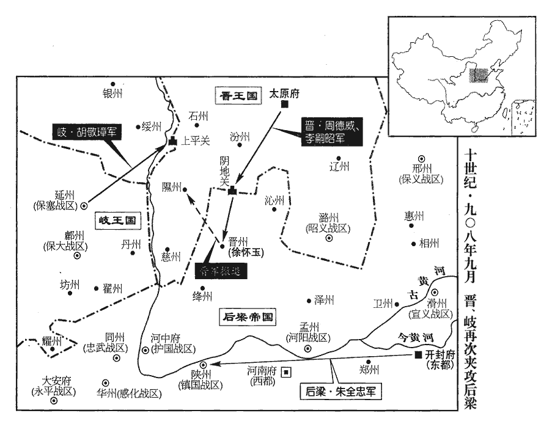
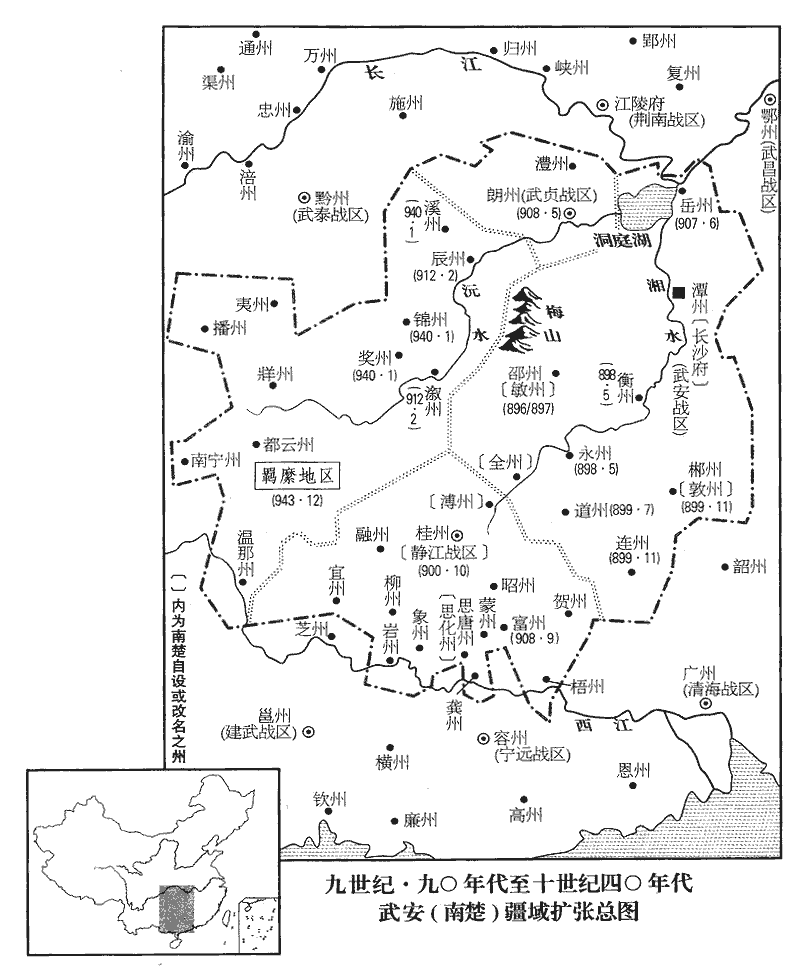
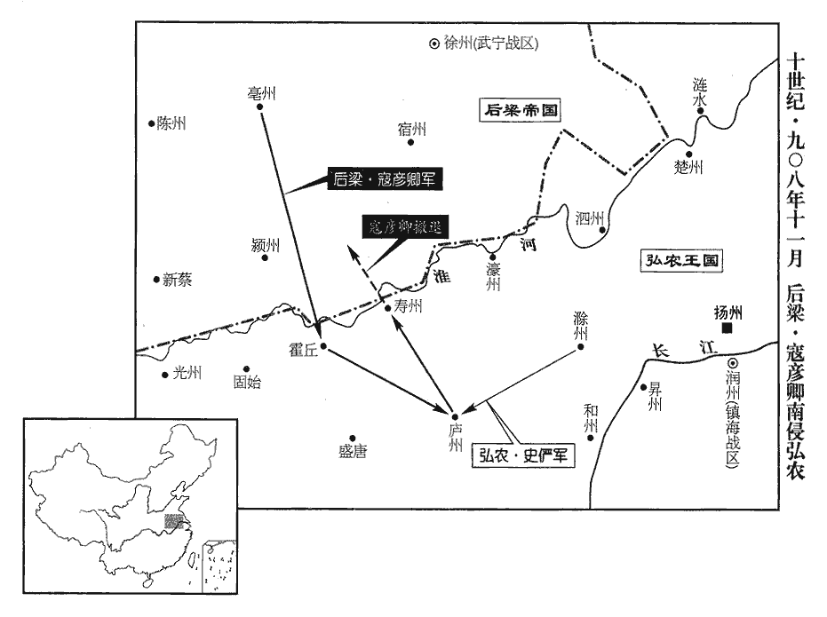
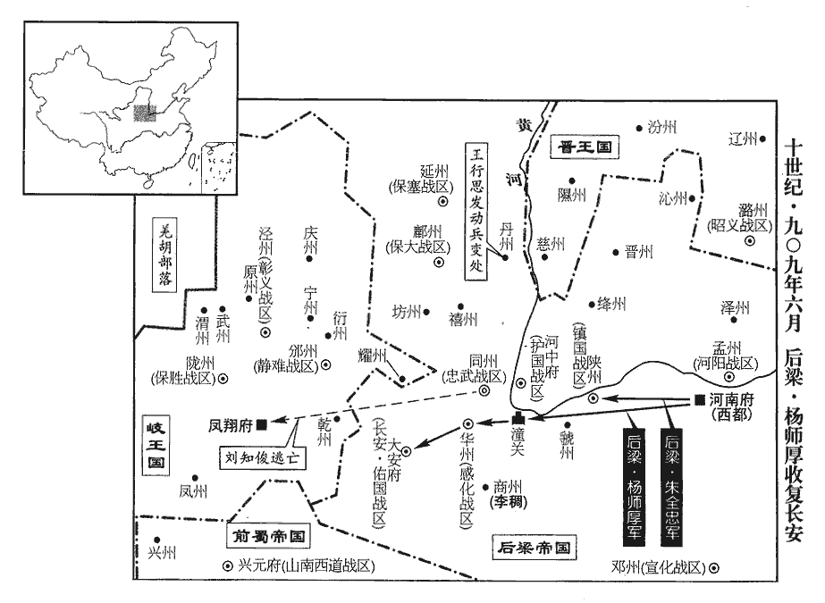
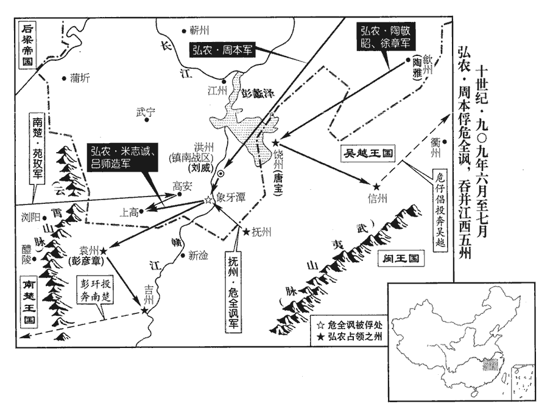
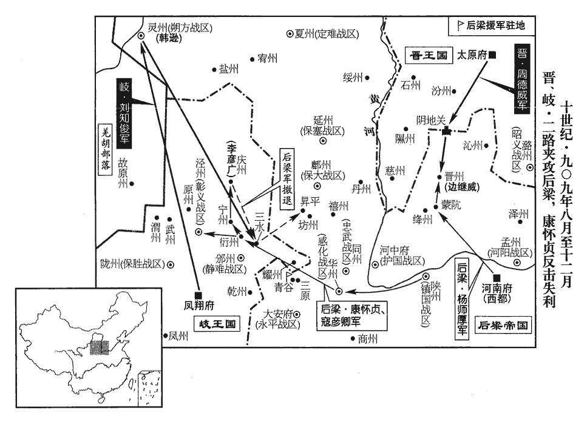
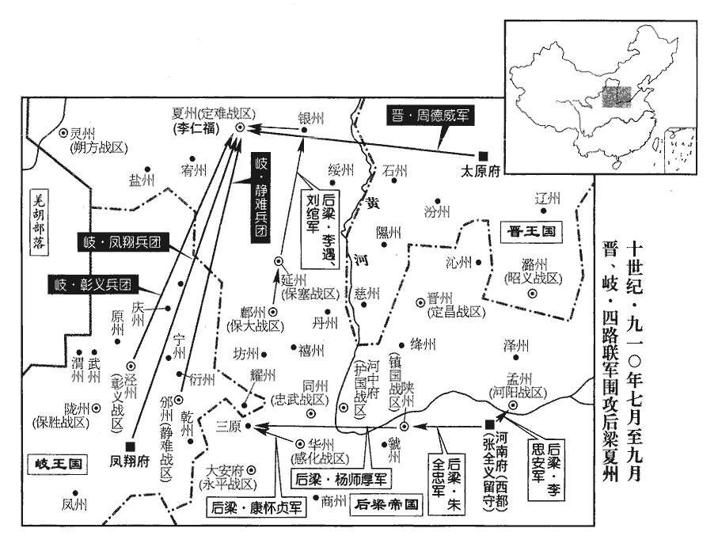
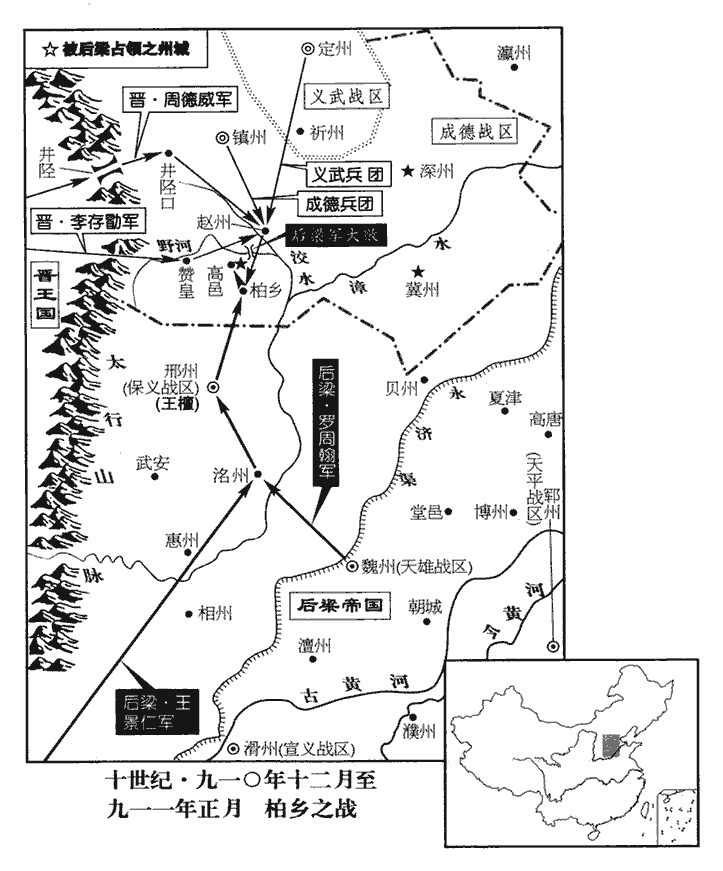
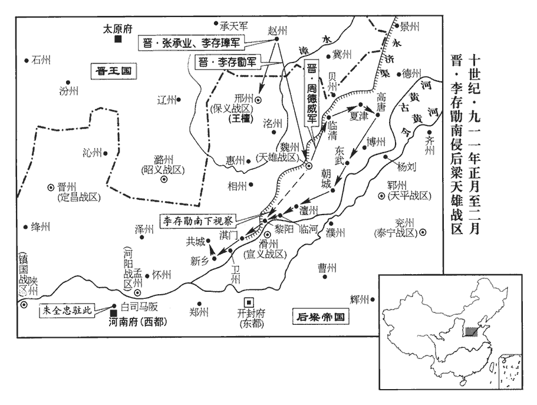

 後梁紀二起著雍執徐（戊辰）八月，盡重光協洽（辛未）二月，凡二年有奇。

# 太祖神武元聖孝皇帝中

## 開平二年（戊辰、九零八）

1八月，吳越王鏐遣寧國‹总部设宣州安徽省宣州市›節度使王景仁奉表詣大梁，王茂章奔兩浙，見二百六十五卷唐昭宣帝天祐三年。陳取淮南之策。景仁即茂章也，避梁諱改焉。帝曾祖諱茂琳。按薛史梁紀，元年六月，司天監上言，請改月辰內「戊」字為「武」，避諱也。

〖译文〗 [1]八月，吴越王钱派遣宁国节度使王景仁带着奏表前往大梁，陈述攻取淮南的计策。王景仁，即王茂章，因避后梁太祖曾祖朱茂琳名讳而改。

淮南遣步軍都指揮使周本、南面統軍使呂師造擊吳越‹首都杭州›。九月，圍蘇州‹江苏省苏州市›。吳越將張仁保攻常州‹江苏省常州市›之東洲‹江苏省常州市东南›，拔之。宋白曰：通州海門縣東南，隔水二百餘里，本東洲鎮。淮南兵死者萬餘人。淮南以池州‹安徽省贵池市›團練使陳璋為水陸行營都招討使，帥柴再用等諸將救東洲，帥，讀曰率。大破仁保於魚蕩‹太湖湖畔›，復取東洲。復，扶又翻。柴再用方戰，舟壞，長矟浮之，僅而得濟。矟shuò，所角翻。家人為之飯僧千人，再用悉取其食以犒部兵，為，于偽翻。飯，扶晚翻。犒，苦到翻。曰：「士卒濟我，僧何力焉！」史言柴再用善養士卒而不惑於異端。

〖译文〗 淮南派遣步军都指挥使周本、南面统军使吕师造进攻吴越，九月，包围苏州。吴越将领张仁保攻打常州的东洲，并把东洲夺取。淮南兵死了一万余人。淮南委任池州团练使陈璋为水陆行营都招讨使，统率柴再用等将领救援东洲，在鱼荡把张仁保打得大败，又夺回了东洲镇。柴再用正在战斗，船坏了，靠长矛浮托，才得渡过。家人为他施饭给一千名僧人，柴再用全部拿了这些饭食犒劳部兵，说：“士卒渡我上岸，僧人出了什么力呢！”

2丙子‹八›，蜀立皇后周氏。后，許州‹河南省许昌市›人也。周氏蓋蜀主建糟糠之妻也。

〖译文〗 [2]丙子（初八），蜀册立皇后周氏。周皇后是许州人。

3晉周德威、李嗣昭將兵三萬出陰地關‹山西省灵石县西南南关镇›，攻晉州，刺史徐懷玉拒守；帝自將救之，丁丑‹九›，發大梁，乙酉‹十七›，至陝州‹河南省三门峡市›。將，即亮翻。陝，式冉翻。戊子‹二十›，岐王所署延州‹陕西省延安市›節度使胡敬璋寇上平關‹山西省石楼县西北四十五千米黄河东岸›，金人疆域圖：隰州石樓縣有上平關。按延州東至隰州百三十里耳，胡敬璋蓋渡河來寇也。劉知俊擊破之。周德威等聞帝將至，乙未‹二十七›，退保隰州‹山西省隰县›。九域志，晉州西北至隰州二百五十五里。

〖译文〗 [3]晋周德威、李嗣昭率兵三万出阴地关，进攻晋州，晋州刺史除怀玉抵御防守；后梁太祖亲自统率军队前去救援，丁丑（初九）从大梁出发，乙酉（十七日）到达陕州。戊子（二十日），岐王李茂贞所任命的延州节度使胡敬璋侵犯上平关，刘知俊把岐军打败。周德威等听说后梁太祖将要到达，乙未（二十七日）退兵保卫隰州。

 

4荊南‹总部设江陵府湖北省江陵县›節度使高季昌遣兵屯漢口‹汉水注入长江处·湖北省武汉市汉水北岸›，漢口，漢水入江之口，其地在鄂州漢陽縣東大別山下。絕楚朝貢之路；楚王殷遣其將許德勳將水軍擊之，至沙頭‹湖北省荆州市›，沙頭即今江陵城南沙頭市。季昌懼而請和。殷又遣步軍都指揮使呂師周將兵擊嶺南‹南岭以南›，呂師周降馬殷，見上卷元年。與清海‹总部设广州广东省广州市›節度使劉隱十餘戰，取昭‹广西平乐县›、賀‹广西贺州市›、梧‹广西梧州市›、蒙‹广西蒙山县›、龔‹广西平南县›、富‹广西昭平县›六州。蒙州，隋始安郡之隋化縣，唐武德四年置南恭州，貞觀二年更名蒙州。龔州，本漢猛陵縣地，隋為永平郡武林縣，唐貞觀三年置鷰州，七年移鷰州於今州東，仍於鷰州舊所置龔州。又武德四年以始安郡之龍平、豪靜及蒼梧郡之蒼梧置富州。九域志，昭州東至賀州三百二十五里，南至梧州四百九十里，南稍斜至龔州五百五十里。宋開寶廢富州，以龍平縣隸昭州，在州東南百六十二里。熙寧五年廢蒙州，以立山縣隸昭州，在州南二百十二里。殷土宇既廣，乃養士息民，湖南遂安。

〖译文〗 [4]荆南节度使高季昌派遣军队在汉口驻扎，断绝楚朝见进贡的道路；楚王马殷派遣他的部将许德勋率领水军前去攻打，到达沙头，高季昌畏惧，请求和解。马殷又派遣步军都指挥使吕师周率兵进攻岭南，与清海节度使刘隐打仗十余次，夺取昭、贺、梧、蒙、龚、富六州。马殷的疆域已经广阔，就使兵民得到休养生息，湖南于是安居乐业。

5冬，十月，蜀主立後宮張氏為貴妃，徐氏為賢妃，其妹為德妃。張氏，郪‹梓州州政府所在县·四川省三台县›人，宗懿之母也。郪，漢縣，唐帶梓州。二徐，耕之女也。徐耕見二百五十八卷唐昭宗大順二年。為徐妃亡蜀張本。

〖译文〗 [5]冬季，十月，前蜀主王建册立后宫张氏为贵妃，徐氏为贤妃，徐氏的妹妹为德妃。张氏是县人，是太子王宗懿的母亲；二徐是徐耕的女儿。

6華原‹陕西省耀县›賊帥溫韜聚眾嵯峨山‹位于陕西省泾阳、淳化、三原三县交界处›，帥，所類翻。嵯，才何翻。峨，音俄。暴掠雍州諸縣，唐帝諸陵發之殆徧。溫韜傳：韜在華原七年，唐諸陵在其境內者悉發掘之，取其所藏金寶。而昭陵最固，韜從埏yán道下，見宮室制度閎麗，不異人間。中為正寢，東西廂列石牀，牀上石函中為鐵匣，悉藏前代圖書，鍾、王筆迹，紙墨如新，韜悉取之，遂傳人間。惟乾陵，風雨不可發。雍，於用翻。

〖译文〗 [6]华原贼帅温韬聚从嵯峨山，肆意抢劫雍州各县，唐帝的陵墓几乎全被发掘。

7庚戌‹十二›，蜀主講武於星宿山‹成都市北十千米›，步騎三十萬。宿，音秀。

〖译文〗 [7]庚戌（十二日），前蜀主王建在星宿山讲习武事，参加的步兵、骑兵有三十万人。

 

8丁巳‹十九›，帝還大梁。考異曰：編遺錄在乙卯。今從實錄、薛史。

〖译文〗 [8]丁巳（十九日），后梁太祖回大梁。

9辛酉‹二十三›，以劉隱為清海、靜海‹总部设安南府越南河内市›節度使，兼交、廣二鎮也。然劉氏終不能有安南。以膳部郎中趙光裔、右補闕李殷衡充官告使，隱皆留之。史言群雄割據，各收拾衣冠之冑以為用。光裔，光逢之弟；殷衡，德裕之孫也。

〖译文〗 [9]辛酉（二十三日），梁任命刘隐为清海、静海节度使，任命膳部郎中赵光裔、右补阙李殷衡充任官告使，刘隐把他们都留下了。赵光裔是赵光逢的弟弟；李殷衡是李德裕的孙子。

10依政‹四川省邛崃市东南二十五千米依政镇›進士梁震，依政，秦蒲陽縣，漢臨邛縣，後魏置蒲陽郡及依政縣，唐屬邛州。九域志，在州東南五十里。唐末登第，至是歸蜀；過江陵，高季昌愛其才識，留之，欲奏為判官。震恥之，高季昌出於奴僕，故梁震恥為之僚屬。欲去，恐及禍，乃曰：「震素不慕榮宦，明公不以震為愚，必欲使之參謀議，但以白衣侍樽俎可也，何必在幕府！」季昌許之。震終身止稱前進士，不受高氏辟署。季昌甚重之，以為謀主，呼曰先輩。唐人呼進士為先輩，至今猶然。

〖译文〗 [10]邛州依政进士梁震，唐末考中进士，到这时候归蜀。路过江陵，高季昌喜爱他的才能见识，把他留下来，想要留下来，想要奏举他为判官。梁震以为耻辱，想要离开，又恐怕遭祸，于是说：“我向来不羡慕荣华官宦，您不认为我愚昧无知，一定要让我参与谋划计议，只以没有官职的平民侍奉宴席就是了，何必在幕府任职呢！”高季昌应允了他。梁震终身只称前进士，不接受高季昌的征召任命。高季昌很器重他，用他作谋主，呼为“先辈”。

11帝從吳越王鏐之請，以亳州‹安徽省亳州市›團練使寇彥卿為東南面行營都指揮使，擊淮南。十一月，彥卿帥眾二千襲霍丘‹安徽省霍邱县›，帥，讀曰率。為土豪朱景所敗；敗，補邁翻；下同。又攻廬‹安徽省合肥市›、壽‹安徽省寿县›二州，皆不勝。淮南遣滁州‹安徽省滁州市›刺史史儼拒之，彥卿引歸。寇彥卿兵勢已挫，而史儼河東健將，汴兵所畏也，故聞其至而退。

〖译文〗 [11]后梁太祖依从吴越王钱的请求，任命亳州团练使寇彦卿为东南面行营都指挥使，攻打淮南。十一月，寇彦卿率从二千人袭击霍丘，被地方豪强朱景打败；又攻打庐、寿二州，都没有取胜。淮南派遣滁州史史俨抵御寇彦卿，寇彦卿带兵退回。

 

12定難‹总部设夏州陕西省靖边县北白城子›節度使李思諫‹拓跋思谏›卒；難，乃旦翻。甲戌‹六›，其子彝昌自為留後。

〖译文〗 [12]定难节度使李思谏去世，甲戌（初六），他的儿子李彝昌自任留后。

13劉守文‹义昌总部沧州›舉滄‹河北省沧州市东南›德‹山东省陵县›兵攻幽州‹北京市›，劉守光‹卢龙总部幽州›求救於晉，晉王遣兵五千助之。丁亥‹十九›，守文兵至盧蘆臺軍‹天津市宁河县›，盧蘆臺軍，宋為乾寧軍地。九域志：乾寧軍在滄州西北九十里。為守光所敗；又戰玉田‹河北省玉田县›，亦敗。玉田，漢無終縣，唐萬歲通天元年更名玉田，屬薊州，在薊州東南八十里，又東北至平州二百里，西至幽州三百里。亦敗，讀如字。守文乃還。還，從宣翻，又如字。

〖译文〗 [13]刘守文发沧德军队进攻幽州，刘守光向晋王请求救援，晋王李存勖派遣五千军队援助刘守光。丁亥（十九日）刘守文兵到达芦台军，被刘守光打败；又攻打玉田，也失败了。刘守文这才退回。

14癸巳‹二十五›，中書侍郎、同平章事張策以刑部尚書致仕；以左僕射楊涉同平章事。

〖译文〗 [14]癸巳（二十五日），后梁中书侍郎、同平章事张策以刑部尚书退休，任命左仆射杨涉为同平章事。

15保塞‹总部设延州陕西省延安市›節度使胡敬璋卒，靜難‹总部设邠州陕西省彬县›節度使李繼徽‹杨崇本›以其將劉萬子代鎮延州。保塞、靜難二鎮時皆屬岐。

〖译文〗 [15]保塞节度使胡敬璋去世，静难节度使李继徽委任他的部将刘万子代镇延州。

16是歲，弘農王遣軍將萬全感齎書間道詣晉及岐，告以嗣位。間，古莧翻。岐、晉，淮南之與國。

〖译文〗 [16]这一年，弘农王杨隆演派遣军将万全感带着书信由偏僻小路前往晋阳及岐州，把自己继承王位的事告诉晋王及岐王。

17帝將遷都洛陽。

〖译文〗 [17]后梁太祖准备迁都洛阳。

## 三年（己巳、九零九）

1春，正月，己巳‹二›，遷太廟神主於洛陽。甲戌‹七›，帝‹朱全忠（朱温）本年五十八岁›發大梁‹开封府所在城·河南省开封市›。壬申‹五›，以博王友文為東都留守。梁以大梁為東都。己卯‹十二›，帝至洛陽；庚寅‹二十三›，饗太廟；辛巳‹二十四›，祀圜丘，大赦。

〖译文〗 [1]春季，正月已巳（初三），后梁太祖把太庙的祖宗牌的位迁到洛阳。甲戌（疑误），太祖自大梁出发。壬申（初五），任命博王朱友文为东都留守。乙卯（十二日），太祖到达洛阳；庚寅（疑误），祭祀太庙；辛巳（疑误），祭祀上天，大赦天下。

2丙申‹二十九›，以用度稍充，初給百官全俸。唐自廣明喪亂以來，百官俸料額存而已，至是復全給。

〖译文〗 [2]丙申（二十九日），后梁由于费用开支逐渐充裕，开始发给文武百官全俸。

3二月，丁酉朔‹一›，日有食之。

〖译文〗 [3]二月，丁酉朔（初一），发生日食。

4保塞‹总部设延州陕西省延安市›節度使劉萬子暴虐，失眾心，且謀貳於梁，李繼徽‹杨崇本·静难总部邠州›使延州牙將李延實圖之。延實因萬子葬胡敬璋，攻而殺之，遂據延州。馬軍都指揮使河西高萬興與其弟萬金聞變，以其眾數千人詣劉知俊降。為高萬興兄弟取鄜、延張本。岐王‹李茂贞（宋文通）本年五十四岁›置翟州於鄜城‹陕西省洛川县东南二十五千米›，後魏置敷城郡及敷城縣，隋改曰鄜城，唐屬坊州。九域志，縣在鄜州東一百二十里。翟，徒歷翻。其守將亦降。

〖译文〗 [4]保塞节度使刘万子凶恶残酷，失去众心，并且图谋背叛投降大梁，静难节度使李继徽派遣延州牙将李延实设法除掉他。李延实趁着刘万子埋葬胡敬璋，发动攻击并把他杀死，于是占据了延州。马军都指挥使河西高万兴与他的弟弟高万金听到这个变故，率领他的部众数千人到刘知俊的军营投降。岐王李茂贞在城设置翟州，守城的将领也投降了刘知俊。

5三月，甲戌‹九›，帝發洛陽。以山南東道‹总部设襄州湖北省襄樊市›節度使楊師厚兼潞州‹山西省长治市›四面行營招討使。

〖译文〗 [5]三月，甲戌（初九），后梁太祖自洛阳出发。任命山南东道节度使杨师厚兼潞州四面行营招讨使。

6庚辰‹十五›，帝至河中‹山西省永济市›，發步騎會高萬興兵取丹‹陕西省宜川县›、延‹陕西省延安市›。宋白曰：丹州，秦上郡地，苻、姚時為三堡鎮，後魏大統三年割鄜、延二州地置汾州，理三堡鎮；廢帝以河東汾州同名，改為丹州，因丹楊川以為名。延州，項羽以董翳為翟王，都高奴，即其地。魏滅赫連，以為統萬鎮，後為東夏州，後改延州。

〖译文〗 [6]庚辰（十五日），后梁太祖到达河中，征发步兵、骑兵会同高万兴的军队攻取丹州、延州。

7丙戌‹二十一›，以朔方‹总部设灵州宁夏灵武市›節度使兼中書令韓遜為潁川王。遜本靈州牙校，校，戶教翻。唐末據本鎮，朝廷因而授以節鉞。

〖译文〗 [7]丙戌（二十一日），后梁太祖封朔方节度使兼中书令韩逊为颍川王。韩逊本是灵州牙校，唐末占据本镇，后梁因而授予旌节仪仗。

8辛卯‹二十六›，丹州‹陕西省宜川县›刺史崔公實請降。丹州，保塞軍巡屬。

〖译文〗 [8]辛卯（二十六日），丹州刺史崔公实请求投降。

9徐溫以金陵‹昇州州政府所在城·江苏省南京市›形勝，戰艦所聚，艦，戶黯翻。乃自以淮南‹总部设扬州›行軍副使領昇州刺史，留廣陵‹弘农首都·江苏省扬州市›，以其假子元從指揮使知誥為昇州‹江苏省南京市›防遏兼樓船副使，往治之。從，才用翻。治，直之翻。為徐知誥完理昇州、徐溫遂居之張本。

〖译文〗 [9]徐温认为金陵地势优越，战船聚集，于是自己以淮南行军副使兼领升州刺史，留驻广陵，任命他的养子元从指挥使徐知诰为州防遏兼楼船副使，前去治理州。

10夏，四月，丙申朔‹一›，劉知俊移軍攻延州，李延實嬰城自守；知俊遣白水‹陕西省旬邑县›鎮使劉儒分兵圍坊州‹陕西省黄陵县›。後魏太和二年，分澄城置白水郡及縣，隋廢郡，以縣屬馮翊，唐屬同州。九域志：在州西北一百二十里。

〖译文〗 [10]夏季，四月，丙申朔（初一），刘知俊转移军队攻打延州，李延实环城守御；刘知俊派遣白水镇使刘儒分兵包围坊州。

11庚子‹五›，以王審知‹威武总部福州›為閩王，劉隱‹清海总部广州›為南平王。

〖译文〗 [11]庚子（初四），后梁太祖封彰武节度使王审知为闽王，清海、静海节度使刘隐为南平主。

12劉知俊克延州，李延實降。降，戶江翻。

〖译文〗 [12]刘知俊攻克延州，李延实投降。

13淮南兵圍蘇州‹江苏省苏州市›，推洞屋攻城，推，吐雷翻。洞屋，以木撐拄為之，冒以牛皮，其狀如洞。吳越將臨海‹浙江省临海市›孫琰置輪於竿首，垂絙投錐以揭之，攻者盡露，礮至則張網以拒之，絙，居登翻。揭，丘傑翻。礮，與砲同；匹貌翻。淮南人不能克。吳越王鏐‹钱镠，本年五十八岁›遣牙內指揮使錢鏢、鏢，甫招翻。行軍副使杜建徽等將兵救之。

〖译文〗 [13]淮南军队包围苏州，推着用木架支撑、覆罩牛皮、形状如洞的洞屋攻城，吴越将领临海人孙琰在竹竿顶端安置滑轮，垂长索投锥把洞屋戳穿掀开，攻城的淮南军队便完全暴露了，炮石打来就张网拦阻，淮南军队不能攻克。吴越王钱派遣牙内指挥使钱镖、行军副使杜建徽等率兵救援苏州。

蘇州有水通城中，淮南張網綴鈴懸水中，魚鼈過皆知之。吳越遊弈都虞候司馬福欲潛行入城，故以竿觸網；敵聞鈴聲舉網，福因得過，凡居水中三日，乃得入城。由是城中號令與援兵相應，敵以為神。

〖译文〗 苏州有水通城中，淮南军队张网挂铃悬在水中，鱼鳖通过都能知道。吴越游弈都虞候司马福欲潜水前行入城，故意用竿触网；淮南兵听到铃声举起网来，司马福因此能够通过，一共在水中待了三天，才得进入城里。从此，城中号令与援兵相应，淮南军队以为神奇莫测。

吳越王鏐嘗遊府園，見園卒陸仁章樹藝有智而志之；志者，記之於心。及蘇州被圍，被，皮義翻。使仁章通信入城，果得報而返。鏐以諸孫畜之，畜，吁玉翻，養也。累遷兩府軍糧都監使，兩府，鎮海‹总部杭州›，鎮東‹总部越州›兩節度府。卒獲其用。卒，子恤翻。仁章，睦州‹浙江省建德市›人也。

〖译文〗 吴越王钱曾经到府园游玩，看见园丁陆仁章种植花草树木有智谋，就记住了他；等到苏州被围，让陆仁章送信到城里，果然得到答复就回来了。钱把陆仁章收作孙子教养，屡次升到两府军粮都监使，终于派上用场。陆仁章是睦州人。

辛亥‹十六›，吳越兵內外合擊淮南兵，大破之，擒其將何朗等三十餘人，奪戰艦二百艘。艘，蘇遭翻。周本夜遁，又追敗之於皇天蕩‹苏州市西›。此皇天蕩非真州大江中之皇天蕩。按宋熙寧三年平江府崑山縣人郟亶dǎn上奏言水利，長洲縣界有長蕩、皇天蕩，此則是也。敗，補邁翻。鍾泰章將精兵二百為殿，殿，丁練翻。多樹旗幟於菰蔣中，菰，即蔣也。幟，昌志翻。追兵不敢進而還。還，從宣翻，又如字。

〖译文〗 辛亥（十六日），吴越军队内外合击淮南军队，把他们打得大败，生擒淮南将领何朗等三十余人，夺取战般二百艘。周本乘夜逃走，吴越军队追到皇天荡又把周本打败。淮南钟泰章率领二百精兵走在队伍的最后，在菰草中竖立很多旗帜，吴越的追兵不敢前进而返回。

14岐王所署保大‹总部设鄜州陕西省富县›節度使李彥博、考異曰：編遺錄、五代史作「彥容」。今從劉恕廣本。坊州刺史李彥昱皆棄城奔鳳翔，鄜州都將嚴弘倚舉城降。鄜，音夫。己未‹二十四›，以高萬興為保塞節度使，以絳州‹山西省新绛县›刺史牛存節為保大節度使。梁遂取鄜坊、丹延兩鎮。

〖译文〗 [14]岐王节茂贞任命的保大节度使李彦博、坊州刺史李彦昱都弃城逃往风翔，州都将严弘倚率城投降。已未（二十四日），后梁任命高万兴为保塞节度使，任命绛州刺史牛存节为保大节度使。

15淮南初置選舉，以駱知祥掌之。喪亂以來，選舉之法廢，楊氏能復置之，故書。

〖译文〗 [15]淮南开始建立选拔官吏的制度，任命骆知祥掌管。

16五月，丁卯‹三›，帝命劉知俊‹忠武总部同州›乘勝取邠州‹陕西省彬县›；知俊難之，李繼徽據邠州，有鳳翔之援，故劉知俊以取之為難。辭以闕食，乃召還。

〖译文〗 [16]五月丁卯（初三），后梁太祖命令刘知俊乘胜攻取州。刘知俊认为难以攻取，以缺少军粮为借口推辞，于是将他召回。

17佑國‹总部设大安府陕西省西安市›節度使王重師鎮長安數年，帝在河中，怒其貢奉不時；己巳‹五›，召重師入朝，以左龍虎統軍劉捍為佑國留後。

〖译文〗 [17]佑国节度使王重师镇守长安数年，后梁太祖在河中，对他不按时进贡感到恼怒。已巳（初五），召王重师到朝廷来，委任左龙虎统军刘捍为佑国留后。

18癸酉‹九›，帝發河中；己卯‹十五›，至洛陽。

〖译文〗 [18]癸酉（初九），后梁太祖自河中出发；已卯（十五日），回到洛阳。

劉捍至長安，王重師不為禮，捍譖之於帝，云重師潛與邠、岐通。甲申‹二十›，貶重師溪州‹湖南省永顺县›刺史，尋賜自盡，夷其族。為劉知俊殺劉捍以叛張本。

〖译文〗 刘捍到长安，王重师不以礼相待，刘捍向后梁太祖中伤他，说王重师暗中与州、岐州互相往来。甲申（二十日），贬王重师为溪州刺史，不久赐令自尽，诛杀他的全族。

19劉守文‹义昌总部沧州›頻年攻劉守光‹卢龙总部幽州›不克，劉守文自元年攻守光，事始見上卷。乃大發兵，以重賂招契丹‹王庭西楼城内蒙古巴林左旗›、吐谷渾‹山西省东北部›之眾，合四萬屯薊州‹天津市蓟县›。守光逆戰於雞蘇‹蓟县西›，按薛史梁紀，是年劉守光上言，於薊州西與兄守文戰，生禽守文。蓋即雞蘇也。為守文所敗。敗，補邁翻。守文單馬立於陳前，陳，讀曰陣。泣謂其眾曰：「勿殺吾弟。」守光將元行欽識之，直前擒之，劉守光以子囚父，天下之賊也。劉守文既聲其罪而討之，有誅無赦。小不忍以敗大事，身為俘囚，自取之也。滄德兵皆潰。守光囚之別室，栫以藂棘，栫jiàn，才甸翻。藂cóng，與叢同。乘勝進攻滄州‹河北省沧州市东南›。滄州節度判官呂兗、孫鶴推守文子延祚為帥，乘城拒守。兗，安次‹河北省廊坊市›人也。安次，漢縣，唐屬幽州，在州東南一百三十里。帥，所類翻。

〖译文〗 [19]刘守文连年攻打刘守光不能攻下，于是大发兵，用重贿招致契丹、吐谷浑的兵众，合计四万人马驻扎蓟州。刘守光在鸡苏迎战，被刘守文打败。刘守文单马立在阵前，器着对他的部众说：“不要杀死我的弟弟。”刘守光的部将元行钦认淮刘守文，直冲向前反他擒住，沧德军队全部溃散。刘守光把刘守文囚禁别室，用丛棘堵塞，乘胜进攻沧州。沧州节度判官吕兖、孙鹤推举刘守文的儿子的刘延祚为帅，登城抗御防守。吕兖是安次人。

20忠武‹总部设同州陕西省大荔县›節度使兼侍中劉知俊，去年更同州匡國軍為忠武軍，事見上卷。功名浸盛，以帝猜忍日甚，內不自安；及王重師誅，知俊益懼。帝將伐河東‹首都太原府›，河東，謂晉。急徵知俊入朝，欲以為河東西面行營都統；且以知俊有丹、延之功，厚賜之。知俊弟右保勝指揮使知浣從帝在洛陽，密使人語知俊云：語，牛倨翻。「入必死。」又白帝，請帥弟姪往迎知俊，帥，讀曰率。帝許之。六月，乙未朔‹一›，知俊奏「為軍民所留」，遂以同州附於岐。考異曰：實錄：「六月庚戌，知俊據本郡反，削奪官爵，興師討伐。」編遺錄：「六月，乙未，初奏本道軍民遮留，尋聞擒使臣及將送鳳翔。」蓋編遺據奏到之日，實錄據削奪之日也。執監軍及將佐之不從者，皆械送於岐。遣兵襲華州‹陕西省华县›，逐刺史蔡敬思，九域志：同州南至華州七十里。華，戶化翻。以兵守潼關‹陕西省潼关县›。潛遣人以重利啗長安諸將，啗，徒濫翻。執劉捍，送於岐，殺之。知俊遣使請兵於岐，亦遣使請晉人出兵攻晉‹山西省临汾市›、絳，遺晉王‹李存勖，本年二十五岁›書曰：「不過旬日，可取兩京，復唐社稷。」遺，唯季翻。長安可以言取；梁都洛陽未易取也。

〖译文〗 [20]忠武节度使兼侍中刘知俊，功绩名声逐渐盛大，由于后梁太祖猜疑残忍日益厉害，内心里感到自己不安全；等到王重师被杀，刘知俊更加恐惧。太祖将要讨伐河东，紧急征召刘知俊到朝廷来，想要任命他担任河东西面行营都统。并且因为刘知俊有攻取丹州、延州的功劳，要重赏他。刘知俊的弟弟右保胜指挥使刘知浣跟随太祖在洛阳，秘密派人告诉刘知俊说：“到朝廷来一定死。”又禀告太祖，请求率领弟侄前去迎接刘知俊，太祖允许了他。六月，乙未朔（初一），刘知俊奏称“为军民所留”，于是带领同州军民归附岐王李茂贞。拘捕监军及不听从的将佐，全都戴上刑具押送凤翔。刘知俊派兵袭击华州，驱逐刺史蔡敬思，守卫潼关。暗中派人用重利引诱长安诸将，逮捕刘捍，送往凤翔，把他杀了。刘知俊派遣使者向岐王李茂贞请兵，也派使者前往晋阳请求出兵攻打晋州、绛州，送给晋王李存勖的信中说：“不过十天，可以攻取两京，恢复唐室社稷。”

21丁未‹十三›，朔方節度使韓遜奏克鹽州‹陕西省定边县›，斬岐所署刺史李繼直。唐末，鹽州奏事專達朝廷，不隸靈夏。至是靈、鹽遂復合為一鎮。

〖译文〗 [21]丁未（十三日），朔方节度使韩逊奏报攻克盐州，斩岐王李茂贞任命的盐州刺史李继直。

22帝遣近臣諭劉知俊曰：「朕待卿甚厚，何忽相負？」對曰：「臣不背德，背，蒲妹翻。但畏族滅如王重師耳。」帝復使謂之曰：復，扶又翻。「劉捍言重師陰結邠、岐，朕今悔之無及，捍死不足塞責。」塞，悉則翻。知俊不報。庚戌‹十六›，詔削知俊官爵，以山南東道節度使楊師厚為西路行營招討使，帥侍衛馬步軍都指揮使劉鄩等討之。帥，讀曰率。

〖译文〗 [22]后梁太祖派遣新近官员告谕刘知俊说：“朕待你甚厚，为什么忽然背弃？”刘知俊回答说：“我不会忘记恩德，只是畏惧像王重师那样被诛灭全族罢了。”太祖又派使者对他说：“刘捍说王重师暗中交结州、岐州，朕现在后悔不及，刘捍死了不足偿还罪责。”刘知俊没有答复。庚戌（十六日），太祖降诏革除刘知俊官职爵位，任命山南东道节度使杨师厚为西路行营招讨使，率领侍卫马步军都指挥使刘等讨伐刘知俊。

辛亥‹十七›，帝發洛陽。

〖译文〗 辛亥（十七日），后梁太祖自洛阳出发。

劉鄩至潼關東，獲劉知俊伏路兵藺如海等三十人，釋之使為前導。劉知俊既得潼關，於關外沿路伏兵以候望，劉鄩反得而用之以為鄉導。史炤曰：藺，姓也，其先韓獻子玄孫曰康，食采於藺，因氏焉。劉知浣迷失道，盤桓數日，乃至關下，關吏納之。如海等繼至，關吏不知其已被擒，亦納之。被，皮義翻。鄩兵乘門開直進，遂克潼關，追及知浣，擒之。癸丑‹十九›，帝至陝‹河南省三门峡市›。陝，式冉翻。

〖译文〗 刘到达潼关东，俘获刘知俊埋伏在路上侦察敌人的兵士蔺如海等三十人，把他们释放，让他们在前面当向导。刘知俊的弟弟刘知浣途中迷了路，徘徊数日，才到潼关下，关吏把他们放进关去。蔺如海等接着到了，关吏不知道他们已经被擒，也把他们放进关去。刘的军队趁着关门打开，径直前进，于是夺取了潼关，追上刘知浣，把他擒住。癸丑（十九日），后梁太祖到达陕州。

23丹州馬軍都頭王行思等作亂，刺史宋知誨逃歸。

〖译文〗 [23]丹州马军都头王行思等发动叛乱，丹州刺史宋知诲逃回。

 

24帝遣劉知俊姪嗣業持詔詣同州招諭知俊；知俊欲輕騎詣行在謝罪，弟知偃止之。楊師厚等至華州‹陕西省华县›，知俊將聶賞開門降。聶，尼輒翻，姓也。史炤曰：楚大夫食采於聶，因以為氏。知俊聞潼關不守，官軍繼至，蒼黃失圖，乙卯‹二十一›，【章：十二行本「卯」下有「夜」字；乙十一行本同；孔本同；張校同。】舉族奔岐。楊師厚至長安，岐兵已據城，師厚以奇兵並南山‹秦岭›急趨，自西門入，遂克之。並，步浪翻。按唐長安城十門，西南三門惟延平門近南山耳。長安既丘墟之餘，且城大難守，使楊師厚不以奇兵入西門，岐兵亦不能久也。庚申‹二十六›，以劉鄩權佑國留後。岐王厚禮劉知俊，以為中書令。地狹，無藩鎮處之，處，昌呂翻。但厚給俸祿而已。蹄涔不容尺鯉。為劉知俊奔蜀張本。

〖译文〗 [24]后梁太祖派遣刘知俊的侄子刘嗣业持诏前往同州招抚谕示刘知俊；刘知俊想要轻骑前往太祖的住地自认罪过，他的弟弟刘知偃阻止他。杨师厚等到达华州，刘知俊的部将聂赏打开城门投降。刘知俊听说潼关没有守住，官兵接连到来，匆忙慌张失去了主意，乙卯（二十一日）夜里，带领全族投奔岐州。杨师厚到长安，岐兵已经占据长安城，机师厚率奇兵沿南山急趋直下，自西门入城，于是攻占了长安。庚申（二十六日），委任刘代理佑国留后。岐王李茂贞对刘知俊厚礼相待，任命他为中书令。岐州地域狭窄，没有藩镇安置他，只是厚给俸禄罢了。

25劉守光遣使上表告捷，且言「俟滄、德‹山东省陵县›事畢，為陛下掃平并寇。」為，于偽翻。河東，并州之地，時與梁為敵，故言并寇。亦致書晉王，云欲與之同破偽梁。劉守光反覆梁、晉之間，自以為得計，不知乃所以速亡也。

〖译文〗 [25]刘守光派遣使者上表报捷，并且说“等到沧德事情完了，为陛下扫平并州敌寇”。刘守光也送信给晋王李存勖，说想要与他共同消灭伪梁。

26撫州‹江西省临川市›刺史危全諷自稱鎮南‹总部设洪州江西省南昌市›節度使，帥撫‹江西省临川市›、信‹江西省上饶市›、袁‹江西省宜春市›、吉‹江西省吉安市›之兵號十萬攻洪州‹江西省南昌市›。唐置鎮南軍於洪州，撫、信、袁、吉皆巡屬也。危全諷自稱節度，舉兵以攻洪州，欲兼而有之。九域志：撫州西北至洪州二百九里。帥，讀曰率。淮南守兵纔千人，將吏皆懼，節度使劉威密遣使告急於廣陵，日召僚佐宴飲。全諷聞之，屯象牙潭‹江西省南昌市西南四十千米›，不敢進，象牙潭在撫州金溪縣東北。請兵於楚‹首都潭州湖南省长沙市›；楚王殷‹马殷，本年五十八岁›遣指揮使苑玫苑，姓也。左傳，齊有大夫苑何忌。玫，莫杯翻。會袁州刺史彭彥章圍高安‹江西省高安市›以助全諷。玫，蔡州‹河南省汝南县›人；玫，莫杯翻。彥章，玕之兄【章：十二行本「兄」下有「子」字；孔本同。】也。彭玕見二百六十有五卷唐昭宣帝天祐三年。

〖译文〗 [26]抚州刺史危全讽自称镇南节度使，率领抚、信、袁、吉四州的军队号称十万进攻洪州。淮南守兵才一千人，将吏都畏惧害怕，节度使刘威秘密派遣使者到广陵告急求援，自己每天召集属下将吏宴饮。危全讽听说这情况，驻扎在象牙潭，不敢前进，向楚请求增兵。楚王马殷派遣指挥使苑玫会同袁州刺史彭彦章包围高安来援助危全讽。苑玫是蔡州人；彭彦章是彭亲兄的儿子。

徐溫問將於嚴可求，可求薦周本。乃以本為西南面行營招討應援使，將兵七千救高安。本以前攻蘇州無功，事見上四月。稱疾不出，可求即其臥內強起之。強，其兩翻。本曰：「蘇州之役，敵不能勝我，但主將權輕耳。今必見用，願毋置副貳乃可。」可求許之。本曰：「楚人為全諷聲援耳，非欲取高安也。吾敗全諷，敗，補邁翻。援兵必還。」援兵，謂圍高安之兵。還，從宣翻。乃疾趣象牙潭。趣，七喻翻。過洪州。劉威欲犒軍，犒，苦到翻。本不肯留，或曰：「全諷兵強，君宜觀形勢然後進。」本曰：「賊眾十倍於我，我軍聞之必懼，不若乘其銳而用之。」

〖译文〗 徐温向严可求询问将领人选，严可求荐举周本。于是，任命周本为西南面行营招讨应援使，率兵七千援救高安。周本以前攻苏州没有立功，声称有病不出，严可求到他的卧室内强迫他起来。周本说：“苏州这场战役，敌人不能战胜我，只是主将权轻罢了。今天一定要用我，希望不要设置副职才可。”严可求应允了他。周本说：“楚兵为危全讽声援罢了，不是要取高安。我打败危全讽，援兵必然撤回。”于是急速奔赴象牙潭。经过洪州，刘威想要犒劳军队，周本不肯停留，有人说：“危全调兵强，您应当观察形势然后再前进。”周本说：“贼众比我多十倍，我军听说这情况一定畏惧，不如乘他们锐气旺盛使用他们。”

27秋，七月，甲子‹一›，以劉守光為燕王。

〖译文〗 [27]秋季，七月甲子（初一），后梁太祖封授刘守光为燕王。

28梁兵克丹州，擒王行思。

〖译文〗 [28]后梁兵攻下丹州，生擒王行思。

29商州‹陕西省商州市›刺史李稠驅士民西走，將奔蜀也。將吏追斬之，考異曰：薛史：「稠棄郡西奔，本州將吏以都牙校李玟權知州事。」歐陽史：「商州軍亂，逐其刺史李稠，稠奔于岐。」實錄：「丙寅，陝州奏商州刺史李稠棄郡逃山谷。」又曰：「商州將吏以稠驅虜士庶西遁，追斬無遺，暫令都押牙李玟主州事。」今從之。推都押牙李玟主州事。

〖译文〗 [29]商州刺史李稠驱赶士民向西逃跑，商州将吏追赶并把他们斩杀，推举商州都押牙李玟主持州事。

30庚午‹七›，改佑國軍曰永平。開平元年徙佑國軍於長安，今改曰永平。

〖译文〗 [30]庚午（初七），后梁太祖改佑国军为永平。

31河東兵寇晉州，抄掠至堯祠‹临汾市南五千米›而去。堯都平陽，有祠在汾城東十里東原上。平陽，唐為臨汾縣，晉州所治也。

〖译文〗 [31]河东军队进犯晋州，抄没抢掠到达尧祠而离去。

32癸酉‹十›，帝發陝州；乙亥‹十二›，至洛陽，寢疾。

〖译文〗 [32]癸酉（初十），后梁太祖自陕州出发；乙亥（十二日），回到洛阳，患病卧床。

33初，帝召山南東道節度使楊師厚，欲使督諸將攻潞州‹山西省长治市›，以前兗海‹总部设兖州山东省兖州市›留後王班為留後，鎮襄州‹湖北省襄樊市›。考異曰：薛史作「王珏jué」，今從實錄。師厚屢為班言牙兵王求等凶悍，宜備之，為，于偽翻。班自恃左右有壯士，不以為意，每眾辱之。戊寅‹十五›，讁求戍西境，是夕，作亂，殺班，推都指揮使雍丘‹河南省杞县›劉𤣱qǐ為留後；雍，於用翻。𤣱，區里翻。𤣱偽從之，明日，與指揮使王延順逃詣帝所。考異曰：姚顗yǐ明宗實錄，薛史𤣱傳皆云：「翌日受賀，衙庭享士，伏甲幕下，中筳盡斬其亂將以聞，以功為復州刺史。」按梁祖實錄：「八月丁酉賜𤣱、王延順物，以其違逆將之難來歸。」編遺錄斬李洪等敕云：「始扶劉𤣱，既奔竄以歸明。」若使𤣱翌日便斬亂將，襄州何由至九月始收復！蓋𤣱脫身歸朝，及梁亡入唐，妄云斬亂將自誇大，史官不能考察，從而書之耳。亂兵奉平淮指揮使李洪為留後，附於蜀‹首都成都府四川省成都市›。未幾，房州‹湖北省房县›刺史楊虔亦叛附于蜀。幾，居豈翻。

〖译文〗 [33]当初，后梁太祖召山南东道节度使杨师厚，想要让他督率诸将攻打潞州，委任前兖海留后王班为山南东道留后，镇守襄州。杨师厚屡次对王班说牙兵王求等凶猛强悍，应当防备他们，王班自恃左右有壮士，不以为意，往往当众侮辱他们。戊寅（十五日），把王求流放到西部边境戍守，当天晚上，王求等发动叛乱，杀王班，推举都指挥使雍丘人刘为留后；刘假装依从他们，第二天，与指挥使王延顺逃往后梁太祖那里。乱兵拥奉平淮指挥使李洪为留后，归附前蜀主王建。过了不久，房州刺史杨虔也叛梁附蜀。

 

34危全諷在象牙潭，營柵臨溪，亘數十里。亘，居鄧翻。庚辰‹十七›，周本隔溪布陳，陳，讀曰陣。先使羸兵嘗敵；羸，倫為翻。嘗，試也。全諷兵涉溪追之，本乘其半濟，縱兵擊之；全諷兵大潰，自相蹂藉，蹂，忍久翻，又如又翻。藉，慈夜翻。溺水死者甚眾，本分兵斷其歸路，斷，音短。擒全諷及將士五千人。乘勝克袁州‹江西省宜春市›，執刺史彭彥章，進攻吉州‹江西省吉安市›。九域志：袁州南至吉州三百一十五里。歙州‹安徽省歙县›刺史陶雅使其子敬昭及都指揮使徐章將兵襲饒‹江西省波阳县›、信‹江西省上饶市›，信州刺史危仔倡請降，唐僖宗中和二年，危全諷據撫州，仔倡據信州，至是皆亡。饒州刺史唐寶棄城走。行營都指揮使米志誠、都尉呂師造等敗苑玫於上高‹江西省上高县›。敗，補邁翻。吉州刺史彭玕帥眾數千人奔楚，唐昭宗天祐三年彭玕附楚。楚王殷表玕為郴州‹湖南省郴州市›刺史，郴，丑林翻。為子希範娶其女。為，于偽翻。淮南以左先鋒指揮使張景思知信州，遣行營都虞候骨言將兵五千送之。骨，姓也。唐初有骨儀。危仔倡聞兵至，奔吳越‹首都杭州›，吳越王鏐以仔倡為淮南節度副使，更其姓曰元氏。歐史十國世家曰：錢鏐惡危姓，更之曰元。更，工衡翻。危全諷至廣陵，弘農王以其嘗有德於武忠王，釋之，資給甚厚。楊行密諡武忠。時淮南諸將議曰：「昔先王攻趙鍠，全諷屢饟xiǎng給吾軍。」乃釋之。八月，虔州‹江西省赣州市›刺史盧光稠以州附于淮南。於是江西之地盡入於楊氏。光稠亦遣使附於梁。

〖译文〗 [34]危全讽在象牙潭，临溪营建栅栏，连绵数十里。庚辰（十七日），周本隔着溪水列阵，先派瘦弱兵卒挑战试敌；危全讽的军队徒步渡溪追赶，周本乘他们渡到一半，发兵攻击；危全讽的军队大败，自相践踏，溺水死的人很多，周本分兵断绝他们的归路，生擒危全讽及将士五千人。周本率兵乘胜攻克袁州，逮住袁州刺史彭彦章，进攻吉州。歙州刺史陶雅派他的儿子陶敬昭及都指挥使徐章率兵袭击饶州、信州，信州刺史危仔倡请求投降，饶州刺史唐玉弃城逃走。行营都指挥使米志诚、都尉吕师造等在上高打败苑玫。吉州刺史彭率众数千人逃奔到楚，楚王马殷上表委任彭为郴州刺史，并为自己的儿子马希范娶彭的女儿为妻。淮南委任左先锋指挥使张景思为信州刺史，派遣行营都虞候骨言率兵五千人送他赴任。危仔倡听说淮南军队到了，逃奔吴越，吴越王钱任命危仔倡为淮南节度副使，改他的姓为元氏。危全讽到广陵，弘农王杨隆演以他曾经对武忠王杨行密有恩德，把他释放，供给很丰厚。八月，虔州刺史卢光稠率州归附淮南。于是，江西之地尽为杨氏所有。卢光稠也派遣使者向后梁称臣归附。

35甲寅‹二十一›，上疾小瘳chōu，始復視朝。自七月乙亥寢疾，至是凡四十日。朝，直遙翻；下同。

〖译文〗 [35]甲寅（二十一日），后梁太祖病稍愈，开始恢复临朝听政。

36以鎮國‹总部设陕州河南省三门峡市›節度使康懷貞為西路行營副招討使。

〖译文〗 [36]后梁任命镇国节度使康怀贞为西路行营副招讨使。

37蜀‹首都成都府四川省成都市›主‹王建，本年六十三岁›命太子宗懿判六軍，開永和府，妙選朝士為僚屬。

〖译文〗 [37]前蜀主王建命太子王宗懿管领六军，设置永和府，精选朝中官吏担任属官。

38辛酉‹二十八›，均州‹湖北省丹江口市西北›刺史張敬方奏克房州‹湖北省房县›。楊虔以房州附蜀見上。九域志：均州南至房州二百一十五里。

〖译文〗 [38]辛酉（二十八日），均州刺史张敬方奏报攻克房州。

39岐王欲遣劉知俊將兵攻靈‹宁夏灵武市›、夏‹陕西省靖边县北白城子›，夏，戶雅翻。且約晉王使攻晉‹山西省临汾市›、絳‹山西省新绛县›。晉王引兵南下，先遣周德威等將兵出陰地關‹山西省灵石县西南南关镇›攻晉州，刺史邊繼威悉力固守。晉兵穿地道，陷城二十餘步，城中血戰拒之，一夕城復成。詔楊師厚‹山南东道总部襄州›將兵救晉州，周德威以騎扼蒙阬‹山西省曲沃县西北›之險，蒙阬在汾水東，東西三百餘里，蹊徑不通。師厚擊破之，進抵晉州，晉兵解圍遁去。考異曰：實錄云：「殺戮生禽賊將蕭萬通等，賊由是棄寨而遁。」莊宗實錄云：「汴軍至蒙阬，周德威逆戰，敗之，斬首二百級，師厚退絳州。是役也，小將蕭萬通戰沒，師厚進營平陽，德威收軍而退。」二軍各言勝捷，然既殺蕭萬通，師厚何肯退保絳州！既敗而退，豈得復進營平陽！德威既戰勝，安肯便收軍！蓋晉軍實敗走，莊宗實錄妄言耳。

〖译文〗 [39]岐王李茂贞想要派遣刘知俊率领军队攻灵州、夏州，并且约晋王李存勖让他进攻晋州、绛州。李存勖率兵南下，先派遣周德威等率领军队出阴地关进攻晋州，晋州刺史边继威全力固守。晋兵挖穿地道，城墙塌陷二十余步，城中军队血战抵御，一个晚上城墙又修好。后梁太祖诏令杨师厚率兵救援晋州，周德威用骑兵据守地势险要的蒙坑，杨师厚把他们打败，进抵晋州，晋兵解除包围逃走。

40李洪寇荊南‹总部设江陵府湖北省江陵县›，高季昌遣其將倪可福擊敗之。敗，補邁翻。詔馬步都指揮使陳暉將兵會荊南兵討洪。

〖译文〗 [40]山南东道留后李洪侵犯荆南，荆南节度使高季昌派遣他的部将倪可福把李洪打败。后梁太祖诏令马步都指挥使陈晖率领军队会同荆南兵讨伐李洪。

41蜀主以御史中丞王鍇為中書侍郎、同平章事。鍇，苦駭翻。

〖译文〗 [41]前蜀主王建任命御史中丞王锴为中书侍郎、同平章事。

42陳暉軍至襄州，李洪逆戰，大敗，王求死。九月，丁酉‹五›，拔其城，斬叛兵千人，執李洪、楊虔等送洛陽，斬之。

〖译文〗 [42]后梁马步都指挥使陈晖率兵到达襄州，李洪迎战，被打得大败，牙兵王求战死。九月丁酉（初五），攻占襄州，斩叛兵一千人，生擒李洪、杨虔等押送洛阳，把他们斩首。

43丁未‹十五›，以保義節度使王檀為潞州東面行營招討使。

〖译文〗 [43]丁未（十五日），后梁任命保义节度使王檀为潞州东面行营招讨使。

44劉守光‹燕王，首府幽州›奏遣其子中軍兵馬使繼威安撫滄州吏民；戊申‹十六›，以繼威為義昌‹总部设沧州河北省沧州市东南›留後。

〖译文〗 [44]刘守光奏报派遣他的儿子中军兵马使刘继威安抚沧州官吏平民。戊申（十六日），委任刘继威为义昌留后。

45辛亥‹十九›，侍中韓建罷守太保，左僕射、同平章事楊涉罷守本官。以太常卿趙光逢為中書侍郎，翰林奉旨工部侍郎杜曉為戶部侍郎，並同平章事。梁改翰林承旨為翰林奉旨，以廟諱誠，避嫌諱也。然「誠」字與「承」字各自翻切不同。曉，讓能之子也。杜讓能死國難見二百五十九卷唐昭宗景福二年。

〖译文〗 [45]辛亥（十九日），韩建罢侍中知政事之职而拜太保，左仆射、同平章事杨涉罢同平章事之职任仆射本官。任命太常卿赵光逢为中书侍郎，翰林奉旨、工部侍郎杜晓为户部侍郎，都为同平章事。杜晓是杜让能的儿子。

46淮南遣使者張知遠脩好於福建‹首都福州福建省福州市›；好，呼到翻。知遠倨慢，閩王審知斬之，表上其書，上，時掌翻。始與淮南絕。審知性儉約，常躡麻屨，躡，尼輒翻。府舍卑陋，未嘗營葺。寬刑薄賦，公私富實，境內以安。歲自海道登‹山东省蓬莱市›、萊‹山东省莱州市›入貢，沒溺者什四五。自福建入貢大梁，陸行當由衢、信取饒、池界渡江，取舒、廬、壽渡淮，而後入梁境。然自信、饒至廬、壽皆屬楊氏，而朱、楊為世仇，不可得而假道，故航海入貢。今自福州洋過溫州洋，取台州洋過天門山入明州象山洋，過涔江，掠洌港，直東北渡大洋抵登、萊岸，風濤至險，故沒溺者眾。

〖译文〗 [46]淮南派遣使者张知远到福建建立友好关系。张知远骄横傲慢，闽王王审知把他杀了，并上表把淮南的书信进呈给后梁太祖，后梁开始与淮南断绝关系。王审知生性俭朴，常穿麻鞋，官府房屋低下简陋，未曾修葺。刑罚宽大，赋税轻薄，公家私人都富裕充实，境内因此安定。每年由海道经登州、莱州进贡物品到大梁，有十之四五的人在海上淹没溺死。

47冬，十月，甲子‹二›，蜀司天監胡秀林獻永昌曆，行之。歐陽修曰：永昌曆止行於其國，今亡，不復見。

〖译文〗 [47]冬季，十月甲子（初二），前蜀司天监胡秀林呈献《永昌历》，在前蜀通行。

48湖州‹浙江省湖州市›刺史高澧性凶忍，嘗召州吏議曰：「吾欲盡殺百姓，可乎？」吏曰：「如此，租賦何從出？當擇可殺者殺之耳。」時澧糾民為兵，有言其咨怨者，澧悉集民兵于開元寺，開元寺今諸州間亦有之，蓋唐開元中所置也。紿云犒享，入則殺之；死者踰半，在外者覺之，縱火作亂。澧閉城大索，索，山客翻。凡殺三千人。吳越王鏐欲誅之，戊辰‹六›，澧以州叛附于淮南，高澧父子以一州之地，介居錢、楊之間，率兩附以自存，為日久矣，今專附淮南，錢氏之兵至矣。舉兵焚義和‹浙江省余杭市西南余杭镇›臨平鎮‹余杭市›，九域志：杭州仁和縣有臨平鎮。按仁和縣本錢塘縣，宋朝太平興國初改錢塘縣曰仁和。蓋亦先有義和地名，又避太宗藩邸舊名，遂改曰仁和也。鏐命指揮使錢鏢討之。

〖译文〗 [48]湖州刺史高澧性情凶暴残忍，曾经召集州吏商议说：“我想要把百姓全部杀死，可以吗？”州吏说：“这样做，田租赋税从哪里出？应当只是选择可以杀的人把他杀死罢了。”当时高澧纠集百姓当兵，有人说他们叹息抱怨，高澧把民兵全部集中到开元寺，欺骗说是犒劳款待，进入寺内就把他们杀死；杀死的人超过一半，在寺外的人发觉了，放火作乱。高澧关闭城门大肆搜索，总共杀了三千人。吴越王钱想要杀死他，戊辰（初六），高澧率州叛变归附淮南，发兵焚烧义和临平镇，钱命令指挥使钱镖前去讨伐他。

49十一月，甲午‹二›，帝告謝於圜丘；告謝者，告天而謝得天下也。按歐史，是日，日南至，徐無黨註曰：不曰有事于南郊，蓋比南郊禮差簡。戊戌‹六›，大赦。

〖译文〗 [49]十一月甲午（初二），后梁太祖到南郊天坛告谢上天。戊戌（初六），大赦天下。

50鄴王‹天雄总部设魏州河北省大名县›羅紹威得風痹病，痹，必至翻。上表稱：「魏故大鎮，多外兵，願得有功重臣鎮之，臣乞骸骨歸第。」帝聞之，撫案動容。撫案動容，非矜羅紹威之病也。魏博大鎮，世襲者百五十年，一旦委鎮請代，出於意料之表，喜溢于中，不知手之撫、容之動也。己亥‹七›，以其子周翰為天雄節度副使，知府事。謂使者曰：「亟歸語而主：亟，紀力翻，急也。語，牛倨翻。而，汝也。為我強飯！為，于偽翻。強，其兩翻。飯，扶晚翻。如有不可諱，謂死也。當世世貴爾子孫以相報也。今使周翰領軍府，尚冀爾復愈耳。」考異曰：梁功臣列傳：「朝廷自開創，有大事皆降使咨訪。紹威有謀慮，亦馳簡獻替。或中途相遇，意互合者十得五六。太祖嘆曰：『竭忠力一人而已。』」又曰：「子三人：長廷規，司農卿，尚安陽公主，又尚金華公主，早卒；次周翰，起復雲麾將軍，充天雄節度留後，尋檢校司徒，正授魏博節度使，亦早卒；次曰周敬。」薛史亦同。實錄：「己亥，以司門郎中羅廷規充魏博節度副使，知府事，仍改名周翰。時鄴王紹威病日甚，慮以後事，故奏請焉。」莊宗列傳：「紹威卒，溫以其子周翰嗣政。」莊宗實錄：「紹威厚率重斂，傾府藏以奉溫，小有違忤，溫即遣人詬辱。紹威方懷愧恥，悔自弱之謀，乃潛收兵市馬，陰有覆溫之志，而賂溫益厚。溫怪其曲事，慮蓄奸謀而莫之察，乃賜紹威妓妾數人，皆承嬖愛，未半歲，溫卻召還，以此得其陰事。」內相矛楯。薛史又云：「開平四年夏，詔金華公主出家為尼，居於宋州玄靜寺。蓋太祖推恩於羅氏，令終其婦節也。」唐餘錄、歐陽史皆同，惟唐莊宗實錄獨異。按均帝時趙巖等言「羅紹威前恭後倨，太祖每深含怒」，似與此言合。然梁祖若聞紹威有陰謀，必不使周翰更居魏。疑後唐史以紹威與梁最親，疾之，而載此傳聞之語。今從眾書。廷規更名周翰，亦恐實錄之誤。

〖译文〗 [50]邺王罗绍威得了风痹病，上表称：“魏州原是大镇，多数是外来的兵士，希望得到有功劳的重要大臣镇守，我乞求辞官回家。”后梁太祖听到这些话，不禁抚案动容。已亥（初七），后梁太祖任命他的儿子罗周翰为天雄节度副使，负责节度使府事务。并对罗绍威的使者说：“赶快回去告诉你的主子：为我努力加餐！如有不测，当使你的子孙世世代代永居高位来作报答。现在派罗周翰前去典领军府事务，还希望你恢复健康啊。”

51岐王欲取靈州‹宁夏灵武市›以處劉知俊，處，昌呂翻。且以為牧馬之地，使知俊自將兵攻之。朔方‹总部灵州›節度使韓遜告急；【章：十二行本「告」上有「遣使」二字；乙十一行本同；孔本同；張校同；退齋校同。】詔鎮國節度使康懷貞、感化‹总部设华州陕西省华县›節度使寇彥卿將兵攻邠‹陕西省彬县›寧‹甘肃省宁县›以救之。懷貞等所向皆捷，克寧、衍‹甘肃省宁县南三十千米›二州，拔慶州‹甘肃省庆阳县›南城，刺史李彥廣出降。寧、慶、衍三州皆靜難軍巡屬，岐地也。周顯德五年廢衍州為定平鎮，隸汾州。九域志：熙寧五年以汾州定平縣隸涇州，在州南六十里。遊兵侵掠至涇州‹甘肃省泾川县›之境，劉知俊聞之，十二月，己丑‹二十八›，解靈州圍，引兵還。帝急召懷貞等還，遣兵迎援於三原‹陕西省三原县东北›青谷‹陕西省三原县北›；懷貞等還，至三水‹陕西省旬邑县›，三水，漢古縣，唐屬邠州。九域志：在州東北六十里。知俊遣兵據險邀之，薛史曰：知俊邀擊懷貞等於邠州長城嶺。左龍驤軍使壽張‹山东省梁山县西北寿张集›王彥章力戰，五代會要曰：開平元年改左、右親隨軍將馬軍為左、右龍驤軍。懷貞等乃得過。懷貞與裨將李德遇、許從實、王審權分道而行，皆與援兵不相值，至昇平‹陕西省黄陵县西二十五千米›，唐天寶十二載分宜君置昇平縣，屬坊州。劉知俊伏兵山口，懷貞大敗，僅以身免，德遇等軍皆沒。岐王以知俊為彰義‹总部设泾州甘肃省泾川县›節度使，鎮涇州。

〖译文〗 [51]岐王李茂贞想要攻取灵州来安置刘知俊，并且把灵州作为放牧马匹的地方，让刘知俊亲自带兵去攻打灵州。朔方节度使韩逊派遣使者告急，后梁太祖诏令镇国节度使康怀贞、感化节度使寇彦卿率领军队攻打州、宁州来救助灵州。康怀贞等打到哪里都取得胜利，攻克宁、衍二州，夺取庆州南城，庆州刺史李彦广出城投降。游兵侵犯抢掠到达泾州的边境。刘知俊听说这情况，十二月已丑（二十八日），解除对灵州的包围，带兵回去了。后梁太祖急召康怀贞等回去，派遣军队在三原县青谷接应援助。康怀贞等回师，到达三水，刘知俊派遣军队占据险要进行拦击，左龙骧军使寿张人王彦章奋力作战，康怀贞等才得以通过。康怀贞与副将李德遇、许从实、王审权分道前进，都与援兵没有相遇，到达升平，刘知俊在山口埋伏军队，康怀贞大败，仅以自身得免，李德遇等军全部覆灭。岐王李茂贞委任刘知俊为彰义节度使，镇守泾州。

王彥章驍勇絕倫，驍，堅堯翻。每戰用二鐵槍，皆重百斤，一置鞍中，一在手，所向無前，時人謂之王鐵槍。

〖译文〗 王彦章勇猛强悍，没有人可以与他相比，每次作战都用两杆铁枪，各重一百斤，一杆放在马鞍上，一杆拿在手里，所向无敌，当时人们称他为“王铁枪”。

 

52蜀蜀州‹四川省崇州市›刺史王宗弁稱疾，罷歸成都‹四川省成都市›，杜門不出。王宗弁，鹿弁也，蜀主養以為子，賜姓名。蜀主疑其矜功怨望，加檢校太保，固辭不受，謂人曰：「廉者足而不憂，貪者憂而不足。吾小人，致位至此足矣，豈可求進不已乎！」蜀主嘉其志而許之，賜與有加。宗弁之祈閒，以蜀主之雄猜也。

〖译文〗 [52]前蜀蜀州刺史王宗弁声称有病，罢官回到成都，闭门不出。前蜀主王建怀疑他居功自傲心怀怨恨，给他加官检校太保，他坚决推辞不接受，对别人说：“廉洁的人知足而没有忧愁，贪婪的人忧愁而不知足。我是个小人物，官位到此就满足了，哪里能要求提升不止呢！”王建赞许他的志向并应允了他，赏赐增多。

53劉守光圍滄州久不下，劉守光自五月攻滄州。執劉守文至城下示之，猶固守。城中食盡，民食菫jǐn泥，軍士食人，驢馬相噉騣尾。噉，徒濫翻。騣zōng，子紅翻。呂兗選男女羸弱者，飼以麴麪而烹之，羸，倫為翻。飼，祥吏翻。麴，丘六翻，酒母。麪，眠見翻，麥粉。以給軍食，謂之宰殺務。

〖译文〗 [53]刘守光围攻沧州很久没有攻下，把刘守文押解到城下给城中的人观看，城中将士仍然固守。城中吃的东西全完了，百姓吃胶泥，兵士吃人，驴马互相吃鬃尾。沧州节度判官吕兖挑选瘦弱的男人、女人，给他们吃酒曲麦粉，然后煮来供给军士食用，把这叫做“宰杀务”。

## 四年（庚午、九一零）

1春，正月，乙未‹四›，劉延祚力盡出降。時劉繼威尚幼，劉繼威，守光之子也。守光‹燕王（首府幽州北京市›）刘守光使大將張萬進、周知裕輔之鎮滄州‹河北省沧州市东南›，為張萬進殺劉繼威張本。以延祚及其將佐歸幽州，族呂兗而釋孫鶴。

〖译文〗 [1]春季，正月乙未（初四），刘延祚力量已尽，出城投降。当时刘继威年龄尚小，刘守光派大将张万进、周知裕辅佐他镇守沧州，把刘延祚及其将佐送归幽州，杀灭吕兖的全族，释放孙鹤。

兗子琦，年十五，門下客趙玉紿監刑者曰：「此吾弟也，勿妄殺。」監刑者信之，遂挈以逃。琦足痛不能行，玉負之，變姓名，乞食於路，僅而得免。琦感家門殄滅，力學自立，晉王‹首都太原府山西省太原市›李存勖，本年二十六岁聞其名，授代州‹山西省代县›判官。孫鶴終不免於誅，呂琦能自樹立，天乎？人也！

〖译文〗 吕兖的儿子吕琦，年十五岁，门下客赵玉欺骗监刑的人说：“这是我的弟弟，不要乱杀。”监刑的人听信了他的话，于是赵玉带领吕琦逃走。吕琦脚痛不能行走，赵玉背着他，改变姓名，在路上讨饭充饥，才得以免死。吕琦感叹家族灭绝，努力学习自立，晋王李存勖听说他的名声，任命他为代州判官。

2辛丑‹十›，‹后梁首都河南府河南省洛阳市›皇帝朱全忠（朱温）本年五十九岁以盧光稠為鎮南‹总部设洪州江西省南昌市›留後。盧光稠以虔州‹江西省赣州市›附梁。鎮南軍置於洪州，時已為淮南所有。

〖译文〗 [2]辛丑（初十），后梁任命卢光稠为镇南留后。

3劉守光為其父仁恭請致仕，為，于偽翻。丙午‹十五›，以仁恭為太師，致仕。守光尋使人潛殺其兄守文，歸罪於殺者而誅之。

〖译文〗 [3]卢龙节度使刘守光为他的父亲刘仁恭请求退休，丙午（十五日），后梁太祖命刘仁恭为太师退休。不久，刘守光派人暗杀他的哥哥刘守文，然后把罪名归于受他支使去杀刘守文的人，并把他处死。

4二月，萬全感自岐‹首都凤翔府陕西省凤翔县›歸廣陵，前年淮南使萬全感使晉及岐。岐王‹李茂贞（宋文通）本年五十五岁›承制加弘農王兼中書令，嗣吳王，唐昭宗天復二年封楊行密吳王，今岐王承制加隆演嗣王。於是吳王赦其境內。

〖译文〗 [4]二月，淮南军将万全感从岐州回到广陵，岐王李茂贞承用制书加封弘农王杨隆演兼中书令，继承吴王。于是，吴王杨隆演在淮南境内实行大赦。

5高澧求救於吳，吳常州‹江苏省常州市›刺史李簡等將兵應之，湖州將盛師友、沈行思閉城不內；澧帥麾下五千人奔吳。按唐昭宗乾寧四年李彥徽奔淮南，錢鏐取湖州。天復二年徐許亂杭州，湖州刺史高彥遣子渭入援，唐昭宣帝天祐三年彥卒，子澧代立，至是而敗。帥，讀曰率。三月，癸巳‹三›，吳越王鏐‹本年五十九岁›巡湖州‹浙江省湖州市›，以錢鏢為刺史。

〖译文〗 [5]湖州刺史高澧向吴王求救，吴常州刺史李简等率兵前去接应，湖州将领盛师友、沈行思关闭城门不接纳；高澧率领部下五千人投奔吴。三月癸巳（初三），吴越王钱巡视湖州，任命钱镖为湖州刺史。

6蜀‹首都成都府四川省成都市›太子宗懿驕暴，好陵暴【章：十二行本「暴」作「傲」；乙十一行本同；孔本同；張校同。】舊臣。好，呼到翻。內樞密使唐道襲，蜀主‹王建，本年六十四岁›之嬖臣也，太子屢謔之於朝，嬖，匹計翻，又卑義翻。謔xuè，迄卻翻，戲也。由是有隙，互相訴於蜀主；蜀主恐其交惡，以道襲為山南西道‹总部设兴元府陕西省汉中市›節度使、同平章事。道襲薦宣徽北院使鄭頊xū為內樞密使，頊受命之日，即欲按道襲昆弟盜用內庫金帛。道襲懼，奏頊褊急，不可大任，褊，補辨翻。丙午‹十六›，出頊為果州‹四川省南充市›刺史，以宣徽南院使潘炕為內樞密使。為宗懿殺道襲張本。炕，口盎翻。

〖译文〗 [6]前蜀太子王宗懿骄纵凶狠，喜好凌辱轻慢旧臣。内枢密使唐道袭是前蜀主王建的宠臣，太子王宗懿屡次在朝廷上戏谑他，因此二人有了嫌隙，互相向王建诉说。王建恐怕他们彼此憎恨仇视，任命唐道袭以同平章事衔为山南西道节度使。唐道袭举荐宣徽北院使郑顼为内枢密使，郑顼接受任命那天，就要检查唐道袭兄弟盗用内库金帛之事。唐道袭畏惧，奏称郑顼狭隘急躁，不能担当大任，丙午（十六日），调郑顼出任果州刺史，任命宣徽南院使潘炕为内枢密使。

7夏州‹陕西省靖边县北白城子›都指揮使高宗益作亂，殺節度使李彝昌。將吏共誅宗益，推彝昌族父蕃漢都指揮使李仁福為帥，考異曰：薛史，仁福本党項拓跋氏。唐末，拓跋思恭以破黃巢功賜姓，故仁福之族亦姓李。歐陽史云：「不知其於思諫為親疏也。」按仁福諸子皆連「彝」字，則於彝昌必父行也。按李仁福子孫強盛，遂為宋朝西邊之禍，所謂西夏也。癸丑‹二十三›，仁福以聞。夏，四月，甲子‹五›，以仁福為定難‹总部夏州›節度使。難，乃旦翻。

〖译文〗 [7]夏州都指挥使高宗益发动叛乱，杀定难节度使李彝昌。将吏共同杀死高宗益，推戴李彝昌族父蕃汉都指挥使李仁福为帅。癸丑（二十三日），李仁福奏报后梁太祖。夏季，四月甲子（初五），太祖任命李仁福为定难节度使。

8丁卯‹八›，宋州‹河南省商丘市›節度使衡王友諒獻瑞麥，一莖三穗，帝曰：「豐年為上瑞。今宋州大水，安用此為！」詔除本縣令名，本縣指產瑞麥之縣。令，力正翻。遣使詰責友諒，詰，去吉翻。以兗海‹总部设兖州山东省兖州市›留後惠王友能代為宋州留後。歐陽史職方考：梁都大梁，徙宣武節度使於宋州。薛史：開平三年五月，升宋州為宣武軍節鎮，仍以亳、輝、潁為屬郡。友諒、友能，皆全昱子也。廣王全昱，帝兄也。

〖译文〗 [8]丁卯（初八），宋州节度使衡王朱友谅进献瑞麦，一茎三穗，后梁太祖说：“如果在丰年，这是上等吉兆。现在宋州大水，这有什么用呢？”诏令去掉出产瑞麦之县的好名声，派遣使者前去责问查究朱友谅，委任兖海留后惠王朱友能代为宋州留后。朱友谅、朱友能，都是后梁太祖之兄广王朱全昱的儿子。

9帝以晉州‹山西省临汾市›刺史下邑‹河南省夏邑县›華溫琪拒晉兵有功，欲賞之，華，戶化翻，姓也。會護國‹总部设河中府山西省永济市›節度使冀王友謙上言晉、絳邊河東，乞別建節鎮，壬申‹十三›，以晉、絳‹山西省新绛县›、沁‹山西省沁源县›三州為定昌軍‹总部晋州›，以溫琪為節度使。沁，七鴆翻。

〖译文〗 [9]后梁太祖因为晋州刺史下邑人华温琪抵抗晋兵有功，想要赏赐他，适逢护国节度使冀王朱友谦奏称晋州、绛州与河东接壤，乞求另建节镇，壬申（十三日），以晋、绛、沁三州为定昌军，任命华温琪为定昌节度使。

10左金吾大將軍寇彥卿入朝，至天津橋‹洛阳城洛水桥›，有民不避道，投諸欄外而死。據歐史寇彥卿傳，民姓梁名現。彥卿自首於帝。首，式又翻。帝以彥卿才幹有功，久在左右，命以私財遺死者家以贖罪。遺，唯季翻。御史司憲崔沂唐高宗以御史大夫為大司憲，蓋以御史執法之官，故名之。梁置御史司憲。既曰御史，復曰司憲，蓋不考名官之義也。劾奏「彥卿殺人闕下，請論如法。」帝命彥卿分析。崔沂請依法論彥卿之罪，帝欲寬之，故使分析。分析者，使彥卿置對，分疏辯析梁現致死之由。劾，戶概翻，又戶得翻。彥卿對：「令從者舉置欄外，從，才用翻。不意誤死。」帝欲以過失論，沂奏：「在法，以勢力使令為首，下手為從，不得歸罪從者；不鬬而故毆傷人，毆，烏口翻。加傷罪一等，不得為過失。」辛巳‹二十二›，責授彥卿遊擊將軍、左衛中郎將。彥卿揚言：「有得崔沂首者，賞錢萬緡。」沂以白帝，帝使人謂彥卿：謂者，告語之也。「崔沂有毫髮傷，我當族汝！」時功臣驕橫，橫，戶孟翻。由是稍肅。沂，沆之弟也。崔沆見二百五十四卷唐僖宗廣明元年。

〖译文〗 [10]后梁左金吾大将军寇彦卿进京朝见，走到天津桥，有百姓没有躲避让路，便被投掷桥栏外摔死了。寇彦卿向后梁太祖自首。太祖因寇彦卿很有才干，屡建功劳，长期以来就跟随左右，于是命令他用自己的钱财送给死者家属来赎罪。御史司宪崔沂弹劾上奏“寇彦卿在宫阙之下杀人，请依法定罪”。太祖命寇彦卿分辩。寇彦卿回答说：“我让随从把他举起放到桥栏外，没想到误伤死去。”太祖想要按过失罪论定，崔沂奏称：“按照法律，以势力指使的人为首，下手的人为从，不能把罪过归于从者。没有争斗却故意殴伤别人，加伤罪一等，不能作为过失看待。”辛巳（二十二日），太祖命贬降寇彦卿为游击将军、左卫中郎将。寇彦卿扬言：“有得崔沂首级的人，赏钱一万缗。”崔沂把寇彦卿的话报告太祖，太祖派人告诉寇彦卿说：“崔沂有毫发受伤，我必当杀你的全族！”当时功臣们骄傲专横，从此稍微收敛。崔沂是崔沆的弟弟。

11五月，吳徐溫母周氏卒，將吏致祭，為偶人，高數尺，衣以羅錦，溫曰：「此皆出民力，柰何施於此而焚之，宜解以衣貧者。」偶人起於古之芻靈，中世謂之俑，則機械發動其手足耳目，真有類於生人。孔子曰：「始作俑者，其無後乎！」正謂此也。高，居號翻。衣，於既翻。未幾，起復為內外馬步軍都軍使，領潤州‹江苏省镇江市›觀察使。幾，居豈翻。起復之制，通古今疑之。禮記：子夏問曰：「三年之喪卒哭，金革之事無避也者，禮與，其非禮與？」孔子曰：「吾聞諸老聃：昔者魯公伯禽有為為之也。今以三年之喪從其利者，吾弗知也。」註云：伯禽封於魯，有徐戎作難，卒哭而征之，急王事也。自漢以後，不許二千石以上行三年喪，魏、晉聽行三年喪，而大臣率有以奪情起復者，習俗聞見以為當然，莫之非也。嗚呼！此豈非孔子所謂「以三年之喪從其利者」乎！若王莽之志不在喪，徐溫之起復，所謂「從其利者」又難言也。

〖译文〗 [11]五月，吴徐温的母亲周氏去世，将吏前去祭奠，制做木偶人，高数尺，穿着用罗锦做的衣服，徐温说：“这些罗锦都出于百姓之力，怎么能将它穿在这里烧掉呢，应当解下来给贫苦的人穿。”过了不久，徐温又起用为内外马步军都军使，兼任润州观察使。

12岐王‹李茂贞›屢求貨於蜀，蜀主‹王建›皆與之。又求巴‹四川省巴中市›、劍‹四川省剑阁县›二州，蜀主曰：「吾奉茂貞，勤亦至矣；若與之地，是棄民也，寧多與之貨。」乃復以絲、茶、布、帛七萬遺之。復，扶又翻。遺，唯季翻。

〖译文〗 [12]岐王李茂贞屡次向前蜀索求财物，前蜀主王建都给了他。又索求巴、剑二州，王建说：“我侍奉李茂贞，勤勉到极点了。假如给他土地，就是抛弃百姓，宁可多给他财物。”于是，又送给李茂贞丝、茶、布、帛七万。

13己亥‹十一›，以劉繼威為義昌‹总部设沧州河北省沧州市东南›節度使。劉守光之請也。

〖译文〗 [13]已亥（十一日），后梁任命刘继威为义昌节度使。

14癸丑‹二十五›，天雄‹总部设魏州河北省大名县›節度使兼中書令鄴貞莊王羅紹威卒‹年三十四岁›。自開平以後國主皆書殂，其後書卒。詔以其子周翰為天雄留後。

〖译文〗 [14]癸丑（二十五日），天雄节度使兼中书令邺贞庄王罗绍威去世。后梁太祖诏令委任他的儿子罗周翰为天雄留后。

15匡國‹总部设许州河南省许昌市›節度使長樂忠敬王馮行襲疾篤，二年，改許州忠武軍為匡國軍見上卷。樂，音洛。表請代者。許州牙兵二千，皆秦宗權餘黨，帝深以為憂。六月，庚戌，命崇政院直學士李珽馳往視行襲病，崇政院直學士，即宋朝樞密直學士之職。五代會要：開平二年十一月置崇政院直學士二員，選有政術文學者為之；後又改為直崇政院。李珽即諫成汭造大船者，汭敗，歸趙匡凝；匡凝敗，歸梁。珽，徒鼎翻。曰：「善諭朕意，勿使亂我近鎮。」珽至許州，謂將吏曰：「天子握百萬兵，去此數舍；三十里為一舍。九域志：許州至洛陽三百一十五里。馮公忠純，勿使上有所疑。汝曹赤心奉國，何憂不富貴！」由是眾莫敢異議。行襲欲使人代受詔，珽曰：「東首加朝服，禮也。」論語曰：疾，君視之，東首，加朝服拖紳。受詔如見君，天威不違顏咫尺之意。守，式又翻。朝，直遙翻。乃即臥內宣詔，謂行襲曰：「公善自輔養，勿視事，此子孫之福也。」行襲泣謝，遂解兩使印授珽，兩使印，節度使、觀察使印。使，疏吏翻。使代掌軍府。帝聞之曰：「予固知珽能辦事，馮族亦不亡矣。」庚辰‹二十二›，行襲卒。甲申‹二十六›，以李珽權知匡國留後，悉以行襲兵分隸諸校，冒馮姓者皆還宗。冒馮姓者，皆行襲之養子也，使之歸宗，所以消散其黨。校，戶教翻。

〖译文〗 [15]匡国节度使长乐忠敬王冯行袭病重，上表请求任命代替的人。许州牙兵二行人，都是秦宗权的余党，后梁太祖深为忧虑。六月庚戌（疑误），太祖命令崇政院直学士李驰往许州看视病情，说：“好好地告诉他朕的意思，不要乱了我的邻近藩镇。”李到达许州，对将吏们说：“皇上手里掌管一百万军队，离这里很近，冯公忠诚纯正，不要使皇上有所怀疑。你们赤胆忠心，报效国家，何愁没有荣华富贵！”由此众人不敢提出不同意见。冯行袭想要派人代受诏书，李说：“头朝东穿上朝会时的礼服，就是受诏的礼仪了。”于是就在卧室内宣布诏书，对冯行袭说：“您好好地自己保养，不要办理公务，这是您子孙的福分啊。”冯行袭哭泣谢恩，于是解下节度使、观察使印交给李，让他代管军府。太祖听到这情况，说：“我本来知道李能办事，冯行袭一族不会灭亡了。”庚辰（二十二日），冯行袭病逝。甲申（二十六日），太祖委任李暂时主持匡国留后事务，把冯行袭的军队全部分隶各校，冒冯姓的养子全部返归各家。

16楚王殷‹首都潭州湖南省长沙市›马殷，本年五十九岁求為天策上將，詔加天策上將軍。殷始開天策府，以弟賨cóng為左相，存為右相。賨，藏宗翻。殷遣將侵荊南‹总部设江陵府湖北省江陵县›，軍于油口‹油江注入长江处·湖北省公安县北›；油口在江陵府公安縣。高季昌‹荆南总部江陵府›擊破之，斬首五千級，逐北至白田‹湖南省岳阳市北白田镇›而還。還，從宣翻，又如字。

〖译文〗 [16]楚王马殷请求担任天策上将，后梁太祖诏令加官马殷天策上将军。马殷开始设置天策府，任命他的弟弟马为左相、马存为右相。马殷派遣将领率兵侵犯荆南，驻扎在油口，高季昌把楚兵打败，斩下首级五千个，追赶逃兵到白田才返回。

17吳水軍指揮使敖駢圍吉州‹江西省吉安市›刺史彭玕弟瑊於赤石‹江西省吉安市赤石洞村›，瑊，古咸翻。即吉州之赤石洞，彭氏巢穴也。楚‹首都潭州›兵救瑊，虜駢以歸。

〖译文〗 [17]吴水军指挥使敖骈在赤石洞包围吉州刺史彭的弟弟彭，楚军救援彭，俘虏敖骈而回。

18秋，七月，【章：十二行本「月」下有「戊子朔‹一›」三字，乙十一行本同；孔本同。】蜀門下侍郎兼吏部尚書、同平章事韋莊卒。

〖译文〗 [18]秋季，七月，戊子朔（初一），前蜀门下侍郎兼吏部尚书、同平章事韦庄去世。

19吳越王鏐表「宦者周延誥等二十五人，唐末避禍至此，非劉、韓之黨，乞原之。」劉、韓，謂劉季述、韓全誨也。上曰：「此屬吾知其無罪，但今革弊之初，不欲置之禁掖，可且留於彼，諭以此意。」

〖译文〗 [19]吴越王钱上表称：“宦官周延诰等二十五人，唐末避祸来到这里，他们不是刘季述、韩全诲的党羽，乞求原宥赦免他们。”后梁太祖说：“这些宦官我知道他们没有罪，但现在革除各种弊端刚开始，不想把他们安置在宫中，可以姑且留在他那里。把这个意思告诉吴越王钱。”

20岐王與邠、涇二帥邠帥，李繼徽‹静难总部设邠州陕西省彬县›；涇帥，劉知俊‹彰义总部设泾州甘肃省泾川县›。帥，所類翻。各遣使告晉，請合兵攻定難節度使李仁福；難，乃旦翻。晉王遣振武‹总部设朔州山西省朔州市›節度使周德威將兵會之，合五萬眾圍夏州，仁福嬰城拒守。夏，戶雅翻。

〖译文〗 [20]岐王李茂贞与州李继徽、泾州刘知俊二帅各派遣使者通告晋王李存勖，请求合兵攻打定难节度使李仁福；李存勖派遣振武节度使周德威领兵会同他们，合兵五万包围夏州，李仁福环城抗拒防守。

 

21八月，以劉守光‹卢龙总部幽州›兼義昌‹总部设沧州河北省沧州市东南›節度使。考異曰：實錄，是歲五月以義昌留後劉繼威為義昌節度使，八月又云以守光兼義昌節度使，不言置繼威於何處，或者復為留後。不然，守光兼幽、滄節度使，繼威但為滄州節度使，皆不可知。今兩存之。余謂先是以劉守光子繼威為義昌節度使，繼威童騃，故復命守光兼領之，蓋亦守光之志也。

〖译文〗 [21]八月，后梁太祖任命刘守光兼义昌节度使。

22鎮‹武顺前身成德王镕，河北省正定县›、定‹义武王处直，河北省定州市›自帝踐祚以來「祚」，當作「阼」。【章：十二行本正作「阼」；孔本同。】雖不輸常賦，而貢獻甚勤。會趙王鎔母何氏卒，庚申‹三›，遣使弔之，且授起復官。時鄰道弔客皆在館，使者見晉使，歸，言於帝曰：「鎔潛與晉通，鎮、定勢強，恐終難制。」帝深然之。為遣兵圖鎮、定，二鎮附晉張本。

〖译文〗 [22]镇州、定州自后梁太祖即位以来，虽然没有输送正常租税，但进献物品很勤。适逢赵王王熔的母亲何氏去世。庚申（初三），太祖派遣使者前去吊唁，并且在王熔守丧期间起用授予官职。当时邻近各道的吊客都在馆舍，后梁使者看见晋王李存勖的使者，回到洛阳后，向太祖进言说：“王熔暗中与晋通好，镇、定势力强大，恐怕终究难以控制。”太祖深以为是。

23壬戌‹五›，李仁福來告急。甲子‹七›，以河南尹兼中書令張全義【章：十二行本作「宗奭」；乙十一行本同；孔本同；張校同；退齋校同。】為西京留守。帝恐晉兵襲西京，晉兵自潞州下懷、孟，則西京震動矣。以宣化‹总部设邓州河南省邓州市›留後李思安為東北面行營都指揮使，據歐史職方考，梁以鄧州為宣化軍。將兵萬人屯河陽。所以衛洛陽也。丙寅‹九›，帝發洛陽；己巳‹十二›，至陝‹河南省三门峡市›。陝，式冉翻。辛未‹十四›，以鎮國‹总部设陕州河南省三门峡市›節度使楊師厚為西路行營招討使，會感化‹总部设华州陕西省华县›節度使康懷貞將兵三萬屯三原‹陕西省三原县东北›。唐末以徐州數經叛亂，廢武寧軍，尋復以為感化軍。歐史職方考，徐州直註武寧軍，華州註感化軍，蓋梁改華州鎮國軍為感化軍也。一曰，感化軍，陝州。梁初改同州為忠武軍，蓋劉知俊之叛，又改同州為鎮國軍。帝憂晉兵出澤州‹山西省晋城市›逼懷州‹河南省沁阳市›，既而聞其在綏‹陕西省绥德县›、銀‹陕西省榆林市南鱼河堡›磧中，晉兵趨夏州，率自麟、府濟河，西至夏州。按九域志，麟州西至夏州三百五十里，西南至銀州一百八十里。綏州西至夏州四百里。所謂磧中，皆旱海及無定河川地。磧，七迹翻。曰：「無足慮也。」甲申‹二十七›，遣夾馬指揮使李遇、劉綰自鄜‹陕西省富县›、延‹陕西省延安市›趨銀‹陕西省榆林市南鱼河堡›、夏‹陕西省靖边县北白城子›，邀其歸路。梁置左、右堅銳夾馬突將。趨，七喻翻。

〖译文〗 [23]壬戌（初五），定难节度使李仁福前来告急。甲子（初七），后梁任命河南尹兼中书令张全义为西京留守。后梁太祖担心晋王李存勖的军队袭击西京洛阳，任命宣化留后李思安为东北面行营都指挥使，率兵一万人驻扎河阳。丙寅（初九），太祖从洛阳出发；已巳（十二日），到达陕州。辛未（十四日），任命镇国节度杨师厚为西路行营招讨使，会同感化节度使康怀贞率兵三万在三原驻扎。太祖担忧晋王的军队出泽州进逼怀州，不久听说晋王的军队在绥州、银州的沙漠里，说：“不值得忧虑了。”甲申（二十七日），太祖派遣夹马指挥使李遇、刘绾自州、延州奔赴银州、夏州，拦截晋兵的归路。

24吳越王鏐築捍海石塘，今杭州城外瀕浙江‹钱塘江›皆有石塘，上起六和塔，下抵艮山門外，皆錢氏所築。廣杭州城‹浙江省杭州市›，大脩臺館。由是錢唐富庶盛於東南。

〖译文〗 [24]吴越王钱修筑抵御海潮的石塘，扩大杭州城，大修楼台馆阁。由此，钱塘地区物产丰富，人口众多，盛于东南。

25九月，己丑‹三›，上發陝；甲午‹八›，至洛陽，疾復作。復，扶又翻。

〖译文〗 [25]九月已丑（初三），后梁太祖自陕州出发；甲午（初八），到达洛阳，疾病复发。

26李遇等至夏州，岐、晉兵皆解去。

〖译文〗 [26]李遇等到夏州，岐王李茂贞、晋王李存勖的军队都解围撤走了。

27冬，十月，遣鎮國節度使楊師厚、相州‹河南省安阳市›刺史李思安將兵屯澤州以圖上黨‹潞州州政府所在县·山西省长治市›。

〖译文〗 [27]冬季，十月，后梁派遣镇国节度使杨师厚、相州刺史李思安率兵驻扎泽州来谋取上党。

28吳越王鏐之巡湖州也，留沈行思為巡檢使，與盛師友俱歸。行思謂同列陳瓌曰：「王若以師友為刺史，何以處我？」是年三月鏐巡湖州。處，昌呂翻。時瓌已得鏐密旨遣行思詣府，詣鎮海軍府。乃紿之曰：「何不自詣王所論之！」行思從之。既至數日，瓌送其家亦至，行思恨瓌賣己。鏐自衣錦軍歸，錢鏐生於臨安石鏡鎮，里中有大木，鏐幼與群兒戲木下，鏐坐大石指揮群兒為隊伍，號令有法，群兒憚之。及貴，唐昭宗改鏐所居鄉為廣義鄉，里為勳貴里，所居營曰衣錦營，石鏡山為衣錦山。鏐每遊衣錦軍宴故老，山林皆覆以錦，號其幼所常戲大木曰「衣錦將軍」，作歌曰：「三郎還鄉兮衣錦衣，父老遠來相追隨，斗牛無孛bèi人無欺，吳越一王駟馬歸。」紿，徒亥翻。衣，於既翻。將吏迎謁，行思取鍛槌擊瓌，殺之，鍛，都玩翻，小冶也。槌，傳追翻。因詣鏐，與師友論功，論逐高澧之功。奪左右槊，欲刺師友，槊，色角翻。刺，七亦翻。眾執之。鏐斬行思，以師友為婺州‹浙江省金华市›刺史。

〖译文〗 [28]吴越王钱巡视湖州的时候，留下沈行思担任巡检使，与盛师友一同回去。沈行思对同列陈说：“大王如果以盛师友为刺史，用什么来安置我？”当时陈已经得到吴越王钱派遣沈行思回军府的密旨，于是欺骗他说：“为什么不自己到大王的住所去陈述！”沈行思听从了陈的建议。到达军府数日以后，陈送的家人也到了，沈行思怨恨陈出卖了自己。钱自家乡衣锦军回来，将吏前去迎接谒见，沈行思取出锻槌击打陈，并把他杀死，于是谒见钱，与盛师友争论功劳大小，夺左右兵士的长矛，想要刺杀盛师友，众人把沈行思逮住。钱杀了沈行思，任命盛师友为婺州刺史。

29十一月，己丑‹三›，以寧國‹总部设宣州安徽省宣州市›節度使、同平章事王景仁充北面行營都指揮招討使，潞州副招討使韓勍副之，勍qíng，渠京翻。以李思安為先鋒將，趣上黨‹山西省长治市›。趣，七喻翻。尋遣景仁等屯魏州‹河北省大名县›，意在圖鎮、定，不在上黨也。楊師厚還陝。

〖译文〗 [29]十一月已丑（初三），后梁任命宁国节度使、同平章事王景仁充任北面行营都指挥招讨使，潞州副招讨使韩任他的副手，以李思安担任先锋将，奔赴上党。随即派遣王景仁等驻扎魏州，杨师厚回陕州。

30蜀主更太子宗懿名曰元坦。更，工衡翻。庚戌‹二十四›，立假子宗裕為通王，宗範為夔王，宗鐬為昌王，鐬huì，火外翻。宗壽為嘉王，宗翰為集王；立其子宗仁為普王，宗輅為雅王，宗紀為褒王，宗智為榮王，宗澤為興王，宗鼎為彭王，宗傑為信王，宗衍為鄭王。

〖译文〗 [30]前蜀主王建把太子王宗懿的名字改为王元坦。庚戌（二十四日），前蜀主王建立养子王宗裕为通王，王宗范为夔王，王宗为昌王，王宗寿为嘉王，王宗翰为集王；立他的亲子王宗仁为普王，王宗辂为雅王，王宗纪为褒王，王宗智为荣王，王宗泽为兴王，王宗鼎为彭王，王宗杰为信王，王宗衍为郑王。

初，唐末宦官典兵者多養軍中壯士為子以自強，如田令孜、楊復恭之類。由是諸將亦傚之。而蜀主尤多，惟宗懿等九人及宗特、宗平真其子；宗裕、宗鐬、宗壽皆其族人；宗翰姓孟，蜀主之姊子；宗範姓張，其母周氏為蜀主妾；自餘假子百二十人皆功臣，雖冒姓連名而不禁婚姻。史言假父假子皆以利合，非人倫之正。

〖译文〗 起初，唐末主管军权的宦官大多收养军中的壮士做儿子来加强自己的势力，从此，各军的将领也仿效他们。而前蜀主王建的养子尤其多，只是王宗懿等九人及王宗特、王宗平是他的亲儿子；王宗裕、王宗、王宗寿都是他的族人；王宗翰姓孟，是王建姐姐之子；王宗范姓张，他的母亲周氏是王建之妾；其余养子一百二十人都是功臣，虽然冒作王姓并且兄弟连名，但不禁止相互结为婚姻。

31上疾小愈，辛亥‹二十五›，校獵於伊‹洛水支流›、洛之間。伊、洛二水之間也。

〖译文〗 [31]后梁太祖病情稍愈，辛亥（二十五日），到伊水、洛水之间设围打猎。

32上疑趙王鎔‹武顺总部镇州›貳於晉，先有疑心，因晉使在館，愈疑之。且欲因鄴王紹威卒除移鎮、定。會燕王守光發兵屯淶水‹河北省涞水县›，欲侵定州，上遣供奉官杜廷隱、丁延徽監魏博兵三千分屯深‹河北省深州市›、冀‹河北省冀州市›，唐末置東頭供奉官、西頭供奉官，後皆為西班寄祿。聲言恐燕兵南寇，助趙守禦；又云分兵就食。趙將石公立戍深州，白趙王鎔，請拒之。鎔遽命開門，移公立於外以避之。公立出門出深州城門。指城而泣曰：「朱氏滅唐社稷，三尺童子知其為人。而我王猶恃姻好，以長者期之，鎔子昭祚娶梁女，見二百六十二卷唐昭宗光化三年。好，呼到翻。長，知兩翻。此所謂開門揖盜者也。惜乎，此城之人今為虜矣！」

〖译文〗 [32]后梁太祖怀疑赵王王熔有二心于晋，并且想趁着邺王罗绍威去世移调镇、定两处节度使。恰巧燕王刘守光发兵驻扎涞水，想要侵犯定州，梁太祖派遣供奉官杜廷隐、丁延徽监督魏博兵三千分别驻扎深州、冀州，声称担心燕兵南犯，前来帮助赵兵防守抵御；又说分兵到粮多之处就地取得给养。赵将石公立戍守深州，禀报赵王王熔，请求拒绝他们。王熔突然命令打开深州城门，把石公立转移到城外躲避起来。石公立出了城门，指着城流眼泪说：“朱氏灭唐社稷，三尺高的小都知道他的为人。可是我王尚且仗恃联姻通好，以长者之心期待他，这就是所说的开门请强盗进来啊。可惜啊，这城内的人现在成为俘虏了！”

梁人有亡奔真定‹镇州州政府所在县·河北省正定县›，以其謀告鎔者，鎔大懼，又不敢先自絕；但遣使詣洛陽，訴稱「燕兵已還，與定州講和如故，定州，謂義武節度使王處直也。深、冀民見魏博兵入，奔走驚駭，乞召兵還。」上遣使詣真定慰諭之。未幾，廷隱等閉門盡殺趙戍兵，乘城拒守。幾，居豈翻。鎔始命石公立攻之，不克，乃遣使求援於燕‹刘守光›、晉‹李存勖›。

〖译文〗 梁人有逃奔到真定的，把后梁太祖想要移调镇、定的图谋告诉王熔，王熔非常害怕，又不敢先自己断绝与后梁的关系；只是派遣使者到洛阳，诉说：“燕兵已经撤走，与定讲和像从前一样，深州、冀州人民看见魏博军队进城，奔走惊慌，乞求把魏博军队召回。”太祖派遣使者到直定慰劳宣谕他们。过了不外，杜廷隐等关闭城门，把赵的戍防兵士全部杀死，登城抵御防守。王熔才命令石公立攻打，不能攻取，于是派遣使者向燕、晋求援。

鎔使者至晉陽‹晋国首都太原府所在县·山西省太原市›，義武‹总部设定州河北省定州市›節度使王處直使者亦至，欲共推晉王為盟主，合兵攻梁。晉王會將佐謀之，皆曰：「鎔久臣朱溫，唐昭宗光化三年，王鎔服於朱全忠，及其受禪，遂臣事之。歲輸重賂，輸，舂遇翻。結以婚姻，其交深矣；此必詐也，宜徐觀之。」王曰：「彼亦擇利害而為之耳。王氏在唐世猶或臣或叛，謂王武俊、承宗及王庭湊也。況肯終為朱氏之臣乎？彼朱溫之女何如壽安公主！王鎔曾祖元逵尚唐絳王悟女壽安公主。今救死不贍，何顧婚姻！我若疑而不救，正墮朱氏計中。宜趣發兵赴之，趣，讀曰促。晉、趙叶力，破梁必矣。」乃發兵，遣周德威將之，出井陘‹河北省鹿泉市西›，屯趙州‹河北省赵县›。史言晉王識虛實，見兵勢。陘，音刑。

〖译文〗 王熔的使者到晋阳，义武节度使王处直的使者也到了，想要共同推举晋王李存勖为盟主，合兵攻后梁。晋王会同将佐商议对策，都说：“王熔长期向朱温称臣，每年输送众多的财物，结为儿女姻亲，他们的交情太深了。这一定是欺骗手段，应当慢慢观察他们的动静。”李存勖说：“他也是择其利害而为之罢了。王氏在唐代尚且有时臣属、有时叛变，怎么肯愿意始终做朱氏的臣子呢？那个朱温的女儿怎么比得上寿安公主！现在救死都不够，哪里还顾得上婚姻！我如果怀疑他而不去援救，正好落入朱氏的计谋之中。应当急速发兵前往，晋、赵协力，打败梁兵是肯定的了。”于是发兵，派遣周德威领兵，出井陉，驻扎赵州。

鎔使者至幽州‹北京市›，燕王守光方獵，幕僚孫鶴馳詣野謂守光曰：「趙人來乞師，此天欲成王之功業也。」守光曰：「何故？」對曰：「比常患其與朱溫膠固。比，毗至翻，近也。溫之志非盡吞河朔不已，今彼自為讎敵，王若與之并力破梁，則鎮、定皆斂袵而朝燕矣。鎮，王鎔；定，王處直。朝，直遙翻。王不出師，但恐晉人先我矣。」守光曰：「王鎔數負約，先，悉薦翻。數，所角翻。今使之與梁自相弊，吾可以坐承其利，自戰國以來，卞莊刺虎，鷸蚌相持，犬兔俱斃，皆此說也。苟不能審勢見機，則此說誤人多矣。又何救焉！」【章：十二行本「焉」下有「趙使者交錯於路，守光竟不為出兵」十四字；乙十一行本同；孔本同；張校同；退齋校同。】自是鎮、定復稱唐天祐年號，復以武順為成德軍。鎮、定臣梁，稱開平年號，避梁廟諱改成德軍為武順軍；今既與梁猜阻，故年號、軍號皆復唐之舊。

〖译文〗 王熔的使者到幽州，燕王刘守光正在外出打猎，幕僚孙鹤驰往野外打猎的地方对刘守光说：“赵人前来乞求援兵，这是上天想要成全大王的功业了。”刘守光说：“这是什么缘故？”孙鹤回答说：“近来常常忧虑王熔与朱温关系牢固。朱温的志向是不全部吞并河朔不会停止，现在他们自己为仇敌，大王如果与王熔并力打败梁兵，那么镇州、定州都是提起衣襟朝见燕王了。大王您不出兵，只怕晋人已经在我之先发兵了。”刘守光说：“王熔屡次背弃盟约，现在让他与梁自相败坏，我可以坐收其利，救他做什么呢！”赵的使者在路上接连不断，刘守光结果不发兵救援。从此镇州王熔、定州王处直又称唐天年号，再将武顺军改称成德军。

司天言：「來月太陰虧，不利宿兵於外。」上召王景仁等還洛陽。十二月，己未‹三›，上聞趙與晉合，晉兵已屯趙州，乃命王景仁等將兵擊之。庚申‹四›，景仁等自河陽渡河，會羅周翰‹天雄总部魏州›兵，合四萬，軍于邢‹河北省邢台市›、洺‹河北省永年县东南旧永年镇›。

〖译文〗 后梁主管观察天象的官员说：“下月月亮亏缺不利于在外面住宿军队。”后梁太祖召王景仁等回洛阳。十二月已未（初三），太祖听说赵王王熔与晋王李存勖联合，晋兵驻扎赵州，于是命令王景仁等率兵前去攻打。庚申（初四），王景仁等自河阳渡过黄河，会同天雄留后罗周翰的军队，合兵四万，在邢州、州扎营。

33虔州‹江西省赣州市›刺史盧光稠疾病，欲以位授譚全播，疾革曰病。譚全播與盧光稠同起兵者也。全播不受。光稠卒，其子韶州‹广东省韶关市›刺史延昌來奔喪，全播立而事之。吳遣使拜延昌虔州刺史，延昌受之，亦因楚王殷密通表於梁，曰：「我受淮南官，以緩其謀耳，必為朝廷經略江西。」為，于偽翻。盧延昌此言，欲得鎮南旌節耳。丙寅‹十›，以延昌為鎮南留後。延昌表其將廖爽為韶州刺史，廖，力救翻，今讀如料。姓苑云：周王子伯廖之後。後漢有廖湛。爽，贛人也。贛，音紺。吳淮南節度判官嚴可求請置制置使於新淦gàn縣‹江西省新干县›，新淦，漢古縣，唐屬吉州。九域志：在虔州北六百里。宋白曰：縣南有子淦山，因名。淦，音紺，又音甘。遣兵戍之，以圖虔州。每更代，輒潛益其兵，虔人不之覺也。更，工衡翻。為淮南併虔州張本。

〖译文〗 [33]虔州刺史卢光稠病重，想要把职位授予谭全播，谭全播不接受。卢光稠病逝，他的儿子韶州刺史卢延昌到虔州奔丧，谭全播拥立并侍奉他。吴派遣使者授予卢延昌虔州刺史，卢延昌接受了，也通过楚王马殷秘密地向后梁通表，说：“我接受淮南的官职，藉以缓和他们的图谋罢了，一定为朝廷谋划治理江西。”丙寅（初十），后梁任命卢延昌为镇南留后。卢延昌上表委任他的部将廖爽为韶州刺史。廖爽是赣州人。吴淮南节度判官严可求请求在淦县设置制置使，派遣军队戍守，以便谋取虔州。每次更换交替，就在暗中增加新淦县驻兵，虔州有没有察觉。

34庚午‹十四›，蜀主以御史中丞周庠、戶部侍郎判度支庾傳素並為中書侍郎、同平章事。

〖译文〗 [34]庚午（十四日），前蜀主王建任命御史中丞周庠、户部侍郎判度支庾传素同为中书侍郎、同平章事。

35太常卿李燕等刊定梁律令格式，癸酉‹十七›，行之。按五代會要，新刪定令三十卷，式二十卷，格一十卷，律并目錄一十三卷，律疏三十卷，共一百三卷，目為大梁新定格式律令，頒下施行。

〖译文〗 [35]太常卿李燕等刊定《梁律令格式》，癸酉（十七日）颁行。

36丁丑‹二十一›，王景仁等進軍柏鄉‹河北省柏乡县›。

〖译文〗 [36]丁丑（二十一日），王景仁等进军柏乡。

37辛巳‹二十五›，蜀大赦，改明年元曰永平。

〖译文〗 [37]辛巳（二十五日），前蜀实行大赦，改明年年号为永平。

38趙王鎔復告急於晉，復，扶又翻。王景仁等之軍侵逼，故復告急。晉王以蕃漢副總管李存審守晉陽‹首都太原府所在县·山西省太原市›，自將兵自贊皇‹河北省赞皇县›東下，贊皇縣以山得名。宋白曰：贊皇本漢鄗縣地，隋開皇六年置贊皇縣，縣南有贊皇山，因名。按九域志，宋廢贊皇縣為鎮，屬高邑縣。高邑縣在趙州西南四十二里。王處直遣將將兵以【章：十二行本「以」上有「五千」二字；乙十一行本同；孔本同；張校同。】從。從，才用翻。辛巳‹二十五›，晉王至趙州，與周德威合，獲梁芻蕘者二百人，刈草曰芻，采薪曰蕘。蕘，如招翻。問之曰：「初發洛陽，梁主有何號令？」對曰：「梁主戒上將云：『鎮州反覆，終為子孫之患。今悉以精兵付汝，鎮州雖以鐵為城，必為我取之。』」必為，于偽翻。晉王命送於趙。使趙人聞此言，以堅其附晉之心。

〖译文〗 [38]赵王王熔再次向晋告急，晋王李存勖任命蕃汉副总管李存审守卫晋阳，亲自统率军队自赞皇向东进发，王处直派遣部将率兵五千跟从。辛巳（二十五日），李存勖率兵到达赵州，与周德威会合，俘获割草打柴的后梁兵二百人，问他们说：“当初从洛阳出发的时候，梁主有什么号令？”后梁兵回答说：“梁主告诫上将说：‘镇州王熔反复无常，终究要成为子孙的祸患。现在把精锐部队都交付给你，镇州即使用铁铸城，也一定为我夺取。’”李存勖命令把俘获的后梁兵送到赵王王熔那里去。

壬午‹二十六›，晉王進軍，距柏鄉三十里，遣周德威等以胡騎迫梁營挑戰，挑，徒了翻。梁兵不出。癸未‹二十七›，復進，距柏鄉五里，營於野河之北，又遣胡騎迫梁營馳射，且詬之。復，扶又翻。詬，古候翻，又許候翻。梁將韓勍等將步騎三萬，分三道追之，鎧冑皆被繒綺，鏤金銀，光彩炫耀，被，皮義翻。繒，慈陵翻。鏤，郎豆翻。炫，熒絹翻。晉人望之奪氣。周德威謂李存璋曰：「梁人志不在戰，徒欲曜兵耳。不挫其銳，則吾軍不振。」乃徇于軍曰：「彼皆汴州‹河南省开封市›天武軍，五代會要曰：開平元年四月，改左、右長直為左、右龍虎軍，左、右內衙為左、右羽林軍，左、右堅銳夾馬突將為左、右神武軍，左、右親隨軍將馬軍為左、右龍驤軍。其年九月，置左、右天興，左、右廣勝軍，仍以親王為軍使。二年十月，置左、右神捷軍。十二月，改左、右天武為左、右龍虎軍，左、右龍虎為左、右天武軍，左、右天威為左、右羽林軍，左、右羽林為左、右天威軍，左、右英武為左、右神武軍，左、右神武為左、右英武軍。前朝置神虎等六軍，謂之衛士，至是以天武、天威、英武等六軍易其軍號，而任勳舊焉。屠酤傭販之徒耳，衣鎧雖鮮，十不能當汝一。擒獲一夫，足以自富，此乃奇貨，不可失也。」德威自引千餘精騎擊其兩端，陳有厚薄，中軍堅厚，不可衝擊；擊其兩端，以其薄也。左右馳突，出入數四，俘獲百餘人，且戰且卻，距野河而止；梁兵亦退。

〖译文〗 壬午（二十六日），李存勖率军前进，距离柏乡三十里，派遣周德威等率胡人骑兵逼近后梁营挑战，后梁兵不出。癸未（二十七日），又和前推进，距柏乡五里，在野河的北面扎营，又派遣胡人骑兵逼近后梁营纵马射箭，并且辱骂他们。梁将韩等率领步兵、骑兵三万人马，分三路追击挑战的晋兵，铁甲头盔都披着华丽的丝织品，雕刻着金银花纹，光彩闪烁夺目，晋兵望见不禁丧失士气。周德威对李存璋说：“梁人的目的不在争战，只是显示兵威罢了。不挫伤他们的锐气，我军就不能振作。”于是巡视军中说：“他都是汴州的天武军，屠夫、酒徒、佣工、商贩之类罢了，衣甲虽然鲜艳，十个人不能抵挡你们一个人。擒获他们一个人，足够使自己富裕了，这是奇货，不可失去啊！”周德威亲自带领精锐骑兵一千余人攻击后梁兵的两头，左右奔驰冲击，出入再四，俘获一百余人，边战边退，到野河为止，后梁兵也撤退了。

德威言於晉王‹李存勖›曰：「賊勢甚盛，宜按兵以待其衰。」王曰：「吾孤軍遠來，救人之急，三鎮烏合，利於速戰，鎮、定、河東，是為三鎮。言三鎮之兵合而為一，當乘初至之銳以破敵；曠日持久，情見勢屈，敵人聞之，其心必離。公乃欲按兵持重，何也？」德威曰：「鎮、定之兵，長於守城，短於野戰。且吾所恃者騎兵，利於平原廣野，可以馳突。今壓賊壘門，騎無所展其足；且眾寡不敵，使彼知吾虛實，則事危矣。」王不悅，退臥帳中，諸將莫敢言。德威往見張承業曰：「大王‹李存勖›驟勝而輕敵，謂夾寨之勝也。不量力而務速戰。量，音良。今去賊咫尺，所限者一水耳，謂野河之水也。彼若造橋以薄我，我眾立盡矣。不若退軍高邑‹河北省高邑县›，高邑，漢鄗縣，光武更名高邑，唐屬趙州。九域志：在州西南四十二里，在柏鄉北三十餘里。誘賊離營，誘，音酉。離，力智翻。彼出則歸，彼歸則出，別以輕騎掠其饋餉，不過踰月，破之必矣。」承業入，褰帳撫王曰：褰，起虔翻。「此豈王安寢時耶！周德威老將知兵，其言不可忽也。」王蹶然興曰：「予方思之。」時梁兵閉壘不出，有降者，詰之，降，戶江翻。詰，去吉翻。曰：「景仁方多造浮橋。」王謂德威曰：「果如公言。」是日，拔營，退保高邑。

〖译文〗 周德威向晋王说：“贼人的声势很盛，应当按兵不动来等待他们士气衰退。”晋王李存勖说：“我孤军远道而来，救别人的危急，三镇军队是乌合之众，利于速战速决，您却要按兵不动持重求稳，什么缘故呢？”周德威说：“镇州、定州的军队，坚守城池是他们的长处，在城外旷野里作战是他们的短处。我军所仗恃的是骑兵，在平原旷野里作战最为有利，可以纵马奔驰冲击。现在迫近敌人的营垒墙门，战马没有施展它的四足的地方。况且敌众我寡难于持久，如果敌人知道我军的虚实，那就危险了。”李存勖不高兴，退入帐中躺在床上，诸将没有人敢说话。周德威前去见监军张承业，说：“大王突然胜利就轻敌，不量力就追求速战。现在离敌人只有咫尺，两军不过一水之隔罢了，敌人如果造桥过河来逼近我军，我军兵众立刻就会被消。不如退兵到高邑，引诱敌人离开营垒，他们出来我们就回营，他们回营我们就出来，另派轻捷骑兵抄夺他们输送的粮饷，不过一个多月，打败敌人是必然无疑了。”张承业进去，掀帐拍着晋王李存勖说：“现在难道是大王安稳睡觉的时候吗！周德威老将知兵，他的话不可忽视啊！”李存勖突然站起来说：“我正在思考他的建议！”当时后梁兵关闭营垒不出，有来投降的便盘问他们，回答说：“王景仁正在造许多浮桥。”李存勖对周德威说：“果然像您说的那样。”当天，撤营退保高邑。

39辰州‹湖南省沅陵县›蠻酋宋鄴，漵州‹湖南省洪江市西北黔城镇›蠻酋潘金盛，恃其所居深險，數擾楚邊。至是，鄴寇湘鄉‹湖南省湘乡市›，酋，慈由翻。漵，音敘。數，所角翻。宋白曰：秦置黔中郡於今沅陵縣西二十里，漢改黔中郡為武陵郡。建武二十五年，宗均受群蠻降，置辰陽縣；隋為辰州，因辰溪為名。唐貞觀八年，分辰州龍標縣置巫州，天授三年改沅州，大曆五年改漵州。唐武德四年分衡山置湘鄉縣，屬潭州。九域志，在州西南一百五十五里。楚書作「潘全盛」。金盛寇武岡‹湖南省城步县›。宋白曰：晉武帝分都梁立武岡縣，今岡東五十里有漢都梁故城是也。後漢武陵蠻為漢所伐，來保此岡，故謂之武岡。郡國志云：武岡接武陵，因以得名。楚王殷遣昭州‹广西平乐县›刺史呂師周將衡山‹湖南省衡山县东北衡山故城›兵五千討之。考異曰：湖湘故事：「呂師周斬潘金晟於武岡，其年十月十一日，辰州宋鄴、敘州昌師益一時歸投馬氏。」今從十國紀年。

〖译文〗 [39]辰州蛮的首领宋邺，溆州蛮的首领潘金盛，仗恃他们的住处深险，屡次侵扰楚的边境。到这时候，宋邺侵犯湘乡，潘金盛侵犯武冈。楚王马殷派遣昭州刺史吕师周率领衡山兵五千讨伐他们。

40寧遠‹总部设容州广西容县›節度使龐巨昭、高州‹广东省信宜市南›防禦使劉昌魯，皆唐官也。黃巢之寇嶺南‹总部广州›也，巨昭為容管‹首府容州›觀察使，昌魯為高州刺史，帥群蠻據險以拒之，帥，讀曰率。巢眾不敢入境。唐嘉其功，置寧遠軍於容州，以巨昭為節度使，按通鑑，唐昭宗乾寧四年置寧遠軍於容州，以李克用大將蓋寓領節度使。考之新書方鎮表，容州置節鎮亦在是年。龐巨昭建節當在是年之後。以昌魯為高州防禦使。及劉隱據嶺南‹清海战区总部广州›，二州不從；隱遣弟巖攻高州，昌魯大破之，又攻容州，亦不克。昌魯自度終非隱敵，度，徒洛翻。是歲，致書請自歸於楚，楚王殷大喜，遣橫州‹广西横县›刺史姚彥章將兵迎之。彥章至容州，裨將莫彥昭說巨昭曰：「湖南兵遠來疲乏，宜撤儲偫zhì，說，式芮翻。撤，直列翻。偫，直里翻。棄城，潛於山谷以待之。彼必入城，我以全軍掩之，彼外無繼援，可擒也。」巨昭曰：「馬氏方興，今雖勝之，後將何如！不若具牛酒迎之。」彥昭不從，巨昭殺之，舉州迎降。考異曰：湖湘故事：「龐巨曦本唐末邕、容等州防禦使，聞馬氏令公以征南步軍指揮使李瓊知桂州軍事，領兵士收服嶺外昭、梧、象、柳、宜、蒙、賀、桂等州，巨曦聞此雄勢，謂諸首領曰：『李瓊有破竹之勢，若長驅兵馬，此來侵吞吾境，其將柰何？』時容南指揮使莫彥昭對曰：『李瓊兵馬，其勢已雄，必然輕敵。今欲燒毀城內軍儲，且各入山峒，拋州城與李瓊。候纔入州，卻依前出諸山峒兵士復攻之，堅守旬月之間，城內必無軍糧，外無救應，方可制造攻具再攻擊之，必取勝也。』龐巨曦曰：『吾每至中宵，獨占氣象，馬氏合當五十餘年興霸湖外。苟五十餘年對壘，安知孰非，是以憂疑不暇。』遂至深夜斬莫彥昭於其私第，明日以其故密走事宜於湖南。」又曰：「天復末，甲子十有二月，容南龐巨曦深慮廣南劉巖不道，加害於己，遂差小吏間路密馳書款歸於馬氏。是時湖南遣澧州刺史姚彥章領馬步軍八千徑往容南，巨曦遂帥萬餘眾歸于馬氏。」又曰：「高州防禦使劉昌魯以廣南先主劉巖欲并吞嶺外，數召昌魯，欲籍沒其家族。昌魯知之，乃刺血寫書投馬氏，具述懸急。湖南遂遣捉生指揮使張可球部轄兵馬於界首應接，一行三千餘口歸于馬氏。」今從十國紀年。彥章進至高州，九域志：容州東南至高州二百八十二里。以兵援送巨昭、昌魯之族及士卒千餘人歸長沙。楚王殷以彥章知容州事，為姚彥章不能守容州張本。以昌魯為永順‹原名武贞·总部设朗州湖南省常德市›節度副使。馬殷并朗州，奏改武貞軍為永順軍。昌魯，鄴‹河北省临漳县西南邺镇›人也。

〖译文〗 [40]宁远节度使庞巨昭、高州防御使刘昌鲁，都是唐朝官员。黄巢进攻岭南的时候，庞巨昭任容管观察使，刘昌鲁任高州刺史，率领群蛮据险抵抗，黄巢的军队不敢进入境内。唐廷嘉奖他们的功绩，在容州设置宁远军，任命庞巨昭为节度使，任命刘昌鲁为高州防御使。等到刘隐占岭南，二州不从；刘隐派遣他的弟弟刘岩攻打高州，刘昌鲁把他打得大败；又进攻容州，也没有攻克。刘昌鲁自己估计终究不是刘隐的敌手，这一年，写信给楚请求自愿归附，楚王马殷大喜，派遣横州刺史姚彦章率兵前往迎接他。姚彦章到达容州，副将莫彦昭劝庞巨昭说：“湖南军队远来疲乏，应当撤去储备，抛弃城池，隐藏在山谷里等待他们。他们一定入城，我们用全军袭击，他们在城外没有继续到来的援兵，可以擒住了。”庞巨昭说：“马氏正在兴起，现在虽然战胜了他，以后将怎么办！不如准备牛酒饭食迎接他们。”莫彦昭不从，庞巨昭把他杀死，率州迎降。姚彦章前进到达高州，用军队援助护送庞巨昭、刘昌鲁的亲族及士卒一千余人回长沙。楚王马殷任命姚彦章主持容州事务，任命刘昌鲁为永顺节度副使。刘昌鲁是邺县人。

## 乾化元年（辛未、九一一）按歐史，是年五月甲申朔，大赦，改元。

1春，正月，丙戌朔‹一›，日有食之。考異曰：李昊蜀書：「丁亥朔日食。」今從實錄等諸書。

〖译文〗 [1]春季，正月，丙戌朔（初一），发生日食。

2柏鄉‹河北省柏乡县›比不儲芻，比，毗至翻，近也。言近時趙人不儲芻於柏鄉，蓋亦虞梁兵之至以資敵也。梁兵刈yì芻自給，晉人日以遊軍抄之，抄，楚交翻。梁兵不出。周德威使胡騎環營馳射而詬之，環，音宦。詬，古候翻。梁兵疑有伏，愈不敢出，剉屋茅坐席以飼馬，剉cuò，寸臥翻。飼，祥吏翻。馬多死。丁亥‹二›，周德威與別將史建瑭、李嗣源將精騎三千壓梁壘門而詬之，王景仁‹王茂章›、韓勍怒，悉眾而出。德威等轉戰【章：十二行本「戰」下有「而北」二字；乙十一行本同；孔本同；張校同。】至高邑‹河北省高邑县›南；李存璋以步兵陳於野河之上，陳，讀曰陣；下同。梁軍橫亘數里，競前奪橋，鎮、定步兵禦之，勢不能支。晉王‹李存勖，本年二十七岁›謂匡衛都指揮使李建及曰：「賊過橋則不可復制矣。」建及選卒二百，援鎗大譟，復，扶又翻。援，于元翻。力戰卻之。建及，許州‹河南省许昌市›人，姓王，李罕之之假子也。薛史：李建及本姓王，少事李罕之。光啟中，罕之選部下驍勇百人以獻李克用，建及在籍中，後以功賜姓名。晉王登高丘以望曰：「梁兵爭進而囂，囂，虛驕翻，又牛刀翻。我兵整而靜，我必勝。」戰自巳至午，勝負未決。晉王謂周德威曰：「兩軍已合，勢不可離，我之興亡，在此一舉。我為公先登，公可繼之。」德威叩馬而諫曰：「觀梁兵之勢，可以勞逸制之，未易以力勝也。為，于偽翻。易，以豉翻。彼去營三十餘里，雖挾糗糧，亦不暇食，日昳之後，飢渴內迫，矢刃外交，糗，去久翻。昳dié，徒結翻。日昃也。士卒勞倦，必有退志。當是時，我以精騎乘之，必大捷。於今未可也。」王乃止。梁、晉爭天下，周德威以勇聞，是難能也；然觀其制勝，以計不以勇，是又難能矣。

〖译文〗 [2]柏乡近来不贮存草料，后梁兵割草供给自己，晋人每天用流动部队抄掠他们，后梁兵不出营寨。周德威派遣胡人骑兵环绕后梁营奔驰射箭并辱骂他们，后梁兵怀疑设有埋伏，更加不敢出营，铡碎屋茅坐席来养马匹，马多有饿死的。丁亥（初二），周德威与别将史建瑭、李嗣源率领三千精锐骑兵逼近后梁军营门辱骂，王景仁、韩大怒，率领全体部众出战。周德威等转战到达高邑南边。晋将李存璋率步兵在野河岸边列阵，后梁军东西绵延数里，争相向前抢夺桥梁，镇州、定州的步兵抵御他们，势不能支。晋王李存勖对匡卫都指挥使李建及说：“梁贼过桥就不能再遏制他们了。”李建及挑选步兵二百名，手执长枪大声喧噪，努力奋战把后梁兵打退。李建及是许州人，姓王，是李罕之的养子。晋王李存勖登上小土山眺望两军对战情形说：“梁兵争相前进而喧哗，我兵整齐有序而安静严肃，我军一定胜利。”战斗自巳时打到午时，两个时辰没有决出胜负。李存勖对周德威说：“两军已经交战，势难分开，我们的兴亡，就在此一举。我为您先冲上前去，您可以随后跟上。”周德威拉住战马，直言劝诫说：“观察梁兵的情势，可以逸待劳制服他，不易用力量战胜他。梁兵离开营地三十余里，即使带着干粮，也没有空闲时间吃，日落以后，饥渴在腹中相逼，箭矢兵刃在身外交加，士卒劳累疲倦，一定有退却之心。这时，我用精锐骑兵追逐他们，一定大胜，现在不可攻击啊！”李存勖这才止住。

 

時魏、滑之兵陳於東，宋、汴之兵陳於西。至晡，梁軍未食，士無鬬志，景仁等引兵稍卻，周德威疾呼曰：呼，火故翻。「梁兵走矣！」晉兵大譟爭進，魏、滑兵先退，李嗣源帥眾譟於西陳之前曰：「東陳已走，爾何久留！」梁兵互相驚怖，遂大潰。置陣延亘，東西不相知，為敵所譟，故驚怖而潰。帥，讀曰率。怖，普布翻。李存璋引步兵乘之，呼曰：「梁人亦吾人也，父兄子弟餉軍者勿殺。」於是戰士悉解甲投兵而棄之，囂聲動天地。趙人以深‹河北省深州市›、冀‹河北省冀州市›之憾，不顧剽掠，憾梁遣杜廷隱等殺深、冀戍兵也。剽，匹妙翻。但奮白刃追之，梁之龍驤、神捷精兵殆盡，薛史本紀：開成二年，以尹皓部下五百人為神捷軍。自野河至柏鄉，僵尸蔽地。僵，居良翻。王景仁、韓勍、李思安以數十騎走。王景仁嘗以勞逸制梁兵，而不知又為周德威以勞逸制之也。晉兵夜至柏鄉，梁兵已去，棄糧食、資財、器械不可勝計。勝，音升。凡斬首二萬級。李嗣源等追奔至邢州‹河北省邢台市›，九域志：自柏鄉西南至邢州一百五十餘里。河朔大震。保義‹总部设邢州河北省邢台市›節度使王檀嚴備，然後開城納敗卒，給以資糧，散遣歸本道。晉王收兵屯趙州‹河北省赵县›。

〖译文〗 当时，魏州、滑州的后梁兵在东边列阵，宋州、汴州的后梁兵在西边列阵。到太阳下山的时候，后梁军没有吃东西，兵士没有斗志，王景仁等带兵逐渐退却，周德威大声呼喊说：“梁兵跑了！”晋兵大喧噪，争相前进，魏州、滑州军队先退，李嗣源率众在西边阵前大声呼叫，说：“东阵已经逃跑，你们为什么久留！”后梁兵互相惊慌恐怖，于是大溃。李存璋率领步兵追逐逃散的梁兵，大呼唤说：“梁人也是我们的人，父兄子弟运送军粮的不杀。”于是，梁兵都脱下铠甲，扔掉兵器，喧哗声惊天动地。赵人怀着后梁兵屠杀深州、冀州戍卒的仇恨，顾不上抢夺财物，只是挥舞利刃追杀后梁兵，兵梁的龙骧、神捷两军的精兵几乎全歼，从野河到柏乡，伏尸遍地。王景仁、韩、李思安率数十名骑兵逃走。晋兵夜里到达柏乡，后梁兵已经离开，抛弃的粮食、资财、器械不可计算。总共斩首二万级。李嗣源等追赶到邢州，河朔大为震动。保义节度使王檀严密戒备，然后打开城门接纳残兵败卒，给予钱粮，分别遣送反回本道。晋王李存勖收兵驻扎赵州。

杜廷隱等聞梁兵敗，棄深、冀而去，悉驅二州丁壯為奴婢，老弱者阬之，城中存者壞垣而已。

〖译文〗 后梁供奉官杜廷隐等听说后梁兵失败，抛弃深州、冀州就离开了，驱赶二州的全部丁壮作为奴婢，老弱的全部活埋，城中留存的只有断墙残壁。

癸巳‹八›，‹朱全忠（朱温）本年六十岁›復以楊師厚‹镇国总部陕州›為北面都招討使，將兵屯河陽‹孟州州政府所在县·河南省孟州市›，收集散兵，旬餘，得萬人。己亥‹十四›，晉王遣周德威、史建瑭將三千騎趣澶‹河南省内黄县东南›、魏‹河北省大名县›，趣，七喻翻。澶、魏，二州名。澶chán，市連翻。張承業、李存璋以步兵攻邢州，自以大軍繼之，移檄河北州縣，諭以利害。帝遣別將徐仁溥將兵千人，自西山‹太行山›夜入邢州，西山即太行連延至上黨諸山。助王檀城守。己酉‹二十四›，罷王景仁招討使，落平章事。以其敗也。

〖译文〗 癸巳（初八），后梁太祖又任命杨师厚为北面都招讨使，率兵驻扎河阳，收集逃散的兵卒，过了十几天，收得一万人。已亥（十四日），晋王李存勖派遣周德威、史建瑭率领三千骑兵奔赴澶州、魏州，张承业、李存璋率领步兵攻打邢州，自己统率大军在后面跟随，移送檄文给河北各州县，说明利害。太祖派遣别将徐仁溥率领军队一千人，自西山在夜里进入邢州，协助保义节度使王檀守卫邢州城。已酉（二十四日），太祖罢王景仁的招讨使职务，免去平章事职衔。

3蜀主‹王建，本年六十五岁›之女普慈公主嫁岐王‹李茂贞（宋文通）本年五十六岁›從子秦州‹甘肃省秦安县西北›節度使繼崇，蜀主以蕭梁郡名封其女。宋白曰：梁武帝置普慈郡於普州安岳縣。從，才用翻。公主遣宦者宋光嗣以絹書遺蜀主，遺，唯季翻。言繼崇驕矜嗜酒，求歸成都，蜀主召公主歸寧。已嫁之女，父母在則有時而歸寧。寧，安也。辛亥‹二十六›，公主至成都，蜀主留之，以宋光嗣為閤門南院使。岐王怒，始與蜀絕。為蜀伐岐張本。光嗣，福州‹福建省福州市›人也。

〖译文〗 [3]前蜀主王建的女儿普慈女儿嫁给了岐王李茂贞的侄子、秦州节度使李继崇，普慈公主派遣宦官宋光嗣把写在白绢上的书信送给王建，说李继崇骄矜嗜酒，请求回成都去，王建召普慈公主回归。辛亥（二十六日），普慈公主到达成都，王建让她留下居住，任命宋光嗣为门南院使。岐王李茂贞勃然大怒，开始与前蜀断绝交往。宋光嗣是福州人。

4呂師周‹南楚（首都潭州湖南省长沙市›）将领【章：十二行本「周」下有「引兵」二字；乙十一行本同；孔本同；張校同。】攀藤緣崖入飛山洞‹湖南省靖州县北七千米›襲潘金盛‹溆州蛮（湖南省洪江市西北黔城镇境内少数民族）酋长›，擒送武岡‹湖南省城步县›，斬之。【章：十二行本「之」下有「移兵擊宋鄴‹辰州蛮（湖南省沅陵县境内少数民族）酋长宋邺›」五字；乙十一行本同；孔本同；張校同；退齋校同。】飛山在今靖州北十五里，比諸山為最高峻，四面絕壁千仞，環山有壕塹。其遺趾尚存。

〖译文〗 [4]楚昭州刺史吕师周带领军队攀援藤条沿着崖壁进入飞山洞袭击溆州蛮首领潘金盛，把他擒住押送到武冈斩首。

5二月，己未‹四›，晉王‹李存勖›至魏州，攻之，不克。上‹朱全忠›以羅周翰年少，且忌其舊將佐，謂羅紹威之元從將佐也。少，詩照翻。庚申‹五›，以戶部尚書李振為天雄‹总部魏州›節度副使，命杜廷隱將兵千人衛之，先是，帝以羅紹威之請，撫案動容，至此心術露矣。自楊劉‹山东省东阿县东北杨柳乡·古黄河南岸渡口›濟河，間道夜入魏州，助周翰城守。間，古莧翻。守，手又翻。癸亥‹八›，晉王觀河於黎陽‹河南省浚县›，梁兵萬餘將渡河，聞晉王至，皆棄舟而去。史言梁兵懼晉王之甚。

〖译文〗 [5]二月已未（初四），晋王李存勖到达魏州，发动攻击，没有攻下。后梁太祖认为天雄留后罗周翰年纪轻，并且憎恶他父亲时的将领僚佐，庚申（初五），任命户部尚书李振为天雄节度副使，命供奉官杜廷隐率兵一千人保卫他，从杨刘渡过黄河，从偏辟的小路在夜里进入魏州，帮助罗周翰防守。癸亥（初八），李存勖到黎阳观看黄河，一万多后梁兵将要渡黄河，听说晋王李存勖到来，都抛下船只而离开。

6帝召蔡州‹河南省汝南县›刺史張慎思至洛陽，久未除代。蔡州右廂指揮使劉行琮作亂，縱兵焚掠，將奔淮南‹首都扬州›；順化指揮使王存儼誅行琮，撫遏其眾，自領州事，以眾情馳奏。時東京‹开封府·河南省开封市›留守博王友文‹康勤›不先請，遽發兵討之，兵至鄢陵‹河南省鄢陵县›，九域志：鄢陵縣在大梁東南一百六十里。帝曰：「存儼方懼，若臨之以兵，則飛去矣。」馳使召還。甲子‹九›，授存儼權知蔡州事。

〖译文〗 [6]后梁太祖召蔡州刺史张慎思到洛阳，长期没有授官替代。蔡州右厢指挥使刘行琮发动叛乱，放任兵丁焚烧抢掠，将要投奔淮南。顺化指挥使王存俨杀死刘行琮，安抚制止刘行琮的兵众，自己主持蔡州事务，把刘行琮部众情形飞驰奏报。当时东京留守博王朱友文没有事先奏请，急忙发兵讨伐，军队到达鄢陵，后梁太祖说：“王存俨处在恐惧之中，如果用军队去对付他，就要远走高飞了。”派遣使者飞驰前去把朱友文召回。甲子（初九日），任命王存俨为权知蔡州事。

 

7乙丑‹十›，周德威自臨清‹河北省临西县›攻貝州‹河北省清河县›，拔夏津‹山东省夏津县›、高唐‹山东省高唐县›；夏津本古鄃shū縣‹山东省平原县西南，夏津县东北›，唐天寶元年更名夏津，屬貝州。九域志：在魏州東北二百五十里。攻博州‹山东省聊城市›，拔東武‹山东省阳谷县›、朝城‹山东省莘县西南朝城镇›。漢東郡東武陽縣，後魏曰武陽，唐開元七年更名朝城，屬魏州。故朝城縣管內猶有地名東武。九域志：朝城在魏州東南八十里。攻澶州，刺史張可臻棄城走，帝斬之。德威進攻黎陽，拔臨河‹河南省濮阳市西›、淇門‹河南省淇县东南淇门渡›；逼衛州‹河南省卫辉市›，掠新鄉‹河南省新乡市›、共城‹河南省辉县市›。隋分汲、獲嘉二縣地，於古新樂城置新鄉縣。共城，漢共縣地，唐志屬衛州。九域志：共城在州西北五十五里。共，音恭。庚午‹十五›，帝親帥軍屯白司馬阪‹河南省洛阳市北›以備之。史言晉兵乘勝聲勢之盛。梁祖選富家子有材力者置帳下，號廳子都。薛居正曰：太祖置廳子都，最為親軍。白司馬阪在洛陽城北。帥，讀曰率。

〖译文〗 [7]乙丑（初十），周德威从临清攻打贝州，夺取夏津、高唐；攻打博州，夺取东武、朝城；攻打澶州，刺史张可臻弃城逃跑，后梁太祖把他杀了。周德威进攻黎阳，夺取临河、淇门；进逼卫州，抢掠新乡、共城。庚午（十五日），太祖亲自率领军队驻扎白司马阪来防备晋军。

8盧龍‹总部幽州›、義昌‹总部沧州›節度使兼中書令燕王守光既克滄州‹河北省沧州市东南›，去年正月克滄州。自謂得天助，淫虐滋甚。每刑人，必置諸鐵籠，以火逼之；又為鐵刷刷人面。聞梁兵敗於柏鄉，使人謂趙王鎔‹成德总部镇州›及王處直‹义武总部定州›曰：「聞二鎮與晉王破梁兵，舉軍南下，僕亦有精騎三萬，欲自將之為諸公啟行。詩：元戎十乘，以先啟行。註云：啟突敵陣之前行。行，戶剛翻。然四鎮連兵，必有盟主，僕若至彼，何以處之？」四鎮謂并、幽、鎮、定。處，昌呂翻。鎔患之，遣使告于晉王，晉王笑曰：「趙人告急，守光不能出一卒以救之；及吾成功，乃復欲以兵威離間二鎮，復，扶又翻。間，古莧翻。愚莫甚焉！」諸將曰：「雲‹山西省大同市›、代‹山西省代县›與燕接境，彼若擾我城戍，動搖人情，吾千里出征，緩急難應，此亦腹心之患也。不若先取守光，然後可以專意南討。」王曰：「善！」為晉攻燕滅之張本。會楊師厚自磁‹河北省磁县›、相‹河南省安阳市›引兵救邢、魏，壬申‹十七›，晉解圍去；師厚追之，逾漳水而還，邢州圍亦解。先解魏州圍，又解邢州圍。磁，祥之翻。相，息亮翻。還，音旋，又如字。師厚留屯魏州。

〖译文〗 [8]卢龙、义昌节度使兼中书令燕王刘守光攻克沧州之后，自认为得到上天佑助，荒淫暴虐更加厉害。每次惩罚人，一定要把他放置在铁笼子里，用火烤，又制作铁刷子刷人的脸。刘守光听说后梁兵在柏乡被打败，派人前去对赵王王熔及王处直说：“听说二镇与晋王打败梁兵，发兵南下，我也有三万精锐骑兵，想要亲自率领为诸公前行。但是四镇的军队联合，一定要有盟主，我如果到那里去，如何安置我？”赵王王熔很担忧，派遣使者报告晋王李存勖，晋王笑着说：“赵人告急求援，刘守光不能出一兵一卒救助。等到我成功了，却又想要用军队的威力来离间二镇，真是愚蠢到极点了！”诸将说：“云州、代州与燕边境接连，他们如果侵扰我边城防务，就会动摇人心，我兵千里出征，缓急实难接应，这也是心腹之患。不如先攻取刘守光，然后就可以专心一意南下讨伐了。”李存勖说：“好！”当时恰巧杨师厚自磁州、相州带兵前去救援邢州、魏州，壬申（十七日），晋兵解除包围离去。杨师厚率兵追赶，越过漳水而返回，邢州的包围也解除了。杨师厚留在魏州驻扎。

趙王鎔自來謁晉王於趙州，九域志：鎮州南至趙州九十五里。大犒將士，犒，苦到翻。自是遣其養子德明將三十七都常從晉王征討。德明本姓張，名文禮，燕人也。張文禮後遂殺王鎔而亂鎮州。

〖译文〗 赵王王熔亲自到赵州进见晋王李存勖，对将士大加犒劳，从此派遣他的养子王德明率领三十七都的军队经常随从李存勖征战讨伐。王德明，本姓张，名文礼，是燕人。

壬午‹二十七›，晉王發趙州，歸晉陽‹首都太原府所在县›，留周德威等將三千人戍趙州。

〖译文〗 壬午（二十七日），晋王李存勖从赵州出发，回晋阳，留下周德威等率兵三千人守卫赵州。

