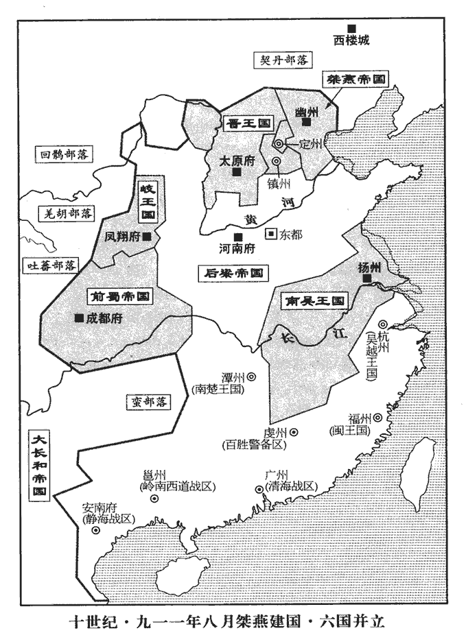
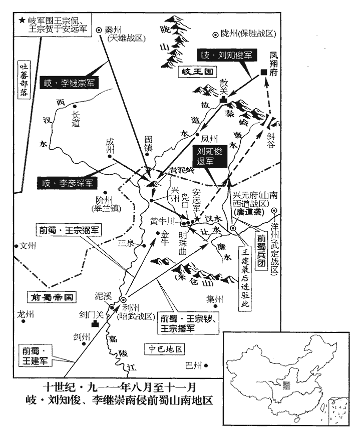
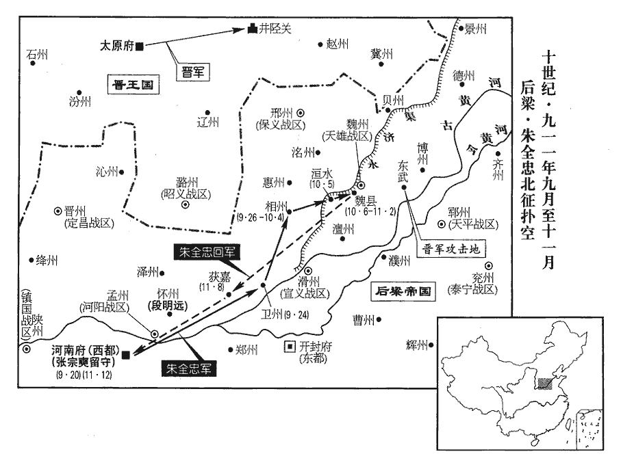
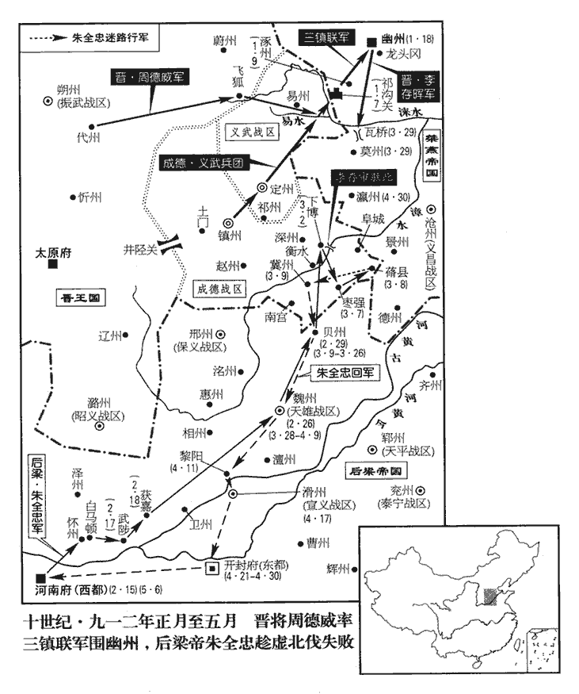
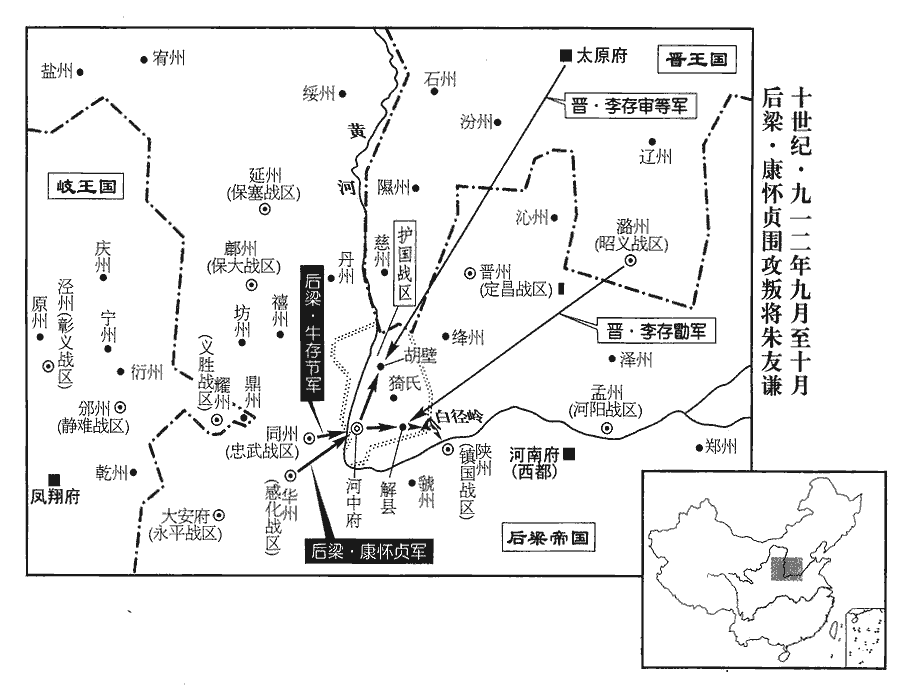
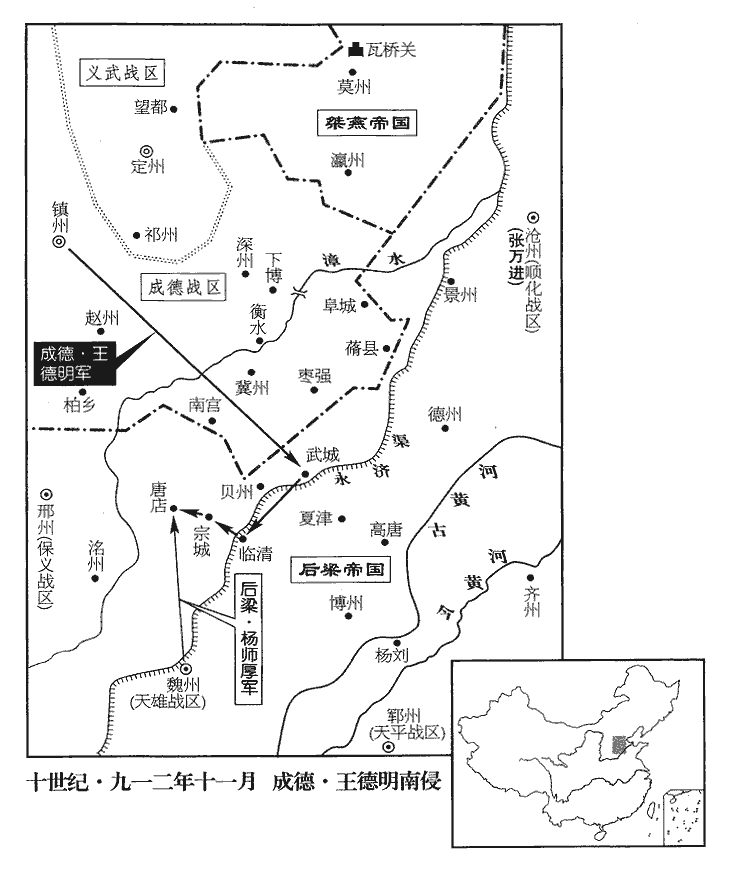
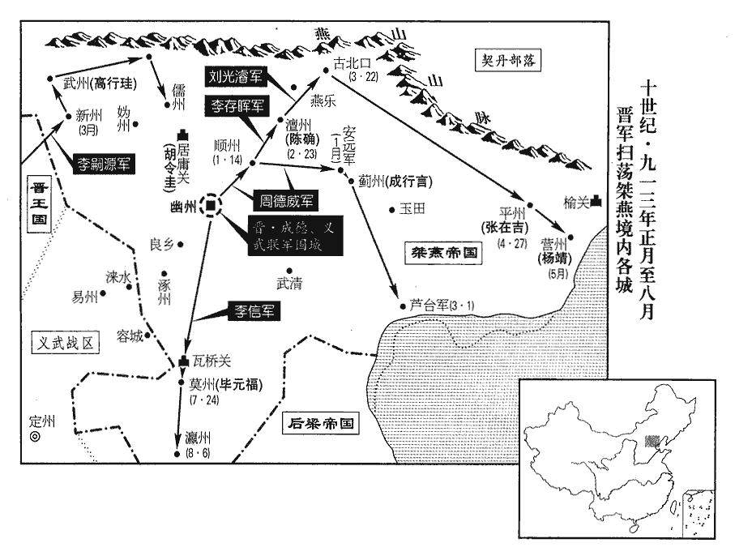
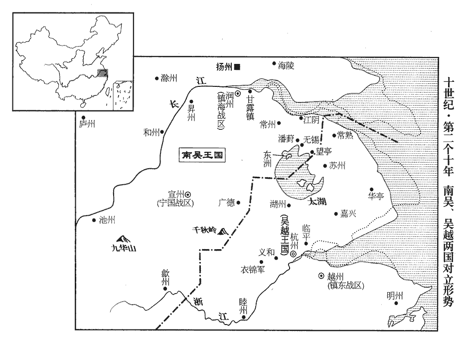
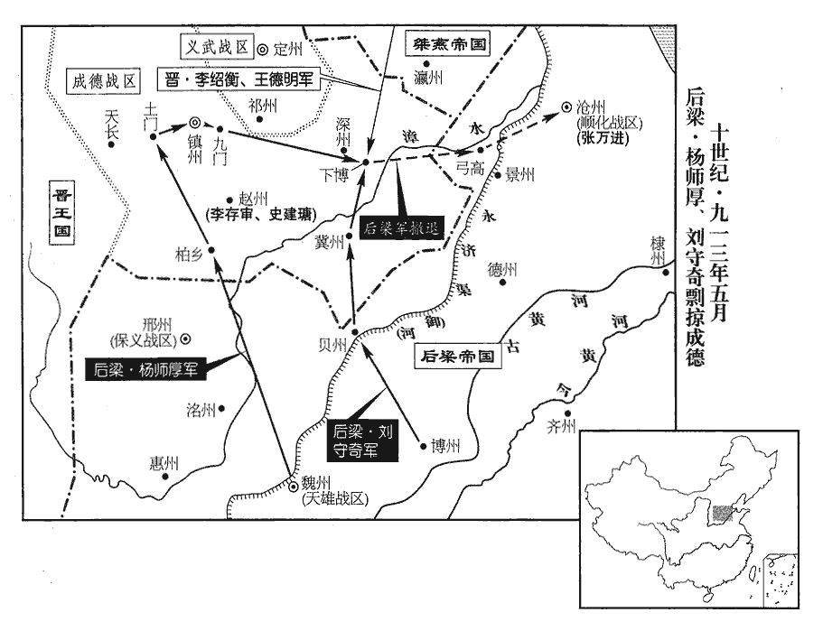
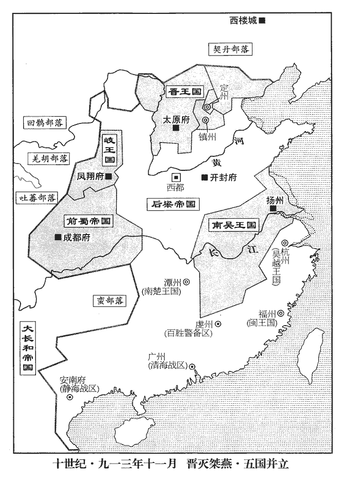

 後梁紀三起重光協洽（辛未）三月，盡昭陽作噩（癸酉）十一月，凡二年有奇。

# 太祖神武元聖孝皇帝下

## 乾化元年（辛未，九一一）

1三月，乙酉朔‹一›，以天雄‹总部设魏州河北省大名县›留後羅周翰為節度使。

〖译文〗 [1]三月，乙酉朔（初一），后梁任命天雄留后罗周翰为天雄节度使。

2清海‹总部广州›、靜海‹总部安南府›節度使兼中書令南平襄王劉隱病亟，亟，紀力翻。表其弟節度副使巖‹本年二十三岁›權知留後；丁亥‹三›，卒。隱年三十八。巖襲位。

〖译文〗 [2]清海、静海节度使兼中书令南平襄王刘隐病情紧急，上表委任他的弟弟节度副使刘岩暂时主持留后事务；丁亥（初三），刘隐病故。刘岩继位。

3岐王‹李茂贞›聚兵臨蜀東鄙，蜀主‹王建›謂群臣曰：「自茂貞為朱溫所困，吾常振其乏絕，事並見前紀。今乃負恩為寇，誰為吾擊之？」誰為，于偽翻。兼中書令王宗侃請行。蜀主以宗侃為北路行營都統。司天少監趙溫珪諫曰：「茂貞未犯邊，諸將貪功深入，糧道阻遠，恐非國家之利。」蜀主不聽，少，詩照翻。將，即亮翻。以兼侍中王宗祐、太子少師王宗賀、山南‹总部设兴元府陕西省汉中市›節度使唐道襲為三招討使，三路進兵以伐岐，各路置一招討使，王宗侃都統三招討之兵。左金吾大將軍王宗紹為宗祐之副，帥步騎十二萬伐岐。帥，讀曰率；下同。壬辰‹八›，宗侃等發成都，旌旗數百里。

〖译文〗 [3]岐王李茂贞聚集军队到前蜀东部的边界地方，前蜀主王建对文武群臣说：“自从李茂贞被朱温所困，我经常接济他的困乏，现在却忘恩负义来进行侵犯，谁替我攻打他？”兼中书令王宗侃请求前去。王建任命王宗侃为北路行营都统。司天少监赵温劝谏说：“李茂贞没有侵犯边境，各将领贪图立功，率兵深入，运粮道路艰险遥远，恐怕不是国家的利益。”前蜀主不听，任命兼侍中王宗、太子少师王宗贺、山南节度使唐道袭为三招讨使，左金吾大将军王宗绍为王宗的副手，率领步兵、骑兵十二万，讨伐岐王李茂贞。壬辰（初八），王宗侃等从成都出发，旌旗招展连绵数百里。

4岐王‹李茂贞›募華原‹陕西省耀县›賊帥溫韜以為假子，以華原為耀州，美原‹陕西省富平县东北美原镇›為鼎州。宋廢鼎州，復為美原縣，屬耀州。宋白曰：華原縣本漢祋duì祤yǔ縣地‹陕西省耀县东›，曹魏以來置北地郡，元魏廢帝三年置通川郡泥陽縣，隋開皇六年改泥陽為華原。美原縣本秦、漢頻陽縣，苻秦置土門護軍，後周置土門縣，唐咸亨二年改為美原。九域志：耀州在長安北一百六十里。置義勝軍，以韜為節度使，使帥邠、岐‹总部凤翔府›兵寇長安。詔感化‹总部设华州陕西省华县›節度使康懷貞、忠武‹总部设同州陕西省大荔县›節度使牛存節以同、華、河中‹山西省永济市›兵討之。己酉‹二十五›，懷貞等奏擊韜於車度‹陕西省大荔县西南›，走之。車度，地名，在長安北同州界。

〖译文〗 [4]岐王李茂贞招募华原贼帅温韬作为养子，以华原为耀州，美原为鼎州。设置义胜军，任命温韬为义胜节度使，派他率领州、岐州的军队侵犯长安。后梁太祖诏令感化节度使康怀贞、忠武节度使牛存节带领同华、河中军队前去讨伐。已丑（二十五日），康怀贞等奏报在车度攻反温韬，把他赶跑。

5夏，四月，乙卯朔‹一›，岐兵寇蜀興元，唐道襲擊卻之。

〖译文〗 [5]夏季，四月，乙卯朔（初一），岐兵侵犯前蜀兴元，唐道袭把岐兵击退。

6上以久疾，五月，甲申朔‹一›，大赦。按歐史，此下當有「改元」二字。

〖译文〗 [6]后梁太祖因为长期患病，五月，甲申朔（初一），大赦天下。

7甲辰‹二十一›，以清海‹总部设广州广东省广州市›留後劉巖為節度使。考異曰：十國紀年：「甲辰，太祖授陟清海節度使；陟復名巖。」按薛史僭偽傳云「前偽漢劉陟。」胡賓王劉氏興亡錄：「高祖巖皇考葬段氏，得石版，有篆文曰『隱台巖』，因名其三子。」是先名巖後名陟也。吳越備史：「乾化四年，廣帥彭城巖遣陳用拙來使。」吳錄：「天祐十四年，南海王劉巖自立為漢。」唐烈祖實錄：「天祐十四年，劉陟僭位，改名巖。」梁太祖實錄：「乾化元年五月，以清海節度副使劉陟為節度使。二年四月，以韋戩為潭、廣和叶使，云廣守淪謝，其母弟巖為軍情所戴。七月，友珪加劉巖檢校太傅。」薛史梁末帝紀：「貞明五年九月，削奪廣州節度使劉巖官爵。」吳越備史載制詞亦云「彭城巖」。蓋嗣節度使後復名巖也。惟莊宗實錄：「同光三年二月，廣南劉陟遣何詞來使。」莊宗列傳自嗣立至建號皆云劉陟。眾說不同，未知孰是。今以其首尾名巖，故但稱劉巖云。巖多延中國士人置於幕府，出為刺史，刺史無武人。

〖译文〗 [7]甲辰（二十一日），后梁任命清后刘岩为清海节度使。刘岩多延请中原读书人安置在幕府，出任刺史，刺史中没有武人。

8蜀主‹王建›如利州‹四川省广元市›，命太子監國；監，古銜翻。六月，癸丑朔‹一›，至利州。欲親總兵以繼伐岐之師。

〖译文〗 [8]前蜀主王建前往利州，命令太子王元坦代主国政。六月，癸丑朔（初一），王建到达利州。

9燕‹首府幽州›王守光嘗衣赭袍，衣，於既翻。赭，音者。赭袍，唐世天子之服。顧謂將吏曰：「今天下大亂，英雄角逐，吾兵強地險，亦欲自帝，何如？」孫鶴曰：「今內難新平，謂新平滄、德。斯言不當發於孫鶴。難，乃旦翻。公私困竭，太原‹指李存勖›窺吾西，契丹伺吾北，伺，相利翻。遽謀自帝，未見其可。大王但養士愛民，訓兵積穀，德政既脩，四方自服矣。」守光不悅。

〖译文〗 [9]燕王刘守光曾经穿唐代皇帝所穿的赤褐色袍服，回头对将吏们说：“现在天下大乱，英雄武力竞争，我兵马强壮，地势险要，也想自己称帝，怎么样？”孙鹤说：“现在内部危难刚平定，公家私人都困苦竭蹶，太原晋王李存勖窥伺我们的西部，契丹王阿保机窥伺我们的北部，匆忙谋划自己称帝，未见其可行之处。大王只要尊养读书人，爱恤老百姓，训练军队，积贮粮食，修行德政，四方自然服从了。”刘守光不高兴。

又使人諷鎮、定，求尊己為尚父，趙王鎔以告晉王‹李存勖›。晉王怒，欲伐之，諸將皆曰：「是為惡極矣，行當族滅，不若陽為推尊以稔rěn之。」稔其惡也。乃與鎔及義武王處直、昭義‹总部潞州›李嗣昭、振武‹总部朔州›周德威、天德‹总部天德城内蒙古乌拉特前旗东北›宋瑤六節度使五鎮并河東為六；然自昭義以下皆屬河東。共奉冊推守光為尚書令、尚父。

〖译文〗 刘守光又派人婉言劝说镇州王熔、定州王处直，要求他们尊奉自己为“尚父”。赵王王熔把这件事告诉晋王李存勖，晋王勃然大怒，想要讨伐刘守光，诸将都说：“这个刘守光作恶到极点了，应当诛灭他的全族，不如假装推尊他为尚父来让他恶贯满盈。”于是与王熔、义武节度使王处直、昭义节度使李嗣昭、振武节度使周德威、天德节度使宋瑶，六镇节度使共同奉册推尊刘守光为尚书令、尚父。

守光不寤，以為六鎮實畏己，益驕，乃具表其狀曰：「晉王‹李存勖›等推臣，臣荷陛下厚恩，荷，下可翻。未之敢受。竊思其宜，不若陛下授臣河北都統，則并、鎮不足平矣。」并，謂晉王，鎮，謂趙王鎔。上亦知其狂愚，乃以守光為河北道采訪使，唐之盛時，置十道采訪使，河北其一也；自安、史亂後不復除授。遣閤門使王瞳、受旨史彥群冊命之。受旨，蓋崇政院官屬，猶樞密院承旨也。梁避廟諱，改「承」為「受」。

〖译文〗 刘守光不醒悟，以为六镇节度使确实畏惧自己，更加骄横，于是上表给后梁太祖详细陈情：“晋王等推尊我，我承受陛下的深恩，没有敢接受。我私下考虑适宜的办法，不如陛下任命我为河北都统，那么，并州、镇州不值得平定了。”后梁太祖也知道刘守光狂妄愚蠢，于是任命刘守光为河北道采访使，派遣阁门使王瞳、崇政院受旨史彦群前去册命他。

守光命僚屬草尚父、采訪使受冊儀。乙卯‹三›，僚屬取唐冊太尉儀獻之，守光視之，問何得無郊天、改元之事，對曰：「尚父雖貴，人臣也，安有郊天、改元者乎？」守光怒，投之於地，曰：「我地方二千里，帶甲三十萬，直作河北天子，誰能禁我！尚父何足為哉！」命趣具即帝位之儀，趣，讀曰促。械繫瞳、彥群及諸道使者於獄，既而皆釋之。考異曰：莊宗列傳劉守光傳云：「朱溫命偽閤門使王瞳、供奉官史彥章等使燕，冊守光為河北道采訪使。六月，汴使至，守光令所司定尚父、採訪使儀注，取二十四日受冊。」朱溫傳亦云「史彥章」，莊宗實錄作「史彥璋」。編遺錄、薛史皆作「史彥群」，今從之。又莊宗實錄：「三月己丑，鎮州遣押牙劉光業至，言劉守光凶淫縱毒，欲自尊大，請稔其惡以咎之，推為尚父。乙未，上至晉陽宮，召張承業諸將等議討燕之謀，諸將亦云宜稔其禍。上令押衙戴漢超持墨制及六鎮書如幽州，其辭曰：『天祐八年三月二十七日，天德軍節度使宋瑤、振武節度使周德威、昭義節度使李嗣昭、易定節度使王處直、鎮州節度使王鎔、河東節度使•尚書令晉王謹奉冊進盧龍、橫海等軍節度、檢校太師兼中書令燕王為尚書令、尚父。』五月，六鎮使至，汴使亦集。六月，守光令有司定尚父、採訪使儀則。」梁太祖實錄都不言守光事，惟編遺錄云：「三月壬辰，差閤門使王瞳、受旨史彥群齎國禮賜幽州劉守光。甲午，守光連上表章，率以鎮、定既與河東結懽，兼同差使請當道卻行天祐年號事。守光尋捉王瞳、史彥群上下一行並囚禁，數日後放出。」按莊宗實錄及南唐烈祖實錄皆云「三月辛亥晉王遣戴漢超推守光為尚父。」辛亥，三月二十七日也。壬辰乃三月初八日，王瞳等安得已在幽州！甲午乃三月十日，守光安得上表云「六鎮推臣為尚父」！編遺錄月日多差錯，今不取。

〖译文〗 刘守光命令属官草拟尚父、采访使承受册封的礼仪。乙卯（初三），属官取唐代册封太尉的礼仪呈献，刘守光看后，问怎么能没有南郊祀天、改变年号的事宜，属官回答说：“尚父虽然尊贵，也是天子的的臣属，哪里有南郊祀天、改变年号的事呢？”刘守光勃然大怒，把册仪仍在地上，说：“我的领地二千里，披甲的将士三十万，径直作河北的天子，谁能禁止我！尚父怎么值得做呢！”命令赶快准备即皇帝位的礼仪，把阁门使王瞳、崇政院受旨史彦群及各道的使者用刑具拘系，投入狱中，不久又把他们都释放了。

10帝命楊師厚將兵三萬屯邢州。欲攻趙也。

〖译文〗 [10]后梁太祖命令杨师厚率兵三万到邢州驻扎。

11蜀諸將擊岐兵，屢破之。秋，七月，蜀主西還，留御營使昌王宗鐬屯利州。鐬huì，火外翻。

〖译文〗 [11]前蜀的各位将领攻击岐王李茂贞的军队。屡次把岐兵打败。秋季，七月，前蜀主王建向西返回成都，留下御营使昌王王宗在利州驻扎。

12辛丑‹二十›，帝避暑於張宗奭第，開平元年張全義賜名宗奭見上卷。按薛史，張宗奭私第在洛陽會節坊。亂其婦女殆徧。宗奭子繼祚不勝憤恥，勝，音升。欲弒之。宗奭止之曰：「吾家頃在河陽‹河南省孟州市›，為李罕之所圍，見二百五十七卷唐僖宗文德元年。啗木屑以度朝夕，啗，徒濫翻。賴其救我，得有今日，此恩不可忘也。」乃止。甲辰‹二十三›，還宮。

〖译文〗 [12]辛丑（二十日），后梁太祖在张宗的私宅里避暑，几乎奸淫了张宗家的全部妇女。张宗的儿子张继祚不能忍受愤恨耻辱，想要杀死太祖。张宗阻止儿子说：“我家不久前在河阳，被李罕之围困，靠吃木屑来度时日，仰赖他救我，才能有今天，这个恩情不可以忘掉。”这才作罢。甲辰（二十三日），太祖回宫。

13趙王鎔以楊師厚在邢州，甚懼，九域志：邢州北至趙州一百四十四里耳。兵臨其境，故甚懼。會晉王于承天軍‹山西省平定县东北娘子关›。晉王謂鎔父友也，事之甚恭。鎔先與晉王克用比肩事唐，且通好。鎔以梁寇為憂，晉王曰：「朱溫之惡極矣，天將誅之，雖有師厚輩不能救也。脫有侵軼，軼，徒結翻。僕自帥眾當之，帥，讀曰率。叔父勿以為憂。」鎔捧巵為壽，謂晉王為四十六舅。晉王第四十六。鎔幼子昭誨從行，晉王斷衿為盟，許妻以女。斷，都管翻。衿，音今。妻，七細翻。由是晉、趙之交遂固。

〖译文〗 [13]赵王王熔因杨师厚在邢州，非常害怕，往承天军会见晋王李存勖。李存勖认为王熔是父亲李克用的朋友，侍奉王熔很恭敬。王熔为后梁的侵犯忧虑，李存勖说：“朱温的罪恶到了顶点，老天爷将要杀死他，即使有杨师厚等也不能救他。倘使有侵犯袭击，我亲自率众抵挡他，叔父不要因这事担忧。”王熔捧卮敬酒，祝晋王长寿，称晋王为四十六舅。王熔的小儿子王昭诲跟随前来，李存勖撕断衣衿结盟。答应把女儿嫁给王昭诲。从此，晋、赵的关系就巩固了。

14八月，庚申‹九›，蜀主‹王建›至成都。自利州還。

〖译文〗 [14]八月，庚申（初九），前蜀主王建回到成都。

 

15燕王守光將稱帝，將佐多竊議以為不可，守光乃置斧質於庭質，椹也。曰：「敢諫者斬！」孫鶴曰：「滄州之破，鶴分當死，蒙王生全，事見上卷開平四年。分，扶問翻。劉守光囚父殺兄，幽、滄之人義不與共戴天可也。孫鶴受劉守文委任，不能以死殉之，乃銜守光生全之恩，忠諫而死，是可以死而不能死，可以無死而死也。以至今日，今日【章：十二行本不重「今日」二字；乙十一行本同；孔本同；張校同。】敢愛死而忘恩乎！竊以為今日之帝未可也。」守光怒，伏諸質上，令軍士冎而噉之。冎，古瓦翻。噉，徒濫翻。鶴呼曰：「不出百日，大兵當至！」【章：十二行本作「百日之外必有急兵」八字；乙十一行本同；張校同，云無註本與吳本同。】守光命以土窒其口，寸斬之。呼，火故翻。

〖译文〗 [15]燕王刘守光将要自称皇帝，将佐大多私下议论以为不可，刘守光于是在大厅里摆置刀斧、砧板，说：“敢进谏的斩首！”孙鹤说：“沧州被攻破的时候，孙鹤本该当死，蒙大王保全性命，以至今天，今日岂敢贪生怕死而忘记恩情吗！我以为今天的皇帝是不可以做的。”刘守光勃然大怒，把孙鹤按伏在砧板上，命令军士剔下他的肉并且吃掉。孙鹤大声呼喊说：“不出百日，一定有大兵来到。”刘守光命令军士用土塞他的嘴，一寸寸地剁斩。

甲子‹十三›，守光即皇帝位，國號大燕，改元應天。以梁使王瞳為左相，盧龍判官齊涉為右相，史彥群為御史大夫。考異曰：編遺錄云御史臺副使。今從莊宗實錄。受冊之日，契丹‹王庭西楼城内蒙古巴林左旗›陷平州‹河北省卢龙县›，燕人驚擾。宋白曰：平州，舜十二州為營州之境。周官職方在幽州之地，春秋為山戎孤竹、白狄肥子二國地，漢為肥如、石城之地。唐武德初置平州於盧龍。

〖译文〗 甲子（十三日），刘守光即皇帝位，国号大燕，改年号为应天。任命后梁的使者王瞳为左相，卢龙判官齐涉为右相，史彦群为御史大夫。受册命这天，契丹攻下平州，燕人惊慌扰乱。

16岐王使劉知俊、李繼崇將兵擊蜀，乙亥‹二十四›，王宗侃、王宗賀、唐道襲、王宗紹與之戰於青泥嶺‹陕西省略阳县西北›，青泥嶺在興州長舉縣西北五十里，懸崖萬仞，上多雲雨，行者多逢泥淖。蜀兵大敗，馬步使王宗浩奔興州‹陕西省略阳县›，溺死於江，此江，嘉陵江也。道襲奔興元‹陕西省汉中市›。先是，步軍都指揮使王宗綰城西縣‹陕西省勉县›，號安遠軍‹陕西省勉县›，九域志：西縣在興元府西一百里。宗侃、宗賀等收散兵走保之，知俊、繼崇追圍之。眾議欲棄興元，道襲曰：「無興元則無安遠，利州遂為敵境矣。九域志：興元西至西縣百里，西縣抵利州界四十五里，自界首至利州二百六十四里。吾必以死守之。」蜀主以昌王宗鐬為應援招討使，定戎團練使王宗播為四招討馬步都指揮使，蜀主先已遣三招討使伐岐，今又以王宗鐬為應援招討使，是為四招討。將兵救安遠軍，壁於廉、讓之間‹廉、让二水流经陕西省汉中市东南›，廉水出大巴山北谷中。讓水，其源起於廉水，溉田之餘，東南流至古廉水城之側。二水在南鄭縣東南。杜佑曰：綿州昌明縣有廉水、讓水。宋白續通典：縣有清廉鄉、讓水鄉。與唐道襲合擊岐兵，大破之於明珠曲‹陕西省勉县西›。明日又戰於鳧口‹陕西省勉县西›，斬其成州‹甘肃省成县›刺史李彥琛。

〖译文〗 [16]岐王李茂贞派刘知俊、李继崇率兵攻前蜀，乙亥（二十四日），王宗侃、王宗贺、唐道袭、王宗绍在青泥岭与岐兵交战，前蜀兵大败，马步使王宗浩逃奔兴州，淹死在嘉陵江，唐道袭逃奔兴元。在这以前，步军都指挥使王宗绾修筑西县城，号称安远军；王宗侃、王宗贺等收集逃散的兵卒奔赴西县保守，刘知俊、李继崇追赶包围西县。众人商议想放弃兴元，唐道袭说：“没有兴元就没有安远，利州就成为敌人的地方了。我们一定要拚死守卫。”前蜀主任命昌王王宗为应援招讨使，定戎团练使王宗播为四招讨马步都指挥使，率兵救援安远军，在廉水、让水之间扎营，与唐道袭协同攻击岐兵，在明珠曲大败岐兵。第二天，又在凫口交战，斩杀岐王的成州刺史李彦琛。

 

17九月，帝疾稍愈，聞晉、趙謀入寇，自將拒之。戊戌‹十八›，以張宗奭為西都留守。庚子‹二十›，帝發洛陽。甲辰‹二十四›，至衛州‹河南省卫辉市›，方食，軍前奏晉軍已出井陘‹河北省鹿泉市西›。陘，音刑。帝遽命輦北趣邢、洺‹河北省永年县东南旧永年镇›，晝夜倍道兼行。丙午‹二十六›，至相州‹河南省安阳市›，九域志：衛州北至相州一百二十五里，自相州又北則趣邢、洺。趣，七喻翻。聞晉兵不出，乃止。相州刺史李思安不意帝猝至，落然無具，坐削官爵。

〖译文〗 [17]九月，后梁太祖的病逐渐痊愈，听说晋、赵图谋进犯，亲自统率军队前往抵御。戊戌（十八日），任命张宗为西都留守。庚子（二十日），后梁太祖从洛阳出发。甲辰（二十四日），到达卫州，正在吃饭，军前奏报晋军已经从井陉出发。太祖马上命令乘坐辇车向北奔赴邢，日夜兼程。丙午（二十六日），到达相州，听说晋兵没有出发，这才停止前进。相州刺史李思安没有想到后梁太祖突然到来，冷冷落的样子，一切没有准备，因此削夺官职爵位。

18湖州‹浙江省湖州市›刺史錢鏢‹钱镠弟›酗酒殺人，鏢，甫招翻。酗，吁句翻。恐吳越王鏐‹钱镠本年六十岁›罪之，冬，十月，辛亥朔‹一›，殺都監潘長、推官鍾安德，奔于吳。

〖译文〗 [18]湖州刺史钱镖酒醉逞凶杀人，担心吴越王钱治罪，冬季，十月，辛亥朔（初一），杀死都监潘长、推官钟安德，投奔吴王杨隆演。

19晉王聞燕主守光稱帝，大笑曰：「俟彼卜年，吾當問其鼎矣。」以周成王卜年、楚子問鼎之事戲笑守光。張承業請遣使致賀以驕之，使，疏吏翻；下通使之使同。晉王遣太原少尹李承勳往。承勳至幽州，用鄰藩通使之禮。燕之典客者曰：「吾王帝矣，公當稱臣庭見。」見，賢遍翻。承勳曰：「吾受命於唐朝為太原少尹，朝，直遙翻。燕王自可臣其境內，豈可臣他國之使乎！」守光怒，囚之數日，出而問之曰：「臣我乎？」承勳曰：「燕王能臣我王‹李存勖›，則我請為臣；不然，有死而已！」守光竟不能屈。

〖译文〗 [19]晋王李存勖听说燕主刘守光自称皇帝，放声大笑说：“等他占卜在位年数的时候，我应该已取而代之了。”张承业请示派遣使者表示祝贺来使他骄傲自负，李存勖派太原少尹李承勋前往。李承勋到达幽州，用相邻藩国交往通行的礼仪，燕掌管接待使者事务的官员说：“我大王已经即位称帝了，您应当称臣在朝廷上觐见。”李承勋说：“我承受唐朝的命令担任太原少尹，燕王自可统属他境内百性，怎么能统属别国的使者呢！”刘守光勃然大怒，监禁他几天，放出来并向他说：“向我称臣吗？”李承勋说：“燕王能够让我晋王称臣，那么我请求称臣；不然，唯有一死而已！”刘守光结果不能使他屈服。

 

20蜀主‹王建›如利州，聞王宗侃為岐所敗，故復如利州，以為繼援。命太子監國。決雲軍虞候王琮敗岐兵，敗，補邁翻。執其將李彥太，俘斬三千五百級。乙卯‹五›，捉生將彭君集破岐二寨，俘斬三千級。王宗侃遣裨將林思諤自中巴‹四川省东北部›間行至泥溪‹四川省广元市西南昭化镇›，巴州在三巴之中，謂之中巴。興元之南有大行路，逕孤雲兩角，過米倉山則至巴州。按後唐伐蜀還，魏王繼岌與李紹琛軍行次舍泥溪，當在劍州北利州界。見蜀主告急，蜀主命開道都指揮使王宗弼將兵救安遠，及劉知俊戰于斜谷‹陕西省太白县境›，破之。斜，余遮翻。谷，余玉翻。

〖译文〗 [20]前蜀主王建前往利州，命太子王元坦代理国事。决云军虞候王琮打败岐兵，逮住岐将李彦太，俘获斩杀岐兵三千五百人。乙卯（初五），捉生将彭君集攻下岐兵的两个营寨，俘获斩杀岐兵三千人。王宗侃派遣副将林思谔自中巴穿小路到达泥溪，见王建报告紧急军情，王建命令开道都指挥使王宗弼率兵救安远，与刘知俊在斜谷交战，把刘知俊打败。

21甲寅‹四›夜，帝發相州，乙卯‹五›，至洹水‹河北省槐县西南›。是夜，邊吏言晉、趙兵南下，帝即時進軍，丙辰‹六›，至魏縣‹河北省魏县›。洹水在魏州之西成安縣界。九域志：魏州成安縣有洹水鎮。成安縣在州西三十五里。魏縣在魏州西三十五里。或告云：「沙陀‹晋军›至矣！」士卒恟懼，多逃亡，嚴刑不能禁。既而復告云無寇，上下始定。敗兵之氣，沒世不復，此之謂也。而復，扶又翻。戊午‹八›，貝州奏晉兵寇東武‹山东省阳谷县›，尋引去。帝以夾寨、柏鄉屢失利，夾寨之敗見二百六十六卷開平二年，柏鄉之敗見上卷本年。故力疾北巡，思一雪其恥，意鬱鬱，多躁忿，功臣宿將往往以小過被誅，眾心益懼。薛史本紀：帝至相州，左龍驤都教練使鄧季筠、魏博馬軍都指揮使何令稠、右廂馬軍都指揮使陳令勳，以部下馬瘦，並腰斬于軍門；次魏縣，先鋒指揮使黃文靖伏誅。既而晉、趙兵竟不出。帝以忿兵輕行，求雪再敗之恥，使其果與晉、趙遇，亦必敗矣。十一月，壬午‹二›，帝南還。

〖译文〗 [21]甲寅（初四）夜里，后梁太祖从相州出发，乙卯（初五），到达洹水。这天晚上，边境官吏说晋王、赵王的军队南下，太祖立刻率领军队前进，丙辰（初六），到达魏县。有人报告说：“沙陀兵到了！”后梁兵震动恐惧，多数逃跑，严厉惩罚也不能禁止。过了不久，又报告说没有敌人，后梁军上下才安定下来。戊午（二十日），贝州奏报晋兵侵犯东武，不久撤离。后梁太祖因潞州夹寨、柏乡屡次失败，所以尽力快速巡视北部边界，想完全洗刷过去的耻辱，神情忧郁烦闷，经常急躁发怒，功臣老将往往因为小过失被杀，众人心里更加畏惧。不久，晋、赵的军队竟未出发。十一月壬午（初二），后梁及祖南下返回。

22燕主守光集將吏謀攻易定，幽州參軍景城‹河北省沧州市西›馮道以為未可；景城縣屬瀛州，漢舊縣名。守光怒，繫獄，或救之，得免。道亡奔晉，張承業薦於晉王，以為掌書記。馮道自此歷事唐、晉、漢、周，位極人臣，不聞諫爭，豈懲諫守光之禍邪。丁亥‹七›，王處直‹义武总部定州›告難于晉。難，乃旦翻。

〖译文〗 [22]燕主刘守光召集将吏商量进攻易州、定州， 幽州参军景城人冯道认为不可行。刘守光勃然大怒，把冯道拘禁监狱，有人救他，得以释放。冯道逃奔到晋，张承业向晋王李存勖推荐，任命他为掌书记。丁亥（初七），王处直向晋王报告遇到危难。

23懷州‹河南省沁阳市›刺史開封‹河南省开封市›段明遠妹為美人。戊子‹八›，帝至獲嘉‹河南省获嘉县›，九域志：獲嘉縣在懷州東北一百五十里。明遠饋獻豐備，帝悅。段明遠後改名凝，階此寵任，位為上將，梁遂以亡。

〖译文〗 [23]怀州刺史开封人段明远的妹妹是个美人。戊子（初八），后梁太祖到达获嘉，段明远进献财物丰富齐备，太祖非常高兴。

24庚寅‹十›，保塞‹总部设延州陕西省延安市›節度使高萬興奏遣都指揮使高萬金將兵攻鹽州‹陕西省定边县›，刺史高行存降。考異曰：實錄：「開平三年六月丁未，靈武韓遜奏收復鹽州，擒偽刺史李繼直已下六十二人。」至此年降高行存下云：「鹽州與吐蕃、党項犬牙相接，為二境咽喉之地；又烏池鹽醝cuō之利，戎、羌意未嘗息。唐建中初為吐蕃所陷，砥其墉而去，由是銀、夏、寧、延洎于靈武，歲以河南、山東、淮南、青、徐、江、浙等道兵士不啻四萬分護其地，謂之防秋。貞元九年，朝政稍暇，乃命副元帥渾瑊總兵三萬復取其地，建百雉焉，自是虜塵乃息，邊患遂止。唐代革命，又復失之。今纔動偏師，遽收襟要，國之右臂，瘡疣其息哉！」李茂貞養子多連「繼」字。開平三年所收，似屬鳳翔。今又收復，云「唐革命失之」，前後必一誤，或者開平既得又失之也。

〖译文〗 [24]庚寅（初十），保塞节度使高万兴奏报派遣都指挥使高万金率兵攻盐州，盐州刺史高行存投降。

25壬辰‹十二›，帝至洛陽，疾復作。復，扶又翻。

〖译文〗 [25]壬辰（十二日），后梁太祖回到洛阳，病又发作。

26蜀王宗弼敗岐兵於金牛‹陕西省宁强县北›，敗，補邁翻；下同。拔十六寨，俘斬六千餘級，擒其將郭存等。丙申‹十六›，王宗鐬、王宗播敗岐兵於黃牛川‹陕西省勉县西›，擒其將蘇厚等。丁酉‹十七›，蜀主自利州如興元。援軍既集，安遠軍望其旗，旗，謂蜀主之旗也。王宗侃等鼓譟而出，與援軍夾攻岐兵，大破之，拔二十一寨，斬其將李廷志等。己亥‹十九›，岐兵解圍遁去。解安遠之圍而遁。唐道襲先伏兵於斜谷‹陕西省太白县境›邀擊，又破之。庚子‹二十›，蜀主西還。岐兵既敗走，遂還。

〖译文〗 [26]前蜀将王宗弼在金牛打败岐兵，攻取十六寨，俘获斩杀六千余人，擒获岐将郭存等。丙申（十六日），前蜀王宗、王宗播在黄牛川打败岐兵，擒获岐将苏厚等。丁酉（十七日），前蜀主王建自利州前往兴元。援军已经聚集，安远军望见援军旗帜，王宗侃等擂鼓呐喊冲出，与援军夹攻岐兵，把岐兵打得大败，攻下二十一寨，斩杀岐将李廷志等。已亥（十九日），岐兵解除对安远军的包围而逃跑。唐道袭预先在斜谷埋伏军队进行拦击，又把岐兵打败。庚子（二十日），王建西行返回成都。

岐王左右石簡顒讒劉知俊於岐王，顒yóng，魚容翻。王奪其兵。李繼崇言於王曰：「知俊壯士，窮來歸我，不宜以讒廢之。」王為之誅簡顒以安之。為，于偽翻。繼崇召知俊舉族居于秦州‹甘肃省秦安县西北›。李繼崇時鎮秦州。繼崇尋不能守秦州，劉知俊由此亦降于蜀。

〖译文〗 岐王左右亲信石简向岐王李茂贞说刘知俊的坏话，岐王夺了刘知俊的兵权。李继崇对岐王说：“刘知俊是壮士，处境困难前来归顺，不应该因为谗言罢免他。”岐王为此杀了石简来安抚刘知俊。李继崇召刘知俊率全族到秦州居住。

27戊申‹二十八›，燕主守光將兵二萬寇易定，攻容城‹河北省容城县›。容城，漢縣名，唐屬易州，宋屬雄州。王處直告急于晉。

〖译文〗 [27]戊申（二十八日），燕主刘守光率兵二万侵犯易州、定州，攻打容城。王处直向晋王告急求救。

28十二月，乙卯‹五›，以朗州‹湖南省常德市›留後馬賨cóng為永順節度使、同平章事。賨，徂宗翻。馬殷之弟也。

〖译文〗 [28]十二月乙卯（初五），后梁任命朗州留后马为永顺节度使、同平章事。

29鎮南‹总部设虔州江西省赣州市›留後盧延昌遊獵無度，百勝軍指揮使黎球殺之，自立；將殺譚全播，全播稱疾請老，乃免。丙辰‹六›，以球為虔州防禦使。未幾，球卒，幾，居豈翻。牙將李彥圖代知州事，全播愈稱疾篤。劉巖聞全播病，發兵攻韶州‹广东省韶关市›，破之，刺史廖爽奔楚‹首都潭州›，唐天復二年，虔人取韶州，至是復為劉氏。廖，力救翻。楚王殷‹马殷本年六十岁›表為永州‹湖南省永州市›刺史。

〖译文〗 [29]镇南留后卢延昌出游打猎没有节制，百胜军指挥使黎球把他杀了，自立为留后；将要杀谭全播，谭全播称说有病请求告老，才免杀身之祸。丙辰（初六），后梁任命黎球为虔州防御使。不久，黎球死了，牙将李彦图代理主持虔州事务，谭全播更称病情沉重。刘岩听说谭全播病了，发兵攻打韶州，并把州城攻克。韶州刺史廖爽逃奔楚，楚王马殷上表任命廖爽为永州刺史。

30丁巳‹七›，蜀主至成都。自興元還至成都。

〖译文〗 [30]丁巳，（初七），前蜀主王建回到成都。

31戊午‹八›，以靜海‹总部设安南府越南河内市›留後曲美‹曲承美›為節度使。

〖译文〗 [31]戊午，（初八），后梁任命静海留后曲美为静海节度使。

32癸亥‹十三›，以靜江‹总部设桂州广西桂林市›行軍司馬姚彥章為寧遠‹总部设容州广西容县›節度副使，權知容州，從楚王殷之請也。劉巖‹清海总部广州›遣兵攻容州，殷遣都指揮使許德勳以桂州兵救之；彥章不能守，乃遷容州士民及其府藏奔長沙，巖遂取容管及高州‹广东省信宜市南›。藏，徂浪翻。開平四年，楚取容管及高州，至是棄之。

〖译文〗 [32]癸亥（十三日），后梁任命静江行军司马姚彦章为宁远节度副使，暂时主持容州事务，这是依从楚王马殷的请求。刘岩派遣军队进攻容州，马殷派遣都指挥使许德勋率领桂州兵前去救援。。姚彦章不能守住州城，于是迁移容州士民及其库贮财物投奔长沙，刘岩终于取得了容管及高州。

33甲子‹十四›，晉王遣蕃漢馬步總管周德威將兵三萬攻燕，以救易定。

〖译文〗 [33]甲子（十四日），晋王李存勖派遣蕃汉马步总管周德威率领三万军队攻燕，藉以救援易州、定州。

34是歲，蜀主以內樞密使潘炕為武泰‹总部设黔州重庆市彭水县›節度使，唐置武泰軍於黔州。炕從弟宣徽南院使峭為內樞密使。從，才用翻。峭，七肖翻。

〖译文〗 [34]这一年，前蜀主王建任命内枢密使潘炕为武泰节度使，潘炕的堂弟宣徽南院使潘峭为内枢密使。

## 二年（壬申、九一二）

1春，正月，德威東出飛狐‹河北省涞源县›，自代州出飛狐。宋白曰：飛狐縣，漢代郡地。曹魏封樂進於廣昌侯國，後周於五龍城置廣昌縣；隋改飛狐縣，因縣北飛狐口為名。與趙王將王德明‹张文礼›、義武‹总部定州›將程巖會于易水‹流经河北省易县南›。趙王，王鎔。義武，王處直。丙戌‹七›，三鎮兵進攻燕‹首都幽州北京市›祁溝關‹河北省涿州市西南›，下之；三鎮，并、鎮、定。祁溝關在涿州南，易州拒馬河之北。自關而西至易州六十里。拒馬河東至新城縣四十里。戊子‹九›，圍涿州‹河北省涿州市›。宋白曰：涿州，古涿鹿地。漢高帝置涿郡，魏改范陽郡，取漢涿縣在范水之陽為名。唐大曆四年立涿州。南至莫州一百六十里，東北至幽州一百二十里。刺史劉知溫城守，守，手又翻。劉守奇‹刘仁恭的儿子›之客劉去非大呼於城下，呼，火故翻。謂知溫曰：「河東‹总部太原府›小劉郎‹刘守奇›來為父討賊，為，于偽翻。何豫汝事而堅守邪？」守奇免冑勞之，劉守奇奔晉，見二百六十六卷開平元年。勞，力到翻。知溫拜於城上，遂降。周德威疾守奇之功，譖諸晉王‹李存勖，本年二十八岁›，此周德威之褊也。降，戶江翻。王召之；守奇恐獲罪，與去非及進士趙鳳來奔，上‹朱全忠（朱温）本年六十一岁›以守奇為博州‹山东省聊城市›刺史。去非、鳳，皆幽州人也。先是，燕主守光籍境內丁壯，悉文面為兵，雖士人不免，鳳詐為僧奔晉，守奇客之。先，悉薦翻。

〖译文〗 [1]春季，正月，周德威自代州东出飞狐口，与赵王的部将王德明、义武将领程岩在易水会合。丙戌（初七），三镇军队进攻燕的祁沟关，夺取祁沟关；戊子（初九），三镇军队包围涿州。 涿州刺史刘知温据城防守，刘守奇的门客刘去非在城下大声呼喊，对刘知温说：“河东小刘郎来为他的父亲讨伐叛国作乱的贼子，与你的事有什么相干而坚决固守呢！”刘守奇脱下头盔慰劳他，刘知温在城上叩拜，于是投降。周德威嫉妒刘守奇的功劳，在晋王李存勖面前诬陷他。晋王召见刘守奇，刘守奇担心获罪，与刘去非及进士赵凤前来投奔，后梁太祖任命刘守奇为博州刺史。刘去非、赵凤都是幽州人。在这以前，燕主刘守光检查登记境内的成年男子，全部在脸上刺字为兵，即使是读书人也不能免，赵凤假装是僧人逃奔晋地，刘守奇收他为门客。

丁酉‹十八›，德威至幽州城下，守光來求救。二月，帝疾小愈，議自將擊鎮、定以救之。

〖译文〗 丁酉（十八日），周德威率兵到达幽州城下，燕主刘守光派人来请求救援。二月，后梁太祖的病稍愈，商议亲自率领军队前去攻击镇州、定州来救援刘守光。

 

2帝聞岐‹首都凤翔府陕西省凤翔县›、蜀‹首都成都府四川省成都市›相攻，辛酉‹十二›，遣光祿卿盧玭pín等使于蜀，遺蜀主書，玭，蒲眠翻。遺，唯季翻。呼之為兄。帝與蜀主偕起於細微者也。蜀兵強地險，帝自度力不能制，故用敵國禮，呼之為兄。

〖译文〗 [2]后梁太祖听说岐王李茂贞、蜀主王建互相攻战，辛酉（十二日），派遣光禄卿卢等出使蜀，给蜀主书信，称蜀主王建为兄。

3甲子‹十五›，帝發洛陽。從官以帝誅戮無常，多憚行，帝聞之，益怒。是日，至白馬頓‹河南省沁阳市东北›，賜從官食，多未至，遣騎趣之於路。從，才用翻。趣，讀曰促。左散騎常侍孫騭、右諫議大夫張衍、兵部郎中張儁jùn最後至，帝命撲殺之。騭，職日翻。撲，弼角翻。考異曰：梁祖實錄云賜自盡，今從莊宗實錄。衍，宗奭‹张全义·西都首都河南府›留守长官之姪也。

〖译文〗 [3]甲子（十五日），后梁太祖从洛阳出发。随从的官员因太祖随意杀戮， 多数害怕随行，太祖听到这些话，更加愤怒。这一天，到达白马顿，赏赐随从的官员吃饭，多数没有到，派骑兵在路上催促。左散骑常侍孙骘、右谏议大夫张衍、兵部郎中张最后到达，太祖命令把他们杀死。张衍是张宗的侄子。

丙寅‹十七›，帝至武陟‹河南省武陟县›。九域志：武陟縣在懷州‹河南省沁阳市›東八十里。段明遠供饋有加於前。丁卯‹十八›，至獲嘉‹河南省获嘉县›，帝追思李思安去歲供饋有闕，貶柳州‹广西柳州市›司戶，告辭稱明遠之能曰：「觀明遠之忠勤如此，見思安之悖慢何如！」尋長流思安於崖州‹海南省琼山市›，賜死。時遠貶者悉賜死。柳州遠踰嶺嶠，崖州再涉鯨波，思安寧得至邪！明遠後更名凝。更，工衡翻。

〖译文〗 丙寅（十七日），后梁太祖到达武陟县。怀州刺史段明远供应进献比以前更加丰盛。丁卯（十八日）后梁太祖到达获嘉，追想李思安去年供应进献的财物短缺，降为柳州司马，告辞时称赞段明远的能力说：“看段明远如此忠诚勤勉，可见李思安何等狂悖怠慢！”不久，把李思安流放到崖州，赐令自尽。段明远后来改名段凝。

乙亥‹二十六›，帝至魏州‹河北省大名县›，命都招討使宣義‹总部设滑州河南省滑县›節度使楊師厚、副使•前河陽‹总部设孟州河南省孟州市›節度使李周彝‹李茂勋›圍棗強‹河北省枣强县›，招討應接使•平盧‹总部设青州山东省青州市›節度使賀德倫、副使•天平‹总部设郓州山东省东平县›留後袁象先圍蓨tiáo縣‹河北省景县›。九域志：棗強縣在鎮州東南五十五里。蓨縣在冀州東北一百五十里。宋白曰：蓨縣即漢條侯國，隋開皇五年改條縣為蓨縣。蓨，音條。德倫，河西‹陕西省北部›胡人；象先，下邑‹河南省夏邑县›人也。

〖译文〗 乙亥（二十六日），后梁太祖到达魏州，命都招讨使及宣义节度使杨师厚、副使及前河阳节度使李周彝包围枣强，招讨应接使及平卢节度使贺德伦、副使及天平留后袁象先包围县。贺德伦是河西胡人，袁象先是下邑人。

戊寅‹二十九›，帝至貝州。

〖译文〗 戊寅（二十九日），后梁太祖到达贝州。

4辰州‹湖南省沅陵县›蠻酋宋鄴、昌師益皆帥眾降於楚‹首都潭州湖南省长沙市›，酋，慈由翻。帥，讀曰率。楚王殷‹马殷本年六十一岁›以鄴為辰州‹湖南省沅陵县›刺史，師益為漵州‹湖南省洪江市西北黔城镇›刺史。漵，音敘。

〖译文〗 [4]辰州蛮首领宋邺、昌师益都率众降楚，楚王马殷任命宋邺为辰州刺史，昌师益为溆州刺史。

5帝晝夜兼行，三月，辛巳‹二›，至下博‹河北省深州市东南下博镇›南，登觀津冢‹河北省武邑县东南›。漢觀津縣古城東南有青山，即漢文帝‹刘恒›竇后父少消‹窦少消›冢也。消是縣人，遭秦之亂，漁釣隱身，墜淵而死。景帝立，后遣使者填以葬父，起大墳於觀津城東南，縣民謂之竇氏青山。趙‹成德总部设镇州河北省正定县›將符習引數百騎巡邏，不知是帝，遽前逼之。或告曰：「晉兵大至矣！」帝棄行幄，亟引兵趣棗強，與楊師厚軍合。邏，郎佐翻。自下博至棗強六十餘里。趣，七喻翻。習，趙州‹河北省赵县›人也。

〖译文〗 [5]后梁太祖日夜兼程，三月辛巳（初二），到达下博南，登上观津冢。赵将符习带领数百名骑兵巡逻到这里，不知道是后梁太祖，立即上前逼近，有人报告说：“晋兵大批人马来到了！”太祖抛弃出行用的帐幕，赶快带兵奔赴枣强，与杨师厚的军队会合。符习是赵州人。

棗強城小而堅，趙人聚精兵數千人守之，師厚急攻之，數日不下，城壞復脩，死傷者以萬數。此言攻城之卒死傷者也。城中矢石將竭，謀出降，有一卒奮曰：「賊自柏鄉‹河北省柏乡县›喪敗已來，視我鎮人裂眥，喪，息浪翻。眥zì，疾智翻。今往歸之，如自投虎狼之口耳。困窮如此，何用身為！我請獨往試之。」夜，縋城出，詣梁軍詐降，縋，馳偽翻。李周彝‹李茂勋›召問城中之備，對曰：「非半月未易下也。」易，以豉翻。因謀曰：「謀」，當作「請」。「某既歸命，願得一劍，效死先登，取守城將首。」將，即亮翻。周彝不許，使荷擔從軍。卒得間舉擔擊周彝首，踣地，左右救至，得免。荷，下可翻，又如字。擔，都濫翻。間，古莧翻。踣，蒲北翻。考異曰：莊宗實錄：「頃之，周彝晝寢，左右未至，其人抽擔擊周彝首，踣於地，求兵仗不獲。周彝大呼，左右救至，獲免。卒睨周彝曰：『吾比欲剚zì刃於朱溫之腹，非圖爾也，誤矣。』」編遺錄云：「時有一百姓來投軍中，李周彝收於部伍間，謂周彝曰：『請賜一劍，願先登以收其牆。』未許間，忽然抽茶擔子揮擊周彝，頭上中擔，幾仆于地。左右擒之，元是棗強邑中遣來詐降，本意欲窺算招討使楊師厚，斯人不能辨，乃誤中周彝。」按此卒從周彝請劍，周彝不許而令負擔，豈不知周彝非溫也。又帝王與將帥居處侍衛不同，豈容不識而誤中之！若本欲殺楊師厚，則似近之。今既可疑，皆不取。帝聞之，愈怒，命師厚晝夜急攻，丙戌‹七›，拔之，無問老幼皆殺之，流血盈城。

〖译文〗 枣强城小而坚固，赵人聚集精锐军队数千人据城防守，杨师厚紧急攻打，数日没有攻下，城墙坏了修复，后梁兵死伤以万计。城中箭矢石块将要用完，商量出城投降，有一士兵奋力高呼说：“梁贼自柏乡失败以来，视我镇州人如眼中死敌，现在前去归顺他们，如同自己投入虎狼口中罢了。艰难窘迫到这个地步，要身体做什么！我请求独自前去试试他们。”夜里，用绳索缒也出城去，前往后梁军营假装投降，李周彝召他来询问城中戒备情形，回答说：“没有半月的时间，是不容易攻下的。”于是商议说：“我既已归服受命，希望得到一把利剑，拼死抢先登城，取下守城将领的首级。”李周彝没有允许，派他挑担随从军队。这个士兵得空挥起扁担猛击李周彝的脑袋，李周彝跌倒在地，左右的人前来营救，才得免死。后梁太祖听说这件事，更加愤怒，命令杨师厚日夜加紧攻城，丙戌（初七），把城攻克，不管老幼全部杀死，鲜血流满全城。

初，帝引兵渡河，聲言五十萬。晉忻州‹山西省忻州市›刺史李存審屯趙州，患兵少，裨將趙行實請入土門‹河北省鹿泉市西南›避之，存審不可。入土門則退歸晉陽矣。及賀德倫攻蓨縣，存審謂史建瑭、李嗣肱曰：「吾王‹李存勖›方有事幽薊，無兵此來，南方之事委吾輩數人。今蓨縣方急，吾輩安得坐而視之！使賊得蓨縣，必西侵深‹河北省深州市›、冀‹河北省冀州市›，患益深矣。當與公等以奇計破之。」存審乃引兵扼下博橋‹河北省深州市下博镇东漳河桥›，漳水逕下博縣，蓋跨漳水為橋也。使建瑭、嗣肱分道擒生。建瑭分其麾下為五隊，隊各百人，一之衡水‹河北省衡水市›，一之南宮‹河北省南宫市›，一之信都‹冀州州政府所在县·河北省冀州市›，信都，漢古縣，唐帶冀州。蓋其治所雖在郭下，而所管地界則環冀州近郊皆是也。一之阜城‹河北省阜城县›，自將一隊深入，與嗣肱遇梁軍之樵芻者皆執之，獲數百人。明日會於下博橋，皆殺之，留數人斷臂縱去，曰：「為我語朱公‹朱全忠›：晉王‹李存勖›大軍至矣！」斷，音短。為，于偽翻。語，牛倨翻。時蓨縣未下，帝引楊師厚兵五萬，就賀德倫共攻之。丁亥‹八›，始至縣西，未及置營，建瑭、嗣肱各將三百騎，效梁軍旗幟服色，與樵芻者雜行，幟，昌志翻。日且暮，至德倫營門，殺門者，縱火大譟，弓矢亂發，左右馳突，既暝，各斬馘guó執俘而去。營中大擾，不知所為。斷臂者復來曰：「晉軍大至矣！」復，扶又翻。帝大駭，燒營夜遁，以朱溫之狡，濟之以楊師厚，使遇他敵，猶在亂而能整。今史建瑭等以奇兵撓之，遂相與狼狽，至於散遁不能復振者，主將上下先有畏晉之心故也。迷失道，委曲行百五十里，戊子‹九›旦，乃至冀州；蓨之耕者皆荷鉏奮梃逐之，委棄軍資器械不可勝計。梃，徒鼎翻。勝，音升。既而復遣騎覘之，覘，丑廉翻，又丑豔翻。曰：「晉軍實未來，此乃史先鋒遊騎耳。」晉王以史建瑭為先鋒指揮使，故稱之。帝不勝慙憤，親御六軍，見敵之遊兵而遁，故慙；師屢出而屢敗，故憤。不能自勝，言其甚也。由是病增劇，不能乘肩輿。留貝州旬餘，諸軍始集。潰散之甚，久而後集。

〖译文〗 起初，后梁太祖带兵渡过黄河，声称五十万大军。晋忻州刺史李存审驻扎赵州，忧虑兵少，副将赵行实请入土门躲避，李存审没有同意。等到贺德伦进攻县，李存审对史建瑭、李嗣肱说：“我王正在幽州、蓟州有事，没有军队到这里来，南方的战事委托给我等数人。现在县正吃紧，我等怎能坐视不管！使梁贼夺得县，一定西来进攻深州、冀州，危害更加深重了。应当与你等用奇计打败他们。”李存审于是带兵把守下博桥，派史建瑭、李嗣肱分道活捉后梁兵。史建瑭把他的部下分为五队，每队各一百人，一队往衡水，一队往南宫，一队往信都，一队往阜城，自己带领一队深入敌军，与李嗣肱带领的军队遇见打柴割草的后梁兵全都捉拿，俘获数百人。第二天在下博桥会合，把俘获的后梁兵都杀死，只留数人把胳膊砍掉后放走，说：“替我告诉朱公：晋王的大军到了！”当时县没有攻下，后梁太祖带领杨师厚率兵五万，会同贺德伦的军队一起攻城。丁亥（初八），才到县西边，没有来得及扎营，史建瑭、李嗣肱各率领三百骑兵，摹仿后梁军的旗帜和衣服颜色，与打柴割草的后梁兵混杂行走，太阳快要落山的时候，到达贺德伦的营门，杀死守门人，放人呐喊，弓箭乱发，左右奔驰突击，天黑以后，各自割取敌人左耳、带着俘虏而离去。后梁营中非常扰乱，不知道发生了什么事。被晋军砍断胳膊的后梁兵又来报告：“晋军大队人马到了！”太祖大为惊惧，烧毁营垒，连夜逃跑，迷失道路，曲折行走了一百五十里，戊子（初九）黎明才到达冀州。县的农民都拿锄举棒追逐后梁兵，后梁军抛弃的军用物资器械不能尽计。不久，太祖又派遣骑兵前去侦察晋军的动静，回来报告说：“晋军其实没有来，这只是史先锋的流动骑兵罢了。”太祖承受不了心中的羞惭和愤恨，从此病情加重，不能乘坐轿子。太祖在贝州留住十几天，各路军队才聚集。

6義昌‹总部设沧州河北省沧州市东南›節度使劉繼威年少，淫虐類其父，劉繼威父守光。淫於都指揮使張萬進家，萬進怒，殺之。詰旦，召大將周知裕，告其故。萬進自稱留後，以知裕為左都押牙。庚子‹二十一›，遣使奉表請降，亦遣使降于晉；晉王命周德威安撫之。知裕心不自安，【章：十二本「安」下有「求為景州刺史」六字；乙十一行本同；孔本同；退齋校同。】遂來奔，帝為之置歸化軍，為，于偽翻。以知裕為指揮使，凡軍士自河朔來者皆隸之。辛丑‹二十二›，以萬進為義昌留後。甲辰‹二十五›，改義昌為順化軍，以萬進為節度使。為楊師厚劫徙張萬進張本。

〖译文〗 [6]义昌节度使刘继威年纪轻，荒淫暴虐很像他的父亲刘守光，他在都指挥使张万进家淫乱，张万进大怒杀死刘继威。第二天早晨，张万进召请大将周知裕，告诉他杀死刘继威的缘故。张万进自称义昌留后，委任周知裕为左都押牙。庚子（二十一日），张万进派遣使者向后梁太祖进表请求归降，同时也派遣使者向晋投降。晋王命令周德威安抚他。周知裕心里自感不安，于是前来投奔，后梁太祖为他设置归化军，任命周知裕为指挥使，凡是自河朔来的军士都隶属于他。辛丑（二十二日），后梁任命张万进为义昌留后。甲辰（二十五日），改义昌为顺化军，任命张万进为顺化节度使。

7乙巳‹二十六›，帝發貝州；丁未‹二十八›，至魏州。貝州南至魏州二百一十里。

〖译文〗 [7]乙巳（二十六日），后梁太祖自贝州出发；丁未（二十八日），到达魏州。

8戊申‹二十九›，周德威遣裨將李存暉等攻瓦橋關‹河北省雄县›，九域志：瓦橋關在涿州南一百二十里。其將吏及莫州‹河北省任丘市北鄚州镇›刺史李嚴皆降。嚴，幽州人也，涉獵書傳，傳，直戀翻。晉王使傅其子繼岌，嚴固辭。晉王怒，將斬之，教練使孟知祥徒跣入諫曰：「強敵未滅，大王豈宜以一怒戮嚮義之士乎！」言非所以招懷燕人。乃免之。知祥，遷之弟子，孟遷以邢州降晉，又背晉以邢州降梁者也。孟知祥始此。李克讓之壻也。李克讓，晉王克用之弟。

〖译文〗 [8]戊申（二十九日），周德威派遣副将李存晖等进攻瓦桥关，瓦桥关的将吏及莫州刺史李严全都投降。李严是幽州人，广泛阅读书籍传记，晋王李存勖让他教授自己的儿子李继岌，李严坚决推辞。晋王非常生气，要杀死李严，教练使孟知祥赤脚进入劝谏说：“强大的敌人没有消灭，大王难道应该因一时愤怒屠杀向归正义的人吗！”这才宽免了李严。孟知祥是孟迁弟弟的儿子，晋王李克用之弟李克让的女婿。

9吳‹首都扬州江苏省扬州市›鎮南‹总部设洪州江西省南昌市›節度使劉威，歙州‹安徽省歙县›觀察使陶雅，宣州‹安徽省宣州市›觀察使李遇，常州‹江苏省常州市›刺史李簡，皆武忠王舊將，有大功，楊行密諡武忠王。以徐溫自牙將秉政，徐溫自右牙指揮使秉政，見二百六十六卷開平元年。內不能平；李遇尤甚，常言：「徐溫何人，吾未嘗識面，一旦乃當國邪！」

〖译文〗 [9]吴镇南节度使刘威，歙州观察使陶雅，宣州观察使李遇，常州刺史李简，都是武忠王杨行密的旧将，建有大功，因徐温自右牙指挥使主持政事，内心不平。李遇尤其厉害，常说：“徐温是什么人，我不曾见过面，一日之间竟当政了！”

館驛使徐玠使於吳越‹首都杭州浙江省杭州市›，道過宣州，溫使玠說遇入見新王‹杨隆演，本年十六岁›，說，式芮翻。見，賢遍翻。遇初許之；玠曰：「公不爾，不爾，猶言不如此也。人謂公反。」遇怒曰：「君言遇反，殺侍中者非反邪！」侍中，謂威王也。楊渥諡威王。李遇斥言徐溫殺之。溫怒，以淮南‹总部扬州›節度副使王檀為宣州制置使，「王檀」恐當作「王壇」。數遇不入朝之罪，數，所具翻。朝，直遙翻；下同。遣都指揮使柴再用帥昇‹江苏省南京市›、潤‹江苏省镇江市›、池‹安徽省贵池市›、歙‹安徽省歙县›兵納檀于宣州，帥，讀曰率。昇州副使徐知誥為之副。遇不受代，再用攻宣州，踰月不克。

〖译文〗 馆驿使徐出使吴越，路过宣州，徐温让徐劝说李遇到广陵朝见新王，李遇开始应允了；徐说：“您不这样，人家说您谋反。”李遇勃然大怒说：“您说我李遇谋反，杀死侍中的人不是谋反吗！”侍中，是说威王杨渥。徐温大怒，任命淮南节度副使王檀为宣州制置使，数说李遇不到朝廷来的罪状，派遣都指挥使柴再用率领州、润州、池州、歙州的军队送王檀的宣州，州副使徐知诰作他的副手。李遇不接受替代，柴再用攻打宣州，过了一个月没有攻克。

10夏，四月，癸丑‹五›，以楚王殷為武安‹总部潭州›、武昌‹总部鄂州›、靜江‹总部桂州›、寧遠‹总部容州›節度使，洪‹江西省南昌市›、鄂‹湖北省武汉市›四面行營都統。欲使攻楊氏之洪、鄂也。

〖译文〗 [10]夏季，四月癸丑（初五），后梁任命楚王马殷为武安、武昌、静江、宁远节度使，洪、鄂四面行营都统。

11乙卯‹七›，博王友文‹康勤·东都开封府›留守长官來朝，來朝於魏州行宮。請帝‹朱全忠›還東都‹开封府·河南省开封市›。丁巳‹九›，發魏州；己未‹十一›，至黎陽‹河南省浚县›，以疾淹留；乙丑‹十七›，至滑州‹河南省滑县›。黎陽至滑州，隔大河耳。今滑州古城已淪於河。

〖译文〗 [11]乙卯（初七），博王朱友文到魏州行宫朝见，请后梁太祖回东都。丁巳（初九），太祖自魏州出发 ；已未（十一日），到达黎阳，因病停留；乙丑（十七日），到达滑州。

12維州‹四川省理县›羌胡董琢反，蜀主‹王建，本年六十六岁›遣保鑾軍使趙綽討平之。

〖译文〗 [12]维州羌胡董琢谋反，前蜀主王建派遣保銮军使赵绰前往讨伐平定。

13己巳‹二十一›，帝至大梁‹东都开封府所在城›。

〖译文〗 [13]已巳（二十一日），后梁太祖到达大梁。

14帝聞嶺南與楚相攻，甲戌‹二十六›，以右散騎常侍韋戩等為潭‹湖南省长沙市›、廣‹广东省广州市›和叶使，戩，子踐翻。往解之。

〖译文〗 [14]后梁太祖听说岭南与楚互相攻击，甲戌（二十六日），任命右散骑常侍韦戬等为潭、广和叶使，前往进行调解。

15戊寅‹三十›，帝發大梁。

〖译文〗 [15]戊寅（三十日），后梁太祖由大梁出发。

16周德威白晉王，以兵少不足攻城，言幽州‹北京市›城大而固，非兵少所能攻。晉王遣李存審將吐谷渾‹山西省东北部›、契苾‹南迁的铁勒九姓部落之一·山西省北部›騎兵會之。契，欺訖翻。李嗣源‹邈佶烈›攻瀛州‹河北省河间市›，刺史趙敬降。

〖译文〗 [16]周德威禀报晋王，因为兵少不足以攻城，晋王派遣李存审率领吐谷浑、契的骑兵前去会合。李嗣源攻打瀛州，刺史赵敬投降。

17五月，甲申‹六›，帝至洛陽，疾甚。

〖译文〗 [17]五月甲申（初六），后梁太祖回到洛阳，病情严重。

18司空、門下侍郎、同平章事薛貽矩卒。

〖译文〗 [18]司空、门下侍郎、同平章事薛贻矩去世。

19燕主守光遣其將單廷珪將精兵萬人出戰，與周德威遇於龍頭岡‹北京市东南四十五千米›。龍頭岡在幽州城東南。考異曰：莊宗實錄作「羊頭岡」，今從莊宗列傳。莊宗實錄：「四月己卯朔，周德威擒單廷珪，進軍大城莊。」薛史及莊宗列傳周德威傳云，「五月七日擒廷珪，十二日次大城莊。」今從之。廷珪曰：「今日必擒周楊五以獻。」楊五者，德威小名也。既戰，見德威於陳，陳，讀曰陣。援槍單騎逐之，援，于元翻。槍及德威背，德威側身避之，奮檛反擊廷珪墜馬，單廷珪之馬方疾馳，勢不得止。周德威側身避其鋒，馬差過前，則德威已在槍裏，奮檛擊廷珪，廷珪安所避之，此其所以墜馬也。格鬬之勢，刀不如棒，謂此也。生擒，置於軍門。燕兵退走，德威引騎乘之，燕兵大敗，斬首三千級。廷珪，燕驍將也，燕人失之，奪氣。

〖译文〗 [19]燕主刘守光派遣他的部将单廷率领精锐军队一万人出城迎战，在龙头冈与周德威相遇，单廷说：“今天一定要擒住周杨五作为战利品进献！”杨五是周德威的小名。交战后，单廷见周德威在阵中，持枪单马追赶，枪尖刺到周德威的脊背，周德威侧身避开，奋力挥杖反击单廷落马，生擒单廷，放在军营门前。燕兵退走，周德威带领骑兵追逐，燕兵大败，斩杀三千人。单廷是燕的勇将，燕人失掉了他，大丧士气。

20己丑‹十一›，蜀大赦。

〖译文〗 [20]己丑（十一日），蜀实行大赦。

21李遇少子為淮南‹总部扬州›牙將，遇最愛之，徐溫執之，至宣州城下示之，其子啼號求生，少，詩照翻。號，戶高翻。遇由是不忍戰。舉大事者不顧家。李遇既與徐溫為敵，乃顧一子邪！溫使典客何蕘入城，以吳王命說之蕘ráo，如招翻。說，式芮翻。曰：「公本志果反，請斬蕘以徇；不然，隨蕘納款。」遇乃開門請降，溫使柴再用斬之，夷其族。於是諸將始畏溫，莫敢違其命。諸將，謂劉威、陶雅輩。

〖译文〗 [21]吴宣州刺使李遇的小儿子提任淮南牙将，李遇最喜欢他，徐温将他逮捕，押到宣州城下，他的小儿子号哭哀求活命，李遇因此不忍心再战。徐温派典客何荛进入宣州城内，用吴王杨隆演的命令劝说他，说：“您本来的意思如果是谋反，请斩我何荛向众宣示；不是这样，随我何荛出城归顺投降。”李遇于是打开城门，请求归降，徐温派柴再用把他斩首，杀了他全族。于是各个将领开始畏惧徐温，没有人敢于违抗他的命令。

徐知誥以功遷昇州‹江苏省南京市›刺史。知誥事溫甚謹，安於勞辱，或通夕不解帶，溫以是特愛之，每謂諸子曰：「汝輩事我能如知誥乎？」徐溫以善事楊行密而竊吳國之權，徐知誥以善事徐溫而竊徐氏之權，天邪，人邪！時諸州長吏多武夫，專以軍旅為務，不恤民事；知誥在昇州，獨選用廉吏，脩明政教，招延四方士大夫，傾家貲無所愛。洪州‹江西省南昌市›進士宋齊丘，好縱橫之術，好，呼到翻。縱，子容翻。謁知誥，知誥奇之，辟為推官，與判官王令謀、參軍王翃hóng專主謀議，翃，乎萌翻。以牙吏馬仁裕、周宗、曹悰為腹心。悰cóng，徂宗翻。仁裕，彭城‹江苏省徐州市›人；宗，漣水‹江苏省涟水县›人也。為知誥篡楊氏張本。

〖译文〗 徐知诰因功任州刺史。徐州诰为徐温做事非常谨慎，任劳任怨，有时通宵不解衣带，徐温因此特别喜爱他，常对诸子说：“你们为我做事能够像徐知诰吗？”当时各州长官多是武夫，只以征战为职责，不体察民间之事；徐知诰在升州，只选用廉洁奉公的官吏，修明政治教化，招请四方士大夫，用尽所有家财也无所吝惜。洪州进士宗齐丘，喜好纵横家游说之术，进见徐知诰，徐知诰认为他是奇才，任用为推官，与判官王令谋、参军王专门主持出谋划策，以牙吏马仁裕、周宗、曹为左右亲信。马仁裕是彭城人；周宗是涟水人。

22閏月，壬戌‹十五›，帝‹朱全忠›疾增甚，謂近臣曰：「我經營天下三十年，帝以唐僖宗中和三年鎮宣武，創業之始也，至是年三十一年。不意太原餘孽更昌熾如此！謂晉也。孽，魚列翻。吾觀其志不小，天復奪我年，復，扶又翻；下同。我死，諸兒非彼敵也，吾無葬地矣！」因哽咽，哽，古杏翻。絕而復蘇。氣絕而復息為蘇。

〖译文〗 [22]闰五壬戌（十五日），后梁太祖的病情加重，对亲近官员说：“我经营谋取天下三十年，想不到太原李克用的余孽更加兴旺强大如此！我看他的志向不小，上天又削除我的年寿，我死了，诸儿不是他们的敌手，我没有葬身之地了！”于是哽咽失声，呼吸停止后却又苏醒过来。

23高季昌潛有據荊南‹总部设江陵府湖北省江陵县›之志，乃奏築江陵‹湖北省江陵县›外郭，增廣之。

〖译文〗 [23]荆南节度使高季昌暗中有盘据荆南的志向，于是奏请修筑江陵的外城，把它增广扩大。

24丙寅‹十九›，蜀門下侍郎、同平章事王鍇罷為兵部尚書。鍇kǎi，口駭翻。

〖译文〗 [24]丙寅（十九日），前蜀门下侍郎、同平章事王锴被免职，降为兵部尚书。

25帝長子郴王友裕早卒。郴，丑林翻。次假子博王友文，友文本姓康，名勤。帝特愛之，常留守東都，兼建昌宮使。帝以大梁舊第為建昌宮。次郢王友珪，其母亳州‹安徽省亳州市›營倡也，倡，音昌。薛史：友珪小字遙喜，母失其姓，本亳州營妓也。唐光啟中，帝徇地亳州，召而侍寢。月餘，將捨之而去，以娠告。是時元貞張后賢而有寵，帝素憚之，由是不果攜歸大梁，因留亳州，以別宅貯之。及期，妓以生男來告，帝喜，故字之曰「遙喜」。後迎歸汴。為左右控鶴都指揮使。【章：十二行本「使」下有「無寵」二字；乙十一行本同；孔本同；張校同。】次均王友貞，為東都馬步都指揮使。

〖译文〗 [25]后梁太祖的长子郴王朱友裕早死，次养子博王朱友文，特别受太祖喜爱，经常留守东都大梁，兼建昌宫使。郢王朱友，担任左右控鹤都指挥使，他的母亲是亳州营妓。均王朱友贞担任东都马步都指使。

初，元貞張皇后嚴整多智，帝敬憚之。后殂，張后殂於唐昭宗天祐元年。帝縱意聲色，諸子雖在外，常徵其婦入侍，帝往往亂之。友文婦王氏色美；帝尤寵之，雖未以友文為太子，帝意常屬之。屬，之欲翻。友珪心不平。友珪嘗有過，帝撻之，友珪益不自安。帝疾甚，命王氏召友文於東都，欲與之訣，且付以後事。友珪婦張氏亦朝夕侍帝側，知之，密告友珪曰：「大家以傳國寶付王氏懷往東都，吾屬死無日矣。」夫婦相泣。左右或說之曰：「事急計生，何不改圖，時不可失！」古人有言曰：「淫而不父，必有子禍。」豈不信哉！說，式芮翻。

〖译文〗 当初，元贞张皇后严肃端正，聪明多智，后梁太祖对她恭敬而畏惧。张皇后死后，后梁太祖纵情歌舞女色，诸子即使在外地，也常征召他们的妻子入宫侍奉，太祖往往与她们淫乱。朱友文的妻子王氏容貌美丽，太祖尤其宠爱她，虽然没有立朱友文为太子，太祖的意向时常专注于他。朱友心里愤愤不平。朱友曾经犯有过错，太祖用鞭子打了他，朱友更加不能自安。后梁太祖病情严重，命王氏到东都大梁召朱友文来西都洛阳，想要与他诀别，并且托付后事。朱友的妻子张氏也日夜侍奉在太祖身边，知道这件事，秘密告知朱友说：“皇上把传国宝玺交给王氏带往东都，我们的死没有几天了。”夫妇二人相对流泪。左右有人劝解他们说：“事急生计，何不另外设法，时机不可错过！”

六月，丁丑朔‹一›，帝命敬翔出友珪為萊州‹山东省莱州市›刺史，即令之官。已宣旨，未行敕。敬翔時為宣政使，故使之行敕。翔佐帝有年矣，軍國大謀無不預，隨事彌縫，轉帝兇暴之氣以成，功亦不為小。寢疾彌留而出友珪於外，使翔能為之謀，則必有以處友珪，而帝免剚zì刃之禍。顛而不扶，焉用彼相哉！時左遷者多追賜死，友珪益恐。

〖译文〗 六月，丁丑朔（初一），后梁太祖命敬翔将朱友调出任莱州刺史，立即让他赴任。已经传旨，但没有颁行敕书。当时贬官者大多追命赐死，朱友越发恐慌。

戊寅‹二›，友珪易服微行入左龍虎軍，見統軍韓勍，以情告之。勍亦見功臣宿將多以小過被誅，懼不自保，遂相與合謀。臣子俱逆，亦上之人有以致之也。被，皮義翻。勍以牙兵五百人從友珪雜控鶴士入，伏於禁中，梁以侍衛親軍為控鶴軍。中夜斬關入，至寢殿，侍疾者皆散走。帝‹朱全忠›驚起，問：「反者為誰？」友珪曰：「非他人也。」帝曰：「我固疑此賊，恨不早殺之。汝悖逆如此，天地豈容汝乎！」悖，蒲內翻，又蒲沒翻。友珪曰：「老賊萬段！」友珪僕夫馮廷諤刺帝腹，刃出於背。刺，七亦翻。友珪自以敗氈裹之，瘞於寢殿，年六十一。瘞，於計翻。祕不發喪。遣供奉官丁昭溥馳詣東都，命均王友貞殺友文。

〖译文〗 戊寅（初二），朱友改换服装隐藏身份，进入左龙虎军，会见左龙虎统军韩，把实情告诉他。韩也见功臣老将多因小过被杀，惧怕不能保全自己，于是与朱友共同策划。韩领牙兵五百人随从朱友混杂在控鹤军士中进入皇宫，埋伏在宫内，半夜砍断门闩进入，到达寝殿，侍候病人的都逃散了。后梁太祖惊起，问：“谋反的是谁？”朱友说：“不是别人。”太祖说：“我原来怀疑你这贼子，只恨没有早把你杀死。你如此叛逆，天地难道容你吗！”朱友说：“把老贼碎尸万段！”朱友的马夫冯廷谔猛刺太祖的肚子，刀尖从背上穿出。朱友亲自用毁坏的毡子把太祖裹起来，埋在寝殿里，封锁消息，不发丧。派遣供奉官丁昭溥驰往东都大梁，命令均王朱友贞杀死朱友文。

己卯‹三›，矯詔稱：「博王友文謀逆，遣兵突入殿中，賴郢王友珪忠孝，將兵誅之，保全朕躬。然疾因震驚，彌致危殆，宜令友珪權主軍國之務。」韓勍為友珪謀，為，于偽翻。多出府庫金帛賜諸軍及百官以取悅。

〖译文〗 己卯（初三），朱友假造诏令称：“博王朱友文谋反，派兵冲入殿中。朕依赖郢王朱友忠诚孝敬，率领军队把朱友文杀死，保全朕身。但朕病因为震动惊恐，更加危险，应令朱友暂时主持军队国家事务。”韩替朱友谋划，大量取出府库内的金帛赐给各军及百官来取悦于人。

辛巳‹五›，丁昭溥還，還，從宣翻。聞友文已死，乃發喪，宣遺制，友珪‹本年二十九岁›即皇帝位。

〖译文〗 辛巳（初五），供奉官丁昭溥返回，朱友听说朱友文已死，这才发丧，宣布先帝遗留的制书，朱友即皇帝位。

時朝廷新有內難，中外人情忷忷。難，乃旦翻。忷，許勇翻。許州軍士更相告變，匡國‹总部设许州河南省许昌市›節度使韓建皆不之省，亦不為備；更，工衡翻。省，悉景翻。史言韓建死期將至。丙申‹二十›，馬步都指揮使張厚作亂，殺建‹年五十八岁›，考異曰：莊宗實錄，九月建遇害。今從薛史。友珪不敢詰，詰，去吉翻。甲辰‹二十八›，以厚為陳州‹河南省淮阳县›刺史。

〖译文〗 当时朝廷新出现内部的变故，内外人情纷扰不安。许州军士轮番报告发生事变，匡国节度使韩建不检查，也不防备。丙申（二十日），马步都指挥使张厚发动叛乱，杀死韩建，朱友不敢追究，甲辰（二十八日），任命张厚为陈州刺史。

26秋，七月，丁未‹二›，大赦。

〖译文〗 [26]秋季，七月，丁未（初二）后梁宣布大赦。

27天雄‹总部设魏州河北省大名县›節度使羅周翰幼弱，軍府事皆決於牙內都指揮使潘晏；北面都招討使、宣義節度使楊師厚軍於魏州，久欲圖之，憚太祖威嚴，不敢發。至是，師厚館於銅臺驛‹河北省大名县城内›，因銅雀臺以名驛。然銅雀臺在鄴，不在魏州。潘晏入謁，執而殺之，引兵入牙城，據位視事。壬子‹七›，制以師厚為天雄節度使，考異曰：梁功臣列傳楊師厚傳云：「太祖初棄天下，郡府乘間為亂甚眾。魏之衙內都指揮使潘晏與大將臧延範、趙訓將謀反變；有密告者，師厚布兵擒捕，斬之。七月除魏博節度使。」薛史師厚傳略同。今從莊宗列傳朱友珪傳及莊宗實錄。徙周翰為宣義節度使。唐僖宗文德元年，羅弘信得魏博，傳子至孫而亡。

〖译文〗 [27]天雄节度使罗周翰年幼懦弱，军府事务都由牙内都指挥使潘晏决定。北面都招讨使、宣义节度使杨师厚在魏州驻扎，长期以来就想要谋取天雄，惧怕后梁太祖的威严，不敢动手。到这时，杨师厚在铜雀驿借宿，潘晏进见，把他逮捕并且杀死，带兵进入牙城，占据天雄节度使的职位办公治事。壬子（初七），颁布制书，任命杨师厚为天雄节度使，调任罗周翰为宣义节度使。

28以侍衛諸軍使韓勍領匡國節度使。韓勍以同逆領節。

〖译文〗 [28]后梁任命侍卫诸军使韩兼匡国节度使。

29甲寅‹九›，加吳越王鏐‹本年六十一岁›尚父。

〖译文〗 [29]甲寅（初九），后梁加封吴越王钱为尚父。

30甲子‹十九›，以均王友貞為開封尹、東都留守。

〖译文〗 [30]甲子（十九日），后梁任命均王朱友贞为开封尹、东都留守。

31蜀太子元坦更名元膺。宗懿更名元坦，見上卷開平四年。按歐史，蜀主建時得銅牌子于什仿縣，有文二十餘字，建以為符讖，因取之以名諸子，故又更名元膺。更，工衡翻。

〖译文〗 [31]前蜀太子王元坦改名元膺。

32丙寅‹二十一›，廢建昌宮使，以河南尹張宗奭‹张全义›為國計使，凡天下金穀舊隸建昌宮者悉主之。梁祖受禪，以博王友文領建昌宮使，專領金穀。友珪既殺友文，故廢之而置國計使。

〖译文〗 [32]丙寅（二十一日），后梁撤销建昌宫使，任命河南尹张宗为国计使，凡天下钱粮过去隶于建昌宫的，全部由他掌管。

33八月，龍驤軍三千人戍懷州‹河南省沁阳市›者，戍懷州所以備晉人自上黨下太行以窺洛陽。潰亂東走，所過剽掠；剽，匹妙翻。考異曰：莊宗列傳友珪傳云：「重霸據懷州為亂，壯健者團結於鞏村，將為朱溫雪恥。」明宗實錄杜晏球傳云：「龍驤軍作亂，欲入京城，已至河陽。」今按梁祖實錄，戊子鄭州奏稱懷州屯駐龍驤騎軍潰散，十一日夜至州南十五里鞏村安下，及五鼓分隊逃逸，安得據懷州及至河陽事也！戊子‹十三›，遣東京馬步軍都指揮使霍彥威、左耀武指揮使杜晏球討之，庚寅‹十五›，擊破亂軍，執其都將劉重遇於鄢陵‹河南省鄢陵县›，甲午‹十九›，斬之。為友貞以龍驤軍起義誅友珪張本。

〖译文〗 [33]八月，驻防怀州的龙骧军三千人，离散叛乱向东逃跑，经过的地方抄抢掠夺。戊子（十三日），派遣东京马步军都指挥使霍彦威、左耀武指挥使杜宴球率兵讨伐。庚寅（十五日），霍彦威等打败叛乱的军队，在鄢陵捉住他们的都将刘重遇。甲午（十九日），把刘重遇斩首。

34郢王友珪既篡立，諸宿將多憤怒，雖曲加恩禮，終不悅。告哀使至河中‹山西省永济市›，護國‹总部设河中府山西省永济市›節度使冀王朱友謙‹朱简›泣曰：「先帝‹朱全忠›數十年開創基業，前日變起宮掖，聲聞甚惡，聞，音問。吾備位藩鎮，心竊恥之。」朱友謙本陝州牙將朱簡也，唐末附朱溫，賜名友謙，列於諸子，故因此聲友珪弒逆之罪。律以古法，臣弒君，子弒父，凡在官者殺無赦，則友珪之罪，凡為梁之臣子者皆得而誅之也。友珪加友謙侍中、中書令，以詔書自辨，且徵之。友謙謂使者曰：「所立者為誰？先帝晏駕不以理，吾且至洛陽問罪，何以徵為！」戊戌‹二十三›，以侍衛諸軍使韓勍為西面行營招討使，督諸軍討之。友謙以河中附於晉以求救，九月，丁未‹三›，以感化‹总部设华州陕西省华县›節度使康懷貞為河中都招討使，更以韓勍副之。

〖译文〗 [34]郢王朱友篡夺帝位以后，众位老将大多愤怒，虽然极力增加恩赏礼遇，但终究不高兴。告哀使到达河中，护国节度使冀王朱友谦流着泪说：“先帝数十年开创的根基事业，日前变起皇宫掖廷，名声很坏，我充数藩镇，内心感到耻辱。”朱友诏令朱友谦加官为侍中、中书令，用诏书为自己辩解，并且召他到东都。朱友谦对使者说：“所立的人是谁？先帝去世不理丧事，我将要到洛阳去问他的罪，要他征召做什么！”戊戌（二十三日），朱友任命侍卫诸军使韩为西面行营招讨使，督率诸军讨伐朱友谦。朱友谦将河中归附于晋以求救援。九月丁未（初三），朱友任命感化节度使康怀贞为河中招讨使，改命韩做他的副手。

35友珪以兵部尚書知崇政院事敬翔，太祖腹心，恐其不利於己，欲解其內職，內職，謂知崇政院事。恐失人望，庚午‹二十六›，以翔為中書侍郎、同平章事；壬申‹二十八›，以戶部尚書李振充崇政院使。翔多稱疾不預事。敬翔、李振於此時皆先朝佐命功臣也。李振代敬翔領崇政院使，則振與友珪同惡。敬翔雖稱疾不預事，若律之以古人主在與在，主亡與亡之法，亦不免於死。

〖译文〗 [35]朱友因兵部尚书、知崇政院事敬翔是太祖的心腹，担心他对自己不利，想要解除他崇政院使的职务，又怕丧失众望，庚午（二十六日），任命敬翔为中书侍郎、同平章事；壬申（二十八日），任命户部尚书李振为崇政院使。敬翔便常声称有病，不参与政事。

36康懷貞等與忠武‹总部设同州陕西省大荔县›節度使牛存節合兵五萬屯河中城西，攻之甚急。晉王遣其將李存審、李嗣肱、李嗣恩將兵救之，敗梁兵于胡壁‹山西省万荣县西南›。敗，補邁翻。嗣恩，本駱氏子也。歐史義兒傳，嗣恩本姓駱，吐谷渾部人。

〖译文〗 [36]康怀贞等与忠武节度使牛存节合兵五万，在河中城西扎营，攻城很是急迫。晋王李存勖派遣他的部将李存审、李嗣肱、李嗣恩率领军队前去救援，在胡壁打败后梁兵。李嗣恩原是骆氏的儿子。

37吳‹首都扬州›武忠王‹杨行密（杨行愍）›之疾病也，周隱請召劉威，事見二百六十五卷唐天祐二年。威曰【章：十二行本「曰」作「由」；乙十一行本同；孔本同；熊校同。】是為帥府所忌。帥府，謂廣陵帥府。帥，所類翻。或譖之於徐溫，溫將討之。威幕客黃訥說威曰：說，式芮翻。「公受謗雖深，反本無狀，若輕舟入覲，則嫌疑皆亡矣。」威從之。陶雅聞李遇敗，亦懼，與威偕詣廣陵‹首都扬州州政府所在城·江苏省扬州市›，溫待之甚恭，如事武忠王之禮，優加官爵，雅等悅服，由是人皆重溫。訥，蘇州‹江苏省苏州市›人也。溫與威、雅帥將吏請於李儼，承制加嗣吳王隆演太師、吳王，隆演之嗣吳王，李茂貞承制所加也。楊行密因李儼來使尊之承制，徐溫等因其舊而請於儼。帥，讀曰率。以溫領鎮海‹总部设润州江苏省镇江市›節度使、同平章事，淮南‹总部设扬州›行軍司馬如故。溫遣威、雅還鎮。劉威鎮洪州，陶雅鎮歙州。徐溫事威、雅如事楊行密，貴而不敢忘舊者，能矯情為之；至於遣威、雅歸鎮，不特時人服之，威、雅亦心服矣。自古以來，英雄分量固自不同，至於隨其分量以制一時之事則一也。善觀史者毋忽諸！

〖译文〗 [37]吴武忠王场行密病重的时候，周隐请求召刘威，刘威因此被淮南帅府的人所忌恨。有人在徐温面前诬陷刘威，徐温将要派兵讨伐他。刘威的幕客黄讷劝告他说：“您受到诽谤虽然深重，担谋反原本无其事，如果您乘轻便小船到广陵进见，那么嫌疑就会消除了。”刘威依从了他。歙州观察使陶雅听说宣州观察使李遇战败，也很惧怕，与刘威同行往广陵，徐温待他们很恭敬，如同侍奉武忠王杨行密的礼节，从优加官晋爵，陶雅等心悦诚服，因此人们都推重徐温。黄讷是苏州人。徐温与刘威、陶雅率领将吏向李俨请求，承用制书加封吴王继承人杨隆演为太师、吴王，任命徐温为镇海节度使、同平章事，淮南行军司马的官职如旧。徐温派遣刘威、陶雅各回本镇。

38辛巳，蜀改劍南東川‹总部设梓州四川省三台县›曰武德軍。

〖译文〗 [38]辛巳（疑误），蜀改剑南东川为武德军

 

39朱友謙復告急于晉，復，扶又翻。冬，十月，晉王自將，自澤潞‹昭义，总部设潞州山西省长治市›而西，不自太原南出汾、晉。將，即亮翻。遇康懷貞於解縣‹山西省运城市西南解州镇›，宋白曰：解縣，漢舊縣，後魏改為北解縣。按此前解縣在臨晉縣界，隋開皇十六年於此置解縣，大業二年省，九年自綏化故城移虞鄉縣於廢縣理。唐武德元年改虞鄉縣為解縣，仍於蒲州界別置虞鄉縣。九域志：解在蒲州東九十五里，虞鄉在蒲州東六十里。解，戶買翻。考異曰：莊宗同光四年實錄、莊宗列傳、薛史、唐餘錄朱友謙傳皆云「與汴軍遇於平陽，大破之。」今從莊宗天祐九年實錄。大破之，斬首千級，追至白徑嶺‹山西省运城市东›而還。白徑嶺在河中安邑縣東。梁兵解圍，退保陝州‹河南省三门峡市›。九域志：河中南至陝州二百三十八里。陝，失冉翻。友謙身自至猗氏‹山西省临猗县›謝晉王，九域志：猗氏縣在河中府東北九十五里。從者數十人，撤武備，詣晉王帳，拜之為舅。晉王夜置酒張樂，友謙大醉。晉王留宿帳中，友謙安寢，鼾息自如。朱友謙以此示委心晉王，無所猜間也。鼾，下旦翻。明旦復置酒而罷。

〖译文〗 [39]朱友谦又向晋告急，冬季，十月，晋王李存勖亲自率领军队自泽潞向西进发，在解县遇到康怀贞，把后梁兵打得大败，斩杀千余人，追到白径岭才回来。后梁兵解除对河中的包围，撤退保卫陕州。朱友谦亲自到猗氏县感谢李存勖，随从数十人，撤去兵器，前往晋王的营帐，拜晋王为舅舅。晋王晚上摆设酒宴歌舞，朱友谦喝得大醉。晋王让他留宿在自己的帐幕里，朱友谦安睡，鼾息声平静自如。第二天早晨晋王又摆酒宴饮，尽兴才散。

40楊師厚既得魏博之眾，又兼都招討使，宿衛勁兵多在麾下，諸鎮兵皆得調發，調，徒釣翻。威勢甚重，心輕郢王友珪，遇事往往專行不顧。友珪患之，發詔召之，云「有北邊軍機，欲與卿面議。」師厚將行，其腹心皆諫曰：「往必不測。」師厚曰：「吾知其為人，雖往，如我何！」乃帥精兵萬餘人，渡河趣洛陽，帥，讀曰率。趣，七喻翻。友珪大懼。丁亥‹十三›，至都門，城外郭門曰都門。留兵於外，與十餘人入見，見，賢遍翻。友珪喜，甘言遜詞以悅之，賜與巨萬。癸巳‹十九›，遣還。

〖译文〗 [40]杨师厚得到魏博的军队后，又兼任都招讨使，宫中警卫的精壮兵士多在他的部下，各镇的军队都能够调发，声威权势很重，心中轻视郢王朱友，遇到事情往往独断专行不顾其他。朱友对他很担忧，颁发诏书召他，说：“有北边军事机要，想要与您当面商议。”杨师厚将要起程，他的心腹亲信都劝他说：“前去一定会发生意想不到的事。”杨师厚说：“我知道朱友的为人，即使前去，能拿我怎么办！”于是率领精锐军队一万多人，渡过黄河，直奔洛阳，朱友大为惊惧。丁亥（十三日），杨师厚率兵到达洛阳外城城门前，把军队留在门外，与十几个人入城进见，朱友欢喜，用甜蜜恭顺的言词讨杨师厚高兴，赏赐的财物巨万。癸巳（十九日），朱友遣送杨师厚返回。

41十一月，趙‹王镕，首府镇州›將王德明‹张文礼›將兵三萬掠武城‹山东省武城县西南老城镇›，武城，漢之東武城縣，唐屬貝州。九域志：在州東五十里。至于臨清‹河北省临西县›，攻宗城‹河北省威县东›，下之。癸丑‹九›，楊師厚伏兵唐店‹河北省广宗县南›，邀擊，大破之，斬首五千餘級。

〖译文〗 [41]十一月，赵将王德明率领三万军队抢掠武城县，直到临清，攻打宗城，并把宗城夺取。癸丑（初九），杨师厚在唐店埋伏军队，进行拦击，大败赵兵，斩杀五千余人。

42甲寅‹十›，葬神武元聖孝皇帝‹朱全忠›于宣陵‹洛阳城南›，宣陵在河南伊闕縣。廟號太祖。

〖译文〗 [42]甲寅（初十），后梁安葬神武元圣孝皇帝于宣陵，庙号太祖。

 

43吳淮南節度副使陳璋等將水軍襲楚岳州‹湖南省岳阳市›，執刺史苑玫；開平元年，楚取岳州；三年，苑玫降楚，至此為淮南所執。玫自江西降楚，楚使之守岳州也。楚王殷遣水軍都指揮使楊定真救岳州。璋等進攻荊南‹总部江陵府›，高季昌遣其將倪可福拒之。吳恐楚人救荊南，遣撫州‹江西省临川市›刺史劉信帥江‹江西省九江市›、撫‹江西省临川市›、袁‹江西省宜春市›、吉‹江西省吉安市›、信‹江西省上饶市›五州兵屯吉州，為璋聲援。屯吉州以張聲勢，若將進兵攻潭、衡者，以牽制楚兵。

〖译文〗 [43]吴淮南节度副使陈璋等率领水军袭击楚岳州，捉住岳州刺史苑玫；楚王马殷派遣水军都指挥使杨定真救援岳州。陈璋等进攻荆南，高季昌派遣他的部将倪可福率兵抵御。吴恐怕楚人援救荆南，派遣抚州刺史刘信率领江、抚、袁、吉、信五州的军队驻防吉州，作为陈璋的声援。

44十二月，戊寅‹五›，蜀行營都指揮使王宗汾攻岐‹首都凤翔府›文州‹甘肃省文县›，拔之，守將李繼夔走。文州，古陰平之地。將，即亮翻；下同。

〖译文〗 [44]十二月戊寅（初五），蜀行营都指挥使王宗汾攻打岐文州，夺取州城，守将李继夔逃跑。

45是歲，隰州‹山西省隰县›都將劉訓殺刺史，以州降晉，晉王以為瀛州刺史。訓，永和‹山西省永和县›人也。永和縣屬隰州，漢狐讘niè縣地‹山西永和县西南›，隋為永和縣。九域志：在州西一百里。

〖译文〗 [45]这一年，隰州都将刘训杀死刺史，献州降晋，晋王李存勖任命刘训为瀛州刺史。刘训是永和人。

46虔州‹江西省赣州市›防禦使李彥圖卒，州人奉譚全播知州事，遣使內附，詔以全播為百勝‹总部虔州›防禦使、虔•韶‹广东省韶关市›二州節度開通使。虔州先有百勝指揮，今因以為軍州之號。開通使者，言使之開通道路，南達交、廣也。

〖译文〗 [46]虔州防御史李彦图去世，州人尊奉谭全播主持州中事务；谭全播派遣使者内附于后梁，朱友诏令任命谭全播为百胜防御使及虔韶二州节度开通使。

47高季昌‹荆南总部江陵府›出兵，聲言助梁伐晉，進攻襄州‹湖北省襄樊市›，山南東道‹总部设襄州›節度使孔勍擊敗之。自是朝貢路絕。高季昌既與孔勍交惡，入梁之路遂絕，不復朝貢，敗，補邁翻。勍，兗州‹山东省兖州市›人也。

〖译文〗 [47]高季昌出兵，扬言助后梁伐晋，进攻襄州，山南东道节度使孔把他打败。自这以后，荆南入后梁进贡的道路断绝。孔是兖州人。

# 均王上上諱友貞，太祖第三子。王溥會要曰：太祖第四子，母曰元貞皇后張氏。即位，改名瑱，其後又改名鍠。余按王溥云第四子者，併假子博王友文數之也。

## 乾化三年（癸酉、九一三年）

1春，正月，丁巳‹十四›，晉‹首都太原府山西省太原市›周德威拔燕‹首都幽州北京市›順州‹北京市顺义县›。唐貞觀四年平突厥，以其部落置順、祐、化、長四州，六年，以順州僑治營州南之五柳戍。沈括曰：幽州東北三十里有望京館，東行少北十里餘出古長城，又二十里至中頓，又踰孫侯河行二十里至順州，其北平斥，土厚宜稼。又東北行七十里至檀州。金人疆域圖：順州至燕京一百十五里。匈奴須知：順州南至燕京九十里。其載道里遠近不同，今並存之。宋白曰：幽州東北至順州八十里。大元順州領懷柔、密雲二縣，屬大同都府路。

〖译文〗 [1]春季，正月丁巳（十四日），晋周德威攻克燕之顺州。

2癸亥‹二十›，郢王友珪‹本年三十岁›朝享太廟；朝，直遙翻。甲子‹二十一›，祀圜丘，大赦，改元鳳曆。考異曰：莊宗列傳云「七日」，實錄云「庚戌，友珪祀圜丘，改元。」今從薛史。

〖译文〗 [2]癸亥（十二日），郢王朱友朝谒祭祀太庙。甲子（二十一日），祭天，实行大赦，改年号为凤历。

3吳‹首都扬州江苏省扬州市›陳璋攻荊南‹总部江陵府›，不克而還，荊南兵與楚‹首都潭州湖南省长沙市›兵會於江口‹洞庭湖注入长江处·湖南省岳阳市北›以邀之；江口，荊江口也。還，音旋，又如字。璋知之，舟二百艘駢為一列，夜過，二鎮兵遽出追之，不能及。艘，蘇遭翻。

〖译文〗 [3]吴淮南节度副使陈璋进攻荆南，没有攻克就返回，荆南军队与楚兵在荆江口会合来拦击。陈璋知道情况，把二百艘船并列连接成一列，夜间过江，荆南、楚二镇军队急忙冲出追赶，没能追上。

 

4晉周德威拔燕‹首都幽州›安遠軍‹天津市蓟县西北›，薊州‹天津市蓟县›將成行言等降于晉。將，即亮翻。宋白曰：薊州治漁陽，本春秋無終子之國，隋開皇初徙玄州於此，煬帝廢州，立漁陽郡。唐初廢郡，其地屬幽州；開元十八年置薊州，取古薊門關以名。州西至幽州二百一十里。

〖译文〗 [4]晋周德威攻克燕之安远军，蓟州将领成行言等向晋投降。

5二月，壬午‹九›，蜀‹首都成都府四川省成都市›大赦。

〖译文〗 [5]二月壬年（初九），前蜀实行大赦。

6郢王友珪既得志，遽為荒淫，內外憤怒，友珪雖啗以金繒，終莫之附。啗，徒濫翻。繒，慈陵翻。駙馬都尉趙巖，犨chōu之子，趙犨守陳州，拒黃巢有功，見唐僖宗紀。太祖‹朱全忠›之壻也；巖尚太祖女長樂公主。左龍虎統軍、侍衛親軍都指揮使袁象先，太祖之甥也。袁象先父敬初，尚太祖妹萬安大長公主。巖奉使至大梁‹东都开封府所在城·河南省开封市›，使，疏吏翻。均王友貞密與之謀誅友珪，巖曰：「此事成敗，在招討楊令公耳。楊師厚官中書令，為北面都招討使，故稱之。得其一言諭禁軍，吾事立辦。」時梁重兵皆在楊師厚之手，又勳名為眾所服，故欲得其言諭禁軍。均王乃遣腹心馬慎交之魏州說楊師厚曰：「郢王篡弒，人望屬在大梁，說，式芮翻。屬，之欲翻。公若因而成之，此不世之功也。」且許事成之日賜犒軍錢五十萬緡。犒，苦到翻。師厚與將佐謀之，曰：「方郢王弒逆，吾不能即討；今君臣之分已定，分，扶問翻。無故改圖，可乎？」或曰：「郢王親弒君父，賊也；均王舉兵復讎，義也。奉義討賊，何君臣之有！彼若一朝破賊，公將何以自處乎？」處，昌呂翻。師厚曰：「吾幾誤計。」幾，居依翻。乃遣其將王舜賢至洛陽，陰與袁象先謀，遣招討馬步都虞候譙‹亳州州政府所在县·安徽省亳州市›人朱漢賓將兵屯滑州‹河南省滑县›為外應。譙，漢縣，唐帶亳州。趙巖歸洛陽，亦與象先密定計。

〖译文〗 [6]郢王朱友得志以后，马上变得荒淫无度，引起朝内外愤怒，朱友虽用金帛引诱，但始终没有人依附他。驸马都尉赵岩是赵的儿子，后梁太祖的女婿。左龙虎统军、侍卫亲军都指挥使袁象先是后梁太祖的外甥。赵岩奉命出使到大梁，均王朱友贞秘密地与他谋划杀死朱友，赵岩说：“这件事的成败，操在都招讨使杨师厚令公手中。得他一句话晓谕禁军，我的事马上就办。”均王朱友贞于是派遣心腹马慎交到魏州劝导杨师厚说：“郢王朱友杀父篡位，众望专注在大梁均王朱友贞身上，您如果能够因此成功，这是非凡的功勋啊。”并且答应事成之日赏赐给他犒劳将士的钱五十万缗。杨师厚与将佐商议这件事，说：“当郢王杀父叛逆的时候，我不能立即讨伐；现在君臣名份已定，无故改变主意，可以吗？”有人说：“郢王亲自杀死君父，是贼；均王发兵复仇，是正义的。尊奉正义，讨伐逆贼，有什么君臣之分！他们如果一旦打败逆贼，您将怎么安顿自己呢？”杨师厚说：“我几乎打错算盘。”于是派遣他的部将王舜贤到洛阳，暗中与左龙虎统军、侍卫亲军都指挥使袁象先商量，派遣招讨马步都虞候谯人朱汉宾率兵驻守滑州作为外应。驸马都尉赵岩返回洛阳，也与袁象先秘密制定计策。

友珪治龍驤軍潰亂者，去年懷州龍驤軍亂。治，直之翻。搜捕其黨，獲者族之，經年不已。時龍驤軍有戍大梁者，友珪徵之，均王因使人激怒其眾曰：「天子以懷州‹河南省沁阳市›屯兵叛，追汝輩欲盡阬之。」考異曰：莊宗列傳朱友貞傳及薛史、歐陽史末帝紀云：「左、右龍驤都戍汴，友貞偽作友珪詔，追還洛下。」莊宗實錄云：「友珪疑而召之。」按梁太祖實錄云：「丙戌，東京言龍驤軍准詔追赴西京，軍情不肯進發。」實友珪徵之，非友貞偽作詔，但激怒言阬之耳。其眾皆懼，莫知所為。丙戌‹十三›，均王奏龍驤軍疑懼，未肯前發。戊子‹十五›，龍驤將校見均王，泣請可生之路，將，即亮翻。校，戶教翻。王曰：「先帝與汝輩三十餘年征戰，經營王業。今先帝尚為人所弒，汝輩安所逃死乎！」因出太祖畫像示之而泣曰：「汝能自趣洛陽雪讎恥，趣，七喻翻。則轉禍為福矣。」眾皆踊躍呼萬歲，請兵仗，王給之。

〖译文〗 朱友惩治龙骧军内逃散作乱的人，搜捕他们的余党，逮住的灭族，经历一年而不停。当时龙骧军有戍守大梁的，朱友召他们回洛阳，均王朱友贞于是派人激怒他们说：“天子因戍守怀州的龙骧军叛变，追查你们打算全部活埋。”龙骧军的兵众都很害怕，不知道怎么办。丙戌（十三日），均王奏报大梁的龙骧军怀疑恐惧，不肯起程。戊子（十五日），龙骧军将校进见均王，流着泪请求指示生存的道路，均王说：“先帝与你们三十余年南征北战，筹划经营帝王事业。现在先帝尚且被人杀死，你们到何处能够逃脱死亡呢！”于是拿出后梁太祖的画像给他们看，并且流着泪说：“你们能够自己奔赴洛阳报仇雪耻，就转祸为福了。”龙骧军兵众跳跃高呼万岁，请求发给兵器。均王发给了他们。

庚寅‹十七›旦，袁象先等帥禁兵數千人突入宮中。帥，讀曰率。友珪聞變，與妻張氏及馮廷諤趨北垣樓下，將踰城，自度不免，趨，七喻翻。度，徒洛翻。令廷諤先殺妻，後殺己‹朱友珪本年三十岁›，廷諤亦自剄。剄，古頂翻，斷首也。諸軍十餘萬大掠都市，汴兵未至洛陽，禁衛諸軍已殺友珪矣。百司逃散，中書侍郎、同平章事杜曉、侍講學士李珽皆為亂兵所殺，珽，他鼎翻。門下侍郎、同平章事于兢、宣政使李振被傷。至晡乃定。

〖译文〗 庚寅（十七日）早晨，袁象先等率领禁军数千人冲入宫中。朱友听说兵变，与妻子张氏及冯廷谔跑到北垣墙楼下，将要越过城墙，自己估计不能免死，命令冯廷谔先把妻子张氏杀死，后杀死自己，冯廷谔也自杀。诸军十余万人大肆抢掠市中财物，百官逃散，中书侍郎、同平章事杜晓和侍讲学士李都被乱兵杀死，门下侍郎、同平章事于兢和宣政使李振被打伤。直到太阳落山才安定下来。

象先、巖齎傳國寶詣大梁迎均王‹朱友贞，本年二十六岁›，王曰：「大梁，國家創業之地，梁祖自宣武節度使并諸鎮。何必洛陽！」乃即帝位於大梁，復稱乾化三年，追廢友珪為庶人，復博王友文‹康勤›官爵。

〖译文〗 袁象先和赵岩带着传国宝玺前往大梁迎接均王朱友贞，均王说：“大梁是国家创立基业的地方，何必到洛阳去！”于是，在东都大梁即帝位，又把年号改为乾化三年，追废朱友为平民，恢复博王朱友文的官爵。

7丙申‹二十三›，晉李存暉攻燕檀州‹北京市密云县›，刺史陳確以城降。匈奴須知：檀州南至燕京一百六十里，東南至薊州一百九十里。宋白曰：檀州，古白檀之地。

〖译文〗 [7]丙申（二十三日），晋将李存晖率兵攻打燕之檀州，檀州刺史陈确献城投降。

8蜀‹首都成都府›唐道襲自興元‹陕西省汉中市›罷歸，復為樞密使。太子元膺‹王宗懿›廷疏道襲過惡，疏，分列也。於朝會廷中條分列言其過惡，故曰廷疏。以為不應復典機要，復，扶又翻。蜀主‹王建，本年六十七岁›不悅。庚子‹二十七›，以道襲為太子太保。

〖译文〗 [8]前蜀唐道袭从兴元罢免回成都，复任枢密使。太子王元膺在朝廷上逐条分列唐道袭的过失罪恶，以为不应当再掌管国家机密要事，前蜀主王建不高兴。庚子（二十七日），任命唐道袭为太子太保。

9三月，甲辰朔‹一›，晉周德威拔燕盧蘆臺軍‹天津市宁河县›。

〖译文〗 [9]三月，甲辰朔（初一），晋周德威夺取燕之芦台军。

10丁未‹四›，帝更名鍠；久之，又名瑱。更，工衡翻。鍠，戶盲翻。瑱tiàn，他甸翻。考異曰：薛史云，貞明中更名瑱。諸書皆無年月，今因名鍠終言之。

〖译文〗 [10]丁未（初四），后梁帝均王朱友贞更名为；很久以后，又改名为。

11庚戌‹七›，加楊師厚兼中書令，賜爵鄴王，賜詔不名，事無巨細必咨而後行。

〖译文〗 [11]庚戌（初七），后梁加官杨师厚兼中书令，赐爵邺王，赐诏不称名，事无大小一定要先咨询过他然后施行。

12帝遣使招撫朱友謙‹朱简›；友謙復稱藩，奉梁年號。去年朱友謙附晉，今雖復稱藩，實陰附于晉。

〖译文〗 [12]后梁帝派遣使者招抚朱友谦；朱友谦又称藩镇，尊奉梁朝年号。

13丙辰‹十三›，立皇弟友敬為康王。

〖译文〗 [13]丙辰（十三日），后梁帝立皇弟朱友敬为康王。

14乙丑‹二十二›，晉將劉光濬克古北口‹北京市密云县东北长城口›，檀州燕樂縣東有東軍、北口二守捉。北口，長城口也。沈括曰：檀州東北五十里有金溝館。自館少東北行，乍原乍隰，三十餘里至中頓。過頓，屈折北行峽中，濟灤水，通三十餘里，鉤折投山隙以度，所謂古北口也。匈奴須知：虎北口南至燕京三百里。燕居庸關‹北京市昌平县西北›使胡令圭等奔晉。幽州昌平縣北十五里有軍都陘，西北三十五里有納款關，即居庸故關。

〖译文〗 [14]乙丑（二十二日），晋将刘光浚攻克古北口，燕之居庸关使胡令圭等投奔晋。

15戊辰‹二十五›，以保義‹总部设邢州河北省邢台市›留後戴思遠為節度使，鎮邢州。唐昭義軍統潞、澤、邢、洺、磁五州。唐末兵爭，晉得潞州，仍以為昭義軍。自孟方立以至於梁，以邢、洺、磁三州為昭義軍，遂有兩昭義軍。今梁改邢、洺、磁為保義軍，而以陝州之保義軍為鎮國軍。考異曰：薛史思遠傳云：「貞明中，為邢州留後。屬張萬進殺劉繼威，命思遠鎮之。」按萬進殺繼威在前。今從本紀。

〖译文〗 [15]戊辰（二十五日），后梁帝任命保义留后戴思远为保义节度使，镇守邢州。

16燕主守光命大將元行欽將騎七千，牧馬於山北，募山北兵以應契丹‹王庭西楼城内蒙古巴林左旗›；劉守光求救於契丹，故使元行欽募兵於山北以應之。又以騎將高行珪為武州‹河北省宣化县›刺史，以為外援。晉李嗣源‹邈佶烈›分兵徇山後八軍，皆下之；晉王以其弟存矩為新州‹河北省涿鹿县›刺史總之。為存矩以驕惰致亂張本。以燕納降軍使盧文進為裨將。李嗣源進攻武州，高行珪以城降。元行欽聞之，引兵攻行珪；行珪使其弟行周質於晉軍以求救，質，音致。李嗣源引兵救之，行欽解圍去。嗣源與行周追至廣邊軍‹河北省赤城县南›，媯州懷戎縣北有廣邊軍，故白雲城也。宋白曰：廣邊軍在媯州北一百三十里。高行周兄弟本貫廣邊軍鵰窠村。凡八戰，行欽力屈而降；嗣源愛其驍勇，養以為子。考異曰：莊宗實錄「行周」作「行溫」。張昭周太祖實錄云：「燕城危蹙，甲士亡散，劉守光召元行欽。行欽部下諸將以守光必敗，赴召無益，乃請行欽為燕帥，稱留後。行欽無如之何，乃謂諸將曰：『我為帥，亦須歸幽州。』眾然之。行欽以行珪在武州，慮為後患，乃令人於懷戎掠得其子，縶之自隨。至武州，行欽謂行珪曰：『將士立我為留後，共汝父子同行，先定軍府，然後降太原；若不從，必殺汝子。』行珪曰：『大王委爾親兵，遂圖叛逆，吾死不能從也。』其子泣告行珪。行珪謂曰：『元公謀逆，何以順從！與爾訣矣。』行珪城守月餘，城中食盡，士有飢色。行珪乃召集居人謂之曰：『非不為父老惜家屬，不幸軍士乏食，可斬予首出降，即坐見寧帖。』行珪為治有恩，眾泣曰：『願出私糧濟軍，以死共守。』乃夜縋其弟行周為質於晉軍，乞兵救援。周德威命李嗣本、李嗣源、安金全救武州，比至，行欽解圍矣。嗣源與行珪追躡至廣邊軍，行欽帥騎拒戰。行珪呼謂行欽曰：『與公俱事劉家，我為劉家守城，爾則僭稱留後，誰之過也？今日之事，何勞士眾，與君抗衡以決勝負。』行欽驍猛，騎射絕眾，報曰『可！』行周馬足微蹶，將踣，嗣源躍馬救之，檛擊行欽幾墜。行欽正身引弓射嗣源，中髀貫鞍。嗣源拔矢，凡八戰，控弦七發，矢中行欽，猶沬血酣戰不解。是夜，行欽窮蹙，固守廣邊軍，晉兵圍之。嗣源遣人告之曰：『彼此戰將，不假言諭。事勢可量，亟來相見，必保功名。』翌日，行欽面縛出降。嗣源酌酒飲之，撫其背曰：『吾子壯士也。』養為假子。臨敵擒生，必有所獲，名聞軍中。」莊宗實錄、薛史紀及元行欽傳、明宗實錄皆云，「行欽聞行珪降晉，帥兵攻之。」惟周太祖實錄高行周傳云，「行欽稱留後，行珪城守，不從。」然恐行周卒時，去燕亡已久，行周名位尊顯，門生故吏虛美其兄弟，故與諸說特異。今從眾書。嗣源進攻儒州‹北京市延庆县›，拔之，唐末於媯州東置儒州，領晉山一縣。以行珪為代州‹山西省代县›刺史。行周留事嗣源，常與嗣源假子從珂分將牙兵以從。將，即亮翻。從，才用翻。從珂母魏氏，鎮州‹河北省正定县›人，先適王氏，生從珂，嗣源從晉王克用戰河北，得魏氏，以為妾，故從珂為嗣源子，及長，以勇健【章：十二行本「健」下有「善戰」二字；乙十一行本同；孔本同。】知名，嗣源愛之。李從珂始此。考異曰：張昭於國初脩唐廢帝實錄云：「廢帝諱從珂，明宗皇帝之元子也。母曰宣憲皇后魏氏，鎮州平山人。中和末，明宗徇地山東，留戍平山，得魏后。帝以光啟元年正月二十三日生於外舍。屬趙人負盟，用兵不息，音問阻絕，帝甫十歲，方得歸宗。時明宗為裨將，性闊達不能治生，曹后亦疏於畫略，生計所資，惟宣憲而已。曹后未有胎胤，幹家宜室。帝與部曲王建立、皇甫立，代北往來供饋，曹后憐之，不異所生。」薛史：「末帝諱從珂，本姓王氏，鎮州人也。母宣憲皇后魏氏，以光啟元年生帝於平山。景福中，明宗為武皇騎將，略地至平山，遇魏氏，虜之，帝時年十餘歲，明宗養為己子。」劉恕取廢帝錄，以為明宗即位後不立從珂而欲立從榮，從榮死，傳位於從厚，故人皆謂從珂為養子。按張昭仕明宗為史官，異代脩廢帝錄，無所諱避，而不言養子，事似可信。然李克用光啟元年以前未嘗徇地山東，又從珂若果是明宗子，明宗必不捨之而立從榮；從珂亦當不服。今從薛史。

〖译文〗 [16]燕主刘守光命大将元行钦率领七千骑兵，在山北牧马，召募山北军队来接应契丹；又任命骑兵将领高行为武州刺史，以为外援。晋将李嗣源分兵巡行山后八军，全部攻克；晋王任命他的弟弟存矩为新州刺史总理山后八军。委任燕纳降军使卢文进为副将。李嗣源进攻武州，高行献城投降。元行钦听到高行投降，带兵攻打高行；高行派他的弟弟高行周到晋军营中作为人质，请求发兵援救。李嗣源带兵救援高行，元行钦解围离去。李嗣源与高行周追赶到广边军，总共打了八仗，元行钦力尽投降。李嗣源喜爱元行钦勇猛善战，收为养子。李嗣源进攻儒州，夺取州城，委任高行为代州刺史。高行周留下侍奉李嗣源，常与李嗣源养子李从珂分率牙兵随从左右。李从珂的母亲魏氏是镇州人，先嫁与王氏，生从珂，李嗣源随从晋王李克用在河北作战，得到魏氏，收为妾，所以从珂成为李嗣源的儿子；李从珂长大以后，以勇健善战知名，李嗣源非常喜欢他。

17吳‹首都扬州›行營招討使李濤帥眾二萬出千秋嶺‹安徽省宁国县东南›，攻吳越‹首都杭州›衣錦軍‹浙江省临安市›。自杭州東南度千秋嶺則至杭州臨安縣。薛史，梁開平二年改臨安縣廣義鄉為衣錦鄉。帥，讀曰率。衣，於既翻。吳越王鏐‹本年六十二岁›以其子湖州‹浙江省湖州市›刺史傳瓘為北面應援都指揮使以救之，睦州‹浙江省建德市›刺史傳璙為招討收復都指揮使，將水軍攻吳東洲‹江苏省常州市东南太湖湖畔›以分其兵勢。東洲，即常州東洲也。璙，力弔翻，又力小翻。

〖译文〗 [17]吴行营招讨使李涛率领二万军队从千秋岭出来，进攻吴越衣锦军。吴越王钱任命他的儿子湖州刺史钱传为北面应援都指挥使，率兵前去救援；睦州刺史钱传为招讨收复都指挥使，率领水军进攻吴东洲以分散吴军的兵势。

18夏，四月，癸未‹二›，以袁象先領鎮南‹总部设洪州江西省南昌市›節度使、鎮南軍，洪州，時屬吳。此所謂名號節度使也，五代及十國皆有之。同平章事。

〖译文〗 [18]夏季，四月，癸未（十一日），后梁帝任命袁象先兼镇南节度使、同平章事。

19晉周德威進軍逼幽州‹北京市›南門，壬辰‹十一›，燕主守光遣使致書於德威以請和，語甚卑而哀。德威曰：「大燕皇帝尚未郊天，何雌伏如是邪！漢趙溫曰：大丈夫當雄飛，安能雌伏。予受命討有罪者，結盟繼好，好，呼到翻。非所聞也。」不答書。守光懼，復遣人祈哀，復，扶又翻。德威乃以聞於晉王‹李存勖，本年二十九岁›。

〖译文〗 [19]晋周德威率领大军进逼幽州南门，壬辰（二十日），燕主刘守光派遣使者给周德威送去书信，请求和解，言辞卑下悲哀。周德威说：“大燕皇帝还没有到南郊祭天，怎么屈居人下如此呢！我受天命讨伐有罪的人，结成同盟，继续友好，不是我所要听到的。”没有复信。刘守光畏惧，又派人前去祈求怜悯，周德威这才把此事向晋王报告。

 

20千秋嶺道險狹，錢傳瓘使人伐木以斷吳軍之後而擊之，斷，音短。吳軍大敗，虜李濤及士卒三千餘人以歸。

〖译文〗 [20]千秋岭道路险峻狭窄，钱传派人砍伐树木截断吴军的后路，然后发动攻击，把吴军打得大败，俘虏李涛及甲士步卒三千余人，带回杭州。

21己亥‹二十七›，晉劉光濬拔燕平州‹河北省卢龙县›，執刺史張在吉。五月，光濬攻營州‹辽宁省朝阳市›，刺史楊靖降。宋白曰：平州東北至營州六百九十里。

〖译文〗 [21]已亥（二十七日），晋将刘光浚攻克燕之平州，捉住平州刺史张在吉。五月，刘光浚率兵进攻营州，营州刺史杨靖投降。

22乙巳‹四›，蜀主以兵部尚書王鍇為中書侍郎、同平章事。鍇，口駭翻。

〖译文〗 [22]乙巳（初四），前蜀主王建任命兵部尚书王锴为中书侍郎、同平章事。

23楊師厚與劉守奇將汴‹开封府·河南省开封市›、滑‹河南省滑县›、徐‹江苏省徐州市›、兗‹山东省兖州市›、魏、博‹山东省聊城市›、邢‹河北省邢台市›、洺‹河北省永年县东南旧永年镇›之兵十萬大掠趙境‹成德总部设镇州河北省正定县›，楊師厚以燕、晉交兵，乘虛掠趙。師厚自柏鄉‹河北省柏乡县›入攻土門‹河北省鹿泉市西南›，趣趙州‹河北省赵县›，守奇自貝州‹河北省清河县›入趣冀州‹河北省冀州市›，九域志：柏鄉北至趙州七十餘里；貝州北至冀州一百二十餘里。趣，七喻翻。所過焚掠。庚戌‹九›，師厚至鎮州，九域志：趙州北至鎮州九十五里。營於南門外，燔其關城。壬子‹十一›，師厚自九門‹河北省藁城市西北›退軍下博‹河北省深州市东南下博镇›，守奇引兵與師厚會攻下博，拔之。晉將李存審、史建瑭戍趙州，兵少，趙王‹王镕，首府镇州›告急於周德威。德威遣騎將李紹衡會趙將王德明同拒梁軍。師厚、守奇自弓高‹河北省泊头市›渡御河而東，隋煬帝大業四年穿永濟渠，引沁水南達于河，北通涿郡，後人因謂之御河。逼滄州‹河北省沧州市东南›，張萬進‹顺化总部沧州›懼，請遷于河南；師厚表徙萬進鎮青州‹山东省青州市›，以守奇為順化‹总部设沧州›節度使。去年改滄州義昌軍為順化軍。

〖译文〗 [23]杨师厚与刘守奇率领汴州、滑州、徐州、兖州、魏州、博州、邢州、州的十万军队大肆虏掠赵地，杨师厚自柏乡进入攻击土门，指向赵州，刘守奇自贝州进入直指冀州，在南门外扎营，焚烧镇州城关厢。壬子（十一日），杨师厚自九门退兵到下博，刘守奇带兵与杨师厚会同进攻下博，将城夺取。晋李存审、史建瑭戍守赵州，兵少，赵王向周德威告急。周德威派遣骑将李绍衡会同赵将王德明一起抵御后梁军。杨师厚、刘守奇自弓高渡过御河向东进发，逼近沧州，张万进畏惧，请求迁往河南；杨师厚上表请调张万进镇守青州，任命刘守奇为顺化节度使。

 

24吳遣宣州‹安徽省宣州市›副指揮使花虔將兵會廣德‹安徽省广德县›鎮遏使渦信屯廣德，渦，古禾翻，姓也。將復寇衣錦軍。復，扶又翻。吳越錢傳瓘就攻之。

〖译文〗 [24]吴派遣宣州副指挥使花虔率领军队会同广德镇遏使涡信驻防广德，将要再次侵犯衣锦军。吴越钱传率兵前去攻打。

25六月，壬申朔‹一›，晉王遣張承業詣幽州，與周德威議軍事。

〖译文〗 [25]六月，壬申朔（初一），晋王派遣张承业前往幽州，与周德威商议军事。

26丙子‹五›，蜀主以道士杜光庭為金紫光祿大夫、左諫議大夫，封蔡國公，進號廣成先生。光庭博學善屬文，屬，之欲翻。蜀主重之，頗與議政事。

〖译文〗 [26]丙子（初五），前蜀主王建任命道士杜光庭为金紫光禄大夫、左谏议大夫，封蔡国公，进号广成先生。杜光庭学识渊搏，长于写作，王建推崇他，常与他商议政事。

27吳越錢傳瓘拔廣德，虜花虔、渦信以歸。

〖译文〗 [27]吴越钱传率兵攻克广德，俘虏花虔、涡信回归。

28戊子‹十七›，以張萬進為平盧‹总部设青州山东省青州市›節度使。

〖译文〗 [28]戊子（十七日），后梁任命张万进为平卢节度使。

29辛卯‹二十›，燕主守光遣使詣張承業，請以城‹首都幽州城›降；承業以其無信，不許。

〖译文〗 [29]辛卯（二十日），燕主刘守光派遣使者劝说张承业，请献城投降；张承业因他没有信用，不答应。

30蜀太子元膺‹王宗懿›，豭jiā喙齙bāo齒，豭，古牙翻，牡豕也。喙，許穢翻。齙，步交翻，露齒也。目視不正，而警敏知書，善騎射，性狷急猜忍。狷，吉掾翻。蜀主‹王建›命杜光庭選純靜有德者使侍東宮，光庭薦儒者許寂、徐簡夫，太子未嘗與之交言，日與樂工群小嬉戲無度，僚屬莫敢諫。

〖译文〗 [30]前蜀太子王元膺，生就了一张公猪嘴，牙齿外露，眼睛斜视，但是机警灵敏，通晓诗书，善于骑马射箭，性情褊狭急躁，多疑残忍。蜀主王建命杜光庭选择学问纯正、性情安详、有德行的人，让他们侍奉太子。杜光庭推荐儒生许寂、徐简夫，太子与他们未曾交淡过，每天与乐工下人嬉戏玩耍，没有节制，属官没有人敢于劝谏。

秋，七月，蜀主將以七夕出遊。丙午‹六›，太子召諸王大臣宴飲，集王宗翰、內樞密使潘峭、翰林學士承旨高陽‹河北省高阳县›毛文錫不至，太子怒曰：「集王‹王宗翰›不來，必峭與文錫離間也。」峭，七肖翻。間，古莧翻。大昌軍使徐瑤、常謙，素為太子所親信，酒行，屢目少保唐道襲，道襲懼而起。丁未‹七›旦，太子入白蜀主曰：「潘峭、毛文錫離間兄弟。」蜀主怒，命貶逐峭、文錫，以前武泰‹总部设黔州重庆市彭水县›節度使兼侍中潘炕為內樞密使。炕，苦浪翻。

〖译文〗 秋季，七月，王建将要在七夕出去游玩。丙午（初六），太子王元膺召集诸王及文武大臣在一起设宴饮酒，集王王宗翰、内枢密使潘峭、翰林学士承旨高阳人毛文锡没有到，太子勃然大怒，说：“集王不来，一定是潘峭与毛文锡从中挑拨离间。”大昌军使徐瑶、常谦，一向为太子所亲近信任，依次斟酒劝饮之间，多次瞪少保唐道袭，唐道袭畏惧而起身。丁未（初七）早晨，太子入宫禀报王建说：“潘峭、毛文锡挑拨离间我们兄弟。”王建大怒，命将潘峭、毛文锡贬官放逐，任命前武泰节度使兼侍中潘炕为内枢密使。

太子出，道襲入，蜀主以其事告之，道襲曰：「太子謀作亂，欲召諸將、諸王，以兵錮之，曰錮者，以禁錮為義。然後舉事耳。」蜀主疑焉，遂不出；遂不以七夕出遊。道襲請召屯營兵入宿衛，許之。內外戒嚴。

〖译文〗 太子出宫以后，唐道袭入宫进见，王建把刚才这事告诉他，唐道袭说：“太子图谋作乱，想要召集诸将、诸王，用兵禁锢他们，然后发动叛乱罢了。”王建产生怀疑，于是七夕不出去游玩了。唐道袭请召驻防营兵进宫值宿警卫，王建应允。成都城内外戒备森严。

太子‹王元膺›初不為備，聞道襲召兵，乃以天武甲士自衛，捕潘峭、毛文錫至，檛之幾死，檛，則瓜翻。囚諸東宮；又捕成都尹潘嶠，囚諸得賢門。戊申‹八›，徐瑤、常謙與懷勝軍使嚴璘等各帥所部兵奉太子攻道襲。帥，讀曰率。至清風樓，道襲引屯營兵出拒戰；道襲中流矢，中，竹仲翻。逐至城西，斬之。考異曰：九國志：「建將七夕出遊，先一日，元膺召諸軍使及諸王宴飲邸第中，且議七夕從行之禮，而集王宗翰等不至。」又曰：「詰朝，元膺入白建曰：『潘峭、毛文錫離間兄弟，將圖不軌。』」又曰：「及聞唐襲徵兵，乃遣伶官安悉香諭軍使全殊率天武甲士以自衛。」又曰：「明日，徐瑤、常謙與懷勝軍使嚴璘等協謀，以所部兵挾元膺以逐唐襲。元膺介馬率卒過其兄宗賀之門，召與同進。宗賀曰：『兵起無名，不敢聞命。』」又曰：「建急召宗侃、宗賀及諸軍使，令以兵討寇。乃逐唐襲至城西斬之，盡殺屯營兵；又自大安門登陴pī以入，攻瑤、謙等。」歐陽史曰：「元膺與伶人安悉香、軍將喻全殊率天武兵自衛，召大將徐瑤、常謙率兵出拒襲，與襲戰神武門，襲中流矢墜馬死。」十國紀年：「丁未，元膺令軍使喻全殊帥天武兵自衛。戊申，徐瑤、常謙及左大昌軍使王承燧等各帥所部兵奉元膺攻唐道襲。道襲自私第被甲乘馬，過王宗賀門邀之，宗賀曰：『兵起無名，且不奉詔，公宜緩行。』元膺遣天武將唐據帥親兵逐道襲至城西斬之。」據九國志，云「徐瑤等挾元膺以逐唐襲」，似襲在宮中，欲逐出之也。歐陽史云「元膺召瑤等帥兵出拒襲，攻東宮而元膺拒之」，紀年云「瑤等奉元膺攻唐道襲，道襲自私第被甲乘馬」，似道襲出在外第，元膺就攻之也。按道襲止以挾君自重，既勸蜀主發兵自衛，豈肯更出在外第，必止於禁中也。蓋瑤等引兵攻宮禁以求道襲，道襲以屯營兵出拒戰，兵敗走至城西，為唐據所殺耳。九國志又云「元膺介馬帥卒過其兄宗賀之門，召與同進」，是元膺邀宗賀也。紀年云「道襲自私第被甲乘馬過宗賀門要之」，是道襲邀宗賀也。按道襲私第安得有兵！觀宗賀所答之辭，似語太子，非語道襲也。若語道襲，宜勸之速入宿衛，豈得云「公宜緩行」也！潘炕言「太子非有他志，陛下宜面諭大臣以安社稷」，蓋當時蜀主聞亂，既信道襲之言，又不忍討太子，無決然號令，故炕言太子無他志，當召大臣討徐瑤等為亂者耳。九國志云「令宗侃等出兵討寇，乃逐唐襲至城西斬之」，是官軍斬襲也，若然，何故明日亟加襲贈諡乎！此必誤也。殺屯營兵甚眾，中外驚擾。

〖译文〗 太子王元膺开始没有做准备，听说唐道袭召集军队，于是带领天武甲士进行自卫，逮捕潘峭、毛文锡，打他们几乎至死，把他们囚禁在东宫里；又逮捕成都尹潘峤，把他囚禁在得贤门。戊申（初八），大昌军使徐瑶、常谦与怀胜军使严等各率自己所属的军队随从太子进攻唐道袭。到达清风楼，唐道袭带领驻防营兵出来抵御战斗。唐道袭被乱箭射中。追赶到城西，把唐道袭杀死，并杀死驻防营兵很多，成都城内外惊慌扰乱。

潘炕言於蜀主曰：「太子與唐道襲爭權耳，無他志也。陛下宜面諭大臣以安社稷。」蜀主乃召兼中書令王宗侃、王宗賀、前利州‹四川省广元市›團練使王宗魯，使發兵討為亂者徐瑤、常謙等。宗侃等陳於西毬場門，陳，讀曰陣。兼侍中王宗黯自大安門梯城而入，與瑤、謙戰於會同殿前，殺數十人。【章：十二行本「人」下有「餘眾皆潰」四字；乙十一行本同；孔本同；張校同。】瑤死，謙與太子奔龍躍池，龍躍池即摩訶池。匿於艦中。【章：十二行本「中」下有「及暮稍定」四字；乙十一行本同；孔本同；退齋校同。】艦，戶黯翻。己酉‹九›，【章：十二行本「酉」下有「旦」字；乙十一行本同；孔本同；張校同。】太子出就舟人匄食，匄，古太翻，乞也。舟人以告蜀主，亟遣集王宗翰往慰撫之；比至，比，必利翻。太子已為衛士所殺。蜀主疑宗翰殺之，大慟不已。左右恐事變，會張格呈慰諭軍民牓，讀至「不行斧鉞之誅，將誤社稷之計」，蜀主收涕曰：「朕何敢以私害公！」於是下詔廢太子元膺為庶人。宗翰奏誅手刃太子者，元膺左右坐誅死者數十人，貶竄者甚眾。

〖译文〗 内枢密使潘炕向前蜀主王建进言说：“太子只是与唐道袭争夺权力罢了，没有其他心思。陛下应该当面告谕诸王文武大臣来安定国家。”王建于是召兼中书令王宗侃、王宗贺及前利州团练使王宗鲁，命他们发兵讨伐发动叛乱的徐瑶、常谦等人。王宗侃等在西球场门列阵，兼侍中王宗黯自大安门攀梯登城，进入宫内，与徐瑶、常谦在会同殿前面进行战斗，杀死数十人。徐瑶战死，常谦与太子逃奔龙跃池，隐藏在战船中。己酉（初九）早晨，太子从战船中出来，向船夫讨饭吃，船夫把这事报告王建，王建急忙派遣集王王宗翰前去慰问安抚。来到龙跃池时，太子已被卫士杀死。王建怀疑是王宗翰杀了太子，痛哭不止。官员们担心发生事变，恰巧同平章事张格进呈“慰谕军民”，读到“不对悖逆作乱的人实行杀戮，将要贻误国家的大计”时，王建止住涕泪说：“朕怎么敢因私情危害国家公事！”于是，颁布诏书，废黜太子王元膺为平民。王宗翰奏请把亲手杀死太子的人斩首，结果王元膺左右有几十个人被杀，降职流放的人很多。

庚戌‹十›，贈唐道襲太師，諡忠壯；復以潘峭為樞密使。

〖译文〗 庚戌（初十），前蜀主追赠唐道袭为太师，谥号忠壮，又任命潘峭为枢密使。

31甲子‹二十四›，晉五院軍使拔【章：十二行本「拔」上有「李信」二字；乙十一行本同；孔本同；張校同。】莫州‹河北省任丘市北鄚州镇›，擒燕將畢元福。八月，乙亥‹六›，李信拔瀛州‹河北省河间市›。

〖译文〗 [31]甲子（二十四日），晋五院军使李信攻克莫州，生擒燕将毕元福。八月乙亥（初六），李信攻克瀛州。

32賜高季昌‹荆南总部江陵府›爵勃海王。

〖译文〗 [32]后梁帝赐高季昌爵为勃海王。

33晉王與趙王鎔會于天長‹河北省井陉县西南天长镇›。即鎮州之天長鎮也。

〖译文〗 [33]晋王与赵王王熔在天长会见。

34楚‹首都潭州›寧遠‹总部设容州广西容县›節度使姚彥章將水軍侵吳鄂州‹湖北省武汉市›，吳以池州‹安徽省贵池市›團練使呂師造為水陸行營應援使，未至，楚兵引去。

〖译文〗 [34]楚宁远节度使姚彦章率领水军侵犯吴鄂州，吴任命池州团练使吕师造为水陆行营应援使，还没有到达，楚兵退走。

35九月，甲辰‹五›，以御史大夫姚洎為中書侍郎、同平章事。

〖译文〗 [35]九月甲辰（初五），后梁任命御史大夫姚洎为中书侍郎、同平章事。

36燕主守光引兵夜出，復取順州‹北京市顺义县›。是年春正月，晉周德威拔燕順州。

〖译文〗 [36]燕主刘守光带领军队在夜里出击，向晋夺回顺州。

37吳越王鏐遣其子傳瓘、傳璙璙，力彫翻，又力弔、力小二翻。及大同‹总部云州›節度使傳瑛攻吳常州‹江苏省常州市›，營於潘葑‹江苏省无锡市西北九千米›。今常州無錫縣有潘葑酒庫。葑，音封。徐溫曰：「浙人輕而怯，」輕，墟正翻。帥諸將倍道赴之。帥，讀曰率；下同。至無錫‹江苏省无锡市›，黑雲都將陳祐言於溫曰：「彼謂吾遠來罷倦，未能決戰，罷，讀曰疲。請以所部乘其無備擊之。」乃自他道出敵後，溫以大軍當其前，夾攻之，吳越大敗，斬獲甚眾。

〖译文〗 [37]吴越王钱派遣他的儿子钱传、钱传及大同节度使钱传瑛进攻吴常州，在无锡县潘葑扎营。徐温说：“浙人轻浮而且怯懦。”率领诸将日夜兼程赶路奔赴常州。到达无锡时，黑云都将陈向徐温进言说：“他们以为我军远道而来一定疲乏劳倦，不能进行决战，请准带领部下乘他们没有戒备攻击他们。”于是从别的道路绕到敌人后面，徐温带领大军挡在吴越军队的前面，前后夹攻，把吴越军打得大败，杀死俘获吴越兵很多。

38高季昌造戰艦五百艘，治城塹，繕器械，為攻守之具，治，直之翻。塹，七艷翻。招聚亡命，交通吳、蜀，東通吳，西通蜀。朝廷浸不能制。

〖译文〗 [38]荆南节度使高季昌制造战船五百艘，修挖城垣壕沟，整治铠甲器械，作为进攻守卫的工具，招集逃亡在外的人，交结吴、蜀，后梁朝廷渐渐不能控制。

39冬，十月，己巳朔‹一›，燕主守光帥眾五千夜出，將入檀州；庚午‹二›，周德威自涿州‹河北省涿州市›引兵邀擊，大破之。守光以百餘騎逃歸幽州，其將卒降者相繼。

〖译文〗 [39]冬季，十月己巳朔（初一），燕主刘守光率领五千兵众在夜里出发，将要进入檀州；庚午（初二），周德威自涿州带兵拦击，把燕兵打得大败。刘守光带领一百多骑兵逃回幽州，他的将领兵卒投降的接连不断。

40蜀潘炕屢請立太子，蜀主以雅王宗輅lù類己，信王宗傑才敏，欲擇一人立之。鄭王宗衍最幼‹本年十五岁›，其母徐賢妃有寵，欲立其子，使飛龍使唐文扆yǐ諷張格上表請立宗衍。扆，隱豈翻。上，時掌翻。格夜以表示功臣王宗侃等，詐云受密旨，眾皆署名。蜀主令相者視諸子，亦希旨言鄭王相最貴。相，息亮翻。蜀主以為眾人實欲立宗衍，不得已許之，曰：「宗衍幼懦，能堪其任乎？」甲午‹二十六›，立宗衍為太子。為宗衍亡蜀張本。受冊畢，潘炕以朝廷無事，稱疾請老，蜀主不許；涕泣固請，乃許之。國有大疑，常遣使就第問之。

〖译文〗 [40]前蜀潘炕屡次请求立太子。前蜀主王建认为雅王王宗辂很像自己，信王王宗杰才思敏捷，想要选择一人立为太子。郑王王宗衍年龄最小，他的母亲徐贤妃深受蜀王宠爱，想要立自己的儿子，派飞龙使唐文示意同平章事张格上表请立王宗衍。张格在夜里把写好的表章给功臣王宗侃等看。欺骗他们说是承受了蜀主的密旨，众人都署了名。前蜀主让相面的人观察各个儿子的面貌，相面人也迎合所谓密旨说郑王相貌最尊贵。前蜀主以为众人确实想要立王宗衍为太子，不得已答应了他们，说：“王宗衍年幼懦弱，能够胜任他的职务吗？”甲午（二十六日），立王宗衍为太子。受册完毕，潘炕以朝廷没有什么事情，声称有病，请求告老辞官，王建不准许；潘炕流着眼泪坚决请求，才答应了他。国家有了大的疑难事情，常派遣使者到他家里请教。

41嶺南‹总部设广州广东省广州市›節度使劉巖求婚於楚，楚王‹马殷，本年六十二岁›許以女妻之。妻，七細翻。

〖译文〗 [41]岭南节度使刘岩向楚王求婚，楚王马殷应允把女儿嫁给他。

 

42盧龍‹总部设幽州北京市›巡屬皆入于晉，燕主守光獨守幽州城，求援於契丹‹王庭西楼城内蒙古巴林左旗›；契丹以其無信，竟不救。守光屢請降於晉，晉人疑其詐，終不許。至是，守光登城謂周德威曰：「俟晉王‹李存勖›至，吾則開門泥首聽命。」德威使白晉王。十一月，甲辰‹六›，晉王以監軍張承業權知軍府事，自詣幽州，辛酉‹二十三›，單騎抵城下，謂守光曰：「朱溫篡逆，余本與公合河朔五鎮之兵興復唐祚。五鎮，潞、鎮、定、幽、滄。「本」字下當有「欲」字。【章：十二行本正有「欲」字；孔本同。】公謀之不臧，乃效彼狂僭。鎮、定二帥皆俛首事公，鎮帥，王鎔；定帥，王處直。俛，音免。而公曾不之恤，是以有今日之役。守光攻易定，晉王救之；遂伐守光，事見上年。丈夫成敗須決所向，公將何如？」守光曰：「今日俎上肉耳，惟王所裁。」王憫之，與折弓矢為誓，折，而設翻。曰：「但出相見，保無他也。」言不殺之。守光辭以他日。

〖译文〗 [42]卢龙节度使的管辖属地都被晋占有，燕主刘守光独自据守幽州城，向契丹请求救援。契丹认为他没有信用，终于没有救援。刘守光多次向晋请求归降，晋人怀疑他欺诈，始终不接受他投降。到这时，刘守光登上城楼，对周德威说：“等晋王到了，我就打开城门，伏首听命。”周德威派遣使者禀报晋王。十一月甲辰（初六），晋王任命监军张承业暂且主持军府事务，自己亲往幽州。辛酉（二十三日），晋王单骑到达幽州城下，对刘守光说：“朱温篡唐叛逆，我本想与您会合河朔五镇的军队共同兴复唐室的国运。您图谋不善，竟然效法朱温狂妄僭越。镇州王熔、定州王处直二帅，都驯服恭顺地侍奉您，然而您却从来不体恤他们，所以才有今天这场战斗。男子汉无论成功还是失败，必须决定去向，您将要怎么办？”刘守光说：“今天我是砧板上的肉罢了，只听大王裁决。”晋王怜悯刘守光，与他折断弓箭起誓，说：“只要您出城相见，我保证没有别的事情。”刘守光用改换他日来推托。

先是，守光愛將李小喜多贊成守光之惡，言聽計從，權傾境內。先，悉薦翻。至是，守光將出降，小喜止之。是夕，小喜踰城詣晉軍，【章：十二行本「軍」下有「降」字；孔本同；張校同。】且言城中力竭。壬戌‹二十四›，晉王督諸軍四面攻城，克之，擒劉仁恭及其妻妾，守光帥妻子亡去。癸亥‹二十五›，晉王入幽州。唐昭宗乾寧二年劉仁恭據幽州，至是父子俱敗亡。帥，讀曰率。

〖译文〗 在这以前，刘守光的爱将李小喜多佐助促成刘守光的恶行，刘守光对李小喜言听计从，李小喜的权势倾动境内。到这个时候，刘守光将要出城投降，李小喜止住了他。这天晚上，李小喜越过城墙，前往晋军投降，并且说幽州城内已经力量用尽。壬戌（二十四日），晋王李存勖统率诸军从四面同时攻城，夺取了幽州城，擒获刘仁恭及他的妻妾，刘守光带着妻子儿女逃走。癸亥（二十王日），晋王进入幽州。

43以寧國‹总部设宣州安徽省宣州市›節度使王景仁‹王茂章›為淮南西北行營招討應接使，梁攻淮南，攻其西北。將兵萬餘侵廬‹安徽省合肥市›、壽‹安徽省寿县›。廬、壽，二州名。為王景仁為吳所敗張本。

〖译文〗 [43]后梁任命宁国节度使王景仁为淮南西北行营招讨应接使，率领军队一万余人进攻庐州、寿州。

