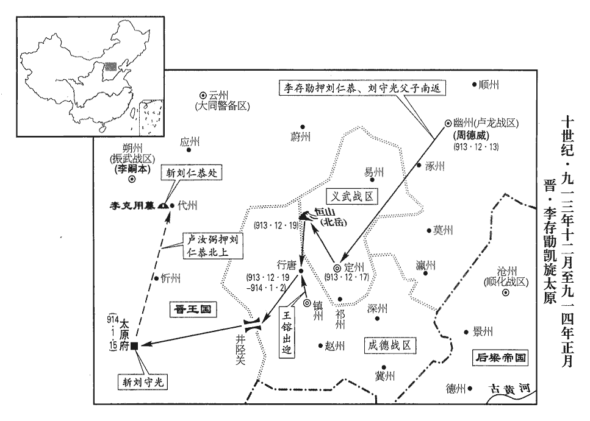
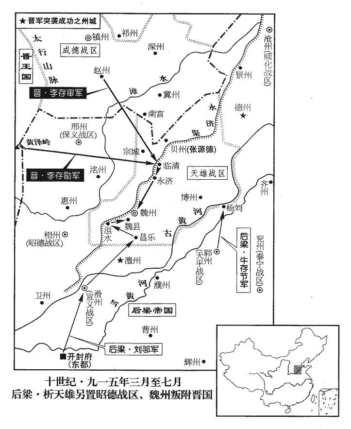
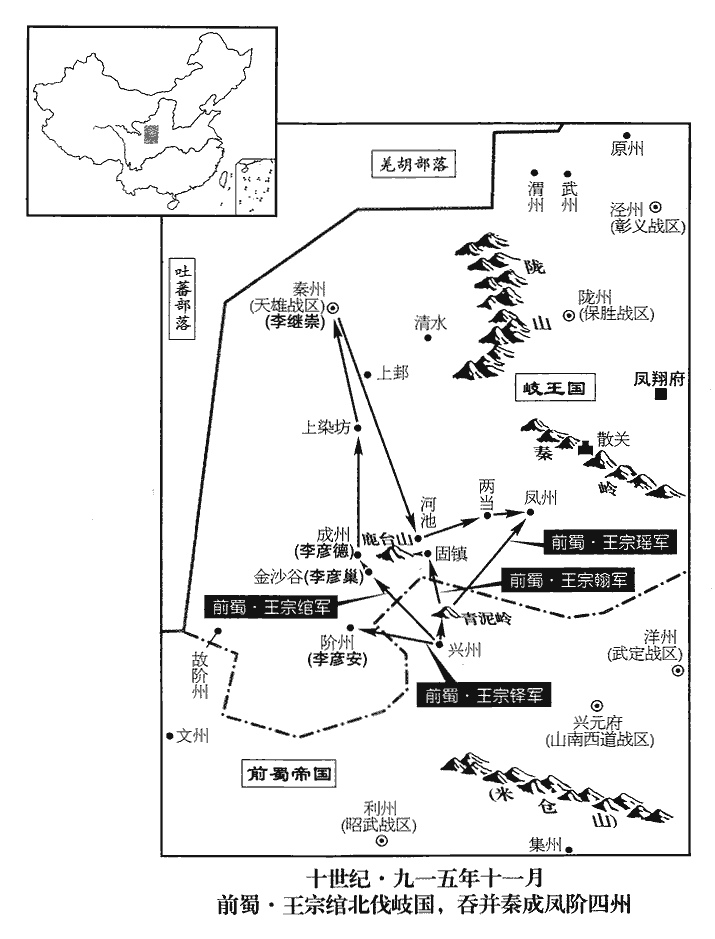
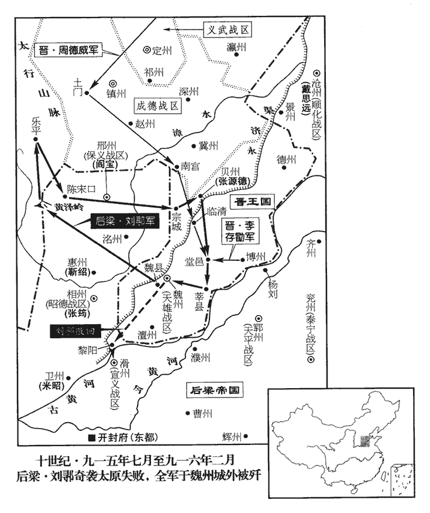
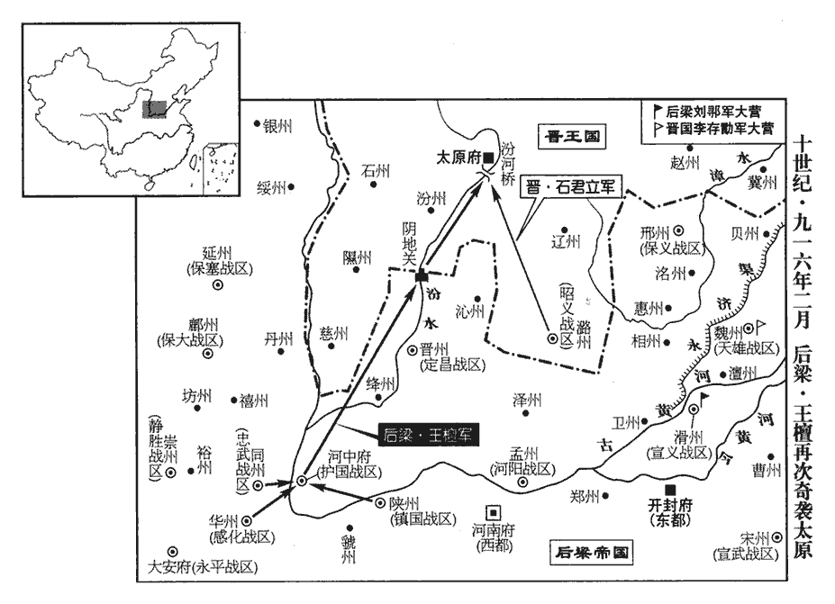
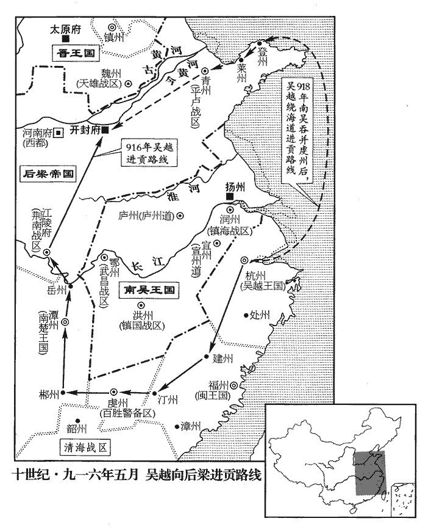
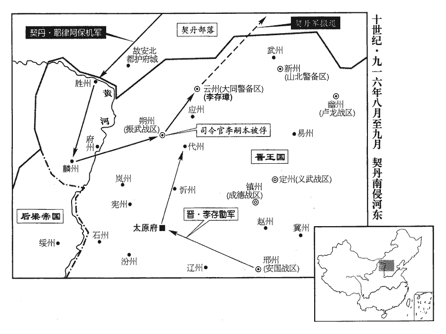
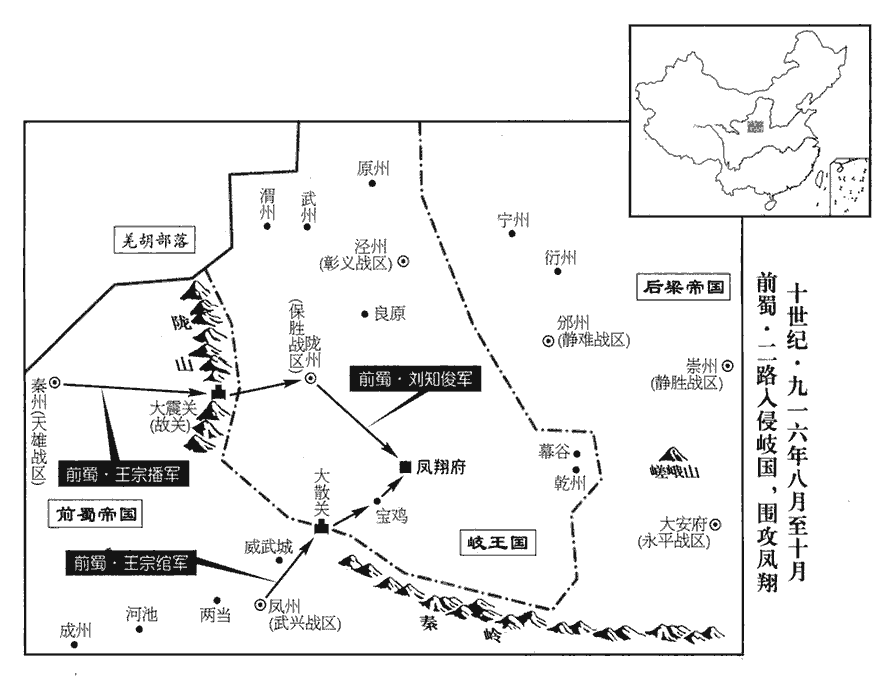
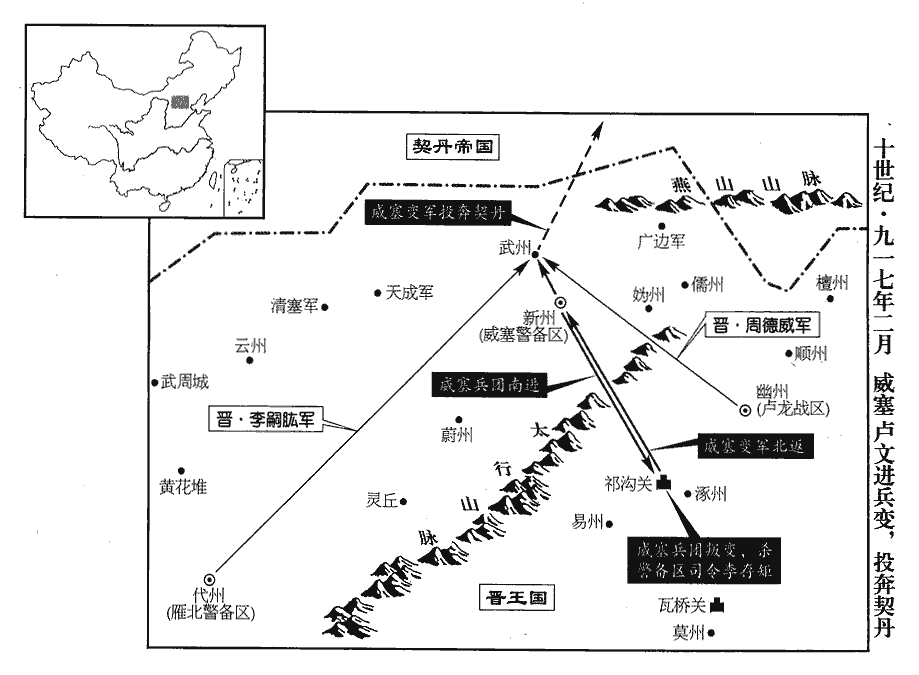
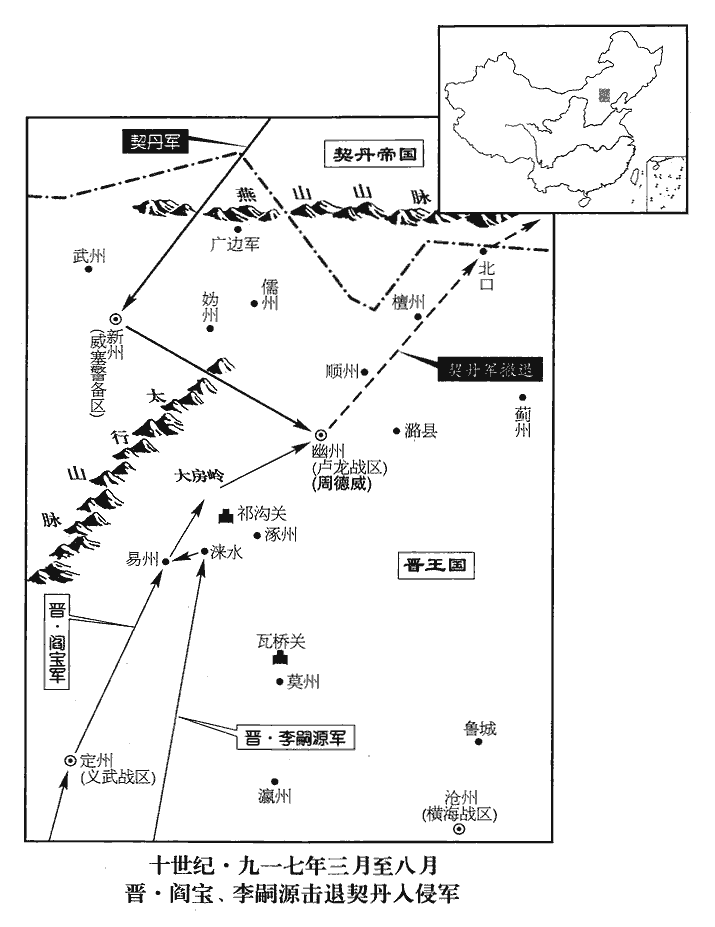

 後梁紀四起昭陽作噩（癸酉）十二月，盡強圉赤奮若（丁丑）六月，凡三年有奇。

# 均王上下

## 乾化三年（癸酉、九一三）

1十二月，吳鎮海‹总部设润州江苏省镇江市›節度使徐溫、平盧節度使朱瑾帥諸將拒之，拒王景仁也。帥，讀曰率。遇于趙步‹安徽省寿县东北›。趙步，瀕淮津濟之處，南直壽春紫金山。吳徵兵未集，溫以四千餘人與景仁戰，不勝而卻。景仁引兵乘之，將及於隘，隘，烏介翻，險狹之處為隘。吳吏士皆失色，左驍衛大將軍宛丘‹陈州州政府所在县·河南省淮阳县›陳紹援槍大呼援，于元翻。呼，火故翻。曰：「誘敵太深，可以進矣。」誘，音酉。躍馬還鬬，眾隨之，梁兵乃退。溫拊其背曰：「非子之智勇，吾幾困矣。」幾，居依翻。賜之金帛，紹悉以分麾下。吳兵既集，復戰於霍丘‹安徽省霍邱县›，梁兵大敗；王景仁以數騎殿，吳人不敢逼。殿，丁練翻。王景仁本吳之名將，吳人素畏之，故不敢逼。梁之渡淮而南也，表其可涉之津；立表以記淺。霍丘守將朱景浮表於木，徙置深淵。朱景，霍丘土豪也，吳用以為將，守霍丘。浮表於木者，徙梁所立之表，其下接之以木，立諸深淵以誤之。及梁兵敗還，還，從宣翻。望表而涉，溺死者太半，吳人聚梁尸為京觀於霍丘。觀，古玩翻。

〖译文〗 [1]十二月，吴国镇海节度使徐温、平卢节度使朱瑾率领诸将抵御后梁王景仁，两军在赵步相遇。当时，吴国征集的士卒还未到齐，徐温率领着四千余士卒与王景仁交战。终因寡不敌众而战败退却。王景仁乘胜率兵追击，快追到险要的地方，吴国的官兵都吓得惊恐失色。这时，吴国的左骁卫大将军宛丘人陈绍举起枪来高声疾呼，说：“诱敌太深了，可以进攻了。”于是他跃上战马，回头还击后梁军，吴国的士卒也跟着他一起与后梁军作战，后梁军才撤退。事后徐温拍着陈绍的背说：“若不是你聪明勇敢，我们几乎就要陷入困境了。”于是赏赐给陈绍很多金帛，陈绍全部赏赐分给部下。吴国的军队征集起来以后，又与后梁军战于霍丘，结果后梁军大败，王景仁和几个骑兵走在队伍的后面，吴国的士卒不敢逼近。后梁军在渡过淮水向南撤退时，在水浅的渡津作了标志；吴军霍丘守将朱景将这些标志浮在木头上移到水深的地方。等到后梁军战败回逃的时候，都按照过河时设置的标志涉水渡河，结果被溺死的士卒有一半以上，吴国人把被溺死的后梁军尸体集中起来在霍丘封筑成高士家，以此来炫耀自己军队所取得的胜利。

 

2庚午‹三›，晉王以周德威為盧龍節度使，兼侍中，以李嗣本為振武‹总部设朔州山西省朔州市›節度使。先是，周德威以破夾寨之功帥振武，今以平燕之功徙帥盧龍，以李嗣本代帥振武。歐史義兒傳，嗣本本鴈門張氏子。

〖译文〗 [2]庚午（初三），晋王李存勖任命周德威为卢龙节度使兼侍中，任命李嗣本为振武节度使。

燕主守光將奔滄州就劉守奇，劉守奇藉兵於梁以取滄州，事見上卷上年。涉寒，足腫，史炤曰：釋名曰：腫，鍾也，寒熱氣聚也。且迷失道，至燕樂‹北京市密云县东北›之境，燕樂縣，後魏置，治白檀古城。唐長壽二年徙治新興城，屬檀州。宋白曰：燕樂、密雲二縣皆漢虒sī奚縣地。樂，音洛。晝匿阬谷，數日不食，令妻祝氏乞食於田父張師造家。師造怪婦人異狀，詰知守光處，詰，去吉翻。并其三子擒之。癸酉‹六›，晉王方宴，將吏擒守光適至，王語之曰：語，牛倨翻。「主人何避客之深邪！」并仁恭置之館舍，以器服膳飲賜之。王命掌書記王緘草露布，緘不知故事，書之於布，遣人曳之。魏、晉以來，每戰勝則書捷狀，建之漆竿，使天下皆知之，謂之露布。露布者，暴白其事而布告天下，未嘗書之於布而使人曳之也。文心雕龍曰：露布者，蓋露板不封，布諸觀聽也。

〖译文〗 燕主刘守光被周德威击败后，将要向南投奔沧州刘守奇，由于步行过河，水寒冷，脚肿了，而且迷失了道路，行至燕乐县境内时，白天藏匿在谷之中，好几天都没有吃上饭，就让他的妻子祝氏到老农张师造家讨饭。老农张师造觉得刘守光的妻子祝氏形状很怪异，盘问得知刘守光的住处，于是连刘守光的三个儿子一并捉拿起来，癸酉（初六），晋王正要举行宴会时，将吏把刘守光押送刚刚到达，晋王对他们说：“主人为什么要这样畏避客人呢？”于是将刘仁恭和刘守光一并安置到客舍，并赐给他们衣食用具。随后晋王又命令掌管书牍记录的官员王缄起草露布，晓示天下。王缄不知露布的旧例，便把情况书写在布匹上，派人拉着。

晉王欲自雲‹山西省大同市›、代‹山西省代县›歸，自幽州取山後路，歷雲、代等州至晉陽。趙王鎔及王處直請由中山、真定趣井陘‹河北省鹿泉市西›，王處直、王鎔欲晉王取道中山、真定，各展迎賀之禮。趣，七喻翻。王從之。庚辰‹十三›，晉王發幽州，劉仁恭父子皆荷校於露布之下。荷，下可翻，又音何。校，爻教翻。易曰：荷校滅耳。註云：校者，以木絞校者也，即械也；校者取其通名也。守光父母唾其面而罵之曰：「逆賊，破我家至此！」守光俛首而已。俛，音免。甲申‹十七›，至定州，舍于關城。丙戌‹十九›，晉王與王處直謁北嶽廟‹河北省曲阳县西·当时北岳所在›；北嶽廟在恆山之大茂山；恆山在定州曲陽縣西北。是日，至行唐‹河北省行唐县›，行唐，漢南行唐縣，後魏曰行唐，唐屬鎮州。九域志：在州北五十五里。趙王鎔迎謁于路。

〖译文〗 晋王打算经过云州、代州回晋阳，赵王王熔和王处直请求经由中山、真定，并取道井陉返回晋阳，晋王听从了他们的意见。庚辰（十三日），晋王从幽州出发，刘仁恭父子都戴着枷锁在露布之下。刘守光的母亲和父亲将唾沫唾在他的脸上并骂他说：“逆贼，把我的家败坏到这种地步！”刘守光只是低着头而已。甲申（十七日），行至定州，住在关口的城楼里面。丙戌（十九日），晋王和王处直拜谒北岳庙。这一天，行至行唐，赵王王熔在路上迎接谒见了晋王。

## 四年（甲戌，九一四）

1春，正月，戊戌朔‹一›，趙‹首府镇州›王鎔詣晉‹首都太原府山西省太原市›王‹李存勖，本年三十岁›行帳上壽置酒。鎔願識劉太師面，上，時掌翻。劉守光既囚其父仁恭，請於梁，以太師致仕，故王鎔因而稱之。晉王命吏脫仁恭及守光械，引就席同宴；鎔答其拜，又以衣服鞍馬酒饌贈之。饌，雛戀翻，又雛晥翻。己亥‹二›，晉王與鎔畋于行唐‹河北省行唐县›之西，鎔送【章：十二行本「送」下有「至」字；乙十一行本同；孔本同；張校同。】境上而別。

〖译文〗 [1]春季，正月，戊戍朔（初一），赵王王熔到晋王的军帐中为晋王上寿敬酒。王熔希望能见刘太师一面，晋王命令看守刘仁恭、刘守光的官吏卸掉刘仁恭、刘守光所戴的枷械，并把他们领到帐中同宴，王熔回拜了他们，又赠送给他们衣服、鞍马、酒馔。已亥（初二），晋王和王熔在行唐的西面打猎，随后王熔把晋王送到边境上才分别。

2丙子‹九›，【張：「子」作「午」。】蜀‹首都成都府四川省成都市›主‹王建，本年六十八岁›命太子判六軍，開崇勳府，置僚屬，後更謂之天策府。更，工衡翻。

〖译文〗 [2]丙午（二十一日），前蜀主王建命令太子元膺判管六军，始建崇勋府，设置僚属，后来改称为天策府。

3壬子‹十五›，晉王以練𥿊chè劉仁恭父子，凱歌入于晉陽‹首都太原府所在县›，𥿊，充夜翻，縶縛之也。戰勝得國而歸，故奏凱歌。丙辰‹十九›，獻于太廟，自臨斬劉守光。守光呼曰：「守光死不恨，呼，火故翻。然教守光不降者，李小喜也。」事見上卷上年。王召小喜證之，小喜瞋目叱守光曰：瞋，昌真翻。「汝內亂禽獸行，亦我教邪！」行，下孟翻。王怒其無禮，先斬之。怒其無禮於舊君也。守光曰：「守光善騎射，王欲成霸業，何不留之使自效！」其二妻李氏、祝氏讓之曰：讓，責也。「皇帝，事已如此，生亦何益！」【章：十二行本「益」下有「妾請先死」四字；乙十一行本同；孔本同；張校同；退齋校同。】即伸頸就戮。守光至死號泣哀祈不已。史言劉守光畏死，婦人之不若。號，戶高翻。王命節度副使盧汝弼等械仁恭至代州‹山西省代县›，刺其心血以祭先王墓，然後斬之。以劉仁恭叛其父也。晉王葬其先王於代州鴈門縣，後名為建極陵。刺，七亦翻。

〖译文〗 [3]壬子（十五日），晋王用白绢捆绑着刘仁恭父子，高奏凯歌进入了晋阳城。丙辰（十九日），晋王将俘虏刘仁父子献于太庙，并亲临刑场斩杀刘守光。临刑前刘守光高声呼喊说：“我刘守光死而无恨，然而教我刘守光不降服的人是李小喜。”晋王把李小喜召来证明刘守光的话是否事实，李小喜怒目斥骂刘守光说：“你乱伦的禽兽行为也是我教的吗？”晋王对他出言无礼的行为十分生气，于是先斩杀了李小喜。刘守光说：“我刘守光善于骑马射箭，大王要成功霸业，为什么不留下我，让我为您效劳呢？”刘守光的两个妻子李氏和祝氏在一旁责备地说：“皇上，事已如此，活着又有什么好处呢？”随即伸出脖子接受砍戮。刘守光至死都不停地号泣求饶。晋王命令节度副使卢汝弼等给刘仁恭戴上枷锁。押送到代州，刺取了他的心血祭祀了先王李克用陵墓，然后将他斩杀。

或說趙王鎔曰：說，式芮翻。「大王所稱尚書令，乃梁‹首都开封府›官也，大王既與梁為讎，不當稱其官。且自太宗‹李世民›踐阼已來，無敢當其名者。唐太宗自尚書令即帝位，後之臣下率不敢當其名；唐之將亡，始以授藩帥。今晉王‹李存勖›為盟主，勳高位卑，不若以尚書令讓之。」讓，遜也。鎔曰「善！」乃與王處直‹义武总部定州›各遣使推晉王為尚書令，晉王三讓，然後受之，始開府置行臺如太宗故事。唐太宗置行臺事見高祖紀。

〖译文〗 有人劝赵王王熔说：“大王所称尚书令是梁国的官名，大王既然与梁国为仇敌，就不应当再用梁国的官名，况且自从唐太宗登位以来，没有敢称这种官名的。现在晋王为盟主，功高位低，不如用尚书令这个官位来推崇他。”王熔说：“很对。”于是与王处直各自派一些人去推举晋王为尚书令，晋王再三辞让，最后才接受了，并和过去的唐太宗一样，开建府署，设置行台。

4高季昌以蜀夔‹重庆市奉节县›、萬‹重庆市万州区›、忠‹重庆市忠县›、涪‹重庆市涪陵区›四州舊隸荊南‹总部江陵府›，興兵取之，涪，音浮。先以水軍攻夔州。時鎮江‹总部设忠州重庆市忠县›節度使兼侍中嘉王宗壽鎮忠州，蜀置鎮江軍節度，領夔、忠、萬三州。夔州刺史王成先請甲，宗壽但以白布袍給之。成先帥之逆戰，帥，讀曰率。季昌縱火船焚蜀浮橋，招討副使張武舉鐵絙拒之，唐昭宗天祐元年，張武以鐵絙鎖峽。絙，戶登翻。船不得進。會風反，荊南兵焚溺死者甚眾。乘順風以縱火船，風反故自焚。季昌乘戰艦，艦，戶黯翻。蒙以牛革，飛石中之，折其尾，中，竹仲翻。折，而設翻。季昌易小舟而遁。荊南兵大敗，俘斬五千級。成先密遣人奏宗壽不給甲之狀，宗壽獲之，召成先，斬之。

〖译文〗 [4]高季昌因为前蜀的夔州、万州、忠州、涪州四州过去隶属荆南，打算用武力来夺取这些地方。一开始用水军攻打夔州。当时前蜀镇江节度使兼侍中嘉王王宗寿镇守忠州，夔州刺史王成先请求率领甲士作战，王宗寿只把穿白布袍的士卒配备给他。王成先率领这些白袍士卒迎战高季昌，高季昌放出火船焚烧了前蜀的浮桥，前蜀招讨副使张武架起铁索桥来阻拦高季昌的火船，结果火船无法通过。这时正好遇上风向调转，荆南高季昌的部队被火烧死和淹死的士卒很多。高季昌改乘战船逃跑，并给船蒙上牛皮，但被飞石击中，船尾被砸断，高季昌又改乘小船逃跑。在这次战役中，荆南兵大败，被俘虏和斩杀的共有五千人左右。夔州刺史王成先秘密派人向前蜀主奏告王宗寿不配备给戴甲士卒的情况，结果被王宗寿获知，于是召见王成先，并斩杀了他。

5帝‹朱友贞，本年二十七岁›以岐‹首都凤翔府陕西省凤翔县›人數為寇，數，所角翻。二月，【章：十二行本「月」下有「甲戌‹七›」二字；乙十一行本同；孔本同；張校同；退齋校同。】徙感化‹总部设华州陕西省华县›節度使康懷英為永平‹总部设大安府陕西省西安市›節度使，鎮長安。感化軍，陝州。梁初徙佑國軍於長安，尋改為永平軍。懷英即懷貞也，避帝名改焉。

〖译文〗 [5]后梁帝因为岐人曾多次来侵犯，二月，甲戌（初七），调感化节度使康怀英为永平节度使，镇守长安。康怀英即康怀贞，因为避讳后梁帝均王朱友贞的名字而改为康怀英。

6夏，四月，丙子‹十›，蜀主徙鎮江軍治夔州‹重庆市奉节县›。

〖译文〗 [6]夏季，四月丙子（初十），前蜀主王建调镇江军去治理夔州。

7丁丑‹十一›，司空兼門下侍郎、同平章事于兢坐挾私遷補軍校，校，戶教翻。罷為工部侍郎，再貶萊州‹山东省莱州市›司馬。

〖译文〗 [7]丁丑（十一日），司空兼门下侍郎、同平章事于兢因为犯了徇私迁补军校的罪，降为工部侍郎，后来又贬任莱州司马。

8吳‹首都扬州江苏省扬州市›袁州‹江西省宜春市›刺史劉崇景叛，附于楚‹首都潭州湖南省长沙市›。崇景，威之子也。劉威與楊行密同起於合肥，有戰功，歷方鎮。楚將許貞將萬人援之，吳都指揮使柴再用、米志誠帥諸將討之。此都指揮使盡統諸將，非一都之指揮使。帥，讀曰率。

〖译文〗 [8]吴国的袁州刺史刘景崇叛背吴国，归附于楚。刘景崇是刘威的儿子。楚将许贞率领一万人马来援救他，吴国的都指挥使柴再用、米志诚率领许多将领来讨伐他。

9楚岳州‹湖南省岳阳市›刺史許德勳將水軍巡邊，楚之岳州東北皆邊於吳。夜分，夜半為夜分。南風暴起，都指揮使王環乘風趣黃州‹湖北省黄州市›，王環乃一州之都指揮使。趣，七喻翻；下同。以繩梯登城，徑趣州署，執吳刺史馬鄴，大掠而還。還，從宣翻，又如字。德勳曰：「鄂州‹吴武昌战区总部所在·湖北省武汉市›將邀我，宜備之。」自黃州還岳州，舟過鄂州城外，故許德勳畏之。環曰：「我軍入黃州，鄂人不知，奄過其城，奄，忽也。彼自救不暇，安敢邀我！」乃展旗鳴鼓而行，以示不恐。鄂人不敢逼。

〖译文〗 [9]楚国的岳州刺史许德勋率领水军在楚吴边境上巡逻，到了半夜的时候，突然刮起了南风，楚国的都指挥使王环乘风直捣吴国的黄州，用绳梯登上了城墙，然后直奔州署，俘获了吴国刺史马邺，大肆抢劫之后返回，许德勋说：“鄂州的军队很可能阻截我们，应该防备他们的进攻。”王环说：“我军进入黄州时，鄂人根本不知道，这次路过是突然通过州城，此时他们自救不暇，哪里还敢阻截我们。”于是举起旗敲起鼓列队而行，鄂人根本没敢逼近他们。

10五月，朔方‹总部设灵州宁夏灵武市›節度使兼中書令潁川王韓遜卒，軍中推其子洙為留後。癸丑‹十七›，詔以洙為節度使。

〖译文〗 [10]五月，朔方节度使兼中书令颍川王韩逊去世，军中推选他的儿子韩洙为留后。癸丑（十七日），后梁帝正式颂诏任用韩洙为朔方节度使。

11吳柴再用等與劉崇景、許貞戰於萬勝岡‹江西省宜春市东›，大破之，崇景、貞棄袁州遁去。

〖译文〗 [11]吴国都指挥使柴再用与刘崇景、许贞在万胜冈打仗，结果柴再用大败敌军，刘崇景和许贞放弃了袁州而逃跑。

12晉王既克幽州，乃謀入寇。秋，七月，會趙王鎔‹成德，总部设镇州河北省正定县›及周德威‹总部设幽州北京市›於趙州‹河北省赵县›，南寇邢州‹河北省邢台市›，李嗣昭引昭義‹总部潞州›兵會之。楊師厚‹梁天雄，总部设魏州河北省大名县›引兵救邢州，軍於漳水之東。楊師厚自魏州引兵救邢州。晉軍至張公橋‹河北省邢台市西北›，晉軍出青山口至張公橋，在邢州龍岡縣界。按薛史，唐末，葛從周敗晉軍于沙河，追至張公橋。沙河縣在邢州南二十五里，而邢州治龍岡則可知矣。裨將曹進金來奔。晉軍退，諸鎮兵皆引歸。諸鎮兵，謂燕、趙、潞之兵。八月，晉王還晉陽。

〖译文〗 [12]晋王攻克幽州以后，打算入侵别的地方。秋季，七月，晋王在赵州会见赵王王熔和周德威，并向南入侵邢州，李嗣昭率领昭义军和他们会师。杨师厚从魏州率领军队去援救邢州，在漳水东面安营扎寨。晋王军队行至张公桥时，裨将曹进金率军投奔来降。后来，晋军撤退，燕、赵、诸镇的军队也都率兵回营。八月，晋王回到晋阳。

13蜀武泰‹总部设黔州重庆市彭水县›節度使王宗訓鎮黔州‹重庆市彭水县›，黔，其今翻，又其炎翻。貪暴不法；擅還成都，庚辰‹十六›，見蜀主，多所邀求，言辭狂悖。悖，蒲昧翻，又蒲沒翻。蜀主怒，命衛士毆殺之。毆，烏口翻。戊子‹二十四›，以內樞密使潘峭為武泰節度使、同平章事，峭，七笑翻。翰林學士承旨毛文錫為禮部尚書，判樞密院。

〖译文〗 [13]前蜀武泰节度使王宗训镇守黔州，贪暴不法，擅自回到成都。庚辰（十六日），他见到前蜀主王建以后，提出很多要求，而且说话时语言十分狂悖。王建十分生气，便命令他的卫士把王宗训活活打死。戊子（二十四日），任命内枢密使潘峭为武泰节度使、同平章事，翰林学士承旨毛文锡为礼部尚书，判枢密院。

峽上有堰，或勸蜀主乘夏秋江漲，決之以灌江陵‹梁›荆南战区总部所在湖北省江陵县，毛文錫諫曰：「高季昌不服，其民何罪！陛下方以德懷天下，忍以鄰國之民為魚鼈食乎！」蜀主乃止。

〖译文〗 川江三峡上有一座挡水的低坝，有人劝说王建趁夏秋川江水涨时，打开低坝，直灌江陵。毛文锡进谏说：“高季昌虽然不顺服，但他的百姓们有什么罪呢？陛下将要用崇高的品德来怀柔天下，怎么能忍心把邻国的百姓当成鱼鳌的食物呢？”王建于是停止了水灌江陵的计划。

14帝以福王友璋為武寧‹总部设徐州江苏省徐州市›節度使。前節度使王殷，友珪所置也，懼，不受代，叛附於吳；九月，命淮南西北面招討應接使牛存節及開封尹劉鄩將兵討之。冬，十月，存節等軍于宿州‹安徽省宿州市›。九域志：徐州南至宿州一百四十五里。牛存節不徑攻徐州而南屯宿州，據埇橋之要，所以絕淮南之援也。吳平盧‹总部设青州山东省青州市›節度使朱瑾等將兵救徐州‹江苏省徐州市›，存節等逆擊，破之，吳兵引歸。

〖译文〗 [14]后梁帝任命福王朱友璋为武宁节度使。以前的武宁节度使王殷是朱友所立的，他因为害怕，不敢接受替代的制命，便背叛后梁而归附了吴国。九月，后梁命淮南西北面招讨应接使牛存节和开封尹刘率兵讨伐王殷。冬季，十月，牛存节等驻扎在宿州。这时吴国派遣平卢节度使朱瑾等率兵援救徐州，牛存节等率兵迎战，结果朱瑾的部队被击败，吴国的军队才撤回。

15十一月，乙巳‹十三›，南詔‹长和前身南诏。首都大理城云南省大理市›寇黎州‹四川省汉源县›，蜀主以夔王宗範、兼中書令宗播、嘉王宗壽為三招討以擊之。丙辰‹二十四›，敗之於潘倉嶂‹四川省汉源县北›，斬其酋長趙嵯政等；敗，補邁翻。酋，慈秋翻。長，知兩翻。嵯cuó，才何翻。壬戌‹三十›，又敗之於山口城‹汉源县稍北›；十二月，乙亥‹十三›，破其武侯嶺‹汉源县城北›十三寨；黎州南界有潘倉、武侯等十一城。路振九國志：王宗播出邛崍關至潘倉，大破蠻眾，追奔至山口城。則潘倉在邛崍之南，山口城又在潘倉之南也。辛巳‹十九›，又敗之於大渡河，按九域志，黎州三面阻大渡河，南面至大渡河一百里，東南面至大渡河一百二十里，西南面至大渡河三百里。俘斬數萬級，蠻爭走渡水，橋絕，溺死者數萬人。宗範等將作浮梁濟大渡河攻之，蜀主召之令還。蠻地深阻，不欲勞師遠攻，驅之出境而已，此蜀主之志也。

〖译文〗 [15]十一月，乙巳（十三日），南诏国侵犯黎州，前蜀主派遣夔王王宗范、兼中书令王宗播、嘉王王宗寿为三招讨，阻击南诏的侵略军。丙辰（二十四日），在潘仓嶂打败了南诏侵略军，斩杀南诏酋长赵嵯政等。壬戌（三十日），又在山口城击败了南诏军队。十二月，乙亥（十三日），攻下南诏武侯岭等十三个村寨。辛巳（十九日），又在大渡河击败了南诏军队，俘获和斩杀数万南诏士卒，南诏人争先恐后地抢着过河逃跑，桥被压断，又有数万人被水淹死。王宗范等将要制成浮桥渡过大渡河继续攻打南诏军队，前蜀主通知王宗范等，命令他们撤回。

16癸未‹二十一›，蜀興州‹陕西省略阳县›刺史兼北路制置指揮使王宗鐸攻岐‹首都凤翔府›階州‹甘肃省康县›九域志：興州西南至階州五百一十里。及固鎮‹甘肃省徽县›，固鎮在青泥嶺東北。薛史地理志：鳳州固鎮之地，周顯德六年升為雄勝軍。破細砂‹陕西省凤县境›等十一寨，斬首四千級。甲申‹二十二›，指揮使王宗儼破岐長城關‹凤县境›等四寨，斬首二千級。

〖译文〗 [16]癸未（二十一日），前蜀光州刺史兼北路制置指挥使王崇铎向岐国的阶州和固镇发起进攻，攻下细砂等十一个村寨，斩杀四千人。甲申（二十二日），指挥使王崇俨又攻下岐国长城关等四个村寨，斩杀二千人。

17岐靜難‹总部设邠州陕西省彬县›節度使李繼徽‹杨崇本›難，乃旦翻。為其子彥魯所毒而死，彥魯自為留後。

〖译文〗 [17]岐国静难节度使李继徽被他的儿子李彦鲁毒死，李彦鲁自己当了留后官。

## 貞明元年（乙亥、九一五）是年十一月方改元貞明。

1春，正月，己亥‹八›，蜀主‹王建，本年六十九岁›御得賢門受蠻俘，大赦。初，黎‹四川省汉源县›、雅‹四川省雅安市›蠻酋劉昌嗣、郝玄鑒、楊師泰，雖內屬於唐，受爵賞，號㚋金堡三王，史炤曰：㚋，大也，多也。今按㚋音丁么翻，蠻語多也，大也。唐書黎、邛二州之西有三王蠻，蓋莋zuó都夷、白馬氐之遺種。楊、劉、郝三姓世為長，襲封王，謂之三王部落。疊甓pì而居，號㚋舍。至宋，又有趙、王二族，并劉、郝、楊謂之五部落，居黎州之西，去州百餘里，限以飛越嶺。其居疊石為㚋，積糗糧器甲於上。族無君長，惟老宿之聽。往來漢地，悉能華言，故比諸羌尤桀黠。而潛通南詔，為之詗xiòng導；鎮蜀‹总部设成都府四川省成都市›者多文臣，雖知其情，不敢詰。詗，古迥翻，又翾xuān正翻。詰，去吉翻，窮問也。至是，蜀主數以漏泄軍謀，數，所具翻。斬於成都市，毀㚋金堡‹四川省泸定县南›。自是南詔不復犯邊。復，扶又翻。

〖译文〗 [1]春季，正月，己亥（初八），前蜀主驾临得贤门接受蛮夷的俘虏，并大赦了他们。起初，黎、雅蛮夷酋长刘昌嗣、郝玄鉴、杨师泰三人虽然向内归属于唐，也曾受过后唐的封爵和赏赐，号称金堡三王，实际上却偷偷地私通南诏，并为南诏充当侦察和向导。镇守蜀地的人多数是文官，虽然知道他们的情况，但不敢去问个究竟。此时，前蜀主责备他们泄漏军机，在成都把他们斩了，并且捣毁了金堡。从此以后，南诏不敢再侵犯前蜀的边境。

2二月，牛存節等拔彭城，王殷舉族自焚。考異曰：莊宗列傳朱友貞傳云：「乾化四年十一月拔徐州，殷自燔死。」五代通錄、薛史紀及王殷傳皆云貞明元年春，今從之。

〖译文〗 [2]二月，牛存节等攻下了彭城，王殷全族都自焚。

3三月，丁卯‹七›，以右僕射兼門下侍郎、同平章事趙光逢為太子太保，致仕。

〖译文〗 [3]三月，丁卯（初七），封右仆射兼门下侍郎、同平章事赵光逢以太子太保，退休归居。

4天雄‹总部设魏州河北省大名县›節度使兼中書令鄴王楊師厚卒。師厚晚年矜功恃眾，擅割財賦，選軍中驍勇，置銀槍效節都數千人，給賜優厚，欲以復故時牙兵之盛。魏博自田承嗣置牙兵，至羅紹威而除，楊師厚復置之。帝‹朱友贞，本年二十八岁›雖外加尊禮，內實忌之，及卒，私於宮中受賀。畏其逼而幸其死。租庸使趙巖、租庸使自唐中世以來有之。五代會要：梁置租庸使，其班在崇政使之下，宣徽使之上。判官邵贊判官，租庸判官。言於帝曰：「魏博為唐腹心之蠹，二百餘年不能除去者，去，羌呂翻。以其地廣兵強之故也。羅紹威、楊師厚據之，朝廷皆不能制。陛下不乘此時為之計，所謂『彈疽不嚴，必將復聚，』言彈疽者必不畏病疽者之疼，盡彈去其膿血，然後新肉生而病已，不則將復結聚也。醫工彈疽用砭石。安知來者不為師厚乎！宜分六州為兩鎮以弱其權。」考異曰：莊宗列傳：「宰相敬翔、租庸使趙巖、判官邵贊等為友貞畫策，分魏博六州為兩鎮。」薛史無敬翔名，今從之。帝以為然，以平盧‹总部设青州山东省青州市›節度使賀德倫為天雄節度使；置昭德軍於相州‹河南省安阳市›，割澶‹河南省内黄县东南›、衛‹河南省卫辉市›二州隸焉，相，息亮翻。澶chán，時連翻。以宣徽使張筠為昭德‹总部设相州河南省安阳市›節度使，仍分魏州將士府庫之半於相州。筠，海州‹江苏省连云港市›人也。二人既赴鎮，朝廷恐魏人不服，遣開封尹劉鄩將兵六萬自白馬‹河南省滑县›濟河，白馬津在滑州。以討鎮‹河北省正定县·成德战区›、定‹河北省定州市·义武战区›為名，實張形勢以脅之。

〖译文〗 [4]天雄节度使兼中书令邺王杨师厚去世。杨师厚在晚年时常居功自，擅自夺取财赋，并挑选军中勇敢善战的士卒设置私人军队数千人，号称银枪效节都，供给赏赐十分优厚，打算恢复过去牙兵的盛况。后梁帝虽然表面上对他尊礼有加，内心却很忌恨他，到他死后，在宫中暗自庆贺。租庸使赵岩、判官邵赞对后梁帝说：“魏博一带是唐朝心腹中的蠹虫，之所以二百余年来不能铲除它的割据形势，主要原因是地广兵强。罗绍威、杨师厚占据这块地方以后，朝廷都不能够控制它。陛下如果不乘此时重新考虑，就像所说的‘弹除脓血不净，必将重新瘀结’，怎么能够知道未来的天雄节度使不像杨师厚呢？应当将魏博六州分为两镇，削弱它的权力。”后梁帝认为言之有理，于是任命原平卢节度使贺德伦为天雄节度使。在相州增置了昭德军，割出澶、卫二州隶属相州，任命原宣徽使张筠为昭德节度使，又将魏州的将士、府库财产的一半分给相州。张筠是海州人。贺德伦、张筠已经赴任，但朝廷又害怕魏州人不服，于是又派遣开封尹刘率兵六万，从白马渡过黄河，以讨伐镇州、定州为名，其实是虚张声势用威力来强迫魏人服从。

魏兵皆父子相承數百年，曰數百年者，言其來也久，非必實經歷數百年也。族姻磐結，不願分徙。德倫屢趣之，趣，讀曰促。應行者皆嗟怨，連營聚哭。己丑‹二十九›，劉鄩屯南樂‹河南省南乐县›，南樂本唐魏州昌樂縣，後唐避獻祖諱，改曰南樂，史因而書之。九域志：南樂縣在魏州南四十四里。先遣澶州刺史王彥章將龍驤五百騎入魏州，屯金波亭‹魏州城内›。魏兵相與謀曰：「朝廷忌吾軍府強盛，欲設策使之殘破耳。吾六州歷代藩鎮，兵未嘗遠出河門‹河北省大名县城外河门堤›，按舊唐書，魏州城外有河門舊堤，樂彥禎築羅城，約河門舊堤周八十里。一旦骨肉流離，生不如死。」是夕，軍亂，考異曰：莊宗列傳：「二十七日，劉鄩屯南樂，遣龍驤都將王彥章以五百騎入魏州，是夜三鼓，魏軍亂。」是月辛酉朔，薛史紀云己丑魏博軍作亂，蓋莊宗列傳「九」字誤為「七」字耳。縱火大掠，圍金波亭，王彥章斬關而走。詰旦，亂兵入牙城，殺賀德倫之親兵五百人，劫德倫置樓上。有效節軍校張彥者，自帥其黨，拔白刃，止剽掠。校，戶教翻。剽，匹妙翻。

〖译文〗 魏州士卒数百年来都是父子相承，族与族之间婚姻盘结，不愿意分离。天雄节度使贺德伦多次催促他们分离，但答应离开的人都哀叹怨恨，甚至连营聚集在一起号啕大哭。己丑（二十九日），开封尹刘的军队驻扎在南乐，先派澶州刺史王彦章率领龙骧骑兵五百人进入魏州，驻扎在金波亭。魏州的士卒们互相谋划说：“朝廷非常忌恨我们的军府强盛，打算用计策让我们军府自行残破。我们六个州历代都是一个藩镇，士卒从来没有远出过河门，一旦骨肉流离，生不如死。”当天晚上，魏军大乱，放火掠夺，包围了金波亭，澶州刺史王彦章斩杀了守门士卒才得以逃出。第二天早晨，魏州乱兵进入了后梁军主将居住的牙城，杀了贺德伦的亲兵五百余人，并劫持了贺德伦，把他放到了牙城的城楼上。有个郊节军军校叫张彦的人，率领自己的同伙，拔出刀枪，制止抢劫活动。

夏，四月，帝遣供奉官扈異撫諭魏軍，許張彥以刺史。彥請復相、澶、衛三州如舊制。請罷昭德軍，復以相、澶、衛三州隸天雄，如舊制。異還，言張彥易與，還，從宣翻，又如字。易，以豉翻。但遣劉鄩加兵，立當傳首。帝由是不許，但以優詔答之。使者再返，彥裂詔書抵於地，戟手南向詬朝廷，左傳：公戟其手。杜預註曰：抵徙屈肘如戟形。陸德明曰：抵，音紙。鄭玄曰：人挾弓矢，戟其肘。孔穎達正義曰：謂射者左手弣fǔ弓而右手彎之，則戟其肘。謂德倫曰：「天子愚暗，聽人穿鼻。諭之以牛，為人穿鼻旋轉，前卻一聽命於人，以鼻為所制也。今我兵甲雖強，苟無外援，不能獨立，宜投款於晉。」款，誠也。遂逼德倫以書求援於晉。

〖译文〗 夏季，四月，后梁帝派遣供奉官扈异前往抚慰魏军，并答应让张彦做刺史。张彦请求恢复相、澶、卫三州隶属天雄的旧制。扈异回到朝廷以后说，张彦容易对付，只需命令刘派兵增援，马上就可以拿回张彦的首级来。后梁帝因此没有同意任命张彦做刺吏，仅仅以褒扬的诏书回答他。使者返回魏军时，张彦将诏书撕碎扔在地上，用手指着南面怒骂朝廷，并对贺德伦说：“天子遇昧昏庸，听凭别人牵着鼻子走。现在我的军队虽然还很强盛，但是如果没有外援，仍然不能自立，应当向晋王表示亲善。”于是逼着贺德伦写信向后晋王求援。

5李繼徽‹杨崇本›假子保衡殺李彥魯，考異曰：蜀書劉知俊傳，「保衡」作「彥康」。今從薛史。自稱靜難留後，難，乃旦翻。舉邠‹陕西省彬县›、寧‹甘肃省宁县›二州來附。叛岐附梁。詔以保衡為感化‹总部设华州陕西省华县›節度使，以河陽‹总部设孟州河南省孟州市›留後霍彥威為靜難節度使。

〖译文〗 [5]李继徽的养子李保衡杀死了李彦鲁，自称静难留后，并带着、宁二州归附后梁。后梁帝下诏，任命李保衡为感化节度使，任命河阳留后霍彦威为静难节度使。

6吳‹首都扬州江苏省扬州市›徐溫以其子牙內都指揮使知訓為淮南行軍副使、內外馬步諸軍副使。為徐知訓以驕橫不終張本。

〖译文〗 [6]吴国的镇海节度使徐温让他的儿子牙内都指挥使徐知训出任淮南行军副使和内外马步诸军副使。

 

7晉王‹李存勖,本年三十一岁›得賀德倫書，命馬步副總管李存審自趙州‹河北省赵县›【章：十二行本「州」下有「引兵」二字；乙十一行本同；孔本同；退齋校同。】進據臨清‹河北省临西县›。五月，存審至臨清，劉鄩屯洹水‹河北省魏县西南›。臨清在魏州北，洹水在魏州西。賀德倫復遣使告急于晉，復，扶又翻。晉王引大軍自黃澤嶺‹山西省左权县东南峻极关南›東下，魏收志，樂平郡遼陽縣有黃澤嶺。隋改遼陽為遼山縣，唐帶遼州。與存審會於臨清，猶疑魏人之詐，按兵不進。德倫遣判官司空頲犒軍，頲，他鼎翻。犒，苦到翻。密言於晉王曰：「除亂當除根。」因言張彥凶狡之狀，勸晉王先除之，則無虞矣。王默然。已諭其意而不形於言，慮有窺聽而洩軍機也。頲，貝州‹河北省清河县›人也。

〖译文〗 [7]晋王接到贺德伦的信以后，便命令马步副总管李存审从赵州出发去占据临清。五月，李存审到达临清，后梁开封尹刘的军队驻扎在洹水。贺德伦又派出使者向晋王告急，晋王亲率大军从黄泽岭东下，在临清与李存审会师，这时他们仍然怀疑魏人有诈，所以按兵不进。贺德伦派判官司空前去慰劳晋王军队，秘密地对晋王说：“除乱当除根。”进而把张彦凶残狡诈的情况告诉了晋王，劝说晋王首先把张彦除掉，就没有什么忧患了。晋王听了之后没有表态。司空是贝州人。

晉王進屯永濟‹山东省冠县北›，永濟縣在魏州北數十里。張彥選銀槍效節五百人，皆執兵自衛，詣永濟謁見，王登驛樓語之曰：語，牛倨翻。「汝陵脅主帥，殘虐百姓，帥，所類翻。數日中迎馬訴冤者百餘輩。我今舉兵而來，以安百姓，非貪人土地。汝雖有功於我，不得不誅以謝魏人。」遂斬彥及其黨七人，餘眾股栗。王召諭之曰：「罪止八人，餘無所問。自今當竭力為吾爪牙。」眾皆拜伏，呼萬歲。明日，王緩帶輕裘而進，令張彥之卒擐甲執兵，翼馬而從，擐，音宦。從，才用翻。翼者，翼馬左右而從行。仍以為帳前銀槍都。晉王遂以銀槍效節軍取梁，而亦以銀槍效節軍取禍。眾心由是大服。

〖译文〗 晋王率领军队向前推进，驻扎在永济。张彦挑选银枪效节五百人，都全副武装，加强自卫，到永济拜见晋王，晋王登上驿站的城楼对他说：“你欺凌逼迫主帅，残害百姓，连日来迎马诉冤的就有百余批。我今天率兵而来，目的是安定百姓，并非来贪图别人的土地。你虽然对我有功，但为了向魏州人民谢罪，不得不将你杀掉。”于是晋王斩了张彦及其同伙共七人，其余的乱兵吓得腿都发抖，十分恐惧。晋王把其余乱兵召集来对他们说：“有罪的只有八人、其余的一概不追究。从今以后你们应当竭力成为我的亲信。”大家听后都跪伏在地感谢，高呼万岁。第二天，晋王宽带轻衣，十分从容地继续前进，命令张彦的士卒披甲执枪，全副武装，跟随在晋王的两侧，把他们仍然作为帐前银枪都。乱军士兵从此顺服了晋王。

劉鄩聞晉軍至，選兵萬餘人，自洹水趣魏縣；趣，七喻翻。晉王留李存審屯臨清，遣史建瑭屯魏縣以拒之，九域志：魏縣在魏州西三十五里。王自引親軍至魏縣，與鄩夾河為營。河，漳河也。漳河過魏縣，亦謂之魏河。

〖译文〗 刘听到晋军将要到来，选出一万多士卒从洹水直达魏县。晋王留下李存审的军队驻扎在临清，同时派遣史建瑭屯兵魏县来抵御刘，晋王亲自率领随身护卫的士兵到了魏县，与刘在漳河的两岸安营扎寨。

帝‹梁帝朱友贞›聞魏博叛，大悔懼，遣天平節度使牛存節將兵屯楊劉‹山东省东阿县东北杨柳乡·古黄河南岸渡口›，考異曰：牛存節傳，「楊劉」作「陽留」或「陽劉」。今從唐裴度傳及薛史諸人傳。為鄩聲援。會存節病卒，以匡國‹总部设许州河南省许昌市›節度使王檀代之。

〖译文〗 后梁帝听说魏博这个重要军镇投降了晋王，感到十分悔恨和恐惧，于是派遣天平节度使牛存节率兵驻扎在杨刘，声援刘。不久，牛存节病死，又用匡国节度使王檀代替了他。

8岐王‹李茂贞（宋文通）本年六十岁›遣彰義‹总部设泾州甘肃省泾川县›節度使劉知俊圍邠州，霍彥威固守拒之。先是李保衡叛岐附梁，梁以霍彥威代鎮邠州。

〖译文〗 [8]岐王李茂贞派遣彰义节度使刘知俊包围了州，后梁将霍彦威坚守州抵御。

9六月，庚寅朔‹一›，賀德倫帥將吏請晉王入府城慰勞。既入，德倫上印節，帥，讀曰率；下同。勞，力到翻。上，時掌翻。印，天雄軍府印；節，天雄旌節。請王兼領天雄軍，王固辭，曰：「比聞汴‹河南省开封市›寇侵逼貴道，比，毗至翻。故親董師徒，遠來相救；又聞城中新罹塗炭，故暫入存撫。明公不垂鑒信乃以印節見推，誠非素懷。」德倫再拜曰：「今寇敵密邇，謂劉鄩之兵逼魏州也。軍城新有大變，人心未安，德倫心腹紀綱左傳：秦伯納三千人以衛晉文公，實紀綱之僕。為張彥所殺殆盡，形孤勢弱，安能統眾！一旦生事，恐負大恩。」王乃受之。德倫帥將吏拜賀，王承制以德倫為大同‹总部设云州山西省大同市›節度使，遣之官。德倫至晉陽‹山西省太原市›，張承業留之。大同軍北臨極邊，賀德倫新附，張承業不欲使其有城有兵，故留之。為承業後殺德倫張本。

〖译文〗 [9]六月，庚寅朔（初一），贺德伦率领将吏请求晋王入府慰劳士卒。晋王入府以后，贺德伦送上天雄军府印和天雄旌节，请求晋王兼管天雄军，晋王一再辞让说：“近来听说汴梁强寇侵逼您的军镇，所以亲自督率士卒，远道来相救；又听说城中百姓最近遭到严重残害和灾难，所以亲自暂时进城安抚一下。您却不能理解、信任，竟用印节来表示推让，这不合我的心愿。”贺德伦又一再拜谢说：“现在寇敌逼近，军营中最近又有大的变化，人心未安，我的亲信臣仆都被张彦杀死，形势十分孤弱，怎么能统率大家呢？一旦发生事情，唯恐辜负晋王的大恩。”晋王于是接受了他的印节。贺德伦带领将吏拜贺，晋王按照规制任命贺德伦为大同节度使，并派他立即赴任。贺德伦到了晋阳，被张承业留了下来。

時銀槍效節都在魏城猶驕橫，魏城，魏州城。橫，戶孟翻。晉王下令：「自今有朋黨流言及暴掠百姓者，殺無赦！」以沁州‹山西省沁源县›刺史李存進為天雄都巡按使。沁，牛鴆翻。考異曰：莊宗實錄云為軍城使，存進傳云都部署。莊宗列傳及薛史存進傳皆云天雄軍都巡按使，今從之。有訛言搖眾及強取人一錢已上者，存進皆梟首磔尸於市。梟，堅堯翻。磔，陟格翻。旬日，城中肅然，無敢喧譁者。存進本姓孫，名重進，振武‹总部设朔州山西省朔州市›人也。

〖译文〗 这个时候，银枪效节都在魏州城仍然很骄横，于是晋王下令：“从今以后如有结为朋党、传播流言和以暴力掠夺百姓的人，坚决杀掉，决不宽容。”任命沁州刺史李存进为天雄都巡按使。凡有传播流言蜚语来动摇民众及用武力强夺别人一钱以上的人，李存进都砍头裂尸示众。过了十来天，城中非常安静，没有敢吵吵嚷嚷的人。李存进本姓孙，名字叫重进，振武人。

晉王多出征討，天雄軍府事皆委判官司空頲決之。頲恃才挾勢，睚眦必報，睚，五戒翻。頲，他鼎翻。眦，士戒翻。納賄驕侈。頲有從子在河南，從，才用翻。此河南謂大河之南。頲密使人召之，都虞候張裕執其使者以白王，王責頲曰：「自吾得魏博，庶事悉以委公，公何得見欺如是！獨不可先相示邪！」揖令歸第；是日，族誅於軍門，兩敵對壘，而越境通私書，誅之，宜也，族之，過也。以判官王正言代之。正言，鄆州‹山东省东平县›人也。

〖译文〗 晋王经常出征打仗，天雄军府的事情都委托判官司空处理。司空依仗他的才干和势力，小怨小忿都要报复，经常受贿，又很骄横奢侈。他有个侄儿在黄河以南，司空秘密派人把他召来，都虞候张裕抓住司空的使者，报告了晋王，晋王遣责司空说：“自从我得到魏博以后，日常事务都委托你来处理，你为什么如此欺骗我？难道不可以事先向我报告吗？”很客气地让他回家。就在这一天，在军门将司空的家族都杀掉。随即让判官王正言代替了他的职务。王正言是郓州人。

魏州孔目吏孔謙，勤敏多計數，善治簿書，晉王以為支度務使。唐節鎮多兼支度等使，至其末世，藩鎮署官有為支計官者，有為支度務使者。治，直之翻。謙能曲事權要，由是寵任彌固。為孔謙以掊克亂唐張本。魏州新亂之後，府庫空竭，民間疲弊，而聚三鎮之兵，戰於河上，殆將十年，三鎮，并、魏、鎮也。供億軍須，未嘗有闕，謙之力也。然急徵重斂，斂，力贍翻。使六州愁苦，歸怨於王，亦其所為也。史卒言之。

〖译文〗 魏州孔目吏孔谦，勤劳敏捷，多计谋，善于管理簿记帐册，晋王任命他为支度务使。孔谦能够婉转变通，讨好有权势的要人，因此对他的宠信和任用越来越稳固。魏州新遭动乱以后，府库财物空竭，民间也很疲惫。集中并、魏、镇三镇的士卒，在黄河边作战将近十年，军队的供给从未有过短缺，这些全靠孔谦之力。然而紧急征集重敛财物，使魏博六州的百姓愁苦不堪，以致百姓归怨于晋王，也是孔谦所为。

張彥之以魏博歸晉也，貝州刺史張源德不從，北結滄‹河北省沧州市东南›、德‹山东省陵县›，乾化三年楊師厚、劉守奇北略，滄德遂附于梁。南連劉鄩以拒晉，數斷鎮、定糧道。或說晉王：數，所角翻。斷，都管翻。說，式芮翻。「請先發兵萬人取源德，然後東兼滄、景‹河北省东光县›，則海隅之地皆為我有。」晉王曰：「不然。貝州城堅兵多，未易猝攻。易，以豉翻。德州隸於滄州而無備，若得而戍之，則滄、貝不得往來，九域志：德州西南至貝州二百三十里，東北至滄州亦二百三十里。二壘既孤，然後可取。」二壘，謂滄與貝也。乃遣騎兵五百，晝夜兼行，襲德州。刺史不意晉兵至，踰城走，遂克之，以遼州‹山西省左权县›守捉將馬通為刺史。

〖译文〗 张彦献魏博叛归晋国时，贝州刺史张源德不听从他，北面联合沧州、德州，南面连接刘来抵御晋军，曾多次断绝镇州、定州的粮路。有人劝晋王说：“请先派兵万人夺取张源德占据的贝州，然后再向东夺取沧州、景州，这样沿海一带的地方都可以归我们晋国所有。”晋王说：“不像你们说的那样。贝州城防坚固，兵士很多，不易突然袭击，德州隶属沧州，且没有防备，如能夺取并派兵防守，这样沧州、贝州就不能往来，两个州孤立之后，就可以夺取。”于是晋王派遣五百骑兵，昼夜兼行，前往袭击德州。德州刺史没想到晋军会到来，翻越城墙逃走，德州被晋军攻下，晋王任命辽州守捉将马通为德州刺史。

秋，七月，晉人夜襲澶州，陷之。九域志：魏州南至澶州一百四十里。按九域志之澶州乃漢乾祐元年所徙之澶州也。宋白曰：澶州本漢頓丘縣地，在魏州南，當兩河之驛路。唐武德四年分魏州之觀城、頓丘兩縣置澶州，取古澶淵為名。貞觀元年州廢，大曆七年田承嗣又奏置。漢乾祐元年移就德勝寨舊基，頓丘縣隨州移於郭下。此時澶州猶治頓丘舊州城，今德清軍之頓丘鎮即其地。刺史王彥章在劉鄩營，晉人獲其妻子，待之甚厚，遣間使誘彥章，間，古莧翻。誘，音酉。彥章斬其使，晉人盡滅其家。晉王以魏州將李巖為澶州刺史。考異曰：莊宗實錄作「李嚴」，今從薛史。

〖译文〗 秋季，七月，晋军在一个晚上偷袭澶州，并攻破。此时澶州刺史王彦章正在刘的军营中，晋人在城内俘获了王彦章的妻子，晋人待他们十分优厚。晋人派出秘密使者前去引诱王彦章，王彦章杀了晋使，晋人把他的全家都杀死。晋王任命魏州将领李岩为澶州刺史。

晉王勞軍於魏縣‹河北省魏县›，因帥百餘騎循河而上，覘劉鄩營。勞，力到翻。帥，讀曰率；下同。上，時掌翻。覘，丑廉翻，又丑艷翻。會天陰晦，鄩伏兵五千於河曲叢林間，鼓譟而出，圍王數重。王躍馬大呼，帥騎馳突，所向披靡。裨將夏魯奇等操短兵力戰，重，直龍翻。呼，火故翻。披，普彼翻。操，七到翻。自午至申乃得出，亡其七騎，魯奇手殺百餘人，傷夷遍體，會李存審救兵至，乃得免。王顧謂從騎曰：「幾為虜嗤。」用漢光武之言。幾，居依翻。嗤，丑之翻。皆曰：「適足使敵人見大王之英武耳。」魯奇，青州‹山东省青州市›人也，王以是益愛之，賜姓名曰李紹奇。

〖译文〗 晋王在魏县慰劳军队，趁机率领百余骑兵沿河而上，偷偷地侦察刘的军营。此时正好遇上天气阴暗，刘在河流拐弯处的丛林中埋伏下五千多士兵，一边呼叫一边击鼓冲了出来，把晋王包围了好几层。晋王策马腾跃，大声疾呼，率领骑兵突围，所向披靡。副将夏鲁奇等手持刀剑与刘的围兵奋力战斗，从午时一直打到申时才逃出去，有七名骑兵在战斗中死亡，夏鲁奇亲手杀死百余人，他自己遍体伤痕，正好这时李存审的援兵赶到，这才得免于难。晋王回过头来对随从骑兵说：“差点儿成为俘虏被人讥笑。”骑兵们说：“这次正足以让敌人见见大王的英俊威武。”夏鲁奇是青州人。晋王因此更加喜爱他，并赐姓名叫李绍奇。

劉鄩以晉兵盡在魏州，晉陽必虛，欲以奇計襲取之，乃潛引兵自黃澤西去。晉人怪鄩軍數日不出，寂無聲迹，遣騎覘之，城中無煙火，但時見旗幟循堞往來，騎，奇寄翻。覘，丑廉翻，又丑豔翻。堞，達協翻。晉王曰：「吾聞劉鄩用兵，一步百計，此必詐也。」更使覘之，乃縛芻為人，執旗乘驢在城上耳。得城中老弱者詰之，云軍去已二日矣。晉王曰：「劉鄩長於襲人，劉鄩取兗州，克潼關，皆以掩襲得之，故云然。然以智遇智，則必有窮者，若鄩之襲晉陽，則智窮矣。短於決戰，計彼行纔及山下。」相、魏之西皆連山。亟發騎兵追之。會陰雨積旬，黃澤道險，堇泥深尺餘，士卒援藤葛而進，堇泥，黏土也。深，式禁翻。援，于元翻。皆腹疾足腫，【章：十二行本「腫」下有「或墜崖谷」四字；乙十一行本同；孔本同；張校同；退齋校同。】死者什二三。晉將李嗣恩倍道先入晉陽，城中知之，勒兵為備。鄩至樂平‹山西省昔阳县›，糗糧且盡；樂平距晉陽二百五十里耳。糗，去久翻。又聞晉有備，追兵在後，眾懼，將潰，鄩諭之曰：「今去家千里，深入敵境，腹背有兵，山谷高深，如墜井中，去將何之！惟力戰庶幾可免，不則以死報君親耳。」眾泣而止。幾，居依翻。不，讀曰否。周德威聞鄩西上，上，時掌翻。自幽州引千騎救晉陽，至土門‹河北省鹿泉市西南›，鄩已整眾下山，自邢州‹河北省邢台市›陳宋口‹河北省邢台市西六十千米›踰漳水而東，屯於宗城‹河北省威县东›。九域志：宗城縣在魏州西北一百七十里。鄩軍往還，馬死殆半。

〖译文〗 刘认为晋军都在魏州作战，晋阳城一定空虚，打算用奇计袭取晋阳，于是偷偷地率兵从黄泽出发向西开进。晋军感到刘军队好多天没有出来，寂静无声，也没有什么活动迹象，于是派出骑兵去侦察刘的军营，结果城中没有烟火，只是有时看到旗帜顺着城堞来回走动。晋王说：“我听说刘用兵，一步百计，这里面一定有诈。”于是又派出一些人去侦察，发现顺着城堞来回走动的旗帜是用草捆绑的草人打着旗帜骑着驴在城上来回走动。后来抓到城里年老体弱的人查问，都说刘军队已经离开两天了。晋王说：“刘擅长于偷袭别人，但在决战上有所欠缺，估计刘的军队刚刚走到山下。”于是晋王迅速派出骑兵去追赶刘。这时正好遇上十几天来阴雨连绵，黄泽的道路更加艰险，烂泥有一尺多深，士卒们都是拉着藤葛等树木向前推进，好多人都腹泄脚肿，有十分之二三的士卒因此而死亡。晋将李嗣恩领兵日夜兼行，抢先进入晋阳城，晋阳城内的人得知他回来，便整顿军队，防备刘的进攻。刘行到乐平时，干粮将要吃完，又听说晋阳已有防备，追兵又在后面，士卒们都感到害怕，行将溃散，刘告谕他的将士们说：“现在我们离开家乡已有一千多里，深入了敌境，前面和背后都有敌兵，这里山高谷深，就像掉在井里一样，下一步将怎么办呢？只有奋力战斗，也许可以免于不幸，否则就只能以死来回报君王、父老了。”将士们停止了哭泣。晋将周德威听说刘率军自黄泽西上，于是率领一千多骑兵从幽州出发前往援救晋阳，行至土门时，刘已经整顿部队下了山，从邢州陈宋口渡过漳河水向东而去，驻扎在宗城。刘在进军、撤军往来中，战马死掉将近一半。

時晉軍乏食，鄩知臨清‹河北省临西县›有蓄積，欲據之以絕晉糧道，自宗城東行，邪趣臨清數十里。宋白曰：臨清，本漢清泉縣地，後魏太和二十一年於此置臨清縣。德威急追鄩，再宿，至南宮‹河北省南宫市›，南宮縣在冀州西南六十二里，東南趣臨清亦數十里。遣騎擒其斥候者數十人，斷腕而縱之，斷，音短。腕，烏貫翻。使言曰：「周侍中已據臨清矣！」考異曰：薛史：「德威聞劉鄩東還，急趨南宮。知鄩軍在宗城，遣十餘騎迫其營，擒斥候者數十人，皆剚zì刃於背，縶而遣之。既至，謂鄩曰：『周侍中已據宗城矣！』鄩軍大駭。」按剚刃於背，其人豈能復活而言！今從莊宗實錄及薛史莊宗紀。又，鄩見在宗城，而云周侍中據宗城，蓋臨清字誤耳。鄩軍大駭。詰朝，德威略鄩營而過，入臨清，鄩引軍趨貝州。時晉王出師屯博州‹山东省聊城市›，劉鄩軍堂邑‹山东省聊城市西堂邑镇›，趨，七喻翻。九域志：博州在魏州東一百八十里；堂邑在博州西四十里。宋白曰：堂邑屬博州，本漢清縣、發干二縣地，隋置堂邑，因縣西北有漢堂邑故城以名縣。周德威攻之，不克。翌日，鄩軍于莘縣‹山东省莘县›，九域志：莘縣在魏州東九十里。劉鄩見晉軍在博州，移軍而西，漸逼魏州。宋白曰：莘本春秋之衛邑，漢為陽平縣，後周改陽平為清邑縣；大業改清邑為莘縣，因古地名也。晉軍踵之，鄩治莘城，塹而守之，自莘及河築甬道以通饋餉；莘縣東距大河二十餘里，渡河而東，南即鄆、濮之境，故築甬道屬河以通饋餉。甬道，夾築垣牆，以防晉人之衝突抄截。治，直之翻。晉王營於莘西三十里，煙火相望，一日數戰。

〖译文〗 这时，晋军缺乏军粮，刘得知临清有晋军的积蓄，打算占据临清来断绝晋军的粮道。周德威紧急追赶刘的军队，两天两夜赶到南宫，然后派出骑兵抓了刘的十多个哨兵，把他们的手腕打断以后放了他们，让他们回去告诉刘说：“周德威已经占据了临清。”刘的士卒十分惊骇。第二早晨，周德威率军劫掠刘的军营而过，进入临清，刘率领部队迅速到了贝州。这时，晋王率军驻扎在博州，刘驻扎在堂邑，周德威率军攻打刘，没有攻下。第二天，刘驻扎在莘县，晋军接踵而来，刘整治莘城，挖了壕沟坚守着，并从莘城到黄河筑起了甬道，用来运送粮饷。晋王则在莘城以西三十里安下军营，两军烟火相望，每天都要打好几次仗。

晉王愛元行欽驍健，從代州‹山西省代县›刺史李嗣源‹邈佶烈›求之，嗣源不得已獻之，以為散員都部署，都部署之名始見於通鑑，後遂為行軍總帥之稱。薛史曰：時有散指揮，名為散員，命行欽為都部署。賜姓名曰李紹榮。紹榮嘗力戰深入，劍中其面，未解，中，竹仲翻。高行周救之得免。王復欲求行周，重於發言，密使人以官祿啗之，復，扶又翻。啗，徒濫翻。行周辭曰：「代州養壯士，亦為大王耳，為，于偽翻。行周事代州，亦猶事大王也。考異曰：周太祖實錄：「晉王密令人啗之利祿，行周辭曰：『總管用人亦為國家，事總管猶事王也。予家昆仲脫難再生，承總管之厚恩，安忍背之！』按明宗實錄，此年猶為代州刺史，天祐十八年始為副總管。此言總管，蓋周太祖實錄之誤。代州脫行周兄弟於死，事見上卷乾化三年。行周不忍負之。」乃止。

〖译文〗 晋王特别喜爱元行钦的勇猛刚强，便向代州刺史李嗣源索求，李嗣源不得已，把元行钦献给晋王，晋王任命他为散员都部署。并赐给他姓名叫李绍荣。李绍荣曾深入敌军奋力作战，不幸面部被剑刺中，但他没有放松战斗，幸好高行周率军救了他，才免于一死。晋王又打算索求高行周，但难以启齿，便秘密派人去用官禄来引诱他。高行周推辞说：“代州培养的壮士也是为了大王，我侍奉代州也就同侍奉大王一样。代州人从死亡中解救了行周兄弟，我不忍心辜负了代州人。”晋王才作罢。

10絳州‹山西省新绛县›刺史尹皓攻晉之隰州‹山西省隰县›，八月，又攻慈州‹山西省吉县›，皆不克。按九域志，絳州西北至隰州五百一十四里，隰州西南至慈州一百六十里。王檀與昭義‹宣义，总部设滑州河南省滑县›留後賀瓌攻澶州‹河南省内黄县东南›，拔之，執李巖，送東都。按歐史職方考，梁無昭義軍。參考賀瓌傳，蓋為宣義留後也。「昭」當作「宣」。先是，晉襲取澶州，以李巖守之。帝以楊師厚故將楊延直為澶州刺史，使將兵萬人助劉鄩，且招誘魏人。誘，音酉。

〖译文〗 [10]绛州刺史尹皓攻打晋王的隰州，八月，又攻打慈州，都没有攻克。王檀与昭义节度使留后贺一起攻打澶州，把澶州攻克，并抓获了晋王任命的澶州刺史李岩，将他押送到东都。后梁帝任命杨师厚旧部杨延直为澶州刺史，让他率一万士卒去援助刘，并招诱魏州人前去。

11晉王遣李存審將兵五千擊貝州。張源德有卒三千，每夕分出剽掠，剽，匹妙翻。州民苦之，請塹其城以安耕耘。存審乃發八縣丁夫塹而圍之。貝州管清河‹州政府所在县·河北省清河县›、清陽‹与清河县同设州城中›、武城‹山东省武城县西城关镇›、經城‹河北省威县北经镇›、臨清‹河北省临西县›、漳南‹山东省武城县西北›、歷亭‹山东省武城县›、夏津‹山东省夏津县›八縣。

〖译文〗 [11]晋王派遣马步副总管李存审率领五千士卒去攻打贝州。贝州刺史张源德有三千士卒，每天夜晚出去抢劫，贝州人民甚为痛苦，请求李存审挖沟阻止他们出城骚扰，以使人民能安居耕耘。李存审便发动贝州八县的丁夫，挖堑壕把城围起来。

劉鄩在莘久，饋運不給，晉人數抵其寨下挑戰，數，所角翻。挑，徒了翻。鄩不出。晉人乃攻絕其甬道，以千餘斧斬寨木，梁人驚擾而出，因俘獲而還。

〖译文〗 刘在莘城驻守了很长时间，军粮不能运输供给，晋军曾多次到他的营寨下挑衅，刘的部队不出来。于是晋军断绝了他的甬道，一千多人手持斧刀砍伐刘的寨木，后梁的士卒惊恐地逃出营寨，被晋人俘获回去。

帝‹朱友贞›以詔書讓鄩老師費糧，失亡多，不速戰，鄩奏：「臣比欲以奇兵擣其腹心，比，毗志翻，近也。擣其腹心，謂欲襲取晉陽也。還取鎮‹河北省正定县›、定‹河北省定州市›，期以旬時再清河朔。十日謂之旬時。無何天未厭亂，淫雨積旬，糧竭士病。又欲據臨清斷其饋餉，而周楊五奄至，馳突如神。斷，音短。周德威小字楊五。臣今退保莘縣，享士訓兵以俟進取。觀其兵數甚多，便習騎射，誠為勍敵，未易輕也。勍，渠京翻。易，以豉翻。苟有隙可乘，臣豈敢偷安養寇！」帝復問鄩決勝之策，復，扶又翻；下同。鄩曰：「臣今無策，惟願人給十斛糧，賊可破矣。」劉鄩欲以持久制晉。帝怒，責鄩曰：「將軍蓄米，欲破賊邪，欲療飢邪？」乃遣中使往督戰。

〖译文〗 后梁帝下诏书谴责刘劳师费粮，造成伤亡大，又不速战，刘回奏说：“我们本来计划用骑兵攻打他的心腹晋阳，回师时夺取镇、定二州，以十天为期，清除河朔一带的敌人。但天时不利，十多天阴雨连绵，军粮匮乏，士卒疲病。此后，又打算占据临清断绝晋军的粮饷，然而周德威突然来到，奔驰如神。我现在退保莘县，让士卒们一边休息一边训练，以待下一步继续作战。我看到晋军的士卒很多，又善于骑射，确实是一支强敌，从来没有敢轻视。如果有空隙可乘，我哪敢偷安养寇！”后梁帝又向刘询问取决胜利的策略，刘回答说：“我今天还没有什么好的策略，只希望能得到每人十斛粮食，这样敌人就可以打败。”后梁帝十分生气，谴责刘说：“将军你储备粮食，是准备打败敌人呢，还是打算防止饥饿呢？”于是派遣中使前往督战。

鄩集諸將問曰：「主上深居禁中，不知軍旅，徒與少年新進輩謀之。夫兵在臨機制變，不可預度。少，詩照翻。度，徒洛翻。今敵尚強，與戰必不利，柰何？」諸將皆曰：「勝負當一決，曠日何待！」鄩默然，不悅，退，謂所親曰：「主暗臣諛，將驕卒惰，吾未知死所矣！」劉鄩量敵慮勝，未為失計，特掣其肘使不得遂其本謀耳。他日，復集諸將於軍門，人置河水一器於前，令飲之，眾莫之測。鄩諭之曰：「一器猶難，滔滔之河，可勝盡乎！」勝，音升。眾失色。

〖译文〗 刘召集诸军将领说：“主上深居宫中，不了解军队作战，仅仅和一些新提升的年轻人商量对策。作战在于随机应变，不能预先估计。现在敌军还很强大，和他们作战一定不利于我们，怎么办呢？”诸位将领都说：“不管胜负应当决于一战，这样一直拖下去又能等到什么呢？”刘没有说话，不高兴，退下来对他亲近的人说：“主上昏暗愚昧，臣下阿谀奉承，将帅骄傲，士兵懈惰；我不知将要死在什么地方！”一天，刘在军营门口又召集诸军将领，每人面前放了一杯河水，让他们喝掉，众将领不解其中的意思。刘给们解释说：“一杯水都难以喝掉，滔滔不绝的河水难道能够穷尽吗？”诸将都吓得变了脸色。

後數日，鄩將萬餘人薄鎮、定營，鎮、定人驚擾。晉李存審以騎兵二千橫擊之，李建及以銀槍千人助之，鄩大敗，奔還。晉人逐之，及寨下，俘斬千計。劉鄩欲掩鎮、定之不備，而為晉人所敗，鄩之計又窮矣。

〖译文〗 几天以后，刘率领一万多士卒逼近镇、定的军营，镇、定二州的人都感到害怕。晋将李存审率领二千骑兵拦腰击刘，李建及率领一千多银枪军前来援助，结果刘被打得大败，奔逃回去。晋军奋力追赶，一直追到刘营寨之下，俘虏和斩杀了一千多人。

12劉巖‹梁清海战区，总部设广州广东省广州市›逆婦于楚‹首都潭州湖南省长沙市›，楚王殷‹马殷，本年六十四岁›遣永順‹总部设朗州湖南省常德市›節度使存送之。

〖译文〗 [12]刘岩到楚国迎接他的妻子，楚王马殷派永顺节度使马存护送他们。

13乙未‹七›，蜀主‹王建›以兼中書令王宗綰為北路行營都制置使，兼中書令王宗播為招討使，攻秦州‹甘肃省秦安县西北›；兼中書令王宗瑤為東北面招討使，同平章事王宗翰為副使，攻鳳州‹陕西省凤县›。秦、鳳二州時皆屬岐。

〖译文〗 [13]乙未（初七），前蜀主王建任命兼中书令王宗绾为北路行营都制置使，兼中书令王宗播为招讨使，一起攻打秦州。任命兼中书令王宗瑶为东北面招讨使，同平章事王宗翰为副使，一起攻打凤州。

14庚戌‹二十二›，吳‹杨隆演，本年十九岁›以鎮海節度使徐溫為管內水陸馬步諸軍都指揮使、兩浙都招討使、守侍中、齊國公，鎮潤州‹江苏省镇江市›，以昇‹江苏省南京市›、潤‹江苏省镇江市›、常‹江苏省常州市›、宣‹安徽省宣州市›、歙‹安徽省歙县›、池‹安徽省贵池市›六州為巡屬，軍國庶務參決如故；史言徐溫外據重鎮，內制吳國之權。留徐知訓居廣陵‹首都扬州州政府所在城›秉政。此速徐知訓之死也。

〖译文〗 [14]庚戌（二十二日），吴国任命镇海节度使徐温为管内水陆马步诸军都指挥使、两浙都招讨使、守侍中、齐国公，镇守润州，并把升、润、常、宣、歙、池六州都作为他的巡察范围，国家的各种军政事务他都参与决策，和过去一样。把徐知训留在广陵掌管那里的政权。

15初，帝為均王，娶河陽‹总部设孟州河南省孟州市›節度使張歸霸女為妃，即位，欲立為后；后以帝未南郊，固辭。古人相傳，以為郊見上帝，然後代天子民。九月，壬午‹二十四›，妃疾甚，冊為德妃，是夕，卒。

〖译文〗 [15]当初，后梁帝做均王时，娶了河阳节度使张归霸的女儿作为妃子，即位以后，打算把她立为皇后。皇后认为皇帝没有去祭祀天帝，所以一直辞让。九月，壬午（二十四日），张妃病重，于是册封她为德妃，当天晚上她就病死了。

康王友敬，目重瞳子，重，直龍翻。瞳，音童。自謂當為天子，遂謀作亂。冬，十月，辛亥‹二十四›夜，德妃將出葬，友敬使腹心數人匿於寢殿；帝覺之，跣足踰垣而出，召宿衛兵索殿中，索，山客翻。得而手刃之。壬子‹二十五›，捕友敬，誅之。

〖译文〗 康王朱友敬，眼睛里有两个瞳子，自己说他可以当天子，于是就阴谋发动叛乱。冬季，十月，辛亥（二十四日）夜晚，德妃将要出葬，朱友敬派了几个心腹偷偷藏在寝殿。后梁帝发现这后，光着脚翻墙逃了出去。召集宿卫兵在寝殿里搜查，只要抓住叛乱的人就马上杀死。壬子（二十五日），抓获了朱友敬，并把他杀死。

帝由是疏忌宗室，專任趙巖及德妃兄弟漢鼎、漢傑、從兄弟漢倫、漢融，咸居近職，參預謀議，每出兵必使之監護。監，古銜翻。巖等依勢弄權，賣官鬻獄，離間舊將相，間，古莧翻。敬翔、李振雖為執政，所言多不用。振每稱疾不預事，以避趙、張之族，政事日紊，紊，音問。以至於亡。史言梁有自亡之由，非晉能亡之也。

〖译文〗 后梁帝因此猜忌、疏远了宗室人员，只信用赵岩及德妃的兄弟张汉鼎、张汉杰，从兄弟张汉伦、张汉融，让他们担任了亲近皇帝的官职，让他们参与朝廷谋议，每次出兵一定派他们监护。赵岩等依权弄势，贪脏枉法，在旧有将相中挑拔离间。敬翔、李振虽然主持政务，但他们所说的话很多都不被采用。李振经常装病不去参与政事，以此来回避赵岩、张归霸家族。后来政事越来越乱，以至于后梁朝灭亡。

16劉鄩遣卒詐降於晉，謀賂膳夫以毒晉王‹李存勖›；事泄，晉王殺之，并其黨五人。

〖译文〗 [16]刘派遣士卒去晋王那里诈降，企图贿赂为晋王做饭的厨师来毒死晋王，后来事情败露，晋王杀死了这些士卒及其同党五人。

17十一月，己未‹三›夜，蜀宮火。自得成都以來，寶貨貯於百尺樓，悉為煨燼。貯，丁呂翻。煨，烏回翻。諸軍都指揮使兼中書令宗侃等帥衛兵欲入救火，蜀主‹王建›閉門不內。恐有乘救火為變者。史言蜀主之猜防。庚申‹四›旦，火猶未熄，蜀主出義興門見群臣，以安眾心。命有司聚太廟神主，分巡都城，言訖，復入宮閉門。火未熄，未敢弛備。復，扶又翻。將相皆獻帷幕飲食。

〖译文〗 [17]十一月，己未（初三）夜晚，前蜀的宫中失火。自从前蜀得到成都以来，一些宝物奇货都储藏在百尺楼里，这次大火，全部化为灰烬。诸军都指挥使兼中书令王宗侃率领卫打算进入宫中救火，但蜀主关起门来不让他们进去。庚申（初四）的早晨，大火还没有熄灭，蜀主走出义兴门外会见了群臣，并命令有司把太庙神都召集起来，又让他们去视察都城，说完以后，又回到宫中，把宫门关闭起来，将相们都向蜀主进献帷幕和食物。

18壬戌‹六›，蜀大赦。

〖译文〗 [18]壬戌（初六），前蜀实行大赦。

19乙丑‹九›，改元。此書梁改元貞明也。考異曰：吳越備史云：「正月壬辰朔，改元，大赦。」今從薛史末帝紀。

〖译文〗 [19]乙丑（初九），后梁帝改换了年号。

20己巳‹十三›，蜀王宗翰引兵出青泥嶺‹陕西省略阳县西北›，克固鎮‹甘肃省徽县›，九域志：鳳州河池縣有固鎮。與秦州將郭守謙戰於泥陽川‹甘肃省成县境›；九域志：成州栗亭縣有泥陽鎮。蜀兵敗，退保鹿臺山‹甘肃省成县东›。今成州東十里有鹿玉山。辛未‹十五›，王宗綰等敗秦州兵於金沙谷‹甘肃省成县东南›，敗，補邁翻。擒其將李彥巢等，乘勝趣秦州。趣，七喻翻。興州‹陕西省略阳县›刺史王宗鐸克階州‹甘肃省康县›，降其刺史李彥安。甲戌‹十八›，王宗綰克成州‹甘肃省成县›，擒其刺史李彥德。蜀軍至上染坊‹甘肃省天水市南二十千米›，秦州節度使李繼崇遣其子彥秀奉牌印迎降。宗絳入秦州，九域志：秦州東南至鳳州三百二十里，西南至成州二百六十五里；成州西南至階州二百五十里。「宗絳」當作「宗綰」。表排陳使王宗儔為留後。陳，讀曰陣。劉知俊攻霍彥威於邠州‹陕西省彬县›，半歲不克，是年五月劉知俊攻邠州。聞秦州降蜀，知俊妻子皆遷成都‹四川省成都市›；知俊解圍還鳳翔‹陕西省凤翔县›，終懼及禍，夜帥親兵七十人，斬關而出，庚辰‹二十四›，奔于蜀軍。帥，讀曰率。為劉知俊為蜀所殺張本。考異曰：十國紀年：「知俊奔秦州，庚戌來降。」按上有甲戌，下有癸未，必庚辰也。王宗綰自河池‹甘肃省徽县›、兩當‹甘肃省两当县›進兵，會王宗瑤攻鳳州，癸未‹二十七›，克之。蜀遂有秦、鳳、成三州之地。宋白曰：河池縣漢屬武都。華陽國志：河池一名仇池。按仇池山在成州界，今河池縣屬鳳州，去縣稍遠；今縣所處謂之河池水，故以名縣。兩當，漢故道縣。水經云：兩當水出陳倉縣之大散嶺，西南流入故道川，又河池縣有兩當水，西北自成州界入，東南流入故道水。縣取水為名。或曰：縣西界有兩山相當，故名。九域志：河池在鳳州西一百五十五里；兩當在鳳州西八十五里。

〖译文〗 [20]己巳（十三日），前蜀王宗翰率兵出青泥岭，攻克固镇，与秦州将领郭守谦在泥阳川交战。前蜀兵败退，撤到鹿台山坚守。辛未（十五日），王宗绾率军在金沙谷击败秦州士兵，抓获了他们的将领李彦巢等，乘胜开赴秦州。兴州刺史王宗铎攻克阶州，阶州刺史李彦安投降。甲戌（十八日），王宗绾攻下成州，阶州刺史李彦安投降。甲戌（十八日），王宗绾攻下成州，俘获刺史李彦德。前蜀军行至上染坊，秦州节度使李继宗派他的儿子李彦秀拿着牌印迎降于前蜀军。王宗绛进入秦州，上表荐排阵使王宗俦为秦州留后。后梁将领刘知俊在州进攻霍彦威，半年也没有攻克，后来听说秦州已经投降前蜀军，刘知俊的妻、子都迁往成都。刘知俊撤军回到凤翔，很害怕祸及已身，于是在夜晚率领七十个亲信，过关斩将逃出军营，庚辰（二十四日），投奔前蜀军。王宗绾从河池、两当率兵前进，适逢王宗瑶攻打凤州，癸未（二十七日），攻克凤州。

 

21岐義勝‹总部设耀州陕西省耀县›節度使、同平章事李彥韜知岐王‹李茂贞（宋文通）›衰弱，十二月，舉耀‹陕西省耀县›、鼎‹陕西省富平县东北美原镇›二州來降。岐置義勝軍以授溫韜，見二百六十八卷太祖乾化元年。彥韜即溫韜也。乙未‹九›，詔改耀州為崇州，鼎州為裕州，義勝軍為靜勝軍，復彥韜姓溫氏，名昭圖，官任如故。

〖译文〗 [21]岐国义胜节度使、同平章事李彦韬知道岐王很衰弱，十二月，率领耀、鼎州来投降。李彦韬就是温韬。乙未（初九），后梁帝下诏改耀州为崇州，改鼎州为裕州，改义胜军为静胜军，恢复李彦韬姓温，名叫昭图，他所任的一切官职和原来一样。

22丁未‹二十一›，蜀大赦；改明年元曰通正。置武興軍於鳳州，割文‹甘肃省文县›、興‹陕西省略阳县›二州隸之，以前利州‹四川省广元市›團練使王宗魯為節度使。

〖译文〗 [22]丁未（二十一日），前蜀对犯罪的人实行大赦；改明年的年号为通正。凤州设置了武兴军，割出文州、兴州隶属于凤州，任命前利州团练使王宗鲁为凤州节度使。

23是歲，清海、建武‹岭南西道战区改称·总部设邕州广西南宁市›節度使兼中書令劉巖，時以邕州為建武軍。以吳越王‹首都杭州›鏐為國王，而己獨為南平王，南平王，郡王也。表求封南越王及加都統，帝不許。巖謂僚屬曰：「今中國紛紛，孰為天子！安能梯航萬里，梯航，謂梯山航海。遠事偽庭乎！」自是貢使遂絕。使，疏吏翻。

〖译文〗 [23]这一年，清海、建武节度使兼中书令刘岩任命吴越王钱为吴越国王，而自己则为南平王，并上表请求封自己为南越王并加都统，后梁帝没有答应。刘岩对他的僚属们说：“现在中国杂乱纷纷，谁为天子！怎能长途跋涉，经历险阻来侍奉伪庭呢？”从此和朝廷断绝了贡献和使臣。

## 二年（丙子、九一六）

1春，正月，宣武‹总部设宋州河南省商丘市›節度使、守中書令、廣德靖王全昱卒。廣，國名；德靖，諡也。全昱，帝之伯父。

〖译文〗 [1]春季，正月，后梁朝宣武节度使、守中书令、广德靖王朱全昱去世。

2帝‹朱友贞，本年二十九岁›聞前河南府‹洛阳›參軍李愚學行，行，下孟翻。召為左拾遺，充崇政院直學士。衡王友諒貴重，李振等見，皆拜之，愚獨長揖，帝聞而讓之，曰：「衡王於朕，兄也，朕猶拜之，卿長揖，可乎？」對曰：「陛下以家人禮見衡王，拜之宜也。振等陛下家臣；臣於王無素，謂先無過從之雅。不敢妄有所屈。」久之，竟以抗直罷為鄧州‹河南省邓州市›觀察判官。

〖译文〗 [2]后梁帝听说原来的河南府参军李愚学问与操行都很好，于是召他来担任左拾遗官，并充当崇政院直学士。衡王朱友谅位尊身贵，李振等人见都要向他跪拜，李愚见了只行拱手礼，后梁帝听说以后责备他，说：“衡王朱友谅是我的兄长，我见了他都要跪拜，而你却行拱手礼，这样可以吗？”李愚回答说：“陛下是以本家人的礼来见衡王的，向他跪拜是应该的。李振等是陛下的家臣。我和衡王素无来往，不也妄有所屈。”李愚见了衡王一直是这样，后梁帝竟以他固执抗命而罢他为邓州观察判官。

3蜀主‹王建，本年七十岁›以李繼崇為武泰‹总部设黔州重庆市彭水县›節度使、兼中書令、隴西王。

〖译文〗 [3]前蜀主任命李继崇为武泰节度使、兼中书令、陇西王。

4二月，辛丑‹十六›夜，吳‹首都扬州江苏省扬州市›宿衛將馬謙、李球劫吳王‹杨隆演，本年二十岁›登樓，發庫兵討徐知訓；知訓將出走，嚴可求曰：「軍城有變，公先棄眾自去，眾將何依！」知訓乃止。眾猶疑懼，可求闔戶而寢，鼾息聞於外，鼾，下旦翻，鼻息也。聞，音問。府中稍安。壬寅‹十七›，謙等陳于天興門外，楊行密以揚州牙城南門為天興門。諸道副都統朱瑾自潤州‹江苏省镇江市›至，至自徐溫所。視之，曰：「不足畏也。」返顧外眾，舉手大呼，呼，火故翻。亂兵皆潰，史言吳兵畏服朱瑾。擒謙、球，斬之。

〖译文〗 [4]二月，辛丑（十六日）夜，吴国的宿卫将马谦、李球劫持着吴王杨隆演登上城楼，并派守库士兵去讨伐徐知训。徐知训将要逃出城外，严可求劝他说：“军城有变，你首先丢弃了众将士而自己逃跑，众将士又将依靠谁呢？”徐知训因此才没有出走。此时众将士仍然犹豫害怕，但严可求却关起门来去睡觉，在门外边都可以听见他的鼾声，这样府中才稍微安定了一些。壬寅（十七日），马谦等在天兴门外摆开阵势，此时诸道副都统朱瑾从润州来到，看了看马谦摆出的阵势，说：“不必害怕。”回过头来对着外面的人众举手高呼，乱兵纷纷溃散。于是抓获了马谦和李球，将他们斩杀。

 

5帝屢趣劉鄩戰，趣，讀曰促。鄩閉壁不出。晉王‹李存勖，本年三十二岁›乃留副總管李存審守營，守莘西之營也。自勞軍於貝州‹河北省清河县›，勞，力到翻。勞圍張源德之軍也。聲言歸晉陽‹晋国首都太原府所在县·山西省太原市›。鄩聞之，奏請襲魏州，帝報曰：「今掃境內以屬將軍，屬，之欲翻。社稷存亡，繫茲一舉，將軍勉之！」鄩令澶州‹河南省内黄县东南›刺史楊延直引兵萬人會於魏州，延直夜半至城南，城中選壯士五百潛出擊之，延直不為備，潰亂而走。詰旦，鄩自莘縣‹山东省莘县›悉眾至城東，與延直餘眾合，李存審引營中兵踵其後，李嗣源‹邈佶烈›以城中兵出戰，晉王亦自貝州至，與嗣源當其前。鄩見之，驚曰：「晉王邪！」引兵稍卻，晉王躡之，躡，尼輒翻。至故元城‹山东省莘县南›西，隋元城縣治古殷城，唐貞觀十七年併入貴鄉，聖曆二年又分貴鄉、莘縣置元城縣，治王莽城，開元十三年移元城治魏州郭下，故有故元城。古殷城在朝城東北十二里。與李存審遇。晉王為方陳於西北，存審為方陳於東南，鄩為圓陳於其中間，陳，讀曰陣。四面受敵；合戰良久，梁兵大敗，鄩引數十騎突圍走。梁步卒凡七萬，晉兵環而擊之，敗卒登木，木為之折，環，音宦。為，于偽翻。折，而設翻。追至河上，殺溺殆盡。鄩收散卒自黎陽‹河南省浚县›渡河，保滑州‹河南省滑县›。

〖译文〗 [5]后梁帝曾多次催促刘作战，但刘却闭门不出。于是晋王留副总管李存审坚守军营，他亲自去贝州慰劳包围张源德的军队，并扬言回归晋阳。刘听到之后，上奏请求袭击魏州，后梁帝告诉他说：“现在全国都交给你，社稷存亡，在此一举，希望你努力去作战。”于是刘命令澶州刺史杨延直率领一万人开赴魏州，杨延直半夜时到达魏州城南，城中晋军选拔了五百壮士偷偷出城袭击杨延直的军队，杨延直没有防备，溃散逃跑。第二早晨，刘的全部军队从莘县来到魏州城东，和杨延直剩下的军队会合。李存审率领营中的军队紧跟在他们的后面，李嗣源率领城中的部队出城迎战后梁军。这时晋王也从贝州到达，与李嗣源的军队正好在刘军队的前面。刘看到，惊讶地说：“是晋王啊！”于是刘引兵稍作退却，晋王率军紧随其后，一直到了旧元城的西面，与李存审的部队相遇。晋王的军队在西北面摆出方阵，李存审在东南面摆出方阵，刘的军队则在他们的中间摆开圆阵，刘军队四面受敌，双方交战很久，后梁军大败，刘率数十骑兵冲出了包围逃跑。后梁军有七万多步卒，被晋军包围住攻打，后梁军败兵爬上了树，以致树被压断。晋军一直追到黄河边上，后梁军几乎全部被杀死或淹死。刘收集起被击散的军队从黎阳渡过黄河，退守滑州。

匡國‹总部设许州河南省许昌市›節度使王檀密疏請發關西‹潼关以西›兵襲晉陽‹山西省太原市›，去年五月王檀代牛存節屯河上。帝從之，發河中、陝、同華諸鎮兵合三萬，出陰地關‹山西省灵石县西南南关镇›，奄至晉陽城下，晝夜急攻；城中無備，發諸司丁匠及驅市人乘城拒守，城幾陷者數四，幾，居依翻。張承業大懼。代北‹山西省代县以北›故將安金全退居太原‹山西省太原市›，安金全從晉王克用起於代北，故云故將。往見承業曰：「晉陽根本之地，若失之，則大事去矣。僕雖老病，憂兼家國，言晉陽若陷，則國破家亡。請以庫甲見授，為公擊之。」為，于偽翻。承業即與之。金全帥其子弟及退將之家得數百人，帥，讀曰率。將，即亮翻。夜，出北門，擊梁兵於羊馬城內；梁兵大驚，引卻。昭義‹总部设潞州山西省长治市›節度使李嗣昭聞晉陽有寇，遣牙將石君立將五百騎救之；君立朝發上黨‹潞州州政府所在县›，夕至晉陽。按九域志，上黨至晉陽五百餘里。輕騎疾馳，朝發夕至，何其速也！梁兵扼汾河橋‹太原市南汾水桥›，汾橋在晉陽城東南汾水上。君立擊破之，徑至城下大呼曰：「昭義侍中大軍至矣。」呼，火故翻。李嗣昭鎮昭義，官侍中，故稱之。遂入城。夜，與安金全等分出諸門擊梁兵，梁兵死傷什二三。詰朝，王檀引兵大掠而還。詰，去吉翻。還，從宣翻，又如字。晉王性矜伐，以策非己出，故金全等賞皆不行。虞書曰：汝惟不矜，天下莫與汝爭能；汝惟不伐，天下莫與汝爭功。晉王矜伐而有功者不賞，此其所以能取天下而不能守天下也。

〖译文〗 匡国节度使王檀秘密上疏建议派关西军队袭击晋阳，后梁帝听从了他的意见，派河中、陕、同华诸镇军队共计三万余人，开出阴地关，很快到达晋阳城下，昼夜急攻。由于城中没有准备，于是征发各司的工匠以及市民们登城拒守，城墙有好几处几乎被踩陷。监军张承业感到非常害怕。这时原来代北的将领安金全退居在太原，前去拜见张承业，并对他说：“太原是晋王的根本之地，如果失守，国家大事就全部完了。我虽看老有病，但仍为国担忧，请求把库存兵甲交给我，我为你去攻打后梁军。”张承业将库存兵甲交给了安金全。安金全率领着他的子弟以及退下来将领的家人共有几百人，乘夜间出晋阳北门，在羊马城内向后梁军发起了进攻。后梁军将士感到非常惊恐，引兵退却。晋昭义节度使李嗣昭听说晋阳被敌人侵袭，派牙将石君立率领五百骑兵前往援救。石君立早上从上党出发，晚上就赶到了晋阳。后梁军扼守汾河桥，石君立击败了他们，直奔晋阳城下，他高声大呼说：“昭义侍中大军已经到来。”于是率军开进晋阳城。当天夜晚，石君立与安金全等率兵分别从晋阳城各门出击后梁军，后梁军被打死打伤的有十分之二三。次日晨，王檀领兵在晋阳城外大肆抢劫一番后撤回。晋王的性情喜欢居功自夸，因为这次晋阳解围的谋略不是他想出来的，所以对安金全等也就都没有奖赏。

 

梁兵之在晉陽城下也，大同‹总部设云州山西省大同市›節度使賀德倫部兵多逃入梁軍，張承業恐其為變，收德倫，斬之。張承業之權略，烏可以宦者待之哉。

〖译文〗 当后梁兵重重包围在晋阳城下时，大同节度使贺德伦军队的士兵有很多人逃奔后梁军，张承业害怕贺德伦策划兵变，就将他抓了起来，并斩杀了他。

帝‹朱友贞›聞劉鄩敗，又聞王檀無功，歎曰：「吾事去矣！」

〖译文〗 后梁帝听说刘战败，又听说王檀也没有成功，叹息地说：“我的事业就要完了。”

6三月，乙卯朔‹一›，晉王攻衛州‹河南省卫辉市›，壬戌‹八›，刺史米昭降之。又攻惠州‹河北省磁县›，刺史靳紹走，擒斬之，復以惠州為磁州。唐天祐三年以「磁」「慈」聲相近，改磁州為惠州，是時政在朱氏。晉既取之，因復舊州名。靳，居焮xìn翻。晉王還魏州。

〖译文〗 [6]三月，乙卯朔（初一），晋王进攻卫州，壬戌（初八），卫州刺史米昭投降了晋王。晋王又攻惠州，惠州刺史靳绍逃走，晋王抓住他斩了，把惠州改为磁州。晋王回到魏州。

7上屢召劉鄩不至，己巳‹十五›，即以鄩為宣義‹总部设滑州›節度使，劉鄩既喪師，懼罪不敢入朝，梁亦懼其反側，就以滑帥命之。為明年鄩入朝左遷張本。使將兵屯黎陽。

〖译文〗 [7]后梁帝曾多次要召见刘，刘始终没有到，己巳（十五日），后梁帝任命刘为宣义节度使，并让他率兵驻扎在黎阳。

8夏，四月，晉人拔洺州‹河北省永年县东南旧永年镇›，以魏州都巡檢使袁建豐為洺州刺史。

〖译文〗 [8]夏季，四月，晋人攻下州，并任命魏州都巡检使袁建丰为州刺史。

9劉鄩既敗，河南大恐，鄩復不應召，復，扶又翻。由是將卒皆搖心。帝遣捉生都指揮使李霸帥所部千人戍楊劉‹山东省东阿县东北杨柳乡·古黄河南岸渡口›，癸卯‹十九›，出宋門，宋門，大梁城東面南來第二門，梁改名觀化門，而時人不改其舊，呼曰宋門；晉天福三年改仁和門。其夕，復自水門入，大譟，縱火剽掠，剽，匹妙翻。攻建國門，建國門，大梁宮城正南門，太祖所起也。宋白曰：大梁皇城南為建國門。帝登樓拒戰。樓，謂建國門樓也。龍驤四軍都指揮使杜晏球按歐史，晏球本洛陽王氏子，少遇亂，為盜所掠，汴州富人杜氏得之，養以為子，冒姓杜氏。後歸唐，賜姓名曰李紹虔，尋復本姓名曰王晏球。以五百騎屯毬場，賊以油沃幕，長木揭之，揭，其列翻，舉也。欲焚樓，勢甚危；晏球於門隙窺之，見賊無甲冑，乃出騎擊之，決力死戰，俄而賊潰走。帝見騎兵擊賊，呼曰：「非吾龍驤之士乎，誰為亂首？」晏球曰：「亂者惟李霸一都，餘軍不動。陛下但帥控鶴守宮城，遲明，臣必破之。」帥，讀曰率。遲，直利翻，待也。既而晏球討亂者，闔營皆族之，以功除單州‹山东省单县›刺史。唐末以太祖生於碭山，改單州為輝州。是時復以輝州為單州。單，音善。

〖译文〗 [9]刘被打败后，河南地区的人们都十分害怕，刘又多次没有接受后梁帝的召见，因此将帅部卒都有些动摇。后梁帝派遣捉生都指挥使李霸率领他的所属部队一千多人驻扎在杨刘，癸卯（十九日），他率领部队开出宋门，当天晚上，又率部队从水门入城，大声喧闹，放火剽掠，反叛了后梁帝，攻打梁宫的建国门，后梁帝登上建国门楼抵抗。龙骧四军都指挥使杜晏球率领五百骑兵驻扎在球场，李霸的叛军把帐篷上浇上油，用长竿子架起来，准备点燃后烧毁城楼，形势十分危急。杜晏球从门缝里看到李霸的军队没有穿戴铠甲、头盔，于是率领骑兵向李霸发起进攻，士卒们奋力作战，一会儿李霸的叛军就被打败逃走了。后梁帝看到有骑兵去抗击反叛的军队，便高声地说：“这不是我的龙骧将士吗！谁是叛军的首领？”杜晏球回答说：“叛乱者只有李霸一部，其他的军队都没有动。陛下只管率领控鹤禁军守住宫城，等到天明，我一定能够击败叛军。”接着，杜晏球就率军讨伐李霸的反叛军队，并将叛军全营将士以及他们的家属全部诛灭。杜晏球也因此功而被提拔为单州刺史。

10五月，吳越王鏐‹本年六十五岁›遣浙西安撫判官皮光業自建‹福建省建瓯市›、汀‹福建省长汀县›、虔‹江西省赣州市›、郴‹湖南省郴州市›、潭‹湖南省长沙市›、岳‹湖南省岳阳市›、荊南‹总部江陵府›道入貢。吳越界西南盡衢州。按九域志，自衢州界西南至建州四百四十五里，自建州西至汀州九百三十里，自汀州西至虔州五百五十里，自虔州西至郴州六百六十里，自郴州東北至潭州四百九十八里，自潭州東北至岳州三百八十五里，自岳州西北至荆南四百三十里。光業，日休之子也。皮日休見二百五十四卷唐僖宗廣明元年。郴，丑林翻。

〖译文〗 [10]五月，吴越王钱派遣浙西安抚判官皮光业从建州、汀州、虔州、郴州、潭州、岳州、荆南一路后梁朝廷入贡。皮兴业是皮日休的儿子。

11六月，晉人攻邢州，保義‹总部设邢州河北省邢台市›節度使閻寶拒守；帝遣捉生都指揮使張溫將兵五百救之，溫以其眾降晉。

〖译文〗 [11]六月，晋王对邢州发起进攻，保义节度使阎宝在邢州抗拒坚守。后梁帝派捉生都指挥使张温率领五百士卒前往救援，张温却率领军队投降了晋王。

12秋，七月，甲寅朔‹一›，晉王至魏州。

〖译文〗 [12]秋季，七月，甲寅朔（初一），晋王到达魏州。

 

13上嘉吳越王鏐貢獻之勤，以其取道回遠，數千里至大梁也。壬戌‹九›，加鏐諸道兵馬元帥。朝議多言鏐之入貢利於市易，市易者，以所有易所無，相與為市也。朝，直遙翻。不宜過以名器假之；翰林學士竇夢徵執麻以泣，坐貶蓬萊‹登州州政府所在县·山东省蓬莱市›尉。蓬萊，本漢黄縣，唐神龍三年更名，帶登州。夢徵，棣州‹山东省惠民县›人也。

〖译文〗 [13]后梁帝嘉许吴越王钱贡献勤快。壬戌（初九），加封钱为诸道兵马元帅。朝廷里很多人认为钱入贡，是贪图市场贸易，不应当过份地用名爵来封。翰林学士窦梦征拿着丧服麻布哭泣，后梁帝认为他犯了罪，贬他为蓬莱尉。窦梦征是棣州人。

14甲子‹十一›，吳潤州‹江苏省镇江市›牙將周郊作亂，入府，殺大將秦師權等，大將陳祐等討斬之。

〖译文〗 [14]甲子（十一日），吴国牙将周郊发动叛乱，进入府署，杀了大将秦师权等人，大将陈等出兵讨伐周郊，并把他斩杀。

15八月，丁酉‹十五›，以太子少【章：十二行本「少」作「太」；乙十一行本同。】保致仕趙光逢為司空兼門下侍郎、同平章事。

〖译文〗 [15]八月，丁酉（十五日），起用以太子少保退休的赵光逢为司空，兼任门下侍郎、同平章事。

16丙午‹二十四›，蜀主‹王建›以王宗綰為東北面都招討，集王宗翰、嘉王宗壽為第一、第二招討，將兵十萬出鳳州‹陕西省凤县›；以王宗播為西北面都招討，武信軍‹总部设遂州四川省遂宁市›節度使劉知俊、天雄‹总部设秦州甘肃省秦安县西北›節度使王宗儔、蜀天雄節度使鎮秦州。匡國軍使唐文裔為第一、第二、第三招討，將兵十二萬出秦州，以伐岐‹首都凤翔府陕西省凤翔县›。出鳳州之兵指寶雞以攻鳳翔，出秦州之兵指隴州。

〖译文〗 [16]丙午（二十四日），前蜀主任命王宗绾为东北面都招讨，集王王宗翰、嘉王王宗寿为第一、第二招讨，率领十万大军从凤州出发。任命王宗播为西北面招讨，武信军节度使刘知俊、天雄节度使王宗俦、匡国军使唐文裔为第一、第二、第三招讨，率领十二万大军从秦州出发，前往讨伐岐王。

17晉王‹李存勖›自將攻邢州‹河北省邢台市›，昭德‹总部设相州河南省安阳市›節度使張筠棄相州走；晉人復以相州隸天雄軍，去年梁分相州為昭德軍。相，息亮翻。以李嗣源‹邈佶烈›為刺史。考異曰：劉恕廣本云筠奔東都，授左衛上將軍。莊宗實錄：「命李存審入城招撫，除昭德軍額，仍舊隸魏州，徙洺州刺史袁建豐為相州刺史。」按上四月，筠已遣人納款于晉，此復云走者，蓋始者文降，今為晉兵所迫故走耳。筠既降晉，今還猶得將軍者，蓋潛通款於晉，梁朝不知耳。明宗實錄云：「八月，張筠走，移帝為相州刺史，九月為安國節度使。」而莊宗實錄云：「時袁建豐為相州刺史。」按明宗實錄建豐傳云戰胡柳陂，建豐猶為相州，乃是天祐十五年十二月。蓋明宗初為相州，移邢州後方除建豐，莊宗錄誤書在張筠走下耳。晉王遣人告閻寶以相州已拔，又遣張溫帥援兵至城下諭之，寶舉城降；告之以相州已拔，則彼知邢州之勢孤；示之以張溫已降，則彼知援兵之望絕；閻寶於是不能守矣。帥，讀曰率；下同。晉王以寶為東南面招討使，領天平‹总部设郓州山东省东平县›節度使、同平章事；天平時屬梁，晉命閻寶遙領。以李存審為安國‹保义战区改·总部设邢州河北省邢台市›節度使，鎮邢州。邢州，梁保義軍；既入于晉，自此遂改為安國軍。考異曰：王溥五代會要、薛史地理志、樂史寰宇記皆云「梁建保義軍，唐同光元年改為安國軍。」而莊宗、明宗實錄列傳、薛史存審傳皆云「此年授安國節度使。」恐是纔屬晉即改軍額，會要等書誤云同光元年。

〖译文〗 [17]晋王亲自率领军队进攻邢州，昭德节度使张筠丢弃相州逃跑，晋王又将相州隶属于天雄军，任命李嗣源为相州刺史。晋王派人告诉后梁保义军节度使阎宝说相州已被攻下，又派降将张温率领援兵到邢州城下向他指明利害，阎宝便献城投降了晋王。晋王任命阎宝为东南面招讨使、领天平节度使、同平章事，任命李存审为安国节度使，镇守邢州。

18契丹‹王庭西楼城内蒙古巴林左旗›王阿保機帥諸部兵三十萬，號百萬，自麟‹陕西省神木县›、勝‹内蒙古托克托县›攻晉蔚州‹朔州，山西省朔州市›，陷之，虜振武‹总部设朔州山西省朔州市›節度使李嗣本。契丹攻蔚州，自麟、勝出詭道以掩晉不備也。按麟、勝至蔚州，中間懸隔雲、朔，「蔚州」恐當作「朔州」。考異曰：開元中，振武軍在朔州西北三百五十里單于都護府城內，隸朔方節度使。乾元元年置振武節度使，領鎮北大都護、麟•勝二州。後唐振武節度使亦帶安北都護、麟、勝等州觀察等使，石晉以後皆帶朔州刺史。據此乃治蔚州，不知遷徙年月。遣使以木書求貨於大同‹云州·山西省大同市›防禦使李存璋，存璋斬其使；契丹進攻雲州，存璋悉力拒之。雲州即大同軍。

〖译文〗 [18]契丹王阿保机率领三十万大军，号称百万大军，从麟州、胜州出发向晋王的蔚州发动进攻，并攻下了蔚州，俘虏了振武节度使李嗣本。阿保机又派出使者向大同防御使李存璋送去了木刻的书信向他索求货财，李存璋斩杀了使者。契丹又向云州发起了进攻，李存璋倾全力抗拒。

19九月，晉王還晉陽。王性仁孝，故雖經營河北，而數還晉陽省曹夫人，歲再三焉。數，所角翻。省，悉景翻。曹夫人實生晉王。晉王事生母者重，事嫡母者輕，異日太后、太妃尊號倒置，皆根於心而發於事者。

〖译文〗 [19]九月，晋王回到晋阳。晋王的性情仁厚孝敬，所以他虽然经营着河北，但还经常回到晋阳去看望曹夫人，每年有两三次。

 

20晉人以兵逼滄州‹河北省沧州市东南›，順化‹总部设沧州›節度使戴思遠棄城奔東都；河朔盡歸于晉，滄州孤絕，戴思遠不能守。滄州將毛璋據城降晉，晉王命李嗣源將兵鎮撫之，嗣源遣璋詣晉陽。晉王徙李存審為橫海節度使，鎮滄州，滄德自此屬晉，復改順化為橫海，從唐舊也。以嗣源為安國‹总部设邢州›節度使。嗣源以安重誨為中門使，晉王封內，凡節鎮皆有中門使，其任即天朝樞密使也。委以心腹，重誨亦為嗣源盡力。重誨，應州‹山西省应县›胡人也。為，于偽翻。為安重誨為嗣源佐命張本。薛史曰：安重誨，其先本北部酋豪，父福遷，為河東將，救兗、鄆而沒。

〖译文〗 [20]晋人派兵威胁沧州，顺化节度使戴思远放弃沧州城而跑到东都，沧州将领毛璋带领全城投降晋王。晋王命令李嗣率兵前去镇守安抚沧州，李嗣源派毛璋回到晋阳。晋王调李存审为横海节度使，镇守沧州。任命李嗣源为安国节度使。李嗣源又任用安重诲为中门使，把他当做自己的心腹，安重诲也尽力为李嗣源效力。安重诲是应州的胡人。

21晉王自將兵救雲州；行至代州，契丹聞之，引去，王亦還。以李存璋為大同‹总部设云州›節度使。

〖译文〗 [21]晋王亲自率兵去援救云州，走到代州时，契丹人听说晋王来救，就领兵离去，晋王也就还师。之后晋王又任命李存璋为大同节度使。

22晉人圍貝州踰年，去年八月晉圍貝州。張源德聞河北諸州皆為晉有，欲降；謀於其眾，眾以窮而後降，恐不免死，不從；共殺源德，嬰城固守。城中食盡，噉人為糧，乃謂晉將曰：「出降懼死，請擐甲執兵而降，噉，徒濫翻。擐，音宦。事定而釋之。」晉將許之，其眾三千出降，既釋甲，圍而殺之，盡殪。殪yì，壹計翻。考異曰：莊宗實錄：「賊將張源德固守貝州，既聞河北皆平而有翻然之志，詢謀於眾；群賊皆河南人；懼其歸罪，不從，因殺源德，噉人為糧，固守其城。王師歷年攻圍，賊既食竭，呼我大將曰：『今欲請罪，懼晉王不我赦。我將衿甲持兵而見，已即解之，如何？』報曰：『無便於此者。』賊眾三千，衿甲出降。我將甘言喻之，俱釋兵解甲。既而四面陳兵，皆殺之。」歐陽史死事傳曰：「晉王入魏，河北六鎮數十州之地皆歸晉，獨貝一州，圍之踰年不可下。城中食且盡，貝人勸源德出降，源德不從，遂見殺。」按源德若以不降而死，其眾當即降於晉，豈得猶拒守與晉邀約而後出哉！明是眾懼死不降耳。今從莊宗實錄。余謂若如通鑑去取，則張源德非一心守死者，不得與於死事傳。晉王以毛璋為貝州刺史。於是河北皆入於晉，惟黎陽為梁守。黎陽臨河，梁兵聲援猶接，又劉鄩守之，所以能自固。為，于偽翻。

〖译文〗 [22]晋人包围贝州已一年有余，张源德听说河北诸州都已经归晋王所有，所以打算投降晋国。于是他就和大家商量，大家认为打算投降晋国。于是他就和大家商量，大家认为弹尽粮绝的时候投降，恐怕仍不能免于一死，所以没有只从张源德的意见。大家一起杀死了张源德，全城士卒绕城坚守。后来城中的粮食吃完了，以至食人为粮。这时才对晋国将领说：“我们出去投降，又害怕被你们杀死，请求让我们穿着甲胄，拿着兵器出去投降，等到事情安定然后就把我们放了。”晋国将领答应了他们的请求，贝州士卒三千余人出城投降了晋军，他们把兵甲放下以后，晋军包围了他们，并全部杀死。然后晋王任命毛璋为贝州刺史。从此以后河北地区都归晋国所有，只有黎阳还被后梁占据着。

23晉王如魏州。

〖译文〗 [23]晋王到达魏州。

24吳光州‹河南省潢川县›將王言殺刺史載肇，「載」，恐當作「戴」。吳王遣楚州‹江苏省淮安市›團練使李厚討之。廬州‹安徽省合肥市›觀察使張崇不俟命，引兵趣光州，趣，七喻翻。言棄城走。以李厚權知光州。崇，慎縣‹安徽省肥东县›人也。

〖译文〗 [24]吴国光州将领王言杀死了光州刺史载肇，吴王派遣楚州团练使李厚前往讨伐王言。庐州观察使张崇没等接到命令就率兵赶往光州，王言弃城逃跑。吴王让李厚暂时管理光州。张崇是慎县人。

25庚申‹八›，蜀新宮成，在舊宮之北。

〖译文〗 [25]庚申（初八日），前蜀的新营落成，它的位置在旧宫的北面。

26天平節度使兼中書令琅邪忠毅王王檀，多募群盜，置帳下為親兵，己卯‹二十七›，盜乘檀無備，突入府殺檀‹年五十八岁›。節度副使裴彥帥府兵討誅之，軍府由是獲安。帥，讀曰率。

〖译文〗 [26]天平节度使兼中书令琅邪忠毅王王檀招募了很多资贼，安置在他的帐下充当亲兵，己卯（二十七日），盗贼乘王檀没有防备，突然进入王檀军府将王檀杀死。天平节度副使裴彦率领军府的部队讨伐盗贼，并把他们都诛杀了，因此，军府才获得了安定。

27冬，十月，甲申‹二›，蜀王宗綰等出大散關‹陕西省宝鸡市西南›，大破岐兵，俘斬萬計，遂取寶雞‹陕西省宝鸡市›。己丑‹七›，王宗播等出故關‹陕西省陇县西固关›，至隴州‹陕西省陇县›。故關，大震故關。丙寅，保勝‹总部设陇州›節度使兼侍中李繼岌畏岐王‹李茂贞（宋文通）本年六十一岁›猜忌，岐置保勝軍於隴州。帥其眾二萬，帥，讀曰率。棄隴州奔于蜀軍。蜀兵進攻隴州，以繼岌為西北面行營第四招討。劉知俊會王宗綰等圍鳳翔，岐兵不出。會大雪，蜀主召軍還。還，從宣翻，又如字。復李繼岌姓名曰桑弘志。弘志，黎陽人也。

〖译文〗 [27]冬季，十月，甲申（初二），前蜀王宗绾等率领军队开出大散关，大败岐兵，俘虏和斩杀了一万余人，夺取了宝鸡。己丑（初七），王宗播等率兵开出旧关，到达陇州。丙寅（疑误），岐国保胜节度使兼侍中李继岌害怕岐王对他有所猜忌，于是率领二万多士卒放弃陇州，投奔前蜀军。前蜀兵对陇州发起进攻，并任命李继岌为西北面行营第四招讨。前蜀将刘知俊会合王宗绾等围攻凤翔，岐兵不敢出城作战。这时正遇上下大雪，于是前蜀主下诏撤回军队。前蜀主恢复了李继岌的姓名，叫桑弘志。桑弘志是黎阳人。

 

28丁酉‹十五›，以禮部侍郎鄭珏jué為中書侍郎、同平章事。珏，綮之姪孫也。鄭綮見二百五十九卷唐昭宗乾寧元年。考異曰：薛史梁末帝紀無珏初拜相年月。此年十月丁酉，以中書侍郎、平章事鄭珏兼刑部尚書、平章事，至貞明四年四月己酉，又云以中書侍郎、平章事鄭珏兼刑部尚書。疑貞明二年拜相，四年轉刑部尚書也。本傳云：「累遷禮部侍郎，貞明中拜平章事。」唐餘錄均帝紀：「貞明二年十月丁酉，禮部侍郎鄭珏為中書侍郎、平章事。」今從之。又高若拙後史補云：「珏應一十九舉方捷，姓名為第十九人，第行亦同；自登第凡十九年為宰相。」今按珏光化三年及第，自光化三年至此年纔十七年矣，又不可合。

〖译文〗 [28]丁酉（十五日），后梁帝任命礼部侍郎郑珏为中书侍郎、同平章事。郑珏是郑綮的侄孙子。

29己亥‹十七›，蜀大赦。

〖译文〗 [29]己亥（十七日），前蜀实行大赦。

30晉王遣使如吳，會兵以擊梁。十一月，吳以行軍副使徐知訓為淮北行營都招討使，及朱瑾等將兵趣宋‹河南省商丘市›、亳‹安徽省亳州市›與晉相應。趣，七喻翻。既渡淮，移檄州縣，進圍潁州‹安徽省阜阳市›。

〖译文〗 [30]晋王派遣使者出使吴国，商量两国共同攻打后梁。十一月，吴国任命行军副使徐知训为淮北行营都招讨使，以及朱瑾等率兵开赴宋、亳和晋军配合。过了淮河以后，将讨伐后梁的檄文张贴到各州县，进兵包围了颍州。

31十二月，戊申‹二十七›，蜀大赦，改明年元曰天漢，國號大漢。

〖译文〗 [31]十二月，戊申（二十七日），前蜀实行大赦，改明年的年号为天汉，国号为大汉。

32楚王殷‹首都潭州湖南省长沙市›马殷，本年六十五岁聞晉王‹李存勖›平河北，遣使通好；好，呼到翻。晉王亦遣使報之。

〖译文〗 [32]楚王马殷听说晋王攻下河北一带，便派出使者要求互通友好，晋王也派使者回报楚王。

33是歲，慶州‹甘肃省庆阳县›叛附于岐，慶州本岐地也，蓋因去年李保衡以邠寧附梁，遂為梁有。岐將李繼陟據之。詔以左龍虎統軍賀瓌為西面行營馬步都指揮使，將兵討之，破岐兵，下寧‹甘肃省宁县›、衍‹甘肃省宁县东南三十千米›二州。衍州，岐李茂貞置，在寧、慶之間。宋廢衍州為定平鎮，屬邠州。考異曰：薛史賀瓌傳：「貞明二年慶州叛，為李繼陟所據，帝命左龍虎統軍賀瓌為西面行營馬步軍都指揮使兼諸軍都虞候，與張筠破涇、鳳之眾三萬，下寧、衍二州。」此非小事，而末帝紀、李茂貞傳皆無，惟瓌傳有之，今以為據。

〖译文〗 [33]这一年，庆州又背叛后梁归属于岐，岐将李继陟率兵占据了这个地方。后梁帝下诏任命左龙虎统军贺为西面行营马步都指挥使，让他率兵讨伐庆州，打败岐兵，并攻下宁、衍二州。

34河東‹总部太原府›監軍張承業既貴用事，其姪瓘等五人自同州‹陕西省大荔县›往依之，晉王以承業故，皆擢用之。承業治家甚嚴，有姪為盜，殺販牛者，承業立斬之；王亟使救之，已不及。王以瓘為麟州刺史，承業謂瓘曰：「汝本車度‹陕西省大荔县西南›一民，與劉開道為賊，劉開道必指劉知俊也，知俊為梁開道指揮使，又嘗鎮同州。車，尺遮翻。慣為不法；今若不悛，慣，古患翻。悛，丑緣翻。死無日矣！」由此瓘所至不敢貪暴。

〖译文〗 [34]河东监军张承业既显贵又当权，他的侄儿张等五人从同州来这里投靠他，晋王因为张承业的缘故，都予以提拔任用。张承业治家非常严格，他有个侄儿成为强盗，杀死贩牛人，张承业立刻将他处死，晋王派人去解救，但已经来不及了。晋王任命张为麟州刺史，张承业对张说：“你本来是车度的一个普通百姓，曾与刘开道一起为贼，一贯不守法，现在如果你还不改悔，不知哪天你就会被杀死。”从此以后，张无论到了哪，都不敢贪暴。

35吳越牙內先鋒都指揮使錢傳珦逆婦於閩‹首都福州福建省福州市›，自是閩與吳越通好。珦，虛亮翻。好，呼到翻。

〖译文〗 [35]吴越牙内先锋都指挥使钱传在闽国娶了妻，从此以后闽与吴越互通友好往来。

36閩鑄鉛錢，與銅錢並行。

〖译文〗 [36]闽国开始铸造铅钱，与过去使用的铜钱并行。

37初，燕‹首都幽州北京市›人苦劉守光殘虐，軍士多歸於契丹；及守光被圍於幽州，事見上卷。其北邊士民多為契丹所掠；契丹日益強大。契丹王阿保機‹耶律阿保机，本年四十五岁›自稱皇帝，國人謂之天皇王，以妻述律氏為皇后，置百官；至是，改元神冊。考異曰：紀年通譜云：「舊史不記保機建元事。今契丹中有曆日，通紀百二十年。臣景祐三年冬北使幽薊，得其曆，因閱年次，以乙亥為首，次年始著神策之元，其後復有天贊。按五代契丹傳，自耶律德光乃記天顯之名，疑當時未得其傳，不然虜人恥保機無號，追為之耳。保機，虜中又號天皇王。」虜庭雜記曰：「太祖一舉併吞奚國，仍立奚人依舊為奚王，命契丹監督兵甲。又滅勃海，虜其王大諲yīn譔zhuàn，立長子為勃海東丹王，號人皇王。自號天皇王，始立年號曰天贊，又曰神冊，國稱大遼。於所居大部落置樓，謂之西樓，今謂之上京；又於其南木葉山置樓，謂之南樓；又於其東千里置樓，謂之東樓；又於其北三百里置樓，謂之北樓；太祖四季常遊獵於四樓之間。」又曰：「阿保基變家為國之後，始以王族號為橫帳，姓世里沒里，以漢語譯之謂之耶律氏。賜后族姓曰蕭氏。王族惟與后族通婚；其諸部若不奉北主之命，不得與二部落通婚。」歐陽史曰：「阿保機用其妻述律策，使人告諸部大人曰：『我有鹽池，諸部所食。然諸部知食鹽之利而不知鹽有主人，可乎？當來犒我。』諸部以為然，共以酒會鹽池。阿保機伏兵其旁，酒酣伏發，盡殺諸部大人，遂立，不復代。」阿保機稱皇帝，前史不見年月，莊宗列傳契丹傳在莊宗即帝位、李存審守范陽後；漢高祖實錄、唐餘錄皆云阿保機設策併諸族，遂稱帝，在乾寧中劉仁恭鎮幽州前，薛史在莊宗天祐末。按紀年通譜，阿保機神策元年歲在丙子，乃莊宗天祐十三年，梁貞明二年，似不在天祐末及莊宗即位後。編遺錄開平二年五月太祖賜阿保機記事猶呼之為卿，及言「臣事我朝，望國家降使冊立」，必未稱帝，安得在劉仁恭鎮幽州前！唐餘錄全取漢高祖實錄契丹事作傳，最為差錯。不知其稱帝實在何年，今因其改年號，置於此。

〖译文〗 [37]起初，燕人苦于刘守光对他们的残酷虐待，军士中有很多人归属契丹，刘守光被围困在幽州时，幽州北面的士民们有很多被契丹人抢夺过去，契丹由是日益强大起来。契丹王阿保机自称皇帝，契丹国人称他为天皇王，以他的妻子述律氏为皇后，设置了百官。至此，契丹王改年号为神册。

述律后勇決多權變，阿保機行兵御眾，述律后常預其謀。阿保機嘗度磧擊党項‹黄河河套一带›，党項在磧西。磧，七迹翻。党，底朗翻。留述律后守其帳，黃頭、臭泊二室韋‹内蒙古东北部›乘虛合兵掠之；黃頭，室韋強部也；臭泊，室韋以所居地名其部。述律后知之，勒兵以待其至‹西楼城·内蒙古巴林左旗›，奮擊，大破之，由是名震諸夷。述律后有母有姑，皆踞榻受其拜，曰：「吾惟拜天，不拜人也。」晉王方經營河北，欲結契丹為援，常以叔父事阿保機，以叔母事述律后。以晉王克用與阿保機結為兄弟也。

〖译文〗 述律后勇敢果断，又多权变，阿保机每兴师动众，述律后经常参与谋划。阿保机曾经穿过沙漠攻打党项，留下述律后守卫帐幕，黄头、臭泊二室韦打算乘阿保机不在而合伙率兵抢掠帐幕。述律后知道了这件事后，整治兵众等待他们到来，率兵奋力反击，大破二室韦的士兵，由此，述律后名震诸夷。述律后有母亲、婆婆，述律后都坐在床上接受她们的礼拜，述律后说：“我只拜天，是不拜人的。”晋王李顾勖刚刚治理河北时，打算结交契丹作为后援，所以经常把阿保机当作叔父来侍奉，把述律后当作叔母来侍奉。

劉守光末年衰困，遣參軍韓延徽求援於契丹，考異曰：漢高祖實錄延徽傳云：「天祐中連帥劉守光攻中山不利，欲結北戎，遣延徽將命入虜。」劉恕以為劉守光據幽州後未嘗攻定州，惟唐光化三年汴將張存敬拔瀛、莫，攻定州，劉仁恭遣守光救定州，為存敬所敗，恐是此時，仁恭方為幽帥，非守光也。按劉仁恭父子強盛之時常陵暴契丹，豈肯遣使與之相結！乾化元年守光攻易定，王處直求救於晉，故晉王遣周德威伐之，其遣延徽結契丹蓋在此時。然事無顯據，故但云衰困，附於此。契丹主怒其不拜，【章：十二行本「拜」下有「留之」二字；乙十一行本同；孔本同；張校同；退齋校同。】使牧馬於野。延徽，幽州人，有智略，頗知屬文。屬，之欲翻。述律后言於契丹主曰：「延徽能守節不屈，此今之賢者，柰何辱以牧圉！宜禮而用之。」契丹主召延徽與語，悅之，遂以為謀主，舉動訪焉。延徽始教契丹建牙開府，築城郭，立市里，以處漢人，處，昌呂翻。使各有配偶，墾藝荒田。由是漢人各安生業，逃亡者益少。契丹威服諸國，延徽有助焉。

〖译文〗 刘守光的晚年非常衰困，曾派遣参军韩延徽到契丹国去求援，契丹主对于他不行拜见礼十分生气，于是就把韩延徽发配到野外牧马。韩延徽是幽州人，很有智谋，也很懂写文章。述律后对契丹主说：“韩延徽能够操守气节而不屈服，是当今的贤者，怎么能侮辱他而让他去放马呢？应当以礼相待而起用他。”于是契丹主召见韩延徽，并和他谈话，非常喜欢他，于是把他当作主要的参谋人物，只要一有举动，就要去和他商量。韩延徽初到契丹时就教契丹建牙开府，修筑城郭，设立市场里巷，用来安置汉民，使每个人都有配偶，开垦种植荒田。从此以后，汉族人都各自安居乐业，逃亡的人越来越少。契丹能够威服各国，韩延徽给予了很大帮助。

頃之，延徽逃奔晉陽。晉王欲置之幕府，掌書記王緘疾之；延徽不自安，求東歸省母，自晉陽歸幽州，自西徂東也。省，悉景翻。過真定‹镇州州政府所在县·河北省正定县›，止於鄉人王德明家，王德明為趙王鎔養子，即燕人張文禮也。德明問所之，延徽曰：「今河北皆為晉有，當復詣契丹耳。」德明曰：「叛而復往，得無取死乎？」言既叛契丹歸中國，今復往詣契丹，恐為所殺也。復，扶又翻；下同。延徽曰：「彼自吾來，如喪手目；喪，息浪翻。今往詣之，彼手目復完，安肯害我！」既省母，遂復入契丹。契丹主聞其至，大喜，如自天而下，拊其背曰：「曏者何往？」延徽曰：「思母，欲告歸，恐不聽，故私歸耳。」契丹主待之益厚。及稱帝，以延徽為相，累遷至中書令。歐史四夷附錄曰：阿保機以延徽為相，號政事令，契丹謂之「崇文相公」。

〖译文〗 没多久，韩延徽逃奔到晋阳。晋王打算把他安置在自己的幕府里，掌书记王缄很嫉妒他。韩延徽感到不能自安，所以请求回幽州看望母亲，路过真定时，在同乡人王德明家住下。王德明问他下一步到哪里去，韩延徽说：“现在河北地区都归晋国所有，应当重新回到契丹国去。”王德明说：“你叛背了契丹国，而今又要返回去，这不是去找死吗？”韩延徽说：“契丹国自从我出走后，国王如丧手目，今天我再返回契丹国，契丹国王的手目不是又完备了吗？他怎么能够杀害我呢？”等他看望了母亲以后，就又重新回到了契丹国。契丹国主听说韩延徽回来非常高兴，就好像韩延徽从天而降，国王抚着韩延徽的背说：“前一段你走到哪里去了？”韩延徽说：“我很思念母亲，本想请假回去看看，但又害怕国王不答应我，所以我就私自回去了。”从此以后，契丹国主待他更加丰厚。契丹国主称皇帝时，就任命韩延徽为宰相，一直提拔到中书令。

晉王遣使至契丹，延徽寓書於晉王，敘所以北去之意，且曰：「非不戀英主，非不思故鄉，所以不留，正懼王緘之讒耳。」因以老母為託，且曰：「延徽在此，契丹必不南牧。」賈誼過秦論：胡人不敢南下而牧馬。故終同光之世，契丹不深入為寇，延徽之力也。按莊宗之世，契丹圍周德威，救張文禮，曷嘗不欲深入為寇哉！晉之兵力方強，能折其鋒耳，豈延徽之力邪！

〖译文〗 晋王派出使者到契丹国，韩延徽借机给晋王写信，追叙了当初所以北去契丹的原因。并且说：“不是我不留恋英明的君主，也不是我不思念故乡，我之所以不能留在晋国，正是害怕王缄嫉妒我而说我的坏话。”因此又以老母相托，信中又说：“有我韩延徽在此，契丹国一定不会向南侵扰。”所以在李存勖成为后唐庄宗的时期，契丹不向南面深入侵扰，靠的是韩延徽之力。

## 三年（丁丑、九一七）

1春，正月，‹朱友贞，本年三十岁›詔宣武‹总部设宋州河南省商丘市›節度使袁象先救潁州‹安徽省阜阳市›，既至，吳軍引還。去年十一月吳圍潁州。

〖译文〗 [1]春季，正月，后梁帝下诏命令宣武节度使袁象先前往援救颖州，到达颖州时，吴军已自撤退。

2二月，甲申‹五›，晉王‹李存勖，本年三十三岁›攻黎陽‹河南省浚县›，劉鄩拒之，數日，不克而去。

〖译文〗 [2]二月，甲申（初五），晋王率兵进攻黎阳，刘率兵抗拒，双方交战几天，晋军因攻不下而退去。

3晉王之弟威塞軍‹总部设新州河北省涿鹿县›防禦使存矩在新州‹河北省涿鹿县›，晉置威塞軍於新州，後遂為節鎮。新州領永興一縣。薛居正曰：唐莊宗同光二年七月，昇新州為威塞軍節度使，以媯、儒、武三州隸之。驕惰不治，治，直之翻。侍婢預政。晉王使募山北‹燕山以北›部落驍勇者及劉守光亡卒以益南討之軍；又率其民出馬，民或鬻十牛易一戰馬，期會迫促，邊人嗟怨。存矩得五百騎，自部送之，以壽州‹安徽省寿县›刺史盧文進為裨將。壽州屬吳，盧文進遙領刺史耳。行者皆憚遠役，存矩復不存恤。復，扶又翻；下同。甲午‹十五›，至祁溝關‹河北省涿州市西南›，小校宮彥璋與士卒謀曰：「聞晉王與梁人確鬬，確，堅也。凡戰者，隨兵勢而為進退離合；至於確鬬則兩敵相當，用實力而鬬，惟堅耐而用長技乃勝耳。校，戶教翻。騎兵死傷不少。吾儕捐父母妻子，為人客戰，儕，士皆翻。為，于偽翻。千里行役，戰於異鄉，是為客戰。千里送死，而使長復不矜恤，柰何？」眾曰：「殺使長，防禦使為一州之長，故曰使長。使，疏吏翻。長，知兩翻。擁盧將軍還新州，據城自守，其如我何！」因執兵大譟，趣傳舍，趣，七喻翻。傳，株戀翻。詰朝，存矩寢未起，就殺之。詰，去吉翻。文進不能制，撫膺哭其尸曰：「奴輩既害郎君，使我何面復見晉王！」因為眾所擁，還新州，守將楊全章拒之；又攻武州‹河北省宣化县›，鴈門‹代州州政府所在县·山西省代县›以北都知防禦兵馬使李嗣肱擊敗之。敗，補邁翻。周德威‹卢龙总部幽州›亦遣兵追討，文進帥其眾奔契丹‹首都西楼城内蒙古巴林左旗›。帥，讀曰率。晉王聞存矩不道以致亂，殺侍婢及幕僚數人。

〖译文〗 [3]晋王的弟弟威塞军防御使李存矩驻守新州，他骄横懒惰，不能治理，他的侍从奴婢们经常干预政事。晋王命他到山北面的部落地区去招募一些勇敢善战的人以及刘守光的逃兵，来扩充向南讨伐的军队。他又强迫百姓出马，百姓们有的用十头牛去换一匹战马，加上期限非常紧迫，以至边境的百姓悲叹愤怒。李存矩征得五百匹战马，自己带领送往前方，派寿州刺史卢文进为裨将。前去送马的人们都害怕长途差役，李存矩对他们不加体恤。甲午（十五日），行到祁沟关，小校宫彦璋和士卒们谋划说：“我听说晋王的军队和梁国的军队旗鼓相当，晋王的骑兵又死伤不少。我们舍弃父母妻儿，为别人在异乡作战，千里来送死，而使长又不怜惜我们，怎么办呢？”大家都说：“杀死使长，拥护卢将军回到新州，据城自守，他们能把我们怎么样呢？”于是拿起武器，大声疾呼，直奔传舍。次日晨，李存矩还没有起床，就被这些人给杀死了。卢文进未能制止，自己捶着胸哭李存矩说：“奴辈害了郎君，让我以什么脸面去见晋王呢？”于是被大家拥簇回到新州，新州守将杨全章拒绝接纳。他们又攻打武州，结果又被雁门以北都知防御兵马使李嗣肱打败。晋将周德威也派兵追讨，卢文进率众投奔契丹。晋王听说李存矩因为治理不得法而导致叛乱，于是杀了李存矩的侍从奴婢及幕僚数人。

 

4初，幽州‹北京市›北七百里有渝關‹河北省抚宁县东榆关镇›，渝關入營州界及平州石城縣界。漢書音義：渝，音喻，今讀如榆。下有渝水‹北戴河›通海。自關東北循海有道，道狹處纔數尺，旁皆亂山，高峻不可越。比至進牛口‹河北省抚宁县东北二十五千米›，「比」，當作「北」。舊置八防禦軍，募土兵守之，歐史曰：渝關東臨海，北有兔耳、覆舟山，山皆斗絕。並海東北有路，狹僅通車，其旁地可耕植。唐時置東硤石、西硤石、淥lù疇、米磚、長楊、黃花、紫蒙、白狼城以扼之。宋白曰：渝關關城下有渝水入大海。其關東臨海，北有兔耳山、覆舟山，山皆斗峻，山下尋海岸東北行，狹處纔通一軌。三面皆海，北連陸關，西亂山至進牛柵凡六口，柵戍相接，此所以天限戎狄者也。田租皆供軍食，不入於薊‹天津市蓟县›，薊，音計。幽州歲致繒纊以供戰士衣。每歲早穫，清野堅壁以待契丹，契丹至，輒閉壁不戰，俟其去，選驍勇據隘邀之，幽州盧龍節度治薊縣。繒，慈陵翻。纊，苦謗翻。隘，烏懈翻。契丹常失利走。土兵皆自為田園，力戰有功則賜勳加賞，勳，勳級也。由是契丹不敢輕入寇。及周德威為盧龍節度使，恃勇不脩邊備，遂失渝關之險，契丹每芻牧於營‹辽宁省朝阳市›、平‹河北省卢龙县›之間。金虜節要曰：燕山之地，易州西北乃金坡關，昌平縣之西乃居庸關，順州之地乃古北口，景州之東北乃松亭關，平州之東乃渝關，渝關之東即金人來路也。此數關皆天造地設以分蕃、漢之限，一夫守之可以當百。本朝復燕之役，若得諸關，則燕山之境可保。然關內之地，平、灤、營三州，自後唐陷於阿保機，改平州為遼興府，以營、灤二州隸之，號為平州路。至石晉之初，耶律德光又得燕山、檀、順、景、薊、涿、易諸州，建燕山為燕京，以轄六郡，號燕京路，而與平州自成兩路。海上議割地，但云燕、雲兩路而已，初謂燕山路盡得關內之地，殊不知燕山、平州盡在關內而異路也。破遼之後，金人復得平州路據之，故阿離不後由平州入寇，乃當時議燕、雲不明地里之故。又金虜行程云：灤州，古無之。唐末阿保機攻陷平、營，劉守光據幽州，暴虐，民多亡入虜中，乃築此城。營州古柳城郡，舜所築也，乃殷之孤竹國，漢、唐遼西地。其城外多大山，高下皆石，不產草木，地當營室，故以為名。自營州東至渝關，並無保障，沃野千里，北限大山，重岡複嶺，中有五關，唯渝關、居庸可以通餉饋，松亭、金坡、古北口止通人馬，不可行車。其山之南，則五穀百果、良材美木，無所不有，出關未數里則地皆瘠鹵，豈天設此以限華、夷乎？德威又忌幽州舊將有名者，往往殺之。

〖译文〗 [4]当初，在幽州以北七百里的地方有一个渝关，关下有一条渝水直通于海。从关东北顺着海有一条路，这条路的狭窄处只有几尺宽，旁边都是高低起伏的山峰，山高不可攀越。北至进牛口，过去在这里设置有八防御军，招募乡土兵士把守。这里的田租都供给军用，不需送到蓟县，幽州每年往这里运送布帛和绵絮，做成衣服供士兵穿戴。这里每年都收获很早，坚壁清野后等待契丹的入侵，契丹军来了，他们就关起壁垒不出去作战，等到契丹军离开，就选拔一些勇敢善战的士卒占据隘口阻截他们，契丹军经常失利而退走。这里的土兵们都自己耕种田园，奋力作战而立功者，会加赏封官。因此，契丹人也不敢轻易进来侵略。周德威任卢龙节度使时，他依仗自己勇敢而从不修整边防设备，于是慢慢失掉了渝关的险要，契丹人也经常来营州、平州之间放牧和割草。周德威还嫉妒幽州旧将领中有名望的人，往往把他们杀掉。

吳‹首都扬州江苏省扬州市›王‹杨隆演，本年二十一岁›遣使遺契丹主‹耶律阿保机，本年四十六岁›以猛火油，曰：「攻城，以此油然火焚樓櫓，敵以水沃之，火愈熾。」南蕃志：猛火油出占城國，蠻人水戰，用之以焚敵舟。遺，于季翻。契丹主大喜，即選騎三萬欲攻幽州，述律后哂之曰：哂shěn，失忍翻。「豈有試油而攻一國乎！」因指帳前樹謂契丹主曰：「此樹無皮，可以生乎？」契丹主曰：「不可。」述律后曰：「幽州城亦猶是矣。吾但以三千騎伏其旁，掠其四野，使城中無食，不過數年，城自困矣，何必如此躁動輕舉！萬一不勝，為中國笑，吾部落亦解體矣。」契丹主乃止。婦人智識若此，丈夫愧之多矣。此特阿保機因其能勝室韋，從而張大之以威鄰敵耳。就使能爾，曷為不能止德光之南牧，既內虛其國，又不能為根本之計，而終有木葉山之囚乎？

〖译文〗 吴王派遣使者送给契丹主“猛火油”，说：“攻城时，用这种油点燃焚烧城楼，敌人用水来浇它，火势更旺。”契丹主特别高兴，便选拔三万骑兵准备攻打幽州，述律后讥笑他说：“哪里有为了试验油而发起对一国的攻打？”因此指着军帐前面的树对契丹主说：“这棵树没有树皮，它还可以生长吗？”契丹主回答说：“不可以”。述律后说：“幽州城也和这棵树一样。我们只用三千骑兵埋伏在幽州城的旁边，抢掠了它的四周，使城中没有粮食可吃，不用几年，幽州城自然会处于困境，何必如此轻举妄动！万一打不胜，被中原各国所讥笑，我们的部落也就会解体。”契丹主于是停止了对幽州的进攻。

三月，盧文進引契丹兵急攻新州，刺史安金全不能守，棄城走；文進以其部將劉殷為刺史，使守之。晉王使周德威合河東、鎮、定之兵攻之，旬日不克。契丹主帥眾三十萬救之，德威眾寡不敵，大為契丹所敗，帥，讀曰率。敗，補邁翻。奔歸。

〖译文〗 三月，卢文进引契丹兵迅速向新州发起进攻，新州刺史安金全不能坚守，弃城逃跑。卢文进因此任命他的部将刘殷为新州刺史，让他坚守新州。晋王派周德威会合河东、镇州、定州的部队向新州发起进攻，十几天都未能攻克。契丹主率领三十万大军前往援救，周德威由于寡不敌众，被契丹打得大败，赶快逃奔回去。

楚王殷‹首都潭州湖南省长沙市›马殷，本年六十六岁遣其弟存攻吳‹首都扬州›上高‹江西省上高县›，俘獲而還。還，從宣翻。又如字。

〖译文〗 [5]楚王马殷派遣他的弟弟马存攻打吴国的上高，俘获了很多人口、财物而回。

 

6契丹乘勝進圍幽州，聲言有眾百萬，氈車毳幕彌漫山澤。毳cuì，充芮翻，獸毛縟細者為毳。盧文進教之攻城，為地道，晝夜四面俱進，城中穴地然膏以邀之；又為土山以臨城，城中鎔銅以灑之，日殺千計，而攻之不止。周德威遣間使詣晉王告急，間，古莧翻。王方與梁相持河上，欲分兵則兵少，欲勿救恐失之，【章：十二行本「之」下有「憂形於色」四字；乙十一行本同；孔本同；張校同。】謀於諸將，獨李嗣源‹邈佶烈›、李存審、閻寶勸王救之。王喜曰：「昔太宗‹李世民›得一李靖猶擒頡jié利，事見一百九十三卷貞觀四年。今吾有猛將三人，復何憂哉！」褒而期之，以作三臣之氣。復，扶又翻。存審、寶以為虜無輜重，重，直用翻。勢不能久，俟其野無所掠，食盡自還，然後踵而擊之。李嗣源曰：「周德威社稷之臣，今幽州朝夕不保，恐變生於中，何暇待虜之衰！臣請身為前鋒以赴之。」王曰：「公言是也。」即日，命治兵。治，直之翻；下同。夏，四月，晉王命嗣源將兵先進，軍于淶水‹河北省涞水县›，淶水縣屬易州。淶，音來。宋白曰：李嗣源時屯淶水，扼祁溝諸關以伺賊勢。閻寶以鎮、定之兵繼之。

〖译文〗 [6]契丹乘胜前进包围了幽州，声言有百万大军，挂毡毯的大车和毡帐布满了山上山下。卢文进教他们攻城的方法，挖地道，白天黑夜四面一起进攻，城里挖地穴点燃膏油来阻截他们。又在城边垒起土山以居高临城，城中熔铜来投洒敌人，每天杀死的人近一千，就这样还进攻不止。周德威秘密派出使者到晋王那里告急，此时晋王刚和后梁军相持在河上，想分兵救援，又觉得兵力太少，打算不去救援，又怕失去幽州。于是和诸将商量，只有李嗣源、李存审、阎宝劝晋王去解救幽州。晋王高兴地说：“从前唐太宗得到一个李靖还能抓获颉利，今天我有猛将三人，又有什么可忧虑的呢？”李存审、阎宝认为敌人没有带多少军用物资，这种形势就会维持太久，等到他们在野外掠夺不到什么，粮食吃完的时候，就会自己撤回去。然后紧追其后而攻打。李嗣源说：“周德威是国命所系的大臣，现在幽州朝夕难保，恐怕这段时间里就会发生变化，哪有时间等待敌人的衰弱！我请求身为前锋赶赴前线战。”晋王说：“你说的很对。”当天就让他整理军队。夏季，四月，晋王命令李嗣源领兵率先前进，在涞水驻扎下来，阎宝率领镇州、定州的军队跟在后面。

7吳昇州‹江苏省南京市›刺史徐知誥治城市府舍甚盛。五月，徐溫‹镇海总部润州›行部至昇州，吳以昇、常、宣、歙、池為徐溫巡屬。行，下孟翻。愛其繁富。潤州‹江苏省镇江市›司馬陳彥謙勸溫徙鎮海軍治所於昇州，鎮海軍本治潤州。溫從之，徙知誥為潤州團練使。知誥求宣州‹宁国战区总部·安徽省宣州市›，溫不許，知誥不樂。樂，音洛。宋齊丘密言於知誥曰：「三郎驕縱，敗在朝夕。潤州去廣陵‹南吴首都扬州州政府所在城·江苏省扬州市›隔一水耳，此天授也。」知誥悅，即之官。三郎，謂溫長子知訓也。為知訓死、知誥得權張本。知訓第三。溫以陳彥謙為鎮海‹总部改设昇州›節度判官。溫但舉大綱，細務悉委彥謙，江、淮稱治。稱治者，時人稱之耳。治，直吏翻。彥謙，常州‹江苏省常州市›人也。為陳彥謙垂死請於徐溫立己子張本。

〖译文〗 [7]吴国升州刺史徐知诰整治城市府舍非常兴盛。五月，徐温巡行到升州，非常喜欢这里的繁华富裕。润州司马陈彦谦劝徐温把镇海军的治所迁到升州，徐温听从了他的意见，把徐知诰调任为润州团练使。徐知诰请求调到宣州，徐温没有答应，徐知诰很不高兴。宋齐丘偷偷对徐知诰说：“三郎骄傲放纵，迟早要失败。润州离广陵只是一水之隔，这是上天授与你的。”徐知诰听后也觉得高兴，于是马上去上任。三郎，指的是徐温的长子徐知训。于是徐温任命陈彦谦为镇海节度判官。徐温只抓大事，具体事情全部委托陈彦谦来办理，从此江、淮南区也可称得上是管理得不错的地方。陈彦谦是常州人。

8高季昌‹梁荆南战区，总部设江陵府湖北省江陵县›與孔勍‹山南东道战区，总部设襄州湖北省襄樊市›脩好，復通貢獻。高季昌為孔勍所敗，事見上卷太祖乾化二年。好，呼到翻。復，扶又翻。

〖译文〗 [8]高季昌和孔重新和好，又恢复了过去的进奉。

