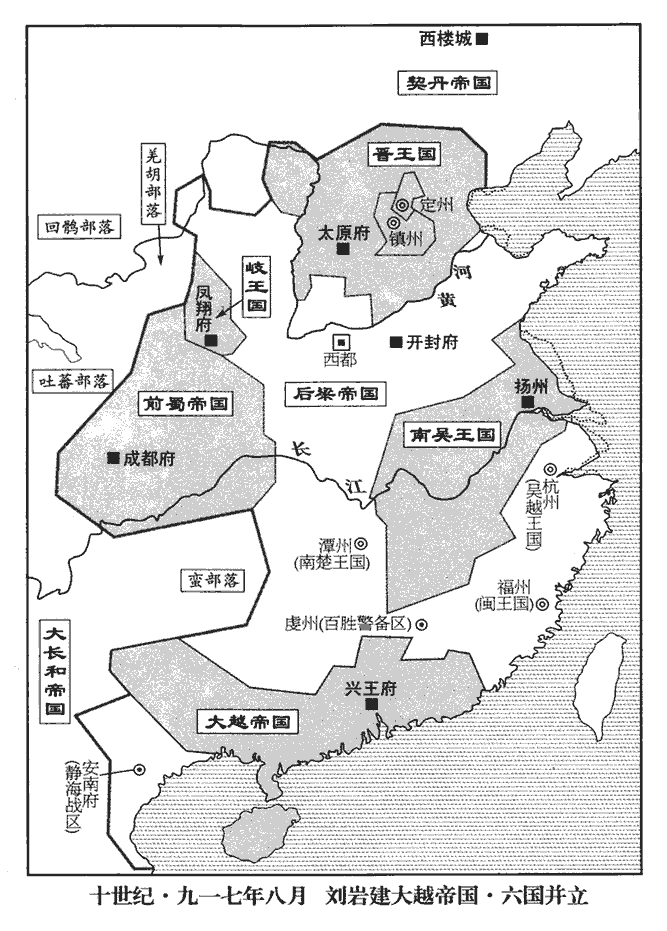
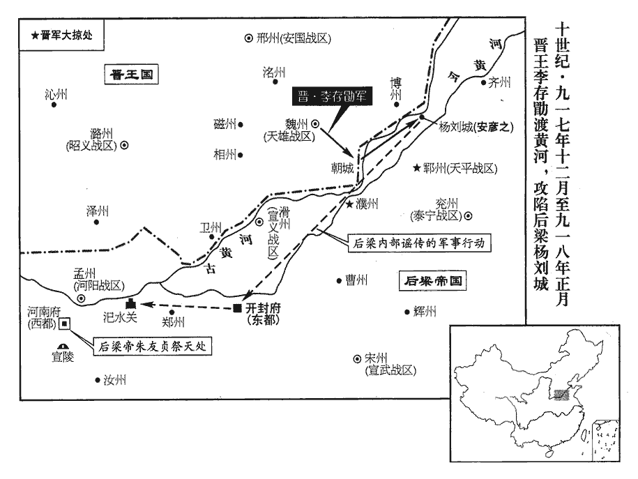
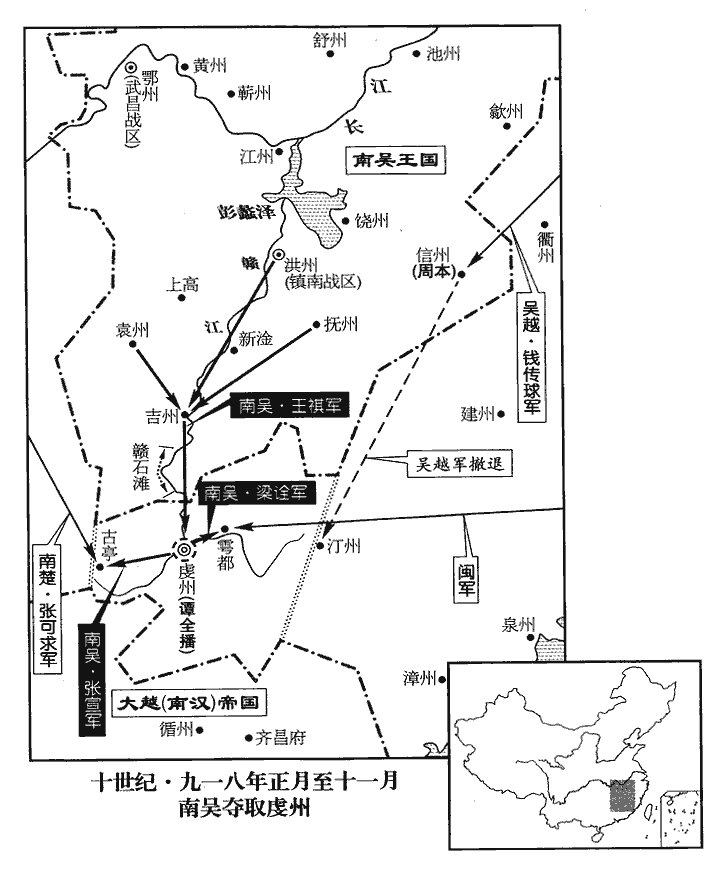
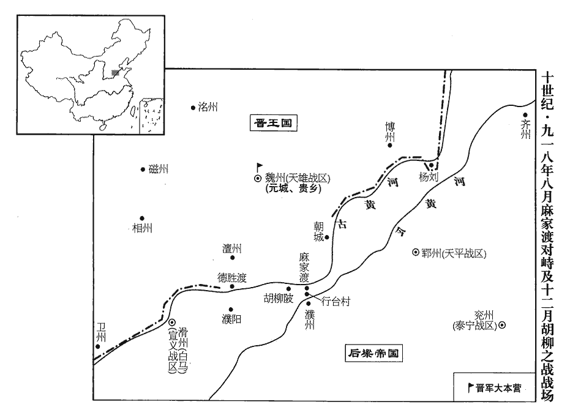
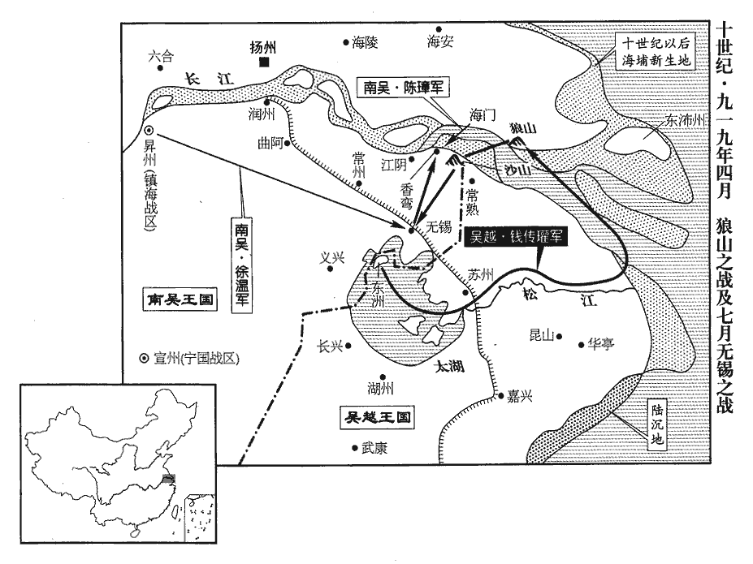
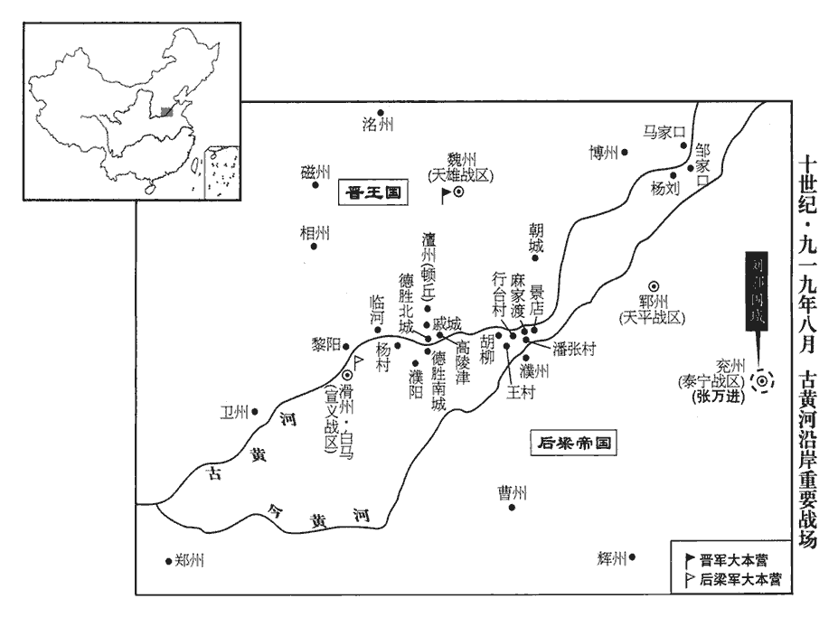
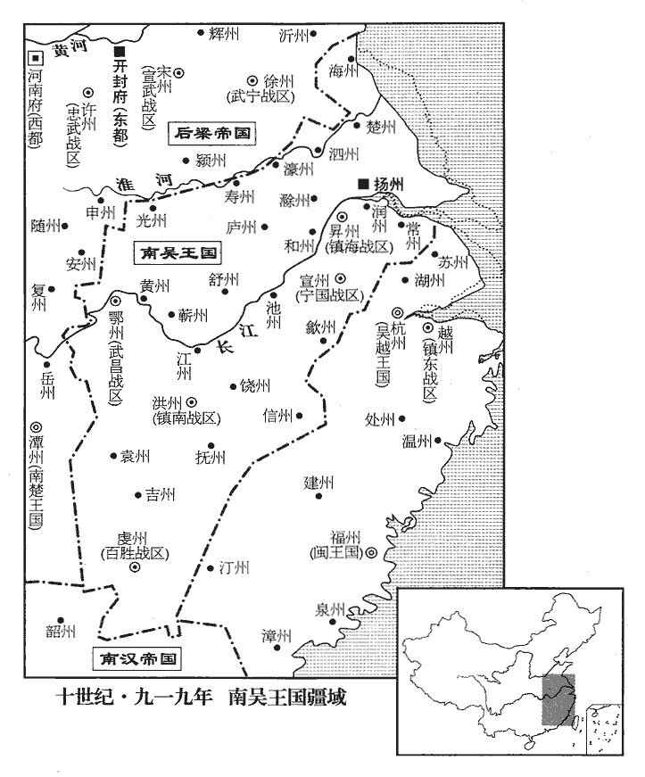

 後梁紀五起強圉赤奮若（丁丑）七月，盡屠維單閼（己卯）九月，凡二年有奇。

# 均王中

## 貞明三年（丁丑、九一七）

1秋，七月，庚戌‹三›，蜀主‹王建，本年七十一岁›以桑弘志‹李继岌›為西北面第一招討，王宗宏為東北面第二招討，己未‹十二›，以兼中書令王宗侃為東北面都招討，武信‹总部设遂州四川省遂宁市›節度使劉知俊為西北面都招討。以伐岐也。

〖译文〗 [1]秋季，七月，庚戌（初三），前蜀主王建任命桑弘志为西北面第一招讨，王宗宏为东北面第二招讨。己未（十六日），任命兼中书令王宗侃为东北面都招讨，武信节度使刘知俊为西北面都招讨。

2晉王‹李存勖›以李嗣源‹邈佶烈›、閻寶兵少，未足以敵契丹，辛未‹二十四›，更命李存審將兵益之。

〖译文〗 [2]晋王李存勖认为李嗣源、阎宝的兵力较少，不足与契丹国抗衡，辛未（二十八日），又命令李存审率兵去加强他们的兵力。

3蜀飛龍使唐文扆居中用事，扆，隱豈翻。張格附之，與司徒、判樞密院事毛文錫爭權。文錫將以女適左僕射兼中書侍郎、同平章事庾傳素之子，會親族於樞密院用樂，不先表聞，蜀主聞樂聲，怪之，文扆從而譖之。八月，庚寅‹十三›，貶文錫茂州‹四川省茂县›司馬，其子司封員外郎詢流維州‹四川省理县›，籍沒其家；貶文錫弟翰林學士文晏為榮經‹四川省荥经县›尉。榮經，漢嚴道縣地，唐武德四年置榮經縣，屬雅州。九域志：在州南一百一十里。傳素罷為工部尚書，以翰林學士承旨庾凝績權判內樞密院事。凝績，傳素之再從弟也。同曾祖之弟為再從弟。從，才用翻。

〖译文〗 [3]前蜀飞龙使唐文在朝中掌权，张格依附于他，与司徒、判枢密院事毛文锡争夺权力。毛文锡准备把他的女儿嫁给左仆射兼中书侍郎、同平章事庾传素的儿子，亲族聚会在枢密院寻欢作乐，没有事先奏明前蜀主，前蜀主听到音乐声，感到很奇怪，唐文趁机说毛文锡的坏话。八月，庚寅（十三日），将毛文锡降为茂州司马。把毛文锡的儿子司封员外郎毛询流放到维州，并把他全家的财产没收归公。把毛文锡的弟弟翰林学士毛文晏贬为荣经县尉。把庾传素降为工部尚书，让翰林学士承旨庾凝绩暂管内枢密院的事情。庾凝绩是庾传素的本家弟弟。

4清【章：十二行本「清」上有「癸巳」二字；乙十一行本同；孔本同；張校同；退齋校同。】海‹总部广州›、建武‹总部邕州›節度使劉巖‹本年二十九岁›即皇帝位於番禺‹广州州政府所在县·广东省广州市›，漢書音義：番，音潘；禺，音愚。國號大越，大赦，改元乾亨。以梁使趙光裔為兵部尚書，節度副使楊洞潛為兵部侍郎，節度判官李殷衡為禮部侍郎，並同平章事。建三廟，追尊祖安仁曰太祖文皇帝，父謙曰代祖聖武皇帝，兄隱曰烈宗襄皇帝；以廣州為興王府。

〖译文〗 [4]清海、建武节度使刘岩在番禺称帝，国号为大越，实行大赦，改年号为乾亨。任命后梁使者赵光裔为兵部尚书，节度副使杨洞潜为兵部侍郎，节度判官李殷衡为礼部侍郎，三人一并为同平章事。新修了三座祖庙，追尊祖父刘安仁为太祖文皇帝，父亲刘谦为代祖圣武皇帝，哥哥刘隐为烈宗襄皇帝，并把广州作为兴王府。

 

5契丹圍幽州且二百日，是年三月，契丹圍幽州，事始見上卷。城中危困。李嗣源、閻寶、李存審步騎七萬會於易州‹河北省易县›，閻寶班在李存審之下，而先書寶者，嗣源與寶先進屯淶水，而存審繼之也。匈奴須知：淶水西至易州四十里，易州東北至幽州二百二十里。存審曰：「虜眾吾寡，虜多騎，吾多步，若平原相遇，虜以萬騎蹂吾陳，吾無遺類矣。」蹂，人九翻，又徐又翻。陳，讀曰陣。嗣源曰：「虜無輜重，重，直用翻。吾行必載糧食自隨，若平原相遇，虜抄吾糧，抄，楚交翻。吾不戰自潰矣。不若自山中潛行趣幽州，趣，七喻翻。與城中合勢，若中道遇虜，則據險拒之。」甲午‹十七›，自易州北行，庚子‹二十三›，踰大房嶺‹北京市西南六十千米›，水經註：聖水出上谷郡西南谷，東南流逕大防嶺。又曰：良鄉縣西北有大防山，防水出其南。按易州即漢上谷郡地。范成大北使錄：自良鄉六十五里至幽州城外。此又驛路也。循澗而東。嗣源與養子從珂將三千騎為前鋒，距幽州六十里，與契丹遇，契丹驚卻，晉兵翼而隨之。張左右翼而踵其後。契丹行山上，晉兵行澗下，每至谷口，契丹輒邀之，嗣源父子力戰，乃得進。至山口，契丹以萬餘騎遮其前，將士失色；嗣源以百餘騎先進，免冑揚鞭，胡語謂契丹曰：「汝無故犯我疆埸，晉王命我將百萬眾直抵西樓‹契丹首都·内蒙古巴林左旗›，滅汝種族！此史家以華言譯胡語而筆之於史也。胡嶠入遼記曰：自幽州西北入居庸關，行幾一月乃至上京，所謂西樓也。西樓有邑屋市肆。歐史四夷附錄曰：契丹好鬼而貴日，每月朔旦東向而拜日；其大會聚、視國事，皆以東向為尊，西樓門屋皆東向。薛史曰：西樓距幽州三千里。埸，音亦。種，章勇翻。因躍馬奮檛，三入其陳，斬契丹酋長一人。檛，側瓜翻。陳，讀曰陣；下同。酋，慈秋翻。長，知兩翻。後軍齊進，契丹兵卻，晉兵始得出。李存審命步兵伐木為鹿角，人持一枝，止則成寨。契丹騎環寨而過，寨中發萬弩射之，流矢蔽日，契丹人馬死傷塞路。環，音患。射，而亦翻。塞，悉則翻。將至幽州，契丹列陳待之。存審命步兵陳於其後，陳於契丹陳後，將夾擊之也。一曰以騎兵前進，令步兵陳於其後。戒勿動，先令羸兵曳柴然草而進，煙塵蔽天，契丹莫測其多少；因鼓譟合戰，存審乃趣後陳起乘之，羸，倫為翻。趣，讀曰促。契丹大敗，席卷其眾自北山‹燕山›去，取古北口路而去。卷，讀曰捲。委棄車帳鎧仗羊馬滿野，晉兵追之，俘斬萬計。辛丑‹二十四›，嗣源等入幽州，周德威見之，握手流涕。為虜所困，得救而解，喜極涕流。

〖译文〗 [5]契丹围困幽州将近二百天，幽州城内十分困难。晋将李嗣源、阎宝、李存审率领七万名士卒和骑丘在易州会师。李存审说：“敌众我寡，敌人的骑兵多，我们的步兵多，如果在平原上两军相遇，敌人用一万名骑兵践踏我们的阵地，我们的兵士将被他们活活踩死而没有活着回去的。”李嗣源说：“敌人没有多少军需，我们行军必须随军拉着粮食，如果在平原上两军相遇，敌人一定会抢我们的粮食，我军将不战自败。不如从山中偷偷地直抵幽州，形成和幽州城内结合的形势。如果在途中遇上敌人，我们就占据险要的地方来抵御他们。”甲午（十七日），李嗣源、阎宝、李存审率兵从易州向北出发，庚子（二十三日），翻过大房岭，沿着山涧向东进发。李嗣源和他的养子李从珂率领三千骑兵为前锋部队，在距离幽州六十里的地方，与契丹军队相遇。契丹军队感到惊恐而退却，晋军从两翼紧随其后。契丹军在山上走，晋军在山涧走，每到一个谷口，契丹军就拦截晋军，李嗣源父子奋力战斗，才能继续前进。到达山口时，契丹部队用一万多骑兵挡在晋军前面，普军将士吓得脸都变了色。李嗣源带领百余骑兵率先前进，他脱掉甲胄，扬鞭上马，并用契丹语对契丹人说：“你们无故侵犯我人的疆土，晋王命令我率兵百万直捣西楼，消灭你们的种族。”于是跃马奋击，三次冲入契丹军阵，斩杀契丹酋长一人。晋军后面的部队也赶了上来，一起向契丹军进攻，契丹军队退却，晋军才得以出了山口。李存审命令他的士卒伐木，做成防御营寨的鹿角，每人手持一根，部队停下来时，就做成营寨。契丹军队绕着晋军的营寨经过，晋军从营寨中万箭齐发，射击契丹军，飞出灵的箭遮天蔽日，契丹死伤的人马几乎把路堵塞。晋军快要到达幽州时，契丹军早已严阵以待。李存审命令部队在契丹军的后面摆好阵势，告诫他们暂不要动。他先命令疲弱的军队拿着点燃的柴草前进，使烟雾遮天，契丹人不知道晋军到底有多少人马。在这种情况下晋军击鼓喧闹，一起出战，李存审催促后面的军队乘势追击，契丹被打得大败，席卷其全部士卒从北山逃跑，满山遍野都是契丹军丢弃了的战车、帐蓬、铠甲、羊、马等。晋军乘胜追击，俘获和斩杀了的契丹兵数以万计。辛丑（二十四日），李嗣源等进入幽州，周德威见到他，握着他的手痛哭流涕。

契丹以盧文進為幽州留後，其後又以為盧龍‹总部设幽州北京市›節度使，文進常居平州‹河北省卢龙县›，帥奚‹滦河上游›騎歲入北邊，殺掠吏民。帥，讀曰率；下同。晉人自瓦橋‹河北省雄县›運糧輸薊城‹幽州州政府所在城·北京市›，九域志：瓦橋北至涿州一百二十里，涿州北至薊城一百二十里。薊，音計。雖以兵援之，不免抄掠。契丹每入寇，則文進帥漢卒為鄉導，鄉，讀曰嚮。盧龍巡屬諸州為之殘弊。盧龍諸州，自唐中世以來自為一域，外而捍禦兩蕃，內而連兵河朔，其力常有餘。及并於晉，則歲遣糧援繼之而不足，此其故何也？保有一隅者其心力專，廣土眾民其心力有所不及也。詩云：無田甫田，維莠驕驕。信矣！為，于偽翻；下為承、誓為、為吾、請為同。

〖译文〗 契丹任命卢文进为幽州留后，后来又任命他为卢龙节度使。卢文进经常居住在平州，每年都要率领奚人骑兵人侵晋国的北部，杀掠百姓。晋国人从瓦桥运液到蓟州，虽然有部队护送，但也不免被契丹人所抄掠。每逢契丹人侵略，卢文进就带领汉族士兵作为向导，卢龙巡守所属各州都被抢劫得残破不堪。

6劉鄩自滑州‹河南省滑县›入朝，朝議以河朔失守責之，河朔失守事見上卷。朝，直遙翻。九月，落鄩平章事，左遷亳州‹安徽省亳州市›團練使。當其時不能治也，待其入朝而後責之，失政刑矣。

〖译文〗 [6]刘从滑州回到朝廷，朝廷决定以失守河朔而处罚他。九月，解除刘的平章事，贬调他出任亳州团练使。

7冬，十月，己亥‹二十三›，加吳越王鏐‹首都杭州浙江省杭州市›，钱镠本年六十六岁天下兵馬元帥。

〖译文〗 [7]冬季，十月，己亥（二十三日），后梁帝加封吴越王钱为天下兵马元帅。

8晉王‹李存勖›還晉陽‹山西省太原市›。自魏州‹河北省大名县›還晉陽。王連歲出征，凡軍府政事一委監軍使張承業，承業勸課農桑，畜積金穀，收市兵馬，徵租行法不寬貴戚，由是軍城肅清，軍城，謂晉陽軍城也。饋餉不乏。王或時須錢蒱pú博及給賜伶人，而承業靳之，靳，居焮翻，吝惜也。錢不可得。王乃置酒錢庫，令其子繼岌為承業舞，承業以寶帶及幣馬贈之。王指錢積呼繼岌小名謂承業曰：「和哥‹李继岌›乏錢，七哥‹张承业›宜以錢一積與之，帶馬未為厚也。」張承業第七。晉王以兄事承業，呼之為七哥。承業曰：「郎君纏頭皆出承業俸祿，唐人凡為人舞，人則以錢綵寶貨謝之，謂之纏頭。俸，扶用翻。此錢，大王所以養戰士也，承業不敢以公物為私禮。」王不悅，憑酒以語侵之，承業怒曰：「僕老敕使耳！非為子孫計惜此庫錢，所以佐王成霸業也，不然，王自取用之，何問僕為！不過財盡民散，一無所成耳。」晉王他日卒如張承業之言。王‹李存勖›怒，顧李紹榮‹元行钦›索劍，承業起，挽王衣索，山客翻。挽，武遠翻，引也。泣曰：「僕受先王顧託之命，誓為國家誅汴‹河南省开封市›賊，朱氏居汴，李氏名其為賊。若以惜庫物死於王手，僕下見先王無愧矣。先王，謂晉王克用。今日就王請死！」閻寶從旁解承業手令退，承業奮拳毆寶踣地，罵曰：毆，烏口翻。踣，蒲北翻。「閻寶，朱溫之黨，受晉大恩，言閻寶背梁降晉，晉不殺而寵貴之。曾不盡忠為報，顧欲以諂媚自容邪！」曹太夫人聞之，遽令召王，史書曹太夫人者，以見嫡母劉夫人不可得而令其子。王惶恐叩頭，謝承業曰：「吾以酒失忤七哥，忤，丑故翻。必且得罪於太夫人，七哥為吾痛飲以分其過。」王連飲四卮，承業竟不肯飲。王入宮，太夫人使人謝承業曰：「小兒忤特進，張承業於時官特進，意亦晉王承制授之也。適已笞之矣。」明日，太夫人與王俱至承業第謝之。史言晉王之在魏，皆張承業足饋餉以輔之；亦內有曹夫人，故承業得行其志。未幾，幾，居豈翻。承制授承業開府儀同三司、左衛上將軍、燕國公。承業固辭不受，但稱唐官以至終身。

〖译文〗 [8]晋王回到晋阳。由于连的出征，凡军府政事一律委托监军使张承业办理，张承业积极督促农桑生产，储备钱粮，收买兵马，征收赋税，执法严格，从不宽容权贵亲戚，因此晋阳城内平静，军队粮饷不缺。晋王有时候需要钱去博戏或者赏赐给乐官、伶人，张承业吝惜不肯给他，晋王也拿不到钱。于是晋王在钱库里摆了一桌酒席，让他的儿子李继岌给张承业跳舞，张承业用饰有珍宝的带子和币马赠送给李继岌。晋王指着库里积存的钱物高声叫着李继岌的小名对张承业说：“和哥缺钱，七哥你应当用一堆积钱送给他，宝带、币马不算丰厚。”张承业说：“我送给少爷的彩礼，都是从我的俸禄里支出的，钱库里的钱，是大王用来养战士用的，我不敢用公物作为个人的私礼。”晋王听了很不高兴，借酒用话讽刺他，张承业生气地说：“我是皇上的老臣，并不是为我的子孙打算，我之所以珍惜这库里的钱，是为了帮助大王成就霸业，不然的话，大王可以自己随便取用，何必还问我呢？不过钱财用完，百姓也就会远离你，你的事业将一无所成。”晋王十分生气，回过头向李绍荣要剑，张承业站起来，拉住晋王的衣服，哭着说：“我受先王临终之命，发誓为国家诛灭汴梁朱氏，如果因为吝惜库存的钱物而死于大王手下，我在地下见到先王也就无愧了。今日请大王处死好了！”阎宝从旁拉开张承业的手，让他退下。张承业气愤地使劲用拳把阎宝打倒在地，并且骂他说：“阎宝，你是朱温的同党，降晋后晋国对你有大恩大德，你不尽忠报国，反而想用谄媚的手段来求得安身吗？”曹太夫人听说这件事后，急忙让人去召晋王，晋王惊慌地直叩头，向张承业道歉，说：“我因为喝多了酒而顶撞了七哥，这也必然得罪于太夫人，请七哥为了减轻我的过错而痛饮几杯。”于是晋王连饮四杯，而张承业却一杯也不肯喝。晋王入宫后，曹太夫人派人去向张承业道歉，并说：“小儿顶撞了特进，刚才已经责打了他。”第二天，曹太夫人和晋王一起来到张承业的府第向他道歉。不久，按照先帝的遗旨，授予张承业开府仪同三司、左卫上将军、燕国公。张承业一再推辞不接受，一直到死都只称唐官。

掌書記盧質，嗜酒輕傲，嘗呼王‹李存勖›諸弟為豚犬，王銜之；承業恐其及禍，乘間言曰：「盧質數無禮，間，古莧翻。數，所角翻。請為大王殺之。」王曰：「吾方招納賢才以就功業，七哥何言之過也！」承業起立賀曰：「王能如此，何憂不得天下！」質由是獲免。史言張承業不惟能足兵，且能保護士君子。

〖译文〗 掌书记卢质嗜酒而且轻傲，曾经称呼晋王的弟弟们为猪狗，晋王怀恨在心。张承业害怕他因此招致祸患，抽空对晋王说：“卢质曾经多次无礼，请代为大王杀掉他。”晋王说：“我正在招贤纳士来完成我的功业，七哥为什么要说这样过份的话？”张承业站起来祝贺他说：“大王能够如此，还怕得不到天下吗？”卢质因此得以免祸。

晉王元妃衛國韓夫人，次燕國伊夫人，次魏國劉夫人。劉夫人最有寵，書晉宮之次者，以見其宮中貫魚失序。其父成安‹河北省成安县›人，成安，漢斥丘縣，北齊置成安縣，唐屬相州，時屬魏州。九域志：成安在魏州西一百里。以醫卜為業。夫人幼時，晉將袁建豐掠得之，入于王宮，性狡悍淫妬，悍，下罕翻，又侯旰翻。從王在魏；父聞其貴，詣魏宮上謁，上，時掌翻。王召袁建豐示之。建豐曰：「始得夫人時，有黃鬚丈人護之，此是也。」王以語夫人，語，牛倨翻。夫人方與諸夫人爭寵，以門地相高，恥其家寒微，大怒曰：「妾去鄉時略可記憶，妾父不幸死亂兵，妾守尸哭之而去，今何物田舍翁敢至此！」命笞劉叟于宮門。父且笞之，而何有於君！異日李存渥之事，無足怪也。

〖译文〗 晋王的元妃是卫国韩夫人，其次是燕国伊夫人，再次是魏国刘夫人。刘夫人最受晋王宠爱，她的父亲是成安人，以行医占卜为业。刘夫人小的时候，被晋将袁建丰抢了回来，把她送进了王宫。刘夫人性情狡猾泼悍，放荡，好忌妒人。她跟随晋王在魏，其父听说她已经显贵，就到魏宫拜见晋王，晋王召袁建丰来辨认。袁建丰说：“当初得到刘夫人时，有一个黄须老头保护着她，就是这个老人。”晋王把这番话告诉了刘夫人，刘夫人这时正和其他几位夫人争宠，互相比门地高低，对她的出身寒微感到耻辱。她非常生气地说：“我离开家乡时的情景还大概记得，我的父亲不幸死于兵乱，我曾守着他的尸体痛器，然后才离开了他，今天哪里来的什么乡巴佬敢到这里？”于是让人在宫门口把刘老头儿打了一顿。

9越主巖遣客省使劉瑭使於吳‹首都扬州›，告即位，是年八月，劉巖稱帝。且勸吳王稱帝。

〖译文〗 [9]越主刘岩派客省使刘瑭出使吴国，告诉吴王他已经即位，并且劝吴王也称帝。

10閏月，戊申‹二›，蜀主‹王建›以判內樞密院庾凝績為吏部尚書、內樞密使。

〖译文〗 [10]闰十月，戊申（初二），前蜀主任命判内枢密院庾凝绩为吏部尚书、内枢密使。

11十一月，丙子朔‹一›，日南至，蜀主祀圜丘。

〖译文〗 [11]十一月，丙子朔（初一），正逢冬至，前蜀主去圜丘祭天。

12晉王聞河冰合，曰：「用兵數歲，限一水不得渡，貞明元年，晉得魏博兵，始窺河上；若以破夾寨為用兵之始，則已十年矣。今冰自合，天贊我也。」亟如魏州。

〖译文〗 [12]晋王听说黄河上的冰已结满河床，说：“打了好几年仗，由于受黄河的限制，不能渡河作战，如今河床自己结满了冰，这是天助我们。”于是他很快地赶到魏州。

13蜀主‹王建›以劉知俊為都招討使，見是年七月。諸將皆舊功臣，多不用其命，且疾之，故無成功。伐岐無功也。唐文扆數毀之；數，所角翻。蜀主亦忌其才，嘗謂所親曰：「吾老矣，知俊非爾輩所能馭也。」十二月，辛亥‹六›，收知俊，稱其謀叛，斬於炭市。劉知俊懼不見容於梁而奔岐，懼不見容於岐而奔蜀，卒亦不為蜀所容。挾虎狼之性而附人，人必虞其搏噬，其能容之乎！

〖译文〗 [13]前蜀主任用刘知俊为都招讨使，各位将领都是原来的有功之臣，很多人不听从他的命令，而且还嫉妒他，所以他没建立什么战功。唐文经常诋毁他，前蜀主也嫉妒他的才能，曾对亲近的人说：“我已经老了，刘知俊不是你们这些人所能驾驭的。”十二月，辛亥（初六），拘捕了刘知俊，说他想阴谋叛乱，在炭市把他斩杀。

14癸丑‹八›，蜀大赦，改明年元曰光天。

〖译文〗 [14]癸丑（初八），前蜀大赦，改明年的年号为光天。

15壬戌‹十七›，以張宗奭‹张全义›為天下兵馬副元帥。

〖译文〗 [15]壬戌（十七日），后梁帝任命张宗为天下兵马副元帅。

16帝論平慶州‹甘肃省庆阳县›功，賀瓌平慶州，見上卷上年。丁卯‹二十二›，以左龍虎統軍賀瓌為宣義‹总部设滑州河南省滑县›節度使、同平章事，尋以為北面行營招討使。為賀瓌不能拒晉張本。

〖译文〗 [16]后梁帝论评平定庆州的战功，丁卯（二十二日），任命左龙虎统军贺为宣义节度使、同平章事，不久又任命他为北面行营招讨使。

 

17戊辰‹二十三›，晉王畋于朝城‹山东省莘县西南朝城镇›。朝城，本漢東武陽縣，後周曰武陽，唐改曰朝城。九域志：朝城縣在魏州東南八十里，又三十里至河。是日，大寒，晉王視河冰已堅，引步騎稍渡。梁甲士三千戍楊劉城‹山东省东阿县东北杨柳乡·古黄河南岸渡口›，緣河數十里，列柵相望，晉王急攻，皆陷之。進攻楊劉城，使步兵斬其鹿角，負葭葦塞塹，陸佃埤雅曰：葦即今之蘆，一名葭。葭，葦之未秀者也。萑huán，即今之荻，一名蒹。蒹，萑之未秀者也。至秋堅成，謂之萑葦；萑小而葦大。字說曰：蘆謂之葭，其小曰萑；荻謂之蒹，其小曰葦。荻強而葭弱，荻高而葭下。塞，悉則翻。四面進攻，即日拔之，獲其守將安彥之。

〖译文〗 [17]戊辰（二十三日），晋王在朝城打猎。这一天，天气特别冷，晋王看到黄河的冰很坚固，就率领步兵、骑兵过河。后梁军三千士卒驻扎在杨刘城，沿河数十里，栅垒相望，晋王迅速发起进攻，全部攻克了这些栅垒。接着进攻杨刘城，派出步兵先夺取后梁军营寨，然后用芦苇塞满防御的堑壕，从四面发起进攻，当天就攻下了杨刘城，并抓获守将安彦之。

先是，租庸使、戶部尚書趙巖言於帝‹朱友贞›曰：「陛下踐阼以來，尚未南郊，議者以為無異藩侯，先，悉薦翻。為四方所輕。請幸西都‹洛阳›行郊禮，遂謁宣陵‹朱全忠墓·洛阳市南›。」宣陵在河南伊闕縣，故請帝因郊而謁陵。敬翔諫曰：「自劉鄩失利以來，劉鄩敗，見上卷上年。公私困竭，人心惴恐；惴，之睡翻。今展禮圜丘，必行賞賚，是慕虛名而受實弊也。且勍敵近在河上，勍敵，謂晉也。勍，渠京翻。乘輿豈宜輕動！乘，繩證翻。俟北方既平，報本未晚。」晉書曰：郊祀者帝王之重事，所以報本反始也。帝不聽。己巳‹二十四›，如洛陽，閱車服，飾宮闕。郊祀有日，聞楊劉失守，道路訛言晉軍已至大梁，扼汜水‹河南省荥阳市汜水镇西›矣，扼汜水，謂扼虎牢之險也。從官皆憂其家，相顧涕泣；從，才用翻。帝惶駭失圖，遂罷郊祀，奔歸大梁。

〖译文〗 在杨刘城失守以前，后梁租庸使、户部尚书赵岩曾对后梁帝说：“陛下即位以来，还没有去南郊祭天，议论这件事的人认为陛下和诸侯没什么两样，被四方所轻视。请陛下去西都行郊祀礼，并谒拜宣陵。”敬翔进谏说：“自从刘失利以来，公私都处于十分困难的时刻，人心惶惶。现在要去祭祀圜丘，必定要施行赏赐，这是为了图虚名，而受实害。况且晋国劲敌近在黄河边上，御驾车马怎么轻易出动？等到北方平定以后，再去郊祀也不晚。”后梁帝没有听从敬翔的进谏。己巳（二十四日），后梁帝到了洛阳，视察了御用的车子和章服，装饰了宫阙。去南郊祭祀的日子已定，突然听说杨刘城失守，道路上的人都传说晋军已经到了大梁，并扼住汜水。跟从后梁帝出行的官员们都很担忧自己的家，相互哭泣。后梁帝恐慌而失去了主意，于是停止了郊祀，奔回大梁。

18甲戌‹二十九›，以河南尹張宗奭‹张全义›為西都留守。

〖译文〗 [18]甲戌，（二十九日），后梁帝任命河南尹张宗为西都留守。

19是歲，閩‹首都福州福建省福州市›王審知為其子牙內都指揮使延鈞娶越主巖之女。為，于偽翻。

〖译文〗 [19]这一年，闽王王审知给他的儿子牙内都指挥使王延钧娶了越主刘岩的女儿。

## 四年（戊寅、九一八）

1春，正月，乙亥朔‹一›，蜀大赦，復國號曰蜀。蜀改國號見上卷二年。

〖译文〗 [1]春季，正月，乙亥朔（初一），前蜀大赦，恢复国号为蜀。

2帝‹朱友贞，本年三十一岁›至大梁‹首都开封府河南省开封市›。自洛陽還至大梁。晉‹首都太原府山西省太原市›兵侵掠至鄆‹山东省东平县›、濮‹山东省鄄城县›而還。晉拔楊劉，楊劉屬鄆州界，又西則濮州界。鄆，音運。濮，博木翻。敬翔上疏曰：「國家連年喪師，上，時掌翻。喪，息浪翻。疆土日蹙。陛下居深宮之中，所與計事者皆左右近習，豈能量敵國之勝負乎！量，音良。先帝‹朱全忠›之時，奄有河北，開平之間，幽、滄、鎮、定、魏皆附于梁，故云然。親御豪傑之將，猶不得志。謂夾寨、柏鄉、蓨tiáo縣之師皆不得志于晉。今敵至鄆州‹山东省东平县›，陛下不能留意。臣聞李亞子‹李存勖›繼位以來，于今十年，開平元年，晉王存勗嗣位，于今十一年。攻城野戰，無不親當矢石，近者攻楊劉‹山东省东阿县东北杨柳乡·古黄河南岸渡口›，身負束薪為士卒先，一鼓拔之。陛下儒雅守文，晏安自若，使賀瓌輩敵之，而望攘逐寇讎，非臣所知也。陛下宜詢訪黎老，黎，眾也。別求異策；不然憂未艾也。臣雖駑怯，駑，音奴。受國重恩，陛下必若乏才，乞於邊垂自效。」疏奏，趙、張之徒言翔怨望，帝遂不用。

〖译文〗 [2]后梁帝回到大梁。晋军一直侵掠到郓州、濮州以后才率军而还。敬翔上疏说：“国家连年战事失利，疆土日益缩小。陛下深居宫中，和您一起共商大事的人都是您的左右亲幸之人，怎么能估量到敌国的胜负呢？先帝在世的时候，拥有河北的全部疆土，亲自驾驭着豪杰将士，仍不得志。今天敌人已经到了郓州，还不能引起陛下的注意。我听说李存勖继位以来，到今年已经十年了，每当攻城作战，无不亲自冲锋陷阵，最近攻打杨刘时，亲自背着柴束走在士卒的前面，结果一鼓攻下杨刘城。陛下温文儒雅自守，安然自若，而派贺之流去抵挡敌人，期望他们驱逐敌寇，我不知道他们能做什么。陛下应当广泛询访老人，另外寻找一些别的方法。如果不能这样，忧患就不能停止。我虽然无才，但国家给我的恩情很大，陛下如果一定缺乏人才，我请求到边疆为国效力去。”他的奏书送给后梁帝以后，赵岩、张归霸之流说敬翔是在发泄怨恨。后梁帝没有起用他。

3吳‹首都扬州江苏省扬州市›以右都押牙王祺為虔州‹江西省赣州市›行營都指揮使，將洪‹江西省南昌市›、撫‹江西省临川市›、袁‹江西省宜春市›、吉‹江西省吉安市›之兵擊譚全播。嚴可求以厚利募贛石‹赣江上游赣石滩›水工，故吳兵奄至虔州城下，虔人始知之。虔州水行至吉州，有贛石之險。吳先募水工習於水道，故舟行無礙。註詳見辯誤。贛，音紺。

〖译文〗 [3]吴王任命右都押牙王祺为虔州行营都指挥使，并让他率领洪、抚、袁、吉的部队去攻打谭全播。严可求用厚禄招募了一些熟悉赣石之险的水工，所以吴兵全部到达虔州城下时，虔州人才知道。

 

4蜀‹首都成都府四川省成都市›太子衍‹王宗衍›好酒色，樂遊戲。好，呼到翻。樂，五教翻。蜀主‹王建，本年七十二岁›嘗自夾城過，聞太子與諸王鬬雞擊毬喧呼之聲，蜀蓋倣長安之制，附夾城為諸王宅。歎曰：「吾百戰以立基業，此輩其能守之乎！」由是惡張格，而徐賢妃為之內主，竟不能去也。張格贊立宗衍，見二百六十八卷乾化二年。惡，烏路翻。去，羌呂翻。信王宗傑有才略，屢陳時政，蜀主賢之，有廢立意；二月，癸亥‹二十›，宗傑暴卒，蜀主深疑之。

〖译文〗 [4]前蜀太子王衍嗜酒好色，喜欢游戏。前蜀主曾经从夹城路过，听到太子和诸王斗鸡击球喧闹的声音，叹息地说：“我身经百战建立的大业，这些人能够守得住吗？”因此对当时拥立王衍为太子的张格产生恶感，但因为徐贤妃在内为之作主，所以就没有废除太子。信王王宗杰很有才略，经常陈述对时政的意见，前蜀主很器重他，因而产生了废王衍立宗杰的想法。二月，癸亥（二十日），王宗杰突然病死，前蜀主对他的死感到十分怀疑。

5河陽‹总部设孟州河南省孟州市›節度使、北面行營排陳使謝彥章將兵數萬攻楊劉城。甲子‹二十一›，晉王‹李存勖，本年三十四岁›自魏州‹河北省大名县›輕騎詣河上；彥章築壘自固，決河水，瀰浸數里，以限晉兵，晉兵不得進。謝彥章，梁之騎將也，懼晉兵之衝突，決河水以限之。幽、并之突騎非南兵之所能敵，自古然也。瀰，音彌。彥章，許州‹河南省许昌市›人也。安彥之散卒多聚於兗‹山东省兖州市›、鄆‹山东省东平县›山谷為群盜，以觀二國成敗，晉王招募之，多降於晉。降，戶江翻。

〖译文〗 [5]后梁河阳节度使、北面行营排阵使谢彦章率领好几万兵向杨刘城发起进攻。甲子（二十一日），晋王率领轻骑从魏州直达黄河边上。谢彦章修筑起壁垒坚守阵地，并决开黄河，河水弥漫了好几里，用来阻止晋军，晋军不能前进。谢彦章是许州人。安彦之被打败以后，他的士卒很多人聚集在兖州、郓城一带的山谷之中成为强盗，坐观梁、晋二国的成败。后来晋王招募他们，其中有不少人就投靠了晋王。

6己亥，蜀主以東面招討使王宗侃為東、西兩路諸軍都統。此伐岐東、西兩路之兵也；東路出寶雞，西路出秦隴。

〖译文〗 [6]己亥（疑误），前蜀主任命东面招讨使王宗侃为东、西两路诸军都统。

7三月，吳越王鏐‹首都杭州浙江省杭州市›，钱镠本年六十七岁初立元帥府，置官屬。前年梁加錢鏐諸道兵馬元帥，去年又加天下兵馬元帥。

〖译文〗 [7]三月，吴越王钱开始设置元帅府，并安排了一些官属。

8夏，四月，癸卯朔‹一›，蜀主立子宗平為忠王，宗特為資王。

〖译文〗 [8]夏季，四月，癸卯朔（初一），前蜀主立子王宗平为忠王，王宗特为资王。

9岐王‹首都凤翔府陕西省凤翔县›，李茂贞（宋文通）本年六十三岁復遣使求好于蜀。岐與蜀絕，見二百六十七卷乾化元年。復，扶又翻。

〖译文〗 [9]岐王派出使者到前蜀，请求互通友好。

10己酉‹七›，以吏部侍郎蕭頃為中書侍郎、同平章事。

〖译文〗 [10]己酉（初七），后梁帝任命吏部侍郎萧顷为中书侍郎、同平章事。

11保大‹总部设鄜州陕西省富县›節度使高萬金卒。癸亥‹二十一›，以忠義‹总部设延州陕西省延安市›節度使高萬興兼保大節度使，并鎮鄜‹陕西省富县›、延‹陕西省延安市›。太祖改保塞軍為忠義軍。高萬興，萬金之兄也；兄弟並鎮，今併為一。

〖译文〗 [11]后梁保大节度使高万金去世。癸亥（二十一日），任命忠义节度使高万兴兼任保大节度使，并让他镇守州和延州。

12司空兼門下侍郎、同平章事趙光逢告老，己巳‹二十七›，以司徒致仕。

〖译文〗 [12]后梁司空兼门下侍郎、同平章事赵光逢因老辞官，己巳（二十七日），以司徒的身分回乡归居。

13蜀主自永平末梁乾化元年，蜀改元永平；梁貞明二年，蜀改元通正。得疾，昏瞀mào，瞀，莫候翻。至是增劇；以北面行營招討使兼中書令王宗弼‹魏弘夫›沉靜有謀，五月，召還，以為馬步都指揮使。乙亥‹三›，召大臣入寢殿，告之曰：「太子‹王宗衍›仁弱，朕不能違諸公之請，踰次而立之；即謂張格令諸公署表時事。若其不堪大業，可置諸別宮，幸勿殺之。但王氏子弟，諸公擇而輔之。徐妃兄弟，止可優其祿位，慎勿使之掌兵預政，以全其宗族。」

〖译文〗 [13]前蜀主王建自从永平末年得病以来，一直视力昏暗不明，到现在更加严重。因为北面行营招讨使兼中书令王宗弼沉着有谋略，五月，把他召回，任命为马步都指挥使。乙亥（初三），王建让大臣们到他的寝殿，告诉他们说：“太子没有什么能耐，但我不能违背诸位的请求，越过次序而立了他。如果他担不起大业，可以把他安置在别的宫中，但不要把他杀死。只要是王氏子弟，诸位可以选择辅助他们当中有才能的人。徐妃的兄弟们，只可以照顾他们的俸禄和官位，一定不要让他们掌握兵权和参与政事，以成全他们的宗族。”

內飛龍使唐文扆久典禁兵，參預機密，欲去諸大臣，去，羌呂翻。遣人守宮門；王宗弼‹魏弘夫›等三十餘人日至朝堂，不得入見，見，賢遍翻。文扆屢以蜀主之命慰撫之，伺蜀主殂，即作難。伺，相吏翻。難，乃旦翻。遣其黨內皇城使潘在迎偵察外事，偵，丑鄭翻，伺也。在迎以其謀告宗弼等；宗弼等排闥入，言文扆之罪，以天冊府掌書記崔延昌權判六軍事，蜀置天策府，見上卷乾化四年。將罪唐文扆，先奪其判六軍事。召太子入侍疾。丙子‹四›，貶唐文扆為眉州‹四川省眉山县›刺史。翰林學士承旨王保晦坐附會文扆，削官爵，流瀘州‹四川省泸州市›。在迎，炕之子也。潘炕亦蜀主所親任者也，入筦樞密，出居方鎮。炕，苦浪翻。

〖译文〗 内飞龙使唐文掌管皇帝的亲兵时间已经很长，经常参预一些机密的事情。他打算除去诸大臣，于是派人把守住宫门。王宗弼等三十余人到朝堂，但不得入见前蜀主，唐文常以前蜀主的名义来慰抚他们，等前蜀主一死，他就发难。他还派出同党内皇城使潘在迎到外面去侦察，潘在迎把唐文的阴谋告诉了王宗弼等人。于是王宗弼等推开宫门进去，向前蜀主说明了唐文的罪行，前蜀主让天册府掌书记崔延昌暂管六军事，让太子入宫侍候自己的病。丙子（初四），把唐文降为眉州刺史。翰林学士承旨王保晦因附会唐文，也削了他的官位，把他流放到泸州。潘在迎是潘炕的儿子。

丙申‹二十四›，蜀主詔中外財賦、中書除授、諸司刑獄案牘專委庾凝績，都城及行營軍旅之事委宣徽南院使宋光嗣。

〖译文〗 丙申（二十四日），前蜀主下诏，将中外财赋、中书除授、诸司刑狱案牍的事情专门委派给庾凝绩管理，将都城以及行营军旅的事情委派宣徽南院使宋光嗣管理。

丁酉‹二十五›，削唐文扆官爵，流雅州‹四川省雅安市›。辛丑‹二十九›，以宋光嗣為內樞密使，與兼中書令王宗弼、宗瑤、宗綰、宗夔並受遺詔輔政。初，蜀主雖因唐制置樞密使，專用士人，唐制，樞密使本用宦者。及唐文扆得罪，蜀主以諸將多許州‹河南省许昌市›故人，蜀主本許州舞陽人，其諸將亦多許人。恐其不為幼主用，故以光嗣代之。自是宦者始用事。為蜀以宦者亡張本。

〖译文〗 丁酉（二十五日），削了唐文的官职爵位，流放到雅州。辛丑（二十九日），任命宋光嗣为内枢密使，并和兼中书令王宗弼、王宗瑶、王宗绾、王宗夔一同受遗诏辅政。当初，前蜀主虽然依照唐制设置了枢密使，专用士人，到唐文犯罪时，前蜀主认为好多将领都是许州的旧友，害怕他们不能听从幼主的使用，所以用宦者宋光嗣取代士人做枢密使。从此宦者才掌握权力。

六月，壬寅‹一›，【章：十二行本「寅」下有「朔」字；乙十一行本同；孔本同；張校同。】蜀主殂‹王建年七十二岁›。考異曰：北夢瑣言云：「余聞宗弼親吏曹處琪言：建疑信王暴卒，唐文扆與徐妃、張格陰謀使尚食進雞燒餅因置毒。建疾困，大臣魏弘夫等請誅文扆。建曰：『太子好酒色，若不克負荷，幸無殺之。徐氏兄弟勿與兵權。』言訖，長吁而逝。」劉恕按：舊史貶文扆後二十七日蜀主始殂，疑曹處琪之妄，孫光憲從而記之。癸卯‹二›，太子‹王宗衍本年二十岁›即皇帝位。名衍，字化源，建幼子也。尊徐賢妃為太后，衍母也。徐淑妃為太妃。以宋光嗣判六軍諸衛事。

〖译文〗 六月，壬寅（初一），前蜀主去世。癸卯（初二），太子王衍即皇帝位。尊崇徐贤妃为太后，徐淑妃为太妃。任命宋光嗣判六军诸卫事。

乙卯‹十四›，殺唐文扆、王保晦。命西面招討副使王全【章：十二行本「全」作「宗」；乙十一行本同；孔本同。】昱殺天雄‹总部设秦州甘肃省秦安县西北›節度使唐文裔於秦州‹甘肃省秦安县西北›，貞明二年，蜀主遣唐文裔伐岐，遂鎮秦州。免左保勝軍使領右街使唐道崇官。

〖译文〗 乙卯（十四日），杀了唐文、王保晦。又命令西面招讨副使王全昱在秦州杀了天雄节度使唐文，免去左保胜军使领右街使唐道崇的官。

14吳‹首都扬州›內外馬步都軍使、昌化節度使、同平章事徐知訓，驕倨淫暴。威武‹总部设福州福建省福州市›節度使、知撫州‹江西省临川市›李德誠歐史職方考曰：五代之際外屬之州，揚州曰淮南，宣州曰寧國，鄂州曰武昌，洪州曰鎮南，復州曰武威，杭州曰鎮海，越州曰鎮東，江陵府曰荆南，益州、梓州曰劍南東、西川，遂州曰武信，興元府曰山南西道，洋州曰武定，黔州曰黔南，潭州曰武安，桂州曰靜江，容州曰寧遠，邕州曰建武，廣州曰清海，皆唐故號，更五代無所易，而今因之者也。其餘僭偽改置之名不可悉考而不足道，其因著于今者略註于譜。按歐公之時去五代未遠，十國僭偽自相署置，其當時節鎮之名已無所考，況欲考之於二三百年之後乎！今台州有魯洵作杜雄墓碑云，唐僖宗光啓三年陞台州為德化軍。洵乃雄吏，時為德化軍判官者也。又嘉定中黃巖縣永寧江有泅於水者，拾一銅印，其文曰「台州德化軍行營朱記」。宋太祖乾德元年，錢昱以德化軍節度使、本路安撫使兼知台州。台州小郡猶置節度，其他州郡從可知矣。吳之昌化、威武蓋亦置之境內屬城，但不可得而考其地耳。有家妓數十，知訓求之，妓，渠綺翻。德誠遣使謝曰：「家之所有皆長年，長，知兩翻。謂年已長也。或有子，不足以侍貴人，當更為公求少而美者。」為，于偽翻。少，詩照翻。知訓怒，謂使者曰：「會當殺德誠，并其妻取之！」

〖译文〗 [14]吴国内外马步都军使、昌化节度使、同平章事徐知训傲慢淫暴。威武节度使、抚州知州李德诚家里有几十个女艺人，徐知训想要，李德诚派使者前往道歉说：”我家的女艺人年龄都大了，有的已经有了孩子，不足以侍候贵人，应当为您寻找一些年轻美丽的女子。“徐知训十分生气，对使者说：”以后我要杀了李德诚，连同他的妻子也一起要过来。

知訓狎侮吳王‹杨隆演，本年二十二岁›，無復君臣之禮。嘗與王為優，自為參軍，使王為蒼鶻，總角弊衣執帽以從。優人為優，以一人幞頭衣綠，謂之參軍；以一人髽zhuā角弊衣，如僮奴之狀，謂之蒼鶻。從，才用翻。又嘗泛舟濁河，王先起，知訓以彈彈之。上彈，徒旦翻。下彈，徒丹翻。又嘗賞花於禪智寺，宋白曰：禪智寺在揚州城東，寺前有橋，跨舊官河。知訓使酒悖慢，王懼而泣，悖，蒲没翻，又蒲妹翻。四座股栗，左右扶王登舟，知訓乘輕舟逐之，不及，以鐵撾殺王親吏。撾，側瓜翻。將佐無敢言者，父溫皆不之知。

〖译文〗 徐知训对吴王杨隆演戏弄轻慢，没有君臣礼节。曾和吴王扮作优伶，他自己当参军，让吴王当僮奴，把头发扎为两个丫角，穿着破旧的衣服，手里拿着帽子，跟在他后面。徐知训又曾和吴王在浊河上划船，吴王先起来，徐知训用弹子儿弹他。徐知训也曾和吴王在禅智寺一起赏花，徐知训喝酒时很狂悖傲慢，吴王都被他吓哭了，四座的人害怕得两腿发抖。吴王的左右侍从扶着他登船，徐知训乘轻便的船追逐，因没有追上吴王，就用铁器打死了吴王亲近的官吏。将佐们没有敢说话的，徐知训的父亲徐温都不知道这些事。

知訓及弟知詢皆不禮於徐知誥，以知誥養子也。獨季弟知諫以兄禮事之。為徐知諫附於知誥以奪知詢金陵張本。知訓嘗召兄弟飲，知誥不至，知訓怒曰：「乞子不欲酒，欲劍乎！」又嘗與知誥飲，伏甲欲殺之，知諫躡知誥足，躡，尼輒翻。知誥陽起如廁，遁去，知訓以劍授左右刁彥能使追殺之；彥能馳騎及於中塗，舉劍示知誥而還，以不及告。還，從宣翻，又如字。還告知訓以追之不及也。余謂楊渥、徐知訓之於知誥，皆知所惡者也。

〖译文〗 徐知训和他的弟弟徐知询都对徐温的养子徐知诰没有礼貌，唯独三弟徐知谏对徐知诰以兄礼相待。徐知训曾经召集他的兄弟们一起喝酒，徐知诰没有参加，徐知训十分生气地说：“讨饭的家伙不想喝酒，难道想吃剑吗？”后来徐知训又曾和徐知诰一起喝酒，埋伏了甲兵，准备杀死徐知诰，徐知谏暗踩徐知诰的脚以示意，徐知诰假装起来上厕所而逃走。徐知训把剑交给他的亲信刁彦能，让他去追赶徐知诰把他杀掉。刁彦能骑马追到半路上，只是举起剑来向徐知诰表示一下就回去了。回来后告诉徐知训说是没有追上。

平盧‹总部设青州山东省青州市›節度使，同平章事、諸道副都統朱瑾遣家妓通候問於知訓，妓，渠綺翻。知訓強欲私之，瑾已不平。知訓惡瑾位加己上，惡，烏路翻。置靜淮軍於泗州‹江苏省盱眙县淮河北岸›，出瑾為靜淮節度使，瑾益恨之，然外事知訓愈瑾。瑾有所愛馬，冬貯於幄，夏貯於幬；貯，丁呂翻。幬，徒到翻，今之葛罩、紗罩是也。又直由翻，唐韻曰：單帳也。冬貯於幄，欲其煖也；夏貯於幬，既欲其涼，且隔蚊蝱。以養人者養畜，可謂愛之過矣。寵妓有絕色；知訓過別瑾，過，音戈。過瑾而言別。瑾置酒，自捧觴，出寵妓使歌，以所愛馬為壽，知訓大喜。瑾因延之中堂，伏壯士於戶內，出妻陶氏拜之，路振九國志：瑾妻陶氏，雅之女也。知訓答拜，瑾以笏自後擊之，踣地，踣，蒲北翻。呼壯士出斬之。瑾先繫二悍馬於廡下，將圖知訓，密令人解縱之，馬相蹄齧，廡，罔甫翻。蹄，大計翻。齧，魚結翻。聲甚厲，以是外人莫之聞。瑾提知訓首出，知訓從者數百人皆散走。瑾馳入府，以首示吳王‹杨隆演›曰：「僕已為大王除害。」從，才用翻。為，于偽翻；下吾為同。王懼，以衣障面，走入內，曰：「舅自為之，我不敢知！」吳王行密先娶朱氏，與瑾同姓，因呼之為舅。瑾曰：「婢子不足與成大事！」以知訓首擊柱，挺劍將出，挺，待鼎翻，拔也。子城使翟虔等已闔府門勒兵討之，乃自後踰城，墜而折足，翟虔，徐溫親將也，使之防衛吳王。翟，直格翻。折，而設翻。顧追者曰：「吾為萬人除害，以一身任患。」遂自剄。‹年五十二岁›任，音壬。剄，古頂翻。

〖译文〗 平卢节度使、同平章事、诸道副都统朱瑾派他家里的女艺人去问候徐知训，徐知训打算强行占为己有，朱瑾已经愤愤不平。徐知训又恨朱瑾的地位比自己高，于是在泗州设置了静淮军，派朱瑾出任静淮节度使，朱瑾因此更加仇恨徐知训，但从外表上对待徐知训更加谨慎。朱瑾有匹非常喜爱的马，冬天把它圈在用布做的帐篷里，夏天把它圈在用纱做的葛帐里。朱瑾的宠妓很漂亮。徐知训路过朱瑾家时向他告别，朱瑾摆了酒席，自己拿着酒杯，让宠妓出来唱歌，并用自己所喜爱的马送给徐知识为他祝寿，徐知训十分高兴。朱瑾领着徐知训进了中堂，让他的勇士们埋伏在户内，然后让他的妻子陶氏出来拜见徐知训，徐知训答拜，朱瑾用笏板从后面把徐知训打倒在地，呼叫出勇士们把他杀死。在此之前，朱瑾在庑下拴了两匹暴躁的马，在准备杀徐知训时，秘密地让人去把马解开，两匹马相互踢咬，声音很大，所以外面的人没有听见里面的事情。朱瑾提着徐知训的脑袋出去时，徐知训的数百随从都已经逃跑了。朱瑾又骑着马直奔王府，把徐知训的头拿出来给吴王看，并对吴王说：“我已经为大王除掉了祸害。”吴王感到害怕，用衣服遮住了脸不敢看，向里面走，说：“舅舅你自己干的，我也不想知道。”朱瑾说：“这小子不足以和他共成大事。”于是用徐知训的头去击柱，然后拔出剑来出了王府。子城使翟虔等已经关上了府门，率兵准备讨伐朱瑾，于是朱瑾从后面翻越城墙，结果摔下去脚骨折断。他回过头对追赶的人们说：“我为万人除害，我一个人来承担大家的忧患。”说完就自杀了。

徐知誥在潤州‹江苏省镇江市›聞難，揚、潤夾江，相去五十餘里。難，乃旦翻。用宋齊丘策，即日引兵濟江。考異曰：吳錄、九國志、徐鉉江南錄，知訓死，知誥過江，皆無日。江南錄曰：「先主聞亂，即日以州兵渡江，至廣陵。會瑾自殺，因撫定其眾。」十國紀年吳史：「六月乙卯，瑾殺知訓，踰城自殺。戊午，知誥入揚州代知訓執政。己未，誅瑾黨與。」廣本：「戊午，知誥親吏馬仁裕聞知訓死，自蒜山渡，白知誥。知誥即日帥兵入揚州，撫定吏民。」按揚、潤相去至近，知誥豈得四日然後聞之！今從江南錄。按徐知誥勉就潤州以俟變，本宋齊丘之策也，事見上卷三年。瑾已死，因撫定軍府。時徐溫諸子皆弱，溫乃以知誥代知訓執吳政，沈朱瑾尸於雷塘‹江苏省扬州市西北七千米›而滅其族。沈，持林翻。

〖译文〗 徐知诰在润州听说徐知训遇难，就采用了宋齐丘的计策，当天率兵渡过了长江。朱瑾已死，便安抚了军府。这时，徐温的几个儿子都没有什么能耐，徐温于是让徐知诰代徐知训去管理吴国政事，把朱瑾的尸体沉入雷塘，并诛灭了他的家族。

瑾之殺知訓也，泰寧‹总部设兖州山东省兖州市›節度使米志誠從十餘騎問瑾所向，聞其已死，乃歸；宣諭使李儼貧而困，寓居海陵‹江苏省泰州市›；李儼宣諭淮南，見二百六十三卷唐昭宗天復二年。溫疑其與瑾通謀，皆殺之。嚴可求恐志誠不受命，詐稱袁州‹江西省宜春市›大破楚‹首都潭州›兵，將吏皆入賀，伏壯士於戟門，擒志誠，斬之，并其諸子。

〖译文〗 朱瑾杀了徐知训以后，泰宁节度使米志诚带着十几个骑兵打听朱瑾的去向，听说他已经死了，才返了回去；宣谕使李俨十分贫困，住在海陵。徐温怀疑他与朱瑾同谋，所以把他也杀掉。严可求害怕米志诚不接受命令，谎称袁州兵把楚兵打得大败，所在将吏都入朝祝贺，让勇士们埋伏在戟门口，等米志诚来到，抓获杀死，并把他的几个儿子也杀死。

15壬戌‹二十一›，晉王‹李存勖›自魏州勞軍於楊劉，勞，力到翻。自泛舟測河水，其深沒槍。王謂諸將曰：「梁軍非有戰意，但欲阻水以老我師，當涉水攻之。」甲子‹二十三›，王引親軍先涉，諸軍隨之，褰甲橫槍，結陳而進。是日水落，深纔及膝。匡國‹总部设许州河南省许昌市›節度使、北面行營排陳使謝彥章帥眾臨岸拒之，前書河陽節度使謝彥章，此書匡國節度使，蓋自河陽徙匡國也。陳，讀曰陣。帥，讀曰率。晉兵不得進，乃稍引卻，梁兵從之。及中流，鼓譟復進，復，扶又翻。彥章不能支，稍退登岸；晉兵因而乘之，梁兵大敗，死傷不可勝紀，臨岸與涉水者戰，則據高者得其利；俱戰于水中，則勇者勝。此謝彥章之所以敗也。勝，音升。河水為之赤，彥章僅以身免。是日，晉人遂陷濱河四寨。

〖译文〗 [15]壬戌（十九日），晋王从魏州去杨刘慰劳连队，他亲自划船到黄河上测量水的深浅，河水的深度只淹没了枪。晋王对各将说：“梁军没有作战的真意，只是想用水阻止我军过河，使我军士气衰落，应当涉水过河向梁军发起进攻。”甲子（二十一日），晋王率亲信部队首先过河，各路军都跟着，士卒们提起衣服，横背着枪，组成军阵向前推进。这一天，河水下落，水深刚到膝盖。后梁匡国节度使、北面行营排陈使谢彦章率师在河岸边抵卸晋军，晋军不能继续前进，就稍稍向后退却，后梁军紧随着他们。到了河中间，晋军击鼓呐喊，继续前进，谢彦章顶不住，又退回河岸，晋军乘胜追击，后梁军大败，死伤的士卒不可胜数，黄河水都染成红色，谢彦章只身逃去，免于一死。这一天，晋军攻陷了临河的四个营寨。

16蜀唐文扆既死，太傅、門下侍郎、同平章事張格內不自安，張格附唐文扆見上三年。或勸格稱疾俟命，禮部尚書楊玢自恐失勢，謂格曰：玢bīn，方貧翻。「公有援立大功，謂草表使諸公請立宗衍。不足憂也。」庚午‹二十九›，貶格為茂州刺史，玢為榮經‹四川省荥经县›尉；吏部侍郎許寂、戶部侍郎潘嶠皆坐格黨貶官。格尋再貶維州‹四川省理县›司戶，庾凝績奏徙格於合水鎮‹四川省茂县西北›，九域志：邛州蒲江縣有合水鎮。令茂州刺史顧承郾yǎn伺格陰事。王宗侃妻以格同姓，欲全之，謂承郾母曰：「戒汝子，勿為人報仇，郾，於建翻。為，于偽翻。他日將歸罪於汝。」承郾從之。凝績怒，因公事抵承郾罪。

〖译文〗 [16]前蜀唐文被杀以后，太傅、门下侍郎、同平章事张格内心感到不安，有人劝张格假装称病，等待命令。礼部尚书杨玢害怕自己失去势力，对张格说：“你有拥立皇帝的大功，不必担忧。”庚午（二十七日），把张格降为茂州刺史，把杨玢降为荣经县尉。吏部侍郎许寂、户部侍郎潘峤都因与张格同党被降了官位。不久，又把张格降为维州司户，庾凝绩上奏请求把张格适到合水镇，并命令茂州刺史顾承郾侦察张格的隐私。王宗侃的妻子和张格是同姓，想保全张格，于是对顾承郾的母亲说：“要告诫你的儿子，不要替别人报仇，否则将来会归罪于你。”顾承郾听从了他母亲的话。庾凝绩知道以后，十分生气，按公事失职让顾承郾承担了他应负的罪责。

秋，七月，壬申朔‹一›，蜀主以兼中書令王宗弼為鉅鹿王，宗瑤為臨淄王，宗綰為臨洮王，洮，土刀翻。宗播為臨潁王，宗裔、宗夔及兼侍中宗黯皆為琅邪郡王。自典午渡江以來，江左以琅邪之王為衣冠甲族，故三人皆封琅邪。甲戌‹三›，以王宗侃為樂安王。丙子‹五›，以兵部尚書庾傳素為太子少保兼中書侍郎、同平章事。蜀主不親政事，內外遷除皆出於王宗弼。宗弼納賄多私，上下咨怨。宋光嗣通敏善希合，希指迎合也。蜀主寵任之，蜀由是遂衰。有政事則國強，無政事則國衰。衰者亡之漸也，可不戒哉！

〖译文〗 秋季，七月，壬申朔（初一），前蜀主封兼中书令王宗弼为钜鹿王，王宗瑶为临淄王，王宗绾为临洮王，王宗为播临颖王，王宗裔、王宗夔以及兼侍中王宗黯都为琅琊郡王。甲戌（初三），封王宗侃为乐安王。丙子（初五），任命兵部尚书庾传素为太子少保兼中书侍郎、同平章事。前蜀主不亲自处理政事，内外官员的变动都由王宗弼来处理。王宗弼收到的贿赂很多，都归为私有，上上下下都有怨气。宋光嗣聪明且善于迎合，前蜀主十分宠爱信赖他，前蜀由此也就逐渐衰弱。

17吳徐溫入朝于廣陵‹首都扬州州政府所在县·江苏省扬州市›，自昇州‹江苏省南京市›入朝。疑諸將皆預朱瑾之謀，欲大行誅戮。徐知誥、嚴可求具陳徐知訓過惡，所以致禍之由，溫怒稍解，乃命網瑾骨於雷塘‹江苏省扬州市西北七千米›而葬之，徐溫審知罪在其子，故葬朱瑾。責知訓將佐不能匡救，皆抵罪；獨刁彥能屢有諫書，溫賞之。戊戌‹二十七›，以知誥為淮南‹总部设扬州江苏省扬州市›節度行軍副使、內外馬步都軍副使、通判府事，考異曰：按十國紀年，六月乙卯，知訓被殺。至此四十四日，吳之政事必有所出。蓋知誥至廣陵即代知訓執吳政，至此方除官耳。兼江州‹江西省九江市›團練使。以徐知諫權潤州‹江苏省镇江市›團練事。代知誥也。溫還鎮金陵‹昇州州政府所在城·江苏省南京市›，總吳朝大綱，朝，直遙翻。自餘庶政，皆決於知誥。

〖译文〗 [17]吴国的徐温回到广陵的朝内，他怀疑诸将都参与了朱瑾的谋划，准备大开杀戒。徐知诰、严可求一起陈述了徐知训的罪恶和导致被杀的原因之后，徐温的怒气才稍缓解一些。于是让人到雷塘打捞起朱瑾的尸骨埋葬，并谴责徐知训的左右将领不能匡救他的责任，让他们都承担了应有的罪责。唯独刁彦能经常规劝徐知训，徐温很赏识他。戊戌（二十七日），任命徐知诰为淮南节度行军副使、内外马步都军副使、通判府事，兼江州团练使。让徐知谏暂管润州团练的事情。后来徐温又回到金陵镇守，总管吴朝大事，其余的政事，全都由徐知诰决定。

知誥悉反知訓所為，事吳王盡恭，接士大夫以謙，御眾以寬，約身以儉。以吳王之命，悉蠲天祐十三年以前逋稅，梁既篡唐，淮南仍稱天祐，至是歲為天祐十五年。徐知誥蠲天祐十三年以前逋稅，是年以後其逋者徵之。餘俟豐年乃輸之。謂天祐十四年逋租也。求賢才，納規諫，除奸猾，杜請託。於是士民翕然歸心，雖宿將悍夫無不悅服。【章：十二行本「服」下有「以宋齊丘為謀主」七字；乙十一行本同；孔本同；張校同；退齋校同。】史言徐知訓之驕倨淫暴，適為徐知誥之資。悍，下罕翻，又侯旰翻。先是，吳有丁口錢，又計畝輸錢，錢重物輕，民甚苦之。先，悉薦翻。齊丘說知誥，以為「錢非耕桑所得，今使民輸錢，是教民棄本逐末也。請蠲丁口錢；程大昌演繁露曰：今之丁錢，即漢世算錢也，以其計口輸錢，故亦名口賦也。漢四年初為算賦。如淳曰：漢儀注，民年十五以上至五十六出賦錢，人百二十為一算，治庫兵車馬。至文帝時，人多丁眾，則遂取高帝本額歲減三之二，則一口一年輸錢止於四十也。賈捐之曰：文帝偃武行文，民賦四十，丁男三年而一事。如淳曰：常賦歲百二十，歲一事。文帝時天下民多，故出賦四十，凡三歲而一事。此之謂賦，即高帝時百二十，至此而減為四十者也；此之謂事，即古法一歲一丁供役無過三日者是也。民年十五以上，雖未成丁亦輸口錢，所謂民賦四十者也；及已成丁，則每歲當供三日之役者，至此減為三年而才受一年之役也。唐制：成丁而就役，不役則計日收其庸末世所謂丁口錢本此。說，式芮翻。自餘稅悉輸穀帛，紬chóu絹匹直千錢者當稅三千。」以直千錢之物，當稅額之三千。或曰：「如此，縣官歲失錢億萬計。」齊丘曰：「安有民富而國家貧者邪！」知誥從之。由是江、淮間曠土盡闢，曠土，空曠不耕之土。桑柘zhè滿野，國以富強。

〖译文〗 徐知诰和徐知训的所作所为截然相反，侍奉吴王特别恭敬，接见士大夫很谦虚，以宽容驭使众人，以节俭约束自己。用吴王的命令，全部免除天十三年以前所拖欠的税收，其余的等到年景丰收时再交纳。他访求贤才，接受规劝，铲除奸滑，杜绝请托。因此百姓们很自然地归心于他，就连那些耆宿老将和强悍勇夫也无不悦服。在此以前，吴国征收丁口钱，又要按照耕种的田地亩数交钱，以致钱重物轻，百姓们感到十分困苦。宋齐丘劝说徐知诰，他认为：“钱并不是耕种养桑可以得到的，现在让百姓们交钱，就是让百姓们弃本逐末。请求免除丁口钱，其余的税钱全部折合谷帛交纳，细绢每匹值一千钱的可以当三千税钱。”有人说：“这样下去，朝廷每年失掉的钱就有亿万。”宋齐丘说：“哪里有百姓富足了而国家还贫穷的呢？”徐知诰听从了他的意见。从此以后，江、淮之间空旷的土地也全部开垦出来，遍野都种植上了桑柘树，国家因此富足起来。

知誥欲進用齊丘而徐溫惡之，宋齊丘為徐知誥謀奪徐氏之政，使溫知之，豈特惡之而已。蓋齊丘之為人，輕佻褊躁，溫以此惡之耳。惡，烏路翻。以為殿直軍判官。殿直，使之入直吳殿。軍判官，行軍判官也。知誥每夜引齊丘於水亭屏語，常至夜分，屏語，屏左右而與齊丘密語也。水亭則四旁空闊，無耳屬于垣之虞。夜分，夜半也。屏，必郢翻。或居高堂，悉去屏障，獨置大爐，相向坐，不言，以鐵筯畫灰為字，隨以匙滅去之，去屏障，所以防左右隱蔽其身而竊窺者。去，羌呂翻。故其所謀，人莫得而知也。

〖译文〗 徐知诰打算起用宋齐丘，但遭到徐温的反对，于是提拔他为殿直、军判官。徐知诰每天晚上都领宋齐丘到水亭密谈，经常谈到半夜。有时候在殿堂，把屏障撤去，摆上一个大火炉，相向而坐，都不说话，用铁筋在灰上写字，随即就用勺子把字涂掉，所以，他们所谋划的事情，外面的人们无法得知。

18虔州‹江西省赣州市›險固，吳軍攻之，久不下，是年二月，吳攻虔州。軍中大疫，王祺病，吳以鎮南‹总部设洪州江西省南昌市›節度使劉信為虔州行營招討使，未幾，祺卒。幾，居豈翻。譚全播求救於吳越‹首都杭州›、閩‹首都福州›、楚‹首都潭州›。吳越王鏐以統軍使傳球為西南面行營應援使，將兵二萬攻信州‹江西省上饶市›；統軍使，吳越所置官。楚‹楚王马殷，本年六十七岁›將張可求將萬人屯古亭‹江西省崇义县西南古亭镇›，閩兵屯雩yú都‹江西省于都县›以救之。雩都，漢古縣，唐屬虔州。九域志：在州南一百七十里。信州兵纔數百，逆戰，不利；吳越兵圍其城。刺史周本，啓關張虛幕於門內，召僚佐登城樓作樂宴飲，飛矢雨集，安坐不動；吳越疑有伏兵，中夜，解圍去。吳以前舒州‹安徽省潜山县›刺史陳璋為東南面應援招討使，將兵侵蘇‹江苏省苏州市›、湖‹浙江省湖州市›，侵蘇、湖以牽制吳越救虔州之兵力。錢傳球自信州南屯汀州‹福建省长汀县›。按九域志，汀州北至虔州四百八十里。移兵屯汀州，示將救虔也。晉王遣間使持帛書會兵於吳，吳人辭以虔州之難。間，古莧翻。難，乃旦翻。

〖译文〗 [18]虔州非常险要而坚固，吴军久攻不下。后来军中流行瘟疫，王祺也病了，于是吴王任命镇南节度使刘信为虔州行营招讨使。没过多久，王祺病死。谭全播请求吴越、闽、楚援救。吴越王钱任命统军使钱传球为西南面行应援使，让他率领二万大军前往攻打信州；楚将张可求率领一万余人驻扎在古亭；闽军驻扎在雩都，准备援救谭全播。信州驻军只有数百人，迎战吴越军，不利。吴越军队包围了信州城。信州刺史周本打开城门，在城门里面支起空帐篷，叫他手下的官吏登上城楼在音乐声中摆开宴席作乐饮宴。吴越军向城楼上射出的箭如雨一般密集，但信州官吏们安坐不动。吴越人疑有伏兵，到了半夜，他们撤了回去。吴王任命前舒州刺史陈璋为东南面应援招讨使，并让他率兵入侵苏州、湖州，钱传球从信州南下驻扎在汀州。晋王派出秘密使者拿着书信去吴国请求会师，吴人以攻打虔州的艰难而推辞。

19晉王謀大舉入寇，周德威‹卢龙总部幽州›將幽州步騎三萬，李存審‹横海总部沧州›將滄景步騎萬人，李嗣源‹邈佶烈·安国总部邢州›將邢洺步騎萬人，王處直‹义武总部设定州河北省定州市›遣將將易定步騎萬人，及麟‹陕西省神木县›、勝‹内蒙古托克托县›、雲‹大同总部·山西省大同市›、蔚‹河北省蔚县›、新‹威塞总部·河北省涿鹿县›、武‹河北省宣化县›等州諸部落奚‹滦河上游›、契丹‹首都西楼城内蒙古巴林左旗›、室韋‹内蒙古东北部›、吐谷渾‹山西省东北部›，皆以兵會之。八月，并河東、魏博之兵，大閱於魏州。兵莫難於用眾。是舉也，晉兵先敗，周德威父子死焉，晉王特危而後濟耳。蔚，音鬱。

〖译文〗 [19]晋王准备大举进攻后梁，周德威率幽州三万骑兵和步卒，李存审率一万多沧州、景州骑兵、步卒，李嗣源率一万多邢州、州骑兵、步卒，王处直派将率一万多易州、定州骑兵、步卒，以及麟、胜、云、蔚、新、武等州的奚、契丹、室韦、吐谷浑各部落，把兵汇集起来。八月，又汇合河东、魏博的部队，在魏州举行盛大的检阅。

20蜀諸王皆領軍使，彭王宗鼎謂其昆弟曰：「親王典兵，禍亂之本。今主少臣強，讒間將興，少，詩照翻。間，古莧翻。繕甲訓士，非吾輩所宜為也。」因固辭軍使，蜀主許之，但營書舍、植松竹自娛而已。史言王宗鼎為保身之謀而無維城之助。

〖译文〗 [20]前蜀各位亲王都统率军队，彭王王宗鼎对他的兄弟说：“亲王掌管部队，是祸乱之本。现在主上年轻而大臣们都很强悍，进谗离间的事将要增多，修缮武器，训练士卒，都不是我们所应当做的。”因此他坚决辞去军使职务，前蜀主答应了他的请求，只让他管理书舍、种植松竹来自寻乐趣。

21泰寧‹总部设兖州山东省兖州市›節度使張萬進，輕險好亂。好，呼到翻。時嬖倖用事，多求賂於萬進，嬖，卑義翻，又博計翻。萬進聞晉兵將出，己酉‹九›，遣使附于晉，且求援。以亳州‹安徽省亳州市›團練使劉鄩為兗州‹山东省兖州市›安撫制置使，將兵討之。考異曰：莊宗實錄：「天祐十五年八月己酉，張萬進歸款。」薛史末帝紀：「貞明五年三月癸未，削奪張守進官爵，命劉鄩為制置使；十月下兗州，族守進。」萬進傳云：「貞明四年七月叛，五年冬，拔其城。」劉鄩傳云：「五年，萬進反，冬，拔其城。」莊宗實錄萬進傳云：「劉鄩攻圍歷年，屠其城。」莊宗列傳云：「天祐十五年八月，萬進歸于我。」均王無實錄，紀、傳多不同，難以為據，今以莊宗實錄列傳為定。

〖译文〗 [21]后梁泰宁节度使张万进不怕危险，喜欢动乱。当时，皇帝宠爱的人掌权，很多人都向张万进索取贿赂。张万进听说晋国的军队将要出去作战，己酉（初九），张万进派使者归附于晋国，并请求晋国给予援助。后梁帝任命亳州团练使刘为兖州安抚制置使，并让他率兵讨伐张万进。

22甲子‹二十四›，蜀順德皇后殂。周氏，蜀主建正室也。

〖译文〗 [22]甲子（二十四日），前蜀顺德皇后去世。

23乙丑‹二十五›，蜀主以內給事王廷紹、歐陽晃、李周輅、朱光葆、宋承薀yùn、田魯儔等為將軍及軍使，「朱光葆」當作「宋光葆」。薀，音蘊。皆干預政事，驕縱貪暴，大為蜀患，周庠切諫，不聽。周庠與蜀主建同起於兵間，歷事多矣。晃患所居之隘，夜，因風縱火，焚西鄰軍營數百間，明旦，召匠廣其居；蜀主亦不之問。光葆，光嗣之從弟也。從，才用翻。

〖译文〗 [23]乙丑（二十五日），前蜀主任命内给事王廷绍、欧阳晃、李周辂、宋光葆、宋承、田鲁俦等为将军及军使，这些人都干预政事，骄横贪暴，成为前蜀的大患，周庠曾恳切地劝谏，但前蜀主不听。欧阳晃对他的住处狭小感到不快，有一个夜晚，他借风放火，把西邻军的营寨烧了几百间，第二天早晨，他就叫一些工匠把他的住处扩大。前蜀主对这件事情也不闻不问。宋光葆是宋光嗣的党弟。

 

24晉王自魏州如楊劉，引兵略鄆‹山东省东平县›、濮‹山东省鄄城县›而還，循河而上，軍於麻家渡‹鄄城县西›。還，從宣翻。上，時掌翻。麻家渡蓋在濮州界。賀瓌、謝彥章將梁兵屯濮州北行臺村，相持不戰。凡言相持不戰，度其力未足以相勝，而各伺其勢之有可乘者也。

〖译文〗 [24]晋王从魏州到了杨刘，率兵抢掠郓、濮以后而回，他尚着黄河而上，驻扎在麻家渡。贺、谢彦章率后梁兵驻扎在濮州北面的行台村，两军相持不战。

晉王‹李存勖›好自引輕騎迫敵營挑戰，危窘者數四，好，呼到翻。挑，徒了翻。窘，巨隕翻。賴李紹榮‹元行钦›力戰翼衛之，得免。趙王鎔‹成德总部镇州›及王處直‹义武总部定州›皆遣使致書曰：「元元之命繫於王，本朝中興繫於王，本朝，謂唐也。朝，直遙翻。柰何自輕如此！」王笑謂使者曰：「定天下者，非百戰何由得之！安可深居帷房以自肥乎！」晉王此語，謂王鎔也。然王鎔志守祖父業、自豢養而已；晉王則志於滅梁以雪讎恥者也。及梁既滅，莊宗之志滿矣，馳騁田獵，意以為不居帷房以自肥，不知以帷房自禍也。

〖译文〗 晋王喜欢新自率领轻骑逼近敌人的营寨去挑战，有好几次处境十分危险窘迫，幸亏依靠李绍荣奋力抗战在两翼保卫，才得免于难。赵王王熔和王处直都曾派出使者给晋王送信说：“百姓的性命和您连在一起，国家的兴旺也和您联系在一起，怎么能自己轻率到这个地步！”晋王笑着对使者说：“安定天下，不经百战怎么能办到？怎么可以深居帷房自己养肥呢？”

一旦，王將出營，都營使李存審扣馬泣諫曰：「大王當為天下自重。彼先登陷陳，將士之職也，都營使，都總行營之事，一時署置之官名也。為，于偽翻；下王為之同。陳，讀曰陣。存審輩宜為之，非大王之事也。」王為之攬轡而還。他日，伺存審不在，策馬急出，顧謂左右曰：「老子妨人戲！」以戰為戲，何晉王之輕也！至聞嗣源入大梁，又何其衰也歟！伺，相吏翻。王以數百騎抵梁營，謝彥章伏精甲五千於隄下；王引十餘騎度隄，伏兵發，圍王數十重，重，直龍翻。王力戰於中，後騎繼至者攻之於外，僅得出。會李存審救至，梁兵乃退，王始以存審之言為忠。史言晉王勇而輕，屢經危殆，其得免者幸也。然再危而再免者，皆李存審援兵之力，謂「老子妨人戲」可乎！

〖译文〗 一天早晨，晋王准备出营作战，都营使李存审拉住他的马一边哭一边劝说：“大王应当为了天下多加保重自己。那些作战率先冲锋陷阵的事是将士们的职责，是我李存审这类人做的，不是大王应做的事情。”晋王被李存审拉住了马的缰绳才返回。又一天，晋王乘李存审不在，骑着马迅速跑了出去，回过头对他的左右说：“那老家伙妨碍别人游戏！”晋王率领好几百骑兵直抵后梁军营寨，后梁将谢彦章在河堤下埋伏了五千余精锐部队。晋王率领十几个骑兵刚过河堤，谢彦章的伏兵冲了出来，把晋王包围了十来层，晋王在包围圈中奋力作战，他的后援骑兵在包围圈外面攻打，晋王才冲出了包围圈。这时李存审的援救部队也正好赶到，后梁军才撤了回去。晋王到这时才开始认识到李存审原来给他讲的话完全是一片忠心。

25吳劉信遣其將張宣等夜將兵三千襲楚‹首都潭州›將張可求於古亭‹江西省崇义县西南古亭镇›，破之；又遣梁詮等【章：十二行本「等」下有「將兵」二字；乙十一行本同；孔本同；張校同。】擊吳越及閩兵，二國聞楚兵敗，俱引歸。虔州之勢孤矣。詮，且緣翻。

〖译文〗 [25]吴国刘信派他的将领张宣等率领三千士卒在一个晚上于古亭袭击了楚将张可求，并攻下古亭。他又派梁诠等去袭击吴越和闽国的部队，两国部队听说楚军已被打败，也就率兵退却了。

26梅山‹湖南省新化县西雪峰山›蠻寇邵州‹湖南省邵阳市›，梅山蠻居邵州界。宋熙寧五年開置新化縣，在邵州東北二百五十里。楚將樊須擊走之。

〖译文〗 [26]梅山蛮侵略邵州，楚将樊须率兵把他们击退。

27九月，壬午‹十二›，蜀內樞密使宋光嗣以判六軍讓兼中書令王宗弼‹魏弘夫›，蜀主許之。

〖译文〗 [27]九月，壬午（十二日），前蜀内枢密史宋光嗣把判六军的官位让给了兼中书令王宗弼，前蜀主同意了。

28吳劉信晝夜急攻虔州，斬首數千級，不能克；使人說譚全播，取質納賂而還。說，式芮翻。質，音致。還，從宣翻，又如字。徐溫大怒，杖信使者。信子英彥典親兵，溫授英彥兵三千，曰：「汝父居上游之地，將十倍之眾，劉信本鎮洪州。南江自洪州至湖口馬當，而會于大江。廣陵當江之下流，是信所居者上游之地也。時淮南攻虔之兵十倍於虔人。不能下一城，是反也！汝可以此兵往，與父同反！」又使昇州牙內指揮使朱景瑜與之俱，曰：「全播守卒皆農夫，飢窘踰年，妻子在外，重圍既解，重，直龍翻。相賀而去，聞大兵再往，必皆逃遁，全播所守者空城耳，往必克之。」史言徐溫既能御將，又能料敵。

〖译文〗 [28]吴将刘信昼夜攻虔州，打死了好几千人，但仍没有攻下。于是派人去游说谭全播，领取人质，接收了贿赂就撤兵了。徐温非常生气，把刘信的使者打了一顿。刘信的儿子刘英彦掌管亲兵，徐温交给刘英彦三千士兵，说：“你的父亲处在上游的地方，率领着十倍于虔州的士卒，都不能攻下一个城，这是一种反叛，你可以率领这些军队前往，与你的父亲一起反叛。”同时又派州牙内指挥使朱景瑜同他一起去，说：“谭全播的士卒都是农夫出身，饥寒交迫已经好几年了，妻子又在包围圈的外面，重重包围已经解除，都互相庆贺离去。只要他们听说吴军还要来，一定都会逃跑，谭全播所守的城也就成了空城，只要我们再去，就一定能够攻陷。”

29冬，十一月，壬申‹三›，蜀葬神武聖文孝德明惠皇帝‹王建›于永陵‹四川省成都市西›；廟號高祖。

〖译文〗 [29]冬季，十一月，壬申（初三），前蜀在永陵埋葬了神武圣文孝德明惠皇帝王建，庙号为高祖。

30越‹首都兴王府广东省广州市›主巖‹刘岩，本年三十岁›祀南郊，大赦，改國號曰漢。

〖译文〗 [30]越主刘岩到南郊去祭祀，实行大赦，改国号叫汉。

31劉信聞徐溫之言，大懼，引兵還擊虔州。先鋒始至，虔兵皆潰，果如徐溫所料。譚全播奔雩都，追執之。唐僖宗光啟元年，譚全播推盧光稠據虔州，中更二姓，及全播自為之而亡。吳以全播為右威衛將軍，領百勝‹总部设虔州江西省赣州市›節度使。

〖译文〗 [31]刘信听到徐温所说的话以后，十分害怕，又率兵返回去攻打虔州。先头部队刚刚到达，虔州的军队就都溃逃了。谭全播逃到了雩都，刘信的部队追上把他抓获。吴国任命谭全播为右威卫将军，承领百胜节度使。

先是，吳越王鏐常自虔州入貢，至是道絕，吳越自虔州道入貢，詳見上卷二年。今虔州入于吳，故道絕。先，悉薦翻。始自海道出登‹山东省蓬莱市›、萊‹山东省莱州市›，抵大梁‹梁首都开封府所在城›。此即閩、越入貢大梁水程也。但吳越必就許浦或定海就舟，水程比閩為近耳。

〖译文〗 在此以前，吴越王钱经常由虔州到朝廷入贡，现在这条道路断绝，于是开始从海上到达登州、莱州，然后再到大梁。

32初，吳徐溫自以權重而位卑，說吳王‹杨隆演›曰：「今大王與諸將皆為節度使，雖有都統之名，不足相臨制；唐授吳王行密諸道行營都統，其子渥、隆演嗣位，皆宣論使李儼承制授之。請建吳國，稱帝而治。」王不許。

〖译文〗 [32]起初，吴国的徐温自认为权力虽大，但地位却很低，劝吴王说：“现在大王和各将领都都是节度使，虽然有都统的名义，但不能临事辖制，请建立吴国，称皇帝，来治理这一带。”吴王没有答应。

嚴可求屢勸溫以次子知詢代徐知誥知吳政，知誥與駱知祥謀，出可求為楚州‹江苏省淮安市›刺史。可求既受命，至金陵‹昇州州政府所在城·江苏省南京市›，見溫，說之曰：說，式芮翻。「吾奉唐正朔，常以興復為辭。今朱、李方爭，朱氏日衰，李氏日熾。一旦李氏有天下，吾能北面為之臣乎？不若先建吳國以繫民望。」溫大悅，復留可求復，扶又翻。參總庶政，使草具禮儀。草具建國儀注。知誥知可求不可去，去，羌呂翻。乃以女妻其子續。妻，千細翻。其後嚴續遂相南唐。

〖译文〗 严可求曾多次劝说徐温用次子徐知询取代徐知诰来管理吴国政事，徐知诰和骆知祥谋划，决定派出严可求任楚州刺史。严可求接受命令，到金陵，见到徐温，劝徐温说：“我秉奉唐朝的年号，一直以使国家复兴为说辞。现在朱、李争权夺利，朱氏一天天衰落下去，李氏一天天兴旺起来。一旦李氏统治了天下，我们能够甘心做他的大臣吗？不如先建立吴国，顺应民心所望。”徐温十分高兴，又把严可求留在身边，让他参理政事，并让他起草准备建立国家的礼仪。徐知诰知道严可求不可能去出任楚州刺史，于是就把自己的女儿嫁给了严可求的儿子严续。

33晉王‹李存勖›欲趣大梁‹河南省开封市›，趣，七喻翻；下同。而梁軍扼其前，堅壁不戰百餘日。十二月，庚子朔‹一›，晉王進兵，距梁軍十里而舍。自麻家渡進兵逼行臺村。

〖译文〗 [33]晋王打算夺取大梁，后梁军阻挡在前面，一百多天坚守壁垒不出来作战。十二月，庚子朔（初一），晋王率兵推进，在距离后梁军十里的地方停了下来。

初，北面行營招討使賀瓌善將步兵，排陳使謝彥章善將騎兵，瓌惡其與己齊名。史言賀瓌忌能以誤國事。惡，烏路翻。一日，瓌與彥章治兵於野，治，直之翻。瓌指一高地曰：「此可以立柵。」至是，晉軍適置柵於其上，瓌疑彥章與晉通謀。瓌屢欲戰，謂彥章曰：「主上悉以國兵授吾二人，社稷是賴。今強寇壓吾門，而逗遛不戰，可乎！」彥章曰：「強寇憑陵，利在速戰。今深溝高壘，據其津要，彼安敢深入！若輕與之戰，萬一蹉跌，則大事去矣。」謝彥章欲持久以老晉師，賀瓌欲決勝負於一戰。以此觀之，其智識固有間矣。蹉cuō，七何翻。跌，徒結翻。瓌益疑之，密譖之於帝，與行營馬步都虞候曹州‹山东省定陶县›刺史朱珪謀，因享士，伏甲，殺彥章及濮州‹山东省鄄城县›刺史孟審澄、別將侯溫裕，以謀叛聞。誣謝彥章等以謀叛聞奏於上。審澄、溫裕，亦騎將之良者也。梁之騎將皆死，獨王彥章在耳。丁未‹八›，以朱珪為匡國‹总部设许州›留後，癸丑‹十四›，又以為平盧‹总部设青州山东省青州市›節度使兼行營馬步副指揮使以賞之。賀瓌為之請也。

〖译文〗 当妆，北面行营招讨使贺擅长率领步兵，而排阵使谢彦章擅长率领骑兵，贺对谢彦章与自己齐名耿耿于怀。一天，贺和谢彦章在野外练兵，贺指着一块高地说：“这里可以立栅垒来防御敌人。”现在，晋军恰恰在这块高地上立起了栅垒，贺怀疑谢彦章与晋军通谋。贺几次想出战，对谢彦章说：“主上把国家的军队全部交给我们两人，江山社稷依靠我们，今天强大的敌人逼压在我们门前，我们却停留不战，这样可以吗？”谢彦章说：“强大的敌人前来入侵欺凌，速战速决最有利于他们。现在我们深沟高垒，占据着渡口的要害地方，他们怎么敢深入进来！如果我们轻率地和他们作战，万一有什么失误，大事就办不成了。”贺更加怀疑谢彦章，就在后梁帝面前说了谢彦章的坏话，并和行营马步都虞候曹州刺史朱谋划，设宴请客，暗藏武士，杀死谢彦章和濮州刺史孟审澄、别将侯温裕，然后以谢彦章谋划叛乱上奏于后梁帝。孟审澄、侯温裕，都是骑兵中好的将领。丁未（初八），后梁帝任命朱为匡国留后。癸丑（十四日），又任命他为平卢节度使兼行营马步副指挥使，作为对他的奖赏。

晉王聞彥章死，喜曰：「彼將帥自相魚肉，亡無日矣。將，即亮翻。帥，所類翻。賀瓌殘虐，失士卒心，我若引兵直指其國都，國都謂大梁。彼安得堅壁不動！幸而一與之戰，蔑不勝矣。」王欲自將萬騎直趣大梁，周德威曰：「梁人雖屠上將，謂殺謝彥章也。其軍尚全，輕行徼利，未見其福。」徼，一遙翻。不從。戊午‹十九›，下令軍中老弱悉歸魏州，起師趨汴。趨，七喻翻。庚申‹二十一›，毀營而進，眾號十萬。

〖译文〗 晋王听说谢彦章被杀死，高兴地说：“他们的将帅自相残杀，不要多久就会灭亡。贺残暴肆虐，失去了士卒的心，我们如果率兵直捣他的国都大梁，他们怎么能坚守不动呢？有幸和他们打一伏，可以保证战无不胜。”晋王打算亲自率领一万骑兵直捣大梁，周德威说：“梁军虽然杀了良将，但他的军队还是很完整的，如果想轻率行动侥幸取胜，未必能有好处。”晋王没有听从他的意见。戊午（十九日），下达命令，让军中所有的老弱将士全回魏州，他率兵直奔汴梁。庚申（二十一日），把军营毁掉，率兵前进，号称十万大军。

34辛酉‹二十二›，蜀改明年元曰乾德。

〖译文〗 [34]辛酉（二十二日），前蜀改明年年号为乾德。

35賀瓌聞晉王已西，自行臺村趨大梁為自東徂西。亦棄營而踵之。晉王發魏博‹总部设魏›州河北省大名县白丁三萬從軍，以供營柵之役，所至，營柵立成。壬戌‹二十三›，至胡柳陂‹山东省鄄城县西北›。胡柳陂在濮州西臨濮縣界。癸亥‹二十四›旦，候者言梁兵自後至矣。周德威曰：「賊倍道而來，未有所舍，我營柵已固，守備有餘，既深入敵境，動須萬全，不可輕發。此去大梁至近，梁兵各念其家，內懷憤激，不以方略制之，恐難得志。王宜按兵勿戰，德威請以騎兵擾之，使彼不得休息，至暮營壘未立，樵爨未具，乘其疲乏，可一舉滅也。」此周德威所以破王景仁者也。若晉王能用之，賀瓌必不能支，梁事去矣，豈必待李嗣源取東平哉。王曰：「前在河上恨不見賊，今賊至不擊，尚復何待，復，扶又翻。公何怯也！」顧李存審曰：「敕輜重先發，吾為爾殿後，破賊而去！」重，直用翻。為，于偽翻。殿，丁練翻。即以親軍先出。德威不得已，引幽州兵從之，晉王既先出，周德威若不以兵從之，則為顧望不進，此誠有不得已者矣。史言其心。謂其子曰：「吾無死所矣。」

〖译文〗 [35]贺听说晋王已率兵向西行动，于是也放弃营垒跟在晋军后面。晋王魏博三万民丁随从部队，让他们为部队修筑栅垒，部队一到，栅垒等工程立即就修好。壬戌（二十三日），到达胡柳陂。癸亥（二十四日）早晨，探子报告后梁的军队从后面跟了上来。周德威说：“敌人从后面来，没有可以休息的地方，我军栅垒已很坚固，而且守备也有富余，我们既然已经深入敌人境界，一定要考虑周全，不可以轻率行动。这里离大梁城很近，后梁的士卒们都很思念家人，心中愤怒又激动，如果不用谋略来制服他们，恐怕很难如愿以偿。大王应该按兵不动，我请求用骑兵先去骚扰一下，使他们得不到休息，到晚上营垒还没有修好，柴火锅灶还没准备齐全，乘他们疲乏的时候，可以一举消灭。”晋王说：“从前在黄河上恨没有看到敌人，现在敌人来了又不打，还等待什么，你为什么胆怯呢！”回过头对李存审说：“你运送粮草先出发，我为你殿后，快去消灭敌人。”于是把他的亲信部队先派出去。周德威不得已率领幽州的军队跟从着晋王，临行前对他的儿子说：“我不知死在什么地方啊！”

賀瓌結陳而至，橫亘數十里。王帥銀槍都陷其陳，陳，讀曰陣；下同。帥，讀曰率。衝盪擊斬，往返十餘里。行營左廂馬軍都指揮使、鄭州‹河南省郑州市›防禦使王彥章軍先敗，西走趣濮陽‹河南省濮阳市西南›。梁之騎兵先敗走。趣，七喻翻；下同。晉輜重在陳西，望見梁旗幟，驚潰，晉輜重見梁騎兵西嚮，謂其來犯，故驚而潰。入幽州陳，幽州兵亦擾亂，自相蹈藉；藉，慈夜翻。周德威不能制，父子皆戰死。陳既擾亂，周德威雖勇，一夫敵耳。魏博節度副使王緘與輜重俱行，亦死。

〖译文〗 贺将军队组织成战阵赶到，横跨数士里。晋王率领禁卫军攻打后梁军的战阵，奋勇冲杀，往返十多里。行营左厢马军都指挥使、郑州防御使王彦章的军队先被击败，向西逃到濮阳。晋军的武器、粮草在阵地的西面，他们看见后梁军的旗帜，吓得逃散。散兵进入了周德威率领的幽州阵营，幽州军队的阵营在被扰乱，自相践踏，周德威不能制止，周德威父子都战死。魏博节度副使王缄和武器、粮草同行，结果也战死。

晉兵無復部伍。梁兵四集，勢甚盛。晉王據高丘收散兵，至日中，軍復振。據高丘則散兵望旗聞鼓而集，故其軍復振。復振者，言其師徒已橈敗，復振迅而起也。陂中有土山，賀瓌引兵據之。晉王謂將士曰：「今日得此山者勝，吾與汝曹奪之。」即引騎兵先登，李從珂與銀槍大將王【嚴：「王」改「李」；下同。】建及以步卒繼之，梁兵紛紛而下，遂奪其山。用兵之勢，據高以臨下者勝。晉兵既奪土山，賀瓌失地利矣。珂，丘何翻。

〖译文〗 晋国的军队队伍已乱，后梁军从四面集合起来，攻势甚猛。晋王占据在高丘收集散兵，到了中午，军队才又重新振作起来。坡中有一座土山，贺率兵占据了它。晋王对他的将士们说：“今天得这座山的人就可以取得胜利，我和你们一起夺取。”于是他率兵首先登上了山，李从珂和禁卫军大将李建及率领步兵跟在他的后面，后梁珍见势纷纷下山，于是晋军夺取了这座山。

日向晡，晡bū，奔謨翻。賀瓌陳於山西，晉兵望之有懼色。諸將以為諸軍未盡集，不若斂兵還營，詰朝復戰。詰，去吉翻。復，扶又翻。天平‹总部设郓州山东省东平县›節度使、東南面招討使閻寶曰：「王彥章騎兵已入濮陽，言王彥章所領騎兵已敗而西去。山下惟步卒，山下謂土山之下。此即指言賀瓌陳於山西之兵。向晚皆有歸志，我乘高趣下擊之，破之必矣。今王深入敵境，偏師不利，謂周德威之兵喪敗。若復引退，必為所乘。復，扶又翻；下同。諸軍未集者聞梁再克，必不戰自潰。凡決勝料敵，惟觀情勢，情勢已得，斷在不疑。斷，丁亂翻。王之成敗，在此一戰；若不決力取勝，縱收餘眾北歸，河朔非王有也。」言晉大舉而敗退，梁兵乘勝渡河，則河朔必望風而歸梁。昭義‹总部设潞州山西省长治市›節度使李嗣昭曰：「賊無營壘，日晚思歸，但以精騎擾之，使不得夕食，俟其引退，追擊可破也。我若斂兵還營，彼歸整衆復來，勝負未可知也。」王建及擐甲橫槊而進擐，音宦。曰：「賊大將已遁，大將指王彥章。王之騎軍一無所失，今擊此疲乏之眾，如拉朽耳。拉，盧合翻。王但登山，觀臣為王破賊。」王愕然曰：「非公等言，吾幾誤計。」為，于偽翻。幾，居依翻。嗣昭、建及以騎兵大呼陷陳，呼，火故翻。諸軍繼之，梁兵大敗。元城令吳瓊，貴鄉令胡裝，‹犹如京兆府陕西省西安市›所在城有二县：西城长安县，东城万年县。魏州所在城也有二县：西城贵乡县，东城元城县。同样情形还有扬州江苏省扬州市所在城也有二县：西城江都县，东城江阳县。各帥白丁萬人，於山下曳柴揚塵，鼓譟以助其勢。梁兵自相騰藉，棄甲山積，死亡者幾三萬人。帥，讀曰率。幾，居依翻。裝，證之曾孫也。胡證在唐，歷事憲、穆，位通顯，家富於財。證，音正。是日，兩軍所喪士卒各三之二，皆不能振。此所謂俱傷而兩敗也。喪，息浪翻；下喪吾同。

〖译文〗 到了傍晚，贺的军队在山的西面列阵，晋军望见面带惧色。晋军有些将领认为部队的散兵还没有全部集合起来，不如先收兵回营，明早再继续战斗。天平节度使、东南面招讨使阎宝说：“王彦章的骑兵已经到了濮阳，山下只有步卒，傍晚时都想回家，我们居高临下攻打，一定会打败他们。如今大王已经深入敌境，配合部队又出师不利，如果再率兵撤退，一定会被打败。一些尚未集合全的部队听说又被梁军打败，一定会不战自败。凡与敌人决战一争胜负，只有认真观察形势，形势已搞清楚，就要果断，不能疑惑。大王的成功与失败，在此一举。如果不能决一死战，夺取胜利，即使收复散兵回到北面，河朔一带也就不归大王所有了。”昭义节度使李嗣昭说：“敌人没有营垒，日夜都想回家，只要用精锐的骑兵去骚扰，使他们不能吃晚饭，等他们退却时，我们就追击，这样就可以打败他们。我们如果收兵回营，他们就会整理好部队卷土重来，胜负就不可知了。”李建及穿起战衣横执武器就出发，说：“敌人的大将已经逃跑，大王的骑兵一无所失，现在攻打这些疲乏的士卒，就像摧毁腐朽之物一样轻而易举。大王只管登山，观看臣下为王破敌。”晋王惊讶地说：“如果不是你们这么说，我几乎耽误大计。”李嗣昭、李建及率骑兵高声呼喊着冲向后梁军的阵营，其他部队在后面紧跟，后梁军大败。元城令吴琼、贵乡令胡装，各率一万多平民百姓在山下拉着柴，弄得灰尘弥温，击鼓呼喊助威。后梁军士卒自相踩踏，山上到处都堆着后梁军丢弃的兵甲，后梁军被打死的人几乎达三万。胡装是胡证的曾孙。在这一天，两军损失的士卒各有三分之二，都不能重新振兴起来。

晉王還營，聞周德威父子死，哭之慟，曰：「喪吾良將，是吾罪也。」以其子幽州中軍兵馬使光輔為嵐州‹山西省岚县›刺史。晉王悔不用周德威之言，致其戰死，故罪己而擢其子。嵐，盧含翻。

〖译文〗 晋王回到军营，听说周德威父子都已战死，哭得十分悲痛，说：“丧失了我的好将领，这是我的罪过。”于是把他的儿子幽州中军兵马使周光辅升任为岚州刺史。

李嗣源與李從珂相失，見晉軍橈敗，橈，奴教翻。勢屈為橈。不知王‹李存勖›所之，或曰：「王以北渡河矣。」「以」，當作「已」。【章：乙十一行本正作「已」；孔本同。】嗣源遂乘冰北渡，將之相州‹河南省安阳市›。欲自相州歸邢州。相，息亮翻。是日，從珂從王奪山，謂奪土山也。晚戰皆有功。甲子‹二十五›，晉王進攻濮陽，拔之。九域志：濮陽縣在濮州西九十里。按唐志，濮陽屬濮州，九域志為澶州治所。唐澶州治頓丘縣，宋熙寧六年省頓丘入清豐縣。清豐縣在澶州北六十里，縣有舊州鎮，即澶州所治頓丘城也。蓋五代以前濮陽在河南，而九域志之濮陽，晉天福四年移就澶州南郭者也。李嗣源知晉軍之捷，復來見王於濮陽，王不悅，曰：「公以吾為死邪？渡河安之！」嗣源頓首謝罪。王以從珂有功，但賜大鍾酒以罰之；自是待嗣源稍薄。

〖译文〗 李嗣源和李从珂失去联系，李嗣源看到晋军被挫败，也不知道晋王去了哪里，有人说：“晋王民经向北渡过了黄河。”于是李嗣源也踏着冰向北渡过黄河，准备到相州去。这一天，李从珂跟着晋王夺下了土山，晚上战斗中也有功劳。甲子（二十五日），晋王进攻濮阳，予以攻克。李嗣源听到晋军胜利的消息，又到濮阳来见晋王，晋王很不高兴，说：“你以为我死了吗？过了黄河准备去哪里？”李嗣源叩头谢罪。晋王认为李从珂战斗有功，但只赐给他一大钟酒来罚他喝。从此以后晋王对待李嗣源冷淡了一些。

36初，契丹主‹耶律阿保机›之弟撒剌阿撥撒，山割翻。剌，來葛翻。號北大王，謀作亂於其國。事覺，契丹主數之曰：「汝與吾如手足，數，所具翻。兄弟之親，如手如足。而汝興此心，我若殺汝，則與汝何異！」乃囚之朞年而釋之。撒剌阿撥帥其眾奔晉，帥，讀曰率。晉王厚遇之，養為假子，任為刺史；官之為刺史，而不釐務。胡柳之戰，以其妻子來奔。

〖译文〗 [36]起初，契丹主的弟弟撒刺阿拨号称北大王，打算在国内阴谋作乱。事情被发觉后，契丹主责备他说：“我和你亲如手足，而你却起了这种心，我如果杀了你，这和你有何差别？”于是把他关了一年监狱就又释放了他。后来撒刺阿拨率众投奔到晋国，晋王给他的待遇非常丰厚，并把他作为养子，任命他为刺史。在胡柳作战的时候，他的妻子也投奔来晋国。

晉軍至德勝渡‹河南省濮阳市古黄河北岸渡口›，德勝渡在濮州北，河津之要也。王彥章敗卒有走至大梁者，曰：「晉人戰勝，將至矣。」頃之，晉兵有先至大梁問次舍者，此亦晉之散兵也。京城大恐。帝驅市人登城，又欲奔洛陽‹西都河南府所在县·河南省洛阳市›，遇夜而止。敗卒至者不滿千人，傷夷逃散，各歸鄉里，月餘僅能成軍。

〖译文〗 晋军到了德胜渡，王彦章败散的士卒有走到大梁的，他们说：“晋军取得胜利，将要来到这里。”不一会儿，晋国的散兵也有先到大梁询问住处的，大梁人误认为晋军已到，于是京城大惊。后梁帝赶快驱赶京城的人登上城的高处，又打算逃到洛阳，只因已是夜晚才作罢。后梁军被击败的散卒回到大梁的不到千人，被打伤逃散的人各自都回到了家乡，一个月以后才整顿成军。

## 五年（己卯、九一九）

1春，正月，辛巳‹十二›，蜀‹首都成都府四川省成都市›主‹王宗衍，本年二十一岁›祀南郊，大赦。

〖译文〗 [1]春季，正月，辛巳（十二日），前蜀主到南郊去祭祀，实行大赦。

2晉‹首都太原府山西省太原市›李存審於德勝‹河南省濮阳市›南北【章：十二行本「北」下有「夾河」二字；乙十一行本同；孔本同；張校同；退齋校同。】築兩城而守之。唐澶州治頓丘縣。自築德勝南北城，及晉天福三年遂移澶州及頓丘縣於德勝以防河津，懼契丹南牧也。宋景德澶淵之役猶在德勝。熙寧以來，澶州治濮陽，又非石晉所移之地。晉王‹李存勖，本年三十五岁›以存審代周德威為內外蕃漢馬步總管。晉王還魏州‹河北省大名县›，遣李嗣昭權知幽州軍府事。

〖译文〗 [2]晋将李存审在德胜南北修筑了两城坚守阵地。晋王任命李存审代周德威为内外蕃汉马步总管。晋王回到魏州以后，派李嗣昭到幽州暂时管理军府事。

3漢‹首都兴王府广东省广州市›主巖‹刘岩，本年三十一岁›立越國夫人馬氏為皇后，殷‹马殷，本年六十八岁›之女也。巖逆婦于楚，見上卷元年。

〖译文〗 [3]汉主刘岩立越国夫人马氏为皇后，马氏皇后是楚王马殷的女儿。

4三月，丙戌‹十八›，蜀‹首都成都府四川省成都市›北路行營都招討、武德‹总部设梓州四川省三台县›節度使王宗播等自散關‹陕西省宝鸡市西南›擊岐‹首都凤翔府陕西省凤翔县›，渡渭水，此寶雞渭河也。破岐將孟鐵山；會大雨而還，還，從宣翻，又如字。分兵戍興元‹陕西省汉中市›、鳳州‹陕西省凤县›及威武城‹凤县东北›。威武城在鳳州北，蜀所築也。戊子‹二十›，天雄‹总部设秦州甘肃省秦安县西北›節度使、同平章事王宗昱攻隴州‹陕西省陇县›，不克。

〖译文〗 [4]三月，丙戌（十八日），前蜀北路行营都招讨、武德节度使王宗播等从散关进攻岐国，他们渡过渭水，打败岐将孟铁山。后来赶上大雨才撤回部队，分兵驻扎在兴元、凤州和威武城三地。戊子（二十日），天雄节度使、同平章事王宗昱进攻陇州，没有攻下。

5蜀主‹王宗衍›奢縱無度，日與太后、太妃遊宴於貴臣之家，及遊近郡名山，飲酒賦詩，所費不可勝紀。勝，音升。仗內教坊使嚴旭強取士民女子內宮中，或得厚賂而免之，以是累遷至蓬州‹四川省仪陇县南›刺史。太后、太妃各出教令賣刺史、令、錄等官，令，縣令。錄，錄事參軍。每一官闕，數人爭納賂，賂多者得之。史言蜀朝政濁亂。

〖译文〗 [5]前蜀主奔侈放纵没有节制，每天和太后、太妃在显贵的大臣家里游玩饮宴，以及到附近郡县的名山去玩，饮酒赋诗，花费不可胜数。依仗内教坊使严旭强行把平民百姓的女孩子抢回送入宫中，有些百姓为了保全女子，向严旭送上厚礼而得免。严旭的官一直升到蓬州刺史。太后、太妃都各自发出教唆的命令去卖刺史、县令、录事参军等官职，每一官位，都有好多人争抢着送礼，礼送得多的人就可以买上。

6晉王自領盧龍‹总部设幽州北京市›節度使，周德威死，難其代，且北邊大鎮，士馬強銳，故自領之。以中門使李紹宏提舉軍府事，代李嗣昭。以宦者代功臣，失之矣。紹宏，宦者也，本姓馬，晉王賜姓名，使與知嵐州‹山西省岚县›事孟知祥俱為【章：十二行本「為」下有「河東、魏博」四字；乙十一行本同；孔本同；張校同；退齋校同。】中門使；知祥又薦教練使鴈門‹代州州政府所在县·山西省代县›郭崇韜能治劇，治，直之翻。王以為中門副使。崇韜倜儻有智略，倜，他狄翻。臨事敢決，王寵待日隆。郭崇韜由此佐晉王滅梁。先是，中門使吳珪、張虔厚相繼獲罪，「吳珪」，薛史作「吳珙gǒng」。先，悉薦翻。及紹宏出幽州，知祥懼禍，稱疾辭位，王乃以知祥為河東‹总部太原府›馬步都虞候，自是崇韜專典機密。為郭崇韜德孟知祥、薦之帥蜀張本。

〖译文〗 [6]晋王亲自为卢龙节度使，任命中门使李绍宏管理军府事，以代替李嗣昭。李绍宏是个宦官，本姓马，晋王赏赐给他姓名，让他和主持岚州事务的孟知祥都任中门使。孟知祥又推荐教练使雁门人郭崇韬，说他能够管理难度大的事，晋王任命郭为中门副使。郭崇韬很洒脱倜傥，有才智谋略，临事果断，晋王宠信他，一天比一天尊崇。在此之前，中门使吴、张虔厚相继犯罪，到李绍宏出镇幽州以后，孟知祥害怕引起祸端，就装病辞官。晋王便任命孟知祥为河东马步都虞候。从此以后，郭崇韬专门典管国家机密。

7‹朱友贞，本年三十二岁›詔吳越王鏐‹钱镠，本年六十八岁›大舉討淮南‹首都扬州›。鏐以節度副大使傳瓘為諸軍都指揮使，帥戰艦五百艘，自東洲‹江苏省常州市东南›擊吳。自常州東洲出海，復泝江而入以擊吳。帥，讀曰率；下同。艦，戶黯翻。艘，蘇遭翻。吳遣舒州‹安徽省潜山县›刺史彭彥章及裨將陳汾拒之。

〖译文〗 [7]后梁帝下诏，命令吴越王钱大举讨伐淮南。钱任命节度副大使钱传为诸军都指挥使，率领五百艘战船，从东洲攻打吴国。吴国派遣舒州刺史彭彦章及副将陈汾抵御后梁军。

8吳‹首都扬州江苏省扬州市›徐溫帥將吏藩鎮請吳王‹杨隆演，本年二十三岁›稱帝，吳王不許。夏，四月，戊戌朔‹一›，即吳國王位。大赦，改元武義；建宗廟社稷，置百官，宮殿文物皆用天子禮。以金繼土，唐，土行也。吳欲繼唐，故言以金德王。臘用丑。改諡武忠王曰孝武王，廟號太祖，楊行密初諡武忠王。威王曰景王，楊渥初諡威王。尊母為太妃；以徐溫為大丞相、都督中外諸軍事、諸道都統、鎮海‹总部昇州›•寧國‹总部宣州›節度使，守太尉兼中書令、東海郡王，以徐知誥為左僕射、參政事兼知內外諸軍事，仍領江州‹江西省九江市›團練使，以揚府左司馬王令謀為內樞密使，吳都廣陵，故謂揚州為揚府。營田副使嚴可求為門下侍郎，鹽鐵判官駱知祥為中書侍郎，前中書舍人盧擇為吏部尚書兼太常卿，前中書舍人，蓋唐官也。掌書記殷文圭為翰林學士，館驛巡官游恭為知制誥，前駕部員外郎楊迢為給事中。擇，醴泉‹陕西省礼泉县›人；迢，敬之之孫也。敬之，楊憑弟子也。

〖译文〗 [8]吴国徐温带领将帅以及藩镇官吏请求吴王杨隆演称帝，吴王没有答应。夏季，四月，戊戌朔（初一），吴王登王位。实行大赦，改年号为武义。修建宗庙和社稷坛台，设置朝廷百官，宫殿的礼乐典章全用天子的礼制。以金行继承唐的土行，腊月用丑。改谥武忠王杨行密为孝武王，庙号为太祖；改谥威王杨渥为景王；尊他的母亲为太妃。任命徐温为大丞相，都督中外诸军事，诸道都统，镇海、宁国节度使，守太尉兼中书令、东海郡王。任命徐知诰为左仆射、参政事兼知内外诸军事，仍然领管江州团练使。任命扬府左司马王令谋为内枢密使，营田副使严可求为门下侍郎，盐铁判官骆知祥为中书侍郎，前中书舍人卢择为吏部尚书兼太常卿，掌书记殷文主为翰林学士，馆驿巡官游恭为知制诰，前驾部员外郎杨迢为给事中。卢择是醴泉人。杨迢是杨敬之的孙子。

 

9錢傳瓘與彭彥章遇；傳瓘guàn命每船皆載灰、豆及沙，乙巳‹八›，戰于狼山‹江苏省南通市南›江。今通州靜海縣南五里有狼山，山外即大江。絕江南渡，舟行八十里抵蘇州界；自江順流出大海。吳船乘風而進，傳瓘引舟避之，既過，自後隨之。自後隨之，則風為傳瓘用。陳侯瑱破王琳亦如此。吳回船與戰，傳瓘使順風揚灰，吳人不能開目；及船舷相接，舷，胡田翻，船邊也。傳瓘使散沙於己船而散豆於吳船，豆為戰血所漬，吳人踐之皆僵仆。漬，疾智翻。踐，慈演翻。僵，居良翻。傳瓘因縱火焚吳船，吳兵大敗。彥章戰甚力，兵盡，繼之以木，身被數十創，被，皮義翻。創，初良翻。陳汾按兵不救；彥章知不免，遂自殺。傳瓘俘吳裨將七十人，斬首千餘級。吳【章：十二行本「吳」上有「焚戰艦四百艘」六字；乙十一行本同；孔本同；張校同。】人誅汾，籍沒家貲，以其半賜彥章家，稟其妻子終身。稟，筆錦翻，給也。

〖译文〗 [9]钱传和彭彦章两军相遇，钱传命令每只船上都要装载上灰土、豆子以及沙子。乙巳（初八），两军在长江边狼山交战。吴国的船乘风而进，钱传率领船只躲避开吴船，等吴国的船只过去之后，钱传又从吴船的后面紧跟着。吴国的船回过头来与钱传交战，钱传让士卒们顺风扬灰，弄得吴国士卒睁不开眼。等到两军船舷相靠近的时候，钱传让士卒们在自己的船上撒沙子，向吴国的船上撒豆子，这些豆子上沾满了战斗中流的血，吴国士卒踩上这些沾满血的豆子，一动就都摔倒在地。钱传因此放火烧了吴军的船只，结果吴军大败。彭彦章抵抗十分努力，武器用完后他又拿着木头继续作战，结果身上被打伤数十处，陈汾按兵不敢，彭彦章知道免不了一死，于是就自杀了。钱传俘获了吴军将领七十多人，斩杀了一千多人。吴国人斩杀了陈汾，把他的家产集中起来全部没收，将陈汾一半家赏赐给彭彦章家，供养他的妻子终身。

10賀瓌攻德勝南城‹德胜北城在古黄河北岸，即今河南省濮阳市，德胜南城则在古黄河南岸，今已湮没›，百道俱進，以竹笮zuó聯艨艟十餘艘，蒙以牛革，設睥睨、戰格如城狀，笮，才各翻，竹索也。艨艟即蒙衝，戰艦也。城上短垣謂之睥睨。睥pì，匹計翻。睨nì，五計翻。橫於河流，以斷晉之救兵，使不得渡。斷，音短。晉王自引兵馳往救之，陳於北岸，不能進；陳，讀曰陣。遣善游者馬破龍入南城，見守將氏延賞，延賞言矢石將盡，陷在頃刻。晉王積金帛於軍門，募能破艨艟者；眾莫知為計，親將李建及曰：李建及即王建及，時為銀槍大將。銀槍，晉王帳前親兵也，故曰親將。建及少事李罕之為養子，後復姓王，故史或書李建及，或書王建及。「賀瓌悉眾而來，冀此一舉；若我軍不渡，則彼為得計。今日之事，建及請以死決之。」乃選效節敢死士得三百人，被鎧操斧，被，皮義翻。操，七刀翻。帥之乘舟而進。帥，讀曰率。將至艨艟，流矢雨集，建及使操斧者入艨艟間，斧其竹笮，又以木甖yīng載薪，沃油然火，於上流縱之，木甖，蓋即用韓信舊法漢書註所載者為之。操，七刀翻。甖，於耕翻。隨以巨艦實甲士，鼓譟攻之。艨艟既斷，隨流而下，梁兵焚溺者殆半，晉兵乃得渡。瓌解圍走，晉兵逐之，至濮州‹山东省鄄城县›而還。德勝至濮州九十里。還，從宣翻，又如字。瓌退屯行臺村‹山东省鄄城县东北›。

〖译文〗 [10]后梁将贺攻打德胜南城，四面八方一起推进，用竹片作索将十余艘战船连在一起，蒙上牛皮，并像城墙一样做了一些短墙和支架等，横摆在黄河上，以断绝晋军的援兵，使他们不能渡河。晋王亲自率兵前往援救，在黄河北岸摆开阵势，但不能前进。他派善于游泳的马破龙进入南城，见守将氏延赏，氏延赏对他说这里的弓箭石头都快用完了，不用多久就会被攻克。晋王在军营门口堆了不少金钱丝帛，招募能够击破战船的人。大家都不知道怎么办好。晋王的随身护卫将领李建及说：“贺率领他的全部军队来，希望在此一举。如果我军不渡过黄河，正好让他们得志。今天的事情，我李建及请求和他们决一死战。”于是他选拔了敢死效节亲兵三百人，穿上铠甲，拿上刀斧，他领着勇士们乘船出发。快接近战船的时候，像雨一样密集的简向他们身来，李建及让拿刀斧的人冲上战船，砍断竹索，又用木装上柴草，浇上油点燃，从上游顺水放下，随后又用大的战船载满士卒，一边击鼓，一边大声呼叫；向后梁军发起进攻。后梁军战船的竹笮被割断，便都随流漂了下去，士卒被烧死淹死的将近一半，晋军便渡过了黄河。贺突围逃跑，晋军在后面追赶，一直追到濮州才返回去。贺退扎在行台村。

11蜀主命天策府諸將無得擅離屯戍。離，力智翻。五月，丁卯朔‹一›，左散旗軍使王承諤、承勳、承會違命，蜀主皆原之。散，悉但翻。原者，赦其罪也。自是禁令不行。

〖译文〗 [11]前蜀主命令天策府的各位将领不得擅自离开自己驻守的防地。五月，丁卯朔（初一），左散旗军使王承谔、王承勋、王承会违犯了命令，前蜀主免了他们的罪。从此以后，前蜀主颁布的禁令就行不通了。

12楚‹首都潭州湖南省长沙市›人攻荆南‹总部江陵府›，高季昌求救于吳，吳命鎮南‹总部设洪州江西省南昌市›節度使劉信等帥洪‹江西省南昌市›、吉‹江西省吉安市›、撫‹江西省临川市›、信‹江西省上饶市›步兵自瀏陽‹湖南省浏阳市›趣潭州‹南楚首都·湖南省长沙市›，帥，讀曰率；下同。九域志：瀏陽西南至潭州一百六十里。瀏，力求翻，又音柳。趣，七喻翻。武昌‹总部设鄂州湖北省武汉市›節度使李簡等帥水軍攻復州。自鄂州以水軍攻復州，由大江入漢口，泝漢而上。信等至潭州東境，楚兵釋荆南引歸。簡等入復州‹湖北省天门市›，執其知州鮑唐。

〖译文〗 [12]楚军向荆南发起进攻，高季昌请求吴国援救，吴王命令镇南节度使刘信等率领洪、吉、抚、信四州的步兵从浏阳直奔潭州，命令武昌节度使李简等率领水国进攻复州。刘信等到了潭州的东边时，楚军放弃了进攻荆南而率兵回营。李简等进入复州，抓获了复州知州鲍唐。

13六月，吳人敗吳越兵于沙山。敗，補邁翻。

〖译文〗 [13] 六月，吴国军队在沙山把吴越军打败。

14秋，七月，吳越王鏐遣錢傳瓘將兵三萬攻吳常州‹江苏省常州市›，徐溫帥諸將拒之，右雄武統軍陳璋以水軍下海門‹江苏省海门市›出其後。海門在今通州東海門縣界，大江至此入海，遵海東南則太湖入海之口，舟行由此入太湖，可以達常州之東洲。壬申‹七›，戰于無錫‹江苏省无锡市›。會溫病熱，不能治軍，治，直之翻。吳越攻中軍，飛矢雨集，鎮海‹总部设昇州江苏省南京市›節度判官陳彦謙遷中軍旗鼓于左，取貌類溫者，擐甲冑，號令軍事，溫得少息；俄頃，疾稍間，間，如字。出拒之。時久旱草枯，吳人乘風縱火，吳越兵亂，遂大敗，殺其將何逢、吳建，斬首萬級。傳瓘遁去，追至山南，復敗之。復，扶又翻。敗，補邁翻；下同。陳璋敗吳越于香彎‹江苏省江阴市东十千米›。

〖译文〗 [14]秋季，七月，吴越王钱派钱传率领三万多士卒向吴国的常州进攻，徐温率各军将领抵御，右雄武统军陈璋率领水军从下面的海门跟在吴越军的后面。壬申（初七），两军在无锡交战。这时恰好徐温生病发烧，不能统率军队。吴越军攻打吴军主力，射出的箭就像雨一样密集，镇海节度判官陈彦谱把主力部队的战旗战鼓迁在左边，找了一个长相和徐温一样的人，穿上铠甲，指挥作战，这样徐温才得以休息一阵。一会儿，徐温的病稍的好转，就出去抵御吴越兵。这个时候，由于久旱草枯，吴军乘风放火，吴越的军队乱成一团，被吴军打败。吴军杀死了吴越军的将领何逢、吴建，斩杀了一万人。钱传逃跑，吴军追到山的南面，又把吴越军打败。陈璋在香弯也击败了吴越军。

溫募生獲叛將陳紹者賞錢百萬，指揮使崔彥章獲之。紹勇而多謀，溫復使之典兵。霍丘之役，陳紹之功居多。溫不討其外叛之罪而念其功，故復使之典兵。

〖译文〗 徐温招募能够活捉叛将陈绍的人，给赏赐百万。指挥使崔彦章抓获了陈绍。由于陈绍作战勇敢而又多计谋，徐温重新让他统率部队。

初，衣錦之役，見二百六十八卷乾化三年。吳馬軍指揮曹筠叛奔吳越，指揮之下當有「使」字。徐溫赦其妻子，厚遇之，遣間使告之曰：間，古莧翻。「使汝不得志而去，吾之過也，汝無以妻子為念。」及是役，筠復奔吳。溫自數昔日不用筠言者三，數，所具翻。而不問筠去來之罪，歸其田宅，復其軍職。筠內愧而卒。史言徐溫能御將。

〖译文〗 当初在衣锦作战时，吴军的马军指挥曹筠背叛投奔到吴越，徐温没有治他妻子的罪，反而对她很好。后来派出秘使去告诉曹筠说：“你因为不得志而离开吴军，这是我的过错。你不必挂念你的妻子。”在这次战争中，曹筠又回到了吴军。徐温自己列举了过去没有任用曹筠的三点过错，却没有过问曹筠来去之罪，并把他的田地和住宅归还给他，恢复了他的军职。曹筠因内心深感惭愧而死。

知誥請帥步卒二千，易吳越旗幟鎧仗，躡敗卒而東，襲取蘇州‹江苏省苏州市›。躡，尼輒翻。溫曰：「爾策固善；然吾且求息兵，未暇如汝言也。」諸將皆以為：「吳越所恃者舟楫，今大旱，水道涸，此天亡之時也，宜盡步騎之勢，一舉滅之。」溫歎曰：「天下離亂久矣，民困已甚，錢公亦未易可輕；若連兵不解，方為諸君之憂。今戰勝以懼之，戢jí兵以懷之，使兩地之民各安其業，君臣高枕，豈不樂哉！易，以豉翻。戢，則立翻。枕，職任翻。樂，音洛。史言徐溫能保勝安民。多殺何為！」遂引還。還，從宣翻，又如字。

〖译文〗 徐知诰请求率领二千名步卒，换上吴越军队的铠甲、旗帜，跟在吴越败兵的后边，向东面出发，袭取苏州。徐温说：“你的计策是好的，然而我想让士卒休息一下，没有时间按你讲的去办。”各将领都认为：“吴越的军队主要依靠的是船只，现在天气大旱，水路干涸，这是老天亡他们的时候，应当将我们的步兵和骑兵全部调动起来，一举消灭他们。”徐温感叹地说：“天下战乱很长时间了，百姓的困苦已非常严重，钱公也不可以轻易小看他。如果连续不断地作战，不肯松懈，才正是诸位所担忧的。现在战胜了他们，应该让他们害怕，我们息兵不战以怀柔，使得两地的百姓们各安其业，君臣们都高枕无忧，难道这不是好事吗？打杖多杀百姓又为了什么呢？”于是领兵回去。

吳越王鏐見何逢馬，悲不自勝，故將士心附之。勝，音升。史言錢鏐亦能結士心以保其國。錢、楊之勢所以莫能相尚也。寵姬鄭氏父犯法當死，左右為之請，為，于偽翻。鏐曰：「豈可以一婦人亂我法，」出其女而斬之。鏐自少在軍中，少，詩照翻。夜未嘗寐，倦極則就圓木小枕，或枕大鈴，寐熟輒欹qī而寤，名曰「警枕」。或枕，職任翻。記少儀：茵、席、枕、几、熲，鄭氏註曰：熲jiǒng，警枕也。孔穎達疏云：以經枕外別言穎，穎是穎發之義，故為警枕。余謂錢鏐枕圓木小枕，或枕大鈴令欹而寤，名曰警枕，彼豈知有禮記註疏哉！英雄之心，雖寤寐之間不忘自警，其闇與古合有如此者。置粉盤于臥內，有所記則書盤中，比老不倦。比，必利翻，及也。或寢方酣，外有白事者，令侍女振紙即寤。時彈銅丸於樓牆之外，以警直更者。直更者即持更之卒也。更，工衡翻。嘗微行，夜叩北城門，吏不肯啟關，曰：「雖大王來亦不可啟。」乃自他門入。明日，召北門吏，厚賜之。史言錢鏐之公勤，皆所以保其國。

〖译文〗 吴越王钱看到了何逢的战马，悲痛得不能控制自己，所以将士们的心能归服他。钱宠姬郑氏的父亲犯了国法应当处死，左右大臣都为他请求免死，钱说：“怎么能因为一个妇人家乱了我的国法。”休郑氏将其父斩首。钱从小就在军队中，黑夜从未上床睡过，实在困倦的时候就枕上一个圆木，或枕上一个大铃休息一下，睡着后小木枕或大铃一斜，他就醒了，他把这种枕头叫做“警枕”。此外，他还在卧室内放一个粉盘，如有什么需要记下来的就写在粉盘中，一直到老也是这样孜孜不倦。有时睡得正香甜的时候，如果外面有人来报告事情，他让侍女振动纸张就能醒来。有时他把铜丸弹到楼墙的外面，用这种办法来提醒打更的人。有一次他悄悄出去，半夜里敲北城门，守门官不肯开门，说：“即使是大王来也不能给开。”于是他从别的门进去。第二天，召见北城门官，很丰厚地赏赐了他。

15丙戌‹二十一›，吳王立其弟濛為廬江郡公，溥為丹陽郡公，潯為新安郡公，澈為鄱陽郡公，子繼明為廬陵郡公。

〖译文〗 [15]丙戌（二十一日），吴王立他的弟弟杨为庐江郡公，杨溥为丹阳郡公，杨浔为新安郡公，杨澈为鄱阳郡公，立他的儿子杨继明为庐陵郡公。

16晉王‹李存勖›歸晉陽‹首都太原府所在县·山西省太原市›，以巡官馮道為掌書記。中門使郭崇韜以諸將陪食者眾，請省其數。晉王與諸將同甘苦，凡食，召諸將侍食，必有不當預而預者，故郭崇韜請省之。省，所景翻，減也。王怒曰：「孤為效死者設食，為，于偽翻。亦不得專，可令軍中別擇河北帥，孤自歸太原‹山西省太原市›！」帥，所類翻。即召馮道令草詞以示眾。道執筆逡巡不為，逡，七倫翻。曰：「大王方平河南，定天下，崇韜所請未至大過；大，讀曰太。大王不從可矣，何必以此驚動遠近，使敵國聞之，謂大王君臣不和，非所以隆威望也。」會崇韜入謝，王乃止。

〖译文〗 [16]晋王回到晋阳以后，任命巡官冯道为掌书记。中门使郭崇韬认为陪晋王吃饭的人太多，请求减少一些人数。晋王很生气地说：“我为保卫国家而不怕牺牲的人准备了饭菜，也不能自做主张，可以让军中另外选择河北的领帅，我自己回太原去。”于是马上召见冯道，让他起草告示来告诉大家。冯道拿起笔迟疑徘徊，一直不写，说：“大王刚刚平定河南，安定了天下，郭崇韬所请求的也不是什么大的过错，大王不听从就算了，何必以此惊动远近，如果让敌国知道，就会说大王君臣不和，这不是扩大威望的好办法。”正好郭崇韬进来谢罪，晋王才停止让冯道写告示。

17初，唐滅高麗‹首都平壤朝鲜半岛平壤市›，唐高宗時滅高麗。麗，力知翻，又力兮翻。天祐初，高麗石窟寺眇僧躬乂，聚眾據開州‹朝鲜半岛开城市›稱王，眇僧，僧之眇目者。此開州，高麗所置，在平壤之東，今高麗以為國都，謂之開城府，亦曰蜀莫郡；其地左溪右山。眇，彌沼翻。考異曰：薛史、唐餘錄、歐陽史皆云唐末其國自立王，前王姓高氏，後王王建。此據十國紀年。號大封國，至是，遣佐良尉金立奇入貢于吳。

〖译文〗 [17]当初，唐朝消灭了高丽。天初年，高丽石窟寺的瞎眼和尚躬又聚众占据了开州，并在那里自称为王，号大封国，到这时，派佐良尉金立奇向吴国纳贡。

 

18八月，乙未朔‹一›，宣義‹总部设滑州河南省滑县›節度使賀瓌卒‹年六十二岁›。以開封尹王瓚為北面行營招討使。代賀瓌也。瓚，藏旱翻。瓚將兵五萬，自黎陽‹河南省浚县›渡河掩擊澶‹河南省内黄县东南›、魏‹河北省大名县›，至頓丘‹河南省内黄县东南·澶州州政府所在县›，遇晉兵而旋。初欲掩其不備，遇晉兵而退。旋，與還同。瓚為治嚴，令行禁止，治，直吏翻。據晉人上游十八里楊村‹濮阳市西›，據德勝‹河南省濮阳市›上游也。夾河築壘，運洛陽竹木造浮橋，自滑州‹河南省滑县›饋運相繼。晉蕃漢馬步副總管、振武‹总部设朔州山西省朔州市›節度使李存進亦造浮梁於德勝‹河南省濮阳市›，或曰：「浮梁須竹笮、鐵牛、石囷qūn，竹笮所以維浮梁，鐵牛石囷所以繫竹笮。囷，區倫翻。我皆無之，何以能成！」存進不聽，以葦笮維巨艦，繫於土山巨木，踰月而成，人服其智。

〖译文〗 [18]八月，乙未朔（初一），宣义节度使贺去世。任命开封尹王瓒为北面行营招讨使。王瓒率领五万士卒从黎阳渡过黄河，乘其不备而袭击了澶州、魏州，一直到了顿丘，遇到晋军才退回来。王瓒管理军队非常严格，令行禁止。他占据了在晋军上游十八里处的杨村，在黄河两岸修筑营垒，从洛阳运来竹木制造浮桥，从滑州接连不断地运来粮食。晋军蕃汉马步副总管、振武节度使在李存进也在德胜制造浮桥，有人说：“制造浮桥需要竹索、铁牛、石，这些东西我们都没有，怎么能成功？”李存进不听这些人的话，他用苇绳拴住大的战船，再拴在土山上的大树上，一个多月就修成了浮桥，人们都佩服他的聪明。

19吳徐溫遣使以吳王書歸無錫‹江苏省无锡市›之俘於吳越；吳越王鏐亦遣使請和於吳。無錫之戰，吳越兵敗走，徐溫不窮追，講和之計固已定於胸中矣。自是吳國休兵息民，三十餘州民樂業者二十餘年。史言息兵之利。是時吳有揚、楚、泗、滁、和、光、黃、舒、蘄、廬、壽、濠、海、潤、常、昇、宣、歙、池、饒、信、江、鄂、洪、撫、袁、吉、虔等州。吳王及徐溫屢遺吳越王鏐書，勸鏐自王其國；遺，唯季翻。王，于況翻。鏐不從。

〖译文〗 [19]吴国徐温派遣使者拿着吴王的信到吴越，归还在无锡作战时的俘虏，吴越王钱也派遣使者请求和吴国友好往来。从此以后，吴国停止了作战，让百姓得到了休息，三十几个州的百姓安居乐业了二十多年。吴王和徐温曾多次给吴越王钱去信，劝说钱在国内称王，钱没有听从他们的话。

20九月，丙寅‹二›，詔削劉巖官爵，命吳越王鏐討之。以劉巖稱大號而職貢不入也。鏐雖受命，竟不行。受命者，不逆梁之意；不行者，不肯自弊其力以伐與國；此割據者之常計也。

〖译文〗 [20]九月，丙寅（初二），后梁帝下诏书解除刘岩的官职，并命令吴越王钱去讨伐他。钱虽然接受了命令，但没有去执行。

 

21吳廬江公濛有材氣，常歎曰：「我國家而為他人所有，可乎！」徐溫聞而惡之。為濛見殺張本。惡，烏路翻。

〖译文〗 [21]吴国庐江公杨很有才气，常叹息地说：“我们的国家为他人所有，这样可以吗？”徐温听了杨的话后，对他产生了恶感。

