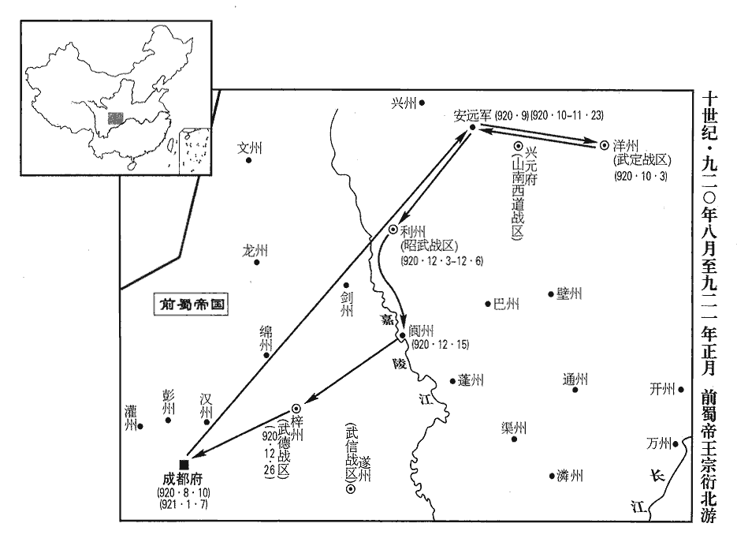
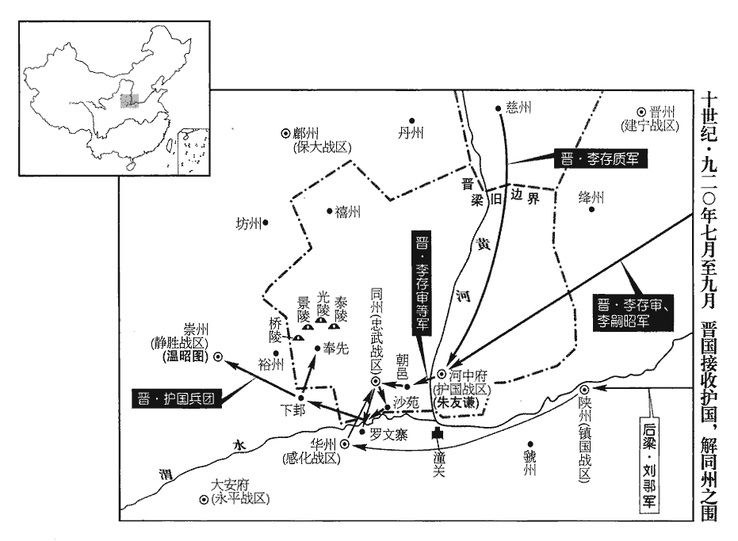
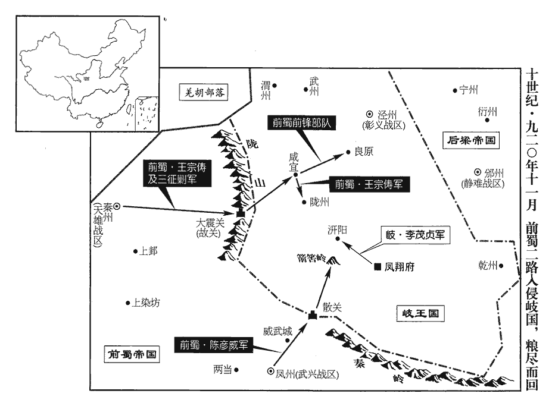
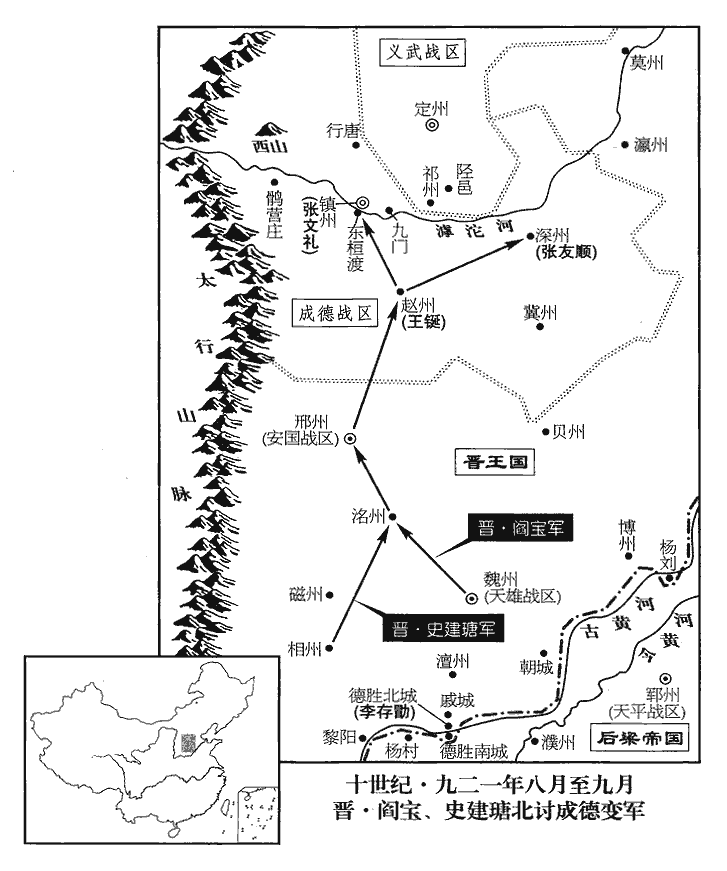
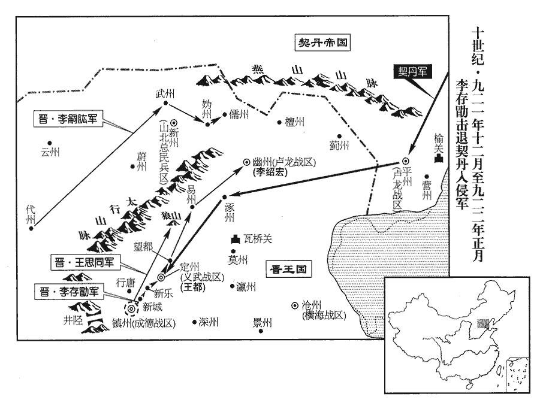
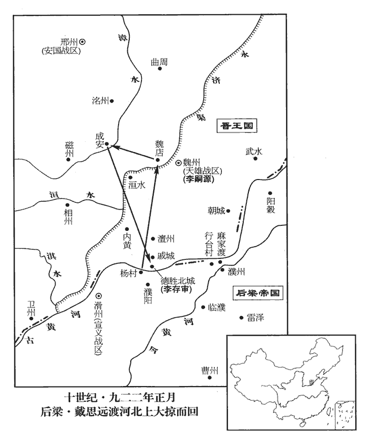
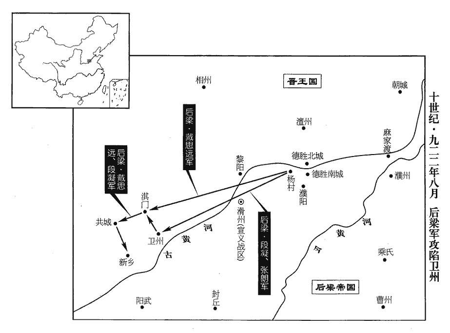

 後梁紀六起屠維單閼（己卯）十月，盡玄黓敦牂（壬午），凡三年有奇。

# 均王下

## 貞明五年（己卯、九一九）

1冬，十月，出濛為楚州‹江苏省淮安市›團練使。承上卷徐溫惡濛事。

〖译文〗 [1]冬季，十月，吴国派杨出任楚州团练使。

2晉王如魏州‹河北省大名县›，發徒數萬，廣德勝北城，日與梁人爭，大小百餘戰，互有勝負。左射軍使石敬瑭與梁人戰于河壖ruán，左射軍使，統軍士之能左射者。壖，而緣翻，河邊地也。梁人擊敬瑭，斷其馬甲，斷，丁管翻。薛史曰：晉高祖為梁人所襲，馬甲連革斷。橫衝兵馬使劉知遠以所乘馬授之，自乘斷甲者徐行為殿；殿，丁練翻。梁人疑有伏，不敢迫，俱得免，敬瑭以是親愛之。敬瑭、知遠，其先皆沙陀人。敬瑭，李嗣源‹邈佶烈›之壻也。石敬瑭、劉知遠始此。

〖译文〗 [2]晋王到魏州，派数万名士卒扩建德胜北城，每天都和后梁争战，大小战争百余次，互有胜负。左射军使石敬瑭和后梁军在黄河边上交战，后梁军攻打石敬瑭，击断了石敬瑭战马的铠甲，横冲兵马使刘知远把自己的战马给了石敬瑭，自己骑着断了甲的马在军队在后面慢慢走。后梁军怀疑晋军有伏兵，不敢靠近，因此他们都幸免于难。因此，石敬瑭更加宠爱刘知远。石敬瑭、刘知远的先人都是沙陀人。石敬瑭是李嗣源的女婿。

3劉鄩圍張萬進於兗州‹山东省兖州市›經年，城中危窘，去年八月，劉鄩圍兗州，事見上卷。窘，渠隕翻。晉王方與梁人戰河上，力不能救。萬進遣親將劉處讓乞師於晉，晉王未之許，處讓於軍門截耳曰：「苟不得請，生不如死！」晉王義之，將為出兵，為，于偽翻。會鄩已屠兗州，族萬進，乃止。以處讓為行臺左驍衛將軍。處讓，滄州‹河北省沧州市东南›人也。張萬進自滄州徙兗州，劉處讓蓋從之。處，昌呂翻。驍，堅堯翻。

〖译文〗 [3]刘在兖州包围张万进已经一年多，城中危急窘困，这时晋王正和后梁军在黄河上作战，无力解救兖州。张万进派遣他的亲信将领刘处让向晋王请求援兵，晋王没有答应。刘处让在军营门口割掉自己的耳朵，说：“如果不答应请求，活着不如死了。”晋王认为他很义气，准备出兵援救兖州。这时正好刘已经攻下兖州，灭了张万进家族，才停止出兵援助。晋王任命刘处让为行台左骁卫将军。刘处让是沧州人。

4十一月，吳武寧‹总部设廬州安徽省合肥市›節度使張崇寇安州‹湖北省安陆市›。

〖译文〗 [4]十一月，吴国武宁节度使张崇率兵侵犯安州。

5丁丑‹十三›，以劉鄩為泰寧‹总部设兖州›節度使、同平章事。劉鄩先以河朔喪師，貶為團練使，落平章事，今以平張萬進，復為使相。

〖译文〗 [5]丁丑（十三日），后梁帝任命刘为泰宁节度使、同平章事。

6辛卯‹二十七›，王瓚引兵至戚城‹河南省濮阳市北›，戚城在德勝西，即春秋時衛之戚邑也。杜預曰：戚，河上之邑。與李嗣源戰，不利。

〖译文〗 [6]辛卯（二十七日），王瓒率兵到了戚城，与李嗣源交战，没有取胜。

7梁築壘貯糧於潘張‹河南省范县南›，貯，丁呂翻。潘張，地名。蓋潘、張二姓居之，因以名村，如楊村之類一姓而名村也。其他如麻家渡，趙步，又皆以姓而名津步，此皆載於通鑑。薛史云：潘張村在河曲。距楊村‹德胜北城西·河南省濮阳市西›五十里。十二月，晉王自將騎兵自河南岸西上，邀其餉者，俘獲而還；上，時掌翻。還，從宣翻，又如字。梁人伏兵於要路，晉兵大敗。晉王以數騎走，梁數百騎圍之，李紹榮‹元行钦›識其旗，凡行軍，主將各有旗以為表識，今謂之「認旗」。單騎奮擊救之，僅免。戊戌‹五›，晉王復與王瓚戰於河南，復，扶又翻。瓚先勝，獲晉將石君立等；既而大敗，乘小舟渡河，走保北城，楊村北城也。失亡萬計。帝聞石君立勇，石君立即救晉陽者也，見二百六十九卷二年。欲將之，將，即亮翻。繫於獄而厚餉之，使人誘之。誘，音酉。君立曰：「我晉之敗將，而為用於梁，雖竭誠效死，誰則信之！人各有君，何忍反為仇讎用哉！」帝猶惜之，盡殺所獲晉將，獨置君立。晉王乘勝遂拔濮陽‹河南省濮阳市西南›。考異曰：莊宗實錄：「天祐十五年，賀瓌屯於濮州北行臺里。十二月，辛酉，上次于臨濮，賊亦捨營踵我。癸亥，次于胡柳。明日，接戰王彥章敗走濮陽。甲子，進攻濮陽，一鼓而拔。」按唐地理志，濮州亦謂之濮陽郡，治鄄城，有濮陽、臨濮二縣。據莊宗實錄則行臺里在臨濮東，胡柳在濮陽東。彥章所保，莊宗所拔者，皆濮陽縣，非濮州也。而莊宗列傳及薛史閻寶傳皆云彥章騎軍已入濮州，山下惟列步兵，向晚皆有歸心。是以濮陽即為濮州也。李嗣昭傳，嗣昭云：「賊無營壘，去臨濮地遠，日已晡晚，皆有歸心，但以精騎撓之，無令夕食，晡後追擊，破之必矣。我若收軍拔寨，賊入臨濮，俟彼整齊復來，則勝負未決。」是又以濮陽即為臨濮也。按薛史梁紀，貞明五年四月制書，放濮州稅課，是濮州猶屬梁也。莊宗實錄，天祐十六年十二月，攻下濮陽，下教告諭曹、濮百姓，勸令歸附，是濮州未屬晉也。又賀瓌屯土山西，晉軍在其東，彥章已西入濮陽，瓌豈得更東歸臨濮！疑寶傳濮州、嗣昭傳臨濮皆當為濮陽，史氏文飾之誤也。又莊宗實錄，去年十二月，晉已拔濮陽，至此又云攻下濮陽。按薛史梁紀，去年十二月晉人攻濮陽陷之，今年十二月又云晉人陷濮陽；唐紀去冬拔濮陽，今年四月追襲賀瓌至濮陽，十二月無攻下濮陽事。賀瓌傳，貞明四年領大軍營於行臺村，十二月戰敗，四月退軍行臺，尋卒。若非實錄及梁紀重複，則是去冬唐雖得濮陽，棄而不守，今年冬復攻拔之也。帝召王瓚還，以天平‹总部设郓州山东省东平县›節度使戴思遠代為北面招討使，屯河上以拒晉人。

〖译文〗 [7]后梁军在潘张修筑营垒，储蓄粮食，潘张离杨村五十里。十二月，晋王率领骑兵从黄河南岸向西行进，阻截后梁军的送粮人，俘虏了送粮人而返。后梁军在要害路段埋伏了士兵，晋军大败。晋王领着几个骑兵逃走，后梁军用几百骑兵包围了他们。晋将李绍荣认出是自己军队的旗帜，就一个人骑马去奋力解救晋王，仅使晋王免于一死。戊戌（初五），晋王又和王瓒在黄河南岸交战，王瓒先取得胜利，俘获了晋将石君立等。过了一阵，王瓒的军队被晋军打败，王瓒乘小船渡过黄河，跑回北城坚守。这次战败，有一万多士卒逃跑或被杀。后梁帝听说石君立非常勇敢，打算让他做自己的将领，把他关在监狱里，给他丰厚的待遇，并派人去劝诱他。石君立说：“我是晋军的败将，如果在梁国被起用，虽竭诚效死，有谁能相信我呢？”后梁帝还是很爱惜他，把俘获的其他晋将全部杀掉，只留下了石君立。晋王乘胜前进，一举攻下了濮阳。后梁帝把王瓒召回，任命天平节度使戴思远代理北面招讨使，驻扎在黄河抵御晋军。

8己酉‹十六›，蜀雄武‹总部设金州陕西省安康市›節度使兼中書令王宗朗有罪，削奪官爵，復其姓名曰全師朗，命武定‹总部设洋州陕西省洋县›節度使兼中書令桑弘志‹李继岌›討之。

〖译文〗 [8]己酉（十六日），前蜀国雄武节度使兼中书令王宗朗犯了罪，前蜀主解除了他的官爵，恢复了他的姓名叫全师朗，命令武定节度使兼中书令桑弘志讨伐他。

9吳禁民私畜兵器，盜賊益繁。御史臺主簿京兆‹陕西省西安市·此时称大安府›盧樞上言：唐御史臺置主簿一人，掌印，受事發辰，覈臺務，主公廨及奴婢，勳散官之職。「今四方分爭，宜教民戰。且善人畏法禁而姦民弄干戈，是欲偃武而反招盜也。宜團結民兵，使之習戰，自衛鄉里。」從之。

〖译文〗 [9]吴国禁止百姓私藏武器，盗贼越来越多。御史台主簿京兆人卢枢上奏说：“现在四方纷争，应当教百姓熟习战斗。况且善良的人是惧怕法律禁令的，而不安分守己的人舞弄干戈，这是想禁止争斗反而招来盗贼啊！应当组织民兵，让他们熟习战斗，各自保卫自己的家乡。”吴王听从了卢枢的意见。

## 六年（庚辰、九二零）

1春，正月，戊辰‹五›，蜀‹首都成都府四川省成都市›桑弘志克金州‹陕西省安康市›，執全師朗，獻于成都，蜀主‹王宗衍，本年二十二岁›釋之。

〖译文〗 [1]春季，正月，戊辰（初五），前蜀将领桑弘志攻克金州，抓获全师朗，送到成都，前蜀主把他释放了。

2吳‹首都扬州江苏省扬州市›張崇攻安州‹湖北省安陆市›，不克而還。

〖译文〗 [2]吴将张崇进攻安州，没有攻下，率兵返回。

崇在廬州‹安徽省合肥市›，貪暴不法。廬江‹安徽省庐江县›民訟縣令受賕，徐知誥遣侍御史知雜事楊廷式往按之，欲以威崇，廷式曰：「雜端推事，其體至重，唐御史臺侍御史六人，以久次一人知雜事，謂之雜端。職業不可不行。」知誥曰：「何如？」廷式曰：「械繫張崇，使吏如昇州‹徐温根据地·江苏省南京市›，簿責都統。」簿責者，一二而責之。知誥曰：「所按者縣令耳，何至於是！」廷式曰；「縣令微官，張崇使之取民財轉獻都統耳，都統，謂徐溫也。豈可捨大而詰小乎！」詰，去吉翻。知誥謝之曰：「固知小事不足相煩。」煩，勞也。以是益重之。廷式，泉州‹福建省泉州市›人也。

〖译文〗 张崇在庐州，贪暴不法。庐江的百姓上诉，说庐江县令接受了贿赂。徐知诰派侍御史知杂事杨廷式前往检查，打算以此来威胁张崇一下。杨廷式说：“杂端推事官，体制上非常重要，本职工作，不可不做。”徐知诰说；“怎么办呢？”杨廷式说：“给张崇戴上刑具，派一个官吏去升州，反复诘责都统。”徐知诰说：“现在查办的不过是一个县令，何至如此！”杨廷式说：“县令虽然是个小官，但张崇让他收取的民财都转献给了都统，难道可以舍去大官而去诘责一个小官吗？”徐知诰道歉说：“本来知道小事不足以麻烦你。”徐知诰因此更加器重杨廷式。杨廷式是泉州人。

3晉王‹首都太原府山西省太原市›李存勖，本年三十六岁自得魏州，得魏州見二百六十九卷元年。以李建及為魏博內外牙都將，將銀槍效節都。將，即亮翻；下同。建及為人忠壯，所得賞賜，悉分士卒，與同甘苦，故能得其死力，所向立功，同列疾之。宦者韋令圖監建及軍，譖於晉王曰：「建及以私財驟施，施，式豉翻。，此其志不小，不可使將牙兵。」王疑之；建及知之，【章：十二行本「之」下有「自恃無他」四字；乙十一行本同；孔本同；張校同；退齋校同。】行之自若。三月，王罷建及軍職，以為代州‹山西省代县›刺史。史言晉王不能信屬賢將，李建及由是怏怏而卒。

〖译文〗 [3]自从晋得到魏州以后，任命李建及为魏博内外牙都将，统率禁卫军银枪效节都。李建及为人忠诚壮节，得到的赏赐全部分给士卒，与士卒们同甘共苦，所以能够得到士卒们对他尽心尽力，只要他出去作战，一定会立功，同僚们很嫉妒他。宦官韦令图监管李建及的军队，偷偷地对晋王说：“李建及用自己的财物多次分给士卒，如此看来，他的志向不小，不能让他率领禁卫军了。”晋王产生了怀疑。李建及知道后，行之自若。三月，晋王免去李建及的军职，任命他为代州刺史。

4漢‹首都兴王府广东省广州市›楊洞潛請立學校，開貢舉，設銓選；漢主巖‹刘岩，本年三十二岁›從之。校，戶教翻。

〖译文〗 [4]南汉杨洞潜请求建立学校，开设贡举，量才授官，南汉主刘岩听从了他的意见。

5夏，四月，乙亥‹十三›，以尚書左丞李琪為中書侍郎、同平章事。琪，珽之弟也，李珽始見於唐昭宗天復三年而死於梁誅友珪之時。性疏俊，挾趙巖、張漢傑之勢，頗通賄賂。蕭頃與琪同為相，頃謹密而陰伺琪短。伺，相吏翻。久之，有以攝官求仕者，琪輒改攝為守。頃奏之。歐史曰：琪所私吏當得試官，琪改試為守，為頃所發。帝‹朱友贞，本年三十三岁›大怒，欲流琪遠方，趙、張左右之，左右，讀曰「佐佑」。止罷為太子少保。考異曰：薛史止有琪作相月日，無罷相年月，故終言之。

〖译文〗 [5]夏季，四月，乙亥（疑误），后梁帝任命尚书左丞李琪为中书侍郎、同平章事。李琪是李的弟弟，他的性情开朗出众，依仗赵岩、张汉杰的势力，颇通贿赂。萧顷和李琪同为宰相，萧顷谨慎秘密地观察李琪的短处。过了很久，有人想将试用的官改为正式的官，李琪就给他改试用官为守官，萧顷把这件事上奏给后梁帝。后梁帝十分生气，想把李琪流放到远方，经赵岩、张汉杰帮助，才未流放，降为太子少保。

6河中‹山西省永济市›節度使冀王友謙以兵襲取同州‹陕西省大荔县›，逐忠武‹总部设同州陕西省大荔县›節度使程全暉，全暉奔大梁‹首都开封府所在城›。友謙以其子令德為忠武留後，表求節鉞，帝怒，不許。既而懼友謙怨望，己酉‹十七›，以友謙兼忠武節度使。制下，下，戶嫁翻。友謙已求節鉞於晉王‹李存勖›，朱友謙自此遂歸于晉。晉王以墨制除令德忠武節度使。考異曰：莊宗列傳，「上令幕客王正言送節旄賜之。」莊宗實錄列傳、薛史友謙傳皆云「友謙以令德為帥，請節鉞，不許。」薛史末帝紀貞明六年云，「陷同州，以令德為留後，表求節旄，不允。」而「貞明四年六月甲辰，以歙州刺史朱令德為忠武留後。」恐是四年已陷同州。

〖译文〗 [6]河中节度使冀王朱友谦率兵袭击并夺取了同州，赶走了忠武节度使程全晖。程全晖逃到了大梁。朱友谦任命他的儿子朱令德为忠武留后，并上表皇帝请求赐发符节和斧钺，后梁帝十分生气，没有答应。后来后梁帝害怕朱友谦心怀不满，己酉（十七日），任命朱友谦兼任忠武节度使。后梁帝的命令下达时，朱友谦已向晋王请求到符节和斧钺，归降于晋王，于是晋王直接发出亲笔手令任命朱令德为忠武节度使。

7吳宣王‹杨隆演›重厚恭恪，徐溫父子專政，王未嘗有不平之意形於言色，溫以是安之。及建國稱制，見上卷上年。尤非所樂，多沈飲鮮食，樂，音洛。沈，持林翻。鮮，息淺翻，少也。遂成寢疾。

〖译文〗 [7]吴宣王很厚道，而且谦恭谨慎，徐温父子掌管全权，宣王从来没有不平之意表现在脸色上，徐温因此就安然自在。到了建国称王以后，宣王更没有什么所高兴的，经常喝酒，很少吃饭，慢慢就卧床生病了。

五月，溫自金陵‹昇州州政府所在城·江苏省南京市›入朝‹扬州›，議當為嗣者。或希溫意言曰：「蜀先主‹刘备›謂武侯‹诸葛亮›：『嗣子不才，君宜自取。』」見六十九卷魏文帝黃初三年。溫正色曰：「吾果有意取之，當在誅張顥hào之初，誅張顥見二百六十九卷開平二年。豈至今日邪！使楊氏無男，有女亦當立之。敢妄言者斬！」乃以王命迎丹楊公溥監國，考異曰：吳錄、九國志，「有女當立」之語在誅張顥時，今從薛史。十國紀年：「王疾病，大丞相溫來朝，議立嗣君。門下侍郎嚴可求言王諸子皆不才，引蜀先主顧命諸葛亮事，溫以告知誥，知誥曰：『可求多知，言未必誠，不過順大人意爾。』溫曰：『吾若自取，非止今日。張顥之亂，嗣王幼弱，政在吾手，取之易於反掌。然思太祖大漸，欲傳位劉威，吾獨力爭，太祖垂泣，以後事託我，安可忘也！』乃與內樞密使王令謀定策，稱隆演命，迎丹楊公溥監國。己丑，隆演卒。六月，戊申，溥即王位。」恐可求亦不應有此言。今從薛史。徙溥兄濛為舒州‹安徽省潜山县›團練使。越濛而立溥者，濛為徐溫所忌也。

〖译文〗 五月，徐温从金陵回朝，商议谁当为继承王位的人。有人迎合徐温的心意说：“蜀先主刘备对武侯说：‘嗣子没有才能，您可以自代王位。’”徐温严肃地说：“我如果真有心取代王位，是在杀掉张颢的时候，哪能等到今日！即使杨氏没有儿子，有女儿也应当立她为王。再有敢胡说的，一律杀掉。”于是以宣王之命迎接丹杨公杨溥回来代行处理政事，调杨溥的哥哥杨任舒州团练使。

己丑‹二十八›，宣王‹杨隆演›殂。年二十四。六月，戊申‹十八›，溥‹本年二十一岁›即吳王位，溥，楊行密第四子。尊母王氏曰太妃。

〖译文〗 己丑（二十八日），宣王去世。六月，戊申（十八日），杨溥登吴王位。尊称他的母亲王氏为太妃。

8丁巳‹二十七›，蜀以司徒兼門下侍郎、同平章事周庠同平章事，充永平‹总部设雅州四川省雅安市›節度使。唐末置永平軍於邛州。歐史職方考，蜀以雅州為永平節度。

〖译文〗 [8]丁巳（二十七日），前蜀主让司徒兼门下侍郎、同平章事周以同平章事衔，出任永平节度使。

9帝以泰寧‹总部设兖州山东省兖州市›節度使劉鄩為河東道招討使，帥感化‹总部设华州陕西省华县›節度使尹皓、靜勝‹总部设崇州陕西省耀县›節度使溫昭圖、莊宅使段凝攻同州‹陕西省大荔县›。帥，讀曰率；下同。

〖译文〗 [9]后梁帝任命泰宁节度刘为河东道招讨使，率领感化节度使尹皓、静胜节度使温昭图、庄宅使段凝一起攻打同州。

10閏月，庚申朔‹一›，蜀主作高祖原廟于萬里橋‹四川省成都市东南›，原廟起於漢。原，再也，已立太廟而再立廟曰原廟。萬里橋在成都。寰宇記曰：昔者費禕yī聘吳，諸葛亮送之至此橋，曰：「萬里之路，始於此矣。」因以名橋。帥后妃、百官用褻味作鼓吹祭之。褻味，常御嗜好之味也。記郊特牲曰：禘嘗，不敢用褻味而貴多品，所以交於神明之義也。褻xiè，息列翻。華陽‹首都成都府所在县·四川省成都市›尉張士喬上疏諫，以為非禮，華陽縣本唐貞觀十七年所置蜀縣，在益州郭下，與成都分治，乾元元年改為華陽縣。華，戶化翻。蜀主怒，欲誅之，太后以為不可，乃削官流黎州‹四川省汉源县›，士喬感憤，赴水死。

〖译文〗 [10]闰五月，庚申朔（初一），前蜀主在万里桥修建了高祖原庙，带领后妃、百官，供上高祖生前最喜欢吃的食品，击鼓吹乐来祭祀高祖。华阳尉张士乔上书劝说前蜀主，认为这样做不合祭礼。前蜀主十分生气，打算把他杀掉。太后认为不能杀，于是免了他的官职，把他流放到黎州。张士乔感到愤怒，跳水自杀。

11劉鄩等圍同州，朱友謙求救于晉；秋，七月，晉王遣李存審、李嗣昭、李建及、慈州‹山西省吉县›刺史李存質將兵救之。

〖译文〗 [11]刘等包围了同州，朱友谦请求晋国援救。秋季，七月，晋王派遣李存审、李嗣昭、李建及、慈州刺史李存质率兵前去援救。

 

12乙卯‹二十六›，蜀主‹王宗衍›下詔北巡，以禮部尚書兼成都尹長安韓昭為文思殿大學士，位在翰林承旨上。昭無文學，以便佞得幸，便pián，毗連翻。出入宮禁，就蜀主乞通‹四川省达川市›、渠‹四川省渠县›、巴‹四川省巴中市›、集‹四川省南江县›數州刺史賣之以營居第，蜀主‹王宗衍›許之。識者知蜀之將亡。

〖译文〗 [12]乙卯（二十六日），前蜀主颁发诏书，准备到北边巡视。任命礼部尚书兼成都尹长安人韩昭为文思殿大学士，地位在翰林承旨之上。韩昭没有文才，用花言巧语、阿谀逢迎得到的前蜀主宠幸，出入宫禁，在接近前蜀主时，请求卖通、渠、巴、集四州刺史官爵，用来修建他的住宅，前蜀主答应了。明白这件事的人知道前蜀将要灭亡。

八月，戊辰‹十›，蜀主‹王宗衍›發成都，被金甲，冠珠帽，執弓矢而行，被，皮義翻。冠，古玩翻。旌旗兵甲，亘百餘里。雒‹汉州州政府所在县·四川省广汉市›令段融上言：雒，漢古縣，唐屬漢州，為州治所。上，時掌翻。「不宜遠離都邑‹成都府›，離，力智翻。當委大臣征討。」不從。九月，次安遠城‹陕西省汉中市西›。凡兵一宿為信，過信為次。

〖译文〗 八月，戊辰（初十），前蜀主从成都出发，他身披金甲，头戴珠帽，手执弓箭而行，随从的旌旗兵甲，连接起来有百余里长。雒县守令段融上书说：“不宜远离都城，应委派大臣出去征讨。”前蜀主不听。九月，军队驻扎在安远城。

13李存審等至河中‹山西省永济市›，即日濟河。自河中濟河救同州。梁人素輕河中兵，每戰必窮追不置。存審選精甲二百，雜河中兵，直壓劉鄩壘，鄩出千騎逐之；知晉人已至，大驚，時鄩兵出逐河中兵，晉騎反擊之，獲梁騎兵五十，梁人知其晉軍也，大驚。自是不敢輕出。晉人軍于朝邑‹陕西省大荔县东朝邑镇›。九域志：朝邑在同州東三十五里。

〖译文〗 [13]李存审等到了河中，当天过了黄河。后梁军平时很轻视河中兵，每次战斗都要穷追不舍。李存审挑选了二百名精兵，其中又搀杂了一些河中兵，一直逼近刘的军营。刘率领一千骑兵出去追逐，发现晋军已经来到，十分吃惊，从此以后，刘不敢轻易出动。晋军驻扎在朝邑。

河中事梁久，唐昭宗之世，朱全忠降王珂，河中遂事梁。將士皆持兩端。諸軍大集，芻粟踊貴，友謙諸子說友謙說，式芮翻。且歸款於梁，以退其師，友謙曰：「昔晉王‹李存勖›親赴吾急，秉燭夜戰。謂與康懷貞等戰也。事見二百六十八卷乾化二年。今方與梁相拒，謂相距於河上也。又命將星行，分我資糧，豈可負邪！」

〖译文〗 河中事奉后梁时间已经很长，将士们都是脚踩两只船。各路军队都集中在河中，粮草价格昂贵，朱友谦的儿子们劝说朱友谦诚心归服后梁，以此来让后梁军撤兵，朱友谦说；“从前晋王亲自率兵解救我的危急，手持火把连夜作战。现在正和后梁军相持，晋王又命令将帅披星戴月赶来援救，还给我们物资粮食，我们怎么能辜负他呢？”

 

晉人分兵攻華州，壞其外城。將，即亮翻。華，戶化翻。壞，音怪。李存審等按兵累旬，乃進逼劉鄩營，鄩等悉眾出戰，大敗，收餘眾退保羅文寨。薛史曰：鄩以餘眾退保華州羅文寨。又旬餘，存審謂李嗣昭曰：「獸窮則搏，不如開其走路，然後擊之。」乃遣人牧馬於沙苑‹陕西省大荔县南›。鄩等宵遁，追擊至渭水，又破之，殺獲甚眾。劉鄩用兵，十步九計，以此得名於時。至同州之役，與李存審遇，為所玩弄，若嬰兒在人掌股之上，是何也？孽也！蓋鳥之中傷者曰孽，聞弦鳴則引而高飛，力不足斯抎yǔn矣，故空弓可落也。劉鄩先為晉兵所破，見晉兵之來，氣沮而膽消矣，烏能與之為敵哉！存審等移檄告諭關右，引兵略地至下邽‹陕西省渭南市北下吉镇›，謁唐帝陵‹下邽北十余千米是当时奉先县陕西省蒲城县›，城郊有许多唐王朝的皇帝陵墓：西南丰山葬五、八任帝李旦桥陵、东北金粟山葬九任帝李隆基泰陵、西北金炽山葬十四任帝李纯景陵、正北尧山还葬一个让帝李成器惠陵，哭之而還。唐帝陵在同州奉先縣。還，從宣翻，又如字。

〖译文〗 晋军分兵去攻打华州，破坏了华州的外城。李存审等按兵不动，几十天后才逼近刘的军营，刘等率领全军出来迎战，被打得大败，只好收拾剩下的军队退守罗文寨。又过了十几天，李存审对李嗣昭说：“野兽到了最困难的时候就会拼死搏斗，不如放开一条路让他们逃走，然后从后面追击他们。”于是李嗣昭派出人到沙苑去放马。刘等乘夜逃跑，李嗣昭率兵追击到渭水，又将刘的军队打败，斩杀和俘获很多。李存审等张贴檄文，告示关右，同时率兵攻占了很多地方，一直到下，谒拜了唐帝的陵墓，在陵前痛哭一番后返回。

河中兵進攻崇州‹陕西省耀县›，靜勝‹总部崇州›節度使溫昭圖甚懼。元年，溫韜以義勝軍降，改耀州曰崇州，義勝曰靜勝，韜賜今名。帝使供奉官竇維說之曰：說，式芮翻。「公所有者華原‹耀州崇州›、美原‹鼎州裕州›·陕西省富平县东北美原鎮兩縣耳，唐末溫韜為盜，據華原縣。李茂貞以華原為茂州，韜為刺史，尋改耀州；又以美原縣為鼎州，建義勝軍，以韜為節度使。及降梁，改耀州為崇州，鼎州為裕州，義勝為靜勝。是其所有者本唐兩縣也。雖名節度使，實一鎮將，比之雄藩，豈可同日語也，公有意欲之乎？」昭圖曰：「然。」維曰：「當為公圖之。」為，于偽翻。即教昭圖表求移鎮，帝‹朱友贞›以汝州‹河南省汝州市›防禦使華溫琪權知靜勝‹总部设崇州陕西省耀县›留後。華，戶化翻。

〖译文〗 河中的军队向崇州发起进攻，静胜节度使温昭图非常害怕。后梁帝派供奉官窦维劝他说：“你仅仅有华原、美原两个县罢了，虽然名为节度使，其实是一个镇将，和一些强大的藩镇来比，怎么可以同日而语，你想扩大一点吗？”温昭图说：“当然。”窦维说：“让我为你来谋划。”于是就让温昭图上书请求改换个地方。后梁帝于是让汝州防御使华温琪暂为静胜留后。

14冬，十月，辛酉‹三›，蜀主如武定軍‹总部设洋州陕西省洋县›，數日，復還安遠‹陕西省汉中市西›。復，扶又翻。

〖译文〗 [14]冬季，十月，辛酉（初三），前蜀主去了武定军，几天以后又回到安远。

15十一月，戊子朔‹一›，蜀主以兼侍中王宗儔為山南‹总部设兴元府陕西省汉中市›節度使、西北面都招討、行營安撫使，天雄‹总部设秦州甘肃省秦安县西北›節度使•同平章事王宗昱、永寧軍使王宗晏、左神勇軍使王宗信為三招討以副之，將兵伐岐‹首都凤翔府›，出故關‹陕西省陇县西固关›，壁於咸宜‹陕西省陇县西北›，壁者，築壁壘以屯軍。咸宜當在隴州汧源縣界。入良原‹甘肃省灵台县西梁原镇›。良原縣屬涇州。九域志：在州西南六十里。丁酉‹十›，王宗儔攻隴州‹陕西省陇县›，岐王‹李茂贞（宋文通）›自將萬五千人屯汧陽‹陕西省千阳县›。汧陽縣屬隴州。九域志：在州東六十七里，東距鳳翔五十五里。癸卯‹十六›，蜀將陳彥威出散關‹陕西省宝鸡市西南›，敗岐兵于箭筈kuò嶺‹陕西省千阳县西南›，杜佑曰：岐山即今之岐山縣；其山兩岐，故俗呼為箭筈嶺。敗，補邁翻。筈，古活翻。蜀兵食盡。引還。還，從宣翻，又如字。宗昱屯泰【章：十二行本「泰」作「秦」；乙十一行本同；孔本同；張校同；退齋校同。】州‹秦州，甘肃省秦安县西北›，宗儔屯上邽‹甘肃省天水市›，宗晏、宗信屯威武城‹陕西省凤县东北›。

〖译文〗 [15]十一月，戊子朔（初一），前蜀主任命兼侍中王宗俦为山南节度使、西北面都招讨、行营安抚使，任命天雄节度使、同平章事王宗昱，永宁军使王宗晏，左神勇军使王宗信为三名招作为副职，辅助王宗俦领兵伐岐。他们率兵出故关，在咸宜修筑壁垒，后进入良原。丁酉（初十），王宗俦向陇州发起进攻，岐王亲自率领一万五千军队驻扎在阳。癸卯（十六日），前蜀将陈彦威从散关出兵，在箭岭击败了岐兵。前蜀军的粮食吃完后，才率兵回去。王宗昱驻扎在泰州，王宗俦驻扎在上，王宗晏和王宗信驻扎在武威城。

 

庚戌‹二十三›，蜀主發安遠城‹陕西省汉中市西›；十二月庚申‹三›，至利州‹四川省广元市›，閬州‹四川省阆中市›團練使林思諤來朝，請幸所治，從之。閬中，林思諤所治也。九域志：利州東南至閬州二百四十里。癸亥‹六›，泛江而下，泛嘉陵江也。龍舟畫舸，畫，與𦘕同。舸，古我翻。楚人謂大船為舸。輝映江渚，州縣供辦，民始愁怨。此總言蜀主所經行州縣，不特言閬州為然也。壬申‹十五›，至閬州，州民何康女色美，將嫁，蜀主取之，賜其夫家帛百匹，夫一慟而卒。記：諸侯不下漁色。註云：謂不內取於國中也。內取國中為下漁色。國君而內取，象捕魚然，中網則取之，是無所擇。王衍奪人之妻，其為漁也殆有甚焉！癸未‹二十六›，至梓州‹四川省三台县›。

〖译文〗 庚戌（二十三日），前蜀主自安远城出发，十二月，庚申（初三），到达利州，阆州团练使林思谔来朝拜，请求前蜀主巡视阆州，前蜀主答应了他的请求。癸亥（初六），顺江而下，龙舟彩船，光辉照映在江的两岸，这些都是强制沿江州县供应，老百姓开始发愁抱怨。壬申（十五日），前蜀主到了阆州，阆州的百姓何康有个很漂亮的女儿，将要出嫁，前蜀主就夺为己有，然后赏赐给她的夫家一百匹丝帛，那个未婚夫极其悲痛而死。癸未（二十六日），前蜀主到了梓州。

16趙王鎔‹王镕，首府镇州河北省正定县›自恃累世鎮成德‹总部设镇州河北省正定县›，得趙人心，生長富貴，長，知兩翻。雍容自逸，治府第園沼，極一時之盛，治，直之翻。多事嬉遊，不親政事，事皆仰成於僚佐，仰，牛向翻。深居府第，權移左右，行軍司馬李藹、宦者李弘規用事於中外，外則李藹，中則李弘規。宦者石希蒙尤以諂諛得幸。

〖译文〗 [16]赵王王熔依仗世代镇守成德，颇得赵地人心，生活富裕，地位显贵，容仪温文，悠然自得。他治理的府第园池，在当时是最好的。他经常游玩，不问政事，一切政事都依靠僚佐来处理。他深居府第，把大权交给了他的左右官员。行军司马李蔼、宦官李弘规掌管内外事务。宦官石希蒙尤其靠阿谀奉承得到宠爱。

初，劉仁恭使牙將張文禮從其子守文鎮滄州‹河北省沧州市东南›，守文詣幽州‹北京市›省其父，文禮於後據城作亂，滄人討之，奔鎮州。比言唐末事，敘張文禮之所自來。省，悉景翻。文禮好誇誕，好，呼到翻。自言知兵，趙王鎔奇之，養以為子，更名德明，更，工衡翻。悉以軍事委之。德明將行營兵從晉王，事始二百六十七卷太祖乾化元年。鎔欲寄以腹心，使都指揮使符習代還，以為防城使。

〖译文〗 当初，刘仁恭派牙将张文礼随他的儿子刘守文去镇守沧州，刘守文到幽州去看望父亲，张文礼随后占据了沧州城发动叛乱，沧州人讨伐他，他逃到了镇州。张文礼喜欢吹大话，自称会打仗，赵王王熔认为他很奇特，于是收为养子，并改名为德明，把全部的军事委托给他。德明率领着行军部队跟随着晋王，王熔想委派一个亲信去，于是派都指挥使符习替代德明，让他回来，任防城使。

鎔晚年好事佛及求仙，好，呼到翻。專講佛經，受符籙，廣齋醮，合煉仙丹，合，音閤。盛飾館宇於西山‹河北省平山县西北房山›，每往遊之，鎮州西山謂之房山，上有西王母祠，鎔欲求仙，故數往遊之。登山臨水，數月方歸，將佐士卒陪從者常不下萬人，從，才用翻。往來供頓，軍民皆苦之。是月，自西山還，宿鶻營莊‹河北省平山县西›，鶻，戶骨翻。石希蒙勸王復之他所；復，扶又翻。李弘規言於王曰：「晉王‹李存勖›夾河血戰，或戰河南，或戰河北，故曰夾河。櫛風沐雨，櫛zhì，去瑟翻。親冒矢石，而王專以供軍之資奉不急之費。且時方艱難，人心難測，王久虛府第，遠出遊從，萬一有姦人為變，閉關相距，將若之何？」王將歸，希蒙密言於王曰：「弘規妄生猜間，間，古莧翻。出不遜語以劫脅王，專欲誇大於外，長威福耳。」長，知兩翻。王遂留，信宿無歸志。詩九罭yù云：於女信宿。毛氏傳：再宿曰信。與左傳「師行一宿為信」之義不同。弘規乃教內牙都將蘇漢衡帥親軍，擐甲拔刃，帥，讀曰率。擐，音宦。詣帳前白王曰：「士卒暴露已久，願從王歸！」弘規因進言曰：「石希蒙勸王遊從不已，且聞欲陰謀弒逆，請誅之以謝眾。」王不聽，牙兵遂大譟，斬希蒙首，訴於前。王怒且懼，亟歸府。是夕，遣其長子副大使昭祚與王德明將兵圍弘規及李藹之第，族誅之，連坐者數十家。又殺蘇漢衡，收其黨與，窮治反狀，親軍大恐。為張文禮嗾sǒu軍士殺王鎔張本。治，直之翻；下同。

〖译文〗 王熔晚年信佛，喜欢求仙，专门讲习佛经，又学习道家符，广设斋醮向仙道祈祷，冶炼金丹。在西山把馆宇装饰的非常华丽，经常去那里游玩。他登山观水，几个月后才回来，陪他的左右将士经常不下一万人。来往食宿，耗资巨大，军民都深受其苦。这个月，从西山回返，住在鹘营庄，石希蒙劝王熔再到别的地方去玩。李弘规对王熔说：“晋王在黄河两岸和梁军血战，栉风沐雨，亲自冒着箭石率兵前进。而大王专门把供给军队用的物质挪用于一些不急的事情，况且时下正处在困难时期，人心难测，大王如果长期离开府第，远出游玩，万一有奸人叛变，关起关门，把我们隔在外面，该怎么办呢？”赵王准备回去，石希蒙又偷偷地和赵王说：“李弘规胡乱猜想，口出不逊之言来威胁大王，专门对外夸示自己，以提高自己的威福。”于是赵王又留了下来，连续住了两夜还不想回去。李弘规于是让内牙都将苏汉衡率领亲军穿甲持刀，到帐篷前面对赵王说：“士卒们离家在外已经很长时间了，都希望跟从大王回去。”李弘规因此也劝赵王说：“石希蒙劝大王没完没了地游玩，而且还听说他准备谋害大王，请把他杀掉来向大家认错。”赵王不听，于是卫队士卒大声喧哗起来，杀了石希蒙，拿着他的头到赵王面前诉说。赵王十分生气也很害怕，于是赶快回到了府第。当天晚上赵王就派他的长子副大使王昭祚和王德明率兵包围了李弘规和李蔼的住宅，把他的全家全部杀掉，受牵连的有几十家。又将苏汉衡杀掉，拘捕了他的党羽，彻底追究他们反叛的情况，赵王的亲信部队感到十分惊恐。

17吳金陵城‹南京市›成，陳彥謙上費用冊籍，徐溫曰：「吾既任公，不復會計。」上，時掌翻。復，扶又翻。會，工外翻。悉焚之。

〖译文〗 [17]吴国修筑的金陵城落成，陈彦谦将开支帐册送给徐温过目，徐温说：“我既然任用你办，我就不再检查核算了。”于是把那些帐簿全部烧了。

18初，閩王審知‹王审知，首都福州福建省福州市›承制加其從子泉州‹福建省泉州市›刺史延彬領平盧‹总部设青州山东省青州市›節度使。從，才用翻。延彬治泉州十七年，吏民安之。會得白鹿及紫芝，僧浩源以為王者之符，延彬由是驕縱，密遣使浮海入貢，求為泉州節度使。事覺，審知誅浩源及其黨，黜延彬歸私第。

〖译文〗 [18]当初闽王王审知承照制书让他的侄儿泉州刺史王延彬兼任平卢节度使。王延彬治理泉州十七年，官民都安居乐业，正好在这个时候，王延彬得到了白鹿和紫芝等祥瑞物品，僧人浩源认为这是王延彬要做帝王的征兆。王延彬因此骄傲放肆起来，他偷偷派人过海去帝王那里纳贡，并请求闽王任命他为泉州节度使。事情败露后，王审知诛灭了浩源及其同党，罢免了王延彬的官爵，打发他回了家。

19漢主巖‹刘岩，首都兴王府广东省广州市›遣使通好于蜀‹首都成都府四川省成都市›。好，呼到翻。

〖译文〗 [19]南汉主刘岩派遣使者到蜀国去互通友好。

20吳越王鏐‹钱镠本年六十九岁›遣使為其子傳琇求婚於楚‹首都潭州湖南省长沙市›，楚王殷‹马殷本年六十九岁›許之。為，于偽翻；下為聘同。琇，音秀。

〖译文〗 [20]吴越王钱派遣使者到楚国为他的儿子钱传求婚，楚王马殷答应了他的请求。

## 龍德元年（辛巳、九二一）是年五月方改元。

1春，正月，甲午‹七›，蜀主‹首都成都府四川省成都市›，王宗衍本年二十三岁還成都。去年七月蜀主出巡遊，至是方還。

〖译文〗 [1]春季，正月，甲午（初七），前蜀主回到了成都。

2初，蜀主之為太子，高祖為聘兵部尚書高知言女為妃，無寵，蜀主王建廟號高祖。及韋妃入宮，尤見疏薄，至是遣還家，知言驚仆，不食而卒。卒，子恤翻。韋妃者，徐耕之孫也，有殊色，蜀主適徐氏，見而悅之，太后因納於後宮，蜀主不欲娶於母族，託云韋昭度之孫。韋昭度，唐僖宗時嘗奉制帥蜀，故託言之。初為婕妤，累加元妃。婕妤，音接予。

〖译文〗 [2]当初，前蜀主为太子时，高祖王建为他聘兵部尚书高知言的女儿为妃，不受喜欢。韦妃入宫后，对高氏更加疏远，把她送回娘家。高知言为此吓得摔倒，吃不下饭死去。韦妃是徐耕的孙女，长得很漂亮，前蜀主到他的母亲徐氏那里，见到此女十分喜欢，因此太后就把她留在后宫。前蜀主不愿意娶母亲家族的人为妻，于是假托说是韦昭度的孙女。开始任她为婕妤，后来逐渐升为正妃。

蜀主常列錦步障，擊毬其中，往往遠適而外人不知。爇ruò諸香，晝夜不絕。久而厭之，更爇皁莢以亂其氣。更，工衡翻。爇，如悅翻。皁莢如豬牙者良，爇之其氣酷烈。結繒為山，及宮殿樓觀於其上，或為風雨所敗，則更以新者易之。或樂飲繒山，涉旬不下。繒，慈陵翻。觀，工喚翻。敗，補邁翻。樂，音洛。山前穿渠通禁中，或乘船夜歸，令宮女秉蠟炬千餘居前船，卻立照之，水面如晝。或酣飲禁中，鼓吹沸騰，吹，尺睡翻。以至達旦。以是為常。

〖译文〗 前蜀主经常挂起锦缎围成一个屏幕，在里面击球，往往到较远的地方而外人不知道。他经常烧香，昼夜不绝。时间长了，又讨厌烧香，改用烧皂荚来改变室内气味。他还把缯帛堆成山的样子，然后在上面做一些宫殿楼观，有时经风吹雨淋坏了，就用新的把坏的换掉。有时在缯山上饮酒作乐，一住十来天还不想下来。在缯山的前面挖一条渠，一直通往前蜀主的宫内，有时晚上乘船回宫中，命令宫女们手拿着一千余支蜡烛在前面的船上，脸朝后面站着，水面上如同白天一样明亮。有时在宫中大吃大喝，鼓乐沸腾，通宵达旦。这种情况是经常的。

3甲辰‹十七›，‹后梁，首都开封，朱友贞本年三十四岁›徙靜勝‹总部设崇州陕西省耀县›節度使溫昭圖為匡國‹总部设许州河南省许昌市›節度使，鎮許昌。昭圖素事趙巖，故得名藩。溫昭圖求徙鎮，見上年。靜勝，梁之邊鎮，且兩縣耳。匡國，唐之忠武軍，領許、陳、汝三州，自來為名藩。趙巖以名藩授昭圖，及緩急投之以託身，而斬巖者昭圖也，勢利之交，可不戒哉！

〖译文〗 [3]甲辰（十七日），后梁帝调静胜节度使温昭图任匡国节度使，镇守许昌。温昭图一向事奉赵岩，所以他能得到有名的藩镇。

4蜀主‹王宗衍›、吳主‹杨溥，本年二十二岁›屢以書勸晉王‹李存勖本年三十七岁›稱帝，晉王以書示僚佐曰：「昔王太師亦嘗遺先王‹李克用›書，勸以唐室已亡，宜自帝一方。王太師者，以唐官呼蜀主。王建遺書事見二百六十七卷開平元年。遺，唯季翻。先王語余云：語，牛倨翻。『昔天子‹李晔›幸石門‹陕西省蓝田县西南›，吾發兵誅賊臣，事見二百六十卷唐昭宗乾寧二年。當是之時，威振天下，振，動也。吾若挾天子據關中，自作九錫禪文，誰能禁我！顧吾家世忠孝，立功帝室，誓死不為耳。汝他日當務以復唐社稷為心，慎勿效此曹所為！』言猶在耳，此議非所敢聞也。」因泣。

〖译文〗 [4]前蜀主、吴主曾多次写信劝晋王称帝，晋王把这些书信让他的僚属们看，并说：“从前王太师也曾给先王书信，劝说唐室已经灭亡，应该自己称帝，占据一方。先王对我说：‘从前天子巡视石门时，我派兵去诛灭了乱臣贼子，当时，威振天下，我如果在那时挟持天子，占据关中，自己起草赐封九锡和禅让的文告，谁能禁止我？但是我家世代效忠皇帝，常为朝廷立功，我誓死不能这样做。你以后应当全心全意恢复唐朝社稷，小心不要效法这些人的做法。’先王对我讲的话好像还在耳边，这种建议我听都不敢听。”说完就哭了。

既而將佐及藩鎮勸進不已，乃令有司市玉造法物。法物，謂傳國八寶之類。黃巢之破長安也，見二百五十四卷唐僖宗廣明元年。魏州‹河北省大名县›僧傳真之師得傳國寶，藏之四十年，至是，傳真以為常玉，將鬻之，或識之，曰：「傳國寶也。」傳真乃詣行臺獻之，宋白曰：同光初，魏州開元寺僧傳真獻國寶，驗其文即受命八寶也。晉王為尚書令，置行臺於魏州。將佐皆奉觴稱賀。

〖译文〗 不久，晋王的左右将佐以及藩镇官吏们不断地劝他称帝，于是他让有关部门购买玉石制作传国宝物。以前黄巢攻破长安的时候，魏州僧人传真的师父得到过传国之宝，珍藏了四十年，这时，传真以为是一块普通的玉石，将准备把它卖掉，有人认出这块宝玉来，对传真说：“这是传国之宝。”于是传真就到魏州行台献上宝玉。晋王的左右将佐们都举怀祝贺。

張承業在晉陽‹首都太原府所在县›聞之，詣魏州諫曰：「吾王世世忠於唐室，言執宜、國昌、克用皆輸力於唐室。救其患難，難，乃旦翻。所以老奴三十餘年為王捃jùn拾財賦，唐昭宗乾寧二年，張承業始監河東軍，至是年二十七年。捃，舉蘊翻，又居運翻。召補兵馬誓滅逆賊，復本朝宗社耳。本朝，謂唐也。朝，直遙翻。今河北甫定，朱氏尚存，而王遽即大位，殊非從來征伐之意，天下其誰不解體乎！王何不先滅朱氏，復列聖‹李晔、李柷›之深讎，然後求唐後而立之，南取吳，西取蜀，時楊氏據江、淮，國號吳；王氏據梁、益，國號蜀。汛掃宇內，合為一家，當是之時，雖使高祖‹李渊›、太宗‹李世民›復生，復，扶又翻；下不復同。誰敢居王上者？讓之愈久則得之愈堅矣。老奴之志無他，但以受先王‹李克用›大恩，欲為王立萬年之基耳。」為，于偽翻；下本為同。王曰：「此非余所願，柰群下意何。」承業知不可止，慟哭曰：「諸侯血戰，本為唐家，此張承業所謂從來征伐之意也。今王自取之，誤老奴矣！」即歸晉王【章：十二行本「王」作「陽」；乙十一行本同；孔本同；張校同；退齋校同。】邑，【章：十二行本重「邑」字；乙十一行本同；孔本同；張校同；退齋校同。】成疾，不復起。張承業，唐之純臣也，烏可以宦者待之哉！考異曰：莊宗實錄：「上初獲玉璽，諸將勸上復唐正朔，承業自太原急趣謁上曰：『殿下父子血戰三十餘年，蓋緣報國復仇，為唐宗社。今元凶未殄，軍賦不充，河朔數州弊於供億，遽先大號，費養兵之事力，困凋弊之生靈，臣以為一未可也。殿下即化家為國，新創廟朝，典禮制度須取太常準的。方今禮院未見其人，儻失舊章，為人輕笑，二未可也。』因泣下沾衿。上曰：『余非所願，柰諸將意何！』承業自是多病，日加危篤，卒官。」莊宗列傳：「上受諸道勸進，將篡帝位。承業以為晉王三代有功於國，先王怒賊臣篡逆，匡復舊邦，賊即未平，不宜輕受推戴。方疾作，肩輿之鄴宮，見上力諫。」大指皆如實錄。薛史、唐餘錄皆與莊宗列傳同。五代史闕文：「承業謂莊宗曰：『吾王世奉唐家，最為忠孝，自貞觀以來，王室有難，未嘗不從。所以老奴三十餘年為吾王捃拾財賦，召補軍馬者，誓滅逆賊朱溫，復本朝宗社耳。今河朔甫定，朱氏尚存，吾王遽即大位，可乎？』莊宗曰：『柰諸將意何！』承業知不可諫止，乃慟哭曰：『諸侯血戰，本為李家；今吾王自取之，誤老奴矣！』即歸太原，不食而死。」秦再思洛中紀異：「承業諫帝曰：『大王何不待誅克梁孽，更平吳、蜀，俾天下一家，且先求唐氏子孫立之，復更以天下讓有功者，何人輒敢當之！讓一月即一月牢，讓一年即一年牢。設使高祖再生，太宗復出，又胡為哉！今大王一旦自立，頓失從前仗義征伐之旨，人情怠矣。老夫是閹官，不愛大王官職富貴，直以受先王付囑之重，欲為先王立萬年之基爾。』莊宗不能從，乃謝病歸太原而卒。」歐陽史兼采闕文、紀異之意。按實錄等書，承業止惜費多及儀物不備，太似淺陋。如闕文所言，承業事莊宗父子數十年，唐室近親已盡，豈不知其欲自取之意乎！褒美承業亦恐太過。又按傳真以天祐十八年正月獻寶，承業以十九年十一月卒，云即歸太原不食而死，亦非實也。如紀異之語，承業為莊宗忠謀，近得其實，今從之。

〖译文〗 张承业在晋阳听说这件事后，到魏州劝晋王说：“大王世世代代效忠唐朝王室，解救了唐朝的不少患难，所以老奴我三十多年来为大王收集财赋，招兵买马，誓死消灭叛逆之人，恢复唐朝的宗庙社稷。现在黄河以北刚刚安定下来，朱氏还存在，大王就急急忙忙登帝位，和你当初奋力作战的意思大不一样，这样天下的人心怎么能不离散呢？大王何不先灭掉朱氏，报了各位先王的深仇，然后寻到唐王室的后人拥立为帝，向南夺取吴国，向西夺取蜀国，横扫天下，合为一家，到那时候，即使高祖、太宗起死回生，又有谁敢位于你的上面呢？谦让的时间越长，所得到的就越牢固。老奴我没有别的想法，只是因为接受了先王的大恩，愿为大王创建万年大业的基础。”晋王听了以后说：“这并不是我的愿望，只是对左右大臣的意见无可奈何。”张承业知道阻止不了，痛哭着说：“诸侯们浴血奋战，本来是为了恢复唐朝大业，现在大王自己取得帝位，欺骗了老奴我啊。”马上把自己的封地交还给晋王。后来张承业得了病，没能再起来。

5二月，吳‹首都江都府江苏省扬州市›改元順義。

〖译文〗 [5]二月，吴国改年号为顺义。

6趙王‹王镕，首府镇州›即殺李弘規、李藹，委政於其子昭祚。昭祚性驕愎，愎，符逼翻。即得大權，曏時附弘規者皆族之。弘規部兵五百人欲逃，聚泣偶語，未知所之。會諸軍有給賜，趙王忿親軍之殺石希蒙，獨不時與，眾益懼。王德明素蓄異志，因其懼而激之曰：「王命我盡阬爾曹。吾念爾曹無罪併命，併命，謂一時皆誅死。欲從王命則不忍，不然又獲罪於王，柰何？」眾皆感泣。感張文禮則讎趙王鎔矣。

〖译文〗 [6]赵王王熔把李弘规、李蔼杀掉后，让他的儿子王昭祚掌管政权。王昭祚性情骄傲，刚愎自用，掌握大权以后，把从前依附李弘规的人们都全家斩杀。李弘规部队的五百士卒打算逃跑，他们聚集在一起一边哭一边小声私语，不知道该往哪里去。正好这时赏赐各部队，赵王恨他的亲军杀死石希蒙，便没有分给他们，大家更感到害怕。太保王德明平素就怀有异心，现在利用他们心里恐惧而更加激发他们说：“赵王命令我把你们这些人全部坑杀。我觉得你们没有罪却被杀死，想服从赵王的命令但又不忍心杀你们，不杀你们我又得罪了赵王，怎么办呢？”大家都感动得流下了眼泪。

是夕，親軍有宿於潭城西門者，相與飲酒而謀之。潭城，常山牙城北偏也。歐陽公鎮陽殘杏詩云「北潭跬kuǐ步病不到，何暇騎馬尋郊原？」註云：北潭，常山宮後池也，州之勝游惟此。以有池潭，故其城謂之潭城。酒酣，其中驍健者曰：「吾曹識王太保意，王太保，謂王德明。謂德明所以語親軍者，其意欲使之作亂。今夕富貴決矣！」即踰城入。趙王‹王镕年四十八岁›方焚香受籙，二人斷其首而出，斷，音短。因焚府第。軍校張友順帥眾詣德明第，請為留後，帥，讀曰率。德明復姓名曰張文禮，盡滅王氏之族，唐穆宗長慶元年，王庭湊據成德軍，歷四世、五帥而滅。獨置昭祚之妻普寧公主以自託於梁‹首都开封府›。梁女妻昭祚見二百六十二卷唐昭宗光化三年。

〖译文〗 这天晚上，赵王的亲军中有人住在潭城的西门，他们在一起喝酒，相与谋划。喝得高兴的时候，有位勇敢的人说：“我们很明白王太保的意思，今晚上就能让大家富贵了。”说完他们就翻过城墙进入城内，此时赵王正在烧香，接受道主天尊所受符，两个人杀死王熔，焚烧了赵王的住宅。军校张友顺率领士卒来到王德明的住地，请他作留后官，王德明恢复了姓名叫张文礼，把王氏的家族全部杀掉，只留下王昭祚的妻子普宁公主，以此来托身于后梁。

7三月，吳人歸吳越王鏐‹钱镠本年七十岁›從弟龍武統軍鎰于錢唐‹吴越首都杭州州政府所在县›，錢鎰被禽見二百六十五卷唐天祐二年。錢唐，吳越國都。從，才用翻。鏐亦歸吳將李濤于廣陵‹首都江都府所在城›。李濤被禽見二百六十八卷乾化三年。廣陵，吳國都。史言錢、楊兩釋俘囚以固和好。徐溫以濤為右雄武統軍，鏐以鎰為鎮海‹总部杭州›節度副使。敗軍之罰，其不行也亦已久矣。

〖译文〗 [7]三月，吴国把吴越王钱堂弟龙武统军钱镒送回钱唐，钱也把吴国将领涛送回广陵。徐温任命李涛为右雄武统军，钱任命钱镒为镇海节度副使。

8張文禮遣使告亂于晉王‹李存勖›，且奉牋勸進，因求節鉞。晉王方置酒作樂，聞之，投盃悲泣，欲討之。僚佐以為文禮罪誠大，然吾方與梁爭，不可更立敵於肘腋，宜且從其請以安之。王不得已，夏，四月，遣節度判官盧質承制授文禮成德留後。晉王雖欲撫安之，而張文禮不能自安也。為興兵討文禮張本。

〖译文〗 [8]张文礼派遣使者告诉晋王，赵州已乱，并且写信给晋王劝晋王称帝，请求晋王授予他符节和斧钺。这时晋王正在饮酒作乐，听到这件事后，扔掉酒杯悲痛地哭起来，准备去讨伐张文礼。晋王的左右僚臣们认为张文礼的罪过确实很大，然而晋王与后梁争战，不能再在近处树敌，应该答应他的请求来安定他们。晋王不得已，于夏季四月派节度判官卢质秉承晋王的旨意授张文礼为成德留后。

9陳州‹河南省淮阳县›刺史惠王友能反，舉兵趣大梁‹首都开封府所在城›，九域志：陳州北至大梁三百四十里。趣，七喻翻。詔陝州‹河南省三门峡市›留後霍彥威、宣義‹总部设滑州河南省滑县›節度使王彥章、控鶴指揮使張漢傑將兵討之。陝，失冉翻。友能至陳留‹河南省开封市东南陈留镇›，九域志：陳留縣在大梁東五十二里。兵敗，赴還陳州，諸軍圍之。

〖译文〗 [9]陈州刺史惠王朱友能反叛，率军直趋大梁城。后梁帝下诏书命令陕州留后霍彦威、宣义节度使王彦章、控鹤指挥使张汉杰率兵讨伐朱友能。朱友能到了陈留以后被打败，又退还陈州，各路军队包围了陈州。

10五月，丙戌朔‹一›，改元。方改元龍德。

〖译文〗 [10]五月，丙戌朔（初一），后梁改换年号。

11初，劉鄩與朱友謙為婚。鄩之受詔討友謙也，事見上年。至陝州‹河南省三门峡市›，先遣使移書，諭以禍福；待之月餘，友謙不從，然後進兵。尹皓、段凝素忌鄩，因譖之於帝曰：「鄩逗遛養寇，俾bǐ俟援兵。」尹皓、段凝與劉鄩同攻朱友謙，因其諭友謙而不服，遇晉兵而敗退，得以譖之。帝信之。鄩既敗歸，以疾請解兵柄，詔聽於西都就醫，梁以洛陽為西都。密令留守張宗奭酖之，丁亥‹二›，卒‹年六十四岁›。史言梁自翦其爪牙。考異曰：莊宗實錄云「憂恚發病卒。」薛史云「張宗奭承朝廷密旨，逼令飲酖而卒」；今從之。

〖译文〗 [11]当初，刘与示友谦有姻亲关系。刘接受命令去讨伐朱友谦。到了陕州以后，先派遣使者给朱友谦送了一封信，给他讲明白怎么做会有祸，怎么做会有福。等待了一个多月，朱友谦不听从刘的意见，刘然后才进兵，尹皓、段凝向来很忌恨刘，就在后梁帝面前诬陷他说；“刘在那里耽搁时间，保护敌人，使敌人有时间等待援兵。”后梁帝相信了他们的话，等到刘战败回来，因病请求解除自己的兵权，后梁帝下诏书，让他在西都洛阳看病，并秘密让洛阳留守张宗用毒酒害他，丁亥（初二），刘死去。

12六月，乙卯朔‹一›，日有食之。

〖译文〗 [12]六月，乙卯朔（初一），出现日食。

13秋，七月，惠王友能降；庚子‹十七›，詔赦其死，降封房陵侯。

〖译文〗 [13]秋季，七月，惠王朱友能投降。庚子（十七日），后梁帝下诏免去他的死罪，降他为房陵侯。

14晉王既許藩鎮之請，求唐舊臣，欲以備百官。朱友謙‹朱简·护国总部河中府›遣前禮部尚書蘇循詣行臺，蘇循依朱友謙，見二百六十六卷太祖開平元年。循至魏州，入牙城，望府廨即拜，謂之拜殿。廨，古隘翻。見王呼萬歲舞蹈，泣而稱臣。翌日，又獻大筆三十枚，謂之「畫日筆。」唐制敕皆天子畫日。蘇循以迎合禪代之議為朱全忠所薄，而李存勗乃喜之，是其識見又在全忠下矣。王大喜，即命循以本官為河東‹总部太原府›節度副使，張承業深惡之。惡，烏路翻。

〖译文〗 [14]晋王既然同意了藩镇官吏们的请求，就访求唐韩旧臣，打算准备朝廷百官。朱友谦派前礼部尚书苏循到行台，苏循到了魏州，进入牙城，看到官府就拱手弯腰行礼，这叫做拜殿。见了晋王就高万岁，手舞足蹈，边哭边自称臣下。第二天，苏循又献给晋王三十支大笔，叫做“画日笔”。晋王十分高兴，马上就恢复苏循的原职，任命他为河东节度副使。张承业对苏循特别反感。

15張文禮雖受晉命，內不自安，復遣間使因盧文進求援於契丹‹首都西楼城内蒙古巴林左旗›；又遣間使來告曰：復，扶又翻。盧文進叛晉歸契丹，見二百六十九卷貞明二年、三年。間，古莧翻。「王氏為亂兵所屠，公主無恙。今臣已北召契丹，乞朝廷發精甲萬人相助，自德‹山东省陵县›、棣‹山东省惠民县›渡河，則晉人遁逃不暇矣。」帝疑未決。敬翔曰：「陛下不乘此釁以復河北，釁，許覲翻。則晉人不可復破矣。復，扶又翻。宜徇其請，不可失也。」趙、張輩皆曰：「今強寇近在河上，盡吾兵力以拒之，猶懼不支，何暇分萬人以救張文禮乎！且文禮坐持兩端，欲以自固，於我何利焉！」帝乃止。史言趙、張慮不及遠，以誤國亡家。

〖译文〗 [15]张文礼虽然接受了晋王的命令，但心里很不安，又秘密派使者通过卢文进向契丹求援。同时秘密派使者来告诉后梁说：“王氏被敌兵杀死，但公主十分安全。现在我已经向北面招请契丹人，请求朝廷派出一万精锐部队相助，从德州、棣州渡过黄河，这样晋人就没有空隙逃跑了。”后梁帝犹疑不决。敬翔说：“陛下如果不乘这个机会收复黄河以北，那么晋人是很难再被攻破的。应当顺从他们的请求，机不可失啊！”赵岩、张汉杰等人都说：“现在强大的敌人离我们很近，就在黄河边上，用我们的全部兵力来抵抗他们，还怕支持不下来，哪里能够分出一万多士卒去援救张文礼呢！况且张文礼脚踩两只船，打算以此来巩固自己，对于我们有什么好处呢？于是后梁帝停止了对张文礼的援救。

晉人屢於塞上及河津獲文禮蠟丸絹書，塞上所獲者通契丹之書，河津所獲者通梁之書。晉王皆遣使歸之，文禮慚懼。文禮忌趙故將，多所誅滅。符習將趙兵萬人從晉王在德勝‹河南省濮阳市›，文禮請召歸，以他將代之，且以習子蒙為都督府參軍，遣人齎錢帛勞行營將士以悅之。張文禮蓋自置鎮、冀、深、趙都督府，故有參佐。勞，力到翻。習見晉王，泣涕請留，晉王曰：「吾與趙王‹王镕›同盟討賊，晉、趙同盟，見二百六十七卷太祖開平四年。義猶骨肉，不意一旦禍生肘腋，腋，羊益翻。吾誠痛之。汝苟不忘舊君，能為之復讎乎？為，于偽翻。吾以兵糧助汝。」習與部將三十餘人舉身投地慟哭曰：「故使授習等劍，使之攘除寇敵。故使，謂王鎔也。已死，稱為故使。使，疏吏翻；下同。自聞變故以來，冤憤無訴，欲引劍自剄，剄，古頂翻。顧無益於死者。顧，回思也。死者，亦謂王鎔。今大王念故使輔佐之勤，輔佐者，言以兵力輔佐晉王也。許之復冤，習等不敢煩霸府之兵，晉王在魏州，為河北諸藩鎮盟主，故稱其府曰霸府。願以所部徑前搏取凶豎，以報王氏累世之恩，死不恨矣！」

〖译文〗 晋人曾多次在边境上和黄河的渡口边抓获张文礼送给契丹和后梁国的用蜡丸密封、用白绢书写的书信，晋王每次都派使者给张文礼送回去，张文礼感到惭愧惧怕。张文礼十分忌恨赵王原来的将领们，大多数都被诛杀。符习率领一万多赵国士卒随从着晋王在德胜，张文礼请求将符习召回，由别的将领代替，并且用符习的儿子符蒙作为都督府参军，张文礼还派人带着钱财物品去慰劳前线将士，以讨好他们。符习见到晋王以后，一边哭泣一边请求留下，晋王说；“我和赵王曾经订立同盟共同抗敌，其情义像骨肉一般，不料一下子在身边发生祸端，我确实痛心。你如果没有忘记过去的君主，能为他报仇吗？我将援助你士卒和粮食。”符习和三十多位部将一起跪在地上边哭边说：“王熔交给我符习等人宝剑，让我们消灭敌寇。自从发生变乱以来，深冤大恨无处可诉，本想引剑自杀，但又想到这样对死去的人没有什么好处。现在大王怀念王熔对你的辅佐之恩，答应为王熔报仇，我符习等不敢麻烦尊府的士兵，我们愿意率领部下前去杀凶手，来报答王氏对我们世世代代的恩情，虽然死去也没什么悔恨的。”

 

八月，庚申‹七›，晉王以習為成德留後，又命天平‹总部设郓州山东省东平县›節度使閻寶、相州‹河南省安阳市›刺史史建瑭將兵助之，自邢‹河北省邢台市›、洺‹河北省永年县东南旧永年镇›而北。文禮先病腹疽；甲子‹十一›，晉兵拔趙州‹河北省赵县›，刺史王鋋降，鋋chán，音蟬。晉王復以為刺史，文禮聞之，驚懼而卒。其子處瑾祕不發喪，與其黨韓正時謀悉力拒晉。九月，晉兵渡滹沱，圍鎮州‹河北省正定县›，范成大北使錄曰：過滹沱河五里至鎮州。決漕渠以灌之，獲其深州‹河北省深州市›刺史張友順。壬辰‹十›，史建瑭中流矢卒‹年四十六岁›。中，竹仲翻。

〖译文〗 八月，庚申（初七），晋王任命符习为成德留后，又命令天平节度使阎宝、相州刺史史建瑭率兵帮助他，从邢州、州向北进发。张文礼原先肚子上长了个毒疮，甲子（十一日），晋军攻下了赵州，赵州刺史王铤投降了晋军，晋王仍任命为赵州刺史，张文礼听说以后，惊恐而死。张文礼的儿子张处瑾不发布张文礼死亡的消息，而与他的同党韩正时谋划如何全力抵御晋军。九月，晋军渡过了滹沱河，包围了镇州，并把漕渠挖开，用水灌镇州，抓获了深州刺史张友顺。壬辰（初十），史建瑭被流箭击中而身亡。

晉王欲自分兵攻鎮州，北面招討使戴思遠聞之，謀悉楊村‹河南省濮阳市西九千米古黄河渡口›之眾襲德勝北城‹河南省濮阳市›，晉王得梁降者，知之。冬，十月，己未‹七›，晉王命李嗣源‹邈佶烈›伏兵於戚城‹河南省濮阳市北›，李存審屯德勝，先以騎兵誘之，偽示羸怯。誘，音酉。羸，倫為翻。梁兵競進，晉王嚴中軍以待之；梁兵至，晉王以鐵騎三千奮擊，梁兵大敗，思遠走趣楊村，趣，七喻翻。士卒為晉兵所殺傷及自相蹈藉、藉，慈夜翻。墜河陷冰，失亡二萬餘人。晉王以李嗣源為蕃漢內外馬步副總管、同平章事。

〖译文〗 晋王打算分出一部分兵力去攻打镇州，后梁北面招讨使戴思远听说以后，谋划用杨村的人马去袭击德胜北城。晋王抓到投降的后梁兵后才知道了这件事。冬季，十月，已未（初七），晋王命令李嗣源在戚城埋伏下士卒，命令李存审驻扎在德胜，先用骑兵去引诱后梁军，假装害怕。后梁兵于是争先恐后地向前推进，晋王率领主力部队严阵以待。后梁兵到了以后，晋王命令三千名铁骑奋力出击，后梁兵大败，戴思远逃往杨村，他的士卒有的被晋军所杀死杀伤，有的在逃跑时自相践踏，有的掉在河中的冰窟窿里，损失了两万余人。晋王任命李嗣源为蕃汉内外马步副总管、同平章事。

16初，義武‹总部设定州河北省定州市›節度使兼中書令王處直未有子，妖人李應之得小兒劉雲郎於陘邑‹河北省定州市南邢邑镇›，陘邑本前漢苦陘縣，後漢改曰漢昌，曹魏改曰魏昌，隋改曰隋昌，唐武德四年改曰唐昌，天寶元年改曰陘邑，屬定州。妖，一遙翻。陘，音刑。以遺處直曰：「是兒有貴相。」使養為子，名之曰都。及壯，便佞多詐，遺，唯季翻。相，息亮翻。便，毗連翻。處直愛之，置新軍，使典之，處直有孽子郁，無寵，奔晉，晉王克用以女妻之，庶子為孽。妻，七細翻。累遷至新州‹河北省涿鹿县›團練使。餘子皆幼；處直以都為節度副大使，欲以為嗣。

〖译文〗 [16]起初，义武节度使兼中书令王处直没有儿子，妖人李应之在陉邑得到一个名叫刘云郎的小孩儿，把他送给了王处直，并且说：“这个小孩儿有贵人相。”让他收养为儿子，并起名叫王郁。王都长大后，很分阿谀逢迎，弄虚作假，王处直特别喜欢他。后来王处直新建了一支军队，让他来统率。另外，王处直还有一个非嫡妻所生的儿子。名叫王郁，没有得到王处直的宠爱，于是就投奔到晋国，晋王李克用把自己的女儿嫁给了他，一直把他提拔到新州团练使。王处直的其他儿子都还幼少。后来王处直又任命王都为节度副大使，准备把他立为继承人。

及晉王存勗討張文禮，處直以平日鎮、定相為唇齒，恐鎮亡而定孤，固諫，以為方禦梁寇，宜且赦文禮。晉王答以文禮弒君，義不可赦；又潛引梁兵，恐於易定亦不利。處直患之，以新州地鄰契丹，乃潛遣人語郁，新州，窮邊也，北接契丹。語，牛倨翻。使賂契丹，召令犯塞，務以解鎮州之圍；王郁雖不能解鎮州之圍，而亦能為契丹鄉導以寇晉。其將佐多諫，不聽。郁素疾都冒繼其宗，乃邀處直求為嗣，處直許之。

〖译文〗 晋王李存勖讨伐张文礼的时候，王处直认为平时镇州、定州唇齿相依，恐怕镇州失守后定州就十分孤单，因此坚决王处直对这件事十分忧劝说晋王，认为现在正在防御后梁军的侵略，应该对张文礼宽大处理。晋王回答说，因为张文礼有弑君之罪，从道义上讲不能宽大。王处直又想暗中勾引后梁军，但又怕对易州、定州不利。王处直对这件事十分忧虑。他认为新州与丹契相邻，于是偷偷派人劝王郁，让他贿赂契丹，使侵略晋国的边境，以此来解镇州之围。王郁的左右将领们曾多次劝说，王郁没有听从。王郁平素非常嫉妒王都冒其宗族继承家业，于是就以此来请求王处直把自己立为继承人，王处直答应了他的请求。

軍府之人皆不欲召契丹，都亦慮郁奪其處，乃陰與書吏和昭訓謀劫處直。會處直與張文禮宴於城東，按張文禮時已受兵，安能至定州與王處直宴！處直所與宴者必文禮使者也。「文禮」之下當有「使」字。【章：十二行本有「使者」二字；乙十一行本同；孔本同；張校同。】暮歸，都以新軍數百伏於府第，大譟劫之，曰：「將士不欲以城召契丹，請令公歸西第。」乃并其妻妾幽之西第。凡官府第舍以東為上，西第者即安養閒之地。唐末王處存帥義武，兄弟相繼，至是而敗。盡殺處直子孫在中山及將佐之為處直腹心者。都自為留後，具以狀白晉王；晉王因以都代處直。為唐明宗朝王都又以中山召契丹張本。

〖译文〗 军府的人们都不愿招致契丹人入侵，王都也忧虑王郁夺取他的地位，于是与书吏和昭训密谋劫持王处直。正好遇上王处直与张文礼在城东喝酒吃饭，王处直晚上回来，王都将他统领的几百名新军士卒埋伏在王处直的住地，一起冲出来边呼边嚷将王处直劫持，并说：“将士们不愿以城招致契丹人的入侵，请您回到西院。”于是把他和他的妻妾们幽禁在西院，并杀掉王处直在中山的全部子孙和他身边的心腹将佐。王都自称为留后，并将这些情况全部告诉了晋王。晋王就让王都代替了王处直的职位。

17吳徐溫勸吳王祀南郊，或曰：「禮樂未備；且唐祀南郊，其費巨萬，今未能辦也。」溫曰：「安有王者而不事天乎！吾聞事天貴誠，多費何為！唐每郊祀，啟南門，灌其樞用脂百斛。以脂灌樞，欲其滑而易轉，且門無聲。此乃季世奢泰之弊，又安足法乎！」史言徐溫雖不學，而知先王制禮之意。甲子‹十二›，吳王祀南郊，配以太祖。吳王尊其父楊行密廟號太祖。乙丑‹十三›，大赦；加徐知誥同平章事，領江州‹江西省九江市›觀察使。尋以江州為奉化軍，以知誥領節度使。徐知誥自團練陞觀察，尋自廉車建節。

〖译文〗 [17]吴国徐温劝说吴王去南郊祀，有人说：“现在礼乐还没有准备好。况且唐朝在南郊祭祀时，耗资巨万，现在也办不到。”徐温说：“哪有做了王不祭祀天的！我听说侍奉上天贵在心诚，多耗费又有什么用呢？每当唐朝在南郊祭天，打开南门时，都要用一百斛油脂灌大门的枢纽，这都是衰世挥霍无度的弊病，怎么能效法呢？”甲子（十二日），吴王在南郊祭天，并以太祖配享。乙丑（十三日），实行大赦。加封徐知诰为同平章事，兼任江州观察使，不久以后又改江州为奉化军，让徐知诰兼任节度使。

徐溫聞壽州‹安徽省寿县›團練使崔太初苛察失民心，欲徵之，徐知誥曰：「壽州邊隅大鎮，徵之恐為變，不若使之入朝，因留之。」溫怒曰：「一崔太初不能制，如他人何！」史言徐溫權略過於知誥。徵為右雄武大將軍。

〖译文〗 徐温听说寿州团练使崔太初因苛刻繁琐失掉民心，打算征调他。徐知诰说：“寿州是边陲大镇，如果追究崔太初，恐怕引起动乱，不如令他回朝，这样把他留在朝廷。”徐温十分生气地说：“一个崔太初尚不能制服，其他人又怎么样呢？”于是调他为右雄武大将军。

18十一月，晉王使李存審、李嗣源守德勝，自將兵攻鎮州。張處瑾遣其弟處琪、幕僚齊儉謝罪請服，晉王不許，盡銳攻之，旬日不克。晉王但知野戰決勝負於呼吸之間，未知攻城之難也。處瑾使韓正時將千騎突圍出，趣定州‹义武总部所在·河北省定州市›，趣，七喻翻。欲求救於王處直，晉兵追至行唐‹河北省行唐县›，斬之。行唐，漢南行唐縣，唐屬鎮州。九域志：在州北五十五里。

〖译文〗 [18]十一月，晋王派李存审、李嗣源镇守德胜，他亲自率兵攻打镇州。后梁将领张处瑾派其弟张处琪、幕僚齐俭向晋王认罪并请求投降，晋王没有答应，率领全部精锐部队继续进攻镇州，结果十几天也没攻下来。张处瑾派韩正时率领一千多骑兵冲出包围圈，直奔定州，打算向王处直请求援救，晋军一直追到行唐，把韩正时俘获斩杀。

19契丹主‹耶律阿保机，本年五十岁›既許盧文進出兵，張文禮因盧文進求援於契丹，事見上。王郁又說之曰：說，式芮翻。「鎮州美女如雲，金帛如山，天皇王速往，則皆己物也，不然，為晉王所有矣。」契丹主以為然，悉發所有之眾而南。史言契丹為利所誘而來，未有取中國之心。述律后諫曰：「吾有西樓‹契丹首都·内蒙古巴林左旗›羊馬之富，其樂不可勝窮也，樂，音洛。勝，音升。何必勞師遠出以乘危徼利乎！徼，一遙翻。吾聞晉王用兵，天下莫敵，脫有危敗，悔之何及！」契丹主不聽。十二月，辛未‹二十›，攻幽州‹北京市›，李紹宏嬰城自守。貞明五年，晉王令李紹宏提舉幽州軍府事。契丹長驅而南，圍涿州‹河北省涿州市›，旬日拔之，擒刺史李嗣弼，進攻定州。自幽州西南至涿州一百二十里，自涿州至定州二百八十里。王都告急于晉，晉王自鎮州將親軍五千救之，遣神武都指揮使王思同將兵戍狼山‹河北省易县西南四十千米狼牙山›之南以拒之。狼山在定州西北二百里，東北至易州八十里。

〖译文〗 [19]契丹主已经允许卢文进出兵援救张文礼，王郁又劝他说：“镇州的美女如云，金帛如山，天皇王如能迅速赶到，那里的美女金帛都归您所有，不然的话，就归晋王所有了。”契丹主认为王郁说得对，于是带领全部人马向南进发，述律后劝他说：“我们有西楼羊马之富，这里的乐趣已不可穷尽，何必要劳师远征而且冒着危险去求得那利益呢？我听说晋王用兵，天下无敌，如有危险或被击败，后悔也就来不及了。”契丹主没有听从述律后的劝说，十二月，辛未（二十日），契丹人向幽州发起进攻，晋将李绍宏环城自守。契丹人向南深入，包围了涿州，十几天后攻下，抓获了涿州刺史李嗣弼。又前进攻打定州。王都向晋王告急，晋王从镇州率领五千亲军前往援救，并派遣神武都指挥使王思同率兵驻扎在狼山以南抵御契丹人。

 

20高季昌‹后梁荆南战区，总部设江陵府湖北省江陵县›遣都指揮使倪可福以卒萬人脩江陵外郭，季昌行視，行，下孟翻。責功程之慢，杖之。季昌女為可福子知進婦，季昌謂其女曰：「歸語汝舅：吾欲威眾辦事耳。」以白金數百兩遺之。語，牛倨翻。遺，唯季翻。

〖译文〗 [20]后梁高季昌派都指挥使倪可福带领一万多士卒修筑江陵的外城，高季昌巡察时，指责工程进展太慢，用棍杖打了倪可福。高季昌的女儿是倪可福的儿子倪知进的妻子，高季昌对他的女儿说：“回去告诉你公公说，我打算用威势迫使众人给我办事。”并将数百两白金送他。

21是歲，漢‹首都兴王府广东省广州市›以尚書左丞倪曙同平章事。

〖译文〗 [21]这一年，汉以尚书左丞倪曙为同平章事。

22辰、漵蠻‹湖南省沅陵县及洪江市少数民族›侵楚‹首都潭州›，楚寧遠‹总部设容州广西容县›節度副使姚彥章討平之。太祖乾化元年，姚彥章已棄容州歸潭州，而領寧遠節度副使如故。

〖译文〗 [22]辰州、溆浦的蛮夷侵犯楚国，楚宁远节度副使姚彦章率军击败他们。

## 二年（壬午、九二二）

1春，正月，壬午朔‹一›，王都‹刘云郎›省王處直於西第，處直奮拳毆其胸，省，悉景翻。毆，烏口翻。曰：「逆賊，我何負於汝！」既無兵刃，將噬其鼻，都掣袂獲免。未幾，處直憂憤而卒‹年六十一岁›。掣，尺列翻。幾，居豈翻。

〖译文〗 [1]春季，正月，壬午朔（初一），王都到西院看望王处直，王处直愤怒地用拳打王都的胸部，说：“逆贼，我什么地方对不起你？”王处直手中没有武器，就想用嘴咬他的鼻子，王都用衣服挡住才避免咬伤。没过多久，王处直因忧愤而死。

2甲午‹十三›，晉‹首都太原府山西省太原市›王‹李存勖，本年三十八岁›至新城‹河北省正定县东北新城铺镇›南，按魏收地形志，新城在無極縣，時屬祁州。候騎白契丹前鋒宿新樂‹河北省新乐市›，新樂，古鮮虞子國，漢為新市縣，隋改曰新樂，唐屬定州。九域志：在州西南五十里。宋白曰：新樂縣，隋開皇十六年置。新樂者，漢成帝時中山孝王母馮昭儀隨王就國，建宮於樂里，在西鄉，呼為西樂城，後語訛，呼「西」為「新」，故曰新樂。涉沙河‹大沙河，流经新乐市东北›而南；將士皆失色，士卒有亡去者，主將斬之不能止。將，即亮翻。諸將皆曰：「虜傾國而來，吾眾寡不敵；又聞梁寇內侵，宜且還師魏州‹河北省大名县›以救根本，或請釋鎮州‹河北省正定县›之圍，西入井陘‹河北省鹿泉市西›避之。」晉王猶豫未決。【章：十二行本「決」下有「中門使」三字；乙十一行本同；孔本同。】郭崇韜曰：「契丹為王郁所誘，本利貨財而來，非能救鎮州之急難也。誘，音酉。難，乃旦翻。王新破梁兵，貞明五年破賀瓌於胡柳，又破王瓚於戚城，是年破戴思遠於德勝。威振夷、夏，夏，戶雅翻。契丹聞王至，心沮氣索，沮，在呂翻。索，昔各翻。苟挫其前鋒，遁走必矣。」李嗣昭自潞州‹山西省长治市›至，亦曰：「今強敵在前，吾有進無退，不可輕動以搖人心。」晉王曰：「帝王之興，自有天命，契丹其如我何！吾以數萬之眾平定山東‹太行山以东›，河北之地，在太行、常山之東。今遇此小虜而避之，何面目以臨四海！」乃自帥鐵騎五千先進。帥，讀曰率。至新城北，半出桑林，契丹萬餘騎見之，驚走。契丹素憚晉王，不意其至，故驚走。晉王分軍為二逐之，行數十里，獲契丹主‹耶律阿保机，本年五十一岁›之子。時沙河橋狹冰薄，契丹陷溺死者甚眾。是夕，晉王宿新樂。契丹主車帳在定州‹河北省定州市›城下，契丹主乘奚車，卓氈帳覆之，寢處其中，謂之車帳。敗兵至，契丹舉眾退保望都‹河北省望都县›。望都在定州東北六十里。范成大北使錄：自真定府七十里過沙河至新樂縣，又四十五里至定州，又五十里至望都縣。水經註曰：望都縣東有山孤峙。帝王世紀曰：堯母慶都所居，謂之都山。張晏曰：堯山在北，堯母慶都山在南，登堯山見都山，故望都縣以為名。

〖译文〗 [2]甲午（十三日），晋王到达新城南面，侦察的骑兵回来说契丹军的前锋驻扎在新乐，准备过了沙河向南进军。将士们听后都感到害怕，士卒们有临阵逃跑的，主将把逃路的杀了，也无法禁止。诸将都说：“契丹人把全国的军队都调这里来，我们寡不敌众。又听说梁军入侵，应当把部队调回魏州以救根本之地。或者撤了包围镇州的部队，向西进入井陉来回避一下。”晋王犹豫不决。郭崇韬说：“契丹人被王郁所诱惑，本来是为了夺取货财来的，他们并不能解救镇州的危难。大王最近击败梁军，威振夷、夏，契丹人听到大王已经到来。一定会灰心丧气，如果能锉败其前锋部队，后面的部队就一定会逃跑。”李嗣昭从潞州来到这里，也说：“现在强敌在前，我们只能前进，不能后退，不能轻易动摇人心。”晋王说：“帝王的兴起，自有天命，契丹人能把我怎么样呢？我曾用数万军队平定了太行山以东地区，现在遇到这样小的敌人就回避他们，我还有什么面目来见天下人呢？”于是他亲自率领五千骑兵率先前进。到了新城北面，一半军队刚走出桑林，契丹军一万多骑兵看到，都吓得逃跑了。晋王将部队分为两路追逐他们，追出数十里，抓获契丹主的儿子。当时沙河桥窄冰薄，契丹人掉在河里淹死了很多。当天晚上，晋王住在新乐。契丹主随军带的车帐扎在定州城下，败兵到来，契丹军全部退到望都坚守。

晉王至定州，王都迎謁於馬前，【章：十二行本「前」下有「宴於府第」四字；乙十一行本同；孔本同；張校同。】請以愛女妻王子繼岌。妻，七細翻。王都新篡義武以附于晉，申之以婚姻，自固也。

〖译文〗 晋王来到定州，王都到马前去迎接，请求把自己的爱女嫁给晋王的儿子李继岌。

戊戌‹十七›，晉王引兵趣望都，趣，七喻翻。契丹逆戰，晉王以親軍千騎先進，遇奚‹滦河上游›酋禿餒五千騎，酋，慈秋翻。餒，弩罪翻。為其所圍。晉王力戰，出入數四，自午至申不解。李嗣昭聞之，引三百騎橫擊之，虜退，王乃得出。因縱兵奮擊，契丹大敗，逐北至易州‹河北省易县›。九域志：定州北至易州一百四十里。會大雪彌旬，平地數尺，契丹人馬無食，死者相屬於道。屬，之欲翻。契丹主舉手指天，謂盧文進曰：「天未令我至此。」既敗而又遇雪，因歸之天。屬，之欲翻。乃北歸。晉王引兵躡之，躡，尼輒翻。隨其行止，見其野宿之所，布藁於地，藁，工老翻，禾稈也。回環方正，皆如編翦，雖去，無一枝亂者，歎曰：「虜用法嚴乃能如是，中國所不及也。」晉王至幽州‹北京市›，使二百騎躡契丹之後，曰：「虜出境即還。」還，從宣翻。騎恃勇追擊之，悉為所擒，惟兩騎自他道走免。進軍易，退軍難，退而能整，是難能也。契丹之強，其有以哉！

〖译文〗 戊戌（十七日），晋王率兵直捣望都，契丹兵迎战，晋王率亲军一千多骑兵率先前进，正好遇上奚族首领秃馁五千多骑兵，被秃绥所包围。晋王奋力冲战，出入好几次，从午时起一直战到申时都没有冲开包围。李嗣昭听说以后，率领三百骑兵从侧面攻打秃馁部队，秃馁的部队退走，晋王才从包围中解救出来。于是放手让士卒奋力追击，契丹大败，一直向北追到易州。此时正好遇上十几天下大雪，平地积雪有几尺厚，契丹军的人马都没有吃的，冻饿死的人一个挨着一个在一个在道路上。契丹主举起手指着天，对卢文进说：“老天没有让我到这里来。”于是向北回去。晋王带兵跟踪，契丹人走，晋军也走，契丹人休息，晋军也休息。晋王看到契丹人在野外睡觉的地方，地上铺草，环绕的方方正正，都像编起来用剪刀剪过似的，虽然他们已经离开这里，地上铺的草还没有一棵乱的，晋王很感叹地说：“契丹人执法很严格，所以才能这样，这是中原地区的部队所不如的。”晋王到了幽州，派二百骑兵跟在契丹军后面，并告诉他们：“契丹人出了边境以后你们就返回来。”这些骑兵依仗他们勇敢，边追边打，结果被契丹人全部抓获，只有两个骑兵从别的路上逃跑才没有被抓获。

契丹主責王郁，縶之以歸，以王郁誤之入寇也。縶，涉立翻。自是不聽其謀。

〖译文〗 契丹主责怪王郁，把他捆着带回来。从此以后契丹主不再听他的计谋了。

晉代州‹山西省代县›刺史李嗣肱將兵定媯‹河北省怀来县›、儒‹北京市延庆县›、武‹河北省宣化县›等州匈奴須知：媯州東南距幽州二百二十里，儒、武又在媯州西北。契丹入塞，三州皆陷，故李嗣肱復定之。授山北‹燕山以北，总部设新州河北省涿鹿县›都團練使。

〖译文〗 晋国代州刺史李嗣肱平定了妫、儒、武等州，晋王授予他山北都团练使。

 

3晉王之北攻鎮州也，李存審謂李嗣源曰：「梁人聞我在南兵少，晉王以兵北伐，留李存審等守澶、魏，此兵之在南者也。不攻德勝‹河南省濮阳市›，必襲魏州。吾二人聚於此何為！不若分軍備之。」遂分軍屯澶州‹河南省内黄县东南›。時澶州治頓丘。戴思遠果悉楊村‹河南省濮阳市西九千米古黄河渡口›之眾趣魏州，趣，七喻翻。嗣源引兵先之，先，悉薦翻。軍於狄公祠下，唐狄仁傑刺魏州，有惠政，州人為之立祠。遣人告魏州，使為之備。思遠至魏店‹大名县西›，嗣源遣其將石萬全將騎兵挑戰。挑，徒了翻。思遠知有備，乃西渡洹水，拔成安‹河北省成安县›，大掠而還。還，從宣翻，又如字。又將兵五萬攻德勝北城‹河南省濮阳市›，重塹複壘，斷其出入，重，直龍翻。斷，音短。晝夜急攻之，李存審悉力拒守。晉王聞德勝勢危，二月，自幽州赴之，五日至魏州。思遠聞之。燒營遁還楊村。

〖译文〗 [3]晋王北攻镇州的时候，李存审对李嗣源说：“梁人听说我们在南边的兵少，他们不攻德胜，必袭魏州。我们两个人都集中在这里干什么呢？不如把军队分开来防备梁军的进攻。”于是两人就把军队分开，一部分驻扎在澶州。戴思远果然率领全部杨村的军队直奔魏州，李嗣源率兵走在他们的前面，驻扎在狄公祠，并派人通告了魏州方面，使他们有所准备。戴思远到魏店，李嗣源派出将领石万全率骑兵挑战。戴思远知道晋军有了防备，就向西渡过洹水，攻下成安，大肆抢掠后返回。后来戴思远又率领五万士卒向德胜北城发起进攻，在城外挖了一条条壕沟，又修筑了层层墙垒，切断了晋军的出入之路，昼夜连续进攻，李存审全力坚守。晋王听说德胜的形势危急，二月，从幽州出发，五天到达魏州。戴思远听说晋王率军将要到来，就烧毁了军营逃回杨村。

4蜀‹首都成都府四川省成都市›主‹王宗衍，本年二十四岁›好為微行，好，呼到翻。酒肆、倡家靡所不到；惡人識之，乃下令士民皆著大裁帽。倡，音昌。惡，烏路翻。著，陟略翻。

〖译文〗 [4]前蜀主喜欢微服出行，酒肆、歌舞艺人的家里无所不去。后来他怕人们认出他来，就下令让士民们都戴大帽子。

5晉天平‹总部设郓州山东省东平县›節度使兼侍中閻寶築壘以圍鎮州，決滹沱水環之。環，音宦。按薛史，寶攻真定，結營西南隅，掘塹柵環之，決大悲寺漕渠以浸其郛fú。內外斷絕，城中食盡，丙午‹二十六›，遣五百餘人出求食。寶縱其出，欲伏兵取之；其人遂攻長圍，其人，總言鎮兵五百餘人也。寶輕之，不為備，俄數千人繼至。諸軍未集，鎮人遂壞長圍而出，壞，音怪。縱火攻寶營，寶不能拒，退保趙州‹河北省赵县›。九域志：鎮州南至趙州一百九十里。鎮人悉毀晉之營壘，取其芻粟，數日不盡。晉王聞之，以昭義‹总部设潞州山西省长治市›節度使兼中書令李嗣昭為北面招討使，以代寶。

〖译文〗 [5]晋国天平节度使兼侍中阎宝修筑墙垒把镇州包围起来，并引滹沱水环绕在镇州四周。镇州城继绝了与外界的联系，城内的粮食也快吃完了。丙午（疑误），镇州城派五百余人出城找食物。阎宝让他们出来，打算用伏兵把他们抓获。但这些人出来后就攻打工事，阎宝轻视他们，没有任何防备，不一会儿又有数千人到来。这时阎宝的军队还没有集合，镇州人毁坏了阎宝的包围工事冲了出去，并放火攻击阎宝的军营，阎宝不能抵御，退到赵州坚守。镇州人把晋军修筑的墙垒等工事全部毁掉，并把他们的粮草拿走，好几天都拿不完。晋王听说此事，调昭义节度使兼中书令李嗣昭为北面招讨使，代替阎宝。

6夏，四月，蜀軍使王承綱女將嫁，蜀主‹王宗衍›取之入宮。承綱請之，蜀主怒，流於茂州‹四川省茂县›。女聞父得罪，自殺。蜀主取何康之女，其夫以之而死；取王承綱之女，則承綱以之得罪，女以之殺身：通鑑屢書之以示戒。

〖译文〗 [6]夏季，四月，前蜀军使王承纲的女儿将要出嫁，前蜀主把她收取宫内。王承纲请不要让女儿入宫，前蜀主非常生气，把王承纲流放到茂州，王承纲的女儿听说父亲被治罪，就自杀了。

7甲戌‹二十四›，張處瑾遣兵千人迎糧於九門‹河北省藁城市西北›，李嗣昭設伏於故營，故營，閻寶營也。邀擊之，殺獲殆盡，餘五人匿於牆墟間，嗣昭環馬而射之，鎮兵發矢中其腦，射，而亦翻。中，竹仲翻。孫策之中頰，韓賢之斷脛，李嗣昭之中腦，皆以主將之重而逞一夫之技以喪身，善將者不如是也。嗣昭箙中矢盡，箙，以盛矢，音房六翻。拔矢於腦以射之，一發而殪。會日暮，還營，創流血不止，殪，壹計翻。創，初良翻。是夕卒。晉王聞之，不御酒肉者累日。御，進也。嗣昭遺命：悉以澤、潞兵授判【章：十二行本「判」上有「節度」二字；乙十一行本同；孔本同；張校同。】官任圜，任，音壬，姓也。使督諸軍攻鎮州，號令如一，鎮人不知嗣昭之死。圜，三原‹陕西省三原县东北›人也。史言任圜之才。

〖译文〗 [7]甲戌（二十四日），张处瑾派出一千多士卒到九门外迎接夺取晋军的粮食，李嗣昭在旧营设下伏兵，阻击迎粮的士卒，差不多把梁军全都杀或捕获。剩下五人隐藏在墙垒的废墟间，李嗣昭骑着马围着用箭射他们。镇州的士卒也射箭还周，击中了李嗣昭的脑部，李嗣昭箭袋子里的箭用完了，从脑袋上拔下那根箭来继续射杀镇州人，一箭就射一个。这时太阳正好落山，李嗣昭回到了军营里，被射伤的地方流血不止，当天晚上李嗣昭就死了。晋王听说后，好几天不食酒肉。李嗣昭的遗言说：“把泽州、潞州的兵全部交给节度判官任圜，让他率领诸军继续攻打镇州。”任圜发布的命令和以前完全一样，镇州人不知道李嗣昭被射死。任圜是三原人。

晉王‹李存勖›以天雄‹总部魏州›馬步都指揮使、振武‹总部朔州›節度使李存進為北面招討使。命嗣昭諸子護喪歸葬晉陽‹首都太原府所在县›；其子繼能不受命，帥父牙兵數千，自行營擁喪歸潞州‹山西省长治市›。帥，讀曰率。晉王遣母弟存渥馳騎追諭之，兄弟俱忿，欲殺存渥，李嗣昭死守以全潞州，撫養創殘，葺理軍府，備有勳勞，身死行陳之間，晉王使其護喪歸葬晉陽，曾無褒死卹存之命，此其所以兄弟俱忿也。存渥，晉王同母之弟。存渥逃歸。嗣昭七子：繼儔、繼韜、繼達、繼忠、繼能、繼襲、繼遠。繼儔為澤州‹山西省晋城市›刺史，當襲爵，素懦弱。繼韜凶狡，囚繼儔於別室，詐令士卒劫己為留後，繼韜陽讓，以事白晉王。晉王以用兵方殷，以鎮州未下，梁兵又來攻擾河上，用兵之事方殷也。殷，盛也。不得已，改昭義軍曰安義，以繼韜為留後。為李繼韜叛晉附梁張本。考異曰：按潞州本號昭義軍，今以繼韜為安義留後，蓋晉王避其父諱改之耳。及繼韜降梁，梁亦以為匡義節度使。今人猶謂澤州為安義云。

〖译文〗 晋王任命天雄马步都指挥、振武节度使李存进为北面招讨使。命令李嗣昭的儿子们护送李嗣昭的灵柩回晋阳，并把他安葬在那里。他的儿子李继能不接受归葬晋阳的命令，而率领他父亲的几千名牙兵，从军营护丧送回潞州。晋王派遣他的同母弟弟李存渥骑马急速追上李继能，并给他讲明要护丧到晋阳，李继能的兄弟们都感到忿怒，想杀掉李存渥，李存渥逃回。李嗣昭有七个儿子：李继俦、李继韬、李继达、李继忠、李继能、李继袭、李继远。李继俦是泽州刺史，应当接替父亲的爵位，他平素比较软弱。李继韬凶暴狡猾，把李断俦囚禁在另外一个房间里，假装让士卒们劫持他请为留后，李继韬再公开谦让一番，然后把这件事报告晋王。晋王因为战争正在高潮，在不得已的情况下，改昭义军为安义，任命李继韬为留后。

8閻寶慚憤，以鎮州之敗也。疽發於背，甲戌‹二十四›，卒‹年六十岁›。

〖译文〗 [8]阎宝战败后感到悲愤，背上长了个毒疮，在甲戌（二十四日）那一天病死。

9漢‹首都兴王府广东省广州市›主巖‹刘岩，本年三十四岁›用術者言，遊梅口鎮‹广东省梅州市东北›避災。其地近閩‹首都福州福建省福州市›之西鄙，九域志：梅州程鄉縣有梅口鎮，與閩之汀州接境。近，其靳翻。閩將王延美將兵襲之，未至數十里，偵者告之，偵，丑鄭翻。巖遁逃僅免。

〖译文〗 [9]南汉国主刘岩按照术士的话，到梅口镇去躲避灾难。这个地方接近闽的西部边境，闽将王延美率兵来袭击他，走到离刘岩还几十里的地方时，侦察的人告诉了刘岩，刘岩赶紧逃跑，才免遭袭击。

10五月，乙酉‹六›，晉李存進至鎮州‹河北省正定县›，營于東垣渡，真定本東垣，漢高帝更名真定，其津渡之處猶有東垣之名。夾滹沱水為壘。

〖译文〗 [10]五月、乙酉（初六），晋将李存进到达镇州，在东垣渡安营扎寨，在滹沱水两侧修筑营垒。

11晉衛州‹河南省卫辉市›刺史李存儒，本姓楊，名婆兒，以俳優得幸於晉王。頗有膂力，晉王賜姓名，以為刺史；專事掊斂，掊póu，蒲侯翻。斂，力贍翻。防城卒皆徵月課縱歸。月徵其課錢而免其防守之勞。八月，莊宅使段凝與步軍都指揮使張朗引兵夜渡河襲之，詰旦登城，詰，去吉翻。執存儒，遂克衛州，戴思遠又與凝攻陷淇門‹河南省淇县东南淇门渡›、共城‹河南省辉县市›、新鄉‹河南省新乡市›，共城、新鄉二縣皆屬衛州。舊唐書地理志曰：隋割汲、獲嘉二縣地，於古新樂城置新鄉縣。共城縣，漢共縣也，唐為共城縣。九域志：衛州治汲縣。熙寧六年廢新鄉縣為鎮，屬汲縣。汲縣又有淇門鎮。共城在州西北五十五里。共，音恭。於是澶州‹河南省内黄县东南›之西，相州‹河南省安阳市›之南，皆為梁有；九域志：澶州西至衛州二百四十里。相州南至衛州一百五十里。晉人失軍儲三之一，梁軍復振。帝‹朱友贞，本年三十五岁›以張朗為衛州刺史。朗，徐州‹江苏省徐州市›人也。

〖译文〗 [11]晋国卫州刺史李存儒，本姓杨，名婆儿，因为会演戏，得到晋王的宠爱。他颇有膂力，晋王赐给他姓名，任命为刺史。他专门搜括民财，对防城的兵卒，也向他们每月征收钱币，然后放归，以免防守之役。八月，后梁庄宅使段凝和步军都指挥使张朗率兵连夜渡过黄河袭击，第二早晨登城，抓获李存儒，攻下卫州。戴思远又和段凝攻下淇门、共城、新乡，到这时，澶州以西、相州以南的地区都归后梁所有。晋军失去了三分之一的军用储备，后梁军又振作起来。后梁帝任命张朗为卫州刺史。张朗是徐州人。

 

12九月，戊寅朔‹一›，張處瑾使其弟處球乘李存進無備，將兵七千人奄至東垣渡‹镇州南滹沱河渡口›。時晉之騎兵亦向鎮州城，兩不相遇。鎮兵及存進營門，存進狼狽引十餘人鬬于橋上，鎮兵退，晉騎兵斷其後，斷，音短。夾擊之，鎮兵殆盡，存進亦戰沒‹年六十六岁›。當是時，晉兵強天下，鎮號為怯。晉王杖順討逆，宜一鼓而下也。鎮人忘王氏百年煦養之恩，而為張文禮父子爭一旦之命，史建瑭殞斃於前，閻寶敗退於後，李嗣昭、李存進相繼輿尸而歸：四人者皆晉之驍將也，然則鎮勇而晉怯邪？非也，鎮人負弒君之罪，知城破之日必駢首而就戮，故盡死一力以抗晉；晉以常勝之兵而臨必死之眾，雖兵精將勇，至於喪身而不能克。是以古之伐罪，散其枝黨，罪止元惡者，誠慮此也。晉王以蕃漢馬步總管李存審為北面招討使。

〖译文〗 [12]九月，戊寅朔（初一），张处瑾派其弟张处球乘李存进没有防备，率兵七千突然到达东垣渡。这时晋国的骑兵也向镇州城开进，但两军并没有相遇。镇州的士卒赶到李存进营门，李存进十分狼狈地率领着十几个人在桥上作战，镇州的士卒被击退，晋国的骑兵切断了他们后面的部队，前后夹攻，镇州的士卒几乎被消灭光，李存进战死。晋王任命蕃汉马步总管李存审为北面招讨使。

鎮州‹河北省正定县›食竭力盡，處瑾遣使詣行臺請降，未報，存審兵至城下。丙午‹二十九›夜，城中將李再豐為內應，密投縋以納晉兵，比明畢登，縋，馳偽翻。比，必利翻。執處瑾兄弟家人及其黨高濛、李翥、齊儉送行臺，趙人皆請而食之，磔張文禮尸於市。翥，章恕翻。磔，陟格翻。趙王故侍者得趙王遺骸於灰燼中，晉王命祭而葬之。以趙將符習為成德‹总部设镇州河北省正定县›節度使，烏震為趙州‹河北省赵县›刺史，趙仁貞為深州‹河北省深州市›刺史，李再豐為冀州‹河北省冀州市›刺史。震，信都‹冀州州政府所在县·河北省冀州市›人也。

〖译文〗 镇州城内食尽力竭，张处瑾派出使者到行台请求投降，还没有得到回报，李存审的部队已兵临城下，丙午（二十九日）夜晚，镇州城中将领李再丰为内应，秘密地用绳子从城墙上把晋军拉进来，到天亮就全部登上了城，抓获了张处瑾的兄弟家人以及他的同党高、李翥、齐俭等，把他们送到了行台，赵人都请求把他们斩杀吃掉，张文礼的尸体在市上被车裂。赵王王熔原来的侍者在灰烬中找到了赵王的遗骸，晋王命令祭祀赵王，并将遗骸埋葬。晋王任命赵将符习为成德节度使，乌震为赵州刺史，赵仁贞为深州刺史，李再丰为冀州刺史。乌震是信都人。

符習不敢當成德，辭曰：「故使無後而未葬，習當斬衰以葬之，臣為君服斬衰。衰，倉回翻。俟禮畢聽命。」既葬，即詣行臺。趙人請晉王兼領成德節度使，從之。晉王割相‹河南省安阳市›、衛‹河南省卫辉市›二州置義寧軍‹总部设相州河南省安阳市›，以習為節度使。習辭曰：「魏博霸府，不可分也，願得河南一鎮，習自取之。」世固多有能言而不能行者。符習陳義不苟，而卒不能取河南一鎮，是以君子貴於踐言。乃以為天平‹总部设郓州山东省东平县›節度使、東南面招討使。加李存審兼侍中。

〖译文〗 符习不敢接受成德节度使，他辞让说：“原来的节度使没有儿子而且还未安葬，我符习应当服重丧然后把他安葬，等到葬礼完毕之后，我再听从大王的命令。”安葬以后，他到了行台。赵人请求晋王兼领成德节度使，晋王答应了赵人的请求。晋王割出相、卫二州设置义宁军，任命符习为义宁军节度使。符习又辞让说：“魏、博是大王的藩镇，不能分割，我希望得到黄河以南的一个镇，我符习自已去攻占。”于是晋王任命他为天平节度使、东南面招讨使。加任李存审兼侍中。

13十一月，戊寅‹二›，晉特進、河東‹总部设太原府山西省太原市›監軍使張承業卒‹年七十七岁›，曹太夫人詣其第，為之行服，如子姪之禮。張承業平李克寧、存顥hào之難，以此故曹太夫人深德之。為，于偽翻。晉王聞其喪，不食者累日。命河東留守判官何瓚代知河東軍府事。瓚，藏旱翻。

〖译文〗 [13]十一月，戊寅（初二），晋特进、河东监军使张承业去世，曹太夫人到张承业的府第为他服丧，和他的儿子、侄儿们服的丧礼一样。晋王听到张承业死的消息后，好几天都不吃饭。晋王命令河东留守判官何瓒代管河东军府事。

14十二月，晉王以魏博觀察判官晉陽‹太原府所在县·山西省太原市›張憲兼鎮冀觀察判官，權鎮州軍府事。

〖译文〗 [14]十二月，晋王任命魏博观察判官晋阳人张宪兼任镇冀观察判官，暂管镇州军府事。

魏州稅多逋負，晉王以讓司錄濟陰‹曹州州政府所在县·山东省定陶县›趙季良，唐制，諸州有司錄、司士、司兵、司功等諸曹，所謂判司也。濟陰，漢郡名，隋置濟陰縣，唐帶曹州。濟，子禮翻。季良曰：「殿下何時當平河南？」王怒曰：「汝職在督税，職之不脩，何敢預我軍事！」季良對曰：「殿下方謀攻取而不愛百姓，一旦百姓離心，恐河北亦非殿下之有，況河南乎！」王悅，謝之。自是重之，每預謀議。

〖译文〗 魏州的赋税拖欠得很多，晋王因此责怪司济阴人赵季良，赵季良说：“殿下什么时候能平定黄河以南？”晋王十分生气地说：“你的职务是监督税赋，自己的职务都没干好，怎么敢干预我的军事！”赵季良回答说：“殿下正在谋划攻取而不爱惜百姓，一旦百姓对你离心，恐怕连黄河以北也不能归殿下所有，更何况黄河以南呢！”晋王十分高兴，并且向他道歉。从此以后，晋王对赵季良很重视，每次商量大事都让他参与谋划。

15是歲，契丹‹首都西楼城›改元天赞。

〖译文〗 [15]这一年，契丹改年号为天赞。

16大封‹首都开州朝鲜开城市›王躬乂，性殘忍，海軍統帥王建殺之，帥，所類翻。自立，復稱高麗王，以開州為東京，平壤‹朝鲜平壤市›為西京。建儉約寬厚，國人安之。徐兢高麗圖經曰：高麗王建之先，高麗大族也。高氏政衰，國人以建賢，立為君長。後唐長興二年，自稱權知國事，請命于明宗；乃拜建大義軍使，封高麗王。按徐兢宣和之間使高麗，進圖經，紀載疏略，因其國人傳聞，遂謂建得國於高氏之後，不知建實殺躬乂而得國也。詳見貞明五年考異。

〖译文〗 [16]大封王躬义，性情残忍，海军统帅王建把他杀死，自己继位，仍然称高丽王，并以开州为东京，平壤为西京。王建生活节俭，对人宽厚。国内人民生活安定。

