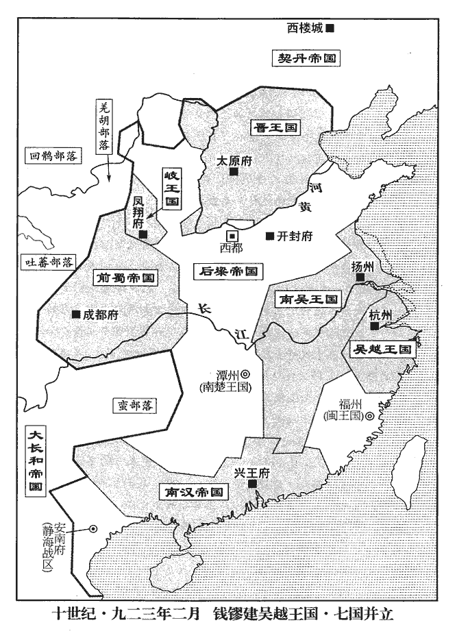
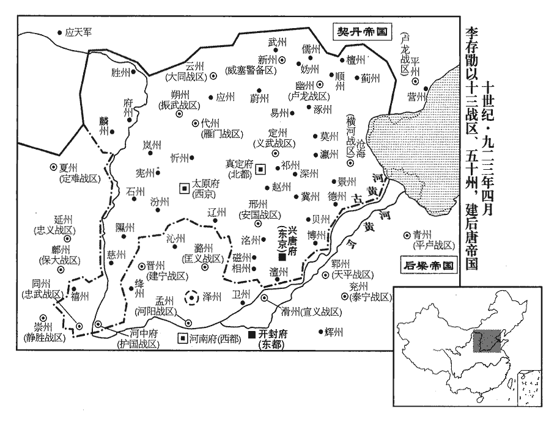
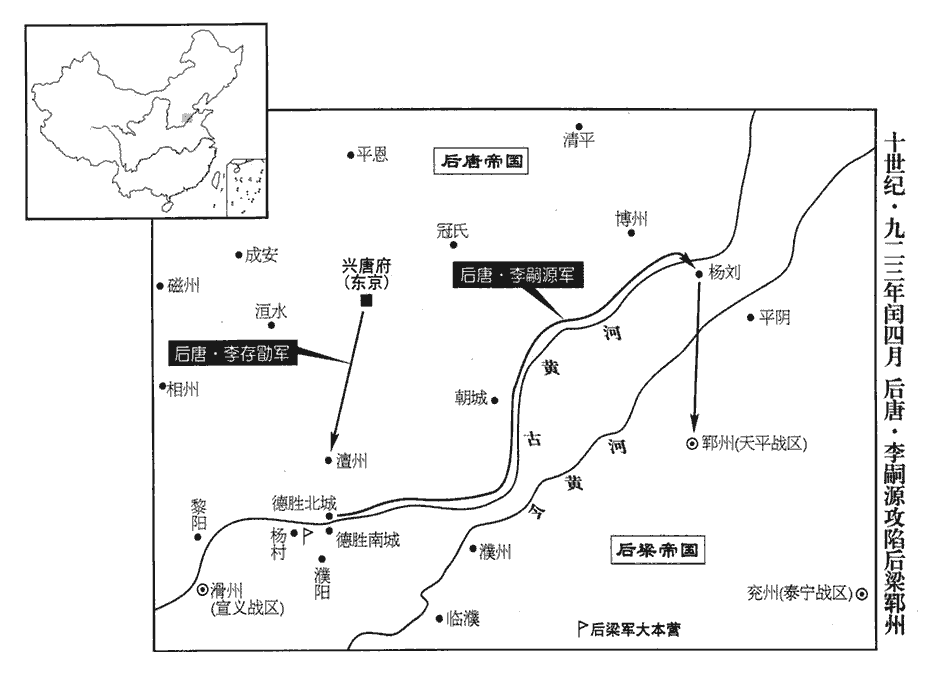
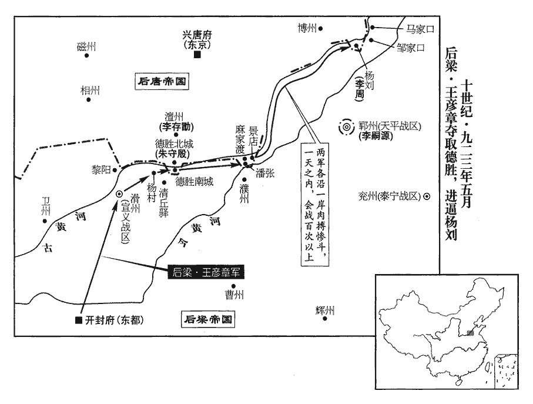
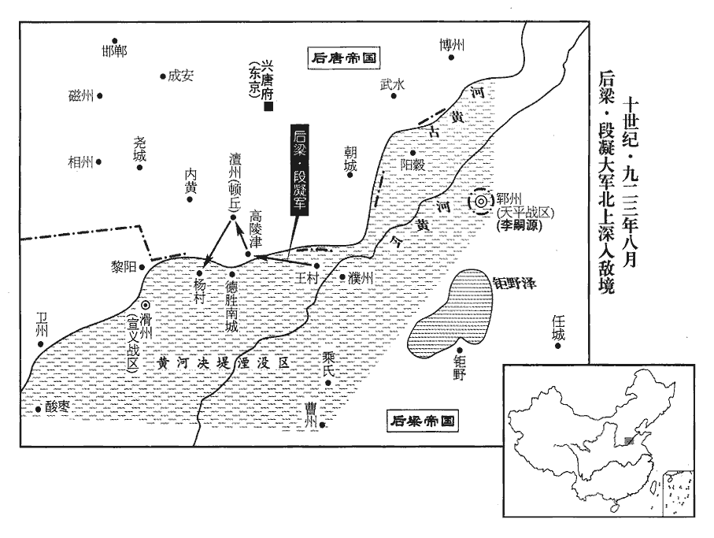
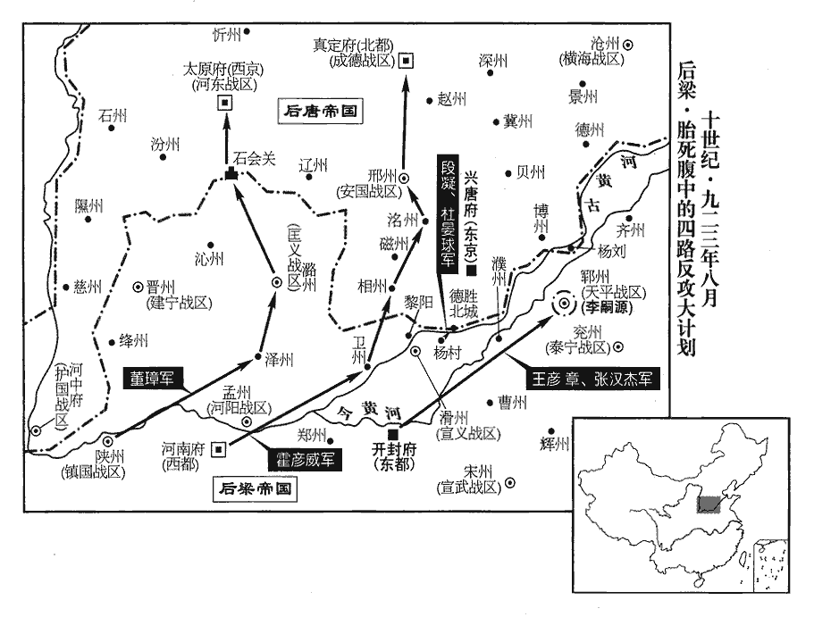
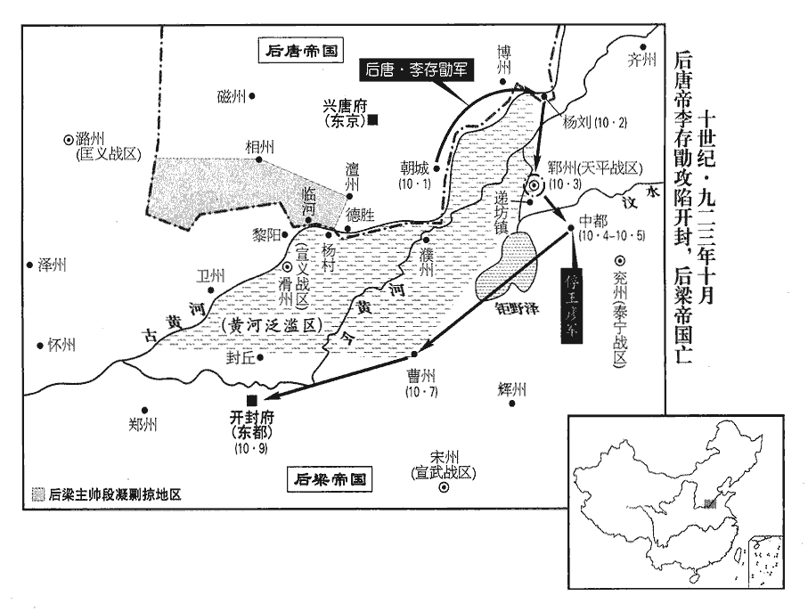
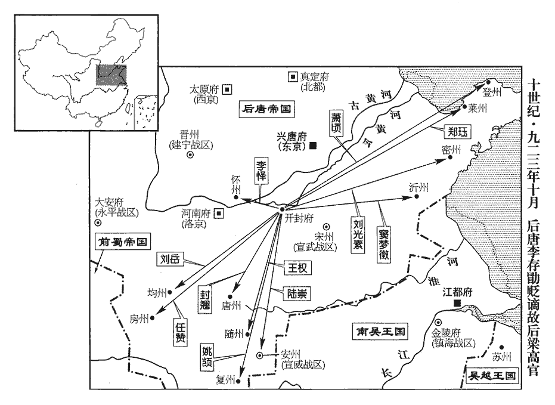
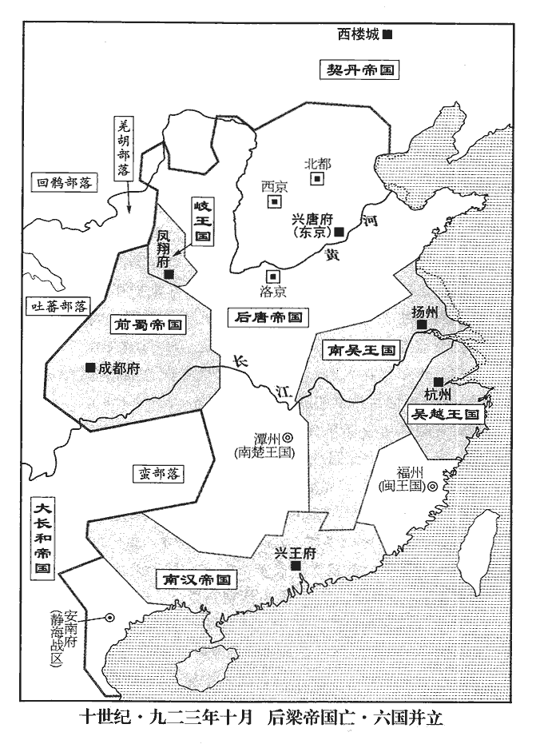

 後唐紀一昭陽協洽（癸未），一年。
>  
> 晉王李克用始封於晉，存勗嗣封，及即大位，自以繼唐有天下，國遂號曰唐。通鑑曰後唐，以别長安之唐。

# 莊宗光聖神閔孝皇帝上諱存勗，晉王克用長子也。其先本號朱邪，出於西突厥處月別部，居沙陀磧，自號沙陀，而以朱邪為姓。至執宜歸唐。執宜子赤心有功於唐，賜姓名李國昌，編於屬籍。克用，赤心之子也。五代會要曰：執宜，沙陀府都督拔野古之六代孫。歐陽史曰：拔野古，朱邪同時人，非其始祖。

## 同光元年（癸未、九二三）是年四月始即位改元。

1春，二月，晉‹首都太原府山西省太原市›王‹李存勖，本年三十九岁›下教置百官，於四鎮判官中選前朝士族，欲以為相。四鎮，河東‹总部太原府›、魏博、易定、鎮冀。朝，直遙翻。相，息亮翻；下同。河東節度判官盧質為之首，質固辭，盧質慢罵晉王諸弟，又能辭相位於惟新之朝，是必有見也。請以義武‹总部定州›節度判官豆盧革、河東觀察判官盧程為之；王即召革、程拜行臺左、右丞相，考異曰：薛史唐紀作「盧澄」。今從實錄、莊宗列傳。以質為禮部尚書。

〖译文〗 [1]春季，二月晋王下令设置百官，在河东、魏博、易定、镇冀四镇判官中选拔前朝的士族，想任命为宰相。河东节度判官卢质名列榜首，卢质坚决辞让，请求让义武节度判官豆卢革、河东观察判官卢程来充任。于是晋王马上召见豆卢革和卢程，并拜他们为行台左右承相，任命卢质为礼部尚书。

梁‹首都开封府河南省开封市›主‹朱友贞，本年三十六岁›遣兵部侍郎崔協等冊命吳越王鏐‹钱镠，本年七十二岁›為吳越國王。丁卯‹二十二›，鏐始建國，儀衛名稱多如天子之制，稱，尺證翻。謂所居曰宮殿，府署曰朝廷，教令下統內曰制敕，將吏皆稱臣，將，即亮翻。惟不改元，表疏稱吳越國而不言軍。以建國，不肯復稱鎮海‹总部杭州›、鎮東軍‹总部越州›節度。以清海‹总部设广州广东省广州市›節度使兼侍中傳瓘為鎮海、鎮東留後，總軍府事。置百官，有丞相、侍郎、郎中、員外郎、客省等使。使，疏吏翻。考異曰：十國紀年：「鏐功臣、諸子領節制，皆署而後請命。居室服御，窮極侈靡，末年荒恣尤甚。錢氏據兩浙逾八十年，外厚貢獻，內事奢僭，地狹民眾，賦斂苛暴，雞魚卵菜，纖悉收取。斗升之逋，罪至鞭背。每笞一人，則諸案吏各持其簿列於庭，先唱一簿，以所負多少為數；笞已，次吏復唱而笞之，盡諸簿乃止，少者猶笞數十，多者至五百餘，訖于國除，人苦其政。」吳越備史稱：「鏐節儉，衣衾用紬布，常膳惟甆cí漆器，寢帳壞，恭穆夫人欲易以青繒，鏐不許。嘗歲除，夜會子孫鼓琴，未數曲，止之，曰：『聞者以我為長夜之飲，』遂罷。」錢易家話稱：「鏐公宴不貳羹胾zì，衣必三澣然後易。」劉恕以為錢元瓘子信撰吳越備史、備史遺事、忠懿王勳業志、戊申英政錄，弘倧子易撰家話，俶子惟演撰錢氏慶系圖譜、家王故事、秦國王貢奉錄，故吳越五王行事失實尤多，虛美隱惡，甚於他國。按錢鏐起於貧賤，知民疾苦，必不至窮極侈靡，其奢汰暴斂之事蓋其子孫所為也。今從家話。

〖译文〗 后梁国主派遣兵部侍郎崔协等，任命吴越王钱为吴越国王。丁卯（二十二日）钱开始建国，仪仗与卫士的名称都和天子的制度一样，把居住的地方叫做宫殿，府署叫做朝廷，命令下达到所管辖范围内曰制敕，将吏都称臣下，只是没有改年号，上表疏时称为吴赵国，而不再称某军节度，任命清海节度使兼侍中钱传为镇海、镇东留后，总管军府事务。设置百官，有丞相、侍郎、郎中、员外部、客省等使。

 

2李繼韜雖受晉王命為安義‹昭义战区改·总部设潞州山西省长治市›留後，事見上卷上年。終不自安，幕僚魏琢、牙將申蒙復從而間之復，扶又翻。間，古莧翻。曰：「晉朝無人，朝，直遙翻。終為梁所併耳。」會晉王置百官，三月，召監軍張居翰、張居翰，唐昭宗時為范陽監軍，天復中大誅宦者，節度使劉仁恭匿居翰於大安山之北谿以免。其後梁兵攻仁恭，遣居翰從晉王攻梁潞州以牽其兵，晉遂取潞州，因以居翰為昭義監軍。節度判官任圜赴魏州‹河北省大名县›，任，音壬。琢、蒙復說繼韜曰：說，式芮翻。「王急召二人，情可知矣。」繼韜弟繼遠亦勸繼韜自託於梁，繼韜乃使繼遠詣大梁，請以澤潞為梁臣。梁主大喜，更命安義軍曰匡義，更，工衡翻。以繼韜為節度使、同平章事。繼韜以二子為質。質，音致。

〖译文〗 [2]李继韬虽然接受晋王的命令为安义留后，但始终心里不安，他的幕僚魏琢、牙将申蒙又从中挑拨说：“晋国没有继承的人，最终是会被梁国所吞并的。”这时正好晋王在等置百官，三月，晋王让监军张居翰、节度判官任圜赶赴魏州，魏琢、申蒙又劝李继韬说：“晋王着急地召见这两个人，其情可知啊！”李继韬的弟弟李继远也劝李继韬要依靠后梁。李继韬派李继远到大梁，请求把泽州，潞州归属后梁而成为后梁的臣属。后梁主很高兴，下令把安义军改为匡义，任命李继韬为匡义节度使、同平章事。李继韬把他的两个儿子作为人质。

安義舊將裴約戍澤州‹山西省晋城市›，泣諭其眾曰：「余事故使踰二紀，故使，謂繼韜父嗣昭也。十二年為一紀。使，疏吏翻。見其分財享士，志滅仇讎。不幸捐館，死謂之捐館，言棄捐館舍而逝也。柩猶未葬，而郎君遽背君親，棄君事讎，不惟背君，亦背親之教命。背，蒲妹翻。吾寧死不能從也！」遂據州自守。梁主以其驍將董璋為澤州刺史，將兵攻之。

〖译文〗 安义军的旧将领裴约戍守在泽州，边哭边对部下说：“我侍奉原来的节度使李嗣昭二十多年，亲眼看见他财物分给士卒共亭，他立志消灭仇敌。但不幸去世，灵柩还没有安葬，他的儿子就背判父亲和其他亲人，我宁死也不能服从。”于是他占据泽州坚守。后梁主任命勇将董璋为泽州刺史，并让他率兵攻打裴约。

繼韜散財募士，堯山‹河北省隆尧县西尧山镇›人郭威往應募。威使氣殺人，繫獄，繼韜惜其才勇而逸之。郭威事始此。歐史云：威嘗遊於市，市有屠者，以勇服其市人。威醉，呼屠者使進几割肉。割不如法，威叱之，屠者披其腹示之曰：「爾勇者，能殺我乎？」威即前取刀刺殺之，一市皆驚，而威自如。為吏所執，繼韜縱使亡去。

〖译文〗 李继韬分散财物来招募士卒，尧山人郭威前往应募。郭威因一气之下而杀死了市人，被捆起来送往监狱，李继韬珍惜郭威的才能和勇气，把他放了。

3契丹‹首都西楼城内蒙古巴林左旗›寇幽州‹北京市›，晉王問帥於郭崇韜，帥，所類翻。崇韜薦橫海‹总部设沧州河北省沧州市东南›節度使李存審。時存審臥病，己卯‹五›，徙存審為盧龍節度使，輿疾赴鎮。以蕃漢馬步副總管李嗣源‹邈佶烈›領橫海節度使。李嗣源時從晉王總兵，使領橫海節。

〖译文〗 [3]契丹侵略幽州，晋王问郭崇韬谁可以率兵作战，郭崇韬推荐横海节度使李存审。李存审这时正卧床生病，已卯（初五），调李存审为卢龙节度使，用车子拉着他带病的身体前往。并任命蕃汉马步副总管李嗣源为横海节度使。

4晉王‹李存勖›築壇於魏州‹河北省大名县›牙城之南，夏，四月，己巳‹二十五›，升壇，祭告上帝，遂即皇帝位，曰遂者，先有即位之心，而今遂其事也。國號大唐，大赦，改元。因唐國號，改天祐年號為同光。尊母晉國太夫人曹氏為皇太后，嫡母秦國夫人劉氏為皇太妃。君子以是知帝之不終。以豆盧革為門下侍郎，盧程為中書侍郎，並同平章事；郭崇韜、張居翰為樞密使，徐無黨曰：樞密使，唐故事宦者為之，其職甚微，至此始參用士人，而與宰相權任鈞矣。余按唐末兩樞密與兩神策中尉，號為四貴，其職非甚微也，特專用宦者為之耳。項安世曰：唐於政事堂後列五房，有樞密房以主曹務，則樞密之要，宰相主之，未始他付；其後寵任宦人，始以樞密歸之內侍。盧質、馮道為翰林學士，張憲為工部侍郎、租庸使，宋白曰：租庸使自天寶三年韋堅始。又以義武‹总部设定州河北省定州市›掌書記李德休為御史中丞。德休，絳之孫也。李絳相唐憲宗，有直聲。

〖译文〗 [4]晋王在魏州牙城的南面修筑祭祀用的坛宇，夏季，四月，己巳（二十五日），晋王登上祭坛，祭告上帝，随即登皇帝宝位，国号为大唐，实行大赦，改年号。尊其母晋国太夫人曹氏为皇太后，尊其父的正妻秦国夫人刘氏为皇太妃。任命豆卢革为门下侍郎，卢程为中书侍郎，两人都为同平章事，任命郭崇韬、张居翰为枢密使，卢质、冯道为翰林学士，张宪为工部侍郎、租庸使，又任命义武节度掌书记李德休为御史中丞。李德休是李绛的孙子。

 

詔盧程詣晉陽‹太原府所在县›冊太后、太妃。初，太妃無子，性賢，不妬忌；太后為武皇侍姬，太妃常勸武皇善待之，晉王克用諡武皇帝。太后亦自謙退，由是相得甚歡。及受冊，太妃詣太后宮賀，有喜色，太后忸怩不自安。忸，女六翻。怩，女夷翻。太妃曰：「願吾兒享國久長，吾輩獲沒于地，園陵有主，餘何足言！」因相向歔欷。歔，音虛。欷，音希，又許既翻。

〖译文〗 后唐帝下诏命令卢程到晋阳册封太后、太妃。当初，太妃没有儿子，性格贤惠，从不嫉妒。太后做武皇帝侍姬时，太妃经常劝说武皇帝要很好地对待她，太后也很谦让，因此两个人相处得很欢洽。到了受命册封时，太妃到太后的宫里祝贺，脸上显得很高兴，太后反而显出羞愧的样子，感到不安。太妃说：“希望我们的儿子能够长久地做皇帝，我们死后埋在地下，园陵有主，还有什么说的。”两个人因此又面对着面哭了一会儿。

豆盧革、盧程皆輕淺無他能，上以其衣冠之緒，霸府元僚，故用之。按歐史，豆盧為世名族，革父瓚為唐舒州刺史、唐末之亂，革避地中山，為王處直判官。盧程不知其家世何人也，唐昭宗時舉進士，為鹽鐵出使巡官，唐末避亂，變服為道士，遊燕、趙間。豆盧革為義武節度判官，盧汝弼為河東節度副使，二人皆故唐名族，與程門地相等，因共薦為河東節度推官。帝議擇相，而唐公卿故家遭亂喪亡且盡，盧汝弼、蘇循已死，盧質又辭，故用革、程。興王之君，命相如此，天下事可知矣。

〖译文〗 豆卢革、卢程两人都很浅薄，没有其他才能，后唐帝认为他们是仕宦世家，过去霸府的僚属，所以就起用了他们。

初，李紹宏為中門使，郭崇韜副之。至是，自幽州召還，梁貞明五年，李紹宏出幽州事見上卷。崇韜惡其舊人位在己上，惡，烏路翻。乃薦張居翰為樞密使，以紹宏為宣徽使，紹宏由是恨之。唐制，宣徽使在樞密使之下，且權任不及遠甚。居翰和謹畏事，軍國機政皆崇韜掌之。支度務使孔謙自謂才能勤效，應為租庸使；眾議以謙人微地寒，不當遽總重任，孔謙，魏州孔目吏也，晉王得魏州，以為支度務使。故崇韜薦張憲，以謙副之，謙亦不悅。

〖译文〗 当初，李绍宏为中门使，郭崇韬为中门副使。这时，李绍宏又从幽州召回，郭崇韬很忌恨原来和他在一起的人职位比自己高，就推荐张居翰为枢密使，李绍宏为宣徽使，李绍宏因此而怀恨郭崇韬。张居翰和顺谨慎，怕惹事，军政大权都由郭崇韬掌握。支度务使孔谦自称有才能，而且勤劳效力，应当担任租庸使。大家认为孔谦地位低微，出身贫寒，不应当很快地提拔他担当重任，所以郭崇韬推荐张宪担任租庸使，孔谦为副使。孔谦心中也不高兴。

以魏州‹河北省大名县›為興唐府，建東京；薛居正五代史：晉王即位，升魏州為東京興唐府，改元城為興唐縣，貴鄉為廣晉縣。又於太原府建西京，又以鎮州‹河北省正定县›為真定府，建北都。以魏博節度判官王正言為禮部尚書，行興唐尹；太原馬步都虞候孟知祥為太原尹，充西京副留守；潞州觀察判官任圜為工部尚書，兼真定尹，充北京副留守；「京」，當作「都」。皇子繼岌為北都留守、興聖宮使，判六軍諸衛事。按後唐洛陽有西宮興聖宮。此時未得洛陽，當以魏州府舍為興聖宮。宋白曰：唐莊宗即位於魏州，宰相豆盧革因進擬為興聖宮，以皇子繼岌為興聖宮使。時唐國所有凡十三節度、五十州。十三節度，天雄、成德、義武、橫海、盧龍、大同、振武、鴈門、河東、護國、晉絳、安國、昭義。五十州，魏‹兴唐府·河北省大名县›、博‹山东省聊城市›、貝‹河北省清河县›、澶‹河南省内黄县东南›、相‹河南省安阳市›、鄆、洺‹河北省永年县东南旧永年镇›、磁‹河北省磁县›、鎮‹真定府·河北省正定县›、冀‹河北省冀州市›、深‹河北省深州市›、趙‹河北省赵县›、易‹河北省易县›、祁‹河北省无极县›、定‹河北省定州市›、滄‹河北省沧州市东南›、景‹河北省东光县›、德‹山东省陵县›、瀛‹河北省河间市›、莫‹河北省任丘市北鄚州鎮›、幽‹北京市›、涿‹河北省涿州市›、檀‹北京市密云县›、薊‹天津市蓟县›、順‹北京市顺义县›、營、平、蔚‹河北省蔚县›、朔‹山西省朔州市›、雲‹山西省大同市›、應‹山西省应县›、新‹河北省涿鹿县›、媯‹河北省怀来县›、儒‹北京市延庆县›、武‹河北省宣化县›、忻‹山西省忻州市›、代‹山西省代县›、嵐‹山西省岚县›、石‹山西省离石县›、憲‹山西省娄烦县›、麟‹陕西省神木县›、府‹陕西省府谷县›、并‹太原府·山西省太原市›、汾‹山西省汾阳县›、慈‹山西省吉县›、隰‹山西省隰县›、澤、潞、沁‹山西省沁源县›、遼‹山西省左权县›，凡五十州。而昭義領澤、潞二州，已附于梁，止有十二節度、四十八州耳。

〖译文〗 后唐把魏州升为兴唐府，在这里建东京，又在太原府建西京，同时把镇州升为真定府，建北都。任命魏博节度判官王正言为礼部尚书，兼任兴唐尹。任命太原马步都虞候孟知祥为太原尹，充西京副留守。任命潞州观察判官任圜为工部尚书，兼真定尹，充北京副留守。任命皇子李继岌为北都留守、兴圣宫使，判六军诸卫事。当时的唐国共有十三个节度、五十个州。

閏月，追尊皇曾祖執宜曰懿祖昭烈皇帝，祖國昌‹朱邪赤心›曰獻祖文皇帝，考晉王‹李克用›曰太祖武皇帝。立宗廟於晉陽，以高祖‹李渊›、太宗‹李世民›、懿宗‹李漼›、昭宗‹李晔›洎懿祖‹朱邪执宜›以下為七室。唐廟四，親廟三。

〖译文〗 闰四月，后唐帝追尊曾祖父李执宜为懿祖昭烈皇帝，追尊祖父李国昌为献祖文皇帝，追尊父亲晋王李克用为太祖武皇帝。在晋阳建立宗庙，从高祖、太宗、懿宗、昭宗至懿祖以下，共七个庙宇。

5甲午‹二十›，契丹‹首都西楼城内蒙古巴林左旗›寇幽州，至易‹河北省易县›、定‹河北省定州市›而還。還，從宣翻，又如字。

〖译文〗 [5]甲午（二十日），契丹人侵略幽州，行至易定又退回。

時契丹屢入寇，鈔掠饋運，鈔，楚交翻。幽州食不支半年，衛州‹河南省卫辉市›為梁所取，潞州內叛，人情岌岌，以為梁未可取，帝‹李存勖›患之。會鄆州‹山东省东平县›將盧順密來奔，先是，梁天平節度使戴思遠屯楊村‹河南省濮阳市西九千米古黄河渡口›，戴思遠屯楊村事始上卷梁貞明五年。先，悉薦翻。留順密與巡檢使劉遂嚴、都指揮使燕顒守鄆州，燕，音煙，姓也。顒，魚容翻。順密言於帝曰：「鄆州守兵不滿千人，遂嚴、顒皆失眾心，可襲取也。」郭崇韜等皆以為「懸軍遠襲，萬一不利，虛棄數千人，順密不可從。」帝密召李嗣源‹邈佶烈›於帳中謀之曰：「梁人志在吞澤潞，不備東方，若得東平，則潰其心腹。東平果可取乎？」鄆州本東平郡。嗣源自胡柳‹山东省鄄城县西北›有渡河之慚，事見二百七十卷梁貞明四年。常欲立奇功以補過，對曰：「今用兵歲久，生民疲弊，苟非出奇取勝，大功何由可成！臣願獨當此役，必有以報。」帝悅。壬寅‹二十八›，遣嗣源將所部精兵五千自德勝‹河南省濮阳市›趣鄆州。比及楊劉‹山东省东阿县东北杨柳乡·古黄河南岸渡口›，趣，七喻翻。比，必利翻。按九域志：鄆州東阿縣有楊劉鎮，臨河津。東阿東南至鄆州六十里。以下文夜渡河觀之，則李嗣源之兵自德勝北城而東，循河北岸而行至楊劉渡口。日已暮，陰雨道黑，將士皆不欲進，高行周曰：「此天贊我也，彼必無備。」夜，渡河至城下，鄆人不知，此自楊劉取徑道至鄆州城下，不經東阿縣治所。李從珂先登，殺守卒，啟關納外兵，進攻牙城，城中大擾。癸卯‹二十九›旦，嗣源兵盡入，遂拔牙城，劉遂嚴、燕顒奔大梁。嗣源禁焚掠，撫吏民，執知州事節度副使崔簹dāng、判官趙鳳送興唐‹后唐首都·河北省大名县›。簹，都郎翻。唐於魏州置興唐府。帝‹李存勖›大喜曰：「總管真奇才，吾事集矣。」即以嗣源為天平‹总部设郓州山东省东平县›節度使。

〖译文〗 这时契丹人经常入侵后唐，强夺他们的粮食，幽州一年的粮食不够半年用。卫州被后梁夺取，潞州内部也发生叛乱，人们都感到很危险，认为不能消灭后梁，后唐帝也为此担忧。这时正好后梁郓州将领卢顺密来投奔。在此之前，后梁天平节度使戴思远驻扎在杨村，留下卢顺密和巡检使刘遂严、都指挥使燕驻守郓州。卢顺密告诉后唐帝说：“驻守郓州的士兵不足一千人，刘遂严和燕都失掉了民心，可以攻取郓州。”郭崇韬等都认为：“孤军远征，万一不利，白白丢掉数千人，卢顺密的话不可听从。”后唐帝秘密召见李嗣源，在帷帐中谋划说：“梁人的计划是吞并泽州、潞州，东边没有什么防备，如果能取得东平，就击败了他的心腹之地。东平可以夺取吗？”李嗣源自从在胡柳战役中因为没有跟从晋王，率兵北渡黄河，一直感到惭愧，经常打算建立奇功来弥补过去的过错。于是他回答后唐帝说：“现在打了一年多仗，百姓们很疲惫，如果不出奇制胜，怎能成就大的功业。我希望一个人挑起这次战役的重担，一定会有好消息报告皇帝。”后唐帝很高兴。壬寅（二十八日），派遣李嗣源率领他所属部队的五千精税士卒从德胜直取郓州。到达杨刘时，太阳已经落山，阴雨绵绵，道路漆黑，将士们都不想继续前进了。高行周说：“这是天助我也，他们一定毫无准备。”黑夜，渡过黄河到了城下，郓州人根本不知道，李从珂首先登上城门，杀死守城门的士卒，打开城门让队伍进去，接着进攻牙城，城中大乱。癸卯（二十九日）早晨，李嗣源的部队全部进入城内，攻取了牙城。刘遂严、燕逃奔到大梁。李嗣源禁止士卒在城内焚烧强掠，安抚百姓，只把知州事节度副使崔、判官赵凤押送到兴唐。后唐帝十分高兴地说：“总管你真是奇才，我们的事情成功了。”马上任命李嗣源为天平节度使。

 

梁主‹朱友贞›聞鄆州失守，大懼，斬劉遂嚴、燕顒於市，罷戴思遠招討使，降授宣化‹总部设邓州河南省邓州市›留後，歐史職方考，梁置宣化軍於鄧州。遣使詰讓北面諸將段凝、王彥章等，趣令進戰。詰，去吉翻。趣，讀曰促。敬翔知梁室已危，以繩內靴中，入見梁主曰：見，賢遍翻。「先帝‹朱全忠›取天下，不以臣為不肖，所謀無不用。今敵勢益強，而陛下棄忽臣言，臣身無用，不如死。」引繩將自經。梁主止之，問所欲言，翔曰：「事急矣，非用王彥章為大將，不可救也。」敬翔以王彥章一時健鬬而取之耳。觀其用兵無遠略，烏足以救梁之亡乎！梁主從之，以彥章代思遠為北面招討使，仍以段凝為副。

〖译文〗 后梁主听说郓州失守，十分害怕，在大街上把刘遂严、燕斩了，罢免了戴思远的招讨使官职，降为宣化留后。梁主派遣使者去责问驻守在北面的段凝、王彦章等将领，让他们前进作战。敬翔知道后梁王室已经很危险了，于是把绳子装在靴子里进宫内求见后梁主，说：“先帝夺取天下的时候，不认为我敬翔没有才能，无论什么谋划都让我参与。现在敌人的势力更加强大，而陛下不听或忽视我的话，我已经没有什么用了，不如死去。”把绳子从靴子里取出来就要上吊自缢。后梁主赶快劝阻，并问他有什么话想说。敬翔说：“现在的事情十分紧急，不用王彦章为大将，不能挽救梁王室的危亡。”后梁主听从了他的建议，让王彦章代替戴思远为北面招讨使，仍然用段凝为副招讨使。

帝‹李存勖›聞之，自將親軍屯澶州‹河南省内黄县东南›，命蕃漢馬步都虞候朱守殷守德勝‹河南省濮阳市›，戒之曰：「王鐵槍勇決，乘憤激之氣，必來唐突，宜謹備之！」廣韻，「唐突」作「傏突」又作「盪突」，唐、盪義同也。史言晉王善於料王彥章，不善於用人守德勝。守殷，王幼時所役蒼頭也。歐史曰：朱守殷少事帝為奴，名曰會兒。帝讀書，會兒常侍左右。

〖译文〗 后唐帝听说这件事后，亲自率领亲军驻守在澶州，命令蕃汉马步都虞候朱守殷坚守德胜，并告诫他说：“王铁枪勇敢果断，他们乘士卒愤怒激动的气势，一定会突然到来，应当谨慎小心地防备他们。”朱守殷是后唐帝小时候所用的奴仆。

又遣使遺吳‹首都江都府江苏省扬州市›王‹杨溥，本年二十四岁›書，遺，惟季翻。告以已克鄆州，請同舉兵擊梁。五月，使者至吳，徐溫欲持兩端，將舟師循海而北，助其勝者。嚴可求曰：「若梁人邀我登陸為援，何以拒之？」溫乃止。

〖译文〗 后唐帝又派遣使者给吴王送去书信，告诉吴王说郓州已经被攻破，请他一起率兵攻打后梁。五月，使者到达吴国，徐温打算脚踩两只船，率领水上部队沿海向北而行，帮助取得胜利的一方。严可求说：“如果梁军请求我们登上陆地援助他们，用什么理由拒绝他们呢？”于是徐温才停止了行动。

 

6梁主‹朱友贞›召問王彥章以破敵之期，彥章對曰：「三日。」左右皆失笑。自大梁出師拒晉，三日不能至河上，故笑其言。彥章出，兩日，馳至滑州‹河南省滑县›。九域志：大梁北至滑州二百一十里。辛酉‹十八›，置酒大會，陰遣人具舟於楊村‹河南省濮阳市西九千米古黄河渡口›；夜命甲士六百，皆持巨斧，載冶者具鞴bèi炭，乘流而下。楊村順流趣德勝，水程十八里耳。鞴，蒲拜翻，韋囊也，鼓以吹火。會飲尚未散，彥章陽起更衣，引精兵數千循河南岸趨德勝‹河南省濮阳市南›。更，工衡翻。趨，七喻翻。天微雨，朱守殷不為備，舟中兵舉鎖燒斷之，因以巨斧斬浮橋，而彥章引兵急擊南城。浮橋斷，南城遂破，【章：十二行本「破」下有「斬首數千級」五字；乙十一行本同；孔本同；張校同。】時受命適三日矣。守殷以小舟載甲士濟河救之，不及。彥章進攻潘張、麻家口、景店諸寨‹都是后唐在古黄河南岸建立的营寨›，皆拔之，潘、張二姓同居一村，因以為名。店，都念翻。崔豹古今注曰：店，所以置貨鬻物也。有姓景者先嘗設店於其地，因以為名。凡此皆河津之要，晉人立寨守之。聲勢大振。

〖译文〗 [6]后梁主召见王彦章，问他多长时间可以击败敌人，王彦章回答说：“三天。”左右大臣都哑然失笑。王彦章率兵出发，用了两天时间，飞速到达滑州。辛酉（十八日），王彦章大办宴会，并秘密派人在杨村准备舟船。晚上，命令六百名士卒都拿着大斧，船上载着冶炼的工匠，准备了吹火用的皮囊和炭，顺流而下。这时宴会还没有结束，王彦章表面上是出去换衣服，实际上他率领数千精兵沿着黄河南岸直奔德用。这时天下着小雨，朱守殷没有一点防备，王彦章船上的士兵将城门的锁用火烧断，用大斧把浮桥砍断。王彦章率兵迅速向南城发起进攻。浮桥被砍断，南城就被攻破，此时正好是接受命令以后的第三天。朱守殷用小船载着士卒渡过黄河来援救，但已来不及了。王彦章又向潘张、麻家口、景店诸寨发起进攻，都攻了下来。王彦章的声势大振。

帝‹李存勖›遣宦者焦彥賓急趣楊劉，趣，七喻翻。與鎮使李周固守，命守殷棄德勝北城‹河南省濮阳市›，撤屋為栰，栰，音伐。大曰栰，小曰桴。載兵械浮河東下，助楊劉守備，徙其芻糧薪炭於澶州，所耗失殆半。王彥章亦撤南城‹濮阳市南›屋材浮河而下，各行一岸，每遇灣曲，輒於中流交鬬，飛矢雨集，或全舟覆沒，一日百戰，互有勝負。比及楊劉，比，必寐翻。殆亡士卒之半。此謂自德勝浮河東下之士卒也。己巳‹二十六›，王彥章、段凝以十萬之眾攻楊劉，百道俱進，晝夜不息，連巨艦九艘，橫亘河津以絕援兵。艦，戶黯翻。艘，蘇遭翻。城垂陷者數四，賴李周悉力拒之，與士卒同甘苦，彥章不能克，退屯城南，為連營以守之。

〖译文〗 后唐帝派遣宦官焦彦宾迅速赶到杨刘，与杨刘镇使李周在那里坚守。命令朱守殷放弃德胜北城，把房屋拆掉做成木筏，载着士兵和武器从黄河上向东漂下，帮助杨刘坚守，把德胜的粮草薪炭运往澶州，损失了将近一半。王彦章也把德胜南城的房屋拆掉，做成木筏，顺着黄河漂下去。王彦章和朱守殷各走一岸，每遇上黄河弯曲的地方，就在河中间战斗，射出的箭像雨一般密集，有时整船覆没，一日交战百余次，两军互有胜负。到达杨刘时，朱守殷的士卒有一半伤亡。己巳（二十六日），王彦章、段凝率领十万大军向杨刘发起进攻，四面八方一起推进，昼夜不停。把九艘大船连在一起，横放在黄河的渡口上，来阻挡朱守殷的援兵。杨刘城几次都差一点被攻陷，全靠李周与士卒同甘共苦，全力抵御，王彦章才没攻下，于是率兵退到城南驻扎，把营寨连起来坚守。

楊劉告急於帝‹李存勖›，請日行百里以赴之；帝在澶州，距楊劉幾二百里。帝引兵救之，曰：「李周在內，何憂！」日行六十里，不廢畋獵，六月，乙亥‹二›，至楊劉。梁兵塹壘重複，嚴不可入，重，直龍翻。帝患之，問計於郭崇韜，對曰：「今彥章據守津要，意謂可以坐取東平；苟大軍不南，則東平不守矣。臣請築壘於博州‹山东省聊城市›東岸以固河津，既得以應接東平，又可以分賊兵勢。但慮彥章詗知，詗xiòng，古永翻，又翾正翻。徑來薄我，城不能就。願陛下募敢死之士，日令挑戰以綴之，令，力經翻。挑，徒了翻。苟彥章旬日不東，則城成矣。」時李嗣源守鄆州，河北聲問不通，人心漸離，不保朝夕。會梁右先鋒指揮使康延孝密請降於嗣源，延孝者，太原胡人，歐史曰，康延孝代北人，為太原軍卒，有罪，亡命奔梁。有罪，亡奔梁，時隸段凝麾下。嗣源遣押牙臨漳‹河北省临漳县南›范延光送延孝蠟書詣帝，延光因言於帝曰：「楊劉控扼已固，梁人必不能取，請築壘馬家口‹即博州黄河东岸渡口›以通鄆州‹山东省东平县›之路。」帝從之，遣崇韜將萬人夜發，倍道趣博州‹山东省聊城市›，至馬家口渡河，築城晝夜不息。馬家口，所謂博州東岸也。郭崇韜自楊劉夜發，倍道而行，恐梁人知之故也。帝在楊劉，與梁人晝夜苦戰。崇韜築新城凡六日，王彥章聞之，將兵數萬人馳至，戊子‹十五›，急攻新城，連巨艦十餘艘於中流以絕援路。時板築僅畢，城猶卑下，沙土疏惡，未有樓櫓及守備；崇韜慰勞士卒，以身先之，先，悉薦翻。四面拒戰，遣間使告急於帝。帝自楊劉引大軍救之，陳於新城西岸，城中望之增氣，大呼叱梁軍，梁人斷紲斂艦；帝艤舟將渡，間，古莧翻。使，疏吏翻。陳，讀曰陣。呼，火故翻。斷，丁管翻。紲，息列翻，索也。艤，魚倚翻，亦作「檥yǐ」。漢書音義：整舟向岸曰檥。彥章解圍，退保鄒家口‹沿黄河东岸另一渡口›。麻家口、馬家口、鄒家口，皆沿河津渡之口，亦因其土人所居之姓以為地名。鄆州奏報始通。

〖译文〗 杨刘方面向后唐帝告急，请求皇帝日行百里赶快到达杨刘。后唐帝率兵前往援救，说：“有李周在那里，有什么忧虑的。”于是日行六十里，在路上还照常打猎。六月，乙亥（初二），到达杨刘。后梁军修筑了重重营垒，防守十分严密，很难深入，后唐帝十分担忧，就问郭崇韬怎么办好，郭崇韬回答说：“现在王彦章据守着重要的渡口，他的意思是想坐取东平。如果大军不向南开进，那么东平就难以坚守。我请求在博州东岸修筑营垒，巩固黄河渡口，既可以接应东平，又可以分散敌人的兵力。只要忧虑王彦章侦察到我们的情况，直接逼近我们，到那时我们的城还修不好。希望陛下召募敢死的士卒，每天让他们挑动敌人出动来牵制他们，如果王彦章十几天不向东去，城垒就可以修好。”这时李嗣源在郓州坚守，黄河以北的消息一点也不通，人心离散，朝不保夕。正好后梁军右先锋指挥使康延孝秘密请求投降李嗣源，康延孝是太原地区的胡人，因为有罪，逃奔到后梁，当时属于段凝的部下。李嗣原派押牙临漳人范延光把康延孝请求投降的信用蜡封好送到后唐皇帝那里，范延光因此对后唐帝说：“杨刘把守很坚固，梁军一定攻不下来，请在马家口修筑城堡，打通通往郓州的道路。”后唐帝听从了他的意见，派郭崇韬率领万人连夜出发，兼程进奔博州，到马家口渡过黄河，昼夜不停地在那里修筑城堡。后唐帝则在杨刘，与后梁军昼夜苦战。郭崇韬修筑新城共用了六天时间，王彦章听到此事，便率领数万大军直奔新城，戊子（十五日），对新城发起紧急攻击，把十余艘战船连起来放到河的中间，断绝郭崇韬的援兵。当时马家口城垒的板墙刚刚修好，但城墙很低小，修墙用的沙土质量也不好，还没有修建望台和守备设施。郭崇韬慰劳士卒，以身率先，四面抗战，同时也派出密使向后唐帝告急。后唐帝从杨刘率领大军前来援救，在新城西岸摆开阵势，城里的士卒望见援兵来到，斗志倍增，大声斥骂后梁军，后梁军砍断了连接战船的绳子收回了战船。后唐帝的船刚要渡河，王彦章撤除了包围，退到邹家口坚守。郓州向后唐帝奏报的道路才打通。

李嗣源密表請正朱守殷覆軍之罪；帝不從。帝不誅朱守殷，以成絳霄殿之禍。

〖译文〗 李嗣源秘密上表请求治朱守殷覆军之罪，后唐帝没有接受。

7秋，七月，丁未‹五›，帝‹李存勖›引兵循河而南，彥章等棄鄒家口‹古黄河渡口›，復趨楊劉。甲寅‹十二›，遊弈將李紹興敗梁遊兵於清丘驛‹河南省濮阳市西›南。敗，補邁翻。春秋：晉、宋、曹、衛同盟于清丘。杜預註曰：清丘，今在濮陽縣東南。此因古地名以名驛也。段凝以為唐兵已自上流渡，驚駭失色，面數彥章，尤其深入。段凝聞清丘驛之敗，以為唐兵已自上流渡河逼汴，而彥章等方與唐相持於下流，責其深入鄆州之境，無救於大梁之危也。史言段凝內有所恃而陵主帥。數，所具翻。

〖译文〗 [7]秋季，七月，丁未（初五），后唐帝率领军队沿着黄河向南开进，王彦章等放弃了邹家口，又开赴杨刘。甲寅（十二日），游弈将李绍兴在清丘驿的南面击败了后梁军的流动部队。段凝以为后唐兵已从上游渡过了黄河，惊惧失色，当面指责王彦章不应当深入郓州之境。

8乙卯‹十三›，蜀侍中魏王宗侃卒。

〖译文〗 [8]乙卯（十三日），前蜀侍中魏王王宗侃去世。

9戊午‹十六›，帝‹李存勖›遣騎將李紹榮直抵梁營，擒其斥候，梁人益恐，又以火栰焚其連艦。連艦，即列於河流以斷援兵者。王彥章等聞帝引兵已至鄒家口，己未‹十七›，解楊劉圍，走保楊村；唐兵追擊之，復屯德勝‹河南省濮阳市›。梁兵前後急攻諸城，士卒遭矢石、溺水、暍yē死者且萬人，暍，於歇翻，傷暑而死也。委棄資糧、鎧仗、鍋幕，動以千計。鍋，古禾翻，釜也。王彥章掩晉人之不備，取勝於一時，持久則敗矣。使梁能終用之，亦未必成功。楊劉比至圍解，比，必利翻。城中無食已三日矣。

〖译文〗 [9]戊午（十六日），后唐帝派骑将李绍荣直抵后梁营，抓获后梁军的哨兵，后梁军更加恐惧，李绍荣又用火点着木筏焚烧了后梁军连在一起的战船。王彦章等听说后唐帝率兵已经到达邹家口，己未（十七日），撤去了杨刘的包围，逃到杨村去坚守。后唐军追击后梁军，驻扎在德胜。后梁军先后紧急攻打后唐的几座城。士卒们遭受到箭石的射击，河水淹死、中暑而死的将近一万人，丢弃的物资、粮食、铠甲、武器、军锅、幕帐等，常常以千计。等到杨刘解除包围时，城中已经三天没有粮食吃了。

10王彥章疾趙、張亂政，及為招討使，謂所親曰；「待我成功還，還，從宣翻，又如字。當盡誅姦臣以謝天下！」趙、張聞之，私相謂曰：「我輩寧死於沙陀‹李存勖所属部落›，不可為彥章所殺。」相與協力傾之。段凝素疾彥章之能而諂附趙、張，在軍中與彥章動相違戾，百方沮橈之，沮，在呂翻。橈，奴教翻。惟恐其有功，潛伺彥章過失以聞於梁主。每捷奏至，趙、張悉歸功於凝，由是彥章功竟無成。及歸楊村，梁主信讒，猶恐彥章旦夕成功難制，徵還大梁。考異曰：歐陽史云：「末帝罷彥章，以段凝為招討使。彥章馳至京師入見，以笏畫地，自陳勝敗之迹。巖等諷有司劾彥章不恭，勒還第。」今從實錄。使將兵會董璋攻澤州‹山西省晋城市›。

〖译文〗 [10]王彦章很憎恨赵岩、张汉杰干扰国政，他当了招讨使后，对其亲信说：“等我成功返回，将杀掉全部奸臣，以此来答谢天下百姓。”赵岩、张汉杰听到这些话，私下议论说：“我们宁愿被沙陀族杀死，也不能被王彦章所杀。”相互协力合作，准备搞倒王彦章。段凝平素就很嫉妒王彦章的才能，因而献媚依附赵、张，在军中动不动就和王彦章作对，千万百计地败坏损伤王彦章的声誉，惟恐他建立战功，经常偷偷地监视王彦章的过失，报告梁主。每次送来捷报，赵、张都把功劳说成是段凝的，因此王彦章竟没有建立功业。他回到杨村后，后梁主相信了谗言，又怕王彦章一旦取得成功难以控制，于是把他调回大梁，让他率兵和董璋一起攻打泽州。

甲子‹二十二›，帝至楊劉勞李周曰：「微卿善守，吾事敗矣。」勞，力到翻。

〖译文〗 甲子（二十二日），后唐帝到杨刘去慰劳李周说：“要不是你善于防守，我的事业早失败了。”

11中書侍郎、同平章事盧程以私事干興唐府，府吏不能應，鞭吏背；光祿卿兼興唐少尹任團，圜之弟，帝之從姊壻也，從，才用翻。詣程訴之。程罵曰：「公何等蟲豸，欲倚婦力邪！」豸，馳爾翻。爾雅曰：有足曰蟲，無足曰豸。團訴於帝。帝怒曰：「朕誤相此癡物，相，息亮翻。乃敢辱吾九卿！」欲賜自盡；盧質力救之，乃貶右庶子。

〖译文〗 [11]中书侍郎、同平章事卢程因私事求于兴唐府，兴唐府的官吏们没有答应，他就用鞭子抽打府吏们的背。光禄卿兼兴唐少尹任团是任圜的弟弟，后唐帝的叔伯姐姐的女婿，到了卢程那里去诉说，卢程骂他说：“你怎么这样下贱，难道想依仗你老婆的力量吗？”任团把此事告给了后唐帝，后唐帝非常生气地说：“我错看了这蠢东西，胆敢污辱我的九卿！”打算命令他自杀。卢质全力解救，才将他贬为右庶子。

12裴約遣間使告急於帝，帝曰：「吾兄不幸生此梟獍，李嗣昭義兒也，以齒於帝為兄。獍，讀如鏡。裴約獨能知逆順。」顧謂北京內牙馬步軍都指揮使李紹斌曰：「澤州彈丸之地，朕無所用，彈丸之地，言其小也。自并、潞窺懷、洛，則澤州為要地，帝志在自東平取大梁，故云然。彈，徒旦翻。卿為我取裴約以來。」為，于偽翻。八月，壬申‹一›，紹斌將甲士五千救之，未至，城已陷，約死，帝深惜之。

〖译文〗 [12]裴约秘密派使者向后唐帝告急，后唐帝说：“我哥哥不幸生下这个禽兽，只有裴约能够知道他的逆顺。”回头对北京内牙马步军都指挥使李绍斌说：“泽州这块弹丸之地，我没什么用处，你为我去把裴约叫回来。”八月，壬申（初一），李绍斌率领五千士卒前往援救裴约，还没有到达泽州，泽州城已被攻破，裴约也战死，后唐帝十分痛惜。

13甲戌‹三›，帝自楊劉還興唐。

〖译文〗 [13]甲戌（初三），后唐帝从杨刘回到兴唐。

14梁主命於滑州‹河南省滑县›決河，東注曹‹山东省定陶县›、濮‹山东省鄄城县›及鄆以限唐兵。濮，博木翻。

〖译文〗 [14]后梁主命令从滑州把黄河河提打开，把水引向东面灌注曹、濮以及郓州三城，以隔断后唐兵。

 

15初，梁主‹朱友贞›遣段凝監大軍於河上，敬翔、李振屢請罷之，監，古銜翻。考異曰：歐陽史以為太祖時事。按晉人取魏博，然後與梁以河為境，故常以大軍守之，太祖時未也。就使當時曾屯軍河上，亦未繫社稷之安危也。況太祖時，振言聽計從，均王時始疏斥，此必均王時事也。既不知其的在何時，故因凝任招討使而見之。梁主曰：「凝未有過。」振曰：「俟其有過，則社稷危矣。」至是，凝厚賂趙、張求為招討使，翔、振力爭以為不可；趙、張主之，竟代王彥章為北面招討使，於是宿將憤怒，士卒亦不服。天下兵馬副元帥張宗奭言於梁主曰：「臣為副元帥，雖衰朽，猶足為陛下扞禦北方。段凝晚進，功名未能服人，眾議詾詾，足為，于偽翻。詾，許拱翻，又音凶，義與洶洶同。恐貽國家深憂。」張宗奭此言，必敬翔等欲借其重以覺寤梁主。敬翔曰：「將帥繫國安危，今國勢已爾，言國勢之危已如此也。陛下豈可尚不留意邪！」梁主皆不聽。為段凝誤梁張本。

〖译文〗 [15]当初，后梁主曾派遣段凝在黄河上监督大军作战，敬翔、李振多次请求罢免他。后梁主说：“段凝没有过错。”李振说：“等到他有了过错时，国家就危险了。”这时，段凝用厚礼贿赂赵岩、张汉杰，请求出任招讨使，敬翔、李振据理力争，认为不能任命段凝。最后由赵、张作主，竟用段凝代替了王彦章北面招讨使的职务，是老将们很愤怒，士卒们也不服气。天下兵马副元帅张宗对后梁主说：“我做天下兵马副元帅，虽然已经老了，但足以为陛下抵御北方侵略者。段凝是个晚辈，他的功名不能服人，大家对此议论纷纷，恐怕要给国家带来深深的忧患。”敬翔也说：“军队的将帅关系到国家的安危，现在国家的形势已经危急，陛下怎么还不留意呢？”后梁主都没有听从。

戊子‹十七›，凝將全軍五萬營於王村‹山东省鄄城县东北›，自高陵津‹河南省范县古黄河渡口›濟河，新唐書地理志，澶州臨黃縣東南有盧津關，一名高陵津。王村，亦因土人王氏聚居之地為名。將，即亮翻。剽掠澶州諸縣，至于頓丘。剽，匹妙翻。澶，時連翻。

〖译文〗 戊子（十七日），段凝率领五万大军驻扎在王村，从高陵津渡过黄河，掠夺抢劫了澶州各县，然后到了顿丘。

梁主命王彥章將保鑾騎士及他兵合萬人，屯兗‹山东省兖州市›、鄆‹山东省东平县›之境，謀復鄆州，以張漢傑監其軍。

〖译文〗 后梁主命令王彦章率领保銮骑士和其他兵力共一万余人驻扎在兖州、郓州境内，打算夺回郓州，并派张汉杰监督他的军队。

 

16庚寅‹十九›，帝引兵屯朝城‹山东省莘县西南朝城镇›。宋白曰：朝城縣屬魏州，本漢東武陽郡，其後為縣，唐武后改為武聖，開元七年改為朝城。九域志：朝城縣在魏州東南八十里。

〖译文〗 [16]庚寅（十九日），后唐帝率兵驻扎在朝城。

戊戌‹二十七›，康延孝帥百餘騎來奔，帥，讀曰率。騎，奇寄翻。帝解所御錦袍玉帶賜之，以為南面招討都指揮使，領博州刺史。帝屏人問延孝以梁事，屏，必郢翻，又卑正翻。對曰：「梁朝地不為狹，兵不為少；朝，直遙翻。少，詩沼翻；下同。然迹其行事，終必敗亡。何則？主既暗懦，趙、張兄弟擅權，內結宮掖，外納貨賂，官之高下唯視賂之多少，如溫昭圖以納賂而得名藩，段凝以納賂而得大將之類。不擇才德，不校勳勞。段凝智勇俱無，一旦居王彥章，霍彥威之右，自將兵以來，專率斂行伍斂，力贍翻，又上聲。行，戶剛翻。以奉權貴。每【章：十二行本「每」上有「梁主」二字；乙十一行本同；孔本同；張校同。】出一軍，不能專任將帥，常以近臣監之，如張漢傑監王彥章軍之類。帥，所類翻。進止可否動為所制。近又聞欲數道出兵，令董璋引陝虢、澤潞之兵自石會關‹山西省榆社县西›趣太原，陝，失冉翻。趣，七喻翻。霍彥威以汝、洛之兵自相‹河南省安阳市›衛‹河南省卫辉市›、邢‹河北省邢台市›洺‹河北省永年县东南旧永年镇›寇鎮定，相，息亮翻。王彥章、張漢傑以禁軍攻鄆州，段凝、杜晏球以大軍當陛下，決以十月大舉。臣竊觀梁兵聚則不少，分則不多。願陛下養勇蓄力以待其分兵，帥精騎五千自鄆州直抵大梁‹后梁首都开封府所在城›，擒其偽主，旬月之間，天下定矣。」康延孝之計，與李嗣源、郭崇韜所見略同。帥，讀曰率。帝大悅。

〖译文〗 戊戌（二十七日），康延孝率领一百多骑兵来投奔后唐，后唐帝脱下穿的锦袍玉带赏赐给他，并任命他为南面招讨都指挥使，兼任博州剌史。后唐帝让周围的人退下，然后向康延孝询问后梁的事情。康延孝回答说：“梁朝的地盘不算小，兵力也不算少，然而看他过去所干的事情，最后必然会灭亡。为什么呢？梁主愚昧软弱，赵、张兄弟独揽大权，里面勾结皇宫的人员，外面接受贿赂，官职的高低只看贿赂的多少而定，对才能和品德不加选择，也不管有无功劳。段凝智勇全然没有，一夜之间竟升到王彦章、霍彦威的上面，自从段凝统兵以来，他任意约束士卒，以此来讨好权贵。梁王每次出兵，不能把军权交给将帅，经常用亲信来监督军队，军队前进与否，常受这些人制约。最近又听说梁主打算四面出击，命令董璋率领陕州、虢州、泽州、潞州的军队从石会关直驱太原，命令霍彦威率领汝州、洛州的军队从相州、卫州、邢州、州侵犯镇定，命令王彦章、张汉杰率领禁卫军攻打郓州，命令段凝、杜晏球率领大军抵挡陛下，决定在十月大举进攻。我自己认为梁兵集中在一起确实不少，但一分散开就不多了。希望陛下养精蓄锐来等待他们分兵作战，到那时您率领五千精锐的骑兵从郓州出发直捣大梁，抓获其伪主，十天一个月之间，天下即可平定。”后唐帝十分高兴。

17蜀主‹王宗衍，本年二十五岁›以文思殿大學士韓昭、唐末之遷洛也，改保寧殿為文思殿。蜀蓋襲唐殿名。內皇城使潘在迎、考異曰：在迎先為內皇城使，貶雅州，蜀主北巡為馬步使。今不知何官，故且稱其舊官。武勇軍使顧在珣為狎客，陪侍遊宴，與宮女雜坐，或為豔歌相唱和，或談嘲謔浪，鄙俚褻慢，無所不至，蜀主樂之。史言蜀主有陳後主之風。豔，以贍翻。和，戶臥翻。嘲，陟交翻。謔，迄卻翻。俚，音里。褻，息列翻。樂，音洛。在珣，彥朗之子也。顧彥朗，唐昭宗時帥東川。

〖译文〗 [17]前蜀主把文思殿大学士韩昭、内皇城使潘在迎、武勇军使顾在当作陪伴嬉游饮宴的人，经常陪侍前蜀主玩乐吃喝，他们和宫女们杂坐在一起，有时作一些艳歌相唱和，有时高谈阔论，戏谑放荡，轻慢粗俗，无所不为，前蜀主很喜欢他们这样做。顾在是顾彦朗的儿子。

時樞密使宋光嗣等專斷國事，斷，丁亂翻。恣為威虐，務徇蜀主之欲以盜其權。宰相王鍇、庾傳素等鍇，口駭翻。各保寵祿無敢規正。潘在迎每勸蜀主誅諫者，無使謗國。嘉州‹四川省乐山市›司馬劉贊獻陳後主‹陈叔宝›三閣圖，陳三閣見一百七十六卷長城公至德二年。并作歌以諷；賢良方正蒲禹卿對策語極切直；蜀主雖不罪，亦不能用也。

〖译文〗 当时枢密使宋光嗣等专断国家大事，任意施威肆虐，专门顺从前蜀主的欲望来盗用大权。宰相王锴、庚传素等各保自己的宠爱和俸禄，不敢规劝纠正。潘在迎经 常劝前蜀主诛杀那些进谏的人，不要使他们诽谤国家。嘉州司马刘赞献陈后主三各图，并作歌加以讽谕，贤良方正蒲禹卿在考场上的对策也很恳切直爽 。前蜀主虽然没有怪罪他们，但也不起用他们。

九月，庚戌‹九›，蜀主以重陽宴近臣於宣華苑，重陽，九月九日也。九，陽數也；九月而又九日，故曰重陽。重，直龍翻。按路振九國志，蜀主乾德元年改龍躍池為宣華苑。酒酣，嘉王宗壽乘間極言社稷將危，流涕不已。韓昭、潘在迎曰：「嘉王好酒悲。」間，古莧翻。人有醉後而涕泣者，俗謂之「酒悲」。好，呼到翻。因諧笑而罷。

〖译文〗 九月，庚戌（初九），前蜀主因为重阳节在宣华苑宴请亲近的大臣，酒喝得正高兴时，嘉王王宗寿乘空极力陈说国家将要危亡，痛哭不已。韩昭、潘在迎说：“嘉王喜欢在喝酒后哭泣。”因此一笑了之。

18帝‹李存勖›在朝城‹山东省莘县西南朝城镇›，梁段凝進至臨河之南，魏州臨河縣南也。隋志，開皇六年置臨河縣。新唐書地理志，貞觀十七年省澶水縣入焉。澶水即澶淵，避高祖諱，更「淵」為「水」。臨河，澶淵，其地蓋相近也。宋白曰：臨河縣本東黎縣，魏孝昌中分汲郡置黎陽郡，領黎陽、東黎、頓丘三縣，此即東黎也。隋開皇五年置臨河縣。九域志：臨河縣在澶州西六十里。澶西、相‹河南省安阳市›南，日有寇掠。澶州之西，相州之南也。自德勝‹河南省濮阳市›失利以來，喪芻糧數百萬，租庸副使孔謙暴斂以供軍，民多流亡，租稅益少，倉廩之積不支半歲。喪，息浪翻。斂，力贍翻。積，子賜翻，又如字。澤潞未下。盧文進、王郁引契丹屢過瀛‹河北省河间市›、涿‹河北省涿州市›之南，此即言梁龍德二年契丹入鎮、定境。傳聞俟草枯冰合，深入為寇，又聞梁人欲大舉數道入寇，即康延孝之言。帝深以為憂，召諸將會議。宣徽使李紹宏等皆以為鄆州城門之外皆為寇境，孤遠難守，有之不如無之，請以易衛州‹河南省卫辉市›及黎陽‹河南省浚县›於梁，梁取衛州，見上卷上年。貞明二年晉盡取河北、獨黎陽為梁守。與之約和，以河為境，休兵息民，俟財力稍集，更圖後舉。帝不悅，曰：「如此吾無葬地矣。」乃罷諸將，獨召郭崇韜問之。對曰：「陛下不櫛沐，不解甲，十五餘年，梁太祖開平二年，帝嗣晉王位，始戰于夾寨，至是年凡在兵間十七年。櫛，側瑟翻。其志欲以雪家國之讎恥也。今已正尊號，河北士庶日望升平，始得鄆州尺寸之地，不能守而棄之，安能盡有中原乎！臣恐將士解體，將來食盡眾散，雖畫河為境，誰為陛下守之！誰為，于偽翻。臣嘗細詢康延孝以河南之事，度己料彼，度，徒洛翻。日夜思之，成敗之機決在今歲。梁今悉以精兵授段凝，據我南鄙，又決河自固，段凝自酸棗‹河南省原阳县东北延州城›決河注鄆州以限唐兵，號護駕水。謂我猝不能渡，恃此不復為備。復，扶又翻。使王彥章侵逼鄆州，其意冀有姦人動搖，變生於內耳。段凝本非將材，不能臨機決策，無足可畏。降者皆言大梁‹河南省开封市›無兵，根本內虛，為敵所窺，所謂重戰輕防，未有不敗亡者也。降，戶江翻；下同。陛下若留兵守魏，固保楊劉，自以精兵與鄆州合勢，長驅入汴‹后梁首都开封府›，彼城中既空虛，必望風自潰。苟偽主‹朱友贞›授首，則諸將自降矣。不然，今秋穀不登，軍糧將盡，若非陛下決志，大功何由可成！諺曰：『當道築室，三年不成。』帝王應運，必有天命，在陛下勿疑耳。」帝曰：「此正合朕志。丈夫得則為王，失則為虜，吾行決矣！」司天奏：「今歲天道不利，深入必無功。」帝不聽。

〖译文〗 [18]后唐帝在朝城，后梁将段凝率兵进军到临河县南面，澶州西面、相州南面每天都有敌人来侵犯。自从在德胜失利以来，损失粮草数百万，租庸副使孔谦凶暴地收取赋税来供应军需，很多百姓逃跑了，收上来的租税越来越少，仓库里的积蓄支持不了半年。泽州、潞州尚未攻下，卢文进、王郁率领契丹人曾多次经过瀛、涿的南面，传说等到草枯结冰就进一步深入后唐境。又听说后梁主准备从四面八方大举进攻后唐，后唐帝为此深深忧患，于是召集诸位将领商议对策。宣徽使李绍宏等都认为郓州城门之外都是敌人占领区，孤立遥远，难以坚守，占有不如放弃，请求用这些地方换取后梁的卫州和黎阳，和后梁定约和好，以黄河为界，停止战争，让百姓得到休息，等到财力稍有积蓄时，再进一步计划以后的行动。后唐帝听后，很不高兴，说：“这样下去，我就没有葬身之地了。”于是停止与诸位将领商议，单独召见郭崇韬。郭崇韬回答说：“陛下不梳头洗脸、不解甲已经十五年多，您的志向是想雪洗国家的深仇大恨。现在已经名正言顺地做了皇帝，黄河以北的士卒百姓们天天盼望天下太平，现在刚刚得到郓州这块很小的地方，不能坚守而要放弃它，这样怎么能将中原大地全部占有呢？我所担心的是将士们灰心丧气，将来粮食吃完了，大家都离散，虽然划河为界，又有谁来为陛下坚守阵地呢？我曾详细地向康延孝询问过黄河以南的情况，揣度自己，估计敌人，日夜思考这些事情，我认为成败的机会就在今年。梁国现在将全部精锐部队交给了段凝，占领我们的南边，又把河堤决开，以此来保护自己，说我们不能马上渡过黄河，他依靠这些有利条件就没有再设防。他们派王彦章逼近郓州，目的是希望有奸人动摇，在我们内部发生变化。段凝本来不是什么将材，他不能临阵决策，没有什么可畏惧的。投降过来的人都说大梁没有什么军队，如果陛下留下部分兵力坚守魏州，保卫杨刘，亲自率领精锐部队与郓州会合起来，长驱直入汴梁，城中本来就很空虚，一定会望风自溃。如果伪主投降或者被杀，那么他们的各将领自然也会投降。不然的话，今年秋天五谷不丰收，军粮将要吃完，如果陛下不下定决心，大的功业怎么可以成功？俗话说：‘当道筑室，三年不成。’帝王顺应天运，一定会有天命，关键是陛下不能再迟疑了。”后唐帝说：“这些正合乎我的想法。大丈夫成则为王，败则为虏，我已经决定行动了。”司天上奏说：“今年天道不利，深入敌境一定不会成功。”后唐帝没有听信。

王彥章引兵踰汶水‹流经郓州城南›，將攻鄆州，汶水過鄆城南。春秋以鄆、讙、龜陰為汶陽之田是也。汶，音問李嗣源遣李從珂將騎兵逆戰，敗其前鋒於遞坊鎮‹东平县南›，敗，補邁翻。考異曰：薛史作「遞公鎮」。今從實錄。獲將士三百人，斬首二百級，彥章退保中都‹山东省汶上县›。舊唐書地理志：鄆州中都縣，漢平陸縣，舊治殷密城，在今治西三十九里；天寶元年改為中都縣，移於今治。九域志：中都縣在鄆州東南六十里。近世改中都為汶上縣。「殷密城」，宋白續通典作「致密城」。戊辰‹二十七›，捷奏至朝城，帝大喜，謂郭崇韜曰：「鄆州告捷，足壯吾氣。」己巳‹二十八›，命將士悉遣其家屬歸興唐。自朝城行營遣歸魏州。

〖译文〗 王彦章率兵过了汶水，即将向郓州发起进攻，李嗣源派遣李从珂率领骑兵迎战，并在递坊镇打败了王彦章的前锋部队，抓获了三百多名将士，斩杀了二百多人，王彦章退守中都。戊辰（二十七日），捷报上奏到朝城，后唐帝十分高兴，对郭崇韬说：“郓州首战告捷，这足以壮大我们的士气。”己巳（二十八日），命令将士们把全部家属送回兴唐府。

19冬，十月，辛未朔‹一›，日有食之。

〖译文〗 [19]冬季，十月，辛未朔（初一），出现日食。

20帝遣魏國夫人劉氏、皇子繼岌歸興唐，與之訣曰：「事之成敗，在此一決；若其不濟，當聚吾家於魏宮而焚之！」史言帝此行非有廟勝之策。仍命豆盧革、李紹宏、張憲、王正言同守東京。帝以魏州為東京興唐府。

〖译文〗 [20]后唐帝送魏国夫人刘氏、皇子李继岌回到兴唐府，和他们诀别说：“事情的成败，在此一举。如果不能成功，就把我们全家集合起来到魏宫全部自焚。”仍然命令豆卢革、李绍宏、张宪、王正言共同坚守东京。

壬申‹二›，帝以大軍自楊劉濟河，癸酉‹三›，至鄆州，中夜進軍踰汶，以李嗣源為前鋒，甲戌‹四›旦，遇梁兵，一戰敗之，敗，補邁翻。追至中都‹山东省汶上县›，圍其城。城無守備，少頃，少頃，謂少頃刻之間。梁兵潰圍出，追擊，破之。王彥章以數十騎走，龍武大將軍李紹奇單騎追之，識其聲，曰：「王鐵槍也！」按薛史，夏魯奇嘗事梁祖，與彥章素善，故識其語音。騎，奇寄翻。拔矟刺之，彥章重傷，馬躓，刺，七亦翻。重，直隴翻。躓，陟利翻。遂擒之，并擒都監張漢傑、監，古銜翻。曹州‹山东省定陶县›刺史李知節、裨將趙廷隱、劉嗣彬等二百餘人，斬首數千級。廷隱，開封‹河南省开封市›人；嗣彬，知俊之族子也。劉知俊自徐降梁，自梁降岐，自岐降蜀，為蜀所殺。

〖译文〗 壬申（初二），后唐帝率领大军从杨刘渡过黄河，癸酉（初三），到达郓州，半夜，继续进军，过了汶水，命令李嗣源为前锋部队，甲戌（初四）早晨，与后梁军相遇，一战就打败了后梁军，一直追到中都，包围了中都城。城中没有防备，不一会儿，后梁军冲出包围，后唐军奋勇追击，打败了后梁军。王彦章率领几十个骑兵逃跑，龙武大将军李绍奇单人独马追击他，李绍奇听出是王彦章的声音，说：“王铁枪！”于是拔出长剌向王彦章，王彦章负重伤，马跌倒，抓获了王彦章，同时抓获了后梁军都监张汉杰、曹州剌史李知节、副将赵廷隐、刘嗣彬等二百多人，斩杀了好几千人。赵廷隐是开封人。刘嗣彬是刘知俊同族的后代。

彥章嘗謂人曰：「李亞子鬬雞小兒，何足畏！」至是，帝‹李存勖›謂彥章曰：「爾常謂我小兒，今日服未？」又問：「爾名善將，何不守兗州‹山东省兖州市›？將，即亮翻。九域志：中都東南至兗州九十里。中都‹山东省汶上县›無壁壘，何以自固？」彥章對曰：「天命已去，無足言者。」帝惜彥章之材，欲用之，賜藥傅其創，創，初良翻。屢遣人誘諭之。彦章曰：「余本匹夫，蒙梁恩，位至上將，與皇帝交戰十五年；今兵敗力窮，死自其分，分，扶問翻。縱皇帝憐而生我，我何面目見天下之人乎！豈有朝為梁將，暮為唐臣！此我所不為也。」帝復遣李嗣源自往諭之，復，扶又翻。彥章臥謂嗣源曰：「汝非邈佶烈乎？」佶，其吉翻。彥章素輕嗣源，故以小名呼之。於是諸將稱賀，帝舉酒屬嗣源曰：屬，之欲翻。「今日之功，公與崇韜之力也。曏從紹宏輩語，大事去矣。」

〖译文〗 王彦章曾经对人说：“李存勖是个斗鸡小儿，没有什么可怕的。”到现在，后唐帝李存勖对王彦章说：“你常说我是小儿，今天服不服？”又问王彦章说：“你名为善战将领，为什么不坚守兖州？中都没有修筑防御工事，怎么能保卫住？”王彦章回答说：“天命已去，没有什么好说的。”后唐帝很珍惜王彦章的才能，打算起用他，赐药让他治疗伤口，曾多次派人去诱导他。王彦章说：“我本是个平民，承蒙梁国的恩爱，把我提拔成上将，与皇帝交战了十五年。今天兵败力穷，死是预料之中的事，纵使皇帝可怜我让我活着，我拿什么面目去见天下的人呢？哪里有早晨还是梁国的将领，晚上就变成唐朝的大臣的道理。这些我是不能干的。”后唐帝又派李嗣源亲自去说服他，王彦章躺着对李嗣源说：“你不是邈佶烈吗？”王彦章平素很轻视李嗣源，所以用小名来叫他。这时，各位将领都在举杯庆贺胜利，后唐帝也举杯对李嗣源说：“今日之功，全靠你和郭崇韬的力量。如果听了李绍宏等人的话，就耽误了我的大事了。”

帝又謂諸將曰：「曏所患惟王彥章，今已就擒，是天意滅梁也。段凝猶在河上，進退之計，宜何向而可？」諸將以為：「傳者雖云大梁無備，未知虛實。今東方諸鎮兵皆在段凝麾下，所餘空城耳，以陛下天威臨之，無不下者。若先廣地，東傅於海，傅，讀曰附。然後觀釁而動，可以萬全。」康延孝固請亟取大梁。李嗣源曰：「兵貴神速。今彥章就擒，段凝必未之知，就使有人走告，疑信之間尚須三日。設若知吾所向，即發救兵，直路則阻決河，即謂段凝所決護駕水。須自白馬‹滑州州政府所在县·河南省滑县›南渡，數萬之眾，舟楫亦難猝辦。此去大梁至近，前無山險，方陳橫行，陳，讀曰陣。晝夜兼程，信宿可至。段凝未離河上，離，力智翻。友貞已為吾擒矣。延孝之言是也，請陛下以大軍徐進，臣願以千騎前驅。」帝從之。令下，諸軍皆踊躍願行。

〖译文〗 后唐帝又对各位将领说：“原来我所忧患的只有王彦章，今天他已被抓获，这是天意要消灭梁国。段凝目前还在黄河边上，是进是退，应该向哪个方向去才好呢？”各位将领认为：“传说梁国没有什么防备，但不知道是虚是实。现在东方各镇的兵力都集中到段凝的军队里，所剩下的全是空城，用陛下的天威去攻打这些城池，没有攻不下的。如果先扩大我们占据的地方，东面靠近海边，然后乘空行动，这样可以万无一失。”康延孝则坚决请求急速攻取大梁。李嗣源说：“兵贵神速。现在王彦章已被抓获，段凝一定还不知道，即使有人跑去告诉他，段凝是信是疑也需要三天时间来决定。假使他知道了我军所向，就会发兵援救。如果我们从直路去，有决口的黄河阻挡，需要从白马以南渡过黄河，几万军队，船只难以很快地办到。从这里去大梁最近，前面也没有高山险要的地方，把部队排成方阵，所向无阻，这样昼夜兼程，过两个晚上就能到达。段凝还没离开黄河边，朱友贞就会被我们抓获。康延孝所讲是对的，请求陛下率领大军慢慢推进，我愿率领一千骑兵作为前锋。”后唐帝听从了他的意见。命令下达后，各路军队都踊跃希望出发。

是夕，嗣源帥前軍倍道趣大梁。帥，讀曰率。趣，七喻翻。乙亥‹五›，帝發中都‹山东省汶上县›，舁yú王彥章自隨，舁，音余，又羊如翻。遣中使問彥章曰：「吾此行克乎？」對曰：「段凝有精兵六萬，雖主將非材，亦未肯遽爾倒戈，殆難克也。」帝知其終不為用，遂斬之‹年六十一岁›。今汶上縣有王彥章墓及祠。

〖译文〗 这天晚上，李嗣源率领前锋部队快速直奔大梁。乙亥（初五），后唐帝从中都出发，抬着王彦章跟随在后面。后唐帝派中使问王彦章说：“我们此行能取得胜利吗？”王彦章回答说：“段凝率领有精锐部队六万人，虽然主将没有才能，但也不会马上投降，几乎很难击败他们。”后唐帝知道他最终也不会被利用，于是就把他杀掉了。

丁丑‹七›，至曹州‹山东省定陶县›，九域志：曹州西南至大梁二百四十餘里。梁守將降。將，即亮翻。降，戶江翻。

〖译文〗 丁丑（初七），后唐军到达曹州，后梁军驻守在那里的将领投降了后唐军。

王彥章敗卒有先至大梁，告梁主‹朱友贞›以「彥章就擒，唐軍長驅且至」者，梁主聚族哭曰：「運祚盡矣！」召群臣問策，皆莫能對。梁主謂敬翔曰：「朕居常忽卿所言，以至於此。今事急矣，卿勿以為懟。懟，直類翻，怨也。將若之何？」翔泣曰：「臣受先帝‹朱全忠›厚恩，殆將三紀，梁太祖鎮宣武，敬翔即為幕屬，以至為相，汔于梁亡，故自言受恩殆將三紀。以此觀之，則知二百六十六卷開平元年，史言翔在幕府三十餘年，誤也。名為宰相，其實朱氏老奴，事陛下如郎君。門生故吏下至僮奴，呼主人之子皆曰郎君。臣前後獻言莫匪盡忠。陛下初用段凝，臣極言不可，事見上。小人朋比，指趙、張也。比，毗至翻。致有今日。今唐兵且至，段凝限於水北，不能赴救。言段凝之兵欲還救大梁，為決河之水所限，其道回遠。臣欲請陛下出【章：十二行本「出」下有「居」字；乙十一行本同；張校同。】避狄，陛下必不聽從；【章：十二行本「從」下有「欲」字；乙十一行本同；孔本同；張校同。】請陛下出奇合戰，陛下必不果決，雖使良、平更生，誰能為陛下計者！張良、陳平以智輔漢高祖定天下，後之言智者率稱之。為，于偽翻。臣願先賜死，不忍見宗廟之亡也。」因與梁主相向慟哭。

〖译文〗 王彦章的败卒有先跑回大梁的，有人告诉后梁主，王彦章已经被后唐军抓获，后唐军长驱直入，即将到来。后梁主把全家集合在一起边哭边说：“世运已经完了。”又召集大臣们问他们有什么办法，大臣们都回答不上来。后梁主对敬翔说：“我平时忽视你的话，才到了今天这步。现在事情非常紧急，你不要怨恨过去。该怎么办呢？”敬翔边哭边说：”我蒙受先帝的厚恩，差不多三十多年了，名为宰相，其实是朱家的老奴，侍奉陛下如同儿子一般。我前前后后贡献的意见，无一不是忠心耿耿。陛下当初起用段凝时，我极力建议不可使用，小人们相依附勾结，所以才导致有今天这样。现在唐军将要到来，段凝隔在黄河以北，不能赶来援救。我打算请陛下出去到北面狄族那里躲避一下，陛下一定不会听从我的意见；如果请求陛下出奇兵与唐军交战，陛下一定不会果断决定。即使使汉代的张良、陈平重返人世，谁又能为陛下想出好办法来呢？我希望陛下赐我先死，我不忍心看到国家的灭亡。”于是和后梁主面对面痛哭一场。

梁主‹朱友贞›遣張漢倫馳騎追段凝軍；漢倫至滑州‹河南省滑县›，墜馬傷足，九域志，大梁北至滑州二百里。此註與前註王彥章三日破賊事，大梁至滑州有十里之差。蓋九域志於大梁註及滑州註其道里遠近自有微差者，今不敢輕改，因兩存之。中間若此類頗多。復限水不能進。復，扶又翻。

〖译文〗 后梁主派出张汉伦骑马急追段凝的军队。张汉伦到滑州时，从马上掉下来摔伤了脚，后来又被水挡住不能前进。

時城中尚有控鶴軍數千，朱珪請帥之出戰；梁主不從，帥，讀曰率。命開封尹王瓚驅市人乘城為備。

〖译文〗 当时城中还有几千控鹤军，朱请求率领这些军队出去迎战，后梁主没有答应，而命令开封尹王瓒驱赶市民登城守备。

初，梁陝州‹河南省三门峡市›節度使邵王友誨，全昱之子也，性穎悟，人心多向之。陝，失冉翻。或言其誘致禁軍欲為亂，誘，音酉。梁主召還，與其兄友諒、友能並幽于別第。友能反見上卷梁龍德元年。及唐師將至，梁主疑諸兄弟乘危謀亂，并皇弟賀王友雍、建王友徽盡殺之。考異曰：薛史云：「友諒、友能、友誨，莊宗入汴，同日遇害。」按中都既敗，均王親弟猶疑而殺之，況其從弟嘗為亂者，豈得獨存！故附於此。

〖译文〗 当初，后梁陕州节度使邵王朱友诲是朱全昱的儿子，生性聪明，人心多归向他。有人说他引诱禁卫军打算叛乱，后梁主就把他召了回来，和他的哥哥朱友谅、朱友能一起关在别的房子里。后唐军将要到来时，后梁主怀疑他们弟兄们会乘危谋乱，于是把他们和皇弟贺王朱友雍、建王朱友徽全部杀掉。

梁主‹朱友贞›登建國樓，大梁宮城南門曰建國門，其樓曰建國樓。面擇親信厚賜之，使衣野服，衣，於既翻。齎蠟詔，促段凝軍，蠟詔，猶蠟書也，命出於上，故謂之蠟詔。既辭，皆亡匿。或請幸洛陽，收集諸軍以拒唐，唐雖得都城，勢不能久留。或請幸段凝軍，控鶴都指揮使皇甫麟曰：考異曰：莊宗實錄「麟」作「鏻」。今從莊宗列傳及薛史。「凝本非將才，將，即亮翻。官由幸進，段凝以其妹得進，事見二百六十八卷梁太祖乾化元年。今危窘之際，窘，渠隕翻。望其臨機制勝，轉敗為功，難矣。且凝聞彥章敗，其膽已破，安知能終為陛下盡節乎！」終為，于偽翻；下臣為同。趙巖曰：「事勢如此，一下此樓，誰心可保！」梁主乃止。復召宰相謀之，鄭珏jué請自懷傳國寶詐降以紓國難，復，扶又翻。珏，古岳翻。紓，商居翻，緩也。難，乃旦翻。梁主曰：「今日固不敢愛寶，但如卿此策，竟可了否？」珏俛首久之，俛，音免。曰：「但恐未了。」左右皆縮頸而笑。梁主日夜涕泣，不知所為；置傳國寶於臥內，忽失之，已為左右竊之迎唐軍矣。

〖译文〗 后梁主登上大梁城建国楼，当面选择亲信，丰厚地赏赐他们，让他们穿上老百姓的衣服，又送给他们一份用蜡封的诏书，让他们催促段凝的军队，刚刚告别，这些人就都逃跑躲藏起来了。有人请求后梁主到洛阳，把各军集合起来抵御后唐军，后唐军虽然占领了都城，但形势不允许他们久留。有人请求到段凝的军队那里。控鹤都指挥使皇甫麟说：“段凝本来就不是将才，他的官位是因为他妹妹才晋升的，现在正值危难之际，希望他面对情势灵活机动地取得胜利，立下扭转败局的功劳是很难的。况且段凝听到王彦章已被击败，他的胆子已被吓破，怎么知道他能够在最后时刻为陛下尽忠尽节呢？”赵岩说：“事态发展到现在这样，一下此楼，谁的心都难保证。”后梁主决定不到段凝那里。后来又召来宰相郑珏商量，郑珏请求自己拿着传国之宝去假装投降后唐军来缓解国难。后梁主说：“今天固然我不敢爱国宝，只是如果按你的这一办法去办，真能解除国难吗？”郑珏低下头，好久才说：“恐怕不能。”后梁主的左右大臣们都缩着脖子发笑。后梁主日夜哭哭涕涕，不知道怎么办好。他把传国之宝放在卧室里，有一天忽然不见了，后梁主以为是左右大臣们偷去迎接后唐军去了。

戊寅‹八›，或告唐軍已過曹州，塵埃漲天，趙巖謂從者曰：「吾待溫許州厚，必不負我。」遂奔許州。九域志：大梁西南至許州一百七十五里。從，才用翻。溫韜由趙巖得許州，見上卷梁龍德元年。

〖译文〗 戊寅（初八），有人报告说后唐军已经过了曹州，满天都是尘埃，赵岩对跟从他的人说：“我对待温韬很好，他一定不会对不起我。”于是跑到了许州。

梁主謂皇甫麟曰：「李氏吾世讎，理難降首，降，戶江翻。首，式又翻。言以事理推之，難於迎降而自首也。一讀「降首」皆如字，言難低頭為之下也。不可俟彼刀鋸。吾不能自裁，卿可斷吾首。」斷，音短。麟泣曰：「臣為陛下揮劍死唐軍則可矣，不敢奉此詔。」梁主曰：「卿欲賣我邪？」麟欲自剄，剄，古頂翻。梁主持之曰：「與卿俱死。」麟遂弒梁主‹年三十六岁›，因自殺。梁主為人溫恭約，「約」上當有「儉」字。句斷【章：十二行本正有「儉」字；乙十一行本同；孔本同；張校同。】無荒淫之失；但寵信趙、張，使擅威福，疏棄敬、李舊臣，敬翔、李振皆佐梁太祖者。不用其言，以至於亡。唐天祐三年，梁受唐禪，歲在丁卯，三主，十七年而亡。

〖译文〗 后梁主对皇甫麟说：“李氏是我世世代代的仇人，理难投降他们，不能等着让他们来杀害我。如果我不能自杀，你可以把我的头砍下来。”皇甫麟哭着说：“我为陛下挥剑抗战死于唐军之手是可以的，但不敢接受这个诏令。”后梁主说：“你打算出卖我吗？”皇甫麟想自杀，后梁主拉住他说：“我和你一起死。”皇甫麟于是杀了梁主，随即自杀。后梁主为人温和并恭敬，而且简朴，没有荒淫方面的过失。只是特别庞爱和相信赵岩、张汉杰，使他们独断专行，作威作福，丢弃和疏远了敬翔、李振等旧臣，不听他们的意见，所以最终导致灭亡。

己卯‹九›旦，李嗣源軍至大梁，攻封丘門，大梁城北面二門，封丘門在西，酸棗門在東。梁開平元年改封丘門為含曜門。時人猶以舊門名稱之。晉天福三年又改為宣陽門。又汴京圖：京城北四門，從東曰陳橋門，次曰封丘門。王瓚開門出降，嗣源入城，撫安軍民。是日，帝‹李存勖›入自梁門，梁門，大梁城西面北來第一門，梁開平元年改為乾象門，晉天福三年改為乾明門。百官迎謁於馬首，拜伏請罪，帝慰勞之，勞，力到翻；下勞賜同。使各復其位。李嗣源迎賀，帝喜不自勝，手引嗣源衣，以頭觸之曰：「吾有天下，卿父子之功也，天下與爾共之。」帝於此際，可謂喜而失節矣，宜不能保有天下也。勝，音升。帝命訪求梁主，頃之，或以其首獻。考異曰：實錄：「帝慘然曰：『敵惠敵怨，不在後嗣。朕與梁主十年戰爭，恨不生識其面。』」按莊宗漆均王首藏之太社，豈有欲全之之理！此特虛言耳。

〖译文〗 已卯（初九）早晨，李嗣源的军队到达大梁城，向封丘门发起进攻，王瓒开门出来投降，李嗣源进入城内，安抚城内军民。这一天，后唐帝从梁门进入城内，后梁国的百官们在后唐帝的马前迎接，并跪那里请罪，后唐帝慰劳他们，让他们回到各自的官位上。李嗣源出来迎接并祝贺唐帝，后唐帝喜不自胜，用手拉着李嗣源的衣服，用头撞了一下李嗣源说：“我取得天下，是你父子二人的功劳，我和你们共享天下。”后唐帝命令访求后梁主，不一会儿，有人拿着后梁主的脑袋献给了后唐帝。

李振謂敬翔曰：「有詔洗滌吾輩，相與朝新君乎？」朝，直遙翻；下同。翔曰：「吾二人為梁宰相，君昏不能諫，國亡不能救，新君若問，將何辭以對！」是夕未曙，曙，常恕翻，天明為曙。或報翔曰：「崇政李太保已入朝矣。」梁以李振為崇政使，故以稱之。翔歎曰：「李振謬為丈夫！朱氏與新君世為仇讎，今國亡君死，縱新君不誅，何面目入建國門乎！」乃縊而死。

〖译文〗 李振对敬翔说：“如果唐帝下诏洗雪我们，我们朝见新的君主吗？”敬翔说：“我们两人是梁国的宰相，君主昏庸不能接受进谏，国家要灭亡了不能拯救，如果新的君主问我们，将用什么话来回答呢？”这天晚上天还未亮的时候，有人来报告敬翔说：“崇政使太保李振已经入朝投降了。”敬翔叹息地说：“李振枉为大丈夫！朱氏与新君世世代代为仇敌，现在国亡君死，即使新的君主不杀掉我，我还有什么脸再进入大梁的建国门呢？”于是自缢而死。

庚辰‹十›，梁百官復待罪於朝堂，復，扶又翻。帝宣敕赦之。

〖译文〗 庚辰（初十），后梁百官又在朝廷大堂内等待治罪，后唐帝宣布赦免他们。

趙巖至許州‹河南省许昌市›，温昭圖迎謁歸第，斬首來獻，盡沒巖所齎之貨。元徽、趙巖可為怙權冒貨之戒。昭圖復名韜。梁賜温昭圖名，見二百六十九卷均王貞明元年。

〖译文〗 赵岩到了许州，温昭图迎接他到住所，杀了他把头献给了后唐帝，把赵岩所送的东西全部没收。温昭图恢复了原名温韬。

 

辛巳‹十一›，詔王瓚收朱友貞尸，殯於佛寺，漆其首，函之，藏於太社。考異曰：薛史末帝紀云：「詔河南尹張全義收葬之。」今從實錄。

〖译文〗 辛巳（十一日），后唐帝下诏命令王瓒收回朱友贞的尸体，停放在佛寺里，给他的头部涂上油漆，然后入殓，放在太社里面。

段凝自滑州濟河入援，以諸軍排陳使杜晏球為前鋒；至封丘‹河南省封丘县›，遇李從珂，晏球先降。壬午‹十二›，凝將其眾五萬至封丘，亦解甲請降。凝帥諸大將先詣闕待罪，帝勞賜之，帥，讀曰率。勞，力到翻。慰諭士卒，使各復其所。凝出入公卿間，揚揚自得無愧色，梁之舊臣見者皆欲齕其面，抉其心。齕hé，恨沒翻，又下結翻，齧niè也。抉，於決翻。

〖译文〗 段凝从滑州渡过黄河前往增援，命令诸军排阵，使杜晏球为前锋，到封丘后，遇上李从珂的部队，杜晏球率先投降了后唐军。壬午（十二日），段凝率领其五万大军到达封丘，也脱去铠甲请求投降。段凝带领着将领们到宫门等待治罪，后唐帝慰劳赏赐了他们，并晓谕士卒，让他们都各自回到自己住的地方。段凝出入于后唐廷公卿之间，扬扬自得，脸上没有一点愧色，后梁的旧臣们见了，都想咬他的脸，挖他的心。

丙戌‹十六›，詔貶梁中書侍郎同平章事鄭珏為萊州‹山东省莱州市›司戶，蕭頃為登州‹山东省蓬莱市›司戶，翰林學士劉岳為均州‹湖北省丹江口市西北›司馬，任贊為房州‹湖北省房县›司馬，姚顗yǐ為復州‹湖北省天门市›司馬，封翹為唐州‹河南省唐河县›司馬，李懌為懷州‹河南省沁阳市›司馬，竇夢徵為沂州‹山东省临沂市›司馬，崇政學士劉光素為密州‹山东省诸城市›司戶，陸崇為安州‹湖北省安陆市›司戶，御史中丞王權為隨州‹湖北省随州市›司戶：以其世受唐恩而仕梁貴顯故也。岳，崇龜之從子：劉崇龜見二百五十三卷唐僖宗廣明元年。從，才用翻。顗，萬年‹长安陕西省西安市›东半城人；萬年屬京兆府，唐為赤縣。時復以京兆為西京。翹，敖之孫；封敖仕唐武、宣朝，入翰林，位至尚書僕射。懌，京兆‹陕西省西安市›人；權，龜之孫也。王龜，式之兄也，唐咸通間有名。

〖译文〗 丙戌（十六日），后唐帝下诏贬后梁中书侍郎同平章事郑珏为莱州司户、萧顷为登州司户、翰林学士刘岳为均州司马、任赞为房州司马、姚为复州司马、封翘为唐州司马、李怿为怀州司马、窦梦征为沂州司马、崇政学士刘光素为密州司户、陆崇为安州司户、御史中丞王权为随州司户，以上这些人世世代代蒙受唐朝的恩德而在后梁做官又很显贵。刘岳是刘崇龟的侄儿。姚是万年人。封翘是封敖的孙子。李怿是京兆人。王权是王龟的孙子。

 

段凝、杜晏球上言：上，時掌翻。「偽梁要人趙巖、趙鵠、張希逸、張漢倫、張漢傑、張漢融、【張：「融」作「俊」。】朱珪等，竊弄威福，殘蠹群生，不可不誅。」詔：「敬翔、李振首佐朱溫，共傾唐祚；契丹‹首都西楼城内蒙古巴林左旗›撒剌阿撥叛兄棄母，負恩背國，撒剌阿撥奔梁，見二百七十卷貞明四年。背，蒲妹翻。宜與巖等並族誅於市；自餘文武將吏一切不問。」又詔追廢朱溫、朱友貞為庶人，毀其宗廟神主。

〖译文〗 段疑、杜晏球上书后唐帝说：“伪梁的要害人物赵岩、赵鹄、张希逸、张汉伦、张汉杰、张汉融、朱等窃取权力，作威作福，残害百姓，不可不杀。”后唐帝下诏：“敬翔、李振带头帮助朱温颠覆唐帝。契丹撤刺阿拨叛兄弃母，辜负恩德，背叛国家，应当和赵岩等在街市上诛灭全族。其余的文武将吏一概不追究。”又下诏追废朱温、朱友贞为平民，毁掉他们的宗庙神主。

帝‹李存勖›之與梁戰於河上也，梁拱宸左廂都指揮使陸思鐸善射，常於笴gě上自鏤姓名，笴，古我翻，又公旱翻，箭莖也。鏤，郎豆翻。射帝，中馬鞍，射，而亦翻。中，竹仲翻。帝拔箭藏之。至是，思鐸從眾俱降，帝出箭示之，思鐸伏地待罪，帝慰而釋之，尋授龍武右廂都指揮使。

〖译文〗 后唐帝和后梁军在黄河上作战时，后梁拱宸左厢都指挥使陆思铎善于射箭，经常在箭杆上亲自刻上姓名。他射后唐帝时，射中后唐帝的马鞍，后唐帝把箭拔下收藏起来。到现在，陆思铎跟随大家一起投降，后唐帝拿出当初的箭给他看，陆思铎跪在地等待治罪，后唐帝安慰他，把他释放了。不久，后唐帝授他为龙武石厢都指挥使。

以豆盧革尚在魏，命樞密使郭崇韜權行中書事。

〖译文〗 因为豆卢革还在魏州，后唐帝命令枢密使郭崇韬暂行中书事。

梁諸藩鎮稍稍入朝，或上表待罪，帝皆慰釋之。宋州‹河南省商丘市›節度使袁象先首來入朝，陝州‹河南省三门峡市›留後霍彥威次之。象先輦珍貨數十萬，徧賂劉夫人及權貴、伶官、宦者，旬日，中外爭譽之，譽，音余。恩寵隆異。己丑‹十九›，詔偽庭節度、觀察、防禦、團練使、刺史及諸將校，並不議改更，將，即亮翻。校，戶教翻。更，工衡翻。將校官吏先奔偽庭者一切不問。

〖译文〗 后梁的各藩镇都逐渐进朝投降，有的上表请求治罪，后唐帝都安慰、释放了他们。宋州节度使袁象先首先入朝投降，陕州留后霍彦威稍晚一点。袁象先首先用车拉着数十万珍宝财货，贿赂了刘夫人以及权贵、伶官、宦者等人，十几天来，朝内外都争相说他好，受到后唐帝很高的宠爱。已丑（十九日），后唐帝下诏，后梁的节度使、观察使、防御使、团练使、刺史以及各位将校官员，一律不更改，将校官吏中原先投奔后梁的人一律不追究。

 

庚寅‹二十›，豆盧革至自魏。甲午‹二十四›，加崇韜守侍中，領成德‹总部设真定府河北省正定县›節度使。賞決策滅梁之功也。崇韜權兼內外，謀猷yóu規益，竭忠無隱，頗亦薦引人物，豆盧革受成而已，無所裁正。

〖译文〗 庚寅（二十日），豆卢革从魏州来。甲午（二十四日），加封郭崇韬为守侍中，兼任成德节度使。郭崇韬的权力兼管内外，谋划经营，全心全意没有一点隐瞒，他也很能引荐人物，豆卢革只能接受已定的谋略，不能删裁改正。

丙申‹二十六›，賜滑州‹河南省滑县›留後段凝姓名曰李紹欽，耀州‹崇州·陕西省耀县›刺史杜晏球曰李紹虔。後各復其本姓名。

〖译文〗 丙申（二十六日），后唐帝赐给滑州留后段凝姓名叫李绍钦，赐给耀州刺史杜晏球姓名叫李绍虔。

丁酉‹二十七›，梁西都留守河南尹張宗奭來朝，復名全義，梁改張全義名見二百六十六卷太祖開平元年。獻幣馬千計；帝命皇子繼岌、皇弟存紀等兄事之。繼岌，皇嗣也，豈可兄事梁之舊臣！存紀，皇弟也，既使其子以兄事全義，又使其弟以兄事全義，唐之家人長幼之序且不明矣；是後中宮又從而父事之，嘻，甚矣夷狄之俗好貨而已，豈知有綱常哉！帝欲發梁太祖墓，斲棺焚其尸，全義上言：「朱溫雖國之深讎，然其人已死，刑無可加，屠滅其家，足以為報，乞免焚斲以存聖恩。」帝從之，但鏟其闕室，削封樹而已。張全義猶不忘梁祖河陽之恩。鏟，初限翻。削其封樹者，隳其墳，赭其山也。

〖译文〗 乙酉（疑误），后梁西都留守河南尹张宗来朝见，后唐帝恢复了他的名字叫张全义，张全义所献钱币、马匹数以千计。后唐帝命令皇子李继岌、皇弟李存纪等把他当作兄长来对待。后唐帝打算挖掘后梁太祖的坟墓，砍开他的棺材，烧了他的尸体。张全义上书说：“朱温虽然是国家的大仇人，然而他已经死去，无法再给他加什么刑罚，诛灭了他的全家，已经够报仇的了，请求不要砍开他的棺材和焚烧他的尸体，以此来存留下皇帝对他的恩情。”后唐帝听从了他的意见，只是铲除了他坟上的阙室，砍掉了他坟上的树木而已。

戊戌‹二十八›，加天平‹总部设郓州山东省东平县›節度使李嗣源兼中書令；以北京留守繼岌為東京留守、同平章事。時以鎮州‹真定府·河北省正定县›為北京，魏州‹兴唐府·河北省大名县›為東京。

〖译文〗 戊戌（二十八日），后唐帝加封天平节度使李嗣源兼任中书令。任命北京留守李继岌为东京留守、同平章事。

21帝‹李存勖›遣使宣諭諭諸道，梁所除節度使五十餘人皆上表入貢。

〖译文〗 [21]后唐帝派遣使者去各道宣谕，说后梁主任命的五十多名节度使都已向后唐帝上表进贡。

楚‹首都潭州湖南省长沙市›王殷‹马殷，本年七十二岁›遣其子牙內馬步都指揮使希範入見，見，賢遍翻。納洪‹江西省南昌市›、鄂‹湖北省武汉市›行營都統印，梁命殷為洪、鄂行營都統。上本道將吏籍。上，時掌翻。

〖译文〗 楚王马殷派他的儿子牙内马步都指挥使马希范入见后唐帝，交回洪、鄂行营都统印符，并送上本道将吏的册籍。

荊南‹总部设江陵府湖北省江陵县›節度使高季昌聞帝滅梁，避唐廟諱，更名季興，以獻祖‹朱邪赤心›諱國昌也。更，工衡翻。欲自入朝，梁震曰：「唐有吞天下之志，嚴兵守險，猶恐不自保，況數千里入朝乎！且公朱氏舊將，高季昌為梁將事始見二百六十三卷唐昭宗天復二年。安知彼不以仇敵相遇乎！」季興不從。

〖译文〗 荆南节度使高季昌听说后唐帝消灭了后梁，为避后唐庙讳，改名叫高季兴。他打算亲自入朝，梁震说：“唐有吞并天下的志向，你用重兵把守着险要的地方还担心不能保全自己，何况长途跋涉数千里去入朝？而且你是朱氏的旧将，怎么能知道他不以仇敌来对待你呢？”高季兴没有听从他的意见。

22帝遣使以滅梁告吳‹首都江都府江苏省扬州市›、蜀‹首都成都府四川省成都市›，二國皆懼。徐溫尤嚴可求曰：「公前沮吾計，謂自鄆州遣使會兵，徐溫欲以舟師浮海北進時也，事見五月。今將柰何？」可求笑曰：「聞唐主始得中原，志氣驕满，御下無法，不出數年，將有內變，吾卑【章：十二行本「卑」上有「但當」二字；乙十一行本同；孔本同；張校同。】辭厚禮，保境安民以待之耳。」善哉覘也。唐使稱詔，吳人不受；帝易其書，用敵國之禮，曰：「大唐皇帝致書于吳國主」，吳人復書稱「大吳國主上大唐皇帝」，辭禮如牋表。

〖译文〗 [22]后唐帝派遣使者把消灭了后梁的事去告诉了吴、前蜀，两国都感到害怕。徐温责怪严可求说：“你以前阻止我的计策，现在怎么办？”严可求边笑边说：“听说唐主刚刚取得中原地区，意满骄傲，使用下面的人时根本没有法度，不出数年，内部将会产生变化，我对他们说话时恭敬谦虚些，送上丰厚的礼物，守卫好我们的国境，使百姓得到安宁，以此来等待他们发生变化。”后唐使到吴国说是唐帝下的诏书，吴人不接受。后事帝改变了书信规格，用平等国家的口气，说：“大唐皇帝致书于吴国主”，吴人回信时称“大吴国主上大唐皇帝”，信中的用辞和礼节就像下级对待上级一样。

23吳人有告壽州‹安徽省寿县›團練使鍾泰章侵市官馬者，徐知誥以吳王之命，遣滁州‹安徽省滁州市›刺史王稔巡霍丘‹安徽省霍邱县›，因代為壽州團練使，霍丘，吳之邊邑。徐知誥命王稔以巡邊為名，因代泰章。以泰章為饒州‹江西省波阳县›刺史。徐溫召至金陵‹江苏省南京市›，使陳彥謙詰之者三，詰，去吉翻。皆不對。或問泰章：「何以不自辨？」泰章曰：「吾在揚州‹江都府·江苏省扬州市›，十萬軍中號稱壯士；壽州去淮數里，步騎不下五千，苟有他志，豈王稔單騎能代之乎！我義不負國，雖黜為縣令亦行，況刺史乎！何為自辨以彰朝廷之失！」徐知誥欲以法繩諸將，請收泰章治罪。治，直之翻。徐溫曰：「吾非泰章，已死於張顥之手，事見二百六十六卷梁太祖開平二年。今日富貴，安可負之！」命知誥為子景通娶其女以解之。為，于偽翻。

〖译文〗 [23]吴国有人上告寿州团练使钟泰章侵占或卖掉了官马，徐知诰用吴王的命令派遣滁州刺史王稔去巡察霍丘，从而代为寿州团练使，改钟泰章任饶州刺史。徐温把钟泰章叫回金陵，让陈彦谦责问他，连续三次，他都不回答。有人问钟泰章说：“你为什么自己不辩解一下呢？”钟泰章说：“我在扬州时，在十万大军中号称壮士，寿州离淮水只有几里远，步兵、骑兵不下五千人，我如有别的想法，难道王稔能靠他单人匹马代替了我？我的情义是不辜负国家，把我贬为县令也行，何况刺史呢！为什么要自己辩解来张扬朝廷的过失呢？”徐知诰打算对其他几位将领绳之以法，并请求把钟泰章抓起来治罪。徐温说：“如果不是钟泰章，我早已死在张颢的手下，现在我富贵了，怎么可以对不起他呢？”于是命令徐知诰为他的儿子徐景通娶了钟泰章的女儿，并以此解脱了钟泰章的罪过。

24彗星見輿鬼，長丈餘，輿鬼五星，秦、雍州分。彗，祥歲翻，又徐醉翻。見，賢遍翻。長，直亮翻。蜀司天監言國有大災。蜀主‹王宗衍›詔於玉局化‹在成都市城南杨柳堤›設道場，玉局化在成都。彭乘記曰：後漢永壽元年，李老君與張道陵至此，有局腳玉牀自地而出，老君昇坐，為道陵說南北斗經，既去而坐隱，地中因成洞穴，故以「玉局」名之。道經以二十四化上應二十四氣，玉局其一也，流俗相傳而信奉之。右補闕張雲上疏，以為：「百姓怨氣上徹於天，徹，敕列翻。故彗星見。此乃亡國之徵，非祈禳可弭。」蜀主怒，流雲黎州‹四川省汉源县›，卒於道。

〖译文〗 [24]舆鬼星附近出现彗星，有一丈多长，前蜀国的司天监说国家将会有大灾。前蜀主下诏书，让在玉局化修筑道场。右补阙张云上疏，他认为：“百姓的怨气上升到天上，所以才出现了彗星。这是国家灭亡的征兆，不是祈求祛除灾难可以解决的。”前蜀主非常生气，把张云流放到黎州，结果死在路上。

25郭崇韜上言：「河南‹黄河以南›節度使、刺史上表者但稱姓名，未除新官，恐負憂疑。」十一月，始降制以新官命之。

〖译文〗 [25]郭崇韬上书说：“河南节度使、刺史中上表的人只称姓名，没有授给新官，恐怕心中还有些担心和疑虑。”十一月，开始发布皇帝的命令，任命给他们新官。

26滑州留後李紹欽‹段凝›因伶人景進納貨於宫掖，除泰寧‹总部设兖州›節度使。

〖译文〗 [26]滑州留后李昭钦通过伶人景进向皇宫贡献了财货，结果被任命为泰州节度使。

帝‹李存勖›幼善音律，故伶人多有寵，常侍左右；帝或時自傅粉墨，與優人共戲於庭，以悅劉夫人，優名謂之「李天下」。嘗因為優，自呼曰「李天下，李天下」，優人敬新磨遽前批其頰。批，蒲結翻，又匹迷翻，反手擊也。帝失色，群優亦駭愕，新磨徐曰：「理天下者只有一人，尚誰呼邪！」帝悅，厚賜之。帝嘗畋於中牟‹河南省中牟县›，踐民稼，九域志：中牟縣在大梁西七十里。踐，慈演翻。中牟令當馬前諫曰：「陛下為民父母，柰何毀其所食，使轉死溝壑乎！」帝怒，叱去，將殺之。敬新磨追擒至馬前，責之曰：「汝為縣令，獨不知吾天子好獵邪？好，呼到翻；下好采同。柰何縱民耕種，以妨吾天子之馳騁乎！汝罪當死！」因請行刑，帝笑而釋之。

〖译文〗 后唐帝小时候就喜欢音乐，所以伶人倍受庞爱，经常侍奉在他左右。后唐帝有时候也自己涂上粉墨，和优伶一起在宫庭里玩，来讨刘夫人高兴，他艺名为“李天下”。因为他在演戏时，自己喊自己“李天下，李天下”，有一个叫敬新磨的戏子突然上前打他的脸，后唐帝突然变了脸色，众戏子也感到害怕，敬新磨慢慢地说：“治理天下的人只有一个，你还呼谁呢？”后唐帝听了很高兴，于是赏赐他丰厚的礼物。后唐帝曾经在中牟打猎，践踏了百姓的庄稼，中牟县令站在他的马前进谏说：“陛下是老百姓的父母，怎么能够毁坏了他们所吃的东西呢？是想让他们饿死后把尸体扔到山沟里吗？”后唐帝听了十分生气，大声斥责让他离去，准备杀死他。敬新磨赶快追上他，并把他抓回后唐帝的马前，责骂他说：“你当县令，难道不知道我们的天子喜欢打猎吗？为什么你要任意让百姓耕种，来妨碍我们的天子驰骋打猎呢？你罪当处死。”因此请求后唐帝把他杀掉，后唐帝笑了笑就把他给释放了。

諸伶出入宮掖，侮弄縉紳，群臣憤嫉，莫敢出氣；書云：狎侮君子，罔以盡其心。況使伶人侮弄之哉。亦反有相附託以希恩澤者，四方藩鎮爭以貨賂結之。無材而干利祿者何可勝數哉！其尤蠹政害人者，景進為之首。進好采閭閻鄙細事聞於上，上亦欲知外間事，遂委進以耳目。進每奏事，常屏左右問之，屏，必郢翻，又卑正翻。由是進得施其讒慝，干預政事。自將相大臣皆憚之，孔巖常以兄事之。「孔巖」當作「孔謙」。

〖译文〗 优伶们常出入于皇宫，捉弄欺负士大夫，大臣们非常愤恨，但又不敢对他们生气，反而有人依附或拜托他们求得后唐帝的恩泽，四面八方的藩镇官员们也争相贿赂、巴结。害政害人最严重的，景进是第一个。景进喜欢采集一些民间小事说给后唐帝听，后唐帝也想知道一些外面的事情，于是把景进当作自己的耳目。景进每次去后唐帝那里报告事情，后唐帝都要让左右的人们退下去后才问他，因此景进也乘机说别人一些坏话，干预政事。从将相大臣往下的官员们都害怕他，孔谦常把他当作兄长来对待他。

27壬寅‹二›，岐‹首都凤翔府陕西省凤翔县›王‹李茂贞（宋文通）本年六十八岁›遣使致書，賀帝滅梁，以季父自居，辭禮甚倨。岐王李茂貞自以與晉王克用在唐並列藩鎮，又各以有功賜姓、附唐屬籍，義猶兄弟，故於帝以季父自居。

〖译文〗 [27]壬寅（初二），岐王李茂员派遣使者给后唐帝送来信，信中对后唐帝消灭了后梁国表示祝贺，岐王以叔父自居，信中的话语和礼仪也很傲慢。

28癸卯‹三›，河中‹山西省永济市›節度使朱友謙入朝，帝與之宴，寵錫無算。

〖译文〗 [28]癸卯（初三），河中节度使朱友谦入朝拜见后唐帝，后唐帝设宴款待了他，给他的赏赐无法计算。

29張全義請帝遷都洛陽；從之。考異曰：實錄：「甲辰，議脩洛陽太廟。」按梁以汴州為東京，洛京為西京。莊宗以魏州為東京，太原為西京，真定為北都。及滅梁，廢東京為汴州，以永平軍為西京，而不云以洛陽為何京。若以為東京，則與魏州無以異。諸書但謂之洛京，亦未嘗有詔改梁西京為洛京也。至同光三年始詔依舊以洛京為東都。或者以永平為西京時即改梁西京為洛京而史脫其文也？今無可質正，故但謂之洛陽。

〖译文〗 [29]张全义请求后唐帝把京都迁到洛阳。后唐帝听从了他的意见。

30乙巳‹五›，賜朱友謙姓名曰李繼麟，命繼岌兄事之。

〖译文〗 [30]乙巳（初五），后唐帝赐给朱友谦姓名叫李继麟，让李继岌把他当作兄长来对待。

31以康延孝為鄭州‹河南省郑州市›防禦使，賜姓名曰李紹琛。

〖译文〗 [31]后唐帝任命康延孝为郑州防御使，赐给他姓名叫李绍琛。

32廢北都‹真定府·河北省正定县›，復為成德軍。是年四月，於鎮州建北都。

〖译文〗 [32]撤销了北都，复称成德军。

33賜宣武節度使袁象先姓名曰李紹安。

〖译文〗 [33]后唐帝赐给宣武节度使袁象先姓名叫李绍安。

匡國‹总部设许州河南省许昌市›節度使溫韜入朝，賜姓名曰李紹沖。紹沖多齎金帛賂劉夫人及權貴伶宦，旬日，復遣還鎮。郭崇韜曰：「國家為唐雪恥，為，于偽翻。溫韜發唐山陵殆徧，事見二百六十七卷梁太祖開平二年。其罪與朱溫相埒耳，埒liè，龍輟翻，等也。何得復居方鎮，天下義士其謂我何！」上曰：「入汴之初，已赦其罪。」竟遣之。

〖译文〗 匡国节度使温韬入朝拜见后唐帝，后唐帝赐给他姓名叫李绍冲。李绍冲把许多金帛送给刘夫人和一些权贵伶宦，十几天后，又派他回原来的镇所。郭崇韬说：“国家为唐朝洗除了耻辱，温韬几乎挖遍了唐朝皇帝的陵墓，他的罪过和朱温相等，怎么能让他又去管方镇，天下的义土会说我们些什么呢？”后唐帝说：“在进入大梁之初就已经赦了他的罪行。”最终还是派他去了。

34戊申‹八›，中書奏以：「國用未充，請量留三省、寺、監官，餘並停，俟見任者滿二十五月，以次代之；見任，謂見在官者。見，賢遍翻。其西班上將軍以下，令樞密院準此。」朝會之序，武官班於西，故曰西班。從之。人頗咨怨。

〖译文〗 [34]戊申（初八），中书上奏认为：“国家的财用还不够充实，请求酌量留下三省、寺、监官员，其余的机构一律撤消，等到现任的官员任满二十五个月以后，按照次序来代替他们。武官们职位在上将军以下的，命令枢密院也按照这一方法执行。”后唐帝接受了这个意见。但官员们多所叹息埋怨。

35初，梁均王‹朱友贞›將祀南郊於洛陽，聞楊劉‹山东省东阿县东北古黄河南岸渡口›陷而止，事見二百七十卷貞明三年。其儀物具在。張全義請上亟幸洛陽，謁廟畢唐東京亦有太廟，末世東遷嘗嚴奉，故張全義請上脩謁。即祀南郊；從之。

〖译文〗 [35]当初，后梁国均王朱友贞在洛阳将要去南郊祭天时，听说杨刘被攻陷而停止，但祭祀用的东西还都在。张全义请求后唐帝赶快巡幸洛阳，谒拜太庙以后就到南郊祭天。后唐帝听从了他的意见。

36丙辰‹十六›，復以梁東京開封府‹河南省开封市›為宣武軍汴州。梁以宋州為宣武軍，詔更名歸德軍。梁都汴，徙宣武軍額于宋州‹河南省商丘市›。更，工衡翻。

〖译文〗 [36]丙辰（十六日），后唐帝又把后梁东京开封府改为宣武军汴州。后梁国以宋州为宣武军，后唐改名为归德军。

37詔文武官先詣洛陽。

〖译文〗 [37]后唐帝下诏命令文武官员先到洛阳。

38議者以郭崇韜勳臣為宰相，不能知朝廷典故，當用前朝名家以佐之。朝，直遙翻；下同。或薦禮部尚書薛廷珪，太子少保李琪，嘗為太祖冊禮使，皆耆宿有文，宜為相。崇韜奏廷珪浮華無相業，琪傾險無士風；尚書左丞趙光胤廉潔方正，自梁未亡，北人皆稱其有宰相器。三人者皆仕梁。廷珪、琪為太祖冊禮使，必唐之時嘗奉朝命冊晉王者也。豆盧革薦禮部侍郎韋說諳練朝章。諳，烏含翻。丁巳‹十七›，以光胤為中書侍郎，與說並同平章事。光胤，光逢之弟；趙光逢見二百六十六卷梁太祖開平元年。說，岫之子；廷珪，逢之子也。薛逢，唐會昌間有文聲。光胤性輕率，喜自矜；喜，許記翻。說謹重守常而已。

〖译文〗 [38]有人议论说任命功臣郭崇韬为宰相，他不了解朝廷的典章制度，应当用前朝名家来辅佐他。有人推荐礼部尚书薛廷，太子少保李琪也曾当过太祖时的册礼使，他们都是师长宿儒，而且有文才，应当为宰相。郭崇韬上奏说薛廷华而不实，没有做宰相的本事；而李琪险诈，没有士大夫的风范；尚书左丞赵光胤廉洁正直，后梁朝还没有灭亡的时候，北方人都说他有做宰相的才略。豆卢革推荐礼部侍郎韦说，说他熟悉朝廷的典章制度。丁巳（十七日），后唐帝任命赵光胤为中书侍郎，与韦说同为同平章事。赵光胤是赵光逢的弟弟。韦说是韦岫的儿子。薛廷是薛逢的儿子。赵光胤性格轻率，喜欢自夸，韦说谨慎庄重，遵守常法。

趙光逢自梁朝罷相，梁均王貞明元年，趙光逢罷相。杜門不交賓客，光胤時往見之，語及政事；他日，光逢署其戶曰：「請不言中書事。」

〖译文〗 赵光逢自从后梁朝罢了他宰相以后，关起门来不和外面宾客交往，赵光胤有时去看望他，谈话中涉及到政事。有一天，赵光逢在他的门上写上：“请不要谈中书省的事。”

39租庸副使孔謙畏張憲公正，欲專使務，言欲專租庸使一司事務也。使，疏吏翻。言於郭崇韜曰：「東京‹兴唐府·河北省大名县›重地，須大臣鎮之，非張公不可。」崇韜即奏以憲為東京副留守，知留守事。出張憲守魏州。戊午‹十八›，以豆盧革判租庸，兼諸道鹽鐵轉運使。謙彌失望。

〖译文〗 [39]租庸副使孔谦对张宪的公正很害怕，他想一个人专管租庸使一司的事务，于是他对郭崇韬说：“东京是一个重要的地方，需要一个臣去镇守，这个人非张公不可。”郭崇韬于是上奏请求任命张宪为东京副留守，主管留守的事务。戊午（十八日），任命豆卢革判租庸使，兼任诸道盐铁转运使。孔谦大失所望。

40己未‹十九›，加張全義守尚書令，高季興守中書令。時季興入朝，上待之甚厚，從容問曰：從，千容翻。「朕欲用兵於吳、蜀，二國何先？」季興以蜀道險難取，乃對曰：「吳地薄民貧，克之無益，不如先伐蜀。蜀土富饒，又主荒民怨，伐之必克。克蜀之後，順流而下，取吳如反掌耳。」上曰：「善！」

〖译文〗 [40]已未（十九日），后唐帝让张全义守尚书令，让高季兴守中书令。当时高季兴入朝拜见后唐帝，后唐帝对他很好，后唐帝从容地问他：“我计划向吴国和蜀国发起进攻，这两国里先打哪个呢？”高季兴认为前蜀国道险，难以夺取，于是回答说：“吴国地薄民穷，夺取它没有什么好处，不如先攻打蜀国。蜀国的土地富饶，再加上蜀主荒淫，百姓们都怨恨他，攻打他一定会取得胜利。攻下蜀国以后，顺流而下，再夺取吴国，这样就易如反掌。”后唐帝说：“很好！”

41辛酉‹二十一›，復以永平軍大安府‹陕西省西安市›為西京京兆府。梁改長安為永平軍，見二百六十七卷太祖開平三年；改京兆府為大安府，見二百六十六卷開平元年。

〖译文〗 [41]辛酉（二十一日），后唐帝又把过去后梁国的永平军大安府改为西京京兆府。

42甲子‹二十四›，帝發大梁‹汴州州政府所在城·河南省开封市›；十二月，庚午‹一›，至洛陽。

〖译文〗 [42]甲子（二十四日），后唐帝从大梁出发。十二月，庚午（初一），到达洛阳。

43吳越王鏐以行軍司馬杜建徽為左丞相。

〖译文〗 [43]吴越王钱任命行军司马杜建徽为左丞相。

44壬申‹三›，詔以汴州‹河南省开封市›宮苑為行宮。

〖译文〗 [44]壬申（初三），后唐帝下诏书把汴州的宫苑作为行宫。

45以耀州‹陕西省耀县›為順義軍，延州‹陕西省延安市›為彰武軍，鄧州‹河南省邓州市›為威勝軍，晉州‹山西省临汾市›為建雄軍，安州‹湖北省安陆市›為安遠軍；帝既滅梁，特改梁所置軍名耳，凡諸藩帥未之易也。梁改耀州曰崇州，改義勝軍為靜勝軍，乃岐所置。延州，唐保塞軍，岐為忠義軍。鄧州，梁為宣化軍。晉州，梁始為定昌軍，後改建寧軍。安州，梁為宣威軍。自餘藩鎮，皆復唐舊名。

〖译文〗 [45]后唐帝把耀州改为顺义军，延州改为彰武军，邓州改为威胜军，晋州改为建雄军，安州改为安远军。其余的潘镇，都恢复了唐朝时的旧名称。

46庚辰‹十一›，御史臺奏：「朱溫篡逆，刪改本朝律令格式，梁改定律令格式事見二百六十七卷開平四年。本朝，謂前唐也。悉收舊本焚之，今臺司及刑部、大理寺所用皆偽廷之法。聞定州‹河北省定州市›敕庫獨有本朝律令格式具在，乞下本道錄進。」下，戶嫁翻。從之。

〖译文〗 [46]庚辰（十一日），御史台上奏说：“朱温篡夺君位，删改了本朝的《律令格式》，烧掉了旧的法律书，现在台司及刑部、大理寺所用的全是伪朝的法律条文。听说定州国库里保存有完整的本朝《律令格式》，请求下令定州，让他们抄录一份送上。”后唐帝听从了他的意见。

47李繼韜‹后梁匡义战区，总部设潞州山西省长治市›聞上滅梁，憂懼，不知所為，欲北走契丹，走，音奏。會有詔徵詣闕；繼韜將行，其弟繼遠曰：「兄以反為名，何地自容！往與不往等耳，不若深溝高壘，坐食積粟，猶可延歲月；入朝，立死矣。」或謂繼韜曰：「先令公有大功於國，先令公，謂繼韜父嗣昭，嗣昭官中書令，故稱之。主上‹李存勖›於公，季父也，李嗣昭以晉王義兒，於上為兄，上於繼韜為季父。往必無虞。」繼韜母楊氏，善蓄財，家貲百萬，乃與楊氏偕行，齎銀四十萬兩，他貨稱是，大布賂遺。伶人宦官爭為之言曰：稱，尺證翻。遺，唯季翻。為，于偽翻；下亦為同。「繼韜初無邪謀，為姦人所惑耳。嗣昭親賢，不可無後。」楊氏復入宮見帝，泣請其死，復，扶又翻；下復賂，子復同。以其先人為言；又求哀於劉夫人，劉夫人亦為之言。及繼韜入見待罪，上釋之，見，賢遍翻。留月餘，屢從遊畋，寵待如故。皇弟義成‹总部设滑州河南省滑县›節度使、同平章事存渥深詆訶之，繼韜兄弟欲殺存渥事見上卷梁均王龍德二年。梁改滑州義成軍為宣義軍，帝復唐舊。繼韜心不自安，復賂左右求還鎮，上不許。繼韜潛遣人遺繼遠書，教軍士縱火，冀天子復遣己撫安之，事泄，辛巳‹十二›，貶登州‹山东省蓬莱市›長史，尋斬於天津橋‹洛阳城洛水桥›南，并其二子。遣使斬李繼遠於上黨‹潞州州政府所在县›，以李繼達充軍城巡檢。

〖译文〗 [47]李继韬听说后唐帝消灭了后梁国，又担忧又害怕，不知怎么办好，想向北逃到契丹人那里，正好此时后唐帝下诏让他到朝廷。李继韬准备出发上朝，他的弟弟李继远说：“哥哥因为反叛而闻名，哪里容得下你？你去和不去一个样，不如挖沟修垒，坐吃存粮，这样还可以延长一些活的时间。如果你入朝，立刻就会被杀死。”也有人对李继韬说：“你的父亲对国家曾经立过大功，皇帝对于你来说就如同叔父，你去朝廷一定不会出什么事。”李继韬的母亲杨氏，善于理财，家产万贯，于是李继韬和他的母亲一同前往，携带了四十万两银子，其他礼物带的也相当可观，还有不少货币，一起送去贿赂皇宫的人。皇宫里的伶人、宦官们都争着为他们说好话，说：“李继韬当初并没有什么邪恶阴谋，只是被一些奸诈邪恶的坏人所迷惑。李嗣昭是个好人，不能无后。”杨氏又亲自进宫去拜见后唐帝，并按照他先人的话边哭边请求后唐帝赐死。后来她又请求刘夫人同情她，刘夫人也为她说好话。李继韬去拜见后唐帝请求治罪时，后唐帝把他给赦免了。李继韬在皇宫里住了一月多，经常跟着后唐帝出去游玩打猎，所受庞爱和原来一样。后唐帝的弟弟义成节度使、同平章事李存渥经常毁谤李继韬，李继韬感到心中很不安。于是他又贿赂后唐帝的左右，请求让他回原来的方镇，后唐帝没有答应。后来李继韬秘密派人送给他弟弟李继远一封信，请他弟弟让士卒们在军营放火，希望后唐帝再派自己回去安抚士卒，事情败露之后，辛巳（十二日），把他贬为登州长史，不久在天津桥南斩杀了他，同时还斩杀了他的两个儿子。后唐帝又派使者去上党斩杀了李继远，让李继达任军城巡检。

召權知軍州事李繼儔詣闕，繼儔據有繼韜之室，料簡妓妾，料，音聊。妓，渠綺翻。搜校貨財，不時即路。即，就也。繼達怒曰：「吾家兄弟父子同時誅死者四人，繼韜及其二子；并繼遠為四人。大兄曾無骨肉之情，繼韜兄弟七人，繼儔居長，故呼為大兄。貪淫如此；吾誠羞之，無面視人，生不如死！」甲申‹十五›，繼達衰服，帥麾下百騎坐戟門呼曰：史炤曰：列棨qǐ戟於門，故曰㦸門。帥，讀曰率。衰，倉回翻。呼，火故翻。「誰與吾反者？」因攻牙宅，牙宅，即使宅也。斬繼儔。節度副使李繼珂聞亂，募市人，得千餘，攻子城。繼達知事不濟，開東門，歸私第，東門，潞州牙城東門也。盡殺其妻子，將奔契丹，出城數里，從騎皆散，乃自剄。從，才用翻。剄，古頂翻。

〖译文〗 后唐帝又召代理知军州事李继俦到朝廷，自李继韬被杀后，李继俦占据了李继韬的家室，他挑选了一些妓妾，搜寻了一些钱财，不多时就准备上路了。李继达生气地说：“我家兄弟父子同时被斩杀了四人，大哥没有一点骨肉之情，这样贪财好色，我真感到害羞，无脸见人，活着不如死去。”甲申（十五日），李继达穿着丧服，率领他部下一百余骑兵坐在李继俦家大门口呼喊说：“谁和我一起造反？”于是攻打李继俦的家，杀了李继俦。节度副使李继珂听说李继达叛乱，于是招募了一千多市民，向子城发起进攻。李继达知道已经没有什么办法，于是他打开东门，跑回了自己的家，把他的妻子儿子全部杀掉，准备投奔契丹，他出城走了几里路以后，跟从他的骑兵们都逃散了，于是他也自杀了。

48甲申‹十五›，吳王復遣司農卿洛陽盧蘋來奉使，嚴可求豫料帝所問，教蘋應對，既至，皆如可求所料。蘋還，言唐主荒于游畋，嗇財拒諫，內外皆怨。

〖译文〗 [48]甲申（十五日），吴王又派遣司农卿洛阳人卢苹出使后唐，严可求预料到后唐帝要问卢苹些什么，教卢苹怎样回答。卢苹来到，果然都如严可求所料。卢苹回去说，后唐帝整天游玩打猎，又吝啬财产，拒绝劝谏，内外都怨恨他。

49高季興在洛陽，帝左右伶官【章：十二行本「官」作「宦」；乙十一行本同；熊校同。】求貨無厭，伶官宦，謂伶人及宦官也。厭，於鹽翻。季興忿之。帝欲留季興，郭崇韜諫曰：「陛下新得天下，諸侯不過遣子弟將佐入貢，惟高季興身自入朝，當褒賞以勸來者；乃羈留不遣，棄信虧義，沮四海之心，沮，在呂翻。非計也。」乃遣之。季興倍道而去，至許州，九域志：洛陽東至許州三百一十里。謂左右曰：「此行有二失：來朝一失，縱我去一失。」言彼此俱失也。過襄州，節度使孔勍留宴，中夜，斬關而去。勍qíng，渠京翻。考異曰：五代史補：「季興行已浹旬，莊宗且悔，遽以急詔命襄州節度使劉訓伺便圖之，無何，季興至襄州，就館而心動，謂親吏曰：『梁先輩之言中矣。與其住而生，不若去而死。』遂棄輜重，與部曲數百人南走，至鳳林關，已昏黑，於是斬關而出。是夜三更，向之急詔果至，劉訓度其去遠不可及而止。」王舉天下大定錄亦云：「莊宗遣使追之不及。」按季興自疑，故斬關夜遁耳，未必莊宗追之也。今從薛史。丁酉‹二十八›，至江陵，握梁震手曰：「不用君言，幾不免虎口。」梁震所言見上。幾，居依翻。又謂將佐曰：「新朝百戰方得河南，以莊宗新得天下，故曰新朝。朝，直遙翻。乃對功臣舉手云，『吾於十指上得天下，』矜伐如此，則他人皆無功矣，其誰不解體！又荒于禽色，何能久長！吾無憂矣。」乃繕城積粟，招納梁舊兵，為戰守之備。史言帝荒淫驕矜，為鄰敵及姦雄所窺。

〖译文〗 [49]高季兴在洛阳时，后唐帝的的左右伶人宦官们贪得无厌地向他索取财物，高季兴十分憎恨。后唐帝打算留下高季兴，郭崇韬劝后唐帝说：“陛下刚刚取得天下，诸侯们都不过是派子弟或将佐们来朝入贡，只有高季兴亲自来朝，应当表扬奖励他，以此来劝那些不亲自来的诸侯。如把他扣留下来不让他回去，这样背信弃义，让天下灰心失望，这不是长远之计。”于是后唐帝派高季兴回去。高季兴出来后日夜兼程，到了许州以后，对跟随他的人们说：“这次行动有两个失误：我入朝是一个失误，朝廷把我放了又是一个失误。”路过襄州时，节度使孔留高季兴吃饭，到了半夜，高季兴冲出关口逃跑。丁酉（二十八日），到了江陵，高季兴握着梁震的手说：“没听你的话，差点儿逃不出虎口。”他又对将佐们说：“新朝皇上经过百战刚得到黄河以南地区，他举起手来对有功之臣们说：‘我靠我十个指头夺得了天下。’如此居功自夸，别人都没有一点功劳，这样谁不灰心。而且皇上还迷恋于捕猎和女色，怎么能够长久统治天下呢？我没有什么担忧的。”于是他修缮城池，积蓄粮食，招纳原来后梁国的旧兵，做战斗的准备。

