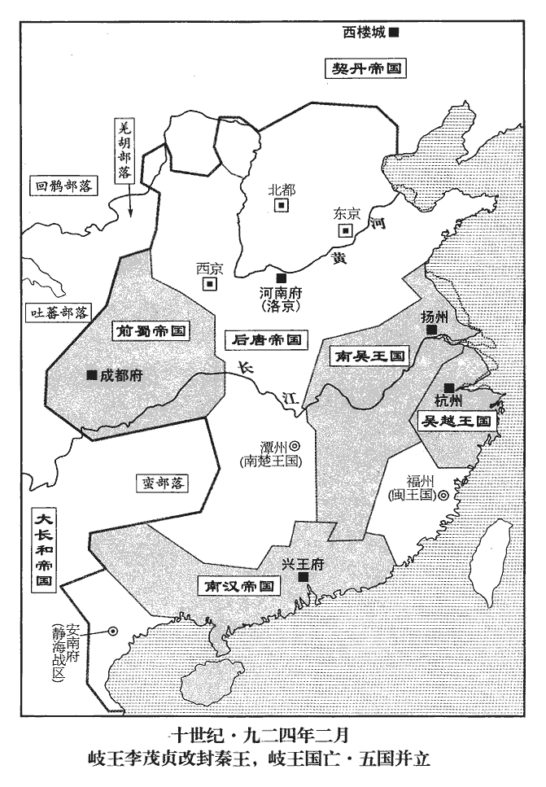
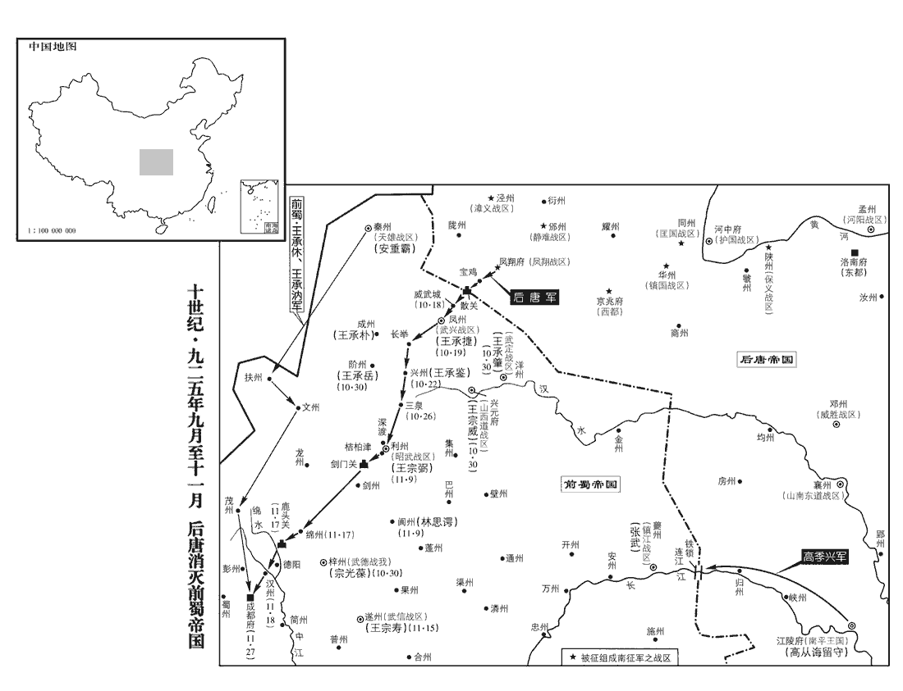

 後唐紀二起閼逢涒灘（甲申），盡旃蒙作噩（乙酉）十月，凡一年有奇。

# 莊宗光聖神閔孝皇帝中

## 同光二年（甲申、九二四）

1春，正月，甲辰‹五›，幽州‹北京市›奏契丹‹首都西楼城内蒙古巴林左旗›入寇，至瓦橋‹河北省雄县›。李存審奏也。以天平軍‹总部设郓州山东省东平县›節度使李嗣源‹邈佶烈›為北面行營都招討使，陝州‹河南省三门峡市›留後霍彥威副之，宣徽使李紹宏為監軍，將兵救幽州。陝，失冉翻。監，古銜翻。將，即亮翻。

〖译文〗 [1]春季，正月，甲辰（初五），幽州上奏说契丹人入侵，到了瓦桥。后唐帝任命天平军节度使李嗣源为北面行营都招讨使，陕州留后霍彦威为副招讨使，宣徽使李绍宏为监军，让他们率军援救幽州。

2孔謙復言於郭崇韜曰：「首座相公萬機事繁，居第且遠，復，扶又翻。豆盧革時為首相，故稱之為首座相公。租庸簿書多留滯，宜更圖之。」請改用人為租庸使，孔謙意欲自得之也。更，工衡翻。豆盧革嘗以手書便假省庫錢數十萬，今俗謂借錢為便錢，言借貸以便用也。時租庸錢皆入省庫。謙以手書示崇韜，崇韜微以諷革。革懼，奏請崇韜專判租庸，崇韜固辭。上‹李存勖，本年四十岁›曰：「然則誰可者？」崇韜曰：「孔謙雖久典金穀，自帝得魏博，孔謙即為支度務使。若遽委大任，恐不叶物望，請復用張憲。」帝即命召之。謙彌失望。謙自去年四月帝即位之初即望為租庸使，事見上卷。

〖译文〗 [2]孔谦又对郭崇韬说：“首座相公豆卢革日理万机，事务繁忙，而且居住的地方离朝廷很远，租庸簿册等积压很多，应当另外选择人来充当租庸使。”当时，豆卢革亲手写借条向省库借钱数十万，孔谦拿豆卢革亲手写的借条给郭崇韬看，郭崇韬稍微批评了一下豆卢革。豆卢革感到害怕，上奏请求郭崇韬专管租庸事务，郭崇韬坚决辞让。后唐帝问说：“那么谁可以呢？”郭崇韬回答说：“孔谦虽然管理金谷事务时间较长，但如果急急忙忙委此大任，恐怕不孚众望，请再度起用张宪。”后唐帝立即下令召见张宪。孔谦更加失望。

3岐王‹首都凤翔府陕西省凤翔县›李茂贞（宋文通）本年六十九岁聞帝入洛，內不自安，聞帝自大梁入洛，懼移兵西伐也。遣其子行軍司馬彰義‹总部设泾州甘肃省泾川县›節度使兼侍中繼曮yǎn入貢，李繼曮以鳳翔行軍司馬領涇州節。始上表稱臣。帝以其前朝耆舊，與太祖比肩，前朝，謂唐僖、昭之朝。帝即位，追尊考晉王克用曰武皇帝，廟號太祖。上，時掌翻。朝，直遙翻；下同。特加優禮，每賜詔但稱岐王而不名。庚戌‹十一›，加繼曮中【章：十二行本「中」上有「兼」字；乙十一行本同。】書令，遣還。曮，魚險翻。還，從宣翻，又如字。

〖译文〗 [3]岐王听说后唐帝进入洛阳，内心感到不安，于是派遣他的儿子行军司马彰义节度使兼侍中李继向后唐帝进贡，开始上表称臣。后唐帝认为他是前朝旧老，和太祖是同辈人，于是特加厚礼，每次下诏书时只称岐王而不称其名。庚戌（十一日），加封李继为中书令，并把他送回去。

4敕：「內官不應居外，應前朝內官及諸道監軍并私家先所畜者，不以貴賤，並遣詣闕。」唐末誅宦官，其有逃逸者，散投外鎮及為私家所養。畜，旴玉翻。時在上左右者已五百人，至是殆及千人，皆給贍優厚，委之事任，以為腹心。內諸司使，自天祐以來以士人代之，唐昭宗天復三年誅宦官，以士人為內諸司使，時所存者九使而已。至梁有客省使，改小馬坊使為天驥使，飛龍使，莊宅使，儀鸞使，文思使，五坊使，如京使，尚食使，改御食使為司膳使，洛苑使，教坊使，東上閤門使，西上閤門使，內園栽接使，弓箭庫使，大內皇牆使，武備庫使，引進使，左藏庫使，閑廄使，宮苑使，翰林使，大和庫使，豐德庫使，乾文院使。後唐雖不用梁制，而復唐之舊，內諸司使其官亦多。至是復用宦者，浸干政事。既而復置諸道監軍，節度使出征或留闕下，軍府之政皆監軍決之，陵忽主帥，怙勢爭權，由是藩鎮皆憤怒。為後諸藩鎮乘變殺監軍張本。

〖译文〗 [4]后唐帝下敕：“宦官不应在外面居留，前朝宦官以及各道监军和私人家里所养的人，不论贵贱，一律遣送回朝廷。”当时在后唐帝左右已有五百人，到这个时候几乎多达千人。后唐帝都赐给他们优厚的待遇，委派他们担任一定的职务，把他们当作心腹。自天以来朝内都用一般官吏代替宦官担任宫内各司使，此时又起用宦官，宦官逐渐干预政事。不久又设置各道监军，节度使出去打仗或留在朝廷时，军府的政事都由监军来裁决，他们凌驾在主帅之上，仗势争权夺利，因此各藩镇对他们都十分愤恨。

5契丹出塞。召李嗣源旋師，命泰寧‹总部设兖州山东省兖州市›節度使李紹欽‹段凝›、澤州‹山西省晋城市›刺史董璋戍瓦橋‹河北省雄县›。

〖译文〗 [5]契丹军开出边境。后唐帝命令李嗣源率兵回师，命令泰宁节度使李绍钦、泽州刺史董璋驻守在瓦桥。

6李繼曮見唐甲兵之盛，歸‹陕西省凤翔县›，語岐王‹李茂贞›，語，牛倨翻。岐王益懼，癸丑‹十四›，表請正藩臣之禮；優詔不許。

〖译文〗 [6]李继见后唐军十分强大，回来告诉岐王，岐王更加感到害怕。癸丑（十四日），岐王上表请求以藩臣的礼来对待自己，后唐帝下诏没有答应。

7孔謙惡張憲之來，時自魏召張憲復為租庸使，憲方正，故謙惡其來。惡，烏路翻。言於豆盧革曰：「錢穀細事，一健吏可辦耳。魏都‹河北省大名县›根本之地，顧不重乎！興唐‹河北省大名县›尹王正言操守有餘，智力不足，必不得已，使之居朝廷，眾人輔之，猶愈於專委方面也。」革為之言於崇韜，為，于偽翻。崇韜乃奏留張憲於東京‹兴唐府›。甲寅‹十五›，以正言為租庸使。正言昏懦，謙利其易制故也。易，以豉翻。

〖译文〗 [7]孔谦不满张宪的到来，于是对豆卢革说：“钱谷这些小事，一个精干的官吏即可以办理。魏都是个很重要的地方，怎么能反过来不重视呢？兴唐尹王正言品行有余，才能不足，不得已的话，可以让他身居朝廷，大家来辅佐他，还是胜过专门委任他担一方的军政事务。”豆卢革为孔谦在郭崇韬面前推荐王正言，于是郭崇韬上奏请求把张宪留在东京。甲寅（十五日），任命王正言为租庸使。王正言糊涂软弱，孔谦是贪图他容易被控制，才提名他出任租庸使的。

8李存審奏契丹去，復得新州‹河北省涿鹿县›。新州陷見二百六十九卷梁均王貞明三年。

〖译文〗 [8]李存审奏告后唐帝契丹人已经离去，重新得到新州。

9戊午‹十九›，敕鹽鐵、度支、戶部三司並隸租庸使。租庸使之權愈重矣。

〖译文〗 [9]戊午（十九日），后唐帝下敕：盐铁、度支、户部三司一并隶属于租庸使管辖。

10上遣皇弟存渥、皇子繼岌迎太后、太妃於晉陽‹山西省太原市›，太妃曰：「陵廟在此，若相與俱行，歲時何人奉祀！」遂留不來。帝即位，尊曾祖執宜廟號懿祖，陵曰永興；國昌‹朱邪赤心›廟號獻祖，陵曰長寧；克用廟號太祖，陵曰建極。三陵皆在代州‹山西省代县›鴈門縣，親廟在晉陽。太妃之不來，夫豈專陵廟之為，其心固有所見也，且其辭義甚正。為太后、太妃俱以憂邑成疾張本。太后至，庚申‹二十一›，上出迎於河陽‹河南省孟州市›；辛酉‹二十二›，從太后入洛陽。

〖译文〗 [10]后唐帝派遣他的弟弟李存渥、他的儿子李继岌到晋阳迎接太后、太妃，太妃说：“祖宗陵庙在这里，如果我们都一起去，每个祭祀的时候谁来这里奉祀祖宗。”于是她留了下来。太后即将到时，庚申（二十一日），后唐帝到河阳去迎接；辛酉（二十二日），后唐帝随从太后一起进入洛阳。

11二月，己巳朔‹一›，上祀南郊，大赦。孔謙欲聚斂以求媚，斂，力贍翻。凡赦文所蠲者，謙復徵之。蠲juān，圭淵翻，除也。復，扶又翻。自是每有詔令，人皆不信，百姓愁怨。

〖译文〗 [11]二月，已巳朔（初一），后唐帝到南郊去祭天，同时对全国罪犯实行大赦。孔谦打算搜刮民财来讨好后唐帝，凡赦文中免除征收的人，孔谦仍然要向他们征收。从此以后，每次后唐帝下发诏令，人们都不相信，百姓们忧愁怨恨。

郭崇韜初至汴‹河南省开封市›、洛‹洛阳›，頗受藩鎮饋遺，遺，唯季翻。所親或諫之，崇韜曰：「吾位兼將相，郭崇韜為樞密使，加侍中，領成德節。樞密使，天下事無所不關。侍中三省長官，又領節鎮，故言位兼將相。祿賜巨萬，豈藉外材！【章：十二行本「材」作「財」；乙十一行本同；孔本同；熊校同。】但以偽梁之季，賄賂成風，今河南藩鎮皆梁之舊臣，主上‹李存勖›之仇讎也，若拒，其意能無懼乎！吾特為國家藏之私室耳。」為，于偽翻。郭崇韜受饋遺，未足以安藩鎮疑懼之心，乃所以成其主好貨之惡。及將祀南郊，崇韜首獻勞軍錢十萬緡。先是，宦官勸帝分天下財賦為內外府，勞，力到翻。先，悉薦翻。州縣上供者入外府，充經費，供，居用翻。方鎮貢獻者入內府，充宴遊及給賜左右。於是外府常虛竭無餘而內府山積。及有司辦郊祀，乏勞軍錢，崇韜言於上曰：「臣已傾家所有以助大禮，願陛下亦出內府之財以助有司。」上默然久之，曰：「吾晉陽自有儲積，積，子賜翻，又如字。可令租庸輦取以相助。」於是取李繼韜私第金帛數十萬以益之，李繼韜父嗣昭從晉王克用起於晉陽，故私第在焉。繼韜以反誅，其家貲沒官。軍士皆不滿望，始怨恨，有離心矣。為後諸軍離叛張本。

〖译文〗 郭崇韬刚到汴梁、洛阳时，接受了很多藩镇给他的馈赠，他的亲信中有人规劝他，郭崇韬说：“我的职位兼将相，俸禄无数，怎么要搜刮外财呢？只是因为梁朝末期，贿赂成风，现在黄河以南的藩镇官吏都是原来梁朝的旧臣，都是皇帝的仇人，如果拒绝他们，他们心里能不害怕吗？我是为国家先收藏在我的家里。”等到后唐帝快要到南郊祭天时，郭崇韬带头贡献慰劳军队的钱十万缗。在此之前，宦官们曾劝说后唐帝把国家的财赋分为内外二府，州县税收上交的入外府，充当国家经费用；方镇贡献的入内府，供皇帝宴席、游玩以及赏赐左右大臣用。这样，外府的费用经常短缺无余，而内府的财赋则堆积如山。等到有关部门去筹办郊祀时，缺乏慰劳军队的费用，郭崇韬对后唐帝说：“我已经把所有的家产拿出来资助郊祀大礼，希望陛下也拿出内府一些钱财来帮助有关部门。”后唐帝沉默了好大一会儿说：“我在晋阳自有积蓄，可以让租庸使用车拉点来资助。”于是在李继韬的住地取了数十万金帛来帮助主管部门。军队士卒们对此很不满意。开始怨恨，并产生了叛离的想法。

12河中‹护国战区总部设河中府山西省永济市›節度使李繼麟請榷què安邑‹山西省运城市东北安邑镇›、解縣‹山西省运城市西南解州镇›鹽，每季輸省課。每三月一輸鹽課於省也。榷，古岳翻。解，戶買翻。己卯‹十一›，以繼麟充制置兩池榷鹽使。

〖译文〗 [12]河中节度使李继麟请求专卖安邑、解县的盐，每季给朝廷送一次盐赋。已卯（十一日），任命李继麟为制置两池榷盐使。

13辛巳‹十三›，進岐王‹李茂贞›爵為秦王，考異曰：茂貞改封秦王，薛史無的確年月。實錄，同光元年十一月壬寅，已稱「秦王茂貞遣使賀收復」，自後皆稱秦王。至二年辛巳制，「秦王李茂貞可封秦王」，豈有秦王封秦王之理！必是至是時始自岐王封秦王也。通鑑考異正本在二年正月岐王上表稱臣之下，今移置於此。仍不名、不拜。

〖译文〗 [13]辛巳（十三日），进封岐王李茂为秦王，并且允许他朝见时不称名，不下拜。

14郭崇韜知李紹宏怏怏，乃置內句使，掌句三司財賦，以紹宏為之，冀弭其意，而紹宏終不悅，李紹宏恨郭崇韜，見上卷元年。句，音鉤。徒使州縣增移報之煩。按薛史云：同光元年十一月，以李紹宏兼內句，凡天下錢穀簿書悉委裁遣，自是州縣供帳煩費，議者非之。與此有歲月之差。

〖译文〗 [14]郭崇韬知道李绍宏心中不快，于是设置内句使，掌管考核三司财赋，让李绍宏任内句使，希望消除他的不满，但李绍宏始终不高兴，结果，只是使州县里增加了移报手续的麻烦。

崇韜位兼將相，復領節旄，以天下為己任，權侔人主，旦夕車馬填門。性剛急，遇事輒發，嬖倖僥求，多所摧抑，嬖bì，卑義翻，又必計翻。僥，堅堯翻。宦官疾之，朝夕短之於上；崇韜扼腕，欲制之不能。腕，烏貫翻。豆盧革、韋說嘗問之曰：「汾陽王本太原人徙華陰‹陕西省华阴市›，說，讀曰悅。華，戶化翻。公世家鴈門‹代州州政府所在县·山西省代县›，豈其枝派邪？」崇韜因曰：「遭亂亡，失譜諜，嘗聞先人言，上距汾陽四世耳。」譜，博古翻，籍錄也。諜，徒協翻。漢郊祀歌：披圖按諜。蘇林註曰：諜，譜第也。汾陽王，謂郭子儀也。革曰：「然則固從祖也。」從，才用翻。崇韜由是以膏粱自處，多甄別流品，處，昌呂翻。別，彼列翻。引拔浮華，鄙棄勳舊。有求官者，崇韜曰：「深知公功能，然門地寒素，不敢相用，恐為名流所嗤。」嗤，丑之翻，笑也。由是嬖倖疾之於內，勳舊怨之於外。崇韜屢請以樞密使讓李紹宏，上不許；又請分樞密院事歸內諸司以輕其權，而宦官謗之不已。崇韜鬱鬱不得志，與所親謀赴本鎮‹成德战区总部设镇州河北省正定县›以避之，其人曰：「不可。蛟龍失水，螻蟻足以制之。」

〖译文〗 郭崇韬位兼将相，又兼任地方节度使，他以天下为已任，其权力和皇帝相近，每天早晚门前的车马都是满满的。他的性情刚愎而急躁，遇事易发脾气，后唐帝宠爱的人想求他办事，多数遭到失败。宦官们很憎恨他，每天在后唐帝那里说他的短处。郭崇韬感到很愤怒，想制服他们但又不能。豆卢革、韦说曾经问他说：“汾阳王郭子仪本是太原人，后迁到华阴，您世世代代在雁门，难道是他的枝派吗？”郭崇韬因此回答说：“因遭动乱，谱谍丢失，曾经听先人说，上距汾阳王只有四世。”豆卢革说：“既然如此，那么本是同一祖宗了。”从此，郭崇韬以出生高门而悠然自处，同时也重视辨别人的门第，推荐选拔一些华而不实的人，鄙视一些过去有功劳的故旧，有人向郭崇韬请求封官，郭崇韬说：“我很了解你的功绩和才能，但因出身寒门，不敢起用，害怕名流们讥笑。”因此，宫廷内皇帝宠幸的人忌恨他，朝廷外过去的功臣们怨恨他。郭崇韬曾多次请求把枢密使让给李绍宏，后唐帝始终没有答应。他又请求把一部分枢密院的事情分给宦官掌握的内诸司，以此来减轻他的一些权力，但宦官们却没完没了地指责他的过失。郭崇韬感到愁闷不得志，于是和他的亲信们商量准备到本镇去回避。有人说：“不可以。蛟龙离开了水，蝼蚁都可以制服它。”

 

先是，上欲以劉夫人為皇后，先，悉薦翻。而有正妃韓夫人在，歐史曰：莊宗正室曰衛國夫人韓氏，其次曰燕國夫人伊氏，次魏國夫人劉氏。太后素惡劉夫人，按歐史，劉氏為袁建豐所得，內之太后宮，教以吹笙歌舞，莊宗悅之，太后以賜莊宗。然而惡之者，以其所出微而妬悍也。崇韜亦屢諫，上以是不果，於是所親說崇韜曰：說，式芮翻。「公若請立劉夫人為皇后，上必喜。內有皇后之助，則伶宦輩不能為患矣。」崇韜從之，與宰相帥百官共奏劉夫人宜正位中宮。癸未‹十五›，立魏國夫人劉氏為皇后。郭崇韜以是求自全，乃所以自禍也。為殺郭崇韜張本。帥，讀曰率；下同。皇后生於寒微，既貴，專務蓄財，其在魏州，薪蘇果茹皆販鬻之。採木為薪，採草為蘇。果，覈hé也。茹，菜也。及為后，四方貢獻皆分為二，一上天子，一上中宮。上，時掌翻。以是寶貨山積，惟用寫佛經，施尼師而已。施，式豉翻。

〖译文〗 在此以前，后唐帝打算把刘夫人立为皇后，因有正妃韩夫人在，皇太后平素又恨刘夫人，郭崇韬也曾多次劝说，因此后唐帝没有把刘夫人立为皇后。于是，亲信们劝郭崇韬说：“您如果请求立刘夫人为皇后，皇帝一定很高兴。这样，内有皇后的帮助，那些伶宦们就不会成为您的忧患了。”郭崇韬听从了这些人的意见。于是和宰相带领百官一起上奏，请求立刘夫人为中宫皇后。癸未（十五日），后唐帝立魏国夫人刘氏为皇后。皇后出身很贫寒，等到她显贵以后，专力集蓄财物，她在魏州时，那些柴草果菜都进行贩卖。等到立为皇后以后，四方送给朝廷的贡品都分为二份，一份送给皇帝，一份送给中宫。因此财宝堆积如山，只用来抄写佛经或馈赠尼师而已。

是時皇太后誥，皇后教，與制敕交行於藩鎮，奉之如一。婦言與王言並行，自古亂政未有如同光之甚者也。

〖译文〗 这时，皇太后发的诰令，皇后发的教令，和皇帝发的制敕在藩镇中相互交行，藩镇的官吏们奉之如一。

15詔蔡州‹河南省汝南县›刺史朱勍浚索水‹五代时索水从河南省荥阳市东注入黄河，经不断改道，即今淮河支流涡河上游一条小河›，通漕運。水經註：車關水出于嵩渚之山，發于層阜之上，一源兩枝，分流瀉注，世謂之石泉水，東流為索水，西注為車關水。索水在成皋北。勍，渠京翻。索，山客翻。

〖译文〗 [15]后唐帝下诏，命令蔡州刺史朱疏浚索水，使索水成为水上运输道路。

16三月，己亥朔‹一›，蜀主‹王宗衍，本年二十六岁›宴近臣於怡神亭，酒酣，君臣及宮人皆脫冠露髻，喧譁自恣。知制誥京兆‹陕西省西安市›李龜禎諫曰：「君臣沈湎，不憂國政，沈，持林翻。臣恐啟北敵之謀。」北敵，謂唐也。不聽。

〖译文〗 [16]三月，已亥朔（初一），前蜀主在怡神亭宴请亲近的大臣们，喝酒喝得正高兴时，君主、大臣以及宫人都脱掉了帽子，露出发结，喧哗吵闹，为所欲为。知制诰京兆人李龟祯劝前蜀主说：“君主大臣沉湎于酒，对国家的政事不忧愁，我担心这会促使北面敌人算计我们。”前蜀主不听他的规劝。

17乙巳‹七›，鎮州‹河北省正定县›言契丹將犯塞，此據諜報而上言也。詔橫海‹总部设沧州河北省沧州市东南›節度使李紹斌、北京‹太原府·山西省太原市›左廂馬軍指揮使李從珂帥騎兵分道備之；天平節度使李嗣源屯邢州‹河北省邢台市›。紹斌本姓趙，名行實，幽州人也。斌，悲巾翻。

〖译文〗 [17]乙巳（初七），镇州报告说契丹人将要侵犯边境。后唐帝诏令横海节度使李绍斌、北京左厢马军指挥使李从珂率领骑兵分路防备。命令天平节度使李嗣源驻守在刑州。李绍斌本姓赵，名行实，幽州人。

18丙午‹八›，加高季興‹高季昌·荆南总部江陵府›司令官兼尚書令，進封南平王。

〖译文〗 [18]丙午（初八），加封高季兴兼任尚书令，进封南平王。

19李存審‹符存审·卢龙总部幽州›司令官自以身為諸將之首，李存審時為蕃漢馬步軍都總管。不得預克汴之功，感憤，疾益甚，李存審自滄徙幽，時已寢疾。屢表求入覲，郭崇韜抑而不許。存審疾亟，表乞生覩龍顏，乃許之。初，帝‹李存勖›嘗與右武衛上將軍李存賢‹王贤›手搏，存賢不盡其技，存賢本許州王賢，少為軍卒，善角觝。晉王克用得之，賜以姓名，養為子。技，渠綺翻。帝曰：「汝能勝我，當授藩鎮。」存賢乃奉詔，僅仆帝而止。及許存審入覲，帝以存賢為盧龍行軍司馬，旬日除節度使，曰：「手搏之約，吾不食言矣。」以手搏而得大藩，是節鎮可以戲取矣。

〖译文〗 [19]李存审自认身为诸将之首，没有得到参与攻克汴梁之功，感到激愤，病情加重，曾多次上表请求朝见皇帝，郭崇韬扣压住不许他入朝。李存审的病情更加厉害，上表请求在活着的时候能见到后唐帝，因此才答应了他的请求。当初，后唐帝曾和右武卫上将军李存贤空手搏击，李存贤没有使出全部技能，后唐帝说：“你如能胜我，当授予你以节度使之职。”于是李存贤按照他说的，但仅把他击得向前倾跌就住了手。等到允许李存审入见时，后唐帝任命李存贤为卢龙行军司马，过了十几天任命他为节度使，说：“手搏之约，我不能说话不算数。”

20庚戌‹十二›，幽州奏契丹寇新城‹河北省高碑店市东南新城镇›。新城縣屬涿州，唐大和六年以故督亢地置。匈奴須知：新城縣北至涿州六十里。

〖译文〗 [20]庚戌（十二日），幽州上奏说契丹人侵犯新城。

21勳臣畏伶官宦之讒，皆不自安。蕃漢內外馬步副總管李嗣源求解兵柄；帝不許。

〖译文〗 [21]有功之臣都害怕伶宦毁谤，内心都感到不安。蕃汉内外马步副总管李嗣源请求解除兵权，后唐帝没有答应他。

22自唐末喪亂，喪，息浪翻。搢紳之家或以告赤鬻於族姻，「赤」，當作「敕」。鬻於族姻則既非矣，安知後世有鬻於非其族類者乎！遂亂昭穆，昭，上招翻。至有舅、叔拜甥、姪者，言舅拜其甥，叔拜其姪也。選人偽濫者眾。郭崇韜欲革其弊，請令銓司精加考覈。銓司，吏部也。選，須絹翻。覈，下革翻。時南郊行事官千二百人，凡郊祀，預執事者皆謂之行事官。注官者纔數十人，塗毀告身者十之九。選人或號哭道路，號，戶刀翻。或餒死逆旅。

〖译文〗 [22]自从唐末衰乱以来，士大夫家有人将作官凭证在同族亲戚中出卖，于是乱了礼教，甚至有舅舅拜见外甥的、叔叔拜见侄儿的。在候选、候补的人员中，弄虚作假的人很多。郭崇韬想革除这种弊病，请求让吏部严加考核。当时参加南郊祭天的行事官有一千二百多人，其中正式由吏部注官的才几十个人，涂改委任官职文凭的人占十分之九。候选、候补官员的人有的在道路上号啕大哭，有的饿死在旅馆。

23唐室諸陵先為溫韜‹李绍冲›所發，帝不能正溫韜之罪，見上卷上年。庚申‹二十二›，以工部郎中李途為長安‹陕西省西安市›按視諸陵使。

〖译文〗 [23]唐室先祖的陵墓早先被温韬所挖，庚申（二十二日），任命工部郎中李途为长安按视诸陵使。

24皇子繼岌代張全義‹张宗奭›判六軍諸衛事。

〖译文〗 [24]皇子继岌代替张全义判六军诸卫事。

25夏，四月，己巳朔‹一›，群臣上尊號曰昭文睿武至德光孝皇帝。唐諸帝尊號皆有「孝」字，蓋因漢制，今此又因唐制也。

〖译文〗 [25]夏季，四月，已巳朔（初一），群臣给后唐帝上尊号曰昭文睿武至德光孝皇帝。

26帝遣客省使李嚴使于蜀‹首都成都府›，嚴盛稱帝威德，有混一天下之志。且言朱氏‹朱全忠›篡竊，諸侯曾無勤王之舉。王宗儔以其語侵蜀，請斬之，蜀主不從。宣徽北院使宋光葆上言：「晉王有憑陵我國家之志，宜選將練兵，屯戍邊鄙，積糗糧，治戰艦以待之。」上，時掌翻。糗，去久翻。治，直之翻。艦，戶黯翻。言治戰艦，欲以防峽江。蜀主乃以光葆為梓州‹四川省三台县›觀察使，充武德‹总部设梓州›節度留後。蜀置武德軍於梓州。

〖译文〗 [26]后唐帝派遣客省使李严出使前蜀，李严十分夸耀后唐帝的威德，有统一天下的志向。而且还说朱氏篡夺政权时，诸侯们却没有一点儿为唐王室尽力的举动。王宗俦认为他的话是在攻击前蜀，请求把他斩杀，但前蜀主没有听从他的意见。宣徽北院使宋光葆对前蜀主说：“晋王有进一步逼迫我国的野心，我们应当选将练兵，在边境上驻守军队，积蓄粮，建造战船，以防他来侵略。”于是前蜀主任命李光葆为梓州观察使，并充当武德节度留后。

27乙亥‹七›，加楚王殷‹首都潭州湖南省长沙市›马殷，本年七十三岁兼尚書令。

〖译文〗 [27]乙亥（初七），封楚王马殷兼任尚书令。

28庚辰‹十二›，賜前保義留後霍彥威姓名李紹真。唐既滅梁，改陝州鎮國軍為保義軍。

〖译文〗 [28]庚辰（十二日），后唐帝赐给原保义留后霍彦威姓名叫李绍真。

29秦忠敬王李茂貞卒‹年六十九岁›，遺奏以其子繼曮權知鳳翔軍府事。

〖译文〗 [29]秦忠敬王李茂贞去世，留下奏文，希望任命他的儿子李继代理凤翔军府事。

30初，安義‹总部设潞州山西省长治市›牙將楊立有寵於李繼韜，李繼韜之求世襲也，改昭義軍為安義軍。繼韜誅，見上卷上年。常邑邑思亂。會發安義兵三千戍涿州‹河北省涿州市›，立謂其眾曰：「前此潞兵未嘗戍邊，晉與梁兵爭，潞兵未嘗北戍，蓋以備梁耳。今朝廷驅我輩投之絕塞，蓋不欲置之潞州耳。與其暴骨沙場，不若據城自守，涿州在幽州之南，未為絕塞也。唐人謂沙漠之地為沙場，豈涿州之地乎！楊立以此言激怒潞兵耳。事成富貴，不成為群盜耳。」因聚譟攻子城東門，焚掠市肆；節度副使李繼珂、監軍張弘祚棄城走，立自稱留後，遣將士表求旌節。詔以天平節度使李嗣源為招討使，武寧‹总部设徐州江苏省徐州市›節度使李紹榮為部署，部署之官始見于通鑑，本在招討使之下；其後有都部署，遂為專任主帥之任。帳前都指揮使張廷蘊為馬步都指揮使以討之。

〖译文〗 [30]当初，巡义牙将杨立很受李继韬宠爱，李继韬被杀以后，杨立经常闷闷不乐，打算叛乱。正巧这时朝廷准备派三千安义兵去戍守涿州，杨立对他的士卒们说：“在此之前，潞州的士卒从没有戍守过边境，现在朝廷把我们这些人驱赶到很远的边塞去，大概是不想让我们在潞州了。我们与其死在沙漠边塞，不如据城自守，事情如果成功了，大家就会富贵起来，事情如果不成功，我们就集合起来做盗贼。”因此聚众鼓噪，攻打子城的东门，烧掠街上的商店。节度副使李继珂、监军张宏祚弃城逃走，杨立自称为留后，并派遣他的将士们上表请求后唐帝发给留后应持有的旌节信物。后唐帝下诏任命天平节度使李嗣源为招讨使、武宁节度使李绍荣为部署、帐前都指挥使张廷蕴为马步都指挥使前去讨伐杨立。

31孔謙貸民錢，使以賤估償絲，估，音古，價也。以錢貸民，而以賤價徵絲，償所貸錢。屢檄州縣督之。翰林學士承旨、權知汴州盧質上言：「梁趙巖為租庸使，舉貸誅斂，結怨于人。斂，力贍翻。陛下革故鼎新，為人除害，易雜卦曰：革，去故也。鼎，取新也。為，于偽翻。而有司未改其所為，是趙巖復生也。復，扶又翻。今春霜害稼，【章：十二行本「稼」作「桑」；乙十一行本同；張校同，云無註本亦誤「稼」。】繭絲甚薄，但輸正稅，猶懼流移，況益以稱貸，稱，舉也。貸，借也。人何以堪！臣惟事天子，不事租庸，敕旨未頒，省牒頻下，省牒，謂租庸使所下文書。下，戶嫁翻。願早降明命！」帝‹李存勖›不報。

〖译文〗 [31]孔谦将钱借贷给百姓，然后让百姓们用低价的丝来偿还贷款，而且经常下发檄文让州县的官吏们来督促。翰林学士承旨、代理汴州知州卢质上书后唐帝说：“梁国的赵岩曾任租庸使，因为他利用借款来向百姓搜刮财物，和百姓们结下怨仇。陛下破旧立新，为民除害，但有关部门没有改掉他们的所作所为，这就像赵岩又复活一样。今年春季因霜寒损害了庄稼，收获的茧丝也很少，只收正税还怕有人逃亡躺税，何况又增加了借贷，百姓怎么能忍受得了。臣下只侍奉天子，不侍奉租庸使，敕旨还没有颁发，租庸使就频繁地下达文书，希望能够及早颁发明确的命令。”但后唐帝没有答复他。

32漢主‹首都兴王府广东省广州市›，刘岩，本年三十六岁引兵侵閩‹首都福州福建省福州市›，屯於汀‹福建省长汀县›、漳‹福建省漳州市›境上；閩之汀、漳二州，皆與漢之潮州接境。閩人擊之，漢主敗走。

〖译文〗 [32]南汉主率兵入侵闽国，军队驻扎在汀州、漳州的边境上。闽人还击，南汉主被击败逃走。

33初，胡柳‹山东省鄄城县西北›之役，見二百七十卷梁均王貞明四年。伶人周匝為梁所得，帝每思之；帝思周匝而不思周德威，此其所以亡也。入汴‹河南省开封市›之日，匝謁見於馬前，入汴見上卷上年。見，賢遍翻。帝甚喜。匝涕泣言曰：「臣之所以得生全者，皆梁教坊使陳俊、內園栽接使儲德源之力也，梁內園栽接使，猶唐之內園使也。宋白曰：栽接使，貞元中已有之。職官分紀：五代有內園栽接使，國朝止名內園使。願就陛下乞二州以報之。」帝許之。郭崇韜諫曰：「陛下所與共取天下者，皆英豪忠勇之士。今大功始就，封賞未及一人，而先以伶人為刺史，恐失天下心。」以是不行。踰年，伶人屢以為言，帝謂崇韜曰：「吾已許周匝矣，使吾慚見此三人。三人，謂周匝、陳俊、儲德源也。周匝、李存賢之事，帝自以為踐言矣，可以為政乎！公言雖正，當【章：十二行本「當」上有「然」字；乙十一行本同。】為我屈意行之。」為，于偽翻。五月，壬寅‹五›，以俊為景州‹河北省东光县›刺史，德源為憲州‹山西省娄烦县›刺史。憲州本樓煩監牧，唐昭宗龍紀元年晉王克用表置憲州。時親軍有從帝百戰未得刺史者，莫不憤歎。宜其離叛也。

〖译文〗 [33]当初在胡柳战役中，优伶周匝被梁人抓获，后唐帝经常思念他。到后唐军进入汴梁的那天，周匝在马前拜见后唐帝，后唐帝十分高兴。周匝在后唐帝面前哭诉说：“臣之所以能够安全活到今天，全靠梁教坊使陈俊、内园栽接使储德源的帮助，希望陛下能把两个州封赏给他们，以此来报答他们的恩情。”后唐帝答应了他的请求。郭崇韬劝后唐帝说：“陛下要封赏的应该是那些和你共同夺取天下的人，这些人都是英豪忠勇之士。今天大功刚刚告成，这些人中还没有一个得到封赏，而首先任命一个优伶为刺史，恐怕要失掉天下人们的心。”因此周匝的建议没有实行。一年之后，优伶经常提起这件事，后唐帝对郭崇韬说：“我已经答应过周匝，我感到很不好意思见到这三个人。你所讲的都很正确，但还应当看在我的面子上委屈执行一下。”五月，壬寅（初五），后唐帝任命陈俊为景州刺史，储德源为宪州刺史。当时亲军中有跟从后唐帝转战南北而没有封得刺史的人无不愤怒叹息。

34乙巳‹八›，右諫議大夫薛昭文上疏，以為：「諸道僭竊者尚多，當是時，諸道奉貢者有所不論，如蜀、如吳、如漢，皆唐之諸道也。征伐之謀，未可遽息。又，士卒久從征伐，賞給未豐，貧乏者多，此正時病也。宜以四方貢獻及南郊羨餘，羨，弋戰翻。更加頒賚。又，河南諸軍皆梁之精銳，恐僭竊之國潛以厚利誘之，宜加收撫。又，戶口流亡者，宜寬傜薄賦以安集之。又，土木不急之役，宜加裁省。又請擇隙地牧馬，勿使踐京畿民田。」皆不從。

〖译文〗 [34]乙巳（初八），右谏议大夫薛昭文给后唐帝上疏，认为：“诸道对抗朝廷的人很多，征伐的手段不可一下子止息不用。此外，士卒们长时间出征作战，赏给不丰厚，很多人贫穷，应当把各方的贡品以及为南郊祭祀收徼的杂税赏赐给他们。再者，黄河以南的各路军队都是过去梁国的精锐部队，恐怕那些和朝廷对抗的藩镇官吏们会偷偷地用丰厚的利益来引诱他们，朝廷应当加以裁减。最后，请求选择一些没用的空地去放马，不要使马践踏了京畿的民田。”后唐帝都没有听从他的意见。

35戊申‹十一›，蜀主‹王宗衍›遣李嚴還。李嚴四月入蜀，至是而還。還，從宣翻，又如字。考異曰：實錄：「七月，戊午，蜀遣歐陽彬朝貢。十月，癸巳，遣客省使李嚴充蜀川回信使。三年，八月，戊辰，嚴自西川回。」蜀書：「四月，己巳朔，唐使李嚴來聘。五月，戊申，遣嚴歸本國。十一月，己未朔，遣彬為唐國通好使。」按錦里耆舊傳：「是歲遣歐陽彬通聘洛京，莊宗遣李嚴來脩好。」笏記云：「豈謂大蜀皇帝，特遣蘇、張之士，來追唐蜀之歡！吾皇迴感於蜀皇，復禮遠酬於厚禮。」然則嚴為回信使也。或者歐陽彬之前，蜀已有入洛之使乎？若如實錄年月，則李嚴以二年十月奉使，至三年八月方歸，何留之久乎！十國紀年蜀史又云：「九月，己亥，唐帝遣李彥稠來使。十一月，辛丑，遣彥稠東還。」又，八月以後遣王宗鍔等戍洋、利以備東師，似用宋光葆之言；十一月以後以唐國通好，召諸軍還，似因彥稠來而罷之。今並從蜀書年月。初，帝因嚴入蜀，令以馬市宮中珍玩，而蜀法禁錦綺珍奇不得入中國，其粗惡者乃聽入中國，謂之「入草物」。粗，讀曰麤。自盛唐以來，蜀貢賦歲至京師。此法乃王衍之法也。嚴還，以聞，帝怒曰：「王衍寧免為入草之人乎！」嚴因言於帝曰：「衍童騃荒縱，不親政務，斥遠故老，昵比小人。騃，語駭翻。遠，丁願翻。昵，尼質翻。比，毗至翻。其用事之臣王宗弼、宋光嗣等，諂諛專恣，黷貨無厭，賢愚易位，刑賞紊亂，厭，於鹽翻。紊，音問。君臣上下專以奢淫相尚。以臣觀之，大兵一臨，瓦解土崩，可翹足而待也。」帝深以為然。為伐蜀張本。

〖译文〗 [35]戊申（十一日），前蜀主派李严回归后唐。当初，后唐帝派李严进入前蜀，让他用马交换前蜀宫中珍贵的玩赏器物，但前蜀法规定，蜀国上好的丝织品不能流入中原地区，做工比较粗劣的可以让流入中原地区，当地人称“入草物”。李严回到后唐后，把这些情况告诉了后唐帝，后唐帝很生气地说：“王衍难道可以免为入草之人吗？”李严于是对后唐帝说：“王衍像小孩子一样愚，昏乱放纵，不亲自处理政事，把一些过去的老人排斥得很远，亲近小人。他用的那些掌权的大臣王宗弼、宋光嗣等，靠奉承皇帝而专横跋扈，贪得无厌，贤愚颠倒，刑赏混乱，君臣上下相互都崇尚奢侈荒淫。以我来看，大兵一来，他们就会土崩瓦解，我们可以在极短的时间内把蜀国得到。”后唐帝深感他讲得对。

36帝‹李存勖›以潞州叛故，庚戌‹十三›，詔天下州鎮無得脩城濬隍，悉毀防城之具。毀防城之具，慮天下將卒有憑城而拒命者耳。然趙在禮攻魏而魏不能守，趙在禮據魏而攻不能拔，而帝由是亦死於亂兵，防患之道固不在此也。

〖译文〗 [36]后唐帝因为潞州反叛的缘故，庚戌（十三日），下诏命令全国各州镇不得擅自修筑深沟城垒，全部拆毁原来的防城设施。

37壬子‹十五›，新宣武‹总部设汴州河南省开封市›節度使兼中書令、蕃漢馬步總管李存審卒于幽州‹年六十三岁›。李存審受宣武之命而未離幽州也。存審出於寒微，常戒諸子曰：「爾父少提一劍去鄉里，少，詩照翻。存審，陳州宛丘‹河南省淮阳县›人，從李罕之歸晉王。四十年間，位極將相，言以節度使同平章事也。其間出萬死獲一生者非一，破骨出鏃者凡百餘。」因授以所出鏃，命藏之，曰：「爾曹生於膏粱，當知爾父起家如此也。」

〖译文〗 [37]壬子（十五日），新上任的宣武节度使兼中书令、蕃汉马步总管李存审在幽州去世。李存审出身贫寒，他经常告诫孩子们说：“你们的父亲小时候拿着一把剑离开了家乡，四十多年来，爵位一直升到将相，在这期间，死里逃生不是一两次，剖开头骨取出箭头就有一百多次。”因而把从身上取出的箭头交给了他的孩子们，命令他们把箭头收藏起来，说：“你们生活在富裕的家庭里，应当知道你们的父亲起家是很不容易的。

38幽州言契丹將入寇，甲寅‹十七›，以橫海‹总部设沧州河北省沧州市东南›節度使李紹斌‹赵行实›充東北面行營招討使，將大軍渡河而北。契丹屯幽州東南城門之外，虜騎充斥，饋運多為所掠。

〖译文〗 [38]幽州方面报告说契丹人又将入侵，甲寅（十七日），命令横海节度使李绍斌出任东北面行营招讨使，并让他率领大军渡过黄河向北进军。契丹的人军队驻扎在幽州东南城门外，到处都是敌人的骑兵，他们所用的粮草大多是从当地抢夺来的。

39壬戌‹二十五›，以李繼曮為鳳翔‹总部设凤翔府陕西省凤翔县›節度使。嗣李茂貞帥岐。

〖译文〗 [39]壬戌（二十五日），任命李继为凤翔节度使。

40乙丑‹二十八›，以權知歸義‹总部设沙州甘肃省敦煌市›留後曹義金為節度使。時瓜‹甘肃省安西县›、沙‹甘肃省敦煌市›與吐蕃‹西藏›雜居，義金遣使間道入貢，故命之。唐懿宗咸通八年，張義潮入朝，以族子惟深守歸義。十三年，惟深卒，以義金權知留後。自咸通十三年至是五十四年，蓋曹義金亦已老矣。間，古莧翻。

〖译文〗 [40]乙丑（二十八日），任命代理归义留后曹义金为归义节度使。当时，瓜州、沙州的人和吐蕃人杂居在一起，曹义金派遣使者从小道上朝入贡，所以后唐帝才任命他为节度使。

41李嗣源大軍前鋒至潞州，日已暝；暝，莫定翻，夕也。泊軍方定，張廷蘊帥麾下壯士百餘輩踰塹坎城而上，帥，讀曰率。上，時掌翻。守者不能禦，即斬關延諸軍入。比明，比，必利翻，及也；下比起同。嗣源及李紹榮‹元行钦›至，城已下矣，嗣源等不悅。以張廷蘊不待其至而先取城也。丙寅‹二十九›，嗣源奏潞州平。六月，丙子‹九›，磔楊立及其黨於鎮國橋‹在洛阳›。磔zhé，陟格翻。潞州城池高深，帝命夷之。夷，平也。

〖译文〗 [41]李嗣源率领的部队的前锋到达潞州时已经夕阳西下。军队刚刚安顿好，张廷蕴率军中一百多名壮士越过沟坎登城，守城的人无力抵抗，他们斩关，迎接诸军进入城内。等到天亮的时候，李嗣源和李绍荣到达潞州，潞州城已经被攻下，李嗣源等不大高兴。丙寅（二十九日），李嗣源上奏皇帝说潞州已经平定。六月，丙子（初九），在镇国桥杀死了杨立及其同党。潞州城高池深，后唐帝命令夷平。

42丙戌‹十九›，以武寧‹总部设徐州江苏省徐州市›節度使李紹榮‹元行钦›為歸德‹总部设宋州河南省商丘市›節度使、同平章事，梁都汴，移宣武軍於宋州；唐滅梁，復以汴州為宣武軍，以宋州為歸德軍。留宿衛，寵遇甚厚。帝或時與太后、皇后同至其家。帝有幸姬，色美，嘗生子矣，劉后妬之。會紹榮喪妻，喪，息浪翻。一日，侍禁中，帝問紹榮：「汝復娶乎？復，扶又翻。為汝求婚。」為，于偽翻；下為之同。后因指幸姬曰：「大家憐紹榮，何不以此賜之！」帝難言不可，微許之。后趣紹榮拜謝，趣，讀曰促。比起，顧幸姬，已肩輿出宮矣。帝為之託疾不食者累日。史言帝憚劉后之妬悍。

〖译文〗 [42]丙戌（十九日），后唐帝任命武宁节度使李绍荣为归德节度使、同平章事，并留他在宫中，担任警卫，给他的待遇十分丰厚。后唐帝有时和太后、皇后一起到他家串门。后唐帝有个宠姬，长得很漂亮，曾生过一个儿子，刘皇后很嫉妒她。这时李绍荣的妻子正好去世，一天，绍荣在宫中侍奉后唐帝，后唐帝就问绍荣说：“你还再娶妻子吗？我为你去求婚。”皇后因此就指着后唐帝的宠姬对后唐帝说：“皇上很可怜绍荣，为什么不把小妾赏赐给他呢？”皇帝难以拒绝，只是含含糊糊的答应了。皇后赶快让李绍荣拜谢皇帝，第二天一早，后唐帝去看他的宠姬时，已经被轿子抬出了皇宫。后唐帝因为这件事情托病，好几天都没吃饭。

43壬辰‹二十五›，以天平節度使李嗣源為宣武節度使，代李存審為蕃漢內外馬步總管。自副總管陞都總管。

〖译文〗 [43]壬辰（二十五日），后唐帝任命天平节度使李嗣源为宣武节度使，并代替李存审为藩汉内外马步总管。

44秋，七月，壬寅‹五›，蜀以禮部尚書許寂為中書侍郎、同平章事。

〖译文〗 [44]秋，七月，壬寅（初五），前蜀主任命礼部尚书许寂为中书侍郎、同平章事。

45孔謙復短王正言於郭崇韜，復，扶又翻。又厚賂伶官，【章：十二行本「官」作「宦」；乙十一行本同。】求租庸使，終不獲，意怏怏，癸卯‹六›，表求解職；帝怒，以為避事，將置於法，景進救之，得免。

〖译文〗 [45]孔谦又在郭崇韬面前说王正言的坏话，同时用丰厚的礼物来贿赂那些伶人宦官，想求得租庸使，最终还是没有得到，心里很不高兴。癸卯（初六），他给后唐帝上表请求解除他的职务，后唐帝看了很生气，认为他想逃避事务，准备以法处理他，景进到后唐帝面前求情解救，才使他免于处分。

46梁所決河連年為曹‹山东省定陶县›、濮‹山东省鄄城县›患，梁決河見二百七十卷均王貞明四年。濮，博木翻。甲辰‹七›，命右監門上將軍婁繼英督汴、滑兵塞之。未幾，復壞。塞，悉則翻。幾，居豈翻。

〖译文〗 [46]当初后梁把黄河的堤坝打开，连续几年使曹州、濮州受害，甲辰（初七），后唐帝命令右监门上将军娄继英督率汴州、滑州的士卒，把决口堵住。但没过多久，河堤又被冲坏了。

47庚申‹二十三›，置威塞軍於新州。

〖译文〗 [47]庚申（二十三日），在新州设置了威武军。

48契丹恃其強盛，遣使就帝求幽州以處盧文進。處，昌呂翻。時東北諸夷皆役屬契丹，惟勃海‹首都龙泉府黑龙江省宁安市西南东京城›未服；契丹主‹耶律阿保机，本年五十三岁›謀入寇，恐勃海掎其後，勃海時為海東盛國，置五京、十五府、六十二州，盡有高麗、肅慎之地。掎jǐ，居蟻翻。乃先舉兵擊勃海之遼東‹辽宁省›，遣其將禿餒及盧文進據營‹辽宁省朝阳市›、平‹河北省卢龙县›等州以擾燕地。燕，於賢翻。

〖译文〗 [48]契丹人依仗自己的强大，派遣使者到后唐帝那里请求用幽州安置卢文进。当时，东北地区各夷族都已经归属契丹，并受其役使，只有勃海国还没有降服。契丹主谋划入侵后唐，又怕勃海国人从后面截获他们，于是先发兵攻打勃海国的辽东地区，并派遣其将领秃馁和卢文进占据营州、平州等地来干扰后唐的燕地。

49八月，戊辰‹二›，蜀主以右定遠軍使王宗鍔為招討馬步使，帥二十一軍屯洋州‹陕西省洋县›；帥，讀曰率。乙亥‹九›，以長直馬軍使林思鍔為昭武‹总部设利州四川省广元市›節度使，戍利州以備唐。

〖译文〗 [49]八月，戊辰（初二），前蜀主任命右定远军使王宗锷为招讨马步使，率领二十一军驻扎在洋州。乙亥（初九），任命长直马军使林思锷为昭武节度使，率兵戍守在利州，防备后唐军。

50租庸使王正言病風，恍惚不能治事，恍，許昉翻。惚，音忽。治，直之翻。景進屢以為言。癸酉‹七›，以副使、衛尉卿孔謙為租庸使，右威衛大將軍孔循為副使。循即趙殷衡也，梁亡，復其姓名。歐史曰：孔循不知其家世何人也，少孤，流落於汴州，富人李讓闌得之，養以為子。梁太祖以李讓為養子，循乃冒姓朱氏，給事太祖帳中。太祖諸兒乳母有愛之者，養循為子；乳母之夫姓趙，又冒姓趙，名殷衡。梁亡，事唐，始改孔名循。按唐天祐二年趙殷衡已權判宣徽院事，見二百六十五卷。謙自是得行其志，重斂急徵以充帝欲，民不聊生。癸未‹十七›，賜謙號豐財贍國功臣。記曰：與其有聚斂之臣，寧有盜臣。而以是為功臣之號以寵孔謙，唐之君臣不知其非也。民困軍怨，其能久乎！為明宗誅謙張本。

〖译文〗 [50]后唐租庸使王正言中风得病，神志恍惚，不能处理政事，景进在后唐帝面前反复说这件事情。癸酉（初七），后唐帝任命租庸副使、卫尉卿孔谦为租庸使，任命右威卫大将军孔循为租庸副使。孔循就是赵殷衡，后梁灭亡时才恢复了真实姓名。孔谦从此才实现他的愿望，他为了满足后唐帝的欲望而对百姓们加重赋税，紧急征集，民不聊生。癸未（十七日），后唐帝赏赐给孔谦号叫丰财赡国功臣。

51帝復遣使者李彥稠入蜀，九月，己亥‹三›，至成都‹四川省成都市›。復，扶又翻；下復蹂同。

〖译文〗 [51]后唐帝又派遣使者李彦稠入前蜀国，九月，已亥（初三），李彦稠到达成都。

52癸卯‹七›，帝獵于近郊。時帝屢出遊獵，從騎傷民禾稼，洛陽令何澤伏於叢薄，草聚生曰叢；草木交錯曰薄。俟帝至，遮馬諫曰：「陛下賦斂既急，今稼穡將成，復蹂踐之，蹂，人九翻，又如又翻。踐，慈演翻。使吏何以為理，民何以為生！臣願先賜死。」帝慰而遣之。諫獵一也，中牟令幾不免於死，洛陽令乃蒙勞遣者，意必有伶官為之容也。夷考何澤終身之行，實非亮直之士。澤，廣州‹广东省广州市›人也。薛史：何澤，廣州人，梁貞明中清海節度使劉陟薦其才，以進士擢第。

〖译文〗 [52]癸卯（初七），后唐帝在近郊打猎。当时后唐帝经常出去游玩打猎，随从的骑兵们践踏了老百姓的庄稼。洛阳令何泽爬伏在草木丛生的地方等待着皇帝的到来，后唐帝到来后，他拦住马规劝说：“陛下征集赋税时很紧急，现在庄稼就要熟了，又来践踏它，这让官吏们以什么理由来对百姓说？让百姓们怎么生活？臣下希望皇上先赐我死。”后唐帝安慰他并把他送走。何泽是广州人。

53契丹攻渤海‹首都龙泉府黑龙江省宁安市西南东京城›，無功而還。還，從宣翻，又如字。

〖译文〗 [53]契丹人向渤海国发起进攻，无功而还。

54蜀前山南‹总部设兴元府陕西省汉中市›節度使兼中書令王宗儔以蜀主‹王宗衍›失德，與王宗弼‹魏弘夫›謀廢立，宗弼猶豫未決。庚戌‹十四›，宗儔憂憤而卒。宗弼謂樞密使宋光嗣、景潤澄等曰：「宗儔教我殺爾曹，今日無患矣。」光嗣輩俯伏泣謝。宗弼子承班聞之，謂人曰：「吾家難乎免矣。」

〖译文〗 [54]前蜀国前山南志节度使兼中书令王宗俦认为前蜀主已经丧失了品德，与王宗弼谋划把前蜀主废掉，王宗弼犹豫不决。庚戌（十四日），王宗俦因为忧愁愤恨而死。王宗弼对枢密使宋光嗣、景润澄等说：“王宗俦曾让我杀掉你们，今日王宗俦一死就没有后患了。”宋光嗣等人边哭边跪向王宗弼表示感谢。王宗弼的儿子王承班听说后，对人们说：“我家难免一场灾难了。”

55乙卯‹十九›，蜀主以前鎮江軍‹总部设楚州重庆市奉节县›節度使張武為峽路‹长江三峡›應援招討使。蜀置鎮江軍於夔州。

〖译文〗 [55]乙卯（十九日），前蜀主任命前镇江军节度使张武为峡路应援招讨使。

56丁巳‹二十一›，幽州言契丹入寇。

〖译文〗 [56]丁巳（二十一日），幽州方面报告契丹人入侵。

57冬，十月，辛未‹六›，天平節度使李存霸、平盧‹总部设青州山东省青州市›節度使符習言：「屬州多稱直奉租庸使帖指揮公事，使司殊不知，有紊規程。」使司，謂節度使司也。紊，音問。租庸使奏，近例皆直下。時租庸使帖下諸州調發，不關節度觀察使，謂之直下。下，戶嫁翻。敕：「朝廷故事，制敕不下支郡，節鎮為會府，巡屬諸州為支郡。牧守不專奏陳。今兩道所奏，乃本朝舊規；租庸所陳，是偽廷近事。時以梁為偽廷，黜之也。自今支郡自非進奉，皆須本道騰奏，租庸徵催亦須牒觀察使。」唐制：節度使掌兵事，觀察使掌民事，故敕租庸徵催止牒觀察使司。雖有此敕，竟不行。史言徵斂嚴急，但期趣辦，竟不奉敕而行。

〖译文〗 [57]冬季，十月，辛未（初六），天平节度使李存霸、平卢节度使符习上奏说：“所属州官多称他们只按照租庸使的柬帖来行公事，节度使司根本不知道这一情况，这样把规程打乱了。”租庸使上奏说，近来租庸使的柬帖都是直接下发到各州，不通过节度观察使。后唐帝下命令说：“按朝廷旧例，敕令不下发到各州，各州官吏也不能单独上奏。今天天平、平卢两道所讲的事情，是本朝过去的规定。租庸使所讲的是梁朝的近事。从今以后，不是各支郡亲自进奉的，都必须先移交本道，然后再由本道上奏。租庸使催办征由赋税时也要书写牒文报告观察使。”虽然下达了这道命令，实际上并没有执行。

58易定‹总部设定州河北省定州市›言契丹入寇。

〖译文〗 [58]易定方面报告说契丹人入侵。

59蜀宣徽北院使王承休請擇諸軍驍勇者萬二千人，置駕下左、右龍武步騎四十軍，兵械給賜皆優異於他軍，以承休為龍武軍馬步都指揮使，以裨將安重霸副之，舊將無不憤恥。重霸，雲州‹山西省大同市›人，以狡佞賄賂事承休，故承休悅之。為安重霸背王承休而降唐張本。

〖译文〗 [59]前蜀国宣徽北院使王承休请准在各军中选择一万两千勇敢善战的士卒，安置在属于国主管辖的左、右龙武步骑四十军里，武器及供给都要优于其他军队，任命王承休为龙武军马步都指挥使，裨将安重霸为副指挥使，旧将们对此事无不感到愤怒耻辱。安重霸是云州人，他用狡诈、巴结、贿赂的手段来侍奉王承休，所以王承休特别喜欢他。

60吳越王鏐‹首都杭州浙江省杭州市›钱镠，本年七十三岁復脩本朝職貢，錢鏐本唐臣，唐亡事梁，梁亡復事唐，故云復脩本朝職貢。壬午‹十七›，帝因梁官爵而命之。鏐厚貢獻，并賂權要，求金印、玉冊、賜詔不名、稱國王。有司言：「故事惟天子用玉冊，王公皆用竹冊；竹冊，編竹為之，以存古意。又非四夷，無封國王者。」帝皆曲從鏐意。

〖译文〗 [60]吴越王钱又开始向本朝贡献物品，壬午（十七日），后唐帝依据他在后梁时的官爵重新任命。钱贡献的物品很多，并且贿赂那些掌握大权的人们，请求后唐帝发给他金印、玉册，赐诏允许他朝见不称姓名，称为国王。主管官吏说：“按旧的规定，只有天子用玉册，王公们都用竹册。而且，不是四方夷族，一律不封国王。”但皇帝还是委曲顺从了钱的意思。

61吳王‹首都江都府江苏省扬州市›杨溥，本年二十五岁如白沙‹江苏省仪征市›觀樓船，更命白沙曰迎鑾鎮。路振九國志曰：楊溥巡白沙，太學博士王穀上書請改白沙為迎鑾，其略曰：「日月所經，星辰盡為黃道；鑾輿所止，井邑皆為赤縣。」徐溫自金陵‹江苏省南京市›來朝。白沙，楊子縣地。五季之末改楊子為永貞縣，宋朝乾德二年以揚州永貞縣迎鑾鎮為建安軍，大中祥符六年升為真州，而永貞縣先是復改為楊子。其地東至揚州六十里，南臨大江，渡江而南至金陵亦六十里。更，工衡翻。先是，溫以親吏翟虔為閤門、宮城、武備等使，使察王起居，先，悉薦翻。虔防制王甚急。使鍾泰章殺張顥、閉牙城門討朱瑾，皆翟虔也，故徐溫親任之。翟，直格翻。至是，王對溫名雨為水，溫請其故。王曰：「翟虔父名，吾諱之熟矣。」因謂溫曰：「公之忠誠，我所知也，然翟虔無禮，宮中及宗室所須多不獲。」須者，意所欲也，求也。溫頓首謝罪，請斬之，王曰：「斬則太過，遠徙可也。」乃徙撫州‹江西省临川市›。

〖译文〗 [61]吴王到白沙观看叠层的大船，下命令把白沙改名叫迎銮镇。徐温从金陵来朝拜吴王。在此以前，徐温让他的亲信官吏翟虔担任阁门、宫城、武备等使，让他观察吴王的起居，翟虔防卫、限制吴王很严格。到现在，吴王对徐温说“雨”字时总要改为“水”字，徐温请吴王解释一下这个缘故。吴王说：“这是翟虔父亲的名字，我避讳这个字已很熟练了。”吴王因此对徐温说：“你对我的忠诚，我是很了解的，然而翟虔无礼，宫中以及宗室所需要的东西多数都得不到。”徐温听后赶快低头认罪，请求把翟虔斩了，吴王说：“杀他太过份了，把他迁徙到很远的地方就可以了。”于是把翟虔徙到了抚州。

62十一月，蜀主遣其翰林學士歐陽彬來聘。考異曰：實錄：「七月，戊午，蜀主遣戶部侍郎歐陽彬來使，致書用敵國禮。」蜀書後主紀：「十一月，乙未，命翰林學士、兵部侍郎歐陽彬為唐國通好使。」今從之。彬，衡山‹湖南省衡山县东北›人也。又遣李彥稠東還。李彥稠至蜀見上九月。還，從宣翻，又如字。

〖译文〗 [62]十一月，前蜀主派遣其翰林学士欧阳彬来后唐互通友好。欧阳彬是衡山人。又送李彦稠从蜀回国。

63癸卯‹九›，帝帥親軍獵于伊闕‹河南省伊川县›，伊闕縣在洛陽南二百餘里，有伊闕山，大禹所鑿也。宋朝省伊闕縣為鎮，入伊陽縣。帥，讀曰率。命從官拜梁太祖墓。梁祖‹朱全忠›，帝之仇讎，前欲發墓斲棺，今使從官拜之，何前後之相違也！從，才用翻。涉歷山險，連日不止，或夜合圍；士卒墜崖谷死及折傷者甚眾。史言帝荒於從禽而不恤士卒。折，而設翻。丙午‹十二›，還宮。

〖译文〗 [63]癸卯（初九），后唐帝率领他的亲军在伊阙打猎，命令跟随他的官吏们谒拜后梁太祖的坟墓。后唐帝一行在伊阙翻山越岭，连日不停，有时夜里合围野兽。随从后唐帝的士卒有不少人掉在深崖狭谷中摔死，有不少人被摔伤。丙午（十二日），回到皇宫中。

64蜀以唐脩好，罷威武‹陕西省凤县东北›城戍，召關宏業等二十四軍還成都。戊申‹十四›，又罷武定‹总部洋州›、武興‹总部凤州›招討劉潛等三十七軍。

〖译文〗 [64]前蜀主认为已经和后唐帝互通友好了，于是就撤了戍守在威武城的士卒，又把关宏业等二十四军调回成都。戊申（十四日），又撤了武定、武兴招讨刘潜等三十七军。

65丁巳‹二十三›，賜護國‹总部设河中府山西省永济市›節度使李繼麟‹朱友谦›鐵券，以其子令德、令錫皆為節度使，諸子勝衣者即拜官，勝，音升。寵冠列藩。朱友謙之寵，乃所以速禍也。是其反覆多矣，能無及乎！冠，工喚翻。

〖译文〗 [65]丁巳（二十三日），后唐帝赐给护国节度使李继麟世世代代享受特殊待遇的铁契，并任命他的儿子李令德、李令锡都为节度使，李继麟的儿子凡是能自己穿衣的都给封了官，他家受到的宠爱在所有藩镇中是居于首位的。

66庚申‹二十六›，蔚州‹河北省蔚县›言契丹入寇。

〖译文〗 [66]庚申（二十六日），蔚州方面报告说契丹人入侵。

67辛酉‹二十七›，蜀主‹王宗衍›罷天雄軍‹总部秦州›招討，命王承騫等二十九軍還成都。

〖译文〗 [67]辛酉（二十七日），前蜀主撤了天雄军的招抚讨伐任务，命令王承骞等二十九军回到成都。

68十二月，乙丑朔‹一›，蜀主以右僕射張格兼中書侍郎、同平章事。初，格之得罪，事見二百七十卷梁均王貞明四年。中書吏王魯柔乘危窘之；窘，渠隕翻。及再為相用事，杖殺之。許寂謂人曰：「張公才高而識淺，戮一魯柔，他人誰敢自保！此取禍之端也。」張格則失矣，許寂同在相位，不知蜀有垂亡之勢，但知張格有取禍之端，蜀亡，為相者得免禍乎！

〖译文〗 [68]十二月，乙丑朔（初一），前蜀主任命右仆射张格兼任中书侍郎、同平章事。当初，张格犯了罪的时候，中书吏王鲁柔乘机威逼过他，等他又当了宰相掌握了权力时，就用杖打死了王鲁柔。许寂对人们说：“张公才能虽高但见识短浅，杀死一个王鲁柔，其他人谁能保全自己？这是他自取祸难的开始。”

69蜀主‹王宗衍›罷金州‹陕西省安康市›屯戍，命王承勳等七軍還成都。蜀主恃與唐和而徹邊備，是馴狎虎豹而不嚴設圈檻也。

〖译文〗 [69]前蜀主撤了戍守在金州的部队，下令让王承勋等七军回到成都。

70己巳‹五›，命宣武節度使李嗣源將宿衛兵三萬七千人赴汴州，遂如幽州禦契丹。命李嗣源將兵赴鎮，因而北出備邊。

〖译文〗 [70]己巳（初五），后唐帝命令宣武节度使李嗣源率领三万七千名警卫部队赶到汴州，不久又去幽州抵御契丹人的侵略。

71庚午‹六›，帝及皇后如張全義‹张宗奭›第，全義大陳貢獻；酒酣，皇后奏稱：「妾幼失父母，見老者輒思之，請父事全義。」帝許之。全義惶恐固辭，再三強之，竟受皇后拜，復貢獻謝恩。劉后利張全義之財，此如倡婢屈膝於人，志在求貨耳，惡可以母天下乎！強，其兩翻。復，扶又翻。明日，后命翰林學士趙鳳草書謝全義，鳳密奏：「自古無天下之母拜人臣為父者。」帝嘉其直，然卒行之。卒，子恤翻。自是后與全義日遣使往來問遺不絕。遺，唯季翻。

〖译文〗 [71]庚午（初六），后唐帝和皇后到张全义的住处，张全义把贡献给皇帝的物品全部摆出来。酒喝得正高兴的时候，皇后奏请后唐帝说：“妾从小失去父母，一见老人就想念自己的父母，请把张全义当作父亲来侍奉他。”后唐帝答应了她的请求。张全义惶恐不安，一再推辞。皇后再三坚持，最后张全义接受了皇后的拜礼，于是又拿出一些贡品送给皇后表示感谢恩德。第二天，皇后命令翰林学士赵凤写信感谢张全义，赵凤秘密上奏后唐帝说：“自古以来没有作为天下之母的皇后拜大臣作父亲的。”后唐帝表扬他耿直，但最终还是按皇后的意思办了。从此以后，皇后和张全义每天都派遣使者往来问候、馈赠东西，从来没有间断过。

72初，唐僖、昭之世，宦官雖盛，未嘗有建節者。蜀安重霸勸王承休求秦州‹甘肃省秦安县西北›節度使，承休言於蜀主曰：「秦州多美婦人，請為陛下采擇以獻。」為，于偽翻。蜀主許之，庚午‹六›，以承休為天雄節度使，封魯國公；史言蜀政之亂有唐末之所無者。以龍武軍為承休牙兵。是年十月，蜀方置龍武軍。

〖译文〗 [72]当初，唐朝僖宗、昭宗的时候，宦官们虽然十分强盛，但没有出任节度使建节的人。前蜀国安重霸劝王承休请求出任秦州节度使，王承休对前蜀主说：“秦州美女特别多，我请求为陛下去选择一些贡献上来。”前蜀王答应了他的请求。庚午（初六），前蜀主任命王承休为天雄节度使，并封他为鲁国公。把龙武军作为王承休的卫队。

73乙亥‹十一›，蜀主以前武德‹总部设梓州四川省三台县›節度使兼中書令徐延瓊為京城內外馬步都指揮使。蜀以成都城為京城。延瓊以外戚代王宗弼‹魏弘夫›居舊將之右，眾皆不平。蜀主之母、之妃，皆徐氏也。蜀主建遺命不以徐氏兄弟典兵，雖王衍昏縱，而蜀之臣亦無以建遺命為衍言者。王宗弼亦何足任！眾之所以不平徐延瓊者，但以非次耳。

〖译文〗 [73]乙亥（十一日），前蜀主任命原来的武德节度使兼中书令徐延琼为京城内外马步都指挥使。徐延琼以外戚的身份代替王宗弼位列旧将领的上面，大家都感到不平。

74壬午‹十八›，北京‹太原府·山西省太原市›言契丹寇嵐州‹山西省岚县›。同光之初，以鎮州為北都，太原為西京；尋廢北都復為鎮州，以太原為北京。嵐，盧含翻。

〖译文〗 [74]壬午（十八日），太原方面报告说契丹人入侵岚州。

75辛卯‹二十七›，蜀主改明年元曰咸康。

〖译文〗 [75]辛卯（二十七日），前蜀主改明年的年号为咸康。

76盧龍節度使李存賢‹王贤›卒‹年六十五岁›。

〖译文〗 [76]卢龙节度使李存贤去世。

77是歲，蜀主徙普王宗仁為衛王，雅王宗輅為豳王，褒王宗紀為趙王，榮王宗智為韓王，興王宗澤為宋王，彭王宗鼎為魯王，忠王宗平為薛王，資王宗特為莒王；宗輅、宗智、宗平皆罷軍役。【章：十二行本「役」作「使」；乙十一行本同。】蜀以諸王為軍使，見二百七十卷梁均王貞明四年。

〖译文〗 [77]在这一年里，前蜀主调普王宗仁为卫王，雅王宗辂为豳王，褒王宗纪为赵王，荣王宗智为韩王，兴王宗泽为宋王，彭王宗鼎为鲁王，忠王宗平为薛王，资王宗特为莒王。同时撤了宗辂、宗智、宗平三人的军队职务。

## 三年（乙酉、九二五）

1春，正月，甲午朔‹一›，蜀‹首都成都府四川省成都市›王宗衍，本年二十七岁大赦。

〖译文〗 [1]春季，正月，甲午朔（初一），前蜀国实行大赦。

2丙申‹三›，‹首都河南府河南省洛阳市›李存勖，本年四十一岁敕有司改葬昭宗‹李晔›及少帝‹李柷chù›，以其遭朱溫之弒，葬故多闕也。少，詩照翻。竟以用度不足而止。後唐自以為承唐後，終不能改葬昭宗、少帝；後漢自以為纂漢緒，而長陵、原陵終乾祐之世不沾一奠。史書之以見譏。

〖译文〗 [2]丙午（初三），后唐帝下令有司，改葬昭宗和少帝。最后竟因费用不足而停止。

3契丹‹首都西楼城内蒙古巴林左旗›寇幽州‹北京市›。

〖译文〗 [3]契丹人入侵幽州。

4庚子‹七›，帝發洛陽；庚戌‹十七›，至興唐‹河北省大名县›。時以魏州為興唐府。

〖译文〗 [4]庚子（初七），后唐帝从洛阳出发。庚戌（十七日），皇帝到达魏州。

5詔平盧‹总部设青州山东省青州市›節度使符習治酸棗‹河南省原阳县东北延州城›遙隄以禦決河。遙隄者，遠於平地為之以捍水。治，直之翻。

〖译文〗 [5]后唐帝下诏，命令平卢节度使符习在离酸枣较远的地方修筑河堤以防御黄河决口。

6初，李嗣源‹邈佶烈›北征，謂去年北禦契丹時也。過興唐‹河北省大名县›，東京‹兴唐府›庫有供御細鎧，嗣源牒副留守張憲取五百領，憲以軍興，不暇奏而給之；帝怒曰：「憲不奉詔，擅以吾鎧給嗣源，何意也！」罰憲俸一月，令自往軍中取之。往嗣源軍中取細鎧。

〖译文〗 [6]当初，李嗣源北征契丹时，路过兴唐，东京的武库中有供给皇帝用的精细的铠甲，李嗣源写了牒文给副留守张宪，取走五百具铠甲，张宪因军队在行军中，没有时间奏告后唐帝就给了李嗣源。后唐帝知道这件事后很生气地说：“张宪不遵守诏令，擅自把我的铠甲给了李嗣源，这是什么意思？”于是罚了张宪一个月的俸禄，并命令他亲自去军中把铠甲取回。

帝‹李存勖›以義武‹总部设定州河北省定州市›節度使王都‹刘云郎›將入朝，欲闢毬場，憲曰：「比以行宮闕廷為毬場，前年陛下即位於此，其壇不可毀，比，毗至翻。同光元年帝築壇於魏州牙城之南，告天即位。請闢毬場於宮西。」數日，未成，帝命毀即位壇。憲謂郭崇韜曰：「此壇，主上所以禮上帝，始受命之地也，若之何毀之！」崇韜從容言於帝，從，千容翻。帝立命兩虞候毀之。兩虞候，馬軍虞候及步軍虞候，一曰：左、右兩虞候。憲私於崇韜曰：「忘天背本，不祥莫大焉。」背，蒲妹翻。張憲、郭崇韜相與私議而不敢廷爭，以帝之騺悍而不可回也。

〖译文〗 后唐帝因为义武节度使王都即将来朝拜，打算开辟一块球场，张宪说：“近来把行宫阙廷做为球场，前年陛下在那里即位，这个坛不能毁掉，请在宫西开辟球场”几天过去了，球场还没有修成，后唐帝下令毁掉即位时用的坛。张宪对郭崇韬说：“这个坛是皇帝用来给上帝祭祀的，是皇帝一开始受命于上帝的地方，怎么能它毁掉呢？”郭崇韬很从容地把这件事告诉了后唐帝，后唐帝反而马上命令马军虞候和步军虞候把坛毁掉。张宪私下对郭崇韬说：“忘天背本，这是最大的不吉祥。”

7二月，甲戌‹十一›，以橫海‹总部设沧州河北省沧州市东南›節度使李紹斌‹赵行实›為盧龍‹总部设幽州北京市›節度使。李紹斌至明宗時復姓趙，賜名德鈞。德鈞守幽州不為無功；其後乘危以邀君，外與契丹為市，不但父子為虜，幽州亦為虜有矣。

〖译文〗 [7]二月，甲戌（十一日），任命横海节度使李绍斌为卢龙节度使。

8丙子‹十三›，李嗣源奏敗契丹於涿州‹河北省涿州市›。敗，補邁翻。

〖译文〗 [8]丙子（十三日），李嗣源奏告后唐帝在涿州击败了契丹人。

9上以契丹為憂，與郭崇韜謀，以威名宿將零落殆盡，李紹斌‹赵行实›位望素輕，欲徙李嗣源鎮真定‹镇州河北省正定县›，為紹斌聲援，崇韜深以為便。時崇韜領真定，上欲徙崇韜鎮汴州，欲使二人兩易節鎮。崇韜辭曰：「臣內典樞機，外預大政，富貴極矣，何必更領藩方？且群臣或從陛下歲久。身經百戰，所得不過一州。臣無汗馬之勞，徒以侍從左右，侍從，才用翻。時贊聖謨，致位至此，常不自安；今因委任勳賢，使臣得解旄節，乃大願也。且汴州‹河南省开封市›，關東‹潼关以东›衝要，汴州在成皋關之東，南通淮、泗，北接滑、魏，衝要之地也。地富人繁，臣既不至治所，徒令他人攝職，何異空城！非所以固國基也。」上曰：「深知卿忠盡，然卿為朕畫策，襲取汶陽‹汶河地区，山东省宁阳县以北›，保固河津，既而自此路直【章：十二行本「直」上有「乘虛」二字；乙十一行本同。】趨大梁‹开封府›，成朕帝業，為，于偽翻。取汶陽，謂取鄆州；保固河津，謂築壘馬家口與取大梁。事並見上卷元年。汶，音問。趨，七喻翻。豈百戰之功可比乎！今朕貴為天子，豈可使卿曾無尺寸之地乎！」崇韜固辭不已，上乃許之。庚辰‹十七›，徙李嗣源為成德‹总部设镇州河北省正定县›節度使。

〖译文〗 [9]后唐帝认为契丹人的存在是个忧患，和郭崇韬谋划，因有名望的老将们差不多都不在了，李绍斌的威望平时也不高，于是就想调李嗣源去镇守真定，作为李绍斌的后援，郭崇韬深感这样做是很适宜的。当时郭崇韬兼管真定，后唐帝想调郭崇韬去镇守汴州，郭崇韬推辞说：“臣下在朝掌管机密，在朝外又参与重大政事，富贵到了极点，何必还要再管藩镇呢？况且朝廷大臣们有的已经跟从陛下好多年了，身经百战，所得到也不过是一个州官。我无汗马功劳，只是陛下的左右侍从，随时辅佐圣上谋划一些事情，爵位升到这样高，我心中经常感到不安。现在乘委任有功或贤能的人，让我解脱现在职位，这才是我最大希望啊！况且汴州是关东的要害地方，人多地富，我既然不到官府所在地，只能令别人代为管理，这和空一个城有什么两样呢？这不是巩固国家的办法。”后唐帝说：“我深知你对我一片忠心，然而你为我出谋划策，夺取了汶阳，保住并且巩固了黄河的渡口，以后又从这条路乘虚直捣大梁，成全了我的帝业，难道百战之功可以和你相比吗？今天我显贵地成为天子，怎么可以使你没有寸土之地呢？”郭崇韬坚决推辞，后唐帝于是答应了他的请求。庚辰（十七日），调李嗣源为成德节度使。

10漢主‹首都兴王府广东省广州市›刘岩，本年三十七岁聞帝滅梁而懼，遣宮苑使何詞入貢，且覘中國強弱。覘，丑廉翻，又丑豔翻。甲申‹二十一›，詞至魏。時帝在魏都‹河北省大名县›。及還，還，從宣翻，又如字。言帝驕淫無政，不足畏也。漢主大悅，自是不復通中國。復，扶又翻。無敵國外患者國恆亡。漢主既知唐之不足畏，奢虐亦由是滋矣。

〖译文〗 [10]南汉主听到后唐帝消灭了后梁感到很害怕，于是派宫苑使何词来朝进贡，并偷偷地察看了一下中原的强弱。甲申（二十一日），何词到了魏都。他回去后对南汉主说，后唐帝骄傲荒淫，不管政事，不必害怕。南汉主听了非常高兴，从此以后断绝了和中原的来往。

11帝‹李存勖›性剛好勝，好，呼到翻。不欲權在臣下，入洛‹洛阳›之後，信伶宦之讒，頗疏忌宿將。李嗣源家在太原‹山西省太原市›，三月，丁酉‹五›，表衛州‹河南省卫辉市›刺史李從珂為北京‹太原府›內牙馬步都指揮使以便其家，帝怒曰：「嗣源握兵權，居大鎮，軍政在吾，安得為其子奏請！」得為，于偽翻。乃黜從珂為突騎指揮使，帥數百人戍石門鎮‹河北省遵化市西南南门镇›。石門鎮即唐之橫水柵。帥，讀曰率。嗣源憂恐，上章申理，久之方解。上，時掌翻。申者重也，重自理說。辛丑‹九›，嗣源乞至東京‹兴唐府·河北省大名县›朝覲，不許。郭崇韜以嗣源功高位重，亦忌之，私謂人曰：「總管令公非久為人下者，李嗣源為中書令、蕃漢內外馬步軍都總管，故以稱之。皇家子弟皆不及也。」密勸帝召之宿衛，罷其兵權，又勸帝除之，帝皆不從。為李嗣源疑懼張本。郭崇韜其亦自知為伶宦所忌乎。

〖译文〗 [11]后唐帝性情刚愎好胜，不愿意权归臣下，到了洛阳之后，听信了伶人宦官的谗言，对过去那些老的将领颇疏远忌恨。李嗣源家在太原，三月，丁酉（初五），他上表请求调卫州刺史李从珂为北京内牙马步都指挥使，这样对他照顾家里比较方便。后唐帝看了之后很生气地说：“李嗣源掌握兵权，身居大镇，军政大权在我手中，他怎么能为他的儿子提出请求呢？”于是贬李从珂为突骑指挥使，让他率领几百人戍守在石门镇。李嗣源对这件事又担忧又害怕，上书申辩，很长时间才缓解了和后唐帝的关系。辛丑（初九），李嗣源请求到东京去朝见，后唐帝没有答应。郭崇韬认为李嗣源功高位重，也很嫉妒他，私下对人说：“总管令公李嗣源并不是久为人下的人，皇家子弟都比不了他。”于是偷偷劝后唐帝把李嗣源召来，让他任警卫官，罢免了他的军权，以后又劝后唐帝把李嗣源除掉，后唐帝都没有听从他的意见。

12己酉‹十七›，帝發興唐，自德勝‹河南省濮阳市›濟河，歷楊村‹河南省濮阳市西南九千米古黄河南岸渡口›、戚城‹河南省濮阳市北›，觀昔時戰處，指示群臣以為樂。此即帝自言「我於十指上得天下」之故態也。樂，音洛。

〖译文〗 [12]己酉（十七日），皇帝从魏州出发，从德胜渡过黄河，经历杨村、戚城，去观看了一下过去打过仗的地方，并指示群臣们要以此为乐。

13洛陽宮殿宏邃，宦者欲上增廣嬪御，詐言宮中夜見鬼物，上欲使符呪者攘之，符水厭祝，巫覡挾術以欺世者為之。攘，卻也。宦者曰：「臣昔逮事咸通、乾符天子，逮，及也。咸通，唐懿宗‹李漼›年號；乾符，僖宗‹李俨›年號。當是時，六宮貴賤不減萬人。今掖庭太半空虛，故鬼物遊之耳。」上乃命宦者王允平、伶人景進采擇民間女子，遠至太原、幽、鎮‹河北省正定县›，以充後庭，不啻三千人，不問所從來。上還自興唐，還，從宣翻，又如字。載以牛車，纍纍盈路。張憲奏：「諸營婦女亡逸者千餘人，慮扈從諸軍挾匿以行。」其實皆入宮矣。諸營，謂魏州諸營也。史言帝之結怨於魏卒者非一事。從，才用翻。

〖译文〗 [13]洛阳的宫殿修建得宏伟深邃，宦官们打算让后唐帝增加扩充侍妾和宫女，于是就假装说宫中黑夜里发现鬼物。后唐帝打算让巫觋们来驱逐这些鬼物，宦官说：“我过去侍奉懿宗、僖宗，在那个时候，六宫里的侍妾宫女无论贵贱，都不下万人。现在妃嫔们居住的地方有一大半是空的，所以鬼物就来这里游玩了。”于是后唐帝命令宦官王允平、伶人景进去民间挑选女子，远的地方到了太原、幽州、镇州。回来后把这些女子安排在妃嫔们住的地方，不只三千人，也不问她们从什么地方来的，后唐帝从兴唐回来时，用牛车拉着很多女子，满路上接连不断，到处都是。张宪上奏说：“魏州各营妇女逃亡的有一千多人，可能是那些扈从的军队士卒们挟持着把她们藏起来，然后把她们带走了。”其实是都进入宫内了。

庚申‹二十八›，帝至洛陽；辛酉‹二十九›，詔復以洛陽為東都，興唐府為鄴都。唐之盛時，以洛陽為東都。同光之初，以晉陽為西京，魏州為東京，尋以洛陽為洛都，今復唐舊以洛陽為東都，則亦復以長安為西京矣。晉陽之西京先已改為北都，洛陽既復東京之舊，又改魏州之東京為鄴都。然相州乃古鄴地，魏州治元城，非鄴地也。鄴，戰國時為魏邑，漢為鄴縣，魏郡治焉。漢末曹操為魏王，居鄴。前燕慕容暐都鄴，置貴鄉縣，屬昌樂郡。水經註所謂沙丘堰有貴鄉者也。隋開皇三年罷昌樂郡，貴鄉縣屬魏州，遂為州治所。此時與興唐縣並置於郭下。興唐本元城，莊宗以魏州為鄴都，特以漢魏郡治鄴、曹操以魏王都鄴而名之耳。然相州自隋以來治安陽，而鄴為屬縣，魏州、相州治所皆非古鄴也。

〖译文〗 庚辰（疑误），后唐帝到了洛阳。辛酉（二十九日），下诏又把洛阳改为东都，兴唐府为邺都。

14夏，四月，癸亥朔‹一›，日有食之。

〖译文〗 [14]夏季，四月，癸亥朔（初一），出现日食。

15初，五臺‹位于山西省五台县›僧誠惠以妖妄惑人，自言能降伏天龍，降，戶江翻。命風召雨；帝尊信之，親帥后妃及皇弟、皇子拜之，帥，讀曰率。誠惠安坐不起，群臣莫敢不拜。【章：十二行本「拜」下有「獨郭崇韜不拜」六字；乙十一行本同。】時大旱，帝自鄴都‹兴唐府·河北省大名县›迎誠惠至洛陽，使祈雨，士民朝夕瞻仰，數旬不雨。或謂誠惠：謂者，告語之也。「官以師祈雨無驗，將焚之。」官，謂莊宗，師，謂誠惠。誠惠逃去，慚懼而卒。史言異端率妖妄不足信。

〖译文〗 [15]当初，五台山的僧人诚惠用虚妄的邪术来迷惑人，他自己说能制服天上的龙，能呼风唤雨。后唐帝尊敬相信他，并亲自带领皇后、皇妃以及皇弟、皇子们去拜见诚惠，诚惠安稳地坐在那里也不起来，跟随后唐帝去的大臣们没有敢不跪拜的。当时天气正值大旱，后唐帝从邺都把诚惠迎接到洛阳，请他祈雨，士民们从早到晚都来看他祈雨，结果好几十天过去了也没下雨。有人对诚惠说：“皇上请你来祈雨，结果没有应验，他将会烧死你。”诚惠听后就逃跑了，因感到惭愧害怕而死。

16庚寅‹二十八›，中書侍郎、同平章事趙光胤卒。

〖译文〗 [16]庚寅（二十八日），中书侍郎、同平章事赵光胤去世。

17太后自與太妃別，二年正月，太后離晉陽。常忽忽不樂，樂，音洛。雖娛玩盈前，未嘗解顏；太妃既別太后，亦邑邑成疾。太后遣中使醫藥相繼於道，聞疾稍加，輒不食，又謂帝曰：「吾與太妃恩如兄弟，欲自往省之。」省，悉景翻。帝以天暑道遠，苦諫，久之乃止，但遣皇弟存渥等往迎侍。五月，丁酉‹六›，北都奏太妃薨。太后悲哀不食者累日，帝寬譬不離左右。太后自是得疾，又欲自往會太妃葬，帝力諫而止。離，力智翻。太后之悲慕，以太妃有以得其心耳。

〖译文〗 [17]太后自从和太妃分别之后，经常恍恍忽忽不高兴，虽然娱乐玩耍的东西在她面前到处都是，但也不能使她开颜而笑。太妃和太后分别之后，也闷闷不乐而生病。太后派遣宫廷医生连续不断地去给她看病，后来听说太妃的病情加重，她愁得连饭也吃不下去。于是她对后唐帝说：“我和太妃恩如姐妹，我想亲自去看望一下她。”后唐帝借口天气热，道路远，苦苦规劝她不要去，好长时间才阻止了太后，只是派遣皇弟李存渥等前去迎接侍奉。五月，丁酉（初六），北都上奏说太妃去世。太后听说后十分悲哀，连续几天吃不下饭，后唐帝守在太后身边安慰解释。太后因此得病，又想亲自去给太妃送葬，后唐帝极力劝阻，她才没有去。

18閩‹首都福州福建省福州市›王審知‹王审知›寢疾，命其子節度副使延翰權知軍府事。

〖译文〗 [18]闽王王审知得病卧床，命令他的儿子节度副使王延翰暂时代管军府事。

19自春夏大旱，六月，壬申‹十一›，始雨。

〖译文〗 [19]从春天到夏天一直天旱，六月，壬申（十一日），才开始下了雨。

20帝苦溽暑，溽rù，儒欲翻。溽暑，濕熱也。於禁中擇高涼之所，皆不稱旨。稱，尺證翻。宦者因言：「臣見長安‹陕西省西安市›全盛時，大明、興慶宮樓觀以百數。唐都長安，大明宮東內也，興慶宮南內也。觀，工喚翻。今日宅家曾無避暑之所，宮殿之盛曾不及當時公卿第舍耳。」帝乃命宮苑使王允平別建一樓以清暑。宦者曰：「郭崇韜常不伸眉，為孔謙論用度不足，為，于偽翻。恐陛下雖欲營繕，終不可得。」上曰：「吾自用內府錢，無關經費。」經費，謂國之經常調度，其費仰於租庸使者。然猶慮崇韜諫，遣中使語之曰：語，牛倨翻。「今歲盛暑異常，朕昔在河上，與梁人相拒，行營卑濕，被甲乘馬，被，皮義翻。親當矢石，猶無此暑。今居深宮之中而暑不可度，柰何？」對曰：「陛下昔在河上，勍敵未滅，勍，渠京翻。深念讎恥，雖有盛暑，不介聖懷。今外患已除，海內賓服，故雖珍臺閒館猶覺鬱蒸也。陛下儻不忘艱難之時，則暑氣自消矣。」郭崇韜之言，其指明居養之移人，可謂婉切，其如帝不聽何！帝默然。宦者曰：「崇韜之第，無異皇居，宜其不知至尊之熱也。」帝卒命允平營樓，卒，子恤翻。日役萬人，所費巨萬。崇韜諫曰：「今兩河水旱，軍食不充，願且息役，以俟豐年。」帝不聽。

〖译文〗 [20]后唐帝受不了盛夏湿热的气候，在皇宫里选择地高凉爽的地方避暑，都不满意。宦官们因此对后唐帝说：“我记得长安在全盛时期，大明、兴庆等高大的建筑就有数百座。如今圣上竟没有个避暑的地方，宫殿的华丽还不如当时公卿们的住宅。”后唐帝于是命令营苑使王允平另外修建一座楼，用来给后唐帝避暑。宦官们说：“郭崇韬经常愁眉不展，是因为孔谦老议论费用不足，恐怕陛下虽然想修建一座楼来避暑，但最后怕建不成。”后唐帝说：“我自己用内府的钱来修建，和租庸使管的经费无关。”但后唐帝心里仍然忧虑郭崇韬来劝谏。于是派宫中的使者邓郭崇韬转达他的话说：“今年的盛暑异常，朕过去在黄河边与梁军对垒，行军的军营低下潮湿，穿着铠甲骑着马，亲自抵挡箭石，也没感到这么热。现在深居宫中而难以度过这个暑天，怎么办呢？”郭崇韬回答说：“陛下过去在黄河边时，强敌还没有消灭，深深思念的是洗除耻辱和杀敌报仇，那时虽然也有酷暑，但您也不在意。现在外面的忧患已经消除，国内诸侯都臣服，所以虽然有珍贵的高台和空闲的馆所，仍然觉得很闷热。陛下倘若没有忘记艰难的时候，那么暑热就会自然消除。”后唐帝听后没有说什么话。宦官们说：“郭崇韬的宅第，和皇宫没有什么两样，因此他不了解圣上的暑热。”后唐帝最终还是命令王允平修筑楼阁。每天参加修建楼阁的人有一万多，所耗费的钱财十分巨大。郭崇韬劝后唐帝说：“今年两河干旱，军队的供给也不充足，希望能够停止修建，等到丰年时再开始动工。”后唐帝没有听从他的规劝。

21帝將伐蜀，辛卯‹三十›，詔天下括市戰馬。

〖译文〗 [21]后唐帝将讨伐前蜀国，辛卯（三十日），下诏天下，收买战马。

22吳‹首都江都府江苏省扬州市›鎮海‹总部设金陵府江苏省南京市›節度判官、楚州‹江苏省淮安市›團練使陳彥謙有疾，陳彥謙，徐溫所親信者也。徐知誥恐其遺言及繼嗣事，遺之醫藥金帛，相屬於道。遺，唯季翻；下同。屬，之欲翻。彥謙臨終，密留書遺徐溫，請以所生子為嗣。以父子血氣所屬之親感動徐溫。

〖译文〗 [22]吴镇海节度判官、楚州团练使陈彦谦身体有病，徐知诰害怕他留下遗言谈及继嗣的事，于是送给他药品和金银丝帛，运送物品的车在路上接连不断。陈彦谦临终时偷偷留下了一封遗书送给了徐温，请求能让他的亲生儿子继承他的爵位。

23太后疾甚。秋，七月，甲午‹三›，成德‹总部设镇州河北省正定县›節度使李嗣源以邊事稍弭，表求入朝省太后，省，悉景翻。帝‹李存勖›不許。壬寅‹十一›，太后殂。帝哀毀過甚，五日方食。

〖译文〗 [23]太后病得很厉害。秋季，七月，甲午（初三），成德节度使李嗣源以边境战事逐渐停下来为理由，上表请求进朝廷看望一下太后。但后唐帝没有答应他的请求。壬寅（十一日），太后去世。后唐帝由于过份的悲痛，五天以后才开始吃饭。

24八月，癸未‹二十三›，杖殺河南令羅貫。初，貫為禮部員外郎，性強直，為郭崇韜所知，用為河南令。為政不避權豪，伶宦請託，書積几案，一不報，皆以示崇韜，崇韜奏之，由是伶宦切齒。河南尹張全義‹张宗奭›亦以貫高伉，惡之，伉，苦浪翻。惡，烏路翻。遣婢訴於皇后，劉后以父事張全義，故得遣婢出入宮掖。后與伶宦共毀之，帝含怒未發。會帝自往壽安‹河南省宜阳县›視坤陵役者，九域志：壽安縣在洛陽西南七十里。五代會要曰：上欲祔太后於代州太祖園陵，中書門下奏議曰：「人君以四海為家，不當分南北。洛陽是帝王之宅，四時朝拜，理須便近，不能遠幸代州。漢朝諸陵皆近秦雍；國家園寢布列京畿。後魏文帝自代遷洛之後，園陵皆在河南，兼敕應勳臣之家不許北葬，今魏氏諸陵尚在京畿。祔葬代州，理未為允。」於是作坤陵。道路泥濘，濘，乃定翻，淖也。橋多壞。帝問主者為誰，宦官對屬河南。帝怒，下貫獄；獄吏榜掠，下，戶嫁翻。榜，音彭。掠，音亮。體無完膚，明日，傳詔殺之。崇韜諫曰：「貫坐橋道不脩，法不至死。」帝怒曰：「太后靈駕將發，天子朝夕往來，橋道不脩，卿言無罪，是黨也！」崇韜曰：「陛下以萬乘之尊，怒一縣令，使天下謂陛下用法不平，臣之罪也。」帝曰：「既公所愛，任公裁之。」拂衣起入宮，崇韜隨之，論奏不已；帝自闔殿門，崇韜不得入。貫竟死，暴尸府門，遠近冤之。羅貫之死，崇韜可以去而不能去，自致夷滅，哀哉！

〖译文〗 [24]八月，癸未（二十三日），河南县令罗贯被杖打而死。起初，罗贯任礼部员外郎，性情刚直，被郭崇韬赏识，任用他去当河南县令。他在任河南县令期间，处理政事从不回避那些有权有势之家，伶人宦官们请求托办事情的书信堆满了桌子，他一个也不给回答，把这些书信全部拿去让郭崇韬看，郭崇韬把这些事上奏给后唐帝，因此那些伶人宦官们对罗贯恨得咬牙切齿。河南尹张全义也认为罗贯很高傲，十分讨厌罗贯，派奴婢告诉皇后，皇后和伶人宦官们一起诋毁罗贯，后唐帝听了虽然内心很生气，但还没有发作出来。正好这时后唐帝自前往寿安察看修筑坤陵的人们，这里的道路泥泞，桥梁多数也毁坏。后唐帝就问主管这里的是谁，宦官们回答后唐帝说是河南县令罗贯。后唐帝听了十分生气，下令把罗贯抓入监狱。监狱吏们用棍子打他，打得罗贯体无完肤。第二天，后唐帝下诏要把罗贯杀死，郭崇韬劝后唐帝说：“罗贯犯了桥路不修的罪，但按照法律也不应该定死罪。”后唐帝很生气地说：“太后的灵驾很快就要出发，天子经常往来这段路间，这里的桥路不修治，你说他无罪，太袒护他了。”郭崇韬说：“陛下是国家最尊崇的人，为一个县令生气，让天下人说陛下用法不平，这是我的罪过。”后唐帝说：“既是你喜欢的人，那任凭你来裁决。”于是后唐帝拂袖而起，进入宫中，郭崇韬跟随着没完没了地向后唐帝论说奏请。后唐帝亲自把殿门关了，郭崇韬没有进入宫中。最后罗贯还是被处死，在府门前把他的尸体示众，远近人们都认为他死得冤枉。

25丁亥‹二十七›，遣吏部侍郎李德休等賜吳越國王‹钱镠›玉冊、金印，紅袍御衣。

〖译文〗 [25]丁亥（二十七日），后唐帝派遣吏部侍郎李德休等前去赏赐给吴越国王玉册、金印、红袍御衣。

26九月，蜀主‹王宗衍›與太后、太妃遊青城山‹四川省都江堰市西南›，歷丈人觀‹都江堰市北十千米›、上清宮‹岷山天池庙院›，青城山在蜀州青城縣北三十三里。杜光庭曰：岷山連峰接岫，千里不絕，青城山乃第一峰也。丈人觀在青城北二十里。上清宮在高臺山丈人祠之側。高臺山在岷山上，有天池，晉朝立天宮於上，號上清宮。遂至彭州‹四川省彭州市›陽平化‹彭州市北二十千米›、彭州濛陽縣北四十里有葛仙山，二十四化之第五化也。漢州‹四川省广汉市›三學山‹四川省金堂县东›而還‹成都›。還，從宣翻，又如字。

〖译文〗 [26]九月，前蜀主和太后、太妃到青城山游玩，经过丈人观、上清宫，又到了彭州阳平化、汉州三学山，后来才回去。

27乙未‹五›，立皇子繼岌為魏王。

〖译文〗 [27]乙未（初五），后唐立皇子李继岌为魏王。

28丁酉‹七›，帝‹李存勖›與宰相議伐蜀‹首都成都府›，威勝‹总部设邓州河南省邓州市›節度使李紹欽‹段凝›素諂事宣徽使李紹宏，紹宏薦「紹欽有蓋世奇才，雖孫、吳不如，可以大任。」郭崇韜曰：「段凝亡國之將，姦諂絕倫，不可信也。」改鄧州宣化軍為威勝軍。段凝降，賜姓名李紹欽，事並見上卷元年。眾舉李嗣源，崇韜曰：「契丹方熾，總管不可離河朔。離，力智翻。魏王‹李继岌›地當儲副，未立殊功，請依故事，以為伐蜀都統，安祿山之亂，玄宗分命諸子為諸道都統，此唐故事也。成其威名。」帝曰：「兒幼，豈能獨往，當求其副。」既而曰：「無以易卿。」庚子‹十›，以魏王繼岌充西川四面行營都統，崇韜充東北面行營都招討制置等使，軍事悉以委之。又以荊南‹总部设江陵府湖北省江陵县›節度使高季興充東南面行營都招討使，鳳翔‹总部设凤翔府陕西省凤翔县›節度使李繼曮充都供軍轉運應接等使，同州‹陕西省大荔县›節度使李令德充行營副招討使，陝州‹河南省三门峡市›節度使李紹琛‹康延孝›充蕃漢馬步軍都排陳斬斫使兼馬步軍都指揮使，李令德，朱友謙之子也；李紹琛，康延孝也；皆降唐賜姓名。陳，讀曰陣。西京‹西安›留守張筠充西川管內安撫應接使，華州‹陕西省华县›節度使毛璋充左廂馬步都虞候，邠州‹陕西省彬县›節度使董璋充右廂馬步都虞候，客省使李嚴充西川管內招撫使，將兵六萬伐蜀，仍詔季興自取夔‹重庆市奉节县›、忠‹重庆市忠县›、萬‹重庆市万州区›三州為巡屬。唐時夔、忠、萬三州本屬荊南節度，唐末之亂，王建據蜀，併而有之。都統置中軍，以供奉官李從襲充中軍馬步都指揮監押，高品李廷安、呂知柔充魏王府通謁。李從襲等皆宦官也。辛丑‹十一›，以工部尚書任圜、翰林學士李愚並參預都統軍機。

〖译文〗 [28]丁酉（初七），后唐帝与宰相商议讨伐前蜀，威胜节度使李绍钦平时巴结讨好宣徽使李绍宏，李绍宏推荐说：“李绍钦有盖世奇才，孙子、吴起都不如他，可以委任他干大事。”郭崇韬说：“李绍钦是亡国之将，他奸诈献媚到了无与伦比的地步，不能相信他。”大家又推荐李嗣源，郭崇韬说：“契丹方面正打的激烈，总管李嗣源不能离开河朔。魏王应当是君位的继承人，但他没有立过什么特殊功劳，请按照过去的惯例，任命他为讨伐蜀国的统帅，成全他的威名。”后唐帝说：“儿子还小，怎么能让他单独前去，应当给他寻找一个副统帅。”后来后唐帝又说：“没有人可以代替你。”庚子（初十），任命魏王李继岌出任西川四面行营都统，郭崇韬担任东北面行营都招讨制置等使，军队的全部事务都委托给郭崇韬。又任命荆南节度使高季兴担任东南面行营都招讨使，凤翔节度使李继担任都供军转运应接等使，同州节度使李令德担任行营副招讨使，陕州节度使李绍琛担任藩汉马步军都排阵斩斫使兼马步军都指挥使，西京留守张筠担任西川管内安抚应接使，华州节度使毛璋担任左厢马步都虞候，州节度使董璋担任右厢马步都虞候，客省使李严担任西川管内招抚使，率兵六万前往讨伐蜀国。同时下诏让高季兴率兵夺取夔、忠、万三州作为荆南巡属。都统设置中军，以供奉官李从袭担任中军马步都指挥监押，又让宦官李廷安、吕知柔担任魏王府的通谒。辛丑（十一日），让工部尚书任圜、翰林学士李愚一并参与都统军中的机要事情。

29自六月甲午‹十一›雨，罕見日星，江河百川皆溢，凡七十五日乃霽。

〖译文〗 [29]自从六月甲午（疑误）下雨以来，很少能看见太阳和星星，江河百川到处溢流，雨下了七十五天才停下来。

30郭崇韜以北都‹太原府·山西省太原市›留守孟知祥有薦引舊恩，事見二百七十卷梁均王貞明五年。將行，言於上曰：「孟知祥信厚有謀，若得西川‹西川战区总部成都府›而求帥，無踰此人者。」帥，所類翻。又薦鄴都‹兴唐府·河北省大名县›副留守張憲謹重有識，可為相。戊申‹十八›，大軍西行。

〖译文〗 [30]郭崇韬为了报答北都留守孟知祥过去引荐他的旧恩，临出发以前，对后唐帝说：“孟知祥忠厚诚实，又有谋略，如果能夺得西川而寻求统帅，那没有人能够超过他。”郭崇韬还推荐邺都副留守张宪稳重有见识，可以任他为相。戊申（十八日），大军向西出发。

31蜀安重霸‹天雄战区（总部设秦州甘肃省秦安县西北›）节度副使勸王承休請蜀主‹王宗衍›東遊秦州‹甘肃省秦安县西北›。承休到官，即毀府署，作行宮，大興力役，強取民間女子教歌舞，圖形遺韓昭，遺，唯季翻。韓昭諛佞，蜀主狎而信之。使言於蜀主；又獻花木圖，盛稱秦州山川土風之美。蜀主將如秦州，群臣諫者甚眾，皆不聽；王宗弼‹魏弘夫›上表諫，蜀主投其表於地；太后涕泣不食，止之，亦不能得。前秦州節度判官蒲禹卿上表幾二千言，上，時掌翻。幾，居依翻。其略曰：「先帝‹王建›艱難創業，欲傳之萬世。陛下少長富貴，少，詩照翻。長，知兩翻。荒色惑酒。秦州人雜羌、胡，地多瘴癘，萬眾困於奔馳，郡縣罷於供億。瘴，之亮翻。罷，讀曰疲。鳳翔久為仇讎，必生釁隙；唐國方通歡好，恐懷疑貳。好，呼到翻。言無事舉兵東出，恐因而致寇。先皇未嘗無故盤游，陛下率意頻離宮闕。離，力智翻。秦皇‹嬴政›東狩，鑾駕不還；見秦紀。煬帝‹杨广›南巡，龍舟不返。見隋紀。蜀都強盛，雄視鄰邦，邊庭無烽火之虞，境內有腹心之疾，百姓失業，盜賊公行。昔李勢屈於桓溫，見九十七卷晉孝宗永和三年。劉禪降於鄧艾，見七十七卷魏元帝景元四年。降，戶江翻。山河險固，不足憑恃。」韓昭謂禹卿曰：「吾收汝表，俟主上西歸，自秦州歸成都曰西歸。當使獄吏字字問汝！」蜀主歸，未及以問蒲禹卿，而韓昭身首已異處矣。王承休妻嚴氏美，蜀主私焉，故銳意欲行。

〖译文〗 [31]前蜀国安重霸劝王承休请求前蜀主到东面的秦州去游玩。王承休到任后，马上就拆除了府署的房子，修建行宫，大兴土木，让人们来服劳役。他又强夺民女教她们唱歌跳舞，并画出这些歌舞的图像送给韩昭，请韩昭言于前蜀主。王承休又将秦州产的好花木画成图画献上，盛夸秦州山川土风的美丽。前蜀主将要去秦州游玩，大臣中有很多人劝说，前蜀主不听。王宗弼上表进行观劝，前蜀主把他的表章扔在地上。太后痛哭吃不下饭，劝他不要去，也没有听从。原来的秦州节度判官蒲禹卿给前蜀主上表将近二千多字，大概意思是说：“先帝创业时十分艰难，打算流传万世。陛下从小生长在富贵人家，迷恋于酒色。秦州是羌、胡人杂居的地方，经常流行恶性疟疾等传染病，百姓困于力役，郡县为了供应官府所需，疲惫不堪。凤翔长期以来与蜀有仇，一定会积嫌引成仇敌。和唐国刚刚互通友好，因无事出兵，恐怕也会引起怀疑。先帝从来没有无故去游玩过，陛下经常随意就离开宫殿。秦始皇向东巡狩，车马未归；隋炀帝南巡，龙舟不返。蜀都很强大，虎视邻邦，边境虽上没有烽火的忧患，境内却有腹心之疾，百姓失业，盗贼横行。从前李势屈从于桓温，刘禅终于投降于邓艾，山河虽然险要牢固，但仍不能够依赖。”韩昭对蒲禹卿说：“我先收起你上的表章，等到主上回成都时，一定让狱吏一字一句来问你！”王承休的妻子严氏长得很美丽，前蜀主与她私通，所以他坚决想去。

32冬，十月，排陳斬斫使李紹琛‹康延孝›與李嚴將驍騎三千、步兵萬人為前鋒，招討判官陳乂至寶雞‹陕西省宝鸡市›，稱疾乞留。李愚厲聲曰：「陳乂見利則進，懼難則止。今大軍涉險，自寶雞入散關，則涉棧閣之險。人心易搖，易，以豉翻。宜斬以徇！」由是軍中無敢顧望者。乂，薊州‹天津市蓟县›人也。薊，音計。

〖译文〗 [32]冬季，十月，排陈斩斫使李绍琛和李严率领勇敢善战的三千骑兵、一万步兵为前锋，招讨判官陈义到了宝鸡说身体有病，请求留在那里。李严生气地说：“陈义见到利益就前进，害怕困难就停止。现在大军爬山涉险，人心很容易动摇，应当把他杀掉示众！”因此，军中再没有敢踌躇不前进的。陈义是蓟州人。

33癸亥‹四›，蜀主‹王宗衍›引兵數萬發成都‹四川省成都市›，甲子‹五›，至漢州‹四川省广汉市›。武興‹总部设凤州陕西省凤县›節度使王承捷告唐兵西上，蜀置武興軍於鳳州。唐自關東進兵攻蜀為西上。上，時掌翻。蜀主以為群臣同謀沮己，沮，在呂翻。猶不信，大言曰：「吾方欲耀武。」遂東行。在道與群臣賦詩，殊不為意。

〖译文〗 [33]癸亥（初四），前蜀主率领数万大军从成都出发。甲子（初五），到达汉州。武兴节度使王承捷报告说后唐兵从西面上来，前蜀主以为是大臣们合谋阻止他，对王承捷所讲的不大相信，于是他夸口说：“我正想炫耀一下武力，显示一下我的威风。”于是向东前进。在路上还和大臣们吟诗赋歌，根本不在意。

 

34丁丑‹十八›，李紹琛攻蜀威武城‹陕西省凤县东北›，蜀指揮使唐景思將兵出降；城使周彥禋yīn等知不能守，亦降，考異曰：實錄：「十月，戊寅，魏王繼岌至鳳州，王承捷以鳳、興、文、成四州降。前一日，康延孝、李嚴至故鎮威武城，唐景思等降。」按今故鎮在鳳州西四程，延孝未下鳳州，何能先至故鎮！又蜀之守禦必在鳳州之東，或者當時鳳州之東別有威武城亦名故鎮、非今之故鎮歟？景思，秦州人也。得城中糧二十萬斛。紹琛縱其敗兵萬餘人逸去，因倍道趣鳳州‹陕西省凤县›。縱敗兵先去以懼蜀人，而倍道踵其後以趣鳳州。趣，七喻翻。李嚴飛書以諭王承捷。李繼曮竭鳳翔蓄積以饋軍，不能充，人情憂恐。郭崇韜入散關‹陕西省宝鸡市西南›，指其山‹秦岭›曰：「吾輩進無成功，不得復還此矣。當盡力一決。一決者，一決戰也。復，扶又翻；下同。今饋運將竭，宜先取鳳州，因其糧。」諸將皆言蜀地險固，未可長驅，宜按兵觀釁。崇韜以問李愚，愚曰：「蜀人苦其主荒淫，莫為之用。宜乘其人心崩離，風驅霆擊，彼皆破膽，雖有險阻，誰與守之！兵勢不可緩也。」是日李紹琛告捷，是日，崇韜入散關之日也，蓋即丁丑。崇韜喜，謂李愚曰：「公料敵如此，吾復何憂！」乃倍道而進。復，扶又翻。戊寅‹十九›，王承捷以鳳‹陕西省凤县›、興‹陕西省略阳县›、文‹甘肃省文县›、扶‹四川省九寨沟县›四州印節迎降，四州州印及武興節度使印及旌節也。得兵八千，糧四十萬斛。崇韜曰：「平蜀必矣。」兵威已振，有糧可因，知功必成。即以都統牒命承捷攝武興‹总部设凤州陕西省凤县›節度使。

〖译文〗 [34]丁丑（十八日），李绍琛率军向前蜀威武城进攻，前蜀指挥使唐景思率兵投降。城使周彦等知道难以坚守，也投降了。唐景思是秦州人。李绍琛夺得城中的粮食二十万斛。李绍琛放走了前蜀军败兵一余人，然后兼程直奔凤州。李严飞速向王承捷报信。后唐凤翔节度使李继把凤翔积蓄的粮食全部馈送军士，但还不能满足，人心有点担忧和害怕。郭崇韬进入散关后，指着这里的山说：“我们如果进攻不能成功，就不能再回到这里来。应当尽力决一死战。现在运来的粮食快要吃完了，应当首先夺取凤州，用那里的粮食。”各位将领都说蜀地险要坚固，不可长驱直入，应当按兵不动，观察一下蜀兵的动向。郭崇韬以此询问李愚，李愚回答说：“蜀人对蜀主荒淫无度感到很苦恼，都不想为他效力。应当乘蜀国人心涣散时迅速发起进攻，这样他们都会被吓破了胆，虽然有险阻，又有谁来为他坚守呢？战机不可迟缓。”当天李绍琛又传来捷报，郭崇韬听了之后十分高兴，对李愚说：“你料敌如此，我还有什么可忧患的。”因此率军兼程前进。戊寅（十九日），王承捷持凤、兴、文、扶四州的印节来投降，得到八千多降兵，粮食四十万斛。郭崇韬说：“平定蜀国是必定无疑了。”因此以都统的命令让王承捷代理武兴节度使。

己卯‹二十›，蜀主‹王宗衍›至利州‹四川省广元市›，威武‹总部凤州›敗卒奔還，始信唐兵之來。王宗弼‹魏弘夫›、宋光嗣言於蜀主曰：「東川‹四川省东部›、山南‹陕西省南部›兵力尚完，東川謂梓、遂諸州；山南謂興元諸州。陛下但以大軍扼利州，唐人安敢懸兵深入！」從之。庚辰‹二十一›，以隨駕清道指揮使王宗勳、王宗儼、兼侍中王宗昱為三招討，將兵三萬逆戰。從駕兵自綿‹四川省绵阳市›、漢‹四川省广汉市›至深渡‹大小漫天·四川省广元市北明月峡›，從，才用翻。深渡在利州綿谷縣北大漫天、小漫天之間。千里相屬，屬，之欲翻。皆怨憤，曰：「龍武軍糧賜倍於他軍，龍武糧賜優厚事見上年。他軍安能禦敵！」

〖译文〗 己卯（二十日），前蜀主到达利州，威武城被打败的士卒逃了回来，他才相信后唐兵已经到来。王宗弼、宋光嗣对前蜀主说：“东川、山南的军队还是很完整的，陛下只要用大军据守利州，唐人怎么敢孤军深入。”前蜀主听从了他们的意见。庚辰（二十一日），任命随驾清道指挥使王宗勋、王宗俨、兼侍中王宗昱为三招讨，率兵三万迎战后唐军。随驾的士卒从绵、汉出发到达深渡，相连千里，士卒们都很怨恨，说：“皇帝赏赐给龙武军的粮草有其他军的好几倍，其他军队怎么能来抵御敌军呢？”

李紹琛等過長舉‹甘肃省徽县东南›，長舉，漢沮縣地，西魏置盤頭郡，隋置長舉縣，唐屬興州。九域志：在州西一百里。興州‹陕西省略阳县›都指揮使程奉璉將所部兵五百來降，且請先治橋棧以俟唐軍，璉，力展翻。治，直之翻。棧，士限翻。由是軍行無險阻之虞。辛巳‹二十二›，興州刺史王承鑒棄城走，紹琛等克興州，考異曰：實錄：「甲申，魏王至故鎮，康延孝收興州。」十國紀年：「辛巳，承鑒出奔，甲申，繼岌、郭崇韜至威武城。」今從之。郭崇韜以唐景思攝興州刺史。乙酉‹二十六›，成州‹甘肃省成县›刺史王承朴棄城走。九域志：興州西至成州二百一十五里。李紹琛等與蜀三招討戰于三泉‹陕西省宁强县西北阳平关›，三泉縣，唐屬興元府。九域志：興州東南至三泉一百四十五里，有百牢關、金牛道之險。蜀兵大敗，斬首五千級，餘眾潰走。又得糧十五萬斛於三泉，由是軍食優足。優，饒也。

〖译文〗 李绍琛等率军经过长举，兴州都指挥使程奉琏率领他的所属部队五百人前来投降，请求首先修治桥梁和栈道，等待后唐军的到来，这样后唐军行进就不用提心有什么险阴。辛巳（二十二日），兴州刺史王承鉴弃城逃走，李绍琛等攻下了兴州，郭崇韬任命唐景思代理兴州刺史。乙酉（二十六日），成州刺史王承朴弃城逃走。李绍琛等和前蜀国三个招讨在三泉作战，前蜀军大败，五千余人被斩首，其余的士卒都溃逃。李绍琛在三泉又夺得十五万斛粮食，军队的粮食又富足起来。

35戊子‹二十九›，葬貞簡太后于坤陵‹河南省宜阳县境›。

〖译文〗 [35]戊子（二十九日），在坤陵埋葬了贞简太后。

36蜀主‹王宗衍，时在利州四川省广元市›聞王宗勳等敗，自利州倍道西走，斷桔柏津‹四川省广元市西南昭化镇›浮梁；桔jié，古屑翻。斷，音短。命中書令、判六軍諸衛事王宗弼‹魏弘夫›將大軍守利州，且令斬王宗勳等三招討。以三泉之敗也。

〖译文〗 [36]前蜀主听说王宗勋等战败，从利州快速向西逃跑，沿途拆除了桔柏津的浮桥。并令中书令、判六军诸卫事王宗弼率领大军坚守利州，又令将王宗勋等三个招讨斩杀。

李紹琛晝夜兼行趣利州‹四川省广元市›。九域志：三泉西至利州一百八十九里。趣，七喻翻。蜀武德‹总部设梓州四川省三台县›留後宋光葆遺郭崇韜書，遺，唯季翻。「請唐兵不入境，當舉巡屬內附；苟不如約，則背城決戰以報本朝。」背，蒲昧翻。宋光葆謂蜀為本朝。朝，直遙翻。崇韜復書撫納之。乙【章：十二行本「乙」作「己」；乙十一行本同；張校同，云無註本亦誤「乙」。】丑‹三十›，魏王繼岌至興州，光葆以梓‹四川省三台县›、綿‹四川省绵阳市›、劍‹四川省剑阁县›、龍‹四川省平武县东南›、普‹四川省安岳县›五州，武定‹总部设洋州陕西省洋县›節度使王承肇以洋‹陕西省洋县›、蓬‹四川省仪陇县南›、壁‹四川省通江县›三州，山南‹总部设兴元府陕西省汉中市›節度使【章：十二行本「使」下有「兼侍中」三字；乙十一行本同。】王宗威以梁‹兴元府·陕西省汉中市›、開‹重庆市开县›、通‹四川省达川市›、渠‹四川省渠县›、麟‹四川省大竹县›五州，渠州潾山縣，唐武德元年置潾州，八年州廢，以潾山縣屬渠州；當是蜀復置潾州也。「麟」，當作「潾」，音力珍翻。又唐貞觀中置麟州以處生羌歸附者，屬松州都督府，唐至德後淪沒久矣，當以渠潾之潾為是。階州‹甘肃省康县›刺史王承岳以階州，皆降。承肇，宗侃之子也。自餘城鎮皆望風款附。

〖译文〗 李绍琛昼夜兼程直奔利州。前蜀国武德留后宋光葆送给郭崇韬一封信，信中说：“请求唐军不要进入境内，如果办到，我就将管辖范围内的地方全部归附于唐军。如果不能按约定办，我就背城一战，以此来报答蜀主。”郭崇韬回信表示愿如约接纳他们。乙丑（疑有误），魏王李继岌到达兴州，宋光葆率梓、绵、剑、龙、普五州，武定节度使王承肇率洋、蓬、壁三州，山南节度使王宗威率梁、开、通、渠、麟五州，阶州刺史王承岳率阶州，全部投降了后唐军。王承肇是王宗侃的儿子。其余城镇都望风归附后唐军。

天雄節度使王承休與副使安重霸謀掩擊唐軍，欲自秦州掩擊唐軍之後。重霸曰：「擊之不勝，則大事去矣。蜀中精兵十萬，天下險固，唐兵雖勇，安能直度劍門‹四川省剑阁县北剑门关›邪！然公受國恩，聞難不可不赴，難，乃旦翻。願與公俱西。」言自秦州西赴成都。承休素親信之，以為然。重霸請賂羌人買文‹甘肃省文县›、扶州‹四川省九寨沟县›路以歸；承休從之，使重霸將龍武軍及所募兵萬二千人以從。將行，州人餞於城外。承休上道，以從，才用翻。上，時掌翻。重霸拜於馬前曰：「國家竭力以得秦、隴‹甘肃省南部›，蜀得秦、隴，見二百六十九卷梁均王貞明元年。若從開府還朝，朝，直遙翻。誰當守之！開府行矣，重霸請為公留守。」蜀蓋加王承休開府儀同三司，故稱之。為，于偽翻；下為陳同。守，式又翻。承休業已上道，無如之何，遂與招討副使王宗汭ruì自扶、文而南；其地皆不毛，羌人抄之，抄，楚交翻。且戰且行，士卒凍餒，比至茂州‹四川省茂县›，餘眾二千而已。此自秦州取道文、扶，循山至茂州也。為王承休、宗汭為魏王繼岌所誅張本。比，必利翻。重霸遂以秦、隴來降。

〖译文〗 天雄节度使王承休和副使安重霸谋划伏击后唐军，安重霸说：“袭击如果不能取得胜利，那么大事就完了。蜀国有十万精兵，地形险要牢固，唐军虽然勇敢，怎么能够顺利到达剑门呢？国家对你的恩情很大，听到国家有危难不可不赴难，我希望和你一起向西回朝。”王承休平素很信任安重霸，认为他讲得对。安重霸请求贿赂一下羌族人，买通文、扶二州的道路以便回蜀时通过，王承休也听从了他的意见，并让安重霸率领龙武军以及招募来的一万二千多士卒跟随他一起回朝。临行前，州人在城外为他饯行。王承休上路后，安重霸在他的马前跪拜说：“国家用全部力量夺得秦、陇二州，如果我也跟随你回朝，谁来坚守这里呢？你走之后，我请求为你坚守在这里。”王承 休已经上路，对安重霸没有办法，于是与招讨副使王宗从扶、文二州向南前进。这里都是不毛之地，羌族人从后面抄袭他们，王承休率军边战边走，士卒们又冻又饿，到茂州时只剩下二千人。于是安重霸就率秦、陇二州投降了后唐军。

37高季興‹高季昌·荆南总部江陵府›司令官常欲取三峽，畏蜀峽路‹长江三峡地区›招討使張武威名，不敢進。至是，乘唐兵勢，使其子行軍司馬從誨權軍府事，自將水軍上峽取施州‹湖北省恩施市›。張武以鐵鎖斷江路，斷，音短。季興遣勇士乘舟斫之。會風大起，舟絓guà於鎖，不能進退，絓，音掛。矢石交下，壞其戰艦，壞，音怪。季興輕舟遁去。使蜀之邊帥盡如張武，散關豈易入哉。為後孟知祥復用張武張本。既而聞北路陷敗，以夔‹重庆市奉节县›、忠‹重庆市忠县›、萬‹重庆市万州区›三州遣使詣魏王降。

〖译文〗 [37]高季兴经常想夺取三峡，只是害怕前蜀峡路招讨使张武的威名，不敢前进。到这个时候，乘后唐军的优势，让其子司马高从诲暂管军府事务，他亲自率领水军进入三峡夺取施州。张武用铁链子封锁了长江上的通路，高季兴派遣勇士乘船去砍断了铁锁链。这时正好刮起大风，后唐军的船只挂在了铁链子上，不能进退，前蜀军用箭石一起攻击，打坏了后唐军的战船，高季兴乘坐轻便的小船逃离。后来张武听说北路陷落战败，因此让夔、忠、万三州派使者到后唐魏王那里请求投降。

38郭崇韜遺王宗弼等書，為陳利害；遺，唯季翻。李紹琛未至利州，宗弼棄城引兵西歸。王宗勳等三招討追及宗弼於白芀tiáo‹四川省金堂县南›，九域志，簡州金水縣有白芀鎮。芀，都聊翻。宗弼懷中探詔書示之曰：探，吐南翻。「宋光嗣令我殺爾曹。」因相持而泣，遂合謀送款於唐。

〖译文〗 [38]郭崇韬给王宗弼等送去一封信，向他们说明利害关系。此时李绍琛还没有到达利州，王宗弼就弃城率兵向西撤退。王宗勋等三个招讨在白追上了王宗弼，王宗弼从怀中取出诏书给他们看，并对他们说：“宋光嗣命令我杀死你们。”三个招讨使和王宗弼一起哭了起来，最后他们合谋准备与唐军议和。

