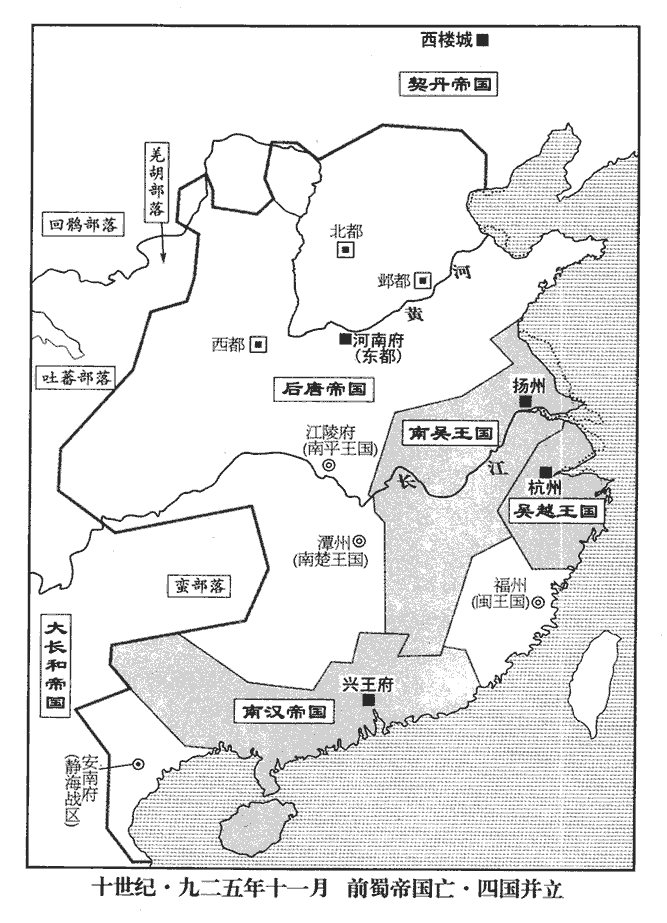
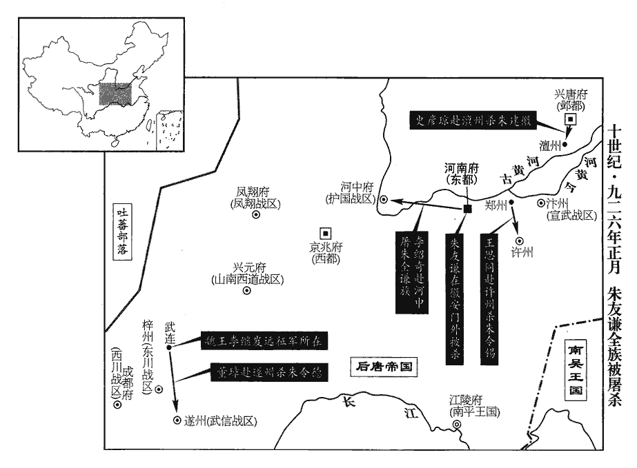
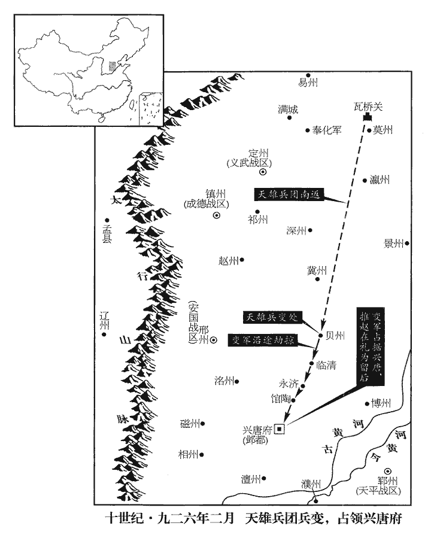
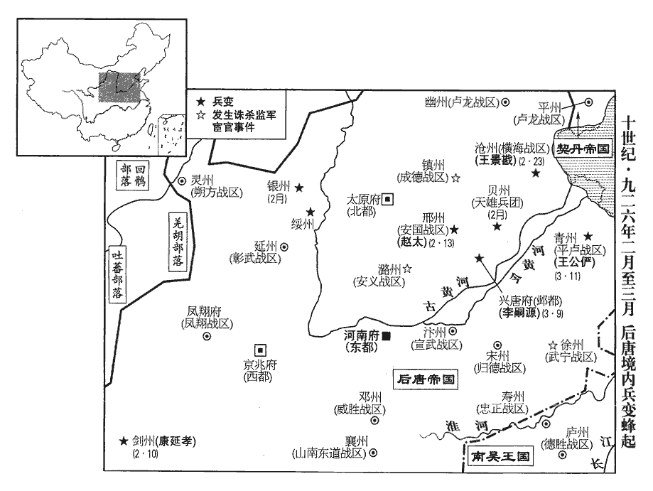
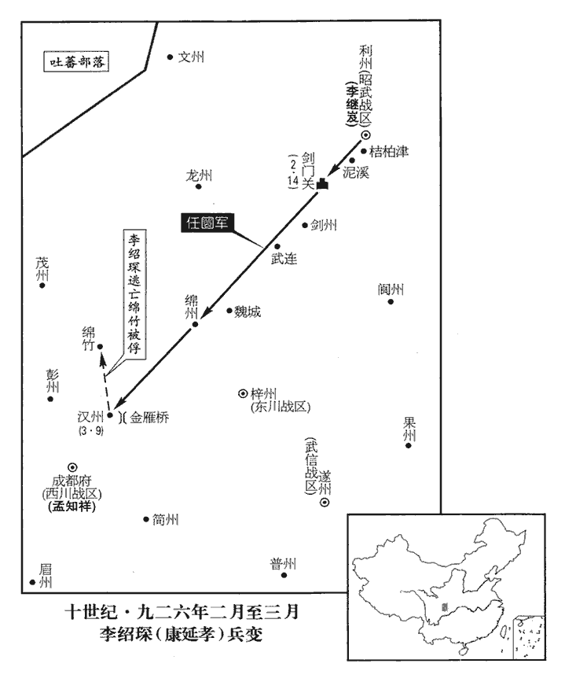
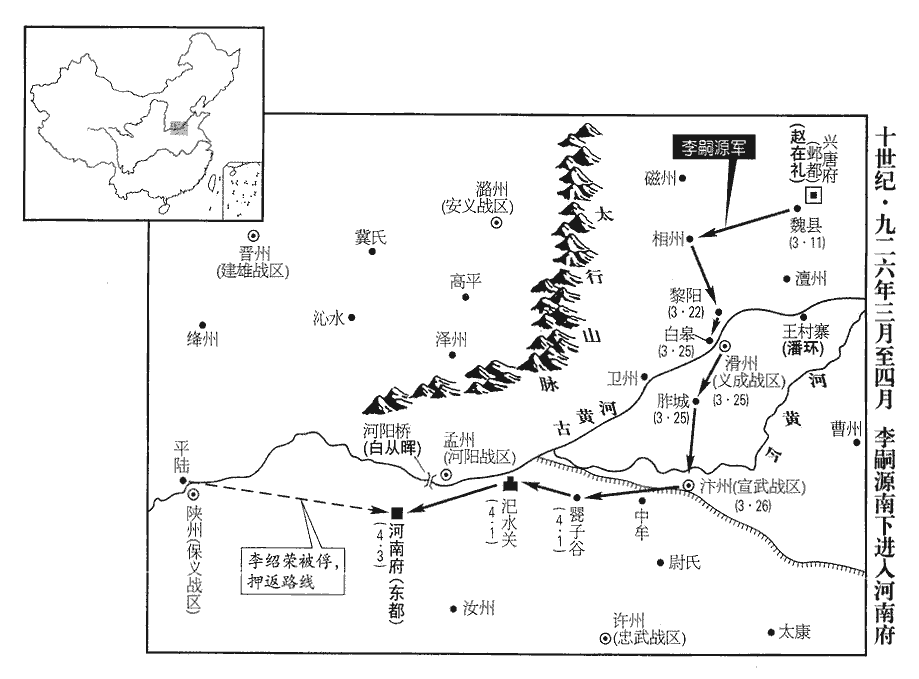
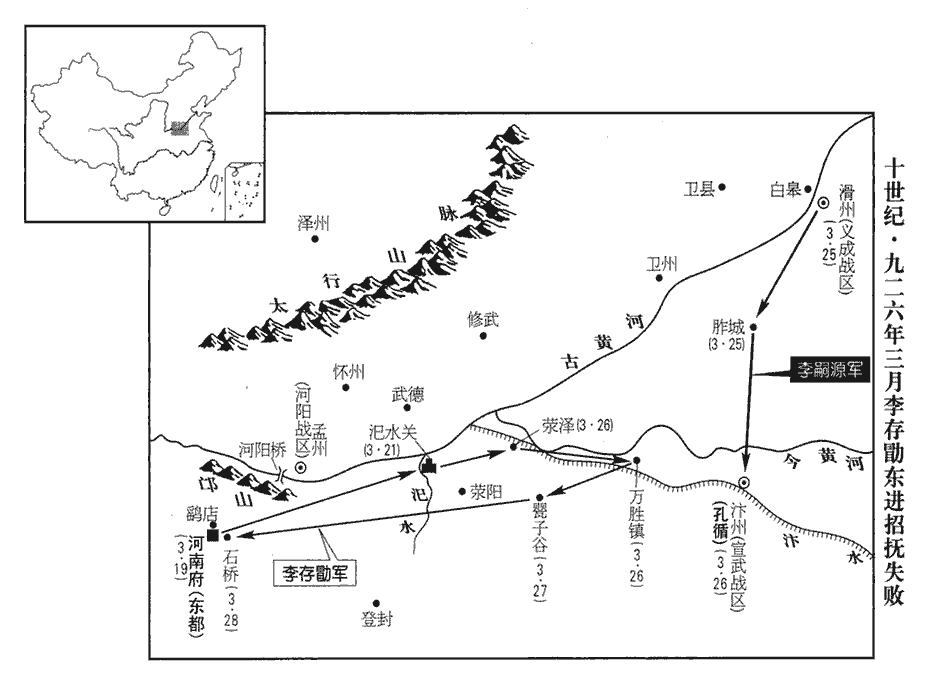

 後唐紀三起旃蒙作噩（乙酉）十一月，盡柔兆閹茂（丙戌）三月，不滿一年。

# 莊宗光聖神閔孝皇帝下

## 同光三年（乙酉、九二五）

1十一月，丙申‹七›，蜀主至成都，百官及後宮迎于七里亭。亭去成都城七里，因以為名。蜀主入妃嬪中作回鶻隊入宮。效回鶻曳隊以入宮。丁酉‹八›，出見群臣於文明殿，按五代會要，梁開明元年改洛陽宮貞觀殿為文明殿。貞觀殿，洛陽宮前殿也。唐昭宗遷洛後更名。今蜀亦有文明殿。蜀宮倣唐宮之制；意文明，唐末殿名也。泣下霑襟，君臣相視，竟無一言以救國患。

〖译文〗 [1]十一月，丙申（初七），前蜀主回到成都，朝廷百官和宫中妃嫔们到七里亭迎接。前蜀主走到妃嫔的中间效仿回纥人排的队回到宫中。丁酉（初八），前蜀主在文明殿会见大臣，泪水沾湿了衣襟，君臣相视，竟没有一个人说一句解救国难的话。

戊戌‹九›，李紹琛至利州，脩桔柏浮梁‹桔柏津·四川省广元市西南昭化镇›。桔柏浮梁為蜀所斷，故脩之以濟。昭武‹总部设利州四川省广元市›節度使林思諤先棄城奔閬州‹四川省阆中市›，蜀置昭武節度於利州。九域志：利州東南至閬州二百三十五里。遣使請降。甲辰‹十五›，魏王繼岌至劍州‹四川省剑阁县›，九域志：劍州東北至利州一百九十里。蜀武信‹总部设遂州四川省遂宁市›節度使兼中書令王宗壽以遂‹四川省遂宁市›、合‹重庆市合川市›、渝‹重庆市›、瀘‹四川省泸州市›、昌‹重庆市大足县›五州降。蜀置武信軍於遂州。

〖译文〗 戊戌（初九），李绍琛到达利州，修好了桔柏的浮桥。昭武节度使林思谔在此以前己经弃城逃到阆州，现在又派遣使者来请求投降。甲辰（十五日），魏王李继岌到了剑州，前蜀国的武信节度使兼中书令王宗寿率遂、合、渝、泸、昌五州投降。

王宗弼至成都，登大玄門，嚴兵自衛。蜀主及太后自往勞之，勞，力到翻。宗弼驕慢無復臣禮。乙巳‹十六›，劫遷蜀主及太后後宮諸王于西宮，收其璽綬，璽，斯氏翻。綬，音受。使親吏於義興門邀取內庫金帛，悉歸其家。其子承涓杖劍入宮，取蜀主寵姬數人以歸。涓，圭淵翻。丙午‹十七›，宗弼自稱權西川‹总部设成都府四川省成都市›兵馬留後。

〖译文〗 王宗弼到成都后，登上了大玄门，严兵自卫。前蜀主和太后亲自去慰劳他，王宗弼很傲慢，没有向前蜀主回拜臣下之礼。乙巳（十六日），王宗弼劫持前蜀主、太后以及后宫诸王，把他们迁至西宫，没收了他们的玺印，同时让前蜀主的亲信官吏在义兴门领取内库的金帛，全部让他们回家。王宗弼的儿子王承涓持剑进入宫中，领着几个前蜀主宠爱的姬妾回到家中。丙午（十七日），王宗弼自称代理西川兵马留后。

李紹琛進至綿州‹四川省绵阳市›，九域志：劍州西至綿州二百八十里。倉庫民居已為蜀兵所燔，又斷綿江浮梁‹绵江，今绵远河，流经古绵竹四川省德阳市北黄许镇›城东，斷，丁管翻。綿州謂之左綿，以綿水逕其左故也。水深，無舟楫可渡，紹琛謂李嚴曰：「吾懸軍深入，利在速戰。乘蜀人破膽之時，但得百騎過鹿頭關‹四川省德阳市北黄许镇›，彼且迎降不暇；降，戶江翻；下同。若俟脩繕橋梁，必留數日，或教王衍堅閉近關，折吾兵勢。近關，即謂鹿頭關。折，之舌翻。儻延旬浹，則勝負未可知矣。」言深入之兵利於飄忽震蕩，難以持久。乃與嚴乘馬浮渡江，從兵得濟者僅千人，從，才用翻。溺死者亦千餘人，遂入鹿頭關；丁未‹十八›，進據漢州‹四川省广汉市›；九域志：綿州西南至漢州一百八十九里。居三日，後軍始至。

〖译文〗 李绍琛进至绵州，那里的仓库民居己被前蜀兵所烧毁，绵江浮桥也被前蜀兵切断，由于水深，又没有舟船，李绍琛对李严说：“我们孤军深入敌境，只有速战才对我们有利。乘蜀军心惊胆战时，只需要一百个骑兵速过鹿头关，他们连出来投降的时间都没有。如果等修好桥再进攻，一定要在这里住几天，或许有人教王衍坚固地封锁鹿头关，挫我军士气，倘若延缓十天，那么胜负就难以预测了。”于是就和李严骑马渡江，跟从他们的士卒渡过去的仅有一千人，被淹死的也有一千余人，接着他们攻进鹿头关。丁未（十八日），占据了汉州，在那里住了三天，后面的部队才到达 。

宗弼遣使以幣馬牛酒勞軍，且以蜀主書遺李嚴遺，唯季翻。曰：「公來吾即降。」或謂嚴：或謂嚴者，或以人語嚴也。「公首建伐蜀之策，事見上卷上年。蜀人怨公深入骨髓，不可往。」嚴不從，欣然馳入成都，九域志：漢州南至成都九十五里。撫諭吏民，告以大軍繼至。蜀君臣後宮皆慟哭。蜀主引嚴見太后，以母妻為託。宗弼猶乘城為守備，嚴悉命撤去樓櫓。乘，登也。去，羌呂翻。

〖译文〗 王宗弼派遣使者拿着钱财、马牛、洒肉去尉劳后唐军，并把前蜀主的信送给李严，信中说：“你来了我就投降。”有人对李严说：“你首先提出讨伐蜀国的策略，蜀国人对你恨之入骨，你千万不可。”！李严没有听从这个人的意见，仍高高兴兴地直奔成都。他到了成都，安抚慰恤那里官吏和百姓，告诉他们大军将相继到来。前蜀国的君臣以及后宫妻妾们听后都痛器流涕。前蜀主领着李严去见太后，把他的母亲和妻子托附给他。王宗弼仍然坚守在城上，李严命令他撤除所有的高台。

己酉‹二十›，魏王繼岌至綿州‹四川省绵阳市›，蜀主命翰林學士李昊草降表，又命中書侍郎、同平章事王鍇草降書，降表以上皇帝，降書以達軍前。鍇，口駭翻。遣兵部侍郎歐陽彬奉之以迎繼岌及郭崇韜。

〖译文〗 己酉（二十日），魏王李继岌到达绵州，前蜀主命令翰林学士李昊起草降表，又命令中书侍郎、同平章事王锴起草降书，派遣兵部侍郎欧阳彬拿着这些表章、书信迎接李继岌和郭崇韬。

王宗弼稱蜀君臣久欲歸命，而內樞密使宋光嗣、景潤澄、宣徽使李周輅、歐陽晃熒惑蜀主；皆斬之，函首送繼岌。又責文思殿大學士、禮部尚書、成都尹韓昭佞諛，梟于金馬坊門。金馬坊在成都城中，以有金馬碧雞祠，因而名坊。又有碧雞坊。內外馬步都指揮使兼中書令徐延瓊、果州‹四川省南充市›團練使潘在迎、嘉州‹四川省乐山市›刺史顧在珣及諸貴戚皆惶恐；傾其家金帛妓妾以賂宗弼，僅得免死。妓，渠綺翻。凡素所不快者，宗弼皆殺之。

〖译文〗 王宗弼说前蜀国的君主大臣们早就相归服于后唐，而内枢密使宋光嗣、景润澄、宣徽使李周辂、欧阳晃迷惑前蜀主。他已把这些人斩杀，将他们的头装起来送交李继岌。又对文思殿大学士、礼部尚书、成都尹韩昭的奸巧谄谀进行了谴责，并将他在金马坊门处以极刑。内外马步都指挥使兼中书令徐延琼、果州团练使潘在迎、嘉州刺史顾在以及皇宫贵戚们都惶恐不安，用家里的全部金帛妓妾来贿赂王宗弼，这样才得以免死。凡是王宗弼平素不喜欢的人，都把他们杀了。

辛亥‹二十二›，繼岌至德陽‹四川省德阳市›。九域志：德陽縣在漢州東北八十五里。宗弼遣使奉牋，稱已遷蜀主於西第，已奉表降唐，不敢稱西宮，故稱西第。安撫軍城，以俟王師。又使其子承班以蜀主後宮及珍玩賂繼岌及郭崇韜，求西川‹总部设成都府›節度使，繼岌曰：「此皆我家物，奚以獻為！」留其物而遣之。宗弼之獻，繼岌之留，賢不肖之相去，其間不能以寸。

〖译文〗 辛亥（二十二日），李继岌到达德阳。王宗弼派遣使者送去书信，说已经把前蜀主迁到他西边的住宅里，安抚了城中的军队，以等待大王军队的到来。又派他的儿子王承班用前蜀主妻妾及珍贵玩物来贿赂李继岌和郭崇韬，请求能任用他为西川节度使。李继岌说：“这些都是我家的东西，怎么用这些东西作为贡献呢？”把他送来的东西留下而把来人送走了。

李紹琛留漢州‹四川省广汉市›八日以俟都統，都統，繼岌也。甲寅‹二十五›，繼岌至漢州，王宗弼迎謁；乙卯‹二十六›，至成都。丙辰‹二十七›，李嚴引蜀主‹王宗衍›及百官儀衛出降於升遷橋‹成都市西北八千米›，按薛史，升遷橋在成都北五里。蜀主白衣、銜璧、牽羊，草繩縈首，百官衰絰、徒跣、輿櫬chèn，號哭俟命。衰，倉回翻。櫬，初覲翻。空棺為櫬。號，戶刀翻。繼岌受璧，崇韜解縛，焚櫬，承制釋罪；君臣東北向拜謝。唐昭宗大順二年王建取蜀，至衍而亡。丁巳‹二十八›，大軍入成都。崇韜禁軍士侵掠，市不改肆。自出師至克蜀，凡七十日。考異曰：實錄：「自興師出洛至定蜀城，計七十五日。」薛史因之。按唐軍九月戊申離洛城，十一月丁巳入成都，止七十日耳，實錄、薛史誤也。得節度十，武德、武信、永平、武泰、鎮江、山南、武定、天雄、武興、昭武凡十節度，西川為蜀都，不與也。州六十四，歐史職方考：前蜀所有益、漢、彭、蜀、綿、眉、嘉、劍、梓、遂、果、閬、普、陵、資、榮、簡、邛、黎、雅、維、茂、文、龍、黔、施、夔、忠、萬、歸、峽、興、利、開、通、涪、渝、瀘、合、昌、巴、蓬、集、壁、渠、戎、梁、洋、金、秦、鳳、階、成五十三州而已。縣二百四十九，兵三萬，鎧仗、錢糧、金銀、繒錦共以千萬計。繒，慈陵翻。

〖译文〗 李绍琛在汉州住了八天等待李继岌的到来，甲寅（二十五日），李继岌到达汉州，王宗弼迎拜李继岌。乙卯（二十六日），李继岌到达成都。丙辰（二十七日），李严领着前蜀主以及百官、仪仗和卫士在升迁桥投降。前蜀主穿着白衣服，口里含着玉璧，手里牵着羊，用草绳攀绕着头。百官们身穿丧服，光着脚，用车子拉着空棺，他们都大声号哭着等待李继岌的命令。李继岌接受了前蜀主的玉璧，郭崇韬解开了前蜀主脖子上的草绳，并把那些空棺都烧掉，按照后唐帝的旨意，免除他们的罪过，并释放了他们。前蜀国君臣都向着东北面拜谢了后唐帝。丁巳（二十八日），后唐军进入成都。郭崇韬禁止士卒进行抢掠，街市上照常贸易往来。从后唐出兵到攻克前蜀国，共用了七十天。取得十个节度使、六十四个州、二百四十九个县，俘获三万十卒，铠仗、钱粮、金银、缯帛等数以千万计。

 

高季興‹高季昌·荆南总部江陵府›聞蜀亡，方食，失匕箸，箸，遲倨翻。曰：「是老夫之過也。」高季興勸伐蜀見二百七十二卷元年。梁震曰：「不足憂也。唐主得蜀益驕，亡無日矣，梁震之料莊宗，如燭照數計。安不【章：十二行本無「不」字；乙十一行本同；張校同。】知其不為吾福！」荊南之福則未聞也。以三郡之地介乎強國之間，惴惴僅能自全，何福之有！

〖译文〗 高季兴听说前蜀国已被消灭，他正在吃饭，跌落了勺子和筷子，他说：“这是老夫我的过错啊！”梁震说：“不必担忧。唐主得到蜀国以后就会更加骄傲，不过多久就会灭亡，哪里能知道他不是为我们谋福呢？”

楚王殷‹马殷，本年七十四岁›聞蜀亡，上表稱：「臣已營衡麓之間為菟裘之地，衡麓，衡山‹南岳·湖南省衡山县西›之麓也；山足曰麓。左傳：魯隱公使營菟裘，吾將老焉。馬殷言將致事而歸老於衡麓，聞蜀亡而懼也。菟，同都翻。願上印綬以保餘齡。」齡，年也。記文王世子曰：古者謂年齡，齒亦齡也。上，時掌翻。上優詔慰諭之。

〖译文〗 楚王马殷听说前蜀国被消灭，向后唐帝上表说：“我已经把衡麓地区治理成我告老退隐的地方，希望交出印绶来保全我的有生之年。”后唐帝下了一道嘉将诏书安慰了他一番。

2平蜀之功，李紹琛為多，位在董璋上；而璋素與郭崇韜善，崇韜數召璋與議軍事。數，所角翻。紹琛心不平，謂璋曰：「吾有平蜀之功，公等樸樕相從，樸，蒲木翻。樕sù，蘇谷翻。樸樕小木，以喻董璋小材也。反呫chè囁niè於郭公之門，呫，叱涉翻。囁，而涉翻。呫囁，細語也。謀相傾害。吾為都將，帝命李紹琛為行營馬步軍都指揮使，董璋為左廂虞候，故云然。獨不能以軍法斬公邪！」璋訴于崇韜。十二月，崇韜表璋為東川‹总部设梓州四川省三台县›節度使，考異曰：莊宗實錄：「十二月丙寅，以靜難節度使董璋為東川節度副大使。」又康延孝傳云：「郭崇韜除董璋為東川節度使。延孝與華州節度使毛璋見崇韜，請以工部任尚書為東川帥。崇韜怒曰：『紹琛反邪，敢違吾節度！』不及二旬，崇韜為繼岌所害。」按大軍以十一月二十八日丁巳入西川，至十二月八日丙寅除董璋東川，凡十日；明年正月八日殺崇韜，至此凡六十日，而云「不及二旬崇韜遇害」，日月殊不相合。蓋十二月丙寅崇韜始表璋鎮東川之日耳，非降制日也。云「不及二旬」亦恐誤。解其軍職。解董璋軍職，則李紹琛不得以軍法令之，此崇韜之所以保護董璋者也。紹琛愈怒，曰：「吾冒白刃，陵險阻，定兩川，璋乃坐有之邪！」冒，莫北翻。乃見崇韜言：「東川重地，任尚書有文武才，宜表為帥。」任圜時以工部尚書參預軍機。帥，所類翻。崇韜怒曰：「紹琛反邪，何敢違吾節度！」紹琛懼而退。

〖译文〗 [2]平定前蜀国的功劳，李绍琛最多，爵位也在董璋之上。但是董璋平素和郭崇韬很好，因此郭崇韬经常召来董璋一起商议军事。李绍琛心中不平，就对董璋说：“我有平定蜀国的功劳，你们是平庸的随从人员，反倒在郭公之门窃窃私语，相互谋划排挤陷害别人。我身为都将，难道不能以军法把你杀掉吗？”董璋把这些话告诉了郭崇韬。十二月，郭崇韬上表后唐帝任命董璋为东川节度使，解除了他的军职。李绍琛对此更加愤怒，说：“我冒着生命危险，翻越险阻，平定了东川、西川，董璋却坐享其成了！”于是就找到郭崇韬说：“东川是个重要的地方，尚书任圜文武双才，应当上表皇上任他为帅。”郭崇韬听后很生气地说：“李绍琛想造反吗？怎么敢违犯我的指挥。”李绍琛感到害怕而退了回去。

初，帝遣宦者李從襲等從魏王繼岌伐蜀；繼岌雖為都統，軍中制置補署一出郭崇韜，崇韜終日決事，將吏賓客趨走盈庭，而都統府惟大將晨謁外，牙門索然，索，蘇各翻。索然，言寂寞也。從襲等固恥之。及破蜀，蜀之貴臣大將爭以寶貨、妓樂遺崇韜及其子廷誨，妓，渠綺翻。遺，唯季翻。魏王所得，不過匹馬、束帛、唾壺、麈柄而已，麈zhǔ，之庾翻。從襲等益不平。

〖译文〗 当初，后唐帝派遣宦官李从袭等跟从魏王李继岌前往讨伐前蜀。李继岌虽然身为都统，但军中的经营谋划、委任官职等全部由郭崇韬掌管，郭崇韬整天处理事务，将吏宾客们你来我往，门庭若市，而都统住的地方只有大将早晨来谒拜，牙门里冷冷清清，李从袭等感到羞辱。攻破前蜀国后，前蜀国的贵臣将领们争着给郭崇韬和他的儿子郭廷诲送宝物、妓艺，而魏王李继岌所得到的，只不过是一些马匹、束帛、唾壶、柄等而已，李从袭等更加愤愤不平了。

王宗弼之自為西川‹总部设成都府四川省成都市›留後也，賂崇韜求為節度使，崇韜陽許之，考異曰：實錄、薛史皆云崇韜以蜀帥許之，按崇韜有識略，豈可興大兵取西川，反以與宗弼乎！此庸人所不為也。蓋於時宗弼尚據成都，崇韜恐其悔而違拒，故陽許之以安其意耳。既而久未得，乃帥蜀人列狀見繼岌，請留崇韜鎮蜀。帥，讀曰率。從襲等因謂繼岌曰：「郭公父子專橫，橫，戶孟翻。今又使蜀人請己為帥，帥，所類翻。其志難測，王不可不為之備。」繼岌謂崇韜曰：「主上倚侍中如山嶽，不可離廟堂，郭崇韜官侍中，故繼岌稱之。離，力智翻。豈肯棄元老於蠻夷之域乎！且此非余之所敢知也，請諸人詣闕自陳。」由是繼岌與崇韜互相疑。此段自平蜀之功以下，為李紹琛反張本；自初帝遣李從襲從繼岌以下，為殺郭崇韜張本。

〖译文〗 王宗弼自己当西川留后时，贿赂郭崇韬请求做西川节度使，郭崇韬表面上答应，但过了很久王宗弼还没有得到这个官，于是就带着蜀人来见李继岌，列举了很多理由，请求留下郭崇韬镇守蜀地。李从袭等因此对李继岌说：“郭公父子十分专横，现在又让蜀人为自己请求统帅，他的志向难以猜透，大王对他不可没有防备。”李继岌对郭崇韬说：“主上依靠你如靠大山，不可让你离开庙堂，难道肯把元老丢弃在这蛮夷地区吗？再说这些不是我所敢知道的，请诸位到朝迁里自己去陈说吧！”从此李继岌和郭崇韬之间就相互产生了猜疑。

會宋光葆自梓州‹四川省三台县›來，訴王宗弼誣殺宋光嗣等；又，崇韜徵犒軍錢數萬緡於宗弼，宗弼靳之，犒，苦到翻。靳，居焮翻。士卒怨怒，夜，縱火諠譟。崇韜欲誅宗弼以自明，己巳‹十›，白繼岌收宗弼及王宗勳、王宗渥，皆數其不忠之罪，數，所具翻。族誅之，籍沒其家。蜀人爭食宗弼之肉。

〖译文〗 这时正好宋光葆从梓州来到，他诉说王宗弼诬杀宋光嗣等的情况。又赶上郭崇韬向王宗弼征收数万缗钱想用来慰劳军队，但王宗弼吝惜不肯给，士卒们非常愤怒，晚上，在王宗弼的住处放火喧闹。郭崇韬想杀了王宗弼来 表明自己清白，己巳（初十），郭崇韬告诉李继岌，把王宗弼、王宗、王宗渥抓起来，遣责他们的不忠之罪，然后就把他们以及他们的家属全部斩杀，并没收了他们的家产。王宗弼被杀之后，前蜀人争抢着吃王宗弼的肉。

3辛未‹十二›，閩忠懿王審知卒，年六十四。子延翰自稱威武‹总部设福州福建省福州市›留後。延翰字子逸，審知長子也。汀州‹福建省长汀县›民陳本聚眾三萬圍汀州，延翰遣右軍都監柳邕等將兵二萬討之。監，古銜翻。

〖译文〗 [3]辛未（十二日），闽国忠懿王王审知去世，他的儿子王延翰自称威武留后。汀州百姓陈本纠集三万多人包围了汀州，王延翰派遣右军都监柳邕等率领二万士卒前去讨伐。

4癸酉‹十四›，王承休、王宗汭至成都，十月自秦州‹甘肃省秦安县西北›上道，為始至成都。魏王繼岌詰之曰：「居大鎮，擁強兵，何以不拒戰？」對曰：「畏大王神武。」曰：「然則何以不降？」對曰：「王師不入境。」曰：「所俱入羌者幾人？」對曰：「萬二千人。」曰：「今歸者幾人？」對曰：「二千人。」曰：「可以償萬人之死矣。」皆斬之，并其子。

〖译文〗 [4]癸酉（十四日），王承休、王宗到达成都，魏王李继岌责问说：“你们驻守大镇，拥有强兵，为什么不抵抗？”回答道：“害怕大王的神明威武。”李继岌问：“那么为什么不投降？”答道：“大王的军队没有进入境内。”李继岌问：“你们进入羌地共有多少人？”答曰：“一万两千人。”李继岌又问：“现在回来的有多少人？”他们回答说：“二千人。”李继岌最后说：“现在是报答死去的一万人的时候了。”于是就把王承休等人以及他们的儿子全部杀死。

5丙子‹十七›，以知北都‹太原府·山西省太原市›留守事孟知祥為西川‹总部设成都府›節度使、同平章事，促召赴洛陽。召之至洛陽而後赴鎮。為孟知祥據蜀張本。帝議選北都‹太原府›留守，樞密承旨段徊等惡鄴都留守張憲，不欲其在朝廷，段徊必宦人也。皆曰：「北都非張憲不可。憲雖有宰相器，郭崇韜薦張憲為相，帝欲用之，故段徊等云然。今國家新得中原，宰相在天子目前，事有得失，可以改更，更，工衡翻。比之北都獨繫一方安危，不為重也。」乃徙憲為太原尹，知北都留守事。以尹知留守事，非正為留守也。以戶部尚書王正言為興唐尹，知鄴都留守事。正言昏耄，帝以武德使史彥瓊為鄴都監軍。後唐武德使本掌宮中事。明宗時嘗旱，已而雪，暴坐庭中，詔武德司宮中無掃雪，是其證也。彥瓊，本伶人也，有寵於帝。魏、博等六州軍旅金穀之政皆決於彥瓊，威福自恣，陵忽將佐，自正言以下皆諂事之。為王正言、史彥瓊不能守鄴都張本。

〖译文〗 [5]丙子（十七日），任命知北都留守事孟知祥为西川节度使、同平章事，并催促他去洛阳。后唐帝和人商议推选一个北都留守，枢密承旨段徊等讨厌邺都留守张宪，不想让他回朝廷，于是段徊等说：“北都留守非张宪不可。张宪虽然有做宰相的才能，但是现在国家刚刚得到中原地区，宰相天天在天子眼前，万一事情有 所得失，可以更改，和北都独挡一面的安危来比，宰相不是什么重要职务。”于是调张宪出任太原尹，主持北都留守事务。任命户部尚书王正言为兴唐尹，主持邺都留守事务。王正言年老糊涂，因些后唐帝任命武德使史彦琼为邺都监军。史彦琼本来是个艺人，在后唐帝面前很受宠。魏、博等六州军旅的钱粮大政都由史彦琼来决定，他作威作福，恣情放纵，侵侮将佐，自王正言以下的人，都巴结侍奉他。

6初，帝‹李存勖›得魏州‹兴唐府前身·河北省大名县›銀槍效節都近八千人，以為親軍，見二百六十九卷梁均王貞明元年。近，其靳翻。皆勇悍無敵。夾河之戰，實賴其用，屢立殊功，常許以滅梁之日大加賞賚。既而河南平，梁滅而河南平。雖賞賚非一，而士卒恃功，驕恣無厭，厭，於鹽翻。更成怨望。是歲大饑，民多流亡，租賦不充，道路塗潦，漕輦艱澀，漕，水運；輦，陸運。澀，色立翻。東都倉廩空竭，無以給軍士。租庸使孔謙日於上東門外洛城東面三門：中曰建春，左曰上東，右曰永通。九域志：洛陽上東門、建春門皆為鎮，屬河南縣，蓋喪亂丘墟，非復盛唐之舊也。望諸州漕運，至者隨以給之。軍士乏食，有雇妻鬻子者，老弱採蔬於野，百十為群，往往餒死，流言怨嗟，而帝遊畋不息。己卯‹二十›，獵於白沙‹洛阳市东›，皇后、皇子、後宮畢從。庚辰‹二十一›，宿伊闕‹洛阳市南›；辛巳‹二十二›，宿潭泊‹洛阳市南›；壬午‹二十三›，宿龕澗‹洛阳市南›；癸未‹二十四›，還宮。自白沙至龕澗，其地皆在洛陽東。按薛史李愚避難居洛，表白沙之別墅。龕澗近伊闕。從，才用翻。龕，苦含翻。時大雪，吏卒有僵仆於道路者。伊、汝間饑尤甚，衛兵所過，責其供餉，不得，則壞其什器，僵，居良翻。壞，音怪。撤其室廬以為薪，甚於寇盜，縣吏皆竄匿山谷。

〖译文〗 [6]当初，后唐帝得到魏州禁卫军近八千人，把他们当作自己的亲信部队，这些人作战十分勇敢，天下无敌。在黄河两岸作战时，确实全靠他们，他们曾多次建立大功，后唐帝经常答应等到消灭了梁国，大加赏赐。在平定了河南以后，虽然赏赐不止一次，但士卒们依仗有功，骄傲放纵，贪得无厌，对唐帝心怀不满。这一年，庄稼收成不好，老百姓离乡背井，收上来的粮租赋税很不充足，道路上到处是积水，水陆两路都不畅通，东都的粮仓已空，没有东西可供给士卒。租庸使孔谦每天在上东门外望诸州从水上运来的粮食，只要一到，随时就发给他们。士卒们由于缺乏粮食，有人嫁妻卖子；年老和体弱的人们在野外挖采野菜来充饥，有的十几人为一群，有的百来人为一群，这些人往往被饿死在外，人们经常慨 叹愤恨，后唐帝却在外面不停地游玩打猎。己卯（二十日），后唐帝在白沙打猎，皇后、皇子以及后宫妃妾们都跟随着他。庚辰（二十一日），住在伊阙。辛巳（二十二日），住在潭泊。壬午（二十三日），住在龛涧。癸未（二十四日），回到宫内。当时正下大雪，官吏士卒有人冻僵跌倒在道路上。伊、汝之间饥荒尤其严重，禁卫所经过的地方，都要当地百姓供给粮饷，如果得不到，就破坏他们的日常用具，把他们的房屋拆掉当柴，比盗贼敌人都厉害，甚至县里的官吏们都逃到山谷之间躲藏起来。

7有白龍見於漢宮；漢‹首都兴王府广东省广州市›主‹刘岩›改元白龍，更名曰龔。見，賢遍翻。更，工衡翻。

〖译文〗 [7]有人在南汉宫里看见白龙。于是南汉主就改年号为“白龙”，自己也改名叫龚。

8長和‹首都大理城云南省大理市›驃信鄭旻遣其布燮鄭昭淳求婚于漢，漢主以女增城公主妻之。長和即唐之南詔也。唐末，南詔改曰大禮，至是又改曰長和。五代會要曰：郭崇韜平蜀之後，得王衍所獲蠻俘數千，以天子命令使人入其部，被止於界上，惟國信、蠻俘得往。續有轉牒，稱督爽大長和國宰相、布燮等上大唐皇帝舅奏疏一封，差人轉送黎州，其紙厚硬如皮，筆力遒健，有詔體，後有督爽陀酋、忍爽王寶、督爽彌勒、忍爽董德義、督爽長垣緯、忍爽楊希燮等所署。有彩牋一軸，轉韻詩一章，章三韻，共十聯，有類擊筑詞，頗有本朝姻親之意，語亦不遜。

〖译文〗 [8]长和骠信郑是派遣他的布燮郑昭淳向南汉求婚，南汉主把他的女儿增城公主嫁给了他。长和就是唐朝时的南诏国。

9成德節度使李嗣源入朝。

〖译文〗 [9]后唐成德节度使李嗣源回到朝中。

10閏月，己丑朔‹一›，孟知祥至洛陽，帝寵待甚厚。

〖译文〗 [10]闰十二月，己丑朔（初一），孟知祥到达洛阳，后唐帝对待他十分优厚。

11帝以軍儲不足，謀於群臣，豆盧革以下皆莫知為計。吏部尚書李琪上疏，以為：「古者量入以為出，量，音良。計農而發兵，故雖有水旱之災而無匱乏之憂。近代稅農以養兵，未有農富給而兵不足，農捐瘠而兵豐飽者也。今縱未能蠲省租稅，苟除折納、紐配之法，折納，謂抑民使折估而納其所無；紐配，謂紐數而科配之也。農亦可以小休矣。」帝即敕有司如琪所言，然竟不能行。

〖译文〗 [11]因为军队的储备不充足，后唐帝与大臣商议，豆卢革以下的大臣们都想不出办法。吏部尚书李琪上疏，认为：“古时候是根据收入的多少来决定支出的多少，根据农时的忙闲来发动战争，所以即使发生了水旱灾害，也不会出现缺乏粮草的忧虑。近来是靠农民的税赋来供养军队，不可能有农民富足而军队供需不足，或是农民因饥饿而死，而士卒却丰衣足食的。现在即使不能减少农民的租税，如果能够免除折纳和纽配的交租方法，农民也可以稍微得到休整。”后唐帝马上按照李琪所讲的，敕令主管吏官吏照办，然而终究没能执行。

12丁酉‹九›，詔蜀朝所署官四品以上降授有差，五品以下才地無取者悉縱歸田里；其先降及有功者，委崇韜隨事獎任。又賜王衍詔，略曰：「固當裂土而封，必不薄人於險。三辰在上，一言不欺。」誓之以三辰而終殺之，非信也。

〖译文〗 [12]丁酉（初九），后唐帝下诏，凡前蜀的官员在四品以上者按不同情况降职安排，凡在五品以下而又没有什么才能可取者一律放回家乡。率先投降的和有功劳的人，委托郭崇韬按照具体情况来奖励和委任。后唐帝又赐诏王衍，大概意思说：“本来应当割出一块地来封给你，而且一定不会少于别人。日、月、星三辰在上，一句话也不欺骗你。”

13庚子‹十二›，彰武‹总部延州›、保大‹总部鄜州›節度使兼中書令高萬興卒，梁貞明四年，高萬興兼鎮鄜延。唐以延州置保塞軍，岐改為忠義軍，後唐改為彰武軍。鄜，保大軍。以其子保大留後允韜為彰武留後。

〖译文〗 [13]庚子（十二日），彰武、保大节度使兼中书令高万兴云世。任命他的儿子保大留后高允韬为彰武留后。

14帝以軍儲不充，欲如汴州，諫官上言：「不如節儉以足用，自古無就食天子。今楊氏未滅，不宜示以虛實。」謂吳近在淮南，不宜使之知中國虛實。上，時掌翻。乃止。

〖译文〗 [14]因为军队储备不足，后唐帝打算到汴州。谏官上书说：“不如节俭一些来满足军队的需要，自古以来就没有天子到处找吃饭地方的。现在杨氏还没有消灭，不应把我们的虚实暴露给他们。”后唐帝便打消了去汴州的行动。

15辛亥‹二十三›，立皇弟存美為邕王，存霸為永王，存禮為薛王，存渥為申王，存乂為睦王，存確為通王，存紀為雅王。

〖译文〗 [15]辛亥（二十三日），立皇弟李存美为邕王，李存霸为永王，李存礼为薛王，李存渥为申王，李存为睦王，李存确为通王，李存纪为雅王。

16郭崇韜素疾宦官，嘗密謂魏王繼岌曰：「大王他日得天下，騬chéng馬亦不可乘，騬，食陵翻，犗jiè馬也，以喻宦官。史炤曰：犗，音戒；俗呼扇馬為改馬，即犗馬也。況任宦官！宜盡去之，專用士人。」去，羌呂翻。呂知柔竊聽，聞之，呂知柔時為都統牙通謁。由是宦官皆切齒。

〖译文〗 [16]郭崇韬平素就嫉恨宦官，曾暗中对魏王李继岌说：“大王他日得到天下，骟了的马都不能骑，更何况任用宦官！应当把他们全部辞去，专门起用士人。”吕知柔正好在外面偷听到郭崇韬的话，宦官们因此对郭崇韬都恨得咬牙切齿。

時成都雖下，而蜀中盜賊群起，布滿山林。崇韜恐大軍既去，更為後患，命任圜、張筠分道招討，以是淹留未還。帝遣宦者向延嗣促之，崇韜不出郊迎，及見，禮節又倨，宦官固可疾，然天子使之將命，敬之者所以敬君也，烏可倨見哉！唐莊宗使刑臣將命於大臣非也，郭崇韜倨見之亦非也。嗚呼！刑臣將命，自唐開元以後皆然矣。延嗣怒。李從襲謂延嗣曰：「魏王，太子也；主上萬福，而郭公專權如是。郭廷誨擁徒出入，日與軍中驍將、蜀土豪傑狎飲，指天畫地，近聞白其父請表己為蜀帥；帥，所類翻；下同。又言『蜀地富饒，大人宜善自為謀。』今諸軍將校皆郭氏之黨，王寄身於虎狼之口，一朝有變，吾屬不知委骨何地矣。」因相向垂涕。延嗣歸，具以語劉后。語，牛倨翻；下語之同。后泣訴於帝，請早救繼岌之死。

〖译文〗 当时成都虽然被攻取，但蜀中盗贼四起，布满山林。郭崇韬提心大军撤离，成为后患，命令任圜、张筠分路去招抚讨伐他们，郭崇韬于是停留下来没有回洛阳，唐帝派宦 官向延嗣催促 ，郭崇韬没有到郊外去迎接，见了向延 嗣后，礼节又十分傲慢，向延嗣十分生气。李从袭对向延嗣说：“魏王是太子，主上多福，而郭公如此独裁，郭廷诲和他的同党们经常往来，每天和军队中勇敢的将领们、蜀地的豪杰们喝酒胡混，指天画地、胡吹乱捧。近来又听说他让父亲郭崇韬上表请求为蜀帅，又说‘蜀地非常富饶，大人应当为自己妥善地谋划一番’。现在诸军将领都是郭氏的同党，大王寄身在虎狼之口，一旦有变，我们都不知道自己的骨头丢在什么地方啊！”于是面对面地痛哭流涕。向延嗣回到洛阳之后，把这些情况全部告诉了刘后，刘后边哭边告诉给后唐帝，并请求及早挽救李继岌，使他免于一死。

前此帝聞蜀人請崇韜為帥，已不平，至是聞延嗣之言，不能無疑。帝閱蜀府庫之籍，曰：「人言蜀中珍貨無算，何如是之微也？」延嗣曰：「臣聞蜀破，其珍貨皆入於崇韜父子，崇韜有金萬兩，銀四十萬兩，錢百萬緡，名馬千匹，他物稱是，廷誨所取，復在其外；稱，尺證翻。復，扶又翻。故縣官所得不多耳。」帝遂怒形於色。及孟知祥將行，帝語之曰：「聞郭崇韜有異志，卿到，為朕誅之。」為，于偽翻。知祥曰：「崇韜，國之勳舊，不宜有此。俟臣至蜀察之，苟無他志則遣還。」還，從宣翻，又如字。帝許之。

〖译文〗 在此以前，后唐帝听到蜀人请求郭崇韬做他们的统帅，心中已经愤愤不平，这时又听到向延嗣的这番话，不能不表示怀疑。后唐帝查看前蜀府库的帐簿时，说：“人们都说蜀中的珍宝无法计算，为什么帐簿上这么少呢？”向延嗣说：“我听说蜀国被攻破以后，珍宝都到了郭崇韬父子的手中，郭崇韬有黄金一万两，白银四十万两，钱百万串，名贵的马一千匹，其他的东西与此相当。至于郭廷诲所拿到的还在这些之外。所以朝廷所得到的并不很多。”于是后唐帝脸上流露出愤怒的表情。等到孟知祥将要出发到成都时，后唐帝对他说：“听说郭崇韬有异心，你到了那里，帮我把他杀掉。”孟知祥说：“郭崇韬是国家的有功之臣，不应这样处理。等我到了蜀地观察他一段，如果没有异心就送他回来。”后唐帝答应了。

壬子‹二十四›，知祥發洛陽。帝尋復遣衣甲庫使馬彥珪復，扶又翻；下后復同。衣甲庫使，盛唐無之，蓋帝所置，亦內諸司使之一也。馳詣成都觀崇韜去就，如奉詔班師則已，若有遷延跋扈之狀，則與繼岌圖之。觀莊宗所以命孟知祥、馬彥珪者如此，就使李從襲等不以劉后教行之，崇韜得東還，亦必不能自全矣。彥珪見皇后，說之曰：說，式芮翻。「臣見向延嗣言蜀中事勢憂在朝夕，今上當斷不斷，言帝詔旨持兩端，無決然使殺崇韜之命。斷，丁亂翻。夫成敗之機，間不容髮，安能緩急稟命於三千里外乎！」成都至洛陽三千二百一十六里，見舊唐書地理志。皇后復言於帝，帝曰：「傳聞之言，未知虛實，豈可遽爾果決！」皇后不得請，退，自為教與繼岌，令殺崇韜。知祥行至石壕‹河南省三门峡市东石壕镇›，石壕村在陝縣東、新安縣西，杜少陵詩所謂「暮投石壕村」者也。九域志：陝州陝縣有石壕鎮。彥珪夜叩門宣詔，促知祥赴鎮，知祥竊歎曰：「亂將作矣！」乃晝夜兼行。孟知祥倍道而行，非能救郭崇韜之死也，恐崇韜死而生他變耳。

〖译文〗 壬子（二十四日），孟知祥从洛阳出发。不久，后唐帝又派衣甲库使马彦迅速赶到成都观察郭崇韬到底愿不愿离开那里。如果能按照后唐帝的命令班师回朝则已，如果拖延时间或表 现出飞扬跋扈的样子，就和李继岌一起把他杀掉。马彦见到皇后，劝她说：“我看如果象向延嗣所说蜀中形势，忧患就在朝夕，现在皇上当断不断，成败的时机，间不容发，怎么能够在三千里之外不顾缓急请示呢？”皇后又把这些告诉了后唐帝，后唐帝说：“道听途说的话，不能判断是真是假，怎么可以仓促作出决定呢？”皇后的请求未得允准，只好退出。她自己给李继岌写了个告谕，命领他杀死郭崇韬。孟知祥到达石，马彦黑夜敲开他的门宣布了后唐帝的命令，催他赶住成都，孟知祥私下叹息地说：“乱子将要发生了。”于是他日夜兼程，赶赴成都。

17初，楚王殷‹马殷›既得湖南，不征商旅，由是四方商旅輻湊。湖南地多鉛鐵，殷用軍都判官高郁策，軍都判官，諸軍都判官也。高郁在馬殷府，其位任在行軍司馬之上。鑄鉛鐵為錢，商旅出境，無所用之，皆易他貨而去，故能以境內所餘之物易天下百貨，國以富饒。湖南民不事桑蠶，郁命民輸稅者皆以帛代錢，未幾，民間機杼大盛。幾，居豈翻。高郁佐馬殷治湖南，巧於使民而民勸趨於利，蓋學管子之術者也。

〖译文〗 [17]当初，楚王马殷得到湖南时，不征收商人的税，因此四面八方的商人都聚集在这 里。湖南盛产铅、铁，马殷采纳了军都判官高郁的策略，把铅和铁铸造成当地使用的货币，商人一离开楚境，这些货币就没有什么用处了，所以他们就用钱买成其他东西带走，这样就能够用境内所剩余的东西换成天下的各种货物，楚国因此富裕起来了。湖南的百姓们不从事桑蚕业，高郁就命令交税的人们以绢帛来代替钱，不久，民间的 织布业大大盛行起来。

18吳越王鏐‹首都杭州浙江省杭州市›钱镠，本年七十四岁遣使者沈瑫tāo致書，以受玉冊、封吳越國王告於吳，瑫，土刀翻。吳人以其國名與己同，嫌其居越而兼吳國之名。不受書，遣瑫還。仍戒境上無得通吳越使者及商旅。

〖译文〗 [18]吴越王钱派遣使者沈给吴国送来一封信，把接受玉册、被封为吴越国王的事告诉了吴国。吴国人认为他的国名和自己国家的名字相同，拒不接受吴越王的信，把沈送了回去。并且告诫边境不得让吴越国的使者和商人通过。

# 明宗聖德和武欽孝皇帝上之上諱嗣源，應州人。世本夷狄，無姓氏。父電，鴈門都將。帝少名邈佶烈，太祖養以為子，乃姓李，名嗣源，即位後改名亶dǎn。

## 天成元年（丙戌、九二六）是年四月方改元，見下卷。

1春，正月，庚申‹三›，魏王繼岌遣李繼曮、李嚴部送王衍及其宗族百官數千人詣洛陽。

〖译文〗 [1]春季，正月，庚申（初三），魏王李继岌派遣李继、李严带领人马把王衍及其家族、百官数千人送到洛阳。

2河中節度使、尚書令李繼麟自恃與帝‹李存勖，本年四十二岁›故舊，且有功，梁之乾化二年，朱友謙即以河中附晉，故自恃故舊。自附晉之後，晉王與梁人戰於河上，汾、晉無後顧之虞，以此為有功。帝待之厚，亦以此自恃。苦諸伶宦求匄無厭，厭，於鹽翻。遂拒不與。大軍之征蜀也，繼麟閱兵，遣其子令德將之以從。景進與宦官譖之曰：「繼麟聞大軍起，以為討己，故驚懼，閱兵自衛。」又曰：「崇韜所以敢倔強於蜀者，從，才用翻。倔，其勿翻。強，其兩翻。與河中陰謀，內外相應故也。」繼麟聞之懼，欲身入朝以自明，其所親止之，繼麟曰：「郭侍中功高於我。今事勢將危，吾得見主上，面陳至誠，則讒人獲罪矣。」郭侍中，謂崇韜。功高，以其有滅梁、蜀之功，非己之所能及也。讒人，指伶宦也。癸亥‹六›，繼麟入朝。為繼麟得禍張本。

〖译文〗 [2]河中节度使、尚书令李继麟依仗自己和后唐帝是老朋友，而且有战功，后唐帝给他的待遇也很丰厚，但苦于那些伶人宦官经常向他求乞而且贪得无厌，于是就拒绝不给。大军征伐前蜀时，李继麟检阅部队，派他的儿子李令德率领部队跟随着他。景进和宦官们诬陷他说：“李继麟听说大军将要出发，他认为是来讨伐自己，所以他感到惊巩害怕，并检阅他的部队准备自卫。”又说：“郭崇韬之报以敢在蜀中直傲不屈于人，是他和河中有阴谋，内外相应的缘故。”李继麟听到这些话后感到害怕，打算亲自到朝廷里讲个明白，他的亲信们阻止了他。李继麟说“郭崇韬功劳比我高。现在的势态很危急，我得去见皇上，当面说清我对他的忠诚，这样，那些说别人坏 话的人就会受到惩罚。”癸亥（初六），李继麟到了朝廷。

3魏王繼岌將發成都，令任圜權知留事，以俟孟知祥。諸軍部署已定，部署行留已定也。是日，馬彥珪至，以皇后教示繼岌，繼岌曰：「大軍垂發，垂發，猶言臨發也。彼無釁端，安可為此負心事！公輩勿復言。復，扶又翻。且主上無敕，獨以皇后教殺招討使，可乎？」李從襲等泣曰：「既有此迹，萬一崇韜聞之，中塗為變，益不可救矣。」相與巧陳利害，繼岌不得已從之。甲子‹七›旦，從襲以繼岌之命召崇韜計事，繼岌登樓避之。崇韜方升階，繼岌從者李環撾碎其首，并殺其子廷誨、廷信。撾，則瓜翻。郭崇韜蓋與二子俱至繼岌所，故同時見殺。外人猶未之知。都統推官滏【章：十二行本「滏」作「饒」；乙十一行本同；退齋校同。】陽‹饶阳，河北省饶阳县›李崧謂繼岌曰：「今行軍三千里外，初無敕旨，擅殺大將，大王柰何行此危事！獨不能忍之至洛陽邪？」繼岌曰：「公言是也，悔之無及。」崧乃召書吏數人，登樓去梯，去，羌呂翻。矯為敕書，用蠟印宣之，以蠟摹刊為中書省印，以印敕書而宣之也。軍中粗定。崇韜左右皆竄匿，獨掌書記滏陽‹磁州州政府所在县·河北省磁县›張礪詣魏王府慟哭久之。張礪為崇韜府掌書記。史言其事府主能始終。繼岌命任圜代崇韜總軍政。

〖译文〗 [3]魏王李继岌将从成都出发，命令任圜暂管留下的事情，等待孟知祥的到来。各路军队已部署好，就在这一天里，马彦来到成都，把皇后的告谕拿给李继岌看，李继岌说：“大军将要出发，郭崇韬也没有什么迹象，怎么可以做这种对不起人的事呢？你们不能再说这种话了。况且皇上也没有命令，仅凭皇后的告谕就把招讨使杀死，这样做可以吗？”李从袭等哭着说：“既然有了这种迹象，万一郭崇韬听说以后，中途发生了变化，那就更不可以挽救了。”于是李从袭等一起花言巧语地向李继岌陈说利害，李继岌不得已只好听从了他们的意见。甲子（初七）晨，李从袭以李继岌的命令召见郭崇韬议事，李继岌上楼躲避。郭崇韬刚要上台级，跟随李继岌的李环击碎了他的头，并杀死了他的儿子郭廷海、郭廷信。外面的人还不知道这件事。都统推官滏阳李崧对李继岌说：“现在部队将要出发在三千里之外，一开始就没有皇上的命令而擅自杀死大将，大王怎么可以做出这种危险的事情！难道不能忍一忍到洛阳再说吗？”李继岌说：“你说得很对，但后悔也来不及了。”于是李崧召集了好几个书吏来，登上楼，然后把梯子撤去，假造一个皇帝的命令，又用蜡摹刻了个印盖上，才对外宣谕，这样军中才稍稍安定下来。而郭崇韬的左右亲信们都逃跑躲藏起来，只有掌书记滏阳人张砺到魏王府痛哭了很长时间。李继岌任命任圜代替郭崇韬总管军政。

4魏王通謁李廷安獻蜀樂工二百餘人，有嚴旭者，王衍用為蓬州‹四川省仪陇县南›刺史，帝問曰：「汝何以得刺史？」對曰：「以歌。」帝使歌而善之，許復故任。人皆謂帝克蜀而不察蜀之所以亡，故不旋踵而敗；不知此乃帝氣習也。觀諸李存賢、周匝之事可見。

〖译文〗 [4]魏王通知李廷安献上前蜀国的乐工二百余人，其中有个叫严旭的，王衍用他为蓬州刺史。后唐帝问他说：“你是怎么才当上刺史的？”严旭回答说：“我用唱歌。”后唐帝让他唱歌，认为他唱得好，答应恢复他过去的职务。

5戊辰‹十一›，孟知祥至成都‹四川省成都市›。時新殺郭崇韜，人情未安，知祥慰撫吏民，犒賜將卒，去留帖然。史言孟知祥之才，所以能有蜀。犒，苦到翻。

〖译文〗 [5]戊辰（十一日），孟知祥到达成都。当时刚刚杀死郭崇韬，人心还没有安定下来，孟知祥安抚官民，慰劳赏赐将士，无论他们愿意留下还是离开这里，都顺从其意愿。

6閩‹首都福州福建省福州市›人破陳本，斬之。陳本圍汀州‹福建省长汀县›，見上年十二月。

〖译文〗 [6]闽人打败陈本，并斩杀了他。

7契丹‹首都西楼城内蒙古巴林左旗›主‹耶律阿保机，本年五十五岁›擊女真‹黑龙江下游›及勃海‹首都龙泉府黑龙江省宁安市西南东京城›，女真始見於此。其國本肅慎氏，東漢謂之挹婁，元魏謂之勿吉，隋、唐謂之靺鞨，五代時始號女真。女真有數種，居混同江之南者為熟女真，江之北者為生女真。混同江即鴨淥水。恐唐乘虛襲之，戊寅‹二十一›，遣梅老鞋里來修好。好，呼到翻。

〖译文〗 [7]契丹主向女真和勃海国发起进攻，但又害怕后唐兵乘虚而入。戊寅（二十一日），派遣梅老鞋里来后唐互通友好。

8馬彥珪還洛陽，乃下詔暴郭崇韜之罪，并殺其子廷說、廷讓、廷議，此郭崇韜諸子之在洛陽者也。說，讀曰悅。於是朝野駭惋，朝，直遙翻。惋，烏貫翻。群議紛然，帝使宦者潛察之。保大‹总部设鄜州陕西省富县›節度使睦王存乂‹李存勖之弟›，崇韜之壻也；宦者欲盡去崇韜之黨，言「存乂對諸將攘臂垂泣，為崇韜稱冤，去，羌呂翻。為，于偽翻。言辭怨望。」庚辰‹二十三›，幽存乂於第，尋殺之。

〖译文〗 [8]马彦回到洛阳，后唐帝下诏公布郭崇韬的罪行，并杀其子郭廷说、郭廷让、郭廷议，朝廷内外惊骇惋惜，议论纷纷，后唐帝派宦官们偷偷地去察看情况。保大节度使睦王李存是郭崇韬的女婿。宦官们想全部清除郭崇韬的同党，说：“李存对着诸位将领捋衣出臂，痛哭流涕，为郭崇韬申冤，他的言辞对朝廷很不满。”庚辰（二十三日），把李存拘禁在他的住宅里，不久就把他杀掉了。

景進言：「河中‹山西省永济市›人有告變，言李繼麟‹朱友谦·护国总部河中府›與郭崇韜謀反；崇韜死，又與存乂連謀。」宦官因共勸帝速除之，帝乃徙繼麟為義成‹总部设滑州河南省滑县›節度使，是夜，遣蕃漢馬步使朱守殷以兵圍其第，歐史作「圍其館」，蓋謂朱友謙無私第在洛陽也。驅繼麟出徽安門外殺之，復其姓名曰朱友謙。唐昭宗之遷洛也，車駕由徽安門入宮。唐六典：東都北面二門，東曰延喜，西曰徽安。朱友謙賜姓名見二百七十二卷元年。友謙二子，令德為武信‹总部设遂州四川省遂宁市›節度使，令錫為忠武‹总部设许州河南省许昌市›節度使；詔魏王繼岌誅令德於遂州‹四川省遂宁市›，鄭州‹河南省郑州市›刺史王思同誅令錫於許州‹河南省许昌市›，唐置忠武軍於許州、匡國軍於同州，至梁之時兩易軍號，後唐滅梁，皆復其故。河陽‹总部设孟州河南省孟州市›節度使李紹奇‹夏鲁奇›誅其家人於河中。紹奇至其家，友謙妻張氏帥家人二百餘口見紹奇帥，讀曰率。曰：「朱氏宗族當死，願無濫及平人。」乃別其婢僕百人，別，彼列翻。以其族百口就刑。張氏又取鐵券以示紹奇曰：「此皇帝‹李存勖›去年所賜也，我婦人，不識書，不知其何等語也。」紹奇亦為之慚。為，于偽翻。慚朝廷之失信。友謙舊將史武等七人，時為刺史，皆坐族誅。

〖译文〗 景进说：“河中有人来告说，李继麟和郭崇韬阴谋反叛。郭崇韬死了之后，又和李存联合谋划。”因此宦官们一起劝说后唐帝尽快把他们清除掉，于是后唐帝调李继麟任义成节度使，当天夜里，又派遣蕃汉马步使朱守殷用兵包围了李继麟的住宅，逼迫李继麟走出徽安门外面，把他杀掉，恢复他原来的姓名朱友谦。朱友谦有两个儿子，朱令德为武信节度使。朱令锡为忠武节度使。后唐帝下诏让魏王李继岌在遂州杀掉朱令德，让郑州刺史王思同在许州杀掉朱令锡，让河阳节度使李绍奇在河中把他的家人杀掉。李绍奇来到朱友谦的家，朱友谦的妻子张氏带领二百余口家人来见李绍奇，她说：“朱氏宗族该死，但希望不要错误地把平民也杀掉。”于是把她家的一百多名奴仆分出来，另外一百多口族人就走上了刑场。张氏又拿出后唐帝颁赐给朱友谦的世代可享受特殊待遇的铁契来给李绍奇看，并对李绍奇说：“这是皇上去年赏赐的，我是个妇道人家，不认识字，不知道这上面写的是什么。”李绍奇为之感到惭愧。朱友谦的旧将史武等七人，当时都是刺史官，也都作为同族而被杀掉。

時洛中諸軍飢窘，窘，渠隕翻。妄為謠言，伶官采之以聞於帝，故朱友謙、郭崇韜皆及於禍。成德‹总部设镇州河北省正定县›節度使兼中書令李嗣源‹邈佶烈›亦為謠言所屬，屬，之欲翻。帝遣朱守殷察之；守殷私謂嗣源曰：「令公勳業振主，宜自圖歸藩以遠禍。」「振」，當作「震」。遠，于願翻。嗣源曰：「吾心不負天地，禍福之來，無所可避，皆委之於命耳。」李嗣源答朱守殷之言，安於死生禍福之際，英雄識度自有不可及者。時伶宦用事，勳舊人不自保，嗣源危殆者數四，賴宣徽使李紹宏左右營護，以是得全。

〖译文〗 当时洛中各军饥饿困迫，编造了些谣言，伶官们收集起来告诉后唐帝，所以朱友谦、郭崇韬都因此遭祸。成德节度使兼中书令李嗣源也属于被谣言中伤的一类人物，后唐帝派遣朱守殷去侦察他。朱守殷私下对李嗣源说：“你的功业，威振皇帝，应该自己安排一个归宿，离开是非之地。”李嗣源说：“我的良心没有对不起天地的，不管是祸是福，都没有什么可躲避的，全靠命运的安排了。”当时是伶人宦官掌权，有功劳的故旧都不能自保，李嗣源已有多次处于危险地位，全靠宣徽使李绍宏及其左右的保护营救才得以保全。

 

9魏王繼岌留馬步都指揮使陳留‹河南省开封市东南陈留镇›李仁罕、馬軍都指揮使東光‹河北省东光县›潘仁嗣、左廂都指揮使趙廷隱、右廂都指揮使浚儀‹汴州州政府所在城大梁城›有二县：一名开封、一名浚仪張業、牙內指揮使文水‹山西省文水县›武漳、驍銳指揮使平恩‹河北省曲周县东南›李延厚戍成都。為諸將在蜀卒為孟知祥效死張本。甲申‹二十七›，繼岌發成都，命李紹琛‹康延孝›帥萬二千人為後軍，行止常差中軍一舍。三十里為一舍。差後於中軍三十里也。帥，讀曰率。

〖译文〗 [9]魏王李继岌留下马步都指挥使陈留人李仁罕、马军都指挥使东光人潘仁嗣、左厢都指挥使赵廷隐、右厢都指挥使浚仪人张业、牙内指挥使文水人武漳、骁锐指挥使平恩人李延厚戍守在成都。甲申（二十八日），李继岌从成都出发，命令李绍琛率领一万两千人为他的后援部队，在路上行进或休息时，经常和中军相距三十里远。

10二月，己丑朔‹一›，以宣徽南院使李紹宏為樞密使。代郭崇韜也。

〖译文〗 [10]二月，己丑朔（初一），任命宣徽南院使李绍宏为枢密使。

11魏博‹总部设兴唐府河北省大名县›指揮使楊仁晸晸zhěng，知領翻。將所部兵戍瓦橋‹河北省雄县›，將，即亮翻。踰年代歸，至貝州‹河北省清河县›，以鄴都‹兴唐府›空虛，恐兵至為變，敕留屯貝州。

〖译文〗 [11]魏博指挥使杨仁率领他所属的部队戍守在瓦桥，一年以后换他回来，走到贝州，后唐帝认为邺都很空虚，怕他的部队回来后发生变化，于是下令让他们驻守在贝州。

時天下莫知郭崇韜之罪，民間訛言云：「崇韜殺繼岌，自王於蜀，王，于況翻。故族其家。」朱友謙子建徽為澶州‹河南省内黄县东南›刺史，帝密敕鄴都監軍史彥瓊殺之。澶州，魏博巡屬也，故密敕魏博監軍殺朱建徽。澶，時連翻。門者白留守王正言曰：「史武德夜半馳馬出城，不言何往。史彥瓊以武德使出為監軍，稱其內職。又訛言云：「皇后以繼岌之死歸咎於帝，已弒帝矣，故急召彥瓊計事。」人情愈駭。訛言方興，而史彥瓊所為有可疑可駭者，訛言所以益甚，而亂隨之。

〖译文〗 当时天下的还不知道郭崇韬的罪行，民间传讹说：“离崇韬杀死了李继岌，在蜀自己称了王，所以才把他的全家杀掉。”朱友谦的儿子朱建徽是澶州刺史，后唐帝秘密命令邺都监军史彦琼去杀死了他。看守城门的人对留守王正言说：“史彦琼半夜骑着马出了城，没有说他向哪里去。”又有人传讹说：“皇后把李继岌的死归咎于唐帝，已经把唐帝杀死了，所以火急召见史彦琼去商量事情。”人们感到更加惊骇。

 

楊仁晸部兵皇甫暉與其徒夜博不勝，因人情不安，遂作亂，劫仁晸曰：「主上所以有天下，吾魏軍力也，謂因魏博兵力以破梁。魏軍甲不去體，馬不解鞍者十餘年，今天下已定，天子不念舊勞，更加猜忌。遠戍踰年，方喜代歸，去家咫尺，不使相見。言使之留屯貝州，不許還魏州也。九域志：貝州南至魏州二百二十五里。今聞皇后弒逆，京師已亂，將士願與公俱歸，仍表聞朝廷。若天子萬福，興兵致討，以吾魏博兵力足以拒之，皇甫暉，銀槍效節卒也，從莊宗戰河上，習見莊宗之用兵，與夫諸軍之勇怯，故敢發此言。安知不更為富貴之資乎！」仁晸不從，暉殺之；又劫小校，不從，又殺之。校，戶教翻。效節指揮使趙在禮聞亂，衣不及帶，踰垣而走，暉追及，曳其足而下之，示以二首，示以楊仁晸及小校之首。在禮懼而從之。亂兵遂奉以為帥，帥，所類翻。焚掠貝州。暉，魏州‹兴唐府·河北省大名县›人；在禮，涿州‹河北省涿州市›人也。詰旦，暉等擁在禮南趣臨清‹河北省临西县›、永濟‹山东省冠县北›、館陶‹河北省馆陶县›，所過剽掠。趣，七喻翻。剽，匹妙翻。

〖译文〗 杨仁的部下皇甫晖和他的朋友夜里赌博没能赢，因为人心不安，于是乘机作乱。他威胁杨仁说：“主上所以能够占有天下，全靠我们魏军的力量。魏军将士不曾脱去铠甲、战马不曾解下马鞍已经有十多年了，现在天下已经平定，天子不但不想我们过去的功劳，反而更加猜忌我们。我们在边远的地方戍守了一年多，刚刚高兴地把我们换回来，离家已经很近，却不让和家人相见。现在听说皇后已经杀了皇帝，京师大乱，将士们希望和你一起回去，并且请求你上表朝廷。如果天子有福没死，兴兵讨伐我们，凭我们魏博的兵力足以抵御他们，怎么能知道这不是重新获得富贵的机会呢？”杨仁不从，于是皇甫晖杀了杨仁。皇甫晖又威胁一个小校官，小校官也不从，皇甫晖又把小校官杀死。效节指挥使赵在礼听说已叛乱，衣带还没来得及系就翻墙逃跑，皇甫晖追上，拉住他的脚把他从墙上拖下来，把杀死的两个人头给他看，赵在礼害怕就顺从了。于是叛乱的军队就奉赵在礼为统帅，焚烧抢掠了贝州。皇甫晖是魏州人。赵在礼是涿州人。第二天早晨，皇甫晖等保护着赵在礼向南直奔临清、永济、馆陶，他们所经过的地方都被抢劫一空。

壬辰‹五›晚，有自貝州來告軍亂將犯鄴都者，都巡檢使孫鐸等亟詣史彥瓊，亟，紀力翻，急也。請授甲乘城為備。彥瓊疑鐸等有異志，曰：「告者云今日賊至臨清，計程須六日晚方至，九域志：臨清縣南至魏州城一百五十里。皇甫暉等以壬辰至臨清，史彥瓊以為六日晚方至魏州者，以師行日五十里，故計其涉三日方至也。壬辰二月四日，六日，謂二月六日也，是日甲午。為備未晚。」孫鐸曰：「賊既作亂，必乘吾未備，晝夜倍道，安肯計程而行！請僕射帥眾乘城，史彥瓊蓋加僕射，故孫鐸稱之。帥，讀曰率。鐸募勁兵千人伏於王莽河‹古黄河支流›逆擊之，賊既勢挫，必當離散，然後可撲討【張：「討」作「滅」。】也。撲，普木翻。必俟其至城下，萬一有姦人為內應，則事危矣。」彥瓊曰：「但嚴兵守城，何必逆戰！」是夜，賊前鋒攻北門，弓弩亂發。時彥瓊將部兵宿北門樓，聞賊呼聲，呼，火故翻。即時驚潰。彥瓊單騎奔洛陽。

〖译文〗 壬辰（初四）的晚上，有人从贝州来报告说乱军将侵犯邺都，都巡检使孙铎等急忙到了史彦琼那里，请求授予武器登城防备。史彦琼怀疑孙铎等有其他想法，说：“报告的人说乱贼今天到了临清，按照里程计算，六日晚才能到这里，到时再做防备也不晚。”孙铎说：“乱贼既然已反叛，一定乘我们没有防备的时候日夜兼程，怎么肯按里数来走呢？请仆射率领大家登上城墙，孙铎我招募一千精壮兵士埋伏在王莽河畔来袭击他们，贼势被我们挫败，一定会逃散，然后可以全面讨伐他们。如果一定要等他们来到城下才作防备，万一有内奸和他们相呼应，那就危险了。”史彦琼说：“只需用严兵守城，何必出去迎战？”当天晚上，乱兵的前锋攻打邺城北门，弓弩乱发。当时史彦琼所率部属在北门楼上，听到乱兵的呼喊声，当时就被吓散了。史彦琼单人匹马逃奔到洛阳。

癸巳‹六›，賊入鄴都，孫鐸等拒戰不勝，亡去。趙在禮據宮城，帝即位於魏州，以牙城為宮城。署皇甫暉及軍校趙進為馬步都指揮使，縱兵大掠。進，定州‹河北省定州市›人也。

〖译文〗 癸巳（初五），乱兵进入邺都，孙铎等人奋力抵御，不能取胜，于是都逃跑了。赵在礼占据了宫城，安排皇甫晖和军校赵进为马步都指挥使，放纵士卒大肆抢掠。赵进是定州人。

王正言方據案召吏草奏，無至者，正言怒，其家人曰：「賊已入城，殺掠於市，吏皆逃散，公尚誰呼！」正言驚曰：「吾初不知也。」又索馬，不能得，索，山客翻。乃帥僚佐步出府門謁在禮，帥，讀曰率。再拜請罪。在禮亦拜，曰：「士卒思歸耳，尚書重德，勿自卑屈！」慰諭遣之。王正言以戶部尚書出知留守，故趙在禮稱之。

〖译文〗 王正言正伏案准备召集官吏来起草奏书，没有人来，王正言很生气，家人对他说：“乱贼已经进入城内，在街市上又杀又抢，官吏们都逃散了，您还叫谁呢？”王正言惊讶地说：“我从来不知道这个情况。”他要人备马，没有得到。于是就带领他左右的官吏走出府门拜见赵在礼，拜了又拜，向赵在礼请罪。赵在礼也回拜了他们，说：“只是士卒们想回家，尚书重德，不要自己卑躬屈膝！”安慰了他们一番就把他们送走了。

眾推在禮為魏博留後，具奏其狀。北京‹太原府·山西省太原市›留守張憲家在鄴都，去年張憲自鄴都留守遷北京，故其家尚留鄴都。在禮厚撫之，遣使以書誘憲，憲不發封，斬其使以聞。使，疏吏翻。誘，音酉。

〖译文〗 大家都推举赵在礼为魏博留后，把他的情况上奏给后唐帝。北京留守张宪的家在邺都，赵在礼用丰厚的礼物抚慰了他的家属，然后派遣使者送给来引诱张宪，张宪连信都没拆就把使者杀了，然后向朝廷报告。

12甲午‹七›，以景進為銀青光祿大夫，檢校右散騎常侍兼御史大夫、上柱國。

〖译文〗 [12]甲午（初六），任命景进为银青光禄大夫、检校右散骑常侍兼御史大夫、 上柱国。

13丙申‹九›，史彥瓊至洛陽。自鄴都逃至洛陽。帝問可為大將者於樞密使李紹宏，紹宏復請用李紹欽‹段凝›，伐蜀之役，李紹宏已薦李紹欽而不用，故言復。帝許之，令條上方略。上，時掌翻。紹欽所請偏裨，皆梁舊將，己所善者，帝疑之而止。皇后曰：「此小事，不足煩大將，紹榮可辦也。」紹榮，元行欽。帝乃命歸德‹总部设宋州河南省商丘市›節度使李紹榮將騎三千詣鄴招撫，將，即亮翻；下同。騎，奇寄翻。亦徵諸道兵，備其不服。

〖译文〗 [13]丙申（初八），史彦琼到达洛阳。后唐帝问枢密使李绍宏谁可以任为大将，李绍宏再次请求起用李绍钦，后唐帝答应了他的请求，并命令李绍钦逐条送上他的计谋策略。李绍钦所请求使用的将佐们，都是后梁的旧将领，也是他所喜欢的人，后唐帝对此很怀疑，于是此事就作罢了。皇后说：“这是一件小事，不必麻烦大将，李绍荣就可以办到。”于是后唐帝命令归德节度使李绍荣率领三千骑兵到邺都抚慰赵在礼等，使他们归顺朝廷，同时征集各路部队，以防备他们不服招抚。

 

14郭崇韜之死也，李紹琛‹康延孝›謂董璋曰：「公復欲呫chè囁誰門乎？」復，扶又翻。璋懼，謝罪。魏王繼岌軍還至武連‹四川省剑阁县西南武连镇›，還，從宣翻。武連，漢梓潼縣地，宋置武都郡及下辨縣，又改下辨為武功縣，後魏改為武連縣，唐屬劍州。九域志：在州西八十五里。遇敕使，諭以朱友謙已伏誅，令董璋將兵之遂州誅朱令德。時紹琛將後軍在魏城‹四川省绵阳市东北魏城镇›，西魏置魏城縣於巴西，唐屬綿州。九域志：在州東六十五里。宋白曰：魏城本漢涪縣地，西魏於涪縣立潼州，析此立為魏城縣。李膺記云：肆溪東五十里有東西井，井西為涪縣界，井東為魏城界。聞之，以帝不委己殺令德而委璋，大驚。俄而璋過紹琛軍，不謁。紹琛怒，乘酒謂諸將曰：「國家南取大梁，西定巴、蜀，皆郭公之謀而吾之戰功也；至於去逆效順，與國家犄角以破梁，則朱公也。犄，居蟻翻。謂朱友謙以蒲、同附晉，相為犄角以破梁。今朱、郭皆無罪族滅，歸朝之後，行及我矣。朝，直遙翻。冤哉，天乎！柰何！」紹琛所將多河中兵，將，即亮翻。河中將焦武等號哭於軍門曰：「西平王何罪，闔門屠膾！號，戶刀翻。朱友謙再以河中附晉，晉封為西平王。闔門屠膾，謂其家悉誅夷也。我屬歸則與史武等同誅，言史武等既以河中將誅，若東歸則亦與之同罪而誅死。決不復東矣。」復，扶又翻。是日，魏王繼岌至泥溪‹四川省广元市西南›，紹琛至劍州‹四川省剑阁县›遣人白繼岌云：「河中將士號哭不止，欲為亂。」丁酉‹十›，紹琛自劍州擁兵西還，自稱西川節度、三川制置等使，移檄成都，稱奉詔代孟知祥招諭蜀人，三日間眾至五萬。

〖译文〗 [14]郭崇韬被杀时，李绍琛曾经对董璋说：“你又准备到谁家门上去窃窃私语呢？”董璋很害怕，认罪道歉。魏王李继岌的军队回到武连，遇到皇帝的使者，把朱友谦已经被杀死的情况告诉了李继岌，同时传令董璋率领部队到遂州去诛杀朱令德。当时李绍琛率领的后援部队在魏城，听到这个情况后，认为后唐帝不委派自己去杀朱令德而委派董璋，感到非常惊讶。不一会儿，董璋经过李绍琛的军队，没有拜见。李绍琛非常生气，借酒对诸位将领说：“皇上南面夺取大梁，西面平定巴、蜀，都是郭崇韬的计谋，我的战功。至于背叛梁国，归顺皇上，并和皇上一起牵制夹击敌人，最后攻破梁国，这些是朱公的功劳。现在朱、郭二人都被无罪灭族，回到朝廷，就轮到我了。冤枉啊！天啊！怎么办呢？”李绍琛所率部队大部分是河中士卒，河中将焦武等在军门口放声痛哭，并说：“西平王朱友谦有什么罪过，满门被诛杀！我们回去就和史武等一样会被诛杀，决不会再回东方来。”这一天，魏王李继岌到达泥溪，李绍琛到剑州派人告诉李继岌说：“河中的将士不停地号哭，他们想叛乱。”丁酉（初九），李绍琛从剑州率兵回到西边，自称西川节度、三川制置等使，并向成都发出檄文，声称已奉诏代替孟知祥，并招告蜀中百姓，三天之内来了五万人。

15戊戌‹十一›，李繼曮至鳳翔‹陕西省凤翔县›，監軍使柴重厚不以符印與之，促令詣闕。唐僖宗光啟三年，李茂貞據鳳翔，至是而代。其後明宗復令李繼曮鎮鳳翔。

〖译文〗 [15]戊戌（初十），李继到达凤翔，监军使柴重厚没有把符信交给李继，只是催促他赶快到皇帝那里去。

16己亥‹十二›，魏王繼岌至利州‹四川省广元市›，李紹琛遣人斷桔柏津‹四川省广元市西南昭化镇›。斷，丁管翻。桔，吉屑翻。繼岌聞之，以任圜為副招討使，將步騎七千，與都指揮使梁漢顒、顒，魚容翻。監軍李延安追討之。考異曰：莊宗實錄：「己亥，繼岌奏康延孝叛，遣任圜追討。」按延孝丁酉叛於劍州，豈得己亥奏報已至洛！廣本：「己亥，魏王至利州，桔柏津使夜來告繼岌，言李紹琛令斷浮梁。繼岌署任圜為副招討使，令率七千人騎，與都指揮使梁漢顒、監軍李延安討之。」今從之。

〖译文〗 [16]己亥（十一日），魏王李继岌到达利州，李绍琛派人拆了桔柏津的浮桥。李继岌听说以后，任命任圜为副招讨使，率领七千名步兵骑兵，和都指挥使梁汉、监军李延安追击讨伐他。

17庚子‹十三›，邢州‹河北省邢台市›左右步直兵趙太等四百人步直兵，謂步兵長直者也。據城自稱安國‹总部设邢州河北省邢台市›留後；詔東北面招討副使李紹真討之。李紹真即霍彥威。

〖译文〗 [17]庚子（十二日），邢州左右步直兵赵太等四百人占据了邢州城，自称是安国留后。后唐帝下诏东北面招讨副使李绍真，让他讨伐赵太。

18辛丑‹十四›，任圜先令別將何建崇擊劍門關‹四川省剑阁县北›，下之。恐李紹琛拒守劍門關，故先擊下之，紹琛將何所至哉！

〖译文〗 [18]辛丑（十三日），任圜首先命令别将何建崇攻下了剑门关。

 

19李紹榮至鄴都‹兴唐府·河北省大名县›，攻其南門，遣人以敕招諭之，趙在禮以羊酒犒師，拜於城上曰：「將士思家擅歸，相公誠善為敷奏，犒，苦到翻。李紹榮以節度使同平章事，故稱之為相公，所謂使相也。後之世凡建節者皆稱相公。為，于偽翻。得免於死，敢不自新！」遂以敕徧諭軍士。史彥瓊戟手大罵曰：「群死賊，城破萬段！」皇甫暉謂其眾曰：「觀史武德之言，上不赦我矣。」因聚譟，掠敕書，手壞之，掠，奪也。壞，音怪。守陴拒戰。紹榮攻之不利，以狀聞，帝怒曰：「克城之日，勿遺噍類！」噍，才笑翻。大發諸軍討之。壬寅‹十五›，紹榮退屯澶州。

〖译文〗 [19]李绍荣到达邺都，攻打邺都南门，并派人以皇帝的诏书宣谕赵在礼等。赵在礼用羊和酒来慰劳士卒，在城上拜他们说：“将士们思念家人擅自回来，李相公如果能真诚善意地陈奏皇上，能够免除我们死罪，我们敢不悔过自新！”于是把后唐帝的命令告诉了全军将士。史彦琼指手画脚地大骂说：“你们这些死贼，攻破城以后把你们身砍万段！”皇甫晖对大家说：“从史彦琼的话来看，皇帝是不会饶恕我们的。”因此聚众彭噪，抢过皇帝的诏书撕碎，坚守在城上的女墙边抵抗后唐军。李绍荣攻城不利，把这些情况报告了后唐帝，后唐帝听了非常生气地说：“攻下城的那一天，一个活人也不能留下。”于是调集各路军队讨伐。壬寅（十四日），李绍荣撤退驻扎在澶州。

20甲辰‹十七›夜，從馬直軍士王溫等五人殺軍使，謀作亂，擒斬之。從，才用翻。從馬直指揮使郭從謙，本優人也，優名郭門高。帝‹李存勖›與梁相拒於得勝‹河南省濮阳市›，得勝即德勝。募勇士挑戰，從謙應募，俘斬而還，挑，徒了翻。還，從宣翻，又如字。由是益有寵。帝選諸軍驍勇者為親軍，分置四指揮，號從馬直，從謙自軍使積功至指揮使。郭崇韜方用事，從謙以叔父事之，睦王存乂以從謙為假子。及崇韜、存乂得罪，從謙數以私財饗從馬直諸校，數，所角翻。校，戶教翻。對之流涕，言崇韜之冤。及王溫作亂，帝戲之曰：「汝既負我附崇韜、存乂，又教王溫反，欲何為也？」從謙益懼。既退，陰謂諸校曰：「主上以王溫之故，俟鄴都‹兴唐府·河北省大名县›平定，盡阬若曹。若，猶汝也。家之所有宜盡市酒肉，勿為久計也。」由是親軍皆不自安。為張破敗作亂、郭從謙弒逆張本。郭崇韜勳舊也，以無罪而族；康延孝之亂，皇甫暉之亂，張破敗之亂，卒以成郭從謙之弒，皆由崇韜之死而將校之心不自安也。

〖译文〗 [20]甲辰（十六日）夜晚，从马直军士王温等五人杀死了军使，阴谋作乱，后来把他们抓住杀了。从马直指挥使郭从谦，本来是个唱戏的，艺名叫郭门高，后唐帝与后梁军相持在德胜的时候，召募勇士来挑逗后梁军出战，郭从谦应召，俘获斩杀了后梁军士卒而还，因而后唐帝对他更加宠爱。后唐帝选择勇敢善战的人作为他的亲信部队，分别设置了四个指挥，号称从马直，郭从谦因战功累累，从军使一直升到指挥使。当初郭崇韬刚掌权时，离从谦把他当作叔父来侍奉他，睦王李存把郭从谦当作养子。郭崇韬、李存获罪以后，郭从谦曾多次用自己的钱财来犒赏从马直的各军校，对着他们痛哭流涕，说郭崇韬死得冤枉。等到王温作乱时，后唐帝开玩笑地对他说：“你辜负了我而站在郭崇韬、李存一边，又教王温造反，你打算干什么呢？”郭从谦更加害怕。退朝后对各位军校说：“主上因王温作乱，等邺都平定以后，要全部把你们坑杀。家中所有的财产应当全部买成酒肉，不要作长远打算了。”因此，后唐帝的亲军士卒们都感到心里不安。

21乙巳‹十八›，王衍至長安‹陕西省西安市›，有詔止之。止不使至洛陽。

〖译文〗 [21]己巳（十七日），王衍到了长安，后唐帝命令他停留在那里。

22先是，帝諸弟雖領節度使，皆留京師，但食其俸。先，悉薦翻。戊申‹二十一›，始命護國節度使永王存霸至河中。既殺朱友謙，故令存霸赴鎮以代之。

〖译文〗 [22]在此之前，后唐帝的各位兄弟虽然任节度使，但都留在京师，只依靠他们的俸禄生活。戊申（二十日），开始命令护国节度使永王李存霸到河中。

23丁未‹二十›，李紹榮以諸道兵再攻鄴都。庚戌‹二十三›，裨將楊重霸帥眾數百登城，帥，讀曰率。後無繼者，重霸等皆死。賊知不赦，堅守無降意。降，戶江翻。朝廷患之，日發中使促魏王繼岌東還。繼岌以中軍精兵皆從任圜討李紹琛，留利州待之，未得還。還，從宣翻，又如字。

〖译文〗 [23]丁未（十九日），李绍荣用各道的士卒再次攻打邺都。庚戌（二十二日），副将杨重霸率领数百名士卒登上了邺都城，因为没有后援，杨重霸等都战死。乱兵知道罪不可赦，因此一直坚守战斗，没有一点投降的意思。朝廷对这件事十分忧虑，每天都派使者催促魏王回来。李继岌让中军精锐的部队都跟随任圜讨伐李绍琛去了，他留在利州等待他们，所以未能东回。

李紹榮討趙在禮久無功；趙太據邢州未下。滄州軍亂，小校王景戡討定之，因自為留後；河朔州縣告亂者相繼。帝欲自征鄴都，宰相樞密使皆言京師根本，車駕不可輕動，帝曰：「諸將無可使者。」皆曰：「李嗣源最為勳舊。」帝心忌嗣源，曰：「吾惜嗣源，欲留宿衛。」皆曰：「他人無可者。」忠武‹总部设许州河南省许昌市›節度使張全義亦言：「河朔多事，久則患深，宜令總管進討；時李嗣源雖留洛陽，而蕃漢內外馬步軍都總管之官如故。若倚紹榮輩，未見成功之期。」李紹宏亦屢言之，帝以內外所薦，【章：十二行本「薦」下有「久乃許之」四字；乙十一行本同；退齋校同；張校同，云無註本亦無。】內則李紹宏，外則張全義及在廷之臣。甲寅‹二十七›，命嗣源將親軍討鄴都。

〖译文〗 李绍荣讨伐赵在礼长时间没有战功，赵太占据了邢州，李绍荣也未能攻下。沧州的军队发生动乱，小校王景戡率军讨伐平定了沧州，自称留后。河朔地区的州县接连不断地有人来报告发生动乱。后唐帝打算亲自率军去讨伐邺都，宰相、枢密使都说京师是国家的根本，皇帝的车驾不能轻易出动，后唐帝说：“诸位将领中没有人可以派出去了。”大家都说：“李嗣源是最有功劳的旧将。”后唐帝心中忌恨李嗣源，于是说：“我爱惜嗣源，想留他在宫中担任警卫。”大家又说：“别人就都不行了。”忠武节度使张全义也说：“河朔事多，时间长了就会变成大的忧患，应当让李总管去讨伐。如果依靠李绍荣等人，恐怕看不到他们成功的日期。”李绍宏也曾多次说这件事，后唐帝因为内外都推荐李嗣源，所以，甲寅（二十六日）就命令李嗣源率领皇帝的亲军前去讨伐邺都。

24延州‹陕西省延安市›言綏‹陕西省绥德县›、銀‹陕西省榆林市南鱼河堡›軍亂，剽州城。綏、銀時為夏州巡屬，延州以鄰鎮奏言之耳。趙珣聚米圖經，宋康定、慶曆間所進也，其書云：綏州故城見在延州東北無定河川，西至夏州四百里，南至延州界三百四十里，北至銀州一百六十里。夏州東至銀州二百里。剽，匹妙翻。

〖译文〗 [24]延州方面报告，绥、银地区的军队叛乱，并抢劫了州城。

25董璋將兵二萬屯綿州‹四川省绵阳市›，會任圜討李紹琛。帝遣中使崔延琛至成都，遇紹琛軍，紿之曰：「吾奉詔召孟郎，孟知祥妻，太祖弟克讓女也，故呼為孟郎。俗謂壻為郎也。公若緩兵，自當得蜀。」既至成都，勸孟知祥為戰守備。知祥浚壕樹柵，遣馬步都指揮使李仁罕將四萬人，驍銳指揮使李延厚將二千人討紹琛。既浚壕樹柵為守城之備，又遣重兵出討，以兵有邂逅，戰苟不利則退守無倉卒失措之憂。孟知祥初至西川，其審慎如此。然當時蜀之舊兵敗散已多，北兵留戍計不過數千，李仁罕所將未必及四萬之數。更須博考。延厚集其眾詢之曰：「有少壯勇銳，欲立功求富貴者東！少，詩照翻。衰疾畏懦，厭行陳者西！」行，戶剛翻。得選兵七百人以行。兵不貴多而貴精也。

〖译文〗 [25]董璋率领二万士卒驻扎在绵州，正遇上任圜讨伐李绍琛。后唐帝派遣中使崔延琛到成都，遇上了李绍琛的军队，欺骗他们说：“我奉皇帝命令来见孟知祥，你如果能延缓一下，自然能得到蜀地。”他到了成都，劝孟知祥作好战斗准备。孟知祥挖战壕，树栅垒，并派马步都指挥使李仁罕率领四万人、骁锐指挥使李延厚率领二千人去讨伐李绍琛。李延厚召集大家说：“有年轻体壮勇敢善战而又想立功求得富贵的人站在东边，年老有病、害怕而且厌倦行军打仗的人站在西边。”最后率领选出的七百士卒出发。

是日，任圜軍追及紹琛於漢州‹四川省广汉市›，紹琛出兵逆戰；招討掌書記張礪請伏精兵於後，以羸兵誘之，郭崇韜之為招討使也，以張礪為掌書記。崇韜既死，繼岌以任圜為招討副使，以討李紹琛，故礪以幕屬從軍。羸，倫為翻。誘，音酉。圜從之，使董璋以東川‹总部设梓州四川省三台县›羸兵先戰而卻。紹琛輕圜書生，又見其兵羸，極力追之，伏兵發，大破之，斬首數千級。自是紹琛入漢州，閉城不出。

〖译文〗 这天，任圜的军队在汉州追到李绍琛，李绍琛出兵迎战。招讨掌书记张砺请求把精锐部队埋伏在后面，用体弱的士卒去引诱他们，任圜听从了他的意见，并让董璋用东川的弱兵先去作战，然后再退却。李绍琛轻视任圜是个书生，又见他的兵弱，就奋力追击。伏兵出动，把李绍琛的军队打得大败，斩杀了好几千人。从此李绍琛进入汉州，闭城不敢出来。

26三月，丁巳朔‹一›，李紹真奏克邢州，擒趙太等。庚申‹四›，紹真引兵至鄴都，營於城西北，以太等徇於鄴都城下而殺之。是不足以懼皇甫暉等，適以堅其死守之心耳。

〖译文〗 [26]三月，丁巳朔（初一），李绍真奏告后唐帝攻破了邢州，抓获赵太等。庚申（初四），李绍真率兵到达邺都，在城西北安下营寨，把赵太等在邺都城下示众杀死。

27辛酉‹五›，以威武‹总部设福州福建省福州市›節度副使王延翰為威武節度使。命王延翰嗣有閩土。

〖译文〗 [27]辛酉（初五），任命威武节度副使王延翰为威武节度使。

28壬戌‹六›，李嗣源至鄴都，營於城西南；甲子‹八›，嗣源下令軍中，詰旦攻城。詰，去吉翻。是夜，從馬直軍士張破敗作亂，考異曰：莊宗實錄：「壬戌，今上至鄴都。癸亥夜，張破敗作亂，明日，入鄴都。」明宗實錄：「三月六日，帝至鄴都，八日夜，破敗作亂。」薛史莊宗紀：「壬子，嗣源至鄴都；甲寅夜，破敗作亂。」明宗紀與實錄同。按長曆，此月丁巳朔，無壬子、甲寅。今從實錄及明宗本紀。帥眾大譟，帥，讀曰率；下同。殺都將，將，即亮翻。焚營舍。詰旦，亂兵逼中軍，嗣源帥親軍拒戰，不能敵，亂兵益熾。從亂者愈眾也。嗣源叱而問之曰：「爾曹欲何為？」對曰：「將士從主上十年，百戰以得天下。今主上棄恩任威，貝州戍卒思歸，主上不赦，云『克城之後，當盡阬魏博之軍』；謂皇甫暉等也。莊宗忿暉等不降，嘗有「克城之日，勿遺噍類」之語。近從馬直數卒諠競，遽欲盡誅其眾。謂王溫等亂也。郭從謙因王溫亂後，矯言帝意以扇動張破敗等之亂心。我輩初無叛心，但畏死耳。今眾議欲與城中合勢擊退諸道之軍，請主上帝河南，令公帝河北，為軍民之主。」李嗣源官中書令，故稱之為令公。嗣源泣諭之，不從。嗣源曰：「爾不用吾言，任爾所為，我自歸京師。」亂兵拔白刃環之，環，音宦。曰：「此輩虎狼也，不識尊卑，令公去欲何之！」因擁嗣源及李紹真等入城‹河北省大名县›，城中不受外兵，皇甫暉逆擊張破敗，斬之，外兵皆潰。趙在禮帥諸校迎拜嗣源，泣謝曰：「將士輩負令公，李嗣源以蕃漢馬步軍都總管統諸軍禦契丹，凡河北諸鎮兵皆屬焉，而魏兵作亂，是負之也。敢不惟命是聽！」嗣源詭說在禮曰：說，式芮翻。「凡舉大事，須藉兵力，今外兵流散無所歸，我為公出收之。」藉，慈夜翻。為，于偽翻。外兵，謂城外之兵，嗣源、紹真所領者也。在禮乃聽嗣源、紹真俱出城，宿魏縣‹河北省魏县›，散兵稍有至者。

〖译文〗 [28]壬戌（初六），李嗣源到达邺都，在城西南安下营寨。甲子（初八），李嗣源下达命令，明晨攻打邺都城。这天夜里，从马直军士张破败叛乱，带领好多人大声喧闹，杀死都将，焚烧营寨。第二天早晨，叛乱的士卒逼近中军，李嗣源率领随身护卫部队抵抗，抵挡不住，乱兵的气势更加猖狂。李嗣源声斥问他们说：“你们想干什么？”乱兵回答说：“将士们跟随主上已有十年，经过百战夺得了天下。现在主上忘恩负义，欺凌士卒，驻守在贝州的士卒只是想回家，主上不能饶恕他们，还说‘攻下城以后，应当把魏博的军队全部坑杀’。近来从直少数士卒争逐喧闹，便想很快把这些士卒杀掉。现在大家商量想和城里的人联合起来，击退各路军队，请主人在河南称帝，您李嗣源在河北称帝，成为这里军民的主上。”李嗣源边哭边把皇帝的命令告诉他们，没人听从。李嗣源说：“你们不听我的话，任你们随便干，我自回京师。”叛乱的士兵们拔出刀剑把他围起来，并说：“这些人都是虎狼之辈，不管尊卑，你离开这里准备去哪里呢？”于是簇拥着李嗣源和李绍真等进城，结果城里的人不让外面的兵进去，皇甫晖迎战张破败，张破败被击杀，城外的兵被打败。赵在礼率领各位校官迎接拜见了李嗣源，边哭边谢罪说：“将士们对不起您，敢不唯命是从！”李嗣源假意对赵在礼说：“凡是要做大的事情，必须借助兵力，现在城外的士卒被打散后无处可归，我为你出去收集他们。”赵在礼同意李嗣源和李绍真一起出城，他们住在魏县，被击散的士卒有一些又回来。

29漢州無城塹，樹木為柵。乙丑‹九›，任圜進攻其柵，縱火焚之，李紹琛引兵出戰於金鴈橋‹四川省广汉市东雁江桥›，金鴈橋在漢州雒縣東鴈江之上，俗傳曾有金鴈，故名。兵敗，與十餘騎奔綿竹，九域志：綿竹縣在漢州東北九十三里。追擒之。孟知祥自至漢州犒軍，與任圜、董璋置酒高會，引李紹琛檻車至座中，知祥自酌大卮飲之，飲，於禁翻。謂曰：「公已擁節旄，又有平蜀之功，何患不富貴，而求入此檻車邪！」紹琛曰：「郭侍中佐命功第一，兵不血刃取兩川，一旦無罪族誅；郭侍中，謂崇韜。如紹琛輩安保首領！以此不敢歸朝耳。」朝，直遙翻。魏王繼岌既獲紹琛，乃引兵倍道而東。

〖译文〗 [29]汉州城没有防御用的壕沟，只是树立起一些木头作为栅垒。乙丑（初九），任圜进攻这些栅垒，并放火烧掉，李绍琛率兵出来在金雁桥迎战任圜，李绍琛被打败，他和十余个骑兵逃奔到绵竹，任圜乘胜追击，抓获李绍琛。孟知祥亲自到汉州慰劳军队，他和任圜、董璋大摆宴席，把李绍琛的槛车拉到宴席的座位中间，孟知祥用大杯子自酌自饮，对李绍琛说：“你已经拿着皇上给你的符节，又有平定蜀国的功劳，为什么还忧患你富贵不了，而寻求坐这种槛车呢？”李绍琛说：“侍中郭崇韬辅佐皇帝功劳第一，没有经过战争而夺取东川、西川，突然无罪被灭族，象我李绍琛怎么能保全自己的脑袋呢？因此不敢回到朝廷。”魏王李继岌已经知道抓获了李绍琛，于是率兵日夜兼程向东进军。

孟知祥獲陝虢‹总部陕州›都指揮使汝陰‹安徽省阜阳市›李肇、河中都指揮使千乘‹山东省广饶县›侯弘實，陝，失冉翻。乘，繩證翻。以肇為牙內馬步都指揮使，弘實副之。為李肇等為孟知祥用張本。蜀中群盜猶未息，知祥擇廉吏使治州縣，蠲除橫賦，安集流散，下寬大之令，與民更始。孟知祥已有據蜀規摹。治，直之翻。橫，戶孟翻。更，工衡翻。遣左廂都指揮使趙廷隱、右廂都指揮使張業將兵分討群盜，悉誅之。

〖译文〗 孟知祥抓获了陕虢都指挥使汝阴人李肇、河中都指挥使千乘人侯弘实，然后任李肇为牙内马步都指挥使，侯弘实为牙内马步都指挥副使。蜀中的盗贼还未平息，于是孟知祥选择廉洁官吏治理各州县，免除了那些依仗权势随便增加的赋税，安置召集流散人员，颁布一些大的政策，让百姓重新安居乐业。同时又派遣左厢都指挥使赵廷隐、右厢都指挥使张业率分别去讨伐盗贼，最后全部消灭。

30李嗣源之為亂兵所逼也，李紹榮‹元行钦·归德总部宋州›有衆萬人，營於城南，嗣源遣牙將張虔釗、高行周等七人相繼召之，欲與共誅亂者。紹榮疑嗣源之詐，留使者，閉壁不應。及嗣源入鄴都，遂引兵去。嗣源在魏縣，眾不滿百，又無兵仗；李紹真所將鎮兵五千，聞嗣源得出，相帥歸之，鎮兵蓋鎮州兵也，李嗣源本鎮鎮州，故其兵相帥歸之。帥，讀曰率。由是嗣源兵稍振。嗣源泣謂諸將曰：「吾明日當歸藩，欲歸鎮州也。上章待罪，上，時掌翻。章，表也，奏也。聽主上所裁。」李紹真及中門使安重誨曰：「此策非宜。公為元帥，不幸為凶人所劫；李紹榮不戰而退，歸朝必以公藉口。言李紹榮必奏天子，稱己所以退師者，以嗣源入魏與賊合也。公若歸藩，則為據地邀君，適足以實讒慝之言耳。不若星行詣闕，星行者，戴星而行也。面見天子，庶可自明。」嗣源曰：「善！」丁卯‹十一›，自魏縣南趣相州‹河南省安阳市›，趣，七喻翻。遇馬坊使康福，後唐起於太原，馬牧多在并、代。莊宗在河上與梁戰，置馬牧於相州，以康福為小馬坊使以鎮之，蓋以并、代之厩牧為大馬坊也。唐內諸司有小馬坊使，宦官為之，非此。薛史唐莊宗曰：「康福體貌豐厚，可令總轄馬牧。」由是署為馬坊使。及明宗離魏縣，會福牧小馬於相州，乃驅而歸命。得馬數千匹，始能成軍。福，蔚州‹河北省蔚县›人也。蔚，紆勿翻。

〖译文〗 [30]李嗣源被乱兵逼迫的时候，李绍荣有一万士卒驻扎在邺都城南，李嗣源派遣牙将张虔钊、高行周等七人相继通知他，想和他联合起来消灭乱兵。李绍荣怀疑李嗣源有诈，于是把使者扣留下来，关起军营大门拒不响应。等到李嗣源进入邺都，他率兵离开这里。李嗣源在魏县时，士卒不到一百人，又没有武器。李绍真所率领的镇州五千士卒，听说李嗣源出来，一起归附了他，因此李嗣源的军队渐渐振兴起来。李嗣源边哭边对诸将说：“我明天就回藩镇去，上奏皇上请求治罪，听从皇上的裁决。”李绍真和中门使安重诲说：“这种策略不大适当。您身为元帅，不幸被乱兵劫持。李绍荣不战而退，回到朝廷后一定会以您为借口。如果您回到藩镇，那就是占据地盘来胁迫君主，正足以证实那些谗言了。不如日夜兼程回到朝廷，面见天子，这样方可不讲自明。”李嗣源说：“很好！”丁卯（十一日），从魏县出发向南直奔相州，遇到了马坊使康福，得到了几千匹马，才组成军队。康福是蔚州人。

31平盧‹总部设青州山东省青州市›節度使符習將本軍攻鄴都，聞李嗣源軍潰，引兵歸；至淄州‹山东省淄博市›，監軍使楊希望遣兵逆擊之，平盧節度治青州。九域志：青州西至淄州一百一十三里。習懼，復引兵而西。復，扶又翻。青州‹山东省青州市›指揮使王公儼攻希望，殺之，因據其城。

〖译文〗 [31]平卢节度使符习率军攻打邺都，听说李嗣源的军队被打败，就率兵回去了。到了淄州，监军使杨希望派兵迎面攻打他们，符习害怕，又率军向西进。青州指挥使王公俨向杨希望进攻，并杀死了他，因此占据其城。

時近侍為諸道監軍者，宦官常侍天子左右，故曰近侍。皆恃恩與節度使爭權，及鄴都‹兴唐府·河北省大名县›軍變，所在多殺之。安義‹总部设潞州山西省长治市›監軍楊繼源謀殺節度使孔勍，勍先誘而殺之。勍，渠京翻。誘，音酉。武寧‹总部设徐州江苏省徐州市›監軍以李紹真從李嗣源謀，殺其元從，元從，謂舊從李紹真之將士，所謂義故也。紹真時從李嗣源，監軍謀殺其元從之留彭城者。據城拒之；權知留後淳于晏帥諸將先殺之。帥，讀曰率；下同。晏，登州‹山东省蓬莱市›人也。

〖译文〗 当时后唐帝左右和宦官任诸道监军的人们，都依仗后唐帝的恩宠和节度使们争权，等到邺都的军队发生叛变时，凡仍在任监军的宦官多数被杀死。安义监军杨继源阴谋杀害节度使孔，结果孔先引诱而后就杀死了他。武宁监军认为李绍真跟随着李嗣源，阴谋杀害原来跟从李绍真的将士，占据彭城来抗拒李绍真。权知留后淳于晏率领诸位将领先杀了监军。淳于晏是登州人。

32戊辰‹十二›，以軍食不足，敕河南尹豫借夏秋稅；民不聊生。

〖译文〗 [32]戊辰（十二日），因军粮不足，后唐帝下令河南尹先预借夏秋赋税，结果民不聊生。

33忠武節度使、尚書令齊王張全義聞李嗣源入鄴都，憂懼不食，辛未‹十五›，卒於洛陽‹年七十五岁›。張全義之憂死，自以薦李嗣源北討也。

〖译文〗 [33]忠武节度使、尚书令齐王张全义听说李嗣源进入邺都，又忧愁又害怕，连饭都吃不下去。辛未（十五日），在洛阳去世。

34租庸使以倉儲不足，頗朘刻軍糧，朘juān，息緣翻，縮也，減也。軍士流言益甚。宰相懼，帥百官上表言：「今租庸已竭，內庫有餘，諸軍室家不能相保，儻不賑救，賑，津忍翻。懼有離心。俟過凶年，其財復集。」復，扶又翻。集，聚也。上即欲從之，劉后曰：「吾夫婦君臨萬國，雖藉武功，亦由天命。命既在天，人如我何！」紂責命于天，紂所以亡，未聞妲己有是言也。宰相又於便殿論之，后屬耳於屏風後，屬，之欲翻。須臾，出妝具及三銀盆、皇幼子三人於外曰：「人言宮中蓄積多，四方貢獻隨以給賜，所餘止此耳，請鬻以贍軍！」宰相惶懼而退。嗚呼，劉后囊金寶繫馬鞍之時，能盡將內庫所積而行乎！

〖译文〗 [34]租庸使因仓库储备不足，极力压缩削减军粮，军士的流言就更加厉害。宰相感到害怕，就带领百官上奏后唐帝说：“现在收上来的租税已经用完，内库还有剩余，各军的家室都不能相保，如果不赶快赈救，怕有离心。等到过了灾年，钱财又会收集上来。”后唐帝打算听从他们的意见，刘皇后说：“我们夫妇以君主身份面临万国，虽然借助了武力的功劳，也是由天命安排。命运既然由天掌握，人们能把我们怎么样？”宰相又在帝王休息的殿堂里议论这件事，皇后把耳朵贴在屏风的后面偷听，不一会儿，她把梳妆用具、三个银盆以及皇帝三个幼小的儿子抱到外面说：“人们都说宫中的积蓄多，但四面八方来的贡献随时都赏赐下去，所剩下的只有这些了，请把这些东西卖掉来赡养军队。”宰相听后十分害怕地退出宫

35李紹榮自鄴都退保衛州‹河南省卫辉市›，奏李嗣源已叛，與賊合；嗣源遣使上章自理，一日數輩。嗣源長子從審為金槍指揮使，莊宗得魏，因魏銀槍軍置帳前銀槍都，後又置金槍軍。帝謂從審曰：「吾深知爾父忠厚，爾往諭朕意，勿使自疑。」從審至衛州，紹榮囚，欲殺之。從審曰：「公等既不亮吾父，亮，信也。吾亦不能至父所，今人多謂不欲行為不能。請復還宿衛。」復，扶又翻。還，從宣翻，又如字。乃釋之。帝憐從審，賜名繼璟，待之如子。是後嗣源所奏，皆為紹榮所遏，不得通，嗣源由是疑懼。石敬瑭曰：「夫事成於果決而敗於猶豫，安有上將與叛卒入賊城，而他日得保無恙乎！將，即亮翻。大梁‹河南省开封市›，天下之要會也，大梁控引河、汴，南通淮、泗，北接滑、魏，舟車之所湊集，且梁舊都也，故云然。願假三百騎先往取之；若幸而得之，公宜引大軍亟進，亟，紀力翻。急也。如此始可自全。」據大梁則逼洛陽，嗣源可以自全，莊宗將何以自全乎？石敬瑭惡察察言，故云爾。突騎指揮使康義誠曰：「主上無道，軍民怨怒，公從眾則生，守節則死。」康義誠胡人獷直，觀此言可見也。為義誠由此為明宗所親任張本。嗣源乃令安重誨移檄會兵。義誠，代‹山西省代县›北胡人也。

〖译文〗 [35]李绍荣从邺都退到卫州坚守，上奏后唐帝说李嗣源己经叛变，与乱兵合秋。李嗣源派出使者给后唐帝送自己解释的奏章，一天之内就有好几个人来送。李嗣源的长子李从审为金枪指挥使，后唐帝对李从审说：“我深知你父亲的忠厚，你回去告诉他我的意思，不要使他自疑。”李从审到了卫州，李绍荣把他抓了起来，想杀掉他。李从审说：“你们既不相信我的父亲，我又不回到我父亲的住地，那么请求再把我放还禁卫军去。”于是李绍荣才放了他。后唐帝很怜爱李从审，赐给他名字叫继，待他就像待儿子一样。此后李嗣源的所有奏书，都被李绍荣拦挡，不得通达。李嗣源也因此而疑惧。石敬瑭说：“什么事情都是由于果断而取得成功，犹豫而招致失败，哪里有上将和叛进入贼城而他日又安然无恙呢？大梁是天下的要害地方，我希望借三百骑兵先夺取大梁。如果侥幸攻取了大梁，您就率领大军赶快前进，只有这样才可保全自己。”突骑指挥使康义诚说：“主上没有德政，军民们又怨恨又愤怒，您要顺从大家就会活下来，如果坚守节操就会死去。”于是李嗣源下令安重诲发出檄文集中部队，康义诚是代北的胡人。

時齊州‹山东省济南市›防禦使李紹虔、即王晏球。泰寧‹总部设兖州山东省兖州市›節度使李紹欽、即段凝。貝州刺史李紹英即房知溫。屯瓦橋，以備契丹。北京‹太原府›右廂馬軍都指揮使安審通屯奉化軍‹河北省保定市›，五代會要：後唐天成三年三月，升奉化軍為泰州，以清苑縣為理所。新唐書地理志：清苑縣屬莫州。宋保州治清苑，蓋又改泰州為保州也。嗣源皆遣使召之。紹英，瑕丘‹兖州州政府所在县·山东省兖州市›人，本姓房，名知溫；審通，金全之姪也。安金全有卻梁兵、全晉陽之功。嗣源家在真定‹河北省正定县›，嗣源鎮真定，入朝于洛，其家留真定。虞候將王建立先殺其監軍，由是獲全。為嗣源以王建立鎮真定張本。將，即亮翻。建立，遼州‹山西省左权县›人也。李從珂自橫水將所部兵由盂縣‹山西省盂县›趣鎮州‹河北省正定县›，李從珂謫戍橫水，見上卷同光三年。盂，春秋晉之盂邑，漢為縣，中廢，隋開皇十六年置原仇縣，大業初改曰盂，唐屬太原府。九域志：盂縣東北至鎮州一百里。與王建立軍合，倍道從嗣源。嗣源以李紹榮在衛州，謀自白皋‹河南省滑县北古黄河西岸渡口›濟河，分三百騎使石敬瑭將之前驅，李從珂為殿，殿，丁練翻。於是軍勢大盛。嗣源從子從璋自鎮州引兵而南，過邢州，邢人奉為留後。河北蓋悉從嗣源矣。從子之從，才用翻。

〖译文〗 当时齐州防御使李绍虔、泰宁节度使李绍钦、贝州刺史李绍英驻扎在瓦桥，北京右厢马军都指挥使安审通驻扎在奉化军，李嗣源都派遣使者去召集他们。李绍英是瑕丘人，本姓房，名知温。安审通是安金全的侄儿。李嗣源的家属住在真定，虞假将王建立先杀了监军，因此李嗣源的家属才得以保全。王建立是辽州人。李从珂从横水率部队从盂县直奔镇州，与王建立的军队会合，日夜兼程地奔赴李嗣源。李嗣源因为李绍荣在卫州，所以谋划从白皋渡过黄河，分出三百名骑兵让石敬塘率领作为前头部队，李从珂跟在军队 的最后面，于是军势大盛。李嗣源的侄儿李从璋从镇州率领部队向南进军，经过邢州时，邢州人推崇他为邢州留后。

 

36癸酉‹十七›，詔懷遠指揮使白從暉將騎兵扼河陽橋‹河南省孟州市黄河大桥›，恐李嗣源自懷、孟犯洛也。帝乃出金帛給賜諸軍，樞密宣徽使及供奉內使景進等皆獻金帛以助給賜。事已至此，帝及嬖倖始知財物之不可守。軍士負物而詬曰：「吾妻子已殍piǎo死，得此何為！」詬，古候翻，又許候翻。殍，被表翻。甲戌‹十八›，李紹榮自衛州至洛陽，帝如鷂店‹洛阳市北›勞之。薛史作「耀店」。紹榮曰：「鄴都亂兵已遣其黨翟建白據博州‹山东省聊城市›，欲濟河襲鄆‹山东省东平县›、汴‹河南省开封市›，李紹榮所言指趙在禮所遣兵也，殊不知李嗣源已定入汴之計矣。勞，力到翻。翟，萇伯翻。願陛下幸關東招撫之。」帝從之。關東，謂汜水關以東。

〖译文〗 [36]癸酉（十七日），后唐帝下诏让怀远指挥使白从晖率领骑兵扼守河阳桥，于是拿出一些金帛赏赐给各路军队，枢密宣徽使以及供奉内使景进等都出一些金帛来帮助后唐帝赏赐军队。军队士卒们背着东西骂道：“我们的妻子己经饿死，拿上这些东西有什么用呢？”甲戌（十八日），李绍荣从卫州到达洛阳，后唐帝到鹞店去慰劳他。李绍荣说：“邺都的叛乱士卒己经派出他们的同伙翟建白占据了博州，打算渡过黄河来袭击郓、汴，希望陛下巡幸关东来招抚他们。”后唐帝听从了他的意见。

37景進等言於帝曰：「魏王未至，康延孝初平，西南猶未安；王衍族黨不少，聞車駕東征，恐其為變，不若除之。」少，詩沼翻。帝乃遣中使向延嗣向，式亮翻。齎敕往誅之，敕曰：「王衍一行，並從殺戮。」已印畫，印者，用中書印；畫者，畫可。敕又用御寶。樞密使張居翰覆視，就殿柱揩去「行」字，改為「家」字，揩，口皆翻，摩也。去，羌呂翻。由是蜀百官及衍僕役獲免者千餘人。延嗣至長安，盡殺衍宗族於秦川驛。衍母徐氏且死，呼曰：呼，火故翻。「吾兒以一國迎降，不免族誅，降，戶江翻。信義俱棄，吾知汝行亦受禍矣！」‹王宗衍本年二十七岁›

〖译文〗 [37]景进等对后唐帝说：“魏王还没有到来，康延孝刚刚平定，西南方面还不很安定。王衍的同党不少，如果他们听说您东征，恐怕会发生变化，不如消灭他们。”后唐帝派遣中使向延嗣拿着后唐帝的命令去诛杀他。后唐帝的命令说：“王衍一行，一并杀死。”己经盖上了后唐帝的印记和画了押，枢密使张居翰复看时，就在殿堂的柱子上勾去“行”字，改为“家”字，因此蜀国的百官以及王衍的仆役们就有一千多人免于一死。向延嗣到达长安，在秦川驿把王衍的家族全部诛杀。王衍的母亲徐氏将要被杀时，大声说：“我的儿子以一个国家迎降还免不了诛灭全家，你们背信弃义，我知道你们也要遭受这种灾难。”

38乙亥‹十九›，帝發洛陽；丁丑‹二十一›，次汜水‹河南省荥阳市汜水镇西›；戊寅‹二十二›，遣李紹榮將騎兵循河而東。將，即亮翻。李嗣源親黨從帝者多亡去；或勸李繼璟宜早自脫，繼璟終無行意。帝屢遣繼璟詣嗣源，繼璟固辭，願死於帝前以明赤誠。赤誠，猶言赤心。誠者心之實；言赤誠者謂赤心之實。帝聞嗣源在黎陽‹河南省浚县›，強遣繼璟渡河召之，強，其兩翻；下強出同。此時召嗣源，嗣源必不敢前。道遇李紹榮，紹榮殺之。李繼璟以死事君，以明父之心迹，得其死矣。

〖译文〗 [38]乙亥（十九日），后唐帝从洛阳出发。丁丑（二十一日），到达水。戊寅（二十二日），派遣李绍荣率骑兵沿着黄河向东进军。李嗣源的亲信同伙中追随后唐帝的人大多逃跑了。有人劝说李继应当及早逃 ，李继却始终没有逃离的意思。后唐帝曾多次派遣李继到李嗣源那里去，李继坚决不去，希望死在后唐帝的面前来表明自己的忠诚。后唐帝听说李嗣源在阳，硬派遣李继渡过黄河召他，李继在路上遇到李绍荣，李绍荣把他杀死了。

39吳越王鏐‹首都杭州浙江省杭州市›钱镠，本年七十五岁有疾，如衣錦軍‹浙江省临安市›，命鎮海‹总部杭州›、鎮東‹总部越州›節度使留後傳瓘監國。衣，於既翻。監，古銜翻。吳‹首都江都府江苏省扬州市›徐溫遣使來問疾，左右勸鏐勿見，鏐曰：「溫陰狡，此名問疾，實使之覘我也。」覘，丑廉翻。又丑豔翻。強出見之。溫果聚兵欲襲吳越，聞鏐疾瘳而止。史言錢、徐之智力足以相制而不足以相勝。鏐尋還錢塘‹首都杭州州政府所在县›。按九域志，自臨安東還錢塘一百二十里。

〖译文〗 [39]吴越王钱有病，他到衣锦军那里，命令镇海、镇东节度使留后钱傅监国。吴国的徐温派遣使者来问侯，钱的左右大臣都劝他不要见吴国使者，钱说：“徐温阴险狡猾，这回名义上是来问侯我，而实际上是来窥控我。”于是他振作起来出接见吴国使者。徐温果然集中兵力准备袭击吴越，听说钱愈，就停止了行动。钱不久自临安东还钱塘。

40吳以左僕射、同平章事徐知誥為侍中，右僕射嚴可求兼門下侍郎、同平章事。

〖译文〗 [40]吴国任命左仆射、同平章事徐知诰为侍中，右仆射严可求兼任下侍郎、同平章事。

 

41庚辰‹二十四›，帝發汜水。發汜水而東也。

〖译文〗 \[41庚辰，（二十四日），后唐帝从水出发。

辛巳‹二十五›，李嗣源至白皋，遇山東上供絹數船，取以賞軍。此蓋青、兗上供泝河而上者也。安重誨從者爭舟，行營馬步使陶𤣱qǐ斬以徇，從，才用翻。𤣱，墟里翻。由是軍中肅然。𤣱，許州人也。嗣源濟河，至滑州‹河南省滑县›，遣人招符習‹平卢总部青州›，習與嗣源會於胙城‹河南省延津县北十八千米胙城镇›，舊唐書地理志：胙城，漢南燕縣。安審通亦引兵來會。知汴州孔循遣使奉表西迎帝，亦遣使北輸密款於嗣源，曰：「先至者得之。」

〖译文〗 辛巳（二十五日），李嗣源到达白皋，遇到好几船来自山东上供的绢帛，于是拿这些东西赏给了军队。跟随安重诲的人争抢船上的东西，行营马步使陶把他们当众斩杀，因此军中才整肃起来。陶是许州人。李嗣源渡过黄河，到达滑州，派人召见符习，符习和李嗣源在胙城相会，安审通也率部队来这里相会。汴州知州孔循派遣使者拿着送给后唐帝的表书在西面迎接后唐帝的到来，同时也派遣使者和北方偷偷送信给李嗣源，说：“谁先到谁将得到汴州。”

先是，帝遣騎將滿城‹河北省满城县›西方鄴守汴州；先是，悉薦翻。石敬瑭使裨將李瓊以勁兵突入封丘門‹汴州北面西门›，敬瑭踵其後，自西門入，遂據其城，西方鄴請降。敬瑭使趣嗣源；壬午‹二十六›，嗣源入大梁‹汴州州政府所在城·河南省开封市›。趣，讀曰促。九域志：胙城縣南至大梁一百二十里。

〖译文〗 在此以前，后唐帝派遣骑将满城人西方邺镇守汴州。石敬瑭派副将李琼带劲兵突然攻入封丘门，石敬瑭跟在他们的后面从西门进入，占据了汴州城，西方邺请求投降。石敬瑭派人去报告李嗣源。壬午（二十六日），李嗣源进入大梁。

是日，帝至滎澤‹河南省荥阳市东北广武镇›東，九域志：滎澤縣西北距汜水四十五里。命龍驤指揮使姚彥溫將三千騎為前軍，曰：「汝曹汴人也，龍驤軍，梁之舊兵，本皆汴人。吾入汝境，不欲使他軍前驅，恐擾汝室家。」厚賜而遣之。彥溫即以其眾叛歸嗣源，謂嗣源曰：「京師危迫，主上為元行欽所惑，事勢已離，不可復事矣。」元行欽賜姓名李紹榮。復，扶又翻。嗣源曰：「汝自不忠，何言之悖也！」悖，蒲妹翻。即奪其兵。指揮使潘環守王村寨‹河南省濮阳市东濮城镇›，有芻粟數萬，帝遣騎視之，環亦奔大梁。

〖译文〗 这一天，后唐帝到达荥泽的东西，命令龙骧指挥使姚彦温率领三千骑兵为前锋，并说：“你闪都是汴梁人，我进入你们的境内，不想让其他部队作为前锋，唯恐打扰你们的境内，不想让其他部队作为前锋，唯恐打扰你们的家室。”赏赐了丰厚的礼物就派他们走了。姚彦温马上率领这部分士卒背叛后唐帝而归服了李嗣源，他对李嗣源说：“京师危险紧迫，主上被赐名李绍荣的元行钦所迷惑，大势己，不可再侍奉皇上了。”李嗣源说：“你没有忠心，说的话何等悖乱！”于是马上夺取了他的部队。指挥使潘环驻守在王村寨，有粮草好几万，后唐帝派骑兵去察看，潘环也逃奔到大梁。

帝至萬勝鎮‹河南省中牟县西北›，萬勝鎮在中牟縣，東距大梁不過數十里耳。聞嗣源已據大梁，諸軍離叛，神色沮喪，沮，在呂翻。喪，息浪翻。登高歎曰：「吾不濟矣！」即命旋師。【章：十二行本「師」下有「是夜復至汜水」六字；乙十一行本同；退齋校同；張校同，云無註本亦無。】帝之出關也，扈從兵二萬五千，從，才用翻；下從官同。及還，已失萬餘人，乃留秦州‹甘肃省秦安县西北›都指揮使張唐以步騎三千守關。癸未‹二十七›，帝還過甖yīng子谷‹汜水关东南›，劉昫曰：甖子谷在成皋。又云在汜水縣西。汜水縣，古之成皋縣。道狹，每遇衛士執兵仗者，輒以善言撫之曰：「適報魏王又進西川金銀五十萬，適報，猶言近方得報也。到京當盡給爾曹。」對曰：「陛下賜已晚矣，人亦不感聖恩！」帝流涕而已。又索袍帶賜從官，內庫使張容哥稱頒給已盡，索，山客翻。內庫使，亦莊宗所置內諸司使之一。衛士叱容哥曰：「致吾君失社稷，皆此閹豎輩也。」抽刀逐之；或救之，獲免。容哥謂同類曰：「皇后吝財致此，吝財事見上。今乃歸咎於吾輩；事若不測，吾輩萬段，吾不忍待也。」因赴河死。衛士言致禍之源出於宦官，不特指張容哥一人，容哥遂先赴河而死者，蓋以身為內庫使，內庫積而不發，出納之吝，諸軍以為罪，禍必先及，故遽引決耳。

〖译文〗 后唐帝到达万胜镇，听说李嗣源己经占据了大梁城，诸军离叛，神色沮丧，他登上高处叹息地说：“我不能成功了。”于是马上命令回师。后唐帝出关时，随从的部队有二万五千人，等到回师的时侯，己失去一万余人，于是他留下秦州都指挥使张唐率领三千骑兵步兵把守关口。癸未（二十七日），后唐帝路过子谷，道路狭窄，每逢遇到拿着兵器仪仗的卫士，他就用友好爱惜的话安抚他们说：“刚才有人报告说魏王又进贡西川的金银五十两，等到了京师全部分给父们。”士卒们回答说：“陛下的赏赐己经晚了，人们也不会感谢圣恩了。”后唐帝只是哭泣而己。后唐帝又寻找袍带赏赐给跟从他的官吏们。内库使张容哥说颁赐的东西己经用完了，卫士们骂张容歌说：“使国君失了江山，都是你们这些阉竖们干的。”于是拔出刀来追逐他。刚好有人救了他，才免于一死。张容哥对他的同伙们说：“皇后吝啬财物到了如此地步，现在却归咎于我们。如果发生意外的事情，我们将会碎尸万段，我不能忍心等待那一天的到来。”因此，他跳进黄河淹死了。

甲申‹二十八›，帝至石橋西，石橋在洛城東。置酒悲涕，謂李紹榮等諸將曰：「卿輩事吾以來，急難富貴靡不同之；難，乃旦翻。今致吾至此，皆無一策以相救乎？」諸將百餘人，皆截髮置地，誓以死報，因相與號泣。號，戶刀翻。是日晚，入洛城。

〖译文〗 甲申（二十八日），后唐帝到达石桥的西面，摆开酒宴，悲痛地对李绍荣等诸位将领说：“你们侍奉我以来，急难同当，富贵同享，今天使我到了如此地步，都没有一个计策能救我 ？”一百多们将领都割断头发放在地上，誓死以报答后唐帝，于是一起放声大哭。当天晚上，进入洛城。

李嗣源命石敬瑭將前軍趣汜水收撫散兵，嗣源繼之；李嗣源在河北時奏章為元行欽所壅遏，猶可言也。渡河據大梁，莊宗嘗至萬勝鎮，君臣相望數十里間耳，既無一奏陳情，又無一騎迎候，莊宗既還，但以兵踵之而西，此意何在哉！李紹虔、李紹英引兵來會。李紹虔，李紹英皆自瓦橋引兵踵嗣源之後而來會于大梁。

〖译文〗 李嗣源命令石敬瑭率领前锋部队到水收集安抚那些逃散的士卒，李嗣源在后面跟着他们。李绍虔、李绍英率领部队也来相会。

丙戌‹三十›，宰相、樞密使共奏：「魏王西軍將至，車駕宜且控扼汜水，收撫散兵以俟之。」帝從之，自出上東門‹洛阳城东面北门›閱騎兵，戒以詰旦東行。

〖译文〗 丙戌（三十日），宰相、枢密使一起上奏后唐帝说：“魏王率领西面的部队即将到来，陛下的车驾应当暂且控制扼守住水，收集安抚逃散的士卒来等待魏王。”后唐帝听从了他们的建议，并亲自到上东门外检阅了骑兵，告诫他们明天早晨向东进军。

