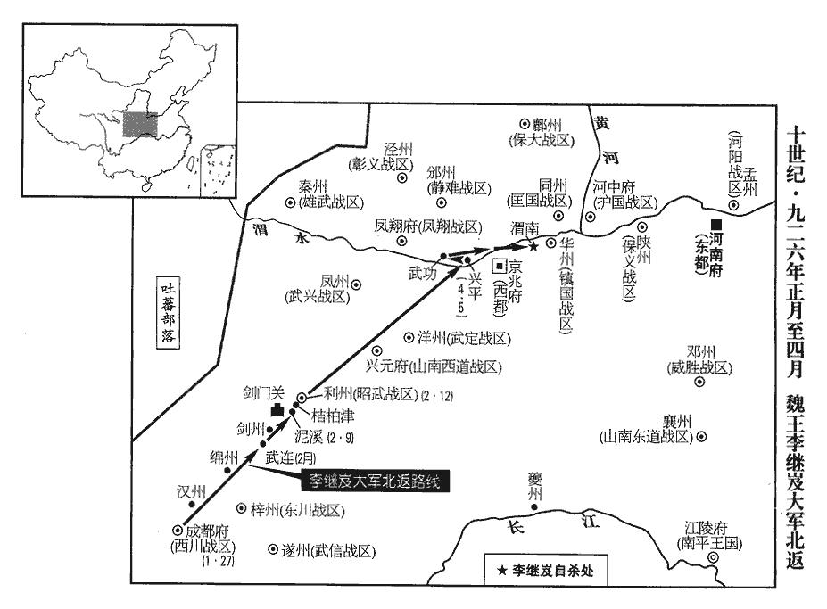
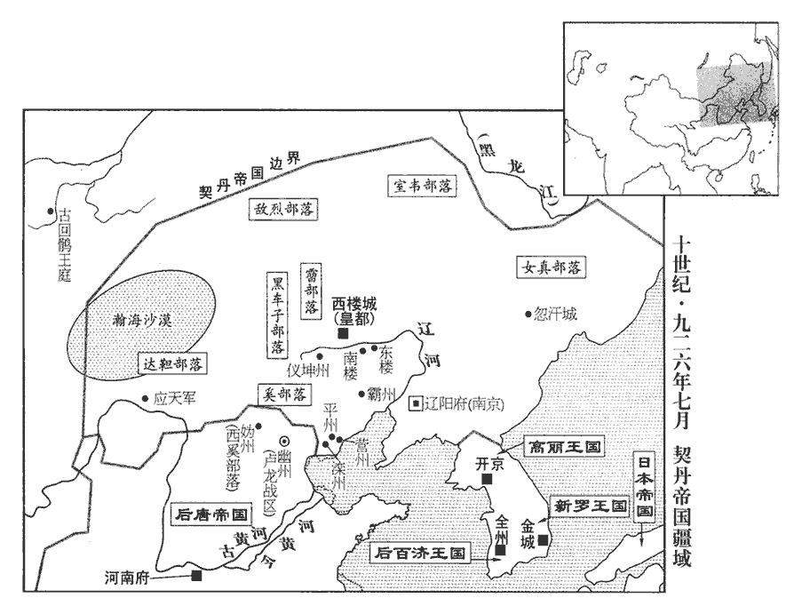
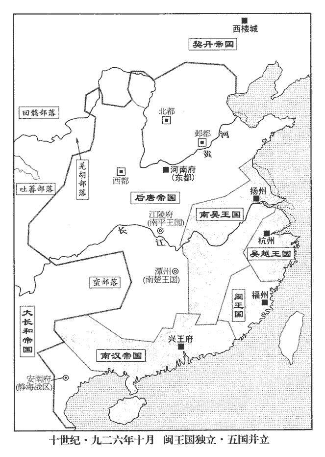
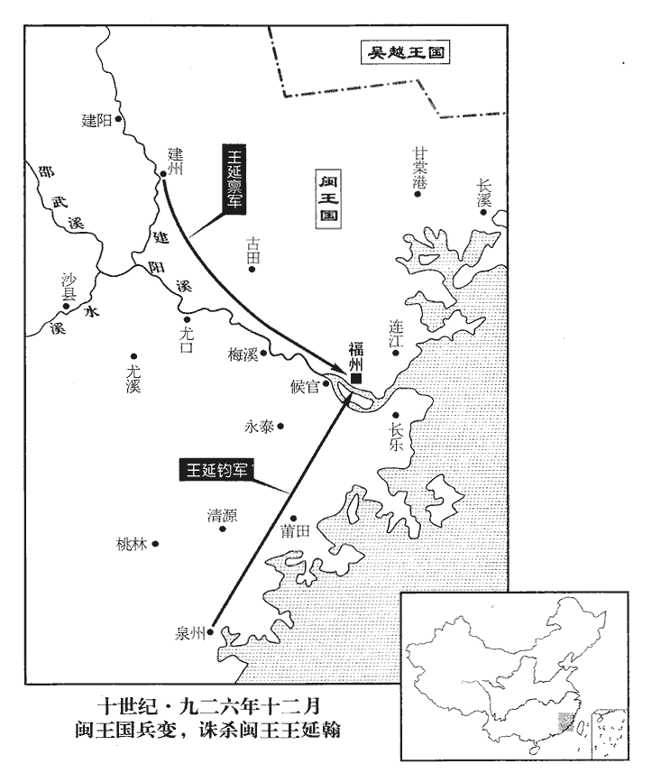
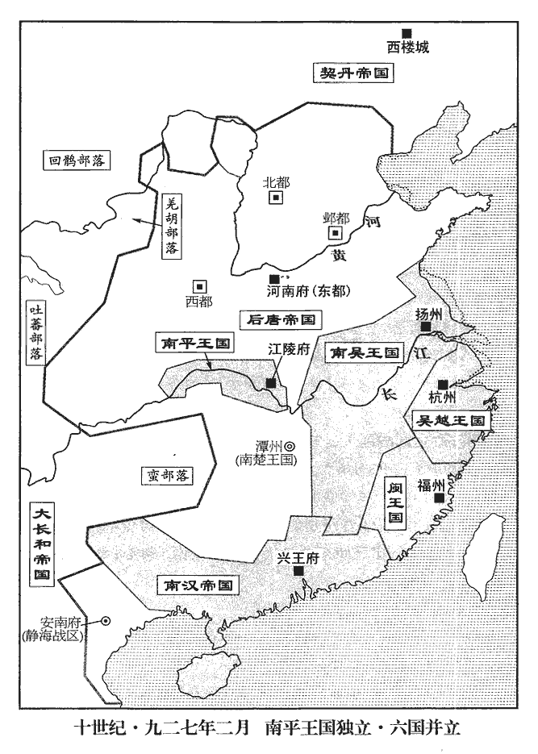
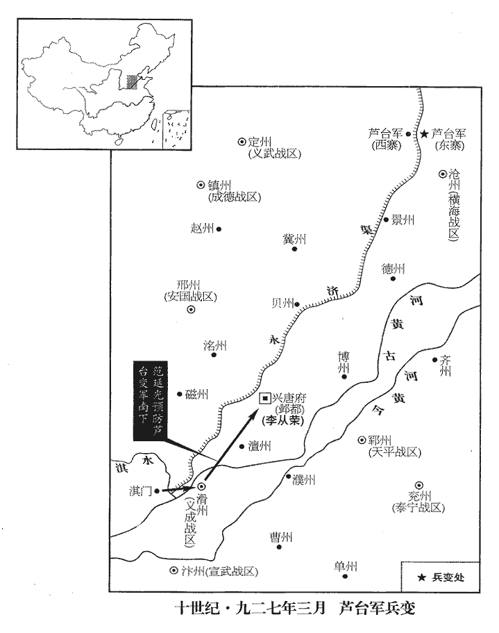
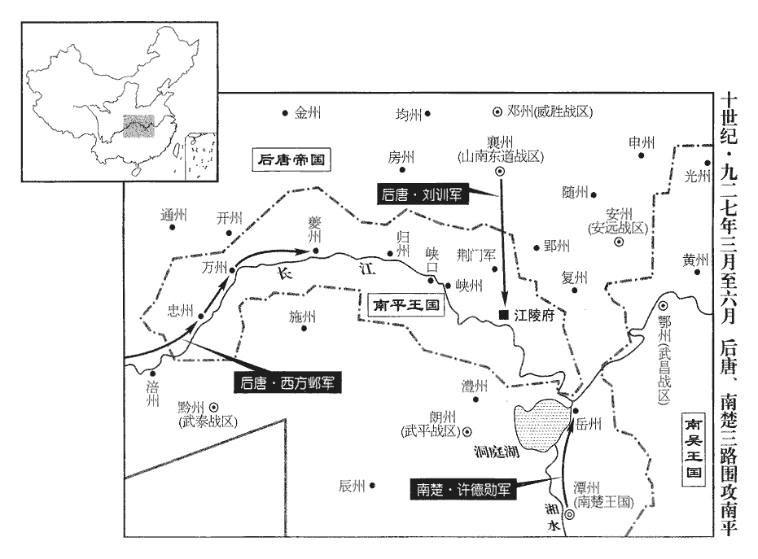

 後唐紀四起柔兆閹茂（丙戌）四月，盡強圉大淵獻（丁亥）六月，凡一年有奇。

# 明宗聖德和武欽孝皇帝上之下

## 天成元年（丙戌、九二六）

1夏，四月，丁亥朔‹一›，嚴辦將發，凡天子將出，侍中奏中嚴外辦。此時未必能爾，沿襲舊來嚴辦之言而言之耳。騎兵陳於宣仁門外，唐昭宗天祐二年，敕改東都延喜門為宣仁門。又唐六典：東都東城在皇城之東，東曰宣仁門，南曰承福門。陳，讀曰陣；下同。步兵陳於五鳳門外。從馬直指揮使郭從謙不知睦王存乂已死，存乂養郭從謙為假子及其被誅事，並見上卷本年二月。時諸王不出閤者皆在禁中，故存乂死而從謙不知。從，才用翻。欲奉之以作亂，帥所部兵帥，讀曰率；下同。自營中露刃大呼，呼，火故翻。與黃甲兩軍攻興教門。唐昭宗之遷洛也，改延喜門為宣政門，重明門為興教門。五鳳門蓋宮城南門也。唐六典曰：洛陽皇城南面三門，中曰應天，左曰興教，右曰光政。帝‹李存勖›方食，聞變，帥諸王及近衛騎兵擊之，逐亂兵出門。時蕃漢馬步使朱守殷將騎兵在外，帝遣中使急召之，欲與同擊賊；守殷不至，引兵憩於北邙茂林之下。憩，去例翻，息也。邙，莫郎翻。亂兵焚興教門，緣城而入，近臣宿將皆釋甲潛遁，李紹榮必已遁矣。獨散員都指揮使李彥卿及宿衛軍校何福進、王全斌等十餘人力戰。俄而帝為流矢所中，李彥卿即符彥卿，存審之子。散，悉亶翻。校，戶教翻。中，竹仲翻。斌，音彬。鷹坊人善友扶帝自門樓下，至絳霄殿廡下鷹坊，唐時五坊之一也。姓譜，善，姓也，堯師善卷。門樓，興教門樓。廡，罔甫翻。抽矢，渴懣求水，皇后不自省視，遣宦者進酪，懣，音悶。省，悉景翻。酪，歷各翻，乳漿也。凡中矢刃傷血悶者，得水尚可活，飲酪是速死也。須臾，帝殂。年四十二。李彥卿等慟哭而去，左右皆散，善友斂廡下樂器覆帝尸而焚之。覆，敷又翻。自此以上至是年正月，書「帝」者皆指言莊宗。莊宗好優而斃於郭門高，好樂而焚以樂器，故歐陽公引「君以此始，必以此終」之言以論其事，示戒深矣。彥卿，存審之子；福進、全斌皆太原‹山西省太原市›人也。李彥卿後復姓符，與何福進、王全斌皆以功名自見。劉后囊金寶繫馬鞍，與申王存渥及李紹榮引七百騎，焚嘉慶殿，自師子門出走。通王存確、雅王存紀奔南山。洛陽之南入伊川皆大山。宮人多逃散，朱守殷入宮，選宮人三十餘人，各令自取樂器珍玩，內於其家。於是諸軍大掠都城。

〖译文〗 [1]夏季，四月，丁亥朔（初一），后唐帝出行前的戒严等都己办好准备出发，骑兵陈列在宣仁门外，步兵陈列在五凤门外。从马直指挥使郭从不知道睦王李存己经死去，打算辅助他一起叛乱，于是率部队从军营中亮出刀刃大声疾呼，和黄甲两军攻打兴教门。这时后唐帝正在吃饭，听说兵变就率领诸王和近卫骑兵进击，把乱军赶出兴教门。当时，蕃汉马步使朱守殷率骑兵在外面，后唐帝派中使急召他，打算和他一起攻打乱兵。朱守殷不来，领兵在北邙茂密的树林中休息。乱兵焚烧了兴教门。沿着城墙进入，后唐帝身边的大臣和禁卫兵都丢盔弃甲偷偷逃跑了，只有散员都指挥使李彦卿以及宿卫军校何福进、王全斌等十余人奋力作战。不一会儿，后唐帝被流箭射中，鹰坊人善友扶着后唐帝从门楼上走下来，到了绛霄殿的屋檐下把箭拔出来。后唐帝口渴烦闷想喝水，皇后没有亲自看望，只是派宦官送去些乳浆。很快后唐帝就死了。李彦卿等痛哭而去，左右大臣也都离去，善友收拾了屋檐下的乐器。盖住后唐帝的尸体，把他焚烧了。李彦卿是李存审的儿子。何福进、王全斌都是太原人。刘皇后装好金玉珠宝，系上马鞍，和申王李存渥、李绍荣领着七百骑兵焚烧了嘉庆殿以后，从师子门出逃。通王李存确、雅王李存纪逃奔到南山。宫里的人大多数都逃跑了，朱守殷进入宫内，挑选了三十多个宫女，让她们各自拿了些乐器和珍贵的玩物，放在他家，此时各路军队把都城洗劫一空。

是日，李嗣源至甖子谷‹汜水关西›，考異曰：莊宗實錄云：「今上至鄭州聞變。」今從明宗實錄。余按甖子谷在鄭州境。聞之，慟哭，謂諸將曰：「主上素得士心，正為群小蔽惑至此，今吾將安歸乎！」

〖译文〗 这一天，李嗣源到达子谷，听说后唐皇帝庄宗己死，痛哭一场，并对诸位将领说：“主上平时很得人心，正是被这一群小人蒙蔽迷惑才到了这种地步，现在我将到哪里去呢？”

戊子‹二›，朱守殷遣使馳白嗣源，以「京城大亂，諸軍焚掠不已，願亟來救之！」己丑‹三›，嗣源入洛陽，止于私第，禁焚掠，拾莊宗骨於灰燼之中而殯之。

〖译文〗 戊子（初二），朱守殷派使者飞速报告李嗣源，说：“京城大乱，诸军烧杀抢掠不己，希望赶快来解救京城。”乙丑（疑误），李嗣源进入洛阳，住在自己的宅里，禁止焚烧抢掠，在灰烬中拾了一些庄宗的遗骨，然后把他安葬了。

嗣源之入鄴也，前直指揮使平遙‹山西省平遥县›侯益脫身歸洛陽，前直指揮使領上前直衛之兵。劉昫曰：平遙即漢平陶縣，魏避國諱，改「陶」為「遙」：唐屬汾州。宋白曰：後魏以太武帝名燾，改「平陶」為「平遙」。莊宗撫之流涕。至是，益自縛請罪；嗣源曰：「爾為臣盡節，又何罪也！」使復其職。

〖译文〗 李嗣源进入邺都的时侯，前直指挥使平遥人侯益摆脱了李嗣源回到洛阳，计宗抚摩着他痛哭流涕。到了现在，侯益自缚来请罪。李嗣源说：“你作为一个大臣，尽忠尽节，有什么罪呢？”又使他官复原职。

嗣源謂朱守殷曰：「公善巡徼，以待魏王。徼，吉弔翻。言善巡徼宮闕及皇城內外坊市，以待魏王繼岌。繼岌，莊宗嫡長子也，西征而還，未至，示若待其至而嗣位然。淑妃、德妃在宮，供給尤宜豐備。韓淑妃、伊德妃先在晉陽宮，蓋莊宗都洛之後迎至洛宮，及其遭變，不從劉后出奔，時在宮中也。按淑妃韓氏，本莊宗元妃衛國夫人也；德妃伊氏，次妃燕國夫人也。劉后之次在三，越次而正位中宮，雖莊宗之過，亦郭崇韜希指迎合之罪也。五代會要曰：同光二年十二月，冊德妃、淑妃，以宰臣豆盧革、韋說為冊使，出應天門外登輅車，鹵簿鼓吹前導，至右永福門降車，入右銀臺門，至淑妃宮，受冊於內，文武百官立班稱賀。通鑑書二年二月冊劉后，蓋冊后之後至十二月冊二妃也。吾俟山陵畢，社稷有奉，則歸藩為國家捍禦北方耳。」歸藩，言欲歸真定。為，于偽翻。

〖译文〗 李嗣源对朱守殷说：“你好好地巡回检查，以待魏王到来。淑妃、德妃都在宫中，她们的供给应当格外丰富齐备。等皇上的陵墓修好，国家有了继承人，我就回到我的藩镇真定去为国家保卫北方领土。”

是日，豆盧革帥百官上牋勸進，下之於上，不從其令而從其意。帥，讀曰率。上，時掌翻。嗣源面諭之曰：「吾奉詔討賊，不幸部曲叛散；欲入朝自訴，又為紹榮所隔，披猖至此。吾本無他心，諸君遽爾見推，殊非相悉，悉，息七翻，諳也，究也，詳也，盡也。願勿言也！」革等固請，嗣源不許。

〖译文〗 这一天，豆卢革率领百官送上书札劝李嗣源即皇帝位，李嗣源当面告诉他们说：“我奉皇上的命令去讨伐乱贼，不幸部队叛背逃散。本想入朝亲自诉说情况，但被李绍荣所阻隔，分裂到如此地步。我本来没有其他想法，诸君突然来推举我，是根本不了解我，希望不要说了。”豆卢革等坚决请求，李嗣源还是没有答应。

李紹榮欲奔河中就永王存霸，從兵稍散；庚寅‹四›，至平陸‹山西省平陆县›，從，才用翻。唐書地理志曰：括地志：陜州河北縣本漢大陽縣，天寶元年，太守李齊物開三門以利漕運，得古刃，有篆文曰「平陸」，因更河北縣為平陸縣。九域志：縣在陜州北五里，隔大河。止餘數騎，為人所執，折足送洛陽。折，而設翻。存霸亦帥眾千人棄鎮奔晉陽。

〖译文〗 李绍荣想投奔河中去靠拢永王李存霸，跟从他的部队渐渐逃散了。庚寅（初四），到了平陆，只剩下几个骑兵，被人抓获，打断了脚送到了洛阳。李存霸也率领一千多人弃镇逃奔到晋阳。

2辛卯‹五›，魏王繼岌至興平‹陕西省兴平市›，聞洛陽亂，復引兵而西，復，扶又翻。謀保據鳳翔。

〖译文〗 [2]辛卯（初五），魏王李继岌到兴平，听说洛阳叛乱，又率兵回到西边，计划据守凤翔。

3向延嗣至鳳翔，以莊宗之命誅李紹琛。莊宗已殂，故不書帝而以廟號書之也。李紹琛反於蜀被擒，見上卷本年三月。

〖译文〗 [3]向延嗣到了凤翔，以庄宗的命令杀死李绍琛。

4初，莊宗命呂、鄭二內養在晉陽‹北都太原府所在县·山西省太原市›，一監兵，一監倉庫，監，工銜翻。自留守張憲以下皆承應不暇。及鄴都有變，又命汾州‹山西省汾阳县›刺史李彥超為北都‹太原府›巡檢。彥超，彥卿之兄也。

〖译文〗 [4]当初，庄宗命令吕、郑两个内养留在晋阳，一个监管军队，一个监管仓库，自留守张宪以下都承应不暇。等到邺都发生兵变，又令汾州刺史李彦超为北都巡检。李彦超是李彦卿的哥哥。

莊宗既殂，推官河間‹河北省河间市›張昭遠勸張憲奉表勸進，憲曰：「吾一書生，自布衣至服金紫，皆出先帝之恩，豈可偷生而不自愧乎！」昭遠泣曰：「此古人之事，公能行之，忠義不朽矣。」張昭遠儒者也，故勉成張憲之志節。其後昭遠避漢高祖名，止名昭。

〖译文〗 庄宗死后，推官河间人张昭远劝张宪奉表拥李嗣源为帝，张宪说：“我是一个书生，从一个普通百姓到做大官，都是找先帝的恩情，怎以能够苟且偷生而不感到惭愧呢？”张昭远边哭边说：“这是古人的事情，你能实行，忠义不朽。”

有李存沼者，莊宗之近屬，考異曰：唐愍帝實錄符彥超傳云「皇弟存沼」，薛史、歐陽史彥超傳作「存霸」；莊宗列傳、薛史張憲傳但云「李存沼」。按莊宗弟無名存沼者；存霸自河中衣僧服而往，非今日傳莊宗之命者也。或者武皇之姪，莊宗之弟。別無所據，不敢決定，故但云近屬。按莊宗謚光聖神閔皇帝，唐愍帝實錄即莊宗實錄也，「愍」、「閔」字通。自洛陽奔晉陽，矯傳莊宗之命，陰與二內養謀殺憲及彥超，據晉陽拒守。彥超知之，密告憲，欲先圖之。憲曰：「僕受先帝厚恩，不忍為此。徇義而不免於禍，乃天也。」彥超謀未決，壬辰‹六›夜，軍士共殺二內養及存沼於牙城，因大掠達旦。憲聞變，出奔忻州‹山西省忻州市›。九域志：太原府東北至忻州二百里。此以宋氏徙府後言也。會嗣源移書至，彥超號令士卒，城中始安，遂權知太原軍府。

〖译文〗 有一个叫李存沼的人，是庄宗的近亲，他从洛阳跑到晋阳，假传庄宗的命令，偷偷和两个内养阴谋杀死张宪和李彦超，占据晋阳而坚守。李彦超知道这一情况后，悄悄地告诉了张宪，打算先图谋起事。张宪说：“先帝对我有深厚的恩情，我不忍心这样做。坚守道义而至死不变却免不了祸端，这是天命啊！”李彦超的计划还没有决定，壬辰（初六）夜晚，士卒们就在牙城里杀死了两个内养和李存沼，于是在城内抢掠到天亮。张宪听说发生兵变，出逃到忻州。正好这时李嗣源的信送到这里，李彦超给士卒下了命令，城里才开始安定下来，于是他就代理太原军府。

5百官三牋請嗣源監國，考異曰：監國本太子之事，非官非爵。然五代唐明宗、潞王、周太祖皆嘗監國。漢太后令曰，「中外事取監國處分，」又誥曰，「監國可即皇帝位，」是時直以監國為稱號也。今從之。嗣源乃許之。甲午‹八›，入居興聖宮，按是時莊宗之殯在西宮，興聖宮蓋在西宮之東。按薛史，莊宗即位於魏州，以子繼岌充北都留守、興聖宮使，及平定河南，充東京留守、興聖宮使，則東京、北都皆有興聖宮。宋白所記見前。始受百官班見。示即真之漸。見，賢遍翻。下令稱教，百官稱之曰殿下。莊宗後宮存者猶千餘人，宣徽使選其美少者數百獻於監國，少，詩照翻。監國曰：「奚用此為！」對曰：「宮中職掌不可闕也。」監國曰：「宮中職掌宜諳故事，諳，烏含翻。此輩安知！」乃悉用老舊之人補之，其少年者皆出歸其親戚，無親戚者任其所適。蜀中所送宮人亦準此。

〖译文〗 [5]百官第三次送上书札请求李嗣源监国，李嗣源答应了他们的请求。甲午（初八），进入兴圣宫居住，开始接受百官按次序的拜见。他下发的命令称作教，百官称他为殿下。庄宗的后宫里还有一千多人，宣徽使从中选择了几百名年轻漂亮的送给了监国李嗣源，监国说：“用这些人干什么？”宣徽使回答说：“宫中的主管不可缺。”监国说：“宫中主管应当熟悉过去的典章制度，这些人怎么会知道？”于是全部用过去的老人代替，让那些年轻人都出宫回亲戚家，没肖亲戚的任凭他们随便去哪里。蜀中所送来的宫人也照此办理。

乙未‹九›，以中門使安重誨為樞密使，安重誨本成德軍中門使，監國所親任者也。鎮州‹成德战区总部所在·河北省正定县›別駕張延朗為副使。延朗，開封人也，仕梁為租庸吏，按歐史，張延朗仕梁，以租庸吏為鄆州糧料使，明宗克鄆州得之，復以為糧料使，後徙鎮宣武、成德，以為元從孔目官，蓋由此選為鎮州別駕也。性纖巧，善事權貴，以女妻重誨之子，妻，七細翻。故重誨引之。

〖译文〗 乙未（初九），任命中门使安重诲为枢密使，镇州别驾张延朗为副使。张延朗是开封人，在后梁时任租庸吏。他工于心计，善事权贵。把他的女儿嫁给了安重诲的儿子，所以安重诲引荐了他。

監國令所在訪求諸王。通王存確、雅王存紀匿民間，或密告安重誨，重誨與李紹真謀曰：「今殿下既監國典喪，諸王宜早為之所，以壹人心。殿下性慈，不可以聞。」乃密遣人就田舍殺之。後月餘，監國乃聞之，切責重誨，傷惜久之。

〖译文〗 监国李嗣源命令访求还活着的各王。通王李存确、雅王李存纪藏匿在民间，有人秘密告诉安重诲，安重诲和李绍真谋划说：”现在殿下己经摄政，主持办理丧事，各王应当及早安排处置，以此来统一人心。殿下性情慈善，不能告诉他。“于是秘密派人到农舍杀了他们。一个多月以后监国才听说这件事，严厉地谴责了安重诲，伤心婉惜了很久。

劉皇后與申王存渥奔晉陽，在道與存渥私通。存渥至晉陽，李彥超不納，走至風谷‹岚谷，山西省岢岚县›，「風谷」恐當作「嵐谷」。唐長安三年分宜芳縣置嵐谷縣，屬嵐州。為其下所殺。明日，永王存霸亦至晉陽，從兵逃散俱盡，從，才用翻。存霸削髮、僧服謁李彥超，「願為山僧，幸垂庇護。」軍士爭欲殺之，彥超曰：「六相公來，當奏取進止。」存霸第六。軍士不聽，殺之於府門之碑下。劉皇后為尼於晉陽，監國使人就殺之。薛王存禮及莊宗幼子繼嵩、繼潼、繼蟾、繼嶢，嶢，倪么翻。遭亂皆不知所終。惟邕王存美以病風偏枯得免，居于晉陽。沙陀自唐末強盛，蓋至於此。恐赤心之支胤或有存者；晉王父子相傳，其血嗣殲矣。且明宗，晉王義兒也，得國之後，坐視義父之遺育為魚為肉，何忍也！他日詎可望麥飯灑陵乎！

〖译文〗 刘皇后和申王李存渥逃到晋阳，在路上和李存渥通奸。李存渥到了晋阳，李彦超不接纳，他又跑到谷，被部下杀死。第二天，永王李存霸也到达晋阳，跟随他的士卒全都逃跑了。李存霸剃掉头发，穿上僧服去拜见李彦超，说：“愿意成为山上的僧人，希望能得到庇护。”军士们争着想杀掉他，李彦超说：“六相公李存霸既然来了，应当奏请，然后决定去留。”军士们没有听从他的话，在府门的石碑下把他杀死。刘皇后在晋阳当了尼姑，监国派人到晋阳杀了她。薛王李存礼以及庄宗幼小的儿子李继嵩、李继潼、李继蟾、李继在国家遭受兵乱后都不知所终。只有邕王李存美中风得病，半身不遂，才免于一死，住在晋阳。

6徐溫、高季興聞莊宗‹李存勖›遇弒，益重嚴可求、梁震。嚴可求料唐有內變，見二百七十二卷莊宗同光元年；梁震料莊宗必亡，見二百七十四卷三年。

〖译文〗 [6]徐温、高季兴听说庄宗被杀，更加器重严可求、梁震。

梁震薦前陵州‹四川省仁寿县›判官貴平‹四川省仁寿县东北›孫光憲於季興，使掌書記。貴平縣，漢廣都縣之東南界，後魏置和仁郡，仍置平井、貴平、可曇三縣，唐廢平井、可曇，以貴平縣治和仁城。開元十四年移治祿川，屬陵州。宋省貴平入廣都縣。季興大治戰艦，欲攻楚‹首都潭州湖南省长沙市›，治，直之翻。艦，戶黯翻。光憲諫曰：「荊南‹总部江陵府›亂離之後，賴公休息士民，始有生意，若又與楚國交惡，他國乘吾之弊，良可憂也。」季興乃止。

〖译文〗 梁震把原来的陵州判官贵平人孙光宪推荐给高季兴，掌管书牍记录。高季兴大治战船，准备攻打楚国。孙光宪劝说：“荆南政治混乱之后，靠你使士民休养生息，现在刚有点生机，如果又和楚国成为仇敌，其他国家乘机钻我们空子，是非常令人担心的。”高季兴于是停止与楚国交战的准备。

7戊戌‹十二›，李紹榮至洛陽，陜州械送至洛陽。監國責之曰：「吾何負於爾，而殺吾兒？」謂紹榮殺從審也。見上卷本年三月。紹榮瞋目直視曰：瞋，昌真翻。「先帝何負於爾？」遂斬之，元行欽雖死，監國豈不有愧於其言！復其姓名曰元行欽。李紹榮賜姓名見二百六十九卷梁均王貞明元年。

〖译文〗 [7]戊戌（十二日），李绍荣到达洛阳，监国李嗣源责备他说：“我什么地方对不起你，你杀死我的儿子？”李绍荣睁大眼睛瞪着监国说：“先帝什么地方对不起你？”于是杀死了李绍荣，并恢复了他原来的姓名元行钦。

8監國恐征蜀軍還為變，還，從宣翻，又如字。以石敬瑭為陜州‹河南省三门峡市›留後；己亥‹十三›，以李從珂為河中留後。陜州以備其徑至洛陽，河中以備其北歸晉陽。陜，失冉翻。

〖译文〗 [8]监国怕征讨前蜀国的军队回来发生变故，任命石敬瑭为陕州留后。己亥（十三日），任命李从珂为河中留后。

9樞密使張居翰乞歸田里，許之。李紹真屢薦孔循之才，庚子‹十四›，以循為樞密副使。李紹宏請復姓馬。李紹宏賜姓名見二百七十卷梁均王貞明五年。

〖译文〗 [9]枢密使张居翰请求回家乡，监国答应了他的请求。李绍真曾多次推荐孔循的才能，庚子（十四日），任命孔循为枢密副使。李绍宏请求恢复他姓马。

監國下教，數租庸使孔謙奸佞侵刻窮困軍民之罪而斬之，數，所具翻。凡謙所立苛斂之法斂，力贍翻。皆罷之，因廢租庸使及內勾司，租庸使，唐末及梁置。內勾司，莊宗同光二年置。依舊為鹽鐵、戶部、度支三司，委宰相一人專判。唐制：戶部度支以本司郎中、侍郎判其事，又置鹽鐵轉運使。其後用兵，以國計為重，遂以宰相領其職。乾符已後，天下喪亂，國用愈空，始置租庸使，用兵無常，隨時調斂，兵罷則止。梁興，置租庸使，領天下錢穀，廢鹽鐵、戶部、度支之官。莊宗滅梁，因而不改。明宗入立，誅租庸使孔謙而廢其使職，以大臣一人判戶部、度支、鹽鐵，號曰判三司。至長興元年，張延朗因請置三司使，事下中書。中書用唐故事，拜延朗特進、工部尚書，充諸道鹽鐵轉運等使，兼判戶部度支事；詔以延朗充三司使，班在宣徽使下。三司置使，則自梁始。宋白曰：同光二年，左諫議大夫竇專奏請廢租庸使名目歸三司，略曰：伏見天下諸色錢穀，比屬戶部，設度支、金部、倉部，各有郎中、員外，將地賦、山海鹽鐵分擘支計徵輸。後為租賦繁多，添置三司使額，同資國力，共致豐財。安、史作亂，民戶流亡，征租不時，經費多闕，惟江、淮、嶺表郡縣完全，總三司貨財，發一使徵賦，在處勘覆，名曰租庸。收復京城，尋廢其職務。廣明中，黃巢叛逆，僖宗播遷，依前又以江、淮徵賦置租庸使，及至還京，旋亦停廢。偽梁將四鎮節制徵輸，置宮使名目；後廢宮使，改置租庸。又罷諸道監軍使；以莊宗‹李存勖›由宦官亡國，命諸道盡殺之。

〖译文〗 监国下发教令，谴责租庸使孔谦奸巧谄谀、侵占剥夺，使军民贫困的罪行，并将他处死。凡是孔谦制定的苛敛之法，全部废除，同时撤消了租庸使和内勾司，依照旧例设盐铁、户部、度支三司，委托宰相一人专门管理。又取消了各道的监军使。因为庄宗是任用宦官才导致亡国的，所以命令各道把宦官全部杀掉。

10魏王繼岌自興平退至武功‹陕西省武功县西›，宦者李從襲曰：「禍福未可知，退不如進，請王亟東行以救內難。」繼岌從之。還，至渭水，權西都留守張籛jiān已斷浮梁；難，乃旦翻。籛，則前翻。斷，音短。循水浮渡，是日至渭南‹陕西省渭南市›，腹心呂知柔等皆已竄匿。從襲謂繼岌曰：「時事已去，王宜自圖。」繼岌徘徊流涕，乃自伏於床，命僕夫李環縊殺之。繼岌以李從襲、呂知柔而殺郭崇韜，而殺繼岌者豈他人哉！李環即撾殺崇韜者也。考異曰：莊宗實錄，「征蜀初為都監，後勸繼岌殺郭崇韜者李從襲也。」明宗實錄云「宦者都監李繼襲勸繼岌東還」，及令自殺，又云「任圜監軍李廷襲欲存康延孝」，及至華州為李沖所殺者，復云「李從襲」。蓋「從襲」誤為「繼襲」、「廷襲」。今從莊宗實錄。任圜代將其眾而東。監國命石敬瑭慰撫之，軍士皆無異言。史言西軍歸心於新主。

〖译文〗 [10]魏王李继岌从兴平退到武功，宦官李从袭说：“是祸是福不可预测，但后退不如前进，请王赶快东进来解救内难。”李继岌听从了他的意见。于是前进到达渭水，代理西都留守的张己经把浮桥拆毁。他们顺流渡过渭水，当日到达渭南，李继岌的心腹之人吕知柔等都己逃跑躲藏起来。李从袭对李继岌说：“大势己去，王应自图。”李继岌边哭 边来回走动，后来就趴伏在床上，命令仆夫李环用绳子把他勒死。任圜代替他率领部队向东前进。监国命令石敬瑭去安抚他们，士卒们没有不同意见都归顺了李嗣源。

先是，監國命所親李沖為華州‹陕西省华县›都監，應接西師。先，昔薦翻。華，戶化翻。西師，即謂魏王繼岌之師。沖擅逼華州節度使史彥鎔入朝；同州‹陕西省大荔县›節度使李存敬過華州‹陕西省华县›，沖殺之，并屠其家；又殺西川行營都監李從襲。李從襲死有餘罪，監國未即肆諸市朝，而李沖殺之則為失刑耳。彥鎔泣訴於安重誨，重誨遣彥鎔還鎮，召沖歸朝。

〖译文〗 在此之前，监国命令他的亲信李冲为华州都监，来应接魏王李继岌的部队。李冲擅自逼迫华州节度使史彦熔入朝。同州节度使李存敬路过华州时，李冲杀死了他，并把他的家属也全部杀掉。他还杀死了西川行营都监李从袭。史彦熔哭着向安重诲诉说了李冲逼他的事，安重诲派史彦熔回到华州，召李冲回朝。

自監國入洛，內外機事皆決於李紹真。紹真擅收威勝‹总部设邓州河南省邓州市›節度使李紹欽‹段凝›、太子少保李紹沖‹温韬›下獄，下，戶嫁翻。欲殺之。安重誨謂紹真曰：「溫、段罪惡皆在梁朝，今殿下‹李嗣源›新平內難，冀安萬國，豈專為公報仇邪！」難，乃旦翻。為，于偽翻。按歐史，霍彥威素與溫、段有隙。紹真由是稍沮。沮，在呂翻。辛丑‹十五›，監國教，李紹沖、紹欽復姓名為溫韜、段凝，溫韜、段凝賜姓名並見二百七十二卷莊宗同光元年。並放歸田里。

〖译文〗 自从监国进入洛阳以来，内外重要的事情都由李绍真决定。李绍真擅自拘捕了威胜节度使李绍钦、太子少保李绍冲，并把他们投入监狱，打算把他们杀掉。安重诲对李绍真说：‘温韬、段凝的罪恶都在梁朝，现在殿下刚刚平息了内乱，希望安定万国，难道只为你报仇吗？”李绍真因此才稍稍收敛。辛丑（十五日），监国下令，恢复了李绍冲、李绍钦的姓名叫温韬、段凝，并放他回归家乡。

 

11壬寅‹十六›，以孔循為樞密使。

〖译文〗 [11]壬寅（十六日），任命孔循为枢密使。

12有司議即位禮。李紹真、孔循以為唐運已盡，宜自建國號。監國問左右：「何謂國號？」對曰：「先帝‹李存勖›賜姓於唐，為唐復讎，賜姓於唐，謂獻祖‹朱邪赤心›以平龐勛之功始賜姓李也。為唐復讎，謂莊宗滅梁也。為，于偽翻。繼昭宗‹李晔›後，故稱唐。言以同光元年繼天祐二十年也。今梁朝之人不欲殿下稱唐耳。」霍彥威、孔循皆嘗事梁者也。當時在監國左右者未必皆儒生；觀其所對辭意，於正閏之位致其辯甚嚴，雖儒生不能易也。監國曰：「吾年十三事獻祖‹朱邪赤心›，獻祖以吾宗屬，視吾猶子。莊宗即位，尊其祖國昌為獻祖。監國亦沙陀種，故云宗屬。又事武皇‹李克用›垂三十年，莊宗追尊父晉王克用為太祖武皇帝。先帝垂二十年，經綸攻戰，未嘗不預；武皇之基業則吾之基業也，先帝之天下則吾之天下也，安有同家而異國乎！」令執政更議。更，工行翻。吏部尚書李琪曰：「若改國號，則先帝遂為路人，梓宮安所託乎！不惟殿下忘三世舊君，以監國歷事獻祖、太祖、莊宗三世也。吾曹為人臣者能自安乎！前代以旁支入繼多矣，宜用嗣子柩前即位之禮。」記曰：在床曰尸，在棺曰柩。鄭氏註曰：尸，陳也，言形體在；柩之言究也，白虎通云，久也。柩，音新舊之舊。眾從之。丙午‹二十›，監國‹李嗣源（邈佶烈）本年六十岁›自興聖宮赴西宮，服斬衰，於柩前即【章；十二行本「即」下有「皇帝」二字；乙十一行本同。】位，斬衰，下不緶，子為父服之。衰，倉回翻。自己丑入洛，至此二十日。先是未敢即位者，魏王繼岌猶在故也；繼岌既死，乃決為之。百官縞素。既而御袞冕受冊，徐無黨曰：既用嗣君之禮矣，遽釋衰而服冕，可以見其情詐。百官吉服稱賀。

〖译文〗 [12]主管官吏商议监国即皇帝位的仪礼。李绍真、孔循认为唐朝的世运己经完了，应当自己建立国号。监国问左右大臣说：“什么叫做国号？”回答说：“先帝接受唐朝赐给的姓，为唐朝报仇，继唐昭宗之后，所以称唐。现在梁朝的人们不想让殿下的国号称作唐。”监国说：“我十三岁时侍奉献祖来国昌，献祖把我看作同一宗族，对我就象对待儿子一样。后来又侍奉武皇李克用近三十年，侍奉先帝李存勖近二十年，每次筹划治理国家的大事和攻伐征战，我未尝不参预。武皇的基业就是我的基业，先帝的天下就是我的天下，哪有同家而异国的道理！”于是命令主持政务的人们重新商议一下。吏部尚书李琪说：“如果改变国号，那先帝就成了与国家没有关系的人，他的棺材往哪里安放呢？这不仅仅是殿下忘记了三世旧的君主，我们这些做大臣的心里能够自安吗？过去的朝代以旁支继承王位的有很多，应当用嗣子在棺材前面即位的礼仪即位。”大家听从了他的意见。丙午（二十日），监国从兴圣宫到西宫，穿着用粗麻布做的重丧服，在棺材前面即皇帝位，百官们都穿着白丧服。不一会儿，监国穿上皇帝的礼服和礼帽，接受册书，百官们穿着吉祥的服装祝贺。

13戊申‹二十二›，敕中外之臣毋得獻鷹犬奇玩之類。

〖译文〗 [13]戊申（二十二日），命令朝廷内外大臣不得贡献鹰犬珍玩之类的东西。

14有司劾奏太原尹張憲委城之罪；庚戌‹二十四›，賜憲死。以張憲前朝大臣，加之罪而殺之耳。

〖译文〗 [14]有关部门检举弹劾太原尹张宪弃城之罪，庚戌（二十四日），后唐皇帝李嗣源赐张宪死。

15任圜將征蜀兵二萬六千人至洛陽，征蜀之初，出師六萬，除留戍于蜀及康延孝叛死亡之外，還洛者二萬六千人耳。明宗慰撫之，各令還營。以通鑑書法言之，「明宗」二字當書「帝」字，此因前史成文，偶遺而不之改耳。

〖译文〗 [15]任圜率领着出征前蜀的二万六千多士卒到了洛阳，后唐帝慰劳安抚他们，命令他们各自回到军营去。

16甲寅‹二十八›，大赦，改元。始改元天成。量留後宮百人，宦官三十人，教坊百人，鷹坊二十人，御廚五十人，量，音良。自餘任從所適。諸司使務有名無實者皆廢之。分遣諸軍就食近畿，以省饋運。除夏、秋稅省耗。舊例，夏、秋二稅先有省耗，每斗一升，今後祇納正稅數，不量省耗。節度、防禦等使，正、至、端午、降誕四節聽貢奉，元正、冬至、端午、并降誕節為四。按五代會要，唐咸通八年九月九日帝始生於代北金鳳城，以其日為應聖節。毋得斂百姓；斂，力贍翻。刺史以下不得貢奉。選人先遭塗毀文書者，塗毀選人告身，見二百七十三卷莊宗同光二年。令三銓止除詐偽，餘復舊規。唐六典：吏部尚書、侍郎之職，掌天下官吏，以三銓分其選：一曰尚書銓，二曰中銓，三曰東銓。或云吏部東、西銓并流外銓為三銓。宋白曰：太和四年七月，吏部奏：「當司西銓侍郎廳，舊以尚書之次為中銓，次為東銓。乾元中，侍郎崔器奏改中銓為西銓，以久次侍郎居左，新除侍郎居右，因循倒置，議者非之。請自今久次侍郎居西銓，新除侍郎居東銓。」敕旨依。又曰：兵部尚書為中銓，并東銓、西銓為三銓。

〖译文〗 [16]甲寅（二十八日），大赦天下，更改年号。酌情留下后宫一百人，宦官三十人，教坊一百人，鹰坊二十人，御厨五十人，其余的人自己愿到哪里就到哪里。各司、使、务有名无实的都废除了。分派各军在附近的地方供给粮食，以节省运送的费用。免除了夏、秋两季税赋的省耗税。节度、防御等使，元旦、冬至、端午、皇帝生日四个节日听任贡奉，但不得聚敛百姓。刺史以下不得贡奉。选拔人才时，如果有先涂改文书的人，命令三铨制止他们欺诈伪造，其余按旧的规定办理。

17五月，丙辰朔‹一›，以太子賓客鄭珏、珏jué，古岳翻。工部尚書任圜並為中書侍郎、同平章事；圜仍判三司。圜憂公如家，簡拔賢俊，杜絕僥幸，期年之間，僥，堅堯翻。期，讀曰朞府庫充實，軍民皆足，朝綱粗立。史言任圜輔相有績。粗，坐五翻。圜每以天下為己任，由是安重誨忌之。為安重誨譖殺任圜張本。

〖译文〗 [17]五月，丙辰朔（初一），任命太子宾客郑珏、工部尚书任圜都为中书侍郎、同平章事。任圜仍判管三司。任圜忧公如家，他选拔贤良有才能的人，杜绝侥幸，一年之间，府库充实，军民满足，朝廷的大纲要领也初具规模。任圜干事，常以天下为己任，因此，安重诲很忌恨他。

18武寧‹总部设徐州江苏省徐州市›節度使李紹真、忠武節度使李紹瓊、貝州刺史李紹英、齊州防禦使李紹虔、河陽節度使李紹奇、洺州‹河北省永年县东南旧永年镇›刺史李紹能，各請復舊姓名為霍彥威、萇從簡、房知溫、王晏球、夏魯奇、米君立，許之。李紹真、紹虔以梁將歸降賜姓名，李紹瓊、紹英、紹奇、紹能以事莊宗有戰功賜姓名；通鑑不盡載其賜姓名之由，略之也。從簡，陳州人也。晏球本王氏子，畜於杜氏，畜，吁玉翻。故請復姓王。

〖译文〗 [18]武宁节度使李绍真、忠武节度使李绍琼、贝州刺史李绍英、齐州防御使李绍虔、河阳节度使李绍奇、州刺史李绍能，各自请求恢复他们的姓名为霍彦威、从简、房知温、王晏球、夏鲁奇、米君立，后唐帝答应了他们的请求。从简是陈州人。王晏球本来是姓王的儿子，寄养在姓杜的家，所以请求恢复姓王。

19丁巳‹二›，初令百官正衙常朝外，五日一赴內殿起居。時正衙常朝御文明殿，朔望御之。內殿，中興殿也。朝，直遙翻。

〖译文〗 [19]丁巳（初二），命令百官正衙除正常朝拜外，每隔五天进内殿问一次安。

20宦官數百人竄匿山林，或落髮為僧，至晉陽者七十餘人，詔北都指揮使李從溫悉誅之。從溫，帝之姪也。

〖译文〗 [20]数百名宦官逃窜到山林里面隐藏起来，有的剃发为僧，有七十多人到了晋阳，后唐帝下诏北都指挥使李从温，把他们全部杀掉。李从温是后唐帝的侄儿。

21帝以前相州刺史安金全有功於晉陽，事見二百六十九卷梁均王貞明二年。相，息亮翻。壬戌‹七›，以金全為振武‹总部设朔州山西省朔州市›節度使、同平章事。

〖译文〗 [21]后唐帝认为前相州刺史安金全对晋阳有功，壬戌（初七），任命安金全为振武节度使、同平章事。

22丙寅‹十一›，趙在禮請帝幸鄴都。戊辰‹十三›，以在禮為義成節度使；辭以軍情未聽，不赴鎮。趙在禮實為魏兵所劫制，不容其赴滑州。

〖译文〗 [22]丙寅（十一日），赵在礼请求后唐帝巡幸邺都。戊辰（十三日），任命赵在礼为义成节度使。赵在礼以军情未安定为理由，没有到义成节度使镇所去。

23李彥超入朝，帝曰：「河東‹总部太原府›無虞，爾之力也。」河東軍府在晉陽，李存沼死，張憲出走，鎮定軍皆李彥超之力也。庚午‹十五›，以為建雄‹总部设晋州山西省临汾市›留後。使之鎮晉州而未授節旄，且為留後。

〖译文〗 [23]李彦超入朝，后唐帝说：“河东没有出问题，是你的功劳。”庚午（十五日），任命李彦起为建雄留后。

24甲戌‹十九›，加王延翰‹威武总部设福州福建省福州市›同平章事。王延翰承其先業，據有閩地。

〖译文〗 [24]甲戌（十九日），加封福建王延翰为同平章事。

25帝‹李嗣源›目不知書，四方奏事皆令安重誨讀之，重誨亦不能盡通，乃奏稱：「臣徒以忠實之心事陛下，得典樞機，今事粗能曉知，至於古事，非臣所及。願倣前朝侍講、侍讀、近代直崇政、樞密院，侍講、侍讀，盛唐之制也。直崇政院，梁制也。直樞密院，莊宗制也。宋白曰：同光二年崇政院依舊為樞密院，以宰臣兼使，置直院一人。選文學之臣與之共事，以備應對。」乃置端明殿學士，春明退朝錄：端明殿，西京正衙殿。蓋改文明曰端明。五代會要：唐同光二年正月改解卸殿為端明殿。按端明殿是燕閒接御儒臣之地，必非正衙殿，當以五代會要為據。端明殿學士始此。宋白曰：長興四年，劉昫xù入相，中謝。是日大祠，明宗不御中興殿而坐於端明殿。昫至中興殿門，中使曰：「舊禮，宰臣謝恩須於正殿通喚，今日上以大祠不坐正殿，請俟來日。」趙延壽曰：「命相之制已下三日，中謝無宜後時。」即奏聞。昫雖中謝於端明殿，而自端明學士拜相，復謝於本殿，人士榮之。乙亥‹二十›，以翰林學士馮道、趙鳳為之。

〖译文〗 [25]后唐帝不识字，四面八方的奏书都让安重诲读给他听，安重诲也不能全部通晓，于是上奏说：“臣只以忠诚的心来侍奉陛下，得以掌管朝内机密，现在的事情还粗粗能够知道一些，至于过去的事情，非我所及。希望效仿前朝的侍讲、侍读，近代的直崇政、枢密院，选择一些有文化的大臣来共同处理这些事情，以备应对。”于是设置了端明殿学士。乙亥（二十日），任命翰林学士冯道、赵凤为端明殿学士。

26丙子‹二十一›，聽郭崇韜歸葬‹郭崇韬原籍雁门代州州政府所在县·山西省代县›，復朱友謙官爵；二人以讒死見上卷本年正月。兩家貨財田宅，前籍沒者皆歸之。

〖译文〗 [26]丙子（二十一日），允许归葬郭崇韬，恢复了朱友谦的官爵。两家的货财田宅，以前没收了的全部归还给他们。

27戊寅‹二十三›，以安重誨領山南東道‹总部设襄州湖北省襄樊市›節度使。重誨以襄陽要地，襄陽控蜀扼荊，故曰要地。不可乏帥，帥，所類翻；下同。無宜兼領，固辭；許之。

〖译文〗 [27]戊寅（二十三日），任命安重诲兼领山南东道节度使。安重诲认为襄阳是个重要的地方，不可以没有统帅，不应当兼领，所以他坚决推辞。后唐帝答应了他的请求。

28詔發汴州控鶴指揮使張諫等三千人戍瓦橋。六月，丁酉‹十二›，出城，復還，作亂，控鶴，梁之侍衛親軍，積驕而憚遠戍，故作亂。蓋當時天下皆驕兵也。復，扶又翻。焚掠坊市，殺權知州、推官高逖。逼馬步都指揮使、曹州‹山东省定陶县›刺史李彥饒為帥，彥饒曰：「汝欲吾為帥，當用吾命，禁止焚掠。」眾從之。己亥‹十四›旦，彥饒伏甲於室，諸將入賀，彥饒曰：「前日唱亂者數人而已，」遂執張諫等四人，斬之。其黨張審瓊帥眾大譟於建國門，帥，讀曰率。彥饒勒兵擊之，盡誅其眾四百人，軍、州始定。即日，以軍、州事牒節度推官韋儼權知，具以狀聞。符彥饒攝於汴而亂於滑，豈當時將士驕悖，習以成俗，彥饒久而與之俱化邪！庚子‹十五›，詔以樞密使孔循知汴州，收為亂者三千家，悉誅之。彥饒，彥超之弟也。

〖译文〗 [28]后唐帝下诏调汴州控鹤指挥使张谏等三千人去戍守瓦桥。六月，丁酉（十二日），军队出了城，后又返回发动叛乱，焚烧抢掠街市，杀死权知州、推官高逖。逼迫马步都指挥使、曹州刺史李彦饶为统帅，李彦饶说：“你们想让我当统帅，就应当听我的命令，禁止焚烧抢掠。”大家听从了他。己亥（十四日）的早晨，李彦饶在家里暗藏了一些武士，诸位将领进来祝贺，李彦饶说：“前日鼓动叛乱的只有几个人而已。”于是把张谏等四人抓起来斩杀。张谏的同党张审琼率领好多人在建国门大声吵嚷，李彦饶率兵攻打他们，全部杀死了这伙四百人。然后军、州才开始安定下来。当天，把军、州的事情写成公文报节度推官韦俨知道，详细写在书札里报告后唐帝。庚子（十五日），后唐帝下诏命令枢密使孔循掌管汴州，拘捕了三千家作乱的人，全部处死。李彦饶是李彦超的弟弟。

29蜀百官至洛陽，永平‹总部设雅州四川省雅安市›節度使兼侍中馬全曰：「國亡至此，生不如死！」不食而卒。書馬全之官，蜀官也。蜀置永平軍於雅州。以平章事王鍇等鍇，口駭翻。為諸州府刺史、少尹、判官、司馬，亦有復歸蜀者。復，扶又翻。

〖译文〗 [29]前蜀的百官到达洛阳，蜀永平节度使兼侍中马全说：“国家灭亡了，来到这里，活着不如死了！”绝食而死。任命平章事王锴等为诸州府刺史、少尹、判官、司马，也有些人又回到了蜀中。

30辛丑‹十六›，滑州都指揮使于可洪等縱火作亂，攻魏博戍兵三指揮，逐出之。

〖译文〗 [30]辛丑（十六日），滑州都指挥使于可洪等放火作乱，攻打驻守在魏博部队的三个指挥，并把他们赶了出去。

31乙巳‹二十›，敕：「朕二名，但不連稱，皆無所避。」二名不偏諱，古也。

〖译文〗 [31]乙巳（二十日），后唐帝敕命：“朕的名字有两个字，但只要不连称，都不需避讳。”

32戊申‹二十三›，加西川節度使孟知祥兼侍中。

〖译文〗 [32]戊申（二十三日），加封西川节度使孟知祥兼任侍中。

33李繼曮至華州，聞洛中亂，復歸鳳翔；帝為之誅柴重厚。為，于偽翻。柴重厚不納李從曮，見上卷本年二月。

〖译文〗 [33]李继到达华州，听说洛中叛乱，又回到凤翔。后唐帝为他诛杀了柴重厚。

34高季興表求夔‹重庆市奉节县›、忠‹重庆市忠县›、萬‹重庆市万州区›三州為屬郡，詔許之。莊宗之伐蜀也，詔高季興自取夔、忠、萬三州為巡屬；季興不能取。王衍既敗，三州歸唐，季興乃求為巡屬，雖不許可也。為季興不式王命、興兵致討張本。考異曰：莊宗實錄云：「王建於夔州置鎮江軍節度，以夔、忠、萬、施為屬郡。雲安監有榷鹽之利，建升為安州。上舉軍平蜀，詔季興自收元管屬郡。荊南軍未進，夔州連帥以州降繼岌。」十國紀年荊南史：「天成元年二月，王表請夔、忠、萬三州及雲安監隸本道；莊宗許之。詔命未下，莊宗遇弒。六月，王表求三州；明宗許之。」劉恕按，莊宗實錄及薛史帝紀，「同光三年十一月庚戌，荊南高季興奏收復夔、忠等州」；曾顏勃海行年記云「得夔、忠、萬等州」；明宗實錄及薛史韋說傳云：「討西蜀，季興請攻峽內，先朝許之，如能得三州，俾為屬郡。三川既定，季興無尺寸之功。」莊宗實錄：「同光四年三月丙寅，高季興請峽內夔、忠、萬等州割歸當道。」明宗實錄：「天成元年六月甲寅，高季興奏：『去冬先朝詔命攻取峽內屬郡，尋有施州官吏知臣上峽，率先歸投，忠、萬、夔三州旦夕期於收復，被郭崇韜專將文字約臣回歸，方欲陳論，便值更變。』」此說頗近實，故從之。蓋三年十月，夔、忠、萬三州降於繼岌，十一月庚戌，季興奏請三州為屬郡，舊史誤云奏收復也。行年記差繆最多，不可為據。或者夔州雖自降於繼岌，季興表云收復三州，攘為己功，亦無足怪。今從明宗實錄。

〖译文〗 [34]高季兴上表请求夔、忠、万三州为自己属郡，后唐答应了他的请求。

35安重誨恃恩驕橫，橫，戶孟翻。殿直馬延誤衝前導，左、右班殿直，天子侍官也，宋熙寧以前以為西班小使臣寄祿官。職官分紀曰：殿直，五代本曰殿前承旨，晉天福五年詔除翰林承旨外，殿前承旨改曰殿直。按天成元年安重誨斬殿直馬延，潞王清泰元年殿直承旨都知趙處願等令具襴鞹kuò，則殿直名官已在晉天福之前，職官分紀誤矣。後周廣順間，殿直楚延祚、殿直王巒亦見於史。斬之於馬前，御史大夫李琪以聞。李琪憚安重誨權勢，不敢劾奏，但以其事聞耳。秋，七月，重誨白帝‹李嗣源›下詔，稱延‹馬延›陵突重臣，戒諭中外。只此一事，安重誨已足以取死。

〖译文〗 [35]安重诲依仗后唐帝的恩宠，十分骄横，殿直马延误冲了他的前列仪仗，在马前斩了马延，御史大夫李琪把这件事告诉了后唐帝。秋季，七月，安重诲告知后唐帝，下诏说，马延侵侮冲撞身居要职的大臣，要告诫全国。

36于可洪與魏博戍將互相奏云作亂，帝遣使按驗得實，辛酉‹七›，斬可洪於都市，其首謀滑州左崇牙全營族誅，助亂者右崇牙兩長劍建平將校百人亦族誅。校，戶教翻。

〖译文〗 [36]于可洪和戍守在魏博的将领互相上奏说对方作乱，后唐帝派遣使者去查验落实，辛酉（初七），在都市里斩杀了于可洪。叛乱的首谋滑州左崇牙全营全部灭族，帮助作乱的右崇牙两长剑建平将校一百人也全部灭族。

37壬申‹十八›，初令百官每五日起居，轉對奏事。時依盛唐之制，百官轉對各奏本司公事。

〖译文〗 [37]壬申（十八日），开始命令百官每隔五天入朝问一次安，并依次上奏本部门公事。

 

38契丹主‹首都西楼城内蒙古巴林左旗›耶律阿保机攻勃海，拔其夫餘城‹吉林省四平市›，即唐高麗之夫餘城也。時高麗王王建有國，限混同江而守之，混同江之西不能有也，故夫餘城屬勃海國。混同江即鴨淥水。夫，音扶。更命曰東丹國。更，工衡翻。命其長子突欲鎮東丹，號人皇王，以次子德光守西樓‹内蒙古巴林左旗›，號元帥太子。為突欲來奔張本。宋白曰：耶律德光本名耀屈之，慕中國文字，改焉。

〖译文〗 [38]契丹主向勃海发动进动，攻下了扶馀城，下令改名叫东丹国。命令他的长子突欲镇守东丹，号人皇王。他的次子德光镇守西楼，号元帅太子。

帝遣供奉官姚坤告哀於契丹。考異曰：漢高祖實錄作「苗紳」，今從莊宗列傳。契丹主聞莊宗為亂兵所害，慟哭曰：「我朝定兒也。吾方欲救之，以勃海未下，不果往，致吾兒及此。」哭不已。虜言「朝定」，猶華言朋友也。又謂坤曰：「今天子聞洛陽有急，何不救？」對曰：「地遠不能及。」曰：「何故自立？」坤為言帝所以即位之由，契丹主曰：「漢兒喜飾說，毋多談！」為，于偽翻。喜，許計翻。突欲侍側，曰：「牽牛以蹊人之田而奪之牛，可乎？」引左傳申叔之言。史言契丹慕中國，效中國人道書語。坤曰：「中國無主，唐天子不得已而立；亦猶天皇王初有國，豈強取之乎！」指言阿保機不肯受代、擊滅七部事也。強如字。契丹主曰：「理當然。」聞姚坤言，不得不服。又曰：「聞吾兒專好聲色遊畋，【章：十二行本「畋」下有「不恤軍民」四字；乙十一行本同；退齋校同；張校同，云無註本亦無。】好，呼報翻。宜其及此。我自聞之，舉家不飲酒，散遣伶人，解縱鷹犬。若亦效吾兒所為，行自亡矣。」契丹主智識如此，固宜其能立國傳世也。又曰：「吾兒與我雖世舊，然屢與我戰爭；於今天子則無怨，足以脩好。若與我大河之北，吾不復南侵矣。」坤曰：「此非使臣之所得專也。」復，扶又翻；下復召、乃復同。契丹主怒，囚之，旬餘，復召之，曰：「河北恐難得，得鎮‹成德·河北省正定县›、定‹义武·河北省定州市›、幽州‹卢龙·北京市›亦可也。」給紙筆趣令為狀，趣，讀曰促。坤不可，欲殺之，韓延徽諫，乃復囚之。囚而復囚，欲姚坤之為狀。縱使姚坤為狀，中國肯割地而與之乎？此欲用抵冒度湟之故智耳。

〖译文〗 后唐帝派遣供奉官姚坤告诉契丹主庄宗去世。契丹主听说庄宗被乱兵所害，痛哭地说：“世宗是我‘朝定’儿。我正准备去援救他，因为勃海没有攻下来，所以没有去成，致使我儿到了如此地步。”痛哭不已。契丹人说“朝定”，就是汉语里“朋友”的意思。他又对姚坤说：“现在的天子听说洛阳有急事，为什么不去援救？”姚坤回答说：“因为道路太远去不了。”契丹主说：“那么为什么自立为皇帝？”姚坤给他讲了皇帝之所以即位的原因。契丹主说：“汉族人喜欢粉饰言辞，不必多谈了。”突欲陪从在契丹主的身旁，说：“牵牛践踏了别人的田地，田主就把他的牛夺过来，这样做可以吗？”姚坤说：“中原没有君主，唐朝天子是不得已才即位的。也就好象天皇王刚刚有了封国一样，难道是强行夺取的吗？”契丹主说：“道理应当是这样。”他又说：“听说我儿专门喜欢声色游猎，不爱惜兵民，他到这种地步也是应该的。我自从听到这件事后，全家不喝酒，把伶人们都遣散了，释放了鹰犬。如果我也效仿我儿的所作所为，将会自取灭亡。”他又说：“我儿和我虽然是世代交谊，然而曾多次和我战争。我和现在的天子没有什么怨恨，足以和好。如果能够给了我黄河以北的地方，我就不再会向南侵犯了。”姚坤说：“这些事情不是使臣我说了就算数的。”契丹主听了非常生气，于是把他关起他来，十几天后，又召见他说：“黄河以北恐怕难以得到，得到镇、定、幽州也可以。”于是拿上纸和笔催他写下来，姚坤不肯写，契丹主想把他杀掉，韩延徽劝说，才又把姚坤关了起来。

39丙子‹二十二›，葬光聖神閔孝皇帝‹李存勖›于雍陵‹河南省新安县境›，雍陵在河南新安縣。考異曰：實錄：「乙亥，梓宮發引，是日遷幸雍陵。」按莊宗實錄哀冊文云丙子，今從之。廟號莊宗。

〖译文〗 [39]丙子（二十二日），在雍陵安葬了光圣神闵孝皇帝，庙号为庄宗。

40丁丑‹二十三›，鎮州留後王建立奏涿州刺史劉殷肇不受代，謀作亂，已討擒之。唐之方鎮，涿州，幽州節度屬郡也，不屬鎮州節度；而王建立得討之者，明宗初得天下，方鎮州郡反側者尚多，王建立明宗之所親者，越境討擒劉殷肇，奏以為不受代，朝廷亦聽之耳。

〖译文〗 [40]丁丑（二十三日），镇州留后王建立上奏说涿州刺史刘殷肇不接受替代命令，企图作乱，已经讨伐抓获了他。

41己卯‹二十五›，置彰國軍於應州‹山西省应县›。新、舊唐書地理志未有應州，歐史職方考始有應州，故屬大同節度而不載其建置之始；意晉王克用分雲州置應州也。九域志：化外州，應州領金城、混源二縣。竊意金城即以明宗所生之地金鳳城置縣也；今置彰國軍節度，亦以帝鄉也。匈奴須知：應州東至幽州八百五十里。又薛史周密傳，神武川屬應州。蓋朱邪執宜徙河東，始保神武川之黃花堆，沙陀由是而基霸業，故以其地置應州也。

〖译文〗 [41]己卯（二十五日），在应州设置了彰国军。

42門下侍郎、同平章事豆盧革、韋說奏事帝前，或時禮貌不盡恭；說，讀曰悅。百官俸錢皆折估，折，之舌翻。估，音古，價也。而革父子獨受實錢；百官自五月給，而革父子自正月給；由是眾論沸騰。說以孫為子，奏官；受選人王傪cān賂，選，須絹翻。傪，七感翻，又音倉含翻。除近官。近官，近畿州縣之官。中旨以庫部郎中蕭希甫為諫議大夫，革、說覆奏。希甫恨之，上疏言「革、說不忠前朝，阿諛取容」；因誣「革強奪民田，縱田客殺人，說奪鄰家井，取宿藏物。」宿藏物，前人所窖藏而不及發取者。此蓋言藏之於井。制貶革辰州‹湖南省沅陵县›刺史，說漵州‹湖南省洪江市西北黔城镇›刺史。漵，音敘。庚辰‹二十六›，賜希甫金帛，擢為散騎常侍。散，昔亶翻。騎，奇計翻。

〖译文〗 [42]门下侍郎、同平章事豆卢革、韦说在后唐帝面前奏请事情时，有时礼貌很不恭敬。百官的奉禄都折价放发，只有豆卢革父子的奉禄拿实际钱数。百官的奉禄从五月开始给，而豆卢革父子的俸禄从正月给。因此大家议论纷纷。韦说把孙子当作儿子，上奏求官。候选官员王行贿赂，被任命为京畿附近的州县官。按照后唐帝的旨意，任命库部郎中萧希甫为谏议大夫，豆卢革、韦说令重新上奏。萧希甫很恨他们，于是给后唐帝上疏说“豆卢革、韦说不忠于前朝，看脸色阿谀奉承”，因此又诬陷他们说：“豆卢革强夺民田，指使佃农杀人；韦说强夺邻家的水井，抢取别人窖藏的东西。”皇帝下令贬豆卢革为辰州刺史，贬韦说为溆州刺史。庚辰（二十六日），后唐帝赏赐萧希甫金帛，提拔他为散骑常侍。

43辛巳‹二十七›，契丹主阿保機卒於夫餘城‹年五十五岁›，卒，子恤翻。述律后召諸將及酋長難制者之妻，酋，慈秋翻。長，知兩翻。謂曰：「我今寡居，汝不可不效我。」又集其夫泣問曰：「汝思先帝乎？」對曰：「受先帝恩，豈得不思！」曰：「果思之，宜往見之。」遂殺之。為述律后囚於阿保機墓張本。

〖译文〗 [43]辛巳（二十七日），契丹主阿保机在扶馀城去世。述律后召见诸将以及酋长中难以制服的人的妻子，然后对他们说：“我现在一人独居，你们不可不效法我。”又召集她们的丈夫边哭边问他们说：“你们思念先帝吗？”这些人回答说：“先帝对我们有很大恩情，怎么能不思念他呢？”述律后说：“果然思念他，就应该去见他。”于是就把他们都杀死了。

44癸未‹二十九›，再貶豆盧革費州‹贵州省思南县›司戶，韋說夷州‹贵州省凤冈县西北›司戶。甲申‹三十›，革流陵州‹四川省仁寿县›，說流合州‹重庆合川市›。自唐末以來，流竄者率賜死，革、說其得至流所乎！

〖译文〗 [44]癸未（二十九日），再次贬豆卢革为费州司户，贬韦说为夷州司户。甲申（三十日），将豆卢革流放到陵州，把韦说流放到合州。

45孟知祥陰有據蜀之志，閱庫中，得鎧甲二十萬，置左右牙等兵十六營，凡萬六千人，營於牙城內外。

〖译文〗 [45]孟知祥暗中有占据蜀中的心思，在检阅军库时，得到铠甲二十万，设置了左右牙等兵十六个营，一共有一万六千人，驻扎在牙城内外。

46八月，乙酉朔‹一›，日有食之。

〖译文〗 [46]八月，乙酉朔（初一），出现日食。

47丁亥‹三›，契丹述律后使少子安端少君守東丹‹首都夫馀城›，少，詩照翻。與長子突欲奉契丹主之喪，將其眾發夫餘城。

〖译文〗 [47]丁亥（初三），契丹述律后派少子安端少君镇守东丹，她和长子突欲奉侍着契丹主的丧事，并率领大家从扶馀城出发。

48初，郭崇韜以蜀騎兵分左、右驍衛等六營，凡三千人；步兵分左、右寧遠等二十營，凡二萬四千人。庚寅‹六›，孟知祥增置左、右衝山等六營，凡六千人，營於羅城內外；又置義寧等二十營，凡萬六千人，分戍管內州縣就食；因分戍而使就食於所戍州縣。又置左、右牢城四營，凡四千人，分戍成都境內。

〖译文〗 [48]当初郭崇韬把前蜀的骑兵分为左、右骁卫等六个营，共有三千人；步兵分为左、右宁远等二十个营，共有二万四千人。庚寅（初六），孟知祥又增设了左、右冲山等六个营，共有六千人，驻扎在外城内外；还设置了义宁等二十个营，共有一万六人，分别戍守在管辖内的州县，并由这些州县就近供给。又设置了左、右牢城四个营，共有四千人，分虽戍守在成都境内。

49王公儼‹平卢，总部设青州山东省青州市›既殺楊希望，事見上卷本年三月。欲邀節鉞，揚言符習為治嚴急，軍府衆情不願其還。治，直吏翻。習還，至齊州，公儼拒之，習不敢前。齊州東至青州三百四十餘里，中間猶隔淄州。符習聞王公儼阻兵，遽不敢前，欲使之戡難，難矣。公儼又令將士上表請己為帥，帥，所類翻。詔除登州‹山东省蓬莱市›刺史。

〖译文〗 [49]王公俨杀死了杨希望后，打算求得后唐帝颁给他节，并扬言说符习管理军队非常严苛，军府里的人不愿让他回来。符习回来时到达齐州，王公俨阻挡住他，符习不敢前进。王公俨又让将士们上表后唐帝，请求自己为统帅，后唐帝下诏，任命他为登州刺史。

公儼不時之官，託云軍情所留；帝乃徙天平‹总部设郓州山东省东平县›節度使霍彥威為平盧‹总部设青州山东省青州市›節度使，聚兵淄州，以圖攻取，九域志：淄州東北至青州一百二十里。公儼懼，乙未‹十一›，始之官。丁酉‹十三›，彥威至青州，追擒之，并其族黨悉斬之，支使北海‹山东省潍坊市›韓叔嗣預焉。其子熙載將奔吳，密告其友汝陰‹安徽省阜阳市›進士李穀，穀送至正陽‹西正阳·安徽省颍上县东南，位于淮河北岸。另安徽省寿县西南，位于淮河南岸，为东正阳即通称的正阳关›。此时，西正阳属后唐，东正阳属南吴，二者隔淮河相望，九域志：潁州潁上縣有正陽鎮，在淮津之西。淮之東津曰東正陽，則吳境也。痛飲而別。熙載謂穀曰：「吳若用吾為相，當長驅以定中原。」穀笑曰：「中原若用吾為相，取吳如囊中物耳。」其後周世宗以李穀為相，用其謀以取淮南；而韓熙載亦相南唐，終不能有所為也。相，息亮翻。

〖译文〗 王公俨不按时去上任，推托说因为军情留了下来。后唐帝于是调天平节度使霍彦威为平卢节度使，把军队集中在淄州，计划攻取青州。王公俨感到害怕，乙未（十一日），才开始去上任。丁酉（十三日），霍彦威到达青州，追踪王公俨，把他抓获，于是将他的家族和同党全部斩杀，支使北海人韩叔嗣也参预了这件事情。韩叔嗣的儿子韩熙载将要投奔吴国，偷偷告诉他的朋友汝阴进士李，李送他到正阳，痛饮一番然后告别。韩熙载对李说：“吴国如果起用我为宰相，我就长驱直入平定中原。”李笑着说：“中原如果用我为宰相，夺取吴国如同取囊中之物。”

50庚子‹十六›，幽州言契丹寇邊，命齊州防禦使安審通將兵禦之。

〖译文〗 [50]庚子（十六日），幽州方面报告说契丹人侵犯边境，后唐帝命令齐州防御使安审通率兵抵御。

51九月，壬戌‹八›，孟知祥置左、右飛棹zhào兵六營，凡六千人，分戍濱江諸州，習水戰以備夔‹重庆市奉节县›、峽‹湖北省宜昌市›。

〖译文〗 [51]九月，壬戌（初八），孟知祥设置了左、右飞棹兵六个营，共有六千人，分别戍守在沿江诸州，熟习水上作战，来防备夔、峡。

52癸酉‹十九›，盧龍‹总部设幽州北京市›節度使李紹斌請復姓趙，歐史曰：趙德鈞，幽州人也，事劉守文、守光為軍使，莊宗伐燕得之，賜姓名李紹斌。從之，仍賜名德鈞。德鈞養子延壽尚帝女興平公主，故德鈞尤蒙寵任。延壽本蓨‹河北省景县›令劉邟之子也。蓨，音條。邟，若浪翻。

〖译文〗 [52]癸酉（十九日），卢龙节度使李绍斌请求恢复姓赵，后唐帝答应了他的请求，并且赐他名字叫德钧。赵德钧的养子延寿娶了皇帝的女儿兴平公主，所以赵德钧更加蒙受宠任。延寿本来是县县令刘的儿子。

53加楚王殷‹马殷，本年七十五岁›守尚書令。

〖译文〗 [53]加封楚王马殷守尚书令。

54契丹述律后愛中子德光，欲立之，中，讀曰仲。至西樓，西樓，契丹上都也。先是，契丹主使德光留守。命與突欲俱乘馬立帳前，謂諸酋長曰：「二子吾皆愛之，莫知所立，汝曹擇可立者執其轡。」酋長知其意，爭執德光轡讙躍曰：「願事元帥太子。」后曰：「眾之所欲，吾安敢違。」遂立之為天皇王‹耶律德光，本年二十五岁›。突欲慍，帥數百騎欲奔唐，為邏者所遏；讙，許元翻。慍，於問翻。朱子曰：慍，不是大段怒，但心裏略有不平意便是慍。邏，音郎佐翻。述律后不罪，遣歸東丹。天皇王尊述律后為太后，國事皆決焉。太后復納其姪為天皇王后。復，扶又翻。天皇王性孝謹，母病不食亦不食，侍於母前應對或不稱旨，稱，尺證翻。母揚眉視之，輒懼而趨避，非復召不敢見也。復，扶又翻。以韓延徽為政事令。歐史，契丹以韓延徽為相，號政事令。聽姚坤歸復命，阿保機囚姚坤事見上。遣其臣阿思沒骨餒來告哀。考異曰：漢高祖實錄作「沒姑餒」，今從明宗實錄及會要。

〖译文〗 [54]契丹述律后喜欢中子德光，想立他为契丹主。到了西楼，让他和突欲一起骑着马立在帐前，然后她对各位酋长说：“这两个儿子我都很喜欢，不知道该立那个为契丹主，你们选择一个可以立为契丹主的，然后拉住他的马缰绳。”酋长们知道她的心思，都争着去拉德光的马缰绳，并高兴跳着说：“愿意侍奉元帅太子。”述律后说：“大家的愿望，我怎么敢违背。”于是立德光为天皇天。突破心中不平，率几百骑兵想投奔后唐，被巡逻的人所阻止。述律后没有治他罪，只是把他遣送回东丹。天皇王尊述律后为太后，国家大事都由她来决定。太后又接纳她的侄女为天皇王后。天皇王的性情谨慎孝顺，他的母亲得病后不能吃饮，他也不吃饮，天天侍奉在母亲的身边，应对母亲有时不符合她的意思，母亲睁大眼睛看他时，就害怕得快步避开，不再叫他回来他就不敢再进来见太后。任命韩延徽为政事令，同意姚坤回归后唐国复命，并派遣他的大臣阿思没骨馁来后唐国告诉契丹主去世的消息。

55壬午‹二十八›，賜李繼曮名從曮。以子行待之也。

〖译文〗 [55]壬午（二十八日），后唐帝赐李继名从。

56冬，十月，甲申朔‹一›，初賜文武官春冬衣。五代會要：同光三年，租庸院奏新定四京及諸道副使判官以下俸料，有春衣絹、冬衣絹。此蓋賜在京文武官以已成之衣。

〖译文〗 [56]冬季，十月，甲申朔（初一），开始赏赐文武官员春天和冬天穿的衣服。

 

57昭武‹威武，总部设福州福建省福州市›節度使、同平章事王延翰，「昭武」當作「威武」。驕淫殘暴，己丑‹六›，自稱大閩國王。立宮殿，置百官，威儀文物皆倣天子之制，群下稱之曰殿下。赦境內，追尊其父審知曰昭武王。為王延翰不終張本。

〖译文〗 [57]昭武节度使、同平章事王延翰骄淫残暴，己丑（初六），自称大闽国王。修建宫殿，设置百官，礼仪细节以及礼乐典章制度都效仿天子，臣下称他为殿下。赦免境内的罪犯，追尊其父亲王审知为昭武王。

58靜難‹总部设邠州陕西省彬县›節度使毛璋，驕僭不法，訓卒繕兵，有跋扈之志，若毛璋者，其跋扈亦何能為，不過欲據邠州耳。詔以潁州‹安徽省阜阳市›團練使李承約為節度副使以察之。壬辰‹九›，徙璋為昭義‹总部设潞州山西省长治市›節度使。莊宗改潞州昭義軍為安義軍，尋復舊。璋欲不奉詔，承約與觀察判官長安邊蔚從容說諭，蔚，音鬱。從，千容翻。說，式芮翻；下說之同。久之，乃肯受代。

〖译文〗 [58]静难节度使毛璋骄横不遵守法度，他训练士卒，修缮武器，专横暴，欺上压下。后唐帝下诏，任命颍州团练使李承约为节度副使去监察他。壬辰（初九），调毛璋任昭义节度使。毛璋想不执行后唐帝的命令，李承业和观察判官长安人边蔚从容劝说，很长时间，他才肯接受替代去任昭义节度使。

59庚子‹十七›，幽州奏契丹盧龍‹总部设平州河北省卢龙县›節度使盧文進來奔。盧文進入契丹見二百六十九卷梁均王貞明三年。初，文進為契丹守平州‹河北省卢龙县›，帝即位，遣間使說之，為，于偽翻。間，古莧翻。以易代之後，無復嫌怨。莊宗怨盧文進殺其弟而奔契丹，又引契丹而擾邊，今莊宗殂而明宗立，則無復嫌怨矣。文進所部皆華人，思歸，乃殺契丹戍平州者，帥其眾十餘萬、車帳八千乘來奔。為後盧文進又奔淮南張本。帥，讀曰率。

〖译文〗 [59]庚子（十七日），幽州奏告契丹卢龙节度使卢文进来投奔。当初，卢文进为契丹镇守平州，后唐帝即位以后，派遣密使去劝说他，因为是换代以后，所以也就没有什么疑忌和怨恨。卢文进的军队都是汉族人，想回家乡，于是杀死了契丹派往戍守平州的人，并率领他的十多万士卒、八千多辆车帐投奔来。

60初，魏王繼岌、郭崇韜率蜀中富民輸犒賞錢五百萬緡，聽以金銀繒帛充，犒，苦到翻。繒，慈陵翻。晝夜督責，有自殺者，給軍之餘，猶二百萬緡。至是，任圜判三司，知成都富饒，同光之末，任圜從軍伐蜀，故知其富饒。遣鹽鐵判官、太僕卿趙季良為孟知祥官告國信兼三川都制置轉運使。帝即位，加孟知祥侍中，故使趙季良奉官告國信入蜀，因制置轉運。甲辰‹二十一›，季良至成都。蜀人欲皆不與，知祥曰：「府庫他人所聚，輸之可也。州縣租稅，以贍鎮兵十萬，決不可得。」觀孟知祥此語，專制蜀土之心已呈露矣。季良但發庫物，不敢復言制置轉運職事矣。復，扶又翻。

〖译文〗 [60]当初，魏王李继岌、郭崇韬计算蜀中富裕的百姓们应当交纳犒赏钱五百万缗，任凭他们用金银缯帛来充当，昼夜督促他们上交，有的人被逼自杀。除供给军队需要外还剩下两万缗。到这个时候，任圜判官三司，知道成都富饶，派遣盐铁判官、太仆卿赵季良入蜀给孟知祥送去加封侍中的符节文书，并使季良兼任三川都制置转运使。甲辰（二十一日），赵季良到达成都。蜀人打算什么都不给，孟知祥说：“府库的钱财是别人收集来的，交出去是可以的。州县收上来的租税，是用来赡养十万镇兵的，决不可给。”因此赵季良只拿走府库里的东西，不敢再说制置转运的事。

安重誨以知祥及東川節度使董璋皆據險要，擁強兵，恐久而難制；又知祥乃莊宗近姻，孟知祥之妻，莊宗之從姊妹也。陰欲圖之。客省使、泗州‹江苏省盱眙县淮河北岸›防禦使李嚴職官分紀曰：梁有客省使，宋因之，掌四方進奉及四夷朝貢、牧伯朝覲、賜酒饌饔餼xì及宰相近臣禁軍將校節儀、諸州進奉使賜物回詔之事。李嚴領泗州防禦耳，泗州時屬吳。自請為西川監軍，必能制知祥；己酉‹二十六›，以嚴為西川都監，文思使太原朱弘昭為東川‹总部梓州›副使。文思使，掌文思院，宋以為西班使臣，以處武臣。李嚴母賢明，謂嚴曰：「汝前啟滅蜀之謀，事見二百七十三卷莊宗同光二年。今日再往，必以死報蜀人矣。」為李嚴為孟知祥所殺張本。

〖译文〗 安重诲认为孟知祥和东川节度使董璋都占据了险要的地方，并且拥有强大的军队，恐怕时间长了就难以控制。况且孟知祥又是庄宗较近的姻亲，因此想偷偷把他杀死。客省使、泗州防御使李严自己请求出任西川监军，一定能够控制孟知祥。己酉（二十六日），后唐帝任命李严为西川都监，任命文思使太原人朱弘昭为东川节度副使。李严的母亲很贤明，她对李严说：“你先前出谋划策消灭蜀国，今日再去那里，一定会以死来报答蜀国人民的。”

舊制，吏部給告身，先責其人輸朱膠綾軸錢。宋白曰：故事，如封建諸王、內命婦及宰相、翰林學士、中書舍人、諸道節度、觀察、團練、防禦，日後即中書，帖官告院素綾紙褾biǎo軸，下所司書寫，印署畢，進入宣賜；其文武兩班并諸道官員及奏薦將校，敕下後，並合是本道進奏院或本官自於所司送納朱膠綾紙價錢，各請出給。陸游曰：江鄰幾嘉祐雜志言唐告身初用紙，肅宗朝有用絹，貞元後始用綾。余在成都見周世宗除劉仁贍侍中告乃用紙，在金彥亨尚書之子處。喪亂以來，喪，息浪翻。貧者但受敕牒，多不取告身。受敕牒以照驗供職，苟得一時之祿利；告身，無其錢則不及取矣。十一月，甲戌‹二十一›，吏部侍郎劉岳上言：「告身有褒貶訓戒之辭，此中書所行辭也。豈可使其人初不之覩！」敕文班丞、郎、給、諫，丞、郎，謂尚書左右丞及二十四曹郎，給謂給事中，諫謂諫議大夫。武班大將軍以上，宜賜告身。其後執政議，以為朱膠綾軸，厥費無多，朝廷受以官祿，何惜小費！「受」，當作「授」。歐史曰：故事，吏部官告身皆輸朱膠綾軸錢然後給，其品高則賜之。貧者不能輸錢，往往但得敕牒而無告身。五代之亂，因以為常，卑者無復給告身，中書但錄其制辭而編為敕甲。劉岳建言，以謂「制辭或任其才能，或褒其功行，或申之以訓誡，而受官者既不給告身，皆不知受命之所以然，非王言所告詔之意，請一切賜之。」由是百官皆賜告身，自岳始也。乃奏：「凡除官者更不輸錢，皆賜告身。」當是時，所除正員官之外，其餘試銜、帖號止以寵激軍中將校而已，試銜，謂試某官某階，皆以入銜也。帖號，謂帖以諸銜將軍、郎將之號。及長興以後，所除浸多，乃至軍中卒伍，使州鎮戍胥吏，皆得銀青階及憲官，使，疏吏翻。使謂諸道節度使、觀察使司。御史臺官謂之憲官，此亦言試銜官也。歲賜告身以萬數矣。史因賜告身文，言當時除授之濫。

〖译文〗 [61]按旧的规定：吏部发委任官职的凭证时，先要求任职人交朱胶绫轴钱。丧乱以来，贫穷的人只接受皇帝发的任职命令，多数人不拿吏部发的任职凭证。十一月，甲戌（二十一日），吏部侍郎刘岳上书说：“任职凭证上有褒贬训诫的话，哪里能让人初任职就不看呢？”于是后唐帝下命令文官尚书左右丞及二十四曹郎、给事中、谏议大夫，武官大将军以上，应当赐给他们任职凭证。在这以后，主管这一事务的人们又议论，认为朱胶绫轴费用不多，朝廷既然已经授予他们官禄，为什么还吝惜这些小费呢？于是上奏后唐帝：“凡是拜官授职的人改为不交钱，都赐给任职凭证。”在这个时候，除了赐给新任的正员官之外，其余如试衔、帖号只赐给特别宠爱的军中将校而已。到了长兴以后，所授予的官越来越多，甚至军中卒伍，使、州、镇、戍中的小吏，都得到了银印青绶，级别接近了御史台官，每年赐给的任职凭证数以万计。

62閩王延翰蔑棄兄弟，襲位纔踰月，出其弟延鈞為泉州‹福建省泉州市›刺史。延翰多取民女以充後庭，采擇不已。延鈞上書極諫，延翰怒，由是有隙。父審知養子延稟為建州‹福建省建瓯市›刺史，延稟本周氏子，王審知養以為子。延翰與書，使之采擇，延稟復書不遜，亦有隙。十二月，延稟、延鈞合兵襲福州。延稟順流先至，自建溪‹闽江支流建溪›順流東下福州，水路縈紆幾數百里，而水勢湍疾，輕舟朝發夕至。九域志：建州東南至福州五百二十里，蓋言陸路也。福州指揮使陳陶帥眾拒之，兵敗，陶自殺。是夜，延稟帥壯士百餘人趣西門，帥，讀曰率。趣，七喻翻。梯城而入，執守門者，發庫取兵仗。及寢門，延翰驚匿別室；辛卯‹八›旦，延稟執之，暴其罪惡，且稱延翰與妻崔氏共弒先王，誣以弒君父之罪。告諭吏民，斬于紫宸門外。唐都長安，內中有紫宸殿、紫宸門，閩人僭倣其名耳。是日，延鈞至城南，延稟開門納之，推延鈞為威武‹总部设福州›留後。王延鈞，審知次子也。

〖译文〗 [62]闽王王延翰轻视欺侮他的兄弟，继承王位才一个多月，让他的弟弟王延钧以出任泉州刺史。王延翰选取了很多民女来充实他的后宫，无止境地到处选取。王延钧上书极言相劝，王延翰非常生气，因此两个人有了嫌隙。他的父亲王审知的养子王延禀任建州刺史，王延翰给他写信让他帮助选取宫女，王延禀回信很不客气，因此他们之间也有了矛盾。十二月，王延禀、王延钧联合袭击福州。王延禀顺流而下先到福州，福州指挥使陈陶率兵抵抗，陈陶战败自杀。这天黑夜，王延禀率领一百多壮士直奔福州西门，踩着梯子进入城内，把看守大门的人抓了起来，打开兵库，取出武器。到了寝门时，王延翰吓得藏匿在别的房间里。辛卯（初八）晨，王延禀抓获了王延翰，把他的罪恶公布于众，而且说王延翰和他的妻子崔氏共同杀害了先王，并把这些告诉了官吏百姓们，然后在紫宸门外斩杀了他。这一天，王延钧到达城南，王延禀打开城门让他进去，并胜尊崇王延钧为威武留后。

 

63癸巳‹十›，以盧文進為義成‹总部设滑州河南省滑县›節度使、同平章事。

〖译文〗 [63]癸巳（初十），后唐帝任命卢文进为义成节度使、同平章事。

64庚子‹十七›，以皇子從榮為天雄節度使、同平章事。

〖译文〗 [64]庚子（十七日），任命皇子李从荣为天雄节度使、同平章事。

65趙季良等運蜀金帛十億至洛陽，詩：萬億及秭zǐ。釋云：萬億曰兆。孔穎達曰：萬億曰兆者，依如算法，億之數有大小二法，其小數以十為等，十萬曰億，十億曰兆也。其大數以萬為等，數萬至萬為億，是萬萬為億，又從億數至萬億為兆，故詩頌毛氏傳云，數萬至萬曰億，數億至億曰秭，兆在億秭之間，是大數之法。魏風刺在位貪殘：「胡取禾三百億兮！」魏國褊小，不應過多，故以小數言之，故云十萬曰億。今趙季良運金帛十億，若以小億計之則百萬耳，安能濟朝廷之匱乏哉？若以大億計之，則十萬萬也。未知孰是。時朝廷方匱乏，賴此以濟。

〖译文〗 [65]赵季良等从蜀中运回十亿金帛到达洛阳，当时朝廷正钱财匮乏，全靠这些金帛接济。

66是歲，吳越王鏐以中國喪亂，朝命不通，改元寶正；其後復通中國，乃諱而不稱。喪，昔浪翻。朝，直遙翻。復，扶又翻。考異曰：閻自若唐末汎聞錄云：「同光四年，京師亂，朝命斷絕，鏐遂僭大號，改元保正；明年，明宗錫命至，乃去號，復用唐正朔。」紀年通譜云：「鏐雖外勤貢奉，而陰為僭竊，私改年號於其國。其後子孫奉中朝正朔，漸諱改元事。及錢俶chù納土，凡其境內有石刻偽號者，悉使人交午鑿滅之。惟今杭州西湖落星山塔院中有鏐封此山為壽星寶石山偽詔，刻之於石，雖經鑱毀，其文尚可讀，後題云『寶正六年，歲在辛卯』，明宗長興二年也；其元年即天成元年也。好事者或傳曰『保正』，非也。」余公綽閩王事迹云：「同光元年春，梁策錢鏐為尚父；來年改寶正元年。永隆三年吳越世宗文穆王薨。」林仁志王氏啟運圖云：「同光元年，梁封浙東尚父為吳越國王，尋自改元寶正。長興三年，吳越武肅王崩，子世皇嗣。永隆二年，吳越世皇崩，子成宗嗣。」公綽、仁志所記年歲差繆，然可見錢氏改元及廟號，故兼載焉。至今兩浙民間猶謂錢鏐為錢太祖。今參取諸書為據。

〖译文〗 [66]这一年，吴越王钱认为中原丧乱，朝廷的命令也通不下去，于是改年号为宝正。其后又和中原来往，也就避讳而不用这个年号了。

## 二年（丁亥、九二七）

1春，正月，癸丑朔‹一›，‹首都河南府河南省洛阳市›帝‹李嗣源（邈佶烈）本年六十一岁›更名亶dǎn。更，工行翻。

〖译文〗 [1]春季，正月，癸丑朔（初一），后唐帝更改名字叫。

2孟知祥‹西川总部设成都府四川省成都市›聞李嚴來監其軍，惡之；惡，烏路翻。或請奏止之，知祥曰：「何必然，猶言何必如此也。吾有以待之。」遣吏至綿‹四川省绵阳市›、劍‹四川省剑阁县›迎候。綿、劍，二州名。會武信‹总部设遂州四川省遂宁市›節度使李紹文卒，知祥自言嘗受密詔許便宜從事，孟知祥自言嘗受莊宗密詔也。壬戌‹十›，以西川‹总部设成都府四川省成都市›節度副使、內外馬步軍都指揮使李敬周為遂州留後，代李紹文。趣之上道，趣，讀曰促。上，時兩翻。然後表聞。嚴先遣使至成都，知祥自以於嚴有舊恩，孟知祥救李嚴之死，見二百六十八卷梁均王乾化二年。冀其懼而自回，乃盛陳甲兵以示之，嚴不以為意。

〖译文〗 [2]孟知祥听说李严来监督他的军队，因此很憎恨他。有人请求上奏后唐帝阻止他来，孟知祥说：“何必这样呢，我有对付他的办法。”于是派遣官吏到绵州、剑州去迎候他。正好遇上武信节度使李绍文去世，孟知祥自称他曾接受过庄宗皇帝的秘密诏令，允许他见机行事。壬戌（初十），任命西川节度副使、内外马步军都指挥使李敬周为遂州留后，并催促他上路赴任，然后才上表告诉后唐帝。李严事先派遣使者到达成都，孟知祥自认为对李严有旧恩，希望他惧怕而自己返回，于是阵列重兵给李严看，李严却不介意。

3安重誨以孔循少侍宮禁，謂其諳練故事，知朝士行能，多聽其言。孔循少給事梁太祖帳中，唐末歷宣徽、樞密院，故安重誨意其諳練及知人。少，詩照翻。諳，烏含翻。行，下孟翻。豆盧革、韋說既得罪，見上年。朝廷議置相，循意不欲用河北人，孔循少長河南，故不欲用河北人。先已薦鄭珏，又薦太常卿崔協。任圜欲用御史大夫李琪；鄭珏素惡琪，惡，烏路翻。故循力沮之，謂重誨曰：「李琪非無文學，但不廉耳。宰相但得端重有器度者，足以儀刑多士矣。」他日議於上前，上問誰可相者，重誨以協對。圜曰：「重誨未悉朝中人物，悉，詳也。為人所賣。協雖名家，識字甚少。少，詩沼翻。臣既以不學忝相位，柰何更益以協，為天下笑乎！」上曰：「宰相重任，卿輩更審議之。吾在河東‹总部太原府›時見馮書記多才博學，與物無競，此可相矣。」馮書記，謂馮道也。道事晉王克用為河東掌書記。既退，孔循不揖，拂衣徑去，曰：「天下事一則任圜，二則任圜，圜何者！孔循之眾辱任圜亦甚矣，而圜不以為怒者，憚安重誨也。史言五季待宰相之輕。使崔協暴死則已，不死會須相之。」因稱疾不朝者數日，上使重誨諭之，方入。重誨私謂圜曰：「今方乏人，協且備員，可乎？」圜曰：「明公捨李琪而相崔協，是猶棄蘇合之丸，後漢書西域傳曰：大秦國‹罗马›合會諸香，煎其汁以為蘇合。取蛣jié蜣之轉也。」蛣蜣，蜣蜋也。陶隱居曰：莊子云，蛣蜣之智在於轉丸。其喜入人糞中，取屎丸而卻推之，俗名為推丸。陸佃埤雅曰：蜣蜋黑甲，翅在甲下，五六月之間，經營穢場之下，車走糞丸，一前挽之，一後推之，若僕人轉車。蛣，去吉翻。蜣，丘良翻。循與重誨共事，安重誨為樞密使，孔循為副使。日短琪而譽協，譽，音余。癸亥‹十一›，竟以端明殿學士馮道及崔協並為中書侍郎、同平章事。協，邠之曾孫也。崔邠，郾之兄也。

〖译文〗 [3]安重诲认为孔循从小在宫廷里侍奉，明白熟习朝廷里过去的典章制度，也知道朝廷官员的品行才能，所以好多事情都听他的话。豆卢革、韦说获罪以后，朝廷商议设立宰相，孔循的意见是不想起用河北人，一开始推荐郑珏，后又推荐太常卿崔协。任圜想起用御史大夫李琪。郑珏平素就恨李琪，所以孔循极力阻止他，于是对安重诲说：“李琪不是没有文才，只是有点不廉洁。宰相只能用端重有器度的人，这样才足以成为朝廷百官的典范。”有一天在后唐帝面议论这件事，后唐帝问谁可以任宰相，安重诲回答说是崔协。任圜说：“安重诲不熟习朝中人员，被人所收买。崔协虽然是名家，但认识的字很少。我已经是因为没有学问而忝列相位，怎么可以再增加一个崔协而被天下人笑话呢？”后唐帝说：“宰相是个重要的职位，你们再重新商议一下。我在河东时见书记冯道多才博学，与世无争，这个人可以任宰相。”退堂时，孔循没给后唐帝行礼，一甩衣服就走了，还说：“天下的事情一也是任圜，二也是任圜，任圜是个什么人！假使崔协突然死去那也就算了，如果死不了必须让他当宰相。”因此他好几天称病不上朝，后唐帝派安重诲去给他说明情况，他才上了朝，安生诲私下对任圜说：“现在正缺人，崔协暂且作备选人员，可以吗？”任圜说：“您抛弃李琪而使崔协为宰相，这就好像抛弃了苏合香丸，选取屎壳螂推的粪球。”孔循和安重诲在一起处理政事，每天都说李琪的坏话而说崔协的好话。癸亥（十一日），终于任命端明殿学士冯道和崔协一起为中书侍郎、同平章事。崔协是崔的曾孙子。

4戊辰‹十六›，王延稟還建州‹福建省建瓯市›，王延鈞送之，將別，謂延鈞曰：「善守先人基業，勿煩老兄再下！」延鈞遜謝甚恭而色變。為王延稟再下攻延鈞而敗死張本。

〖译文〗 [4]戊辰（十六日），王延禀准备回建州，王延钧给他送行，将要分别的时候。王延禀对王延钧说：“要好好地守住先人事业的根基，不要麻烦我再来！”王延钧十分恭敬谦逊地谢过王延禀，脸色都变了。

5庚午‹十八›，初令天下長吏每旬親引慮繫囚。引慮繫囚，即漢書所謂錄囚徒也。自唐以來率曰慮囚。考之先儒音義，慮亦讀為錄。

〖译文〗 [5]庚午（十八日），开始命令天下长吏每隔十天要亲自讯视记录囚徒的罪状。

6孟知祥禮遇李嚴甚厚，一日謁知祥，知祥謂曰：「公前奉使王衍，歸而請兵伐蜀，莊宗‹李存勖›用公言，遂致兩國俱亡。謂莊宗空國以伐蜀，蜀亡而謀臣死，根本虛，而莊宗亦亡。今公復來，復，扶又翻。蜀人懼矣。且天下皆廢監軍，罷諸道監軍，見本卷上年。公獨來監吾軍，何也？」嚴惶怖求哀，怖，普故翻。知祥曰：「眾怒不可遏也。」遂揖下，斬之。李嚴卒如其母之言。又召左廂馬步都虞候丁知俊，知俊大懼，知祥指嚴尸謂曰：「昔嚴奉使，汝為之副，然則故人也，為我瘞之。」為，于偽翻。瘞，於計翻。因誣奏：「嚴詐宣口敕，云代臣赴闕，言李嚴矯敕云代知祥，使知祥赴闕。又擅許將士優賞，臣輒已誅之。」

〖译文〗 [6]孟知祥对李严的礼节待遇都十分优厚，有一天，李严去拜见孟知祥，孟知祥对他说：“你从前奉诏出使见了王衍，回去以后又请求出兵讨伐蜀国，庄宗听了你的话，致使两国都灭亡。今天你又来到这里，蜀中的人感到十分害怕。况且天下都已经废掉了监军，你单独来监督我军，这是为什么呢？”李严听后十分恐惧，苦苦哀求。孟知祥说：“大家怒不可遏。”于是把他斩杀了。孟知祥又召见左厢马步都虞候丁知俊，丁知俊感到十分恐惧，孟知祥指着李严的尸体对他说：“过去李严出使蜀国，你是他的副手，你们是故旧，你替我把他埋葬了。”因此向后唐帝诬奏说：“李严假宣陛下的口头敕令，说是代替我，让我到陛下那里。他又擅自允许将士优待奖赏，我已经把他诛杀了。”

內八作使楊令芝以事入蜀，八作使，掌八作司之八作工匠。至鹿頭關‹四川省德阳市北黄许镇›，聞嚴死，奔還。朱弘昭在東川‹总部设梓州四川省三台县›，朱弘昭為東川副使，與李嚴同時受命。聞之，亦懼，謀歸洛；會有軍事，董璋使之入奏，弘昭偽辭然後行，由是得免。兩川跋扈之迹著矣，安重誨制之之術窮矣，及乎分鎮增兵，則兩川反矣。

〖译文〗 内八作使杨令芝因事去蜀中，到鹿头关，听说李严已被杀死，就逃奔回来。东川副使朱弘昭听到李严被杀也很害怕，谋划回洛阳。正好这时有军事行动，董璋派他回去奏告后唐帝，朱弘昭说了些假意推辞的话然后启程，因此得以免死。

7癸酉‹二十一›，以皇子從厚同平章事，充河南尹，判六軍諸衛事。【章：十二行本「事」下有「從厚，從榮之母弟也」八字；孔本同；張校同；乙十一行本無「從厚」二字；退齋校同。】從榮聞之，不悅。既尹京邑，又握兵柄，地親權重，從榮惡其逼也，故不悅。為從榮忌從厚張本。

〖译文〗 [7]癸酉（二十一日），任命皇子李从厚为同平章事，充任河南尹，判管六军诸卫事。李从荣听说后很不高兴。

8己卯‹二十七›，加樞密使安重誨兼侍中，孔循同平章事。

〖译文〗 [8]己卯（二十七日），加封枢密使安重诲兼任侍中，孔循为同平章事。

9吳‹首都江都府江苏省扬州市›馬軍都指揮使柴再用戎服入朝，御史彈之，再用恃功不服。侍中徐知誥陽於便殿誤通起居，退而自劾，劾，戶概翻，又戶得翻。吳王‹杨溥，本年二十八岁›優詔不問，知誥固請奪一月俸；由是中外肅然。法之不行，自上犯之；法行於上，故中外肅然。

〖译文〗 [9]吴国马军都指挥使柴再用全副武装进入朝廷，御史弹劾他，柴再用依仗有战功而不服气。侍中徐知诰故意在吴王休息的别殿请安，退下去以后他自己弹劾自己，吴王下优待诏书，不予追问，徐知诰坚决请求扣去一个月的奉禄。因此朝廷内外得到整肃。

10契丹‹首都西楼城内蒙古巴林左旗›改元天顯，葬其主阿保機於木葉山‹内蒙古奈曼旗北›。契丹主以其所居為上京，起樓其間，號西樓，又於其東千里起東樓，北三百里起北樓，南木葉山起南樓。按木葉山，契丹置錦州。匈奴須知：錦州東北至東京四百里，木葉山西南至上京三百里。則錦州與木葉山又是兩處。通鑑後書晉之齊王北遷至錦州，契丹令拜阿保機墓，則又似木葉山在錦州。歐史諸書言契丹於南木葉山起南樓，是在上京之南也。須知謂木葉山西南至上京三百里，是在上京東北也。無亦契丹中有南木葉山又有北木葉山邪？述律太后左右有桀黠者，黠，下八翻。后輒謂曰：「為我達語於先帝！」為，于偽翻。至墓所則殺之，前後所殺以百數。最後，平州‹河北省卢龙县›人趙思溫當往，思溫不行，后曰：「汝事先帝嘗親近，何為不行？」對曰：「親近莫如后，后行，臣則繼之。」后曰：「吾非不欲從先帝於地下也，顧嗣子幼弱，國家無主，不得往耳。」乃斷一腕，斷，音短。腕，烏貫翻。令置墓中。思溫亦得免。

〖译文〗 [10]契丹改年号为天显，在木叶山安葬了契丹主阿保机。述律太后的左右人中有凶暴狡诈的人，太后对他们说：“替我向先帝传话。”到了先帝的墓地就把他杀了，先后共杀死一百多人。最后平州人赵思温也当前往，赵思温不去。太后说：“你侍奉先帝时非常亲近，为什么现在不去呢？”赵思温回答说：“我亲近不如太后，太后去，我就跟着你。”太后说：“我不是不想跟随先帝到地下，只是看到儿子幼弱，国家又没有君主，所以不能前往。”于是砍下一只手腕，命令他放在墓中。赵思温也因此免于一死。

11帝‹李嗣源›以冀州‹河北省冀州市›刺史烏震三將兵運糧入幽州，時契丹常以勁騎徜徉幽州四郊之外，抄掠糧運，故以三將兵運糧，善達者為勞績。二月，戊子‹七›，以震為河北道副招討，領寧國‹总部设宣州安徽省宣州市›節度使，寧國軍宣州，屬吳。屯盧蘆臺軍‹河北省青县›。句斷。盧蘆臺軍臨御河之岸，周建乾寧軍，東至滄州一百里，西至瀛州百七十里。代泰寧‹总部设兖州山东省兖州市›節度使、同平章事房知溫歸兗州‹山东省兖州市›。房知溫本鎮兗州。

〖译文〗 [11]后唐帝派冀州刺史乌震三次率兵护运粮食到幽州。二月，戊子（初七），任命乌震为河北道招讨，兼领宁国节度使，驻扎在卢台军。代理泰宁节度使、同平章事房知温回兖州。

12庚寅‹九›，以保義‹总部设陕州河南省三门峡市›節度使石敬瑭兼六軍諸衛副使。石敬瑭時鎮陝州。

〖译文〗 [12]庚寅（初九），任命保义节度使石敬瑭兼任六军诸卫副使。

13丙申‹十五›，以從馬直指揮使郭從謙為景州‹河北省东光县›刺史，既至，遣使族誅之。討其弒君之罪也。

〖译文〗 [13]丙申（十五日），任命从马直指挥使郭从谦为景州刺史，等他到任，派遣使者把他全家诛杀了。

14高季興‹总部设江陵府湖北省江陵县›既得三州‹夔（重庆市奉节县）、忠（重庆市忠县）、万（重庆市万州区）›，請朝廷不除刺史，去年以三州與高季興。自以子弟為之，不許。及夔州刺史潘炕罷官，潘炕，蜀王氏之舊臣。炕，苦浪翻。季興輒遣兵突入州城‹重庆市奉节县›，殺戍兵而據之。朝廷除奉聖指揮使西方鄴為刺史，五代會要：應順元年改龍武、神武四十指揮為捧聖左右軍，捧聖即奉聖也。應順乃閔帝元年，而此時已有奉聖軍。不受；又遣兵襲涪州‹重庆市涪陵区›，不克。九域志：涪州東至忠州三百五十里。高季興既得夔、忠、萬三州，又襲涪州而不克。涪，音浮。魏王繼岌遣押牙韓珙等部送蜀珍貨金帛四十萬，浮江而下，季興殺珙等於峽口‹湖北省宜昌市西北›，此峽口謂西陵峽口。珙gǒng，居勇翻。盡掠取之。此去年事，蓋同光、天成間也。掠，奪也。朝廷詰之，對曰：「珙等舟行下峽，涉數千里，欲知覆溺之故，自宜按問水神。」此慢辭也。若春秋楚人答齊桓公問昭王南征不復之辭。帝怒，壬寅‹二十一›，制削奪季興官爵，以山南東道‹总部设襄州湖北省襄樊市›節度使劉訓為南面招討使、知荊南‹总部江陵府›行府事，忠武‹总部设许州河南省许昌市›節度使夏魯奇為副招討使，將步騎四萬討之。東川‹总部设梓州四川省三台县›節度使董璋充東南面招討使，新夔州刺史西方鄴副之，考異曰：按梓、夔皆在荊南之西南，而云東南面者，蓋據夔、梓所向言之耳。將蜀兵下峽；此峽謂自瞿唐峽直至西陵峽口，所謂三峽也。仍會湖南軍三面進攻。湖南軍，楚王馬殷之軍。

〖译文〗 [14]高季兴得到三州，请求朝廷不要任命刺史，自己派子弟去充当，后唐帝没有答应。夔州刺史潘炕罢官时，高季兴派兵突然进入夔州城，杀死戍守的士兵，并占据了这个地方。后唐任命原奉圣指挥使西方邺为夔州刺史，高季兴不接受。高季兴又派兵袭击涪州，没有攻下来。魏王李继岌派遣押牙韩珙等部给朝廷送蜀中的珍宝货物金帛四十万，顺江而下，高季兴在峡口杀死韩珙等，全部强夺了这些珍宝货物。后唐责问高季兴，高季兴回答说：“韩珙等率领的船队下行到峡口时，已经在水上行走了数千里，要想知道翻船淹死的原故，应该自己去询问水神。”后唐帝听了非常生气，壬寅（二十一日），下令剥夺了高季兴的官爵，任命山南东道节度使刘训为南面招讨使、知荆南行府事。任命忠武节度使夏鲁奇为副招讨使，率领四万步兵骑兵去讨伐。东川节度使董璋充任东南面招讨使，新任夔州刺史西方邺为东南面副招讨使，率领蜀中的部队下行到三峡，并且会合湖南军队，三面向高季兴发起进攻。

 

15三月，甲寅‹十一›，以李敬周為武信留後。從孟知祥之請也。

〖译文〗 [15]三月，甲寅（初三），任命李敬周为武信留后。

16丙辰‹十三›，初置監牧，蕃息國馬。蕃，扶元翻。唐置監牧以畜馬。喪亂以來，馬政廢矣，今復置監牧以蕃息之。然此時監牧必置於并、代之間，若河、隴諸州不能復盛唐之舊。是後帝問樞密使范延光馬數幾何，對曰：「騎軍三萬五千。」帝曰：「吾居兵間四十年，太祖在太原時馬數不過七千，莊宗與梁戰河上，馬纔萬匹，今馬多矣，不能一天下，柰何？」延光曰：「一馬之費，足以養步卒五人。」帝曰：「肥戰馬以瘠吾人，其愧多矣。」今因置監牧事，併錄之。

〖译文〗 [16]丙辰（初五），后唐开始设置监牧，伺养繁殖马匹。

17初，莊宗之克梁‹首都开封府河南省开封市›也，以魏州牙兵之力；及其亡也，皇甫暉、張破敗之亂亦由之。以魏州牙兵克梁事始二百六十九卷梁均王貞明元年，終二百七十卷莊宗同光元年。皇甫暉、張破敗之亂事見二百七十四卷天成元年。趙在禮之徙滑州‹河南省滑县›，不之官，亦實為其下所制。事見上年。在禮欲自謀脫禍，陰遣腹心詣闕求移鎮，帝乃為之除皇甫暉陳州‹河南省淮阳县›刺史，趙進貝州‹河北省清河县›刺史，為，于偽翻。皇甫暉、趙進，制趙在禮不得左右者也。徙在禮為橫海‹总部设沧州河北省沧州市东南›節度使；以皇子從榮鎮鄴都‹兴唐府·河北省大名县›，命宣徽北院使范延光將兵送之，且制置鄴都軍事。乃出奉節等九指揮三千五百人，使軍校龍晊部之，晊，之日翻。戍盧蘆臺軍‹河北省青县›以備契丹，不給鎧仗，但繫幟於長竿以別隊伍，由是皆俛首而去。繫，音計。幟，昌志翻。別，彼列翻。俛，音免。中塗聞孟知祥殺李嚴，軍中籍籍，已有訛言；既至，會朝廷不次擢烏震為副招討使，訛言益甚。

〖译文〗 [17]当初，庄宗攻克后梁时，依靠的是魏州牙兵之力。等到他灭亡时，皇甫晖、张破败叛乱也是依靠魏州兵力。赵在礼被调到滑州，他没有到任，实际上也是为魏兵所劫制。赵在礼想摆脱祸患，秘密派遣心腹到后唐帝那里去请求改换个地方，后唐帝于是为他任命皇甫晖为陈州刺史、赵进为贝州刺史，调赵在礼为横海节度使。任命皇子李从荣去镇守邺都，命令宣徽北院使范延光率兵护送他去，并负责制置邺都军事。于是调出奉节等九指挥三千五百人，派军校龙率领他们，戍守在卢台军，以防备契丹人的侵略。但不给他们铠甲和武器，只是在长竿子上挂个旗帜以别于其他队伍，因此都俯首贴耳地离开这里。到了途中听说孟知祥杀死了李严，军中不安，已有谣言传开。到了卢台之后，正好朝廷不按寻常的顺序提拔乌震为副招讨使，军中的谣言更加厉害。

房知溫‹泰宁总部兖州›怨震驟來代己，房知溫自莊宗時戍邊，以舉兵從帝建節；烏震自刺史領節，又代知溫為副招討，故怨其驟。震至，未交印。壬申‹二十一›，震召知溫及諸道先鋒馬軍都指揮使、齊州‹山东省济南市›防禦使安審通博於東寨，時盧蘆臺戍軍夾河‹永济渠御河›東西為兩寨。知溫誘龍晊所部兵殺震於席上，其眾譟於營外，譟者，烏震親兵也。歐史以為譟者亂兵。誘，音酉。安審通脫身走，奪舟濟河‹永济渠御河›，將騎兵按甲不動。知溫恐事不濟，亦上馬出門，甲士攬其轡曰：「公當為士卒主，去欲何之？」知溫紿之曰：「騎兵皆在河西，不收取之，獨有步兵，何能集事！」遂躍馬登舟濟河，與審通合謀擊亂兵，亂兵遂南行。騎兵徐踵其後，部伍甚整。亂者相顧失色，列炬宵行，疲於荒澤，詰朝，騎兵四合擊之，詰，去吉翻。亂兵殆盡，餘眾復趣故寨，審通已焚之，亂兵進退失據，遂潰。其匿於叢薄溝塍chéng塍，石陵翻。得免者什無一二。范延光還至淇門‹河南省淇县东南淇门渡›，聞盧蘆臺亂，發滑州‹河南省滑县›兵復如鄴都，以備奔逸。

〖译文〗 房知温怨恨乌震突然来代替自己。乌震来到以后，房知温没有交出印信符节。壬申（二十一日），乌震在东面的营寨里召集房知温以及诸先锋马军都指挥使、齐州防御使安审通来下棋，房知温引诱龙所属部下在席上杀死乌震，乌震的部下在营外大吵大闹，安审通脱身逃跑，抢夺了一些船只度过黄河，率领着骑兵按兵不动。房知温害怕事情不能成功，上马跑出门外，士卒们拉住他的马疆绳说：“你应当成为我们的主帅，离开这里想到哪里呢？”房知温欺骗他们说：“骑兵们都在黄河以西，不去收取他们，只靠步兵，怎么能成就事业。”于是快马加鞭登舟过河，和安审通一起谋划攻打乱兵，乱兵于是就向南去了。骑兵们慢慢地跟在他们的后面，队伍也很整齐。乱兵互相看着吓得脸色都变了，他们排好队，手持火炬在夜里前进，在荒滩水泽中走得很疲乏，第二天早晨，骑兵们从四面一起进攻，乱兵几乎被全部消灭，剩下的人又想返回营寨，但营寨已被安审通焚烧，乱兵们进退无靠，被打得大败。他们当中藏匿在丛林山谷里得免于一死的约有十分之一二。范延光回到淇门时，听说卢台兵乱，就派滑州部队又回到邺都，准备逃跑。

 

18帝遣客省使李仁矩如西川‹总部成都府›，傳詔安諭孟知祥及吏民；以孟知祥殺李嚴，懼其不自安也。知祥自此浸驕。甲戌‹二十三›，至成都。

〖译文〗 [18]后唐帝派遣客省使李仁矩去西川传达诏令，安抚孟知祥以及那里的官民，甲戌（二十三日），到达成都。

19劉訓兵至荊南‹总部江陵府›，楚王殷‹马殷，本年七十六岁›遣都指揮使許德勳等將水軍屯岳州‹湖南省岳阳市›。以應劉訓也。高季興堅壁不戰，求救於吳，吳人遣水軍援之。

〖译文〗 [19]刘训的部队到达荆南，楚王马殷派遣都指挥使许德勋率领水军驻扎在岳州。高季兴坚守在营寨里不出来应战，同时请求吴国援救，吴国派出水军来援助他。

20夏，四月，庚寅‹十›，敕盧蘆臺亂兵在營家屬並全門處斬。處，昌呂翻。自帝即位已來，汴州張諫之亂，滑州于可洪之亂，以至盧蘆臺之亂，凡亂兵皆夷其家。然而流言不息，盻xì盻然疾視其上者相環也。此無他，以亂止亂故爾。敕至鄴都，闔九指揮之門，驅三千五百家凡萬餘人於石灰窑，悉斬之，永濟渠為之變赤。唐開元二十八年，魏州刺史盧暉徙永濟渠，自石灰窑引流至城西至魏橋以通江、淮之漕。為，于偽翻。

〖译文〗 [20]夏季，四月，庚寅（初十），后唐帝下令，凡是卢台乱兵在营寨里的家属一并满门处斩。命令到达邺都，把九指挥的门关起来，驱赶三千五百家共一万多人到石灰窑，全部斩杀，永济渠的水都被染成了红色的。

21朝廷雖知房知溫首亂，欲安反仄，癸巳‹十三›，加知溫兼侍中。

〖译文〗 [21]朝廷虽然知道房知温是首乱分子，为了暂时安定局面，癸巳（十三日），加封房知温兼任侍中。

 

22先是，孟知祥遣牙內指揮使文水‹山西省文水县›武漳迎其妻瓊華長公主及子仁贊於晉陽‹太原府所在县·山西省太原市›，孟仁贊後改名昶。及鳳翔‹陕西省凤翔县›，行及鳳翔也。李從曮聞知祥殺李嚴，止之，以聞，帝聽其歸蜀；丙申‹十六›，至成都。

〖译文〗 [22]在此以前，孟知祥派遣牙内指挥使文水人武漳到晋阳迎接他的妻子琼华公主和儿子仁赞，走到凤翔，李从听说孟知祥杀死了李严，就把他们扣下，然后报告后唐帝，后唐帝同意他们回蜀中。丙申（十六日），到达成都。

23鹽鐵判官趙季良與孟知祥有舊，知祥奏留季良為副使。朝廷不得已，丁酉‹十七›，以季良為西川節度副使。趙季良由此遂為孟知祥佐命之臣。李昊歸蜀，李昊隨王衍東遷，至是歸蜀。知祥以為觀察推官。

〖译文〗 [23]盐铁判官赵季良和孟知祥有旧交，因此孟知祥就上奏后唐帝请求留下赵季良为副使。朝廷不得已，丁酉（十七日），任命赵季良为西川节度副使。李昊回到蜀中，孟知祥任命他为观察推官。

24江陵‹湖北省江陵县›卑濕，復值久雨，復，扶又翻。糧道不繼，將士疾疫，劉訓亦寢疾；癸卯‹二十三›，帝遣樞密使孔循往視之，且審攻戰之宜。

〖译文〗 [24]江陵地区本来就低下潮湿，又值长时间下雨，运粮的道路不能行走，粮食不能连续不断地运来，将士们都生了病，刘训也生病卧床不起。癸卯（二十三日），后唐帝派遣枢密使孔循前往观察，并察看进攻作战的事宜。

25五月，癸丑‹三›，以威武‹总部设福州福建省福州市›留後王延鈞為本道節度使、【章：十二行本「使」下有「守中書令」四字；乙十一行本同；孔本同；張校同；退齋校同。】琅邪王。

〖译文〗 [25]五月，癸丑（初三），任命福建威武留后王延钧为本道节度使、琅邪王。

26孔循至江陵，攻之不克，遣人入城說高季興；說，式芮翻。季興不遜。丙寅‹六›，遣使賜湖南行營夏衣萬襲；丁卯‹十七›，又遣使賜楚王殷鞍馬玉帶，督饋糧於行營，竟不能得。湖南、荊南輔車相依，雖厚賜楚人以督其饋軍，終不奉詔。庚午‹二十›，詔劉訓等引兵還。

〖译文〗 [26]孔循到达江陵，进攻没有攻下，派人进城去劝说高季兴，高季兴不退让。丙寅（十六日），后唐帝派遣使者去湖南赏赐在那里的士卒夏季衣服一万套。丁卯（十七日），又派遣使者去赏赐给楚王马殷鞍马玉带，并督促把粮食送到军营，但马殷竟不服从命令。庚午（二十日），后唐帝下令刘训率兵返回。

27楚王殷遣中軍使史光憲入貢，帝賜之駿馬十，美女二。過江陵，高季興執光憲而奪之，且請舉鎮自附於吳。徐溫曰：「為國者當務實效而去虛名。去，羌呂翻。高氏事唐久矣，自唐滅梁，高氏即事之。洛陽去江陵不遠，舊唐書地理志：洛陽至江陵一千三百一十五里。唐人步騎襲之甚易，易，以豉翻。我以舟師泝流救之甚難。夫臣人而弗能救，使之危亡，能無愧乎！」乃受其貢物，辭其稱臣，聽其自附於唐。史言徐溫能自保其國，不務遠略。

〖译文〗 [27]楚王马殷派遣中军使史光进朝入贡，后唐帝赏赐给他骏马十匹，美女两人。史光宪回去路过江陵时，高季兴把史光宪抓起来，并抢去了他的马匹美女。高季兴请求率领全镇归附吴国，吴国徐温说：“为了国家应当务求实效而抛弃虚名。高氏侍奉唐朝时间已很长，洛阳离江陵也不太远，唐人的步兵和骑兵袭击这里非常容易，我用水军逆流而上援救也很困难。纳人为臣而又不能去援救，使他处于危亡地步，能不感到惭愧吗？”于是接受了高氏的贡物，推辞他向吴称臣，听他归附后唐。

28任圜性剛直，且恃與帝有舊，任圜與帝同事莊宗，且全征蜀之兵以歸帝。勇於敢為，權倖多疾之。舊制，館券出於戶部，唐舊制：使臣出四方，皆自戶部給券。安重誨請從內出，請從內出，則樞密院得專其事。與圜爭於上前，往復數四，聲色俱厲。上退朝，宮人問上：「適與重誨論事為誰？」常語，近方為適。上曰：「宰相。」宮人曰：「妾在長安‹陕西省西安市›宮中，此蓋唐時宮人，老於事者。未嘗見宰相、樞密奏事敢如是者，蓋輕大家耳。」上愈不悅，唐明宗起於行伍而為天子，常疑宰相輕己。豆盧革、韋說之死，猶曰自取，然以此而斥任圜，卒亦置之死地，大誤矣。卒從重誨議。卒，子恤翻。圜因求罷三司，為安重誨讒殺任圜張本。詔以樞密承旨孟鵠充三司副使權判。五代置樞密院都承旨、副承旨，以諸衛將軍充。權判者，權判三司事也。鵠，魏州人也。

〖译文〗 [28]任圜情性刚直，而且依仗自己和后唐帝有旧交，作事敢作敢当，有权势而又得后唐帝宠幸的人们都嫉妒他。按旧的规定，使臣外出的费用由户部发给，安重诲请求从枢密院发给，他和任圜在后唐帝面前争论了好几次，声色俱厉。后唐帝退朝后，宫人问后唐帝：“刚才和安重诲争论事情的是谁？”后唐帝说：“宰相。”宫人说：“妾在长安宫中，从来没有见宰相、枢密奏请事情时敢象这个样子，大概是轻视皇上吧！”后唐帝听后更加不高兴，最后听从了安重诲的建议。任圜因此请求罢去三司之职，后唐帝下诏，命枢密承旨孟鹄暂判三司副使。孟鹄是魏州人。

29六月，庚辰‹一›，太子詹事溫輦請立太子。

〖译文〗 [29]六月，庚辰（初一），太子詹事温辇请求立太子。

30丙戌‹七›，門下侍郎、同平章事任圜罢守太子少保。

〖译文〗 [30]丙戌（初七），门下侍郎、同平章事任圜被罢守太子少保。

31己丑‹十›，以宣徽北院使張延朗判三司。

〖译文〗 [31]己丑（初十日），任命宣徽北院使张延朗兼判三司。

32壬辰‹十三›，貶劉訓為檀州‹北京市密云县›刺史。以征荊南無功也。檀州密雲郡，因白檀古縣名以名州。

〖译文〗 [32]壬辰（十三日），贬刘训为檀州刺史。

33丙申‹十七›，封楚王殷為楚國王。

〖译文〗 [33]丙申（十七日），封楚王马殷为楚国王。

34西方鄴敗荊南水軍於峽中，復取夔、忠、萬三州。敗，補邁翻。

〖译文〗 [34]西方邺在三峡中击败了荆南水军，又夺回了夔、忠、万三州。

