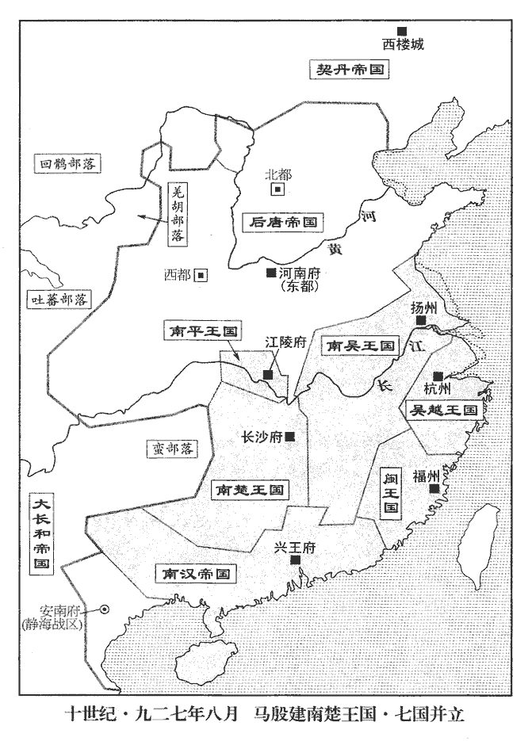
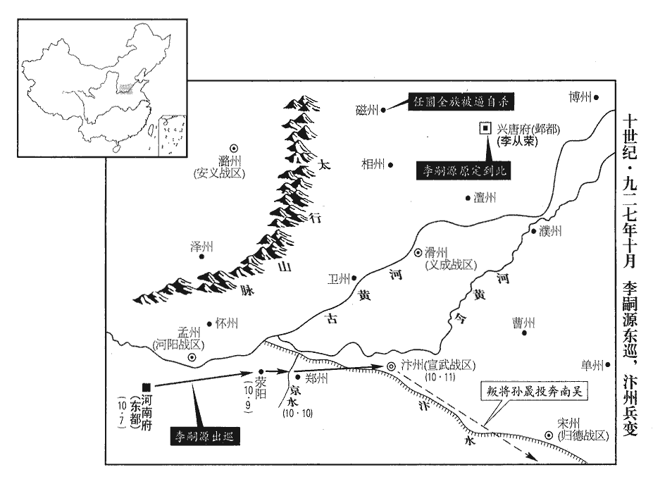
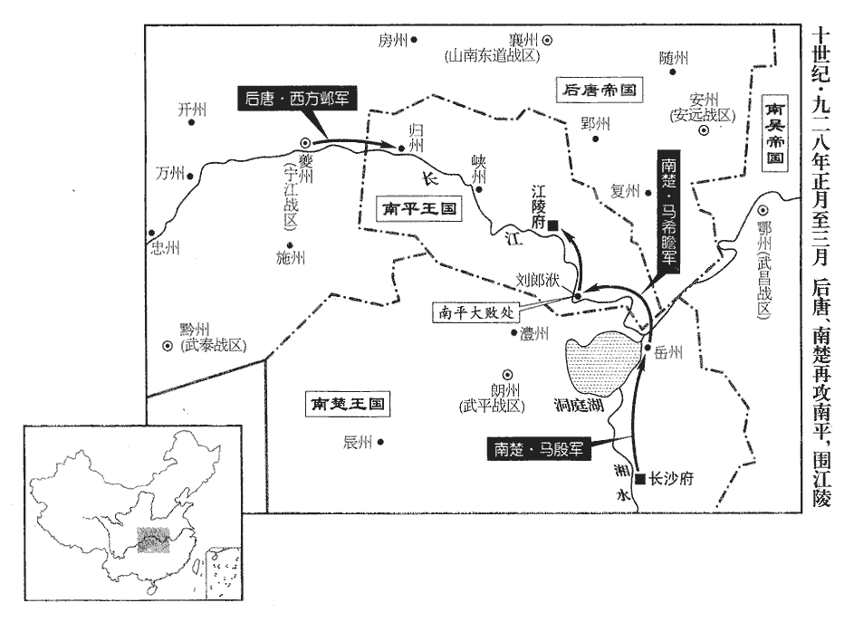
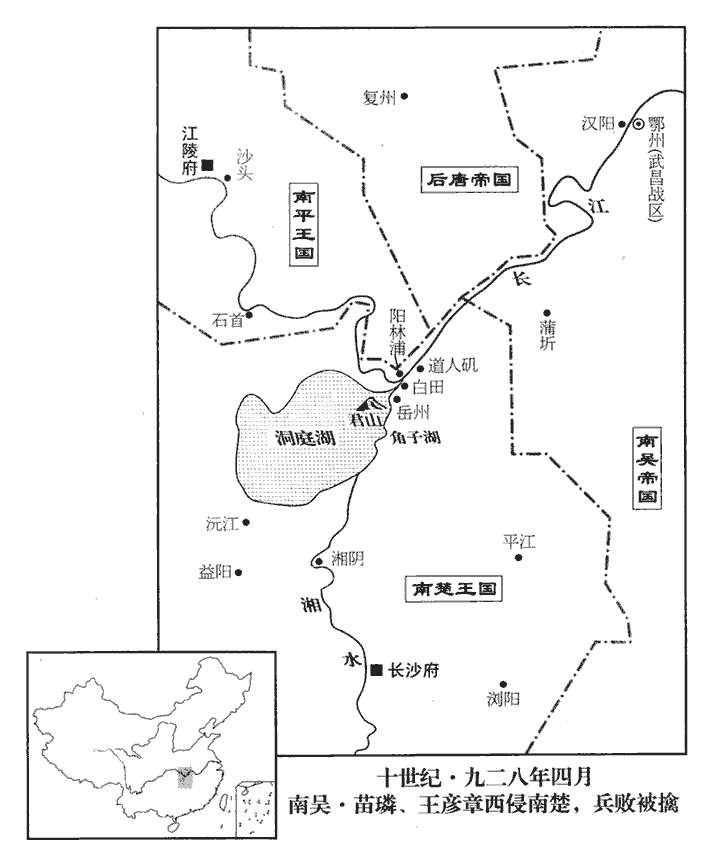
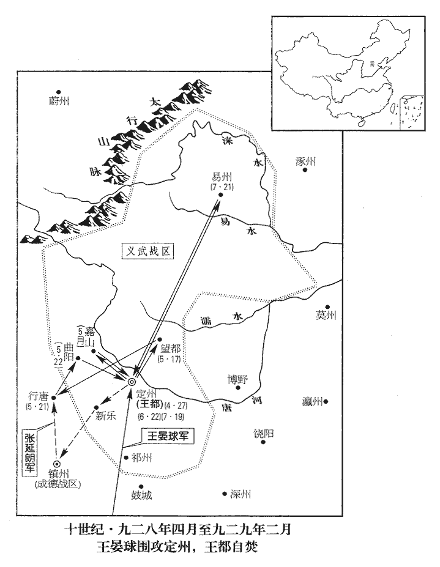
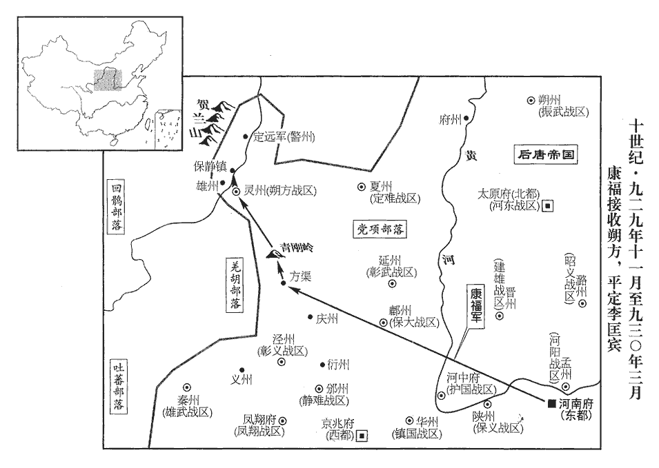
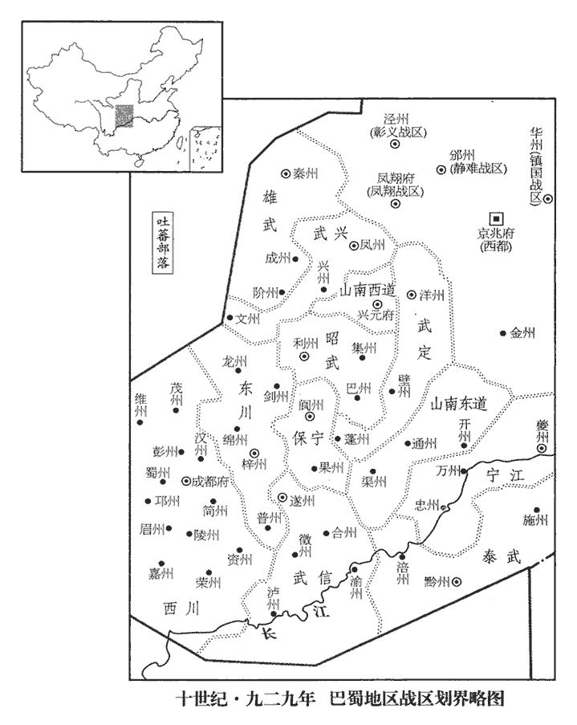

 後唐紀五起強圉大淵獻（丁亥）七月，盡屠維赤奮若（己丑），凡二年有奇。

# 明宗聖德和武欽孝皇帝中之上

## 天成二年（丁亥、九二七）

1秋，七月，以歸德‹总部设宋州河南省商丘市›節度使王晏球為北面副招討使。烏震既死，以王晏球代之。按薛史，是年七月甲辰詔曰：「本朝親王遙領方鎮，遂有副大使知節度事，傳代已深，相沿未改。其西川、東川今後落副大使，只云節度使。」尋諸鎮皆正授節度使。

〖译文〗 [1]秋季，七月，任命归德节度使王晏球为北面副招讨使。

2丙寅‹十七›，升夔州為寧江軍，以西方鄴為節度使。賞破高季興軍，復夔、忠、萬之功也。蜀以夔州為鎮江軍，今改為寧江軍。

〖译文〗 [2]丙寅（十七日），把夔州升为宁江军，任命西方邺为节度使。

3癸巳‹二十四›，【章：十二行本「巳」作「酉」；乙十一行本同；張校同，云無註本亦誤「巳」。】以與高季興夔、忠、萬三州為豆盧革、韋說之罪，元年以三州與季興，革、說猶為相，因以此罪之。皆賜死。

〖译文〗 [3]癸酉（二十四日），以上年给高季兴夔、忠、万三州一事定为豆卢革、韦说的罪行，把他们赐死。

4流段凝於遼州‹山西省左权县›，溫韜於德州‹山东省陵县›，劉訓於濮州‹山东省鄄城县›。自唐末以來，流貶者皆不至其地。遼、德、濮皆唐境也，此三人皆使至流所。

〖译文〗 [4]把段凝流放到辽州，温韬流放到德州，刘训流放到濮州。

5任圜請致仕居磁州‹河北省磁县›，磁，牆之翻。許之。

〖译文〗 [5]任圜请求退休居住在磁州，后唐帝答应了他的请求。

6八月，己卯朔‹一›，日有食之。

〖译文〗 [6]八月，己卯朔（初一），出现日食。

7冊禮使至長沙‹南楚首都潭州州政府所在县·湖南省长沙市›，楚王殷始建國，封楚王殷為國王見上卷是年六月。立宮殿，置百官，皆如天子，或微更其名：示不敢擬天朝也。更，工行翻。翰林學士曰文苑學士，知制誥曰知辭制，樞密院曰左右機要司，群下稱之曰殿下，令曰教。以姚彥章為左丞相，許德勳為右丞相，李鐸為司徒，崔穎為司空，拓跋恆為僕射，張彥瑤、張迎判機要司。馬殷所恃以為國者高郁也，建國置官，郁不與焉，何也？豈殷諸子已有忌郁之心歟？然管內官屬皆稱攝，惟朗‹湖南省常德市›、桂‹广西桂林市›節度使先除後請命。朗，武平軍‹总部设朗州湖南省常德市›，桂，靜江軍‹总部设桂州广西桂林市›，時皆屬楚。恆本姓元，避殷父諱改焉。

〖译文〗 [7]册礼使到达长沙，楚王马殷开始建国，他建立宫殿，设置百官，都和天子一样，有的稍变更一下名称，翰林学士叫文苑学士，知制诰叫知辞制，枢密院叫左右机要司，臣下称国王为殿下，国王下的命令称教令。任命姚彦章为左丞相，许德勋为右丞相，李铎为司徒，崔颖为司空，拓跋恒为仆射，张彦瑶、张迎判管机要部门。然而管内官属都称为摄，只有朗、桂节度使是先任命后请求国王批准。拔跋恒本姓元，为避马殷父亲讳才改为拓跋。

 

8九月，帝謂安重誨曰：「從榮左右有矯宣朕旨，令勿接儒生，恐弱人志氣者。朕以從榮年少臨大藩，是年三月從榮鎮鄴都‹兴唐府河北省大名县›，事見上卷。少，詩照翻。故擇名儒使輔導之，今奸人所言乃如此！」欲斬之；重誨請嚴戒而已。安重誨非儒也，故寬言者之罪。獨不思矯宣上旨，國有常刑邪！

〖译文〗 [8]九月，后唐帝对安重诲说：“李从荣身边有人假传朕的旨意，让他不要接近儒生，恐怕削弱人的志气。朕因为李从荣年轻，又管理大藩，所以给他选择了名儒来辅导他，没想到现在这些奸人们竟讲出这种话！”后唐帝想把这些假传圣旨的人斩掉。安重诲请求对这些人只是严加防备而已。

9北都‹太原府›留守李彥超請復姓符，從之。彥超，李存審子；存審本姓符。

〖译文〗 [9]北都留守李彦超请求恢复他姓符，后唐帝答应了他的请求。

10丙寅‹十八›，以樞密使孔循兼東都留守。帝欲東巡，使孔循留守洛陽。莊宗同光三年，復以洛陽為東都。

〖译文〗 [10]丙寅（十八日），任命枢密使孔循兼任东都留守。

11壬申‹二十四›，契丹來請脩好，好，呼到翻。遣使報之。

〖译文〗 [11]壬申（二十四日），契丹来人请求互通友好，后唐派遣使者回报契丹人。

12冬，十月，乙酉‹七›，帝發洛陽，將如汴州‹河南省开封市›；丁亥‹九›，至滎陽‹河南省荥阳市›。九域志：滎陽縣在鄭州西六十里，東至大梁一百四十里。

〖译文〗 [12]冬季，十月，乙酉（初七），后唐帝从洛阳出发去汴州。丁亥（初九），到达荥阳。

民間訛言帝欲自擊吳，又云欲制置東方諸侯。宣武‹总部设汴州河南省开封市›節度使、檢校侍中朱守殷疑懼，判官高密‹山东省高密县›孫晟勸守殷反，高密，漢古縣，隋亂廢，唐武德三年置於義城堡，六年移就故夷安城，即高密古縣也，屬密州。九域志：在州東北一百二十里。考異曰：江南錄作「孫忌」。今從王溥周世宗實錄。晟，承正翻。守殷遂乘城拒守。帝遣宣徽使范延光往諭之，延光曰：「不早擊之，則汴城堅矣；願得五百騎與俱。」帝從之。延光暮發，未明行二百里，抵大梁‹汴州州政府所在城·河南省开封市›城下，與汴人戰，汴人大驚。戊子‹十›，帝至京水‹古汴河支流，流经河南省郑州市西›，京水在滎陽之東，索水之西。遣御營使石敬瑭將親兵倍道繼之。自梁以來，有侍衛親軍、侍衛馬軍、侍衛步軍。

〖译文〗 民间谣传后唐帝打算亲自率兵攻打吴国，又传说要制服东方诸侯。宣武节度使、检校侍中朱守殷对此疑惧，判官高密人孙晟劝朱守殷反叛，于是朱守殷登上汴州城坚守。后唐帝派遣宣徽使范延光前去告示朱守殷，范延光说：“如不及早攻打他们，汴州就会越来越坚固。我希望率领五百骑兵一起前往。”后唐帝听从了他的建议。范延光在太阳落山时出发，第二天天还没有亮就走了二百里，直抵汴州城下，和汴州的人交锋，汴州人感到非常吃惊。戊子（初十），后唐帝到达京水，派遣御营使石敬瑭率领禁卫军日夜兼程去增援范延光。

或謂安重誨曰：「失職在外之人，乘賊未破，或能為患，不如除之。」重誨以為然，奏遣使賜任圜死。任圜罷相見上卷是年六月。端明殿學士趙鳳哭謂重誨曰：「任圜義士，安肯為逆！公濫刑如此，何以贊國！」使者至磁州‹河北省磁县›，圜聚其族酣飲，然後死，神情不撓。撓，奴教翻。

〖译文〗 有人对安重诲说：“那些被免除官职而在外面的人，乘乱贼还未被击败，或许能成为祸患，不如把他们消灭了。”安重诲认为说得对，于是上奏请求派遣使者赐任圜死。端明殿学士赵凤哭着对安重诲说：“任圜是个讲道义的人，怎么肯叛逆呢？你如此滥用刑法，怎么能辅佐国家。”前往赐任圜死的使者到达磁州，任圜把他的家族集合起来喝酒，然后死去，表情没有屈服的样子。

13己丑‹十一›，帝至大梁，四面進攻，吏民縋城出降者甚眾。縋，馳偽翻。守殷知事不濟，盡殺其族，引頸命左右斬之。乘城者望見乘輿，乘，承正翻。相帥開門降。帥，讀曰率；下同。孫晟奔吳，徐知誥客之。為孫晟盡節於江南張本。

〖译文〗 [13]己丑（十一日），后唐帝到汴州，四面向汴州城发起进攻，官吏和百姓从城上缒绳出来投降的人很多。朱守殷知道事情不能成功，于是把他的家族全部杀掉，又伸出脖子让左右把他杀死。登上城的人们望见了后唐帝圣驾，都争着打开城门出来投降。孙晟逃奔到了吴国，徐知诰以客相待。

14戊戌‹二十›，詔免三司逋負近二百萬緡。近，其靳翻。

〖译文〗 [14]戊戌（二十日），后唐帝下诏免去三司拖欠的赋税近二百万缗。

 

15辛丑‹二十三›，吳大丞相、都督中外諸軍事、諸道都統、鎮海‹总部金陵府›•寧國‹总部宣州›節度使兼中書令東海王徐溫卒‹年六十六岁›。

〖译文〗 [15]辛丑（二十三日），吴国大丞相、都督中外诸军事、诸道都统、镇海与宁国节度使兼中书令东海王徐温去世。

初，溫子行軍司馬、忠義節度使、同平章事知詢以其兄知誥非徐氏子，徐溫養知誥為子，見二百六十卷唐昭宗乾寧二年。數請代之執吳政，數，所角翻。溫曰：「汝曹皆不如也。」嚴可求及行軍副使徐玠屢勸溫以知詢代知誥，徐知誥之於嚴可求，結之以婚姻，而可求之心不為之變。徐溫之門，忠於所事者，嚴可求、陳彥謙而已。溫以知誥孝謹，不忍也。陳夫人曰：「知誥自我家貧賤時養之，陳夫人，徐溫之妻，子畜知誥者也。柰何富貴而棄之！」可求等言之不已。溫欲帥諸藩鎮入朝‹江都，江苏省扬州市›，勸吳王‹杨溥›稱帝，帥，讀曰率。將行，有疾，乃遣知詢奉表勸進，因留代知誥執政。知誥草表欲求洪州‹江西省南昌市›節度使，俟旦上之，上，時兩翻。是夕，溫凶問至，乃止。史言徐知誥得吳國之政，亦有數存乎其間；篡吳之業自此成矣。知詢亟歸金陵‹江苏省南京市›。為知誥、知詢不相容張本。吳主贈溫齊王，諡曰忠武。

〖译文〗 当初，徐温的儿子行军司马、忠义节度使、同平章事徐知询认为他的哥哥徐知诰不是徐氏的儿子，曾多次请求代替他执掌吴国国政，徐温说：“你们都不如他。”严可求以及行军副使徐也屡次劝说徐温让徐知询代替徐知诰，徐温认为徐知诰孝顺谨慎，不忍心让徐知询代替他。陈夫人说：“徐知诰是在我们贫穷时就收养了的，怎么能够富贵以后就抛弃他呢？”但严可求等仍然劝不说不已。徐温打算率领诸藩镇的官员入朝劝说吴王称帝，将要出发时突然生病，于是就派遣徐知询拿着奏表去劝吴王称帝，因而留下代替徐知诰处理政事。徐知诰起草了奏表想请求出任洪州节度使，打算第二天早晨送上去，这天晚上，徐温的死讯传来，才没有上表。徐知询很快回到金陵。吴主赠徐温为齐王，谥号叫忠武。

16山南西道‹总部设兴元府陕西省汉中市›節度使張筠久疾，將佐請見，不許。副使符彥琳等疑其已死，恐左右有奸謀，請權交符印；筠怒，收彥琳及判官都指揮使下獄，誣以謀反。下，遐嫁翻。詔取彥琳等詣闕，按之無狀，釋之；觀于可洪、張筠之事，帝之廟號曰明，亦有以也。徙筠為西都留守。莊宗同光三年，復以長安為西都。

〖译文〗 [16]山南西道节度使张筠病了好长时间，将佐们请求相见，没有得到允许。副使符彦林等怀疑他已经死去，害怕张筠的左右人员有阴谋，于是请求暂交符印。张筠知道后十分生气，下令拘捕了符彦琳以及判官都指挥使等，并把他们送进监狱，以谋反来诬陷他们。后唐帝取符彦琳等上朝，经过核查后发现符彦琳没有谋反的证据，就把他释放了。调张筠为西都留守。

17癸卯‹二十五›，以保義‹总部设陕州河南省三门峡市›節度使石敬瑭為宣武節度使，朱守殷反死，以石敬瑭代之。兼侍衛親軍馬步都指揮使。

〖译文〗 [17]癸卯（二十五日），任命保义节度使石敬瑭为宣武节度使，兼任侍卫亲军马步都指挥使。

18十一月，庚戌‹三›，吳王‹杨溥›即皇帝位，追尊孝武王曰武皇帝，景王曰景皇帝，宣王曰宣皇帝。孝武王，忠武王行密也；景王，威王渥也；宣王者，隆演也。

〖译文〗 [18]十一月，庚戌（初三），吴王即皇帝位，追尊孝武王为武皇帝，景王为景皇帝，宣王为宣皇帝。

19安重誨議伐吳，安重誨欲乘徐溫之死而伐之，且問其舉大號之罪。帝不從。根本不固而伐人之國，莊宗覆車可鑒也；故不許。

〖译文〗 [19]安重诲商议想讨伐吴国，后唐帝没有听从他的意见。

20甲子‹十七›，吳大赦，改元乾貞。

〖译文〗 [20]甲子（十七日），吴国实行大赦，改年号为乾贞。

丙子‹二十九›，吳主尊太妃王氏曰皇太后，以徐知詢為諸道副都統、鎮海‹总部金陵府›寧國‹总部宣州›節度使兼侍中，若使之嗣徐溫之官職者。加徐知誥都督中外諸軍事。吳國中外大權實皆歸於徐知誥。

〖译文〗 两子（二十九日），吴主尊太妃王氏为皇太后。任命徐知询为诸道副都统、镇海宁国节度使兼侍中，加封徐知诰都督中外诸军事。

21十二月，戊寅朔‹一›，孟知祥發民丁二十萬脩成都城。

〖译文〗 [21]十二月，戊寅朔（初一），孟知祥征发二十万民丁修建成都城。

22吳主立兄廬江公濛為常山王，弟鄱陽公澈為平原王，澈，敕列翻。兄子南昌公珙為建安王。珙gǒng，居勇翻。吳主稱帝，封其兄弟及其兄子皆自公陞王。

〖译文〗 [22]吴主立其兄庐江公杨为常山王，立其弟鄱阳公杨澈为平原王，立其兄的儿子南昌公杨为建安王。

23初，晉陽‹山西省太原市›相者周玄豹相，息亮翻。嘗言帝貴不可言，帝即位，欲召詣闕；趙鳳曰：「玄豹言陛下當為天子，今已驗矣，無所復詢。復，扶又翻。若置之京師，則輕躁狂險之人必輻輳其門，爭問吉凶。自古術士妄言，致人族滅者多矣，非所以靖國家也。」史言趙鳳有識。帝乃就除光祿卿致仕，厚賜金帛而已。

〖译文〗 [23]当初，晋阳有个会相面的人叫周玄豹，他曾经说后唐帝的相貌贵不可言，后唐帝即位之后，打算把他召到朝廷里来。赵凤说：“周玄豹曾经说过陛下当为天子，今天已经验证，没有必要再查询他了。如果把他留在京师，那些轻举妄动、性情暴躁、狂放不拘等危险人物就一定会聚集到他的门下，争相询问凶吉。自古以来那些巫祝占卜之流经常胡说八道，致使很多人全家被诛灭，这些人根本不能用来安定国家。”后唐帝任命他为光禄卿，并以此职退休，只赏给他很多金帛而已。

24中書舍人馬縞縞，工老翻。請用漢光武‹刘秀›故事，七廟之外別立親廟；見四十一卷漢光武建武三年。中書門下奏請如漢孝德‹刘祜父刘庆›、孝仁‹刘宏父刘苌›皇例，稱皇不稱帝。孝德皇見五十卷漢安帝建光元年；孝仁皇見五十六卷靈帝建寧元年。帝欲兼稱帝，群臣乃引德明、玄元、興聖皇帝例，皆立廟京師；唐尊皋陶為德明皇帝，老子‹李耳›為玄元皇帝，涼武昭王‹李暠›為興聖皇帝。例，時詣翻。帝令立於應州‹山西省应县›舊宅，自高祖考妣以下皆追諡曰皇帝、皇后，墓曰陵。五代會要：帝追尊高祖聿為孝恭皇帝，廟號惠祖，陵曰遂陵，妣崔氏曰昭皇后；曾祖教曰孝質皇帝，廟號毅祖，陵曰衍陵，妣張氏曰順皇后；祖琰曰孝靖皇帝，廟號烈祖，陵曰奕陵，妣何氏曰穆皇后；父霓曰孝成皇帝，廟號德祖，陵曰慶陵。歐史曰：高祖妣劉氏，曾祖諱敖，父孝成，妣劉氏諡懿皇后，四陵皆在應州金城縣。按帝之先本夷狄，既無姓氏，其名必當時有司所製也。

〖译文〗 [24]中书舍人马缟请求用汉光武时的典章制度，七庙之外另立一个亲庙。中书门下上奏请求象汉教德、教仁皇那样，称皇不称帝。后唐帝想兼称帝，大臣们于是就引用德用、玄元、兴圣皇帝的例子，都在京师立庙。后唐帝命令在应州旧宅立庙，从高祖的父母以下都追谥为皇帝、皇后，他们的墓都称为陵。

25漢主‹首都兴王府广东省广州市›刘岩，本年十九岁如康州‹广东省德庆县›。九域志：廣州南至康州一百九十里。

〖译文〗 [25]南汉主到达康州。

26是歲，蔚‹河北省蔚县›、代‹山西省代县›緣邊粟斗不過十錢。蔚，紆勿翻。

〖译文〗 [26]这一年，蔚、代沿边境的地方一斗粮食的价钱不到十钱。

## 三年（戊子、九二八）

1春，正月，丁巳‹十›，吳主‹首都江都府江苏省扬州市›杨溥，本年二十九岁立子璉為江都王，璘為江夏王，璆為宜春王，宣帝子廬陵公玢為南陽王。璉，力展翻。璘，離珍翻。璆，音求。玢，悲巾翻。吳主諡兄隆演曰宣皇帝。

〖译文〗 [1]春季，正月，丁巳（初十），吴主立他的儿子杨琏为江都王，杨为江夏王，杨为宜春王，宣帝的儿子庐陵公杨玢为南阳王。

2昭義‹总部设潞州山西省长治市›節度使毛璋所為驕僭，時服赭袍，赭袍，天子所服。赭，音者。縱酒為戲，左右有諫者，剖其心而視之。帝‹李嗣源（邈佶烈）本年六十二岁›聞之，徵為右金吾衛上將軍。毛璋在邠州以驕僭徵，及在潞州復然，謂之不軌可也。然一詔徵之則束手入衛，蓋其人冥頑驕虐，本無他心，不知僭擬之為非；然亦明宗能容之耳。

〖译文〗 [2]昭义节度使毛璋的所作所为骄横越轨，有时穿着天子所穿赭袍，狂饮娱乐，左右有规劝他的，他就让人剖其心察看。后唐帝听说此事，征调他为右金吾卫上将军。

3契丹‹首都西楼城内蒙古巴林左旗›陷平州‹河北省卢龙县›。元年冬盧文進來奔，唐得平州，至是復為契丹所陷。

〖译文〗 [3]契丹人攻陷平州。

4二月，丁丑朔‹一›，日有食之。

〖译文〗 [4]二月，丁丑朔（初一），出现日食。

5帝將如鄴都‹兴唐府·河北省大名县›，時扈駕諸軍家屬甫遷大梁‹汴州州政府所在城·河南省开封市›，又聞將如鄴都，皆不悅，詾詾有流言；說，讀曰悅。詾，許拱翻。帝聞之，不果行。

〖译文〗 [5]后唐帝将要到邺都，当时扈驾诸军的家属刚刚迁到大梁，听说要到邺都，都不高兴，流言议论纷纷。后唐帝听说后，没有成行。

6吳自莊宗滅梁以來，使者往來不絕。庚辰‹四›，吳使者至，安重誨以為楊溥敢與朝廷抗禮，並立為帝，是抗禮也。遣使窺覘，覘，丑廉翻，又丑豔翻。拒而不受，自是遂與吳絕。

〖译文〗 [6]吴国自从庄宗消灭了后梁国以来，使者往来不断。庚辰（初四），吴国的使者到来，安重诲以为吴王杨溥敢和朝廷抗礼，于是派出使者去暗中窥视，并拒不接受他，从此以后就和吴国断绝了关系。

7張筠至長安，去年徙張筠留守西都。守兵閉門拒之；上意也。筠單騎入朝，以為左衛上將軍。

〖译文〗 [7]张筠到了长安，把守城门的士卒关起来不让他进去。张筠单人匹马入朝，后唐帝任命他为左卫上将军。

8壬辰‹十六›，寧江‹总部设夔州重庆市奉节县›節度使西方鄴攻拔歸州‹湖北省秭归县›；未幾，荊南復取之。歸州，高季興巡屬也。九域志：夔州東至歸州三百三十里。幾，居豈翻。復，扶又翻；下宜復同。

〖译文〗 [8]壬辰（十六日），宁江节度使西方邺攻下了归州。没过多久，荆南又夺了回去。

9樞密使、同平章事孔循，性狡佞，安重誨親信之。帝欲為皇子娶重誨女，為，于偽翻。循謂重誨曰：「公職居近密，不宜復與皇子為婚。」重誨辭之。久之，或謂重誨曰：「循善離間人，間，古莧翻。不可置之密地。」循知之，陰遣人結王德妃，求納其女；德妃請娶循女為從厚婦，帝許之。王德妃有寵於帝，言無不行，後進拜淑妃。重誨大怒，乙未‹十九›，以循同平章事，充忠武‹总部设许州河南省许昌市›節度使兼東都留守。解其近密之職。

〖译文〗 [9]枢密使、同平章事孔循性情狡猾，善于花言巧语，安重诲很亲信他。后唐帝想为他的儿子娶安重诲的女儿为妻子，孔循对安重诲说：“您身为皇上的近臣，你们又很密切，不应再和皇子为婚姻亲戚。”于是安重诲就推辞了女儿的婚事。过一段时间，有人对安重诲说：“孔循善于挑拨离间，不可安排在与皇上密切接触的位置。”孔循知道这件事后，就暗暗派人去巴结王德妃，请求接纳他的女儿。王德妃请求皇帝为皇子李从厚娶孔循的女儿为妻，后唐帝答应了她的请求。安重诲听到这件事后大发雷霆。乙未（十九日），后唐帝任命孔循为同平章事、忠武节度使兼东都留守。

重誨性強愎。愎，蒲逼翻。秦州‹甘肃省秦安县西北›節度使華溫琪入朝，請留闕下，帝嘉之，當時諸帥皆樂在方鎮得自恣，獨華溫琪入朝請留，故嘉之。華，戶化翻。除左驍衛上將軍，月別賜錢穀。俸給之外別賜錢穀。歲餘，帝謂重誨曰：「溫琪舊人，宜擇一重鎮處之。」華溫琪仕梁已為節鎮，故云然。處，昌呂翻。重誨對以無闕。他日，帝屢言之，重誨慍曰：「臣累奏無闕，惟樞密使可代耳。」帝曰：「亦可。」重誨無以對。華溫琪之才誠不足以當重鎮，安重誨以君臣相得之雅，詳明敷奏，明宗宜無不從；今則上下之言交不能暢其意，相厲而已，斯不學至此也。溫琪聞之懼，數月不出。

〖译文〗 安重诲性情刚愎。秦州节度使华温琪入朝，请求留在朝廷，后唐帝表彰了他，任他为左骁卫上将军，每月除了俸禄外还要赏赐他些钱谷。一年多以后，后唐帝对安重诲说：“华温琪是旧交，应该选择一个重镇来安排他。”安重诲回答说没有空缺。又一天，后唐帝又反复说起这件事，安重诲恼怒地说：“我曾多次上奏说没有空缺，只有枢密使可以代替。”后唐帝说：“也可以。”安重诲无言以对。华温琪听说这件事后感到非常害怕，好几个月不敢出门。

重誨惡成德‹总部设镇州河北省正定县›節度使、同平章事王建立，奏建立與王都交結，有異志。惡，烏路翻。初，帝為代州刺史，王建立已為虞候將，後從鎮真定。帝自鄴為亂兵所逼，舉兵南向，建立殺真定監軍，帝家屬得全，由是愛之；及帝即位，擢為真定帥。安重誨亦帝潛躍之時所親信者也，即位，自中門使擢樞密使。重誨之所以惡建立，權寵之間耳。又，是時王都在中山有異志，數以書通建立，約為兄弟，故重誨言之。建立亦奏重誨專權，求入朝面言其狀，帝召之；既至，言重誨與宣徽使判三司張延朗結婚，相表裏，弄威福。三月，辛亥‹五›，帝見重誨，氣色甚怒，謂曰：「今與卿一鎮自休息，以王建立代卿，張延朗亦除外官。」重誨曰：「臣披荊棘事陛下數十年，值陛下龍飛，承乏機密，承乏者，承人之乏也，言適時乏人，故己得任機密。數年間天下幸無事；今一旦棄之外鎮，臣願聞其罪！」帝不懌而起，此段自孔循以下言重誨與孔循相傾，自華溫琪以下言其君臣嫌隙之所自來。蓋重誨挾依乘之舊，戀權而不肯退，明宗積受浸潤之譖，欲遠之而不能，至於決裂，則不可救矣。以語宣徽使朱弘昭，語，牛倨翻。弘昭曰：「陛下平日待重誨如左右手，柰何以小忿棄之！願垂三思。」朱弘昭今日之言，知重誨之眷未衰也；鳳翔之奏，知重誨之權已去也。小人之智，隨時而反覆，可畏也哉！帝尋召重誨慰撫之。明日，建立辭歸鎮，帝曰：「卿比奏欲入分朕憂，比，毗至翻，近也。今復去何之！」復，扶又翻；下不復同。會門下侍郎兼刑部尚書、同平章事鄭珏請致仕，己未‹十三›，以珏為左僕射致仕；癸亥‹十七›，以建立為右僕射兼中書侍郎、同平章事、判三司。

〖译文〗 安重诲很恨成德节度使、同平章事王建立，上奏说王建立和王都互相勾结，有叛变的意图。王建立也奏称，安重诲独揽大权，请求入朝当面向后唐帝说明情况，后唐帝就召见他。他到了朝廷，说安重诲与宣徽使判三司张延朗结为婚姻亲戚，内外勾结，作威作福。三月，辛亥（初五），后唐帝见了安重诲，满脸怒气，对他说：“现在给你一镇自己休息去，用王建立代替你，张延朗也放为外任。”安重诲说：“臣披荆斩棘侍奉陛下数十年，正值陛下兴起，缺乏适当人选，臣任机要，几年来天下平安无事。现在把我抛弃去外，我希望听听有什么罪过。”后唐帝很不高兴地站起来，告诉了宣徽使朱弘昭，朱弘昭说：“陛下平日待安重诲如左右手，怎么能因小的忿怒就抛弃了他呢？希望陛下三思。”不久，后唐帝又召见安重诲安抚慰问。第二天，王建立辞别回镇，后唐帝说：“你近来上奏说，想在朝廷分担我的忧愁，今天又要到哪儿去！”正好这时门下侍郎兼刑部尚书、同平章事郑珏请求退休，己未（十三），命郑珏为左仆射退休。癸亥（十七日），任命王建立为右仆射兼中书侍郎、同平章事、判三司。

10孟知祥屢與董璋爭鹽利，蜀中井鹽，東‹总部梓州›、西川‹总部成都府›巡屬之內皆有之，各欲障固以專其利，故爭。按唐盛時，邛、嘉、眉有井十三，劍南西川院領之；梓、遂、綿、合、昌、渝、瀘、資、榮、陵、簡有井四百六十，劍南東川院領之。東川鹽利多於西川矣。璋誘商旅販東川鹽入西川，知祥患之，乃於漢州‹四川省广汉市›置三場重征之，漢州東南與東川接界‹四川省德阳市东北绵阳河›，故列置三場以征鹽商。歲得錢七萬緡，商旅不復之東川。之，往也。

〖译文〗 [10]孟知祥曾多次和董璋争夺盐利，董璋引诱商贩们贩东川的盐入西川，孟知祥对此十分忧虑，在汉州修置了三个场地征收商人的重税，一年可以得到税钱七万缗，从此商贩们不再到东川贩盐了。

11楚王殷‹首都长沙府湖南省长沙市›马殷，本年七十七岁如岳州‹湖南省岳阳市›，遣六軍使袁詮、詮，丑緣翻。副使王環、監軍馬希瞻將水軍擊荊南‹总部设江陵府湖北省江陵县›，高季興以水軍逆戰。至劉郎洑‹湖北省石首市沙步乡刘郎浦›，江陵府石首縣沙步有劉郎浦，蜀先主納吳女處也。洑，房六翻。洄流曰洑。希瞻夜匿戰艦數十艘於港中；艦，戶黯翻。艘，疏留翻。港，古項翻。詰旦，兩軍合戰，希瞻出戰艦橫擊之，季興大敗，俘斬以千數，進逼江陵‹湖北省江陵县›。季興請和，歸史光憲于楚。高季興執史光憲見上卷上年。軍還，還，從宣翻，又如字。楚王殷讓環不遂取荊南，環曰：「江陵在中朝及吳、蜀之間，中朝，謂唐也，既在中原，且天朝也。四戰之地也，四面受敵，謂之四戰之地。宜存之以為吾扞蔽。」宋時趙韓王勸太祖緩取太原，意亦如此。殷悅。環每戰，身先士卒，先，悉薦翻。與眾同甘苦；常置鍼藥於座右，戰罷，索傷者於帳前，自傅治之。鍼，諸深翻。索，山客翻。治，直之翻。士卒隸環麾下者相賀曰：「吾屬得死所矣。」故所向有功。史言為將得士卒之死力者勝。

〖译文〗 [11]楚王马殷到达岳州，派遣六军使袁诠、副使王环、监军马希瞻等率领水军攻打荆南，高季兴也用水军迎战。到了刘郎，马希瞻乘夜间在港中偷偷藏匿下数十艘战船，第二天早晨，两军交战，马希瞻开出战船截击，大败高季兴，俘获和斩杀数以千计，然后进副江陵。高季兴请求讲和，并把史光宪送还楚国。楚军回去后，楚王马殷责备王环不断续前进夺取荆南，王环说：“江陵在唐以及吴、蜀之间，这里四面受敌，应当把它保存下来作为我们屏藩。”马殷听后很高兴。王环每次作战，都身先士卒，和大家同甘共苦。他经常在座位的右侧放一些针和药物，战斗结束后，他就寻找一些受伤的士卒到营帐前，亲自给他们敷药治疗。那些隶属王环的部下都互相称贺说：“我们得到了死后的归所。”所以每次作战，都会建立功勋。

12楚大舉水軍擊漢‹首都兴王府广东省广州市›，圍封州‹广东省封开县›。宋白曰：封州即漢蒼梧郡之廣信縣也，梁置梁信郡，隋置封州，在豐水之陽。漢主‹刘岩，本年四十岁›以周易筮之，遇大有，龜為卜，策為筮。以四十九策信手分開，視其奇耦，三變而成爻，十有八變而成卦。於是大赦，改元大有；命左右街使蘇章將神弩三千、戰艦百艘救封州。漢都番禺，倣唐上京，置左、右街使。九域志：廣州西至封州六百一十里。章至賀江‹临贺水，于广东省封开县注入西江›，沈鐵絙於水，沈，持林翻。絙，居登翻。兩岸作巨輪挽絙，築長堤以隱之，伏壯士於堤中。章以輕舟逆戰，陽不利，楚人逐之，入堤中；挽輪舉絙，楚艦不能進退，以強弩夾水射之，射，而亦翻。楚兵大敗，解圍遁去。漢主以章為封州團練使。

〖译文〗 [12]楚国发动所有水军向南汉发起攻击，包围了南汉的封州。南汉主用《周易》来占卜这次战争，遇上“大有”卦，于是实行大赦，改年号为大有。南汉主命令左右街使苏章率领三千神射手、一百艘战船去援救封州。苏章到达贺江，把铁链沉在水中，两岸作巨轮把铁链挽住，又修筑长堤坝把它隐藏起来，在堤坝中埋伏壮士。苏章乘轻舟去迎战，假装战败，楚人追击，进入堤坝中，南汉兵把轮子上的铁链拉开，楚军的战船进退不得，然后神射手们在两岸用强弩射击楚军，楚兵大败，解除封州的包围逃跑了。南汉主任命苏章为封州团练使。

 

13夏，四月，以鄴都‹兴唐府河北省大名县›留守從榮為河東‹总部设太原府山西省太原市›節度使、北都‹太原府›留守，以客省使太原‹山西省太原市›馮贇yūn為副留守，贇，於倫翻。夾馬指揮使新平‹陕西省彬县›楊思權為步軍都指揮使以佐之。戊寅‹三›，以宣武‹总部设汴州河南省开封市›節度使石敬瑭為鄴都留守、天雄‹总部设兴唐府河北省大名县›節度使，加同平章事；以樞密使范延光為成德節度使。丙戌‹十一›，以樞密使安重誨兼河南尹，以河南尹從厚為宣武節度使，仍判六軍諸衛事。從厚本以河南尹判六軍諸衛事，今易鎮汴州而判六軍諸衛事如故。

〖译文〗 [13]夏季，四月，后唐帝任命邺都留守李从荣为河东节度使、北都留守，客省使太原人冯为北都副留守，夹马指挥使新平人杨思权为步兵都指挥使辅佐李从荣。戊寅（初三），任命宣武节度使石敬瑭为邺都留守、天雄节度使，加同平章事。枢密使范延光为成德节度使。丙戌（十一日），任命枢密使安重诲兼任河南尹，河南尹李从厚为宣武节度使，仍然判六军诸卫事。

14吳‹首都江都府江苏省扬州市›右雄武軍使苗璘、靜江統軍王彥章將水軍萬人攻楚岳州，至君山‹洞庭湖中小岛，今已与陆地相连›，岳州治巴陵，洞庭湖在巴陵西，君山在洞庭湖中，方六十里。楚王殷遣右丞相許德勳將戰艦千艘禦之。德勳曰：「吳人掩吾不備，見大軍，必懼而走。」乃潛軍角子湖‹湖南省岳阳市西南›，使王環夜帥戰艦三百，絕【章：十二行本「絕」上有「屯陽林浦‹岳阳市长江北岸›」四字；乙十一行本同；退齋校同；張校同，云無註本亦無。】吳歸路。帥，讀曰率。遲明，吳人進軍荊江口‹洞庭湖注入长江处›，遲，直二翻。荊江口，洞庭湖與大江會處。將會荊南兵攻岳州，丁亥‹十二›，至道人磯‹湖南省临湘市西长江东岸›。德勳命戰棹zhào都虞候詹信以輕舟三百出吳軍後，德勳以大軍當其前，夾擊之，吳軍大敗，虜璘及彥章以歸。

〖译文〗 [14]吴国右雄武军使苗、静江统军王彦章率领一万水军向楚国的岳州发起进攻，到了君山，楚王马殷派遣右丞相许德勋率领一千多艘战船去抵御吴军。许德勋说：“吴军想乘我们没有防备而袭击，当他看见我们大军时，一定会感到害怕而逃跑。”于是他们偷偷地驻在角子湖，派王环在黑夜里率领三百战船去断绝吴军的回路。天将亮的时候，吴军进军到荆江口，准备会合荆南军队一起攻打岳州，丁亥（十二日），到达道人矶。许德勋命令战棹都虞候詹信率三百轻便船只走在吴军的后面，许德勋率领大军迎在吴军的前面，前后夹攻吴军，将吴军打得大败，俘虏了苗、王彦章，把他们带回楚国。

 

15初，義武‹总部设定州河北省定州市›節度使兼中書令王都‹刘云郎›鎮易定十餘年，梁均王龍德元年，王都得定州，至是九年。自除刺史以下官，租賦皆贍本軍。及安重誨用事，稍以法制裁之；帝亦以都篡父位，惡之。王都囚其父處直而篡其位，見二百七十一卷後梁均王龍德元年。惡，烏路翻。時契丹數犯塞，數，所角翻。朝廷多屯兵於幽‹北京市›、易‹河北省易县›間，瓦橋、盧蘆臺皆在幽、易之間。大將往來，都陰為之備，浸成猜阻。都恐朝廷移之他鎮，腹心和昭訓勸都為自全之計，都乃求婚於盧龍‹总部设幽州北京市›節度使趙德鈞。又知成德節度使王建立與安重誨有隙，遣使結為兄弟，陰與之謀復河北故事，欲復如唐河北諸鎮世襲，不輸朝廷貢賦，不受朝廷徵發。建立陽許而密奏之。都又以蠟書遺青、徐、潞、益、梓五帥，離間之。是時青帥霍彥威，徐帥房知溫，潞帥毛璋，益帥孟知祥，梓帥董璋，皆倔強難制者也。遺，唯季翻；下金遺同。間，古莧翻。又遣人說北面副招討使歸德‹总部设宋州河南省商丘市›節度使王晏球，說，式芮翻。晏球不從；乃以金遺晏球帳下，使圖之，不克；遺，于季翻。癸巳‹十八›，晏球以都反狀聞，詔宣徽使張延朗與北面諸將議討之。北面諸將，謂招討王晏球及所部戍幽、易間諸將及幽州帥趙德鈞也。

〖译文〗 [15]当初，义武节度使兼中书令王都在易定镇守了十多年，自己任命刺史以下的官吏，所交的租赋都用来供养本地军队。等到安重诲掌权以后，渐渐按国家法规办事。后唐帝也因为王都是篡夺了他父亲的权位而憎恨他。当时，契丹人曾多次侵略边境，所以朝廷在幽、易之间驻扎了大量军队。对于军队将领们的行动，王都暗地里都有所防备，时间长了逐渐产生了猜疑。王都害怕朝廷把他调到其他地方，他的心腹和昭训劝他要保全自己的办法，于是王都就向卢龙节度使赵德钧求婚。又知成德节度使王建立与安重诲之间有些矛盾，派遣使者去和王建立结为兄弟，同时偷偷和王建立谋划恢复河北地区原来的诸镇世袭、不给朝廷贡赋、不受朝廷征发等旧的规定。王建立表面上答应了他，但又秘密把这些情况上奏后唐帝。王都又把用蜡封好的密信送给青、徐、潞、益、梓五个统帅，挑拨离间他们。王都还派人去劝说北面副招讨使归德节度使王晏球，王晏球没有听从他。于是把金子送到王晏球营帐贿赂他，使他想办法，但没有结果，癸巳（十八日），王晏球把王都谋反的情况上奏，后唐帝下诏宣徽使张延朗和北面各位将领商议讨伐王都。

16戊戌‹二十三›，吳徙常山王濛為臨川王。

〖译文〗 [16]戊戌（二十三日），吴国调常山王杨为临川王。

17庚子‹二十五›，詔削奪王都官爵。壬寅‹二十七›，以王晏球為北面招討使，權知定州行州事，以橫海‹总部设沧州河北省沧州市东南›節度使安審通為副招討使，以鄭州‹河南省郑州市›防禦使張虔釗為都監，監，古銜翻。發諸道兵會討定州。是日，晏球攻定州，拔其北關城‹北城门外街市›。權知定州行州事者，以未得定州城，使王晏球權知行州事於城外，以招撫定州之民。蓋此命未頒，晏球之兵已至定州城下矣。都以重賂求救於奚‹滦河上游›酋禿餒，禿餒即圍莊宗者，虜酋之桀也。酋，慈秋翻。五月，禿餒以萬騎突入定州；晏球退保曲陽‹河北省曲阳县›，曲陽，漢之上曲陽縣，隋改為恆陽；唐元和十五年更名曲陽，避穆宗名也，屬定州。九域志：縣在州西六十里。都與禿餒就攻之。晏球與戰於嘉山‹河北省曲阳县东›下，大破之，禿餒以二千騎奔還定州。晏球追至城門，因進攻之，得其西關城‹西城门外街市›。定州城堅，不可攻，晏球增脩西關城以為行府，置招討使行府及定州行州於西關城。使三州民輸稅供軍食而守之。三州，定‹河北省定州市›、祁‹河北省无极县›、易‹河北省易县›也。王晏球之攻定州，以持久弊之，此其先定之計也。

〖译文〗 [17]庚子（二十五日），后唐帝下诏罢免王都官爵。壬寅（二十七日），任命王晏球为北面招讨使，暂时主持定州州事。任命横海节度使安审通为北面副招讨使，郑州防御使张虔钊为都监，调各道的军队联合起来讨伐定州。这一天，王晏球向定州发起进攻，攻下了定州北关城。王都用厚礼请求奚人首领秃馁援救。五月，秃馁率领一万骑兵突然进入定州，王晏球撤退，坚守曲阳，王都和秃馁趋进攻打。王晏球和王都、秃馁在嘉山下交战，把他们打得大败，秃馁率领两千骑兵逃奔回定州。王晏球追击到定州城门，进一步发起进攻，夺取了西关城。定州城很坚固，很难攻下，王晏球扩建西关城，并设置行府，使定州、祁州、易州三州的百姓交纳税赋供给这里的军队，让他们在这里守阵地。

18辛酉‹十七›，以天雄節度副使趙敬怡為樞密使。

〖译文〗 [18]辛酉（十七日），后唐帝任命天雄节度使副使赵敬怡为枢密使。

 

19王晏球聞契丹‹首都西楼城›發兵救定州，將大軍趣望都‹河北省望都县›，趣，七喻翻。遣張延朗分兵退保新樂‹河北省新乐市›。九域志：望都縣在定州東北六十里，新樂縣在州西南五十里。延朗遂之真定，之，往也。同光初，建北都於鎮州，以鎮州為真定府，尋廢北都而真定府不廢。九域志：自新樂縣西南至真定七十里。留趙州‹河北省赵县›刺史朱建豐將兵脩新樂城。契丹已自他道入定州，與王都夜襲新樂，破之，殺建豐。乙丑‹二十一›，王晏球、張延朗會於行唐‹河北省行唐县›，九域志：行唐縣在真定府北五十五里。丙寅‹二十二›，至曲陽。自行唐西北至曲陽三十許里。王都乘勝，悉其眾與契丹五千騎合萬餘人，邀晏球等於曲陽，丁卯‹二十三›，戰于城南。晏球集諸將校令之曰：「王都輕而驕，將，即亮翻。校，戶教翻。令，魯定翻。輕，牽正翻。可一戰擒也。今日，諸君報國之時也。悉去弓矢，去，羌呂翻。以短兵擊之，回顧者斬！」於是騎兵先進，奮檛揮劍，直衝其陣，大破之，僵尸蔽野；用短兵則將士齊致死，直衝其陣則敵不及拒。北人所恃者弓矢，既入其陣，皆不得用，而檛劍所及，不死則傷，是以甚敗。檛，則瓜翻。僵，居良翻。陳，讀曰陣。契丹死者過半，過，音戈。餘眾北走；都與禿餒得數騎，僅免。盧龍‹总部设幽州北京市›節度使趙德鈞邀擊契丹，北走者殆無孑遺。孑，吉列翻，單也，言無單孑得遺也。

〖译文〗 [19]王晏球听说契丹人出兵来援救定州，乃率领大军直奔望都，并派遣张延朗分一部分兵力退守新乐。张延朗到了真定，留下赵州刺史朱建丰率领军队修筑新乐城。契丹人已从别的道路进入定州，与王都 在夜晚袭击新乐，攻克后杀死了朱建丰。乙丑（二十一日），王晏球、张延朗在行唐会师，丙寅（二十二日），到达曲阳。王都乘胜把自己的全部兵力和契丹五千骑兵会合成一万多人，在曲阳阻截住王晏球等，丁卯（二十三日），两军在城南交战。王晏球召集诸位将校命令他们说：“王都轻薄而又骄傲，一战就能把他抓获。今天是诸位报效国家的时候。都扔掉弓箭，用短兵器进攻，回头观望的斩首。”于是骑兵率先前进，舞鞭挥剑，直冲王都的阵地，把王都的军队打得大败，被击杀的尸体满山遍野。契丹人有一半被击杀，其余的都逃跑了。王都和秃馁只剩下几个骑兵保护，才免于一死。卢龙节度使赵德钧阻击契丹人，那些逃走的人几乎没有一个不被杀死。

20吳遣使求和於楚，請苗璘、王彥章；楚王殷歸之，使許德勳餞之。德勳謂二人曰：「楚國雖小，舊臣宿將猶在，願吳朝勿以措懷。朝，直遙翻。必俟眾駒爭皁棧，皁，才早翻。棧，士限翻。皁，馬櫪也。棧，以竹木藉之。然後可圖也。」時殷多內寵，嫡庶無別，諸子驕奢，故德勳語及之。別，彼列翻。其後馬氏諸子爭國，南唐乘而取之，卒如許德勳之言。然德勳相楚，知其將亂，不以告戒其主而以語鄰國之人，非忠也。左傳鄭子太叔謂晉張趯有智，然猶在君子之後者，正此類也。

〖译文〗 [20]吴国派遣使者向楚国请求和好，并请求归还苗、王彦章。楚王马殷把他们送回去，并派许德勋为他们饯行。许德勋对他们二人说：“楚国虽小，旧的大臣老的将领们还都健在，希望吴国不要打什么主意。一定要等到马驹争夺马厩时，然后才可以谋取。”当时马殷有很多宠幸的宫人，嫡庶不分，他的儿子们也骄横奢侈，所以许德勋才特地讲了这番话。

21六月，辛巳‹八›，高季興復請稱藩于吳，吳徐溫議不受高季興稱臣，見上卷上年五月。吳進季興爵秦王，帝詔楚王殷討之。殷遣許德勳將兵攻荊南，以其子希範為監軍，次沙頭‹湖北省荆州市›；次沙頭，則已逼江陵矣。季興從子雲猛指揮使從嗣單騎造楚壁，請與希範挑戰決勝，副指揮使廖匡齊出與之鬬，拉殺之。從子，才用翻。造，七到翻。挑，徒了翻。廖，力救翻。拉，盧合翻。季興懼，明日，請和，德勳還。匡齊，贛‹虔州州政府所在县·江西省赣州市›人也。還，從宣翻，又如字。贛縣屬虔州。贛，音紺。

〖译文〗 [21]六月，辛巳（初八），高季兴又请求向吴国称臣，吴国给高季兴进爵为秦王，后唐帝诏令楚王马殷讨伐高季兴。马殷派许德勋率兵去攻打荆南，派他的儿子马希范为监军，驻在沙头。高季兴的侄子云猛指挥使高从嗣单人匹马到了楚军的营寨前，请求和马希范一决胜负，副指挥使廖匡齐出去和他交战，把他杀死了。高季兴听说之后感到很恐惧，第二天，请求和楚军和好，许德勋才率兵回去。廖匡齐是赣县人，

22王晏球知定州有備，未易急攻，易，以豉翻。朱弘昭、張虔釗宣言大將畏怯；有詔促令攻城。晏球不得已，乙未‹二十二›，攻之，殺傷將士三千人。張虔釗不知鑒定州之事，其後急攻鳳翔，以致敗國，身為亡虜，其誤明宗之社稷多矣。

〖译文〗 [22]王晏球知道定州有防备，不能轻易急攻，朱弘昭、张虔钊扬言王晏球胆怯害怕。后唐帝下诏催促他们进攻。王晏球不得已，乙未（二十二日），向定州城发起进攻，结果有三千将士被杀伤。

23先是，詔發西川兵戍夔州‹宁江战区总部所在·重庆市奉节县›，備高季興也。先，昔薦翻。孟知祥遣左肅邊指揮使毛重威將三千人往。頃之，知祥奏「夔、忠‹重庆市忠县›、萬‹重庆市万州区›三州已平，請召戍兵還，還，從宣翻，又如字。以省饋運。」孟知祥恐戍兵為唐所留，坐自削弱，故請召還。帝不許。知祥陰使人誘之，誘，音酉。重威帥其眾鼓譟逃歸；帝命按其罪，知祥請而免之。史言唐之威令不行於蜀中。

〖译文〗 [23]在此之前，后唐帝下诏调西川的军队去戌守夔州，孟知祥派遣左肃边指挥使毛重威率领三千人前往夔州。不久，孟知祥上奏说：“夔、忠、万三州已经平定，请求把戌守在夔州的士卒召回去，这样可以节省军队供给的运输。”后唐帝没有答应。孟知祥偷偷派人去引诱他们，毛重威率领他的士卒喧闹着逃了回去。后唐帝命令将毛重威治罪，经过孟知祥的请求才赦免。

24陝州‹河南省三门峡市›行軍司馬王宗壽請葬故蜀主王衍，王衍死於長安，見二百七十四卷元年。陝，失冉翻。秋，七月，【章：十二行本「月」下有「乙巳」二字；乙十一行本同；張校同，云無註本亦無。】贈衍順正公，以諸侯禮葬之。王宗壽，許州‹河南省许昌市›民家子也，王建以其同姓，錄之為子。事王衍，數直諫，衍不聽，以至亡國。衍死，宗壽東遷，至澠池‹河南省渑池县›，聞莊宗遇弒，逃入熊耳山。至是復出，詣京師，求衍宗族葬之。帝嘉其忠，以為保義行軍司馬，得衍等十八喪，葬之長安南三趙村。

〖译文〗 [24]陕州行军司马王宗寿请求埋葬原来的前蜀主王衍，秋季，七月，追封王衍为顺正公，用诸侯的礼仪把他埋葬。

25北面招討使安審通卒。「招討」之下當有「副」字。

〖译文〗 [25]北面招讨使安审通去世。

26東都民有犯私麴者，留守孔循族之。或請聽民造麴，而於秋稅畝收五錢；己未‹十六›，敕從之。按唐初無榷酒之法。德宗建中三年初榷天下酒，悉令官釀，斛收直三千，米雖賤不得減二千；委州縣綜領，醨lí薄、私釀罪有差；京師特免榷。元和六年，京兆府奏榷酒錢除出正酒戶外，一切隨兩稅青苗據貫均率。會昌六年敕：「揚州八道置榷麴并置官店沽酒，代百姓納榷酒錢，并充資助軍用。有人私沽酒及置私麴者，罪止一身。」至是，以孔循過行酷法，敕：「應三京、鄴都諸道州府鄉村人戶，於夏秋田苗上每畝納麴錢五文足陌，一任百姓造麴醞酒供家，其錢隨夏秋徵納，並不折色。其京都及諸道縣鎮坊界及關城草市內，應逐年賣官麴酒戶，便許自造麴醞酒貨賣、應諸處麴務，仰十分減八分價錢出賣，不得更請官本踏造。」麴，音曲。

〖译文〗 [26]东都的百姓中有违犯法律私自造酒曲的人，东都留守孔循将其全家诛灭。有人请求让百姓们私自制造酒曲，在秋季税赋中每亩增收五钱。已未（十六日），后唐帝下令同意。

27壬戌‹十九›，契丹復遣其酋長惕隱將七千騎救定州，復，扶又翻。王晏球逆戰於唐河‹海河支流·自定州北，流向东南›北，惕，他力翻。水經註：滱水出代郡靈丘縣高氏山，東南過中山上曲陽縣，又東過唐縣，謂之唐河。大破之；甲子‹二十一›，追至易州‹河北省易县›。時久雨水漲，契丹為唐所俘斬及陷溺死者，不可勝數。勝，音升。

〖译文〗 [27]壬戌（十九日），契丹又派其酋长惕隐率领七千骑兵数援定州，王晏球在唐河北面迎战，把契丹人打得大败。甲子（二十一日），追击到易州。当时因为长期下雨，河水上涨，契丹人被后唐军所俘获斩杀以及掉入河中淹死的不计其数。

28戊辰‹二十五›，以威武‹总部设福州福建省福州市›節度使王延鈞為閩王。

〖译文〗 [28]戊辰（二十五日），后唐帝任命威武节度使王延钧为闽王。

29契丹北走，道路泥濘，濘，乃定翻。人馬飢疲，入幽州境。八月，壬【章：十二行本「壬」作「甲」，乙十一行本同；張校同，云無註本亦誤「壬」。】戌‹二›，趙德鈞遣牙將武從諫將精騎邀擊之，分兵扼險要，生擒惕隱等數百人；餘眾散投村落，村民以白梃擊之，梃，徒頂翻，杖也。其得脫歸國者不過數十人。自是契丹沮氣，不敢輕犯塞。沮，在呂翻。

〖译文〗 [29]契丹人败走，道路泥泞，人马又饥饿又疲乏，进入了幽州境内。八月，甲戌（初二），赵德钧派遣牙将武从谏率领精锐骑兵阻击，并分别派军队把守在险要的地方，活捉了惕隐等几百人。其余的士卒都分散逃到村里，村里的百姓用棍子打他们，最后逃脱回国的不过几十个人。从此以后，契丹人灰心丧气，不敢轻易来侵犯边塞。

30初，莊宗‹李存勖›徇地河北，獲小兒，畜之宮中，及長，畜，吁玉翻。長，知兩翻。賜姓名李繼陶；帝即位，縱遣之。王都得之，使衣黃袍坐堞間，歐史曰：帝即位，安重誨出繼陶以乞段徊，徊亦惡而逐之，都使人求得之。衣，於既翻。堞，達協翻。謂王晏球曰：「此莊宗皇帝子也，已即帝位。公受先朝厚恩，曾不念乎！」王晏球即杜晏球。莊宗之滅梁也，晏球以軍降，莊宗賜以姓名而用之。王都欲以此動晏球。晏球曰：「公作此小數竟何益！吾今教公二策，不悉眾決戰，則束手出降耳，自餘無以求生也。」

〖译文〗 [30]当初，庄宗攻占河北时，得到一个小孩儿，把他养在宫中，等到他长大赐姓名叫李继陶。明宗即位后，把他放了回去。王都得到了，让他穿上黄袍，坐在城上的矮墙中间，对王晏球说：“这是庄宗皇帝的儿子，已经即皇帝位。你蒙受先朝的厚恩，难道不怀念先朝吗？”王晏球说：“你搞这些小动作有什么好处呢？我现在教给你两个办法，如果不率领全军出来决战，那么就束手投降，除此之外没有什么活路。”

31王建立以目不知書，請罷判三司，不許。

〖译文〗 [31]王建立认为自己没有多少文化，请求解除判三司的官职，后唐帝没有答应。

32乙未‹二十三›，吴大赦。

〖译文〗 [32]乙未（二十三日），吴国实行大赦。

33吳越王鏐‹首都杭州浙江省杭州市›钱镠，本年七十七岁欲立中子傳瓘‹钱镠第七子›為嗣，中，讀曰仲。謂諸子曰：「各言汝功，吾擇多者而立之。」言欲擇功多者立以為嗣。傳瓘兄傳璹shú‹五哥›、傳璙‹六哥›、傳璟‹十五弟›皆推傳瓘，璹，殊六翻。璙，力弔翻，又力小翻。璟，於景翻，又古永翻。乃奏請以兩鎮授傳瓘。閏月，丁未‹五›，詔以傳瓘為鎮海‹总部杭州›、鎮東‹总部越州›節度使。

〖译文〗 [33]吴越王钱想立中子钱传为继承人，于是对他的儿子们说：“你们各自讲讲你们的功劳，然后我选择你们中功劳多的人立为继承人。”钱传的哥哥钱传、钱传、钱传都一致推举钱传。于是上奏请求后唐帝授给钱传两个镇。闰八月，丁未（初五），后唐帝下诏任命钱传为镇海、镇东节度使。

34戊申‹六›，趙德鈞獻契丹俘惕隱等，諸將皆請誅之，帝曰：「此曹皆虜中之驍將，殺之則虜絕望，不若存之以紓邊患。」紓，商居翻，緩也。乃赦惕隱等酋長五十人，置之親衛，後唐蓋倣盛唐之制，朝會立仗有親、勳、翊三衛。餘六百人悉斬之。為契丹屢求惕隱等張本。

〖译文〗 [34]戊申（初六），赵德钧献上了契丹的俘虏惕隐等，诸位将领都请求把他们杀掉，后唐帝说：“这些人们都是契丹人中的勇敢将领，杀了他们契丹人就绝望了，不如留下他们来缓解边塞的忧患。”于是赦免了惕隐等酋长五十人，把他们安排在亲卫中，其余六百多人全部斩杀。

35契丹遣梅老季素等入貢。

〖译文〗 [35]契丹派遣梅老季素等人向后唐入贡。

36初，盧文進來降，事見上卷元年。契丹以蕃漢都提舉使張希崇代之為盧龍‹总部设平州河北省卢龙县›節度使，守平州，遣親將以三百騎監之。監，工銜翻。希崇本書生，為幽州牙將，沒於契丹，歐史曰：劉守光使張希崇戍平州，契丹陷平州得之。性和易，契丹將稍親信之，易，以豉翻。將，即亮翻。因與其部曲謀南歸。部曲泣曰：「歸固寢食所不忘也，然虜眾我寡，柰何？」希崇曰：「吾誘其將殺之，誘，音酉。兵必潰去。此去虜帳千餘里，比其知而徵兵，比，必利翻，及也。吾屬去遠矣。」眾曰：「善！」乃先為穽，實以石灰，穽，才性翻。石灰，鑿取山石，煅之為灰，今在處有之。明日，召虜將飲，醉，并從者殺之，投諸穽中。從，才用翻。其營在城北，亟發兵攻之，此所發者漢兵也。契丹眾皆潰去。希崇悉舉其所部二萬餘口來奔，詔以為汝州‹河南省汝州市›刺史。歐史曰：以為汝州防禦使。

〖译文〗 [36]当初，卢文进来投降，契丹任命蕃汉都提举使张希崇代替他为卢龙节度使，驻守在平州，并派遣了亲信将领率三百骑兵去监督他。张希崇本来是个书生，任幽州牙将，后来被契丹人俘获。他的性情和气平易，契丹将领们渐渐亲近信任他，他于是和兵士们谋划南归。兵士们哭着说：“回南方去当然是我们连睡觉吃饭都不会忘记的，然而敌众我寡，怎么办呢？”张希崇说：“我引诱他们的将领然后把他们杀掉，士卒们一定会溃散逃离。这里离契丹人的营帐有一千多里，等到他们知道后调集军队来攻打我们，我们已经离开这里很远了。”大家都说：“很好！”于是就先挖了些陷井，又给里面放了石灰。第二天，召集契丹将领来饮酒，等他们喝醉以后，连跟从他们的人都一起杀掉，把他们扔进了陷井中。他们的营寨在城北，迅速派兵去攻打，契丹兵都溃散逃跑。张希崇率领他的全部军队二万余人来投降，后眼帝下诏任命他为汝州刺史。

37吳王太后‹杨行密之妻›殂。吳主之母王氏也。

〖译文〗 [37]吴国的王太后去世。

38九月，辛巳‹九›，荊南敗楚兵于白田‹湖南省岳阳市北白田镇›，執楚岳州刺史李廷規，歸于吳‹首都江都府›。九域志：岳州巴陵縣有白田鎮。時荊南稱藩于吳。敗，補賣翻。

〖译文〗 [38]九月，辛巳（初九），荆南军队在白田打败了楚国军队，抓获了楚国的岳州刺史李廷规，把他送到吴国。

39乙未‹二十三›，敕以溫韜發諸陵，段凝反覆，令所在賜死。去年，溫韜流德州‹山东省陵县›，段凝流遼州‹山西省左权县›。

〖译文〗 [39]乙未（二十三日），后唐帝下令，因为温韬盗挖先帝的陵墓，段凝反叛，就在他们所在地赐死。

40己亥‹二十七›，以武寧‹总部设徐州江苏省徐州市›節度使房知溫兼荊南行營招討使，知荊南行府事；分遣中使發諸道兵赴襄陽‹湖北省襄樊市›，以討高季興。前年劉訓討荊南不克，今復招討之。

〖译文〗 [40]乙亥（二十七日），任命武宁节度使房知温兼任荆南行营招讨使、知荆南行府事。并分别派遣中使调发各道军队赶赴襄阳去讨伐高季兴。

41辛丑‹二十九›，徙慶州‹甘肃省庆阳县›防禦使竇廷琬為金州‹陕西省安康市›刺史；冬，十月，廷琬據慶州拒命。

〖译文〗 [41]辛丑（二十九日），调庆州防御使窦廷琬为金州刺史。冬季，十月，窦廷琬占据庆州拒绝执行调令。

42丙午‹五›，以橫海‹总部设沧州河北省沧州市东南›節度使李從敏兼北面行營副招討使。代安審通也。從敏，帝之從子也。從子，才用翻。

〖译文〗 [42]丙午（初五），任命横海节度使李从敏兼任北面行营副招讨使。李从敏是后唐帝的侄儿。

43戊申‹七›，詔靜難‹总部设邠州陕西省彬县›節度使李敬通【章：十二行本「通」作「周」；乙十一行本同。】發兵討竇廷琬。慶州，靜難軍巡屬也，故使討之。難，乃旦翻。

〖译文〗 [43]戊申（初七），后唐帝下诏，命令静难节度使李敬通出兵讨伐窦廷琬。

44王都‹刘云郎›據定州，守備固，伺察嚴，伺，相吏翻。諸將屢有謀翻城應官軍者，皆不果。帝遣使者促王晏球攻城，晏球與使者聯騎巡城，騎，奇計反。指之曰：「城高峻如此，借使主人聽外兵登城，亦非梯衝所及。梯，雲梯。衝，衝車。徒多殺精兵，無損於賊，如此何為！不若食三州之租，愛民養兵以俟之，彼必內潰。」帝從之。用兵之術，攻城最難。然攻城有二術：城有外援，則須悉力急攻，以求必克；城無外援，則持久以弊之，在我者兵力不損而坐收全勝。古之善用兵者皆知此術也。

〖译文〗 [44]王都占据定州，守备坚固，四周巡察很严，他部下有些将领曾多次想翻城出来响应官军，但都没有成功。后唐帝派遣使者去催促王晏球进攻，王晏球同使者一起骑着马沿定州城看了看，他指着城对使者说：“城墙修得如此高大险峻，即使城主听任外面的士兵登城，也不是云梯冲车能够办到的。只是白白地死伤精锐士卒，对敌人一点也不会损伤，像这样还攻城干什么呢？不如让三州将租税供给军队，爱民养兵耐心等待，他们一定从内部崩溃。”后唐帝听从了他的意见。

45十一月，有司請為哀帝‹李柷›立廟，詔立廟於曹州‹山东省定陶县›。為，于偽翻。梁太祖開平二年弒唐哀帝於曹州，事見二百六十六卷。

〖译文〗 [45]十一月，有关部门请为唐哀帝立庙，后唐帝下诏在曹州修庙。

46平盧‹总部设青州山东省青州市›節度使晉忠武公霍彥威卒‹年五十七岁›。

〖译文〗 [46]平卢节度使晋忠武公霍彦威去世。

47忠州‹重庆市忠县›刺史王雅取歸州‹湖北省秭归县›。忠州時屬夔州寧江軍，西方鄴所部也。歸州時屬荊南軍，高季興所部也。

〖译文〗 [47]忠州刺史王雅夺取归州。

48庚寅‹十九›，皇子從厚納孔循女為妃，循因之得之大梁，時孔循兼留守東都，帝在大梁。得之者，得往也。有職守者不得擅離職守，今循因嘉禮得至行在所。「得之」，本或作「得至」。按唐都洛陽，以大梁為東都，孔循職守在東都，而曰得之大梁者，蓋安重誨怒孔循，自樞密出為忠武帥兼東都留守，時帝在大梁，循未得領留守之職，今因嫁女得至東都耳。以下文促令歸鎮明之，可以知矣。厚結王德妃‹花见羞›之黨，乞留。安重誨具奏其事，力排之，禮畢，嘉禮畢也。促令歸鎮。復歸忠武軍所鎮。

〖译文〗 [48]庚寅（十九日），皇子李从厚娶孔循的女儿为妃，孔循因此有机会去了大梁，他用厚礼巴结王德妃的同党，请求留在大梁。安重诲把他的情况全部上奏给后唐帝，极力排斥他留在大梁，婚礼办完，就催促命令他回到自己的镇所。

49甲午‹二十三›，以中書侍郎、同平章事王建立同平章事，充平盧節度使。

〖译文〗 [49]甲午（二十三日），中书侍郎、同平章事王建立以同平章事衔，出任平卢节度使。

50丙申‹二十五›，上問趙鳳：「帝王賜人鐵券，何也？」對曰：「與之立誓，令其子孫長享爵祿耳。」上曰：「先朝受此賜者止三人，薛居正五代史：莊宗同光二年正月甲寅，帝御中興殿，面賜郭崇韜鐵券；二月丁亥，賜李嗣源鐵券；二年，賜朱友謙姓名李繼麟，入屬籍，賜鐵券。崇韜、繼麟尋皆族滅，二人族滅事見二百七十四卷元年。朝，直遙翻。朕得脫如毫釐耳。」帝為莊宗所猜忌，又困於讒，事始於二百七十三卷同光三年取鄴都細鎧之時，訖於二百七十四卷元年出鄴都在魏縣之日。因歎息久之。趙鳳曰：「帝王心存大信，固不必刻之金石也。」

〖译文〗 [50]丙申（二十五日），后唐帝问赵凤：“帝王赏赐给人们铁券，这是为什么呢？”赵凤回答说：“与他们立下誓言，让他们的子孙们世世代代享受爵禄。”后唐帝说：“先朝接受这种赐物的只有三个人，郭崇韬、李继麟不久就会家抄斩，朕只差一点点才得以脱险。”说完后他叹息了很长时间。赵凤说：“帝王的心中存有大的信义，本来就不必刻在金石上。”

51十二月，甲辰‹三›，李敬周奏拔慶州‹甘肃省庆阳县›，族竇廷琬。

〖译文〗 [51]十二月，甲辰（初三），李敬周奏报攻取了庆州，并将窦廷琬灭族。

52荊南‹总部江陵府湖北省江陵县›節度使高季興寢疾，命其子行軍司馬、忠義‹总部设襄州湖北省襄樊市›節度使、同平章事從誨權知軍府事；丙辰‹十五›，季興卒‹年七十一岁›。考異曰：唐明宗實錄：「天成三年十一月壬午，房知溫奏高季興卒。」烈祖實錄亦云「乾貞二年十一月，季興卒」。蓋傳聞之誤。按陶穀季興神道碑及勃海行年記，皆云「十二月十五日卒」，今從之。吳主‹杨溥›以從誨‹本年三十八岁›為荊南節度使兼侍中。高從誨，字遵聖，季興長子也。

〖译文〗 [52]荆南节度使高季兴得病卧床，命令他的儿子行军司马、忠义节度使、同平章事高从诲暂管军府事。丙辰（十五日），高季兴去世。吴主任命高从诲为荆南节度使兼任侍中。

53史館脩撰張昭遠上言：「臣竊見先朝‹李存勖›時，皇弟、皇子皆喜俳優，喜，許計翻。入則飾姬妾，出則誇僕馬；習尚如此，何道能賢！言何道而能為賢人也。諸皇子宜精擇師傅，令皇子屈身師事之，講禮義之經，論安危之理。古者人君即位則建太子，所以明嫡庶之分，塞禍亂之源。今卜嗣建儲，臣未敢輕議。至於恩澤賜與之間，昏姻省侍之際，嫡庶長幼，宜有所分，示以等威，絕其僥冀。」分，扶問翻。塞，昔則翻。省，昔井翻。長，知兩翻。僥，堅堯翻。帝賞歎其言而不能用。自梁開平以來，至于天成，惟張昭遠一疏能以所學而論時事耳。不有儒者，其能國乎！惜其言之不用也。史言賞歎而不能用，嗚呼！帝之賞歎者，亦由時人言張昭遠儒學而賞歎之耳，豈知所言深有益於人之國哉！

〖译文〗 [53]史馆修撰张昭远上书说：“我见先朝时，皇弟、皇子都喜欢乐舞\\艺人，进门就给姬妾装饰打扮，出门就夸耀自己有仆人骏马。这些人的习尚如此，怎么能成为贤人呢？诸位皇子应当精心选择好的老师，命令皇子躬身拜他们为师，而且恭恭敬敬地侍奉他们，请他们讲习礼义的经义，论述国家安危的道理。古代人君一即帝位就立太子，是为了明确嫡庶的区别，阻塞祸乱的根源。现在通过占卜来确定继承人，我不敢轻率地议论，至于降恩赏赐，婚姻省侍等，嫡庶长幼，应有区分，明确等级权威，杜构他们心中的侥幸的希望。”后唐帝很赞赏他的说法，但没有能付诸实施。

54閩王延鈞‹首都福州，王延钧›度民二萬為僧，由是閩中‹福建省›多僧。

〖译文〗 [54]闽王王延钧让二万百姓离俗出家，从此以后闽中的僧人越来越多。

55河東節度使、北都‹太原府›留守從榮，年少驕很，少，詩照翻。很，戶懇翻。不親政務，帝遣左右素與從榮善者往與之處，使從容諷導之。處，昌呂翻。從，千容翻。其人私謂從榮曰：「河南相公恭謹好善，親禮端士，有老成之風；從厚時為河南尹，故稱之為河南相公。端士，正士也。好，音呼到翻。相公齒長，長，知兩翻。言從榮之年長於從厚也。宜自策勵，勿令聲問出河南之下。」從榮不悅，退，告步軍都指揮使楊思權曰：「朝廷之人皆推從厚而短我，我其廢乎！」思權曰：「相公手握強兵，且有思權在，何憂！」因勸從榮多募部曲，繕甲兵，陰為自固之備。觀從榮之問與楊思權之對，其所以求自安者乃所以自危也。又謂帝左右曰：「君每譽弟而抑其兄，譽，音余。我輩豈不能助之邪！」其人懼，以告副留守馮贇yūn，贇密奏之。帝遣左右諷導從榮，是其密受上指最為親切。從榮之不悅，楊思權之脅持，凡此情狀，其人當密以奏聞，安得以告馮贇而待贇奏之也，此其間必有曲折。帝召思權詣闕，以從榮故，亦弗之罪也。帝不罪楊思權，其後遂為從厚之禍。然二子嫌隙已搆，雖罪思權，亦未如之何矣。

〖译文〗 [55]河东节度使、北都留守李从荣，年轻骄傲，不亲自处理政务，后唐帝派遣一个平时和李从荣相处比较好的亲信去和他住在一起，让这个人心平气和地劝说和引导他。这个人私下对李从荣说：“河南相公李从厚恭敬善良，礼贤下士，有老练成熟的风度。相公您年龄比他大，应当鞭策激励自己，不要让名誉低于河南相公。”李从荣听了很不高兴，回去以后，告诉步军都指挥使杨思权说：“朝廷的人们都推崇李从厚而说我的坏话，要废掉我吗？”杨思权说：“相公您手里掌握着强大的珍力，而且有我杨思权在，有什么忧虑的呢？”因此劝说李从荣多招募士卒，修理好武器，暗中为巩固自己而做好准备。好思权又对那个皇帝的亲信说：“君主经常称誉李从厚而贬低李从荣，我们难道就不能帮助他吗？”这个人感到害怕，于是就把这些情况告诉了北都副留守冯，冯又秘密上奏给后唐帝。后唐帝召杨思权到朝廷，因为李从荣的缘故，没有治他的罪。

## 四年（己丑、九二九）

1春，正月，馮贇入為宣徽使，謂執政曰：「從榮剛僻而輕易，易，以豉翻。宜選重德輔之。」

〖译文〗 [1]春季，正月，冯到朝廷任宣徽使，他对执政说：“李从荣性情刚愎而且轻举妄动，应当选择德高望重的人去辅佐他。”

2王都‹刘云郎›、禿餒欲突圍走，不得出。二月，癸丑‹三›，定州‹河北省定州市›都指揮使馬讓能開門納官軍，都舉族自焚，擒禿餒及契丹二千人。王晏球自去年四月攻王都，至是克之。辛亥‹十一›，以王晏球為天平‹总部设郓州山东省东平县›節度使，與趙德鈞並加兼侍中。賞王晏球，以平王都之功也；賞趙德鈞，以擒惕隱之功也。禿餒至大梁‹河南省开封市›，斬於市。

〖译文〗 [2]王都、秃馁打算突破包围逃出去，但没有能成功。二月，癸丑（十三日），定州都指挥使马让能打开城门让官军进去，王都的全家族人都自焚而死，抓获了秃馁以及契丹二千人。辛亥（十一日），任命王晏球为天平节度使，与赵德钧一并加封兼任侍中。秃馁被送到大梁，在街市上当众斩杀。

3樞密使趙敬怡卒。

〖译文〗 [3]枢密使赵敬怡去世。

4甲子‹二十四›，帝發大梁。

〖译文〗 [4]甲子（二十四日），后唐帝从大梁出发。

5丁卯‹二十七›，門下侍郎、同平章事崔協卒於須水‹河南省郑州市西须水镇›。唐初置須水縣，貞觀中併入鄭州管城縣。九域志：鄭州滎陽縣有須水鎮。卒，音子恤翻。

〖译文〗 [5]丁卯（二十七日），门下侍郎、同平章事崔协在须水去世。

6庚午‹三十›，帝至洛陽。二年冬十月，帝如大梁，至是還洛陽。

〖译文〗 [6]庚午（三十日），后唐帝到达洛阳。

7王晏球在定州城下，日以私財饗士，自始攻至克城，未嘗戮一卒。三月，辛巳‹十一›，晏球入朝，帝美其功；晏球謝久煩饋運而已。史言王晏球有功而不伐。

〖译文〗 [7]王晏球在定州城下，每天用自己的财物慰劳士卒，从开始攻城到攻下城，从来没有杀过一个士卒，三月，辛巳（十一日），王晏球到了朝廷，后唐帝称美他的功劳。王晏球只是感谢朝廷长期给他运送粮食。

8皇子右衛大將軍從璨性剛，安重誨用事，從璨不為之屈。為，于偽翻。帝東巡，即謂如大梁時也。以從璨為皇城使。從璨與客宴於會節園，會節園在洛陽城中。張全義鎮洛歲久，私第在會節坊，室宇園池為一時巨麗，輸之官以為會節園。酒酣，戲登御榻，凡御園設御榻，遊幸之所御也。重誨奏請誅之；丙戌‹十六›，賜從璨死。

〖译文〗 [8]皇子右卫大将军李从璨性情刚愎，安重诲掌权后，李从璨不服从他。后唐帝巡幸大梁时，任命李从璨为皇城使，李从璨和客人们在会节园大摆宴席，酒喝得高兴的时候，开玩笑地登上了御床。安重诲上奏请求诛杀李从璨。丙戌（十六日），后唐帝赐李从璨死。

9橫山‹横山，疑即梅山，今湖南省新化县西北雪峰山›蠻寇邵州‹湖南省邵阳市›，邵州，漢為昭陵縣，屬長沙國，東漢屬長沙、零陵二郡，又改昭陵為昭陽縣。吳立邵陵郡，晉武帝改昭陽曰邵陽縣。隋廢郡，唐置南梁州，改為邵州，時屬楚境。

〖译文〗 [9]横山地区的蛮族侵扰邵州。

10楚王殷‹首都长沙府湖南省长沙市›马殷，本年七十八岁命其子武安‹总部设长沙府湖南省长沙市›節度副使、判長沙府希聲知政事，總錄內外諸軍事，自是國政先歷希聲，乃聞於殷。希聲，字若訥，殷次子也。為殺高郁張本。

〖译文〗 [10]楚王马殷命令他的儿子武安节度副使、判长沙府的马希声知政事，总管国内外军事，从此以后，国家大事先经过马希声，然后才报告马殷。

11夏，四月，庚子朔‹一›，禁鐵錫錢。時湖南專用錫錢，銅錢一直錫錢百，流入中國，法不能禁。馬殷得湖南，鑄錫為錢，本用之境內，其後遂流入中國。五代會要：同光二年三月敕：「泉布之弊，雜以鉛錫，江湖之外，盜鑄尤多，市肆之間，公行無畏。因是綱商挾帶，舟載往來，換易好錢，藏貯富室，實為蠹弊，須有條流。宜令京城及諸道於市行使錢內點檢，雜惡鉛錫並宜禁斷。沿江州縣，每有舟船到岸，嚴加覺察，若私載往來，並宜收納。」天成元年十二月敕：「行使銅錢之內，如聞挾帶鐵錢，若不嚴加科流，轉恐私加鑄造。應中外所使銅錢內鐵鑞錢即宜毀棄，不得輒更有行使。如違，其所使錢不計多少，並納入官，仍科深罪。」蓋鐵錫錢之禁舊矣，今又申嚴之而不能禁也。

〖译文〗 [11]夏季，四月，庚子朔（初一），禁止铁锡钱流通。当时湖南专用锡钱，一个铜钱值一百个锡钱，锡钱充入中原，法令难以禁止这些钱的流通。

12丙午‹七›，楚六軍副使王環敗荊南‹总部江陵府›兵于石首‹湖北省石首市›。敗，補賣翻。

〖译文〗 [12]丙午（初七），楚六军副使王环在石首击败了荆南的军队。

13初令緣邊置場市党項‹黄河河套地区›馬，不令詣闕。先是，党項皆詣闕，以貢馬為名，國家約其直酬之，加以館穀賜與，歲費五十餘萬緡；有司苦其耗蠹，故止之。五代會要曰：自上御極以來，党項之眾競赴闕下賣馬，常賜食於禁廷，醉則連袂歌其土風。凡將到馬，無駑良，並云上進，雖約給價直，然館給賜賚，耗蠹為多，雖降敕止之，竟不能行。党，底朗翻。

〖译文〗 [13]后唐开始命令沿边境的地方设置市场买党项马，不让他们送到洛阳。在此以前，党项人都把马送到洛阳，以贡名为名，国家粗粗估计，付钱给他们，再加上供给食宿，每年的耗费约五十万缗。有关部门苦于这些耗费，因此禁止他们到京城来。

14壬子‹十三›，以皇子從榮為河南尹、判六軍諸衛事，從厚為河東‹总部设太原府山西省太原市›節度使、北都‹太原府›留守。兩易二子之任。

〖译文〗 [14]壬子（十三日），任命皇子李从荣为河南尹、判六军诸卫事；任命李从厚为河东节度使、北都留守。

15契丹‹首都西楼城内蒙古巴林左旗›寇雲州‹山西省大同市›。

〖译文〗 [15]契丹人侵犯云州。

16甲寅‹十五›，以端明殿學士、兵部侍郎趙鳳為門下侍郎、同平章事。

〖译文〗 [16]甲寅（十五日），任命端明殿学士、兵部侍郎赵凤为门下侍郎、同平章事。

17五月，乙酉‹十七›，中書言：「太常改諡哀帝‹李柷›曰昭宣光烈孝皇帝，廟號景宗。既稱宗則應入太廟，在別廟則不應稱宗。」哀帝廟在曹州‹山东省定陶县›。乃去廟號。去，羌呂翻。

〖译文〗 [17]五月，乙酉（十七日），中书上书说：“太常改谥哀帝为昭宣光烈孝皇帝，庙号为景宗。既然称宗，就应该入太庙，如在别的庙里就不应该称宗。”于是去掉了庙号。

18帝將祀南效，遣客省使李仁矩以詔諭兩川，令西川‹总部成都府›獻錢一百萬緡，東川‹总部梓州四川省三台县›五十萬緡；皆辭以軍用不足，西川獻五十萬緡，東川獻十萬緡。仁矩，帝在藩鎮時客將也，為安重誨所厚，恃恩驕慢。至梓州‹四川省三台县›，東川節度治梓州。董璋置宴召之，日中不往，方擁妓酣飲。妓，渠綺翻。璋怒，從卒徒執兵入驛，立仁矩於階下而詬之曰：「公但聞西川斬李客省，詬，古候翻，又許候翻。李客省，謂李嚴也。斬李嚴見上卷二年。謂我獨不能邪！」仁矩流涕拜請，僅而得免；既而厚賂仁矩以謝之。欲以賂絕其口。仁矩還，言璋不法。未幾，幾，居啟翻。帝復遣通事舍人李彥珣詣東川，復，扶又翻。入境，失小禮，璋拘其從者，從，才用翻。彥珣奔還。還，從宣翻，又如字。

〖译文〗 [18]后唐帝将要去南郊祭祀，派遣客省使李仁矩用后唐帝的命令告示两川，命令西川贡献钱一百万缗，东川贡献钱五十万缗。但两川都推辞说军需不足，结果西川贡献了五十万缗，东川贡献了十万缗。李仁矩是后唐帝当初在藩镇时的一位将领，被安重诲器重，他依仗恩宠特别傲慢。他到梓州时，董璋置办酒宴招待他，等到中午还不来，正抱着艺妓饮酒。董璋非常生气，跟从董璋的士卒们手执武器进了驿站，让李仁矩站在台阶下面骂他说：“你只听说西川斩杀了李严，难道说我们不能杀人吗？”李仁矩痛哭流涕地拜谢请罪，才得以免死。之后又用丰厚的礼物来贿赂李仁矩，让他回朝后不要讲出这件事。李仁矩回到朝廷后，说董璋不遵守法令。不久，后唐帝又派遣通事舍人李彦到东川。入境后，有失小礼，董璋就拘捕了跟从李彦的人，李彦逃了回去。

19高季興‹高季昌·荆南总部江陵府›之叛也，見上卷二年。其子從誨切諫，不聽。從誨‹本年三十九岁›既襲位，謂僚佐曰：「唐近而吳遠，【章：十二行本「遠」下有「捨近臣遠」四字；乙十一行本同；退齋校同；張校同，云無註本亦無。】非計也。」乃因楚王殷以謝罪於唐。又遺山南東道‹总部设襄州湖北省襄樊市›節度使安元信書，遺，惟季翻。求保奏，復脩職貢。丙申‹二十八›，元信以從誨書聞，帝許之。

〖译文〗 [19]高季兴背叛之后，他的儿子高从诲直言规劝，高季兴不听。高从诲继承爵位后，对他的左右僚佐们说：“唐近而吴远，舍弃唐而臣服吴，这不是好方法。”于是就通过楚王马殷向后唐谢罪。又给山南东道节度使安元信写信，请求他上奏后唐帝，愿意重新称臣纳贡。丙申（二十八日），安元信把高从诲信的内容告诉了后唐帝，后唐帝答应了他的请求。

20契丹寇雲州。一月之間再寇雲州者，契丹主耶律德光漸西徙也。

〖译文〗 [20]契凡侵犯云州。

21六月，戊申‹十一›，復以鄴都‹兴唐府·河北省大名县›為魏州，莊宗同光元年即位於魏州，以魏州為興唐府，建東京。既遷洛，同光三年，復唐之舊，以洛陽為東都，改魏州之東京為鄴都，今復以為魏州。留守、皇城使並停。

〖译文〗 [21]六月，戊申（十一日），又将邺都恢复为魏州，留守、皇城使一并停置。

22庚申‹二十三›，高從誨自稱前荊南‹总部设江陵府湖北省江陵县›行軍司馬、歸州‹湖北省秭归县›刺史，上表求內附。秋，七月，甲申‹十七›，以從誨為荊南節度使兼侍中。己丑‹二十二›，罷荊南招討使。討荊南事始上卷二年，今以其內附罷兵。

〖译文〗 [22]庚申（二十三日），高从诲自称为前荆南行军司马、归州刺史，上表请求归附后唐。秋季，七月，甲申（十七日），任命高从诲为荆南节度使兼侍中。己丑（二十二日），罢废荆南招讨使。

23八月，吳武昌‹总部设鄂州湖北省武汉市›節度使兼侍中李簡以疾求還江都‹江苏省扬州市›，揚州治江都縣，吳所都也。癸丑‹十七›，卒于採石‹安徽省马鞍山市西南›。徐知詢‹镇海总部金陵府›，簡壻也，擅留簡親兵二千人于金陵‹江苏省南京市›，徐知詢時代父溫鎮金陵。表薦簡子彥忠代父鎮鄂州‹湖北省武汉市›，武昌節度使治鄂州。徐知誥以龍武統軍柴再用為武昌節度使；知詢怒曰：「劉崇俊，兄之親，三世為濠州‹安徽省凤阳县东北临淮关›；吳初用劉金為濠州刺史；金卒，子仁規代之；仁規卒，子崇俊代之。彥忠吾妻族，獨不得邪！」

〖译文〗 [23]八月，吴国武昌节度使兼侍中李简因病请求回到江都。癸丑（十七日），李简在采石去世。徐知询是李简的女婿，他擅自把李简的亲兵二千人留在金陵，并上表推荐李简的儿子李彦忠代替他的父亲镇守鄂州，徐知诰任命龙武统军柴再用为武昌节度使。徐知询知道以后很生气地说：“刘崇俊是哥哥的亲戚，他家三世为濠州刺史。李彦忠是我妻子的家族，难道不能任职吗？”

24初，楚王殷用都軍判官高郁為謀主，馬殷初得潭州，即用高郁為謀主。國賴以富強，如收茶征、令民種桑、以繒纊充賦之類。鄰國皆疾之。莊宗入洛，殷遣其子希範入貢，見二百七十二卷莊宗同光元年。莊宗愛其警敏，曰：「比聞馬氏當為高郁所奪，今有子如此，郁安能得之！」此言所以間高郁也。比，毗至翻。高季興亦以流言間郁於殷。間，古莧翻。殷不聽，乃遣使遺節度副使、知政事希聲書，遺，惟季翻。盛稱郁功名，願為兄弟。使者言於希聲曰：「高公常云『馬氏政事皆出高郁』，此子孫之憂也。」希聲信之。行軍司馬楊昭遂，希聲之妻族也，謀代郁任，日譖之於希聲。希聲屢言於殷，稱郁奢僭，且外交鄰藩，請誅之。殷曰：「成吾功業，皆郁力也；汝勿為此言！」希聲固請罷其兵柄，乃左遷郁行軍司馬。郁謂所親曰：「亟營西山‹长沙市湘江西岸岳麓等山›，吾將歸老。西山，即長沙西岸嶽麓諸山也。猘子漸大，能咋人矣。」猘zhì，征例翻。犬強為猘。咋zé，鉏陌翻，齧也。希聲聞之，益怒，明日，矯以殷命殺郁於府舍，府舍，荊南軍府署舍也。牓諭中外，誣郁謀叛，并誅其族黨。至暮，殷尚未知，是日，大霧，殷謂左右曰：「吾昔從孫儒渡淮，唐昭宗光啟三年，馬殷從孫儒渡淮，事見二百五十七卷。每殺不辜，多致茲異。馬步院豈有冤死者乎？」時諸鎮皆有馬步司，置獄院以鞫囚。今大藩亦有兵馬司。明日，吏以郁死告，殷撫膺大慟曰：「吾老耄，政非己出，使我勳舊橫罹冤酷！」橫，戶孟翻。既而顧左右曰：「吾亦何可久處此乎！」蓋是時馬殷尸居而已，不復能制其子。處，昌呂翻。

〖译文〗 [24]当初，楚王马殷用都军判官高郁为主要谋臣，国家依靠他富强起来，邻国都嫉妒他。庄宗进入洛阳之后，马殷派他的儿子马希范向后唐入贡。庄宗很喜欢他的敏捷，对他说：“近来听说马氏的政权要被高郁所夺取，今天有你这样的儿子，高郁怎么能夺取呢？”高季兴也用流言在马殷那里诋毁高郁，马殷不听从，于是又派遣使者给节度副使、知政事马希声送去信，非常赞赏高郁的功劳和名誉，并希望与他结为兄弟。使者对马希声说：“高公高季兴经常说‘马氏政事都出于高郁’，这是子孙们的忧患啊！”马希声相信了他的话。行军司马杨昭遂是马希声妻子的同族人，他图谋取代高郁的职务，每天在马希声那里诬陷高郁。马希声也曾多次向他的父亲马殷说高郁奢侈越轨，而且广交外面的藩镇，请求把他希掉。马殷说：“我事业能够成功，全靠高郁的力量，你不要说这些话。”马希声坚决请求罢免高郁的兵权，于是高郁补降职为行军司马。高郁对他的亲信们说：“赶快经营西山，我将要告老回乡。狗崽渐渐长大，能咬人了。”马希声听说以后，更加愤怒，第二天，假传马殷的命令在府舍里杀死了高郁，并张榜告示中外，诬陷说高郁要谋反，同时把高郁的全家以及他的同党全部杀死。到了晚上，马殷还不知道这件事。这一天，天气大雾，马殷对他的左右说：“我从前跟从孙儒渡淮河时，每逢杀死那些无罪的人时，大多要出现这种怪现象。难道马步院有冤死的人吗？”第二天，官吏把高郁被杀的情况告诉了马殷，马殷抚摸着胸口非常悲痛地说：“我已经老了，政事也不是我自己说了算，致使我过去的有功之臣横遭这些冤酷。”一会儿又回过头来对他的身边左右的人说：“我怎么可以长久地居住在这里呢？”

25九月，上與馮道從容語及年穀屢登，從，千容翻。屢，龍遇翻。四方無事。道曰：「臣常記昔在先皇‹李存勖›幕府，謂為河東掌書記時也。奉使中山‹定州·河北省定州市›，歷井陘‹河北省鹿泉市西›之險，自太原使中山經井陘之道。陘，音刑。臣憂馬蹶，執轡甚謹，幸而無失；逮至平路，放轡自逸，俄至顛隕。凡為天下者亦猶是也。」上深以為然。上又問道：「今歲雖豐，百姓贍足否？」道曰：「農家歲凶則死於流殍，殍，被表翻。歲豐則傷於穀賤，豐凶皆病者，惟農家為然。臣記進士聶夷中詩云：『二月賣新絲，五月糶新穀；醫得眼下瘡，剜卻心頭肉。』語雖鄙俚，曲盡田家之情狀。謂絲穀未熟，農家艱食，先稱貸以自給，至於賣絲糶穀僅足以償債耳。聶，尼輒翻。糶，他弔翻。剜，烏丸翻。農於四人之中最為勤苦，士、農、工、商，是謂四民。唐避太宗諱，率謂民為人。人主不可不知也。」上悅，命左右錄其詩，常諷誦之。

〖译文〗 [25]九月，后唐帝和冯道从容地聊起近年来五谷丰登，四方无事。冯道说：“我经常记起过去在先帝的幕府任掌书记时，奉命出使中山，经过井陉险要的地方，我常担忧马被摔倒，非常小心谨慎地抓住缰绳，幸好没有失误。等到了平路时，放开缰绳让马自己去奔路。不一会儿就跌倒了。凡是治理天下的道理也和这差不多。”后唐帝深深感到他讲得很对。后唐帝又问冯道说：“今年虽然丰收了，百姓们的赡养是否充足？”冯道说：“种庄稼的人遇上灾年就饿殍满道，遇上丰年又为粮食价格便宜而发愁，无论是丰年还是灾年，都有困苦，只有庄稼人是这样呵！我曾记得进士聂夷中的诗中写道：‘二月卖新丝，五月粜新谷；医得眼下疮，剜却心头肉。’语言虽然粗俗，但全都说出了庄稼人的甘苦。农民是士、农、工、商四种人中最勤苦的，陛下不可不了解这些情况啊！”反唐帝听了之后非常高兴，命令他身边的人把这首诗抄录下来，经常朗读背诵它。

26鄜州‹陕西省富县›兵戍東川‹总部设梓州四川省三台县›者歸本道，鄜，音夫。董璋擅留其壯者，選羸老歸之，羸，倫為翻。仍收其甲兵。

〖译文〗 [26]戌守东川的州军队回归本道时，董璋擅自留下其中身体强壮的人，挑选一些年老体弱的人让他们回去，同时还收了他们的武器。

27癸巳‹二十七›，西川右都押牙孟容弟為資州‹四川省资中县›稅官，坐自盜抵死，律，監臨自盜，贓重者至死。抵，至也。觀察判官馮瑑zhuàn、中門副使王處回為之請，瑑，柱兗翻。為，于偽翻。孟知祥曰：「雖吾弟犯法，亦不可貸，況他人乎！」

〖译文〗 [27]癸巳（二十七日），西川右都押牙孟容的弟弟任资州的税赋官，犯了监守自盗的罪被判处死刑，观察判官冯、中门副使王处回为他请求免除死刑，孟知祥说：“即使是我的弟弟犯了法也不能饶恕，何况是别人呢？”

28吳越王鏐‹本年七十八岁›居其國好自大，朝廷使者曲意奉之則贈遺豐厚，不然則禮遇疏薄。好，呼到翻。遺，惟季翻；下同。嘗遺安重誨書，辭禮頗倨。薛史曰：錢鏐致書安重誨云：「吳越國王致書于某官執事。」不敘寒暄。重誨怒其無禮。帝遣供奉官烏昭遇、考異曰：吳越備史、十國紀年皆云「監門衛上將軍」，蓋借官耳。今從實錄等諸書。韓玫使吳越‹首都杭州›，玫，莫杯翻。昭遇與玫有隙，使還，使，疏吏翻。還，從宣翻，又如字。玫奏：「昭遇見鏐，稱臣拜舞，謂鏐為殿下，及私以國事告鏐。」安重誨奏賜昭遇死。癸巳‹二十七›，制鏐以太師致仕，自餘官爵皆削之，凡吳越進奏官、使者、綱吏，令所在繫治之。治，直之翻。鏐令子傳瓘等上表訟冤，皆不省。省，昔井翻。

〖译文〗 [28]吴越王钱在他的国内喜欢自夸，朝廷派去的使者违心地奉承他，他就会赠送给一批丰厚的礼物，如果不奉承他，礼遇就很低。钱曾给安重诲一封信，语言礼节都很傲慢。后唐帝派遣供奉官乌昭遇、韩玫出使吴越国，乌昭遇和韩玫有矛盾，他们完成使命回朝，韩玫上奏说：“乌昭见到钱，称臣拜舞，称钱为殿下，并私下把国家大事告诉了钱。”安重诲奏请后唐帝赐乌昭遇死。癸巳（二十七日），后唐帝下令钱以太师的身份退休，其余的官爵都被罢免，凡是吴越国的进奏官、使者、纲吏等，由所在地方官把他们抓起来治罪。钱命令他的儿子钱传等上表诉冤，后唐帝都不理。

29初，朔方‹总部设灵州宁夏灵武市›節度使韓洙卒，梁均王乾化四年，韓洙嗣鎮朔方。弟澄為留後。未幾，定遠‹宁夏平罗县南›軍使李匡賓聚黨據保靜鎮‹宁夏永宁县›作亂，幾，居豈翻。保靜，隋之弘靜縣也，唐神龍元年，改曰安靜，至德元載，改曰保靜縣，屬靈州。宋白曰：保靜鎮在黃河北岸。朔方‹总部灵州›不安；冬，十月，丁酉‹二›，韓澄遣使齎絹表乞朝廷命帥。帥，所類翻。

〖译文〗 [29]当初朔方节度使韩洙死后，他的弟弟韩澄被任命为留后。不久，定远军使李匡宾聚众占据了保静镇发动叛乱，朔方地区很不安定。冬季，十月，丁酉（初二），韩澄派遣使者带着绢表请求朝廷任命主将。

前磁州‹河北省磁县›刺史康福，善胡語，上‹李嗣源›退朝，多召入便殿，訪以時事，福以胡語對；安重誨惡之，惡其以胡語奏事，在左右者莫之曉也。惡，烏路翻。常戒之曰：「康福，汝但妄奏事，會當斬汝！」福懼，求外補。重誨以靈州‹宁夏灵武市›深入胡境，為帥者多遇害，戊戌‹三›，以福為朔方、河西‹总部设凉州甘肃省武威市›節度使。唐之盛時，河西節度使治涼州，與朔方、隴西並為緣邊大鎮；肅、代以後淪陷；宣宗大中間收復，然隔以吐蕃、党項，朝廷懸屬而已。至于唐末，以朔方兼節度河西，然亦聲勢不接。趙珣聚米圖經：靈州西至涼州九百里。福見上，涕泣辭之；上命重誨為福更他鎮，為，于偽翻。更，工行翻。重誨曰：「福自刺史無功建節，尚復何求！復，扶又翻。且成命已行，難以復改。」上不得已，謂福曰：「重誨不肯，非朕意也。」福辭行，上遣將軍牛知柔、河中‹山西省永济市›都指揮使衛審𡷣等將兵萬人衛送之。審𡷣，徐州‹江苏省徐州市›人也。𡷣，與都同。

〖译文〗 原来的磁州刺史康福，精通胡语，后唐帝退朝后，经常把他叫进便殿，谘询当时的一些事情，康福用胡语回答后唐帝的提问。安重诲讨厌他这样做，经常告诫说：“康福，你竟敢胡乱奏事，应该杀掉你！”康福听了很害怕，请求补缺放外任。安重诲认为灵州深入胡境，在那里当统帅的人多数被杀害，戊戌（初三），任命康福为朔方、河西节度使。康福见到后唐帝，痛哭流涕地想辞去这个职务。后唐帝命令安重诲为康福调换到其他镇去，安重诲说：“康福没有功劳，从刺史升到节度使，无功而建节钺还有什么可再求的？况且命令已经下发，难以再更改。”后唐帝不得已，对康福说：“安重诲不肯更改，这并不是朕的意思。”康福告辞出发了，后唐帝派遣将军牛知柔、河中都指挥使卫审等率领一万多士卒护送他去。卫审是徐州人。

30辛亥‹十六›，割閬‹四川省阆中市›、果‹四川省南充市›二州置保寧軍‹总部设阆州›，壬子‹十七›，以內客省使李仁矩為節度使。欲以制兩川也。為李仁矩敗沒張本。按職官分紀，五代有內客省使、客省使、副使，各一官。通鑑於天成二年三月書客省使李仁矩，今書內客省使，豈自客省使陞為內客省使邪？

〖译文〗 [30]辛亥（十六日），分出阆、果二州来建置了保宁军。壬子（十七日），任命内客省使李仁矩为节度使。

先是，西川常發芻糧饋峽路‹宁江战区，总部设夔州重庆市奉节县›，先，悉薦翻。孟知祥‹西川总部成都府›辭以本道兵自多，難以奉他鎮，峽路時別為寧江軍，故云然。詔不許，屢督之；甲寅‹十九›，知祥奏稱財力乏，不奉詔。

〖译文〗 在此之前，西川经常调拨一些粮草送给峡路，孟知祥推辞说因为本道兵多，难以供奉别的藩镇，后唐帝下诏不允许不调拨，而且曾多次催促他。甲寅（十九日），孟知祥上奏说因财力不足，不执行诏令。

31吳諸道副都統、鎮海‹总部金陵府›寧國‹总部宣州›節度使兼侍中徐知詢自以握兵據上流，金陵在廣陵上流。意輕徐知誥，數與知誥爭權，內相猜忌，數，所角翻。知誥患之；內樞密使王令謀曰：「公輔政日久，挾天子以令境內，誰敢不從！知詢年少，恩信未洽於人，無能為也。」少，詩照翻。知詢待諸弟薄，諸弟皆怨之。徐玠知知詢不可輔，反持其短以附知誥。徐玠本勸徐溫以知詢代知誥者也，其事見本卷上年十月。吳越王鏐遺知詢金玉鞍勒、器皿，皆飾以龍鳳；知詢不以為嫌，乘用之。錢鏐以此間徐知詢，知詢不之覺，其庸昧如此。路振九國志以為錢弘佐所遺，非也。知詢典客周廷望說知詢曰：「公誠能捐寶貨以結朝中勳舊，使皆歸心於公，則彼誰與處！」說，式芮翻。朝，直遙翻。處，昌呂翻。彼，謂徐知誥也。知詢從之，使廷望如江都諭意。諭，音喻。廷望與知誥親吏周宗善，密輸款於知誥，款，誠也。亦以知誥陰謀告知詢。周廷望處人兄弟之間，而反覆兩端，固取死之道也。知詢召知誥詣金陵除父溫喪，知誥稱吳主‹杨溥，本年三十岁›之命不許，周宗謂廷望曰：「人言侍中有不臣七事，徐知詢之代父鎮金陵也，加侍中，故以稱之。宜亟入謝！」誘之入朝，徐知誥之計也。廷望還，以告知詢。十一月，知詢入朝，知誥留知詢為統軍，領鎮海‹总部设金陵府江苏省南京市›節度使，遣右雄武都指揮使柯厚徵金陵兵還江都，姓譜：柯姓，吳公子柯盧之後。又拓跋興，諸姓有柯拔氏改為柯氏。知誥自是始專吳政。史言徐知誥之篡事至此方成。知詢責知誥曰：「先王違世，先王，謂徐溫也。兄為人子，初不臨喪，可乎？」知誥曰：「爾挺劍待我，挺，待鼎翻，拔也。我何敢往！爾為人臣，畜乘輿服御物，亦可乎？」畜，敕六翻。乘，繩證翻。謂知詢用錢鏐所遺龍鳳飾鞍勒、器皿也。天子服用之物，謂之乘輿物。知詢又以廷望所言詰知誥，詰，去吉翻。知誥曰：「以爾所為告我者，亦廷望也。」遂斬廷望。

〖译文〗 [31]吴国诸道副都统、镇海宁国节度使兼侍中徐知询自以为手握兵权而且占据在上游，心中很轻视徐知诰，曾多次和徐知诰争权夺利，在内部互相猜忌，徐知诰很担心他。内枢密使王令谋对徐知诰说：“你辅佐皇上时间已经很长，挟天子以令境内，谁敢不服从！徐知询年轻，他的信义和恩德还没有润泽众人，办不了什么大事。”徐知询对待各个弟弟也很刻薄，他的弟弟们也怨恨他。徐知道徐知询不可辅佐，掌握着他的短处以归附徐知诰。吴越王钱送给徐知询用金玉制作的马鞍、马勒、器皿，都装饰上龙凤。徐知询不知道由此会引起嫌疑，竟乘用这些东西。掌握礼仪事务的官吏周廷望劝徐知询说：“你如果能真心诚意把这些宝货捐献出来来交结朝中有功劳的勋旧大臣，使他们都和你同心同意，还有谁和徐知诰在一起呢？”徐知询听从了他的意见。并派周廷望去江都说明他的意思。周廷望和徐知诰的亲信官吏周宗很好，偷偷向徐知诰表达诚心，同时也将徐知诰的阴谋告诉了徐知询。徐知询叫徐知诰到金陵解除为父亲徐温治丧的丧服，徐知诰回告他说吴主下令不允许，周宗对周廷望说：“人们说侍中徐知询有七件不象臣僚办的事情，应当赶快入朝谢罪。”周廷望回去以后，把这些都告诉了徐知询。十一月，徐知询回到朝廷，徐知诰留下徐知询做统军，兼领镇海节度使，并派遣右雄武都指挥使柯厚去征调金陵的士卒返回江都，徐知诰从此开始独揽吴国政权。徐知询遣责徐知诰说：“先王离世，你是先王的儿子，一点儿也不去哭办父亲的丧事，那样可以吗？”徐知诰说：“你拔出剑等待我，我怎么敢去呢？你为人臣，蓄积这些天子的车驾服饰，难道也可以吗？”徐知诰又用周廷望的话来责问徐知诰。徐知诰说：“把你的所作所为告诉我的人也就是周廷望。”于是斩杀了周廷望。

32壬辰‹二十七›，吳主加尊號曰睿聖文明光孝皇帝，大赦，改元大和。

〖译文〗 [32]壬辰（二十七日），吴主加尊号睿圣文明光孝皇帝，全国实行大赦，改年号大和。

33康福行至方渠‹甘肃省环县›，羌胡出兵邀福，福擊走之；至青剛峽‹青冈岭·环县北›，自方渠橐駝路出青岡峽，過旱海至靈州。趙珣聚米圖經曰：環州洪德寨歸德、青剛兩川，歸德川在洪德東透入鹽州，青剛川在洪德西北，本靈州大路，自此過美利寨入浦洛河，至耀德清邊鎮入靈州。自過美利寨後漸入平夏，經旱海中，難得水泉。遇吐蕃‹西藏›野利、大蟲二族數千帳，皆不覺唐兵至，福遣衛審𡷣掩擊，大破之，殺獲殆盡。由是威聲大振，遂進至靈州，自是朔方始受代。

〖译文〗 [33]康福走到方渠，羌族人出兵阻截他，康福把他们打跑。到青刚峡后，遇到了吐蕃野利、大虫二族几千个营帐，他们都不知道后唐的军队已经到来，康福派遣卫审乘他们没有防备袭击，把他们打得大败，几乎全部杀尽或俘获。从此康福威望大振，前进到灵州，从此朔方才开始接受康福代替为朔州节度使。

 

34十二月，吳加徐知誥兼中書令，領寧國‹总部设宣州安徽省宣州市›節度使。徐知誥奪知詢寧國節而自領之。知誥召徐知詢飲，以金鍾酌酒賜之，曰：「願弟壽千歲。」知詢疑有毒，引他器均之，跽獻知誥曰：「願與兄各享五百歲。」跽，其几翻，䠆跽也。知誥變色，左右顧，不肯受，知詢捧酒不退。左右莫知所為，伶人申漸高徑前為詼諧語，掠二酒合飲之，不以禮取之為掠。合，音閤。懷金鍾趨出，知誥密遣人以良藥解之，已腦潰而卒。考異曰：鄭文寶南唐近事：「烈祖曲宴便殿，引酖觥賜周本，本疑而不飲，佯醉，別引一巵，均酒之半，跪捧而進曰：『陛下千萬歲。陛下若不飲此，非君臣同心同德之義也，臣不敢奉詔。』上色變無言，久之，左右皆相顧流汗，莫知所從。伶倫申漸高有機智者，竊諭其旨，乃乘談諧，盡併兩盞以飲之，內杯於懷中，亟趨而出。上密使親信持藥詣私第解之，已不及矣，漸高腦潰而卒。」江表志：「烈祖曲宴，引金鍾賜知詢酒，曰：『願我弟百千長壽。』知詢疑懼，引他器均之，曰：『願與兄各享五百歲。』知誥不飲。久之，樂工申漸高乘詼諧併而飲之，至家腦潰而卒。」二書皆出文寶，而不同乃爾。按知誥既即位，欲除周本，自應多方，不須如此。云酖知詢近是，今從之。

〖译文〗 [34]十二月，吴国加封徐知诰兼任中书令，并领宁国节度使。徐知诰请徐知询来喝酒，用金做的酒杯酌酒给他喝，并说：“希望弟弟能活千岁。”徐知询怀疑其中有毒，又拿其他杯子把酒平均分开，随着献给徐知诰，并说：“希望和兄长各享五百岁。”徐知诰脸色都变了，来回看着左右大臣，终不肯接受，但徐知询捧着酒一直不退。左右大臣都不知徐知诰想干什么，伶人申渐高径直走到他们面前说了几句诙谐的话，就夺过两杯酒，倒在一起喝下去，然后怀揣金杯很快退出。徐知诰偷偷派人用良药去给申渐高解酒毒，但他的脑子已经溃烂而死亡。

35奉國‹总部设建州福建省建瓯市›節度使、知建州‹福建省建瓯市›王延稟‹周彦琛›稱疾退居里第，請以建州授其子繼雄；庚子‹五›，詔以繼雄為建州刺史。時王延稟既與王延鈞弒其君延翰，兵強權重，建州又居福州上流，勢陵延鈞，故不復稟命於延鈞而專達洛陽。

〖译文〗 [35]闽国奉国节度使、知建州王延禀称病辞职回家乡，请求把建州授给他的儿子王继雄。庚子（初五），后唐帝下招任命王继雄为建州刺史。

 

36安重誨既以李仁矩鎮閬州，使與綿州‹四川省绵阳市›刺史武虔裕皆將兵赴治。赴治者，赴治所也。虔裕，帝之故吏，重誨之外兄也。重誨使仁矩詗董璋反狀，詗xiòng，火迥翻，又翾正翻。仁矩增飾而奏之。朝廷又使武信‹总部设遂州四川省遂宁市›節度使夏魯奇治遂州城隍，治，直之翻。繕甲兵，益兵戍之。璋大懼。時道路傳言，又將割綿‹四川省绵阳市›、龍‹四川省平武县西南›為節鎮，孟知祥亦懼。分閬、遂為節鎮，欲以制東川也，故董璋懼。綿州逼近成都，而龍州又鄧艾入蜀之道也，武虔裕既刺綿州，是亦有分鎮之漸矣，重以傳聞，故孟知祥亦懼。璋素與知祥有隙，未嘗通問，至是，璋遣使詣成都，請為其子娶知祥女；為，于偽翻。知祥許之，謀併力以拒朝廷。為兩川連兵攻陷遂、閬張本。

〖译文〗 [36]安重诲已经安排李仁矩去镇守阆州，让他和绵州刺史武虔裕都率兵去赴任。武虔裕是皇帝身边的旧吏，安重诲的异姓兄弟。安重诲让李仁矩去刺探董璋谋反的情况，李仁矩添枝加叶上奏给后唐帝。朝廷又派武信节度使夏鲁奇去修治遂州的城壕，修缮武器，并增派士卒在那里戌守。董璋感到很害怕。当时路上的人传言，又将割出绵州、龙州新置节镇，孟知祥听说后也感到害怕。董璋平素和孟知祥有矛盾，不曾往来，到了这个时候，董璋派遣使者到成都，请求为他的儿子娶孟知祥的女儿为妻。孟知祥答应了他的请求，并商量团结起来一起抗拒朝廷。

