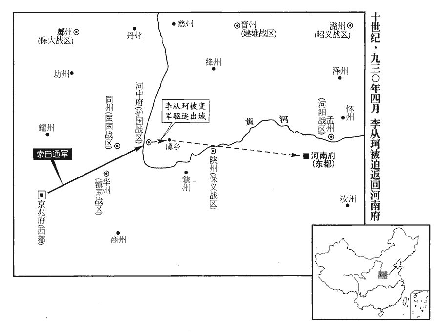
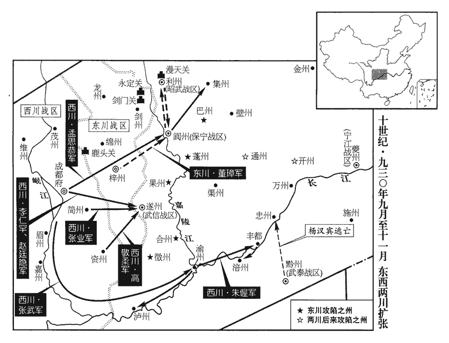
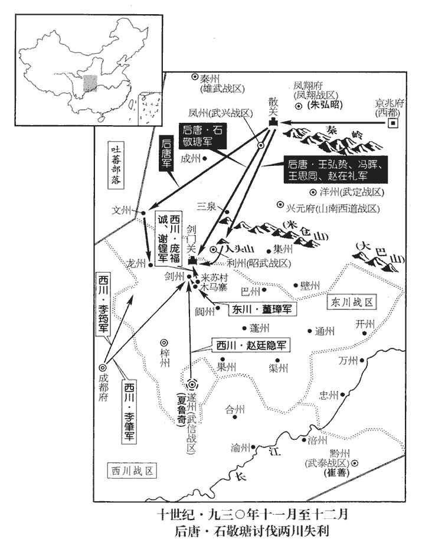
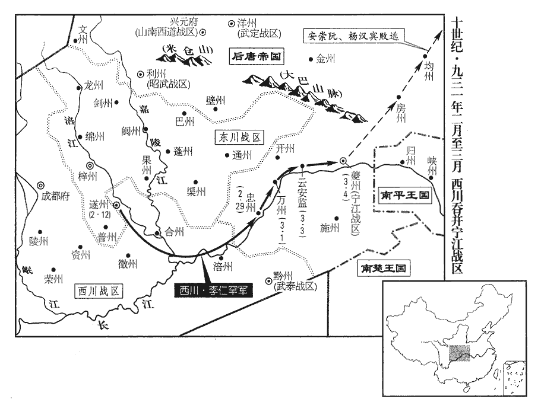
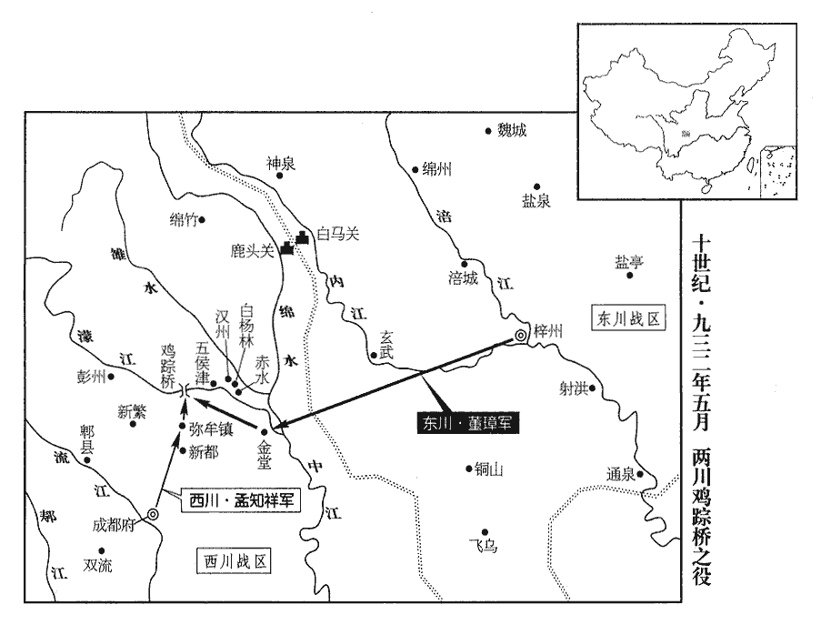

 後唐紀六起上章攝提格（庚寅），盡玄黓執徐（壬辰）六月，凡二年有奇。

# 明宗聖德和武欽孝皇帝中之下

## 長興元年（庚寅、九三零）是年二月方改元。

1春，正月，董璋遣兵築七寨於劍門‹四川省剑阁县北剑门关›。辛巳‹十六›，孟知祥‹西川，总部设成都府四川省成都市›遣趙季良如梓州脩好。先是，董璋在東川‹总部设梓州四川省三台县›，與孟知祥鄰鎮而未嘗通問；天成三年，兩鎮因爭鹽利而有違言；去年璋遣使求昏於知祥，今知祥遣報使以脩好，兩釋嫌怨以從講解，懼朝廷加兵也。同舟遇風則胡、越相應如左右手，斯之謂矣。安重誨患兩川之難制，不能因其構隙而鬬之，反從而合之，可以為善謀國乎！兵法曰：合則能離之。安重誨反是。好，呼到翻；下同。

〖译文〗 [1]春季，正月，东川节度使董璋派兵在剑门修筑七座营寨。辛巳（十六日），西川节度使孟知祥派其副使赵季良到梓州来与董璋修好，以相结纳。

2鴻臚少卿郭在徽奏請鑄當五千、三千、一千大錢；朝廷以其指虛為實，無識妄言，左遷衛尉少卿、同正。此唐官所謂員外置，同正員者也。

〖译文〗 [2]鸿胪少卿郭在徽奏请铸造当五千、三千、一千使用的大钱，后唐朝廷以为这种指虚为实的主张，是没有见识的胡说，把他贬降为卫尉少卿，比同正员。

3吳‹首都江都府江苏省扬州市›徙平原王澈為德化王。江州德化縣，本漢尋陽縣。宋白曰：南唐所改。

〖译文〗 [3]吴国调迁平原王杨澈为德化王。

4二月，乙未朔‹一›，趙季良還成都，謂孟知祥曰：「董公貪殘好勝，志大謀短，終為西川之患。」史紀趙季良之言，為董璋攻孟知祥張本。

〖译文〗 [4]二月，乙未朔（初一），赵季良从梓州返回成都，对孟知祥说：“董璋这个人贪残好胜，野心大，谋略短，终究是我们西川的祸害。”

都指揮使李仁罕、張業欲置宴召知祥，先二日，有尼告二將謀以宴日害知祥；先，悉薦翻。知祥詰之，無狀，無謀害之狀也。詰，去吉翻。丁酉‹三›，推始言者軍校都延昌、王行本，腰斬之。校，戶教翻。都，姓也。春秋時鄭大夫公孫閼字子都，子孫以為氏。戊戌‹四›，就宴，盡去左右，去，羌呂翻。獨詣仁罕第；仁罕叩頭流涕曰：「老兵惟盡死以報德。」由是諸將皆親附而服之。史言孟知祥能推心以得人死力。

〖译文〗 孟知祥的部属都指挥使李仁罕、张业打算设酒席宴请他，此前二日，有尼姑密告说，这两个属将阴谋在宴请时谋害孟知祥；孟知祥严加查究，没有获得证据。丁酉（初三），归罪于最先传言此事的军校都延昌和王行本，把二人处以腰斩。戊戌（初四），孟知祥去参加宴会，把随从人员都打发开，独自到李仁罕的住宅；李仁罕叩头流涕地说：“我是你的老部下，今后只有尽死命来报答你的恩德。”从此，孟知祥所部诸将都心悦诚服地亲近和依附于他。

5壬子‹十八›，孟知祥、董璋同上表言：「兩川聞朝廷於閬中建節，綿‹四川省绵阳市›、遂‹四川省遂宁市›益兵，無不憂恐。閬中建節，謂置保寧軍於閬州；綿、遂益兵，謂武虔裕刺綿州，夏魯奇帥遂州，皆益兵戍之。事並見上卷上年。上‹李嗣源（邈佶烈）本年六十四岁›以詔書慰諭之。

〖译文〗 [5]壬子（十八日），孟知祥与董璋共同向后唐明宗上表称：“东川、西川听说朝廷在阆中建立节度使，在绵州、遂州增加兵力，无不感到担忧和恐惧。”后唐明宗下诏书慰抚劝导他们。

6乙卯‹二十一›，上祀圜丘，大赦，改元。改元長興。鳳翔‹总部设凤翔府陕西省凤翔县›節度使兼中書令李從曮入朝陪祀，三月，壬申‹八›，制徙從曮為宣武‹总部设汴州河南省开封市›節度使。天成元年，李從曮再鎮鳳翔，至是徙鎮。

〖译文〗 [6]乙卯（二十一日），明宗在圜丘祭天，实行大赦，把年号改为长兴。凤翔节度使兼中书令李从入朝陪祭，三月，壬申（初八），明宗下令把李从调迁为宣武节度使。

7癸酉‹九›，吳主‹杨溥，本年三十一岁›立江都王璉為太子。璉，立展翻。

〖译文〗 [7]癸酉（初九），吴国君主杨溥立江都王杨琏为太子。

8丙子‹十二›，以宣徽使朱弘昭為鳳翔節度使。

〖译文〗 [8]丙子（十二日），后唐任命宣徽使朱弘昭为凤翔节度使。

9康福‹朔方，总部设灵州宁夏灵武市›奏克保靜鎮‹宁夏永宁县›，斬李匡賔。李匡賔據保靜鎮見上卷上年。

〖译文〗 [9]朔方节度使康福报奏：攻克了保静镇，杀死了叛军首领李匡宾。

10復以安義‹总部设潞州山西省长治市›為昭義軍。梁均王龍德二年，晉王改昭義軍曰安義軍，見二百七十一卷。

〖译文〗 [10]后唐恢复安义军的旧名，仍称昭义军。

11帝將立曹淑妃為后，淑妃謂王德妃‹花见羞›曰：「吾素病中煩，中煩，謂胸中煩熱。倦於接對，妹代我為之。」德妃曰：「中宮敵偶至尊，誰敢干之！」庚寅‹二十六›，立淑妃為皇后。德妃事后恭謹，后亦憐之。

〖译文〗 [11]后唐明宗将要立曹淑妃为皇后，淑妃对王德妃说：“我平素胸中烦热有病，厌倦那些接待应对的事，请你代替我去应承。”德妃说：“入中宫做皇后可以同天子匹偶，平起平坐，谁敢去干预！”庚寅（二十六日），立淑妃为皇后。德妃对待皇后恭顺谨慎，皇后也怜爱她。

初，王德妃因安重誨得進，常德之。歐史曰：德妃王氏，邠州餅家女也，有美色，號花見羞。少賣為梁將劉鄩侍兒。鄩卒，王氏無所歸。是時帝正室夏夫人已卒，方求別室，有言王氏於安重誨者，以告於帝而納之。帝性儉約，及在位久，宮中用度稍侈，重誨每規諫。妃取外庫錦造地衣，重誨切諫，引劉后為戒；謂莊宗‹李存勖›劉皇后也。妃由是怨之。

〖译文〗 起初，王德妃是由于枢密权臣安重诲的关系才得以入宫的，经常感念安重诲。明宗本来习性俭朴，在位既久，宫内的费用也逐渐奢侈，安重诲时常规劝他。德妃调取外库的锦帛做地毯，安重诲极力谏阻，并引用前朝庄宗时刘皇后的事例以为戒鉴；德妃从此嫌怨安重诲。

12高從誨‹荆南总部江陵府›遣使奉表詣吳，告以墳墓在中國，高季興，陝州硤石‹河南省三门峡市东硖石镇›人也，故云然。恐為唐所討，吳兵援之不及，謝絕之。高季興請附於吳，見二百七十五卷天成二年。吳遣兵擊之，不克。

〖译文〗 [12]荆南高从诲派使者奉呈表章来到吴国，表示高氏祖坟在北方，害怕被后唐朝廷所讨伐，那时吴兵会来不及援助他，因此，谢绝了吴国对他的笼络。吴国便派兵进攻荆南，没有能攻下来。

13董璋‹东川总部梓州›恐綿州刺史武虔裕窺其所為，按九域志，綿州東南至梓州‹四川省三台县›一百三十七里。以其逼近，故恐為所窺。夏，四月，甲午朔‹一›，表兼行軍司馬，囚之府廷。以兼行軍司馬誘之，至梓州而囚之。府廷，東川府廷也。

〖译文〗 [13]董璋害怕绵州使武虔裕窥探他的行动，夏季，四月，甲午朔（初一），上表推荐他兼任行军司马，把他诱至梓州，囚押在东川府廷。

14宣武節度使符習，自恃宿將，符習本成德將，從莊宗戰於河上，故自恃為耆宿。論議多抗安重誨，重誨求其過失，奏之；丁酉‹四›，詔習以太子太師致仕。

〖译文〗 [14]宣武节度使符习，自恃是后唐宿将，论事议政常常与枢密使安重诲对抗，重诲寻找他的过错，奏告明宗；丁酉（初四），下诏命令符习以太子太师的荣誉名衔告老去官。

15戊戌‹五›，加孟知祥兼中書令，夏魯竒同平章事。

〖译文〗 [15]戊戌（初五），加封孟知祥兼任中书令，夏鲁奇任同平章事。

16初，帝在真定‹镇州州政府所在县·河北省正定县›，莊宗同光二年，帝鎮真定。李從珂與安重誨飲酒爭言，從珂毆重誨，毆，烏口翻。重誨走免；既醒，悔謝，重誨終銜之。至是，重誨用事，自皇子從榮、從厚皆敬事不暇。不暇，謂不敢自暇也。時從珂為河中‹山西省永济市›節度使、同平章事，重誨屢短之於帝，帝不聽。重誨乃矯以帝命諭河東牙內指揮使楊彥溫使逐之。「河東」當作「河中」。是日，承上戊戌，故曰是日。從珂出城閱馬，彥溫勒兵閉門拒之，從珂使人扣門詰之曰：詰，去吉翻。「吾待汝厚，何為如是？」對曰：「彥溫非敢負恩，受樞密院宣耳。樞密院用宣，三省用堂帖。今堂帖謂之省劄，宣謂之密劄。請公入朝。」從珂止于虞鄉‹山西省永济市东虞乡镇，河中府东三十千米›，九域志：虞鄉縣在河中府東六十里。遣使以狀聞。使者至，壬寅‹九›，帝問重誨曰：「彥溫安得此言？」謂言受樞密院宣也。對曰：「此姦人妄言耳，宜速討之。」帝疑之，欲誘致彥溫訊其事，訊，問也。誘，音酉。除彥溫絳州‹山西省新绛县›刺史。重誨固請發兵擊之，乃命西都‹京兆府·陕西省西安市›留守索自通、索，蘇各翻，姓也。步軍都指揮使藥彥稠將兵討之。藥，姓也，漢有藥崧。按薛史：藥彥稠，沙陀三部落人，必非崧後。帝令彥稠必生致彥溫，吾欲面訊之。召從珂詣洛陽。從珂知為重誨所構，馳入自明。

〖译文〗 [16]以前，后唐明宗镇守真定时，其养子李从珂与安重诲曾在饮酒时争吵，李从珂殴打安重诲，安重诲躲避，才得以免遭殴打；酒醒以后，李从珂悔悟道歉，安重诲始终记恨他。到此时，安重诲掌权用事，皇子李从荣、李从厚都尊敬他不敢怠慢。当时李从珂任河中节度使、同平章事，安重诲多次在明宗面前说他的坏话，明宗不听。安重诲便假造明宗意旨，谕令河中牙内指挥使杨彦温驱逐他。这一天，李从珂出城检阅战马，杨彦温领兵关了城门，拒绝让他进城。李从珂命人扣门，质问他说：“我待你很厚重，你怎么能这样做？”杨彦温回答说：“我彦温不敢对您负恩，我是受枢密院的宣示，请您入朝。”李从珂暂驻扎在虞乡，派使者把情况向朝廷报告。使者到了以后，壬寅（初九），明宗问安重诲说：“杨彦温怎么能这么说呢？”安重诲回答说：“这是坏人杨彦温的胡说，应该赶快派兵征讨他。”明宗怀疑此事，想把杨彦温引诱来讯问情况，便调杨彦温为绛州刺史。安重诲坚持请求派兵攻打杨彦温，朝廷便命令西都留守索自通、步军都指挥使药彦稠统兵讨伐他。明宗指令药彦稠：“务必把杨彦温活着抓回来，我要当面讯问他。”又召唤李从珂到京城洛阳来。李从珂知道是被安重诲所陷害，赶快入朝自己进行表白。

 

17加安重誨兼中書令。

〖译文〗 [17]后唐加安重诲兼任中书令。

18李從珂至洛陽，上責之使歸第，絕朝請。薛史曰：歸清化里第。

〖译文〗 [18]李从珂来到洛阳，明宗责令他回自己的府第，断绝入朝请见。

辛亥‹十八›，索自通等拔河中‹山西省永济市›，斬楊彥溫，承安重誨指，斬楊彥溫以滅口。為潞王殺藥彥稠、索自通自投於水張本。癸丑‹二十›，傳首來獻。上怒藥彥稠不生致，不生致楊彥溫也。深責之。

〖译文〗 辛亥（十八日），索自通等攻下河中，斩杀了杨彦温，癸丑（二十日），把他的首级传送到洛阳来献报朝廷。明宗恼怒药彦稠不把他活着送来，严厉地责备药彦稠。

安重誨諷馮道、趙鳳奏從珂失守，宜加罪。上曰：「吾兒為姦黨所傾，未明曲直，公輩何為發此言，意不欲置之人間邪？此皆非公輩之意也。」言二人為安重誨所使。二人惶恐而退。他日，趙鳳又言之，上不應。明日，重誨自言之，上曰：「朕昔為小校，校，戶教翻。家貧，賴此小兒拾馬糞自贍，以至今日為天子，曾不能庇之邪！卿欲如何處之於卿為便？」上亦以此語激安重誨。處，昌呂翻。重誨曰：「陛下父子之間，臣何敢言！惟陛下裁之！」上曰：「使閒居私第亦可矣，何用復言！」復，扶又翻。

〖译文〗 安重诲指使冯道、杨凤表奏李从珂失于职守，应该加罪。明宗说：“我儿被奸党所倾害，是非曲直还未弄明白。你们二位为什么说这样的话，是不是想不让他活在人间，这些都不是你们二位的意思哟。”冯、杨二人吓得惶恐而退。过些天，赵凤又奏谈此事，明宗不表态。第二天，安重诲自己奏言其事，明宗说：“我从前当小校，家里贫穷，依赖这个孩子拣拾马粪养家，到了今天我当了皇帝，就不能庇护他吗？你想怎样处置他对你才合适？”安重诲说：“陛下父子之间的事，为臣何敢乱说！只能听凭陛下裁夺！”明宗说：“让他闲居在自己家里也就可以了，何必再多谈此事！”

丙辰‹二十三›，以索自通為河中節度使。自通至鎮，承重誨指，籍軍府甲仗數上之，上，時掌翻。以為從珂私造；賴王德妃居中保護，從珂由是得免。士大夫不敢與從珂往來，惟禮部郎中史館脩撰呂琦居相近，時往見之，從珂每有奏請，皆咨琦而後行。從珂居閒，奏請咨呂琦而後行；及其在位，能厚琦而不能用琦，何也？

〖译文〗 丙辰（二十三日），任命索自通为河中节度使。索自通到了镇所，秉承安重诲的意旨，登记点收军库中铠甲兵器数字向朝廷报告，说成是李从珂私自制造；仰仗王德妃在内部保护，李从珂才得以免罪。士大夫不敢与李从珂往来，只有礼部郎中、史馆修撰吕琦和他居住相近，有时去看他，李从珂遇到有事奏请时，都是问了吕琦之后才办。

19戊午‹二十五›，帝加尊號曰聖明神武文德恭孝皇帝。

〖译文〗 [19]戊午（二十五日），明宗加尊号为圣明神武文德恭孝皇帝。

20安重誨言昭義節度使王建立過魏州‹河北省大名县›有搖眾之語，五月，丙寅‹三›，制以太傅致仕。安重誨、王建立交惡，見上卷天成三年。

〖译文〗 [20]安重诲奏言昭义节度使王建立经过魏州时有动摇人心之语，五月，丙寅（初三），命令他以太傅职称去官退休。

21董璋閱集民兵，皆剪髮黥面，復於劍門‹四川省剑阁县北剑门关›北置永定關，布列烽火。復，扶又翻。

〖译文〗 [21]董璋检阅召集来的民兵，都给他们剪发黥面，又在剑门之北设置永定关，布列烽火。

22孟知祥累表請割雲安‹重庆市云阳县西北云安镇›等十三鹽監隸西川‹总部成都府›，雲安縣，漢巴郡朐䏰縣地，周武帝改為雲安縣，屬巴東郡，唐屬夔州，後改為雲安監。又夔州大昌縣、萬州南浦縣漁陽監皆有鹽官，隸寧江軍巡屬；而所謂十三監未知盡在何所。以鹽直贍寧江‹总部设夔州重庆市奉节县›屯兵，辛卯‹二十八›，許之。

〖译文〗 [22]孟知祥多次上表请求割划云安等十三个盐务监所隶属西川，用买卖的钱来供给宁江的屯兵，辛卯（二十八日），得到准许。

23六月，癸巳朔‹一›，日有食之。

〖译文〗 [23]六月，癸巳朔（初一），出现日食。

24辛亥‹十九›，敕防禦、團練使、刺史、行軍司馬、節度副使，自今皆朝廷除之，諸道無得奏薦。

〖译文〗 [24]辛亥（十九日），敕命：防御使、团练使、刺史、行军司马、节度副使，今后都由朝廷任命，各节度使不得奏荐。

25董璋遣兵掠遂‹武信总部·四川省遂宁市›、閬‹保宁总部·四川省阆中市›鎮戍，秋，七月，戊辰‹七›，兩川以朝廷繼遣兵屯遂、閬，復有論奏，復，扶又翻。自是東北商旅少敢入蜀。少，詩沼翻。

〖译文〗 [25]董璋派兵劫掠守卫在遂州、阆州的官军，秋季，七月，戊辰（初七），两川因为朝廷继续派兵屯戍遂州、阆州，又有奏章议论此事，从此东北方向的商旅，很少敢于入蜀。

26八月，乙未‹四›，捧聖軍使李行德、按五代會要，應順元年，改龍武、神武四十指揮為捧聖左、右軍。據此，則是時先已有捧聖軍矣。宋白曰：長興三年改在京龍武、神武四十指揮為捧聖左、右軍。十將張儉引告密人邊彥溫告「安重誨發兵，云欲自討淮南；因天成二年安重誨嘗有伐吳之議，遂以是誣告之。又引占相者問命。」相，息亮翻。帝以問侍衛都指揮使安從進、藥彥稠，二人曰：「此姦人欲離間陛下勳舊耳。間，古莧翻。重誨事陛下三十年，梁均王貞明二年，帝始為安國節度，以安重誨為中門使，至是纔十六年；蓋帝與重誨皆應州人，其相從久矣。幸而富貴，何苦謀反！臣等請以宗族保之。」帝乃斬彥溫，召重誨慰撫之，君臣相泣。蓋是時安重誨之跡已危矣。

〖译文〗 [26]八月，乙未（初四），捧圣军使李行德、十将张俭引领告密人边彦温奏告：安重诲起兵，说要自己去讨伐淮南；又召引占相者为自己算命。明宗为此咨询于侍卫都指挥使安从进、药彦稠，二人说：“这是奸人要离间对陛下有功勋的旧臣。安重诲给陛下做事三十年，有幸得到富贵，何苦要谋反！我们请求用自己的家族性命担保他。”明宗便把边彦温杀了，并召见安重诲慰抚，君臣相对而哭泣。

27以前忠武‹总部设许州河南省许昌市›節度使張延朗行工部尚書，充三司使。三司使之名自此始。自宋熙寧以前，三司使位亞執政，專制國計，權任重矣。

〖译文〗 [27]任用前忠武节度使张延朗担任工部尚书，充当主管盐铁、户部、度支的三司使。三司使的职名是从这时开始的。

28吳徐知誥以海州‹江苏省连云港市›都指揮使王傳拯有威名，得士心，值團練使陳宣罷歸，知誥許以傳拯代之；既而復遣宣還海州，徵傳拯還江都‹江苏省扬州市›。傳拯怒，以為宣毀之，己亥‹八›，帥麾下入辭宣，帥，讀曰率。因斬宣，焚掠城郭，帥其眾五千來奔。知誥曰：「是吾過也。」免其妻子。漣水‹江苏省涟水县›制置使王巖將兵入海州，漣水至海州一百八十里。以巖為威衛大將軍，知海州。

〖译文〗 [28]吴国中书令徐知诰因为海州都指挥使王传拯有威名，得人心，正赶上团练使陈宣罢官归家，徐知诰许诺由王传拯代替他；接着又把陈宣派遣回海州，而征召王传拯还归江都。王传拯发怒，以为是陈宣诋毁他所致。己亥（初八），率领部属到陈宣处辞行，借机杀了陈宣，焚烧抢掠城郭，带领步众五千人投奔后唐。徐知诰说：“这是我的过错。”免加王传拯的妻子的罪。涟水制置使王岩领兵进入海州，便任用王岩为威卫大将军，主持海州政事。

傳拯，綰之子也，吳先以王綰知海州，楊隆演之建國也，加鎮東大將軍。其季父輿為光州‹河南省潢川县›刺史。傳拯遣間使持書至光州，間，古莧翻。使，疏吏翻。輿執之以聞，因求罷歸；以兄子外叛，身居邊郡，心迹危疑，故求罷歸。知誥以輿為控鶴都虞候。時政在徐氏，典兵宿衛者尤難其人，知誥以輿重厚慎密，故用之。

〖译文〗 王传拯是王绾的儿子，他的叔叔王舆为光州刺史。传拯派人拿着他的信秘密来到光州找王舆，王舆拘留来使，上报吴主，并因此要求罢官还家，徐知诰任用王舆为控鹤都虞候。当时吴国政权掌握在徐氏手中，领兵宿卫者尤其难得，徐知诰因为王舆为人厚重慎密，所以用他。

29壬寅‹十一›，趙鳳奏：「竊聞近有姦人，誣陷大臣，搖國柱石，行之未盡。」言未盡行誅也。帝乃收李行德、張儉，皆族之。

〖译文〗 [29]壬寅（十一日），后唐赵凤奏称：“听说近来有奸人诬陷大臣，动摇国家的柱石，还没有完全诛尽。”明宗便下令收捕李行德、张俭，把二人的家族都诛杀了。

30立皇子從榮為秦王；丙辰‹二十五›，立從厚為宋王。

〖译文〗 [30]立皇子李从荣为秦王；丙辰（二十五日），立李从厚为宋王。

31董璋之子光業為宮苑使，在洛陽，璋與書曰：「朝廷割吾支郡為節鎮，謂夏魯奇鎮遂州，李仁矩鎮閬州，又傳割綿、龍也。屯兵三千，【張：「千」作「川」。】是殺我必矣。汝見樞要為吾言：樞要，謂兩樞密。董璋意專指安重誨。為，于偽翻。如朝廷更發一騎入斜谷‹陕西省太白县境›，吾必反！與汝訣矣。」騎，奇寄翻。斜，余遮翻。谷，音浴。光業以書示樞密承旨李虔徽。未幾，朝廷又遣別將荀咸乂將兵戍閬州，幾，居豈翻。光業謂虔徽曰：「此兵未至，吾父必反。吾不敢自愛，言不敢愛其死也。恐煩朝廷調發，言恐須用兵。調，徒釣翻。願止此兵，吾父保無他。」虔徽以告安重誨，重誨不從。璋聞之，遂反。利、閬、遂三鎮以聞，利帥李彥琦，閬帥李仁矩，遂州夏魯奇。且言已聚兵將攻三鎮。重誨曰：「臣久知其如此，陛下含容不討耳。」帝曰：「我不負人，人負我則討之。」

〖译文〗 [31]董璋之子董光业任宫苑使，在洛阳，董璋给他写信说：“朝廷把我管辖的梓州以外各州划出另设节镇，屯兵在三川，这是一定要把我置于死地。你见到枢密要员替我传言：如果朝廷再多派一个人马进入斜谷，我就必定造反，和你诀别了。”董光业把信给枢密承旨李虔徽看了。没有多久，后唐朝廷又派别将荀咸率兵戍守阆州，董光业对李虔徽说：“不等这一支兵马到达，我父亲必然造反。我不敢爱惜自己的生命，恐怕让朝廷调发人马招惹麻烦，希望能够停止派遣这支人马，我父亲保证没有别的举动。”李虔徽把董光业意见报告安重诲，安重诲没有答应。董璋听说后，马上造反。利州、阆州、遂州三镇向朝廷报告，并说董璋已经聚集兵马将要进攻三镇。安重诲说：“我早就知道董璋要这样，陛下太容忍他，不肯讨伐啊。”明宗说：“我不亏负于人，人亏负于我便要讨伐他。”

32九月，癸亥‹三›，西川進奏官蘇愿白孟知祥云：「朝廷欲大發兵討兩川。」進奏官在京師，故以其事白其主帥。知祥謀於副使趙季良，季良請以東川兵先取遂、閬，然後併兵守劍門‹四川省剑阁县北剑门关›，則大軍雖來，吾無內顧之憂矣。兩川同心協力守險，則西川無內顧之憂。知祥從之，遣使約董璋同舉兵。璋移檄利、閬、遂三鎮，數其離間朝廷，數，所具翻。間，古莧翻；下無間同。引兵擊閬州。九域志：梓州東北至閬州三百九里。庚午‹十›，知祥以都指揮使李仁罕為行營都部署，漢州‹四川省广汉市›刺史趙廷隱副之，簡州‹四川省简阳市›刺史張業為先鋒指揮使，將兵三萬攻遂州；九域志：；遂州北至梓州二百五里。別將牙內都指揮使侯弘實、先登指揮使孟思恭將兵四千會璋攻閬州。

〖译文〗 [32]九月，癸亥（初三），西川进奏官苏愿向孟知祥禀告：“朝廷要派大军讨伐两川。”孟知祥和节度副使赵季良谋议对策，赵季良建议让东川兵马先占领遂州、阆州，然后西川同东川合兵扼守剑门，这样，即使朝廷大军来了，我们两川也没有后顾之忧了。孟知祥听从了赵季良的意见，派使者邀约董璋共同起兵。董璋便向利州、阆州、遂州三镇送发檄文，责备他们离间朝廷与东川的关系，发兵进攻阆州。庚午（初十），孟知祥任用都指挥使李仁罕为行营都部署，汉州刺史赵廷隐做他的副手，简州刺史张业为先锋指挥使，率领三万士兵进攻遂州，又派牙内都指挥使侯弘实、先登指挥使孟思恭领兵四千会合董璋进攻阆州。

33安重誨久專大權，中外惡之者眾；惡，烏路翻。王德妃‹花见羞›及武德使孟漢瓊浸用事，數短重誨於上。數，所角翻。重誨內憂懼，表解機務，上曰：「朕無間於卿，誣罔者朕既誅之矣，謂李行德、張儉也。卿何為爾？」甲戌‹十四›，重誨復面奏曰：復，扶又翻。「臣以寒賤，致位至此，忽為人誣以反，非陛下至明，臣無種矣。種，章勇翻。由臣才薄任重，恐終不能鎮浮言，願賜一鎮以全餘生。」上不許；重誨求之不已，上怒曰：「聽卿去，朕不患無人！」前成德‹总部设镇州河北省正定县›節度使范延光勸上留重誨，且曰：「重誨去，誰能代之？」上曰：「卿豈不可？」延光曰：「臣受驅策日淺，且才不逮重誨，何敢當此！」上遣孟漢瓊詣中書議重誨事，馮道曰：「諸公果愛安令，時安重誨兼中書令，故稱之。宜解其樞務為便。」馮道肯發此言，蓋知之矣。趙鳳曰：「公失言！」乃奏大臣不可輕動。

〖译文〗 [33]安重诲长期掌握大权，内外怨恨他的人很多；王德妃和武德使孟汉琼渐渐握有势力，几次在明宗面前说他的坏话。安重诲心里担忧害怕，上表要求解除他的枢密机要任务，明宗对他说：“朕和你之间没有隔阂。造谣诬陷你的人，朕已经把他们诛杀了，你还要干什么呢？”甲戌（十四日），安重诲又面奏明宗说：“我出身贫寒卑贱，得到如此高位，现在被人诬告说我要谋反，假若不是陛下极度圣明，我就灭门无后了。由于我才能小责任重，恐怕终究不能压制住流言蜚语，请求陛下赐给我一个外镇使命以保全余生。”明宗没有答应他的请求，安重诲没完没了地反复请求，明宗发怒说：“听凭你去吧，朕不愁没有人接替你。”从前成德节度使范延光劝奏明宗留用安重诲，并且说：“重诲如果走了，有谁能代替他？”明宗说：“你难道不可以吗？”范延光说：“我受陛下驱使的时间还短，而且才干不及重诲，怎么敢当此重任！”明宗派孟汉琼到中书省讨论安重诲的问题，冯道说：“诸位果真正爱惜安令公，解除他的枢要任务为宜。”赵凤说：“您失言了！”于是回奏认为大臣不可轻易变动。

 

34東川兵至閬州，諸將皆曰：「董璋久蓄反謀，以金帛啗其士卒，啗，徒濫翻。銳氣不可當，宜深溝高壘以挫之，不過旬日，大軍至，賊自走矣。」李仁矩曰：「蜀兵懦弱，安能當我精卒！」遂出戰，兵未交而潰歸。董璋晝夜攻之，庚辰‹二十›，城陷，殺仁矩，滅其族。

〖译文〗 [34]东川的兵马进到阆州，戍守的诸将都说：“董璋早就蓄谋造反，用金帛财物收买他的士兵，锐气不可阻挡，应该挖筑深沟高垒来挫败他，不用十天，朝廷大军到来，贼兵自己就会退走的。”阆州主帅李仁矩说：“蜀兵懦弱没有战斗力，怎能抵挡我军的精兵强卒！”于是便出域迎战，还没有交锋就溃败回来。董璋令军队不分昼夜攻击，庚辰（二十日），城池被攻陷，杀了李仁矩，诛灭了他的家族。

初，璋為梁將，指揮使姚洪嘗隸麾下，至是，將兵千人戍閬州；璋密以書誘之，洪投諸廁。誘，音酉。城陷，璋執洪而讓之曰：「吾自行間獎拔汝，行，戶剛翻。今日何相負？」洪曰：「老賊！汝昔為李氏奴，董璋先為汴富人李讓家僮。掃馬糞，得臠炙，感恩無窮。臠，力兗翻，肉作片也。炙，之夜翻，燔肉也。今天子用汝為節度使，何負於汝而反邪？汝猶負天子，吾受汝何恩，而云相負哉！汝奴材，固無恥；吾義士，豈忍為汝所為乎！吾寧為天子死，寧為，于偽翻。不能與人奴並生！」璋怒，然鑊於前，鑊，戶郭翻。鼎大無足曰鑊。然，燒也。令壯士十人刲其肉自啗之，刲kuī，涓畦翻，割也。洪至死罵不絕聲。帝置洪二子於近衛，厚給其家。

〖译文〗 过去，董璋在后梁为将时，指挥使姚洪曾经隶属于他的部下，此时正领兵千人戍守阆州；董璋暗地给他写信诱降，姚洪把信丢入厕所。城陷后，董璋抓住姚洪，责备他说：“我自行伍间提拔你，今天你为何相负于我？”姚洪说：“老贼！你从前在李姓富人家当奴仆，扫马粪，得点烤肉片就感恩不尽。现在皇上用你当节度使，有什么亏负于你而造反呀？你尚且负心于天子，我受你什么恩典了，你竟说起什么相负啊！你是个奴才，本来就无耻；我是义士，岂能干你所干的事呢！我宁可为天子死，不能同人奴共生！”董璋大怒，在他的面前烧起大锅，叫十个壮汉割他的肉自己煮来吃，姚洪至死骂声不绝。明宗把姚洪的两个儿子安置在侍卫中，优厚地抚恤他的家属。

35甲申‹二十四›，以范延光為樞密使，安重誨如故。言雖進用范延光，而安重誨職任如故。

〖译文〗 [35]甲申（二十四日），任命范延光为枢密使，安重诲任职如故。

36丙戌‹二十六›，下制削董璋官爵；興兵討之。丁亥‹二十七›，以孟知祥兼西南【章：十二行本「南」下有「面」字；乙十一行本同；張校同，云無註本亦無。】供饋使。孟知祥之兵已攻遂州，朝廷豈不知之邪？猶欲懷輯之以離董璋之交耳。脣亡齒寒，已了了於知祥胸中，此策安所施哉！以天雄‹总部设魏州河北省大名县›節度石敬瑭為東川行營都招討使。「節度」之下當有「使」字。蜀本有「使」字。【章：十二行本「度」下正有「使」字；張校同，云無註本亦無。】以夏魯奇為之副。

〖译文〗 [36]丙戌（二十六日），下命令削去董璋的官爵，兴兵讨伐他。丁亥（二十七日），任用孟知祥兼职西南供馈使。任用天雄节度使石敬瑭为东川行营都招讨使，夏鲁奇为他的副手。

璋使孟思恭分兵攻集州‹四川省南江县›，集州，本漢宕渠縣，宇文周置集州，隋廢為難江縣，唐復置集州，宋熙寧五年復廢州為難江縣，屬巴州。九域志：縣在州北一百六十里。思恭輕進，敗歸；璋怒，遣還成都，知祥免其官。

〖译文〗 董璋让孟思恭分兵攻打集州，孟思恭轻率进兵，打了败仗回来；董璋发怒，把他遣回成都，孟知祥免了他的官职。

戊子‹二十八›，以石敬瑭權知東川事。庚寅‹三十›，以右武衛上將軍王思同為西都‹京兆府·陕西省西安市›留守兼行營馬步都虞候，為伐蜀前鋒。

〖译文〗 戊子（二十八日），任命石敬瑭暂时主持东川的事务。庚寅（三十日），任用右武卫上将军王思同为西都留守兼行营马步都虞候，做伐蜀的前锋。

37漢主‹首都兴王府广东省广州市›刘岩，本年四十二岁遣其將梁克貞、李守鄘攻交州‹即安南府·越南河内市›，拔之，執靜海‹总部设安南府越南河内市›節度使曲承美以歸，唐末曲顥hào據交州，至承美而敗。以其將李進守交州。

〖译文〗 [37]南汉主遣派他的大将梁克贞、李守攻打交州，攻了下来，抓获静海节度使曲承美而归，任用他的将领李进戍守交州。

38冬，十月，癸巳‹三›，李仁罕圍遂州，夏魯奇嬰城固守；孟知祥命都押牙高敬柔帥資州‹四川省资中县›義軍二萬人築長城環之。帥，讀曰率。環，音宦。魯奇遣馬軍都指揮使康文通出戰，文通聞閬州陷，遂以其眾降於仁罕。

〖译文〗 [38]冬季，十月，癸巳（初三），李仁罕包围遂州，夏鲁奇依城抵御固守；孟知祥军都押牙高敬柔率领资州义军二万人筑起一道很长的围墙环绕包围遂州。夏鲁奇派马军都指挥使康文通出战，康文通听说阆州已被董璋攻陷，便带领他的部众投降了李仁罕。

戊戌‹八›，董璋引兵趣利州‹四川省广元市›，九域志：閬州西北至利州二百四十里。趣，七喻翻；下同。遇雨，糧運不繼，還閬州。知祥聞之，驚曰：「比破閬中，比，毗至翻。正欲徑取利州，其帥不武，必望風遁去。利帥李彥琦。帥，所類翻。吾獲其倉廩，據漫天之險，漫天寨在利州北，有小漫天、大漫天二寨。‹均在利州北明月峡一带›北軍終不能西救武信。武信軍，遂州。今董公僻處閬州，遠棄劍閣‹四川省剑阁县›，非計也。」處，昌呂翻。欲遣兵三千助守劍門‹剑阁县北剑门关›；璋固辭曰：「此已有備。」為劍門失守張本。

〖译文〗 戊戌（初八），董璋带领人马攻向利州，途中遇到大雨，粮秣运输跟不上，又回阆州。孟知祥听到这件事后，吃惊地说：“刚刚攻破阆州，正要挥军直下攻取利州，其主帅不敢抵抗，必然望风逃遁。我军便可缴获他的粮食仓储，占据漫天寨的险要，北方来的朝廷军队最终也一定不能西救遂州。现在董公偏僻地留处阆州，远离剑阁，不是上策。”准备派兵三千帮助守卫剑门；董璋坚决拒辞说：“此事已经有了准备。”

39錢鏐‹首都杭州浙江省杭州市›钱镠，本年七十九岁因朝廷冊閩王使者裴羽還，裴羽蓋冊閩王延鈞者也。還，從宣翻，又如字。附表引咎；其子傳瓘及將佐屢為鏐上表自訴。為，于偽翻。癸卯‹十三›，敕聽兩浙綱使自便。繫治兩浙綱使見上卷上年。

〖译文〗 [39]吴越王钱乘着后唐朝廷册立闽王的使者裴羽回朝之便，附送表章表示自己有过失；他的儿子钱传和将佐也屡次为钱上表作自我表白。癸卯（十三日），明宗下敕文，让释放两浙纲使，听其自便。

40以宣徽北院使馮贇為左衛上將軍、北都留守。

〖译文〗 [40]后唐任用宣徽北院使冯为左卫上将军、北都留守。

41丁未‹十七›，族誅董光業。以其父璋反也。

〖译文〗 [41]丁未（十七日），诛杀了董光业全族。

42楚王殷‹马殷，本年七十九岁›寢疾，遣使詣闕，請傳位於其子希聲。朝廷疑殷已死，辛亥‹二十一›，以希聲為起復武安‹总部设长沙府湖南省长沙市›節度使兼侍中。

〖译文〗 [42]楚王马殷病危，派使者进诣朝廷，请求把职位传给其子马希声。朝廷怀疑马殷已死，辛亥（二十一日），便把马希声起用复职为武安节度使兼侍中。

43孟知祥以故蜀鎮江‹总部设夔州重庆市奉节县›節度使張武為峽路‹三峡地区›行營招收討伐使，將水軍趣夔州，前蜀置鎮江軍於夔州，張武其舊帥也。趣，七喻翻。以左飛棹zhào指揮使袁彥超副之。天成元年，孟知祥置左、右飛棹六營。

〖译文〗 [43]孟知祥任用前蜀镇江节度使张武为峡路行营招收讨伐使，带领水军直夔州，任用左飞棹指挥使袁彦超为他的副手。

癸丑‹二十三›，東川兵陷徵‹昌州重庆市大足县›、合‹重庆合川市›、巴‹四川省巴中市›、蓬‹四川省仪陇县南›、果‹四川省南充市›五州。徧考隋唐地理志、五代職方考、元豐九域志，皆無徵州。按東川之兵時自遂、閬東略，九域志，合州在遂州東二百二十里，果州在遂州東南一百八十里，巴州在閬州東二百四十五里，蓬州在果州東北一百八十五里；徵州必在遂、合、果三州之間。

〖译文〗 癸丑（二十三日），东川兵攻陷徵、合、巴、蓬、果五州。

44丙辰‹二十六›，吳左僕射、同平章事嚴可求卒。嚴可求忠於徐氏者也。徐溫既卒，可求相吳，坐視徐知詢之廢不能出一計，權不在焉故也。徐知誥以其長子大將軍景通為兵部尚書、參政事，知誥將出鎮金陵‹江苏省南京市›故也。

〖译文〗 [44]丙辰（二十六日），吴国左仆射、同平章事严可求去世。徐知诰任用他的长子大将军徐景通为兵部尚书、参政事，是因为徐知诰将要出镇金陵的缘故。

45漢將梁克貞入占城‹即环·首都占城越南中部茶荞城›，取其寶貨以歸。占城國在西南海上，其地方千里，東至海，西至雲南，南鄰真臘，北抵驩州。其人俗與大食同，其乘象馬，其食稻米。

〖译文〗 [45]南汉大将梁克贞攻入占城，掠取了占城的财宝货物而归。

46十一月，戊辰‹九›，張武至渝州‹重庆市›，刺史張環降之，遂取瀘州‹四川省泸州市›，九域志：渝、瀘二州相去七百餘里。降，戶江翻。瀘，音盧。遣先鋒將朱偓分兵趣黔‹重庆市彭水县›、涪‹重庆市涪陵区›。九域志：涪州西至渝州三百四十里，東南至黔州四百九十里。將，即亮翻。趣，七喻翻。黔，其今翻。涪，音浮。

〖译文〗 [46]十一月，戊辰（初九），张武进到达渝州，刺史张环向他投降，于是进而占领了泸州，又派先锋将朱分兵向黔州和涪州进军。

47己巳‹十›，楚王殷‹马殷›卒，年七十九。遺命諸子，兄弟相繼；置劍於祠堂，曰：「違吾命者戮之！」為殷諸子爭國以至於亡張本。諸將議遣兵守四境，然後發喪，兵部侍郎黃損曰：「吾喪君有君，用左傳語。吾喪，息浪翻。何備之有！宜遣使詣鄰道告終稱嗣而已。」

〖译文〗 [47]己巳（初十），楚王马殷去世，遗命给几个儿子，要兄死弟续；放置一把宝剑在祠堂内，并说：“谁要是违背我的遗命，就杀了他！”他部下的诸将讨论，主张先派兵防守四面边境，然后再发布丧讯，兵部侍郎黄损说：“我们丧失了君主还有君主，有什么要防备的？应该派遣使者到各个邻郡去说明先君去世、后君嗣位就行了。”

48石敬瑭入散關‹陕西省宝鸡市西南›，階州‹甘肃省武都县东›刺史王弘贄、瀘州‹四川省泸州市›刺史馮暉與前鋒馬步都虞候王思同、步軍都指揮使趙在禮引兵出人頭山‹四川省广元市北›後，過劍門‹四川省剑阁县北剑门关›之南，還襲劍門，克【章：十二行本「克」上有「壬申‹十三›」二字；乙十一行本同；退齋校同；張本同，云無註本亦無。】之，殺東川兵三千人，獲都指揮使齊彥溫，據而守之。暉，魏州人也。甲戌‹十五›，弘贄等破劍州‹四川省剑阁县›，而大軍不繼，乃焚其廬舍，取其資糧，還保劍門。今利州昭化縣南有白衛嶺，與劍門相接。九域志：劍州東北至劍門五十五里。考異曰：實錄：「辛巳，軍前奏：『今月十三日，王弘贄、馮暉自利州入山路，出劍門關外倒下，殺董璋把關兵士約三千人，獲都指揮使齊彥溫，大軍進攻入劍門次。』又，丙戌，軍前奏：『今月十七日收下劍州，破賊千餘人，獲指揮使劉太。』李昊蜀高祖實錄：「己卯，東川告急，今月十八日北軍自白衛嶺人頭山後過，從小劍路至漢源驛出頭倒入劍門，打破關寨，掩捉彥溫及將士五百餘人，遂相次構喚大軍，據關下營。又，龐福誠、謝鍠相謂曰：『北軍昨來既得關寨之後，隔一日，大軍曾下至劍州，而乃般運糧食，燒舍自驚，還奔關寨。』十國紀年後蜀史：「壬申，弘贄、暉襲陷劍門；癸酉，攻焚劍州，取糧還屯劍門。己卯，東川告急使至成都，知祥命牙內都指揮使李肇帥兵五千赴援，董璋自閬州帥兩川兵屯木馬寨。先是，龐福誠、謝鍠屯閬州北來蘇寨，聞劍門陷，懼北軍據劍州，帥部兵千餘人由間道先董璋至劍州，壁于衙城後。士卒方食，北軍萬餘人自北山馳下，福誠等趨河橋迎擊之，北軍小卻。福誠帥數百人夜升北山顛，轉至北軍壁外大呼譟，鍠命將士以弓弩短兵急擊之，北軍驚擾，棄戈甲而遁。鍠追襲之，北軍退保劍門，十餘日不窺劍州。」按劍門至成都尚十許程，若十八日劍門失守，何得二十日知祥已聞之邪！今從實錄十三日壬申為定。若隔一日下至劍州，則十五日甲戌，非十七日也。蓋思同等以大軍未至，故收糧燒舍，還保劍門，故福誠等得復入劍州。李昊敘事甚詳，無執劉太事，今刪之。晉高祖實錄云「甲申平劍州，破賊千餘人」，尤誤也。

〖译文〗 [48]后唐石敬瑭进入散关，阶州刺史王弘贽、泸州刺史冯晖与前锋马步都虞候王思同、步兵都指挥使赵在礼带领军队出人头山之后，绕至剑门之南，回过头来袭击剑门，壬申（十三日）攻了下来，杀死东川兵三千人，擒获都指挥使齐彦温，占据了剑门险隘而加以防守。冯晖是魏州人。甲戌（十五日），王弘贽等攻破剑州，而大部队未能跟着上来，便烧了剑州守军的房舍，掠取了物资粮食，回军保卫剑门。

乙亥‹十六›，詔削孟知祥官爵。

〖译文〗 乙亥（十六日），明宗下诏书，削去孟知祥的官爵。

 

己卯‹二十›，董璋遣使至成都告急。知祥聞劍門失守，大懼，曰：「董公果誤我！」庚辰‹二十一›，遣牙內都指揮使李肇將兵五千赴之，戒之曰：「爾倍道兼行，先據劍州，北軍無能為也。」又遣使詣遂州，令趙廷隱將萬人會屯劍州。時趙廷隱與李仁罕圍遂州，孟知祥知夏魯奇無能為，而劍閣之險不可不爭，故使趙廷隱赴之。又遣故蜀永平‹总部设雅州四川省雅安市›節度使李筠將兵四千趣龍州‹四川省平武县东南›，守要害。防唐兵由鄧艾故道而入蜀也。史言孟知祥慮患之周。時天寒，士卒恐懼，觀望不進，廷隱流涕諭之曰：「今北軍勢盛，汝曹不力戰卻敵，則妻子皆為人有矣。」眾心乃奮。蜀兵皆亡國之餘。王衍之亡也，蜀人妻子係虜者多矣，趙廷隱以其所經見實利害告之，夫安得而不奮！

〖译文〗 己卯（二十日），董璋派使者到成都告急。孟知祥听说剑门失守，大为恐惧，并说：“董璋果然贻误于我！”庚辰（二十一日），派牙内都指挥使李肇领兵五千去救援，并告诫他说：“你加倍赶路，先去占据剑州、北方来的军队就没有办法了。”又派使者到遂州，命令赵廷隐带领万人会师驻扎剑州。又派遣原来前蜀永平节度使李筠领兵四千奔赴龙州，把守要害。当时，天气寒冷，士兵恐惧，观望不肯前进，赵廷隐流着眼泪劝告大家说：“现在北军气势强盛，你们如不竭尽全力去抵挡敌军，那样，老婆孩子就都要为别人所有了！”兵众的心情才激奋起来。

董璋自閬州將兩川兵屯木馬寨‹四川省剑阁县东南木马乡›。木馬寨在閬州西北，劍州東南。宋白曰：梁大同中於巴嶺側近立東巴州，治木馬。按木馬，地名，在今洋州界，無復遺址。

〖译文〗 董璋从阆州率领两川的兵马驻扎在木马寨。

先是，西川牙內指揮使太谷‹山西省太谷县›龐福誠、昭信指揮使謝鍠屯來蘇村‹四川省剑阁县东南三十五千米›，益昌江東越大山數重有狹徑，名來蘇，蜀人於江西置柵守之。渡江出劍門南二十里至青彊店與官路合。九域志：蓬州儀隴縣有來蘇鎮，即其地。鍠，戶盲翻。聞劍門失守，相謂曰：「使北軍更得劍州，則二蜀勢危矣。」遽引部兵千餘人間道趣劍州。始至，間，古莧翻。趣，七喻翻；下同。官軍萬餘人自北山大下，會日暮，二人謀曰：「眾寡不敵，逮明則吾屬無遺矣。」福誠夜引兵數百升北山，大譟於官軍營後，鍠帥餘眾操短兵自其前急擊之；帥，讀曰率。操，七刀翻。官軍大驚，空營遁去，復保劍門，十餘日不出。孟知祥聞之，喜曰：「吾始謂弘贄等克劍門，徑據劍州，堅守其城，或引兵直趣梓州‹四川省三台县›，董公必棄閬州奔還；我軍失援，亦須解遂州之圍。如此則內外受敵，兩川震動，勢可憂危；今乃焚毀劍州運糧東歸劍門，頓兵不進，吾事濟矣。」孟知祥喜兵勢之小寬，自言其料敵方略，此如棋工之說棋耳。

〖译文〗 起先，西川牙内指挥使太谷人庞福诚、昭信指挥使谢屯驻来苏村，听到剑门失守，相互言说：“如果北军进一步取得剑州，那么，二蜀的局势就危险了。”便立即率领所部兵卒千余人从小道急奔剑州。刚刚到达，一万多官军从北山大量涌下，此时正好太阳快落山，二人商议说：“我们寡不敌众，要是等到天明，我们的人就没有存活的了。”于是庞福诚乘夜晚率领兵丁数百人登上北山，在官军营寨之后大声喊叫，谢率领余下的人手持短兵器从其前面进行攻击；官军大为惊恐，倾营逃遁而去，还兵守卫剑门，十多天不出来。孟知祥听说后，高兴地说道：“开始我以为李弘贽等攻下剑门，直取剑州，坚守其城，或者引兵直向梓州，董璋必定舍弃阆州跑回去；我军失去援兵，也就需要解除对遂州的围困。如果这样，就要内外受敌，两川震动、形势可谓忧患危急；现在，他们焚毁了剑州，掠运粮食东归剑门，屯扎兵马不再前进，我的事情就好办了。”

官軍分道趣文州‹甘肃省文县›，將襲龍州‹四川省平武县东南›，自文州界青塘嶺至龍州一百五十里。郡志云：自北至南者，右肩不得易所負，謂之左擔路，鄧艾伐蜀所由之路也。為西川定遠指揮使潘福超、義勝都頭太原‹山西省太原市›沙延祚所敗。姓苑云：沙姓，神農夙沙氏之後。此傅會之說耳。

〖译文〗 官军分道直奔文州，准备袭击龙州，被西川定远指挥使潘福超、义胜都头太原的沙延祚所击败。

甲申‹二十五›，張武卒於渝州‹重庆市›；知祥命袁彥超代將其兵。

〖译文〗 甲申（二十五日），张武在渝州去世；孟知祥命令袁彦超代替他统率他的军队。

朱偓將至涪州，武泰節度使楊漢賓棄黔南，奔忠州‹重庆市忠县›；九域志：黔州北至忠州三百七十九里。偓追至豐都‹重庆市丰都县›，舊唐書地理志曰：豐都，漢巴郡枳縣地，後漢置平都縣，隋義寧二年分臨江置豐都縣。九域志：豐都縣在忠州西九十二里。還取涪州‹重庆市涪陵区›。九域志：忠州豐都縣西至涪州百許里。涪，音浮。知祥以成都支使崔善權武泰‹总部设黔州重庆市彭水县›留後。董璋遣前陵州‹四川省仁寿县›刺史王暉將兵三千會李肇等分屯劍州南山。

〖译文〗 朱将要到达涪州，武泰节度使杨汉宾放弃黔南，奔向忠州；朱追赶他到丰都，又回军占领涪州。孟知祥命成都支使崔善暂为武泰留后。董璋派前陵州刺史王晖领兵三千会合李肇等分别屯驻剑州南山。

49丙戌‹二十七›，‹南楚，首都长沙府›馬希聲‹本年三十二岁›襲位，稱遺命去建國之制，楚王建國見上卷天成二年。去，羌呂翻。復藩鎮之舊。

〖译文〗 [49]丙戌（二十七日），马希声继承了马殷的职位，声称奉马殷的遗命，除去建立楚国的规制，恢复节度使藩镇的旧制。

50契丹‹首都西楼城内蒙古巴林左旗›東丹王突欲自以失職，突欲不得立，見二百七十五卷天成元年。帥部曲四十人越海自登州‹山东省蓬莱市›來奔。九域志，登州東北至海五里。新唐志：登州東北海行，過大謝島、龜歆島、淤島、烏湖島三百里，北渡烏湖海，至馬石山東之都里鎮二百里，東傍海壖ruán，過青泥浦、桃花浦、杏花浦、石人汪、橐駝灣、烏骨江八百里，乃南傍海壖，過烏牧島、貝江口、椒島，得新羅西北之長口鎮。又過秦王石橋、麻田島、古寺島、得物島，千里至鴨淥江唐恩浦口，乃東南陸行七百里至新羅王城。自鴨淥江口舟行百餘里，乃小舫泝流，東北三十里至泊灼口，得勃海之境；又泝流五百里至丸都縣城，故高麗王都；又東北泝流五百里至神州；又陸行四百里至顯州，天寶中王所都；又正北如東六百里至勃海王城。按契丹東丹王居扶餘城，在唐高麗扶餘川中。考異曰：實錄：「阿保機妻令元帥太子往勃海代慕華歸西樓，欲立為契丹王；而元帥太子既典兵柄，不欲之勃海，遂自立為契丹王，謀害慕華，其母不能止。慕華懼，遂航海內附。」按天皇王入汴‹河南省开封市›，猶求害東丹者誅之，豈有在國欲殺之理！今不取。

〖译文〗 [50]契丹族的东丹王突欲自以为失去职位，率领他的家仆四十人越过渤海湾，从登州来投奔后唐。

51十二月，壬辰‹三›，石敬瑭至劍門。乙未‹六›，進屯劍州北山；趙廷隱陳于牙城後山，郭忱劍州靜照堂記曰：前瞰巨澗，後倚層巒。又春風樓記曰：邊山而立是州，一逕坡陀，中貫大溪，太守之居已在平山內外，居民悉在山上。則劍州之山川可知矣。陳，讀曰陣；下同。李肇、王暉陳于河橋。按劍州無所謂河。路振九國志曰：王師陷劍門，趙廷隱帥兵據石橋。恐當作「石橋」。敬瑭引步兵進擊廷隱，廷隱擇善射者五百人伏敬瑭歸路，按甲待之，矛矟欲相及，乃揚旗鼓譟擊之，北軍退走，顛墜下山，俘斬百餘人。敬瑭又使騎兵衝河橋，李肇以強弩射之，射，而亦翻。騎兵不能進。薄暮，敬瑭引去，廷隱引兵躡之，與伏兵合擊，敗之。敗，補邁翻。敬瑭還屯劍門。

〖译文〗 [51]十二月，壬辰（初三），石敬瑭率军到剑门，乙未（初六），进军屯驻剑州北山；赵廷隐陈兵在牙城后山，李肇、王晖陈兵于河桥。石敬瑭引步兵进击赵廷隐，赵廷隐选择善于射箭的士卒五百人埋伏在石敬瑭的归路上，等待他的兵来临。等到枪刀可以相接时，才扬旗击鼓呐喊出击，北军遭到伏击退走，颠扑坠落地逃下山，被俘斩了百余人。石敬瑭又派骑兵冲击河桥，李肇用强弩射击，骑兵不能前进。傍晚，石敬瑭引兵退去，赵廷隐领兵潜随其后，与伏兵联合进击，打败石敬瑭的兵众。石敬瑭还军屯扎于剑门。

52癸卯‹十四›，夔州奏復取開州‹重庆市开县›。舊唐書地理志曰：開州亦漢巴郡朐䏰縣地，梁置永豐縣，西魏改曰永寧，隋開皇末改曰盛山縣，唐武德初置開州。時蓋為蜀兵所陷而復取之也。

〖译文〗 [52]癸卯（十四日），夔州官军上奏收复了开州。

53庚戌‹二十一›，以武安節度使馬希聲為武安‹总部长沙府›、靜江‹总部桂州›節度使，加兼中書令。

〖译文〗 [53]庚戌（二十一日），后唐明宗任命武安节度使马希声为武安、静江节度使，加官兼任中书令。

54石敬瑭征蜀未有功，使者自軍前來，多言道險狹，進兵甚難，關右‹潼关以西›之人疲於轉餉，往往竄匿山谷，聚為盜賊。上憂之，壬子‹二十三›，謂近臣曰：「誰能辦吾事者！吾當自行耳。」安重誨曰：「臣職忝機密，軍威不振，臣之罪也，臣請自往督戰。」上許之。重誨即拜辭，癸丑‹二十四›，遂行，日馳數百里。西方藩鎮聞之，無不惶駭。陝州保義軍，華州鎮國軍，同州匡國軍，耀州順義軍，鳳翔，山南西道，皆西方藩鎮也。錢帛、芻糧晝夜輦運赴利州‹四川省广元市›，人畜斃踣於山谷者不可勝紀。踣，蒲北翻。勝，音升。時上已疏重誨，石敬瑭本不欲西征，及重誨離上側，離，力智翻。乃敢累表奏論，以為蜀不可伐，上頗然之。

〖译文〗 [54]石敬瑭征蜀未能取得功效，使者从前线来到朝廷，大多诉说道路艰险狭窄，进兵极为困难，函谷关以西的人由于为军队转运粮饷，搞得很疲惫，往往逃窜躲藏到山谷中，聚合当盗贼。明宗很忧虑，壬子（二十三日），对亲近的大臣说：“有谁能替我办理朝中事务，我要亲自去征伐蜀地。”安重诲说：“我承蒙重用，任职于机密要位，现在军威不能振兴，是我的过失，请求让我去亲自督战。”明宗准许了他。安重诲立即拜辞朝廷，癸丑（二十四日），便上路了，每天奔驰数百里。西方的藩镇闻讯，没有不惊惶骇惧的。钱币、布匹、军草、粮食等等，昼夜用车运送到利州，人畜颠跌毙死于山谷的不可计数。当时，明宗已经疏远安重诲，石敬瑭本来就不愿西征，等到安重诲离开君主身边后，于是才敢多次上表奏论，认为对蜀地不可征伐，明宗很以为然。

55西川兵先戍夔州者千五百人，上悉縱歸。

〖译文〗 [55]西川兵士早先戍守在夔州的人有一千五百，明宗全部释放他们归家。

## 二年（辛卯、九三一）

1春，正月，壬戌‹二›，‹西川总部成都府›孟知祥奉表謝。表謝遣還戍兵而已，遂、劍之兵未嘗解也。

〖译文〗 [1]春季，正月，壬戌（初三），孟知祥上表感谢朝廷遣还戍兵。

2庚午‹十一›，李仁罕陷遂州‹四川省遂宁市›，夏魯奇‹武信总部遂州›自殺‹年四十九岁›。

〖译文〗 [2]庚午（十一日），川军李仁罕攻陷遂州，官军守将夏鲁奇自杀。

癸酉‹十四›，石敬瑭復引兵至劍州‹四川省剑阁县›，復，扶又翻；下同。屯于北山。孟知祥梟夏魯奇首以示之。梟，堅堯翻。魯奇二子從敬瑭在軍中，泣請往取其首葬之，敬瑭曰：「知祥長者，必葬而父，長，知兩翻。而，汝也。豈不愈於身首異處乎！」言知祥若收葬之，則身首猶合於一處；若取葬其首而身在敵中，必異處也。既而知祥果收葬之。敬瑭與趙廷隱戰不利，復還劍門‹四川省剑阁县北剑门关›。

〖译文〗 癸酉（十四日），石敬瑭再次引兵到剑州，屯驻在北山。孟知祥砍了夏鲁奇的人头示众。夏鲁奇的两个儿子跟随石敬瑭在军队中，哭泣着请求往敌阵取回夏鲁奇的头来安葬，石敬瑭说：“孟知祥是厚道的长者，必然会安葬你们的父亲，那样岂不比把你父亲身体和首级分为两处更好些吗！”过后孟知祥果然把夏鲁奇收葬了。石敬瑭同赵廷隐交战不能取得胜利，又还军于剑门。

3丙戌‹二十七›，‹李嗣源（邈佶烈）本年六十五岁›加高從誨兼中書令。

〖译文〗 [3]丙戌（二十七日），加封高从诲兼任中书令。

4東川‹总部梓州›歸合州‹重庆合川市›于武信軍‹总部设遂州四川省遂宁市›。合州本武信巡屬；東川先取合州，今西川取遂州，故歸之武信。

〖译文〗 [4]东川把原先占领的合州归还给其旧统辖的武信军。

5初，鳳翔‹总部设凤翔府陕西省凤翔县›節度使朱弘昭諂事安重誨，連得大鎮。重誨過鳳翔，弘昭迎拜馬首，館於府舍，館，古玩翻。延入寢室，妻子羅拜，奉進酒食，禮甚謹。重誨為弘昭泣言：「讒人交構，幾不免，賴主上明察，得保宗族。」為，于偽翻。讒人，謂李行德、張儉等，事見上年。重誨既去，弘昭即奏「重誨怨望，有惡言，不可令至行營，恐奪石敬瑭兵柄。」又遺敬瑭書，言「重誨舉措孟浪，遺，唯季翻。孟浪，猶言張大而無拘束也。若至軍前，恐將士疑駭，不戰自潰，宜逆止之。」敬瑭大懼，即上言：「重誨至，恐人情有變，宜急徵還。」宣徽使孟漢瓊自西方還，亦言重誨過惡，有詔召重誨還。

〖译文〗 [5]起初，凤翔节度使朱弘昭讨好安重诲，连连得以领治大的节镇。安重诲经过凤翔时，朱弘昭在马前迎接拜礼，让安重诲下榻在他的官舍内，并且延请到内室，叫出妻子罗列参拜，亲自上菜进酒，礼节极为恭敬。安重诲对朱弘昭哭着说：“小人用谗言构陷于我，几乎得罪不能免死，幸亏仰赖君主洞察明透，才得以保全我的宗族。”安重诲走了以后，朱弘昭立即上奏：“安重诲埋怨朝廷，并说了朝廷的坏话，不可让他到达行营，恐怕他要夺取石敬瑭的兵权。”朱弘昭又写信给石敬瑭，说：“安重诲行动鲁莽，他若到了军队中，恐怕将士都要怀疑恐惧，不战自溃，应该阻挡他前去。”石敬瑭非常害怕，立即上表奏称：“安重诲如果来到军前，恐怕人心有变，要赶快把他调回。”此时，宣徽使孟汉琼从西面前线回朝，也奏说安重诲的过失和罪行，于是，明宗下诏召唤安重诲还京。

二月，己丑朔‹一›，石敬瑭以遂、閬‹四川省阆中市›既陷，糧運不繼，燒營北歸。軍前以告孟知祥，軍前，謂趙廷隱、李肇之軍。知祥匿其書，謂趙季良曰：「北軍漸進，柰何？」季良曰：「不過綿州‹四川省绵阳市›，必遁。」知祥問其故，曰：「我逸彼勞，彼懸軍千里，糧盡，能無遁乎！」史言懸軍涉險，糧道不繼，為敵人所窺。知祥大笑，以書示之。

〖译文〗 二月，己丑朔（初一），石敬瑭由于遂州、阆州已经陷落，粮秣运输接应不上，烧了营寨北归。前锋把情况报告孟知祥，孟知祥藏起了报告信，对赵季良说：“北军渐渐向前推进，该怎么办？”赵季良说：“他们到不了绵州，必然要退回去。”孟知祥问是什么原因，赵季良说：“我逸彼劳，他们把军队远远派遣在千里之外，粮食吃完了，能不走吗？”孟知祥大笑，才把报告信拿给他看。

6安重誨至三泉‹陕西省宁强县西北阳平关›，得詔亟歸；過鳳翔，朱弘昭‹凤翔总部凤翔府›不內，重誨懼，馳騎而東。

〖译文〗 [6]安重诲到达三泉后，得到明宗诏书，急忙回朝，再过凤翔时，朱弘昭不接纳。安重诲害怕，快马驰奔向东续进。

7兩川兵追石敬瑭至利州‹四川省广元市›，劍州北至利州二百三十里。壬辰‹四›，昭武‹总部设利州›節度使李彥琦棄城走；甲午‹六›，兩川兵入利州。孟知祥以趙廷隱為昭武留後，孟知祥遂得據漫天之險，如其宿規矣。廷隱遣使密言於知祥曰：「董璋‹东川总部梓州›多詐，可與同憂，不可與共樂，他日必為公患。因其至劍州勞軍，請圖之。樂，音洛。勞，力到翻。并兩川之眾，可以得志於天下。」知祥不許。趙廷隱所以能拒石敬瑭者，依險而戰也。平原易地，烏能當北兵？就使殺董璋，并兩川之眾，亦不能得志於天下。孟知祥之不許，蓋審己量彼也。璋入廷隱營，留宿而去。廷隱歎曰：「不從吾謀，禍難未已！」難，乃旦翻。

〖译文〗 [7]两川兵马追赶石敬瑭到利州，壬辰（初四），昭武节度使李彦琦放弃城池逃走；甲午（初六），两川兵进入利州。孟知祥用赵廷隐为昭武留后，赵廷隐派使者秘密对孟知祥说：“董璋为人多诈变，可以和他同忧患，不可和他共安乐，这个人以后必然是您的祸患。乘他到剑州慰劳军队，请您谋取他。并吞两川之众，可以得志于天下。”孟知祥不答应。董璋来到赵廷隐的军营，留住一夜而去。赵廷隐叹息说：“不依我的计谋，祸害难于制止了。”

8庚子‹十二›，孟知祥以武信‹总部设遂州›留後李仁罕孟知祥得遂、閬二鎮，就以與其將，故李仁罕、趙廷隱各竭其力。為峽路‹三峡地区›行營招討使，使將水軍東略地。

〖译文〗 [8]庚子（十二日），孟知祥任用武信留后李仁罕为峡路行营招讨使，让他带领水军向东略取地盘。

9辛丑‹十三›，以樞密使兼中書令安重誨為護國‹总部设河中府山西省永济市›節度使。安重誨還，未至京師而除河中，不容其入朝也。趙鳳言於上曰：「重誨陛下家臣，其心終不叛主，但以不能周防，為人所讒；陛下不察其心，死【章：十二行本「死」上有「重誨」二字；乙十一行本同。】無日矣。」上以為朋黨，不悅。考趙鳳前後所言，誠有黨安重誨之心。明宗已察見其情，而趙鳳言之不已，乃所以速其死也。

〖译文〗 [9]辛丑（十三日）任用枢密使兼中书令安重诲为护国节度使。赵凤对后唐明宗说：“安重诲是陛下的家臣，他的心绝不会背叛主人，但因为他能周密地防备，被人所谗毁；如陛下不明察他的心迹，他就会不知哪天到死于非命了。”明宗认为赵凤与安重诲结为朋党，不高兴。

10乙巳‹十七›，趙廷隱、李肇自劍州引還，引還成都。留兵五千戍利州。丙午‹十八›，董璋亦還東川，留兵三千戍果‹四川省南充市›、閬。果、閬，二州名。

〖译文〗 [10]乙巳（十七日），赵廷隐、李肇从剑州引兵回到成都，留下五千兵马戍守利州。丙午（十八日），董璋也回到东川，留三千兵马戍果州、阆州。

11丁巳‹二十九›，李仁罕陷忠州‹重庆市忠县›。

〖译文〗 [11]丁巳（二十七日），李仁罕攻陷忠州。

 

12吳‹首都江都府江苏省扬州市›徐知誥欲以中書侍郎、內樞使宋齊丘為相，內樞使即內樞密使之職。齊丘自以資望素淺，欲以退讓為高，謁歸洪州‹江西省南昌市›葬父，宋齊丘本洪州進士。因入九華山‹安徽省青阳县南›，九華山在池州青陽縣界，本名九子山，李白以其峰如蓮花，改為九華。止于應天寺，啟求隱居；吳主‹杨溥，本年三十二岁›下詔徵之，知誥亦以書招之，皆不至。知誥遣其子景通自入山敦諭，齊丘始還朝，究觀宋齊丘晚年之心迹，則始焉之所為者皆偽也。朝，直遙翻。除右僕射致仕，更命應天寺曰徵賢寺。更，工衡翻。

〖译文〗 [12]吴国徐知诰打算让中书侍郎、内枢使宋齐丘任宰相，宋齐丘以为自己资望素来浅薄，想用退让表示高尚，回故乡洪州安葬父亲，借机进入九华山，留在应天寺，启奏请求隐居；吴国君主下诏征调他回朝，徐知诰也写信招他回来，宋齐丘都不来。徐知诰派其子徐景通亲自入山敦促劝说，宋齐丘才回朝，封为右仆射，让他告老退休，把应天寺改名为“征贤寺”。

13三月，己未朔‹一›，李仁罕陷萬州‹重庆市万州区›；庚申‹二›，陷雲安監‹重庆市云阳县西北云安镇›。九域志，萬州在忠州東北二百八十六里，雲安軍又在萬州東北二百五十七里，監又在軍東北三十里。其地產鹽，故置監。

〖译文〗 [13]三月，己未朔（初一），李仁罕攻陷万州；庚申（初六），攻陷云安监。

14辛酉‹三›，賜契丹‹首都西楼城内蒙古巴林左旗›東丹王突欲姓東丹，名慕華，以為懷化‹总部设慎州羁縻州·河北省涿州市西北›節度使、瑞‹羁縻州·北京市西南窦店›•慎等州觀察使；時置懷化軍於慎州。瑞州領遠來一縣，慎州領逢龍一縣，蓋皆後唐所置。薛史：瑞、慎二州本遼東之地，唐末為懷化節度。余按唐貞觀十年，以烏突汗達干部落置威州於營州之境，後更名瑞州，僑治良鄉之廣陽城。武德初，以速末烏素固部落置慎州，僑治良鄉之故都鄉城。其部曲及先所俘契丹將惕隱等，皆賜姓名。惕隱姓狄，名懷忠。【章：十二行本「忠」作「惠」；乙十一行本同。】擒惕隱見上卷天成三年。

〖译文〗 [14]辛酉（初七），后唐明宗赐契丹的东丹王突欲姓东丹，名叫慕华，任用他为怀化节度使及瑞、慎等州的观察使；他的家兵和以前俘获的契丹酋长惕隐等人都赐姓名。惕隐姓狄，名怀忠。

15李仁罕至夔州，寧江‹总部设夔州重庆市奉节县›節度使安崇阮棄鎮，與楊漢賓自均‹湖北省丹江口市西北›、房‹湖北省房县›逃歸；壬戌‹四›，仁罕陷夔州。孟知祥遂并有夔、忠、萬三州。

〖译文〗 [15]李仁罕到达夔州，宁江节度使安崇阮放弃镇所，与杨汉宾从均州、房州逃归；壬戌（初四），李仁罕攻陷夔州。

16帝既解安重誨樞務，乃召李從珂，泣謂曰：「如重誨意，汝安得復見吾！」安重誨欲殺從珂事見上元年。丙寅‹八›，以從珂為左衛大將軍。

〖译文〗 [16]明宗既已解除了安重诲的枢要职务，便把义子李从珂召回来，流着眼泪对他说：“如果按照安重诲的意思，你哪还能够见到我！”丙寅（初八），任命李从珂为左卫大将军。

17壬申‹十四›，横海‹总部设沧州河北省沧州市东南›節度使、同平章事孔循‹赵殷衡›卒‹年四十八岁›。

〖译文〗 [17]壬申（十四日），横海节度使、同平章事孔循去世。

18乙酉‹二十七›，復以錢鏐‹本年八十岁›為天下兵馬都元帥、尚父、吳越國王，遣監門上將軍張籛往諭旨，以曏日致仕，安重誨矯制也。籛jiān，則前翻。錢鏐致仕事見上卷天成四年。

〖译文〗 [18]乙酉（二十七日），后唐朝廷重新任命钱为天下兵马都元帅、尚父、吴越国王，派监门上将军张前往宣谕圣旨，因为以前让钱告老退休，是安重诲假托诏命所为。

19丁亥‹二十九›，以太常卿李愚為中書侍郎、同平章事。

〖译文〗 [19]丁亥（二十九日），任用太常卿李愚为中书侍郎、同平章事。

20夏，四月，辛卯‹三›，以王德妃‹花见羞›為淑妃。唐制因隋之舊，貴妃、淑妃、賢妃各一人，正一品。時曹后自淑妃正位中宮，故陞德妃為淑妃。

〖译文〗 [20]夏季，四月，辛卯（初三），把王德妃升为淑妃。

21閩‹首都福州福建省福州市›奉國‹总部设建州福建省建瓯市›節度使兼中書令王延稟聞閩王延鈞有疾，以次子繼昇知建州留後，帥建州‹福建省建瓯市›刺史繼雄將水軍襲福州。帥，讀曰率。癸卯‹十五›，延稟攻西門，繼雄攻東門；延鈞遣樓船指揮使王仁達將水軍拒之。仁達伏甲舟中，偽立白幟請降，繼雄喜，屏左右，幟，昌志翻。降，戶江翻。屏，必郢翻，又卑正翻。登仁達舟慰撫之；仁達斬繼雄，梟首於西門。延稟方縱火攻城，見之，慟哭，仁達因縱兵擊之，眾潰，左右以斛舁延稟而走，斛，概量之器，十斗為斛。舁，音余，又羊茹翻。甲辰‹十六›，追擒之。延鈞見之曰：「果煩老兄再下！」王延稟此語見二百七十五卷天成二年。延稟慙不能對。延鈞囚于別室，遣使者如建州招撫其黨；其黨殺使者，奉繼昇及弟繼倫奔吳越‹首都抗州›。仁達，延鈞從子也。為延鈞忌仁達而殺之張本。從，才用翻。

〖译文〗 [21]闽国奉国节度使兼中书令王延禀听说闽王王延钧有病，他的次子王继升为建州留后，自己带领建州刺史王继雄统率水军进袭福州。癸卯（十五日），王延禀攻西门，王继雄攻东门；王延钧派楼船指挥使王仁达统领水军抵抗。王仁达在舟中埋伏了甲兵，假树白旗请求投降，王继雄很高兴，于是屏退左右，登上王仁达的船来慰抚他；王仁达杀了王继雄，砍了头悬挂在西门。王延禀正在放火攻城，看见之后，哀痛大哭，王仁达因此纵兵攻击他，其众溃散，左右的人用巨斛抬着王延禀奔逃。甲辰（十六日），追上抓获了他。王延钧见到他说：“果然麻烦你老兄再下福州了！”王延禀惭愧得不能回对。王延钧把他囚押在别室，派使者到建州招抚他的党羽；王延禀的党羽杀死使者，保护着王继升和他的弟弟王继伦投奔吴越国。王仁达是王延钧的侄儿。

22以宣徽北院使趙延壽為樞密使。

〖译文〗 [22]任用宣徽北院使赵延寿为枢密使。

23己酉‹二十一›，天雄‹总部设魏州河北省大名县›節度使、同平章事石敬瑭兼六軍諸衛副使。

〖译文〗 [23]己酉（二十一日），委任天雄节度使、同平章事石敬瑭兼任六军诸卫副使。

24辛亥‹二十三›，以朱弘昭為宣徽南院使。

〖译文〗 [24]辛亥（二十三日），任用朱弘昭为宣徽南院使。

25五月，閩王延鈞斬王延稟於市，復其姓名曰周彥琛，遣其弟都教練使延政如建州撫慰吏民。為王延政以建州與福州相攻張本。

〖译文〗 [25]五月，闽王王延钧斩杀了其异姓兄弟王延禀，恢复其姓名为周彦琛，派遣他的弟弟都教练使王延政到建州抚慰官吏和民众。

26丁卯‹十›，罷畝稅麴錢，計畝稅麴錢見上卷天成三年。城中官造麴減舊半價，鄉村聽百姓自造；民甚便之。

〖译文〗 [26]丁卯（初十），停止计亩收酒税钱，城内官造按旧价减半，乡村听由百姓自己制造；民众很称方便。

27己卯‹二十二›，以孟漢瓊知內侍省事，充宣徽北院使。漢瓊，本趙王鎔奴也。時范延光、趙延壽雖為樞密使，懲安重誨以剛愎得罪，愎，蒲逼翻。每於政事不敢可否；獨漢瓊與王淑妃居中用事，人皆憚之。先是，宮中須索稍踰常度，重誨輒執奏，由是非分之求殆絕。先，悉薦翻。須，求也。索，亦求也。索，山客翻。分，扶問翻。至是，漢瓊直以中宮之命取府庫物，不復關由樞密院及三司，亦無文書，所取不可勝紀。勝，音升。

〖译文〗 [27]己卯（二十二日），任命孟汉琼为知内侍省事，充任宣徽北院使。孟汉琼本来是赵王王熔的家奴。当时，范延光、赵延寿虽然身为枢秘使，但是以安重诲刚愎用事获罪为戒，往往对政事不敢表示可否；独有孟汉琼与王淑妃在内宫弄权，人们都惧怕他们。起初，宫中需要和索取稍有超越正常用度，安重诲常常抓住上奏后唐明宗，因此非份的求取几乎断绝了。到这时，孟汉琼径直用中宫的命令调取府库中的器物，不再通知枢密院和三司，也没有文书凭据，所取之物不可胜计。

28辛巳‹二十四›，以相州‹河南省安阳市›刺史孟鵠為左驍衛大將軍，充三司使。

〖译文〗 [28]辛巳（二十四日），任用相州刺史孟鹄为左骁卫大将军，充任三司使。

29昭武‹总部设利州四川省广元市›留後趙廷隱自成都赴利州，踰月，請兵進取興元‹山南西道总部·陕西省汉中市›及秦‹雄武总部·甘肃省秦安县西北›、鳳‹武兴总部·陕西省凤县›；孟知祥以兵疲民困，不許。孟知祥量力而後動，所以能跨有三蜀也。

〖译文〗 [29]昭武留后赵廷隐从成都赴利州，过了一个月，请派兵进取兴元及秦州、凤州；孟知祥因为兵疲民困，没有答应赵廷隐的请求。

30護國‹总部设河中府山西省永济市›節度使兼中書令安重誨內不自安，表請致仕；閏月，庚寅‹三›，制以太子太師致仕。是日，其子崇贊、崇緒逃奔河中。

〖译文〗 [30]护国节度使兼中书令安重诲内心感到不能自安，上表请求退休；闰五月，庚寅（初三），后唐明宗下诏让他以太子太师衔告老退休。就在这一天，他的儿子安崇赞、安崇绪逃奔到河中。

壬辰‹九›，以保義‹总部设陕州河南省三门峡市›節度使李從璋為護國節度使。甲午‹十一›，遣步軍指揮使藥彥稠將兵趣河中‹山西省永济市›。搖於讒口，遣藥彥稠以兵討安重誨。

〖译文〗 壬辰（初五），任命保义节度使李从璋为护国节度使。甲午（初七），派遣步军指挥使药彦稠领兵进军河中。

安崇贊等至河中，重誨驚曰：「汝安得來？」既而曰：「吾知之矣，此非渠意，為人所使耳。渠，猶言其也。吾以死徇國，夫復何言！」夫，音扶。復，扶又翻。乃執二子表送詣闕。

〖译文〗 安崇赞等到了河中，安重诲吃惊说“你们为什么来这里？”接着又说：“我明白了，这不是你们的意思，是被人所利用啊。我要以死殉国，还有什么再说的？”于是，捉拿了二子上表押送到朝廷。

明日，有中使至，見重誨，慟哭久之；重誨問其故，中使曰：「人言令公有異志，朝廷已遣藥彥稠將兵至矣。」重誨曰：「吾受國恩，死不足報，敢有異志！更煩國家發兵，貽主上之憂，罪益重矣。」崇贊等至陝，有詔繫獄。皇城使翟光鄴素惡重誨，惡，烏路翻。帝遣詣河中察之，曰：「重誨果有異志則誅之。」史言帝無決然殺重誨之旨。郭崇韜之死亦猶是也。上無道揆，下無法守，無怪乎爾。光鄴至河中，李從璋以甲士圍其第，自入見重誨，拜于庭下。重誨驚，降階答拜，從璋奮撾擊其首；妻張氏驚救，亦撾殺之。考異曰：五代史闕文：「李從璋奮撾擊重誨于地，重誨曰：『重誨死無恨，但不與官家誅得潞王，他日必為朝廷之患。』言終而絕。」按重誨自以私憾欲殺從珂，當是時從珂未有跋扈之跡，重誨何以知其為朝廷之患！此恐是清泰篡立之後，人譽重誨者造此語，未可信也。

〖译文〗 第二天，有内廷使者到来，见到安重诲，悲痛涕哭不止；安重诲问他为什么这样悲痛，内使说：“人们传说您要谋反，朝廷已派遣药彦稠领兵过来了。”安重诲说：“我受国家重恩，死也不足报答，怎敢有异志，来烦扰国家发兵，招致主上的忧虑，那就罪过更重了。”安崇赞等到了陕州，诏令把他们囚系狱中。皇城使崔光邺向来厌恶安重诲，后唐明宗派他到河中去察看情况，并说：“安重诲如果真有异志就杀了他。”崔光邺到了河中，李从璋派带甲的士兵包围安重诲的府第，自己进入见安重诲，拜于庭下。安重诲大惊，走下台阶答拜，李从璋猛然奋起以锤挝击过他的头部；安妻张氏惊慌援救，也被击毙。

奏至，己亥‹十二›，下詔，以重誨離間孟知祥、董璋‹东川总部梓州›、錢鏐為重誨罪，間，古莧翻。離間事並見上。又誣其欲自擊淮南以圖兵柄，因邊彥溫所告而誣之。遣元隨竊二子歸本道；并二子誅之。

〖译文〗 奏章到了朝廷，己亥（十二日），明宗下诏书，把安重诲离间孟知祥、董璋、钱与朝廷的关系作为安重诲的罪行，又诬说他想自己出击淮南以夺取兵权，派遣元随暗中带安崇赞、安崇绪二子归还本道；并将二人诛杀。

31丙午‹十九›，帝遣西川進奏官蘇愿、東川軍將劉澄各還本鎮，諭以安重誨專命，興兵致討，今已伏辜。

〖译文〗 [31]丙午（十九日），后唐明宗派西川进奏官苏愿、东川军将领刘澄各自回到本军镇所，传达：因安重诲专权，朝廷对他兴兵讨伐，现在安重诲已经伏罪死亡。

32六月，乙丑‹九›，復以李從珂同平章事，充西都‹京兆府·陕西省西安市›留守。按重誨既死，復用李從珂守長安。

〖译文〗 [32]六月，乙丑（初九），重新任用李从珂为同平章事，充任西都留守。

33丙子‹二十›，命諸道均民田稅。

〖译文〗 [33]丙子（二十日），后唐朝廷命令所辖诸道均衡民众的田税。

34閩‹首都福州›王延鈞好神仙之術，道士陳守元、巫者徐彥林與【章：十二行本「與」作「興」；乙十一行本同。】盛韜共誘之作寶皇宮，極土木之盛，薛史：福州城中有王霸壇、鍊丹井。壇旁有皂莢木，久枯，一旦忽生枝葉。井中有白龜浮出，掘地得石銘，有「王霸裔孫」之文，昶以為己應之，於壇側建寶皇宮。好，呼到翻。以守元為宮主。陳守元、盛韜等見信，而薛文傑得行其姦妄矣。史言閩政自是愈亂。

〖译文〗 [34]闽王王延钧喜好神仙不死之术，道士陈守元、巫师徐彦林与盛韬共同诱使他兴建宝皇宫道观，土木工程极为豪华，就以陈守元为宫主。

35秋，九月，己亥‹十五›，更賜東丹慕華‹耶律突欲›姓名曰李贊華。是年三月慕華賜名，今更賜姓。

〖译文〗 [35]秋季，九月，己亥（十五日），重新赐予东丹慕华的姓名叫李赞华。

36吳鎮南‹总部设洪州江西省南昌市›節度使、同平章事徐知諫卒；以諸道副都統、鎮海‹总部设金陵府江苏省南京市›節度使、守中書令徐知詢代之，賜爵東海郡王。徐知誥之召知詢入朝也，事見上卷天成四年。知諫豫其謀。知詢遇其喪於塗，知諫之喪自洪州還，而知詢往赴洪州，故相遇於塗。撫棺泣曰：「弟用心如此，我亦無憾，然何面見先王於地下乎！」先王，謂徐溫也。

〖译文〗 [36]吴国镇南节度使、同平章事徐知谏去世；任用诸道副都统、镇海节度使、守中书令徐知询代替他，赐爵东海郡王。天成四年时，徐知诰利用权柄召调徐知询入吴国朝廷，徐知谏参与了策划。此次，徐知询往洪州赴任，路上遇到徐知谏的灵柩，徐知询抚摸着棺材哭泣说：“老弟对我如此用心，我也不怨恨你，然而你有何面目见先王于地下呢？”

37辛丑‹十七›，加樞密使范延光同平章事。

〖译文〗 [37]辛丑（十七日），封枢密使范延光为同平章事。

38辛亥‹二十七›，敕解縱五坊鷹隼，隼，聳尹翻。內外無得更進。馮道曰：「陛下可謂仁及禽獸。」上曰：「不然。朕昔嘗從武皇獵，武皇，晉王克用諡。時秋稼方熟，有獸逸入田中，遣騎取之，比及得獸，餘稼無幾。比，必利翻。幾，居豈翻。以是思之，獵有損無益，故不為耳。」

〖译文〗 [38]辛亥（二十七日），后唐明宗敕令把内廷五坊豢养的鹰隼都放回山林，以后朝廷内外都不得再进献。冯道说：“陛下可称仁爱及于禽兽了。”明宗说：“不是这样。朕从前曾经随从武皇帝打猎，当时正当秋季，禾稼刚成熟，有的野兽逃入田中，派人骑着马去猎取，等到抓住野兽，禾稼已经剩余没有多少了。因此想到，纵放鹰犬去打猎有损无益，所以我不干那种事情啊。”

39冬，十月，丁卯‹十三›，洋州‹陕西省洋县›指揮使李進唐攻通州‹四川省达川市›，拔之。洋州東南至通州七百三十九里。先是，蜀人蓋嘗取通州，故復攻拔之。宋乾德二年改通州為達州，以淮南有通州也。

〖译文〗 [39]冬季，十月，丁卯（十三日），洋州指挥使李进唐攻打蜀地通州，予以攻克。

40壬午‹二十八›，以王延政為建州‹福建省建瓯市›刺史。

〖译文〗 [40]壬午（二十九日），后唐任用王延政为建州刺史。

41十一月，甲申朔‹一›，日有食之。

〖译文〗 [41]十一月，甲申朔（初一），出现日食。

42癸巳‹十›，蘇愿至成都，孟知祥聞甥妷zhí在朝廷者皆無恙，恙，余亮翻。遣使告董璋，欲與之俱上表謝罪。璋怒曰：「孟公親戚皆完，固宜歸附；璋已族滅，謂朝廷族誅其子董光業也。尚何謝為！詔書皆在蘇愿腹中，劉澄安得豫聞，璋豈不知邪！」由是復為怨敵。為董璋攻西川敗死張本。復，扶又翻。

〖译文〗 [42]癸巳（初十），苏愿到达成都，孟知祥听说他的亲戚在后唐朝廷做官的都安然无事，就派使者去告诉董璋，想要和董璋一同上表谢罪。董璋发怒说：“孟公亲戚都完好，当然应该归附朝廷；我的宗族已经杀灭，还有什么可谢的！朝廷下的诏书都在苏愿的肚子里，刘澄哪得预问，我董璋难道不知道吗！”从此，又成为怨敌。

43乙未‹十二›，李仁罕自夔州引兵還成都。孟知祥既盡得前蜀夔、黔之土，不復東略。

〖译文〗 [43]乙未（十二日），李仁罕从夔州领兵返还成都。

44吳中書令徐知誥表稱輔政歲久，請歸老金陵‹南京，徐知诰本年四十四岁›；乃以知誥為鎮海‹总部金陵府›、寧國‹总部宣州›節度使，鎮金陵，餘官如故，總錄朝政如徐溫故事。徐溫先鎮京口，總錄吳朝之政，後徙金陵。朝，直遙翻。以其子兵部尚書、參政事景通為司徒、同平章事，知中外左右諸軍事，留江都‹江苏省扬州市›輔政；徐知誥襲徐溫之跡，而景通襲知誥之跡，吳祚自此移於李氏。以內樞使、同平章事王令謀為左僕射，兼門下侍郎，以宋齊丘為右僕射，兼中書侍郎，並同平章事，兼內樞使，以佐景通。

〖译文〗 [44]吴国中书令徐知诰向吴主上表说，自己辅政时间长了，请求告老回金陵；吴主便任命知诰为镇海、宁国节度使，镇守金陵，其余官职如旧，总管朝政像他的父亲徐温一样。又任用徐知诰的儿子兵部尚书、参政事徐景通为司徒、同平章事，主管中外左右诸军事务，留在江都辅政；还用内枢使、同平章事王令谋为左仆射，兼门下侍郎，用宋齐丘为右仆射，兼中书侍郎，二人并同平章事，兼内枢使，以协助徐景通。

賜德勝‹总部设庐州安徽省合肥市›節度使張崇爵清河王。吳置德勝軍於廬州。崇在廬州貪暴，州人苦之，屢嘗入朝，厚以貨結權要，由是常得還鎮，為廬州患者二十餘年。

〖译文〗 赐德胜节度使张崇进爵清河王。张崇在庐州贪婪暴虐，百姓叫苦。他曾经屡次入朝，用大量财勾结朝中有权有势的高官，因此常常能够返还原镇，成为庐州的祸害达二十多年。

45十二月，甲寅朔‹一›，初聽百姓自鑄農器并雜鐵器，按五代會要，雜鐵器謂燒器動使諸物。熟鐵亦任百姓自煉。徐無黨曰：稅農具錢，至今因之。每田二畝，夏秋輸農具三錢。

〖译文〗 [45]十二月，甲寅朔（初一），开始听任百姓自己铸造农具和杂铁器，每有田二亩，夏秋季纳农具税三线。

46武安‹总部长沙府›、靜江‹总部桂州›節度使馬希聲‹本年三十三岁›聞梁太祖‹朱全忠›嗜食雞，慕之，既襲位，日殺五十雞為膳；居喪無戚容。庚申‹七›，葬武穆王于衡陽‹衡州州政府所在县·湖南省衡阳市›，馬殷諡武穆王。衡陽，本漢蒸陽縣，吳分置臨蒸縣，隋改臨蒸縣為衡陽縣，唐屬衡州，為治所。將發引，頓食雞𦞦hè數盤，引，讀曰靷。𦞦，黑角翻，羹也。前吏部侍郎潘起譏之曰：「昔阮籍居喪食蒸豚；晉阮籍任情不羈而性至孝，母終，將葬，食一蒸豚，飲二斗酒，然後臨決，直言「窮矣！」舉聲一號，吐血數升，毀瘠骨立，殆至滅性。然不可以訓也。何代無賢！」

〖译文〗 [46]武安、静江节度使马希声听说后梁太祖朱温嗜好吃鸡，很羡慕，待到他继承楚王位以后，每天杀五十只鸡供膳食之用，他正居于服丧之期，也没有悲伤的样子。庚申（初七），在衡阳埋葬他的父亲武穆王马殷，将要发丧，顿时吃了数盘鸡汤，前吏部侍郎潘起讥讽他说：“从前阮籍居丧吃蒸小猪；哪一代没有‘贤人’啊！”

47癸亥‹十›，徐知誥至金陵。

〖译文〗 [47]癸亥（初十），徐知诰到达金陵。

48昭武‹总部设利州四川省广元市›留後趙廷隱白孟知祥以利州城塹已完，頃在劍州與牙內都指揮使李肇同功，事見上年十一月。願以昭武讓肇，知祥褒諭，不許；廷隱三讓，癸酉‹二十›，知祥召廷隱還成都，以肇代之。

〖译文〗 [48]昭武留后赵廷隐上表禀告孟知祥，利州修整城堑已经完成，前此在守卫剑州时，牙内都指挥使李肇与他有同样的功劳，愿意把昭武军镇让给李肇，孟知祥称赞了他，但是没有准许；赵廷隐三次表示让位，癸酉（二十日），孟知祥把赵廷隐召回成都，让李肇去代替他。

49閩‹首都福州›陳守元等稱寶皇之命，謂閩王延鈞曰：「苟能避位受道，當為天子六十年。」延鈞信之，丙子‹二十三›，命其子節度副使繼鵬權軍府事。延鈞避位受籙，道名玄錫。

〖译文〗 [49]闽国陈守元等声称，奉宝皇之命，对闽王王延钧说：“如果您能避开王位，接受道，可以做天子六十年。”王延钧相信了这个话，丙子（二十三日），命他的儿子节度副使王继鹏暂管军府之事。王延钧避位接受道家符，取道名玄锡。

50愛州‹越南清化市›將楊廷藝養假子三千人，圖復交州‹安南府·越南河内市›；漢交州守將李進知之，受其賂，不以聞。是歲，廷藝舉兵圍交州，舊唐書地理志：交州西至愛州界小黃江口，水路四百一十六里。漢主‹刘岩，本年四十三岁›遣承旨程寶救【章：十二行本「救」上有「將兵」二字；乙十一行本同。】之，未至，城陷。進逃歸，漢主殺之。寶圍交州，廷藝出戰，寶敗死。去年漢取交州，今復失之。

〖译文〗 [50]爱州将官杨廷艺养义子三千人，企图复取交州；南汉守将李进知道此事，由于受到杨廷艺的贿赂，不向南汉国主刘龚报告。这一年，杨廷艺发兵围攻交州，南汉国主派承旨程宝去救援，兵未到而城已陷。李进逃归，南汉主把他杀了。程宝围攻交州，杨廷艺出城迎战，程宝战败而死。

## 三年（壬辰、九三二）

1春，正月，樞密使范延光言：「自靈州‹宁夏灵武市›至邠州‹陕西省彬县›方渠鎮‹甘肃省环县›，宋白曰：通遠軍本靈州方渠鎮，晉天福四年改為威州，仍割木波、馬嶺二鎮隸之，周廣順二年避諱改為環州，顯德四年降為通遠軍。使臣及外國入貢者多為党項‹黄河河套地区›所掠，請發兵擊之。」己丑‹七›，遣靜難‹总部设邠州陕西省彬县›節度使藥彥稠、前朔方‹总部设灵州宁夏灵武市›節度使康福將步騎七千討党項。党，底朗翻。

〖译文〗 [1]春季，正月，枢密使范延光上奏：“从灵州至州方渠镇，使臣及外国入朝廷来进贡的人，很多被党项所劫掠，请朝廷派兵去攻打他们。”己丑（初七），后唐朝廷派静难节度使药彦稠、前朔方节度使康福统领步兵和骑兵七人讨伐党项。

2乙未‹十三›，孟知祥‹西川总部成都府›妻福慶長公主卒。歐史：長興元年秋，改封知祥妻瓊華長公主為福慶長公主。長，知兩翻。

〖译文〗 [2]乙未（十三日），孟知祥妻福庆长公主去世。

3孟知祥以朝廷恩意優厚，而董璋‹东川总部梓州›塞綿州‹四川省绵阳市›路，不聽遣使入謝，由成都趣劍、利，路由綿州。塞，悉則翻。與節度副使趙季良等謀，欲發使自峽江‹长江三峡›上表，上，時掌翻。掌書記李昊曰：「公不與東川謀而獨遣使，則異日負約之責在我矣。」乃復遣使語之，復，扶又翻。語，牛倨翻。璋不從。

〖译文〗 [3]孟知祥因为朝廷对他恩宠优厚，而董璋挡住绵州的道路，不让他派使者入朝致谢，便同节度副使赵季良等谋议，准备派遣使者从峡江出川上表，掌书记李昊说：“您不同东川商量而独自派出使者，那么将来不守协约的责任就落在我们头上了。”因而又派人告诉董璋，董璋不听他的。

二月，趙季良與諸將議遣昭武‹总部设利州四川省广元市›都監太原‹山西省太原市›高彥儔將兵攻取壁州‹四川省通江县›，舊唐書地理志：壁州諾水縣，後漢之宣漢縣；梁分宣漢置始寧縣，元魏分始寧置諾水縣。唐武德初分巴東之始寧置壁州，治諾水，宋廢壁州，以其地入巴州之曾口、通江二縣。以絕山南‹秦岭以南›兵轉入山後‹米仓山南›諸州者；山後諸州，謂巴‹四川省巴中市›、蓬‹四川省仪陇县南›、果‹四川省南充市›等州。孟知祥謀於僚佐，李昊曰：「朝廷遣蘇愿等西歸，未嘗報謝，今遣兵侵軼，軼，徒結翻。公若不顧墳墓、甥妷zhí，孟知祥之先墳墓在邢州龍岡縣，其甥妷時皆仕於朝。則不若傳檄舉兵直取梁‹兴元府·陕西省汉中市›、洋‹陕西省洋县›，安用壁州乎！」知祥乃止。季良由是惡昊。惡，烏路翻。

〖译文〗 二月，赵季良与诸将计议派昭武都监太原人高彦俦领兵攻取壁州，来断绝秦岭以南的兵卒转奔山后诸州的人；孟知祥和自己的僚属商议，李昊说：“朝廷把苏愿等派回来，还没有向朝廷报谢，现在反派兵侵袭，您如果不顾自家的祖坟和亲戚，就不如发出战报直取梁州、洋州，哪用得着攻打壁州啊！”孟知祥便停止攻取壁州。赵季良从此厌恶李昊。

4辛未‹十九›，初令國子監校定九經‹《易经》《书经》《诗经》《春秋》《礼记》《大学》《中庸》《论语》《孟子》›，雕印賣之。印賣九經始此。

〖译文〗 [4]辛未（十九日），后唐朝廷初次下令国子监校定《九经》，雕版印制出售。

5藥彥稠等奏破党項‹黄河河套地区›十九族，俘二千七百人。

〖译文〗 [5]药彦稠等奏报攻破党项十九个部族，俘虏二千七百人。

6‹李嗣源（邈佶烈）本年六十六岁›賜高從誨‹荆南总部江陵府›爵勃海王。

〖译文〗 [6]赐授高从诲进爵勃海王。

7吳‹首都江都府江苏省扬州市›徐知誥作禮賢院於府舍，作之於金陵府舍。聚圖書，延士大夫，與孫晟及海陵陳覺談議時事。

〖译文〗 [7]吴国徐知诰在金陵府舍作礼贤院，聚集图书，延揽士大夫，与孙晟及海陵陈觉议论时事。

8孟知祥三遣使說董璋，說，式芮翻。以主上加禮於兩川，苟不奉表謝罪，恐復致討；復，扶又翻。璋不從。三月，辛丑‹十九›，遣李昊詣梓州‹四川省三台县›，極論利害，璋見昊，詬怒，不許。詬，古候翻，又許候翻。昊還，還，從宣翻，又如字。言於知祥曰：「璋不通謀議，不通謀議，猶今人言不容商量也。且有窺西川‹总部成都府›之志，公宜備之。」

〖译文〗 [8]孟知祥三次派使者劝说董璋，因主上对两川优礼有加，如不上表谢罪，恐怕还要派兵来讨伐，董璋不听。三月，辛丑（十九日），又派李昊到梓州拜见董璋，极力论述利害。董璋见到李昊，怒骂不已，仍不同意。李昊回来，对孟知祥说：“董璋不容商量，而且有袭取西川的意图，您可要戒备他。”

9甲辰‹二十二›，閩‹首都福州福建省福州市›王延鈞復位。王延鈞避位受籙，見上年。

〖译文〗 [9]甲辰（二十二日），闽王王延钧复位。

10吳越‹首都杭州浙江省杭州市›武肅王錢鏐疾，謂將吏曰：「吾疾必不起，諸兒皆愚懦，誰可為帥者？」眾泣曰：「兩鎮令公仁孝有功，孰不愛戴！」天成三年錢鏐以兩鎮授傳瓘，事見上卷。按是年秋，朝廷始加傳瓘中書令，其下過呼之耳。鏐乃悉出印鑰授傳瓘，印，吳越國印及鎮海、鎮東印也。鑰，內外城諸門及宮門契鑰也。曰：「將吏推爾，宜善守之。」又曰：「子孫善事中國，勿以易姓廢事大之禮。」時中國率數年一易姓。錢鏐之意，蓋謂偏據一隅，知以小事大而已。苟中國有主，則臣事之，其自興自仆，吾不問也。庚戌‹二十八›，卒，年八十一。

〖译文〗 [10]吴越武肃王钱患病，对所属文官武将说：“我这次患病必然不能再愈。我的几个儿子都愚蠢懦弱，谁可以做统帅呢？”众人涕泣地说：“镇海节度使钱传仁孝有功，谁不爱戴！”钱便把吴越的印信、锁钥全部取出授与钱传，并说：“众位将吏推举你，你要妥善守护住。”又说：“今后，子孙们要亲善地对待中原，不要因为中原统治者易姓而放弃侍奉大国之礼。”庚戌（二十八日）去世，终年八十一岁。

傳瓘與兄弟同幄行喪，內牙指揮使陸仁章曰：「令公嗣先王霸業，將吏旦暮趨謁，當與諸公子異處。」處，昌呂翻。乃命主者更設一幄，扶傳瓘居之，告將吏曰：「自今惟謁令公，禁諸公子從者無得妄入。」從，才用翻。晝夜警衛，未嘗休息。陸仁章雖不學，而其所為闇與趙熹合。鏐末年，左右皆附傳瓘，獨仁章數以事犯之。至是，傳瓘勞之，數，所角翻。勞，力到翻。仁章曰：「先王在位，仁章不知事令公，今日盡節，猶事先王也。」先王，謂鏐。傳瓘嘉歎久之。

〖译文〗 钱传与兄弟们共同在一个帐幄内守丧，内牙指挥使陆仁章说：“令公继承先王的霸业，将吏们早晚要进见，应当与诸位公子分开住。”便命令主事的人另设一帐，扶着钱传住进去，并向将吏宣告：“从今以后，这里只能谒见令公，禁止诸公子的随从未经允许随便进入。”于是，昼夜警卫，未尝休息。钱末年，侍奉在左右的人都依附讨好于钱传，唯独陆仁章几次因为一些事情触犯他。到此时，钱传慰劳他，陆仁章说：“先王在位时，仁章不知侍奉令公，现在为您尽力，犹如侍奉先王呵。”钱传很嘉许他，称叹不已。

傳瓘‹本年四十六岁›既襲位，更名元瓘，兄弟名「傳」者皆更為「元」。更，工衡翻。以遺命去國儀，吳越建國，見二百七十一卷梁均王龍德三年。用藩鎮法；除民田荒絕者租稅。荒者，有主而不耕；絕者，戶絕而無主。命處州‹浙江省丽水市›刺史曹仲達權知政事。置擇能院，掌選舉殿最，殿，丁練翻。以浙西‹钱塘江以西›營田副使沈崧領之。

〖译文〗 钱传继承王位以后，改名元，兄弟们名字中的“传”字都改为“元”字。因钱的遗命去掉称为国家的典仪，而用藩镇法制；免除民田荒芜无收者的租税。任命处州刺史曹仲达暂为知政事。设置择能院，掌管选拔评定优劣之事，派浙西营田副使沈崧领导此事。

內牙指揮使富陽劉仁𣏌富陽縣本漢富春縣，晉避鄭太后諱改名富陽，後世遂因之。九域志：富陽縣屬杭州，在州西南七十三里。及陸仁章久用事，仁章性剛，仁𣏌好毀短人，皆為眾所惡。惡，烏路翻。一日，諸將共詣府門請誅之；元瓘使從子仁俊諭之從，才用翻。曰：「二將事先王久，吾方圖其功，汝曹乃欲逞私憾而殺之，可乎？吾為汝王，汝當稟吾命；不然，吾當歸臨安‹衣锦军·浙江省临安市›以避賢路！」錢氏本居臨安。眾懼而退。乃以仁章為衢州‹浙江省衢州市›刺史，仁𣏌為湖州‹浙江省湖州市›刺史。中外有上書告訐者，訐jié，居謁翻。元瓘皆置不問，由是將吏輯睦。

〖译文〗 内牙指挥使富阳人刘仁杞及陆仁章长时间当权，陆仁章性刚直，刘仁杞喜欢贬低人，二人都被众人所厌恶。一天，诸将一起来到府门请求除掉他们；钱元命他的侄子钱仁俊宣告众人说：“这二位将军侍奉先王很久了，我正要表彰他们的功劳，你们竟然要为遂私人嫌怨而诛杀他们，怎么可以呢？我现在是你们的王，你们应当听从我的命令；如若不然，我就应当归返临安以避让贤路！”众人惶惧而退去。于是，便任用陆仁章为衢州刺史。刘仁杞为湖州刺史。内外有上书进行私人攻讦的，钱元都搁置不理，因此将吏和睦。

11初，契丹‹首都西楼城内蒙古巴林左旗›舍利萴cè剌與惕隱皆為趙德鈞‹赵行实·卢龙总部幽州›所擒，舍利、惕隱，皆契丹管軍頭目之稱。萴，士力翻。剌，來達翻。被擒見上卷天成三年。契丹屢遣使請之。上謀於群臣，德鈞等皆曰：「契丹所以數年不犯邊、數求和者，以此輩在南故也，縱之則邊患復生。」數，所角翻。復，扶又翻。上以問冀州‹河北省冀州市›刺史楊檀，對曰：「萴剌，契丹之驍將，曏助王都‹刘云郎·义武总部定州›謀危社稷，幸而擒之，陛下免其死，為賜已多。契丹失之如喪手足。喪，息浪翻。彼在朝廷數年，知中國虛實，若得歸，為患必深，彼纔出塞，則南向發矢矣，恐悔之無及。」上乃止。檀，沙陀人也。楊檀後改名光遠。

〖译文〗 [11]起先，契丹舍利刺与惕隐都被赵德钧所擒获、契丹屡次派人请求放还他们。明宗与群臣讨论，赵德钧等都说：“契丹所以几年不来侵犯边境，而且多次来求和，就是由于这些人被系押在南朝的缘故，放了他们，那就要边患再生。”明宗把此事咨询冀州刺史杨檀，杨檀回答说：“刺是契丹的勇将，过去帮助王都阴谋危害社稷，幸而擒住了他，陛下免了他一死，赐给他的恩惠已经很多。契丹丢掉了他如同断了手足。他在朝廷留居数年，了解中国的虚实，如果获得放归，必然要深深为患。才放他出了塞北，就会向南放射弓箭，那时，恐怕后悔也来不及了。”明宗便停止释放他们。杨檀是沙陀人。

12上欲授李贊華‹耶律突欲›以河南藩鎮，群臣皆以為不可，上曰：「吾與其父‹耶律阿保机›約為昆弟，故贊華歸我。吾老矣，後世繼體之君，雖欲招之，其可致乎！」夏，四月，癸亥‹十一›，以贊華為義成‹总部设滑州河南省滑县›節度使，為選朝士為僚屬輔之。為選，于偽翻。贊華但優遊自奉，不豫政事；上嘉之，雖時有不法亦不問，以莊宗後宮夏氏妻之。五代會要：莊宗昭容夏氏封虢國夫人。薛史曰：明宗入洛，莊宗宮人數百悉令歸其骨肉，惟夏氏無所歸，明宗以夏魯奇是其同宗，因命歸之；今以妻贊華。妻，七細翻。贊華好飲人血，姬妾多刺臂以吮之；婢僕小過，或抉目，或刀刲火灼；好，呼到翻。刺，七亦翻。吮，士兗翻。抉，於穴翻。刲kuī，涓畦翻。夏氏不忍其殘，奏離婚為尼。

〖译文〗 [12]明宗要授予李赞华河南藩镇，群臣都认为不可，后唐明宗说：“我和他父亲盟约为兄弟，所以赞华才归顺于我。现在我老了，后来的继承大统之君，虽然想招他来，能办得到吗？”夏季，四月，癸亥（十一日），任命李赞华为义成节度使，并且为他选拔朝士做僚属以辅助他。李赞华只顾优游享受，不预闻政事；明宗赞许他，虽然时常有不法行为也不过问，还把庄宗后宫宫人夏氏做他的妻子。李赞华喜欢喝人血，姬妾们常常刺破手臂流血让他吸吮；婢仆者有些小过失，或者挖目，或者刀割、火灼；夏氏无法忍受他的残酷，奏请离婚去当尼姑。

13乙丑‹十三›，加宋王從厚‹天雄总部兴唐府›兼中書令。

〖译文〗 [13]乙丑（十五日），加封宋王李从厚兼任中书令。

14東川‹总部设梓州四川省三台县›節度使董璋會諸將謀襲成都，皆曰必克；前陵州‹四川省仁寿县›刺史王暉曰：「劍南‹剑门关以南·四川省›萬里，成都為大，時方盛夏，師出無名，必無成功。」【章：十二行本「功」下有「璋不從」三字；乙十一行本同；張校同，云無註本亦無。】孟知祥聞之，遣馬軍都指揮使潘仁嗣將三千人詣漢州‹四川省广汉市›詗之。詗，古永翻，又休正翻。

〖译文〗 [14]东川节度使董璋聚会众将谋议袭击成都，众将都说一定能够攻克；前陵州刺史王晖说：“剑南万里地方，以成都为大郡，现在又正当盛夏，师出无名，一定不能成功。”孟知祥听说董璋来袭，派马军都指挥使潘仁嗣统领三千人马到汉州侦察。

璋入境，破白楊林鎮‹广汉市东›，白楊林鎮當在漢州界上。執戍將武弘禮，聲勢甚盛，知祥憂之，趙季良曰：「璋為人勇而無恩，士卒不附，城守則難克，野戰則成擒矣。今不守巢穴，公之利也。璋用兵精銳皆在前鋒，公宜以羸兵誘之，以勁兵待之，始雖小衄，後必大捷。此孫臏三駟之說也，自古以來以此取勝者多矣，楚以之破吳師而滅舒鳩，周訪以之破杜曾而清襄、沔，王茂章以之斬朱友寧，其策略皆不出此。羸，倫為翻。衄nǜ，女六翻。璋素有威名，今舉兵暴至，人心危懼，公當自出禦之，以強眾心。」趙廷隱以季良言為然，曰：「璋輕而無謀，輕，墟正翻。舉兵必敗，當為公擒之。」為，于偽翻。辛巳‹二十九›，以廷隱為行營馬步軍都部署，將三萬人拒之。

〖译文〗 董璋进入西川境内，攻破白杨林镇，抓住守将武弘礼，声势很盛，孟知祥担忧，赵季良说：“董璋为人勇猛而没有恩德，士兵心中不依附他，如果他据城固守，就难以攻克，如果进行野战，就容易擒获他了。现在，他不守自己的巢穴，对您是有利的。董璋用兵，精锐都放在前锋，您应用弱兵引诱他，用强兵等待他，开始虽然要有小挫折，最后必然取得大胜利。董璋素来以威武扬名，现在他兴兵骤至，人心害怕，您应当亲自出战去抗御他，来加强兵众的斗志。”赵廷隐认为赵季良的话说得对，也说：“董璋轻率而没有谋略，他举兵必然要失败，我应当为您把他捉住。”辛巳（二十九日），任赵廷隐为行营马步军都部署，统领三万人抗拒董璋。

五月，壬午朔‹一›，廷隱入辭。董璋檄書至，又有遺季良、廷隱及李肇書，董璋書獨不及李仁罕者，以趙季良者孟知祥之謀主，趙廷隱、李肇嘗與璋同禦石敬瑭於劍州，故皆先以書誘之；李仁罕未嘗共事，故不及。遺，唯季翻。誣之云，季良、廷隱與己通謀，召己令來。知祥以書授廷隱，廷隱不視，投之於地，曰：「不過為反間，令，力呈翻；下同。間，古莧翻。欲令公殺副使與廷隱耳。」趙季良為節度副使，故廷隱稱之。再拜而行。知祥曰：「事必濟矣。」肇素不知書，視之，曰：「璋教我反耳。」囚其使者，然亦擁眾為自全計。李肇時鎮利州。

〖译文〗 五月，壬午朔（初一），赵廷隐来辞别孟知祥。董璋的兴兵文书送到成都，还有给赵季良、赵廷隐及李肇的信，信中造谣说，赵季良、赵廷隐和他自己通同设谋，招唤他来攻西川。孟知祥把来信交给赵廷隐，赵廷隐根本不看，投掷于地，说道：“不过是施行反间之计，要使令公杀节度副使和廷隐而已。”便向孟知祥郑重地道别登程了。孟知祥说：“事情一定能够成功。”李肇素来不认识字，一看来信，便说：“董璋教我反叛哟。”把董璋派里的使者囚禁起来，然而也调集兵马做了自我保全的准备。

璋兵至漢州‹四川省广汉市›，潘仁嗣與戰于赤水，大敗，為璋所擒，赤水在漢州東南。璋遂克漢州。

〖译文〗 董璋的兵马到了汉州，潘仁嗣和他在赤水开战，打得大败，被董璋擒获，董璋便占领汉州。

癸未‹二›，知祥留趙季良、高敬柔守成都，自將兵八千趣漢州，至彌牟鎮‹四川省新都县东北弥牟镇›，九域志：成都府新都縣有彌牟鎮。趣，七喻翻。趙廷隱陳於鎮北。陳，讀曰陣；下同。甲申‹三›，遲明，遲，直二翻。廷隱陳於雞蹤橋‹四川省新都县北三十五千米›，薛史孟知祥傳云：知祥親帥其眾與趙廷隱等逆戰於金鴈橋，璋軍大敗。按金鴈橋在漢州雒縣南，璋兵既敗，知祥追之，夕宿雒縣。豈金鴈橋即雞蹤橋邪？義勝定遠都知兵馬使張公鐸陳於其後。俄而璋望西川兵盛，退陳於武侯廟下，諸葛武侯有功於蜀，蜀人所在為立廟。璋帳下驍卒大譟曰：「日中曝我輩何為！」【章：十二行本「為」下有「何不速戰」四字；乙十一行本同；退齋校同；張校同，云無註本亦無。】曝，步木翻。璋乃上馬。前鋒始交，東川右廂馬步都指揮使張守進降於知祥，言「璋兵盡此，無復後繼，復，扶又翻。當急擊之。」知祥登高冢督戰，左明義指揮使毛重威、左衝山指揮使李瑭守雞蹤橋，孟知祥置左、右衝山六營，見二百七十五卷天成元年。皆為東川兵所殺；趙廷隱三戰不利，牙內都指揮副使侯弘實兵亦卻，知祥懼，以馬箠指後陳。箠，止橤翻。張公鐸帥眾大呼而進，帥，讀曰率。呼，火故翻。東川兵大敗，死者數千人，擒東川中都指揮使元璝、牙內副指揮使董光演等八十餘人。中都指揮使，中軍都指揮使也，一本有「軍」字。璝，公回翻。璋拊膺曰：「親兵皆盡，吾何依乎！」與數騎遁去，餘眾七千人降，降，戶江翻；下同。復得潘仁嗣。復，扶又翻。知祥引兵追璋至五侯津‹四川省广汉市西南›，五侯津在漢州西南。東川馬步都指揮使元瓌降。元瓌疑即前元璝。通鑑集眾書以成書，以其官有「中」與「馬步」之異，其字有「瓌」與「璝」之異，因再書之耳。西川兵入漢州府第，求璋不得，士卒爭璋軍資，故璋走得免。趙廷隱追至赤水‹四川省广汉市东南›，又降其卒三千人。是夕，知祥宿雒縣。自唐以來，漢州治雒縣。知祥入漢州，不居州宅而宿雒縣，蓋漢州州宅為追兵剽掠不可居，故宿雒縣廨舍也。命李昊草牓諭東川吏民，及草書勞問璋，勞，力到翻。且言將如梓州‹四川省三台县›如，往也。詢負約之由，請見伐之罪。乙酉‹四›，知祥會廷隱於赤水，遂西還，還，從宣翻，又如字。命廷隱將兵攻梓州。

〖译文〗 癸未（初二），孟知祥留下赵季良、高敬柔守卫成都，自己带领八千兵马奔向汉州。到达弥牟镇，赵廷隐陈兵于镇北。甲申（初三），天刚亮，赵廷隐在鸡桥摆开阵势，义胜定远都知兵马使张公铎在他的后面布开阵势。过了一些时候，董璋望见西川兵势盛大，自己把阵线退到武侯庙下。董璋帐下的骁勇的兵卒大事鼓噪说：“太阳正当午，把我们大家曝晒在烈日之下要干什么！”董璋这才上马向前进军。前锋刚刚交战，东川右厢马步都指挥使张守进向孟知祥投降，并说：“董璋的兵马全部在这里，再没有后继部队，应该快速出击。”孟知祥登上高坟头督战，左明义指挥使毛重威、左冲山指挥使李瑭把守鸡桥，都被东川兵所杀；赵廷隐三次交战都失利，牙内都指挥副使侯弘实的兵也退却下来，孟知祥害怕，用马鞭指挥后阵。张公铎率领众兵大喊着进军向前，东川兵大败，死亡数千人，擒获东川中都指挥使元、牙内副指挥使董光演等八十余人。董璋捶打着胸脯说：“亲近兵士都丧失了，我还依靠谁啊！”只同几个骑兵逃遁而去，其余兵众七千多人投降了，把潘仁嗣也拯救回来。孟知祥领兵追赶董璋到五侯津，东川马步都指挥使元投降。西川兵攻入汉州府第，寻找不见董璋。当时，士兵争着劫掠董璋的军事物资，所以董璋得以走脱。赵廷隐追赶到赤水，又迫降其士卒三千人。这一晚，孟知祥留宿在雒县。命李昊璋草拟文榜告谕东川吏民。又起草书信慰劳问候董璋，并且说要到梓州去询问董张为什么不守协约，质问他兴兵见伐的罪名。乙酉（初四），孟知祥与赵廷隐在赤水会师，便西还成都，命令赵廷隐统兵进攻梓州。

 

璋至梓州，肩輿而入，王暉迎問曰：「太尉全軍出征，洪邁曰：唐節度帶檢校官，其初只檢校散騎常侍，如李愬在唐鄧時所稱者也；後乃轉尚書及僕射、司空、司徒，能至此者蓋少。僖、昭以降，藩鎮盛強，武夫得志，纔建節鉞，其資級已高，於是復升太保、太傅、太尉，其上惟有太師，故將帥悉稱太尉。余按唐制，太師、太傅、太保為三師，太尉、司徒、司空為三公；太尉古以主兵，故呼將帥為太尉耳。若唐末，藩鎮固亦有加太師者。唐自睿宗之末，邊鎮置節度使，如薛訥等已是後來使相之職，其帶御史大夫、中丞、六曹尚書者，僕射、侍中、中書令者，往往有之，李愬之帥唐、鄧、隨，以資淺帶散騎常侍耳。洪說未為精當。今還者無十人，何也？」璋涕泣不能對。至府第，方食，暉與璋從子牙內都虞候延浩帥兵三百大譟而入。帥，讀曰率；下同。璋引妻子登城，子光嗣自殺。璋至北門樓，呼指揮使潘稠使討亂兵，稠引十卒登城，斬璋首，及取光嗣首以授王暉，暉舉城迎降。趙廷隱入梓州，封府庫以待知祥。李肇‹昭武总部利州›聞璋敗，始斬其使以聞。李肇持兩端，聞璋敗始斬其使。

〖译文〗 董璋退至梓州，坐着肩舆回来，王晖迎接时问道：“太尉全军出征西川，现在回来的不到十人，是怎么回事？”董璋哭着不能答对。到了自家府第，正在吃饭，王晖与董璋的侄子牙内都虞候董延浩带领兵丁三百人大声呼喊着进来。董璋拉着妻子登上城垣，他的儿子董光嗣自杀。董璋跑到北门城楼，呼唤指挥使潘稠让他镇压乱兵，潘稠带着十个兵丁登上城，斩了董璋的头，又取下董光嗣的头，一起交给王晖，王晖便开城迎入西川兵而投降了。赵廷隐进入梓州，封闭了府库财物以等待孟知祥到来。李肇听说董璋失败，才把原来囚禁的董璋派来的使者杀了，并报告孟知祥。

丙戌‹五›，知祥入成都，丁亥‹六›；復將兵八千如梓州。至新都‹四川省新都县›，九域志：新都縣在成都府北四十五里。復，扶又翻。趙廷隱獻董璋首。己丑‹八›，發玄武‹四川省中江县›，舊唐書地理志：玄武，漢氐道縣，晉改曰玄武。九域志：宋大中祥符五年改為中江縣，在梓州西九十里。趙廷隱帥東川將吏來迎。

〖译文〗 丙戌（初五），孟知祥返回成都，丁亥（初六），又率兵八千人赴梓州。到新都时，赵廷隐向他呈献董璋的人头。己丑（初八），从玄武出发，赵廷隐带领着东川的将吏来迎接。

15康福奏党項‹黄河河套地区›鈔盜者已伏誅，餘皆降附。鈔，楚交翻。

〖译文〗 [15]朔方节度使康福向后唐朝廷奏报，党项掠劫者已经伏诛，其余都已降附。

16壬辰‹十一›，孟知祥有疾，癸巳‹十二›，疾甚，中門副使王處回侍左右，庖人進食，必空器而出，以安眾心。李仁罕自遂州‹四川省遂宁市›來，趙廷隱迎于板橋‹四川省三台县东南›；板橋在梓州東南。仁罕不稱東川之功，侵侮廷隱，廷隱大怒。乙未‹十四›，知祥疾瘳；瘳，丑留翻。丁酉‹十六›，入梓州。戊戌‹十七›，犒賞將士，既罷，犒，苦到翻。知祥謂李仁罕、趙廷隱曰：「二將誰當鎮此？」仁罕曰：「令公再與蜀州‹四川省崇州市›，亦行耳。」先是，朝廷加孟知祥中書令，故李仁罕稱之。仁罕蓋先嘗領蜀州。廷隱不對。知祥愕然，退，命李昊草牒，俟二將有所推則命一人為留後，昊曰：「昔梁祖‹朱全忠›、莊宗‹李存勖›皆兼領四鎮，梁太祖領宣武‹总部汴州›、宣義‹总部滑州›、天平‹总部郓州›、護國‹总部河中府›四鎮，莊宗領河東‹总部太原府›、魏博‹总部魏州›、盧龍‹总部幽州›、成德‹总部镇州›四鎮。今二將不讓，惟公自領之為便耳。公宜亟還府，府，謂成都，西川帥府所在。更與趙僕射議之。」趙僕射，謂趙季良。

〖译文〗 [16]壬辰（十一日），孟知祥患病，癸巳（十二日），病加剧，中门副使王处回侍奉在左右，厨师送食物进来，必然空着食器送出，用以安定众人之心。李仁罕从遂州来，赵廷隐在板桥迎接他；李仁罕不称道攻取东川的功劳，侮谩赵廷隐，赵廷隐很是恼怒。乙未（十四日），孟知祥病好了；丁酉（十六日），进入梓州。戊戌（十七日），犒赏战士，饮宴之后，孟知祥对李仁罕、赵廷隐说：“二位将军谁应当镇戍在这里？”李仁罕说：“令公如果再把蜀州交给我领管，我也可以去。”赵廷隐不说话。孟知祥觉着为难，回来之后，让李昊起草公文，等二将有所推让便任用一个为留后，李昊说：“以前梁朝太祖、我朝庄宗都一身而兼领四镇，现在二将不肯相让，只有令公自己领管为宜。您最好赶快回成都，同赵季良仆射商量。”

17己亥‹十八›，契丹使者迭羅卿辭歸國，上曰：「朕志在安邊，不可不少副其求。」少，詩沼翻。乃遣萴骨舍利與之俱歸。契丹以不得萴剌，自是數寇雲州及振武‹总部朔州›。數，所角翻。

〖译文〗 [17]己亥（十八日），契丹使者迭罗卿辞别朝廷归国，后唐明宗说：“朕的意愿是要使边境安宁，不可不稍微符合他们的要求。”便把骨舍利遣返，与使者同归。契丹因为刺没有遣回，从此屡次侵犯云州及振武。

18孟知祥命李仁罕歸遂州‹四川省遂宁市›，留趙廷隱東川巡檢，以李昊行梓州軍府事。昊曰：「二虎方爭，僕不敢受命，願從公還。」乃以都押牙王彥銖為東川監押。監，古銜翻。癸卯‹二十二›，知祥至成都，趙廷隱尋亦引兵西還。還，從宣翻，又如字。

〖译文〗 [18]孟知祥命令李仁罕返回遂州，留下赵廷隐为东川巡检，任用李昊行使梓州军府的管理事务。李昊说：“两只老虎正争斗得凶，我不敢接受这个命令，愿意跟随您回成都。”于是，便用都押牙王彦铢为东川监押。癸卯（二十二日），孟知祥到达成都，赵廷隐不久也领兵向西还军。

知祥謂李昊曰：「吾得東川，為患益深。」昊請其故，知祥曰：「自吾發梓州，得仁罕七狀，皆云『公宜自領東川，不然諸將不服。』廷隱言『本不敢當東川，因仁罕不讓，遂有爭心耳。』君為我曉廷隱，為，于偽翻。復以閬州‹四川省阆中市›為保寧軍，董璋取閬州，廢保寧軍；今孟知祥復以為節鎮，以賞趙廷隱。益以果‹四川省南充市›、蓬‹四川省仪陇县南›、渠‹四川省渠县›、開‹重庆市开县›四州，往鎮之。吾自領東川，以絕仁罕之望。」廷隱猶不平，請與仁罕鬬，勝者為東川；昊深解之，乃受命。六月，以廷隱為保寧‹总部设阆州四川省阆中市›留後。戊午‹七›，趙季良帥將吏請知祥兼鎮東川，許之。帥，讀曰率。季良等又請知祥稱王，權行制書，賞功臣，不許。

〖译文〗 孟知祥对李昊说：“我取得东川，忧虑更多了。”李昊问其缘故，孟知祥说：“自从我离开梓州，收到李仁罕七次表文，都说‘您应该亲自领镇东川，不然诸将会不心服。’赵廷隐则说‘本来不敢领镇东川，因李仁罕不相让，才有了与他争任之心。’请你替我晓谕赵廷隐，我去恢复阆州为保宁军，加上果、蓬、渠、开四州，请他去镇守。我自己兼领东川，以断绝李仁罕的企望。”赵廷隐听了还是恨恨不平，要求与李仁罕比武，谁胜谁领东川；李昊一再劝解他，他才接受了孟知祥的命令。六月，任用赵廷隐为保宁留后。戊午（初七），赵季良带领将吏请求孟知祥兼镇东川，孟知祥答应了。赵季良等又请求孟知祥称王，发布命令暂称制书，赏赐功臣，孟知祥不准。

董璋之【章：十二行本「之」下有「起兵」二字；乙十一行本同。】攻知祥也，山南西道‹总部设兴元府陕西省汉中市›節度使王思同以聞，范延光言於上曰：「若兩川併於一賊，撫眾守險，則取之益難，宜及其交爭，早圖之。」上命思同以興元之兵密規進取。興元之兵既不足以進取，王思同之才又不足以進取。劉曄料魏之群臣無能敵劉備、孫權者，所以重於用兵也。未幾，幾，居豈翻。聞璋敗死，延光曰：「知祥雖據全蜀，然士卒皆東方人，知祥恐其思歸為變，亦欲倚朝廷之重以威其眾，陛下不屈意撫之，彼則無從自新。」上曰：「知祥吾故人，為人離間至此，何屈意之有！」離間，蓋指安重誨也。孟知祥本有據蜀之志，使重誨不相猜阻，亦必別求釁端而動，明宗蓋未能察見知祥之心術也。間，古莧翻。乃遣供奉官李存瓌此供奉官乃殿頭供奉官，非禁中供奉官也。賜知祥詔曰：「董璋狐狼，曰狐者，言其依憑窟穴；曰狼者，言其抗厲犯上。自貽族滅。卿丘園親戚皆保安全，言董光業族滅，而孟知祥墳墓甥姪皆無他。所宜成家世之美名，守君臣之大節。」存瓌，克寧之子，知祥之甥也。李克寧妻孟氏見二百六十六卷梁太祖開平二年。

〖译文〗 董璋攻打孟知祥的时候，山南西道节度使王思同向后唐朝廷作了报告，范延光对明宗上言：“如果两川合并于一个盗贼掌握，安抚民众，守卫险要，那就更难于攻取了，最好在他们交争之中，早日收服他。”明宗命王思同用兴元之兵暗中规划准备进取西蜀。没有多久，听到董璋败死，范延光又说：“孟知祥虽已据有全蜀，然而他的士兵都是东边的人，孟知祥怕他们思归致变，也想依赖朝廷的重望以震摄他的兵众，陛下如果不屈意委婉地安抚他，他就无从改过自新。”明宗说：“孟知祥是我的故旧相好，是被人离间才干出抗拒朝廷的事情，有什么‘屈意’可说的！”于是，派遣供奉官李存赐给孟知祥以诏书说：“董璋是狐狼之辈，自找族灭全家。爱卿的祖宗墓园和亲戚都保障了安全，你应该保全家世的美名，遵守君臣的大节。”李存是李克宁的儿子，孟知祥的外甥。

19閩‹首都福州福建省福州市›王延鈞謂陳守元曰：「為我問寶皇：為，于偽翻。既為六十年天子，陳守元此語，見上年。後當何如？」明日，守元入白：「昨夕奏章，得寶皇旨，當為大羅仙主。」徐彥林【章：十二行本無「林」字；乙十一行本同。】等亦曰：「北廟崇順王嘗見寶皇，其言與守元同。」延鈞益自負，史言王延鈞之昏愚。始謀稱帝。表朝廷云：「錢鏐卒，請以臣為吳越王；馬殷卒，請以臣為尚書令。」錢鏐卒於是年三月，馬殷卒於去年十一月。朝廷不報，自是職貢遂絕。

〖译文〗 [19]闽王王延钧对陈守元说：“你为我问问宝皇：既然能当天子六十年，以后又将怎么样。”第二天，陈守元进府说：“昨夜向天宫进奏章请示，得到宝皇降旨，您后来要当大罗仙主。”徐彦林等人也说：“北庙崇顺王曾经见到宝皇，所讲的话与陈守元说的一样。”王延钧更加自命不凡，开始谋求称帝。上表给朝廷说：“钱死了，请朝廷任我为吴越王；马殷死了，请朝廷任我为尚书令。”后唐朝廷不理他，他从此便断绝了朝贡。

