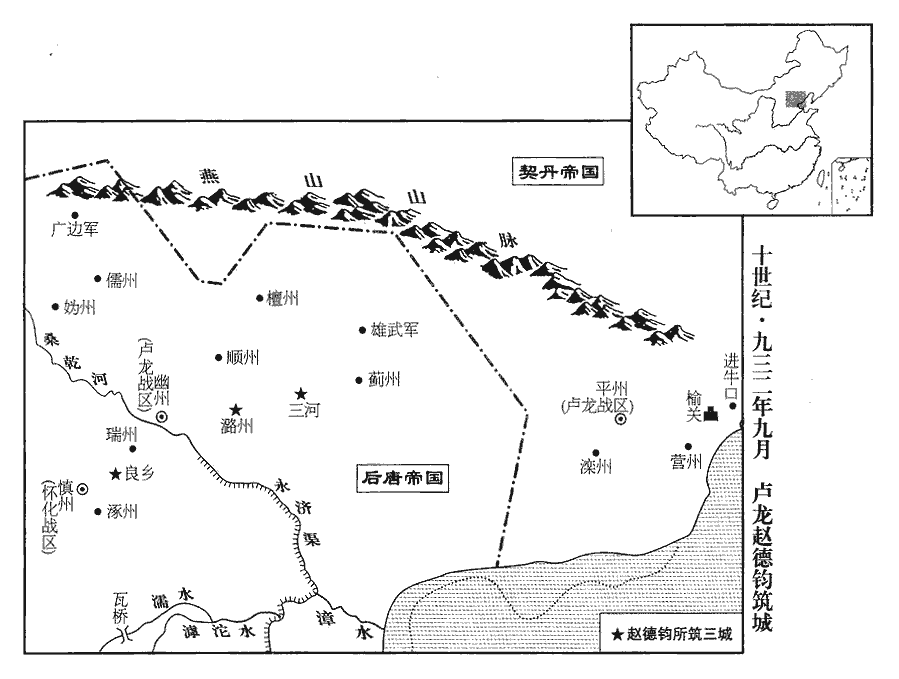
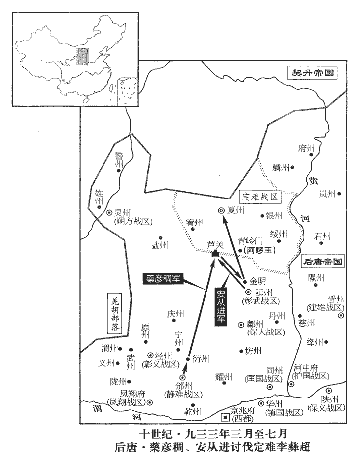
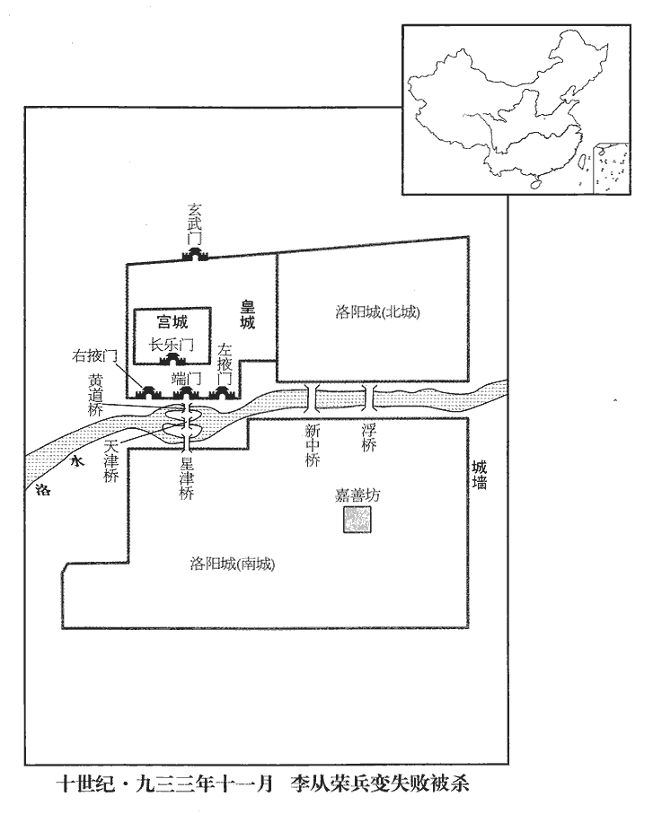
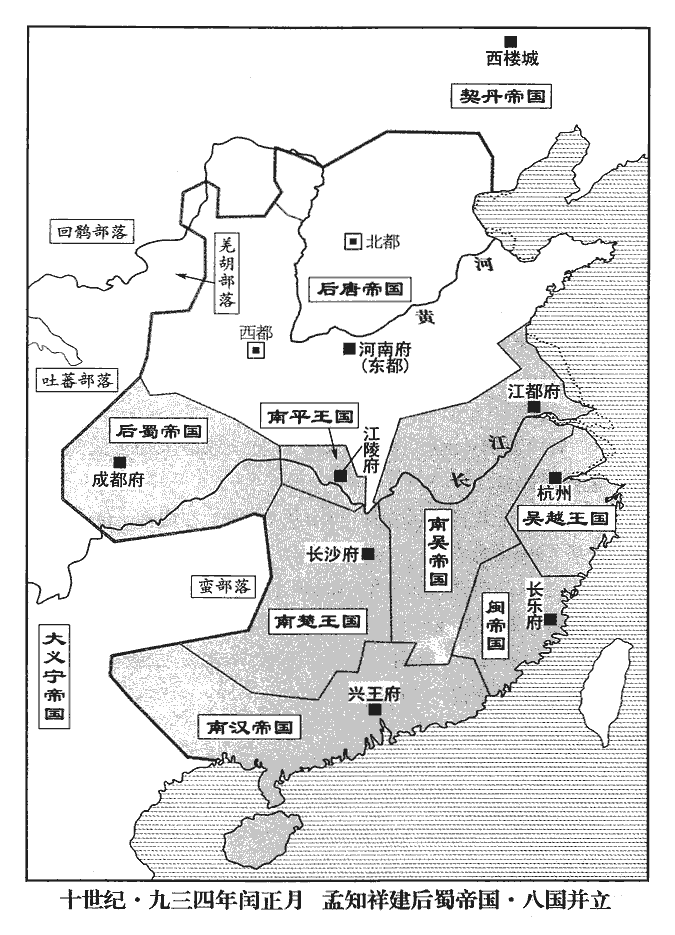

 後唐紀七起玄黓執徐（壬辰）七月，盡閼逢敦牂（甲午）閏正月，凡一年有奇。

# 明宗聖德和武欽孝皇帝下

## 長興三年（壬辰、九三二）

1秋，七月【張：「月」下脫「辛巳」二字。】朔‹一›，朔【章：十二行本不重「朔」字；乙十一行本同。】方奏夏州‹定难战区总部所在·陕西省靖边县北白城子›党項入寇，擊敗之，夏，戶雅翻。敗，補邁翻。追至賀蘭山。賀蘭山在靈州保靜縣。

〖译文〗 [1]秋季，七月，辛丑朔（初一），朔方上表奏报：夏州党项来侵犯，击败了他们，追击到贺兰山。

2己丑‹九›，加鎮海‹总部杭州›、鎮東‹总部越州›軍節度使錢元瓘守中書令。

〖译文〗 [2]己丑（初九），加封镇海、镇东节度使钱元守中书令。

3庚寅‹十›，李存瓌至成都，是年六月遣李存瓌諭孟知祥，事始見上卷。孟知祥拜泣受詔。孟知祥之拜泣，豈其本心之誠然邪？

〖译文〗 [3]庚寅（初十），李存到了成都，孟知祥拜泣着接受后唐明宗诏书。

4武安‹总部长沙府›、靜江‹总部桂州›節度使馬希聲以湖南比年大旱，命閉南嶽‹衡山·湖南省衡山县西›及境內諸神祠門，比，毗至翻；下比者同。舊以霍山為南嶽，今灊中天柱山是也。蓋漢武帝以衡山遐遠，遂徙南嶽於灊山耳。至唐，復以衡山為南嶽。竟不雨。辛卯‹十一›，希聲卒‹年三十四岁›，六軍使袁詮、潘約等迎鎮南‹总部设洪州江西省南昌市›節度使希範於朗州‹湖南省常德市›而立之。詮，且緣翻。鎮南軍洪州時屬吳，馬希範領節耳。希範字寶規，殷第四子。

〖译文〗 [4]武安、静江节度使马希声因湖南连年大旱，下令关闭南岳及境内诸神祠的大门，到底没有下雨。辛卯（十一日），马希声去世，六军使袁诠、潘约等迎请镇南节度使马希范于朗州而拥立他为主。

5乙未‹十五›，孟知祥遣李存瓌還，還，從宣翻，又如字。上表謝罪，且告福慶公主之喪。是年春正月主卒。自是復稱藩。【章：十二行本「藩」下有「然益驕倨矣」五字；乙十一行本同；退齋校同；張校同，云無註本亦無。】復，扶又翻。

〖译文〗 [5]乙未（十五日），孟知祥让李存回洛阳，向朝廷上表谢罪，并报告福庆公主的丧事。从此又向后唐朝廷自称藩属。

6庚子‹二十›，以西京‹京兆府·陕西省西安市›留守、同平章事李從珂為鳳翔‹总部设凤翔府陕西省凤翔县›節度使。為李從珂自鳳翔奪嫡張本。

〖译文〗 [6]庚子（二十日），任用西京留守、同平章事李从珂为凤翔节度使。

7廢武興軍‹总部设凤州陕西省凤县›，復以鳳‹陕西省凤县›、興‹陕西省略阳县›、文‹甘肃省文县›三州隸山南西道‹总部设兴元府陕西省汉中市›。鳳、興、文本山南西道巡屬，唐末始分鳳州置感義軍，尋廢。前蜀王氏復置武興軍，今廢之，州還舊屬。

〖译文〗 [7]废除武兴军，恢复凤、兴、文三州隶属于山南西道。

8丁未‹二十七›，以門下侍郎、同平章事趙鳳同平章事，充安國‹总部设邢州河北省邢台市›節度使。

〖译文〗 [8]丁未（二十七日），后唐命门下侍郎、同平章事赵凤以同平章事衔，充当安国节度使。

9八月，庚申‹十一›，馬希範‹本年三十四岁›至長沙‹湖南省长沙市›；辛酉‹十二›，襲位。

〖译文〗 [9]八月，庚申（十一日），荆南马希范到达长沙；辛酉（十二日），承袭其兄马希声的职位。

10甲子‹十五›，孟知祥令李昊為武泰‹总部设黔州重庆市彭水县›趙季良等五留後草表，為，于偽翻；下同。請以知祥為蜀王，行墨制，仍自求旌節，昊曰：「比者諸將攻取方鎮，即有其地，比，毗至翻。謂李仁罕克遂州即為武信留後，趙廷隱克梓州遂爭東川也。今又自求【章：十二行本「求」下有「朝廷」二字；乙十一行本同；張校同，云無註本亦無。】節鉞及明公封爵，然則輕重之權皆在群下矣；借使明公自請，豈不可邪！」知祥大悟，更令昊為己草表，請行墨制，補兩川刺史已下；更，工衡翻。又表請以季良等五留後為節度使。武泰留後趙季良，武信留後李仁罕，保寧留後趙廷隱，寧江留後張業，昭武留後李肇。

〖译文〗 [10]甲子（十五日），孟知祥让李昊为武泰赵季良等五个留后起草表章，请求朝廷封孟知祥为蜀王，行使墨书制命的权力，允许他自行委任将吏，同时为他们自己请求朝廷赐给节度使的旌节，李昊说：“近来诸将攻取一方军镇，就占有其地域，现在又自己要求给予旌节斧钺以及您的封爵，这样，职位轻重的权衡就都落在下属部众之手了；假如您自己请封，岂不更好！”孟知祥一下明白过来，便让李昊替自己起草表章，请求施行墨书制命，可以补授缺额的两川刺史以下的官职；又上表请求朝廷任命赵季良等五个留后为节度使。

初，安重誨欲圖兩川，自知祥殺李嚴，見二百七十五卷天成二年。每除刺史，皆以東兵衛送之，小州不減五百人，夏魯奇、李仁矩、武虔裕各數千人，皆以牙隊為名。按天成二年，李敬周為武信留後；四年，使節度使夏魯奇治遂州城。魯奇蓋三年、四年間至遂州也。李仁矩鎮閬州，武虔裕刺綿州，見上卷天成四年。及知祥克遂‹武信·四川省遂宁市›、閬‹保宁·四川省阆中市›、利‹昭武·四川省广元市›、夔‹宁江·重庆市奉节县›、黔‹武泰·重庆市彭水县›、梓‹东川·四川省三台县›六鎮，得東兵無慮三萬人，恐朝廷徵還，表請其妻子。

〖译文〗 起先，安重诲图谋占取两川，自从孟知祥杀死李严，每次任命刺史，都用东方的军队护送他们赴任，小的州府不少于五百人，像夏鲁奇、李仁矩、武虔裕，都各领数千人，号称牙队。及至孟知祥攻下遂州、阆州、利州、夔州、黔州、梓州六镇，得到护从东兵不下三万人，怕朝廷征召东兵返回，就上表请求允许他们的妻子到驻地来。

11吳徐知誥廣金陵城‹江苏省南京市›周圍二十里。徐溫先已築金陵，今知誥復廣之，將以貽子孫也。

〖译文〗 [11]吴国徐知诰扩建金陵城周围二十里。

 

12初，契丹既強，寇抄盧龍‹总部幽州›諸州皆徧，抄，楚交翻。幽州‹北京›城門之外，虜騎充斥。每自涿州‹河北省涿州市›運糧入幽州，虜多伏兵於閻溝‹北京市西南良乡镇›，掠取之。據水經，漢涿郡故安縣有閻鄉，其西山則易水所出也。歐史作「鹽溝」。及趙德鈞為節度使，城閻溝而戍之，為良鄉縣，良鄉，漢古縣，趙德鈞移之於閻溝耳。匈奴須知：閻溝縣北至燕六十里，古良鄉空城南至涿州四十里。蓋契丹得燕之後改良鄉縣為閻溝縣，而所謂古良鄉空城即趙德鈞未移縣之前古城也。糧道稍通。幽州東十里之外，人不敢樵牧；德鈞於州東五十里城潞縣‹北京市东通州›而戍之，潞，漢古縣，唐屬幽州。匈奴須知：潞縣東二里有潞河，自潞縣西至燕六十里。近州之民始得稼穡。至是，又於州東北百餘里城三河縣‹河北省三河市›以通薊州‹天津市蓟县›運路，唐開元四年，分潞縣置三河縣，屬薊州。匈奴須知：三河縣西至燕一百七十里，薊州西至三河縣七十里。虜騎來爭，德鈞擊卻之。九月，庚辰朔‹一›，奏城三河畢。邊人賴之。

〖译文〗 [12]起初，契丹已经强大，把卢龙诸州都抢掠遍了，幽州城门以外，到处是契丹的骑兵。往往从涿州运粮到幽州，契丹兵众大多埋伏在阎沟，进行掠夺。到赵德钧为节度使时，在阎沟筑城守卫，设立良乡县，粮道略有通便。幽州以东十里之外，百姓不敢打柴放牧；赵德钧在州东五十里建立潞县城，加以守卫，靠近州城的百姓才得以进行农耕种庄稼。到此时，又在幽州东北百余里处，建立三河县城来疏通蓟州运路，契丹骑兵来争夺，赵德钧便把他们击退。九月，庚辰朔（初一），奏报三河县城建设完毕。边民赖以生存。

13壬午‹三›，以鎮南‹总部设洪州江西省南昌市›節度使馬希範為武安‹总部设长沙府湖南省长沙市›節度使，兼侍中。馬希範以領鎮南節自朗州入嗣，今使為武安節度使，嗣封楚王之漸也。

〖译文〗 [13]壬午（初三），任用镇南节度使马希范为武安节度使，兼任侍中。

14孟知祥命其子仁贊攝行軍司馬，兼都總轄兩川牙內馬步都軍事。

〖译文〗 [14]孟知祥命令他的儿子孟仁赞代理行军司马，兼任都总辖两川牙内马步都军事。

15冬，十月，己酉朔‹一›，帝復遣李存瓌如成都，是年七月李存瓌還自成都，今復遣之。復，扶又翻；下不復同。凡劍南自節度使、刺史以下官，聽知祥差署訖奏聞，朝廷更不除人；唯不遣戍兵妻子，然其兵亦不復徵也。

〖译文〗 [15]冬季，十月，己酉朔（初一），明宗再派李存赴成都，凡是在剑南的将吏，从节度使、刺史以下的官员，听凭孟知祥差派任命后，向朝廷奏报即可，朝廷不再另行任命别人；只是不让戍兵的妻子去戍所，然而对那些兵众也不再征召东还。

16秦王從榮喜為詩，聚浮華之士高輦等於幕府，與相唱和，喜，許記翻；下同。和，戶臥翻。頗自矜伐。每置酒，輒令僚屬賦詩，有不如意者面毀裂抵棄。壬子‹四›，從榮入謁，帝語之曰：「吾雖不知書，然喜聞儒生講經義，開益人智思。語，牛倨翻。思，相吏翻。吾見莊宗‹李存勖›好為詩，將家子文非素習，徒取人竊笑，汝勿效也。」明宗之誨其子，可謂名言。好，呼到翻。將，即亮翻。

〖译文〗 [16]秦王李从荣喜欢作诗，聚集浮华放荡的文士高辇等人在幕府中，同他们相与唱和，很是标榜自夸。每次设宴摆酒，往往让僚属们吟赋诗篇，有作得不如意的，当面撕毁丢弃。壬子（初四），李从荣入朝谒见，明宗对他说道：“我虽然不识文字，然而喜欢听取儒生讲说经文大义，可以开发人的智识和思考。我见庄宗皇帝喜好作诗，武将家的儿子文墨不是素所研习，只是白白让人背地笑话，你不要效法那个。”

17丙辰‹八›，幽州奏契丹屯捺剌泊。時幽州有備，契丹寇掠不得其志。契丹主西徙橫帳，居捺剌泊，出寇雲、朔之間。薛史本紀，是年十一月，雲州奏契丹主在黑榆林南捺剌泊治造攻城之具。是後石敬瑭鎮河東，因契丹部落近在雲、應，遂資其兵力以取中國，而燕、雲十六州之地遂皆為北方引弓之民。捺nà，奴葛翻。剌，來達翻。

〖译文〗 [17]丙辰（初八），幽州报奏：契丹人马屯驻捺剌泊。

18前彰義‹总部设泾州甘肃省泾川县›節度使李金全屢獻馬，李金全先嘗鎮涇州。上不受，曰：「卿在鎮為治何如？勿但以獻馬為事！」唐明宗雖出於胡人，斯言也，君人之言也。治，直吏翻。金全，吐谷渾‹山西省东北部›人也。

〖译文〗 [18]前彰义节度使李金全屡次向朝廷献马，后唐明宗不接受，并说：“你在镇所治理得怎么样？且不要只做献马这样的事！”李金全是吐谷浑的人。

19壬申‹二十四›，大理少卿康澄上書曰：「臣聞童謠非禍福之本，妖祥豈隆替之源！故雊雉升鼎而桑穀生朝，不能止殷宗之盛；雊gòu，古候翻。殷王太戊時，亳有祥桑穀共生於朝。武丁祭成湯，有飛雉升鼎耳而雊。二君懼而脩德，殷道復興。太戊廟號中宗，武丁廟號高宗。朝，直遙翻。神馬長嘶而玉龜告兆，不能延晉祚之長。晉懷帝永嘉六年二月，神馬嘶南城門。魏明帝時，張掖柳谷水湧，有石馬、石牛、石龜之祥，人以為晉興應之。是知國家有不足懼者五，有深可畏者六：陰陽不調不足懼，三辰失行不足懼，小人訛言不足懼，山崩川涸不足懼，蟊賊傷稼不足懼；蟊，莫侯翻。食根曰蟊，食節曰賊，皆害稼者也。賢人藏匿深可畏，四民遷業深可畏，上下相徇深可畏，廉恥道消深可畏，毀譽亂真深可畏，譽，音余。直言蔑聞深可畏。不足懼者，願陛下存而勿論；深可畏者，願陛下脩而靡忒。」康澄所謂不足懼，非果不足懼也，直言人事之不得，其可畏有甚於所懼者，然其詞氣之間抑揚太過，將使人君忽於變異災傷而不知警省，非篤論也。優詔獎之。

〖译文〗 [19]壬申（二十四日），大理少卿康澄上书启奏：“为臣听说，童谣不是祸福的根据，妖祥岂能当做兴变的本源！所以，商代出现飞雉落于鼎耳而鸣、桑谷共生于朝的祥瑞，不能中止殷王宗庙之盛；晋朝发生神马长嘶、水涌石龟的异兆，不能延缓晋国传位之长。由此悟出国家有不足惧的事情五件，有深可畏的事情六条：阴阳不协调不足惧，三星运行失常不足惧，小人传播讹言不足惧，山崩河涸不足惧，害虫伤害禾稼不足惧；贤人藏匿不出深可畏，四民迁业不安深可畏，上下通同作弊深可畏，廉耻之道消亡深可畏，诋毁赞誉混淆真伪深可畏，正直言论听不到深可畏。不足惧的事情愿陛下任其存在而不必多去计较；深可畏的事情愿陛下修治而不要差失。”明宗用嘉许的诏书奖励他。

20秦王從榮為人鷹視，輕佻峻急；鷹視者，如飛鷹欲攫，俯而側目視物。佻，土雕翻。既判六軍諸衛事，復參朝政，復，扶又翻。多驕縱不法。初，安重誨為樞密使，上專屬任之。屬，之欲翻。從榮及宋王從厚自襁褓與之親狎，雖典兵，常為重誨所制，畏事之。重誨死，誅安重誨，見上卷二年。王淑妃‹花见羞›與宣徽使孟漢瓊宣傳帝命，范延光、趙延壽為樞密使，從榮皆輕侮之。河陽‹总部设孟州河南省孟州市›節度使、同平章事石敬瑭兼六軍諸衛副使，其妻永寧公主與從榮異母，素相憎疾。明宗諸子，史皆不載其母誰氏，惟許王從益為王淑妃所子，是時尚幼，外此子女之年長者皆微時所生也。從榮以從厚聲名出己右，尤忌之；事始見二百七十六卷天成三年。從厚善以卑弱奉之，故嫌隙不外見。見，賢遍翻。石敬瑭不欲與從榮共事，從榮判六軍諸衛事，石敬瑭為副使，是共事也。常思外補以避之。范延光、趙延壽亦慮及禍，屢辭機要，請與舊臣迭為之，上不許。會契丹欲入寇，上命擇帥臣鎮河東‹总部太原府›，延光、延壽皆曰：「當今帥臣可往者獨石敬瑭、康義誠耳。」康義誠起代北，事晉王及莊宗及帝，三世在兵間，不聞有功，但以鄴都兵亂之時贊帝舉兵南向為功耳。帥，所類翻；下同。敬瑭亦願行，上即命除之。既受詔，不落六軍副使，敬瑭復辭，復，扶又翻。上乃以宣徽使朱弘昭知山南東道‹总部设襄州湖北省襄樊市›，代義誠詣闕。康義誠時為山南東道節度使，今召令詣闕，命朱弘昭往知節度事以代之，未正授以旌節也。

〖译文〗 [20]秦王李从荣为人像鹰眼一样常常侧目看人，既轻薄又尖刻；他被任用为判理六军诸卫事务后，又参与朝政，往往骄纵不守法纪。以前，安重诲做枢密使，明宗特别依重他。李从荣及宋王李从厚从幼儿时就和他亲昵戏闹，后来，虽然成为统兵大吏，也常被安重诲所牵制，对安重诲很敬重。安重诲死后，王淑妃与宣徽使孟汉琼宣布传达皇帝意旨，由范延光、赵延寿做枢密使，而李从荣对他们都很轻慢、看不起。河阳节度使、同平章事石敬瑭兼任六军诸卫副使，他的妻子永宁公主与李从荣是异母所生，素来就相互憎恶不和。李从荣因为李从厚的名声比自己高，便尤其忌恨他。李从厚善于，用谦卑软弱的姿态对待李从荣，所以嫌隙之状表面上看不出来。石敬瑭因不愿与李从荣共事，常想到外面藩镇补领一职来避开他。范延光、赵延寿也顾虑弄不好招祸，多次请求辞去枢要职务，与可信用的老臣更换充任，明宗不答应。当时正逢契丹要来侵扰，明宗授命秉政大臣选择可当统帅的人材去镇守河东，范延光、赵延寿都说：“现在可任统帅去河东的只有石敬瑭、康义诚而已。”石敬瑭也愿意前去，于是，明宗就任命委派他去。等到诏书下来，不落六军副使的职位名款，石敬瑭又辞谢不受，明宗便任用宣徽使朱弘昭主持山南东道的事务，代替康义诚的职位，让康义诚到朝廷来。

21十一月，辛巳‹三›，以三司使孟鵠為忠武‹总部设许州河南省许昌市›節度使，以忠武節度使馮贇充宣徽南院使，判三司。鵠本刀筆吏，與范延光鄉里厚善，范延光，相州臨漳人。孟鵠，魏州人。相、魏鄰接，言二人居鄉里時相與厚善。數年間引擢至節度使；上雖知其太速，然不能違也。

〖译文〗 [21]十一月，辛巳（初三），任用三司使孟鹄为忠武节度使，用忠武节度使冯充任宣徽南院使，判理三司。孟鹄本来是个掌案牍的书吏，与范延光是同乡，友谊深厚，几年之间荐引提拔到节度使；明宗虽然晓得提拔太快，然而不能不认可。

22乙酉‹七›，上以胡寇浸逼北邊，命趣議河東帥；趣，讀曰促；下同。石敬瑭欲之，而范延光、趙延壽欲用康義誠，議久不決。權樞密直學士李崧以為非石太尉不可，延光曰：「僕亦累奏用之，上欲留之宿衛耳。」會上遣中使趣之，眾乃從崧議。丁亥‹九›，以石敬瑭為北京‹太原府›留守、河東‹总部设太原府山西省太原市›節度使，兼大同、振武、彰國、威塞等軍蕃漢馬步總管，唐末移大同軍於雲州、振武軍於朔州。帝應州人，即位置彰國軍於應州，以興唐軍為寰州隸之。莊宗同光元年置威塞軍於新州，以媯、儒、武三州隸之。四軍皆節鎮也。加兼侍中。為石敬瑭以河東倚契丹之援而得中國張本。

〖译文〗 [22]乙酉（初七），明宗因为契丹人越来越侵逼北部边疆，命速议选任河东统帅；石敬瑭想要承担，而范延光、赵延寿想任用康义诚，议论了很长时间不能决定。代理枢密直学士李崧以为此任非石太尉不可，范延光说：“我也几次奏请用他，皇上要想把他留在身边统领宿卫军呐。”正好明宗命内使来催促，大家便接受了李崧的意见。丁亥（初九），任用石敬瑭为北京留守、河东节度使，兼任大同、振武、彰国、威塞等军蕃汉马步总管，加兼侍中。

23己丑‹十一›，加樞密使趙延壽同平章事。

〖译文〗 [23]己丑（十一日），加封枢密使赵延寿同平章事。

24吳以諸道都統徐知誥為大丞相、太師，加領得勝‹德胜总部设庐州安徽省合肥市›節度使；「得勝」當作「德勝」。【章：乙十一行本正作「德勝」。】吳之先王楊行密起於廬州，故因置德勝節度於廬州，言以德而勝也。知誥辭丞相、太師。

〖译文〗 [24]吴国任用诸道都统徐知诰为大丞相、太师、加领德胜节度使；徐知诰辞却丞相、太师。

25大同‹总部设云州山西省大同市›節度使張敬達聚兵要害，契丹竟不敢南下而還。按薛史，時契丹帥族帳自黑榆林捺剌泊至沒越泊，云借漢界水草；張敬達聚兵遏其衝要，虜竟不敢南牧。還，從宣翻，又如字。敬達，代州‹山西省代县›人也。

〖译文〗 [25]大同节度使张敬达集中兵力防守要害关塞，契丹兵竟然不敢南下而退还本地。张敬达是代州人。

26蔚州‹河北省蔚县›刺史張彥超本沙陀人，嘗為帝養子，與石敬瑭有隙；聞敬瑭為總管，舉城附於契丹，契丹以為大同‹总部仍设蔚州河北省蔚县›節度使。蔚，紆勿翻。

〖译文〗 [26]蔚州刺史张彦超本来是沙陀人，曾经是明宗的养子，与石敬瑭有嫌隙；听说石敬瑭当了总管，便把整个城池降附于契丹，契丹任命他为大同节度使。

27石敬瑭至晉陽‹太原府所在县›，以部將劉知遠、周瓌為都押衙，委以心腹；軍事委知遠，為劉知遠為石敬瑭佐命、又以是而基漢業張本。帑藏委瓌。帑，他朗翻。藏，徂浪翻。瓌，晉陽人也。

〖译文〗 [27]石敬瑭到了晋阳，任用他的部将刘知远、周为都押衙，依靠他们做心腹；军事委托刘知远，财政收入委托周。周是晋阳人。

28十二月，戊午‹十一›，以康義誠為河陽‹总部设孟州河南省孟州市›節度使，兼侍衛親軍馬步都指揮使；葉夢得石林燕語云：自梁置在京馬步軍都指揮使，後唐遂置侍衛親軍都指揮使。以朱弘昭為山南東道‹总部设襄州湖北省襄樊市›節度使。朱弘昭始正授襄陽旌節。

〖译文〗 [28]十二月，戊午（十一日），任用康义诚为河阳节度使，兼任侍卫亲军马步都指挥使；任用朱弘昭为山南东道节度使。

29是歲，漢主‹首都兴王府广东省广州市›刘岩，本年四十四岁立其子耀樞為雍王，雍，於用翻。龜圖為康王，弘度為賓王，弘熙【嚴：「熙」改「燕」。】為晉王、弘昌為越王，弘弼為齊王，弘雅為韶王，弘澤為鎮王，弘操為萬王，弘杲為循王，弘暐為思王，弘邈為高王，弘簡為同王，弘建為益王，弘濟為辯王，弘道為貴王，弘昭為宜王，弘政為通王，弘益為定王；未幾，徙弘度為秦王。幾，居豈翻。漢諸王皆以州為名。

〖译文〗 [29]这一年，南汉国主刘龚立他的儿子刘耀枢为雍王，刘龟图为康王，刘弘度为宾王，刘弘熙为晋王，刘弘昌为越王，刘弘弼为齐王，刘弘雅为韶王，刘弘泽为镇王，刘弘操为万王，刘弘杲为循王，刘弘为思王，刘弘邈为高王，刘弘简为同王，刘弘建为益王，刘弘济为辩王，刘弘道为贵王，刘弘昭为宜王，刘弘政为通王，刘弘益为定王；没有多久，把刘弘度调迁为秦王。

## 四年（癸巳、九三三）

1春，正月，戊子‹十一›，‹李嗣源（邈佶烈）本年六十七岁›加秦王從榮守尚書令，兼侍中。庚寅‹十三›，以端明殿學士歸義‹河北省容城县东›劉昫為中書侍郎、同平章事。歸義縣屬涿州。昫，吁句翻，又許羽翻。

〖译文〗 [1]春季，正月，戊子（十一日），加封秦王李从荣担任尚书令，兼任侍中。庚寅（十三日），任用端明殿学士归义人刘为中书侍郎、同平章事。

2閩‹首都福州福建省福州市›人有言真封宅龍見者，真封宅，蓋王延鈞未得國之時所居也。見，賢遍翻。更【章：十二行本「更」上有「閩王延鈞」四字；乙十一行本同；孔本同；張校同。】命其宅曰龍躍宮。更，工衡翻；下更名同。遂詣寶皇宮受冊，備儀衛，入府，即皇帝位，國號大閩，大赦，改元龍啟；更名璘。追尊父祖，立五廟。以其僚屬李敏為左僕射、門下侍郎，其子節度副使繼鵬為右僕射、中書侍郎，並同平章事；以親吏吳勗為樞密使。唐冊禮使裴傑、程侃適至海門‹福建省福清市东南海口镇›，海門，即今福清縣之海門鎮是也。閩主以傑為如京使；侃固求北還，不許。閩主自以國小地僻，常謹事四鄰，由是境內差安。史言閩主雖惑於神仙妖妄，而能粗安者，以善鄰而然。

〖译文〗 [2]闽国有人说，闽王王延钧未成国主之前所住的真封宅有龙出现，便把这所宅第改名为龙跃宫。接着就谒拜宝皇宫受其册封，设置仪仗军卫，返回王府，即位称帝，国号大闽，实行大赦，改年号为龙启，把自己的姓名改叫王。上尊号追谥自己的父亲和祖父，立五世的庙号。任命他的僚属李敏为左仆射、门下侍郎，他的儿子节度副使王继鹏为右仆射、中书侍郎，二人都为同平章事；任命亲信属吏吴勖为枢密使。后唐朝廷的册礼使裴杰、程侃正好来到闽地海门，闽主任用裴杰为如京使；程侃坚持要求北还后唐，闽主不准。闽主自己知道国小地偏，经常注意和四面邻境搞好关系，因此闽地境内还算安定。

3二月，戊申‹二›，孟知祥‹西川总部成都府›墨制以趙季良等為五鎮節度使。孟知祥為五帥請節鉞，朝廷依違不報，而許之墨制署授，故知祥因而授五帥。昔唐之季也，強藩悍將猶知長安本色之為貴，若趙季良等，知稟命於孟知祥而已，豈復知重朝命哉！

〖译文〗 [3]二月，戊申（初二），孟知祥墨制署授赵季良等人为五镇节度使。

4涼州‹甘肃省武威市›大將拓跋承謙及耆老上表，請以權知留後孫超為節度使。上問使者：「超為何人？」對曰：「張義潮在河西，張義潮以河西來歸，事始二百四十九卷唐宣宗大中五年。朝廷以天平軍‹总部设郓州山东省东平县›二千五百人戍涼州，自黃巢之亂，涼州為党項所隔，鄆人稍稍物故皆盡，超及城中之人皆其子孫也。」

〖译文〗 [4]凉州大将拓跋承谦及耆老上表，请求后唐朝廷任命暂为留后的孙超为节度使。明宗问来使：“孙超是什么人？”使者回答：“大唐宣宗时张义潮来归河西，朝廷用天平军二千五百人守戍凉州，自从黄巢之乱以后，凉州被党项族隔断，郓州随军来的人渐渐都死完了，孙超及城中之人都是他们的后代子孙。”

5乙卯‹九›，以馬希範為武安‹总部长沙府›、武平‹总部朗州›節度使，馬希範席父兄之業，故朝廷仍命以潭、朗兩鎮。兼中書令。

〖译文〗 [5]乙卯（初九），任用马希范为武安、武平节度使，兼任中书令。

6戊午‹十二›，定難‹总部设夏州陕西省靖边县北白城子›節度使李仁福卒；庚申‹十四›，軍中立其子彝超為留後。

〖译文〗 [6]戊午（十二日），定难节度使李仁福去世；庚申（十四日），军队里立他的儿子李彝超为留后。

7癸亥‹十七›，以孟知祥為東西川‹总部设成都府四川省成都市›節度使、蜀王。

〖译文〗 [7]癸亥（十七日），后唐任用孟知祥为东西川节度使、封蜀王。

8先是，河西‹陕西省北部›諸鎮皆言李仁福潛通契丹‹首都西楼城内蒙古巴林左旗›，是時河西止有涼州、沙州二鎮，然使命不常通也。竊意「河西」當作「關西」，歐史只作「邊將多言仁福通於契丹」，尤為檃yǐn栝kuò。先，悉薦翻。朝廷恐其與契丹連兵，併吞河右‹陕西省北部›，南侵關中‹陕西省中部›，會仁福卒，三月，癸未‹七›，以其子彝超為彰武留後，唐末以延州置保塞軍，岐改為忠義軍，後唐改為彰武軍。徙彰武‹总部设延州陕西省延安市›節度使安從進為定難留後，仍命靜塞【章：十二行本「塞」作「難」；乙十一行本同。】節度使藥彥稠將兵五萬，以宮苑使安重益為監軍，送從進赴鎮。從進，索葛‹索葛部落，应是西域突骑施汗国所属的索葛莫贺部落，参考六五八年十一月。后东徙中国境内，现住振武总部朔州›人也。難，乃旦翻。索葛部居振武。宋白曰：安從進本貫振武軍索葛府索葛村。索，蘇各翻。

〖译文〗 [8]过去，河西诸镇都说李仁福暗通契丹，后唐朝廷怕他和契丹联合用兵，并吞河右之地，南向侵掠关中。正好，李仁福去世，三月，癸未（初七），任用他的儿子李彝超为彰武留后，调迁彰武节度使安从进为定难留后，仍然命令静塞节度使药彦稠带兵五万人，由宫苑使安重益为监军，护送安从进赴镇所上任。安从进是振武军索葛人。

9乙酉‹九›，始下制除趙季良等為五鎮節度使。孟知祥既以墨制命之，朝廷不能違，遂為之下制。

〖译文〗 [9]乙酉（初九），明宗方始下诏，任命赵季良等为五镇节度使。

10丁亥‹十一›，敕諭夏‹陕西省靖边县北白城子›、銀‹陕西省榆林市南鱼河堡›、綏‹陕西省绥德县›、宥‹内蒙古鄂托克前旗东南›將士吏民，以「夏州窮邊，李彝超年少，少，詩照翻。未能扞禦，故使【章：十二行本「使」作「徙」；乙十一行本同；孔本同；退齋校同。】之延安‹延州州政府所在县·陕西省延安市›，延州，延安郡。從命則有李從曮、高允韜富貴之福，李從曮事見上卷長興元年；又是年高允韜自鄜、延徙安國。違命則有王都、李匡賓覆族之禍。」王都事見二百七十六卷天成四年；李匡賓事見上卷元年。夏，四月，彝超上言，為軍士百姓擁留，未得赴鎮，詔遣使趣之。趣，讀曰促。

〖译文〗 [10]丁亥（十一日），明宗下敕文告谕夏州、银州、绥州、宥州的将士吏民，说：“夏州贫穷边远，李彝超年轻，不能捍卫防御外敌，所以让他去延安。服从朝廷调遣就可以有李从、高允韬那样的富贵福份，违背朝廷调遣就要遭到王都、李匡宾那样的覆亡灭族之祸。”夏季，四月，李彝超上表奏称，他被军士百姓所拥护挽留，没有能够去延安赴任。明宗下诏派使者去催促他。

 

11言事者請為親王置師傅，為，于偽翻。宰相畏秦王從榮，不敢除人，請令王自擇。秦王府判官、太子詹事王居敏薦兵部侍郎劉瓚於從榮，瓚，才旱翻。歐史作「劉贊」，時為刑部侍郎。從榮表請之。癸丑‹七›，以瓚為祕書監、秦王傅，前襄州支使山陽‹江苏省淮安市›魚崇遠為記室。漢之山陽郡，唐為曹、濟之地。此山陽，唐楚州之山陽縣也。舊唐書地理志曰：山陽縣，漢臨淮郡之射陽縣地。晉置山陽郡，改為山陽縣，唐為楚州治所。瓚自以左遷，泣訴，不得免。唐制，六部侍郎除吏部之外，餘皆從四品下；王傅從三品。然六部侍郎為嚮用，王傅為左遷，以職事有閒劇之不同也。當是時，從榮地居儲副，則秦王傅不可以閒官言。蓋以從榮輕佻峻急，恐預其禍，求自脫耳。王府參佐皆新進少年，輕脫諂諛，瓚獨從容規諷，從，千容翻。從榮不悅。瓚雖為傅，從榮一概以僚屬待之，瓚有難色；從榮覺之，自是戒門者勿為通，勿為，于偽翻。月聽一至府，或竟日不召，亦不得食。

〖译文〗 [11]秦事的人建议给亲王们设立师傅，宰相惧怕秦王李从荣，不敢派人，请求让秦王自己选择师傅。秦王府判官、太子詹事王居敏荐举兵部侍郎刘瓒给李从荣，李从荣上表请求选派他。癸丑（初七），朝廷任命刘瓒为秘书监、秦王傅，前襄州支使山阳人鱼崇远为记室。刘瓒自己以为这是降职，涕泣诉说，不能得到改免。秦王府里的参谋佐辅人员都是新进拔的少年，轻浮放荡而好谄媚阿谀奉承，唯有刘瓒从容冷静地进行规劝，李从荣便不高兴。刘瓒虽为师傅，李从荣以对僚属的态度对待他；刘瓒有难堪之色；李从荣觉察到了，从此告诫守门人不要给他通报，每月听凭他一到府内，或者一天也不召见他，也不供膳。

12李彝超不奉詔，詔趣李彝超赴延安而不奉詔。遣其兄阿囉王守青嶺門‹即东汉时的桥门，今陕西省子长县西北›，囉，魯何翻。青嶺門蓋漢上郡橋山之長城門也，東北過奢延澤至夏州。集境內党項諸胡以自救。藥彥稠等進屯蘆關‹陕西省靖边县南›，蘆子關在延州延昌縣北。趙珣聚米圖經曰：蘆關在延州塞門寨北十五里。彝超遣党項抄糧運及攻具，抄，楚交翻。官軍自蘆關退保金明‹陕西省安塞县南›。金明，漢膚施縣地。後魏太平真君十二年置金明郡，隋廢郡為縣，縣又尋廢。唐武德二年，分膚施縣復置金明縣。宋熙寧五年，省金明縣為寨，屬膚施縣。趙珣聚米圖經曰：自蘆關南入塞門，即金明路。陳執中曰：塞門至金明二百里。

〖译文〗 [12]李彝超不按明宗的诏书办事，派遣他的哥哥阿王把守青岭门，聚集境内党项诸部胡人自己救援。药彦稠等进驻芦关，李彝超派党项兵抄掠官军粮运及攻城器具，官军从芦关退守金明。

13閩主璘立子繼鵬為福王，充寶皇宮使。

〖译文〗 [13]闽国主王立他的儿子王继鹏为福王，充任宝皇宫使。

14五月，戊寅‹三›，立皇子從珂為潞王，從益為許王，從子天平節度使從溫為兗王，護國‹总部设河中府山西省永济市›節度使從璋為洋王，成德‹总部设镇州河北省正定县›節度使從敏為涇王。從子，才用翻。

〖译文〗 [14]五月，戊寅（初三），后唐朝廷立皇子李从珂为潞王，李从益为许王，皇侄天平节度使李从温为兖王，护国节度使李从璋为洋王，成德节度使李从敏为泾王。

15庚辰‹五›，閩地震，閩主璘避位脩道，命福王繼鵬權總萬機。初，閩王審知性節儉，府舍皆庳陋；庳，皮靡翻。至是，大作宮殿，極土木之盛。

〖译文〗 [15]庚辰（初五），闽地地震，闽主王避位修道，命令福王王继鹏暂管一切机务。起初，第一任闽王王审知性情节俭，府舍都比较简陋；到此时，大肆兴建宫殿，极尽土木之豪华。

16甲申‹九›，帝暴得風疾；庚寅‹十五›，小愈，見群臣於文明殿。薛史，梁開平三年，改西京貞觀殿為文明殿。

〖译文〗 [16]甲申（初九），明宗突然患风疾，庚寅（十五日），病稍好些，在文明殿接见群臣。

17壬辰‹十七›夜，夏州城上舉火，比明，雜虜數千騎救之，夜舉火於城上，及明而雜虜至；蓋先約以舉烽為號，欲內外夾擊唐兵也。比，必利翻。安從進遣先鋒使宋溫擊走之。

〖译文〗 [17]壬辰（十七日）夜，夏州城上点起烽火，天刚亮，各路胡兵数千人马驰奔而至，安从进派先锋使宋温把他们击走。

18吳‹首都江都府江苏省扬州市›宋齊丘勸徐知誥徙吳主‹杨溥，本年三十四岁›都金陵‹南京›，知誥乃營宫城於金陵。

〖译文〗 [18]吴国宋齐丘劝徐知诰把吴主杨溥迁都金陵，徐知诰便在金陵营建宫城。

19帝旬日不見群臣，都人忷懼，忷，許勇翻。或潛竄山野，或寓止軍營。寓止軍營者，恐軍中起變，欲依之以自全。秋，七月，庚辰‹六›，帝力疾御廣壽殿，廣壽殿，不知其創造之始。薛史本紀：長興四年重脩廣壽殿，帝曰：「此殿經焚，不可不脩。」蓋焚於同光之末也。人情始安。

〖译文〗 [19]明宗十天不见群臣，京都的人惶恐，或者暗中流窜到山林荒野，或者躲藏到军营。秋季，七月，庚辰（初二），明宗带病勉强驾临广寿殿，人心才安定下来。

20安從進攻夏州。州城赫連勃勃所築，夏州城，赫連勃勃蒸土所築統萬城也，事見一百一十七卷晉安帝義熙九年。宋白曰：統萬城在朔方之北、黑水之南，其城土白而堅，南有亢敵峻險，非人力所攻，迄今雉堞雖久，崇墉若新。堅如鐵石，斸鑿不能入。斸zhú，株玉翻，斫也。又党項萬餘騎徜徉四野，抄掠糧餉，徜，常羊翻。徉，音羊。抄，楚交翻。官軍無所芻牧。山路險狹，關中民輸斗粟束藁費錢數緡，民間困竭不能供。李彝超兄弟登城謂從進曰：「夏州貧瘠，非有珍寶蓄積可以充朝廷貢賦也；但以祖父世守此土，唐僖宗時拓跋思恭據夏州，傳思諫、彝昌、仁福以至彝超。不欲失之。蕞爾孤城，蕞，徂外翻。勝之不武，何足煩國家勞費如此！幸為表聞，為，于偽翻。若許其自新，或使之征伐，願為眾先。」上聞之，壬午‹八›，命從進引兵還。還，從宣翻；下同。

〖译文〗 [20]安从进攻打夏州。夏州的城垣是赫连勃勃所筑，坚固得像铁石一般，斫凿不能使它破毁。那里又有党项四万多骑兵在四野流动，抢掠粮食财物，致使官军不能进行农耕、畜牧。山路又艰险又狭小，关中百姓运输一斗米、一捆柴草，要费钱数贯，民间困若竭尽，无力供应。李彝超兄弟登上城垣对安从进说：“夏州很贫穷，没有珍宝积畜可以充当对朝廷的贡品和财赋的地方，只是因为祖父、父亲世代据守此地，不想把它丢失了。这个小小孤城，战胜它也不足以宣扬威武，何必这样麻烦国家劳师费财！请您上表把情况报告朝廷，如果朝廷能准许我们自新，或者派遣我们去征伐异城，我愿意去打先锋。”明宗听说这种情况，壬午（初八），命令安从进带兵返回。

其後有知李仁福陰事者，云：「仁福畏朝廷除移，揚言結契丹為援，除移，謂除移他鎮。揚言者，播其言使人知。契丹實不與之通也；致朝廷誤興是役，無功而還。」自是夏州輕朝廷，每有叛臣，必陰與之連以邀賂遺。遺，唯季翻。上疾久未平，征夏州無功，軍士頗有流言，乙酉‹十一›，賜在京諸軍優給有差；既賞賚無名，士卒由是益驕。唐兵之驕，始於同光，甚於長興，極於清泰。至開運之末，契丹入汴，晉兵有不得食者矣。

〖译文〗 其后，有人知道李仁福的隐怀，指出：“李仁福怕朝廷调动他的人马，便放风说要联合契丹相互支援，其实契丹并未与他勾结；致使朝廷这次错误地兴兵讨伐，结果无功而还。”从此，夏州疏远朝廷，每逢有人叛变，必然暗中与之通连勾结，来达到要求贿赂遗赠的目的。当时，明宗久病未愈，征讨夏州无所获而归，军士中有很多流言，乙酉（十一日），按等级优厚赏赐在京各军；这样，赏施没有正当理由，士兵从此更加骄纵了。

21丁亥‹十三›，賜錢元瓘‹本年四十七岁›爵吳王。元瓘於兄弟甚厚，其兄中吳‹总部苏州›、建武‹总部邕州›節度使元璙自蘇州‹江苏省苏州市›入見，元璙即傳璙。元瓘嗣國，兄弟名從「傳」者並改為「元」。吳越於蘇州置中吳節度。薛史曰：唐莊宗三年升蘇州為中吳軍。見，賢遍翻。元瓘以家人禮事之，奉觴為壽，曰：「此兄之位也，而小子居之，兄之賜也。」元璙讓位於元瓘，見二百七十六卷天成三年。元璙曰：「先王擇賢而立之，君臣位定，元璙知忠順而已。」因相與對泣。元瓘篤友悌之義，元璙知忠順之節，兄弟輯睦以保其國，異乎夫己氏者矣。

〖译文〗 [21]丁亥（十三日），赐予钱元封爵为吴王。钱元对他的兄弟们很是敦厚，他的哥哥中吴、建武节度使钱元从苏州来朝见他。钱元用家人礼法待他，举杯向他祝福，并说：“这是哥哥的王位，而小弟我占有了，这是兄长所赐予我的啊。”钱元说：“先王是选择贤能而扶立的，现在君臣之位已定，元明白要忠贞顺从而已。”因而兄弟相对涕泣。

22戊子‹十四›，閩主璘復位。王璘避位六十五日，特以厭地震之異耳。初，福建中軍使薛文傑，性巧佞，璘喜奢侈，文傑以聚斂求媚，喜，許記翻。斂，力贍翻。璘以為國計使，親任之。文傑陰求富民之罪，籍沒其財，被榜捶者胸背分受，仍以銅斗火熨之。榜，音彭。捶，止橤翻。熨，紆勿翻，又紆胃翻。建州‹福建省建瓯市›土豪吳光入朝，文傑利其財，求其罪，將治之；治，直之翻。光怨怒，帥其眾且萬人叛奔吳。為吳光引吳兵攻建州而文傑誅張本。帥，讀曰率。

〖译文〗 [22]戊子（十四日），闽主王复位。起先，福建中军使薛文杰，为人乖巧谄媚，王喜爱奢侈，薛文杰便用搜刮民财的手段来迎会他，王任用他当国计使，视为亲信。薛文杰暗中探查有钱人家的罪过，抄没其家财，被拷打的人胸背受刑，用烧红了的铜斗烙灼。建州的土豪吴光来朝拜闽主，薛文杰看中他的财产，搜求他的罪过，将要处治他；吴光怨恨恼怒，率领自己的徒众几乎上万人，反叛而奔入吴国。

23帝以工部尚書盧文紀、禮部郎中呂琦為蜀王冊禮使，并賜蜀王一品朝服。知祥自作九旒冕，九章衣，車服旌旗皆擬王者。王者，謂天子也。唐制：真王正一品。朝廷既賜孟知祥以一品朝服，知祥又作九旒，九章之法服，是為王矣；所謂「車服旌旗皆擬王者」，是擬天子也。八月，乙巳朔‹一›，文紀等至成都。戊申‹四›，知祥服兗冕，備儀衛詣驛，時館盧文紀等於成都驛舍。降階北面受冊，升玉輅，至府門，乘步輦以歸。玉輅，天子之輅。步輦，以人挽之。文紀，簡求之孫也。盧簡求，綸之子也，唐宣宗、懿宗之時，內歷臺閣，外踐節鎮。

〖译文〗 [23]明宗任命工部尚书户文纪、礼部郎中吕琦为蜀王册礼使，并赐蜀王一品朝服。孟知祥自己制作九旒冠冕，九章衣，车舆服饰旌旗都比照天子。八月，乙巳朔（初一），卢文纪等到达成都。戊申（初四），孟知祥穿上兖服、冠冕，准备好仪仗军卫来到驿舍，降阶行礼。面向北方接受册封，坐上带着玉辂的车，到达王府门前，坐着人抬的步辇而进入内庭。卢文纪是卢简求的孙子。

24戊申‹四›，群臣上尊號曰聖明神武廣道法天文德恭孝皇帝，大赦。在京及諸道將士各等第優給。時一月之間再行優給，乙酉至戊申，二十四日耳。由是用度益窘。明宗之優給，懲莊宗之過也。給之愈濫，士心愈驕，由是有「到鳳翔更請一分」之事。窘，巨隕翻。

〖译文〗 [24]戊申（初四），群臣为明宗上尊号为圣明神武广道法天文德恭孝皇帝，实行大赦。对在京城及诸道的将士，各按等级进行优赏。当时在不到一个月的时间里，再次实行优赏，从此用度更加困窘。

25太僕少卿【章：十二行本「卿」下有「致仕」二字；乙十一行本同；張校同，云無註本亦無。】何澤見上寢疾，秦王從榮權勢方盛，冀己復進用，歐史曰：何澤外雖直言而內實佞邪，與宰相趙鳳有舊，數私干鳳；鳳薄其為人，以為太常少卿。敕未出，澤先知之，即稱新官上章自訴。章下中書，鳳等言：「澤未拜命而稱新官，輕侮朝廷，請坐以法。」乃以太僕少卿致仕，居于河陽‹河南省孟州市›。表請立從榮為太子。上覽表泣下，私謂左右曰：「群臣請立太子，朕當歸老太原‹山西省太原市›舊第耳。」此唐宣宗所謂「若立太小則朕便為閒人」之見也。富有天下，不思貽後之謀，而為此論，意趣凡近，良可憫笑。帝事太祖、莊宗，起於晉陽，有舊第在焉。不得已，丙【張：「丙」作「壬」。】戌‹十八›，詔宰相樞密使議之。丁卯‹二十三›，從榮見上，見，賢遍翻。言曰：「竊聞有姦人請立臣為太子；臣幼少，且願學治軍民，不願當此名。」治，直之翻。上曰：「群臣所欲也。」從榮退，見范延光、趙延壽曰：「執政欲以吾為太子，是欲奪我兵柄，幽之東宮耳。」從榮之言，與明宗之言同一戀權之心耳。延光等知上意，且懼從榮之言，即具以白上；辛未‹二十七›，制以從榮為天下兵馬大元帥。

〖译文〗 [25]太仆少卿何泽看到明宗卧病，秦王李从荣权势正在发展，他希望自己能重新得到起用，便上表请求立李从荣为太子。明宗看到表章流下眼泪，私下对左右亲近的人说：“群臣请求立太子，朕自当归老在太原旧府第了。”不得已，壬戌（十八日），下诏让宰相、枢密使议论此事。丁卯（二十三日），李从荣谒见明宗，说道：“听说有奸臣请陛下立臣为太子，臣年纪幼小，并且臣愿意学习带兵，不愿担当这个名义。”明宗说：“这是群臣所要求的。”李从荣退下来，去见范延光、赵延寿说：“你们执政的各位要让我当太子，我是想夺我的兵权，把我幽禁在东宫而已。”范延光等知道明宗并不愿立太子，而且畏惧李从荣讲的话，就把他的话如实上奏明宗；辛未（二十七日），明宗下制书，任命李从荣为天下兵马大元帅。

26九月，甲戌朔‹一›，吳主立德妃王氏為皇后。

〖译文〗 [26]九月，甲戌朔（初一），吴主立德妃王氏为皇后。

27戊寅‹五›，加范延光、趙延壽兼侍中。

〖译文〗 [27]戊寅（初五），加封范延光、赵延寿兼任侍中。

28癸未‹十›，中書奏節度使見元帥儀，雖帶平章事，亦以軍禮廷參，從之。時中書門下奏：「自歷朝以來，無天下兵馬大元帥公事儀注；或專一面之權，或總諸道之帥，其儀注規程公事載詳故實，未見明文。臣等謹沿近事，伏見招討使、總管兼受副使已下櫜gāo鞬庭禮，今望令諸道節度使以下，凡帶兵權者，見元帥，階下具軍禮參見，皆申公狀；其使相者初相見亦以軍禮，一度已後客禮相見。應天下諸軍務公事，元帥府行指揮；其判六軍諸衛事則行公牒往來。其元帥府所置官屬、補奏軍職，則委元帥奏請署置。」按是時執政畏從榮，崇秩太過。

〖译文〗 [28]癸未（初十），中书上奏：节度使见元帅的仪礼，虽然带衔平章事，仍用军人礼节进见和参拜；批准了这样办。

29帝欲加宣徽使、判三司馮贇同平章事；贇父名章，贇父璋事帝於潛躍，為閽者。執政誤引故事，庚寅‹十七›，加贇同中書門下二品，充三司使。唐制：中書門下二省，惟中書令、侍中正二品，侍郎則正三品。以兩省侍郎兼宰相之職，則謂之同中書門下平章事，而官則自依本品。今同中書門下二品，則其品同兩省長官，是誤也。

〖译文〗 [29]后唐明宗要加封宣徽使、判三司冯同平章事；冯的父亲叫冯章。执政者弄错了唐制旧规定，庚寅（十七日），加封冯同中书门下二品，充当三司使。

30秦王從榮請嚴衛、捧聖步騎兩指揮為牙兵。五代會要：應順元年三月，改左、右羽林四十指揮為嚴衛左、右軍，龍武、神武四十指揮為捧聖左、右軍。按是年帝殂，明年正月閔帝改元應順，四月潞王入立，改元清泰。數月之間，乃宋、潞二王兵爭之際，何暇改屯衛諸軍號乎！是必改於天成、長興之間，會要誤也。每入朝，從數百騎，張弓挾矢，馳騁衢路；令文士試草檄淮南書，陳己將廓清海內之意。從榮不快於執政，私謂所親曰：「吾一旦南面，必族之。」范延光、趙延壽懼，屢求外補以避之。上以為見己病而求去，甚怒，曰：「欲去自去，奚用表為！」齊國公主復為延壽言於禁中，云「延壽實有疾，不堪機務。」趙延壽尚帝女齊國公主。復，扶又翻；下同。為，于偽翻。丙申‹二十三›，二人復言於上曰：「臣等非敢憚勞，願與勳舊迭為之。亦不敢俱去，願聽一人先出。若新人不稱職，稱，尺證翻。復召臣，臣即至矣。」上乃許之。戊戌‹二十五›，以延壽為宣武‹总部设汴州河南省开封市›節度使；以山南東道‹总部设襄州湖北省襄樊市›節度使朱弘昭為樞密使、同平章事。制下，弘昭復辭，亦懼從榮之禍也。下，戶嫁翻。上叱之曰：「汝輩皆不欲在吾側，吾蓄養汝輩何為！」弘昭乃不敢言。

〖译文〗 [30]秦王李从荣请求把严卫军和捧圣军的步骑两指挥作为从属于自己的牙兵。每逢他入朝，随从几百骑马的兵勇，张着弓，带着箭，奔驰在通衢大路上；又令文士替他试着起草征讨淮南的宣言，表示他将要平定海内的意志。李从荣对执政者不满意，私下对他的亲信讲：“我有朝一日做了皇帝，必定把他们灭门诛杀。”范延光、赵延寿害怕，几次请求补放在外镇为官以躲避灾祸。明宗以为他们是看到自己有病而要求离去，很恼火，说：“要走便自己走；何必上表！”赵延寿的妻子齐国公主又替赵延寿在内宫进言，说：“赵延寿确实有病，承担不了机要重务。”丙申（二十三日），范、赵二人再次上奏明宗说：“我们不是怕辛劳，而是愿意与勋旧老臣轮流担负枢要重任。我们也不敢一下都走，希望能允许先走一个。如果新任的人不称职，可以再把我们召回，我们必定马上回来。”明宗这才准许了。戊戌（二十五日），外调赵延寿为为宣武节度使，另行调入山南东道节度使朱弘昭为枢密使、同平章事。明宗制命下来，朱弘昭又推辞不受，明宗斥责他说：“你们这些人都不想在我身边，我供养你们干什么！”朱弘昭才不敢再说。

31吏部侍郎張文寶泛海使杭州，使，疏吏翻。船壞，水工以小舟濟之，風飄至天長‹安徽省天长市›；天長縣在揚州西一百一十里，其地北不至淮，東不至海，豈小舟隨風所能至！今通州海門縣崇明鎮東海中有大洲，謂之天賜鹽場，舟人揚帆遇順，東南可以徑至明州定海，西南可以至許浦、達蘇州，恐是此處。宋之通州，吳之靜海軍也。從者二百人，所存者五人。吳主厚禮之，資以從者儀服錢幣數萬，仍為之牒錢氏，從，才用翻。為，于偽翻。使於境上迎候。文寶獨受飲食，餘皆辭之，曰：「本朝與吳久不通問，今既非君臣，又非賓主，若受茲物，何辭以謝！」吳主嘉之，竟達命於杭州而還。還，從宣翻，又如字。

〖译文〗 [31]吏部侍郎张文宝经海路出使吴越杭州，途中船坏了，水手用小船接济他，靠风力飘流至吴国的天长；原有随从二百人，留存下来的只剩五人。吴国君主接待他很优厚，资助他随从人员的仪礼服装、钱币数万，仍然为他转达公文给吴越国主钱元，让他们派人在境界上迎候。张文宝只接受了饮食，其他东西都没有要，并说：“本朝与吴国很长时间不通问讯了，现在既不是君主关系，又不是宾主关系，如果接受了这些东西，用什么言词来致谢！”吴主杨溥很赞赏他。他居然完成了朝廷委派的任务，到杭州而还。

32庚子‹二十七›，以前義成‹总部设滑州河南省滑县›節度使李贊華‹耶律突欲›為昭信‹总部设虔州江西省赣州市›節度使，留洛陽食其俸。去年以李贊華帥義成，事見上卷。按唐末於金州置昭信節度，五代兵爭，不復以為節鎮。又按五代會要，長興二年升虔州為昭信節度；時虔州屬吳，吳以為百勝節度。贊華所領節，抑虔州之昭信軍歟？又，是年十一月庚辰，改慎州懷化軍為昭化軍，慎州在幽州之北，唐盛時所置以處突厥降者，抑以贊華領昭化節而「信」字乃「化」字之誤歟？

〖译文〗 [32]庚子（二十七日），任用前义成节度使李赞华为昭信节度使，人留在洛阳而享受节度使的俸给。

33辛丑‹二十八›，詔大元帥從榮位在宰相上。

〖译文〗 [33]辛丑（二十八日），明宗下诏：大元帅李从荣地位在宰相之上。

34吳徐知誥以國中水火屢為災，曰：「兵民困苦，吾安可獨樂！」樂，音洛。悉縱遣侍妓，妓，渠綺翻。取樂器焚之。

〖译文〗 [34]吴国徐知诰因为境内屡次遭受水火灾害，说道：“军队和百姓生活困苦，我怎么可以独享逸乐！”便把所有的侍妓全部打发出去，把歌舞演奏的乐器都焚烧了。

35閩‹首都福州›內樞密使薛文傑說閩王抑挫諸宗室；從子繼圖不勝忿，說，式芮翻。從，才用翻。勝，音升。謀反，坐誅，連坐者千餘人。

〖译文〗 [35]闽国的内枢密使薛文杰劝说闽王王抑制控压各个宗室；王的侄儿王继图很愤恨，谋反失败，被诛杀，连坐的有一千余人。

36冬，十月，乙卯‹十二›，范延光、馮贇奏：「西北諸胡賣馬者往來如織，日用絹無慮五千匹，計耗國用什之七，天成四年，沿邊置場市馬，禁党項賣馬者到闕，而卒不能禁。今掌兵、掌計之臣復以其耗費而奏言之。請委緣邊鎮戍擇諸胡所賣馬良者給券，具數以聞。」從之。

〖译文〗 [36]冬季，十月，乙卯（十二日），后唐范延光、冯奏称：“西北的各族胡人卖马的往来像穿梭，每天用于换马交易的绢恐怕不少于五千匹，计算起来耗费国家费用达到十分之七，请朝廷委派沿边界的镇所，选择各族胡人所卖马中优良的发给价券，价购多少按数上报。”明宗同意施行。

37戊午‹十五›，以前武興‹总部设凤州陕西省凤县›節度使孫岳為三司使。代馮贇也。

〖译文〗 [37]戊午（十五日），任用前武兴节度使孙岳为三司使。

38范延光屢因孟漢瓊、王淑妃‹花见羞›以求出；庚申‹十七›，以延光為成德節度使，以馮贇為樞密使。

〖译文〗 [38]范延光由于孟汉琼、王淑妃的缘故，屡次请求明宗准许委派他到外镇为官；庚申（十七日），任用范延光为成德节度使，而以冯为枢密使。

帝以親軍都指揮使、河陽‹总部设孟州河南省孟州市›節度使、同平章事康義誠為朴忠，親任之。時要近之官多求出以避秦王之禍，義誠度不能自脫，乃令其子事秦王，務以恭順持兩端，冀得自全。帝以康義誠為朴忠，朴忠者能持兩端乎？是後康義誠事閔帝，自請將兵拒潞王而遂迎降，亦所以自全也，乃所以自斃。若此者果可親任耶！度，徒洛翻。

〖译文〗 明宗以亲军都指挥使、河阳节度使、同平章事康义诚为人淳朴忠实，很亲近和信任他。当时朝廷重要和亲近的官员大多要求外调以躲避秦王的加祸，康义诚料想自己不能解脱，便让他的儿子侍奉秦王，遇事力求用恭敬顺从、左右两可的态度去对待，希望借此保全自己。

39權知夏州事李彝超上表謝罪，求昭雪；去年秋討李彝超。昭者，明其無他；雪者，澡洗其罪。壬戌‹十九›，以彝超為定難軍節度使。難，乃旦翻。

〖译文〗 [39]暂任主持夏州事务的李彝超上表向朝廷谢罪，请求昭雪讨伐他的罪行；壬戌（十九日），任命李彝超为定难军节度使。

40十一月，甲戌‹二›，上餞范延光，酒罷，上曰：「卿今遠去，事宜盡言。」對曰：「朝廷大事，願陛下與內外輔臣參決，勿聽群小之言。」內輔臣，謂樞密使；外輔臣，謂宰相。群小，指孟漢瓊之黨。遂相泣而別。語而相泣，死期將至，不知泣下也。時孟漢瓊用事，附之者共為朋黨以蔽惑上聽，故延光言及之。

〖译文〗 [40]十一月，甲戌（初二），明宗给范延光饯行，喝完了酒，明宗说：“你现在要远离我而去，有什么事尽管说出来。”范延光回答说：“朝廷的大事，希望陛下同内外辅佐的大臣商量决定，不要听那些小人的话。”随即相互流泪而别。当时，孟汉琼弄权操纵一切，依附他的人相互结为朋党，共同蒙蔽惑乱皇帝的耳目，所以范延光说起这些话。

41庚辰‹八›，改慎州‹羁縻州·北京市西南窦店›懷化軍。九域志：慎州，昭化軍節度。五代會要：是年十一月庚辰，改鎮州懷化軍為昭化軍。史於此蓋逸「為昭化軍」四字。置保順軍於洮州‹甘肃省临潭县›，領洮、鄯‹青海省乐都县›等州。自唐肅、代以來，洮、鄯沒於吐蕃，是時必有西戎首領來歸附，故置節鎮以寵授之。洮，土刀翻。鄯，音善。

〖译文〗 [41]庚辰（初八），更改慎州怀化军为昭化军。设置保顺军于洮州，领有洮州、鄯州等地。

42戊子‹十六›，帝疾復作，歐史：戊子，雪，帝幸宫西士和亭，得傷寒疾。復，扶又翻。己丑‹十七›，大漸，秦王從榮入問疾，帝俛首不能舉。俛，音免。王淑妃曰：「從榮在此。」帝不應。從榮出，聞宫中皆哭，從榮意帝已殂，明旦，稱疾不入。是夕，帝實小愈，歐史：從榮與朱弘昭、馮贇入問起居於廣壽殿，帝不能知人。從榮等出，乃遷于雍和殿，宫中皆慟哭。至夜半，帝蹶然自興于榻，而侍疾者皆去，顧殿上守漏宫女曰：『夜漏幾何？』對曰：『四更矣。』帝即唾肉如胏zǐ者數片，溺便液斗餘。守漏者曰：『大家省事乎？』曰：『吾不知也。』有頃，六宫皆至，曰：『大家還魂矣。』因進粥一器。至旦，疾少愈。薛史作「便溺升餘」。當改「斗」字從「升」字。而從榮不知。

〖译文〗 [42]戊子（十六日），明宗的病复发，己丑（十七日），明显见好，秦王李从荣进宫问候，明宗低着头不能抬起。王淑妃说：“从荣在这里。”明宗没有回答。李从荣出来，听到宫中人都在恸哭，他以为明宗已经死了，第二天早上，自称有病不进宫省问。这天晚上，明宗实际上是稍见好转，而李从荣却不知道。

從榮自知不為時論所與，事始見二百七十六卷天成二年。人患不自知耳，既自知矣，而與小人謀為自全之計，此其所以敗也。恐不得為嗣，與其黨謀，欲以兵入侍，先制權臣。權臣，謂孟漢瓊、朱弘昭、馮贇等。辛卯‹十九›，從榮遣都押牙馬處鈞謂朱弘昭、馮贇曰：「吾欲帥牙兵入宮中侍疾，帥，讀曰率。且備非常，當止於何所？」二人曰：「王自擇之。」既而私於處鈞曰：「主上萬福，今人言起居無他者為萬福。王宜竭心忠孝，不可妄信人浮言。」從榮怒，復遣處鈞謂二人曰：「公輩殊不愛家族邪？何敢拒我！」以參夷之罪臨之。復，扶又翻。二人患之，入告王淑妃及宣徽使孟漢瓊，咸曰：「茲事不得康義誠不可濟。」康義誠時總侍衛親軍。言不得義誠與之合謀拒從榮，則事不可成。乃召義誠謀之，義誠竟無言，但曰：「義誠將校耳，將，即亮翻。校，戶教翻。不敢預議，惟相公所使。」弘昭疑義誠不欲眾中言之，夜，邀至私第問之，其對如初。康義誠之初計，欲持兩端以自全，故其對如此。

〖译文〗 李从荣自己知道当时人心舆论对他不利，害怕继承不了皇帝大位，便同他的党羽策划，要用武力入宫侍卫，先要制服权臣。辛卯（十九日），李从荣派都押牙马处钧告诉朱弘昭、冯说：“我要带兵进入宫内侍候皇上疾病，并且防备非常之变，应该在哪里居处？”朱、冯二人答称：“请王爷自己选择地方。”接着私下对马处钧说：“皇上平安无事，秦王应该竭尽心力实行忠孝之道，不可乱信坏人的胡说。”李从荣大怒，又派马处钧告诉朱、冯二人：“你们两位难道不爱惜自己的家族吗？怎么敢抗拒我！”朱、冯二人害怕，入宫报告王淑妃及宣徽使孟汉琼，都说：“这件事不得到康义诚的合作和支持就不可能办好。”便把康义诚召入内廷和他商议办法，康义诚竟然不拿主意，只是说：“义诚是带兵的军人，不敢干预朝廷政务，我只听从宰相大人的驱使。”朱弘昭怀疑康义诚不想当着众人表态，夜间，把他邀请到家里再次问他，康义诚对答得和原来一样。

壬辰‹二十›，從榮自河南府常服將步騎千人陳於天津橋‹洛水桥›。從榮時以河南尹判六軍諸衛，居河南府。是日黎明，從榮遣馬處鈞至馮贇第，語之曰：「吾今日決入，且居興聖宮。語，牛倨翻。帝之嗣位也，先入居興聖宮，故從榮欲效之。公輩各有宗族，處事亦宜詳允，處，昌呂翻；下處置同。又使處鈞以前說臨馮贇。禍福在須臾耳。」又遣處鈞詣康義誠，義誠曰：「王來則奉迎。」言來則奉迎，不來則不敢輕動，此即義誠遣子事秦府之初計也。

〖译文〗 壬辰（二十日），李从荣穿着平常服装从河南府带领步骑兵马千人列阵于天津桥。当日黎明，李从荣派马处钧到冯府第，对他说：“我今天决定进入皇宫，并且要住进准备嗣位的兴圣宫。你们各位枢要大臣都各有自己的宗族，做事也应该仔细慎重，是祸是福就决定在顷刻之间了。”又派马处钧去见康义诚，康义诚答复说：“只要秦王来到，我必奉迎。”

贇馳入右掖門，見弘昭、義誠、漢瓊及三司使孫岳方聚謀於中興殿門外，五代會要：唐莊宗同光二年改洛陽崇勳殿為中興殿，萬春門為中興門。贇具道處鈞之言，因讓義誠曰：「秦王言『禍福在須臾』，其事可知，公勿以兒在秦府，左右顧望！主上拔擢吾輩，自布衣至將相，苟使秦王兵得入此門，置主上何地？吾輩尚有遺種乎？」種，章勇翻。義誠未及對，監門白秦王已將兵至端門外。監門，監門衛將軍也。端門，宮城正南門。漢瓊拂衣起曰：「今日之事，危及君父，公猶顧望擇利邪？公，謂康義誠。吾何愛餘生，當自帥兵拒之耳！」帥，讀曰率；下同。即入殿門，弘昭，贇隨之，義誠不得已，亦隨之入。

〖译文〗 冯快马奔入右掖门，见到朱弘昭、康义诚、孟汉琼及三司使孙岳正聚集在中兴殿门外会商，冯便把马处钧的传语告诉他们，并因而责难康义诚说：“秦王说‘是祸是福决于顷刻’，这件事的利害十分清楚，您可不要因为自己儿子在秦王府中供职而左顾右望！皇上提拔我们这些人，从平民百姓高升至将相，假如让秦王的兵卒得以进入这禁内大门，把皇上置于何等地位？我们这些人还能有遗族吗？”康义诚还未来得及回答，监门官进来报告：秦王已经带领兵丁到达端门之外。孟汉琼一甩袖子站起来说道：“今天的事，危害到了皇上，您还犹豫观望，计较个人的利害得失吗？我怎么能爱惜自己的余生，只能带领兵士去抗拒他！”立即进入中兴殿门，朱弘昭、冯跟着他，康义诚不得已，也随着他进入内宫。

漢瓊見帝曰：「從榮反，兵已攻端門，須臾入宮，則大亂矣。」宮中相顧號哭，號，戶刀翻。帝曰：「從榮何苦乃爾！」問弘昭等：「有諸？」對曰：「有之，適已令門者闔門矣。」帝指天泣下，謂義誠曰：「卿自處置，處，昌呂翻。勿驚百姓！」控鶴指揮使李重吉，從珂之子也，時侍側，帝曰：「吾與爾父，冒矢石定天下，冒，莫北翻。數脫吾於厄；數，所角翻。從榮輩得何力，今乃為人所教，為此悖逆！悖，蒲內翻，又蒲沒翻。我固知此曹不足付大事，當呼爾父授以兵柄耳。時從珂鎮鳳翔，帝言欲召之。汝為我部閉諸門。」為，于偽翻；下嘗為同。重吉即帥控鶴兵守宮門。帥，讀曰率；下同。孟漢瓊被甲乘馬，被，皮義翻。召馬軍都指揮使朱洪實，使將五百騎討從榮。

〖译文〗 孟汉琼见了明宗，奏报说：“秦王从荣造反了，他的兵众已攻到端门，马上要打进宫内来，可要大乱了。”宫里的人相视号哭，明宗说：“从荣何苦要这样干！”便向朱弘昭等说：“有没有这回事？”朱等回答说：“有这回事，刚才已经命令守门人关上了大门。”明宗指着天落泪不止，对康义诚说：“请你自己做主去处理，不要惊扰百姓！”控鹤指挥使李重吉，是李从珂的儿子，当时正侍奉在明宗身边，明宗对他说：“我和你的父亲，冒着枪林箭雨，平定了天下，几次把我从危难中抢救出来；从荣他们这些人出过什么力，现在竟被人教唆，干这种悖逆不道的事！我本来就知道这种人不足以把大事托付给他们，理当召唤你父亲前来，把掌兵的大权交付给他。你替我部署关闭所有宫门，把它们防守好。”李重吉立即率领控鹤兵士守卫着宫门。孟汉琼披挂铠甲，骑上战马，召来马军都指挥使朱洪实，让他带领五百名骑兵去讨伐李从荣。

從榮方據胡牀，坐橋上，胡牀即今之交牀，自晉人已來用之。遣左右召康義誠。端門已閉，叩左掖門，端門之東門曰左掖門，西門曰右掖門，言在端門之左右，若臂掖之左右然也。從門隙中窺之，見朱洪實引騎兵北來，端門，宮城南門。兵從宮中出，自掖門外窺之，見其兵北來。走白從榮；從榮大驚，命取鐵掩心擐之，甲在胸前者謂之掩心。擐，戶慣翻。坐調弓矢。俄而騎兵大至，從榮走歸府，走歸河南府也。僚佐皆竄匿，牙兵掠嘉善坊潰去。從榮與妃劉氏匿牀下，皇城使安從益就斬之，并殺其子，以其首獻。初，孫岳頗得豫內廷密謀，馮、朱患從榮狼伉，馮、朱，謂馮贇、朱弘昭。晉周嵩謂王敦曰：「處仲狼抗無上。」岳嘗為之極言禍福之歸；康義誠恨之，至是，乘亂密遣騎士射殺之。射，而亦翻。帝聞從榮死，悲駭，幾落御榻，絕而復蘇者再，由是疾復劇。幾，居依翻。復，扶又翻。從榮一子尚幼，養宮中，諸將請除之，帝泣曰：「此何罪！」不得已，竟與之。癸巳‹二十一›，馮道帥群臣入見帝於雍和殿，帝雨泣嗚咽，見，賢遍翻。雨泣者，淚下如雨。曰：「吾家事至此，慚見卿等！」

〖译文〗 此时，李从荣正倚据着胡床，坐在桥上，让左右侍从召唤康义诚来。由于端门已经被关闭，便叩打左掖门，并从门缝中向内窥视，看见朱洪实正率领骑兵从北面驰来，急忙报告李从荣；李从荣大为吃惊，命令取来铁掩心盔甲披挂，坐在那里调拨弓矢。不多久，骑兵大量奔压过来，李从荣退避逃归河南府署，他的僚属都逃窜藏匿起来，牙兵抢掠嘉善坊之后溃逃四散。李从荣和他的妃子刘氏藏躲在床下，皇城使安从益就地把他们杀了，并杀了他的儿子，把他们的首级进献朝廷。起初，孙岳参预内廷密谋陷得很深，冯、朱弘昭害怕李从荣乖戾难于应付，孙岳曾经为他们竭力剖析利害之所归；康义诚很厌恨他，此时便趁着混乱之中暗地派骑兵把他射杀了。明宗听说李从荣被杀，很是吃惊悲伤，几乎从床榻上跌落下来，几次昏蹶又复苏过来，从此病情加剧。李从荣有一个儿子还很幼小，养于宫中，众将要求把他杀掉，明宗涕泣着说：“这孩子有什么罪！”不得已竟把孩子交给了众将。癸巳（二十一日），冯道带领群臣入朝，在雍和殿觐见明宗，明宗泪下如雨，鸣咽不止，悲痛地说：“我家的事情闹到这样，实在惭愧见到你们众位公卿！”

宋王從厚為天雄‹总部设兴唐府河北省大名县›節度使；甲午‹二十二›，遣孟漢瓊徵從厚，且權知天雄軍府事。使孟漢瓊徵從厚入侍疾，因使漢瓊權知天雄軍府。

〖译文〗 宋王李从厚正为天雄节度使；甲午（二十二日），明宗派遣孟汉琼去征召李从厚入朝侍疾，并使孟汉琼暂时主持天雄军的事务。

 

丙申‹二十四›，追廢從榮為庶人。執政共議從榮官屬之罪，馮道曰：「從榮所親者高輦、劉陟、王說而已，說，讀為悅。任贊到官纔半月，王居敏、司徒詡在病告已半年，司徒詡，其先以官為氏。在病告者，以病謁告家居。豈豫其謀！居敏尤為從榮所惡，惡，烏路翻。昨舉兵向闕之際，與輦、陟並轡而行，指日景曰：『來日及今，已誅王詹事矣。』日景，日之晷景。及今，猶言及此時也。王詹事，謂王居敏，稱其官也。自非與之同謀者，豈得一切誅之乎！」朱弘昭曰：「使從榮得入光政門，唐昭宗之遷洛陽也，改長樂門為光政門。贊等當如何任使，而吾輩猶有種乎！種，章勇翻。且首從差一等耳，今首已孥戮而從皆不問，從，才用翻。孥，音奴。凡定罪，從減為首一等。主上能不以吾輩為庇姦人乎！」馮贇力爭之，始議流貶。時諮議高輦已伏誅。丁酉‹二十五›，元帥府判官•兵部侍郎任贊、祕書監兼王傅劉瓚、友蘇瓚、記室魚崇遠、河南少尹劉陟、判官司徒詡、推官王說等八人並長流，唐法，長流人謂之「長流百姓」。河南巡官李澣、江文蔚等六人勒歸田里，蔚，紆勿翻。六軍判官•太子詹事王居敏、推官郭晙並貶官。從榮判六軍諸衛事，其府僚有判官、推官。晙，祖峻翻。澣，回之族曾孫也；李回，唐武宗朝為宰相。詡，貝州‹河北省清河县›人；文蔚，建安‹建州州政府所在县·福建省建瓯市›人也。文蔚奔吳，徐知誥厚禮之。

〖译文〗 丙申（二十四日），追废李从荣为平民。执政诸人共同评议李从荣所属官吏的罪名，冯道说：“从荣所亲信的是高辇、刘陟、王说而已，任赞在秦王府到官才半个月，王居敏、司徒诩在病中告假已经半年，怎能参预他的阴谋！王居敏更是受李从荣的厌恶，昨日举兵叛乱中，向宫阙进军的时候，李从荣同高辇、刘陟并马而行，他指着日晷之影说：‘来日到了这个时候，已经把王詹事诛杀了。’证明王居敏不是作乱的同谋，怎能一切属官都加以诛杀呢！”朱弘昭说：“如果李从荣能够打进光政门，任赞那一伙人会怎样行事，那时我们这些人还能留下遗族吗！并且，首犯与从犯只能罪差一等，现在首犯已经拿获受戮，而对从犯都不追问罪，皇上岂不要以为我们是在庇护奸人吗？”冯极力为他争辩，这才议定为流放和贬官。当时，咨议高辇已经被杀。丁酉（二十五日），元帅府判官、兵部侍郎任赞、秘书监兼王傅刘瓒、好友苏瓒、记室鱼崇远、河南府少尹刘陟、判官司徒诩、推官王说等八人，一并长期流放到远方为民，河南巡官李浣、江文蔚等六人勒令回归田里，六军判官、太子詹事王居敏、推官郭一并贬职。李浣是唐武宗朝宰相李回的同族曾孙；司徒诩是贝州人；江文蔚是建安人。江文蔚投奔吴国，徐知诰给了他很隆重礼遇。

初，從榮失道，六軍判官、司諫郎中趙遠諫曰：「大王地居上嗣，上嗣，言齒居諸子之上，當嗣有大業。當勤脩令德，柰何所為如是！勿謂父子至親為可恃，獨不見恭世子‹姬申生›、戾太子‹刘据›乎！」春秋晉獻公殺其世子而非其罪，後諡曰恭。戾太子事見二十二卷漢武帝征和二年。從榮怒，出為涇州‹甘肃省泾川县›判官；及從榮敗，遠以是知名。遠，字上交，趙遠後事漢高祖，避高祖名，以字行，故史著其名。幽州‹北京市›人也。

〖译文〗 起初，李从荣行为不合常道，六军判官、司谏郎中赵远劝谏他说：“大王您居于优先嗣业的地位，应该经常修养德行，为什么尽干这些样不妥当的事！不要以为有父子至亲的关系可以依恃无恐，难道您没有看到春秋时晋献公杀了恭世子和汉武帝杀了戾太子的事例吗？”李从荣听了恼火，把他贬放为泾州判官；待到李从荣失败，赵远因为讲过这些话而声名流播。赵远字上交，幽州人。

43戊戌‹二十六›，帝殂。年六十七。按下文云登極之年已踰六十，則是年年六十八。帝性不猜忌，與物無競，登極之年已踰六十，每夕於宮中焚香祝天曰：「某胡人，因亂為眾所推；事見二百七十四卷天成元年。願天早生聖人，為生民主。」范仲淹曰：我太祖皇帝‹赵匡胤›應期而生。在位年穀屢豐，屢，力住翻。兵革罕用，校於五代，粗為小康。校，比也。小康，小安也。粗，坐五翻。

〖译文〗 [43]戊戌（二十六日），明宗去世。明宗皇帝性格不行猜忌，与外物不做竞争，登基那一年已经过了六十岁，他每天夜间在宫中焚香向天神祝告说：“我是个沙陀族胡人，由于动乱被众人推举出来继位；愿上天早降圣人，做百姓的君主。”他在位时粮谷多次丰收，兵戈战乱少见，从五代时期来衡量，稍称小康。

辛丑‹二十九›，宋王至洛陽。自魏州至洛陽。

〖译文〗 辛丑（二十九日），宋王李从厚到达洛阳。

44閩主尊魯國太夫人黃氏為皇太后。

〖译文〗 [44]闽国主王尊鲁国太夫人黄氏为皇太后。

閩主好鬼神，好，呼到翻。巫盛韜等皆有寵。薛文傑言於閩主曰：「陛下左右多姦臣，非質諸鬼神，質，正也。不能知也。盛韜善視鬼，宜使察之。」閩主從之。文傑惡樞密使吳勗，吳勗，本閩主親吏，故任之以機密，文傑以是惡之。惡，烏路翻。勗有疾，文傑省之，省，悉景翻。曰：「主上以公久疾，欲罷公近密，僕言公但小苦頭痛耳，將愈矣。主上或遣使來問，慎勿以他疾對也。」勗許諾。明日，文傑使韜言於閩主曰：「適見北廟崇順王訊吳勗謀反，閩主信北廟崇順王事始見上卷三年。以銅釘釘其腦，上釘如字，下釘丁定翻。金椎擊之。」閩主以告文傑，文傑曰：「未可信也，宜遣使問之。」果以頭痛對，即收下獄，遣文傑及獄吏雜治之，勗自誣服，并其妻子誅之。「吳勗」，歐史作「吳英」。下，遐稼翻。治，直吏翻。由是國人益怒。

〖译文〗 闽主王喜好崇拜鬼神，巫人盛韬等都受到宠信。薛文杰对闽主说：“陛下左右有很多奸臣，不询问于鬼神，就不能知道谁是奸臣。盛韬善于见鬼，可以让他去察看。”闽主听从了这个意见。薛文杰厌恶枢密使吴勖，有一次正当吴勖有病，薛文杰去探望他，薛文杰对吴勖说：“主上因为您久病不愈，想罢免您的枢密职务，我对主上说您只不过患头痛小病，已经快要好了。主上也许要派人来探问，请您慎重，不要说有其他疾病。”吴勖答应了。第二天，薛文杰唆使盛韬上奏闽主说：“刚才我见到北庙崇顺王审讯吴勖谋反的事，用铜钉钉他的脑顶，并用金椎锤击。”闽主把此事告诉薛文杰，薛说：“不一定可信，最好派人去查问一下。”吴勖果然回答说是头病，闽主便把吴勖收拿下狱，派遣薛文杰及狱吏用各种办法去惩治他，吴勖只得承认所诬陷的谋反罪，于是便连同他的妻儿都诛杀了。从此以后，闽国百姓更加愤怒不满。

吳光請兵於吳，吳光奔吳見上七月。吳信州‹江西省上饶市›刺史蔣延徽不俟朝命，引兵會光攻建州，信州在漢時其地界於豫章餘干、會稽太末二縣之間，三國時為鄱陽郡葛陽縣之地。晉、宋以至於隋屬東陽、鄱陽二郡，陳改葛陽爲弋陽縣。唐乾元元年析饒州之弋陽、衢州之常山、玉山及建、撫之地置信州。九域志：信州南至建州四百里。朝，直遙翻。閩主遣使求救於吳越。

〖译文〗 闽国土豪吴光请求吴国派兵攻闽，吴国信州刺史蒋延徽不等接受吴国朝廷的命令，便领兵与吴光会师攻打建州，闽主派使者求救于吴越国。

45十二月，癸卯朔‹一›，始發明宗喪，戊戌至癸卯，六日始發喪，亂故也。宋王‹李从厚，本年二十岁›即皇帝位。諱從厚，明宗第五子也。明宗殂四日而後宋王至，至三日始發喪即位。

〖译文〗 [45]十二月，癸卯朔（初一），才开始发明宗丧，宋王李从厚即后唐皇帝之位，是为闵帝。

46秦王從榮既死，朱洪實妻入宮，司衣王氏【章：十二行本「氏」下有「與之」二字；乙十一行本同。】語及秦王，唐制：內職有六尚，猶外朝之六尚書也；有二十四司，猶二十四曹郎也。司衣屬尚服局，掌宮內御服、首飾，整比以時進奉。王氏曰：「秦王為人子，不在左右侍疾，致人歸禍，是其罪也；若云大逆，則厚誣矣。朱司徒最受王恩，朱洪實蓋加檢校司徒，故稱之。當時不為之辨，惜哉！」為之，于偽翻；下同。洪實聞之，大懼，與康義誠以其語白閔帝，且言王氏私於從榮，為之詗宮中事，辛亥‹九›，賜王氏死。事連王淑妃，淑妃素厚於從榮，歐史曰：初，明宗後宮有生子者，命妃母之，是為許王從益。從益乳母司衣王氏，見明宗已老而秦王握兵，心欲自託為後計，乃曰「兒思秦王」；是時從益已四歲，又數教從益自言求見秦王，明宗遣乳嫗將兒往來秦府，遂與從榮私通，從榮因使伺察宮中動靜。事連王淑妃，由是故也。詗，火迥翻，又休正翻。帝由是疑之。從榮已死，往事何足復論！況國難甫定，人心疑阻，宜示寬大，使各自安。帝多疑而少斷，此其所以不得令終也。

〖译文〗 [46]秦王李从荣死后，朱洪实之妻入宫，与宫中司掌衣饰的王氏说到秦王，王氏说：“秦王作为王子，不在父皇左右侍奉疾病，以致被人归加罪名，是他自己招的；如果说他大逆不道，那是诬陷他太过份了。朱司徒是最受秦王恩宠的，当时不替他辩护，真是太可惜了。”朱洪实听到这些话，很恐惧，与康义诚一起把这些话上奏闵帝，并说王氏同李从荣私通替李从荣刺探宫中之事，辛亥（初九），把王氏赐死。事情还牵连到王淑妃，王淑妃平素对李从荣很厚待，闵帝从此便对王淑妃产生了怀疑。

47丙辰‹十四›，以天雄左都押牙宋令詢為磁州‹河北省磁县›刺史。磁，牆之翻。朱弘昭以誅秦王立帝為己功，欲專朝政；令詢侍帝左右最久，雅為帝所親信，雅，素也。弘昭不欲舊人在帝側，故出之。帝不悅而無【章：十二行本「無」下有「如」字；乙十一行本同；孔本同；熊校同。】之何。

〖译文〗 [47]丙辰（十四日），任用天雄左都押牙宋令询为磁州刺史。朱弘昭以为诛杀秦王立闵帝是自己的功劳，想要独专朝政；而宋令询陪侍闵帝左右最久，素来被闵帝所亲信，朱弘昭不想让旧人在皇帝身边，所以把他调出去。闵帝不愉快，但也无可奈何。

48孟知祥聞明宗殂，謂僚佐曰：「宋王幼弱，為政者皆胥史小人，朱弘昭、馮贇先皆以胥史事明宗於潛躍，遂階柄用，故為孟知祥所侮易。其亂可坐俟也。」

〖译文〗 [48]孟知祥听说明宗病逝，对他的僚属亲信说：“宋王年轻而软弱，当政的都是掌理案牍的小人，可以坐着等待那里发生乱子。”

辛未‹二十九›，帝始御中興殿。帝自終易月之制，循漢、晉喪制，以日易月，二十七日而釋服。即召學士讀貞觀政要、太宗實錄，有致治之志；然不知其要，寬柔少斷。治，直吏翻。斷，丁亂翻。李愚私謂同列曰：「吾君延訪，鮮及吾輩，位高責重，事亦堪憂。」眾惕息不敢應。李愚時為相，言帝不謀政於宰相，而專與樞密、宣徽等議事也。鮮，息淺翻。惕，他歷翻。

〖译文〗 辛未（二十八日），闵帝开始驾临中兴殿处理朝政。闵帝自从结束守丧礼制之日，就召学士为他读讲《贞观政要》、《太宗实录》，怀有谋求天下大治的志愿；然而不懂求治的要领所在，宽容软弱，缺乏决断。宰相李愚私下对与他同列执政的官员说：“主上的召请和咨询，很少临到我们这些人，我们处高位，责任重大，事情真不好办。”大家屏住气息不敢回答。

49順化節度使、同平章事、判明州‹浙江省宁波市›錢元珦驕縱不法，以吳越於台州置德化節度概觀之，蓋置順化節度於明州也。又按薛史，長興三年昇楚州為順化軍，以明州刺史錢元珦為本州節度使。楚州時屬楊氏，元珦蓋鎮明州而領楚州節耳。珦，許亮翻。每請事於王府不獲，王府，謂吳越國王府。輒上書悖慢。悖，蒲昧翻，又蒲沒翻。嘗怒一吏，置鐵牀炙之，炙，之石翻。臭滿城郭。吳王元瓘遣牙將仰仁詮詣明州召之，仁詮左右慮元珦難制，勸為之備，仁詮不從，常服徑造聽事。姓苑有仰姓。詮，且緣翻。造，七到翻。聽，讀曰廳。元珦見仁詮至，股慄，遂還錢塘，幽於別第。仁詮，湖州‹浙江省湖州市›人也。

〖译文〗 [49]顺化节度使、同平章事、判明州钱元，骄横放纵，不守法度，每当有事请求于王府而得不到满足时，就上书侮慢顶抗而发泄不满。他曾经恼怒一个属吏，便放置在铁床上烤炙他，焦臭气味弥漫满城。吴王钱元派牙将仰仁诠到明州去召唤他，仰仁诠的左右人等担心钱元难以制服，劝他做好应急准备，仰仁诠没有听从，穿着日常服装径直到钱元官署听理事务。钱元看到到仰仁诠来了，吓得直打颤。于是就回归吴越国都杭州，被幽禁在别设的府第。仰仁诠是湖州人。

50閩主改福州為長樂府。樂，音洛。

〖译文〗 [50]闽主王把福州改为长乐府。

親從都指揮使王仁達有擒王延稟之功，從，才用翻。王仁達擒延稟事見上卷長興二年。性慷慨，言事無所避。閩主惡之，惡，烏路翻。嘗私謂左右曰：「仁達智有餘，吾猶能御之，非少主臣也。」少，詩照翻。至是，竟誣以叛，族誅之。

〖译文〗 闽国亲从都指挥使王仁达有擒获叛将王延禀之功，性情慷慨，对主上奏事无所忌避。闽主厌恶他，曾经私下对其亲信说：“王仁达智谋太多，我还能够驾御他，但他不会臣服于少主。”到此时，竟诬陷他要叛乱，诛杀了他全族。

51初，‹南楚，首都长沙府湖南省长沙市›馬希聲、希範‹本年三十五岁›同日生，希聲母曰袁德妃，希範母曰陳氏。希範怨希聲先立不讓，及嗣位，不禮於袁德妃。按歐史，楚王殷有子十餘人，嫡子希振長而賢，其次希聲與希範同日生，希聲以母袁夫人有色而寵盛得立，而希振棄官為道士。希聲以長幼之序當讓希振，未當讓希範也。希聲母弟希旺為親從都指揮使，從，才用翻。希範多譴責之；袁德妃請納希旺官為道士，不許，解其軍職，使居竹屋草門，不得預兄弟燕集。德妃卒，希旺憂憤而卒。

〖译文〗 [51]以前，楚王马殷的众多儿子中，马希声、马希范是同一天出生的，马希声的母亲是袁德妃，马希范的母亲为陈氏。马希范怨恨马希声先立为王而不辞让，等到马希范接替马希声继承王位后，对袁德妃很不礼貌。马希声的同母弟马希旺任亲从都指挥使，马希范常常谴责他；袁德妃请求免去马希旺的官职，让他去做道士，马希范不答应，解除了马希旺的军职，让他居住在竹屋草门之中，不得参与兄弟间的饮宴聚会。袁德妃死后，马希旺也忧愤而死。

# 潞王上諱從珂，鎮州平山人。本姓王氏，明宗為將時過平山掠得之，養以為子。

## 清泰元年（甲午、九三四）是年四月入立，始改元清泰。

1春，正月，戊寅‹七›，閔帝‹李从厚，本年二十一岁›大赦，改元應順。取應天順人為義，非繼體之君所以紀元也。

〖译文〗 [1]春季，正月，戊寅（初七），闵帝实行大赦，更改年号为应顺。

壬午‹十一›，加河陽‹总部设孟州河南省孟州市›節度使兼侍衛都指揮使康義誠兼侍中，判六軍諸衛事。

〖译文〗 壬午（十一日），加封河阳节度使兼侍卫都指挥使康义诚兼任侍中，判理六军诸卫事。

2朱弘昭，馮贇忌侍衛馬軍都指揮使安【章：十二行本「安」上有「寧國‹总部设宣州安徽省宣州市›節度使」五字；張校同，云無註本亦無。】彥威、侍衛步軍都指揮使、忠正‹总部设寿州安徽省寿县›節度使張從賓，五代會要：天成二年十月，升壽州為忠正節度。時壽州屬吳，後唐蓋升節鎮以寵授其臣遙領之耳。甲申‹十三›，出彥威為護國‹总部设河中府山西省永济市›節度使，以捧聖馬軍都指揮使朱洪實代之；出從賓為彰義‹总部设泾州甘肃省泾川县›節度使，以嚴衛步軍都指揮使皇甫遇代之。朱、馮之多忌，所以速禍也。薛史：明宗長興三年，以神捷、神威、雄威、廣捷已下指揮改為左、右羽林軍。閔帝即位，改左、右羽林軍為嚴衛，左•右龍武、神武軍為捧聖。按薛史之誤與會要同。彥威，崞‹山西省原平市北崞阳镇›人；崞，音郭。遇，真定‹镇州州政府所在县·河北省正定县›人也。

〖译文〗 [2]朱弘昭、冯嫉妒侍卫马军都指挥使安彦威、侍卫步军都指挥使、忠正节度使张从宾，甲申（十三日），调出安彦威为护国节度使，任用捧圣马军都指挥使朱洪实代替他；调出张从宾为彰义节度使，任用严卫步军都指挥使皇甫遇代替他。安彦威是崞县人；皇甫遇是真定人。

3戊子‹十七›，樞密使•同平章事朱弘昭、同中書門下二品馮贇、河東節度使兼侍中石敬瑭並兼中書令。贇以超遷太過，堅辭不受；己丑‹十八›，改兼侍中。

〖译文〗 [3]戊子（十七日），枢密使、同平章事朱弘昭，同中书门下二品冯，河东节度使兼侍中石敬瑭，都兼任中书令。冯因为越级升迁太多，坚辞不受；己丑（十八日），改兼侍中。

4壬辰‹二十一›，以荊南‹总部设江陵府湖北省江陵县›節度使高從誨‹本年四十四岁›為南平王，武安‹总部设长沙府湖南省长沙市›、武平‹总部设朗州湖南省常德市›節度使馬希範‹本年三十六岁›為楚王。

〖译文〗 [4]壬辰（二十一日），封荆南节度使高从诲为南平王，武安、武平节度使马希范为楚王。

5甲午‹二十三›，以鎮海‹总部设杭州浙江省杭州市›、鎮東‹总部设越州浙江省绍兴市›節度使吳王元瓘‹钱传瓘，本年四十八岁›為吳越王。

〖译文〗 [5]甲午（二十三日），封镇海、镇东节度使吴王钱元为吴越王。

6吳‹首都江都府江苏省扬州市›徐知誥別治私第於金陵‹江苏省南京市›，治，直吏翻。乙未‹二十四›，遷居私第，虛府舍以待吳主‹杨溥，本年三十五岁›。此吳主，楊溥。

〖译文〗 [6]吴国徐知诰别治私第在金陵，乙未（二十四日），他迁居到私第，腾出了府舍以等待吴主杨溥来住。

7鳳翔節度使兼侍中潞王從珂，與石敬瑭少從明帝‹李嗣源›征伐，有功名，得眾心；少，詩照翻。朱弘昭、馮贇位望素出二人下遠甚，一旦執朝政，皆忌之。忌從珂及敬瑭也。朝，直遙翻。明宗有疾，潞王屢遣其夫人入省侍；省，悉景翻。及明宗殂，潞王辭疾不來，以主少國疑也，其相猜阻之迹見矣。使臣至鳳翔者或自言伺得潞王陰事。此小人之交鬬者迎合執政意嚮。使，疏吏翻。伺，相吏翻。時潞王長子重吉為控鶴都指揮使，朱、馮不欲其典禁兵，己亥‹二十八›，出為亳州‹安徽省亳州市›團練使。潞王有女惠明為尼，在洛陽，亦召入禁中。潞王由是疑懼。為潞王舉兵張本。

〖译文〗 [7]后唐凤翔节度使兼侍中潞王李从珂，年轻时与石敬瑭跟从明宗征伐，立过功，有声望，又得人心；朱弘昭、冯的地位和声望，历来距李从珂、石敬瑭二人很远，朱、冯一旦执掌朝政，都憎恶这两个人。明宗有病时，潞王经常让他的夫人入宫省候侍奉；等到明宗病逝后，潞王却托词有病不来，朝廷使臣到过凤翔的人中有人自称伺探得潞王阴私之事。当时，潞王长子李重吉在朝廷任控鹤都指挥使，朱弘昭、冯不想让他掌管禁中兵权，巳亥（二十八日），调出任亳州团练使。潞王有个女儿李惠明出家为尼，住在洛阳，也被召入禁中。潞王李从珂由此产生疑惧。

8吳蔣延徽敗閩‹首都长乐府福建省福州市›兵於浦城‹福建省浦城县›，漢末以會稽南部置漢興縣，吳更曰吳興，為建安郡治所，隋廢郡為縣。唐載初元年，分建安縣置唐興縣，天授二年改曰武寧，神龍元年復曰唐興，天寶元年改曰浦城，屬建州。宋白曰：浦城本東候官之北鄉也，漢末置漢興縣，吳曰吳興，唐曰唐興，天寶改浦城。有二浦，其城臨浦，故曰浦城。九域志：在州東北三百三十里。敗，補邁翻。遂圍建州‹福建省建瓯市›，閩主璘‹王延钧（王璘）›遣上軍使張彥柔、閩置上軍使、中軍使、下軍使。驃騎大將軍王延宗將兵萬人救建州。延宗軍及中塗士卒不進，曰：「不得薛文傑，不能討賊。」延宗馳使以聞，國人震恐。太后及福王繼鵬繼鵬，閩主長子也。泣謂璘曰：「文傑盜弄國權，枉害無辜，上下怨怒久矣。今吳兵深入，士卒不進，社稷一旦傾覆，留文傑何益！」文傑亦在側，互陳利害。璘曰：「吾無如卿何，卿自為謀。」文傑出，繼鵬伺之於啟聖門外，以笏擊之仆地，檻車送軍前，市人爭持瓦礫擊之。礫，即擊翻。文傑善術數，自云過三日則無患。部送者聞之，倍道兼行，二日而至，士卒見之踊躍，臠食之；臠，力兗翻。閩主亟遣赦之，不及。初，文傑以為古制檻車疏闊，更為之，更，工衡翻，改也。形如木匱，攢以鐵鋩，內向，動輒觸之。車成，文傑首自入焉。并誅盛韜。盛韜，以鬼神事黨附薛文傑為姦者也。

〖译文〗 [8]吴将蒋延徽在浦城打败闽兵，接着包围建州，闽主王派遣上军使张彦柔、骠骑大将军王延宗统兵万人救援建州。王延宗的军队行至中途，士兵不肯前进，扬言：“不得到薛文杰，不能去讨贼。”王延宗急忙派使者上报闽主王，闽国百姓震惊和恐惧。太后和福王王继鹏涕泣着对闽主王说：“薛文杰盗弄国家权柄，任意残害无辜吏民，上上下下对他怨恨愤怒已经很久了。现在，吴兵深入我国国境，抗敌士兵不肯前进，社稷江山一旦倾覆，留着薛文杰有什么好处！”当时，薛文杰也在场，互相诉说利害。王说：“我不想把你怎么样，你自己考虑怎么办吧。”薛文杰出来，王继鹏暗伺在启圣门外，用朝笏把他击倒在地，用槛车押送军前，市街上的人们争着用瓦砾投掷他。薛文杰善于巫术，自称超过三天就没有祸患了。押送他的人听到这个话，加倍赶路，两天就到达军前，士兵见了他，踊跃愤怒，割他的肉，嚼他的骨；闽主急忙派人赦免他，但已经来不及。起初，薛文杰认为按古制制造的槛车太宽松，便重新制作，形如木柜，四面攒插铁，锋尖朝内，人一活动便要触碰它。这种槛车刚制成，薛文杰自己首先装进去了。与此同时，党附薛文杰的盛韬也被杀了。

蔣延徽攻建州垂克，徐知誥以延徽吳太祖之壻，吳尊楊行密廟號太祖。與臨川王濛素善，恐其克建州奉濛以圖興復，濛為徐氏父子所忌，事始二百七十一卷梁均王貞明五年。遣使召之。延徽亦聞閩兵及吳越兵將至，引兵歸；閩人追擊，敗之，士卒死亡甚眾，歸罪於都虞候張重進，斬之。敗，補邁翻。重，直龍翻。知誥貶延徽為右威衛將軍，遣使求好于閩。好，呼到翻。

〖译文〗 蒋延徽攻建州即将攻克，徐知诰因为蒋延徽是吴太祖杨行密的女婿，与临川王杨素来友好，害怕他攻克了建州会拥戴杨以图恢复吴国的王权，便派人把他召回。蒋延徽也闻报闽国和吴越国的援兵将要到来，于是，引兵归还；闽兵趁势追击，打败吴兵，士兵死亡了很多，却把责任归罪给都虞候张重进，并把他杀了。徐知诰把蒋延徽贬降为右威卫将军，遣派使者到闽国以求和好。

9閏月，以左諫議大夫唐汭、膳部郎中•知制誥陳乂皆為給事中，充樞密直學士。汭以文學從帝，歷三鎮在幕府。帝以開成三年鎮宣武‹总部汴州›，明年徙鎮河東‹总部太原府›，長興元年徙鎮天雄‹总部兴唐府›。及即位，將佐之有才者，朱、馮皆斥逐之。汭性迂疏，朱、馮恐帝含怒有時而發，乃引汭於密近，以其黨陳乂監之。監，古銜翻。

〖译文〗 [9]闰正月，后唐闵帝把左谏议大夫唐和膳部郎中、知制诰陈义同时任命为给事中，充当枢密直学士。唐因擅长文学侍从闵帝，经历宣武、河东、天雄三度迁镇都在幕府中。及至即位称帝，原来将佐中有才干的，朱弘昭、冯都把他们排斥放逐出去了。唐性情迂腐疏阔，朱弘昭、冯怕遇上闵帝发怒，便把唐引入枢密近侍，而用他们的党羽陈监视他。

10丙午‹五›，尊皇后為皇太后。皇后，明宗曹皇后也。

〖译文〗 [10]丙午（初五），尊明宗曹皇后为皇太后。

11安遠‹总部设安州湖北省安陆市›節度使符彥超奴王希全、任賀兒任，音壬。見朝廷多事，謀殺彥超，據安州附於吳，夜，叩門稱有急遞，軍期緊急，文書入遞不容稽違晷刻者，謂之急遞。遞，郵傳也。遞者，言郵置遞以相付而達其所。彥超出至聽事，二奴殺之，因以彥超之命召諸將，有不從己者輒殺之。己酉‹八›旦，副使李端帥州兵討誅之，并其黨。副使者，節度副使也。帥，讀曰率。

〖译文〗 [11]安远节度使府彦超的奴仆王希全、任贺儿看到朝廷多事，很不安定，阴谋杀害符彦超，占据安州依附于吴国。某夜，叩门谎称有紧急文书传递到来，符彦超出来办事，这两个奴仆杀了他，接着便用符彦超的名义召见诸将，有不听从他们的，往往杀掉。己酉（初八），天刚亮，节度副使李端率领本州兵杀了他们，把他们的党羽也都杀了。

12甲寅‹十三›，以王淑妃‹花见羞›為太妃。不曰「尊」而曰「以」，史言閔帝之薄王淑妃。

〖译文〗 [12]甲寅（十三日），封王淑妃为太妃。

13蜀將吏勸蜀王知祥‹孟知祥，本年六十一岁›稱帝；己巳‹二十八›，知祥即皇帝位于成都‹四川省成都市›。孟知祥，字保胤，邢州龍岡人。

〖译文〗 [13]蜀国将吏向蜀王孟知祥劝进称帝；己巳（二十八日），孟知祥在成都即皇帝位。

