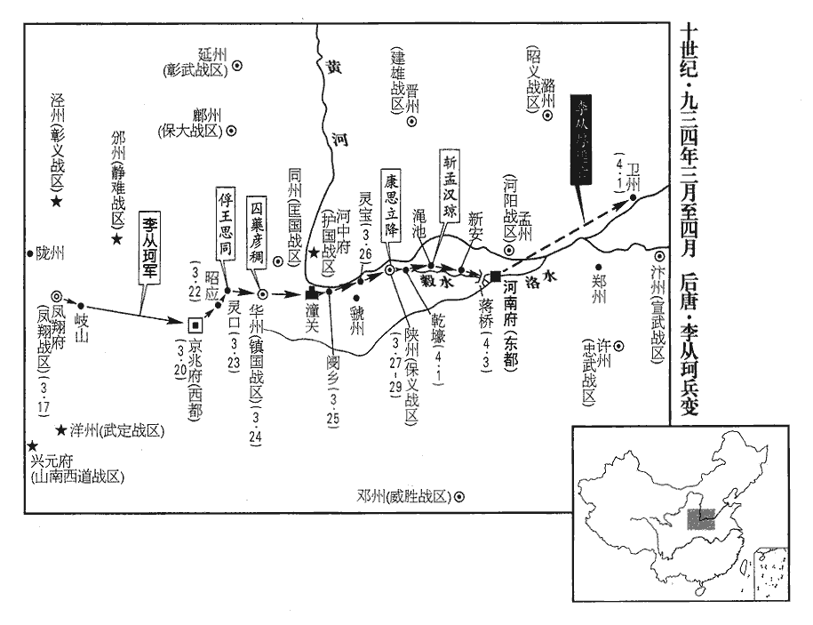
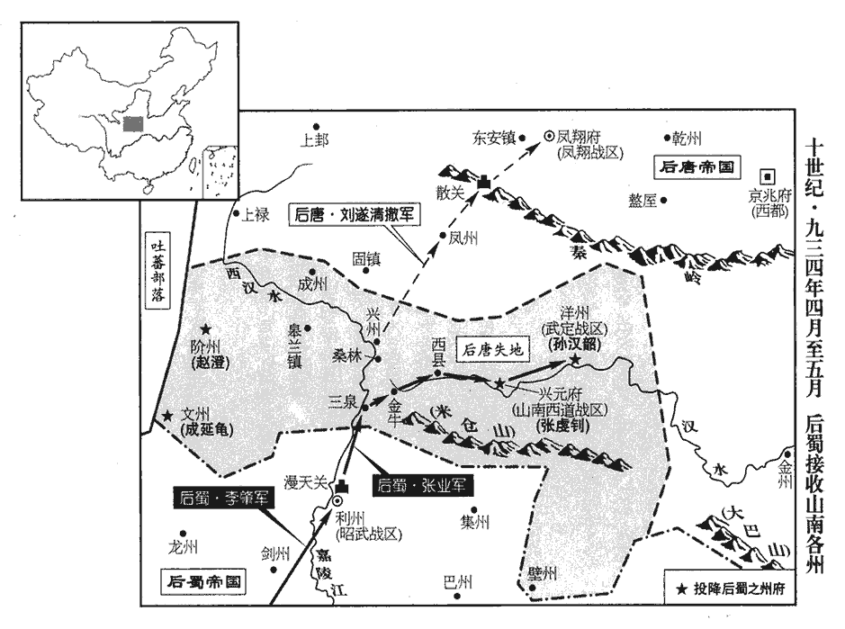
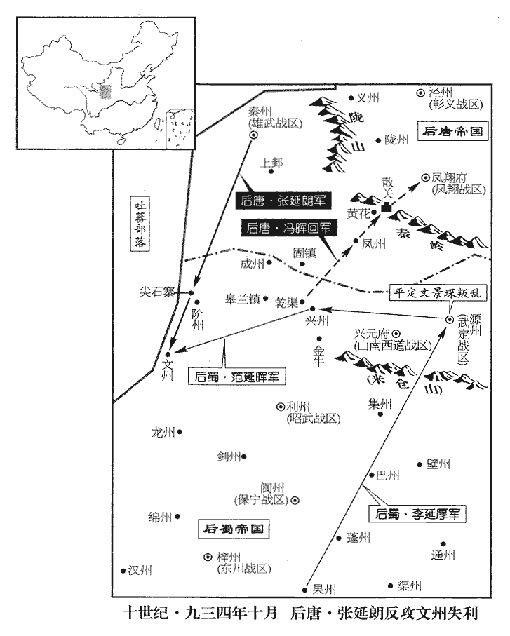
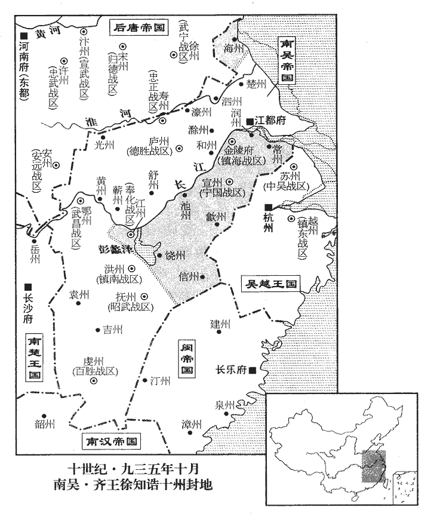

 後唐紀八起閼逢敦牂（甲午）二月，盡旃蒙協洽（乙未），凡一年有奇。

# 潞王下

## 清泰元年（甲午、九三四）

1二月，癸酉‹三›，蜀主‹首都成都府四川省成都市›孟知祥以武泰‹总部设黔州重庆市彭水县›節度使趙季良為司空兼門下侍郎、同平章事，領節度使如故。趙季良遂為孟蜀佐命元臣。

〖译文〗 [1]二月，癸酉（初三），蜀主孟知祥任用武泰节度使赵季良为司空兼门下侍郎、同平章事，领节度使名衔如故。

2吳人多不欲遷都者，吳遷都之議，始上卷明宗長興四年。都押牙周宗言於徐知誥曰：「主上‹杨溥›西遷，公復須東行，都押牙，鎮海、寧國兩鎮都押牙也。昇州於揚州為西，揚州於昇州為東。言吳主若西遷金陵，徐知誥須東鎮江都‹江苏省扬州市›也。復，扶又翻。不惟勞費甚大，且違眾心。」丙子‹六›，吳主遣宋齊丘如金陵，諭知誥罷遷都。

〖译文〗 [2]吴国人很多都不想迁都，都押牙周宗向徐知诰进言说：“主上西迁金陵，您却需要东镇江都，不但劳费人力物力很大，而且违背人心。”丙子（初立），吴主杨溥派遣宋齐丘到金陵，告谕徐知诰：迁都之事作罢。

先是，知誥久有傳禪之志，先，悉薦翻；下先己同。以吳主無失德，恐眾心不悅，欲待嗣君；宋齊丘亦以為然。一旦，知誥臨鏡鑷白髭，鑷，尼輒翻。髭，即移翻。在口上曰髭，在下曰鬚，在頰曰髯。歎曰：「國家安而吾老矣，奈何？」周宗知其意，請如江都，微以傳禪諷吳主，且告齊丘。齊丘以宗先己，心疾之，先，悉薦翻。遣使馳詣金陵，手書切諫，以為天時人事未可；知誥愕然。徐知誥不意宋齊丘立異，而忽睹其異議，故愕然。使，疏吏翻。後數日，齊丘至，請斬宗以謝吳主，乃黜宗為池州‹安徽省贵池市›副使。池州副使，池州團練副使也。久之，節度副使李建勳、行軍司馬徐玠等屢陳知誥功業，宜早從民望，召宗復為都押牙。知誥由是疏齊丘。為宋齊丘邀君得禍張本。嗚呼，為人臣者，當易姓之際，謹毋以功名自居。荀文若以之咀毒而逝，劉穆之以之發病而死，范雲恐後時不及，療疾以求速愈，至於促壽而不暇顧；若宋齊丘之疾周宗，又其輕淺者耳。

〖译文〗 过去，徐知诰很早就有让吴主把皇位传让给自己的意图，因为吴主没有什么失德之处。他害怕众心不服，便想等待嗣君继位后再说；宋齐丘也觉得这样做为好。有一天早上，徐知诰照着镜子拔镊着发白的胡须，叹着气说：“国家安宁而我已经老了，怎么办呢？”周宗了解他的意图，请求去江都，稍微把传让帝位的意思劝说吴主，并且告诉了宋齐丘。宋齐丘认为周宗走在自己的前面，心里忌恨，便派人急奔金陵，亲笔上书极力劝阻，认为天时人心都不适宜；徐知诰听说，很出意料，表示惊愕。过了几天，宋齐丘来到金陵，请求斩了周宗，用来向吴主谢罪，于是，便把周宗贬黜为池州团练副使。时间长了，节度副使李建勋、行军司马徐等人多次陈奏徐知诰的功业，应该早日依从民众的期望，召回周宗恢复他的都押牙职务。徐知诰从此便疏远宋齐丘了。

3朱弘昭、馮贇不欲石敬瑭久在太原，且欲召孟漢瓊，孟漢瓊權知天雄軍府見上卷上年。己卯‹九›，徙成德‹总部设镇州河北省正定县›節度使范延光為天雄‹总部设兴唐府河北省大名县›節度使，代漢瓊；徙潞王從珂為河東‹总部设太原府山西省太原市›節度使，兼北都留守；徙石敬瑭為成德節度使。皆不降制書，但各遣使臣持宣監送赴鎮。宣，樞密院所行文書也。是後漢隱帝時郭威以樞密院頭子易置西京留守，豈非習於聞見而不以為異邪！西班有大使臣、小使臣。監，古銜翻。

〖译文〗 [3]后唐朱弘昭、冯不想让石敬瑭久居太原，并且想召回权知天雄军府的孟汉琼。己卯（初九），迁成德节度使范延光为天雄节度使，代替孟汉琼；派潞王李从珂为河东节度使，兼任北都太原留守；迁石敬瑭为成德节度使。对这些调遣都不下皇帝制命，只是各派使臣持枢密院所行的文书，护送着到达镇所。

4吳主詔徐知誥還府舍。徐知誥虛府舍以待吳主見上卷本年。甲申‹十四›，金陵大火；乙酉‹十五›，又火。知誥疑有變，勒兵自衛。【章：十二行本「衛」下有「己丑，復入府舍」六字；乙十一行本同；退齋校同；張校同，云無註本亦無。】徐知誥之自衛，其心猶王建也。

〖译文〗 [4]吴主杨溥下诏书命徐知诰回到他所造的府舍。甲申（十四日），金陵大火；乙酉（十五日），又失火。徐知诰怀疑发生事变，集中兵力以自卫。己丑（十九日），再回到府舍。

5潞王既與朝廷猜阻，朝廷又命洋王從璋權知鳳翔。從璋性粗率樂禍，樂，音洛。前代安重誨鎮河中，手殺之；見二百七十七卷明宗長興二年。潞王聞其來，尤惡之，惡，烏路翻。欲拒命則兵弱糧少，少，詩沼翻。不知所為，謀於將佐，皆曰：「主上富於春秋，政事出於朱、馮，大王功名震主，離鎮必無全理，離，力智翻。不可受也。」言不可受代。王問觀察判官滳河‹山东省商河县›馬胤孫隋開皇十六年置滳河縣，屬渤海郡，唐屬棣州。九域志：滳河縣在棣州西南八十里。註云：漢都尉許商鑿此河近海，故以商為名，後人加「水」焉。曰：「今道過京師，當何向為便？」發此問以觀眾意。對曰：「君命召，不俟駕。引論語孔子之言。臨喪赴鎮，又何疑焉！諸人凶謀，不可從也。」眾哂之。言當過京師臨大行之喪，然後赴太原也。馬胤孫之言，儒生守經學之言也。是時勸潞王拒命者以其言為不達時變，故相與哂之。哂，矢忍翻。笑不壞顏為哂。王乃移檄鄰道，言「朱弘昭等乘先帝‹李嗣源›疾亟，殺長‹李从荣›立少‹李从厚›，謂殺從榮而立帝也。長，知兩翻。少，詩照翻。專制朝權，別疏骨肉，動搖藩垣，謂易置石敬瑭及己也。朝，直遙翻；下同。別，彼列翻。懼傾覆社稷。今從珂將入朝以清君側之惡，而力不能獨辦，願乞靈鄰藩以濟之。」

〖译文〗 [5]后唐潞王李从珂已经与朝廷猜忌疏远，朝廷又任命洋王李从璋暂主风翔事务。李从璋性情粗鲁而且幸灾乐祸，以前代替安重诲镇守河中，亲手槌杀安重诲；李从珂听说要派他来接替自己，心里尤其厌恶，想要拒绝朝廷的命令，却兵弱粮少，不知怎么办为好，便同所属将佐商议，众人都说：“自从皇上年纪衰老以来，国家政事都操纵在朱弘昭、冯手中，大王您功高名大，震慑君主，离开镇所必然不能保全自己。不能接受别人的替代。”李从珂询问观察判官河人马胤孙说：“现在，我需要前往京师洛阳，应当朝哪个方向为好？”马胤孙回答说：“君主有命相召，不能等待。您应该去京师参加先皇的葬礼，然后去太原的北都留守镇所，又有什么可犹豫的！大家给您出的是极坏主意，可不能听从他们的意见。”大家都笑他不达时变，太迂阔。于是李从珂便向邻近各道发出宣告文书，言称：“朱弘昭等人，趁先帝患病严重之际，杀长立少，专擅朝廷大权，离间挑拨皇室骨肉，动摇藩镇根基，深恐他们要倾覆唐室的江山社稷。现在，从珂即将入朝以清君侧的坏人，而如此大事又不是独力所能办到，愿意请求邻藩各道支援，合力达到这个目的。”

潞王‹李从珂›以西都‹京兆府·陕西省西安市›留守王思同當東出之道，自鳳翔趣洛陽，道出長安。尤欲與之相結，遣推官郝詡、押牙朱廷乂等相繼詣長安，說以利害，說，式芮翻。餌以美妓，妓，渠綺翻。不從則令就圖之。思同謂將吏曰：「吾受明宗‹李嗣源›大恩，王思同自燕降晉，梁、晉相距，思同未嘗有戰功，明宗時以久次為節度使，故自言受大恩。今與鳳翔同反，借使事成而榮，猶為一時之叛臣，況事敗而辱，流千古之醜跡乎！」遂執詡等，以狀聞。時潞王使者多為鄰道所執，不則依阿操兩端，不，讀曰否。操，七刀翻。惟隴州‹陕西省陇县›防禦使相里金傾心附之，隴州東至鳳翔一百五十里。遣判官薛文遇往來計事。薛文遇由此為潞王所信用。金，并州‹太原府·山西省太原市›人也。

〖译文〗 潞王李从珂认为西都长安留守王思同正处在从风翔东讨洛阳的必经之路上，尤其希望和他相交结，便派遣推官郝诩、押牙朱廷等接连到长安去见王思同，向他说明利害，并馈赠美妓作诱饵，如果他不顺从，便就地把他处置了。王思同对所属将吏说：“我受过明宗皇帝的大恩，如果现在与凤翔一起造反，即使事情成功而获得荣耀，也还是关键时刻的叛臣，何况事败而遭到辱骂，流下千古的丑恶遗迹呢！”便把郝诩等拘系起来，向朝廷作了报告。当时，潞王李从珂派出的使者大多被邻道所拘留，没有被拘留的就是依附了对方或脚采两只船，只有陇州防御使相里金全心全意地依附顺从于他，派判官薛文遇往来商议联络。相里金是并州人。

朝廷議討鳳翔。康義誠不欲出外，恐失軍權，明宗以康義誠為朴忠，豈知其陰狡乃爾邪！請以王思同為統帥，帥，所類翻。以羽林都指揮使侯益為行營馬步軍都虞候。宋白曰：長興二年二月，敕衛軍神捷、神威、雄武及魏府廣捷已下指揮改為左、右羽林，置四十指揮，每十指揮立為一軍，每一軍置都指揮使一人，兼分為左、右廂。益知軍情將變，辭【章：十二行本「辭」下有「疾」字；乙十一行本同。】不行；侯益曾經鄴都之變，故爾。執政怒之，出為商州‹陕西省商州市›刺史。洛陽至商州八百八十六里。辛卯‹二十一›，以王思同為西面行營馬步軍都部署，前此用兵置帥，率以都招討使命之。莊宗時，明宗為北面招討使以禦契丹，房知溫為副都部署，當時為都部署者必有其人。又孟知祥拒董璋，以趙廷隱為行營都部署，後遂以為元帥之任，宋氏建國之初猶因而用之。前靜難‹总部设邠州陕西省彬县›節度使藥彥稠副之，難，乃旦翻；下同。前絳州‹山西省新绛县›刺史萇從簡為馬步都虞候，嚴衛步軍左廂指揮使尹暉、宋白曰：應順元年三月，改在京羽林左、右四十指揮為嚴衛左、右軍。然此時羽林指揮使楊思權與嚴衛指揮使尹暉並為西征偏裨，則似羽林與嚴衛並置。羽林指揮使楊思權等皆為偏裨。暉，魏州‹兴唐府·河北省大名县›人也。

〖译文〗 朝廷研究讨伐凤翔的事。康义诚不想调派在外边，害怕丢了兵权，便奏请派王思同为统帅，任用羽林都指挥使侯益为行营马步军都虞候。侯益晓得军情将要发生变故，推辞不肯成行；执政者恼怒，把他派出去任商州刺史。辛卯（二十一日），任用王思同为西面行营马步军都部署，前静难节度使药彦稠作他的副手，前绛州刺史苌从简为马步都虞候，严卫步军左厢指挥使尹晖、羽林指挥使杨思权等都任为偏将。尹晖是魏州人。

6蜀主‹孟知祥›以中門使王處回為樞密使。

〖译文〗 [6]蜀主孟知祥任用中门使王处回为枢密使。

7丁酉‹二十七›，加王思同同平章事，知鳳翔行府；以護國節度使安彥威為西面行營都監。思同雖有忠義之志，而御軍無法；潞王老於行陳，將士徼幸富貴者心皆向之。行，戶剛翻。陳，讀曰陣。徼，堅堯翻。詔遣殿直楚匡祚執亳州‹安徽省亳州市›團練使李重吉，幽於宋州‹河南省商丘市›。九域志：亳州西北至宋州一百四十五里。重，直龍翻。洋王從璋行至關西，函谷關之西也。聞鳳翔拒命而還。還，從宣翻，又如字。

〖译文〗 [7]丁酉（二十七日），加封王思同为同平章事，主持凤翔行府；任用护国节度使安彦威为西面行营都监。王思同虽然有忠义的志向，但是驾驭军队却没有法度；潞王对于治理行军作战很有经验，将士希望升迁跻身富贵的，内心都愿意归附他。闵帝下诏派遣殿直楚匡祚拘捕亳州团练使李重吉，幽禁在宋州。洋王李从璋受命赴任，行至函谷关西，听说凤翔抗拒朝廷命令，便回来了。

8三月，安彥威與山南西道‹总部设兴元府陕西省汉中市›張虔釗、武定‹总部设洋州陕西省洋县›孫漢韶、彰義張從賓、靜難康福等五節度使梁、洋、涇、邠四帥并安彥威而五。難，乃旦翻。奏合兵討鳳翔。漢韶，李存進之子也。晉王克用義兒百有餘人，李存進本姓孫，後復本姓。

〖译文〗 [8]三月，安彦威与山南西道张虔钊、武定孙汉韶、彰义张从宾、静难康福等五镇节度使上奏联合讨伐凤翔。孙汉韶是李存进的儿子，李存进是李克用义子，本姓孙。

9乙卯‹十五›，諸道兵大集於鳳翔城下攻之，克東西關城，城中死者甚眾。丙辰‹十六›，復進攻城，復，扶又翻。期於必取。鳳翔城塹卑淺，守備俱乏，眾心危急，潞王登城泣謂外軍曰：「吾未冠從先帝‹李嗣源›百戰，出入生死，金創滿身，冠，古玩翻，創，初良翻。以立今日之社稷；汝曹從我，目睹其事。今朝廷信任讒臣，猜忌骨肉，我何罪而受誅乎！」因慟哭。聞者哀之。

〖译文〗 [9]乙卯（十五日），诸道之兵会集在风翔城下大举进攻，攻下了东、西城关，城里人死亡的很多。丙辰（十六日），继续进兵攻打城垣，一定要把城池攻取下来。凤翔城垣堑壕低矮浅薄，守备器材都不足，兵众和市民都感到很危急，李从珂登上城头对城外进攻军队涕泣地说：“我从十几岁就跟随先帝经历上百次战斗，出生入死，满身创伤，创建了今日的天下；你们大家跟着我，亲眼看到过那些事实。现在，朝廷相信和任用坏人，猜忌自家骨肉，我有什么罪而受到诛伐啊！”因而痛哭不已，听到的人都哀伤而同情他。

 

張虔釗性褊急，主攻城西南，以白刃驅士卒登城，士卒怒，大詬，褊，補典翻。詬，古候翻，又許候翻。反攻之，虔釗躍馬走免，楊思權因大呼曰：「大相公，吾主也。」楊思權本黨於秦王從榮；從榮死，思權不自安久矣，因乘勢奉潞王。王於明宗諸子為長，故稱為大相公。呼，火故翻；下同。遂帥諸軍解甲投兵，請降於潞王，帥，讀曰率。降，戶江翻；下同。自西門入，以幅紙進潞王曰：「願王克京城日，以臣為節度使，勿以為防、團。」防，團，謂防禦、團練使也。潞王即書「思權可邠寧節度使」授之。王思同猶未之知，趣士卒登城，趣，讀曰促。尹暉大呼曰：「城西軍已入城受賞矣。」眾皆棄甲投兵而降，其聲震地。日中，亂兵悉入，外軍亦潰，思同等六節度使皆遁去。王思同及張虔釗等五節度為六節度使。按孫漢韶時守興元，當以藥彥稠足六節度之數。潞王悉斂城中將吏士民之財以犒軍，至於鼎釜皆估直以給之。犒，苦到翻。估，音古。丁巳‹十七›，王思同、藥彥稠等走至長安，西京副留守劉遂雍閉門不內，乃趣潼關‹陕西省潼关县›。趣，七喻翻。遂雍，鄩之子也。劉鄩，梁將也，明宗以王淑妃故，遂雍皆蒙引拔。

〖译文〗 张虔钊性情偏激而急躁，他负责主攻城西南，用刀驱逼士兵登城，士兵发怒，大骂他，反身攻击他，张虔钊赶忙骑马逃逸，才免一死。杨思权因势大声喊着说：“大相公潞王，是我的君主。”便率领军队解去铠甲，丢掉兵器，向潞王请降，他从西门进入，用一张纸递给潞王说：“希望大王攻克京城的时候，派我当节度使，不要让我当防御、团练的职务。”李从珂立即写了个“杨思权可任宁节度使”的字条给他。王思同还不知道这些情况，仍在督促士兵登城，尹晖大喊说：“城西的官军已经入城接受赏赐了。”于是，兵众都弃甲缴械投降，那声音响的地动山摇。到了中午，乱兵都进了城，外面的军队也溃散了，王思同等六位节度使都逃跑了。潞王便把城中所有将吏士民的财物收集起来，用来犒劳军队，甚至连锅釜等器皿都估价赏赐给军队。丁巳（十七日），王思同、药彦稠等败退到长安，西京副留守刘遂雍关上城门不接纳，只得奔向潼关。刘遂雍是刘的儿子。

潞王‹李从珂›建大將旗鼓，整眾而東，以孔目官虞城‹河南省虞城县›劉延朗為腹心。隋分下邑縣置虞城縣，唐屬宋州。九域志：在州東北五十五里。歐史：潞王起於鳳翔，與共事者五人：節度判官韓昭胤，掌書記李專美，牙將宋審虔，客將房暠，孔目官劉延朗。及即位，審虔將兵，專美與薛文遇主謀議，而昭胤、暠及延朗掌機密。潞王始憂王思同等併力據長安拒守，至岐山‹陕西省岐山县›，九域志：鳳翔府岐山縣東至長安二百四十三里。聞劉遂雍不內思同，甚喜，遣使慰撫之。遂雍悉出府庫之財於外，軍士前至者即給賞令過；比潞王至，比，必利翻，及也。前軍賞遍，皆不入城，庚申‹二十›，潞王至長安，遂雍迎謁，率民財以充賞。府庫之財僅足以給前軍，其隨潞王繼至者，率民財以給之。

〖译文〗 潞王李从珂设置了大将的旗鼓，整理兵众而向东挺进，把孔目官虞城人刘延朗作为心腹。开始，潞王还担心王思同等联合力量占据长安抗拒，到了岐山，听说刘遂雍不接纳王思同，高兴极了，派人去慰问安抚。刘遂雍把府库中的钱财全部取出来放在外边，军士先到的就发给赏金让他过去；等到潞王到达时，前面的军队已经普遍得到赏赠，便都不入城骚扰。庚申（二十日），潞王来到长安，刘遂雍迎接拜见他，并聚敛民间资财来充当赏金。

是日，西面步軍都監王景從等自軍前奔還，中外大駭。帝‹李从厚›不知所為，謂康義誠等曰：「先帝‹李嗣源›棄萬國，朕外守藩方，謂鎮天雄也。當是之時，為嗣者在諸公所取耳，朕實無心與人爭國。既承大業，年在幼沖，五代會要：明宗崩，帝即位，年二十。國事皆委諸公。朕於兄弟間不至榛梗，榛梗者，隔塞而不通。榛，側詵翻。梗，古杏翻。諸公以社稷大計見告，朕何敢違！軍興之初，皆自夸大，以為寇不足平；今事至於此，何方可以轉禍？言何術可以轉禍為福。朕欲自迎潞王，以大位讓之，若不免於罪，亦所甘心。」朱弘昭、馮贇大懼，不敢對。猜間兄弟以起兵端，朱弘昭、馮贇為之也，事敗而禍集，聞帝言乃大懼。義誠欲悉以宿衛兵迎降為己功，乃曰：「西師驚潰，蓋主將失策耳。薦王思同者康義誠也，咎王思同者亦康義誠也。將，即亮翻；下同。今侍衛諸軍尚多，臣請自往扼其衝要，招集離散以圖後效，幸陛下勿為過憂！」帝遣使召石敬瑭，欲令將兵拒之。義誠固請自行，帝乃召將士慰諭，空府庫以勞之，勞，力到翻。許以平鳳翔，人更賞二百緡，府庫不足，當以宮中服玩繼之。軍士益驕，無所畏忌，負賜物，揚言於路曰：「至鳳翔更請一分。」分，扶問翻。

〖译文〗 这一天，西面步军都监王景从等从前线奔逃回洛阳，朝廷内外都很震惊。闵帝不知该怎么办，对康义诚等人说：“先帝辞世之际，朕正在外边戌守藩镇，当这个时候，谁来继承大位，只在诸位明公所选取而已，朕实在没有心思与别人争当皇帝。后来继承了大业，年纪还很轻，国家大事都委托给诸位明公办理。朕和兄弟之间不致于隔阻不通，诸位明公把有关国家社稷的大计见告，朕哪里敢不听从？这次兴兵讨伐凤翔之初，都夸大其辞，认为凤翔乱寇很容易讨平；现在事情已经到了这个地步，有什么办法可以扭转祸局？朕打算亲自迎接潞王，把皇帝大位让给他，如果不能免去罪罚，也心甘情愿。”朱弘昭、冯大为恐惧，不敢答对。康义诚想用全部宿卫兵迎降作为自己的功劳，便说：“朝廷的军队溃败惊散，是由于主将的指挥失策。现在，还有很多侍卫部队，我请求亲自去扼守住冲要之地，招集离散了的部队，来谋求以后的效果，请陛下不要过于忧虑！”闵帝想派使臣去召唤石敬瑭，让他统兵去抗拒李从珂的人马。康义诚坚持请求自己去，闵帝便把将士招集起来进行慰问和动员，调用全部府库财物犒劳军队，并且许愿：平定凤翔之乱以后，每人加赏二百缗钱，如果府库不足，便用宫中锦帛珍玩变价补充。因此，军士更加骄横，肆无忌惮，背负着所赏赐的东西，在路上张扬说：“到了凤翔，还要再弄一份。”

遣楚匡祚殺李重吉於宋州；匡祚榜棰重吉，責其家財。前已囚重吉於宋州，今又使就殺之。榜，音彭，棰，止橤翻。又殺尼惠明。召惠明入禁中見上卷本年。

〖译文〗 朝廷派遣楚匡祚到宋州把李从珂的儿子李重吉杀了；楚匡祚拷打李重吉，没收了他的家财。又杀子李从珂已经出家为尼的女儿李惠明。

初，馬軍都指揮使朱洪實為秦王從榮所厚，及朱弘昭為樞密使，洪實以宗兄事之；從榮勒兵天津橋，洪實首為孟漢瓊擊從榮，事見上卷上年。首為，于偽翻；下為之同。康義誠由是恨之。康義誠許迎從榮，而朱洪實擊之，故恨。辛酉‹二十一›，帝親至左藏，藏，徂浪翻。給將士金帛。義誠、洪實共論用兵利害，洪實欲以禁軍固守洛陽，曰：「如此，彼亦未敢徑前，然後徐圖進取，可以萬全。」義誠怒曰：「洪實為此言，欲反邪！」洪實曰：「公自欲反，乃謂誰反！」康義誠之心事，朱洪實知之矣。其聲漸厲。帝聞，召而訊之，訊，問也。二人訟於帝前，訟者，爭辯是非曲直。帝不能辨其是非，遂斬洪實，帝但以階級為曲直，而不能察事之是非。軍士益憤怒。觀上文軍士揚言所云，但欲迎降潞王，何暇憤朱洪實之枉死！蓋憤怒者洪實之從兵耳。

〖译文〗 以前，马军都指挥使朱洪实很被秦王李从荣所厚爱，待到朱弘昭当了枢密使，朱洪实把他当作同宗兄长；李从荣率领兵马列阵天津桥包围宫垣的时候，朱洪实响应孟汉琼的召唤，首先袭击李从荣，康义诚由于普经暗许迎立李从荣，便怀恨朱洪实。辛酉（二十一日），闵帝亲临府库左藏，给将士发放金帛赏物。康义诚同朱洪实一起议论此次用兵的利与害，朱洪实主张用禁军固守洛阳，并说：“这样做，对方也就不敢直攻洛阳，然后再想办法进一步加以解决，这是万全之计。”康义诚听了发怒地说：“洪实说这样的话，是想要造反吗？”朱洪实说：“您自己要造反，还说别人要造反！”二人争吵的声音越来越大。闵帝听到了，召唤二人来询问，二人各把自己的意见向闵帝诉说，闵帝不能明辨二人争辩的是非，便把朱洪实斩杀了，军士更加愤怒。

壬戌‹二十二›，潞王至昭應‹陕西省临潼县›，宋大中祥符八年改昭應縣為臨潼縣。九域志：在長安東五十里。聞前軍獲王思同，王曰：「思同雖失計，然盡心所奉，亦可嘉也。」癸亥‹二十三›，至靈口‹临潼县东北零口乡›，九域志：臨潼縣之零口鎮是也。前軍執思同以至，王責讓之，對曰：「思同起行間，行，戶剛翻。先帝擢之，位至節將，節將，言建節而為大將。將，即亮翻。常愧無功以報大恩。非不知附大王立得富貴，助朝廷自取禍殃，但恐死之日無面目見先帝於泉下耳。潞王聞王思同之言，豈不內愧乎！敗而釁鼓，固其所也。請早就死！」王為之改容，曰：「公且休矣。」王欲宥之，而楊思權之徒恥見其面。楊思權等背順附逆，故恥見思同。王之過長安，過，古禾翻，又如字。尹暉盡取思同家資及妓妾，屢言於劉延朗曰：「若留思同，留者，言活之使留於人世。妓，渠綺翻。慮失士心。」屬王醉，屬，之欲翻。不待報，擅殺思同及其妻子‹王思同本年四十三岁›。王醒，怒延朗，嗟惜者累日。

〖译文〗 壬戌（二十二日），潞王李从珂到达昭应，听说前军抓获王思同，潞王说：“虽然王思同的谋划有所失误，然而他竭尽心力为其所奉侍的主上，也是可以嘉许的。”癸亥（二十三日），到达灵口，前军把王思同押见李从珂，李从珂责备他，王思同回答说：“思同起于行伍之间，先帝提拔我，位至建立节度的大将，经常惭愧自己没有功劳报答重用的大恩。并非不知道依附大王您马上就能得到富贵，帮助朝廷是自取祸殃，只是怕临死之日没有面目在九泉之下见先帝。如果失败了就用我的血来祭奠战鼓，也算是得其所了。请您让我早些就死！”潞王听了这些话大受感动，改容相敬，说道：“您别说了。”潞王想赦免了他，而杨思权一班人却羞见其面。当潞王兵过长安时，尹晖全部掠取了王思同的家财和姬妾，并多次对潞王心腹刘延朗说：“如果留下王思同，恐怕要失掉吏士之心。”趁着潞王酒醉，不等到向上报告，擅自杀了王思同和他的妻子。潞王酒醒之后，很恼怒刘延朗，叹息了许多天。

10癸亥‹二十三›，制以康義誠為鳳翔行營都招討使，以王思同副之。

〖译文〗 [10]癸亥（二十三日），闵帝下令任命康义诚为凤翔行营都招讨使，任用王思同为他的副手。

甲子‹二十四›，潞王至華州‹陕西省华县›，獲藥彥稠，囚之。乙丑‹二十五›，至閿鄉‹河南省灵宝市西北›。九域志：華州東至閿鄉九十里，自閿鄉東至陝州一百七十里。華，戶化翻。閿wén，武巾翻，亦作「闅」。朝廷前後所發諸軍，遇西軍皆迎降，無一人戰者。丙寅‹二十六›，康義誠引侍衛兵發洛陽，詔以侍衛馬軍指揮使安從進為京城巡檢；從進已受潞王書，潛布腹心矣。

〖译文〗 甲子（二十四日），潞王攻到华州，俘获药彦稠，把他囚禁起来。乙丑（二十五日），兵到阌乡。朝廷前后所派发的各路军马，遇到凤翔来的军队后都纷纷迎降，没有一个肯于应战的。丙寅（二十六日），康义诚率领侍卫兵从洛阳出发，闵帝下诏书任用侍卫马军指挥使安从进为京城巡检；安从进已经接到潞王的密信，暗中布置心腹之人。

是日，潞王至靈寶‹河南省灵宝市东北›，靈寶縣在陝州西四十五里。護國節度使安彥威、匡國節度使安重霸皆降，莊宗同光四年，安重霸以秦州降。重，直龍翻。惟保義節度使康思立謀固守陜城‹陕州州政府所在县·河南省三门峡市›以俟康義誠。陝，失冉翻。先是，捧聖五百騎戍陝西，為潞王前鋒，至城下，呼城上人曰：「禁軍十萬已奉新帝，爾輩數人奚為！徒累一城人塗地耳。」先，悉薦翻。累，力瑞翻。於是捧聖卒爭出迎，思立不能禁，不得已亦出迎。

〖译文〗 这一天，潞王到达灵宝，护国节度使安彦威、匡国节度使安重霸都投降了，只有保义节度使康思立打算固守陕城来等待康义诚的到来。从前，捧圣军有五百骑兵戌守陕西，这次充当了潞王的前锋，到了陕城之下，向城上人呼喊着说：“禁军十万人已经转奉新帝，你们这几个人有什么用！白白地连累一城人遭到屠杀而已。”于是，捧圣军的兵卒争着出城迎降，康思立不能阻挡，不得已自己也出来迎降。

丁卯‹二十七›，潞王至陜，僚佐說王曰：「今大王將及京畿，傳聞乘輿已播遷，說，式芮翻。乘，繩證翻。大王宜少留於此，先移書慰安京城士庶。」王從之，移書諭洛陽文武士庶，惟朱弘昭、馮贇兩族不赦外，自餘勿有憂疑。

〖译文〗 丁卯（二十七日），潞王到达陕州，僚佐劝潞王说：“现在大王将要到达京畿，传闻皇帝乘舆已经转移出去，大王最好稍微在这里停留一下，先发布文告慰抚京城士庶。”潞王听从这个意见，便发布安抚文告传谕洛阳文武士庶说，除了朱弘昭、冯两个家族不赦免之外，其余人等都不要有忧疑。

康義誠軍至新安‹河南省新安县›，新安縣西距陝州二百餘里。所部將士自相結，百什為群，棄甲兵，爭先詣陝降，纍纍不絕。義誠至乾壕‹三门峡市东东壕镇›，九域志：陝州陝縣有乾壕鎮。乾，音干。麾下纔數十人；遇潞王候騎十餘人，義誠解所佩弓劍為信，因候騎請降於潞王。

〖译文〗 康义诚的军队到达新安，所部将士自己相互结合，百八十人为一群，丢弃兵器铠甲，争先奔向陕州投降，连续不断。康义诚到达干壕后，在他指挥下的人只剩几十个，路上遇到潞王在那里的候骑十多人，康义诚解下所佩戴的弓和剑作证，随着候骑请求向潞王投降。

戊辰‹二十八›，閔帝聞潞王至陝，義誠軍潰，憂駭不知所為，急遣【章：十二行本「遣」下有「中」字；乙十一行本同。】使召朱弘昭謀所向，弘昭曰：「急召我，欲罪之也。」赴井死。安從進聞弘昭死，殺馮贇於第，滅其族，考異曰：張昭閔帝實錄：「帝召弘昭不至，俄聞自殺，乃令從進殺贇。」按從進傳贇首於陝，則贇死非閔帝之命明矣。今不取。傳弘昭、贇首於潞王。帝欲奔魏州‹兴唐府河北省大名县›，召孟漢瓊使詣魏州為先置；先置者，先路置頓也。漢瓊不應召，單騎奔陝。

〖译文〗 戊辰（二十八日），闵帝闻报潞王到达陕州，康义诚军队溃败，忧愁害怕，不知如何是好，急忙派人召见朱弘昭商量怎么办，朱弘昭说：“急切召见我，是要加罪于我啊。”便投井而死。安从进听说朱弘昭死讯后，便在冯的府第杀了他，并杀灭了他的家族，把朱弘昭、冯的首级传送给潞王。闵帝想逃奔魏州，召见孟汉琼让他到魏州先去安置；孟汉琼不应召命，自己单骑奔向陕州。

初，帝在藩鎮，愛信牙將慕容遷，及即位，以為控鶴指揮使；帝將北渡河，密與之謀，使帥部兵守玄武門。玄武門，洛陽宮城北門。帥，讀曰率；下同。是夕，帝以五十騎出玄武門，謂遷曰：「朕且幸魏州，徐圖興復，汝帥有馬控鶴從我。」遷曰：「生死從大家。」乃陽為團結；帝既出，即闔門不行。史言自古以來，眾叛親離未有甚於此時。

〖译文〗 从前，闵帝在藩镇时，宠信牙将慕容迁，即位为帝后，任用他为控鹤指挥使；闵帝将要北渡黄河去魏州，秘密地与他策划，让他带领所属兵士把守玄武门。当晚，闵帝带了五十名骑兵出玄武门，对慕容迁说：“朕即将去魏州，慢慢再图复兴，你率领有马的控鹤军跟我走。”慕容迁说：“生死跟着皇上。”于是表面上团结在闵帝周围；等到闵帝出了宫城后，他就关了城门不跟随了。

己巳‹二十九›，馮道等入朝，及端門，聞朱、馮死，帝已北走；道及劉昫欲歸，昫，香句翻，又許羽翻。李愚曰：「天子之出，吾輩不預謀。今太后在宮，吾輩當至中書，遣小黃門取太后進止，然後歸第，人臣之義也。」道曰：「主上失守社稷，人臣惟君是奉，無君而入宮城，恐非所宜。唐之兩都，三省及寺監皆在宮城之內。潞王已處處張榜，不若歸俟教令。」乃歸。至天宮寺，安從進遣人語之曰：語，牛倨翻。「潞王倍道而來，且至矣，相公宜帥百官至穀水‹洛水支流，流经洛阳城西›奉迎。」穀水在洛陽城西。乃止於寺中，召百官。中書舍人盧導至，馮道曰：「俟舍人久矣，所急者勸進文書，宜速具草。」草者，草創其辭。導曰：「潞王入朝，百官班迎可也；設有廢立，當俟太后教令，豈可遽議勸進乎？」道曰：「事當務實。」導曰：「安有天子在外，人臣遽以大位勸人者邪！若潞王守節北面，以大義見責，將何辭以對！公不如帥百官詣宮門，進名問安，取太后進止，則去就善矣。」或問馮道、李愚、盧導之論，其於新舊君之際孰為合於義乎？曰：皆非也。此如群奴之事主，家主死而有二子，其一養子也，其一親子也。養子與親子爭家政，養子勝而親子不勝，一奴曰，「皆郎君也，吾從其勝者而輔之；」一奴之心本亦附勝者，而不敢公言附之也，曰：「吾將決諸主母。」馮道、李愚之謂也。或曰：盧導之言何如？曰：盧導之不肯草勸進文書，是也；若其持論，則猶李愚也。至於言去就之善，若是者得為善乎？其言之非殆有甚於李愚矣。曰：然則為馮道、李愚者當何如？曰：若漢人之論相，主在與在，主亡與亡可也；然亦僅可而已，未能盡相道也。夫子之言曰：「危而不持，顛而不扶，則將焉用彼相矣！」明乎此，則為相者貴於持危扶顛，不以但能盡死為貴也。道未及對，從進屢遣人趣之曰：「潞王至矣，太后、太妃‹花见羞›已遣中使迎勞矣，趣，讀曰促。勞，力到翻。安得百官無班！」道等即紛然而去。既而潞王未至，三相息於上陽門外，三相，馮道、李愚、劉昫也。上陽門，上陽宮門也。上陽宮在洛陽宮城西。盧導過於前，道復召而語之，復，扶又翻。語，牛倨翻。導對如初。李愚曰：「舍人之言是也。吾輩之罪，擢髮不足數。」用戰國須賈之言。擢，拔也。數，所具翻。

〖译文〗 己巳（二十九日），冯道等人入朝，刚到端门，听说朱弘昭、冯已经死了，闵帝已经向北逃走；冯道和刘就要回家，李愚说：“天子出走，我们这些人未能参与谋划。现在，太后还在宫中，我们应当到中书省去，派小黄门太监去听取太后如何进止，然后再回自己的宅第，这是人臣的大义啊！”冯道说：“主上把江山社稷丢了，作为人臣只能侍奉君主，没有了君主而进入宫城，恐怕不合适。潞王已经处处张贴榜文，不如回去听候命令。”便回去了。到了天宫寺，安从进派人告诉他说：“潞王加倍赶路而来，即将到达，相公您应该率领百官到城西谷水去迎接。”冯道便在寺中停留下来，召集百官，中书舍人卢导来到，冯道说：“等待舍人先生很久了，现在所急需办的事，是准备劝进的文书，请赶快起草。”卢导说：“潞王入朝，百官列班相迎就可以了；如果有废立之事，应当听候太后的教令，岂能仓促之间草率建议劝进呢？”冯道说：“办事应当从现实出发。”卢导说：“哪有天子在外，人臣却突然拿皇帝大位劝人进据的啊！如果潞王坚持在北面守臣节，用君臣大义来责备我们，将用什么话来回对？您不如率领百官进谒宫门，送进名帖问安，听从太后的进止，那样便去就两善了。”冯道还未及回答，安从进已经几次派人来催促，并说：“潞王来了，太后、太妃已经派遣宫中使者去迎接慰劳了，怎么能百官无人列班！”冯道等人就纷纷散去。过了一会儿潞王尚未到达，三个宰相冯道、李愚、刘正停息在上阳门外，卢导从他们面前经过，冯道又召他来谈劝进的事，卢导对答如初。李愚说：“舍人的话是对的。我们这些人的罪过是拔下头发也数不尽了。”

康義誠至陝待罪，潞王責之曰：「先帝‹李嗣源›晏駕，立嗣在諸公；今上亮陰，政事出諸公，何為不能終始，陷吾弟至此乎？」義誠大懼，叩頭請死。王素惡其為人，惡，烏路翻。未欲遽誅，且宥之。馬步都虞候萇從簡、左龍武統軍王景戡皆為部下所執，降於潞王，東軍盡降。東軍，謂自洛陽來者。潞王上牋於太后取進止，遂自陝而東。

〖译文〗 康义诚到陕州来等待罪处，潞王责备他说：“先帝晏驾，立谁为嗣取决于你们诸公，现在皇帝居丧，政事也取决于诸公，为什么你们这些重臣不能始终如一，以致陷害我的弟弟至于如此地步啊？”康义诚害怕极了，叩头请求赐死。潞王素来厌恶康义诚的为人，但没有想马上杀他，暂且宽赦了他。马步都虞候苌从简、左龙武统军王景戡都被部下所擒拿，向潞王投降，朝廷的军队便全部都归降了。潞王上书给太后听从进止，于是就从陕州向东。

夏，四月，庚午朔‹一›，未明，閔帝至衛州‹河南省卫辉市›東數里，遇石敬瑭‹河东总部太原府›；石敬瑭自河東來朝，至此而遇帝。帝大喜，問以社稷大計，敬瑭曰：「聞康義誠西討，何如？陛下何為至此？」帝曰：「義誠亦叛去矣。」敬瑭俛首長歎數四，俛，音免。曰：「衛州刺史王弘贄，宿將習事，請與圖之。」王弘贄從敬瑭伐蜀，嘗為偏將。石敬瑭欲擁帝還衛州，以授弘贄，使為之所耳。乃往見弘贄問之，弘贄曰：「前代天子播遷多矣，然皆有將相、侍衛、府庫、法物、，使群下有所瞻仰；今皆無之，獨以五十騎自隨，雖有忠義之心，將若之何？」敬瑭還，見帝於衛州驛，自弘贄所還見帝。以弘贄之言告弓箭庫使沙守榮。奔洪進前責敬瑭曰：沙姓，古夙沙氏之後。史炤曰；奔，姓也。古有賁姓，音奔，又音肥，後遂為奔。「公明宗愛壻，以敬瑭尚明宗女也。富貴相與共之，憂患亦宜相恤。今天子播越，委計於公，冀圖興復，乃以此四者為辭，四者，謂敬瑭所言無將相、侍衛、府庫、法物從行幸也。是直欲附賊賣天子耳！」直指石敬瑭心術。守榮抽佩刀欲刺之，刺，七亦翻。敬瑭親將陳暉救之，守榮與暉鬬死，洪進亦自刎。刎，扶粉翻。敬瑭牙內指揮使劉知遠引兵入，盡殺帝左右及從騎，獨置帝而去。考異曰：閔帝實錄：「庚午朔四鼓，帝至衛州東七八里，遇敬瑭。」竇貞固晉高祖實錄：「始，帝欲與少主俱西，斷孟津，北據壺關，南向徵諸侯兵，乃啟問康義誠西討作何制置」云云。蘇逢吉漢高祖實錄：「是夜偵知少帝伏甲欲與從臣謀害晉高祖，詐屏人對語，方坐庭廡。帝密遣御士石敢袖鎚立於後，俄頃伏甲者起，敢有勇力，擁晉祖入一室，以巨木塞門，敢力當其鋒，死之。帝解佩刀，遇夜晦，以在地葦炬未然者奮擊之。眾謂短兵也，遂散走。帝乃匿身長垣下，聞帝親將李洪信謂人曰：『石太尉死矣。』帝隔垣呼洪信曰：『太尉無恙。』乃踰垣出就洪信兵，共護晉祖，殺建謀者，以少主授王弘贄。」南唐烈祖實錄：「弘贄曰：『今京國阽危，百官無主，必相率攜神器西向。公何不囚少帝西迎潞王，此萬全之計。』敬瑭然其語。」按為晉、漢實錄者必為二祖飾非。今從閔帝實錄。敬瑭遂趣洛陽。趣，七喻翻。

〖译文〗 夏季，四月，庚午朔（初一），天还没有亮，闵帝到达卫州以东几里的地方，遇到石敬瑭，闵帝大喜，便向他询问如何保存社稷的大计，石敬瑭说：“听说康义诚向西讨伐，怎么样了？陛下为什么来到这里？”闵帝说：“康义诚也叛变离去了。”石敬瑭垂头长叹了好几次，说：“卫州刺史王弘贽是位宿将，懂得很多事情，请您等我和他商量。”于是石敬瑭就去问王弘贽，王弘贽说：“前代天子流亡的也不少，然而都随从有将相、侍卫、府库、法物，使得随从的人有所依恃和希望；现在主上什么也没有，只有五十骑兵跟随着他自己，我们虽然有忠义之心，还能有什么办法呢？”石敬瑭回来，到卫州的驿馆去见闵帝，把王弘贽的话告诉闵帝。弓箭库使沙守荣、奔洪进上前责备石敬瑭说：“您是明宗的爱婿，富贵相互共同享有，忧患也应该相互体谅、承担。现在，天子奔波在外，把希望寄托给您，以图复兴，竟然拿这四样来做托辞，这简直是要依附于叛贼而出卖天子呀！”沙守荣抽出佩刀要刺杀他，石敬瑭的亲将陈晖救他，沙守荣与陈晖相斗而死，奔洪进也自刎而死。石敬瑭的牙内指挥使刘知远带着兵卒进来，杀死闵帝左右及随从的骑兵，只是留下闵帝不顾而去。石敬瑭便向洛阳进发。

是日，太后令內諸司至乾壕迎潞王，考異曰：廢帝實錄：「三十日，太后傳令至，并內司迎奉至乾壕，帝促令還京。」按長曆，三月辛丑朔，四月庚午朔；三月無三十日，廢帝實錄誤也。王亟遣還洛陽。

〖译文〗 这一天，太后命宫内诸司的人到干壕迎接潞王，潞王赶忙把来使遣回洛阳。

初，潞王罷河中，歸私第，事見二百七十七卷明宗長興元年。王淑妃數遣孟漢瓊存撫之。數，所角翻。漢瓊自謂於王有舊恩，至澠池‹河南省渑池县›西，九域志：澠池在洛陽之西一百五十六里。澠，彌兗翻。澠池，縣名。見王大哭，欲有所陳，王曰：「諸事不言可知。」仍自預從臣之列，從，才用翻。王即命斬於路隅。

〖译文〗 过去，潞王李从珂从河中罢官回洛阳，明宗让他归居私第，王淑妃曾经多次派孟汉琼去安慰他。孟汉琼自以为对李从珂有旧恩，到渑池西，见到潞王大哭，想有所陈诉，潞王说：“各种事情都不必说了，我都知道。”孟汉琼自己到了随从臣吏之中，潞王下令把他斩首在路边。

11山南西道節度使張虔釗之討鳳翔也，留武定節度使孫漢韶守興元。虔釗既敗，奔歸興元，與漢韶舉兩鎮之地降于蜀；蜀主‹孟知祥›命奉鑾肅衛馬步都指揮使、昭武‹总部设利州四川省广元市›節度使李肇將兵五千還利州，李肇本鎮昭武，蜀主召之入領宿衛，今使將兵還鎮以應接梁、洋。右匡聖馬步都指揮使、寧江‹总部设夔州重庆市奉节县›節度使張業將兵一萬屯大漫天‹四川省广元市北明月峡›以迎之。先是，蜀主以兵疲民困，不用趙隱取山南之計，今乘時而坐得之，其庸多矣。

〖译文〗 [11]山南西道节度使张虔钊去讨伐凤翔时，留武定节度使孙汉韶镇守兴元。张虔钊失败以后，奔归兴元，会同孙汉韶呈献两镇之地投降了蜀国；蜀主孟知祥命奉銮肃卫马步都指挥使、昭武节度使李肇领兵五千人还镇利州，右匡圣马步都指挥使、宁江节度使张业领兵一万人屯驻大漫天以迎取他们。

12壬申‹三›，潞王至蔣橋‹洛阳市西›，百官班迎於路，傳教以未拜梓宮，未可相見。傳教，謂傳令也。王所下令為教。馮道等皆上牋勸進。終不用盧導之言。王入謁太后、太妃，詣西宮，伏梓宮慟哭，自陳詣闕之由。馮道帥百官班見，見，賢遍翻。拜；句絕。王答拜。道等復上牋勸進，復，扶又翻。王立謂道曰：「予之此行，事非獲已。俟皇帝歸闕，園寢禮終，當還守藩服；群公遽言及此，甚無謂也！」

〖译文〗 [12]壬申（初三），潞王李从珂到达蒋桥，百官在路上列班迎接，潞王传命，因尚未拜谒明宗的灵柩，还不能接见大家。冯道等人都上书劝进大位。潞王入宫谒见曹太后、王太妃，又到西宫，伏在明宗的棺柩上痛哭，自己陈说进诣朝廷的原因。冯道率领百官来谒见，下拜；潞王答释。冯道等人又上书劝进，潞王立即告诉冯道说：“我这次来，是逼不得已。等候皇帝还朝，先帝灵寝行礼完毕，理当还守藩镇的服制，各位明公突然讲到这样的事，很没有意思啊！”

癸酉‹四›，太后下令廢少帝為鄂王，考異曰：閔帝實錄云：「七日廢帝為鄂王。」今從廢帝實錄。以潞王知軍國事，權以書詔印施行。書詔印，畫可所用者也。閔帝之出奔也，蓋以八寶自隨。百官詣至德宮‹李嗣源的旧宅›門待罪，五代會要：天成元年，中書門下奏，請以洛京潛龍舊宅為至德宮。蓋明宗舊第也。按歐史，時潞王入居至德宮。王命各復其位。甲戌‹五›，太后令潞王‹李从珂（王从珂）本年五十岁›宜即皇帝位；乙亥‹六›，即位於柩前。

〖译文〗 癸酉（初四），太后下令废除闵帝为鄂王，委任潞王李从珂主持军国大事，暂且以书诏印施行政令。百官进诣至德宫门待罪，潞王命他们各还其位。甲戌（初五），太后命令潞王应该即皇帝之位；乙亥（初六），在明宗灵柩前即位。

帝之發鳳翔也，許軍士以入洛人賞錢百緡。既至，問三司使王玫玫，莫杯翻。以府庫之實，問其實數。對有數百萬在。既而閱實，金、帛不過三萬兩、匹；而賞軍之費計應用五十萬緡。帝怒，玫請率京城民財以足之，數日，僅得數萬緡，帝謂執政曰：「軍不可不賞，人不可不恤，今將柰何？」執政請據屋為率，無問士庶自居及僦者，預借五月僦直，從之。僦，即就翻。賃居為僦。

〖译文〗 后唐末帝李从珂从凤翔出发时，答应入洛阳以后给军士每人赏钱一百缗。到了洛阳，询问三司使王玫，府库中的虚实如何，回答说有数百万库存。接着派人查实，金钱和布帛不过三万两、匹；而赏军的费用预计需要五十万缗。末帝发怒，王玫提请聚敛民财来补足，收集了几天，只得到数万缗，末帝对执政的要员说：“军队不能不赏，在姓不能不体恤，这事怎么办为好？”执政的人建议，可以根据房屋来筹措，不论士庶自己居住或是租凭居住的，预借五个月的租金数，末帝同意这样办。

13王弘贄遷閔帝‹李从厚›於州廨，廨，古隘翻。帝遣弘贄之子殿直巒往酖之。戊寅‹九›，巒至衛州謁見，見，賢遍翻。閔帝問來故，不對。問巒以所以來之故。弘贄數進酒，數，所角翻。閔帝知其有毒，不飲，巒縊殺之。年二十一。

〖译文〗 [13]王弘贽把闵帝从驿馆迁居到州署，末帝派王弘贽的儿子殿直王峦前往用毒酒去鸩杀他。戊寅（初九），王峦到卫州谒见闵帝，闵帝问他干什么，王峦不回答。王弘贽几次进酒，闵帝知道其中有毒，不肯喝，王峦把他勒死。

閔帝性仁厚，於兄弟敦睦，雖遭秦王忌疾，閔帝坦懷待之，卒免於患。事見上卷明帝長興三年。卒，子恤翻。及嗣位，於潞王亦無嫌，而朱弘昭、孟漢瓊之徒橫生猜間，橫，戶孟翻。間，古莧翻。閔帝不能違，以致禍敗焉。

〖译文〗 闵帝性情宽厚，对于兄弟敦诚和睦，虽然遭到秦王李从荣的忌恨，但闵帝以坦白心怀对待他，终于避免了祸患。继位以后，对潞王李从珂也没有什么嫌隙，而朱弘昭、孟汉琼那一伙人横生猜疑离间，闵帝不能不听从他们，所以招致了祸败。

孔妃尚在宮中，妃，孔循之女。潞【章：十二行本「潞」上有「王巒既還」四字；乙十一行本同；孔本同；張校同，退齋校同。】王使人謂之曰：「重吉何在？」以通鑑書法言之，潞王於此當書「帝」，蓋承前史，偶失於脩改也。遂殺妃，并其四子。

〖译文〗 孔妃此时还在宫中，潞王让人问她说：“李重吉现在哪里？”于是把孔妃连同他的四个儿子一起杀了。

閔帝之在衛州也，惟磁州‹河北省磁县›刺史宋令詢遣使問起居，聞其遇害，慟哭半日，自經死。宋令詢出磁州見上卷上年。事閔帝有始終者，宋令詢一人而已。磁，牆之翻。

〖译文〗 闵帝逃至卫州，只有磁州刺史宋令询派人问候起居，听到他遇害，痛哭半日，自己也上吊死了。

14己卯‹十›，石敬瑭入朝。

〖译文〗 [14]己卯（初十），石敬瑭来朝见。

15庚辰‹十一›，以劉昫判三司。

〖译文〗 [15]庚辰（十一日），任用刘判理三司。

 

16辛巳‹十二›，蜀‹首都成都府四川省成都市›大赦，改元明德。

〖译文〗 [16]辛巳（十二日），蜀国实行大赦，改年号为明德。

17帝‹李从珂›之起鳳翔也，召興州‹陕西省略阳县›刺史劉遂清，遲疑不至。聞帝入洛，乃悉集三泉‹陕西省宁强县西北阳平关›、西縣‹陕西省勉县西›、金牛‹陕西省宁强县北›、桑林‹陕西省略阳县南›戍兵以歸，自散關‹陕西省宝鸡市西南›以南城鎮悉棄之，皆為蜀人所有。癸未‹十四›，入朝，帝欲治罪，以其能自歸，乃赦之。邊境之臣委棄城鎮，乃以其能自歸而不誅，安有效死弗去者乎！治，直之翻。遂清，鄩之姪也。

〖译文〗 [17]末帝从凤翔起兵时，曾经召唤兴州刺史刘遂清，迟疑不肯来。听说末帝占据洛阳，刘遂清便全部聚集三泉、西县、金牛、桑林的守戌士卒回归，把散关以南的城镇全部放弃了，都被蜀人所占有。癸未（十四日），来到朝廷，末帝要治他的罪，因为他能够自己归来，便又赦免了他。刘遂清是刘的侄儿。

18甲申‹十五›，蜀將張業將兵入興元、洋州。

〖译文〗 [18]甲申（十五日），蜀国将领张业率兵进入兴元、洋州。

19乙酉‹十六›，改元，大赦。改元清泰。

〖译文〗 [19]乙酉（十六日），后唐李从珂改年号为清泰，实行大赦。

20丁亥‹十八›，以宣徽南院使郝瓊權判樞密院，前三司使王玫為宣徽北院使，鳳翔節度判官韓昭胤為左諫議大夫、充端明殿學士。

〖译文〗 [20]丁亥（十八日），后唐任用宣徽南院使郝琼暂时判理枢密院，前三司使王玫为宣徽北院使，凤翔节度判官韩昭胤为左谏议大夫，充任端明殿学士。

21戊子‹十九›，斬河陽節度使、判六軍諸衛兼侍中康義誠，滅其族。康義誠欲舉宿衛兵迎降以為己功，而不免於族滅，此傅瑕所以死於鄭厲公之類也。

〖译文〗 [21]戊子（十九日），后唐斩杀河阳节度使、判六军诸卫兼侍中康义诚，诛灭他的家族。

22己丑‹二十›，誅藥彥稠。脩河中之怨也。

〖译文〗 [22]己丑（二十日），后唐诛杀了药彦稠。

23庚寅‹二十一›，釋王景戡、萇從簡。

〖译文〗 [23]庚寅（二十一日），后唐释放了王景戡、苌从简。

24有司百方斂民財，僅得六萬，帝怒，下軍巡使獄，晝夜督責，凡輸財稽違者，則下之軍巡使獄以督責之也。下，戶嫁翻。囚系滿獄，至章十二行本「至」上有「貧者」二字；乙十一行本同；孔本同，張校同。自經、赴井。而軍士游市肆皆有驕色，市人聚詬之曰：「汝曹為主力戰，立功良苦，詬，古候翻，又許候翻。為，於偽翻；下能為同。反使我輩鞭胸杖背，出財為賞，汝曹猶揚揚自得，獨不愧天地乎！」

〖译文〗 [24]有关官员千方百计搜敛民财，只收得六万，末帝发怒，把输财迟违的人都关进军巡使的狱中，昼夜督催，犯人把牢狱都住满了，甚至有人上吊、投井。而军士在市场上游荡脸上都显得很骄傲，市民聚在一起责骂他们说：“你们这些人为皇帝努力打仗，立功也真不容易，但是，反而使我们百姓胸背挨鞭子受棍杖，还要出钱作你们的赏金，你们这些人还扬扬自以为得意，难道你们就不知愧对天地吗？”

是時，竭左藏舊物及諸道貢獻，乃至太后、太妃器服簪珥皆出之，藏，徂浪翻。珥，忍止翻，耳當也。纔及二十萬緡，帝患之，李專美夜直，李專美本鳳翔掌書記，時為樞密直學士。帝讓之曰：「卿名有才，不能為我謀此，留才安所施乎！」為，于偽翻。專美謝曰：「臣駑劣，陛下擢任過分，駑，音奴。分，扶問翻。然軍賞不給，非臣之責也。竊思自長興之季，賞賚亟行，卒以是驕；事始見上卷長興四年。亟，去吏翻。卒，臧沒翻，士卒也。繼以山陵及出師，帑藏遂涸。帑，它朗翻。藏，徂浪翻。涸，户郭翻。以水為諭，言枯涸也。雖有無窮之財，終不能滿驕卒之心，故陛下拱手于危困之中而得天下。此言在鳯翔時諸軍推戴之事。夫國之存亡，不專繫於厚賞，亦在修法度，立紀綱。陛下苟不改覆車之轍，臣恐徒困百姓，存亡未可知也。帝起事於鳯翔，共事者五人，能言及此者獨李專美耳。今財力盡於此矣，宜據所有均給之，何必踐初言乎！」帝以為然。壬辰‹二十三›，詔禁軍在鳳翔歸命者，自楊思權、尹暉等各賜二馬、一駝、錢七十緡，下至軍人錢二十緡，其在京者各十緡。軍士無厭，厭，於鹽翻。猶怨望，為謠言曰：「除去菩薩，扶立生鐵。」以閔帝仁弱，帝剛嚴，有悔心故也。去，羗吕翻。菩，薄乎翻。薩，桑割翻。閔帝小字菩薩。

〖译文〗 这个时候，把存放金帛财赋的左藏中所有旧物以及各道的贡献之物，乃至太后、太妃所用的器皿服饰簪环全部拿了出来，才只有二十万缗，末帝很着急，当时枢密直学士李专美正在夜间值班，末帝责备他说：“你是个以才干闻名的人，不能为我谋划完成这件事，你留着才干往哪里用啊？”李专美谢罪说：“为臣很蠢笨，陛下是提拔任用得过份了，然而军赏不够充分，不是我的责任。我思考过，自长兴年间以来，赏赐很频繁，士兵因此而骄纵；接着又兴建皇帝陵墓和出兵征战，国家的财帑储藏便枯竭了。虽然有无尽之财物，但不能满足骄卒之心，因此，陛下在国家危困之中才能够拱手而得天下。说起来国家的存亡，并不专靠厚赏，也在于修治法度，建立纪纲。陛下如果不改革前朝覆车的老路，臣担心只能是困扰百姓，国家的存亡很难预料啊。现在，国家财力只有这些了，应该根据所能得到的平均分给大家，何必非履行当初所许诺的不可呢！”末帝认为他讲得对。壬辰（二十三日），下诏命：禁军在凤翔归附的，从杨思权、尹晖等各赐马二匹、骆驼一匹、钱七十缗，下至军人赐钱二十缗，那些在京城的各赐钱十缗。军士贪得无厌，仍然不满意，编造谣言说：“除去菩萨，扶立生铁。”因为闵帝宽仁软弱，而末帝刚强严苛，表现出一种悔怨的心理。

25丙申‹二十七›，葬聖德和武欽孝皇帝于徽陵‹河南省洛阳市境›，徽陵在河南府洛陽縣。廟號明宗。帝衰絰護從至陵所，宿焉。衰，倉回翻。從，才用翻。

〖译文〗 [25]丙申（二十七日），在徽陵安葬圣德和武钦孝皇帝，庙号明宗。末帝穿戴丧服护随到陵墓，并留宿在陵所。

26五月，丙午‹一›，以韓昭胤為樞密使，以莊宅使劉延朗為樞密副使，權知樞密院房暠為宣徽北院使。暠，長安‹西京京兆府西半城›人也。暠，古老翻。

〖译文〗 [26]五月，丙午（初七），任用韩昭胤为枢密使，任用庄宅使刘延朗为枢密副使，权知枢密院房为宣徽北院使。房是长安人。

27帝與石敬瑭皆以勇力善斗，事明宗為左右；然心競，素不相悅。心競，本諸左傳師曠之言。競，争也。帝即位，敬瑭不得已入朝，山陵既畢，不敢言歸。時敬瑭久病羸瘠，羸，倫為翻。瘠，秦昔翻。太后及魏國公主屢為之言；魏國公主，明宗之女，下嫁石敬瑭，曹太后所生也。歐史：公主初號永寧公主，是年進封魏國長公主。為，于偽翻。而鳳翔將佐多勸帝留之，惟韓昭胤、李專美以為趙延壽在汴，不宜猜忌敬瑭。趙延壽時為宣武‹总部设汴州河南省开封市›帥，逼近洛都；又其父德鈞在幽州，擁強兵。言若猜忌敬瑭，趙延壽必懼而生心。帝亦見其骨立，不以為虞，乃曰：「石郎不惟密親，兼自少與吾同艱難；少，詩照翻。今我為天子，非石郎尚誰託哉！」乃復以為河東節度使。復，扶又翻；又如字。縱石敬瑭歸鎮，乃復疑而徙之，此所以速禍也。

〖译文〗 [27]末帝李从珂和石敬瑭都是由于勇武善斗而服侍在明宗李嗣源的左右；然而二人心里竞争，平素彼此不和睦。现在，李从珂即位为皇帝，石敬瑭不得已入京朝拜，安葬完明宗以后，不敢提出归还镇所。当时石敬瑭久病之后很疲弱，曹太后和魏国公主几次替他说情；而从凤翔来的将佐大多劝说末帝把他羁留洛阳，只有韩昭胤、李专美认为宣武节度使赵延寿正在汴梁，逼近洛都，为了避免赵延寿的疑惧，不应当猜忌石敬瑭。末帝也看到石敬瑭很削瘦衰弱，不担心他，便说：“石郎不但是内亲，关系密切，而且他从小与我共同经历艰难；现在我做了天子，不依靠石郎还能依靠谁呀！”便仍任用他为河东节度使。

28戊午‹十九›，以隴州‹陕西省陇县›防禦使相里金為保義‹总部设陕州›節度使。賞其先通款於鳳翔也。

〖译文〗 [28]戊午（十九日），任用陇州防御使相里金为保义节度使。

29丁未‹八›，階州‹甘肃省武都县东›刺史趙澄降蜀。

〖译文〗 [29]丁未（初八），阶州刺史赵澄投降蜀国。

30戊申‹九›，以羽林軍使楊思權為靜難節度使。踐鳳翔片紙所書之言也。難，乃旦翻。

〖译文〗 [30]戊申（初九），末帝任用羽林军使杨思权为静难节度使。

31己酉‹十›，張虔釗、孫漢韶舉族遷于成都。

〖译文〗 [31]己酉（初十），张虔钊、孙汉韶把全部族人迁往成都。

32庚戌‹十一›，以司空兼門下侍郎、同平章事馮道同平章事，充匡國‹总部设同州陕西省大荔县›節度使。

〖译文〗 [32]庚戌（十一日），末帝任用司空兼门下侍郎、同平章事冯道为同平章事，充任匡国节度使。

33以天雄節度使兼侍中范延光為樞密使。

〖译文〗 [33]末帝任用天雄节度使兼侍中范延光为枢密使。

34帝之起鳳翔也，悉取天平‹总部设郓州山东省东平县›節度使李從曮家財甲兵以供軍。李從曮自其父茂貞以來再世鎮鳳翔，從曮雖移鎮，而家財甲兵猶在焉。將行，謂將東趣洛陽也。鳳翔之民遮馬請復以從曮鎮鳳翔，復，扶又翻。帝許之，至是，徙從曮為鳳翔‹总部设凤翔府陕西省凤翔县›節度使。長興元年，從曮自鳳翔入朝，徙宣武，後徙天平，今自天平復還鎮鳳翔。

〖译文〗 [34]末帝在凤翔起兵时，把天平节度使李从的家财甲兵全部用以供给军需。大军将要出发，凤翔的百姓拦着马请求仍任用李从镇守凤翔，未帝答应了，到此时，便把李从调迁为凤翔节度使。

35初，明宗為北面招討使，莊宗同光二年始以明宗為北面招討使。平盧‹总部设青州山东省青州市›節度使房知溫為副都部署，帝以別將事之，嘗被酒忿爭，被，皮義翻。師古曰：被，加也。被酒者，為酒所加。拔刃相擬。及帝舉兵入洛，知溫密與行軍司馬李沖謀拒之，沖請先奉表以觀形勢，還，言洛中已安定。壬【章：十二行本「壬」上有「知溫懼」三字；乙十一行本同；孔本同；張校同。】戌‹二十三›，入朝謝罪，帝優禮之；知溫貢獻甚厚。

〖译文〗 [35]以前，明宗李嗣源任北面招讨使时，平卢节度使房知温任副都部署，末帝李从珂当时为别将，受房知温统辖，二人曾经酒醉后争吵，以至拔刀相对。等到末帝领兵进入洛阳，房知温秘密与行军司马李冲策划抗拒他，李冲劝他先上表表示拥戴来观察形势发展，上表使者回来后，说洛阳已经安定下来。壬戌（二十三日），房知温入京朝见，表示谢罪，末帝优礼他；房知温的贡纳也很丰厚。

36吳鎮南‹总部设洪州江西省南昌市›節度使、守中書令東海康王徐知詢卒。

〖译文〗 [36]吴国镇南节度使、守中书令东海康王徐知询去世。

37蜀人取成州‹甘肃省成县›。

〖译文〗 [37]蜀国人攻取了成州。

38六月，甲戌‹五›，以皇子左衛上將軍重美為成德節度使、同平章事，兼河南尹，判六軍諸衛事。

〖译文〗 [38]六月，甲戌（初五），末帝任用皇子左卫上将军李重美为成德节度使、同平章事，兼河南尹，判六军诸卫事。

39文州‹甘肃省文县›都指揮使成延龜舉州附蜀。周文王第五子郕叔武封於郕；或言成王封季載於郕，其後以國為氏，或去「邑」為成氏。

〖译文〗 [39]文州都指挥使成延龟把全州军民归附于蜀国。

40吳徐知誥將受禪，忌昭武‹总部设抚州江西省临川市›節度使兼中書令臨川王濛，昭武軍利州，時屬蜀，吳使濛遙領耳。遣人告濛藏匿亡命，擅造兵器；丙子‹七›，降封歷陽公，幽于和州‹安徽省和县›，命控鶴軍使王宏將兵二百衛之。濛見忌之始見二百七十一卷梁貞明五年。

〖译文〗 [40]吴国徐知诰将要受吴主杨溥的禅让，他忌恨昭武节度使兼中书令临川王杨，指使人告发杨藏匿亡命之徒，擅自制造兵器；丙子（初七），把杨降封为历阳公，幽禁在和州，命令控鹤军使王宏领兵二百人守卫他。

41劉昫與馮道昏姻。昫性苛察，李愚剛褊；道既出鎮，謂出鎮同州也。二人論議多不合，事有應改者，愚謂昫曰：「此賢親家所為，更之不亦便乎！」傳曰：妻父曰昏，壻父曰姻。凡娶以昏時，婦人陰也，故謂之昏。壻家，女之所因，故曰姻。二父相呼，謂之親家。更，工衡翻；下欲更同。昫恨之，由是動成忿爭，至相詬罵，各欲非時求見，見，賢遍翻。事多凝滯。帝患之，欲更命相，問所親信以朝臣聞望宜為相者，聞，音問。皆以尚書左丞姚顗、太常卿盧文紀、祕書監崔居儉對；論其才行，互有優劣。行，下孟翻。帝不能決，乃置其名於琉璃瓶，夜焚香祝天，且以筯挾之，「挾」，當作「梜」。梜jiā，古協翻。記曲禮：羹之有菜者用梜。註云：梜，猶箸也。今人或謂箸為梜提。首得文紀，次得顗。秋，七月，辛亥‹十三›，以文紀為中書侍郎、同平章事。居儉，蕘之子也。崔蕘見二百五十一卷唐懿宗咸通十年。

〖译文〗 [41]刘与冯道通婚，结成儿女亲家。刘性情狭隘、好计较小事，李愚性情刚愎偏颇；冯道出镇同州后，二人议论往往不能一致，遇到有应该改变的事情，李愚就对刘说：“这是你的贤亲家所办，变更了不是很方便吗？”刘恼恨他，从此二人动不动就争吵，直至互相诟骂，都要求不是接见的时刻谒见末帝，事情往往拖延，不能及时处理。末帝很恼怒，要另行任命宰相，询问所亲信之人，朝臣中的威望声誉谁是适合当宰相的，都提到尚书左丞姚、太常卿卢文纪、秘书监崔居俭；论评三人的才干和品行，互有优劣。末帝不能决定，于是把三人的名字放在琉璃瓶内，夜里，焚香祝天，用筷子挟取，首先得到卢文纪，其次得到姚。秋季，七月，辛亥（十三日），末帝任用卢文纪为中书侍郎、同平章事。崔居俭是崔荛的儿子。

42帝欲殺楚匡祚，以楚匡祚殺重吉也。韓昭胤曰：「陛下為天下父，天下之人皆陛下子，用法宜存至公。匡祚受詔檢校重吉家財，不得不爾。今族匡祚，無益死者，恐不厭眾心。」厭，益涉翻，伏也，合也。乙卯‹十七›，長流匡祚於登州‹山东省蓬莱市›。

〖译文〗 [42]末帝要杀楚匡祚，韩昭胤说：“陛下是天下人之父，天下之人都是陛下的儿子，施用法律应该按照至公办理。楚匡祚遵受诏命检查李重吉的家财，不得不那样办。现在要族灭楚匡祚，对死者没有什么益处，恐怕反而不能顺服众心。”乙卯（十七日），末帝把楚匡祚长期流放到登州。

43丁巳‹十九›，立沛國夫人劉氏為皇后。劉后，應州渾元人。「元」，一作「源」。

〖译文〗 [43]丁巳（十九日），末帝立沛国夫人刘氏为皇后。

44回鶻‹甘肃省中部西部›入貢者多為河西‹甘肃省中部西部›雜虜所掠，詔將軍牛知柔帥禁兵衛送，帥，讀曰率。與邠州兵共討之。

〖译文〗 [44]回鹘入贡的人往往被河西杂胡所抢掠，末帝下诏命令将军牛知柔率领禁军护送，会同州兵马共同讨伐他们。

45吳徐知誥召左僕射兼中書侍郎、同平章事宋齊丘還金陵，以為諸道都統判官，加司空，於事皆無所關預，徐知誥疏宋齊丘事始上二月。召之還金陵而不使預事者，恐其沮止禪代之議故爾。齊丘屢請退居，知誥以南園給之。

〖译文〗 [45]吴国徐知诰召唤左仆射兼中书侍郎、同平章事宋齐丘还归金陵，任用他为诸道都统判官，加司空，但是，对于各种事务都不让他干预，宋齐丘屡次请求退休家居，徐知诰把南园赐给他。

46護國節度使洋王從璋，歸德‹总部设宋州河南省商丘市›節度使涇王從敏，皆罷鎮居洛陽私第，帝待之甚薄；從敏在宋州預殺重吉，帝尤惡之。歸德軍，宋州。殺重吉於宋州見上三月。惡，烏路翻。嘗侍宴禁中，酒酣，顧二王曰：「爾等皆何物，輒據雄藩！」二王大懼，太后叱之曰：「帝醉矣，爾曹速去！」

〖译文〗 [46]护国节度使洋王李从璋，归德节度使泾王李从敏，都免去他们的军镇职务，让他们住在洛阳自己家里，末帝对待他们很苛薄；李从敏在宋州参预杀害李重吉，末帝尤其厌恶他。有一次，曾经在宫中侍奉御宴，酒饮得正高兴时，末帝看着二王说：“你们都像什么东西，也敢占据雄厚冲要的藩镇！”二王极为惊恐，太后叱喝他们说：“皇帝醉了，你们俩快回去！”

47蜀置永平軍於雅州‹四川省雅安市›，以孫漢韶為節度使。復以張虔釗為山南西道節度使、同平章事；虔釗固辭不行。孫漢韶、張虔釗同以梁、洋降蜀，蜀以節鎮授之。孫漢韶赴雅州，而張虔釗固辭不赴梁州者，無面目以見梁州人士也。唐末置永平軍於邛州，後徙雅州。蓋莊宗滅蜀而廢之，今後蜀復置之也。

〖译文〗 [47]蜀国在雅州设置永平军，任用孙汉韶为节度使。重新任用张虔钊为山南西道节度使、同平章事；张虔钊坚决推辞不去。

48蜀主‹孟知祥›得風疾踰年，至是增劇；甲子‹二十六›，立子東川‹总部设梓州四川省三台县›節度使、同平章事、親衛馬步都指揮使仁贊為太子，仍監國。監，古銜翻。召司空•同平章事趙季良、武信‹总部设遂州四川省遂宁市›節度使李仁罕、保寧‹总部设阆州四川省阆中市›節度使趙廷隱、樞密使王處回、捧聖控鶴都指揮使張公鐸、奉鑾肅衛指揮副使侯弘實受遺詔輔政。是夕殂‹年六十一岁›，祕不發喪。

〖译文〗 [48]蜀主孟知祥患了风疾一年多，到这时病情发展严重；甲子（二十六日），立他的儿子东川节度使、同平章事、亲卫马步都指挥使孟仁赞为太子，仍然做监国。召来司空、同平章事赵季良、武信节度使李仁罕、保宁节度使赵延隐、枢密使王处回、捧圣控鹤都指挥使张公铎、奉銮肃卫指挥副使侯弘实接受遗诏辅政。当夜，孟知祥便去世，保守秘密不发丧。

王處回夜啟義興門‹成都子城西门›告趙季良，處回泣不已，季良正色曰：「今強將握兵，專伺時變，伺，相吏翻。宜速立嗣君以絶覬覦，強將，謂李罕之、李肇等。覬，音冀。覦，音俞。豈可但相泣邪！」處回收淚謝之。季良教處回見李仁罕，審其詞旨然後告之。處回至仁罕第，仁罕設備而出，遂不以實告。史言李仁罕已遊於趙季良等數內。

〖译文〗 王处回夜间开了义兴门告诉赵季良，王处回痛哭不已，赵季良严肃地对他说：“现在强将掌握兵权，专门等待随时变故，应该迅速扶立嗣君，以免有人觊觎皇位，怎么能只知道相互对泣呢！”王处回收了眼泪向他表示歉谢。赵季良教令王处回去见李仁罕，观察他的言行意图然后告诉他。王处回到了李仁罕的府第，见李仁罕布置了防备措施才出来，便没有把实情告诉他。

丙寅‹二十八›，宣遺制，命太子仁贊更名昶，丁卯‹二十九›，‹孟昶（孟仁赞）本年十六岁›即皇帝位。昶，蜀主第三子也。更，工衡翻。

〖译文〗 丙寅（二十八日），宣读孟知祥的遗命，令太子孟仁赞改名孟昶，丁卯（二十九日），即皇帝位。

49初，帝‹李从珂›以王玫對左藏見財失實，事見上四月。藏，徂浪翻。見，賢遍翻。故以劉昫代判三司。昫命判官高延賞鉤考窮覈，皆積年逋欠之數，姦吏利其徵責匄取，故存之。匄，居大翻。昫具奏其狀，且請察其可徵者急督之，必無可償者悉蠲之，韓昭胤極言其便。八月，庚午‹二›，詔長興以前戶部及諸道逋租三百三十八萬，虛煩簿籍，咸蠲免勿徵。貧民大悅，而三司吏怨之。

〖译文〗 [49]以前，后唐末帝李从珂由于王玫回答府库左藏现存财物失实，因此任用刘代判掌握监铁、户部、度支的三司。刘命判官高延赏严格考核查索，有许多都是历年逃欠漏缴之数，奸吏认为这些有利于他们按纳税之责索求勒取，所以都保留着。刘把实际情况具表上奏，并且建议凡能查实可以征收的赶紧督促缴纳，一定无法补偿的都豁免了，韩昭胤极力称赞这个办法。八月，庚午（初二），末帝下诏把明宗长兴以前户部及各道逃欠租税三百三十八万缗，虚列薄籍，徒增烦乱，全部豁免，不再征收。贫苦的百姓大为欢喜，而三司的官吏却埋怨不满。

50辛未‹三›，以姚顗為中書侍郎、同平章事。

〖译文〗 [50]辛未（初三），末帝任用姚为中书侍郎、同平章事。

51右龍武統軍索自通，以河中之隙，見二百七十七卷明宗長興元年。心不自安，戊子‹二十›，退朝過洛，自投于水而卒。洛水貫都城中，故自通退朝過之，自投于水。帝聞之，大驚，贈太尉。

〖译文〗 [51]右龙武统军索自通，因为镇守河中时，查抄过李从珂的军府兵器，心里不能自安，戊子（二十日），退朝之后路过洛水，投河而死。末帝听说以后很吃惊，封赠他为太尉。

52丙申‹二十八›，以前安國‹总部设邢州河北省邢台市›節度使、同平章事趙鳳為太子太保。

〖译文〗 [52]丙申（二十八日），未帝任命前安国节度使、同平章事赵凤为太子太保。

53九月，癸卯‹六›，詔鳳翔益兵守東安鎮以備蜀。東安鎮當在鳳翔西界；蜀既出關收階、成之地，故益兵以備之。

〖译文〗 [53]九月，癸卯（初六），末帝下诏，命凤翔增兵把守东安镇，来防备蜀国进扰。

54蜀衛聖諸軍都指揮使、武信節度使李仁罕自恃宿將有功，復受顧託，復，扶又翻。求判六軍，令進奏吏宋從會以意諭樞密院，又至學士院偵草麻。偵，丑鄭翻。蜀主不得已，甲寅‹十七›，加仁罕兼中書令，判六軍事；以左匡聖都指揮使、保寧節度使趙廷隱兼侍中，為之副。

〖译文〗 [54]蜀国卫圣诸军都指挥使、武信节度使李仁罕自恃是宿将有功劳，又受先帝遗诏辅政，希求让他总判六军，指使进奏吏宋从会把他的意图传告枢密院，又到学士院探听起草的情况。蜀主孟昶不得已，甲寅（十七日），加封李仁罕兼任中书令，判六军事；任用左匡圣都指挥使、保宁节度使赵廷隐兼任侍中，做他的副手。

55己未‹二十二›，雲州‹山西省大同市›奏契丹入寇，北面招討使石敬瑭奏自將兵屯百井‹山西省阳曲县东北›以備契丹。辛酉‹二十四›，敬瑭奏振武‹总部设朔州山西省朔州市›節度使楊檀擊契丹於境上，卻之。

〖译文〗 [55]己未（二十二日），云州奏报契丹入境侵犯，北面招讨使石敬瑭上奏他自己带兵屯驻百井，来防备契丹。辛酉（二十四日），石敬瑭表奏振武节度使杨檀在边境上还击契丹，把他们打回去了。

56蜀奉鑾肅衛都指揮使、昭武節度使兼侍中李肇聞蜀主即位，顧望，不時入朝，至漢州‹四川省广汉市›，留與親戚燕飲踰旬；冬，十月，庚午‹三›，始至成都，稱足疾，扶杖入朝見，見，賢遍翻。見蜀主‹孟昶›不拜。李肇之傲幼君，亦由武夫倔強，不學無識，以自貽禍。

〖译文〗 [56]蜀国奉銮肃卫都指挥使、昭武节度使兼侍中李肇听说蜀主孟昶即位，他观望形势，没有及时入朝，到了汉州时，他留下来与亲近戚友饮酒宴乐十多天；冬季，十月，庚午（初三），才到达成都，称说脚有病，扶着手杖入朝，见到蜀主也不拜。

57戊寅‹十一›，左僕射、門下侍郎、同平章事李愚罷守本官，吏部尚書兼門下侍郎、同平章事、判三司劉昫罷為右僕射。三司吏聞昫罷相，皆相賀，無一人從歸第者。以昫奏蠲諸道逋租，吏無所並緣徵責以漁利也。

〖译文〗 [57]戊寅（十一日），左仆射、门下侍郎、同平章事李愚罢免本官，吏部尚书兼门下侍郎、同平章事、判三司刘罢职任右仆射。三司吏属听说刘罢免宰相，都相互祝贺，没有一个人跟随他到新官署的。

58蜀捧聖控鶴都指揮使張公鐸與醫官使韓繼勳、豐德庫使韓保貞、茶酒庫使安思謙等皆事蜀主於藩邸，素怨李仁罕，共譖之，云仁罕有異志；蜀主令繼勳等與趙季良、趙廷隱謀，因仁罕入朝，命武士執而殺之。趙廷隱自克東川與李仁罕爭功，怨隙之深有自來。仁罕之求判六軍，蜀主命廷隱為之副，所以防仁罕；仁罕不之覺，其冥頑凶悖，取死宜矣。然趙廷隱終亦不能免近習之讒，其得死於牖下者幸也。癸未‹十六›，下詔暴其罪，并其子繼宏及宋從會等數人皆伏誅。是日，李肇釋杖而拜。李肇事孟知祥，於董璋之難，陰拱而觀其孰勝。董璋既死，肇宜不免於死矣，孟知祥念其劍州之功，不以為罪。及事少主，釋位入朝，倨傲不拜，其誰能容之！一見李仁罕之誅，遽釋杖而拜，前倨後恭，欲以求免，不亦難乎！通鑑書之，以為武夫恃功驕悖者之戒。

〖译文〗 [58]蜀国捧圣控鹤都指挥使张公铎与医官使韩继勋、丰德库使韩保贞、茶酒库使安思谦等都是从蜀主孟昶为藩王时就跟随他的，平素就怨恨李仁罕，便共同讲他的坏话，说李仁罕有叛变的思想；蜀主让韩继勋等与赵季良、赵廷隐谋划，借着李仁罕入朝时，命令武士逮捕并杀了他。癸未（十六日），下诏宣布他的罪名，连同他的儿子李继宏及宋从会等几个人都被杀。这一天，李肇放弃了手杖而向孟昶下拜。

59蜀源州‹洋州改·陕西省洋县›都押牙文景琛據城叛，徧考新、舊唐志及九域圖志、寰宇記，皆不載源州建置之由與其地。歐史職方考曰：州縣，凡唐故而廢於五代者，若五代所置而見於今者及縣之割隸今因之者，皆宜列以備職方之考；其餘嘗置而復廢，嘗改割而復舊，皆不足書。則知源州蓋蜀所置而尋廢，此其所以無傳。同光之克蜀也，得州六十四，見於職方考者五十三州而已。如源州等蓋皆六十四州之數。按薛史，後蜀潘仁嗣授武定節度使、源•壁等州觀察營田處置等使；周師攻秦、鳳，孟貽業駐軍平利為褒、源之援，則蜀置源州屬武定軍節度。【章：胡註：「徧考新、舊唐志及九域圖志、寰宇記皆不載源州建置之由與其地」云云。乙十一行本「源」作「渠」。按「源」、「渠」筆畫相近，乙十一行本印亦漫漶，細審乃敢定之。渠州，蜀地，見歐史職方表。此記全書專以羅列異同為事，偶有考訂，概不闌入。此條特標舉之，自詭得見舊本，較梅磵jiàn為多幸也。】果州‹四川省南充市›刺史李延厚討平之。

〖译文〗 [59]蜀国源州都押牙文景琛占据着州城反叛，果州刺史李延厚发兵讨伐，平定了这场叛乱。

60蜀主‹孟昶›左右以李肇倨慢，請誅之；戊子‹二十一›，以肇為太子少傅致仕，徙邛州‹四川省邛崃市›。邛，渠恭翻。

〖译文〗 [60]蜀主孟昶的近臣因李肇倨傲侮慢，请求杀他；戊子（二十一日），蜀王封李肇为太子少傅让他退休，迁往邛州。

61吳主加徐知誥大丞相、尚父、嗣齊王、九錫；辭不受。

〖译文〗 [61]吴主杨溥加封徐知诰为大丞相、尚父、嗣齐王、加九锡；徐知诰辞谢不接受。

62雄武‹总部设秦州甘肃省秦安县西北›節度使張延朗將兵圍文州，唐末置天雄節度於秦州，後唐改為雄武節度。階州刺史郭知瓊拔尖石寨‹阶州城西北›。蜀李延厚將果州兵屯興州，遣先登指揮使范延暉將兵救文州，延朗解圍而歸，興州刺史馮暉自乾渠引戍兵歸鳳翔。時階、興二州皆已入於蜀。唐蓋使郭知瓊、馮暉領二州刺史以進取而不克也。薛史曰：長興中，馮暉為興州刺史，以乾渠為治所。乾，音干。

〖译文〗 [62]后唐雄武节度使张延朗领兵包围了蜀地文州，阶州刺史郭知琼攻下尖石寨。蜀国李延厚带领果州兵屯扎在当时已被蜀国占领的兴州，派遣先登指挥使范延晖领兵救援文州，张延朗便解除了对文州的包围而归去。后唐朝廷任命的兴州刺史冯晖也从干渠带领守戌兴州的士兵归还凤翔。

 

63十一月，徐知誥召其子司徒、同平章事景通還金陵，自江都還金陵也。為鎮海‹总部金陵府›•寧國‹总部宣州›節度副大使、諸道副都統、判中外諸軍事；以次子牙內馬步都指揮使、海州‹江苏省连云港市›團練使景遷為左右軍都軍使、左僕射、參政事，留江都輔政。

〖译文〗 [63]十一月，徐知诰召唤他的儿子司徒、同平章事徐景通还归吴国西都金陵，任为镇海、宁国节度副大使、诸道副都统、判中外诸军事；任用他的次子牙内马步都指挥使、海州团练使徐景迁为左右军都军使、左仆射、参政事，留在吴国东都江都辅佐政务。

64十二月，己巳‹三›，以易州‹河北省易县›刺史安叔千為振武節度使，齊州‹山东省济南市›防禦使尹暉為彰國‹总部设应州山西省应县›節度使。安叔千以捍契丹之功，尹暉則鳳翔歸命之賞也。叔千，沙陀人也。宋白曰：安叔千本貫雲州界，戶屬奉誠軍灰泉村。

〖译文〗 [64]十二月，己巳（初三），末帝任用易州刺史安叔千为振武节度使，齐州防御使尹晖为彰国节度使。安叔千是沙陀人。

65壬申‹六›，石敬瑭奏契丹引去，罷兵歸。自百井歸晉陽也。

〖译文〗 [65]壬申（初六），石敬瑭奏报契丹退兵，于是罢兵归镇。

66乙亥‹九›，徵雄武節度使張延朗為中書侍郎、同平章事、判三司。

〖译文〗 [66]乙亥（初九），末帝征召雄武节度使张延朗为中书侍郎、同平章事、判三司。

67辛巳‹十五›，漢‹首都兴王府广东省广州市›皇后馬氏殂。馬氏，楚王殷女也。

〖译文〗 [67]辛巳（十五日），南汉皇后马氏去世。

68甲申‹十八›，蜀葬文武聖德英烈明孝皇帝于和陵‹四川省成都市北›，廟號高祖。

〖译文〗 [68]甲申（十八日），蜀国在和陵安葬文武圣德英烈明孝皇帝孟知祥，庙号高祖。

69乙酉‹十九›，葬鄂王‹李从厚›于徽陵‹李嗣源墓›城南，唐園陵之制，兆域之外繚以垣牆，列植柏樹，謂之柏城。封纔數尺；觀者悲之。考異曰：閔帝實錄及薛史閔帝紀皆云：「晉高祖即位，諡曰閔，與秦王及重吉並葬徽陵域中。」今從廢帝實錄。

〖译文〗 [69]乙酉（十九日），在徽陵城南安葬鄂王李从厚，封土才有几尺高；看见的人都感到悲哀。

70是歲秋、冬旱，民多流亡，同‹陕西省大荔县›、華‹陕西省华县›、蒲‹河中府·山西省永济市›、絳‹山西省新绛县›尤甚。華，戶化翻。

〖译文〗 [70]这一年秋、冬大旱，民众许多人逃荒流亡，同州、华州、蒲州、绛州尤其严重。

71漢主‹刘岩，本年四十六岁›命判六軍秦王弘度募宿衛兵千人，皆市井無賴子弟，弘度昵之。昵，尼質翻。同平章事楊洞潛諫曰：「秦王‹刘弘度›，國之冢嫡，冢，大也。宜親端士。使之治軍已過矣，治，直之翻。況昵群小乎！」漢主曰：「小兒教以戎事，過煩公憂。」終不戒弘度。洞潛出，見衛士掠商人金帛，商人不敢訴，歎曰：「政亂如此，安用宰相！」因謝病歸第；久之，不召，遂卒。

〖译文〗 [71]南汉主刘龚命令总判六军的秦王刘弘度募集宿卫兵一千人，都是市井无赖子弟，而刘弘度却亲昵他们。同平章事杨洞潜向南汉主进谏说：“秦王是国家的皇位继承人，应该亲近端正之士。任用他治军已经是过失，何况他竟然亲昵成群的小人啊！”南汉主说：“不过是小儿教他们治军之事，过份劳烦您的忧虑了。”最终还是没有约束刘弘度。杨洞潜从宫廷出来，看见卫兵抢掠商人的财物，商人都不敢投诉，杨洞潜叹息说：“政事如此混乱，还要宰相有什么用！”因而以有病辞谢朝政回到自己宅第；很长时间，也不召他入朝，便去世了。

## 二年（乙未、九三五）

1春，正月，丙申朔‹一›，閩‹首都长乐府福建省福州市›大赦，改元永和。

〖译文〗 [1]春季，正月，丙申朔（初一），闽国实行大赦，改年号为永和。

2二月，丙寅朔‹一›，蜀‹首都成都府四川省成都市›大赦。

〖译文〗 [2]二月，丙寅朔（初一），蜀国大赦。

3甲戌‹九›，以樞密使、天雄‹总部设兴唐府河北省大名县›節度使兼侍中范延光為宣武‹总部设汴州河南省开封市›節度使兼中書令。

〖译文〗 [3]甲戌（初九），末帝任用枢密使、天雄节度使兼侍中范延光为宣武节度使兼中书令。

4丁丑‹十二›，夏州‹陕西省靖边县北白城子›節度使李彝超上言疾病，夏，戶雅翻。上，時掌翻。疾甚為病。以兄行軍司馬彝殷權知軍州事；彝超尋卒。

〖译文〗 [4]丁丑（十二日），夏州节度使李彝超上书说自己有病，让他哥哥行军司马李彝殷暂时主持军州事；李彝超不久就去世了。

5戊寅‹十三›，蜀主‹孟昶（孟仁赞）本年十七岁›尊母李氏為皇太后。太后，太原‹山西省太原市›人，本莊宗後宮也，以賜蜀高祖。孟知祥事莊宗，夙蒙親任，故以後宮賜之。史詳書李氏之所自來，以別於福慶長公主。

〖译文〗 [5]戊寅（十三日），蜀主孟昶尊上母亲李氏为皇太后。李太后是太原人，本来是后唐庄宗后宫宫女，用来赐给蜀高祖孟知祥为妻的。

6己丑‹二十四›，‹李从珂（王从珂）本年五十一岁›追尊帝母魯國夫人魏氏曰宣憲皇太后。魏氏，本平山王氏婦也，少寡，與帝皆為明宗所掠。

〖译文〗 [6]己丑（二十四日），末帝李从珂追尊他的母亲鲁国夫人魏氏称宣宪皇太后。

7閩主‹王延钧（王璘）›立淑妃陳氏為皇后。初，閩主兩娶劉氏，皆士族，美而無寵。陳后，本閩太祖侍婢金鳳也，陋而淫，閩主嬖之，嬖bì，皮義翻，又必計翻。以其族人守恩、匡勝為殿使。殿使，閩所置官。

〖译文〗 [7]闽国主王立淑妃陈氏为皇后。起初，闽主两度娶刘氏为妻，都是士族，虽然长得美丽但却不得宠爱。陈皇后本来是闽太祖王审知的侍婢，名叫金凤，长得丑陋而且淫荡，但闽主王溺爱她，并任用她的本家陈守恩、陈匡胜为殿使。

8三月，辛丑‹七›，以前宣武節度使兼侍中趙延壽為忠武‹总部设许州河南省许昌市›節度使兼樞密使。

〖译文〗 [8]三月，辛丑（初七），末帝任用前宣武节度使兼侍中赵延寿为忠武节度使兼枢密使。

9以李彝殷為定難節度使。李彝殷後避宋朝廟諱，改名彝興，其子則李繼捧、李繼遷也。難，乃旦翻。

〖译文〗 [9]末帝任用李彝殷为定难节度使。

10己酉‹十五›，贈吳越‹首都杭州浙江省杭州市›王元瓘母陳氏為晉國太夫人。元瓘‹钱元瓘本年四十九岁›性孝，尊禮母黨，厚加賜與，而未嘗遷官，授以重任。

〖译文〗 [10]己酉（十五日），后唐朝廷封赠吴越王钱元的母亲陈氏为晋国太夫人。钱元性情孝顺，对母亲的族属很尊敬尽礼，赐赏很丰厚，但是从未给他们升官和授予重任。

11壬戌‹二十八›，以彰聖都指揮使安審琦領順化‹总部设楚州江苏省淮安市›節度使。五代會要：清泰元年六月，改捧聖馬軍為彰聖左右軍，嚴衛步軍為寧衛左、右軍。梁嘗改滄州義昌軍為順化軍，後唐復唐之舊，為横海軍。前此吳越錢元珦判明州，領順化節度使；審琦所領蓋楚州順化軍也。審琦，金全之子也。安金全，代北舊將。

〖译文〗 [11]壬戌（二十八日），末帝任用彰圣都指挥使安审琦领受顺化节度使。安审琦是安金全的儿子。

12太常丞史在德，性狂狷，上書歷詆內外文武之士，薛史載在德書，其略曰：「朝廷任事率多濫進；稱武士者不閑計策，雖被堅執銳，戰則棄甲。窮則背軍。稱文士者鮮有藝能，多無士行，問策謀則杜口，作文字則倩人。所謂虛設具員，枉費國力。逢陛下維新之運，是文明革弊之秋。臣請應內外所管軍人，凡勝衣甲者，請宣下本軍大將，一一考試武藝短長，權謀深淺，居下位有將才者便拔為大將，居上位無將略者移之下軍。其東班臣僚，請內出策題下中書令宰臣面試，如下位有大才須拔居大位，無大才即移之下僚。」狷，吉掾翻。詆，丁禮翻。請徧加考試，黜陟能否；執政及朝士大怒，盧文紀及補闕劉濤、楊昭儉等皆請加罪。帝‹李从珂（王从珂）›謂學士馬胤孫曰：「朕新臨天下，宜開言路；若朝士以言獲罪，誰敢言者！卿為朕作詔書，宣朕意。」馬胤孫時為翰林學士。為，于偽翻。乃下詔，略曰：「昔魏徵請賞皇甫德參，見一百九十四卷太宗貞觀八年。今濤等請黜史在德；事同言異，何其遠哉！在德情在傾輸，安可責也！」傾輸，謂傾其胸腹所懷，而輸忠於上。昭儉，嗣復之曾孫也。楊嗣復，文宗時為相。

〖译文〗 [12]太常丞史在德，性格狂放不羁，上书诋毁朝廷内外的文武之士，请求曾遍进行考试，从而黜拙拔能；执政者及朝士大火恼火，卢文纪及补阙刘涛、杨昭俭等都请求末帝治他的罪。末帝对学士马胤孙说：“朕刚刚临御天下，应该开启言路，如果朝士因为说话而获致罪名，还有谁敢说话呢？请你替朕起草诏书，宣示朕的意思。”于是下了诏书，大意是说：“从前魏徵请求唐太宗奖赏皇甫德参，现在刘涛等人请求罢黜史在德，事情相同而评价两样，为什么相差这样远，在德的心情是要倾吐自己心里想说的话，怎么能责备他呢！”杨昭俭是唐文宗时宰相杨嗣复的曾孙。

13吳‹首都江都府江苏省扬州市›加徐景遷同平章事、知左右軍事；徐知誥令尚書郎陳覺輔之，考異曰：江南錄：「時先主權位日隆，中外皆知有代謝之勢，而以吳主恭謹守道，欲待嗣君，先主次子景遷，吳主之壻也，先主鍾愛特甚。齊丘使陳覺為景遷教授，為之聲價。齊丘參決時政，多為不法，輒歸過於嗣主而盛稱景遷之美，幾有奪嫡之計。所以然者，以吳主少而先主老，必不能待，他日得國，授於景遷，易制，己為元老，威權無上矣。此其日夕為謀也。先主覺之，乃召齊丘如金陵以為己之副，遙兼申蔡節度使，無所關預，從容而已。」今從十國紀年。謂覺曰：「吾少時與宋子嵩論議，好相詰難，少，詩照翻。好，呼到翻。詰，去吉翻。難，乃旦翻。或吾捨子嵩還家，或子嵩拂衣而起。子嵩攜衣笥望秦淮門欲去者數矣，吾常戒門者止之。宋齊丘，字子嵩。秦淮門，金陵城門。數，所角翻。吾今老矣，猶未徧達時事，況景遷年少當國，故屈吾子以誨之耳。」

〖译文〗 [13]吴国加封徐景迁为同平章事、知左右军事；徐知诰命令尚书郎陈觉辅助他，并且对陈觉说：“我年轻时与宋子嵩（齐丘）议论，喜欢相互问难，或者我停止争论放他回家，或者他拂衣而去。子嵩收拾衣箱眼望秦淮门想离我而去的情况有过好多次了，我常常告诫守门人不要放他走。我现在已经年纪大了，还没有能够对时事样样通晓，何况景迁年少担当国家大事，听以委屈您老先生来教导他啊。”

14夏，四月，庚午‹六›，蜀‹首都成都府›以御史中丞龍門‹山西省河津市›毋昭裔為中書侍郎、同平章事。龍門縣，本漢皮氏縣，後魏更名，唐屬河中府。九域志：在府東北九十五里。毋，姓也，毋丘氏或為毋氏，望出平昌、鉅鹿。開元補闕有毋景，洛陽人，一云吳人。毋，武夫翻。

〖译文〗 [14]夏季，四月，庚午（初六），蜀国任用御史中丞龙门人毋昭裔为中书侍郎、同平章事。

15癸未‹十九›，加樞密使、刑部尚書韓昭胤中書侍郎、同平章事。辛卯‹二十七›，以宣徽南院使劉延皓為刑部尚書，充樞密使。延皓，皇后之弟也。癸巳‹二十九›，以左領軍衛大將軍劉延朗為本衛上將軍，充宣徽北院使，兼樞密副使。

〖译文〗 [15]癸未（十九日），末帝加封枢密使、刑部尚书韩昭胤中书侍郎、同平章事。辛卯（二十七日），任用宣徽南院使刘延皓为刑部尚书，充任枢密使。刘延皓是刘皇后的弟弟。癸巳（二十九日），任用左领军卫大将军刘延朗为本卫上将军，充任宣徽北院使，兼任枢密副使。

16五月，丙申‹三›，契丹‹首都西楼城内蒙古巴林左旗›寇新州‹河北省涿鹿县›及振武‹总部朔州›。

〖译文〗 [16]五月，丙申（初三），契丹入侵新州及振武。

17庚戌‹十七›，賜振武‹总部设朔州山西省朔州市›節度使楊檀名光遠。薛史載中書奏：「準天成三年正月敕。九廟諱但回避正文，其偏旁文字不在減少點畫。今定州節度使楊檀、檀州、金壇等名，酌情制宜，並請改之。其表章文案偏旁字缺點畫，凡臣僚名涉偏旁亦請改名。」詔曰：「偏旁文字，音韻懸殊，止避正呼，不宜全改。楊檀宜賜名光遠，餘依舊。」按此以明宗廟諱「亶」字避偏旁也。楊檀時不鎮定州，當從通鑑。

〖译文〗 [17]庚戌（十七日），末帝赐给振武节度使杨檀名字叫杨光远。

18六月，吳德勝‹总部设庐州安徽省合肥市›節度使兼中書令柴再用卒。先是，史官王振嘗詢其戰功，先，悉薦翻。再用曰：「鷹犬微效，皆社稷之靈，再用何功之有！」竟不報。有功而不求聞，武人如柴再用者亦可稱也。

〖译文〗 [18]六月，吴国德胜节度使兼中书令柴再用去世。以前，史官王振曾经询问他的战功，柴再用说：“鹰犬的细小作用，都是国家社稷的灵验，再用有什么功劳！”竟然没有上报。

19契丹寇應州‹山西省应县›。

〖译文〗 [19]契丹侵扰应州。

20河東‹总部设太原府山西省太原市›節度使、北面總管石敬瑭既還鎮，去年五月，帝令石敬瑭還太原。陰為自全之計。帝好咨訪外事，好，呼到翻。常命端明殿學士李專美、翰林學士李崧、知制誥呂琦、薛文遇、翰林天文趙延乂等唐之中世，司天臺有天文博士二人，正八品下；天文觀生九十人，天文生五十人，皆掌候天文。翰林天文，居翰林院以候天文者也。更直於中興殿庭，與語或至夜分。時敬瑭二子為內使，更，工衡翻。內使，內諸司使。按石敬瑭拒命之時，其子重殷為右衛上將軍，重裔為皇城副使。曹太后則晉國長公主之母也，敬瑭妻魏國公主，是年四月進封晉國。長，知兩翻。敬瑭賂太后左右，令伺帝之密謀，事無巨細皆知之。敬瑭多於賓客前自稱羸瘠不堪為帥，羸，倫為翻。瘠，在亦翻。帥，所類翻。冀朝廷不之忌。

〖译文〗 [20]河东节度使、北面总管石敬瑭返归镇所后，暗中谋划如何保全自己。末帝喜欢访查咨询外边的事情，常常命令端明殿学士李专美、翰林学士李崧、知制诰吕琦、薛文遇、翰林天文赵延等轮换在中兴殿庭院值班，有时候同他们谈论到深夜。当时，石敬瑭的两个儿子任内使，曹太后则是石敬瑭之妻晋国长公主的母亲，石敬瑭贿赂太后的左右，让他们暗中侦查末帝的密谋，不论事情的大小他都能知道。石敬瑭常常在宾客面前自称病弱不能领兵为帅，希图朝廷不猜忌他。

時契丹屢寇北邊，禁軍多在幽‹北京市›、并‹山西省太原市›，敬瑭與趙德鈞求益兵運糧，朝夕相繼。敬瑭求兵糧以實并州，趙德鈞求兵糧以實幽州。甲申‹二十一›，詔借河東人有蓄積者菽粟。乙酉‹二十二›，詔鎮州‹总部镇州›輸絹五萬匹於總管府，糴軍糧，總管府在晉陽，石敬瑭時為北面馬步軍都總管故也。率鎮‹河北省正定县›、冀‹河北省冀州市›人車千五百乘運糧於代州‹山西省代县›；九域志：鎮州西北至代州六百二十里。乘，繩證翻。又詔魏博市糴。時水旱民饑，敬瑭遣使督趣嚴急，趣，讀曰促。山東之民流散，此謂太行、常山之東。亂始兆矣。史敘致亂之由。

〖译文〗 当时，契丹族频繁侵扰北部边界，守卫的禁军大多设防在幽州和并州，石敬瑭与赵德钧都请求朝廷增兵运粮，日夜相继不断。甲申（二十一日），朝廷下诏向河东有积蓄的人征借菽粟。乙酉（二十二日），下诏令镇州输纳绢五万匹给总管府，用来购买军粮，率领镇冀的人车一千五百辆运粮供给代州；又下诏令魏博开市购粮。当时水灾、旱灾使得百姓饥饿，石敬瑭派人督催缴纳非常严厉紧急，崤山以东的百姓流离失散，开始露出了动乱的兆头。

敬瑭將大軍屯忻州‹山西省忻州市›，朝廷遣使賜軍士夏衣，傳詔撫諭，軍士呼萬歲者數四。時驕兵習於聞見，又欲扶立石敬瑭以希賞。敬瑭懼，幕僚河內‹河南省沁阳市›段希堯請誅其唱首者，敬瑭命都押衙劉知遠斬挾馬都將李暉等三十六人以徇。希堯，懷州人也。帝聞之，益疑敬瑭。

〖译文〗 石敬瑭率领大军屯驻忻州，朝廷派使臣赏赐军士夏衣，传布诏书加以抚慰，军士曾多次呼喊万岁。石敬瑭害怕，他的幕僚河内人段希尧请求杀了那些带头呼叫的，石敬瑭命令都押牙刘知远斩了挟马都将李晖等三十六人作为此事的宣示。段希尧是怀州人。末帝听说这些情况，更加怀疑石敬瑭。

21壬辰‹二十九›，詔：「竊盜不計贓多少，並縱火強盜，並行極法。」

〖译文〗 [21]壬辰（二十九日），末帝下诏：“窃盗不论赃有多少，以及纵火强盗，都施行极刑。”

22閩福王繼鵬私於宮人李春鷰，繼鵬請之於陳后‹陈金凤›，后白閩主‹王延钧›而賜之。

〖译文〗 [22]闽国福王王继鹏与宫人李春燕私通，王继鹏请求陈皇后把李春燕赐给他，陈皇后告诉闽主王而后赏赐给他。

23秋，七月，以樞密使劉延皓為天雄節度使。

〖译文〗 [23]秋季，七月，末帝任用枢密使刘延皓为天雄节度使。

24乙巳‹十三›，以武寧‹总部设徐州江苏省徐州市›節度使張敬達為北面行營副總管，將兵屯代州，以分石敬瑭之權。為令張敬達討石敬瑭張本。

〖译文〗 [24]乙巳（十三日），末帝任用武宁节度使张敬达为北面行营副总管，领兵屯驻代州，用来分散石敬瑭的权力。

25帝深以時事為憂，嘗從容讓盧文紀等以無所規贊。從，千容翻。丁巳‹二十五›，文紀等上言：「臣等每五日起居，與兩班旅見，暫獲對揚，見，賢遍翻。兩班者，文武官分為東西兩班。書說命：說拜稽首曰：敢對揚天子之休命。註云：對，答也。答受美命而稱揚之。後人遂以面對為對揚。侍衛滿前，雖有愚慮，不敢敷陳。竊見前朝自上元以來，置延英殿，或宰相欲有奏論，天子欲有咨度，【章：十二行本「度」下有「皆非時召對」五字；乙十一行本同；孔本同；張校同；退齋校同。】上元，唐肅宗年號。度，徒洛翻。旁無侍衛，故人得盡言。望復此故事，惟聽機要之臣侍側。」機要之臣，謂樞密。詔以「舊制五日起居，百僚俱退，宰相獨升，若常事自可敷奏。或事應嚴密，不以其日，或異日聽於閤門奏牓子，當盡屏侍臣，屏，必郢翻，又卑正翻。於便殿相待，何必襲延英之名也！」

〖译文〗 [25]末帝因为时局常常感到忧虑，曾经很平和地责备过卢文纪等，批评他们没有提供什么规劝和赞同的建议。丁巳（二十五日），卢文纪等上奏说：“臣等每五天一次来问候主上的起居，与文武两班众臣共同进见，暂时得到对答的机会，而侍从保卫人员布满在眼前，虽然对事情有所考虑，也不敢陈说。我们想到前朝自从唐肃宗上元年间以后，设置延英殿，遇到宰相想有所论奏，或者天子要有所咨询商酌，旁边不设侍卫，所以人们能够把话都说出来。希望主上也能恢复前朝的这种做法，只让机要的大臣侍候在旁边。”末帝下诏书说：“旧制施行五日问起居时，百官都退场，只有宰相单独留下来，象平常的事情仍然可以陈奏。遇到有机密的事情，不按五天的期限，或者另选日期在阁门听取奏摺子，应当让侍臣都屏退，在便殿等候进见，何必要承袭延英殿的名义呢！”

26吳潤州‹江苏省镇江市›團練使徐知諤，狎昵小人，昵，尼質翻。游燕廢務，作列肆於牙城西，躬自貿易。貿，音茂。徐知誥聞之怒，召知諤左右詰責；知諤懼。或謂知誥曰：「忠武王最愛知諤，徐溫諡忠武王。而以後事傳於公。徐知誥之得政，在於定朱瑾之難；若徐溫臨沒而傳政於知誥，非本心也。事見二百七十六卷明宗天成二年。往年知詢失守，謂自昇州召知詢還揚州也。論議至今未息。借使知諤治有能名，治，直吏翻。訓兵養民，於公何利？」知誥感悟，待之加厚。

〖译文〗 [26]吴国润州团练使徐知谔，亲昵狎近小人，游赏宴集，废弃正务，在牙城以西仿造排列着商肆的市场，亲自去做商沽交易。徐知诰听说后发怒，找来徐知谔的随从盘问责骂他们；徐知谔很害怕。有人告诉徐知诰说：“尊翁忠武王徐温在世时最喜欢知谔，然而却把后来的大业传给了你。前几年知询失去镇所，议论到现在还没有停息。如果知谔治理政务有能干的名声，训练武备，休养百姓，对您有什么好处呢？”徐知诰有所领悟，对待徐知谔更加宽厚。

27九月，丙申‹四›，吳大赦，改元天祚。

〖译文〗 [27]九月，丙申（初四），吴国实行大赦，改年号为天祚。

28己酉‹十七›，以宣徽南院使房暠為刑部尚書，充樞密使；暠，古老翻。宣徽北院使劉延朗為南院使，仍兼樞密副使。於是延朗及樞密直學士薛文遇等居中用事，暠與趙延壽雖為使長，樞密使為樞密院之長。長，知兩翻。其聽用之言什不三四。暠隨勢可否，不為事先；每幽、并遣使入奏，樞密諸人環坐議之，暠多俛首而寐，比覺，引頸振衣，則使者去矣。俛，音免。比，必利翻。覺，居效翻。啟奏除授，一歸延朗。為劉延朗受誅於晉，房暠獲全張本。然二人皆帝之親臣也，延朗之好貨非也，暠之避事亦非矣。諸方鎮、刺史自外入者，必先賂延朗，後議貢獻，賂厚者先，得內地；賂薄者晚，得邊陲。由是諸將帥皆怨憤，帝不能察。

〖译文〗 [28]己酉（十七日），末帝任用宣徽南院使房为刑部尚书，充任枢密使，宣徽北院使刘延朗任为南院使，仍兼任枢密副使。从此刘延朗及枢密直学士薛文遇等把持朝中事务，房与赵延寿虽然做枢密院的首长，但他们的意见，被采用的不过十分之三四。房随势应称，什么事都不先拿出意见。每当幽州、并州派使者来朝廷奏事，枢密院的几位大臣环坐而讨论，房常常低着头打盹，等他醒来，伸着脖子，理理服装后，那时使者已经走了。是否启奏皇帝和任免职务，一律取决于刘延朗。各处方镇、刺史从外莎藩入朝的，必然先贿赂刘延朗，然后议论一下各家所贡献的礼物，贿赂多的先办，得到内地职差；贿赂少的后办，只能得到边远的职差。因此，各地将帅都怨愤不满，而末帝不能察觉。

29蜀金州‹陕西省安康市›防禦使全師郁寇金州，拔水寨。按元和郡縣志，漢水去金州城百步，故唐置水寨以防蜀兵。城中兵纔千人，都監陳知隱託他事將兵三百沿流遁去；防禦使馬全節罄私財以給軍，出奇死戰，蜀兵乃退。戊寅‹十九›，詔斬知隱。

〖译文〗 [29]蜀国任命的金州防御使全师郁攻掠金州，攻下了水寨。城中的守兵只有一千人，都监陈知隐推托有别的事；带兵三百沿着汉水逃遁而去；防御使马全节把自己的全部私财都拿出来赏供军队，出奇兵死命战斗，蜀兵才退回去。戊寅（疑误），末帝下诏斩了陈知隐。

30初，閩主有幸臣曰歸守明，出入臥內；閩主晚年得風疾，陳后與守明及百工院使李可殷私通，國人皆惡之，莫敢言。惡，烏路翻。

〖译文〗 [30]从前，闽主王有个宠幸之臣名叫归守明，可以出入闽主的卧室；闽主晚年得了风寒伤身的疾病，陈皇后与归守明及百工院使李可殷私通，闽国人都厌恶他们，但是，不敢揭发。

可殷嘗譖皇城使李倣於閩主，后族陳匡勝無禮於福王繼鵬，倣及繼鵬皆恨之。閩主疾甚，繼鵬有喜色。倣以閩主為必不起，冬，十月，己卯‹十八›，使壯士數人持白梃擊李可殷，殺之，梃，待鼎翻。中外震驚。庚辰‹十九›，閩主疾少間，間，如字。陳后訴之。閩主力疾視朝，詰可殷死狀，倣懼而出，俄頃，引部兵鼓譟入宮。閩主聞變，匿於九龍帳下，閩主命錦工作九龍帳，國人歌之曰：「誰謂九龍帳，惟貯一歸郎。」歸郎，謂守明也。亂兵刺之而出。刺，七亦翻。閩主宛轉未絕，宮人不忍其苦，為絕之。為絕其命也。為，于偽翻。倣與繼鵬殺陳后‹陈金凤，本年四十三岁›、陳守恩、陳匡勝、歸守明及繼鵬弟繼韜；繼韜素與繼鵬相惡故也。辛巳‹二十›，繼鵬稱皇太后令監國，是日，即皇帝位。皇太后，璘母黃氏也。繼鵬，璘之長子。更名昶。更，工衡翻。諡其父曰齊肅明孝皇帝，廟號惠宗。既而自稱權知福建‹总部设长乐府福建省福州市›節度事，遣使奉表於唐，大赦境內；立李春鷰為賢妃。

〖译文〗 李可殷曾经在闽主面前说过皇城使李的坏话，皇后的本家陈匡胜对福王王继鹏没有礼仪，李和王继鹏都怨恨这些人。闽主病情发展严重，王继鹏面有喜色。李以为闽主的病必定不能再起，冬季，十月，己卯（十八日），指使几个身体强壮的人，手持棍棒去袭击李可殷，把他杀了，朝廷内外震惊。庚辰（十九日），闽主的病稍微见好，陈皇后把这件事告诉了闽主。闽主带病勉强临朝视事，查究李可殷是怎么死的。李恐惧而出，一会儿率领他的部属兵卒，吵嚷喧哗地进入宫中。闽主听见变故，躲在九龙帐底下，乱兵刺了他而后散出。闽主受了伤，痛苦呻吟而没有死，宫人看了不忍心让他受这样的痛苦，便为他断气而死。李与王继鹏杀了陈皇后、陈守恩、陈匡胜、归守明及王继鹏的弟弟王继韬；因为王继韬素来同王继鹏相互厌恶。辛巳（二十日），王继鹏声称皇太后令他监国，就在当天，即皇帝位，改名王昶。给其父王上谥号为齐肃明孝皇帝，庙号惠宗。接着又自称暂时主持福建节度事，派遣使者向后唐朝廷上表，在其辖境内实行大赦；册立李春燕为贤妃。

初，閩惠宗‹王延钧›娶漢主‹刘岩›女清遠公主，廣州有清遠縣。使宦者閩清‹福建省闽清县›林延遇置邸於番禺‹兴王府所在县·广东省广州市›，唐志無閩清縣，蓋王氏始分置也。九域志：閩清縣屬福州，在州西北一百五十里。宋白曰：唐貞元元年割候官縣十鄉為梅溪場，梁乾化元年改為閩清縣。番，音潘。專掌國信。漢主賜以大第，稟賜甚厚，數問以閩事。稟，筆錦翻，給也。數，所角翻。延遇不對，退，謂人曰：「去閩語閩，去越語越，處人宮禁，可如是乎！」處，昌呂翻。漢主聞而賢之，以為內常侍，使鉤校諸司事。延遇聞惠宗遇弒，求歸，不許，素服向其國三日哭。史言林延遇不忘舊君。

〖译文〗 起初，闽惠宗王娶南汉主刘龚的女儿清远公主，派宦官闽清人林延遇在番禺建立府邸，专门掌握国内的信息。南汉主赐给他大的宅第，供给赏赐都很丰厚。多次向他讯问闽国的事情，林延遇不回答，退下来后，对人说：“离开闽国就谈论闽，离开越国就谈论越，居处在人家的宫内，可以这样吗！”南汉主听到这话后认为他是贤士，用他为内常侍，让他联系校核诸司的事情。林延遇听说惠宗王被弑，要求归闽，没有得到南汉主的允许，穿了丧服向着他的国家方向哭了三天。

31荊南‹总部设江陵府湖北省江陵县›節度使高從誨‹本年四十五岁›，性明達，親禮賢士，委任梁震，以兄事之；震常謂從誨為郎君。門生故吏呼其主之子為郎君。梁震事高季興，從誨之父也，故以郎君呼從誨。

〖译文〗 [31]荆南节度使高从诲，性情通达，亲近和礼敬贤士，委任梁震，把他作为兄长看待；梁震常常称呼高从诲为郎君。

楚王希範‹马希范，本年三十七岁›好奢靡，好，呼到翻；下玩好同。游談者共誇其盛。從誨謂僚佐曰：「如馬王可謂大丈夫矣。」孫光憲對曰：「天子諸侯，禮有等差。彼乳臭子驕侈僭忲，忲tài，他蓋翻，奢也。取快一時，不為遠慮，危亡無日，又足慕乎！」從誨久而悟，曰：「公言是也。」他日，謂梁震曰：「吾自念平生奉養，固已過矣。」乃捐去玩好，去，羌呂翻。好，呼到翻。以經史自娛，省刑薄賦，境內以安。

〖译文〗 楚王马希范喜爱奢侈糜费，和他游乐谈笑的人都夸赞他的盛况。高从诲对僚佐说：“像马王那样可以称得上是大丈夫了。”孙光宪回答他说：“天子和诸侯，礼节上是有差别的。他一个乳臭未干的小儿，骄纵奢侈越糜费，取得快意于一时，不作长远的思虑，不知哪天便要危亡，有什么可以羡慕的啊？”高从诲愣怔之后而觉悟，说：“先生的话是对的。”另一天，对梁震说：“我自己感到平生所受的奉养本来就已经过份了。”于是舍弃了好玩喜爱的东西，用阅读经史作为自己的乐事，省简刑罚，减轻赋税，辖境之内，得以安定。

梁震曰：「先王待我如布衣交，以嗣王屬我。先王，謂高季興。嗣王，謂從誨。屬，之欲翻。今嗣王能自立，不墜其業，吾老矣，不復事人矣。」復，扶又翻。遂固請退居。從誨不能留，乃為之築室於土洲。為，于偽翻。江陵有九十九洲，土洲其一也。梁震事高氏始二百六十六卷梁太祖開平二年。震披鶴氅，氅，昌兩翻。自稱荊臺隱士，每詣府，跨黄牛至聽事。聽，讀曰廳。從誨時過其家，過，音戈。四時賜與甚厚。自是悉以政事屬孫光憲。屬，之欲翻。

〖译文〗 梁震说：“先王高季兴待我如同布衣之交一样，把嗣王托付给我。现在嗣王能够自立，可以不使先王遗业坠落了。我老了，不再侍奉别人了。”于是坚决请求告退家居。高从诲留不住他，便替他在土洲建筑了房子。梁震披着鹤氅，自称荆台隐士，每当到王府去谒见，骑着黄牛直到听事的大厅。高从诲时常到他家里去看望他，一年四季的赏赐极为丰厚。从此，把政务全部托付给孙光宪去处理。

臣光曰：孫光憲見微而能諫，高從誨聞善而能徙，高從誨之羨馬希範，是侈心之萌芽也，而孫光憲力言之以防微；高從誨因光憲之言，捐玩好而樂經史，思所以阜民保境，是遷善也。梁震成功而能退，梁震翼贊高氏父子，能保其國，是功也。自古有國家者能如是，夫何亡國敗家喪身之有。喪，息浪翻。

〖译文〗 臣司马光曰：孙光宪看到细微兆头而能够进谏，高从诲听到正确意见而能够改正，梁震功成之后而能够引退，自古握有国家大权的人能做到这样，还有什么亡国、败家、丧身的事情出现。

32吳加中書令徐知誥尚父、太師、大丞相、大元帥，進封齊王，備殊禮，以昇‹金陵府·江苏省南京市›、潤‹江苏省镇江市›、宣‹安徽省宣州市›、池‹安徽省贵池市›、歙‹安徽省歙县›、常‹江苏省常州市›、江‹江西省九江市›、饒‹江西省波阳县›、信‹江西省上饶市›、海‹江苏省连云港市›十州為齊國；考徐知誥所封十州，自潤循江而上，至于江則中斷吳國之腰膂，江都之與洪、鄂，脈理不屬矣。自常、潤波海界淮而有海州，則有包舉吳國之勢。其規圖自以為得，當是時合全吳之人歸心知誥，何必如是而後篡也。歙，書涉翻。知誥辭尚父、丞相，殊禮不受。

〖译文〗 [32]吴国加封中书令徐知诰为尚父、太师、大丞相、大元帅，进封齐王，设置特殊的礼节，把、润、宣、池、歙、常、江、饶、信、海十个州划作齐国；徐知诰辞退尚父、丞相的职称，对于给他的特殊礼节也不予承受。

 

33閩皇城使、判六軍諸衛李倣專制朝政，陰養死士，朝，直遙翻。閩主昶‹王继鹏›與拱宸指揮使林延皓等圖之。延皓等詐親附倣，倣待之不疑。十一月，壬子‹二十一›，倣入朝，延皓等伏衛士數百於內殿，執斬之，梟首朝門。梟，堅堯翻。朝門，正朝之門。朝，直遙翻。倣部兵千餘持白梃攻應天門，不克，焚啟聖門，奪倣首奔吳越‹首都杭州›。詔暴倣弒君及殺繼韜等罪，告諭中外。此閩主之詔也。以建王繼嚴權判六軍諸衛，以六軍判官永泰‹福建省永泰县›葉翹為內宣徽使、參政事。唐懿宗咸通二年，分連江及閩置永泰縣，屬福州。九域志：在州西南三百五十里。福州圖經云：永泰縣，唐永泰二年置，以年號為名。翹，祈消翻。

〖译文〗 [33]闽国皇城使、判六军诸卫李专权把持朝政，暗中培养亡命之徒，闽主王昶与拱辰指挥使林延皓等合谋他。林延皓等假意亲近依附于他，李对待这些人不加怀疑。十一月，壬子（二十一日），李入朝，林延皓等在内殿，埋伏了卫士几百人，把他捉住杀了，砍下首级在朝门示众。李的部兵一千多人拿着白色棍棒进攻应天门，攻不下来，焚烧了启圣门，夺取了李的头投奔吴越。闽主下诏宣布李弑君以及杀死王继韬等罪名，告示朝廷内外。闽主任用建王王继严暂领判理六军诸卫的事务，任用六军判官永泰人叶翘为内宣徽使、参政事。

翹博學質直，閩惠宗‹王延钧›擢為福王‹王继鹏›友，閩主昶初封福王。昶以師傅禮待之，多所裨益，宮中謂之「國翁」。昶既嗣位，驕縱，不與翹議國事。一旦，昶方視事，翹衣道士服過庭中趨出，衣，於既翻。昶召還，拜之，曰：「軍國事殷，久不接對，孤之過也。」翹頓首曰：「老臣輔導無狀，致陛下即位以來無一善可稱，願乞骸骨。」昶曰：「先帝‹王延钧›以孤屬公，屬，之欲翻。政令不善，公當極言，柰何棄孤去！」厚賜金帛，慰諭令復位。昶元妃梁國夫人李氏，同平章事敏之女，昶嬖李春鷰，昶求春鷰於陳后，見上六月。嬖，卑義翻，又博計翻。待夫人甚薄。翹諫曰：「夫人先帝之甥，聘之以禮，柰何以新愛而棄之！」昶不悅，由是疏之。未幾，復上書言事，幾，居豈翻。復，扶又翻。昶批其紙尾曰：「一葉隨風落御溝。」批，匹迷翻，筆題之也。遂放歸永泰，路振九國志：葉翹斥歸永春。按九域志，泉州有永春縣，福州有永泰縣，未知孰是。以壽終。

〖译文〗 叶翘学识渊博，为人质朴正直，闽惠宗王把他提拔为福王王昶的朋友，王昶用师傅的礼遇对待他，多方面得到他的帮助和益处，宫中管他叫“国翁”。后来，王昶继承了王位，便骄纵起来，不再同叶翘议论国事。一天早上，王昶正在办公，叶翘穿着道士的衣服从庭院中经过并往门外走去，王昶把他召回来，向他行拜礼，说道：“军国的事太多，很久没有同您商谈了，这是我的过错。”叶翘顿首下拜说：“老臣辅助引导得不得法，以致使陛下即位以来没一件好事可以称道，希望您放我告老回乡，保存躯骸归土。”王昶说：“先帝把我托付给您，政令如有不善之处，老先生应当极力进言，怎么能抛下我不管而去呢！”于是赐给他丰厚的金帛，慰问劝解，命令他恢复原来职位。王昶的原配梁国夫人李氏，是同平章事李敏的女儿，王昶宠爱李春燕，对待夫人很淡薄。叶翘进谏说：“夫人是先帝的外甥女，是用隆重礼法聘娶来的，怎能因为有新欢的人就把她丢弃呢！”王昶很不高兴，从此便疏远了他。没有多久，又上书言事，王昶纸的末尾批示说：“一叶随风落御沟。”便把叶翘放归永泰，后来因年老而去世。

34帝嘉馬全節之功，卻蜀兵全金州之功也。召詣闕。劉延朗求賂，全節無以與之；延朗欲除全節絳州‹山西省新绛县›刺史，群議沸騰。帝聞之，乙卯‹二十四›，以全節為横海‹总部设沧州河北省沧州市东南›留後。帝既聞之，而不罪劉延朗；善善惡惡，郭‹山东省聊城市东北郭城›之所以亡也。

〖译文〗 [34]后唐末帝赞扬马全节保护金州的功劳，召他进京朝见。刘延朗向他索求贿赂，马全节没有给他什么东西；刘延郎想任命马全节为绛州刺史，群臣不满，议论沸腾。末帝听说后，乙卯（二十四日），任命马全节为横海留后。

35十二月，壬申‹十一›，以中書侍郎、同平章事充樞密使韓昭胤同平章事，充護國‹总部设河中府山西省永济市›節度使。

〖译文〗 [35]十二月，壬申（十一日），末帝任用户中书侍郎、同平章事充枢密使韩昭胤同平章事，充护国节度使。

36乙酉‹二十四›，以前匡國‹总部设同州陕西省大荔县›節度使、同平章事馮道為司空。時久無正拜三公者，喪亂以來，以他官兼領及檢校三公者有之，無正拜者。朝議疑其職事；盧文紀欲令掌祭祀掃除，隋制：三公參議國之大事，祭祀則太尉亞獻，司徒奉俎，司空行掃除。盧文紀不深考，遂以為司空職掌。朝，直遙翻。道聞之曰：「司空，掃除職也，吾何憚焉。」既而文紀自知不可，乃止。史言後唐雖自言纂zuǎn唐舊服，而文獻皆不足。

〖译文〗 [36]乙酉（二十四日），末帝任用前匡国节度使、同平章事冯道为司空。当时已经很久没有正式拜授为三公的人，朝廷议论中对司空的职事拿不准，卢文纪想让他掌管祭祀扫除，冯道听说后说道：“司空扫除，这也算他的职责，我有什么可怕的。”接着卢文纪自己也意识到这样做不合适，于是停止实行。

37閩主‹王继鹏›賜洞真先生陳守元號天師，信重之，乃至更易將相，更，工衡翻。刑罰，選舉，皆與之議；守元受賂請託，言無不從，其門如市。

〖译文〗 [37]闽主王昶赐给洞真先生陈守元以天师的称号，信任和倚重他，乃至更换将相、施行刑罚、选贤举能这样的重大事情，都同他商议；陈守元接受贿赂、请托，有求必应，门庭若市。

