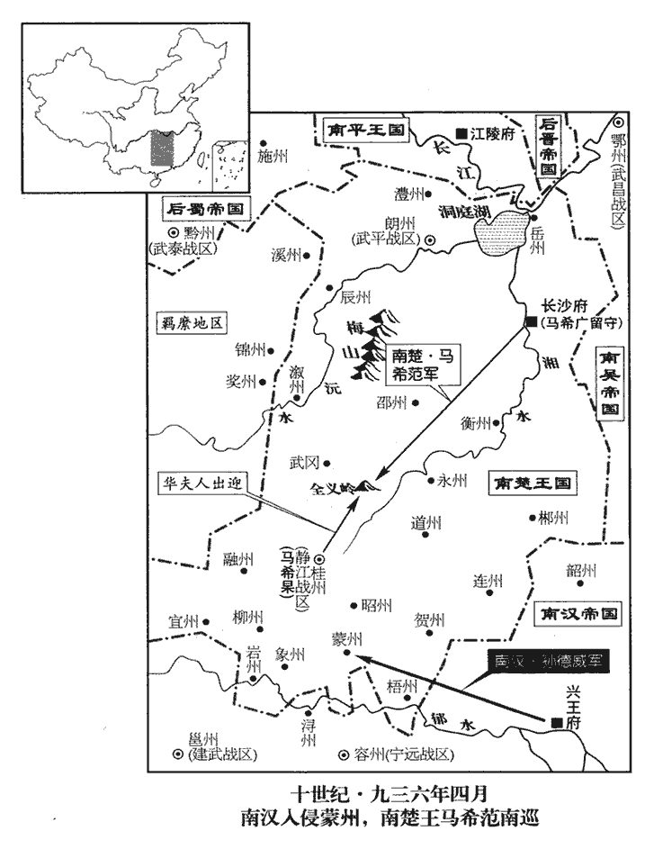
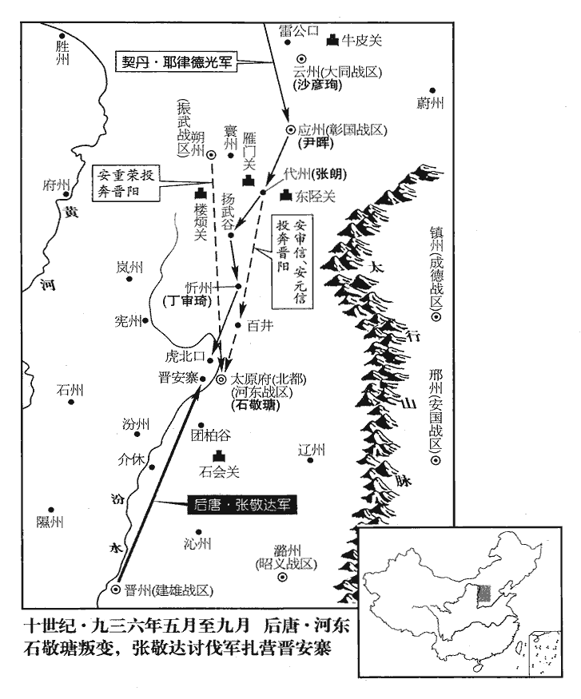
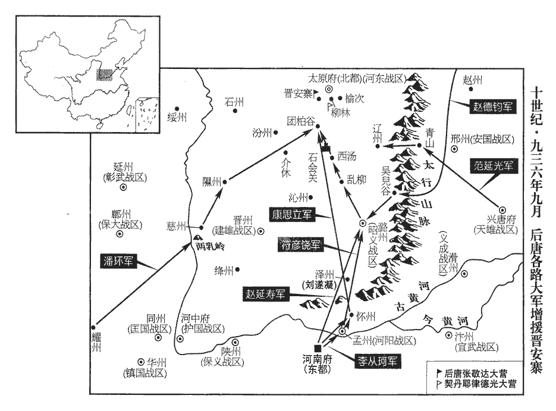
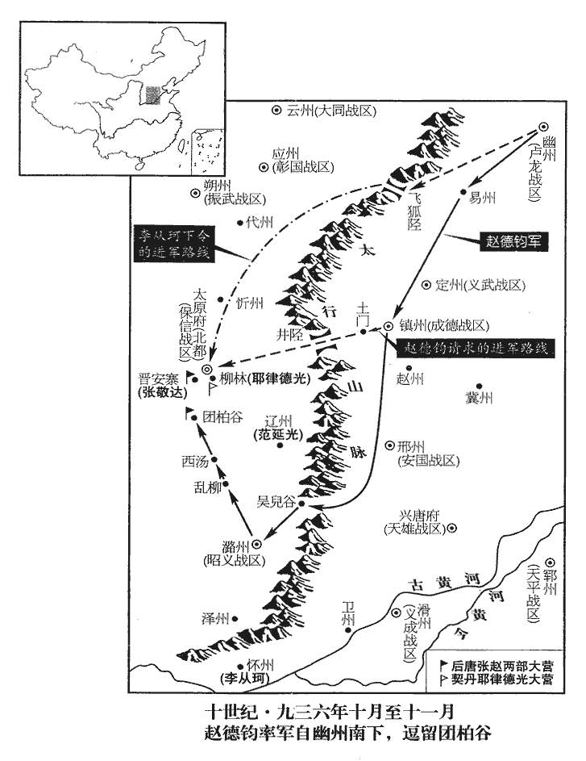
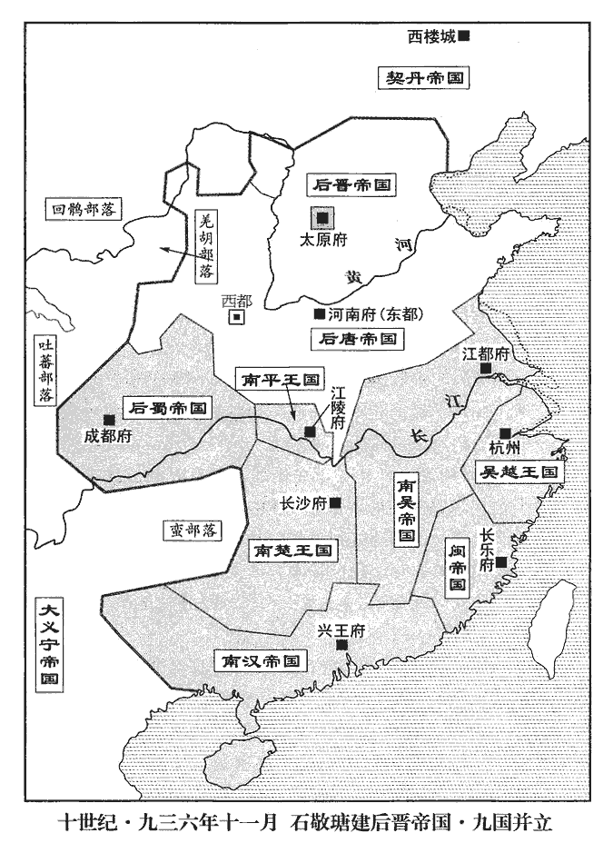
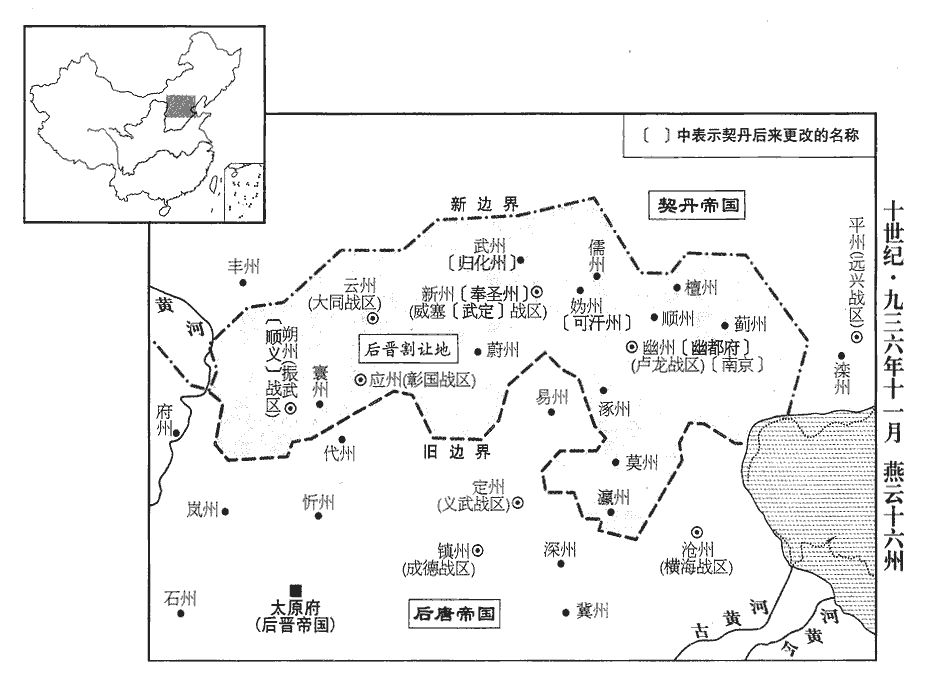
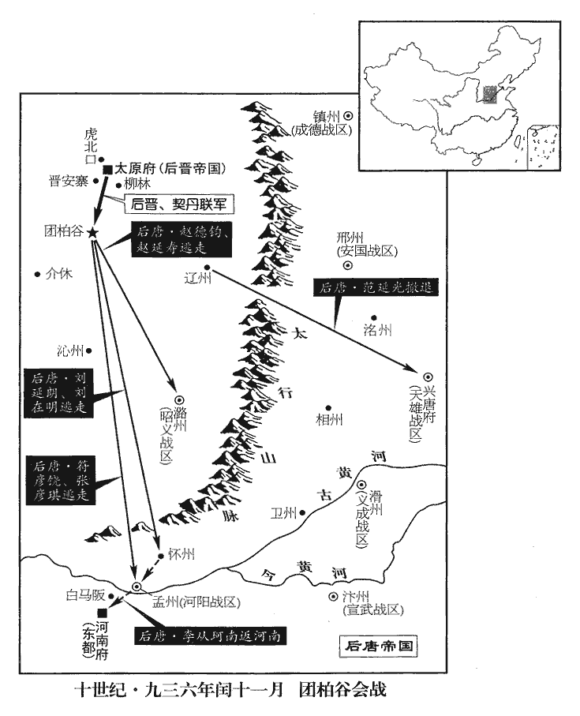
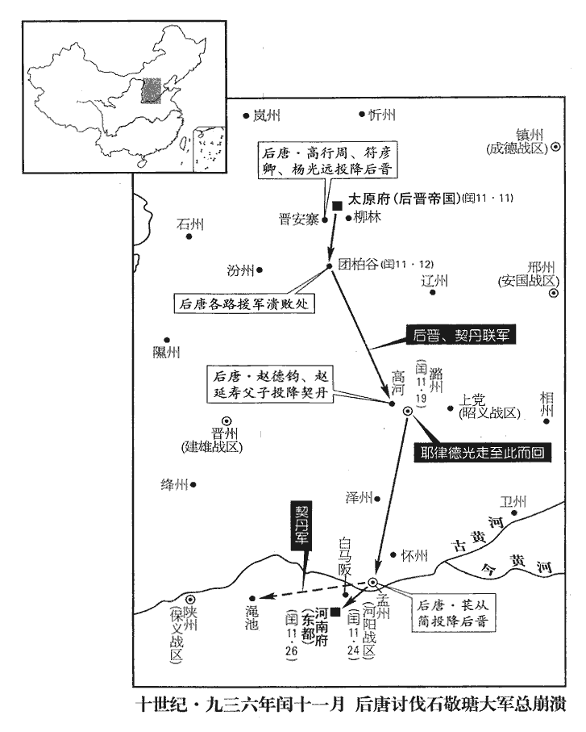
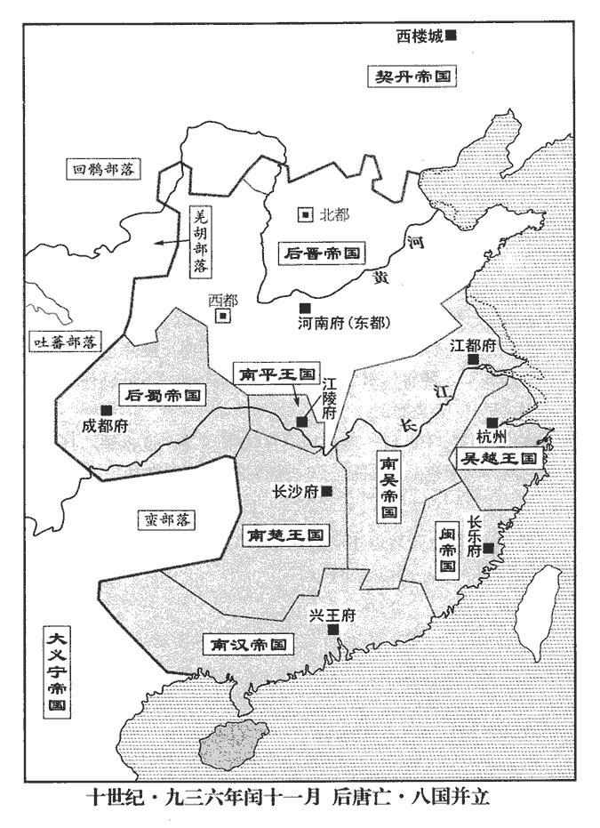

 後晉紀一柔兆涒灘（丙申），一年。
>  
> 石氏自代北從晉王起太原，既又以太原起事而得中原；太原治晉陽，契丹遂以晉命之，故國號為晉。

# 高祖聖文章武明德孝皇帝上之上諱敬瑭，姓石氏。其父臬niè捩liè雞，本出於夷，自朱邪歸唐，從朱邪入居陰山。其姓石，不知其得姓之始。五代會要曰：晉既得天下，祖衛大夫石碏què。

## 天福元年（丙申、九三六）是年十一月方改元即位。

1春，正月，吳‹首都江都府江苏省扬州市›徐知誥始建大元帥府，吳命徐知誥為大元帥，見上卷上年冬十月。以幕職分判吏、戶、禮、兵、刑、工部及鹽鐵。

〖译文〗 [1]春季，正月，吴国徐知诰开始建立大元帅府，用他的幕僚分别执掌吏、户、礼、兵、邢、工六部及盐铁。

2丁未‹十七›，唐主‹首都河南府河南省洛阳市›李从珂（王从珂）本年五十二岁立子重美為雍王。雍，於用翻。

〖译文〗 [2]丁未（十七日），后唐末帝李从珂册立他的儿子李重美为雍王。

3癸丑‹二十三›，唐主以千春節置酒，唐主以生日為千春節。五代會要曰：帝以唐光啟元年正月十三日生。既以晉元紀年，故書潞王為唐主。晉國長公主上壽畢，辭歸晉陽‹太原府所在县·山西省太原市›。上，時掌翻。帝醉，曰：「何不且留，遽歸，欲與石郎反邪！」石敬瑭‹河东总部太原府›聞之，益懼。

〖译文〗 [3]癸丑（二十三日），后唐末帝在自己的生日千春节置酒设宴，晋国长公主上寿祝贺完毕，告辞回晋阳。当时末帝已经醉了，说道：“为什么不多留些时候，忙着赶回去想帮助石郎造反哪！”石敬瑭听说后，更加害怕。

4三月，丙午‹十七›，以翰林學士、禮部侍郎馬胤孫為中書侍郎、同平章事。胤孫性謹懦，中書事多凝滯，又罕接賓客，時人目為「三不開」，謂口、印、門也。

〖译文〗 [4]三月，丙午（十七日），末帝任用翰林学士、礼部侍郎马胤孙为中书侍郎、同平章事。马胤孙性格谨慎懦弱，中书省办事往往凝滞不能畅达，又很少接待宾客，时人说他们是口、印、门“三不开”。

5石敬瑭盡收其貨之在洛陽及諸道者歸晉陽‹太原府所在县›，託言以助軍費，人皆知其有異志。唐主夜與近臣從容語曰：唐主好與近臣夜語見上卷上年。從，千容翻。「石郎於朕至親，無可疑者；但流言不釋，萬一失歡，何以解之？」皆不對。

〖译文〗 [5]石敬瑭把他在洛阳及诸道的财货全部收拢送回到晋阳，托词说是帮助军费，人们都知道他是心怀异志。唐主在夜间同近臣从容平淡地说：“石郎是朕的至亲，没有什么可猜疑的；但是流言总是不断，万一和他失掉和好，怎么办为好？”众臣都不回答。

端明殿學士、給事中李崧退謂同僚呂琦曰：李崧時與呂琦同入直。「吾輩受恩深厚，豈得自同眾人，一概觀望邪！計將安出？」琦曰：「河東若有異謀，必結契丹為援。契丹母以贊華‹耶律突欲›在中國，屢求和親，但求萴cè剌等未獲，故和未成耳。贊華，契丹主阿保機長子也。來降見二百七十七卷明宗長興元年。求萴剌見三年。契丹母，謂述律后也。今誠歸萴剌等與之和，歲以禮幣約直十餘萬緡遺之，遺，唯季翻。彼必驩然承命。如此，則河東雖欲陸梁，無能為矣。」崧曰：「此吾志也。然錢穀皆出三司，宜更與張相謀之。」相，息亮翻。遂告張延朗，延朗曰：「如學士計，不惟可以制河東，亦省邊費之什九，言什省其九。計無便於此者。若主上聽從，但責辦於老夫，請於庫財之外捃拾以供之。」捃jùn，居運翻。他夕，二人密言於帝，帝大喜，稱其忠，二人私草遺契丹書以俟命。

〖译文〗 端明殿学士、给事中李崧退下来对同僚吕琦说：“我们这些人受恩深厚，怎能把自己等同于众人，一概观望呢，现在能想些什么办法呢？”吕琦说：“河东那里如果有其他打算，必然要勾结契丹作援助。契丹太后因为他的长子李赞华降归中国，屡次要求和亲，但是，他们要求释放剌回去没有获得结果，所以和议未能成功。现在，如果真能把剌等放归与他们议和，每年用大约值十多万缗的礼物、钱财送给他们，他们必定会欢欣地答应。如果做到这样，那么河东虽然想蠢动，也无能为力了。”李崧说：“你说的与我的想法一样。然而钱、粮都要从三司支出，需要进一步同张丞相商量。”便把事情告诉了张延朗，张延朗说：“按学士的策划，不但可以制约河东，也可以节省戍边费用十分之九，计谋没有比这更好的了。如果主上听从了这个意见，只要责成老夫去办理就行了，可以在国家财库之外去搜集，以供其用。”又一个晚间，二人秘密地把这个办法陈述给末帝，末帝大喜，称道二人的忠心，二人私下草拟《遗契丹书》来等待命令。

久之，帝以其謀告樞密直學士薛文遇，文遇對曰：「以天子之尊，屈身奉夷狄，不亦辱乎！又，虜若循故事求尚公主，何以拒之？」唐自太宗以宗室女為公主下嫁諸蕃，謂之和蕃公主；其後回紇有功於中國，至屈帝女以女之。因誦戎昱昭君詩曰：「安危託婦人。」帝意逐變。戎昱，唐人也，能詩。漢元帝以王昭君嫁匈奴，後人憐之，競為歌詩以言其事。一日，急召崧、琦至後樓，盛怒，責之曰：「卿輩皆知古今，欲佐人主致太平；今乃為謀如是！朕一女尚乳臭，卿欲棄之沙漠邪？且欲以養士之財輸之虜庭，養士，謂養兵也。言其欲割養兵之財以和蕃。其意安在？」二人懼，汗流浹背，浹，即協翻。曰：「臣等志在竭愚以報國，非為虜計也，為，于偽翻。願陛下察之。」拜謝無數，帝詬責不已。詬，古候翻，又許候翻。呂琦氣竭，拜少止，帝曰：「呂琦強項，肯視朕為人主邪！」琦曰：「臣等為謀不臧，願陛下治其罪，多拜何為！」治，直之翻。帝怒稍解，止其拜，各賜巵酒罷之，罷，使出就所舍。自是群臣不敢復言和親之策。復，扶又翻。丁巳‹二十八›，以琦為御史中丞，蓋疏之也。呂琦為唐主所親事始二百七十七卷明宗長興元年。御史中丞居外朝，不得入直禁中，故曰疏。

〖译文〗 过了些时候，末帝把他们的谋略告诉了枢密直学士薛文遇，薛文遇回答说：“以天子的尊崇，屈身来侍奉夷狄野人，不是太耻辱了吗！再者，如果那胡虏按照过去的做法来谋求迎娶公主去和亲，用什么来拒绝他？”接着就诵读唐人戎昱的《昭君诗》说：“安危托妇人。”末帝的思想便改变了。一天，紧急召来李崧和吕琦到后楼，很恼火，责备他们说：“你们这些人都是懂得历史的，是想要辅佐人主获得天下太平的；怎么现在竟然出了这么个主意！朕有一个女儿还没有脱离乳臭，你们是要想把她抛弃到大沙漠吗？而且，要把国家养兵的财力输送给胡虏那里去，是什么居心？”李崧和吕琦很惶恐，汗流浃背，说道：“臣等的本意是要竭尽愚拙的想法用以报效国家，不是在替胡虏作打算，希望陛下明察。”二人无数次拜谢求恕，末帝指责不停。吕琦气力不继，叩拜稍有停顿，末帝说：“吕琦倔犟，你还肯把朕看做人主吗？”吕琦说：“我们谋事不善，愿请陛下治罪，多拜有什么用！”末帝的恼怒稍有缓解，制止他们的叩拜，每人赐给一杯酒，让他们出宫了，从此群臣不敢再提和亲的建议。丁巳（二十八日），末帝任用吕琦为御史中丞，以表示疏远他。

6吳徐知誥以其子副都統景通為太尉、副元帥，都統判官宋齊丘、行軍司馬徐玠為元帥府左•右司馬。

〖译文〗 [6]吴国徐知诰任用他的儿子副都统徐景通为太尉、副元帅，都统判官宋齐丘、行军司马徐为元帅府左、右司马。

7閩主昶‹首都长乐府福建省福州市›王继鹏（王昶）改元通文，立賢妃李氏為皇后，即李春鷰也。尊皇太后曰太皇太后。

〖译文〗 [7]闽国主王昶把年号改为通文，册立贤妃李氏为皇后，尊上皇太后称为太皇太后。

8靜江‹总部设桂州广西桂林市›節度使，同平章事馬希杲有善政，監軍裴仁煦譖之於楚王希範‹首都长沙府湖南省长沙市›马希范，本年三十八岁，煦，吁句翻。言其收眾心，希範疑之。

〖译文〗 [8]静江节度使、同平章事马希杲有好的政声，监军裴仁煦向楚王马希范诽谤他，说他收买人心，马希范对他产生怀疑。夏季，四月，南汉将领孙德威侵犯蒙州和桂州，马希范命令他的弟弟武安节度副使马希广暂时主持军府事，自己带领步兵、骑兵五千人赴桂州。马希杲害怕，他的母亲华夫人到全义岭远迎马希范，谢罪说：“希杲治理政事不得法，招致敌兵入境，烦劳殿下亲自跋涉险阻之地，都是我的罪过。我们愿意削去封邑，去当洒扫庭院的人，用来赎偿希杲的罪过。”马希范说：“我很久没有见到希杲，听说他治理成绩优异，所以来看看，没有别的意思。”南汉兵从蒙州退走，便把马希杲调迁到朗州。

夏，四月，漢‹首都兴王府广东省广州市›將孫德威侵蒙‹广西蒙山县›、桂‹广西桂林市›二州，蒙州，本漢蒼梧郡之荔浦縣，隋分荔浦置隨化縣，唐武德四年改為立山，於縣置荔州，尋改為恭州；貞觀八年改為蒙州，州東蒙山，山下有蒙水，人多姓蒙故也。宋熙寧五年廢蒙州，以立山縣屬昭州。希範命其弟武安節度副使希廣權知軍府事，自將步騎五千如桂州。希杲懼，其母華夫人華，戶化翻。逆希範於全義嶺‹位于广西资源县东北，亦称始安岭、越城岭、临源岭，是”五岭”最西的一岭›，全義嶺在桂州全義縣，即始安嶺也。謝曰：「希杲為治無狀，致寇戎入境，治，直吏翻。煩殿下親涉險阻，皆妾之罪也。願削封邑，灑掃掖庭，以贖希杲罪。」灑，所買翻，又所賣翻。掃，素早翻，又素報翻。希範曰：「吾久不見希杲，聞其治行尤異，故來省之，無他也。」治，直吏翻。行，下孟翻。省，悉景翻。無他，言無他故也。漢兵自蒙州引去，徙希杲知朗州‹武平战区总部所在·湖南省常德市›。為希範殺希杲張本。

〖译文〗 [9]荆南高从诲遣派使者送信给徐知诰，劝他即皇帝之位。

 

9高從誨‹本年四十六岁›遣使奉牋於徐知誥，勸即帝位。高從誨以區區三州介居唐、吳、蜀之間，利其賞賜，所向稱臣，諸國謂之「高賴子」，其有以也夫。

〖译文〗 [10]过去，石敬瑭想试探末帝的意图，多次上表陈诉身体羸弱，请求解除他的兵权，调迁到别的镇所；末帝与执政大臣商议后答应了他的请求，把他移镇郓州。房、李崧、吕琦等人都极力谏劝，认为不能这样做，末帝犹疑了很长时间。

10初，石敬瑭欲嘗唐主之意，累表自陳羸疾，羸，倫為翻。乞解兵柄，移他鎮；兵柄，謂北面馬步軍都總管之任。帝與執政議從其請，移鎮鄆州‹山东省东平县›。房暠、李崧、呂琦等皆力諫，以為不可，帝猶豫久之。

〖译文〗 五月，庚寅（初二）夜间，李崧因有急事请假在外，薛文遇独自承值夜班，末帝同他议论河东的事情，薛文遇说：“俗谚说：‘在道路当中盖房，三年也盖不成’，这种事情只能由主上的意志进行决断。群臣各为自身利害作打算，怎么肯什么话都说！以臣看来，河东的事，移镇也反，不移也要反，只是时间早晚而已，不如走在前头，先把他解决了。”以前，术士说国家今年应该得到贤人辅佐，提出奇谋，安定天下，末帝以为这个人当由薛文遇来应验，听到他的话，大为高兴，说道：“爱卿的话，很使我心意豁然开朗，不论成功还是失败，我决心施行。”立即命薛文遇写出封授官职的拟议，交付学士院草拟任命制书，辛卯（初三），任命石敬瑭为天平节度使，任用马军都指挥使、河阳节度使宋审虔为河东节度使。制令一出，文武两班听到呼叫石敬瑭的名字，相顾失色。

五月，庚寅‹二›夜，李崧請急在外，請急，請告也。薛文遇獨直，帝與之議河東事，文遇曰：「諺有之：『當道築室，三年不成。』茲事斷自聖志；諺，魚變翻。斷，丁亂翻。群臣各為身謀，安肯盡言！以臣觀之，河東移亦反，不移亦反，在旦暮耳，不若先事圖之。」先，悉薦翻。河東事情，凡在清泰朝野之人，誰不知者！其所以重於言，重於發，懼言之則發大難之端在己而無以善其後耳。清泰主鬱鬱於此久矣，薛文遇一言當心，遂決然而不顧。先是，術者言國家今年應得賢佐，出奇謀，定天下，先，悉薦翻。帝意文遇當之，聞其言，大喜，曰：「卿言殊豁吾意，成敗吾決行之。」即為除目，付學士院使草制。御筆親除付外行者謂之除目，其經宰相奏擬而行者亦謂之除目。辛卯‹三›，以敬瑭為天平‹总部设郓州山东省东平县›節度使，以馬軍都指揮使、河陽‹总部设孟州河南省孟州市›節度使宋審虔為河東節度使。宋審虔從唐主起於鳳翔，故欲以之代敬瑭。制出，兩班聞呼敬瑭名，相顧失色。兩班，謂文武官班。

〖译文〗 甲午（初六），末帝任用建雄节度使张敬达为西北蕃汉马步都部署，催促石敬瑭速赴郓州。石敬瑭很是疑惧，便和他的将佐计议说：“我第二次来河东时，主上曾当面答应我终身不再派别人来替换我；现在又忽然有了这样的命令，莫不是像今年过千春节时，主上同公主所讲的那样吗？我如果不造反，朝廷要先发制人，怎么能束手被擒，死于道路之间呢！今天我要上表说有病，来观察朝廷对我的意向，如果他对我宽容，我就臣事他；如果他对我用兵，那我就要另作打算了。”幕僚段希尧极力反对，石敬瑭因为他为人直率，并不责怪他。节度判官华阴人赵莹劝石敬瑭去郓州赴任；观察判官平遥人薛融说：“我是个书生，不懂得遣兵作战的事。”都押牙刘知远说：“明公您长期统率兵将，很能受到士兵的拥护；现在正占据着有利的地势，将士和马步军队都很精锐强悍，如果起兵，传发檄文宣示各道，可以完成统一国家的帝王大业，怎么能只为一道朝廷制令便自投虎口呢！”掌书记洛阳人桑维翰说：“主上当初即位时，明公您入京朝贺，主上岂能不懂得蛟龙不可纵之归渊的道理？然而到底还是把河东再次交给您，这正是天意要借一把快刀给您。先帝明宗的遗爱留给了后人，主上却用旁支的庶子取代大位，群情是不依附于他的。您是明宗的爱婿，可是现在主上却把您当作叛逆看待，这就不是仅仅靠表示低头服从所能取得宽免，只能努力为保全自己想办法了。契丹向来同明宗协约做兄弟之邦，现在，他们的部落近在云州、应州，您如果真能推心置腹地曲意讨好他们，万一有了急变之事，早上叫他晚上就能来到，还担心什么事不能办成吗？”石敬瑭于是便下了造反的决心。

甲午‹六›，以建雄‹总部设晋州山西省临汾市›節度使張敬達為西北蕃漢馬步都部署，趣敬瑭之鄆州。趣，讀曰促。天平節度治鄆州。鄆，音運。敬瑭疑懼，謀於將佐曰：「吾之再來河東也，主上面許終身不除代；唐主此言當在即位之初，敬瑭入朝遣還鎮時也。今忽有是命，得非如今年千春節‹正月十三日›與公主所言乎？我不興亂，朝廷發之，安能束手死於道路乎！今且發表稱疾以觀其意，若其寬我，我當事之；若加兵於我，我則改圖耳。」觀敬瑭此言，則求援於契丹者本心先定之計也，桑維翰之言正會其意耳。幕僚段希堯極言拒之，敬瑭以其朴直，不責也。節度判官華陰‹陕西省华阴市›趙瑩勸敬瑭赴鄆州；觀察判官平遙‹山西省平遥县›薛融曰：「融書生，不習軍旅。」都押牙劉知遠曰：「明公久將兵，得士卒心；今據形勝之地，士馬精強，若稱兵傳檄，稱，舉也。帝業可成，奈何以一紙制書自投虎口乎！」掌書記洛陽桑維翰曰：「主上初即位，明公入朝，主上豈不知蛟龍不可縱之深淵邪？古語有之：魚不可脫於淵，神龍失勢，與蚯蚓同。然卒以河東復授公，卒，子恤翻。復，扶又翻。此乃天意假公以利器。明宗‹李嗣源›遺愛在人，主上以庶孽代之，群情不附。公明宗之愛壻，今主上以反逆見待，此非首謝可免，首，式又翻。但力為自全之計。契丹‹首都西楼城内蒙古巴林左旗›耶律阿保机【章：十二行本「丹」下有「主」字；乙十一行本同。】素與明宗約為兄弟，今部落近在雲‹山西省大同市›、應‹山西省应县›，契丹牙帳自明宗長興三年屯捺剌泊。公誠能推心屈節事之，萬一有急，朝呼夕至，何患無成。」敬瑭意逐決。

〖译文〗 过去，朝廷猜疑石敬瑭，任用羽林将军宝鼎人杨彦询为北京太原的副留守，石敬瑭将要起兵造反，也把情况告诉了他。杨彦询说：“不知河东现在有多少兵士和粮秣，能够敌得过朝廷吗？”石敬瑭左右的人请求杀了杨彦询，石敬瑭说：“只有副使一个人，我亲自保证他没有事，你们大家就不必再说了。”

先是，朝廷疑敬瑭，先，悉薦翻。以羽林將軍寶鼎‹山西省万荣县西南荣河镇›楊彥詢為北京‹太原府›副留守，寶鼎縣屬河中府，漢之汾陰縣也。唐玄宗開元二十一年祀汾陰，獲寶鼎，由是更名。九域志：宋大中祥符四年改寶鼎為榮河縣，在河中府北一百里。敬瑭將舉事，亦以情告之。彥詢曰：「不知河東兵糧幾何，能敵朝廷乎？」左右請殺彥詢，敬瑭曰：「惟副使一人我自保之，汝輩勿言也。」按薛史稱楊彥詢為人沈厚，當以此得全。戊戌‹十›，昭義‹总部设潞州山西省长治市›節度使皇甫立奏敬瑭反。并、潞二鎮接境，故知其事而先奏之。敬瑭表：「帝‹李嗣源›養子，不應承祀，請傳位許王。」許王從益，明宗之子也。帝手裂其表抵地，以詔答之曰：「卿於鄂王‹李从厚›固非疏遠，衛州‹河南省卫辉市›之事，天下皆知；謂敬瑭盡殺閔帝從騎，獨置帝於衛州也。事見上卷清泰元年。鄂王即謂閔帝。潞王入立，以太后令降閔帝為鄂王。許王之言，何人肯信！」壬寅‹十四›，制削奪敬瑭官爵。乙巳‹十七›，以張敬達兼太原四面排陳使，陳，讀曰陣；下同。河陽節度使張彥琪為馬步軍都指揮使，以安國‹总部邢州›節度使安審琦為馬軍都指揮使，以保義‹总部陕州›節度使相里金為步軍都指揮使，以右監門上將軍武廷翰為壕寨使。相，息亮翻。監，古銜翻。丙午‹十八›，以張敬達為太原四面兵馬都部署，以義武‹总部定州›節度使楊光遠為副部署。為楊光遠殺張敬達降晉張本。丁未‹十九›，又以張敬達知太原行府事，以前彰武‹总部延州›節度使高行周為太原四面招撫、排陳等使。光遠既行，定州軍亂，牙將千乘‹山东省广饶县›方太討平之。漢置千乘國，後改樂安郡，隋廢樂安郡置千乘縣，唐屬青州。九域志：千乘縣在青州北八十里。乘，繩證翻。

〖译文〗 戊戍（初十），昭义节度使皇甫立奏报石敬瑭叛乱。石敬瑭上表称：“皇帝是养子，不应该继位，请把皇位传给许王李从益。”末帝把石敬瑭的表章撕碎扔在地上，用诏书回答他说：“你同鄂王李从厚本来并不疏远，卫州的事情，天下人都知道；许王的话，谁肯听他！”壬寅（十四日），末帝下制令，削夺了石敬瑭的官爵。乙巳（十七日），末帝任用张敬达兼太原四面排阵使，河阳节度使张彦琪为马步军都指挥使，作用安国节度使安审琦为马军都指挥使，任用保义节度使相里金为步军都指挥使，任用右监门上将军武廷翰为壕寨使。丙午（十八日），任命张敬达为太原四面兵马都部署，任命义武节度使杨光远为副部署。丁未（十九日），又任命张敬达主持太原行府事，任命前彰武节度使高行周为太原四面招抚、排阵等使。杨光远离任后，定州军作乱，牙将千乘县人方太讨伐平定了叛乱。

 

張敬達將兵三萬營於晉安鄉‹山西省太原市西南晋祠南›，晉安鄉在晉陽城南。薛史，晉安寨在晉祠南。戊申‹二十›，敬達奏西北先鋒馬軍都指揮使安審信叛奔晉陽‹太原府所在县·山西省太原市›。審信，金全之弟子也，敬瑭與之有舊。安氏群從與石敬瑭本皆代北人。先是，雄義都指揮使馬邑‹山西省朔州市东›安元信先，悉薦翻。馬邑縣屬朔州。將所部六百餘人戍代州‹山西省代县›，代州刺史張朗善遇之。元信密說朗曰：「吾觀石令公長者，說，式芮翻。石敬瑭加中書令，故稱為令公。長，知兩翻。舉事必成；公何不潛遣人通意，可以自全。」朗不從，由是互相猜忌。元信謀殺朗，不克，帥其眾奔審信，審信遂帥麾下數百騎與元信掠百井‹山西省阳曲县东北›奔晉陽。帥，讀曰率。敬瑭謂元信曰：「汝見何利害，捨強而歸弱？」對曰：「元信非知星識氣，顧以人事決之耳。夫帝王所以御天下，莫重於信。今主上失大信於令公，親而貴者且不自保，石敬瑭身為帝壻，可謂親矣；官為中書令，建節總兵，專制北面，可謂貴矣。況疏賤乎！其亡可翹足而待，何強之有！」敬瑭悅，委以軍事。振武‹总部朔州›西北巡檢使安重榮戍代北，歐史，安重榮為振武巡邊指揮使。帥步騎五百奔晉陽。帥，讀曰率；下同。重榮，朔州人也。以宋審虔為寧國‹总部宣州›節度使、充侍衛馬軍都指揮使。石敬瑭既不受代，故使宋審虔領節掌宿衛。審虔，唐主鎮鳳翔時牙將。

〖译文〗 张敬达统兵三万在晋安乡安营扎寨，戊申（二十日），张敬达奏报西北先锋马军都指挥使安审信叛奔晋阳，安审信是安金全的侄子，与石敬瑭旧有往来。过去，雄义都指挥使马邑人安元信带领所部六百余人戍守代州，代州刺史张朗待他很好。安元信暗中劝说张朗说：“我看石令公是个长者，他举兵造反，必能成功；您何不暗地派人去表达心意，可以保全自己。”张朗不听，从此二人互相猜忌。安元信企图杀了张朗，没有成功，便带领自己的部属兵众投奔安审信，安审信便率领他指挥下的几百骑兵与安元信会合，抢掠百井后，投奔晋阳。石敬瑭对安元信说：“你看出什么利害，竟然舍强而归弱？”回答说：“我并不会观星识气，只是用人事的判断来作决定而已。谈起帝王之所以能够临御天下，没有比信誉更重要的了。现在，主上对令公您失去大信，至亲而且尊贵的人尚且不能自保，何况疏远而卑微的人哪！他的灭亡可以翘着脚等待，他算什么强啊！”石敬瑭高兴，让他掌管军事。振武西北巡检使安重荣戌守代北，也率领步兵和骑兵五百人投奔晋阳。安重荣是朔州人。朝廷任命宋审虔为宁国节度使、充当侍卫马军都指挥使。

11天雄‹总部设兴唐府河北省大名县›節度使劉延皓恃后族之勢，驕縱，劉延皓，唐主后弟。奪人財產，減將士給賜，宴飲無度。捧聖都虞候張令昭因眾心怨怒，謀以魏博應河東，癸丑‹二十五›未明，帥眾攻牙城，克之；延皓脫身走，亂兵大掠。令昭奏：「延皓失於撫御，以致軍亂；臣以撫安士卒，權領軍府，「臣以」之「以」當作「已」。乞賜旌節！」延皓至洛陽，唐主怒，命遠貶；皇后為之請，為，于偽翻。考異曰：廢帝實錄：「延皓，皇后之姪。」按薛史、唐餘錄、歐陽史皆云延皓，后之弟，應州人也。延朗，宋州虞城人也。獨廢帝實錄云后姪，今不取。六月，庚申‹三›，止削延皓官爵，歸私第。

〖译文〗 [11]天雄节度使刘延皓依恃皇后家族的势力，很骄纵，侵占别人的财产，扣减将士的赏赐，宴会饮酒没有节制。捧圣都虞候张令昭因为众心怨恨，企图用魏博来响应河东造反，癸丑（二十五日）天未亮，率领兵众攻打主将所居的牙城，攻了下来；刘延皓脱自身逃去，乱兵大肆抢掠。张令昭上奏：“刘延皓抚给驾御不当，以致军人作乱；臣为了要抚恤安慰士兵，暂时领管军府，请求朝廷赐给旌节！”刘延皓逃回洛阳，末帝发怒，下令把他贬到远方，皇后为他说情，六月，庚申（初三），只是削去刘延皓的官爵，让他回自己的宅第。

12辛酉‹四›，吳‹杨溥，本年三十七岁›太保、同平章事徐景遷以疾罷，以其弟景遂代為門下侍郎、參政事。

〖译文〗 [12]辛酉（初四），吴国太保、同平章事徐景迁因为患病罢官，任用他的弟弟徐景遂代替他做门下侍郎、参政事。

13癸亥‹六›，唐主‹李从珂›以張令昭為右千牛衛將軍、權知天雄軍府事。令昭以調發未集，調，徒釣翻。且受新命。尋有詔徙齊州‹山东省济南市›防禦使，令昭託以士卒所留，實俟河東之成敗。唐主遣使諭之，令昭殺使者。甲戌‹十七›，以宣武‹总部汴州›節度使兼中書令范延光為天雄四面行營招討使、知魏博行府事，「魏博」恐當作「魏州」。以張敬達充太原四面招討使，以楊光遠為副使。丙子‹十九›，以西京‹京兆府·陕西省西安市›留守李周為天雄軍四面行營副招討使。

〖译文〗 [13]癸亥（初六），后唐末帝任用张令昭为右千牛卫将军，暂时主持天雄军府事。张令昭因为调发人马没有会集，暂且接受新的任命。不久，又有诏书命令他调任齐州防御使，张令昭托词说被士兵所留滞，实际上是等待观察河东起兵之成败。后唐末帝派遣使者告谕他，张令昭把使者杀了。甲戍（十七日），末帝任命宣武节度使兼中书令范延光为天雄四面行营招讨使、主持魏博行府事，任命张敬达充当太原四面招讨使，任用杨光远为副使。丙子（十九日），任命西京留守李周为天雄军四面行营副招讨使。

14石敬瑭之子右衛上將軍重殷、皇城副使重裔聞敬瑭舉兵，匿於民間井中。弟沂州‹山东省临沂市›都指揮使敬德殺其妻女而逃，尋捕得，死獄中，從弟彰聖都指揮使敬威自殺。秋，七月，戊子‹二›，獲重殷、重裔，誅之，重，直龍翻。從，才用翻。考異曰：薛史：「七月己丑，誅右衛上將軍石重英、皇城副使石重裔，皆敬瑭之子也。」廢帝實錄云「石諱妷男尚食使重乂，供奉官重英。」與薛史不同。按重乂敬瑭子，即位後為張從賓所殺，實錄誤也。廣本「英」作「殷」，今從之。并族所匿之家。

〖译文〗 [14]石敬瑭的儿子右卫上将军石重殷、皇城副使石重裔听说石敬瑭起兵造反，躲藏在民间市井中。石敬瑭的弟弟沂州都指挥使石敬德杀了自己的妻子、女儿而后逃走，不久，被捕获，死于狱中。叔伯弟弟彰圣都指挥使石敬威自杀。秋季，七月，戊子（初二），抓获了石重殷和石重裔，诛杀了他们，并把藏匿他们的人家全族杀害。

15庚寅‹四›，楚王希範自桂州北還。四月至桂州，七月方還。還，從宣翻，又如字。

〖译文〗 [15]庚寅（初四），楚王马希范从桂州北还。

16雲州‹山西省大同市›步軍指揮使桑遷奏應州‹山西省应县›節度使尹暉逐雲州節度使沙彥珣，收其兵應河東。丁酉‹十一›，彥珣表遷謀叛應河東，引兵圍子城。彥珣犯圍走出西山‹大同市西诸山›，據雷公口‹大同市西北›，明日，收兵入城擊亂兵，遷敗走，軍城復安。是日，尹暉執遷送洛陽，斬之。

〖译文〗 [16]云州步军指挥使桑迁上奏：应州节度使尹晖驱逐云州节度使沙彦，接收了他的兵马，响应河东造反。丁酉（十一日），沙彦上表奏称桑迁谋反响应河东，并且率领兵马包围了子城。沙彦突破包围走出西山，占据雷公口，第二天，收集兵士入城袭击乱兵，桑迁败走，军城恢复安定。这一天，尹晖抓住桑迁把他押送洛阳，朝廷把他斩了。

17丁未‹二十一›，范延光拔魏州，斬張令昭。詔悉誅其黨七指揮。

〖译文〗 [17]丁未（二十一日），范延光攻取了魏州，斩杀了张令昭。朝廷下诏：把他的党羽七个指挥都诛除了。

18張敬達發懷州‹河南省沁阳市›彰聖軍戍虎北口‹山西省太原市西北›，虎北口在汾水北。彰聖軍本洛城屯衛兵也，先是分屯懷州，又自懷州發赴張敬達軍前，敬達又發之戍虎北口。其指揮使張萬迪將五百騎奔河東，丙辰‹三十›，詔盡誅其家。

〖译文〗 [18]张敬达发动怀州彰圣军戍守在虎北口，该军指挥使张万迪带领五百骑投奔河东，丙辰（三十日），朝廷下诏：把他的家属全部诛杀。

19石敬瑭遣間使求救於契丹，間，古莧翻。使，疏吏翻。時張敬達在代州，雲、應兩鎮亦不從敬瑭，故遣使從間道趨契丹帳。令桑維翰草表稱臣於契丹主‹耶律德光，本年三十五岁›，且請以父禮事之，約事捷之日，割盧龍‹总部设幽州北京市›一道及鴈門關‹山西省代县西北›以北諸州與之。劉知遠諫曰：「稱臣可矣，以父事之太過。厚以金帛賂之，自足致其兵，不必許以土田，恐異日大為中國之患，悔之無及。」敬瑭不從。他日卒如劉知遠之言。為契丹入中國張本。表至契丹，契丹主大喜，喜中國有釁之可乘也。白其母曰：「兒比夢石郎遣使來，其母即述律太后。比，毗至翻，近也。今果然，此天意也。」自是之後，遼滅晉，金破宋，（原缺十六字。）今之疆理，西越益、寧，南盡交、廣，至于海外，皆石敬瑭捐割關隘以啟之也，其果天意乎！乃為復書，許俟仲秋傾國赴援。俟秋高馬肥而後進。

〖译文〗 [19]石敬瑭派使者从僻路求救于契丹，让桑维翰草写表章向契丹主称臣，并且请求用对待父亲的礼节来侍奉他，约定事情成功之日，划割卢龙一道及雁门关以北诸州给契丹。刘知远劝谏他说：“称臣就可以了，用父亲的礼节对待他就太过份了。用丰厚的金银财宝贿赂他，自然是足以促使他发兵，不必许诺割给他土田，恐怕那样以后要成中国的大患，后悔就来不及了。”石敬瑭不听。表章送到契丹，契丹国主耶律德光非常高兴，告诉他的母亲述律太后说：“孩儿最近梦见石郎派遣使者来，现在果然来了，这真是天意啊。”便向石敬瑭写了回信，答应等到仲秋时节，发动全国人马来支援他。

20八月，己未‹三›，以范延光為天雄節度使，李周為宣武‹总部设汴州河南省开封市›節度使、同平章事。

〖译文〗 [20]八月，己未（初三），末帝任用范延光为天雄节度使，李周为宣武节度使、同平章事。

21癸亥‹七›，應州言契丹三千騎攻城。

〖译文〗 [21]癸亥（初七），应州奏报：契丹三千骑兵进攻州城。

22張敬達築長圍以攻晉陽。石敬瑭以劉知遠為馬步都指揮使，安重榮、張萬迪降兵皆隸焉。知遠用法無私，撫之如一，由是人無貳心。敬瑭親乘城，坐臥矢石下，知遠曰：「觀敬達輩高壘深塹，欲為持久之計，無他奇策，不足慮也。願明公四出間使，間，古莧翻。使，疏吏翻。經略外事。守城至易，知遠獨能辦之。」易，以豉翻。用兵之計，攻城最下。以敬瑭、知遠之守，又有契丹之援，而敬達欲以持久制之，宜其敗也。敬瑭執知遠手，撫其背而賞之。

〖译文〗 [22]张敬达设置了很长的包围工事来攻打晋阳。石敬瑭任用刘知远为马步都指挥使，把安重荣、张万迪的降兵都隶属于他。刘知远以法办事，没有私弊，对军民抚恤一视同仁，因此人都没有二心。石敬瑭亲自登城视察部属兵卒，坐卧在敌人的矢石投射之下。刘知远说：“察看张敬达这些人筑设高垒深沟，想作持久打算，他们没有其他好的办法，是不足为虑的。请您向各方派出走僻路的使者，经办对外事务。守城的事很容易，我知远一个人就能独力办理。”石敬瑭拉着刘知远的手，抚拍他的肩背而称赞他。

23戊寅‹二十二›，以成德‹总部镇州›節度使董溫琪為東北面副招討使，以佐盧龍節度使趙德鈞。

〖译文〗 [23]戊寅（二十二日），后唐朝廷任用成德节度使董温琪为东北面副招讨使，用来帮助卢龙节度使赵德钧。

24唐主使端明殿學士呂琦至河東‹山西省›行營犒軍，犒，苦到翻。楊光遠謂琦曰：「願附奏陛下，幸寬宵旰。旰，古案翻。賊若無援，旦夕當平；若引契丹，當縱之令入，可一戰破也。」楊光遠之計，狃niǔ王晏球定州之勝，欲縱之令入而與之戰，殊不知戰無常勝，而關隘不可不扼也。尋而契丹徑入，唐兵一戰而敗，遂為所困矣。帝甚悅。帝聞契丹許石敬瑭以仲秋赴援，屢督張敬達急攻晉陽，不能下。每有營構，多值風雨，長圍復為水潦所壞，竟不能合。復，扶又翻。壞，音怪。史言天方相晉，張敬達無所施其力。晉陽城中日窘，糧儲浸乏。若契丹之援不至，晉不能支矣。

〖译文〗 [24]后唐主派出端明殿学士吕琦到河东行营犒劳军队，杨光远对吕琦说：“请您附带奏告陛下，请主上稍微减少昼夜操劳。贼兵如果没有援兵，用不多天就可以平定；如果他勾结契丹来犯，自当放他进来，一次战斗就能把他打败。”末帝闻奏很是高兴。末帝听说契丹答应石敬瑭在仲秋时节发兵来支援他，几次督促张敬达紧急攻打晋阳，但不能攻下。每当有所营建构筑工事，往往遇到风雨天气，很长的包围工事又被水浸所破坏，竟然接合不拢。晋阳城中日益窘迫，粮食储备因浸泡而缺乏。

25九月，契丹主‹耶律德光›將五萬騎，號三十萬，自揚武谷‹谷在山西省原平市西北上阳武乡›而南，揚武谷在代州崞縣。薛史：陽武谷在朔州南。考異曰：代州今有楊武寨，其北有長城嶺、聖佛谷。今從漢高祖實錄作「揚武」。旌旗不絶五十餘里。代州刺史張朗、忻州‹山西省忻州市›刺史丁審琦嬰城自守，九域志：代州南至忻州一百六十里；忻州南至太原一百四十里。虜騎過城下，亦不誘脅。誘，音酉。審琦，洺州‹河北省永年县东南旧永年镇›人也。

〖译文〗 [25]九月，契丹主耶律德光统领五万骑兵，号称三十万，从代州扬武谷向南进发，旌旗连绵不断达五十余里。代州刺史张朗、忻州刺史丁审琦绕城自守，敌人骑兵经过城下时，也不诱降挟胁他。丁审琦是州人。

辛丑‹十五›，契丹主至晉陽，陳於汾北之虎北口。陳，讀曰陣；下同。考異曰：按幽州北山口名虎北口，亦名古北口。此在太原，而云陳於虎北口，又云歸虎北口，蓋太原城側別有地名虎北口也。先遣人謂敬瑭曰：「吾欲今日即破賊可乎？」敬瑭遣人馳告曰：「南軍甚厚，不可輕，唐兵自南來攻晉陽，故謂之南軍。請俟明日議戰未晚也。」使者未至，契丹已與唐騎將高行周、符彥卿合戰，敬瑭乃遣劉知遠出兵助之。張敬達、楊光遠、安審琦以步兵陳於城西北山下，契丹遣輕騎三千，不被甲，直犯其陳。唐兵見其羸，爭逐之，至汾曲，被，皮義翻。羸，倫為翻。汾曲，汾水之曲也。契丹涉水而去。唐兵循岸而進，契丹伏兵自東北起，衝唐兵斷而為二，步兵在北者多為契丹所殺，騎兵在南者引歸晉安寨。契丹縱兵乘之，唐兵大敗，步兵死者近萬人，近，其靳翻。騎兵獨全。敬達等收餘眾保晉安，契丹亦引兵歸虎北口。敬瑭得唐降兵千餘人，劉知遠勸敬瑭盡殺之。唐兵雖敗，其眾尚強，劉知遠懼降兵復叛歸，故勸殺之。

〖译文〗 辛丑（十五日），契丹主到达晋阳，把兵马布列在汾北的虎北口。先派人对石敬瑭说：“我打算今天攻打贼兵，行不行？”石敬瑭派人驰奔告诉他们说：“南军力量很雄厚，不可以轻视，请等到明天议论好如何开战也不晚。”使者还未到达契丹军营，契丹兵已经同后唐骑将高行周、符彦卿打了起来，石敬瑭便派刘知远出兵帮助他们。张敬达、杨光远、安审琦用步兵列阵在城西北山下，契丹派轻骑兵三千人，不披铠甲，直奔唐兵阵列。唐兵看到契丹兵单薄，争相驱赶，到了汾水之曲，契丹兵涉水而去。唐兵沿着河岸向北进取，契丹伏兵从东北涌起，冲击唐兵，把唐兵截为两段，在北面的步兵大多被契丹所杀，在南面的骑兵引退回到晋安营寨。契丹放开兵马乘乱攻击，唐兵大败，步兵死亡近万人，骑兵却保全了。张敬达等收集余众退保晋安，契丹也率领其兵返回虎北口。石敬瑭俘获后唐降兵一千余人，刘知远劝石敬瑭把他们都杀了。

是夕，敬瑭出北門，出晉陽城北門也。見契丹主。契丹主執敬瑭手，恨相見之晚。以前此未識面，故然，亦必石敬瑭之氣貌有以聳其瞻視也。敬瑭問曰：「皇帝遠來，士馬疲倦，遽與唐戰而大勝，何也？」契丹主曰：「始吾自北來，謂唐必斷鴈門‹代州州政府所在县·山西省代县›諸路，斷，音短。鴈門有東陘、西陘之險，崞縣有陽武、石門之隘。伏兵險要，則吾不可得進矣。使張敬達等果知出此，豈有晉安之困哉。使人偵視，皆無之，偵，丑鄭翻。吾是以長驅深入，知大事必濟也。兵既相接，我氣方銳，彼氣方沮，若不乘此急擊之，言當乘初至之銳而用其鋒也。曠日持久，則勝負未可知矣。此吾所以亟戰而勝，不可以勞逸常理論也。」敬瑭甚歎伏。

〖译文〗 这天晚上，石敬瑭出北门，会见契丹主。契丹主握住石敬瑭的手，只恨相见晚了。石敬瑭问道：“皇帝远道而来，兵马疲倦，急切同唐兵作战而取得大胜，这是什么原因？”契丹主说：“开始我从北面过来，以为唐兵必然要切断雁门的各条道路，埋伏兵众在险要之地，那样我就不能顺利前进了。我使人侦察，发现断路和伏险都没有，这样，我才得以长驱深入，知道大事必然成功了。兵马相接以后，我方气势正锐盛，彼方气势正沮丧，如果不乘此时急速攻击他，旷日持久，那谁胜谁负就不可预料了。这就是我之所以速战而胜的道理，不能用谁劳谁逸的通常的道理来衡量了。”石敬瑭很是叹服。

壬寅‹十六›，敬瑭引兵會契丹圍晉安寨，置營於晉安之南，長百餘里，厚五十里，多設鈴索吠犬，人跬步不能過。長，直亮翻。厚，戶茂翻。索，昔各翻。吠，房廢翻。跬，犬橤翻，半步也。又司馬法曰：一舉足曰跬。跬，三尺也。敬達等士卒猶五萬人，馬萬匹，四顧無所之。兵法：置之死地而後生。若張敬達等能於圍落未合之時，勉諭將士，竭力致死決戰，勝負未可知也。甲辰‹十八›，敬達遣使告敗於唐，自是聲問不復通。復，扶又翻。唐主大懼，遣彰聖都指揮使符彥饒將洛陽步騎兵屯河陽，詔天雄節度使兼中書令范延光將魏州兵二萬由青山‹河北省邢台市西北青山口›趣榆次‹山西省榆次市›，青山，既邢州青山口也。趣，七喻翻。盧龍節度使、東北面招討使兼中書令北平王趙德鈞將幽州‹北京市›兵【章：十二行本「兵」下有「由飛狐‹河北省涞源县南›」三字；乙十一行本同；孔本同；退齋校同。】出契丹軍後，欲使趙德鈞自飛狐道出代州，以斷契丹之後。耀州‹陕西省耀县›防禦使潘環糺合西路戍兵，「糺」，與「糾」同。說文：繩三合為糺。故凡合集兵眾者謂之糺合、糺集。西路戍兵，謂蒲、潼以西諸道戍兵也。由晉‹山西省临汾市›、絳‹山西省新绛县›兩乳嶺‹山西省乡宁县西南三十五千米›出慈‹山西省吉县›、隰‹山西省隰县›，共救晉安寨。契丹主移帳於柳林‹山西省太原市东南十五千米›，柳林當在晉安寨南。遊騎過石會關‹山西省榆社县西›，不見唐兵。

〖译文〗 壬寅（十六日），石敬瑭率领兵马会合契丹兵马包围了晋安寨，在晋安的南面设置营地，长一百多里，宽五十里，密布带铃索的吠犬，人们连半步也不能过去。此时张敬达等的士兵尚有五万人，马有万匹，四面张顾，不知往哪里去好。甲辰（十八日），张敬达派出使者向后唐朝廷报告打了败仗，此后便没有再通音讯了。唐主极为恐惧，派遣彰圣都指挥使符彦饶统领洛阳步兵、骑兵屯扎在河阳，末帝下诏命令天雄节度使兼中书令范延光统领魏州兵两万从邢州青山奔赴榆次，卢龙节度使、东北面招讨使兼中书令北平王赵德钧统领幽州兵从契丹军阵之后出击，耀州防御使潘环纠合西路守戍的兵士从晋州、降州间的两乳岭出兵向慈州、隰州共同营救晋安寨。契丹主把军帐移到柳林，流动的骑兵过了石会关，还没有遇到唐兵。

丁未‹二十一›，唐主下詔親征。雍王重美曰：雍，於用翻。「陛下目疾未平，未可遠涉風沙；臣雖童稚，願代陛下北行。」帝意本不欲行，聞之，頗悅。張延朗、劉延皓及宣徽南院使劉延朗皆勸帝行，帝不得已，戊申‹二十二›，發洛陽，謂盧文紀曰：「朕雅聞卿有相業，故排眾議首用卿，相，息亮翻。盧文紀，唐主清泰元年四月既位，七月相盧文紀。今禍難如此，難，乃旦翻。卿嘉謀皆安在乎？」文紀但拜謝，不能對。己酉‹二十三›，遣劉延朗監侍衛步軍都指揮使符彥饒軍赴潞州‹山西省长治市›，為大軍後援。大軍，謂晉安寨之軍。監，古銜翻。諸軍自鳳翔‹陕西省凤翔县›推戴以來，推戴，事見上卷清泰元年。驕悍不為用，彥饒恐其為亂，不敢束之以法。悍，下罕翻，又侯旰翻。兵驕而不為用，與無兵同。潞王以驕兵推戴而得天下，亦以驕兵不為用而失天下，固其宜也。

〖译文〗 丁未（二十一日），后唐主下诏书，宣布亲征。雍王李重美说：“陛下眼疾还没有好，不能远路跋涉到风沙之地，为臣虽然尚在童稚之年，愿意代替陛下向北方征讨。”末帝的意念本来就不想北行，听了这些话，很觉高兴。但是张延朗、刘延皓和宣徽南院使刘延朗却劝末帝亲征，末帝不得已，戊申（二十二日），从洛阳出发，对卢文纪说：“朕向来听说你有宰相才干，所以排除众议首先任用您，现在遭到如此祸难，你的好谋略都在哪里呢？”卢文纪只是拜谢，但拿不出对策。己酉（二十三日），遣派刘延朗监督侍卫步军都指挥使符彦饶的部队开赴潞州，为前线晋安寨的大军去做后援。诸路军队自从凤翔推戴李从珂以来，日益骄悍不听指挥，符彦饶害怕他们作乱，不敢用法纪来约束他们。

 

帝至河陽，心憚北行，召宰相、樞密使議進取方略，盧文紀希帝旨，言「國家根本，太半在河南。胡兵倏來忽往，不能久留；晉安大寨甚固，況已發三道兵救之。謂范延光、趙德鈞、潘環三帥之兵。河陽天下津要，北兵犯洛，須自河陽渡河，故云然。車駕宜留此鎮撫南北，且遣近臣往督戰，苟不能解圍，進亦未晚。」張延朗欲因事令趙延壽得解樞務，趙延壽時為樞密使，欲求解而未能。因曰：「文紀言是也。」帝訪於餘人，無敢異言者。澤州刺史劉遂凝，鄩之子也，潛自通於石敬瑭，應順初，劉遂雍以長安拒王思同而迎潞王者，亦劉鄩之子也；是其兄弟隨時反覆以求祿利，白晝攫金，見金而不見人者也。表稱車駕不可踰太行。行，戶剛翻。澤州當太行之道。帝議近臣可使北行者，張延朗與翰林學士須昌和凝等須昌，即九域志鄆州所治之須城縣。蓋後唐避李國昌諱，改須昌為須城，而歐史與通鑑則仍舊縣名而不改也。皆曰：「趙延壽父德鈞以盧龍兵來赴難，難，乃旦翻。宜遣延壽會之。」庚戌‹二十四›，遣樞密使、忠武‹总部设许州河南省许昌市›節度使、隨駕諸軍都部署、兼侍中趙延壽將兵二萬如潞州。辛亥‹二十五›，帝如懷州。以右神武統軍康思立為北面行營馬軍都指揮使，帥扈從騎兵赴團柏谷‹山西省祁县东南›。帥，讀曰率。從，才用翻。九域志：太原府祁縣有團柏鎮。思立，晉陽胡人也。

〖译文〗 末帝到了河阳，心里害怕北行，召集宰相、枢密使讨论进取的方略，卢文纪迎合末帝的意旨，说：“国家的根本，大半在黄河之南。契丹胡兵忽来忽走，不能久留；晋安的大寨非常坚固，况且已经派出范延光、赵德钧、潘环三起兵马去救援。河阳是天下的津渡要路，主上的车驾应该留在这里镇守，安抚南方和北方。可以暂且遣派近臣前去督战，如果不能解围，再向前进发也不晚。”张延朗想借个因由来使赵延寿解除枢要机务，便说：“文纪的意见是对的。”末帝询访其余的人，没有人敢讲别的意见。泽州刺史刘遂凝，是刘的儿子，暗中和石敬瑭有来往，上表言称：“车驾不可越过太行山。”于是，末帝便同他们商议近臣中可以派去北边的人。张延朗与翰林学士须昌人和凝等人都说：“赵延寿的父亲赵德钧带着卢龙兵马来勤王赴难，应该派赵延寿去与他会合。”庚戍（二十四日），派遣枢密使、忠武节度使、随驾诸军都部署、兼侍中赵延寿统兵二万人开赴潞州。辛亥（二十五日），末帝去怀州。任命右神武统军康思立为北面行营马军都指挥使，率领扈从骑兵开赴团柏谷。康思立是晋阳的胡人。

帝以晉安為憂，問策於群臣，吏部侍郎永清‹河北省永清县›龍敏請立李贊華‹耶律突欲›為契丹主，唐如意元年分安次縣置武隆縣，景雲元年改曰會昌，天寶元年改曰永清，屬幽州。匈奴須知：永清縣在幽州東南一百七十里。舜以龍為納言，子孫以名為氏，又或以為豢龍氏之後。項羽將有龍且，漢有龍伯高。李贊華，契丹主之兄也，明宗長興元年來降，賜姓名，時在洛陽。令天雄、盧龍二鎮分兵送之，欲令范延光、趙德鈞分兵送之。自幽州趣西樓‹契丹首都·内蒙古巴林左旗›，朝廷露檄言之，契丹主必有內顧之憂，露檄者，欲使契丹知之。觀他日契丹述律太后責趙德鈞之言，則龍敏之策為可行，唐主惜不用耳。然後選募軍中精銳以擊之，此亦解圍之一策也。帝深以為然，而執政恐其無成，議竟不決。

〖译文〗 末帝忧虑晋安的军事形势，向群臣询问对策，吏部侍郎永清人龙敏建议立李赞华为契丹国主，命令天雄、卢龙二镇分兵送他归国，从幽州趋向西楼，朝廷透露檄文讲出这件事情，契丹主必有内顾不安的忧虑，然后选拔募集军中的精锐之兵去攻击他，这也是解围的一种办法。末帝认为这个意见很对，而执政诸人担心不能成功，议论之中竟然作不出决定。

帝憂沮形於神色，但日夕酣飲悲歌。群臣或勸其北行，則曰：「卿勿言，石郎使我心膽墮地！」李嗣源舉兵向洛，則莊宗為之神色沮喪；石敬瑭阻兵拒命，則潞王自謂使之心膽墮地；何平時之臨敵甚勇，一旦乃惴怯如此也？蓋莊宗之與明宗，潞王之與晉祖，皆同出入兵間，內揆其智力無以大相過，而乘時用勢偶有不相及者，則其氣先餒故也。

〖译文〗 末帝的忧愁沮丧表现在神色之上，从早到晚只是酣饮悲歌，群臣有人劝他北行赴阵，便说：“你不要谈这个了，石朗已经使我的心胆掉落地上了！”

26冬，十月，壬戌‹七›，詔大括天下將吏及民間馬；將，即亮翻。又發民為兵，每七戶出征夫一人，考異曰：薛史云十戶。今從廢帝實錄。自備鎧仗，謂之「義軍」，期以十一月俱集，命陳州‹河南省淮阳县›刺史郎萬金教以戰陳，郎萬金，當時勇將也。用張延朗之謀也。凡得馬二千餘匹，征夫五千人，實無益於用，而民間大擾。

〖译文〗 [26]冬季，十月，壬戌（初七），下诏普遍搜集天下将吏以及民间的马，又发动百姓当兵，每七户出一个征夫，自己准备铠甲兵器，称作“义军”，定期在十一月全部集中，命令陈州刺史郎万金训练他们的战阵知识和技能，这是采用张延朗的谋划。结果只得到马二千余匹，征夫五千人，实在没有多大用处，但民间却因此受到很大骚扰。

27初，趙德鈞陰蓄異志，欲因亂取中原，趙德鈞之志圖非望，亦見潞王得之之易也。自請救晉安寨；唐主命自飛狐踵契丹後，鈔其部落，鈔，楚交翻。德鈞請將銀鞍契丹直三千騎，趙德鈞在幽州，以契丹來降之驍勇者置銀鞍契丹直。由土門‹井陉隘口·河北省鹿泉市西南›路西入，帝許之。趙州‹河北省赵县›刺史、北面行營都指揮使劉在明先將兵戍易州‹河北省易县›，德鈞過易州，命在明以其眾自隨。在明，幽州人也。德鈞至鎮州‹河北省正定县›，以董溫琪領招討副使，邀與偕行，董溫琪時鎮鎮州。又表稱兵少，須合澤潞兵；乃自吳兒谷‹河北省涉县跟山西省黎城县中间太行山隘道›趣潞州，吳兒谷在潞州黎城東北，涉縣西南。癸酉‹十八›，至亂柳‹山西省沁县东南›。時范延光受詔將部兵二萬屯遼州‹山西省左权县›，德鈞又請與魏博軍合；延光知德鈞合諸軍，志趣難測，表稱魏博兵已入賊境，無容南行數百里與德鈞合，乃止。

〖译文〗 [27]起初，赵德钧暗中怀有异志，想要乘着动乱夺取中原，自己请求去救援晋安寨，末帝命他从飞狐道出代州，绕到契丹之后，抄袭其部落，赵德钧请求把他在幽州用契丹降卒设置的银鞍契丹直三千骑兵，从土门路向西进军，末帝准许了他。赵州刺史、北面行营都指挥使刘在明原来领兵戍守在易州，赵德钧军过易州，命令刘在明带着自己的兵从跟随他行进。刘在明是幽州人。赵德钧到了镇州，任用董温琪为招讨副使，也邀他一起行动。又上表朝廷说自己兵少，须同泽潞的兵力会合；便从吴儿谷向潞州进发，癸酉（十八日），到达乱柳。当时范延光领受诏命统领所属兵士二万人屯驻于辽州，赵德钧又请求与魏博军会合；范延光知道赵德钧合拢诸军，意图难于测料，便上表朝廷声称魏博兵已经入了贼境，不能再向南行军数百里与赵德钧会合，便停止下来。

 

28漢主‹刘岩，本年四十八岁›以宗正卿兼工部侍郎劉濬為中書侍郎、同平章事。濬，崇望之子也。劉崇望相昭宗。

〖译文〗 [28]南汉主任用宗正卿兼工部侍郎刘浚为中书侍郎、同平章事。刘浚是刘崇望的儿子。

29十一月，【章：十二行本「月」下有「戊子‹三›」二字；乙十一行本同；孔本同；張校同。】以趙德鈞為諸道行營都統，依前東北面行營招討使。以趙延壽為河東道‹山西省›南面行營招討使，以翰林學士張礪為判官。庚寅‹五›，以范延光為河東道東南面行營招討使，以宣武節度使、同平章事李周副之。辛卯‹六›，以劉延朗為河東道南面行營招討副使。趙延壽遇趙德鈞於西湯‹山西省沁县西北西汤乡›，歐史「西湯」作「西唐」，薛史作「西唐店」。悉以兵屬德鈞。唐主遣呂琦賜德鈞敕告，且犒軍。賜以諸道行營都統敕告也。犒，苦到翻。德鈞志在併范延光軍，逗留不進，詔書屢趣之，趣，讀曰促。德鈞乃引兵北屯團柏谷口。

〖译文〗 [29]十一月，后唐朝廷任命赵德钧为诸道行营都统、依旧任东北面行营招讨使。任用赵延寿为河东道南面行营招讨使，任用翰林学士张砺为判官。庚寅（初五），任用范延光为河东道东南面行营招讨使，任用宣武节度使、同平章事李周为副使。辛卯（初六），任用刘延朗为河东道南面行营招讨副使。赵延寿在西汤遇到赵德钧，把所统兵马全部归属于赵德钧。末帝派吕琦赐给赵德钧敕告，并且犒赏了军队。赵德钧的意图是要兼并范延光的军队，逗留不肯前进，朝廷屡次下达诏书催促他，赵德钧便引领部队向北屯扎在团柏谷口。

30癸巳‹八›，吳主詔齊王知誥置百官，以金陵府‹江苏省南京市›為西都。

〖译文〗 [30]癸巳（初八）吴主杨溥下诏，使齐王徐知诰设置百官，以金陵府为西都。

31前坊州‹陕西省黄陵县›刺史劉景巖，延州‹陕西省延安市›人也，多財而喜俠，喜，許記翻。交結豪傑，家有丁夫兵仗，人服其強，勢傾州縣。彰武‹总部设延州陕西省延安市›節度使楊漢章無政，失夷、夏心，會括馬及義軍，漢章帥步騎數千人將赴軍期，夏，戶雅翻。帥，讀曰率。閱之于野。景巖潛使人撓之曰：「契丹強盛，汝曹有去無歸。」眾懼，殺漢章，奉景巖為留後。唐主不獲已，丁酉‹十二›，以景巖為彰武留後。撓，呼高翻，撓亂之也。史言徵發過甚，強人以其所不堪，適足為州里姦豪之資。

〖译文〗 [31]前坊州刺史刘景岩是延州人，家财富有而且喜爱侠义，交结豪杰，家里设置丁夫兵仗，人们都慑服他的势力强大，整个州县无人能比。彰武节度使杨汉章治理无当，丧失夷、夏人心，正赶上搜集马匹和义军，杨汉章率领步兵、骑兵数千人即将按期开赴集合，正在野外进行检阅。刘景岩暗中使人阻挠破坏此事说：“契丹强盛，你们这些人有去无回。”兵众害怕，杀了杨汉章，拥护刘景岩为留后。末帝不得已，丁酉（十二日），任命刘景岩为彰武留后。

32契丹主‹耶律德光›謂石敬瑭曰：「吾三千里赴難，難，乃旦翻。必有成功。觀汝器貌識量，真中原之主也。契丹主初來赴難，石敬瑭出見之於晉陽北門，此時固得之眉睫間矣。及圍晉安，軍中旦暮見，審之既熟，然後發此言。然味其言，不徒取其氣貌，又取其識量，則其所謂觀者必有異乎常人之觀矣。吾欲立汝為天子。」敬瑭辭讓者數四，將吏復勸進，乃許之。復，扶又翻。契丹主作冊書，命敬瑭‹本年四十五岁›為大晉皇帝，自解衣冠授之，石敬瑭蓋以北服即位。築壇於柳林，是日，即皇帝位。考異曰：廢帝實錄：「閏月丁卯，胡立石諱為天子於柳林，」誤也，今從晉高祖實錄、薛史契丹冊文。割幽、薊‹天津市蓟县›、瀛‹河北省河间市›、莫‹河北省任丘市北鄚州镇›、涿‹河北省涿州市›、檀‹北京市密云县›、順‹北京市顺义县›、新‹河北省涿鹿县›、媯‹河北省怀来县›、儒‹北京市延庆县›、武‹河北省宣化县›、雲、應‹山西省应县›、寰‹山西省朔州市东›、朔‹山西省朔州市›、蔚‹河北省蔚县›十六州以與契丹，儒州領晉山一縣，武州領文德一縣。武州，唐志有之。儒州，蓋晉王鎮河東所表置。後唐明宗天成元年，以興唐軍置寰州，領寰清一縣，隸應州彰國節度。人皆以石晉割十六州為北方自撤藩籬之始，余謂鴈門以北諸州，棄之猶有關隘可守。漢建安喪亂，棄陘北之地，不害為魏、晉之強是也。若割燕、薊、順等州，則為失地險。然盧龍之險在營、平二州界，自劉守光僭竊，周德威攻取，契丹乘間遂據營、平。自同光以來，契丹南牧直抵涿、易，其失險也久矣。薊，音計。媯，居為翻。蔚，紆勿翻。仍許歲輸帛三十萬匹。己亥‹十四›，制改長興七年為天福元年，此清泰三年也，而以為唐明宗長興七年，以潞王為篡也。大赦；敕命法制，皆遵明宗‹李嗣源（邈佶烈）›之舊。以節度判官趙瑩為翰林學士承旨、戶部侍郎、知河東軍府事，掌書記桑維翰為翰林學士、禮部侍郎、權知樞密使事，觀察判官薛融為侍御史知雜事，節度推官白水‹陕西省旬邑县›竇貞固為翰林學士，白水縣屬同州。宋白曰：白水縣，漢栗邑，又為漢衙縣，春秋彭衙地。後魏和平三年分澄城置白水縣，南臨白水，因名。九域志：在州西北一百二十里。軍城都巡檢使劉知遠為侍衛馬軍都指揮使，軍城，謂河東軍城。晉陽受圍之時，劉知遠為都巡檢使。客將景延廣為步軍都指揮使。延廣，陝州‹河南省三门峡市›人也。陝，失冉翻。立晉國長公主為皇后。

〖译文〗 [32]契丹主对石敬瑭说：“我从三千里以外来帮助你解决危难，必然会成功。观察你的器宇容貌和见识气量，真的是个中原的国主啊。我想扶立你做天子。”石敬瑭推辞逊让了好几次，将吏又反复劝他进大位，于是便答应了。契丹主制作册封的文书，命令石敬瑭为大晋皇帝，自己解下衣服冠冕亲授给他，在柳林搭筑坛台，就在这一天，即了皇帝之位。并割让了幽、蓟、瀛、莫、涿、檀、顺、新、妫、儒、武、云、应、寰、朔、蔚十六个州给予契丹，仍然答应每年运输帛三十万匹给他们。己亥（十四日），后晋高祖皇帝石敬瑭下制令，更改长兴七年为天福元年，实行大赦；敕命各种法制都遵守明宗时的旧规。任用节度判官赵莹为翰林学士承旨、户部侍郎、知河东军府事，掌书记桑维翰为翰林学士、礼部侍郎、权知枢密使事，观察判官薛融为侍御史知杂事，节度推官白水人窦贞固为翰林学士，军城都巡检使刘知远为侍卫马军都指挥使，客将景延广为步军都指挥使。景延广是陕州人。立晋国长公主为皇后。

 

契丹主雖軍柳林，其輜重老弱皆在虎北口，每日暝輒結束，以備倉猝遁逃，重，直用翻。暝，莫定翻。觀契丹在虎北口，其所以自為備者、與夫詐趙德鈞之事，其畏中國之心為何如哉。而趙德鈞欲倚契丹取中國，至團柏踰月，按兵不戰，去晉安纔百里，聲問不能相通。德鈞累表為延壽求成德節度使，為，于偽翻。曰：「臣今遠征，幽州勢孤，欲使延壽在鎮州，左右便於應接。」言延壽在常山，則左可以應接薊門，右可以應接團柏。唐主曰：「延壽方擊賊，何暇往鎮州！俟賊平，當如所請。」德鈞求之不已，唐主怒曰：「趙氏父子堅欲得鎮州，何意也？苟能卻胡寇，雖欲代吾位，吾亦甘心，若玩寇邀君，但恐犬兔俱斃耳。」戰國策曰：韓子盧者天下之駿犬也，東郭㕙jùn者天下之狡兔也。盧逐㕙，環山者三，騰山者五，兔死於前，犬廢於後，田父見而并獲之。德鈞聞之，不悅。

〖译文〗 契丹主虽然把军队屯扎在柳林，他们的辎重和老弱士兵都在虎北口，每当太阳西落便结扎停当，以便于仓促之间遁逃，而赵德钧想要倚赖契丹夺取中国，到达团柏一个多月，按兵不动，距离晋安才百里，但消息不能相通。赵德钧屡次上表为他的儿子赵延寿祈求委任为成德节度使，他说：“臣现在远征在外，幽州形势孤弱，想要让延寿戍守在镇州，向左向右都便于接应。”后唐末帝说：“延寿正在与贼兵争斗，哪有空暇去往镇州！等待贼兵平定后，可以按所请求的办理。”赵德钧没完没了地请求，后唐主发怒说：“赵氏父子坚持要得到镇州，是什么意思？如果能够打退胡寇，即使要取代我的位置，我也甘心愿意，若是玩弄寇兵以胁求君主，只怕要落得犬兔都毙命了。”赵德钧听说，很不高兴。

闰月，趙延壽獻契丹主所賜詔及甲馬弓劍，詐云德鈞遣使致書於契丹主，為唐結好，說令引兵歸國；使，疏吏翻。為，于偽翻。好，呼到翻。說，式芮翻。其實別為密書，厚以金帛賂契丹主，云：「若立己為帝，請即以見兵南平洛陽，見兵，謂其父子見統之兵也。見，賢遍翻。與契丹為兄弟之國；仍許石氏常鎮河東。」契丹主自以深入敵境，晉安未下，德鈞兵尚強，范延光在其東，又恐山北‹系舟山以北›諸州邀其歸路，山北諸州，謂雲‹山西省大同市›、應‹山西省应县›、寰‹山西省朔州市东›、朔‹山西省朔州市›等州。欲許德鈞之請。

〖译文〗 闰十一月，赵延寿奉献出契丹主所赐的诏书以及铠甲、马匹、弓矢、刀剑，诈称赵德钧遣派的使者致信给契丹主，为后唐求结和好，劝说契丹让他们引兵归国；其实又另具秘密书信，用丰厚的金宝财帛贿赂契丹主，并说：“如果立自己为中国皇帝，请求就用现有兵马向南平定洛阳，与契丹约为兄弟之国；仍然允许石敬瑭常镇河东。”契丹主自以为深入敌境，晋安没有攻下，赵德钧兵力尚强，范延光在他的东面，又怕太行山以北诸州遮断他的归路，想要答应赵德钧的请求。

 

帝‹石敬瑭›聞之，大懼，亟使桑維翰見契丹主‹耶律德光›，說之曰：「大國舉義兵以救孤危，一戰而唐兵瓦解，退守一柵，食盡力窮。趙北平父子不忠不信，趙德鈞封北平王，故稱之。言其不忠於唐、不信於契丹也。畏大國之強，且素蓄異志，按兵觀變，非以死徇國之人，何足可畏，而信其誕妄之辭，貪豪末之利，秋豪之末，言至細也。棄垂成之功乎！且使晉得天下，將竭中國之財以奉大國，豈此小利之比乎！」契丹主曰：「爾見捕鼠者乎，不備之，猶或齧傷其手，況大敵乎！」齧，魚結翻。對曰：「今大國已扼其喉，安能齧人乎！」契丹主曰：「吾非有渝前約也，渝，變也。前約，謂使晉帝中國。但兵家權謀不得不爾。」對曰：「皇帝以信義救人之急，四海之人俱屬耳目，屬，之欲翻。奈何二三其命，左傳：晉侯使韓穿來言汶陽之田歸之於齊；季文子曰：「一年之間，或予或奪，二三孰甚焉！」使大義不終！臣竊為皇帝不取也。」為，于偽翻。跪於帳前，自旦至暮，涕泣爭之。契丹主乃從之，指帳前石謂德鈞使者曰：「我已許石郎，此石爛，可改矣。」

〖译文〗 后晋帝听说，很是害怕，赶紧派桑维翰去见契丹主耶律德光，劝他说：“您大国发动义兵来救援孤危，一次战斗就使唐兵瓦解，退守到一栅之后，食粮用尽，力量穷竭。赵德钧父子不忠于唐，不信于契丹，只是畏惧大国之强盛，而且素怀异志，按兵不动，以窥测变化，并非以死殉国的人，有什么可怕的。您怎么能因而相信他的妄诞之词，贪取毫末小利，丢弃将要完成的功业呢？而且如果让晋国得了天下，将要竭尽中国之财以奉献给大国，哪里是这些小利可比的！”契丹主说：“你看见捕鼠的人吗，不防备它，还可能咬伤了手，何况是大敌啊！”回答说：“现在大国已经卡住它的喉咙，岂能再咬人啊！”契丹主说：“我不是要改变以前的约定，只是用兵的权谋不能不这样。”回答说：“皇帝用信义救人的急难，四海人的耳目都注意到了这件事，怎么能忽而这样、忽而那样，以致使得大义不能贯彻始终，臣私下认为皇帝不能这样做啊！”于是，跪在帐前，从早到晚，哭泣流涕地争辩不止。契丹主便依从了他，指着帐前的石头对赵德钧的使者说：“我已经许诺了石郎，除非这块石头烂了，才能改变。”

33龍敏謂前鄭州‹河南省郑州市›防禦使李懿曰：「君，國之近親，今社稷之危，翹足可待，君獨無憂乎？」懿為言趙德鈞必能破敵之狀。為，于偽翻。敏曰：「我燕人也，龍敏，幽州永清縣人。知德鈞之為人，怯而無謀，但於守城差長耳。況今內蓄姦謀，豈可恃乎！僕有狂策，但恐朝廷不肯為耳。今從駕兵尚萬餘人，馬近五千匹，近，其靳翻。若選精騎一千，使僕與郎萬金將之，自介休‹山西省介休市›山路，夜冒虜騎入晉安寨，郎萬金當時勇將也。自介休山路達平遙，則可得而至晉安寨。將，即亮翻。冒，莫北翻。但使其半得入，則事濟矣。張敬達等陷於重圍，重，直龍翻。不知朝廷聲問，若知大軍近在團柏，雖有鐵障可衝陷，況虜騎乎！」懿以白唐主，唐主曰：「龍敏之志極壯，用之晚矣。」龍敏之策非不可行也，其如兵驕而不可用何？唐主老於行間，蓋亦有見於此。

〖译文〗 [33]龙敏对前郑州防御使李懿说：“您是国主的近亲，现在社稷如此危难，跷足之间就可以灭亡，您难道唯独没有忧虑吗？”李懿为他分析赵德钧必能打败敌军的形势。龙敏说：“我是燕地人，知道赵德钧的为人，他胆小而又无谋略，只是对于守城稍有长处而已。何况他现在内蓄奸谋，这样的人怎么能依恃呢？在下有个冒昧的计策，只怕朝廷不肯那样干。现在随从圣驾的兵尚有万余人，马近五千匹，如果选出精锐骑兵一千人，让我和郎万金指挥他们，从介休山路出发，趁着夜间冲破贼阵而进入晋安寨，只要能有一半人进去，事情就好办了。张敬达等现在陷于重围之中，不知道朝廷的信息，如果他们知道大军近在团柏，那就即使有铁的屏障也可以冲破，何况虏骑的阵列啊！”李懿把这个意见报告了后唐主，后唐主说：“龙敏的志向极为壮烈，现在用这个办法可惜晚了。”

34丹州‹陕西省宜川县›義軍作亂，逐刺史康承詢，承詢奔鄜州‹陕西省富县›。九域志：丹州西至鄜州一百七十五里。鄜，芳蕪翻。

〖译文〗 [34]丹州的义军作乱，驱逐了刺史康承询，康承询投奔州。

35晉安寨被圍數月，是年九月晉安寨被圍。被，皮義翻。高行周、符彥卿數引騎兵出戰，數，所角翻。眾寡不敵，皆無功。芻糧俱竭，削柹fèi淘糞以飼馬，馬相啗，尾鬣皆秃，柹，方肺翻，斫木札也。木札已薄，更削之使薄，使馬可啗。淘糞者，淘馬糞中草筋，復以飼馬。飼，祥吏翻。啗，徒濫翻。秃，他谷翻。死則將士分食之，援兵竟不至。張敬達性剛，時謂之「張生鐵」，歐史曰：張敬達小字生鐵。楊光遠、安審琦勸敬達降於契丹，敬達曰：「吾受明宗及今上‹李从珂›厚恩，歐史：張敬達，明宗時為河東馬步軍都指揮使，領欽州刺史，屢遷彰國、大同節度使，徙鎮武信、晉昌，故敬達自謂受厚恩也。然明宗置武信軍於遂州，尋為孟知祥所陷，張敬達未嘗往鎮。晉得中國，始改長安為晉昌軍，歐亦考之未詳也。通鑑前書敬達自建雄節度代敬瑭；建雄軍晉州也，歐史誤以為晉昌耳。又不知武信緣何而誤。降，戶江翻。為元帥而敗軍，其罪已大，況降敵乎！今援兵旦暮至，且當俟之。必若力盡勢窮，則諸軍斬我首，軍，當作君。攜之出降，自求多福，未為晚也。」史言張敬達之志節。光遠目審琦欲殺敬達，審琦未忍。高行周知光遠欲圖敬達，常引壯騎尾而衛之，敬達不知其故，謂人曰：「行周每踵余後，何意也？」行周乃不敢隨之。諸將每旦集於招討使營，甲子‹九›，高行周、符彥卿未至，光遠乘其無備，斬敬達首，帥諸將上表降於契丹。帥，讀曰率。契丹主素聞諸將名，皆慰勞，勞，力到翻；下詔勞同。賜以裘帽，因戲之曰：「汝輩亦大惡漢，北人謂南人為「漢」。大惡，猶今人謂桀烈者為得人憎也。王昭遠所謂「惡小兒」亦此意。不用鹽酪啗戰馬萬匹！」光遠等大慚。契丹主嘉張敬達之忠，命收葬而祭之，謂其下及晉諸將曰：「汝曹為人臣，當效敬達也。」時晉安寨馬猶近五千，近，其靳翻。鎧仗五萬，契丹悉取以歸其國，悉以唐之將卒授帝，語之曰：「勉事而主。」語，牛倨翻。而，汝也。馬軍都指揮使康思立憤惋而死‹年六十三岁›。惋，烏貫翻。

〖译文〗 [35]晋安寨被围了几个月，高行周、符彦卿多次率领骑兵出战，由于寡不敌众，都不能成功。粮食和草料都用完了，只好削木屑淘马粪中草筋来喂马，马互相啖咬，尾巴和颈鬃都秃了，死了就由将士分而食之，援兵竟还不来。张敬达性情刚强，当时人叫他“张生铁”。杨光远、安审琦劝说张敬达向契丹投降，张敬达说：“我受明宗和当今皇上的厚恩，当了元帅而打败仗，罪过已经很大，何况向敌人投降呢！现在援兵早晚是要到来，暂且等待吧。如果一旦力尽势穷，那就请诸军斩了我的头，拿着去投降，以求保全自己而获多福，那时也还不晚。”杨光远向安审琦使眼色要杀掉张敬达，安审琦不忍下手。高行周知道杨光远要暗算张敬达，常常带领精壮骑兵尾随张敬达来护卫他，张敬达不知其中缘故，对别人说：“行周常常跟在我的脚后，是什么用意？”高行周才不敢再尾随他。诸将每天早晨会集在招讨使的营房中，甲子（初九），高行周、符彦卿尚未到达，杨光远乘着张敬达没有防备，斩了他的头，率领诸将上表向契丹投降。契丹主耶律德光平素就说诸将的名声，都加以慰劳，赐给皮帽，因而开玩笑说：“你们各位是非常可恨的恶汉，用不着我准备加盐的乳酷来喂你们上万匹的战马了！”杨光远等大为羞惭。契丹主嘉许张敬达的忠义，命令收尸安葬，并进行祭典，对他的下属及晋国诸将说：“你们做人臣的，应该仿效张敬达啊！”当时晋安寨尚有马近五千匹，铠甲兵杖五万，契丹全部取走送归本国，而把后唐的将卒全部交给后晋高祖石敬瑭，并对大家说：“勉力效忠你们的主上。”马军都指挥使康思立愤恨惋伤而死。

帝以晉安已降，遣使諭諸州，代州刺史張朗斬其使；呂琦奉唐主詔勞北軍，北軍，謂鴈門以北諸州固守之軍。至忻州，遇晉使，亦斬之，謂刺史丁審琦曰：「虜過城下而不顧，其心可見，還日必無全理，不若早帥兵民自五臺‹山西省五台县›奔鎮州。」自五臺縣東南至鎮州三百六十里，即取飛狐路也。帥，讀曰率；下同。將行，審琦悔之，閉牙城不從。州兵欲攻之，琦曰：「家國如此，何為復相屠滅！」復，扶又翻。乃帥州兵趣鎮州，州兵，忻州兵也。趣，七喻翻。審琦遂降契丹。

〖译文〗 后晋高祖石敬瑭因为晋安已经投降，派使者谕告诸州，代州刺史张朗杀了来使；吕琦奉后唐主的诏书慰劳雁门关以北诸军，到了忻州，遇到晋国使者，也把使者杀了。吕琦对忻州刺史丁审琦说：“胡虏经过城下时都不回头看。他们的心迹可以看清，还朝之日必定不能保全自己，不如早日率领军民从五台奔赴镇州。”将要出发，丁审琦又后悔了，关闭牙城不跟吕琦走。州兵要攻打他，吕琦说：“国与家到了这种地步，为什么还要相互残杀！”于是率领兵将奔向镇州，丁审琦便向契丹投降了。

 

36契丹主謂帝曰：「桑維翰盡忠於汝，宜以為相。」丙寅‹十一›，以趙瑩為門下侍郎，桑維翰為中書侍郎，並同平章事；維翰仍權知樞密使事。以楊光遠為侍衛馬步軍都指揮使，以楊光遠殺張敬達以晉安寨降，故擢用之。以劉知遠為保義‹总部设陕州河南省三门峡市›節度使、侍衛馬步軍都虞候。

〖译文〗 [36]契丹主对后晋高祖石敬瑭说：“桑维翰对你很尽忠心，应该让他做宰相。”丙寅（十一日），高祖任命赵莹为门下侍郎，桑维翰为中书侍郎，二人都同平章事；桑维翰仍然暂时主持枢密使的事务。任命杨光远为侍卫马步军都指挥使，任命刘知远为保义节度使、侍卫马步军都虞候。

37帝與契丹主將引兵而南，欲留一子守河東，咨於契丹主，謀事為咨。今北人以咨為重，自行臺、行省移文書於內臺、內省，率謂之咨。契丹主令帝盡出諸子，自擇之。帝兄子重貴，父敬儒早卒，帝養以為子，貌類帝而短小，契丹主指之曰：「此大目者可也。」乃以重貴為北京‹太原府›留守、契丹主知重貴之可，異日景延廣果立之。然所謂可者，言於帝諸子中為可耳，契丹主固窺之矣。太原尹、河東節度使。以留守為尹為帥，循唐之舊制也。契丹以其將高謨翰為前鋒，與降卒偕進。降卒，唐晉安寨之兵也。丁卯‹十二›，至團柏，與唐兵戰，趙德鈞、趙延壽先遁，符彥饒、張彥琦、劉延朗、劉在明繼之，士卒大潰，相騰踐死者萬計。

〖译文〗 [37]后晋高祖与契丹主将要领兵向南进军，想留下他的一个儿子戍守河东，征求契丹主的意见。契丹主让后晋高祖把他的儿子都叫出来，由他自己选择。后晋高祖哥哥的儿子石重贵，其父石敬儒早亡，后晋高祖养育他做自己的儿子，相貌与后晋高祖相像而身材短小，契丹主指着他说：“这个大眼睛的可以。”因而任用石重贵为北京留守、太原尹、河东节度使。契丹用他的将领高谟翰做前锋，同降兵一起相偕而进。丁卯（十二日），到达团柏，与唐兵交战，赵德钧、赵延寿先逃跑，符彦饶、张彦琦、刘延朗、刘在明也跟着逃跑，士兵大乱溃逃，相互践踏而死的万计。

己巳‹十四›，延朗、在明至懷州，唐主‹李从珂›始知帝‹石敬瑭›即位、楊光遠降。眾議以「天雄軍府尚完，契丹必憚山東，未敢南下，天雄軍在太行山之東。車駕宜幸魏州。」唐主以李崧素與范延光善，時范延光鎮魏州。召崧謀之。薛文遇不知而繼至，李崧、薛文遇同在直，文遇不知獨召崧，以為並召也，故繼崧而至。唐主怒，變色；崧躡文遇足，躡，尼輒翻。文遇乃去。唐主曰：「我見此物肉顫，顫，之賤翻。肉寒動為顫。適幾欲抽佩刀刺之。」幾，居希翻。刺，七亦翻。崧曰：「文遇小人，淺謀誤國，刺之益醜。」唐主得薛文遇於起事之初，及即位，使之豫謀議，沮李崧等和契丹之計，及贊唐主移鎮天平，皆文遇為之也，今事敗而歸咎焉。崧因勸唐主南還，還，從宣翻，又如字。唐主從之。

〖译文〗 己巳（十四日），刘延朗、刘在明到了怀州，后唐末帝才知道石敬瑭已即帝位，杨光远已经投降。众人议论认为：“天雄军府还完好，契丹必然惧怕崤山以东，不敢南下，皇帝应当到魏州去巡幸。”后唐末帝认为李崧素来与天雄节度使范延光相友善，便召唤李崧来谋议。薛文遇不知道也跟着进来，后唐末帝发怒，变了颜色；李崧用脚踩薛文遇的脚，薛文遇才退去。后唐末帝说：“我看见这东西肉就发颤，刚才几乎要拔佩刀刺他。”李崧说：“薛文遇是个小人，出的主意浅薄误国，刺了他更显得丑恶。”李崧因而劝后唐末帝南还，后唐末帝听从了他的意见。

洛陽聞北軍敗，北軍，謂趙德鈞、符彥饒等屯團柏之兵。眾心大震，居人四出，逃竄山谷。門者請禁之，門者，洛城守關者也。河南尹雍王重美曰：「國家多難，難，乃旦翻。未能為百姓主，又禁其求生，徒增惡名耳；不若聽其自便，事寧自還。」乃出令任從所適，眾心差安。還，從宣翻。重美之識度，蓋亦異乎庸常，卒之父子俱死。自古以來，負才識而不得展，以死於多難者多矣。

〖译文〗 洛阳听说北方军事大败的消息，民众心里大受震动，居住城中的百姓四面出走，逃窜到山谷。把守城门的军士禁止百姓出走，河南尹雍王李重美说：“国家多难，不能当好百姓的主管，又禁止他们去求生，只能增加恶名；不如听其自便，事情安定了自然会归还。”于是下令任凭他们随便出走，民心稍见安宁。

壬申‹十七›，唐主還至河陽，命諸將分守南、北城。河陽有南、北、中潬三城，守南北城所以衛河橋。張延朗請幸滑州‹河南省滑县›，庶與魏博聲勢相接，唐主不能決。

〖译文〗 壬申（十七日），后唐末帝回到河阳，命令诸将分守南、北城。张延朗请求后唐末帝再去滑州，以便同魏博声势相接，后唐末帝没能作出决定。

趙德鈞、趙延壽南奔潞州，唐敗兵稍稍從之，其將時賽帥盧龍輕騎東還漁陽。賽，先代翻。帥，讀曰率。漁陽即謂幽州，唐人多言之。安祿山反於幽州，南向京輔，白居易歌之，以為「漁陽鼙鼓動地來」是也。帝先遣昭義節度使高行周還具食，使還潞州，先供頓以待軍。至城下，見德鈞父子在城上，行周曰：「僕與大王鄉曲，趙德鈞封北平王，故高行周稱之為大王。德鈞幽州人，行周媯州‹河北省怀来县›人，皆燕人也，故云鄉曲。敢不忠告！城中無斗粟可守，不若速迎車駕。」甲戌‹十九›，帝與契丹主至潞州，德鈞父子迎謁於高河‹山西省屯留县东南›，契丹主慰諭之，父子拜帝於馬首，進曰：「別後安否？」帝不顧，亦不與之言。以其欲爭為帝，恨之也。契丹主問德鈞曰：「汝在幽州所置銀鞍契丹直何在？」德鈞指示之，契丹主命盡殺之於西郊，潞州西郊也。凡三千人。遂瑣德鈞、延壽，送歸其國。瑣，與鎖同。

〖译文〗 赵德钧、赵延寿向南逃奔到潞州，后唐败兵稍微跟着他们，其将领时赛率领卢龙的轻骑兵向东回到渔阳。后晋高祖先派遣昭义节度使高行周回到潞州准备粮秣，到达城下，见赵德钧父子在城上，高行周说：“我和您是同乡，怎能不向您进言忠告！城中没有一斗粟米可守，不如赶快迎接晋帝车驾。”甲戍（十九日），后晋高祖与契丹主到达潞州，赵德钧父子在高河迎接并谒见，契丹主好言安慰他们，赵氏父子在马前拜见后晋高祖，又走近后晋高祖身边说：“分别以后安好吗？”后晋高祖不看他们，也不同他们交谈。契丹主问赵德钧说：“你在幽州所设置的银鞍契丹兵现在哪里？”赵德钧指给他看，契丹主下令在西郊把这些人都杀了，共有三千人。于是，便拘拿了赵德钧、赵延寿，押送到契丹国。

 

德鈞見述律太后，悉以所齎寶貨并籍其田宅獻之，太后問曰：「汝近者何為往太原？」德鈞曰：「奉唐主‹李从珂›之命。」太后指天曰：「汝從吾兒求為天子，何妄語邪！」言德鈞舉兵往太原，欲從契丹主求為帝耳，何乃妄言奉唐主之命邪。又自指其心曰：「此不可欺也。」又曰：「吾兒將行，吾戒之云：趙大王若引兵北向渝關‹河北省抚宁县东榆关镇›，亟須引歸，太原不可救也。汝欲為天子，何不先擊退吾兒，徐圖亦未晚。徐圖，謂徐圖為天子也。汝為人臣，既負其主，不能擊敵，又欲乘亂邀利，所為如此，何面目復求生乎？」德鈞俛首不能對。復，扶又翻。俛，音免。以正義責之，故不能對。又問：「器玩在此，謂德鈞所齎以獻者也。田宅何在？」德鈞曰：「在幽州。」太后曰：「幽州今屬誰？」【章：十二行本「誰」下有「德鈞」二字；乙十一行本同；張校同。】曰：「屬太后。」太后曰：「然則又何獻焉？」此即魏王繼岌留王宗弼所獻，謂「此皆我家物」之意。德鈞益慙。自是鬱鬱不多食，踰年而卒。張礪與延壽俱入契丹，契丹主復以為翰林學士。張礪，唐明宗時為翰林學士。唐主遣礪督趙延壽進軍于團柏，由是與延壽俱入契丹，卒以病中國。

〖译文〗 赵德钧谒见契丹主的母亲述律太后，把所有带来的宝货及没收得来的田宅都献出来作贡物，太后问道：“你最近为什么到太原去？”赵德钧说：“是奉唐主之命。”太后指着天说道：“你向我儿请求扶你当天子，为什么说瞎话！”又指指自己的心说：“这里是不能欺骗的。”又说：“我儿将要出行时，我告诫他说：赵大王如果率领兵马向渝关北进时，就赶紧带领部众回来，太原不必去救他。你想当天子，为什么不先把我儿击退，再慢慢谋取也不晚。你作为人臣，既辜负自己的君主，不能攻击敌人，又想乘着危乱之时谋求自己的利益，你干出来这样的事，还有什么面目来求生存呢？”赵德钧低着头不能回答。太后又问他：“你所献的器物玩好在这里，但你所献的田宅在哪里？”赵德钧说：“在幽州。”太后说：“幽州现在是属于谁的？”回答说：“属于太后。”太后说：“那你还献什么啊！”赵德钧更加羞惭。从此郁郁吃不下东西，一年之后便死了。张砺与赵延寿一起进入契丹，契丹主仍然让他做翰林学士。

帝將發上黨‹潞州州政府所在县·山西省长治市›，契丹主舉酒屬帝曰：屬，之欲翻。「余遠來徇義，今大事已成，我若南向，河南之人必大驚駭；汝宜自引漢兵南下，人必不甚懼。我令太相溫將五千騎衛送汝至河梁，按吐蕃、契丹皆有太相。河梁即河陽橋。考異曰：廢帝實錄作「高謨翰」，范質陷蕃記作「高模翰」，歐陽史作「高牟翰」。蓋蕃名太相溫，漢名高謨翰。今從晉高祖實錄。欲與之渡河者多少隨意。余且留此，俟汝音聞，聞，音問。有急則下山救汝；下山，下太行也。若洛陽既定，吾即北返矣。」與帝執手相泣，久之不能別，解白貂裘以衣帝，貂出於北方。黑貂之裘南方猶可致，白貂之裘南方鮮有之。陸佃埤雅曰：貂亦鼠類，縟毛者也。其皮煖於狐貉。衣，於既翻。贈良馬二十匹，戰馬千二百匹，曰：「世世子孫勿相忘。」又曰：「劉知遠、趙瑩、桑維翰皆創業功臣，無大故，勿棄也。」

〖译文〗 后晋高祖将要进军上党，契丹主举着酒杯对他说：“我远道而来履行协约，现在大事已经完成，我如果再向南进军，黄河以南的人必然要引起大的惊骇；你应该自已率领汉兵南下，人心定不会太恐惧，我命令太相温带领五千骑兵保卫护送你到河阳桥，你想要多少人随你渡河由你决定。我暂时留在这里，等你的消息，有紧急情况，我便下山去援救你；如果你能把洛阳安定下来，我就返回北面去。”于是与后晋高祖执手相泣，久久不能作别，脱下自己的白貂裘给后晋高祖穿上，又赠送了好马二十匹，战马一千二百匹，说：“世世代代子孙不要相忘。”又说：“刘知远、赵莹、桑维翰都是创业的功臣，没有大的过失，不要丢弃他们。”

初，張敬達既出師，唐主遣左金吾大將軍歷山‹山东省济南市南›高漢筠守晉州‹山西省临汾市›。河中府河東縣有歷山。薛史：高漢筠，齊州歷山人。當從之。張敬達以晉州帥出專征太原，故使高漢筠守晉州。敬達死，建雄節度副使田承肇帥眾攻漢筠於府署，帥，讀曰率。漢筠開門延承肇入，從容謂曰：「僕與公俱受朝寄，從，千容翻。朝，直遙翻；下同。何相迫如此？」承肇曰：「欲奉公為節度使。」漢筠曰：「僕老矣，義不為亂首，死生惟公所處。」處，昌呂翻。承肇目左右欲殺之，軍士投刃於地曰：「高金吾累朝宿德，柰何害之！」承肇乃謝曰：「與公戲耳。」聽漢筠歸洛陽。帝遇諸塗，高漢筠蓋自晉州出含口至河陽，而帝自太行南下，故遇諸塗。曰：「朕憂卿為亂兵所傷，今見卿甚喜。」

〖译文〗 起初，张敬达率师出征后，后唐末帝派左金吾大将军历山人高汉筠戍守晋州。张敬达死后，建雄节度副使田承肇率领部众在府署攻击高汉筠，高汉筠打开府署大门延请田承肇进入，很从容地对田承肇说：“我和您都是受朝廷的委任，为何如此相迫？”田承肇说：“要拥戴您做节度使。”高汉筠说：“我老了，道义上不允许我当作乱的头头，或死或生都听任您的处置了。”田承肇目示左右要杀他，军士们把武器投掷在地说：“高金吾是几朝有德望的人，为什么要害他！”田承肇这才向他谢罪说：“和您开玩笑而已。”听由高汉筠归还洛阳。后晋高祖在路途中遇上了他，说道：“朕担忧您为乱兵所伤，现在见到您，我很高兴。”

38符彥饒、張彥琪至河陽，密言於唐主曰：「今胡兵大下，河水復淺，復，扶又翻。人心已離，此不可守。」己【章：十二行本「己」作「丁」；乙十一行本同；孔本同；張校同。】丑‹二十二›，唐主命河陽節度使萇從簡與趙州刺史劉在明守河陽南城，遂斷浮梁，斷，音短。歸洛陽。遣宦者秦繼旻、皇城使李彥紳殺昭信‹总部设虔州江西省赣州市›節度使李贊華‹耶律突欲›於其第。李贊華，契丹主之兄，故殺之。

〖译文〗 [38]符彦饶、张彦琪到达河阳，秘密地向唐末帝说：“现在胡兵大举南下，黄河的水又很浅，人心已经离散，此地不能固守。”丁丑（二十二日），后唐末帝命令河阳节度使苌从简与赵州刺史刘在明戍守河阳南城，便把渡河浮桥断毁，回到洛阳。派遣宦官秦继、皇城使李彦绅在昭信节度使李赞华的府邸将他杀死。

39己卯‹二十四›，帝‹石敬瑭›至河陽，萇從簡迎降，舟楫已具。唐主雖斷河梁，而萇從簡具舟楫以濟晉兵。降，戶江翻。彰聖軍執劉在明以降，彰聖軍蓋留戍河陽者。帝釋之，使復其所。

〖译文〗 [39]己卯（二十四日），后晋高祖到达河阳，苌从简迎接投降，渡河舟楫已经准备好了。彰圣军拘执了刘在明，也来投降，后晋高祖把他释放了，让他复职返回镇所。

40唐主命馬軍都指揮使宋審虔、步軍都指揮使符彥饒、河陽節度使張彥琪、宣徽南院使劉延朗將千餘騎至白馬阪‹洛阳市东北十五千米›行戰地，白司馬阪也，在洛陽北。史逸「司」字。行，下孟翻。有五十餘騎【章：十二行本「騎」下有「度河」二字；乙十一行本同；孔本同；張校同；退齋校同。】奔于北軍。此北軍謂晉兵從太原至河陽者也。諸將謂審虔曰：「何地不可戰，誰肯立於此？」言人心已離也。乃還。還，從宣翻，又如字。庚辰‹二十五›，唐主又與四將議復向河陽，四將即謂宋審虔等四人。復，扶又翻。而將校皆已飛狀迎帝。帝慮唐主西奔，遣契丹千騎扼澠池‹河南省渑池县›。澠，彌兗翻。

〖译文〗 [40]后唐末帝命令马军都指挥使宋审虔、步军都指挥使符彦饶、河阳节度使张彦琪、宣徽南院使刘延朗带领千余骑兵到达白司马阪准备进行战斗的地方，有五十多骑兵投奔到北方的后晋军队。诸将对宋审虔说：“哪个地方不能战斗，谁还肯停留在这里？”便带兵回来了。庚辰（二十五日），后唐末帝又同宋、符、张、刘四将商讨再向河阳进攻，而此时将校都已经驰送降书给晋高祖了。后晋高祖担心后唐末帝向西逃奔，派遣契丹一千骑兵扼阻在渑池。

 

辛巳‹二十六›，唐主‹李从珂›與曹太后、劉皇后、雍王重美及宋審虔等攜傳國寶登玄武樓自焚。年五十一。宋審虔與唐主起事於鳳翔，親將也，故與之俱死。雍，於用翻。皇后積薪欲燒宮室，此皇后謂唐主劉皇后。重美諫曰：「新天子至，必不露居，他日重勞民力；重勞，直用翻。死而遺怨，將安用之！」乃止。王淑妃‹花见羞›謂太后曰：「事急矣，宜且避匿，以俟姑夫。」太后，曹太后也。姑夫，謂帝也。皇后，曹太后之女，故王淑妃使之避匿以俟帝來。太后曰：「吾子孫婦女一朝至此，子，謂唐主；孫，謂重美；婦，謂劉后；女，謂唐主之女。何忍獨生！妹自勉之。」淑妃乃與許王從益‹李嗣源的幼子›匿於毬場，獲免。

〖译文〗 辛巳（二十六日），后唐末帝与曹太后、刘皇后、雍王李重美及宋审虔等携带着传国宝玺登上宣武楼自焚。刘皇后积聚薪柴想把宫室也烧了，李重美劝谏说：“新天子来了，必定不能露天居住，以后修建宫室还要劳费民力；我们死了，还要给民众遗留怨恨，能有什么好处！”于是，便停止了焚烧宫室。王淑妃对曹太后说：“事情已经危急了，应该暂且躲藏一下，等候姑夫来了再说。”曹太后说：“我的儿子、孙子、媳妇、女儿一旦到了如此地步，我怎么忍心独自生存！妹妹你自己勉励吧。”王淑妃便同许王李从益藏匿在毯场，终免一死。

是日晚，帝入洛陽，止于舊第。唐兵皆解甲待罪，帝慰而釋之。帝命劉知遠部署京城，知遠分漢軍使還營，館契丹於天宫寺，館，古玩翻。城中肅然，無敢犯令。士民避亂竄匿者，數日皆還復業。史言劉知遠之才略。

〖译文〗 这天晚上，后晋高祖石敬瑭进入洛阳，住在自己的旧府第。后唐的兵都解脱铠甲等待问罪，后晋高祖安慰大家，并加以释放。后晋高祖命令刘知远部署京城的治安，刘知远分派汉军让他们回到自己的营地，把契丹兵安置在天宫寺，城中秩序非常平静，没有人敢违背命令。士民避乱逃窜躲藏的人，没有几天都回来恢复了旧业。

初，帝在河東，為唐朝所忌，中書侍郎、同平章事、判三司張延朗不欲河東多蓄積，凡財賦應留使之外盡收取之，唐制：諸州財賦為三，一上供，輸之京師以供上用也；二送使，輸送於節度、觀察使府；三留州，留為州家用度。其後天下悉裂為藩鎮，支郡則仍謂之留州，會府則謂之留使。朝，直遙翻。使，疏吏翻。帝以是恨之。壬午‹二十七›，百官入見，見，賢遍翻。獨收延朗付御史臺，餘皆謝恩。漢馮衍有言：在人惡其罵我，在我欲其罵人。晉祖初入洛而先收張延朗，不惟示天下以褊，亦非所以勸居官奉職者也。既誅又悔之，則無及矣。

〖译文〗 过去，后晋高祖在河东时，受到后唐朝廷的猜忌，中书侍郎、同平章事、判三司张延朗不愿让河东有更多的积蓄，于是把除了应该留供地方使用的财物以外，全部收取上缴，晋高祖因此怨恨他，壬午（二十七日），百官入宫朝见，唯独把张延朗扣押交付御史台究办，其余的都谢恩免究。

甲申‹二十九›，車駕入宮，大赦：「應中外官吏一切不問，惟賊臣張延朗、劉延皓、劉延朗姦邪貪猥，罪難容貸；中書侍郎•平章事馬胤孫、樞密使房暠、宣徽使李專美、河中節度使韓昭胤等，雖居重位，不務詭隨，並釋罪除名；中外臣僚先歸順者，委中書門下別加任使。」劉延皓匿於龍門‹洛阳市南›，九域志：河南府河南縣有龍門鎮。數日，自經死。劉延朗將奔南山，洛城之南山即伊陽諸山。捕得，殺之。斬張延朗；既而選三司使，難其人，帝甚悔之。

〖译文〗 甲申（二十九日），后晋高祖车驾入宫，实行大赦：“应中外官吏一切不问，只有贼臣张延朗、刘延皓、刘延朗奸邪贪猥，罪行难于容忍宽贷；中书侍郎、平章事马胤孙、枢密使房、宣徽使李专美、河中节度使韩昭胤等，虽然居于重要职位，不追求诡诈逢迎，一并解脱他们的罪行，予以除名；内外臣僚中先归顺的，委令中书、门下省另行加以作用。”刘延皓藏匿在龙门，几天后，自己上吊死了。刘延朗将要逃奔南山，捉住了他，并把他杀死。把张延朗斩首，接着选拔三司使，难于有合适人选，后晋高祖很是后悔。

閩人聞唐主‹李从珂›之亡，歎曰：「潞王‹李从珂›之罪，天下未之聞也，將如吾君‹继鹏›何！」史言閩人怨毒其君。

〖译文〗 闽国人听到后唐末帝的灭亡消息后，叹息着说：“潞王的罪行，我们没有听说过，他比起我们的国君又能怎么样呢！”

41十二月，辛【章：十二行本「辛」作「乙」；乙十一行本同；孔本同；張校同；熊校同。】酉朔‹一›，帝如河陽，餞太相溫及契丹兵歸國。

〖译文〗 [41]十二月，乙酉朔（初一），后晋高祖来到河阳，设宴给太相温和契丹兵饯行，送他们回国。

42追廢唐主為庶人。

〖译文〗 [42]追废后唐末帝为平民百姓。

43丁亥‹三›，以馮道兼門下侍郎、同平章事。

〖译文〗 [43]丁亥（初三），高祖任用冯道兼任门下侍郎、同平章事。

44曹州‹山东省定陶县›刺史鄭阮貪暴，指揮使石重立因亂殺之，因亂者，因中原之亂也。史言貪暴之人不唯難免於治世，亦難免於亂世。族其家。

〖译文〗 [44]曹州刺史郑阮贪婪暴虐，指挥使石重立乘着变乱，把他杀了，并族灭了他的家属。

45辛卯‹七›，以唐中書侍郎姚顗為刑部尚書。

〖译文〗 [45]辛卯（初七），高祖作用后唐中书侍郎姚为刑部尚书。

46初，朔方‹总部设灵州宁夏灵武市›節度使張希崇為政有威信，民夷愛之，興屯田以省漕運；在鎮五年，求內徙，唐潞王以為靜難‹总部设邠州陕西省彬县›節度使。難，乃旦翻。帝與契丹脩好，恐其復取靈武，契丹既得燕、雲，恐其乘勢又取靈武。好，呼到翻。復，扶又翻。癸巳‹九›，復以希崇為朔方節度使。

〖译文〗 [46]以前，朔方节度使张希崇治理政务有威信，民众喜欢爱戴他，他兴办屯田就地取粮，从而省减了漕运，在镇所五年，要求往内地调迁，后唐潞王李从珂任用为静难节度使。后晋高祖与契丹修好，担心契丹再次攻取灵武，癸巳（初九），仍然作用张希崇为朔方节度使。

47初，成德節度使董溫琪貪暴，積貨巨萬，以牙內都虞候平山‹河北省平山县›祕瓊為腹心。平山縣屬鎮州，本隋所置房山縣。唐天寶末，安祿山反，玄宗改鹿泉縣為獲鹿，房山縣為平山。九域志：平山在州西六十五里。溫琪與趙德鈞俱沒於契丹，趙德鈞邀董溫琪同救晉安，與之俱沒。瓊盡殺溫琪家人，瘞於一坎，而取其貨，象有齒而焚其身，賄也。為祕瓊為范延光所殺張本。瘞，於計翻。自稱留後，表稱軍亂。

〖译文〗 [47]当初，成德节度使董温琪贪焚暴虐，积蓄的财货竟达巨万，他把牙内都虞候平山人秘琼当作心腹。董温琪与赵德钧一起死于契丹。秘琼把董温琪的家属杀了，埋葬在一个坟坑里，而把他的家财都夺取了，自称留后，上表称言军队动乱。

48同州‹陕西省大荔县›小校門鐸殺節度使楊漢賓，焚掠州城。河南官氏志：後魏改叱門氏為門氏。又有吐門氏改為門氏，又有庫門氏改為門氏。校，戶教翻。

〖译文〗 [48]同州的小校门铎杀了节度使杨汉宾，焚烧并掠抢了州城。

49詔贈李贊華‹耶律突欲›燕王，燕，於賢翻。遣使送其喪歸國。

〖译文〗 [49]后晋高祖下诏封赠李赞华为燕王，派使者护送他的丧葬回契丹。

50張朗將其眾入朝。帝初起事，張朗守代州，不從。將，即亮翻。

〖译文〗 [50]代州刺史张朗带领他的兵众入京朝见后晋高祖。

51庚子‹十六›，以唐中書侍郎盧文紀為吏部尚書。以皇城使晉陽周瓌為大將軍、充三司使；瓌辭曰：「臣自知才不稱職，稱，尺證翻。寧以避事見棄，猶勝冒寵獲辜。」帝許之。

〖译文〗 [51]庚子（十六日），后晋高祖任用后唐中书侍郎卢文纪为吏部尚书。任用皇城使晋阳人周为大将军、充任三司使；周辞谢说：“臣自知才干不能称职，宁可因为躲避事责而被陛下见弃，也还是比冒恃陛下的宠爱而获罪要好。”后晋高祖准许了他。

52帝‹石敬瑭›聞平盧‹总部青州›節度使房知溫卒，遣天平‹总部郓州›節度使王建立將兵巡撫青州‹山东省青州市›。以虞變也。將，即亮翻；下同。

〖译文〗 [52]后晋高祖听说平卢节度使房知温去世，遣派天平节度使王建立领兵巡抚青州。

53改興唐府曰廣晉府。後唐改魏州為興唐府，晉興，又改為廣晉府，以易世而易府名也。

〖译文〗 [53]更改兴唐府叫广晋府。

54安遠‹总部设安州湖北省安陆市›節度使盧文進聞帝為契丹所立，自以本契丹叛將，盧文進自契丹來奔，見二百七十五卷明宗天成元年。辛丑‹十七›，棄鎮奔吳。九域志：安州東至黃州四百里，東南至鄂州三百六十里。黃、鄂皆吳土也。所過鎮戍，召其主將，告之故，皆拜辭而退。

〖译文〗 [54]安远节度使卢文进听说后晋高祖是由契丹扶立的，自己本是契丹的叛将，辛丑（十七日），放弃了镇所投奔吴国。所过镇戍之地，召唤其主将，告诉他们缘故，都拜辞而退。

55徐知誥以鎮南‹总部设洪州江西省南昌市›節度使•太尉兼中書令李德誠、德勝‹总部设庐州安徽省合肥市›節度使兼中書令周本位望隆重，欲使之帥眾推戴，本曰：「我受先王大恩，周本所言先王，謂楊行密也。帥，讀曰率。自徐溫父子用事，恨不能救楊氏之危，又使我為此，可乎！」其子弘祚強之，強，其兩翻。不得已與德誠帥諸將詣江都‹江苏省扬州市›表吳主‹杨溥›，陳知誥功德，請行冊命；又詣金陵‹江苏省南京市›勸進。宋齊丘謂德誠之子建勳曰：「尊公，太祖元勳，吳楊行密廟號太祖。今日掃地矣。」於是吳宮多妖，吳宮，謂江都宮。妖，一遙翻。吳主曰：「吳祚其終乎！」左右曰：「此乃天意，非人事也。」

〖译文〗 [55]吴国的徐知诰因为镇南节度使、太尉兼中书令李德诚、德胜节度使兼中书令周本的地位高声望大，想让他们率领众将吏推戴自己当皇帝。周本说：“我受先王大恩，自从徐温父子擅权用事，恨自己不能挽救杨氏的危难，现在又让我干这种事，可以吗？”他的儿子周弘祚强迫他干，不得已与李德诚率领诸将到江都上表吴主杨溥，陈述徐知诰的功德，请吴主施行册命；又到金陵向徐知诰劝进。宋齐丘对李德诚的儿子李建勋说：“令尊是太祖的元勋，今天名声扫地了。”这个时候，吴宫发生许多妖异的事情，吴主说：“吴国的福祚大概将要完了！”左右的人说：“这是天意，不是人事所能改变的啊！”

56高麗‹首都开京朝鲜开城市›王建用兵擊破新羅‹首都金城韩国庆州市›、百濟‹后百济·首都全州韩国全州市›，於是東夷諸國皆附之，有二京，六府，九節度，百二十郡。王建得高麗見二百七十一卷梁鈞王龍德三年。

〖译文〗 [56]高丽王王建发兵击破新罗、百济，从此东夷诸国都归附于他，拥有二京、六府、九节度，一百二十郡。

