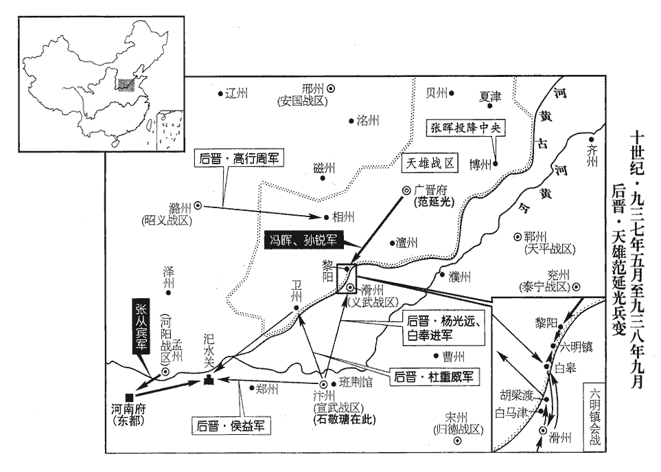
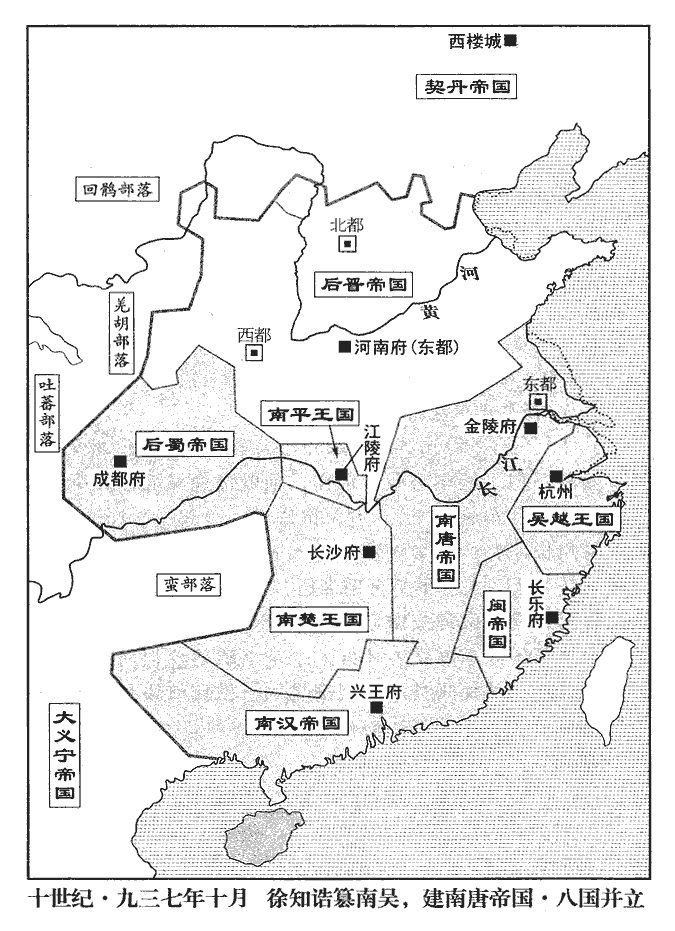
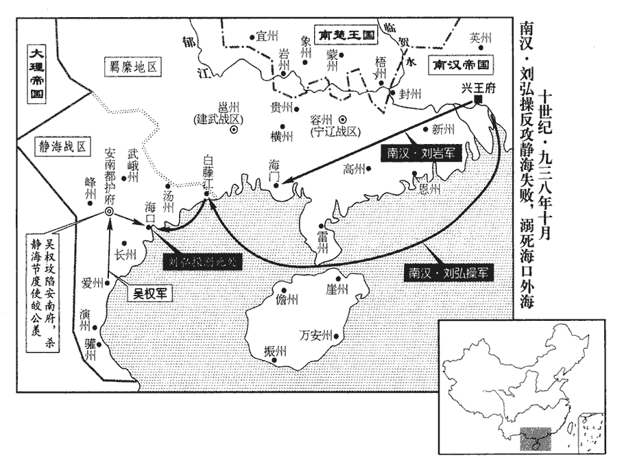
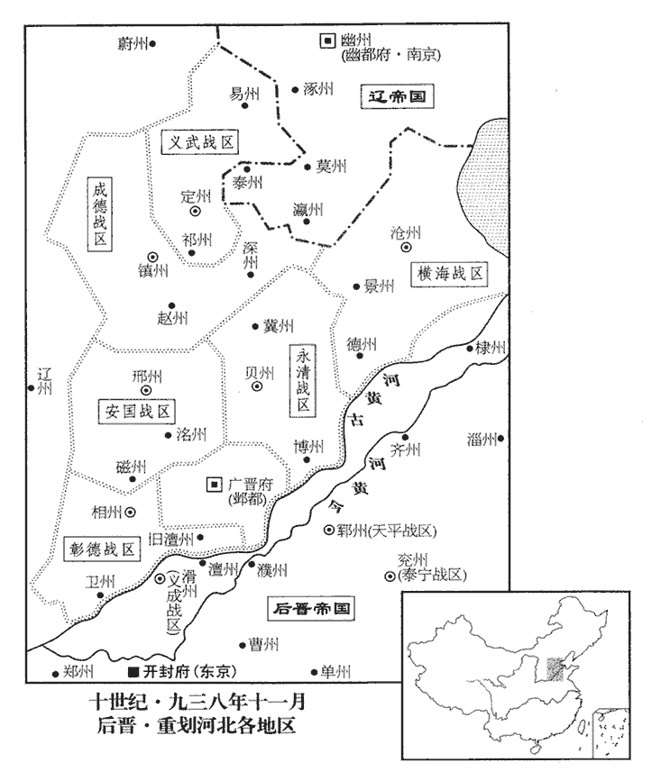

 後晉紀二起強圉作噩（丁酉），盡著雍閹茂（戊戌），凡二年。

# 高祖聖文章武明德孝皇帝上之下

## 天福二年（丁酉、九三七）

1春，正月，乙卯‹二›，日有食之。考異曰：實錄：「正月甲寅朔，乙卯日食。」十國紀年：「蜀乙卯朔日食。」蓋晉人避三朝日食而改曆耳。

〖译文〗 [1]春季，正月，乙卯（初二），出现日食。

2‹后晋，首都河南府河南省洛阳市›石敬瑭，本年四十六岁詔以前北面招收指揮使安重榮此以在晉陽圍城中所授安重榮軍職言也，故曰前。重，直龍翻。為成德‹总部设镇州河北省正定县›節度使，時祕瓊自為成德留後，以安重榮代之。以祕瓊為齊州‹山东省济南市›防禦使。祕，姓也，漢、魏之間有南安祕宜。遣引進使王景崇諭瓊以利害。重榮與契丹將趙思溫偕如鎮州，瓊不敢拒命。畏契丹也。丙辰‹三›，重榮奏已視事。為安重榮以成德反張本。景崇，邢州‹河北省邢台市›人也。

〖译文〗 [2]后晋高祖石敬瑭下诏，任用前北面招收指挥使安重荣为成德节度使，任用秘琼为齐州防御使。派遣引进使王景崇去给秘琼讲明利害。安重荣与契丹将领赵思温相偕来到镇州，秘琼不敢拒绝接受命令。丙辰（初三），安重荣上奏称已经视事。王景崇是邢州人。

3契丹‹首都西楼城内蒙古巴林左旗›以幽州‹北京市›為南京。‹《辽史·太宗纪》：在此同时，又把首都西楼城改名上京临潢府›歐史曰：以幽州為燕京。參考趙思溫為留守事，則南京為是。

〖译文〗 [3]契丹把幽州做为南京。

4李崧、呂琦逃匿於伊闕‹河南省洛阳市南›民間。帝‹石敬瑭›以始鎮河東‹总部太原府›，崧有力焉，德之；李崧議以帝鎮河東，事見二百七十八卷唐明宗長興三年。亦不責琦。李崧、呂琦建和契丹以制河東之議，見上卷上年三月。乙丑‹十二›，以琦為祕書監；丙寅‹十三›，以崧為兵部侍郎、判戶部。

〖译文〗 [4]李崧、吕琦逃匿在伊阙民间。后晋高祖认为开始镇守河东时，李崧推举有功，心里感激他；也不责备吕琦。乙丑（十二日），任用吕琦为秘书监；丙寅（十三日），任用李崧为兵部侍郎、判理户部。

5初，天雄‹总部设广晋府河北省大名县›節度使兼中書令范延光微時，有術士張生語之云：語，牛倨翻。「必為將相。」延光既貴，信重之。延光嘗夢蛇自臍入腹，以問張生，張生曰：「蛇者龍也，帝王之兆。」延光由是有非望之志。唐潞王素與延光善，及趙德鈞敗，延光自遼州‹山西省左权县›引兵還魏州，趙德鈞敗見上卷上年閏十一月。范延光屯遼州見上年十月；其還魏州亦必在閏十一月。雖奉表請降，降，戶江翻。內不自安，以書潛結祕瓊，欲與之為亂；瓊受其書不報，延光恨之。瓊將之齊‹山东省济南市›，過魏境，延光欲滅口，且利其貨，遣兵邀之於夏津‹山东省夏津县›，殺之。為范延光以魏反，復以貨為楊光遠所殺張本。夏津，古鄃縣，唐天寶元年更名夏津，屬貝州；宋以夏津屬北京，在京東北二百五十里。夏，戶雅翻。丁卯‹十四›，延光奏稱夏津捕盜兵誤殺瓊；帝不問。

〖译文〗 [5]从前，天雄节度使兼中书令范延光微贱时，有个术士张生对他说：“您将来必定做将相。”范延光贵显后，很信任器重他。范延光曾经梦见蛇从肚脐钻入腹中，便把这件事询问张生，张生说：“蛇就是龙，是当帝王的兆头。”范延光从此有了非份之想。后唐潞王李从珂素来与范延光友善，等到赵德钧败亡后，范延光从辽州领兵返归魏州，虽然他向晋高祖上表请降，内心很不自安，他写信暗中勾结秘琼，想同他一起作乱；秘琼接信后不作回答，范延光很怨恨他。秘琼将要去齐州就任，经过魏州境内，范延光想灭口，并且贪爱他的财货，便派兵在夏津阻挡他，把他杀了。丁卯（十四日），范延光秦称夏津捕捉强盗，士兵误杀秘琼，后晋高祖不作究问。

6戊寅‹二十五›，以李崧為中書侍郎、同平章事，充樞密使，桑維翰兼樞密使。時晉新得天下，藩鎮多未服從；或雖服從，反仄不安。兵火之餘，府庫殫竭，民間困窮，而契丹徵求無厭。厭，於鹽翻。維翰勸帝推誠棄怨以撫藩鎮，卑辭厚禮以奉契丹，訓卒繕兵以脩武備，務農桑以實倉廩，通商賈以豐貨財。數年之間，中國稍安。史言桑維翰有益於石晉草創之初者如此。賈，音古。

〖译文〗 [6]戊寅（二十五日），高祖任用李崧为中书侍郎、同平章事，充枢密使，高祖任用桑维翰兼枢密使。当时，后晋新得天下，藩镇大多还没有服从；或者虽然服从，但是还反复不安定。战争焚掠之余，官家府库中的金帛财物已经支用净尽，民间生活困难贫穷，而契丹又征调索求没完没了。桑维翰劝说晋高祖要诚心诚意、放弃前怨，来安抚各地藩镇；用谦卑的言词和丰厚的献礼，来结好于契丹；训练士卒、修缮兵器，来完善武备力量；勤务农桑生产，来充实仓储；通畅商贾贸易，来交流丰富财货。几年之间，中国就会稍见安定。

7吳‹首都江都府江苏省扬州市›太子璉納齊王知誥女為妃。璉，力展翻。

〖译文〗 [7]吴国太子杨琏娶了齐王徐知诰的女儿做妃子。

知誥始建太廟、社稷，改金陵‹江苏省南京市›為江寧府，先是，吳以昇州為金陵府，今復更名。牙城曰宮城，廳堂曰殿；以左•右司馬宋齊丘、徐玠為左•右丞相，馬步判官周宗、內樞判官黟yī‹安徽省黟县›人周廷玉為內樞使。黟，漢縣，唐屬歙州。九域志：在州西一百五十三里。黟，顏師古音伊，劉昫音䃜。自餘百官皆如吳朝之制。朝，直遙翻。置騎兵八軍，步兵九軍。

〖译文〗 徐知诰开始修建太庙、社稷祭坛、更改金陵为江宁府，牙城称作宫城，府中的厅堂称为殿；委任左、右司马宋齐丘和徐为左、右丞相，马步判官周宗、内枢判官黟县人周廷玉为内枢使。其余百官，都和吴国的制度一样。置建骑兵八个军，步兵九个军。

8二月，吳主‹杨溥，本年三十八岁›以盧文進為宣武‹总部设汴州河南省开封市›節度使，宣武軍汴州，時屬晉，吳以盧文進遙領耳。兼侍中。

〖译文〗 [8]二月，吴主杨溥任用卢文进为宣武节度使，兼任侍中。

9戊子‹五›，吳主使宜陽王璪如西都‹金陵府·江苏省南京市›，吳以金陵為西都見上卷上年。璪zǎo，子皓翻。冊命齊王；王受冊，赦境內。冊王妃曰王后。

〖译文〗 [9]戊子（初五），吴主让宜阳王杨去西都金陵，册命齐王；齐王徐知诰接受册命，在辖境以内实行大赦，册立王妃称作王后。

10吳越王元瓘‹首都杭州浙江省杭州市›钱元瓘（钱传瓘）本年五十一岁之弟順化‹总部设楚州江苏省淮安市›節度使、同平章事元珦獲罪於元瓘，廢為庶人。錢元珦得罪之始見二百七十八卷唐明宗長興四年。珦，音向。

〖译文〗 [10]吴越王钱元的弟弟顺化节度使、同平章事钱元得罪了钱元，被废黜为庶民。

11契丹主‹耶律德光，本年三十六岁›自上黨‹潞州州政府所在县·山西省长治市›過雲州‹山西省大同市›，大同節度使沙彥珣出迎，契丹主留之，不使還鎮。節度判官吳巒在城中，謂其眾曰：「吾屬禮義之俗，安可臣於夷狄乎！」眾推巒領州事，閉城不受契丹之命，契丹攻之，不克。應州‹山西省应县›馬軍都指揮使金城‹应州州政府所在县›郭崇威亦恥臣契丹，挺身南歸。漢之金城，唐蘭州五泉縣是也。唐之金城，漢為枝陽縣地，涼置廣武郡，隋廢郡為廣武縣，唐乾元二年更曰金城，屬蘭州。按此非蘭州之金城，乃應州之金城縣也。唐明宗生於代北之金鳳城，及即位，以其地置金城縣，仍置應州，治焉。郭崇威蓋以土人為本鎮都將。又匈奴須知云：應州東至幽州八百五十里；金城縣東北至朔州八百里。如須知所云，應州與金城縣似為兩處，南北風馬牛不相及，未能審其是，又當從涉其地者問之。挺，拔也。

〖译文〗 [11]契丹主耶律德光从上党北上经过云州时，大同节度使沙彦出城迎接，契丹主把他留下，不让回镇所。节度判官吴峦在城中，对他的下属将士说：“我们属于有礼义之俗的国家，怎么可以做夷狄的臣民啊！”众人推举吴峦领导全州的事务，关上城门不接受契丹的命令，契丹兵攻城，攻不下来。应州马军都指挥使金城人郭崇威也耻于向契丹称臣，挺身南归。

契丹主過新州‹河北省涿鹿县›，命威塞‹总部设新州›節度使翟璋斂犒軍錢十萬緡。初，契丹主阿保機強盛，室韋‹内蒙古东北部›、奚‹滦河上游›、霫‹辽河以北›皆役屬焉。翟，直格翻，又徒歷翻，姓也。犒，苦到翻。霫，似入翻。奚王去諸苦契丹貪虐，帥其眾西徙媯州‹河北省怀来县›，帥，讀曰率。依劉仁恭父子，號西奚。東奚居琵琶川；西奚徙媯州，依北山而居。去諸卒，子掃剌立。剌，來達翻；下拽剌同。唐莊宗滅劉守光，賜掃剌姓李名紹威。紹威娶契丹逐不魯之姊。逐不魯獲罪於契丹，奔紹威，紹威納之；契丹怒，攻之，不克。紹威卒，子拽剌立。拽，戶結翻。及契丹主德光自上黨北還，還，從宣翻，又如字。拽剌迎降，降，戶江翻。時逐不魯亦卒，契丹主曰：「汝誠無罪，掃剌、逐不魯負我。」皆命發其骨，磑而颺之。磑wèi，五對翻，䃺mò也，今人謂之磨。颺，余章翻。諸奚畏契丹之虐，多逃叛。契丹主勞翟璋曰：「當為汝除代，令汝南歸。」勞，力到翻。為，于偽翻。己亥‹十六›，璋表乞徵詣闕。既而契丹遣璋將兵討叛奚、攻雲州，有功，留不遣璋，璋鬱鬱而卒。

〖译文〗 契丹主经过新州，命令威塞节度使翟璋收集犒劳军队的钱十万缗。以前，契丹主耶律德光的父亲契丹太祖耶律阿保机强盛，室韦、奚、都成为他的属地而为其役使。奚王去诸苦于契丹的贪求和虐待。带领他的属众向西迁徙到妫州，依附于刘仁恭父子，号称西奚。去诸死后，他的儿子扫剌继立。后唐庄宗讨灭刘守光时，赐给扫剌姓李，名绍威。李绍威娶了契丹逐不鲁的姐姐。逐不鲁得罪了契丹，投奔李绍威，李绍威接纳了他；契丹发怒，攻打他，没有攻下来。李绍威死后，子拽剌继立。等到契丹主耶律德光从上党北归时，拽剌迎接并投降于他，当时逐不鲁也死了，契丹主耶律德光说：“你实在是没有罪过的，扫剌、逐不鲁有负于我。”便令人把二人的尸骨挖掘出来，磨碎后加以散扬。各处奚人畏惧契丹的暴虐，很多都叛离逃走。契丹主慰劳翟璋说：“我一定找人替代你的职务，让你回到南朝。”己亥（十六日），翟璋上表后晋朝廷，请求召他回朝。没有多久，契丹派遣翟璋领兵去讨伐叛变的奚人，进攻云州，有功劳，便把他留下，不让他回去，最后翟璋郁郁而死。

張礪自契丹逃歸，為追騎所獲，契丹主責之曰：「何故捨我去？」對曰：「臣華人，飲食衣服皆不與此同，生不如死，願早就戮。」契丹主顧通事高彥英曰：「吾常戒汝善遇此人，契丹置通事以主中國人，以知華俗、通華言者為之。宋白曰：契丹主腹心能華言者目曰通事，謂其洞達庶務。何故使之失所而亡去？若失之，安可復得邪！」復，扶又翻。笞彥英而謝礪。礪事契丹主甚忠直，遇事輒言，無所隱避，契丹主甚重之。史言契丹主知重儒者。

〖译文〗 翰林学士张砺从契丹逃归南方，被追赶的契丹骑兵抓获，契丹主责备他说：“你为什么离我而去？”张砺回答说：“我是中原人，饮食、衣服都同此地不一样，活着还不如死了，我愿意您早日把我杀了。”契丹主对着翻译高彦英说：“我常常告诫你要优厚地对待这个人，你为什么让他流离失所而逃走？如果失去他，还能到哪里去获得这样的人！”便笞打高彦英而向张砺道歉。张砺侍奉契丹主很是忠心和直率，遇到问题往往进言，没有什么隐藏和躲避的，契丹主很器重他。

12初，吳越王鏐少子元㺷xù少，詩照翻。㺷，思聿翻。考異曰：晉高祖實錄、十國紀年作「元球」，今從吳越備史、九國志。數有軍功，數，所角翻。鏐賜之兵仗。及吳越王元瓘立，元㺷為土客馬步軍都指揮使【章：十二行本「使」下有「靜江節度使」五字；乙十一行本同；孔本同；張校同。】兼中書令，恃恩驕橫，橫，戶孟翻。增置兵仗至數千，國人多附之。元瓘忌之，使人諷元㺷請輸兵仗，出判溫州‹浙江省温州市›，元㺷不從。銅官廟吏告元㺷遣親信禱神，求主吳越‹首都杭州›江山；又為蠟丸從水竇出入，與兄元珦謀議。蠟丸者，蠟彈書也，作書以蠟丸其外。三月，戊午‹五›，元瓘遣使者召元㺷宴宮中，既至，左右稱元㺷有刃墜於懷袖，即格殺之；并殺元珦。元珦被幽見二百七十八卷唐明宗長興四年。元瓘欲按諸將吏與元珦、元㺷交通者，其子仁俊諫曰：「昔光武克王郎，曹公破袁紹，皆焚其書疏以安反側，光武事見三十九卷漢更始二年。曹公事見六十四卷獻帝建安五年。今宜效之。」元瓘從之。

〖译文〗 [12]以前，吴越王钱的小儿子钱元，多次建立军功，钱赐给他护从用的兵仗。等到吴越王钱元继立后，钱元被任命为土客马步军都指挥使兼中书令。他依恃恩宠而骄傲蛮横，增设兵仗达数千人，国中的人常常依附他。钱元猜忌他，让人去劝钱元自己请求捐献兵仗，出朝去判理温州，钱元不干。铜官庙的司管官员告发钱元派亲信去向神祈祷，求神让他做吴越江山的君主；又告发他制作蜡丸从水洞流进流出，与他哥哥钱元密谋策划。三月，戊午（初五），钱元派使者召唤钱元到宫中赴宴，到达后，宫中左右的人声称钱元身上有刀坠挂在怀袖里边，就把他捉拿杀了；同时杀了钱元。钱元还要查究将吏中与钱元、钱元有交往沟通的人。他的儿子钱仁俊劝谏他说：“昔日东汉光武帝打败王莽，三国时曹操破了袁绍，都把他们的往来书信烧了，用以平息出现反叛和倾覆，现在，我们也应该效法他们。”钱元听从了这个意见。

13或得唐潞王‹李从珂›膂及髀骨獻之，庚申‹七›，詔以王禮葬於徽陵‹李嗣源墓，在河南省洛阳市›南。唐閔帝之葬從徽陵，封纔數尺，見者悲之。潞王葬於徽陵南，見者莫之悲也，豈非人心之公是非邪！

〖译文〗 [13]有人得到后唐潞王李从珂自焚后的脊骨和髋骨，拿来进献，庚申（初七），后晋高祖下诏，用王礼葬于徽陵之南。

14帝遣使詣蜀‹首都成都府四川省成都市›告即位，且敘姻好；蜀主孟知祥與帝皆後唐之主壻，蜀主娶晉王克用姪女，帝娶明宗女，與蜀後主兄弟行也，故敘姻好。好，呼到翻。蜀主‹孟昶（孟仁赞）本年十九岁›復書，用敵國禮。

〖译文〗 [14]后晋高祖遣派使者到蜀国去通告自己即位的事，并且叙述姻亲之好；蜀后主孟昶用对待平等国家的礼节回了信。

15范延光聚卒繕兵，悉召巡內刺史集魏州‹广晋府河北省大名县›，天雄軍巡內有貝‹河北省清河县›、博‹山东省聊城市›、衛‹河南省卫辉市›、澶‹河南省内黄县东南›，相‹河南省安阳市›五州刺史。將作亂。會帝謀徙都大梁‹汴州州政府所在城·河南省开封市›，桑維翰曰：「大梁北控燕、趙，南通江、淮，水陸都會，資用富饒。今延光反形已露，大梁距魏不過十驛，唐制，三十里一驛。十驛，三百里。彼若有變，大軍尋至，所謂疾雷不及掩耳也。」丙寅‹十三›，下詔，託以洛陽漕運有闕，東巡汴州。

〖译文〗 [15]范延光聚集兵马、修理兵器，把他管辖下的刺史全部召集到魏州，将要作乱造反。适逢后晋高祖打算迁都到大梁，桑维翰说：“大梁北控燕、赵，南通江、淮，是水陆两路都会，物资和财用都很富饶。现在范延光的谋反迹象已经显露出来，大梁距离魏州不过十个驿站那么远，他那边如果发生变故，大军很快就可过来，真是像俗话所说的‘迅雷不及掩耳’一样啊！”丙寅（十三日），下诏，托言洛阳漕运不足，东巡汴州。

16吳徐知誥立子景通為王太子；固辭不受。追尊考忠武王溫曰太祖武王，妣明德太妃李氏曰王太后。壬申‹十九›，更名誥。更，工衡翻。徐知誥去名上「知」字，單名「誥」，示不與徐氏兄弟同也。

〖译文〗 [16]吴国齐王徐知诰册立他的儿子徐景通为王太子；徐景通坚决辞谢不接受。徐知诰又追尊他的父亲忠武王徐温为太祖武王，他的母亲明德太妃李氏为王太后。壬申（十九日），更改自己的名字为诰。

17庚辰‹二十七›，帝發洛陽，留前朔方節度使張從賓為東都‹河南府›巡檢使。

〖译文〗 [17]庚辰（二十七日），后晋高祖从洛阳出发东巡，留下前朔方节度使张从宾为东都巡检使。

18漢主‹首都兴王府广东省广州市›刘岩，本年四十九岁以疾愈，大赦。

〖译文〗 [18]南汉主刘龚因为生病痊愈，实行大赦。

19交州將皎公羨殺安南‹越南河内市›節度使楊廷藝而代之。長興二年楊廷藝得交州，見唐明宗紀。皎，姓也。

〖译文〗 [19]交州将领皎公羡杀安南节度使杨廷艺并取而代之。

20夏，四月，丙戌‹四›，帝至汴州；丁亥‹五›，大赦。

〖译文〗 [20]夏季，四月，丙戌（初四），后晋高祖到达汴州；丁亥（初五），实行大赦。

21吳越王元瓘復建國，如同光故事。元瓘之初立，罷建國，事見二百七十八卷唐明宗長興三年。丙申‹十四›，赦境內，立其子弘僔為世子。僔zǔn，子損翻。以曹仲達、沈崧、皮光業為丞相，鎮海‹总部杭州›節度判官林鼎掌教令。

〖译文〗 [21]吴越王钱元恢复建国，如同后唐庄宗同光时期一样。丙申（十四日），在辖境以内实行大赦，册立他的儿子钱弘为世子。任用曹仲达、沈崧、皮光业为丞相，镇海节度判官林鼎掌管教令。

22丁酉‹十五›，加宣武‹总部汴州›節度使楊光遠兼侍中。

〖译文〗 [22]丁酉（十五日），后晋朝廷加封宣武节度使杨光远兼任侍中。

23閩主‹首都长乐府福建省福州市›王继鹏（王昶）作紫微宮，飾以水晶，土木之盛倍於寶皇宮。唐明宗長興二年閩主璘作寶皇宮。又遣使散詣諸州，伺人隱慝。慝，吐得翻。

〖译文〗 [23]闽主王修建紫微宫，用水晶做装饰，土木工程的盛大，加倍于宝皇宫。又派出使者分散到所辖各州，暗中侦查人们所隐匿的事情。

24五月，吳徐誥用宋齊丘策，欲結契丹以取中國，遣使以美女、珍玩泛海脩好，好，呼到翻。契丹主亦遣使報之。

〖译文〗 [24]五月，吴国齐王徐诰采用宋齐丘的计谋，想要勾结契丹来取得对中原的统治，遣派使者用美女、珍玩宝货从海上送去以修好，契丹主耶律德光也遣派使者回报他。

25丙辰‹五›，敕權署汴州牙城曰大寧宮。時御史臺奏：「汴州在梁有京都之號，及唐莊宗廢為宣武軍，至明宗行幸時，掌事者脩葺衙城，遂掛梁時宮殿門牌額，當時識者或竊非之。一昨車駕省方，暫居梁苑，衙城內齋閤牌額一如明宗行幸之時，無都號而有殿名，恐非典據。竊尋秦、漢以來，鑾輿所至，多立宮名。隋於揚州立江都宮，太原立汾陽宮，岐州立仁壽宮，唐於太原立晉陽宮，同州立長春宮，岐州立九成宮，宮中殿閤，皆題署牌額，以準皇居。請依故事，於汴州衙城門權掛一宮門牌額，則其餘齋閤並可取便為名。」敕：「行闕宜以大寧宮為名。」

〖译文〗 [25]丙辰（初五），后晋高祖下敕令：暂时把汴州的牙城署名为大宁宫。

26壬申‹二十一›，進范延光爵臨清郡王，以安其意。

〖译文〗 [26]壬申（二十一日），后晋朝廷进爵范延光为临清郡王，用来安抚他的心意。

27追尊四代考妣為帝后。按五代會要：高祖璟諡靖祖孝安皇帝，妣秦氏諡元皇后；曾祖郴諡肅祖孝簡皇帝，妣安氏諡恭皇后；祖昱諡睿祖孝平皇帝，妣米氏諡獻皇后；考紹雍諡獻祖孝元皇帝，妣何氏諡懿皇后。若以前史謂皇考名臬niè捩liè雞推之，則四世之名，意皆有司所撰者也。己卯‹二十八›，詔太社所藏唐室罪人首聽親舊收葬。初，武衛上將軍婁繼英嘗事梁均王，為內諸司使，至是，請其首而葬之。唐藏梁均王首於太社見二百七十二卷莊宗同光元年。史為婁繼英請而不克葬張本。

〖译文〗 [27]后晋高祖追尊四代父母为皇帝和皇后。己卯（二十八日），下诏，太庙所藏唐室罪人的首级听由其亲属故旧加以收葬。当初，武卫上将军娄继英曾经臣事后梁均王朱友，任内诸司使，到这时，请求收殓均王的首级以便埋葬。

28六月，吳諸道副都統徐景遷卒‹徐知诰次子，年十九岁›。

〖译文〗 [28]六月，吴国诸道副都统徐景迁去世。

29范延光素以軍府之政委元隨左都押牙孫銳，銳恃恩專橫，橫，戶孟翻。符奏有不如意者，對延光手裂之。會延光病經旬，銳密召澶州‹河南省内黄县东南›刺史馮暉，與之合謀逼延光反；澶，時連翻。延光亦思張生之言，張生之言見上正月。遂從之。

〖译文〗 [29]范延光向来把军府的政事委任给元随左都押牙孙锐办理，孙锐依恃恩宠而独断专横，符文奏章有不如意的当着范延光的面便把它撕碎了。适逢范延光患病已十多天，孙锐暗中召唤澶州刺史冯晖，同他合谋逼迫范延光造反；范延光也思念术士张生的话，便依从了他们。

甲午‹十三›，六宅使張言奉使魏州還，言延光反狀；義成‹总部滑州河南省滑县›節度使符彥饒奏延光遣兵渡河，焚草市；時天下兵爭，凡民居在城外，率居草屋以成市里，以其價廉功省，猝遇兵火不至甚傷財以害其生也。此草市在滑州城外。詔侍衛馬軍都指揮使、昭信‹总部设虔州江西省赣州市›節度使白奉進將千五百騎屯白馬津‹滑州古黄河南岸渡口›以備之。白馬津在滑州白馬縣。奉進，雲州人也。丁酉‹十六›，以東都巡檢使張從賓為魏府西南面都部署。戊戌‹十七›，遣侍衛都軍使楊光遠侍衛都軍使，即侍衛諸軍都指揮使。將步騎一萬屯滑州。己亥‹十八›，遣護聖都指揮使杜重威將兵屯衛州‹河南省卫辉市›。五代會要曰：天福六年改成德兩軍為護聖左右軍。據此，則此時已有護聖軍矣。重威，朔州‹山西省朔州市›人也，尚帝妹樂平長公主。長，知兩翻。范延光以馮暉為都部署，孫銳為兵馬都監，將步騎二萬循河西抵黎陽口‹河南省浚县南古黄河渡口›。黎陽在魏州西南，故循河西上而後至。辛丑‹二十›，楊光遠奏引兵踰胡梁渡‹滑州古黄河北岸›。此即史思明所濟胡良渡也，在滑州北岸澶州界。薛史：天福六年，詔以胡梁渡月城為大通軍，浮橋為大通橋。

〖译文〗 甲午（十三日），六宅使张言奉晋高祖之命出使魏州回朝，奏言范延光造反的情况；义成节度使符彦饶奏报范延光派兵渡过黄河，焚烧了以草屋为居的滑州城外市里；下诏命令侍卫马军都指挥使、昭信节度使白奉进率领一千五百骑兵屯驻白马津，用来加强防备。白奉进是云州人。丁酉（十六日），任命东都巡检使张从宾为魏府西南面都部署。戊戌（十七日），遣派侍卫都军使杨光远统领步兵、骑兵一万人屯驻滑州。己亥（十八日），遣派护圣都指挥使杜重威统兵屯驻卫州。杜重威是朔州人，娶的妻子是晋高祖的妹妹乐平长公主。范延光任用冯晖为都部署，孙锐为兵马都监，统领步兵、骑兵二万人，沿着黄河西岸到达黎阳口。辛丑（二十日），杨光远奏报：率兵过了胡梁渡。

30以翰林學士、禮部侍郎和凝為端明殿學士。凝署其門不通賓客。前耀州‹陕西省耀县›團練推官襄邑‹河南省睢县›張誼襄邑縣屬宋州。九域志：在大梁東南一百七十里。至書于凝，以為「切近之職為天子耳目，宜知四方利病，奈何拒絕賓客！雖安身為便，如負國何！」凝奇之，薦於桑維翰，未幾，除左拾遺。幾，居豈翻。誼上言：「北狄有援立之功，宜外敦信好，好，呼到翻。內謹邊備，不可自逸，以啟戎心。」帝深然之。

〖译文〗 [30]后晋高祖任用翰林学士、礼部侍郎和凝为端明殿学士。和凝在他家的大门上贴出通告，不迎接宾客。前耀州团练推官襄邑人张谊给和凝写信，认为“切近朝廷的职位是天子的耳目，应该知道四方的利和弊，怎么能拒绝宾客！虽然对自己不受干扰是方便了，但亏负了国家的付托可怎么好！”和凝很惊奇，把他推荐给桑维翰，没多久，被任用为左拾遗。张谊上书说：“北狄契丹有援助立朝的功劳，应该表面上与他敦信修好，内部要认真加强边境上的戒备，不能自己放松警惕，因而开启他的兴兵侵犯之心。”后晋高祖感到讲得很正确。

31契丹攻雲州，半歲不能下。吳巒遣使間道奉表求救，帝為之致書契丹主請之，間，古莧翻。陘北諸州皆歸契丹，故間道南來。為，于偽翻。契丹主乃命翟璋解圍去。帝召巒歸，以為武寧‹总部设徐州江苏省徐州市›節度副使。

〖译文〗 [31]契丹进攻云州，半年也攻不下来。守将吴峦派人从便道紧急奉表朝廷求救，后晋高祖为他给契丹主写信提出请求，契丹主便下令翟璋解围而去。后晋高祖把吴峦召唤回来，任用他为武宁节度副使。

32丁未‹二十六›，以侍衛使楊光遠為魏府四面都部署，侍衛使即侍衛都軍使，史從省文也。張從賓為副部署兼諸軍都虞候，昭義‹总部潞州›節度使高行周將本軍屯相州‹河南省安阳市›，為魏府西面都部署。相州在魏州之西，使高行周自潞州將兵屯相州，以臨范延光。

〖译文〗 [32]丁未（二十六日），后晋高祖任命侍卫使杨光远为魏府四面都部署，张从宾为副部署兼诸军都虞侯，昭义节度使高行周统领本军屯驻相州，为魏府西面都部署。

軍士郭威舊隸劉知遠，當從楊光遠北征，自大梁而征魏州為北征。薛史周紀：郭威初事李繼韜；繼韜誅，配從馬直。晉祖領副侍衛；召置麾下，因而得事漢祖。白知遠乞留。人問其故，威曰：「楊公有姦詐之才，無英雄之氣，得我何用？能用我者其劉公乎！」為郭威為劉知遠佐命張本。

〖译文〗 军士郭威原来隶属于刘知远，应当随从杨光远北征，他向刘知远说明要求留下。人们问他为什么，郭威说：“杨公有奸诈之才，无英雄之气，得到我有什么用处？能用我的大概就是刘公啊！”

33詔張從賓發河南兵數千人擊范延光。河南兵，河南府兵也。張從賓時為洛陽巡檢使，故使發之。延光使人誘從賓，誘，音酉。從賓遂與之同反，殺皇子河陽‹总部设孟州河南省孟州市›節度使重信‹年二十岁›，重，直龍翻；下重乂同。使上將軍張繼祚知河陽留後。繼祚，全義之子也。張全義自唐末尹河南，歷唐、梁。從賓又引兵入洛陽，殺皇子權東都‹河南府›留守重乂‹年十九岁›，以東都副留守、都巡檢使張延播知河南府事，從軍。【章：十二行本「軍」作「賓」；乙十一行本同；孔本同。】張從賓雖以張延播知河南府事，不使之在府治事，而使之從軍。取內庫錢帛以賞部兵；留守判官李遐不與，兵眾殺之。從賓引兵扼汜水關‹河南省荥阳市汜水镇西›，汜水關以縣名關，即虎牢關也。詳見辯誤。將逼汴州。詔奉國都指揮使侯益帥禁兵五千會杜重威討張從賓；帥，讀曰率。又詔宣徽使劉處讓自黎陽‹河南省浚县›分兵討之。時羽檄縱橫，從官在大梁者無不恟懼，羽檄縱橫，言軍書紛委也。從官家屬皆留東都，而從駕在汴，根本已拔，故恟懼也。縱，子容翻。從，才用翻。恟，許拱翻。獨桑維翰從容指畫軍事，從，千容翻。神色自若，接對賓客，不改常度，眾心差安。史言桑維翰能以整暇鎮物。

〖译文〗 [33]后晋高祖下诏，命令张从宾派数千河南兵出击范延光。范延光让人去诱劝张从宾，张从宾便同范延光一起造反，杀了任河阳节度使的皇子石重信，让上将军张继祚主持河阳留后的事务，张继祚是张全义的儿子。张从宾又率领兵马进入洛阳，杀了暂时代理东都留守的皇子石重又，任用东都副留守、都巡检使张延播主持河南府事务，跟随军队行动。又调取内库的钱帛用来犒赏部兵；留守判官李遐不给，兵众把他杀了。张从宾带兵扼守汜水关，将要逼近汴州。后晋高祖下诏奉国都指挥使侯益率领五千禁兵会合杜重威去征讨张从宾；又诏宣徽使刘处让从黎阳分兵讨伐他。当时，军书往来纷繁，随从晋高祖在大梁的官员没有不烦扰惊恐的，只有桑维翰从容指挥军事，神色自若，接待应对宾客不改正常规范，众人见了心里略觉平静。

34方士言於閩主‹首都长乐府福建省福州市›王继鹏（王昶），云有白龍夜見螺峰‹福建省福州市北›；見，賢遍翻。螺，盧戈翻。閩主作白龍寺。時百役繁興，用度不足，閩主謂吏部侍郎、判三司候官‹福建省闽侯县东南侯官城›蔡守蒙曰：後漢置東候官縣，隋廢入閩縣，唐復置候官縣，屬福州。九域志：治州郭下。「聞有司除官皆受賂，有諸？」對曰：「浮議無足信也。」閩主曰：「朕知之久矣，今以委卿，擇賢而授，不肖及罔冒者勿拒，罔冒，謂欺罔偽冒而求官者。以事理之所無而欺上，謂之罔；假他人之所有以飾偽，謂之冒。第令納賂，籍而獻之。」守蒙素廉，以為不可；閩主怒，守蒙懼而從之。自是除官但以貨多少為差。為蔡守蒙以賣官受誅張本。閩主又以空名堂牒使醫工陳究賣官於外，堂牒，即今人所謂省劄。空名者，未書所授人名，既賣之得錢而後書填。空，苦貢翻。專務聚斂，無有盈厭。斂，力贍翻。厭，於鹽翻，又如字。又詔民有隱年者杖背，隱口者死，逃亡者族。果菜雞豚，皆重征之。

〖译文〗 [34]有方士对闽主王言称，有条白龙夜间出现在螺峰，闽主便兴建了白龙寺。当时，各种劳役接连不断，资金用度很不充足，闽主对吏部侍郎、判三司侯官人蔡守蒙说：“听说有关部门委任官员都接受贿赂，有这样的事吗？”回答说：“流言蜚语不足为信。”闽主说：“朕知道此事已经很久了，现在把授官任职的事情，委托给你办理，要选择授给贤能的人，不称职和假冒顶替的人也不要拒绝，只是让他们纳贿，立籍造册而加以举荐。”蔡守蒙素称廉洁，认为不能这样办；闽主发怒，蔡守蒙害怕，便依从了。从此任用官员就凭纳钱多少来分差等。闽主又让医工陈究用空白不填名姓的委任牒文在外面卖官，专门从事搜刮民财，没有满足，贪得无厌。又下诏民间如有隐瞒年龄者用刑杖笞背，隐瞒人口者处死，逃亡者诛杀全族。果、菜、鸡、猪，都征收重税。

35秋，七月，張從賓攻汜水，殺巡檢使宋廷浩。帝戎服，嚴輕騎，將奔晉陽以避之。桑維翰叩頭苦諫曰：「賊鋒雖盛，勢不能久，請少待之，不可輕動。」帝乃止。史言桑維翰有膽略，晉朝倚以為社稷之固。少，詩沼翻。

〖译文〗 [35]秋季，七月，张从宾攻打汜水，杀巡检使宋廷浩。后晋高祖穿着军装，整备轻骑，准备奔向晋阳避躲。桑维翰叩头苦苦谏阻说：“贼兵的锋芒虽然强盛，其势不能持久，请少等待一下，不可轻率动移。”后晋高祖这才留止未动。

36范延光遣使以蠟丸招誘失職者，右武衛上將軍婁繼英、右衛大將軍尹暉在大梁，溫韜之子延濬、延沼、延袞居許州，皆應之。尹暉舉軍降潞王以得節鎮，今居環衛，則為散官。溫韜自唐明宗時受誅，其諸子廢棄；而婁繼英子婦溫延沼女也，繼英亦居冗散，故皆應延光。延光令延濬兄弟取許州，聚徒已及千人。繼英、暉事泄，皆出走。壬子‹二›，敕以延光姦謀，誣汙忠良，自今獲延光諜人，賞獲者，殺諜人，汙，烏故翻。諜，達協翻。禁【章：十二行本「禁」作「焚」；張校同。】蠟書，勿以聞。不欲知所招誘主名，所以安反側也。暉將奔吳，為人所殺。繼英奔許州，依溫氏。忠武節度使萇從簡盛為之備，延濬等不得發，欲殺繼英以自明，延沼止之，遂同奔張從賓。繼英知其謀，勸從賓執三溫，皆斬之。

〖译文〗 [36]范延光派遣使者用蜡丸密书招诱失职的人，右武卫上将军娄继英、右卫大将军尹晖在大梁，温韬的儿子温延浚、延沼、延兖居留在许州，都响应范延光而造反。范延光命令温延浚兄弟夺取许州，聚集徒众已达千人。娄继英、尹晖因为事情泄露，都逃走了。壬子（初二），晋高祖下敕书，认为范延光施用奸谋，诬陷玷污忠良，从今以后，抓获范延光的间谍，奖赏抓获的人，杀死间谍，焚烧蜡书，不必上报。尹晖将要投奔吴国，被人所杀。娄继英投奔许州，依附了温氏兄弟。忠武节度使苌从简以重兵防备他们，温延浚等不敢发作，想杀了娄继英以表白自己，温延沼阻止了他，便一同投奔了张从宾。娄继英知道了他们的阴谋，劝张从宾捉获温家三兄弟，都把他们杀了。

37白奉進在滑州，是年六月遣白奉進屯白馬。白馬，滑州治所也。軍士有夜掠者，捕之，獲五人，其三隸奉進，其二隸符彥饒，奉進皆斬之；彥饒以其不先白己，甚怒。明日，奉進從數騎詣彥饒謝，彥饒曰：「軍中各有部分，分，扶問翻。奈何取滑州軍士并斬之，殊無客主之義乎！」符彥饒自以鎮滑州為主，白奉進屯滑州為客。奉進曰：「軍士犯法，何有彼我！僕已引咎謝公，而公怒不解，豈非欲與延光同反邪！」拂衣而起，彥饒不留；帳下甲士大譟，擒奉進，殺之。從騎走出，大呼於外，諸軍爭擐甲操兵，諠譟不可禁止。從，才用翻。呼，火故翻。擐，音宦。操，七刀翻。奉國左廂都指揮使馬萬惶惑不知所為，帥步兵欲從亂，遇右廂都指揮使盧順密帥部兵出營，帥，讀曰率。厲聲謂萬曰：「符公擅殺白公，必與魏城通謀。此去行宫纔二百里，魏城，謂魏州城也。時范延光據魏州反。九域志：滑州南至大梁二百里。時帝在大梁。吾輩及軍士家屬皆在大梁，奈何不思報國，乃欲助亂，自求族滅乎！今日當共擒符公，送天子，立大功。軍士從命者賞，違命者誅，勿復疑也！」復，扶又翻。萬所部兵尚有呼躍者，呼，火故翻。順密殺數人，眾莫敢動。萬不得已從之，與奉國都虞候方太等共攻牙城，執彥饒，令太部送大梁。甲寅‹四›，敕斬彥饒於班荊館，左傳，楚伍舉與聲子相善，伍舉出奔，聲子遇於鄭郊，班荊相與食而言。杜預註曰：班，布也；布荊坐地共議。以「班荊」名館，取諸此也。此館必在汴州郊外。其兄弟皆不問。按符存審諸子皆有材氣，而彥卿又為一時名將。彥饒不能馭下，倉猝成亂，兄弟初不通謀，罪不相及，古法也。

〖译文〗 [37]白奉进在滑州，有军士在夜间进行抢掠的，便捕捉他们，抓获了五个人，其中三个是白奉进的下属，两个是符彦饶的下属，白奉进把他们都杀了；符彦饶因为他没有先告诉自己，非常恼怒。第二天，白奉进带着几个随从骑兵来拜见符彦饶表示道歉。符彦饶说：“军中各有分属，为什么抓了滑州的军士一起杀了，连一点主人和客人的名份都不顾了！”白奉进说：“军士犯了法，怎能分你和我！我已经承担责任来向您道歉，而您还是发怒不止，这岂不成了想与范延光共同造反吗！”一甩袖子起身要走，符彦饶不挽留；帐下甲兵大为喧闹，捉住白奉进，把他杀了。白奉进的随从骑兵走出营帐，在外边大声呼喊，各方军队争着穿铠甲、手执武器，吵嚷之声不能禁止。奉国左厢都指挥使马万惶惑不知怎么办，率领步兵想跟着暴乱，正好遇上右厢都指挥使卢顺密率领本部人马出营，厉声对马万说：“符公擅自杀了白公，必定与魏城通谋。这里离天子行宫才二百里，我们这些人和军士的家属都在大梁，为什么不思报效国家，反而要帮助乱兵，自取灭族吗！现在我们应当共同捉拿符公，送交天子，立大功。军士服从命令的奖赏，违背命令的诛杀，不要再有什么疑虑！”马万所部士兵还有呼喊跳跃的，卢顺密杀了几人，众人就不敢乱动了。马万不得已跟从着他，与奉国都虞候方太等共同攻打牙城，抓住符彦饶，命令方太送往大梁。甲寅（初四），后晋高祖敕令在班荆馆斩杀了符彦饶，对于他的兄弟们都没有究问。

楊光遠自白皋‹河南省滑县北古黄河西岸渡口›引兵趣滑州，趣，七喻翻。士卒聞滑州亂，欲推光遠為主。光遠曰：「天子豈汝輩販弄之物！晉陽之降出於窮迫，謂在晉安寨殺張敬達而降也，事見上卷上年。降，戶江翻。今若改圖，真反賊也。」其下乃不敢言。時魏‹天雄总部·河北省大名县›、孟‹河阳总部·河南省孟州市›、滑‹义成总部·河南省滑县›三鎮繼叛，魏，范延光。孟，張從賓。滑，符彥饒。人情大震，帝問計於劉知遠，對曰：「帝者之興自有天命。陛下昔在晉陽，糧不支五日，俄成大業。今天下已定，內有勁兵，北結強虜，強虜，謂契丹。鼠輩何能為乎！願陛下撫將相以恩，臣請戢士卒以威；戢jí，則立翻。恩威兼著，京邑自安，本根深固，則枝葉不傷矣。」知遠乃嚴設科禁，科，條也。宿衛諸軍無敢犯者。有軍士盜紙錢一幞fú，幞，逢玉翻，釋云：帊pà也。主者擒之，主者，紙錢之主也。左右請釋之，知遠曰：「吾誅其情，不計其直。」竟殺之。唐法，治盜計贓定罪。劉知遠嚴刑以威眾，欲鎮服其心以折亂萌，非可常行於平世也。由是眾皆畏服。

〖译文〗 杨光远从白皋领兵向滑州进军，士卒听说滑州动乱，想推举杨光远为君主。杨光远说：“天子岂是你们这等人所玩弄的物体！当年我在晋阳的投降是出于穷迫无奈，现在如果改变图谋，那就真是反贼了。”他的部下才不敢再说。当时，魏、孟、滑三镇相继叛变，人情大为震动，后晋高祖向刘知远询问怎么办，回答说：“帝王的兴起，自有天命。陛下当年在晋阳，粮食不足支持五天，转眼成就了大业。现在，天下已经平定，内有强盛的兵力，向北团结强大的胡虏，这些反叛的鼠辈能够干出什么来呢！愿陛下用恩德来安抚将相，我替您收敛士卒的威风，恩威兼施，京都自然会安定，树干和树根深固了，那么枝条和叶就不会受伤了。”刘知远便严格建立科罚禁犯的条令，宿卫京城的诸军没有敢违犯的。有个军士偷盗纸钱一幞，被其主人抓获，左右的人请求放了他，刘知远说：“我是按事情的情况来诛杀他的，不计较它的多少。”居然把他杀了，从此众军士都畏服。

乙卯‹五›，以楊光遠為魏府行營都招討使、兼知行府事，以昭義‹总部潞州›節度使高行周為河南尹、東京留守，「京」，當作「都」。以杜重威為昭義節度使、充侍衛馬軍都指揮使，以侯益為河陽節度使。侯益與杜重威同討張從賓，就命鎮河陽。帝以滑州奏事皆馬萬為首，擢萬為義成節度使。就以滑帥賞馬萬。晉、漢之間，有白再榮因亂而帥成德，馬萬之類也。丙辰‹六›，以盧順密為果州‹四川省南充市›團練使，果州時屬蜀，命盧順密遙領團練使。方太為趙州‹河北省赵县›刺史；既而知皆順密之功也，更以順密為昭義留後。更，工衡翻。時杜重威領昭義節以討張從賓，故以盧順密為留後。

〖译文〗 乙卯（初五），后晋高祖任命杨光远为魏府行营都招讨使、兼理行府事务，任用昭义节度使高行周为河南尹、东京留守，任用杜重威为昭义节度使、充当侍卫马军都指挥使，任用侯益为河阳节度使。后晋高祖因为滑州奏事都以马万为首，便提升马万为义成节度使。丙辰（初六），任用卢顺密为果州团练使，方太为赵州刺史；不久得知平定滑州都是卢顺密的功绩，便改任卢顺密为昭义留后。

馮暉、孫銳引兵至六明鎮‹河南省浚县西南›，六明鎮在胡梁渡北。光遠引之渡河，半渡而擊之，暉、銳眾大敗，多溺死，斬首三千級，暉、銳走還魏。

〖译文〗 冯晖、孙锐带领兵马到了六明镇，杨光远引诱他们渡河，渡了一半就袭击他们，尹晖、孙锐的兵众大败，很多人淹死水中，有三千人被斩杀，尹晖和孙锐逃回魏州。

杜重威、侯益引兵至汜水，遇張從賓眾萬餘人，與戰，俘斬殆盡，遂克汜水。從賓走，乘馬渡河，溺死；溺，奴狄翻。獲其黨張延播、繼祚、婁繼英，送大梁，斬之，滅其族。符彥饒、張從賓等皆死，馮暉、孫銳又敗，范延光之勢孤且衂nǜ矣。史館脩撰李濤上言，張全義有再造洛邑之功，事見二百五十七卷唐僖宗光啟三年。乞免其族，乃止誅繼祚妻子。濤，回之族曾孫也。李回，唐武宗會昌中為相。

〖译文〗 杜重威、侯益领兵到达汜水，遇到张从宾的兵众一万多人，同他们交战，几乎全部俘获斩尽，便攻克了汜水。张从宾逃走，乘马渡河，结果被淹死了；俘获他的党羽张延播、张继祚、娄继英，押送到大梁，把他们杀了，诛灭了他的家族。史馆修撰李涛上书奏言，张继祚的父亲张全义有再造洛阳的功劳，请求赦免他的族人，便只诛杀了张继祚的妻子。李涛是李回的族曾孙

38詔東都‹河南府›留守司百官悉赴行在‹汴州·河南省开封市›。張從賓既平，然後洛都留司百官得赴行在，自是遂定都大梁。

〖译文〗 [38]后晋高祖下诏：东都留守司的百官全部迁赴行在。

39楊光遠奏知博州‹山东省聊城市›張暉舉城降。博州，范延光巡屬也。

〖译文〗 [39]杨光远奏报，主管博州事务的张晖带领全城投降。

40安州‹湖北省安陆市›威和指揮使王暉五代會要：唐有威和、拱宸內直軍，晉天福六年改為興順左、右軍。聞范延光作亂，殺安遠‹总部设安州湖北省安陆市›節度使周瓌，瓌，古回翻。自領軍府，欲俟延光勝則附之，敗則渡江奔吳。帝遣右領軍上將軍李金全將千騎如安州巡檢，許赦王暉為唐州‹河南省唐河县›刺史。

〖译文〗 [40]安州威和指挥使王晖听说范延光作乱，杀了安远节度使周，自己统领军府，打算等待范延光胜利就依附他，如果他败了就渡过长江投奔吴国。后晋高祖派遣右领军上将军李金全带领一千骑兵到安州去巡视检查，答应赦免王晖的罪，并任用他为唐州刺史。

41范延光知事不濟，歸罪於孫銳而族之，孫銳勸范延光反見上六年。遣使奉表待罪。戊寅‹二十八›，楊光遠以聞，帝不許。

〖译文〗 [41]范延光知道造反的事不能成功了，便归罪于孙锐，把他的全族人杀了，派出使者到后晋朝廷上表等待治罪。戊寅（二十八日），杨光远报告了朝廷，后晋高祖不准许。

 

42吳同平章事王令謀如金陵‹江苏省南京市›勸徐誥受禪，誥讓不受。

〖译文〗 [42]吴国同平章事王令谋到金陵劝徐诰接受吴主的禅让，继位当皇帝，徐诰辞让不接受。

43山南東道‹总部设襄州湖北省襄樊市›節度使安從進恐王暉奔吳，遣行軍司馬張朏fěi將兵會復州‹湖北省天门市›兵於要路邀之。朏，敷尾翻。邀其自復州而奔吳鄂州之路也。暉大掠安州，將奔吳，部將胡進殺之。八月，癸巳‹十三›，以狀聞。李金全至安州，將士之預於亂者數百人，金全說諭，悉遣詣闕；說，式芮翻。既而聞指揮使武彥和等數十人挾賄甚多，伏兵于野，執而斬之。彥和且死，呼曰：呼，火故翻。「王暉首惡，天子猶赦之；我輩脅從，何罪乎！」帝雖知金全之情，掩而不問。

〖译文〗 [43]山南东道节度使安从进担心王晖投奔吴国，派行军司马张领兵会合复州兵在冲要路上阻挡他。王晖在安州大肆抢掠后将要投奔吴国，部将胡进杀了他。八月，癸巳（十三日），把情况报告了朝廷。李金全到达安州，将士中有几百人参预动乱，李金全谕告他们，都让他们到京城去阙门诣见等待发落；接着，听说指挥使武彦和等数十人挟带行贿的财物很多，便在野外埋伏士兵把他们捉住杀了。武彦和临死前高声喊着说：“王晖是首恶，天子还把他赦免了，我们这些人都是胁从的，有什么罪！”后晋高祖虽然知道李金全的情况，把事情掩盖起来，不加究问。

44吳歷陽公濛知吳將亡，甲子‹十四›，【章：十二行本「子」作「午」；乙十一行本同；張校同。】殺守衛軍使王宏；宏子勒兵攻濛，濛射殺之。濛被囚見二百七十九卷唐潞王清泰元年。射，而亦翻。以德勝‹总部设庐州安徽省合肥市›節度使周本吳之勳舊，引二騎詣廬州，欲依之。九域志：和州西至廬州五百三十里。本聞濛至，將見之，其子弘祚固諫，本怒曰：「我家郎君來，何為不使我見！」弘祚合扉不聽本出，門闢則兩扉開，門闔則兩扉合。使人執濛于外，送江都‹江苏省扬州市›。徐誥遣使稱詔殺濛于采石‹安徽省马鞍山市西南›，迎而殺之，不使得至江都。追廢為悖逆庶人，絕屬籍。絕楊氏屬籍。悖，蒲內翻，又蒲沒翻。侍衛軍使郭悰殺濛妻子於和州‹安徽省和县›，誥歸罪於悰，貶池州‹安徽省贵池市›。悰，徂宗翻。

〖译文〗 [44]吴国历阳杨公知道吴国快要败亡了，甲午（十四日），杀了守卫他的军使王宏；王宏的儿子带领兵卒攻击杨，杨射杀了他。因为德胜节度使周本是吴国有功勋的旧臣，便带领两个骑兵来到庐州，想依托于他。周本听说杨来了，将要会见他，他的儿子周弘祚坚决劝阻，周本发怒说：“我家的少主来了，为什么不让我见他！”周弘祚关上门不让周本出去，并让人在外边把杨抓起来，送往江都。徐诰派使者称吴主下诏，在采石杀了杨，并把他追废为“悖逆庶人”，灭绝了杨氏属籍。侍卫军使郭在和州把杨的妻子杀了，徐诰归罪于郭，把他贬移到池州。

45乙巳‹二十五›，赦張從賓、符彥饒、王暉之黨，未伏誅者皆不問。

〖译文〗 [45]乙巳（二十五日），后晋高祖赦免了张从宾、符彦饶、王晖的党羽，没有被杀的都不再问罪。

梁、唐以來，士民奉使及俘掠在契丹者，悉遣使贖還其家。

〖译文〗 后梁，后唐以来，士民中因为奉派出使或被俘掠而在契丹的，全部派人把他们赎回送回家中。

46吳司徒、門下侍郎、同平章事、內樞使、忠武‹总部设许州河南省许昌市›節度使王令謀忠武軍許州，時屬晉，吳以王令謀遙領節鎮耳。老病無齒，或勸之致仕，令謀曰：「齊王‹徐知诰›大事未畢，吾何敢自安！」疾亟，亟，紀力翻。力勸徐誥受禪。是月，吳主下詔，禪位于齊。李德誠復詣金陵帥百官勸進，宋齊丘不署表。宋齊丘以受禪之議不自己發，而為周宗等所先，遂堅持異議，欲以為名。復，扶又翻。帥，讀曰率。九月，癸丑‹四›，令謀卒。王令謀所見誠不可與王琨同日語也。

〖译文〗 [46]吴国司徒、门下侍郎、同平章事、内枢使、忠武节度使王令谋年老有病，连牙齿都没有了，有人劝他退休，王令谋说：“齐王的大事还没完成，我怎么敢自图安逸！”病得快死了，还极力劝说徐诰接受吴主让位。就在这个月里，吴主杨溥下诏书，把帝位禅让给齐王徐诰。李德诚再次到金陵率领百官劝进，宋齐丘不在劝进表上署名。九月，癸丑（初四），王令谋去世。

47甲寅‹五›，以李金全為安遠節度使。為李金全外叛張本。

〖译文〗 [47]甲寅（初五），后晋高祖任用李金全为安远节度使。

48婁繼英未及葬梁均王而誅死，婁繼英求葬梁均王，見上五月。詔梁故臣右衛上將軍安崇阮與王故妃郭氏葬之。

〖译文〗 [48]娄继英没有来得及安葬后梁钧王朱友就被杀死，后晋高祖下诏后梁旧臣右卫上将军安崇阮与均王旧妃郭氏把他安葬了。

49丙寅‹十七›，吳主命江夏王璘奉璽綬于齊。楊行密據有江、淮，傳渥、隆演，至溥而亡。璘，離珍翻。璽，斯氏翻。綬，音受。冬，十月，甲申‹五›，齊王誥‹徐知诰，本年五十岁›即皇帝位于金陵，大赦，改元昇元，國號唐。徐誥自以本李氏之子，既舉大號，欲纂唐緒，故改國號為唐。為復李姓張本。追尊太祖武王曰武皇帝。猶不敢忘徐溫而追尊之。其後立李氏宗廟，遂以徐溫為義祖。乙酉‹六›，遣右丞相玠，玠，徐玠也。奉冊詣吳主，稱受禪老臣誥謹拜稽首上皇帝尊號曰高尚思玄弘古讓皇，宮室、乘輿，服御皆如故，宗廟、正朔、徽章、服色悉從吳制。乘，繩證翻。丁亥‹八›，立徐知證為江王，徐知諤為饒王。知證、知諤皆徐溫之子，於誥為弟。以吳太子璉領平盧‹总部设青州山东省青州市›節度使、兼中書令，封弘農公。

〖译文〗 [49]丙寅（十七日），吴主杨溥命江夏王杨奉献皇帝的国玺和绶带给齐王。冬季，十月，甲申（初五），齐王徐诰在金陵即皇帝位，实行大赦，改年号为升元，国号唐。追尊他的父亲太祖武王徐温称武皇帝。乙酉（初六），遣派右丞相徐奉送上尊号的册文去进诣吴主杨溥，称言受禅老臣诰谨拜稽首上皇帝尊号为高尚思玄弘古让皇，宫室、乘舆、服御都照旧，宗庙、正朔、徽章、服色都仍按吴国制度。丁亥（初八），册立徐知证为江王，徐知谔为饶王。任用吴太子杨琏领职平卢节度使、兼中书令，封为弘农公。

唐主‹徐知诰›宴群臣於天泉閣，天泉閣，蓋因晉、宋時之天泉池故地起閣，因以為名。李德誠曰：「陛下應天順人，惟宋齊丘不樂。」樂，音洛。因出齊丘止德誠勸進書，考異曰：十國紀年云遺宗信書，令宗信諷止德誠勸進，而不云宗信何人。今但云止德誠勸進書。唐主執書不視，曰：「子嵩三十年舊交，必不相負。」齊丘頓首謝。子嵩，宋齊丘字也。通鑑，梁太祖乾化二年書齊丘謁知誥，署昇州推官，至是年二十六年；今曰三十年舊交，蓋乾化二年署推官，而謁知誥又在乾化二年之前也。

〖译文〗 南唐国主徐诰在天泉阁宴请群臣，李德诚奏称：“陛下应天顺人，只有宋齐丘不愉快。”因而把宋齐丘阻止李德诚劝进的信拿出来作为证明，南唐主拿着这封信而不看，并说：“子嵩是我三十年的老朋友，必定不会负我。”宋齐丘顿首拜谢。

 

己丑‹十›，唐主‹徐知诰›表讓皇‹杨溥›改東都‹江都，江苏省扬州市›宮殿名，皆取於仙經。唐都金陵，以江都為東都。讓皇常服羽衣，習辟穀術。辛卯‹十二›，吳宗室建安王珙等十二人皆降爵為公，而加官增邑。降王為公，所以示易姓；加官增邑，所以慰其心。珙，居勇翻。丙申‹十七›，以吳同平章事張延翰及門下侍郎張居詠、中書侍郎李建勳並同平章事。讓皇以唐主上表，致書辭之；唐主表謝而不改。

〖译文〗 己丑（初十），南唐主上表让皇，请求更改东都江都的宫殿名称，都是从神仙经书中取名的。让皇经常穿着道士羽衣，习练辟谷修仙的法术。辛卯（十二日），吴国宗室建安王杨珙等十二人都降爵为公，但加授了官职并增了食邑，以示安慰。丙申（十七日），南唐主任用吴国前同平章事张延翰及门下侍郎张居咏、中书侍郎李建勋都任同平章事。让皇因为南唐主仍用上表的形式，写信表示不能接受，南唐主上表致谢，但仍不改变。

丁酉‹十八›，加宋齊丘大司徒。齊丘雖為左丞相，不預政事，心慍懟，慍，於運翻。懟，直類翻。聞制詞云「布衣之交」，抗聲曰：「臣為布衣時，陛下為刺史；唐主為昇州‹南京市›刺史，見二百六十六卷梁太祖乾化二年。今日為天子，可以不用老臣矣。」還家請罪，唐主手詔謝之，亦不改命。久之，齊丘不知所出，乃更上書請遷讓皇於他州，及斥遠吳太子璉，絕其婚；唐主不從。遠，于願翻。宋齊丘之心迹至是畢露。吾觀唐主之心，豈特疏之而已，蓋惡而欲遠之不能也。

〖译文〗 丁酉（十八日），南唐主加授宋齐丘为大司徒。宋齐丘虽然任左丞相，但不能参预政事，心里怨怒，听说南唐主所作词中称是“布衣之交”，便抗辩说：“我当老百姓时，陛下是刺史，现在当了天子，可以不用老臣了。”回家请求治罪，南唐主手诏向他致谢，但也不再改变授官命令。时间长了，宋齐丘不知怎么办为好，便上书建议把让皇行移到其他州府，并疏远吴太子杨琏，断绝与他的婚姻；南唐主没有听从他的意见。

乙巳‹二十六›，立王后宋氏為皇后。戊申‹二十九›，以諸道都統判元帥府事景通為諸道副元帥、判六軍諸衛事、太尉、尚書令、吳王。

〖译文〗 乙巳（二十六日），南唐主册立王后宋氏为皇后，戊申（二十九日），任命诸道都统、判元帅府事徐景通为诸道副元帅、判六军诸卫事、太尉、尚书令、吴王。

50閩主‹王继鹏›命其弟威武‹总部长乐府›節度使繼恭上表告嗣位于晉‹石敬瑭›，且請置邸于都下。閩與中國絶見二百七十七卷唐明宗長興三年。

〖译文〗 [50]闽主王命令他的弟弟威武节度使王继恭向后晋朝廷上表报告他继承了闽国的君位，并且请求在闽国都建置府邸。

51十一月，乙卯‹六›，唐‹首都金陵府›吳王景通更名璟。更，工衡翻。璟，俱永翻。

〖译文〗 [51]十一月，乙卯（初六），南唐吴王徐景通改名为。

唐主‹徐知诰›賜楊璉妃號永興公主；妃聞人呼公主則流涕而辭。漢之孝平后、周之天元后與夫吳楊璉之妃，蓋異世而同轍也。宋白曰：永興縣本漢鄂縣地，陳置永興縣，唐屬鄂州。

〖译文〗 南唐主赐杨琏的妃子号为永兴公主，这位妃子听到别人称呼她为公主便流眼泪而推辞。

戊午‹九›，唐主立其子景遂為吉王，景達為壽陽公；以景遂為侍中、東都‹江都府·江苏省扬州市›留守、江都尹，帥留司百官赴東都。南唐倣盛唐兩都之制建東、西都，置留臺百司於江都。帥，讀曰率。

〖译文〗 戊午（初九），南唐主立他的儿子徐景遂为吉王，徐景达为寿阳公；任命徐景遂为侍中、东都留守、江都尹，率领留司百官到东都去。

52戊辰‹十九›，詔加吳越王元瓘天下兵馬副元帥，進封吳越國王。考異曰：實錄：「天福二年十一月，加元瓘副元帥、國王，程遜等為加恩使。四年十月丙午，以程遜沒于海，廢朝，贈官。」程遜傳云：「天福三年秋使吳越，使回溺死。」元瓘傳云：「天福三年封吳越國王。」蓋二年冬制下，遜等以三年至杭州，不知溺死在何年，而晉朝以四年十月始聞之也。吳越備史：「天福二年四月敕遣程遜等授王副元帥、國王。甲午，王即位，用建國之儀，如同光故事。是歲程遜還京，溺于海。」按元瓘初立，稱鏐遺命，止用藩鎮禮，明年明宗封吳王，應順初閔帝封吳越王，故以天福三年即王位，而備史以為授元帥、國王然後即位，誤矣。

〖译文〗 [52]戊辰（十九日），后晋高祖下诏，加任吴越王钱元为天下兵马副元帅，进封为吴越国王。

53安遠節度使李金全以親吏胡漢筠為中門使，軍府事一以委之。漢筠貪猾殘忍，聚斂無厭。斂，力贍翻。厭，於鹽翻。帝聞之，以廉吏賈仁沼代之，考異曰：薛史，「仁沼」作「仁紹」，今從實錄。且召漢筠，欲授以他職，庶保全功臣。漢筠大懼，始勸金全以異謀。乙亥‹二十六›，金全表漢筠病，未任行。任，音壬。金全故人龐令圖屢諫曰：「仁沼忠義之士，以代漢筠，所益多矣。」漢筠夜遣壯士踰垣滅令圖之族，又毒仁沼，舌爛而卒。漢筠與推官張緯相結，以諂惑金全，金全愛之彌篤。李金全叛奔南唐之計自是定矣。

〖译文〗 [53]安远节度使李金全任用亲信属吏胡汉筠为中门使，军府的事务全部委任他办理。胡汉筠贪猾残忍，搜刮贪求无厌。后晋高祖听说后，便任用清廉官吏贾仁沼代替了他，并且召回胡汉筠，准备授给他其他官职，以求保全功臣。胡汉筠很害怕，开始劝李金全作叛离的打算。乙亥（二十六日），李金全上表说胡汉筠病了，没有能受诏成行。李金全的老朋友庞令图多次劝谏他说：“贾仁沼是忠义之士，用他来代替胡汉筠，会增加很多好处。”胡汉筠夜里派遣强壮之人跳墙把庞令图的族人都杀了，又去对贾仁沼用毒，贾仁沼舌头烂掉而死。胡汉筠与推官张玮相勾结，共同谄媚惑乱李金全，李金全宠爱他更加深厚了。

十二月，戊申‹三十›，蜀‹首都成都府四川省成都市›大赦，改明年元曰明德。

〖译文〗 十二月，戊申（三十日），蜀国实行大赦，改明年年号为明德。

54詔加馬希範‹本年三十九岁›江南諸道都統，制置武平‹总部设朗州湖南省常德市›、靜江‹总部设桂州广西桂林市›等軍事。

〖译文〗 [54]后晋高祖下诏加马希范为江南诸道都统，下令设置武平、静江等事。

55是歲，契丹改元會同，國號大遼，公卿庶官皆倣中國，參用中國人，以趙延壽為樞密使，尋兼政事令。為遼人用趙延壽以圖晉張本。

〖译文〗 [55]这一年，契丹改年号为会同，国号大辽。公卿庶官的设置都仿效中原，并且参用中原人，任用赵延寿为枢密使，不久，又兼任政事令。

## 三年（戊戌、九三八）

1春，正月，己酉‹二›，日有食之。

〖译文〗 [1]春季，正月，己酉（初二），出现日食。

2唐‹南唐首都金陵府江苏省南京市›德勝‹总部设庐州安徽省合肥市›節度使兼中書令西平恭烈王周本以不能存吳，愧恨而卒。‹年七十七岁›周本雖不能存吳，然其過李德誠遠矣。

〖译文〗 [2]南唐德胜节度使兼中书令西平恭烈王周本因为不能保存吴国，愧恨而去世。

3丙寅‹十九›，唐‹徐知诰（李知诰）本年五十一岁›以侍中吉王景遂參判尚書都省。

〖译文〗 [3]丙寅（十九日），南唐主任用侍中吉王徐景遂参判尚书都省。

4蜀主‹首都成都府四川省成都市›孟昶（孟仁赞）本年二十岁以武信‹总部设遂州四川省遂宁市›節度使、同平章事張業為左僕射兼中書侍郎、同平章事、樞密使，武泰‹总部设黔州重庆市彭水县›節度使王處回兼武信節度使、同平章事。黔，邊於諸蠻；遂，蜀之內地也。以此為進律。

〖译文〗 [4]蜀主孟昶任用武信节度使、同平章事张业为左仆射兼中书侍郎、同平章事、枢密使，武泰节度使王处回兼任武信节度使、同平章事。

5二月，庚辰‹三›，左散騎常侍張允上駮赦論，駮，北角翻。以為：「帝王遇天災多肆赦，謂之脩德。借有二人坐獄遇赦，則曲者幸免，直者銜冤，冤氣升聞，聞，音問。乃所以致災，非所以弭災也。」詔褒之。帝‹石敬瑭，本年四十七岁›樂聞讜言，樂，音洛。讜，音黨。詔百官各上封事，命吏部尚書梁文矩等十人置詳定院以考之，無取者留中，可者行之。數月，應詔者無十人，乙未‹十八›，復降御札趣之。復，扶又翻。趣，讀曰促。

〖译文〗 [5]二月，庚辰（初三），后晋左散骑常侍张允上书《驳赦论》，他认为：“帝王遇到频繁的天灾便应实行大赦，称作修德。假设有两个人正在坐牢，遇上行赦，那就会出现不老实的人也能侥幸获免，而老实人却要含冤。冤气升闻于天，这正是所以招致天灾，而不是要消除天灾呵。”后晋高祖下诏褒奖他。后晋高祖乐于听取善言，下诏百官各上封书言事，命吏部尚书梁文矩等十人设置详定院来加以考核，无可取的留在中枢，有可取的就施行。几个月以后，应诏的不足十人。乙未（十八日），再一次颁下御札催促这件事。

6三月，丁丑‹三十›，敕禁民作銅器。初，唐世天下鑄錢有三十六冶，此謂後唐之世也。若盛唐之世，天下銅冶九十有餘所。丧乱以来，丧，息浪翻。皆廢絕，錢日益耗，民多銷錢為銅器，故禁之。

〖译文〗 [6]三月，丁丑（三十日），敕令禁止民间制作铜器。过去，后唐时期天下有三十六个冶铜所铸钱，丧乱以来，都已废绝了，而钱日益耗费，民众往往销毁钱来制作铜器，所以禁止它。

7中書舍人李詳上疏，以為「十年以來，赦令屢降，諸道職掌皆許推恩，而藩方薦論動踰數百，乃至藏典、書吏、優伶、奴僕，藏典，主帑藏之吏。藏，徂浪翻。初命則至銀青階，被服皆紫袍象笏，被，皮義翻。名器僭濫，貴賤不分。請自今諸道主兵將校之外，節度州聽奏朱記大將以上十人，節度州者，節度使所治之州。朱記大將者，不給銅印，給木朱記以為印信。他州止聽奏都押牙、都虞候、孔目官，自餘但委本道量遷職名而已。」量，音良。從之。

〖译文〗 [7]中书舍人李详上疏，他认为“十年以来，多次颁布郝令，对于诸道职掌都允许推广扩充，而各地藩镇的荐举动辄超过几百人，乃至管理帑藏的典吏、书吏、优伶、奴仆，开始任命就要授以银青阶，穿着都是紫色官服象牙笏板，以致名号和器物超越本分滥用，贵贱不能分辨。请求自今以后，除诸道主管军务的将校之外，节度州允许奏报不给铜印的木印朱记大将以上十个人，其他州只允许奏报都押牙、都虞候、孔目官，其余的人员只是委托本道酌量调迁职名罢了。”后晋高祖听从了这个意见。

8夏，四月，甲申‹七›，唐宋齊丘自陳丞相不應不豫政事，唐主‹徐知诰›答以省署未備。

〖译文〗 [8]夏季，四月，甲申（初七），南唐宋齐丘自己陈说丞相不应当不参预政事，南唐主答复说省署还没有准备好。

9吳讓皇‹杨溥›固辭舊宮，以既讓位於唐，不敢居江都宮。屢請徙居；李德誠等亦亟以為言。亟，去吏翻。五月，戊午‹十二›，唐主改潤州‹江苏省镇江市›牙城為丹楊宮，以李建勳為迎奉讓皇使。

〖译文〗 [9]吴国让皇坚决辞让，不住在旧宫，多次请求迁徙别处居住；李德诚等极力主张这样办。五月，戊午（十二日），南唐主把润州牙城改名为丹杨宫，任用李建勋为迎奉让皇使。

10楊光遠‹杨檀›自恃擁重兵，時范延光未平，晉之重兵皆在楊光遠之手。頗干預朝政，屢有抗奏，帝常屈意從之。為楊光遠請易置執政張本。庚申‹十四›，以其子承祚為左威衛將軍，尚帝女長安公主，次子承信亦拜美官，寵冠當時。冠，古玩翻。為楊光遠叛亂張本。

〖译文〗 [10]杨光远自恃拥有重兵，很是干预朝中政事，常常提出抗命的奏事，后晋高祖常屈意听从他。庚申（十四日），任命他的儿子杨承祚为左威卫将军，娶了后晋高祖女儿长安公主为妻，次子杨承信也拜受美好官职，恩宠为当时之冠。

11壬戌‹十六›，唐主以左宣威副統軍王輿為鎮海‹总部设润州›留後，客省使公孫圭為監軍使，親吏馬思讓為丹楊宮使，徙讓皇居丹楊宮。選用王輿等以防衛故吳主。

〖译文〗 [11]壬戌（十六日），南唐主任用左宣威副统军王舆为镇海留后，客省使公孙圭为监军使，亲近官吏马思让为丹杨宫使，把让皇迁徙到丹杨宫。

宋齊丘復自陳為左右所間，復，扶又翻。間，古莧翻。唐主大怒；齊丘歸第，白衣待罪。或曰：「齊丘舊臣，不宜以小過棄之。」唐主曰：「齊丘有才，不識大體。」乃命吳王璟持手詔召之。

〖译文〗 宋齐丘再次陈说自己被左右所间隔架空，南唐主大怒；宋齐丘回到自己府第，穿起白衣等待治罪。有人说：“齐丘是旧臣，不应因为小过失而把他抛弃。”南唐主说：“齐丘有才干，但是不识大体。”便让吴王徐拿着手诏召唤他。

六月，壬午‹七›，或獻毒酒方於唐主，唐主曰：「犯吾法者自有常刑，安用此為！」史言唐主斯言得君人之體。群臣爭請改府寺州縣名有吳及陽者，以吳者楊氏國號，而陽字與楊字同音也。留守判官楊嗣請更姓羊，留守判官，東都‹江都府·江苏省扬州市›留守判官也。徐玠曰：「陛下自應天順人，事非逆取，逆取，本之漢陸賈逆取順守之言。而諂邪之人專事改更，咸非急務，不可從也。」唐主然之。

〖译文〗 六月，壬午（初七），有人献毒酒方给南唐主，南唐主说：“违犯我法律的自有正常刑罚，要这个干什么！”群臣争着请求更改府寺州县的名称中有“吴”和“阳”字的，留守判官杨嗣请求改姓羊，徐说：“陛下自然是应天顺人的，事情不是有意抗逆的，而谄邪之人专门抓住这些事更改讨好，这都不是当务之急，不要听从他们。”南唐主认为很对。

12河南‹河南省洛阳市›留守高行周奏脩洛陽宮。丙戌‹十一›，左諫議大夫薛融諫曰：「今宮室雖經焚毀，猶侈於帝堯之茅茨；唐堯土階三尺，茅茨不翦。所費雖寡，猶多於漢文‹刘恒›之露臺。露臺事見漢文帝紀。況魏城‹河北省大名县›未下，謂范延光尚據魏州，楊光遠攻之未下也。公私困窘，窘，渠隕翻。誠非陛下脩宮館之日；俟海內平寧，營之未晚。」上納其言，仍賜詔褒之。

〖译文〗 [12]河南留守高行周奏请修缮洛阳宫，丙戌（十一日），左谏议大夫薛融进谏说：“现在的宫室虽然遭受焚烧毁坏，还是比帝尧的茅草宫殿奢侈得多；所修费用再少，也要多于汉文帝的露台。何况魏城尚未攻下来，公家、民众都处于困窘之中，真不是陛下修建宫馆的时候，等待海内平靖安宁，再经营这些也不为晚。”后晋高祖采纳了他的意见，仍然赐予褒奖的诏书。

13己丑‹十四›，金部郎中張鑄奏：「竊見鄉村浮戶，浮戶，謂未有土著定籍者；言其蓬轉萍流，不常厥居，若浮泛於水上然。非不勤稼穡，非不樂安居，樂，音洛。但以種木未盈十年，墾田未及三頃，似成生業，已為縣司收供傜役，責之重賦，威以嚴刑，故不免捐功捨業，更思他適。乞自今民墾田及五頃以上，三年外乃聽縣司傜役。」從之。

〖译文〗 [13]己丑（十四日），金部郎中张铸奏言：“我看到乡村中没有定籍的浮户，并非不愿勤劳于耕种庄稼，并非不愿乐业安居，只是因为他们种树还不到十年，垦田也不足三顷，将要成为生计之业时，就已被县里司管部门收起，要求供应徭役，要求交纳重赋，用严酷的刑罚震慑他们，因此，不免丢了劳绩，舍弃生业，另谋出路。请求允许：从今以后，民众垦田到五顷以上的，三年以后才听由县司徭役。”后晋高祖听从了这个意见。

14秋，七月，中書奏：「朝代雖殊，朝，直遙翻。條制無異。請委官取明宗‹李嗣源›及清泰‹李从珂›時敕，詳定可久行者編次之。」己酉‹四›，詔左諫議大夫薛融等詳定。

〖译文〗 [14]秋季，七月，中书奏言：“朝代虽然不同，条规制度没有变样。请朝廷委命专门官员选择明宗及清泰时期的敕令，详细审定可以长久施行的条规加以编排。”己酉（初四），后晋高祖诏命左谏议大夫薛融等详加审定。

15辛酉‹十六›，敕作受命寶，以「受天明命，惟德允昌」為文。以受命寶為潞王所焚故也。時中書門下奏：「准敕製皇帝受命寶，今按貞觀十六年太宗文皇帝刻之玄璽，白玉為螭首，其文曰：『皇帝受命，有德者昌。』」敕以「受天明命，惟德允昌」為文。按唐六典：受命寶，天子脩封禪，禮神祇則用之。

〖译文〗 [15]辛酉（十六日），后晋高祖敕令制作受命的宝玺，其文字用“受天明命，惟德允昌”。

16帝【章：十二行本「帝」上有「八月」二字；乙十一行本同；孔本同。】上尊號於契丹主‹首都临潢府内蒙古巴林左旗›耶律德光，本年三十七岁及太后‹述律平›，戊寅‹四›，以馮道為太后冊禮使，考異曰：周世宗實錄馮道傳云：「虜遣使加徽號於晉祖，晉亦獻徽號於虜。始命兵部尚書王權銜其命，權辭以老病。晉祖謂道曰：『此行非卿不可。』道無難色。」按晉高祖實錄：「天福三年八月戊寅，道為契丹太后冊禮使。十月戊寅，北朝命使上帝徽號。戊子，王權以不受北使，停任。」周世宗實錄誤也。左僕射劉煦為契丹主冊禮使，「煦」，本作「昫」。備鹵簿、儀仗、車輅，詣契丹行禮；契丹主大悅。帝事契丹甚謹，奉表稱臣，謂契丹主為「父皇帝」；每契丹使至，帝於別殿拜受詔敕。歲輸金帛三十萬之外，三十萬乃講和元約歲輸之數。吉凶慶弔，歲時贈遺，玩好珍異，相繼於道。遺，唯季翻。好，呼到翻。乃至應天太后‹述律平›、元帥太子‹耶律李胡（耶律阿保机的第三子）›、偉王‹耶律宛（耶律李胡的次子）›、南、北二王、韓延徽、趙延壽等諸大臣皆有賂；【章：十二行本「賂」下有「遺」字；乙十一行本同；孔本同；張校同。】小不如意，輒來責讓，帝常卑辭謝之。應天太后即契丹主母述律氏，應天之號蓋帝所上也。晉使者至契丹，契丹驕倨，多不遜語。使者還，以聞，還，從宣翻。朝野咸以為恥，而帝事之曾無倦意，以是終帝之世與契丹無隙。然所輸金帛不過數縣租賦，往往託以民困，不能滿數。其後契丹主屢止帝上表稱臣，但令為書稱「兒皇帝」，如家人禮。

〖译文〗 [16]后晋高祖给契丹国主耶律德光及述律太后上尊号，戊寅（疑误），任命冯道为太后册礼使，左仆射刘煦为契丹主册礼使，配备着卤簿、仪仗、车辂，送至契丹行礼；契丹主极为高兴。后晋高祖事奉契丹很恭谨，上表称臣，叫契丹主为“父皇帝”；每当契丹的使者来到，后晋高祖在别殿拜接契丹的诏书和敕令。每年除了要输送金帛三十万之外，各种吉凶庆吊，季节馈赠，玩好珍异，运送的车马接连于道路。而且对于述律太后、元帅太子、伟王、南王、北王、韩延徽、赵延寿等诸大臣都有贿赠；他们小有不如意的，便来责备、索取，后晋高祖往往用谦卑的语言谢罪。晋朝的使者到契丹，契丹骄横倨慢，语多不逊。使者回朝，向后晋高祖报告，朝廷内外都以为羞耻，而后晋高祖卑恭对待契丹，从来没有怠慢过，因此，整个后晋高祖在位的时期，同契丹没有发生过嫌隙。然而所输送的金帛，不过是几个县的田租赋税。往往托词说民间困乏，不能满额送到。后来，契丹主多次制止后晋高祖上表称臣，只叫他写信时自称“儿皇帝”，像家庭之间行礼一样。

初，契丹既得幽州‹北京市›，命曰南京，天福元年契丹始得幽州。以唐降將趙思溫為留守。思溫子延照在晉，帝以為祁州‹河北省无极县›刺史。唐昭宗景福三年，義武節度使王處存奏以定州無極、深澤二縣置祁州。思溫密令延照言虜情終變，請以幽州內附；帝不許。趙延照後遂入契丹，為契丹用。

〖译文〗 当初，契丹取得幽州后，命名为南京，任用后唐降将赵思温为留守。赵思温的儿子赵延照在后晋朝，后晋高祖任用他为祁州刺史。赵思温暗中让他的儿子赵延照上言后晋高祖说契丹的情况终必要变更，请求把幽州内附于后晋；后晋高祖不答应。

17契丹遣使詣唐，宋齊丘勸唐主‹徐知诰›厚賄之，俟至淮北，潛遣人殺之，欲以間晉。間，古莧翻。宋齊丘之意，以謂殺契丹使於晉境，則契丹主必謂晉人殺之而誚讓晉，此所以間之也。

〖译文〗 [17]契丹遣派使者到南唐，宋齐丘劝南唐主徐诰给他丰厚的贿赠，待到他回途行至淮河以北时，暗中派人杀了他，打算以此来离间契丹同后晋的关系。

18壬午‹八›，楊光遠奏前澶州‹河南省内黄县东南›刺史馮暉自廣晉‹河北省大名县›城中出戰，因來降，馮暉自澶州入廣晉與范延光同反，見上年六月。言范延光食盡窮困；己丑‹十五›，以暉為義成‹总部滑州›節度使。厚賞馮暉，欲以攜范延光之黨。

〖译文〗 [18]壬午（初八），杨光远奏报：前澶州刺史冯晖从广晋城中出战，乘机来投降，言说范延光在城中粮食用尽，情况穷困；己丑（十五日），后晋朝廷任用冯晖为义成节度使。

楊光遠攻廣晉，歲餘不下，楊光遠自去年六月攻范延光，七月破馮暉等，始進兵攻廣晉；今歲餘矣，而猶不下。唐莊宗即位，改魏州為興唐府；帝革命，改為廣晉。帝以師老民疲，遣內職朱憲入城諭范延光，內職，蓋宦者也。許移大藩，曰：「若降而殺汝，白日在上，吾無以享國。」延光謂節度副使李式曰：「主上重信，云不死則不死矣。」乃撤守備，然猶遷延未決。宣徽南院使劉處讓復入諭之，處，昌呂翻；下同。復，扶又翻。延光意乃決。九月，乙巳朔‹一›，楊光遠送延光二子守圖、守英詣大梁。己酉‹五›，延光遣牙將奉表待罪。壬子‹八›，詔書至廣晉，延光帥其眾素服於牙門，使者宣詔釋之。帥，讀曰率。朱憲，汴州‹河南省开封市›人也。

〖译文〗 杨光远攻打广晋，一年多攻不下来。后晋高祖因为师兴过久，百姓困疲，便派在内廷供职的宦者朱宪进入广晋城告谕范延光，答应调他镇守大的藩镇，并说：“如果在你投降后杀你，白日在上，我不能享有国家。”范延光对节度副使李式说：“主上是个看重信用的人，说不死就一定不会死的。”便撤下城中守备，然而还犹豫不决。宣徽南院使刘处让再次进城告谕他，范延光才决意投降。九月，乙巳朔（初一），杨光远把范延光的两个儿子范守图、范守英送往大梁。己酉（初五），范延光遣派牙将奉表朝廷等待治罪。壬子（初八），后晋高祖诏书来到广晋，范延光率领他的属众在牙门丧服迎接，使者宣读诏书将他释放。朱宪是汴州人。

19契丹遣使如洛陽，取趙延壽妻唐燕國長公主以歸。趙延壽妻，唐明宗女也。延壽入契丹，其妻留洛，今延壽在北用事，故來取之。長，知兩翻。

〖译文〗 [19]契丹遗派使者到洛阳，接赵延寿的妻子后唐明宗的女儿燕国长公主北归。

20壬戌‹十八›，唐太府卿趙可封請唐主復姓李，立唐宗廟。

〖译文〗 [20]壬戌（十八日），南唐太府卿赵可封请求南唐主徐诰恢复姓李，建立唐室宗庙。

21庚午‹二十六›，【嚴：「庚午」改「己巳」。】楊光遠表乞入朝；命劉處讓權知天雄軍府事。楊光遠之討范延光也，制令兼知天雄軍行府事，延光既降而光遠請入朝。時劉處讓奉詔入魏諭降延光，因使之權知軍府。己巳‹二十五›，【嚴：「己巳」改「庚午」。】制以范延光為天平‹总部设郓州山东省东平县›節度使，仍賜鐵券，賜鐵券者，恕其死而明之以信誓。應廣晉城中將吏軍民今日以前罪皆釋不問；今日謂制書到魏州之日也。其張從賓、符彥饒餘黨及自官軍逃叛入城者，亦釋之。延光腹心將佐李式、孫漢威、薛霸皆除防禦、團練使、刺史，牙兵皆升為侍衛親軍。

〖译文〗 [21]庚午（二十六日），杨光远上表请求入朝；命刘处让暂时主持天雄军府事。己巳（二十五日），后晋高祖下制令任用范延光为天平节度使。仍然赐给他铁券，答应广晋城中将吏军民在今日以前的罪行都释除不再究问；那些属于张从宾、符彦饶的余党以及从官军中逃叛入城的人，也都释放了。范延光的腹心将佐李式、孙汉威、薛霸都任用为防御、团练使、刺史，牙兵都升为侍卫亲军。

初，河陽行軍司馬李彥珣，邢州‹河北省邢台市›人也，父母在鄉里，未嘗供饋。後與張從賓同反，從賓敗，奔廣晉，去年六月張從賓反，踰月而敗。范延光以為步軍都監，使登城拒守。楊光遠訪獲其母，置城下以招之，彥珣引弓射殺其母。射，而亦翻。延光既降，帝‹石敬瑭›以彥珣為坊州‹陕西省黄陵县›刺史。近臣言彥珣殺母，殺母惡逆不可赦；律有十惡，殺父母者惡逆，恩赦之所不原。帝曰：「赦令已行，不可改也。」乃遣之官。

〖译文〗 以前，河阳行军司马李彦是邢州人，父母住在乡下，没有受过供养。后来，李彦与张从宾一同反叛，张从宾失败，投奔广晋。范延光任用他为步军都监，让他登城拒守。杨光远查访抓获他的母亲，置放在城下来招降李彦，李彦用弓箭把他的母亲射杀了。范延光投降后，后晋高祖任用李彦为坊州刺史。后晋高祖近臣言说李彦杀母的恶逆不可赦；后晋高祖说：“赦令已经施行，不能再改了。”便仍让他去赴任。

臣光曰：治國家者固不可無信。治，直之翻。然彥珣之惡，三靈所不容，三靈，謂天神、地祇、人鬼。晉高祖赦其叛君之愆，治其殺母之罪，何損於信哉！

〖译文〗 臣司马光曰：治理国家的人固然不可以不讲求信用。然而李彦的罪恶，天神地祗人鬼所不容。如果晋高祖赦了他背叛君主的过错，惩罚他杀母的罪行，有什么损害信用的呢！

22辛未‹二十七›，以楊光遠為天雄節度使。

〖译文〗 [22]辛未（二十七日），后晋高祖任用杨光远为天雄节度使。

23冬，十月，戊寅‹五›，契丹遣使奉寶冊，加帝尊號曰英武明義皇帝。

〖译文〗 [23]冬季，十月，戊寅（初五），契丹派遣使者奉献宝册，加尊后晋高祖为英武明义皇帝。

24帝以大梁舟車所會，便於漕運，丙辰‹七›，建東京於汴州，自此歷漢、周至宋，皆都于汴。梁建東都於汴州，以汴州為開封府。開平三年，割滑州之酸棗、長垣，鄭州之中牟、陽武，宋州之襄邑，曹州之戴邑，許州之扶溝、鄢陵，陳州之太康九縣，並隸開封府。唐同光二年詔以陽武、匡城、扶溝、考城四縣屬汴州，餘還故屬。匡城即長垣。天成元年扶溝復隸許州。至是，詔汴州宜升東京，仍升開封、浚儀兩縣為赤縣，其餘為畿縣。應舊置開封府所管屬縣並依舊割屬收管，亦升為畿縣。復以汴州為開封府，以東都‹河南府·河南省洛阳市›為西京，以西都‹京兆府·陕西省西安市›為晉昌軍節度。唐以長安為西都，以洛陽為東都。梁始都汴，以汴州為東京，洛陽為西京，而以長安為節鎮。後唐滅梁，復唐兩都之舊，而以汴州為節鎮。晉今復於汴州建東京開封府，以洛陽之東都為西京，以長安之西都為晉昌軍。

〖译文〗 [24]后晋高祖认为大梁是船车所汇聚的地方，便于漕运，丙辰（疑误），在汴州建立东京。又把汴州立为开封府，把东都洛阳立为西京，把西都长安归为晋昌军节度。

25帝遣兵部尚書王權使契丹謝尊號，權自以累世將相，恥之，王權，唐左僕射起之曾孫，父蕘官至右司郎中。起之先世播，相唐文宗。薛史：王起官至左僕射、山南西道節度使，冊贈太尉。謂人曰：「吾老矣，安能向穹廬屈膝！」乃辭以老疾。帝怒，戊子‹十五›，權坐停官。

〖译文〗 [25]后晋高祖派遣兵部尚书王权出使契丹表示对上尊号的谢意。王权以为自己累世任中原朝廷的将相，感到羞耻，对人说：“我已经老了，怎能向穹庐下跪！”便说年老有病，推辞不去。后晋高祖发怒，戊子（十五日），王权坐罪被停官。

26初，郭崇韜既死，郭崇韜死見二百七十四卷唐明宗天成元年。宰相罕有兼樞密使者。帝即位，桑維翰、李崧兼之，宣徽使劉處讓及宦官皆不悅。楊光遠圍廣晉，處讓數以軍事銜命往來，光遠奏請多踰分，數，所角翻。分，扶問翻。帝常依違，維翰獨以法裁折之。依違者，謂若依若違，無可否一定之說。折，之舌翻。光遠對處讓有不平語，處讓曰：「是皆執政之意。」光遠由是怨執政。范延光降，光遠密表論執政過失；光遠既平范延光，挾功邀上，以斥執政。帝知其故而不得已，加維翰兵部尚書，崧工部尚書，皆罷其樞密使；考異曰：竇貞固晉少帝實錄及薛史劉處讓傳云：「楊光遠入朝，遂於高祖前面言執政之失；乃罷維翰等樞密使，以處讓為之。」楊光遠傳云：「范延光降，光遠面奏維翰擅權；高祖以光遠方有功於國，乃出維翰領安陽，光遠為西京留守。」今按晉高祖實錄，天福三年十月壬辰，維翰、崧罷樞密使。庚子，光遠始入朝，對於便殿；十一月戊申，光遠為西京留守。天福四年閏七月壬申，維翰出為相州節度使。蓋處讓、光遠傳之誤。晉少帝實錄及薛史桑維翰傳敘光遠鎮洛陽後疏維翰出相州，是也。以處讓為樞密使。

〖译文〗 [26]以前，郭崇韬死后，宰相很少有兼任枢密使。后晋高祖即位，桑维翰、李崧兼任了，宣徽使刘处让和宦官都不高兴。杨光远围攻广晋时，刘处让几次以军事身份带着后晋高祖命令往来传达，杨光远奏请事情往往超越本份，后晋高祖常常不作可否，唯独桑维翰按法规加以裁定和批驳。杨光远为此对刘处让表示过不满，刘处让说：“这些都是执政者的意思。”杨光远因此怨恨执政者。范延光投降以后，杨光远秘密上表论说执政者的过失；后晋高祖知道事情发生的原因但又无法解决，便加官给桑维翰为兵部尚书，李崧为工部尚书，把二人的枢密使都罢免了；任命刘处让为枢密使。

27太常奏：「今建東京，而宗廟、社稷皆在西京‹河南府·河南省洛阳市›，請遷置大梁。」敕旨：「且仍舊。」

〖译文〗 [27]太常寺奏道：“现在已建东京，而宗庙、社稷的祭祀都在西京，请求把它们迁到大梁。”后晋高祖下敕旨：“暂且照旧不动。”

28戊戌‹二十五›，大赦。

〖译文〗 [28]戊戌（二十五日），实行大赦。

 

29楊延藝故將吳權自愛州‹越南清化市›舉兵攻皎公羨於交州‹越南河内市›，「延藝」當作「廷藝」。皎公羨殺楊廷藝見本卷上年。劉昫曰：愛州東至小黃江口四百六十里入交州界。羨遣使以賂求救於漢；以下文考之，「羨」上當有「公」字。【章：乙十一行本正有「公」字。】漢主‹刘岩，本年五十岁›欲乘其亂而取之，以其子萬王弘操為靜海‹总部设安南府越南河内市›節度使，徙封交王，言將以交州為弘操封略。將兵救公羨，漢主自將屯于海門‹广西合浦县›，為之聲援。漢主問策於崇文使蕭益，益曰：「今霖雨積旬，海道險遠，吳權桀黠，未可輕也。大軍當持重，多用鄉導，然後可進。」黠，下八翻。鄉，讀曰嚮。不聽，命弘操帥戰艦自白藤江‹流经越南永安县境›趣交州。白藤江當在峰州界，自此進至花步，抵峰州。帥，讀曰率。趣，七喻翻。權已殺公羨，據交州，引兵逆戰，先於海口‹越南海防市›多植大杙yì，銳其首，冒之以鐵，杙，與職翻，橜也。遣輕舟乘潮挑戰而偽遁，【章：十二行本「遁」下有「弘操逐之」四字；乙十一行本同；孔本同。】挑，徒了翻。須臾潮落，漢艦皆礙鐵杙不得返，艦，戶黯翻。漢兵大敗，士卒覆溺者太半；弘操死，漢主慟哭，收餘眾而還。還，從宣翻，又如字。先是，著作佐郎侯融勸漢主弭兵息民，至是以兵不振，追咎融，剖棺暴其尸。益，倣之孫也。先，悉薦翻。蕭倣相唐懿宗。

〖译文〗 [29]杨延艺的旧将吴权从爱州起兵攻打在交州的皎公羡，皎公羡派使者用贿赂求救于南汉，南汉主刘龚想乘其乱而夺取交州，任用他的儿子万王刘弘操为静海节度使，并徙封为交王，统兵去救皎公羡，南汉主自己统兵屯驻海门，作为他的声援。南汉主向崇文使萧益询问计策，萧益说：“现在淋雨已经十天，海道又险远，吴权为人凶猛而狡黠，不可轻视。我们的大军应当行动持重，多用向导，然后才可行进。”南汉主不听他的意见。命令刘弘操率领战舰从白藤江向交州进军。当时吴权已经杀了皎公羡，占据了交州，率领兵众来迎战，先在海口栽植很多大木橛，把橛头削尖了，用铁包裹，派出轻便的船乘着涨潮来挑战，接着便伪装作逃遁，不长时间潮水回落，南汉的舰船都被铁橛阻挡住，不能返航，南汉兵大败，士兵有一多半被覆舟淹死；刘弘操战死，南汉主痛哭，收集余众而还。以前，著作佐郎侯融曾经劝告南汉主息兵养民，到这时把兵力不振归罪于侯融，把他的棺材挖出来，加以暴尸。萧益是唐懿宗时宰相萧的孙子。

30楚‹首都长沙府湖南省长沙市›马希范，本年四十岁順賢夫人彭氏卒。彭夫人貌陋而治家有法，治，直之翻。楚王希範憚之；既卒，希範始縱聲色，為長夜之飲，內外無別。別，彼列翻。有商人妻美，希範殺其夫而奪之，妻誓不辱，自經死。史以婦人能守節，書其事而失其姓氏，而馬希範之淫暴不可揜yǎn矣。

〖译文〗 [30]楚国顺贤夫人彭氏去世。彭夫人相貌长得并不好看，但是治家很得法，楚王马希范畏惧她。她死了以后，马希范开始纵情声色，做通宵的饮宴娱乐，不分内外。有个商人的妻子长得美丽，马希范杀了她的丈夫而要占有她，商人妻发誓不受玷辱，自己上吊死了。

31河決鄆州‹山东省东平县›。鄆，音運。

〖译文〗 [31]黄河在郓州决口。

32十一月，范延光自鄆州入朝。范延光降，自魏徙鄆，今自鄆州入朝。

〖译文〗 [32]十一月，范延光从郓州来入京朝拜。

33丙午‹三›，以閩主昶‹首都长乐府福建省福州市›王继鹏（王昶）為閩國王，書閩主者，表其已竊大號；書以為國王者，晉命也。以左散騎常侍盧損為冊禮使，賜昶赭袍。赭袍，天子所服，賜之是許之竊號也。戊申‹五›，以威武節度使王繼恭為臨海郡王。閩主聞之，遣進奏官林恩白執政，以既襲帝號，辭冊命及使者。閩諫議大夫黃諷以閩主淫暴，與妻子辭訣，入諫，閩主欲杖之，諷曰：「臣若迷國不忠，死亦無怨；直諫被杖，臣不受也。」閩主怒，黜為民。

〖译文〗 [33]丙午（初三），后晋朝廷册命闽主王昶为闽国王，委命左散骑常侍卢损为册礼使，赐予王昶天子服用的褚袍。戊申（初五），任命威武节度使王继恭为临海郡王。闽主听说后，遣派进奏官林恩向执政者告白，认为闽主已经承袭了闽国帝号，辞却晋廷的册命和使者。闽国谏议大夫黄讽认为闽主荒淫暴虐，他便和妻子诀别而后入朝进谏，闽主要用廷杖责处他，黄讽说：“我若是迷乱国家而不忠，即使死了也没有怨言；若是因为直言进谏而被杖罚，我不能接受。”闽主发怒，将他罢黜为民。

 

34帝‹石敬瑭›患天雄節度使楊光遠跋扈難制，桑維翰請分天雄之眾，加光遠太尉、西京留守兼河陽‹总部设孟州河南省孟州市›節度使。光遠由是怨望，密以賂自訴於契丹，養部曲千餘人，常蓄異志。楊光遠雖蓄異志，而帝與契丹無間，則無從而發也。至出帝與契丹構隙，則引契丹為援而速禍矣。

〖译文〗 [34]后晋高祖顾虑天雄节度使杨光远跋扈难以制服，桑维翰请求分散天雄军的兵力，给杨光远加官为太尉、西京留守兼河阳节度使。杨光远从此产生了怨恨心理，暗中贿赂契丹并向契丹进行自我表白，他训养私人所有的部曲一千余人，心里常怀叛离的想法。

辛亥‹八›，建鄴都於廣晉府‹河北省大名县›；唐莊宗之初即位也，建東京於魏州，以魏州為興唐府，後改為鄴都，明宗天成四年廢。晉受命，以魏州為廣晉府，今復建鄴都。置彰德軍於相州‹河南省安阳市›，以澶‹河南省内黄县东南›、衛‹河南省卫辉市›隸之；彰德軍，梁貞明間嘗置之矣，張彥之變尋廢，今復置之。置永清軍於貝州‹河北省清河县›，以博‹山东省聊城市›、冀‹河北省冀州市›隸之。分天雄之貝、博，成德之冀州為永清軍。澶州舊治頓丘‹河南省内黄县东南›，帝慮契丹為後世之患，遣前淄州‹山东省淄博市›刺史汲‹河南省卫辉市›人劉繼勳徙澶州跨德勝津‹古黄河南迁后，南北德胜合而为一，即今河南省濮阳市›，并頓丘徙焉。澶州本治頓丘縣，今併州縣皆徙治德勝。按九域志之澶州距魏州一百三十里；德勝之澶州，晉人議者以為距魏州一百五十里，有二十里之差。蓋自澶州北城抵魏州止一百三十里，若自南城渡河并浮梁，計程則一百五十里也。以河南尹高行周為廣晉尹、鄴都留守，貝州防禦使王廷胤為彰德節度使，右神武統軍王周為永清‹总部贝州›節度使。始升貝州為永清軍。廷胤，處存之孫；唐末王處存鎮易定。周，鄴都人也。

〖译文〗 辛亥（初八），后晋朝廷在广晋府恢复建立邺都；在相州设置彰德军，把澶州、卫州划属于它；在贝州设置永清军，把博州、冀州划属于它，澶州的州治过去设在黄河北岸的顿丘，后晋高祖顾虑契丹以后为患于中原，遣派前淄州刺史汲州人刘继勋把澶州迁移到黄河南岸的德胜津，连同顿丘一起划归澶州统辖。任命河南尹高行周为广晋尹、邺都留守，贝州防御使王廷胤为彰德节度使，右神武统军王周为永清节度使。王廷胤是王处存的孙子；高行用是邺都人。

35范延光屢請致仕，甲寅‹十一›，詔以太子太師致仕，居于大梁，每預宴會，與群臣無異。

〖译文〗 [35]范延光几次请求退休，甲寅（十一日），后晋高祖下诏：以太子太师退休，居住在东京大梁，每逢参加宴会，与群臣没有不同

延光之反也，相州刺史掖‹莱州州政府所在县·山东省莱州市›人王景拒境不從，范延光帥天雄，相州其巡屬也。掖，漢縣，唐帶萊州。相，息亮翻。戊午‹十五›，以景為耀州‹陕西省耀县›團練使。

〖译文〗 范延光造反时，相州刺史掖地人王景在边境抗拒不跟随他，戊午（十五日），任用王景为耀州团练使。

36癸亥‹二十›，敕聽公私自鑄銅錢，無得雜以鉛鐵，每十錢重一兩，以「天福元寶」為文，仍令鹽鐵頒下模範。鹽鐵者，鹽鐵使司也。下，戶嫁翻。惟禁私作銅器。五代會要：時令三京、鄴都諸道州府，無問公私，應有銅者並令鑄錢，仍以「天福元寶」為文，左環讀之，委鹽鐵鑄樣頒下諸道。每一錢重二銖四絫lěi，十錢重一兩。或慮諸色人接便將鉛鐵鑄造，雜亂銅錢，仍令所屬依舊禁斷。尚慮逐處銅數不多，宜令諸道應有久廢銅冶，許百姓取便開鍊，永遠為主，官司不取課利。其有生熟銅，仍許所在中賣入官，或任自鑄錢行用，不得接便別鑄銅器。

〖译文〗 [36]癸亥（二十日），后晋高祖下敕令：听由公私自铸侗钱，但不得掺杂进铅和铁，每十钱重一两，用“天福元宝”作文字，仍然由盐铁使司颁行钱模作规范。惟独禁止私自制作铜器。

37立左金吾衛上將軍重貴為鄭王，充開封尹。通鑑封子姪為王多書封，亦或書立，蓋因當時史官成文書之，無義例也。

〖译文〗 [37]后晋立左金吾卫上将军石重贵为郑王，充任开封府尹。

38癸亥，【章：十二行本作「庚辰‹七›」；乙十一行本同；孔本作「庚戌」；張校同孔本。】敕先許公私鑄錢，慮銅難得，聽輕重從便，但勿令缺漏。許民私鑄，已非可久之法，況又聽其輕重從便，則民必鑄輕，安有鑄重者乎，惟患鑄之不輕薄耳。輕薄之甚，必至缺漏，此錢安可久行邪！

〖译文〗 [38]癸亥（二十日），后晋高祖敕令先行准许公私铸造钱币，又考虑铜料难以得到。便听任轻重可以从便，只是不要使钱币流通缺漏。

39辛丑‹二十八›，【張：「丑」作「未」。】吳讓皇‹杨溥›卒。年三十八。考異曰：薛史、唐餘錄皆云溥禪位踰年以幽卒，歐陽史但云卒。九國志云：「溥能委運授終，不罹篡殺之禍，深於機者也。」十國紀年曰：「辛丑，唐人弒讓皇。」事不可明，今但云卒。唐主廢朝二十七日，唐主於舊君之卒，依傍漢朝臣為君服以日易月之制為廢朝日數。自古以來，易姓之君惟唐主於舊君若加厚者，原心定罪，是猶紾zhěn兄之臂而奪之食，既奪其食矣，乃引其臂而按摩之，曰：「吾愛吾兄也！」朝，直遙翻。追諡曰睿皇帝。是歲，唐主徙吳王璟為齊王。

〖译文〗 [39]辛丑（疑误），吴国让皇杨溥去世。南唐主徐诰停止上朝二十七日，追谥让皇为睿皇帝。这一年，南唐主徙封吴王徐为齐王。

40鳳翔‹总部设凤翔府陕西省凤翔县›節度使李從曮，厚文士而薄武人，愛農民而嚴士卒，由是將士怨之。會發兵戍西邊，既出郊，作亂，突門入城，剽掠於市。突城門而入剽掠也。剽，匹妙翻。從曮發帳下兵擊之，亂兵敗，東走，欲自訴於朝廷，至華州‹陕西省华县›，鎮國‹总部设华州›節度使【章：十二行本「使」下有「太原」二字；乙十一行本同；孔本同。】張彥澤邀擊，盡誅之。

〖译文〗 [40]凤翔节度使李从，对文士厚重而对武人轻薄，对农民爱惜而对士兵严厉，因此，将士怨恨他。有一天，发兵戍守西部边界，刚开出郊外，发生动乱，冲破门卫入城，在市街上大事劫掠。李从发动帐下兵众攻击他们，乱兵失败，向东遁走，想到东京去向后晋朝廷申诉，到达华州时，镇国节度使张彦泽进行阻击，把他们都杀了。

