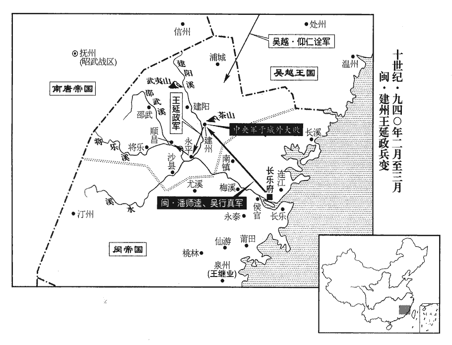
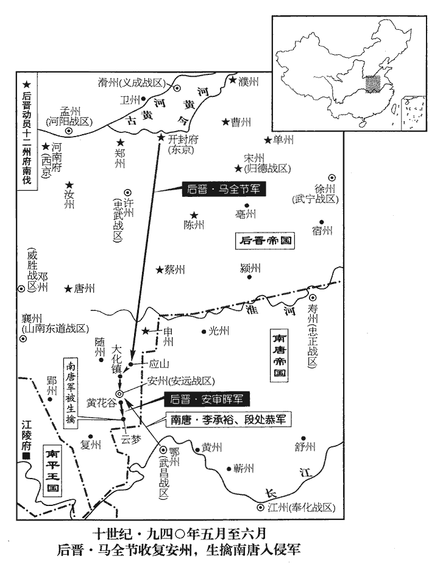
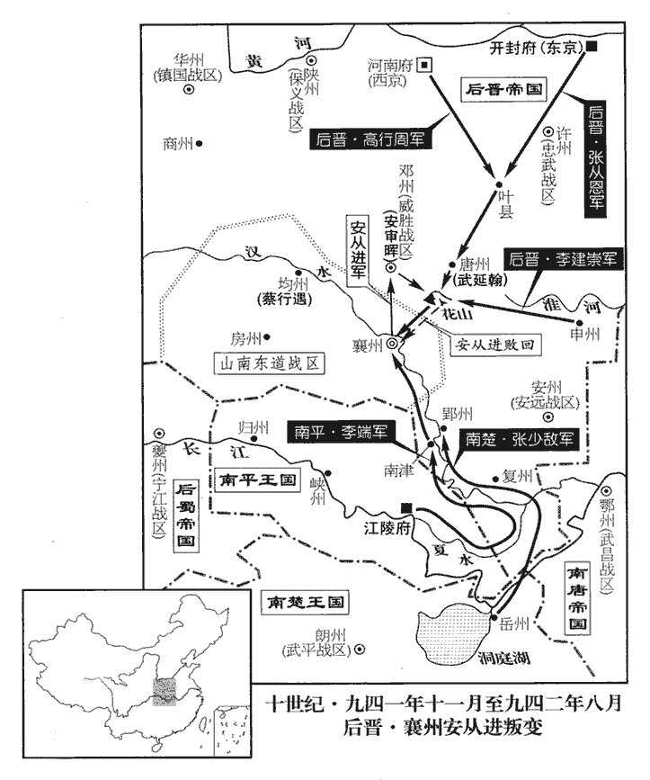
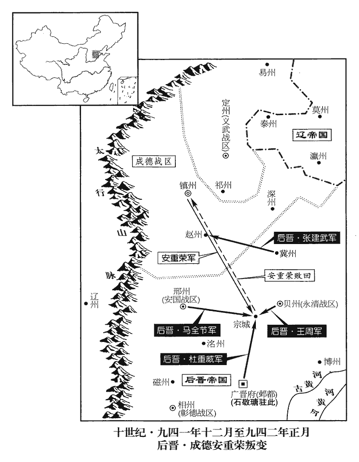

 後晉紀三起屠維大淵獻（己亥），盡重光赤奮若（辛丑），凡三年。

# 高祖聖文章武明德孝皇帝中

## 天福四年（己亥、九三九）

1春，正月，辛亥‹九›，‹后晋首都开封府河南省开封市›石敬瑭，本年四十八岁以澶州‹河南省濮阳市›防禦使太原‹山西省太原市›張從恩為樞密副使。澶，時連翻。

〖译文〗 [1]春季，正月，辛亥（初九），后晋高祖任用澶州防御使太原人张从恩为枢密副使。

2朔方‹总部设灵州宁夏灵武市›節度使張希崇卒‹年五十二岁›，羌胡寇鈔，無復畏憚。鈔，楚交翻。復，扶又翻。甲寅‹十二›，以義成‹总部滑州›節度使馮暉為朔方節度使。党項酋長拓跋彥超最為強大，酋，慈秋翻。長，知兩翻。暉至，彥超入賀，自其部落入靈州城以賀。暉厚遇之，因為於城中治第，為，于偽翻；下主為同。治，直之翻。豐其服玩，留之不遣，封內遂安。質彥超於城中，則党項諸部不敢鈔暴於外，故安。

〖译文〗 [2]朔方节度使张希崇去世，北方的羌胡入侵和抢掠，无所忌惮，甲寅（十二日），后晋高祖任用义成节度使冯晖为朔方节度使。党项族的酋长拓跋彦超最为强大，冯晖到镇后，拓跋彦超来镇祝贺，冯晖待他很是厚重，在城中替他修建宅第，置放了很多华服珍玩，留下他不让回去。这样，辖境之内始安宁下来。

3唐‹南唐，首都金陵府江苏省南京市›群臣江王知證等累表請唐主‹徐知诰，本年五十二岁›復姓李，立唐宗廟，乙丑‹二十三›，唐主許之。群臣又請上尊號，上，時掌翻。唐主曰：「尊號虛美，且非古。」遂不受。其後子孫皆踵其法，不受尊號，又不以外戚輔政，宦者不得預事，皆他國所不及也。

〖译文〗 [3]南唐群臣江王徐知证等几次上表请求南唐王徐诰恢复姓李，建立唐室宗庙，乙丑（二十三日），南唐主准许。群臣又请求上帝王尊号，南唐主说：“尊号是一种虚美，并且不是古制。”便没有接受。此后，子孙都依照这种做法，不受尊号，又不用外戚辅理政事，宦官不准干预国事，这都是其他国家所做不到的。

二月，乙亥‹三›，改太祖廟號曰義祖。唐主初受禪，尊徐溫為太祖；今復姓李，以溫為義父，故改廟號為義祖。己卯‹七›，唐主為李氏考妣發哀，與皇后斬衰居廬，如初喪禮，朝夕臨凡五十四日。衰，倉回翻。臨，力鴆翻。初喪之禮，自古無五十四日之制，唐主亦是依傍漢、晉以日易月之制，居父喪、母喪各二十七日，故為五十四日。江王知證、饒王知諤請亦服斬衰；不許。知證、知諤皆徐溫子。李建勳之妻廣德長公主假衰絰入哭盡禮，【章；十二行本「禮」作「哀」；乙十一行本同；孔本同；張校同。】如父母之喪。李建勳妻，徐溫女也；勢利所在，非血氣之親而親。長，知兩翻。

〖译文〗 二月，乙亥（初三），更改南唐太祖徐温的庙号称为义祖。己卯（初七），南唐主为李氏父母举行哀悼，同皇后一起披麻戴孝，值守于祭堂，像初丧之礼一样，早晚拜祭达五十四天。徐温的亲子江王徐知证、饶王徐知谔请求也披麻戴孝；南唐主不准许。李建勋之妻广德长公主假借丧服到祭堂哀哭尽礼，如同父母之丧一样。

辛巳‹九›，詔國事委齊王璟詳決，惟軍旅以聞。庚寅‹十八›，唐主更名昪biàn更，工衡翻。昪，皮變翻。

〖译文〗 辛巳（初九），南唐主下诏书，国事委授齐王李具体决处，只有军事问题要上报南唐主知道。庚寅（十八日），南唐主更名为李。

詔百官議二祚合享禮。二祚，徐、李二姓之先也。辛卯‹十九›，宋齊丘等議以義祖居七室之東。唐主命居高祖‹李渊›於西室，太宗‹李世民›次之，義祖‹徐温›又次之，皆為不祧tiāo之主。群臣言：「義祖諸侯，不宜與高祖、太宗同享，請於太廟正殿後別建廟祀之。」帝曰：通鑑既帝晉，此帝字與晉帝渾殽，此亦因江南舊史，失於更定。「吾自幼託身義祖，事見二百六十卷唐昭宗之乾寧二年。曏非義祖有功於吳，朕安能啟此中興之業？」群臣乃不敢言。

〖译文〗 南唐主下诏，令百官讨论把徐、李二姓的先人合起来同受祭享的礼制。辛卯（十九日），宋齐丘等建议把义祖徐温的灵位放在第七室的东侧。南唐主命令把唐高祖李渊的灵位放在西室，唐太宗李世民居其次，义祖徐温再其次，都作为肇始之主。群臣说：“义祖是诸侯，不适于与高祖、太宗同样祭享，建议在太庙正殿之后另行建庙祭祀他。”南唐主说：“我从小托身给义祖，如果不是过去义祖有大功于吴国，朕怎能开创今天的中兴之大业？”群臣便不敢再说什么。

唐主欲祖吳王恪，或曰：「恪誅死，吳王恪死於唐高宗朝，為房遺愛所誣引，非其罪也。不若祖鄭王元懿。」唐主命有司考二王苗裔，以吳王孫禕yī有功，禕子峴為宰相，玄宗‹李隆基›朝信安王禕有邊功，峴相肅宗。峴，戶典翻。遂祖吳王，云自峴五世至父榮。其名率皆有司所撰。考異曰：周世宗實錄及薛史稱昪唐玄宗第六子永王璘苗裔，江南錄云憲宗第八子建王恪之玄孫。李昊蜀後主實錄云：「唐嗣薛王知柔為嶺南節度使，卒於官，其子知誥流落江淮，遂為徐溫養子。」吳越備史云：「昪本潘氏，湖州安吉人，父為安吉砦將。吳將李神福攻衣錦軍，過湖州，虜昪歸，為僕隸。徐溫嘗過神福，愛其謹厚，求為養子。以讖云『東海鯉魚飛上天』，昪始事神福，後歸溫，故冒李氏以應讖。」劉恕以為昪復姓附會祖宗，固非李氏，而吳越與唐人仇敵，亦非實錄。昪少孤遭亂，莫知其祖系；昪曾祖超，祖志，乃與義祖之曾祖、祖同名，知其皆附會也。唐主又以歷十九帝、三百年，疑十世太少。有司曰：「三十年為世，陛下生於文德，已五十年矣。」文德，唐僖宗末年之號。言唐主之生至是年為五十年。遂從之。

〖译文〗 南唐主想要把自己世系的始祖定为唐高祖的儿子吴王李恪，有人说：“李恪是被唐高宗诛杀的，不如以郑王李元懿为始祖。”南唐主便命有关部门考核二王的后裔，因为吴王的孙子李在历史上有戍守边疆之功，李的儿子李岘又当过宰相，于是以吴王为祖。说是从李岘之后，经过五世而至于南唐主之父李荣。他们的名字，大体都是有关部门所杜撰。南唐主又觉得自唐初至今，已然经历十九个皇帝，长达三百年，觉得自己的世系才经过十世太少。有关部门奏称：“三十年为一世，陛下出生在唐僖宗文德年间，已经五十年了。”于是，便依从了他们。

4盧損至福州‹福建省福州市›，盧損去年十一月奉冊使閩，今乃至福州。閩主‹王继鹏（王昶）›稱疾不見，命弟繼恭主之。遣其禮部員外郎鄭元弼奉繼恭表隨損入貢。閩主不禮於損，有士人林省鄒私謂損曰：「吾主不事其君，不愛其親，不恤其民，不敬其神，不睦其鄰，不禮其賓，賓謂盧損也。其能久乎！余將僧服而北逃，會相見於上國耳。」時假號偏隅者以中原為上國。以余觀之，林省鄒亦非善士，有樊若水之志而不得遂其志耳。

〖译文〗 [4]卢损作为后晋朝廷的册礼使到达福州，闽主王昶称说有病，不予接见，命他的弟弟王继恭主持招待晋使。派遣他的礼部员外郎郑元弼带着王继恭的表章跟随卢损入朝进贡。闽主对卢损不礼貌，有个士人林省邹私下对卢损说：“我的国主不侍奉其君，不爱护其亲，不体恤其民，不崇敬其神，不敦睦其邻，不礼遇其宾，这样的人，他能够持久吗！我将要穿着僧服而向北逃走，以后会同您相见在中原吧。”

5三月，庚戌‹八›，唐主追尊吳王恪為定宗孝靜皇帝，自曾祖以下皆追尊廟號及諡。

〖译文〗 [5]三月，庚戌（初八），南唐主李追尊吴王李恪为定宗孝静皇帝，从他的曾祖以下都追尊庙号和谥称。

6己未‹十七›，詔歸德‹总部设宋州河南省商丘市›節度使劉知遠、忠武‹总部设许州河南省许昌市›節度使杜重威並加同平章事。知遠自以有佐命功，重威起於外戚，無大功，恥與之同制，制，麻制也。黃忠有功，關羽猶恥與之同列；杜重威何如人，劉知遠其肯與之同制乎！英雄倔強之氣，大抵然也。制下數日，杜門四表辭不受。帝怒，謂趙瑩曰：「重威朕之妹夫，知遠雖有功，何得堅拒制命！可落軍權，劉知遠時總宿衛諸軍。令歸私第。」瑩拜請曰：「陛下昔在晉陽，兵不過五千，為唐兵十餘萬所攻，事見上卷上年。危於朝露，非知遠心如鐵石，豈能成大業！柰何以小過棄之！竊恐此語外聞，聞，音問。非所以彰人君之大度也。」帝意乃解，命端明殿學士和凝詣知遠第諭旨，知遠惶恐，起受命。君降心以撫其臣，則臣亦自悔。馴服勳舊強悍之氣，不容不爾。

〖译文〗 [6]后晋高祖下诏，命归德节度使刘知远、忠武节度使杜重威一起加官同平章事。刘知远自以为有辅佐后晋高祖创业的功劳，而杜重威是以外戚起家，没有大功，把与他同时受制令加官视为羞耻，制令下达好几天，关了门四次上表推辞不接受。后晋高祖发怒，对赵莹说：“重威是朕的妹夫，知远虽然有功，怎么能坚决拒受制命！可以把他的军权削除，让他回到自己家里去。”赵莹下拜请求说：“陛下从前在晋阳时，兵众不超过五千，被唐兵十余万人所进攻，危险得像早晨的露水一样，当时若不是知远心如铁石似的坚定，怎能成今日的大业！为什么竟因小的过失而丢弃他！我担心这个话如果传出去，是不能够表现作为人君的宏大度量啊！”后晋高祖的心情才舒解了，命端明殿学士和凝到刘知远的府第传谕皇帝的意旨，刘知远感到惶恐，敬起接受制令。

7靈州戍將王彥忠據懷遠城‹宁夏银川市›叛，懷遠縣屬靈州。趙珣聚米圖經曰：唐懷遠鎮在靈州北約一百餘里。宋時西夏強盛，即其地置興州，其西九十餘里即賀蘭山。上遣供奉官齊延祚往招諭之；彥忠降，延祚殺之。降，戶江翻。上怒曰：「朕踐阼以來，未嘗失信於人，彥忠已輸仗出迎，延祚何得擅殺之！」除延祚名，重杖配流。議者猶以為延祚不應免死。以其殺降失信，繼此將無以懷遠人也。

〖译文〗 [7]灵州戍将王彦忠据怀远城叛变，后晋高祖派供奉官齐延祚去招谕他投降；王彦忠投降了，齐延祚却把他杀了。后晋高祖发怒，说道：“朕登极以来，不曾失信于人，王彦忠已经打着旌旗仪仗出迎投降，齐延祚怎么能擅自把他杀了！”便罢了齐延祚的官，重杖责打之后流放发配到远地。议论的人还觉得对齐延祚不应当免除他的死刑。

8辛酉‹十九›，冊回鶻可汗仁美為奉化可汗。時回鶻比年遣使朝貢，故冊命之。按五代會要：回鶻自唐會昌間為黠戛斯所破，西奔居于甘州‹甘肃省张掖市›，梁乾化元年遣使入貢。至唐同光二年四月，其本國權知可汗仁美遣使入貢，命鄭績、何延嗣持節冊仁美為英義可汗。其年十一月，仁美卒，其弟狄銀嗣立，遣都督安千等來朝貢。狄銀卒，阿咄欲立，亦遣使來貢。天成三年，其權知可汗仁裕遣使入貢。其年三月，命使冊仁裕為順化可汗。晉天福三年，遣使朝貢；四年三月，又遣使來朝，兼貢方物。其月，命衛尉卿邢德昭持節就冊為奉化可汗。若據會要，則「仁美」當作「仁裕」。

〖译文〗 [8]辛酉（十九日），后晋朝廷册立回鹘可汗仁美为奉化可汗。

9夏，四月，唐江王徐知證等請亦姓李；欲改其本姓從國姓以自親。不許。

〖译文〗 [9]夏季，四月，南唐江王徐知证等也请求改姓为李，南唐主李没有答应。

10辛巳‹十›，唐主祀南郊；癸未‹十二›，大赦。

〖译文〗 [10]辛巳（初十），南唐主祭祀南郊；癸未（十二日），实行大赦。

11梁太祖‹朱全忠（朱温）›以來，軍國大政，天子多與崇政、樞密使議，梁與崇政使議，唐與樞密使議。崇政使即樞密使之職也。宰相受成命，行制敕，講典故，治文事而已。治，直之翻。帝‹石敬瑭›懲唐明宗‹李嗣源›之世安重誨專橫，專橫事見唐明宗紀。橫，戶孟翻。故即位之初，但命桑維翰兼樞密使。及劉處讓為樞密使，奏對多不稱旨，劉處讓攘桑維翰樞密使見上卷上年。稱，尺證翻。會處讓遭母喪，甲申‹十三›，廢樞密院，以印付中書，院事皆委宰相分判。以副使張從恩為宣徽使，直學士•倉部郎中司徒詡、工部郎中顏衎kàn並罷守本官。鄭樵氏族略曰：帝王世紀，舜為堯司徒，支孫氏焉。直學士，樞密直學士也。二人本官，倉部、工部也。衎，苦旱翻。然勳臣近習不知大體，習於故事，每欲復之。史言帝王命相，當悉委以政事，不當置樞密使以分其權。

〖译文〗 [11]自从后梁太祖朱温以来，军国大政，天子往往同崇政使、枢密使议定，宰相不过是接受成命，颁行制敕，讲求典故，治理文事而已。后晋高祖借鉴后唐明宗时期安重诲专横的教训，因此，即位之初，只任用桑维翰兼枢密使。到刘处让任枢密使时，奏言对事往往不能称意，适逢上刘处让的母亲去世而守丧，甲申（十三日），废除枢密院，把印交给中书省，枢密院的事务都委交宰相分别判处。任用枢密副使张从恩为宣徽使；直学士、仓部郎中司徒诩，工部郎中颜一起罢守本官。然而勋旧大臣近来的习惯不识大体，习惯于老的做法，常常想恢复老办法。

12帝以唐之大臣除名在兩京者皆貧悴，李專美等除名見上卷元年。悴，秦醉翻。復以李專美為贊善大夫，丙戌‹十五›，以韓昭胤為兵部尚書，馬胤孫為太子賓客，房暠為右驍衛大將軍，並致仕。

〖译文〗 [12]后晋高祖因为后唐的大臣罢除官职后仍在东、西两京的都比较清贫困迫，便重新任用李专美为赞善大夫，丙戌（十五日），任命韩昭胤为兵部尚书，马胤孙为太子宾客，房为右骁卫大将军，一同以此终官退休。

13閩主‹王继鹏›忌其叔父前建州‹福建省建瓯市›刺史延武、戶部尚書延望才名，巫者林興與延武有怨，託鬼神語云：「延武、延望將為變。」閩主不復詰，詰，去吉翻。使興帥壯士就第殺之，帥，讀曰率。并其五子。

〖译文〗 [13]闽主王昶忌妒其叔父前建州刺史王延武、户部尚书王延望的才干和名声，卜巫人林兴与王延武有怨隙，借托鬼神的话，说“王延武、王延望将要叛变。”闽主没有再查核，就让林兴率领强壮兵卒在他们的府第中把他们杀死，连同他们的五个儿子也一齐杀了。

閩主用陳守元言，作三清殿於禁中，道家以上清、玉清、太清為三清。以黃金數千斤鑄寶皇大帝、天尊、老君像，晝夜作樂，焚香禱祀，求神丹。政無大小，皆林興傳寶皇命決之。

〖译文〗 闽主采用陈守元的建议，在宫中建造三清殿，用黄金数千斤铸造宝皇大帝、天尊、老君像，昼夜作乐，焚香祷告，寻求神丹。政事不论大小，都由林兴传达宝皇的神命来决定。

14戊申‹七›，加楚王希範‹首都长沙府，马希范，本年四十一岁›天策上將軍，賜印，聽開府置官屬。梁開平四年已嘗加楚王殷天策上將軍，今晉復以命其子希範。

〖译文〗 [14]五月，戊申（初七），后晋朝廷加封楚王马希范为天策上将军，赐予官印，听由他开府设置官属。

15辛亥‹十›，唐徙吉王景遂為壽王，立壽陽公景達為宣城王。

〖译文〗 [15]辛亥（初十），南唐调徙吉王李景遂为寿王，册立寿阳公李景达为宣城王。

16乙卯‹十四›，唐鎮海‹总部设润州江苏省镇江市›節度使兼中書令梁懷王徐知諤卒‹年三十五岁›。

〖译文〗 [16]乙卯（十四日），南唐镇海节度使兼中书令梁怀王徐知谔去世。

17唐人遷讓皇‹杨溥›之族於泰州‹江苏省泰州市›，號永寧宮，防衛甚嚴。泰州本揚州海陵縣，吳乾貞中立制置院，南唐昇元元年升為泰州。考異曰：十國紀年：「唐人遷讓皇之族於泰州，號永寧宮，守衛甚嚴，不敢與國人通婚姻，久而男女自為匹偶。」江表志：「讓皇子及五歲，遣中使拜官，賜朝服，即日而卒。」按唐烈祖受禪，使讓皇居故宮，稱臣上表，慕仁厚之名；若惡楊氏則滅之而已。何必如此之迂也！他書皆未之見，不知紀年據何書，今不取。康化‹总部设池州安徽省贵池市›節度使兼中書令楊珙稱疾，罷歸永寧宮。康化軍亦吳於統內所置節鎮，或南唐置之，其地今無可考。乙丑‹二十四›，以平盧‹总部设青州山东省青州市›節度使兼中書令楊璉為康化節度使；璉固辭，請終喪，終讓皇之喪也。從之。

〖译文〗 [17]南唐人把吴国让皇杨溥的族人迁移到泰州，号永宁宫，防卫很严密。康化节度使兼中书令杨珙称说有病，罢官回到永宁宫。乙丑（二十四日），任用平卢节度使兼中书令杨琏为康化节度使；杨琏坚决推辞，请求守完让皇的丧事，南唐主答应了他。

18唐主將立齊王璟為太子，固辭；乃以為諸道兵馬大元帥、判六軍諸衛、守太尉、錄尚書事、昇•揚二州牧。南唐以昇州‹金陵府·江苏省南京市›為西都，揚州‹江都府·江苏省扬州市›為東都，故二州置牧。

〖译文〗 [18]南唐主将要立齐王李为太子，李坚决辞让；便把他任用为诸道兵马大元帅、判六军诸卫、守太尉、录尚书事、扬二州牧。

19閩判六軍諸衛建王繼嚴得士心，閩主忌之，六月，罷其兵柄，更名繼裕；更，工衡翻。以弟繼鎔【章：十二行本「鎔」作「鏞」；乙十一行本同；孔本同。】判六軍，去諸衛字。去，羌呂翻。

〖译文〗 [19]闽国的判六军诸卫建王王继严能得将士之心，闽主王昶嫉妒他，六月，罢免了他的兵权，把他的名字改为继裕；任用闽王之弟王继熔为判六军，删去诸卫二字。

林興詐覺，流泉州‹福建省泉州市›。望氣者言宮中有災，乙未‹二十五›，閩主徒居長春宮。

〖译文〗 林兴的欺诈被发觉，流放到泉州。望气的人说宫中要发生灾祸，乙未（二十五日），闽主迁居到长春宫。

20秋，七月，庚子朔‹一›，日有食之。

〖译文〗 [20]秋季，七月，庚子朔（初一），出现日食。

21成德‹总部设镇州河北省正定县›節度使安重榮出於行伍，行，戶剛翻。性粗率，粗，與麤同。恃勇驕暴，每謂人曰：「今世天子，兵強馬壯則為之耳。」安重榮粗暴一夫耳，使其強梁亦何所至！然其所以強梁者，亦習見當時之事，遂起非望之心耳。府廨有幡竿高數十尺，嘗挾弓矢謂左右曰：「我能中竿上龍【章：十二行本「龍」下有「首」字；乙十一行本同；孔本同；張校同；退齋校同。】者，必有天命。」一發中之，廨，古隘翻。高，居號翻。中，竹仲翻。以是益自負。

〖译文〗 [21]成德节度使安重荣出身于行伍，性情粗率，倚仗自己勇武而骄傲暴躁，常常对人们说：“现在的天子，兵强马壮就可以当。”他的衙门里有一个幡竿有几十尺高，他曾经挟着弓箭对左右的人说：“我如果能射中竿上龙首，必有当人君的天命。”一发而射中，由此就更加自负。

帝之遣重榮代祕瓊也，見上卷二年。戒之曰：「瓊不受代，當別除汝一鎮，勿以力取，恐為患滋深。」重榮由是以帝為怯，謂人曰：「祕瓊匹夫耳，天子尚畏之，況我以將相之重，士馬之眾乎！」每所奏請多踰分，分，扶問翻。為執政所可否，可者則從之，否者不從也。意憤憤不快，乃聚亡命，市戰馬，有飛揚之志。帝知之，義武‹总部设定州河北省定州市›節度使皇甫遇與重榮姻家，甲辰‹五›，徙遇為昭義‹总部设潞州山西省长治市›節度使。鎮、定接境，恐其合而為變，徙令稍遠以離析之。

〖译文〗 后晋高祖当初派遣安重荣去代替秘琼时，告诫他说：“如果秘琼不接受你去代职，将要为你另委一镇做节度使，不要用武力去夺取，怕以后为患越来越深。”安重荣因此以为后晋高祖怯懦，对别人说：“秘琼是个匹夫小人，天子尚且怕他，何况对我这样有将相的重要地位，有众多兵马的人啊！”有所奏请往往超越本份，被执政者或可或否，心里愤愤不愉快，便聚合亡命之徒，购买战马，有自求飞扬的意图。后晋高祖知道这种情况，义武节度使皇甫遇与安重荣是姻亲，甲辰（初五），把皇甫遇调迁为昭义节度使来隔离他们。

22乙巳‹六›，閩北宮火，焚宮殿殆盡。

〖译文〗 [22]乙巳（初六），闽国北宫失火，把宫殿几乎焚烧殆尽。

23戊申‹九›，薛融等上所定編敕，行之。三年，令薛融等詳定編敕，今始上而行之。上，時掌翻。

〖译文〗 [23]戊申（初九），后晋薛融等上奏所定的编敕，加以施行。

24丙辰‹十七›，敕：「先令天下公私鑄錢，見上卷上年。今私錢多用鉛錫，小弱缺薄，宜皆禁之，專令官司自鑄。」

〖译文〗 [24]丙辰（十七日），后晋高祖敕令：“以前令天下公私铸钱，现在私铸钱多用铅，而且小弱缺薄，应该都加以禁止，专门由主管官司自行铸造。”

25西京‹河南府·河南省洛阳市›留守楊光遠疏中書侍郎、同平章事桑維翰遷除不公及營邸肆於兩都，與民爭利；帝不得已，閏月，壬申‹三›，出維翰為彰德‹总部设相州河南省安阳市›節度使兼侍中。

〖译文〗 [25]西京留守杨光远上疏奏称：中书侍郎、同平章事桑维翰对官吏调、任不公，以及允许任意两都营造官邸，与民争利；后晋高祖不得已，闰七月，壬申（初三），把桑维翰外调为彰德节度使，兼任侍中。

26初，義武節度使王處直子威，避王都‹刘云郎›之難，亡在契丹‹首都西楼城内蒙古巴林左旗›，王都之難，謂囚處直也，見二百七十一卷梁均王龍德元年。難，乃旦翻。至是，義武缺帥，皇甫遇徙潞，故義武缺帥。帥，所類翻。契丹主‹耶律德光，本年三十八岁›遣使來言，「請使威襲父土地，如我朝之法。」我朝，契丹自謂也。朝，直遙翻。帝辭以「中國之法必自刺史、團練、防禦序遷乃至節度使，請遣威至此，漸加進用。」契丹主怒，復遣使來言曰：復，扶又翻。「爾自節度使為天子，亦有階級邪！」帝恐其滋蔓不已，厚賂契丹，且請以處直兄孫彰德節度使廷胤為義武節度使以厭其意。厭，於涉翻，又如字。契丹怒稍解。

〖译文〗 [26]以前，义武节度使王处直的儿子王威，为了躲避王都叛乱的灾难，逃亡在契丹。到此时，义武军因为皇甫遇调迁而缺少主帅，契丹主耶得德光遣派使者来说：“请求让王威承袭他父亲的土地，如同我朝的法律规定。”后晋高祖推辞，认为：“中原之法，必须从刺史、团练使、防御使依照顺序迁升，才能到节度使，请把王威派到这里来，逐渐加以进用。”契丹主发怒，再次遣派使者来说道：“你自己从节度使升到天子，也是按阶梯上去的吗！”后晋高祖怕这样做法会滋蔓没有止境，便厚重地贿赂契丹，并且请求用王处直哥哥的孙子彰德节度使王廷胤为义武节度使以满足他们的愿望，契丹的怒气稍有缓解。

27初，閩惠宗‹王延钧（王璘）›以太祖‹王审知›元從為拱宸控鶴都，閩王審知廟號太祖。從，才用翻；下同。及康宗‹王继鹏›立，更募壯士二千為腹心，號宸衛都，祿賜皆厚於二都；或言二都怨望，將作亂，閩主‹王继鹏›欲分隸漳‹福建省漳州市›、泉‹福建省泉州市›二州，二都益怒。閩主好為長夜之飲，強群臣酒，好，呼到翻。強，其兩翻。醉則令左右伺其過失；伺，相吏翻。從弟繼隆醉失禮斬之。屢以猜怒誅宗室，叔父左僕射、同平章事延羲陽為狂愚以避禍，閩主賜以道士服，置武夷山中‹福建省武夷山市西南›；武夷山在建州崇安縣南三十里。朱元晦武夷圖序曰：武夷君之名，著自漢世，祀以乾魚，不知果何神也。今崇安有山名武夷，相傳即神仙所宅。峰巒巖壑，秀拔奇偉，清溪九曲，流出其間。兩崖絕壁，人迹所不到處，往往有枯查插石罅間，以庋guǐ舟船棺柩之屬。柩中遺骸，外列陶器，尚且未壞。頗疑前世道阻未通，川壅未決時，夷俗所居，而漢祀者即其君長，蓋亦避世之士，生為眾所臣服，沒而傳以為仙也。武夷山中有道士觀，閩主蓋置延羲於觀中。尋復召還，幽於私第。復，扶又翻。

〖译文〗 [27]过去，闽惠宗王把太祖王审知的原来侍从立为拱宸、控鹤二都，等到康宗王昶即位后，又募集壮士二千作为腹心，号称宸卫都，俸禄和赏赐都厚于二都；有人传言，二都有怨气，将要作乱，闽主想把二者分别隶属于漳、泉二州，二都更加愤怒。闽主喜欢作长夜的饮宴，强制群臣喝酒，喝醉了便让左右之人伺机找他的过失；闽主的堂弟王继隆醉后失礼，把他斩了。这样，由于多次猜疑、发怒而诛杀宗室。闽主的叔父左仆射、同平章事王延羲表面上装作狂呆用来躲避祸端，闽主赐给他道士服装，把他放置在武夷山中；不久，又把他召回来，幽禁在他自己的私第。

閩主數侮拱宸、控鶴軍使永泰‹福建省永泰县›朱文進、光山‹河南省光山县›連重遇，數，所角翻。永泰縣屬福州。晉分弋陽置西陽縣，宋孝武大明初置光城縣，梁於縣置光州，後廢州置光城郡，隋廢郡置光山縣，仍置光州，以縣屬焉。九域志：縣在州西六十里。連重遇之先蓋與王潮兄弟同入閩。連，姓也；左傳齊有連稱。二人怨之。會北宮火，求賊不獲；閩主命重遇將內外營兵掃除餘燼，日役萬人，士卒甚苦之。又疑重遇知縱火之謀，欲誅之；內學士陳郯tán私告重遇。辛巳‹十二›夜，重遇入直，帥二都兵焚長春宮帥，讀曰率。以攻閩主，使人迎延羲於瓦礫中，呼萬歲；礫，郎擊翻。復召外營兵共攻閩主；復，扶又翻；下同。獨宸衛都拒戰，閩主乃與李后如宸衛都。李后，李春鷰也。如，往也。比明，比，必利翻。亂兵焚宸衛都，宸衛都戰敗，餘眾千餘人奉閩主及李后出北關，至梧桐嶺‹福建省福州市北›，眾稍逃散。延羲使兄子前汀州‹福建省长汀县›刺史繼業將兵追之，及於村舍，閩主素善射，引弓殺數人。俄而追兵雲集，閩主知不免，投弓謂繼業曰：「卿臣節安在！」繼業曰：「君無君德，臣安有臣節！新君，叔父也，舊君，昆弟也，孰親孰疏？」閩主‹王继鹏›不復言。繼業與之俱還，至陀莊‹福州市北›，飲以酒，醉而縊之，還，從宣翻，又如字。飲，於禁翻。并李后及諸子、王繼恭皆死。宸衛餘眾奔吳越‹首都杭州›。

〖译文〗 闽主几次轻侮拱宸、控鹤军使永泰人朱文进、光山人连重遇，二人很怨恨。没过多久，北宫失火，查究放火贼人但没有寻获；闽主命令连重遇带领内外营兵扫除余烬，每天役使上万人，士兵很劳苦。又怀疑连重遇知道纵火的阴谋，想要把他杀了；内廷学士陈郯私下告诉了连重遇。辛巳（十二日）夜，连重遇进宫值勤，率领二都之兵焚烧了长春宫，袭击闽主，派人从瓦砾中把王延羲迎接出来，对着他呼喊万岁，又召集外营的二都兵众共同攻击闽主；只有宸卫都的兵土抗拒进行战斗，闽主便和皇后李春燕避往宸卫都。待到天亮，乱兵焚烧了宸卫。宸卫都打败，剩下的千余人保护着闽主和李后出了北关，到达梧桐岭，剩下的人又有逃散的。王延羲让他哥哥的儿子前汀州刺史王继业带兵追赶他们，一直逃到村舍；闽主平素擅长射术，拉起弓射杀几个人。不多时，追兵云集，闽主自知不能逃脱，便丢下弓箭对王继业说：“你的臣节到哪里去了！”王继业说：“君既然没有君德，臣还有什么臣节！新君，是我的叔父，旧君，是我的兄弟，分得清谁亲谁远吗？”闽主不再说话。王继业同他一起回来，到达陀庄，让他喝酒，醉后把他勒死了。连同李后及几个儿子，王继恭都杀死了。宸卫都的余众投奔吴越。

延羲自稱威武‹总部设长乐府福建省福州市›節度使、閩國王，更名曦，更，工衡翻。曦，王審知少子也。改元永隆，考異曰：十國紀年，通文四年，延羲自稱威武節度使，改元永隆，即晉天福四年也。周世宗實錄、薛史、唐餘錄、南唐烈祖實錄、吳越備史及運曆圖、紀年通譜皆同。惟閩中啟運圖：「通文四年己亥，閏七月，延羲立，明年庚子，改元永隆，五年甲辰，被弒。」林仁志閩國人，載延羲改年宜不差失。然五代士人撰錄國書多不憑舊文，出於記憶及傳聞，雖本國近事亦有抵牾者。高遠敘事頗有本末，余公綽雖在仁志之後，然亦閩人，故不敢獨從仁志所記。又王曦既立，若但稱節度使，則不應改元及以其臣為三公、平章事。按晉高祖實錄，天福五年十一月甲申，授閩國王延羲威武軍節度使、閩國王。是曦先已自稱閩國王，紀年脫漏耳。赦繫囚，頒賚中外。以宸衛弒閩主赴於鄰國；諡閩主曰聖神英睿文明廣武應道大弘孝皇帝，廟號康宗。遣商人間道奉表稱藩于晉；間，古莧翻。然其在國，置百官皆如天子之制。以太子太傳致仕李真為司空兼中書侍郎、同平章事。

〖译文〗 五延羲自称威武节度使、闽国王，改名王曦，改年号为永隆。赦放系押的囚犯，对朝廷内外进行赐赏。宣称宸卫都杀了闽主投赴邻国，谥号闽主为圣神英睿文明广武应道大弘孝皇帝，庙号康宗。遣派商人从便道去上表，向后晋朝廷称藩；然而在他的国内，设置百官都如同天子的制度。任用已经以太子太傅名义退休的李真为司空兼中书侍郎、同平章事。

連重遇之攻康宗‹王继鹏›也，陳守元在宮中，易服將逃，兵人殺之。陳守元蠱惑閩主者二世，其死晚矣！重遇執蔡守蒙，數以賣官之罪而斬之。數，所具翻。蔡守蒙賣官見上卷上年。閩王曦既立，遣使誅林興於泉州‹福建省泉州市›。林興流泉州見上六月。蜀本「誅」作「追」。

〖译文〗 连重遇攻击康宗时，陈守元正在宫中，换了衣服将要逃跑，兵士把他杀了。连重遇抓住了蔡守蒙，数责他的卖官之罪而把他杀了。闽王王曦即位以后，派使者到泉州去把林兴也杀了。

28河決薄州。「薄州」，當作「博州」‹山东省聊城市›。

〖译文〗 [28]黄河在薄州决口。

29八月，辛丑‹三›，以馮道守司徒兼侍中。壬寅‹四›，詔中書知印止委上相，舊制：凡宰臣更日知印。由是事無巨細，悉委於道。帝‹石敬瑭›嘗訪以軍謀，對曰：「征伐大事，在聖心獨斷。斷，丁亂翻。臣書生，惟知謹守歷代成規而已。」帝以為然。道嘗稱疾求退，帝使鄭王重貴詣第省之，省，悉景翻。曰：「來日不出，朕當親往。」道乃出視事。當時寵遇，群臣無與為比。

〖译文〗 [29]八月，辛丑（初三），后晋高祖任用冯道守职司徒兼侍中。壬寅（初四），后晋高祖下诏：中书知印只委予上相，从此事无大小，都委交给冯道办理。后晋高祖曾经把关于用兵的谋略征询冯道的意见，冯道回答说：“征伐是国家的大事，取决于圣上意志的独断。我是个书生，只知道谨守历代的成规而已。”后晋高祖以为他说得对。冯道曾经称病要求退职，后晋高祖让郑王石重贵到冯道的府第探视他，并说：“明天还不出来，朕就要亲自去请他。”冯道这才出来视事。当时的宠遇，群臣没有能同他相比的。

30己酉‹十一›，以吳越王元瓘為天下兵馬元帥。

〖译文〗 [30]己酉（十一日），后晋朝廷任吴越王钱元为天下兵马元帅。

31黔南‹武泰总部设黔州重庆市彭水县›巡內溪州‹湖南省永顺县›刺史彭士愁引蔣‹奖，湖南省新晃县东北›、錦州‹湖南省麻阳县西南五十千米锦和镇›蠻萬餘人寇辰‹湖南省沅陵县›、澧州‹湖南省澧县›，唐之盛時，溪州屬黔中觀察。唐末陞黔中觀察為黔南節度，後號武泰軍，時屬蜀境。巡內，言在巡屬之內也。「蔣」，當作「獎」。唐長安四年以沅州之夜郎、渭溪二縣置舞州，開元十三年以「舞」、「武」聲相近，更名鶴州，二十年又更名業州，大曆五年又更名獎州。辰、澧時屬楚。黔，渠今翻，又其廉翻。焚掠鎮戍，遣使乞師于蜀；蜀主‹孟昶（孟仁赞）本年二十一岁›以道遠，不許。九月，辛未‹三›，楚王希範命左靜江指揮使劉勍、決勝指揮使廖匡齊帥衡山兵五千討之。勍，渠京翻。廖，力救翻，今讀從力弔翻。帥，讀曰率。

〖译文〗 [31]黔南节度使巡属之内的溪州刺史彭士愁率领奖州、锦州蛮族万余人袭扰辰州、澧州，焚掠镇戍之所，派遣使者到蜀国请求出兵支援；后蜀主孟昶因为道路太远，没有答应。九日，辛未（初三），楚王马希范命令左静江指挥使刘、决胜指挥使廖匡齐率领衡山兵五千去讨伐。

32癸未‹十三›，以唐許王從益為郇國公；奉唐祀。從益尚幼‹本年十岁›，李后養從益於宮中，奉王淑妃‹花见羞›如事母。李后，唐明宗曹皇后之女。王淑妃，明宗次妃也，故后事之如母。

〖译文〗 [32]癸未（十五日），后晋朝廷封后唐许王李从益为郇国公，奉行后唐的祭祀。由于李从益还年幼，后晋高祖的李皇后是后唐明宗曹皇后的女儿，便把许王留养在宫中，又对明宗次妃王淑妃侍奉如同母亲。

33冬，十月，庚戌‹十三›，閩康宗所遣使者鄭元弼至大梁。是年十二月，閩遣鄭元弼隨盧損入貢，至是達大梁，而康宗已於閏七月為閩人所弒矣。康宗遺執政書曰：遺，于季翻。「閩國一從興運，久歷年華，見北辰之帝座頻移，言中國屢易主也。致東海之風帆多阻。」言由此不脩職貢。又求用敵國禮致書往來。帝怒其不遜，壬子‹十五›，詔卻其貢物及福‹长乐府·福建省福州市›、建‹福建省建瓯市›諸州綱運，並令元弼及進奏官林恩部送速歸。兵部員外郎李知損上言：「王昶僭慢，宜執留使者，籍沒其貨。」乃下元弼、恩獄。下，戶嫁翻。

〖译文〗 [33]冬季，十月，庚戌（十三日），闽国康宗王曦所遗派的使者郑元弼到达晋朝东京大梁。康宗给执政者的信说：“闽国自从兴运以来，一直统续贡职至今，年华久历，现在，北辰的帝座频繁变换，以致东海的风帆常常受阻。”又要求用对等国家的礼节致书往来。后晋高祖恼怒他的态度不够谦逊，壬子（十五日），下诏退还其贡物以及福州、建州等地的成批纲运的物资，并命令郑元弼及闽国驻后晋朝廷的进奏官林恩部送他们即速回去。兵部员外郎李知损上奏说：“王昶僭越傲慢，应该拘留他的使者，登记没收他的货物。”后晋高祖便把郑元弼、林恩投进监狱里。

34吳越‹首都杭州浙江省抗州市›钱元瓘（钱传瓘）本年五十三岁恭穆夫人馬氏卒‹年五十岁›。夫人，雄武‹总部设秦州甘肃省秦安县西北›節度使綽之女也。路振九國志：馬綽，餘杭人，少與錢鏐俱事董昌，以女弟妻鏐，鏐復為元瓘娶綽女。按薛史，梁貞明四年，秦州節度使、檢校太傅、同平章事馬綽加檢校太尉。秦州，雄武軍也。鏐傳又曰：鏐恃崇盛，分兩浙為數鎮，其節制署而後奏。則其國內節帥皆稟朝命也。初，武肅王鏐禁中外畜聲伎，文穆王元瓘年三十餘無子，夫人為之請於鏐，為，于偽翻。鏐喜曰：「吾家祭祀，汝實主之。」禮：冢婦主先世之祭祀。今馬夫人不妬忌而廣嗣續，故鏐喜其有託。乃聽元瓘納妾鹿氏，生弘僔、弘倧；許氏，生弘佐；吳氏，生弘俶chù；眾妾生弘偡zhàn、弘億、【章：十二行本「億」下有「弘儀」二字；乙十一行本同；孔本同；張校同。】弘偓、弘仰、弘信；僔，子損翻。倧，徂冬翻。俶，昌六翻。偡，丈減翻。夫人撫視慈愛如一。常置銀鹿於帳前，坐諸兒於上而弄之。

〖译文〗 [34]吴越王钱元的恭穆夫人马氏去世。夫人是雄武节度使马绰之女。以前，武肃王钱禁止内外蓄养歌舞女伎，文穆王钱元年过三十多还没有儿子，马夫人为此向钱请求允许钱元纳妾，钱高兴地说：“我家的祭礼香火，实际上是由你做主的。”于是，便听由钱元纳妾。鹿氏，生下钱弘、弘；许氏，生弘佐；吴氏，生弘；众妾还生下弘、弘、弘、弘仰、弘信；马夫人对他们抚养看待，慈爱如一。常常置放银鹿在自己的帐前，让诸儿全在上面，逗弄他们嬉戏。

35十一月，戊子‹二十一›，契丹遣其臣遙折來使，遂如吳越。如，往也。使，疏吏翻。

〖译文〗 [35]十一月，戊子（二十一日），契丹派遣其臣遥折出使晋廷，于是又到了吴越。

36楚王希範始開天策府，是年夏加天策上將軍，至是始開府。置護軍中【章：十二行本「中」作「都」；乙十一行本同；孔本同。】尉，領軍司馬等官，以諸弟及將校為之。又以幕僚拓跋恆、李弘皋、廖匡圖、徐仲雅等十八人為學士。倣唐太宗天策府文學館立學士員。路振九國志載李鐸、潘起、曹梲zhuō、李莊、徐牧、彭繼英、裴頏、何仲舉、孟玄暉、劉昭禹、鄧懿文、李弘節、蕭洙、彭繼勳併拓跋恆等四人凡十八人。恆，戶登翻。

〖译文〗 [36]楚王马希范始开天策府，设置护军中尉、领军司马等官，任用其诸弟及将校充任。又任用幕僚拓跋恒、李弘、廖匡图，徐仲雅等十八人为学士。

劉勍等進攻溪州‹湖南省永顺县›，彭士愁兵敗，棄州走保山寨；石崖四絕，勍為梯棧上圍之。棧，士限翻。上，時掌翻。廖匡齊戰死，楚王希範遣弔其母，其母不哭，謂使者曰：「廖氏三百口受王溫飽之賜，舉族效死，未足以報，況一子乎！願王無以為念。」王以其母為賢，厚恤其家。

〖译文〗 刘等进攻溪州，彭士愁的兵打了败仗，放弃了州城，退保在山寨；石崖四面绝壁，刘遣梯栈登上去包围了他们。廖匡齐战死，楚王马希范派人吊问他的母亲，其母不哭，对使者说：“廖氏全家三百口，受楚王给予温饱的恩惠，全族效死于国家，不足以报答，何况一个儿子啊！请大王不要把此事记在心上。”楚王认为廖匡齐的母亲很贤慧，丰厚地抚恤其家。

37十二月，丙戌‹二十›，禁刱chuàng造佛寺。刱與創同，音初亮翻。前所無而今創為之者禁之。

〖译文〗 [37]十二月，丙戌（疑误），后晋朝廷禁止创建佛寺。

38閩王作新宮，徙居之。閩北宮燬于火，曦改作新宮而徙居之。

〖译文〗 [38]闽王王曦建造新宫，徙居到里面。

39是歲，漢‹首都兴王府广东省广州市›門下侍郎、同平章事趙光裔言於漢主‹刘岩，本年五十一岁›曰：「自馬后崩，漢主娶于楚，唐清泰元年馬后殂。未嘗通使於楚，親鄰舊好，不可忘也。」劉、馬通姻，故曰親；潭、廣接境，故曰鄰。好，呼到翻。因薦諫議大夫李紓可以將命，紓，音舒。漢主從之；楚亦遣使報聘。光裔相漢二十餘年，府庫充實，邊境無虞。及卒，漢主復以其子翰林學士承旨、尚書左丞損為門下侍郎、同平章事。復，扶又翻。

〖译文〗 [39]这一年，南汉门下侍郎、同平章事赵光裔对南汉主刘龚说：“自从马皇后去世后，没有再通使于楚，亲邻旧好是不可忘记的。”因而举荐谏议大夫李纾可以领命出使楚国，南汉主听从他的意见；楚国也派遣使者来答谢聘问。赵光裔在南汉当宰相二十余年，府库充实，边境没有忧患。赵光裔死后，南汉主又任用他的儿子翰林学士承旨、尚书左丞赵损为门下侍郎、同平章事。

## 五年（庚子、九四零）

1春，正月，帝‹首都开封府河南省开封市›石敬瑭，本年四十九岁引見閩‹首都长乐府福建省福州市›使鄭元弼等。見，賢遍翻。使，疏吏翻。元弼曰：「王昶‹王继鹏›蠻夷之君，不知禮義，陛下得其善言不足喜，惡言不足怒。臣將命無狀，願伏鈇鑕以贖昶罪。」帝憐之，辛未‹五›，詔釋元弼等。考異曰：洛中紀異云：「昶既為朝命所責，乃遣使越海聘於契丹，即將籍沒之物為贄。晉祖方卑辭以奉戎主，戎主降偽詔曰：『閩國禮物並付喬榮，放其使人還本國。』晉祖不敢拒之。既而昶又遣使於契丹求馬，由滄、齊、淮甸路南去。自茲往復不一，時人無不憤惋。」按昶以天福四年閏七月被弒，十月元弼等至京下獄，昶安得知而告契丹！今不取。

〖译文〗 [1]春季，正月，后晋高祖接见闽国来使郑元弼等。郑元弼说：“王昶是蛮夷的君主，不懂得礼仪，陛下听到他的善言不足为喜，恶言不足为怒。我受他的差遣，办事不得体，愿意接受斧质腰斩之刑以赎王昶的罪过。”后晋高祖可怜他，辛未（初五），下诏释放了郑元弼等人。

2楚‹首都长沙府湖南省长沙市›劉勍等因大風，以火箭焚彭士愁寨而攻之，士愁帥麾下逃入獎‹湖南省新晃县东北›、錦‹湖南省麻阳县西南锦和镇›深山，乙未‹二十九›，遣其子師暠帥諸酋長納溪‹湖南省永顺县›、錦、獎三州印，請降於楚。為彭師暠盡節於馬氏張本。帥，讀曰率。

〖译文〗 [2]楚国刘等借着大风，用火箭焚烧彭士愁的山寨，向他进攻，彭士愁率领他指挥下的兵逃入奖州、锦州的深山，乙未（二十九日），遣派他的儿子彭师率领诸酋长献纳溪、奖、锦三州的印信，请求向楚国投降。

3二月，庚戌‹十四›，北都‹太原府·山西省太原市›留守、同平章事安彥威入朝，北都自後唐以來建於太原。上曰：「吾所重者信與義。昔契丹以義救我，我今以信報之；聞其徵求不已，公能屈節奉之，深稱朕意。」稱，尺證翻。對曰：「陛下以蒼生之故，猶卑辭厚幣以事之，臣何屈節之有\!」上悅。

〖译文〗 [3]二月，庚戌（十四日），北都太原留守、同平章事安彦威入京朝见，后晋高祖说：“我所重视的是信与义。从前契丹出于道义救援于我，我现在用信守协约来报答他；听说他们不断地征索求取，您能委曲自己的节操来侍奉他，是很能称合朕的意图的。”安彦威回答说：“陛下为了苍生百姓，尚且卑词厚币来对待他，臣有什么屈节可说！”后晋高祖很高兴。

4劉勍引兵還長沙。楚王希範‹马希范，本年四十二岁›徙溪州於便地，便地者，徙近楚境，便於制令。表彭士愁為溪州刺史，以劉勍為錦州刺史；自是群蠻服於楚。希範自謂伏波之後，漢馬援為伏波將軍。以銅五千斤鑄柱，高丈二尺，高，居號翻。入地六尺，銘誓狀於上，立之溪州‹在今湖南省永顺县东南王村镇花果山上›。今辰州會溪城西南一里有銅柱，即馬希範所立也，天策府學士李皋為之銘。

〖译文〗 [4]刘领兵回师长沙。楚王马希范把溪州的治所迁移到离楚境近便于制命的地方，表奏彭士愁为溪州刺史，任用刘为锦州刺史；从此群蛮归服于楚国。马希范自称汉代马援的的后人，便用铜五千斤铸立一个铜柱，高一丈二尺，埋入地下六尺，铭刻誓词在柱上，把它立在溪州。

5唐‹首都金陵府江苏省南京市›李昪，本年五十三岁康化‹总部设池州安徽省贵池市›節度使兼中書令楊璉謁平陵還，平陵，蓋楊璉之父讓皇陵也。還，從宣翻，又如字。一夕大醉，卒於舟中，唐主使然也。路振九國志曰：楊璉拜陵，至竹篠口，維舟大醉，一夕而卒。追【章：十二行本「追」上有「唐主」二字；乙十一行本同；孔本同。】封諡曰弘農靖王。因楊氏其先受封之郡追封為弘農王，諡曰靖。

〖译文〗 [5]南唐康化节度使兼中书令杨琏进谒埋葬其父吴让皇杨溥的平陵归来，一个晚上，饮酒大醉，在船中去世。南唐主追封他谥号为弘农靖王。

6閩王曦既立，驕淫苛虐，猜忌宗族，多尋舊怨。其弟建州‹福建省建瓯市›刺史延政數以書諫之，數，所角翻。曦怒，復書罵之；遣親吏業翹監建州軍，史炤曰：「業」，當作「鄴」。風俗通，漢有梁令鄴鳳。監，古銜翻。教練使杜漢崇監南鎮軍‹福建省古田县›，按福州西北與建州鄰。閩主蓋置南鎮軍於福、建二州界，扼往來之要，故是後王延政攻南鎮而福州西鄙戍兵皆潰。二人爭捃jùn延政陰事告於曦，捃，居運翻。由是兄弟積相猜恨。一日，翹與延政議事不叶，翹訶之曰：「公反邪！」延政怒，欲斬翹；翹奔南鎮，延政發兵就攻之，敗其戍兵。訶，虎何翻。敗，補邁翻；下同。翹、漢崇奔福州‹长乐府·福建省福州市›，西鄙戍兵皆潰。

〖译文〗 [6]闽主王曦即位以后，骄奢淫逸，酷苛暴虐，猜忌宗族，常常寻找旧怨加以报复。他的弟弟建州刺史王延政多次上书劝谏他，王曦发怒，复书责骂王延政；派遣亲信官吏业翘监察建州军，教练使杜汉崇监福州与建州之间的南镇军。这两个人争着搜集王延政的阴私之事向王曦报告，因此兄弟二人长期相互猜忌怨恨。有一天，业翘与王延政议论事情意见不和，业翘呵斥王延政说：“你要造反啊！”王延政发怒，要杀业翘；业翘奔向南镇，王延政发兵到南镇攻击他，打败了南镇的守兵，业翘、杜汉崇奔向福州，西郊边境的守兵都溃散了。

二月，曦遣統軍使潘師逵、吳行真將兵四萬擊延政。師逵軍於建州城西，行真軍於城南，皆阻水置營，焚城外廬舍。延政求救於吳越‹首都杭州浙江省杭州市›，壬戌‹二十六›，吳越王元瓘‹钱元瓘（钱传瓘）本年五十四岁›遣寧國‹总部设宣州安徽省宣州市›節度使、同平章事仰仁詮、宣州寧國軍時屬南唐，吳越使仰仁詮遙領耳，當時列國自相署置多此類。仰，姓也；何氏姓苑有此姓。內都監使薛萬忠將兵四萬救之；丞相林鼎諫，不聽。三月，戊辰‹二›，師逵分兵三千，遣都軍使蔡弘裔將之出戰，延政遣其將林漢徹等敗之於茶山‹福建省建瓯市东北十二千米›，斬首千餘級。茶山在建州東二十五里，今亦謂之鳳凰山；北苑茶焙即其地。

〖译文〗 二月，王曦派遣统军使潘师逵、吴行真统兵四万攻打王延政。潘师逵屯军在建州城西，吴行真屯军在建州城南，都隔着水设置营地，焚烧了城外的房舍。王延政求救于吴越，壬戌（二十六日），吴越王钱元派宁国节度使、同平章事仰仁诠、内都监使薛万忠统兵四万去救援他；闽国丞相林鼎谏阻王曦，不听。三月，戊辰（初二），潘师逵分兵三千，派都军使蔡弘裔领着他们出战。王延政派其将林汉彻等在茶山把他们打败，斩首千余级。

 

7安彥威、王建立皆請致仕；不許。辛未‹五›，以歸德‹总部设宋州河南省商丘市›節度使、侍衛馬步都指揮使、同平章事劉知遠為鄴都‹广晋府·河北省大名县›留守，徙彥威為歸德節度使，加兼侍中。癸酉‹七›，徙建立為昭義‹总部设潞州山西省长治市›節度使，進爵韓王；以建立遼州‹山西省左权县›人，割遼、沁‹山西省沁源县›二州隸昭義。遼、沁二州自唐以來本屬河東節度。沁，午鴆翻。徙建雄‹总部设晋州山西省临汾市›節度使李德珫為北都留守。珫chōng，昌終翻。守，式又翻。

〖译文〗 [7]安彦威、王建立都向后晋高祖请求退休；后晋高祖不准许。辛未（初五），任用归德节度使、侍卫马步都指挥使、同平章事刘知远为邺都留守，调迁安彦威为归德节度使，加官兼任侍中。癸酉（初七），调迁王建立为昭义节度使，进爵为韩王；因为王建立是辽州人，割划辽、沁二州隶属于昭义军。调迁建雄节度使李德为北都留守。

8山南東道‹总部设襄州湖北省襄樊市›節度使、同平章事安從進恃其險固，襄陽之地正得屈完所謂「方城以為城，漢水以為池」之險，故安從進恃之以傲朝廷。陰蓄異謀，擅邀取湖南貢物，湖南貢物，馬希範所進者也。招納亡命，增廣甲卒；元隨都押牙王令謙、押牙潘知麟諫，皆殺之。及王建立徙潞州，帝使問之曰：「朕虛青州以待卿，青州平盧軍。卿有意則降制。」從進對曰：「若移青州置漢南，襄陽在漢水之南。臣即赴鎮。」帝不之責。帝非姑息之主也，慊然內顧其所以取中原者，而思其所以守中原者，畏首畏尾，故諸鎮之桀驁者皆俛眉而撫馴之。

〖译文〗 [8]山南东道节度使，同平章事安从进依恃他所镇守襄阳之地的险要和牢固，暗蓄叛离的心计，擅自截取楚国从湖南送往后晋朝廷的进贡物品，招纳亡命之徒，增加扩充兵众；从开始就跟随他的都押牙王令谦、押牙潘知麟劝阻他，都被他杀了。及至王建立受任昭义节度使迁镇潞州，后晋高祖使人问他说：“朕把镇戍青州的平卢节度使虚位等待着你，你如果有意去，我就降旨委任你。”安从进回答说：“如果把青州移置在汉水以南，我就去赴任镇所。”后晋高祖也不责怪他。

9丁丑‹十一›，王延政募敢死士千餘人，夜涉水，潛入潘師逵壘，因風縱火，城上鼓譟以應之，戰棹都頭建安‹建州州政府所在县·福建省建瓯市›陳誨殺師逵，建安，漢冶縣地，吳置建安縣，唐帶建州。其眾皆潰。戊寅‹十二›，引兵欲攻吳行真寨，建人未涉水，行真及將士棄營走，死者萬人。延政乘勝取永平‹福建省南平市›、順昌‹福建省顺昌县›二城。吳分建安置南平縣，晉武帝改為延平縣。王審知置延平鎮，其子延翰改曰永平鎮，今南劍州治所即其地。九域志；南劍州管下有順昌縣，在州西一百八十里。宋白曰：順昌縣本建安縣之校鄉地也，吳永安三年置將樂縣，隋併入邵武，唐復置。景福二年又置將水鎮，改為永順場，尋立為順昌縣。自是建州之兵始盛。

〖译文〗 [9]丁丑（十一日），闽国建州刺史王延政募集了一千多敢于冒死的士卒，乘着夜间涉水，潜伏进入潘师逵的营垒，顺风纵火，城上擂鼓呐喊来响应他们，战棹都头建安人陈诲杀了潘师逵，他的兵众都溃散了。戊寅（十二日），王延政率领兵卒要进攻吴行真的营寨，还未等到建州兵涉水过来，吴行真和将士就弃营逃走，死亡达万人。王延政乘胜攻取了永平、顺昌二城。从此以后，建州的兵卒开始强盛起来。

10夏，四月，蜀‹首都成都府四川省成都市›太保兼門下侍郎•同平章事趙季良請與門下侍郎•同平章事毋昭裔、中書侍郎•同平章事張業分判三司，癸卯‹八›，蜀主‹孟昶（孟仁赞）本年二十二岁›命季良判戶部，昭裔判鹽鐵，業判度支。度，徒洛翻。

〖译文〗 [10]夏季，四月，蜀国太保兼门下侍郎、同平章事赵季良奏请，与门下侍郎、同平章事毋昭裔、中书侍郎、同平章事张业分判三司，癸卯（初八），蜀主孟昶使赵季良主管户部，毋昭裔主管盐铁，张业主管度支。

11庚戌‹十五›，以前橫海‹总部设沧州河北省沧州市东南›節度使馬全節為安遠‹总部设安州湖北省安陆市›節度使。以代李金全也。

〖译文〗 [11]庚戌（十五日），后晋朝廷任用前横海节度使马全节为安远节度使。

12甲子‹二十九›，吳越孝獻世子弘僔卒‹年十六岁›。僔，子損翻。

〖译文〗 [12]甲子（二十九日），吴越国孝献世子钱弘去世。

13吳越仰仁詮等兵至建州，王延政以福州兵已敗去，奉牛酒犒之，犒，苦到翻。請班師；仁詮等不從，營于城之西北。延政懼，見仰仁詮逼城而屯，有圖建州之心，是以懼。復遣使乞師于閩王。復，扶又翻。閩王以泉州‹福建省泉州市›刺史王繼業為行營都統，將兵二萬救之；且移書責吳越，所謂歸曲以直責也。遣輕兵絕吳越糧道。會久雨，吳越【章：十二行本「越」下有「軍」字；乙十一行本同；孔本同。】食盡，五月，延政遣兵出擊，大破之，俘斬以萬計。癸未‹十八›，仁詮等夜遁。

〖译文〗 [13]吴越国仰仁诠等率援军到达建州，王延政因为闽国福州兵已经败走，取出肉酒犒劳他们，请他们班师回吴越。仰仁诠等不依从，在建州城的西北扎营。王延政害怕，又遣使者向闽王请求发兵救援。闽王王曦任命泉州刺史王继业为行营都统，率兵二万来救援；并且送信责备吴越，派遣轻兵断绝吴越的运粮道路。正好遇上长时间下雨，吴越兵粮食用尽，五月，王延政派兵出击，大破吴越之兵，俘虏斩杀上万人。癸未（十八日），仰仁诠等乘夜间逃走。

14胡漢筠既違詔命不詣闕，又聞賈仁沼二子欲訴諸朝；賈仁沼死見上卷二年。朝，直遙翻。及除馬全節鎮安州代李金全，漢筠紿金全曰：「進奏吏遣人倍道來言，進奏吏，謂安遠軍進奏院之主吏在大梁者也。朝廷俟公受代，即按賈仁沼死狀，以為必有異圖。」金全大懼。漢筠因說金全拒命，自歸於唐；金全從之。說，式芮翻。

〖译文〗 [14]胡汉筠既已依仗李金全的庇护违背后晋高祖诏命不肯入京朝见，又听说被他所杀害的朝廷使官贾仁沼的两个儿子要向朝廷告发；及至后晋朝廷任命马全节为安远节度使取代李金全镇戍安州时，胡汉筠便欺骗李金全说：“派驻朝廷的进奏吏派人加倍赶路来说，朝廷等您接受替代命令，就要查究贾仁沼是怎么死的，认为您必然有叛变的图谋。”李金全大为恐惧。胡汉筠便进而劝说李金全拒绝接受代命，自行归顺于南唐；李金全听从了他的意见。

丙戌‹二十一›，帝聞金全叛，命馬全节以汴‹开封府·河南省开封市›、洛‹河南府·河南省洛阳市›、汝‹河南省汝州市›、鄭‹河南省郑州市›、單‹山东省单县›、宋‹河南省商丘市›、陳‹河南省淮阳县›、蔡‹河南省汝南县›、曹‹山东省定陶县›、濮‹山东省鄄城县›、申‹河南省信阳市›、唐‹河南省唐河县›之兵討之，如此則河之南、濟之西諸鎮之兵盡發矣。單，音善。濮，音卜。以保大‹总部设鄜州陕西省富县›節度使安審暉為之副。審暉，審琦之兄也。

〖译文〗 丙戌（二十一日），后晋高祖闻知李金全叛变，命令马全节统率汴、洛、汝、郑、单、宋、陈、蔡、曹、濮、申、唐诸州的兵马征讨他；任用保大节度使安审晖做他的副帅。安审晖是安审琦的哥哥。

李金全遣推官張緯奉表請降於唐，降，戶江翻。唐主‹李昪（徐知诰）›遣鄂州‹湖北省武汉市›屯營使李承裕、段處恭將兵三千逆之。處，昌呂翻。

〖译文〗 李金全遣派推官张纬带着表章向南唐请求归降，南唐主李遣鄂州屯营使李承裕、段处恭领兵三千迎他。

 

15唐主‹李昪›遣客省使尚全恭如閩，和閩王曦及王延政。六月，延政遣牙將及女奴持誓書及香爐至福州，與曦盟于宣陵‹王审知墓，福建省福州市北莲花峰下›。古者盟誓，坎用牲，加載書於上，歃血以質諸天地鬼神。宗廟之祭，焫ruò蕭合馨香而已。至於灌獻尚鬱，食品用椒。荀卿言芬若椒蘭，漢皇后椒房，取其芬馥。郎官含雞舌香奏事，西京雜記載長安巧工丁緩作被下香爐，劉向銘博山爐，漢官典職，尚書郎給女史二人執香爐燒薰，皆未以奉鬼神。漢武內傳載西王母降，爇ruò嬰香多品，疑皆後人傅會而言之。宋范曄作香序，備言諸香以譏評時人；至其作後漢書，亦不載漢人焚香事。疑以香禮神之習，出於魏、晉已下。程大昌演繁露曰：梁武帝祭天始用沈香，古未用也；祀地用上和香。註云：以地於人近，宜加雜馥，即合諸香為之，言不止一香也。閩主鏻之舉大號，尊其父審知墓為宣陵。然兄弟相猜恨猶如故。

〖译文〗 [15]南唐主遣派客省使尚全恭赴闽国，与闽王王曦及王延政议和。六月，王延政派遣牙将及女奴带着誓书及香炉到福州，与王曦定盟于闽太祖王审知的宣陵。但是，兄弟相互猜疑忌恨依然如故。

16癸卯‹九›，唐李承裕等至【章：十二行本「至」上有「引兵」二字；乙十一行本同；孔本同。】安州。是夕，李金全將麾下數百人詣唐軍，妓妾資財皆為承裕所奪，妓，渠綺翻。承裕入據安州。甲辰‹十›，馬全節自應山‹湖北省广水市›進軍大化鎮‹广水市西南›，應山，古應國，漢屬隨縣界；梁分隨縣置永陽縣，隋改曰應山，唐屬安州。九域志：在州北一百八十里。大化鎮屬應山縣。與承裕戰于城南，大破之。承裕掠安州南走，全節入安州。丙午‹十二›，安審暉追敗唐兵於黃花谷‹安陆市南›，段處恭戰死。丁未‹十三›，審暉又敗唐兵於雲夢澤‹湖北省云梦县›中，九域志：安州安陸縣有雲夢鎮。今安陸縣南五十里有雲夢澤。宋白曰：安州雲夢縣本漢安陸縣地，後魏大統十六年於雲城古城置雲夢縣。敗，補邁翻。虜承裕及其眾。唐將張建崇據雲夢橋拒戰，審暉乃還。馬全節斬承裕及其眾千五百人于城下，送監軍杜光業等五百七人于大梁。上曰：「此曹何罪！」皆賜馬及器服而歸之。

〖译文〗 [16]癸卯（初九），南唐李承裕等到达安州。这天晚上，李金全带领他指挥下的兵卒数百人进见南唐军，妓妾资财都被李承裕的人所夺取，李承裕进占安州。甲辰（初十），马全节从应山进军到大化镇，与李承裕在城南交战，把他打得大败。李承裕抢掠安州后向南败走，马全节进入安州。丙午（十二日），安审晖追赶南唐兵，在黄花谷又把他们打败，段处恭战死。丁未（十三日），安审晖又在云梦泽中把南唐兵打败，俘虏了李承裕及他的兵众。南唐将领张建崇占据云梦桥抵抗，安审晖使带兵归还。马全节在安州城下斩杀了李承裕及他的兵众一千五百人，俘送监军杜光业等五百零七人到大梁。后晋高祖说：“这些人有什么罪！”便都赐给马匹和器物服装，把他们送回南唐。

初，盧文進之奔吳也，事見二百八十卷元年。唐主‹徐知诰（李昪›）命祖全恩將兵逆之，戒無入安州城，陳于城外，陳，讀曰陣。俟文進出，殿之以歸，無得剽掠。自盧文進至此，皆言唐主相吳時事也。殿，丁練翻。剽，匹妙翻。及李承裕逆李金全，戒之如全恩；承裕貪剽掠，與晉兵戰而敗，失亡四千人。唐主惋恨累日，自以戒敕之不熟也。惋，烏貫翻。唐主生於兵間，老於兵間，軍之利鈍熟知之矣，其惋恨者，誠有罪己之心，惜不能如秦穆公耳。至馮延己輩乃訕笑先朝，至於蹙國殄民而後已。書曰：「否則侮厥父母，曰昔之人無聞知。」延己之謂矣。後之守國者，尚鑒茲哉！杜光業等至唐，唐主以其違命而敗，不受，復送於淮北，遺帝書曰：「邊校貪功，乘便據壘。」復，扶又翻；下同。遺，唯季翻。校，戶教翻。又曰：「軍法朝章，彼此不可。」言律之以軍法，則喪師者此所必誅，盜邊者彼所不恕；繩之以朝章，則兩國皆不可容之立於朝也。朝，直遙翻。帝復遣之歸，使者將自桐墟‹安徽省宿州市西南›濟淮，九域志：宿州蘄縣有桐墟鎮。自桐墟而南，至渦口‹涡水入淮处，在安徽省怀远县东北›則濟淮矣。金人疆域圖：桐墟在宿州臨渙縣。唐主遣戰艦拒之，乃還。還，從宣翻，又如字。帝悉授唐諸將官，以其士卒為顯義都，命舊將劉康領之。舊將，蓋從起於晉陽者。

〖译文〗 过去，卢文进投奔吴国时，南唐主命祖全恩统兵迎击，告诫祖全恩不要进入安州城，列阵在城外，等待卢文进出来，尾随他回来，不许劫掠。及至李承裕迎击李金全时，告诫他也像告诫祖全恩一样；而李承裕却贪图劫掠，与晋兵交战而被打败，逃跑死亡的有四千人。南唐主惋惜悔恨好多天，自己认为对告诫敕令之类的事情不熟练，把握不住。杜光业等被遣送回来到达南唐，南唐主因为他们是违背命令才失败的，不接纳，又把他们送回淮河以北，并且给后晋高祖写信说：“边境将校贪图功利，乘着方便占据堡垒。”又说：“不论是律以军法，或是衡之朝章，彼此都不可容忍。”后晋高祖再次把他们遣送回去，使者要从宿州的桐墟渡过淮河南返，唐主派战船阻拒他们，只好又北还。后晋高祖便把南唐诸将都授以官职，把他们的士兵建立为显义都，命随兵起于晋阳的旧将刘康率领他们。

臣光曰：違命者將也，士卒從將之令者也，又何罪乎！受而戮其將以謝敵，弔士卒而撫之，斯可矣，將，即亮翻。何必棄民以資敵國乎！

〖译文〗 臣司马光曰：违背诏命的是将领，士兵是听从将领之令的，又有什么罪呢！接纳遣返而杀其将领用来回报敌国，同情士兵而安抚他们，这就可以了，何必要抛弃自己的子民去帮助敌国啊！

17唐主使宦者祭廬山‹江西省九江市南›，廬山在江州潯陽縣，山南即唐都昌縣，山北即唐之潯陽縣。都昌今為南康軍，軍城之北十五里即廬山。還，還，從宣翻，又如字。勞之曰：勞，力到翻。「卿此行甚精潔。」宦者曰：「臣自奉詔，蔬食至今。」唐主曰：「卿某處市魚為羹，某日市肉為胾zì，何為蔬食？」宦者慚服。胾，側吏翻，臠肉為之。唐主之察，衛嗣君之儔也。倉吏歲終獻羨餘萬餘石，唐主曰：「出納有數，苟非掊民刻軍，安得羨餘邪！」羨，延面翻。掊，蒲侯翻。

〖译文〗 [17]南唐主李让宦官去祭祀庐山，宦官回来，南唐主慰劳他说：“你这次出行很是谦洁。”宦官说：“我从奉诏命出去，一直吃素到现在。”南唐主说：“你在某处曾买鱼作羹，某日曾买肉切大块烹食，怎么叫吃素？”宦官感到惭愧而且承认了这些事。管仓库的官吏岁终呈献盈余的赋税租米万余石，南唐主说：“支出和收入都有数额，如果不是聚敛百姓扣军粮，哪里来的盈余呀！”

18秋，七月，閩主曦城福州西郭以備建人。又度民為僧，民避重賦多為僧，凡度萬一千人。嗚呼，使度僧而有福田利益，則閩國至今存可也。

〖译文〗 [18]秋季，七月，闽主王曦在福州西面修建城廓用来防备建州人。又让民众离俗当和尚，民众为了逃避沉重的赋税，很多人出家为僧，共有一万一千人当了和尚。

19乙丑‹二›，帝賜鄭元弼等帛，遣歸。遣歸閩也。去年十月囚之，今釋而遣之。

〖译文〗 [19]乙丑（初二），后晋高祖赐给闽国使臣郑元弼等丝帛，把他们送回闽国。

20李金全之叛也，安州馬步副都指揮使桑千、威和指揮使王萬金、成彥溫不從而死，馬步都指揮使龐守榮誚其愚，以徇金全之意。誚，才笑翻。己巳‹六›，詔贈賈仁沼及桑千等官，遣使誅守榮於安州。李金全至金陵‹南唐首都·江苏省南京市›，唐主待之甚薄。李金全為姦將所惑，背父母之國，委身於他邦，其見薄宜也。

〖译文〗 [20]李金全叛晋时，安州马步副都指挥使桑千、威和指挥使王万金、成彦温不追随他而死，马步都指挥使庞守荣讥诮他们愚蠢，以迎合李金全的意图。己巳（初六），后晋高祖下诏，赠予贾仁沼及桑千等人官，遣派使者到安州诛杀了庞守荣。李金全到了金陵，南唐主待他很冷淡。

21丁巳‹二十四›，唐主立齊王璟為太子，兼大元帥，錄尚書事。

〖译文〗 [21]丁巳（疑误），南唐主册立齐王李为太子，兼大元帅，录尚书事。

22太子太師致仕范延光請歸河陽‹河南省孟州市›私第，范延光仕唐，先有私第在河陽。帝許之。延光重載而行。西京‹河南府›留守楊光遠兼領河陽，利其貨，且慮為子孫之患，當范延光以廣晉自歸之時，楊光遠為元帥，必有以陵暴之，故懼其為子孫之患。奏：「延光叛臣，不家汴、洛而就外藩，恐其逃逸入敵國，宜早除之！」帝不許。光遠請敕延光居西京，從之。光遠使其子承貴以甲士圍其第，逼令自殺。嗚呼！財之累人如此。祕瓊以是而殺董溫琪之家，范延光復以是而殺祕瓊，楊光遠又以是而殺范延光，而光遠亦卒不免。財之累人如此夫！延光曰：「天子在上，賜我鐵券，許以不死，賜鐵券，見上卷三年。爾父子何得如此？」己未‹二十六›，承貴以白刃驅延光上馬，至浮梁，擠于河。上，時掌翻。擠，子細翻，又子西翻。光遠奏云自赴水死，帝知其故，憚光遠之強，不敢詰；為延光輟朝，贈太師。為，于偽翻。

〖译文〗 [22]后晋太子太师退休的范延光请求回到在河阳的私人宅第，后晋高祖准许了他。范延光载运了很丰厚的财物出发。西京洛阳留守杨光远兼领河阳军镇，贪图范延光的财货，并且顾虑他以后会成为杨氏子孙的祸患，便上奏说：“范延光是叛臣，不把家放在汴梁和洛阳而放归外地，恐怕他要逃跑到敌国去，应该早日把他除掉！”后晋高祖不准许。杨光远又请求敕令范延光留居西京洛阳，后晋高祖同意了。杨光远让他的儿子杨承贵带领着甲士兵包围了范延光的宅第，逼令他自杀。范延光说：“天子在上，赐给我铁券，答应我不死，你们父子怎能这样！”己未（疑误），杨承贵拿着刀逼迫范延光上马，行径浮桥时，把他挤落在黄河里。杨光远上奏说他自己要投水而死，后晋高祖知道其原因，但是惧怕杨光远的强悍，不敢究问；后晋高祖因为范延光之死而停止上朝，追赠他为太师。

23唐齊王璟固辭太子；位居嫡長則當為太子，辭之非所以繫臣民之望也。九月，乙丑‹三›，唐主許之，詔中外致牋如太子禮。

〖译文〗 [23]南唐齐王李坚决辞让被封为太子；九月，乙丑（初三），南唐主允许了他，下诏朝廷内外向他致书按太子礼施行。

24丁卯‹五›，以翰林學士承旨、戶部侍郎和凝為中書侍郎、同平章事。

〖译文〗 [24]丁卯\(初五），后晋高祖任用翰林学士承旨、户部侍郎和凝为中书侍郎、同平章事。

25己巳‹七›，鄴都留守劉知遠入朝。是年二月，劉知遠代安彥威鎮魏州。

〖译文〗 [25]己巳（初七），邺都留守刘知远入朝。

26辛未‹九›，李崧奏：「諸州倉糧，於計帳之外所餘頗多。」計帳，謂歲計其數造帳以申三司者。倉吏於受納之時斛面取贏，俟出給之時而私其利；此皆官吏相與為弊，至今然也。必般量而後知其所餘，而般量之際為弊又多。竊意李崧亦因時人既言而奏之耳。上曰：「法外稅民，罪同枉法。倉吏特貸其死，各痛懲之。」不知當時所謂痛懲者為何，畢竟言之而不能行。

〖译文〗 [26]辛未（初九），李崧奏言：“诸州的仓粮，在计账以外所盈余的相当多。”后晋高祖说：“法定之外向民众征税，罪过可同枉法一样。仓库官吏特免其一死，但都要严惩他们。

27翰林學士李澣，輕薄，多酒失，上惡之，丙子‹十四›，罷翰林學士，併其職於中書舍人。惡，烏路翻。當是時，樞密直學士既罷，僅有翰林學士尚為親近儒生；李澣之酒失，罷之是也，因而罷翰林學士，非也。澣，濤之弟也。

〖译文〗 [27]翰林学士李浣，为人轻薄，常常因酒误事，后晋高祖厌恶他，丙子（十四日），罢去翰林学士的官职，把它的职掌并归中书舍人，李浣是李涛的弟弟。

28楊光遠入朝，帝欲徙之他鎮，謂光遠曰：「圍魏之役，卿左右皆有功，尚未之賞，圍魏，見上卷二年、三年。今當各除一州以榮之。」因以其將校數人為刺史。所以分楊光遠之黨而弱其勢。甲申‹二十二›，徙光遠為平盧‹总部设青州山东省青州市›節度使，進爵東平王。開運之初，楊光遠遂以平盧叛。

〖译文〗 [28]河阳节度使杨光远入朝，后晋高祖想把他调徙到别的军镇，对杨光远说：“围攻魏州之役，你的左右都立了功，还没有封赏他们，现在应当各授官一州来荣显他们。”便把他的将校几个人用为刺史。甲申（二十二日）调迁杨光远为平卢节度使，进爵为东平王。

29冬，十月，丁酉‹五›，加吳越王元瓘天下兵馬都元帥、尚書令。

〖译文〗 [29]冬季，十月，丁酉（初五），后晋高祖加封吴越王钱元为天下兵马都元帅、尚书令。

30壬寅‹十›，唐大赦，詔中外奏章無得言「睿」、「聖」，犯者以不敬論。

〖译文〗 [30]壬寅（初十），南唐实行大赦，诏令中外奏章不得用“睿”、“圣”、字样，违犯者按不敬论。

術士孫智永以四星聚斗，分野有災，分，扶問翻。勸唐主巡東都‹江都府·江苏省扬州市›，勸之東巡江都。乙巳‹十三›，唐主命齊王璟監國。光政副使、太僕少卿陳覺以私憾奏泰州‹江苏省泰州市›刺史褚仁規貪殘；泰州，漢時吳國之海陵倉地；東晉分廣陵置海陵郡；唐初置吳州，更海陵縣為吳陵縣；武德七年廢吳州，復為海陵縣，南唐升為泰州。丙午‹十四›，罷仁規為扈駕都部署，覺始用事。為陳覺亂唐政張本。庚戌‹十八›，唐主發金陵；甲寅‹二十二›，至江都。

〖译文〗 术士孙智永因为四个星聚于斗宿，分野有灾，劝说南唐主李巡视东都，乙巳（十三日），南唐主命齐王李监国。光政副使、太仆少卿陈觉由于私人憾怨奏言泰州刺史褚仁规贪婪残虐；丙午（十四日），罢免褚仁规做扈驾都部署，陈觉开始当权。庚戌（十八日），南唐主从西都金陵出发；甲寅（二十二日），到达东都江都。

31閩王曦因商人奉表自理；言己未嘗稱大號。稱大號者，王昶之為也。十一月，甲申‹二十三›，以曦為威武‹总部长乐府›節度使，兼中書令，封閩國王。

〖译文〗 [31]闽王王曦乘商人入京，带着表章向后晋朝廷为自己申说未尝称帝；十一月，甲申（二十三日），后晋高祖任命王曦为威武节度使，兼中书令，封闽国王。

32唐主欲遂居江都，以水凍，漕運不給，乃還；還，從宣翻，又如字。十二月，丙申‹四›，至金陵。

〖译文〗 [32]南唐主打算在江都居留下来，因为水冻冰，漕运供应不上，只有西归，十二月，丙申（初五），到达金陵。

33唐右仆射兼门下侍郎、同平章事张延翰卒‹年五十七岁›。

〖译文〗 [33]南唐右仆射兼门下侍郎、同平章事张延翰去世。

34是歲，漢‹首都兴王府广东省广州市›刘岩，本年五十二岁門下侍郎、同平章事趙損卒；以寧遠‹总部设容州广西容县›節度使南昌‹江西省南昌市›王定保為中書侍郎、同平章事，不踰年亦卒。

〖译文〗 [34]这一年，南汉门下侍郎、同平章事赵损去世；任用宁远节度使南昌人王定保为中书侍郎、同平章事，不到一年也去世了。

35初，帝割鴈門‹山西省代县西北雁门关›之北以賂契丹，見二百八十卷元年。由是吐谷渾皆屬契丹，苦其貪虐，思歸中國；成德‹总部镇州›節度使安重榮復誘之，復，扶又翻。誘，音酉。於是吐谷渾帥部落千餘帳自五臺‹五台山，位山西省五台县西北›來奔。歐陽修曰：吐谷渾本居青海，唐至德中為吐蕃所攻，部族分散，其內附者唐處之河西。唐末，其首領有赫連鐸為大同節度使，為晉王克用所破，部族益微，散處蔚州界中。余按唐高宗之時，吐谷渾為吐蕃所破，棄青海而內徙，至至德中，青海不復有吐谷渾。而吐蕃東吞河、隴，吐谷渾復東徙，居雲、蔚之間。自五臺來奔，蓋取飛狐道奔鎮州也。宋白曰：吐谷渾謂之退渾，蓋語急而然。聖曆後，吐蕃陷安樂州，其眾東徙，散在朔方。赫連鐸以開成元年將本部三千帳來投豐州，文宗命振武節度使劉沔以善地處之。及沔移鎮河東，遂散居川界，音訛謂之退渾。其後吐谷渾白姓皆赫連之部落。赫連鐸為李克用所逐，歸幽州李匡儔，遂居蔚州界，部落代建，其氏不常。白承福自莊宗後為都督，依北山北石門為柵，賜其額為寧朔府，以都督為節度使。契丹大怒，遣使讓帝以招納叛人。為契丹誚讓不已，帝憂悒而殂張本。

〖译文〗 [35]过去，后晋高祖割划雁门关以北来贿赂契丹，从此吐谷浑之地都归属于契丹，苦于契丹人贪求和暴虐，想归附于中原；成德节度使安重荣又引诱它，于是吐谷浑率领部落千余帐从五台来投奔。契丹大怒，遣派使者责备后晋高祖招纳叛变的人。

## 六年（辛丑、九四一）

1春，正月，丙寅‹六›，帝‹首都开封府河南省开封市›石敬瑭，本年五十岁遣供奉官張澄將兵二千索吐谷渾在并‹太原府·山西省太原市›、鎮‹河北省正定县›、忻‹山西省忻州市›、代‹山西省代县›四州山谷者，逐之使還故土。索，山客翻。吐谷渾既仇視契丹‹首都临潢府内蒙古巴林左旗›，雖逐之不去，其後劉知遠遂殺之以為資。

〖译文〗 [1]春季，正月，丙寅（初六），后晋高祖遣派供奉官张澄领兵二千搜索吐谷浑在并、镇、忻、代四州山谷之中的人，驱逐他们使之还归故土。

2王延政城建州‹福建省建瓯市›，周二十里，請於閩王曦，欲以建州為威武軍，自為節度使。曦以威武軍福州也，乃以建州為鎮安軍，以延政為節度使，封富沙王；建州本漢冶縣地，後分冶地南部曰建安；唐置建州。州有古富沙驛。又南劍州管內有富沙里。延政改鎮安曰鎮武而稱之。

〖译文〗 [2]王延政在建州修筑城池，周围二十里，请求闽王王曦在建州设置威武军，他自己做节度使。王曦因为福州称威武军，便以建州为镇安军，任命王延政为节度使，封为富沙王；王延政把镇安改称为镇武以为军镇之名。

3二月，壬辰‹二›，作浮梁於德勝口‹澶州州政府所在地·河南省濮阳市›。是為澶州河橋。

〖译文〗 [3]二月，壬辰（初二），后晋朝廷在黄河德胜口建造一座浮桥。

4彰義‹总部设泾州甘肃省泾川县›節度使張彥澤欲殺其子，掌書記張式素為彥澤所厚，諫止之。彥澤怒，射之；左右素惡式，從而讒之。射，而亦翻。惡，烏路翻。式懼，謝病去，彥澤遣兵追之。式至邠州‹陕西省彬县›，靜難‹总部邠州›節度使李周以聞，帝以彥澤故，流式商州‹陕西省商州市›。彥澤遣行軍司馬鄭元昭詣闕求之，且曰：「彥澤不得張式，恐致不測。」以反脅上。帝不得已，與之。癸未‹三›，【嚴：「未」改「巳」。】式至涇州，彥澤命決口、剖心，斷其四支。斷，音短。父子之道天性也，張彥澤欲殺其子，其於天性何有！張式，其所親者也，以諫而殺之，極其慘酷，其於所親亦何有！晉祖欲以君臣之分柔服之，難矣，此其所以貽負義侯之禍也。

〖译文〗 [4]彰义节度使张彦泽要杀他的儿子，掌书记张式素为张彦泽所亲厚，劝阻他。张彦泽发怒，用箭射他；左右之人素来厌恶张式，乘机讲张式的坏话。张式害怕，用有病辞谢而去，张彦泽派兵追赶他。张式到了州，静难节度使李周向后晋朝廷作了报告，后晋高祖因为顾及张彦泽，把张式流放到商州。张彦泽派行军司马郑元昭到朝廷讨要他，并且说：“张彦泽如得不到张式，恐怕要引起不测的事情。”后晋高祖不得已，给了他。癸巳（初三），张式到达泾州，张彦泽命令把他决口、剖心、剁断四肢。

5涼州‹甘肃省武威市›軍亂，留後李文謙閉門自焚死。趙珣聚米圖經：涼州東至會州六百里，西至甘州五百里，南至鄯州三百六十里，北至故突厥界三百里。宋白續通典四至同而里數之遠近異。

〖译文〗 [5]凉州军叛乱，留后李文谦闭门自焚而死。

6蜀‹首都成都府四川省成都市›自建國以來，唐清泰元年，蜀建國。節度使多領禁兵，或以他職留成都，委僚佐知留務，專事聚斂，政事不治，斂，力贍翻。治，直之翻。民無所訴。蜀主‹孟昶（孟仁赞）本年二十三岁›知其弊，丙辰‹二十六›，加衛聖馬步都指揮使•武德‹东川战区改·总部设梓州四川省三台县›節度使兼中書令趙廷隱、蜀以東川為武德軍，以定董璋，克梓州，取武有七德以為軍號。樞密使•武信‹总部设遂州四川省遂宁市›節度使•同平章事王處回、捧聖控鶴都指揮使•保寧‹总部设阆州四川省阆中市›節度使•同平章事張公鐸檢校官，並罷其節度使。三月，甲戌‹十四›，以翰林學士承旨李昊知武寧【章：十二行本「寧」作「德」；乙十一行本同；孔本同。】軍，散騎常侍劉英圖知保寧軍，諫議大夫崔鑾知武信軍，給事中謝從志知武泰軍‹总部黔州›，將作監張讚知寧江軍‹总部夔州›。使之各知節度事，非正帥也。

〖译文〗 [6]蜀自从建国以来，节度使大多兼领禁兵，或者用别的职务留在成都，委派僚佐管理留职的事务，专门从事聚敛财物，政事治理不善，民众也无处申诉。蜀主孟昶知道了这些弊病，丙辰（二十六日），加封卫圣马步都指挥使、武德节度使兼中书令赵廷隐，枢密使、武信节度使、同平章事王处回，捧圣控鹤都指挥使、保宁节度使、同平章事张公铎为检校官，把他们的节度使都罢免了。三月，甲戌（十四日），任用翰林学士承旨李昊主持武宁军，散骑常侍刘英图主持保宁军，谏议大夫崔銮主持武信军，给事中谢从志主持武泰军，将作监张主持宁江军。

7夏，四月，閩王曦以其子亞澄同平章事、判六軍諸衛。曦疑其弟汀州‹福建省长汀县›刺史延喜與延政通謀，汀、建接壤，故疑之。遣將軍許仁欽以兵三千如汀州，執延喜以歸。

〖译文〗 [7]夏季，四月，闽王王曦任用他的儿子王亚澄为同平章事，判六军诸卫。王曦怀疑他的弟弟汀州刺史王延喜与王延政勾结通谋，派遣将军许仁钦带兵三千到汀州，抓住王延喜把他带回来。

8唐主‹首都金陵府江苏省南京市›李昪（徐知诰）本年五十四岁以陳覺及萬年‹陕西省西安市东半城›常夢錫為宣徽副使。

〖译文〗 [8]南唐主任用陈觉和万年人常梦锡为宣徽副使。

9辛巳‹二十二›，北京留守李德珫遣牙校以吐谷渾酋長白承福入朝。既遣張澄逐吐谷渾之在四州山谷者矣，而又容其酋長入朝，豈非容其大而逐其細歟！晉高祖之與契丹主，以術相遇者也。珫，昌中翻。

〖译文〗 [9]辛巳（疑误），北京太原留守李德派遣牙校率领吐谷浑酋长白承福入京朝见后晋高祖。

10唐主遣通事舍人歐陽遇求假道以通契丹，帝不許。契丹求假道以通淮、浙，晉無所不可；至唐求假道以通契丹，則不許之，隨其所輕重而應之也。

〖译文〗 [10]南唐主派遣通事舍人欧阳遇请求从晋国辖境借道来通往契丹，后晋高祖不准许。

11自黃巢犯長安‹陕西省西安市›以來，唐僖宗廣明元年黃巢入長安。天下血戰數十年，然後諸國各有分土，分，扶問翻。兵革稍息。及唐主即位，江、淮比年豐稔，兵食有餘，群臣爭言「陛下中興，今北方多難，宜出兵恢復舊疆。」比，毗至翻。難，乃旦翻。舊疆，謂盛唐時疆土也。此豈易恢復邪？宜唐主之不從之也。唐主曰：「吾少長軍旅，少，詩照翻。長，知兩翻。見兵之為民害深矣，不忍復言。復，扶又翻。使彼民安，則吾民亦安矣，又何求焉！」漢主遣使如唐，謀共取楚‹首都长沙府湖南省长沙市›，分其地；唐主不許。史言唐主能保境息民。

〖译文〗 [11]自从黄巢进犯长安以来，天下血战几十年，然后诸国各有分土，兴兵作战的事情稍微停息。及至南唐主李即位，长江、淮河一带连年丰收，军粮有了富余，群臣争着上言：“陛下中兴，现在北方多难，应该出兵北讨，恢复盛唐旧的疆域。”南唐主说：“我从年少时就生活在军旅之中，看到用兵对于民众的害处是很深的，不忍再提战争。让他的百姓安宁，那么我的百姓也安宁了，又有什么要索求的呢！”南汉主刘龚遣派使者来到南唐，谋求共同夺取楚国，分占他的疆土；南唐主不答应。

12山南東道‹总部设襄州湖北省襄樊市›節度使安從進謀反，遣使奉表詣蜀，請出師金‹陕西省安康市›、商‹陕西省商州市›以為聲援；自金、商取道均、房則至襄陽。丁亥‹二十八›，使者至成都。蜀主‹孟昶（孟仁赞）›與群臣謀之，皆曰：「金、商險遠，少出師則不足制敵，多則漕輓wǎn不繼。」水運曰漕，陸運曰輓。輓，音晚。蜀主乃辭之。又求援於荊南‹总部江陵府›，高從誨遺從進書，遺，唯季翻。諭以禍福；從進怒，反誣奏從誨。荊南行軍司馬王保義勸從誨具奏其狀，且請發兵助朝廷討之；從誨從之。

〖译文〗 [12]山南东道节度使安从进准备造反，派使者带着表章到蜀国，请求出兵攻打金州、商州作为声援；丁亥（疑误），使者到达成都。蜀主孟昶与群臣谋划，都说：“金州，商州险阻遥远，出兵少了不足以制服敌人，多了水陆运输粮秣跟不上。”蜀主便推辞了这件事。安从进又向荆南求援，荆南的高从诲给安从进写信，晓以祸福；安从进发怒，反而向后晋朝廷诬奏高从诲。荆南行军司马王保义劝高从诲把实际情况向朝廷奏报，并且请求发兵帮助朝廷去讨伐他；高从诲采纳了王保义的建议。

13成德‹总部设镇州河北省正定县›節度使安重榮恥臣契丹，見契丹使者，必箕踞慢罵，使過其境，或潛遣人殺之；契丹以讓帝，帝為之遜謝。使，並疏吏翻。為，于偽翻。六月，戊午‹二十九›，重榮執契丹使拽剌，拽，戶結翻。剌，來達翻。遣騎掠幽州‹北京市›南境，軍於博野‹河北省蠡县›，博野縣屬定州，宋雍熙四年以其地置寧邊軍，景德元年改永定軍，天聖七年改永寧軍；金陞為蠡州，其疆域圖云：北至燕京四百九十里。上表稱：「吐谷渾、兩突厥、渾、契苾、沙陀各帥部眾歸附；兩突厥，東突厥、西突厥也。帥，讀曰率。党項等亦遣使納契丹告身職牒，言為虜所陵暴，党，底朗翻。又言自二月以來，令各具精甲壯馬，將以上秋南寇，上秋，謂七月。恐天命不佑，與之俱滅，願自備十萬眾，與晉共擊契丹。又朔州‹山西省朔州市›節度副使趙崇已逐契丹節度使劉山，朔州舊非節鎮，蓋契丹所置也。求歸命朝廷。臣相繼以聞。陛下屢敕臣承奉契丹，勿自起釁端；其如天道人心，難以違拒，機不可失，時不再來。諸節度使沒於虜庭者，此謂趙德鈞、董溫琪、沙彥珣、翟璋等。皆延頸企踵以待王師，企，去智翻，舉踵不至地也。良可哀閔。願早決計。」表數千言，大抵斥帝父事契丹，竭中國以媚無厭之虜。厭，於鹽翻。又以此意為書遺朝貴遺，唯季翻。及移藩鎮，云已勒兵，必與契丹決戰。帝以重榮方握強兵，不能制，甚患之。

〖译文〗 [13]成德节度使安重荣耻于向契丹称臣，会见契丹使者时，一定伸开两腿箕踞漫骂，使者经过他的辖境，有时暗中派人把使者杀了；契丹以此责备后晋高祖，后晋高祖常替他道歉谢过。六月，戊午（二十九日）安重荣拘执契丹使者拽刺，派出骑兵掠抢幽州的南境，把军队屯扎在博野，上表称说：“吐谷浑、两突厥、浑、契、沙陀各自帅领部众来归附；党项等也遣派使者缴出契丹委任职务的告身职牒，诉说被契丹所欺凌虐待，又说自从二月以来，契丹命令他们各自准备精兵壮马，将要在入秋时向南寇掠，他们害怕老天爷不保佑，与契丹一道灭亡，愿意自己准备十万人马，与晋国共同攻击契丹。又有朔州节度副使赵崇已经驱逐了契丹任命的节度使刘山，请求归顺朝廷。我已经把这些情况相继报告朝廷。陛下多次命令我仰承恭奉契丹，不要自己去挑起衅端；可是现在天道人心，难以违抗，机不可失，时不再来。诸节度使被执陷在胡虏境内的都伸长脖子、提起脚跟在等待着王师北伐，实在值得同情哀怜。愿朝廷早作决计。”表章共有几千言，大体都是斥责后晋高祖把契丹当作父亲来侍奉，竭尽中原所有以谄媚贪得无厌的胡虏。安重荣又用这种意思写信送给朝中贵官，并且传送给各藩镇，说已经调动兵将，决心同契丹决战。后晋高祖由于安重荣正掌握着强大兵力，不能辖制他，极为忧虑。

時鄴都‹广晋府·河北省大名县›留守、侍衛馬步都指揮使劉知遠在大梁；去年劉知遠自魏來朝，時尚留大梁。泰寧‹总部设兖州山东省兖州市›節度使桑維翰知重榮已蓄姦謀，又慮朝廷重違其意，重，難也。密上疏曰：「陛下免於晉陽‹山西省太原市›之難而有天下，難，乃旦翻。皆契丹之功也，不可負之。今重榮恃勇輕敵，吐渾假手報仇，皆非國家之利，不可聽也。臣竊觀契丹數年以來，士馬精強，吞噬四鄰，戰必勝，攻必取，割中國之土地，收中國之器械；此謂降楊光遠、虜趙德鈞時也。其君智勇過人，其臣上下輯睦，牛羊蕃息，蕃，音煩。國無天災，此未可與為敵也。且中國新敗，謂張敬達晉安之敗，趙德鈞團柏之敗。士氣彫沮，以當契丹乘勝之威，其勢相去甚遠。又，和親既絕，則當發兵守塞，兵少則不足以待寇，兵多則饋運無以繼之。我出則彼歸，我歸則彼至，臣恐禁衛之士疲於奔命，鎮、定之地無復遺民。幽、涿、瀛、莫既屬契丹，鎮、定、滄、景悉為邊鎮。滄、景之地近海卑下，又多塘濼，虜騎不可得而入；其入寇多依山而趨鎮定，故其地為虜衝。今天下粗安，粗，坐五翻。瘡痍未復，府庫虛竭，蒸民困弊，蒸，眾也。靜而守之，猶懼不濟，其可妄動乎！契丹與國家恩義非輕，信誓甚著，彼無間隙間，古莧翻。而自啟釁端，就使克之，後患愈重；萬一不克，大事去矣。議者以歲輸繒帛謂之耗蠹，有所卑遜謂之屈辱。殊不知兵連而不休，禍結而不解，財力將匱，耗蠹孰甚焉！用兵則武吏功臣過求姑息，邊藩遠郡得以驕矜，下陵上替，屈辱孰大焉！桑維翰權利害之輕重而言之，一時之論也。臣願陛下訓農習戰，養兵息民，俟國無內憂，民有餘力，然後觀釁而動，則動必有成矣。又，鄴都富盛，國家藩屏，今主帥赴闕，屏，必郢翻。主帥赴闕，謂劉知遠來朝。帥，所類翻。軍府無人，臣竊思慢藏誨盜之言，勇夫重閉之義，慢藏誨盜，易大傳之言。勇夫重閉，左傳申公巫臣之言。藏，徂浪翻。重，直龍翻。乞陛下略加巡幸，以杜姦謀。」帝謂使者曰：「朕比日以來，煩懣不決，今見卿奏，如醉醒矣，比，毗至翻。懣，音悶。醒，先梃翻，醉寤也。卿勿以為憂。」

〖译文〗 当时，邺都留守、侍卫马步都指挥使刘知远在大梁入朝；泰宁节度使桑维翰知道安重荣已经心怀奸谋，又怕朝廷难违其意，秘密上疏说：“陛下免除了晋阳之难而领有天下，都是契丹的功绩啊，不可亏负他。现在，安重荣依恃勇悍，轻视敌人，吐谷浑想借我们的手来报仇，都不是对国家有利的事，不能听从他们。我观察契丹数年以来，士马精强，吞并四邻，战必胜，攻必取，割据中原的土地，收缴中原的器械；他的君主智勇过人，他的臣僚上下洽睦，牛羊繁殖茂盛，国家没有天灾，是不可以把他视为敌人的。而且，中原刚刚败给他们，士气低落沮丧，用这样的军队去抵挡契丹乘胜的威势，这种形势，相差太远。再者，和亲的关系即已断绝，就应当发兵戍守边塞，但是，兵少了是不足以应付敌寇的，兵多了又使得后勤运输接济不上。我军出战，他就退走，我军回守，他又出来骚扰，我担心禁卫的士兵疲于奔命，镇州、定州之地不能再有遣留的民众。现在，天下刚刚稍有安定，国家的创伤没有恢复，府库空虚穷竭，百姓困苦凋弊，平静地来守护还怕不能济事，怎么可以再妄作举动呢！契丹与我们国家恩义不浅，彼此对信守誓约都很重视，他没有差错而我们自取衅端，即使战胜了他，后患也会更加严重；万一不能战胜他，大事就完了。人们议论认为每年运送缯帛给他们叫作耗蠹，有所卑恭谦逊叫作屈辱。殊不知如果兵战连绵而不罢休，灾祸纠结而不解除，财力将要匮乏，耗蠹哪个更厉害呢！用兵就会使得武将功臣过份要求姑息迁就他们，边藩远郡因此得以骄傲矜伐，下颓上废，不思振作，屈辱哪个更大呢！我希望陛下训劝农耕，习练军战，养备兵众，与民休息，等到国家没有内忧，民众有了余力，然后看形势而动，才能动必有成。再者，邺都丰富繁盛，是国家的屏障，现在它的主帅赴阙朝见，军府无人主事，我想到《易经》上说的不谨守所藏，要招引盗贼的话，《左传》上所讲勇敢的人重视守护的道理，请求陛下略作巡视检查，以杜绝奸谋。”后晋高祖对来使说：“朕这几天心里烦扰，不能决定怎么办，今天见到你们节帅的奏章，就像酒醉醒来，告诉你们节帅不要忧虑。”

14閩王曦聞王延政以書招泉州‹福建省泉州市›刺史王繼業，召繼業還，賜死於郊外，福州之郊外也。城外三十里為郊，蓋殺之於野。殺其子於泉州。初，繼業為汀州‹福建省长汀县›刺史，司徒兼門下侍郎、同平章事楊沂豐為士曹參軍，與之親善；或告沂豐與繼業同謀，沂豐方侍宴，即收下獄，下，戶嫁翻。明日斬之，夷其族。沂豐，涉之從弟也，楊涉為相於唐、梁禪代之際。從，才用翻。時年八十餘，國人哀之。自是宗族勳舊相繼被誅，人不自保，諫議大夫黃峻舁yú櫬chèn詣朝堂極諫，曦曰：「老物狂發矣！」貶章州‹福建省漳州市›司戶。被，皮義翻。舁，音余，又羊茹翻。襯，初覲翻。「章州」當作「漳州」。【章：乙十一行本正作「漳」。】

〖译文〗 [14]闽主王曦听说王延政写信招泉州刺史王继业，便把王继业召回福州，赐死于郊外，又在泉州把他的儿子杀了。以前，王继业做汀州刺史，闽国司徒兼门下侍郎、同平章事杨沂丰当时是士曹参军，与他相亲善；有人告称杨沂丰与王继业同谋，杨沂丰正在陪侍闽主的宴会，立即抓起来下狱，第二天便杀了，还夷灭了他的家族。杨沂丰是杨涉的堂弟，当时已经八十多岁，闽国的民众很为他悲哀。从此宗族勋旧相继被诛杀，人人不能自保，谏议大夫黄峻抬着棺材到朝堂极力进谏，王曦说：“老东西狂病发作了！”把他贬官为漳州司户。

曦淫侈無度，資用不給，謀於國計使南安‹福建省南安市东半州镇›陳匡範，南安縣，隋置，唐屬泉州。九域志：在州北四十七里。匡範請日進萬金；曦悅，加匡範禮部侍郎，匡範增算商賈數倍。曦宴群臣，舉酒屬匡範曰：賈，音古。屬，之欲翻。「明珠美玉，求之可得；如匡範人中之寶，不可得也。」未幾，商賈之算不能足日進，貸諸省務錢以足之，恐事覺，憂悸而卒，幾，居豈翻。悸，其季翻。曦祭贈甚厚。諸省務以匡範貸帖聞，貸帖，貸錢之文書也。曦大怒，斲棺，斷其尸棄水中，斷，音短。以連江‹福建省连江县›人黃紹頗代為國計使。唐武德元年，分閩縣置溫麻縣，尋改曰連江，屬福州。九域志：在州東北一百六十里。紹頗請「令欲仕者，自非蔭補，皆聽輸錢即授之，以資望高下及州縣戶口多寡定其直，自百緡至千緡。」從之。

〖译文〗 王曦淫侈无度，资金用度接不上，于是就同国计使南安人陈匡范商讨办法，陈匡范请求每天进万金；王曦高兴，加封陈匡范为礼部侍郎，陈匡范向商贾收费时增算数倍。王曦宴会群臣时，举酒对陈匡范说：“明珠美玉，求之可以得到；像匡范这样的人是人中之宝，不可得啊！”没多久，商贾的增收之数不能凑足日进之额，就借用各部门的经费来补足，又怕被发觉，陈匡范忧惧而死，王曦对他祭奠赠赐很丰厚。各部门把陈匡范挪代理经费的贷钱文书上奏，王曦大怒，劈了他的棺材，斩断他的尸体抛掷到水中。另行任用连江人黄绍颇代做国计使。黄绍颇建议：“命令那些要做官的人，只要不是因功绩荫庇补官的，都听凭送钱就授给他，从百缗直到千缗，用资望高下及州县户口多少来定价格。”王曦听从了这个办法。

15唐主‹李昪›自以專權取吳，尤忌宰相權重，此王莽、隋文帝之故知也。姦雄事成與不成，有幸不幸耳。以右僕射兼中書侍郎、同平章事李建勳執政歲久，欲罷之。會建勳上疏言事，意其留中；既而唐主下有司施行。下，戶嫁翻。建勳自知事挾愛憎，密取所奏改之；秋，七月，戊辰‹十›，罷建勳歸私第。

〖译文〗 [15]南唐主李自己是由于专权夺取了吴国皇位，尤其忌怕宰相权重，因为右仆射兼中书侍郎，同平章事李建勋执政的时间太长，想要罢免他。正好李建勋上疏言事，他想会留在宫中，不久南唐主却颁下诏令到有关部门施行。李建勋自己知道事情掺挟着自己的爱憎，暗中取出所奏偷改了；秋季，七月，戊辰（初十），罢免了李建勋的官职，让他退归私第。

16帝憂安重榮跋扈，己巳‹十一›，以劉知遠為北京‹太原府›留守、河東‹总部设太原府山西省太原市›節度使，復以遼‹山西省左权县›、沁‹山西省沁源县›隸河東；去年以遼、沁隸昭義軍。沁，午鴆翻。以北京留守李德珫為鄴都留守。

〖译文〗 [16]后晋高祖忧患安重荣跋扈，己巳（十一日），任命刘知远为北京留守、河东节度使，仍然把辽州、沁州隶属于河东；把北京留守李德调任为邺都留守。

知遠微時，為晉陽‹太原府所在县›李氏贅壻，嘗牧馬，犯僧田，僧執而笞之。知遠至晉陽，首召其僧，命之坐，慰諭贈遺，眾心大悅。遺，唯季翻。不念舊怨，故眾心大悅。為劉知遠自河東成大業張本。

〖译文〗 刘知远卑微时，是晋阳李姓人家的招赘女婿，曾经放牧马匹，侵犯了僧人的田地，僧人把他抓住打了板子。刘知远到了晋阳，首先把那个僧人找来，让他坐下，安慰他，并赠送东西给他，众人心里大为高兴。

17吳越‹首都杭州浙江省杭州市›府署火，宮室府庫幾盡。幾，居依翻。吳越王元瓘‹钱元瓘（钱传瓘）本年五十五岁›驚懼，發狂疾，唐人爭勸唐主‹李昪›乘弊取之，唐主曰：「柰何利人之災！」遣使唁之，且賙zhōu其乏。唁，魚戰翻，弔生曰唁。賙，音周，振贍之也。

〖译文〗 [17]吴越王的府署着火，宫室府库几乎烧光。吴越王钱元惊惧，得了狂疾。南唐人争着劝说南唐主乘其弊患而攻取吴越，南唐主说：“怎么能从人家的灾难中取利！”使遣派使者去慰问，并且赈济其匮乏。

18閩主曦自稱大閩皇，領威武‹总部设长乐府福建省福州市›節度使，既稱皇矣，又領威武節度使，古之私立名字者無此比也。與王延政治兵相攻，治，直之翻。互有勝負，福、建之間，暴骨如莽。鎮武節度判官晉江‹泉州州政府所在县·福建省泉州市›潘承祐屢請息兵脩好，唐開元八年分南安縣置晉江縣，後遂為泉州治所。好，呼到翻。延政不從。閩主使者至，延政大陳甲卒以示之，對使者語甚悖慢；悖，蒲妹翻，又蒲沒翻。承祐長跪切諫，延政怒，顧左右曰：「判官之肉可食乎！」承祐不顧，聲色愈厲。閩主曦惡泉州刺史王繼嚴得眾心，罷歸，酖殺之。惡，烏路翻。

〖译文〗 [18]闽主王曦自称大闽皇，领威武节度使，与王延政训练兵众互相攻伐，各有胜负，福州和建州之间，暴露的骨骸如同草莽一样繁茂。镇武节度判官晋江人潘承屡次请求他们息兵修好，王延政不听。闽主的使者到来，王延政大列甲兵以显示兵力，对使者语言极其逆悖轻慢；潘承裕长跪恳切劝谏，王延政发怒，对他的左右说：“判官的肉可以吃吗！”潘承裕不顾一切，声色更加严厉。闽主王曦厌恶泉州刺史王继严得众心，把他罢免回家，用毒酒鸩杀了他。

19八月，戊子朔‹一›，以開封尹鄭王重貴為東京留守。

〖译文〗 [19]八月，戊子朔（初一），后晋朝廷任用开封尹郑王石重贵为东京留守。

20馮道、李崧屢薦天平‹总部设郓州山东省东平县›節度使兼侍衛親軍馬步副都指揮使、同平章事杜重威之能，此希上指而薦之也。以為都指揮使，充隨駕御營使，代劉知遠，知遠由是恨二相。為馮道不用於漢，李崧見殺張本。重威所至黷dú貨，民多逃亡，嘗出過市，謂左右曰：「人言我驅盡百姓，何市人之多也！」

〖译文〗 [20]冯道、李崧屡次推荐天平节度使兼侍卫亲军马步副都指挥使，同平章事杜重威能干，把他任用为都指挥使，充当随驾御营使，代替刘知远；刘知远因此怀恨两个宰相。杜重威所到之处搜刮财货，民众多有逃亡。他曾经出来经过市街，对左右的人说：“人们说我把老百姓都驱赶光了，为什么市场上还有这么多的人呢！”

21壬辰‹五›，帝發大梁；己亥‹十二›，至鄴都；壬寅‹十五›，大赦。帝以詔諭安重榮曰：「爾身為大臣，家有老母，忿不思難，棄君與親。吾因契丹得天下，爾因吾致富貴，謂重榮降帝於晉陽，從此得富貴。吾不敢忘德，爾乃忘之，何邪？今吾以天下臣之，爾欲以一鎮抗之，不亦難乎！宜審思之，無取後悔！」重榮得詔愈驕，聞山南東道‹总部设襄州湖北省襄樊市›節度使安從進有異志，陰遣使與之通謀。安從進反而重榮亦反矣。

〖译文〗 [21]壬辰（初五），后晋高祖从大梁出发；己亥（十二日），到达邺都；壬寅（十五日），实行大赦。后晋高祖用诏书谕示安重荣说：“你身为大臣，家中还有老母，愤怒中不想到困难，抛弃君主与至亲。我因契丹而得天下，你因我而得到富贵。我不敢忘人家的恩德，你却忘了，这是为什么？现在，我用天下臣属于契丹，你想用一镇之地来抗契丹，不也太难了吗！你应该审慎地思考，不要招来后悔啊？”安重荣得到这个诏书更加骄傲，听到山南东道节度使安从进有叛乱之心，暗中派使者与他通同谋划。

22吳越文穆王元瓘寢疾，察內都監章德安忠厚，能斷大事，欲屬以後事，語之曰：「弘佐‹钱元瓘第六子›尚少，當擇宗人長者立之。」監，古銜翻。斷，丁亂翻。屬，之欲翻。語，牛倨翻。少，詩照翻。長，知兩翻。德安曰：「弘佐雖少，群下伏其英敏，願王勿以為念！」王曰：「汝善輔之，吾無憂矣。」德安，處州‹浙江省丽水市›人也。辛亥‹二十四›，元瓘卒。年五十五。

〖译文〗 [22]吴越文穆王钱元病重起不了身，他发现内都监章德安为人忠厚，能够决断大事，便想把身后的事情托付给他，对他说：“弘佐年纪小，应当选择宗室中的年长者立之为主。”章德安说：“弘佐虽然年轻，但是众臣下佩服他的英明敏捷，请您不要为这个忧虑！”吴越王说：“你能好好辅助他，我就没有忧虑了。”章德安是处州人。辛亥（二十四日），钱元去世。

初，內牙指揮使戴惲，為元瓘所親任，悉以軍事委之。元瓘養子弘侑乳母，惲妻之親也，惲，於粉翻。或告惲謀立弘侑。德安祕不發喪，與諸將謀，伏甲士於幕下；壬子‹二十五›，惲入府，執而殺之，廢弘侑為庶人，復姓孫，幽之明州‹浙江省宁波市›。是日，將吏以元瓘遺命，承制以鎮海‹总部杭州›、鎮東‹总部越州›副大使弘佐為節度使，時年十四。歐史曰，年十三。九月，庚申‹三›，弘佐即王位，命丞相曹仲達攝政。軍中言賜與不均，舉仗不受，諸將不能制；仲達親諭之，皆釋仗而拜。

〖译文〗 以前，内牙指挥使戴恽是钱元所亲信依靠的，把军事全部委托给他。钱元养子弘侑的乳母，是戴恽妻子的亲戚，有人告发戴恽蓄谋拥立钱弘侑。章德安便把钱元去世的消息封锁，不发表讣告，并同诸将密谋，在幕后埋伏带甲士兵；壬子（二十五日），戴恽进入王府，把他抓住杀了，废掉钱弘侑为平民，恢复姓孙，幽禁在明州。这一天，将吏根据钱元的遗命，奉承朝廷制命任用镇海、镇东副大使钱弘佐为节度使，当时年纪是十四岁。九月，庚申（初三），钱弘佐即王位，任命丞相曹仲达摄掌政务。军队里声言赐予不均衡，举擎仪仗不接受所赐，诸将不能制止；曹仲达亲自去告谕大家，便都放下仪仗而拜受。

弘佐溫恭，好書，禮士，躬勤政務，發擿姦伏，人不能欺。擿tī，他狄翻。民有獻嘉禾者，弘佐問倉吏：「今蓄積幾何？」對曰：「十年。」王曰：「然則軍食足矣，可以寬吾民。」乃命復其境內稅三年。復，方目翻，除免也。史言弘佐雖少而敏於政。

〖译文〗 钱弘佐温和谦恭，好读书，能礼士，亲自勤理政务，发现剔指隐伏不当之事，人们不能欺骗他。庶民中有人奉献嘉禾，钱弘佐问司掌仓库的官吏：“现在粮食蓄积有多少？”回答说：“能用十年。”钱弘佐说：“那么军粮是够了，可以对我的民众松宽一些。”便命令免除境内税三年不纳。

23辛酉‹四›，滑州‹河南省滑县›言河決。考異曰：薛史紀載九月辛酉滑州河決而不載庚午濮州決；髙祖實録載庚午濮州奏河決而不載辛酉滑州決。五代會要及志皆云，「天福六年九月決滑州，兖、濮州界皆為水漂溺」，史匡翰傳亦云，「天福六年白馬河決。」按辛酉滑州河已決，則下流皆涸，濮州無庚午再決之理，蓋滑州河決，漂浸及濮州耳。

〖译文〗 [23]辛酉（初四），滑州上报：黄河决口。

24帝以安重榮殺契丹使者，恐其犯塞，乙亥‹十八›，遣安國‹总部设邢州河北省邢台市›節度使楊彥詢使于契丹。彥詢至其帳，契丹【章：十二行本「丹」下有「主」‹耶律德光，本年四十岁›字；乙十一行本同；孔本同。】責以使者死狀，彥詢曰：「譬如人家有惡子，父母所不能制，將如之何？」契丹主怒乃解。

〖译文〗 [24]后晋高祖因为安重荣杀了契丹使者，怕他们前来侵犯边塞，乙亥（十八日），派遣安国节度使杨彦询出使契丹。杨彦询到了契丹的营帐，契丹责问使者遭杀的情况，杨彦询说：“比如人家里有了恶子，父母管不住他，那将怎么办？”契丹主的怒气才消解了。

25閩主曦以其子琅邪王亞澄為威武節度使、兼中書令，改號長樂王。樂，音洛。

〖译文〗 [25]闽主王曦任用他的儿子琅邪王王亚澄为威武节度使、兼中书令，改封号为长乐王。

26劉知遠遣親將郭威以詔指說吐谷渾酋長白承福，時朝廷陽為逐吐谷渾而陰撫納之，又懼契丹知之而怒之也，不敢明降詔書，故劉知遠承帝密指，使郭威稱詔指以說之。將，即亮翻。說，式芮翻。酋，慈秋翻。長，知兩翻。令去安重榮歸朝廷，許以節鉞。威還，謂知遠曰：「虜惟利是嗜，安鐵胡止以袍袴賂之；還，從宣翻，又如字。安重榮，小字鐵胡。今欲其來，莫若重賂乃可致耳。」知遠從之，且使謂承福曰：「朝廷已割爾曹隸契丹，爾曹當自安部落；今乃南來助安重榮為逆，重榮已為天下所棄，朝夕敗亡，爾曹宜早從化，勿俟臨之以兵，南北無歸，悔無及矣。」言吐谷渾若助安重榮，重榮敗亡之後，吐谷渾南不可歸晉，北不可歸契丹。承福懼，冬，十月，帥其眾歸于知遠。知遠處之太原東山及嵐‹山西省岚县›、石‹山西省离石县›之間，帥，讀曰率。處，昌呂翻。嵐，盧含翻。表承福領大同‹总部设云州山西省大同市›節度使，雲州大同軍，時已屬契丹。收其精騎以隸麾下。為劉知遠殺白承福張本。

〖译文〗 [26]刘知远派遣他的亲近将领郭威，根据朝廷诏命去劝说吐谷浑酋长白承福，让他脱离安重荣归附后晋朝廷，答应让他当节度使。郭威回来，对刘知远说：“胡虏只喜欢对自己有好处的事，安重荣只是用袍之类贿赂他；现在，我们要把他拉过来，不如用重赂，才能让他过来。”刘知远听了他的建议，并且让使者去告诉白承福说：“朝廷已经把你们割划隶属于契丹，你们就应该安分治理自己的部落，现在竟然南来帮助安重荣当叛逆，安重荣已经被天下所唾弃，早晚之间就要败亡，你们要早日顺从归化，不要等到用兵力加临于你们，弄得南、北都无所适从，那时后悔就来不及了。”白承福害怕，冬季，十月，率领他的兵众依附于刘知远。刘知远把他们置放在太原东山及岚州、石州之间，上表请任白承福领受大同节度使，收揽他的精锐骑兵隶属在自己的指挥之下。

始，安重榮移檄諸道，云與吐谷渾、達靼、契苾同起兵，即而承福降知遠，達靼、契苾亦莫之赴，靼，當割翻。重榮勢大沮。沮，在呂翻。

〖译文〗 开始，安重荣传送檄文给诸道，说与吐谷浑、达靼、契共同起兵，不久，白承福向刘知远投降，达靼、契芯也不去参加起兵，安重荣的势力大为沮丧。

27閩主曦‹王延羲›即皇帝位；王延政自稱兵馬元帥。閩同平章事李敏卒。書閩同平章事，以別他國之相。

〖译文〗 [27]闽主王曦即皇帝位，王延政自称兵马元帅。闽国同平章事李敏去世。

 

28帝‹石敬瑭›之發大梁也，和凝請曰：「車駕已行，安從進若反，何以備之？」帝曰：「卿意如何？」凝請密留空名宣敕十數通，宣出於樞密院，敕出於中書門下；時并樞密院於中書。空，苦貢翻。付留守鄭王，聞變則書諸將名，遣擊之；帝從之。

〖译文〗 [28]后晋高祖从大梁出发东巡时，和凝请示说：“陛下车驾已经出行，安从进如果在此时造反，怎么防备他？”后晋高祖说：“你的意见怎么样？”和凝请求秘密留下空着名字的宣旨和敕令十多份，交付给留守东京的郑王石重贵，听到变故便写上诸将之名，遣派他们去攻打安从进；后晋高祖依从了他。

十一月，從進舉兵攻鄧州‹河南省邓州市›，唐州‹河南省唐河县›刺史武延翰以聞。九域志：襄陽北至鄧州一百七十八里，東北至唐州一百五十里。鄭王遣宣徽南院使張從恩、武德使焦繼勳、護聖都指揮使郭金海、作坊使陳思讓將大梁兵就申州‹河南省信阳市›刺史李建崇兵於葉縣‹河南省叶县西南›以討之。漢有葉縣，中廢；隋復置葉縣；唐屬汝州。九域志：在州東南一百四十里。葉，式涉翻。金海，本突厥；思讓，幽州‹北京市›人也。厥，九勿翻。丁丑‹二十一›，以西京‹河南府·河南省洛阳市›留守高行周為南面軍前都部署，前同州‹陕西省大荔县›節度使宋彥筠副之，張從恩監焉；又以郭金海為先鋒使，陳思讓監焉。監，古銜翻。彥筠，滑州人也。

〖译文〗 十一月，安从进发兵攻打邓州，唐州刺史武延翰向朝廷报告。郑王石重贵遣派宣徽南院使张从恩、武德使焦继勋、护圣都指挥使郭金海、作坊使陈思让统领大梁兵到叶县与中州刺史李建崇的兵会合去征讨他。郭金海本是突厥人，陈思让是幽州人。丁丑（二十一日），任命西京留守高行周为南面军前都部署，前同州节度使宋彦筠为他的副手，张从恩为监军；又任命郭金海为先锋使，陈思让为他的监军。宋彦筠是滑州人。

庚辰‹二十四›，以鄴都留守李德珫權東京留守，召鄭王重貴如鄴都。

〖译文〗 庚辰（二十四日），后晋高祖任用邺都留守李德暂时署理东京留守，召唤郑王石重贵到邺都。

安從進攻鄧州‹河南省邓州市›，威勝‹总部设邓州›節度使安審暉據牙城拒之，鄧州牙城也。從進不能克而退。癸未‹二十七›，從進至花山‹河南省唐河县南湖阳镇境›，九域志：唐州湖陽縣有花山銀場。今按花山在湖陽北。遇張從恩兵，不意其至之速，合戰，大敗，從恩獲其子牙內都指揮使弘義，從進以數十騎奔還襄州，嬰城自守。

〖译文〗 安从进攻打邓州，威胜节度使安审晖依据牙城抗拒他，安从进不能攻克而退兵。癸未（二十七日），安从进到达花山，遇上张从恩的兵，没想到他来得这样快，交战，大败，张从恩俘获了安从进的儿子牙内都指挥使安弘义，安从进带着几十名骑兵奔回襄州，自己绕城固守。

29唐主‹李昪›性節儉，常躡蒲屨，盥頮huì用鐵盎，躡，尼輒翻。織蒲為屨，江、淮之人多能之。頮，呼內翻。澡手為盥，滌面為頮。暑則寢於青葛帷，左右使令惟老醜宮人，服飾粗略。粗，讀曰麤。死國事者【章：十二行本「者」下有「雖士卒」三字；乙十一行本同；孔本同。】皆給祿三年。分遣使者按行民田，以肥瘠定其稅，行，下孟翻。民間稱其平允。自是江、淮調兵興役及他賦斂，皆以稅錢為率，調，徒釣翻。斂，力贍翻。至今用之。唐主勤於聽政，以夜繼晝，還自江都‹江苏省扬州市›，不復宴樂；頗傷躁急，復，扶又翻。樂，音洛。躁，則到翻。內侍王紹顏上書，以為「今春以來，群臣獲罪者眾，中外疑懼。」唐主手詔釋其所以然，令紹顏告諭中外。

〖译文〗 [29]南唐主李性格节俭，常常脚穿用蒲草编织的鞋子，洗手洗脸用铁盆，暑天便睡在用青葛做的蚊帐里，左右使用的只是又老又丑的宫人，服饰粗糙简单。为国家而死亡的人，都给俸禄三年。分派使者按察民田，根据田地肥瘦核定租税，民间称道公平合理。从此，江、淮地带的调兵、兴办劳役以及其他赋捐收入，都按税金作比率征收，直到现在仍采用这个办法。南唐主勤于听政，夜以继曰，从江都巡视回来之后，不再举行宴会作乐，事情处理有些过于急躁，内侍王绍颜上书，认为“今春以来，群臣获罪的相当多，内外疑虑恐惧。”南唐主用手诏解释为什么会这样，让王绍颜宣示中外。

30十二月，丙戌朔‹一›，徙鄭王重貴為齊王，充鄴都留守；以李德珫為東都留守。

〖译文〗 [30]十二月，丙戌朔（初一），后晋朝廷调徙郑王石重贵为齐王，充邺都留守；任用李德为东都留守。

31丁亥‹二›，以高行周知襄州‹湖北省襄樊市›行府事。詔荊南‹总部江陵府·即南平›、湖南‹总部长沙府·即南楚›共討襄州。高從誨‹本年五十一岁›遣都指揮使李端將水軍數千至南津‹湖北省钟祥市汉水西岸渡口›，漢水南津也。楚王希範‹马希范，本年四十三岁›遣天策都軍使張少敵將戰艦百五十艘入漢江助行周，仍各運糧以饋之。少敵，佶之子也。張佶，與楚王馬殷同起事者也。少，詩沼翻。艦，戶黯翻。艘，蘇遭翻。佶jí，其吉翻。

〖译文〗 [31]丁亥（初二），后晋高祖任用高行周主持襄州行府事。下诏命荆南、湖南共同讨伐据守襄州的安从进。荆南高从诲遣派都指挥使李端统领水军数千至南津，楚王马希范遣派天策都军使张少敌统领战船一百五十艘进入汉江帮助高行周，仍然各处漕运粮食以保证给养。张少敌是张佶的儿子。

32安重榮聞安從進舉兵反，謀遂決，大集境內飢民，眾至數萬，南向鄴都，聲言入朝。初，重榮與深州‹河北省深州市›人趙彥之俱為散指揮使，相得歡甚。散，悉亶翻。重榮鎮成德，二年安重榮始帥鎮州。彥之自關西‹潼关以西›歸之，重榮待遇甚厚，使彥之招募黨眾；然心實忌之，及舉兵，止用為排陳使，陳，讀曰陣。彥之恨之。

〖译文〗 [32]安重荣听说安从进兴兵反晋便也决定谋反，大举收集境内饥民，人众达到数万，南向邺都，声称要入朝。起初，安重荣与深州人赵彦之都是散指挥使，互相处的很融洽。安重荣镇成德时，赵彦之从关西来依附他，安重荣待他很厚重，让赵彦之招募党众；然而内心实际上是猜忌他，等到举兵造反时，只是任用他充当排阵使，所以，赵彦之怀恨于他。

帝聞重榮反，壬辰‹七›，遣護聖等馬步三十九指揮擊之。以天平節度使杜重威為招討使，安國節度使馬全節副之，前永清‹总部贝州›節度使王清【章：十二行本「清」作「周」；乙十一行本同；退齋校同。】為馬步都虞候。

〖译文〗 后晋高祖听说安重荣反叛，壬辰（初七），遣派护圣等马步三十九指挥迎击他。任用天平节度使杜重威为招讨使，安国节度使马全节为副招讨使，前永清节度使王清为马步都虞候。

33安從進遣其弟從貴將兵逆均州‹湖北省丹江口市西北›刺史蔡行遇，行遇者，安從進巡内刺史。時蓋以兵援襄陽，故遣弟逆之。焦繼勳邀擊，敗之，獲從貴，斷其足而歸之。敗，補邁翻。斷，音短。

〖译文〗 [33]安从进遣派他的弟弟安从贵领兵迎接均州刺史蔡行遇的援兵，焦继勋堵击他，把他打败，俘获了安从贵，斩断他的脚而后把他送回去。

34戊戌‹十三›，杜重威與安重榮遇於宗城‹河北省威县东›西南，九域志：宗城縣在魏州之西北一百七十里。重榮為偃月陳，官軍再擊之，不動；重威懼，欲退。指揮使宛丘‹河南省淮阳县›王重胤曰：「兵家忌退。退則敵得而乘之，或士卒因退而潰亂，故忌之。陳，讀曰陣。鎮之精兵盡在中軍，請公分銳士擊其左右翼，重胤為公以契丹直衝其中軍，為，于偽翻。彼必狼狽。」重威從之。鎮人陳稍卻，趙彥之卷旗策馬來降。彥之以銀飾鎧胄及鞍勒，官軍殺而分之。重榮聞彥之叛，大懼，退匿於輜重中。重，直用翻。官軍從而乘之，鎮人大潰，斬首萬五千級。重榮收餘眾，走保宗城，官軍進攻，夜分，拔之。重榮以十餘騎走還鎮州，嬰城自守。會天寒，鎮人戰及凍死者二萬餘人。

〖译文〗 [34]戊戌（十三日），杜重威与安重荣相遇在宗城西南，安重荣作偃月阵，官军一再进击，攻不动；杜重威害怕，想退兵。指挥使宛丘人王重胤说：“用兵的人禁忌退兵。安重荣镇州的精锐都在中军，请您分用锐利之士进击他的左右两翼，重胤为您用契丹兵直冲其中军，他必然狼狈不堪。”杜重威依从他。镇州兵的阵列稍有退却，赵彦之旗打马来投降。赵彦之是用银子装饰铠甲及鞍勒的，官军把他杀了而分抢了他的东西。安重荣听说赵彦之叛变，大为恐惧，退兵藏在辎重队伍之中。官军追随其后而乘机进攻他，镇州兵大溃，斩首一万五千级。安重荣收集余众，退保宗成，官军进攻，天快黑时攻了下来。安重荣带着十多个骑兵逃回镇州，围绕起城池自守。正好遇上天寒，有两万多镇州人战死和冻死。

契丹聞重榮反，乃聽楊彥詢還。是年九月，楊彥詢使契丹。

〖译文〗 契丹听说安重荣造反，便听凭杨彦询还归后晋。

庚子‹十五›，冀州‹河北省冀州市›刺史張建武等取趙州‹河北省赵县›。冀、趙二州皆安重榮巡屬。

〖译文〗 庚子（十五日），冀州刺史张建武等攻取了赵州。

 

35漢主‹首都兴王府广东省广州市›刘岩，本年五十三岁寢疾，有胡僧謂漢主名龔不利；漢主自造「龑」yǎn字名之，義取「飛龍在天」，易曰：飛龍在天，利見大人。讀若儼。

〖译文〗 [35]南汉主病重不起，有个胡僧说南汉主名龚不吉利；南汉主自己造了一个“”字作名字，取“飞龙在天”之义，读间若俨。

36庚戌‹二十五›，制以錢弘佐為鎮海、鎮東軍‹总部越州›節度使兼中書令、吳越國王。

〖译文〗 [36]庚戌（二十五日），后晋高祖下制令，任用钱弘佐为镇海、镇东军节度使兼中书令、吴越国王。

