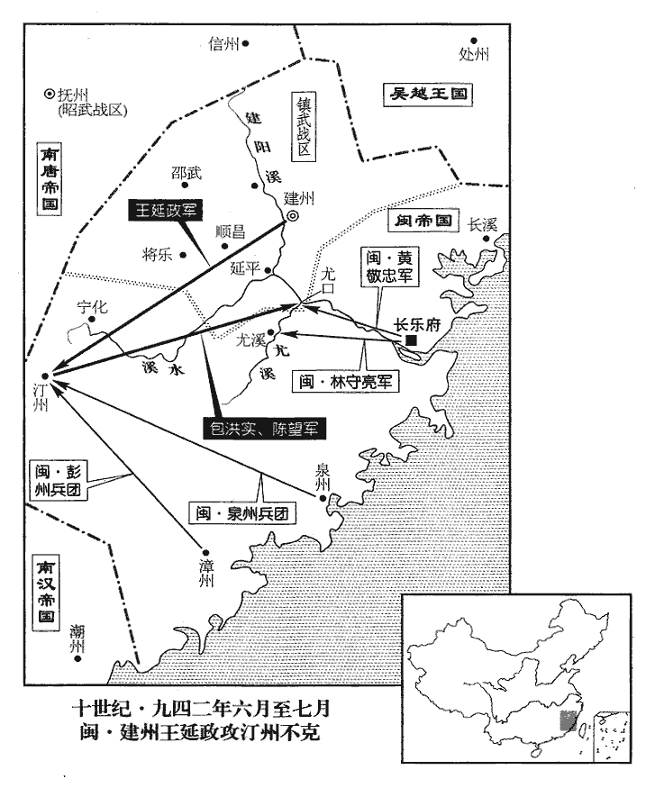
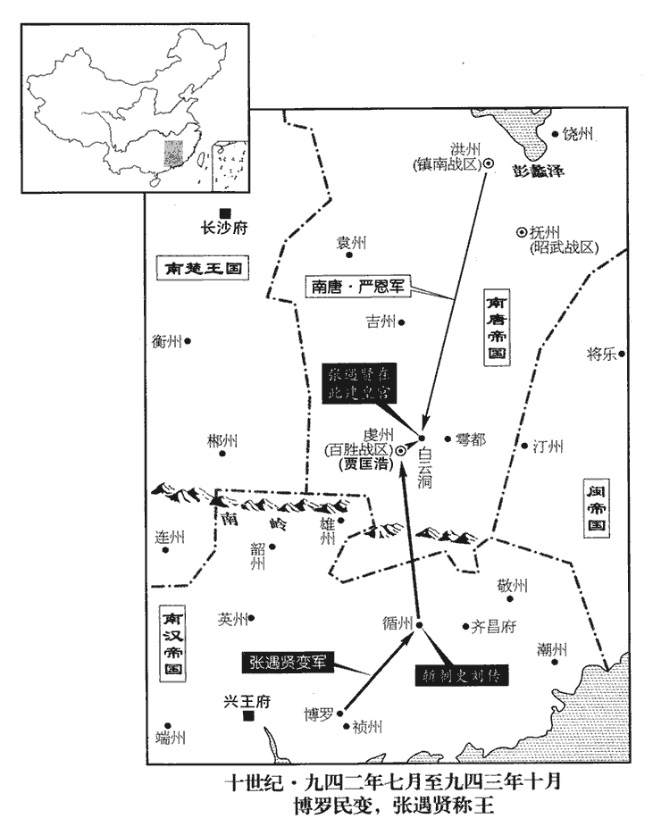
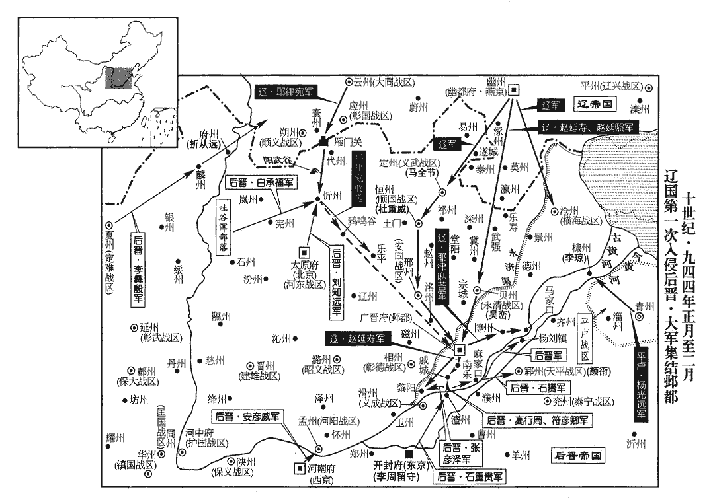

 後晉紀四起玄黓攝提格（壬寅），盡閼逢執徐（甲辰）正月，凡二年有奇。

# 高祖聖文章武明德孝皇帝下

## 天福七年（壬寅、九四二）

1春，正月，丁巳‹二›，鎮州‹总部设镇州河北省正定县›牙將自西郭水碾門導官軍入城，碾，魚蹇翻。水碾，水磑wèi也。殺守陴民二萬人，陴pī，頻彌翻。執安重榮，斬之。杜重威殺導者，自以為功。庚申‹五›，重榮首至鄴都‹广晋府·河北省大名县›，帝‹石敬瑭，本年五十一岁›命漆之，函送契丹‹首都临潢府›。重，直龍翻。

〖译文〗 [1]春季，正月，丁巳（初二），镇州牙将从西廓水碾门引导官军入城，杀了守城民众两万人，抓住了安重荣，杀了他。杜重威杀了引导入城的人，把入城据为自己的功绩。庚申（初五），安重荣的首级送到邺都，后晋高祖命令涂了漆防腐，装入匣中送往契丹。

2癸亥‹八›，改鎮州為恆州，成德軍為順國軍。鎮州本恆州，唐避穆宗名改焉。今以安重榮反，改州名從舊，又改軍號。恆，胡登翻。

〖译文〗 [2]癸亥（初八），后晋朝廷更改镇州为恒州，改成德军为顺国军。

3丙寅‹十一›，以門下侍郎、同平章事趙瑩為侍中，以杜重威為順國節度使兼侍中。

〖译文〗 [3]丙寅（十一日），任用门下侍郎、同平章事赵莹为侍中，任用杜重威为顺国节度使兼侍中。

安重榮私財及恆州府庫，重威盡有之，帝知而不問。又表衛尉少卿范陽‹河北省涿州市›王瑜為副使，瑜為之重斂於民，恆人不勝其苦。少，詩照翻。為之，于偽翻。斂，力贍翻。勝，音升。

〖译文〗 安重荣的私财及恒州府库的资财，杜重威全部占有了，后晋高祖知道而不过问。又上表举荐卫尉少卿范阳人王瑜为节度副使，王瑜替杜重威沉重地搜刮百姓，恒州人不堪其苦。

4張式父鐸詣闕‹首都开封府›訟冤。張彥澤殺張式事見上卷上年。壬午‹二十七›，以河陽‹总部设孟州河南省孟州市›節度使王周為彰義‹总部设泾州甘肃省泾川县›節度使，代張彥澤。

〖译文〗 [4]张式的父亲张铎到朝廷诉冤，告发张彦泽杀害张式的惨状。壬午（二十七日），任用河阳节度使王周为彰义节度使，替代了张彦泽。

5閩主曦‹首都长乐府福建省福州市›王延羲（王曦）立皇后李氏，同平章事真之女也；嗜酒剛愎，愎，蒲逼翻。曦寵而憚之。

〖译文〗 [5]闽主王曦立李氏为皇后，李后是同平章事李真的女儿；她嗜好喝酒，刚愎自用，王曦既宠爱她，又惧怕她。

6彰武‹总部设延州陕西省延安市›節度使丁審琪，養部曲千人，縱之為暴於境內；軍校賀行政與諸胡相結為亂，攻延州，帝遣曹州‹山东省定陶县›防禦使何重建將兵救之，同、鄜援兵繼至，乃得免。校，戶教翻。鄜，方無翻。二月，癸巳‹九›，以重建為彰武‹总部延州›留後，召審琪歸朝。重建，雲‹山西省大同市›、朔‹山西省朔州市›間胡人也。

〖译文〗 [6]彰武节度使丁审琪，豢养私属部曲千人，放纵他们在辖境内滥施暴行；军中小校贺行政与众胡人相勾结作乱，攻打延州，后晋高祖遣派曹州防御使何重建领兵去救援延州，同州、州的援兵也相继来到，延州才免除了厄难。二月，癸巳（初九），朝廷任命何重建为彰武留后，召唤丁审琪还朝。何重建是云州和朔州之间的胡人。

7唐‹首都金陵府江苏省南京市›左丞相宋齊丘固求豫政事，唐主‹李昪（徐知诰）本年五十五岁›聽入中書；又求領尚書省，乃罷侍中壽王景遂判尚書省，更領中書、門下省，更，工衡翻。以齊丘知尚書省事；其三省事並取齊王璟參決。所以制宋齊丘。齊丘視事數月，親吏夏昌圖盜官錢三千緡，齊丘判貸其死；唐主大怒，斬昌圖。夏，戶雅翻。齊丘稱疾，請罷省事，從之。

〖译文〗 [7]南唐左丞相宋齐丘坚决要求参预政事的署理，南唐主李听任他进入中书省；宋齐丘又要求领管尚书省，南唐主便罢免了侍中寿王李景遂的判理尚书省，改为领管中书、门下省，任用宋齐丘主持尚书省事务；这三个省的事务都要取得齐王李的参与决策。宋齐丘视事几个月后，自己的亲信官吏夏昌图盗取官钱三千缗，宋齐丘判处他可以免死；南唐主李大怒，斩了夏昌图。宋齐丘便称说自己有病，请求罢免尚书省的事务，南唐主答应了他的请求。

8涇州奏遣押牙陳延暉持敕書詣涼州‹甘肃省武威市›，州中將吏請延暉為節度使。

〖译文〗 [8]泾州奏报：朝廷遣派押牙陈延晖带着后晋高祖敕书到凉州去，州中将吏请求任用陈延晖为凉州节度使。

9三月，閩主曦立長樂王亞澄為閩王。樂，音洛。

〖译文〗 [9]三月，闽主王曦立长乐王王亚澄为闽王。

10張彥澤在涇州，擅發兵擊諸胡，兵皆敗沒，調民馬千餘匹以補之。調，徒釣翻。還至陝‹河南省三门峡市›，自涇州代還至陝。還，從宣翻。陝，失冉翻。獲亡將楊洪，乘醉斷其手足而斬之。斷，音短。王周奏彥澤在鎮貪殘不法二十六條，民散亡者五千餘戶。王周代彥澤，故得奏其在鎮事。彥澤既至，帝以其有軍功，又與楊光遠連姻，釋不問。歐史，張彥澤與帝連姻，又討范延光有功。

〖译文〗 [10]张彦泽在泾州镇所时，擅自发兵袭击西北诸胡，兵众都打败失散了，又调集民间马千余匹来补充。回军到陕州后，抓获了逃走的将领杨洪，在酒醉中令人砍断他的手足，进而杀了。王周代任彰义节度使以后，奏陈张彦泽在镇时贪暴残忍不法之事二十六条，民众失散逃亡的五千余户。张彦泽还朝，后晋高祖因为他有军功，又同杨光远连了姻亲，便没有究问。

夏，四月，己未‹六›，右諫議大夫鄭受益上言：「楊洪所以被屠，由陛下去歲送張式與彥澤，使之逞志，致彥澤敢肆凶殘，無所忌憚。見聞之人無不切齒，而陛下曾不動心，一無詰讓；淑慝莫辨，詰，去吉翻，問也。讓，責也。慝，吐得翻。賞罰無章。中外皆言陛下受彥澤所獻馬百匹，聽其如是，臣竊為陛下惜此惡名，為，于偽翻。受獻而釋有罪，是惡名也。乞正彥澤罪法以湔洗聖德。」湔jiān，則前翻。疏奏，留中。受益，從讜之兄子也。鄭從讜見唐僖宗紀。讜，音黨。

〖译文〗 夏季，四月，己未（初六），右谏议大夫郑受益上书奏言：“杨洪之所以被屠戮，是由于陛下去年送交张式给张彦泽，使他得志逞凶，以致张彦泽敢于任意施行凶虐残暴，没有任何忌惮。看见或者听说他的暴行之人，没有不切齿愤慨的，而陛下却一点也不动心，不做任何查究和责备；端正与阴邪不能分辩，奖励与惩罚没有章法。内外之人都说陛下接受张彦泽所献的马一百匹，才听任他这样做，我很替陛下惋惜承受这种恶劣的名声，请求陛下明正张彦泽的罪名依法惩办，用以洗刷天子的圣德。”奏书上报以后，被扣押在朝廷之内。郑受益是郑从谠哥哥的儿子。

庚申‹七›，刑部郎中李濤等伏閤極論彥澤之罪，語甚切至。伏閤者，伏閤門下奏事，閤門使以聞。辛酉‹八›，敕：「張彥澤削一階，降爵一級。階，武散階。爵級，封爵之級。張式父及子弟皆拜官。涇州民復業者，減其傜賦。」癸亥‹十›，李濤復與兩省及御史臺官伏閤復，扶又翻。兩省官，中書、門下省官也。奏彥澤罰太輕，請論如法。帝召濤面諭之。濤端笏前迫殿陛，聲【章：十二行本「聲」上有「論辨」二字；乙十一行本同；孔本同；張校同；退齋校同。】色俱厲。帝怒，連叱之，濤不退。帝曰：「朕已許彥澤不死。」濤曰：「陛下許彥澤不死，不可負；不知范延光鐵券安在！」謂許范延光以不死，而楊光遠殺之也，事見上卷五年。帝拂衣起，入禁中。丙寅‹十三›，以彥澤為左龍武大將軍。為張彥澤為契丹用以殘滅晉國、李濤詣彥澤而不懼張本。

〖译文〗 庚申（初七），刑部郎中李涛等匍匐在阁门之下极力论说张彦泽的罪行，语言十分恳切透彻。辛酉（初八），后晋高祖敕令：“削去张彦泽官秩一阶，降低封爵一级。张式的父亲和他的子弟都拜受官职。泾州民众复营旧业的，减少他们的徭役、税赋。”癸亥（初十），李涛又与中书、门下两省及御史台的官员伏阁上言，奏称对张彦泽的罪过惩罚太轻，请求依法论处。后晋高祖召唤李涛入殿当面向他谕释。李涛双手捧着朝笏迫近殿阶，声色俱厉。后晋帝发怒，连声喝叱他，李涛也不退让。后晋高祖说：“朕已经答应过张彦泽有罪可以免死。”李涛说：“陛下答应过张彦泽可以不死，固然不能不算数，不知当年赐给范延光的铁券现在哪里！”后晋高祖不高兴地拂衣而起，回到宫内，没有理他。丙寅（十三日），任命张彦泽为左龙武大将军。

11漢高祖‹首都兴王府广东省广州市›刘岩（刘龑）寢疾，以其子秦王弘度、晉王弘熙皆驕恣，少子越王弘昌孝謹有智識，少，詩照翻。與右僕射兼西御院使王翷謀出弘度鎮邕州‹广西南宁市›，弘熙鎮容州‹广西容县›，而立弘昌。為弘熙殺弘昌及翷張本。翷lín，求仁翻。制命將行，會崇文使蕭益入問疾，以其事訪之。益曰：「立嫡以長，違之必亂。」乃止。蕭益引經義以沮立弘昌之義。長，知兩翻。

〖译文〗 [11]南汉高祖刘患病不起，因为他的儿子秦王刘弘度、晋王刘弘熙都骄横任性，少子越王刘弘昌孝顺谨慎，有智慧见识，与右仆射兼西御院使王谋划派出刘弘度镇戍邕州，刘弘熙镇戍容州，而立刘弘昌为太子。制命将要下达施行，正好遇上崇文使萧益进宫问候疾病，便向他咨询这件事。萧益说：“立太子应该是长子，违背了这一条必然要导致混乱。”于是便停止下来。

丁丑‹二十四›，高祖‹刘岩（刘龑）›殂。年五十四。

〖译文〗 丁丑（二十四日），南汉高祖刘去世。

高祖為人辯察，多權數，好自矜大，常謂中國天子為「洛州刺史」。好，呼到翻。以中國天子都洛陽，洛陽之地，蓋本洛州刺史所治也。言其政令不能及遠，特昔時洛州刺史之任耳。嶺南珍異所聚，每窮奢極麗，宮殿悉以金玉珠翠為飾。用刑慘酷，有灌鼻、割舌、支解、刳剔、炮炙、烹蒸之法；或聚毒蛇水中，以罪人投之，謂之水獄。同平章事楊洞潛諫，不聽。末年尤猜忌。以士人多為子孫計，故專任宦官，由是其國中宦者大盛。自劉龑yǎn之後，專任宦者，謂百官為門外人，傳至於鋹chǎng而國亡矣。

〖译文〗 南汉高祖为人能分辨观察是非，有心计多权术，喜欢自己夸大，曾经讥讽中原朝廷的天子是“洛州刺史”。岭南地区是珍宝异物所聚集之处，他往往极尽奢侈华丽的追求，宫殿全部用黄金、美玉、珍珠、翠作装饰。使用的刑罚惨烈严酷，有灌鼻、割舌、肢解、刳剔、炮炙、烹蒸等办法；或者把毒蛇聚养在水中，把犯了罪的人投进去，称为“水狱”。同平章事杨洞潜劝阻他，高祖不听。到了末年他更加猜忌；以为士人往往替子孙着想，所以专任宦官，因此南汉国中宦官大为兴盛。

秦王弘度‹刘弘度，本年二十三岁›即皇帝位，更名玢；更，工衡翻。玢，府巾翻。以弘熙輔政，改元光天；尊母趙昭儀曰皇太妃。

〖译文〗 秦王刘弘度即南汉皇帝位，改名刘玢；任用刘弘熙辅政，改年号为光天；尊奉其母赵昭仪为皇太妃。

12契丹‹首都临潢府内蒙古巴林左旗›以晉招納吐谷渾‹山西省东北部›，遣使來讓。帝憂悒不知為計；五月，己亥‹十六›，始有疾。悒，乙及翻。

〖译文〗 [12]契丹因为晋朝招纳吐谷浑，遣派使者来责问。后晋高祖忧郁不知怎么办为好；五月，己亥（十六日），开始生病。

13乙巳‹二十二›，尊太妃劉氏為皇太后。太后，帝之庶母也。徐無黨曰：帝所生母也。

〖译文〗 [13]乙巳（二十二日），后晋高祖专奉太妃刘氏为皇太后。太后是后晋帝父亲的妾，也就是后晋帝的生母。

14唐丞相、太保宋齊丘既罷尚書省，不復朝謁。復，扶又翻。朝，直遙翻；下同。唐主遣壽王景遂勞問，勞，力到翻。許鎮洪州‹江西省南昌市›，始入朝。

〖译文〗 [14]南唐丞相、太保宋齐丘被罢免尚书省的官职以后，就不再上朝谒见。南唐主李派寿王李景遂去慰劳问候他，答应他去镇戍洪州，这才开始入朝。

唐主與之宴，酒酣，齊丘曰：「陛下中興，臣之力也，柰何忘之！」唐主怒曰：「公以遊客干朕，事見二百六十六卷梁太祖乾化二年。今為三公，亦足矣。乃與人言朕鳥喙如句踐，難與共安樂，有之乎？」越范蠡遺文種書，言越王為人，長頸鳥喙，可與同患難，不可與同安樂。句，讀如鉤。樂，讀如洛。齊丘曰：「臣實有此言。臣為遊客時，陛下乃偏裨耳。今日殺臣可矣。」明日，唐主手詔謝之曰：「朕之褊性，褊，補典翻。子嵩平昔所知。少相親，老相怨，可乎！」少，詩照翻。自古君臣之間，豈無親故，未有如宋齊丘之挾舊矜功，唐主之啟寵納侮者也。

〖译文〗 南唐主李与宋齐丘宴会，酒喝的正痛快时，宋齐丘说：“陛下完成中兴大业，是我的力量啊，为什么把我忘了！”南唐主发怒说：“阁下以游说谋士的身份作朕的客人，现在位至三公，也可以满足了。可是你却跟人家说朕长的是鸟嘴像战国时的越王勾践一样，难于同朕共享安乐，有这样的话吗？”宋齐丘说：“臣确实说过这个话。臣当游说之客时，陛下不过是个偏将副官而已。今天陛下可以把臣杀了哇！”第二天，南唐主下手诏向他谢过说：“朕的性情褊颇，子嵩你素来是知道的。我们从小相亲相爱，老来却相怨，这样好吗？”

丙午‹二十三›，以齊丘為鎮南‹总部设洪州›節度使。踐洪州之約。宋齊丘本洪州進士，寵之以衣錦也。

〖译文〗 丙午（二十三日），南唐任命宋齐丘为镇南节度使。

15帝寢疾，一旦，馮道獨對。帝命幼子重睿出拜之，又令宦者抱重睿置道懷中，其意蓋欲道輔立之。重，直龍翻。考異曰：漢高祖實錄：「晉高祖大漸，召近臣屬之曰：『此天下，明宗之天下，寡人竊而處之久矣。寡人既謝，當歸許王，寡人之願也。』此說難信。今從薛史。

〖译文〗 [15]后晋高祖患病不起，一天早上，召来冯道独自对话。后晋高祖叫幼子石重睿出来拜见冯道，又命令宦官抱着石重睿放到冯道怀中，意思是要冯道辅立他为幼主。

六月，乙丑‹十三›，帝‹石敬瑭›殂。年五十一。五代會要，殂於鄴都大內之保昌殿。

〖译文〗 六月，乙丑（十三日），后晋高祖石敬瑭去世。

道與天平‹总部设郓州山东省东平县›節度使、侍衛馬步都虞候景延廣議，以國家多難，宜立長君，乃奉廣晉‹河北省大名县›尹齊王重貴‹本年二十九岁›為嗣。晉高祖託孤於馮道，與吳主孫休託孤於濮陽興、張布之事略同。難，乃旦翻。是日，齊王即皇帝位。延廣以為己功，始用事，禁都下人無得偶語。以防姦人謀為變。

〖译文〗 冯道与天平节度使、侍卫马步都虞候景延广谋议，认为国家正处在困难多的时刻，应该立长子为嗣君，便拥立广晋尹齐王石重贵为继承人。这一天，齐王即皇帝位。景延广以为这是自己的功劳，开始弄权用事，禁止国都中的人相聚议论是非。

初，高祖‹石敬瑭›疾亟，有旨召河東‹总部设太原府山西省太原市›節度使劉知遠入輔政，齊王寢之；知遠由是怨齊王。為劉知遠不入援張本。

〖译文〗 起初，后晋高祖石敬瑭病重时，有旨召唤河东节度使刘知远入朝辅政，齐王石重贵把旨压下不发，刘知远从此与齐王结下怨恨。

16丁卯‹十五›，尊皇太后曰太皇太后，高祖之庶母劉氏也。皇后曰皇太后。高祖之后李氏也。

〖译文〗 [16]丁卯（十五日），后晋出帝石重贵尊皇太后刘氏为太皇太后，皇后李氏为皇太后。

17閩富沙王延政圍汀州‹福建省长汀县›，閩主曦發漳‹福建省漳州市›、泉‹福建省泉州市›兵五千救之。九域志：泉州西至漳州二百九十五里，漳州西至汀州五百四十里。宋白曰：梁山有漳浦水，一名漳溪水，唐垂拱二年，析泉州之西南置漳州。垂拱之泉州，今之福州也。又遣其將林守亮入尤溪‹福建省南平市东南尤溪口镇›，大明宮使黃敬忠屯尤口‹尤溪注入闽江处·福建省南平市东南尤溪口镇›，九域志：尤溪縣在南劍州南一百五十五里，蓋王氏初置縣也。尤口，尤溪口也。欲乘虛襲建州‹福建省建瓯市›；國計使黃紹頗將步卒八千為二軍聲援。

〖译文〗 [17]闽国富沙王王延政围攻汀州，闽主王曦调发漳州、泉州兵五千人去救援。又遣派他的将领林守亮进入尤溪，派大明宫使黄敬忠屯驻尤口，准备乘着对方空虚时袭击建州；国计使黄绍颇领步兵八千人做林、黄二军的声援。

 

18秋，七月，壬辰‹十›，太皇太后劉氏殂。

〖译文〗 [18]秋季，七月，壬辰（初十），后晋太皇太后刘氏去世。

19閩富沙王延政攻汀州，四十二戰，不克而歸。其將包洪實、陳望，將水軍以禦福州之師；丁酉‹十五›，遇於尤口。尤溪口。黃敬忠將戰，占者言時刻未利，按兵不動；洪實等引兵登岸，水陸夾攻之，殺敬忠，俘斬二千級，林守亮、黃紹頗皆遁歸。

〖译文〗 [19]闽国富沙王王延政攻打汀州，经过四十二次战斗，攻不下来就回去了。他的属将包洪实、陈望带领水军抵御福州的军队；丁酉（十五日），双方军队在尤口相遇。尤口守将黄敬忠将要出城，占卜的人说时刻未到出战不利，便按兵不动；包洪实等引兵登岸，水陆两军夹攻他，杀了黄敬忠，俘虏和斩杀了二千人，林守亮和黄绍颇都逃回去。

20庚子‹十八›，大赦。

〖译文〗 [20]庚子（十八日），后晋朝廷实行大赦。

21癸卯‹二十一›，加景延廣同平章事，兼侍衛馬步都指揮使。賞其定策之功也。為景延廣挾權制上、搆契丹之隙張本。

〖译文〗 [21]癸卯（二十一日），加封景延广为同平章事，兼侍卫马步都指挥使。

22勳舊皆欲復置樞密使，罷樞密使見上卷上年。馮道等三奏，請以樞密舊職讓之；并樞密於中書，故謂樞密院舊所典之職為舊職。帝‹石重贵›不許。

〖译文〗 [22]后晋朝廷的功勋旧臣都要求恢复设置枢密使，冯道等人三次上奏，请求把已经并归中书省的枢密旧职让还回去，出帝石重贵没有答应他们的请求。

 

23有神降於博羅縣‹广东省博罗县›民家，博羅，漢古縣，唐屬循州，時為漢土。郡國志：循州有博羅山，浮海而來，傅著羅山，故名博羅。宋朝博羅縣屬惠州。九域志：在州北四十五里。宋白曰：博羅縣接境於羅山，故曰博羅；東接龍州，南接西平，西接增城界。與人言而不見其形，閭閻人往占吉凶，多驗，縣吏張遇賢事之甚謹。時循州‹广东省龙川县›盜賊群起，莫相統一，賊帥共禱于神，神大言曰：「張遇賢當為汝主。」於是【章：十二行本「是」下有「群帥」二字；乙十一行本同；孔本同。】共奉遇賢，稱中天八國王，改元永樂，樂，音洛。置百官，攻掠海隅。循州東南距潮、惠二州，皆海隅之地。遇賢年少，少，詩照翻。無他方略，諸將但告進退而已。

〖译文〗 [23]有个神降临在博罗县民家中，和人说话而看不见他的形貌，邻里间的人去找他占卜吉凶事情，往往应验，县吏张遇贤事奉他极为恭谨。当时，岭南循州一带盗贼群起，相互间不能统一，乱贼的首领共同向神祷告，那个神大声说：“张遇贤应当做你们的君主。”于是，众贼共同拥戴张遇贤，称为中天八国王，改年号为永乐，设置百官，攻取掠抢海边沿岸一带。张遇贤年纪尚轻，没有什么方略，所属诸将只是向他报告出去、回来罢了。

漢主‹刘弘度（刘玢）›以越王弘昌為都統，循王弘杲為副以討之，戰于錢帛館。漢兵不利，二王皆為賊所圍；指揮使陳道庠等力戰救之，得免。東方州縣多為遇賢所陷。東方州縣，謂番禺以東州縣也，即惠、潮之地。九域志：廣州東至惠州三百一十五里，又自惠州東至潮州八百一十里。道庠，端州‹广东省肇庆市›人也。

〖译文〗 南汉国主刘玢任命越王刘弘昌为都统，循王刘弘杲为副都统去讨伐张遇贤，在钱帛馆交战。南汉兵作战失利，二王都被贼兵所围困；指挥使陈道庠等力战去解救他们，才得免死。南汉境内靠东边的州县多被张遇贤所攻陷。陈道庠是端州人。

24高行周圍襄州‹湖北省襄樊市›踰年，不下。去年十一月，高行周圍襄州，事始見上卷。城中食盡。奉國軍都虞候曲周‹河北省曲周县东北›王清言於行周曰：曲周縣，屬洺州。宋熙寧三年，省曲周縣為鎮，入雞澤縣。「賊城已危，我師已老，民力已困，不早迫之，尚何俟乎！」與奉國都指揮使元城‹邺都广晋府所在县·河北省大名县›劉詞帥眾先登。元城縣帶魏州。帥，讀曰率。八月，拔之。安從進舉族自焚。

〖译文〗 [24]高行周围攻襄州一年多，没能攻下。城中的粮食都吃用完了。奉国军都虞候曲周人王清向高行周进言说：“贼城已经危窘，我们的兵众已经疲惫，民力已经困乏，不早点逼迫他，还等待什么呢！”便与奉国都指挥使元城人刘词率领兵众带头登城。八月，攻破城池。安从进全族自焚。

25甲子‹十三›，以趙瑩為中書令。

〖译文〗 [25]甲子（十三日），后晋朝廷任用赵莹为中书令。

26閩主曦遣使以手詔及金器九百、錢萬緡、將吏敕告六百四十通，求和於富沙王延政，延政不受。

〖译文〗 [26]闽主王曦派使者用手诏及金器九百、钱万缗、将吏敕告六百四十通，向富沙王王延政求和，王延政不接受。

丙寅‹十五›，閩主曦宴群臣於九龍殿。從子繼柔不能飲，強之。從，才用翻。強，其兩翻。繼柔私減其酒，曦怒，并客將斬之。王曦之酗虐，孫皓之流也。將，即亮翻。

〖译文〗 丙寅（十五日），闽主王曦在九龙殿大宴群臣。他的侄子王继柔不能饮酒，强迫他喝。王继柔暗中把酒减少，王曦发怒，连同客将一起杀了。

27閩人鑄永隆通寶大鐵錢，一當鉛錢百。

〖译文〗 [27]闽国铸“永隆通宝”大铁钱，一枚当铅钱百枚。

28漢葬天皇大帝‹刘岩›于康陵‹位广东省广州市北›，廟號高祖。

〖译文〗 [28]南汉在康陵安葬天皇大帝刘，庙号高祖。

29唐主自為吳相，興利除害，變更舊法甚多。梁均王之貞明四年，唐主始得吳政，吳王隆演之十五年也。及即位，命法官及尚書刪定為昇元條三十卷；時唐以昇元紀元。庚寅‹九›，行之。

〖译文〗 [29]南唐主李自从当吴国宰相以来，兴利除害，把旧的法规变更了很多。及至他自己即位当皇帝，命令执法官及尚书省删定为《升元条》三十卷；庚寅（疑误），颁布施行。

30閩主曦以同平章事候官‹福建省闽侯县东南侯官城›余廷英為泉州刺史。廷英貪穢，掠人女子，詐稱受詔采擇以備後宮。事覺，曦遣御史按之。廷英懼，詣福州自歸，曦詰責，將以屬吏；詰，去吉翻。屬，之欲翻。廷英退，獻買宴錢萬緡。曦悅，明日召見，謂曰：「宴已買矣，皇后貢物安在？」廷英復獻錢於李后，乃遣歸泉州；自是諸州皆別貢皇后物。未幾，復召廷英為相。見，賢遍翻。復，扶又翻。幾，居豈翻。史言閩主曦之好貨甚於昶。

〖译文〗 [30]闽主王曦任用同平章事侯官人余廷英为泉州刺史。余廷英贪脏污浊，掠夺别人家的妇女，欺骗说是受了朝廷的诏命选取来供给皇家后宫使用的。事情被察觉后，王曦派遣御史去查究。余廷英害怕，到福州来自首，王曦责问他，将要交有关部门惩办；余廷英退出来后，贡献买宴钱万缗。王曦高兴，第二天就召见他，对他说：“宴已经买了，献给皇后的贡物在哪里啊？”余廷英又献钱给李皇后，便仍把他派回泉州了；从此各州都另备贡礼送给皇后。没过多久，又召命余廷英任为宰相。

31冬，十月，丙子‹二十六›，張遇賢陷循州，殺漢刺史劉傳。

〖译文〗 [31]冬季，十月，丙子（二十六日），张遇贤攻陷循州，杀南汉刺史刘传。

32楚王希範‹首都长沙府湖南省长沙市›马希范，本年四十四岁作天策府，王舉天下大定錄曰：希範建天策府於州城西北，造天策、光政等一十六樓，又造天策、勤政等五堂。極棟宇之盛；戶牖欄檻皆飾以金玉，塗壁用丹砂數十萬斤；丹砂出辰、溪、漵、錦等州及諸溪峒，皆楚之境內也。本草圖經曰：丹砂生深山石崖間，土人穴地數十尺，始見其苗，乃白石也，謂之丹砂床。砂生石上，其塊大者如雞子，小者如石榴顆，狀若芙蓉頭、箭鏃連床者；紫黯若鐵色，而光明瑩澈，碎之，嶄巖作牆壁，又似雲母片可析者，無石彌佳。過此則淘土石中得之。地衣，春夏用角簟diàn，角簟，剖竹為細篾，織之，藏節去筠，瑩滑可愛；南蠻或以白藤為之。秋冬用木綿。木綿，今南方多有焉。於春中作畦qí種之，至夏秋之交結實，至秋半，其實之外皮四裂，中踊出，白如綿。土人取而紡之，織以為布，細密厚暖，宜以御冬。與子弟僚屬遊宴其間。

〖译文〗 [32]楚王马希范建造天策府，楼宇的宏伟盛大达于极点，门窗栏槛都用金玉作装饰，涂刷墙壁用的朱红色的砂粉就用了几十万斤；铺盖地面用的地衣，春天和夏天用竹篾编织的席子，秋天和冬天用木棉纺织的布匹。与他的子弟及僚属游乐饮宴在其间。

33十一月，庚寅‹十›，葬聖文章武明德孝皇帝‹石敬瑭›于顯陵‹位河南省宜阳县西北›，陵在河南府壽安縣。廟號高祖。

〖译文〗 [33]十一月，庚寅（初十），后晋朝廷在显陵安葬圣文章武明德孝皇帝石敬瑭，庙号为高祖。

34先是，河南、北諸州官自賣海鹽，歲收緡錢十七萬；又散蠶鹽斂民錢。蠶鹽所以裛yì繭。唐天成二年，敕：每年二月內一度俵散蠶鹽，依夏稅限納錢。宋白曰：周顯德三年，敕齊州蠶鹽於秋苗上俵配，謂之查頭，每一石徵錢三千文；滄、棣、濱、淄、青，每石徵絹一匹。後齊州減徵一半，五州所徵絹加倍。先，悉薦翻。言事者稱民坐私販鹽抵罪者眾，不若聽自販，而歲以官所賣錢直斂於民，謂之食鹽錢；高祖從之。俄而鹽價頓賤，每斤至十錢。

〖译文〗 [34]过去，黄河南、北诸州官府私自贩卖海盐，每年可以收入钱十七万缗；又散派养蚕抱茧用的盐来搜刮民众的钱财。奏事的人上言说民众因卖私盐而犯法抵罪的人很多，不如听任他们自行贩卖，而把每年官府所卖的钱数直接用赋税形式向民间征收，叫做“食盐钱”；晋高祖听从了这个意见。转眼之间盐价立即下降，每斤只卖十个钱。

至是，三司使董遇欲增求羨利，羨，延面翻。而難於驟變前法，乃重征鹽商，過者七錢，留賣者十錢。由是鹽商殆絕，而官復自賣。復，扶又翻。其食鹽錢，至今斂之如故。五代會要：時言事者請將食鹽錢於諸道州府，計戶每戶一貫至二百為五等配之，然後任人逐便興販，既不虧官，又益百姓。朝廷行之，諸處場務且仍舊。俄而鹽貨頓賤，去出鹽遠處州縣，每斤不過二十。掌事者又難驟改其法，奏請重置稅焉。蓋欲絕興販，歸利於官。場院糶鹽雖多，人戶鹽錢又不放免，民甚苦之。

〖译文〗 到这时，三司使董遇想要增加超额的税赋，又难于突然改变以前的法度，便加重向盐商征税，经过这里的每斤收七钱，留在这里售卖的每斤收十钱。因此盐商私贩的便几乎没有了，而官府又恢复了自己的贩卖。但是敛收“食盐钱”，却至今照征如故。

35閩鹽鐵使、右僕射李仁遇，敏之子，李敏，閩主昶元妃梁國夫人之父。閩主曦之甥也；年少，美姿容，得幸於曦。有龍陽之寵也。十二月，以仁遇為左僕射兼中書侍郎，翰林學士、吏部侍郎李光準為中書侍郎兼戶部尚書，並同平章事。

〖译文〗 [35]闽国盐铁使、右仆射李仁遇是李敏的儿子，也是闽主王曦的外甥；年纪轻，容貌长得美好，受到王曦的宠幸。十二月，任用李仁遇为左仆射兼中书侍郎，另任用翰林学士、吏部侍郎李光准为中书侍郎兼户部尚书，二人都委授同平章事。

曦荒淫無度，嘗夜宴，光準醉忤旨，忤，五故翻。命執送都市斬之；吏不敢殺，繫獄中。明日，視朝，朝，直遙翻。召復其位。是夕，又宴，收翰林學士周維岳下獄。下，戶嫁翻。吏拂榻待之，曰：「相公昨夜宿此，尚書勿憂。」醒而釋之。他日，又宴，侍臣皆以醉去，獨維岳在。曦曰：「維岳身甚小，何飲酒之多？」左右或曰：「酒有別腸，此俚俗之常語。不必長大。」曦欣然，命捽維岳下殿，捽zuó，昨沒翻。欲剖視其酒腸。或曰：「殺維岳，無人【章：十二行本「人」下有「復能」二字；乙十一行本同；孔本同；張校同。】侍陛下劇飲者。」乃捨之。

〖译文〗 闽主王曦荒淫无度，曾在举行夜宴时，因为李光准醉酒违背了闽主意旨，便命人把他绑起来送到市街上问斩；下边的官吏不敢杀他，拘留在牢狱里。第二天，闽主上朝视事，又召来恢复他的职位。这天晚间，又举行宴会，把翰林学士周维岳又拘系下狱。下边的属吏扫干净了床接待他，并说：“昨天宰相爷也住在这里，尚书大人您不必忧虑。”闽主酒醒以后，果然也把他释放了。过了些日子，又举行宴会，陪侍的大臣都因醉酒散去，只有周维岳还在。闽主王曦说：“周维岳身材矮小，为什么他能喝那么多的酒？”左右的人有的说：“能喝酒的人，另有盛酒的肠子，不必非长得高大不可。”王曦听了很高兴，便命人把他揪拿下殿，想要把他割腹看他的酒肠。有人又说：“杀了周维岳，可就没有人能陪伴陛下放开量痛快饮酒了。”便又释放了他。

36帝之初即位也，大臣議奉表稱臣告哀於契丹，景延廣請致書稱孫而不稱臣。景延廣之議，因三年契丹主令高祖稱兒皇帝，用家人之禮致書也。李崧曰：「屈身以為社稷，何恥之有！為，于偽翻。陛下如此，他日必躬擐甲胄，擐，音宦。與契丹戰，於時悔無益矣。」於時者，於其時也。延廣固爭，馮道依違其間。帝卒從延廣議。卒，子恤翻。契丹‹耶律德光，本年四十一岁›大怒，遣使來責讓，且言：「何得不先承稟，遽即帝位？」延廣復以不遜語答之。

〖译文〗 [36]后晋出帝石重贵初即位时，朝中大臣商讨要向契丹奉表称臣报告先帝死亡之哀，景延广主张写个信不上表，并且称孙不称臣。李崧奏道：“屈身事胡是为了江山社稷，有什么可耻的！陛下这样做，他日必然落个亲身披甲带胄去同契丹打仗，那时再后悔可就没有用处了。”景延广坚持自己的意见力争，冯道在其间含含糊糊不明确表态，出帝终于听从了景延广的意见。契丹接信后大怒，派使者来质问责备，并且说：“为什么不先来禀告，自己便骤然即位称帝？”景延广又用不尊敬的话语回答他。

契丹盧龍‹总部设幽州北京市›節度使趙延壽欲代晉帝中國，趙延壽父子欲帝中國之心，已見於屯團柏之時。屢說契丹擊晉，契丹主頗然之。說，式芮翻。為契丹入寇張本。

〖译文〗 契丹委任的卢龙节度使赵延寿想要代替晋主做中原的皇帝，多次劝说契丹进攻晋国，契丹主耶律德光认为他讲得很对。

# 齊王上諱重貴，高祖兄敬儒之子。

## 天福八年（癸卯、九四三）

1春，正月，癸卯‹二十四›，蜀主‹首都成都府四川省成都市›孟昶（孟仁赞）本年二十五岁以宣徽使兼宮苑使田敬全領永平‹总部设雅州四川省雅安市›節度使；敬全，宦者也，引前蜀王承休為比而命之，前蜀主王衍使宦者王承休帥秦州，事見二百七十三卷唐莊宗同光二年。詩云：殷鑒不遠，在夏后之世。孟昶不能以前蜀之亡國為鑒，乃引王承休為比以崇秩宦官，其國至宋而亡，晚矣！國人非之。

〖译文〗 [1]春季，正月，癸卯（二十四日），后蜀主孟昶任用宣徽使兼宫苑使田敬全领受永平节度使；田敬全是个宦官，援引前蜀主王衍任用宦官王承休帅领秦州的例子比照着任命他，蜀国的人非难这种做法。

2帝‹首都开封府河南省开封市›石重贵，本年三十岁聞契丹‹首都临潢府内蒙古巴林左旗›將入寇，二月，己未‹十一›，發鄴都‹广晋府·河北省大名县›；乙丑‹十七›，至東京‹首都开封府›。帝即位於鄴都保昌殿柩前，至是始還汴。然猶與契丹問遺相往來，無虛月。遺，唯季翻。

〖译文〗 [2]后晋出帝听说契丹将要来入侵，二月，己未（十一日），从邺都出发，乙丑（十七日），到达东京大梁。但是，还同契丹互相遣派使者往来通问，没有一个月间断过。

3唐‹首都金陵府江苏省南京市›宣城王景達，剛毅開爽，烈祖‹李昪（徐知诰）本年五十六岁›愛之，屢欲以為嗣；烈祖，即謂唐主。唐主崩，廟號烈祖，通鑑因其國史成文書之。宋齊丘亟稱其才，亟，去吏翻。唐主以齊王璟‹徐景通›年長而止。長，知兩翻。璟以是怨齊丘。既以贊奪嫡之謀怨之，又以爭權誤國怒之，宋齊丘於是不得免矣。

〖译文〗 [3]南唐宣城王李景达，为人刚毅开朗，烈祖李很喜爱他，几次想让他继承皇位，宋齐丘极力称赞他的才干，南唐主因为齐王李年纪居长而没有实行。李因此怨恨宋齐丘。

唐主幼子景逷tì，母种氏有寵，齊王璟母宋皇后稀得進見。唐主如璟宮，遇璟親調樂器，大怒，誚讓者數日。种氏乘間言，景逷雖幼而慧，可以為嗣。逷，他歷翻。种，直中翻。見，賢遍翻。誚，才笑翻。間，古莧翻。唐主怒曰：「子有過，父訓之，常事也。國家大計，女子何得預知！」即命嫁之。史言唐主明斷，不牽於女寵。

〖译文〗 南唐主的小儿子李景逖的母亲种氏受到南唐主的宠爱，而齐王李的母亲宋皇后很少有机会能得到进见。南唐主到李的宫中，碰上李在那里亲自调弄乐器，大为恼怒，责备了他好几天。种氏便借此机会进言，说李景逖虽然年幼，但很聪明，可以继承皇位。南唐主发怒说：“儿子有过失，父亲教训他，这是正常的事情。国家的大谋略，女人怎么能参预过问！”就下令把种氏嫁出去了。

唐主嘗夢吞靈丹，旦而方士史守沖獻丹方，以為神而餌之，浸成躁急。自叔孫豹以來，踐妖夢以自禍者多矣。左右諫，不聽。嘗以藥賜李建勳，建勳曰：「臣餌之數日，已覺躁熱，況多餌乎！」唐主曰：「朕服之久矣。」群臣奏事，往往暴怒；然或有正色論辯中理者，中，竹仲翻。亦斂容慰謝而從之。

〖译文〗 南唐主曾经梦见自己吃了灵丹，天亮后方士史守冲献上丹方，南唐主以为应了神验而按丹方吃起来，慢慢地便形成了急躁的毛病。左右的人劝阻他，他都不听。南唐主曾经把药赐给李建勋，李建勋奏称：“我吃了几天，已经觉得身上躁热，何况经常吃它！”南唐主说：“朕已经服药很长时间了。”群臣奏告事情，往往遇上南唐主大发脾气；但是，有时遇上严正论说事情而且有道理的，也庄重地表示感谢而听从他。

唐主問道士王栖霞：「何道可致太平？」對曰：「王者治心治身，乃治家國。今陛下尚未能去飢嗔、飽喜，治，直之翻。去，羌呂翻。嗔，昌真翻。何論太平！」宋后自簾中稱歎，以為至言。凡唐主所賜予，予，讀曰與。栖霞皆不受。栖霞常為人奏章，唐主欲為之築壇。為，于偽翻。辭曰：「國用方乏，何暇及此！俟焚章不化，乃當奏請耳。」道士率奏章，自謂上達於天。史言王棲霞異乎挾術以干寵利者。

〖译文〗 南唐主询问道士王栖霞：“什么道可以保证获得天下太平？”王道士回答说：“为帝王的要治心治身，才能治好国家。现在陛下还没有能够消除‘饿了嗔怪、饱了高兴’的性情，哪里谈得上天下太平！”宋皇后在帘后称叹他的话，以为是至理明言。几是南唐主所所赐予的东西，王栖霞都不接受。王栖霞常常替别人向上天陈述奏章，南唐主要为他建造祝天的祭坛，王栖霞推辞说：“国家的度用正处在紧缺之时，哪有时间办这个事！待等焚烧奏章不化，不能上闻于天的时候，我会奏请陛下建造的。”

駕部郎中馮延己，為齊王‹李璟›元帥府掌書記，性傾巧，與宋齊丘及宣徽副使陳覺相結；同府在己上者，延己稍以計逐之。延己嘗戲謂中書侍郎孫晟曰：「公有何能，為中書郎？」晟曰：「晟，山東鄙儒，孫晟，密州‹山东省诸城市›高密縣‹山东省高密县›人，奔南，見二百七十六卷唐明宗天成二年。文章不如公，談諧不如公，諂詐不如公。然主上使公與齊王遊處，處，昌呂翻。蓋欲以仁義輔導之也，豈但為聲色狗馬之友邪！晟誠無能；【章：十二行本「能」下有「如」字；乙十一行本同；孔本同。】公之能，適足為國家之禍耳。」延己，歙州‹安徽省歙县›人也。歙，書涉翻。

〖译文〗 驾部郎中冯延己，为齐王元帅府掌书记，为人性格乘巧投机，与宋齐丘及宣徽副使陈觉相互勾结；同时在齐王府任职而名位在自己之上的，冯延己便小施计谋把他排挤出去。冯延己曾经对中书侍郎孙晟加以戏弄地说：“您有什么本事，当了中书郎？”孙晟说：“我孙晟不过是山东的一个鄙陋的儒生，作文章比不上您，谈吐诙谐比不上您，谄媚狡诈比不上您。但是，主上让您同齐王一起行动和居处，是想请您用仁义的言行去辅导他，怎么能只是成为声色狗马的朋友啊！我孙晟确实没有什么本事，然而您的本事，恰好是给国家造成灾祸而已啊。”冯延巳是歙州人。

又有魏岑者，亦在齊王府。給事中常夢錫屢言陳覺、馮延己、魏岑皆佞邪小人，不宜侍東宮；司門郎中判大理寺蕭儼表稱陳覺姦回亂政；唐主頗感悟，未及去。去，羌呂翻。

〖译文〗 又有一个名叫魏岑的人，也在齐王府中。给事中常梦锡几次上言，说陈觉、冯延己、魏岑都是佞邪的小人，不适合让他们在东宫侍奉太子，司门郎中判大理寺萧俨上表指称陈觉奸邪乱政；南唐主很有些感受和觉察，但没有来得及去掉他们。

會疽發背，祕不令人知，密令醫治之，聽政如故。庚午‹二十二›，疾亟，太醫吳廷裕【嚴：「裕」改「紹」。】遣親信召齊王璟入侍疾。唐主密令醫治疾，猶可曰欲以鎮安人心。至於危殆召嫡長入侍，乃出於醫師之意，此可以為法乎！治，直之翻。唐主謂璟曰：「吾餌金石，始欲益壽，乃更傷生，汝宜戒之！」是夕，殂。年五十六。祕不發喪，下制：「以齊王監國，大赦。」

〖译文〗 不久，南唐主背上长了痈疽，把消息封锁起来不让人知道，秘密地让医士来治疗，他上朝听取政事仍和原来一样。庚午（二十二日），病情严重恶化，太医吴廷裕派亲信之人去把齐王李召入宫中侍奉疾病。南唐主李对李说：“我服用金石丹药，本来是想延年益寿，哪知反而更加伤害生命，你可要警惕戒备这件事！”这天傍晚，便死去了。把丧事隐秘不宣布，下达制令：“任用齐王监国，实行大赦。”

孫晟恐馮延己等用事，欲稱遺詔令太后臨朝稱制。翰林學士李貽業曰：「先帝嘗云：『婦人預政，亂之本也，』安肯自為厲階！此必近習姦人之詐也。且嗣君‹李璟本年二十八岁›春秋已長，明德著聞，長，知兩翻。聞，音問。公何得遽為亡國之言！若果宣行，吾必對百官毀之。」晟懼而止。貽業，蔚之從曾孫也。李蔚，唐僖宗乾符中為相。蔚，紆勿翻。從，才用翻。

〖译文〗 孙晟怕冯延己等人把持朝政，想宣告：遵照先帝遗诏，命令太后临朝代行天子之事。翰林学士李贻业说：“先帝曾经说过：‘妇人干预政事，是致乱的根源’，怎么肯自己开创恶端！这必然是亲近中的奸人搞的欺诈行为。而且继嗣之君年事已长成，明德的声望很昭著，您为什么突然讲这种亡国的说法！如果真的这样宣布施行，我一定要向百官揭露抵制这个做法。”孙晟害怕而没有这样做。李贻业是唐僖宗时宰相李蔚的曾侄孙。

丙子‹二十八›，始宣遺制。庚午至丙子七日始發喪。烈祖末年卞急，近臣多罹譴罰。陳覺稱疾，累月不入，及宣遺詔，乃出。蕭儼劾奏：「覺端居私室，以俟升遐，劾，戶概翻，又戶得翻。請按其罪。」齊王‹李璟›不許。

〖译文〗 丙子（二十八日），才宣布遗制。南唐烈祖李末年脾气急躁，近身的大臣往往遭到谴责和惩罚。陈觉称说有病，整月整月地不入朝门，及至宣告遗诏，才出来。萧俨弹劾他奏称：“陈觉端坐在私人的居室，来等待先帝升仙，请朝廷按律治他的罪。”齐王李不准。

自烈祖相吳，禁壓良為賤，買良人子女為奴婢，謂之壓良為賤，律之所禁也。令買奴婢者通官作券。馮延己及弟禮部員外郎延魯，俱在元帥府，草遺詔聽民賣男女；意欲自買姬妾，蕭儼駮曰：駮，北角翻。「此必延己等所為，非大行之命也。自漢以來，天子升遐，梓宮在殯，稱曰大行皇帝。昔延魯為東都‹江都府·江苏省扬州市›判官，東都留守判官也。唐以江都為東都。已有此請；先帝訪臣，臣對曰：『陛下昔為吳相，民有鬻男女者，為出府金，贖而歸之，為出，于偽翻。府金，藏府之金也。故遠近歸心。今即位而反之，使貧人之子為富人廝役，可乎？』先帝以為然，將治延魯罪。治，直之翻。臣以為延魯愚，無足責。先帝斜封延魯章，抹三筆，持入宮。請求諸宮中，必尚在。」齊王命取先帝時留中章奏千餘道，皆斜封一抹，凡章奏留中不下者，皆當時不行者也；若其言可行者，則付外施行。果得延魯疏。然以遺詔已行，竟不之改。聲馮延魯以己私傅益遺制之罪，明底其罰而改之，不亦可乎！史言唐烈祖尚儒，故當國有大故之時，猶有能持正以斷國論者。

〖译文〗 自从南唐烈祖李在吴国当宰相，便禁止压迫良民作奴婢，命令买奴婢的人要通过官府立字为据。冯延己和他的弟弟礼部员外冯延鲁，都在元帅府供职，起草烈祖遗诏，听由民间卖儿女；他们想要自己买入姬妾。萧俨驳斥说：“这事必然是冯延己等人干的，不是先帝大行之前的命令。以前，冯延鲁任东都留守判官时，已经有过这样的请求；当时先帝询问过我，我回答说：‘陛下从前做吴国的宰相，民间有卖儿女的，您为了他们拿出府库中的金钱，把人赎出来，归还给他们的父母，因此远近都仰敬而归心于您。现在您即位当皇帝而实行相反的办法，让穷人的子女去为富人做役使，这样合适吗？’先帝以为我说得对，将要治冯延鲁的罪。当时我以为冯延鲁愚蠢，不足以责备他。先帝便把冯延鲁的奏章斜封了，抹了三笔，拿进宫去。请您让人到诸宫中去寻求，必然还在。”齐王让人取出先帝时留在宫中的章奏千余道，都是斜封后一抹的，果然找到冯延鲁的上疏。然而，由于烈祖的遗诏已经施行，也就没有再做改变。

4閩‹首都长乐府福建省福州市›富沙王延政稱帝於建州‹福建省建瓯市›，國號大殷，大赦，改元天德。以將樂縣‹福建省将乐县›為鏞州，唐武德五年，分邵武置將樂縣，時屬建州，宋屬南劍州。九域志：在州南二百四十里。宋白曰：其地在越已有將樂之名。按後漢書云：永安三年，析建安之校鄉，置將樂縣。按漢無永安年號，獨吳孫休改元永安耳。樂，音洛。延平鎮‹福建省南平市›為鐔xín州。鐔州，今之南劍州是也。吳分建安置南平縣，晉改為延平縣。閩王審知立延平鎮，王延政置鐔州；南唐改劍州，取寶劍化龍於延平津以立州也。宋朝混一，始加南字，以別蜀之劍州。鐔，徐林翻，又讀如覃tán。立皇后張氏。以節度判官潘承祐為吏部尚書，節度巡官建陽‹福建省建阳市›楊思恭為兵部尚書。唐武德四年，置建陽縣，屬建州。九域志：在州西二百四十里。宋白曰：漢建安元年，割建安縣地為桐鄉；十年，會稽南部都尉賀齊，分上饒之地兼舊桐鄉置建平縣；晉太元四年，改建平為建陽縣，因山之陽為名。未幾，以承祐同平章事，潘承祐能諫王延政之日尋干戈，而不能諫其舉大號，又俛眉而為之相，亦復何也！思恭遷僕射，錄軍國軍。

〖译文〗 [4]闽国富沙王王延政在建州称帝，国号大殷，实行大赦，改年号为天德。把将乐县改作镛州，延平镇改作镡州。把其妻张氏立为皇后。任用节度判官潘承为吏部尚书，节度巡官建阳人杨思恭为兵部尚书。没有多久，把潘承任为同平章事，杨思恭调任仆射，掌握军国之事。

延政服赭袍視事，然牙參及接鄰國使者，猶如藩鎮禮。

〖译文〗 王延政穿着帝王用的褚袍视事，但牙将参拜以及接见邻国的使者，还是实行藩镇的礼制。

殷國小民貧，軍旅不息。楊思恭以善聚斂得幸，斂，力贍翻。增田畝山澤之稅，至於魚鹽蔬果，無不倍征，征之倍其常數。國人謂之「楊剝皮」。

〖译文〗 殷国国小民贫，军事活动不停息。杨思恭由于善于聚敛民财而获得宠幸，增收田亩山泽的税赋，乃至于鱼盐蔬果，没有不加倍征收的，闽国人称他为“杨剥皮”。

5三月，己卯朔‹一›，以中書令趙瑩為晉昌‹总部设京兆府陕西省西安市›節度使兼中書令；以晉昌節度使兼侍中桑維翰為侍中。桑維翰始者居藩鎮而兼侍中，今入朝，正為門下省長官。

〖译文〗 [5]三月，己卯朔（初一），后晋朝廷任用中书令赵莹为晋昌节度使兼中书令；任用晋昌节度使兼侍中桑维翰为侍中。

6唐元宗即位，本名景通，改名璟，後又改名景。大赦，改元保大。祕書郎韓熙載請俟踰年改元，不從。古者人君即位，踰年而後改元，不忍遽改父之道也。尊皇后曰皇太后，唐烈祖后宋氏。立妃鍾氏為皇后。

〖译文〗 [6]南唐元宗李即位，实行大赦，改年号为保大。秘书郎韩熙载请求等过了年后再改元，没有依从。尊崇皇后为皇太后，册立王妃钟氏为皇后。

唐主未聽政，以居喪，未御正朝聽政。馮延己屢入白事，一日至數四。唐主曰：「書記有常職，何為如是其煩也！」馮延己時為齊王掌書記。

〖译文〗 南唐国主李尚未听政视事，冯延己已经屡次入朝陈述政事，一天来几次，国主说：“书记有正常的职守，为什么这样烦琐啊！”

唐主為人謙謹，初即位，不名大臣，數延公卿論政體，數，所角翻。李建勳謂人曰：「主上寬仁大度，優於先帝；但性習未定，苟旁無正人，但恐不能守先帝之業耳。」後果如李建勳之言，其僅保江南者幸也。

〖译文〗 南唐国主为人谦虚谨慎，初即位，不呼唤大臣的名字，几次邀请公卿议论政治措施，李建勋对人说：“主上宽仁大度，比先帝为好；但是性格和习惯尚未定型，如果没有正派人辅佐，只怕不能守住先帝创立的基业。”

唐主‹李璟›以鎮南‹总部设洪州江西省南昌市›節度使宋齊丘為太保兼中書令，奉化‹总部设江州江西省九江市›節度使周宗為侍中。九域志：南唐置奉化軍節度於江州。唐主以齊丘、宗先朝勳舊，故順人望召為相，政事皆自決之。

〖译文〗 南唐国主任用镇南节度使宋齐丘为太保兼中书令，奉化节度使周宗为侍中。国主因为宋齐丘、周宗是先朝的功勋旧臣，所以顺从人望召他们为宰相，但政事都由自己作决定。

徙壽王景遂為燕王，宣城王景達為鄂王。

〖译文〗 调徙寿王李景遂为燕王，宣城王李景达为鄂王。

初，唐主為齊王，知政事，晉天福三年，唐烈祖徙吳王璟為齊王；若其輔政，則始於後唐潞王清泰元年，吳睿皇之大和六年也。此蓋言知唐政事時。每有過失，常夢錫常直言規正；始雖忿懟，懟，直類翻。終以諒直多之。及即位，許以為翰林學士，齊丘之黨疾之，坐封駮制書，貶池州‹安徽省贵池市›判官。池州多遷客，以罪遷降於外州者，其州人謂之為遷客。節度使上蔡‹河南省上蔡县›王彥儔，防制過甚，幾不聊生，幾，居依翻。惟事夢錫如在朝廷。王彥儔豈知敬常夢錫哉，以其事唐主於齊府，貶非其罪，必將復召用，故敬之耳。

〖译文〗 从前，南唐国主为齐王，知政事，每当有过失时，常梦锡常常率直上言来规劝更正他；开始虽然厌烦，最后总是原谅他直言而称赞他。及至即位称帝，答应让他做翰林学士，宋齐丘的党羽忌恨他，加给他封驳皇帝制书的罪名，贬降为池州判官。池州这个地方在南唐辖境中有较多贬迁的官属，节度使上蔡人王彦俦防备控制他们很严厉，几乎不能维持生活，惟独对待常梦锡仍如他在朝廷时一样。

宋齊丘待陳覺素厚，唐主亦以覺為有才，遂委任之。馮延己、延魯、魏岑，雖齊邸舊僚，皆依附覺，與休寧‹安徽省休宁县›查文徽吳分歙縣置休陽縣，後改曰海陽，晉武帝改曰海寧，隋改曰休寧；唐屬歙州。九域志：在州西六十六里。查，鉏加翻，姓也。何承天姓苑已有此姓，則江南之有查姓舊矣。更相汲引，侵蠹政事，更，工衡翻。唐人謂覺等為「五鬼」。延魯自禮部員外郎遷中書舍人、勤政殿學士，江州‹首府设江州江西省九江市›觀察使杜昌業聞之，歎曰：「國家所以驅駕群臣，在官爵而已。若一言稱旨，遽躋通顯，勤政殿學士，蓋唐烈祖所置，猶中朝之端明殿學士也。稱，尺證翻。後有立功者，何以賞之！」未幾，唐主以岑及文徽皆為樞密副使。幾，居豈翻。岑既得志，會覺遭母喪，岑即暴揚覺過惡，暴，顯也。擯斥之。

〖译文〗 宋齐丘对待陈觉素来厚重，南唐国主也认为陈觉是有本事的人，便委以重任。冯延己，冯延鲁、魏岑三个人虽然是齐王府的旧僚属，也都依附于陈觉，他们与休宁人查文徽互相勾结援引，把持败坏政事，南唐人把陈觉等人称作“五鬼”。冯延鲁从礼部员外郎升迁为中书舍人、勤政殿学士，江州观察使杜昌业听说了，感叹地说：“国家用来驱使驾驭群臣的，就在于掌握官爵的任免。如果有一句话说中了主上的心意，便骤然把他提拔到通达显要的地位，那末以后再有立功于国家的人，拿什么来赏授他呢！”没过几天，南唐国主把魏岑和查文徽都提拔为枢密副使。魏岑得志以后，遇到陈觉遭逢母亲的丧事归里守孝，魏岑就揭露宣扬陈觉的过失和恶行，把他排斥掉。

7唐置定遠軍於濠州‹安徽省凤阳县东北临淮关›。

〖译文〗 [7]南唐在濠州设置定远军。

8漢殤帝‹首都兴王府广东省广州市›刘弘度（刘玢）驕奢，不親政事。高祖‹刘岩›在殯，作樂酣飲；夜與倡婦微行，倮男女而觀之。倡，音昌。倮，魯果翻。左右忤意輒死，無敢諫者；忤，五故翻。惟越王弘昌及內常侍番禺‹首都兴王府所在县·广东省广州市›吳懷恩屢諫，不聽。番，音潘。常猜忌諸弟，每宴集，令宦者守門，群臣、宗室，皆露索，然後入。露體而搜索之，恐其挾懷兵刃也。索，山客翻。

〖译文〗 [8]南汉殇帝刘玢骄横奢侈，不喜欢过问政事。南汉高祖刘还在丧殡之中，他就大作声乐酣饮；夜间同娼女鬼混，让男人和女子脱光衣服而加以观赏取乐。左右的人有不合心意的往往弄死，没有人敢作劝谏；只有他的兄弟越王刘弘昌和内常侍番禺人吴怀恩多次进谏，不采纳。经常猜忌他的几个弟弟，每次邀集人参加宴会，就命宦官把守大门，君臣和宗室都要脱衣搜查，然后才能进门。

晉王弘熙欲圖之，乃盛飾聲伎，娛悅其意，以成其惡。伎，巨綺翻。漢主好手搏，弘熙令指揮使陳道庠引力士劉思潮、譚令禋、林少強、林少良、何昌廷等五人習手搏於晉府，好，呼到翻。少，詩照翻。晉府，弘熙所居第也。漢主聞而悅之。丙戌‹八›，與諸王宴於長春宮，觀手搏，至夕罷宴，漢主大醉。弘熙使道庠、思潮等掖漢主，因拉殺之，年二十四。因扶掖而拉其脅殺之。拉，盧合翻。盡殺其左右。

〖译文〗 晋王刘弘熙想要谋取他，便用盛妆打扮声妓，博取他的高兴，促使他更加作恶。南汉主刘玢喜爱手搏，刘弘熙便命指挥使陈道庠引领力壮的武士刘思潮、谭令、林少强、林少良、何昌廷等五个人在晋王府中习练手搏，南汉主听说很高兴。丙戌（初八），同诸王在长春宫宴饮，观赏手搏，直到夜晚才停止酒宴，南汉主大醉。刘弘熙命陈道庠、刘思潮等人拖拽南汉主，把他拉杀了，并把他的左右随从也都杀了。

明旦，百官諸王莫敢入宮，越王弘昌帥諸弟臨於寢殿，帥，讀曰率。臨，力鴆翻。迎弘熙即皇帝位，更名晟‹本年二十四岁›，晟，漢主玢之弟也。更，工衡翻。改元應乾。以弘昌為太尉兼中書令、諸道兵馬都元帥，知政事，循王弘杲為副元帥，參預政事。陳道庠及劉思潮等皆受賞賜甚厚。

〖译文〗 第二天早上，百官诸王不敢进入宫廷，越王刘弘昌带领诸弟来到南汉高祖刘的寝殿，迎接刘弘熙即皇帝位，改名为刘晟，把年号改为应乾。任命刘弘昌为太尉兼中书令、诸道兵马都元帅，主持政事；循王刘弘杲为副元帅，参预政事。陈道庠及刘思潮等都受到很丰厚的赏赐。

9閩主曦納金吾使尚保殷之女，考異曰：閩錄作「尚可殷」。今從十國紀年。立為賢妃。妃有殊色，曦嬖之；醉中，妃所欲殺則殺之，所欲宥則宥之。沈酗于酒，惟婦言是用，商紂所以亡也。嬖，卑義翻。又博計翻。

〖译文〗 [9]闽主王曦纳娶金吾使尚保殷之女，立为贤妃。尚妃长得特别美貌，王曦很宠幸她；王曦喝醉酒时，尚妃所要杀的人就把他杀了，所要宽宥的人就把他放了。

10夏，四月，戊申朔‹一›，日有食之。

〖译文〗 [10]夏季，四月，戊申朔（初一），出现日食。

11唐以中書侍郎、同平章事李建勳為昭武節度使，鎮撫州‹江西省临川市›。九域志：吳置昭武節度於撫州。

〖译文〗 [11]南唐任用中书侍郎、同平章事李建勋为昭武节度使，镇守抚州。

12殷將陳望等攻閩福州，是年二月，王延政建國於建州，號曰殷。入其西郛，既而敗歸。

〖译文〗 [12]殷国将领陈望等进攻闽国的福州，进入其西廓，接着又打败仗而归去。

13五月，殷吏部尚書、同平章事潘承祐上書陳十事，大指言：「兄弟相攻，逆傷天理，一也。賦斂煩重，力役無節，二也。斂，力贍翻。發民為兵，羇旅愁怨，三也。民為兵則疲於征戍，羇旅異鄉，不得反其桑梓，故愁怨。楊思恭奪民衣食，使歸怨於上，群臣莫敢言，四也。楊思恭事見上二月。疆土狹隘，多置州縣，增吏困民，五也。謂置鏞州、鐔州也。除道裹糧，將攻臨汀‹福建省长汀县›，臨汀，汀州也。唐開撫、福二州山洞，置汀州，因長汀為名，初治新羅，後移治長汀白石村；天寶改為臨汀郡，乾元復為州。九域志：延平西至臨汀八百里。曾不憂金陵、錢塘乘虛相襲，六也。唐都金陵，吳越都錢塘。唐兵自撫、信可以襲建州，吳越兵自婺、衢可以襲建州。括高貲戶，財多者補官，逋負者被刑，七也。被，皮義翻。延平‹福建省南平市›諸津，征果菜魚米，獲利至微，斂怨甚大，八也。與唐、吳越為鄰，即位以來，未嘗通使，九也。宮室臺榭，崇飾無度，十也。」殷王延政大怒，「殷王」當作「殷主」。削承祐官爵，勒歸私第。

〖译文〗 [13]五月，殷国的吏部尚书、同平章事潘承上书陈奏十件事，大体上说：“兄弟之间互相攻战，违逆伤残天理，这是一。赋税征敛过于烦重，调用劳役没有节制，这是二。征集百姓服兵役，大家羁留在征途愁怨不尽，这是三。杨思恭掠夺民众衣食，让民众把怨恨归聚于主上，群臣不敢揭发指责，这是四。疆土狭隘，却过多设置州县，增添官吏，困扰百姓，这是五。修治道路，载运粮食，将要攻打汀州，却不考虑金陵的南唐、钱塘的吴越要乘着国家戍守虚乏来袭击，这是六。搜求有钱的人，输财多的补授官职，逃欠征赋的判受刑罚，这是七。延平一带的的几条河道，征收果、菜、鱼、米等税，获得的利益很少，而招来怨恨却很大，这是八。我国同南唐、吴越相邻，建国称帝以来，没有通派使者，这是九。宫室台榭，崇建华饰，没有节制，这是十。”殷主王延政大怒，削去了潘承的官爵，勒令他还归私第。

14漢中宗‹刘弘熙（刘晟）›既立，國中議論詾詾。言其弒兄自立也。詾，許拱翻。循王弘杲請斬劉思潮等以謝中外，漢主不從。思潮等聞之，譖弘杲謀反，漢主令思潮等伺之。弘杲方宴客，思潮與譚令禋帥衛兵突入，伺，相吏翻，候也，察也。帥，讀曰率。突入，掩不備。斬弘杲。於是漢主謀盡誅諸弟，以越王弘昌賢而得眾，尤忌之。弘昌見忌事始上年四月。雄武節度使齊王弘弼，詳考本末，「雄武」當作「建武」‹总部设邕州广西南宁市›；建武軍邕州。自以居大鎮，懼禍，求入朝‹首都兴王府›；許之。

〖译文〗 [14]南汉中宗刘晟自立以后，国内议论泛滥。循王刘弘杲请求杀刘思潮等人来向中外表白，汉主不依从。刘思潮等听说后，诬诉刘弘杲谋反，南汉主刘晟命令刘思潮等暗中侦察他。一天，刘弘杲正在宴客，刘思潮与谭令带领卫兵，突击而入，杀了刘弘杲。于是南汉主刘晟谋划把几个弟弟都杀了，以为越王刘弘昌贤能而得人心，更加忌恨他。雄武节度使齐王刘弘弼自以为居处大镇，怕加祸，请求入归朝廷；南汉主准许了他。

15初，閩主曦侍康宗‹王继鹏（王昶）›宴，閩主昶廟號康宗。會新羅‹首都金城韩国庆州市›獻寶劍，新羅國之於閩國，其地在海東，通使於閩。康宗舉以示同平章事王倓曰：「此何所施？」倓對曰：「斬為臣不忠者。」時曦已蓄異志，凜然變色。至是宴群臣，復有獻劍者，曦命發倓冢，斬其尸。倓tán，徒甘翻，又徒濫翻，徒敢翻。復，扶又翻。

〖译文〗 [15]过去，闽主王曦侍奉康宗王昶宴会，遇上新罗国进献宝剑，康宗举起剑问同平章事王说：“这个可以干什么用？”王回答说：“可以斩杀当臣子不忠于主上的人。”当时王曦已经怀有叛心，吓得连脸色都变了。到了王曦篡位后，宴请君臣时，又有进献宝剑的，王曦便命人发掘王的坟墓，用剑斩杀了他的尸首。

校書郎陳光逸謂其友曰：「主上失德，亡無日矣；吾欲死諫。」其友止之，不從，上書諫【章：十二行本「諫」作「陳」；乙十一行本同；張校同。】曦大惡五十事。曦怒，命衛士鞭之數百，不死；以繩繫其頸，懸諸庭樹，久之乃絕。

〖译文〗 校书郎陈光逸对他的朋友说：“主上没有道德，没有多久就会灭亡；我打算冒死进谏。”他的朋友阻止他，不听。陈光逸上书谏说王曦大恶五十条。王曦发怒，命令卫士鞭打他几百下，没有死；便用绳子绑住他的脖子，悬挂在庭院的树上，很长时间才断了气。

16秋，七月，己丑‹十三›，詔以年饑，國用不足，分遣使者六十餘人於諸道括民穀。

〖译文〗 [16]秋季，七月，己丑（十三日），后晋出帝下诏，由于年岁饥荒，国家财用不足，分路派遣六十余使者，到诸道去搜求民间谷物。

17吳越王弘佐‹钱弘佐，本年十五岁›初立，上統軍使闞璠強戾，闞，苦鑑翻，姓也。璠，音煩。排斥異己，弘佐不能制；內牙上都監使章德安數與之爭，數，所角翻。右都監使李文慶不附於璠，乙巳‹二十九›，貶德安於處州‹浙江省丽水市›，章德安受託孤之寄，而為闞璠所制，其才不足稱也。文慶于睦州‹浙江省建德市›。璠與右統軍使胡進思益專橫。為吳越誅闞璠張本。橫，戶孟翻。璠，明州‹浙江省宁波市›人；今明州猶祀闞璠，謂之闞相公廟。文慶，睦州人；進思，湖州‹浙江省湖州市›人也。

〖译文〗 [17]吴越王钱弘佐刚刚继立，上统军使阚逞强霸道，排斥异己，钱弘佐辖制不了他；内牙上都监使章德安多次同他争执，右都监使李文庆也不依附于阚，乙巳（二十九日），把章德安贬官到处州，李文庆贬到睦州。阚与右统军使胡进思更加专横。阚是明州人；李文庆是睦州人；胡进思是湖州人。

18唐主‹李璟›緣烈祖‹李昪›意，緣，因也，由也。以天雄‹总部设广晋府河北省大名县›節度使兼中書令、金陵尹燕王景遂為諸道兵馬元帥，徙封齊王，居東宮；天平‹总部设郓州山东省东平县›節度使、守侍中、東都‹江都府·江苏省扬州市›留守鄂王景達為副元帥，徙封燕王；宣告中外，約以傳位。立長子弘冀為南昌王。景遂、景達固辭，不許。景遂自誓必不敢為嗣，更其字曰退身。更，工衡翻。為弘冀毒景遂張本。

〖译文〗 [18]南唐主李遵循烈祖李的意旨，任用天雄节度使兼中书令、金陵尹燕王李景遂为诸道兵马元帅，徙封为齐王，居住在东宫；任用天平节度使、守侍中、东都留守鄂王李景达为副元帅，徙封燕王；宣告中外，约定传位给他们。册立长子李弘冀为南昌王。李景遂、李景达坚决辞让，没有答应。李景遂自己发誓，一定不敢做嗣王，把自己的字改为退身。

19漢指揮使萬景忻敗張遇賢於循州‹广东省龙川县›。敗，補邁翻。遇賢告于神，神曰：「取虔州‹江西省赣州市›，則大事可成。」遇賢帥眾踰嶺，趣虔州。唐百勝‹总部设虔州›節度使賈匡浩不為備，梁以百勝節度使命盧光稠；淮南楊氏既并虔州，因而不改。宋朝紹興初，改虔州為贛州，取章、貢二水以名州也。帥，讀曰率。趣，七喻翻。遇賢眾十餘萬攻陷諸縣，再敗州兵，敗，補邁翻。城門晝閉。遇賢作宮室營署于白雲洞‹江西省于都县西›，遣將四出剽掠。剽，匹妙翻。匡浩，公鐸之子也。賈公鐸見二百六十卷唐昭宗乾寧三年。

〖译文〗 [19]南汉指挥使万景忻在循州把张遇贤打败。张遇贤向神祷告，神说：“攻取虔州，大事就会成功。”张遇贤便带领兵众跨越南岭，北向虔州。南唐百胜节度使贾匡浩不作防备，张遇贤的兵众十多万人攻陷所到诸县，又打败州属守兵，于是虔州守兵不得不把城门在白天也关闭起来。张遇贤在白云洞建造起宫室营署，派将领兵四出抢掠。贾匡浩是唐昭宗时贾公铎的儿子。

20八月，乙卯‹九›，唐主立弟景逷為保寧王。宋太后怨种夫人，屢欲害景逷，种夫人欲立景逷見是年二月。唐主力保全之。

〖译文〗 [20]八月，乙卯（初九），南唐主李立他的幼弟李景逖为保宁王。南唐主的母亲宋太后不满意李景逖的生母种夫人得宠，多次要害李景逖，南唐主极力把他保全下来。

21夏州牙內指揮使拓跋崇斌謀作亂，綏州‹陕西省绥德县›刺史李彝敏將助之，事覺；辛未‹二十五›，彝敏棄州，與其弟彝俊等五人奔延州‹彰武战区总部·陕西省延安市›。趙珣聚米圖經：綏州南至延州界三百四十里。宋白曰：綏州北至夏州三百六十里。

〖译文〗 [21]夏州牙内指挥使拓跋崇斌企图造反，绥州刺史李彝敏准备帮助他，事情被后晋朝廷发觉；辛未（二十五日），李彝敏放弃了绥州，与他的弟弟李彝俊等五人逃奔延州。

22九月，尊帝母秦國夫人安氏為皇太妃。妃，代北‹山西省北部›人也。帝既繼大宗，則帝父敬儒為皇伯。今尊生母安氏為皇太妃，將以為誰之妃乎！帝事太后、太妃甚謹，【章：十二行本「謹」下有「多侍食於其宮」六字；乙十一行本同；孔本同；張校同；退齋校同。】待諸弟亦友愛。高祖七子，此時惟重睿在耳。帝，敬儒之子也，亦無兄弟見於史。

〖译文〗 [22]九月，后晋出帝石重贵尊他的生母秦国夫人安氏为皇太妃。安太妃是代北人。出帝侍奉太后、太妃很恭谨，对待几个弟弟也友爱。

23初，河陽‹总部孟州›牙將喬榮考異曰：漢隱帝實錄作「喬熒」。陷蕃記作「喬瑩」。今從晉少帝、漢高祖實錄、薛史景延廣傳、契丹傳。從趙延壽入契丹，契丹以為回圖使，凡外國與中國貿易者，置回圖務，猶今之回易場也。往來販易於晉，置邸大梁‹河南省开封市›。及契丹與晉有隙，景延廣說帝囚榮於獄，說，式芮翻。悉取邸中之貨。凡契丹之人販易在晉境者，皆殺之，奪其貨。大臣皆言契丹有大功，謂救解晉陽之圍，高祖遂以得中原。不可負。戊子‹十三›，釋榮，慰賜而歸之。

〖译文〗 [23]过去，河阳牙将乔荣，跟随赵延寿投归契丹，契丹任命他为回图使，在契丹和晋境之间往来贩卖贸易，在后晋京都大梁设置了官邸。待到契丹同晋国有了嫌隙时，景延广说服出帝把乔荣囚拘在牢狱里，把他府邸中的财宝都夺取过来。凡是契丹的人在晋国境内贩卖贸易者，都杀了，夺取其财货。晋国的大臣都上言说契丹有过大功，不能辜负。戊子（十三日），释放了乔荣，慰问并赏赐他，让他归返契丹。

榮辭延廣，延廣大言曰：「歸語而主，語，牛倨翻。而，汝也。先帝‹石敬瑭›為北朝所立，故稱臣奉表。今上‹石重贵›乃中國所立，所以降志於北朝者，正以不敢忘先帝盟約故耳。為鄰稱孫，足矣，無稱臣之理。北朝皇帝勿信趙延壽誑誘，誑，居況翻。誘，以久翻。輕侮中國。中國士馬，爾所目睹。翁怒則來戰，孫有十萬橫磨劍，足以相待。他日為孫所敗，敗，補邁翻。取笑天下，毋悔也！」榮自以亡失貨財，恐歸獲罪，且欲為異時據驗，乃曰：「公所言頗多，懼有遺忘，忘，巫放翻。願記之紙墨。」延廣命吏書其語以授之，榮具以白契丹主。契丹主大怒，入寇之志始決。景延廣建議稱孫不稱臣，猶可曰為國體也；囚其邸吏而取其貨財，則誤國之罪無所逃矣。晉使如契丹，皆縶之幽州‹北京市›，不得見。

〖译文〗 乔荣向景延广告辞，景延广说大话：“回去告诉你的主子，先帝高祖是北朝所扶立，所以向你们称臣上表章。现在的皇帝乃是中原自己所立，之所以还向北朝降低身份，正是因为不敢忘记先帝同北朝做过盟约的缘故。作为邦自称为孙，已经足够了，没有再向北朝称臣的道理。北朝的皇帝不要听信赵延寿的诱骗，轻慢欺侮中原。中原的兵将马队，是你亲眼看到的。祖翁如果发怒来侵犯，孙儿有十万横磨凌厉的剑，足以用来相待。以后如果被孙儿打败，被天下人取笑，可不要后悔呀！”乔荣自己认为丢掉了货物和钱财，怕归来获罪，并且想替今后取得证据，就说：“您说的内容太多，怕遗忘了说不全，希望把您讲的话用纸墨记录下来。”景延广便让属吏记下他的话交给乔荣，乔荣就拿着证据把情况都告诉了契丹主。契丹主耶律德光大怒，向中原发动进攻的心志便决定下来。晋国使者来到契丹，都被执系在幽州，不能见到契丹主。

桑維翰屢請遜辭以謝契丹，每為延廣所沮。沮，在呂翻。帝以延廣有定策功，故寵冠群臣；冠，古玩翻。又總宿衛兵，故大臣莫能與之爭。河東‹总部设太原府山西省太原市›節度使劉知遠，知延廣必致寇，而畏其方用事，不敢言，劉知遠非不敢言，蓋亦有憾於帝而不欲言，將坐觀成敗，因而利之也。但益募兵，奏置興捷、武節等十餘軍以備契丹。

〖译文〗 桑维翰屡次请求用谦逊的语言向契丹道歉，往往被景延广所阻拦。出帝因为景延广有扶立他继位的功绩，所以恩宠比群臣都高；又总管宫廷宿卫将士，因此朝中大臣不敢同他争论。河东节度使刘知远，知道景延广必然要造反，但是怕景延广正在当权用事，不敢上言，只是更加募集兵丁，奏请设置兴捷、武节等十多个军，用以防备契丹。

24甲午‹十九›，定難節度使李彝殷奏李彝敏作亂之狀，難，乃旦翻。詔執彝敏送夏州，斬之。

〖译文〗 [24]甲午（十九日），后晋定难节度使李彝殷奏报绥州刺史李彝敏作乱的情况，出帝下诏，拘执李彝敏押送夏州，把他杀了。

25冬，十月，戊申‹三›，立吳國夫人馮氏為皇后。

〖译文〗 [25]冬季，十月，戊申（初三），后晋出帝册立吴国夫人冯氏为皇后。

初，高祖‹石敬瑭›愛少弟重胤，養以為子；歐史：重胤，高祖弟也，不知其為親疏，高祖愛之，養以為子，故於名加重而下齒諸子。少，詩照翻。重，直龍翻。及留守鄴都‹河北省大名县›，娶副留守安喜‹定州州政府所在县·河北省定州市›馮濛女為其婦。安喜縣屬定州。劉昫曰：安喜，漢中山之盧奴縣也；慕容垂改為不連，北齊改曰安喜，隋改為鮮虞，唐武德復為安喜；定州所治也。重胤早卒，馮夫人寡居，有美色，帝見而悅之；高祖崩，梓宮在殯，帝遂納之。群臣皆賀，帝謂馮道等曰：「皇太后之命，與卿等不任大慶。」群臣出，帝與夫人酣飲，過梓宮前，醊zhuì而告曰：「皇太后之命，與先帝不任大慶。」任，音壬。醊，陟衛翻，祭而以酒酹地也。斬焉衰絰之中，觸情縱欲以亂大倫，又從而狎侮其先，何以能久！左右失笑，不覺發笑為失笑。帝亦自笑，顧謂左右曰：「我今日作新壻，何如？」夫人與左右皆大笑。太后雖恚，而無如之何。恚，於避翻。魯昭公在慼而有嘉容，終以失國。帝與夫人淪於異域，非不幸也。

〖译文〗 从前，后晋高祖石敬瑭喜爱他的小弟弟石重胤，把他当作儿子来养育；后来石敬瑭留邺都时，聘娶副留守安喜人冯的女儿给石重胤做媳妇。石重胤早死，冯夫人寡居，长得美，当时齐王石重贵看到他的婶母喜欢上了；后晋高祖驾崩，棺材还未殡葬，石重贵便把其婶母娶了过来。群臣都来祝贺，出帝石重贵对冯道等人说：“遵皇太后之命，同众卿不举办大庆。”群臣退出，出帝与冯夫人酣饮为乐，经过高祖灵枢之前，用酒酹地而祷告说：“皇太后之命，同先帝不搞大庆。”左右之人不觉失笑，出帝自己也发笑，对左右的人说：“我今天当了新女婿，怎么样？”冯夫人和左右都大笑。皇太后虽然恼恨，也没有办法。

既正位中宮，頗預政事。后兄玉，時為禮部郎中、鹽鐵判官，帝驟擢用至端明殿學士、戶部侍郎，與議政事。

〖译文〗 冯夫人正位中宫之后，经常干预朝政。她的哥哥冯玉，当时任礼部郎中、盐铁判官，少帝骤然把他提拔为端明殿学士、户部侍郎，同他议论政事。

26漢主命韶王弘雅致仕。

〖译文〗 [26]南汉主刘玢命令韶王刘弘雅退休。

27唐主遣洪州‹江西省南昌市›營屯都虞候嚴恩將兵討張遇賢，以通事舍人金陵邊鎬為監軍。鎬用虔州人白昌裕為謀主，擊張遇賢，屢破之。遇賢禱於神，神不復言，復，扶又翻。其徒大懼。昌裕勸鎬伐木開道，出其營後襲之，遇賢棄眾奔別將李台。台知神無驗，執遇賢以降，斬於金陵市。去年七月，張遇賢作亂於漢境，入唐境而亡。史言依託怪妄之禍敗。降，戶江翻。

〖译文〗 [27]南唐主李派遣洪州营屯都虞候严恩领兵讨伐张遇贤，任用通事舍人金陵人边镐为监军。边镐用虔州人白昌裕为主持谋划的人，出击张遇贤，多次打败他。张遇贤向神祷告，神不再讲话，他的徒众大为恐惧。白昌裕劝边镐砍伐树木开辟出道路，从他们的营寨后面来袭击他们，张遇贤舍弃了他的徒众奔向别将李台。李台知道求神没有应验，便擒拿张遇贤来投降，在金陵市街上把他斩杀。

28十一月，丁亥‹十三›，漢主‹刘弘熙›祀南郊，大赦，改元乾和。

〖译文〗 [28]十一月，丁亥（十三日），南汉主刘晟在南郊祭祀，实行大赦，改年号为乾和。

29戊子‹十四›，吳越王弘佐納妃仰氏，仁詮之女也。仰仁詮見任於吳越王元瓘。詮，且緣翻。

〖译文〗 [29]戊子（十四日），吴越王钱弘佐纳妃仰氏，是仰仁诠的女儿。

30初，高祖以馬三百借平盧節度使楊光遠，景延廣以詔命取之。光遠怒曰：「是疑我也。」密召其子單州‹山东省单县›刺史承祚，唐末，以宋州之碭山縣，梁太祖鄉里也，為置輝州，已而徙治單父縣；後唐滅梁，改為單州。薛居正五代史：唐莊宗同光二年六月，改輝州為單州。單，音善。戊戌‹十四›，承祚稱母病，夜，開門奔青州。庚子‹二十六›，以左飛龍使金城‹应州州政府所在县·山西省应县›何超權知單州。此應州之金城縣也。遣內班賜光遠玉帶、御馬，【章：十二行本「馬」下有「金帛」二字；乙十一行本同；孔本同。】以安其意。內班，蓋宦者也。

〖译文〗 [30]过去，后晋高祖石敬瑭把三百马匹马借给平卢节度使杨光远，景延广用出帝诏命向他索取，杨光远发怒说：“这是怀疑我啊！”暗中召唤他的儿子单州刺史杨承祚，戊戌（二十四日），杨承祚声称母亲有病，夜间，打开城门奔向青州。庚子（二十六日），后晋朝延任用左飞龙使金城人何超暂时主持单州事务。派遣内班使者去赏赐给杨光远玉带、御马，用来安抚他的心意。

壬寅‹二十八›，遣侍衛步軍都指揮使郭謹將兵戍鄆州‹山东省东平县›。以防河津，使楊光遠不得與契丹交通也。

〖译文〗 壬寅（二十八日），派遣侍卫步军都指挥使郭谨领兵镇守郓州。

31唐葬光文肅武孝高皇帝‹李昪›于永陵‹江苏省江宁县西南祖堂山›，廟號烈祖。

〖译文〗 [31]南唐在永陵安葬光文肃武孝高皇帝李，庙号烈祖。

32十二月，乙巳朔‹一›，遣左領軍衛將軍蔡行遇將兵戍鄆州。楊光遠遣騎兵入淄州‹山东省淄博市›，劫刺史翟進宗歸于青州。九域志：青州西南至淄州一百二十里。翟，萇伯翻。甲寅‹十›，徙楊承祚為登州‹山东省蓬莱市›刺史以從其便。登州，平盧巡屬也。

〖译文〗 [32]十二月，乙巳朔（初一），后晋派遣左领军卫将军蔡行遇领兵镇戍郓州。杨光远派遣骑兵进入淄州，劫掠了刺史翟进宗还归青州。甲寅（初十），朝廷调徙杨承祚为登州刺史，用来顺应他行事方便。

光遠益驕，密告契丹，以晉主負德違盟，境內大饑，公私困竭，乘此際攻之，一舉可取；趙延壽亦勸之。契丹主乃集山後‹燕山以北›及盧龍‹总部设幽州北京市›兵合五萬人，使延壽將之，山後，即媯、檀、雲、應諸州。盧龍，幽州軍號。此皆天福之初割與契丹之土地人民也。契丹用中國之將，將中國之兵以攻晉；藉寇兵而齎盜糧，中國自此胥為夷矣。將，即亮翻。委延壽經略中國，曰：「若得之，當立汝為帝。」又常指延壽謂晉人曰：「此汝主也。」延壽信之，由是為契丹盡力，畫取中國之策。趙延壽為契丹主愚弄鼓舞，至死不悟，嗜欲深者天機淺也。是為，于偽翻。

〖译文〗 杨光远更加骄纵，暗中陈告契丹，说晋主辜负恩德违背盟约，境内饥荒严重，公家和民间困乏穷竭，乘这个时候攻打，一举可以夺取晋室天下；投降契丹的赵延寿也劝说契丹南征。契丹主耶律德光便聚集山后和卢龙的兵众共合五万人，让赵延寿统领他们，并委任赵延寿经略中原，说：“如果能夺得中原，定当立你当皇帝。”又常常指着赵延寿对晋国的人说：“这就是你们的皇帝。”赵延寿相信这个，因此替契丹尽力，谋划夺取中原的办法。

朝廷頗聞其謀，丙辰‹十二›，遣使城南樂‹河南省南乐县›及德清軍‹河南省内黄县东南·旧澶州›，時置德清軍於澶州清豐縣，在州北六十里。宋白曰：德清軍本舊澶州地，晉天福三年，移澶州於德勝寨，乃於舊澶州置頓丘鎮，取縣為名；至四年，改鎮為德清軍。開運元年，移德清軍於陸家店，在新澶州之北七十里。徵近道兵以備之。

〖译文〗 后晋朝廷知道这种谋划，丙辰（十二日），派遣使者在南乐筑城及设置德清军，征调附近各道的兵力以防备契丹。

33唐侍中周宗年老，恭謹自守，中書令宋齊丘廣樹朋黨，百計傾之。宋齊丘之嫌隙，開於吳、唐禪代之間，權利啟人爭心有如此者。事見二百八十卷。宗泣訴於唐主，唐主由是薄齊丘。

〖译文〗 [33]南唐侍中周宗年老，恭谨自守，中书令宋齐丘广泛地树立自己的朋党，千方百计排挤他。周宗涕泣地诉陈于南唐主，南唐主因此轻慢宋齐丘。

既而陳覺被疏，乃出齊丘為鎮海‹总部设润州江苏省镇江市›節度使。陳覺者，宋齊丘之黨，唐主所親任者也；覺疏，則齊丘無君側之助，乃出。被，皮義翻。齊丘忿懟，表乞歸九華‹安徽省青阳县南›舊隱，懟，直類翻。齊丘隱九華見二百七十七卷唐明宗長興二年。唐主知其詐，一表，即從之，賜書曰：「明日之行，昔時相許。朕實知公，故不奪公志。」仍賜號九華先生，封青陽公，食一縣租稅。

〖译文〗 不久，陈觉被疏远，便把宋齐丘派出去当镇海节度使。宋使丘很怨愤，上表要求回归九华山旧时隐居处，南唐主知道他的欺诈，只上一表，便批准他，并赐给他诏书说：“明天的行程，是从前应许的。朕确实知道先生，因此不违背先生的志趣。”仍然赐给他封号：九华先生，封为青阳公，享受一县的租税。

齊丘乃治大第於青陽，宋白曰：青陽縣本吳臨城縣地，赤烏中置。隋平陳，廢臨城縣為南陵縣。唐天寶元年，分涇、南陵、秋浦，置青陽縣，屬池州，以其地在青山之陽也。九域志：在州東南一百里。治，直之翻。服御將吏，皆如王公，而憤邑尤甚。

〖译文〗 宋齐丘便营建一处大的府第在青阳，旌旗兵马，武将文吏，都和王公一样，但是，忧郁更加厉害了。

34寧州‹贵州省惠水县›酋長莫彥殊以所部溫那‹广西东兰县›等十八州附于楚‹首都长沙府湖南省长沙市›；寧州，即唐之南寧州也，天寶末，沒于蠻；唐末，復置寧州于清溪鎮，去黔州二十九日行。酋，慈由翻。長，知兩翻。其州無官府，惟立牌於岡阜，略以恩威羈縻而已。

〖译文〗 [34]宁州酋长莫彦殊把他所属的温那等十八州归附于楚国；那些州没有官府，只是立碑牌在山冈或土堆之上，稍微施行些恩惠或威严，加以笼统牵制而已。

35是歲，春夏旱，秋冬水，蝗大起，東自海壖ruán，西距隴坻‹甘肃省陇山山麓›，壖，而宣翻。坻，丁禮翻。南踰江、淮，【章：十二行本「淮」作「湖」；乙十一行本同。】北抵幽‹北京市›、薊‹天津市蓟县›，原野、山谷、城郭、廬舍皆滿，竹木葉俱盡。重以官括民穀，薊，音計。重，直用翻。是年秋七月，以年饑，用不足，括民穀。使者督責嚴急，至封碓磑wèi，不留其食，有坐匿穀抵死者。縣令往往以督趣不辦，納印自劾去。民餒死者數十萬口，流亡不可勝數。碓，都內翻，舂也。磑，五對翻，䃺mò也。趣，讀曰促。劾，戶概翻，又戶得翻。勝，音升。於是留守、節度使下至將軍，各獻馬、金帛、芻粟以助國。

〖译文〗 [35]这一年，春季、夏季干旱，秋季、冬季大水泛滥。蝗灾大起，东边从海边空地开始，西边到达陇山，南边跨过长江、淮河，北边至于幽州、蓟州，原野、山谷、城廓、庐舍都飞满了，竹叶、树叶都被吃光了。再加上官府搜刮民间谷物，使差督催责罚严苛而且紧急，以至封闭碓臼碾磨，不留口粮，有因为隐匿粮谷而犯罪抵命的。县令往往由于督催不上来，归还印信自己弹劾弃官逸去的。民众饥饿而死的达数十万口，流亡逃荒的不可胜计。因此留守、节度使以下到将军，各自捐献马匹、金帛、粟草，用来帮助国家。

朝廷以恆‹镇州·河北省正定县›、定‹河北省定州市›饑甚，獨不括民穀。順國‹总部恒州镇州›節度使杜威奏稱軍食不足，請如諸州例，許之。杜重威平安重榮，即用為恆帥。帝即位，避帝名，去「重」字，止稱「威」。順國軍號亦新改。恆，戶登翻。威用判官王緒謀，檢索殆盡，索，山客翻。得百萬斛。威止奏三十萬斛，餘皆入其家；又令判官李沼稱貸於民，復滿百萬斛，來春糶之，稱，蚩陵翻，舉也。復，扶又翻。糶，他弔翻。得緡錢二百萬，闔境苦之。定州吏欲援例為奏，援恆州例。援，于元翻。義武‹总部设定州›節度使馬全節不許，曰：「吾為觀察使，職在養民，豈忍效彼所為乎！」唐節度使率兼觀察使，節度之職掌兵，觀察之職掌民。馬全節之不效杜威，是矣。鄰於善，民之望也。杜威曾念及此乎！

〖译文〗 后晋朝廷因为恒州、定州饥馑严重，特许不搜刮民间谷物。顺国节度使杜威奏称军粮不足，请求像各州一样搜求，朝廷准许。杜威用判官王绪的谋略，检查索求几乎净尽，获得一百万斛。杜威只奏报三十万斛，其余都收进他的家里；又命令判官李沼向民间借贷的名义，又搜取百万斛，来春出售，得钱二百万缗，全境受其苦害。定州的官吏也想引援杜威在恒州的先例上奏，义武节度使马全节不准许，说：“我做观察使，职责在于养民，怎忍心学他那种做法啊！”

36楚地多產金銀，茶利尤厚，由是財貨豐殖。而楚王希範‹马希范，本年四十五岁›，奢欲無厭，喜自誇大。厭，於鹽翻。喜，許記翻。為長槍大槊，飾之以金，可執而不可用。募富民年少肥澤者八千人，為銀槍都。少，詩照翻。宮室、園囿，服用之物，務窮侈靡。作九龍殿，刻沈香為八龍，沈，持林翻。飾以金寶，長十餘丈，長，直亮翻；下同。抱柱相向；希範居其中，自為一龍，其襆頭腳長丈餘，以象龍角。襆，防玉翻。後周武帝製襆頭，裁幅巾，出四腳，至今人服用之。唐人其腳向上，至宋太祖始為放腳。長，直亮翻。

〖译文〗 [36]楚地多产金银，茶叶的利润尤其厚重，因此财赋货物的收入丰富。然而楚王马希范，奢侈的贪欲无尽无休，喜欢自己夸大。制作长枪大槊，用黄金作装饰，可以执举而不可用。募集了八千多有钱人家的子弟长得丰满润泽的人，设为银枪都。宫室、园囿、服用的东西，必求奢侈靡费到极点。建造九龙殿，用沉香木雕刻为八条龙，用金宝作饰物，长十多丈，绕柱相向；马希范坐在其中，自己作为一条龙，他戴的头，巾带一丈多长，用来象征龙角。

用度不足，重為賦斂。斂，力贍翻；下同。每遣使者行田，專以增頃畝為功，民不勝租賦而逃。行，下孟翻。勝，音升。王曰：「但令田在，何憂無穀！」民逃則有不耕之土，何從得穀乎！史言馬希範不知稼穡之艱難。命營田使鄧懿文籍逃田，募民耕藝出租。藝，種也。民捨故從新，僅能自存，自西徂東，各失其業。民無安生樂業之心，安能親其上而死其長乎！又聽人入財拜官，以財多少為官高卑之差。富商大賈，賈，音古。布在列位。外官還者，必責貢獻。還，從宣翻，又如字。民有罪，則富者輸財，強者為兵，惟貧弱受刑。又置函，使人投匿名書相告訐，訐jié，居謁翻。至有滅族者。

〖译文〗 用度不足，便加重赋敛。常常派遣使者查计田亩，专事增加顷亩来记功，民众负担不起租赋而逃走。楚王却说：“只要田地在，何愁没有粮食吃！”命令营田使邓懿文查核逃税的田亩，募集民众耕种出租。民众舍弃旧田而去租种新地，只够维持自己生存，从西到东，各自把营生之业丢失了。又听任庶人捐钱拜官，按输钱多少作为买官高低的等级。富商大贾，安排在有品阶的行列。在朝外做官又还朝为官的，必然要求他向朝廷作贡献。老百姓犯罪，便有钱的捐财，强壮的当兵，只有贫穷体弱的受刑罚。又设立信箱，让人投入匿名信相互告发，以至有人因而被族灭全家的。

是歲，用孔目官周陟議，令常稅之外，大縣貢米二千斛，中千斛，小七百斛；無米者輸布帛。天策學士拓跋恆上書曰：「殿下長深宮之中，藉已成之業，長，知兩翻。藉，慈夜翻。身不知稼穡之勞，耳不聞鼓鼙之音，鼙pí，部迷翻。馳騁遨遊，雕牆玉食。張晏曰：玉食，珍食也。韋昭曰：諸侯備珍異之食。府庫盡矣，而浮費益甚；百姓困矣，而厚斂不息。今淮南為仇讎之國，番禺懷吞噬之志，荊渚日圖窺伺，溪洞待我姑息。淮南，謂唐；番禺，謂漢；荊渚，謂高氏；溪洞，彭、莫諸族。伺，相吏翻。諺曰：『足寒傷心，民怨傷國。』願罷輸米之令，誅周陟以謝郡縣，去不急之務，減興作之役，無令一旦禍敗，為四方所笑。」王大怒。他日，恆請見，去，羌呂翻。見，賢遍翻。辭以晝寢。恆謂客將區弘練曰：將，即亮翻。區，豈俱翻，又音歐；今湖南多此姓。「王逞欲而愎諫，愎，蒲逼翻。吾見其千口飄零無日矣。」人多謂闔家之人曰百口；今曰千口者，以其諸侯，盛言之。王益怒，遂終身不復見之。復，扶又翻。

〖译文〗 这一年，采用孔目官周陟的建议，下令在正常租税之外，大县贡纳米二千斛，中县一千斛，小县七百斛；没有米的县输纳布帛。天策学士拓跋恒上书说：“殿下生长在深宫之中，继承已经完成的家业，身体没有经历过种庄稼的辛劳，两耳没有听到过战争鼙鼓的声音，骑着马驰骋遨游，住的是雕梁画栋，吃的是山珍海味。国家财政艰难，府库里空虚了，反而浪费越来越严重；人民生计困穷，却还不断加重赋敛。现在淮南的唐朝是敌对之国，番禺的南汉怀着吞并之心，荆渚的高氏天天在窥伺我们，溪洞的彭莫诸族期待我们的宽容。俗话说‘足寒伤心，民怨伤国’。希望能够停止输纳米谷的命令，杀周陟来向州县谢罪，去掉不急的事务，减少兴建的劳役，不要招致一旦祸败，被四方所耻笑。”楚王大怒。过几天，拓跋恒请求谒见，楚王以白天睡觉推辞不见。拓跋恒对客将区弘练说：“大王随心所欲而拒绝进谏，我等着看他一家千口飘零过不了日子了。”楚王更加发怒，从此终身不再见他。

37閩主曦‹王延羲›嫁其女，取班簿閱視之；班簿者，簿記朝參名員。朝士有不賀者十二人，皆杖之於朝堂。以御史中丞劉贊不舉劾，劾，戶概翻，又戶得翻。亦將杖之，贊義不受辱，欲自殺。諫議大夫鄭元弼諫曰：「古者刑不上大夫。記曲禮之言。上，時掌翻。中丞儀刑百僚，豈宜加之箠楚！箠，止橤翻。曦正色曰：「卿欲效魏徵邪？」元弼曰：「臣以陛下為唐太宗，故敢效魏徵。」曦怒稍解，乃釋贊，贊竟以憂卒。

〖译文〗 [37]闽主王曦出嫁他的女儿，索取记载将吏朝见的名册来察看，朝士有十二人没有来朝贺，都在朝堂施行廷杖。因为御史中丞刘赞没有揭发弹劾这种人，也将要杖责他，刘赞义愤不甘受辱，准备自杀。谏议大夫郑元弼劝谏说：“古时候刑不上大夫。中丞是掌握百官刑罚制度的人，怎能对他打板子！”王曦严厉地说：“你想效仿魏徵吗？”郑元弼说：“我把陛下当作唐太宗，所以才敢效仿魏徵。”王曦怒气稍微缓解，才把刘赞释放了，刘赞竟然因此忧虑而死。

## 開運元年（甲辰、九四四）是年七月方改元。

1春，正月，乙亥‹二›，邊藩馳告：「契丹前鋒將趙延壽、趙延照將兵五萬入寇，逼貝州‹河北省清河县›。」邊藩，猶言邊鎮也。延照，思溫之子也。趙思溫本中國人，沒於契丹。

〖译文〗 [1]春季，正月，乙亥（初二），边防的藩镇向后晋朝廷派飞骑驰告：“契丹前锋将赵延寿、赵延照统领兵众五万人来侵犯，逼近贝州。”赵延照是赵思温的儿子。

先是，朝廷‹首都开封府河南省开封市›以貝州水陸要衝，先，悉薦翻。多聚芻粟，為大軍數年之儲，以備契丹。軍校邵珂，性凶悖，校，戶教翻。珂，丘何翻。悖，蒲妹翻，又蒲沒翻。永清‹总部设贝州›節度使王令溫黜之。時置永清軍於貝州。珂怨望，密遣人亡入契丹，言「貝州粟多而兵弱，易取也。」易，以豉翻。會令溫入朝，執政以前復州‹湖北省天门市›防禦使吳巒權知州事，天福初，吳巒堅守雲州以拒契丹，故朝廷用之。巒至，推誠撫士；會契丹入寇，巒書生，無爪牙，珂自請，願效死，巒使將兵守南門，巒自守東門。契丹主‹耶律德光，本年四十三岁›自攻貝州，巒悉力拒之，燒其攻具殆盡。己卯‹六›，契丹復攻城，復，扶又翻。珂引契丹自南門入，巒赴井死。契丹遂陷貝州，所殺且萬人。

〖译文〗 起先，后晋朝廷因为贝州是水陆要冲，便大量聚集粮草，是大举进军时的数年储存，用以防备契丹。军校邵珂，性格凶狠不讲理，永清节度使王令温贬黜了他。邵珂怨恨，暗中派人跑到契丹，说：“贝州粮食多而兵力弱，容易攻取。”适逢王令温入朝，执政者任用前复州防御使吴峦暂时主持州务，吴峦到达贝州，推诚对待将士；接着就赶上契丹兴兵侵犯，吴峦是个书生，没有爪牙，邵珂自己提出请求，愿意以死效力，吴峦让他领兵把守南门，自己把守东门。契丹主亲自攻打贝州，吴峦用全力抗拒他，把他的攻城器具几乎都烧光了。己卯（初六），契丹又来攻城，邵珂引领契丹兵从南门进来，吴峦投井而死。契丹便把贝州城攻取下来，所杀害的晋国军民几近万人。

庚辰‹七›，‹石重贵，本年三十一岁›以歸德‹总部设宋州河南省商丘市›節度使高行周為北面行營都部署，以河陽‹总部设孟州河南省孟州市›節度使苻彥卿為馬軍左廂排陳使，「苻」，當作「符」。鄭樵氏族略曰：魯頃公為楚所滅，頃公之孫公雅為秦符節令，因以為氏。後漢有符融，皇朝有符彥卿。望出琅邪，非苻秦之苻也。陳，讀曰陣，下同。以右神武統軍皇甫遇為馬軍右廂排陳使，以陝府‹河南省三门峡市›節度使王周為步軍左廂排陳使，以左羽林將軍潘環為步軍右廂排陳使。陝，失冉翻。

〖译文〗 庚辰（初七），后晋朝廷任用归德节度使高行周为北面行营都部署，河阳节度使苻彦卿为马军左厢排陈使，右神武统军皇甫遇为马军右厢排陈使，陕府节度使王周为步军左厢排陈使，左林羽将军潘环为步军右厢排陈使。

2太原奏契丹入鴈門關‹山西省代县西北›。鴈門關即陘嶺關。恆‹顺国总部·河北省正定县›、邢‹安国总部·河北省邢台市›、滄‹横海总部·河北省沧州市东南›皆奏契丹入寇。恆，戶登翻。

〖译文〗 [2]太原奏报契丹进入雁门关。恒州、邢州、沧州都报奏契丹来侵犯。

3成德‹总部设恒州河北省正定县›節度使杜威自安重榮反死，晉改成德軍為順國軍，史以舊軍名書之耳。遣幕僚曹光裔詣楊光遠‹平卢总部设青州山东省青州市›，為陳禍福，為，于偽翻。光遠遣光裔入奏，稱：「承祚逃歸，母疾故爾。去年十一月，楊承祚自單州逃歸青州。既蒙恩宥，闔族荷恩。」荷，下可翻。朝廷信其言，遣使與光裔復往慰諭之。復，扶又翻。

〖译文〗 [3]成德节度使杜派威派其幕僚曹光裔去见杨光远，向他陈述依违朝廷的祸福，杨光远派曹光裔向后晋朝廷入奏，说：“杨承祚逃归青州，是因为母亲有病。既然承蒙朝廷施恩原谅，合族都感谢朝廷的恩惠。”后晋朝廷相信了他的话，派遣使者同曹光裔一道再次去安抚告谕他。

4唐‹首都金陵府江苏省南京市›李璟（徐景通）本年二十九岁以侍中周宗為鎮南‹总部设洪州江西省南昌市›節度使，左僕射兼門下侍郎、同平章事張居詠為鎮海‹总部设润州江苏省镇江市›節度使。

〖译文〗 [4]南唐任用侍中周宗为镇南节度使，左仆射兼门下侍郎、同平章事张居咏为镇海节度使。

5唐主決欲傳位於齊‹李景遂›、燕‹李景达›二王。傳位之議，始於去年七月。燕，於賢翻。翰林學士馮延己等因之欲隔絕中外以擅權。辛巳‹八›，敕：「齊王景遂參決庶政，百官惟樞密副使魏岑、查文徽得白事，查，鉏加翻。餘非召對不得見。」國人大駭。給事中蕭儼上疏極論，不報。考異曰：江南錄，此敕在去年十二月；今從十國紀年。紀年云宋齊丘上疏；今從江南錄。侍衛都虞候賈崇叩閤求見，見，賢遍翻。曰：「臣事先帝‹李昪徐知诰›三十年，觀其延接疏遠，孜孜不怠，下情猶有不通者。陛下新即位，所任者何人，而頓與群臣謝絕？臣老矣，不復得奉顏色。」因涕泗嗚咽。詩：涕泗滂沱。註云：自目曰涕，自鼻曰泗。唐主感悟，遽收前敕。

〖译文〗 [5]南唐主李决定传位给他的弟弟齐、燕二王。翰林学士冯延己等因此想隔绝朝廷内外来把持权柄。辛巳（初八），南唐主下敕令：“齐王李景遂参与决定庶政，百官中只有枢密副使魏岑、查文徽可以向天子陈奏事情，其余的人除非召对，不得进见。”国中人士大为惊骇。给事中萧俨上疏极力争论，疏被压下不予上报。侍卫都虞候贾崇叩首阁门请求接见，说：“为臣侍奉先帝三十年，看到先帝接见疏远之人，辛勤专致不敢懈怠，下边的情状还有不能上达的。陛下新即位，所依靠的是什么样人，便马上同群臣隔绝？为臣老了，不能再亲身得见陛下的颜色。”因而流泪满面，呜咽不已。南唐主感悟，急忙收回先前下的敕令。

唐主於宮中作高樓，召侍臣觀之，眾皆歎美。蕭儼曰：「恨樓下無井。」唐主問其故。對曰：「以此不及景陽樓耳。」陳後主起景陽樓，隋兵至，自投於樓下井中。蕭儼引亡國以諫也。唐主怒，貶於舒州‹安徽省潜山县›，觀察使孫晟遣兵防之，儼曰：「儼以諫諍得罪，非有他志。昔顧命之際，君幾危社稷，謂孫晟欲使太后臨朝也。幾，居依翻。其罪顧不重於儼乎？今日反見防邪！」晟慙懼，遽罷之。

〖译文〗 南唐主在宫中建造高楼，召集侍臣观看，众人都叹赏赞美。萧俨说：“只恨楼下没有修个井。”南唐主问他为什么。回答说：“因为这个不如陈后主的景阳楼而已。”南唐主发怒，把他贬官到舒州，观察使孙晟派兵防备他。萧俨说：“我是因为直言进谏而得罪，不是有异志。从前在顾命的时候，您老兄几乎把社稷引向危亡，那种罪过难道不比我萧俨更重吗？今天你反而来防备我呀！”孙晟惭愧惶恐，立即解除防设。

6帝遣使持書遺契丹，遺，唯季翻。契丹已屯鄴都，時契丹屯于鄴都城外。不得通而返。

〖译文〗 [6]后晋出帝遣派使臣带着书信送给契丹，契丹已经屯驻邺都，不得通过而返回。

壬午‹九›，以侍衛馬步都指揮使景延廣為御營使，前靜難‹总部设邠州陕西省彬县›節度使李周為東京留守。難，乃旦翻。是日，高行周以前軍先發。時用兵方略號令皆出延廣。宰相以下皆無所預；延廣乘勢使氣，陵侮諸將，雖天子亦不能制。為罷景延廣張本。

〖译文〗 壬午（初九），后晋出帝任命侍卫马步都指挥使景延广为御营使，前静难节度使李周为东京留守。这一天，高行周率领前军首先出发。当时用兵的方略和号令都出自景延广，从宰相以下，都不能参预；景延广借着权势任性使气，凌侮诸将，即使是天子也不能制止他。

乙酉‹十二›，帝發東京。丁亥‹十四›，滑州‹河南省滑县›奏契丹至黎陽‹河南省浚县。滑州在古黄河南岸，黎阳在古黄河北岸›。黎陽在滑州西岸，隔大河耳，故奏其事。戊子‹十五›，帝至澶州‹河南省濮阳市›。澶州時據德勝津。

〖译文〗 乙酉（十二日），后晋出帝从东京出发。丁亥（十四日），滑州奏报契丹兵到达黎阳。戊子（十五日），后晋出帝到达澶州。

契丹主屯元城‹邺都广晋府所在县›，劉昫曰：魏州元城，隋縣，治古殷城。唐貞觀十七年，併入貴鄉；聖曆二年，分貴鄉、莘縣，置元城縣，治王莽城；開元十三年，移治郭下。古殷城，在朝城東北十二里。時契丹主蓋屯古殷城也。趙延壽屯南樂‹河南省南乐县›；南樂，即唐魏州之昌樂縣，後唐避其祖李國昌諱，改曰南樂。九域志：南樂縣在魏州南四十四里。樂，音洛。以延壽為魏博‹总部设广晋府河北省大名县›節度使，封魏王。此契丹主所命也。

〖译文〗 契丹主耶律德光屯驻元城，赵延寿屯驻南乐，契丹任命赵延寿为魏博节度使，封爵魏王。

契丹寇太原‹山西省太原市›，劉知遠與白承福合兵二萬擊之。甲午‹二十一›，以知遠為幽州道‹北京市›行營招討使，杜威為副使，馬全節為都虞候。丙申‹二十三›，遣右武衛上將軍張彥澤等將兵拒契丹於黎陽。

〖译文〗 契丹侵犯太原，刘知远与白承福联合二万士兵迎击。甲午（二十一日），后晋朝廷任命刘知远为幽州道行营招讨使，杜威为副招讨使，马全节为都虞候。丙申（二十三日），派遣右武卫上将军张彦泽等统兵在黎阳抗拒契丹。

 

7戊戌‹二十五›，蜀主‹首都成都府四川省成都市›孟昶（孟仁赞）本年二十六岁復以將相遙領節度使。蜀罷將相領節見二百八十二卷高祖天福六年，蜀主之廣政五年也。

〖译文〗 [7]戊戌（二十五日），蜀主孟昶恢复用将相遥领节度使。

8帝復遣譯者孟守忠致書於契丹，求脩舊好。復，扶又翻。好，呼到翻。契丹主復書曰：「已成之勢，不可改也。」

〖译文〗 [8]后晋出帝再次遣派翻译孟守忠给契丹送信，要求恢复旧好。契丹主复信说：“已经形成的局势，不能改变了。”

辛丑‹二十八›，太原奏破契丹偉王於秀容‹忻州州政府所在县·山西省忻州市›，秀容，漢汾陽縣地，隋自秀容故城移於此，因更縣名；唐帶忻州。斬首三千級。契丹自鴉鳴谷‹山西省寿阳县东北›遁去。自鴉鳴谷出潞州，東與契丹主大軍合。

〖译文〗 辛丑（二十八日），太原奏报：在忻州秀容打败了契丹伟王，斩了敌人首级三千。契丹兵从鸦鸣谷逃遁。

9殷‹首都建州福建省建瓯市›鑄天德通寳大鐡錢，一當百。

〖译文〗 [9]殷国铸造“天德通宝”大铁钱，一当百。

10唐主‹李璟›遣使遺閩主曦‹王延羲›及殷主延政‹王延政›書，責以兄弟尋戈。遺，唯季翻。左傳：鄭子產曰：「昔高辛氏有二子，伯曰閼伯，季曰實沈，居于曠林，不相能也，日尋干戈以相征討。」曦復書，引周公誅管、蔡，唐□【章：十二行本空格作「太宗」二字；乙十一行本同；孔本同；熊校同。】誅建成、元吉為比。延政復書，斥唐主奪楊氏國。唐主怒，遂與殷絕。為唐滅殷張本。

〖译文〗 [10]南唐主李派使者送书信给闽主王曦和殷主王延政，责备他们不该兄弟之间兴动干戈。王曦复信，引用周公诛除管叔、蔡叔和唐太宗诛除建成、元吉作比喻。王延政复信，斥责南唐主篡夺杨氏天下。南唐主发怒，便与殷国绝了交。

11天平‹总部设郓州山东省东平县›節度副使、知鄆州顔衎kàn遣觀察判官竇儀奏：「博州‹山东省聊城市›刺史周儒以城降契丹，九域志：鄆州西北至博州一百七十里。衎，苦旦翻，又音侃。又與楊光遠通使往還，引契丹自馬家口‹山东省茌chí平县东南›濟河，擒左武衛將軍蔡行遇。」去年十二月，遣蔡行遇戍鄆州。儀謂景延廣曰：「虜若濟河與光遠合，則河南危矣。」延廣然之。儀，薊州‹天津市蓟县›人也。薊，音計。

〖译文〗 [11]天平节度副使、知郓州事颜派遣观察判官窦仪上奏后晋朝廷：“博州刺史周儒把城池向契丹投降，又同杨光远通使往来，引导契丹兵从马家口渡过黄河，擒去左武卫将军蔡行遇。”窦仪对景延广说：“北虏如果渡过黄河与杨光远联合，黄河以南就危险了。”景延广认为他说得对。窦仪是蓟州人。

