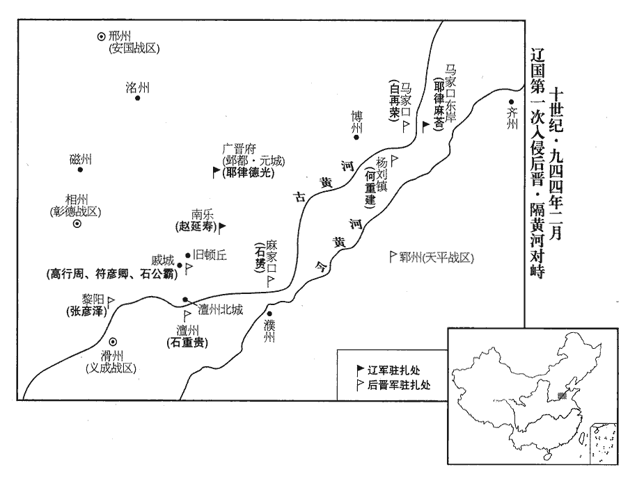
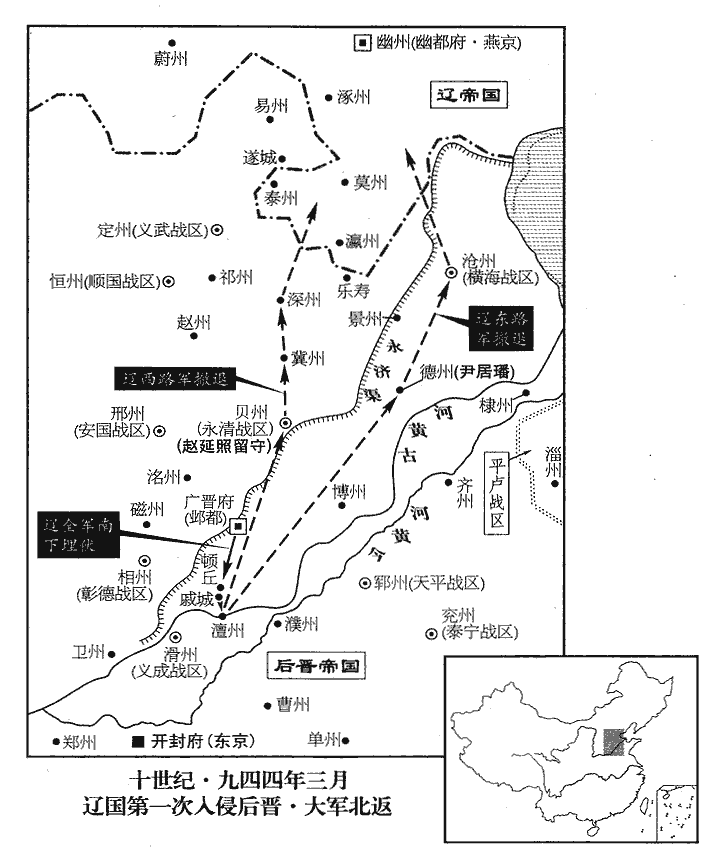
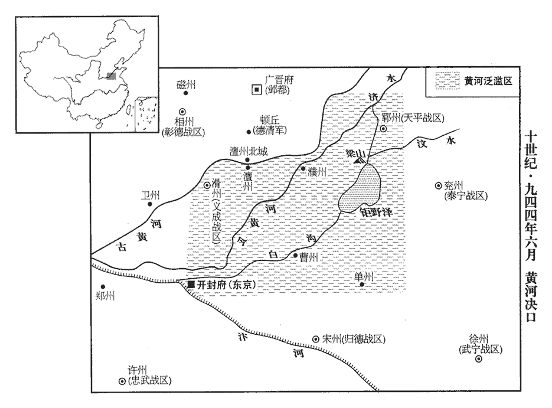
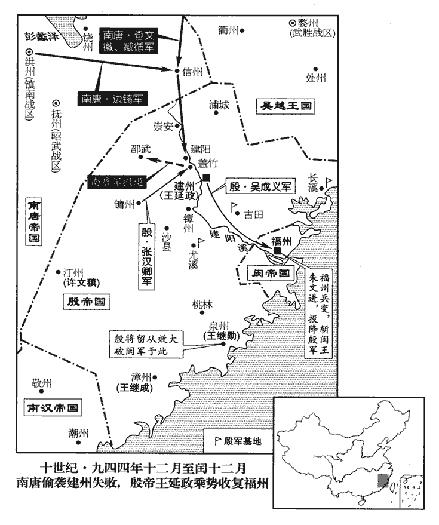
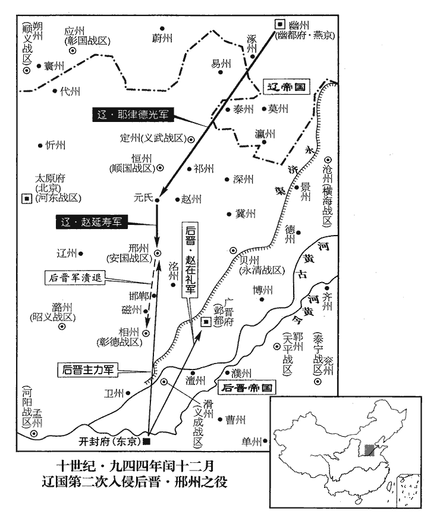
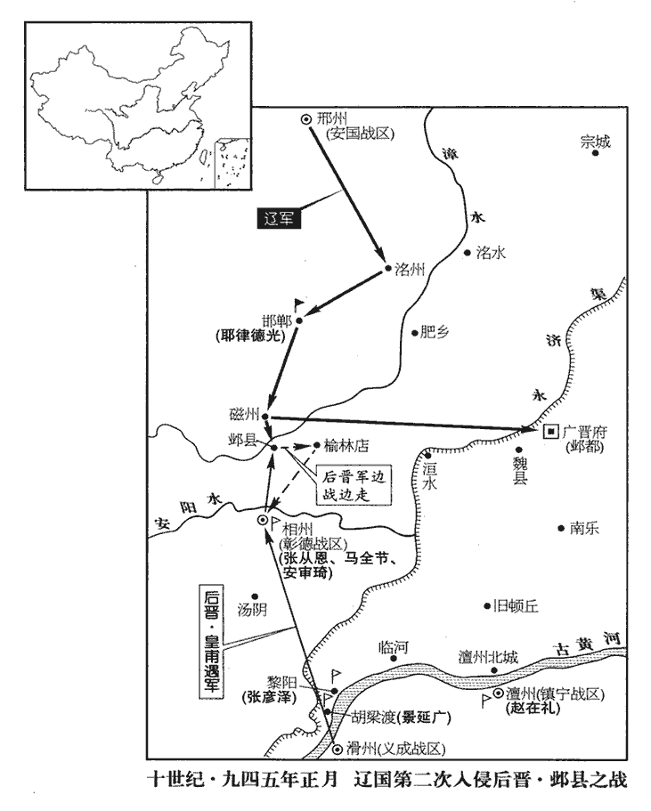
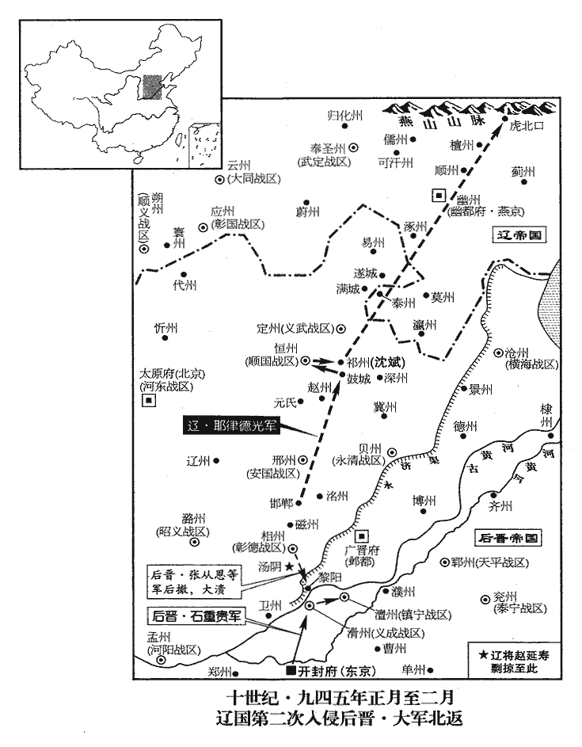
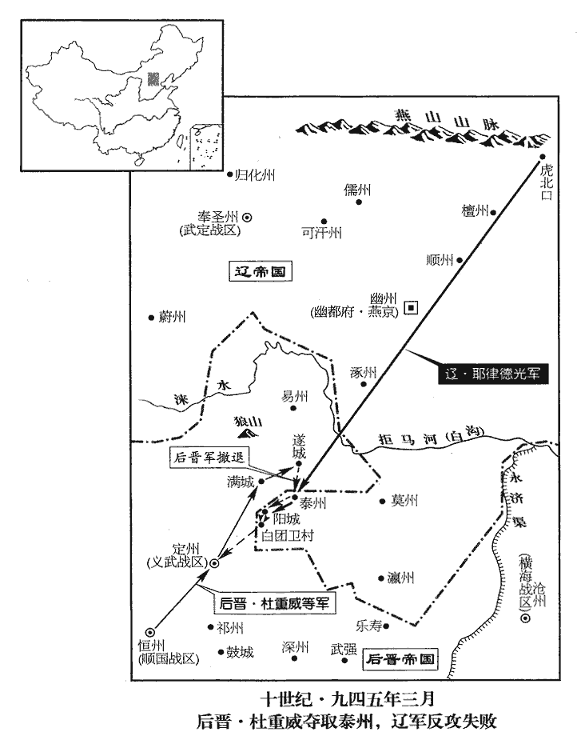

 後晉紀五起閼逢執徐（甲辰）二月，盡旃蒙大荒落（乙巳）七月，凡一年有奇。

# 齊王中

## 開運元年（甲辰、九四四）

1二月，甲辰朔‹一›，命前保義節度使石贇守麻家口‹河南省范县南›，前威勝‹总部设邓州河南省邓州市›節度使何重建守楊劉鎮‹山东省东阿县东北杨柳乡›，護聖都指揮使白再榮守馬家口，西京‹河南府·河南省洛阳市›留守安彥威守河陽‹河南省孟州市›。贇yūn，於倫翻。按是時凡緣河津要，皆以兵守之，亦由燕、冀、瀛、莫既入于北，遼人南寇，了無關山塘濼之阻，其兵可以徑造河上，故不得不緣河為備也。未幾，周儒引契丹將麻荅自馬家口濟河，營於東岸，攻鄆州北津以應楊光遠。麻荅，契丹主之從弟也。幾，居豈翻。從，才用翻。鄆，音運。

〖译文〗 [1]二月，甲辰朔（初一），后晋朝廷命前保义节度使石把守麻家口，前威胜节度使何重建把守杨刘镇，护圣都指挥白再荣把守马家口，西京留守安彦威把守河阳。不久，周儒引领契丹将军麻从马家口渡过黄河，在东岸扎营，攻打郓州北津以接应杨光远。麻是契丹主耶律德光的堂弟。

乙巳‹二›，遣侍衛馬軍都【章：十二行本「都」下有「指」字；乙十一行本同；孔本同；熊校同。】揮使•義成‹总部设滑州河南省滑县›節度使李守貞、神武統軍皇甫遇、陳州‹河南省淮阳县›防禦使梁漢璋、懷州‹河南省沁阳市›刺史薛懷讓將兵萬人，緣河水陸俱進。守貞，河陽；漢璋，應州‹山西省应县›；懷讓，太原人也。

〖译文〗 乙巳（初二），后晋派遣侍卫马军都指挥使、义成节度使李守贞、神武统军皇甫遇、陈州防御使梁汉璋、怀州刺史薛怀让统兵万人，沿着黄河水陆并进。李守贞是河阳人；梁汉璋是应州人；薛怀让是太原人。

丙午‹三›，契丹圍高行周、符彥卿及先鋒指揮使石公霸於戚城‹河南省濮阳市北›。春秋時，戚屬衛地，河上邑也。東坡指掌圖以為衛之戚，今在博州界。按是時晉與契丹相拒於澶、衛之間，此戚城當在澶州之北，魏州之南，疑不在博州之界也。先是，景延廣令諸將分地而守，無得相救。行周等告急，延廣徐白帝，帝自將救之。契丹解去，三將泣訴救兵之緩，幾不免。幾，居衣翻。

〖译文〗 丙午（初三），契丹兵在戚城包围了高行周、符彦卿及先锋指挥使石公霸。起先，景延广命令诸将分地而守，不许相互救援。此时，高行周等告急，景延广延缓报告后晋出帝，后晋出帝自己带兵去救援。契丹兵围解除退去，三将涕泣地诉说救兵来得太慢，几乎不能免于一死。

戊申‹五›，李守貞等至馬家口。契丹遣步卒萬人築壘，散騎兵於其外，餘兵數萬屯河西，船數千艘渡兵，未已，艘，蘇遭翻。晉兵薄之，契丹騎兵退走，晉兵進攻其壘，拔之。契丹大敗，乘馬赴河溺死者數千人，俘斬亦數千人。河西之兵慟哭而去，由是不敢復東。楊光遠之援絕矣。復，扶又翻。

〖译文〗 戊申（初五），李守贞等到达马家口。契丹遣派一万步兵修筑堡垒，在其外散布骑兵戍守，其余兵众数万人屯驻在河西，有船数千艘运渡兵卒。没有多久，晋兵迫近他们，契丹的骑兵退走，晋兵进攻其堡垒，攻下了它们。契丹兵大败，骑马过河的人被淹死几千人，被俘、被杀的也有几千人。黄河西边的兵痛哭着退走，从此不敢再向东来。

2辛亥‹八›，定難‹总部设夏州陕西省靖边县北白城子›節度使李彝殷奏將兵四萬自麟州‹陕西省神木县›濟河，侵契丹之境。定難軍，夏州。九域志：麟州西北至夏州一百二十里。自麟州東北至府州，又自府州東北行入契丹境。難，乃旦翻。壬子‹九›，以彝殷為契丹西南面招討使。

〖译文〗 [2]辛亥（初八），定难节度使李彝殷奏报：统兵四万从麟州渡过黄河，侵入契丹之境。壬子（初九），后晋出帝任命李彝殷为契丹西南面招讨使。

 

初，契丹主‹首都临潢府内蒙古巴林左旗›耶律德光得貝州、博州，皆撫慰其人，或拜官賜服章。及敗於戚城及馬家口，忿恚，恚，於避翻。所得民，皆殺之，得軍士，燔炙之。由是晉人憤怒，戮力爭奮。

〖译文〗 过去，契丹主取得贝州、博州，都对这个地方的人加以抚慰，或者拜授官职、赐给有纹彩的官服。等在戚城及马家口打了败仗后他就恼恨了，把所虏得的民众都杀了，俘获的军士都烧死。因此引起晋国人的愤怒，团结合力，奋起斗争。

楊光遠將青州兵欲西會契丹；戊午‹十五›，詔石贇分兵屯鄆州以備之。石贇時屯麻家口。

〖译文〗 杨光远带领青州兵，想向西与契丹兵会合；戊午（十五日），后晋出帝下诏，命令石分出兵马驻扎在郓州，来防备他。

詔劉知遠將部兵自土門‹河北省鹿泉市西南›出恒州擊契丹，又詔會杜威、馬全節於邢州。知遠引兵屯樂平‹山西省昔阳县›不進。樂平離太原二百餘里耳。

〖译文〗 后晋出帝诏命刘知远带领本部兵马从土门出恒州，进击契丹，又诏命他在邢州与杜威、马全节会合。刘知远引兵驻扎在乐平不再前进。

3帝居䘮期年，即於宫中奏細聲女樂。細聲女樂，欲其不聞于外也。及出師，常令左右奏三絃琵琶，和以羌笛，和，戸卧翻。擊鼓歌舞，曰：「此非樂也。」庚申‹十七›，百官表請聽樂，詔不許。居䘮而納叔母，尚何責乎聽樂！

〖译文〗 [3]后晋出帝居丧将近一年，就在宫中演奏细声女乐。等到出师北讨时，常常让左右之人奏三弦、琵琶，和以羌笛，击鼓唱歌舞蹈，并说：“这不是作乐啊。”庚申（十七日），百官上表请求听乐，下诏不许。

4壬戌‹十九›，楊光遠圍棣州‹山东省惠民县›，刺史李瓊出兵擊敗之，楊光遠自青州歷淄州而圍棣州。敗，補賣翻。光遠燒營走還青州。還，從宣翻，又如字。癸亥‹二十›，以前威勝節度使何重建為東面馬步都部署，將兵屯鄆州。

〖译文〗 [4]壬戍（十九日），杨光远围困棣州，刺史李琼出兵把他打败，杨光远烧了营寨退回青州。癸亥（二十日），后晋朝延任命前威胜节度使何重建为东面马步都部署，统兵屯驻郓州。

5階‹甘肃省武都县东›、成‹甘肃省成县›義軍指揮使王君懷帥所部千餘人叛降蜀，請為鄉道以取階、成。鄉，讀曰向。階、成，二州名。甲子‹二十一›，蜀人攻階州。

〖译文〗 [5]阶州、成州义军指挥使王君怀率领所部千余人叛晋降蜀，请求当向导去攻取阶、成二州。甲子（二十一日），蜀人攻打阶州。

6契丹偽棄元城去，伏精騎於古頓丘城‹原澶州州政府所在县·河南省内黄县东南›，頓丘，漢古縣。爾雅：丘一成曰頓丘。後移治所於陰安城。唐頓丘縣，又移治於陰安城之南。天福三年，徙澶州跨德勝津，併頓丘縣徙焉。頓丘凡三徙矣，古城蓋陰安城也。以俟晉軍與恒、定之兵合而擊之。時詔杜威、馬全節以兵來會，契丹欲俟其合而邀擊之。鄴都留守張從恩屢奏虜已遁去；大軍欲進追之，會霖雨而止。契丹設伏旬日，人馬飢疲。趙延壽曰：「晉軍悉在河上，畏我鋒銳，必不敢前；不如即其城下，即，就也。四合攻之，奪其浮梁，謂澶州德勝渡之河梁也。則天下定矣。」契丹主從之。三月，癸酉朔‹一›，自將兵十餘萬陳於澶州城北，宋白曰：契丹時駐兵澶州鐵丘。陳，讀曰陣；下同。東西橫掩城之兩隅，登城望之，不見其際。高行周前軍在戚城之南，與契丹戰，自午至晡，互有勝負。契丹主以精兵當中軍而來，帝亦出陳以待之。契丹主望見晉軍之盛，謂左右曰：「楊光遠言晉兵半已餒死，楊光遠誘契丹入寇見上卷上年。今何其多也！」以精騎左右略陳，晉軍不動，萬弩齊發，飛矢蔽地。契丹稍卻；又攻晉陳之東偏，不克。苦戰至暮，兩軍死者不可勝數。勝，音升，昏後，契丹引去，營於三十里之外。不敢逼城而營，懼晉軍攻劫也。

〖译文〗 [6]契凡假装舍弃了元城退去，把精锐骑兵埋伏在古顿丘城，来等待晋军与恒州、定州之兵会合之后再迎击它。邺都留守张从恩几次奏报北虏已经遁走，大军打算进击追逐它，后来由于遇上下雨而停止。契丹设置埋伏十天，人马饥饿疲乏，赵延寿说：“晋军都在河上，惧怕我们的精锐，必定不敢向前；不如就地攻下其城，四面合兵攻打，夺取黄河上的浮桥，那么天下就平定了。”契丹主听从了他的话，三月，癸酉朔（初一），亲自领兵十余万在澶州城的北面排开阵势，东面和西面横向包围城的两角，登城观望，看不见边际。高行周的前锋部队在戚城之南，与契丹兵交战，从晌午到日落，互有胜负。契丹主耶律德光指挥精兵向着中军进击而来，后晋出帝石重贵也率兵出来摆开阵势等待他过来。契丹主望见晋军的盛况，对左右说：“杨光远说晋兵之半数已经饿死，现在为什么还有这么多？”使用精锐骑兵从左方和右方攻打，晋军丝毫不动，万弩齐发，飞矢落下遍地都是。契丹兵稍向后退；又向晋军的东翼进攻，也攻不下来。若战到晚上，两军死亡的不可胜数。天黑以后，契丹引兵后退，在三十里之外扎营。

乙亥‹三›，契丹主帳中小校竊其馬亡來，云契丹已傳木書，收軍北去。校，戶教翻。木書者，書之於木以為信契。景延廣疑其詐，閉壁不敢追。

〖译文〗 乙亥（初三），契丹主帐中的小校盗其马逃来晋军，说契丹已经传递木书信契，收军北去。景延广怀疑有诈，关闭军垒不敢追击。

7漢主‹首都兴王府广东省广州市›刘弘熙（刘晟）本年二十五岁命中書令、都元帥越王弘昌謁烈宗陵於海曲‹广东省番禺市北亭›，劉龑yǎn舉大號，追尊其兄隱為烈宗。至昌華宮‹广州市西›，使盜殺之。

〖译文〗 [7]南汉主刘晟命中书令、都元帅越王刘弘昌到海曲进谒烈宗刘隐的陵墓，到了昌华宫后，指使盗贼把他杀了。

8契丹主自澶州北分為两軍，一出滄‹河北省沧州市东南›、德‹山东省陵县›，一出深‹河北省深州市›、冀‹河北省冀州市›而歸。所過焚掠，方廣千里，廣，古曠翻。民物殆盡。留趙延照為貝州留後。麻荅陷德州，擒刺史尹居璠。璠，音煩。

〖译文〗 [8]契丹主从澶州向北兵分两路，一支出沧州、德州，一支出深州、冀州而归去。所过的地方，大事焚烧抢掠，方圆面积有一千里，民间财物几乎被抢光了。留下赵延照为贝州留后。麻攻陷德州，捉住刺史尹居。

 

9閩‹首都长乐府福建省福州市›拱宸都指揮使朱文進，閤門使連重遇，既弒康宗‹王继鹏（王昶）›，見二百八十二卷天福四年。常懼國人之討，相與結婚以自固。閩主曦‹王延羲（王曦）›果於誅殺，嘗遊西園，因醉殺控鶴指揮使魏從朗。從朗，朱、連之黨也。又嘗酒酣誦白居易詩云：「惟有人心相對間，咫尺之情不能料，」因舉酒屬二人。易，以豉翻。屬，之欲翻。二人起，流涕再拜，曰：「臣子事君父，安有他志！」曦不應。二人大懼。

〖译文〗 [9]闽国拱宸都指挥使朱文进、阁门使连重遇，杀了康宗王昶以后，常常害怕国人声讨他们，便互相结为婚姻，用来巩固自己的势力。闽主王曦对诛杀很随便，他曾经游览西园，因为醉酒杀了控鹤指挥使魏从朗。魏从朗是朱文进、连重遇的党羽。又曾经在酒兴正浓时吟诵白居易的诗道：“惟有人心相对间，咫尺之情不能料”，边诵边举酒对着朱、连二人，二人起立，流涕再拜，说：“臣子侍奉君父，哪能有二心！”王曦没有什么反应，二人大为惶恐。

李后妬尚賢妃之寵，欲弒曦而立其子亞澄，尚賢妃有寵，見上卷天福八年，閩王之永隆四年也。亞澄時封閩王。使人告二人曰：「主上殊不平於二公，柰何？」

〖译文〗 李后妒忌尚贤妃受到闽主王曦的宠爱，想要谋杀王曦而立她的儿子王亚澄为帝，派人告诉二人说：“主上对待你们二位很不公平，怎么办？”

會后父李真有疾，乙酉‹十三›，曦如真第問疾。文進、重遇使拱宸馬步使錢達弒曦於馬上，召百官集朝堂，告之曰：「太祖昭武皇帝‹王审知›，光啟閩國，朝，直遙翻。閩主王鏻舉大號，追尊其父審知曰太祖昭武皇帝。今子孫淫虐，荒墜厥緒。天厭王氏，宜更擇有德者立之。」更，工行翻。眾莫敢言。重遇乃推文進升殿，被袞冕，被，皮義翻。帥群臣北面再拜稱臣。帥，讀曰率。文進自稱閩主，悉收王氏宗族延喜以下少長五十餘人，皆殺之。延喜，閩主之弟也。少，詩照翻。長，知兩翻。葬閩主曦，諡曰睿文廣武明聖元德隆道大孝皇帝，廟號景宗。以重遇總六軍。禮部尚書、判三司鄭元弼抗辭不屈，黜歸田里，將奔建州，欲奔王延政也。文進殺之。文進下令，出宮人，罷營造，以反曦之政。

〖译文〗 适逢李后的父亲李真生病，乙酉（十三日），王曦到李真的府第问候疾病。朱文进、连重遇指使拱宸马步使钱达在马上把王曦杀了，召集百官到朝堂，向大家宣告说：“太祖昭武皇帝光辉地开创闽国，现在子孙淫乱暴虐，使他的遗绪荒废坠落，上天厌弃王氏，应该另外选择有德的人拥立他为皇帝。”众人不敢讲话。连重遇便把朱文进推拥上殿升座，穿上帝王的衣服冠冕，帅领群臣向北面再拜称臣。朱文进自称闽主，把王氏宗族从王曦的弟弟王延喜以下少长五十余人，全部收拘，都杀了。埋葬了闽主王曦，谥为睿文广武明圣元德隆道大孝皇帝，庙号景宗。任用连重遇总领六军。礼部尚书、判三司郑元弼言词抗驳不屈服，罢黜他回归田里，在他将要投奔建州时，朱文进把他杀了。朱文进下令，遣出宫人，停止营建，以此改变王曦的政策。

殷主延政‹王延政›遣統軍使吳成義將兵討文進，不克。

〖译文〗 殷主王延政遣派统军使吴成义领兵征讨朱文进，未能取胜。

文進加樞密使鮑思潤同平章事，以羽林統軍使黃紹頗為泉州‹福建省泉州市›刺史，左軍使程文緯為漳州‹福建省漳州市›刺史。汀州‹福建省长汀县›刺史同安‹福建省厦门市北大同镇›許文稹，舉郡降之。九域志：泉州同安縣在州西一百三十五里，蓋王氏所置也。宋白曰：開元十九年，析泉州南安縣界四鄉置大同場，閩王升為同安縣。稹，章忍翻。

〖译文〗 朱文进加封枢密使鲍思润同平章事，任用羽林统军使黄绍颇为泉州刺史，左军使程文纬为漳州刺史。汀州刺史同安人许文稹，献出守郡向朱文进投降。

10丁亥‹十五›，詔太原、恒、定兵各還本鎮。契丹已退故也。

〖译文〗 [10]丁亥（十五日），后晋出帝下诏，命令太原、恒州、安州兵各还本镇。

11辛卯‹十九›，馬全節攻契丹泰州‹河北省保定市›，拔之。五代會要：後唐天成三年，升奉化軍為泰州，以清苑縣為理所。至晉開運二年九月，移治滿城縣；至周廣順二年二月，廢州，其滿城縣割隸易州。時馬全節自定州攻泰州。

〖译文〗 [11]辛卯（十九日），马全节攻打契丹的泰州，攻取下来。

12敕天下籍鄉兵，每七戶共出兵械資一卒。

〖译文〗 [12]后晋出帝敕令天下按籍征召乡兵，每七户按一个兵卒共同出兵械钱。

13秦州‹甘肃省秦安县西北›兵救階州，出黃階嶺‹甘肃省武都县东北›，敗蜀兵於西平。敗，補賣翻。

〖译文〗 [13]秦州兵救援阶州，出黄阶岭，在西平打败了蜀兵。

14漢以戶部侍郎陳偓同平章事。

〖译文〗 [14]南汉任用户部侍郎陈同平章事。

15夏，四月，丁未‹五›，緣河巡檢使梁進以鄉社兵復取德州。鄉社兵，民兵也。時契丹寇掠，緣河之民，自備兵械，各隨其鄉，團結為社，以自保衛。契丹陷德州而北歸，梁進乘其去而復取之。己酉‹七›，命歸德‹总部设宋州河南省商丘市›節度使高行周、保義‹总部设陕州河南省三门峡市›節度使王周留鎮澶州。庚戌‹八›，帝發澶州；甲寅‹十二›，至大梁。

〖译文〗 [15]夏季，四月，丁未（初五），缘河巡检使梁进用乡社兵收复了德州。己酉（初七），后晋朝廷命归德节度使高行周、保义节度使王周留镇澶州。庚戍（初八），后晋出帝从澶州出发回师；甲寅（十二日），到达大梁。

侍衛馬步都指揮使、天平節度使、同平章事景延廣，既為上下所惡，上，謂將相大臣；下，謂軍民。惡，烏路翻。帝亦憚其不遜難制；桑維翰引其不救戚城之罪，引，牽也；牽發其罪，猶人收捲衣物於懷袖間，從而牽出之然。辛酉‹十九›，加延廣兼侍中，出為西京‹河南府·河南省洛阳市›留守。晉徙都汴，以河南府為西京。以歸德節度使兼侍中高行周為侍衛馬步都指揮使。延廣鬱鬱不得志，橛豎小人，得權則驕溢使氣，失權則鬱鬱不得志，乃其常也。見契丹強盛，始憂國破身危，遂日夜縱酒。自知無復全地，苟取朝夕之樂。

〖译文〗 侍卫马步都指挥使、天平节度使、同平章事景延广，既已被将相和军民上下所厌恶，后晋出帝也怕他不驯服，难于控制；桑维翰又提出他不救援戚城之罪，辛酉（十九日），给景延广加官兼任侍中，出朝任西京留守。任用归德节度使兼侍中高行周为侍卫马步都指挥使。景延广郁郁不得志，看到契丹强盛，开始忧虑国家要破败，自身也危亡，便昼夜放纵饮酒。

朝廷因契丹入寇，國用愈竭，復遣使者三十六人分道括率民財，各封劍以授之。示使專斷斬，此以威脅取民財也，復，扶又翻。使者多從吏卒，攜鎖械、刀杖入民家，小大驚懼，求死無地。州縣吏復因緣為姦。復，扶又翻；下同。

〖译文〗 后晋朝廷由于契丹入侵，国家财用更加困竭，便又遣派使者三十六人分到各道搜括民间财物，每个使者各封赐给上方宝剑，授以斩杀之权。这些使者带着众多的吏卒随从，拿着锁链刑械、刀杖进入民众家里，小孩大人都很惊怕，想要求死都无路可走。那些州和县的官吏又借此机会为非作歹。

河南府出緡錢二十萬，此括率合出之數也。景延廣率三十七萬。景延廣增率十七萬，欲以入己。留守判官【章：十二行本「官」下有「河南」二字；乙十一行本同；張校同。】盧億言於延廣曰：「公位兼將相，富貴極矣。今國家不幸，府庫空竭，不得已取於民，公何忍復因而求利，為子孫之累乎！」累，力瑞翻。延廣慙而止。史言景延廣差愈於杜重威。

〖译文〗 河南府应出缗钱二十万，景延广增加到三十七万。留守判官卢向景延广进言说：“您高位兼居将相，富贵达到极点了。现在国家不幸，府库空乏竭尽，不得已索取于百姓，您怎么忍心再借机贪求私利，给子孙增加罪累啊！”景延广惭愧而停止增赋。

先是，詔以楊光遠叛，命兗州‹山东省兖州市›脩守備。青、兗鄰鎮，故命之為備。先，昔薦翻。泰寧節度使安審信，以治樓堞為名，堞，達協翻。率民財以實私藏。藏，徂浪翻；下同。大理卿張仁愿為括率使，至兗州，賦緡錢十萬。值審信不在，不在者，適不在鎮。拘其守藏吏，指取錢一囷qūn，已滿其數。史言晉之藩鎮，利國有難，浚民以肥家。

〖译文〗 以前，后晋朝廷因为杨光远背叛，下诏命令兖州修筑守备设施。泰宁节度使安审信用建造城防楼堞的名义，搜括民间财物来充实自己的收藏。后晋朝廷大理寺卿张仁愿受派为括率使，来到兖州，收取缗钱十万。正适安审信不在，拘捕了他的守藏吏，指令取一个库的钱，便满足了所需之数。

16戊寅‹七›，命侍衛馬步軍都虞候、泰寧節度使李守貞將步騎二萬討楊光遠於青州；李守貞蓋代安審信帥泰寧也。又遣神武統軍洛陽潘環及張彥澤等將兵屯澶州，以備契丹。

〖译文〗 [16]五月，戊寅（初七），后晋朝廷命侍卫马步军都虞候和泰宁节度使李守贞统领步骑二万人讨伐青州的杨光远，又遣派神武统军洛阳人潘环及张彦泽统兵屯驻澶州，来防备契丹。

契丹遣兵救青州，齊州‹山东省济南市›防禦使堂陽‹河北省新河县›薛可言邀擊，敗之。堂陽縣屬冀州，宋皇祐四年，省縣為鎮，入南宮縣。九域志曰：地在堂水之陽。敗，補賣翻。

〖译文〗 契丹派兵救援青州，晋国齐州防御使堂阳人薛可言迎击，打败了他们。

17丙戌‹十五›，詔諸州所籍鄉兵，號武定軍，凡得七萬餘人。時兵荒之餘，復有此擾，民不聊生。異時契丹入汴，武定軍曷嘗能北向發一矢乎！復，扶又翻。

〖译文〗 [17]丙戌（十五日），后晋朝廷诏令诸州所按户籍征调的乡兵，号称武定军，共得七万余人。当时正值兵荒之余，再有这样的困扰，致使民不聊生。

18丁亥‹十六›，鄴都留守張從恩上言：「趙延照雖據貝州，麾下兵皆久客思歸，宜速進軍攻之。」詔以從恩為貝州行營都部署，督諸將擊之。辛卯‹二十›，從恩奏趙延照縱火大掠，棄城而遁，屯於瀛‹河北省河间市›、莫‹河北省任丘市北鄚州镇›，阻水自固。瀛、莫之間多水濼，故趙延照阻以為固。瀛、莫相去一百一十里。

〖译文〗 丁亥（十六日），邺都留守张从恩上奏后晋朝廷：“赵延照虽然占据贝州，他指挥下的契丹兵卒都是久客在外思归，应该迅速进军攻打它。”诏令任用张从恩为贝州行营都部署，督率诸将进击。辛卯（二十日），张从恩奏报赵延照放火大肆抢掠，弃城而逃，屯扎在瀛州、莫州，依水设阻，巩固自己的阵地。

19朱文進遣使如唐，唐主囚其使，將伐之，唐主欲討朱文進弒君之罪。會天暑、疾疫而止。

〖译文〗 [19]闽国朱文进遣派使者到南唐，南唐主李把使者囚禁起来，将要征伐闽国，正好遇到天气暑热、疫病流行才停止。

20六月，辛酉‹一›，官軍拔淄州‹山东省淄博市›，斬其刺史劉翰。淄州，楊光遠之巡屬也。

〖译文〗 [20]六月，辛酉（二十一日），后晋官军攻克淄州，斩杀杨光远的刺史刘翰。

21太尉、侍中馮道雖為首相，馮道自唐潞王之時，已正拜三公，晉高祖入洛，用以為相，位任在執政之右。依違兩可，無所操決。此馮道保身固位之術，一生所受用者也。操，七刀翻。或謂帝曰：「馮道，承平之良相；今艱難之際，譬如使禪僧飛鷹耳。」言禪以靜寂為宗，僧以慈悲不殺為教。為禪僧者，第能機辯無窮，而不能應物，使之飛鷹搏擊，非其任也。癸卯‹三›，以道為匡國‹总部设同州陕西省大荔县›節度使，兼侍中。出馮道鎮同州，將別命相也。

〖译文〗 [21]后晋太尉、待中冯道虽当首相，但办事模棱两可，什么事都不拿主意。有人对后晋出帝说：“冯道是和平时期的好宰相，现在是艰难之际，比如让参禅僧人去飞鹰搏兔，非其所擅。”癸卯（初三），任用冯道出朝为匡国节度使，仍兼侍中。

22乙巳‹五›，漢主‹刘弘熙（刘晟）›幽齊王弘弼于私第。

〖译文〗 [22]乙巳（初五），南汉主刘晟在他的私宅里幽禁齐王刘弘弼。

23或謂帝曰：「陛下欲禦北狄，安天下，非桑維翰不可。」請罷馮道，請用桑維翰，蓋出一人之口。前史謂維翰倩人以言於帝，通鑑皆曰「或」者，疑其辭。丙午‹六›，復置樞密院，罷樞密院見二百八十二卷高祖天福四年。以維翰為中書令兼樞密使，事無大小，悉以委之。數月之間，朝廷差治。治，直吏翻。

〖译文〗 [23]有人对后晋出帝说：“陛下想要抵御北狄，安治天下，非用桑维翰不可。”丙午（初六），恢复设置枢密院，任命桑维翰为中书令兼枢密使，事情不论大小，都委托给他。几个月之间，朝廷的事稍见治绩。

24滑州河決，浸汴、曹、單、濮‹山东省鄄城县›、鄆五州之境，環梁山‹山东省梁›山县南合于汶。梁山在鄆州壽張縣，汶水自東北來，與濟水會于梁山東北。今決河之水瀰漫，環梁山而合于汶。單，音善。濮，音卜。環，音宦。汶，音問。詔大發數道丁夫塞之。塞，昔則翻。既塞，帝欲刻碑紀其事。中書舍人楊昭儉諫曰：「陛下刻石紀功，不若降哀痛之詔；染翰頌美，不若頒罪己之文。」帝善其言而止。

〖译文〗 [24]黄河在滑州决口，淹浸了汴、曹、单、濮、郓五州的地区，环绕梁山合流入汶水。后晋朝廷诏命大规模发动几个道的民夫去堵塞。堵塞完成之后，后晋出帝要刻碑记载此事。中书令舍人杨昭俭进谏说：“陛下刻石记功，不如降下哀痛的诏书；点染翰章歌颂美德，不如颁发责备自己的文告。”后晋出帝认为他的话说得好而停止。

25初，高祖割北邊之地以賂契丹，事見二百八十卷高祖天福元年。由是府州‹陕西省府谷县›刺史折從遠亦北屬。府州領府谷一縣，後唐以麟州東北河濱之地置。宋白曰：府州本河西蕃界府谷鎮。土人折嗣倫，世為鎮將。後唐莊宗天佑七年，升鎮為府谷縣；八年，升建府州以扼蕃界，以嗣倫男從遠為刺史。折，姓；從遠，名。姓氏略：折，常列翻。契丹欲盡徙河西‹陕西省北部›之民以實遼東‹辽宁省›，州人大恐，從遠因保險拒之。及帝與契丹絕，遣使諭從遠使攻契丹。從遠引兵深入，拔十餘寨。戊午‹十八›，以從遠為府州團練使。從遠，雲州‹山西省大同市›人也。歐史曰：折從遠，雲中人，蓋指古雲中郡大界言之。

〖译文〗 [25]从前，后晋高祖石敬瑭割让北边的地盘来贿赂契丹，于是府州刺史折从远也随郡北属。契丹想把黄河以西的民众全部迁移去充实辽东，府州民众大为惊恐，折从远便据险抗拒。等到后晋出帝与契丹绝交，派使者谕告折从远让他攻打契丹。折从远率领兵马深入北境，拔除契丹十多个营寨。戊午（十八日），任用折从远为府州团练使，折从远是云州人。

26甲子‹二十四›，復置翰林學士。廢翰林學士，見二百八十二卷天福五年。戊辰‹二十八›，以右散騎常侍李慎儀為兵部侍郎、翰林學士承旨，都官郎中劉溫叟、金部郎中•知制誥武強‹河北省武强县›徐台符、武強縣屬深州。九域志：在州東北六十里。禮部郎中李澣、主客員外郎宗城‹河北省威县东›范質，皆為學士。溫叟，岳之子也。劉岳見二百五十卷唐明宗天成元年。

〖译文〗 [26]甲子（二十四日），恢复设置翰林学士。戊辰（二十八日），后晋出帝任用右散骑常侍李慎仪为兵部侍郎、翰林学士承旨，都官郎中刘温叟、金部郎中、知制诰武强人徐台符、礼部郎中李浣、主客员外郎宗城人范质，都任用为学士。刘温叟是唐明宗时刘岳的儿子。

 

27秋，七月，辛未朔‹一›，大赦，改元。改元開運。

〖译文〗 [27]秋季，七月，辛未朔（初一），实行大赦，改年号为开运。

28己丑‹十九›，以太子太傅劉昫為司空兼門下侍郎、同平章事。

〖译文〗 [28]己丑（十九日），后晋朝廷任命太子太傅刘为司空兼门下侍郎、同平章事。

29八月，辛丑朔‹一›，以河東節度使劉知遠為北面行營都統，順國節度使杜威為都招討使，督十三節度以備契丹。

〖译文〗 [29]八月，辛丑朔（初一），任用河东节度使刘知远为北面行营都统，顺国节度使杜威为都招讨使，督导十三个节度使来防备契丹。

桑維翰兩秉朝政，出楊光遠、景延廣於外，楊光遠、景延廣，先皆嘗總宿衛兵。天福初，桑維翰秉政，出楊光遠；是時再秉政，出景延廣。朝，直遙翻。至是一制指揮，節度使十五人無敢違者，劉知遠、杜威并十三節度為十五人。按薛史載十三節度：鄆州張從恩，充馬步都監；西京留守景延廣，充都排陣使；徐州趙在禮，充都虞候；晉州安叔千，充左廂排陣使；前兗帥安審信，充右廂；河中安審琦，充馬步都指揮使；河陽符彥卿，充馬軍左廂；滑州皇甫遇，充右廂；右神武統軍張彥澤，充馬軍排陣使；滄州王廷胤，充步軍左廂都指揮使；陝州宋彥筠，充右廂；前金帥田武，充步軍左廂排陣使；左神武統軍潘環，充右廂。時人服其膽略。

〖译文〗 桑维翰两次执掌朝政，调出杨光远、景延广到外藩，到这时统一指挥权，节度使十五人没有敢违抗者，当时人叹服他的胆略。

朔方‹总部设灵州宁夏灵武市›節度使馮暉上章自陳未老可用‹本年五十一岁›，而制書見遺。維翰詔禁直學士詔禁直學士者，以詔旨詔之也。禁直學士，學士之入直禁地者也。使為答詔曰：「非制書忽忘，忘，巫放翻。實以朔方重地，非卿無以彈壓。比欲移卿內地，比，毗至翻。受代亦須奇才。」「受」，當作「授」。暉得詔，甚喜。

〖译文〗 朔方节度使冯晖上奏章陈说自己没有老，还可留用，而后晋出帝下制令时没有提到他。桑维翰用诏旨让入值禁宫的学士拟写答诏说：“不是制令忽略忘记，实在因为朔方是重要之地，不是你没有别人能够弹压得住。近来考虑把你移调内地，代替你的人也需要奇才。”冯晖得到诏书，极为高兴。

時軍國多事，百司及使者咨請輻湊，維翰隨事裁決，初若不經思慮，人疑其疏略；退而熟議之，亦終不能易也。然為相頗任愛憎，一飯之恩、睚眦之怨必報，人以此少之。史稱桑維翰之長而併及其短，所以明是非，示勸警。睚，五懈翻。眦，士懈翻。少，詩照翻。

〖译文〗 当时，军务、国事很繁重，百官及各地使者来请示、报告的人东水马龙，接连不断，桑维翰随事裁决，起初好像是没有经过思虑人们怀疑他有粗疏忽略，但退下来后仔细斟酌，终于没有可改变的。然而他当宰相时颇以自己的爱憎办事，一饭之恩、瞪眼之怨，必定报复，人们因此对他也有非议。

契丹之入寇也，帝再命劉知遠會兵山東，太原以河北之地為山東。帝初詔劉知遠自土門出恒州，尋又詔會兵邢州，並見上。皆後期不至。帝疑之，謂所親曰：「太原殊不助朕，必有異圖。果有分，何不速為之！」言若有分為天子，何不速為之。怒之之辭也。分，扶問翻。至是雖為都統，而實無臨制之權，密謀大計，皆不得預。知遠亦自知見疏，但慎事自守而已。郭威見知遠有憂色，謂知遠曰：「河東山川險固，河東治晉陽，東阻太行、常山，西限龍門、西河，南有霍太山、雀鼠谷之隘，北有鴈門、五臺諸山之險，故云然。風俗尚武，土多戰馬，此所謂恃險與馬也。靜則勤稼穡，動則習軍旅，此霸王之資也，王，于況翻。何憂乎！」

〖译文〗 契丹入侵时，后晋出帝再次命令刘知远会师到崤山以东，都过期了还没有到。后晋出帝怀疑他，对亲近的人说：“太原很不帮助朕，必然有反叛的图谋。如果有当天子的福份，为什么不早点干！”到此时虽然任用他为诸军都统，实际上没有施行指挥的权力，密谋军国大事，都不让他参加。刘知远也自知被后晋出帝疏远，只是谨慎处事自我守护而已。郭威看到刘知远有忧虑之色，对他说：“河东地方山川险要坚固，风俗崇尚勇武，此地多产战马，安静的时候勤于农业生产，动乱的时候勇于练习军事，这是成就霸业和王道的依凭，有什么可忧虑的。！”

30朱文進自稱威武‹总部设长乐府福建省福州市›留後，權知閩國事，遣使奉表稱藩于晉。癸丑‹十三›，以文進為威武節度使，知閩國事。

〖译文〗 [30]朱文进自称威武留后，暂时主持闽国事务，派使者呈奉表章向后晋朝廷称藩。癸丑（十三日），后晋朝廷任用朱文进为威武节度使，主持闽国事务。

31癸亥‹二十三›，置鎮寧軍於澶州，以濮州隸焉。割天平巡屬之濮州以隸鎮寧軍。

〖译文〗 [31]癸亥（二十三日），后晋在澶州设置镇宁军，把濮州隶属其下。

32初，吳濠州‹安徽省凤阳县东北临淮关›刺史劉金卒，子仁規代之；仁規卒，子崇俊代之。唐烈祖‹李昪（徐知诰）›置定遠軍於濠州，唐置定遠軍於濠州，通鑑書於天福八年三月元宗即位之後，見上卷。以崇俊為節度使。會清淮‹总部设寿州安徽省寿县›節度使姚景卒，唐置清淮軍於壽州。崇俊厚賂權要，求兼領壽州。唐主陽為不知其意，徙崇俊為清淮節度使，以楚州‹江苏省淮安市›刺史劉彥貞為濠州觀察使，馳往代之；崇俊悔之。彥貞，信之子也。劉信事吳楊氏，四世有戰功。

〖译文〗 [32]当初，吴国濠州刺史刘金死后，他的儿子刘仁规代替了他；刘仁规死后，其子刘崇俊代替了他。南唐烈祖李在濠州设置定远军，任用刘崇俊为节度使。正遇上清淮节度使姚景死去，刘崇俊用重礼厚赂朝中权要，要求兼领寿州。南唐主假装不明白他的意思，把刘崇俊调迁为清淮节度使，另任楚州刺史刘彦贞为濠州观察使，赶奔濠州代替了他；刘崇俊很后悔。刘彦贞是吴国刘信的儿子。

33九月，庚午朔‹一›，日有食之。

〖译文〗 [33]九月，庚午朔（初一），发生日食。

34丙子‹七›，契丹寇遂城‹河北省徐水县西遂城镇›、樂壽‹河北省献县›，遂城縣，屬易州，宋太平興國六年，置威虜軍，景德元年，改廣信軍，在易州東南八十里，當五迴嶺及狼山之要；金置遂州。樂壽縣屬深州，宋分屬瀛州。九域志：在瀛州之南八十里。深州刺史康彥進擊卻之。

〖译文〗 [34]丙子（初七），契丹入侵遂城、乐寿，深州刺史康彦进击退了他们。

35冬，十月，丙午‹七›，漢主毒殺鎮王弘澤于邕州‹广西南宁市›。

〖译文〗 [35]冬季，十月，丙午（初七），南汉主刘晟在邕州把镇王刘弘泽毒死。

36殷‹首都建州›主延政遣其將陳敬佺以兵三千屯尤溪‹福建省尤溪县›及古田‹福建省古田县›，唐永泰二年，分候官、尤溪置古田縣，屬福州。九域志：在州西北一百八十里。尤溪縣在南劍州南一百九十五里。宋白曰：按尤溪縣理，今當延平東南二百四十里，在福州西北八百三十五里，其地與漳州龍巖縣、劍州沙縣及福州候官縣三處交界，山洞幽深，灘溪險峻，內有千里，諸境逃人多投此洞。開元二十八年，經略使唐脩忠招諭其人，因以名縣。此源先號尤溪，因名。古田縣亦開元二十九年開山洞置。盧進以兵二千屯長溪‹福建省霞浦县›。唐武德六年，置長溪縣，屬福州。九域志：在州東北三百四十五里。宋白曰：長溪縣本漢閩縣地，唐置溫麻縣，以縣界溫麻溪為名；天寶九年，改為長溪縣。

〖译文〗 [36]殷国国主王延政遣派其将陈敬领兵三千屯驻在尤溪及古田，卢进领兵二千屯驻在长溪。

泉州散員指揮使桃林‹福建省永春县›留從效九域志：泉州有桃林溪，蓋留從效所居之地。散，昔亶翻。謂同列王忠順、董思安、張漢思曰：「朱文進屠滅王氏，遣腹心分據諸州。吾屬世受王氏恩，而交臂事賊，一旦富沙王‹王延政›克福州，殷主延政本封富沙王。吾屬死有餘愧！」眾以為然。十一月，從效等各引軍中所善壯士，夜飲於從效之家，從效紿之曰：「富沙王已平福州，密旨令吾屬討黃紹頗。朱文進時以黃紹頗為泉州刺史。吾觀諸君狀貌，皆非久處貧賤者。從吾言，富貴可圖；不然，禍且至矣。」眾皆踊躍，操白梃，踰垣而入，執紹頗，斬之。處，昌呂翻。操，七刀翻。梃，大鼎翻。從效持州印詣王繼勳第，請主軍府。從效自稱平賊統軍使，函紹頗首，遣副兵馬使臨淮‹江苏省盱眙县淮河北岸›陳洪進齎詣建州‹殷首都·福建省建瓯市›。唐長安四年，分徐城南界兩鄉，於沙熟淮口置臨淮縣。開元二十三年，移治泗州郭下。陳洪進蓋本臨淮人而從軍泉州。

〖译文〗 泉州散员指挥使姚林人留从效对同列为官的王忠顺、董思安、张汉思说：“朱文进屠灭了王氏家族，派遣他的心腹之人分别占据各州。我们这些人世代蒙受王氏的恩惠，却拱手服从奸贼，一旦富沙王攻下福州，我们死有余愧啊！”众人认为他说得对。十一月，留从效等各自率领军中所要好的壮士，夜晚在留从效家中饮酒，留从效骗诱他们说：“富沙王已经平定福州，有密旨让我们讨拿黄绍颇。我看诸位的相貌，都不是久居贫贱之人。听我的话，富贵可以谋求；不然的话，大祸就要临头了。”众人都很积极响应，拿起棍棒，跳墙而入，捉住黄绍颇，把他杀了。留从效拿着泉州的印信到王继勋的府第去见他，请他出来主持军府的事务。留从效自称是平贼统军使，用匣子装了黄绍颇的首级，遣派副兵马使临淮人陈洪进捧着送到建州王延政那里。

洪進至尤溪，福州戍兵數千遮道。洪進紿之曰：「義師已誅朱福州，朱文進據福州，故以稱之。吾倍道逆嗣君於建州，嗣君，謂殷主延政當嗣有閩國。爾輩尚守此何為乎！」以紹頗首示之，眾遂潰，大將數人從洪進詣建州。延政以繼勳為侍中、泉州刺史，從效、忠順、思安、洪進皆為都指揮使。漳州將程謨聞之，按九域志，泉州西南至漳州三百六十里，鄰郡也。亡【章：乙十一行本「亡」作「立」；孔本作「亦」。】殺刺史程文緯「亡」當作「立」，筆誤也；否則「亦」字。立王繼成權州事。繼勳、繼成，皆延政之從子也，從，才用翻。朱文進之滅王氏，事見上三月。二人以疏遠獲全。

〖译文〗 陈洪进到达尤溪，福州方面的戍兵数千人挡住道路。陈洪进骗他们说：“起义的部队已经诛杀福州的朱文进，我正加倍赶路到建州去迎接君王继承人，你们还戍守在这里干什么呢？”并把黄绍颇的首级给他们看，这些兵众便逃散了，有几员大将跟随陈洪进到了建州。王延政任用王继勋为侍中、泉州刺史，留从效、王忠顺、董思安、陈洪进都任为都指挥使。漳州将官程谟听说这件事后，也杀了刺史程文纬，扶立王继成暂理州府事务。王继勋、王继成都是王延政的本家侄儿，朱文进族灭王氏家族时，这两个人由于关系疏远而得以保全。

汀州刺史許文稹奉表請降於殷。稹，止忍翻。

〖译文〗 汀州刺史许文稹上表章请求顺降于殷国。

37十二月，癸丑‹十五›，加朱文進同平章事，封閩國王。癸丑，大梁出命之日也，命未達而文進誅矣。

〖译文〗 [37]十二月，癸丑（十五日），后晋朝廷任命朱文进为同平章事、封为闽国王。

38李守貞圍青州經時，是年五月，李守貞圍青州。城中食盡，餓死者太半。契丹援兵不至，楊光遠遙稽首於契丹稽，音啟。曰：「皇帝‹耶律德光›，皇帝，誤光遠矣！」其子承勳、承祚、承信勸光遠降，冀全其族。光遠不許，曰：「吾昔在代北‹山西省北部›，嘗以紙錢祭天池‹山西省宁武县西南三十千米管涔山上›而沈，楊光遠本沙陀部人，居代北。天池，即汾陽縣之天池，時屬嵐州靜樂縣界。沈，持林翻。人皆言當為天子，姑待之。」丁巳‹十九›，承勳斬勸光遠反者節度判官丘濤等，送其首於守貞，縱火大譟，劫其父出居私第，上表待罪，開城納官軍。

〖译文〗 [38]李守贞围攻青州已经很长时间，城中食粮用尽，饿死的人有一大半。契丹的援兵不来，杨光远向遥远的契丹方向叩拜说：“皇帝啊皇帝！把我杨光远耽误了！”他的儿子杨承勋、承祚、承信劝杨光远投降，以求能够保全家族。杨光远不答应，说：“从前我在代北时，曾经用纸钱祭祀天池，纸钱下沉了，人们都说我应当为天子，姑且等待一下。”丁巳（十九日），杨承勋杀了劝杨光远造反的节度判官丘涛等人，把他们的头送到李守贞处，放火大声喧闹，劫持他父亲住到私人宅第，向后晋朝廷上表等待治罪，开城接进官军。

39朱文進聞黃紹頗死，大懼，以重賞募兵二萬，遣統軍使林守諒、內客省使李廷鍔將之攻泉州，鉦鼓相聞五百里。福州至泉州不及四百里，史家張大以言其聲勢耳。將，即亮翻。殷主延政遣大將軍杜進將兵二萬救泉州，留從效開門與福州兵戰，大破之，斬守諒，執廷鍔。延政遣統軍使吳成義帥戰艦千艘攻福州，艦，戶黯翻。艘，疏刀翻。朱文進遣子弟為質於吳越‹首都杭州浙江省杭州市›以求救。質，音致。

〖译文〗 [39]朱文进听说黄绍颇死了，大为恐惧，用重赏招募兵卒二万人，遣派统军使林守谅、内容省使李廷锷统领他们进攻泉州，钲鼓之声相闻达五百里。殷主王延政派大将军杜进领兵二万救援泉州，留从效打开城门与福州兵交战，把对方打得大败，斩了林守谅，捉住李廷锷。王延政派统军使吴成义率领战船千艘攻打福州，朱文进遣派子弟到吴越作人质，向吴越求救。

初，唐翰林待詔臧循，盛唐之時有翰林待詔，以處伎藝之人。與樞密副使查文徽同鄉里‹二人是歙州休宁县安徽省休宁县›人，循常為賈人，習福建山川，為文徽畫取建州之策。賈，音古。為文，于偽翻。文徽表請用兵擊王延政，國人多以為不可。唐主以文徽為江西安撫使，循行境上，覘其可否；行，下孟翻。覘，丑廉翻，又丑豔翻。文徽至信州‹江西省上饶市›，奏言攻之必克。唐主以洪州‹江西省南昌市›營屯都虞候邊鎬為行營招討諸軍都虞候，將兵從文徽伐殷。文徽自建陽‹福建省建阳市›進屯蓋竹‹建阳市东南十二千米›，唐武德四年，分建安縣置建陽縣，屬建州。建陽在建州西一百三十里。建陽縣之南二十五里，有地名蓋竹。聞漳、泉、汀三州皆降于殷，殷將張漢卿【章：十二行本「卿」作「真」；乙十一行本同；孔本同。】自鏞州‹福建省将乐县›將兵八千將至，文徽懼，退保建陽。臧循屯邵武，邵武亦本漢冶縣之地，吳於此立昭武鎮；晉平吳，更昭武鎮曰邵武縣；隋廢而復置，唐屬建州。九域志：在州西南二百七十里。宋白曰：邵武縣本東候官縣之北鄉也，孫策置南平縣。吳景帝三年，置昭武縣；晉太康三年，改為邵武。邵武民導殷兵襲破循軍，執循送建州斬之。

〖译文〗 从前，南唐翰林待诏臧循，与枢密副使查文徽是同乡，臧循常作商贩，熟悉福建的山水情况，替查文徽谋划攻取建州的办法。查文徽上表南唐主请求用兵攻打王延政，而南唐国中之人大多数认为不可。南唐主李任命查文徽为江西安扶使，循行在辖境上，来察看是否可行；查文徽到达信州，上奏称攻击它必定能够取得胜利。南唐主便任命洪州营屯都虞候边镐为行营招讨诸军都虞候，领兵随着查文徽讨伐殷国。查文徽从建阳进屯盖竹，听说漳州、泉州、汀州都降顺于殷，殷将张汉卿从镛州领兵八千将要来到，查文徽害怕，退保建阳。臧循屯驻邵武，邵武的百姓引导殷兵袭破臧循的军队，抓获了臧循，送到建州后就把他杀了。

 

40朝廷以楊光遠罪大，而諸子歸命，難於顯誅，命李守貞以便宜從事。閏月，癸酉‹五›，守貞入青州，遣人拉殺光遠於別第，以病死聞。拉，盧合翻。丙戌‹十八›，起復楊承勳，除汝州‹河南省汝州市›防禦使。昔楚令尹子南以罪誅，其子棄疾，以不忍棄父事讎而死。李懷光之反，河中既破，唐德宗欲活其子璀而不可得。彼二子者，以父子之親，居君臣之變，審義安命，以死殉親，夫豈不樂生，義不可也。若楊承勳兄弟，出於蕃落，梟獍其心，囚父歸命，以希苟活；晉朝以不殺降為說，於理且未安，又從而錄用之，宜異時契丹得假大義以洩其憤也。

〖译文〗 [40]后晋朝廷由于杨光远罪大，而他的几个儿子却归服朝廷，难于进行过份的诛杀，便命令李守贞斟酌处理。闰十二月，癸酉（初五），李守贞进入青州，派人把杨光远在他的别宅拉拽出来杀了，上报说是病死了。丙戍（十八日），恢复起用杨承勋，授官为汝州防御使。

41殷吳成義聞有唐兵，詐使人告福州吏民曰：「唐助我討賊臣，大兵今至矣。」福人益懼。乙未‹二十七›，朱文進遣同平章事李光準等奉國寶于殷。

〖译文〗 [41]殷国吴成义听说南唐兵来了，派人告诉福州的吏民、诈称：“唐兵帮助我们讨伐贼臣，大兵现在到了。”福州人更加恐惧，乙未（二十七日），朱文进派同平章事李光准等护送国宝给殷国。

丁酉‹二十九›，福州南廊承旨林仁翰南廊承旨，閩所置官，蓋亦侍衛武臣之職也。謂其徒曰：「吾曹世事王氏，今受制賊臣，富沙王至，何面見之！」帥其徒三十人被甲趣連重遇第，帥，讀曰率。被，皮義翻。趣，七喻翻。重遇方嚴兵自衛，三十人者望之，稍稍遁去。仁翰執槊直前刺重遇，殺之，刺，七亦翻。斬其首以示眾曰：「富沙王且至，汝輩族矣！今重遇已死，何不亟取文進以贖罪！」眾踊躍從之，遂斬文進，迎吳成義入城，函二首送建州。

〖译文〗 丁酉（二十九日），福州南廊承旨林仁翰对他的徒众说：“我们世世代代侍奉王氏，现在受到贼臣的辖制，富沙王来了，有什么脸面见他！”于是率领他的徒众三十人披上铠甲奔向连重遇的府第，连重遇正用兵卒严密地保卫自己，这三十个人看到如此情状，稍微后退遁走。林仁翰手执长槊直奔向前刺连重遇，把他杀了，砍下他的头来示众说：“富沙王将要来到，你们这些人要全家族灭了！现在连重遇已死，为什么还不赶快去攻取朱文进来为自己赎罪！”众人踊跃地跟着他，从而杀了朱文进，迎接吴成义进城，用匣装了朱、连二人的首级送往建州。

 

42契丹復大舉入寇，復，扶又翻。盧龍‹总部设幽州北京市›節度使趙延壽引兵先進。契丹復以趙延壽為軍鋒。契丹前鋒至邢州，順國節度使杜威遣使間道告急。契丹前鋒已至邢州，恒州信使路絕，故間道而來。間，古莧翻。帝欲自將拒之，會有疾，將，即亮翻。命天平節度使張從恩、鄴都留守馬全節、護國‹总部设河中府山西省永济市›節度使安審琦會諸道兵屯邢州，武寧‹总部设徐州江苏省徐州市›節度使趙在禮屯鄴都。馬全節自鄴都進屯邢州，令趙在禮自徐州進屯鄴都為後鎮。

〖译文〗 [42]契丹再次大举入侵，卢龙节度使赵延寿引领兵马在前面先行进发。契丹前锋到达邢州，后晋顺国节度使杜威派人从小道向朝廷告急。后晋出帝准备亲自统兵进行抗拒，但恰好遇上生病，便命令天平节度使张从恩、邺都留守马全节、护国节度使安审琦会合诸道兵马屯驻邢州，武宁节度使赵在礼屯驻邺都。

契丹主以大兵繼至，建牙於元氏‹河北省元氏县›。元氏縣屬恒州。九域志：在州南九十八里。朝廷憚契丹之盛，詔從恩等引兵稍卻，於是諸軍恟懼，無復部伍，恟，許拱翻。復，扶又翻；下同。委棄器甲，所過焚掠，比至相州‹河南省安阳市›，不復能整。比，毗至翻。

〖译文〗 契丹主耶律德光率领大兵接着来到，在元氏建造牙帐。后晋朝廷惧怕契丹兵力强盛，下诏令张从恩等稍作退却，因此诸军恐惧，不能形成部伍，丢弃兵器铠甲，所过地方都焚烧抢掠，等退到相州时，已无法再作整顿。

## 二年（乙巳、九四五）

1春，正月，‹首都开封府河南省开封市›石重贵，本年三十二岁詔趙在禮還屯澶州‹河南省濮阳市›，馬全節還鄴都‹广晋府·河北省大名县›；還，從宣翻。又遣右神武統軍張彥澤屯黎陽‹河南省浚县›，西京‹河南府·河南省洛阳市›留守景延廣自滑州‹河南省滑县›引兵守胡梁渡‹河南省滑县东北古黄河渡口›。庚子‹三›，張從恩奏契丹逼邢州‹河北省邢台市›，詔滑州、鄴都復進軍拒之。義成‹总部设滑州›節度使皇甫遇將兵趣邢州。皇甫遇奉詔自滑州進兵。趣，七喻翻。契丹寇邢‹河北省邢台市›、洺‹河北省永年县东南旧永年镇›、磁‹河北省磁县›三州，殺掠殆盡，入鄴都境。九域志：鄴都之境，西距磁州五十五里，西北距洺州五十里。磁，牆之翻。

〖译文〗 [1]春季，正月，后晋出帝诏令赵在礼回师驻扎在澶州，马全节还师邺都；又遣派右神武统军张彦泽屯驻黎阳，西京留守景延广从滑州引兵把守胡梁渡。庚子（初三），张从恩奏报：契丹逼近邢州，后晋出帝下诏，命滑州、邺都再次进军抗拒。义成节度使皇甫遇领兵赴邢州。契丹侵犯邢、、磁三州，几乎把那里抢光杀尽，然后进入邺都境内。

壬子‹十五›，張從恩、馬全節、安審琦悉以行營兵數萬，陳於相州‹河南省安阳市›安陽水‹卫河支流安阳河›之南。陳，讀曰陣。相，息亮翻。皇甫遇與濮州‹山东省鄄城县›刺史慕容彥超將數千騎前覘契丹，覘，丑廉翻，又丑豔翻。至鄴縣‹河北省临漳县西南邺镇›，鄴，漢古縣，唐屬相州，在州東北。劉昫曰：鄴，魏相州治所；隋文輔政，尉遲迥舉兵，既討平之，乃焚鄴城，徙其居人南遷四十五里，以安陽城為相州治所。隋煬帝於鄴故都大慈寺置鄴縣。唐貞觀八年，始築今治所小城。余按，此皆言鄴縣也。若五代、唐、晉之所謂鄴都，則今魏州大名府是也，非鄴縣也。夷考此時契丹與晉兵相距本末，前所謂入鄴都境，當作入相州境。一說，虜騎散漫，大勢兵馬向相州，遊騎亦有入鄴都境者。將渡漳水，遇契丹數萬，遇等且戰且卻；至榆林店‹河北省临漳县西南二十千米›，契丹大至，二將謀曰：「吾屬今走，死無遺矣！」乃止，布陳，陳讀曰陣；下同。自午至未，力戰百餘合，相殺傷甚眾。遇馬斃，因步戰；其僕杜知敏以所乘馬授之，遇乘馬復戰。復，扶又翻。久之，稍解；顧知敏已為契丹所擒，遇曰：「知敏義士，不可棄也。」與彥超躍馬入契丹陳，取知敏而還。還，從宣翻；下同。俄而契丹繼出新兵來戰，二將曰：「吾屬勢不可走，以死報國耳。」

〖译文〗 壬子（十五日），张从恩、马全节、安审琦将全部行营兵数万列阵在相州安阳水之南。皇甫遇与濮州刺史慕容彦超率领数千骑兵往前方窥测契丹情况，到了邺县，将要渡过漳水，遇上数万契丹兵，皇甫遇等边战边退；到了榆林店后，契丹大队人马来到，皇甫遇与慕容彦超二将谋议说：“我们现在退走，将会死尽无遗了！”便停止退却，布设军阵，从午时到未时，力战百余回合，相互杀伤很多人。皇甫遇的马战死，便舍马进行步战；他的仆人杜知敏把自己骑的马给了他，皇甫遇乘上马再次进行战斗。很长时间之后，危困稍见缓解；寻找杜知敏，已经被契丹擒去，皇甫遇说：“杜知敏是个义士，不能丢弃他。”便与慕容彦超跃马杀入契丹军阵，夺取了杜知敏才回来。不一会儿，契丹又派出新兵来战，二位将领说：“我们这些人已经不能退走，只能以死报国了。”

日且暮，安陽諸將怪覘兵不還，安審琦曰：「皇甫太師寂無音問，必為虜所困。」語未卒，卒，子恤翻。有一騎白遇等為虜數萬所圍；審琦即引騎兵出，將救之，張從恩曰：「此言未足信。必若虜眾猥至，猥，雜也；雜然而至，言其數多不可勝計也。盡吾軍，恐未足以當之，公往何益！」審琦曰：「成敗，天也，萬一不濟，當共受之。借使虜不南來，坐失皇甫太師，按皇甫遇未必加官至太師也，而安審琦以太師稱之，蓋五季之亂，官賞無章，當時相稱謂，不復論其品秩，就人臣極品而稱之。吾屬何顏以見天子‹石重贵›！」遂踰水而進。契丹望見塵起，即解去。知援兵來，故解而去。遇等乃得還，與諸將俱歸相州，軍中皆服二將之勇。彥超本吐谷渾‹山西省东北部›也，與劉知遠同母。吐谷渾，慕容涉歸之庶長子，故其種姓慕容氏。

〖译文〗 太阳将要落山，拒守在安阳的诸将奇怪前去探测的兵马不见回来，安审琦说：“皇甫太师一点消息也听不到，必定是被北虏所围困。”话还未说完，有一人骑马来报，说皇甫遇等人被北兵数万人包围；安审琦立即引领骑兵出来，将要去救援，张从恩说：“此话未必可信，假如虏兵真的蜂拥而至，即使把我军全部派出，恐怕也不足以迎战，您去了能有什么用？”安审琦说：“成功或者失败，是天意，万一不管事，理当共同承受其后果。假如胡虏不继续向南来侵犯，而把皇甫太师白白丢失了，我们这些人有何面目去见天子！”于是渡过安阳水而向北进军。契丹兵看到烟尘扬起，便马上解围而逃跑。皇甫遇等才得以回来，与诸将一起返归相州，军中都叹服皇甫遇与慕容彦超二将的勇烈。慕容彦超本是吐谷浑人，与刘知远是同一民族。

 

契丹亦引軍退，其眾自相驚曰：「晉軍悉至矣！」時契丹主‹耶律德光，本年四十四岁›在邯鄲‹河北省邯郸市›，聞之，即時北遁，不再宿，至鼓城‹河北省晋州市›。邯鄲縣屬磁州，在州東北七十里。鼓城縣屬恒州，宋端拱二年，以鼓城隸祁州，在州西南一百里。自邯鄲至鼓城約三百餘里。

〖译文〗 契丹也引兵退归，其兵众自相惊恐地说：“晋军全部过来了！”当时契丹主正在邯郸，听说后，立即向北遁走，不敢过夜，一直到了鼓城。

是夕，張從恩等議曰：「契丹傾國而來，吾兵不多，城中糧不支一旬，萬一姦人住告吾虛實，虜悉眾圍我，死無日矣。不若引軍就黎陽倉‹河南省浚县›，南倚大河以拒之，可以萬全。」議未決，從恩引兵先發，諸軍繼之；擾亂失亡，復如發邢州之時。復，扶又翻。

〖译文〗 当晚，张从恩等议论说：“契丹把全国人马都调发而来，我们的兵不多，城中粮食不足十天之用，万一奸人到契丹那里去报告我军的虚实，虏兵全部调发来包围我们，没多久我们就会死去。不如引兵去就食黎阳仓，南面依靠大河来抗拒他，方可以得到万全。”议论未决，张从恩带着兵先出发，诸军跟随着也出发；扰乱丢失，又乱得像从邢州出发时那样。

從恩留步兵五百守安陽橋‹安阳河桥›，夜四鼓，知相州事符彥倫謂將佐曰：「此夕紛紜，人無固志，五百弊卒，安能守橋！」即召入，乘城為備。至曙，望之，契丹數萬騎已陳於安陽水北，契丹主雖先北遁，而趙延壽與惕隱諸軍猶南向而不去。陳，讀曰陣；下同。彥倫命城上揚旌鼓譟約束，約束者，申嚴號令也。契丹不測。日加辰，趙延壽與契丹惕隱帥眾踰水，環相州而南，帥，讀曰率。環，音宦。詔右神武統軍張彥澤將兵趣相州。延壽等至湯陰‹河南省汤阴县›，聞之，湯陰本漢蕩陰，後并入安陽。唐武德四年，分安陽置湯源縣，貞觀元年，改為湯陰，屬相州。九域志：在州南四十里。甲寅‹十七›，引還；還，從宣翻，又如字。馬全節等擁大軍在黎陽‹河南省浚县›，不敢追。延壽悉陳甲騎於相州城下，若將攻城狀，符彥倫曰：「此虜將走耳。」出甲卒五百，陳於城北以待之；契丹果引去。

〖译文〗 张从恩留下步兵五百人守护安阳桥，夜间四更时，主持相州事务的符彦伦对将佐说：“今晚乱哄哄，人们没有坚强的意志，五百个疲惫兵卒，怎能守住桥梁！”便把人招进城来，依靠城池做防备。到天亮，一看，契丹数万骑兵已经列阵在安阳水之北，符彦伦命令城上扬动旌旗鼓噪，兵卒都遵守号令，契丹不能测知城中实情。到了辰时，赵延寿与契丹惕隐率领兵众渡水，环绕相州而向南前进，后晋朝廷诏令右神武统军张彦泽率兵趋赴相州。赵延寿等到达汤阴后得到消息，甲寅（十七日），又引退；马全节等拥有大军在黎阳，不敢追赶。赵延寿把武装着的骑兵全部列阵于相州城下，好像要攻城的样子，符彦伦说：“这是胡虏将要退走而已。”派出五百全副武装的士卒，列阵在城北用以等待他们；契丹兵果然退走。

以天平節度使張從恩權東京留守。

〖译文〗 后晋出帝任命天平节度使张从恩暂为东京留守。

 

庚申‹二十三›，振武‹总部设朔州山西省朔州市›節度使折從遠擊契丹，圍勝州‹内蒙古托克托县›，遂攻朔州。時折從遠守府州‹陕西省府谷县›，命領振武節度使。勝州不係天福初所割十六州之數。契丹乘勢併取之也。匈奴須知：朔州東至燕京一千里。宋白曰：勝州正東至黃河四十里，去朔州四百二十里。

〖译文〗 庚申（二十三日），振武节度使折从远进击契丹，包围胜州，接着攻打朔州。

帝疾小愈，河北相繼告急。帝曰：「此非安寢之時！」乃部分諸將為行計。分，扶問翻。

〖译文〗 后晋出帝的病情稍见好转，河北相继告急。后晋出帝说：“现在不是安睡之时！”便部署分派诸将为出征作准备。

2更命武定軍曰天威軍。去年夏，籍諸州鄉兵為武定軍。更，工行翻。

〖译文〗 [2]更改武定军名为天威军。

3北面副招討使馬全節等奏：「據降者言，虜眾不多，宜乘其散歸種落，種，章勇翻。大舉徑襲幽州‹北京市›。」帝以為然，徵兵諸道。壬戌‹二十五›，下詔親征；乙丑‹二十八›，帝發大梁。

〖译文〗 [3]北面副招讨使马全节等奏报：“据投降的人讲，虏众不多，应该乘着他散归部落的时机，大举发兵直袭幽州。”后晋出帝以为对，便向诸道征兵。壬戌（二十五日），下诏亲征；乙丑（二十八日），后晋出帝从大梁出发。

4閩‹首都长乐府福建省福州市›之故臣共迎殷主延政，請歸福州，改國號曰閩。延政以方有唐兵，未暇徙都，以從子門下侍郎、同平章事繼昌都督南都‹长乐府·福建省福州市›內外諸軍事，鎮福州；殷主居建州，故以福州為南都。以飛捷指揮使黃仁諷為鎮遏使，將兵衛之。

〖译文〗 [4]闽国的旧臣一起迎接殷主王延政；请他回福州，改国号为闽。王延政因为南唐兵正在犯境，顾不上迁都，任用他的侄子门下侍郎、同平章事王继昌都督南都内外诸军事，坐镇福州；任用飞捷指挥使黄仁讽为镇遏使，统兵去防卫。

林仁翰至福州，林仁翰既誅朱、連，故自福州至建州見王延政。「福州」當作「建州」‹福建省建瓯市›。閩主賞之甚薄；仁翰未嘗自言其功。

〖译文〗 林仁翰来到福州，闽主王延政对他的赏赐很微薄；林仁翰也没有自己夸耀自己的功劳。

發南都侍衛及兩軍甲士萬五千人，詣建州以拒唐。福州侍衛之外，有左、右軍，置軍使以領之。或曰：兩軍謂拱宸、控鶴兩都也。

〖译文〗 调发南都侍卫及两军甲士一万五千人到达建州，用来抗拒南唐兵。

5二月，戊辰朔‹一›，帝至滑州‹河南省滑县›，【章：十二行本「州」下有「壬申‹五›」二字；乙十一行本同；孔本同；退齋校同。】命安審琦屯鄴都。甲戌‹七›，帝發滑州；乙亥‹八›，至澶州。己卯‹十二›，馬全節等諸軍以次北上。上，時兩翻。劉知遠聞之曰：「中國疲弊，自守恐不足；乃橫挑強胡，挑，徒了翻。勝之猶有後患，況不勝乎！」

〖译文〗 [5]二月，壬辰朔（初一），后晋出帝北征来到滑州，命令安审琦屯驻邺都。甲戌（初七），后晋出帝从滑州出发，乙亥（初八），到达澶州。己卯（十二日），马全节等诸军按次序北上。刘知远听说以后说：“中国疲乏困弊，保全自己还怕来不及；怎么能再去胡乱地挑动强盛的北胡，即使打胜了也免不了后患，况且不能取胜啊！”

契丹自恒州‹河北省正定县›還，還，從宣翻，又如字。以羸兵驅牛羊羸，倫為翻。過祁州‹河北省无极县›城下，以誘城中也。刺史下邳‹江苏省睢宁县北古邳镇›沈斌出兵擊之；斌，悲巾翻。契丹以精騎奪其城門，州兵不得還。還，從宣翻。趙延壽知城中無餘兵，引契丹急攻之；斌在上，「在」字之下，當逸「城」字。延壽語之曰：「沈使君，吾之故人。『擇禍莫若輕』，語，牛倨翻。「擇禍莫若輕」，引文子之言。何不早降！」斌曰：「侍中父子失計陷身虜庭，言趙延壽與其父德鈞，不能救張敬達，邀契丹求帝中國，玩寇致禍，並為俘虜也。趙延壽聞斌言，尚欲復求帝乎！陷身事見二百八十卷高祖天福元年。趙延壽在唐時加侍中，沈斌稱其舊官。忍帥犬羊以殘父母之邦；帥，讀曰率。不自愧恥，更有驕色，何哉！沈斌弓折矢盡，寧為國家死耳，折，而設翻。為，于偽翻。終不效公所為！」明日，城陷，斌自殺。

〖译文〗 契丹人从恒州还军，用弱兵驱赶着牛羊经过祁州城下，刺史下邳人沈斌出兵攻击他们；契丹用精锐骑兵夺取了城门，州兵回不了城。赵延寿知道城中没有余兵，率领契丹兵紧急攻城；沈斌在城上，赵延寿对他说：“沈使君，你是我的老相识，‘择祸不如选择轻的’，为什么不早早投降！”沈斌说：“侍中父子因为失算陷身在胡虏那边，忍心率引犬羊来摧残父母之邦；自己不认为惭愧和羞耻，反而有骄傲的颜色，这是为什么！沈斌即使弓折矢尽，宁可为国家去死，最后也不能仿效你的所为！”第二天，城池陷落，沈斌自杀。

6丙戌‹十九›，詔北面行營都招討使杜威以本道兵會馬全節等進軍。

〖译文〗 [6]丙戌（十九日），后晋出帝诏命北面行营都招讨使杜威率领本道兵马会合马全节等共同进军。

7端明殿學士、戶部侍郎馮玉，宣徽北院使、權侍衛馬步都虞候太原‹山西省太原市›李彥韜，皆挾恩用事，惡中書令桑維翰，數毀之。惡，烏路翻。數，所角翻。帝欲罷維翰政事，李崧、劉昫固諫而止。維翰知之，請以玉為樞密副使，玉殊不平。丙申‹二十九›，中旨以玉為戶部尚書、樞密使，以分維翰之權。馮玉以后兄進，故旨由中出。詩云：婦有長舌，維厲之階，信矣！

〖译文〗 [7]后晋端明殿学士、户部侍郎冯玉，宣徽北院使、权理侍卫马步都虞候太原人李彦韬，都是依靠自己是皇帝而挟恩当权的，他们厌恶中书令桑维翰，多次诋毁他。后晋出帝想罢免桑维翰的政务，李崧、刘坚持谏阻而停止。桑维翰知道后，请求任用冯玉为枢密副使，冯玉很不平。丙申（二十九日），御中下旨任命冯玉为户部尚书、枢密使，用以分削桑维翰的权柄。

彥韜少事閻寶，少，詩照翻。為僕夫，後隸高祖帳下。高祖自太原南下，留彥韜侍帝，為腹心，高祖留帝守太原，見二百八十卷天福元年。由是有寵。性纖巧，與嬖幸相結，以蔽帝耳目；帝委信之，至於升黜將相，亦得預議。常謂人曰：「吾不知朝廷設文官何所用，且欲澄汰，徐當盡去之。」去，音羌呂翻。嗚呼！此等氣習，自唐劉蕡fén已為文宗言之。李彥韜、史弘肇，當右武之世，張其氣而奮其舌，以其人品，夫何足責，然非有國者之福也。雖然，吾黨亦有過焉，盍亦反其本矣！

〖译文〗 李彦韬年少时侍奉阎宝，当仆夫，后来隶属后晋高祖石敬瑭帐下。石敬瑭从太原南下，留下李彦韬侍奉出帝，成为心腹，从此就受到宠信。他为人性格琐屑巧黠，与那些由于亵近而获宠的人相勾结，来蒙蔽出帝耳目；出帝依靠信赖他，以至于提升贬降将相，他也能够参与议论。他常常对人说：“我不知道朝廷设置文官有什么用，我想把他们淘汰，慢慢地我将要全部去掉他们。”

8唐‹首都金陵府›查文徽表求益兵，唐主‹李璟（徐景通）本年三十岁›以天威都虞候何敬洙為建州行營招討馬步都指揮使，將軍祖全恩為應援使，姚鳳為都監，監，工銜翻。將兵數千會攻建州，自崇安‹福建省武夷山市›進屯赤嶺‹武夷山市西南›。九域志：建州有崇安縣，在州北二百五十里，亦王氏所置也。宋白曰：崇安場本建陽縣東北三里，南唐保大九年割為場，蓋宋方置縣也。閩主延政遣僕射楊思恭、統軍使陳望將兵萬人拒之，列柵水南，旬餘不戰，唐人不敢逼。

〖译文〗 [8]南唐查文徽上表请求增加兵力，南唐主李任用天威都虞候何敬洙为建州行营招讨马步都指挥使，将军祖全恩为应援使，姚凤为都监，统兵数千会攻建州，从崇安进屯赤岭。闽主王延政派遣仆射杨思恭、统军使陈望领兵万人进行抗拒，排列栏栅在水的南面，十多天不出战，南唐兵不敢进逼。

思恭以延政之命督望戰。望曰：「江、淮兵精，其將習武事。國之安危，繫此一舉，不可不萬全而後動。」思恭怒曰：「唐兵深侵，陛下寢不交睫，睫，即涉翻。委之將軍。今唐兵不出數千，將軍擁眾萬餘，不乘其未定而擊之，有如唐兵懼而自退，將軍何面目以見陛下乎！」楊思恭急於破敵以為功，不知一跌而危國也。望不得已，引兵涉水與唐戰。全恩等以大兵當其前，使奇兵出其後，大破之。望死，思恭僅以身免。亡閩者，楊思恭也；然其所以亡閩者，不在於此戰，而在於得楊剝皮之名。

〖译文〗 杨思恭用王延政的命令督催陈望出战，陈望说：“江、淮的兵是精锐的，将官熟悉用兵。国家的安危，全在这一仗，不可不万全而后行动。”杨思恭生气地说：“南唐兵深入侵犯，陛下睡时不能合眼，把事情委托给将军。现在唐兵不出数千，将军拥有兵众万余人，不乘他立足未定而进击他，好像唐兵惧怕而自行退走，将军有何面目去见陛下呢！”陈望不得已，引兵涉水与唐兵交战。祖全恩等用大规模的兵众在前面迎击他，而让奇兵袭击他的后面，把他们打得大败。陈望战死，杨思恭只身免于一死。

延政大懼，嬰城自守，召董思安、王忠順，使將泉州‹福建省泉州市›兵五千詣建州，分守要害。

〖译文〗 王延政大为恐惧，绕城自守，招唤董思安、王忠顺，使他们率领五千泉州兵赶赴建州，分守要害之地。

9初，高祖置德清軍於故澶州城‹河南省内黄县东南›，澶州本治頓丘，天福三年，徙澶州於德勝，并頓丘徙焉。九域志：澶州清豐縣有舊州鎮，即置德清軍之地。置德清軍，將以接澶、魏聲援，然城池未固也。及契丹入寇，澶州、鄴都之間，城戍俱陷。議者以為澶州、鄴都相去百五十里，宜於中塗築城以應接南北，從之。三月，戊戌‹二›，更築德清軍城‹河南省内黄县东南›，合德清、南樂‹河南省南乐县›之民以實之。樂，音洛。

〖译文〗 [9]起初，后晋高祖在澶州故城设置德清军，等到契丹入侵时，澶州、邺都之间的城守都陷落了。人们议论认为澶州、邺都相去一百五十里，应该在中途修筑城防来应接南北，后晋出帝听从了。三月，戊戌（初二），另筑德清军城，聚合德清、南乐的民众来充实它。

10初，光州‹河南省潢川县›人李仁達，仕閩為元從指揮使，王潮兄弟本光州人，乘唐末之亂，割據閩中；其後兵多光州人。今福州人多能自言其上世出於浮光者。從，才用翻。十五年不遷職。閩主曦之世，叛奔建州，閩主延政以為將。是時王延政國號殷。及朱文進弒曦，事見去年三月。復叛奔福州，陳取建州之策。文進惡其反覆，黜居福清‹福建省福清市›。九域志：福州有福清縣，在州東南一百七十七里，王氏所置也。宋白曰：福清本閩縣地，唐聖曆元年，析閩縣東南之地置萬安縣，天寶元年，改為福唐縣，朱梁改永昌縣，晉天福初改南臺縣，尋改為福清縣。浦【張：「浦」上脫「先是」二字。】城‹福建省浦城县›人陳繼珣，新唐書地理志：浦城縣，本名吳興，唐武德初，改為唐興，天寶元年，更名浦城，屬建州。九域志：浦城縣在建州東北三百三十里。宋白曰：城臨柘浦，故曰浦城。亦叛閩主延政奔福州，為曦畫策取建州，為，于偽翻。曦以為著作郎。及延政得福州，二人皆不自安。

〖译文〗 [10]以前，光州人李仁达，在闽国做官任元从指挥使，十五年没有迁调职位。王曦做闽主时，反叛投奔建州，王延政做闽主时用他为将领。等到朱文进杀了王曦，又叛离了建州投奔福州，讲述了攻取建州的办法。朱文进厌恶他的反复，罢黜他留居在福清。浦城人陈继，也是叛离王延政投奔福州的，给王曦谋划攻取建州，王曦用他做著作郎。待到王延政取得福州后，二人都感到不能自安。

王繼昌闇弱嗜酒，不恤將士，將士多怨。仁達潛入福州，【章：十二行本「州」下有「與繼珣」三字；乙十一行本同；孔本同；張校同。】說黃仁諷曰：說，式芮翻。「今唐兵乘勝，建州孤危。富沙王不能保建州，安能保福州！昔王潮兄弟，光山‹河南省光山县›布衣耳，取福建如反掌。事見唐紀。況吾輩乘此機會，自圖富貴，何患不如彼乎！」仁諷然之。是夕，仁達等引甲士突入府舍，殺繼昌及吳成義。考異曰：閩中實錄、閩王列傳、九國志，皆云四月殺繼昌。今從十國紀年。

〖译文〗 王延政的侄儿王继昌镇守福州，为人愚昧懦弱，嗜酒，不体恤爱护将士，将士多有怨恨。李仁达潜入福州，游说黄仁讽说：“现在唐兵乘胜而进，建州孤立而危险。富沙王不能保全建州，又怎能保护福州！从前王氏先祖王潮兄弟，不过是光山的小百姓，他们竟易如反掌地取得福建。何况我们遇到如此的机会，自己谋求富贵，何必担心不如他们呢！”黄仁讽赞成他。当日傍晚，李仁达等引领甲兵突入府舍，杀了王继昌及吴成义。

仁達欲自立，恐眾心未服，以雪峰寺僧卓巖明素為衆所重，雪峰在福州候官縣西百餘里。乃言：「此僧目重瞳子，手垂過膝，重，直龍翻。瞳，音同。過，音戈。真天子也。」相與迎之。己亥‹三›，立為帝，考異曰：閩錄、啟運圖、啟國實錄、江南錄作「巖明」，閩中實錄、閩王列傳、九國志、薛史、唐餘錄、王審知傳、吳越備史作「儼明」。按啟運圖，巖明本名偃，為僧名體明，即位改巖明；今從之。江南錄云：「繼昌為裨將王延諷所殺，旬日，故內臣李義殺諷，立巖明為主。」今從十國紀年。解去衲衣，被以袞冕，去，羌呂翻。衲，奴答翻。被，皮義翻。帥將吏北面拜之。帥，讀曰率。然猶稱天福十年，遣使奉表稱藩于晉。

〖译文〗 李仁达想自立为王，又怕众心不服，由于雪峰寺僧人卓岩明素来被民众所推重，便说：“这个和尚有两个瞳子，手长过膝，是真命天子啊。”因此共同把他迎接出来。己亥（初三），立他做皇帝，脱了僧衣，穿戴帝王衮，率领将吏向着北面朝拜他，但还是称为天福十年，遣派使臣向晋廷上表称藩。

延政聞之，族黃仁諷家，命統軍使張漢真將水軍五千，會漳‹福建省漳州市›、泉‹福建省泉州市›兵討巖明。

〖译文〗 王延政听说以后，族灭了黄仁讽家，命令统军使张汉真统领水军五千人，会合漳州、泉州兵征讨卓岩明。

11乙巳‹九›，杜威‹顺国总部设恒州河北省正定县›等諸軍會于定州‹河北省定州市›，以供奉官蕭處鈞權知祁州事。庚戌‹十四›，諸軍攻契丹，泰州‹河北省保定市›刺史晉廷謙舉州降。晉，姓也，以國為氏。甲寅‹十八›，取滿城‹河北省满城县›，按五代會要，是年九月，徙泰州治滿城。是時泰州猶治清苑。宋白曰：滿城本漢北平縣，後魏置永樂縣，天寶元年，改滿城縣。獲契丹酋長沒剌酋，慈秋翻。長，知兩翻。剌，來達翻。及其兵二千人。乙卯‹十九›，取遂城‹河北省徐水县西遂城镇›。趙延壽部曲有降者言：「契丹主還至虎北口‹北京市密云县东北古北口›，太原汾水之北，亦有地名虎北口。時契丹兵自祁、易北去，非其路也，此乃幽、檀以北之古北口。宋人使遼行程記云：自檀州北行八十里，又八十里至虎北口館。則檀州之古北口亦名虎北口也。聞晉取泰州，復擁眾南向，復，扶又翻。約八萬餘騎，計來夕當至，宜速為備。」杜威等懼，丙辰‹二十›，退保泰州。

〖译文〗 [11]乙巳（初九），杜威等诸军在定州会合，任用供奉官萧处钧暂时主持祁州事务。庚戌（十四日），诸军攻打契丹，其泰州刺史晋廷谦带领全州投降。甲寅（十八日），夺取了满城，擒获契丹酋长没剌以及他的兵众二千人。乙卯（十九日），夺取了遂城。赵延寿的亲兵有投降的人说：“契丹主归回到虎北口，听说晋兵袭取泰州，又带领兵众向南进军，约有八万多骑兵，预计明晚应当来到，要赶快作准备。”杜威等害怕，丙辰（二十日），退守在泰州。

戊午‹二十二›，契丹至泰州。己未‹二十三›，晉軍南行，契丹踵之。晉軍至陽城‹河北省顺平县东南二十千米›，續漢志：中山蒲陰縣有陽城。水經註：博水出中山望都縣，東逕陽城縣，散為澤渚，世謂之陽城澱。陽城在蒲陰縣東南三十里。庚申‹二十四›，契丹大至。晉軍與戰，逐北十餘里，契丹踰白溝‹河北省海河支流›而去。此南白溝也；水經註所謂淇水北出為白溝者也。北白溝在涿州新城縣南六十里。宋人北使行程記曰：雄州之北，界河之南，有白溝驛。又范成大北使錄曰：自安肅軍出北門十五里，至白溝河，又一百五里至涿州。此言北白溝也。

〖译文〗 戊午（二十二日），契丹兵到达泰州。己未（二十三日），晋军向南撤退，契丹兵跟踪而来。晋军到达阳城，庚申（二十四日），契丹兵大举攻来。晋军同之交战，向北驱逐他们十余里，契丹跨过白沟而去。

壬戌‹二十六›，晉軍結陳而南，陳，讀曰陣。胡騎四合如山，諸軍力戰拒之。是日，纔行十餘里，人馬飢乏。

〖译文〗 壬戌（二十六日），晋军集结成阵列向南行进，契丹兵从四面合围像山岳一样，后晋诸军极力抗拒。这一天，只行军十余里，人马饥乏疲惫。

 

癸亥‹二十七›，晉軍至白團衛村‹河北省顺平县东南›，考異曰：漢高祖實錄作「白檀」。今從晉少帝實錄。埋鹿角為行寨。契丹圍之數重，奇兵出寨後斷糧道。重，直龍翻。斷，音短。是夕，東北風大起，破屋折樹；折，而設翻。營中掘井，方及水輒崩，士卒取其泥，帛絞而飲之，人馬俱渴。至曙，風尤甚。契丹主坐大奚車中，沈括曰：奚人業伐山，陸種，斲車；契丹之車皆資於奚。其輜車之制如中國，後廣前殺而無般，材儉易敗，不能任重而利於行山。長轂廣輪，輪之牙，其厚不能四寸，而軫之材不能五寸。其乘車駕之以駝，上施㡛máng，惟富者加氈幰xiǎn文繡之飾。蜀本「奚車」之上無「大」字。令其眾曰：「晉軍止此耳，當盡擒之，然後南取大梁！」命鐵鷂四面下馬，拔鹿角而入，奮短兵以擊晉軍，契丹謂精騎為鐵鷂，謂其身被鐵甲，而馳突輕疾，如鷂之搏鳥雀也。鷂，弋召翻。又順風縱火揚塵以助其勢。

〖译文〗 癸亥（二十七日），晋军到达白团卫村，埋下鹿角柴障安营为行寨。契丹兵把它包围了好几层，并派奇兵绕到寨后断绝晋军粮道。当天傍晚，东北风大起，刮破房屋，摧折树木；晋营中掘井，刚出水便往往崩坍，士兵只好取带水的泥，用布帛拧绞出水来饮用，人和马都很干渴。到天亮，风刮得更厉害。契丹主坐在从奚地取材做的大车中，对其兵下令说：“晋军只此而已，必当把他们全部擒获，然后向南直取大梁！”命令铁鹞军四面下马，拔除鹿角柴障而入营寨，用短兵器袭击晋军，又顺风纵火扬尘以助其声势。

軍士皆憤怒，大呼呼，火故翻。曰：「都招討使何不用兵，令士卒徒死！」諸將請出戰，杜威曰：「俟風稍緩，徐觀可否。」馬步都監李守貞曰：「彼眾我寡，風沙之內，莫測多少，惟力鬬者勝，此風乃助我也；若俟風止，吾屬無類矣。」即呼曰：「諸軍齊擊賊！」又謂威曰：「令公善守禦，杜威時帶中書令，故稱之。守貞以中軍決死矣！」馬軍左廂都排陳使張彥澤召諸將問計，皆曰：「虜得風勢，宜俟風回與戰。」彥澤亦以為然。諸將退，馬軍右廂副排陳使太原藥元福獨留，謂彥澤曰：「今軍中飢渴已甚，若俟風回，吾屬已為虜矣。敵謂我不能逆風以戰，宜出其不意急擊之，此兵之詭道也。」矢不逆風，此古法也。若用短兵薄戰，則逆風而勝者多矣。馬步左右廂都排陳使符彥卿曰：「與其束首就擒，【章：十二行本「首」作「手」；乙十一行本同；孔本同。】曷若以身殉國！」乃與彥澤、元福及左廂都排陳使皇甫遇引精騎出西門擊之，行寨之西門也。風從東北來，出西門接戰，亦順風勢也。諸將繼至。契丹卻數百步。彥卿等謂守貞曰：「且曳隊往來乎？曳，讀為拽，音羊列翻。直前奮擊，以勝為度乎？」守貞曰：「事勢如此，安可迴鞚！鞚，苦貢翻，馬勒也。宜長驅取勝耳。」彥卿等躍馬而去，風勢益甚，昏晦如夜。彥卿等擁萬餘騎橫擊契丹，呼聲動天地，呼，火故翻。契丹大敗而走，勢如崩山。李守貞亦令步兵盡拔鹿角出鬬，步騎俱進，逐北二十餘里。鐵鷂既下馬，蒼皇不能復上，復，扶又翻；下同。上，時掌翻。皆委棄馬及鎧仗蔽地。

〖译文〗 晋军军士都很愤怒，大呼说：“都招讨使为什么不出兵，让士兵们白白送死！”诸将请求出战，杜威说：“等待风势稍微转缓后慢慢再看可不可以出战。”马步都监李守贞说：“敌兵人多我们人少，风沙之内，看不清谁多谁少，只有奋力作战的人才可以取胜，这个风正好是帮我们的忙；如果等到风停，我们这些人就剩不下了。”当即大呼：“诸军齐发向贼兵进击！”又对杜威说：“令公您善长守卫，我李守贞用中路军与敌人决一死战了！”马军左厢都排陈使张彦泽召集诸将问怎么办好，都说：“胡虏现在正得到顺风，应该等到风往回吹时再同他交战。”张彦泽也认为可以。诸将退出，马军右厢副排陈使太原人药元福独自留下，对张彦泽说：“现在军中饥渴已到极点，如果等到风回，我们这些人已经成了俘虏。敌人认为我们不能逆风出战，应该出其不意抓紧攻击他，这是用兵的诡诈之道啊。”马步左右都排陈使符彦卿说：“与其束手就擒，不如以身殉国！”便与张彦泽、药元福及左厢都排陈使皇甫遇带领精锐骑兵出西门进击契丹，诸将接着也跟上来了。契丹兵退却几百步。符彦卿等对李守贞说：“是拉着队伍往来游弋呢，还是一直向前进击，直到打胜为止呢？”李守贞说：“事情已经到了这个地步，怎么能够调转马头！应该长驱直进取得胜利才作罢。”符彦卿等跃马而去，风势更加厉害，昏暗得像黑夜。符彦卿等率领一万多骑兵横冲契丹军阵，呼声震动天地，契丹兵大败而走，势如山倒。李守贞命令步兵把鹿角都拔去，出阵战斗，步兵和骑兵同时进击，把契丹兵向北驱逐二十余里。契丹的铁鹞军下马之后，仓皇之间来不及再上马，把马和铠甲兵仗丢弃得遍地都是。

契丹散卒至陽城東南水上，稍復布列。杜威曰：「賊已破膽，不宜更令成列！」遣精騎擊之，皆渡水去。契丹主乘奚車走十餘里，追兵急，獲一橐駝，乘之而走。諸將請急追之。杜威揚言曰：「逢賊幸不死，更索衣囊邪？」言逢賊被劫而幸不死，而更從賊求衣囊，則必將怒而殺之。索，山客翻。李守貞曰：「兩日人馬渴甚，今得水飲之皆足重，難以追寇，不若全軍而還。」還，從宣翻，又如字。乃退保定州。

〖译文〗 契丹溃散的兵卒到了阳城东南水上，稍微整复了阵列。杜威说：“贼兵已经破胆，不能再让他布成阵列！”于是派出精锐骑兵追击他们，契丹兵都渡水逃去，契丹主乘坐奚车奔逃十余里，追兵紧急，捉获一匹骆驼，骑上它逃走。晋军诸将请求急速追赶他们。杜威扬言说：“遇上敌人幸而没有死掉，还想进一步索求衣囊吗？”李守贞说：“两天来人和马都渴极了，现在喝上了水，都饱足了而且身子加重，难以追奔，不如保全军队还师。”于是退守定州。

契丹主至幽州‹北京市›，散兵稍集；以軍失利，杖其酋長各數百，唯趙延壽得免。

〖译文〗 契丹主到达幽州，逃散的兵众稍见集聚；因为打仗失利，把酋长们各打军杖数百，只有赵延寿得以免打。

乙丑‹二十九›，諸軍自定州引歸。詔以泰州隸定州。隸定州義武軍。

〖译文〗 乙丑（二十九日），诸军从定州引还。后晋出帝诏命把泰州归属于定州。

12夏，四月，辛巳‹十六›，帝發澶州；甲申‹十九›，還大梁。是年正月，下詔親征，二月至澶州。今諸軍以勝歸，故復還大梁。

〖译文〗 [12]夏季，四月，辛巳（十六日），后晋出帝从澶州出发；甲申（十九日），回到大梁。

13己丑‹二十四›，復以鄴都為天雄軍。唐莊宗同光元年，以魏州為東京興唐府，罷天雄節鎮。三年，罷東京以為鄴都。晉興，因之，改興唐府為廣晉府；今復為天雄軍。

〖译文〗 [13]己丑（二十四日），恢复邺都为天雄军镇所。

14閩‹首都建州›張漢真至福州，攻其東關。黃仁諷聞家夷滅，開門力戰，大破閩兵，執漢真，入城，斬之。

〖译文〗 [14]闽国张汉真到达福州，向东关进攻。黄仁讽听说他的全家被杀灭，开门力战，大破闽兵，抓住张汉真，进城杀了他。

卓巖明無他方略，但於殿上噀xùn水散豆，作諸法事而已。噀，蘇困翻。含水而噴之為噀，作諸佛事以為厭勝。又遣使迎其父於莆田‹福建省莆田市›，唐武德初，分南安縣，置莆田縣，屬泉州。宋太平興國四年，分置興化軍，在泉州東北一百六十里。尊為太上皇。

〖译文〗 卓岩明没有别的方略，只会在殿上喷水撒豆，作种种法事而已。又派人到莆田，迎接他的父亲，尊为太上皇。

李仁達既立巖明，自判六軍諸衛事，使黃仁諷屯西門，陳繼珣屯北門。仁諷從容謂繼珣曰：從，千容翻。「人之所以為人者，以有忠、信、仁、義也。吾頃嘗有功於富沙‹王延政›，中間叛之，非忠也；人以從子託我而與人殺之，非信也；王繼昌，閩主延政從子也。從，才用翻。屬者與建兵戰，屬，之欲翻。屬者，猶言頃者也。所殺皆鄉曲故人，非仁也；棄妻子，使人魚肉之，非義也。此身十沈九浮，沈，持林翻。死有餘愧！」因拊膺慟哭。繼珣曰：「大丈夫徇功名，何顧妻子！宜置此事，勿以取禍。」仁達聞之，使人告仁諷、繼珣謀反，皆殺之。由是兵權盡歸仁達。

〖译文〗 李仁达挟立卓岩明之后，自已判领六军诸卫的事务，让黄仁讽屯驻西门，陈继屯驻北门。黄仁讽从容地对陈继说：“人之所以为人，是因为有忠、信、仁、义。我以前有功于富沙王，中间叛离了他，这是不忠；人家把侄儿托付给我而同别人一起把他杀了，这是不信；下属们与建州兵作战，所杀的都是同乡故人，这是不仁；抛弃妻子儿女，让人像鱼肉一样给宰杀了，这是不义。我这个人十沉九浮，死有余愧啊！”因而捧胸大哭。陈继说：“大丈夫为了功名而死，哪里顾得上老婆孩子！应该把这个事放在一边，不要因此而取祸。”李仁达听说后，指使人告黄仁讽、陈继阴谋造反，把他们都杀了。从此兵权全部归于李仁达。

15五月，丙申朔‹一›，大赦。

〖译文〗 [15]五月，丙申朔（初一），后晋实行大赦。

16順國節度使杜威，久鎮恒州，高祖天福七年，杜威始鎮恒州，見二百八十三卷。恒，戶登翻。性貪殘，自恃貴戚，杜威尚高祖‹石敬瑭›妹宋國長公主。多不法。每以備邊為名，斂吏民錢帛以充私藏。藏，徂浪翻。富室有珍貨或名姝、駿馬，皆虜取之；姝，逡須翻。或誣以罪殺之，籍沒其家。又畏懦過甚，每契丹數十騎入境，威已閉門登陴，或數騎驅所掠華人千百過城下，威但瞋目延頸望之，無意邀取。陴，頻眉翻。瞋，昌真翻。由是虜無所忌憚，屬城多為所屠，威竟不出一卒救之，千里之間，暴骨如莽，「暴骨如莽」，左傳語。如莽者，如草之生於廣野莽莽然。暴，步卜翻。村落殆盡。

〖译文〗 [16]顺国节度使杜威，镇守恒州很长时间了，性情贪婪残酷，自己依仗是皇室贵戚，常常不守法纪。时常用边境设防的名义，搜刮官吏、百姓的金钱布帛，用来充实自己的私人腰包。富有人家有了珍贵的东西或者出色的美女、好马，都掠夺过来；或者诬加罪名把人杀了，没收他的家产。但他又畏缩怯懦得十分严重，每当契丹几十个骑兵入境，杜威已经关上城门登临高台，或者几个敌人骑兵驱赶着所俘掠千百个中原人从城下经过时，杜威只能睁大眼睛伸长颈项看着，没有阻劫夺取的意思。因此，北虏无所忌惮，所辖属的城池常常被虏兵所屠掠，杜威竟然不出一兵一卒去救援，千里之间，尸骨暴露在荒野像草莽一样，村落人家几乎没有了。

威見所部殘弊，為眾所怨，又畏契丹之強，累表請入朝，帝不許；威不俟報，遽委鎮入朝，朝廷聞之，驚駭。桑維翰言於帝曰：「威固違朝命，擅離邊鎮。離，力智翻。居常憑恃勳舊，邀求姑息，及疆埸多事，埸，音亦。曾無守禦之意；宜因此時廢之，庶無後患。」帝不悅。維翰曰：「陛下不忍廢之，宜授以近京小鎮，勿復委以雄藩。」復，扶又翻。帝曰：「威，朕之密親，必無異志；言其無他志。但宋國長公主切欲相見耳，長，知兩翻。公勿以為疑！」維翰自是不敢復言國事，以足疾辭位。杜威不可去而桑維翰求去，晉殆矣。復，扶又翻。丙辰‹十一›，威至大梁。

〖译文〗 杜威看到自己所管辖的部属残破败弊，被众人怨恨又畏惧契丹的强盛，连续上表请求入朝为官，后晋出帝没有答应；杜威不等上报，突然放下军镇入朝，朝廷听说后，很惊怕。桑维翰对后晋出帝上言说：“杜威顽固地违抗朝廷的命令，擅自离开边镇。平时往往依恃自己是勋爵旧臣而姑息满足他的非份贪求，等到边疆战场多事时，不曾有过守土御敌的表示；应该乘此时罢免废除了他，免得以后发生祸患。”后晋出帝不高兴。桑维翰说：“陛下不忍心废除他，应该授给他近京的小镇，不要委任他去辖领雄藩大镇。”后晋出帝说：“杜威是朕的至密亲戚，一定不会有二心；只是宋国长公主急切想和他相见而已，先生不要对他产生疑惑！”桑维翰从此不敢再议论国事，以脚有病辞谢去位。丙辰（二十一日），杜威到达大梁。

17丁巳‹十二›，李仁達大閱戰士，請卓巖明臨視。仁達陰教軍士突前登階，刺殺巖明，刺，七亦翻。仁達陽驚，狼狽而走；軍士共執仁達，使居巖明之坐。坐，徂臥翻。仁達乃自稱威武留後，用保大年號，是年，南唐保大三年。奉表稱藩于唐，亦遣使入貢于晉；并殺巖明之父。唐以仁達為威武‹总部设长乐府福建省福州市›節度使、同平章事，賜名弘義，編之屬籍。以其同姓也，編之屬籍而賜名弘義，齒於諸子之列。弘義又遣使脩好於吳越‹首都杭州›。為李仁達背唐而附吳越張本。好，呼到翻。

〖译文〗 [17]丁巳（二十二日），闽国李仁达大规模检阅战士，请卓岩明亲临视察。李仁达暗中教唆军士突然上前，登上台阶，刺杀卓岩明。李仁达假作惊恐，狼狈而走；军士们一起架着李仁达，让他坐在卓岩明的位置上。李仁达便自称威武留后，用保大的年号，向南唐上表称藩，也派使臣向后晋入贡；并且杀了卓岩明的父亲。南唐任命李仁达为威武节度使、同平章事，赐名弘义，把他编入李氏属籍。李弘义又派使者向吴越修好。

18己未‹二十四›，杜威獻部曲步騎合四千人并鎧仗，庚申‹二十五›，又獻粟十萬斛，芻二十萬束，云皆在本道。言皆在恒州也。使誠有之，皆虐取於民，倉皇離鎮，不可運而實私家，故獻之耳。帝‹石重贵›以其所獻騎兵隸扈聖，步兵隸護國，威復請以為衙隊，而稟賜皆仰縣官。杜威之愚弄朝廷如此，而帝不能察其姦，所以成恒州中渡之變。復，扶又翻。稟，筆錦翻，給也。仰，牛向翻。威又令公主白帝，求天雄‹总部设广晋府河北省大名县›節鉞，帝許之。

〖译文〗 [18]己未（二十四日），杜威向后晋朝廷献上部曲步兵和骑兵共计四千人及配备用的铠甲兵仗，庚申（二十五日），又献粟十万斛，刍草二十万束，说这些东西都在镇守的本道。后晋出帝把他所献的骑兵隶属于扈圣军，步兵隶属于护国军，杜威又请求把这些兵马作为自己的军队，而他们的粮秣供给都由朝廷担负。杜威又让宋国长公主向出帝表示，请求让他充任天雄节度使，出帝应许了。

19唐兵圍建州，屢破泉州兵。泉州兵，董思安、王忠順所將以救建州者也。許文稹敗唐兵于汀州‹福建省长汀县›，稹，止忍翻。敗，補賣翻。執其將時厚卿。

〖译文〗 [19]南唐兵包围建州，屡次打败泉州兵。许文稹在汀州把南唐兵打败，捉住南唐将领时厚卿。

20六月，癸酉‹九›，以杜威為天雄節度使。

〖译文〗 [20]六月，癸酉（初九），后晋出帝任命杜威为天雄节度使。

21契丹連歲入寇，契丹入寇，自去年正月陷貝州始。中國疲於奔命，左傳：申公巫臣遺子重、子反書曰：吾必使爾疲於奔命而死。奔命者，邊境有急，奔而赴救。邊民塗地；契丹人畜亦多死，國人厭苦之。述律太后謂契丹主‹耶律德光›曰：「使漢人為胡主，可乎？」曰：「不可。」太后曰：「然則汝何故欲為漢主？」曰：「石氏負恩，不可容。」太后曰：「汝今雖得漢地，不能居也；後卒如述律后之言。萬一蹉跌，蹉，七何翻。跌，徒結翻。悔何所及！」又謂其群下曰：「漢兒何得一向眠！人寢不安席，則輾轉反側而不成寐；一向眠，則其眠安矣。自古但聞漢和蕃，未聞蕃和漢。漢兒果能回意，我亦何惜與和！」

〖译文〗 [21]契丹连年入侵，中原疲于奔命，边民受尽苦难；契丹的人和牲畜也死了许多，他的民众对这种状况也厌恶和痛苦。述律太后对契丹主说：“让汉人来当胡人皇帝行不行？”回答说：“不行！”太后说：“那末你为什么要当汉人的皇帝？”回答说：“姓石的辜负了对他们的恩义，不能容忍。”太后说：“你现在虽然取得了汉地，不能居留；万一有了差失，后悔也来不及！”又对她的下属众人说：“汉儿哪曾得到过睡一晌好觉！自古只听说汉来和蕃，没有听说过蕃和汉。汉儿如果能回心转意，我们又何必吝惜与他和好！”

桑維翰屢勸帝復請和於契丹以紓國患，復，扶又翻。紓，音舒，緩也。帝假開封軍將張暉供奉官，開封軍將，開封府之軍將也。使奉表稱臣詣契丹，卑辭謝過。契丹主曰：「使景延廣、桑維翰自來，仍割鎮、定兩道隸我，則可和。」朝廷以契丹語忿，謂其無和意，乃止。及契丹主入大梁，謂李崧等曰：「曏使晉使再來，則南北不戰矣。」史言契丹通國上下本自厭兵。

〖译文〗 桑维翰屡次劝后晋出帝仍然请和于契丹以缓解国家的祸患，后晋出帝借助于开封军将张晖供奉官，让他奉表称臣前去契丹，用谦卑的语言谢过。契丹主说：“让景延广、桑维翰亲自来，仍然割让镇州、定州两道归属于我国，就可以和。”后晋朝廷认为契丹讲话愤慨，说他没有和意，便停止了。后来契丹主耶律德光入主大梁时对李崧等说：“如果当时晋国使者再来我国，那就南北不战了。”

22秋，七月，閩人或告福州援兵謀叛，是年正月，閩主發福州兵赴建州以拒唐。閩主延政收其鎧仗，遣還，伏兵於隘，還，從宣翻。隘，烏戒翻，險狹之道也。盡殺之，死者八千餘人，脯其肉以歸為食。

〖译文〗 [22]秋季，七月，闽国有人告发福州赴建州支援的兵众谋反，闽主王延政收缴了他们的铠甲兵器，遣送回福州，设伏兵在归路隘口，全部把他们杀了，死的人有八千多，把他们的肉做成肉脯带回作食品。

唐邊鎬拔鐔xín州‹福建省南平市›，鐔州東至建州一百八十里。查文徽之黨魏岑、馮延己、延魯以師出有功，皆踴躍贊成之。徵求供億，府庫為之耗竭，為，于偽翻。洪‹江西省南昌市›、饒‹江西省波阳县›、撫‹江西省临川市›、信‹江西省上饶市›之民尤苦之。

〖译文〗 南唐边镐攻克镡州，查文徽的党羽岑、冯延己、冯延鲁由于师出有功，都欢欣鼓舞地表示赞成。征调搜求的供应和赏赐，府库都耗竭完了，洪、饶、抚、信诸州的民众尤其蒙受苦难。

延政遣使奉表稱臣於吳越，請為附庸以求救。

〖译文〗 王延政遣派使者向吴越上表称臣，请求作吴越的附庸以求得救援。

23楚王希範‹首都长沙府湖南省长沙市›马希范，本年四十七岁疑靜江‹总部设桂州广西桂林市›節度使兼侍中、知朗州‹湖南省常德市›希杲‹马希杲›得人心，遣人伺之。希杲懼，稱疾求歸，不許；遣醫往視疾，因毒殺之。希範忌希杲事始二百八十卷高祖天福元年。

〖译文〗 [23]楚王马希范怀疑静江节度使兼侍中、主政朗州的马希杲得人心，派人去窥探他。马希杲害怕，称病要求归还，楚王不准许，派医生前往察看疾病，因而把马希杲毒杀了。

