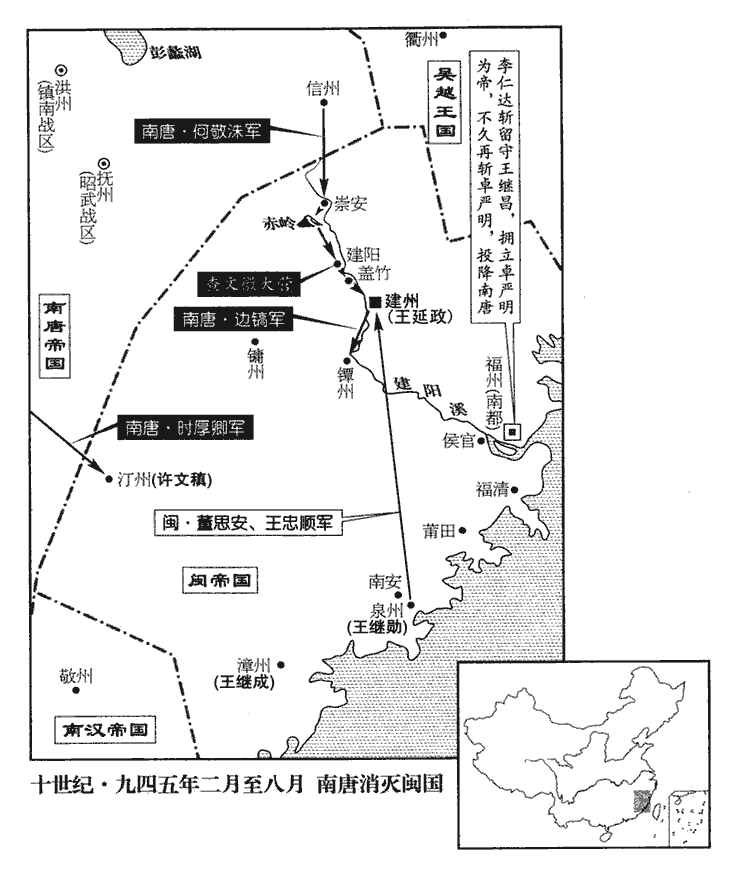
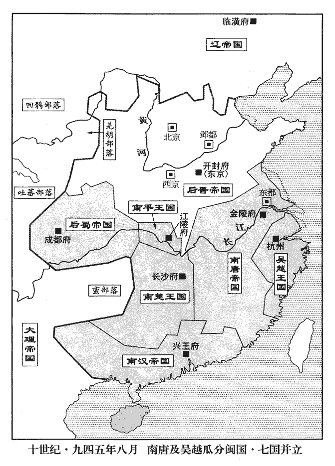
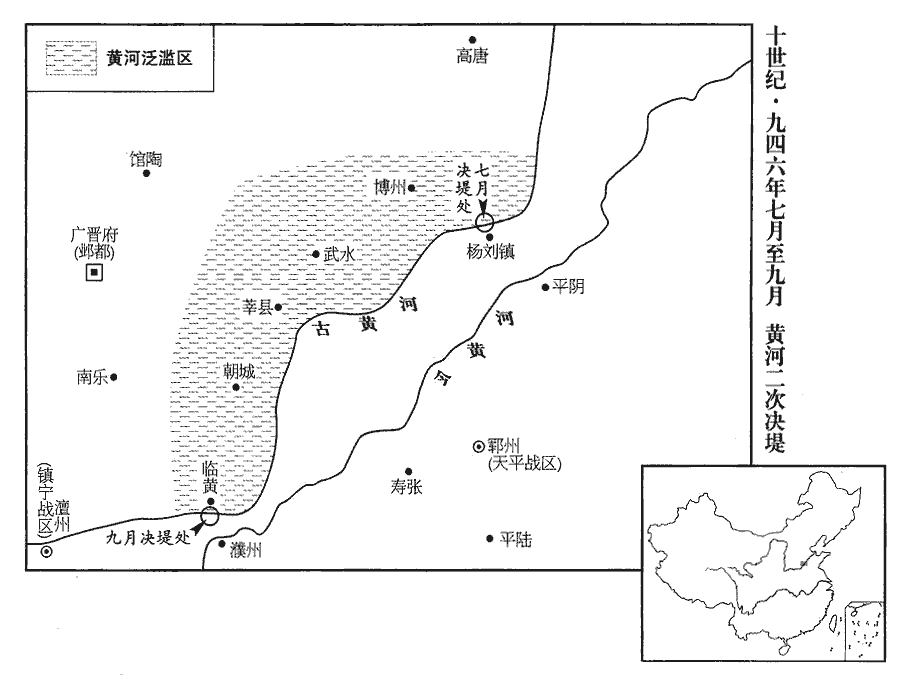
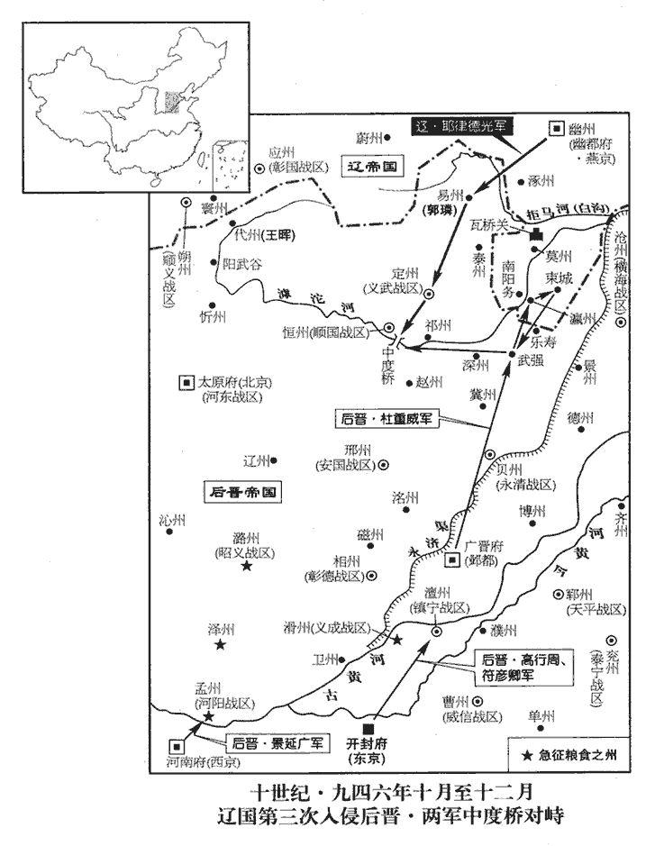
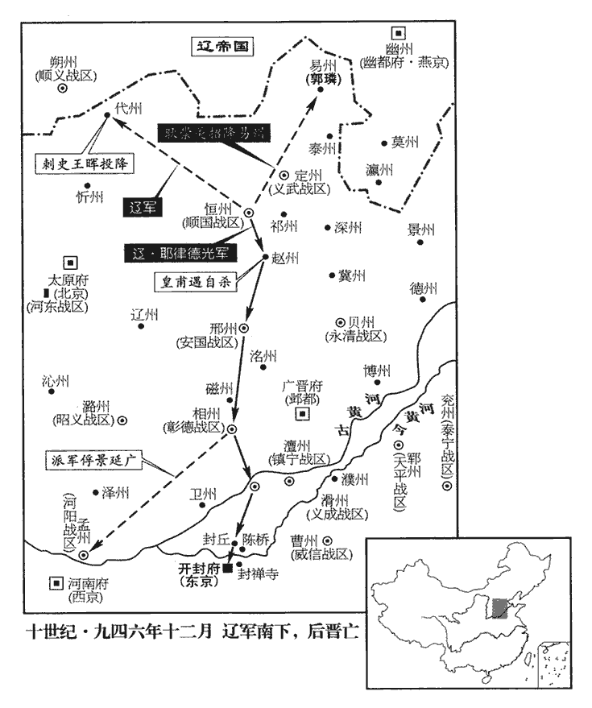

 後晉紀六起旃蒙大荒落（乙巳）八月，盡柔兆敦牂（丙午），凡一年有奇。

# 齊王下

## 開運二年（乙巳、九四五）

1八月，甲子朔‹一›，日有食之。

〖译文〗 [1]八月，甲子朔（初一），出现日食。

2丙寅‹三›，右僕射兼中書侍郎、同平章事和凝罷守本官；加樞密使、戶部尚書馮玉中書侍郎、同平章事，事無大小，悉以委之。

〖译文〗 [2]丙寅（初三），后晋出帝石重贵免去和凝所兼中书侍郎、同平章事之职，保留右仆射原官；枢密使、户部尚书冯玉加官兼中书侍郎、同平章事，朝事无论巨细全都交由冯玉全权处理。

帝‹石重贵›自陽城之捷，謂天下無虞，驕侈益甚。陽城之捷見上卷上年。夫勝之不可恃也尚矣。紂之百克而卒無後，夫差數戰數勝，終以亡國。桑田之捷，滅虢之兆也；方城之勝，破庸之基也。項梁死於定陶而嬴秦墟，宇文化及摧於黎陽而李密敗，皆恃勝之禍也。陽城之戰，危而後克。契丹折翅北歸，蓄憤愈甚，為謀愈深，晉主乃偃然以為無虞，石氏宗廟，宜其不祀也。四方貢獻珍奇，皆歸內府；多造器玩，廣宮室，崇飾後庭，近朝莫之及；近朝，謂近世，如梁如唐也。朝，直遙翻。作織錦樓以織地衣，用織工數百，期年乃成；期，讀曰朞。又賞賜優伶無度。桑維翰諫曰：「曏者陛下親禦胡寇，謂元年澶州之戰也，事見上卷。戰士重傷者，賞不過帛數端。今優人一談一笑稱旨，稱，尺正翻。往往賜束帛、萬錢、錦袍、銀帶，唐制，帛以十端為束。彼戰士見之，能不觖望，曰：『我曹冒白刃，絕筋折骨，觖，古穴翻。觖望，怨望也。冒，莫北翻。折，而設翻。曾不如一談一笑之功乎！』如此，則士卒解體，陛下誰與衛社稷乎！」帝不聽。

〖译文〗 出帝自从阳城获胜，认为天下太平，更加骄横奢侈。各地进贡献上的奇珍异宝，统统归入内府；大量制造器具玩物，扩建宫室，装饰后宫，近来各朝望尘莫及。建造织锦楼来编织地毯，征用数百名织工，一年才完成；出帝又毫无节制地赏赐为他歌舞戏谑的艺人。大臣桑维翰劝谏道：“过去陛下亲自率兵抗击胡人的进攻，战士受重伤的，也不过赏给数端布帛而已；现在艺人一说一笑合您的心意，就往往赏给十端布帛、上万钱币，还有锦袍、银带。这些若让那些战士看见，怎能不抱怨？他们会说：‘我们冒着刀锋剑刃，断筋折骨，竟不如人家一说一笑的功劳大呵！’这样下去，军队就将瓦解，陛下还靠谁来保卫国家呢？”出帝没有听从。

馮玉每善承迎帝意，由是益有寵。嘗有疾在家，帝謂諸宰相曰：「自刺史以上，俟馮玉出乃得除。」其倚任如此。竇廣德有賢行，漢文帝以其后弟，恐天下議其私，不敢相也。馮玉何人斯，晉出帝昌言於朝以昭親任之意！臨亂之君，各賢其臣，其此謂乎！玉乘勢弄權，四方賂遺，輻輳其門。遺，唯季翻。由是朝政益壞。史言晉亡形已成。朝，直遙翻。

〖译文〗 冯玉常常善于迎合出帝的心意，因此越发得到宠信。有一次他在家养病，没有入朝，出帝对各宰相说：“自刺史以上的官职，要等冯玉病好入朝，才能任命。”对他竟这样信任、重用。冯玉仗势玩弄权柄，各地争相贿赂馈赠，门前车马络绎不绝，由此朝政日益败坏。

 

3唐兵圍建州既久，是年二月，唐兵攻建州事始見上卷。建人離心。或謂董思安：謂，誨語之也。「宜早擇去就。」思安曰：「吾世事王氏，危而叛之，天下其誰容我！」眾感其言，無叛者。

〖译文〗 [3]南唐军队围困建州已久，建州城中人心涣散。有人对守城将领董思安说：“要及早选择何去何从呵。”董思安说：“我世代侍奉王家，到了危难之际背叛他，天下谁还能容我！”众人感佩他的话，竟无一人背叛。

丁亥‹二十四›，唐先鋒橋道使上元‹首都金陵府所在县·江苏省南京市›王建封先登，上元本江寧縣，唐肅宗上元間更名，帶江寧府。遂克建州，閩主延政降。閩自唐末王潮得福建，傳審知、延翰、鏻、昶、曦，至延政而亡。王忠順戰死，董思安整眾奔泉州。史言泉州二將事閩主有始終。

〖译文〗 丁亥（二十四日），南唐军先锋桥道使上元人王建封率先登城，于是攻克建州，闽主王延政投降。将领王忠顺战死，董思安收拾残部投奔泉州。

初，唐兵之來，建人苦王氏之亂與楊思恭之重斂，楊思恭重斂事見二百八十三卷天福八年。斂，力贍翻。爭伐木開道以迎之。及破建州，縱兵大掠，焚宮室廬舍俱盡；是夕，寒雨，凍死者相枕，枕，職任翻。建人失望。唐主‹李璟›以其有功，皆不問。

〖译文〗 当初，南唐军队开来时，建州百姓因苦于闽主王延政的昏乱和杨思恭的横征暴敛，争先砍伐树木开辟道路来迎接南唐军队。等南唐军队攻克建州后，竟纵兵大肆抢掠，将王氏宫殿和百姓房屋统统放火烧光。当天傍晚寒雨纷飞，冻死的人多得相互枕藉。建州百姓大失所望。而南唐主李却因其将领破城有功，对这些全不过问。

4漢主‹首都兴王府广东省广州市›刘弘熙（刘晟）本年二十六岁殺韶王弘雅。弘雅，漢主之弟也。

〖译文〗 [4]南汉主刘晟杀其弟韶王刘弘雅。

 

5九月，許文稹以汀州，王繼勳以泉州，王繼成以漳州，皆降於唐。荀子有言：「兼并易也，堅凝之難。」唐能取閩，不能終有閩也。為閩人叛唐張本。唐置永安軍於建州。

〖译文〗 [5]九月，许文稹率汀州、王继勋率泉州、王继成率漳州，向南唐投降。南唐在建州设置永安军。

6丙申‹三›，以西京‹河南府·河南省洛阳市›留守兼侍中景延廣充北面行營副招討使。

〖译文〗 [6]丙申（初三），后晋出帝命西京留守兼侍中景延广任北面行营副招讨使。

7殿中監王欽祚權知恆州事。恆，戶登翻。會乏軍儲，詔欽祚括糴民粟。杜威有粟十餘萬斛在恆州，欽祚舉籍以聞。威大怒，表稱：「臣有何罪，欽祚籍沒臣粟！」朝廷為之召欽祚還，杜威恆州之粟，豈非前者表獻之數乎！使其出於表獻之外，亦掊克軍民所積者耳。舉而籍之，夫何過！朝廷之法，不行於貴近，第能虐貧下以供調度，國非其國矣。為，于偽翻。還，從宣翻。仍厚賜威以慰安之。

〖译文〗 [7]殿中监王钦祚暂主管恒州事务。正值军粮储备缺乏，朝廷诏命他收刮买进民间粮食。杜威有十几万斛粮食存在恒州，王钦祚将其全部抄没，奏报朝廷。杜威闻知大怒，上表章声称“臣有什么罪？王钦祚竟抄没我的粮食！”朝廷因此将王钦祚从恒州召回，并重赏杜威以示抚慰。

8戊申‹十五›，置威信軍於曹州‹山东省定陶县›。

〖译文〗 [8]戊申（十五日），在曹州设置威信军。

9遣侍衛馬步都指揮使李守貞戍澶州。

〖译文〗 [9]派遣侍卫马步都指挥使李守贞守卫澶州。

10乙卯‹二十二›，遣彰德節度使張彥澤戍恆州。

〖译文〗 [10]乙卯（二十二日），派遣彰德节度使张彦泽守卫恒州。

11漢主殺劉思潮、林少強、林少良、何昌廷。【章：十二行本「廷」作「延」；乙十一行本同；孔本同。】天福八年，漢主使劉思潮等四人弒其兄弘度而自立，事見二百八十三卷；今又殺四人以除其偪，少，詩照翻。以左僕射王翷【章：十二行本「翷」作「翻」；乙十一行本同。】嘗與高祖謀立弘昌，事見二百八十三卷天福七年。出為英州‹广东省英德市›刺史，英州，漢桂陽郡湞陽縣之地，唐以湞陽縣隸廣州。漢主劉龑yǎn分湞陽縣置英州。九域志：廣州北至英州四百二十里。未至，賜死。內外皆懼不自保。

〖译文〗 [11]南汉主刘晟杀刘思潮、林少强、林少良、何昌廷。因左仆射王曾与高祖刘策划立越王弘昌为主，贬为英州刺史，人还未曾到英州，又命赐死。内外大臣都人人自危，怕不能保全性命。

12冬，十月，癸巳‹三十›，置鎮安軍於陳州‹河南省淮阳县›。

〖译文〗 [12]冬季，十月癸巳（三十日），在陈州设置镇安军。

13唐元敬宋太后殂。

〖译文〗 [13]南唐元敬宋太后去世。

14王延政至金陵，唐主以為羽林大將軍。斬楊思恭以謝建人。以楊思恭厚斂也。以百勝‹总部设虔州江西省赣州市›節度使王崇文為永安‹总部设建州›節度使。崇文治以寬簡，建人遂安。撫寧荒餘，其政當爾。自蓋公授此法於曹參，參以相齊，又以相漢，後人知此法者鮮矣。治，直之翻。

〖译文〗 [14]闽主王延政到达金陵，南唐主李任命他为羽林大将军。将杨思恭斩首以平建州的民愤。任命百胜节度使王崇文为永安节度使。王崇文为政宽宏、简约，建州百姓于是安定。

15初，高麗‹首都开京朝鲜开城市›王建用兵吞滅鄰國，頗強大，事見二百八十一卷高祖天福元年。麗，力之翻。因胡僧襪囉言於高祖曰：「勃海‹首都上京龙泉府黑龙江省宁安市西南东京城›，我婚姻也，其王為契丹‹首都临潢府›所虜，請與朝廷共擊取之。」高祖不報。及帝與契丹為仇，襪囉復言之。襪，望發翻。囉，魯何翻。復，扶又翻。帝欲使高麗擾契丹東邊以分其兵勢；會建卒，子武自稱權知國事，上表告喪，十一月，戊戌‹五›，以武為大義軍使、高麗王，遣通事舍人郭仁遇使其國，使，疏吏翻。諭指使擊契丹。畏契丹知之，不形諸詔命，以詔指諭之而已。仁遇至其國，見其兵極弱，曏者襪囉之言，特建為誇誕耳，實不敢與契丹為敵。宋白曰：晉天福中，有西域僧襪囉來朝，善火卜。俄辭高祖，請遊高麗，王建甚禮之。時契丹併勃海之地有年矣，建因從容謂襪囉曰：「勃海本吾親戚之國，其王為契丹所虜，吾欲為朝廷攻而取之，且欲平其舊怨。師迴，為言於天子，當定期兩襲之。」襪囉還，具奏，高祖不報。出帝與契丹交兵，襪囉復奏之。帝遣郭仁遇飛詔諭建，深攻其地以牽脅之。會建已卒，武知國事，與其父之大臣不叶，自相魚肉。內難稍平，兵威未振，且夷人怯懦，襪囉之言，皆建虛誕耳。仁遇還，還，從宣翻。武更以他故為解。為說以自解。

〖译文〗 [15]当初，高丽王王建发兵吞并灭亡邻国，很强大，胡人僧侣袜因而对后晋高祖石敬瑭说：“勃海是我国的姻亲，它的国王被契丹所俘虏，希望与朝廷共同攻取契丹。”高祖未予答复。待后晋出帝和契丹结仇之后，袜又说起这件事。后晋出帝想让高丽骚扰契丹的东边，以分散契丹的兵力。正在此时，高丽王王建去世了，他的儿子王武自称代理主持国家事务，并向后晋奉上表章报丧。十一月，戊戌（初五），后晋任命王武为大义军使、高丽王，派通事舍人郭仁遇出使高丽，传达旨意让高丽攻击契丹。郭仁遇来到高丽，发现它的兵力极为衰弱，以前袜所说的话，只是王建夸海口罢了，高丽实际不敢和契丹为敌。郭仁遇返回，高丽王王武又以其他理由作解释。

16乙卯‹二十二›，吳越王弘佐‹钱弘佐，本年十七岁›誅內都監使杜昭達，己未‹二十六›，誅內牙上統軍使明州‹浙江省宁波市›刺史闞璠。璠，音翻。

〖译文〗 [16]乙卯（二十二日），吴越王钱弘佐诛杀内都监使杜昭达；己未（二十六日），诛杀内牙上统军使、明州刺史阚。

昭達，建徽之孫也，杜建徽佐吳越王錢鏐有功。與璠皆好貨。好，呼到翻。錢塘‹杭州州政府所在县›富人程昭悅以貨結二人，得侍弘佐左右。昭悅為人狡佞，王悅之，寵待踰於舊將，璠不能平；昭悅知之，詣璠頓首謝罪，璠責讓久之，乃曰：「吾始者決欲殺汝；今既悔過，吾亦釋然。」昭悅懼，謀去璠。去，羌呂翻。

〖译文〗 杜昭达是杜建徽的孙子，和阚都贪财。钱塘的富人程昭悦用钱财与二人交结，于是得以在吴越王的身边侍奉。程昭悦为人狡猾，善谄媚，吴越王喜欢他，对他的宠信厚待超过老将，阚对此愤然不平。程昭悦知道后，就去向阚磕头认错，阚责骂他很久，才说：“我在开始时决意要杀你；现在你已经悔过，我也就不放在心上啦。”程昭悦害怕，谋划除掉阚。

璠專而愎，國人惡之者眾。【章：十二行本「眾」下有「王亦惡之」四字；乙十一行本同；孔本同；張校同；退齋校同。】愎，蒲逼翻。惡，烏路翻。昭悅欲出璠於外，恐璠覺之，私謂右統軍使胡進思曰：「今欲除公及璠各為本州，使璠不疑，可乎？」進思許之，乃以璠為明州‹浙江省宁波市›刺史，進思為湖州‹浙江省湖州市›刺史。闞璠，明州人；胡進思，湖州也。璠怒曰：「出我於外，是棄我也。」進思曰：「老兵得大州，幸矣；不行何為！」璠乃受命。既而復以他故留進思。復，扶又翻。

〖译文〗 阚为人专横跋扈、刚愎自用，国人憎恶他的很多。程昭悦想把阚打发出去作地方官，又怕他察觉，私下对右统军使胡进思说：“现在想任命你和阚各回家乡作官，使阚不生疑心，可以吧？”胡进思同意了。于是任命阚为明州刺史，胡进思为湖州刺史。阚大怒道：“迁我到外地作官，是舍弃我！”胡进思劝他说：“老兵得个大州，也算幸运了，不去干什么呢！”阚才接受了调命。不久，程昭悦又用其他理由把胡进思留在京城。

內外馬步都統軍使錢仁俊母，杜昭達之姑也。昭悅因譖璠、昭達謀奉仁俊作亂，下獄鍛鍊成之。下，戶駕翻。璠、昭達既誅，奪仁俊官，幽于東府。於是昭悅治闞、杜之黨，凡權任【章：十二行本「任」作「位」；乙十一行本同；孔本同；張校同。】與己侔，意所忌者，誅放百餘人，國人畏之側目。為弘佐誅昭悅張本。治，直之翻。胡進思重厚寡言，昭悅以為戇，故獨存之。胡進思獨存，所以階錢氏廢立之禍。

〖译文〗 内外马步都统军使钱仁俊的母亲，是杜昭达的姑母。程昭悦因而诬陷阚、杜昭达合谋拥奉钱仁俊共同叛乱，将他们抓到狱中罗织罪名而定罪。阚、杜昭达被杀后，又罢免了钱仁俊的官，并将他囚禁在东府。于是程昭悦大抓阚和杜昭达的党羽，凡是权力、官位和他相等的、他心里有所顾忌的，被杀、被流放有一百多人，国中人害怕他而不敢正视。胡思进厚道寡言，程昭悦认为他憨厚，所以只留下他。

昭悅收仁俊故吏慎溫其，慎，姓也，古有慎到。溫其，名也。使證仁俊之罪，拷掠備至。拷，音考，掠，音亮。溫其堅守不屈；弘佐嘉之，擢為國官。國官，吳越國官也。慎溫其自藩府吏職擢為國官。溫其，衢州‹浙江省衢州市›人也。

〖译文〗 程昭悦抓到钱仁俊原手下官吏慎温其，让他出具伪证证明钱仁俊的罪，百般拷打他；但是慎温其坚贞自守，毫不屈服；钱弘佐赞许他，提拔他为国家官员。慎温其是衢州人。

17十二月，乙丑‹三›，加吳越王弘佐東南面兵馬都元帥。

〖译文〗 [17]十二月，乙丑（初三），后晋朝廷加任吴越王钱弘佐为东南面兵马都元帅。

18辛未‹九›，以前中書舍人廣晉‹河北省大名县›陰【章：十二行本「陰」作「殷」；乙十一行本同；孔本同；】鵬為給事中、樞密直學士。唐改魏州為興唐府，高祖改為廣晉府。鵬，馮玉之黨也；朝廷每有遷除，玉皆與鵬議之。由是請謁賂遺，充滿其門。遺，惟季翻。

〖译文〗 [18]辛未（初九），任命前中书舍人广晋人阴鹏为给事中、枢密直学士。阴鹏是冯玉的党羽，朝廷每当有官员任免升降，冯玉都和阴鹏商议，因此前去求见、进行贿赂的人挤满了家门。

19初，帝疾未平，去年冬，帝有疾，見上卷。會正旦，謂今年正月朔旦。樞密使、中書令桑維翰遣女僕入宮起居太后，女僕，即女奴也。唐人謂參候為起居，今人之言猶爾。因問：「皇弟睿近讀書否？」睿，即重睿也；避帝名，去「重」字。帝聞之，以告馮玉，玉因譖維翰有廢立之志；帝疑之。帝固忌重睿，因桑維翰女僕之問，已疑維翰矣；馮玉又從而譖之，其疑愈不可破矣。

〖译文〗 [19]当初，后晋出帝的病情还未平复，恰值正月初一，早晨，枢密使、中书令桑维翰派女仆入宫向太后问安，便询问：“皇弟睿近来读书吗？”出帝听到，告诉冯玉，冯玉于是诬陷桑维翰有废出帝、立石重睿的异志；出帝听后便对桑维翰产生怀疑。

李守貞素惡維翰，惡，烏路翻。馮玉、李彥韜與守貞合謀排之；以中書令行開封尹趙瑩柔而易制，易，以豉翻。共薦以代維翰。丁亥‹二十五›，罷維翰政事，為開封尹；以瑩為中書令，李崧為樞密使、守侍中。維翰遂稱足疾，希復朝謁，杜絕賓客。亦所以遠猜嫌也。復，扶又翻。朝，直遙翻。

〖译文〗 李守贞历来憎恶桑维翰，冯玉、李彦韬与李守贞合谋排挤桑维翰；因中书令代理开封府尹赵莹为人软弱易于控制，他们共同荐举他取代桑维翰。丁亥（二十五日），罢免桑维翰朝中的职务，让他作开封尹；任命赵莹为中书令，李崧为枢密使兼侍中。桑维翰于是称脚有病，很少再入朝谒见，并谢绝宾客。

或謂馮玉曰：「桑公元老，今既解其樞務，縱不留之相位，猶當優以大藩，柰何使之尹京，親猥細之務乎？」猥，雜也。玉曰：「恐其反耳。」言所以不授維翰大鎮者，恐其阻兵而反。曰：「儒生安能反！」玉曰：「縱不自反，恐其教人耳。」此指維翰贊成晉祖晉陽舉兵之謀。

〖译文〗 有人对冯玉说：“桑公是开国元老，现在已经解除他枢密使的职务，纵然不能留在宰相的职位上，也应当优待他任大藩镇的长官，怎能用他作开封尹，亲自去干那些闲杂琐碎的事务呢？”冯玉说：“怕他造反。”那人说道：“他一个读书的儒生怎能造反！”冯玉说：“纵然他自己不出头造反，也怕他会教唆别人造反！”

20楚湘陰‹湖南省湘阴县›處士戴偃，劉昫曰：湘陰，漢羅縣，宋置湘陰縣，唐屬岳州。宋淳化四年，以湘陰縣隸潭州。九域志：在州東北一百一十五里。為詩多譏刺，楚王希範囚之；天策副都軍使丁思瑾上書切諫，希範削其官爵。

〖译文〗 [20]楚国湘阴的隐士戴偃作诗多有讥讽朝廷的意思，楚王马希范把他囚禁起来；天策副都军使丁思瑾上书恳切劝谏，马希范却削除了他的官职爵位。

21唐齊王景達府屬謝仲宣言於景達曰：「宋齊丘，先帝‹李昪徐知诰›布衣之交，今棄之草萊，不厭眾心。」景達為之言於唐主曰：厭，於葉翻，伏也；又於豔翻，滿也。為，于偽翻。「齊丘宿望，勿用可也，何必棄之以為名！」唐主乃使景達自至青陽‹安徽省青阳县›召之。齊丘隱青陽見二百八十三卷天福八年。

〖译文〗 [21]南唐齐王李景达的府僚谢仲宣向李景达进言道：“宋齐丘是先帝贫微时的老朋友，现在被舍弃在山野，此事难服众心。”李景达为此对南唐主李说：“宋齐丘是老成望重的人，不用他也便罢了，何必以舍弃而让他成名！”南唐主于是让李景达亲自到青阳召他。

## 三年（丙午、九四六）

1春，正月，‹南唐首都金陵府江苏省南京市›李璟（徐景通）本年三十一岁以齊丘為太傅兼中書令，但奉朝請，不預政事。奉朝會請召而已。以昭武‹总部设抚州江西省临川市›節度使李建勳為右僕射兼門下侍郎，與中書侍郎馮延己皆同平章事。建勳練習吏事，而懦怯少斷；延己工文辭，而狡佞，喜大言，多樹朋黨。斷，丁亂翻。喜，許記翻。惟世宦則練習吏事，懦怯少斷，則亦因練習之久而巧於避就者然也。若馮延己所為，迺少年書生之常態，多大言而少成事，樹朋黨以濟己私。此二種人，皆不可以相也。水部郎中高越；上書指延己兄弟過惡，唐主怒，貶越蘄州‹湖北省蕲春县›司士。

〖译文〗 [1]春季，正月，南唐主任命宋齐丘为太傅兼中书令，但只奉朝会请召，并不参预政务大事。任命昭武节度使李建勋为右仆射兼门下侍郎，与中书侍郎冯延己都为同平章事。李建勋练达谙习官吏事务，但为人懦弱胆小，缺乏决断；冯延己擅长文章辞藻，但为人狡猾，善于谄媚，喜欢说大话，多结纳党羽。水部郎中高越上书指责冯延己兄弟作恶多端。南唐主发怒，贬谪高越为蕲州司士。

初，唐主‹李璟›置宣政院於禁中，以翰林學士、給事中常夢錫領之，專典機密，與中書侍郎嚴續皆忠直無私。唐主謂夢錫曰：「大臣惟嚴續中立，然無才，恐不勝其黨，卿宜左右之。」未幾，夢錫罷宣政院，左右，讀為佐佑。幾，居豈翻。續亦出為池州‹安徽省贵池市›觀察使。夢錫於是移疾縱酒，不復預朝廷事。史言正邪雜處，正終為邪所勝。復，扶又翻。續，可求之子也。嚴可求，徐溫之謀主也。

〖译文〗 当初，南唐主在宫禁中设置了宣政院，任命翰林学士、给事中常梦锡主管，专处理国家机要事务，他和中书侍郎严续，都是忠诚正直无私的大臣。南唐主曾对常梦锡说：“大臣里只有严续保持中立，但是缺乏才能，怕不能抵住朝中的朋党，爱卿应从旁帮助他。”不久，常梦锡被罢免了宣政院的职务，严续也被放到外地作了池州观察使。常梦锡于是上书称病，日日在家饮酒，不再参预朝廷的事。严续是严可求的儿子。

2二月，壬戌朔‹一›，日有食之。

〖译文〗 [2]二月，壬戌朔（初一），出现日食。

3晉昌‹总部京兆府陕西省西安市›節度使兼侍中趙在禮，晉以京兆府為晉昌軍。更歷十鎮，更，工衡翻。趙在禮起於鄴都，徙義成不行，後歷橫海‹总部沧州›、泰寧‹总部兖州›、匡國‹总部同州›、天平‹总部郓州›、忠武‹总部许州›、武寧‹总部徐州›、歸德‹总部宋州›、晉昌‹总部京兆府›，凡十鎮。所至貪暴，家貲為諸帥之最。帥，所類翻。帝‹石重贵，本年三十三岁›利其富，三月，庚申‹十九›，為皇子鎮寧‹总部设澶州河南省濮阳市›節度使延煦娶其女。為，于偽翻。鎮寧軍，澶州。煦，吁句翻。在禮自費緡錢十萬，縣官之費，數倍過之。延煦及弟延寶，皆高祖‹石敬瑭›諸孫，帝‹石重贵›養以為子。

〖译文〗 [3]晋昌节度使兼侍中赵在礼，曾历任十个藩镇的节度使，所到之处贪婪残暴，所积家财在各镇将帅中是最多的。后晋出帝图他的富有，三月，庚申（二十九日），为皇子镇宁节度使石延煦娶他的女儿。为办此事，赵在礼自己花费了十万缗钱财，而官府花费多出好几倍。石延煦和弟弟石延宝，都是后晋高祖石敬瑭的孙子，后晋出帝收为自己的养子。

4唐泉州‹福建省泉州市›刺史王繼勳致書脩好於威武‹总部设长乐府福建省福州市›節度使李弘義。好，呼到翻。弘義以泉州故隸威武軍，怒其抗禮，王繼勳與李弘義同事南唐，弘義雖建節，然比肩事主，固不可脩巡屬之禮。李弘義以此起兵端耳。夏，四月，遣弟弘通將兵萬人伐之。

〖译文〗 [4]南唐泉州刺史王继勋写信给威武节度使李弘义，愿两相修好。李弘义认为泉州原隶属于威武军，因王继勋致信用对等礼仪而大怒。夏季，四月，派弟弟李弘通率兵一万人前去讨伐。

5初，朔方‹总部设灵州宁夏灵武市›節度使馮暉在靈州，留党項‹黄河河套地区›酋長拓跋彥超於州下，事見二百八十二卷天福四年。党，底朗翻。酋，慈由翻。長，知兩翻。故諸部不敢為寇；及將罷鎮而縱之。

〖译文〗 [5]当初，朔方节度使冯晖驻扎在灵州，并将党项酋长拓跋彦超扣留在州里，所以各部落不敢前来侵掠，到冯晖将离任时，就把拓跋彦超释放了。

前彰武‹总部设延州陕西省延安市›節度使王令溫代暉鎮朔方，不存撫羌、胡，以中國法繩之。昔周之封衛，疆以周索，以其地居中國也。其封晉，則疆以戎索，以其地近戎狄也。戎狄不可繩以中國之法尚矣。羌、胡怨怒，【章：十二行本「怒」下有「皆叛」二字；乙十一行本同；孔本同；張校同。】競為寇鈔。鈔，楚交翻。拓跋彥超、石存、也廝褒三族，共攻靈州，殺令溫弟令周。戊午‹十›，令溫上表告急。

〖译文〗 前彰武节度使王令温取代冯晖来镇守朔方，他不去安抚羌人、胡人，却用中原的法度来处置他们，羌人、胡人都颇为怨恨愤怒，争相侵犯抄掠。拓跋彦超、石存、也厮褒三个部族联合进攻灵州，杀死王令温的弟弟王令周。戊午（疑误），王令温向朝廷奉上表章告急。

6泉州都指揮使留從效謂刺史王繼勳曰：「李弘通兵勢甚盛，士卒以使君賞罰不當，當，丁浪翻。莫肯力戰，使君宜避位自省！」省，昔景翻。乃廢繼勳歸私第，留從效立王繼勳見上卷上年。代領軍府事，勒兵擊李弘通，大破之。表聞于唐，唐主‹李璟›以從效為泉州刺史，召繼勳還金陵‹江苏省南京市›，遣將將兵戍泉州。為留從效遣唐戍將歸張本。徙漳州‹福建省漳州市›刺史王繼成為和州‹安徽省和县›刺史，汀州‹福建省长汀县›刺史許文稹為蘄州刺史。稹，止忍翻。

〖译文〗 [6]泉州都指挥使留从效对刺史王继勋说：“李弘通的军队来势很猛，而我们的士兵因您赏罚不公，没有肯卖力作战的，您应该自己引退反省！”于是王继勋被废黜回归家中。留从效代理军府事务，组织军队抗击李弘通，大败敌人。上表向南唐朝廷报捷，南唐主任命留从效为泉州刺史，将王继勋召回金陵，另选派将领率兵前去驻守泉州。调漳州刺史王继成为和州刺史，调汀州刺史许文稹为蕲州刺史。

7定州‹河北省定州市›西北二百里有狼山‹河北省易县西南狼牙山›，匈奴須知：狼山寨東北至易州八十里，東南至廣信軍界。土人築堡於山上以避胡寇。堡中有佛舍，尼孫深意居之，以妖術惑眾，妖，於遙翻。言事頗驗，遠近信奉之。中山‹定州州政府所在城›人孫方簡歐史作「孫方諫」，蓋孫方簡後避周太祖皇考諱，遂改名方諫也。考異曰：周世宗實錄云「清苑人」。今從漢高祖實錄。及弟行友，自言深意之姪，不飲酒食肉，事深意甚謹。深意卒，方簡嗣行其術稱深意坐化，崇信釋氏，而學其學，專一而靜者，其死也，能結趺端坐如生，謂之坐化。嚴飾，事之如生，其徒日滋。薛史曰：宋乾德中，遷其尼枯骨赴京，焚於北郊，妖徒遂息。

〖译文〗 [7]在定州西北二百里处有座狼山，当地人在山上筑起城堡来躲避胡人的抄掠。城堡中有佛舍，尼姑孙深意住在里面，用妖诡法术蛊惑众人，预言事情很灵验，远近村民都很信奉她。中山人孙方简和弟弟孙行友，自称是孙深意的侄子，不饮酒吃肉，侍奉孙深意很恭谨。孙深意死后，孙方简就接着用她的法术，称孙深意是坐化了，将尸体装扮修饰，像在世的时候一样侍奉她。孙方简的门徒日渐增多。

會晉與契丹絕好，好，呼到翻。北邊賦役煩重，寇盜充斥，民不安其業。方簡、行友因帥鄉里豪健者，據寺為寨以自保。契丹入寇，方簡帥眾邀擊，帥，讀曰率。頗獲其甲兵、牛馬、軍資，人挈家往依之者日益眾。久之，至千餘家，遂為群盜。懼為吏所討，乃歸款朝廷。朝廷亦資其禦寇，署東北招收指揮使。

〖译文〗 正赶上后晋和契丹绝交，北部边境地区赋役繁多沉重，盗贼遍地丛生，百姓不能安居乐业。孙方简、孙行友于是率领当地百姓中强健好斗的把寺庙作为兵寨来保护自己。契丹入侵时，孙方简率领大家迎击，缴获了许多兵器铠甲、牛马等军用物资，人们携家带口前往依附的日益众多。时间久了，达到一千多家，于是成为了群盗。因为惧怕官吏征讨，便归顺朝廷。朝廷也借他们来抵御契丹的入侵，就命其代理东北招收指挥使。

方簡時入契丹境鈔掠，鈔，楚交翻。多所殺獲。既而邀求不已，朝廷小不副其意，則舉寨降於契丹，請為鄉道以入寇。邊境之上，姦民如此者，不特孫方簡，唐人所謂「兩面」也。降，戶江翻。鄉，讀曰嚮。道，讀曰導。時河北大饑，民餓死者所在以萬數，兗‹山东省兖州市›、鄆‹山东省东平县›、滄‹河北省沧州市东南›、貝‹河北省清河县›之間，盜賊蠭起，吏不能禁。

〖译文〗 孙方简有时进入契丹境内抄掠，多有斩杀缴获。不久向朝廷邀功请赏不止，朝廷稍不如他们的意，他就率全寨投降契丹，并请求作契丹人的向导，深入内地抢掠。当时正值河北荒年，百姓饿死的数以万计，兖、郓、沧、贝四州之间，盗贼蜂起，官吏不能禁止。

天雄‹总部设广晋府河北省大名县›節度使杜威遣元隨軍將劉延翰市馬於邊，方簡執之，獻於契丹。延翰逃歸，六月，壬戌‹三›，至大梁，言「方簡欲乘中國凶饑，引契丹入寇，宜為之備。」為孫方簡乘中國無主，契丹北歸，入據定州張本。

〖译文〗 天雄节度使杜威派元随军将领刘延翰到边境一带买马，孙方简抓住他，献给契丹。刘延翰逃跑回来，六月壬戌（初三），到达大梁，说：“孙方简想乘中国的大饥荒，勾引契丹人入侵，应该为此作好准备。”

8初，朔方節度使馮暉在靈武，得羌、胡心，市馬朞年，得五千匹，朝廷忌之，徙鎮邠州及陝州，陝，失冉翻。入為侍衛步軍都指揮使。領河陽‹总部设孟州河南省孟州市›節度使。暉知朝廷之意，悔離靈武‹灵州州政府所在城›，離，力智翻。乃厚事馮玉、李彥韜，求復鎮靈州。朝廷亦以羌、胡方擾，丙寅‹七›，復以暉為朔方節度使，將關西兵擊羌、胡；以威州‹甘肃省环县›刺史藥元福為行營馬步軍都指揮使。威州，唐之安樂州也。中世沒於吐蕃，大中三年收復，更名威州。梁、唐棄之，晉復置。後周改為環州，以大河環曲為名，亦唐初之舊州名也。趙珣聚米圖經：靈州南至環州五百里。按薛史，天福四年五月敕，靈州方渠鎮宜升為威州，割寧州木波、馬嶺二縣隸之；後周改為環州，顯德四年，降為通遠軍。

〖译文〗 [8]当初，朔方节度使冯晖在灵武时，深得羌、胡部族的人心，一年之内作马匹交易，得马五千匹，朝廷对他有顾忌，调他镇守州及陕州，又调入朝中为侍卫步军都指挥使、兼领河阳节度使。冯晖得知朝廷的用意，后悔离开灵武，于是就殷勤侍奉冯玉、李彦韬，请求再镇守灵州。朝廷也以羌、胡部族正骚扰边境，丙寅（初七）再任冯晖为朔方节度使，率领关西兵马攻击羌、胡军队；任命威州刺史药元福为行营马步军都指挥使。

9乙丑‹二十四›，定州言契丹勒兵壓境。詔以天平‹总部郓州›節度使、侍衛馬步都指揮使李守貞為北面行營都部署，義成‹总部滑州›節度使皇甫遇副之；彰德‹总部相州›節度使張彥澤充馬軍都指揮使兼都虞候，義武節度使薊‹幽州州政府所在县·北京市›人李殷充步軍都指揮使兼都排陳使；薊，音計。陳，讀曰陣。遣護聖指揮使臨清‹河北省临西县›王彥超、太原‹山西省太原市›白延遇以部兵十營詣邢州‹河北省邢台市›。時馬軍都指揮使、鎮安‹总部设陈州河南省淮阳县›節度使李彥韜方用事，時以陳州置鎮安軍。視守貞蔑如也。守貞在外所為，事無大小，彥韜必知之，守貞外雖敬奉而內恨之。為李守貞與杜威降契丹張本。

〖译文〗 [9]乙丑（初六），定州上报朝廷说契丹调遣军队，进逼边境。后晋出帝下诏书，任命天平节度使、侍卫马步都指挥使李守贞为北面行营都部署，义成节度使皇甫遇任副职；彰德节度使张彦泽充马军都指挥使兼都虞候，义武节度使蓟人李殷充任步军都指挥使兼都排阵使；派护圣指挥使临清人王彦超、太原人白延遇率领部兵十营前往邢州。当时，马军都指挥使、镇安节度使李彦韬正执掌权柄，看不起李守贞。李守贞在外地的所作所为，无论事情大小，李彦韬都一定知道，李守贞表面虽然尊奉他，但心内很恨他。

10初，唐人既克建州‹福建省建瓯市›，去年八月，唐克建州。欲乘勝取福州‹长乐府·福建省福州市›，唐主‹李璟›不許。樞密使陳覺請自往說李弘義，說，式芮翻。必令入朝。宋齊丘薦覺才辯，可不煩寸刃，坐致弘義。唐主乃拜弘義母、妻皆為國夫人，四弟皆遷官，以覺為福州宣諭使，厚賜弘義金帛。欲啖李弘義以祿利而誘致之。弘義知其謀，見覺，辭色甚倨，待之疏薄；覺不敢言入朝事而還。為陳覺興兵攻福州喪敗而還張本。還，從宣翻，又如字。

〖译文〗 [10]当初，南唐人攻克建州后，打算乘胜夺取福州，但南唐主不允许。枢密使陈觉请求亲自去说服李弘义，一定让他入朝称臣。宋齐丘也推荐陈觉口才的雄辩，可以不用刀枪就使李弘义前来归降。南唐主于是封李弘义的母亲、妻子都为国夫人，四个弟弟都升官，派陈觉为福州宣谕使，赏赐李弘义丰厚的金银财物。李弘义明白他们的计谋，接见陈觉时，说话、脸色非常傲慢，给他以冷遇，陈觉没敢提入朝归降的事就返回了。

11秋，七月，河決楊劉‹山东省东阿县东北杨柳乡›，西入莘縣‹山东省莘县›，廣四十里，自朝城‹山东省莘县西南朝城镇›北流。莘縣在魏州之東，朝城在魏州東南，相去四十里。廣，古曠翻。

〖译文〗 [11]秋季，七月，黄河在杨刘决口，向西流入莘县，大水漫漫有四十里宽，从朝城向北流去。

 

12有自幽州‹北京市›來者，言趙延壽有意歸國；樞密使李崧、馮玉信之，命天雄節度使杜威致書於延壽，具述朝旨，啖以厚利，朝，直遙翻。啖，徒濫翻。洛【章：十二行本「洛」作「洺」；乙十一行本同；孔本同。】州‹洺州河北省永年县东南旧永年镇›軍將趙行實嘗事延壽，遣齎書潛往遺之。延壽復書言：「久處異域，遺，惟季翻。處，昌呂翻。思歸中國。乞發大軍應接，拔身南去。」辭旨懇密。朝廷欣然；復遣行實詣延壽，與為期約。晉人自此墮趙延壽計中矣。復，扶又翻。

〖译文〗 [12]有从幽州来的人，说赵延寿有意归顺国家，枢密使李崧、冯玉相信了，命令天雄节度使杜威给赵延寿写信，把朝廷的意思讲清楚，用丰厚的财利来引诱。洛州将领赵行实曾在赵延寿手下作过事，派他带上书信偷偷送到幽州去。赵延寿回信说：“久在异国他乡，很想回中原。恳求韩廷发大军接应，我将脱身南下。”词意恳切真挚。朝廷很高兴，又派赵行实前去会见赵延寿，与他约定日期。

13八月，李守貞言：「與契丹千餘騎遇於長城‹在河北省固安县南›北，此戰國時燕所築長城也，在涿州固安縣南。薛史：李守貞奏大軍至望都縣，相次至長城北，遇虜轉鬬。轉鬬四十里，斬其酋帥解里，酋，慈秋翻。解，戶買翻。擁餘眾入水溺死者甚眾。」丁卯‹九›，詔李守貞還屯澶州。還，從宣翻。

〖译文〗 [13]八月，李守贞上报：“与契丹一千多骑兵在长城北面相遇，辗转追杀搏斗了四十里，斩杀了他们的首领解里，把其它敌人赶入水中，淹死了很多。”丁卯（初九），诏命李守贞回兵，驻守澶州。

14帝既與契丹絕好，數召吐谷渾酋長白承福入朝，好，呼到翻。數，所角翻。宴賜甚厚。承福從帝與契丹戰澶州，澶，時連翻。又與張從恩戍滑州‹河南省滑县›。屬歲大熱，屬，之欲翻。遣其部落還太原，畜牧於嵐‹山西省岚县›、石‹山西省离石县›之境。嵐，盧含翻。部落多犯法，劉知遠無所縱捨；部落知朝廷微弱，且畏知遠之嚴，謀相與遁歸故地‹山西省东北部›。吐谷渾部落既知朝廷微弱，又畏劉知遠之嚴；然不敢於太原作亂者，憚劉知遠之威略，無所肆其姦，故欲遁歸故地。有白可久者，位亞承福，帥所部先亡歸契丹，帥，讀曰率。契丹用為雲州‹山西省大同市›觀察使，以誘承福。誘，音酉。

〖译文〗 [14]后晋出帝与契丹绝交后，屡次召吐谷浑的酋长白承福进京入朝，宴会隆重，赏赐丰厚。白承福跟随出帝，与契丹在澶州作战，又和张从恩共同守卫滑州。适值天气酷热，白承福遣送他的部落回到太原，把牲畜放牧在岚、石二州境内。部落的人经常犯法，刘知远决不放纵；部落知道朝廷衰微，又因害怕刘知远执法的严厉，谋划一起跑回原来的地方。有个叫白可久的，地位仅次于白承福，率领自己的队伍最先逃跑，归降了契丹，契丹任命为云州观察使，用此来引诱白承福投降。

知遠與郭威謀曰：「今天下多事，置此屬於太原，乃腹心之疾也，不如去之。」承福家甚富，飼馬用銀槽。去，羌呂翻。飼，祥吏翻。威勸知遠誅之，收其貨以贍軍。知遠密表「吐谷渾反覆難保，請遷於內地。」帝遣使發其部落千九百人，分置河陽及諸州。知遠遣威誘承福等入居太原城中，因誣承福等五族謀叛，以兵圍而殺之，合四百口，籍沒其家貲。詔褒賞之，吐谷渾由是遂微。五代會要曰：吐谷渾酋長有赫連鐸者，唐咸通中，從太原節度使康承訓平徐方有功，朝廷授振武節度使。復盜據雲中，後唐太祖逐之，乃歸幽州李匡儔；其部落散居蔚州界，互為君長，其氏不常。有白承福者，自同光初代為都督，依中山北石門為柵，莊宗賜其額為寧朔、奉化兩府，以都督為節度使，仍賜承福姓李，名紹魯。其畜牧，就善水草，丁壯常數千人。羊馬生息，入市中土，朝廷常存恤之。潞王清泰三年，白可久為寧朔、奉化留後，始見於史。晉天福元年，高祖以契丹有助立之功，割鴈門以北及幽州之地以賂之，由是吐谷渾部族皆隸於契丹。其後苦契丹之虐政，復為鎮州節度使安重榮所誘，乃背契丹，率車帳羊馬取五臺路歸國。契丹大怒，以朝廷招納叛亡，遣使責讓。至六年正月，高祖命供奉官張澄等率兵二千，搜索并、鎮、忻、代四州山谷吐渾，還其舊地；然亦以契丹誅求無厭，心不平之，命漢高祖出鎮太原，潛加慰撫。其年五月，大首領白承福及麾下來朝；九月，又遣首領白可久來朝。少主嗣位，絕契丹之好，數召其酋長入朝，厚加錫賜，每大讌會，皆命列坐於勳臣之次。至開運捍虜於澶州，召承福等帥其部眾從行。屬歲多暑熱，部下多死，復遣歸太原，移帳於嵐、石州。然承福馭下無法，多干軍令。其族白可久，在承福之亞，因牧馬，帥本帳北遁。契丹授以官爵，復遣潛誘承福。承福亦思叛去，事未果。漢祖知之，乃以兵環其部族，擒承福與其族白鐵匱、赫連海龍等五家，凡四百有餘人，伏誅，籍其牛馬，命別部長王義宗統其餘屬。

〖译文〗 刘知远和郭威谋划道：“现在天下多事，把吐谷浑部落安置在太原，是心腹之患，不如把它除掉。”白承福家里很富，喂马都用银食槽，郭威劝说刘知远杀死他，没收他的财产用来养军队。刘知远送上密表，称“吐谷浑反覆无常难以担保，请把他们迁往内地。”后晋出帝派使者将其部落一千九百人分别安置在河阳和其它各州。刘知远又让郭威引诱白承福等人住到太原城里，乘机诬陷白承福等五个部族聚谋反叛，用兵包围并杀死了他们四百人，抄没了白承福等的家财。后晋出帝下诏表彰奖赏他们。吐谷浑部落从此衰微了。

濮州‹山东省鄄城县›刺史慕容彥超坐違法科斂，斂，力贍翻。擅取官麥五百斛造麴，賦與部民。李彥韜素與彥超有隙，發其事，罪應死。彥韜趣馮玉使殺之，趣，讀曰促。劉知遠上表論救。慕容彥超，劉知遠之同產弟，故救之。上，時掌翻。李崧曰；「如彥超之罪，今天下藩侯皆有之。若盡其法，恐人人不自安。」甲戌‹十六›，敕免彥超死，削官爵，流房州‹湖北省房县›。

〖译文〗 濮州刺史慕容彦超因违法征收赋税，擅自取官仓的麦子五百斛造酒，分给部民而犯罪。李彦韬历来与慕容彦超有仇隙，揭发了这件事，按罪应斩首。李彦韬催促冯玉杀掉他，刘知远向朝廷上表章辩论营救。李崧说：“像慕容彦超的罪，现在各地的藩镇将帅都有，如果都按法处置，怕人人不能安心。”甲戌（十六日），敕免了慕容彦超的死罪，削去他的官职爵位，流放到房州。

15唐陳覺自福州還，至劍州‹镡州改·福建省南平市›，劍州，即殷主王延政所置之鐔xín州也。南唐既克建州，分延平、建浦、富沙三縣置劍州。至宋混一天下，以蜀中亦有劍州，乃加「南」字為南劍州。恥無功，恥自詭說李弘義入朝而不能致也。矯詔使侍衛官顧忠召弘義入朝‹首都金陵府›，侍衛官，在人主左右直衛者也，猶盛唐之侍官。自稱權福州軍府事，擅發汀‹福建省长汀县›、建‹福建省建瓯市›、撫‹江西省临川市›、信州‹江西省上饶市›兵及戍卒，命建州監軍使馮延魯將之，趣福州迎弘義。趣，七喻翻。延魯先遺弘義書，遺，惟季翻。諭以禍福。弘義復書請戰，遣樓船指揮使楊崇保將州師拒之。一本「州師」作「舟師」。覺以劍州刺史陳誨為緣江戰棹zhào指揮使，建溪東流歷劍州至福州，皆大江也，故土人亦謂之為江。表：「福州孤危，旦夕可克。」唐主以覺專命，甚怒；群臣多言：「兵已傅城下，傅，音附。不可中止，當發兵助之。」

〖译文〗 [15]南唐陈觉从福州返还，到达剑州，他耻于此行未能立功，就假传圣旨，让侍卫官顾忠召李弘义入朝。自称代理福州军府事务，擅自调派汀、建、抚、信四州的军队和守边的士兵，命建州监军使冯延鲁率领，赶赴福州迎接李弘义。冯延鲁先给李弘义写了信，说明祸福。李弘义回信请战，派楼船指挥使杨崇保率州中军队抵御。陈觉命剑州刺史陈诲为缘江战棹指挥使，并向朝廷上表：“福州孤立危难，早晚就能攻克。”南唐主因陈觉专命独断，非常愤怒；群臣多说：“军队现在已然分布在福州城下，不能中止，应当发兵助攻。

丁丑‹十九›，覺、延魯敗楊崇保於候官‹福建省闽侯县东南侯官城›，閩及候官二縣，皆治福州郭下。此戰於候官縣界也。敗，補賣翻。戊寅‹二十›，乘勝進攻福州西關。弘義出擊，大破之，執唐左神威指揮使楊匡鄴。

〖译文〗 丁丑（十九日），陈觉、冯延鲁在候官打败了杨崇保的军队。戊寅（二十日），南唐军队乘胜进攻福州西关。李弘义出击，大败南唐军，抓获南唐左神威指挥使杨匡邺。

唐主‹李璟›以永安‹总部设建州›節度使王崇文為東南面都招討使，去年十月，唐置永安軍於建州。以漳‹福建省漳州市›泉‹福建省泉州市›安撫使、諫議大夫魏岑為東面監軍使，延魯為南面監軍使，會兵攻福州，克其外郭。弘義固守第二城。第二重城也。

〖译文〗 南唐主命永安节度使王崇文为东南面都招讨使，命漳泉安抚使、谏议大夫魏岑为东面监军使，冯延鲁为南面监军使，合兵进攻福州，攻克福州的外城。李弘义固守第二道城墙。

16馮暉引兵過旱海，至輝德‹宁夏灵武市东南›，張洎曰：「自威州抵靈州旱海七百里，斥鹵枯澤，無溪澗川谷。輝德，地名，在靈武南。張舜民云：今旱江平即旱海，在清遠軍北。趙珣聚米圖經曰：鹽、夏、清遠軍間，並係沙磧qì，俗謂之旱海。自環州出青剛川，本靈州大路。自此過美利寨，漸入平夏，經旱海中，難得水泉。至耀德清邊鎮入靈州。糗糧已盡。糗，去久翻。拓跋彥超眾數萬，為三陳，扼要路，據水泉以待之。陳，讀曰陣，下同。軍中大懼。暉以賂求和於彥超，彥超許之。自旦至日中，使者往返數四，兵未解。藥元福曰：「虜知我飢渴，陽許和以困我耳；若至暮，則吾輩成擒矣。今虜雖眾，精兵不多，依西山而陳者是也。其餘步卒，不足為患。諸公嚴陳以待我，嚴陳者，嚴兵整陳也。我以精騎先犯西山兵，小勝則舉黃旗，大軍合勢擊之，破之必矣。」乃帥騎先進，用短兵力戰。彥超小卻，元福舉黃旗，暉引兵赴之，彥超大敗。馮暉圈養拓跋彥超於靈武城中，彥超固心知其故而懷怨。暉去鎮而彥超得出。彥超既得出而暉復來，出柙之虎，苟可以肆反噬者，無所不至也。非力戰而尅之，馮暉之威令不可復行於朔方矣。帥，讀曰率。明日，暉入靈州。

〖译文〗 [16]冯晖率兵经过旱海，到达辉德，干粮已尽。拓跋彦超几万军队列为三个阵，扼守要路，控制水源，严阵以待。冯晖军队大为恐慌。冯晖给拓跋彦超贿赂以求和，拓跋彦超同意。但从早晨到中午，使者往返了多次，对方军队还没有撤退。药元福对冯晖说：“敌人知道我们又饿又渴，假装允和，以此困住我们。如果到了傍晚，那我们就被活捉了。现在敌人虽然多，但精兵并不多，仅是靠西山布阵而已。其余的步兵，不足威胁我们。请您严阵等待我的信号；我率领精锐骑兵先攻击西山下的敌军，如获小胜就举起黄旗，大军再合力攻击，打败敌军是必定的。”于是率领骑兵首先冲去，用短刀全力死战；拓跋彦超稍稍退却，药元福就举起黄旗，冯晖率兵赶赴，拓跋彦超被打得大败。第二天，冯晖率兵进入灵州。

17九月，契丹三萬寇河東‹总部太原府›；壬辰‹五›，劉知遠敗之於陽武谷‹山西省原平市西北›，敗，補賣翻。斬首七千級。

〖译文〗 [17]九月，契丹三万兵马侵犯河东；壬辰（初五），刘知远在阳武谷打败了他们，斩首七千人。

18漢‹首都兴王府广东省广州市›劉思潮等既死，陳道庠內不自安。陳道庠，與劉思潮等同弒漢主弘度者也。殺劉思潮等見去年九月。特進鄧伸遺之《漢紀》，按路振九國志，陳道庠父璫，與鄧伸有舊，故然。道庠問其故。伸曰：「憨獠！遺，惟季翻。憨，呼談翻。癡也。獠，盧皓翻，又竹絞翻。此書有誅韓信、醢hǎi彭越事，宜審讀之！」漢主‹刘弘熙（刘晟）本年二十七岁›聞之，族道庠及伸。

〖译文〗 [18]南汉刘思潮等人死后，陈道庠内心不安。特进邓伸送给他一部《汉纪》，陈道庠问是何原因，邓伸说：“傻瓜！这书里有诛韩信、醢彭越的事，应仔细阅读啊！”南汉主听到此事，诛灭陈道庠、邓伸的家族。

19李弘義自稱威武‹总部设福州›留後，【章：十二行本「後」下有「權知閩國事」五字；乙十一行本同；孔本同；張校同；退齋校同】更名弘達，奉表請命于晉‹首都开封府›；李弘義本名仁達，弘義者唐所賜名也；既叛唐，遂更其名。甲午‹七›，以弘達為威武節度使、同平章事，知閩國事。

〖译文〗 [19]李弘义自称为威武留后，改名李弘达，奉上表章听命于后晋。甲午（初七），后晋任命李弘达为威武节度使、同平章事，主持闽国事务。

20張彥澤奏敗契丹於定州‹河北省定州市›北，又敗之於泰州‹河北省满城县›，斬首二千級。敗，補賣翻。

〖译文〗 [20]张彦泽上奏：在定州以北击败契丹，在泰州再次击败它，共斩首二千人。

21辛丑‹十四›，福州排陳使馬捷陳，讀曰陣。引唐兵自馬牧山‹福州市西北›拔寨而入，至善化門橋‹福州市西›，都指揮使丁彥貞以兵百人拒之。弘達退保善化門‹福州西城门›，外城再重皆為唐兵所據。弘達更名達，弘達更名達，以吳越王名上從弘，避之也。重，直龍翻。更，工衡翻。遣使奉表稱臣，乞師於吳越‹首都杭州›。

〖译文〗 [21]辛丑（十四日），福州排阵使马捷领南唐军队从马牧山拔寨而入，开到善化门桥，都指挥使丁彦贞率一百名士兵抵抗。李弘达退守善化门。外城及第二道城都被南唐兵占领。李弘达改名李达，派使者向吴越王钱弘佐奉表称臣，乞求救兵。

22楚王希範‹首都长沙府湖南省长沙市›马希范，本年四十八岁知帝好奢靡，好，呼到翻。屢以珍玩為獻，求都元帥；甲辰‹十七›，以希範為諸道兵馬都元帥。

〖译文〗 [22]楚王马希范知道后晋出帝喜好奢侈、华丽，多次献上珍玩宝物，求封为都元帅；甲辰（十七日），命马希范为诸道兵马都元帅。

23丙辰‹二十九›，河決澶州臨黃‹河南省范县›，臨黃，春秋衛河上之邑，漢為東郡觀縣，有衛宣公新臺。後魏置臨黃縣，唐屬澶州；宋端拱元年，省臨黃入觀城縣。

〖译文〗 [23]丙辰（二十九日），黄河在澶州的临黄决口。

24契丹使瀛州‹河北省河间市›刺史劉延祚遺樂壽‹河北省献县›監軍王巒書，請舉城內附。遺，惟季翻。考異曰：歐史作「高牟翰」。按陷蕃記，前云延祚詐輸誠款，後云大軍至瀛州，偵知蕃將高模翰潛師而出。蓋延祚為刺史，模翰乃戍將耳。今從陷蕃記。且云：「城中契丹兵不滿千人；乞朝廷發輕兵襲之，己為內應。又，今秋多雨，自瓦橋‹河北省雄县境›以北，積水無際，契丹主‹耶律德光›已歸牙帳，雖聞關南‹瓦桥关以南›有變，瀛、莫二州，晉割屬契丹，在瓦橋關南。地遠阻水，不能救也。」巒與天雄節度使兼中書令杜威屢奏瀛‹河北省河间市›、莫‹河北省任丘市北鄚州镇›乘此可取，深州‹河北省深州市›刺史慕容遷獻瀛莫圖。馮玉、李崧信以為然，欲發大兵迎趙延壽及延祚。先是趙延壽亦詐通款。

〖译文〗 [24]契丹使瀛州刺史刘延祚给后晋乐寿监军王峦写信，要求率全城归降，并且说：“城中契丹兵不足一千人，请朝廷派轻兵前来袭击，自己为内应。还有，今年秋天雨多，从瓦桥以北，积水漫无边际，契丹主已回牙帐去了，纵然听到关南有突变，路远隔水，也不能前来援救。”王峦与天雄节度使兼中书令杜威屡次上奏，认为瀛、莫二州乘这个机会可夺取；深州刺史慕容迁又献上《瀛莫图》。冯玉、李崧都信以为真，准备派出大兵迎接赵延寿和刘延祚。

先是，侍衛馬步都指揮使、天平節度使李守貞數將兵過廣晉，先，昔薦翻。數，所角翻。過，音戈。魏州廣晉府。杜威厚待之，贈金帛甲兵，動以萬計；守貞由是與威親善。守貞入朝，帝勞之曰：勞，力到翻。「聞卿為將，常費私財以賞戰士。」對曰：「此皆杜威盡忠於國，以金帛資臣，臣安敢掠有其美！」因言：「陛下若他日用兵，臣願與威戮力以清沙漠。」帝由是亦賢之。

〖译文〗 早先，侍卫马步都指挥使、天平节度使李守贞屡次领兵经过广晋，杜威接待他很好，赠送他金银兵器铠甲，每次都数以万计。李守贞因此和杜威亲近友好。李守贞入朝时，后晋出帝慰劳他说：“听说爱卿作为将军，常用自己的钱财赏给战士。”答道：“这些都是杜威对国家的忠心，他用金银钱财资助我，我怎么敢掠取他的美德！”于是说：“陛下如果他日用兵，我愿和杜威通力合作肃清沙漠之敌。”后晋出帝因此也感到他是个德才兼备的将军。

及將北征，帝與馮玉、李崧議，以威為元帥，守貞副之。趙瑩私謂馮、李曰：「杜令國戚，謂尚公主也。貴為將相，而所欲未厭，心常慊慊，位兼將相，謂居大鎮兼中書令。未厭，未滿所欲也。慊慊，亦不滿之意。慊，苦簟diàn翻。豈可復假以兵權！復，扶又翻。必若有事北方，不若止任守貞為愈也。」杜威之心迹，雖趙瑩猶知之。不從。冬，十月，辛未‹十四›，以威為北面行營都指揮使，【章：十二行本作「招討使」；乙十一行本同；孔本同。】以守貞為兵馬都監，監，古銜翻。泰寧‹总部兖州›節度使安審琦為左右廂都指揮使，武寧‹总部徐州›節度使符彦卿為馬軍左廂都指揮使，義成‹总部滑州›節度使皇甫遇為馬軍右廂都指揮使，永清‹总部贝州›節度使梁漢璋為馬軍都排陳使，前威勝‹总部邓州›節度使宋彥筠為步軍左廂都指揮使，奉國左廂都指揮使王饒為步軍右廂都指揮使，洺州團練使薛懷讓為先鋒都指揮使。仍下敕牓曰：「專發大軍，往平黠虜。黠，下八翻。先取瀛‹河北省河间市›、莫‹河北省任丘市北鄚州镇›，安定關南‹瓦桥关以南›；次復幽燕‹河北省北部›，盪平塞北。」又曰：「有擒獲虜主‹耶律德光›者，除上鎮節度使，賞錢萬緡，絹萬匹，銀萬兩。」談何容易！晉之君臣，恃陽城之捷，有輕視契丹之心。兵驕者敗，自古而然。時自六月積雨，至是未止，軍行及饋運者甚艱苦。

〖译文〗 待将要北征时，后晋出帝和冯玉、李崧商议，任命杜威为元帅，李守贞为副帅。赵莹私下对冯、李二人说：“杜威是皇帝的亲戚，又是显贵的将相，但他的欲望还没有满足，心常怀不满之意，怎能再授予他兵权！如果一定要对北方用兵，不如只委任李守贞一个人为好。”冯、李二人没有听从。冬季，十月辛未（十四日），命杜威为北面行营都指挥使，命李守贞为兵马都监，泰宁节度使安审琦为左右厢都指挥使，武宁节度使符彦卿为马军左厢都指挥使，义成节度使皇甫遇为马军右厢都指挥使，永清节度使梁汉璋为马军都排阵使，前威胜节度使宋彦筠为步军左厢都指挥使，奉国左厢都指挥使王饶为步军右厢都指挥使，州团练使薛怀让为先锋都指挥使。并下达敕榜，写道：“专门调发大军，前往扫平黠虏。先取瀛州、莫州，安定关南；其次收复幽燕，扫荡平定塞北。”又道：“有生擒胡虏君主的，任命上等大镇的节度使，赏赐钱一万缗，绢一万匹，银子一万两。”当时，从六月连日下雨，至此一直没停，行军和运送军粮都很艰苦。

25唐漳州將林贊堯作亂，殺監軍使周承義，劍州刺史陳誨。泉州刺史留從效舉兵逐贊堯，以泉州裨將董思安權知漳州。唐主以思安為漳州刺史，思安辭以父名章，唐主改漳州為南州，命思安及留從效將州兵會攻福州。庚辰‹二十三›，圍之。

〖译文〗 [25]南唐漳州将领林赞尧作乱，杀死监军使周承义、剑州刺史陈诲。泉州刺史留从效起兵驱逐林赞尧，派泉州副将董思安代理主持漳州事务。南唐主命董思安为漳州刺史，思安因父亲名“章”而推辞，南唐主于是改漳州为南州，命董思安和留从效率领州中的军队合攻福州。庚辰（二十三日），包围了福州城。

福州使者至錢塘‹吴越首都杭州州政府所在县›，乞師之使。錢塘，吳越國都。吳越王弘佐‹钱弘佐，本年十八岁›召諸將謀之，皆曰：「道險遠，難救。」惟內都監使臨安‹浙江省临安市›水丘昭券以為當救。水丘，複姓也。何氏姓苑云：漢有司隸校尉水丘岑。今為臨安著姓。弘佐曰：「脣亡齒寒，古語多有之。吾為天下元帥，曾不能救鄰道，將安用之！諸君但樂飽身【章：十二行本「身」作「食」；乙十一行本同；張校同。】安坐邪！」樂，音洛。壬午‹二十五›，遣統軍【章：十二行本「軍」下有「使」字；乙十一行本同；孔本同；張校同。】張筠、趙承泰將兵三萬，水陸救福州。吳越救福州，自婺、衢至建、劍，順流可至福州。是時劍、建已為南唐守，此道不可由也。自溫州之平陽渡海浦至福州界，當由此道耳。

〖译文〗 福州的使者来到钱塘。吴越王钱弘佐召集众将领商议，都说：“道路又远又险，难以救援。”只有内都监使临安人水丘昭券认为应去援救。钱弘佐说：“唇亡齿寒，我作为天下元帅，连邻邦都不能解救，那还有什么用！你们只高兴吃饱了坐着吗？”壬午（二十五日），派统军使张筠、赵承泰率兵三万人，从水陆两路救援福州。

先是募兵，久無應者，弘佐命糾之，曰：「糾而為兵者，糧賜減半。」明日，應募者雲集。弘佐命昭券專掌用兵，昭券憚程昭悅，以用兵事讓之。程昭悅時為弘佐所寵任，故水丘昭券憚而讓之。弘佐命昭悅掌應援饋運事，而以軍謀委元德昭。德昭，危仔倡之子也。危仔倡見二百六十七卷梁太祖開平三年。

〖译文〗 此前召募士兵，很长时间也没应募的，钱弘佐命令征集，并说：“凡征集而当兵的发给他的粮食和赏赐减少一半。”第二天，应召的人云集而至。钱弘佐命水丘昭券专管用兵之事，但昭券害怕程昭悦，把用兵的事让给他干。钱弘佐命程昭悦掌管接应后援输送粮食的事务，而把全军的谋略大事委交元德昭。元德昭是危仔倡的儿子。

弘佐議鑄鐵錢以益將士祿賜，其弟牙內都虞候弘億諫曰：「鑄鐵錢有八害：新錢既行，舊錢皆流入鄰國，一也；舊錢，謂銅錢。可用於吾國而不可用於他國，則商賈不行，百貨不通，二也；賈，音古。銅禁至嚴，民猶盜鑄，況家有鐺chēng釜，野有鏵犂，犯法必多，三也；鐺，楚耕翻。鏵，戶花翻。鏵鍫qiāo也。閩人鑄鐵錢而亂亡，不足為法，四也；閩鑄鐵錢見二百八十三卷天福七年及上卷元年。國用幸豐而自示空乏，五也；言鄰國聞之，必將以為國用空乏而鑄鐵錢。祿賜有常而無故益之以啟無厭之心，六也；厭，於鹽翻。法變而弊，不可遽復，七也；「錢」者國姓，易之不祥，八也。」弘佐乃止。

〖译文〗 钱弘佐建议铸铁钱以增加将士们的俸禄赏赐，他的弟弟牙内都虞候钱弘亿劝谏道：“铸铁钱有八条害处：新铁钱一发行，旧铜钱都流入邻国，这是第一条；铁钱可在我国使用却不可在他国使用，商人不使用，百货也就不能流通，是第二条；采铜被严格禁止，百姓还有偷偷铸造的，况且每家都有铁锅，地里有铧犁，私铸犯法的必然多，是第三条；闽人铸造铁钱而灭亡，这不值得效法，是第四条；国家财力庆幸很充足，而铸铁钱却是自己显示国库空虚，这是第五条；赐予俸禄本有常数，而无故增加它来诱发贪得无厌之心，是第六条；一旦钱法改变酿成弊端，不能立即恢复，是第七条；‘钱’是国姓，改动不吉祥，是第八条。”钱弘佐于是作罢。

26杜威、李守貞會兵於廣晉而北行。李守貞引兵會杜威於魏州，相與北行。威屢使公主入奏，請益兵，公主者，杜威妻宋國長公主，帝之姑也。曰：「今深入虜境，必資眾力。」由是禁軍皆在其麾下，杜威之計，即趙德鈞請併范延光軍之計也，德鈞不得請而威得請耳。其志圖非望而敗國亡身則一也。而宿衛空虛。

〖译文〗 [26]杜威、李守贞在广晋会师，然后向北进军。杜威屡次让公主入宫上奏，请求增兵，他说：“现在深入胡虏的国境，一定要靠大家的力量！”因此禁军都归于他的麾下，连宫内的宿值警卫都空虚了。

十一月，丁酉‹十›，以李守貞權知幽州‹北京市›行府事。

〖译文〗 十一月，丁酉（初十），派李守贞代理主持幽州行府事务。

己亥‹十二›，杜威等至瀛州，城門洞啟，寂若無人，威等不敢進。聞契丹將高謨翰先已引兵潛出，威遣梁漢璋將二千騎追之，遇契丹於南陽務‹河北省肃宁县东北›，敗死‹梁汉璋，年四十九岁›。威等聞之，引兵而南。時束城‹河北省河间市东北束城镇›等數縣請降，束城，漢束州縣，隋曰束城，唐屬瀛州。宋熙寧六年，省束城縣為束城鎮，屬河間縣。威等焚其廬舍，掠其婦女而還。還，從宣翻，又如字。

〖译文〗 己亥（十二日），杜威等人率兵来到瀛州，城门洞开，寂静得像没有人，杜威等人不敢进去。听说契丹将领高谟翰早已率兵偷偷出城跑了，杜威就派梁汉璋率领二千名骑兵追击，在南阳务与契丹遭遇，梁汉璋战败被杀。杜威等听到这个消息，率兵南下。当时束城等几个县已请求归降，杜威等人焚烧了庐舍，抢掠了那里的妇女而返回。

27己酉‹二十二›，吳越兵至福州，自罾zēng浦‹福州市东南›南潛入州城。罾，作滕翻，魚網也。福州之人就此罾魚，因以得名。唐兵進據東武門，李達與吳越兵共禦之，不利。自是內外斷絕，城中益危。

〖译文〗 [27]己酉（二十二日），吴越的军队来到福州，从罾浦以南偷偷进入福州城。而南唐军队又前进占领了东武门，李达和吴越兵共同抵抗，战事不利。从此福州城与外界联系断绝，城里形势更加危急。

唐主遣信州‹江西省上饶市›刺史王建封助攻福州。時王崇文雖為元帥，而陳覺、馮延魯、魏岑爭用事，留從效、王建封倔強不用命，留從效起於泉州，斬黃紹頗，破李弘通，唐人憚其威名；王建封雖本唐將，恃建州先登之功；故皆倔強不用命。倔，其勿翻。強，其兩翻。各爭功，進退不相應。由是將士皆解體，故攻城不克。

〖译文〗 南唐主派信州刺史王建封帮助进攻福州。当时南唐军中虽然王崇文是元帅，但是陈觉、冯延鲁、魏岑三人争着主事，留从效、王建封二人又倔强不听命令，各自抢功劳，进退行动互不照应。因此下面的将士也都人心涣散，所以福州城攻不下来。

唐主‹李璟›以江州‹江西省九江市›觀察使杜昌業為吏部尚書，判省事。先是，昌業自兵部尚書判省事，出江州，判省事者，判尚書省事。及還，閱簿籍，撫案歎曰：「未數年，而所【章：十二行本「所」上有「府庫」二字；乙十一行本同；孔本同；張校同。】耗者半，言昌業出入之間，未及數年，而府庫之積，已耗其半。其能久乎！」言不能以支久也。史言唐之府庫，耗於用兵。

〖译文〗 南唐主命江州观察使杜昌业为吏部尚书，主管尚书省事。原先，杜昌业是兵部尚书主管尚书省事，出江州任职。这次回来上任，翻阅帐册簿籍，拍案感叹道：“没几年功夫，府库的积累所消耗已过半，怎么能持久呢！”

28契丹主‹耶律德光，本年四十五岁›大舉入寇，自易‹河北省易县›、定‹河北省定州市›趣恆州‹河北省正定县›。趣，七喻翻。恆，戶登翻。杜威等至武強‹河北省武强县›，九域志：武強縣在深州西四十五里。宋白曰：武強，六國時武隧，地屬趙，故城在今縣東北三十里，是為漢武強縣。郡國縣道記云：古武強縣城，在今縣西南二十五里，是為晉武強縣。高齊移縣於後魏武邑郡故城，今縣理是也。聞之，將自貝‹河北省清河县›、冀‹河北省冀州市›而南。彰德節度使張彥澤時在恆州，去年九月，遣張彦澤戍恒州以備契丹。恒，户登翻。引兵會之，言契丹可破之狀；威等復趣恒州，復，扶又翻。趣，七喻翻。以彥澤為前鋒。考異曰：備史曰：「彥澤狼子，其心密已變矣，乃通款邪律氏，請為前導，因促騎說威引軍沿滹沱水西援常山。及至真定東垣渡，與威通謀，先遣步眾跨水，不之救，致敗，將沮人心以行詭計，因促監者高勳請降於虜。」按彥澤與威若已通款於契丹，則彥澤何故猶奪橋，契丹何故猶議回旋？今不取。甲寅‹二十七›，威等至中度橋‹河北省正定县东南滹沱河桥›，滹沱水逕恆州東南，恆州之人各隨便為津渡之所。此為中度者，明上下流各有度也。契丹已據橋，彥澤帥騎爭之，帥，讀曰率。契丹焚橋而退。晉兵與契丹來滹沱而軍。

〖译文〗 [28]契丹主率兵大举入侵，从易州、定州直向恒州。杜威等到达武强，听到这个消息，要从贝州、冀州往南走。彰德节度使张彦泽当时在恒州，领兵前去和杜威等人会师，并陈述契丹可以被打败的理由，杜威等又开往恒州，命张彦泽为前锋。甲寅（二十七日），杜威等来到中度桥，但契丹已占领了桥，张彦泽率骑兵前去争夺，契丹兵把桥烧掉退却了。于是后晋兵马和契丹军队隔着滹沱河驻扎下来。

始，契丹見晉軍大至，又爭橋不勝，恐晉軍急渡滹沱，與恆州合勢擊之，議引兵還。還，從宣翻，又如字。及聞晉軍築壘為持久之計，遂不去。知晉軍不敢戰也。

〖译文〗 开始，契丹人见后晋军队浩浩荡荡开来，前来争桥又没取胜，担心对方会强渡滹沱河，和恒州联合夹击，商议退兵返回；但听到后晋军队已筑起营垒作持久的准备，于是就不退兵了。

 

29蜀‹首都成都府四川省成都市›施州‹湖北省恩施市›刺史田行皋叛，‹孟昶（孟仁赞）本年二十八岁›遣供奉官耿彥珣將兵討之。

〖译文〗 [29]后蜀施州刺史田行皋反叛，后蜀派供奉官耿彦率兵前去讨伐。

30杜威雖以貴戚為上將，性懦怯。偏裨皆節度使，自李守貞至宋彥筠皆節度使也。但日相承迎，置酒作樂，罕議軍事。

〖译文〗 [30]杜威虽然以皇帝亲戚身份担任上将，但生性懦弱胆小。他手下的将领都是节度使，只是天天奉承迎合，饮酒作乐，很少谈论军事。

磁州‹河北省磁县›刺史兼北面轉運使李穀說威及李守貞曰：磁，牆之翻。說，式芮翻。「今大軍去恆州咫尺，煙火相望。若多以三股木置水中，積薪布土其上，橋可立成。三股木者，用木三條，交股縛之，其下撑開為三足，以寘水中。密約城中舉火相應，夜募將士斫虜營而入，表裹合勢，虜必遁逃。」諸將皆以為然，獨杜威不可，遣穀南至懷‹河南省沁阳市›、孟‹河南省孟州市›督軍糧。

〖译文〗 磁州刺史兼北面转运使李劝说杜威和李守贞道：“现在大军距恒州近在咫尽，彼此的烟火都能望见。如果把许多三股木放到水中，在上面放上柴草铺上土，桥就立刻架成了。再密约城中的守军点起火堆为联络信号，趁夜里组织将士砍断敌虏营盘的栅栏冲进去，里外合兵，胡虏一定败逃。”众将领都认为说得对，只有杜威认为不行，派李往南到怀、孟二州督运军粮。

契丹以大軍當晉軍之前，潛遣其將蕭翰、通事劉重進將百騎及羸卒，並西山出晉軍之後，斷晉糧道及歸路。羸，倫為翻。並，步浪翻。斷，音短。樵采者遇之，盡為所掠；有逸歸者，皆稱虜眾之盛，軍中忷懼。翰等至欒城‹河北省栾城县›，忷，許勇翻。舊唐書地理志曰：欒城縣，漢常山郡之開縣也。後魏於開縣古城置欒城縣，屬趙州，唐屬恆州。九域志：欒城縣在恆州南六十三里。范成大北使錄曰：趙州三十里至欒城。金人改趙州為沃州。城中戍兵千餘人，不覺其至，狼狽降之。契丹獲晉民，皆黥其面曰「奉敕不殺」，縱之南走；運夫在道遇之，皆棄車驚潰。翰，契丹主之舅也。契丹后族皆以蕭為氏。歐史曰：翰，契丹之大族，其號阿鉢。翰之妹亦嫁契丹主德光。而阿鉢本無姓氏，契丹呼翰為國舅。既入汴，將北歸，以為宣武節度使，李崧為製姓名曰蕭翰，於是始姓蕭。宋白曰：蕭翰，述律阿鉢之子。

〖译文〗 契丹用大军挡在后晋军队的前面，又悄悄派出将领萧翰、通事刘重进率领一百名骑兵和羸弱的步卒，沿西山出现在后晋军队的后面，切断后晋军的粮道和退路。打柴的樵夫遇到他们，全被抓走了；有逃跑回来的，都说契丹军队的强盛，后晋军中人心惶惶。萧翰等到达了栾城，城中后晋守军有一千多人，没想到敌人来临，慌乱狼狈中全都投降了。契丹抓到的后晋百姓，全都在脸上刺“奉敕不杀”四个字，放他们往南走；运粮的民夫在路上遇见他们，都撂下辎重惊慌溃逃了。萧翰是契丹主耶律德光的舅舅。

十二月，丁巳朔‹一›，李穀自書密奏，具言大軍危急之勢，請車駕幸滑州，遣高行周、符彥卿扈從，及發兵守澶州、河陽以備虜之奔衝；遣軍將關勳走馬上之。高行周、符彥卿，一時名將也。滑、澶及河陽，河津之要也。使晉主能用李穀之言，安得有張彥澤輕騎入汴之禍乎！走馬上之，急報也。宋自寶元、康定以前，凡邊鎮率有走馬承受之官。從，才用翻。澶，時連翻。上，時兩翻。

〖译文〗 十二月，丁巳朔（初一），李亲自给后晋出帝写上密奏，详细说明后晋大军危急的形势，请皇帝亲临滑州，派高行周、符彦卿扈从，并请派兵守卫澶州、河阳，以防范契丹军队的冲击。派将领关勋快马把密奏送给皇帝。

己未‹三›，帝始聞大軍屯中度；甲寅，杜威等至中度；己未，大梁始聞之。強寇深入，諸軍孤危，而驛報七日始達，晉之為兵可知矣。是夕，關勳至。庚申‹四›，杜威奏請益兵，詔悉發守宮禁者得數百人，赴之。自古以來，重戰輕防，未有不敗者也。發數百人，不足以增大軍之勢，而重閉之防闕矣。又詔發河北及滑‹河南省滑县›、孟、澤‹山西省晋城市›、潞‹山西省长治市›芻糧五十萬詣軍前；五十萬，合束、石之數言之。督迫嚴急，所在鼎沸。辛酉‹五›，威又遣從者張祚等來告急，從，才用翻。祚等還，還，從宣翻。為契丹所獲。自是朝廷與軍前聲問兩不相通。

〖译文〗 己未（初三），后晋出帝才知道大军驻扎在中度桥的消息。这天傍晚，关勋已赶到大梁。庚申（初四），杜威上奏章请求增兵，后晋出帝下诏调全部守卫宫禁的几百人，赶往中度桥。又下诏，调发河北及滑、孟、泽、潞各州粮草五十万送到军营。因为督运时间紧迫，催促严急，各地惊扰沸腾。辛酉（初五）杜威又派遣部下张祚等前去告急，张祚等在回来的途中被契丹抓获。从此，朝廷和军队之间消息不通。

時宿衛兵皆在行營，人心懍懍，懍，力錦翻。莫知為計。開封尹桑維翰，以國家危在旦夕，求見帝言事；見，賢遍翻。帝方在苑中調鷹，調鷹者，調習之也，使馴狎而附人。辭不見。又詣執政言之，執政不以為然。執政，謂馮玉、李彥韜等。退，謂所親曰：「晉氏不血食矣！」言晉必亡，宗廟不祀。蓋晉氏之亡，不獨桑維翰知之，通國之人皆知之。

〖译文〗 当时宫中的宿卫兵都在行营里，人人心里危惧，不知该怎么办。开封尹桑维翰认为国家的存亡已经危在旦夕，请求朝见皇帝、上报情况。后晋出帝正在御苑里玩弄猎鹰，推辞不见。桑维翰又去向执掌权柄的大臣陈述，那些大臣不以为然。桑维翰退下来，对亲近的人说：“晋氏的宗庙得不到祭祀了！”

帝欲自將北征，李彥韜諫而止。將，即亮翻。時符彥卿雖任行營職事，帝留之，使戍荊州口。壬戌‹六›，詔以歸德‹总部设宋州河南省商丘市›節度使高行周為北面都部署，以彥卿副之，共戍澶州；以西京‹河南府·河南省洛阳市›留守景延廣戍河陽‹总部孟州›，且張形勢。史言三將戍河津，雖張形勢而兵力甚弱。

〖译文〗 后晋出帝要亲自率兵北征，被李彦韬劝谏阻止。当时符彦卿虽然担任行营的职务，后晋出帝把他留下，让他守卫荆州口。壬戌（初六），下诏命归德节度使高行周为北面都部署，命符彦卿任副职，一起守卫澶州；命西京留守景延广守卫河阳，摆开了迎战的架势。

奉國都指揮使王清言於杜威曰：「今大軍去恆州五里，守此何為！營孤食盡，勢將自潰。請以步卒二千為前鋒；奪橋開道，公帥諸軍繼之；得入恆州，則無憂矣。」帥，讀曰率，下同。威許諾，遣清與宋彥筠俱進。清戰甚銳，契丹不能支，勢小卻；諸將請以大軍繼之，威不許。彥筠為契丹所敗，敗，補賣翻。浮水抵岸得免。【章：十二行本「免」下有「因退走」三字；乙十一行本同；孔本同。】清獨帥麾下陳於水北力戰，互有殺傷，屢請救於威，威竟不遣一騎助之。清謂其眾曰：「上將握兵，將，即亮翻。坐觀吾輩困急而不救，此必有異志。吾輩當以死報國耳！」眾感其言，莫有退者，至暮，戰不息。契丹以新兵繼之，清及士眾盡死。‹王清，年五十三岁›李穀為杜威畫計而不行，猶可曰言之易而行之難。至於王清力戰而不救，則其欲賣國以圖己利，心迹呈露，人皆知之矣。由是諸軍皆奪氣。清，洺州人也。

〖译文〗 奉国都指挥使王清向杜威进言道：“现在大军离恒州城只有五里，守在这里干什么！军营孤立，粮食吃完，必将自己溃败。请求率步兵二千为先锋，夺取桥梁，开辟道路，您率领各军紧随其后，能够进入恒州，就没有忧虑了。”杜威允许了，派王清和宋彦筠一起前进。王清作战锐不可当，契丹兵不能支持，稍稍退却；众将领请求立刻派大军随后前进，杜威不允许。宋彦筠被契丹打败了，自己游回岸边，免于一死。王清独自率麾下兵士在河北岸布阵奋力作战，两军互有伤亡；王清屡次向杜威求救，杜威竟然不派一骑前去支援。王清对士兵们说：“上将手握重兵，却坐观我们在困急当中不来救援，他一定有叛变之意。我们应该以死报国！”大家为他的话所感动，没有一人后退的，到了日暮，仍然战斗不息。契丹又派新的军队前来进攻，王清和士兵们全都战死。从此后晋各军丧失了士气。王清是州人。

甲子‹八›，契丹遙以兵環晉營，環，音宦。內外斷絕，軍中食且盡。杜威與李守貞、宋彥筠謀降契丹，威潛遣腹心詣契丹牙帳，邀求重賞。契丹主紿之曰：「趙延壽威望素淺，恐不能帝中國。汝果降者，當以汝為之。」威喜，遂定降計。趙延壽父子以是陷契丹。杜威之才智未足以企延壽，其墮契丹之計，無足怪者。覆轍相尋，豈天意邪！丙寅‹十›，伏甲召諸將，出降表示之，使署名。諸將駭愕，莫敢言者，但唯唯聽命。唯，于癸翻。威遣閤門使高勲齎詣契丹，契丹主賜詔慰納之。是日，威悉命軍士出陳於外，陳，讀曰陣。軍士皆踴躍，以為且戰，威親諭之曰：「今食盡塗窮，當與汝曹共求生計。」因命釋甲。軍士皆慟哭，聲振原野。史言晉軍之心皆不欲降契丹，迫於其帥而從之耳。威、守貞仍於眾中揚言：「主上失德，信任奸邪，猜忌於己。」聞者無不切齒。契丹主遣趙延壽衣赭袍至晉營，慰撫士卒，曰：「彼皆汝物也。」杜威以下，皆迎謁於馬前；亦以赭袍衣威以示晉軍，其實皆戲之耳。契丹主非特戲杜威、趙延壽也，亦以愚晉軍。彼其心知晉軍之不誠服也，駕言將以華人為中國主，是二人者必居一於此。晉人謂喪君有君，皆華人也，夫是以不生心，其計巧矣。然契丹主巧於愚弄，而入汴之後，大不能制河東，小不能制群盜，豈非挾數用術者有時而窮乎！衣，於既翻。以威為太傅，李守貞為司徒。

〖译文〗 甲子（初八），契丹派兵从远处包围了后晋军营，军营与外界联系断绝了，军中粮食将尽。杜威和李守贞、宋彦筠谋划投降契丹，杜威还暗中派遣了心腹到契丹主的牙帐里，邀功求取重赏。契丹主骗他说：“赵延寿威望素来浅薄，恐怕不能作中原的皇帝。你果真能投降，就让你当皇帝。”杜威喜欢，于是拟定投降的计划。丙寅（初十），军帐周围埋伏了全副武装的士兵，召集众将领前来，杜威拿出降表来给他们看，让他们署名。众将领惊愕害怕，没有敢说话的，只有“是、是”地听从命令。杜威派门使高勋带降表送给契丹，契丹主赐下诏书抚慰收纳他们。这一天，杜威命全军士兵到营外列阵，军士们十分踊跃，以为就要打仗。杜威亲自告诉他们：“现在粮食吃光无路可走，应和你们一同求取生存的办法。”于是命令全军放下武装。军士们都抱头痛哭，哭声振动了原野。杜威、李守贞还在众人中宣扬：“君主无德，听信任用奸臣小人，猜忌我们。”听的人没有不咬牙切齿的。契丹主派赵延寿身穿赭袍来到后晋营中抚慰士兵，指着赭袍说：“这都将是你的东西。”杜威以下将领都到马前迎接拜见；赵延寿也给杜威穿上赭袍，给后晋将士们看，其实这都是愚弄他们的把戏而已。契丹任命杜威为太傅，李守贞为司徒。

威引契丹主至恆州城下，諭順國節度使王周以己降之狀，周亦出降。戊辰‹十二›，契丹主入恆州。遣兵襲代州‹山西省代县›，刺史王暉以城降之。契丹以勝勢脅降代州，而太原不為之動，以劉知遠、郭威在也。九域志：恆州西北至代州三百四十里。

〖译文〗 杜威引导契丹主来到恒州城下，告诉顺国节度使王周自己投降的情况，王周也出城投降了。戊辰（十二日），契丹主进入恒州。又派兵袭击代州，刺史王晖开城投降。

先是契丹屢攻易州‹河北省易县›，刺史郭璘固守拒之。先，悉薦翻。璘，離珍翻。契丹主每過城下，指而歎曰：「吾能吞併天下，而為此人所扼！」及杜威既降，契丹主遣通事耿崇美至易州，誘諭其眾，誘，音酉。眾皆降；璘不能制，遂為崇美所殺。史言大廈之顛，非一木所能支。璘，邢州人也。

〖译文〗 原先，契丹屡次进攻易州，刺史郭死守抗拒。契丹主每次经过城下都指着易州城叹道：“我能够吞并天下，却被此人所扼阻！”现在杜威已投降，契丹主派通事耿崇美来到易州，诱劝郭的部下，这些人都投降了，郭不能制止，于是被耿崇美杀死。郭是邢州人。

義武節度使李殷，安國留後方太，皆降於契丹。契丹主以孫方簡為義武節度使，麻荅為安國節度使，宋白曰：麻荅，本名解里，阿保機之從子也。其父曰撒剌，歸梁，死於汴。以客省副使馬崇祚權知恆州事。

〖译文〗 义武节度使李殷、安国留后方太，都投降了契丹。契丹主任命孙方简为义武节度使，麻为安国节度使，任命客省副使马崇祚代理主持恒州事务。

契丹翰林承旨、吏部尚書張礪言於契丹主曰：「今大遼已得天下，高祖天福二年，契丹改國號大遼，事見二百八十一卷。中國將相宜用中國人為之，不宜用北人及左右近習。苟政令乖失，則人心不服，雖得之，猶將失之。」契丹主不從。使契丹主用張礪言，事未可知也。

〖译文〗 契丹翰林承旨、吏部尚书张砺对契丹主说：“现在大辽已得天下，中原的将相应由中原人来作，不宜用北国人和左右熟悉的人。如果政令失误，就会人心不服，虽然得到了天下，也还会失去。”契丹主不肯听从。

引兵自邢‹河北省邢台市›、相‹河南省安阳市›而南，契丹之兵依山南下以臨晉。相，息亮翻。杜威將降兵以從。從，才用翻。或問：杜威不降契丹，晉可保乎！曰：設使杜威藉將士之力，擊退契丹，契丹主歸北完聚，必復南來，晉不能支也。使其間有英雄之才，奮然出力，擊破契丹，使之不敢南向，則負震主之威，挾不賞之功，將士又將扶立以成篡事，石氏必不能高枕大梁，劉知遠亦不可得而狙伺其旁也。遣張彥澤將二千騎先取大梁‹后晋首都开封府所在城›，且撫安吏民，以通事傅住兒為都監。監，古銜翻。

〖译文〗 契丹主率兵从邢、相二州南下，杜威率降兵跟随。契丹主派张彦泽率二千骑兵先去攻取大梁，并且安抚那里的官吏百姓，派通事傅住儿为都监。

杜威之降也，皇甫遇初不預謀。契丹主欲遣遇先將兵入大梁，遇辭；退，謂所親曰：「吾位為將相，敗不能死，忍復圖其主乎！」復，扶又翻；下同。至平棘‹赵州州政府所在县·河北省赵县›，平棘，漢古縣，唐帶趙州。九域志曰：平棘故城，春秋棘蒲邑。十三州志云：戰國時改為平棘。謂從者曰：「吾不食累日矣，何面目復南行！」遂扼吭而死。從，才用翻。吭，古郎翻。

〖译文〗 杜威投降的事，皇甫遇当初没参预谋划。契丹主要派皇甫遇先率兵进入大梁，他推辞了；退下后对亲信说：“我身为将相，兵败后不能去死，怎能忍心再谋取君主呢！”兵至平棘，对身边跟随人的说：“我已好几天不吃饭了，还有什么面目再往南走啊！”于是掐住喉咙而死。

張彥澤倍道疾驅，夜渡白馬津‹河南省滑县西古黄河渡口›。張彥澤以澶、孟有戍兵，故從白馬津渡。壬申‹十六›，帝始聞杜威等降；是夕，又聞彥澤至滑州‹河南省滑县›，召李崧、馮玉、李彥韜入禁中計事，欲詔劉知遠發兵入援。太原距洛陽一千二百里，洛陽至大梁又三百八十里，就使劉知遠聞命投袂而起，亦無及矣。癸酉‹十七›，未明，彥澤自封丘門‹开封府北面西门›斬關而入，李彥韜帥禁兵五百赴之，不能遏。帥，讀曰率。彥澤頓兵明德門外，五代會要曰：明德門，大梁皇城南門。薛史：天福三年十月，改大寧宮門為明德門。城中大擾。

〖译文〗 张彦泽日夜兼程飞奔疾驰，夜里渡过白马津。壬申（十六日），后晋出帝才知道杜威等人已投降。当天傍晚，又听说张彦泽已到滑州，就召李崧、冯玉、李彦韬到宫中议事，打算诏命刘知远起兵来援救都城。癸酉（十七日），天还没亮，张彦泽已从封丘门破关冲入城中，李彦韬率领禁军五百名前往迎敌，不能阻止，张彦泽在明德门外驻军，城中大乱。

帝‹石重贵›於宮中起火，自攜劍驅後宮十餘人將赴火，為親軍將薛超所持。俄而彥澤自寬仁門傳契丹主與太后書慰撫之，五代會要曰：大梁皇城之東門為寬仁門。且召桑維翰、景延廣，帝乃命滅火，悉開宮城門。帝坐苑中，與后妃相聚而泣，召翰林學士范質草降表，自稱「孫男臣重貴，禍至神惑，運盡天亡。今與太后及妻馮氏，舉族於郊野面縛待罪次。遣男鎮寧節度使延煦，威信‹总部曹州›節度使延寶，奉國寶一，金印三出迎。」國寶，即高祖天福三年所制受命寶也。煦，吁句翻。太后亦上表稱「新婦李氏妾」。臣妾之辱，惟晉、宋為然。嗚呼，痛哉！上，時掌翻。

〖译文〗 后晋出帝在宫中放起了火，自己提着宝剑驱赶后宫的十几个人将跳入火中，被亲军将领薛超抱住了。一会儿，张彦泽从宽仁门外传进契丹主给太后的书信以示抚慰，并召桑维翰、景延广前来。后晋出帝于是命令灭火，打开所有的宫门。后晋出帝坐在御苑中和后妃们相聚哭泣，召翰林学士范质草拟降表，自称：“孙男臣重贵，祸事来临神鬼迷惑；运数已尽天命灭亡。现在和太后及妻子冯氏，全族大小都在郊野两手反绑向前排列等待降罪。派儿子镇宁节度使石延煦、威信节度使石延宝，奉上国宝一枚、金印三枚出城迎接。”太后也上表称“新妇李氏妾”。

傅住兒入宣契丹主命，帝‹石重贵›脫黃袍，服素衫，再拜受宣，左右皆掩泣。帝使召張彥澤，欲與計事。彥澤曰：「臣無面目見陛下。」帝復召之，復，扶又翻。彥澤微笑不應。

〖译文〗 傅住儿入宫内宣示契丹主的命令，后晋出帝脱下黄袍，穿上素色衣衫，再次叩拜听从宣示，宫内左右侍从们都掩面涕泣。后晋出帝让人召张彦泽来，想和他议事。张彦泽说：“臣没脸去见陛下。”出帝再次召他去，他只是微笑不答应。

或勸桑維翰逃去。維翰曰：「吾大臣，逃將安之！」坐而俟命。彥澤以帝命召維翰，維翰至天街，宮城正南門外之都街，謂之天街，經途也。遇李崧，駐馬語未畢，有軍吏於馬前揖維翰赴侍衛司。揖赴侍衛司，示將囚繫之也。一曰：時張彥澤處侍衛司署舍。維翰知不免，顧謂崧曰：「侍中當國，李崧官侍中。今日國亡，反令維翰死之，何也？」崧有愧色。彥澤踞坐見維翰，維翰責之曰：「去年拔公於罪人之中，復領大鎮，授以兵權，謂高祖時朝野皆請誅張彥澤，自涇州罷歸宿衛；去年桑維翰拔使同禦契丹，復領彰國節度使，帥兵戍常山。何乃負恩至此！」彥澤無以應，遣兵守之。

〖译文〗 有人劝桑维翰逃走，他说：“我是大臣，逃了又往哪里去！”静坐待命。张彦泽以皇帝的命令召桑维翰入宫，桑维翰来到天街时，遇见李崧，停下马来说话未完，就有军吏在马前揖请桑维翰去侍卫司，他知道自己难免一死，回头对李崧说：“您这位侍中主持国政，现在国家灭亡，反而要让我去死，为什么呢？”李崧脸上露出惭愧的表情。张彦泽傲慢地倚坐接见桑维翰，桑维翰指责他道：“去年从罪人之中把你提拔出来，又让你管辖一个大的藩镇，授予你兵权，你怎么能如此负恩！”张彦泽无话可答，派兵看守住桑维翰。

 

宣徽使孟承誨，素以佞巧有寵於帝，至是，帝‹石重贵›召承誨，欲與之謀，承誨伏匿不至；張彥澤捕而殺之。

〖译文〗 宣徽使孟承诲一贯以乖巧谄媚受后晋出帝宠信，到这时，后晋出帝召他，想和他商议事情，孟承诲藏匿起来不到；张彦泽把他捉住而杀掉。

彥澤縱兵大掠，貧民乘之，亦爭入富室，殺人取其貨，二日方止，都城為之一空。為，于偽翻；下為主同。彥澤所居山【章：十二行本「山」上有「寶貨」二字；乙十一行本同；孔本同；退齋校同。】積，自謂有功於契丹，張彥澤自以疾驅入汴為功。晝夜以酒樂自娛，出入騎從常數百人，從，才用翻。其旗幟皆題「赤心為主」，見者笑之。軍士擒罪人至前，彥澤不問所犯，但瞋目豎三指，即驅出斷其腰領。瞋，昌真翻。豎，而主翻。三指，中指也；示以中指，言中斷之，即腰斬也。此蓋五代軍中虐帥相仍為此以示其下，罪之輕重，決於一指屈伸之間。及漢史弘肇掌兵，有抵罪者，弘肇以三指示吏，即腰斬之，正此類也。彥澤素與閤門使高勳不協，乘醉至其家，殺其叔父及弟，尸諸門首。士民不寒而慄。

〖译文〗 张彦泽放纵士兵大肆抢掠，贫民趁乱也争着闯入富人家里杀人抢钱财，两天才停止，而都城已经被洗劫一空。张彦泽的住处里钱财宝物堆积如山，他自认为有功于契丹，不分昼夜地饮美酒、听歌乐，纵情娱乐；每次出入跟随的骑兵常有几百名，他的旗帜上都题有“赤心为主”四字，见到的无不耻笑他。军士抓获罪人押到跟前，他不问所犯何罪，只瞪起眼睛竖起中指，就拉出去腰斩。张彦泽素来与门使高勋不融洽，就乘酒醉来到他家，杀死他的叔父和弟弟，陈尸门前。士民见了不寒而。

中書舍人李濤謂人曰：「吾與其逃於溝瀆而不免，不若往見之。」乃投刺謁彥澤曰：「上書請殺太尉人李濤，謹來請死。」李濤請殺張彥澤事見二百八十三卷高祖天福七年。彥澤欣然接之，謂濤曰：「舍人今日懼乎！」濤曰：「濤今日之懼，亦猶足下昔年之懼也。曏使高祖‹石敬瑭›用濤言，事安至此！」彥澤大笑，命酒飲之。飲，於禁翻。濤引滿而去，旁若無人。李濤者，回之族曾孫，明辯有膽氣，固自有種。

〖译文〗 中书舍人李涛对人说：“我与其逃到水沟里而不免一死，就不如前去见他。”于是投上名刺谒见张彦泽，说：“上书请杀太尉人李涛，谨来请死。”张彦泽欣然接见了他，问李涛：“你今天害怕了？”李涛说：“我今天的害怕，就像你当年的害怕一样。过去如果高祖听我李涛的话，事情哪能到这地步！”张彦泽听了放声大笑，命人拿酒来给李涛喝，李涛斟满杯后一饮而尽，然后旁若无人地走了。

甲戌‹十八›，張彥澤遷帝於開封府，頃刻不得留，宮中慟哭。帝與太后、皇后乘肩輿，宮人、宦者十餘人步從。從，才用翻。見者流涕。亡國之恥，言之者為之痛心，矧shěn見之者乎！此程正叔所謂真知者也。天乎，人乎！帝悉以內庫金珠自隨。彥澤使人諷之曰：「契丹主至，此物不可匿也。」帝悉歸之，亦分以遺彥澤，遺，唯季翻。彥澤擇取其奇貨，而封其餘以待契丹。彥澤遣控鶴指揮使李筠以兵守帝，內外不通。帝姑烏氏公主賂守門者。入與帝訣，【章：十二行本「訣」下有「相持而泣」四字；乙十一行本同；孔本同。】歸第自經。氏，音支。按薛史，烏氏公主，高祖第十一妹也。帝與太后所上契丹主表章，上，時掌翻；下同。皆先示彥澤，然後敢發。

〖译文〗 甲戌（十八日），张彦泽把出帝迁往开封府，而且片刻不让停留，宫里大哭。出帝和太后、皇后坐着肩舆，宫人、宦官十几人步行跟随。路上见到的人都流下眼泪。出帝把内库的金银珠宝都随身带走，张彦泽派人规劝他说：“契丹主来时，这些东西无法藏匿。”出帝将这些财宝都放回内库，也分一部分给张彦泽；张彦泽选取其中的奇珍异宝，封存其余留待契丹。张彦泽派控鹤指挥使李筠率兵看守出帝，出帝和外界的联系不通。出帝的姑姑乌氏公主贿赂看门人，进来与出帝诀别，然后回到家中上吊自杀。出帝和太后给契丹主所上的表章，都先给张彦泽看过，然后才敢发出。

帝使取內庫帛數段，主者不與，曰：「此非帝物也。」又求酒於李崧，崧亦辭以他故不進。又欲見李彥韜，彥韜亦辭不往。帝惆悵久之。當是時，晉朝之臣，已視出帝為路人，雖惆悵亦何及矣。惆，丑鳩翻。

〖译文〗 后晋出帝让人取几段内库的丝帛，管库的人不给，说：“这不是你的东西。”又向李崧要酒，李崧也用其它原因推托不送来。他又想见李彦韬，李彦韬也推辞不来，出帝为此惆怅了许久。

馮玉佞張彥澤，求自送傳國寶，冀契丹復任用。亡國之臣，其識正如此耳。復，扶又翻。

〖译文〗 冯玉谄媚张彦泽，请求让自己送去传国之宝，希望契丹能再任用他。

楚國夫人丁氏，延煦之母也，有美色，彥澤使人取之，太后遲迴未與；彥澤詬詈，立載之去。詬，苦候翻，又許候翻。詈，力智翻。

〖译文〗 楚国夫人丁氏，是石延煦的母亲，长得美丽。张彦泽派人去取来，太后迟疑徘徊不肯给，张彦泽大骂，把楚国夫人装上车就走。

是夕，彥澤殺桑維翰‹年四十九岁›。考異曰：薛史：「帝思維翰在相時，累貢謀畫，請與虜和，慮戎主到京則顯彰己過，欲殺維翰以滅口，因令張彥澤殺之。」按是時彥澤豈肯復從少帝之命！今不取。以帶加頸，白契丹主，云其自經。契丹主曰：「吾無意殺維翰，何為如是！」命厚撫其家。

〖译文〗 这天傍晚，张彦泽杀了桑维翰，并用带子套在他脖子上，告诉契丹主，说他是上吊自杀。契丹主说：“我无意杀桑维翰，他为什么这样！”命人丰厚地抚恤他的家属。

高行周、符彥卿皆詣契丹牙帳降。二人自澶州來降。契丹主以陽城之戰為彥卿所敗，詰之。陽城之戰，見上卷上年。敗，補賣翻。詰，去吉翻。彥卿曰：「臣當時惟知為晉主竭力，今日死生惟命。」契丹主笑而釋之。符彥卿言直，契丹主無以罪也。為，于偽翻。

〖译文〗 高行周、符彦卿都到契丹主的牙帐投降。契丹主因阳城之战被符彦卿打败，追问符彦卿，彦卿说：“臣当时只知为晋主竭尽全力，今日死生听你决定。”契丹主一笑而释放了他。

己卯‹二十三›，延煦、延寶自牙帳還，還，從宣翻，又如字。契丹主賜帝手詔，且遣解里謂帝曰：「孫勿憂，必使汝有噉飯之所。」噉，徒濫翻。帝心稍安，上表謝恩。

〖译文〗 己卯（二十三日），石延煦、石延宝从牙帐回，契丹主赐给出帝手诏，并派解里前去对出帝说：“孙儿不要担忧，一定让你有吃饭的地方。”出帝心里稍稍安稳，上表谢恩。

契丹以所獻傳國寶追琢非工，又不與前史相應。追，都回翻。其文不與前史相應也。疑其非真，以詔書詰帝，使獻真者。李心傳曰：秦璽者，李斯之蟲魚篆也，其圍四寸。按玉璽圖以此璽為趙璧所刻，璧本卞和所獻之璞，藺相如所奪者是也。余嘗以禮制考之，璧五寸而有好，則不得復刻為璽，此說謬矣。秦璽至漢謂之傳國璽，自是迄于漢，帝所寶用者，秦璽也；子嬰所封，元后所投，王憲所得，赤眉所上，皆是物也。董卓之亂失之。吳書謂孫堅得之洛陽甄官井中，復為袁術所奪，徐璆qiú得而上之，殆不然也。若然，則魏氏何不寶用而自刻璽乎﹗厥後歷世皆用其名。永嘉之亂沒于劉石，永和之世復歸江左者，晉璽也。魏氏有國，刻傳國璽如秦之文，但秦璽讀自右，魏璽讀自左耳。晉有天下，又自刻璽，其文曰：「受命于天，皇帝壽昌。」本書輿服志乃以為漢所傳秦璽，實甚誤矣。此璽更劉聰、石勒，逮石祗死，其臣蔣幹求援於謝尚，乃以璽送江南，王彪之辯之，亦不云秦璽也。太元之末，得自西燕，更涉六朝，至于隋代者，慕容燕璽也。晉孝武太元十九年，西燕主永求救於郄恢，併獻玉璽一紐，方闊六寸，高四寸六分，文如秦璽，自是歷宋、齊、梁皆寶之。侯景既死，北齊辛術得之廣陵，獻之高氏。後歷周、隋，皆誤指為秦璽，後平江南，知其非是，乃更謂之神璽焉。劉裕北伐，得之關中，歷晉暨陳，復為隋有者，姚秦璽也。晉義熙十三年，劉裕入關，得傳國璽上之，大四寸，文與秦同，然隱起而不深刻。隋滅陳得此，指為真璽，遂以宇文所傳神璽為非是。識者又謂古璽深刻，以印泥，後人隱起，以印紙，則隱起者非秦璽也，姚氏取其文作之耳。開運之亂，沒于耶律，女真獲之以為大寶者，石晉璽也。唐太宗貞觀十六年，刻受命璽，文曰：「皇帝景命，有德者昌，」後歸朱全忠，及從珂自焚，璽亦隨失。德光入汴，重貴以璽上之，云「先帝所刻」，蓋指敬瑭也。蓋在唐時皆誤以為秦璽，而秦璽之亡則久矣。今按，「石祗死」，當作「冉閔死」。李心傳之說與唐六典異，今並存之，以俟知者。及周，又製二寶，有司所奏，其說亦祖六典，詳註于後。詰，其吉翻。帝奏：「頃王從珂自焚，事見二百八十卷高祖天福元年。舊傳國寶不知所在，必與之俱燼。此寶先帝‹石敬瑭›所為，事見二百八十一卷天福三年。群臣備知。臣今日焉敢匿寶！」乃止。焉，於虔翻。

〖译文〗 契丹认为所献的传国之宝雕琢不精细，又和前代历史所记不相吻合，怀疑不是真品，下诏书追问出帝，让他献出真宝。出帝上奏道：“不久前王从珂自焚时，旧的传国之宝就不知去向，想来一定是和他一起化为灰烬了。这个国宝是先帝所制，众大臣全知道。我在今天哪里还敢藏匿国宝啊！”于是作罢。

帝聞契丹主將渡河，欲與太后於前途奉迎；張彥澤先奏之，契丹主不許。有司又欲使帝銜璧牽羊，大臣輿櫬，迎於郊外，先具儀注白契丹主，契丹主曰：「吾遣奇兵直取大梁，非受降也。」亦不許。降，戶江翻。又詔晉文武群官，一切如故；朝廷制度，並用漢禮。北方謂中國為漢。有司欲備法駕迎契丹主，契丹主報曰：「吾方擐甲總戎，擐，音宦。太常儀衛，未暇施也。」皆卻之。用太常儀衛，則當改胡服而華服，故言未暇。

〖译文〗 出帝听说契丹主将要渡黄河，想和太后事先到前面迎接；张彦泽事先奏报，契丹主不同意。有关官员又想让出帝口衔璧、手牵羊，大臣拉着车上的棺材，到郊外迎接；先将这些仪式告诉契丹主，契丹主说：“我派奇兵直取大梁，不是来受降的。”也不允许。又下诏书告诉后晋文武百官，一切都照旧；朝廷制度沿用汉人礼仪。有关官署要备法驾去迎接契丹主，契丹主说：“我正戎装披甲，太常仪卫没工夫使用。”一概推却了。

先是契丹主至相州，即遣兵趣河陽‹总部孟州›捕景延廣。延廣蒼猝無所逃伏，不料其遽見捕也。先，昔薦翻。相，息亮翻。趣，七喻翻。往見契丹主於封丘‹河南省封丘县›。九域志：封丘縣在大梁北六十里。契丹主詰之曰：「致兩主失歡，皆汝所為也。十萬橫磨劍安在！」召喬榮，使相辯證，事凡十條。延廣初不服，榮以紙所記語示之，景延廣記其所言以授喬榮，見二百八十三卷天福八年。乃服。每服一事，輒授一籌。至八籌，延廣但以面伏地請死，乃鎖之。

〖译文〗 早先，契丹主来到相州，旋即派兵开往河阳捕捉景延广。景延广仓促之间无处逃跑藏匿，就到封丘去见契丹主。契丹主责问他道：“导致两主不和，全是你所干的事！你所说的‘十万横磨剑’在哪里？”召来乔荣，让他们互相申辩对证，共十件事。景延广最初不服，乔荣把纸上所记的话给他看，景延广才认服，每承认一件事，就给他一支筹码。到第八去支筹码时，景延广只能把脸伏在地上请求死罪，于是把他关押起来。

丙戌晦‹三十›，百官宿於封禪寺。迎契丹主也。封禪寺在大梁城東。

〖译文〗 丙戌晦（三十日），文武百官在封禅寺住宿。

