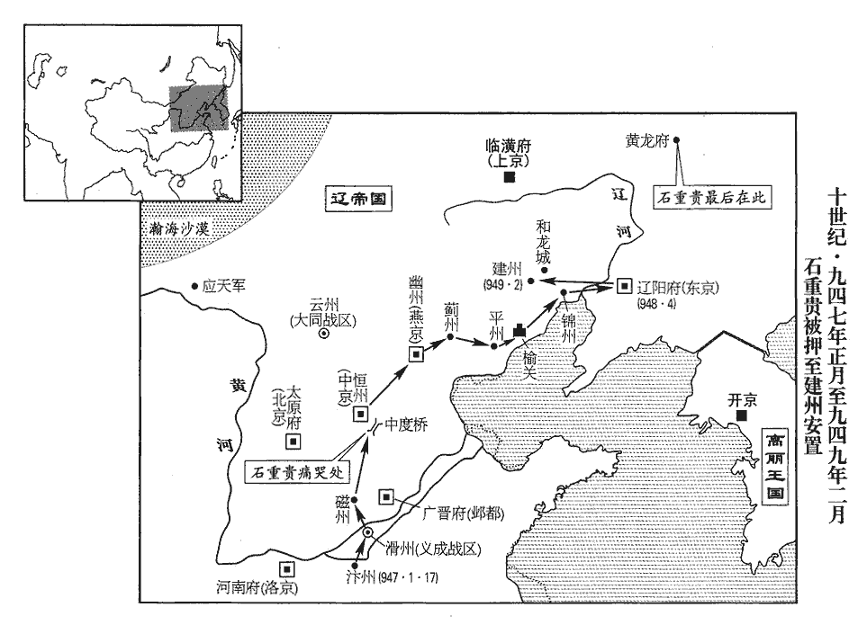
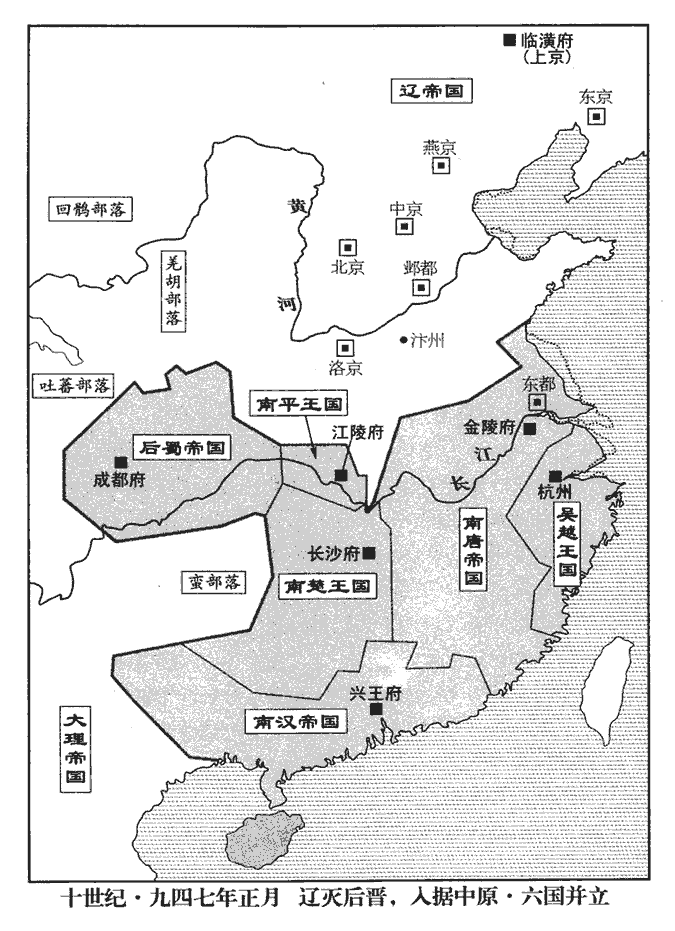
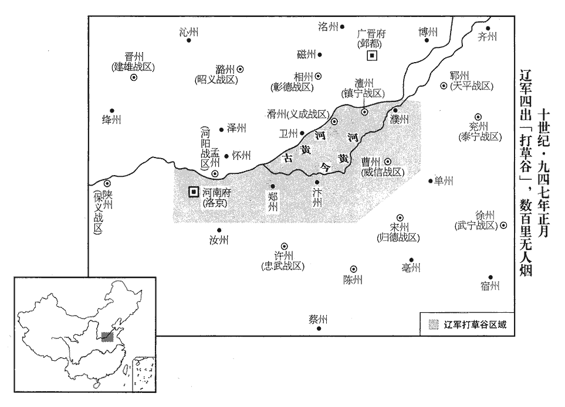
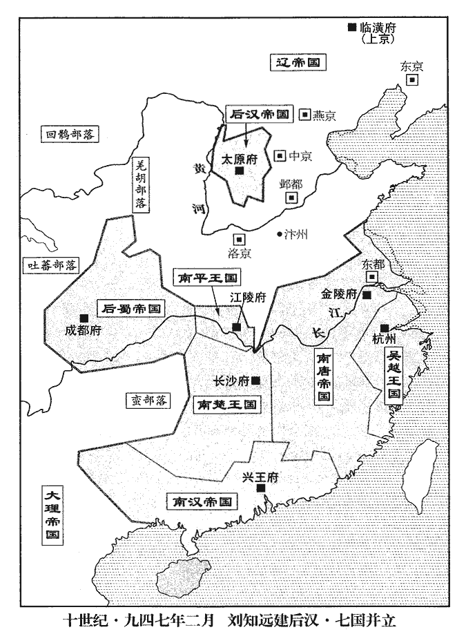
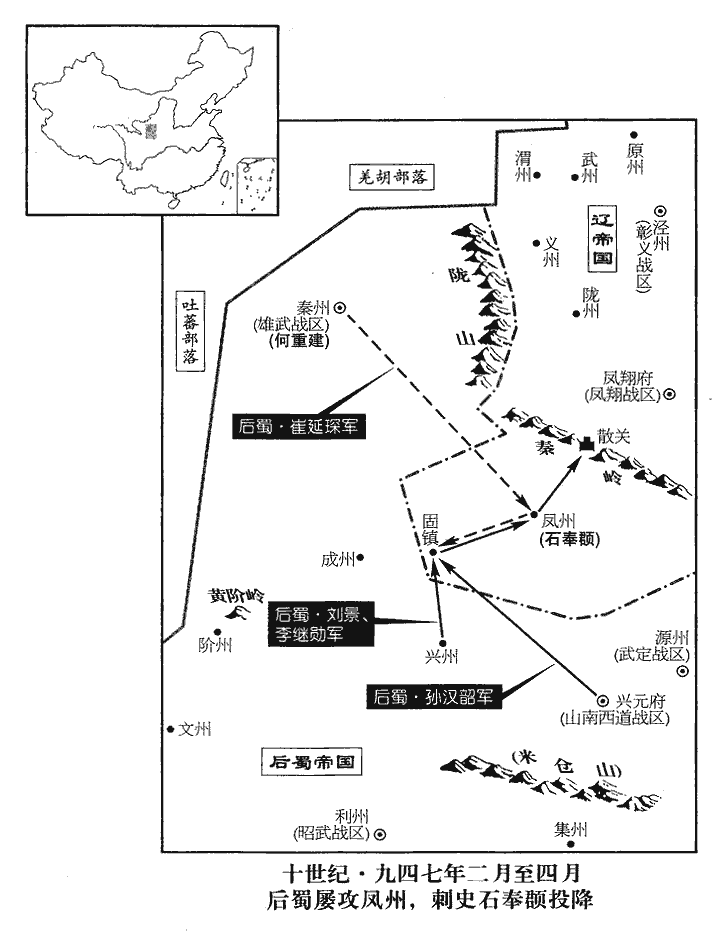
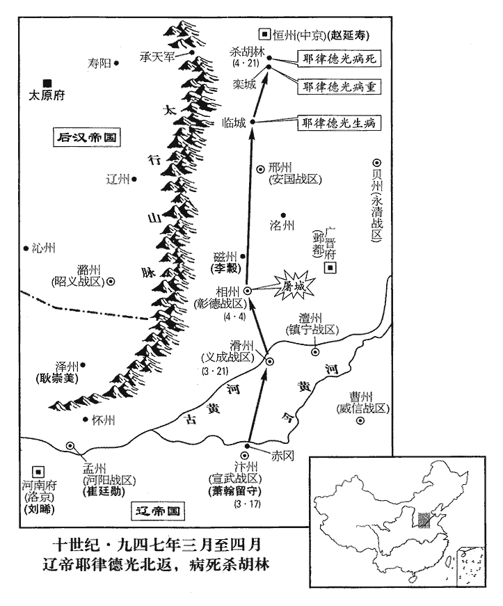

 後漢紀一起強圉協洽（丁未）正月，盡四月，不滿一年。
>  
> 高祖本沙陀部人，居于太原。及得中國，自以姓劉，遂言為東漢顯宗第八子淮陽王昞之後，國號曰漢。通鑑以前已有漢紀，此以後漢紀書之。

# 高祖睿文聖武昭肅孝皇帝上姓劉，名知遠；乾祐元年，更名暠；其先沙陀部人也。

## 天福十二年（丁未、九四七）漢復以天福紀年，詳見後。

1春，正月，丁亥朔‹一›，百官遙辭晉主於城北，大梁城‹河南省开封市›之北。乃易素服紗帽，迎契丹主‹首都临潢府内蒙古巴林左旗›耶律德光，本年四十六岁，伏路側請罪。契丹主貂帽、貂裘，衷甲，駐馬高阜，命起，改服，撫慰之。按歐史，時晉百官迎契丹主于赤岡。左衛上將軍安叔千獨出班胡語，按薛史，安叔千，沙陀三部落之種也，故習胡語。契丹主曰：「汝安沒字邪？安叔千狀貌堂堂，而不通文字，所為鄙陋，人謂之「沒字碑」。汝昔鎮邢州‹河北省邢台市›，已累表輸誠，我不忘也。」叔千拜謝呼躍而退。呼躍蓋夷禮，猶華人舞蹈也。

〖译文〗 [1]春季，正月，丁亥朔（初一），后晋的文武百官在大梁城北远远地向后晋出帝辞别，然后改换白衣纱帽，迎接契丹主耶律德光，全都在路旁伏服请罪。契丹主头戴貂帽，身披貂裘，内裹铁甲，立马于高岗之上，命令归降的百官起立，改换服装，安抚勉慰百官。左卫上将军安叔千一人从百官的行列中站出来，向契丹主耶律德光说了一番胡语。契丹主说：“你就是‘安没字’吗？你过去镇守邢州时，已多次向我表示忠诚，我没忘记啊。”安叔千欢呼跳跃拜谢而退。

晉主與太后已下迎於封丘門‹开封府北面西门›外，契丹主辭不見。考異曰：漢高祖實錄：「少帝帥族候於野，邪律氏疏之。帝指陳前事，乃大臣同謀，皆歷歷能對，無撓屈色，邪律氏亦假以顏色。」陷蕃記、薛史帝紀、五代通錄云：「戎主不與帝相見。」少帝實錄：「帝舉族待罪於野，虜長面撫之，遣泊封禪寺。」今從陷蕃記。

〖译文〗 后晋出帝和太后以下在封丘门外迎接，契丹主推辞不见。

契丹主入門，民皆驚呼而走。呼，火故翻。契丹主登城樓，遣通事諭之曰：「我亦人也，汝曹勿懼！會當使汝曹蘇息。氣絕而復息曰蘇；氣一出入為息。一曰，更息曰蘇。我無心南來，漢兵引我至此耳。」歸罪於杜威等。至明德門，下馬拜而後入宮。以其樞密副使劉密權開封尹事。先易置京尹以彈壓華人。日暮，契丹主復出，屯於赤岡‹河南省开封市东北›。懼人心未一，未敢居城中。

〖译文〗 契丹主进入大梁城门时，百姓们都惊呼地跑掉了。契丹主登上城楼，命翻译告诉百姓们：“我也是人，你们不要害怕！我要让你们休养生息。我无心南来，是汉兵引我来到这儿的。”来到明德门，契丹主下马叩拜，然后入宫。命令他的枢密副使刘密为代理开封尹。日落时分，契丹主退出都城，屯兵于赤冈。

2戊子‹二›，執鄭州‹河南省郑州市›防禦使楊承勳至大梁，責以殺父叛契丹，楊承勳囚父以降晉，事見二百八十四卷齊王開運元年。命左右臠食之。未幾，臠，力兗翻。幾，居豈翻。以其弟右羽林將軍承信為平盧‹总部设青州山东省青州市›節度使，悉以其父‹杨光远（杨檀）›舊兵授之。既授之以其父舊鎮，復授之以其父舊兵。

〖译文〗 [2]戊子（初二），抓获郑州防御使杨承勋，将他押解到大梁城，斥责他杀父、背叛契丹，命令左右的人把他剁为碎肉吃掉。不久，委任他的弟弟右羽林将军杨承信为平卢节度使，并把他父亲的旧部全都交给他率领。

 

3高勳訴張彥澤殺其家人於契丹主‹耶律德光›，張彥澤殺高勳家見上卷上年。勳為杜威奉降表者也，先已為契丹主所親，故得訴其事。契丹主亦怒彥澤剽掠京城，并傅住兒鎖之。彥澤剽掠事亦見上卷上年。傅住兒，監彥澤軍者也。剽，匹妙翻。以彥澤之罪宣示百官，問：「應死否？」皆言「應死。」百姓亦投牒爭疏彥澤罪。己丑‹三›，斬彥澤、住兒於北市，仍命高勳監刑。彥澤前所殺士大夫子孫，皆絰杖號哭，隨而詬詈，以杖扑之。絰，徒結翻。有親喪者，絰杖。號，戶刀翻。詬，苦候翻，又許候翻。詈，力智翻。扑，普卜翻，擊也。勳命斷腕出鎖，斷，音短。腕，烏貫翻。剖其心以祭死者。市人爭破其腦取髓，髓，悉委翻。臠其肉而食之。

〖译文〗 [3]高勋向契丹主耶律德光控诉张彦泽杀他的家属。契丹主也愤恨张彦泽剽掠京城，将张彦泽和监军傅住儿一起抓了起来。契丹主把张彦泽的罪行向百官宣布，并问：“张彦泽应不应该处死？”百官都说：“应该处死。”全城百姓也争先恐后递上状牒上书张彦泽的罪行。己丑（初三），命将张彦泽、傅住儿押往北市斩首，并命高勋监斩。张彦泽原来所杀的士大夫的子孙，这时都携带丧杖，随后怒骂，用丧杖痛打张彦泽的尸首。高勋命令砍断手腕从铐锁中取出尸体，剖腹取心来祭奠被他杀害的人。市民们争着砸碎他的头，取出他的脑髓，剁碎他的肉并分吃掉。

4契丹送景延廣歸其國，庚寅‹四›，宿陳橋‹河南省封丘县东南›，九域志：開封府浚儀縣有陳橋鎮。夜，伺守者稍怠，扼吭而死‹年五十六岁›。伺，相吏翻。吭，居郎翻；人頸曰吭。

〖译文〗 [4]契丹押解景延广返归契丹，庚寅（初四）那天，夜宿于陈桥镇，趁看押人懈怠的时候，他掐脖子自杀了。

5辛卯‹五›，契丹以晉主‹石重贵›為負義侯，置於黃龍府‹吉林省农安县›。黃龍府，即慕容氏和龍城‹辽宁省朝阳市›也。歐史曰：自幽州行十餘日，過平州；出榆關，行沙磧中，七八日至錦州；又行五六日，過海北州；又行十餘日，渡遼水至勃海國鐵州；又行七八日，過南海府，遂至黃龍府。按契丹後改黃龍府為隆州，北至混同江一百三十里。又按慕容氏之和龍城，若據晉書及酈道元水經註，當在漢遼西郡界。今晉主陷蕃，渡遼水而後至黃龍府，又其地近混同江，疑非慕容氏之和龍城。契丹主使謂李太后曰：「聞重貴不用母命以至於此，可求自便，勿與俱行。」太后曰：「重貴事妾甚謹。所失者，違先君‹石敬瑭›之志，絕兩國之歡耳。今幸蒙大恩，全生保家，母不隨子，欲何所歸！」

〖译文〗 [5]辛卯（初五），契丹封后晋出帝为负义侯，安置在黄龙府。黄龙府就是原慕容氏的和龙城。契丹主派人对李太后说：“听说重贵是不听母命才落到今天的下场；您可以自行方便，不要和他一起同行。”太后说：“重贵侍奉我很恭谨。他的失误是，违背了先君的意志，断绝了两国的交欢。现在有幸蒙受大恩，保全了身家性命，我做母亲的不随着儿子，又往哪儿寻求归宿呢！”

癸巳‹七›，契丹遷晉主及其家人於封禪寺，遣大同‹总部设云州山西省大同市›節度使兼侍中此契丹所授官。河內‹河南省沁阳市›崔廷勳以兵守之。宋白曰：崔廷勳本河內人，少陷虜。契丹主數遣使存問，數，所角翻。晉主每聞使至，舉家憂恐。恐見殺也。時雨雪連旬，外無供億，毛居正曰：供儗，儗有儲偫zhì之意。供億，猶供儗也。億，度也；料度其所須之物，隨多少而供之，以待其乏也。上下凍餒。太后使人謂寺僧曰：「吾嘗於此飯僧數萬，飯，扶晚翻。今日獨無一人相念邪！」僧辭以「虜意難測，不敢獻食。」噫！孰知緇黃變色，其徒所為，有甚於不敢獻食者耶！有國有家者，崇奉釋氏以求福田利益，可以監矣。晉主陰祈守者，乃稍得食。

〖译文〗 癸巳（初七），契丹把后晋出帝和他全家人迁到封禅寺，派大同节度使兼侍中河内人崔廷勋领兵看守。契丹主多次派使者前去探望问候；后晋出帝每听说使者到，全家都惊恐担忧。当时雨夹雪下了十几天，寺外断绝了供给，全家老小又冷又饿。李太后派人对寺内的和尚说：“我曾在这里供给数万和尚的斋饭，现在难道就没有一个人记着我吗？”和尚以“契丹用心难料，不敢献上食品”为推辞。后晋出帝只好偷偷地哀求看守，才得到一点食物。

是日，契丹主自赤岡‹河南省开封市东北›引兵入宮，入晉宮。都城‹开封府›諸門及宮禁門，皆以契丹守衛，晝夜不釋兵仗。懼有變也。磔犬於門，以竿懸羊皮於庭為厭勝。磔，陟格翻。厭，於葉翻。契丹主謂【章：十二行本「謂」下有「晉」字；乙十一行本同；孔本同；退齋校同。】群臣曰：「自今不脩甲兵，不市戰馬，輕賦省役，天下太平矣。」談何容易！斯言甫脫口，而打草穀繼之矣，天下果太平乎！廢東京，降開封府為汴州‹河南省开封市›，尹為防禦使。乙未‹九›，契丹主改服中國衣冠，百官起居皆如舊制。史言契丹主猶知用夏變夷。

〖译文〗 当天，契丹主率兵从赤冈进入宫中。都城各门和宫禁大门，都派契丹兵把守，昼夜不离兵器。并且在大门前杀狗，在庭院中竖起长竿挂上羊皮作为诅咒。契丹主对群臣说：“从今以后，不整治兵器，不购置战马，减轻赋税，少征徭役，天下太平了！”废除东京建制，降开封府为汴州，原府尹为防御使。乙未（初九）契丹主改穿中原衣冠，文武百官上朝退朝一切均按旧有的典章制度。

趙延壽、張礪共薦李崧之才；會威勝‹总部设邓州河南省邓州市›節度使馮道自鄧州入朝，契丹主素聞二人名，皆禮重之。二人歷唐、晉，位極人臣，國亡不能死，視其君如路人，何足重哉！未幾，以崧為太子太師，充樞密使；道守太傅，於樞密院祗候，以備顧問。

〖译文〗 赵延寿、张砺一起荐举李崧的才华；正赶上威胜节度使冯道从邓州入朝，契丹主对二人的名声早有耳闻，都给予礼遇以示重视。不久，就命李崧为太子太师，充任枢密使；命冯道为太傅，在枢密院供职，担任顾问。

契丹主分遣使者，以詔書賜晉之藩鎮；晉之藩鎮爭上表稱臣，被召者無不奔馳而至。被，皮義翻。惟彰義‹总部设泾州甘肃省泾川县›節度使史匡威據涇州不受命。匡威，建瑭之子也。史建瑭事晉王克用以及莊宗，皆有戰功。雄武‹总部设秦州甘肃省秦安县西北›節度使何重建斬契丹使者，以秦‹甘肃省秦安县西北›、階‹甘肃省武都县东›、成‹甘肃省成县›三州降蜀‹首都成都府四川省成都市›。史匡威不降契丹，以其地遠，契丹兵威不能至也。何重建則以其鎮與蜀接境，遂棄遼而附蜀耳。

〖译文〗 契丹主又分别派出使者，将诏书赐给后晋的各个藩镇；各藩镇都争着上表章称臣，凡被召的没有不快马到达的。只有彰义节度使史匡威据守泾州不接受命令。史匡威是史建瑭的儿子。雄武节度使何重建，把来传诏书的契丹使者杀掉，率领秦、阶、成三州投降后蜀。

初，杜重威既以晉軍降契丹，杜重威初避晉主重貴名，去「重」，單名「威」。及晉既亡國，重威即復舊名；其忘恩背主，此特末節耳。契丹主‹耶律德光›悉收其鎧仗數百萬貯恆州‹河北省正定县›，貯，丁呂翻。恆，戶登翻。驅馬數萬歸其國，遣重威將其眾從己而南。將，即亮翻。及河，契丹主以晉兵之眾，恐其為變，欲悉以胡騎擁而納之河流。或諫曰：「晉兵在他所者尚多，彼聞降者盡死，必皆拒命。【章：十二行本「命」下有「為患」二字；乙十一行本同。】不若且撫之，徐思其策。」契丹主乃使重威以其眾屯陳橋。陳橋在陳橋門外，有陳橋驛。會久雪，官無所給，士卒凍餒，咸怨重威，相聚而泣；重威每出，道旁人皆罵之。

〖译文〗 当初，杜威恢复旧名杜重威领着后晋军投降契丹后，契丹主收缴了全部兵器铠甲，有数百万件之多，贮存于恒州；派人将军马数万匹北归其国中；派杜重威率领其部卒跟随自己南下。到了黄河岸边，契丹主看到投降的后晋兵卒太多，怕制造事变，想用自己的骑兵把他们统统赶进黄河。有人劝谏道：“晋兵在各地的还很多，他们听到投降的都死了，一定都会抗拒到底的；不如先安抚他们，慢慢地再想万全之策。”契丹主就派杜重威带领他的降兵屯驻陈桥。正赶上下雪多日，官没给粮饷，士兵们又冷又饿，都怨恨杜重威，相聚而哭泣；杜重威每出帐外，道旁的士兵都骂他。

 

契丹主猶欲誅晉兵。趙延壽言於契丹主曰：「皇帝親冒矢石以取晉國，欲自有之乎，將為他人取之乎？」冒，莫北翻。為，于偽翻；下同。趙延壽志在帝中國，以此言覘契丹主之意，不特為晉兵發也。契丹主變色曰：「朕舉國南征，五年不解甲，天福八年，契丹始攻晉，至是五年。僅能得之，豈為他人乎！」趙延壽聞契丹主此言，可以絕望矣。延壽曰：「晉國南有唐‹首都金陵府›，西有蜀，常為仇敵，皇帝亦知之乎？」曰：「知之。」延壽曰：「晉國東自沂‹山东省临沂市›、密‹山东省诸城市›，西及秦‹甘肃省秦安县西北›、鳳‹陕西省凤县›，延袤數千里，袤，音茂。邊於吳、蜀，常以兵戍之。南方暑濕，上國之人不能居也。時偏方割據者，謂中原為上國。晉奉契丹，又稱契丹為上國。他日車駕北歸，以晉國如此之大，無兵守之，吳、蜀必相與乘虛入寇，如此，豈非為他人取之乎？」契丹主曰：「我不知也。然則柰何？」延壽曰：「陳橋降卒，可分以戍南邊，則吳、蜀不能為患矣。」契丹主曰：「吾昔在上黨‹潞州州政府所在县·山西省长治市›，失於斷割，悉以唐兵授晉。事見二百八十卷晉高祖天福元年。斷，丁亂翻。既而返為寇讎，北向與吾戰，辛勤累年，僅能勝之。今幸入吾手，不因此時悉除之，豈可復留以為後患乎？」復，扶又翻。延壽曰：「曏留晉兵於河南，不質其妻子，質，音致。故有此憂。今若悉徙其家於恆‹河北省正定县›、定‹河北省定州市›、雲‹山西省大同市›、朔‹山西省朔州市›之間，每歲分番使戍南邊，何憂其為變哉！此上策也。」契丹主悅曰：「善！惟大王所以處之。」契丹封趙延壽為燕王，故稱之為大王。處，昌呂翻。由是陳橋兵始得免，分遣還營。

〖译文〗 契丹主还是想诛杀后晋降卒。赵延寿对他说：“皇帝亲自率兵冒着飞矢流石夺取了晋国江山，是想自己占有呢，还是想替他人夺取呢？”契丹主脸色突变道：“朕统率全国南征，五年不解衣甲，才刚刚得到，岂能是为他人！”赵延寿说：“晋南面有唐，西面有蜀，常常互为仇敌，皇帝也知道吧？”契丹主答：“知道。”赵延寿又说：“晋国东起沂州、密州，西至秦州、凤州，绵延广袤数千里，边境与吴、蜀相接，常要派兵镇守。南方暑热潮湿，北国人不能居住。他日您车驾北归，而这么辽阔的晋国疆土无兵把守，吴、蜀一定乘虚入侵，这样，难道不是为他人夺取江山吗？”契丹主说：“这是我没料到的。那么应该怎么办呢？”赵延寿说：“陈桥的降兵，可分开来把守南部边疆，这样吴、蜀就不能成为后患了。”契丹主说：“我过去在上党，失策在于当断不断，把唐兵交给晋。没想到反过来与我为仇，北面同我作战，辛苦勤劳好几年，才把他们战胜。现在有幸落在我的手里，不乘这时把他们翦除干净，难道还留作后患吗？”赵延寿说：“过去把晋兵留在河南，不将他们的妻子作为人质，所以才有这种忧患。现在如果把他们的家全迁到恒、定、云、朔各州之间，每年轮番让他们把守南部边疆，何怕他们发生突变！这是上策呵。”契丹主高兴地说：“对！全按你燕王的意见办理！”于是陈桥降兵才得豁免，分别遣返兵营。

6契丹主殺右金吾衛大將軍李彥紳、宦者秦繼旻，以其為唐潞王殺東丹王‹耶律突欲（李赞华），耶律德光之兄›故也。殺東丹王見二百八十卷晉高祖天福元年，唐潞王之清泰三年也。為，于偽翻。以其家族貲財賜東丹王之子永康王兀欲。兀欲眇一目，為人雄健好施。兀欲始見於此，為後得國張本。施，式豉翻。

〖译文〗 [6]契丹主杀右金吾卫大将军李彦绅和宦者秦继，因为他们曾为后唐潞王杀东丹王的缘故。并把他们家族的资财赏赐给东丹王的儿子永康王兀欲。兀欲瞎一只眼，为人豪迈雄健，慷慨好施。

7癸卯‹十七›，晉主‹石重贵›與李太后‹石重贵的伯母·后唐晋国长公主›、安太妃‹石重贵的母亲›、馮后‹石重贵的妻子›及弟睿、子延煦、延寶俱北遷，後宮左右從者百餘人。從，才用翻。契丹遣三百騎援送之；援送者，送其行以為防援。又遣晉中書令趙瑩、樞密使馮玉、馬軍都指揮使李彥韜與之俱。

〖译文〗 [7]癸卯（十七日），后晋出帝与李太后、安太妃、冯后与弟石重睿、儿子石延煦、石延宝全部向北迁移，后宫左右随从有一百多人。契丹派三百名骑兵护送、防范，又命原后晋中书令赵莹、枢密使冯玉、马军都指挥使李彦韬与他们同行。

晉主‹石重贵›在塗，供饋不繼，或時與太后俱絕食，舊臣無敢進謁者。獨磁州刺史李穀迎謁於路，相對泣下。穀曰：「臣無狀，負陛下。」因傾貲以獻。天下之士，苟有所負者，其所為必有異於人。磁，牆之翻。

〖译文〗 后晋出帝在路上，食物供给接不上，有时和太后一同断食，而那些旧日的臣下竟没人敢前来迎接进见的，只有磁州刺史李在路旁边迎接拜谒。君臣相对泣下。李说：“为臣无能，有负于陛下。”于是把自己所有的资财献上。

晉主‹石重贵›至中度橋，見杜重威寨，歎曰：「天乎！我家何負，為此賊所破！」慟哭而去。於晉之時，通國上下皆知杜重威之不可用，乃違眾用之以致亡國。詩云：「啜其泣矣，何嗟及矣。」今至於慟，庸有及乎！

〖译文〗 后晋出帝到达中度桥，望见杜重威的兵寨，感叹道：“天呵！我家何负于人，竟被这个贼人所破！”大哭而去。

8癸丑‹二十七›，蜀主‹孟昶（孟仁赞）本年二十九岁›以左千牛衛上將軍李繼勳為秦州‹甘肃省秦安县西北›宣慰使。蜀以何重建降，遣使宣慰之。

〖译文〗 [8]癸丑（二十七日），后蜀主孟昶派左千牛卫上将军李继勋为秦州宣慰使。

9契丹主以前燕京‹幽州·北京市›留守劉晞為西京‹河南府·河南省洛阳市›留守，薛史曰：劉晞者，涿州人，陷虜，歷官至平章事兼侍中。考異曰：實錄作「禧」。或云名晞。今從陷蕃記。永康王兀欲之弟留珪為義成‹总部设滑州河南省滑县›節度使，兀【章：十二行本「兀」上有「族人郎五為鎮寧‹总部设澶州河南省濮阳市›節度使」十字；乙十一行本同；孔本同；張校同；退齋校同；熊校同。】欲姊壻潘聿撚為橫海‹总部设沧州河北省沧州市东南›節度使，聿，以律翻。撚，乃殄翻。考異曰：周太祖實錄：「聿撚」作「聿涅」。今從陷蕃記。趙延壽之子匡贊為護國‹总部设河中府山西省永济市›節度使，為趙匡贊後以河中歸漢張本。漢將張彥超為雄武節度使，史佺為彰義節度使，客省副使劉晏僧為忠武‹总部设许州河南省许昌市›節度使，前護國節度使侯益為鳳翔‹总部设凤翔府陕西省凤翔县›節度使，權知鳳翔府事侯益後亦以鳳翔歸漢。焦繼勳為保大‹总部设鄜州陕西省富县›節度使。晞，涿州‹河北省涿州市›人也。既而何重建附蜀，秦州附蜀，張彥超無所詣。史匡威不受代，史匡威據涇州以拒史佺。契丹勢稍沮。沮，在呂翻。

〖译文〗 [9]契丹主任命前燕京留守刘为西京留守；任命永康王兀欲的弟弟留为义成节度使、兀欲的姐夫潘聿为横海节度使；任命赵延寿的儿子赵匡赞为护国节度使；任命汉将张彦超为雄武节度使，史为彰义节度使，客省副使刘晏僧为忠武节度使；前护国节度使侯益为凤翔节度使，代理凤翔府事；任命焦继勋为保大节度使。刘是涿州人。不久何重建归附后蜀，史匡威据泾州以拒史取代，契丹之势稍稍受到扼制。

10晉昌‹总部设京兆府陕西省西安市›節度使趙在禮入朝，自長安入朝于大梁。其裨將留長安者作亂，節度副使建‹福建省建瓯市›人李肅討誅之，軍府以安。

〖译文〗 [10]晋昌节度使赵在礼入朝到大梁，他留在长安的副将作乱，节度副使建州人李肃讨伐诛灭了叛乱，军府得以平安。

11晉主之絕契丹也，事見二百八十三卷晉高祖天福七年。匡國‹总部设同州陕西省大荔县›節度使劉繼勳為宣徽北院使，頗豫其謀；契丹主入汴‹河南省开封市›，繼勳入朝，契丹主責之。時馮道在殿上，繼勳急指道曰：「馮道為首相，與景延廣實為此謀。臣位卑，何敢發言！」契丹主曰：「此叟非多事者，勿妄引之！」馮道以依阿免禍；有國家者，焉用彼相哉！然歷事七姓，皆以德望待之，亦持身謹靜，有以動其敬心耳。命鎖繼勳，將送黃龍府。

〖译文〗 [11]后晋出帝断绝和契丹的往来，匡国节度使刘继勋当时为宣徽北院使，多参预此事的谋划；契丹主进入大梁，刘继勋又来朝见，契丹主责怪他。当时冯道正在殿上，刘继勋急忙指着他说：“冯道是首相，和景延广实际策划的此事。臣的官职卑微，哪里敢说话！”契丹主说：“这老头儿不是多事的人，你不要胡乱攀引他！”命人锁上刘继勋，押送黄龙府。

趙在禮至洛陽，舊唐書地理志：自長安東至洛陽八百五十里。謂人曰：「契丹主嘗言莊宗‹李存勖›之亂由我所致。謂皇甫暉之亂也。事見二百七十四卷唐明宗天成元年，莊宗之同光四年也。我此行良可憂。」契丹遣契丹將述軋、書契丹將，以別漢將與勃海將。奚‹滦河上游›王拽剌，拽，羊列翻。剌，盧達翻。勃海‹首都龙泉府›將高謨翰戍洛陽，在禮入謁，拜於庭下，拽剌等皆踞坐受之。乙卯‹二十九›，在禮至鄭州‹河南省郑州市›，九域志：自洛陽東至鄭州二百六十里。聞繼勳被鎖，大驚，夜，自經於馬櫪間‹年六十六岁›。壢，音歷，馬棧也。契丹主聞在禮死，乃釋繼勳，繼勳憂憤而卒。

〖译文〗 赵在礼到洛阳，对人说：“契丹主曾说庄宗之乱由我引起。看来我此行，深可忧虑。”契丹派契丹的将领述轧、奚王拽剌、勃海将领高谟翰驻守洛阳，赵在礼进入谒见。在庭下叩拜，而拽剌等人都蹲坐着受礼。乙卯（二十九日），赵在礼到郑州，听说前往入朝的刘继勋被锁上，惊恐万分，到了夜里，在马房里自杀了。契丹主听说赵在礼自杀了，就释放了刘继勋，刘继勋忧虑愤恨而死。

劉晞在契丹嘗為樞密使、同平章事，至洛陽，詬奚王曰：詬，苦候翻，又許候翻。「趙在禮漢家大臣，爾北方一酋長耳，酋，慈秋翻。長，知兩翻。安得慢之如此！」立於庭下以挫之。由是洛人稍安。

〖译文〗 刘在契丹曾为枢密使、同平章事等职，到了洛阳，责骂奚王拽剌道：“赵在礼是汉家的大臣，你只不过是北方的一个酋长罢了，怎敢这样怠慢他！”刘站在庭下大挫他的气焰。于是洛阳人稍得安定。

契丹主廣受四方貢獻，大縱酒作樂，每謂晉臣曰：「中國事，我皆知之，吾國事，汝曹不知也。」契丹主自謂周防之密以夸晉臣。然東丹之來，已胎兀欲奪國之禍，雖甚愚者知之，而契丹主不知也。善覘國者，不觀一時之強弱而觀其治亂之大致。

〖译文〗 契丹主广泛接受四面八方送上来的进贡礼品，大肆饮酒作乐，常常对原后晋的臣子说：“你们中原的事，我都知道；可我国的事，你们就不晓得了！”

趙延壽請給上國兵廩食，契丹主曰：「吾國無此法。」乃縱胡騎四出，以牧馬為名，分番剽掠，剽，妙匹翻。謂之「打草穀」。丁壯斃於鋒刃，老弱委於溝壑，自東、西兩畿大梁之屬縣為東畿，洛陽之屬縣為西畿，此唐制也。唐制，兩京除赤縣外，餘屬縣為畿縣。及鄭‹河南省郑州市›、滑‹河南省滑县›、曹‹山东省定陶县›、濮‹山东省鄄城县›，數百里間，財畜殆盡。鄭、滑、曹、濮，皆大梁之旁郡，以及言之，明上文所謂東、西兩畿為畿縣。濮，博木翻。

〖译文〗 赵延寿请求供给北国军队的粮饷，契丹主说：“我国没有这个法。”于是就四处放出胡骑兵，以放马为名，四处抢掠，称为“打草谷”。百姓中年轻力壮的死于契丹兵的刀口，年老体弱的填于沟壑，从大梁、洛阳的辖区直到郑、滑、曹、濮各州，几百里地的地面上，财产牲畜几乎抢掠一空。

契丹主謂判三司劉昫曰：「契丹兵三十萬，既平晉國，應有優賜，速宜營辦。」時府庫空竭，昫不知所出，請括借都城士民錢帛，都城，大梁都城。自將相以下皆不免。又分遣使者數十人詣諸州括借，皆迫以嚴誅，人不聊生。其實無所頒給，皆蓄之內庫，欲輦歸其國。於是內外怨憤，始患苦契丹，皆思逐之矣。為契丹北歸張本。

〖译文〗 契丹主对判三司刘说：“契丹大军三十万，平掉了晋国，就应该发给丰厚的赏赐，要赶快准备操办。”当时官府仓库里已经空竭，刘不知从何处而出，于是就向都城的士人百姓借钱，自将相以下都免不了。又分别派遣几十名使者到各州中借款，都用严刑相威胁，民不聊生。其实钱本不颁发给契丹士兵，都聚积到皇宫内库里，打算装车运往本国。于是内外怨恨、愤怒，开始感到契丹的祸患痛苦，都想驱逐他们了。

 

12初，晉主‹石重贵›與河東‹总部太原府›節度使、中書令北平王劉知遠相猜忌，雖以為北面行營都統，徒尊以虛名，而諸軍進止，實不得預聞。事見二百八十四卷晉齊王開運元年。知遠因之廣募士卒；天福八年，齊王與契丹搆隙之初，劉知遠已奏募兵矣，事見二百八十三卷。陽城‹河北省顺平县东南›之戰，諸軍散卒歸之者數千人，陽城之戰見二百八十四卷晉齊王開運二年。按陽城之戰，晉師大捷，無緣有散卒歸河東，此必杜重威降契丹時也。又得吐谷渾財畜，事亦見開運二年。畜，吁玉翻。由是河東富強冠諸鎮，冠，古玩翻。步騎至五萬人。

〖译文〗 [12]当初，后晋出帝与河东节度使、中书令、北平王刘知远相互猜忌。虽然任命刘知远为北面行营都统，但徒有虚名罢了，各军的行动，实际上他一点都不能干预。刘知远因此大量招募士兵；阳城一战，各军的散兵游勇归附于他的有几千人，又得到吐谷浑的财产牲畜，于是各藩镇中河东最为富强，步兵、骑兵多达五万人。

晉主與契丹結怨，知遠知其必危，而未嘗論諫。契丹屢深入，知遠初無邀遮、入援之志。既不據險要以邀遮契丹之兵，又不遣兵入援也。及聞契丹入汴，知遠分兵守四境以防侵軼。軼，徒結翻。遣客將安陽‹相州州政府所在县·河南省安阳市›王峻舊唐書地理志：相州，漢魏郡也，治安陽縣。安陽，漢侯國，故城在湯陰東。曹魏時，廢安陽，併入鄴。後周移鄴，置縣於安陽故城，仍為鄴縣。隋又改為安陽縣，州所治也。若漢魏郡城則在縣之西北七里，將，即亮翻。奉三表詣契丹主：一，賀入汴；二，以太原夷、夏雜居，戍兵所聚，未敢離鎮；夏，戶雅翻。離，力智翻。三，以應有貢物，值契丹將劉九一軍自土門‹河北省鹿泉市西南›西入屯於南川‹太原市之南›，南川，謂晉陽城南之地。城中憂懼，俟召還此軍，道路始通，可以入貢。契丹主賜詔褒美，及進畫，親加「兒」字於知遠姓名之上，仍賜以木柺。胡法，優禮大臣則賜之，如漢賜几杖之比，惟偉王以叔父之尊得之。柺，乖買翻，老人拄杖也。歐史曰：王峻持柺歸，虜人望之皆避道。

〖译文〗 后晋出帝和契丹结下怨隙，刘知远判断他必然凶多吉少，但从未加以劝谏。契丹屡次深入进犯，刘知远全然没有拦击、入援的打算。等到听说契丹已占据大梁，刘知远就分兵守护四方边境来防备侵袭。又派遣客将安阳人王峻向契丹主奉上三道表章：一是祝贺契丹进入大梁；二是因太原是夷、夏人杂居共处之处，守防士卒屯聚，所以不敢离镇前往朝贺；三是本应献上贡品，但正值契丹将领刘九一的军队从土门西入屯于南川，太原城中人心忧虑恐惧，待召还此军，道路畅通，才可以送入贡品。契丹主见表章后赐予诏书，称赞表彰，待亲自审批诏书时，又在刘知远的姓名上加上“儿”字，以示亲近，并赐给木。按照胡人的传统，受礼遇优待的大臣，才能赐予木，相当于汉人赐给几杖，只有伟王因为有其叔父的尊贵地位，才得到这种赏赐。

知遠又遣北都副留守太原白文珂入獻奇繒名馬，繒，慈陵翻。契丹主知知遠觀望不至，及文珂還，還，從宣翻，又如字。使謂知遠曰：「汝不事南朝，又不事北朝，意欲何所俟邪？」朝，直遙翻。蕃漢孔目官郭威言於知遠曰：「虜恨我深矣！王峻言契丹貪殘失人心，必不能久有中國。」

〖译文〗 刘知远又派遣北都副留守太原人白文珂献上珍奇的丝织品和名贵的马匹。契丹主知刘知远观望不到，等白文珂回太原时，契丹主让他告诉刘知远：“你既不奉事南朝，又不奉事北朝，你打算等什么呢？”蕃汉孔目官郭威对刘知远说：“胡虏对我们怨恨很深呵！王峻说契丹贪婪残暴失掉人心，一定不能长久占据中原。”

或勸知遠舉兵進取。知遠曰：「用兵有緩有急，當隨時制宜。今契丹新降晉兵十萬，虎據京邑，未有他變，豈可輕動哉！且觀其所利止於貨財，貨財既足，必將北去。況冰雪已消，勢難久留，宜待其去，然後取之，可以萬全。」劉知遠料之審矣，所以舉兵南向，契丹不能與之爭。

〖译文〗 有人劝刘知远起兵进攻。刘知远说：“用兵有缓有急，应当因时采取合适的策略。现在契丹刚刚招降了晋国的十万兵马，像老虎一样雄踞着都城，形势没有其它的变化，怎能轻举妄动呢！况且观察他们所贪图的无非是钱财物品，钱财物品得足了，一定要向北回国的。况且现在冰雪已消，气候转暖，他们必然难以久留，应等他们退去，再去占领那里，才可确保万无一失。”

昭義‹总部设潞州山西省长治市›節度使張從恩，以地迫懷‹河南省沁阳市›、洛，昭義治潞州。自潞州至澤州，又至懷州渡河，則洛州河南府。舊唐書地理志：潞州至洛州四百七十里。欲入朝於契丹，遣使謀於知遠，知遠曰：「我以一隅之地，安敢抗天下之大！君宜先行，我當繼往。」從恩以為然。判官高防諫曰：「公晉室懿親，按五代會要，晉少帝前妃張氏，天福八年進冊皇后。張從恩蓋后族也。不可輕變臣節。」從恩不從。左驍衛大將軍王守恩，與從恩姻家，時在上黨，從恩以副使趙行遷知留後，副使者，節度副使也。牒守恩權巡檢使，與高防佐之。【章：十二行本「之」下有「遂行」二字；乙十一行本同。】守恩，建立之子也。王建立事唐明宗見親任，及事晉高祖。

〖译文〗 昭义节度使张从恩，因为地近怀、洛二州，想向契丹朝觐，派使者先去和刘知远商量。刘知远说：“我们以一隅之地，怎么敢与偌大的天下抗争！您可先行一步，我当随后就去。”张从恩信以为真。判官高防劝谏道：“您身为晋室的懿亲，切不可轻易地改变为臣的气节。”张从恩不听从。左骁卫大将军王守恩和张从恩是亲家，当时在上党，张从恩命节度副使赵行迁主持留后事务，发公文派王守恩代理巡检使，与高防共同辅佐赵行迁。王守恩是王建立的儿子。

13荊南‹江陵府湖北省江陵县›節度使高從誨‹本年五十七岁›遣使入貢於契丹，契丹遣使以馬賜之。從誨亦遣使詣河東勸進。荊南高氏父子事大以保其國，為謀大率如此。

〖译文〗 [13]荆南节度使高从诲派使者向契丹进贡，契丹派使者赐给他马匹。高从诲也派使者到河东，劝刘知远登皇帝位。

14唐主‹首都金陵府江苏省南京市›李璟（徐景通）本年三十二岁立齊王景遂為皇太弟。徙燕王景達為齊王，領諸道兵馬元帥；徙南昌王弘冀為燕王，為之副。燕，於堅翻。

〖译文〗 [14]南唐主立齐王李景遂为皇太弟；又改封燕王李景达为齐王，领诸道兵马元帅；改封南昌王李弘冀为燕王，为副元帅。

景遂嘗與宮僚燕集，贊善大夫元城‹河北省大名县›張易有所規諫，張易北人而仕江南。景遂方與客傳玩玉杯，弗之顧。易怒曰：「殿下重寶而輕士。」取玉杯抵地碎之，眾皆失色；景遂斂容謝之，待易益厚。景遂之遷善敬士，亦難能也。

〖译文〗 李景遂和宫中僚属聚会，赞善大夫元城人张易有所劝谏，而李景遂正和客人们传看赏玩玉杯，不回头理他。张易愤怒地说：“殿下看重宝物而轻视士人！”抓过玉杯来摔在地上砸碎了，众人都大惊失色。而李景遂收起笑容向张易道歉，从此对张易更加重视了。

景達性剛直，唐主與宗室近臣飲，馮延己、延魯、魏岑、陳覺輩，極傾諂之態，或乘酒喧笑；景達屢訶責之，復極言諫唐主，以不宜親近佞臣。屢，力主翻。復，扶又翻。近，巨靳翻。延己以二弟立非己意，欲以虛言德之；嘗宴東宮，陽醉，撫景達背曰：「爾不可忘我！」景達大怒，拂衣入禁中白唐主，請斬之；唐主諭解，乃止。按是時陳覺、馮延魯攻福州，史言其侍飲極傾諂之態，概言其常時，非必拘此時也。張易謂景達曰：「群小交構，禍福所繫。殿下力未能去，數面折之，去，羌呂翻。數，所角翻。折，之舌翻。使彼懼而為備，何所不至！」自是每遊宴，景達多辭疾不預。

〖译文〗 李景达生性刚直。南唐主常和宗室近臣饮酒，冯延己、冯延鲁、魏岑、陈觉等人在此时竭尽谄媚丑态，有时借酒喧哗大笑。李景达多次大声斥责他们，又反复劝谏南唐主，不应亲近那些奸佞之臣。冯延己因两个皇弟的封立并不出于自己的意思，就想用空话来表示自己对他们有恩德；一次在东宫饮宴时，他装作酒醉，抚着李景达的后背说：“你不能忘了我！”李景达大怒，一甩袖子进入宫中，禀报南唐主，请求杀掉冯延己；唐主百般劝解，才算罢了。张易对李景达说：“朝中这群屑小之徒盘根错节，实在关系到生死福祸。殿下全力也未能除去他们，多次面争廷折，使他们害怕并作好防范，什么事干不出来！”从此每次游乐宴会，李景达多借口身体不适而不参加。

唐主遣使賀契丹滅晉，且請詣長安脩復【章：十二行本「復」下有「唐室」二字；乙十一行本同。】諸陵；唐末喪亂，諸陵多遭發掘；南唐自謂纂唐之緒，故請脩復也。契丹不許，而遣使報之。

〖译文〗 南唐主派使臣去祝贺契丹攻灭后晋，并请契丹允许他去长安修复陵墓。契丹不允许，并派使者回复此事。

晉密州‹山东省诸城市›刺史皇甫暉，棣州‹山东省惠民县›刺史王建，皆避契丹，帥眾奔唐；帥，讀曰率。淮北賊帥多請命於唐。帥，所類翻。唐虞部員外郎韓【章：十二行本「韓」上有「史館脩撰」四字；乙十一行本同。】熙載上疏，以為：「陛下恢復祖業，今也其時。若虜主北歸，中原有主，則未易圖也。」易，以豉翻。韓熙載以定中原自期，僅見此疏耳。自古以來，多大言少成事者，何可勝數！時方連兵福州‹福建省福州市›，未暇北顧；唐人皆以為恨，唐主亦悔之。使唐無福州之役，舉兵北向，亦喪師而已矣。

〖译文〗 后晋密州刺史皇甫晖、棣州刺史王建，都躲避契丹而率众投奔南唐；淮北一带的贼帅也多请求归附，听命于南唐。南唐虞部员外郎韩熙载上疏道：“陛下要恢复祖先大业，现在是时候了！如果胡虏之主北上回国，而中原有了新主，那就不容易对付了。”当时南唐正在福州集结军队，没有机会顾及北方。南唐人都以此为恨事，后唐主也很后悔痛失良机。

15契丹主召晉百官悉集於庭，問曰：「吾國廣大，方數萬里，有君長二十七人；長，知兩翻。今中國之俗異於吾國，吾欲擇一人君之，如何？」皆曰：「天無二日。孟子引孔子之言。夷、夏之心，皆願推戴皇帝。」如是者再。契丹主乃曰：「汝曹既欲君我，今茲所行，何事為先？」對曰：「王者初有天下，應大赦。」二月，丁巳朔‹一›，契丹主服通天冠、絳紗袍，登正殿，設樂懸、儀衛於庭。百官朝賀，華人皆法服，胡人仍胡服，立於文武班中間。文官班於東，武官班於西，胡人立於中間。下制稱大遼會同十年，大赦。仍云：「自今節度使、刺史，毋得置牙兵，市戰馬。」其心固虞諸鎮有與之作敵者。

〖译文〗 [15]契丹主召集后晋的全部文武百官在庭中，问他们：“我国土辽阔广大，方圆数万里，有君长二十七人；而中原的习俗和我国不一样，我想选一个人作中原的君长，怎么样？”百官都说：“天上没有两个太阳。无论夷族、华夏的人心，都愿拥戴您为皇帝。”这样劝进两次。契丹主于是说：“你们既然愿意让我作皇帝，那么现在要办的事，第一项是什么？”百官答道：“皇帝刚刚得到天下，应该大赦罪人。”二月丁巳朔（初一），契丹主头戴通天冠，身披绛纱袍，在皇宫正殿登极，庭下设置了大典乐器和仪仗卫队。百官都来朝贺，汉人都穿礼服，胡人仍穿胡服，立在汉人文、武两班中间。契丹主传下命令，称大辽会同十年，大赦天下。并说：“从今以后，节度使、刺史不许设置亲兵卫队，不得购买战马。”

趙延壽以契丹主負約，心怏怏，趙延壽之求為帝，不得不止，此其所以終為兀欲所鎖也。怏，於兩翻。令李崧言於契丹主曰：「漢天子所不敢望，乞為皇太子。」崧不得已為言之。為言，于偽翻；下令為同。契丹主曰：「我於燕王，雖割吾肉，有用於燕王，吾無所愛。然吾聞皇太子當以天子兒為之，豈燕王所可為也！」因令為燕王遷官。時契丹以恆州‹河北省正定县›為中京，恆，戶登翻。翰林承旨張礪奏擬燕王中京留守、大丞相、錄尚書事、都督中外諸軍事，樞密使如故。契丹主取筆塗去「錄尚書事都督中外諸軍事」而行之。去，羌呂翻。孰謂契丹主起於塞北而不知中國之事體哉！

〖译文〗 赵延寿因为契丹主负约，心里愤闷不平，派李崧向契丹主说：“我不敢奢望为汉人天子，但请求作个皇太子。”李崧不得已，把这话转告给契丹主。契丹主说：“我对燕王，即使是割我身上的肉只要于燕王有用，也在所不惜。但是我听说皇太子应当是天子的儿子才能当，哪能是燕王所能作的！”于是命令给燕王晋升官职。当时契丹以恒州作为中京，翰林承旨张砺奏拟燕王为中京留守、大丞相、录尚书事、都督中外诸军事，枢密使照旧。契丹主取笔涂去“录尚书事、都督中外诸军事”后，发布此令。

16壬戌‹六›，蜀李繼勳與興州‹陕西省略阳县›刺史劉景攻固鎮‹甘肃省徽县›，拔之。【章：十二行本「之」下有「乙丑‹九›」二字；乙十一行本同；孔本同。】何重建請出蜀兵與階‹甘肃省武都县东›、成‹甘肃省成县›兵共扼散關‹陕西省宝鸡市西南›以取鳳州‹陕西省凤县›，扼散關，則北兵不能入，鳳州可坐取也。丙寅‹十›，蜀主發山南‹秦岭以南›兵三千七百赴之。山南兵，興元兵也。

〖译文〗 [16]壬戌（初六），后蜀李继勋和兴州刺史刘景进攻并夺取了固镇。何重建请求后蜀派兵与阶、成二州兵马共同扼守散关，以便夺取凤州。丙寅（初十），后蜀主命发山南兵三千七百名赶赴散关。

17劉知遠聞何重建降蜀，歎曰：「戎狄憑陵，中原無主，令藩鎮外附，吾為方伯，良可愧也！」古者除王畿之外，八州八伯，所謂三十國而為連，連有帥，二百一十國以為州，州有伯者也。周分天下以為二伯，自陜以西，召伯主之。自陜以東，周公主之。及其衰也，齊桓、晉文糾合諸侯以尊王室，亦以方伯之任自居，晉人所謂「我為伯」者也。石晉以劉知遠為北面都統，故亦自謂為方伯。

〖译文〗 [17]刘知远听说何重建投降后蜀，感叹道：“戎狄入侵蹂躏，中原没有君主，致使藩镇向外投靠，我身为一方长官，太感惭愧了！”

於是將佐勸知遠稱尊號，以號令四方，觀諸侯去就。諸侯，謂當時諸藩鎮。知遠不許。聞晉主北遷，聲言欲出兵井陘‹河北省鹿泉市西›，迎歸晉陽‹太原府所在县›。陘，音刑。丁卯‹十一›，命武節都指揮使滎澤‹河南省郑州市西北广武镇›史弘肇武節軍，劉知遠所置，見二百八十三卷晉齊王天福八年。隋置滎澤縣，唐屬鄭州。九域志：滎澤縣在鄭州西北四十五里。集諸軍於毬場，告以出軍之期。軍士皆曰：「今契丹陷京城，執天子，天下無主。主天下者，非我王而誰！劉知遠封北平王，故稱之。宜先正位號，然後出師。」爭呼萬歲不已。知遠曰：「虜勢尚強，吾軍威未振，當且建功業。士卒何知！」命左右遏止之。

〖译文〗 于是他手下的将佐劝刘知远称皇帝尊号，以便号令四方，看各处诸侯的去向。刘知远不同意。听说后晋出帝北上迁徙，刘知远放出风声要出兵井陉，迎接后晋出帝回晋阳城。丁卯（十一日），命令武节都指挥使荥泽人史弘肇集合各军到场，公布了出兵的日期。军士们都说：“现在契丹攻陷京城，抓走天子，天下已没有君主了。能够作天下君主的，除了我们北平王还有谁！应该先确定皇帝名号，然后再出兵。”于是争着呼喊“万岁”不止。刘知远说：“胡虏的兵力还强，而我们的军威还不振，应当先建功业。这些事士兵怎能知道呢！”命左右将佐制止士兵的喧哗。

己巳‹十三›，行軍司馬潞城‹山西省潞城县›張彥威等三上牋勸進，潞，古邑也。隋置潞城縣，唐屬潞州。九域志：潞城縣在潞州東北四十里。知遠疑未決。郭威與都押牙冠氏‹山东省冠县›楊邠入說知遠曰：劉昫曰：冠氏，春秋邑名。隋分館陶東界置冠氏縣，唐屬魏州。九域志：在州東北六十里。說，音稅。今遠近之心，不謀而同，此天意也。王不乘此際取之，謙讓不居，恐人心且移，移則反受其咎矣。」知遠從之。

〖译文〗 己巳（十三日），行军司马潞城人张彦威等三次上书劝登皇帝位。刘知远迟疑不决。郭威和都押牙冠氏人杨入内劝说刘知远道：“现在远近的人心，不谋而合，这是天意呵！如果您不趁这个时候取天下，而谦让不就，只怕人心就要转移，而转移了您就要反受其害了。”刘知远听从了他们的劝进。

18契丹以其將劉愿為保義‹总部设陕州河南省三门峡市›節度副使，陜人苦其暴虐。陜，失冉翻。奉國都頭王晏與指揮使趙暉、都頭侯章謀曰：「今胡虜亂華，乃吾屬奮發之秋。河東劉公，威德遠著，劉知遠，河東帥，故稱之。吾輩若殺愿，舉陜城歸之，為天下唱，取富貴如返掌耳。」「返」，當作「反」。暉等然之。晏與壯士數人，夜踰牙城入府，出庫兵以給眾；庚午‹十四›旦，斬愿首，懸諸府門，又殺契丹監軍，奉暉為留後。晏，徐州‹江苏省徐州市›；暉，澶州；章，太原人也。澶，時連翻。

〖译文〗 [18]契丹派他的将领刘愿为保义节度副使，陕城人苦于他的暴虐，奉国都头王晏与指挥使赵晖、都头侯章合谋道：“现在胡虏扰乱中华，这正是我辈奋发有为的年代。河东的刘公，德高望重、远近闻名，我们如果杀死刘愿，率陕城归附于他，以此作为天下的首倡，那么取得富贵就易如反掌了。”赵晖等人都认为说得很对。王晏和几名壮士，趁着夜里爬上牙城并潜入府库，把兵器取出分给众人。庚午（十四日）早晨，砍掉了刘愿的脑袋，悬挂在府门上，又杀掉契丹的监军，拥立赵晖为留后。王晏是徐州人，赵晖是澶州人，侯章是太原人。

19辛未‹十五›，劉知遠‹本年五十三岁›即皇帝位。自言未忍改晉，又惡開運之名，乃更稱天福十二年。惡，烏路翻。更，工衡翻。歐陽修曰：人君即位稱元年，常事爾，古不以為重也。孔子未脩春秋，其前固已如此，雖暴君昏主，妄庸之史，其紀事先後遠近，莫不以歲月一二數之，乃理之自然也。其謂一為元，未嘗有法焉，古人之語爾。古謂歲之一月，亦不云一而曰正月，國語言六呂曰「元間大呂」，周易列六爻曰「初九」，大抵古人言數，多不云一，不獨謂年為元也。及後世曲學之士，始謂孔子書元年為春秋大法，遂以改元為重事。自漢以後，又名年以建元，而正偽紛雜，稱號遂多，不勝其紀也。五代，亂世也，其事無法而不合於理者多矣。至其年號乖錯以惑後世，則不可以不明。梁太祖以乾化二年遇弒，明年，末帝誅友珪，黜其鳳曆之號，稱乾化三年，尚為有說。至漢高祖建國，黜晉出帝開運四年，復稱天福十二年者，何哉？蓋以愛憎之私耳。方出帝時，漢高祖居太原，常憤憤下視晉，晉亦陽優禮之；幸而未見其隙。及契丹滅晉，漢未嘗有赴難之意。出帝已北遷，方陽以兵聲言追之，至土門而還。及其即位改元，而黜開運之號，則其用心可知矣。蓋其於出帝，無復君臣之義，而幸禍以為利者，其素志也，可勝嘆哉！

〖译文〗 [19]辛未（十五日），刘知远登皇帝位。自称不忍改后晋年号，但厌恶开运这个年号，于是改称天福十二年。

壬申‹十六›，詔：「諸道為契丹括率錢帛者，皆罷之。括率錢帛，見上正月。其晉臣被迫脅為使者勿問，令詣行在。被，皮義翻。自餘契丹，所在誅之。」

〖译文〗 壬申（十六日），刘知远下诏书道：“各道官员为契丹搜刮钱财的，都罢免；原后晋臣子被胁迫派出作使者的，不予追究，命前来报到。至于其它契丹人，各处都要诛杀他们。”

20何重建遣宮苑使崔延琛將兵攻鳳州，不克，退保固鎮‹甘肃省徽县›。何重建為蜀圖取鳳州事始見上。

〖译文〗 [20]何重建派宫苑使崔延琛领兵攻打凤州，没能攻克，退守固镇。

21甲戌‹十八›，帝‹刘知远›自將東迎晉主及太后。至壽陽‹山西省寿阳县›，晉置壽陽縣，後魏改曰受陽。隋開皇十年，改并州南受陽為文水，分州東故壽陽置壽陽縣；唐屬太原府。聞已過恆州數日，乃留兵戍承天軍‹山西省平定县东北娘子关›而還。還，從宣翻，又如字。承天軍在井陘縣娘子關西南太原府廣陽縣界。宋朝太平興國四年，改廣陽為平定縣，置平定軍。縣有承天軍寨，在太原府南三百五十里。

〖译文〗 [21]甲戌（十八日），后汉高祖刘知远亲自率兵东去迎接后晋出帝和太后。兵至寿阳时，听说后晋出帝已被押过恒州好几天了，于是留兵在承天军守卫而返回。

晉主既出塞，契丹無復供給，從官、宮女，皆自采木實、草葉而食之。至錦州‹辽宁省锦州市›，契丹令晉主及后妃拜契丹主阿保機墓‹木叶山·内蒙古奈曼旗北›。從，才用翻。契丹置錦州，近木葉山。金人疆域圖：錦州南至燕京一千四百一十五里。陳元靚曰：大元於錦州置臨海節度，領永樂、安昌、興城、神水四縣，屬大定府路。晉主不勝屈辱，泣曰：「薛超誤我！」勝，音升，謂薛超持之不令赴火也。事見上卷開運三年。馮后陰令左右求毒藥，欲與晉主俱自殺，不果。

〖译文〗 后晋出帝到塞外，契丹就不再提供饮食，跟随的官员、宫女都自己去采摘树上的野果和草叶充饥。到了锦州，契丹命后晋出帝和后妃叩拜契丹主阿保机的墓。后晋出帝受不了这种屈辱，哭泣道：“薛超害了我！”冯皇后悄悄命令随从去寻找毒药，打算和后晋出帝一起自杀，但没能实现。

 

22契丹主聞帝即位，以通事耿崇美為昭義節度使，高唐英為彰德‹总部设相州河南省安阳市›節度使，崔廷勳為河陽‹总部设孟州河南省孟州市›節度使，以控扼要害。昭義軍，潞州；彰德軍，相州；河陽軍，孟州。帝自太原西南出兵，潞州，兵衝也；自潞州東下壺關，則至相州；南下太行，則至孟州；故皆命將控扼。

〖译文〗 [22]契丹主听说刘知远已即皇帝位，就派通事耿崇美为昭义节度使，高唐英为彰德节度使，崔廷勋为河阳节度使，以便控制扼守各地要塞。

初，晉置鄉兵，號天威軍。見二百八十四卷晉出帝開運元年。教習歲餘，村民不閑軍旅，竟不可用；悉罷之，但令七戶輸錢十千，其鎧仗悉輸官。而無賴子弟，不復肯復農業，不復之復，扶又翻，再也。肯復之復，讀如字，反也。山林之盜，自是而繁。及契丹入汴‹河南省开封市›，縱胡騎打草穀；事見上正月。又多以其子弟及親信左右為節度使、刺史，不通政事，華人之狡獪者多往依其麾下，教之妄作威福，掊斂貨財，民不堪命。狡，古巧翻。獪，古外翻。掊，蒲侯翻。斂，力贍翻。於是所在相聚為盜，多者數萬人，少者不減千百，攻陷州縣，殺掠吏民。滏陽‹磁州州政府所在县·河北省磁县›賊帥梁暉，有眾數百，送款晉陽求效用，帝‹刘知远›許之。磁州刺史李穀密通表於帝，令暉襲相州；舊唐書地理志：滏陽，漢武安縣地，隋置滏陽縣，唐屬磁州，為州治所。九域志：滏陽南至相州六十里。帥，所類翻。暉偵知高唐英未至，偵，丑鄭翻。相州積兵器，無守備，丁丑‹二十一›夜，遣壯士踰城入，啟關納其眾，殺契丹數百，其守將突圍走。暉據州自稱留後，表言其狀。表言於晉陽。將，即亮翻。

〖译文〗 当初，后晋设置乡兵，号称“天威军”，教习演练了一年多，村民们还是不熟悉军旅作战，结果不能使用，于是又下令解散了，只让每七户交钱十千，原来的兵器铠甲全部交纳官府。而乡兵中的无赖子弟，不再肯干农活，占聚山林的盗贼，从此多了起来。到了契丹进入大梁城，放纵胡人骑兵四处“打草谷”；又大多命他们的子弟和亲信左右为节度使、刺史，但这些人并不通晓政事，华人中狡狯者往往依附于他们麾下，教他们肆无忌惮地作威作福，苛敛钱财，使得老百姓活不下去。于是就地相聚成为盗贼，多的有几万人，少的也不低于千儿八百，他们攻陷州县，杀戮抢掠官民。滏阳盗贼头目梁晖，聚众数百人，向晋阳上表归诚请求效力，后汉高祖同意了。磁州刺史李向后汉高祖呈密报，命令梁晖袭击相州。梁晖侦察到高唐英还没到，而相州聚积了许多兵器，且没有守备军兵。丁丑（二十一日）夜里，派壮士爬过城墙，到城中打开城门，众人涌入，杀死契丹人数百名，他们的守将突围逃跑了。梁晖据了相州，自称留后，并向后汉高祖上表陈述作战经过。

23戊寅‹二十二›，帝還至晉陽‹首都太原府所在县›，自承天軍還晉陽。還，從宣翻，又如字。議率民財以賞將士，夫人李氏諫曰：「陛下因河東‹总部太原府›創大業，未有以惠澤其民而先奪其生生之資，殆非新天子所以救民之意也。今宮中所有，請悉出之以勞軍，雖復不厚，人無怨言。」勞，力到翻。帝曰：「善！」即罷率民，傾內府蓄積以賜將士，中外聞之，大悅。李氏，晉陽人也。婦人之智及此，異乎唐莊宗之劉后矣。鄙語有之：「福至心靈，禍來神昧。」二人者各居一焉。

〖译文〗 [23]戊寅（二十二日），后汉高祖回到晋阳城，提议向百姓分派索取钱财赏给作战将士，夫人李氏劝谏道：“陛下靠河东开创大业，但没有给百姓们带来恩惠好处，就先要夺取他们借以生息的本钱，这大概不是新天子救民于苦难中的本意吧？现在就宫中所有的钱财，请全部拿出来慰劳军兵，虽然钱不太多，但人不会有怨言。”后汉高祖说：“对！”当即免除百姓分摊之议，把内府全部积蓄都拿出来赏赐作战将士，官员、百姓听到后，都很高兴。李氏是晋阳人。

24吳越‹首都杭州浙江省杭州市›內都監程昭悅，多聚賓客，畜兵器，畜，讀曰蓄。與術士遊。吳越王弘佐‹本年十九岁›欲誅之，謂水丘昭券曰：「汝今夕帥甲士千人圍昭悅第。」帥，讀曰率。昭券曰：「昭悅，家臣也，有罪當顯戮，不宜夜興兵。」弘佐曰：「善！」命內牙指揮使諸溫諸，姓；溫，名。漢書地理志，琅邪郡有諸縣，蓋以邑為氏也。伺昭悅歸第，執送東府。伺，相吏翻。己卯‹二十三›，斬之。釋錢仁俊之囚。錢仁俊之囚見上卷開運二年。

〖译文〗 [24]吴越内都监程昭悦聚积了众多的门客，收贮兵器，并和方士交往。吴越王钱弘佐想诛杀他，对水丘昭券说：“你今天傍晚带领甲士一千人包围程昭悦的宅第。”昭券说：“程昭悦是家臣，有罪应该明正典刑、当众处决，不宜于夜晚兴兵问罪。”钱弘佐说：“对！”于是命内牙指挥使诸温等待程昭悦回家，抓送东府审讯。己卯（二十三日），砍头。并把关押中的钱仁俊释放了。

25武節都指揮使史弘肇攻代州，拔之，斬王暉。王暉降契丹見上卷上年。

〖译文〗 [25]武节都指挥使史弘肇出兵并攻克代州，杀掉王晖。

26建雄‹总部设晋州山西省临汾市›留後劉在明朝于契丹，以節度副使駱從朗知州事。帝遣使者張晏洪等如晉州‹山西省临汾市›，諭以己即帝位，從朗皆囚之。大將藥可儔殺從朗，推晏洪權留後，庚辰‹二十四›，遣使以聞。

〖译文〗 [26]建雄留后刘在明朝见契丹，让节度副使骆从朗主持州中事务。后汉高祖派使者张晏洪等人前往晋州，宣布自己已登皇帝位，骆从朗把他派去的人全都囚禁起来。大将药可俦杀死了骆从朗，推举张晏洪为代理留后。庚辰（二十四日），派使者报告后汉高祖。

契丹主遣右諫議大夫趙熙使晉州，括率錢帛，徵督甚急。從朗既死，民相帥共殺熙。帥，讀曰率；下同。

〖译文〗 契丹主派遣右谏议大夫赵熙出使晋州，搜刮老百姓的钱财，征收催逼得很急。骆从朗死后，百姓们互相招呼着一起杀死赵熙。

契丹主賜趙暉詔，即以為保義留後。暉斬契丹使者，焚其詔，遣支使河間‹河北省河间市›趙矩奉表詣晉陽‹山西省太原市›。契丹遣其將高謨翰攻暉，不克。「謨」，一本作「模」。帝見矩，甚喜，曰：「子挈咽喉之地以歸我，天下不足定也。」陜州據河、潼之要，自河東入洛、汴，此其咽喉也。咽，因肩翻。矩因勸帝早引兵南向以副天下之望，帝善之。

〖译文〗 契丹主赐给赵晖诏书，命他为保义留后。赵晖斩杀契丹使者，烧掉诏书，派支使河间人赵矩为使者奉持表章前往晋阳。契丹派将军高谟翰进攻赵晖，没能攻克。后汉高祖见到赵矩，非常高兴，说：“你带着咽喉要地前来归顺于我，天下是不难平定了！”赵矩劝他早日率兵南下，以满足天下人的盼望。后汉高祖答应了。

辛巳‹二十五›，以暉為保義‹总部陕州›節度使，侯章為鎮國‹总部设华州陕西省华县›節度使、保義軍馬步都指揮使，王晏為絳州‹山西省新绛县›防禦使、保義軍馬步副指揮使。按王晏先已為保義軍馬步都指揮使，既賞其功，不應為副指揮使，恐誤。

〖译文〗 辛巳（二十五日），后汉高祖任命赵晖为保义节度使，侯章为镇国节度使、保义军马步都指挥使，王晏为绛州防御使、保义军马步副指挥使。

27高防與王守恩謀，遣指揮使李萬超白晝帥眾大譟入府，斬趙行遷，推守恩權知昭義留後。守恩殺契丹使者，舉鎮來降。帝既得陜，又得上黨，足以示契丹形制之勢，重以澶州梗其南北之路，虜氣奪而心搖矣。

〖译文〗 [27]高防与王守恩策划，派指挥使李万超在白天率领众兵喧噪入府，杀死赵行迁，推举王守恩为代理昭义留后。王守恩杀死契丹使者，率藩镇前来归降。

28鎮寧節度使邪律郎五，性殘虐，契丹主阿保機以其所居橫帳地名為姓曰世里。世里，譯者謂之邪律，史因之。澶州人苦之。賊帥王瓊帥其徒千餘人，夜襲據南城，北度浮航，浮航，即德勝浮梁。賊帥，所類翻。瓊帥，讀曰率。航，戶剛翻。縱兵大掠，圍郎五於牙城。澶州牙城，蓋在北城。契丹主聞之，甚懼，始遣天平‹总部郓州›節度使李守貞、天雄‹总部广晋府›節度使杜重威還鎮，李守貞、杜重威既降契丹，從契丹主南入汴，遂為所留。由是無久留河南之意。遣兵救澶州；瓊退屯近郊，去城三十里為近郊。遣弟超奉表來求救。癸未‹二十七›，帝厚賜超，遣還。還，從宣翻，又如字。瓊兵敗，為契丹所殺。

〖译文〗 [28]镇宁节度使邪律朗朗五，生性残酷暴虐，澶州人吃够了他的苦头。盗贼首领王琼率领他的一千多人趁夜袭击占领了南城，然后向北穿过浮桥，纵兵大肆劫掠，将邪律朗五围困于牙城之内。契丹主听到这个消息，很害怕，开始派天平节度使李守贞、天雄节度使杜重威返回原镇，从此再没有久留河南的意思。契丹主调兵遣将营救澶州；王琼退守澶州城近郊，派弟弟王超上表前来求救。癸未（二十七日），后汉高祖给予王超丰厚的赏赐，送他回澶州。王琼战败，被契丹杀死。

29蜀主‹孟昶（孟仁赞）›加雄武節度使何重建同平章事。

〖译文〗 [29]后蜀主加封雄武节度使何重建为同平章事。

30延州‹陕西省延安市›錄事參軍高允權，萬金之子也。彰武‹总部设延州›節度使周密，闇音暗。而貪，將士作亂，攻之；密敗，保東城。眾以允權家世延帥，高萬金兄弟，自梁以來帥延州。帥，所類翻。推為留後，考異曰：周太祖實錄，「允權為膚施令。」陷蕃記云，「前錄事參軍，退居田里。」漢高祖實錄云，「允權為延川令，周密以允權故將之子，恐與邊人締結，移為州主簿。密後以闇而黨下，惟誅掠是務，允權乘其民怨，時以言間之，復遣親黨潛構諸部，眾心遂搖。」廣本云，「允權為延川令，密徙為錄事參軍。」今從之。周太祖實錄又曰：「契丹犯闕，以周密為延帥。」按晉少帝實錄：「開運三年八月辛未，以右龍武統軍周密為彰武節度使」，非契丹所授。今從漢高祖實錄。據西城。薛史曰：延州有東、西二城，其中限以深澗。密，應州‹山西省应县›人也。

〖译文〗 [30]延州录事参军高允权，是高万金的儿子。彰武节度使周密昏庸而贪婪，将士们哗变而攻打他，周密兵败，退守东城。将士们认为高允权家世代统帅延州，推举他为留后，占据西城。周密是应州人。

31丹州‹陕西省宜川县›都指揮使高彥珣殺契丹所署刺史，自領州事。

〖译文〗 [31]丹州都指挥使高彦杀死契丹指派的刺使，自己统领丹州事务。

32契丹述律太后‹述律平›遣使以其國中酒饌脯果賜契丹主‹耶律德光›，賀平晉國。饌，徂皖翻，又雛戀翻。契丹主與群臣宴於永福殿，每舉酒，立而飲之，曰：「太后所賜，不敢坐飲。」

〖译文〗 [32]契丹述律太后派遣使者把辽国的酒肉蔬果赐给契丹主，祝贺他灭亡了后晋。契丹主和群臣饮宴于永福殿，每次举起酒，都立着饮尽，说：“太后所赐的酒，不敢坐着喝。”

33唐王淑妃‹花见羞›與郇公從益居洛陽‹河南省洛阳市›；趙延壽娶明宗‹李嗣源（邈佶烈）›女為夫人，淑妃詣大梁會禮。趙延壽妻，唐明宗女燕國長公主也。晉高祖天福元年，契丹已遣使至洛陽取之入北矣。今復從延壽至大梁，故王淑妃詣之會禮。契丹主見而拜之曰：「吾嫂也。」契丹主以唐明宗年長，於齒為兄，故拜王淑妃為嫂。統軍劉遂凝因淑妃求節鉞，劉遂凝以劉鄩舊恩，因王淑妃以求節鉞。契丹主以從益為許王、威信‹总部设曹州山东省定陶县›節度使，遂凝為安遠‹总部设安州湖北省安陆市›節度使。淑妃以從益幼，辭不赴鎮，復歸于洛。

〖译文〗 [33]后唐明宗的王淑妃和郇公李从益住在洛阳；赵延寿曾娶后唐明宗的女儿为妻，淑妃前来大梁城会面见礼。契丹主见到她就下拜行礼，说：“是我的嫂子。”统军刘遂凝通过淑妃求节钺，契丹主封李从益为许王、威信节度使，刘遂凝为安远节度使。王淑妃因为李从益还年幼，推辞未赴藩镇，又回到洛阳。

34契丹主以張礪為右僕射兼門下侍郎、同平章事，左僕射和凝兼中書侍郎、同平章事；司空兼門下侍郎、同平章事劉昫，以目疾辭位，罷為太保。

〖译文〗 [34]契丹主任命张砺为右仆射兼门下侍郎、同平章事，左仆射和凝兼中书侍郎、同平章事；司空兼门下侍郎、同平章事刘，因有眼疾要求辞职，于是免去其职，罢为太保。

35東方群盜大起，陷宋‹河南省商丘市›、亳‹安徽省亳州市›、密‹山东省诸城市›三州。契丹主謂左右曰：「我不知中國之人難制如此！」中國之人，困於契丹之陵暴掊克，咸不聊生，起而為盜，烏有難制者乎！盍亦反其本矣。亟遣泰寧節度使安審琦、武寧‹总部徐州›節度使符彥卿等歸鎮，澶州亂而遣李守貞、杜重威歸鎮，宋、亳、密三州陷而遣安審琦、符彥卿歸鎮，契丹主之北歸決矣。仍以契丹兵送之。

〖译文〗 [35]东方群盗蜂拥而起，攻陷宋、亳、密三州。契丹主对左右官员说：“我不知道中原人竟这样难于制服！”急派泰宁节度使安审琦、武宁节度使符彦卿等人回归藩镇，还派契丹兵护送他们。

彥卿至埇橋‹安徽省宿州市›，埇橋在宿州。埇yǒng，余隴翻。賊帥李仁恕帥眾數萬急攻徐州‹江苏省徐州市›。賊帥，所類翻。恕帥，讀曰率；下同。彥卿與數十騎至城下，揚鞭欲招諭之，仁恕控彥卿馬，請從相公入城。欲劫符彥卿為質以取徐州也。彥卿子昭序，自城中遣軍校陳守習縋而出，呼於賊中校，戶教翻。縋，馳偽翻。呼，火故翻。曰：「相公已陷虎口，聽相公助賊攻城，城不可得也。」賊知不可劫，乃相率羅拜於彥卿馬前，乞赦其罪。彥卿與之誓，乃解去。

〖译文〗 符彦卿来到桥，盗贼头领李仁恕率领几万军兵加紧进攻徐州。符彦卿和数十骑兵来到城下，扬鞭想要招抚劝谕他们，李仁恕就抓住符彦卿的马缰绳，说请和相公一齐进城。符彦卿的儿子符昭序，在城中派军校陈守习从城上缒绳而下，到李仁恕军士中大声呼喊：“相公已经陷入虎口，任凭相公助贼攻城，也休想得到此城！”李仁恕军士知道劫持不成，就相互跟着拜倒在符彦卿的马前，乞求赦免他们的罪过。符彦卿和他们起誓后，于是解围离去。

36三月，丙戌朔‹一›，契丹主‹耶律德光›服赭袍，坐崇元殿，百官行入閤禮。歐陽修曰：唐故事：天子日御殿見群臣，曰常參。朔望薦食諸陵寢，有思慕之心，不能臨前殿，則御便殿見群臣，曰入閤。宣政，前殿也，謂之衙，衙有仗。紫宸，便殿也，謂之閤。其不御前殿而御紫宸也，乃自正衙喚仗由閤門而入，百官俟朝于衙者，因隨而入見，故謂之入閤。然衙，朝也，其禮尊；閤，宴見也，其事殺。自乾符以後，因亂禮缺，天子不能日見群臣而見朔望，故正衙常日廢仗，而朔望入閤有仗。其後習見，遂以入閤為重，至出御前殿，猶謂之入閤。五代之時，群臣五日一入見中興殿，便殿也，此入閤之遺制，而謂之起居。朔望一出御文明殿，前殿也，反謂之入閤。今按五代會要有入閤儀：司天進時刻牌，閤門進班齊牌，皇帝自內著袍衫穿靴，乘輦至常朝殿門駐輦，受樞密使已下起居訖，引駕至正朝殿。皇帝坐定，卷簾，殿上添香，喝「控鶴官拜」，次雞叫，次閤門勘契，次閤門承旨喚杖，次閤門使引金吾將軍南班拜訖、分引至位對揖，次細仗相次入，次執文武班簿至位對揖，次宰臣南班拜訖、分引至位對揖，次金吾將軍奏「平安」，次文武百官入。通事舍人揖殿，靸靴入沙墀，兩拜立定，次引宰臣及兩省官、金吾將軍合班立定，閤門使喝「拜」，搢笏舞蹈，三拜，奏「聖躬萬福」；又引宰臣班首一人至近前，又兩拜，舞，跪，三拜，引至位對揖。通事舍人引宰臣於東西踏道下立，次文武百官出，次兩省官南班揖殿出，次翰林學士南班揖殿出，次執文武班簿南班揖殿出，次金吾將軍南班揖殿出，次細仗出；次引宰臣香宴前奏事訖，宣徽使喝「好去」，南班揖殿出；次閤門使引待制官到位兩拜，引近前奏事訖，卻歸位罄折，宣徽使宣「所奏知」，又兩拜，舞，跪，三拜，舍人喝「好去」，南班揖殿出；次刑法官奏事准上，次監奏御史南班揖殿出，次閤門承旨放仗，次閤門使奏衙內無事，次喝「控鶴官門外袛候」，次下簾，皇帝上輦歸內。又按歐史：梁太祖乾化元年九月辛巳朔，御文明殿入閤。則入閤儀梁所定也。視唐之正牙朝會，其儀略而野，而五代謂之行禮。會要又詳載而為書，則其儀為一時之上儀矣。姑備錄之，以志朝儀之變。文明殿，洛陽宮之正衙殿也。崇元殿，汴宮之正衙殿也。薛史曰：梁制：每月初入閤，望日延英聽政。後唐之制，朔望皆入閤。

〖译文〗 [36]三月，丙戌朔（初一），契丹主身穿赭袍，坐在崇元殿上，文武百官前来行入阁礼。

37戊子‹三›，帝‹刘知远›遣使以詔書安集農民，保聚山谷避契丹之患者。此時務之所當急先者。

〖译文〗 [37]戊子（初三）后汉高祖派遣使臣宣示诏书，安抚那些为避契丹战乱祸患而聚集到山谷借以自保的农民。

38辛卯‹六›，髙允權奉表來降。帝諭允權聴周密詣行在，密遂弃東城來奔。

〖译文〗 [38]辛卯（初六），高允权上表来归降。后汉高祖告诉高允权说，让周密到自己住地来。周密闻讯立刻放弃了东城前来投奔。

39壬辰‹七›，高彥詢【章：十二行本「詢」作「珣」；乙十一行本同。】以丹州‹陕西省宜川县›來降。丹、延亦歸於漢矣。

〖译文〗 [39]壬辰（初七），高彦询率丹州前来归降。

40蜀翰林承旨李昊謂王【章：十二行本「王」上有「樞密使」三字；乙十一行本同；退齋校同。】處回曰：「敵復據固鎮，則興州道絕，不復能救秦州‹甘肃省秦安县西北›矣。復，扶又翻。請遣山南西道‹总部兴元府›節度使孫漢韶將兵急攻鳳州‹陕西省凤县›。」癸巳‹八›，蜀主‹孟昶（孟仁赞）›命漢韶詣鳳州行營。

〖译文〗 [40]后蜀翰林承旨李昊对王处回说：“敌人又占领了固镇，这样兴州的道路已断绝，不再能援救秦州了。请派山南西道节度使孙汉韶领兵加紧进攻凤州。”癸巳（初八），后蜀主命孙汉韶赶往凤州行营。

 

41契丹主‹耶律德光›復召晉百官，復，扶又翻。諭之曰：「天時向熱，吾難久留，欲暫至上國省太后。契丹自謂其國為上國，中國之人亦以稱之。契丹既畏暑，又畏四方群起而攻之，故急欲北歸，果如劉知遠所料。當留親信一人於此為節度使。」百官請迎太后。契丹主曰：「太后族大，如古柏根，不可移也。」契丹主欲盡以晉之百官自隨。或曰：「舉國北遷，恐搖人心，不如稍稍遷之。」乃詔有職事者從行，餘留大梁。

〖译文〗 [41]契丹主又召见原后晋的文武百官，告谕他们说：“天时渐渐热起来，我难以久留此地，想暂时北归辽国看望太后。应当留一名亲信在这里任节度使。”百官请求迎接太后到大梁。契丹主说：“太后家族庞大，就像古柏盘根，不可移动了。”契丹主想把后晋的百官统统随从自己北上。有人说：“如果全国北迁，恐怕人心动摇，不如慢慢地迁徙。”于是诏令有职事的跟随北迁，其它的留在大梁。

復以汴州為宣武軍‹总部设汴州河南省开封市›，契丹之入大梁也，降開封府為汴州防禦使；今復盛唐之舊，以為節鎮，欲兼華、夷而撫制之也。以蕭翰為節度使。翰，述律太后之兄子，其妹復為契丹主后。翰始以蕭為姓，自是契丹后族皆稱蕭氏。

〖译文〗 契丹主又将汴州改置为宣武军，派萧翰为节度使。萧翰是述律太后哥哥的儿子，他的妹妹又是契丹主的皇后。萧翰开始以萧为姓，从此以后，契丹皇后一族都称是萧氏。

42吳越復發水軍，遣其將余安將之，自海道救福州。己亥‹十四›，至白蝦浦‹福建省福州市南›。將，即亮翻。「蝦」，當作「鰕」。海岸泥淖，須布竹簀zé乃可行，唐之諸軍在城南者，聚而射之，簀不得施。淖，奴教翻。簀，測革翻。射，而亦翻。馮延魯曰：「城所以不降者，恃此救也。今相持不戰徒老我師，不若縱其登岸盡殺之，則城不攻自降矣。」裨將孟堅曰：「浙兵至此，【章：十二行本「此」下有「已久」二字；乙十一行本同；張校同。】不能進退，吳越國本唐兩浙地，故謂之浙兵。求一戰而死不可得。若縱其登岸，彼必致死於我，其鋒不可當，安能盡殺乎！」延魯不聽，曰：「吾自擊之。」吳越兵既登岸，大呼奮擊，呼，火故翻。延魯不能禦，棄眾而走，孟堅戰死。吳越兵乘勝而進，城中兵亦出，夾擊唐兵，大破之。唐城南諸軍皆遁，吳越兵追之；王崇文以牙兵三百拒之，諸軍陳於崇文之後，追者乃還。陳，讀曰陣。還，從宣翻。

〖译文〗 [42]吴越王又派水军，命令将军余安率领，从海路救福州。己亥（十四日），水军到白虾浦，海岸全是泥沼，必须铺上竹箦军队才能登岸，而南唐的各路军马在福州城南的，聚集起来向海岸射箭，竹箦铺不成。冯延鲁说：“福州城之所以不投降，是依仗有海上救兵。现在两军相持不战，只能使我军疲惫；不如放他们登岸而全部消灭，城也就不攻自破了。”副将孟坚说：“吴越兵远来这里，进不能进，退不能退，巴不得和我们决一死战。如果放他们登岸，他们一定要致我们于死地，那锋芒锐不可当，怎能被全部消灭呢！”冯延鲁不听劝告，说：“我自己带兵去击杀他们。”吴越兵登岸后，就大声喊杀，奋勇拼搏，冯延鲁不能抵挡，扔下军队自己跑了；孟坚战死。吴越兵乘胜前进，城中兵也冲出来，夹击南唐军队，大败南唐军。福州城南的各路军马全都逃跑，吴越兵在后面追杀；王崇文率领三百名亲兵顽强抵抗，各路军马在王崇文后面布阵，追击的吴越兵才退却。

或言浙兵欲棄福州，拔李達之眾歸錢唐，東南守將劉洪進等白王建封，請縱其盡出而取其城。唐兵攻福州，劉洪進當東南面，故書為東南守將。留從效不欲福州之平，泉、福相為脣齒，福州平則泉州為之次矣，此留從效之所不欲也。建封亦忿陳覺等專橫，橫，戶孟翻。乃曰：「吾軍敗矣，安能與人爭城！」是夕，燒營而遁，城北諸軍亦相顧而潰；馮延魯引佩刀自刺，刺，七亦翻。親吏救之，不死。唐兵死者二萬餘人，委棄軍資器械數十萬，府庫為之耗竭。謂唐之府庫罄於奉軍。為，于偽翻。

〖译文〗 有人说吴越兵想舍弃福州，拔李达的军队后回归钱唐，东南面的守将刘洪进等禀告王建封，请他把吴越兵全都放出城然后夺取城池。留从效本不愿平定福州，王建封也忿恨陈觉等人专横跋扈，就说：“我军已经败了，怎能和人争夺城池！”当晚，烧掉军营逃跑，包围城北的各部军马也跟随溃退了。冯延鲁抽出佩刀自杀，随身亲吏连忙抢救，得以不死。南唐兵将死了两万多人，丢弃的军资器械有几十万件，国库也为此耗尽了。

余安引兵入福州，李達舉所部授之。何承天姓苑：余姓，戎由余之後。

〖译文〗 余安领兵进入福州，李达把全部军队都交他指挥。

43留從效引兵還泉州，自福州還也。謂唐戍將曰：「泉州與福州世為仇敵，唐末，王潮兄弟自泉州攻福州，留從效先是以泉州兵擊破福州兵，又會南唐兵圍福州，故云然。南接嶺海瘴癘之鄉，漳、泉之地，東南際海，西南接潮州，嶺南之境也。地險土瘠。比年軍旅屢興，農桑廢業，冬徵夏斂，僅能自贍，秋穀成熟，徵租至冬，春蠶畢收，斂帛於夏，即謂二稅也。比，毗至翻。斂，力贍翻。贍，時斂翻。豈勞大軍久戍於此！」置酒餞之，戍將不得已引兵歸。唐主‹李璟（徐景通）›不能制，加從效檢校太傅。唐兵新敗，自知無以制留從效，遂加其官以安之。留從效自此據有漳、泉。

〖译文〗 [43]留从效领兵回泉州，对南唐守将说：“泉州和福州世世为仇敌，南面连接岭南海边瘴气疠病漫延的地方，地势险要而土壤贫瘠。由于连年兴兵作战，田地桑园全都废弃，每年冬夏两季征收的粮食、赋税，仅够自己养活自己，怎敢有劳大军长久驻扎在这里呢！”于是摆设酒宴为他们饯行，南唐守将不得已就率兵回国了。南唐主不能制约留从效，就加封他为检校太傅。

44壬寅‹十七›，契丹主發大梁，晉文武諸司從者數千人，從，才用翻。諸軍吏卒又數千人，宮女、宦官數百人，盡載府庫之實以行，所留樂器儀仗而已。夕，宿赤岡‹河南省开封市东北›，契丹主見村落皆空，命有司發牓數百通，所在招撫百姓，然竟不禁胡騎剽掠。呼雞而縱狸奴，雞其敢前乎！剽，匹妙翻。丙午‹二十一›，契丹自白馬‹滑州州政府所在县›渡河，謂宣徽使高勳曰：「吾在上國，以射獵為樂，至此令人悒悒。「契丹」之下，當逸「主」字。樂，音洛。悒，於及翻。悒悒，憂愁不得志也。今得歸，死無恨矣。」契丹主不惟土思，亦見諸鎮及群盜舉兵者皆歸心河東，恐不得正丘首也。獨不見涉珪與徒河相持於中山之時乎！以此言之，其才識相去遠矣。

〖译文〗 [44]壬寅（十七日），契丹主从大梁出发，后晋文武各司被带走的官员有几千人，各军兵将又有几千人，宫女、宦官几百人，把府库中值钱的统统装车运走，所留下的只有乐器仪仗罢了。当晚，宿于赤冈，契丹主见村落都空荡荡的，就命令官员发布榜文数百篇，招徕安抚当地百姓，但是他竟不禁止胡人骑兵的抢劫掠夺。丙午（二十一日），契丹主从白马渡过黄河，对宣徽使高勋说：“我在辽国，以骑射打猎作为乐事，来到这里令人闷闷不乐；今天总算回来，死了也无遗恨了。”

45蜀‹首都成都府›孫漢韶將兵二萬攻鳳州，軍于固鎮‹甘肃省徽县›，分兵扼散關‹陕西省宝鸡市西南›以絕援路。何重建請扼散關，猶慮契丹威令行於關西，能發援兵也。至是，契丹歸北，中國無主，雖出兵取岐、雍可也，何必扼散關乎！

〖译文〗 [45]后蜀孙汉韶率兵二万攻打凤州，军队驻扎在固镇，分兵把守散关，以断绝外援之路。

46張筠、余安皆還錢唐‹杭州州政府所在县›，吳越王弘佐遣東南安撫使鮑脩讓將兵戍福州，以東府‹越州·浙江省绍兴市›安撫使錢弘倧為丞相。吳越以越州為東府。為弘倧嗣國張本。倧，作冬翻。

〖译文〗 [46]张筠、余安回到钱唐，吴越王钱弘佐派遣东南安抚使鲍修让领兵守卫福州，任命东府安抚使钱弘为丞相。

47庚戌‹二十五›，‹刘知远›以皇弟北京‹首都太原府›馬步都指揮使崇行太原尹，知府事。劉崇有太原始此。考異曰：薛史云「崇，高祖從弟。王保衡晉陽見聞錄云「仲弟」，歐陽史云「母弟」。今從實錄。

〖译文〗 [47]庚戌（二十五日），后汉高祖派皇弟北京马步都指挥使刘崇为代理太原府尹，主持府中事务。

 

48辛亥‹二十六›，契丹主‹耶律德光›將攻相州，梁暉請降；契丹主赦之，許以為防禦使，暉疑其詐，復乘城拒守。夏，四月，己未‹四›，未明，契丹主命蕃、漢諸軍急攻相州，食時克之，相，悉亮翻。悉殺城中男子，驅其婦女而北，胡人擲嬰孩於空中，舉刃接之以為樂。觀佛貍之飲江，侯景之亂江南，其肆毒類如此。不嗜殺人，然後能一天下，孟子之言，豈欺我哉！樂，音洛。留高唐英守相州。唐英閱城中，遺民男女得七百餘人。其後節度使王繼弘斂城中髑髏瘞之，髑，徒木翻。髏，音婁。瘞，於計翻。凡得十餘萬。

〖译文〗 [48]辛亥（二十六日），契丹主将要进攻相州，守将梁晖请求投降；契丹主郝免了他的罪，并答应封他为防御使。梁晖怀疑其中有诈，又登城抗击拒守。夏季，四月己未（初四），天还未亮，契丹主命蕃、汉各军急攻相州，到吃饭时就攻克了，把城中的男子全杀光，驱赶着妇女北上。契丹人把婴儿扔到空中，然后举起刀锋去接，以此作乐。契丹主留高唐英镇守相州。高唐英查看城中，遗留下的百姓男女仅得七百多人。以后节度使王继弘收敛城中的髑髅埋葬，共得十几万具。

或告磁州刺史李穀謀舉州應漢‹刘知远›，契丹主執而詰之，詰，其吉翻。穀不服，契丹主引手於車中，若取所獲文書者。穀知其詐，因請曰：「必有其驗，乞顯示之。」凡六詰，穀辭氣不屈，乃釋之。史言李穀有膽氣。

〖译文〗 有人告发磁州刺史李策划率州响应后汉。契丹主把李抓起来讯问，李不服，契丹主把手伸向车中，像要取出所查获的书信。李料定其中有诈，于是请求道：“如果一定有验证，请明白展示出来。”契丹主追问了六次，李话语气色毫不屈服，于是就把他释放了。

49帝以從弟北京‹首都太原府›馬軍都指揮使信領義成節度使，充侍衛馬軍都指揮使，武節都指揮使史弘肇領忠武節度使，充步軍都指揮使，右都押牙楊邠權樞密使，蕃漢兵馬都孔目官郭威權副樞密使，兩使都孔目官南樂‹河南省南乐县›王章權三司使。兩使，節度、觀察也。樂，音洛。

〖译文〗 [49]后汉高祖派堂弟北京马军都指挥使刘信兼任义成节度使，充任侍卫马军都指挥使；武节都指挥使史弘肇兼任忠武节度使，充任步军都指挥使；右都押牙杨为代理枢密使，蕃汉兵马都孔目官郭威为代理副枢密使，两使都孔目官南乐人王章为代理三司使。

50癸亥‹八›，立魏國夫人李氏為皇后。

〖译文〗 [50]癸亥（初八），后汉高祖立魏国夫人李氏为皇后。

51契丹主見所過城邑丘墟，謂蕃、漢群臣曰：「致中國如此，皆燕王之罪也。」燕王，謂趙延壽。顧張礪曰：「爾亦有力焉。」張礪隨趙延壽入北，又與趙延壽俱南，以殘中國。契丹主猶知其罪，況中國之人乎！

〖译文〗 [51]契丹主见所过的城邑都化为丘墟，对蕃、汉群臣说：“把中原搞成现在这个样子，都是燕王赵延寿的罪过呵！”回头又对张砺说：“你也出了不少力呵！”

52甲子‹九›，帝以河東‹总部太原府›節度判官長安‹京兆府陕西省西安市›西半城蘇逢吉、觀察判官蘇禹珪為中書侍郎、同平章事。禹珪，密州‹山东省诸城市›人也。

〖译文〗 [52]甲子（初九），后汉高祖任命河东节度判官长安人苏逢吉、观察判官苏禹为中书侍郎、同平章事。禹是密州人。

振武‹总部朔州›節度使、府州‹陕西省府谷县›團練使折從遠入朝，更名從阮，避帝名，更「遠」名「阮」。更，工衡翻。置永安軍於府州，以從阮為節度使。折從阮本領振武節，又就府州置節鎮以寵之。薛史曰：升府州為永安軍，析振武之勝州并沿河五鎮以隸之。又以河東左都押牙劉銖為河陽‹总部孟州›節度使。銖，陜人也。陜，失冉翻。

〖译文〗 振武节度使、府州团练使折从远入朝，改名为从阮。在府州设永安军，命折从阮为节度使。又任命河东左都押牙刘铢为河阳节度使。刘铢是陕州人

53契丹昭義節度使耿崇美屯澤州‹山西省晋城市›，將攻潞州；乙丑‹十›，詔史弘肇將步騎萬人救之。

〖译文〗 [53]契丹昭义节度使耿崇美驻守泽州，将要进攻潞州；乙丑（初十），后汉高祖诏令史弘肇率领一万步兵、骑兵救援潞州。

54丙寅‹十一›，以王守恩為昭義節度使，高允權為彰武‹总部延州›節度使，又以岢嵐‹山西省岢岚县›軍使鄭謙為忻州‹山西省忻州市›刺史、領彰國‹总部应州›節度使彰國軍應州，時屬契丹。岢，枯我翻。兼忻‹山西省忻州市›、代‹山西省代县›二州義軍都部署。丁卯‹十二›，以緣河巡檢使閻萬進為嵐州‹山西省岚县›刺史，領振武‹总部朔州›節度使兼嵐‹山西省岚县›、憲‹山西省娄烦县›二州義軍都制置使。憲州本樓煩監，嵐州刺史領之；唐貞元十五年，別置監牧使；昭宗龍紀元年，李克用表置憲州。九域志：憲州治靜樂縣。靜樂古汾陽縣地。嵐、憲二州相去五十里而已。嵐，盧含翻。帝聞契丹北歸，欲經略河南，故以弘肇為前驅，又遣閻【章：十二行本「閻」作「謙」；乙十一行本同；孔本同；張校同。】萬進出北方以分契丹兵勢。萬進，并州‹太原›人也。

〖译文〗 [54]丙寅（十一日），后汉高祖任命王守恩为昭义节度使，高允权为彰武节度使；又任命岢岚军使郑谦为忻州刺史，兼任彰国节度使、兼忻代二州义军都部署。丁卯（十二日），任命缘河巡检使阎万进为岚州刺史，兼任振武节度使、兼岚宪二州义军都制置使。后汉高祖听说契丹已北归，想占领河南，所以派史弘肇为前驱，又调派阎万进从北方出兵来分散契丹的兵势。阎万进是并州人。

55契丹主以船數十艘載晉鎧仗，將自汴‹河南省开封市›泝河歸其國，自汴泝河，自河陽取太行路以歸其國也。艘，蘇遭翻。命寧國‹总部宣州›都虞候榆次‹山西省榆次市›武行德將士卒千餘人部送之至河陰‹河南省郑州市西北桃花峪›。河陰在河陽東南，相去百六十二里。行德與將士謀曰：「今為虜所制，將遠去鄉里。人生會有死，安能為異域之鬼乎！虜勢不能久留中國，不若共逐其黨，堅守河陽，以俟天命之所歸者而臣之，豈非長策乎！」眾以為然。行德即以鎧仗授之，相與殺契丹監軍使。會契丹河陽節度使崔廷勲以兵送耿崇美之潞州，行德遂乘虛入據河陽‹孟州州政府所在县›，眾推行德為河陽都部署。行德遣弟行友奉蠟表間道詣晉陽。作表置之蠟丸中，故謂之蠟表。間，古莧翻。

〖译文〗 [55]契丹主用几十艘大船装载着后晋国中的武器铠甲向北运走，计划从汴水沿着黄河而上返回辽国，命令宁国都虞候榆次人武行德率领士卒一千多人护送船只。到达河阴，武行德和将士们商议：“现在我们被胡虏胁制，即将远离家乡。人活着都会有死，但怎能去作异国他乡的野鬼呢！胡虏势力必然不能久留中原，不如一起赶走他们，坚守河阳城，等到有天命所归的天子出现而做他的臣民，这难道不是长远之计吗？”大家都觉得他说得对。武行德就把船中的武器发给大家，一起杀死了契丹的监军使。这时，正赶上契丹的河阳节度使崔廷勋派兵送耿崇美到潞州，武行德趁城中空虚占领了河阳。将士们推举武行德为河阳都部署。武行德立即派弟弟武行友将表章封在腊丸里抄小路送往晋阳。

契丹遣武定‹总部设奉圣州河北省涿鹿县›節度使方太詣洛陽巡檢，至鄭州‹河南省郑州市›；州有戍兵，共迫太為鄭王。去年方太以安國留後降契丹，契丹主蓋命之領武定節度使。武定軍洋州，時屬蜀。梁嗣密王朱乙逃禍為僧，梁太祖兄存之子友倫封密王，乙蓋梁亡之後避禍為僧也。嵩山‹中岳·河南省登封市北›賊帥張遇得之，立以為天子，取嵩岳神袞冕以衣之，帥，所類翻；下賊帥同。衣，於既翻。帥眾萬餘襲鄭州，太擊走之。太以契丹尚強，恐事不濟，說諭戍兵，欲與俱西；帥，讀曰率。說，式芮翻。欲與戍兵俱西至洛陽。眾不從，太自西門逃奔洛陽。戍兵既失太，反譖太於契丹，云脅我為亂；太遣子師朗自訴於契丹，契丹將麻荅殺之，將，即亮翻。太無以自明。會群盜攻洛陽，契丹留守劉晞棄城奔許州‹河南省许昌市›，太乃入府行留守事，與巡檢使潘環擊群盜卻之，張遇殺朱乙請降。伊闕‹洛阳市南›賊帥自稱天子，誓眾於南郊壇，後唐郊天壇在洛陽城南。將入洛陽，太逆擊，走之。考異曰：實錄方太傳云：「劉禧走許田，復有潁陽妖巫，姓朱，號嗣密王，誓眾於洛南郊天壇，號萬餘人。太帥部曲與朝士輩虛張旗幟，一舉而逐之，洛師遂安。」今從陷蕃記。

〖译文〗 契丹派武定节度使方太到洛阳巡行视察，到达郑州；州里的守兵一起强迫他为郑王。后梁朱温的后代密王朱乙避祸当了和尚，嵩山盗贼头领张遇得到他，就立他为天子，把嵩岳大神的冠冕衮袍扒下来给他穿上，率领部众一万多人袭击郑州，被方太打跑了。方太认为契丹现在还很强大，怕事情不成，就劝谕守军一起向西转移。大家不同意，方太就从西门逃奔洛阳。守军失去方太，反过来向契丹诬告方太，说方太胁迫我们作乱。方太派儿子方师朗向契丹陈述真情，契丹将领麻把他杀死。方太知道无法剖明自己的心迹。正好群盗攻打洛阳，契丹留守刘扔下城池逃往许州，方太于是就进洛阳府中代理留守事务，和巡检使潘环一起攻打群盗，使其退却，张遇杀死朱乙请求投降。伊阙盗贼头领自称天子，在洛阳城南郊天坛聚众誓师，将要进入洛阳，方太出兵迎击，把他们打跑。

太欲自歸於晉陽，武行德使人誘太曰：「我裨校也。公舊鎮此地，由此觀之，契丹嘗命方太鎮河陽，史逸之也。校，戶教翻。今虛位相待。」太信之，至河陽，為行德所殺。

〖译文〗 方太自己打算回归晋阳，武行德却派人去诱骗他说：“我只是个军中的副官。您原来就镇守此地，我现在虚位以待。”方太相信了，来到河阳，被武行德杀死。

蕭翰遣高謨翰援送劉晞自許還洛陽，蕭翰時鎮大梁。晞疑潘環構其眾逐己，使謨翰殺之。

〖译文〗 萧翰派遣高谟翰护送刘从许州返回洛阳，刘怀疑潘环策动部众驱逐自己，让高谟翰杀死他。

戊辰‹十三›，武行友至晉陽。

〖译文〗 戊辰（十三日），武行友来到晋阳。

庚午‹十五›，史弘肇奏遣先鋒將馬誨擊契丹，斬首千餘級。時耿崇美、崔廷勳至澤州‹山西省晋城市›，聞弘肇兵已入潞州，不敢進，引兵而南；弘肇遣誨追擊，破之，崇美、廷勳與奚‹滦河上游›王拽剌退保懷州‹河南省沁阳市›。崔廷勳欲歸河陽，河陽已為武行德所據，故保懷州以逼河陽。九域志：懷州南至河陽七十里。

〖译文〗 庚午（十五日），史弘肇奏报派先锋将马诲攻击契丹，杀死千余人。当时耿崇美、崔廷勋来到泽州，听说史弘肇的军队已进入潞州，不敢前进，领兵南下。史弘肇派马诲前去追击，打败了敌军。耿崇美、崔廷勋和奚王拽剌退守怀州。

辛未‹十六›，以武行德為河陽節度使。

〖译文〗 辛未（十六日），后汉高祖任命武行德为河阳节度使。

契丹主聞河陽亂，歎曰：「我有三失，宜天下之叛我也！諸道括錢，一失也；令上國人打草穀，二失也；不早遣諸節度使還鎮，三失也。」三失並見上。

〖译文〗 契丹主听说河阳之乱，感叹道：“我有三个失误，使天下应该背叛我啊！许各道搜刮钱财，这是第一个失误；命北国人‘打草谷’，这是第二个失误；没有及早派各个节度使返回镇所，这是第三个失误。”

56唐主‹李璟›以矯詔敗軍，皆陳覺、馮延魯之罪，陳覺矯詔事見上卷晉出帝開運三年，唐主之保大四年也。覺、延魯敗軍之罪，其事見上。壬申‹十七›，詔赦諸將，議斬二人以謝中外。御史中丞江文蔚對仗彈馮延己、魏岑曰：「陛下踐阼以來，所信任者，延己、延魯、岑、覺四人而已，皆陰狡弄權，壅蔽聰明，排斥忠良，引用群小，諫爭者逐，蔚，於勿翻。爭，讀曰諍。竊議者刑，上下相蒙，道路以目。言道路相遇，但以目相視而不敢言。今覺、延魯雖伏辜，而延己、岑猶在，本根未殄，枝幹復生。同罪異誅，復，扶又翻。左傳：宋子罕曰：「同罪異罰，非刑也。」人心疑惑。」又曰：「上之視聽，惟在數人，雖日接群臣，終成孤立。」又曰：「在外者握兵，居中者當國。」又曰：「岑、覺、延魯，更相違戾。更，工衡翻。彼前則我卻，彼東則我西。天生五材，國之利器，「天生五材，民並用之，」出左傳。杜預曰：五材，謂金、木、水、火、土也。一旦為小人忿爭妄動之具。」又曰：「征討之柄，在岑折簡，帑藏取與，繫岑一言。」折，之舌翻。帑，他朗翻。藏，徂浪翻。唐主以文蔚所言為太過，怒，貶江州‹江西省九江市›司士參軍。械送覺、延魯至金陵‹江苏省南京市›。宋齊丘以嘗薦覺使福州，事見上卷晉齊王開運三年。上表待罪。上，時掌翻；下同。

〖译文〗 [56]南唐主认为伪称诏书使军队失败，都是陈觉、冯延鲁的罪过。壬申（十七日），下诏敕免其他将领，廷议斩杀陈、冯向内外谢罪。御史中丞江文蔚面对仪仗弹劾冯延己、魏岑，他说：“陛下登极以来，所信任的人，只有冯延己、冯延鲁、魏岑、陈觉四个人而已，都阴险狡诈、玩弄权柄，蒙蔽皇上视听，排斥忠臣良将，引荐任用小人；敢于进谏争论的逐出朝廷，私下议论的被滥用刑罚；上下互相蒙蔽，人们不敢说真话，在路上遇见也只能互相使眼色而已。现在陈觉、冯延鲁虽然伏罪，但冯延己、魏岑还在，树根没有被铲除，枝干会重新生长。而同罪异罚，使人心疑惑不解。”又说：“皇上的视听，只在那几个人，虽然每天接触众多大臣，终究是孤立的。”又说：“那些人在外掌握兵权，在内执掌国政。”还说：“魏岑、陈觉、冯延鲁，互相磨擦争斗，你向前我就要向后，你往东我就要往西。天生金、木、水、火、土五种材料，合作才是国家的财富，国家一时间竟成为小人们泄忿争斗、轻举妄动的工具。”还说：“国家讨伐出兵的权力，在于魏岑的一纸书简；国库财富的支取，全凭魏岑的一句话。”南唐主认为江文蔚讲得太过分，大怒，贬他作江州司士参军。陈觉、冯延鲁被戴上刑具押送到金陵。宋齐丘因为曾经荐举陈觉去福州，这时向皇帝送上表章等待定罪。

詔流覺於蘄州‹湖北省蕲春县›，延魯於舒州‹安徽省潜山县›。知制誥會稽‹浙江省绍兴市›徐鉉、史館脩撰韓熙載上疏曰：「覺、延魯罪不容誅，但齊丘、延己為之陳請，蘄，渠希翻。會，工外翻。為，于偽翻。故陛下赦之。擅興者不罪，則疆埸有生事者矣；喪師者獲存，則行陳無效死者矣。無詔旨而擅發兵，謂之擅興，厥罪死。埸，音亦。喪，息浪翻。行，戶剛翻。陳，讀曰陣。請行顯戮以重軍威。」不從。

〖译文〗 南唐主诏令陈觉流放蕲州，冯延鲁流放舒州。知制诰会稽人徐铉、史馆修撰韩熙载上疏说：“陈觉、冯延鲁二人罪大恶极、死有余辜，但因为宋齐丘、冯延己为他们求情，所以陛下才赦免他们。擅自发兵的人不处极刑，边疆就会有制造事变的了；全军覆没的人获得生存，军队就没有拼死作战的了。请施行明罚大刑来重振军威。”南唐主没有听从。

中書侍郎、同平章事馮延己罷為太弟少保，貶魏岑為太子洗馬。洗，昔薦翻。

〖译文〗 中书侍郎、同平章事冯延己被罢免为太弟少保，魏岑被贬官为太子洗马。

韓熙載屢言宋齊丘黨與必為禍亂。齊丘奏熙載嗜酒猖狂，猖，齒良翻。貶和州‹安徽省和县›司士參軍。

〖译文〗 韩熙载多次上言宋齐丘一党必定成为国家的祸乱。宋齐丘参奏韩熙载嗜酒如命、狂妄自大，贬韩熙载为和州司士参军。

57乙亥‹二十›，鳳州防禦使石奉頵舉州降蜀。蜀自是盡有秦、鳳、階、成之地。頵jūn，於倫翻。奉頵，晉之宗屬也。

〖译文〗 [57]乙亥（二十日），凤州防御使石奉率领全州投降后蜀。石奉是后晋的宗族。

58契丹主至臨城‹河北省临城县›，得疾；及欒城‹河北省栾城县›，病甚，臨城縣屬趙州，本房子縣，唐天寶元年，改為臨城縣。宋白曰：欒城縣，本漢開縣，後魏太和十一年，於開縣故城置欒城縣。九域志：古欒城，晉欒氏別邑。臨城縣在趙州西南一百三里。欒城縣在鎮州南六十三里。苦熱，聚冰於胸腹手足，且啖之。啖，徒濫翻。丙子‹二十一›，至殺胡林‹河北省栾城县北›而卒‹年四十六岁›。殺胡林，蓋以契丹主死於此，時人遂以為地名。宋白曰：殺胡林，唐天后時襲突厥，群胡死於此，故名。考異曰：實錄云，「二十日乙亥卒。」今從陷蕃記。國人剖其腹，實鹽數斗，載之北去，晉人謂之「帝羓bā」。羓，邦加翻。

〖译文〗 [58]契丹主到临城，得了病；到了栾城，已病体沉重，身上滚烫，把冰放在胸腹和手脚上，还吃冰。丙子（二十一日），到达杀胡林而去世。契丹人把他的肚子剖开，装进几斗盐，载着尸体北上，后晋人称之为“帝”。

趙延壽恨契丹主負約，謂人曰：「我不復入龍沙‹燕山以北›矣。」盧龍山後即大漠，故謂之龍沙。復，扶又翻。即日，先引兵入恆州‹河北省正定县›，契丹永康王兀欲及南北二王，各以所部兵相繼而入。范成大北使錄：自欒城至恆州六十里。恆，戶登翻。延壽欲拒之，恐失大援，乃納之。

〖译文〗 赵延寿怨恨契丹主背弃信约，对人说：“我不再进龙沙了。”当天就领兵先进了恒州，契丹永康王兀欲和南、北二王各自率领他们的军队相继进入恒州。赵延寿想把他们拒之恒州城外，又怕失去大部队支援，就放他们进来。

時契丹諸將已密議奉兀欲為主，兀欲登鼓角樓受叔兄拜；而延壽不之知，自稱受契丹皇帝遺詔，權知南朝軍國事，仍下教布告諸道，所以供給兀欲與諸將同，兀欲銜之。恆州諸門管鑰及倉庫出納，兀欲皆自主之。延壽使人請之，不與。兀欲不與諸門管鍵，事可知矣；趙延壽殊不知陰為之備，其鎖固當。

〖译文〗 这时契丹的众多将领已秘密商议拥戴兀欲为契丹主，兀欲登上鼓角楼受叔父、兄弟的朝拜。而赵延寿不知道这些，还自称受契丹皇帝的遗诏，代理主持南朝军国事务，并下令布告各道，给兀欲的日常供给和其他将领一样，兀欲对此含恨。恒州各城门的钥匙及仓库的出入，兀欲都亲自管理。赵延寿派人去代管此事，兀欲不允许。

契丹主喪至國，述律太后‹述律平›不哭，曰：「待諸部寧壹如故，則葬汝矣。」咎其傾國南伐，至於耗竭，部落不安也。

〖译文〗 契丹主的尸体运到辽国，述律太后没有哭，说：“等到各部落像以前那样安宁统一时，就来安葬你！”

59帝之自壽陽‹山西省寿阳县›還也，見上二月。留兵千人戍承天軍‹山西省平定县东北娘子关›。戍兵聞契丹北還，不為備；契丹襲擊之，戍兵驚潰。契丹焚其市邑，一日狼煙百餘舉。陸佃埤雅曰：古之烽火用狼糞，取其煙直而聚，雖風吹之不斜。余謂今之烽燧，豈必皆用狼糞哉！帝曰：「此虜將遁，張虛勢也。」遣親將葉仁魯將步騎三千赴之。親將，即亮翻。會契丹出剽掠，剽，匹妙翻。仁魯乘虛大破之，丁丑‹二十二›，復取承天軍。

〖译文〗 [59]后汉高祖从寿阳回太原，曾留下一千名军兵守卫承天军。守军听说契丹人马向北回国，不作防备；而契丹兵突然袭击承天军，守卫军兵惊慌溃散。契丹烧毁了城市村镇，一天之内报警的狼烟有一百多起。后汉高祖说：“这些胡虏将遁逃，是虚张声势罢了。”派遣亲将叶仁鲁率领步兵、骑兵三千人去迎敌。正赶上契丹军外出抢掠，叶仁鲁趁城中空虚大败契丹守军，丁丑（二十二日），又占领了承天军。

60冀州‹河北省冀州市›人殺契丹刺史何行通，推牢城指揮使張廷翰知州事。廷翰，冀州人，符習之甥也。符習，成德將，歷事唐莊宗及明宗。

〖译文〗 [60]冀州人杀死契丹刺史何行通，推举牢城指挥使张廷翰主持州中事务。张廷翰是冀州人，符习的外甥。

61或說趙延壽曰：說，式芮翻。「契丹諸大人數日聚謀，此必有變。今漢兵不下萬人，不若先事圖之。」先，悉薦翻。延壽猶豫不決。壬午‹二十七›，延壽下令，以來月朔日於待賢館上事，上事者，言欲禮上以領權知南朝軍國事。上，時掌翻。受文武官賀。其儀：宰相、樞密使拜於階上，節度使以下拜於階下。李崧以虜意不同，事理難測，固請趙延壽未行此禮，乃止。

〖译文〗 [61]有人劝说赵延寿说：“契丹各位大人连日聚会谋议，这里一定有变故。现在汉兵不下万人，不如先下手为强。”赵延寿犹豫不决。壬午（二十七日），赵延寿下令，于下月初一在待贤馆举行仪式上书言事，接受文武官员的祝贺。礼仪是：宰相、枢密使在阶上叩拜，节度使以下在阶下叩拜。李崧认为契丹人意向不同，事情难测，竭力劝说赵延寿免行这个礼仪，此事才作罢。

