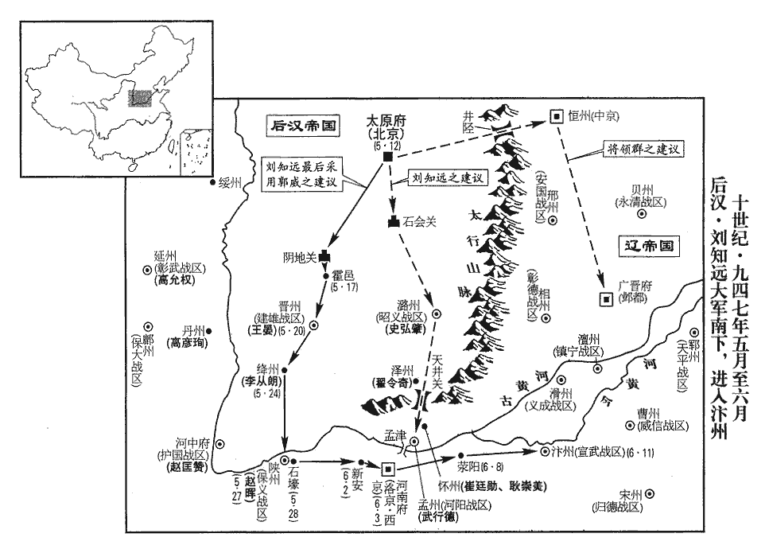
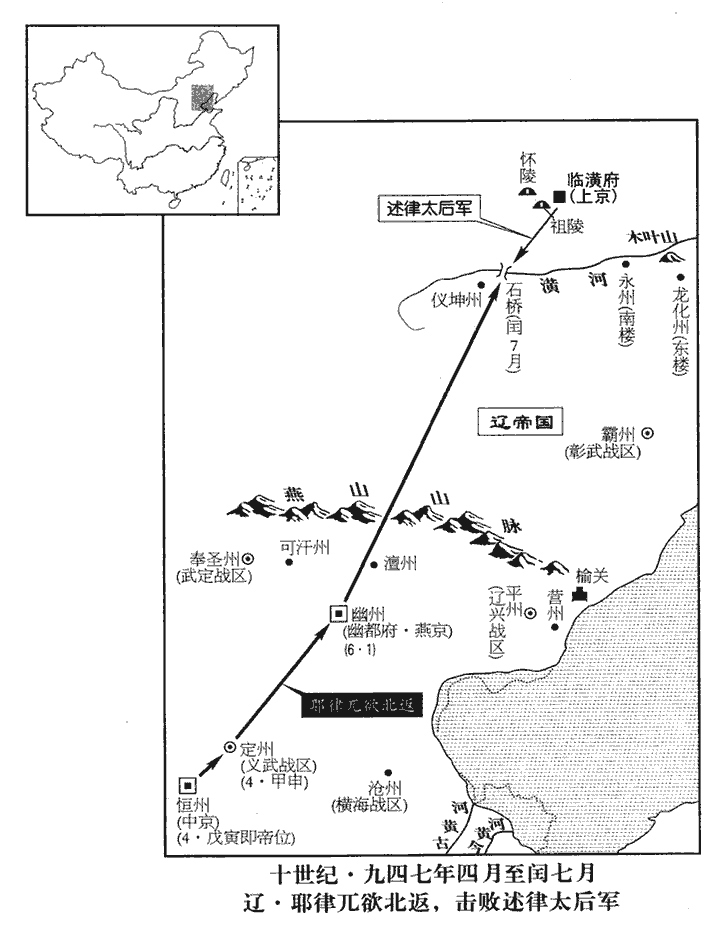
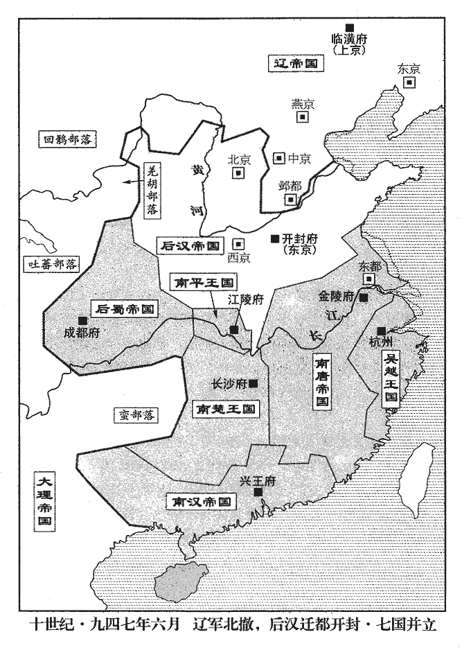
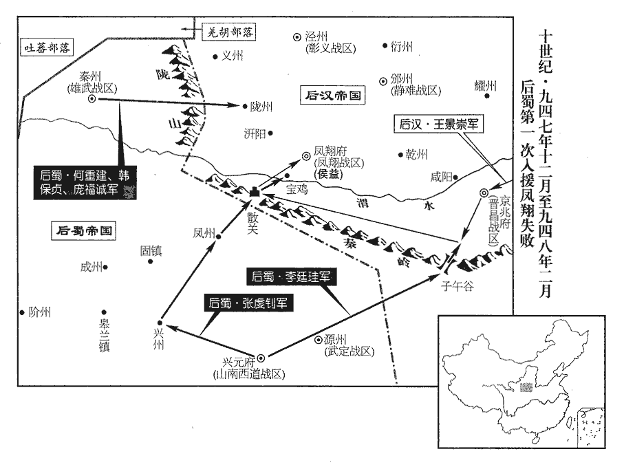

 後漢紀二起強圉協洽（丁未）五月，盡著雍涒灘（戊申）二月，不滿一年。

# 高祖睿文聖武昭肅孝皇帝中

## 天福十二年（丁未、九四七）

1五月，乙酉朔‹一›，永康王兀欲召延壽及張礪、和凝、李崧、馮道於所館飲酒。所館者，兀欲所館之地。兀欲妻素以兄事延壽，兀欲從容謂延壽曰：從，千容翻。「妹自上國來，言其妻方自契丹中來。寧欲見之乎？」延壽欣然與之俱入。良久，兀欲出，謂礪等曰：「燕王‹赵延寿›謀反，適已鎖之矣。」又曰：「先帝‹耶律德光›在汴‹河南省开封市›時，遺我一籌，遺，唯季翻。許我知南朝軍國。朝，直遙翻。近者臨崩，別無遺詔。而燕王擅自知南朝軍國，豈理邪！」下令：「延壽親黨，皆釋不問。」間一日，兀欲至待賢館受蕃、漢官謁賀，笑謂張礪等曰：「燕王果於此禮上，上，時掌翻。吾以鐵騎圍之，諸公亦不免矣。」

〖译文〗 [1]五月，乙酉朔（初一），永康王兀欲召请赵延寿及张砺、和凝、李崧、冯道等人到自己的馆舍饮酒。兀欲的妻子素来以兄长事奉赵延寿，兀欲就从容地对赵延寿说：“妹妹远从契丹来，难道不想见见她吗？”赵延寿欣然和他一起走入后堂。过了许久，兀欲出来，对张砺等人说：“燕王蓄谋反叛，刚才已经把他锁起来了。”又说：“先帝在大梁时，留给我一个计划，允许我主持南朝军国大事。近日驾崩之前，没有其他遗诏。而燕王擅自主持南朝军国大事，岂有此理！”下令道：“赵延寿的亲友朋党，全都开释不予查问。”隔了一天，兀欲到待贤馆接受蕃、汉官员的拜贺，笑着对张砺等人说：“燕王如果真的在这里行这种礼仪，我就将用铁甲骑兵包围此地，诸位也就难免遭殃了。”

後數日，集蕃、漢之臣於府署，恆州府署也。宣契丹主遺制。遺制，兀欲自為之也。其略曰：「永康王‹耶律兀欲›，大聖皇帝‹耶律阿保机›之嫡孫，人皇王‹耶律突欲›之長子，太后‹述律平›鍾愛，群情允歸，可於中京‹恒州·河北省正定县›即皇帝位。」契丹主阿保機諡大聖皇帝，其長子東丹王突欲號人皇王。突欲奔唐，其子兀欲留本國不從，契丹主邪律德光封之為永康王。又，德光取中國，以恆州為中京。於是始舉哀成服。既而易吉服見群臣，不復行喪，復，扶又翻。歌吹之聲不絕於內。

〖译文〗 几天以后，集中蕃、汉大臣到恒州府衙，宣读契丹主的遗诏。遗诏大略说：“永康王，是大圣皇帝的嫡长孙，是人皇王的长子，太后所钟爱，群情所归，可以在中京即皇帝位。”于是开始为先帝举哀，穿起丧服。然后又换上吉服接见群臣，不再行丧礼，歌声乐声在署内响个不停。

2辛巳‹七›，【嚴：「巳」改「卯」。】以絳州‹山西省新绛县›防禦使王晏為建雄節度使。王晏守絳州見上卷是年二月。

〖译文〗 [2]辛卯（初七），后汉高祖任命绛州防御使王晏为建雄节度使。

3帝集群臣庭議進取，庭議者，議之於庭。諸將咸請出師井陘‹河北省鹿泉市西›，攻取鎮‹河北省正定县›、魏‹广晋府·河北省大名县›，鎮州時為恆州，契丹諸酋聚焉。魏帥，杜重威。陘，音刑。先定河北，則河南拱手自服。帝欲自石會‹山西省榆社县西›趨上黨‹山西省长治市›，趨，七喻翻。郭威曰：「虜主雖死，黨眾猶盛，各據堅城。我出河北，兵少路迂，少，詩沼翻；下同。迂，音于，又音紆，曲也，回遠也。旁無應援，若群虜合勢，共擊我軍，進則遮前，退則邀後，糧餉路絕，此危道也。上黨‹山西省长治市›山路險澁，澁，色入翻。粟少民殘，無以供億，亦不可由。近者陜‹河南省三门峡市›、晉‹山西省临汾市›二鎮，相繼款附，陝、晉歸附事見上卷上年。陝，失冉翻。引兵從之，萬無一失，不出兩旬，洛、汴定矣。」帝曰：「卿言是也。」蘇逢吉等曰：「史弘肇大軍已屯上黨，群虜繼遁，不若出天井‹山西省晋城市南›，抵孟津‹河南省孟津县›為便。」司天奏：「太歲在午，不利南行。陰陽家所謂逆太歲。宜由晉‹山西省临汾市›、絳‹山西省新绛县›抵陝。」九域志：自晉州南至絳州一百二十五里，自絳州南至陝州二百五十里，自陝而東，則至洛矣。帝從之。辛卯‹七›，詔以十二日發北京‹山西省太原市›，自後唐以來，以太原為北京。是月乙酉朔，十二日丙申。告諭諸道。

〖译文〗 [3]后汉高祖召集群臣在朝廷商议进军路线。众将领都建议从井陉出兵，攻取镇、魏二州，先平定河北，河南就会自己拱手称臣。高祖想从石会出兵，进军上党。郭威说：“契丹主虽然死了，可是党羽部众还很强盛，各自占据坚固的城池；我们出兵河北，士兵缺少，道路迂回，帝边没有接应救援，如果这些胡虏联合攻击我军，那么我军前进则受阻击，后退，则受拦截，运粮道路也会断绝，这是条危险的道路。上党的山路艰险难走，沿路粮少民穷，没有供给，也不能走。近来陕、晋二镇相继向我们投诚归附，如果率兵从这里走，是万无一失的，不出二十天，洛阳、大梁就可平定了。”高祖说：“爱卿所说极是。”苏逢吉等人说：“史弘肇的大军已驻札在上党，胡虏们相继逃跑，不如从天井出兵，奔赴孟津最为便捷。”司天官上奏道：“太岁星在午的方位，不利于南行。应该从晋、绛二州进军到达陕州。”高祖听从了这种意见。辛卯（初七），诏令十二日从北京发兵，向各道宣布通知。

4甲申‹十›，【章：十二行本「申」作「午」；乙十一行本同；孔本同】以太原尹崇為北京‹太原府›留守，以趙州‹河北省赵县›刺史李存瓌為副留守，河東幕僚真定‹河北省正定县›李驤為少尹，牙將太原蔚進為馬步指揮使以佐之。李存瓌等後遂為北漢佐命。瓌，古回翻。蔚，紆勿翻，姓也。存瓌，唐莊宗‹李存勖›之從弟也。從，才用翻。

〖译文〗 [4]甲午（初十）后汉高祖任命太原尹刘崇为北京留守，赵州刺史李存为副留守，河东幕僚真定人李骧为少尹，牙将太原人蔚进为马步指挥使来辅助他们。李存是后唐庄宗的堂弟。

 

5是日，劉晞棄洛陽，奔大梁。以人心歸漢，知不可守也。

〖译文〗 [5]这一天，刘放弃洛阳逃奔大梁。

6武安‹总部长沙府›節度副使、天策府都尉、領鎮南‹总部设洪州江西省南昌市›節度使馬希廣，鎮南軍洪州，時屬唐。楚文昭王希範之母弟也，性謹順，希範愛之，使判內外諸司事。壬辰‹八›夜，希範卒‹年四十九岁›，將佐議所立。都指揮使張少敵，少，詩沼翻。都押牙袁友恭，以武平‹总部设朗州湖南省常德市›節度使知永州事希萼，楚置武平節度於朗州。朗、永之疑，註詳於後。於希範諸弟為最長，請立之；長，知兩翻；下同；下齒長、居長同。長直都指揮使劉彥瑫、瑫tāo，他牢翻。天策府學士李弘皋、鄧懿文、小門使楊滌小門使，諸鎮皆置之，掌門戶之事；府有宴集，則執兵在門外。皆欲立希廣。張少敵曰：「永州齒長而性剛，必不為都尉之下明矣。必立都尉，當思長策以制永州，使帖然不動則可；不然，社稷危矣。」兄弟爭國，社稷必危。彥瑫等不從。天策府學士拓跋恆曰：「三十五郎‹马希广›雖判軍府之政，然三十郎‹马希萼›居長，請遣使以禮讓之；不然，必起爭端。」希廣第三十五，希萼第三十。藩府將吏，稱府主之子為郎君。彥瑫等皆曰：「今日軍政在手，天與不取，使他人得之，異日吾輩安所自容乎！」希廣懦弱，不能自決；乙未‹十一›，彥瑫等稱希範遺命，共立之。史言劉彥瑫等為身謀，以亂馬氏兄弟傳國長幼之序。考異曰：十國紀年：「五月，己丑，希範得疾，集國官告以傳位希廣。」湖湘故事：「希廣又不能強弱，猶豫之間，群輔明日眾口勸上，乃受，軍府排衙賀之，以其事奏聞朝廷，託以希範臨終之日遺言，以付希廣。」按希範存時，若已集國官傳位希廣，則沒後將佐誰敢更有異議！必彥瑫等假託希範遺令也。今從湖湘故事。張少敵退而歎曰：「禍其始此乎！」與拓跋恆皆稱疾不出。為馬希萼攻殺希廣張本。

〖译文〗 [6]武安节度副使、天策府都尉、代理镇南节度使马希广是楚国文昭王马希范同母的弟弟，性情恭谨温顺，马希范喜欢他，让他处理内外各司的事务。壬辰（初八）夜里，马希范去世，将领们商议拥立人选。都指挥使张少敌、都押牙袁友恭，认为武平节度使兼主持永州事务的马希萼，在马希范兄弟中年龄最大，建议立马希萼。长直都指挥使刘彦，天策府学士李弘皋、邓懿文，小门使杨涤，都希望立马希广。张少敌说：“马希萼年长而为人刚强，必定不肯屈居都尉马希广之下是很明显的。如果一定要立马希广，就要想个长远之计来控制马希萼，使他顺从不动就可以，如果不这样，国家社稷就危险了。”刘彦等不答应。天策府学士拓跋恒说：“三十五郎马希广即使主理军政大事，但三十郎马希萼年龄居长，也应派遣使者以礼相让；不然，一定会起争端。”刘彦等人都说：“现在军政大权在手，上天赐予而不取，让他人得到，今后我们这些人哪有安身之处！”马希广为人懦弱，不能自己决断；乙未（十一日），刘彦等称有马希范遗命，共同拥立马希广。张少敌退下来叹息道：“大祸就要从这里开始了！”从此和拓跋恒都称有病，不再出门。

7丙申‹十二›，帝發太原，自陰地關‹山西省灵石县西南南关镇›出晉‹山西省临汾市›、绛‹山西省新绛县›。

〖译文〗 [7]丙申（十二日），后汉高祖从太原起兵，从阴地关开往晋、绛二州。

丁酉‹十三›，史弘肇奏克澤州‹山西省晋城市›。始，弘肇攻澤州，刺史翟令奇固守不下。翟，萇伯翻。帝以弘肇兵少，欲召還。還，從宣翻。蘇逢吉、楊邠曰：「今陝‹保义总部·河南省三门峡市›、晉‹建雄总部·山西省临汾市›、河陽‹河南省孟州市›皆已向化，崔廷勳、耿崇美朝夕遁去；時契丹之兵大勢已北還，故知懷州之兵必不能久留。若召弘肇還，則河南人心動搖，虜勢復壯矣。」帝未決，使人諭指於弘肇；句斷。【章：乙十一行本重「弘肇」二字。】曰：「兵已及此，勢如破竹，可進不可退。」與逢吉等議合，帝乃從之。觀此，則知帝猶憚契丹，有未敢輕進之心。弘肇遣部將李萬超說令奇，說，式芮翻。令奇乃降；降，戶江翻。弘肇以萬超權知澤州。

〖译文〗 丁酉（十三日），史弘肇奏报攻克泽州。开始，史弘肇进攻泽州，刺史翟令奇死守城池，攻不下来。后汉高祖认为是史弘肇兵少，想召回撤兵。苏逢吉、杨说：“现在陕、晋、河阳都已归顺我朝，崔廷勋、耿崇美早晚要逃跑，如果召回史弘肇，那么河南就会人心动摇，而胡虏的气焰会再度嚣张起来。”后汉高祖没决定，就派人将此事告诉史弘肇，史弘肇说：“军队已到达此地，就像势如破竹，只能前进而不能后退。”与苏逢吉等人的建议相吻合，后汉高祖于是就听从了这个意见。史弘肇派部将李万超前去说服崔令奇，令奇便归降了，史弘肇命李万超代理主持泽州事务。

8崔廷勳、耿崇美、奚‹滦河上游›王拽剌合兵逼河陽，張遇帥眾數千救之，戰於南阪‹河南省沁阳市北十千米·太行山南麓›，敗死。太行南阪也。帥，讀曰率。武行德出戰，亦敗，閉城自守。拽剌欲攻之，廷勳曰：「今北軍已去，北軍，謂契丹聚於恆州之軍，崔廷勳等在南，故謂屯恆之軍為北。得此城何用！且殺一夫猶可惜，況一城乎！」聞弘肇已得澤州，乃釋河陽，還保懷州。弘肇將至，廷勳等擁眾北遁，澤州南至懷州一百二十里耳，漢兵又進而逼之，故遁。過衛州‹河南省卫辉市›，大掠而去。九域志：懷州東北至衛州二百九十三里。契丹在河南者相繼北去，弘肇引兵與武行德合。

〖译文〗 [8]崔廷勋、耿崇美、奚王拽刺联兵逼近河阳城，张遇率领几千人马前往救援，在南阪和敌军展开战斗，战败而死。武行德从河阳城中出来助战，也战败了，退回城中闭门自守。拽刺想要攻城，崔廷勋说：“现在契丹的军队已向北撤退了，得到这座城池有什么用！而且杀死一个人还觉得可惜，更何况毁灭一个城呢！”听说史弘肇已取得泽州，于是就放弃河阳，退守怀州。史弘肇军队临近泽州，崔廷勋等人率领众军向北逃走，路过卫州，大肆抢掠而离去。契丹在河南的军队就相继逃往北方。史弘肇领兵和武行德会合。

弘肇為人，沈毅寡言，御眾嚴整，將校小不從命，立撾殺之；沈，持林翻。將，即亮翻。校，戶教翻。撾，側瓜翻。士卒所過，犯民田及繫馬於樹者，皆斬之；軍中惕息，惕，他歷翻。莫敢犯令，故所向必克。帝自晉陽安行入洛及汴，兵不血刃，皆弘肇之力也。帝由是倚愛之。

〖译文〗 史弘肇为人稳重坚毅、沉默寡言，统领军队，号令严明、军纪整肃，大小将领稍不服从命令，立刻打死；士兵经过的地方，凡侵犯百姓田地和在树上系马的，一律斩首。军队中人人小心谨慎，不敢违犯军令，所以所向无敌、攻无不克。高祖从晋阳一路平安进入洛阳和大梁，士兵的刀枪没沾过血，都是靠了史弘肇之力。高祖从此更加倚重、喜爱他了。

辛丑‹十七›，帝至霍邑‹山西省霍州市›，霍邑，漢彘縣，後漢改曰永安，隋改曰霍邑，唐屬晉州。九域志：在州西北一百三十五里。遣使諭河中‹山西省永济市›節度使趙匡贊，仍以契丹囚其父【章：十二行本「父」下有「延壽」二字；乙十一行本同；孔本同；張校同。】告之。所以絕趙匡贊北顧之心。

〖译文〗 辛丑（十七日），后汉高祖到达霍邑，派使臣招谕河中节度使赵匡赞，并把契丹囚禁他父亲赵延寿的事告诉他。

9‹辽国汴州皇城›滋德宮有宮人五十餘人，五代會要：晉天福四年，改明德殿為滋德殿。薛史曰：以宮城南門同名故也。蕭翰欲取之，宦者張環不與。翰破鎖奪宮人，執環，燒鐵灼之，腹爛而死。

〖译文〗 [9]德宫内有五十多名宫女，萧翰想要带走，宦官张环不给。萧翰砸坏宫门的锁。抢走宫女，抓起张环，用烧红的铁烙他，直把肚子烫烂而死。

初，翰聞帝擁兵而南，欲北歸，恐中國無主，必大亂，己不得從容而去。從，千容翻。從容，不急遽之貌。時唐明宗子許王從益與王淑妃‹花见羞›在洛陽，王淑妃母子自晉入洛以後，常居洛陽。是年二月至大梁，尋還洛陽。翰遣高謨翰迎之，矯稱契丹主命，以從益知南朝軍國事，召己赴恆州。此矯契丹主兀欲之命也。兀欲時尚在恆州。恆，戶登翻。淑妃、從益匿於徽陵‹李嗣源墓·河南省洛阳市境›下宮，徽陵，唐明宗陵。梓宮所窆biǎn之所，謂之下宮。不得已而出。至大梁，翰立以為帝，帥諸酋長拜之。帥，讀曰率。酋，慈秋翻。長，知兩翻。又以禮部尚書王松、御史中丞趙遠為宰相，前宣徽使甄城‹鄄城，山东省鄄城县›翟光鄴為樞密使，甄，當作鄄，音吉掾翻。甄城，漢古縣也，自唐以來帶濮州。左金吾大將軍王景崇為宣徽使，以北來指揮使劉祚權侍衛親軍都指揮使，充在京巡檢。北來，謂先從契丹主自北而來者。松，徽之子也。王徽相唐僖宗‹李俨›。

〖译文〗 当初，萧翰听说后汉高祖率兵南下，想向北回国，因为怕中原无主后，必然大乱，自己就不能从容回国了。当时后唐明宗的儿子许王李从益和王淑妃在洛阳，萧翰派高谟翰去迎接他们，假称契丹主的命令，让李从益主持南朝军国大事，召自己去恒州。王淑妃和李从益藏在后唐明宗徽陵的下宫里，不得已才出来。到了大梁，萧翰立李从益为皇帝，并领着众酋长向他朝拜。命礼部尚书王松、御史中丞赵远为宰相，命前宣徽使甄城人翟光邺为枢密使，命左金吾大将军王景崇为宣徽使，命北来指挥使刘祚代理侍卫亲军都指挥使，充任在京巡检。王松是王徽的儿子。

百官謁見淑妃，見，賢遍翻。淑妃泣曰：「吾母子單弱如此，而為諸公所推，是禍吾家也。」翰留燕兵千人守諸門，為從益宿衛。燕，於賢翻；下同。壬寅‹十八›，翰及劉晞辭行，先是劉晞棄洛陽奔大梁。從益餞於北郊。遣使召高行周於宋州‹河南省商丘市›，高行周，唐明宗親將，時帥歸德，王淑妃欲以舊恩召之為衛。武行德於河陽‹总部设孟州，河南省孟州市›，武行德，并人，必亦少在唐明宗麾下。皆不至，淑妃懼，召大臣謀之曰：「吾母子為蕭翰所逼，分當滅亡。分，扶問翻；下處分同。諸公無罪，宜早迎新主，以帝新舉大號，擁兵南來，將有中國，故謂之新主。自求多福，勿以吾母子為意！」眾感其言，皆未忍叛去。或曰：「今集諸營，不減五千，與燕兵併力堅守一月，北救必至。」北救，謂契丹之救也。淑妃曰：「吾母子亡國之餘，後唐既亡，惟王淑妃母子在耳，故自謂然。安敢與人爭天下！不幸至此，死生惟人所裁。若新主見察，當知我無所負。今更為計畫，則禍及他人，闔城塗炭，終何益乎！」眾猶欲拒守，三司使文安‹河北省文安县›劉審交曰：「余燕‹河北省北部›人，豈不為燕兵計！文安，漢縣，唐屬莫州。以戰國七雄有國之大界言，則唐之瀛、莫，皆燕之南界；以唐諸道節度言之，則瀛、莫，盧龍巡屬也。故劉審交家於文安，自謂燕人。顧事有不可如何者。今城中大亂之餘，公私窮竭，遺民無幾，汴城經張彥澤剽掠，契丹又席卷而北，故云然。幾，居豈翻。若復受圍一月，無噍類矣。願諸公勿復言，一從太妃處分。」復，扶又翻。噍，才笑翻。處，昌呂翻。乃用趙遠、翟光鄴策，稱梁王，知軍國事。從益本爵許王，以稱號於大梁，自稱梁王，是已建國更號矣。今既奉表迎漢，何為又更國號！是當時議者禍之也。遣使奉表稱臣迎帝，請早赴京師，仍出居私第。

〖译文〗 文武百官拜见王淑妃，淑妃哭泣道：“我们母子二人这样孤单弱小，却被你们各位推上这个位置，这是祸害我家呵！”萧翰留下一千名燕兵，把守各个大门，并作为李从益的值宿警卫。壬寅（十八日），萧翰和刘辞行，李从益在北郊为二人饯行。李从益派遣使者到宋州召高行周、到河阳召武行德，都不到，王淑妃害怕，召集大臣商量道：“我们母子被萧翰逼迫，本当去死。但你们都没有罪，应该及早准备迎接新的君主，为自己多多求福，不要以我们母子为念了！”大家被她的一番话所感动，都不忍背叛他们而离去。有人说：“现在集中各营兵马，不少于五千，和燕兵合力坚守一个月，北边必有救兵来到。”淑妃说：“我们母子本身就是亡国的苟活之人，怎么敢和别人争夺天下！已经不幸到这个地步了，生死就任人去裁夺吧。如果新的君主明察这一切，应当知道我们无负于人。如果现在再要计划用兵，那就会祸及他人，造成满城生灵涂炭，最终又有什么好处呢？”众大臣还要坚守城池抵抗，三司使文安人刘审交说：“我是燕人，还能不为燕兵着想！但事情有无可奈何的。现在城中大乱以后，无论官家私人都穷到了底，留下的百姓没多少，如果再被围一个月，那就没有能喘气的人。希望大家不要再说，一切都听从太妃的处理决定。”于是采用赵远、崔光邺的建议，李从益改称梁王，主持这里的军国之事；派出使者向后汉高祖奉表称臣迎帝，请他早日前来京师，并从宫中搬出住到私宅。

10甲辰‹二十›，帝‹刘知远›至晉州‹山西省临汾市›。

〖译文〗 [10]甲辰（二十日），后汉高祖到达晋州。

11契丹主兀欲以契丹主德光有子在國，己以兄子襲位，又無述律太后之命，述律太后，兀欲祖母也。擅自立，內不自安。

〖译文〗 [11]契丹主兀欲因为先帝耶律德光有儿子留在辽国，而自己是代替哥哥的儿子承袭皇位，又没有述律太后的命令，擅自即位，所以内心不安。

初，契丹主阿保機卒於勃海‹首都龙泉府›，述律太后殺酋長及諸將凡數百人。事見二百七十五卷唐明宗天成元年二月。契丹主德光復卒於境外，復，扶又翻。酋長諸將懼死，乃謀奉契丹主兀欲勒兵北歸。

〖译文〗 当初，契丹主阿保机死于勃海，述律太后杀死酋长和众将领约几百人。这次契丹主德光又死于国外，酋长和众将们怕死，于是策划尊奉契丹主兀欲统率军队向北回国。

契丹主以安國‹总部设邢州河北省邢台市›節度使麻荅為中京‹恒州，河北省正定县›留守，薛史曰：麻荅，耶律德光之從弟；其父曰薩剌，阿保機時，自蕃中奔唐莊宗，尋奔梁，莊宗平梁，獲之，磔於市。以前武州‹河北省宣化县›刺史高奉明為安國節度使。晉文武官及士卒悉留於恆州，獨以翰林學士徐台符、李澣及後宮、宦者、教坊人自隨。留文武官而以宮女、宦官、聲樂自隨，史言兀欲無遠略。乙巳‹二十一›，發真定。恆州建真定府。

〖译文〗 契丹主兀欲命安国节度使麻为中京留守，命前武州刺史高奉明为安国节度使。后晋的文武官员和士卒全都留在恒州，只让翰林学士徐台符、李浣以及后宫、宦官、教坊的舞乐人员跟随自己。乙巳（二十一日），从真定出发。

12帝‹刘知远›之即位也，絳州‹山西省新绛县›刺史李從朗與契丹將成霸卿等拒命，成，姓也。何氏姓苑：本自周文王子成伯之後，周有成肅公。又，楚令尹子玉封於成，是為成得臣，其後亦以成為氏。帝遣西南面招討使、護國‹总部河中府›節度使白文珂攻之，未下。護國軍河中府；時未得河中，白文珂領節也。珂，丘何翻。帝至城下，命諸軍四布而勿攻，以利害諭之。戊申‹二十四›，從朗舉城降。帝命親將分護諸門，士卒一人毋得入。恐其入城剽掠。以偏將薛瓊為防禦使。

〖译文〗 [12]后汉高祖即位后，绛州刺史李从朗和契丹将军成霸卿等人抗拒诏命。后汉高祖派西南面招讨使、护国节度使白文珂攻打他们，但未能攻克。高祖来到城下，命令各部军队四面围住但不攻城，向李从朗等人晓以利害，劝谕归降。戊申（二十四日），李从朗开城投降。后汉高祖命令只派亲将分守各门，士卒一人也不许入城；命偏将薛琼为防御使。

13辛亥‹二十七›，帝至陝州‹河南省三门峡市›，趙暉自御帝馬而入。壬子‹二十八›，至石壕‹三门峡市东硖石镇›，九域志：陝州陝縣有石壕鎮。汴人有來迎者。汴人越鄭、洛而來迎，可以見其苦契丹之虐政，徯漢氏之來蘇，惜乎卒無以副其望也！

〖译文〗 [13]辛亥（二十七日），后汉高祖到达陕州，赵晖亲自牵皇帝的马进城。壬子（二十八日），抵达石壕，大梁百姓有远来迎接的。

14六月，甲寅朔‹一›，蕭翰至恆州，與麻荅以鐵騎圍張礪之第。礪方臥病，出見之，翰數之曰：「汝何故言於先帝‹耶律德光›，云胡人不可以為節度使？張礪言，見二百八十五卷晉齊王開運三年。數，所具翻。又，吾為宣武節度使，且國舅也；汝在中書乃帖我！又，先帝留我守汴州，見上卷是年三月。令我處宮中，處，昌呂翻。汝以為不可。又，譖我及解里‹耶律麻荅乳名›於先帝，云解里好掠人財，我好掠人子女。好，呼到翻。今我必殺汝！」命鎖之。礪抗聲曰：「此皆國家大體，吾實言之。欲殺即殺，奚以鎖為！」麻荅以大臣不可專殺，力救止之，翰乃釋之。是夕，礪憤恚而卒。恚，於避翻。

〖译文〗 [14]六月，甲寅朔（初一），萧翰来到恒州，与麻合派铁甲骑兵包围了张砺的住宅。张砺正卧病在床，出来接见他们，萧翰就数落他说：“你为什么对先帝说胡人不可以作节度使？还有，我是宣武节度使，而且是国舅，你在中书就胆敢告我！还有，先帝留我守大梁，让我住在宫里，你却说不行。还有，在先帝面前诬告我和解里，说解里爱抢人的财物，说我爱抢人的女子。今天我一定得宰了你！”命人把他锁起来。张砺高声说：“这些事都有关国家大体，我确实说过。要杀就杀，还锁起来干什么？”麻说不能擅自杀戮大臣，极力解救、阻止，萧翰才把他释放。这天夜里，张砺又恨又怒而死。

崔廷勳見麻荅，趨走拜起，跪而獻酒，麻荅踞而受之。史言張礪抗直而蕭翰不敢殺，崔廷勳過恭而麻荅不為禮。

〖译文〗 崔廷勋看到麻，快步走上前去叩拜，并起身后跪着献酒，麻蹲坐着接受。

15乙卯‹二›，帝至新安‹河南省新安县›，新安縣屬西京河南府。九域志：在京西七十里。西京‹河南府·河南省洛阳市›留司官悉來迎。

〖译文〗 [15]乙卯（初二），后汉高祖到达新安，西京留守各司的官员都来迎接。

16吳越忠獻王弘佐卒。年二十。遺令以丞相弘倧為鎮海‹总部杭州›、鎮東‹总部越州›節度使兼侍中。倧，徂冬翻。

〖译文〗 [16]吴越国忠献王钱弘佐去世。遗命委任丞相钱弘为镇海、镇东节度使兼侍中。

17丙辰‹三›，帝‹刘知远›至洛陽，入居宮中；汴州百官奉表來迎。詔諭以受契丹補署者皆勿自疑，聚其告牒而焚之。趙遠更名上交。避帝名也。更，工衡翻。

〖译文〗 [17]丙辰（初三），后汉高祖来到洛阳，进入并居住宫中。大梁的文武百官奉上表章前来迎接。后汉高祖下诏书让那些接受契丹任命按排的人不要自己疑虑，将任命文告状牒收集起来烧掉。赵远改名为上交。

命鄭州防禦使郭從義先入大梁清宮，密令殺李從益及王淑妃。淑妃且死，曰：「吾兒為契丹所立，何罪而死！何不留之，使每歲寒食，以一盂麥飯洒明宗陵乎！」五代會要曰：人君奉先之道，無寒食野祭。近代莊宗每年寒食出祭，謂之破散，故襲而行之。歐陽修曰：寒食野祭而焚紙錢，中國幾何其不為夷狄矣！按唐開元敕：「寒食上墓，禮經無文。近世相傳，寖以成俗。宜許上墓同拜掃禮。」蓋唐許士庶之家行之，而人君無此禮也。聞者泣下。‹李从益死时十七岁›為漢祖者，待李從益以不死可也，殺之過矣。

〖译文〗 后汉高祖命令郑州防御使郭从义先头进入大梁，清理内宫，密令杀死李从益和王淑妃。淑妃临死前说：“我儿子是被契丹人立为皇帝，有什么罪而至死！为什么不能留下他一个，让每年的寒食节有一盂麦饭洒在明宗陵前呢！”听到的人都流下眼泪。

18戊午‹五›，帝發洛陽。樞密院吏魏仁浦自契丹逃歸，見於鞏‹河南省巩县›；見，賢遍翻。九域志：鞏縣屬西京，在京東一百一十里。郭威問以兵數及故事，仁浦強記精敏，威由是親任之。仁浦，衛州‹河南省卫辉市›人也。

〖译文〗 [18]戊午（初五），后汉高祖从洛阳出发。枢密院的官吏魏仁浦从契丹逃回，在巩县叩见后汉高祖。郭威问契丹的兵力和故事，魏仁浦为人精细敏捷、博闻强记，郭威从此亲近重用他。魏仁浦是卫州人。

19辛酉‹八›，汴州百官竇貞固等迎於滎陽‹河南省荥阳市›。滎陽縣屬鄭州，自鞏縣東至滎陽一百九十里。甲子‹十一›，帝至大梁，晉之藩鎮相繼來降。

〖译文〗 [19]辛酉（初八），汴州的窦贞固等文武百官在荥阳迎接后汉高祖。甲子（十一日），后汉高祖到达大梁，后晋的藩镇相继前来归降。

20丙寅‹十三›，吳越王弘倧‹钱弘倧本年二十岁›襲位。

〖译文〗 [20]丙寅（十三日），吴越王钱弘承袭王位。

21戊辰‹十五›，帝下詔大赦。凡契丹所除節度使，下至將吏，各安職任，不復變更。復，扶又翻。復以汴州為東京，契丹廢東京為汴州，見上卷是年正月。改國號曰漢，仍稱天福年，曰：「余未忍忘晉也。」復青、襄、汝三節度。晉蓋以楊光遠反廢平盧軍、以安從進反廢山南東道也。汝州未嘗為節鎮，恐是安州，以李金全反廢安遠軍也。然契丹入汴之後，嘗以楊光遠子承信為平盧節度使，蓋漢自以繼晉而興，革契丹之政，不以為著令也。壬申‹十九›，以北京‹太原府·山西省太原市›留守崇為河東節度使，同平章事。

〖译文〗 [21]戊辰（十五日），后汉高祖下诏书实行大赦。凡是契丹所委任的节度使，下至将领官吏，各自安于职守，不再变更。又把汴州改为为东京，改国号为汉，年号仍称天福，他说：“我不忍忘却晋呵！”恢复青、襄、汝三州的节度使。壬申（十九日）任命北京留守刘崇为河东节度使、同平章事。

22契丹述律太后聞契丹主自立，大怒，發兵拒之。契丹主以偉王為前鋒，相遇於石橋‹内蒙古巴林右旗南›。胡嶠入遼錄曰：兀欲及述律戰于沙河石橋。蓋沙河之橋也。南則姚家洲，北則宣化館至西樓。初，晉侍衛馬軍都指揮使李彥韜從晉主北遷，見上卷本年正月。隸述律太后麾下，太后以為排陳使。陳，讀曰陣。彥韜迎降於偉王，太后兵由是大敗。契丹主幽太后於阿保機墓‹木叶山·内蒙古奈曼旗北›。胡嶠入遼錄曰：兀欲囚述律后於撲馬山，又行三日，始至西樓。歐史曰：契丹於阿保機墓置祖州。匈奴須知：祖州東至上京五十里；上京西樓也。今並錄之。若其地名之同異，道里之遠近，必親歷然後能審其是。改元天祿，自稱天授皇帝，以高勳為樞密使。

〖译文〗 [22]契丹述律太后听说兀欲自立为契丹主，大怒，派兵前去抗击。契丹主兀欲派伟王为前锋，在石桥相遇。当初，后晋侍卫马军都指挥使李彦韬跟随后晋出帝向北迁徙，隶属于述律太后麾下，太后任命为排陈使。李彦韬向伟王投降，太后的军队因此大败。契丹主把太后囚禁在阿保机墓旁。改年号为天禄，自称为天授皇帝，任命高勋为枢密使。

契丹主慕中華風俗，多用晉臣，而荒于酒色，輕慢諸酋長，由是國人不附，諸部數叛，數，所角翻。興兵誅討，故數年之間，不暇南寇。史言中國經喪亂之後，由此得稍自安集。

〖译文〗 契丹主仰慕中原的风俗，所以多用原后晋的大臣，而他自己沉湎于酒色之中，轻视怠慢各位酋长，因此国内人不归附于他，各部落多次叛乱，就兴兵讨伐，所以几年里顾不上向南侵犯。

23初，契丹主德光命奉國都指揮使南宮‹河北省南宫市›王繼弘、南宮縣屬冀州。九域志：在州西南六十二里。都虞候樊暉以所部兵戍相州，彰德節度使高唐英善待之。高唐英，契丹所署也，見上卷是年四月。相，息亮翻。戍兵無鎧仗，唐英以鎧仗給之，倚信如親戚。唐英聞帝南下，舉鎮請降；使者未返，繼弘、暉殺唐英。繼弘自稱留後，遣使告云唐英反覆，詔以繼弘為彰德留後。庚辰‹二十七›，以暉為磁州刺史。磁，牆之翻。

〖译文〗 [23]当初，契丹主耶律德光命奉国都指挥使南宫人王继弘、都虞候樊晖带领所部人马守卫相州，彰德节度使高唐英对他们很好。守兵缺乏铠甲兵器，高唐英就把铠甲兵器给他们，对他们倚重信赖就像亲戚一样。高唐英听说后汉高祖南下，带领本镇请求归降；派往的使者还没返回，王继弘、樊晖就已杀死了高唐英。王继弘自称为留后，派使者告诉说高唐英反复无常。后汉高祖诏令王继弘为彰德留后。庚辰（二十七日），任命樊晖为磁州刺史。

安國節度使高奉明聞唐英死，心不自安，請於麻荅，署馬步都指揮使劉鐸為節度副使，知軍府事，身歸恆州。邢、相既不能守，恆州安能孤立哉！為諸將逐麻荅張本。

〖译文〗 安国节度使高奉明听说高唐英被杀，心里忐忑不安，向麻请求署理马步都指挥使刘铎为节度副使，主持军府事务，自己回归恒州。

24帝遣使告諭荊南。高從誨上表賀，且求郢州‹湖北省钟祥市›，帝不許；及加恩使至，拒而不受。自唐以來，新君踐阼，則遣使加恩於諸鎮。使，疏吏翻。

〖译文〗 [24]后汉高祖派遣使者通告安抚荆南。高从诲上表章祝贺，并要求郢州，后汉高祖不答应；等到后汉高祖派的加恩使来到，高从诲拒不接受。

 

25唐主聞契丹主德光卒，蕭翰棄大梁去，下詔曰：「乃眷中原，本朝故地。」唐主自謂出於吳王恪，故云然。朝，直遙翻。以左右衛聖統軍、忠武‹总部许州›節度使李【章：十二行本「李」上有「同平章事」四字；乙十一行本同；孔本同。】金全為北面行營招討使，李金全，晉將也，奔唐見二百八十二卷晉高祖天福五年。議經略北方。聞帝已入大梁，遂不敢出兵。

〖译文〗 [25]南唐主听说契丹主耶律德光去世，萧翰放弃大梁逃往北方，下诏书道：“我眷恋着中原，那是本朝的故土。”派左右卫圣统军、忠武节度使李金全为北面行营招讨使，筹划攻取北方；听说后汉高祖已进入大梁，于是不敢出兵。

26秋，七月，甲午‹十一›，以馬希廣為天策上將軍、武安‹总部设长沙府湖南省长沙市›節度使、江南諸道都統，兼中書令，封楚王。因即位加恩，遂命馬希廣以其父兄官爵。

〖译文〗 [26]秋季，七月甲午（十一日），后汉高祖任命马希广为天策上将军、武安节度使、江南诸道都统，兼中书令，封为楚王。

27或傳趙延壽已死。郭威言於帝曰：「趙匡贊，契丹所署，見上卷本年正月。今猶在河中，宜遣使弔祭，因起復移鎮。彼既家國無歸，父死虜中，無可歸之家；契丹北去，無可歸之國。必感恩承命。」從之。會鄴都留守、天雄節度使兼中書令杜重威、天平‹总部设郓州山东省东平县›節度使兼侍中李守貞皆奉表歸命。重威仍請移他鎮。歸德節度使兼中書令高行周入朝，丙申‹十三›，徙重威為歸德節度使，以行周代之；杜重威尋不受代，遂命高行周攻之。守貞為護國節度使，加兼中書令；為李守貞據河中張本。徙護國節度使趙匡贊為晉昌‹总部京兆府›節度使。後二年，延壽始卒於契丹。史明傳者之妄。

〖译文〗 [27]有人传说赵延寿已经死了。郭威对后汉高祖说：“赵匡赞是契丹任命的，现在还留在河中，我们应派遣使者前往吊唁祭祀，从而起用他，并调换镇所。他已无家无国可归，一定会感恩戴德听从陛下的诏命。”后汉高祖听从这个建议。正值邺都留守、天雄节度使兼中书令杜重威、天平节度使兼侍中李守贞都奉上表章前来归顺。杜重威并请求调到其他藩镇。归德节度使兼中书令高行周前来朝觐。丙申（十三日），调杜重威为归德节度使，命高行周代替他；命李守贞为护国节度使，加官兼中书令；调护国节度使赵匡赞为晋昌节度使。过了二年，赵延寿才死于契丹。

28吳越王弘倧以其弟台州‹浙江省临海市›刺史弘俶同參相府事。俶chù，昌六翻。

〖译文〗 [28]吴越王钱弘派他的弟弟台州刺使钱弘共同参预相府事务。

29李達以其弟通知福州留後，李仁達降唐，唐賜名弘義，編之屬籍。及其叛唐，為唐所攻，求救於吳越，而弘字犯吳越諱，改名為達。其弟先名弘通，亦止名通。自詣錢唐‹首都杭州州政府所在县›見吳越王弘倧，弘倧承制加達兼侍中，更其名曰孺贇。更，工衡翻。既而孺贇悔懼，悔其來，且懼死也。以金筍二十株及雜寶賂內牙統軍使胡進思，求歸福州；進思為之請，弘倧從之。為，于偽翻。為李孺贇叛誅、胡進思不自安張本。

〖译文〗 [29]李达命他的弟弟李通主持福州留后事务，自己到钱唐拜见吴越王钱弘，吴越王承用制书加封李达为兼侍中，改他的名为孺。不久，李孺又悔又怕，用二十株金笋和其它珍宝贿赂内牙统军使胡进思，请求回归福州；胡进思替他请求，钱弘答应了。

30杜重威自以附契丹，負中國，事見二百八十五卷晉齊王開運三年。內常疑懼；及移鎮制下，復拒而不受，遣其子弘璲質於麻荅以求援。璲，音遂。質，音致。趙延壽有幽州親兵二千在恆州，趙延壽為契丹主兀欲鎖之北去，其親兵留恆州。恆，戶登翻。指揮使張璉將之，重威請以守魏；為張璉助杜重威堅守張本。將，即亮翻。麻荅遣其將楊袞將契丹千五百人及幽州兵赴之。閏月，庚午‹十八›，詔削奪重威官爵，以高行周為招討使，鎮寧‹总部澶州›節度使慕容彥超‹刘知远的亲弟›副之，以討重威。為慕容彥超挾勢陵轢高行周、將帥不和張本。

〖译文〗 [30]杜重威自从投靠契丹、背叛中原后，心里常常疑惧；等到调任归德节度使的制令下达，他又拒不接受；他派自己的儿子杜弘到麻处作人质，以换取契丹的援兵。当时，赵延寿有二千名幽州亲兵驻扎在恒州，由指挥使张琏率领，杜重威请契丹派他们来帮助固守魏州。麻派将领杨衮率契丹一千五百人和幽州兵马前往。闰七月庚午（十八日），后汉高祖诏令削去杜重威的官职爵位，派高行周为招讨使，镇宁节度使慕容彦超为副招讨使，出兵讨伐杜重威。

31辛未‹十九›，楊邠、郭威、王章皆為正使。帝即位於太原，以楊邠權樞密使，郭威權樞密副使，王章權三司使，今皆為正使。時兵荒之餘，公私匱竭，北來兵與朝廷兵合，頓增數倍。北來兵，謂從帝及史弘肇自太原來者。朝廷兵，謂晉朝舊兵。章白帝罷不急之務，省無益之費以奉軍，用度克贍。

〖译文〗 [31]辛未（十九日），杨、郭威、王章都为正使。当时正是兵荒马乱之后，国家、百姓都资财空乏，太原来的兵和后晋的兵合在一起，顿时兵员增加了几倍。王章建议后汉高祖取消不急之务，省去无益的化费来供给军队，费用开支才能足够。

32庚辰‹二十八›，制建宗廟。太祖高皇帝‹刘邦›，世祖光武皇帝‹刘秀›，皆百世不遷。又立四親廟，追尊諡號。五代會要：追尊高祖湍明元皇帝，廟號文祖；曾祖昂恭僖皇帝，廟號德祖；祖僎zhuàn昭獻皇帝，廟號翼祖；考琠章聖皇帝，廟號顯祖。凡六廟。

〖译文〗 [32]庚辰（二十八日），后汉高祖制令兴建宗庙。太祖高皇帝刘邦、世祖光武皇帝刘秀，都百代不迁。又建立了高祖、曾祖、祖、考四座亲庙，追尊谥号，共六座庙。

 

33麻荅貪猾殘忍，民間有珍貨、美婦女，必奪取之。又捕村民，誣以為盜，披面，抉目，斷腕，抉，於決翻。斷，音短；下即斷同。腕，烏貫翻。焚炙而殺之，欲以威眾。常以其具自隨，具，謂披面、抉目、斷腕、焚炙之具。左右【章：十二行本「右」下有「前後」二字；乙十一行本同。】懸人肝、膽、手、足，飲食起居於其間，語笑自若。出入或被黃衣，用乘輿，服御物，被，皮義翻。乘，繩證翻。曰：「茲事漢人以為不可，吾國無忌也。」又以宰相員不足，乃牒馮道判弘文館，李崧判史館，和凝判集賢，劉昫判中書，其僭妄如此。宰相分判，須降制敕，而麻荅以牒行之，史言其僭妄。然契丹或犯法，無所容貸，故市肆不擾。常恐漢人妄【章：十二行本「妄」作「亡」；乙十一行本同；孔本同；張校同；退齋校同。】去，謂門者曰：「漢有窺門者，即斷其首以來。」

〖译文〗 [33]麻为人贪婪、奸诈、残忍，民间有的珍奇宝物、美丽妇女，他都一定要夺取到手。他还捕捉村民，诬陷为强盗，剥皮、挖眼、砍手，用火活活烧死，想用这些酷刑来威吓百姓。他常把那些刑具随身携带，居室周围悬挂有人的肝、胆、手、脚，而他在里面饮食起居，从容谈笑。进出有时身穿黄袍，乘坐天子的车驾，使用宫中物品，他说：“这些事，汉人认为不可，可是在我国是毫无忌讳的。”又因宰相人员不足，就用牒文命冯道兼判弘文馆，命李崧兼判史馆，命和凝兼判集贤馆，命刘兼判中书，他的僭越妄为竟到达如此地步。然而规定，契丹人如有犯法，不能宽免，所以街市店铺不受滋扰。他常怕城中的汉人偷偷跑掉，对把守城门的人说：“汉人如有窥探城门的，就砍掉他的脑袋来见我！”

麻荅遣使督運於洺州‹河北省永年县东南旧永年镇›，洺州防禦使薛懷讓聞帝入大梁，殺其使者，舉州降。帝遣郭從義將兵萬人會懷讓攻劉鐸於邢州，不克。劉鐸為契丹守。九域志：洺州西北至邢州九十里。鐸請兵於麻荅，麻荅遣其將楊安及前義武節度使李殷將千騎攻懐讓於洺州。懐讓嬰城自守，安等縱兵大掠於邢、洺之境。

〖译文〗 麻派使者到州督运粮草，州防御使薛怀让听说后汉高祖已入大梁城，就杀死那使者，率全州归降。后汉高祖派郭从义领兵一万会同薛怀让进攻邢州的刘铎，不能攻克。刘铎向麻请求救兵，麻派将领杨安和前义武节度使李殷率一千骑兵攻击州的薛怀让。薛怀让绕城固守，杨安等人纵兵大肆抢掠邢州、州一带。

契丹所留兵不滿二千，謂留恆州之兵也。麻荅令所司給萬四千人食，收其餘以自入。麻荅常疑漢兵，且以為無用，稍稍廢省，又損其食以飼胡兵；飼，祥吏翻。眾心怨憤，聞帝入大梁，皆有南歸之志。前潁州‹安徽省阜阳市›防禦使何福進，控鶴指揮使太原李榮，潛結軍中壯士數十人謀攻契丹，然畏契丹尚強，猶豫未發。會楊袞、楊安等軍出，楊袞赴魏州，楊安攻洺州。契丹留恆州者纔八百人，福進等遂決計，約以擊佛寺鍾為號。約漢兵聞佛寺擊鍾，則齊出攻契丹。然佛寺晨昏擊鍾，食時擊鍾，日日然也；此必以未發前預相戒約，以次日食時聞佛寺鍾聲而俱發耳。

〖译文〗 契丹留在恒州的兵不满二千人，麻却让有关司衙发给一万四千人粮饷，他把多出的收入自己的腰包。麻常怀疑汉人兵将，而且认为毫无用处，逐渐地削减其兵员，又减少其粮食供给，而用来给契丹兵吃，众汉兵心里怨恨愤怒，听说后汉高祖入大梁，就都有向南投奔的意原。前颍州防御使何福进、控鹤指挥使太原李荣，暗地里联络军中的几十名壮士，谋划袭击契丹人，但怕契丹兵力尚强，所以犹豫没有发起行动。正赶上杨衮、杨安等人率兵外出作战，契丹留在城内的士兵才有八百人，何福进等人于是决定，约好以佛寺敲钟为起事信号。

辛巳‹二十九›，契丹主兀欲遣騎至恆州，召前威勝節度使兼中書令馮道、樞密使李崧、左僕射和凝等，會葬契丹主德光於木葉山。道等未行，食時，鍾聲發。漢兵奪契丹守門者兵擊契丹，殺十餘人，因突入府中。李榮先據甲庫，悉召漢兵及市人，以鎧仗授之，焚牙門，與契丹戰。榮召諸將并力，護聖左廂都指揮使、恩州‹广东省恩平市›團練使白再榮恩州時屬南漢境，白再榮遙領也。狐疑，匿於別室，軍吏以佩刀決幕，引其臂，白再榮以幕自蔽，軍吏決幕引出之。再榮不得已而行。諸將繼至，煙火四起，鼓譟震地。麻荅等大驚，載寶貨家屬，走保北城。而漢兵無所統壹，貪狡者乘亂剽掠，懦者竄匿。剽，匹妙翻。八月，壬午朔‹一›，契丹自北門入，恆州牙城北門也。勢復振，漢民死者二千餘人。前磁州刺史李穀恐事不濟，請馮道、李崧、和凝至戰所慰勉士卒，士卒見道等至，爭自奮。微李穀之謀，漢兵殆矣。會日暮，有村民數千譟於城外，欲奪契丹寶貨、婦女，契丹懼而北遁，麻荅、劉晞、崔廷勳皆奔定州，恆州東北至定州一百二十里。與義武節度使邪律忠合。忠，即郎五也。郎五初鎮澶州而兵亂，契丹又使鎮定州。

〖译文〗 辛巳（二十九日），契丹主兀欲派骑兵到恒州，召前威胜节度使兼中书令冯道、枢密使李崧、左仆射和凝等，会同安葬契丹先帝耶律德光于木叶山。冯道等人还没上路，吃饭时，钟声突然响起。汉兵夺过契丹守门兵士的兵器进攻契丹人，杀死了十几人，又冲入府衙中。李荣首先占领武库，召唤汉人士兵和市民，将兵器铠甲分发给他们，焚烧牙门，和契丹兵厮杀。李荣号召汉将通同合力起事。护圣左厢都指挥使、恩州团练使白再荣狐疑不定，藏匿到其他房子的帘幕后；起事官兵用佩刀砍掉帘幕，拽着他的胳膊，白再荣不得已而一起走。其它汉军将领相继到达，四周烟火冲天，鼓噪喊杀声震地。麻等人大为惊恐，装上钱财宝物和家属，逃往北城拒守。而汉兵没有统一指挥行动，贪婪狡诈的乘乱抢掠，胆小怕事的鼠窜藏匿。八月壬午朔（初一），契丹军队从北门开入恒州城，势头又振作起来，汉民被杀的有二千多人。前磁州刺史李怕起事不成，就请冯道、李崧、和凝到阵前慰问勉励士兵，士兵见冯道等人来，各自争先奋勇杀敌。适逢日落西山，有好几千村民在城外鼓噪呐喊，要抢夺契丹人的金银财宝和妇女，契丹害怕而向北逃去。麻、刘、崔廷勋全都逃往定州，与义武节度使邪律忠会合，邪律忠就是邪律郎五。

馮道等四出安撫兵民，眾推道為節度使。道曰：「我書生也，當奏事而已，宜擇諸將為留後。」時李榮功最多，李榮先據甲庫，授兵與契丹戰，諸將皆繼其後，故論功最多。而白再榮位在上，乃以再榮權知留後，具以狀聞，且請援兵，帝遣左飛龍使李彥從將兵赴之。唐有飛龍使及小馬坊使；梁改小馬坊為天驥，後唐復舊；長興元年，改飛龍院為左飛龍院，小馬坊為右飛龍院；宋太平興國三年，改左、右天厩坊，雍熙二年，又改左、右騏驥院使。

〖译文〗 冯道等人四出巡行按抚士兵和百姓，大家推举冯道为节度使。冯道说：“我是个书生，只能向上奏报事情罢了，应从众位武将里选择留后。”当时李荣功劳最大，而白再荣官位在他以上，就让白再荣代理主持留后事务，写成奏章上报，并且请派援兵。后汉高祖派左飞龙使李彦从领兵前往。

白再榮貪昧，猜忌諸將。奉國軍【章：十二行本「軍」作「廂」；乙十一行本同。】主華池‹甘肃省华池县›王饒晉氏南渡以後，南北兵爭，各置軍主、隊主之官，隋、唐以下無是也。此書「奉國軍主」，通鑑蓋因舊史成文，猶言軍帥耳，非官名也。慶州華池縣，隋所置；宋熙寧中，省華池縣為寨鎮，屬合水縣，其地在慶州之東南。宋白曰：華池本漢歸德縣地，即洛源縣。隋仁壽二年，於今縣東北二里庫多汗故城又置華池縣，南有華池水，故名。恐為再榮所併，詐稱足疾，據東門樓，嚴兵自衛。司天監趙延乂善於二人，往來諭釋，始得解。

〖译文〗 白再荣为人贪婪昏昧，猜忌其他将领。奉国军主华池人王饶怕被白再荣吞并，假称脚有病，占据东门楼，严加防范守卫。司天监赵延和王、白二人友善，往来劝说解释，才得和解。

再榮以李崧、和凝久為相，家富，晉高祖入洛，即以李崧為相；天福五年，和凝為相。遣軍士圍其第求賞給，崧、凝各以家財與之，又欲殺崧、凝以滅口。李穀往見再榮，責之曰：「國亡主‹石重贵›辱，公輩握兵不救。今僅能逐一虜將，鎮民死者幾三千人，虜將，謂麻荅。恆，舊鎮州也。豈獨公之力邪！纔得脫死，遽欲殺宰相，新天子‹刘知远›若詰公專殺之罪，詰，去吉翻。公何辭以對？」再榮懼而止。又欲率民財以給軍，穀力爭之，乃止。漢人嘗事麻荅者，再榮皆拘之以取其財，恆人以其貪虐，謂之「白麻荅」。言其貪虐似麻荅，特姓白耳。然再榮以貪虐殖財，郭威入汴，竟以多財殞其身。天道好還，蓋昭昭矣。

〖译文〗 白再荣认为李崧、和凝等人久做宰相，家中殷富，派军士们包围二人的住宅，请求发赏钱，李崧、和凝各自拿出家财分给他们；但白再荣又想杀掉二人以灭口。李前去会见白再荣，责备他说：“国家灭亡、君主蒙辱，你们手握兵权不去解救。现在刚刚驱遂了一个胡虏将领，镇州百姓死了近三千人，难道单单是你的力量！刚刚脱离死境，就想杀戮宰相，新天子如果追究你擅杀大臣的罪过，你用什么话来回答？”白再荣害怕而住手。他又想搜刮百姓的钱财来供给军队，李极力抗争，才算作罢。汉人中曾给麻供事的，白再荣都把他们抓起来来索取财物，恒州人因为他贪婪暴虐，都叫他“白麻”。

楊袞至邢州，聞麻荅被逐，即日北還，楊安亦遁去；李殷以其眾來降。

〖译文〗 杨衮到达邢州，听说麻已被驱逐，当天向北返回，杨安也领兵跑了；李殷率领他的军队前来投降。

34庚寅‹九›，以薛懷讓為安國節度使。劉鐸聞麻荅遁去，舉邢州降；懷讓詐云巡檢，引兵向邢州，鐸開門納之，懷讓殺鐸，以克復聞。朝廷知而不問。

〖译文〗 [34]庚寅（初九），后汉高祖任命薛怀让为安国节度使。刘铎听说麻逃跑，就率邢州投降，而薛怀让诈称要入城巡视检查，领兵开向邢州，刘铎大开城门让他们进来，薛怀让杀死刘铎，以攻克收复邢州上报。朝廷知道此事但不追问。

35辛卯‹十›，復以恆州順國軍為鎮州成德軍。改恆州及順國軍見二百八十卷晉高祖天福七年。

〖译文〗 [35]辛卯（初十），后汉又把恒州顺国军改为镇州成德军。

36乙未‹十四›，以白再榮為成德留後。踰年，始以何福進為曹州‹山东省定陶县›防禦使，李榮為博州‹山东省聊城市›刺史。踰年之後，乃知逐麻荅者二人之功，始賞之。此事與晉高祖天福二年馬萬、盧順密之事同。

〖译文〗 [36]乙未（十四日），后汉高祖任命白再荣为成德留后。一年后，才任命何福进为曹州防御使，李荣为博州刺史。

37敕：「盜賊毋問贓多少皆抵死。」時四方盜賊多，朝廷患之，故重其法，仍分命使者逐捕。蘇逢吉自草詔，意云：「應賊盜，并四鄰同保，皆全族處斬。」處，昌呂翻。眾以為：「盜猶不可族，況鄰保乎！」逢吉固爭，不得已，但省去「全族」字。去，羌呂翻。由是捕賊使者張令柔殺平陰‹山东省平阴县›十七村民。劉昫曰：平陰，漢肥塚縣，隋為平陰縣，屬濟州，唐屬鄆州。九域志：平陰縣在鄆州東北一百二十里。項安世家說曰：古無村名，今之村，即古之鄙野也。凡地在國中、邑中，則名之為都。都，美也，言其人物衣制皆雅麗也。凡言美者曰都，曰「子都」、「都人士」、「車騎甚都」是也。郊外則名之為野，為鄙，言其樸拙無文也。曰鄙者，如列子所謂「鄭之鄙人」是也。故古語謂美好為都，粗陋為鄙，本此為義也。隋世已有村名。唐令，在田野者為村，置村正一人，則村之為義明矣。

〖译文〗 [37]后汉高祖敕令：“盗贼不问赃物多少全都处死罪。”当时各地盗贼蜂起，朝廷深为担忧，所以刑法从严，并分派使者到各处追捕。苏逢吉自己草拟诏文，大意是：“接应盗贼，连同四邻同保，都全族处以斩首。”众大臣认为：“盗贼尚且不可灭族，况且是四邻同保呢！”苏逢吉坚持抗争，不得已，只删去了“全族”二字。由此，捕贼使者张令柔杀死了平阴县十七村的百姓。

逢吉為人，文深好殺。好，呼到翻。在河東幕府，謂為河東節度判官時也。帝嘗令靜獄以祈福，逢吉盡殺獄囚還報。靜獄者，使之決遣繫囚，而蘇逢吉盡殺之以為靜。及為相，朝廷草創，帝悉以軍旅之事委楊邠、郭威，百司庶務委逢吉及蘇禹珪。二相決事，皆出胸臆，不拘舊制；雖事無留滯，而用捨黜陟，惟其所欲。帝方倚信之，無敢言者。逢吉尤貪詐，公求貨財，無所顧避。繼母死，不為服；庶兄自外至，不白逢吉而見諸子，逢吉怒，密語郭威，以他事杖殺之。語，牛倨翻。蘇逢吉之好殺，固天道所不容，況怙勢而殺其兄乎！

〖译文〗 苏逢吉为人，用法刻严、专嗜杀戮。在河东幕府时，后汉高祖曾命他“静狱”来祈求福，苏逢吉杀尽狱中囚犯回来答复。等做到宰相时，朝廷初创，后汉高祖把一切军务委交杨、郭威，各部的事务委交苏逢吉和苏禹。这二位宰相决断事务，都根据自己的想法，不拘泥于旧有的典章制度；虽然事情没有耽搁滞留，但他的任用舍弃、罢免升迁，只是随心所欲。后汉高祖正依靠、信任他们，没有敢说的。苏逢吉尤其贪婪奸诈，公开索取钱财，毫无顾忌。他的继母死后，他不穿丧服。他的异母哥哥从外地来，没禀报他去看各个侄子，苏逢吉就恼怒了，私下告诉郭威，以其他事由把哥哥用仗打死。

38楚王希廣庶弟天策左司馬希崇，性狡險，陰遺兄希萼書，遺，唯季翻。言劉彥瑫違先王之命，先王，謂楚王殷也。殷遺命見二百七十七卷唐明宗長興元年。廢長立少，以激怒之。希萼，兄也；希廣，弟也。捨兄立弟，故云然。長，知兩翻。少，詩詔翻。

〖译文〗 [38]楚王马希广的异母弟弟天策左司马马希崇，生性狡猾阴险，悄悄写信给长兄马希萼，说刘彦违背先王的遗命，废除长兄而拥立少弟，借此来激怒马希萼。

希萼自永州來奔喪，歐史曰：希萼自朗州來奔喪。通鑑於是年正月楚王希範之卒，將佐議所立，亦言希萼知永州事。但希萼為武平節度使，武平軍置於朗州。下文言希萼求還朗州，又希廣欲分潭、朗而治。則朗州為是，前此作永州誤也。乙巳‹二十四›，至趺石‹湖南省长沙市西北十五千米›。趺，甫無翻。彥瑫白希廣遣侍從都指揮使周廷誨等將水軍逆之，從，才用翻。命永州將士皆釋甲而入，館希萼於碧湘宮，館，古玩翻。今潭州西北出有碧湘門，馬氏蓋立宮於是門之側。成服於其次，不聽入與希廣相見，希萼求還朗州，還，從宣翻，又如字。周廷誨勸希廣殺之。希廣曰：「吾何忍殺兄，馬希廣其後唐閔帝之儔乎！寧分潭‹首都长沙府›、朗而治之。」治，直之翻。乃厚贈希萼，遣還朗州。希崇常為希萼詗希廣，為，于偽翻。詗，古永翻，又翾正翻。語言動作，悉以告之，約為內應。史言希萼之攻潭州，希崇啟之也。

〖译文〗 马希萼从永州前来奔丧，乙巳（二十四日），到达趺石。刘彦告诉马希广，请派侍从都指挥使周廷诲等人率水军前往迎接，命永州将士全解甲入城，让马希萼住在碧湘宫，在其驻地服丧，不让进入，与马希广相见。马希萼请求返回朗州，周廷诲劝马希广杀掉马希萼。马希广说：“我怎忍心杀哥哥，宁愿和他分管潭州、朗州而统治楚国！”于是给马希萼丰厚的赏赐，送还朗州。马希崇常为马希萼侦察马希广，乃至马希广的一言一行，都告诉马希萼，相约作为城中内应。

39契丹之滅晉也，驅戰馬二萬歸其國。事見上卷是年正月。至是漢兵乏馬，詔市士民馬於河南諸道不經剽掠者。剽，匹妙翻。

〖译文〗 [39]契丹灭亡后晋，驱赶战马二万匹回归辽国。到这时后汉军队缺乏战马，诏令到河南各道未经契丹抢掠的地方去购买士民的马匹。

40制以錢弘倧為東南兵馬都元帥、鎮海‹总部杭州›•鎮東‹总部越州›節度使兼中書令、吳越王。

〖译文〗 [40]后汉高祖制令任命钱弘为东南兵马都元帅，镇海、镇东节度使兼中书令，吴越王。

41高從誨聞杜重威叛，發水軍數千襲襄州‹湖北省襄樊市›，以漢兵方北討魏州，未暇南救也。山南東道‹总部襄州›節度使安審琦擊卻之。又寇郢州，刺史尹實大破之。九域志：荊南府北至襄州四百四十里，東至郢州三百二十里。乃絕漢，附于唐、蜀。高從誨求郢州不許，見上六月。

〖译文〗 [41]高从诲听说杜重威背叛，就出动水军几千人袭击襄州。山东南道节度使安审琦将他击退。高从诲又侵犯郢州，被刺史尹实打得大败。于是断绝与后汉的关系，依附于南唐、后蜀。

初，荊南介居湖南、嶺南、福建之間，此語專為三道入貢過荊南發。地狹兵弱，自武信王季興時，諸道入貢過其境者，多掠奪其貨幣。過，音戈。及諸道移書詰讓，或加以兵，不得已復歸之，詰，去吉翻。復，扶又翻。曾不為愧。及從誨立，唐、晉、契丹、漢更據中原，更，工衡翻。南漢、閩、吳、蜀皆稱帝，從誨利其賜予，予，讀曰與。所向稱臣。諸國賤之，謂之「高無賴」。俚俗語謂奪攘苟得無愧恥者為無賴。

〖译文〗 当初，荆南介于湖南、岭南和福建之间，地域狭窄，兵力薄弱。从武信王高季兴时起，各道进贡经过这里者，被他多次掠夺钱财货物。到各道下书谴责，或派兵讨伐，他不得已才把财物送还，竟不感羞愧。等到高从诲为王，后唐、后晋、契丹、后汉更替占据中原，南汉、闽、吴、后蜀都称帝，高从诲贪图各国的赏赐，就四处称臣。各国都鄙视他，称他为“高无赖”。

42唐主‹李璟›以太傅兼中書令宋齊丘為鎮南‹总部设洪州江西省南昌市›節度使。

〖译文〗 [42]南唐主任命太傅兼中书令宋齐丘为镇南节度使。

43南漢主‹首都兴王府广东省广州市›刘弘熙（刘晟）本年二十八岁恐諸弟與其子爭國，殺齊王弘弼、貴王弘道、定王弘益、辨王弘濟、同王弘簡、益王弘建、恩王弘偉、宜王弘照，盡殺其男，納其女充後宮。劉晟殘同氣而瀆天倫，桀、紂之虐，不如是之甚也。作離宮千餘間，飾以珠寶，設鑊湯、鐵牀、刳剔等刑，號「生地獄」。嘗醉，戲以瓜置樂工之頸試劍，遂斷其頭。歐史，伶人謂之尚玉樓，即被斬之樂工也。斷，音短。

〖译文〗 [43]南汉主担心弟弟们和他的儿子争天下，就杀掉齐王刘弘弼、贵王刘弘道、定王刘弘益、辨王刘弘济、同王刘弘简、益王刘弘建、恩王刘弘伟、宜王刘弘照，并杀尽其家中男子，把妇女充入后宫。他还命建造离宫一千多间，装饰上珠宝，设置镬汤、铁床、刳剔等刑具，号称“生地狱”。有一次喝醉了酒，开玩笑地把一个瓜放在乐工的脖子上试剑，于是砍掉了乐工的脑袋。

44初，帝‹刘知远›與吏部尚書竇貞固俱事晉高祖，雅相知重，及即位，欲以為相，問蘇逢吉：「其次誰可相者？」逢吉與翰林學士李濤善，因薦之，曰：「昔濤乞斬張彥澤，事見二百八十三卷晉高祖天福七年。陛下在太原，嘗重之，此可相也。」

〖译文〗 [44]当初，后汉高祖和吏部尚书窦贞固同在后晋高祖处供事，互相深知敬重，待后汉高祖当了皇帝，想任命窦贞固为宰相，他问苏逢吉道：“你之外，有谁能作宰相？”苏逢吉和翰林学士李涛知己，于是就推荐李涛，说：“过去李涛请求斩掉张彦泽，陛下在太原，曾看重他，此人可以作宰相。”

會高行周、慕容彥超共討杜重威於鄴都，遣二將討杜重威事始上閏七月。彥超欲急攻城，行周欲緩之以待其弊。行周女為重威子婦，彥超揚言：「行周以女故，愛賊不攻。」由是二將不協。慕容彥超既以帝同產之親而陵高行周，又誣行周以婚姻之故而緩賊，故不協。帝恐生他變，欲自將擊重威，意未決。濤上疏請親征。帝大悅，以濤有宰相器。九月，申戌‹十三›，加逢吉左僕射兼門下侍郎，蘇禹珪右僕射兼中書侍郎，貞固司空兼門下侍郎，濤戶部尚書兼中書侍郎，並同平章事。竇貞固以司空拜相，而書於二僕射之次者，二蘇舊相，貞固則新相也。

〖译文〗 正好高行周、慕容彦超到邺都共同讨伐杜重威。慕容彦超想要加紧攻城，而高行周想放慢进攻来等待敌人的漏洞。高行周的女儿是杜重威的儿媳，彦超扬言说：“高行周为他女儿的缘故，爱护敌人而不发动进攻。”从此两将不和。后汉高祖怕生出其他突变，就想亲自去打杜重威，但主意还没定。这时，李涛上疏请皇帝御驾亲征。后汉高祖大为高兴，认为李涛有宰相才器。九月，甲戌（二十三日），苏逢吉加官为左仆射兼门下侍郎、苏禹加官为右仆射兼中书侍郎，窦贞固加官为司空兼门下侍郎，李涛加官为户部尚书兼中书侍郎，都为同平章事。

戊寅‹二十七›，詔幸澶‹河南省濮阳市›、魏‹广晋府·河北省大名县›勞軍，澶，時連翻。勞，力到翻。以皇子承訓為東京‹首都开封府›留守。

〖译文〗 戊寅（二十七日），后汉高祖下诏书，去澶州、魏州慰劳军队，命皇子刘承训为东京留守。

45馮道、李崧、和凝自鎮州還，白再榮等既逐契丹，馮道等乃得免而還。還，從宣翻，又如字。己卯‹二十八›，以崧為太子太傅，凝為太子太保。

〖译文〗 [45]冯道、李崧、和凝从镇州返回，己卯（二十八日），后汉高祖任李崧为太子太傅，和凝为太子太保。

46庚辰‹二十九›，帝發大梁。

〖译文〗 [46]庚辰（二十九日），后汉高祖从大梁出发。

47晉昌‹总部设京兆府陕西省西安市›節度使趙匡贊是年秋七月，趙匡贊自河中徙長安。恐終不為朝廷所容，冬，十月，遣使降蜀，請自終南山‹秦岭›路出兵應援。終南山路，子午谷路也。

〖译文〗 [47]晋昌节度使赵匡赞顾虑最终不能被后汉朝廷所容，在冬季，十月，派使臣归降后蜀，请求从终南山路出援兵接应。

48戊戌‹十七›，帝至鄴都城下，舍於高行周營。人主親戎，不為御營而舍於元帥之營，有入韓信壁奪軍之意。高行周心迹無他，故不發。行周言於帝曰：「城中食未盡，急攻，徒殺士卒，未易克也。易，以豉翻。不若緩之，彼食盡自潰。」帝然之。慕容彥超數因事陵轢行周，數，所角翻。轢，郎擊翻。行周泣訴於執政，掬糞壤實其口，示受陵辱而不敢言也。蘇逢吉、楊邠密以白帝。帝深知彥超之曲，猶命二臣和解之；又召彥超於帳中責之，不明底彥超之罪，牽於愛也。且使詣行周謝。

〖译文〗 [48]戊戌（十七日），后汉高祖来到邺都城下，住在高行周军营中。高行周对高祖说：“城中粮食未尽，现在猛攻，白白损失士卒，不容易攻克城池；不如慢慢围困它，城中粮尽自然溃败。”高祖认为是这样。慕容彦超屡次借事端凌辱高行周，高行周向执政大臣哭诉，用双手捧粪土塞嘴，苏逢吉、杨将情况密报高祖。高祖深知慕容彦超理屈，仍命两位大臣和解；又把慕容彦超召到营帐里责备，并让他去向高行周谢罪。

杜重威聲言車駕至即降，帝遣給事中陳觀往諭指，重威復閉門拒之。復，扶又翻；下同。城中食浸竭，將士多出降者。慕容彥超固請攻城，帝從之。丙午‹二十五›，親督諸將攻城，自寅至辰，士卒傷者萬餘人，死者千餘人，不克而止。彥超乃不敢復言。死傷者眾而城不克，則高行周持久以弊之之說為是，慕容彥超之語遂塞。

〖译文〗 杜重威曾声称高祖的车驾到达就投降，高祖派给事中陈观前去宣布旨意，杜重威却又关城门拒绝。城中粮食逐渐吃光。将士多有出城投降的。慕容彦超坚持请求攻城，高祖同意。丙午（二十五日），高祖亲自督励众将攻城，从寅时攻到辰时，士卒伤了一万多人，死了一千多人，未能攻下而收兵。慕容彦超于是不敢再说攻城。

初，契丹留幽州兵千五百戍大梁，即蕭翰所留也，見上五月。帝入大梁，或告幽州兵將為變，帝盡殺之於繁臺之下。繁臺在大梁。丁度曰：繁臺本師曠吹臺，梁孝王增築，曰繁臺。薛史曰：繁臺，即梁王吹臺，其後有繁氏居其側，里人乃以姓呼之。及圍鄴都，張璉將幽州兵二千助重威拒守，張璉入鄴都助重威事始上七月。帝屢遣人招諭，許以不死；璉曰：「繁臺之卒，何罪而戮？今守此，以死為期耳。」由是城久不下。十一月，丙辰‹六›，內殿直韓訓獻攻城之具，帝曰：「城之所恃者，眾心耳。眾心苟離，城無所保，用此何為！」始用高行周之言。

〖译文〗 当初，契丹留下一千五百名幽州兵守卫大梁。高祖进入大梁，有人密报幽州兵将发动兵变，高祖把所有幽州兵都杀死在繁台下面。待现在围困邺都，张琏率二千名幽州兵帮助杜重威拒守，高祖于是屡次派人劝谕招降，许诺不杀死；张琏说：“繁台下面的幽州兵卒，有什么罪而遭杀戮？现在坚守此城，只求一死罢了。”因此城池久攻不下。十一月丙辰（初六），内殿直韩训进献攻城的器械，高祖说：“守城所倚仗的，是众人的心；如果众人离心离德，城池就无人保卫，用这些器械干什么！”

杜重威之叛，觀察判官金鄉‹山东省金乡县›王敏屢泣諫，不聽。金鄉縣，唐初屬濟州，後屬兗州。九域志：屬濟州，在州東南九十里。及食竭力盡，甲戌‹二十四›，遣敏奉表出降。乙亥‹二十五›，重威子弘璉來見；見，賢遍翻；下同。丙子‹二十六›，妻石氏來見，石氏，即晉之宋國長公主也。長，知兩翻。帝復遣入城。丁丑‹二十七›，重威開門出降，城中餒死者什七八，存者皆尫瘠無人狀。尫，烏黃翻。瘠，秦昔翻。張璉先邀朝廷信誓，詔許以歸鄉里，及出降，殺璉等將校數十人；縱其士卒北歸，將出境，大掠而去。幽州兵將出魏州之境，去漢兵既遠，心無所憚，遂大掠，逞其忿而去。將，即亮翻。校，戶教翻。

〖译文〗 杜重威背叛后汉，观察判官金乡人王敏屡次哭泣劝谏，杜重威不听。到现在粮食吃光、气力用尽，甲戌（二十四日），派王敏出城奉上降表。乙亥（二十五日），杜重威的儿子杜弘琏前来朝见；丙子（二十六日），杜重威的妻子石氏来朝见，石氏就是后晋的宋国长公主。高祖再次把他们送回城中。丁丑（二十七日），杜重威大开城门，出城投降。这时，城中十有七、八的人都饿死了，活着的也都骨瘦如柴没有人样。张琏先要求朝廷讲信用发誓，高祖下诏令允许返归家乡；等出降以后，杀张琏等将领军校几十人；释放其他士兵北归家乡。那些幽州兵将出魏州地界时，大肆抢掠而去。

郭威請殺重威牙將百餘人，并重威家貲籍之以賞戰士，從之。以重威為太傅兼中書令、楚國公。重威每出入，路人往往擲瓦礫詬之。以其歷藩鎮則貪黷無厭，為將則賣國殄民也。為殺杜重威，市人噉其肉張本。詬，苦候翻，又許候翻。

〖译文〗 郭威请求杀死杜重威的一百多名牙将，并抄没杜重威家中的资财赏给战士们，高祖同意了。高祖任命杜重威为太傅兼中书令、楚国公。杜重威每次出入，路上的人常常向他扔碎砖烂瓦诟骂他。

臣光曰：漢高祖殺幽州無辜千五百人，非仁也；誘張璉而誅之，非信也；杜重威罪大而赦之，非刑也。仁以合眾，信以行令，刑以懲奸；失此三者，何以守國！其祚運之不延也，宜哉！

〖译文〗 臣司马光曰：后汉高祖杀害无辜的幽州士卒一千五百人，是不仁；引诱张琏投降而又杀死他，是不信；杜重威罪恶大却赦免了他，是不刑。仁用以团结大众，信用以执行命令，刑用以惩罚奸佞，失掉这三者，凭什么守卫国家！他的皇位不能延续，也是应该的！

49高行周以慕容彥超在澶州，固辭鄴都；澶、魏相去百五十里。行周、彥超既交惡，接境而處，必不相安，故力辭。己卯‹二十九›，以忠武節度使史弘肇領歸德節度使，兼侍衛馬步都指揮使，義成節度使劉信領忠武節度使兼侍衛馬步副都指揮使，徙彥超為天平節度使，並加同平章事。

〖译文〗 [49]高行周因为慕容彦超在澶州，所以极力辞去相近的邺都。己卯（二十九日），后汉高祖命忠武节度使史弘肇领归德节度使，兼侍卫马步都指挥使；命义成节度使刘信领忠武节度使兼侍卫马步副都指挥使；调慕容彦超为天平节度使，并加同平章事。

50吳越王弘倧大閱水軍，賞賜倍於舊；胡進思固諫，弘倧怒，投筆水中，曰：「吾之財與士卒共之，奚多少之限邪！」為胡進思廢弘倧張本。

〖译文〗 [50]吴越王钱弘大举检阅水军，赏赐比过去多一倍，胡进思极力劝谏减少赏赐，钱弘动怒，把笔投到水里，说：“我的财产和士卒共有，有什么多少的界限呢！”

51十二月，丙戌‹六›，帝發鄴都。發自鄴都而歸大梁。

〖译文〗 [51]十二月，丙戌（初六），后汉高祖从邺都出发。

52蜀主遣雄武都押牙吳崇惲，雄武都押牙，秦州都押牙也。惲，於粉翻。以樞密使王處回書招鳳翔節度使侯益。處，昌呂翻。庚寅‹十›，以山南西道節度使兼中書令張虔釗為北面行營招討安撫使，雄武節度使何重建副之，張虔釗以潞王之亂，攻鳳翔而敗，降蜀。何重建以契丹入中國降蜀，故蜀主用之以經略岐、雍。重，直龍翻。宣徽使韓保貞為都虞候，共將兵五萬，虔釗出散關‹陕西省宝鸡市西南›，重建出隴州，以擊鳳翔；既遣使招侯益，又隨之以兵臨脅之。奉鑾肅衛都虞候李廷珪將兵二萬出子午谷‹陕西省宁陕县北›。以援長安。從趙匡贊之請也。諸軍發成都，旌旗數十里。

〖译文〗 [52]后蜀主孟昶派雄武都押牙吴崇恽，带上枢密使王处回的信，招凤翔节度使侯益归降。庚寅（初十），命山南西道节度使兼中书令张虔钊为北面行营招讨安抚使，命雄武节度使何重建为副安抚使，命宣徽使韩保贞为都虞候，共率五万兵马，张虔钊从散关出兵，何重建从陇州出兵，来攻击凤翔；又命奉銮肃卫都虞候李廷领兵二万出子午谷，去援助长安。各军从成都出发时，旌旗连绵几十里。

53辛卯‹十一›，皇子開封尹承訓卒‹年二十六岁›。承訓孝友忠厚，達於從政，人皆惜之。史言承訓死而漢祚蹙。

〖译文〗 [53]辛卯（十一日），后汉高祖的皇子开封尹刘承训去世。刘承训为人孝顺、友爱、忠诚、厚道，而且通晓政务，人都对他的死感到惋惜。

54癸巳‹十三›，帝至大梁。

〖译文〗 [54]癸巳（十三日），后汉高祖抵达大梁。

55威武節度使李孺贇與吳越戍將鮑脩讓不協，謀襲殺脩讓，復以福州降唐；脩讓覺之，引兵攻府第，復，扶又翻。府第，福州府署也。是日，殺孺贇，夷其族。李仁達據福州事始見二百八十五卷晉齊王開運二年。史言狂狡反覆者終死於人手。

〖译文〗 [55]威武节度使李孺与吴越守将鲍修让不和，李孺谋划袭击杀死鲍修让，再率福州投降南唐；鲍修让察觉了，领兵进攻福州府署，这天，杀死李孺，灭其家族。

56乙未‹十五›，追立皇子承訓為魏王。

〖译文〗 [56]乙未（十五日），后汉高祖追立皇子刘承训为魏王。

57侯益請降於蜀，使吳崇惲持兵籍、糧帳西還，還，從宣翻，又如字。與趙匡贊同上表請出兵平定關中。

〖译文〗 [57]侯益请求归降于后蜀，让吴崇恽拿走凤翔的兵籍和粮帐向西返回，并与赵匡赞一同上表章请求出兵平定关中。

58己酉‹二十九›，鮑脩讓傳李孺贇首至錢塘，吳越王弘倧以丞相山陰‹浙江省绍兴市›吳程知威武節度事。

〖译文〗 [58]己酉（二十九日），鲍修让把李孺的头传至钱唐，吴越王钱弘派丞相山阴人吴程主持威武节度事务。

59吳越王弘倧，性剛嚴，憤忠獻王弘佐時容養諸將，政非己出，按歐史：吳越王錢鏐以徐綰之亂，使子元瓘質於宣州，以胡進思，戴惲等自隨。元瓘嗣立，用進思為大將。元瓘卒而弘佐立，進思以舊將自待，甚見尊禮。及倧立，頗卑侮之，進思不能平。及襲位，誅杭、越‹浙江省绍兴市›侮法吏三人。「侮」，當作「舞」。

〖译文〗 [59]吴越王钱弘，生性刚毅、严厉，愤恨忠献王钱弘佐容忍宠养众将，政令不出于自己。待他承袭王位，诛杀杭、越二州玩忽败坏法纪的三个官吏。

內牙統軍使胡進思恃迎立功，干預政事；弘倧惡之，惡，烏路翻。欲授以一州，欲奪其兵權而遠之。進思不可。進思有所謀議，弘倧數面折之。進思還家，設忠獻王位，被髮慟哭。數，所角翻。折，之舌翻。被，皮義翻。民有殺牛者，吏按之，引人所市肉近千斤。近，其靳翻。弘倧問進思：「牛大者肉幾何？」對曰：「不過三百斤。」弘倧曰：「然則吏妄也。」命按其罪。進思拜賀其明。弘倧曰：「公何能知其詳？」進思踧踖對曰：踧cù，子六翻。踖jí，子昔翻。「臣昔未從軍，亦嘗從事於此。」進思以弘倧為知其素業，故辱之，益恨怒。此褚遂良所以戒唐太宗窮張玄素也。進思建議遣李孺贇歸福州，見上七月。及孺贇叛，謂復欲降唐也。弘倧責之，進思愈不自安。

〖译文〗 内牙统军使胡进思倚仗着有迎立新王的功劳，干预政事；钱弘厌恶他，想让他去管辖一个州，胡进思不愿意。他有时陈述自己的谋略，钱弘就多次当面折辱他。胡进思回到家，设了一个忠献王的牌位，披散头发痛哭。百姓有杀牛的，官吏查访此事，拿来他人所买的肉近一千斤。钱弘问胡进思：“牛大的有多少肉？”答道：“不过三百斤。”钱弘说：“那么官吏是胡说。”命人查办官吏的罪。胡进思向钱弘拜贺他的明察。钱弘问：“您怎么能知道得这样详细？”胡进思恭敬而不安地答道：“臣过去没从军时，也曾干这种事。”胡进思认为钱弘知道他原来的旧业，故意侮辱他，更加愤恨恼怒。胡进思建议派李孺回福州，等到李孺反叛，钱弘责备他，胡进思越发自感不安。

弘倧與內牙指揮使何承訓謀逐進思，又謀於內都監使水丘昭券，按薛史：吳越王鏐，母水丘氏，昭券蓋外戚也。昭券以為進思黨盛難制，不如容之，弘倧猶豫未決。承訓恐事洩，反以謀告進思。古人有言，「需者事之賊。」弘倧猶豫不決，故何承訓懼而生心。洩，息列翻。

〖译文〗 钱弘和内牙指挥使何承训计划驱逐胡进思，又和内都监使水丘昭券商议，水丘昭券认为胡进思党羽众多难以制服，不如宽容他，钱弘犹豫不决。何承训怕事情泄露，反而把密谋告诉了胡进思。

庚戌晦‹三十›，弘倧夜宴將吏，進思疑其圖己，與其黨謀作亂，帥親兵百人帥，讀曰率；下同。戎服執兵入見於天策堂，曰：「老奴無罪，王何故圖之？」弘倧叱之不退，左右持兵者皆憤怒。弘倧猝愕不暇發言，乘左右之憤怒而用之，以順討逆，何畏乎胡進思！是以人貴於有膽決。趨入義和院。進思鎖其門，矯稱王命，告中外云：「猝得風疾，傳位於同參相府事弘俶。」進思因帥諸將迎弘俶于私第，且召丞相元德昭。德昭至，立於簾外不拜，曰：「俟見新君。」進思亟出褰簾，褰，起虔翻。德昭乃拜。

〖译文〗 庚戌晦（三十日），钱弘夜里宴请将领官员，胡进思怀疑他谋害自己，便与他的党羽策划作乱，率领亲兵一百人，身着戎装手持武器开进宫内在天策堂见钱弘，胡进思说：“老奴没有罪，大王为什么要谋害我？”钱弘喝斥他，他不退，周围执兵器的人都很愤怒。钱弘猛然惊愕得没有时间发话，跑入义和院。胡进思锁上院门，假传王命，宣告朝廷内外：“因突然中风，传位给同参相府事钱弘。”胡进思于是率领众将到私宅迎接钱弘入宫，并召丞相远德昭。元德昭到达，站立在帘外不拜，说：“等待谒见新君。”胡进思急忙出去欣开帘子，元德昭才下拜。

進思稱弘倧之命，承制授弘俶鎮海、鎮東節度使兼侍中。弘俶‹本年十九岁›曰：「能全吾兄，乃敢承命。不然，當避賢路。」進思許之。弘俶始視事。

〖译文〗 胡进思伪称弘之命，承奉制书授钱弘镇海、镇东节度使兼侍中。钱弘说：“能保全我哥哥，才敢接受此命，否则，我当避路让贤。”胡进思答应他。钱弘开始处理国事。

進思殺水丘昭券及進侍鹿光鉉。進侍，吳越所置官在王左右者也。光鉉，弘倧之舅也。進思之妻曰：「他人猶可殺；昭券，君子也，柰何害之！」史言婦人智識有過於丈夫者。

〖译文〗 胡进思杀死水丘昭券和进侍鹿光铉。鹿光铉是钱弘的舅舅。胡进思的妻子说：“他人还可杀，昭券是君子，怎么能杀害！”

60是歲，唐主‹李璟›以羽林大將軍王延政為安化‹总部设饶州江西省波阳县›節度使鄱陽王，鎮饒州。唐蓋置安化軍於饒州。王延政降唐見二百八十四卷晉齊王開運二年，南唐之保大三年也。

〖译文〗 [60]这一年，南唐主命羽林大将军王延政为安化节度使、鄱阳王，镇守饶州。

## 乾祐元年（戊申、九四八）

1春，正月，乙卯‹五›，大赦，改元。

〖译文〗 [1]春季，正月，乙卯（初五），后汉高祖大赦天下，改年号为乾。

2帝‹首都开封府河南省开封市›刘知远，本年五十四岁以趙匡贊、侯益與蜀兵共為寇，患之。會回鶻‹住甘肃省中西部›入貢，訴稱為党項‹黄河河套地区›所阻，自唐長興以來，西路党項部族劫掠使臣及外域進奉，唐雖遣兵討之，莫能遏止。党，底朗翻。乞兵應接。詔左衛大將軍王景崇、將軍齊藏珍將禁軍數千赴之，因使之經略關西‹潼关以西›。因應接回鶻使者之名以出師，實則經略關右。

〖译文〗 [2]后汉高祖因为赵匡赞、侯益和后蜀兵联合侵犯，深感忧虑。正赶上回鹘送来贡品，诉称在路上被党项人所阻拦，请求发兵接应。高祖诏令左卫大将军王景崇、将军齐藏珍率领禁军几千人赶赴，乘此让王景崇等人取得关西。

晉昌節度判官李恕，久在趙延壽幕下，延壽使之佐匡贊。匡贊將入蜀，恕諫曰：「燕王入朝，【章：十二行本「朝」作「胡」；乙十一行本同；孔本同。】豈所願哉！言趙延壽受囚鎖於契丹而入北。今漢家新得天下，方務招懷，若謝罪歸朝，必保富貴。入蜀非全計也，『蹄涔不容尺鯉』，劉曜之言。涔，耡針翻。蹄涔，謂牛馬所踐之跡，因而渟水處也，非盈尺之鯉所可容身；以喻蜀小國，勢不能容趙匡贊。公必悔之。」匡贊乃遣恕奉表請入朝。景崇等未行而恕至，帝問恕：「匡贊何為附蜀？」對曰：「匡贊自以身受虜官，謂先受契丹主耶律德光之命鎮河中府。父在虜庭，父，謂趙延壽。恐陛下未之察，故附蜀求苟免耳。臣以為國家必應存撫，故遣臣來祈哀。」帝曰：「匡贊父子，本吾人也，不幸陷虜。今延壽方墜檻穽，趙延壽為契丹所鎖，事見去年五月。吾何忍更害匡贊乎！」即聽其入朝。侯益亦請赴二月四日聖壽節上壽。五代會要：帝生於唐乾寧二年二月四日。景崇等將行，帝召入臥內，敕之曰：「匡贊、益之心，皆未可知。汝至彼，彼已入朝，則勿問；若尚遷延顧望，當以便宜從事。」

〖译文〗 晋昌节度使判官李恕，多年在赵延寿幕府中，赵延寿派他去辅佐赵匡赞。赵匡赞将要入蜀，李恕劝谏说：“燕王身入契丹朝，难道是他自愿的吗？现在汉家新得天下，正致力招降怀远，如果认罪回归朝廷，一定能保住富贵。到后蜀去不是万全之策，‘牛马蹄印里的水，容不得尺长的鲤鱼’，您一定会后悔。”赵匡赞于是派李恕去后汉奉上降表请求入朝。王景崇等人还没发兵李恕就到了。高祖问李恕：“匡赞为什么归附蜀？”答道：匡赞认为自己因为身受胡虏的官职，父亲又在胡虏朝廷，怕陛下不能详察，所以依附蜀国寻求苟且免杀。臣认为国家一定应能收留抚慰，所以就派臣来祈求哀怜。”高祖说：“匡赞父子，本来就是我们的人，不幸身陷于胡虏之中。如今延寿刚落入胡虏的监狱，我又怎能忍心再加害于匡赞呢！”立即让他入朝。侯益也请求赶赴二月四日圣寿节恭贺高祖生日。王景崇等人要走，高祖召入卧室中，敕令道：“赵匡赞、侯益的心，都不可知。你们兵到那里，他们已经入朝，就不再过问；如果他们还在迁延观望，应当随机从事。”

3己未‹九›，帝更名暠。更，工衡翻。暠hào，古老翻。

〖译文〗 [3]己未（初九），后汉高祖改名为。

4以前威勝‹总部邓州›節度使馮道為太師。

〖译文〗 [4]后汉高祖任命前威胜节度使冯道为太师。

5壬戌‹十二›，吳越王弘俶‹首都杭州浙江省杭州市›钱弘俶，本年二十岁遷故王弘倧於衣錦軍‹浙江省临安市›私第，遷於臨安私第也。遣匡武都頭薛溫將親兵衛之。潛戒之曰：「若有非常處分，皆非吾意，當以死拒之。」處，昌呂翻。分，扶問翻。弘俶知胡進思必謀殺弘倧，故密約敕薛溫使知所備。為進思害弘倧而不克張本。

〖译文〗 [5]壬戌（十二日），吴越王钱弘把原来的吴越王钱弘迁到衣锦军的私宅，派匡武都头薛温领亲兵守卫，并悄悄告诫薛温：“如果有非常的处理，都不是我的意思，你应当拼死拒绝。”

6帝‹刘知远›自魏王承訓卒，悲痛過甚。甲子‹十四›，始不豫。

〖译文〗 [6]后汉高祖自从魏王刘承训去世，过于悲伤哀痛，甲子（十四日），开始发病。

7趙匡贊不俟李恕返命，已離長安，丙子‹二十六›，入見。離，力智翻。見，賢遍翻。

〖译文〗 [7]赵匡赞没等李恕回长安述命，就离开长安去，丙子（二十六日），入京朝见。

王景崇等至長安，聞蜀兵已入秦川‹渭河南北两岸›，自大散關以北達于岐、雍，夾渭川南北岸，沃野千里，謂之秦川。以兵少，發本道及趙匡贊牙兵千餘人同拒之。本道，謂晉昌‹总部设京兆府陕西省西安市›一道。景崇恐匡贊牙兵亡逸，欲文其面，微露風旨；軍校趙思綰，首請自文其面以帥下，文其面以軍號，則亡逸無所至。校，戶教翻。帥，讀曰率。景崇悅。齊藏珍竊言曰：「思綰凶暴難制，不如殺之。」景崇不聽。思綰，魏州‹广晋府·河北省大名县›人也。為趙思綰據長安反張本。

〖译文〗 王景崇等来到长安时，听说后蜀军队已开入秦川，因为自己带的兵少，就起用本道兵马和赵匡赞的一千多名牙兵共同拒敌。王景崇恐怕赵匡赞的牙兵逃跑，想在他们的脸上刺字，稍微透露出一点风声；牙兵的军校赵思绾首先请求在自己脸上刺字来统率部下，王景崇很高兴。齐藏珍悄悄说：“赵思绾凶猛暴戾，难以制服，不如杀掉他。”王景崇不听。赵思绾是魏州人。

蜀‹首都成都府四川省成都市›李廷珪將至長安，聞趙匡贊已入朝，欲引歸，王景崇邀之，敗廷珪於子午谷‹陕西省宁陕县北›。敗，補邁翻；下追敗同。張虔釗至寶雞‹陕西省宝鸡市›，諸將議不協，按兵未進；侯益聞廷珪西還，因閉壁拒蜀兵，虔釗勢孤，引兵夜遁。景崇帥鳳翔‹陕西省凤翔县›、隴‹陕西省陇县›、邠‹陕西省彬县›、涇‹甘肃省泾川县›、鄜‹陕西省富县›、坊‹陕西省黄陵县›之兵追敗蜀兵於散關‹陕西省宝鸡市西南›，俘將卒四百人。李廷珪、張虔釗二軍，皆蜀主去年十二月所遣。帥，讀曰率。鄜，音夫。敗，補邁翻。

〖译文〗 后蜀李廷快到长安时，听说赵匡赞已向后汉皇帝朝拜，想率兵退回蜀地；王景崇拦击，在子午谷打败李廷。张虔钊到达宝鸡，众将意见不一致，按兵不动。侯益听说李延向西返回，于是关闭壁垒抗拒后蜀军队。张虔钊见势力孤单，率领军队连夜逃跑。王景崇率领凤翔、陇、、泾、、坊六州的兵马追击，在散关打败后蜀军队，俘虏兵将四百人。

 

8丁丑‹二十七›，帝‹刘知远›大漸。楊邠忌侍衛馬軍都指揮使、忠武‹总部设许州河南省许昌市›節度使劉信‹刘知远的堂弟›，立遣之鎮。劉信以從弟之親典侍衛，故楊邠忌之，遣就鎮許州。信不得奉辭，雨泣而去。涕泣如雨，謂之雨泣。

〖译文〗 [8]丁丑（二十七日），后汉高祖病危，杨妒忌侍卫马军都指挥使、忠武节度使刘信，立刻送他前往镇所。刘信不能辞行，泪如雨下而离去。

帝召蘇逢吉、楊邠、史弘肇、郭威入受顧命，曰：「余氣息微，不能多言。承祐幼弱，後事託在卿輩。」又曰：「善防重威。」諭以誅杜重威也。是日，殂于萬歲殿，年五十四。薛史：梁受禪，以大梁萬歲堂為萬歲殿。逢吉等祕不發喪。

〖译文〗 后汉高祖召苏逢吉、杨、史弘肇、郭威入宫接受遗嘱，说：“我气息微弱，不能多说。刘承年幼弱小，一切后事拜托各位爱卿。”又说：“妥善防范杜重威。”当天，在万岁殿去世。苏逢吉等人保密而不发布噩耗。

庚辰‹三十›，下詔，稱：「重威父子，因朕小疾，謗議搖眾，并其子弘璋、弘璉、弘璨皆斬之。晉公主及內外親族，一切不問。」晉公主，石氏，杜重威之妻。磔重威尸於市，磔，陟格翻。市人爭啖其肉，啖，徒濫翻。怨杜重威賣國，引虜入汴，而都人被其毒也。吏不能禁，斯須而盡。

〖译文〗 庚辰（三十日），传下皇帝诏书，声称：“杜重威父子，乘朕小病，毁谤诽议，动摇人心，连同他的儿子杜弘璋、杜弘琏、杜弘璨一起斩首。晋公主及内外亲族，一概不予追究。”将杜重威尸的肢体分裂于街市，市民争着咬吃他的肉，官吏不能禁止，一会儿尸体就被咬光了。

二月，辛巳朔‹一›，立皇子左衛大將軍、大內都點檢承祐為周王，同平章事。有頃，發喪，宣遺制，令周王‹刘承祐›即皇帝位。時年十八。

〖译文〗 二月辛巳朔（初一），立皇子左卫大将军、大内都点检刘承为周王，同平章事。不久，发布丧事，宣读遗制，命周王即皇帝位。那年，刘承十八岁。

9蜀韓保貞、龐福誠引兵自隴州‹陕西省陇县›還，韓保貞亦蜀主去年十二月所遣。還，從宣翻，又如字。要何重建俱西。是日，保貞等至秦州‹甘肃省秦安县西北›，分兵守諸門及衢路，重建遂入于蜀。要，一遙翻。天福十二年，何重建附蜀，至是蜀兵劫與俱西。

〖译文〗 [9]后蜀韩保贞、庞福诚率兵从陇州返回，约何重建一起西行。这天，韩保贞等到达秦州，分兵把守各城门及大路，何重建于是进入后蜀。

10丁亥‹七›，尊皇后曰皇太后。

〖译文〗 [10]丁亥（初七），后汉尊皇后为皇太后。

11朝廷知成德‹总部镇州›留後白再榮非將帥才，庚寅‹十›，以前建雄‹总部设晋州山西省临汾市›留後劉在明代之。

〖译文〗 [11]后汉朝廷知道成德留后白再荣不是将帅之才，庚寅（初十），派前建雄留后刘在明前往取代他。

12癸巳‹十三›，大赦。即位十三日而肆赦。

〖译文〗 [12]癸巳（十三日），大赦天下。

13吳越‹首都杭州›內牙指揮使何承訓復請誅胡進思及其黨。復，扶又翻。吳越王弘俶惡其反覆，且懼召禍，乙未‹十五›，執承訓，斬之。惡，烏路翻。何承訓泄弘倧之謀以陷君於幽廢，而又請弘俶誅胡進思，誰敢復與之謀乎！

〖译文〗 [13]吴越内牙指挥使何承训又请求诛杀胡进思及其党羽。吴越王钱弘厌恶他反复无常，而且怕召来祸患，乙未（十五日），把何承训抓起来斩首。

進思屢請殺廢王弘倧以絕後患，弘俶不許。進思詐以王命密令薛溫害之，溫曰：「僕受命之日，不聞此言，不敢妄發。」進思乃夜遣其黨方安二人踰垣而入，弘倧闔戶拒之，大呼求救；呼，火故翻。溫聞之，率眾而入，斃安等于庭中。入告弘俶，自臨安入錢唐告其事。弘俶大驚，曰：「全吾兄，汝之力也。」

〖译文〗 胡进思屡次请求杀掉废王钱弘以绝后患，钱弘不允许。胡进思假称王命，密令薛温害死钱弘，薛温说；“我自受命守卫那天起，没有听到过这句话，不敢妄自行动。”胡进思就在夜里派出他的党羽方安二人跳墙而入，钱弘关门抵抗，大喊求救；薛温听到，率众兵冲入，在院中杀死方安二人。薛温到钱唐报告钱弘，钱弘大吃一惊，说：“保全我哥哥，全靠你的力量啊！”

弘俶畏忌進思，曲意下之。下，戶嫁翻。進思亦內憂懼，未幾，疽發背卒。幾，居豈翻。弘倧由是獲全。

〖译文〗 钱弘畏惧提防胡进思，极力对他低三下四。胡进思也心中担忧害怕，不久，背上恶疮发作而死。钱弘因此得以保全。

14詔以王景崇兼鳳翔巡檢使。景崇引兵至鳳翔，侯益尚未行，景崇以禁兵分守諸門。或勸景崇殺益，景崇以受先朝密旨，密旨，謂高祖臥內便宜從事之命也，見上。朝，直遙翻；下同。嗣主未之知，或疑於專殺，猶豫未決。益聞之，不告景崇而去，景崇悔，自詬。詬，古候翻，又許候翻。戊戌‹十八›，益入朝，隱帝‹刘承祐›問：「何故召蜀軍？」對曰：「臣欲誘致而殺之。」帝哂之。誘，音酉。哂shěn，矢忍翻。笑不壞顏為哂。

〖译文〗 [14]后汉隐帝刘承诏令王景崇兼凤翔巡检使。王景崇领兵到达凤翔，侯益还没有启程，王景崇让禁兵分守各个城门。有人劝说王景崇杀掉侯益，王景崇说因接受先朝“便宜行事”的密旨，但新皇帝不知道，或许会怀疑擅自杀戮，所以犹豫不决。侯益听到风声，不与王景崇告别而离去，王景崇十分后悔，骂自己。戊戌（十八日），侯益入朝谒见后汉隐帝。隐帝问：“为什么招蜀军？”回答道：“臣想把他们诱到凤翔而杀掉。”隐帝微微一笑。

15蜀張虔釗自恨無功，癸卯‹二十三›，至興州‹陕西省略阳县›，慙忿而卒。自散關還至興州也。張虔釗蓋不知可否，不度利鈍，而急於求功之人，觀其攻王都於定州，攻潞王於鳳翔，皆急於求勝而敗可知已。恚，於避翻。

〖译文〗 [15]后蜀张虔钊恨自己劳师无功，癸卯（二十三日），到达兴州，惭愧忿闷而死。

16侍衛馬步都指揮使、同平章事史弘肇遭母喪，不數日，復出朝參。復，扶又翻。居喪而經營起復，已得罪於名教；未起復而自出朝參，雖史弘肇武人無識，亦可見朝章之紊。朝，直遙翻。

〖译文〗 [16]后汉侍卫马步都指挥使、同平章事史弘肇因母去世在家居丧，但没过几天，又出来上朝参政。

