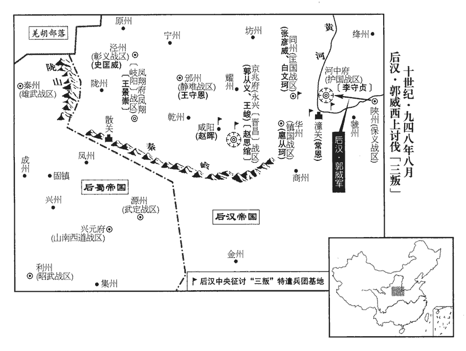
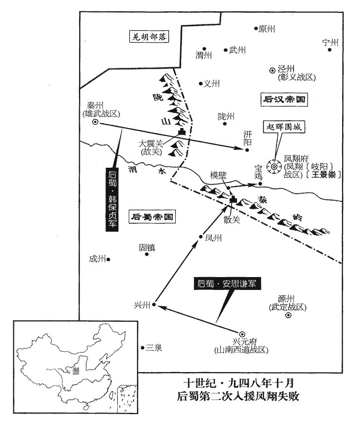
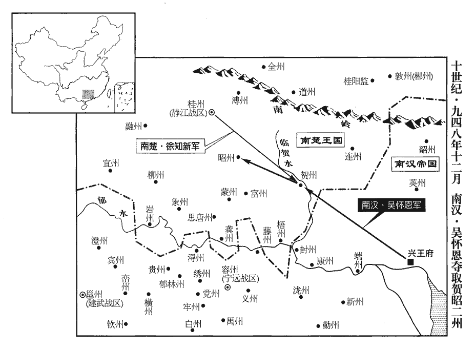
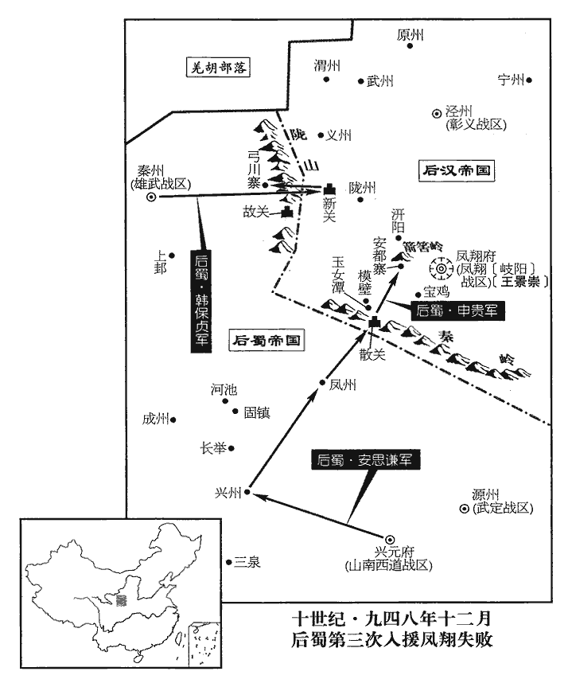
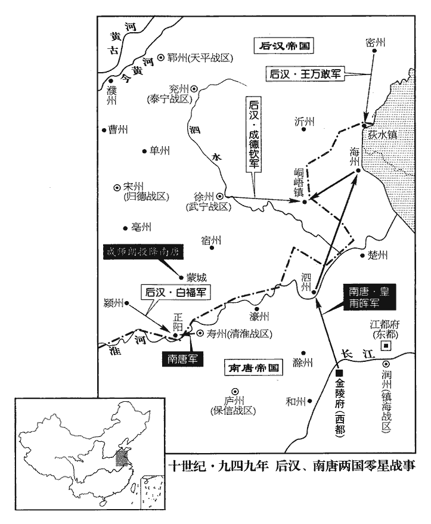
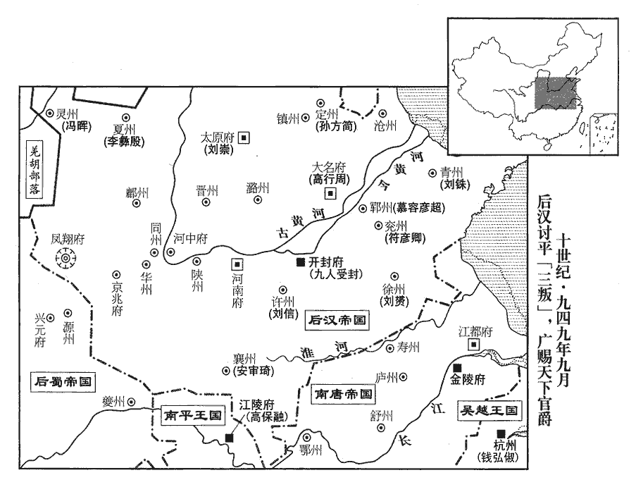

 後漢紀三起著雍涒灘（戊申）三月，盡屠維作噩（己酉），凡一年有奇。

# 高祖睿文聖武昭肅孝皇帝下

## 乾祐元年（戊申、九四八）

1三月，丙辰‹七›，史弘肇起復，加兼侍中。

〖译文〗 [1]三月，丙辰（初七），史弘肇出仕复职，加官兼侍中。

2侯益家富於財，厚賂執政及史弘肇等，由是大臣爭譽之。執政，謂蘇逢吉、楊邠等，皆當時大臣也。譽，音余。丙寅‹十七›，以益兼中書令，行開封尹。行者，行尹事，未正除也。

〖译文〗 [2]侯益家里财产丰厚，送厚礼贿赂执掌政权的大臣和史弘肇等人，因此众大臣交口称赞。丙寅（十七日），任命侯益兼中书令，代理开封尹。

3改廣晉‹河北省大名县›【章：十二行本「晉」下有「府」字；乙十一行本同。】為大名府，左傳：晉卜偃曰：「魏，大名也。」取以名府。晉昌軍‹总部设京兆府陕西省西安市›為永興軍。以革晉命，故改廣晉與晉昌。

〖译文〗 [3]改广晋府为大名府，改晋昌军为永兴军。

4侯益盛毀王景崇於朝，言其恣橫。侯益以王景崇欲殺己，幸免而歸朝，故毀之。橫，戶孟翻。景崇聞益尹開封，知事已變，內不自安，且怨朝廷。怨朝廷不能體先帝遺旨，反聽侯益之讒也。會詔遣供奉官王益如鳳翔，徵趙匡贊牙兵詣闕，趙思綰等甚懼，趙思綰，趙匡贊牙校也，見上卷。景崇因以言激之。思綰途中謂其黨常彥卿曰：「小太尉已落其手，趙思綰等本趙延壽部曲，故呼匡贊為小太尉，言匡贊入朝為已落漢人之手也。吾屬至京師，并死矣，柰何？」彥卿曰：「臨機制變，子勿復言！」復，扶又翻。

〖译文〗 [4]侯益在朝中大肆诋毁王景崇，说他恣意横行。王景崇听说侯益为开封尹，明白事态已产生变化，内心忐忑不安，而且埋怨朝廷。正赶上诏令派供奉官王益到凤翔，取赵匡赞的牙兵带回京城，牙校赵思绾等人很害怕，王景崇乘机用话语相激。赵思绾在路上对他的党羽常彦卿说：“小太尉赵匡赞已落入他们的手中，我们到达京城，都得死了，怎么办？”常彦卿说：“见机行事，你不要再说！”

癸酉‹二十四›，至長安，永興節度副使安友規、巡檢喬守溫出迎王益，置酒於客亭。諸州鎮皆有客亭，以為迎送宴餞之所。思綰前白曰：「壕寨使已定舍館於城東。壕寨使，掌營造浚築及次舍下寨。今將士家屬皆在城中，趙思綰部兵先從趙匡贊鎮長安，故家屬在城中。欲各入城挈家詣城東宿。」友規等然之。時思綰等皆無鎧仗，既入西門，有州校坐門側，思綰遽奪其劍斬之。其徒因大譟，持白梃，校，戶教翻。梃，徒鼎翻。殺守門者十餘人，分遣其黨守諸門。思綰入府，開庫取鎧仗給之，友規等皆逃去。思綰遂據城，集城中少年，得四千餘人，繕城隍，葺qì樓堞，旬日間，戰守之具皆備。少，詩照翻。葺，七入翻。堞，達協翻。

〖译文〗 癸酉（二十四日），到达长安，永兴节度副使安友规、巡检乔守温出城迎接王益，并在客亭设置酒宴款待。这时，赵思绾走上前来说：“壕寨使已经把舍馆定在城东，现在将士的家属都在城中，想各自进城把家属带到城东住宿。”安友规等人同意。当时赵思绾等人都没有武器铠甲，进了西门，见有该州军校坐在门旁，赵思绾突然夺过他的剑把他杀死；赵思绾的党羽乘势大喊大叫，拿着棍子，打死十几个守门兵士，派遣党羽分别把守各个大门。赵思绾进入府衙，打开府库取出武器铠甲分给大家，安友规等人都逃跑离开。赵思绾于是占据了长安城，集中城内少年，约有四千多人，修缮护城壕沟，整治城楼矮墙，十天之内，作战守卫的器械样样齐备。

王景崇諷鳳翔吏民表景崇知軍府事，朝廷患之，甲戌‹二十五›，徙靜難‹总部邠州›節度使王守恩為永興節度使，欲以制趙思綰。難，乃旦翻。徙保義‹总部陕州›節度使趙暉為鳳翔節度使，欲以制王景崇。並同平章事。以景崇為邠州留後，令便道之官。

〖译文〗 王景崇示意凤翔的官吏士民向朝廷上表，推举自己主持军府事务，朝廷对此深为担忧。甲戌（二十五日），调静难节度使王守恩为永兴节度使，调保义节度使赵晖为凤翔节度使，都为同平章事。命王景崇为州留后，让他抄近路赴任。

虢州‹河南省灵宝市›伶人靖邊庭殺團練使田令方，驅掠州民，奔趙思綰。靖，姓也。優伶之名與姓通取一義，所以為謔也。何氏姓苑曰：靖姓，齊靖郭君之後。風俗通曰：靖姓，單靖公之後也。至潼關‹陕西省潼关县›，虢州西北至潼關百有餘里。潼關守將出擊之，其眾皆潰。

〖译文〗 虢州的艺人靖边庭杀死团练使田令方，裹胁州中百姓，投奔赵思绾。到了潼关，潼关守将出关迎击，他的一群人全都溃散了。

5初，契丹主‹首都临潢府内蒙古巴林左旗›耶律兀欲，本年三十一岁北歸，至定州‹河北省定州市›，契丹主德光北歸，死於殺胡林。此謂兀欲北歸至定州也。以義武‹总部定州›節度副使邪律忠‹耶律郎五›為節度使，徙故節度使孫方簡為大同節度使。晉齊王開運三年，契丹主德光以孫方簡為義武節度使。考異曰：實錄，「方簡」作「方諫」。按方簡避周諱，改名方諫；實錄誤也。方簡怨恚，且懼入朝為契丹所留，遷延不受命，恚，於避翻。朝，直遙翻。帥其黨三千人保狼山‹河北省易县西南狼牙山›故寨，孫方簡兄弟保狼山，見二百八十五卷晉開運三年。帥，讀曰率；下同。控守要害。契丹攻之，不克。未幾，遣使請降，幾，居豈翻。帝復其舊官，以扞契丹。復以為義武節度使。

〖译文〗 [5]当初，契丹主北行回国，来到定州，命义武节度副使邪律忠为节度使，调原节度使孙方简为大同节度使。孙方简怨恨愤怒，又怕到了契丹朝廷被他们扣留，所以拖延时日不接受任命，率领他的党羽三千多人守卫狼山原来的山寨，控制固守各处要害。契丹兵进攻，未能攻克。不久，他派使者见后汉高祖请求归降，高祖恢复他的原官职，用他来抵御契丹。

邪律忠聞鄴都‹河北省大名县›既平，去年十一月，杜重威降，鄴都平。事見上卷。常懼華人為變。詔以成德‹总部镇州›留後劉在明為幽州道馬步都部署，使出兵經略定州。未行，忠與麻荅等焚掠定州，悉驅其人棄城北去。定州東至鎮州，止隔祁州耳。契丹聞鎮州將出兵，故棄城而去。孫方簡自狼山帥其眾數百，還據定州，又奏以弟行友為易州‹河北省易县›刺史，方遇為泰州‹河北省满城县›刺史。每契丹入寇，兄弟奔命，奔命者，奔走以救急也。契丹頗畏之。於是晉末州縣陷契丹者，皆復為漢有矣。

〖译文〗 邪律忠听说邺都已被平定，常常害怕汉人发动事变。后汉高祖诏令成德留后刘在明为幽州道马步都部署，派他出兵整治定州。还没出兵，邪律忠和麻等人已劫掠焚烧了定州，驱赶定州百姓弃城北去。孙方简从狼山率领几百名军兵，回来占领定州，又上奏章请任命弟弟孙行友为易州刺史、孙方遇为泰州刺史。每当契丹人入侵，兄弟三人就奔走抵抗，契丹人很害怕他们，于是后晋末年州县陷落到契丹人手中的，都又为后汉所有了。

丙子‹二十七›，以劉在明為成德節度使。

〖译文〗 丙子（二十七日），后汉任命刘在明为成德节度使。

麻荅至其國，契丹主責以失守。麻荅不服，曰：「因朝廷徵漢官致亂耳。」謂徵馮道等也。事見上卷上年。契丹主鴆殺之。

〖译文〗 麻回到辽国，契丹主责备他失守，麻不服气，说：“这是因为朝廷招收任用汉官，才导致今天的祸乱！”契丹主将他毒死。

6蘇逢吉等為相，多遷補官吏；楊邠以為虛費國用，所奏多抑之，逢吉等不悅。

〖译文〗 [6]苏逢吉等人作宰相，频繁提升补充官员，杨认为白白耗费国家钱财，在奏章里多次贬抑这种作法，苏逢吉等人不高兴。

中書侍郎兼戶部尚書、同平章事李濤上疏言：「今關西紛擾，外禦為急。上，時掌翻。二樞密皆佐命功臣，官雖貴而家未富，宜授以要害大鎮。李濤之疏，承蘇逢吉之意也。二樞密，謂楊邠、郭威。樞機之務在陛下目前，易以裁決，易，以豉翻。逢吉、禹珪自先帝時任事，皆可委也。」楊邠、郭威聞之，見太后泣訴，稱：「臣等從先帝‹刘知远›起艱難中，今天子取人言，欲棄之於外。況關西方有事，謂岐、雍舉兵反。臣等何忍自取安逸，不顧社稷。若臣等必不任職，乞留過山陵。」太后怒，以讓帝，曰：「國家勳舊之臣，柰何聽人言而逐之！」帝曰：「此宰相所言也。」因詰責宰相。詰，去吉翻。濤曰：「此疏臣獨為之，他人無預。」丁丑‹二十八›，罷濤政事，勒歸私第。為將相交惡張本。

〖译文〗 中书侍郎兼户部尚书、同平章事李涛上疏说：“现在关西形势纷乱，抵御外寇入侵是当务之急。二位枢密使都是先朝辅佐创业的功臣，官阶虽然显贵但家资并不富裕，应该授予他们重要的大藩镇。枢密机要的事务，在陛下眼前，容易裁决，况且苏逢吉、苏禹都是从先帝时就任职，都可以委托。”杨、郭威听说，入宫向太后哭诉道：“我们跟随先帝在艰难中起来，现在天子听信人几句话，要把我们弃置在外。况且关西正有事，我们怎忍自求安逸，不顾社稷的安危。如果我们一定不称职，请求留我们过了先帝灵柩出殡。”太后大怒，责备后汉隐帝道：“国家元勋旧臣，怎么能听人几句话就放逐他们！”后汉隐帝说：“这是宰相说的。”于是又去责问宰相苏逢吉等人，李涛说：“这篇疏文是臣独自写的，别人没有参预。”丁丑（二十八日），罢免李涛官职，勒令回归家中。

7是日，邠、涇、同、華四鎮邠帥王守恩，涇帥史匡威，同帥張彥威，華帥扈從珂。華，戶化翻。俱上言護國‹总部河中府›節度使兼中書令李守貞與永興、鳳翔同反。趙思綰據永興，王景崇據鳳翔。

〖译文〗 [7]当天，、泾、同、华四镇都向朝廷上报：护国节度使兼中书令李守贞和永兴、凤翔二镇同时反叛。

始，守貞聞杜重威死而懼，杜重威死見上卷是年正月。陰有異志。自以晉世嘗為上將，有戰功，李守貞破契丹於馬家口而克青州，又破契丹於陽城，其功不細。素好施，得士卒心。好，呼到翻。施，式豉翻。漢室新造，天子年少初立，少，詩照翻。執政皆後進，有輕朝廷之志。乃招納亡命，養死士，治城塹，繕甲兵，晝夜不息。遣人間道齎蠟丸結契丹，屢為邊吏所獲。治，直之翻。間，古莧翻。

〖译文〗 开始，李守贞听说杜重威被杀而心中害怕，暗中萌生反叛念头。自以为后晋时曾为上将，有战功，平常慷慨好施，所以颇得士兵之心。现在后汉新建，皇帝年轻刚刚继位，执掌朝政都是后来进身的官员，所以有轻视朝廷看法。于是招纳亡命之徒，豢养敢死之士，治理城墙壕堑，修缮武器铠甲，日夜不停。又派人从小路带着蜡丸密信去勾结契丹，多次被把守边关的官吏所查获。

浚儀‹首都开封府所在县·河南省开封市›人趙修己，素善術數，舊唐書地理志：浚儀故縣，隋置，在今縣北三十里；唐武德四年，移縣於州北羅城內；貞觀元年，移於州西一里；後治郭下。自守貞鎮滑州，署司戶參軍，累從移鎮，晉開運初，李守貞鎮義成，後徙鎮泰寧‹总部兖州›、天平‹总部郓州›、歸德‹总部宋州›，至是鎮護國為亂。為守貞言：「時命不可，勿妄動！」為，于偽翻。前後切諫非一，守貞不聽，乃稱疾歸鄉里。僧總倫，以術媚守貞，言其必為天子，守貞信之。又嘗會將佐置酒，引弓指舐掌虎圖曰：「吾有非常之福，當中其舌。」一發中之，舐shì，直氐翻。中，竹仲翻。左右皆賀。守貞益自負。

〖译文〗 浚仪人赵修己，素来擅长星象占卜之术，自从李守贞镇守滑州，署理司户参军，屡次跟随藩镇调动，对李守贞说：“时运、天命不允许，不要轻举妄动！”前后恳切劝谏不止一次，李守贞不听，他于是声称有病回家乡。僧人总伦，用他的法术讨好李守贞，说他一定要作天子，李守贞信以为真。又曾和将佐聚会设置酒宴，弯弓搭箭指着《舐掌虎图》说：“我如果有非常的福份，就当射中它的舌头。”一箭射中，周围人都向他祝贺，李守贞更加自命不凡。

會趙思綰據長安，奉表獻御衣於守貞，守貞自謂天人協契，乃自稱秦王。遣其驍將平陸‹山西省平陆县›王繼勳【章：十二行本「勳」下有「將兵」二字；乙十一行本同。】據潼關，舊唐書地理志：陝州平陸縣，隋之河北縣也。唐天寶三載，陝郡太守李齊物開三門，石下得戟，大刃有「平陸」篆字，因改為平陸縣。九域志：平陸縣在陝州北五里。以思綰為晉昌節度使。

〖译文〗 正赶上赵思绾占领了长安城，向李守贞奉上表章献上御衣。李守贞自认为是天意、人心共同默契，于是自称秦王，派他的骁将平陆人王继勋占据潼关，任命赵思绾为晋昌节度使。

同州‹陕西省大荔县›距河中‹山西省永济市›最近，河中府西至同州六十里耳。匡國節度使張彥威，考異曰：周太祖實錄作「彥成」，蓋避周祖諱；薛史因之。今從廣本。常詗守貞所為，詗，古永翻，又翾正翻。奏請先為之備，詔滑州馬軍都指揮使羅金山將部兵戍同州；故守貞起兵，同州不為所併。金山，雲州‹山西省大同市›人也。

〖译文〗 同州距离河中最近，匡国节度使张彦威常侦察李守贞的所作所为，并奏请朝廷早作防范，后汉隐帝颁诏令滑州马军都指挥使罗金山率所部守卫同州；所以李守贞起兵时，同州没有被他吞并。罗金山是云州人。

8定難‹总部设夏州陕西省靖边县北白城子›節度使李彝殷發兵屯境上，奏稱：「去三載前難，乃旦翻。去，已往也。羌族㖡yè毋龍龕手鏡：㖡，音夜。毋，讀如謨。殺綏州‹陕西省绥德县›刺史李仁裕叛去，請討之。」慶州‹甘肃省庆阳县›上言：「請益兵為備。」以備羌也。詔以司天言，今歲不利先舉兵，諭止之。

〖译文〗 [8]后汉定难节度使李彝殷起兵驻守境上，向朝廷上奏章，称：“三年以前，羌族毋杀死绥州刺史李仁裕反叛逃走，请求发兵征讨。”庆州上奏道：“请增加兵力作准备。”后汉隐帝颁诏书以司天官说，今年不利于先动兵戈，劝谕制止众将行动。

9夏，四月，辛巳‹二›，陝州‹河南省三门峡市›都監王玉奏克復潼關。監，古銜翻。

〖译文〗 [9]夏季，四月，辛巳（初二），陕州都监王玉奏报收复潼关。

10帝‹刘承祐›與左右謀，以太后怒李濤離間，間，古莧翻。欲更進用二樞密，以明非帝意。左右亦疾二蘇之專，欲奪其權，共勸之。二樞密，楊邠、郭威。二蘇，逢吉、禹珪。壬午‹三›，制以樞密使楊邠為中書侍郎兼吏部尚書、同平章事，樞密使如故；以副樞密使郭威為樞密使；又加三司使王章同平章事。

〖译文〗 [10]后汉隐帝和身边的大臣商量，因太后恼怒李涛的挑拔离间，现在想再进用两位枢密使，以便表明前举不是皇帝的意思。大臣们也憎恨二苏专政，想夺他们的权，所以都劝勉皇帝这样干。壬午（初三），制令枢密使杨为中书侍郎兼吏部尚书、同平章事，枢密使官职照旧；命副枢密使郭威为枢密使；又三司使王章加官同平章事。

凡中書除官，諸司奏事，帝皆委邠斟酌。自是三相拱手，三相，竇貞固、蘇逢吉、蘇禹珪。政事盡決於邠。事有未更邠所可否者，更，工衡翻，經也。莫敢施行，遂成凝滯。三相每進擬用人，苟不出邠意，雖簿、尉亦不之與。邠素不喜書生，喜，許記翻。常言：「國家府廩實，甲兵強，乃為急務。至於文章禮樂，何足介意！」既恨二蘇排己，以其使李濤上疏，請出二樞密為外鎮也。又以其除官太濫，為眾所非，欲矯其弊，由是艱於除拜，士大夫往往有自漢興至亡不霑一命者；此所謂士大夫，指言內外在官之人。命，言漢朝之命。凡門蔭及百司入仕者悉罷之。門蔭，謂任子也。百司入仕，所謂流外也。雖由邠之愚蔽，時人亦咎二蘇之不公所致云。

〖译文〗 凡中书省任命官员、各司上奏公事，后汉隐帝全委任杨斟酌办理。从此其它三位宰相全都拱手无事，一切政事都决定于杨。凡事有未经杨认可，没有人敢施行，便形成梗塞。三位宰相每次所拟的进用人选，只要不出于杨之意，即使主簿、尉这样的小官也不给，杨历来不喜欢书生，常说：“国家的府库仓廪要充实，兵力要强盛，这才是当务之急。至于文章礼乐，有什么值得介意！”他既怀恨二苏曾排斥自己，又因二苏原来任命官员太滥，被众人非议指责，想要矫正这一弊病，因此授予官职就很难了，士大夫里多有从后汉兴到后汉亡不曾受过一次升迁；还规定：凡靠祖、父余荫得官的子弟以及从各个部门入仕的，全部罢免。这虽说由于杨的愚昧闭塞，但当时人们也归咎于二苏封官办事不公所致。

11以鎮寧‹总部澶州›節度使郭從義充永興行營都部署，將侍衛兵討趙思綰。戊子‹九›，以保義‹总部陕州›節度使白文珂為河中行營都部署，內客省使王峻為都監。辛卯‹十二›，削奪李守貞官爵，命文珂等會兵討之。乙未‹十六›，以寧江‹总部设夔州重庆市奉节县›節度使、侍衛步軍都指揮使尚洪遷為西面行營都虞候。寧江軍夔州，時屬蜀境，尚洪遷遙領也。

〖译文〗 [11]后汉隐帝命镇宁节度使郭从义充任永兴行营都部署，率领侍卫兵讨伐赵思绾。戊子（初九），命保义节度使白文珂为河中行营都部署，内客省使王峻为都监。辛卯（十二日），削去李守贞的官职爵位，命白文珂等将领合兵讨伐他。乙未（十六日），命宁江节度使、侍卫步军都指挥使尚洪迁为西面行营都虞候。

12王景崇遷延不之邠州‹陕西省彬县›，閱集鳳翔丁壯，詐言討趙思綰，仍牒邠州會兵。王景崇欲并岐、邠之兵以舉事。

〖译文〗 [12]王景崇拖延时日不去州上任，招集、检阅凤翔的壮丁，假称要讨伐赵思绾，并发牒文与州合兵。

13契丹主‹耶律兀欲›如遼陽‹东京·辽宁省辽阳市›，漢遼東郡有遼陽縣，大梁水與遼水會處也，契丹於此置遼陽府。歐史：自黃龍府西北行一千三百里至遼陽府。按，遼陽府，契丹之東京，舊勃海地，距燕京二千五百一十里。故晉主與太后、皇后皆謁見。見，賢遍翻。有禪奴利者，契丹主之妻兄也，聞晉主有女未嫁，詣晉主求之；晉主辭以幼。後數日，契丹主使人馳取其女而去，以賜禪奴。

〖译文〗 [13]契丹主到了辽阳，前后晋主和太后、皇后都拜见他。有个叫禅奴利的，是契丹主妻子的哥哥，他听说后晋主有女儿尚未出嫁，就去见后晋主求婚，后晋主以女儿年龄幼小推辞。过了几天，契丹主派人骑马取走他女儿，赐给禅奴利。

14王景崇遺蜀鳳州‹陕西省凤县›刺史徐彥書，求通互市。遺，唯季翻。壬戌，蜀主‹孟昶（孟仁赞）本年三十岁›使彥復書招之。

〖译文〗 [14]王景崇致信给后蜀凤州刺史徐彦，要求互通贸易。壬戌（疑误），后蜀主命徐彦回信招降他。

15契丹主留晉翰林學士徐台符於幽州‹北京市›，徐台符從契丹主北去見上卷上年。台符逃歸。

〖译文〗 [15]契丹主扣留后晋翰林学士徐台符于幽州，徐台符逃回。

16五月，乙亥‹十七›，滑州‹河南省滑县›言河決魚池‹河南省浚县东南古黄河北岸›。魚池，地名，河決之後，謂之魚池口。

〖译文〗 [16]五月，乙亥（二十七日），滑州上报，黄河在鱼池决口。

17六月，戊寅朔‹一›，日有食之。

〖译文〗 [17]六月，戊寅朔（初一），出现日食。

18辛巳‹四›，以奉國左廂都虞候劉詞充河中行營馬步都虞候。

〖译文〗 [18]辛巳（初四），后汉隐帝命奉国左厢都虞候刘词充任河中行营马步都虞候。

19乙酉‹八›，王景崇遣使請降于蜀，亦受李守貞官爵。

〖译文〗 [19]乙酉（初八），王景崇派使者向后蜀请求归降，同时接受李守贞给予的官爵。

20高從誨‹南平国（首都江陵府）本年五十八岁›既與漢絕，見上卷天福十二年。北方商旅不至，境內貧乏，乃遣使上表謝罪，乞脩職貢；詔遣使慰撫之。

〖译文〗 [20]高从诲与后汉断绝往来后，北方的商人不再来，境内贫困、物资缺乏，于是派使者向后汉上表章谢罪，并请允许履行交纳贡品的职责；后汉隐帝诏令派使者前去安抚。

21西面行營都虞候尚洪遷攻長安，傷重而卒。卒，子恤翻。

〖译文〗 [21]西面行营都虞候尚洪迁攻打长安，身受重伤而去世。

22秋，七月，以工部侍郎李穀充西南面行營都轉運使。為李穀見親任於周朝張本。

〖译文〗 [22]秋季，七月，后汉隐帝命工部侍郎李充任西南面行营都转运使。

23庚申‹十三›，加樞密使郭威同平章事。

〖译文〗 [23]庚申（十三日），枢密使郭威加官任同平章事。

24蜀司空兼中書侍郎、同平章事張業，性豪侈，強市人田宅，以威力臨人，人畏其威力，不得已而就與為市，是為強市。藏匿亡命於私第，置獄，繫負債者或歷年，至有瘐yǔ死者。蘇林曰：瘐，病也。囚徒病，律名為瘐。如淳曰：律：囚以飢寒死曰瘐。音勇主翻。其子檢校左僕射繼昭，好擊劍，好，呼到翻。嘗與僧歸信訪善劍者，右匡聖都指揮使孫漢韶與業有隙，密告業、繼昭謀反；翰林承旨李昊、奉聖控鶴馬步都指揮使安思謙復從而譖之。復，扶又翻。甲子‹十七›，業入朝，蜀主命壯士就都堂擊殺之，下詔暴其罪惡，籍沒其家。

〖译文〗 [24]后蜀司空兼中书侍郎、同平章事张业，生性豪放、奢侈，强买别人的田地住宅，在自己的宅院里藏匿亡命的罪犯；私设监狱，抓欠债的人，有时关押多年以至有病死的。他的儿子检校左仆射张继昭，喜好击剑，曾和归信和尚走访善于击剑的高手。右匡圣都指挥使孙汉韶和张业有仇隙，密告张业、张继昭二人谋反；翰林承旨李昊、奉圣控鹤马步都指挥使安思谦又趁机诬陷他们，甲子（十七日），张业上朝，后蜀主命令壮士在都堂里把他杀死，下诏书公布他的罪恶，抄没他的家产。

樞密使、保寧‹总部阆州›節度使兼侍中王處回，亦專權貪縱，王處回以節兼侍中，不在閬州。賣官鬻獄，四方饋獻，皆先輸處回，次及內府，此所謂四方，止以蜀之境上言之。家貲巨萬。子德鈞，亦驕橫。橫，戶孟翻。張業既死，蜀主不忍殺處回，聽歸私第；處回惶恐辭位，以為武德‹总部梓州›節度使兼中書令。王處回亦不得至梓州。

〖译文〗 枢密使、保宁节度使兼侍中王处回，也擅权专横，贪婪恣肆，出卖官职，收受罪犯的贿赂，各地赠送的贡物，都先送到王处回处，其次给皇帝内府，他家产巨万，他的儿子王德钧，也骄横跋扈。张业被处死后，后蜀主不忍心杀王处回，让他回家；王处回慌忙辞去官职，后蜀主任他为武德节度使兼中书令。

蜀主欲以普豐庫使高延昭、茶酒庫使王昭遠為樞密使，普豐、茶酒二庫使，皆蜀所置。以其名位素輕，乃授通奏使，知樞密院事。通奏使，亦蜀所置。昭遠，成都‹四川省成都市›人，幼以僧童從其師入府，蜀高祖愛其敏慧，令給事蜀主左右；至是，委以機務，府庫金帛，恣其取與，不復會計。復，扶又翻。會，古外翻。至于宋興，蜀主遂以用王昭遠亡國。

〖译文〗 后蜀主想让普丰库使高延昭、茶酒库使王昭远为枢密使，但因他们的名声和地位向来轻微，就授予他们为通奏使，主持枢密院事务。王昭远是成都人，年幼时做小和尚随他的师傅进入都府，后蜀高祖喜爱他聪明敏捷，让他在后蜀主身边供事；到这时，委任他国家重要事务，府库里的金银财帛，任其随意拿取，不再计算。

25戊辰‹二十一›，以郭從義為永興節度使，白文珂兼知河中行府事。時郭從義討長安，就以永興節授之；白文珂討河中，因使之知行府事。

〖译文〗 [25]戊辰（二十一日），后汉隐帝任命郭从义为永兴节度使，白文珂兼理主持河中行府事务。

26蜀主以翰林承旨、尚書左丞李昊為門下侍郎兼戶部尚書，翰林學士、兵部侍郎徐光溥為中書侍郎兼禮部尚書，並同平章事。

〖译文〗 [26]后蜀主命翰林承旨、尚书左丞李昊为门下侍郎兼户部尚书翰林学士、兵部侍郎徐光溥为中书侍郎兼礼部尚书，都为同平章事。

27蜀安思謙謀盡去舊將，去，羌呂翻。又譖衛聖都指揮使兼中書令趙廷隱謀反，欲代其位，夜，發兵圍其第。會山南西道‹总部兴元府›節度使李廷珪入朝，極言廷隱無罪，乃得免。廷隱因稱疾，固請解軍職；甲戌‹二十七›，蜀主許之。史言蜀主以新間舊。

〖译文〗 [27]后蜀安思谦谋划把旧将全部除掉，又诬陷卫圣都指挥使兼中书令赵廷隐谋反，企图取代他的权位，夜里派兵包围了他的住宅。正赶上山南西道节度使李廷入朝，全力辩解赵廷隐没有罪，才免罪。赵廷隐因此声称有病，坚持请求解除自己的军权；甲戌（二十七日），后蜀主答应。

 

28鳳翔節度使趙暉至長安‹京兆府所在县·陕西省西安市›；乙亥‹二十八›，表王景崇反狀益明，請進兵擊之。

〖译文〗 [28]凤翔节度使赵晖来到长安；乙亥（二十八日），上表章说王景崇反叛的情况日益明显，请求发兵进攻。

29初，高祖‹刘知远›鎮河東‹总部太原府›，皇弟崇為馬步都指揮使，與蕃漢都孔目官郭威爭權，有隙。及威執政，崇憂之。節度判官鄭珙gǒng，勸崇為自全計，崇從之。珙，青州‹山东省青州市›人也。珙，居竦翻。八月，庚辰‹四›，崇表募兵四指揮，自是選募勇士，招納亡命，繕甲兵，實府庫，罷上供財賦，皆以備契丹為名；朝廷詔令，多不稟承。於是之時，劉崇則為跋扈；然郭威既立，天下為周，河東非素有備，殆不能守也。

〖译文〗 [29]当初，后汉高祖镇守河东，皇弟刘崇是马步都指挥使，与蕃汉都孔目官郭威争夺权力，二人有仇隙。等到郭威执政，刘崇很担扰。节度判官郑珙劝刘崇安排保全自己之计，刘崇听从了。郑珙是青州人。八月庚辰（初四），刘崇上表招募四个指挥的士兵，从此他精选招募勇士，收纳亡命的罪犯，修缮兵器装备，充实官仓府库，停止向朝廷上缴的赋税财物，都以防御契丹入侵为名；朝廷所下的诏令，大多不接受。

30自河中、永興、鳳翔三鎮拒命以來，朝廷繼遣諸將討之。昭義‹总部潞州›節度使常思屯潼關‹陕西省潼关县›，白文珂屯同州‹陕西省大荔县›，趙暉屯咸陽‹陕西省咸阳市›。常思、白文珂不敢逼河中，趙暉不敢逼鳳翔。惟郭從義、王峻置柵近長安，而二人相惡如水火，近，其靳翻。惡，如字，又烏路翻。自春徂秋，皆相仗莫肯攻戰。帝患之，欲遣重臣臨督，壬午‹六›，以郭威為西面軍前招慰安撫使，考異曰：薛史周太祖紀：「七月十三日，授同平章事，即遣西征，以安慰招撫為名。八月六日發，離京師。」按漢隱帝、周太祖實錄，「七月，加平章事，」制詞無西征之言；至八月壬午，方受命出征。蓋薛史之誤。諸軍皆受威節度。

〖译文〗 [30]自从河中、永兴、凤翔三个藩镇抗拒朝廷命令以来，朝廷连续派众将领讨伐他们。昭义节度使常思屯兵潼关，白文珂屯兵同州，赵晖屯兵咸阳。只有郭从义、王峻在靠近长安的地方设置栅栏，但是郭、王二人相互交恶，就像水火不能相容，所以从春到秋二人都对峙观望不肯进攻作战。后汉隐帝为此忧虑，想派一位朝廷重臣临阵督战，壬午（初六），命郭威为西面军前招慰安抚使，各军都受郭威的调度。

威將行，問策於太師馮道。道曰：「守貞自謂舊將，為士卒所附，願公勿愛官物，以賜士卒，則奪其所恃矣。」威從之。郭威以卒伍之雄，而問策於馮道之老腐者，觀其所以答與威所以從，則人之材識，不合乎道者則有之，若其量勢應物，未可妄議。由是眾心始附於威。為郭威得天下張本。

〖译文〗 郭威将要上路，向太师冯道请教良策。冯道说：“李守贞自认为是老将，士兵之心都归附于他；望您不要吝惜官家的财物，要用以赏赐士兵，这样就夺走了他所倚仗的优势了。”郭威听从了冯道的这条计策。从此众人之心开始归附郭威。

詔白文珂趣河中，趙暉趣鳳翔。趣，七喻翻。

〖译文〗 后汉隐帝诏令，白文珂赶赴河中，赵晖赶赴凤翔。

31甲申‹八›，蜀主‹孟昶›以趙廷隱為太傅，賜爵宋王，國有大事，就第問之。

〖译文〗 [31]甲申（初八），后蜀主任命赵廷隐为太傅，封爵为宋王，凡有国家大事，亲自到他家中询问。

32戊子‹十二›，蜀改鳳翔曰岐陽軍‹总部设凤翔府›，以鳳翔之地在岐山之陽也。己丑‹十三›，以王景崇為岐陽節度使、同平章事。

〖译文〗 [32]戊子（十二日），后蜀改凤翔为岐阳军；己丑（十三日），命王景崇为岐阳节度使、同平章事。

33乙未‹十九›，以錢弘俶為東南兵馬都元帥、鎮海‹总部杭州›•鎮東‹总部越州›節度使兼中書令、吳越國王。

〖译文〗 [33]乙未（十九日），后汉隐帝封吴越钱弘为东南兵马都元帅，镇海、镇东节度使兼中书令，吴越国王。

34郭威與諸將議攻討，諸將欲先取長安、鳳翔。鎮國‹总部华州›節度使扈從【章：十二行本「從」作「彥」；乙十一行本同；下同。】珂曰：「今三叛連衡，推守貞為主，守貞亡，則兩鎮自破矣。若捨近而攻遠，萬一王、趙拒吾前，守貞掎吾後，掎，居蟻翻。此危道也。」威善之。於是威自陝州‹河南省三门峡市›，白文珂及寧江‹总部楚州›節度使、侍衛步軍都指揮使劉詞自同州，常思自潼關，三道攻河中。九域志：陝州北至河中二百三十七里。同州東至河中六十里。潼關渡河至河中一百餘里。陝，失冉翻。威撫養士卒，與同苦樂，小有功輒賞之，微有傷常親視之；士無賢不肖，有所陳啟，皆溫辭色而受之；違忤不怒，小過不責。樂，音洛。忤，五故翻。由是將卒咸歸心於威。

〖译文〗 [34]郭威与众将领商议讨伐进攻，众将领想先夺取长安、凤翔。镇国节度使扈从珂说：“现在三个叛藩联合，推举李守贞为主，如果李守贞灭亡，那两个藩镇便不攻自破了。如果舍近攻远，万一王、赵在前面抵抗，李守贞在背后夹击，这是危亡之道。”郭威认为很有道理。于是郭威从陕州，白文珂及宁江节度使、侍卫步军都指挥使刘词从同州，常思从潼关，从三条路进攻河中。郭威抚养士兵，和他们同甘共苦，士兵们稍立军功就受到赏赐，稍有伤就经常亲自看望；谋士中无论是贤者还是不肖的，只要有事来陈述的，都和言悦色地接待他们；违背触犯他不发怒，小的过错不责罚。因此士兵、将领之心都归附于郭威。

始，李守貞以禁軍皆嘗在麾下，受其恩施，施，式豉翻；下好施同。又士卒素驕，苦漢法之嚴，謂其至則叩城奉迎，可以坐而待之。李守貞習見鳳翔、太原之事，以楊思權期漢兵耳。既而士卒新受賜於郭威，皆忘守貞舊恩，己亥‹二十三›，至城下，揚旗伐鼓，踊躍詬譟；詬，古候翻，又許候翻。守貞視之失色。

〖译文〗 开始，李守贞以为禁军都曾是自己的老部下，受过他的恩惠，而且士兵一贯骄横，苦于后汉军法的严格；认为禁军一到就会前来敲城门奉迎他为君主，可以坐着等待。但是士兵们新近在郭威处受到赏赐，都忘了李守贞的旧恩；己亥（二十三日），兵至城下，挥扬军旗，擂响战鼓，踊跃辱骂呼喊，李守贞在城上看到，大惊失色。

白文珂克西關城，柵於河西，河中西關城在河西，所以護蒲津浮梁者也。常思柵於城南，威柵於城西。常思、郭威，蓋近城立柵。未幾，威以常思無將領才，先遣歸鎮。幾，居豈翻。將，即亮翻；下同。遣常思歸潞州，史言郭威能審人之能否。

〖译文〗 白文珂攻克西关城，在黄河西岸设营栅，常思在城南设营栅，郭威在城西设营栅。不久，郭威认为常思没有将领之才，先把他派回原藩镇。

諸將欲急攻城，威曰：「守貞前朝宿將，健鬬好施，施，式豉翻。屢立戰功。況城臨大河，樓堞完固，未易輕也。易，以豉翻。且彼馮城而鬬，馮，讀曰憑。吾仰而攻之，何異帥士卒投湯火乎！帥，讀曰率。夫勇有盛衰，攻有緩急，時有可否，事有後先；不若且設長圍而守之，使飛走路絕。吾洗兵牧馬，坐食轉輸，輸，舂遇翻。溫飽有餘。俟城中無食，公帑家財皆竭，帑，他朗翻。然後進梯衝以逼之，飛羽檄以招之。彼之將士，脫身逃死，父子且不相保，況烏合之眾乎！思綰、景崇，但分兵縻之，不足慮也。」縻mí，忙皮翻，繫也。史言郭威方略，亦因周之史官潤色已成之文。乃發諸州民夫二萬餘人，使白文珂等帥之，刳長壕，築連城，列隊伍而圍之。威又謂諸將曰：「守貞曏畏高祖‹刘知远›，不敢鴟chī張；曏，謂昔時也。鴟張，言如鴟之張翼，欲高舉遠飛也。以我輩崛起太原‹山西省太原市›，事功未著，有輕我心，故敢反耳。正宜靜以制之。」乃偃旗臥鼓，但循河設火鋪，連延數十里，番步卒以守之。遣水軍檥舟於岸，寇有潛往來者，無不擒之。於是守貞如坐網中矣。鋪，普故翻。檥yǐ，魚倚翻。番步卒者，使步卒分番迭守。張敬達之圍晉陽，郭威之圍河中，皆欲以持久制之。然敬達以敗，郭威以勝者，晉陽有援而河中無援也。司馬仲達急攻孟達而緩攻公孫淵，亦以有援無援而為緩急耳。

〖译文〗 众将领想赶快攻城，郭威说：“李守贞是前朝有经验的老将，勇猛善斗，慷慨好施，多次建立战功。况且城临黄河，城楼护墙完好坚固，不容轻视。况且他凭借高城而战，我们仰面进攻，这和领着士兵去赴汤蹈火有什么不同！勇气有盛有衰，进攻有慢有急，时机有可有不可，办事情有后有先；不如先设置长长的包围圈困守他，使他上天无路入地无门。而我们磨洗兵器，放牧战马，静坐享用转运来的粮食，做到温饱有余。等城中没粮了，官家、私人的钱财全都枯竭，然后推进云梯冲车来逼近他们，飞传羽檄来招降他们。那边的将领士兵，各自脱身逃亡，就是父子也难以互相保护，何况是些乌合之众！赵思绾、王景崇二处，只要分兵牵制住，不值得忧虑。”于是征发各州民夫二万多人，让白文珂等人率领他们，挖长沟，筑连城，排列队伍把河中城团团围住。郭威又对众将领说：“李守贞过去害怕高祖，所以不敢嚣张；认为我们从太原崛起，事业功勋不显赫，有轻视我们之心，所以敢于反叛。我们正应该用静来制服他。”于是把军旗、战鼓都收起来，只沿黄河设置“火铺”传递军情，连绵几十里，派步卒轮番守护；派水军船只停泊在岸边，敌人有偷偷往来的，无不抓获，于是李守贞就像坐在罗网中了。

35蜀武德‹总部梓州›節度使兼中書令王處回請老，辛丑‹二十五›，以太子太傅致仕。

〖译文〗 [35]后蜀武德节度使兼中书令王处回请求告老退休，辛丑（二十五日），他以太子太傅退休。

36南漢主‹首都兴王府广东省广州市›刘弘熙（刘晟）本年二十九岁中國既國號曰漢，故嶺南之漢，書南漢以別之。遣知制誥宣化‹邕州州政府所在县·广西南宁市›鍾允章宣化，漢領方縣地，晉置晉興郡，隋廢郡，置宣化縣及晉興縣。唐以宣化為邕州治所，晉興亦屬邕州。求婚於楚‹首都长沙府›，楚王希廣不許。南漢主怒，問允章：「馬公復能經略南土乎？」復，扶又翻。對曰：「馬氏兄弟，方爭亡於不暇，安能害我！」南漢主曰：「然。希廣懦而吝嗇，其士卒忘戰日久，此乃吾進取之秋也。」為南漢舉兵攻楚張本。

〖译文〗 [36]南汉主派知制诰宣化人钟允章到楚国求婚，楚王马希广不同意。南汉主大怒，问钟允章：“马希广还能治理南方吗？”答道：“马氏兄弟正在争斗不暇，怎能伤害我们！”南汉主说：“好！马希广为人懦弱而且吝啬，他的士兵很久都没打过仗，这正是我们进取的大好时光啊！”

37武平‹总部设朗州湖南省常德市›節度使馬希萼請與楚王希廣各脩職貢，求朝廷別加官爵，欲使潭、朗如二國然。希廣用天策府內都押牙歐弘練、進奏官張仲荀謀，厚賂執政，使拒其請。九月，壬子‹七›，賜希萼及楚王希廣詔書，諭以「兄弟宜相輯睦，凡希萼所貢，當附希廣以聞。」希萼不從。

〖译文〗 [37]楚国武平节度使马希萼向后汉朝廷提出要与楚王马希广各自尽职进奉贡品，请求朝廷另加封官爵。马希广采用天策府内都押牙欧弘练、进奏官张仲荀的计策，用厚礼贿赂执政大臣，让朝廷拒绝马希萼的请求。九月，壬子（初七），后汉隐帝赐马希萼及楚王马希广诏书，劝谕他们“兄弟应该和睦相处，凡是马希萼的贡品，应当附于马希广贡品中上报”。马希萼不听从。

38蜀兵援王景崇，軍于散關‹陕西省宝鸡市西南›，趙暉遣都監李彥從襲擊，破之，考異曰：實錄，「戊辰，樞密使郭諱上言：『都監李彥從將兵掩襲川賊，至大散關，殺賊三千餘，其餘棄甲而遁。』」漢隱帝實錄，「九月，李彥從敗蜀兵於散關。」而蜀後主實錄無之。蜀實錄，「十月，安思謙敗漢兵於時家竹林，遂焚蕩寶雞。十二月，又敗漢兵于玉女潭。」而漢實錄無之。蓋兩國各舉其勝而諱其敗耳。然漢實錄言官軍不滿萬人，而蜀兵數倍，是二三萬人，非小役也，豈得全不書！殺三千人，非小敗也，豈十月遽能再舉！蓋九月止是蜀邊將小出兵，為漢所敗，漢將因張大而奏之耳。又蜀實錄，十月但云「思謙退次鳳州」，不云「歸興元」，十二月云「思謙自興元進次鳳州」，蓋十月脫略耳。蜀兵遁去。

〖译文〗 [38]后蜀支援王景崇的军队驻扎在散关，赵晖派都监李彦从前去袭击，打败了他们，蜀军逃去。

39蜀主以張業、王處回執政，事多壅蔽，己未‹十四›，始置匭函，匭guǐ，居洧翻。後改為獻納函。

〖译文〗 [39]后蜀主孟昶认为张业、王处回主持政务时，自己多受蒙蔽而视听不清，己未（十四日），开始设置举报箱，名叫匦函，后改为献纳函。

40王景崇盡殺侯益家屬七十餘人，怨侯益之毀己於朝也。益子前天平‹总部郓州›行軍司馬仁矩先在外，得免。庚申‹十五›，以仁矩為隰州‹山西省隰县›刺史。仁矩子延廣，尚在襁褓，乳母劉氏以己子易之，凡擇乳母，必取新生子者，許之攜子，故得以易。抱延廣而逃，乞食至于大梁‹河南省开封市›，歸于益家。

〖译文〗 [40]王景崇把侯益的家属七十多人全部杀死，只有侯益的儿子前天平行军司马侯仁矩事前在外，才免于一死。庚申（十五日），后汉朝廷命侯仁矩为隰州刺史。侯仁矩的儿子侯延广，还在襁褓之中，奶妈刘氏用自己的孩子和他调换了，抱着侯延广逃走，靠要饭走到大梁城，回到侯益家里。

41李守貞屢出兵欲突長圍，皆敗而返；遣人齎蠟丸求救於唐、蜀、契丹，皆為邏者所獲。邏，郎佐翻。城中食且盡，殍死者日眾。殍，被表翻。守貞憂形於色，召總倫詰之，總倫媚守貞見上三月。詰，去吉翻。總倫曰：「大王當為天子，人不能奪。但此分野有災，分，扶問翻。待磨滅將盡，只餘一人一騎，乃大王鵲起之時也。」莊子曰：鵲上高城，乘危而巢於高枝之巔，城壞巢折，淩風而起。故君子之居世也，得時則義行，失時則鵲起。守貞猶以為然。

〖译文〗 [41]李守贞屡次出兵想突出长围，都战败而回；派人带上蜡丸密信向南唐、后蜀、契丹求救，全被巡逻士兵抓获。城里粮食将要吃完，饿死的人一天比一天多。李守贞满脸愁云，召总伦和尚责问，总伦说：“大王应当为天子，别人不能夺走。但这分野有灾，等磨难将尽，只剩一人一马，就是大王鹊起的时候了。”李守贞仍然信以为真。

冬，十月，王景崇遣其子德讓，趙思綰遣其子懷乂，見蜀主‹孟昶›于成都。

〖译文〗 冬季，十月，王景崇派儿子王德让，赵思绾派儿子赵怀，到成都朝见后蜀主。

戊寅‹三›，景崇遣兵出西門，趙暉擊破之，遂取西關城。景崇退守大城；塹【章：十二行本「塹」上有「暉」字；乙十一行本同；張校同，云無註本亦無。】而圍之，數挑戰，不出。數，所角翻。挑，徒了翻。暉潛遣千餘人擐甲執兵，擐，音宦。效蜀旗幟，循南山而下，幟，昌志翻。令諸軍聲言：「蜀兵至矣。」景崇果遣兵數千出迎之，暉設伏掩擊，盡殪之。殪，壹計翻。自是景崇不復敢出。復，扶又翻。

〖译文〗 戊寅（初三），王景崇派兵出西门，赵晖打败他，于是夺取西关城。王景崇退守大城。赵晖挖起深沟包围住他们，多次挑战，王景崇军队也不出来了。赵晖就偷偷派出一千多人身披铠甲手拿兵器，仿效后蜀军队的旗号，沿南山开下来，让各军叫道：“蜀兵到了！”王景崇果然派出几千人马出城迎接，赵晖设下埋伏突然出击，出城军队全被歼灭。从此王景崇再也不敢出城了。

蜀主遣山南西道‹总部兴元府›節度使安思謙將兵救鳳翔，左僕射兼門下侍郎、同平章事毋昭裔上疏諫曰：「臣竊見莊宗皇帝志貪西顧，前蜀主意欲北行，志貪西顧，言後唐莊宗利蜀之富而伐之也。前蜀主，謂王衍；意欲北行，言其銳意幸秦州‹甘肃省秦安县西北›也；事並見莊宗紀。上，時掌翻。凡在庭臣，皆貢諫疏，殊無聽納，有何所成！只此兩朝，可為鑒誡。」不聽，又遣雄武‹总部秦州›節度使韓保貞引兵出汧陽‹陕西省千阳县›以分漢兵之勢。汧陽縣屬隴州‹陕西省陇县›。九域志：在州東六十七里。汧，苦堅翻。

〖译文〗 后蜀主派山南西道节度使安思谦领兵救援凤翔，左仆射兼门下侍郎、同平章事毋昭裔上疏进谏道：“臣愚见，后唐庄宗皇帝贪于向西征伐，前蜀主意在向北进军，凡是在朝的臣子，全都劝谏上疏，一点都不听取采纳，又能有什么成就！只这两朝的先例，就可作为诫鉴。”后蜀主不听，又派出雄武节度使韩保贞从阳出兵来分散后汉军队的兵力。

王景崇遣前義成‹总部滑州›節度使酸棗‹河南省原阳县东北延州乡›李彥舜等逆蜀兵；酸棗，古縣，唐屬汴州。九域志：在州東北九十里。丙申‹二十一›，安思謙屯右界，右界，蓋寶雞西界，漢、蜀分疆處也。漢兵屯寶雞。思謙遣眉州‹四川省眉山县›刺史申貴將兵二千趣模壁‹陕西省宝鸡市西南›，趣，七喻翻。設伏於竹林；丁酉‹二十二›旦，貴以兵數百壓寶雞而陳，陳，讀曰陣。漢兵逐之，遇伏而敗，蜀兵逐北，破寶雞寨。蜀兵去，漢兵復入寶雞。復，扶又翻。己亥‹二十四›，思謙進屯渭水，渭水過寶雞縣北。漢益兵五千戍寶雞；思謙畏之，謂眾曰：「糧少敵強，宜更為後圖。」辛丑‹二十六›，退屯鳳州‹陕西省凤县›，尋歸興元‹陕西省汉中市›。興元，安思謙本鎮也。貴，潞州‹山西省长治市›人也。

〖译文〗 王景崇派前义成节度使酸枣人李彦舜等去迎后蜀援军。丙申（二十一日），安思谦驻扎在宝鸡以西，后汉军驻扎在宝鸡。安思谦派眉州刺史申贵率兵二千奔赴模壁，在竹林中设下伏兵；丁酉（二十二日）早晨，申贵用几百名士兵逼近宝鸡布阵，后汉兵驱逐他们，在竹林中了埋伏而失败，后蜀兵乘胜追击，攻破宝鸡寨。后蜀兵离去，后汉兵又进入宝鸡。己亥（二十四日），安思谦进兵驻扎在渭水之滨，后汉增兵五千人保卫宝鸡；安思谦害怕了，对众将领说：“军粮少而敌人强大，应再为以后打算。”辛丑（二十六日），退兵驻扎凤州，不久回到兴元。申贵是潞州人。

 

42荊南‹总部江陵府›節度使【章：十二行本「使」下有「兼中書令」四字；乙十一行本同；張校同，云無註本亦無。】南平文獻王高從誨寢疾，以其子節度副使保融判內外兵馬事。癸卯‹二十八›，從誨卒；年五十八。保融知留後。保融，從誨第三子；史不言其得立之因。

〖译文〗 [42]荆南节度使南平文献王高从诲卧床病重，命他的儿子节度副使高保融兼领内外兵事务。癸卯（二十八日），高从诲去世，高保融主持留后事务。

43彰武‹总部延州›節度使高允權與定難‹总部夏州›節度使李彝殷有隙，延州北至夏州三百八十里。二鎮接境，違言易生。難，乃旦翻。李守貞密求援於彝殷，發兵屯延‹陕西省延安市›、丹‹陕西省宜川县›境上，聞官軍圍河中，乃退。甲辰‹二十九›，允權以狀聞，彝殷亦自訴，朝廷和解之。

〖译文〗 [43]彰武节度使高允权与定难节度使李彝殷有仇隙，李守贞秘密向李彝殷求援，李彝殷发兵驻扎在延州、丹州边境上，听说官军已围住河中，就退兵了。甲辰（二十九日），高允权将此事上报朝廷，李彝殷也自己申诉，朝廷命二人和解。

44初，高祖‹刘知远›入大梁‹河南省开封市›，太師馮道、太子太傅李崧皆在真定‹恒州州政府所在县·河北省正定县›，事見上卷天福十三年。高祖以道第賜蘇禹珪，崧第賜蘇逢吉。崧第中瘞藏之物及洛陽別業，瘞，於計翻。別置田園於他所，謂之別業，亦謂之莊。逢吉盡有之。及崧歸朝，自以形迹孤危，石晉之時，漢高祖夙有憾於李崧；即位後，崧始歸朝，故內懼。事漢權臣，常惕惕謙謹，多稱疾杜門。而二弟嶼、㠖，嶼，以與翻。㠖，宜崎翻。與逢吉子弟俱為朝士，時乘酒出怨言，云「奪我居第、家貲」。逢吉由是惡之。未幾，惡，烏路翻。幾，居豈翻。崧以兩京宅券獻於逢吉，逢吉愈不悅；翰林學士陶穀，先為崧所引用，復從而譖之。復，扶又翻。

〖译文〗 [44]当初，后汉高祖入大梁城，太师冯道、太子太傅李崧都在真定，后汉高祖把冯道的住宅赐给苏禹，李崧的住宅赐给苏逢吉。李崧宅中埋藏的东西以及洛阳庄园，苏逢吉全都占了。等李崧归顺后汉朝廷，自认为孤立而危险，事奉后汉权臣，经常小心谨慎，大多时间称病关门在家。而两个弟弟李屿和李，与苏逢吉子弟都是朝士，有时趁饮酒后口出怨言，说“夺我住房、家财”。苏逢吉因此憎恶他们。不久，李崧又把两京住宅的房契献给苏逢吉，苏逢吉更加不高兴；翰林学士陶，早先被李崧荐举进用，又跟着说他的坏话。

漢法既嚴，而侍衛都指揮使史弘肇尤殘忍，寵任孔目官解暉，解，戶買翻，姓也。鄭樵姓氏略曰：自唐叔虞食邑於解，今解縣也。至春秋之時，晉有解狐、解揚。凡入軍獄者，使之隨意鍛鍊，無不自誣。及三叛連兵，三叛，謂李守貞、王景崇、趙思綰。群情震動，民間或訛言相驚駭。弘肇掌部禁兵，巡邏京城，部者，部分之也。邏，郎佐翻。得罪人，不問輕重，於法何如，皆專殺不請，或決口，【章：十二行本「口」下有「斷舌」二字；乙十一行本同。】斮zhuó筋，折脛，無虛日；雖姦盜屏跡，而冤死者甚眾，莫敢辯訴。斷，音短。斮，側略翻。折，而設翻。脛，戶定翻。屏，卑郢翻，又卑正翻。

〖译文〗 后汉法律已经很严，而侍卫都指挥使史弘肇尤其残忍，史弘肇宠信、重用孔目官解晖，凡抓到军中监狱的人，任他随意罗织罪名，最后没有不屈打成招的。等到三镇叛变连兵，朝野内群情震动，民间有人误传互相惊扰害怕。史弘肇握掌部分禁兵，在京城巡逻，凡抓到罪犯，不问罪行轻重，在法律中应如何处理，全都从不请求就砍头，或者裂口断舌，砍筋，断腿骨，没有一天不是这样。虽然奸人盗贼没了踪迹，但冤死的人很多，没人敢出来分辩申诉。

李嶼僕夫葛延遇，為嶼販鬻，多所欺匿，嶼抶之，抶chì，丑栗翻。督其負甚急，延遇與蘇逢吉之僕李澄，謀上變告嶼謀反。孔子有言：治家者不敢失於臣妾，而況居昏暴之朝乎！上，時掌翻。逢吉聞而誘致之，誘，音酉。因召崧至第，收送侍衛獄。侍衛獄，即侍衛司獄，所謂軍獄也。嶼自誣云：「與兄崧、弟㠖、甥王凝及家僮合二十人，謀因山陵發引，引，羊晉翻。縱火焚京城作亂；又遣人以蠟書入河中城，結李守貞；又遣人召契丹兵。」及具獄上，上，時掌翻。逢吉取筆改「二十」為「五十」字。十一月，甲寅‹九›，下詔誅崧兄弟、家屬及辭所連及者，皆陳尸於市，蘇逢吉取李崧之家貲，又從而夷其家；曾未期年，逢吉亦身死而家破。天道不遠，人猶冒貨而不顧，可哀也哉！仍厚賞葛延遇等，時人無不冤之。自是士民家皆畏憚僕隸，往往為所脅制。

〖译文〗 李屿的仆人葛延遇为李屿贩卖东西，常常欺骗主人、藏匿钱财；李屿鞭打他，催他交出亏欠逼得很急。葛延遇和苏逢吉的仆人李澄，商量向上诬告李屿谋反。苏逢吉听说后把他引诱过来，于是召李崧来到家中，抓起来送入侍卫狱。李屿在狱中屈招说：“与兄李崧、弟李、外甥王凝及家僮共二十人，谋划乘皇帝灵柩发运时，纵火焚烧京城作乱；又曾派人带蜡丸密书到河中城，勾结李守贞；又派人去招契丹兵。”在结案上报时，苏逢吉又取笔把“二十”改为“五十”。十一月，甲寅（初九），下诏诛杀李崧兄弟、家属以及供词涉及的人，都暴尸街头。并重赏了葛延遇等人，当时人没有不觉得李氏冤枉的。从此士民家里都害怕仆人，往往被仆人所胁制。

他日，祕書郎真定‹河北省正定县›李昉詣陶穀，昉，甫兩翻。穀曰：「君於李侍中近遠？」昉曰：「族叔父。」穀曰：「李氏之禍，穀有力焉。」昉聞之，汗出。穀，邠州‹陕西省彬县›人也，本姓唐，避晉高祖諱改焉。姓譜、姓苑皆謂陶姓、唐姓並出陶唐氏之後；唐穀之改姓陶，據此也。

〖译文〗 有一天，秘书郎真定人李拜访陶，陶问：“你和李侍中关系远近？”李说：“他是同族叔父。”陶说：“李家之祸，我出了力。”李听说，吓得出汗。陶是州人，本姓唐，因避后晋高祖名讳而改。

史弘肇尤惡文士，惡，烏路翻。常曰：「此屬輕人難耐，每謂吾輩為卒。」此事亦誠有之；但以此而例惡文士，則過矣。弘肇領歸德‹总部宋州›節度使，委親吏楊乙收屬府公利，乙依勢驕橫，史弘肇領宋州節，而掌侍衛，留京師，使節度副使治府事，副使其屬也，故謂之屬府。公利，言公取所當得者。橫，戶孟翻。合境畏之如弘肇；副使以下，望風展敬，乙皆下視之，月率錢萬緡以輸弘肇，士民不勝其苦。史言史弘肇所謂公利，其實皆虐民而取之。輸，舂遇翻。勝，音升。

〖译文〗 史弘肇特别憎恶文人，常说：“这些家伙轻蔑人让人最难忍耐，常叫我们是兵卒。”史弘肇兼领归德节度使，委派他亲近的官吏杨乙征归属府的公利。杨乙依仗史弘肇的势力骄横跋扈，整个藩镇怕他就象怕史弘肇，副使以下的官员，远远望见他都要展拜示敬，而杨乙都以下人看待他们，每月搜刮上万缗钱财交给史弘肇，士民百姓都受不了这种苦。

45初，沈丘‹安徽省临泉县›人舒元，沈丘，古寢丘也，唐神龍二年，改曰沈丘，屬潁州。九域志：在州西一百一十里。沈，式荏翻。嵩山‹中岳·河南省登封市北›道士楊訥，俱以遊客干李守貞；守貞為漢所攻，遣元更姓朱，訥更姓李，名平，間道奉表求救於唐‹首都金陵府›，朱元遂留為南唐用。間，古莧翻。唐諫議大夫查文徽、查，鉏加翻。兵部侍郎魏岑請出兵應之。

〖译文〗 [45]当初，沈丘人舒元、嵩山道士杨讷，都以游客身份谒见李守贞；当李守贞被后汉围攻，派舒元改姓朱，杨讷改姓李，名字叫平，抄小道奉表章向南唐求救。南唐谏议大夫查广徽、兵部侍郎魏岑请求出兵救应。

唐主‹李璟（徐景通）本年三十三岁›命北面行營招討使李金全將兵救河中，以清淮‹总部寿州›節度使劉彥貞副之，唐置清淮軍於壽州。文徽為監軍使，岑為沿淮巡檢使，軍于沂州‹山东省临沂市›之境。金全與諸將方會食，候騎白有漢兵數百在澗北，皆羸弱，羸，倫為翻。請掩之，金全令曰：「敢言過澗者斬！」過，音戈。及暮，伏兵四起，金鼓聞十餘里，聞，音問。金全曰：「曏可與之戰乎？」時唐士卒厭兵，莫有鬬志，又河中道遠，勢不相及，丙寅‹二十一›，唐兵退保海州‹江苏省连云港市›。是時沂州屬漢，海州屬唐。九域志：沂州之界，東南至海州一百里。

〖译文〗 南唐主命北面行营招讨使李金全率兵救河中，派清淮节度使刘彦贞为副手，查文徽为监军使，魏岑为沿淮巡检使，驻军在沂州境内，李金全和众将领正一起吃饭时，侦察兵报告有后汉兵几百人在涧北，都是病弱；请求袭击他们。李金全命令道：“谁敢说过涧斩首！”到了晚上，伏兵四起，鸣金击鼓之声传出十几里，李金全说：“刚才可以和他们打吗？”当时南唐士兵厌战，没有斗志；又因河中城路远，地理上遥不相及，丙寅（二十一日），南唐兵退守海州。

唐主遺帝書謝，請復通商旅，與中國絕和，故商旅不通。今遺書謝前過，請復通商旅。遺，唯季翻。復，扶又翻。且請赦守貞，朝廷不報。

〖译文〗 南唐主致信后汉隐帝告罪，请求通商贸易，并请求赦免李守贞，朝廷不答复。

46壬申‹二十七›，葬睿文聖武昭肅孝皇帝于睿陵‹河南省登封市东南›，睿陵在河南府告成縣。廟號髙祖。

〖译文〗 [46]壬申（二十七日），后汉葬睿文圣武昭肃孝皇帝刘于睿陵，庙号是高祖。

47十二月，丁丑‹三›，以高保融‹本年二十九岁›為荊南‹总部江陵府›節度使、同平章事。

〖译文〗 [47]十二月，丁丑（初三），任命高保融为荆南节度使、同平章事。

48辛巳‹七›，南漢主‹刘弘熙（刘晟）›以內常侍吳懷恩為開府儀同三司、西北面招討使，將兵擊楚，攻賀州‹广西贺州市›，楚王希廣遣決勝指揮使徐知新等將兵五千救之。未至，南漢人已拔賀州，鑿大穽於城外，覆以竹箔，加土，以竹箔覆穽，而加土於竹箔之上。穽，才性翻。覆，敷又翻。箔，白各翻。下施機軸，自塹中穿穴通穽中。知新等至，引兵攻城，南漢遣人自穴中發機，楚兵悉陷，南漢出兵從而擊之，楚兵死者以千數；知新等遁歸，希廣斬之。南漢兵復陷昭州‹广西平乐县›。復，扶又翻。九域志：賀州西至昭州三百餘里。

〖译文〗 [48]辛巳（初七），南汉主任命内常侍吴怀恩为开府仪同三司、西北面招讨使，率兵攻打楚国，进攻贺州；楚王马希广派决胜指挥使徐知新等人率兵五千人去援救贺州。援兵还没到，南汉人已经攻占贺州，并在城外挖了大陷阱，覆盖竹席，加上土，下面设置了机关，从壕沟中挖洞通到阱里。徐知新等到达，率兵攻城，南汉派人在洞中引发动机关，楚兵全都落入陷阱，南汉从城里出兵从而反攻，楚兵死亡数以千计；徐知新等逃回楚国，被楚王马希广斩首。南汉兵又攻陷了昭州。

49王景崇累表告急於蜀，蜀主‹孟昶（孟仁赞）›命安思謙再出兵救之。壬午‹八›，思謙自興元‹陕西省汉中市›引兵屯鳳州，請先運糧四十萬斛，乃可出境，蜀主曰：「觀思謙之意，安肯為朕進取！」為，于偽翻。然亦發興州‹陕西省略阳县›、興元米數萬斛以饋之。

〖译文〗 [49]王景崇屡次向后蜀上表章告急求救。后蜀主命安思谦再次出兵去援救。壬午（初八），安思谦从兴元领兵驻扎在凤州，请求先运军粮四十万斛，才能出境。后蜀主说：“看安思谦的意思，他怎肯为朕进兵攻取！”但依然调集兴州、兴元的米几万斛发送去。

戊子‹十四›，思謙進屯散關，遣馬步使高彥儔、眉州刺史申貴擊漢箭筈kuò安都寨‹陕西省千阳县南›，破之。筈，音括。箭筈，嶺名，有箭筈關。庚寅‹十六›，思謙敗漢兵於玉女潭‹陕西省宝鸡市西南›，敗，補邁翻。漢兵退屯寶雞，思謙進屯模壁。「模壁」，一作「摸壁」。韓保貞出新關‹陕西省陇县西北固关›，新關在隴州汧源縣西，唐大中六年，隴州防禦使薛逵徙築，謂之安戎關。汧、隴之人謂大震為故關，安戎為新關。九域志：隴州汧源縣有新關鎮。壬辰‹十八›，軍于隴州‹陕西省陇县›神前，漢兵不出，保貞亦不敢進。

〖译文〗 戊子（十四日），安思谦进兵驻扎在散关，派马步使高彦俦、眉州刺史申贵袭击并攻克后汉箭安都寨。庚寅（十六日），安思谦在玉女潭又打败了后汉军队，后汉兵马退守宝鸡，安思谦进军驻扎模壁。后蜀将领韩保贞从新关出兵，壬辰（十八日），驻扎在陇州神前，后汉兵不出战，韩保贞也不敢进攻。

 

 

趙暉告急於郭威，威自往赴之。時李守貞遣副使周光遜、裨將王繼勳、聶知遇守城西，聶，尼輒翻，姓也。姓苑：楚大夫食采於聶，因以為氏。威戒白文珂、劉詞曰：「賊苟不能突圍，終為我禽；萬一得出，則吾不得復留於此。成敗之機，於是乎在。賊之驍銳，盡在城西，我去必來突圍，爾曹謹備之！」威至華州‹陕西省华县›，聞蜀兵食盡引去，考異曰：十國紀年：「蜀廣政十二年正月甲寅，思謙以軍食匱竭，自模壁退次鳳州，上表待罪。」蓋去年冬末已退軍，明年正月表始到成都耳。今從周太祖實錄。威乃還。還，從宣翻。韓保貞聞安思謙去，亦退保弓川寨‹甘肃省张家川县›。九域志：秦州東一百六十五里有弓門寨。

〖译文〗 赵晖向郭威告急，郭威亲自赶赴华州。这时李守贞派副使周光逊、副将王继勋、聂知遇守卫城西。郭威告诫白文珂、刘词说：“贼军如果不能突围，最终会被我抓获；万一冲出包围，那我们就不能再留在这里。成败的关键，就在于此！贼军的精锐部队，都集中在城西，我一离去他们必然从此突围，你们要谨慎防备！”郭威来到华州，听说后蜀军队军粮吃完已退走，郭威就返回河中。韩保贞听说安思谦离去，他也退守到弓川寨。

50蜀中書侍郎兼禮部尚書、同平章事徐光溥坐以豔辭挑前蜀安康長公主，挑，徒了翻。長，知兩翻。丁酉‹二十三›，罷守本官。

〖译文〗 [50]后蜀中书侍朗兼礼部尚书、同平章事徐光溥因为用轻佻的话挑逗前蜀安康长公主，丁酉（二十三日），被罢免同平章事，任守原来官职。

# 隱皇帝上諱承祐，高祖第二子也。

## 乾祐二年（己酉、九四九）

1春，正月，乙巳朔‹一›，‹后汉，首都开封府河南省开封市›大赦。

〖译文〗 [1]春季，正月乙巳朔（初一），大赦天下。

2郭威將至河中‹山西省永济市›，自華州‹陕西省华县›還也。白文珂出迎之。

〖译文〗 [2]郭威将到河中，白文珂从军营出来迎接。

戊申‹四›夜，李守貞遣王繼勳等引精兵千餘人循河而南，襲漢柵，坎岸而登，遂入之，此漢兵柵於河西者也。王繼勳知漢兵據河之西以臨河東，守備必厚，故循河而南，坎岸而上以攻之。縱火大譟，軍中狼狽不知所為。劉詞神色自若，下令曰：「小盜不足驚也。」帥眾擊之。帥，讀曰率。客省使閻晉卿曰：梁有客省使副，宋因之，掌四方進奉及四夷朝貢、牧伯朝覲、賜酒饌饔餼，宰相、近臣、禁軍將校、節級、諸州進奉使賜物、回詔之事。「賊甲皆黃紙，為火所照，易辨耳；易，以豉翻。柰眾無鬬志何！」裨將李韜曰：「安有無事食君祿，有急不死鬬者邪！」援矟先進，援，于元翻。矟，音槊。眾從之。河中兵退走，死者七百人，繼勳重傷，僅以身免。己酉‹五›，郭威至，劉詞迎馬首請罪。威厚賞之，曰：「吾所憂正在於此。微兄健鬬，微，無也。幾為虜嗤。用漢光武語，幾，居依翻。嗤，丑之翻。然虜伎殫於此矣。」伎，渠綺翻。晉卿，忻州‹山西省忻州市›人也。

〖译文〗 戊申（初四）夜里，李守贞派王继勋等率领精锐部队一千多人沿黄河南下，袭击后汉军队的营栅。他们在堤岸上挖坑攀登而上，于是进入营栅，放火，大声呼喊，军营里狼狈不知所措。刘词却神色自如，下命令道：“小小盗贼不足惊慌。”率领众将士反击。客省使阎晋卿说：“贼军铠甲上都有黄纸，被火光一照，容易辨认；但众兵没有斗志怎么办！”副将李韬说：“哪有太平无事时吃君王俸禄，有危急却不冒死搏斗的！”举起长矛带头冲锋，众兵将跟上。河中兵将退却逃跑，死亡七百人，王继勋受重伤，只捡了一条命。己酉（初五），郭威到达，刘词出迎在马头前请罪。郭威给他重赏，说：“我所担忧的正在这里。没有兄弟勇猛善战，几乎被敌人所嗤笑。然而敌人的伎俩也就到此为止了。”阎晋卿是忻州人。

守貞之欲攻河西柵也，先遣人出酤酒於村墅，或貰與，不責其直，邏騎多醉，酤，音沽。墅，承與翻。貰shì，始制翻。邏，郎佐翻。由是河中兵得潛行入寨，幾至不守。郭威乃下令：「將士非犒宴，毋得私飲！」犒，苦到翻。愛將李審，晨飲少酒，少酒，言所飲不多也。少，詩紹翻。威怒曰：「汝為吾帳下，首違軍令，何以齊眾！」立斬以徇。

〖译文〗 李守贞策划偷袭河西营栅，先派人出去到村里卖酒，有的赊欠白给，不要付钱，后汉巡逻的骑兵大多喝醉，因此河中的士兵得以偷偷地进入营寨，营寨几乎失守。于是郭威下命令：“将领士兵不是犒赏宴饮，不得私下喝酒！”郭威的爱将李审，早晨喝了点儿酒，郭威大怒道：“你在我帐下，带头违反军令，怎么来统一大家！”立刻斩首示众。

3甲寅‹十›，蜀‹首都成都府四川省成都市›安思謙退屯鳳州‹陕西省凤县›，上表待罪，蜀主‹孟昶（孟仁赞）本年三十一岁›釋不問。軍行逗橈者必誅，釋而不問為失刑。

〖译文〗 [3]甲寅（初十），后蜀安思谦退守驻扎在凤州，送上表章等待朝廷降罪，后蜀主放下此事不再过问。

4‹刘承祐本年十九岁›詔以靜州‹陕西省米脂县西›隸定難軍‹总部设夏州陕西省靖边县北白城子›，唐置靜邊州都督於銀州界，以處党項降者。難，乃旦翻。二月，辛未，李彝殷上表謝。彝殷以中原多故，有輕傲之志，每藩鎮有叛者，常陰助之，邀其重賂。朝廷知其事，亦以恩澤羈縻之。史言拓跋據銀、夏，漸以驁桀，遂成宋朝繼遷之叛。

〖译文〗 [4]后汉隐帝下诏书，命将静州隶属于定难军。二月辛未（疑误），李彝殷奉上表章告罪。李彝殷因为中原多事，有轻慢傲侮的想法，每当藩镇有反叛的，常在暗处帮助、支持，以希望得到丰厚的贿赂。朝廷知道这些事，也用恩惠来拢络他。

 

5淮北群盜多請命於唐‹首都金陵府江苏省南京市›，唐主‹李璟（徐景通）本年三十四岁›遣神衛都虞候皇甫暉等將兵萬人出海‹江苏省连云港市›、泗‹江苏省盱眙县淮河北岸›以招納之。皇甫暉，即與趙在禮作亂以成後唐莊宗之禍者也；奔南唐見二百八十六卷高祖天福十二年。海、泗，二州名。蒙城‹安徽省蒙城县›鎮將咸師朗等降於暉；蒙城，隋之山桑縣；唐天寶元年，更名蒙城，屬亳州。九域志：在州南一百六十里。徐州將成德欽敗唐兵於峒峿鎮‹江苏省新沂市南›，峒，達貢翻，又嵸董翻。峿，五乎翻。俘斬六百級，暉等引歸。

〖译文〗 [5]淮北众多盗贼大都请命于南唐，南唐主派神卫都虞候皇甫晖等领兵一万人从海州、泗州出来招抚接纳他们。蒙城守将咸师朗等人向皇甫晖投降；徐州守将成德钦在峒镇打败南唐军队，俘获、斩首六百人，皇甫晖等率兵退回。

6晉李太后詣契丹主‹首都临潢府内蒙古巴林左旗›耶律兀欲，本年三十二岁，請依漢人城寨之側，給田以耕桑自贍，契丹主許之，并晉主遷於建州‹辽宁省朝阳市西南›；歐史曰：自遼陽府東南行千二百里至建州。今按建州在遼陽之西北，其南則義州，其北則土河，土河之北則契丹之中京大定府。大定府南至燕京一千一百五十里，北至上京臨潢府七百里。金人疆域圖：建州南至燕京一千二百四十五里。遼陽府治遼陽縣，至燕京二千二百一十里。薛史曰：自遼陽行十數日，過儀州、霸州至建州。陳元靚曰：大元建州領建平、永霸二縣，屬大定府路。未至，安太妃卒於路。遺令：「必焚我骨，南向颺之，颺，余章翻。庶幾魂魄歸達於漢。」白虎通曰：魂者，沄yún也，沄沄行不休也。魄者，迫也，迫迫然著於人也。既至建州，得田五十餘頃，晉主令從者耕其中以給食。從，才用翻。頃之，述律王遣騎取晉主寵姬趙氏、聶氏而去。述律王者，契丹主德光之子也。

〖译文〗 [6]后晋李太后去见契丹主，请求靠着汉人城寨的旁边，给一块田地用来耕种养蚕养活自己，契丹主准许并让她和后晋出帝一起迁往建州。还没到建州。安太妃死在途中，遗嘱说：“一定要火化我的遗体，向南方扬去，使我的魂魄能回到汉地。”到建州后，得到田地五十多顷，后晋出帝命令跟随的人都在田里耕种来获取食物。不久，述律王派人来取后晋出帝宠爱的姬妾赵氏、聂氏而去。述律王是契丹主耶律德光的儿子。

7三月，己未‹十六›，以歸德‹总部宋州›牙內指揮使史德珫領忠州‹重庆市忠县›刺史。珫，昌中翻。忠州時屬蜀。德珫，弘肇之子也，頗讀書，常不樂父之所為。樂，音洛。有舉人呼譟于貢院門，蘇逢吉命執送侍衛司，欲其痛箠而黥之。呼，火故翻。箠，止橤翻。貢院門，禮部貢院門也。五季自梁以來，雖皆右武之時，而諸州取解、禮部試進士未嘗廢。唐明宗天成二年，敕：「新及第進士有聞喜宴，今後逐年賜錢四百貫。」其進士試詩、賦、文、策、帖經、對義。蓋朝廷猶重科舉之士，故史德珫雖將家子，亦愛護士流。德珫言於父曰：「書生無禮，自有臺府治之，非軍務也。此乃公卿欲彰大人之過耳。」謂蘇逢吉知史弘肇不喜書，假手以逞；若墮其術，是自彰己過。治，直之翻。弘肇大然之，即破械遣之。

〖译文〗 [7]三月己未（十六日），命归德牙内指挥使史德琉兼任忠州刺史。史德琉是史弘肇的儿子，很爱读书，常不喜欢父亲的所作所为。有举人在贡院门前高声喧哗，苏逢吉命人抓起来送往侍卫司，准备狠抽一顿鞭子再在脸上刺上字。史德琉对父亲说：“书生无礼，自然有台府处置，这不军务。这全是公卿大臣想要宣扬大人的过错罢了。”史弘肇深以为然，立即打开刑具把书生送走。

8楚‹首都长沙府湖南省长沙市›將徐進敗蠻于風陽山，斬首五千級。敗，補邁翻。

〖译文〗 [8]楚国将领徐进在风阳山打败南蛮，斩首五千人。

9夏，四月，壬午‹九›，太白晝見；見，賢遍翻。民有仰視之者，為邏卒所執，邏，郎佐翻。史弘肇腰斬之。

〖译文〗 [9]夏季，四月壬午（初九），太白星白天出现，百姓中有仰面观看的，被巡逻的士兵抓住，史弘肇命处以腰斩。

10河中城中食且盡，民餓死者什五六。癸卯‹三十›，李守貞出兵五千餘人，齎梯橋，分五道以攻長圍之西北隅；郭威遣都監吳虔裕引兵橫擊之，河中兵敗走，殺傷太半，奪其攻具。五月，丙午‹三›，守貞復出兵，又敗之，復，扶又翻。擒其將魏延朗、鄭賓。壬子‹九›，周光遜、王繼勳、聶知遇帥其眾千餘人來降。周光遜、王繼勳，李守貞之驍將也。帥，讀曰率。守貞將士降者相繼。威乘其離散，庚申‹十七›，督諸軍百道攻之。此司馬文王取諸葛誕之故智。

〖译文〗 [10]河中城里粮食将要吃光，百姓饿死的有十分之五、六。癸卯（三十日），李守贞出兵五千多人，带着梯子、造桥器械，分五路进攻长围的西北角。郭威派都监吴虔裕率兵从旁拦击，河中兵战败逃跑，被杀伤一大半，夺走了进攻器械。五月丙午（初三），李守贞又出兵，又被打败，后汉生擒了他的将领魏延朗、郑宾。壬子（初九），周光逊、王继勋、聂知遇率领一千多人前来投降。李守贞将领、士兵投降的相继不断，郭威趁李守贞部下分崩离散，庚申（十七日），督率各军分一百路进攻河中。

11趙思綰好食人肝，嘗面剖而膾之，好，呼到翻。按禮記內則，聶而細切之者為膾。盜跖膾人肝而舖之，莊子寓言耳，豈知後世真有趙思綰者乎！膾盡，人猶未死。又好以酒吞人膽，謂人曰：「吞此千枚，則膽無敵矣。」及長安城中食盡，取婦女、幼稚為軍糧，稚，直利翻。日計數而給之，每犒軍，輒屠數百人，如羊豕法。思綰計窮，不知所出。郭從義使人誘之。

〖译文〗 [11]赵思绾喜吃人肝，曾经当面剖开人腹取肝而切成细丝，切完了，人还没死。又好用酒吞吃人胆，对人说：“吞这一千个，就胆大无敌了。”长安城中绝粮时，就靠吃妇女、小孩充当军粮，每天有一定数量的供给，每次犒劳军队，就屠杀几百个人吃，就像杀猪宰羊一样。赵思绾计谋用尽，不知出路何在。郭从义派人引诱他。

初，思綰少時，犒，苦到翻。誘，音酉。少，詩照翻。求為左驍衛上將軍致仕李肅僕，肅不納，曰：「是人目亂而語誕，誕，徒旱翻。大言謂之誕。他日必為叛臣。」肅妻張氏，全義之女也，張全義鎮洛，著功名於梁、唐之間。曰：「君今拒之，後且為患。」乃厚以金帛遺之。遺，唯季翻。及思綰據長安，肅閒居在城中，思綰數就見之，拜伏如故禮。天福十二年，趙在禮自長安朝契丹，其裨將留長安者作亂，李肅討誅之，是其威望必重。趙思綰又懷其疇昔之惠，故雖竊據，其見肅也猶如奴事主之禮。數，所角翻。肅曰：「是子亟來，且汙我。」欲自殺。亟，去吏翻。污，烏故翻。妻曰：「曷若勸之歸國！」史言李肅之妻有智。會思綰問自全之計，肅乃與判官程讓能說思綰曰：說，式芮翻。「公本與國家無嫌，但懼罪耳。今國家三道用兵，俱未有功，三道用兵，謂郭威攻河中，趙暉攻鳳翔，郭從義攻思綰也。若以此時翻然改圖，朝廷必喜，自可不失富貴。孰與坐而待斃乎！」思綰從之，遣使詣闕請降。乙丑‹二十二›，以思綰為華州留後，以為鎮國軍留後。都指揮使常彥卿為虢州‹河南省灵宝市›刺史，令便道之官。不使入朝，所以安其反側之心。

〖译文〗 当初，赵思绾少年时，请求当已退休的左骁卫上将军李肃的仆人，李肃不收纳他，说：“这个人眼珠乱转而且言语荒诞，来日一定是个叛臣。”李肃的妻子张氏，是张全义的女儿，说：“你现在这样拒绝他，以后会成为你的祸患。”于是送赠许多金银钱财把他打发走了。等赵思绾占据长安，李肃闲住在城中，赵思绾多次前往探望，向李肃叩拜伏地如同旧日礼节。李肃说：“这个人老是来我这儿，是玷污我的清白！”想要自杀。妻子说：“何不劝他归附国家！”正赶上赵思绾前来请教能保全自己的办法，李肃就和判官程让能劝说他：“你本来和国家并无嫌隙，只不过是怕获罪而已。现在国家三路用兵，都没有成功。如果趁现在翻然悔过，改弦更张，朝廷一定高兴，自然不会失掉富贵，这不比坐以待毙强多了！”赵思绾听从了他们的劝告，派遣使者前往朝廷请求归降。乙丑（二十二日），朝廷任命赵思绾为华州留后，都指挥使常彦卿为虢州刺史，让他们走近道直接前往就任。

12吳越‹首都杭州浙江省杭州市›內牙都指揮使鈄dǒu滔，胡進思之黨也，考異曰：吳越備史、十國紀年，滔姓皆「金」旁「斗」，按何氏姓苑，元和姓纂，皆無此姓。今據字書：鈄，音他口、徒口二切，皆云姓也。余按廣韻云鈄姓出姓苑也。或告其謀叛，辭連丞相弘億。吳越王弘俶‹本年二十一岁›不欲窮治，貶滔于處州‹浙江省丽水市›。治，直之翻。

〖译文〗 [12]吴越的内牙都指挥使钭滔，是胡进思的党羽，有人告发他蓄谋反叛，告发牵连到丞相钱弘亿，吴越王钱弘不想深入追查治罪，只把钭滔贬到处州。

13六月，癸酉朔‹一›，日有食之。

〖译文〗 [13]六月，癸酉朔（初一），出现日食。

14秋，七月，甲辰‹三›，趙思綰釋甲出城受詔，郭從義以兵守其南門，復遣還城。復，扶又翻。還，從宣翻，又如字。思綰求其牙兵及鎧仗，從義亦給之；思綰遷延，收斂財賄，三改行期。從義等疑之，密白郭威，請圖之，威許之。壬子‹十一›，從義與都監、南院宣徽使王峻當作「宣徽南院使」。按轡入城，處于府舍，處，昌呂翻。召思綰酌別，因執之，并常彥卿及其父兄部曲三百人，皆斬於市。

〖译文〗 [14]秋季，七月，甲辰（初三），赵思绾脱下盔甲出城接受后汉隐帝的诏书，郭从义派兵把守南门，又把他接回城里。赵思绾要他的卫队和兵器，郭从义也都给了他；赵思绾拖延时间，在城中收敛钱财，三次改变行期。郭从义等人产生怀疑，密报郭威，请求采取果断措施。郭威同意了。壬子（十一日），郭从义和都监、南院宣徽使王峻骑马入城，来到府署馆舍，召赵思绾钱行话别，就势抓住了他，连同常彦卿及父亲、兄弟、部下共三百个人，全部推到街市上斩首。

15甲寅‹十三›，郭威攻河中，克其外郭。李守貞收餘眾，退保子城。諸將請急攻之，威曰：「夫鳥窮則啄，況一軍乎！涸水取魚，安用急為！」

〖译文〗 [15]甲寅（十三日），郭威进攻河中城，攻克外城。李守贞收集余部退守子城。各将领要求赶快进攻子城，郭威说：“那鸟没处逃时还会啄人，何况是一支军队！把水慢慢舀干了再抓鱼，何必要这么性急！”

壬戌‹二十一›，李守貞與妻及子崇勳等自焚，威入城，獲其子崇玉等及所署丞【章：十二行本「丞」作「宰」；乙十一行本同。】相靖𡷣、孫愿、樞密使劉芮、國師總倫等，送大梁，磔於市。靖，姓也；𡷣，其名。𡷣，同都翻，與嵞tú同。說文，禹會諸侯于塗山之「塗」作「嵞」。磔，音竹格翻。徵趙脩己為翰林天文。以趙脩己數諫李守貞也。盛唐有天文博士、天文生，皆屬司天監，其待詔於翰林院者曰翰林天文。

〖译文〗 壬戌（二十一日），李守贞和妻子及儿子李崇勋等自焚而死，郭威军队入城，抓住了李守贞的儿子李崇玉等及所委任的宰相靖、孙愿，枢密使刘芮，国师总伦等人，押解到大梁，全都杀掉并暴尸街头。征召赵修己为翰林天文。

威閱守貞文書，得朝廷權臣及藩鎮與守貞交通書，詞意悖逆，欲奏之，悖，蒲妹翻，又蒲沒翻。祕書郎榆次‹山西省榆次市›王溥諫曰：「魑魅乘夜爭出，見日自消。魑，丑知翻。魅，明祕翻。魑魅，野鬼、山精之屬。願一切焚之，以安反側。」威從之。王溥之進用於周，由此言也。郭威西征，於外則得李穀、王溥，於內則得范質，此豈一時倔強武人之所能及哉！

〖译文〗 郭威查阅李守贞的公文书信，得到朝廷权臣及藩镇大员和李守贞来往勾结的书信，言语大逆不道，郭威想上奏朝廷，但秘书郎榆次人王溥劝谏道：“鬼魅在夜里才争着出来，而见到太阳自然会消失。希望把这一切统统烧掉，来安定那些反复无常的人。”郭威听从此言。

16三叛既平，是時鳳翔猶未平也，因帝驕縱而概言之。帝浸驕縱，與左右狎暱。暱，尼質翻。飛龍使瑕丘‹兖州州政府所在县·山东省兖州市›後匡贊、後，讀如字，姓也。鄭樵氏族略云：後姓望出東海，開封有此姓。茶酒使太原‹山西省太原市›郭允明以諂媚得幸，帝好與之為廋辭、醜語，廋辭，隱語也。好，呼到翻。廋sōu，所鳩翻。太后屢戒之，帝不以為意。癸亥‹二十二›，太常卿張昭上言：「宜親近儒臣，講習經訓。」不聽。近，其靳翻。昭，即昭遠，避高祖諱改之。

〖译文〗 [16]三叛平息后，后汉隐帝逐渐骄奢放纵，和身边的宠臣随意玩耍。飞龙使瑕丘人后匡赞、茶酒使太原人郭允明都因谄媚而得到宠幸，后汉隐帝平时爱和他们说隐语、脏话。太后多次告诫他，他也不在意。癸亥（二十二日），太常卿张昭进言道：“应该亲近儒臣，讲习经典训诂。”后汉隐帝不听。张昭，就是张昭远，为避高祖名讳而改名。

17戊辰‹二十七›，加永興‹总部设京兆府陕西省西安市›節度使郭從義同平章事，徙鎮國‹总部设华州陕西省华县›節度使扈從珂為護國‹总部设河中府山西省永济市›節度使，以河中行營馬步都虞候劉詞為鎮國節度使。

〖译文〗 [17]戊辰（二十七日），永兴节度使郭从义加任同平章事，调镇国节度使扈从珂为护国节度使，命河中行营马步都虞候刘词为镇国节度使。

18唐主‹李璟（徐景通）›復進用魏岑；魏岑以罪黜見二百八十六卷高祖天福十二年，唐主之保大五年也。吏部郎中會稽‹浙江省绍兴市›鍾謨、尚書員外郎李德明始以辯慧得幸，參預國政；會，古外翻。二人皆恃恩輕躁，雖不與岑為黨，而國人皆惡之。户部員外郎范沖敏，性狷介，惡，烏路翻。狷，吉掾翻。乃教天威都虞候王建封上書，歷詆用事者，請進用正人；唐主謂建封武臣典兵，不當干預國政，大怒，流建封於池州‹安徽省贵池市›，未至，殺之，沖敏棄市。

〖译文〗 [18]南唐主再度起用魏岑；吏部郎中会稽人钟谟、尚书员外郎李德明凭着能说善辩、聪明机警得到宠幸，参预国政。两人都自恃恩宠而轻浮骄躁，虽然不与魏岑结党，国人也都憎恶他们。户部员外郎范冲敏，为人廉正耿直，于是让天威都虞候王建封上书，一一指责当权人的错误，要求任用正人君子。南唐主认为王建封是武将，只掌管军队，不应干预国家政治，勃然大怒，把王建封流放到池州，没有到达，在途中便被杀死；范冲敏在街头被斩首示众。

唐主聞河中破，以朱元‹舒元›為駕部員外郎，待詔文理院李平‹杨讷›為尚書員外郎。李守貞遣朱元、李平至唐見去年十一月。文理院，南唐所置。尚書員外郎無曹局，蓋於二十四司郎員外置也。

〖译文〗 南唐主听说河中城被攻破，就任命朱元为驾部员外郎，待诏文理院李平为尚书员外郎。

19吳越王弘俶以丞相弘億判明州‹浙江省宁波市›。以鈄滔事出弘億。

〖译文〗 [19]吴越王钱弘命丞相钱弘亿出任明州地方官。

20西京‹河南府·河南省洛阳市›留守、同平章事王守恩，性貪鄙，專事聚斂。斂，力贍翻。喪車非輸錢不得出城，下至抒廁、行乞之人，不免課率，抒，敘呂翻。抒廁，取人家虎子，寫去穢惡，渫水洗之者也。或縱麾下令盜人財。有富室娶婦，守恩與俳優數人往為賓客，得銀數鋌而返。「賓」，一作「賀」。鋌，徒鼎翻。

〖译文〗 [20]西京留守、同平章事王守恩为人贪婪卑鄙，专门聚敛钱财。丧车不交钱不准出城，下至清扫厕所、作乞丐的，也不免交税；有时还让他手下的人去偷人家的钱财。有富人家娶媳妇，王守恩和几个艺人前去作宾客，捞取几锭银子才回去。

八月，甲申‹十三›，郭威自河中還，過洛陽；守恩自恃位兼將相，留守、節度使、同平章事，所謂位兼將相也。肩輿出迎。威怒，以為慢己，辭以浴，不見，即以頭子命保義‹总部陕州›節度使、同平章事白文珂代守恩為留守，沈括曰：後唐莊宗復樞密使，郭崇韜、安重誨相繼為之，始分領政事。不關由中書直行下者謂之宣，如中書之敕；小事則發頭子，擬堂帖也。文珂不敢違。守恩猶坐客次，客次，猶今言客位也。坐於客次以俟見。吏白：「新留守已視事於府矣。」守恩大驚，狼狽而歸，見家屬數百已逐出府，在通衢矣。朝廷不之問，以文珂兼侍中，充西京留守。

〖译文〗 八月，甲申（十三日），郭威从河中返回，途经洛阳；王守恩倚仗自己位兼将相，坐在轿里出来迎接。郭威大怒，认为有意侮慢自己，用沐浴休假推辞，不见他，旋即拟堂帖任命保义节度使、同平章事白文珂取代王守恩作留守，白文珂不敢违背他的意思。王守恩还在客座上，官吏告诉他：“新留守现已在西京府里办公了。”王守恩大吃一惊，狼狈而归，见几百名家属已经被赶出府外，站在大街上了，朝廷不过问此事，任命白文珂兼侍中，充任西京留守。

歐陽修論曰：自古亂亡之國，必先壞其法制壞，音怪。而後亂從之，此勢之然也，五代之際是已。文珂、守恩皆漢大臣，而周太祖以一樞密使頭子而易置之，如更戍卒。更，工衡翻。是時太祖未有無君之志，而所為如此者，蓋習為常事，故文珂不敢違，守恩不敢拒。太祖既處之不疑，處，昌呂翻。而漢廷君臣亦置而不問，豈非綱紀壞亂之極而至於此歟！余按唐閔帝之初，朱弘昭、馮贇以樞密院宣易置諸鎮，以致潞王之亂，雖成敗不同，而樞密權重則有自來矣。是以善為天下慮者，不敢忽於微而常杜其漸也，可不戒哉！

〖译文〗 欧阳修论曰：自古动乱、灭亡的国家，一定是先破坏了它的法制，然后动乱才跟随而起，这是势所必然的，五代的时候正是这样。白文珂、王守恩都是后汉的大臣，而周太祖郭威当时仅用一个枢密使的堂帖而更换，就像更换卫兵一样。当时周太祖并没有无视君主的异志，但所以能这样干，是因为习为常事，所以白文珂不敢违背，王守恩不敢抗拒。太祖既然不怀疑这种干法，后汉朝廷的君臣也置之不问，这难道不是因朝纳法纪败坏混乱到了极点，而导致这种局面吗！所以说，善于为国家着想的，不敢在小事上马虎，而且经常杜微防渐，能不警惕吗？

21守恩至大梁，恐獲罪，廣為貢獻，重賂權貴。朝廷亦以守恩首舉潞州‹山西省长治市›歸漢，事見二百八十六卷天福十二年。故宥之，但誅其用事者數人而已。

〖译文〗 [21]王守恩来到大梁，害怕获罪，所以各处打点，用重礼贿赂权贵。朝廷也因为王守恩最先率潞州归降后汉，所以宽恕了他，只惩罚了他手下当权的几个人罢了。

22馬希萼悉調朗州‹湖南省常德市›丁壯為鄉兵，調，徒釣翻。造號靜江軍，造號，言創立軍號也。作戰艦七百艘，艦，戶黯翻。艘，蘇遭翻。將攻潭州‹长沙府·湖南省长沙市›，其妻苑氏諫曰：姓苑：商武丁子子文受封於苑，因以為氏。左傳，齊有大夫苑何忌。趙明誠金石錄有漢荊州從事苑鎮碑，曰：其先出苑柏何，為晉樂正，世掌朝禮之制。又有苑子園，實能掌陰陽之理。按姓氏志，皆云苑氏出苑何忌之後。今此碑所謂苑柏何與子園，左傳、國語皆無其人，故錄之以傳知者。「兄弟相攻，勝負皆為人笑。」不聽，引兵趣長沙。趣，七喻翻。

〖译文〗 [22]马希萼征调朗州所有的壮丁组成乡兵，创立军号为静江军；制造了七百艘战船，准备攻打潭州。他的妻子苑氏劝谏道：“兄弟互相攻打，无论胜败都将被外人嗤笑。”马希萼不听，率兵赶赴长沙。

馬希廣聞之曰：「朗州，吾兄也，不可與爭，當以國讓之而已。」劉彥瑫、李弘皋固爭以為不可，乃以岳州‹湖南省岳阳市›刺史王贇為都部署戰棹指揮使，以彥瑫監其軍。己丑‹十八›，大破希萼於僕射洲‹长沙市西湘水江中小岛›，獲其戰艦三百艘。贇追希萼，將及之，希廣遣使召之曰：「勿傷吾兄！」贇引兵還。贇，環之子也。還，從宣翻，又如字。王環，馬氏之良將也。

〖译文〗 马希广听到朗州军情后说：“朗州，那是我的哥哥，不能和他争斗，只应当把国家让给他罢了。”刘彦、李弘极力抗争认为不能这样做，于是派岳州刺史王为都部署战棹指挥使，派刘彦为监军。己丑（十八日），在仆射洲把马希萼的水军打得落花流水，俘获三百只战船。王追击马希萼，快追上时，马希广派使臣向他关照道：“不国伤害我哥哥！”王于是率兵返回。王是王环的儿子。

希萼自赤沙湖‹湖南省南县南·古洞庭湖西北›乘輕舟遁歸，赤沙湖在洞庭湖西，與洞庭湖通。水經註云：澧水與赤沙湖水會，湖水北通江而南注澧。苑氏泣曰：「禍將至矣，余不忍見也。」赴井而死。

〖译文〗 马希萼本人从赤沙湖乘小船逃回朗州。苑氏哭泣道：“大祸就要临头了，我不忍看见。”投井而死。

23戊戌‹二十七›，郭威至大梁，入見，帝勞之，見，賢遍翻。勞，力到翻。賜金帛、衣服、玉帶、鞍馬，辭曰：「臣受命期年，去年七月，命郭威西征，至是踰一期矣。期，讀曰朞。僅克一城，何功之有！且臣將兵在外，凡鎮安京師、供億所須、使兵食不乏，皆諸大臣居中者之力也，臣安敢獨膺此賜！請徧賞之。」又議加【章：十二行本「加」下有「領」字；乙十一行本同；孔本同；張校同；退齋校同。】方鎮，辭曰：「楊邠位在臣上，未有茅土；時楊邠為樞密使，位在郭威上，未嘗領節鎮。且帷幄之臣，不可以弘肇為比。」郭威自言職居近密，乃帷幄之臣，史弘肇掌侍衛兵，所以領節，不可以為比。九月，壬寅‹二›，徧賜宰相、樞密、宣徽、三司、侍衛使九人，與威如一。時宰相三人，竇貞固、蘇逢吉、蘇禹珪；樞密使，楊邠；宣徽使，王峻，吳虔裕；三司使，王章；侍衛使，史弘肇；凡八人。餘一人則未之知也，或者併郭威為九人歟？帝欲特賞威，辭曰：「運籌建畫，出於廟堂；發兵饋糧，資於藩鎮；暴露戰鬬，在於將士；而功獨歸臣，臣何以堪之！」

〖译文〗 [23]戊戌（二十七日），郭威回到大梁，入朝拜见后汉隐帝，后汉隐帝慰劳他，赐给他金帛、衣服、玉带、鞍马。郭威推辞道：“臣接受命令一年，只攻克一座城，有什么功劳！而且我率领兵马在外，保卫、治理京城，供应军需物品、使军粮不缺，都是朝中众位大臣的力量，我怎么敢独自接受这些赏赐！请分赏给大家吧！”又建议加授他藩镇，他推辞道：“杨位置在我之上，尚且没有兼领藩镇之地；况且帷幄近臣不可以与史弘肇相比。”九月，壬寅（初二），通赏宰相、枢密使、宣徽使、三司使、侍卫使九个人，与郭威一样。后汉隐帝想特别赏赐郭威，郭威推辞道：“作战的运筹策划，出于朝廷；发兵运粮，依靠藩镇；野外战斗，在于将士，而把功劳只归我，为臣的怎能受得了！”

乙巳‹五›，加威兼侍中，史弘肇兼中書令。辛亥‹十一›，加竇貞固司徒，蘇逢吉司空，蘇禹珪左僕射，楊邠右僕射。諸大臣議，以朝廷執政溥加恩，恐藩鎮觖望。觖，窺瑞翻，又古穴翻，怨望也。乙卯‹十五›，加天雄‹总部大名府›節度使高行周守太師，山南東道‹总部襄州›節度使安審琦守太傅，泰寧‹总部兖州›節度使符彥卿守太保，河東‹总部太原府›節度使劉崇兼中書令；己未‹十九›，加忠武‹总部许州›節度使劉信、天平‹总部郓州›節度使慕容彥超、平盧‹总部青州›節度使劉銖並兼侍中；辛酉‹二十一›，加朔方‹总部灵州›節度使馮暉、定難‹总部夏州›節度使李彝殷難，乃旦翻。兼中書令；冬，十月，壬申‹三›，加義武‹总部定州›節度使孫方簡、武寧節度使劉贇同平章事；壬午‹十三›，加吳越王弘俶尚書令，楚王希廣太尉；丙戌‹十七›，加荊南節度使高保融‹本年三十岁›兼侍中。議者以為：「郭威不專有其功，推以分人，推，吐雷翻，又如字。信為美矣；而國家爵位，以一人立功而覃及天下，覃tán，徒含翻，布也，廣也。不亦濫乎！」

〖译文〗 乙巳（初五），郭威加任兼侍中，史弘肇加任兼中书令。辛亥（十一日）加任窦贞固为司徒、苏逢吉为司空、苏禹为左仆射、杨为右仆射。众大臣议论，因为朝廷中执掌政权的大臣普遍加受恩遇，恐怕各地藩镇埋怨失望。乙卯（十五日），加任天雄节度使高行周为守太师、山南东道节度使安审琦为守太傅、泰宁节度使符彦卿为守太保，河东节度使刘崇兼中书令。己未（十九日），加任忠武节度使刘信、天平节度使慕容彦超、平卢节度使刘铢都兼侍中。辛酉（二十一日），加任朔方节度使冯晖、定难节度使李彝殷都兼中书令。冬季，十月，壬申（初三），加任义武节度使孙方简、武宁节度使刘为同平章事。壬午（十三日），加任吴越王钱弘为尚书令、楚王马希广为太尉。丙戌（十七日），加任荆南节度使高保融兼侍中。议论的人认为：“郭威不独占功劳，而是把功劳推让分给别人，确实是高尚的行为；但是国家的爵位，因一个人立功而普及天下，不也太滥了吗！”

 

24吳越王弘俶募民能墾荒田者，勿收其稅，由是境內無棄田。或請糾民遺丁以增賦，遺丁，謂民年已成丁而戶籍遺漏，未嘗當賦役者。仍自掌其事；弘俶杖之國門‹浙江省杭州市城门›。國人皆悅。

〖译文〗 [24]吴越王招募农民能够开垦荒地的人，不收赋税，因此吴越境内没有闲弃的田。有官员请求查纠百姓户籍上遗漏的男丁来增加赋役，并申请自己掌管此事；钱弘命人在都城大门用杖打他。国人都很高兴。

25楚靜江‹总部桂州›節度使馬希瞻以兄希萼、希廣交爭，屢遣使諫止，不從；知終覆族，疽發于背，丁亥‹十八›，卒。

〖译文〗 [25]楚国的静江节度使马希瞻因为哥哥马希萼、马希广二人交相争斗，屡次派使者向二人劝谏阻止，二人都没有听从；他知道最终会造成家族覆亡，因背上毒疮暴发，丁亥（十八日），去世。

26契丹‹首都临潢府内蒙古巴林左旗›寇河北，所過殺掠；節度使、刺史各嬰城自守。遊騎至貝州‹河北省清河县›及鄴都‹大名府·河北省大名县›之北境，按九域志：貝州之南三十里，即鄴都北界。帝憂之。己丑‹二十›，遣樞密使郭威督諸將禦之，以宣徽使王峻監其軍。為王峻佐郭威舉兵向闕張本。

〖译文〗 [26]契丹侵犯河北，所过之处杀人、抢掠。各节度使、刺史都只是自己绕城固守。契丹流动骑兵来到贝州及邺都的北部边境，后汉隐帝深感忧虑。已丑（二十日），派枢密使郭威督率众将领抵御来犯之敌，并派宣徽使王峻监督军队。

十一月，契丹聞漢兵渡河，乃引去。辛亥‹十二›，郭威軍至鄴都‹大名府·河北省大名县›，令王峻分軍趣鎮‹河北省正定县›、定‹河北省定州市›。趣，七喻翻。戊午‹十九›，威至邢州‹河北省邢台市›。

〖译文〗 十一月，契丹兵听说后汉军队渡过黄河，就后退离去。辛亥（十二日），郭威率军队来到邺都，命令王峻分兵开赴镇、定二州。戊午（十九日），郭威到达邢州。

27唐‹首都金陵府›兵渡淮，攻正陽‹西正阳·安徽省颍上县东南淮河西岸›。九域志：潁州潁上縣有正陽鎮，臨淮津。十二月，潁州‹安徽省阜阳市›將白福進擊敗之。敗，補邁翻。

〖译文〗 [27]南唐军队渡过淮河，进攻正阳。十二月，颍州将领白福进出击，打败了南唐军队。

28楊邠為政苛細。初，邢州人周璨為諸衛將軍，罷秩無依，從王景崇西征，景崇叛，遂為之謀主；邠奏：「諸前資官，喜搖動藩臣，前資官，謂官資皆前朝所授者也。喜，許記翻。宜悉遣詣京師。」既而四方雲集，日遮宰相馬求官；辛卯‹二十二›，邠復奏：「前資官宜分居兩京，以俟有闕而補之。」漂泊失所者甚眾；復，扶又翻。邠又奏：「行道往來者，皆給過所。」盛唐之制，天下關二十六，度關者從司門郎中給過所，猶漢時度關用傳也。宋白曰：古書之帛為繻，刻木為契，二物通謂過所也。既而官司填咽，民情大擾，乃止。

〖译文〗 [28]杨主持政务苛刻琐碎。当初，邢州人周璨为诸卫将军，被罢黜官阶而没有依靠，就跟随王景崇西征，王景崇叛变，于是他就成为谋主。杨上奏道：“各前朝所任命的官员，都喜欢煽动藩镇大臣反叛，应该全部把他们送到京城。”不久，前朝官员从四方云集到都城，每天挡拦宰相的马请求封官；辛卯（二十二日），杨又上奏道：“前朝所授的官员应分住两京，以便等有空缺而补官。”漂泊流离失去住所的官员很多；杨又上奏道：“在路上往来的前朝所授官员，都发给能通行证。”不久负责签发证件的官司衙门拥挤不堪，民情大为骚动，于是作罢。

29趙暉急攻鳳翔‹陕西省凤翔县›，周璨謂王景崇曰：「公曏與蒲、雍相表裏；蒲，謂李守貞，雍，謂趙思綰。雍，於用翻。今二鎮已平，蜀兒不足恃，王景崇求援於蜀‹首都成都府›，而蜀兵不至，故言不足恃。不如降也。」景崇曰：「善，吾更思之。」

〖译文〗 [29]赵晖加紧进攻凤翔，周璨对王景崇说：“你过去与李守贞、赵思绾二藩镇互为表里，而现在两个藩镇已被平定，后蜀小儿也不可依仗，如投降。”王景崇说：“好，容我再想想。”

後數日，外攻轉急。景崇謂其黨曰：「事窮矣，吾欲為急計。」乃謂其將公孫輦、張思練曰：「趙暉精兵，多在城北，來日五鼓前，爾二人燒城東門詐降，勿令寇入，吾與周璨以牙兵出北門突暉軍，縱無成而死，猶勝束手。」皆曰「善。」

〖译文〗 过了九天，城外围攻得更加紧急，王景崇对他的党羽们说：“事情已经山穷水尽了，我想采取应急计策。”于是对他的将领公孙辇、张思练说：“赵晖的精锐部队，大多布置在城北，明天五鼓以前，你二人烧城东门诈降，但不要让敌军进城；我和周璨率领卫队亲兵出北门冲击赵晖的军队，纵然不成而死，也胜过束手就擒。”众将领都说：“好！”

癸巳‹二十四›，未明，輦、思練燒東門請降，府牙火亦發；二將遣人詗之，詗，古永翻，又翾正翻。景崇已與家人自焚矣。璨亦降。

〖译文〗 癸巳（二十四日），天还没明，公孙辇、张思练二人放火烧东城门，请求投降，府衙内也火光冲天而起；二位将领派人去侦察，原来王景崇已和家里人自焚。周璨也投降了。

30丁酉‹二十八›，密州‹山东省诸城市›刺史王萬敢擊唐海州‹江苏省连云港市›荻水鎮‹江苏省赣榆县东北›，殘之。金人疆域圖：荻水鎮在海州贛榆縣。

〖译文〗 [30]丁酉（二十八日），密州刺史王万敢进攻南唐海州的荻水镇，消灭守军。

31是月，南漢主‹首都兴王府广东省广州市›刘弘熙（刘晟）本年三十岁如英州‹广东省英德市›。南漢以唐廣州湞陽縣之地置英州。九域志：廣州北至英州四百二十里。

〖译文〗 [31]这个月，南汉主前往英州。

32是歲，唐‹首都金陵府›泉州‹福建省泉州市›刺史留從效兄南州‹福建省漳州市›副使從願，酖刺史董思安而代之；晉齊王開運二年，唐改漳州為南州，以董思安為刺史，唐之保大三年也，事見二百八十四卷。唐主‹李璟（徐景通）›不能制，置清源軍於泉州，以從效為節度使。

〖译文〗 [32]这一年，南唐泉州刺史留从效的哥哥南州副使留从愿，毒死南州刺史董思安取代他；南唐主不能控制，在泉州设置清源军，任命留从效为节度使。

