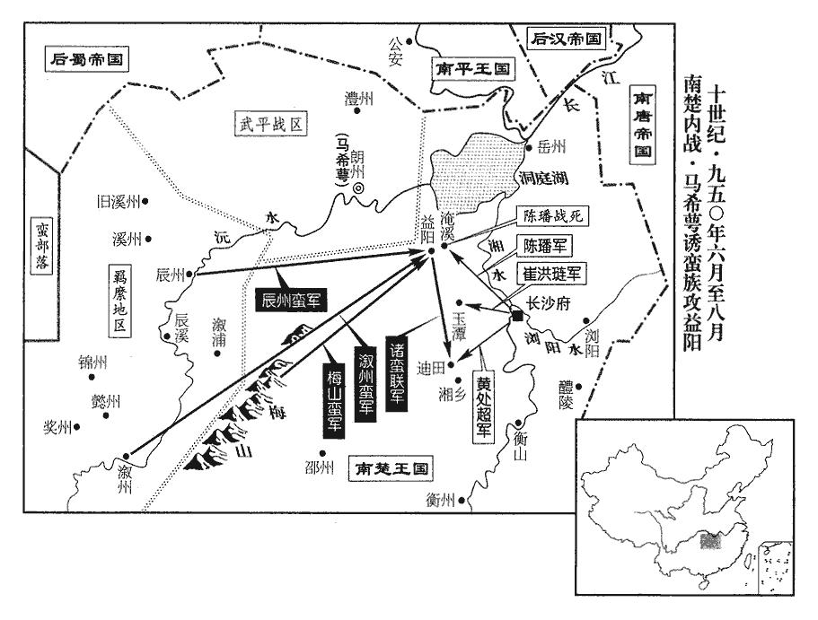
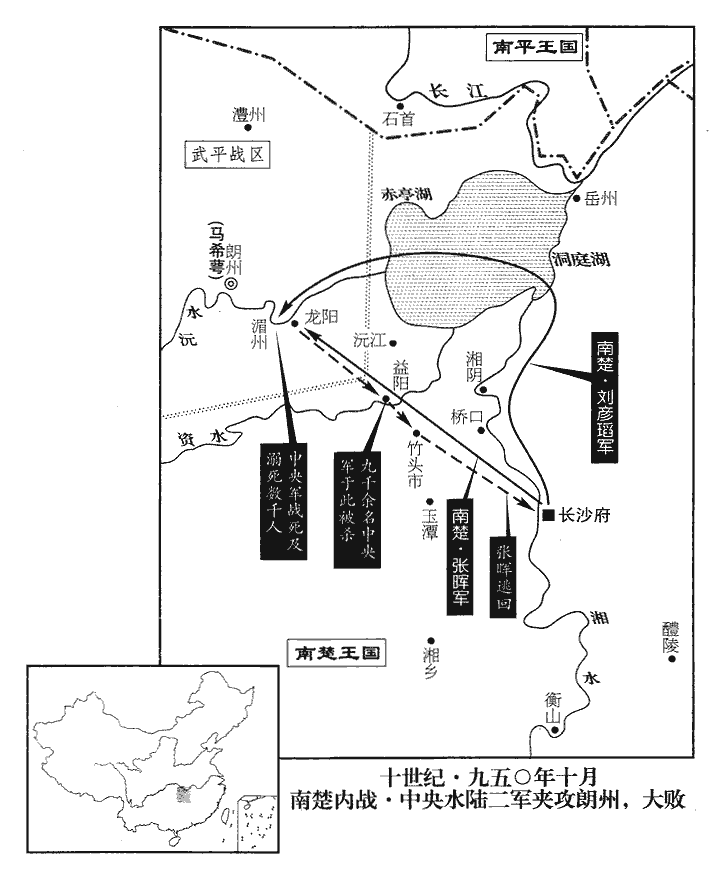
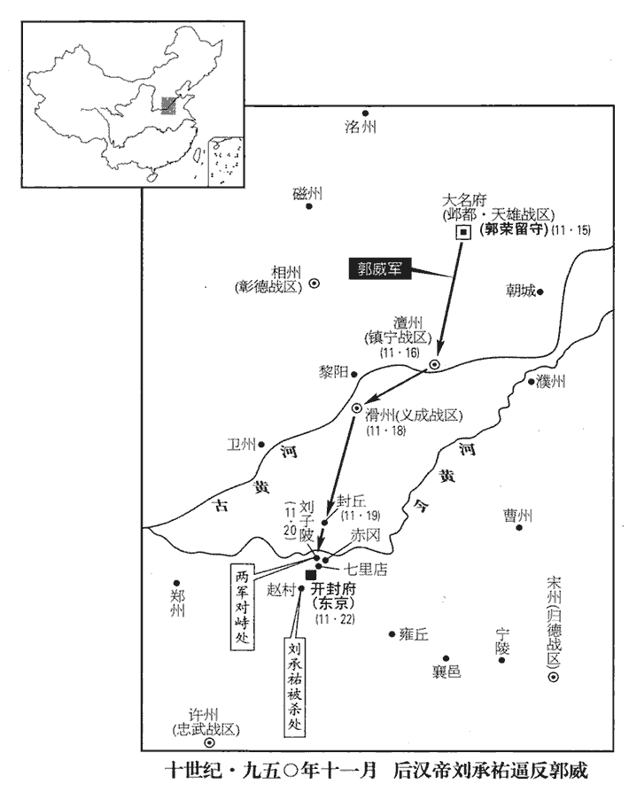
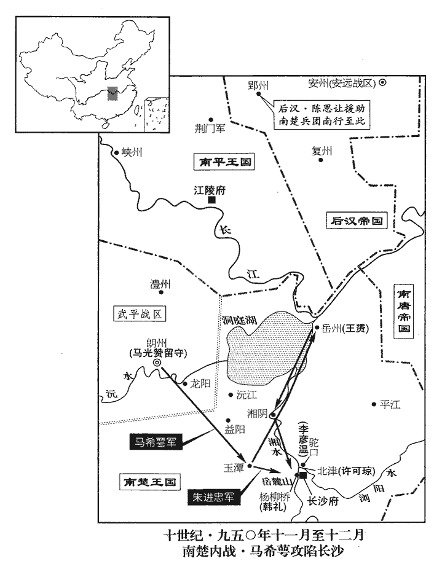
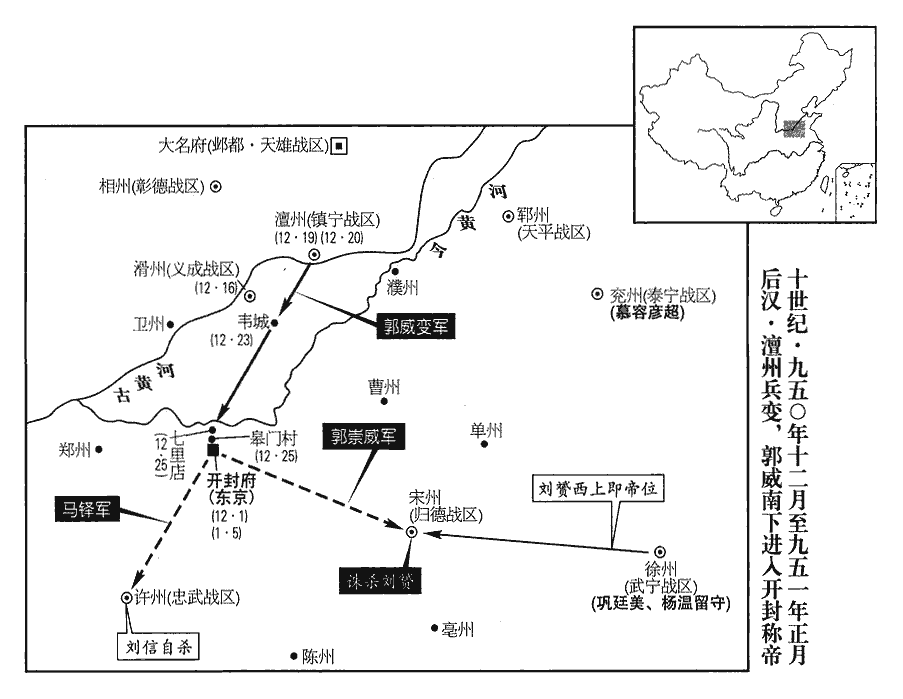

 後漢紀四上章閹茂（庚戌），一年。

# 隱皇帝下

## 乾祐三年（庚戌、九五零）

1春，正月，丁未‹九›，加鳳翔節度使趙暉兼侍中。

〖译文〗 [1]春季，正月，丁未（初九），凤翔节度使赵晖加官兼任侍中。

2密州‹山东省诸城市›刺史王萬敢請益兵以攻唐‹首都金陵府›；王萬敢去年已殘荻水鎮，今請益兵攻之。‹刘承祐，本年二十岁›詔以前沂州‹山东省临沂市›刺史郭瓊為東路行營都部署，帥禁軍及齊州‹山东省济南市›兵赴之。因王萬敢請兵，使郭瓊將以赴之，道過青州，因以易置劉銖。帥，讀曰率。

〖译文〗 [2]密州刺史王万敢请求增加兵力来进攻南唐；后汉隐帝下诏任命前沂州刺史郭琼为东路行营都部署，率领京城禁军以及齐州军队赶赴海州。

3郭威請勒兵北臨契丹之境，詔止之。

〖译文〗 [3]郭威请求统率军队北上进逼契丹边境，后汉隐帝下诏制止。

4丙寅‹二十八›，遣使詣河中‹山西省永济市›、鳳翔‹陕西省凤翔县›收瘞戰死及餓殍遺骸，時有僧已聚二十萬矣。瘞，於計翻。殍，被表翻。已聚者二十萬，史言其未聚者尚多，大兵攻圍積久，其禍如此！

〖译文〗 [4]丙寅（二十八日），后汉隐帝派遣使者到河中、凤翔一带收集掩埋阵亡将士以及饿死百姓的遗骸，当时已有僧人聚集遗骸二十万具了。

5唐主‹首都金陵府江苏省南京市›李璟（徐景通）本年三十五岁聞漢兵盡平三叛，始罷李金全北面行營招討使。唐命李金全見二百八十七卷元年。

〖译文〗 [5]南唐主听说后汉军队彻底平熄赵思绾、李守贞、王景崇的三镇叛乱，才撤销李金全的北面行营招讨使。

6唐清淮‹总部寿州›節度使劉彥貞多斂民財以賂權貴，權貴爭譽之；在壽州‹安徽省寿县›積年，譽，音余。晉開運元年，唐徙劉彥貞鎮濠州，劉崇俊鎮壽州。漢乾祐元年，清淮節度使劉彥貞，副李金全北伐。未知彥貞以何年徙鎮壽州。恐被代，欲以警急自固，妄奏稱漢兵將大舉南伐。被，皮義翻。二月，唐主以東都‹江都府·江苏省扬州市›留守燕王弘冀為潤‹江苏省镇江市›、宣‹安徽省宣州市›二州大都督，鎮潤州‹江苏省镇江市›；寧國‹总部设宣州›節度使周宗為東都留守。以漢兵大舉，弘冀年少，恐不能調用扞禦；周宗為唐祖佐命，宿望也，故徙鎮揚州。

〖译文〗 [6]南唐清淮节度使刘彦贞大肆收括民财来贿赂当朝权贵，权贵争相称誉他；刘彦贞在寿州坐镇多年，恐怕被人取代，想用边境军情紧急来稳住自己的地位，谎报军情说后汉军队将要大举南下进犯。二月，南唐主任命东都留守燕王李弘冀为润、宣二州大都督，坐镇润州；任命宁国节度使周宗为东都留守。

7朝廷欲移易藩鎮，因其請赴嘉慶節上壽，五代會要：帝以三月九日為嘉慶節。洪邁隨筆曰：唐穆宗即位之初年，詔曰：「七月六日，是朕載誕之辰，其日百寮、命婦宜於光順門進名參賀，朕於門內與百寮相見。」明日，又敕受賀儀宜停。先是，左丞韋綬奏行之，宰臣以為古無降誕受賀之禮，奏罷之。然次年復行賀禮。誕節之制，始於明皇，令天下宴集，休假三日，受賀之事，蓋自長慶至今用之也。上，時掌翻。許之。

〖译文〗 [7]后汉朝廷想调换各镇节度使，适逢各镇请求进京赶赴嘉庆节祝贺皇上生日，就答应了他们。

8甲申‹六›，郭威行北邊還。去年冬十月郭威北征，今還。行，下孟翻。還，從宣翻，又如字。

〖译文〗 [8]甲申（十六日），郭威巡行北部边境返回。

9福州‹福建省福州市›人或詣建州‹福建省建瓯市›告唐永安‹总部建州›留後查文徽，云吳越兵已棄城去，請文徽為帥。查，鉏加翻。帥，所類翻。文徽信之，遣劍州‹福建省南平市›刺史陳誨將水軍下閩江，薛史曰：李景保大三年，以延平為劍州，析建州之劍浦、汀州之沙縣隸焉。劍溪上接建溪，下達福唐，亦謂之閩江。下，戶嫁翻。將，即亮翻。文徽自以步騎繼之。會大雨，水漲，誨一夕行七百里，至城下，敗福州兵，敗，補邁翻。執其將馬先進等。庚寅‹十二›，文徽至福州，吳越知威武軍吳程詐遣數百人出迎。吳越未命吳程為威武‹总部福州›節度使，先令知威武軍事。誨曰：「閩人多詐，未可信也，宜立寨徐圖。」文徽曰：「疑則變生，不若乘機據其城。」因引兵徑進。誨整眾鳴鼓，止于江湄，湄，旻悲翻。水草之交曰湄。詩巧言：居河之麋。註云：本作「湄」，水草交也。文徽不為備，程勒兵出擊之，唐兵大敗，文徽墜馬，為福人所執，士卒死者萬人。誨全軍歸劍州。程送文徽於錢唐‹首都杭州州政府所在县›，吳越王弘俶‹本年二十二岁›獻于五廟而釋之。俶，昌六翻。吳越用諸侯之制，立五廟。

〖译文〗 [9]福州人有的到建州报告南唐永安留后查文徽，说吴越军队已经弃城离去，请求查文徽当统帅。查文徽相信了他，派遣剑州刺史陈诲带领水军沿闽江而下，自己率领步兵、骑兵为后继。碰上天下大雨，河水猛涨，陈诲一夜行船七百里，到了城下，击败福州军队，抓获将领马先进等人。庚寅（二十二日），查文徽到福州，吴越国知威武军吴程派遣数百人出城假装迎接。陈诲说：“闽人善于欺诈，不可轻信，应当安营扎寨从长计议。”查文徽说：“犹豫就会产生变故，不如乘机占据福州城。”便带领军队一直前进。陈诲整顿好部队才击鼓前进，在闽江边上停下来。查文徽不作防备，吴程领兵出击，南唐军队大败，查文徽从马上摔下来，被福州人抓获，士卒死亡万人。陈诲却完整地将军队带回剑州。吴程解送查文徽到钱唐，吴越王钱弘将查文徽作为战利品在祖宗五庙举行献俘礼，然后释放了他。

10丁亥‹十九›，汝州‹河南省汝州市›奏防禦使劉審交卒‹年七十四岁›。吏民詣闕‹首都开封府›上書，以審交有仁政，乞留葬汝州，得奉事其丘壟，詔許之。上，時掌翻。州人相與聚哭而葬之，為立祠，歲時享之。為，于偽翻。太師馮道曰：「吾嘗為劉君僚佐，按歐史，劉審交，燕人。劉守光之僭號，以審交為兵部尚書。馮道事守光為參軍，嘗為僚佐，必是時也。觀其為政，無以踰人，非能减其租賦，除其繇役也，繇，讀曰傜。但推公廉慈愛之心以行之耳。此亦眾人所能為，但他人不為而劉君獨為之，故汝人愛之如此。使天下二千石皆效其所為，何患得民不如劉君哉！」五代之諸州防禦使曾未足以當漢郡守二千石，後人特以專城分守，故稱之。

〖译文〗 [10]丁亥（十九日），汝州奏报防御使刘审交去世。当地官吏百姓到朝廷上书，以刘审交生前有仁政的理由，恳求将其尸体留葬在汝州，以便能够侍奉他的坟墓，后汉隐帝下诏准许。汝州百姓相互聚集在一起痛哭，安葬了刘审交，为他建立祠堂，按时举行祭祀。太师冯道说：“我曾经做过刘君的同僚，看他的为政，没有超过别人的地方，不能削减租赋，免除徭役，只是能推广公正廉洁慈善仁爱的心并且实行罢了。这也是一般人所能做到的，只是别人不做而只有刘君一人去做了，所以汝州百姓如此爱戴他。倘若天下各地方长官都能仿效刘君的作为，何患不像刘君那样获得民心呢！”

11甲午‹二十六›，吳越丞相、昭化‹总部慎州›節度使、同平章事杜建徽卒‹年八十八岁›。

〖译文〗 [11]甲午（二十六日），吴越丞相、昭化节度使、同平章事杜建徽去世。

12乙未‹二十七›，以前永興‹总部京兆府›節度使趙匡贊為左驍衛上將軍。趙匡贊自長安入朝，見二百八十七卷高祖乾祐元年。

〖译文〗 [12]乙未（二十七日），后汉隐帝任命前永兴节度使赵匡赞为左骁卫上将军。

13三月，丙午‹九›，嘉慶節，鄴都‹大名府·河北省大名县›留守高行周、天平‹总部郓州›節度使慕容彥超、泰寧‹总部兖州›節度使符彥卿、昭義‹总部潞州›節度使常思、安遠‹总部安州›節度使楊信、安國‹总部邢州›節度使薛懷讓、成德‹总部镇州›節度使武行德、彰德‹总部相州›節度使郭謹、保大‹总部鄜州›留後王饒皆入朝‹首都开封府›。許之赴嘉慶節上壽，故皆入朝。

〖译文〗 [13]三月，丙午（初九），是后汉隐帝的生日嘉庆节，邺都留守高行周、天平节度使慕容彦超、泰宁节度使符彦卿、昭义节度使常思、安远节度使杨信、安国节度使薛怀让、成德节度使武行德、彰德节度使郭谨、保大留后王饶，都进京入朝祝寿。

14甲寅‹十七›，詔營寢廟於高祖‹刘邦›長陵‹陕西省咸阳市东北二十千米›、世祖‹刘秀›原陵‹河南省孟津县东北于家村›，以時致祭。有司以費多，寢其事，以至國亡，二陵竟不霑一奠。是年十一月，郭威入大梁；十二月，將士扶立。以時致祭之詔，有司既停寢不行，六七月之間，宜乎不霑一奠也。

〖译文〗 [14]甲寅（十七日），后汉隐帝下诏在高祖西汉刘邦的长陵、世祖东汉刘秀的原陵营建寝庙，按时举行祭祀。有关承办部门因为费用大，搁置了这件事，直到后汉灭亡，这两处陵墓始终没有享受过一次祭奠。

15壬戌‹二十五›，徙高行周為天平節度使，符彥卿為平盧‹总部青州›節度使；甲子‹二十七›，徙慕容彥超為泰寧節度使。

〖译文〗 [15]壬戌（二十五日），后汉隐帝调任高行周为天平节度使，符彦卿为平卢节度使；甲子（二十七日），调任慕容彦超为泰宁节度使。

16永安‹总部府州›節度使折從阮舉族入朝。折從阮自府州入朝。

〖译文〗 [16]永安节度使折从阮全家族进京入朝。

17夏，四月，戊辰朔‹一›，徙薛懷讓為匡國‹总部同州›節度使，庚午‹三›，徙折從阮為武勝‹总部邓州›節度使，按五代會要，周廣順二年三月，始改鄧州威勝軍為武勝軍，避周太祖名也。史以後來所改軍名而書之耳。壬申‹五›，徙楊信為保大節度使，徙鎮國‹总部华州›節度使劉詞為安國節度使，永清‹总部贝州›節度使王令溫為安遠節度使。李守貞之亂，王饒潛與之通，王饒潛以鄜州與河中通。守貞平，眾謂饒必居散地；冗散之官為散地。散，悉但翻。及入朝，厚結史弘肇，遷護國‹总部河中府›節度使，聞者駭之。駭其不惟免罪，又得大鎮。

〖译文〗 [17]夏季，四月，戊辰朔（初一），调任薛怀让为匡国节度使，庚午（初三），调任折从阮为武胜节度使，壬申（初五），调任杨信为保大节度使，调任镇国节度使刘词为安国节度使，永清节度使王令温为安远节度使。河中李守贞叛乱，王饶暗中与他勾结，李守贞叛乱被平息，众人以为王饶必定要被贬为冗散闲官；但待到进京入朝，他用重金结交史弘肇，竟升任为护国节度使，听说此事的人都大为惊骇。

18楊邠求解樞密使，帝遣中使諭止之。宣徽北院使吳虔裕在旁曰：吳虔裕時蓋在楊邠旁。「樞密重地，難以久居，當使後來者迭為之，相公辭之是也。」帝聞之，不悅，辛巳‹十四›，以虔裕為鄭州‹河南省郑州市›防禦使。

〖译文〗 [18]杨请求解除自己枢密使的职务，后汉隐帝派遣宫中使者告谕阻止他。宣徽北院使吴虔裕在杨身旁说：“枢密院为政务重地，难以长久停留，应当让后来的人轮流担任，相公辞去枢密使的要求是对的。”隐帝听说此话，很不高兴，辛巳（十四日），任命吴虔裕为郑州防御使。

19朝廷以契丹近入寇，横行河北，諸藩鎮各自守，無捍禦之者，事見上卷上年十月。議以郭威鎮鄴都‹大名府·河北省大名县›，使督諸將以備契丹。史弘肇欲威仍領樞密使，蘇逢吉以為故事無之，言故事無帶樞密使出鎮者。弘肇曰：「領樞密使則可以便宜從事，諸軍畏服，號令行矣。」帝卒從弘肇議。卒，子恤翻。弘肇怨逢吉異議，逢吉曰：「以內制外，順也；今反以外制內，其可乎！」壬午‹十五›，制以威為鄴都留守、天雄‹总部设大名府›節度使，樞密使如故。仍詔河北，兵甲錢穀，但見郭威文書立皆稟應。明日，朝貴會飲於竇貞固之第，弘肇舉大觴屬威，屬，之欲翻。厲聲曰：「昨日廷議，一何同異！今日為弟飲之。」史弘肇呼郭威為弟。為，于偽翻。逢吉、楊邠亦舉觴曰：「是國家之事，何足介意！」弘肇又厲聲曰：「安定國家，在長槍大劍，安用毛錐！」王章曰：「無毛錐，則財賦何從可出？」毛錐，謂筆也；以束毛為筆，其形如錐也。王章為三司使，實掌財賦，故云然。自是將相始有隙。

〖译文〗 [19]后汉朝廷因为契丹军队近来入侵，横行黄河以北地区，诸位藩镇长官各保自身，没有出来抵抗的，便商议任命郭威出镇邺都，让他督率诸将来防备契丹军队。史弘肇想要郭威仍旧兼任枢密使之职，苏逢吉认为无此先例，史弘肇说：“郭威兼领枢密使就可以在外根据情况机断行事，各路军队因此畏惧服从，号令便畅行无阻了。”隐帝最终听从了史弘肇的建议。史弘肇怨恨苏逢吉的异议，苏逢吉便说：“用内朝官节制外朝官，是名正言顺的；如今反过来用外朝官来制约内朝官，难道可以吗？”壬午（十五日），隐帝下制书任命郭威为邺都留守、天雄节度使、枢密使之职照旧。同时颁布诏书到黄河以北地区，所有军队、武器、钱财、粮草，只要见到郭威签署的文书立即都应接受命令负责提供。第二天，朝廷权贵在窦贞固的宅第聚会宴饮，史弘肇举起大杯向郭威劝酒，厉声说：“昨日朝廷的议论，竟是何等的不同！今日我与贤弟痛饮此杯。”苏逢吉、杨也举杯说：“这都是为国家之事，何必介意！”史弘肇又厉声说：“安定国家，靠的是长枪大剑，哪里用得着毛笔啊！”王章说：“没有毛笔，那钱财军赋又从何而来呢？”从此文臣武将之间开始有了矛盾。

20癸未‹十六›，罷永安軍‹总部设府州陕西省府谷县›。復以府州隸河東‹总部太原府›也。

〖译文〗 [20]癸未（十六日），后汉撤销永安军。

21壬辰‹二十五›，以左監門衛將軍郭榮為貴州‹广西贵港市›刺史、天雄牙內都指揮使。貴州時屬南漢。宋白曰：貴州故西甌、駱越之地，秦雖立桂林郡，仍有甌、駱之名，漢武帝改桂林為鬱林郡，梁武帝以鬱林郡為桂州，後割桂州之鬱林、寧浦立定州，尋改為南定州，隋改南定州為尹州，唐改貴州。漢以郭榮遙領刺史，而其職則天雄牙將也。榮本姓柴，考異曰：世宗實錄曰：「太祖皇帝之長子也。母曰聖穆皇后柴氏，以唐天祐十八年九月二十四日丙午生於邢臺之別墅。」薛史世宗紀云：「太祖之養子，蓋聖穆皇后之姪也，本姓柴氏。父守禮，太子少保，致仕。帝年未童冠，因侍聖穆皇后，在太祖左右，時太祖無子，乃養為己子。」按今舉世皆知世宗為柴氏子，謂之柴世宗；而世宗實錄云太祖長子，誣亦甚矣。父守禮，郭威之妻兄也，威未有子時養以為子。郭榮始見於此。

〖译文〗 [21]壬辰（二十五日），后汉隐帝任命左监门卫将军郭荣为贵州刺史、天雄牙内都指挥使。郭荣本姓柴，其父柴守礼，是郭威妻子的哥哥，郭威没有儿子时收养郭荣为子。

22五月，己亥‹二›，以府州蕃漢馬步都指揮使折德扆yǐ為本州團練使。前此置永安軍於府州，以寵折從阮也。今從阮移鎮，其子德扆守府州，資序未至，而府州被邊一城之地耳，故降為團練使。其後復以為節鎮，以寵折氏。德扆，從阮之子也。

〖译文〗 [22]五月，已亥（初二），后汉隐帝任命府州蕃汉马步都指挥使折德为府州团练使。折德是折从阮的儿子。

23庚子‹三›，郭威辭行，言於帝曰：「太后從先帝‹刘知远›久，多歷天下事，陛下富於春秋，有事宜稟其教而行之。親近忠直，放遠讒邪，近，其靳翻。遠，于願翻。善惡之間，所宜明審。蘇逢吉、楊邠、史弘肇皆先帝舊臣，盡忠徇國，願陛下推心任之，必無敗失。郭威言及此，蓋已知帝之信近習而間勳舊也。至於疆埸之事，臣願竭其愚駑，駑，音奴。庶不負驅策。」帝斂容謝之。威至鄴都，以河北困弊，戒邊將謹守疆埸，嚴守備，無得出侵掠，契丹入寇，則堅壁清野以待之。兵法所謂先為不可勝以待敵之可勝也。

〖译文〗 [23]庚子（初三），郭威辞别出行，向隐帝进言说：“太后随从先帝很久，经历许多天下之事，陛下年纪尚轻，有大事应当接受太后教导再行动。亲近忠诚正直的君子，远离谄谀邪恶的小人，善恶的界线，应当仔细分清楚。苏逢吉、杨、史弘肇都是先帝的元老旧臣，尽忠报国，希望陛下放心任用他们，必定不会坏事失误。至于边疆征战之事，臣下愿竭尽绵薄之力，或许可以不辜负陛下的委托。”隐帝脸色严肃地告谢。郭威到达邺都，鉴于黄河以北地区的困难凋弊，告诫边境上的将军谨慎守卫疆界，严密防备，不得外出侵扰抢掠，契丹军队进来侵犯，就采用坚壁清野的办法对付它。

24辛丑‹四›，敕：「防禦、團練使，自非軍期，無得專奏事，皆先申觀察使斟酌以聞。」言軍期事須朝廷應副，則不及聞於廉使，許得專達朝廷；如尋常公事，須先申本管斟酌以聞。

〖译文〗 [24]辛丑（初四），后汉隐帝下敕书命令：“各防御使、团练使，如果不是军务机要，不得擅自直接向朝廷进奏言事，都须先申报各地观察使斟酌后再来奏闻。”

25丙午‹九›，以皇弟山南西道‹总部兴元府›節度使承勳為開封尹，加兼中書令，實未出閤。年尚幼，且有羸疾也。山南西道時為蜀境。

〖译文〗 [25]丙午（初九），隐帝任命皇弟山南西道节度使刘承勋为开封尹，加官兼任中书令，实际上刘承勋因年纪尚幼并未出就封职。

26平盧節度使劉銖，貪虐恣橫；橫，戶孟翻。朝廷欲徵之，恐其拒命，因沂‹山东省临沂市›、密‹山东省诸城市›用兵於唐，遣沂州刺史郭瓊將兵屯青州‹山东省青州市›。歐史作郭淮攻南唐還，以兵屯青州。銖不自安，置酒召瓊，伏兵幕下，欲害之；瓊知其謀，悉屏左右，從容如會，了無懼色，屏，必郢翻，又卑正翻。從，千容翻。銖不敢發。瓊因諭以禍福，銖感服，詔至即行。庚戌‹十三›，銖入朝。辛亥‹十四›，以瓊為潁州‹安徽省阜阳市›團練使。

〖译文〗 [26]平卢节度使刘铢，贪婪暴虐，恣意横行，后汉朝廷准备征召他回京，恐怕他抗拒命令，便乘在沂州、密州对南唐用兵的机会，派遗沂州刺史郭琼带领军队驻扎在青州。刘铢自感不安，就摆酒设宴召请郭琼，在府署埋伏军士，准备杀害他；郭琼知悉刘铢的阴谋，毅然屏退全部随从，从容赴会，毫无惧色，刘铢于是不敢下手。郭琼乘机说明利害祸福，刘铢被感化折服，等诏书一到，立即上路。庚戌（十三日），刘铢进京入朝。辛亥（十四日），后汉隐帝任命郭琼为颍州团练使。

27癸丑‹十六›，王章置酒會諸朝貴，酒酣，為手勢令，會飲而行酒令以佐歡，唐末之俗也。類說曰：「亞其虎膺」謂手掌。「曲其松根」，謂指節。「以蹲鴟間虎膺之下」，蹲鴟，大指也。「以鉤戟差玉柱之旁」，鉤戟，頭指；玉柱，中指也。「潛虬闊玉柱三分」，潛虬，無名指也。「奇兵闊潛虬一寸」，奇兵，小指也。「死其三洛」，謂嚲duǒ其腕也。「生其五峰」，五峰，通呼五指也。謂之招手令。蓋亦手勢令之類也乎哉！」史弘肇不閑其事，言不素習其事。客省使閻晉卿坐次弘肇，屢教之。蘇逢吉戲之曰：「旁有姓閻人，何憂罰爵！」壺射之事，不勝者罰爵，自古有之，行令則末世之為耳。弘肇妻閻氏，本酒家倡也，倡，音昌。酒家倡善為酒令。意逢吉譏之，大怒，以醜語詬逢吉，詬，古候翻，又許候翻。逢吉不應。弘肇欲毆之，逢吉起去。弘肇索劍欲追之，毆，烏口翻。索，山客翻。楊邠泣止之曰：「蘇公宰相，公若殺之，置天子何地，願孰思之！」孰，與熟同。弘肇即上馬去，邠與之聯鑣，送至其第而還。上，時掌翻。鑣，悲驕翻，馬銜也。還，從宣翻，又如字。於是將相如水火矣。帝使宣徽使王峻置酒和解之，不能得。逢吉欲求出鎮以避之，既而中止，曰：「吾去朝廷，止煩史公一處分，吾齏粉矣！」王章亦忽忽不樂，處，昌呂翻。分，扶問翻。齏，牋西翻。樂，音洛。欲求外官，楊、史固止之。

〖译文〗 [27]癸丑（十六日），王章设宴聚会各位朝廷显贵，饮酒尽兴，用手势行酒令，史弘肇不熟悉酒令，客省使阎晋卿座位紧挨史弘肇，多次教他。苏逢吉嘲弄史弘肇说：“身旁有姓阎的人，何必担心罚酒！”史弘肇的妻子阎氏，原本是酒家娼妓，史弘肇以为苏逢吉在讥笑阎氏，勃然大怒，用脏话辱骂苏逢吉，苏逢吉不回嘴。史弘肇要揍他，苏逢吉起身离去。史弘肇寻找刀剑要追杀他，杨流着泪劝阻说：“苏公是当朝宰相，您若杀他，将把天子置于何地，望三思啊！”史弘肇即刻上马离去，杨也上马同他并驾齐驱，送到他的宅第而返回。从此文武将相之间的关系就像水火那样不相容了。后汉隐帝派宣徽使王峻摆设酒宴调解将相关系，没能成功。苏逢吉打算请求出任藩镇来避开史弘肇，不久便放弃，说：“我若离开朝廷，只劳史公做个手脚，我便粉身碎骨了。”王章也闷闷不乐，打算求任外官，杨、史弘肇再三劝阻他。

28閏月，宮中數有怪。癸巳‹二十七›，大風，【章：十二行本「風」下有「雨」字；乙十一行本同；孔本同；張校同。】發屋拔木，吹鄭門扉起，十餘步而落，震死者六七人，水深平地尺餘。數，所角翻。鄭門，大梁城西面南來第一門也，梁改為開明門，晉改為金義門，周改為迎秋門；汴人只以舊門名呼之。深，式禁翻。帝召司天監趙延乂，問以禳祈之術，對曰：「臣之業在天文時日，禳祈非所習也。然王者欲弭災異，莫如脩德。」延乂歸，帝遣中使問：「如何為脩德？」延乂對：「請讀貞觀政要而法之。」觀，古玩翻。

〖译文〗 [28]闰月，后汉宫中多次出现怪事，癸巳（二十七日），大风狂作，掀屋拔树，吹得京城西南的郑门门扇飞起，扬出十多步才落地，被震死的有六七人，平地水深一尺多。后汉隐帝于是召来司天监赵延，询问祈求消灾免祸的办法，赵延回答说：“臣下的业务在天文历算方面，祭祀祈祷不是我所熟习的。然而统治天下的人想要消弭灾异，最好的办法不如修行德政。”赵延回家，后汉隐帝又派宫中使者去问：“怎样才算是修行德政？”赵延回答：“请读《贞观政要》而效法它。”

29六月，河決鄭州‹河南省郑州市›。歐史曰：六月，癸卯，河決原武。按原武縣屬鄭州。九域志云：原武縣在鄭州之北六十里。

〖译文〗 [29]六月，黄河在郑州决口。

30馬希萼既敗歸，僕射洲之敗也，事見上卷上年八月。乃以書誘辰‹湖南省沅陵县›、漵州‹湖南省洪江市西北黔城镇›及梅山‹湖南省新化县西雪峰山›蠻，誘，音酉。漵，音敘。宋白曰：潭州西有梅山洞，為草寇之窟穴。欲與共擊湖南。蠻素聞長沙‹湖南省长沙市›帑藏之富，帑，他朗翻。藏，徂浪翻。大喜，爭出兵赴之，遂攻益陽‹湖南省益阳市›。益陽縣，屬潭州，漢古縣城在唐縣東八十里。九域志：益陽在潭州西北一百八十二里。宋白曰：以其地在益水之陽，故名。其城魯肅所築。楚王希廣遣指揮使陳璠拒之，戰于淹溪‹湖南省益阳市东北›，璠敗死。璠，音翻。

〖译文〗 [30]马希萼既已兵败逃归，于是写书信引诱辰州、溆州以及梅山蛮族，打算和他们共同进攻湖南。蛮人平素听说长沙国库很富有，非常高兴，争着出兵赶赴前往，随即攻打益阳。楚王马希广派遣指挥使陈抵抗，在淹溪交战，陈兵败而死。

31秋，七月，唐‹首都金陵府›歸馬先進等於吳越‹首都杭州›以易查文徽。馬先進等被擒見上二月。查文徽亦以是月為吳越所禽。

〖译文〗 [31]秋季，七月，南唐归还马先进等战俘给吴越来交换查文徽。

 

32馬希萼又遣群蠻攻迪田‹湖南省湘乡市北›，八月，戊戌‹三›，破之，殺其鎮將張延嗣。楚王希廣遣指揮使黃處超救之，處超敗死；處，昌呂翻。潭人震恐，復遣牙內指揮使崔洪璉將兵七千屯玉潭‹湖南省宁乡县›。九域志：潭州湘鄉縣有玉潭鎮，在潭州西。復，扶又翻。

〖译文〗 [32]马希萼又调遗各蛮族部落进攻迪田，八月，戊戌（初三），攻破迪田，杀死守将张延嗣。楚王马希广派遣指挥使黄处超援救迪田，黄处超兵败身死。潭州人震惊恐慌，又派遣牙内指挥使崔洪琏领兵七千驻扎在玉潭。

33庚子‹五›，蜀主‹首都成都府四川省成都市›孟昶（孟仁赞）本年三十二岁立其弟仁毅為夔王，仁贄為雅王，仁裕為彭王，仁操為嘉王。己酉‹十四›，立子玄喆為秦王，喆，音哲。玄珏為褒王。

〖译文〗 [33]庚子（初五），后蜀主封立他的弟弟孟仁毅为夔王，孟仁贽为雅王，孟仁裕为彭王，孟仁操为嘉王。已酉（十四日），封立他的儿子孟玄为秦王，孟玄珏为褒王。

34晉李太后在建州‹辽宁省朝阳市西南›，契丹遷晉主及其家于建州見上卷上年三月。臥病，無醫藥，惟與晉主仰天號泣，號，戶刀翻。戟手罵杜重威、李守貞曰：「吾死不置汝！」以其降契丹而亡晉也，事見二百八十六卷開運二年。戊午‹二十三›，卒。周顯德中，有自契丹來者云：「晉主及馮后尚無恙，其從者亡歸及物故則過半矣。」恙，余亮翻。從，才用翻。過，音戈。

〖译文〗 [34]后晋李太后在建州，生病卧床，没有医生药物，只能和后晋出帝石重贵仰天呼喊哭泣，挥手比划大骂杜重威、李守贞道：“我死都不放过你们！”戊午（二十三日），李太后去世。后周显德年间，有从契丹来的人说：“晋出帝和冯后还活着，但他的侍从逃亡回家和过世的却超过一半了。”

35馬希萼表請別置進奏務於京師。九月，辛巳‹十七›，詔以湖南已有進奏務，不許。亦賜楚王希廣詔，勸以敦睦。

〖译文〗 [35]马希萼上表后汉朝廷请求在京城另外设置进奏务。九月，辛巳（十七日），后汉隐帝下诏书，因湖南在京城已设有进奏务，没有准许。同时也赐楚王马希广诏书，规劝马氏兄弟亲密和睦。

36馬希萼以朝廷意佑楚王希廣，怒，遣使稱藩于唐，乞師攻楚。唐加希萼同平章事，以鄂州‹湖北省武汉市›今年租稅賜之，命楚州‹江苏省淮安市›刺史何敬洙將兵助希萼。冬，十月，丙午‹十二›，希廣遣使上表告急，言：「荊南‹南平›、嶺南‹南汉›、江南‹南唐›連謀，欲分湖南‹南楚›之地，荊南，高氏；嶺南，劉氏；江南，李氏。乞發兵屯澧州‹湖南省澧县›，以扼江南、荊南援朗州‹湖南省常德市›之路。」江南遣兵援朗，道出岳州；岳州西至澧州三百餘里。荊南遣兵援朗，徑渡江，南趨澧州亦三百里。自澧州東南至朗州三百五十九里。

〖译文〗 [36]马希萼以为后汉朝廷有意袒护楚王马希广，发怒，派遣使者向南唐称臣，请求出兵攻打楚王马希广。南唐加封马希萼为同平章事，将鄂州当年租税赏赐给他，命令楚州刺史何敬洙领兵援助马希萼。冬季，十月，丙午（十二日），马希广派遣使者向后汉朝廷上表告急，说：荆南高氏、岭南刘氏、江南李氏连兵谋划，准备瓜分湖南之地，乞求发兵屯驻澧州，用来把守江南、荆南支援朗州的道路。”

37丁未‹十三›，以吳越王弘俶為諸道兵馬元帥。

〖译文〗 [37]丁未（十三日），后汉隐帝任命吴越王钱弘为诸道兵马元帅。

 

38楚王希廣以朗州與山蠻入寇，諸將屢敗，憂形于色。劉彥瑫言於希廣曰：「朗州兵不滿萬，馬不滿千，都府精兵十萬，朗、桂以潭州為都府。何憂不勝！願假臣兵萬餘人，戰艦百五十艘，艦，戶黯翻。艘，蘇遭翻。徑入朗州縛取希萼，以解大王之憂。」王悅，以彥瑫為戰棹都指揮使、朗州行營都統。彥瑫入朗州境，九域志：潭州北至朗州界二百一十七里。父老爭以牛酒犒軍，曰：「百姓不願從亂，望都府之兵久矣！」彥瑫厚賞之；戰艦過，則運竹木以斷其後。斷，音短。是日，馬希萼遣朗兵及蠻兵六千、戰艦百艘逆戰於湄州‹湖南省汉寿县西沅江中沙洲›，歐史作「湄洲」。彥瑫乘風縱火以焚其艦，頃之，風回，反自焚。彥瑫還走，江路已斷，自斷歸路，則當死戰，還走何為！士卒戰及溺死者數千人。考異曰：湖湘故事，彥瑫敗在九月十三日。今從十國紀年。希廣聞之，涕泣不知所為。希廣平日罕頒賜，至是，大出金帛以取悅於士卒。

〖译文〗 [38]楚王马希广因为朗州人与山蛮入侵，众将屡吃败仗，面有忧色。刘彦对马希广说：“朗州军队不到一万，马匹不到一千，您有精兵十万，为什么担忧不能取胜！望给我军队一万余人，战舰一百五十艘，直接攻入朗州城捉拿马希萼，以解大王心头忧愁。”楚王听了很高兴，任命刘彦为战棹都指挥使、朗州行营都统。刘彦进入朗州地界，父老乡亲争着用牛、酒来犒劳军队，说：“我们百姓不愿意跟从乱党，盼望楚王的军队已很久了。”刘彦重赏大家；战舰驶过以后，就运来毛竹木头来截断后路。这一天，马希萼调遣朗州军队和蛮族军队六千、战舰百艘在湄州迎战，刘彦乘着风势放火来焚烧朗州的战舰，一会儿，风向回转，反过来烧了自己的战舰。刘彦调头逃跑，但水路已经截断，士兵战死的以及淹死的有数千人。马希广闻讯，哭得不知做什么是好。马希广平时很少颁发赏赐，到这时，也拿出大量金钱绢帛来博取士兵的欢心。

或告天策左司馬希崇流言惑眾，反狀已明，請殺之。希廣曰：「吾自害其弟，何以見先王‹马殷›於地下！」希崇與希萼通謀者也。當斷不斷，反受其亂，希廣之亡宜矣。

〖译文〗 有人告发天策左司马马希崇散布流言，扰乱人心，谋反的征状已经很明显，请求杀死他。马希广说：“我亲手来杀害自己的兄弟，还有什么脸面去见九泉之下的先王！”

馬軍指揮使張暉將兵自他道擊朗州，至龍陽‹湖南省汉寿县›，龍陽縣屬朗州，隋所置也，取龍陽洲以名縣。九域志：在朗州東南八十五里。宋白曰：龍陽，故漢索縣地，吳分其地立龍陽縣。聞彥瑫敗，退屯益陽‹湖南省益阳市›。希萼又遣指揮使朱進忠等將兵三千急攻益陽，張暉紿其眾曰：「我以麾下出賊後，汝輩留城中待我，相與合勢擊之。」既出，遂自竹頭市‹湖南省益阳市东南›遁歸長沙。朗兵知城中無主，急擊之，士卒九千餘人皆死。

〖译文〗 马军指挥使张晖领兵从别的路进攻朗州，到达龙阳，听说刘彦兵败，便后退屯驻益阳。马希萼又调遣指挥使朱进忠等领兵三千急攻益阳，张晖欺骗部众说：“我带帐下的亲兵出城赶到贼军后面，你们留守城中等待我，然后一起合力攻击敌人。”张晖已出益阳，就从竹头市跑回长沙。朗州军队得知城中没有主帅，加紧攻击，守城九千多士兵全部战死。

39吳越王弘俶歸查文徽於唐，文徽得瘖疾，以工部尚書致仕。史言唐不能正查文徽敗軍之罪。瘖yīn，於今翻。

〖译文〗 [39]吴越王钱弘让查文徽返归南唐。查文徽患哑疾，以工部尚书之职退休。

40十一月，甲子朔‹一›，日有食之。

〖译文〗 [40]十一月，甲子朔（初一），出现日食。

41蜀‹首都成都府›太師、中書令宋忠武王趙廷隱卒。

〖译文〗 [41]后蜀太师、中书令宋忠武王赵廷隐去世。

42楚王希廣遣其僚屬孟駢說馬希萼曰：「公忘父兄之讎，北面事唐，自馬殷以來，與楊、徐世為仇讎。說，式芮翻。何異袁譚求救於曹公邪！」事見六十四卷漢獻帝建安八年。希萼將斬之，駢曰：「古者兵交，使在其間，春秋左氏傳之言。使，疏吏翻。駢若愛死，安肯此來！駢之言非私於潭人，實為公謀也。」為，于偽翻。乃釋之，使還報曰：「大義絕矣，非地下不相見也！」

〖译文〗 [42]楚王马希广派遣他的幕僚孟骈劝说马希萼道：“您忘记父兄的仇敌，臣服南唐，与东汉末年的袁谭向曹操求救有什么不同呢！”马希萼将要斩他的头，孟骈说：“古代两军交战，使者可以来往其间。我孟骈倘若吝惜一死，岂肯到这里来！我的话并非出于潭州人的私利，实在是为您考虑啊。”马希萼这才放了孟骈，让他返归回答说：“兄弟的情义已经断了，不到九泉之下不再相见！”

朱進忠請希萼自將兵取潭州‹长沙府·湖南省长沙市›，辛未‹八›，希萼留其子光贊守朗州，悉發境內之兵趣長沙，趣，七喻翻。考異曰：湖湘故事，希萼以十月二十一日直往湖南。今從十國紀年。自稱順天王。

〖译文〗 朱进忠请求马希萼亲自领兵攻取潭州。辛未（初八），马希萼留下他的儿子马光赞镇守朗州，调发境内全部军队直奔长沙，自称顺天王。

43詔侍衛步軍都指揮使、寧江‹总部设夔州重庆市奉节县›節度使王殷將兵屯澶州‹河南省濮阳市›以備契丹。侍衛親軍都指揮使之下，又有侍衛馬軍、步軍二都指揮，此皆梁、唐所置。寧江軍，夔州，時屬蜀，王殷遙領也。殷，瀛州‹河北省河间市›人也。

〖译文〗 [43]后汉隐帝下诏书命侍卫步军都指挥使、宁江节度使王殷领兵驻扎在澶州来防备契丹入侵。王殷是瀛州人。

44朝廷議發兵，以安遠節度使王令溫為都部署，以救潭州，會內難作，不果。內難，謂殺楊邠等以召郭威之禍。難，乃旦翻。

〖译文〗 [44]后汉朝廷讨论出兵，任命安远节度使王令温为都部署，以援救潭州，正好遇上内乱发生，没有成行。

45帝自即位以來，樞密使、右僕射、同平章事楊邠總機政，樞密使兼侍中郭威主征伐，歸德‹总部宋州›節度使、侍衛親軍都指揮使兼中書令史弘肇典宿衛，三司使、同平章事王章掌財賦。邠頗公忠，退朝，門無私謁，雖不卻四方饋遺，有餘輒獻之。遺，唯季翻。弘肇督察京城‹首都开封府›，道不拾遺。是時承契丹蕩覆之餘，契丹入汴，中原蕩覆。契丹北歸，漢承其後。公私困竭，章捃摭遺利，吝於出納，以實府庫。屬三叛連衡，捃jùn，居運翻。摭zhí，之石翻。屬，之欲翻。三叛，謂李守貞、王景崇、趙思綰。衡，讀曰橫。宿兵累年而供饋不乏；及事平，賜予之外，尚有餘積，予，讀曰與。積，子賜翻。以是國家粗安。粗，坐五翻。

〖译文〗 [45]后汉隐帝从即位以来，枢密使、右仆射、同平章事杨总理机要政务，枢密使兼侍中郭威主持征战，归德节度使、侍卫亲军都指挥使兼中书令史弘肇典领京城警卫，三司使、同平章事王章掌管财政赋税。杨十分秉公忠心，退朝回家，门下没有私人拜会，虽然不拒绝四方的馈赠，但有多余的就进献皇上。史弘肇负责京城治安，路上丢了东西没有人捡。这时正好紧承契丹大乱中原之后，官府、百姓的财力困难拮据。王章搜集点滴余利，节约开支，以此充实国库，虽然跟着就有李守贞、王景崇、赵思绾的三镇叛乱互相勾结，却用兵多年而供应没有短缺；到了事态平息，除赏赐之外，还有积余，因此国家基本安定。

章聚斂刻急。斂，力贍翻。舊制，田稅每斛更輸二升，謂之「雀鼠耗」，章始令更輸二斗，謂之「省耗」；按唐明宗天成元年四月赦文：「應納夏秋稅子，先有省耗，每斗一升；今後祇納正稅數，不量省耗。」如此，則天成已前已有省耗，每斛更輸一斗，天成罷輸之。後至漢興，王章復令輸省耗，而又倍舊數取之也。舊錢出入皆以八十為陌，章始令入者八十，出者七十七，謂之「省陌」；沈括曰：今之數錢百錢謂之「陌」者，借「陌」字用之，其實只是「百」字，如「什」與「伍」耳。唐自皇甫鎛bó為墊錢法，至昭宗時，乃定八十為陌。有犯鹽、礬fán、酒麴之禁者，錙銖涓滴，罪皆死；鹽禁之設久矣；酒之為禁，或罷或榷，歷代不常。自唐中世始申榷酒之禁，及其末也又禁造麴。至於礬禁，新、舊唐書食貨志皆未著言其事，是必起於五代之初。本草圖經曰：礬石，生河西山谷及隴西武都、石門。今白礬則晉州、慈州、拱州、無為軍，綠礬則隰州溫泉縣、池州銅陵縣並煎礬，處處出焉。初生皆石也，採得碎之，煎煉乃成礬。凡有五種，其色各異，謂白礬、綠礬、黃礬、黑礬、絳礬也。自岐伯至陶隱居之書皆言之。由是百姓愁怨。章尤不喜文臣，嘗曰：「此輩授之握算，不知縱橫，喜，許記翻。縱，子容翻。何益於用！」俸祿皆以不堪資軍者給之，吏已高其估，章更增之。估，價也。

〖译文〗 王章征集赋税苛刻严厉。以前规定，田税每斛之外再交二升，叫做“雀鼠耗”，王章开始下令再交二斗，称做“省耗”；以前钱币的付出、收入都以八十文为“陌”，王章开始下令收入的以八十文为“陌”，付出的以七十七文为“陌”，称做“省陌”“有违反盐、矾、酒曲禁令的，即使只有一两一钱、一点一滴，也都定为死罪；百姓因此忧愁怨恨。王章特别不喜欢文官，曾经说：“这帮人交给他一把筹码，也不知道如何摆弄，有什么用处！”文官的俸禄都以不能用于军事的供给，有关官吏已对文官俸禄超值估算，王章又再增加。

帝‹刘承祐›左右嬖倖浸用事，嬖，卑義翻，又博計翻。太后親戚亦干預朝政，朝，直遙翻。邠等屢裁抑之。太后有故人子求補軍職，弘肇怒而斬之。武德使李業，太后之弟也，太后昆弟七人，業最幼，故尤憐之。高祖使掌內帑，帑，底朗翻。帝即位，尤蒙寵任。會宣徽使闕，業意欲之，吳虔裕出鄭州，闕宣徽北院使。帝及太后亦諷執政；邠、弘肇以為內使遷補有次，不可以外戚超居，乃止。內客省使閻晉卿次當為宣徽使，久而不補；樞密承旨聶文進、飛龍使後匡贊、翰林茶酒使郭允明皆有寵於帝，久不遷官，共怨執政。姓譜：後姓，望出東海、開封。文進，并州‹山西省太原市›人也。劉銖罷青州‹山东省青州市›歸，久奉朝請，未除官，常戟手於執政。是年夏五月，劉銖自青州召歸。戟手者，戟其手而詬怨之。

〖译文〗 后汉隐帝的左右宠臣逐渐被任用，太后的亲戚也干预朝政，杨等屡次加以裁减抑制。太后有个旧友的儿子要求补个军职，史弘肇发怒斩了他。武德使李业，是太后的弟弟，后汉高祖让他掌管宫内财物，到了后汉隐帝即位，他特别受到宠幸信任。适逢宣徽使空缺，李业心想补缺，后汉隐帝和太后也给执政官打了招呼；杨、史弘肇认为内朝使职的升迁递补有规定次序，不能因为外戚而越级担任，于是作罢。内朝客省使阎晋卿按次序应当担任宣徽使，但迟迟没有递补；枢密承旨聂文进、飞龙使后匡赞、翰林茶酒使郭允明都得到后汉隐帝的宠爱，却长时间没有升官，因此共同怨恨执政官。聂文进是并州人。刘铢免职从青州归来，长期闲散无事，没有委派职务，故此经常用手对执政官指指戳戳怨恨他。

帝‹刘承祐›初除三年喪，聽樂，賜伶人錦袍、玉帶。伶人詣弘肇謝，弘肇怒曰：「士卒守邊苦戰猶未有以賜之，汝曹何功而得此！」皆奪以還官。帝欲立所幸耿夫人為后，邠以為太速；夫人卒，帝欲以后禮葬之，邠復以為不可。復，扶又翻。帝年益壯‹本年刘承祐二十岁›，厭為大臣所制。邠、弘肇嘗議事於帝前，帝曰：「審圖之，勿令人有言！」邠曰：「陛下但禁聲，禁聲者，謂禁口勿言，使不出聲也。有臣等在。」帝積不能平，左右因乘間譖之於帝間，古莧翻。云：「邠等專恣，終當為亂。」帝信之。嘗夜聞作坊鍛聲，作坊，造兵甲之所，作坊使領之。鍛，都玩翻。鍛鐵以為兵甲。疑有急兵，達旦不寐。司空、同平章事蘇逢吉既與弘肇有隙，知李業等怨弘肇，屢以言激之。帝遂與業、文進、匡贊、允明謀誅邠等，議既定，入白太后。太后曰：「茲事何可輕發！更宜與宰相議之。」業時在旁，曰：「先帝‹刘知远›嘗言，朝廷大事不可謀及書生，懦怯誤人。」太后復以為言，史言殺邠等非太后之意。復，扶又翻。帝忿曰：「國家之事，非閨門所知！」拂衣而出。乙亥‹十二›，業等以其謀告閻晉卿，晉卿恐事不成，詣弘肇第欲告之，弘肇以他故辭不見。使閻晉卿得見史弘肇，則李業等之死，不待郭威之入也。天方授郭威，故史弘肇等先死以除其偪，豈特人事哉！

〖译文〗 隐帝刚解除高祖的三年之丧，就听音乐，赏赐优伶锦袍、玉带。优伶到史弘肇处告谢，史弘肇大怒道：“将士守卫边疆殊死苦战尚且没有赏赐这些，你们这等人有什么功劳得到锦袍、玉带！”随即全部没收还归官府。后汉隐帝想立所宠爱的耿夫人为皇后，杨认为太快；耿夫人去世，隐帝想用皇后之礼安葬，杨又认为不可。后汉隐帝年龄渐渐增大，讨厌被大臣所制约。杨、史弘肇曾在隐帝面前议论政事，隐帝说：“仔细考虑，不要让人有闲话！”杨说：“陛下只管闭口不出声，有我们在。”隐帝的积怨久不能平，左右宠臣就乘机向隐帝进谗言说：“杨等人专横跋扈肆无忌惮，最终定当犯上作乱。”隐帝听信了这话。隐帝曾经夜里听到手工作坊打铁声响，怀疑有人在紧急赶制兵器，到天亮都没入睡。司空、同平章事苏逢吉已与史弘肇有了隔阂，知道李业等人怨恨史弘肇，就多次用言语激他们。隐帝于是和李业、聂文进、后匡赞、郭允明谋划诛杀杨等人，商议已定，入内禀告太后。太后说：“这事怎么可轻举妄动！应该再同宰相商议。”李业当时在旁边，说：“先帝曾经说过，朝廷大事不可同书生谋划，书生胆小怕事会误事害人。”太后又重复她刚才所说的话，隐帝于是生气地说：“国家大事，不是闺门女人所能知晓的！”拂袖而出。乙亥（十二日），李业等将他们的密谋告诉阎晋卿，阎晋卿恐怕事情不成，到史弘肇宅第想报告他，史弘肇因为别的事推辞不见。

丙子‹十三›旦，邠等入朝，有甲士數十自廣政殿出，殺邠、弘肇、章於東廡下。廡，罔甫翻。按薛史，晉天福四年二月辛卯，改東京玉華殿為永福殿。周顯德四年，新脩永福殿改為廣政殿。此蓋以後來殿名書之。文進亟召宰相、朝臣班於崇元殿，宣云：「邠等謀反，已伏誅，與卿等同慶。」又召諸軍將校至萬歲殿庭，五代會要：梁開平元年，改汴京正衙殿為崇元殿，東殿為玄德殿，萬歲堂為萬歲殿。晉天福二年八月，改玄德殿為廣政殿。將，即亮翻。校，戶教翻。帝親諭之，且曰：「邠等以穉子視朕，朕今始得為汝主，汝輩免橫憂矣！」皆拜謝而退。穉，直利翻。橫，戶孟翻。又召前節度使，刺史等升殿諭之，分遣使者帥騎收捕邠等親戚、黨與、傔從，盡殺之。帥，讀曰率。騎，奇寄翻。傔qiàn，苦念翻。從，才用翻。

〖译文〗 丙子（十三日）早晨，杨等上朝，有几十名全副武装的武士从广政殿出来，在东面廊屋下杀死杨、史弘肇、王章，聂文进立刻召集宰相、朝臣在崇元殿按朝班排列，宣旨说：“杨等人谋划造反，已经伏罪处决，与诸位共同庆贺。”又召集各军将校到万岁殿庭中，隐帝亲自向他们宣布了这事，并且说：“杨等人把朕当作小孩子来看待，朕今日开始得为你们的君主，你们从此免除权臣专横的忧患了。”众人全都拜谢退下。隐帝又召集在京前节度使、刺史等上殿宣布此事，分头派遗使者率领骑兵逮捕杨等人的亲属、党羽、随从，全部杀死。

弘肇待侍衛步軍都指揮使王殷尤厚，邠等死，帝遣供奉官孟業齎密詔詣澶州‹河南省濮阳市›及鄴都，令鎮寧‹总部澶州›節度使李洪義殺殷，又令鄴都行營馬軍都指揮使郭崇威、步軍都指揮使真定‹河北省正定县›曹威殺郭威及監軍、宣徽使王峻。洪義，太后之弟也。又急詔徵天平節度使高行周、平盧節度使符彥卿、永興節度使郭從義、泰寧節度使慕容彥超、匡國節度使薛懷讓、鄭州防禦使吳虔裕、陳州‹河南省淮阳县›刺史李穀入朝。急徵諸帥，欲其以從兵衛宮闕。李穀一刺史耳，而亦預徵入朝之數，必其智略聞於時也。以蘇逢吉權知樞密院事，前平盧節度使劉銖權知開封府，侍衛馬軍都指揮使李洪建權判侍衛司事，內侍省使閻晉卿權侍衛馬軍都指揮使。「內侍省」，當作「內客省」。洪建，業之兄也。

〖译文〗 史弘肇对侍卫步军都指挥使王殷特别厚待，杨等死后，隐帝派遣供奉官孟业携带绝密诏书到澶州以及邺都，命令镇宁节度使李洪义杀死王殷，又命令邺都行营马军都指挥使郭崇威、步军都指挥使真定人曹威杀死郭威以及监军、宣徽使王峻。李洪义是太后的弟弟。又紧急下诏征调天平节度使高行周、平卢节度使符彦卿、永兴节度使郭从义、泰宁节度使慕容彦超、匡国节度使薛怀让、郑州防御使吴虔裕、陈州刺史李进京入朝。任命苏逢吉临时主持枢密院事务，前平卢节度使刘铢临时主持开封府事务，侍卫马军都指挥使李洪建临时兼管侍卫司事务，内侍省使阎晋卿代理侍卫马军都指挥使。李洪建是李业的哥哥。

時中外人情憂駭，駭其變起於倉猝而憂禍至之無日矣。蘇逢吉雖惡弘肇，以弘肇詬怒逢吉，欲殺之，故惡之也。惡，烏路翻。而不預李業等謀，聞變驚愕，私謂人曰：「事太怱怱，怱怱，急遽不審諦之意。主上儻以一言見問，不至於此！」業等命劉銖誅郭威、王峻之家，銖極其慘毒，嬰孺無免者。嬰，嬰兒。鄭玄曰：嬰，猶鷖yī彌也。孺，乳子，飲乳之子也。命李洪建誅王殷之家，洪建但使人守視，仍飲食之。飲，於禁翻。食，祥吏翻。

〖译文〗 当时朝廷内外人心惶惶，苏逢吉虽然厌恶史弘肇，但没有参预李业等人密谋，闻悉事变陡然一惊，私下里对人说：“事情干得太草率，皇上倘若有一语问我，绝不会到这个地步！”李业等命令刘铢诛杀郭威、王峻的家属，刘铢极其残忍，连婴儿小孩都没有幸免于难的。命令李洪建诛杀王殷的家属，李洪建只派人守卫监视，仍旧供应饮食。

丁丑‹十四›，使者至澶州，李洪義畏懦，慮王殷已知其事，不敢發，乃引孟業見殷；殷囚業，遣副使陳光穗以密詔示郭威。威召樞密吏魏仁浦，示以詔書曰：「柰何？」仁浦曰：「公，國之大臣，功名素著，加之握強兵，據重鎮，一旦為群小所構，禍出非意，此非辭說之所能解。解，佳買翻，釋也，說也。時事如此，不可坐而待之。」勸之舉兵也。歐史曰：威匿詔書，召樞密院吏魏仁浦謀於臥內。仁浦勸威反，倒用留守印，更為詔書，詔威誅諸將校以激怒之，將校皆憤然效用。竊意歐史必有所本。通鑑所書，必本於周史，周臣為其君諱，復為魏仁浦緣飾耳。威乃召郭崇威、曹威及諸將，告以楊邠等冤死及有密詔之狀，且曰：「吾與諸公，披荊棘，從先帝‹刘知远›取天下，受託孤之任，竭力以衛國家，今諸公已死，吾何心獨生！君輩當奉行詔書，取吾首以報天子‹刘承祐›，庶不相累。」累，力瑞翻。郭崇威等皆泣曰：「天子幼沖，此必左右群小所為，若使此輩得志，國家其得安乎！崇威願從公入朝自訴，盪滌鼠輩以清朝廷，不可為單使所殺，受千載惡名。」翰林天文趙脩己謂郭威曰：「公徒死何益！不若順眾心，擁兵而南，此天啟也。」趙脩己諫李守貞而勸郭威，自信其術也。郭威乃留其養子榮鎮鄴都，命郭崇威將騎兵前驅，戊寅‹十五›，自將大軍繼之。將，即亮翻。

〖译文〗 丁丑（十四日），使者到达澶州，李洪义畏缩胆怯，顾虑王殷已经知道此事，不敢动手，于是带着孟业去见王殷；王殷囚禁孟业，派遗副使陈光穗把绝密诏书拿给郭威看。郭威召见枢密吏魏仁浦，把诏书拿给他看，说：“怎么办？”魏仁浦说：“您是国家的大臣，功勋名声素来卓著，加上掌握强兵，据守重镇，一旦被小人们所诬陷，灾祸出于不测，这不是用言词所能排解的。事态已经如此，不可坐着等待。”郭威于是召集郭崇威、曹威以及众将，告知杨等人蒙冤屈死以及有绝密诏书的情况，并且说：“我与杨等人，披荆斩棘，跟随先帝夺取天下，接受托孤的重任，尽心竭力保卫国家，如今他们已死，我还有什么心思独自活着！各位应当执行诏书指令，斩取我的脑袋来禀报天子，大概能不受牵累。”郭崇威等都流着泪说：“天子年少，这必定是天子身边小人们所干的，倘若让这帮小人得志，国家岂能得到安宁！我郭崇威情愿跟从您进京入朝亲自申诉，扫除无能鼠辈来肃清朝廷污浊，切不可被一个使者所杀，蒙受千古恶名。”翰林天文赵修己对郭威说：“您白白送死有什么好处！不如顺应众人之心，领兵南行，这是天赐良机啊。”郭威于是留下他的养子郭荣镇守邺都，命令郭崇威率骑兵前面开路，戊寅（十五日），自己带领大部队接着进发。

慕容彥超方食，得詔，捨匕筯入朝；帝悉以軍事委之。九域志：兗州至大梁六百里。慕容彥超三日而至，自以於先帝同產之親，急於赴闕，而不知其才智之不足以濟也。己卯‹十六›，吳虔裕入朝。九域志：鄭州至大梁一百四十里。

〖译文〗 慕容彦超正在吃饭，得到诏书，放下汤勺筷子就进京入朝；后汉隐帝把军事全都委托给了他。己卯（十六日），吴虔裕进京入朝。

帝聞郭威舉兵南向，議發兵拒之。前開封尹侯益曰：「鄴都戍兵家屬皆在京師，官軍不可輕出，不若閉城以挫其鋒，使其母妻登城招之，可不戰而下也。」慕容彥超曰：「侯益衰老，為懦夫計耳。」帝乃遣益及閻晉卿、吳虔裕、前保大‹总部鄜州›節度使張彥超將禁軍趣澶州。趣，七喻翻。

〖译文〗 隐帝闻知郭威领兵向南，商议发兵抵抗。前开封尹侯益说：“戍守邺都士兵的家属都在京师，官府军队不可轻易出去，不如紧闭城门来挫伤他们的锐气，让他们的父母妻子登上城楼招呼他们回来，可以不战而胜。”慕容彦超说：“侯益已经衰老，只会出胆小鬼的计策。”隐帝于是派遣侯益以及阎晋卿、吴虔裕、前保大节度使张彦超带领禁军奔赴澶州。

是日，郭威已至澶州，魏州南至澶州一百五十里；兩日而至，欲掩漢之未備。李洪義納之；王殷迎謁慟哭，以所部兵從郭威涉河。帝遣內養鸗脫覘郭威，威獲之，鸗lóng，力鍾翻，又盧紅翻。歐史作「鸗」，亦音龍。考異曰：隱帝實錄：「丁丑，孟業至澶州。戊寅，鄴兵至河上。己卯，吳虔裕入朝。庚辰，詔侯益等赴澶州守捉。鄴軍獲鸗脫。」又云：「庚辰，郭諱次滑州，宋延渥納軍。辛巳，鸗脫還宮。」薛史隱帝紀：「丁丑，李洪義得密詔，遣陳光穗至鄴都。翌日，郭威以眾南行；戊寅，至澶州；庚辰，至滑州。是日，詔侯益等赴澶州守捉。」餘與實錄同。周太祖實錄：「十四日，陳光穗至，翌日，遵路。明日，遇鸗脫，云見召侯益等，令守澶州。十六日，趨滑臺。十七日，賞諸軍，令奉行前詔。十八日，自滑而南。」薛史周太祖紀：「十六日，至澶州，獲鸗脫。十七日，至滑州。」餘與實錄同。按丁丑，十四日也。若十七日始詔侯益赴澶州，則十六日郭威獲鸗脫，何故已見之也！蓋帝遣侯益赴澶州必在十六日，鸗脫行在遣益之後。今從薛史周太祖紀。以表置鸗脫衣領中，使歸白帝曰：「臣昨得詔書，延頸俟死。郭崇威等不忍殺臣，云此皆陛下左右貪權無厭者譖臣耳，厭，於鹽翻。逼臣南行，詣闕請罪。臣求死不獲，力不能制。臣數日當至闕庭。陛下若以臣為有罪，安敢逃刑！若實有譖臣者，願執付軍前以快眾心，臣敢不撫諭諸軍，退歸鄴都！」

〖译文〗 这天，郭威已经到达澶州，李洪义迎纳郭威；王殷迎接拜见时痛哭，率领所统辖的军队跟随郭威过黄河，隐帝派遗宫中杂役脱暗中监视郭威，郭威抓获了他，把上奏的文表放在脱的衣领里，让他回去告诉隐帝说：“臣下昨日得到诏书，伸着脖子等死。郭崇威等不忍心杀我，说这都是陛下身边贪图权势不知满足的人进谗言陷害我，便逼着我向南行进，到宫阙下请罪。我求死不得，又无力量能控制他们。我数日之内必当到达宫阙大庭。陛下如果认为我有罪，岂敢逃避惩处！如果确实有进谗言的小人，希望抓交军前以大快人心，那么，我又岂敢不安抚晓喻各部，撤退回归邺都。！”

庚辰‹十七›，郭威趣滑州‹河南省滑县›。澶州西南至滑州一百餘里。趣，七喻翻。辛巳‹十八›，義成‹总部滑州›節度使宋延渥迎降。考異曰：隱帝實錄：「十一月，丙子，誅楊、史。丁丑，孟業至澶州，王殷錮業送郭威，即日首塗。戊寅，至河上，見王殷。庚辰，次滑州。」周太祖實錄云：「十三日，夜，太祖夢入朝見，至詰旦，以夢示峻。是日，陳洪穗至鄴都。」是十四日丁丑也。翌日，為眾所迫遵路，十五日戊寅也。明日，行次遇鸗脫，欲住澶州，十六日己卯也。下文又云：「十六日趣滑臺。」按大梁至澶州二百七十里，澶州至鄴都一百四十里，至滑州一百二十里，不應往還如是之速。漢、周實錄首塗與至滑州日不同，蓋十六日趣滑州，十七日至滑州也。今從周太祖實錄。延渥，洛陽人，其妻晉高祖女永寧公主也。郭威取滑州庫物以勞將士，勞，力到翻。且諭之曰：「聞侯令公已督諸軍自南來，侯益兼中書令，故稱之為令公。今遇之，交戰則非入朝之義，不戰則為其所屠。吾欲全汝曹功名，不若奉行前詔，吾死不恨！」郭威以此觀眾心向背耳。皆曰：「國家負公，公不負國，所以萬人爭奮，如報私讎，侯益輩何能為乎！」王峻徇於眾曰：「我得公處分，俟克京城，聽旬日剽掠。」眾皆踊躍。處，昌呂翻。分，扶問翻。剽，匹妙翻。許士卒以剽掠之利以濟其私，可以得而不可長守也。

〖译文〗 庚辰（十七日），郭威赶赴滑州。辛巳（十八日），义成节度使宋延渥出迎并投降了郭威。宋延渥是洛阳人，他的妻子是后晋高祖女儿永宁公主。郭威取出滑州仓库的财物来慰劳将士，并且告诉他们说：“听说侯令公已经督率各军从南面而来，如今遇上他们，交战就违背进京入朝的本意，不战就被他们所屠杀。我想成全你们的功名，不如执行日前诏书，我死了也没有遗恨！”众将士都说：“朝廷辜负了您，您没有辜负朝廷，因此万众奋勇争先，如同各报私仇一样，侯益一伙能有什么作为呢！”王峻向部众宣布说：“我已得郭公的决定，等到攻克京城，准许抢劫十天。”大家都欢腾雀跃。

 

辛巳‹十八›，鸗脫至大梁‹河南省开封市›。前此帝‹刘承祐›議欲自往澶州，聞郭威已至河上而止。帝甚有悔懼之色，私謂竇貞固曰：「屬者亦太草草。」屬，之欲翻。屬者，猶言頃者也。草草，亦言率爾，欠審諦商量之意。李業等請空府庫以賜諸軍，蘇禹珪以為未可，業拜禹珪於帝前，曰：「相公且為天子勿惜府庫！」為，于偽翻；下當為同。乃賜禁軍人二十緡，下軍半之，將士在北者給其家，使通家信以誘之。誘，音酉。

〖译文〗 辛巳（十八日），脱到达京城大梁。在此之前隐帝提议准备亲自前往澶州，听说郭威已到黄河边上而作罢。隐帝颇有后悔恐惧的神色，私下对窦贞固说：“日前也太草率了。”李业等人请求清空仓库来赏赐各军，苏禹认为不可以，李业在隐帝面前叩拜苏禹，说：“相公暂且为天子考虑而不要吝惜仓库财物。”于是赏赐禁军每人二十缗钱，其他军队减半，将士在北面郭威军队中的给他们的家，让眷属通家信来引诱他们。

壬午‹十九›，郭威軍至封丘‹河南省封丘县›，人情忷懼。太后泣曰：「不用李濤之言，宜其亡也！」李濤之言，見上卷元年。慕容彥超恃其驍勇，言於帝曰：「臣視北軍猶蠛蠓耳，爾雅註：蠛蠓，翳蒙之所生，一名醯xī雞。孫炎曰：此蟲微細群飛。列子曰：蠛蠓生朽壤之上，因雨而生，覩陽而死。莊子謂之醯雞。蠛，莫結翻。蠓，莫孔翻。當為陛下生致其魁！」為，于偽翻。退，見聶文進，問北來兵數及將校姓名，頗懼，曰：「是亦劇賊，未易輕也！」將，即亮翻。校，戶教翻。易，以豉翻。帝復遣左神武統軍袁㠖、前威勝‹总部邓州›節度使劉重進等帥禁軍與侯益等會屯赤岡‹河南省开封市东北›。㠖，象先之子也。復，扶又翻。㠖，宜崎翻。帥，讀曰率。袁象先，梁將也，事見梁紀。彥超以大軍屯七里店‹河南省开封市北›。

〖译文〗 壬午（十九日），郭威的军队到达封丘，人心惶惶。太后流泪说：“不听李涛的话，自该灭亡啊！”慕容彦超恃仗自己勇猛，对隐帝说道：“我看北方的军队犹如小虫罢了，必当为陛下活捉他们的魁首！”退朝，慕容彦超见到聂文进，询问北方来的军队数量和将校姓名，颇感恐惧，说：“这还是强贼劲敌，不可看轻他们啊！”隐帝又派遣左神武统军袁、前威胜节度使刘重进等率领禁军与侯益会合驻扎在赤冈。袁是袁象先的儿子。慕容彦超率领大部队驻扎在七里店。

癸未‹二十›，南、北軍遇於劉子陂。劉子陂在封丘之南，汴郊之北。帝欲自出勞軍，勞，力到翻。太后曰：「郭威吾家故舊，非死亡切身，何以至此！但按兵守城，飛詔諭之，觀其志趣，必有辭理，則君臣之禮尚全，慎勿輕出。」帝不從。使帝從太后之言，雖不能保其往，猶未至於野死也。時扈從軍甚盛，從，才用翻；下從官同。太后遣使戒聶文進曰：「大須在意！」對曰：「有臣在，雖郭威百人，可擒也！」至暮，兩軍不戰，帝還宮。慕容彥超大言曰：「陛下來日宮中無事，幸再出觀臣破賊。臣不必與之戰，但叱散使歸營耳！」

〖译文〗 癸未（二十日），南、北两方军队在刘子陂相遇。隐帝准备亲自出去慰劳军队，太后说：“郭威是我家的旧臣，如果不是生死攸关，哪里会到这个地步！只要按兵不动守在城中，飞传诏书告诉他，观察他的志向，必定有解说道理，那君臣大礼就可以保全，千万不要轻易出去。”隐帝不听。当时扈从军队很多，太后派人告戒聂文进说：“须非常留意！”聂文进回答说：“有我在，即使一百个郭威，也可捉拿来！”到傍晚，两军没有交战，隐帝回宫。慕容彦超说大话道：“陛下明日若宫中无事，恭请再次出来观看臣下如何攻破贼军。我不必同他们交战，只须呼喝驱散他们即可使他们返归营地！”

甲申‹二十一›，帝欲再出，太后力止之，不可。既陳，陳，讀曰陣。郭威戒其眾曰：「吾來誅群小，非敢敵天子也，慎勿先動。」久之，慕容彥超引輕騎直前奮擊，郭崇威與前博州‹山东省聊城市›刺史李榮帥騎兵拒之。騎，奇寄翻。帥，讀曰率。彥超馬倒，幾獲之。幾，居依翻。彥超引兵退，麾下死者百餘人，於是諸軍奪氣，稍稍降於北軍。侯益、吳虔裕、張彥超、袁㠖、劉重進皆潛往見郭威，威各遣還營，又謂宋延渥曰：「天子方危，公近親，宜以牙兵往衛乘輿，且附奏陛下，願乘間早幸臣營。」宋延渥，主壻，故云近親。牙兵，謂延渥所領義成牙兵也。衛乘，繩證翻。間，古莧翻。延渥未至御營，亂兵雲擾，不敢進而還。還，從宣翻，又如字。比暮，南軍多歸於北。比，必利翻，及也。慕容彥超與麾下十餘騎奔還兗州‹泰宁总部所在·山东省兖州市›。

〖译文〗 甲申（二十一日），后汉隐帝想再次出城，太后极力制止，不答应。已经摆好军阵，郭威训戒部众说：“我来诛讨这帮小人，不是敢与天子对抗，千万不要首先动手。”过了好久，慕容彦超带领轻骑兵径直前进猛烈攻击，郭崇威与前博州刺史李荣率领骑兵抵抗。慕容彦超坐骑摔倒，差点被抓获。慕容彦超带兵撤退，手下死亡一百多人，于是南面各军丧失士气，逐渐向北方军队投降。侯益、吴虔裕、张彦超、袁、刘重进都暗中前往拜见郭威，郭威逐一遣返他们回营，又对宋延渥说：“天子正处危难，您是天子的亲近，应该带领牙帐卫兵前往保卫天子，并请附带启奏陛下，希望有空早日光临臣下军营。”宋延渥没到天子营帐，乱兵纷扰，不敢前进而退回。到了天黑，南面军队大多数投归到北面。慕容彦超与手下十几名骑士逃跑返回兖州。

是夕，帝獨與三相及從官數十人宿於七里寨，餘皆逃潰。三相，竇貞固、蘇逢吉、禹珪。七里寨，即慕容彥超所屯七里店寨。乙酉‹二十二›旦，郭威望見天子旌旗在高阪上，下馬免胄往從之，至則帝已去矣。帝策馬將還宮，至玄化門，玄化門，大梁城北面東來第一門也，本酸棗門，梁開平元年改曰興和門，晉天福三年改曰玄化門。劉銖在門上，問帝左右：「兵馬何在？」因射左右。劉銖之射左右，其意何為！射，而亦翻。帝回轡，西北至趙村‹河南省开封市西南三千米›，追兵已至，帝下馬入民家，為亂兵所弒‹年二十岁›。考異曰：實錄：「帝至玄化門，劉銖射帝左右，帝迴詣西北，郭允明露刃隨後，西北至趙村，前鋒已及，亂兵騰沸，上懼，下馬入於民室。郭允明知事不濟，乃抽刃犯蹕而崩。」薛史隱帝紀：「郭允明知事不濟，乃剚zì刃於帝而崩，允明自殺。」周太祖紀云：「允明弒漢帝於北郊。」劉恕曰：「允明，帝所親信，何由弒逆！蓋郭威兵殺帝，事成之後諱之，因允明自殺歸罪耳。」按弒帝者未必是允明，但莫知為誰，故止云亂兵。蘇逢吉、閻晉卿、郭允明皆自殺；聶文進挺身走，軍士追斬之。李業奔陝州，九域志：大梁至陝州六百五十九里。李業欲依其兄‹李洪信›耳。陝，失冉翻。後匡贊奔兗州。欲依慕容彥超也。郭威聞帝遇弒，號慟曰：「老夫之罪也！」號，戶刀翻。

〖译文〗 当晚，隐帝只与窦贞固、苏逢吉、苏禹三位宰相以及随从官员数十人在七里寨住宿，其余人都逃跑溃散。乙酉（二十二日）早晨，郭威望见天子的旌旗在高坡上，便下马脱去头盔前往跟随，到达后隐帝已经离去了。隐帝扬鞭赶马准备回宫，到达大梁玄化门，刘铢在城门上，问隐帝周围的人：“兵马在何处？”就向隐帝身边人射箭。隐帝掉转马头，往西北到达赵村，追兵已经赶到，隐帝下马进入百姓家，被乱兵所杀。苏逢吉、阎晋卿、郭允明都自杀；聂文进挺身逃跑，被军士追上斩杀。李业逃奔陕州，后匡赞逃奔兖州。郭威听说隐帝遇害，呼喊痛哭道：“是我老夫的罪过啊！”

威至玄化門，劉銖雨射城外。雨射者，射矢如雨也。威自迎春門入，歸私第，迎春門，汴城東面北來第一門也，本名曹門，梁開平元年改曰建陽門，晉天福三年改曰迎春門。遣前曹州防禦使何福進將兵守明德門。諸軍大掠，通夕煙火四發。

〖译文〗 郭威到达玄化门，刘铢像雨点似地向城外射箭。郭威从迎春门入城，回到私宅，派遗前曹州防御使何福进领兵把守明德门。各军大肆抢掠，整夜烟火四起。

軍士入前義成‹总部滑州›節度使白再榮‹诨号白麻荅›之第，執再榮，盡掠其財，既而進曰：「某等昔嘗趨走麾下，一旦無禮至此，何面目復見公！」復，扶又翻。遂刎其首而去。以白再榮真定之虐，今罹此禍，抑天道也。刎，武粉翻。

〖译文〗 军士进入前义成节度使白再荣的住宅，抓住白再荣，抢光财物，然后上前说：“我们从前曾在您手下奔走，今日无礼到这个地步，还有什么脸面再见您！”于是割下白再荣的头而离开。

吏部侍郎張允，家貲以萬計，而性吝，雖妻亦不之委，常自繫眾鑰於衣下，行如環珮。是夕，匿於佛殿藻井之上，風俗通云：殿堂象東井，刻為荷菱；荷菱水物，所以厭火。杜佑曰：漢宮殿率號屋仰為井，皆畫水藻蓮茭之屬以厭火。何晏景福殿賦：「繚以藻井，編以綷疏。」又王文考靈光殿賦：「圓淵方井，反植荷藻。」蓋為方井而畫藻其上也。陸佃埤雅曰：屋上覆橑，謂之藻井。登者浸多，板壞而墜，軍士掠其衣，遂以凍卒。卒，子恤翻。

〖译文〗 吏部侍郎张允，家产数以万计，但生性吝啬，即使是妻子也不肯放手，总是把全部钥匙系在自己衣服底下，走起路来丁当作响如同佩带玉环。这天晚上，他躲藏在佛堂顶棚板上，上去的人逐渐增多，顶板损坏而坠落，军士即抢走他身上的衣服，于是他因受冻而死。

初，作坊使賈延徽有寵於帝，與魏仁浦為鄰，欲併仁浦所居以自廣，屢譖仁浦於帝，幾至不測。言幾至於死也。幾，居依翻。至是，有擒延徽以授仁浦者，仁浦謝曰：「因亂而報怨，吾所不為也！」郭威聞之，待仁浦益厚。

〖译文〗 当初，作坊使贾延徽受到隐帝宠信，与魏仁浦是邻居，想吞并魏仁浦所住房屋来扩大自己宅第，屡次向隐帝说魏仁浦的坏话，几乎酿成杀身之祸。到这个时候，有抓获贾延徽交给魏仁浦的，魏仁浦拒绝说：“乘乱而报私怨，是我所不做的！”郭威听说此事，对待魏仁浦越发优厚。

右千牛衛大將軍棗強‹河北省枣强县›趙鳳曰：「郭侍中舉兵，欲誅君側之惡以安國家耳；而鼠輩敢爾，乃賊也，豈侍中意邪！」執弓矢，踞胡床，坐於巷首，掠者至，輒射殺之，里中皆賴以全。射，而亦翻。

〖译文〗 右千牛卫大将军枣强人赵凤说：“郭侍中起兵，只是要诛伐国君身边的恶人来安定国家罢了；然而底下无名鼠辈竟敢如此胡作非为，已成强盗，哪里是郭侍中的本意呀！”手持弓箭，危坐绳床，坐在里巷门口，抢掠者一到，就发箭射杀，同里的人家都依赖此而得以保全。

丙戌‹二十三›，獲劉銖、李洪建，囚之。考異曰：五代史闕文：「周祖自鄴起兵，銖盡誅周祖之家子孫、婦女十數人，極其慘毒。及隱帝遇害，周祖以漢太后令收銖下獄，使人責銖殺其家，對曰：『銖為漢家戮叛族耳，不知其他。』威怒，殺之。」王禹偁曰：「周世宗朝，史官脩漢隱帝實錄，銖之忠言諱而不載。銖今有子孝和，擢進士第。」按銖所至貪婪酷虐，在青州謀不受代，賴郭瓊諭之，始入朝。私怨楊、史，快其就戮。隱帝敗歸，射而不納，使至野死。其屠滅周祖之家，出於殘忍之性耳豈忠義之士邪！王禹偁所記，蓋憑孝和之言耳。今不取。銖謂其妻曰：「我死，汝且為人婢乎？」妻曰：「以公所為，雅當然耳！」

〖译文〗 丙戌（二十三日），抓获刘铢、李洪建，囚禁他们。刘铢对他妻子说：“我死了，你将去做人家的奴婢吗？”妻子说：“按您平日的所作所为，确实只该这样！”

王殷、郭崇威言於郭威曰：「不止剽掠，剽，匹妙翻。今夕止有空城耳。」威乃命諸將分部禁止掠者，不從則斬之；分，扶問翻。至晡，乃定。

〖译文〗 王殷、郭崇威向郭威进言说：“不制止抢掠，今晚就只剩一座空城了。”郭威于是命令众将约束所部禁止抢掠，不服从就斩首；到黄昏，才安定下来。

竇貞固、蘇禹珪自七里寨逃歸，郭威使人訪求得之，尋復其位。貞固為相，值楊、史弄權，楊邠、史弘肇。李業等作亂，但以凝重處其間，自全而已。處，昌呂翻；下處分同。

〖译文〗 窦贞固、苏禹从七里寨逃跑归来，郭威派人寻访找到他们，不久官复原职。窦贞固为宰相时，正当杨、史弘肇滥用职权，李业等人发难作乱。他不过仅以谨慎稳重处于两者之间，自我保全罢了。

郭威命有司遷隱帝梓宮於西宮。或請如魏高貴鄉公故事，葬以公禮，高貴鄉公事見六十七卷魏元帝景元元年。威不許，曰：「倉猝之際，吾不能保衛乘輿，乘，繩證翻。罪已大矣，況敢貶君乎！」

〖译文〗 郭威命令有关部门将后汉隐帝的棺木迁到西宫。有人请求比照三国时魏高贵乡公的旧例，用公礼安葬隐帝，郭威不允许，说：“急紧之时，我不能保卫好天子，罪责已够大了，何况再敢贬低国君呢！”

太師馮道帥百官謁見郭威，帥，讀曰率；下同。威見，猶拜之，道受拜如平時，考異曰：五代史闕文：「周祖入京師，百官謁之。周祖見道猶設拜，意道便行推戴；道受拜如平時，徐曰：『侍中此行不易！』周祖氣沮，故禪代之謀稍緩。」按周祖舉兵既克京城，所以不即為帝者，蓋以漢之宗室崇在河東，信在許州，贇在徐州，若遽代漢，慮三鎮舉兵以興復為辭，則中外必有響應者，故陽稱輔立宗子。信素庸愚，不足畏忌；贇乃崇子，故迎贇而立之，使兩鎮息謀，俟其離徐已遠，去京稍近，然後併信除之，則三鎮去其二矣，然後自立，則所與為敵者唯崇而已。此其謀也，豈馮道受拜之所能沮乎！道之所以受拜如平時者，正欲示器宇凝重耳。徐曰：「侍中此行不易！」易，以豉翻。

〖译文〗 太师冯道率领百官拜见郭威，郭威见到冯道，仍行拜礼，冯道像平时一样接受拜礼，慢条斯理地说：“侍中这一路不容易啊！”

丁亥‹二十四›，郭威帥百官詣明德門起居太后，且奏稱：「軍國事殷，請早立嗣君。」太后誥稱：「郭允明弒逆，太后之誥云然，郭威之志也。此事考異已辯之於前。神器不可無主；河東‹总部太原府›節度使崇，忠武‹总部许州›節度使信，皆高祖‹刘知远›之弟，武寧‹总部徐州›節度使贇，開封尹勳，高祖之子，其令百官議擇所宜。」贇，崇之子也，高祖愛之，養視如子。路振九國志：劉崇之長子曰贇，少慧黠，高祖憐之，錄為己子。贇，於倫翻。郭威、王峻入見太后於萬歲宮，按薛史，唐莊宗同光二年，以太后宮為長壽宮，晉、漢蓋以為萬歲宮也。或曰：因萬歲殿為名。見，賢遍翻。請以勳為嗣。太后曰：「勳久羸疾不能起。」羸，倫為翻。威出諭諸將，諸將請見之，太后令左右以臥榻舉之示諸將，諸將乃信之。於是郭威與峻議立贇。己丑‹二十六›，郭威帥百官表請以贇承大統。太后誥所司，擇日，備法駕迎贇即皇帝位。郭威奏遣太師馮道及樞密直學士王度、祕書監趙上交詣徐州‹江苏省徐州市›奉迎。考異曰：周太祖實錄：「己丑，太祖奏遣前太師馮道往彼諭旨。太祖將奉表於徐州，未知所遣，樞密直學士王度請行，許之。宰臣、百寮表祕書監趙上交齎詔同日首塗。」五代史闕文：「周祖請道詣徐州，冊湘陰公為漢嗣。道曰：『侍中由衷乎？』周祖設誓。道曰：『莫教老夫為謬語人。』及行，謂人曰：『平生不謬語，今為謬語人矣。』」王禹偁曰：「周世宗朝，詔史臣脩周祖實錄，故道之事迹，所宜諱矣。」按道廉智自將，陽愚遠禍，恐不肯觸周祖未發之機，其後欲歸美而云耳。又隱帝實錄云：「初議立徐帥，太后遣中使馳諭劉崇，請崇入纘大位。崇知立其子，上章謙遜。」恐無此事。今不取。

〖译文〗 丁亥（二十四日），郭威率领百官到明德门向太后请安，并且进奏说：“军政事务繁多，请早立继位国君。”太后发诰令说：“郭允明大逆杀君，但君位不可一日无主；河东节度使刘崇，忠武节度使刘信，都是高祖的弟弟；武宁节度使刘，开封尹刘勋，是高祖的儿子，就让百官商议选择最合适的吧。”刘是刘崇的儿子，后汉高祖喜爱他，收养视为亲生儿子。郭威、王峻进入内宫在万岁宫谒见太后，请求让刘勋为继承人。太后说：“刘勋长期虚弱患病不能起床。”郭威出去告知众将，众将请求面见刘勋，太后命令手下人用卧榻抬着刘勋给众将看，众将这才相信。于是郭威和王峻商议立刘继位。己丑（二十六日），郭威率领百官上表请求让刘继承帝位。太后诰令有关部门，选择日子，准备天子车马迎接刘就皇帝位。郭威上奏派遣太师冯道以及枢密直学士王度、秘书监赵上交到徐州侍奉迎接。

郭威之討三叛也，事見上卷元年、二年。每見朝廷詔書，處分軍事皆合機宜，問使者：「誰為此詔？」使者以翰林學士范質對。威曰：「宰相器也。」入城，訪求得之，甚喜。時大雪，威解所服紫袍衣之，衣，於既翻。令草太后誥令，迎新君儀注。蒼黃之中，討論撰定，皆得其宜。蒼黃者，猝遽之狀。論，盧昆翻。撰，士免翻。

〖译文〗 郭威领兵讨伐三镇叛乱时，常见朝廷诏书，处置军务都切合实际情况，便问使者道：“谁起草的这诏书？”使者回答是翰林学士范质。郭威说：“真是宰相的人材啊！”进入京城后，寻访找到范质，极为喜欢。当时天下着大雪，郭威解下身上的紫袍给范质穿上，令他起草太后诰令，迎接新国君的礼仪规则。匆忙之中，讨论写定，都很得体。

初，隱帝遣供奉官押班陽曲‹山西省阳曲县›張永德賜昭義節度使常思生辰物，供奉官押班，供奉官之長也。生辰物，謂聖節回賜。永德，郭威之壻也，會楊邠等誅，密詔思殺永德；思素聞郭威多奇異，囚永德以觀變，及威克大梁，思乃釋永德而謝之。

〖译文〗 当初，后汉隐帝派遗供奉官押班阳曲人张永德赐给昭义节度使常思生日的回赠礼物，张永德是郭威的女婿，遇上杨等人被诛杀，有绝密诏书命令常思杀死张永德。常思久闻郭威颇有奇才，便囚禁张永德以观察事变，及至郭威攻克大梁，常思就释放张永德而谢罪。

庚寅‹二十七›，郭威帥百官上言：「比皇帝‹刘赟›到闕，動涉浹旬，比，必利翻。十日為浹旬。徐州至大梁七百里，郭威計程言之也。請太后臨朝聽政。」考異曰：周太祖實錄云：「太后自臨朝，令稱制。」隱帝實錄：「自是至國亡，止稱誥。」今從之。朝，直遙翻。

〖译文〗 庚寅（二十七日），郭威率领百官进言：“等皇帝驾到宫中，行程需要十天，请求太后临朝听政。”

46先是，馬希萼遣蠻兵圍玉潭，朱進忠引兵會之；崔洪璉兵敗，奔還長沙。馬希廣遣崔洪璉屯玉潭，事始見上六月。希萼引兵繼進，攻岳州‹湖南省岳阳市›，刺史王贇拒之，五日不克。希萼使人謂贇曰：「公非馬氏之臣乎？不事我，欲事異國乎？為人臣而懷貳心，豈不辱其先人！」贇曰：「贇父環【章：十二行本「贇」作「亡」，無「環」字；乙十一行本同；張校云：「瓌」作「環」，無註本與吳本同。按「瓌」字與今見胡刻本異。】為先王將，六破淮南兵。王贇父環，馬氏之良將也。將，即亮翻。今大王兄弟不相容，贇常恐淮南‹南唐›坐收其弊，一旦以遺體臣淮南，誠辱先人耳！大王苟能釋憾罷兵，兄弟雍睦如初，贇敢不盡死以事大王兄弟，豈有二心乎！」希萼慚，引兵去。辛卯‹二十八›，至湘陰‹湖南省湘阴县›，焚掠而過。湘陰，古羅縣之地，唐屬岳州，宋屬潭州。九域志：湘陰縣，在潭州東北一百五十五里。宋白曰：湘陰縣，本羅子國，秦為羅縣，宋元徽二年，分益陽、羅、〈湘西〉三縣界，處巴峽流人，因立湘陰縣；以地在湘江之陰，故名。至長沙，軍于湘西，步兵及蠻兵軍于嶽麓‹湖南省长沙市湘水西岸›，盛弘之荊州記：長沙西岸有麓山，蓋衡山之足，又名靈麓峰，乃嶽山七十二峰之數。自湘西古渡登岸，夾徑喬松，泉澗盤繞，諸峰疊秀，下瞰湘江，道林、嶽麓等寺皆在焉。朱進忠自玉潭引兵會之。

〖译文〗 [46]在此之前，马希萼调遣蛮军围攻玉潭，朱进忠领兵会合；崔洪琏守军失败，奔回长沙。马希萼领兵继续前进，攻打岳州，刺史王抵抗，五天没有攻克。马希萼派人对王说：“您不是马家的臣子吗？不事奉我，还想事奉他国吗？做人家的臣子而内怀二心，岂不有辱自己的先人！”王说：“我父亲王环做先王的将军，六次击败淮南军队。如今大王兄弟互不相容，我王常常害怕淮南坐收两败俱伤的好处，有朝一日让我臣服淮南，那才真是有辱先人英灵！大王如果能捐弃前嫌停止用兵，兄弟之间像当初那样融洽和睦，我王怎敢不拼死来事奉大王兄弟，哪有什么三心二意呢！”马希萼感到惭愧，率领军队离去。辛卯（二十八日），马希萼军队到湘阴，焚烧抢掠而过。到达长沙，马希萼领兵驻扎在湘西，步兵以及蛮军驻扎在岳麓，朱进忠从玉潭领兵来会合。

馬希廣遣劉彥瑫召水軍指揮使許可瓊帥戰艦五百艘屯城北津，屬于南津，帥，讀曰率。屬，之欲翻。以馬希崇為監軍；馬希崇在長沙，常為希萼詗希廣。希萼又以利啖許可瓊。希廣使可瓊為將，希崇監軍，所謂藉寇兵也。又遣馬軍指揮使李彥溫將騎兵屯駝口‹浏阳河注入湘江处·长沙市稍北›，扼湘陰路，瀏江口有駱鴕觜，因謂之駝口。步軍指揮使韓禮將二千人屯楊柳橋‹湖南省长沙市西›，扼柵路。朗兵柵于湘西，以兵扼其路。可瓊，德勳之子也。許德勳亦楚之良將。

〖译文〗 马希广派遣刘彦召令水军指挥使许可琼率战舰五百艘屯驻城北渡口，战舰一直连到城南渡口，任命马希崇为监军；又派遣马军指挥使李彦温带领骑兵屯驻驼口，扼守湘阴的路，步军指挥使韩礼领二千人屯驻杨柳桥，扼守栅栏掐断通湘西的路。许可琼是许德勋的儿子。

47壬辰‹二十九›，太后始臨朝，以王峻為樞密使，袁㠖為宣徽南院使，王殷為侍衛馬步軍都指揮使，郭崇威為侍衛馬軍都指揮使，曹威為侍衛步軍都指揮使，陳州刺史李穀權判三司。

〖译文〗 [47]壬辰（二十九日），太后开始上朝，任命王峻为枢密使，袁为宣徽南院使，王殷为侍卫马步军都指挥使，郭崇威为侍卫马军都指挥使，曹威为侍卫步军都指挥使，陈州刺史李谷临时兼管三司。

48劉銖、李洪建及其黨皆梟首於市，而赦其家。考異曰：實錄：「國子博士、司天監洛陽王處訥素與周祖善，因言劉氏祚短事，處訥曰：『漢曆未盡，但以即位後讎殺人，夷人之族，怨結天下，所以社稷不得久長耳！』時周祖方以兵圍蘇逢吉、劉銖之第，俟旦而族之；聞其言，蹶然遽命釋之。」按周祖時方迎湘陰公立之，豈得遽言劉氏祚短乎！今不取。郭威謂公卿曰：「劉銖屠吾家，吾復屠其家，怨讎反覆，庸有極乎！」由是數家獲免。王殷屢為洪建請免死，王殷先與李洪建分掌侍衛馬步軍，以同僚故為之請。為，于偽翻。郭威不許。

〖译文〗 [48]刘铢、李洪建及其党徒都被在街市上斩首悬挂示众，而赦免了他们的家属。郭威对朝廷大臣们说：“刘铢屠杀我的家属，我再屠杀他的家属，怨仇翻来复去，哪里有个头呢！”由此这几家获得赦免。王殷屡次为李洪建请求免除死刑，郭威不允许。

後匡贊至兗州‹山东省兖州市›，慕容彥超執而獻之。李業至陝州‹河南省三门峡市›，陝，失冉翻。其兄保義‹总部陕州›節度使洪信不敢匿於家；業懷金將奔晉陽，至絳州‹山西省新绛县›，盜殺之而取其金。

〖译文〗 后匡赞到达兖州，慕容彦超抓住他献给朝廷。李业到达陕州，他的哥哥保义节度使李洪信不敢把他藏在家中；李业带着金子准备投奔晋阳，到达绛州，强贼杀死李业取走了他的金子。

 

49蜀施州‹湖北省恩施市›刺史田行皋奔荊南‹首都江陵府›。高保融曰：「彼貳於蜀，安肯盡忠于我！」執之，歸于蜀，伏誅。

〖译文〗 [49]后蜀施州刺史田行皋投奔荆南。高保融说：“他背叛蜀国，哪里会尽心忠于我呢！”把他抓起来，送归给后蜀，伏法处死。

50鎮州‹成德总部·河北省正定县›、邢州‹安国总部·河北省邢台市›奏：「契丹主‹耶律兀欲，本年三十三岁›將數萬騎入寇，攻內丘‹河北省内丘县›，內丘，本漢中丘縣，隋避武元帝諱，改為內丘，唐屬邢州。九域志：在州北四十七里。范成大北使錄：邢州三十五里至內丘縣。五日不克，死傷甚眾。有戍兵五百叛應契丹，引契丹入城，屠之，又陷饒陽‹河北省饶阳县›。」九域志：饒陽縣，在深州北九十里。太后敕郭威將大軍擊之，國事權委竇貞固、蘇禹珪、王峻，軍事委王殷。十二月，甲午朔‹一›，郭威發大梁。

〖译文〗 [50]镇州、邢州奏报：“契丹主率领数万骑兵入侵，攻打内丘，五天没有打下来，死伤很多。有五百守兵叛变策应契丹，领契丹军队入城，屠杀居民，又攻陷饶阳。”太后敕令郭威率领大部队攻打契丹，国事暂时委交窦贞固、苏禹、王峻，军事委交王殷。十二月，甲午朔（初一），郭威从大梁出发。

51丁酉‹四›，以翰林學士、戶部侍郎范質為樞密副使。

〖译文〗 [51]丁酉（初四），任命翰林学士、户部侍郎范质为枢密副使。

52初，蠻酋彭師暠降於楚，見二百八十二卷晉天福五年。酋，慈由翻。暠，古老翻。楚人惡其獷直；惡，烏路翻。獷，古猛翻。楚王希廣獨憐之，以為強弩指揮使，領辰州‹湖南省沅陵县›刺史，師暠常欲為希廣死。為，于偽翻。及朱進忠與蠻兵合七千餘人至長沙，營於江西，湘江之西。師暠登城望之，言於希廣曰：「朗‹湖南省常德市›人驟勝而驕，雜以蠻兵，攻之易破也。願假臣步卒三千，自巴溪‹长沙市西北›渡江，出嶽麓之後，至水西，令許可瓊以戰艦渡江，腹背合擊，必破之。前軍敗，則其大軍自不敢輕進矣。」希廣將從之。時馬希萼已遣間使以厚利啖許可瓊，間，古莧翻。啖，吐濫翻。許分湖南而治，可瓊有貳心，乃謂希廣曰：「師暠與梅山‹湖南省新化县西雪峰山›諸蠻皆族類，安可信也！可瓊世為楚將，許可瓊，德勳之子，故自言爾。必不負大王，希萼竟何能為！」希廣乃止。

〖译文〗 [52]当初，蛮族部落首领彭师向楚国投降，楚人讨厌他粗犷耿直，只有楚王马希广爱怜他，任命为强弩指挥使，兼领辰州刺史，彭师随时准备为马希广献身。及至朱进忠与蛮军会合七千多人到达长沙，在湘江西岸扎营，彭师登城眺望敌军，对马希广说：“朗州人因突然取胜而骄傲，同蛮军混杂在一起，攻打它容易击破。希望给臣下步兵三千，从巴溪渡过湘江，从岳麓的后面出去，绕到湘江西面，让许可琼用战舰横渡湘江，前后合击，必定击破敌人。前锋军队失败，那么他的大队人马自然不敢轻易前进了。”马希广打算听从此计。当时，马希萼已经派遣密使用厚利引诱许可琼，答应和他瓜分湖南共同统治，许可琼有了二心，就对马希广说：“彭师与梅山各蛮都是同一族类，哪里可以轻信呢！我许可琼世代为楚国将军，必定不背负大王，那马希萼究竟能有什么作为！”马希广于是取消彭师的计划。

希萼尋以戰艦四百餘艘泊江西。希廣命諸將皆受可瓊節度，日賜可瓊銀五百兩，希廣屢造其營計事。造，七到翻。可瓊常閉壘，不使士卒知朗軍進退，希廣歎曰：「真將軍也，吾何憂哉！」臨亂之君，各賢其臣，斯言信矣。可瓊或夜乘單舸詐稱巡江，與希萼會水西，約為內應。舸，苦我翻。一旦，彭師暠見可瓊，瞋目叱之，瞋，昌真翻。拂衣入見希廣曰：「可瓊將叛國，人皆知之，請速除之，無貽後患。」希廣曰：「可瓊，許侍中之子，豈有是邪！」楚加許德勳侍中，故希廣稱之。師暠退，歎曰：「王仁而不斷，斷，丁亂翻。敗亡可翹足俟也！」

〖译文〗 马希萼不久率领战舰四百余艘停泊湘江西岸。马希广命令众将都接受许可琼的调度，每日赐给许可琼白银五百两，马希广多次到许可琼的营帐筹划军事。许可琼经常关闭营垒，不让士兵知道朗州军队进退情况，马希广感叹说：“真正的将军啊，我还有什么可忧虑的呢！”许可琼有时夜晚乘坐单只小船假称巡视江面，同马希萼在湘水西岸会面，相约作为内应。一天，彭师见到许可琼，瞪大眼珠叱斥他，拂袖而去进见马希广说：“许可琼将要叛国，一般人都知道，请迅速除掉他，不要贻留后患。”马希广说：“可琼是侍中许德勋的儿子，岂能有这样的事呢！”彭师退下，叹息道：“楚王仁义而不果断，失败灭亡会立等可到啊！”

潭州大雪，平地四尺，潭‹长沙府›、朗‹湖南省常德市›兩軍久不得戰。希廣信巫覡及僧語，塑鬼於江上，覡，刑狄翻。塑，桑故翻。摶tuán埴zhí為神鬼之形曰塑。舉手以卻朗兵，又作大像于高樓，手指水西，怒目視之，怒，奴古翻。命眾僧日夜誦經，希廣自衣僧服膜拜求福。衣，於既翻；下暉衣同。膜，莫乎翻。

〖译文〗 潭州下起大雪，平地积雪四尺，潭州、朗州两军许久不能交战。马希广相信巫师以及僧侣的话，在江边上塑造鬼像，举着手来使朗州军队退兵，又在高楼上制作巨大鬼像，手指着湘江西岸，怒目而视，命令许多僧侣日夜诵念经文，马希广自己穿上僧侣服装向鬼像顶礼膜拜祈求赐福。

甲辰‹十一›，朗州步軍指揮使武陵‹朗州州政府所在县›何敬真等考異曰：湖湘故事作「何景真」。今從十國紀年。以蠻兵三千陳于楊柳橋‹湖南省长沙市西›，敬真望韓禮營旌旗紛錯，先是，希廣命韓禮營于楊柳橋。紛，亂也。錯，雜也。陳，讀曰陣。曰：「彼眾已懼，擊之易破也。」朗人雷暉衣潭卒之服潛入禮寨，手劍擊禮，不中，手，式又翻。中，竹仲翻。軍中驚擾；敬真等乘其亂擊之，禮軍大潰，禮被創走，至家而卒。創，初良翻。於是朗兵水陸急攻長沙，步軍指揮使吳宏，小門使楊滌相謂曰：「以死報國，此其時矣！」各引兵出戰。宏出清泰門，戰不利；滌出長樂，戰自辰至午，朗兵小卻；「長樂」之下當有「門」字。許可瓊、劉彥瑫按兵不救。滌士卒飢疲，退就食；彭師暠戰於城東北隅。蠻兵自城東縱火，城上人招許可瓊軍使救城，可瓊舉全軍降希萼，長沙遂陷。朗兵及蠻兵大掠三日，殺吏民，焚廬舍，自武穆王以來所營宮室，皆為灰燼，楚王馬殷，諡武穆。所積寶貨，皆入蠻落。李彥溫望見城中火起，自駝口‹浏阳河注入湘江处›引兵救之，朗人已據城拒戰。彥溫攻清泰門，不克，與劉彥瑫各將千餘人奉文昭王及希廣諸子趣袁州‹江西省宜春市›，遂奔唐。楚王希範，諡文昭。九域志：潭州東南至袁州六百三十四里。趣，七喻翻。張暉降於希萼。張暉先是自益陽遁歸長沙，長沙既陷，遂降於希萼。左司馬希崇帥將吏詣希萼勸進。馬希崇通希萼事始二百八十七卷天福十二年。帥，讀曰率。吳宏戰血滿袖，見希萼曰：「不幸為許可瓊所誤，今日死，不愧先王‹马殷›矣！」彭師暠投槊於地，大呼請死。呼，火故翻。希萼歎曰：「鐵石人也！」皆不殺。

〖译文〗 甲辰（十一日），朗州步军指挥使武陵人何敬真等领蛮军三千在杨柳桥列阵，何敬真望见韩礼营中旗帜纷乱，说：“对方兵众已经恐惧，攻打他容易击破。”朗州人雷晖穿上潭州士兵的衣服潜入韩礼营寨，手持长剑刺向韩礼，虽没刺中，但军营中已惊恐骚扰，何敬真等乘乱出击，韩礼军队大败，韩礼带伤逃跑，到家而去世。于是朗州军队从水陆两路猛攻长沙，步军指挥使吴宏、小门使杨涤相互勉励说：“以死报国，这是时候了！”各自领兵出战。吴宏从清泰门出，交战失利；杨涤从长乐门出，战斗从辰时持续到午时，朗州军队稍稍退却；但许可琼、刘彦按兵不去救援。杨涤的士兵饥饿疲乏，撤退吃饭；彭师在城东北角战斗。蛮军从城东面放火，城上人招呼许可琼军队让他们救援城内，但许可琼带领全体部下投降马希萼，长沙于是沦陷。朗州军队和蛮军大抢三天，砍杀官吏百姓，焚烧房屋建筑，从楚武穆王以来所营造的宫殿居室，全都化为灰烬，所积聚的金银财宝，全都落入蛮人部族。李彦温望见城中起火，从驼口领兵来救援，朗州人已经占据城市作战抵抗。李彦温部攻打清泰门，没有攻克，与刘彦各领千余人护送楚文昭王马希范和马希广的儿子们赶赴袁州，于是投奔南唐。张晖向马希萼投降。左司马马希崇率领将官前往马希萼处劝即王位。吴宏作战鲜血沾满袍袖，看见马希萼说：“不幸被许可琼所耽误，今日虽死，也不愧对先王了。”彭师将长矛扔到地上，大喊求死。马希萼叹息说：“真是像铁石一样坚硬的人啊！”都没杀。

乙巳‹十二›，希崇迎希萼入府視事，閉城，分捕希廣及掌書記李弘皋、弟弘節、都軍判官唐昭胤及鄧懿文、楊滌等，皆獲之。希萼謂希廣曰：「承父兄之業，豈無長幼乎？」希廣曰：「將吏見推，朝廷見命耳。」希萼皆囚之。卒如張少敵、拓跋恆之言。丙午‹十三›，希萼命內外巡檢侍衛指揮使劉賓禁止焚掠。

〖译文〗 乙巳（十二日），马希崇迎接马希萼进入府第治理政事，关闭城门，分头搜捕马希广以及掌书记李弘、其弟李弘节、都军判官唐昭胤和邓懿文、杨涤等，全部抓获。马希萼对马希广说：“继承父兄家业，难道没有长幼之分吗？”马希广说：“我只是被将校官吏所推举，被朝廷天子所册命罢了。”马希萼将他们全部囚禁。丙午（十三日），马希萼命令内外巡检侍卫指挥使刘宾去禁止纵火抢掠。

丁未‹十四›，希萼自稱天策上將軍、武安‹总部长沙府›•武平‹总部朗州›•靜江‹总部桂州›•寧遠‹总部容州›等軍節度使、馬氏舊有此四鎮之地，是時寧遠巡屬已屬南漢。楚王。此皆父兄官爵，希萼未禀命於中國而自稱之。以希崇為節度副使、判軍府事；為希崇殺希萼張本。湖南要職，悉以朗人為之。臠食李弘皋、弘節、唐昭胤、楊滌，斬鄧懿文於市。戊申‹十五›，希萼謂將吏曰：「希廣懦夫，為左右所制耳，吾欲生之，可乎？」諸將皆不對。朱進忠嘗為希廣所笞，對曰：「大王三年血戰，始得長沙，天福十二年，希萼、希廣始爭國，次年交兵，至是三年矣。一國不容二主，他日必悔之。」戊申‹十五›，賜希廣死。希廣臨刑，猶誦佛書；彭師暠葬之於瀏陽門外。瀏陽門，潭州‹长沙府›城東門。瀏，音劉。

〖译文〗 丁未（十四日），马希萼自称天策上将军，武安、武平、静江、宁远等军节度使、楚王。任命马希崇为节度副使，兼管军府事务；湖南的重要职务，全用朗州人来担任。将李弘、李弘节、唐昭胤、杨涤切成肉块处死，在闹市将邓懿文斩首。戊申（十五日），马希萼对将校官吏说：“马希广是个懦夫，只是被左右小人所控制罢了。我想让他活着，行吗？”众将官都不回答。朱进忠曾经被马希广鞭打过，回答说：“大王经过三年浴血苦战，方才取得长沙。一个国家不能容纳两个君主，如让马希广活的话，到时候必定会后悔。”戊申（十五日），马希萼便命马希广自杀。马希广临刑之时，仍然口诵佛经，彭师把他葬在浏阳门外。

53武寧‹总部徐州›節度使贇留右都押牙鞏延美、元從都教練使楊溫守徐州‹江苏省徐州市›，為二人以徐州拒周張本。「鞏延美」，據下卷及歐史當作「鞏廷美」。鞏，以邑為姓，周有卿士鞏簡公，晉有大夫鞏朔。從，才用翻。與馮道等西來，自彭城而西來大梁。在道仗衛，皆如王者，左右呼萬歲。郭威至滑州‹河南省滑县›，留數日。贇遣使慰勞諸將，勞，力到翻。受命之際，相顧不拜，私相謂曰：「我輩屠陷京城，其罪大矣；若劉氏復立，我輩尚有種乎！」種，章勇翻。己酉‹十六›，威聞之，即引兵行，趣澶州‹河南省濮阳市›。趣，七喻翻。辛亥‹十八›，遣蘇禹珪如宋州‹河南省商丘市›迎嗣君。

〖译文〗 [53]武宁节度使刘留下右都押牙巩廷美、元从都教练使杨温守卫徐州，与冯道等人向西而来，在路上的仪仗警卫，都按照王的规格，左右高呼万岁。郭威到达滑州，停留数日。刘派遣使者慰劳，众将接受犒赏赐命时，相互环顾不下拜，私下又相互说：“我们攻陷京城，屠杀吏民，那罪行够大了；倘若刘氏再立为国君，我们还会有后代吗！”已酉（十六日），郭威听说这情况，立即领兵行进，赶赴澶州。辛亥（十八日），太后派遣苏禹到宋州迎接准备继承君位的刘。

54楚王希萼以子光贊為武平留後，以何敬真為朗州牙內都指揮使，將兵戍之。希萼召拓跋恆，欲用之，恆稱疾不起。自希廣之立，拓跋恆已杜門矣，事見二百八十七卷天福十二年。

〖译文〗 [54]楚王马希萼任命儿子马光赞为武平留后，任命何敬真为朗州牙内都指挥使，领兵戍守。马希萼征召拓跋恒，准备任用他。拓跋恒称说有病不能起来。

55壬子‹十九›，郭威渡河，館于澶州。館，古玩翻。澶，時連翻。癸丑‹二十›旦，將發，將士數千人忽大譟，威命閉門，將士踰垣登屋而入曰：「天子須侍中自為之，將士已與劉氏為仇，不可立也！」或裂黃旗以被威體，被，皮義翻。共扶抱之，呼萬歲震地，因擁威南行。威乃上太后牋，請奉宗【章：十二行本「宗」上有「漢」字；乙十一行本同。】廟，事太后為母。丙辰‹二十三›，至韋城‹河南省滑县东南›，隋分白馬置韋城縣，治韋氏國城。屬滑州。九域志：在州東南五十里。丁度曰：韋城縣，古豕韋國也。上，時掌翻。下書撫諭大梁‹河南省开封市›士民，以昨離河上，在道秋毫不犯，勿有憂疑。恐京城士民懲前者剽掠之禍，奔迸四出，故撫安之。離，力智翻。戊午‹二十五›，威至七里店‹河南省开封市北十千米›，竇貞固帥百官出迎拜謁，因勸進。威營於皋門村‹开封城北门外›。皋門村，蓋在皋門之外。按大梁城無皋門。詩大雅綿之篇曰：乃立皋門，皋門有伉。毛氏傳曰：王之郭門曰皋門。鄭氏箋曰：諸侯之宮，外門曰皋門，朝門曰應門，內有路門。天子之宮，加之庫、雉。至禮記明堂位記周賜魯公以天子之制，其言曰：庫門，天子皋門；雉門，天子應門。鄭註又云：天子五門，皋、庫、雉、應、路。魯有庫、雉、路，則諸侯三門歟？詳而味之，詩箋、記註，微有不同。而五代之時，汴城之外所謂皋門村，蓋以郭門之外有村，遂呼曰皋門村，合於毛氏詩傳。皋門村屬開封縣。薛史云：王檀葬于開封縣之皋門原，以是知之。

〖译文〗 [55]壬子（十九日），郭威渡过黄河，寓居澶州驿馆。癸丑（二十日）早晨，将要出发时，将士数千人忽然大声喧哗，郭威即下令关上房门，将士们便翻越墙头登上房顶而进入说：“天子必须侍中您自己来做，我们已经与刘氏结仇，不可再立刘氏为君！”有人撕裂黄旗披在郭威身上，共同扶抱起郭威，欢呼万岁，震天动地，趁势簇拥着郭威向南行进。郭威于是向太后上奏笺，请求主持宗庙社稷，事奉太后作为母亲。丙辰（二十三日），郭威到达韦城，发下文告安抚大梁百姓：于昨日离开黄河岸边，一路上秋毫无犯，大家不必担心疑虑。戊午（二十五日），郭威到达七里店，窦贞固率领文武百官出城迎接拜见，乘此劝即帝位。郭威在皋门村宿营。

 

武寧節度使贇已至宋州，王峻、王殷聞澶州軍變，遣侍衛馬軍都指揮使郭崇威將七百騎往拒之，又遣前申州‹河南省信阳市›刺史馬鐸將兵詣許州巡檢。崇威忽至宋州，陳于府門外，贇大驚，闔門登樓詰之。詣許州巡檢，備劉信也。汴京至宋州二百八十五里耳，贇不意其至，故驚而詰之。詰，去吉翻。對曰：「澶州軍變，郭公慮陛下未察，故遣崇威來宿衛，無他也。」贇召崇威，崇威不敢進。馮道出與崇威語，先是使馮道迎贇，故道在贇所。崇威乃登樓，贇執崇威手而泣。崇威以郭威意安諭之。

〖译文〗 武宁节度使刘已经到达宋州，王峻、王殷听说澶州军队哗变，就派遣侍卫马军都指挥使郭崇威带领七百骑兵前往阻击，又派遣前申州刺史马铎领兵到许州巡察。郭崇威却突然到达宋州，在府第门外排队列阵，刘大为惊恐，关闭府门登上门楼责问郭崇威。郭崇威回答说：“澶州发生军队哗变，郭公顾虑陛下不知详情，故此派遣崇威前来警卫，没有别的意思。”刘召见郭崇威不敢进去。冯道出门和郭崇威面谈，郭崇威这才登上门楼，刘抓住郭崇威的手流泪。郭崇威转达郭威之意安慰他。

少頃，崇威出，時護聖指揮使張令超帥部兵為贇宿衛，按薛史，護聖，漢侍衛馬軍也。帥，讀曰率；下同。徐州判官董裔說贇曰：說，式芮翻。「觀崇威視瞻舉措，必有異謀。道路皆言郭威已為帝，而陛下深入不止，禍其至哉！請急召張令超，諭以禍福，使夜以兵劫崇威，奪其兵。明日，掠睢陽‹宋州州政府所在县›金帛，募士卒，北走晉陽‹山西省太原市›。宋州，睢陽郡。贇父崇鎮晉陽。睢，音雖。走，音奏。彼新定京邑，未暇追我，此策之上也！」贇猶豫未決。是夕，崇威密誘令超，令超帥眾歸之。誘，音酉。贇大懼。

〖译文〗 一会儿，郭崇威出府第，当时护圣指挥使张令超率领所辖军队为刘警卫。徐州判官董裔劝说刘道：“观察郭崇威的眼色举止，必定有阴谋。路上都传说郭威已经称帝，而陛下还一路深入不停，灾祸将要降临啦！请赶紧召见张令超，说明利害祸福，让他夜里领兵劫持郭崇威，夺取他的兵权。明天，抢掠睢阳府库的金银绢帛，招募士兵，朝北奔赴晋阳。郭威他刚刚在京城安顿，没有时间来追赶我们，这是上策啊！”刘犹豫没作决定。当晚，郭崇威秘密招诱张令超，张令超率领部众归附郭崇威。刘非常害怕。

郭威遺贇書，云為諸軍所迫；召馮道先歸，留趙上交、王度奉侍。道辭行，贇曰：「寡人此來所恃者，以公三十年舊相，故無疑耳。馮道，唐明宗天成二年為相，至是二十四年。曰三十年，舉成數也。遺，于季翻。今崇威奪吾衛兵，事危矣，公何以為計？」道默然。無以答贇，故默。馮道自謂癡頑老子，良不妄也。客將賈貞數目道，欲殺之。將，即亮翻。數，所角翻。贇曰：「汝輩勿草草，此無預馮公事。」契丹主入汴，責劉繼勳，繼勳歸罪於道，道幾死矣。宋州之事，使劉贇從賈貞之意，道亦必死矣。而契丹主謂道非多事者，劉贇謂無預馮公事，豈非以其在位素懷沖澹，與物無競，人皆敬其名德而然邪！道之全身，固為得矣，有國者焉用彼相哉！然自後唐同光以來，樞密使任事，丞相取充位而已。責人斯無難，惟受責俾如流；以此而言，道未肯受責也。崇威遷贇於外館，殺其腹心董裔、賈貞等數人。

〖译文〗 郭威写书信给刘，说自己是被众军所逼迫；召冯道先回京城，留下赵上交、王度侍候。冯道告辞上路，刘说：“我这次前来所依靠的，是您这位三十年的老宰相，所以没有顾虑。如今郭崇威夺走我的卫兵，事情危险了，您有什么计策？”冯道默默无语。客将贾贞多次注视冯道，准备杀他。刘说：“你们不要草率鲁莽，这不关冯公的事。”郭崇威将刘迁居到府外驿馆，杀死刘的心腹董裔、贾贞等几人。

己未‹二十六›，太后誥，廢贇為湘陰公。

〖译文〗 己未（二十六日），太后发布诰令，废黜刘为湘阴公。

馬鐸引兵入許州，劉信惶惑自殺。

〖译文〗 马铎领兵进入许州，刘信惶惑不安而自杀。

庚申‹二十七›，太后誥，以侍中監國。太后兩誥，皆郭威之志也。侍中，稱郭威官。百官藩鎮相繼上表勸進。壬戌‹二十九›夜，監國營有步兵將校醉，揚言曏者澶州騎兵扶立，今步兵亦欲扶立，監國斬之。

〖译文〗 庚申（二十七日），太后发布诰令，任命侍中郭威代理国政。文武百官和四方藩镇相继上表劝郭威即帝位。壬戌（二十九日）晚，郭威军营中有步兵将校喝醉酒，扬言说前日澶州骑兵扶立郭威为帝，今日步兵也要扶立郭威为帝，郭威将他斩首。

56南漢主‹首都兴王府广东省广州市›刘弘熙（刘晟）本年三十一岁以宮人盧瓊仙、黃瓊芝為女侍中，朝服冠帶，參決政事。朝，直遙翻。宗室勳舊，誅戮殆盡，惟宦官林延遇等用事。史言南漢終以宦官、女寵亡國，而南漢主所以能終其世者，以僻處海隅，而中國未有真主耳。

〖译文〗 [56]南汉主任命宫女卢琼仙、黄琼芝为女侍中，穿戴朝臣冠服，参预决策政事。国君宗室、元老旧臣差不多被斩尽杀绝，只有宦官林延遇等人当权。

