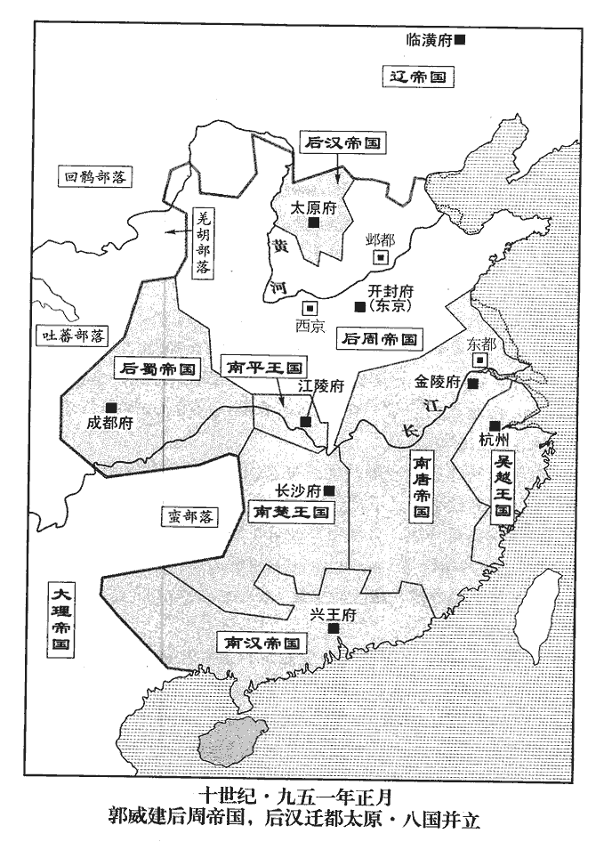
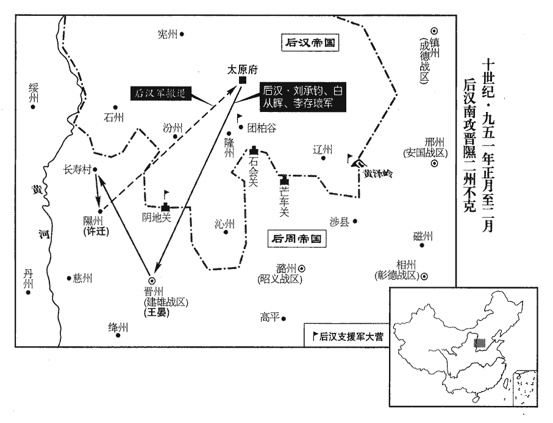
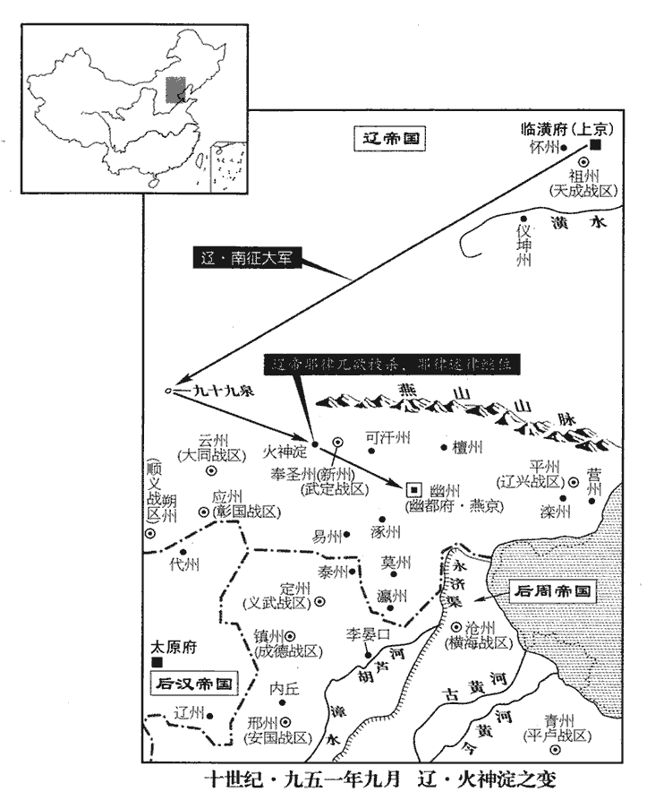
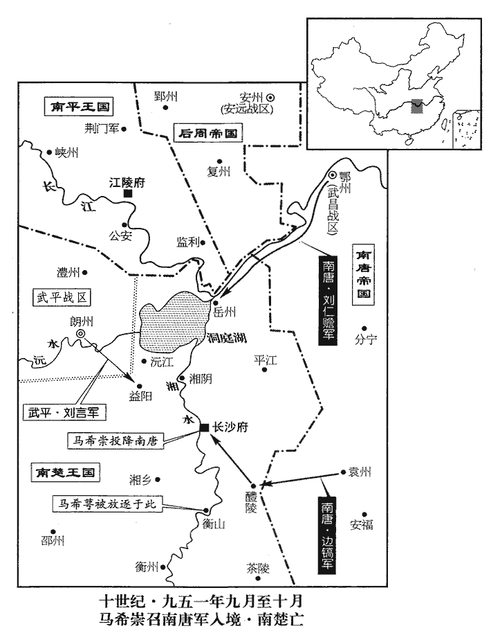
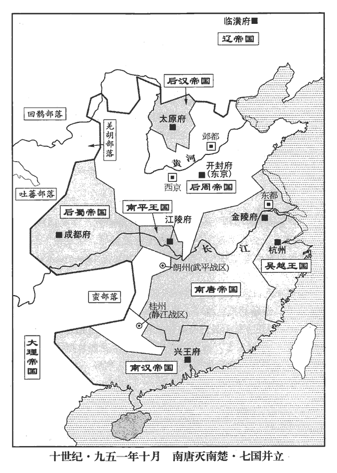
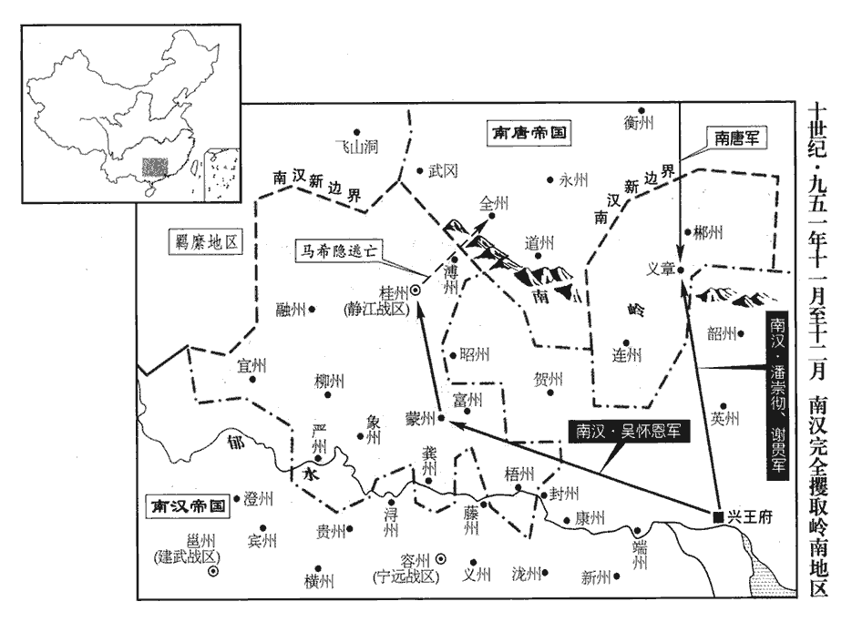
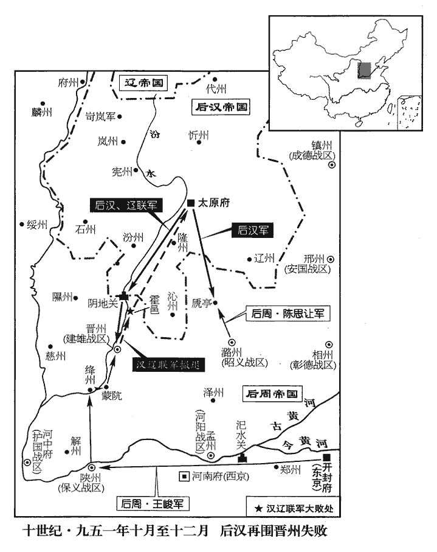
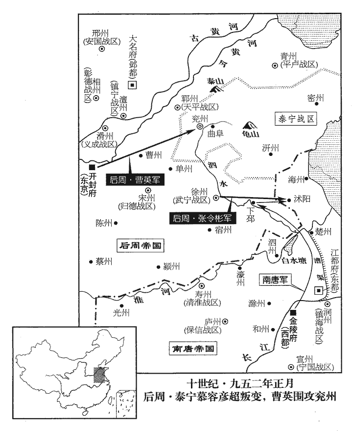

 後周紀一起重光大淵獻（辛亥），盡玄黓困敦（壬子）八月，凡一年有奇。
>  
> 周自以為周虢叔之後。春秋、戰國之世，傳記謂虢叔之後有國者為虢公，後謂之郭公，虢、郭音相近也。虞大夫宮之竒曰：虢仲、虢叔，王季之穆也。郭之得姓本於周，故建國號曰周，通鑑因謂之後周。

# 太祖聖神恭肅文孝皇帝上姓郭氏，諱威，邢州堯山人。父簡，事晉，為順州刺史。

## 廣順元年（辛亥，九五一）

1春，正月，丁卯‹五›，漢‹首都开封府河南省开封市›太后下誥，授監國‹郭威，本年四十八岁›符寶，即皇帝位。監國自皋門入宮，皋門，大梁城外村名。即位於崇元殿，制曰：「朕周室之裔，虢叔之後，國號宜曰周。」改元，大赦。楊邠、史弘肇、王章等皆贈官，官為斂葬，楊邠等死見上卷上年。為，于偽翻。歛，力贍翻。仍訪其子孫敘用之。凡倉場、庫務掌納官吏，無得收斗餘、稱耗。斗餘，槩量之外，又取其餘也。稱耗，稱計斤鈞石之外，又多取之以備耗折。今悉除之，矯王章苛歛之弊也。稱，尺證翻。舊所進羨餘物，悉罷之。羨，弋戰翻。羨餘，唐之流弊也，至五季而愈甚。犯竊盜及奸者，並依晉天福元年以前刑名，罪人非反逆，無得誅及親族，籍沒家貲。矯史弘肇虐刑之弊也。唐莊宗‹李存勖›、明宗‹李嗣源（邈佶烈）›、晉髙祖‹石敬瑭›，各置守陵十戶，漢髙祖‹刘知远›陵職員、宫人，時月薦享及守陵戶並如故。初，唐衰多盜，不用律文，更定峻法，竊盜贓三匹者死，晉天福中加至五匹。姦有夫婦人，無問强、和，男女並死。强，謂男以威力加女，女不得已而與之通姦者。和，謂男女相慕，欲動情生而通姦者。漢法，竊盜一錢以上皆死，又罪非反逆，徃徃族誅、籍沒。故帝即位，首革其弊。

〖译文〗 [1]春季，正月，丁卯（初五），后汉太后颁下诰令，授予监国郭威传国玺印，正式即皇帝位。郭威从皋门进入皇宫，在崇元殿即位，下制书说：“朕是周代宗室的子孙，虢叔的后裔，国号应该叫周。”改年号，实行大赦。杨、史弘肇、王章等人都追赠官爵，官府为他们收敛安葬，并且寻访他们的子孙依次任用。所有粮食仓库、场院掌管交纳的官吏，不得收取额外的“斗余”、“称耗”。从前以赋税盈余名义进贡物品，全部取消。犯有盗窃罪和强奸罪的，一律按照后晋天福元年以前的刑法条文处理；罪人不犯谋反罪的，不得株连亲戚家族和登记没收家产。后唐庄宗、后唐明宗、后晋高祖安葬处分别设置守陵的人家十户，后汉高祖陵园的官吏、宫人，一年四季供奉祭祀以及守陵户数一律照旧。当初，唐朝衰败，盗贼很多，便不用原来的刑律条文，另外制订严刑酷法，规定盗窃脏物够三匹绢帛的处死。后晋天福年间将处死标准加到五匹绢帛。奸淫有夫之妇，不论强奸、通奸，男女一律处死。后汉刑法规定，盗窃钱一文以上的都处死，此外罪行还不属于谋反的，往往满族抄斩、没收家产。所以后周太祖郭威一即位，首先革除这些弊端。

 

初，楊邠以功臣、國戚為方鎮者多不閑吏事，閑，習也。乃以三司軍将補都押牙、孔目官、内知客，其人自恃敕補，多專横，横，下孟翻。節度使不能制；至是悉罷之。

〖译文〗 当初，杨因为功臣元勋、皇亲国戚担任镇守一方长官大多不熟悉行政事务，于是用朝廷三司军将补任都押牙、孔目官、内知客，那些人自仗是皇命敕补，大多专横跋扈，节度使不能控制；到这时全部罢免。

帝命史弘肇親吏上黨‹潞州州政府所在县·山西省长治市›李崇矩訪弘肇親族，崇矩言：「弘肇弟弘福今存。」初，弘肇使崇矩掌其家貲之籍，由是盡得其產，皆以授弘福。帝賢之，使隸皇子榮帳下。

〖译文〗 后周太祖命令史弘肇亲吏上党人李崇矩寻访史弘肇的亲族，李崇矩说：“史弘肇的弟弟史弘福如今还在。”当初，史弘肇让李崇矩掌管他家财产的帐簿，因此得到全部史家财产，李崇矩都交付给了史弘福。太祖认为李崇矩贤能，让他在皇子郭荣手下供职。

2戊辰‹六›，以前復州‹湖北省天门市›防禦使王彥超權武寧‹总部徐州›節度使。時劉贇將鞏延美等守徐州。

〖译文〗 [2]戊辰（初六），任命前复州防御使王彦超代理武宁节度使。

3漢李太后遷居西宫，按薛史，漢太平宫葢即西宫。己巳‹七›，上尊號曰昭聖皇太后。上，時掌翻。

〖译文〗 [3]后汉李太后迁居西宫，己巳（初七），后周太祖进上尊号称昭圣皇太后。

4開封尹兼中書令劉勲卒。

〖译文〗 [4]开封尹兼中书令刘勋去世。

5癸酉‹十一›，加王峻同平章事。

〖译文〗 [5]癸酉（十一日），王峻加官同平章事。

6以衛尉卿劉皥主漢隠帝‹刘承祐›之喪。劉勲既卒，他無親屬故也。

〖译文〗 [6]命令卫尉卿刘主办后汉隐帝的丧事。

7初，河東‹总部太原府›節度使兼中書令劉崇聞隱帝‹刘承祐›遇害，欲舉兵南向，聞迎立湘陰公，乃止，曰：「吾兒為帝，吾又何求！」太原少尹李驤陰說崇曰：說，式芮翻。「觀郭公之心，終欲自取，公不如疾引兵逾太行，據孟津‹河南省孟津县东黄河渡口›，行，戶剛翻。俟徐州相公‹刘赟›即位，湘隂公本鎮徐州，故稱之。然後還鎮，則郭公不敢動矣。不然，且為所賣。」崇怒曰：「腐儒，欲離間吾父子！」命左右曳出斬之。間，古莧翻。曳，讀曰拽，音羊列翻。驤呼曰：「吾負經濟之才而為愚人謀事，呼，火故翻。為，于偽翻。死固甘心！家有老妻，願與之同死。」崇並其妻殺之，且奏於朝廷，示無二心。及贇廢，崇乃遣使請贇歸晉陽‹山西省太原市›。詔報以「湘陰公比在宋州‹河南省商丘市›，比，毗至翻。今方取歸京師‹开封府›，必令得所，公勿以為憂。公能同力相輔，當加王爵，永鎮河東。」

〖译文〗 [7]当初，河东节度使兼中书令刘崇听说后汉隐帝遇害，准备起兵向南进发，听说迎立湘阴公刘继位，于是作罢，说：“我儿子当皇帝，我又有什么可求！”太原少尹李骧私下劝说刘崇道：“观察郭威的心思，终究是要自取帝位，您不如火速领兵翻过太行山，占据孟津，等待徐州相公刘即帝位，然后返回镇所，那郭威就不敢动手了。不然，将要被人出卖。”刘崇发怒道：“你这个腐儒，想要离间我父子关系！”命令手下人将李骧拉出去斩首。李骧大喊道：“我怀经世济民的才能却在为愚人谋划事情，死了本当甘心！但家中还有年老的妻子，希望和她同死。”刘崇便连他的妻子一齐杀了，并且向朝廷奏报，表示没有二心。到了刘被废黜，刘崇才派遣使者请求让刘返归晋阳。诏书回答说：“湘阴公刘近在宋州，如今正取道返归京城，必定让他得其所宜，您不要为此忧虑。您如能一同出力辅佐朝廷，理当加封王爵，永远镇守河东。”

鞏廷美、楊溫聞湘陰公失位，奉贇妃董氏據徐州拒守，以俟河東援兵，劉贇令鞏廷美等守徐州事，始見上卷上年。帝使贇以書諭之。廷美、溫欲降而懼死，降，戸江翻。帝復遺贇書曰：「爰念斯人盡心於主，復，扶又翻。遺，唯季翻。主謂劉贇。足以賞其忠義，何由責以悔尤，俟新節度使入城，新節度使，謂王彦超。當各除刺史，公可更以委曲示之。」唐末主帥以手書諭示将佐，率謂之委曲。

〖译文〗 巩廷美、杨温听说湘阴公刘失去帝位，便侍奉刘妃子董氏占据徐州坚守，以此等待河东援军，后周太祖让刘用书信陈说利害。巩廷美、杨温想投降而怕死，后周太祖又给刘书信说：“念及这两人对主人竭尽忠心，就值得奖赏他们的忠义，哪有什么理由责备他们有过错，等待新节度使入城，应当分别委任刺史，您可再用亲笔信宣示此意。”

8契丹‹首都临潢府内蒙古巴林左旗›之攻內丘‹河北省内丘县›也，事見上卷上年。死傷頗多，又值月食，軍中多妖異，契丹主‹耶律兀欲，本年三十四岁›懼，不敢深入，引兵還，胡人用兵，以月為候，月食又多妖異，故懼而不敢進。妖，一遥翻。還，從宣翻，又如字。遣使請和於漢。會漢亡，安國‹总部邢州›節度使劉詞送其使者詣大梁‹河南省开封市›，帝遣左千牛衛將軍朱憲報聘，且敘革命之由，以金器、玉帶贈之。

〖译文〗 [8]契丹军队进攻内丘，死伤很多，又碰到月食，军中出现许多奇异怪事，契丹主恐惧，不敢继续深入，便领兵返回，派遣使者向后汉请求和好。适逢后汉灭亡，安国节度使刘词送契丹使者到大梁，后周太祖派遣左千牛卫将军朱宪回报使者来访，并且陈述改朝换代的缘由，把金器、玉带赠送给契丹主。

9帝‹郭威›以鄴都‹大名府·河北省大名县›鎮撫河北‹黄河以北›，控制契丹，欲以腹心處之。處，昌吕翻。乙亥‹十三›，以寧江‹总部夔州›節度使、侍衛親軍都指揮使王殷為鄴都留守、天雄‹总部大名府›節度使、同平章事，領軍如故，仍領侍衛親軍也。仍以侍衛司從赴鎮。

〖译文〗 [9]后周太祖利用邺都镇抚黄河以北地区，控制契丹，打算安排心腹亲信居守。乙亥（十三日），任命宁江节度使、侍卫亲军都指挥使王殷为邺都留守、天雄节度使、同平章事，兼领侍卫军照旧，并仍带侍卫司随从同赴镇所。

10丙子‹十四›，帝帥百官詣西宮，為漢隱帝舉哀成服，皆如天子禮。去年遷隠帝梓宫於西宫，事見上卷。帥，讀曰率。為，于偽翻。

〖译文〗 [10]丙子（十四日），后周太祖率领文武百官到西宫，为后汉隐帝发丧，穿上丧服，全都按照天子的葬礼。

11慕容彥超遣使入貢，帝慮其疑懼，賜詔慰安之，曰：「今兄事已至此，言不欲繁，望弟扶持，同安億兆。」漢祖，慕容彦超之兄也，「今兄」薛史作「令兄」，當從之。

〖译文〗 [11]慕容彦超派遣使者入朝进贡，后周太祖顾虑他有疑惑恐惧，特赐诏书安慰他，说：“如今我的事情已到这个地步，不想多说，只望你能鼎力扶助，共同安定黎民。”

12戊寅‹十六›，殺湘陰公於宋州。

〖译文〗 [12]戊寅（十六日），在宋州杀死湘阴公刘。

是日，劉崇‹本年五十七岁›即皇帝位於晉陽，劉崇，漢祖母弟也。仍用乾祐年號，所有者並‹太原府›、汾‹山西省汾阳县›、忻‹山西省忻州市›、代‹山西省代县›、嵐‹山西省岚县›、憲‹山西省娄烦县›、隆‹山西省祁县›、蔚‹河北省蔚县›、沁‹山西省沁源县›、遼‹山西省左权县›、麟‹陕西省神木县›、石‹山西省离石县›十二州之地。宋白曰：憲州，故樓煩監牧，唐昭宗龍紀元年，李克用奏置憲州。宋太宗之平太原，折御卿自府州會兵攻劉繼元，先克岢嵐軍，次克隆州，次克嵐州，則隆州盖晉、漢間所置，其地在岢嵐、嵐谷之間。沁，千鴆翻。以節度判官鄭珙為中書侍郎，珙，居勇翻。觀察判官滎陽‹河南省荥阳市›趙華為戶部侍郎，並同平章事。以次子承鈞為侍衛親軍都指揮使、太原尹，以節度副使李存瓌為代州‹山西省代县›防禦使，裨將武安‹河北省武安市›張元徽為馬步軍都指揮使，九域志：武安縣属洛州，在州西九十五里。陳光裕為宣徽使。

〖译文〗 [13]当天，刘崇在晋阳即皇帝位，仍旧沿用乾年号，所统辖的有并州、汾州、忻州、代州、岚州、宪州、隆州、蔚州、沁州、辽州、麟州、石州，共十二州之地。任命节度判官郑珙为中书侍郎，观察判官荥阳人赵华为户部侍郎，均为同平章事。任命次子刘承钧为侍卫亲军都指挥使、太原尹，任命节度副使李存为代州防御使，副将武安人张元徽为马步军都指挥使，陈光裕为宣徽使。

北漢主謂李存瓌、張元徽曰：通鑑書嶺南之漢為南漢，河東之漢為北漢。「朕以高祖‹刘知远›之業，一朝墜地，今日位號，不得已而稱之。顧我是何天子，汝曹是何節度使邪！」由是不建宗廟，祭祀如家人，宰相月俸止百緡，節度使止三十緡，按唐世百官俸錢，自會昌以後，不復増減，三師二百萬，三公百六十萬，侍中百五十萬，中書令、兩省侍郎、兩僕射、東宫三師百四十萬，尚書、御史大夫、東宫三少百萬，節度使三十萬。至梁開平五年，宰臣俸二百千。後唐同光四年，定節度副使每月料錢四十千，則節度使當又多。今北漢主皆減其數。俸，扶用翻。自餘薄有資給而已，故其國中少廉吏。少，詩沼翻。

〖译文〗 北汉主刘崇对李存、张元徽说：“朕只因为高祖的大业一朝断送，所以今日的帝位年号，是不得已才称的。但我算是什么天子，你们又算是什么节度使啊！”因此不建立宗庙，祭祀祖宗如同普通百姓，宰相每月俸禄只有一百缗钱，节度使只有三十缗钱，其余官员也都只有微薄的供养而已，所以北汉国中很少有廉洁的官吏。

客省使河南‹东京河南府所在县·河南省洛阳市›李光美嘗為直省官，三省有直省官，凡百官詣宰相，皆差直省官引接，其職則外鎮客司通引之職也。頗諳故事，諳，烏含翻。北漢‹首都太原府›朝廷制度，皆出於光美。

〖译文〗 客省使河南人李光美曾经做过直省官，很熟悉宫廷旧事，北汉朝廷的各项制度，都出自李光美之手。

北漢主聞湘陰公死，哭曰：「吾不用忠臣之言，以至於此！」為李驤立祠，為，于偽翻。歲時祭之。

〖译文〗 北汉君主听说湘阴公刘死讯，哭着说：“我不听忠臣的话，才至于此！”为李骧建立祠堂，逢年过节祭祀他。

14己卯‹十七›，以太師馮道為中書令，加竇貞固侍中，蘇禹珪司空。

〖译文〗 [14]己卯（十七日），后周太祖任命太师冯道为中书令，窦贞固加官侍中，苏禹加官司空。

15王彥超奏遣使齎敕詣徐州，鞏廷美等猶豫不肯啟關，詔進兵攻之。

〖译文〗 [15]王彦超奏报派遣使者携带敕书到徐州，巩廷美等犹豫未决不肯打开城门，后周太祖下诏令进兵攻城。

16帝謂王峻曰：「朕起於寒微，備嘗艱苦，遭時喪亂，喪，息浪翻。一旦為帝王，豈敢厚自奉養以病下民乎！」命峻疏四方貢獻珍美食物，庚辰‹十八›，下詔悉罷之。按薛史本紀：詔『應天下州府舊貢滋味食饌之物，所宜除減。其兩浙進細酒、海味、薑瓜、湖南𣏞yóu子茶、乳糖、白沙糖、橄欖子，鎮州髙公米、水梨，易定栗子，河東白杜梨、米粉、菉豆粉、玉屑籸shēn子麫，永興御田紅秔jīng米、新大麥麫，興平蘇栗子，華州麝香、羚羊角、熊膽、獺肝、朱柿、熊白，河中樹紅棗、五味子、輕餳xíng。同州石𨫼餅，晉、絳蒲萄、黄消梨，陜府鳯栖梨，襄州紫薑、新笋、橘子，安州折粳米、糟味，青州水梨，河陽諸雜果子，許州御李子，鄭州新笋、鵝梨，懐州寒食杏仁，申州蘘ráng荷，亳州萆bì薢xiè，沿淮州郡淮白魚，今後不須進奉。』其詔略曰：「所奉止於朕躬，所損被於甿庶。」被，皮義翻。甿méng，謨耕翻。又曰：「積於有司之中，甚為無用之物。」又詔曰：「朕生長軍旅，長，知兩翻。不親學問，未知治天下之道，治，直之翻。文武官有益國利民之術，各具封事以聞，咸宜直書其事，勿事辭藻。」帝以蘇逢吉之第賜王峻，峻曰：「是逢吉所以族李崧也！」事見二百八十八卷漢乾祐元年。辭而不處。使王峻處權勢之間，皆以是心處之，必不至有商州之禍矣。處，昌吕翻。

〖译文〗 [16]后周太祖对王峻说：“朕出身在贫赛之家，饱尝艰辛困苦，遭遇时世沉沦动乱，如今一朝成为帝王，岂敢优厚自己的供养而让下面百姓吃苦呢！”命令王峻清理四方贡献的珍美食物，庚辰（十八日），下诏令全部停止进贡。诏书大致说：“所供养的只给朕一人，而受损害的却普及黎民百姓。”又说：“贡品贮存在官府之中，大多成为无用之物。”又下诏书说：“朕生长在军队，没有亲自从师学习，不懂治理天下的道理，文武官员有利国利民的办法，各自上书奏报让我知道，都应直陈其事，不要讲究辞藻。”后周太祖将苏逢吉的宅第赏赐给王峻，王峻说：“这是苏逢吉诛灭李崧家族的起因啊！”推辞而不住。

 

17初，契丹主‹耶律兀欲›北歸，見二百八十七卷漢髙祖天福十二年。橫海‹总部沧州›節度使潘聿撚niǎn棄鎮隨之，契丹主以聿撚為西南路招討使。撚，乃殄翻。及北漢主‹刘崇›立，契丹主‹耶律兀欲›使聿撚遺劉承鈞書。遺，唯季翻。北漢主使承鈞復書，稱：「本朝淪亡，紹襲帝位，欲循晉室故事，求援北朝。」晉室故事，謂晉祖事契丹以求援故事也。朝，直遥翻；下同。契丹主大喜。北漢主發兵屯陰地‹山西省灵石县西南南关镇›、黃澤‹山西省左权县东南峻极关南›、團柏‹山西省祁县东南›。屯隂地者，欲窺晉、隰；屯黄澤者，欲窺邢、趙；屯團柏者，欲窺鎮、定。丁亥‹二十五›，以承鈞為招討使，與副招討使白從暉、都監李存瓌將步騎萬人寇晉州‹山西省临汾市›。從暉，吐谷渾‹山西省东北部›人也。

〖译文〗 [17]当初，契丹主返归北方，横海节度使潘聿离弃镇所跟随北上，契丹主任命潘聿为西南路招讨使。及至北汉主即位，契丹主让潘聿给刘承钧去信；北汉主让刘承钧复信，说：“原来的汉朝已沦陷灭亡，我继承帝位，想遵循晋朝的先例，向北朝契丹求援。”契丹主非常高兴。北汉主发兵屯住阴地、黄泽、团柏。丁亥（二十五日），任命刘承钧为招讨使，与副招讨使白从晖、都监李存率领步兵、骑兵万人侵犯晋州。白从晖是吐谷浑人。

18郭崇威更名崇，曹威更名英。皆避帝名也。更，工衡翻。

〖译文〗 [18]郭崇威改名为崇，曹威改名为英。

19二月，丁酉‹五›，以皇子天雄牙內都指揮使榮為鎮寧‹总部澶州›節度使，選朝士為之僚佐，以侍御史王敏為節度判官，右補闕崔頌為觀察判官，校書郎王朴為掌書記。為王朴見任於世宗張本。頌，協之子；崔協相後唐明宗。朴，東平‹山东省东平县›人也。

〖译文〗 [19]二月，丁酉（初五），后周太祖任命皇子天雄牙内都指挥使郭荣为镇宁节度使，挑选朝廷文士当他的属官，任命侍御史王敏为节度使判官，右补阙崔颂为观察判官，校书郎王朴为掌书记。崔颂是崔协的儿子，王朴是东平人。

20戊戌‹六›，北漢兵五道攻晉州‹山西省临汾市›，節度使王晏閉城不出。劉承鈞以為怯，蟻附登城。晏伏兵奮擊，北漢兵死傷者千餘人。承鈞遣副兵馬使安元寶焚晉州西城，元寶來降。承鈞乃移軍攻隰州‹山西省隰县›。九域志：晉州西北至隰州二百五十里。癸卯‹十一›，隰州刺史許遷遣步軍都指揮使孫繼業迎擊北漢兵於長壽村‹山西省石楼县东›，唐武德二年，分隰州石樓置長夀縣，貞觀元年省入石樓。執其將程筠等，殺之。未幾，幾，居豈翻。北漢兵攻州城，數日不克，死傷甚眾，乃引去。遷，鄆州‹山东省东平县›人也。

〖译文〗 [20]戊戌（初六），北汉军队分五路进攻晋州，节度使王晏紧闭城门不出。刘承钧认为王晏胆怯，下令士兵像蚂蚁那样密集攀墙登城。王晏埋伏的士兵奋起反击，北汉军队死伤一千余人。刘承钧派副兵马使安元宝焚烧晋州西城，安元宝却前来投降。刘承钧于是转移军队攻打隰州，癸卯（十一日），隰州刺史许迁派步军都指挥使孙继业在长寿村迎击北汉军队，捉住北汉将军程筠等人，杀死他们。不久，北汉军队进攻隰州州城，多日不能攻克，死伤惨重，于是退兵离去。许迁是郓州人。

21甲辰‹十二›，楚‹首都长沙府湖南省长沙市›王希萼遣掌書記劉光輔入貢於唐‹首都金陵府›。考異曰：湖湘故事，「光輔」作「光瀚」，今從十國紀年。

〖译文〗 [21]甲辰（十二日），楚王马希萼派遣掌书记刘光辅到南唐进贡。

22帝‹郭威›悉出漢宮中寶玉器數十，碎之於庭，曰：「凡為帝王，安用此物！聞漢隱帝‹刘承祐›日與嬖寵於禁中嬉戲，珍玩不離側，嬖，卑義翻，又必計翻。離，力智翻。茲事不遠，宜以為鑑！」仍戒左右，自今珍華悅目之物，無得入宮。

〖译文〗 [22]后周太祖将后汉宫中数十件珠宝玉器全部清出，在厅堂上砸碎，说：“所有当帝王的，哪里用得着这些东西！听说汉隐帝整日与亲信宠臣在宫禁中游戏玩耍，珍宝古玩不离身边，此事不远，应该引为鉴戒。”并告诫左右的人，从今以后珍贵华丽、赏心悦目的物品，不得进入宫廷。

23丁未‹十五›，契丹主遣其臣䙚骨支與朱憲偕來，䙚，奴鳥翻。歐史作「䮍」。朱憲使契丹，見上正月。賀即位。

〖译文〗 [23]丁未（十五日），契丹主派遣他的臣子袅骨支与朱宪一同来朝，祝贺后周太祖即皇帝位。

24戊申‹十六›，敕前資官各聽自便居外州。漢隱帝乾祐二年冬，楊邠奏前資官分居兩京，事見二百八十八卷。

〖译文〗 [24]戊申（十六日），后周太祖下敕令前朝官员居住京外州、县各听自便。

25陳思讓未至湖南，馬希萼已克長沙。思讓留屯郢州‹湖北省钟祥市›，敕召令還。去年十一月，漢朝議發兵救潭州，内難作而不果。劉、郭易姓之際，必未暇遣將南略，未知陳思讓為誰朝所遣，當考。按薛史：周太祖登極，遣陳思讓帥偏師至安、郢，以圖進取，長沙陷，乃班師，則帝所遣也。

〖译文〗 [25]陈思让没有到达湖南镇府，马希萼便已攻克长沙，陈思让只得滞留屯住郢州，后周太祖下敕书召回。

26丁巳‹二十五›，遣尚書左丞田敏使契丹。北漢主‹刘崇›遣通事舍人李𧦬使於契丹；「𧦬」，俗「辯」字，從「巩」從「言」。宋景文手記曰：北齊時，里俗多作偽字，始以「巧言」為「辯」。至隋有柳𧦬。其字又以「巩」易「巧」矣。乞兵為援。

〖译文〗 [26]丁巳（二十五日），后周太祖派遣尚书左丞田敏出使契丹。北汉主派遣通事舍人李出使到契丹，请求出兵作为援军。

27詔加泰寧‹总部兖州›節度使慕容彥超中書令，遣翰林學士魚崇諒詣兗州‹山东省兖州市›諭指。崇諒，即崇遠也。魚崇諒先因避漢祖諱改名。彥超上表謝。三月，壬戌朔‹一›，詔報之曰：「向以前朝失德，少主‹刘承祐›用讒，少，詩照翻。倉猝之間，召卿赴闕。卿即奔馳應命，信宿至京，救國難而不顧身，聞君召而不俟駕；難，乃旦翻。以至天亡漢祚，兵散梁郊，降將敗軍，相繼而至，卿即便回馬首，徑返龜陰。兖州在龜山‹山东省蒙阴县南›之隂。慕容彦超赴大梁，還兖州，事並見上卷上年。為主為時，為，于偽翻。有終有始。所謂危亂見忠臣之節，疾風知勁草之心。若使為臣者皆能如茲，則有國者誰不欲用！所言朕潛龍河朔之際，平難浚郊之時，難，乃旦翻。浚郊謂大梁之郊。大梁有浚水，詩云：孑孑干旄，在浚之郊。韓愈從董晉于汴州，賦曰：非夫子之洵美兮，吾何為乎浚之都！緣不奉示喻之言，亦不得差人至行闕。且事主之道，何必如斯！若或二三於漢朝，朝，直遥翻。又安肯忠信於周室！以此為懼，不亦過乎！卿但悉力推心，安民體國，事朕之節，如事故君，不惟黎庶獲安，抑亦社稷是賴。但堅表率，未議替移。由衷之誠，言盡於此。」以慕容彦超不自安，故以此詔撫諭之。

〖译文〗 [27]后周太祖下诏泰宁节度使慕容彦超加官中书令，派遣翰林学士鱼崇谅到兖州宣旨。鱼崇谅就是鱼崇远。慕容彦超进表书道谢。三月，壬戌朔（初一），诏书回复说：“昔日因为前代汉朝丧失德政，年少君主听用谗言，危急关头，征召爱卿奔赴宫阙，爱卿立即飞奔疾驰接受命令，只过了两夜便赶到京城，这真是拯救国家危难而不顾自身，听到君主召唤而不等驾车。及至上天结束汉朝国运，军队在大梁郊外溃散，投降的将领、溃败的军队接踵而至，爱卿却立刻就掉转马头，直接返回龟阴。对于国君，对于时势，做到有始有终，真所谓危乱关头才看见忠臣的节操，狂风时节才知道劲草的骨气。倘若做臣子的都能如此，那么有国家的君主谁不想任用！表中所说朕到黄河北岸回避退让的关头，在浚水郊外平定乱难的时候，因为没有接到告示，所以也没能派人到朕的行在。但臣子事奉君主的道理，何必如此！如若对汉朝有三心二意，又怎么肯对周室忠信不二呢！由此产生恐惧，不也过分了吗！爱卿只管尽心竭力，安民利国。事奉朕的节操，如同事奉从前君主一样，不但黎民获得平安，而且国家也依赖于此。朕只想坚定爱卿的表率作用，从未议论过撤换。一片肺腑之言，话全说到这里。”

28唐‹首都金陵府江苏省南京市›以楚王希萼為天策上將軍、武安‹总部长沙府›•武平‹总部朗州›•靜江‹总部桂州›•寧遠‹总部容州›節度使兼中書令、楚王，以右僕射孫忌、孫忌即孫晟。歐史曰：晟一名忌，又名鳯。客省使姚鳳為冊禮使。

〖译文〗 [28]南唐主任命楚王马希萼为天策上将军，武安、武平、静江、宁远节度使兼中书令、楚王；任命右仆射孙忌、客省使姚凤为册礼使。

29丙寅‹五›，遣前淄州‹山东省淄博市›刺史陳思讓將兵戍磁州‹河北省磁县›，扼黃澤路。磁州西北當黄澤關路口。磁，墻之翻。

〖译文〗 [29]丙寅（初五），后周太祖派遣前淄州刺史陈思让领兵驻防磁州，把守黄泽关路口。

30楚王希萼既得志，多思舊怨，殺戮無度，晝夜縱酒荒淫，悉以軍府事委馬希崇。希崇復多私曲，政刑紊亂。復，扶又翻。紊音問。府庫既盡於亂兵，籍民財以賞賚士卒，或封其門而取之，士卒猶以不均怨望。雖朗州‹湖南省常德市›舊將佐從希萼來者，亦皆不悅，有離心。

〖译文〗 [30]楚王马希萼既已得志称王，便时常回忆旧日怨仇，诛杀屠戮没有节制，日夜纵酒，荒淫无度，把军政事务全部委托给马希崇。马希崇又多私人好恶，政治刑律混乱不堪。官府仓库已经在战乱中荡然无存，便搜刮没收百姓财产来赏赐士兵，有的封百姓的门而夺取家中财物，士兵仍然因为分配不均而怨恨。即使朗州旧日将佐跟从马希萼一同来的，也都不高兴，渐渐产生背离之心。

劉光輔之入貢於唐也，入貢見上月。唐主‹李璟（徐景通）本年三十六岁›待之厚，光輔密言：「湖南民疲主驕，可取也。」唐主乃以營屯都虞候邊鎬為信州‹江西省上饶市›刺史，將兵屯袁州‹江西省宜春市›，潛謀進取。

〖译文〗 刘光辅到南唐进贡，南唐主待他很优厚，刘光辅秘密进言道：“湖南百姓疲惫，君主骄横，可以攻取啊。”南唐君主于是任命营屯都虞候边镐为信州刺史，领兵屯驻袁州，暗中谋划进攻夺取湖南。

小門使謝彥顒，顒yóng，魚容翻。考異曰：湖湘故事作「謝彦叙」，周羽沖三楚新録作「謝延澤」，今從十國紀年。本希萼家奴，以首面有寵於希萼，首面，龍陽之色也。至與妻妾雜坐，恃恩專橫。横，戸孟翻。常肩隨希崇，或拊其背，記曲禮：年長以倍，則父事之；十年以長，則兄事之；五年以長，則肩隨之。註云：肩随者與之並行差退。若拊背，則狎之矣。希崇銜之。故事，府宴，小門使執兵在門外。希萼使彥顒預坐，或居諸將之上，諸將皆恥之。

〖译文〗 小门使谢彦，原本是马希萼的家奴，因为面目姣美得到马希萼宠幸，甚至与马希萼的妻妾同坐，依仗恩宠专横跋扈。谢彦经常与马希崇并肩相随，有时拍马希的背；马希崇怀恨在心。旧例，府中设宴，小门使手持兵器站在门外，马希萼让谢彦入席同坐，有时坐在众将的上方，众将都为此感到耻辱。

希萼以府舍焚蕩，命朗州‹湖南省常德市›靜江指揮使王逵、副使周行逢帥所部兵千餘人治之，帥，讀曰率；下同。治，直之翻。執役甚勞，又無犒賜，犒，苦到翻。士卒皆怨，竊言曰：「囚免死則役作之。我輩從大王出萬死取湖南，何罪而囚役之！且大王終日酣歌，豈知我輩之勞苦乎！」逵、行逢聞之，相謂曰：「眾怨深矣，不早為計，禍及吾曹。」壬申‹十一›旦，帥其眾各執長柯斧、白梃，逃歸朗州。柯，斧柄也。梃，徒鼎翻。時希萼醉未醒，左右不敢白。癸酉‹十二›，始白之。希萼遣湖南指揮使唐師翥將千餘人追之，不及，直抵朗州；逵等乘其疲乏，伏兵縱擊，士卒死傷殆盡，師翥脫歸。翥zhù，章恕翻。

〖译文〗 马希萼因为府第房舍焚烧毁坏，命令朗州静江指挥使王逵、副使周行逢率领所管辖的士兵千余人修建，承担的徭役十分辛苦，又没有犒劳赏赐，士兵都怨恨，私下说道：“囚犯免死便罚作苦役。我们跟从大王出生入死攻取湖南，有什么罪过要像囚犯那样服苦役呀！况且大王终日醉酒当歌，哪里知道我们的辛劳苦处啊！”王逵、周行逢听到这些，相互说：“大家的积怨深了，不早作打算，灾祸会轮到我们头上。”壬申（十一日）早晨，他俩便率领部众各人手拿长柄斧子、白木棍棒，逃回朗州。当时马希萼酒醉没醒，周围的人不敢报告。癸酉（十二日），才报告此事。马希萼派遣湖南指挥使唐师翥带领千余人追赶，没追上，一直追到朗州。王逵等乘他们疲惫困乏，埋伏的士兵全力出击，追兵死伤几乎全军覆没，唐师翥脱身逃归。

逵等黜留後馬光贊，去年馬希萼以子光贊鎮朗州。更以希萼兄子光惠知州事。更，工衡翻。光惠，希振之子也。希振，馬殷之嫡長子也。尋奉光惠為節度使，逵等與何敬真及諸軍指揮使張倣參決軍府事。希萼具以狀言於唐，唐主遣使以厚賞招諭之。逵等納其賞，縱其使，不答其詔，唐亦不敢詰也。使，疏吏翻。詰，去吉翻。為王逵等以朗州攻潭州張本。

〖译文〗 王逵等废黜留后马光赞，改用马希萼哥哥的儿子马光惠主持朗州政事。马光惠是马希振的儿子。不久奉立马光惠为节度使，王逵等与何敬真以及诸军指挥使张参预决策军政大事。马希萼详细将情况通报给南唐，南唐主派遣使者用丰厚的赏赐来招降安抚。王逵等收下南唐的赏赐，放走使者，不回答诏谕，南唐也不敢追问。

31王彥超奏克徐州，殺鞏廷美等。鞏廷美等以無援敗死。

〖译文〗 [31]王彦超奏报攻克徐州，杀死巩廷美等人。

32北漢李𧦬至契丹，契丹主使拽剌梅里報之。拽，羊列翻。剌，來達翻。

〖译文〗 [32]北汉使者李到契丹，契丹主派拽剌梅里回报北汉。

33丙子‹十五›，敕：「朝廷與唐本無仇怨，緣淮軍鎮，各守疆域，無得縱兵民擅入唐境。商旅往來，無得禁止。」

〖译文〗 [33]丙子（十五日），后周太祖下敕令：“本朝廷与唐朝廷本来没有怨仇，沿淮河的军镇，各守自己疆域，不得放纵士兵百姓擅自进入唐人地界；商人旅客往来，不得阻止。”

34己卯‹十八›，潞州‹山西省长治市›送涉縣‹河北省涉县›所獲北漢‹首都太原府›將卒二百六十餘人，各賜衫袴巾履遣還。渉，漢縣，唐屬潞州。九域志：在州東北一百九十八里。

〖译文〗 [34]己卯（十八日），潞州送来涉县所俘获的北汉将领士兵二百六十多人，后周朝廷赐给每人衣衫、裤子、头巾、鞋子，遣送回家。

35加吳越王弘俶‹本年二十三岁›諸道兵馬都元帥。

〖译文〗 [35]后周太祖给吴越王钱弘加官诸道兵马都元帅。

36夏，四月，壬辰朔‹一›，濱淮州鎮上言：「淮南饑民過淮糴穀，未敢禁止。」詔曰：「彼之生民，與此何異，宜令州縣津鋪無得禁止。」鋪，普故翻。

〖译文〗 [36]夏季，四月，壬辰朔（初一），滨临淮河的州镇上奏说：“淮南饥民渡过淮河来买粮，没敢禁止。”后周太祖下诏说：“那边的百姓，与这边的百姓有什么不同，应下令各州、县渡口、粮铺不得禁止。”

37蜀‹首都成都府四川省成都市›通奏使高延昭固辭知樞密院，丁未‹十六›，以前雲安‹重庆市云阳县西北云安镇›榷鹽使太原伊審徴為通奏使，知樞密院事。雲安，漢巴郡之朐䏰縣地，周武帝置雲安縣，唐屬夔州，以其産鹽，置雲安監。審徴，蜀高祖妹褒國公主之子也，少與蜀主‹孟昶（孟仁赞）本年三十三岁›相親狎，少，詩照翻。及知樞密，政之大小悉以咨之。審徴亦以經濟為己任，而貪侈回邪，與王昭遠相表裏，蜀政由是浸衰。

〖译文〗 [37]后蜀通奏使高延昭坚决推辞主持枢密院事务。丁未（十六日），后蜀君主任命前云安榷盐使太原人伊审征为通奏使，主持枢密院事务。伊审征是后蜀高祖妹妹褒国公主的儿子，从小同后蜀君主亲昵随便，及至他主持枢密院，后蜀君主无论政事大小都向他咨询。伊审征也以经国济世为己任，但贪婪奢侈、奸诈邪恶，与王昭远内外勾结，后蜀政权因此逐渐衰败。

38吳越‹首都杭州浙江省杭州市›王弘俶徙廢王弘倧居東府‹越州·浙江省绍兴市›，自衣錦軍‹浙江省临安市›徙居東府。呉越以越州為東府。為築宮室，治園圃，娛悅之，為，于偽翻。治，直之翻。歲時供饋甚厚。

〖译文〗 [38]吴越王钱弘将废黜的前王钱弘迁居东府，为他建筑宫室，修造园林，让他游玩快活，一年四季供养馈赠非常丰厚。

39契丹主‹耶律兀欲›遣使如北漢，告以周使田敏來，約歲輸錢十萬緡。輸，舂遇翻。北漢主‹刘崇›使鄭珙以厚賂謝契丹，珙gǒng，居勇翻。自稱「侄皇帝致書於叔天授皇帝」，請行冊禮。

〖译文〗 [39]契丹主派遣使者前往北汉，告知后周使者田敏来的情况，约定每年送钱十万缗。北汉主派郑珙为使者用丰厚的钱财向契丹主致谢，自称“侄皇帝向叔父天授皇帝致送书信”，请求举行册命典礼。

40五月，己巳‹八›，遣左金吾將軍姚漢英等使于契丹，契丹留之。契丹以北漢交之厚，遂留周使。

〖译文〗 [40]五月，己巳（初八），后周太祖派遣左金吾将军姚汉英等出使到契丹，契丹留住他们。

41辛未‹十›，北漢禮部侍郎、同平章事鄭珙卒於契丹。考異曰：晉陽見聞録：「鄭珙既達虜庭，虜君恩禮周厚。虜俗以酒池肉林為名，雖不飲酒如韋曜輩者，亦加灌注。縱成疾，無復信之。珙魁岸善飲，罹無量之逼，宴罷，載歸，一夕腐脇於穹廬之氈堵間，輿尸而復命。」九國志：「契丹宴犒漢使，必厚具酒肉，以示夸大。髙祖鎮河東，嘗命韋曜北使，曜羸瘠不能飲酒，虜人强之，遂卒。」按韋曜，孫皓時人韋昭也，不能飲酒，王保衡引以為文章，而路振云髙祖時人，誤也。

〖译文〗 [41]辛未（初十），北汉礼部侍郎、同平章事郑珙在契丹去世。

42甲戌‹十三›，義武‹总部定州›節度使孫方簡避皇考‹郭简›諱，更名方諫。更，工衡翻。

〖译文〗 [42]甲戌（十三日），义武节度使孙方简为避后周皇帝父亲郭简的名讳，改名为方谏。

43定難‹总部夏州›節度李彞殷遣使奉表於北漢。「節度」之下當有「使」字。難，乃旦翻。

〖译文〗 [43]定难节度李彝殷派遣使者持奉表书到北汉。

44六月，辛亥‹十一›，以樞密使、同平章事王峻為左僕射兼門下侍郎，樞密副使•兵部侍郎範質、戶部侍郎•判三司李穀為中書侍郎，並同平章事，穀仍判三司。司徒兼侍中竇貞固、司空兼中書侍郎•同平章事蘇禹珪並罷守本官。癸丑‹二十三›，範質參知樞密院事。丁巳‹二十七›，以宣徽北院使翟光鄴兼樞密副使。翟，萇伯翻，又徒歴翻。

〖译文〗 [44]六月，辛亥（二十一日），后周太祖任命枢密使、同平章事王峻为左仆射兼门下侍郎，枢密副使及兵部侍郎范质、兼领三司李为中书侍郎，都为同平章事，李仍然兼领三司。司徒兼侍中窦贞固，司空兼中书侍郎、同平章事苏禹都被免去同平章事而保留原来的职务。癸丑（二十三日），范质参预主持枢密院事务。丁巳（二十七日），任命宣徽北院使翟光邺兼枢密副使。

初，帝‹郭威›討河中‹山西省永济市›，已為人望所屬。帝討河中見二百八十八卷漢乾祐元年。屬，之欲翻。李穀時為轉運使，帝數以微言動之，穀但以人臣盡節為對，帝以是賢之。即位，首用為相。時國家新造，四方多故，王峻夙夜盡心，知無不為，軍旅之謀，多所裨益。範質明敏強記，謹守法度。李穀沈毅有器略，在帝前議論，辭氣忼慨，善譬諭以開主意。數，所角翻。沈，持林翻。忼，苦廣翻。史言周朝新造，輔相者能盡心營職，以濟多艱。

〖译文〗 当初，后周太祖征讨河中，已为众望所归。李当时任转运使，后周太祖多次用委婉言语打动他，李只用为人臣子应该尽守臣节作为回答，后周太祖因此认为他有贤德，即皇帝位后，便首先任用他为宰相。当时国家新建，四方多事，王峻日夜绞尽脑汁，知道的事没有不去做的，军事谋划，常出良策补益。范质精明敏锐，博闻强记，严守法律制度。李沉静坚毅，有才器胆略，在后周太祖面前议论朝政，言辞慷慨激昂，善于运用譬喻来启发皇帝的意向。

45武平‹总部朗州›節度使馬光惠，愚懦嗜酒，不能服諸將，王逵、周行逢、何敬真謀以辰州‹湖南省沅陵县›刺史廬陵‹江西省吉安市›劉言驍勇得蠻夷心，劉言從彭玕gān奔楚，因為楚将。欲迎以為副使。言知逵等難制，曰：「不往，將攻我。」乃單騎赴之。九域志：辰州東至朗州五百六十六里。既至，眾廢光惠，送于唐，推言權武平留後，為王逵等殺劉言張本。表求旄節於唐，唐人未許。亦稱藩於周。

〖译文〗 [45]武平节度使马光惠，愚蠢胆小，专好饮酒，不能折服众将。王逵、周行逢、何敬真商量，认为辰州刺史庐陵人刘言打仗勇猛很得蛮夷士众之心，准备迎立他为武平节度副使。刘言知道王逵等人难以驾驭，说：“不去的话，将会向我进攻。”于是单枪匹马赶赴朗州。刘言已到，众将便废黜马光惠，送他到南唐，推举刘言代理武平留后，上表书向南唐朝廷请求赐予旌旗符节，南唐人没有答应，便同时也向后周称臣。

46吳越王弘俶以前內外馬步都統軍使仁俊無罪，復其官爵。錢仁俊被幽見二百八十五卷晉齊王開運二年。

〖译文〗 [46]吴越王钱弘因为前内外马步都统军使钱仁俊无罪，恢复他的官职爵位。

47契丹遣燕王述軋等冊命北漢主為大漢神武皇帝，妃為皇后。北漢主更名旻。更，工衡翻。

〖译文〗 [47]契丹主派遣燕王耶律述轧等人来主持典礼，册命北汉主为大汉神武皇帝，妃子为皇后。北汉主改名为。

48秋，七月，按五代會要：是月，周追尊四廟。北漢主遣翰林學士博興‹山东省博兴县›衛融等詣契丹謝冊禮，博興，即唐青州之博昌縣，後唐避獻祖諱，改曰博興。九域志：縣在州西北一百二十里。且請兵。請兵以攻周。

〖译文〗 [48]秋季，七月，北汉主派遣翰林学士博兴人卫融等到契丹道谢所赐册命典礼，并且请求出兵。

49八月，壬戌‹二›，葬漢隱帝於穎陵‹河南省禹州市›。穎陵，在許州陽翟縣。

〖译文〗 [49]八月，壬戌（疑误），北汉隐帝安葬在颖陵。

50義武節度使孫方諫入朝，壬子‹二十三›，徙鎮國‹总部华州›節度使，以其弟易州‹河北省易县›刺史行友為義武留後。又徙建雄節度使王晏鎮徐州，以武寧‹总部徐州›節度使王彥超代之。王晏與王彦超兩易所鎮。

〖译文〗 [50]义武节度使孙方谏进京入朝，壬子（二十三日），调任镇国节度使，任命孙方谏弟弟易州刺史孙行友为义武留后。又调建雄节度使王晏改任武宁节度使镇守徐州，任命武宁节度使王彦超接替王晏原职。

51戊午‹二十九›，追立故夫人柴氏為皇后。柴氏先卒，去年不死于劉銖之手。

〖译文〗 [51]戊午（二十九日），后周太祖追立已故夫人柴氏为皇后。

 

52九月，北漢主‹刘崇（刘旻）›遣招討使李存瓌將兵自團柏‹山西省祁县东南›入寇。契丹欲引兵會之，「契丹」之下當有「主」字。與酋長議於九十九泉‹内蒙古卓资县北›。魏土地記曰：沮陽城東八十里有牧牛山，山下有九十九泉，即滄河之上源也。按魏收魏書：天賜三年，八月，魏主登武要北原，觀九十九泉。武要縣，漢屬定襄郡，東部都尉治所。宋白曰：九十九泉，在幽州西北一千餘里。諸部皆不欲南寇，契丹主強之。癸亥‹四›，行至新州‹河北省涿鹿县›之【章︰十二行本「之」下有「西」字，乙十一行本同；孔本同；張校同。】火神淀，契丹雖破晉，其力亦疲，諸部瘡痍未瘳，羸耗未復，故不欲南寇。宋白曰：火神淀在新州西。強，其兩翻。淀，徒練翻。淺水曰淀。燕王述軋及偉王之子太寧王漚僧作亂，漚òu，烏侯翻。弒契丹主‹耶律兀欲，年三十四岁›而立述軋。契丹主德光之子【章︰十二行本「子」下有「齊王」二字；乙十一行本同；孔本同；張校同。】述律逃入南山，諸部奉述律以攻述軋、漚僧，殺之，並其族黨。立述律為帝‹耶律述律，本年二十一岁›，改元應曆。自火神淀入幽州‹北京市›，遣使告於北漢，北漢主遣樞密直學士上黨‹山西省长治市›王得中如契丹，賀即位，復以叔父事之，請兵以擊晉州‹山西省临汾市›。

〖译文〗 [52]九月，北汉主派遣招讨使李存领兵从团柏入侵。契丹主准备领兵会合北汉军队，与酋长们在九十九泉商议。各部落都不愿南侵，契丹主强行出兵。癸亥（初四），契丹军队行进到新州的火神淀，燕王耶律述轧以及伟王的儿子太宁王耶律沤僧发动叛乱，杀死契丹主耶律阮而拥立耶律述轧。前契丹主耶律德光的儿子耶律述律逃入南山，各部落拥戴耶律述律而进攻耶律述轧、耶律沤僧，杀死他们，吞并他们的部族党羽，拥立耶律述律为皇帝，改年号为应历。耶律述律从火神淀进入幽州，派遣使者向北汉报告，北汉主派遣枢密直学士上党人王得中前往契丹，祝贺耶律述律即皇帝位，又用对待叔父的规格事奉他，请求出兵来攻击晋州。

契丹主年少，好遊戲，不親國事，每夜酣飲，達旦乃寐，日中方起，國人謂之睡王。後更名明。少，詩照翻。好，呼到翻。更，工衡翻。

〖译文〗 契丹主耶律述律年轻，喜好玩耍，不亲理国家大事。每天夜里摆酒畅饮，直到天亮才睡觉，中午才起床，国中之人称他为睡王。后来改名为明。

53壬申‹十三›，蜀以吏部尚書、御史中丞範仁恕為中書侍郎兼吏部尚書、同平章事。

〖译文〗 [53]壬申（十三日），后蜀任命吏部尚书、御史中丞范仁恕为中书侍郎兼吏部尚书、同平章事。

54楚王希萼既克長沙，不賞許可瓊，許可瓊降希萼見上卷漢隠帝乾祐三年。疑可瓊怨望，出為蒙州‹广西蒙山县›刺史。唐武德五年，析荔州之隋化縣置南恭州，貞觀八年更名蒙州，宋朝熈寜五年廢蒙州，以立山縣隸昭州。宋白曰：蒙州，漢荔浦縣地，唐置蒙州，以州東面有蒙山，山下有泉源，流為蒙水，山下人皆姓蒙，故名。遣馬步都指揮使徐威、左右軍馬步使陳敬遷、水軍都指揮使魯公綰、牙內侍衛指揮使陸孟俊帥部兵立寨於城西北隅，以備朗兵。帥，讀曰率，下同。不存撫役者，將卒皆怨怒，謀作亂。希崇知其謀，戊寅‹十九›，希萼宴將吏，徐威等不預，希崇亦辭疾不至。威等使人先驅踶dì齧niè馬十餘入府，自帥其徒執斧斤、白梃，聲言縶馬，奄至座上，縱橫擊人，顛踣滿地。踶，大計翻。齧，魚結翻。縶，陟立翻。縱，子容翻。踣，蒲北翻。希萼踰垣走，威等執囚之。考異曰：十國紀年作丁丑，按湖湘故事在十九日，今從之。執謝彥顒，自頂及踵剉之。立希崇‹本年四十岁›為武安‹总部长沙府›留後，縱兵大掠。幽希萼於衡山縣‹湖南省衡山县›。三國時，吴分湘南縣置衡山縣，唐屬衡州，宋朝淳化四年分屬潭州。九域志：衡山縣在潭州西南三百二十里。

〖译文〗 [54]楚王马希萼既已攻克长沙，没有奖赏许可琼，怀疑许可琼有怨恨，便让他出任蒙州刺史。派遣马步都指挥使徐威、左右军马步使陈敬迁、水军都指挥使鲁公绾、牙内侍卫指挥使陆孟俊率领所部军队在城西北角安营扎寨，用以防备朗州军队，不慰问安抚从事劳役的军队，服役的将士都怨恨忿怒，谋划发动叛乱。马希崇知道将士的阴谋，戊寅（十九日），马希萼宴请将领官吏，徐威等人不参加，马希崇也推辞有病而不到。徐威等派人先驱赶十几匹尥蹶子咬人的劣马进入府中，自己带领部下手持斧子、白木棍棒，声称来绊缚劣马，突然闯到坐席上面，任意砍杀赴宴的人，倒下的人躺满一地。马希萼翻墙逃跑，徐威等抓住囚禁了他，抓住谢彦，从头到脚剁成碎块。拥立马希崇为武安留后，放纵士兵大肆抢掠。将马希萼幽禁在衡山县。

劉言聞希崇立，遣兵趣潭州‹长沙府·湖南省长沙市›，趣，七喻翻。聲言討其篡奪之罪。壬午‹二十三›，軍于益陽‹湖南省益阳市›之西。希崇懼，癸未‹二十四›，發兵二千拒之，又遣使如朗州求和，請為鄰藩。掌書記桂林李觀象說言曰：時人謂桂州為桂林。說，式芮翻。「希萼舊將佐猶在長沙，此必不欲與公為鄰；不若先檄希崇取其首，然後圖湖南，可兼有也。」言從之。希崇畏言，即斷都軍判官楊仲敏、掌書記劉光輔、牙內指揮使魏師進、都押牙黃勍等十餘人首，斷，丁管翻。勍，渠京翻。遣前辰陽縣‹湖南省辰溪县›令李翊齎送朗州。辰陽，地名，馬氏置縣，屬辰州。宋白曰：辰溪縣，本漢辰陵縣，後漢曰辰陽，以縣在辰水之陽也，隋改曰辰溪。如此則馬氏用後漢縣名也。至則腐敗，言與王逵等皆以為非仲敏等首，怒責翊，翊惶恐自殺。

〖译文〗 刘言听说马希崇立为武安留后，便调遣军队奔赴潭州，声称要讨伐他篡位夺权的罪行，壬午（二十三日），军队驻扎在益阳西面。马希崇恐惧，癸未（二十四日），发兵二千抵抗，又派遣使者前往朗州求和，请结为睦邻藩镇。掌书记桂林人李观象劝说刘言道：“马希萼的旧部将佐还在长沙，那些人必定不愿与您结为友邻；不如先驰传檄文命马希崇取来他们的首级，然后筹划夺取湖南，便可最后兼并占有整个湖南了。”刘言听从此计。马希崇畏惧刘言，立即斩下都军判官杨仲敏、掌书记刘光辅、牙内指挥使魏师进、都押牙黄等十几人的首级，派遣前辰阳县令李翊带着送往朗州。等到朗州，首级已经腐烂，刘言与王逵等都认为不是杨仲敏等人的头，发怒斥责李翊，李翊惶恐不安而自杀。

希崇既襲位，亦縱酒荒淫，為政不公，語多矯妄，國人不附。

〖译文〗 马希崇继位之后，也纵酒狂饮，荒淫无度，办事不公，言语多虚妄，国中之人都不亲附他。

初，馬希萼入長沙，事見上卷上年十二月。彭師暠雖免死，猶杖背黜為民。希崇以為師暠必怨之，使送希萼于衡山‹湖南省衡山县›，實欲師暠殺之。師暠曰：「欲使我為弒君之人乎！」奉事逾謹。暠，古老翻。丙戌‹二十七›，至衡山。衡山指揮使廖偃，匡圖之子也，晉天福四年，廖匡圖與蠻戰死。與其季父節度巡官匡凝謀曰：「吾家世受馬氏恩，今希萼長而被黜，必不免禍，長，知兩翻。被，皮義翻。盍相與輔之！」於是帥莊戶及鄉人悉為兵，佃豪家之田而納其租，謂之莊戸。帥，讀曰率。與師暠共立希萼為衡山王，以縣為行府，斷江為柵，斷，丁管翻。江即謂湘江也。編竹為戰艦，以師暠為武清‹总部衡山县›節度使，武清節度使。廖偃等自相署置耳。召募徒眾，數日，至萬餘人，州縣多應之。遣判官劉虛己求援於唐。

〖译文〗 当初，马希萼进入长沙，彭师虽然免于死刑，但仍背受杖刑废黜为民。马希崇认为彭师必定仇恨马希萼，便派他送马希萼到衡山，实际要彭师杀死马希萼，彭师说：“难道要让我做弑君犯上的人吗！”反而侍候马希萼愈加小心谨慎。丙戌（二十七日），到达衡山县。衡山指挥使廖偃是廖匡图的儿子，与他叔父节度巡官寥匡凝商量说：“我家世代承受马氏恩德，如今马希萼年长而被废黜，必定不能避免杀身大祸，何不一起辅助他！”于是率领庄中佃户和乡里百姓全部组成军队，与彭师共立马希萼为衡山王，将县府作为临时王府，横截湘江设置栅栏，编排竹子作为战舰，任命彭师为武清节度使，招募部众，数天之后，达到一万多人，邻近州县也大多响应。派遣判官刘虚己向南唐求援。

徐威等見希崇所為，知必無成，又畏朗州、衡山之逼，恐一朝喪敗，喪，息浪翻。俱及禍，欲殺希崇以自解。希崇微覺之，大懼，密遣客將范守牧奉表請兵於唐，唐主‹李璟（徐景通）›命邊鎬自袁州‹江西省宜春市›將兵萬人西趣長沙。将，即亮翻。趣，七喻翻。

〖译文〗 徐威等人见马希崇的所作所为，知道必定不能成功，又畏惧朗州、衡山的压力，恐怕有朝一日马希崇覆亡，同遭祸殃，打算杀死马希崇来解脱自己。马希崇暗中察觉此事，大为惊恐，秘密派遣客将范守牧携带表书到南唐请求出兵，南唐主命令边镐从袁州领兵一万人向西赶赴长沙。

55冬，十月，辛卯‹三›，潞州‹山西省长治市›巡檢陳思讓敗北漢兵於虒sī亭‹山西省襄垣县西北鹿亭镇›。敗，補邁翻。虒亭，在潞州銅鞮縣。九域志：潞州襄垣縣有虒亭鎮，虒，音斯。

〖译文〗 [55]冬季，十月，辛卯（初三），后周潞州巡检陈思让在亭击败北汉军队。

 

56唐邊鎬引兵入醴陵‹湖南省醴陵市›。舊唐書地理志曰：漢臨湘縣界有醴陵，後漢立為縣，隋廢，唐武德四年，分長沙縣置醴陵縣，並屬潭州。九域志：醴陵縣在潭州東一百六十里。范成大行程記：袁州萍鄉縣至潭州醴陵縣，兩日程耳。癸巳‹五›，楚王希崇遣使犒軍。壬寅‹十四›，遣天策府學士拓跋恒奉牋詣鎬請降。恒歎曰：「吾久不死，乃為小兒送降狀！」癸卯‹十五›，希崇帥弟侄迎鎬，望塵而拜，鎬下馬稱詔勞之。犒，苦到翻。帥，讀曰率，下同。勞，力到翻。甲辰‹十六›，希崇等從鎬入城，鎬舍於瀏陽門樓，瀏，音留。湖南將吏畢賀，鎬皆厚賜之。時湖南饑饉，鎬大發馬氏倉粟賑之，楚人大悅。馬殷據潭、朗，傳子希聲、希範、希廣、希萼、希崇，至是而亡。唐明宗天成三年，楚歸呉敗將苗璘，許德勲謂之曰：「待衆駒爭皁棧，而後湖、湘可圖。」今果如其言。

〖译文〗 [56]南唐边镐领兵进入醴陵。癸巳（初五），楚王马希崇派遣使者犒劳军队。壬寅（十四日），派遣天策府学士拓跋恒奉持笺书到边镐住处请求投降。拓跋恒叹息说：“我这么长时间没有死，竟是为了给这小子递送投降书！”癸卯（十五日），马希崇率领兄弟侄子迎接边镐，刚望见远处的行尘便叩拜，边镐下马宣读诏书慰劳马希崇。甲辰（十六日），马希崇等人跟从边镐进入长沙城，边镐住宿在浏阳门楼，湖南将领官吏全来祝贺，边镐都重赏他们。当时湖南闹饥荒，边镐大量散发马氏仓库粮食救济百姓，楚地人民非常喜悦。

57契丹遣彰國‹总部应州›節度使蕭禹厥將奚、契丹五萬會北漢兵入寇。北漢主自將兵二萬自陰地關‹山西省灵石县西南南关镇›寇晉州，丁未‹十九›，軍於城北，三面置寨，晝夜攻之，遊兵至絳州‹山西省新绛县›。時王晏已離鎮，離，力智翻。王彥超未至，巡檢使王萬敢權知晉州，與龍捷都指揮使史彥超、虎捷指揮使何徽共拒之。薛史本紀：廣順元年，改侍衛馬歩軍額，馬軍舊稱護聖，改為龍捷；歩軍舊稱奉國，改為虎捷。史彥超，雲州‹山西省大同市›人也。

〖译文〗 [57]契丹派遣彰国节度使萧禹厥统率奚、契丹五万人马会合北汉军队入侵，北汉主亲自统领二万军队从阴地关侵犯晋州。丁未（十九日），军队驻扎在晋州城北，三面安置营寨，日夜攻城，流动部队到了绛州。当时王晏已经离开镇所，王彦超还没有到达，巡检使王万敢临时主持晋州军政，与龙捷都指挥使史彦超、虎捷指挥使何徽共同抵抗敌军。史彦超是云州人。

 

58癸丑‹二十五›，唐武昌‹总部鄂州›節度使劉仁贍帥戰艦二百取岳州‹湖南省岳阳市›，撫納降附，人忘其亡。劉仁贍善將，故能為唐堅守夀州。仁贍，金之子也。劉金為楊氏將。

〖译文〗 [58]癸丑（二十五日），南唐武昌节度使刘仁赡率领战船二百艘攻取岳州，安抚招纳投降归附的军民，楚人都好像忘记了国家灭亡。刘仁赡是刘金的儿子。

唐百官共賀湖南平，起居郎高遠曰：「我乘楚亂，取之甚易。易，以豉翻。觀諸將之才，但恐守之難耳！」遠，幽州‹北京市›人也。司徒致仕李建勳曰：「禍其始於此乎！」唐之禍敗，後果如二臣所料。

〖译文〗 南唐文武百官共同庆贺平定湖南，起居郎高远说：“我们乘着楚国内乱，所以夺取它很容易。观察众将的才能，只怕守住它就难了！”高远是幽州人。司徒致仕李建勋说：“祸患恐怕就从这里开始吧！”

唐主‹李璟›自即位以來，未嘗親祠郊廟，禮官以為請。唐主曰：「俟天下一家，然後告謝。」及一舉取楚，謂諸國指麾可定。魏岑侍宴言：「臣少遊元城‹邺都所在县·河北省大名县›，樂其風土，少，詩照翻。樂，音洛。俟陛下定中原，乞魏博‹总部邺都›節度使。」唐主許之，岑趨下拜謝。其主驕臣佞如此。

〖译文〗 南唐主从即位以来，未曾亲自祭祀天地宗庙，礼官请求举行祭祀，南唐主说：“等到天下成为一家，然后告谢天地祖宗。”及至一举夺取楚地，认为其余各国也能随手平定。魏岑陪从南唐主消磨闲暇，说：“我年轻时游过元城，喜欢那里的风土人情，等到陛下平定中原，请求让我当魏博节度使。”南唐主答应了他，魏岑赶忙快步走下台阶拜谢。南唐主的骄傲、臣子们的谗媚大都如此。

馬希萼望唐人立己為潭‹长沙›帥，而潭人惡希萼，惡，烏路翻。共請邊鎬為帥，帥，所類翻，下同。唐主乃以鎬為武安‹总部设潭州湖南省长沙市›節度使。為邊鎬為朗兵所逐張本。

〖译文〗 马希萼希望南唐人扶立自己为潭州主帅，但潭州人憎恨马希萼，一齐请求边镐为主帅，南唐主于是任命边镐为武安节度使。

59王峻有故人曰申師厚，嘗為兗州‹山东省兖州市›牙將，失職饑寒，望峻馬拜謁於道。會涼州‹甘肃省武威市›留後折逋嘉施上表請帥於朝廷，折逋，羌族也，因以為姓。帝以絕域非人所欲，募率府供奉官願行者，率府，謂東宫十率府也。月餘，無人應募，峻薦師厚於帝。丁巳‹二十九›，以師厚為河西‹总部凉州›節度使。

〖译文〗 [59]王峻有个老熟人叫申师厚，曾任兖州牙将，因失失去职务而饥寒交迫，在路上望见王峻坐骑而叩拜谒见。恰好凉州留后折逋嘉施向朝廷上奏表书请求委派主帅，后周太祖因为偏远地区无人愿去，便在东宫率府供奉官中招募愿意前往的人，但过了一个多月，还是没人应募，王峻向后周太祖推荐申师厚。丁巳（二十九日），任命申师厚为河西节度使。

60唐邊鎬趣馬希崇帥其族入朝‹首都金陵府›，趣，讀曰促。帥，讀曰率。朝，直遥翻。馬氏聚族相泣，欲重賂鎬，奏乞留居長沙。鎬微哂曰：「國家與公家世為仇敵，殆六十年，哂，矢忍翻。唐昭宗光啟三年，馬殷從孫儒攻楊行宻，乾寜三年得湖南，自此與江淮為敵國。自光啟三年至是年，適六十年。然未嘗敢有意窺公之國。今公兄弟鬭鬩xì，困窮自歸，若復二三，復，扶又翻。恐有不測之憂。」希崇無以應，十一月，辛酉‹三›，與宗族及將佐千餘人號慟登舟，鬩，馨激翻，鬭也，很也，戾也。詩云：兄弟鬩于墻。復，扶又翻。號，戸刀翻。送者皆哭，響振川谷。

〖译文〗 [60]南唐边镐催促马希崇带领家族进京入朝，马氏聚集族人相对哭泣，打算用重礼贿赂边镐，上奏乞求留住长沙，边镐微微一笑说：“国家与您马家世代互为仇敌，将近六十年，然而未曾敢有窥窬您马氏楚国的意思。如今您兄弟争斗，自己落得穷困下场，倘若再有三长两短，恐怕又会产生无法预测的忧患。”马希崇无言以答，十一月，辛酉（初三），和同宗族人以及将佐一千余人呼喊痛哭登上船只，送行的人也都哭着，哭声震动江河山谷。

61帝以北漢、契丹之兵猶在晉州，甲子‹六›，以王峻為行營都部署，將兵救之。詔諸軍皆受峻節度，聽以便宜從事，得自選擇將吏。乙丑‹七›，峻行，帝自至城西餞之。大梁城西也。

〖译文〗 [61]后周太祖因为北汉、契丹的军队仍在晋州，甲子（初六），任命王峻为行营都部署，领兵援救晋州，颁诏令各路军队都接受王峻的调度指挥，授权王峻根据情况需要机断从事，可以自己选择任命将领官吏。乙丑（初七），王峻出征，后周太祖亲自到城西为他饯行。

62楚靜江‹总部桂州›節度副使、知桂州‹广西桂林市›馬希隱，武穆王殷之少子也。楚王希廣、希萼兄弟爭國，南漢主‹首都兴王府广东省广州市›刘弘熙（刘晟）本年三十二岁以內侍吳懷恩為西北招討使，將兵屯境上，伺間密謀進取。少，詩照翻。伺，相吏翻。間，古莧翻。希廣遣指揮使彭彥暉將兵屯龍峒‹广西桂林市西南›以備之。桂州溪南有白龍洞，在平地半山上。希萼自衡山遣使以彥暉為桂州都監、在城外內巡檢使、判軍府事，希隱惡之，惡，烏路翻。潛遣人告蒙州‹广西蒙山县›刺史許可瓊。可瓊方畏南漢之逼，即棄蒙州，引兵趣桂州，蒙、桂相去四百餘里。趣，七喻翻。與彥暉戰於城中。彥暉敗，奔衡山，可瓊留屯桂州。吳懷恩據蒙州，進兵侵掠，桂管大擾，希隱、可瓊不知所為，但相與飲酒對泣。

〖译文〗 [62]楚静江节度副使、知桂州马希隐是楚武穆王马殷的小儿子。楚王马希广、马希萼兄弟争夺国家，南汉主任命内侍吴怀恩为西北招讨使，领兵屯驻国境线上，等待时机，秘密图谋进攻夺取楚地，马希广派遣指挥使彭彦晖领兵屯驻龙峒来防备南汉军队。马希萼从衡山县派遣使者任命彭彦晖为桂州都监、在城外内巡检使、判军府事，马希隐厌恶彭彦晖，暗中派人告知蒙州刺史许可琼。许可琼正畏惧南汉的威逼，立即放弃蒙州，领兵直奔桂州，同彭彦晖军队在城中开战，彭彦晖被打败，逃奔衡山县，许可琼留下来屯驻桂州。吴怀恩占据蒙州，进军侵犯抢掠，桂管一带大受骚扰，马希隐、许可琼不知该怎么办，只是一起饮酒相对哭泣。

南漢主遺希隱書，遺，唯季翻。言：「武穆王‹马殷›奄有全楚，富強安靖五十餘年。正由三十五舅、三十舅兄弟尋戈，自相魚肉，三十五舅，謂希廣。三十舅，謂希萼。漢主龑yǎn娶楚王殷女，故呼希廣等為舅。舉先人基業，北面仇讎。言舉國臣唐也。今聞唐兵已據長沙，竊計桂林繼為所取。當朝世為與國，重以婚姻，朝，直遥翻。重，直用翻。覩茲傾危，忍不赴救！已發大軍水陸俱進，當令相公舅永擁節旄，常居方面。」希隱得書，與僚佐議降之，支使潘玄珪以為不可。丙寅‹八›，吳懷恩引兵奄至城下，希隱、可瓊帥其眾，夜斬關奔全州‹广西全州县›，九域志：桂州北至全州一百六十三里，晉髙祖時，馬氏改永州之湘源縣為清湘縣，置全州，本漢洮陽縣地也，有洮水，在清湘縣北。帥，讀曰率。桂州遂潰。懷恩因以兵略定宜‹广西宜州市›、連‹广东省连州市›、梧‹广西梧州市›、嚴‹广西来宾县›、富‹广西昭平县›、昭‹广西平乐县›、柳‹广西柳州市›、龔‹广西平南县›、象‹广西象州县›等州，唐乾封二年，招致生獠，以秦故桂林郡地置嚴州。富州當是置於賀州富川縣。南漢始盡有嶺南之地。

〖译文〗 南汉主给马希隐书信，说：“楚武穆王拥有整个楚国，富强安宁五十多年。正是由于三十五舅马希广、三十舅马希萼兄弟同室操戈，自相残杀，拿先人打下的江山，向昔日仇敌南唐称臣降服。如今听说南唐军队已经占据长沙，我估计桂林将相继为南唐所夺取。本朝世代与楚为邻国，加以通婚联姻，见此倾覆危亡，岂能忍心不前往救援！已经调发大军水陆并进，必当让您相公舅永远握有实权，长久镇居一方。”马希隐得到书信，与部下商议投降南汉，支使潘玄认为不可。丙寅（初八），吴怀恩领兵突然进到城下，马希隐、许可琼率领部众，夜晚破关夺路逃奔全州，桂州于是溃败。吴怀恩乘机用兵基本平定宜州、连州、梧州、严州、富州、昭州、柳州、龚州、象州等，南汉从此完全占有大庾岭以南之地。

63辛未‹十三›，唐邊鎬遣先鋒指揮使李承戩將兵如衡山，趣馬希萼入朝。戩，子踐翻。趣，讀曰促。庚辰‹二十二›，希萼與將佐士卒萬餘人自潭州東下。

〖译文〗 [63]辛未（十三日），南唐边镐派遣先锋指挥使李承戬领兵前往衡山县，催促马希萼进京入朝。庚辰（二十二日），马希萼与将佐士兵一万多人从潭州向东沿江而下。

 

64王峻留陝州‹河南省三门峡市›旬日，帝‹郭威›以北漢攻晉州急，憂其不守，議自將由澤州‹山西省晋城市›路與峻會兵救之，帝欲自澤州而西，王峻自陕渡河而北，取絳州而會于晉州。陕，失冉翻。将，即亮翻。且遣使諭峻。十二月，戊子朔‹一›，下詔以三日西征。使者至陝，峻因使者言於帝曰：「晉州城堅，未易可拔，易，以豉翻。劉崇兵鋒方銳，不可力爭。所以駐兵，待其氣衰耳，非臣怯也。陛下新即位，不宜輕動。若車駕出汜水‹河南省荥阳市汜水镇西›，則慕容彥超引兵入汴‹开封府·河南省开封市›，大事去矣！」帝聞之，自以手提耳曰：「幾敗吾事！」王峻之言，出於帝防虞之所不及。而犂然有當于心，故不覺自提其耳。幾，居依翻。敗，補邁翻。庚寅‹三›，敕罷親征。

〖译文〗 [64]王峻在陕州停留十日，后周太祖因北汉军队攻打晋州紧急，担心晋州不能坚守，商议亲自统军从泽州路与王峻会师救援晋州，并且派遣使者告知王峻。十二月，戊子朔（初一），后周太祖下诏令于三日出发西征。使者到达陕州，王峻通过使者转告后周太祖说：“晋州城池坚固，不易攻破，刘崇军队前锋正锐气十足，不可力争。我之所以屯兵不进，只为等待他们士气低落罢了不是臣下心虚胆怯。陛下新近即位，不宜轻举妄动。倘若陛下大驾从汜水出来，那末慕容彦超领兵进入汴京的话，大事就完了。”后周太祖听到这话，不觉自己用手拉耳朵说：“差点坏了我的大事！”庚寅（初三），敕命取消原定的亲征计划。

初，泰寧‹总部兖州›節度使兼中書令慕容彥超聞徐州‹江苏省徐州市›平，謂鞏廷美等死。疑懼愈甚，乃招納亡命，畜聚薪糧，潛以書結北漢，吏獲其書以聞。又遣人詐為商人求援於唐。帝遣通事舍人鄭好謙就申慰諭，與之為誓。彥超益不自安，屢遣都押牙鄭麟詣闕，偽輸誠款，實覘機事。覘，丑亷翻，又丑艶翻。又獻天平‹总部郓州›節度使高行周書，其言皆謗毀朝廷與彥超相結之意。帝笑曰：「此彥超之詐也！」以書示行周，行周上表謝恩。漢初，彦超與行周同攻魏，因而結隙。且兖、鄆鄰藩，彦超舉兵，恐行周擬其後，故偽為其書，欲以間之；帝反以其書示行周，以結其心。既而彥超反跡益露，丙申‹九›，遣閣門使張凝將兵赴鄆州‹山东省东平县›巡檢以備之。職官分紀：閣門使、副，掌供奉、乘輿、朝會、遊幸、大宴及賛引親王、宰相、百僚、蕃客朝見、辭，糾彈失儀。五代以来，多以處武臣，出将使命及總戎旅。

〖译文〗 当初，泰宁节度使兼中书令慕容彦超听说徐州平定，疑虑恐惧愈发加重，于是招纳亡命之徒，积聚粮草，暗中写书信勾结北汉，官吏截获书信而奏报。慕容彦超又派人装作商人向南唐寻求援助。后周太祖派遣通事舍人郑好谦前去申明劝慰之意，与他立下誓约。慕容彦超更加自感不安，屡次派遣都押牙郑麟到朝廷，表面上假表忠心，实际上刺探机密，又献上天平节度使高行周的书信，信中讲的都是诽谤朝廷与慕容彦超私相勾结的话。后周太祖笑道：“这是慕容彦超的鬼计啊！”将书信拿给高行周看，高行周上陈表书感谢皇恩。不久慕容彦超谋反的迹象日益显露，丙申（初九），后周太祖派遣阁门使张凝领兵赶赴郓州巡行检查来防备他。

65庚子‹十三›，王峻至絳州‹山西省新绛县›。乙巳‹十八›，引兵趣晉州。趣，七喻翻。晉州南有蒙阬‹山西省曲沃县西北›，最為險要，峻憂北漢兵據之。是日，聞前鋒已度蒙阬，喜曰：「吾事濟矣！」

〖译文〗 [65]庚子（十三日），王峻到达绛州；乙巳（十八日），领兵奔赴晋州。晋州南面有个蒙，地形最为险要，王峻担心北汉军队占据它。当天，听说前锋部队已过蒙，欣喜地说：“我的大事成功了！”

66慕容彥超奏請入朝，帝知其詐，即許之。既而復稱境內多盜，未敢離鎮。復，扶又翻。離，力智翻。

〖译文〗 [66]慕容彦超上表奏请进京入朝，后周太祖明知他有诈，立即应许他，不久他又说境内强盗多，不敢离开镇所。

 

67北漢主‹刘崇›攻晉州，久不克。是年十月庚子攻晉州，至是五十餘日。會大雪，民相聚保山寨，野無所掠，軍乏食。契丹思歸，聞王峻至蒙阬，燒營夜遁。峻入晉州，諸將請亟追之，峻猶豫未決。明日，乃遣行營馬軍都指揮使仇弘超、都排陳使藥元福、左廂排陳使陳思讓、康延沼將騎兵追之，及於霍邑‹山西省霍州市›，九域志：霍邑在晉州北一百三十五里。縱兵奮擊，北漢兵墜崖谷死者甚眾。霍邑道隘，延沼畏懦不急追，由是北漢兵得度。藥元福曰：「劉崇悉發其眾，挾胡騎而來，志吞晉‹山西省临汾市›、絳‹山西省新绛县›。今氣衰力憊，狼狽而遁。不乘此翦撲，必為後患。」憊，蒲拜翻。撲，普卜翻。諸將不欲進，王峻復遣使止之，復，扶又翻。王峻自晉州遣使。遂還。契丹比至晉陽，士馬什喪三四。還，從宣翻，又如字。比，必利翻。喪，息浪翻。蕭禹厥恥無功，釘大酋長一人於市，旬餘而斬之。釘，丁定翻。酋，慈秋翻。長，知兩翻。北漢主始息意於進取。北漢土瘠民貧，內供軍國，外奉契丹，賦繁役重，民不聊生，逃入周境者甚眾。

〖译文〗 [67]北汉主攻打晋州，久攻不下。碰上天下大雪，百姓互相聚集保守山寨，野外没有可抢掠的，军队缺乏食物。契丹军队想返回，听说王峻到达蒙，便焚烧营帐连夜逃跑。王峻进入晋州，众将请命立即追赶，王峻犹豫没作决定；第二天，才派遣行营马军都指挥使仇弘超、都排陈使药元福、左厢排陈使陈思让、康延沼率领骑兵追击，赶到霍邑放任士兵奋勇击杀，北汉士兵坠落山崖深谷摔死的非常多。霍邑道路狭窄，康延沼畏缩害怕不敢紧追，因此北汉军队得以渡河。药元福说：“刘崇调动他的全部军队，挟持胡人骑兵一起来，志在吞并晋州、绛州，如今士气衰落疲惫不堪，狼狈逃窜，不乘此时歼灭，必定留为后患。”众将不想继续挺进，王峻又派人制止，于是返回。等到契丹军队到达晋阳，士卒马匹损失十分之三四。萧禹厥因无功败归感到耻辱，将一名大酋长钉在街市上，十几天以后才斩杀。北汉主开始打消南下进取的念头。北汉土地贫瘠、人民穷困，内要供给军队、官府的费用，外要向契丹贡献钱财，赋税繁多，徭役沉重，民不聊生，逃入后周地界的人很多。

68唐主‹李璟（徐景通）›以鎮南‹总部设洪州江西省南昌市›節度使兼中書令宋齊丘為太傅，以馬希萼為江南西道‹首府洪州›觀察使，鎮【章︰十二行本「鎭」上有「守中書令」四字，乙十一行本同；孔本同；張校同。】洪州‹江西省南昌市›，仍賜爵楚王。以馬希崇為永泰‹总部舒州›節度使，鎮【章︰十二行本「鎭」上有「兼侍中」三字，乙十一行本同；孔本同；張校同。】舒州‹安徽省潜山县›。唐盖置永泰軍於舒州。湖南將吏，位高者拜刺史、將軍、卿監，卑者以次拜官。唐主嘉廖偃、彭師暠之忠，以偃為左殿直軍使、萊州‹山东省莱州市›刺史，萊州屬周境，廖偃遥領耳。師暠為殿直都虞候，賜予甚厚。予，讀曰與。湖南刺史皆入朝於唐，永州‹湖南省永州市›刺史王贇獨後至，唐主毒殺之。

〖译文〗 [68]南唐主任命镇南节度使兼中书令宋齐丘为太傅；任命马希萼为江南西道观察使，镇守洪州，仍旧赐爵为楚王；任命马希崇为永泰节度使，镇守舒州。湖南的将领官吏，职位高的授于刺史、将军、卿监，职位低的也依次授官。南唐主嘉奖廖偃、彭师的忠诚，任命廖偃为左殿直军使、莱州刺史，彭师为殿直都虞候，赏赐非常丰厚。湖南刺史都到南唐京城入朝称臣，只有永州刺史王最后到达，南唐主用毒药杀死他。

69南漢主遣內侍省丞潘崇徹、唐内侍省有監，有少監，未嘗有丞，此南漢創置也。將軍謝貫將兵攻郴州‹湖南省郴州市›，唐邊鎬發兵救之。崇徹敗唐兵於義章‹湖南省宜章县›，郴，丑林翻。宋白曰：郴州，漢郴縣，隋置郴州。敗，補邁翻。隋末，蕭銑分郴置義章縣，唐屬郴州。九域志：在州南八十五里，宋朝避太宗潜藩舊名，改曰宜章。宋白曰：縣北臨章水。遂取郴州。邊鎬請除全‹广西全州县›、道‹湖南省道县›二州刺史以備南漢。丙辰‹二十九›，唐主以廖偃為道州刺史，以黑雲指揮使張巒知全州‹广西全州县›。全、道二州與南漢賀、昭、桂三州接界。

〖译文〗 [69]南汉主派遣内侍省丞潘崇彻、将军谢贯领兵进攻郴州，南唐边镐发兵救援。潘崇彻在义章击败南唐军队，于是攻取郴州。边镐请求任命全、道二州的刺史来防备南汉。丙辰（二十九日），南唐主任命廖偃为道州刺史，任命黑云指挥使张峦主持全州军政。

70是歲，唐主以安化‹总部饶州›節度使鄱陽王王延政為山南西道‹总部设兴元府陕西省汉中市›節度使，興元，山南西道，屬蜀，唐使王延政遥領耳。更賜爵光山王。更，工衡翻。王延政之先本光山人，故以爵之。

〖译文〗 [70]这一年，南唐主任命安化节度使鄱阳王王延政为山南西道节度使，又赐爵为光山王。

初，蒙城‹安徽省蒙城县›鎮將咸師朗將部兵降唐，見二百八十八卷漢乾祐二年。将，即亮翻。唐主以其兵為奉節都，從邊鎬平湖南。唐悉收湖南金帛、珍玩、倉粟乃至舟艦、亭館、花果之美者，皆徙於金陵‹江苏省南京市›，遣都官郎中楊繼勳等收湖南租賦以贍戍兵。繼勳等務為苛刻，湖南人失望。行營糧料使王紹顏減士卒糧賜，奉節指揮使孫朗、曹進怒曰：「昔吾從咸公降唐，唐待我豈如今日湖南將士之厚哉！今有功不增祿賜，又減之，不如殺紹顏及鎬，據湖南，歸中原，富貴可圖也！」

〖译文〗 当初，蒙城镇守将领咸师朗率领所辖军队投降南唐，南唐主将他的部队改编为奉节都，跟随边镐平定湖南。南唐全部没收湖南的金银绢帛、珍宝古玩、仓库粮食乃至舟船战舰、亭台馆阁、鲜花水果中的佳品，都转移到金陵，派遣都官郎中杨继勋等收取湖南租税来供养守卫的军队。杨继勋等专门加重收敛盘剥，湖南百姓大失所望。行营粮料使王绍颜削减士兵的粮食、赏赐，奉节指挥使孙朗、曹进发怒说：“从前我们跟着咸公投降唐朝，唐朝待我们哪里比得上今日待湖南将士那样优厚呀！如今有功劳不增加俸禄赏赐，反而减少，不如杀掉王绍颜和边镐，占据湖南，投归中原，荣华富贵指日可待。

## 二年（壬子，九五二）

1春，正月，庚申‹三›夜，孫朗、曹進帥其徒作亂，帥，讀曰率。束藁潛燒府門，火不然。邊鎬‹武安，总部潭州湖南省长沙市›覺之，出兵格斗，且命鳴鼓角，朗、進等以為將曉，斬關奔朗州‹湖南省常德市›。王逵問朗曰：「吾昔從武穆王，與淮南戰屢捷，馬殷諡武穆王。淮南兵易與耳。易，以豉翻。今欲以朗州之眾復取湖南，可乎？」朗曰：「朗在金陵數年，備見其政事，朝無賢臣，軍無良將，忠佞無別，賞罰不當，朝，直遥翻。将，即亮翻。别，彼列翻。當，丁浪翻。如此，得國存幸矣，何暇兼人！朗請為公前驅，取湖南如拾芥耳！」逵悅，厚遇之。為，于偽翻。王逵等本有圗湖南之志，於此遂决。

〖译文〗 [1]春季，正月，庚申（初三），夜晚，孙朗、曹进率领他们的徒众举行叛乱，将藁草打成捆暗中焚烧镇府大门，火没点着。边镐发觉，派出士兵进行格斗，并且命令击鼓吹号，孙朗、曹进等以为天将破晓，便夺关破门逃奔朗州。王逵问孙朗道：“我昔日跟随楚武穆王，与淮南作战屡次取胜，淮南军队容易对付。如今打算用朗州的部众再次夺取湖南，可以吗？”孙朗说：“我在金陵多年，详察南唐的政事，朝廷没的贤臣，军队没有良将，忠诚奸佞不分，赏罚失当，像这样，能保存国家已是万幸了，还有什么闲暇去兼并别人！我请求做您的前锋，夺取湖南就如同捡拾小草！”王逵很高兴，厚礼待他。

2壬戌‹五›，發開封府民夫五萬修大梁城，旬日而罷。

〖译文〗 [2]壬戌（初五），后周征发开封府五万民夫修筑大梁城墙，十天完成。

3慕容彥超發鄉兵入城，引泗水‹于江苏省淮阴市西南注入淮河›注壕中，為戰守之備。又多以旗幟授諸鎮將，令募群盜，剽掠鄰境，幟，昌志翻。剽，匹妙翻。所在奏其反狀。甲子‹七›，‹郭威，本年四十九岁›敕沂‹山东省临沂市›、密‹山东省诸城市›二州不復隸泰寧軍。先收其巡屬以弱慕容彦超。復，扶又翻。以侍衛步軍都指揮使、昭武‹总部利州›節度使曹英為都部署，討彥超，昭武軍，利州，屬蜀，曹英遥領耳。齊州‹山东省济南市›防禦使史延超為副部署，皇城使河內‹河南省沁阳市›向訓為都監，向，姓也，本自有殷宋文公支子向文旰，旰孫戍以王父字為氏。余按春秋左氏傳，向戍，宋桓公之後。向，式亮翻。監，古銜翻。陳州‹河南省淮阳县›防禦使藥元福為行營馬步都虞候。帝以元福宿將，藥元福歴事唐、漢、晉，為将有功。将，即亮翻。命英、訓無得以軍禮見之，二人皆父事之。

〖译文〗 [3]慕容彦超调发乡兵入城，挖沟引泗水灌注壕沟中，作战斗防守的准备；同时把许多旗帜授予各镇将领，让他们招募成群结伙的强盗，抢掠邻近州县，骚扰所及之处纷纷奏报慕容彦超反叛的情况。甲子（初七），后周太祖敕令沂、密二州不再隶属泰宁军。任命侍卫步军都指挥使、昭武节度使曹英为都部署，讨伐慕容彦超，齐州防御使史延超为副部署，皇城使河内人向训为都监，陈州防御使药元福为行营马步都虞候。后周太祖因为药元福是经验丰富的老将，命令曹英、向训不得按照军礼见药元福，二人都像对父亲那样待他。

唐主‹李璟（徐景通）本年三十七岁›發兵五千，軍於下邳‹江苏省睢宁县北古邳镇›，以援彥超。聞周兵將至，退屯沭陽‹江苏省沭阳县›。下邳縣，屬徐州，東南至沭陽縣百里。劉昫曰：沭陽，漢廩丘縣，後魏改曰沭陽，唐屬海州。九域志：在海州西南一百八十里。杜佑曰：海州沭陽縣，漢原丘縣地，梁置潼陽郡。沭，食聿翻。徐州‹江苏省徐州市›巡檢使張令彬擊之，大破唐兵，殺、溺死者千餘人，獲其將燕敬權。燕，於賢翻。

〖译文〗 南唐君主发兵五千，驻扎在下邳，以便援助慕容彦超；听说后周军队将到，后退屯驻沭阳。徐州巡检使张令彬出击，大败南唐军队，杀死、淹死的有一千多人，抓获南唐将领燕敬权。

初，彥超以周室新造，謂其易搖，易，以豉翻。故北召北漢及契丹，南誘唐人，使侵邊鄙，冀朝廷奔命不暇，然後乘間而動。誘，音酉。間，古莧翻。及北漢、契丹自晉州‹山西省临汾市›北走，唐兵敗於沭陽，彥超之勢遂沮。沮，在吕翻。

〖译文〗 当初，慕容彦超因周朝新建，认为容易动摇，所以北面召呼北汉和契丹，南面引诱南唐人，让他们侵犯边疆，希望朝廷疲于奔命无暇它顾，然后自己乘机而动。及至北汉、契丹军队从晋州败走，南唐军队在沭阳溃败，慕容彦超的势力于是受挫。

永興‹总部京兆府›節度使李洪信，自以漢室近親，心不自安。李洪信，漢李太后之群從也。城中兵不滿千人，王峻在陝‹河南省三门峡市›，以救晉州為名，發其數百。及北漢兵遁去，遣禁兵千餘人戍長安‹京兆府所在县·陕西省西安市›。洪信懼，遂入朝‹开封府›。

〖译文〗 永兴节度使李洪信，因为自己是后汉皇室的近亲，内心不能自安，城中军队不满千人，王峻在陕州时，以援救晋州的名义，调发其中数百人。及至北汉军队逃跑离去，朝廷又派遣禁兵一千多人戍守长安；李洪信深感恐惧，于是只得进京入朝。

4壬申‹十五›，王峻自晉州還，入見。還，從宣翻，又如字。見，賢遍翻。

〖译文〗 [4]壬申（十五日），王峻从晋州回来，入朝拜见后周太祖。

5曹英等至兗州‹山东省兖州市›，設長圍。慕容彥超屢出戰，藥元福皆擊敗之，敗，補邁翻。彥超不敢出。十餘日，長圍合，遂進攻。

〖译文〗 [5]曹英等到达兖州，布设包围圈。慕容彦超屡次出城交战，药元福都击败他，慕容彦超便不敢出来。十几天后，包围圈合围，就发起进攻。

 

初，彥超將反，判官崔周度諫曰：「魯，詩書之國，自伯禽以來不能霸諸侯，然以禮義守之，可以長世。公於國家非有私憾，胡為自疑！況主上開諭勤至，苟撤備歸誠，則坐享泰山之安矣。獨不見杜中令、安襄陽、李河中竟何所成乎！」杜中令，謂杜重威，安襄陽，謂安從進，李河中，謂李守貞，皆以反而敗死，事並見前紀。彥超怒。及官軍圍城，彥超括士民之財以贍軍，坐匿財死者甚眾。前陝州‹河南省三门峡市›司馬閻弘魯，寶之子也，閻寳背梁歸唐，歴節鎮。畏彥超之暴，傾家為獻。彥超猶以為有所匿，命周度索其家，索，山客翻。周度謂弘魯曰：「君之死生，繫財之豐約，宜無所愛。」弘魯泣拜其妻妾曰：「悉出所有以救吾死。」皆曰：「竭矣！」周度以白彥超，彥超不信，收弘魯夫妻繫獄。有乳母於泥中掊得金纏臂，獻之，冀以贖其主。掊，蒲溝翻，以手爬土也。彥超曰：「所【章︰十二行本「所」上有「果然」二字，乙十一行本同；孔本同；張校同。】匿必猶多。」榜掠弘魯夫妻，肉潰而死。以周度為阿庇，斬於市。

〖译文〗 当初，慕容彦超将要反叛，判官崔周度劝谏说：“鲁这个地方，是诗书的国家，自从伯禽以来虽不能称霸诸侯，然而用礼义守护，可以长存于世。您对国家并无私恨，为什么自己疑神疑鬼，况且主上开导诫谕关怀备至，假如撤去防备归降投诚，就可以坐享太山那样的平安了。难道没看见杜重威、安从进、李守贞结果干成什么了吗！”慕容彦超大怒。及至官军围城，慕容彦超搜刮士人百姓的财产来供应军需，因隐匿财产罪被处死的人很多。前陕州司马阎弘鲁是阎宝的儿子，畏惧慕容彦超的残暴，把全部家产献出，但慕容彦超仍然认为他有所隐瞒，命令崔周度搜索阎家。崔周度对阎弘鲁说：“您的死生之命，就系连在献出财产的多少上，应该无所吝惜。”阎弘鲁流泪叩拜他的妻子侍妾说：“拿出全部所有的财物来救我免死。”都说：“一点儿也没有了。”崔周度将情况告诉慕容彦超，慕容彦超不相信，拘捕阎弘鲁夫妻押在监狱。有个奶妈从泥土中扒到金镯子，献给官府，希望赎出主人。慕容彦超说：“所隐藏的必定还有很多。”拷打阎弘鲁夫妻，皮开肉绽而死。又认为崔周度袒护包庇阎弘鲁，将他在闹市斩首。

6北漢遣兵寇府州‹陕西省府谷县›，防禦使折德扆敗之，敗，補邁翻。殺二千餘人。二月，庚子‹十四›，德扆奏攻拔北漢岢嵐軍‹山西省岢岚县›，以兵戍之。舊唐書地理志曰：嵐州嵐谷縣，舊岢嵐軍也，在嵐州宜芳縣北界；長安二年，分宜芳，於岢嵐舊軍置嵐谷縣；神龍二年，廢縣，置軍；開元十二年復置縣。此盖後唐復置軍也。九域志：岢嵐軍，治嵐谷縣，南至嵐州九十里。岢kě，枯我翻。

〖译文〗 [6]北汉派遣军队侵犯府州，防御使折德击败入侵军队，杀死二千多人。二月，庚子（十四日），折德奏报攻下北汉岢岚军，用军队守卫。

7甲辰‹十八›，帝‹郭威›釋燕敬權等使歸唐，謂唐主‹李璟（徐景通）›曰：「叛臣，天下所共疾也，不意唐主助之，得無非計乎！」唐主大慙，先所得中國人，皆禮而歸之。唐之言事者猶獻取中原之策，中書舍人韓熙載曰：「郭氏有國雖淺，為治已固，治，直吏翻。我兵輕動，必有害無益。」

〖译文〗 [7]甲辰（十八日），后周太祖释放燕敬权等人让他们回归南唐，对南唐主说：“叛逆之臣，是天下所共同痛恨的，不料唐主扶助他们，恐怕是失策了吧！”南唐主大感惭愧，将先前所得的中原降附人士，都以礼相待遣返回国。南唐谈论政事的人仍然进献夺取中原的计策，中书舍人韩熙载说：“郭氏撑握国家虽然时间不长，但统治已经牢固，我国军队轻易出动，必然有害无益。”

唐自烈祖‹李昪（徐知诰）›以來，唐主昪biàn，廟號烈祖。常遣使泛海與契丹相結，欲與之共制中國，更相饋遺，更，工衡翻。遺，唯季翻。約為兄弟。然契丹利其貨，徒以虛語往來，實不為唐用也。

〖译文〗 南唐自从烈祖以来，经常派遣使者飘洋过海与契丹相勾结，打算和契丹共同钳制中原，并厚礼馈赠，相约结为兄弟。然而契丹贪图送来的财货，只是用空话作为回报，实际上不被南唐所利用。

唐主好文學，好。呼到翻。故熙載與馮延己、延魯、江文蔚、潘佑、徐鉉之徒皆至美官。佑，幽州‹北京市›人也。蔚，紆勿翻。當時唐之文雅於諸國為盛，然未嘗設科舉，多因上書言事拜官，至是，始命翰林學士江文蔚知貢舉，進士廬陵‹江西省吉安市›王克貞等三人及第。廬陵，漢縣，唐带吉州。蔚，紆勿翻。唐主問文蔚：「卿取士何如前朝？」對曰：「前朝公舉、私謁相半，臣專任至公耳。」唐主悅。中書舍人張緯，前朝登第，聞而銜之。時執政皆不由科第，相與沮毀，竟罷貢舉。南唐罷貢舉，時中國未嘗罷貢舉也。

〖译文〗 南唐主喜好文学，所以韩熙载与冯延己、冯延鲁、江文蔚、藩佑、徐铉等人都得到高官。潘佑是幽州人。当时南唐的艺文礼乐比其它各国兴盛，然而未曾设立科举制度，大多根据上书言事来授于官职。到这时，开始任命翰林学士江文蔚主持贡举，进士有庐陵人王克贞等三人考中。南唐主问江文蔚：“爱卿取士比前朝怎么样？”回答说：“前朝公家荐举、私人说情各占一半，臣下专用一种绝对公正！”南唐主很高兴。中书舍人张纬，前朝取中进士，听说此话而怀恨在心。当时朝廷执政官员都不是经科举任职，便一齐阻挠诋毁，结果停止了科举选仕。

8三月，戊辰‹十二›，以內客省使、恩州‹广西恩平市›團練使晉陽‹山西省太原市›鄭仁誨為樞密副使。按是時中國無恩州，此即南漢之恩州也，鄭仁誨遥領團練使耳。宋慶曆八年，平王則，改貝州為恩州，始以嶺南之恩州為南恩州以别之。

〖译文〗 [8]三月，戊辰（十二日），任命内客省使、恩州团练使晋阳人郑仁诲为枢密副使。

9甲戌‹十八›，改威勝軍‹总部设邓州河南省邓州市›曰武勝軍。舊以鄧州為威勝軍，今避上名而改之。

〖译文〗 [9]甲戌（十八日），后周威胜军改名为武胜军。

10唐主以太弟太保、昭義‹总部潞州›節度使馮延己為左僕射，前鎮海‹总部润州›節度使徐景運為中書侍郎，及右僕射孫晟皆同平章事。既宣制，戶部尚書常夢錫眾中大言曰：「白麻甚佳，但不及江文蔚疏耳！」江文蔚疏見二百八十六卷漢天福十二年。晟素輕延己，謂人曰：「金杯玉盌，乃貯狗矢乎！」盌，烏管翻。貯，丁吕翻。

〖译文〗 [10]南唐主任命太弟太保、昭义节度使冯延己为左仆射，前镇海节度使徐景运为中书侍朗，和右仆射孙晟都为同平章事。宣读制书后，户部尚书常梦锡在大庭广众中大声说道：“白麻诏书虽然很好，只是不及江文蔚的弹劾疏文啊！”孙晟素来轻视冯延己，对人说：“金杯玉碗，竟然盛了狗屎！”

延己言於唐主曰：「陛下躬親庶務，故宰相不得盡其才，此治道所以未成也。」治，直吏翻。唐主乃悉以政事委之，奏可而已。既而延己不能勤事，文書皆仰成胥史，仰，牛向翻。軍旅則委之邊將。頃之，事益不治，唐主乃復自覽之。復，扶又翻。

〖译文〗 冯延己对南唐主说：“陛下亲自处理各种政务，所以宰相不能全部施展他的才能，这就是安邦治国之道未能实现的原因啊！”南唐主于是便把政事全部委托给他，只等奏报点头而己。不久，冯延己不能勤理事务，文书仰仗刀笔小吏写成，军务就交给守边将领，过了一段时间，事务愈发不能处理，南唐主才再次亲理朝政。

大理卿蕭儼惡延己為人，數上疏攻之，會儼坐失入人死罪，惡，烏路翻。數，所角翻。上，時掌翻。誤入人死罪，謂之失入。鐘謨、李德明輩必欲殺之，延己曰：「儼誤殺一婦人，諸君以為當死，儼九卿也，可誤殺乎？」獨上言：「儼素有直聲，今所坐已會赦，宜從寬宥。」儼由是得免。人亦以此多之。

〖译文〗 大理卿萧俨憎恶冯己的为人，多次上疏攻击冯延己。正好遇上萧俨犯了错判人死罪的过失，钟谟、李德明等一帮人一定要杀萧俨，冯延己说：“萧俨误杀一个妇人，诸位认为应当处死。萧俨是九卿之一，难道可以误杀吗？”单独上言说：“萧俨一向有耿直的名声，如今所判犯人已遇赦免，应当从宽饶恕他的过失。”萧俨因此得以免死；人们也为此称道冯延己。

景運尋罷為太子少傅。按唐既置太弟官屬，不應復有太子少傅，當考。

〖译文〗 徐景运不久被罢免中书侍郎、同平章事之职而任太子少傅。

11夏，四月，丙戌朔‹一›，日有食之。

〖译文〗 [11]夏季，四月，丙戌朔（初一），出现日食。

12帝以曹英等攻兗州久未克，乙卯‹三十›，下詔親征，以李穀權東京‹开封府›留守兼判開封府，鄭仁誨權大內都巡【章︰十二行本「巡」作「點」；乙十一行本同；孔本同；張校同。】檢，又以侍衛馬軍都指揮使郭崇充在京都巡檢。

〖译文〗 [12]后周太祖因为曹英等攻打兖州长时间不下，乙卯（三十日），下诏书亲自出征，任命李代理东京留守兼领开封府，郑仁诲代理大内都巡检，又任命侍卫马军都指挥使郭崇担任在京都巡检。

13唐主既克湖南，遣其將李建期屯益陽‹湖南省益阳市›以圖朗州，以知全州‹广西全州县›張巒兼桂州‹广西桂林市›招討使以圖桂州，久之，未有功。唐主謂馮延己、孫晟曰：「楚人求息肩於我，言湖南之人苦其主之虐政暴歛，而求息肩於唐。我未有撫其瘡痍而虐用其力，非所以副來蘇之望。書曰：后來其蘇。言楚人望唐之休息，而唐又興兵役以疲之，非所以副其望。使唐主言而能行，不揺於衆口，烏有它日之敗乎！吾欲罷桂林之役，斂益陽之戍，以旌節授劉言，何如？」晟以為宜然。宜然，猶言宜如此也。延己曰：「吾出偏將舉湖南，遠近震驚。一旦三分喪二，得潭而失朗、桂，故謂之三分喪二。喪，息浪翻。人將輕我。請委邊將察其形勢。」唐主乃遣統軍使侯訓將兵五千自吉州‹江西省吉安市›路趣全州，趣，七喻翻。與張巒合兵攻桂州。南漢伏兵於山谷，巒等始至城下，罷乏，罷，讀曰疲。伏兵四起，城中出兵夾擊之，唐兵大敗，訓死，巒收散卒數百奔歸全州。

〖译文〗 [13]南唐主已经攻克湖南，派遣其将领李建期屯兵益阳来谋取朗州，任命知全州事务张峦兼任桂州招讨使来谋取桂州，旷日持久，没有成功。南唐主对冯延己、孙晟说：“楚人求我能让他们休养生息，但我没有抚恤治疗战乱的创伤反而滥用民力，这不是用以实现楚人复苏愿望的办法；我打算停止桂林的战役，收回益阳的屯兵，将指挥权授于刘言，怎么样？”孙晟认为应该这样。冯延己说：“我们派出偏将攻取湖南，远近四方为之震惊；若一旦丧失三分之二，人家将会轻视我们。请求委派守边将领试探朗州、桂州的形势。”南唐主于是派遣统军使侯训领兵五千从吉州一路赶赴全州，与张峦合兵进攻桂州。南汉在山谷埋伏军队，张峦等刚到城下，十分疲乏，突然南汉伏兵四起，桂州城中出动军队前后夹击，南唐军队大败，侯训战死，张峦收拾残兵数百逃归全州。

14五月，庚申‹五›，帝發大梁‹河南省开封市›。戊辰‹十三›，至兗州。己巳‹十四›，帝使人招諭慕容彥超，城上人語不遜。庚午‹十五›，命諸軍進攻。

〖译文〗 [14]五月，庚申（初五），后周太祖从大梁出发；戊辰（十三日），到达兖州。己巳（十四日），后周太祖派人招安慕容彦超，但城上的人出言不逊；庚午（十五日），后周太祖命令各军发起进攻。

先是，術者紿彥超云：「鎮星行至角、亢，角、亢兗州之分，先，悉薦翻。鎮星，土星也。亢，苦郎翻。分，扶問翻。其下有福。」彥超乃立祠而禱之，令民間皆立黃幡。土色黄，彦超令立幡以從其色。人心悦則天意得，人有離心，厭勝何益！彥超性貪吝，官軍攻城急，猶瘞藏珍寶，瘞，於計翻。由是人無斗志，將卒相繼有出降者。乙亥‹二十›，官軍克城，彥超方禱鎮星祠，帥眾力戰，帥，讀曰率。不勝，乃焚鎮星祠，與妻赴井死。子繼勳出走，追獲，殺之。官軍大掠，城中死者近萬人。近，其靳翻。初，彥超將反，募群盜置帳下，至者二千餘人，皆山林獷悍，獷，古猛翻。悍，侯旰翻，又下罕翻。竟不為用。

〖译文〗 在此之前，方士欺骗慕容彦超说：“土星已运行到角、亢二宿，角、亢是兖州的分野，土星下面有福运。”慕容彦超于是建立祠堂祈祷求福，并命令民间都要树立黄色旗幡。慕容彦超生性贪婪吝啬，官军攻城紧急，仍然埋藏珍宝，因此人无斗志，将领士卒相继有出城投降的。乙亥（二十日），官军攻克兖州城，慕容彦超正在土星祠祈祷，急忙率领部众拼力战斗，没有获胜，于是焚烧土星祠，与妻子投井而死。儿子慕容继勋出城逃跑，被追兵抓获，杀死。官军大肆抢掠，城中死的接近万人。当初，慕容彦超将要反叛，招募群盗安置在自己手下，来的盗贼有二千多人，都是山林粗犷强悍之徒，结果却没有被他派上用场。

帝欲悉誅兗州將吏，翰林學士竇儀見馮道、範質，與之共白帝曰：「彼皆脅從耳。」乃赦之。丁丑‹二十二›，以端明殿學士顏衎權知兗州事。衎，苦旱翻，又苦旰翻。赦【章︰十二行本「赦」上有「壬午」‹二十七›二字；乙十一行本同；孔本同；張校同；退齋校同。】兗州管內，彥超黨逃匿者期一月聽自首，首，式又翻。前已伏誅者赦其親戚。癸未‹二十八›，降泰寧軍為防禦州。以慕容彦超據兖州拒命，降節鎮為防禦州。

〖译文〗 后周太祖想诛杀兖州所有的将领官吏，翰林学士窦仪谒见冯道、范质，和二人共同对后周太祖说：“他们都只是胁从罢了。”太祖于是赦免了兖州将吏。丁丑（二十二日），任命端明殿学士颜临时主持兖州事务。在兖州管区内实行大赦，规定慕容彦超同党逃跑隐匿者一月之内随时可以自首，以前已经伏罪诛杀者赦免他们的亲戚。癸未（二十八日），将泰宁军降为防御州。

15唐司徒致仕李建勳卒，且死，戒其家人曰：「時事如此，吾得良死幸矣！勿封土立碑，聽人耕種於其上，免為他日開發之標。」及江南之亡也，謂宋平金陵時。諸貴人高大之冢無不發者，惟建勳冢莫知其處。李建勲知國事之日非而骸骨得保其藏。可不謂智乎！

〖译文〗 [15]南唐司徒退休李建勋去世，临死时，告诫他的家里人说：“世道到了如此地步，我能得好死已经很幸运了！不要在这坟头封土立碑，任凭别人在坟上耕种，免得成为日后开挖盗发的标志。”及至江南沦亡，各权贵人家高大的墓冢没有不被发掘的，只有李建勋的坟无人知道地方。

16六月，乙酉朔‹一›，帝如曲阜‹山东省曲阜市›，謁孔子祠。昔少皥氏自窮桑而徙曲阜；魯侯伯禽所宅，少皥氏之墟也。應劭曰：曲阜在魯城中，委曲長七八里。劉昭曰：曲阜有闕里，孔子所居，後人立孔子祠。自唐以來兖州治瑕丘，而曲阜為屬縣。九域志：在州東四十里。宋大中祥符五年，改曲阜為仙源縣。既奠，將拜。左右曰：「孔子，陪臣也，不當以天子拜之。」帝曰：「孔子百世帝王之師，敢不敬乎！」遂拜之。又拜孔子墓，命葺孔子祠，禁孔林樵采。孔子廟在曲阜城西南隅闕里。孔子墓在曲阜城北泗水上，去城一里，葬地蓋一頃，墳南北十步，東西十三步，髙一丈二尺，前有瓴líng甋dì，為祠壇，方六尺，與地平。塋中異木以百數，皆諸弟子自四方致之，植於塋中，魯人莫之識也。訪孔子、顏淵之後，以為曲阜令及主簿。丙戌‹二›，帝發兗州。

〖译文〗 [16]六月，乙酉朔（初一），后周太祖前往曲阜，拜谒孔子祠。已献上供品，将行拜礼，左右侍臣说：“孔子是诸侯的大夫，不应当以天子的身分拜他。”太祖说：“孔子是百代帝王的老师，岂敢不恭敬啊！”子是行拜。又拜孔子墓，命令修缮孔子祠，禁止在孔林打柴采草。访求孔子、颜渊的后代，任命做曲阜县令以及主簿。丙戌（初二），后周太祖从兖州出发。

17乙未‹十一›，吳越‹首都杭州浙江省杭州市›钱弘俶，本年二十四岁順德太夫人吳氏卒。

〖译文〗 [17]乙未（十一日），吴越顺德太夫人吴氏去世。

18丁酉‹十三›，蜀大水入成都，秦時，蜀守李冰穿二江成都中，皆可行舟。郡縣志曰：李冰鑿離堆，又開二渠，由永康過新繁入成都，謂之外江；又一渠由永康過郫入成都，謂之内江。髙駢未築羅城。内、外江皆從城西入，自駢築城，遂從西北作縻棗堰。外江遶城北而東注於合江，内江循城南而與外水俱注江。江自西來，其地勢髙，所以有水患。漂沒千餘家，溺死五千餘人，壞太廟四室。壞，音怪。戊戌‹十四›，蜀大赦，賑水災之家。

〖译文〗 [18]丁酉（十三日），后蜀发大水冲入成都，漂没一千多家，淹死五千多人，冲坏太庙四室。戊戌（十四日），后蜀发布大赦，救济遭受水灾的人家。

19己亥‹十五›，帝至大梁。自兖州還至大梁。

〖译文〗 [19]己亥（十五日），后周太祖回到大梁。

20朔方‹总部灵州›節度使兼中書令陳留王馮暉卒‹年六十岁›，其子牙內都虞候繼業殺其兄繼勳，自知軍府事。

〖译文〗 [20]朔方节度使兼中书令陈留王冯晖去世，他的儿子牙内都虞候冯继业杀死其兄冯继勋，自己主持方镇军政事务。

21太子賓客李濤之弟澣，在契丹為勤政殿學士，與幽州節度使蕭海真善。海真，契丹主兀欲之妻弟也。澣說海真內附，海真欣然許之。澣因定州‹河北省定州市›諜者田重霸齎絹表以聞，說，式芮翻。諜，達協翻。重，直龍翻。且與濤書，言：「契丹主‹耶律述律本年二十三岁›童騃，騃，五駭翻，癡也。專事宴游，無遠志，非前人之比，前人，謂阿保機、德光等。朝廷若能用兵，必克；不然，與和，必得。二者皆利於速，度其情勢，他日終不能力助河東者也。」度，徒洛翻。河東謂北漢。壬寅‹十八›，重霸至大梁，會中國多事，不果從。北不得燕、雲，西不得河、鄯、靈、夏，宋人以為千古之恨。觀温公書此事，則元祐初棄米脂等四寨，知中國之力不足也。

〖译文〗 [21]后周太祖太子宾客李涛的弟弟李浣，在契丹当勤政殿学士，与幽州节度使萧海真关系很好。萧海真是契丹主耶律兀欲的妻弟。李瀚劝说萧海真归附后周，萧海真欣然答应。李浣利用定州间谍田重霸携带绢表来传报，并且给李涛信，说：“契丹主幼稚愚昧，专门从事闲逛游戏，毫无远大志向，没法同他的前人相比，朝廷倘若能够用兵，必定取胜；不然的话，与他讲和，也必定可以。这两者都宜于快速进行，估计契丹的情况形势，将来终究不能出力帮助河东的北汉。”壬寅（十八日），田重霸到达大梁，遇上国内事情繁多，结果没有采取李浣之计。

22辛亥‹二十七›，以馮繼業為朔方留後。

〖译文〗 [22]辛亥（二十七日），任命冯继业为朔方留后。

23樞密使王峻，性輕躁，多計數，好權利，喜人附己。躁，則到翻。好，呼到翻。喜，許記翻。自以天下為己任。每言事，帝從之則喜，或時未允，輒慍懟，愠，於運翻。懟，直類翻。往往發不遜語。帝以其故舊，且有佐命功，帝自鄴都入汴以至即位，王峻之功為多。又素知其為人，每優容之。峻年長於帝，帝即位，猶以兄呼之，或稱其字，峻以是益驕。副使鄭仁誨、皇城使向訓、恩州‹广东省恩平市›團練使李重進，皆帝在藩鎮時腹心將佐也，重，直龍翻。將，即亮翻。帝即位，稍稍進用。峻心嫉之，累表稱疾，求解機務，以詗帝意。詗，古永翻，又翾正翻。帝屢遣左右敦諭，峻對使者辭氣亢厲。亢，苦浪翻。又遺諸道節度使書求保證，遺，唯季翻。諸道各獻其書，帝驚駭久之，復遣左右慰勉，令視事，復，扶又翻。且曰：「卿儻不來，朕且自往。」猶不至。帝知樞密直學士陳觀與峻親善，令往諭指，觀曰：「陛下但聲言臨幸其第，【章︰十二行本「第」下有「嚴駕以待之」五字；乙十一行本同；孔本同。】峻必不敢不來。」【章︰十二行本「來」下有「從之」二字；乙十一行本同；孔本同。】秋，七月，戊子‹五›，峻入朝，帝慰勞令視事。勞，力到翻。為貶王峻張本。重進，滄州‹河北省沧州市东南›人，其母即帝妹福慶長公主也。長，知兩翻。

〖译文〗 [23]枢密使王峻性情轻浮急躁，善于算计，贪图权利，喜欢人家奉承自己。自负得认为治理天下的重任只有自己才能承担。他经常谈论政事，后周太祖听从他就高兴，有时不同意，就怨恨，往往出言不逊；太祖念其元老旧臣，并且有辅佐创立帝业的功劳，又一向深知他的为人，常常宽容原谅他。王峻年纪比太祖大，太祖即位，仍然对王峻以兄相称，或者称他的字，王峻因此愈加骄横。枢密副使郑仁诲、皇城使向训、恩州团练使李重进，都是太祖在藩镇时的心腹将佐，太祖即位，逐渐提拔起用他们。王峻心中妒嫉，便多次上表称说有病，请求解除政务，以此试探太祖的意思。太祖屡次派遣左右侍者敦促劝慰，王峻回答使者的言词意气非常激烈厉害，同时给各道节度使去信寻求保举证书；各道分别进献保举王峻的书信，后周太祖阅后惊骇很久，又派左右侍者慰问劝勉，让他治理政事，并且说：“爱卿倘若不来，朕将亲自前往。”王峻仍然不到朝廷。太祖知道枢密直学士陈观与王峻亲密友善，便令他前去宣谕旨意，陈观说：“陛下只须扬言要亲自驾临他的家，王峻必定不敢不来。”秋季，七月戊子（疑误），王峻上朝，太祖慰劳他并让他处理政事。李重进是沧州人，他母亲就是太祖的妹妹福庆长公主。

24李穀足跌，傷右臂，跌，徒結翻。在告月餘。帝以穀職業繁劇，趣令入朝，在告，在假也。趣，讀曰促。朝，直遥翻，下同。辭以未任趨拜。任，音壬。癸巳‹十›，詔免朝參，但令視事。

〖译文〗 [24]李失足摔跤，伤了右臂，休假一个多月。太祖因为李主管的业务繁多紧急，便催促他入朝，李以不能行朝拜大礼为理由推辞。癸巳（十八日），太祖下诏免除他的入朝参拜礼节，只让他处理事务。

25蜀工部尚書、判武德軍‹总部设梓州四川省三台县›郭延鈞不禮於監押王承丕，承丕謀作亂。辛丑‹十八›，左奉聖都指揮使安次‹河北省廊坊市›孫欽安次縣，屬幽州。孫欽本燕人而仕於蜀。當以部兵戍邊，往辭承丕，承丕邀與俱見府公。府公謂郭延鈞也。公者，人之尊稱；一府所尊，故謂之府公。欽不知其謀，從之。承丕至，則令左右擊殺延鈞，屠其家，稱奉詔處置軍府，處，昌吕翻。即開府庫賞士卒，出繫囚，發屯戍。將吏畢集，欽謂承丕曰：「今延鈞已伏辜，公宜出詔書以示眾。」承丕曰：「我能致公富貴，勿問詔書。」欽始知承丕反，因紿曰：「今內外未安，我請以部兵為公巡察。」為，于偽翻。即躍馬而出，承丕連呼之，不止。欽至營，曉諭其眾，帥以入府，攻承丕，帥，讀曰率。承丕左右欲拒戰，欽叱之，皆棄兵走，遂執承丕，斬之，並其親黨，傳首成都。

〖译文〗 [25]后蜀工部尚书、判武德军郭延钧对监押王承丕无礼，王承丕阴谋发动叛乱。辛丑（十八日），左奉圣都指挥使安次人孙钦应当率所部士兵戍守边关，前往王承丕处告辞，王承丕邀请他一同去参见府公郭延钧。孙钦不知他的阴谋，跟从他去。王承丕到后，就命手下击杀郭延钧，并屠杀他全家，号称奉诏命处理军府事务，立即打开仓库赏赐士卒，放出关押的囚犯，征发他们屯戍边疆。将领官吏全部集合，孙钦对王承丕说：“如今郭延钧已经伏罪，您该拿出诏书来给大家看。”王承丕说：“我能让您得到富贵，不必再问诏书。”孙钦这才知道王承丕是在造反，就骗他说：“如今内外没有安定，我请求用所部士兵为您巡逻检查。”随即跳上马奔驰而出，王承丕连声叫他，没有止步。孙钦回到军宫，向部众说明情况，率领队伍进入军府，攻击王承丕，王承丕左右侍卫想抵抗战斗，孙钦大声呼喝，侍卫全都丢弃武器逃跑，于是抓住王承丕，斩杀了他，连及他的亲属同党，将王承丕首级传送成都。

26天平‹总部郓州›節度使、守中書令高行周卒‹年六十八岁›。行周有勇而知義，功高而不矜，策馬臨敵，叱咤風生，平居與賓僚宴集，侃侃和易，人以是重之。咤，陟駕翻。易，以豉翻。史言髙行周所以能以功名終。

〖译文〗 [26]天平节度使、守中书令高行周去世。高行周勇敢而深明大义，功高而不骄傲自夸，战场上扬鞭策马亲临敌阵，叱咤风云，但平时居家与宾客僚属闲暇聚会，和颜悦色，平易近人，人们因此尊重他。

27癸卯‹二十›，蜀主‹孟昶（孟仁赞）本年三十四岁›遣客省使趙季札如梓州，慰撫吏民。以新經王承丕之亂也。

〖译文〗 [27]癸卯（二十日），后蜀主派遣客省使赵季札前往梓州，慰问安抚官吏百姓。

28漢法，犯私鹽、麹，無問多少抵死。鄭州‹河南省郑州市›民有以屋稅受鹽於官，過州城，吏以為私鹽，執而殺之，其妻訟冤。癸丑‹三十›，始詔犯鹽、麹者以斤兩定刑有差。時敕諸色犯鹽、麴，所犯一斤已下至一兩，杖八十，配役；五斤已下一斤已上，徒三年；五斤已上，重杖一頓，處死。

〖译文〗 [28]后汉刑法规定，凡犯有走私食盐、酒曲罪的，不问数量多少一律处死。郑州百姓有人交纳屋税而从官府接受配给的盐，经过州城时，官吏以为是私盐，抓住杀了他；他的妻子申诉冤枉。癸丑（三十日），后周太祖开始发布诏令：犯走私食盐、酒曲罪者，根据数量多少，定刑时应有差别。

