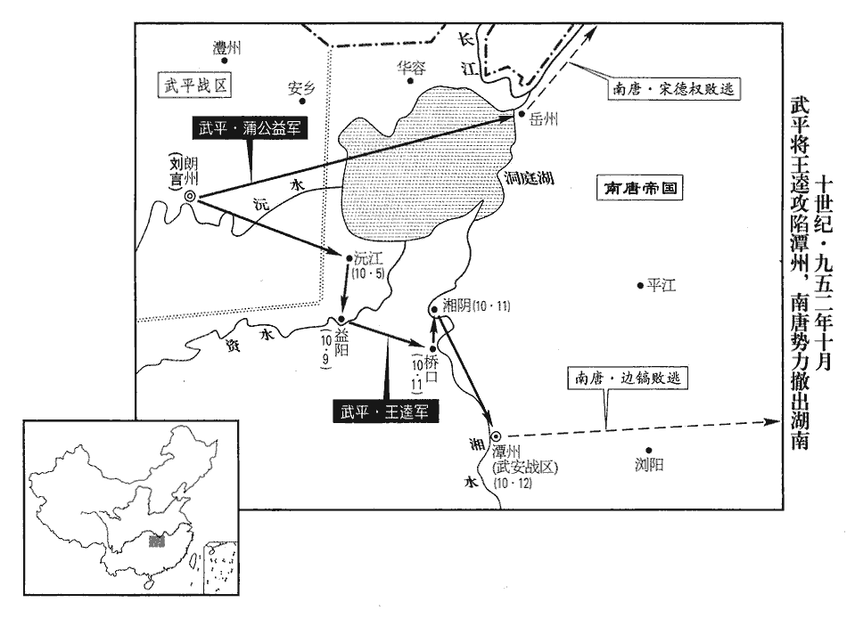
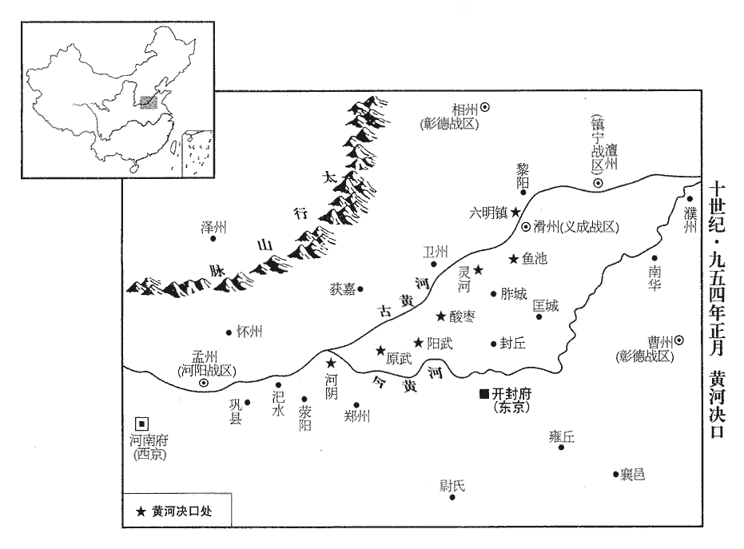
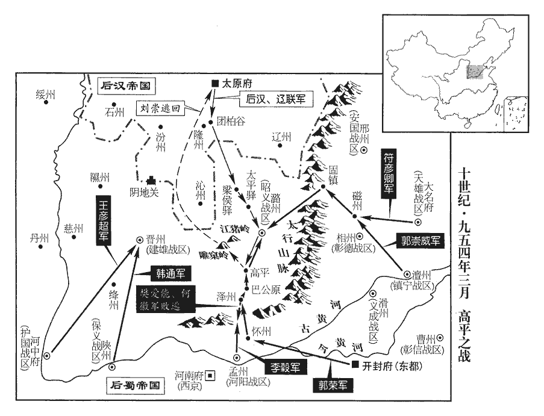
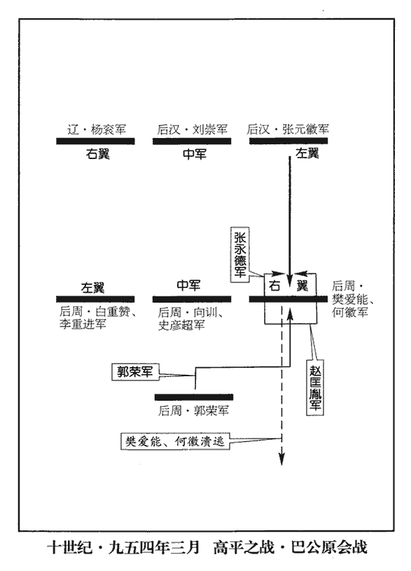
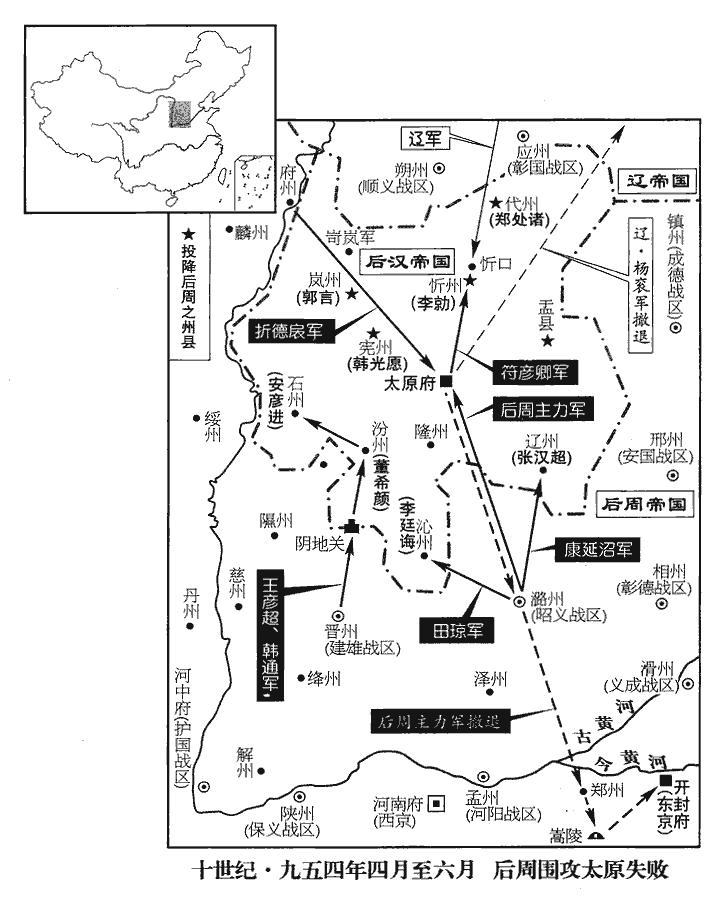

 後周紀二起玄黓困敦（壬子）九月，盡閼逢攝提格（甲寅）四月，凡一年有奇。

# 太祖聖神恭肅文武孝皇帝中

## 廣順二年（壬子、九五二）

1九月，甲寅朔‹一›，吳越‹首都杭州›丞相裴堅卒‹年五十六岁›。以台州‹浙江省临海市›刺史吳延福同參相府事。

〖译文〗 [1]九月，甲寅朔（初一），吴越丞相裴坚去世。任命台州刺史吴延福共同参预丞相府事务。

2庚午‹十七›，敕北边吏民毋得入契丹境俘掠。

〖译文〗 [2]庚午（十七日），后周太祖敕令北部边境官吏百姓不得进入契丹地界掳掠人口财物。

3契丹將高謨翰以葦栰渡胡盧河‹海河支流滏阳河，流经河北省衡水市›入寇，胡盧河，在深、冀之間，橫亘數百里。丁度曰：胡盧河，即衡漳之別名。至冀州‹河北省冀州市›，成德‹总部镇州›節度使何福進遣龍捷都指揮使劉誠誨等屯貝州‹河北省清河县›以拒之。九域志：貝州，北至冀州一百二十里。契丹聞之，遽引兵北渡；所掠冀州丁壯數百人，望見官軍，爭鼓譟，欲攻契丹，官軍不敢應，契丹盡殺之。

〖译文〗 [3]契丹将领高谟翰用芦苇编成的筏子渡过胡卢河入侵，到达冀州，成德节度使何福进派遣龙捷都指挥使刘诚诲等屯驻贝州来抵抗。契丹军队闻讯，马上引兵北上渡河。所劫掠的冀州壮丁数百人，望见官军，争相鼓噪，想要攻击契丹军队，官军不敢响应，契丹军队杀死全部壮丁。

4蜀山南西道‹总部设兴元府陕西省汉中市›節度使李廷珪奏周人聚兵關中，請益兵為備。蜀主‹孟昶（孟仁赞）›遣奉鑾肅衛都虞候趙進將兵趣利州‹四川省广元市›；趣，七喻翻。既而聞周人聚兵以備北漢，乃引還。還，從宣翻，又如字。

〖译文〗 [4]后蜀山南西道节度使李廷奏报后周人在关中地区集结军队，请求增加兵力进行防备。后蜀君主派遣奉銮肃卫都虞候赵进领兵赶赴利州。不久听说后周人集结军队用来防备北汉，于是退兵返回。

5唐武安‹总部潭州›節度使邊鎬，昏懦無斷，斷，丁亂翻。在湖南，政出多門，不合眾心。吉水‹江西省吉水县›人歐陽廣上書，吉水，古吉陽縣地，久廢，唐置吉水縣，屬吉州。九域志：在州東北四十里。宋白曰：隋開皇十年廢吉陽縣入廬陵縣。大業分廬陵縣水東十一鄉為吉水縣。言：「鎬非將帥才，必喪湖南，將，即亮翻。帥，所類翻。喪，息浪翻。宜別擇良帥，益兵以救其敗。」不報。

〖译文〗 [5]南唐武安节度使边镐，昏庸怯懦不决断，在湖南，政令出自多家，不符合民众心意。吉水人欧阳广上书，说：“边镐不是将帅之才，必定会丧失湖南，应该另外选择好的主帅，并增加军队来挽救败亡。”没有答复。

唐主‹李璟（徐景通）›使鎬經略朗州，有自朗州來者，多言劉言忠順，鎬由是不為備。唐主召劉言入朝，朝，直遙翻。言不行，謂王逵曰：「唐必伐我，柰何？」逵曰：「武陵負江湖之險，朗州，武陵郡。帶甲數萬，安能拱手受制於人！邊鎬撫御無方，士民不附，可一戰擒也。」言猶豫未決，周行逢曰：「機事貴速，緩則彼為之備，不可圖也。」言乃以逵、行逢及牙將何敬真、張倣、蒲公益、朱全琇、琇，音秀。宇文瓊、彭萬和、潘叔嗣、張文表十人皆為指揮使，部分發兵。分，扶問翻。叔嗣、文表，皆朗州人也。行逢能謀，文表善戰，叔嗣果敢，三人多相須成功，情款甚昵。昵，尼質翻。

〖译文〗 南唐主让边镐筹划治理朗州，有从朗州来的人，大多说刘言忠诚顺服，边镐因此不作防备。南唐主召刘言进京入朝，刘言不去，对王逵说：“唐必定讨伐我，怎么办？”王逵说：“武陵依托长江、洞庭湖的险要，全副武装的士卒数万，怎么能束手待毙受制于人！边镐治理无方，士人百姓不愿亲附，可以一战就擒获。”刘言犹豫不决，周行逢说：“机密之事贵在神速，动作迟缓的话对方就会作准备，不可谋取了。”刘言于是任命王逵、周行逢以及牙将何敬真、张、蒲公益、朱全、宇文琼、彭万和、潘叔嗣、张文表十人都为指挥使，部署发兵。潘叔嗣、张文表都是朗州人。周行逢擅长计谋，张文表善于作战，潘叔嗣果断勇敢，三人经常互相配合取胜，情投意合，非常亲密。

諸將欲召漵州‹湖南省洪江市西北黔城镇›酋長苻彥通為援，漵，音敘。苻，讀曰蒲。酋，慈由翻。長，知兩翻。苻彥通自謂苻秦苗裔。行逢曰：「蠻貪而無義，前年從馬希萼入潭州，焚掠無遺。事見二百八十九卷漢隱帝乾祐三年。吾兵以義舉，往無不克，烏用此物，使暴殄百姓哉！」乃止。然亦畏彥通為後患，以蠻酋土團都指揮使劉瑫tāo為群蠻所憚，瑫，他牢翻。補西境鎮遏使以備之。

〖译文〗 众将想召唤溆州酋长苻彦通作为援军，周行逢说：“蛮人贪婪而不讲信义，前年跟从马希萼进入潭州，烧杀抢掠没有遗留。我军以义起事勇往直前，攻无不克，何必动用这家伙，让他暴虐残害百姓呢！”于是作罢。然而又怕苻彦通成为后顾之忧，因蛮人酋长团都指挥使刘被众蛮人部落所畏服，便补授他为西境镇遏使来防备苻彦通。

冬，十月，逵等將兵分道趣長沙，趣，七喻翻。以孫朗、曹進為先鋒使，孫朗、曹進奔朗州，見上卷是年正月。邊鎬遣指揮使郭再誠等將兵屯益陽‹湖南省益阳市›以拒之。戊子‹五›，逵等克沅江‹湖南省沅江市›，沅，音元。沅江，漢益陽縣地，隋改為安樂，又改為沅江，乾寧中改為橋江，楚復為沅江，屬朗州。九域志：在岳州西南一百二十六里。執都監劉承遇，裨將李師德帥眾五百降之。帥，讀曰率。降，戶江翻。壬辰‹九›，逵等命軍士舉小舟自蔽，直造益陽，造，七到翻。四面斧寨而入，遂克之，殺戍兵二千人。邊鎬告急於唐。甲午‹十一›，逵等克橋口‹湖南省望城县西北乔口镇›及湘陰‹湖南省湘阴县›。九域志：潭州長沙縣有橋口鎮。乙未‹十二›，至潭州‹湖南省长沙市›，邊鎬嬰城自守；救兵未至，城中兵少，丙申‹十三›夜，鎬棄城走，吏民俱潰。醴陵門橋折，醴陵門，潭州城東門。折，而設翻。死者萬餘人，道州‹湖南省道县›刺史廖偃為亂兵所殺。丁酉‹十四›旦，王逵入城，自稱武平節度副使、權知軍府事，「武平」‹总部朗州›當作「武安」‹总部潭州›。軍府，謂潭州軍府也。以何敬真為行軍司馬。遣敬真等追鎬，不及，斬首五百級。蒲公益攻岳州‹湖南省岳阳市›，風俗通：漢有詹事蒲昌。又晉書載記：氐酋蒲洪之先，其家池中蒲生，長五丈，如竹形，時咸謂之「蒲家」，因以為氏，其後改姓苻。則蒲之所自出有二焉。唐岳州刺史宋德權走，劉言以公益權知岳州。唐將守湖南諸州者，聞長沙陷，相繼遁去。劉言盡復馬氏嶺北故地，惟郴‹湖南省郴州市›、連‹广东省连州市›入于南漢‹首都兴王府›。郴，尹林翻。

〖译文〗 冬季，十月，王逵等领兵分路奔赴长沙，任命孙朗、曹进为先锋使，边镐派遣指挥使郭再诚等领兵屯驻益阳抵抗。戊子（初五），王逵等攻克沅江，抓获都监刘承遇，副将李师德率部众五百人投降。壬辰（初九），王逵等命令军士举着小船遮蔽自己，直达益阳城下，从四面用斧子砍破寨门进入，于是攻克益阳，杀死戍守士兵二千人。边镐向南唐告急。甲午（十一日），王逵等攻克桥口及湘阴；乙未（十二日），到达潭州，边镐据城亲自守卫。救兵没有到达，城中士兵又少，丙申（十三日）夜晚，边镐弃城逃跑，官吏百姓全都溃逃。潭州城东的醴陵门桥断裂，死的有一万多人，道州刺史廖偃被乱军所杀。丁酉（十四日）清晨，王逵进入潭州城，自称武平节度副使，代理主持军府事务，任命何敬真为行军司马。派遣何敬真等追赶边镐，没有追上，斩得首级五百。蒲公益进攻岳州，南唐岳州刺史宋德权逃跑，刘言任命蒲公益代理主持岳州军政。南唐将领守卫湖南各州的，听说长沙陷落，相继逃跑离去。刘言全部收复马氏大庾岭以北旧地，只有郴州、连州落入南汉之手。

 

6契丹瀛‹河北省河间市›、莫‹河北省任丘市北鄚州镇›、幽州‹燕京·北京市›大水，流民入塞，散居河北者數十萬口，契丹州縣亦不之禁。詔所在賑給存處之，賑，津忍翻。處，昌呂翻。中國民先為所掠，得歸者什五六。

〖译文〗 [6]契丹瀛州、莫州、幽州发大水，流民进入边塞散居河北的有数十万人，契丹各州、县也不加禁止。后周太祖下诏书命有关州、县救济接待流民，中原百姓从前被抢掠而得以返归者有十分之五六。

7丁未‹二十四›，穀以病臂久未愈，李穀病臂始上卷是年六月。「穀」上須有「李」字，文乃明。【章：十二行本正有「李」字；孔本同；熊校云宋本無「李」字，不知所據何宋本。】三表辭位，帝遣中使諭指曰：「卿所掌至重，謂李穀掌三司金穀也。朕難其人，苟事功克集，何必朝禮！朝，直遙翻。朕今於便殿待卿，可暫入相見。」穀入見于金祥殿，見，賢遍翻。面陳悃款；悃，苦本翻，誠也。帝不許。穀不得已復視事。復，扶又翻。穀未能執筆，詔以三司務繁，令刻名印用之。

〖译文〗 [7]丁未（二十四日），李因为手臂的伤长久不能痊愈，三次上表要求辞去职位，后周太祖派遣宫中使者传达旨意，说：“爱卿所执掌的事务至为重要，朕实在难得合适的人选，只要事业能够成功，何必讲究朝礼的形式！朕现在便殿等候爱卿，可马上入宫相见。”李入宫在金祥殿谒见，当面陈述由衷之言，太祖不答应。李不得已再主事。李不能握笔，太祖诏令：因三司事务繁杂，命刻李的印章用于公文。

8辛亥‹二十八›，敕：「民有訴訟，必先歷縣州及觀察使處決，不直，處，昌呂翻。乃聽訟於【章：十二行本「訟」作「詣」，無「於」字；乙十一行本同；孔本同；張校同。】臺省，或自不能書牒，倩人書者，必書所倩姓名、居處。若無可倩，聽執素紙。所訴必須己事，毋得挾私客訴。」倩，七政翻，假倩也。事不干己，妄興詞訴，謂之客訴。

〖译文〗 [8]辛亥（二十八日），后周太祖下敕令：“百姓若有诉讼，必须先经县、州以及观察使处理，认为判决不公，才允许向朝廷台省起诉。有人自己不能书写状牒，请他人书写的，必须写明代笔人的姓名、住址。倘若无合适人可请，允许拿着白纸起诉。所申诉的必须是自己的事，不得挟持私心为他诉讼。”

9慶州‹甘肃省庆阳县›刺史郭彥欽性貪，野雞族多羊馬，五代會要：党項野雞族，居慶州北。彥欽故擾之以求賂，野雞族遂反，剽掠綱商；剽，匹妙翻。綱商，往沿邊販易者。薛史：慶州北十五里寡婦山，有蕃部曰野雞族。刺史郭彥欽擅加糴鹽錢，民夷流怨。蕃族獷悍，好為不法，彥欽乃奏野雞族掠奪綱商。帝命寧‹甘肃省宁县›、環‹威州改名·甘肃省环县›二州合兵討之。唐於古鳴沙之地置威州，周改曰環州。九域志：寧州北至慶州一百二十里；環州南至慶州一百八十里。

〖译文〗 [9]庆州刺史郭彦钦生性贪婪，野鸡族部落羊马很多，郭彦钦故意骚扰他们来索求贿赂，野鸡族于是反叛，抢劫贸易商队。后周太祖命令宁州、环州会合军队讨伐。

10劉言遣使來告，稱：「湖南世事朝廷，不幸為鄰寇所陷，鄰寇，謂唐也。臣雖不奉詔，輒糾合義兵，削平舊國。」言削平湖南舊楚之地。

〖译文〗 [10]刘言派遣使者前来报告，说：“湖南世代事奉朝廷，不幸被南唐所攻陷，臣下虽然没接奉诏令，但立即纠合义兵，已经平定湖南楚国旧地。”

唐主削邊鎬官爵，流饒州‹江西省波阳县›。初，鎬以都虞候從查文徽克建州‹闽首都·福建省建瓯市›，事見二百八十五卷晉齊王開運二年，唐主之保大三年也。凡所俘獲皆全之，建人謂之「邊佛子」；及克潭州，市不易肆，事見上卷元年，唐之保大九年也。潭人謂之「邊菩薩」；菩，薄乎翻。薩，桑葛翻。釋典：菩，普也；薩，濟也；言能普濟眾生也。既而為節度使，政無綱紀，惟日設齋供，供，居用翻。盛脩佛事，潭人失望，謂之「邊和尚」矣。

〖译文〗 南唐主削去边镐的官职爵位，流放饶州。当初，边镐任都虞候跟随查文徽攻克建州，凡是所捕获俘虏都保全性命，建州人称他“边佛子”；及至攻克潭州，市场照常营业，潭州人称他“边菩萨”；不久当了节度使，为政没有章法，只是每天摆设斋品，大修佛事，潭州人很失望，称他“边和尚”了。

左僕射同平章事馮延己、右僕射同平章事孫晟上表請罪；皆釋之。晟陳請不已，乃與延己皆罷守本官。

〖译文〗 左仆射同平章事冯延己、右仆射同平章事孙晟上表书请罪。南唐主都宽恕了他们。孙晟陈述请罪不止，才和冯延己一同被罢免同平章事而担任原来的官职。

唐主‹李璟›以比年出師無功，比，毗至翻。乃議休兵息民。或曰：「願陛下數十年不用兵，可小康矣！」唐主曰：「將終身不用，何數十年之有！」人非金石，唐主自謂真能享無疆之壽乎！然欲終身不用兵，而周兵已至淮上矣。唐主思歐陽廣之言，拜本縣‹吉水·江西省吉水县›令。以歐陽廣言邊鎬必敗，其言驗也。

〖译文〗 南唐主因连年出师无功，于是商议停止用兵休养生息。有人说：“希望陛下几十年都不用兵，可以实现小康了。”南唐主说：“我将终身不再用兵，何况几十年呢！”南唐主想起欧阳广当初说的话，授任他为本县县令。

11十一月，辛未‹十九›，徙保義‹总部陕州›節度使折從阮為靜難‹总部邠州›節度使，折從阮自陝州徙邠州。難，乃旦翻；下同。討野雞族。

〖译文〗 [11]十一月，辛未（十九日），后周太祖调任保义节度使折从阮为静难节度使，讨伐野鸡族。

12癸酉‹二十一›，敕：「約每歲民間所輸牛皮，三分減二；計田十頃，稅取一皮，餘聽民自用及賣買，惟禁賣於敵國。」先是，兵興以來，先，悉薦翻。禁民私賣買牛皮，悉令輸官受直。唐明宗‹李嗣源（邈佶烈）›之世，有司止償以鹽；晉天福中‹石敬瑭›，并鹽不給。漢法，犯私牛皮一寸抵死，然民間日用實不可無。帝‹郭威›素知其弊，至是，李穀建議，均於田畝，公私便之。

〖译文〗 [12]癸酉（二十一日），后周太祖颁发敕令：“规定每年民间所进贡的牛皮，减免三分之二。每十顷田，征税收取一张牛皮，其余的任凭百姓自己使用以及相互买卖，只禁止出卖给敌对国家。”在此之前，战争兴起以来，禁止百姓私自买卖牛皮，全部让送到官府接受偿值。唐明宗时，官府只用盐作为偿还。后晋天福年间，连盐都不给。后汉法律规定，犯有私自动用一寸牛皮的处死，然而民间生活日用实在不可缺少。后周太祖素知其中弊端，到这时，李提出建议，将上缴牛皮均摊到田亩里，公私双方都方便。

13十二月，丙戌‹四›，河決鄭‹河南省郑州市›、滑‹河南省滑县›，遣使行視脩塞。行，下孟翻。塞，悉則翻。

〖译文〗 [13]十二月，丙戌（初四），黄河在郑州、滑州决口，后周太祖派遣使者巡视堵塞决口。

14甲午‹十二›，前靜難‹总部邠州›節度使侯章獻買宴絹千匹，銀五百兩；帝不受，曰：「諸侯入覲，天子宜有宴犒，豈待買邪！五代之時不特方鎮入朝買宴，唐明宗天成二年三月，幸會節園，群臣買宴，則在朝之臣亦買宴矣。犒，苦到翻。自今如此比者，皆不受。」

〖译文〗 [14]甲午（十二日），前静难节度使侯章进献买宴绢一千匹、银子五百两，后周太祖不接受。说：“诸侯入朝觐见，天子应该有宴席犒劳，岂能等人出钱买宴呢！从今以后像这类的进贡，一律不接受。”

15王逵將兵及洞蠻五萬攻郴州‹湖南省郴州市›，郴，丑林翻。南漢‹首都兴王府›將潘崇徹救之，遇于蠔石。蠔石，在郴州義章縣。蠔，音豪。崇徹登高望湖南兵，曰：「疲而不整，可破也。」縱擊，大破之，伏尸八十里。

〖译文〗 [15]王逵率领所部以及洞蛮军队五万进攻郴州，南汉将领潘崇彻救援郴州，在石相遇。潘崇彻登高观望湖南军队，说：“疲惫而不整齐，可以击败。”纵兵出击，大败王逵，倒伏的尸体长达八十里。

16翰林學士徐台符請誅誣告李崧者葛延遇及李澄，誣李崧事見二百八十八卷漢乾祐元年。徐台符素與李崧善，故為請誅誣告者。馮道以為屢更赦，不許。更，工衡翻。王峻嘉台符之義，白於帝，癸卯‹二十一›，收延遇、澄，誅之。

〖译文〗 [16]翰林学士徐台符请求诛杀诬告李崧的葛延遇和李澄，冯道认为屡经赦免，不准许。王峻赞许徐台符的义气，向后周太祖禀报。癸卯（二十一日），逮捕葛延遇、李澄，诛杀二人。

17劉言表稱潭州殘破，乞移使府治朗州，使，疏吏翻。且請貢獻、賣茶，悉如馬氏故事；許之。

〖译文〗 [17]刘言上表称说潭州残坏破败，请求将节度使府治迁移到朗州，并且请求进纳贡献、卖买茶叶，全部比照马氏成例，后周太祖准许。

18唐江西‹首府设洪州江西省南昌市›觀察使楚王馬希萼入朝，唐主‹李璟›留之，後數年，卒於金陵‹江苏省南京市›，謚曰恭孝。

〖译文〗 [18]南唐江西观察使楚王马希萼进京入朝，南唐主留他在京，几年之后，马希萼在金陵去世，谥号为恭孝。

19初，麟州‹陕西省神木县›土豪楊信自為刺史，受命于周。信卒，子重訓嗣，考異曰：「崇訓」或作「崇勳」。世宗實錄作「崇訓」，後蓋避梁王宗訓改名也。按考異則「重訓」當作「崇訓」。以州降北漢；至是，為群羌所圍，復歸款，復，扶又翻。求救於夏‹陕西省靖边县北白城子›、府‹陕西省府谷县›二州。夏州，李彝殷；府州，折德扆。九域志：麟州，西北至夏州一百二十里，東北至府州一百二十里。

〖译文〗 [19]当初，麟州土豪杨信自称刺史，接受后周的命令。杨信去世，儿子杨重训继位，带着麟州投降北汉。到这时，被众多羌人部落所包围，又归附投诚后周，向夏、府二州求救。

## 三年（癸丑、九五三）

1春，正月，丙辰‹五›，‹后周，首都开封府河南省开封市›郭威，本年五十岁以武平‹总部朗州›留後劉言為武平節度使，制置武安‹总部潭州›•靜江‹总部桂州›等軍事、同平章事；以王逵為武安節度使，何敬真為靜江節度使，周行逢為武安行軍司馬。王逵既得潭州，則殺何敬真；既殺何敬真，則攻劉言而併朗州。

〖译文〗 [1]春季，正月，丙辰（初五），后周太祖任命武平留后刘言为武平节度使、置制武安及静江等军事、同平章事。任命王逵为武安节度使，何敬真为静江节度使，周行逢为武安行军司马。

2詔折從阮：「野雞族能改過者，拜官賜金帛，不則進兵討之。」壬戌‹十一›，從阮奏：「酋長李萬全等受詔立誓外，酋，慈秋翻。長，知兩翻。自餘猶不服，方討之。」

〖译文〗 [2]后周太祖下诏书给折从阮：“野鸡族首领能够改过的，授于官职赏赐金帛，怙恶不悛的就进兵讨伐。”壬戌（十一日），折从阮奏报：“除酋长李万全等接受诏书立誓改过之外，其余的仍然不肯降服，正在讨伐他们。”

3前世屯田皆在邊地，使戍兵佃之。佃，亭年翻。唐末，中原宿兵，所在皆置營田以耕曠土；其後又募高貲戶使輸課佃之，輸，舂遇翻；下歲輸同。戶部別置官司總領，不隸州縣，或丁多無役，或容庇奸盜，州縣不能詰。詰，去吉翻。梁太祖擊淮南，掠得牛以千萬計，朱全忠大掠淮南見二百六十五卷唐昭宗天祐元年。給東南諸州農民，使歲輸租。自是歷數十年，牛死而租不除，民甚苦之。帝素知其弊，會閤門使、知青州‹山东省青州市›張凝上便宜，請罷營田務，李穀亦以為言，乙丑‹十四›，敕：「悉罷戶部營田務，以其民隸州縣；其田、廬、牛、農器，並賜見佃者為永業，見，賢遍翻。悉除租牛課。」是歲，戶部增三萬餘戶。民既得為永業，始敢葺屋植木，獲地利數倍。或言：「營田有肥饒者，不若鬻之，可得錢數十萬緡以資國。」帝曰：「利在於民，猶在國也，朕用此錢何為！」

〖译文〗 [3]前代屯田都在边疆地带，让卫戍的士兵耕种。唐朝末年，中原驻扎军队，所在之处都设置营田来耕种空旷土地。以后又招募钱多的富户耕种让他们交纳租税，户部另外设置机构总管，不隶属于州、县，有的壮丁多而无徭役，有的收容庇护奸人盗贼，州、县没法追究。后梁太祖进击淮南，抢掠到的牛数以千万计，提供给东南各州农民，让他们每年交租。自此经过几十年后，牛死而租不免除，农民深受其苦。后周太祖素知其中弊端，正好门使、知青州张凝上奏请便宜行事，要求撤销营田事务，李也这样说，乙丑（十四日），颁敕令：“全部取消户部营田事务，将耕种营田的农民隶属于州、县。他们的田地、庐舍、耕牛、农具，同时赐给现在耕种者作为永久产业，全部免除牛租的征收。”这一年，户部增加三万多户人口。农民既已得到这些成为永久产业，方才敢修葺房屋、种植树木，获取地利数倍于以前。有人说：“营田中有肥沃富饶的，不如卖掉它，可以得钱数十万缗来充实国库。”后周太祖说：“利益在农民那里，如同在国家一样，朕用这些钱干什么！”

4萊州‹山东省莱州市›刺史葉仁魯，帝之故吏也，按葉仁魯，漢高祖之親將也，天福十二年，嘗破契丹于承天軍；今曰帝之故吏，必嘗事帝於樞密院，或討河中、鎮鄴都時也。坐贓絹萬五千匹，錢千緡，庚午‹十九›，賜死；帝遣中使賜以酒食曰：「汝自抵國法，吾無如之何！當存恤汝母。」仁魯感泣。

〖译文〗 [4]莱州刺史叶仁鲁是后周太祖的旧吏，因贪污绢帛一万五千匹、钱一千缗而被判罪，庚午（十九日），赐其自杀。后周太祖派遣宫中使者赐给酒和食物，说：“你自己触犯国法，我没有什么办法！必当关照抚恤你的母亲。”叶仁鲁感动得流下眼泪。

5帝以河決為憂，王峻自請往行視，許之。行，下孟翻。鎮寧‹总部澶州›節度使榮屢求入朝，峻忌其英烈，每沮止之。沮，在呂翻。閏月，榮復求入朝，復，扶又翻。會峻在河上，帝乃許之。

〖译文〗 [5]后周太祖为黄河决口而忧愁，王峻自己请求前往巡视，后周太祖准许。镇宁节度使郭荣屡次请求进京入朝，王峻忌恨他英武勇烈，经常阻挠。闰月，郭荣又请求进京入朝，正好王峻外出在黄河边上，太祖就答应了。

6契丹‹首都临潢府内蒙古巴林左旗›寇定州‹河北省定州市›，圍義豐軍‹河北省安国市›，時置義豐軍於定州義豐縣。定和都指揮使楊弘裕夜擊其營，大獲，契丹遁去。又寇鎮州‹河北省正定县›，本道兵擊走之。

〖译文〗 [6]契丹侵犯定州，包围义丰军，定和都指挥使杨弘裕夜晚袭击敌营，大获全胜，契丹军队逃跑离去。契丹军队又侵犯镇州，当地军队击败赶走了敌人。

7丙申‹十五›，鎮寧節度使榮入朝‹开封府›。故李守貞騎士馬全乂從榮入朝，帝‹郭威›召見，補殿前指揮使，謂左右曰：「全乂忠於所事，昔在河中‹山西省永济市›，屢挫吾軍，謂漢乾祐間，帝討李守貞時也。汝輩宜效之。」王峻聞榮入朝，遽自河上歸，戊戌‹十七›，至大梁‹首都开封府所在城›。

〖译文〗 [7]丙申（十五日），镇宁节度使郭荣进京入朝。原李守贞的骑士马全随郭荣入朝，后周太祖召见他，补授他为殿前指挥使，对左右的人说：“马全忠于所服务的主人，从前在河中时，屡次挫败我的军队，你们应该仿效他。”王峻听说郭荣进京入朝，赶紧从黄河边上返回，戊戌（十七日），到达大梁。

8彰武‹总部延州›節度使高允權卒，其子牙內指揮使紹基謀襲父位，詐稱允權疾病，表己知軍府事。觀察判官李彬切諫，紹基怒，斬之，辛巳‹三十›，以彬謀反聞。

〖译文〗 [8]彰武节度使高允权去世，他的儿子牙内指挥使高绍基图谋承袭父亲职位，谎称高允权病重，上表自己主持军府事务。观察判官李彬恳切劝谏，高绍基发怒，斩杀了他，辛巳（疑误），捏造李彬图谋造反向上报告。

9王峻固求領藩鎮，帝不得已，以【章：十二行本「以」上有「壬寅」二字；乙十一行本同；孔本同；張校同；退齋校同。】峻兼平盧‹总部青州›節度使。

〖译文〗 [9]王峻再三请求兼领藩镇，后周太祖不得已，任命王峻兼任平卢节度使。

10高紹基屢奏雜虜犯邊，冀得承襲，帝遣六宅使張仁謙詣延州‹陕西省延安市›巡檢，職官分紀曰：唐置十宅、六宅使，以諸王所屬為名，或總云十六宅，後止曰六宅。紹基不能匿，始發父喪。

〖译文〗 [10]高绍基屡次奏报各部强虏侵犯边境，希望能承袭父职，后周太祖派遣六宅使张仁谦到延州巡视检查，高绍基不能再隐瞒，才发布父丧。

11戊申‹二十七›，折從阮‹静难总部邠州›奏降野雞二十一族。

〖译文〗 [11]戊申（二十七日），折从阮奏报降伏野鸡二十一个部族。

12唐‹首都金陵府江苏省南京市›草澤邵棠上言：布衣未有朝命者，謂之草澤。上，時掌翻。「近游淮上，聞周主‹郭威›恭儉，增脩德政。吾兵新破於潭‹湖南省长沙市›、朗‹湖南省常德市›，謂邊鎬潭州之敗也。恐其有南征之志，宜為之備。」智識之士，何國無之！顧用與不用耳。

〖译文〗 [12]南唐布衣之士邵棠上言说：“近来出游淮上，听说周主恭敬俭朴，不断推行德政。我国军队新近在潭州、朗州失利，恐怕周有南征的意向，应该为此作好防备。”

13初，王逵既得潭州，事見上卷十月。以指揮使何敬真為靜江‹总部桂州›節度副使，朱全琇為武安節度副使，張文表為武平‹总部朗州›節度副使，周行逢為武安行軍司馬。敬真、全琇各置牙兵，與逵分廳視事，吏民莫知所從。每宴集，諸將使酒，紛拏ná如市，無復上下之分，拏，奴加翻。分，扶問翻。唯行逢、文表事逵盡禮，逵親愛之。敬真與逵不協，辭歸朗州，又不能事劉言，與全琇謀作亂。言素忌逵之強，疑逵使敬真伺己，將討之，逵聞之，甚懼。伺，相吏翻。行逢曰：「劉言素不與吾輩同心，何敬真、朱全琇恥在公下，公宜早圖之。」逵喜曰：「與公共除凶黨，同治潭、朗，周行逢之據有潭、朗，自此造端矣。治，直之翻。夫復何憂！」夫，音扶。復，扶又翻。會南漢‹首都兴王府›寇全‹广西全州县›、道‹湖南省道县›、永州‹湖南省永州市›，行逢請：「身至朗州說言，說，式芮翻。遣敬真、全琇南討，南討者，拒南漢之兵。俟至長沙，以計取之，如掌中物耳。」逵從之。行逢至朗州，言以敬真為南面行營招討使，全琇為先鋒使，將牙兵百餘人會潭州兵以禦南漢。二人至長沙，逵出郊迎，相見甚歡，宴飲連日，多以美妓餌之，妓，渠綺翻。敬真因淹留不進。朗州指揮使李仲遷部兵三千人久戍潭州，敬真使之先發，趣嶺北，全、道、永三州皆在大庾嶺之北。趣，七喻翻。都頭符會等因士卒思歸，劫仲遷擅還朗州。逵乘敬真醉，使人詐為言使者，責敬真以「南寇深侵，不亟捍禦而專務荒宴，太師命械公歸西府，」太師，謂劉言。朗府在潭州之西，故謂之西府。因收繫獄。全琇逃去，遣兵追捕之。二月，辛亥朔‹一›，斬敬真以徇。未幾，幾，居豈翻。獲全琇及其黨十餘人，皆斬之。

〖译文〗 [13]当初，王逵既已取得潭州，便任命指挥使何敬真为静江节度副使，朱全为武安节度副使，张文表为武平节度副使，周行逢为武安行军司马。何敬真、朱全各自设置警卫牙兵，与王逵分厅处理政务，官吏百姓不知应该听从谁的。每次宴请聚会，众将领酗酒使性，纷纭杂乱得像市场一样，不再有上下尊卑的区分，只有周行逢、张文表对待王逵恭敬有礼，所以王逵亲近喜爱这两人。何敬真与王逵不和，告辞返归朗州，但又不肯服从刘言，便与朱全谋划发动叛乱。刘言一向顾忌王逵的强大，怀疑王逵派何敬真来窥探自己，准备征讨王逵，王逵闻知，很恐惧。周行逢说：“刘言素来不与我们一条心，何敬真、朱全以在您手下为耻，您应当及早处置他们。”王逵大喜说：“与您共同翦除凶党乱徒，一道统治潭州、朗州，还有什么忧愁！”正好遇上南汉入侵全州、道州、永州，周行逢请命：“我愿单身到朗州劝说刘言，让他派遣何敬真、朱全南下讨伐，等二人到达长沙，设计捉拿，犹如拿取掌中之物那样容易。”王逵听从此计，周行逢到达朗州，刘言任命何敬真为南面行营招讨使，朱全为先锋使，率领牙兵百余人会合潭州军队来抵御南汉。两人到达长沙，王逵亲自出城到郊外迎接，相互见面显得非常欢喜，设宴畅饮接连几天，常用美貌妓女款待引诱他们，何敬真因此滞留不再前进。朗州指挥使李仲迁所部军队三千人长久戍守潭州，何敬真让他先出发，赶赴大庾岭北面，都头符会等因士兵思归故里，劫持李仲迁擅自返回朗州。王逵乘何敬真大醉，派人假装成刘言的使者，斥责何敬真：“南面敌寇大举入侵，不立即防御抵抗而专门追求荒淫玩乐，太师命令给您戴上脚镣手铐押回西府朗州。”趁机将何敬真逮捕关进监狱。朱全逃跑离去，派兵追捕他。二月，辛亥朔（初一），斩杀何敬真来示众。不久，捕获朱全及其党羽十几人，全部斩首。

14癸丑‹三›，鎮寧節度使榮歸澶州‹河南省濮阳市›。澶，時連翻。

〖译文〗 [14]癸丑（初三），镇宁节度使郭荣返归澶州。

15初，契丹主德光北還，見二百八十六卷天福十二年。以晉傳國寶自隨，至是，更以玉作二寶。傳國寶及受命寶也。五代會要曰：時製寶兩座，用白玉，方六寸，螭虎紐，馮道書寶文，其一以「皇帝承天受命之寶」為文，其一以「皇帝神寶」為文。宋白曰：時內司製二寶，詔太常具制度以聞。有司言：唐六典：符寶郎掌天子八璽，其一曰神寶，二曰受命寶。其神寶方六寸，高四寸六分，厚一寸七分，蟠龍紐，文與傳國璽同。傳國璽，秦皇以藍田玉刻之，李斯篆，方四寸，面文曰「受命于天，既壽永昌」。紐盤五龍。二寶歷代相傳，以為神器。別有六寶：一曰皇帝行璽，二曰皇帝之璽，三曰皇帝信璽，四曰天子行璽，五曰天子之璽，六曰天子信璽。此六璽，因文為名，並白玉，螭虎紐，歷代傳受，或亡失則補之。北朝鑄之以金。貞觀十六年，別製玄璽一座，文曰「皇天景命，有德者昌」。白玉，螭虎紐。同光中製寶一座，文曰：「皇帝受命之寶」。天福三年製寶一座，文曰「皇帝神寶」。其同光、天福二寶，內司製造，不見紐、篆、分寸制度。敕今製國寶兩座，其一宜以「皇帝承天受命之寶」為文，其一以「皇帝神寶」為文，命中書令馮道書寶。議者曰：國以玉璽為傳授神器，邃古無聞。運斗樞曰：舜、禹天子，黃龍負璽。世本曰：魯昭公始作璽。秦兼六國，稱皇帝，禮取藍田之玉，玉工孫壽刻之，方四寸，李斯為大篆書之，形制如龍魚鳳鳥之狀，希世之至寶也。秦亡，子嬰以璽降漢，漢世世傳寶之。王莽之篡，求璽於元后，后投之於階，一角微缺。莽誅，歸之更始。更始敗，歸之盆子。及熊耳之敗，盆子以璽降光武。漢末，黃巾亂，投璽於井。孫堅入洛，見井有五色氣，取得之，以歸袁術。術敗，荊州刺史徐璆qiú得之，詣許，以進獻帝。魏受漢，得之以傳于晉。洛陽之陷，劉聰得之。劉曜為石勒所禽，璽歸于鄴。石氏之亂，冉閔得之。閔敗，晉將戴施入鄴得之，送江東，傳之宋、齊、梁。臺城之破，侯景得之。景敗，其將侯子鑒以璽走，為追兵所迫，投於栖霞寺井中，僧永杼得而匿之。陳永定二年，永弟子普智以璽上陳文帝。隋平陳，始得秦真傳國璽。煬帝江都之禍，宇文化及得之。化及敗，璽歸竇建德。建德敗，其妻曹氏以璽獻于唐。唐禪，楊涉送寶于大梁。莊宗滅梁得之。同光末，內難作，寶為火灼，文字訛缺，明宗得之。清泰敗，以寶隨身，自焚而死，寶遂亡失。其神寶者，方六寸，厚一寸七分，高四寸六分，蟠龍隱起，文與秦璽同，但玉色不及，形制高大耳，不知何代製造。東晉孝武十九年，雍州刺史郗恢得之。慕容永送於金陵，傳之宋、齊、梁，臺城之破，侯景得之。景敗，侍中趙思齊攜走江北，獻之齊文宣帝。宇文滅齊得之。宇文亡，入隋。隋文帝改號傳國璽，又改為受命璽，及平陳，始得秦真傳國璽。仍以秦璽後出，得於亡陳，以北朝所傳神璽為第一，秦璽次之。隋亡，竇建德妻與神璽俱獻長安。唐末，不知所在。其說頗有源委，因載于此。更，工衡翻。

〖译文〗 [15]当初，契丹主耶律德光返回北方，将后晋传国玺印随身携走。到这时，又用玉做两枚玺印。

16王逵遣使以斬何敬真告劉言，言不得已，庚申‹十›，斬符會等數人。以符會等擅歸召變也。

〖译文〗 [16]王逵派遣使者将何敬真斩首报告刘言，刘言不得已，于庚申（初十），将符会等多人斩首。

17樞密使、平盧‹总部青州›節度使、同平章事王峻，晚節益狂躁，奏請以端明殿學士顏衎、衎，苦旱翻，又苦旦翻。樞密直學士陳觀代范質、李穀為相，帝曰：「進退宰輔，不可倉猝，俟朕更思之。」峻力論列，語浸不遜；日向中，帝尚未食，峻爭之不已，帝曰：「今方寒食，俟假開，如卿所奏。」峻乃退。舊制，寒食節休假前後共五日。假，居訝翻。

〖译文〗 [17]枢密使、平卢节度使、同平章事王峻，晚年性情益发狂妄急躁，奏请任用端明殿学士颜、枢密直学士陈观取代范质、李为宰相，后周太祖说：“调换宰相，不可仓促行事，待朕再考虑一番。”王峻极力陈述己见，言语愈来愈不恭敬。太阳已近正中，太祖还未进食，王峻争执没个完，太祖说：“如今正是寒食节，等待休假结束，就照爱卿所奏办理。”王峻这才退下。

癸亥‹十三›，帝亟召宰相、樞密使入，幽峻於別所。帝見馮道等，泣曰：「王峻陵朕太甚，欲盡逐大臣，翦朕羽翼。朕惟一子，專務間阻，暫令詣闕，已懷怨望。間，古莧翻。令詣闕，謂聽皇子榮自澶州入朝也。豈有身典樞機，復兼宰相，又求重鎮！復，扶又翻。峻求領藩鎮見上月。觀其志趣，殊未盈厭。厭，於豔翻，又於鹽翻。無君如此，誰則堪之！」甲子‹十四›，貶峻商州‹陕西省商州市›司馬，制辭略曰：「肉視群后，孩撫朕躬。」言視朝臣如机上肉，撫天子如嬰孩。帝慮鄴都‹大名府·河北省大名县›留守王殷不自安，王峻、王殷佐命有功一體之人，峻得罪，故慮殷猜懼。命殷子尚食使承誨詣殷，尚食使，唐尚食奉御之職。諭以峻得罪之狀。峻至商州，得腹疾，帝猶愍之，命其妻往視之，未幾而卒。幾，居豈翻。

〖译文〗 癸亥（十三日），后周太祖紧急召见宰相、枢密使入朝，将王峻软禁在别的地方。太祖见到冯道等人，流下眼泪说：“王峻欺朕太甚，想将大臣全部驱逐，翦除朕的左膀右臂。朕只有一子，王峻却专门设置障碍，临时让他进京入朝，王峻得知便已满腔怨恨。况且岂有一身既主持枢密院，又兼任宰相，还要求遥领重要藩镇的道理！观察他的志向意趣，永无满足。目中无君如此，谁能忍受！”甲子（十四日），贬谪王峻为商州司马，制书之辞大略说：“视群臣如案板上的肉，待朕身似几岁孩童。”太祖顾虑邺都留守王殷会自感不安，命王殷儿子尚食使王承诲前往王殷处，告知王峻获罪的情况。王峻到达商州，得了腹泄病，太祖仍然可怜他，命他的妻子前往探视，王峻不久便去世了。

18帝命折從阮分兵屯延州‹陕西省延安市›，折從阮時為靜難帥，帥兵討野雞族而還師。高紹基始懼，屢有貢獻。又命供奉官張懷貞將禁兵兩指揮屯鄜‹陕西省富县›、延‹陕西省延安市›，鄜，方無翻。紹基乃悉以軍府事授副使張匡圖。甲戌‹二十四›，以客省使向訓權知延州。

〖译文〗 [18]后周太祖命折从阮分兵屯驻延州，高绍基开始害怕，时常有贡物给朝廷。太祖又命供奉官张怀贞率领禁兵两个指挥屯驻州、延州，高绍基这才把全部军府事务交给节度副使张匡图。甲戌（二十四日），任命客省使向训出守延州。

19三月，甲申‹五›，以鎮寧節度使榮為開封尹、晉王。王峻既貶，始召榮。丙戌‹七›，以樞密副使鄭仁誨為鎮寧‹总部澶州河南省濮阳市›節度使。

〖译文〗 [19]三月，甲申（初五），后周太祖任命镇宁节度使郭荣为开封尹、晋王。丙戌（初七），任命枢密副使郑仁诲为镇宁节度使。

20初，殺牛族與野雞族有隙，聞官軍討野雞，饋餉迎奉，官軍利其財畜而掠之；殺牛族反，與野雞合，敗寧州‹甘肃省宁县›刺史張建武于包山‹甘肃省庆阳县北›。敗，補邁翻。帝以郭彥欽擾群胡，致其作亂，事見上年十月。黜廢於家。

〖译文〗 [20]当初，杀牛族与与野鸡族有磨擦，听说官府军队讨伐野鸡族，便馈送军粮迎接侍奉，官府军队贪图他们的财产牲畜而进行抢掠。杀牛族即造反，与野鸡族联合，在包山打败宁州刺史张建武。后周太祖因为郭彦钦骚扰各胡人部族，导致发生叛乱，将他革职为民。

21初，解州‹山西省运城市西南解州镇›刺史浚儀‹首都开封府所在县·河南省开封市›郭元昭與榷鹽使李溫玉有隙，漢隱帝分河中之解、安邑、聞喜為解州。解，戶買翻。榷，古岳翻。溫玉壻魏仁浦為樞密主事，晉有尚書都令史八人，秩二百石，與左、右丞總知都臺事；梁五人，謂之五都令史。隋開皇初，改都令史為都事，置八人。後魏於尚書諸司置主事令史，隋於諸省又各置主事令史；煬帝並去令史之名，更曰主事；初雜用士人，至唐並用流外，至五代樞密院亦置主事。元昭疑仁浦庇之；會李守貞反，溫玉有子在河中‹山西省永济市›，元昭收繫溫玉，奏言其叛，事連仁浦。帝時為樞密使，知其誣，釋不問。至是，仁浦為樞密承旨，元昭代歸，甚懼，過洛陽，以告仁浦弟仁滌，仁滌曰：「吾兄平生不與人為怨，況肯以私害公乎！」既至，丁亥‹八›，仁浦白帝，以元昭為慶州‹甘肃省庆阳县›刺史。

〖译文〗 [21]当初，解州刺史浚仪人郭元昭与榷盐使李温玉有裂隙，李温玉女婿魏仁浦为枢密主事，郭元昭怀疑魏仁浦庇护岳丈；正好遇上河中李守贞造反，李温玉有个儿子在河中，郭元昭拘捕关押李温玉，上奏报告他叛变，事情牵连到魏仁浦。后周太祖当时任枢密使，知道这是诬告，便放在一边不加追问。到这时，魏仁浦任枢密承旨，郭元昭调职归京，很害怕，路过洛阳，来告诉魏仁浦的弟弟魏仁涤，魏仁涤说：“我哥哥平素不与人结怨记仇，怎么肯因私人恩怨来害您呢！”郭元昭已到京，丁亥（八日），魏仁浦报告后周太祖，任命郭元昭为庆州刺史。

22己丑‹十›，以棣州‹山东省惠民县›團練使太原‹山西省太原市›王仁鎬為宣徽北院使兼樞密副使。

〖译文〗 [22]己丑（初十），后周太祖任命棣州团练使太原人王仁镐为宣徽北院使兼枢密副使。

23唐主‹李璟（徐景通）本年三十八岁›復以左僕射馮延己同平章事。去年十月，唐失潭州，馮延己罷相。

〖译文〗 [23]南唐主又任命左仆射冯延己为同平章事。

24周行逢惡武平節度副使張倣，惡，烏路翻。言於王逵曰：「何敬真，倣之親戚，臨刑以後事屬倣，公宜備之。」屬，之欲翻。夏，四月，庚申‹十一›，逵召倣飲，醉而殺之。

〖译文〗 [24]周行逢厌恶武平节度使副张，向王逵禀告说：“何敬真是张的亲戚，何敬真临刑时将后事托付给张，您应防备他。”夏季，四月，庚申（十一日），王逵召张喝酒，灌醉后杀了他。

25丙寅‹十七›，歸德‹首都宋州，河南省商丘市›節度使兼侍中常思入朝，戊辰‹十九›，徙平盧‹总部青州›節度使。將行，奏曰：「臣在宋州，舉絲四萬餘兩在民間，謹以上進，請徵之。」舉絲者，以貨物貸與民，至絲熟而徵其絲。上，時掌翻。帝頷之。五月，丁亥‹九›，敕牓宋州，凡常思所舉悉蠲之，思【章：十二行本「思」上有「已輸者復歸之」六字；乙十一行本同；孔本同：退齋校同。】亦無怍色。怍，疾各翻。

〖译文〗 [25]丙寅（十七日），归德节度使兼侍中常思进京入朝；戊辰（十九日），调任平卢节度使。常思将要出行，启奏说：“臣下在宋州，在民间发放四万余两丝的债，谨将债权进献皇上，请到时征收。”后周太祖点头。五月，丁亥（初九），太祖向宋州颁发布告，凡是常思所放的债全部豁免，常思知道后也没有惭愧的样子。

26自唐末以來，所在學校廢絕，蜀‹首都成都府四川省成都市›毋昭裔出私財百萬營學館，校，戶教翻。毋，音無，姓也。齊宣王封母弟於毋鄉，其後因以為氏。且請刻板印九經；蜀主‹孟昶（孟仁赞）本年三十五岁›從之。由是蜀中文學復盛。自漢司馬相如、揚雄以來，蜀中號為多士，而斯文之盛衰則繫乎上之人。

〖译文〗 [26]自从唐朝末年以来，各地学校荡然无存，后蜀毋昭裔拿出私人财产上百万营办学馆，并且请求刻板印刷《九经》；后蜀主听从了他。由此蜀地的文艺学术重新昌盛。

27六月，壬子‹四›，滄州奏契丹知盧臺軍‹天津市宁河县›事范陽‹涿州州政府所在县·河北省涿州市›張藏英來降。

〖译文〗 [27]六月，壬子（初四），沧州奏报契丹的知卢台军事范阳人张藏英前来投降。

28初，唐明宗‹李嗣源›之世，宰相馮道、李愚請令判國子監田敏校正九經，刻板印賣，朝廷從之。丁巳‹九›，板成，獻之。雕印九經始二百七十七卷唐明宗長興三年，至是而成，凡涉二十八年。由是，雖亂世，九經傳布甚廣。史言聖人之道所以不墜者，以其有方策之傳也。

〖译文〗 [28]当初，后唐明宗时，宰相冯道、李愚请示让判国子监田敏校正《九经》，刻板印刷出售，朝廷同意。丁巳（初九），刻板完成，进献朝廷。从此，虽然世道大乱，但《九经》的传布仍然很广。

29王逵以周行逢知潭州，自將兵襲朗州，克之，殺指揮使鄭珓，珓，古孝翻。執武安節度使、同平章事劉言，幽于別館。劉言為武平節度使、鎮朗州，非武安也。「安」當作「平」。言以元年七月得朗州，至是而敗。

〖译文〗 [29]王逵任命周行逢主持潭州事务，自己领兵袭击朗州，攻克州城，杀死指挥使郑，抓获武安节度使、同平章事刘言，囚禁在客馆。

30秋，七月，王殷三表請入朝，帝疑其不誠，遣使止之。

〖译文〗 [30]秋季，七月，王殷三次上表请求进京入朝，后周太祖怀疑他不诚心，派遣使者制止。

31唐大旱，井泉涸，淮水可涉，飢民渡淮而北者相繼，濠‹安徽省凤阳县东北临淮关›、壽‹安徽省寿县›發兵禦之，民與兵鬬而北來。觀民心之向背，唐之君臣可以岌岌矣。帝聞之曰：「彼我之民一也，聽糴dí米過淮。」唐人遂築倉，多糴以供軍。八月，己未‹十二›，詔唐民以人畜負米者聽之，以舟車運載者勿予。予，讀曰與。

〖译文〗 [31]南唐大旱，井水、泉水干涸，淮河干得可徒步而过，饥民渡过淮河北上的接连不断，南唐濠州、寿州发兵阻止，百姓与士兵争斗朝北奔来。后周太祖闻悉此情说：“对方和我方的百姓是一样的，听凭南面百姓过淮河来买粮。”南唐人于是修筑仓库，多买粮食来供应军队。八月，己未（十二日），后周太祖颁诏令：南唐百姓用人力和牲口拉粮食的准许，用船只车辆运载粮食的不给。

32王逵遣使上表，誣「劉言謀以朗州降唐，又欲攻潭州‹湖南省长沙市›，其眾不從，廢而囚之，臣已至朗州撫安軍府訖。」且請復移使府治潭州。去年，劉言表移使府於朗州。甲戌‹十七›，遣通事舍人翟光裔詣湖南‹首府潭州›宣撫，從其所請。翟，萇伯翻，又徒歷翻。逵還長沙，以周行逢知朗州事，又遣潘叔嗣殺劉言於朗州。為潘叔嗣殺王逵、周行逢殺叔嗣張本。

〖译文〗 [32]王逵派遣使者上表书，诬称：“刘言阴谋率朗州向南唐投降，又准备攻打潭州，他的部众不肯从命，将他废黜并囚禁，臣下已经到达朗州安抚军府完毕。”并且请求将节度使府治再迁移到潭州。甲戌（二十七日），后周太祖派遣通事舍人翟光裔到湖南宣旨安抚，同意王逵的请求。王逵返回长沙，任命周行逢主持朗州事务，又派遣潘叔嗣在朗州杀死刘言。

33九月，己亥‹二十二›，武成‹义成，总部滑州›節度使白重贊奏塞決河。滑州自唐以來，置義成節度；宋朝太平興國元年，以太宗舊名，始改為武成軍。於此時「武」當作「義」。塞，悉則翻。

〖译文〗 [33]九月，己亥（二十二日），武成节度使白重赞奏报堵塞黄河决口。

34契丹寇樂壽‹河北省献县›，齊州戍兵右保寧都頭劉漢章殺都監杜延熙，謀應契丹，不克，并其黨伏誅。

〖译文〗 [34]契丹军队侵犯乐寿，齐州卫戍部队右保宁都头刘汉章杀死都监杜延熙，策划接应契丹军队，没有成功，连同他的党羽伏法处死。

35南漢主‹首都兴王府广东省广州市›刘弘熙（刘晟）本年三十四岁立其子繼興為衛王，璇興為桂王，慶興為荊王，保興為禎王，崇興為梅王。

〖译文〗 [35]南汉主封立他的儿子刘继兴为卫王，刘璇兴为桂王，刘庆兴为荆王，刘保兴为祯王，刘崇兴为梅王。

36東自青‹山东省青州市›、徐‹江苏省徐州市›，南至安‹湖北省安陆市›、復‹湖北省天门市›，西至丹‹陕西省宜川县›、慈‹山西省吉县›，丹州在龍門河之西，慈州在龍門河之東。宋朝熙寧五年廢慈州，以吉鄉縣屬隰州。九域志：吉鄉縣在隰州西南一百六十里。北至貝‹河北省清河县›、鎮‹河北省正定县›，皆大水。

〖译文〗 [36]东起青州、徐州，南到安州、复州，西到丹州、慈州，北到贝州、镇州，都发大水。

37帝自入秋得風痹疾，痹，必至翻，又毗至翻。害於食飲及步趨，術者言宜散財以禳之。帝欲祀南郊，又以自梁以來，郊祀常在洛陽，疑之。執政曰：「天子所都則可以祀百神，何必洛陽！」於是，始築圜丘、社稷壇，作太廟於大梁。自梁都大梁以來，建立郊廟皆所未遑。晉天福四年，太常禮院奏唐廟制度，請以至德宮正殿隔為五室而已。今始作太廟。癸亥‹十六›，遣馮道迎太廟社稷神主于洛陽。

〖译文〗 [37]后周太祖以入秋以来受风得了痹病，影响饮食和行走，术士说应该散发财物来祛病消灾。太祖打算在南郊举行祭祀，又因从后梁以来，祭祀天地常在洛阳举行，疑惑未决。朝廷执政官说：“天子所在都城便可以祭祀百神，何必非在洛阳！”于是，开始建筑祭祀天地的圜丘、社稷坛，在大梁建造太庙。癸巳（十六日），派遣冯道到洛阳迎来太庙社稷的神主牌位。

38南漢大赦。

〖译文〗 [38]南汉实行大赦。

39冬，十一月，己丑‹十三›，太常請準洛陽築四郊諸壇，從之。十二月，丁未朔‹一›，神主至大梁，帝迎于西郊，祔享于太廟。

〖译文〗 [39]冬季，十一月，己丑（十三日），太常请示比照洛阳修筑四郊各坛，后周太祖同意。十二月，丁未朔（初一），神主牌位抵达大梁，后周太祖到西郊迎接，合供在太庙。

40鄴都‹大名府·河北省大名县›留守、天雄‹总部大名府›節度使兼侍衛親軍都指揮使、同平章事王殷恃功專橫，恃佐命之功也。橫，戶孟翻。凡河北鎮戍兵應用敕處分者，殷即以帖行之，又多掊斂民財。處，昌呂翻。分，扶問反，掊，蒲侯翻。帝聞之不悅，使人謂曰：「卿與國同體，鄴都帑庾甚豐，帑，他朗翻。卿欲用則取之，何患無財！」成德‹总部镇州›節度使何福進素惡殷，惡，烏路翻。甲子‹十八›，福進入朝，密以殷陰事白帝，帝由是疑之。乙丑‹十九›，殷入朝，詔留殷充京城內外巡檢。

〖译文〗 [40]邺都留守、天雄节度使兼侍卫亲军都指挥使、同平章事王殷恃仗有功专横不法，凡是河北藩镇卫戍部队应用皇帝敕书才能处理的事，王殷却直接用自己的手帖就实施了，同时大量盘剥百姓财产。后周太祖听说这些很不高兴，派人对他说：“爱卿与国家同为一体，邺都国库非常丰盈，爱卿想用就拿取，还怕什么没财！”成德节度使何福进一向憎恶王殷，甲子（十八日），何福进进京入朝，秘密地将王殷隐私之事禀报后周太祖，太祖由此怀疑王殷。乙丑（十九日），王殷进京入朝，太祖颁诏留下王殷充任京城内外巡检。

41戊辰‹二十二›，府州‹陕西省府谷县›防禦使折德扆奏北漢‹首都太原府›將喬贇入寇，贇，於倫翻。擊走之。

〖译文〗 [41]戊辰（二十二日），府州防御使折德奏报北汉将领乔入侵，将他打跑了。

42王殷每出入，從者常數百人；殷請量給鎧仗以備巡邏，從，才用翻。量，音良。邏，郎佐翻。因充京城內外巡檢，遂有此請。帝難之。時帝體不平，將行郊祀，而殷挾震主之勢在左右，眾心忌之。壬申‹二十六›，帝力疾御滋德殿，殷入起居，遂執之。下制誣殷謀以郊祀日作亂，流登州‹山东省蓬莱市›，出城，殺之。命鎮寧節度使鄭仁誨詣鄴都安撫；仁誨利殷家財，擅殺殷子，遷其家屬於登州。

〖译文〗 [42]王殷每次出入，随从经常有数百人。王殷请求如数配给铠甲兵器以备巡逻之用，后周太祖对此感到为难。当时太祖身体欠安，将要举行祭祀天地的典礼，而王殷挟持功高震主之势在天子左右，众人心中忌恨他。壬申（二十六日），太祖竭力支撑带病的身子坐在滋德殿，王殷进入问安，于是拘捕了他。颁下制书诬称王殷密谋在祭祀天地那天发动叛乱，流放登州，刚出京城，便杀死了他。命令镇宁节度使郑仁诲到邺都进行安抚，郑仁诲贪图王殷家产，擅自杀死王殷的儿子，并将他的家属迁到登州。

43唐祠部郎中、知制誥徐鉉言貢舉初設，不宜遽罷，乃復行之。唐罷貢舉，事見上卷上年。

〖译文〗 [43]南唐祠部郎中、知制诰徐铉进言贡举制度刚开始设立，不应马上停止，于是又实行。

先是，楚州‹江苏省淮安市›刺史田敬洙請脩白水塘‹江苏省洪泽县西北洪泽湖›溉田以實邊，先，悉薦翻。白水塘在楚州寶應縣西八十里，鄧艾所築也。馮延己以為便。李德明因請大闢曠土為屯田，脩復所在渠塘堙廢者。吏因緣侵擾，大興力役，奪民田甚眾，民愁怨無訴。徐鉉以白唐主‹李璟（徐景通）›，唐主命鉉按視之，鉉籍民田悉歸其主。或譖鉉擅作威福，唐主怒，流鉉舒州‹安徽省潜山县›。然白水塘竟不成。

〖译文〗 在此之前，楚州刺史田敬洙请示修理白水塘灌溉田地来充实边疆，冯延己认为有利。李德明因此请示大力开辟空旷土地作为屯田，修复当地已经埋没废弃的灌渠水塘。官吏乘机侵扰百姓，大兴徭役，夺取民田很多，百姓忧愁，怨恨无处诉说。徐铉将情况禀报南唐主，南唐主命令徐铉检查视察，徐铉没收官吏所侵吞的民田全部归还原主。有人进谗言说徐铉擅自作主，滥施恩威，南唐主发怒，将徐铉发配舒州。这样白水塘终于没能修成。

唐主又命少府監馮延魯巡撫諸州，右拾遺徐鍇kǎi表延魯無才多罪，舉措輕淺，不宜奉使。唐主怒，貶鍇校書郎、分司東都‹江苏省扬州市›。鍇，鉉之弟也。鍇，口駭翻。唐以揚州為東都。史言唐主惑於二馮而罪二徐。路振九國志：鉉、鍇，皆徐延休之子。

〖译文〗 南唐主又命少府监冯延鲁巡视安抚各州，左拾遗徐锴上表弹亥力冯延鲁没有才能却有许多罪行，举止轻浮浅薄，不适宜奉命出使。南唐主大怒，将徐锴贬为校书郎、分司东都。徐锴是徐铉的弟弟。

44道州‹湖南省道县›盤容洞‹道县南›蠻酋盤崇聚眾自稱盤容州都統，屢寇郴‹湖南省郴州市›、道州‹湖南省道县›。酋，慈秋翻。盤，姓也，即盤瓠之後。郴、道二州時皆屬南漢。

〖译文〗 [44]道州盘容洞蛮酋长盘崇聚集部众自称盘容州都统，屡次侵犯郴州、道州。

45乙亥‹二十九›，帝朝享太廟，被袞冕，左右掖以登階，朝，直遙翻。被，皮義翻。掖，羊益翻。纔及一室，酌獻，俛首不能拜而退，俛，音免。命晉王榮終禮。是夕，宿南郊，疾尤劇，幾不救，夜分小愈。劇，甚也，增也。幾，居依翻。

〖译文〗 [45]乙亥（二十九日），后周太祖祭祀太庙，穿戴衮衣冠冕，由左右人搀扶着登上台阶，才到一室，刚斟酒进献，便低下头不能行拜而退下令，命令晋王郭荣完成祭祀。当晚，住宿南郊，病情格外加重，几乎没救了，夜半时稍有好转。

## 顯德元年（甲寅、九五四）

1春，正月，丙子朔‹一›，帝‹郭威，本年五十一岁›祀圜丘，僅能瞻仰致敬而已，進爵奠幣皆有司代之。大赦，改元。聽蜀境通商。晉天福初，蜀猶與中國通；開運以後，中國多事，蜀有吞併關西之志，不復與中國通矣。

〖译文〗 [1]春季，正月，丙子朔（初一），后周太祖到圜丘祭天，仅能抬头瞻仰表示致敬而已，进献酒爵、奠放币帛都由有关官员代劳。宣布实行大赦，改换年号。同意后蜀在边境通商贸易。

2戊寅‹三›，罷鄴都‹大名府·河北省大名县›，唐莊宗始以魏州為東京，後罷東京，以為鄴都。但為天雄軍。

〖译文〗 [2]戊寅（初三），撤销邺都，只设天雄军。

3庚辰‹五›，加晉王榮兼侍中，判內外兵馬事。時群臣希得見帝，見，賢遍翻。中外恐懼，聞晉王典兵，人心稍安。

〖译文〗 [3]庚辰（初五），晋王郭荣加官兼侍中，管理京城内外兵马事务。当时群臣很少能见到后周太祖，所以朝廷内外惊恐害怕，听说晋王掌管军队，人心渐渐趋于平静。

4軍士有流言郊賞薄於唐明宗時者，唐明宗以軍士流言濫賞，養成其驕，莫肯效命，何足法也！帝聞之，壬午‹七›，召諸將至寢殿，讓之曰：「朕自即位以來，惡衣菲食，專以贍軍為念；府庫蓄積，四方貢獻，贍軍之外，鮮有贏餘，贍，力豔翻。鮮，息善翻。贏，餘經翻。汝輩豈不知之！今乃縱凶徒騰口，不顧人主之勤儉，察國之貧乏，又不思己有何功而受賞，惟知怨望，於汝輩安乎！」皆惶恐謝罪，退，索不逞者戮之，流言乃息。驕兵於分外希賞，苟非以法齊之，其無厭之心庸有極乎！索，山客翻。

〖译文〗 [4]军队将士中有流言说郊祀的赏赐比后唐明宗时少，后周太祖闻悉，壬午（初七），召集众将到寝殿，责备说：“朕从即位以来，节衣缩食，专门把保证军队供给放在心上。国库的积蓄，四方的贡献，除去供应军队之外，很少有剩余，你们难道不知晓！如今却纵容凶恶之徒乱说，全然不顾念君主的勤勉俭朴，体察国家的贫穷匮乏，又不想想自己有什么功劳而接受赏赐，只知抱怨，你们于心能安吗！”众将都惶恐告罪，退下，搜索军中不逞之徒立即杀戮，流言蜚语于是平息。

5初，帝在鄴都，漢隱帝天祐三年，帝在鄴都。奇愛小吏曹翰之才，使之事晉王榮；榮鎮澶州‹河南省濮阳市›，以為牙將。榮入為開封尹，去年三月，榮為開封尹。未即召翰，翰自至‹开封府›，榮怪之。翰請間間，古莧翻。言曰：「大王國之儲嗣，今主上寢疾，大王當入侍醫藥，柰何猶決事於外邪！」榮感悟，即日入止禁中。丙戌‹十一›，帝疾篤，停諸司細務皆勿奏，有大事，則晉王榮稟進止宣行之。

〖译文〗 [5]当初，后周太祖在邺都时，格外喜爱小吏曹翰的才能，让他事奉晋王郭荣；郭荣镇守澶州，任命他为牙将。郭荣入朝任开封尹，没有立即召来曹翰，曹翰却自己到了，郭荣很奇怪。曹翰请求私下进言，说：“大王是国家的继承人，如今主上患病卧床，大王应当入宫侍侯医治用药，怎么还在外面处理决定事务呢！”郭荣醒悟，当天进入住在宫中。丙戌（十一日），后周太祖病情危重，停理各部门具体事务，全部不得奏报，有重大事情，则由晋王郭荣禀报可否而宣旨实行。

6以鎮寧‹总部澶州›節度使鄭仁誨為樞密使、同平章事。

〖译文〗 [6]任命镇宁节度使郑仁诲为枢密使、同平章事。

7戊子‹十三›，以義武‹总部定州›留後孫行友、保義‹总部陕州›留後韓通、朔方‹总部灵州›留後馮繼業皆為節度使。通，太原‹山西省太原市›人也。

〖译文〗 [7]戊子（十三日），任命义武留后孙行友、保义留后韩通、朔方留后冯继业都为节度使。韩通是太原人。

8帝屢戒晉王曰：「昔吾西征，謂討李守貞、王景崇、趙思綰時。見唐十八陵無不發掘者，唐高祖‹李渊›、太宗‹李世民›、高宗‹李治›、中宗‹李显›、睿宗‹李旦›、玄宗‹李隆基›、肅宗‹李亨›、代宗‹李豫›、德宗‹李适›、順宗‹李诵›、憲宗‹李纯›、穆宗‹李恒›、敬宗‹李湛›、文宗‹李昂›、武宗‹李瀍›、宣宗‹李忱›、懿宗‹李漼›、僖宗‹李俨›，凡十八帝，皆葬關中；陵名各見前紀。此無他，惟多藏金玉故也。我死，當衣以紙衣，斂以瓦棺；速營葬，勿久留宮中；壙中無用石，以甓代之；當衣，於既翻。斂，力贍翻。甓pì，蒲歷翻，摶埴而陶之，今謂之甎。工人役徒皆和雇，勿以煩民；葬畢，募近陵民三十戶，蠲其雜傜，使之守視；勿脩下宮，勿置守陵宮人，勿作石羊、虎、人、馬，惟刻石置陵前云：『周天子平生好儉約，遺令用紙衣、瓦棺，嗣天子不敢違也。』汝或吾違，吾不福汝。」又曰：「李洪義當與節鉞，以李洪義發漢隱帝密詔也，事見二百八十九卷乾祐三年。魏仁浦勿使離樞密院。」離，力智翻。

〖译文〗 [8]后周太祖屡次告诫晋王说：“从前我西征时，看到唐朝十八座皇陵没有不被发掘的，这没有别的原因，只是多藏金银宝玉的缘故。我死后，定当用纸衣给我穿上，用土烧的棺材收敛我；迅速办理安葬，不要久留宫中；墓穴中不要用石头，拿砖代替；工匠役徒都由官府出钱雇佣，不要麻烦百姓；安葬完毕，招募靠近陵墓的百姓三十家，免除他们的各种徭役，让他们看守陵墓；不要修建地下宫室，不要设置守陵宫人，不要造石羊、石虎、石人、石马，只刻一块石碑立在陵前，写上：‘周天子平生好俭约，遗令用纸衣、瓦棺，嗣天子不敢违也。’你如果违背我的话，我就不施福给你。”又说：“李洪义应当授予符节和斧钺，魏仁浦不要让他离开枢密院。”

9庚寅‹十五›，詔前登州‹山东省蓬莱市›刺史周訓等塞決河。先是，河決靈河‹河南省卫辉市东›、魚池‹河南省浚县东南古黄河北岸›、酸棗‹河南省原阳县东北延州乡›、陽武‹河南省原阳县›、常樂驛、河陰‹河南省郑州市西北桃花峪›、六明鎮‹河南省浚县西南›、原武‹河南省原阳县西南原武镇›，凡八口。九域志：滑州白馬縣有靈河鎮。魚池亦在滑州界。酸棗津在大梁東北。陽武在鄭州。河陰在孟州東南。六明鎮在大通軍。大通軍即胡梁渡也，晉天福四年，建浮橋，置大通軍。原武在鄭州之北。塞，悉則翻。先，悉薦翻。至是，分遣使者塞之。

〖译文〗 [9]庚寅（十五日），诏令前登州刺史周训等堵塞黄河决口。此前，黄河在灵河、鱼池、酸枣、阳武、常乐驿、河阴、六明镇、原武决口，共八个口。到这时，分别派遣使者去堵塞。

 

10帝‹郭威›命趣草制，趣，讀曰促。以端明殿學士、戶部侍郎王溥為中書侍郎、同平章事。壬辰‹十七›，宣制畢，左右以聞，帝曰：「吾無恨矣！」以樞密副使王仁鎬為永興軍‹总部京兆府›節度使，以殿前都指揮使李重進領武信‹总部遂州›節度使，重，直龍翻。馬軍都指揮使樊愛能領武定‹总部洋州›節度使，步軍都指揮使何徽領昭武‹总部利州›節度使。殿前都指揮使總殿前諸班，馬軍都指揮使總侍衛司馬軍，步軍都指揮使總侍衛司步軍，宋朝三衙之職昉於此。武信軍，遂州；武定軍，洋州；昭武軍，利州；三鎮皆屬蜀，李重進等遙領也。重進年長於晉王榮，帝召入禁中，屬以後事，仍命拜榮，以定君臣之分。長，知兩翻。屬，之欲翻。分，扶問翻。是日，帝殂于滋德殿，年五十一。祕不發喪。乙未‹二十›，宣遺制。丙申‹二十一›，晉王‹郭荣（柴荣）本年三十四岁›即皇帝位。考異曰：太祖實錄：「乙未，宣遺制，晉王榮可於柩前即皇帝位。」世宗實錄：「丙申，內出太祖遺制，群臣奉帝即皇帝位。」蓋以乙未宣遺制，丙申即位也。

〖译文〗 [10]后周太祖命令赶快起草制书，任命端明殿学士、户部侍郎王溥为中书侍郎、同平章事。壬辰（十七日），宣布制书完毕，左右的人将此事奏告后周太祖，太祖说：“我没有遗憾了。”任命枢密副使王仁镐为永兴军节度使，任命殿前都指挥使李重进兼任武信节度使，马军都指挥使樊爱能兼任武定节度使，步军都指挥使何徽兼任昭武节度使。李重进年龄大于晋王郭荣，太祖召他入宫中，托付后事，并命他拜见郭荣，以确定君臣之间的名分。当天，后周太祖死于滋德殿，封锁消息不发丧。乙未（二十日），宣布大祖遗制。丙申（二十一日），晋王即皇帝位。

11初，靜海‹总部设安南府越南河内市›節度使吳權卒，吳權據交州見二百八十一卷晉高祖天福三年，南漢高祖之大有十一年也。子昌岌立；昌岌卒，岌，魚及翻。弟昌文立。是月，始請命於南漢‹首都兴王府广东省广州市›，南漢以昌文為靜海節度使兼安南都護。

〖译文〗 [11]当初，静海节度使吴权去世，儿子吴昌岌继位；吴昌岌去世，弟弟吴昌文继位。此月，开始向南汉请求任命，南汉任命吴昌文为静海节度使兼安南都护。

12北漢主‹首都太原府山西省太原市›刘崇（刘旻）本年六十岁聞太祖晏駕，甚喜，謀大舉入寇，遣使請兵于契丹‹首都临潢府内蒙古巴林左旗›。二月，契丹遣其武定‹总部设奉圣州河北省涿鹿县›節度使、政事令楊袞將萬餘騎如晉陽。考異曰：晉陽見聞錄：「袞帥騎五七萬，號十萬來會。」今從世宗實錄。北漢主自將兵三萬，以義成‹总部滑州›節度使白從暉為行軍都部署，武寧‹总部徐州›節度使張元徽為前鋒都指揮使，義成軍，滑州；武寧軍，徐州；皆屬周。白從暉等亦遙領。考異曰：世宗實錄：「賊將張暉領三千騎為前鋒。」今從晉陽聞見錄。與契丹自團柏‹山西省祁县东南›南趣潞州‹山西省长治市›。趣，七喻翻。

〖译文〗 [12]北汉主听说后周太祖去世，极为高兴，图谋大举入侵后周，派遣使者到契丹请求出兵。二月，契丹派遣它的武定节度使、政事令杨衮率领一万多骑兵前往晋阳。北汉主亲自领兵三万，任命义成节度使白从晖为行军都部署，武宁节度使张元徽为前锋都指挥使，与契丹军队从团柏南下赶赴潞州。

13蜀‹首都成都府四川省成都市›左匡聖馬步都指揮使、保寧‹总部阆州›節度使安思謙譖殺張業，廢趙廷隱，二事並見二百八十八卷漢乾祐元年。蜀人皆惡之；惡，烏路翻。蜀主‹孟昶（孟仁赞）本年三十六岁›使將兵救王景崇，思謙逗橈無功，見二百八十八卷漢乾祐二年，蜀之明德十二年也。橈，奴教翻。內慚懼，不自安。自張業之誅，宮門守衛加嚴，思謙以為疑己，言多不遜。思謙典宿衛，多殺士卒以立威。蜀主閱衛士，有年尚壯而為思謙所斥者，復留隸籍，思謙殺之，蜀主不能平。思謙三子，扆、嗣、裔，倚父勢暴橫，為國人患。橫，戶孟翻。翰林使王藻職官分紀：唐有翰林使，掌伎術之待詔者。五代有翰林茶酒使，蜀蓋仍唐舊制。屢言思謙怨望，將反，丁巳‹十八›，思謙入朝，蜀主命壯士擊殺之，及其三子。藻亦坐擅啓邊奏，并誅之。

〖译文〗 [13]后蜀左匡圣马步都指挥使、保宁节度使安思谦进谗言杀害张业，废黜赵廷隐，蜀人都痛恨他。后蜀主派他领兵救援王景崇，安思谦徘徊观望而无战功，内心惭愧恐惧，自感不安。从张业被诛杀以后，宫门守卫更加严密，安思谦认为这是怀疑自己，说话多有不敬。安思谦统领皇宫警卫，多杀士兵来树立自己的权威。后蜀主查阅卫士名册，有年纪还轻而被安思谦所斥退的，便又留下归入簿籍，安思谦却杀死这些卫士，后蜀主深感不平。安思谦有三个儿子：安、安嗣、安裔，倚仗父亲权势残暴横行，成为国人大患。翰林使王藻屡次奏言安思谦怀恨在心，准备谋反，丁巳（十二日），安思谦上朝，后蜀主命壮士击杀他，以及他的三个儿子。王藻也因犯有擅自启拆边关奏报的罪，一同遭诛杀。

14北漢兵屯梁侯驛‹山西省长治市西北›，昭義‹总部潞州›節度使李筠遣其將穆令均將步騎二千逆戰，筠自將大軍壁於太平驛‹山西省襄垣县西南›。宋白曰：梁侯驛，在團柏谷南，太平驛西北。太平驛，東南距潞州八十里。張元徽與令均戰，陽不勝而北，令均逐之，伏發，殺令均，俘斬士卒千餘人。筠遁歸上黨，潞州治上黨。嬰城自守。筠，即李榮也，天福十二年，李榮有逐麻荅之功，見二百八十七卷。避上名改焉。

〖译文〗 [14]北汉军队屯驻梁侯驿，昭义节度使李筠派遣将军穆令均带领步兵、骑兵二千人迎战，李筠自己率领大部队在太平驿安下营垒。张元徽与穆令均交战，假装打不过而逃跑，穆令均追逐，北汉伏兵突然出击，杀死穆令均，俘虏斩杀士兵一千多人。李筠逃归上党，据城自守。李筠就是李荣，为避周世宗郭荣的名讳而改了名。

世宗聞北漢主入寇，欲自將兵禦之，群臣皆曰：「劉崇自平陽‹晋州·山西省临汾市›遁走以來，謂廣順元年劉崇圍晉州，不克而歸也，事見上卷。勢蹙氣沮，必不敢自來。沮，在呂翻。陛下新即位，山陵有日，人心易搖，易，以豉翻。不宜輕動，宜命將禦之。」帝曰：「崇幸我大喪，輕朕年少新立，少，詩照翻。有吞天下之心，此必自來，朕不可不往。」馮道固爭之，帝曰：「昔唐太宗定天下，未嘗不自行，朕何敢偷安！」道曰：「未審陛下能為唐太宗否？」帝曰：「以吾兵力之強，破劉崇如山壓卵耳！」道曰：「未審陛下能為山否？」馮道歷事八姓，身為宰輔，不聞獻替，唯諫世宗親征一事。帝不悅。惟王溥勸行，帝從之。

〖译文〗 后周世宗听说北汉主领兵入侵，准备亲自率领军队抵抗，朝廷群臣都说：“刘崇从平阳逃跑以来，势力缩小，士气沮丧，必定不敢亲自再来。陛下新近即位，为帝不久，人心容易动摇，不宜轻易出动，应该命令将领去抵抗。”世宗说：“刘崇庆幸我国有大丧，轻视朕年轻新近即位，颇有吞并天下之心，这次必定亲自前来，朕不可不前往。”冯道一再争辩，世宗说：“昔日唐太宗平定天下，未尝不亲自出征，朕何敢苟且偷安！”冯道说：“不知陛下能不能成为唐太宗？”世宗说：“以我的兵力的强大，打败刘崇犹如大山压碎鸡蛋罢了。”冯道说：“不知陛下能不能成为大山？”世宗不高兴。只有王溥鼓励出征，世宗听从他的话。

15三月，乙亥朔‹一›，蜀主‹孟昶（孟仁赞）›加捧聖、控鶴都指揮使兼中書令孫漢韶武信‹总部遂州›節度使，賜爵樂安郡王，罷軍職。罷其掌禁兵之職也。蜀主懲安思謙之跋扈，命山南西道‹总部设兴元府陕西省汉中市›節度使李廷珪等十人分典禁兵。

〖译文〗 [15]三月，乙亥朔（初一），后蜀主下令捧圣、控鹤都指挥使兼中书令孙汉韶加官武信节度使，赐爵位乐安郡王，免去军事职务。后蜀主鉴于安思谦专横跋扈的教训，命令山南西道节度使李廷等十人分别统领禁兵。

16北漢乘勝進逼潞州‹山西省长治市›。乘梁侯驛之勝也。丁丑‹三›，詔天雄‹总部大名府›節度使符彥卿引兵自磁州‹河北省磁县›固鎮‹河北省武安市西南固镇›出北漢軍後，磁州武安縣有固鎮，自此西北行，至遼州北。漢軍時已攻潞州，符彥卿若至遼州界，則出其後矣。磁，牆之翻。以鎮寧‹总部澶州›節度使郭崇副之；又詔河中節度使王彥超引兵自晉州‹山西省临汾市›東出邀北漢，【章：十二行本「漢」下有「軍」字；乙十一行本同；孔本同；張校同；退齋校同。】九域志：晉州，東至潞州三百八十五里。以保義‹总部陕州›節度使韓通副之；又命馬軍都指揮使•寧江‹总部夔州›節度使樊愛能、步軍都指揮使•清淮‹总部寿州›節度使何徽寧江軍，夔州，屬蜀。清淮軍，壽州，屬唐。樊、何亦遙領也。義成‹总部滑州›節度使白重贊、重，直龍翻。鄭州‹河南省郑州市›防禦使史彥超、前耀州‹陕西省耀县›團練使符彥能將兵先趣澤州‹山西省晋城市›，趣，七喻翻。宣徽使向訓監之。監，古銜翻。重贊，憲州‹山西省娄烦县›人也。

〖译文〗 [16]北汉军队乘胜推进逼近潞州。丁丑（初三），后周世宗诏令天雄节度使符彦卿领兵从磁州固镇出现在北汉军队后面，任命镇宁节度使郭崇为副职，又诏令河中节度使王彦超领兵从晋州东北拦截北汉军队，任命保义节度使韩通为副职，又命马军都指挥使、宁江节度使樊爱能，步军都指挥使、清淮节度使何徽及义成节度使白重赞、郑州防御使史彦超、前耀州团练使符彦能领兵先赶赴泽州，宣徽使向训监督各部。白重赞是宪州人。

17辛巳‹七›，大赦。

〖译文〗 [17]辛巳（初七），后周实行大赦。

18癸未‹九›，帝命馮道奉梓宮赴山陵，山陵，在鄭州新鄭縣。以鄭仁誨為東京‹首都开封府›留守。

〖译文〗 [18]癸未（初九），后周世宗命冯道护送太祖灵柩前往山陵，任命郑仁诲为东京留守。

乙酉‹十一›，帝發大梁‹首都开封府所在城›；庚寅‹十六›，至懷州‹河南省沁阳市›。九域志：大梁至懷州三百二十五里。帝欲兼行速進，控鶴都指揮使真定‹河北省正定县›趙晁私謂通事舍人鄭好謙曰：晁，直遙翻。好，呼到翻。「賊勢方盛，宜持重以挫之。」好謙言於帝，帝怒曰：「汝安得此言！必為人所使，言其人則生，不然必死。」好謙以實對，帝命并晁械於州獄。懷州獄也。壬辰‹十八›，帝過澤州‹山西省晋城市›，九域志︰懷州北至澤州一百二十里。宿於州東北。

〖译文〗 乙酉（十一日），后周世宗从大梁出发，庚寅（十六日），到达怀州。世宗想日夜兼程快速前进，控鹤都指挥使真定人赵晁私下对通事舍人郑好谦说：“贼寇气势正在强盛之时，应该稳健持重来挫败它。”郑好谦讲给世宗听，世宗发怒说：“你从哪里得到这话！必定是被人所支使，说出那人就活，不然定叫你死。”郑好谦据实回答，世宗命令将他连同赵晁一起关押在怀州监狱。壬辰（十八日），世宗经过泽州，住宿在州城东北。

北漢主‹刘崇›不知帝‹郭荣›至，過潞州‹山西省长治市›不攻，引兵而南，是夕，軍於高平‹山西省高平县›之南。劉昫曰︰高平，漢泫氏縣地。宋白曰︰漢泫氏縣，後魏改玄氏，北齊改高平。九域志︰高平縣在澤州東北六十五里。癸巳‹十九›，前鋒與北漢軍遇，擊之，考異曰：世宗實錄：「甲午，賊陳於高平南之高原。」按下又有甲午，此必癸巳誤也。今從十國紀年。北漢兵卻；帝慮其遁去，趣諸軍亟進。趣，讀曰促。北漢主以中軍陳於巴公原‹山西省晋城市东北›，陳，讀曰陣；下同。巴公鎮在晉城縣東北。張元徽軍其東，楊袞軍其西，眾頗嚴整。時河陽‹总部孟州›節度使劉詞將後軍未至，眾心危懼，而帝志氣益銳，命白重進與侍衛馬步都虞候李重進將左軍居西，白重進」，當作「白重贊」。【章：十二行本正作「贊」；乙十一行本同；孔本同；張校同；退齋校同。】樊愛能、何徽將右軍居東，向訓、史彥超將精騎居中央，殿前都指揮使張永德將禁兵衛帝。帝介馬自臨陳督戰。

〖译文〗 北汉主不知后周世宗到达，所以经过潞州时没有进攻，领兵向南，当晚，军队驻扎在高平城南。癸巳（十九日），后周前锋部队与北汉军队相遇，发起攻击，北汉军队后退。世宗顾虑敌军逃跑，催促各路军队急速前进。北汉主率中军在巴公原摆开阵势，张元徽率军在东边，杨衮率军在西边，部众十分严整。这时后周河阳节度使刘词率领后续部队尚未到达，大家心感危险惧怕，而世宗意志情绪更加坚决，命令白重进与侍卫马步都虞候李重进率领左路军队在西边，樊爱能、何徽率领右路军队在东边，向训、史彦超率领精锐骑兵居中央，殿前都指挥使张永德率领禁兵保卫世宗。世宗骑着披甲的战马亲临阵前督战。

 

北漢主‹刘崇›見周軍少，悔召契丹，謂諸將曰：「吾自用漢軍可破也，北漢主未戰而先有輕敵之心，宜其敗也。何必契丹！今日不惟克周，亦可使契丹心服。」諸將皆以為然。楊袞策馬前望周軍，退謂北漢主曰：「勍敵也，勍，渠京翻。北人望塵知敵數，又觀敵人置陳而知其強弱，楊袞必有見於此。未可輕進！」北漢主奮䫇rán曰：䫇，如占翻。「時不可失，請公勿言，試觀我戰。」袞默然不悅。時東北風方盛，俄而忽轉南風，北漢副樞密使王延嗣使司天監李義白北漢主云：「時可戰矣。」北漢主從之。樞密直學士王得中扣馬諫曰：「義可斬也！風勢如此，豈助我者邪！」北漢主曰：「吾計已決，老書生勿妄言，且斬汝！」麾東軍先進，張元徽將千騎擊周右軍。

〖译文〗 北汉主看到北周军队人数少，后悔召来契丹军队，对众将说：“我独自用汉家军队就可破敌，何必再用契丹！今天不但可以战胜周军，而且还可以让契丹心悦诚服。”众将都认为说得对。杨衮驱马向前观望北周军队，退下来对北汉主说：“是劲敌啊，不可轻易冒进！”北汉主扬起两颊长须说：“时机不可丧失，请您不必多言，试看我出战！”杨衮沉默不快。这时东北风正大，一会儿忽然转成南风，北汉枢密副使王延嗣派司天监李义禀报北汉主说：“现在可以开战了。”北汉主听从所言。枢密直学士王得中牵住马劝谏说：“李义应该斩首！风向这样，哪里是在助我呢！”北汉主说：“我的主意已定，老书生不要胡言乱语，再说将杀你的头！”指挥东面军队首先推进，张元徽率领一千骑兵攻击北周右路军队。

合戰未幾，幾，居豈翻。樊愛能、何徽引騎兵先遁，右軍潰；步兵千餘人解甲呼萬歲，降于北漢。帝見軍勢危，自引親兵犯矢石督戰。太祖皇帝‹赵匡胤›時為宿衛將，謂同列曰：「主危如此，吾屬何得不致死！」又謂張永德曰：「賊氣驕，力戰可破也！公麾下多能左射者，請引兵乘高出為左翼，我引兵為右翼以擊之。國家安危，在此一舉！」永德從之，各將二千人進戰。太祖皇帝‹赵匡胤›身先士卒，馳犯其鋒，士卒死戰，無不一當百，先，悉薦翻。太祖皇帝自此肇基皇業。北漢兵披靡。披，普彼翻。內殿直夏津‹山东省夏津县›馬仁瑀謂眾曰：「使乘輿受敵，安用我輩！」躍馬引弓大呼，連斃數十人，士氣益振。內殿直，周所置，殿前諸班之號。夏津，漢鄃shū縣，唐天寶元年改曰夏津，屬貝州。九域志：屬大名府，在府東北二百五十里。瑀，王矩翻。乘，繩證翻。呼，火故翻。殿前右番行首馬全乂去年馬全乂自澶州從帝入朝，已補殿前指揮使，未至散員指揮使也。右番行首，居殿前右番班行之首，其官猶在散員指揮使之下。行，戶剛翻。言於帝曰：「賊勢極矣，將為我擒，願陛下按轡勿動，徐觀諸將破之。」即引數百騎進陷陳。

〖译文〗 交战不多时，樊爱能、何徽带着骑兵首先逃跑，右路军队溃败，一千多步兵脱下盔甲口呼万岁，向北汉投降。后周世宗看到形势危急，自己带贴身亲兵冒着流矢飞石督战。宋太祖皇帝赵匡胤当时任后周警卫将领，对同伴说：“主上如此危险，我等怎么能不拼出性命！”又对张永德说：“贼寇只不过气焰嚣张，全力作战可以打败！您手下有许多能左手射箭的士兵，请领兵登上高处出击作为左翼，我领兵作为右翼攻击敌军。国家安危存亡，就在此一举。”张永德听从，各自率领二千人前进战斗。宋太祖皇帝身先士卒，快马冲向北汉前锋，士兵拼死战斗，无不以一当百，北汉军队溃败。内殿直夏津人马仁对部众说：“让皇上受敌攻击，那还用我们干什么！”跃马奔腾，拉弓发射，大声呼喊，连续击毙数十人，士气愈发振奋。殿前右番行首马全对世宗说：“贼寇气势已经尽了，将要被我们擒获，望陛下抓住缰绳别动，慢慢观看众将如何击破贼寇。”立即率领数百骑兵前进深入敌阵。

 

北漢主‹刘崇›知帝‹郭荣›自臨陳，陳，讀曰陣；下同。褒賞張元徽，趣使乘勝進兵。趣，讀曰促。元徽前略陳，馬倒，為周兵所殺。元徽，北漢之驍將也，北軍由是奪氣。時南風益盛，周兵爭奮，北漢兵大敗，北漢主自舉赤幟以收兵，不能止。北漢雖出於沙陀，自謂劉氏，纂高、光之緒，故旗幟尚赤。幟，昌志翻。楊袞畏周兵之強，不敢救，且恨北漢主之語，全軍而退。考異曰：五代史補：「劉崇求援於契丹，得飛騎數千，及覩世宗兵少，悔之，召諸將謀曰：『吾觀周師易與耳，契丹之眾宜勿使，但以本軍決戰，不唯破敵，亦足使契丹見而心服。』諸將皆以為然，乃使人謂契丹主將曰：『柴氏與吾，主客之勢已見，必不煩足下餘刃，敢請勒兵登高觀之可也。』契丹不知其謀，從之。洎世宗之入陳也，三軍皆賈勇爭進，莫不一當百，契丹望而畏之，故不敢救而崇敗。」今從世宗實錄、薛史。

〖译文〗 北汉主得知后周世宗亲临战阵，便嘉奖重赏张元徽，催促他乘胜进兵。张元徽前往攻阵，坐骑摔倒，被后周士兵所杀。张元徽是北汉有名的猛将，北汉军队因此丧失士气。这时南风越刮越大，后周士兵奋勇争先，北汉军队大败，北汉主亲自高举红旗来收集军队，还是不能制止溃败。杨衮害怕后周军队的强大，不敢救援，而且痛恨北汉主的大话，便保全军队而撤退。

樊愛能、何徽引數千騎南走，控弦露刃，剽掠輜重，剽，匹妙翻。重，直用翻。役徒驚走，失亡甚多。帝遣近臣及親軍校追諭止之，校，戶教翻。莫肯奉詔，使者或為軍士所殺，揚言：「契丹大至，官軍敗績，餘眾已降虜矣。」劉詞遇愛能等於塗，愛能等止之，詞不從，引兵而北。時北漢主尚有餘眾萬餘人，阻澗而陳，薄暮，詞至，復與諸軍擊之，薄，迫也。復，扶又翻；下卒復同。北漢兵又敗，殺王延嗣，追至高平，僵尸滿山谷，委棄御物及輜重、器械、雜畜不可勝紀。僵，居良翻。勝，音升。

〖译文〗 樊爱能、何徽领数千骑兵向南逃奔，箭上弦、刀出鞘，抢掠军用物资，负责运送的役徒惊慌奔逃，跑失、死亡的很多。后周世宗派遣身边大臣以及贴身军校追赶宣命制止他们抢掠，没有人肯接受诏令，使者有的被军士所杀死，军士扬言：“契丹大军赶到，官军溃败，其余部众已经是投降的俘虏了。”刘词在路上遇到樊爱能等人，樊爱能等劝阻他，刘词不听，领兵北上。当时北汉主还有余部一万多人，凭借山涧作为障碍而布阵，接近日落时候，刘词到达，又与其它军队进攻，北汉军队又被击败，后周军杀死王延嗣，直追到高平，僵卧的尸体布满山谷，丢弃的皇帝专用物品以及军需、用具、各种牲畜不计其数。

是夕，帝宿於野次，得步兵之降敵者，皆殺之。樊愛能等聞周兵大捷，與士卒稍稍復還，還，從宣翻。有達曙不至者。甲午‹二十›，休兵于高平，選北漢降卒數千人為效順指揮，命前武勝‹总部邓州›行軍司馬唐景思將之，使戍淮上，餘二千餘人賜貲裝縱遣之。「貲」，當作「資」。李穀為亂兵所迫，潛竄山谷，數日乃出。丁酉‹二十三›，帝至潞州‹山西省长治市›。

〖译文〗 当天傍晚，后周世宗在野外宿营，得到投降敌人的步兵，全部杀死。樊爱能等听说北周军队大捷，才与士兵逐渐又返回，有的至天亮还没到，甲午（二十日），世宗在高平休整队伍，挑选北汉投降士兵数千人组成效顺指挥，命令前武胜行军司马唐景思率领，让他们戍守淮上，其余二千多人给予路费服装释放遣返北汉。李被乱兵所逼迫，潜逃山谷之中，数日之后才出来。丁酉（二十三日），后周世宗到达潞州。

北漢主自高平被褐戴笠，被，皮義翻。褐，毛衫也。無柄曰笠，有柄曰簦dēng。乘契丹所贈黃騮，騮，力求翻。詩駉jiōng註：赤馬黑髦曰騮。黃色近於赤。帥百餘騎由雕窠嶺遁歸，雕窠嶺，在高平西北，由江豬嶺路入。帥，讀曰率。宵迷，夜行而迷失道也。俘村民為導，誤之晉州‹山西省临汾市›，行百餘里，乃覺之，殺導者；晝夜北走，所至，得食未舉筯，或傳周兵至，輒蒼黃而去。北漢主衰老力憊，憊，蒲拜翻。伏於馬上，晝夜馳驟，殆不能支，僅得入晉陽‹后汉首都太原府所在县·山西省太原市›。

〖译文〗 北汉主从高平起穿上粗布衣服戴上斗笠，乘着契丹所赠送的黄骝骏马，率一百多骑兵从雕窠岭逃跑回归，夜晚迷路，俘虏村民为向导，错向晋州走去，行了一百多里，才发觉，杀死向导。日夜向北奔走，刚到一处，得到食物还未举起筷子，有人传言后周军队追到，便仓皇离去。北汉主衰老疲惫，伏在马上，日夜奔驰，几乎不能支持，勉强得以进入晋阳。

帝欲誅樊愛能等以肅軍攻，猶豫未決；己亥‹二十五›，晝臥行宮帳中，張永德侍側，帝以其事訪之，張永德，太祖壻，既親，且專掌殿前兵，侍衛左右，故訪以其事，決可否。對曰：「愛能等素無大功，忝冒節鉞，望敵先逃，死未塞責。塞，悉則翻。且陛下方欲削平四海，苟軍法不立，雖有熊羆之士，百萬之眾，安得而用之！」帝擲枕於地，大呼稱善。呼，火故翻。即收愛能、徽及所部軍使以上七十餘人，使，疏吏翻。責之曰：「汝曹皆累朝宿將，非不能戰；朝，直遙翻。將，即亮翻；下同。今望風奔遁者，無他，正欲以朕為奇貨，賣與劉崇耳！」悉斬之。帝以何徽先守晉州有功，事見二百九十卷太祖廣順元年。欲免之，既而以法不可廢，遂并誅之，而給槥車歸葬。槥車，小棺也。槥huì，音衛。自是驕將惰卒始知所懼，不行姑息之政矣。

〖译文〗 后周世宗想诛杀樊爱能等人以整肃军纪，但犹豫未决，己亥（二十五日），白天躺在行宫的帐篷中，张永德在旁边侍侯，世宗拿此事询问他，张永德回答说：“樊爱能等人平素没有大功，白当了一方将帅，望见敌人首先逃跑，死了都不能抵塞罪责。况且陛下正想平定四海，一统天下，如果军法不能确立，即使有勇猛武士，百万大军，又怎么能为陛下所用！”世宗将枕头掷到地上，大声称好。立即拘捕樊爱能、何徽以及所部军使以上的军官七十多人，斥责他们说：“你们都是历朝的老将，不是不能打仗；如今望风而逃，没有别的原因，正是想将朕当作稀有的货物，出卖给刘崇罢了！”随即将他们全部斩首。世宗因何徽先前守卫晋州有功，打算赦免他，但马上又认为军法不可废弃，于是将他一起诛杀，赐给小棺材送归老家安葬。从此骄横的将领、怠惰的士兵开始知道军法的可怕，姑息养奸的政令不再通行了。

庚子‹二十六›，賞高平之功，以李重進兼忠武‹总部许州›節度使，向訓兼義成‹总部滑州›節度使，張永德兼武信‹总部遂州›節度使，兼者，以本職兼節鎮，祿賜優於遙領者。史彥超為鎮國‹总部华州›節度使。此正除節鎮。張永德盛稱太祖皇帝‹赵匡胤›之智勇，帝擢太祖皇帝為殿前都虞候，後魏之末，宇文置虞候都督以主候騎，虞候之官蓋始於此。五代殿前都虞候在副都指揮使之下，與都、副指揮使同掌殿前班直。領嚴州‹广西来宾县›刺史，嚴州隸嶺南，時為南漢所有，遙領刺史耳。今武臣所領遙郡刺史正此類；而落階官正除刺史者，謂之正任刺史，然亦未嘗臨郡治民也。劉昫曰：嚴州，秦桂林郡地，唐乾封間，招致生獠，置嚴州。宋開寶七年，廢嚴州，以來賓縣隸象州。以馬仁瑀為控鶴弓箭直指揮使，馬全乂為散員指揮使；自餘將校遷拜者凡數十人，校，戶教翻。士卒有自行間擢主軍廂者。行，戶剛翻。時諸軍皆分左、右廂，廂各有主帥。按薛史，自五季至宋，武官有軍主、廂主。曹威為奉國軍主，遷本軍廂主，劉延欽為控鶴主，是其徵也。釋趙晁之囚。囚趙晁所以威眾，戰勝則釋之。

〖译文〗 庚子（二十六日），赏赐高平战役中有功人员，任命李重进兼忠武节度使，向训兼义成节度使，张永德兼武信节度使，史彦超为镇国节度使。张永德极力称赞宋太祖皇帝赵匡胤的智慧勇敢，后周世宗提拔宋太祖皇帝为殿前都虞候，兼任严州刺史，任命马仁为控鹤弓箭直指挥使，马全为散员指挥使；其余将校军官升任职务的共几十人，士兵有从行伍中提拔担任军主、厢主的。解除对赵晁的禁囚。

北漢主收散卒，繕甲兵，完城塹以備周。楊袞將其眾北屯代州‹山西省代县›，北漢主遣王得中送袞，因求救於契丹，契丹主‹耶律述律›遣得中還報，許發兵救晉陽。

〖译文〗 北汉主收拾残兵，修缮武器装备，加固城池守卫工事来防备后周。杨衮率领他的部众北上屯驻代州，北汉主派遣王得中送杨衮，趁此向契丹请求救援，契丹主遣送王得中回去报告，答应发兵援救晋阳。

壬寅‹二十八›，以符彥卿為河東行營都部署兼知太原行府事，以郭崇副之，向訓為都監，李重進為馬步都虞候，史彥超為先鋒都指揮使，將步騎二萬發潞州；仍詔王彥超、韓通自陰地關‹山西省灵石县西南南关镇›入，北漢既敗走，移晉州東出之師北攻汾、并。與彥卿合軍而進，又以劉詞為隨駕部署，保大‹总部鄜州›節度使白重贊副之。乘勝進攻晉陽，「隨駕」之下，當有「都」字。

〖译文〗 壬寅（二十八日），后周世宗任命符彦卿为河东行营都部署兼知太原行府事，任命郭崇为副职，向训为都监，李重进为马步都虞候，史彦超为先锋都指挥使，率领步兵、骑兵二万从潞州出发。并且诏令王彦超、韩通从阴地关进入，与符彦卿会师进军，又任命刘词为随驾部署，保大节度使白重赞为副职。

19漢‹首都太原府›昭聖皇太后李氏殂于西宮。周太祖既踐祚，漢太后李氏遷居西宮，事見上卷廣順元年。

〖译文〗 [19]后汉昭圣皇太后李氏在西宫去世。

20夏，四月，北漢盂縣‹山西省盂县›降。盂，古縣，唐屬太原府。九域志：在府東北二百里。然宋下太原，徙治陽曲。宋白曰：盂縣，本晉大夫盂丙之邑，漢為盂縣。按前此盂縣在今縣西，陽曲縣東北八十里故盂縣城是也。後魏省屬石艾縣，隋開皇十六年，分石艾縣置原仇縣，屬遼州，因原仇故城為名，即今縣是也。大業二年，改原仇為盂縣，從漢舊名。符彥卿軍晉陽城下，王彥超攻汾州‹山西省汾阳县›，九域志：晉州北至汾州三百五十里。北漢防禦使董希顏降。帝遣萊州‹山东省莱州市›防禦使康延沼攻遼州‹山西省左权县›，遼州，唐之儀州也。梁開平三年，敕「兗州管內已有沂州，其儀州改為遼州。」九域志：潞州東北至遼州二百四十三里。密州‹山东省诸城市›防禦使田瓊攻沁州‹山西省沁源县›，皆不下。唐置沁州，至宋太平興國五年廢沁州，以和川縣隸晉州，熙寧五年省和川縣入冀氏。九域志：冀氏縣在晉州東二百八十里。沁，音七鴆翻。供備庫副使太原‹山西省太原市›李謙溥單騎說遼州‹山西省左权县›刺史張漢超，說，式芮翻。漢超即降。

〖译文〗 [20]夏季，四月，北汉盂县投降。符彦卿驻军晋阳城下，王彦超进攻汾州，北汉防御使董希颜投降。后周世宗派莱州防御使康延沼进攻辽州，密州防御使田琼进攻沁州，都没攻下。供备库副使太原人李谦溥单人匹马去劝说辽州刺史张汉超，张汉超立即投降。

21乙卯‹十二›，葬聖神恭肅文武孝皇帝于嵩陵‹河南省新郑县西北郭店›，三月乙酉，梓宮赴山陵。四月乙卯方葬，與北漢交兵，葬備多闕，故緩。廟號太祖。

〖译文〗 [21]乙卯（十二日），后周将圣神恭肃文武孝皇帝安葬在嵩陵，庙号为太祖。

22南漢主‹刘弘熙（刘晟）本年三十五岁›以高王弘邈為雄武‹总部邕州›節度使，鎮邕州‹广西南宁市›。弘邈以齊、鎮二王相繼死於邕州，固辭，齊王弘弼死見二百八十三卷晉天福八年，鎮王弘澤死見二百八十四卷晉開運元年。求宿衛；不許。至鎮，委政僚佐，日飲酒，禱鬼神。或上書誣弘邈謀作亂，戊午‹十五›，南漢主遣甘泉宮使林延遇賜酖殺之。

〖译文〗 [22]南汉主任命高王刘弘邈为雄武节度使，镇守邕州。刘弘邈因齐王、镇王两人相继死在邕州，坚决推辞，请求入宫值宿警卫，南汉主不允许。刘弦邈到达镇所，将政事交给手下僚佐，每天喝酒，祈祷鬼神保佑。有人上书诬陷刘弦邈阴谋发动叛乱，戊午（十五日），南汉主派遣甘泉宫使林延遇赐给毒酒将刘弘邈杀死。

 

23初，帝‹郭荣›遣符彥卿等北征，但欲耀兵於晉陽城下，未議攻取。既入北漢境，其民爭以食物迎周師，泣訴劉氏賦役之重，願供軍須，助攻晉陽，北漢州縣繼有降者。帝聞之，始有兼并之意，史言謀不先定者，非廟勝之策。遣使往與諸將議之，諸將皆言「芻糧不足，請且班師以俟再舉，」帝不聽。師有歸志，宜其無功。既而諸軍數十萬聚於太原城下，軍士不免剽掠，北漢民失望，剽，匹妙翻。稍稍保山谷自固。帝聞之，馳詔禁止剽掠，安撫農民，止徵今歲租稅，及募民入粟拜官有差，仍發澤‹山西省晋城市›、潞‹山西省长治市›、晉‹山西省临汾市›、絳‹山西省新绛县›、慈‹山西省吉县›、隰‹山西省隰县›及山東‹太行山以东·河北省›近便諸州民運糧以饋軍。山東近便諸州，謂邢、趙、鎮、定。己未‹十六›，遣李穀詣太原‹山西省太原市›計度芻糧。度，徒洛翻。

〖译文〗 [23]起初，后周世宗派遣符彦卿等人北上征伐，只想在晋阳城下炫耀兵力，并没有打算攻取。进入北汉境内后，那里的百姓争相用食物迎接后周军队，哭诉刘氏政权赋税徭役的沉重，表示愿意供应军需物资，帮助进攻晋阳，北汉的州、县相继有投降的。后周世宗知悉这些情况，开始有兼并北汉的意思，派遣使者前去与众将商议，众将都说：“粮草不足，请暂且回师，等待时机再发兵。”世宗不同意。不久后周各路军队数十万人聚集在太原城下，军士不免有抢掠行动，北汉百姓感到失望，渐渐退保山谷自守。世宗听说，派使者飞驰传送诏令禁止抢掠，安抚农民，只征今年租税，并且募集百姓缴纳粮食，按缴的数量授于不同的官职，同时征发泽州、潞州、晋州、绛州、慈州、隰州以及崤山以东路近方便的各州百姓运送粮食来供应军队。己未（十六日），派遣李到太原筹划粮草。

24庚申‹十七›，太師、中書令瀛文懿王馮道卒‹年七十三岁›。考異曰：五代通錄：「謚曰文愍。」今從世宗實錄、薛史。道少以孝謹知名，以此知名，人所難能也。少，詩照翻。唐莊宗世始貴顯，馮道事劉守光，位不過參軍，入唐，始貴顯。自是累朝不離將、相、三公、三師之位，離，力智翻。唐制，太師、太傅、太保為三師，太尉、司徒、司空為三公。為人清儉寬弘，人莫測其喜慍，滑稽多智，浮沈取容，滑，音骨。沈，持林翻。嘗著《長樂老敘》，自述累朝榮遇之狀，馮道長樂老敘既自陳其榮遇，又自謂孝於家，忠於國，為子、為弟、為人臣、為師長、為夫、為父，有子，有孫，時開一卷，時飲一杯，食味、別聲、被色，老安於當代，老而自樂，何樂如之！其自述如此。時人往往以德量推之。

〖译文〗 [24]庚申（十七日），太师、中书令瀛文懿王冯道去世。冯道少年时以孝顺谨慎闻名，后唐庄宗时代开始尊贵显赫，从此历朝官不离将军、宰相、三公、三师的职位，为人清静俭朴宽容大度，别人无法猜测他的喜怒哀乐，能言善辩，足智多谋，与世沉浮，左右逢源，曾经作《长乐老叙》，自述历朝荣誉礼遇的情况，当时的人每每用有德行度量来推重他。

歐陽修論曰：「禮義廉恥，國之四維；四維不張，國乃滅亡。」管子之言。禮義，治人之大法；治，直之翻。廉恥，立人之大節。況為大臣而無廉恥，天下其有不亂，國家其有不亡者乎！予讀馮道《長樂老敘》，見其自述以為榮，其可謂無廉恥者矣，則天下國家可從而知也。

〖译文〗 欧阳修论曰：“礼、义、廉、耻，是国家赖以生存的四条纲维；这条纲维不能张立，国家就灭亡。”礼、义，是统治人民的根本大法；廉、耻，是安身立命的基本节操。况且身为大臣而毫无廉耻，天下岂有不乱，国家岂有不亡的啊！我读冯道《长乐老叙》，看他的自述不讲礼义廉耻反以为荣耀，真可谓是毫无廉耻的人了，那天下国家的命运也就可以从而知晓了。

予於五代得全節之士三，謂王彥章、裴約、劉仁贍。死事之人十有五，謂張源德、夏魯奇、姚洪、王思同、張敬達、翟進宗、沈斌、王清、史彥超、孫晟、馬彥超、宋令珣、李遐、張彥卿、鄭昭業，凡十五人。皆武夫戰卒，豈於儒者果無其人哉？得非高節之士，惡時之亂，惡，烏路翻。薄其世而不肯出歟？抑君天下者不足顧，而莫能致之歟。

〖译文〗 我从五代历史中找到保全节操的志士有三位，为事业而死的仁人有十五位，都是武夫战士，难道在儒者中间果真没有那样的人吗？莫非是高尚节操的士人，憎恶时势的浊乱，鄙薄那世道不肯出来？还是统治天下的君主来不及关顾，而没能让他们出来呢？

予嘗聞五代時有王凝者，家青‹山东省青州市›、齊‹山东省济南市›之間，為虢州‹河南省灵宝市›司戶參軍，以疾卒于官。凝家素貧，一子尚幼，妻李氏，攜其子，負其遺骸以歸，東過開封‹河南省开封市›，止於旅舍，主人不納。李氏顧天已暮，不肯去，主人牽其臂而出之。李氏仰天慟曰：「我為婦人，不能守節，而此手為人所執邪！」即引斧自斷其臂，見者為之嗟泣。斷，音短。為之，于偽翻。開封尹聞之，白其事於朝，厚卹李氏而笞其主人。此事歐陽公得之於五代小說。朝，直遙翻；下同。嗚呼！士不自愛其身而忍恥以偷生者，聞李氏之風，宜少知愧哉！少，詩沼翻。

〖译文〗 我曾经听说五代时有个叫王凝的人，家在青州、齐州之间，担任州司户参军，因为疾病在任上去世。王凝家中素来贫寒，一个儿子还年幼，他的妻子李氏，带着孩子，背着王凝的尸骨回老家，向东经过开封，在旅店住下，店主不愿接纳。李氏眼看天色已晚，不肯离去，店主拉她的胳膊让她出去。李氏仰天痛哭说：“我是个女人，不能守住贞操，而让这只手臂被别的男人抓过了！”立即拿起斧子自己砍断那条胳膊，看见的人为她叹息流泪。开封尹听说后，将此事向朝廷禀报，优厚地周济李氏而鞭打了那位店主。呜呼！士人不自己珍爱他的身子而忍受耻辱苟且偷生的，听说李氏的高风亮节，应当稍微知道羞愧了！

臣光曰：天地設位，聖人則之，以制禮立法，內有夫婦，外有君臣。婦之從夫，終身不改；臣之事君，有死無貳；此人道之大倫也。苟或廢之，亂莫大焉！范質稱馮道厚德稽古，宏才偉量，雖朝代遷貿，人無間言，貿，音茂，易也。間，古莧翻。𪨣若巨山，不可轉也。夷考范質之為人，蓋學馮道者也。𪨣，與屹同，魚迄翻。臣愚以為正女不從二夫，忠臣不事二君。為女不正，雖復華色之美，織絍之巧，不足賢矣；為臣不忠，雖復材智之多，治行之優，不足貴矣。絍，汝鴆翻。治，直吏翻。行，下孟翻。何則？大節已虧故也。道之為相，歷五朝、八姓，五朝，唐、晉、遼、漢、周。八姓，唐莊宗‹李存勖›、明宗‹李嗣源邈佶烈›、潞王‹李从珂王从珂›各為一姓，石晉‹石敬瑭›、邪律‹耶律德光›、劉漢‹刘知远›、周太祖‹郭威›、世宗‹郭荣柴荣›各為一姓。若逆旅之視過客，朝為仇敵，暮為君臣，易面變辭，曾無愧怍，怍，疾各翻。大節如此，雖有小善，庸足稱乎！

〖译文〗 臣司马光曰：天地设置方位，圣人作为准则，用来制定礼仪、建立法律，家中有夫妇，家外有君臣。妇人随从丈夫，终身不能改变；臣子事奉君主，至死不二；这是为人之道的最大伦常。如果有人废弃它，祸乱莫过于此！范质称赞冯道德行深厚精研古道，才器雄伟度量宏大，虽然朝代变迁，人们也没有闲言，像大山屹立，不可转动！臣下我认为正派的女人不会跟从两个丈夫，忠诚的臣子不会事奉两位君主。做女人不正派，即使再有如花美貌，纺织巧手，也称不上贤惠；做臣子不忠诚，即使才智再多，政绩卓著，也不值得看重。什么缘故呢？因为大节已亏。冯道任宰相，历事五个朝代、八位君主，如同旅店看待过客，清晨是仇敌，傍晚成君臣，更换面孔、变化腔调，竟无一点羞愧，大节如此，即使有小善，哪里值得称道！

或以為自唐室之亡，群雄力爭，帝王興廢，遠者十餘年，近者四三年，雖有忠智，將若之何！當是之時，失臣節者非道一人，豈得獨罪道哉！臣愚以為忠臣憂公如家，見危致命，君有過則強諫力爭，國敗亡則竭節致死。智士邦有道則見，見，賢遍翻。邦無道則隱，或滅迹山林，或優游下僚。今道尊寵則冠三師，權任則首諸相，冠，古玩翻。相，息亮翻。國存則依違拱嘿，竊位素餐，國亡則圖全苟免，迎謁勸進。君則興亡接踵，道則富貴自如，茲乃奸臣之尤，安得與他人為比哉！或謂道能全身遠害於亂世，斯亦賢已。遠，于願翻。臣謂君子有殺身成仁，無求生害仁，引論語夫子之言。豈專以全身遠害為賢哉！然則盜跖病終而子路醢，果誰賢乎？盜跖從卒九千，橫行天下，而以壽終。子路仕衛，孔悝之難，子路死之，菹zū於衛東門之上。

〖译文〗 有人认为自从大唐皇室灭亡，群雄武力相争，一位帝王的兴盛衰亡，长的十几年，短的三四年，虽然有忠臣智士，又能怎么样呢！在这种时候，丧失为臣节操的不止冯道一个人，岂能单独怪罪冯道呢！臣下我认为忠臣担忧国运如同家运，见到危险敢于献出生命，君主有过失就坚决劝谏、据理力争，国家衰败灭亡就至死恪守节操。智士见国家清明有道就出来，国家昏庸无道就隐居，或者遁入山林不留踪迹，或者身居小吏悠闲自在。如今冯道论尊贵恩宠则胜过太师、太傅、太保三师，论权力责任则居各宰相之首，国家存在便拱着手闭着嘴不置可否，窃据权位无功受禄；国家灭亡便图谋保全苟且免死，迎接拜谒新主或上表劝进帝位。国君兴盛灭亡一个接着一个，冯道荣华富贵依然故我，这是奸臣之最，哪能与其他一般人相提并论呢！有人认为冯道能够在乱世中保全自身远离祸害，这也算得上贤能了。臣下认为君子只有敢于牺牲自己成全仁义，决不能为追求活命而损害仁义，哪能将专门保全自身远离祸害当作贤能呢！那么盗跖虽是大盗却生病老死，而子路虽为忠臣却被砍成肉酱，究竟谁才称得上贤能呢？

抑此非特道之愆也，愆，過也。時君亦有責焉。時君，謂五朝、八姓之君。何則？不正之女，中士羞以為家；不忠之人，中君羞以為臣。中士、中君，以人品言，謂識見不及上而可以語上者。彼相前朝，語其忠則反君事讎，語其智則社稷為墟；後來之君，不誅不棄，乃復用以為相，復，扶又翻。彼又安肯盡忠於我而能獲其用乎！故曰，非特道之愆，亦時君之責也。溫公以此警後世之君臣深矣。

〖译文〗 然而这不光是冯道的过错，当时的君主也有责任。什么缘故呢？不正派的女人，一般男子羞以为妻；不忠诚的小人，一般君主羞以为臣。冯道为前朝宰相，说他忠诚却背叛前君事奉仇敌，说他智慧却听任国家变成废墟；后来的君主，对他既不诛杀又不抛弃，却再任用为宰相，他又怎么肯要求自己竭尽忠诚从而能派上他的用场呢！所以说，不光是冯道的过错，当时的君主也有责任啊！

25辛酉‹十八›，符彥卿奏北漢憲州‹山西省娄烦县›刺史太原韓光愿、嵐州‹山西省岚县›刺史郭言皆舉城降。屬郡雖降，而都府未克，終於無益。大軍既退，則其地復為敵有矣。

〖译文〗 [25]辛酉（十八日），符彦卿奏报北汉宪州刺史太原人韩光愿、岚州刺史郭言都率城投降。

26初，符彥卿有女適李守貞之子崇訓，相者言其貴當為天下母。守貞喜曰：「吾婦猶母天下，況我乎！」反意遂決。及敗，崇訓先刃其弟妹，次及符氏；符氏匿幃下，崇訓倉猝求之不獲，遂自剄。剄，古頂翻。亂兵既入，符氏安坐堂上，叱亂兵曰：「吾父‹符彦卿›與郭公‹郭威›為昆弟，汝曹勿無禮！」太祖遣使歸之於彥卿。及帝‹郭荣›鎮澶州‹河南省濮阳市›，廣順元年，帝鎮澶州，三年，入為開封尹。太祖為帝娶之。為，于偽翻。壬戌‹十九›，立為皇后。后性和惠而明決，帝甚重之。

〖译文〗 [26]当初，符彦卿有个女儿嫁给李守贞的儿子李崇训，看相的人说她有贵相，日后当为天下的国母。李守贞欣喜地说：“我的媳妇都能当天下的国母，何况我呢！”反叛的念头于是决定了。及至李守贞败亡，李崇训先用刀杀死弟弟妹妹，依次轮到符氏。符氏藏匿在帏帐下面，李崇训仓促之间寻找不到，于是自杀。乱兵已经进入，符氏却安然坐在堂前，叱责乱兵说：“我父亲与郭公是兄弟，你们不得无礼！”后周太祖派人将她送归给符彦卿。到了后周世宗镇守澶州，太祖为世宗选娶符氏。壬戌（十九日），符氏立为皇后。皇后性情温和贤惠而聪明果断，世宗很看重她。

王彦超、韓通攻石州‹山西省离石县›，克之，執刺史安彦進。癸亥‹二十›，沁州刺史李廷誨降。庚午‹二十七›，帝發潞州，趣晉陽。趣，七喻翻。癸酉‹三十›，北漢忻州‹山西省忻州市›監軍李勍殺刺史趙皋及契丹通事楊耨nòu姑，勍，渠京翻。耨，奴篤翻。舉城降；以勍爲忻州刺史。

〖译文〗 [27]王彦超、韩通进攻石州，攻克州城，抓获刺史安彦进。癸亥（二十日），沁州刺史李廷诲投降。庚午（二十七日），后周世宗从潞州出发，赶赴晋阳。癸酉（三十日），北汉忻州监军李杀死刺史赵皋和契丹通事杨耨姑，率城投降；后周世宗任命李为忻州刺史。

27王逵表請復徙使府治朗州‹湖南省常德市›。去年王逵移使府於潭州‹湖南省长沙市›。復，扶又翻。治，直之翻。

〖译文〗 [28]王逵上表请求再次将节度使府治迁到朗州。

