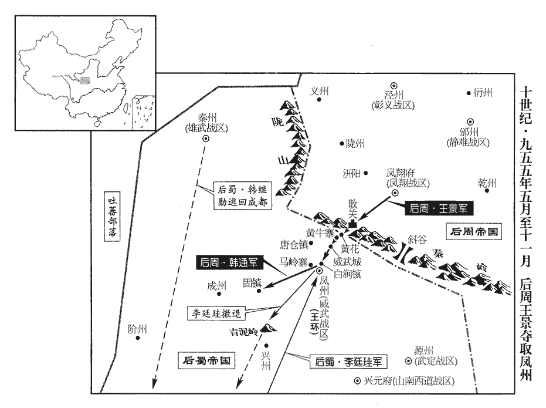
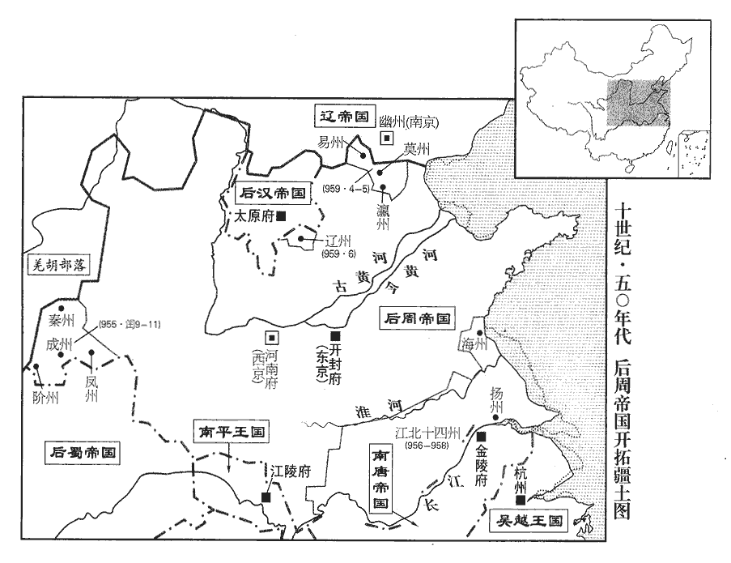
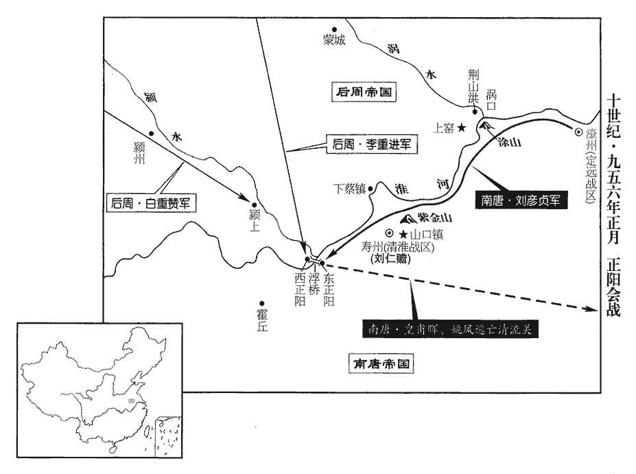
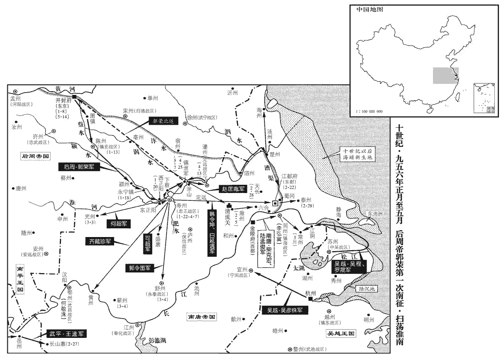

 後周紀三起閼逢攝提格（甲寅）五月，盡柔兆執徐（丙辰）二月，凡一年有奇。

# 太祖聖神恭肅文武孝皇帝下

## 顯德元年（甲寅、九五四）

1五月，甲戌朔‹一›，王逵自潭州‹湖南省长沙市›遷于朗州‹湖南省常德市›，以周行逢知潭州事，以潘叔嗣為岳州‹湖南省岳阳市›團練使。已而潘叔嗣殺王逵，而周行逢收田父、漁者之功矣。

〖译文〗 [1]五月，甲戌朔（初一），王逵从潭州迁居朗州，任命周行逢为知潭州事，任命潘叔嗣为岳州团练使。

2丙子‹三›，帝‹郭荣›至晉陽城下，帝自上黨趣晉陽，七日而至。旗幟環城四十里。史言周兵之盛。幟，昌志翻。環，音宦。楊袞疑北漢代州‹山西省代县›防禦使鄭處謙貳于周，召與計事，欲圖之；處謙知之，不往。袞使胡騎數十守其城門，處謙殺之，因閉門拒袞；袞奔歸契丹。契丹主‹耶律述律，本年二十四岁›怒其無功，囚之。處謙舉城來降。丁丑‹四›，置靜塞軍於代州，以鄭處謙為節度使。創置方鎮以懷撫鄭處謙。處，昌呂翻。

〖译文〗 [2]丙子（初三），后周世宗到达晋阳城下，后周军队的旗帜环绕晋阳城长达四十里。杨衮怀疑北汉代州防御使郑处谦要向后周投降，便召他来共同商计军事，准备借机处置他，郑处谦知道情况，不肯前往。杨衮派胡人骑兵数十名把守代州城门，郑处谦杀死他们，就关上城门拒绝杨衮进来。杨衮逃奔返回契丹。契丹主恼怒杨衮没有立功，囚禁了他。郑处谦率领全城前来投降。丁丑（初四），后周在代州设置静塞军，任命郑处谦为节度使。

契丹數千騎屯忻、代之間，為北漢之援，庚辰‹七›，遣符彥卿等將步騎萬餘擊之；彥卿入忻州，契丹退保忻口‹山西省忻州市北忻口镇›。九域志：忻州秀容縣有忻口寨，在石嶺關南。

〖译文〗 契丹数千骑兵屯驻在忻州、代州之间，作为北汉的援军，庚辰（初七），后周派遣符彦卿等人率领步兵、骑兵一万多出击。符彦卿进入忻州，契丹军队后退保守忻口。

丁亥‹十四›，置寧化軍於汾州‹山西省汾阳县›，以石‹山西省离石县›、沁‹山西省沁源县›二州隸之。

〖译文〗 丁亥（十四日），后周在汾州设置宁化军，将石、沁二州隶属于它。

代州將桑珪、解文遇殺鄭處謙，沁，七鴆翻。解，戶買翻，姓也。姓苑云：自唐叔虞食邑於解；晉有解狐、解揚。誣奏云潛通契丹。

〖译文〗 代州将领桑、解文遇杀死郑处谦，诬奏说郑处谦私通契丹。

符彥卿奏請益兵，癸巳‹二十›，遣李筠、張永德將兵三千赴之。契丹游騎時至忻州城下，丙申‹二十三›，彥卿與諸將陳以待之。陳，讀曰陣。史彥超將二十騎為前鋒，二十太少，恐當作「二千」。遇契丹，與戰，李筠引兵繼之，殺契丹二千人。彥超恃勇輕進，去大軍浸遠，眾寡不敵，為契丹所殺，筠僅以身免，周兵死傷甚眾。彥卿退保忻州，尋引兵還晉陽。還，從宣翻，又如字；下同。

〖译文〗 符彦卿上奏请求增加兵力，癸巳（二十日），后周派遣李筠、张永德领兵三千赶赴。契丹流动骑兵时常到达忻州城下，丙申（二十三日），符彦卿和众将列阵等待契丹军队。史彦超带领二十骑兵作为前锋，遇到契丹军队，进行战斗，李筠领兵增援，杀死契丹二千人。史彦超恃仗勇敢，轻易冒进，离开大部队越来越远，寡不敌众，被契丹军队杀死，李筠也只不过幸免于死，后周士兵死伤很多。符彦卿后退保守忻州，不久领兵返回晋阳。

府州‹陕西省府谷县›防禦使折德扆將州兵來朝；將，即亮翻。辛丑‹二十八›，復置永安軍於府州，復，扶又翻。漢乾祐三年罷永安軍，見二百八十九卷。以德扆為節度使。

〖译文〗 府州防御使折德率领州兵前来朝见；辛丑（二十八日），后周又在府州设置永安军，任命折德为节度使。

時大發兵夫，東自懷‹河南省沁阳市›、孟‹河南省孟州市›，西及蒲‹河中府·山西省永济市›、陝‹河南省三门峡市›，以攻晉陽，不克；會久雨，士卒疲病，【章：十二行本「病」下有「及史彥超死」五字；乙十一行本同；孔本同；張校同，退齋校同。】乃議引還。陝，失冉翻。考異曰：世宗實錄：「徵懷、孟、蒲、陝丁夫數萬攻城，旦夕之間，期於必取。會大雨，軍士勞苦，又聞忻口之師不振，帝數日憂沮不食，遂決還京之意。」晉陽見聞錄：「六月旦，周師南轅返旆，惟數百騎，間之以步卒千人，長槍赤甲，衒趫捷跳梁於城隅，晡晚殺行而抽退。」今從世宗實錄。

〖译文〗 当时大量征发军队民夫，东起怀州、孟州，西至蒲州、陕州，用以进攻晋阳，没有攻克。遇上长时间下雨，士兵疲劳生病，于是商议退兵回还。

初，王得中返自契丹，北漢主遣王得中求救於契丹，見上卷本年三月。值周兵圍晉陽，留止代州。及桑珪殺鄭處謙，囚得中，送于周軍，帝釋之，賜以帶、馬，問「虜兵何時當至？」得中曰：「臣受命送楊袞，他無所求。」或謂得中曰：「契丹許公發兵，公不以實告，契丹兵即至，公得無危乎？」得中太息曰：「吾食劉氏祿，有老母在圍中，若以實告，周人必發兵據險以拒之，如此；家國兩亡，吾獨生何益！不若殺身以全家國，所得多矣！」甲辰‹二›，帝以得中欺罔，縊殺之。王得中之死，知所惡有甚於死者也。

〖译文〗 当初，王得中从契丹返回，正值后周军队围困晋阳，便停留住在代州。及至桑杀死了郑处谦，便囚禁王得中，将他送到后周军中，世宗释放王得中，赐给玉带、马匹，问：“契丹军队什么时候会到？”王得中说：“我只受命送杨衮，没有别的使命。”有人对王得中说：“契丹答应您发兵，您不将实情禀告，倘若契丹军队立即到达，您不就危在旦夕了吗？”王得中叹息说：“我吃刘氏的俸禄，又有老母在围城之中，倘若将实情禀告，周人必定发兵占据险要来抵抗，像这样，家庭、国家双亡，我独自活着又有何用！不如杀身来保全家、国，所得到的就多了！”六月甲辰（初二），世宗因为王得中进行欺骗，便勒死了他。

乙巳‹三›，帝發晉陽。匡國‹总部同州›節度使藥元福言於帝曰：「進軍易，退軍難。」進軍者，或乘初至之銳，或乘屢勝之勢，敵人畏讋zhé自守，不敢迎戰，故易。退軍者，士有歸志，敵人據險遮其前，率眾躡其後，輜重老弱皆足為吾之累，故難。易，以豉翻。帝曰：「朕一以委卿。」元福乃勒兵成列而殿。殿，丁練翻。北漢果出兵追躡，元福擊走之。然軍還怱遽，還，從宣翻。芻糧數十萬在城下，悉焚棄之。軍中訛言相驚，或相剽掠，軍須失亡不可勝計。剽，匹妙翻。凡行軍所欲得以為用者，皆謂之軍須。勝，音升。所得北漢州縣，周所置刺史等皆棄城走，惟代州桑珪既叛北漢，又不敢歸周，嬰城自守，北漢遣兵攻拔之。前所謂都府未拔，雖得屬郡而無益者，要其終也。

〖译文〗 乙巳（初三），世宗从晋阳出发。匡国节度使药元福向世宗进言说：“进军容易，退军困难。”世宗说：“朕的身家性命就全部委托给爱卿了。”药元福于是整顿军队排成行列断后。北汉果然派出军队追踪，药元福打跑追兵。然而军队返回匆忙仓促，数十万粮草还在晋阳城下，只好全部焚烧丢弃。军队中谣言流传相互惊扰，有的互相抢劫，军用物资损失无法计算。所得到的北汉州、县，后周所设置的刺史等都弃城逃跑，只有代州桑已经叛变北汉，但又不敢归顺后周，只好环城自守，北汉派兵攻占代州。

乙酉‹七›，帝至潞州；甲子‹二十二›，至鄭州‹河南省郑州市›；以乙巳發晉陽甲子至鄭州考之；中間不應以乙酉至潞州，恐是乙卯。丙寅‹二十四›，謁嵩陵‹河南省新郑县西北郭店›；嵩陵復土，帝適有軍旅之事，不獲親之；此其謁陵，與彝制謁陵其情有不同者。庚午‹二十八›，至大梁‹首都开封府所在城›。

〖译文〗 乙酉（疑误），后周世宗到达潞州；甲子（二十二日），到达郑州；丙寅（二十四日），拜谒嵩陵；庚午（二十八日），到达大梁。

3帝違眾議破北漢，自是政事無大小皆親決，百官受成於上而已。河南府推官高錫上書諫，以為：「四海之廣，萬機之眾，雖堯、舜不能獨治，治，直之翻。必擇人而任之。今陛下一以身親之，天下不謂陛下聰明睿智足以兼百官之任，皆言陛下褊迫疑忌舉不信群臣也！褊，補典翻。不若選能知人公正者以為宰相，能愛民聽訟者以為守令，守，式又翻。能豐財足食者使掌金穀，能原情守法者使掌刑獄，陛下但垂拱明堂，視其功過而賞罰之，天下何憂不治！何必降君尊而代臣職，屈貴位而親賤事，無乃失為政之本乎！」帝不從。錫，河中‹山西省永济市›人也。

〖译文〗 [3]后周世宗违背朝臣众议击败北汉，从此政事无论大小全都亲自决定，文武百官只是从皇上那里接受成命罢了。河南府推官高锡上书劝谏，认为：“天下四海之广大，日常政务之繁多，即使是唐尧、虞舜也不能独自治理，必定要选择贤人来任用他们。如今陛下全部亲自处理，但天下人并不认为陛下聪明智慧足以兼负百官的重任，却都说陛下狭隘多疑全不相信朝廷群臣啊！不如选择能够知人善任、公正无私的人作为宰相，能够爱护百姓、善理诉讼的人作为州守县令，委派能够增加财富、丰衣足食人掌管金银粮食，委派能够推究实情、遵守法制的人掌管刑法监狱，那么陛下只须在朝廷垂衣拱手，根据他们的功过而进行赏罚，天下何愁不能太平！何必降低国君的尊严而代替臣子的职责，枉屈高贵的地位亲理低贱的事务，不是丢失为政的根本了吗！”世宗不听从。高锡是河中人。

4北漢主‹刘崇›憂憤成疾，悉以國事委其子侍衛都指揮使承鈞。

〖译文〗 [4]北汉主忧愤成疾，将国家大事全部委托给他的儿子侍卫都指挥使刘承钧。

5河西‹总部凉州›節度使申師厚不俟詔，擅棄鎮入朝，太祖廣順元年，申師厚鎮河西，事見二百九十卷。署其子為留後；秋，七月，癸酉朔‹一›，責授率府副率。唐制，東宮十率府，皆有副率，其後遂以為冗散之官。申師厚以藩府失職牙將而得節，棄鎮擅歸，雖加責授，猶勝故吾。

〖译文〗 [5]河西节度使申师厚没有等到诏令，擅自离弃镇所进京入朝，安排他的儿子作为留后。秋季，七月，癸酉朔（初一），后周世宗斥责他，改授东宫率府副率之职。

6丁丑‹五›，加吳越王錢弘俶‹本年二十六岁›天下兵馬都元帥。

〖译文〗 [6]丁丑（初五），后周世宗下诏吴越王钱弘加官天下兵马都元帅。

7癸巳‹二十一›，加門下侍郎、同平章事范質守司徒，以樞密直學士、工部侍郎長山‹山东省邹平县东›景範為中書侍郎、同平章事、判三司。長山，漢於陵縣地，江左僑置廣川郡及武強縣，隋廢郡，改武強曰長山，唐屬淄州。九域志：在州北五十五里。景，姓也。姓苑云：齊景公之後。余姑以春秋時言之，晉、宋皆有景公，何獨齊哉！加樞密使、同平章事鄭仁誨兼侍中。乙未‹二十三›，以樞密副使魏仁浦為樞密使。范質既為司徒，司徒竇貞固歸洛陽，府縣以民視之，府縣，謂河南府及洛陽縣也。課役皆不免。貞固訴於留守向訓，訓不聽。以竇貞固漢之舊臣故也。考古驗今，今何足怪。

〖译文〗 [7]癸巳（二十一日），门下侍郎、同平章事范质加官守司徒，任命枢密直学士、工部侍郎长山人景范为中书侍郎、同平章事、判三司，枢密使、负平章事郑仁诲加官兼任侍中。乙未（二十三日），任命枢密副使魏仁浦为枢密使。范质既已担任司徒，原司徒窦贞固回归洛阳老家，当地府、县都按平民看待他，赋税徭役全不减免。窦贞固向留守向训诉说，向训不理睬。

初，帝與北漢主相拒於高平，命前澤州‹山西省晋城市›刺史李彥崇將兵守江豬嶺‹山西省子长县西›，遏北漢主歸路；彥崇聞樊愛能等南遁，引兵退，北漢主果自其路遁去。八月，己酉‹八›，貶彥崇率府副率。

〖译文〗 当初，后周世宗与北汉主在高平对峙，命令前泽州刺史李彦崇领兵扼守江猪岭，阻断北汉君主的归路。李彦崇听说樊爱能向南逃跑，便领兵撤退了，后来北汉君主果然从这条路逃跑离去。八月，己酉（初八），贬李彦崇为率府副率。

8己巳‹二十八›，廢鎮國軍‹总部设华州陕西省华县›。唐末，以華州為鎮國軍。

〖译文〗 [8]己巳（二十八日），后周撤销镇国军。

9初，太祖‹郭威›以建雄‹总部晋州›節度使王晏有拒北漢‹首都太原府›之功，王晏拒北漢事見二百九十卷太祖廣順元年。其鄉里在滕縣‹山东省滕州市›，徙晏為武寧‹总部徐州›節度使。武寧軍，徐州；滕縣屬焉。九域志：滕縣在州北一百九十里。晏少時嘗為群盜，少，詩照翻。至鎮，悉召故黨，贈之金帛、鞍馬，謂曰：「吾鄉素名多盜，昔吾與諸君皆嘗為之，想後來者無能居諸君之右。諸君幸為我語之，使勿復為，幸為，于偽翻；下請為同。語，牛倨翻。復，扶又翻。為者吾必族之。」於是一境清肅。九月，徐州‹江苏省徐州市›人請為之立衣錦碑；衣，於既翻。許之。

〖译文〗 [9]当初，后周太祖因建雄节度使王晏有抵抗北汉军队的功劳，他的故乡在滕县，便调任王晏为武宁节度使。王晏年轻时曾经做过强盗，到达镇所，召集所有旧日同党，赠送金钱绢帛、鞍子马匹，对他们说：“我们家乡素来以强盗多出名，从前多和诸位都曾经干过，料想后来的强盗没有能胜过诸位的。诸位替我告诉其他强盗，让他们不要再干，再干的人我必定灭他的家族。”于是全境强盗绝迹。九月，徐州人请求为王晏树立衣锦碑。后周世宗准许。

10冬，十月，甲辰‹三›，左羽林大將軍孟漢卿坐納藁稅，藁，禾稈也。場官擾民，多取耗餘，場官，藁場之官。耗餘者，於納藁束正數之外，又多取之，言以備耗折也。賜死。有司奏漢卿罪不至死；上曰：「朕知之，欲以懲眾耳！」

〖译文〗 [10]冬季，十月，甲辰（初三），左羽林大将军孟汉卿因交纳藁税时，场院官吏侵扰百姓，多取所谓“耗余”而定罪，赐他自杀。有关官员奏称孟汉卿的罪还不至于死，世宗说：“朕知道这些，只不过想借此惩戒众人罢了！”

11己酉‹八›，廢安遠、永清軍。唐以安州為安遠軍。晉以貝州為永清軍。

〖译文〗 [11]己酉（初八），后周撤销安远军、永清军。

12初，宿衛之士，累朝相承，務求姑息，不欲簡閱，恐傷人情，由是羸老者居多；羸，倫為翻。但驕蹇不用命，實不可用，每遇大敵，不走即降，其所以失國，亦多由此。如唐閔帝、潞王是也。帝因高平之戰，始知其弊，癸亥‹二十二›，謂侍臣曰：「凡兵務精不務多，今以農夫百未能養甲士一，柰何浚民之膏澤，養此無用之物乎！且健懦不分，眾何所勸！」乃命大簡諸軍，精銳者升之上軍，羸者斥去之。去，羌呂翻。又以驍勇之士多為藩鎮所蓄，詔募天下壯士，咸遣詣闕，命太祖皇帝選其尤者為殿前諸班，今之班直是也。五代會要曰：時詔募天下豪傑，不以草澤為阻，送於闕下，躬親閱試，選武藝超絕及有身首者分署為殿前諸班，因有散員、散指揮使、內殿直、散都頭、鐵騎、控鶴之號。其騎步諸軍，各命將帥選之。帥，所類翻。由是士卒精強，近代無比，征伐四方，所向皆捷，選練之力也。史言周世宗強兵之效。

〖译文〗 [12]当初，宫禁警卫士兵，历朝相承，只求息事宁人，不想再检查挑选，恐怕伤害人情，因此瘦弱年老的占据多数。但又骄横傲慢，不听命令，实际无法使用，每次遇到大敌，不是逃跑就是投降，各朝之所以丧失国家，也大多由于这个原因。后周世宗通过高平一战，开始知道它的弊端，癸亥（二十二日），对侍从大臣说：“大凡军队只求精而不求多，如今用一百个农夫也未必能供养得起一名全副武装的士兵，怎么能榨取百姓的血汗，去养活这批无用的东西呢！况且勇健懦弱不加区分，用什么去激励士众！”于是命令各军普遍检查挑选兵员，精锐的提升到上军，瘦弱的逐出军队。又因强健勇猛的战士大多被藩镇所收养，下诏征募天下壮士，全部遣送到京城，命令宋太祖皇帝赵匡胤挑选其中最好的组成殿前诸班，其余骑兵、步兵各军，分别命令将帅挑选士兵。由此士兵精干强壮，近代以来没有比得过的，征伐四方，所到之处频传捷报，这就是挑选兵员的功效啊！

13戊辰‹二十七›，帝謂侍臣曰：「諸道盜賊頗多，討捕終不能絕，蓋由累朝分命使臣巡檢，致藩侯、守令皆不致力。宜悉召還，專委節鎮、州縣，責其清肅。」

〖译文〗 [13]戊辰（二十七日），后周世宗对侍从大臣说：“各道盗贼很多，讨伐搜捕终究不能绝迹，是由于历朝另外命令使臣巡视检查，致使藩镇主帅、州守县令都不再努力。应该全部召回使臣，专门委托藩镇节度使、州守县令，责成他们肃清盗贼。”

14河自楊劉‹山东省东阿县东北杨柳乡›至于博州‹山东省聊城市›百二十里，連年東潰，分為二派，匯為大澤，派，普拜翻。匯，戶罪翻，水回合也。彌漫數百里；又東北壞古堤而出，壞，音怪。古隄，前代所築以防河者；河屢徙，故古隄在平地。灌齊‹山东省济南市›、棣‹山东省惠民县›、淄‹山东省淄博市›諸州，至于海涯‹渤海湾›，漂沒民田廬不可勝計，流民採菰稗、捕魚以給食，勝，音身。菰，音孤，蔣也。稗，旁卦翻，草似穀者。朝廷屢遣使者不能塞。塞，悉則翻；下同。十一月，戊戌‹二十八›，帝遣李穀詣澶‹河南省濮阳市›、鄆‹山东省东平县›、齊按視隄塞，役徒六萬，三十日而畢。

〖译文〗 [14]黄河从杨刘直至博州有一百二十里，连年在东面冲溃堤防，分成两个支流，汇合为巨大湖泽，河水弥漫达数百里。黄河又向东北冲毁古堤而流出，灌淹齐、棣、淄各州，直至海边，漂流淹没百姓田地房屋不可胜计，流民只好采集茭白稗子、捕捞鱼虾来充食，朝廷屡次派遣使者没能堵塞住。十一月，戊戌（二十八日），后周世宗派遣李到澶州、郓州、齐州检查监督堤防决口的堵塞，征发役徒六万，三十天完工。

15北漢主‹刘崇›疾病，命其子承鈞‹本年二十九岁›監國，疾甚曰病。尋殂。年六十。考異曰：劉恕云：世宗實錄、薛史帝紀、僭偽傳皆云：「顯德二年十一月，劉崇卒。」大定錄云：「顯德二年，春，旻病死。」紀年通譜：「顯德二年，崇之乾祐八年，冬，崇死。顯德三年，承鈞改元天會。開寶元年，承鈞之天會十三年，死。開寶二年，繼元改元廣運。興國四年，繼元之廣運十一年也。」河東劉氏有國，全無記錄，惟其舊臣中書舍人、直翰林院王保衡歸朝後所纂《晉陽偽署見聞要錄》云：「甲寅年春，南伐，敗歸。夏，周師攻圍，旻積憂勞成心疾，是冬，卒。鈞即位，丁巳年，正月旦，改乾祐十年為天會元年。」又云：「鈞丙戌年二十九嗣位；年四十三卒。」右諫議大夫楊夢申奉敕撰《大漢都統追封定王劉繼顒神道碑》云：「天會十二年，今皇帝踐阼之初年也。十七年，繼顒卒。」末題「廣運元年，歲次甲戌，九月丙午朔」。今按周廣順元年辛亥，旻即帝位，稱乾祐四年。顯德元年甲寅，旻之乾祐七年也。旻卒，鈞立。顯德四年丁巳，鈞改乾祐十年為天會元年。宋開寶元年戊辰，鈞之天會十二年也。鈞卒，繼元立。開寶七年甲戌，繼元改天會十八年為廣運元年。據曆，是歲九月，丙午朔。興國四年己卯，繼元之廣運六年也。鈞以唐天成元年丙戌生，至顯德元年甲寅嗣位，乃二十九歲矣。鈞及繼元踰年未改元，蓋孟蜀後主、漢隱帝、周世宗之比也。諸書皆傳聞相因，前後相戾，惟晉陽見聞錄、劉繼顒碑，歲月最可考正，故以為據。遣使告哀于契丹。契丹遣驃騎大將軍、知內侍省事劉承訓冊命承鈞為帝，更名鈞。鈞，漢主旻次子也。更，工衡翻。北漢孝和帝性孝謹，既嗣位，勤於為政，愛民禮士，境內粗安。粗，坐五翻。每上表於契丹主稱男；契丹主‹耶律述律›賜之詔，謂之「兒皇帝」。

〖译文〗 [15]北汉主病重，命令他的儿子刘承钧代理国政，不久去世。北汉派遣使者向契丹报丧。契丹派遣骠骑大将军、知内侍省事刘承训册立刘承钧为皇帝，刘承改名为钧。北汉孝和帝刘钧生性孝顺谨慎，继承皇位后，勤理朝政，爱护百姓，礼贤下士，境内基本平安。他每次向契丹主上表自称为“男”，契丹君主回赐诏书，叫他“儿皇帝”。

16馬希萼之帥群蠻破長沙也，事見二百八十九卷漢隱帝乾祐三年。帥，讀曰率。府庫累世之積，皆為漵州‹湖南省洪江市西北黔城镇›蠻酋苻彥通所掠，漵，音敘。酋，慈由翻。彥通由是富強，稱王於溪洞間。王逵既得湖南，去年六月，王逵殺劉言，始盡得湖南故地，事見上卷。欲遣使撫之，募能往者，其將王虔朗請行。既至，彥通盛侍衛而見之，禮貌甚倨。虔朗厲聲責之曰：「足下自稱苻秦苗裔，苻秦之亡，苻宏奔晉，從諸桓於荊、楚，其後無聞。彥通自以為苻秦苗裔，蓋言出於宏之後。宜知禮義，有以異於群蠻。昔馬氏在湖南，足下祖父皆北面事之；今王公盡得馬氏之地，足下不早往乞盟，致使者先來，又不接之以禮，異日得無悔乎！」言大兵若至，雖悔無及。彥通慚懼，起，執虔朗手謝之。虔朗知其可動，因說之曰：「溪洞之地，隋、唐之世皆為州縣，著在圖籍。說，式芮翻。溪洞之地，隋、唐列為郡縣，皆屬黔中道。今足下上無天子之詔，下無使府之命，使府，謂湖南都府。雖自王於山谷之間，王，于況翻。不過蠻夷一酋長耳！酋，慈秋翻。長，知兩翻。曷若去王號，自歸於王公，王公必以天子之命授足下節度使，與中國侯伯等夷，豈不尊榮哉！」彥通大喜，即日去王號，去，羌呂翻。因虔朗獻銅鼓數枚於王逵。谿峒諸蠻，鑄銅為大鼓，初成，懸於庭中，置酒以招同類，豪富子女則以金銀為大釵，執以扣鼓竟，乃留遺主人，名為「銅鼓釵」。俗好相殺，多構仇怨，欲相攻，則鳴此鼓，至者如雲。逵曰：「虔朗一言勝數萬兵，真國士也！」承制，以彥通為黔中節度使；黔中，自唐末至二蜀為武泰軍節度。黔，其今翻。以虔朗為都指揮使，預聞府政。【章：十二行本「政」下有「虔朗桂州‹广西桂林市›人也」六字；乙十一行本同；孔本同；退齋校同。】預聞湖南都府之政。

〖译文〗 [16]马希萼率领各蛮族部落攻破长沙，府库中历代积累的财富，全被溆州蛮族部落酋长苻彦通所抢，苻彦通因此富有强盛，在溪谷洞壑之间自称为王。王逵既已得到湖南，打算派遣使者安抚他，招募能前往的人选，他的部将王虔朗请求出行。王虔朗到达后，苻彦通警卫森严地会见王虔朗，举止态度十分傲慢。王虔朗声音严厉地斥责他说：“您自称是苻秦的后裔，应该知道礼义，有区别于其他蛮族部落的地方。从前马氏在湖南时，您的祖父、父亲都北面称臣。如今王公取得马氏全部的领地，您既不及早前往请求结盟，致使王公派我这个使者先来，又不以礼相迎，他日难道不会后悔吗！”苻彦通惭愧恐惧，从座位上起来，握住王虔朗的手向他道歉。王虔朗知道苻彦通可以说动，就劝说道：“这溪谷洞壑之地，隋、唐的时代都是州、县，记载在地图簿籍上。如今您上无天子的诏书，下无节度使都府的命令，虽然自己在山谷之间称王，实际不过蛮夷落的一个酋长罢了。不如去掉王号，自动归顺王公，王公必定用天子的命令授于您节度使之职，与中原的侯伯等同，岂不尊贵荣耀吗？”苻彦通大为喜欢，当天去掉王号，通过王虔朗向王逵进献多枚铜鼓。王逵说：“王虔朗一席话胜过数万军队，真是国家的贤士啊！”王逵接受皇帝制书任命苻彦通为黔中节度使；任命王虔朗为都指挥使，参与都府政务。

逵慮西界鎮遏使、錦州‹湖南省麻阳县西南锦和镇›刺史劉瑫為邊患，王逵之逐邊鎬也，以劉瑫鎮遏群蠻。表為鎮南‹总部洪州›節度副使，鎮南軍，洪州，屬唐；王逵表以其號寵劉瑫耳。充西界都招討使。

〖译文〗 王逵顾虑西界镇遏使、锦州刺史刘会成为边境隐患，上表请求任命刘为镇南节度副使，担任西界都招讨使。

17是歲，湖南大饑，民食草木實；武清‹总部潭州›節度使、知潭州事周行逢自彭師暠等擁立馬希萼於衡山，自署武清節度使，王逵因之以授周行逢。開倉以賑之，全活甚眾。行逢起於微賤，知民間疾苦，勵精為治，嚴而無私，治，直吏翻。辟署僚屬，皆取廉介之士，約束簡要，【章：十二行本「要」下有「吏民便之」四字；乙十一行本同；孔本同；張校同。】其自奉甚薄；或譏其太儉，行逢曰：「馬氏父子窮奢極靡，不恤百姓，今子孫乞食於人，又足效乎！」為行逢跨有潭、朗張本。

〖译文〗 [17]当年，湖南出现大饥荒，百姓食用草木的果实。武清节度使、知潭州事周行逢打开粮仓赈济灾民，保全救活许多人。周行逢出身贫贱，知道民间疾苦，励精图治，执法严厉，公正无私，征召安排属官，都选取廉洁方正之士，规约简单明了，给自己的奉养十分菲薄。有的人讥讽他太节俭，周行逢说：“马氏父子穷奢极欲，不体恤百姓，如今他的子孙在向人要饭，还值得效法吗！”

# 世宗睿武孝文皇帝上諱榮，本姓柴氏，邢州龍岡人。柴氏女適太祖，是為聖穆皇后。后兄守禮生帝，從姑長於太祖家，以謹厚見愛，太祖遂以為子。

## 顯德二年（乙卯、九五五）

1春，正月，庚辰‹十›，上‹郭荣（柴荣）本年三十五岁›以漕運自晉、漢以來不給斗耗，綱吏多以虧欠抵死，詔自今每斛給耗一斗。

〖译文〗 [1]春季，正月，庚辰（初十），后周世宗因为漕运自从后晋、后汉以来不给“斗耗”，负责运送的官吏不少因为损耗造成粮食亏欠而抵死罪，下诏命令从今开始每斛粮食给损耗一斗。

2定難‹总部设夏州陕西省靖边县北白城子›節度使李彝興李彝興，即彝殷也，避宋朝宣祖廟諱，始改名彝興。史以後來所更名書之。難，乃旦翻。以折德扆亦為節度使，與己並列，恥之，夏州自唐以來，為緣邊大鎮，李氏又世襲節度使。府州，漢氏方置節鎮，折氏父子又晚出，故恥與並列。塞路不通周使。塞，悉則翻。癸未‹十三›，上謀於宰相，對曰：「夏州‹陕西省靖边县北白城子›邊鎮，朝廷向來每加優借，府州‹陕西省府谷县›褊小，得失不繫重輕，且宜撫諭彝興，庶全大體。」上曰：「德扆數年以來，盡忠戮力以拒劉氏，柰何一旦棄之！且夏州惟產羊馬，貿易百貨，悉仰中國，貿，音茂。仰，牛向翻。我若絕之，彼何能為！」乃遣供奉官齊藏珍齎詔書責之，風俗通云：凡氏之興九事，氏於國者，齊、魯、宋、衛是也。余按左傳衛有大夫齊氏，此豈氏於國乎？彝興惶恐謝罪。

〖译文〗 [2]定难节度使李彝兴因为折德也当了节度使，与自己地位相同，感到羞耻，便阻塞道路不与后周互通使者。癸未（十三日），后周世宗与宰相商量，宰相回答说：“夏州是边关重镇，朝廷历来格外从宽优待，府州地方偏僻狭小，利害得失不关轻重，暂且应该安抚李彝兴，可以保全大局。”世宗说：“折德多年以来，尽忠报国努力作战来抵御北汉刘氏，怎么能一下子抛充他！况且夏州只出产羊马，交易其他百货，全部仰仗中原，我若断绝关系，他还能有什么作为！”于是派遣供奉官齐藏珍带着诏书责问李彝兴，李彝兴惊惶恐惧连忙认罪道歉。

3戊子‹十八›，蜀置威武軍於鳳州‹陕西省凤县›。

〖译文〗 [3]戊子（十八日），后蜀在凤州设置威武军。

4辛卯‹二十一›，初令翰林學士、兩省官舉令、錄；除官之日，仍署舉者姓名，若貪穢敗官，並當連坐。敗，補邁翻。

〖译文〗 [4]辛卯（二十一日），后周开始命令翰林学士、门下和中书两省官员荐举县令、录事参军人选。授官之日，同时记下荐举人的姓名，倘若被荐人贪婪污秽败坏公务，荐举人一并连同坐罪。

5契丹‹首都临潢府内蒙古巴林左旗›自晉、漢以來屢寇河北，輕騎深入，無藩籬之限，郊野之民每困殺掠。言事者稱深‹河北省深州市›、冀‹河北省冀州市›之間有胡盧河‹滏阳河›，橫亘數百里，可浚之以限其奔突；胡盧河，俗謂之葫蘆河，即衡漳水，在東光縣西三十里。是月，詔忠武‹总部许州›節度使王彥超、彰信‹总部曹州›節度使韓通周改曹州威信軍為彰信軍，避太祖諱也。將兵夫浚胡盧河，築城於李晏口‹河北省深州市东南›，留兵戍之。冀州蓨tiáo縣‹河北省景县南›東北有李晏鎮，時築城屯軍，以為靜安軍。按薛史，其軍南距冀州百里，北距深州三十里，夾胡盧河為壘。將，即亮翻。帝召德州‹山东省陵县›刺史張藏英，問以備邊之策，藏英具陳地形要害，請列置戍兵，募邊人驍勇者，厚其稟給，自請將之，隨便宜討擊；帝皆從之，以藏英為沿邊巡檢招收都指揮使。藏英到官數月，募得千餘人。王彥超等行視役者，行，下孟翻。嘗為契丹所圍；藏英引所募兵馳擊，大破之。自是契丹不敢涉胡盧河，河南之民始得休息。此河南，謂胡盧河之南也。

〖译文〗 [5]契丹自从后晋、后汉以来，频繁侵犯河北地区，轻骑兵长驱直入，没有任何屏障的阻隔，郊区野外的农民经常陷入烧杀抢掠的困境。向朝廷陈述政见的人称说深州、冀州之间有胡卢河，绵延横亘几百里，可以疏通河道来阻截契丹骑兵的横冲直撞。当月，绍令忠武节度使王彦超、彰信节度使韩通率领士兵、民夫疏通胡卢河，在李晏口筑城，留驻军队守卫。后周世宗召见德州刺史张藏英，询问边疆防备的对策，张藏英具体陈说地理形势、军事要塞，请求部署戍边军队，招募边疆百姓中矫健勇猛的，多给军饷，自己请求率领他们，随时根据情况征讨攻击契丹骑兵；世宗全都同意，任命张藏英为沿边巡检招收都指挥使。张藏英赴任几个月，招募到一千多人。王彦超等巡视疏通河道的工程，曾经被契丹军队所包围；张藏英带领所招募的士兵驰马出击，大败敌军。从此契丹军队不敢再过胡卢河，胡卢河以南的百姓开始得到休养生息。

6二月，庚子朔‹一›，日有食之。

〖译文〗 [6]二月，庚子朔（初一），出现日食。

7蜀夔恭孝王仁毅卒。仁毅，蜀主‹孟昶›之弟也。

〖译文〗 [7]后蜀夔恭孝王孟仁毅去世。

8壬戌‹二十三›，詔群臣極言得失，其略曰：「朕於卿大夫才不能盡知，面不能盡識；若不采其言而觀其行，行，下孟翻。審其意而察其忠，則何以見器略之淺深，知任用之當否！當，丁浪翻。若言之不入，罪實在予；苟求之不言，咎將誰執！」

〖译文〗 [8]壬戌（二十三日），后周世宗诏令群臣畅所欲言陈述政事的得失利弊，诏书大致说：“朕对各位卿大夫，才能没法全部知道，面孔没法全都认识。倘若不采集他们的言论从而观察他们的行为，明悉他们的意见从而考察他们的忠诚，那凭什么来看出各人才器韬略的高低深浅，了解任用是否得当！倘若卿大夫陈说了而听不进，罪确实在朕身上。假使我要求了而不说，罪责将归谁呢？”

9唐主‹首都金陵府江苏省南京市›李璟（徐景通）本年四十岁以中書侍郎、知尚書省嚴續為門下侍郎、同平章事。

〖译文〗 [9]南唐主任命中书侍郎、知尚书省严续为门下侍郎、同平章事。

10三月，辛未‹二›，以李晏口‹河北省深州市东南›為靜安軍。

〖译文〗 [10]三月，辛未（初二），后周在李晏口设置静安军。

11帝‹郭荣›常憤廣明以來中國日蹙，唐僖宗廣明元年，黃巢入長安，自此之後，強藩割據，中國日蹙矣。及高平‹山西省高平县›既捷，慨然有削平天下之志。會秦州‹甘肃省秦安县西北›民夷有詣大梁‹后周首都开封府所在城·河南省开封市›獻策請恢復舊疆者，以唐全盛版圖言之，蜀亦舊疆也。以漢、晉事言之，則契丹入中原，重以王景崇之亂，階‹甘肃省武都县东›、成‹甘肃省成县›、秦‹甘肃省秦安县西北›、鳳‹陕西省凤县›遂入於蜀。帝納其言。為取階、成、秦、鳳張本。

〖译文〗 [11]后周世宗经常为唐僖宗广明以来中原日益缩小而愤慨，及至高平一战奏捷，慨然萌生削平各国统一天下的志向。正好秦州各族百姓有到大梁进献计策请求恢复旧日大唐疆域的，世宗采纳他的意见。

蜀主‹孟昶（孟仁赞）本年三十七岁›聞之，遣客省使趙季札按視邊備。季札素以文武才略自任，使還，奏稱：「雄武‹总部秦州›節度使韓繼勳、蜀置雄武節度於秦州。使，疏吏翻。還，從宣翻，又如字。鳳州刺史王萬迪非將帥才，不足以禦大敵。」蜀主問：「誰可往者？」季札請自行。丙申‹二十七›，以季札為雄武監軍使，仍以宿衛精兵千人為之部曲。

〖译文〗 后蜀主闻知情况，派遣客省使赵季札巡视边防。赵季札素来以有文武双全的才略自许，出使回来，上奏道：“雄武节度使韩继勋、凤州刺史王万迪不是将帅之才，不能够抵御大敌入侵。”后蜀主问：“谁可前往呢？”赵季札请命自己前往。丙申（二十七日），任命赵季札为雄武监军使，并将宫禁警卫精兵一千人作为他的私属部队。

12帝以大梁城中迫隘，隘，烏懈翻。夏，四月，乙卯‹十七›，詔展外城，先立標幟，幟，昌志翻。俟今冬農隙興板築；東作動則罷之，更俟次年，以漸成之。且令自今葬埋皆出所標七里之外，其標內俟縣官分畫街衢、倉場、營廨之外，廨，古隘翻。聽民隨便築室。

〖译文〗 [12]后周世宗因为大梁城中局促狭窄，夏季，四月，乙卯（十七日），下诏拓展外城，先设立标记，等待今年冬天农闲再兴土木。农事开始就停止，再等来年开工，以此逐渐完成。并且命令从今开始葬埋死人都要出城，离所立标记七里之外，在标记内等待官府划分出街道、仓库场院、营房官舍，除此之外，听凭百姓随便盖房。

13丙辰‹十八›，蜀主命知樞密院王昭遠按行北邊城寨及甲兵。以備周也。行，下孟翻。

〖译文〗 [13]丙辰（十八日），后蜀主命令知枢密院王昭远巡视检查北部边界的城镇营寨和武备。

14上謂宰相曰：「朕每思致治之方，未得其要，寢食不忘。治，直吏翻。又自唐、晉以來，吳、蜀、幽、并皆阻聲教，未能混壹，吳，李氏；蜀，孟氏；幽入於契丹；并為北漢。宜命近臣著為君難為臣不易論及開邊策各一篇，朕將覽焉。」

〖译文〗 [14]后周世宗对宰相说：“朕经常思考达到大治的方略，没有得到其中的要领，睡觉吃饭都不能忘记。又从后唐、后晋以来，吴地、蜀地、幽州、并州都被隔断了政令教化，不能统一，应该命令左右大臣撰写《为君难为臣不易论》和《开边策》各一篇，朕将一一阅览。”

比部郎中王朴獻策，比，音毗。以為：「中國之失吳、蜀、幽、并，皆由失道。梁失吳；後唐得蜀而復失之；晉失幽；周失并。今必先觀所以失之之原，然後知所以取之之術。其始失之也，莫不以君暗臣邪，兵驕民困，姦黨內熾，武夫外橫，橫，戶孟翻。因小致大，積微成著。今欲取之，莫若反其所為而已。夫進賢退不肖，所以收其才也；恩隱誠信，所以結其心也；隱，卹也。賞功罰罪，所以盡其力也；去奢節用，所以豐其財也；去，羌呂翻。時使薄斂，所以阜其民也。時使者，使之以時也。斂，力贍翻。俟群才既集，政事既治，財用既充，士民既附，然後舉而用之，功無不成矣！彼之人觀我有必取之勢，則知其情狀者願為間諜，知其山川者願為鄉導，間，古莧翻；下伺間同。諜，達協翻。鄉，讀曰嚮。民心既歸，天意必從矣。

〖译文〗 比部郎中王朴进献策文，认为：“中原朝廷丧失吴地、蜀地、幽州、并州，都是由于丧失了治国之道。如今一定要首先考察所以丧失土地的根本原因，然后才能知晓所以收取失地的方法。当开始丧失国土时，没有不是因为君主昏庸臣子奸邪，军队骄横百姓穷困，奸人乱党在朝内炙手可热，强将武夫在外面横行霸道，由小变大，积微成著。如今要收取失地，只不过反其道而行之罢了。进用贤人斥退坏人，是收罗人材的办法；布施恩泽讲究信用，是团结人心的办法；奖赏功劳惩罚罪过，是鼓励大家贡献力量的办法；革除奢侈节约费用，是增加财富办法；按时使用民力，减少赋税，是使百姓富足的办法。等到群贤毕集，政事理顺，财用充足，士民归附，然后起兵而使用他们，千秋功业没有不成功的了！对方的人民看到我方有必定取胜的形势，知道内部情况的就愿意当间谍，熟悉山川地理的就愿意当向导，民心已归附，那么天意也必然会顺从了。”

凡攻取之道，必先其易者。唐與吾接境幾二千里，其勢易擾也。唐與中國以淮為境，自淮源東至海幾二千里。易，以豉翻。擾之當以無備之處為始，備東則擾西，備西則擾東，彼必奔走而救之。奔走之間，可以知其虛實強弱，然後避實擊虛，避強擊弱。未須大舉，且以輕兵擾之。南人懦怯，聞小有警，必悉師以救之。師數動則民疲而財竭，數，所角翻。不悉師則我可以乘虛取之。如此，江北諸州將悉為我有。帝之取江北，王朴之計也。既得江北，則用彼之民，行我之法，江南亦易取也。得江南則嶺南、巴蜀可傳檄而定。時劉氏據嶺南，孟氏據巴蜀，王朴欲乘勝勢以先聲下之。南方既定，則燕地必望風內附；時契丹跨有燕地。燕，於賢翻。若其不至，移兵攻之，席卷可平矣。卷，讀如捲。凡兵之動，知敵之主，此以其時契丹主言之也。惟河東必死之寇，言北漢據河東，與周為世仇也。不可以恩信誘，誘，音酉。當以強兵制之，然彼自高平之敗，事見上卷上年三月。力竭氣沮，必未能為邊患，宜且以為後圖，俟天下既平，然後伺間，一舉可擒也。是後世宗用兵以至宋朝削平諸國，皆如王朴之言；惟幽燕不可得而取，至於宣和，則舉國以殉之矣。伺，相吏翻。今士卒精練，甲兵有備，群下畏法，諸將效力，期年之後可以出師，期，讀曰朞。宜自夏秋蓄積實邊矣。」蓄積於邊上以為用兵之備。

〖译文〗 “大凡进攻夺取的方法，必定先从容易的地方下手。南唐与我们相接的国境将近二千里，这地势很容易骚扰对方。骚扰对方应当从没有防备的地方开始，防备东面就骚扰西面，防备西面就骚扰东面，对方必定东奔西走去救援。东奔西走之间，就可以探明对方的虚实强弱，然后避实击虚，避强击弱。不须大举进攻时，暂且用小部队骚扰。南方人生性懦弱胆小，听说有小小的警报，必定出动全部军队去救援。军队频繁出动就会使百姓疲劳而财物耗竭，不出动全国军队救援，我们就可以乘着空虚夺取土地。像这样，长江以北各州将全部被我们占有。既得长江以北，就可利用他们的百姓，实行我们的办法，那长江以南也容易夺取了。取得江南，那么岭南、巴蜀之地就可以传递檄文而平定。南方既已平定，那燕地必定望风披靡归附中原；倘若它不归顺，就调动军队进攻，犹如卷席子那样很快可以平定了。只有河东北汉是必然要拼死一战的敌人，没法用恩惠信义诱导，应当用强大的军队制服它，然而它从高平失败以后，国力空虚士气沮丧，必定不能再起边患，应该暂且放在以后谋取，等待天下已经平定，然后瞅准时机，一举就可以擒获。如今士兵精干，武器齐全，部下畏服军法，众将愿意效力，一年以后可以出师，应该从夏季、秋季就开始积蓄粮草来充实边疆了。”

上欣然納之。時群臣多守常偷安，所對少有可取者，少，詩沼翻。惟朴神峻氣勁，有謀能斷，斷，丁亂翻。凡所規畫，皆稱上意，稱，尺證翻。上由是重其氣【章：十二行本「氣」作「器」；乙十一行本同；孔本同；退齋校同。】識，未幾，遷左諫議大夫，知開封府事。開封在輦轂下，事繁職重。史言世宗屬任王朴自此而重。然朴先事上於潛藩，其君臣相得亦有素矣。

〖译文〗 后周世宗欣然接受。当时群臣大多墨守常规，苟且偷安，所对策略很少有可取的，只有王朴神情峻逸、气势刚劲，有智谋能决断，凡是有所规划建议，都符合世宗的心意，世宗因此看重王朴的气质胆识，不久，迁升他为左谏议大夫、知开封府事。

15上謀取秦‹甘肃省秦安县西北›、鳳‹陕西省凤县›，求可將者。將，即亮翻。王溥薦宣徽南院使、鎮安‹总部陈州›節度使向訓。五代會要：漢天福十二年，廢陳州鎮安軍，周廣順二年復。上命訓與鳳翔‹总部凤翔府›節度使王景、客省使高唐‹山东省高唐›县昝居潤偕行。高唐縣屬博州。九域志：縣在州東北一百七十里。昝zǎn，姓也，音子感翻。五月，戊辰朔‹一›，景出兵自散關‹陕西省宝鸡市西南›趣秦州。趣，七喻翻。

〖译文〗 [15]后周世宗谋划攻取秦州、凤州，寻找可以统领军队的人。王溥推荐宣徽南院使、镇安节度使向训。世宗命令向训与凤翔节度使王景、客省使高唐人昝居润同行。五月，戊辰朔（初一），王景从散关出兵直奔秦州。

16敕天下寺院，非敕額者悉廢之。敕額者，敕賜寺額，如慈恩、安國、興唐之類。禁私度僧尼，凡欲出家者必俟祖父母、父母、伯叔之命。惟兩京‹东京开封府、西京河南府›、大名府‹河北省大名县›、唐以魏州為鄴都。興唐府，晉改為廣晉府；大名府，蓋漢所改也。京兆府‹陕西省西安市›、青州‹山东省青州市›聽設戒壇。戒壇，僧尼受戒之所。禁僧俗捨身、斷手足、煉指、掛燈、帶鉗之類幻惑流俗者。煉指者，束香於指而燃之。掛燈者，裸體，以小鐵鉤徧鉤其膚，凡鉤，皆掛小燈，圈燈盞，貯油而燃之，俚俗謂之燃肉身燈。今人帶布枷以化誘流俗者，亦幻惑之餘敝。斷，音短。幻，戶辦翻。令兩京及諸州每歲造僧帳，有死亡、歸俗，皆隨時開落。是歲，天下寺院存者二千六百九十四，廢者三萬三百三十六，見僧四萬二千四百四十四，尼一萬八千七百五十六。見，賢遍翻。

〖译文〗 [16]后周世宗敕命天下寺院，未经朝廷敕赐匾额的全部废除。禁止私下剃发出家当和尚、尼姑，凡是打算出家的人必须得到祖父母、父母亲、伯伯叔叔的同意，只有东京、西京、大名府、京兆府、青州准许设立受戒的佛坛。禁止僧侣舍身自杀、斩断手足、手指上燃香、裸体挂钩点灯、身带铁钳之类惑乱破坏社会风俗的行为。命令东京、西京以及各州每年编制僧侣名册，如有死亡、返俗，都随时注销。这一年，天下寺院保存的有二千六百九十四座，废除的有三万三百三十六座，现有和尚四万二千四百四十四人，尼姑一万八千七百五十六人。

 

17王景拔黃牛‹陕西省凤县东北黄牛铺镇›等八寨。黃牛等八寨，皆當在秦州界。戊寅‹十一›，蜀主以捧聖控鶴都指揮使、保寧‹总部阆州›節度使李廷珪為北路行營都統，蜀以秦、鳳為北路。左衛聖步軍都指揮使高彥儔為招討使，武寧‹总部徐州›節度使吕彥珂副之，武寧軍，徐州屬，周呂彥珂遙領也。珂，丘何翻。客省使趙崇韜為都監。

〖译文〗 [17]王景攻拔黄牛等八个营寨。戊寅（十一日），后蜀主任命捧圣控鹤都指挥使、保宁节度使李廷为北路行营都统，左卫圣步军都指挥使高彦俦为招讨使，武宁节度使吕彦珂为招讨副使，客省使赵崇韬为都监。

18蜀趙季札至德陽‹四川省德阳市›，聞周師入境，懼不敢進，德陽縣，屬漢州，去成都未遠，已懼而不敢進。上書求解邊任還奏事，先遣輜重及妓妾西歸。重，直用翻。妓，渠綺翻。丁亥‹二十›，單騎馳入成都，眾以為奔敗，莫不震恐。蜀主問以機事，皆不能對；蜀主怒，繫之御史臺，庚【章：十二行本「庚」作「甲」；乙十一行本同；孔本同。】午‹二十七›，斬之於崇禮門。趙季札雖誅，無救於秦、鳳之喪失，是以用人當審之於其初也。

〖译文〗 [18]后蜀赵季札到达德阳，听说后周军队入境，恐惧不敢前进，上书请求解除守边任务返回京城奏报情况，先遣送随身携带的包裹箱笼和妓女侍妾向西返归。丁亥（二十日），赵季札单人匹马奔入成都，众人都以为是打败仗逃回，没有不震惊恐慌的。后蜀主问他军事机务，都不能回答。后蜀主勃然大怒，将他关押在御史台，甲午（二十七日），在崇礼门斩首。

19六月，庚子‹三›，上親錄囚於內苑有汝州‹河南省汝州市›民馬遇，父及弟為吏所冤死，屢經覆按，不能自伸，上臨問，始得其實，人以為神。由是諸長吏無不親察獄訟。史言帝明謹於庶獄。長，知兩翻。

〖译文〗 [19]六月，庚子（初三），后周世宗在宫内园林中亲自查阅囚犯的档案。有个汝州的百姓叫马遇，父亲以及弟弟被官吏冤枉致死，屡经核查审理，自己不能申诉，世宗当面审问，才获得真实情况，众人都认为神奇。从此各部门长官无不亲自省察刑事诉讼案件。

20壬寅‹五›，西師與蜀李廷珪等戰于威武‹陕西省凤县东北›城東，不利，威武城，前蜀所築也，在鳳州東北。排陳使濮州‹山东省鄄城县›刺史胡立等為蜀所擒。陳，讀曰陣。濮，博木翻。丁未‹十›，蜀主‹孟昶›遣間使如北漢及唐，間，古莧翻。使，疏吏翻。欲與之俱出兵以制周，北漢主‹刘承钧，本年三十岁›、唐主‹李璟（徐景通）›皆許之。

〖译文〗 [20]壬寅（初五），西征军队与后蜀李廷等在威武城东交战，失利，排阵使濮州刺史胡立等人被后蜀擒获。丁未（初十），后蜀主派遣秘密使者前往北汉和南唐，准备和他们共同出兵来遏制后周，北汉主、南唐主都答应。

21己酉‹十二›，以彰信‹总部曹州›節度使韓通充西南行營馬步軍都虞候。

〖译文〗 [21]己酉（十二日），后周任命彰信节度使韩通充任西南行营马步军都虞候。

22戊午‹二十一›，南漢主‹首都兴王府广东省广州市›刘弘熙（刘晟）本年三十六岁殺禎州‹广东省惠州市›節度使通王弘政，禎州，漢博羅縣之地，梁置梁化郡，隋置循州，治歸善縣，唐因之。至南漢，改唐之河源縣為龍川縣，徙循州治焉；以循州舊治歸善縣置禎州，宋朝避仁宗諱，改曰惠州。九域志：循州南至惠州三百里。於是高祖‹刘岩（刘龑）›之諸子盡矣。南漢主龑yǎn，廟號高祖。

〖译文〗 [22]戊午（二十一日），南汉主杀死祯州节度使通王刘弘政，于是南汉高祖的所有儿子全死了。

23壬戌‹二十五›，以樞密院承旨清河‹河北省清河县›張美為右領軍大將軍、權點檢三司事。清河縣，帶貝州。權點檢三司事，未除為正使。初，帝在澶州‹河南省濮阳市›，美掌州之金穀隸三司者，帝或私有所求，美曲為供副。供副者，供辦以應副所求。澶，時連翻。太祖聞之怒，恐傷帝意，但徙美為濮州馬步軍都虞候。濮，博木翻。美治財精敏，當時鮮及，治，直之翻。鮮，息淺翻。故帝以利權授之；【章：十二行本「之」下有「帝征伐四方，用度不乏，美之力也」十三字；乙十一行本同；孔本同；張校同；退齋校同。】然思其在澶州所為，終不以公忠待之。自漢以來能如此者，吳主孫權及周世宗而已。

〖译文〗 [23]壬戌（二十五日），后周世宗任命枢密院承旨清河人张美为右领军大将军、权点检三司事。当初，世宗在澶州时，张美掌管州中隶属于三司的钱粮，世宗有时私下有所索求，张美千方百计为他提供满足。后周太祖听说此事很生气，又恐怕伤害世宗的感情，只是调任张美为濮州马步军都虞候。张美治理财政很精明，当时很少有人及得上，所以世宗将财政收入的大权授给他；然而想到他在澶州的作为，终究不将他当作公正忠诚的人来对待。

24秋，七月，丁卯朔‹一›，以王景兼西南行營都招討使，向訓兼行營兵馬都監。宰相以景等久無功，饋運不繼，固請罷兵。帝命太祖皇帝往視之，還，言秦、鳳可取之狀，還，從宣翻，又如字。帝從之。

〖译文〗 [24]秋季，七月，丁卯朔（初一），后周世宗任命王景兼西南行营都招讨使，向训兼行营兵马都监。宰相因王景等长久没有成功，粮草运输跟不上，坚持请求撤兵。世宗命令宋太祖皇帝赵匡胤前往视察，回来，陈述秦州、凤州可以攻取的情况，世宗听从了他意见。

25八月，丁未‹十一›，中書侍郎、同平章事景範罷判三司，尋以父喪罷政事。

〖译文〗 [25]八月，丁未（十一日），中书侍郎、同平章事景范罢免判三司之职，不久因为父丧免去朝政事务。

26王景等敗蜀兵，敗，補邁翻。獲將卒三百。己未‹二十三›，蜀主遣通奏使、知樞密院、武泰‹总部黔州›節度使伊審徵如行營慰撫，仍督戰。

〖译文〗 [26]王景等击败后蜀军队，捕获将吏士卒三百人。己未（二十三日），后蜀主派遣通奏使、知枢密院、武泰节度使伊审徵前往军营慰劳安抚，并且督战。

27帝‹郭荣›以縣官久不鑄錢，而民間多銷錢為器皿及佛像，錢益少，九月，丙寅朔‹一›，敕始立監采銅鑄錢，自非縣官法物、軍器及寺觀鍾磬鈸鐸之類觀，古玩翻。鈸bó，蒲撥翻。聽留外，句斷。自餘民間銅器、佛像，五十日內悉令輸官，給其直；過期隱匿不輸，五斤以上其罪死，不及者論刑有差。輸，舂遇翻。時敕有隱藏銅器及埋窖使用者，一兩至一斤徒二年；一斤至五斤處死。若納到熟銅，每斤官給錢一百五十，生銅每斤一百。上謂侍臣曰：「卿輩勿以毀佛為疑。夫佛以善道化人，苟志於善，斯奉佛矣。彼銅像豈所謂佛邪！且吾聞佛在利人，雖頭目猶捨以布施，施，式豉翻。若朕身可以濟民，亦非所惜也。」

〖译文〗 [27]后周世宗因为朝廷长久没有铸造铜钱，而民间许多人销毁钱币做成器皿以及佛像，铜钱越来越少，九月，丙寅朔（初一），敕令开始设立机构采集铜来铸造钱币，除了朝廷的礼器、兵器以及寺庙道观的钟磬、钹镲、铃铎之类准许保留外，其余民间的铜器、佛像，五十天内全部让送交官府，付给等值的钱；超过期限隐藏不交，重量在五斤以上的判死罪，不到五斤的量刑判处不同的罪。世宗对侍从大臣说：“你们不要为毁佛而疑虑。佛用善道来教化人，假如立志行善，这就是信佛了。那些铜像岂是所说的佛呢！况且我听说佛的宗旨是在于利人，即使是脑袋、眼睛也都可以舍弃布施给需要的人，倘若朕的身子可用来普济百姓，也不值得吝惜啊。”

臣光曰：若周世宗，可謂仁矣，不愛其身而愛民；若周世宗，可謂明矣，不以無益廢有益。

〖译文〗 臣司马光曰：像周世宗，可以称得上仁爱了，不吝惜自身而爱护百姓；像周世宗，可以称得上英明了，不为无益的东西来废弃有益的东西。

28蜀李廷珪遣先鋒都指揮使李進據馬嶺寨‹陕西省凤县西›，又遣奇兵出斜谷‹陕西省太白县境›，屯白澗‹陕西省凤县东北›，九域志：鳳州梁泉縣有白澗鎮。又分兵出鳳州之北唐倉鎮及黃花谷‹陕西省凤县北›，絕周糧道。黃花鎮亦在梁泉縣界，有黃花川，大散水入焉。閏月，王景遣裨將張建雄將兵二千抵黃花，又遣千人趣唐倉‹陕西省凤县东北黄花谷南›，扼蜀歸路。趣，七喻翻。蜀染院使王巒將兵出唐倉，與建雄戰於黃花，蜀兵敗，奔唐倉，遇周兵，又敗，虜巒及其將士三千人；馬嶺、白澗兵皆潰，李廷珪、高彥儔等退保青泥嶺‹陕西省略阳县西北›。蜀雄武‹总部秦州›節度使兼侍中韓繼勳棄秦州，奔還成都，觀察判官趙玭舉城降，斜谷援兵亦潰。玭pín，蒲眠翻。考異曰：十國紀年：「玭召官屬告之曰：『周兵無敵，今朝廷所遣勇將精兵，不死即逃，我輩不能去危就安，禍且至矣。』眾皆聽命，舉城叛降周。斜谷援兵亦潰。」五代通錄：「官軍之圍鳳州，偽秦州節度使高處儔引兵往復援之，中塗聞黃花之敗，奔秦州，玭與城中將校閉門不納，處儔遂西奔，玭即以城歸國。」今從實錄。成、階二州皆降，蜀人震恐。玭，澶州‹河南省濮阳市›人也。澶，時連翻。帝欲以玭為節度使，范質固爭以為不可，乃以為郢州‹湖北省钟祥市›刺史。

〖译文〗 [28]后蜀李廷派遣先锋都指挥使李进占据马岭寨，又派遣准备突然出击的部队从斜谷而出，屯驻白涧，又分出军队从凤州以北的唐仓镇和黄花谷而出，断绝后周的粮道。闰月，王景派遣副将张建雄领兵二千抵达黄花谷，又派遣军队一千赶赴唐仓镇，扼住后蜀军队归路。后蜀染院使王峦领兵从唐仓镇而出，与张建雄在黄花谷交战，后蜀兵败，逃奔唐仓镇，路遇后周军队，又被击败，俘虏王峦及其将吏士卒三千人；马岭、白涧的军队全都溃逃，李廷、高彦俦等后退保守青泥岭。后蜀雄武节度使兼侍中韩继勋放弃秦州，逃回成都，观察判官赵率城投降，斜谷增援部队也溃散。成、阶二州都投降，后蜀人震惊恐慌。赵是澶州人。世宗打算任命赵为节度使，范质坚持争辩认为不可，于是任命赵为郢州刺史。

壬子‹十七›，百官入賀，帝舉酒屬王溥曰：「邊功之成，卿擇帥之力也！」屬，之欲翻。擇帥事見上四月，帥，所類翻。

〖译文〗 壬子（十七日），文武百官入朝祝贺，世宗举杯为王溥敬酒说：“边疆战功的取得，全仗爱卿选择主帅得当之力啊！”

29甲子‹二十九›，上與將相食於萬歲殿，因言：「兩日大寒，朕於宮中食珍膳，深愧無功於民而坐享天祿，既不能躬耕而食，惟當親冒矢石為民除害，差可自安耳！」冒，莫北翻。為，于偽翻。差之為言稍也。

〖译文〗 [29]甲子（二十九日），后周世宗与将军、丞相在万岁殿就餐，因而说道：“两天大寒，朕在宫中吃美味佳肴，对百姓没功劳而坐享上天赐予的禄位深感渐愧，既然不能自己耕耘而吃饭，那就只有亲身去冒飞矢流石的危险来为民除害，还略可自我安慰。”

30乙丑‹一›，蜀李廷珪上表待罪。冬，十月，壬申‹八›，伊審徵至成都請罪。【章：十二行本「罪」下有「皆釋之」三字；乙十一行本同；孔本同；退齋校同。】皆以蹙國喪師也。

〖译文〗 [30]乙丑（疑误），后蜀李廷上表等候治罪。冬季，十月，壬申（初八），伊审徵到达成都请罪。

蜀主致書於帝請和，自稱大蜀皇帝；帝怒其抗禮，不答。蜀主愈恐，聚兵糧於劍門‹四川省剑阁县北剑门关›、白帝‹重庆市奉节县东›，為守禦之備，守劍門以備北兵之自岐、雍來者，守白帝以備北兵之泝峽而上者。募兵既多，用度不足，始鑄鐵錢，榷境內鐵器，民甚苦之。榷què，古岳翻。

〖译文〗 后蜀主送书信给周世宗请求讲和，自称大蜀皇帝。世宗恼怒他以对等礼节相待，不作回答。后蜀主愈加恐慌，在剑门、白帝聚集军队、粮草，作好防守抵抗的准备，招募士兵已经很多，费用开支不够，开始铸造铁钱，对境内铁器实行专卖，百姓很为此所苦累。

31唐主‹李璟（徐景通）›性和柔，好文章，而喜人佞己，好，呼到翻。喜，許記翻。由是諂諛之臣多進用，諂諛之臣謂馮延己兄弟、魏岑、陳覺等。政事日亂。既克建州，破湖南，克建州見二百八十四卷晉開運二年。破湖南見二百九十卷太祖廣順二年。益驕，有吞天下之志。李守貞、慕容彥超之叛，皆為之出師，遙為聲援，援李守貞見二百八十八卷漢隱帝乾祐元年。又援慕容彥超見二百九十卷太祖廣順二年。皆為，于偽翻。又遣使自海道通契丹及北漢，約共圖中國；值中國多事，未暇與之校。

〖译文〗 [31]南唐主生性温和柔顺，爱好文采辞章，而且喜欢人奉承自己，因此善于花言巧语、献媚取宠的臣子大多晋升任用，政事日益混乱。既已攻克建州，击破湖南，就更加骄傲，产生吞并天下的志向。李守贞、慕容彦超叛乱，南唐都为之出兵，远远地进行声援，又派遣使者从海道联络契丹和北汉，约定共同谋取中原。后周正值中原多事，没有时间来与他计较。

先是，每冬淮水淺涸，唐人常發兵戍守，謂之「把淺」，先，悉薦翻。把淺之處，自霍丘‹安徽省霍邱县›以上，西盡光州‹河南省潢川县›界。壽州‹安徽省寿县›監軍吳廷紹以為疆埸無事，坐費資糧，悉罷之；史先敘唐所以蹙國之由。埸，音亦。清淮‹总部寿州›節度使劉仁贍上表固爭，不能得。十一月，乙未朔‹一›，帝以李穀為淮南道前軍行營都部署兼知廬‹安徽省合肥市›、壽‹安徽省寿县›等行府事，以忠武節度使王彥超副之，督侍衛馬軍都指揮使韓令坤等十二將以伐唐。令坤，磁州‹河北省磁县›武安‹河北省武安市›人也。磁，詳之翻。

〖译文〗 从前，每年冬天淮河水浅干涸，南唐人经常发兵守卫淮河，称做“把浅”。寿州监军吴廷绍认为边境平安无事，白费财物粮草，全部撤回。清淮节度使刘仁赡上表一再争辨，没能取胜。十一月，乙未朔（初一），后周世宗任命李为淮南道前军行营都部署兼知庐州、寿州等行府事务，任命忠武节度使王彦超为行营副都部署，督领侍卫马军都指挥使韩令坤等十二名将领来攻伐南唐。韩令坤是磁州武安人。

32汴水‹流经河南省开封市南›自唐末潰決，自埇橋‹安徽省宿州市›東南悉為污澤。上謀擊唐，先命武寧‹总部徐州›節度使武行德發民夫，因故堤疏導之，自埇橋東南抵唐境，皆武寧巡屬也。埇，余拱翻。東至泗上‹泗水，淮河支流›；議者皆以為難成，上曰：「數年之後，必獲其利。」謂淮南既平，藉以通漕，將獲其利也。

〖译文〗 [32]汴水从唐朝末年溃堤决口以来，自桥东南全都成为污泥沼泽。后周世宗图谋攻击南唐，先命令武宁节度使武行德征发民夫，顺着原来河堤疏通引水，东面直到泗水；参与议事的人都认为难以成功，世宗说：“数年以后，必定获得它的好处。”

33丁未‹十三›，上與侍臣論刑賞，上曰：「朕必不因怒刑人，因喜賞人。」

〖译文〗 [33]丁未（十三日），后周世宗与侍从大臣谈论刑赏，世宗说：“朕一定不因为自己发怒而惩处人，因为自己高兴而奖赏人。”

34先是，大梁城中民侵街衢為舍，通大車者蓋寡，先，悉薦翻。上命悉直而廣之，廣者至三十步；此言橫廣也。又遷墳墓於標外。立標幟見上四月。上曰︰「近廣京城，於存歿擾動誠多；怨謗之語，朕自當之，他日終為人利。」世宗志識宏遠，不顧人言，然仁人不忍為也。

〖译文〗 [34]在这以前，大梁城中居民侵占街道修筑房舍，能通大车的路比较少，后周世宗命令将街道全部取直并且拓宽，最宽的到三十步；又将坟墓迁移到标记以外。世宗说：“近来拓宽京城，给活人、死者骚扰动乱确实很多。怨恨诽谤的言语，朕自己承当，然而将来终究会对百姓有利。”

35王景等圍鳳州，韓通分兵城固鎮‹甘肃省徽县›以絕蜀之援兵。戊申‹十四›，克鳳州，擒蜀威武‹总部凤州›節度使王環是年正月，蜀置威武節度於鳳州。及都監趙崇溥等將士五千人。崇溥不食而死。環，真定‹河北省正定县›人也。蜀將士多中原人，蓋後唐遣之戍蜀，為孟知祥所留者也。乙卯‹二十一›，制曲赦秦、鳳、階、成境內所獲蜀將士，願留者優其俸賜，願去者給資裝而遣之。詔曰：「用慰眾情，免違物性，其四州之民，二稅徵科之外，凡蜀人所立諸色科傜，悉罷之。」

〖译文〗 [35]王景等包围凤州，韩通分兵修筑固镇城来截断后蜀的援军。戊申（十四日），攻克凤州，擒获后蜀威武节度使王环以及都监赵崇溥等将吏士兵五千人。赵崇溥不进食而死。王环是真定人。乙卯（二十一日），制令在秦州、凤州、阶州、成州境内实行特赦，所俘获后蜀将吏士兵，愿意留下的给他们优厚的俸禄赏赐，愿意离去的送给路费服装而遣返。诏书说：“用来安慰民众的情绪，避免违背事物的本性，这四州的百姓，除了夏税、秋税的征收之外，凡是蜀人所设立的各种赋税徭役，全部取消。”

 

36唐人聞周兵將至而懼；劉仁贍神氣自若，部分守禦，無異平日，眾情稍安。劉仁贍之善守，於此已見其方略。分，扶問翻。唐主以神武統軍劉彥貞為北面行營都部署，將兵二萬趣壽州，趣，七喻翻。奉化‹总部江州›節度使、同平章事皇甫暉為應援使，唐置奉化軍於江州。常州‹江苏省常州市›團練使姚鳳為應援都監，將兵三萬屯定遠‹安徽省定远县›。舊唐書地理志曰：定遠，漢曲陽縣地，隋置定遠縣，唐屬濠州。九域志：在州南八十里。召鎮南‹总部洪州›節度使宋齊丘還金陵，謀國難，還，從宣翻，又如字。難，乃旦翻。以翰林承旨、戶部尚書殷崇義為吏部尚書、知樞密院。

〖译文〗 [36]南唐人听说后周军队即将到达而恐惧。刘仁赡神态自若，部署军队守卫抵御，与平日没有两样，大家的情绪稍趋安稳。南唐主任命神武统军刘彦贞为北面行营都部署，领兵二万奔赴寿州，奉化节度使、同平章事皇甫晖为应援使，常州团练使姚凤为应援都监，领兵三万屯驻定远。征召镇南节度使宋齐丘返回金陵，商讨应付国难，任命翰林承旨、户部尚书殷崇义为吏部尚书、知枢密院。

37李穀等為浮梁，自正陽‹西正阳·安徽省颍上县东南淮河渡口正阳也属双子城，淮河西岸属后周，称西正阳；淮河东岸属南唐，称东正阳。淮河贯穿其中›濟淮。十二月，甲戌‹十›，穀奏王彥超敗唐兵二千餘人於壽州‹安徽省寿县›城下，敗，補邁翻；下同。己卯‹十五›，又奏先鋒都指揮使白延遇敗唐兵千餘人於山口鎮‹安徽省寿县东›。此時，唐蓋置鎮於六安山口。按薛史本紀：顯德四年，劉重遇奏殺紫金山潰兵三千人於壽州東山口。又疑置鎮於此地。未知孰是。

〖译文〗 [37]李等架设浮桥，从正阳渡过淮河。十二月，甲戌（初十），李奏报王彦超在寿州城下击败南唐军队二千余人。己卯（十五日），又奏报先锋都指挥使白延遇在山口镇击败南唐军队一千多人。

38丙戌‹二十二›，樞密使兼侍中韓忠正公鄭仁誨卒。上臨其喪，近臣奏稱歲道非便，上曰：「君臣義重，何日時之有！」往哭盡哀。

〖译文〗 [38]丙戌（二十二日），枢密使兼侍中韩忠正公郑仁诲去世。后周世宗要亲临吊丧，侍从近臣进奏说时日不吉利，世宗说：“君臣情义深重，讲究什么日子时辰！”前往痛哭尽表哀思。

39吳越王弘俶‹首都杭州浙江省杭州市›钱弘俶，本年二十七岁遣元帥府判官陳彥禧入貢，朝廷授弘俶天下都元帥，故置元帥府判官。帝以詔諭弘俶，使出兵擊唐。使出兵常州以擊之，則唐有反顧之憂。為吳越兵為唐所敗張本。

〖译文〗 [39]吴越王钱弘派遣元帅府判官陈彦禧入朝进贡，后周世宗赐诏书指示钱弘，让他出兵进攻南唐。

## 三年（丙辰、九五六）

1春，正月，丙午‹二›，‹后周首都开封府河南省开封市›郭荣（柴荣）本年三十六岁以王環為右驍衛大將軍，賞其不降也。以王環堅守鳳州‹陕西省凤县›，城陷而後就擒也。

〖译文〗 [1]春季，正月，丙午（十二日），后周任命王环为右骁卫大将军，奖赏他的不投降。

2丁酉‹三›，李穀奏敗唐兵千餘人於上窰‹安徽省淮南市东北上窑镇›。窰，餘招翻，又作「窯」。

〖译文〗 [2]丁酉（初三），李奏报在上窑击败南唐军队一千多人。

3戊戌‹四›，發開封府、曹‹山东省定陶县›、滑‹河南省滑县›、鄭州‹河南省郑州市›之民十餘萬築大梁外城。曹、滑、鄭皆近京之州。九域志：開封府西至鄭州界一百一十五里，北至滑州界一百里，東北至曹州界一百四十五里。陳、許亦近郡而不發者，以方征淮南，道上供億故也。

〖译文〗 [3]戊戌（初四），后周征发开封府、曹州、滑州、郑州的百姓十多万建筑大梁外城。

4庚子‹六›，帝‹郭荣（柴荣）›下詔親征淮南，以宣徽南院使、鎮安‹总部陈州›節度使向訓權東京‹首都开封府›留守，端明殿學士王朴副之，彰信‹总部曹州›節度使韓通權點檢侍衛司及在京內外都巡檢。命侍衛都指揮使、歸德‹总部宋州›節度使李重進將兵先赴正陽‹西正阳·安徽省颍上县东南淮河西岸›，河陽‹总部孟州›節度使白重贊將親兵三千屯潁上‹安徽省颍上县›。潁上縣，隋置，唐屬潁州。九域志：在州東一百一十七里。宋白曰：潁上縣，漢慎縣也。南北畫淮為守，關防莫謹於此。隋大業二年，於今縣南故鄭城置潁上縣，以地枕潁水上游為名。壬寅‹八›，帝‹郭荣›發大梁‹首都开封府所在城›。

〖译文〗 [4]庚子（初六），后周世宗颁下诏书亲自出征淮南，任命宣徽南院使、镇安节度使向训暂时代理东京留守，端明殿学士王朴为副留守，彰信节度使韩通暂代理点检侍卫司以及在京内外都巡检。命令侍卫都指挥使、归德节度使李重进领兵先赶赴正阳，河阳节度使白重赞带领随身亲兵三千屯驻颍上。壬寅（初八），世宗从大梁出发。

 

李穀攻壽州‹安徽省寿县›，久不克；唐劉彥貞引兵救之，至來遠鎮‹东正阳·安徽省寿县西南淮河东岸›，九域志：壽州安豐縣有來遠鎮。今按來遠鎮即東正陽，西至渒pài河十里。距壽州二百里，又以戰艦數百艘趣正陽，趣，七喻翻；下同。為攻浮梁之勢。李穀畏之，召將佐謀曰：「我軍不能水戰，若賊斷浮梁，斷，音短。則腹背受敵，皆不歸矣！不如退守浮梁以待車駕。」上‹郭荣›至圉yǔ鎮‹河南省杞县西南圉镇›，九域志：開封雍丘縣有圉城鎮。聞其謀，亟遣中使乘驛止之。比至，比，必利翻，及也。已焚芻糧，退保正陽。丁未‹十三›，帝至陳州‹河南省淮阳县›，九域志：開封府南至陳州三百三十里。亟遣李重進引兵趣淮上。

〖译文〗 李进攻寿州，许久没攻下；南唐刘彦贞领兵救援，到达来远镇，距离寿州二百里，又派战舰数百艘赶赴正阳，造成攻击浮桥的态势。李畏惧南唐水军，召集将领僚佐商量说：“我军不善于水战，倘若贼寇截断浮桥，就会腹背受敌，全都不能返回了。不如退守浮桥来等待皇上。”世宗到达圉镇，听说李的计谋，立即派遣朝廷使臣乘着驿站车马去制止。等使者到达，李已焚烧粮草，退守正阳浮桥。丁未（十三日），世宗到达陈州，立即派遣李重进领兵赶赴淮上。

辛亥‹十七›，李穀奏「賊艦中流而進，弩礮所不能及，艦，戶黯翻。礮，與砲同，普教翻。若浮梁不守，則眾心動搖，須至退軍。今賊艦日進，淮水日漲，春水方生，故李穀慮淮水日漲。若車駕親臨，萬一糧道阻絕，其危不測。願陛下且駐蹕陳、潁‹安徽省阜阳市›，陳、潁，二州名。俟李重進至，臣與之共度賊艦可禦，浮梁可完，立具奏聞。度，徒洛翻。先為不可勝以待敵之可勝，李穀之退，未為失計也。但若厲兵秣馬，春去冬來，足使賊中疲弊，取之未晚。」帝覽奏，不悅。

〖译文〗 辛亥（十七日），李上奏：“贼寇战舰在淮水中央前进，弓弩石炮的射程不能到达，倘若浮桥失守，就会人心动摇，必定退兵。如今贼寇战舰每日前进，淮水日益上涨，倘若皇上大驾亲临，万一粮道断绝，那危险就难以预测。希望陛下暂且驻在陈州、颍州，等待李重进到达，臣下与他共同商量如何阻止贼寇战舰，如何保全浮桥，立即陈奏报告。倘若我军厉兵秣马作好准备，春去冬来等待时机，足以使贼寇疲惫不堪，到那时取之未晚。”世宗阅览奏报，很不高兴。

劉彥貞素驕貴，無才略，不習兵，所歷藩鎮，專為貪暴，積財巨億，以賂權要，萬萬為億，億億為巨億。詩所謂「萬億及秭zǐ」。孔穎達所謂「大數」也。由是魏岑等爭譽之，譽，音余。以為治民如龔、黃，用兵如韓、彭，龔遂、黃霸，漢之良吏。韓信、彭越，漢之良將。治，直之翻。故周師至，唐主‹李璟（徐景通）›首用之。其裨將咸師朗等皆勇而無謀，聞李穀退，喜，引兵直抵正陽‹东正阳·安徽省寿县西南正阳关淮河东岸›，旌旗輜重數百里，重，直用翻。劉仁贍及池州‹安徽省贵池市›刺史張全約固止之。仁贍曰：「公軍未至而敵人先遁，是畏公之威聲也，安用速戰！萬一失利，則大事去矣！」彥貞不從。既行，仁贍曰：「果遇，必敗。」乃益兵乘城為備。以城中戰兵乘城益守兵。李重進渡淮，逆戰於正陽東，大破之，淮水西岸謂之西正陽，屬潁州潁上縣界；東岸謂之東正陽，屬壽州下蔡縣界。此據九域志地里。斬彥貞，生擒咸師朗等，斬首萬餘級，伏尸三十里，收軍資器械三十餘萬。是時江、淮久安，民不習戰，彥貞既敗，唐人大恐，張全約收餘眾奔壽州，劉仁贍表全約為馬步左廂都指揮使。皇甫暉、姚鳳退保清流關‹安徽省滁州市西北›。梁置南譙州於桑根山之陽，在滁州清流縣西南八十里。隋始置清流縣，唐為滁州治所。清流關在縣西南二十餘里，南唐所置也。滁州‹安徽省滁州市›刺史王紹顏委城走。

〖译文〗 刘彦贞素来骄横宠贵，既无才能谋略，又不熟悉军事，历次任职藩镇，专行贪污暴虐，积累财产达万万，用来贿赂当权要人，因此魏岑等权臣争相称誉他，认为他治理百姓如同西汉的龚遂、黄霸，用兵打仗如同西汉的韩信、彭越，所以后周军队来到，南唐主首先起用他。刘彦贞的副将咸师朗等人都有勇无谋，听说李退兵，大喜，领兵直接抵达正阳，各色旗帜、军需运输前后长达数百里，刘仁赡和池州刺史张全约再三劝阻刘彦贞。刘仁赡说：“您的军队未到而敌人先跑，这是畏惧您的声威啊，怎么能用速战速决的办法！万一失利的话，大事就完了。”刘彦贞不听。已经出行，刘仁赡说：“果真遇上敌人，必定失败。”于是增加士兵登上城楼作好战备。李重进渡过淮河，在正阳东面迎战，大败南唐军队，斩杀刘彦贞，活捉咸师朗等，斩得首级一万多，躺伏地上的尸体长达三十里，收缴军用物资器材三十多万件。此时长江、淮河一带长久平安无事，百姓不懂打仗，刘彦贞既已战败，南唐人大为恐慌，张全约收集残余的部众投奔寿州，刘仁赡上表荐举张全约为马步左厢都指挥使。皇甫晖、姚凤后退保守清流关，滁州刺史王绍颜弃城逃跑。

壬子‹十八›，帝‹郭荣›至永寧鎮‹安徽省阜阳市东南五十千米›，九域志：黃州麻城縣有永寧鎮，此非也。麻城在壽州西南數百里，帝猶未渡淮，安得至麻城之永寧邪！又考九域志，潁州汝陰縣有永寧鎮，又東百餘里至正陽，此則是也。謂侍臣曰：「聞壽州圍解，農民多歸村落，今聞大軍至，必復入城。憐其聚為餓殍，復，扶又翻。殍，被表翻。宜先遣使存撫，各令安業。」甲寅‹二十›，帝至正陽，以李重進代李穀為淮南道行營都招討使，以穀判壽州行府事。宋敏求曰：凡節度州為三品，刺史州為五品。國初，曹翰以觀察使判潁州，是以四品臨五品州也。同品為知，隔品為判；自後唯輔臣、宣徽使、太子太保、僕射為判，餘並為知州。丙辰‹二十二›，帝至壽州城下，營於淝水之陽，淝水自安豐縣界流入壽春縣界，經壽春城北入于淮，去城二里。水北為陽。命諸軍圍壽州，徙正陽浮梁於下蔡鎮‹安徽省凤台县›。唐潁州有下蔡縣，時廢縣為鎮，西抵正陽五十五里。丁巳‹二十三›，徵宋‹河南省商丘市›、亳‹安徽省亳州市›、陳、潁、徐‹江苏省徐州市›、宿‹安徽省宿州市›、許‹河南省许昌市›、蔡‹河南省汝南县›等州丁夫數十萬以攻城，晝夜不息。唐兵萬餘人維舟於淮，營於塗山‹安徽省怀远县东南›之下。塗山在濠州，本塗山氏之邑，禹會諸侯處也；今在鍾離縣西九十五里。濱淮有漢當塗縣故城，南北朝兵爭之際，為馬頭郡城，淮水逕城北而東流，渦水自西北來注于淮，謂之渦口，南岸正對馬頭城。庚申‹二十六›，帝命太祖皇帝‹赵匡胤›擊之，太祖皇帝遣百餘騎薄其營而偽遁，伏兵邀之，大敗唐兵于渦口‹涡河注入淮河处·安徽省怀远县›，敗，補邁翻。渦，音戈。斬其都監何延錫等，奪戰艦五十餘艘。艘，蘇遭翻。

〖译文〗 壬子（十八日），世宗到达永宁镇，对待从大臣说：“听说寿州围困解除，农民大多回归村落，如今听说大部队到达，必定再次入城。可怜他们聚集起来会成为饿殍，应先派遣使者安抚，让他们各自安心务农。”甲寅（二十日），世宗到达正阳，任命李重进代替李为淮南道行营都招讨使，任命李兼理寿州行府政务。丙辰（二十二日），世宗到达寿州城下，在淝水北岸宿营，命令各军包围寿州，将正阳浮桥移到下蔡镇。丁巳（二十三日），征发宋州、亳州、陈州、颍州、徐州、宿州、许州、蔡州等地壮丁数十万来攻城，昼夜不停。南唐一万多人将船只停靠在淮河上，在涂山脚下宿营。庚申（二十六日），世宗命令宋太祖皇帝赵匡胤出击，宋太祖皇帝派遣一百多骑兵进逼南唐军营而又假装逃跑，埋伏的部队乘机拦击南唐追兵，在涡口大败南唐军队，斩杀南唐都监河延锡等人，夺取战舰五十多艘。

5詔以武平‹总部设朗州湖南省常德市›節度使兼中書令王逵為南面行營都統，使攻唐之鄂州‹湖北省武汉市›。逵引兵過岳州‹湖南省岳阳市›，岳州團練使潘叔嗣厚具燕犒，奉事甚謹；逵左右求取無厭，犒，苦到翻。厭，於鹽翻。不滿望者譖叔嗣於逵，云其謀叛，逵怒形於詞色，叔嗣由是懼而不自安。為潘叔嗣殺王逵張本。

〖译文〗 [5]后周世宗下诏任命武平节度使兼中书令王逵为南面行营都统，让他进攻南唐的鄂州。王逵领兵经过岳州，岳州团练使潘叔嗣准备丰厚的宴饮食物来慰劳，招待非常恭敬；王逵手下的人贪得无厌，不满足而抱怨的人对王逵说潘叔嗣的坏话，说他谋划叛变，王逵忿怒溢于言表，潘叔嗣因此恐惧而不能自安。

唐主‹李璟（徐景通）本年四十一岁›聞湖南兵將至，命武昌‹总部设鄂州湖北省武汉市›節度使何敬洙徙民入城，為固守之計；敬洙不從，使除地為戰場，曰：「敵至，則與軍民俱死於此耳！」何敬洙為將，亦唐之良也。因王逵有潘叔嗣之難，又以成其名。唐主善之。

〖译文〗 南唐主听说湖南军队将要到达，命令武昌节度使何敬洙将百姓都迁移入城，筹划固守鄂州之计，何敬洙没有听从，让百姓清理地方作为战场，说：“敌军到达，就和军民一齐战死在这里！”南唐主赞赏他。

6二月，丙寅‹三›，下蔡浮梁成，上自往視之。

〖译文〗 [6]二月，丙寅（初三），下蔡浮桥架成，后周世宗亲自前往视察。

戊辰‹五›，廬‹安徽省合肥市›、壽‹安徽省寿县›、光‹河南省潢川县›、黃‹湖北省黄州市›巡檢使司【章：十二行本「司」上有「元城」‹河北省大名县›二字；乙十一行本同；孔本同。】超司，姓也。左傳鄭有司臣。奏敗唐兵三千餘人於盛唐‹安徽省六安市›，敗，補邁翻。盛唐本唐初之霍山縣也，開元二十七年更名盛唐，屬壽州，宋朝開寶四年改為六安縣。九域志：六安縣，在壽州南二百一十里。擒都監高弼等，獲戰艦四十餘艘。

〖译文〗 戊辰（初五），庐、寿、光、黄巡检使司超奏报在盛唐击败南唐军队三千多人，擒获都监高弼等人，缴获战舰四十多艘。

上‹郭荣›命太祖皇帝‹赵匡胤›倍道襲清流關。皇甫暉等陳於山下，陳，讀曰陣。方與前鋒戰，太祖皇帝引兵出山後；暉等大驚，走入滁州，宋白曰：滁州之地，劉宋為新昌郡，梁立南譙州於桑根山西，今州西南十八里南譙故城是也。北齊自南譙徙新昌郡，今州城是也。隋廢州，以其地為清流縣，唐為滁州。欲斷橋自守，斷，音短。太祖皇帝躍馬麾兵涉水，直抵城下。暉曰：「人各為其主，為，于偽翻。願容成列而戰。」皇甫暉受唐莊宗畜養之恩，一旦作亂，莊宗以之喪亡。棄中國而奔江南，委質於唐，乃言人各為其主，蓋兵鋒所迫，倉皇失措，為是言以款敵耳。太祖皇帝笑而許之。太祖自審智勇足以辦皇甫暉，故許之。暉整眾而出，太祖皇帝擁馬頸突陳而入，陳，讀曰陣。大呼曰：「吾止取皇甫暉，他人非吾敵也！」手劍擊暉，中腦，生擒之，呼，火故翻。手，式又翻。中，竹仲翻。并擒姚鳳，遂克滁州。後數日，宣祖皇帝‹赵匡胤之父赵弘殷›為馬軍副都指揮使，宣祖諱弘殷。引兵夜半至滁州城下，傳呼開門。太祖皇帝曰：「父子雖至親，城門王事也，不敢奉命。」【章：十二行本「命」下有「明旦乃得入」五字；乙十一行本同；孔本同；張校同；退齋校同。】史言太祖勇於戰，謹於守。

〖译文〗 后周世宗命令宋太祖皇帝兼程而行袭击清流关。皇甫晖等在山下列阵，正与后周前锋部队交战，宋太祖皇帝领兵从山后出来；皇甫晖等大吃一惊，逃入滁州城中，打算毁断护城河桥坚守，宋太祖皇帝跃马指挥军队涉水而过，直抵城下。皇甫晖说：“人都各为自己的主子效力，希望容我排好队列再战。”宋太祖皇帝笑着答应了他。皇甫晖整顿部众出城，宋太祖皇帝抱住马脖子突破敌阵冲进去，大喊道：“我只取皇甫晖，别的都不是我的敌人！”手持长剑攻击皇甫晖，刺中脑袋，生擒活捉，并擒获姚凤，于是攻克滁州。数日以后，宋太祖皇帝的父亲宋宣祖皇帝为马军副都指挥使，半夜领兵到达滁州城下，传令呼喊开门。宋太祖皇帝说：“父子虽然最亲，但城门开启是王朝大事，不敢随便从命。”

 

上‹郭荣›遣翰林學士竇儀籍滁州帑藏，帑，他朗翻。藏，徂浪翻；下同。太祖皇帝‹赵匡胤›遣親吏取藏中絹。儀曰：「公初克城時，雖傾藏取之，無傷也。今既籍為官物，非有詔書，不可得也。」竇儀有守。太祖皇帝由是重儀。太祖之識度，豈一時將帥所能及哉！詔左金吾衛將軍馬崇祚知滁州。

〖译文〗 后周世宗派遣翰林学士窦仪清点登记滁州库存的物资，宋太祖皇帝派心腹官吏提取库藏绢帛。窦仪说：“您在攻克州城之初时，即使把库中东西取光，也无妨碍。如今已经登录为官府物资，没有诏书命令，是不可取得的。”宋太祖皇帝因此器重窦仪。世宗诏令左金吾卫将军马崇祚主持滁州政务。

初，永興‹总部京兆府›節度使劉詞遺表薦其幕僚薊‹北京市›人趙普有才可用。會滁州平，范質薦普為滁州軍事判官，太祖皇帝與語，悅之。時獲盜百餘人，皆應死，普請先訊鞫jū然後決，所活十七八。太祖皇帝益奇之。太祖重竇儀，奇趙普，皆在潛躍之時。普自此為佐命元功，儀乃為普所忌而不至相位。

〖译文〗 当初，永兴节度使刘词遣送表书荐举他的幕僚蓟州人赵普有才能可以重用。适逢滁州平定，范质推荐赵普为滁州军事判官，宋太祖皇帝和他交谈，很喜欢他。当时捕获强盗一百余人，都应处死，赵普请求先审讯然后处决，结果活下来的占十分之七八。宋太祖皇帝愈发认为他是个奇才。

太祖皇帝‹赵匡胤›威名日盛，每臨陳，必以繁纓飾馬，鎧仗鮮明。或曰：「如此，為敵所識。」陳，讀曰陣。繁，蒲官翻。太祖皇帝曰：「吾固欲其識之耳！」

〖译文〗 宋太祖皇帝的威名日益盛大，每当亲临军阵，必定用精美的辂马绳带装饰坐骑，铠甲兵器锃亮耀眼。有人说：“像这样，会被敌人所认识。”宋太祖皇帝说：“我本就想让敌人认识我！”

唐主遣泗州‹江苏省盱眙县淮河北岸›牙將王知朗齎書抵徐州‹江苏省徐州市›，稱：「唐皇帝奉書大周皇帝，請息兵脩好，願以兄事帝，歲輸貨財以助軍費。」好，呼到翻。輸，舂遇翻。甲戌‹十一›，徐州以聞；九域志：泗州西北至徐州七百五十里。王知朗不敢詣軍前而抵徐州，恐犯兵鋒而死也。帝不答。以唐主猶敢抗禮，欲為兄弟之國也。戊寅‹十五›，命前武勝‹总部邓州›節度使侯章等攻壽州水寨，決其壕之西北隅，導壕水入于淝‹淮河支流东淝河›。

〖译文〗 南唐主派遣泗州牙将王知朗携带书信抵达徐州，称：“唐皇帝奉上书信致达大周皇帝，请求休战讲和，情愿把皇帝当作兄长来事奉，每年贡献货物财宝来襄助军费。”甲戌（十一日），徐州将书信奏报；后周世宗不作回答。戊寅（十五日），后周世宗命令前武胜节度使侯章等人进攻寿州水寨，在护城河的西北角打开决口，将护城河水引入淝水。

太祖皇帝‹赵匡胤›遣使獻皇甫暉等，暉傷甚，見上，臥而言曰：「臣非不忠於所事，但士卒勇怯不同耳。臣曏日屢與契丹戰，皇甫暉本魏兵，唐莊宗使戍瓦橋‹河北省雄县›拒契丹，因而作亂。其自謂屢與契丹戰，蓋戍瓦橋時也。未嘗見兵精如此。」因盛稱太祖皇帝之勇。上釋之，後數日卒。

〖译文〗 宋太祖皇帝派遣使者献上皇甫晖等战俘，皇甫晖伤势很重，见到世宗，卧着说道：“臣下不是不忠于所事奉的主人，只是士兵有勇敢胆怯的不同罢了。臣下往日屡次与契丹交战，未曾见到过像您这样精锐的军队。”因而盛赞宋太祖皇帝的勇敢。世宗释放他，数日之后去世。

帝‹郭荣›詗知揚州‹江都府·江苏省扬州市›無備，詗，古永翻，又翾正翻。己卯‹十六›，命韓令坤等將兵襲之，戒以毋得殘民；其李氏陵寢，遣人與李氏人共守護之。

〖译文〗 世宗探知扬州没有防备，己卯（十六日），命令韩令坤等领兵袭击扬州，告诫不得残害百姓；那里的李氏陵墓寝庙，派人与李氏族人共同守卫看护。

唐主兵屢敗，懼亡，乃遣翰林學士•戶部侍郎鍾謨、工部侍郎•文理院學士李德明奉表稱臣，來請平，獻御服、湯【章：十二行本「湯」作「茶」；乙十一行本同；孔本同。】藥及金器千兩，銀器五千兩，繒錦二千匹，繒，慈陵翻。犒軍牛五百頭，酒二千斛，壬午‹十九›，至壽州城下。謨、德明素辯口，上知其欲遊說，犒，苦到翻。說，式芮翻；下欲說同。盛陳甲兵而見之，曰：「爾主自謂唐室苗裔，南唐祖唐太宗之子吳王恪。宜知禮義，異於他國。與朕止隔一水，謂南唐與周以淮為界。未嘗遣一介脩好，好，呼到翻。惟泛海通契丹，捨華事夷，禮義安在？自徐溫執吳政，屢泛海使契丹，欲與共圖中國；至唐烈祖及今主皆然。且汝欲說我令罷兵邪？我非六國愚主，豈汝口舌所能移邪！言六國皆愚主，故蘇、張得行其遊說；使遇英明之君，雖辯如蘇、張，不能移也。可歸語汝主：語，牛倨翻。亟來見朕，再拜謝過，則無事矣。不然，朕欲觀金陵城，借府庫以勞軍，勞，力到翻。汝君臣得無悔乎！」謨、德明戰栗不敢言。

〖译文〗 南唐主因军队屡遭败绩，惧怕灭亡，于是派遣翰林学士、户部侍郎钟谟和工部侍郎、文理院学士李德明奉持表书称臣，前来请求和平，进献皇帝专用的服装、汤药以及金器一千两，银器五千两，缯帛锦缎二千匹，犒劳军队的牛五百头，酒二千斛，壬午（十九日），到达寿州城下。钟谟、李德明一向能说善辩，世宗知道他们打算游说，命全副武装的士兵严整列队而接见，说：“你们君主自称是唐皇室的后裔，应该懂得礼义，同别的国家有区别。与朕只有一水之隔，却未曾派遣过一位使者来建立友好关系，反而飘洋过海去勾结契丹，舍弃华夏而臣事蛮夷，礼义在哪里呢？再说你们准备向我游说让我休战吧？我不是战国时代六国那样的愚蠢君主，岂是你们用口舌所能改变主意的人！你们可以回去告诉你们的君主：马上来见朕，下跪再拜认罪谢过，那就没有事情了。不然的话，朕打算亲自到金陵城观看，借用金陵国库来慰劳军队，你们君臣可不要后悔啊！”钟谟、李德明全身发抖不敢说话。

7吳越王弘俶‹首都杭州浙江省杭州市›钱弘俶，本年二十八岁遣兵屯境上以俟周命。蘇州‹江苏省苏州市›營田指揮使陳滿言於丞相吳程曰：「周師南征，唐舉國驚擾，常州無備，易取也。」九域志：蘇州西北至常州一百八十餘里。易，以豉翻。會唐主有詔撫安江陰‹江苏省江阴市›吏民，江陰縣，本晉毗陵之暨陽縣也，江左分置蘭陵縣；梁敬帝時，嘗置江陰郡及江陰縣，隋廢，唐置暨州，南唐始置江陰軍。九域志：在常州東北九十里。滿告程云：「周詔書已至。」程為之言於弘俶，為，于偽翻。請亟發兵從其策。丞相元德昭曰：「唐大國，未可輕也。若我入唐境而周師不至，誰與并力，能無危乎！請姑俟之。」程固爭，以為時不可失，弘俶卒從程議。卒，子恤翻。癸未‹二十›，遣程督衢州‹浙江省衢州市›刺史鮑脩讓、中直都指揮使羅晟趣常州。趣，七喻翻。程謂將士曰：「元丞相不欲出師。」將士怒，流言欲擊德昭。吳越將士狃福州之勝，謂唐之可乘也。兵驕者破，豈虛言哉！弘俶匿德昭於府中，令捕言者，歎曰：「方出師而士卒欲擊丞相，不祥甚哉！」

〖译文〗 [7]吴越王钱弘派遣军队屯驻边境上以等待后周命令。苏州营田指挥使陈满向丞相吴程进言说：“后周军队南下征伐，南唐举国震惊骚乱，常州没有防备，容易攻取。”适逢南唐主有诏书安抚江阴官吏百姓，陈满禀告吴程说：“后周诏书已经到达。”吴程为此向钱弘进言，请求立即发兵采用陈满的计策。丞相元德昭说：“南唐是大国，不可轻视啊。倘若我军进入南唐境界而周兵没到，谁来与我们合力作战，能不危险吗！请暂且等待一下。”吴程再三争辩，认为时机不可错过，钱弘结果听从了吴程的建议。癸未（二十日），钱弘派遣吴程督领衢州刺史鲍修让、中直都指挥使罗晟奔赴常州。吴程对将士们说：“元丞相不愿意出兵。”将士们恼怒，有流言说要袭击元德昭。钱弘把元德昭藏匿在自己府中，下令逮捕散布流言的人，叹息说：“正要出兵而士卒想要袭击丞相，不吉利得很啊！”

8乙酉‹二十二›，韓令坤奄至揚州‹江都府·江苏省扬州市›；平旦，先遣白延遇以數百騎馳入城，城中不之覺。令坤繼至，唐東都營屯使賈崇焚官府民舍，棄城南走，副留守工部侍郎馮延魯髡kūn髮被僧服，匿於佛寺，唐以揚州為東都，故置留守。髡，苦昆翻。被，皮義翻。軍士執之。令坤慰撫其民，使皆安堵。

〖译文〗 [8]乙酉（二十二日），韩令坤突然到达扬州；天大亮，先派遣白延遇率数百骑兵奔驰入城，城中没有觉察。韩令坤接着到达，南唐东都营屯使贾崇焚毁政府官邸、百姓房屋，弃城往南逃奔，副留守工部侍郎冯延鲁剃光头发，披上僧服躲藏进佛寺，军士抓获了他。韩令坤慰问安抚扬州百姓，让他们都安居乐业。

庚寅‹二十七›，王逵奏拔鄂州‹湖北省武汉市›長山寨‹湖北省通城县南›，長山，在鄂州南界。唐立寨以備潭、朗。執其將陳澤等，獻之。

〖译文〗 庚寅（二十七日），王逵奏报攻拔鄂州长山寨，抓获南唐将领陈泽等人献上。

辛卯‹二十八›，太祖皇帝奏唐天長‹安徽省天长市›制置使耿謙降，唐天寶元年，分江都、六合、高郵三縣地，置千秋縣，七載，改名天長。九域志：天長縣在揚州西一百一十里。獲芻糧二十餘萬。

〖译文〗 辛卯（二十八日），宋太祖皇帝奏报南唐天长制置使耿谦投降，缴获粮草二十多万。

9唐主‹李璟›遣園苑使尹延範如泰州‹江苏省泰州市›，梁有宫苑使，又有內園栽接使；唐置園苑使亦猶是也。遷吳讓皇‹杨溥›之族于潤州‹江苏省镇江市›。晉天福四年，唐烈祖‹徐知诰李昪›自潤州遷讓皇之族于泰州，今以周師攻逼，復遷潤州。延範以道路艱難，恐楊氏為變，盡殺其男子六十人，還報，唐主怒，腰斬之。

〖译文〗 [9]南唐主派遣园苑使尹延范前往泰州，将吴让皇的家族迁居到润州。尹延范因为道路艰难，恐怕杨氏家族发生变乱，将其中男子六十人全部杀死，返回报告，南唐主大怒，腰斩尹延范。

10韓令坤等攻泰【章：十二本行「泰」上有「唐」字；乙十一行本同；孔本同；退齋校同。】州，拔之，南唐升海陵鎮為泰州。九域志：揚州東至泰州一百一十五里。刺史方訥奔金陵‹江苏省南京市›。自泰州南奔泰興縣，渡江取潤州至金陵。

〖译文〗 [10]韩令坤等进攻泰州，占领泰州，刺史方讷逃奔金陵。

11唐主遣人以蠟丸求救於契丹。壬辰‹二十九›，靜安軍使何繼筠獲而獻之。去年帝置靜安軍於李晏口‹河北省深州市东南›。

〖译文〗 [11]南唐主派人拿着封有书信的蜡丸去向契丹求救。壬辰（二十九日），静安军使何继筠截获后献给后周世宗。

12以給事中高防權知泰州。

〖译文〗 [12]后周任命给事中高防临时主持泰州政务。

13癸巳‹三十›，吳越王弘俶遣上直都指揮使路彥銖攻宣州‹安徽省宣州市›，羅晟帥戰艦屯江陰。唐靜海‹江苏省南通市›制置使姚彥洪帥兵民萬人奔吳越。帥，讀曰率。南唐於海陵之東境置靜海都鎮制置院，周取其地，置靜海軍，尋升為通州。通州南至大江二十四里，絕江而南，即吳越之蘇州界。

〖译文〗 [13]癸巳（三十日），吴越王钱弘派遣上直都指挥使路彦铢进攻宣州，罗晟率领战舰屯驻江阴。南唐静海制置使姚彦洪率领士兵、百姓一万人投奔吴越。

14潘叔嗣屬將士而告之曰：「吾事令公至矣，屬，之欲翻，集會也。王逵兼中書令，故稱為令公。今乃信讒疑怒，軍還，必擊我，吾不能坐而待死，汝輩能與吾俱西乎？」眾憤怒，請行，叔嗣帥之西襲朗州。九域志：岳州西至朗州五百五十里。帥，讀曰率。逵聞之，還軍追之，及於武陵城外，朗州，武陵郡。與叔嗣戰，逵敗死。考異曰：湖湘故事云：「王逵奉詔伐吳，有蜜蜂無萬數集逵傘蓋。周行逢內喜，潛與潘叔嗣、張文表等謀曰：『我覩王公妖怪入傘，他時忽落別人之手，我輩處身何地！我等若三人同心，共保馬氏舊基，同取富貴，豈不是男兒哉！』叔嗣、文表聞行逢之言，已會深意，遂乃拜受此語，各散歸營。」廣本：「逵命行營副使毛立為袁州營統軍使，潘叔嗣、張文表為前鋒。軍次醴陵，縣吏請具牛酒犒軍，立不許。叔嗣、文表因士卒之怒，縛立，送于行逢，以兵叛告逵。逵大懼，乘輕舟奔朗州，叔嗣追至朗州，殺之。」湖湘故事：「逵連夜走歸朗州，去經數日，潘叔嗣始到潭州，既聞王逵走歸朗州，亦以舟棹倍程而趨，至朗州，殺之。」今按世宗實錄：「顯德三年二月丙寅，朗州王進逵言，領大軍入淮南界；庚寅言入鄂州界，攻下長山寨。癸巳，荊南高保融言進逵自鄂州領兵復歸本道。」又云：「潘叔嗣為先鋒，行及鄂州，叔嗣回戈襲武陵，進逵聞之，倍道先入武陵，叔嗣攻其城，進逵敗走，為叔嗣所殺。」又云：「三月壬寅，進逵差牙將押送淮南將陳澤等。」蓋進逵未敗前奏事，三月始達行在，與薛史承襲傳及湖南傳記略同。惟湖湘故事及丁璹shú馬氏行事記載逵攻袁州叔嗣叛事，曹衍云：「逵三月至潭州。四月，叔嗣叛。」丁璹云：「五月五日，叔嗣殺逵于朗州。」皆妄也。周行逢據湖南，仕進尚門蔭，衍屢獻文章，不得調，退居鄉里教授。及張文表叛，辟為幕職，事敗，逃遁，會赦，乃敢出，窮困無以自進，採摭舊聞，撰《湖湘馬氏故事》二十卷，如京師獻之。太宗憫其窮且老，授將作監丞。衍本小人，言辭鄙俚，非有意著書，故敘事顛倒，前後自相違背，以無為有，不可勝數。素怨周行逢，尤多誣毀，不欲行逢不預叔嗣之謀，乃妄造此說。凡載行逢罪惡之甚者，皆出於衍云。璹亦國初人，疑其說得於衍書，皆不可為據。今從十國紀年。

〖译文〗 [14]潘叔嗣集合将士告诉他们说：“我事奉王令公好得无以复加了，如今反而听信谗言怀疑发怒，军队返回来的话，必定攻击我，我不能坐着等死，你们能和我一道西进吗？”部众很愤怒，请求出行，潘叔嗣率领所部向西袭击朗州。王逵听说这消息，调回军队追赶，追到武陵城外，与潘叔嗣交战，王逵兵败身死。

或勸叔嗣遂據朗州，叔嗣曰：「吾救死耳，安敢自尊，宜以督府歸潭州太尉，時湖湘以朗州為督府。潭州太尉，謂周行逢也。豈不以武安見處乎！」言行逢必將以潭州處己。處，昌呂翻。乃歸岳州‹湖南省岳阳市›，使團練判官李簡潘叔嗣為岳州團練使，判官其屬也。帥朗州將吏迎武安‹总部潭州，湖南省长沙市›節度使周行逢。帥，讀曰率；下同。眾謂行逢：「必以潭州授叔嗣。」謂，告也，語也。行逢曰：「叔嗣賊殺主帥，罪當族。所可恕者，得武陵而不有，以授吾耳。若遽用為節度使，天下謂我與之同謀，何以自明！宜且以為行軍司馬，俟踰年，授以節鉞可也。」觀此，則周行逢本有奉辭討潘叔嗣之心，以其迎己，故不發耳。乃以衡州‹湖南省衡阳市›刺史莫弘萬權知潭州，帥眾入朗州，自稱武平、武安留後，告于朝廷，行逢欲兼有潭、朗也。以叔嗣為行軍司馬。叔嗣怒，稱疾不至。行逢曰：「行軍司馬，吾嘗為之，周行逢為武安行軍司馬，見上卷太祖廣順三年。權與節度使相埒耳，埒，龍輟翻，等也。叔嗣猶不滿望，更欲圖我邪！」

〖译文〗 有人劝说潘叔嗣就此占据朗州，潘叔嗣说：“我只不过救命罢了，怎么敢自己称尊称王，应该将朗州督府交归潭州太尉周行逢，难道他不会安排我当武安节度使吗！”于是返归岳州，派团练判官李简率领郎州将领官吏迎接武安节度使周行逢。部众对周行逢说：“一定要把潭州授予潘叔嗣。”周行逢说：“潘叔嗣杀害主帅，罪该灭族。可以宽恕的地方，只是取武陵而不占有，交给我罢了。倘若马上起用他为节度使，天下人就会认为我和他是同谋，我还怎么自我表白！现宜暂时任命为行军司马，等过了一年，便可以授予节度使的职权。”于是任命衡州刺史莫弘万临时主持潭州政务，率领部众进入朗州，自称武平、武安留后，向朝廷报告，任命潘叔嗣为行军司马。潘叔嗣恼怒，称病不到任。周行逢说：“行军司马，我曾经做过，权力与节度使大致相当，潘叔嗣却还不满意，难道还想对我图谋不轨吗！”

或說行逢：「授叔嗣武安節鉞以誘之，說，式芮翻。誘，以九翻。令至都府受命，此乃机上肉耳！」行逢從之。叔嗣將行，其所親止之。叔嗣自恃素以兄事行逢，相親善，行逢、叔嗣親善事，始見二百九十一卷太祖廣順二年九月。遂行不疑。行逢遣使迎候，道路相望，既至，自出郊勞，勞，力到翻。相見甚懽。叔嗣入謁，未至聽事，聽，讀曰廳。遣人執之，立於庭下，責之曰：「汝為小校無大功，校，戶教翻。王逵用汝為團練使，一旦反殺主帥；帥，所類翻。吾以疇昔之情，未忍斬汝，以為行軍司馬，乃敢違拒吾命而不受乎！」叔嗣知不免，以宗族為請。遂斬之。

〖译文〗 有人劝说周行逢：“用授予潘叔嗣武安节度使职权来引诱他，让他到都府来接受任命，他就成为案板上的肉了！”周行逢听从此计。潘叔嗣将要上路，亲近的人阻止他。潘叔嗣自仗素来以兄长事奉周行逢，相互亲善，于是登程，不加怀疑。周行逢派遣使者迎接等候，一路不断，已经到达，周行逢亲自出城到郊外慰劳，相互见面非常高兴。潘叔嗣入府谒见，还没到办公大厅，周行逢便派人拘捕他，让他立在厅堂下，斥责他说：“你做了个小校并无大功，王逵起用你为团练使，却突然反过来杀死主帅；我因往昔的情谊，不忍心杀你，任你为行军司马，竟敢违抗我的命令而不接受！”潘叔嗣自知难免一死，请求保全宗族。于是将他斩首。

