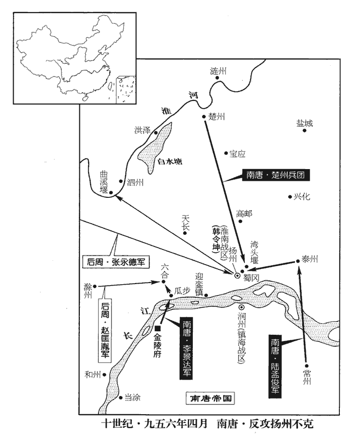
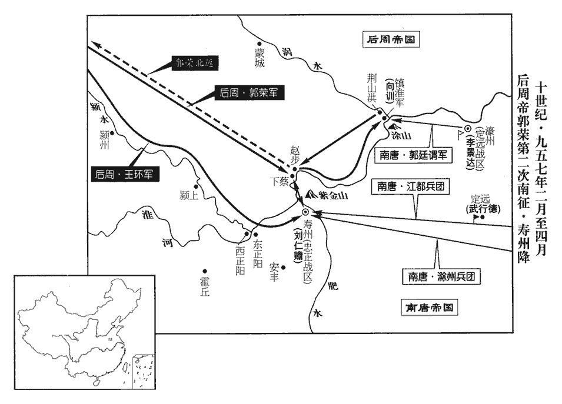
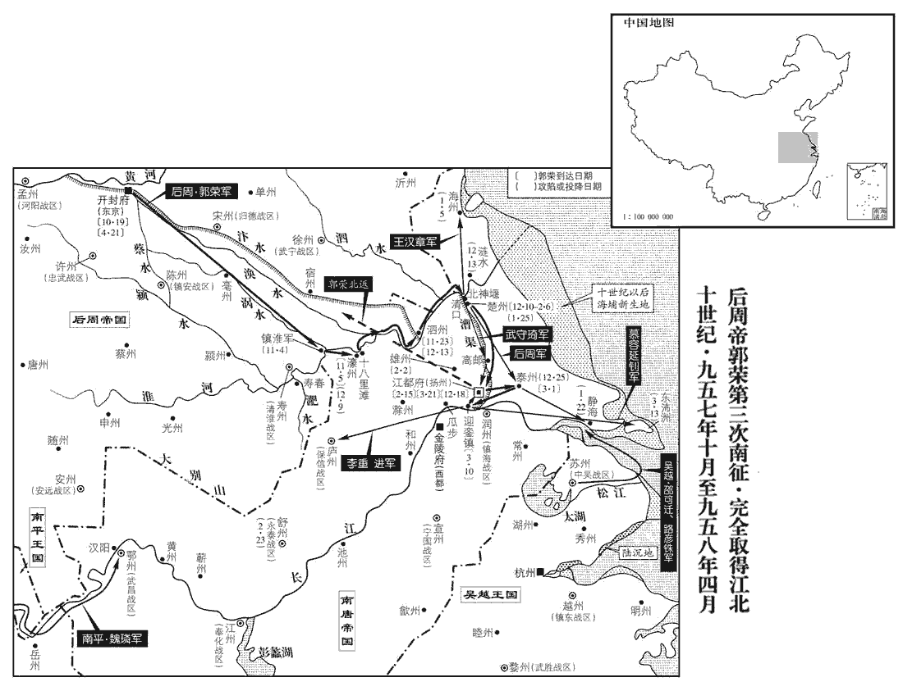

 後周紀四起柔兆執徐（丙辰）三月，盡強圉大荒落（丁巳），凡一年有奇。

# 世宗睿武孝文皇帝中

## 顯德三年（丙辰、九五六）

1三月，甲午朔‹一›，上‹郭荣›行視水寨，至淝橋，行，下孟翻。淝橋，於淝水上為橋也。自取一石，馬上持之至寨以供礮，從官過橋者人齎一石。礮，與砲同，音普豹翻。從，才用翻。齎，牋西翻。太祖皇帝乘皮船入壽春壕中，城上發連弩射之，皮船，縫牛皮為之。連弩，即今之划車弩也。射，而亦翻。矢大如屋椽；牙將館陶‹河北省馆陶县›張瓊遽以身蔽之，矢中瓊髀，椽chuán，重緣翻。中，竹仲翻。髀bì，部禮翻。死而復蘇。鏃著骨不可出，著，直略翻。瓊飲酒一大巵，令人破骨出之，流血數升，神色自若。史言張瓊之勇。後太祖登極，遂以瓊總侍衛親兵。

〖译文〗 [1]三月，甲午朔（初一），后周世宗巡视水寨，到达淝桥，亲自捡取一块石头，骑在马上拿着到寨中供炮使用，随从官员过桥的每人也携带一块石头。宋太祖皇帝乘坐牛皮船进入寿春护城河中，城上用连弩发射，箭矢像房屋的椽子那样粗；牙将馆陶人张琼立即用身体遮挡，箭射中张琼的大腿，昏死过去又苏醒过来。箭头射进骨头不能拔出，张琼喝下一大杯酒，命令人敲破骨头取出箭，流血好几升，神态脸色仍从容自如。

唐主復以右僕射孫晟為司空，復，扶又翻。遣與禮部尚書王崇質奉表入見，稱：「自天祐以來，見，賢遍翻。天祐，唐昭宗年號。海內分崩，或跨據一方，或遷革異代，跨據一方，謂四方割據之國。遷革異代，謂中國數易主也。臣紹襲先業，奄有江表，顧以瞻烏未定，附鳳何從！詩曰：瞻烏爰止，于誰之屋。漢耿純曰，攀龍鱗，附鳳冀。此言未見真主，則無從而歸附也。今天命有歸，聲教遠被，被，皮義翻。願比兩浙、湖南，仰奉正朔，謹守土疆，兩浙自錢鏐以來，湖南自馬殷以來，皆奕世奉事中國。乞收薄伐之威，薄，迫也。有鍾鼓曰伐。詩云：薄伐西戎。又云：薄伐玁xiǎn狁yǔn。赦其後服之罪，首於下國，俾作外臣，則柔遠之德，云誰不服！」又獻金千兩，銀十萬兩，羅綺二千匹。晟謂馮延己曰：「此行當在左相，唐以馮延己為左僕射，位在孫晟上，故晟云然。晟若辭之，則負先帝‹李昪徐知诰›。」既行，知不免，中夜，歎息謂崇質曰：「君家百口，宜自為謀。吾思之熟矣，終不負永陵一培土，餘無所知！」永陵者，唐主父昪墓也。培péi，蒲枚翻。唐陸龜蒙築城詞：「城上一培土，手中千萬杵。」則培土以益土為義。一培土，猶言益一畚běn土也；又薄口翻。說文曰：培塿lǒu，小冢也。一培土，猶言一冢土也。歐史作「一抔póu土」。【章：乙十一行本正作「抔」；孔本同。】

〖译文〗 南唐主又任命右仆射孙晟为司空，派遣他与礼部尚书王崇质奉持表章入周进见，表称：“自从唐朝天以来，天下分崩离析，有的地区割据一方，有的地区改朝换代，臣下继承祖先基业，拥有江表之地，只是因为看那乌鸦都没有落脚，要想附凤攀龙又从何谈起！如今天命已有归宿，声威教化泽被远近，希望比照两浙的吴越、湖南的楚国，敬奉中原号令，谨守土地疆域，乞求收敛征伐的威势，赦免后来臣服的罪过，从我小国开始，让我作您域外臣子，那么安抚边远的德政，还有谁不服从！FACE”又贡献黄金千两，白银十万两，罗绮二千匹。孙晟对冯延巳说：“此行应当由您左相出使，然而我孙晟如果推辞，那就有负先帝烈祖厚望。”上路以后，自知不免一死，半夜叹息，对王崇质说：“您家有一百多口人，应该好好地为自己盘算。我已经考虑得很成熟了，最后决不辜负永陵烈祖的在天之灵，其余的一无所知了。”

2南漢‹首都兴王府广东省广州市›甘泉宮使林延遇，陰險多計數，南漢主‹刘弘熙（刘晟）本年三十七岁›倚信之；誅滅諸弟，皆延遇之謀也。南漢主誅諸弟事並見前。乙未‹二›，卒，國人相賀。延遇病甚，薦內給事龔澄樞自代，南漢主即日擢澄樞知承宣院及內侍省。澄樞，番禺‹兴王府所在县·广东省广州市›人也。龔澄樞繼林延遇用事，南漢遂亡矣。番，音潘。禺，魚容翻，又音愚。

〖译文〗 [2]南汉甘泉宫使林延遇，为人阴险，善于算计，南汉主依靠信任他；诛杀消灭君主的诸兄弟，都是林延遇的主意。乙未（初二），林延遇去世，国中之人互相庆贺。林延遇病情危重时，推荐内给事龚澄枢代替自己，南汉主当日提升龚澄枢主持承宣院和内侍省。龚澄枢是番禺人。

3光‹河南省潢川县›•舒‹安徽省潜山县›•黃‹湖北省黄州市›招安巡檢使、行光州刺史何超以安‹湖北省安陆市›、隨‹湖北省随州市›、申‹河南省信阳市›、蔡‹河南省汝南县›四州兵數萬攻光州。九域志：光州，西南至安州六百里。隨州，東至安州二百四十里，東北至申州二百五十里。申州，東至光州二百五十五里。光州，北至蔡州二百五十里。蓋以鄰郡之兵環而攻之。丙申‹三›，超奏唐光州刺史張紹棄城走，都監張承翰以城降。

〖译文〗 [3]光、舒、黄招安巡检使、行光州刺史何超率领安、随、申、蔡四州军队数万人进攻光州。丙申（初三），何超奏报南唐光州刺史张绍弃城逃跑，都监张承翰率城投降。

丁酉‹四›，行舒州刺史郭令圖拔舒州，唐蘄qí州‹湖北省蕲春县›將李福殺其知州王承巂，舉州來降。遣六宅使齊藏珍攻黃州‹湖北省黄州市›。九域志：舒州，西至蘄州二百九十八里。蘄州，西至黃州二百一十里。三州皆瀕江。

〖译文〗 丁酉，（初四），行舒州刺史郭令图攻克舒州，南唐蕲州将领李福杀死知州王承，率州前来投降。后周派遣六宅使齐藏珍进攻黄州。

4彰武‹总部设延州陕西省延安市›留後李彥頵，性貪虐，頵jūn，於倫翻。部民與羌胡作亂，攻之。上召彥頵還朝。自延州召還。還，從宣翻，又如字。朝，直遙翻。

〖译文〗 [4]彰武留后李彦，生性贪婪暴虐，所辖百性和羌胡部落发动叛乱，进攻李彦。后周世宗召李彦回朝进京。

5秦‹甘肃省秦安县西北›、鳳‹陕西省凤县›之平也，事見上卷上年。上赦所俘蜀兵以隸軍籍，五代會要：顯德二年十二月，以新收秦、鳳州所擒川軍署為懷恩軍，所謂隸軍籍也。從征淮南，復亡降于唐。復，扶又翻。癸卯‹十›，唐主表獻百五十人；上悉命斬之。

〖译文〗 [5]秦州、凤州平定时，后周世宗赦免所俘获的后蜀士兵将他们编入军籍，跟随征伐淮南，他们又逃亡向南唐投降。癸卯（初十），南唐主上表献出降卒一百五十人；世宗命令将他们全部斩首。

6舒州人逐郭令圖，鐵騎都指揮使洛陽王審琦選輕騎夜襲舒州，復取之，令圖乃得歸。得復歸舒州。

〖译文〗 [6]舒州人驱逐郭令图，铁骑都指挥使洛阳人王审琦选轻骑兵夜晚袭击舒州，又收复舒州，郭令图于是得以返归。

7馬希崇及王延政之子繼沂皆在揚州；詔撫存之。楚、閩世事中國，其後為南唐所俘，囚於揚州，周得揚州，故撫存之。

〖译文〗 [7]马希崇和王延政的儿子王继沂都在扬州，后周世宗下诏安抚慰问他们。

8丙午‹十三›，孫晟等至上所。至行在所也。庚戌‹十七›，上遣中使以孫晟詣壽春城下，【章：十二行本「下」下有「示劉仁贍」四字；乙十一行本同；孔本同；退齋校同。】且招諭之。仁贍見晟，戎服拜於城上。以邊帥見宰相禮拜晟。晟謂仁贍曰：「君受國厚恩，不可開門納寇。」上聞之，甚怒，晟曰：「臣為【章：十二行本「為」下有「唐」字；乙十一行本同；孔本同；退齋校同。】宰相，豈可教節度使外叛邪！」上乃釋之。孫晟之辭直，周世宗亦何以罪之！

〖译文〗 [8]丙午（十三日），孙晟等人到达后周世宗所在之处。庚戌（十七日），后周世宗派遣朝廷使者带孙晟到寿春城下，并且让他招安南唐守将。刘仁赡见到孙晟，在城上身着戎装行拜礼。孙晟对刘仁赡说：“您身受国君深厚恩泽，不可打开城门迎纳敌寇。”世宗听说后，十分恼怒，孙晟说：“臣下我身为宰相，岂能教唆节度使叛变投敌呢！”世宗于是释放了他。

9唐主‹李璟›使李德明、孫晟言於上，請去帝號，去，羌呂翻。割壽、濠‹安徽省凤阳县东北临淮关›、泗‹江苏省盱眙县淮河北岸›、楚‹江苏省淮安市›、光、海‹江苏省连云港市›六州之地。六州之地皆瀕淮，周既得之，則唐失長淮之險。藉使周從唐之請而罷兵，江北之地他日亦不能守矣。仍歲輸金帛百萬以求罷兵。輸，舂遇翻。上以淮南之地已半為周有，諸將捷奏日至，欲盡得江北之地，不許。德明見周兵日進，奏稱：「唐主不知陛下兵力如此之盛，願寬臣五日之誅，得歸白唐主，盡獻江北之地。」上乃許之。晟因奏遣王崇質與德明俱歸。王崇質副孫晟來使。上遣供奉官安弘道送德明等歸金陵‹南唐首都·江苏省南京市›，賜唐主書，其略曰：「但存帝號，何爽歲寒！爽，差也。言歲寒知松柏之後彫，此約不差也。許唐主自帝江南。儻堅事大之心，終不迫人于險。」又曰：「俟諸郡之悉來，謂江北諸郡也。即大軍之立罷。言盡於此，更不煩云；煩，勞也。言更不勞云云也。苟曰未然，請從茲絕。」又賜其將相書，使熟議而來。唐主復上表謝。復，扶又翻。上，時掌翻。

〖译文〗 [9]南唐主派遣李德明、孙晟对后周世宗说，请求废除帝号，割让寿州、濠州、泗州、楚州、光州、海州等六州之地，并且每年进贡黄金绢帛百万，以求休兵停战。世宗因为淮南之地已经一半被后周占有，各路将领捷报连日到达，便打算取得全部长江以北的地方，不答应唐主所请。李德明眼看后周军队日益推进，上奏称述：“唐主不知道陛下的兵力如此强盛，希望给臣下五天不作讨伐的宽限，使臣下得以返归禀告唐主，献出全部长江以北之地。”世宗于是准许他。孙晟便奏请派王崇质与李德明一道返归。世宗派遣供奉官安弘道送李德明等人返归金陵，赐南唐主书信，信中大致说：“只管保存帝号，为什么要失去松柏不怕天寒地冻依旧郁郁葱葱的品格！倘若能坚定自己事奉大周的信念，终究不会被人逼入险境绝地。”又说：“等到江北各州全部献来，我的大军立即休战。话已在此说尽，不再赘述；倘若说还不行，请从此决绝。”又赐给南唐将相书信，让他们仔细商议而来。南唐主又上表道谢。

李德明盛稱上威德及甲兵之強，勸唐主割江北之地；唐主不悅。宋齊丘以割地為無益；德明輕佻，言多過實，國人亦不之信。佻，土彫翻。國人，謂南唐通國之人。史言誕妄之士雅不足以孚乎人，不惟喪身，且誤國事。樞密使陳覺、副使李徵古素惡德明與孫晟，惡，烏路翻。使王崇質異其言，因譖德明於唐主曰：「德明賣國求利。」唐主大怒，斬德明於市。為鍾謨為李德明脩怨張本。

〖译文〗 李德明盛赞后周世宗声威德行和军队强盛，规劝南唐主割让长江以北之地，南唐主不高兴。宋齐丘认为割让土地无济于事；李德明为人轻浮，经常言过其实，国中之人也不相信他的话。枢密使陈觉、副使李徵古素来憎恶李德明和孙晟，让王崇质说得同李德明不一样，趁势对南唐主说李德明的坏话道：“李德明出卖国家求取私利。”南唐主勃然大怒，将李德明在街市斩首。

10吳程攻常州，破其外郭，執唐常州團練使趙仁澤，送于錢唐‹首都杭州州政府所在县›。仁澤見吳越王弘俶不拜，責以負約；唐與吳越本通好，而吳越以周之命而攻唐，故責其負約。弘俶怒，決其口至耳。元德昭憐其忠，為傅良藥，得不死。唐非無忠臣也，不能用耳。為，于偽翻。

〖译文〗 [10]吴程进攻常州，攻破常州外城，抓获南唐常州团练使赵仁泽，解送到钱唐。赵仁泽见到吴赵王钱弘不下跪叩拜，斥责钱弘背信负约；钱弘发怒，把他的嘴一直撕裂到耳边。元德昭怜惜他的忠诚，为他敷用好药，得以不死。

唐主‹李璟›以吳越兵在常州，恐其侵逼潤州‹江苏省镇江市›，九域志：常州，西北至潤州一百七十一里。以宣、潤大都督燕王弘冀年少，少，詩照翻。恐其不習兵，徵還金陵。還，從宣翻。部將趙鐸言於弘冀曰：「大王元帥，眾心所恃，逆自退歸，所部必亂。」弘冀然之，辭不就徵，部分諸將，為戰守之備。分，扶問翻。

〖译文〗 南唐主因吴越军队在常州城下，害怕他们侵犯进逼润州，又因宣、润大都督燕王钱弘冀年纪轻，怕他不熟习军事，便征召他返回金陵。部将赵铎对钱弘冀说：“大王身为元帅，是众人心目中的支柱，反而自己退归京城，部众必定大乱。”钱弘冀认为是这样，推辞不接受征召，部署众将，作好战斗守卫的准备。

龍武都虞候柴克宏，再用之子也，柴再用事楊氏為將，屢立戰功，又及事徐溫父子。沈默好施，沈，持林翻。好，呼到翻。施，式豉翻。不事家產，雖典宿衛，日與賓客博弈飲酒，未嘗言兵，時人以為非將帥材。將，即亮翻。帥，所類翻。至是，有言克宏久不遷官者，唐主以為撫州‹江西省临川市›刺史。克宏請效死行陳，其母亦表稱克宏有父風，可為將，苟不勝任，分甘孥戮。趙括之母不肯保任其子，柴克宏之母自稱薦其子，皆知之審也。孥，子也。言與其子甘同戮也。行，戶剛翻。陳，與陣同。勝，音升。分，扶問翻。孥，音奴。唐主乃以克宏為右武衛將軍，使將兵會袁州‹江西省宜春市›刺史陸孟俊救常州。

〖译文〗 龙武都虞候柴克宏是柴再用的儿子，沉默寡言、乐善好施，不管家产，虽然典领宫廷警卫，但仍每天与宾客们下棋喝酒，不曾谈论军事，当时人认为他不是将帅的材料。到这时，有人说柴克宏很久没迁升官职，南唐主便任命他为抚州刺史。柴克宏请求在军队效命，他母亲也进表称柴克宏有父亲遗风，可以为将，如果不能胜任，甘愿满门抄斩。南唐主于是任命柴克宏为右武卫将军，让他领兵会合袁州刺史陆孟俊救援常州。

時唐精兵悉在江北，克宏所將數千人皆羸老，羸，倫為翻。樞密使李徵古復以鎧仗之朽蠹者給之。克宏訴於徵古，徵古慢罵之，眾皆憤恚，恚，於避翻。克宏怡然。至潤州，徵古遣使召還，還，從宣翻，又如字。以神衛【嚴：「衛」改「武」。】統軍朱匡業代之。燕王弘冀謂克宏：謂者，告語之也。「君但前戰，吾當論奏。」乃表克宏才略可以成功，常州危在旦莫，莫，讀曰暮。不宜中易主將。克宏引兵徑趣常州，趣，七喻翻。徵古復遣使召之，復，扶又翻。克宏曰：「吾計日破賊，汝來召吾，必奸人也！」命斬之。使者曰：「受李樞密命而來。」克宏曰：「李樞密來，吾亦斬之！」柴克宏前日之怡然，乃養成今日之勇決也。

〖译文〗 当时南唐精锐部队都在长江以北，柴克宏所率领的数千人都瘦弱年迈，枢密使李徵古又将铠甲兵器中锈蚀破烂的给他。柴克宏向李徵古申诉，李徵古傲慢地辱骂他，部众都忿忿不平，柴克宏却安然如常。到达润州，李徵古派遣使者召他回来，任命神卫统军朱匡业取代他。燕王钱弘冀对柴克宏说：“您只管在前面打仗，我自会安排奏报。”于是上表说柴克宏才能谋略可以成就功业，常州危在旦夕，不适宜中途调换主将。柴克宏领兵直奔常州，李徵古又派遣使者召他，柴克宏说：“我估计数日可以破敌，你来召我回去，必定是奸人啊！”命令斩首。使者说：“我接受李枢密的命令而来。”柴克宏说：“李枢密来，我也斩他首级。”

初，鮑脩讓、羅晟在福州‹福建省福州市›，與吳程有隙，漢天福十二年，吳越使鮑脩讓戍福州，是年以吳程鎮福州。至是，程抑挫之，二人皆怨。先是，唐主遣中書舍人喬匡舜使於吳越，先，悉薦翻。壬子‹十九›，柴克宏至常州，蒙其船以幕，匿甲士於其中，聲言迎匡舜。吳越邏者以告，邏，郎佐翻。程曰：「兵交，使在其間，用左傳語。不可妄以為疑。」唐兵登岸，徑薄吳越營，羅晟不力戰，縱之使趣程帳，趣，七喻翻。程僅以身免。克宏大破吳越兵，斬首萬級。朱匡業至行營，克宏事之甚謹。吳程至錢唐‹首都杭州州政府所在县›，吳越王弘俶悉奪其官。

〖译文〗 当初，鲍修让、罗晟在福州时，与吴程有裂隙，到这时，吴程压制刁难他们，二人都有怨恨。在这以前，南唐主派遣中书舍人乔匡舜到吴越出使，壬子（十九日），柴克宏到达常州，用帐幕蒙在船上，将全副武装的士兵藏匿在里面，声称前来接乔匡舜。吴越巡逻士兵将情况报告，吴程说：“两国交战，使者可以在其间来往，不可随便怀疑。”南唐士兵登上岸，直接逼近吴越营寨，罗晟不拼力作战，放进来让他们奔向吴程的营帐，吴程仅仅自己幸免于难。柴克宏大破吴越军队，斩首一万级。朱匡业到达军营，柴克宏事奉他很恭敬。吴程到达钱唐，吴越王钱弘削夺他的一切职务。

11甲寅‹二十一›，蜀主‹首都成都府四川省成都市›孟昶（孟仁赞）本年三十八岁以捧聖控鶴都指揮使李廷珪為左右衛聖諸軍馬步都指揮使，仍分衛聖、匡聖步騎為左右十軍，以武定‹总部洋州›節度使呂彥琦等為使，為軍使也。廷珪總之，如趙廷隱之任。蜀自李仁罕之誅，趙廷隱專總宿衛諸軍，後為安思謙所譖罷，事並見前。

〖译文〗 [11]甲寅（二十一日），后蜀主任命捧圣控鹤都指挥使李廷为左右卫圣诸军马步都指挥使，仍旧分卫圣、匡圣步兵、骑兵为左右十个军，任命武定节度使吕彦琦等为军使，李廷总领，如同赵廷隐的职务。

12初，柴克宏為宣州‹安徽省宣州市›巡檢使，始至，城塹不脩，器械皆闕，吏云：「自田頵、王茂章、李遇相繼叛，唐天復三年，田頵以宣州叛楊行密。天祐二年，王茂章叛。梁乾化二年，李遇叛。事並見前紀。頵，於倫翻。後人無敢治之者。」治，直之翻。克宏曰：「時移事異，安有此理！」悉繕完之。由是路彥銖攻之不克，史言宣州獲全，亦柴克宏之力。聞吳程敗，乙卯‹二十二›，引歸。唐主以克宏為奉化‹总部江州›節度使，克宏復請將兵救壽州，未至而卒。人有身死而名全者，柴克宏是也。克宏敵吳越可以勝，使遇周師，未必能爾。復，扶又翻。

〖译文〗 [12]当初，柴克宏为宣州巡检使，开始到达时，城墙、护城河长年失修，战备器具都有损缺，官吏说：“自从田、王茂章、李遇相继叛变，后来的人没有敢修治城池器械的。”柴克宏说：“时代变换事情不同，哪有这种道理！”全部修缮完好。因此路彦铢攻城不克，听说吴程兵败，乙卯（二十二日），撤退返回。南唐主任命柴克宏为奉化节度使，柴克宏又请求领兵救援寿州，没有到达而去世。

13河陽‹总部孟州›節度使白重贊重，直龍翻。以天子南征，慮北漢乘虛入寇，繕完守備，且請兵於西京‹河南府·河南省洛阳市›。西京留守王晏初不之與，又慮事出非常，乃自將兵赴之。重贊以晏不奉詔而來，拒不納，遣人謂之曰：「令公昔在陝‹河南省三门峡市›服，已立大功，謂天福十二年晏舉陝城降漢高祖也。晏時兼中書令，故稱為令公。陝，失冉翻。河陽‹孟州州政府所在县›小城，不煩枉駕！」晏慚怍而還。怍，疾各翻。還，從宣翻，又如字。孟、洛之民，數日驚擾。以王晏出兵而白重贊拒之，恐兵交而罹其禍。

〖译文〗 [13]河阳节度使白重赞因为天子南征，顾虑北汉有可能乘虚入侵，修治防御工事，并且向西京请求增兵。西京留守王晏起初不给军队，后又考虑事情发生在非常时期，于是亲自统率军队赶赴。白重赞因为王晏不是接受诏令前来，拒不接纳，派人对他说：“令公您昔日在陕城归服，已立大功，河阳区区小城，不劳屈尊枉驾！”王晏羞愧而回。孟州、洛州的百姓，惊恐骚动了好几天。

14唐主命諸道兵馬元帥齊王景達將兵拒周，以陳覺為監軍使，前武安‹总部潭州›節度使邊鎬為應援都軍使。邊鎬以失潭州奪節，今敘用之。中書舍人韓熙載上書曰：「信莫信於親王，重莫重於元帥，安用監軍使為！」句斷。唐主不從。

〖译文〗 [14]南唐主命令诸道兵马元帅齐王李景达领兵抵抗后周军队，任命陈觉为监军使，前武安节度使边镐为应援都军使。中书舍人韩熙载上书说：“论信任，没有比亲王更可信的；论权重，没有比元帅更重要的，哪里用得上监军使呢！”南唐主没听从。

遣鴻臚卿潘承祐詣泉‹福建省泉州市›、建‹福建省建瓯市›召募驍勇，承祐薦前永安‹总部建州›節度使許文稹、稹，止忍翻。靜江指揮使陳德誠、建州人鄭彥華、林仁肇。唐主以文稹為西面行營應援使，彥華、仁肇皆為將。將，即亮翻。仁肇，仁翰之弟也。林仁翰見二百八十四卷晉出帝開運元年，唐主之保大二年也。

〖译文〗 派遣鸿胪卿潘承到泉州、建州召募矫健勇猛的人材，潘承推荐前永安节度使许文稹、静江指挥使陈德诚、建州人郑彦华、林仁肇。南唐主任命许文稹为西面行营应援使，郑彦华、林仁肇都为将领。林仁肇是林仁翰的弟弟。

15夏，四月，甲子‹二›，以侍衛親軍都指揮使、歸德‹总部宋州›節度使李重進為廬‹安徽省合肥市›、壽等州招討使，以武寧‹总部徐州›節度使武行德為濠州‹安徽省凤阳县东北临淮关›城下都部署。

〖译文〗 [15]夏季，四月，甲子（初二），后周世宗任命侍卫亲军都指挥使、归德节度使李重进为庐、寿等州招讨使，任命武宁节度使武行德为濠州城下都部署。

 

16唐右衛將軍陸孟俊自常州將兵萬餘人趣泰州，九域志：自常州北至泰州一百九十七里。周兵遁去，孟俊復取之，復取泰州。遣陳德誠戍泰州。孟俊進攻揚州‹江都府›，屯于蜀岡‹扬州市西北二千米›，韓令坤棄揚州走。蜀岡在揚州城西。揚州城在蜀岡東南，城之東南北皆平地，溝澮kuài交貫，惟蜀岡諸山西接廬、滁。凡北兵南寇揚州，率循山而來，據高為壘以臨之。今陸孟俊據蜀岡以斷周兵援路，故韓令坤懼而走。帝遣張永德將兵救之，令坤復入揚州。援兵至，故復入揚州。帝又遣太祖皇帝將兵屯六合‹江苏省六合县›。六合縣，屬揚州，在州西北一百三十里。劉昫曰：六合，漢臨淮郡之堂邑縣，晉置秦郡，北齊置秦州，隋置方州，後廢，唐武德初置六合縣。太祖皇帝令曰：「揚州兵有過六合者，折其足！」自揚州西北歸，須過六合，故云然。折，而設翻。令坤始有固守之志。

〖译文〗 [16]南唐右卫将军陆孟俊从常州领兵一万多人赶赴泰州，后周军队逃遁离去，陆孟俊收复泰州，派遣陈德诚守卫泰州。陆孟俊进攻扬州，屯驻在蜀冈，韩令坤丢弃扬州逃跑。后周世宗派遣张永德领兵救援，韩令坤再入扬州。世宗又派遣宋太祖皇帝领兵屯驻六合。宋太祖皇帝下令说：“扬州士兵有过六合的，折断他的脚！”韩令坤这才有固守的决心。

帝自至壽春以來，命諸軍晝夜攻城，久不克；會大雨，營中水深數尺，深，式浸翻。攻具及士卒失亡頗多，時周兵以方舟載礮，自淝河中流擊壽春城。又束巨竹數十萬竿，上施板屋，號曰「竹龍」，載甲士以攻之。會淝水暴漲，礮舟、竹龍皆漂向南岸，為唐兵所焚。糧運不繼，李德明失期不至，李德明歸至金陵被誅。乃議旋師。或勸帝東幸濠州，聲言壽州已破；從之。己巳‹七›，帝自壽春循淮而東，乙亥‹十三›，至濠州。九域志：壽州，東至濠州三百八十里。

〖译文〗 世宗亲自到达寿春以来，命令各军昼夜攻城，长久未能攻克；适逢大雨，军营中水深数尺，攻城器材以及士兵损失逃亡很多，粮草运输接应不上，李德明超过期限没有到达，于是商议回师。有人劝说世宗往东巡视濠州，声称寿州已经攻破；世宗听从。己巳（初七），世宗从寿春沿着淮河东进，乙亥（十三日），到达濠州。

韓令坤敗唐兵於城東，此揚州城東也。敗，補邁翻。擒陸孟俊。初，孟俊之廢馬希萼立希崇也，事見二百九十卷太祖廣順元年。滅故舒州刺史楊昭惲之族而取其財，惲，於粉翻。薛史曰：楊昭惲，長沙人，父謚，事馬殷為節度行軍司馬。謚仲女為衡陽王夫人。希聲襲位，昭惲遷衡州‹湖南省衡阳市›刺史。自以地連戚里，積財貨，建大第，二子為牙內都將，少長豪富，任氣凌下，士大夫惡之。長沙兵亂，陸孟俊怒曰：「楊氏怙寵滅義，為國人所患久矣。」於是族滅楊氏。「舒」，當作「衡」。楊氏有女美，獻於希崇。令坤入揚州，希崇以楊氏遺令坤，令坤嬖之。遺，唯季翻。嬖，卑義翻，又必計翻，愛也，幸也。既獲孟俊，將械送帝所；楊氏在簾下，忽撫膺慟哭，令坤驚問之，對曰：「孟俊昔在潭州，殺妾家二百口，今日見之，請復其冤。」令坤乃殺之。史言人不可妄殺，雖女子亦能復讎。

〖译文〗 韩令坤在扬州城东击败南唐军队，擒获陆孟俊。当初，陆孟俊废黜马希萼拥立马希崇，诛灭原舒州刺史杨昭恽全家而取得杨家财产，杨家有个女儿长得美丽，陆孟俊把她献给马希崇。韩令坤进入扬州，马希崇把杨氏送给韩令坤，韩令坤宠爱她。已经抓获陆孟俊，给他带上脚镣手铐准备押送到世宗所在之处；杨氏站在竹帘下，突然捶胸痛哭，韩令坤惊讶而问她，回答说：“陆孟俊昔日在潭州，杀死贱妾家人二百口，今日见到，请报冤仇。”韩令坤就杀了陆孟俊。

17唐齊王景達將兵二萬自瓜步‹江苏省六合县南长江渡口›濟江，距六合二十餘里，設柵不進。諸將欲擊之，太祖皇帝曰：「彼設柵自固，懼我也。今吾眾不滿二千，若往擊之，則彼見吾眾寡矣；不如俟其來而擊之，破之必矣！」居數日，唐出兵趣六合，趣，七喻翻。太祖皇帝奮擊，大破之，殺獲近五千人，近，其靳翻。餘眾尚萬餘，走渡江，爭舟溺死者甚眾，於是唐之精卒盡矣。

〖译文〗 [17]南唐齐王李景达领兵二万从瓜步渡过长江，距离六合二十余里，设置栅栏不再前进。后周众将领想出击，宋太祖皇帝说：“他们设置栅栏固守，是怕我们啊。如今我们部众不满二千，倘若前往攻击，他们就看出我们人数的多少了；不如等待他们来而出击，必定可打败他们了。”过了几天，南唐出兵赶赴六合，宋太祖皇帝奋勇出击，大败敌军，杀死抓获近五千人，余下部众还有一万多，逃奔渡江，争船淹死的很多，于是南唐的精锐部队丧失殆尽。

是戰也，士卒有不致力者。太祖皇帝陽為督戰，以劍斫其皮笠。明日，徧閱其皮笠，有劍跡者數十人，皆斬之，由是部兵莫敢不盡死。

〖译文〗 这场战斗，士兵有不卖力的。宋太祖皇帝假装督战，用剑砍那些战不卖力的士兵的皮斗笠。第二天，普遍检查皮斗笠，上面有剑砍痕迹的有数十人，全部推出斩首，从此所部士兵没有敢不拼死作战的。

先是，唐主聞揚州失守，命四旁發兵取之。先，悉薦翻。己卯‹十七›，韓令坤奏敗揚【章：十二行本「揚」作「楚」；乙十一行本同；孔本同；張校同。】州‹楚州，江苏省淮安市›兵萬餘人於灣頭堰‹扬州市东北万福闸›，九域志：揚州江都縣有灣頭鎮，在今揚州城北十五里。敗，補邁翻。獲漣州‹江苏省涟水县›刺史秦進崇；唐蓋置漣州於漣水縣。九域志：漣水，西南至楚州六十里。張永德奏敗泗州‹江苏省盱眙县淮河北岸›【章：十二行本「州」下有「兵」字；乙十一行本同；孔本同。】萬餘人於曲溪堰‹江苏省盱眙县西南›。曲溪，在盱眙縣西南十里。按昭信圖經：曲溪堰，亦謂之新河堰。

〖译文〗 在此之前，南唐主听说扬州失守，命令四周州军发兵夺取扬州。己卯（十七日），韩令坤奏报在湾头堰击败扬州军队一万多人，抓获涟州刺史秦进崇；张永德奏报在曲溪堰击败泗州军队一万多人。

18丙戌‹二十四›，以宣徽南院使向訓為淮南‹总部设扬州›節度使兼沿江招討使。

〖译文〗 [18]丙戌（二十四日），后周世宗任命宣徽南院使向训为淮南节度使兼沿江招讨使。

渦口‹涡河注入淮河处·安徽省怀远县›奏新作浮梁成，丁亥‹二十五›，帝自濠州如渦口。渦口，渦水入淮之口。郡縣志：渦口城，東南至濠州九十里。渦，音戈。

〖译文〗 涡口奏报新建浮桥落成。丁亥（二十五日），世宗从濠州前往涡口。

帝銳於進取，欲自至揚州，范質等以兵疲食少，泣諫而止。帝嘗怒翰林學士竇儀，欲殺之；范質入救之，帝望見，知其意，即起避之，質趨前伏地，叩頭諫曰：「儀罪不至死，臣為宰相，致陛下枉殺近臣，罪皆在臣。」繼之以泣。帝意解，乃釋之。

〖译文〗 世宗锐意进取，打算亲自到扬州，范质等人认为军队疲乏粮食缺少，哭着劝谏而阻止。世宗曾经生翰林学士窦仪的气，想杀他；范质进去救窦仪，世宗远远望见，知道来意，立即起身避他，范质急步向前伏在地上，磕头进谏说：“窦仪的罪不至于死，臣下身为宰相，导致陛下错杀近臣，罪都在臣下身上。”接着哭泣。世宗怒气消解，于是释放窦仪。

19北漢‹首都太原府山西省太原市›葬神武帝‹刘崇（刘旻）›於交城‹山西省交城县›北山，隋分晉陽縣置交城縣，取縣西北古交城為名，初治交山，唐天授元年，移治卻波村。九域志：在陽曲縣西南一百里。宋白曰：大通監，本古交城之地，管東西二冶烹鐵務，東冶在綿上縣，西冶在交城縣北山。廟號世祖。

〖译文〗 [19]北汉在交城北山安葬神武帝刘，庙号为世祖。

20五月，丙【章：十二行本「丙」作「壬」；乙十一行本同；孔本同；張校同。】辰朔‹一›，以渦口為鎮淮軍。

〖译文〗 [20]五月，壬辰朔（初一），后周将涡口改为镇淮军。

21丙申‹五›，唐永安‹总部建州›節度使陳誨敗福州兵於南臺江‹福建省福州市南›，今福州南九里有釣龍臺山，臨江，南臺江當即是此地。薛史地理志：福州福唐縣，晉天福初改為南臺縣，蓋以江名縣也，後復舊。俘斬千餘級。唐主更命永安曰忠義軍。晉開運二年，唐克建州，置永安軍。更，工衡翻。誨，德誠之父也。

〖译文〗 [21]丙申（初五），南唐永安节度使陈诲在南台江击败福州军队，俘虏斩首一千余级。南唐主将永安军改名为忠义军。陈诲是陈德诚的父亲。

22戊戌‹七›，帝留侍衛親軍都指揮使李重進等圍壽州，自渦口北歸；乙卯‹十四›，至大梁。自渦口至大梁七百四十里。

〖译文〗 [22]戊戌（初七），世宗留下侍卫亲军都指挥使李重进等围攻寿州，从涡口北上返归；乙卯（二十四日），到达大梁。

23六月，壬申‹十一›，赦淮南諸州繫囚，除李氏非理賦役，事有不便於民者，委長吏以聞。長，知兩翻。

〖译文〗 [23]六月，壬申（十一日），后周赦免淮南各州关押的囚犯，废除南唐李氏不合理的赋税徭役，事情有不便利百姓的，委托州县官吏奏报。

24侍衛步軍都指揮使、彰信‹总部曹州›節度使李繼勳營於壽州城南，唐劉仁贍伺繼勳無備，伺，相吏翻。出兵擊之，殺士卒數百人，焚其攻具。

〖译文〗 [24]侍卫步军都指挥使、彰信节度使李继勋在寿州城南安营，南唐刘仁赡等候李继勋没有防备，出兵袭击，杀死士兵数百人，焚毁后周军队的攻城器具。

25唐駕部員外郎朱元因奏事論用兵方略，唐主以為能，命將兵復江北諸州。將，即亮翻；下同。

〖译文〗 [25]南唐驾部员外郎朱元利用奏报政事论述用兵策略，南唐主认为他有才能，命他统领军队收复长江以北各州。

26秋，七月，辛卯朔‹一›，以周行逢為武平‹总部朗州›節度使，制置武安、靜江‹总部桂州›等軍事。行逢既兼總湖、湘，乃矯前人之弊，留心民事，悉除馬氏橫賦，橫，戶孟翻；下驕橫同。馬氏自希範以來始加賦於境內。貪吏猾民為民害者皆去之，去，羌呂翻。擇廉平吏為刺史、縣令。

〖译文〗 [26]秋季，七月，辛卯朔（初一），后周世宗任命周行逢为武平节度使，制置武安、静江等军事。周行逢既已兼管洞庭湖、湘水地区，于是就矫正前人的弊端，关心百姓生计，全部废除马氏的横征暴敛，贪官污吏扰民成为百姓祸害的全部革去，选择廉洁平正的官吏担任刺史、县令。

朗州民夷雜居，劉言、王逵舊將多驕橫，行逢壹以法治之，無所寬假，眾怨懟且懼。治，直之翻。懟，直類翻。有大將與其黨十餘人謀作亂，行逢知之，大會諸將，於座中擒之，數曰：「吾惡衣糲食，充實府庫，正為汝曹，數，所具翻，責數也。糲，盧達翻。為，于偽翻。何負而反！今日之會，與汝訣也！」立撾殺之，座上股栗。行逢曰：「諸君無罪，皆宜自安。」樂飲而罷。撾，側瓜翻。樂，音洛。

〖译文〗 郎州地区华夏、蛮夷之民共同居住，刘言、王逵旧日将领大多骄横不法，周行逢一律用法制来管理，没有一点宽容姑息，众人既怨恨又恐惧。有个大将与其党羽十几人阴谋发动叛乱，周行逢知道此事，便设宴大会众将，在座位上擒获他，数落说：“我穿布衣、吃粗粮，充实国库，正是为了你们，为何负心而谋反！今日宴会，是与你诀别！”立刻打死他，在座将领吓得双腿发抖。周行逢说：“诸位没有罪过，都应该自己心安。”大家高兴地饮酒而结束。

行逢多計數，善發隱伏，將卒有謀亂及叛亡者，行逢必先覺，擒殺之，所部凜然。然性猜忍，常散遣人密詗諸州事，詗，古永翻，又翾正翻。其之邵州‹湖南省邵阳市›者，無事可復命，但言刺史劉光委多宴飲。行逢曰：「光委數聚飲，數，所角翻。欲謀我邪！」即召還，殺之。親衛指揮使、衡州刺史張文表恐獲罪，求歸治所；求解兵柄歸衡州也。行逢許之。文表歲時饋獻甚厚，及謹事左右，由是得免。其後行逢臨卒，謂其子保權曰：「吾起隴畝，為團兵，同時十人皆誅，張文表獨存。」是時王逵、張倣、何敬真、朱全琇、潘叔嗣皆已死，唯蒲公益、宇文瓊、彭萬和與文表，史不言其有他，此三人者必又相繼為行逢所殺，而文表獨免也。行逢死，則文表叛矣。

〖译文〗 周行逢足智多谋，善于抉发隐患，将吏士兵有阴谋作乱和叛变逃亡的，周行逢必定事先察觉，拘捕斩杀，因此部众对他十分敬畏。然而他生性多疑残忍，经常分头派人秘密探察各州情况，他派到邵州的人，没有情况可以报告，便只说刺史刘光委经常设宴饮酒。周行逢说：“刘光委多次聚众宴饮，想算计我吧！”立即召回，杀死他。亲卫指挥使、衡州刺史张文表畏恐无辜获罪，请求解除兵权回归治所衡州，周行逢准许。张文表一年四季馈赠贡献十分丰厚，同时小心事奉周行逢身边亲信，因此得以免罪。

行逢妻鄖國夫人鄧氏，鄖yún，音云。路振九國志作「嚴氏」。陋而剛決，善治生，治，直之翻。嘗諫行逢用法太嚴，人無親附者，行逢怒曰：「汝婦人何知！」鄧氏不悅，因請之村墅視田園，遂不復歸府舍。之，往也。墅，承與翻。復，扶又翻。府舍，朗州府舍也。行逢屢遣人迎之，不至；一旦，自帥僮僕來輸稅，帥，讀曰率。輸，舂遇翻；下同。行逢就見之，曰：「吾為節度使，夫人何自苦如此！」鄧氏曰：「稅，官物也。公為節度使，不先輸稅，何以率下！且獨不記為里正代人輸稅以免楚撻時邪？」行逢欲與之歸，不可，不肯歸府舍也。曰：「公誅殺太過，常恐一旦有變，村墅易為逃匿耳。」易，以豉翻。行逢慚怒，其僚屬曰：「夫人言直，公宜納之。」

〖译文〗 周行逢妻子郧国夫人邓氏，丑陋而刚强决断，善于操持生计，曾经规劝周行逢，用法太严的话别人就不会亲附。周行逢发怒说：“你妇道人家知道什么！”邓氏不愉快，因此请求到乡村草房看守田园，于是不再回归府第官舍。周行逢屡次派人接她，不肯到来；有一天，她亲自带领家僮仆人前来交纳赋税，周行逢上前见她，说：“我身为节度使，夫人为何如此自找苦吃！”邓氏说：“赋税，是官家的财富。您身为节度使，不首先交纳赋税，用什么去做下面百姓的表率！再说你难道不记得当里正代人交纳赋税来免除刑杖拷打的时候了吗？”周行逢想同她回家，她不答应，说：“您诛杀太过分，我常常担心有朝一日发生变化，乡村草房容易逃避藏匿。”周行逢又羞又气，他的僚属说：“夫人说得有理，您应该接受。”

行逢壻唐德求補吏，行逢曰：「汝才不堪為吏，吾今私汝則可矣；汝居官無狀，吾不敢以法貸汝，則親戚之恩絕矣。」與之耕牛、農具而遣之。

〖译文〗 周行逢的女婿唐德要求补任官吏，周行逢说：“你的才能不配做官吏，我如今私下照顾你倒是可以的；但如你当官不像样，我不敢用法来宽容你，那亲戚间的情谊就断绝了。”给他耕牛、农具而遣送回家。

行逢少時嘗坐事黥，隸辰州‹湖南省沅陵县›銅阬，少，詩照翻。黥，其京翻。唐文宗之世，天下銅阬五十，辰州不在其數。辰州銅阬，蓋馬氏所置也。或說行逢：「公面有文，恐為朝廷使者所嗤，說，式芮翻。嗤，丑之翻。請以藥滅之。」行逢曰：「吾聞漢有黥布，不害為英雄，吾何恥焉！」黥布事見八卷秦二世二年。

〖译文〗 周行逢年轻时曾经因事定罪受黥刑，发配辰州铜，有人劝说周行逢：“您脸上刺有字，恐怕会被朝廷使者所嗤笑，请用药来除去。”周行逢说：“我听说汉代有个黥布，并不因此妨碍他成为英雄，我何必为此感到羞耻呢！”

自劉言、王逵以來，屢舉兵，將吏積功及所羈縻蠻夷，檢校官至三公者以千數。羈縻蠻夷，謂溪峒諸蠻夷。前天策府學士徐仲雅，自馬希廣之廢，杜門不出，馬希廣廢事見二百八十九卷漢乾祐二年。行逢慕之，署節度判官。仲雅曰：「行逢昔趨事我，柰何為之幕吏！」辭疾不至。行逢迫脅固召之，面授文牒，終辭不取，行逢怒，放之邵州，既而召還。會行逢生日，諸道各遣使致賀，行逢有矜色，謂仲雅曰：「自吾兼鎮三府，三府，武平、武安、靜江軍府也。四鄰亦畏我乎？」仲雅曰：「侍中境內，周行逢加侍中，故徐仲雅稱之。彌天太保，徧地司空，四鄰那得不畏！」行逢復放之邵州，復，扶又翻。竟不能屈。有僧仁及，為行逢所信任，軍府事皆預之，亦加檢校司空，娶數妻，出入導從如王公。從，才用翻。

〖译文〗 从刘言、王逵以来，多次起兵，将领官吏积累功劳以及所属羁縻州县的蛮夷部落首领，赏赐加封得到司徒、司马、司空三公散官头衔的数以千计。前天策府学士徐仲雅，从马希广被废黜以后，闭门不出，周行逢仰慕他，任命他代理节度判官。徐仲雅说：“周行逢昔日在我手下做事，我怎么能做他幕府的官吏！”推辞有病而不到职。周行逢强迫威胁再三征召，当面授予任职文书，终究坚辞不就，周行逢发怒，将他流放到邵州，不久又召回。遇上周行逢生日，各府州分别派遣使者表示祝贺，周行逢面有骄色，对徐仲雅说：“从我总领武平、武安、静江三府之后，四方比邻也都畏服我吗？”徐中雅说：“侍中您管辖境内，满天太保，遍地司空，四邻八方哪能不畏服呢！”周行逢再次将他流放到邵州，最后没能使他屈服。有个叫仁及的僧人，得到周行逢信任，军府事务都参与，也加封为检校司空，娶了好几个妻子，出来进去开道跟从的排场如同王公一般。

27辛亥‹二十一›，宣懿皇后符氏殂‹年二十六岁›。

〖译文〗 [27]辛亥（二十一日），后周宣懿皇后符氏去世。

28唐將朱元‹舒元›取舒州‹安徽省潜山县›，刺史郭令圖棄城走。李平‹杨讷›取蘄州‹湖北省蕲春县›。唐主以元為舒州團練使，平為蘄州刺史。元又取和州‹安徽省和县›。朱元、李平，皆李守貞所遣求救於唐者也，事見二百八十八卷漢乾祐元年。

〖译文〗 [28]南唐将领朱元攻取舒州，后周刺史郭令图弃城逃跑。李平攻取蕲州。南唐主任命朱元为舒州团练使，李平为蕲州刺史。朱元又攻取和州。

初，唐人以茶鹽強民而徵其粟帛，謂之博徵，強，其兩翻。博，博易也。言以茶鹽博易而徵其粟帛。又興營田於淮南，民甚苦之；及周師至，爭奉牛酒迎勞。勞，力到翻。而將帥不之恤，帥，所類翻。專事俘掠，視民如土芥；民皆失望，相聚山澤，立堡壁自固，操農器為兵，操，七刀翻。積紙為甲，時人謂之「白甲軍」。周兵討之，屢為所敗，敗，補邁翻。先所得唐諸州，多復為唐有。

〖译文〗 当初，南唐将茶、盐强行配给农民而征收粮食布帛，称为“博征”，又在淮南兴造营田，农民很吃苦头；及至后周军队到达，农民争相奉送牛酒来迎接慰劳。但后周将帅不体贴安抚，反而专门从事掳掠，把农民视为粪土草芥；农民都很失望，相互聚集在山林湖泽，建立城堡壁垒自己固守，操持农具作为武器，拼缀纸片作为铠甲，当时人称之为“白甲军”。后周军队讨伐他们，屡次被打败，先前所得到南唐各州，大多再为南唐所有。

唐之援兵營於紫金山‹寿县东北五千米八公山›，紫金山在壽春南；或云即八公山。與壽春城中烽火相應。淮南節度使向訓奏請以廣陵之兵併力攻壽春，俟克城，更圖進取，詔許之。訓封府庫以授揚州主者，命揚州牙將分部按行城中，秋毫不犯，分，扶問翻。行，下孟翻。揚州民感悅，軍還，或負糗糒以送之。糗，去久翻，熬米麥為之。糒bèi，平秘翻，乾飯也。滁州‹安徽省滁州市›守將亦棄城去，皆引兵趣壽春。

〖译文〗 南唐的救援部队在紫金山安营，与寿春城中的烽火遥相呼应。淮南节度使向训上奏请求派广陵的军队合力进攻寿春，等待攻克寿春城，再计划进取，后周世宗下诏同意。向训封好都府仓库交给扬州主管人员，命令扬州牙将部署在城中的巡逻，纪律严明秋毫无犯，扬州百姓感动喜悦，军队返回，有的人背着干粮送去。滁州守将也弃城离去，都领兵赶赴寿春。

唐諸將請據險以邀周師，宋齊丘曰：「如此，則怨益深。」【章：十二行本「深」下有「不如縱之以德於敵，則兵易解也」十三字；乙十一行本同；孔本同；退齋校同。】乃命諸將各自保守，毋得擅出擊周兵。由是壽春之圍益急。齊王景達軍于濠州，遙為壽州聲援，軍政皆出於陳覺，景達署紙尾而已，擁兵五萬，無決戰意，嗚呼！比年襄陽之陷，得非援兵不進之罪也！將吏畏覺，無敢言者。

〖译文〗 南唐众将请求占据险要来迎击后周军队，宋齐丘说：“如此的话，怨仇就更深了。”于是命令众将各自退保坚守，不得擅自出击后周军队。因此寿春的围困益发紧急。齐王李景达军队到达濠州，远远地为寿州声援，军政命令都出于陈觉之手，李景达只是在文书末尾署名而已，拥有五万军队，却无决战之意，将领官吏畏惧陈觉，没有敢说的。

29八月，戊辰‹九›，端明殿學士王朴、司天少監王處納訥撰顯德欽天曆，上之。初，王處訥私造明玄曆於家，因唐世所行崇玄曆而明之也。帝以王朴通於曆數，乃詔朴撰定，以步日、步月、步星、步發斂為四篇，合為曆經，併著顯德三年七政細行曆一卷，以為欽天曆。詔自來歲行之。

〖译文〗 [29]八月，戊辰（初九），端明殿学士王朴、司天少监王处纳撰成《显德钦天历》上奏。后周世宗诏令从来年开始施行。

30殿前都指揮使、義成節度使張永德屯下蔡‹安徽省凤台县›，唐將林仁肇以水陸軍援壽春；永德與之戰，仁肇以船實薪芻，因風縱火，欲焚下蔡浮梁，俄而風回，唐兵敗退。永德為鐵綆千餘尺，綆，苦杏翻。距浮梁十餘步，橫絕淮流，繫以巨木，由是唐兵不能近。近，其靳翻。

〖译文〗 [30]殿前都指挥使、义成节度使张永德屯驻下蔡，南唐将领林仁肇率水军、陆军救援寿春；张永德与他交战，林仁肇在船舱装满柴草，借着风势放火，打算烧毁下蔡浮桥，一会儿风向改变，南唐军队溃败退兵。张永德用铁索一千多尺，在距离浮桥十几步的地方，拦腰阻截淮水河道，并系上巨大的木头，因此南唐军队无法接近。

31九月，丙午‹十七›，以端明殿學士、左散騎常侍、權知開封府事王朴為戶部侍郎，充樞密副使。

〖译文〗 [31]九月，丙午（十七日），后周世宗任命端明殿学士、左散骑常侍、权知开封府事王朴为户部侍郎，充任枢密副使。

32冬，十月，癸酉‹十四›，李重進奏唐人寇盛唐‹安徽省六安市›，鐵騎都指揮使王彥昇等擊破之，斬首三千餘級。彥昇，蜀人也。

〖译文〗 [32]冬季，十月，癸酉（十四日），李重进奏报南唐军队侵犯盛唐，铁骑都指挥使王彦升等击败来敌，斩首三千多级。王彦升是蜀人。

33丙子‹十七›，上謂侍臣：「近朝徵斂穀帛，多不俟收穫、紡績之畢。」「侍臣」之下有「曰」字，文意乃足。近朝，猶言近代也。朝，直遙翻；下同。乃詔三司，自今夏稅以六月，秋稅以十月起徵，五代會要曰：二稅起徵，皆以月一日。民間便之。

〖译文〗 [33]丙子（十七日），后周世宗对侍从大臣说：“近代各朝征收粮食布帛，大多不等到收获、纺织完毕。”于是诏令三司，从今夏税在六月开始征收，秋税在十月开始征收，乡里民间感到便利。

34山南東道‹总部设襄州湖北省襄樊市›節度使、守太尉兼中書令安審琦鎮襄州‹湖北省襄樊市›十餘年，漢天福十二年，安審琦鎮襄陽，至是十年矣。至是入朝‹首都开封府›，除守太師，遣還鎮。既行，上問宰相：「卿曹送之乎？」對曰：「送至城南，審琦深感聖恩。」五代以來，方鎮入朝者，或留不遣，或易置之；今加官遣還鎮，故感恩。上曰：「近朝多不以誠信待諸侯，諸侯雖有欲效忠節者，其道無由。王者但能毋失其信，何患諸侯不歸心哉！」

〖译文〗 [34]山南东道节度使、守太尉兼中书令安审琦坐镇襄州十几年，到这时进京入朝，授官守太师，遣送返回镇所。上路以后，后周世宗问宰相：“爱卿等送他了吗？”回答说：“送到京城南面，安审琦深深感激皇上的恩德。”世宗说：“近代各朝大多不用诚信对待诸侯，诸侯即使有想效忠尽节的，那路也无从可走。统治天下的人只要能不失信用，怕什么诸侯不心归诚服呢！”

35壬午‹二十三›，張永德奏敗唐兵于下蔡‹安徽省凤台县›。敗，補邁翻。是時唐復以水軍攻永德，復，扶又翻。永德夜令善游者沒其船下，縻以鐵鎖，縱兵擊之，船不得進退，溺死者甚眾。永德解金帶以賞善游者。

〖译文〗 [35]壬午（二十三日），张永德奏报在下蔡击败南唐军队。当时南唐再次用水军进攻张永德，张永德夜晚命令善于游泳的士兵潜没到敌船底下，系上铁锁，发兵攻击，船只不能前进后退，淹死的南唐兵很多。张永德解下身上的金带赏给善于游泳的士兵。

36甲申‹二十五›，以太祖皇帝為定國節度使兼殿前都指揮使。定國軍，即同州匡國軍也。太祖登極，避御名，始改為定國軍，史亦因以後所改軍號書之。太祖皇帝表渭州‹甘肃省平凉市›軍事判官趙普為節度推官。

〖译文〗 [36]甲申（二十五日），后周世宗任命宋太祖皇帝为定国节度使兼殿前都指挥使。宋太祖皇帝表举渭州军事判官赵普为节度推官。

37張永德與李重進不相悅，永德密表重進有二心，帝不之信。時二將各擁重兵，眾心憂恐。重進一日單騎詣永德營，李重進時在壽州城下，張永德營下蔡。從容宴飲，謂永德曰：「吾與公幸以肺附俱為將帥，從，千容翻；下同。李重進，太祖之甥；張永德，太祖之壻，故云然。奚相疑若此之深邪？」永德意乃解，眾心亦安。唐主聞之，以蠟丸遺重進，誘以厚利，其書皆謗毀及反間之語；遺，唯季翻。誘，以久翻。間，古莧翻。重進奏之。

〖译文〗 [37]张永德和李重进关系不和，张永德秘密上表说李重进有外心，后周世宗不相信。当时两位将领各自握有重兵，众人心里担忧恐惧。李重进有一天单人匹马到张永德营帐，从容自如地欢宴饮酒，对张永德说：“我和您有幸因是皇上的心腹而都做将帅，为何相互疑忌如此之深呢？”张永德的敌意于是消除，众人心里也踏实了。南唐主闻讯，派人将封有书信的蜡丸带给李重进，用高官厚禄来引诱，书信中都是毁谤朝廷和策反离间的话；李重进将来信奏报。

初，唐使者孫晟、鍾謨從帝至大梁，帝待之甚厚，每朝會，班於中書省官之後，時召見，飲以醇酒，飲，於鴆翻。問以唐事。晟但言「唐主畏陛下神武，事陛下無二心。」及得唐蠟書，帝大怒，召晟，責以所對不實。晟正色抗辭，請死而已。問以唐虛實，默不對。十一月，乙巳‹十七›，帝命都承旨曹翰送晟於右軍巡院，侍衛親軍分左右軍，各有巡院，以鞫繫囚。更以帝意問之；翰與之飲酒數行，從容問之，晟終不言。翰乃謂曰：「有敕，賜相公死。」以唐所授官稱之。晟神色怡然，索袍笏，整衣冠，南向拜曰：「臣謹以死報國。」乃就刑。索，山客翻。孫晟可謂盡節於所事矣。并從者百餘人皆殺之，從，才用翻。貶鍾謨耀州‹陕西省耀县›司馬。既而帝憐晟忠節，悔殺之，召謨，拜衛尉少卿。

〖译文〗 当初，南唐使者孙晟、钟谟跟随世宗到达大梁，世宗待他们很优厚，每次朝会，让他们排在中书省官员的后面，时常召见，给他们喝美酒，询问南唐情况。孙晟只说：“唐主畏服陛下神武，事奉陛下别无二心。”及至获得南唐蜡丸中的书信，世宗勃然大怒，召见孙晟，斥责他回答的不是实情。孙晟神色严正言辞激昂，只求一死。再问南唐国中虚实，缄口不答。十一月，乙巳（十七日），世宗命令都承旨曹翰送孙晟到右军巡院，再按世宗意思问他。曹翰与他饮酒，酒过几巡以后，和言悦色地问他，孙晟始终不说。曹翰于是对他说：“我有敕书，赐相公自杀。”孙晟神色安祥，寻找朝袍朝笏，整理衣帽，向南叩拜说：“臣下我谨以死报国。”于是赴刑。连同随从一百多人都镣死，钟谟贬为耀州司马。事后世宗怜惜孙晟的忠诚节操，后悔杀他，召回钟谟，授予卫尉少卿。

38帝召華山‹西岳·陕西省华阴市南›隱士真源‹河南省鹿邑县›陳摶tuán，真源，漢苦縣，隋為谷陽縣，唐高宗乾封元年以老子所生之地改為真源縣，載初元年改為仙源縣，神龍元年復曰真源，屬亳州。宋大中祥符七年改曰衛真縣。九域志：在亳州西六十里。摶，徒丸翻。問以飛升、黃白之術，飛升者，謂羽化而升仙。黃白者，謂煉白金為黃金。對曰：「陛下為天子，當以治天下為務，安用此為！」戊申‹二十›，遣還山，詔州縣長吏常存問之。治，直之翻。長，知兩翻。

〖译文〗 [38]后周世宗召见华山隐士真源人陈抟，询问羽化升仙、冶炼金子的法术，陈抟回答：“陛下是天子，应当以治理天下为己任，哪里用得着这些呢！”戊申（二十日），世宗遣送他回山，诏令州县长官经常看望问候。

39十二月，壬申‹十四›，以張永德為殿前都點檢。後唐以來，車駕行幸及出征，則置大內都點檢之官。後周選驍勇之士充殿前諸班，始置殿前都點檢於都指揮使之上。自宋太祖皇帝以殿前都點檢登極，是後不復除授。

〖译文〗 [39]十二月，壬申（十四日），后周世宗任命张永德为殿前都检点。

40分命中使發陳‹河南省淮阳县›、蔡‹河南省汝南县›、宋‹河南省商丘市›、亳‹安徽省亳州市›、潁‹安徽省阜阳市›、兗‹山东省兖州市›、曹‹山东省定陶县›、單‹山东省单县›等州丁夫【章：十二行本「夫」下有「數萬」二字；乙十一行本同；孔本同；張校同。】城下蔡。單，音善。

〖译文〗 [40]后周世宗分别命令宫中使者征发陈州、蔡州、宋州、亳州、颍州、兖州、曹州、单州等地壮丁民夫修筑下蔡城。

41是歲，唐主詔淮南營田害民尤甚者罷之。遣兵部郎中陳處堯持重幣浮海詣契丹乞兵；處，昌呂翻。考異曰：十國紀年作「兵部郎中段處常」。今從晉陽見聞錄。契丹不能為之出兵，為，于偽翻。而留處堯不遣。處堯剛直有口辯，久之，忿懟，數面責契丹主‹耶律述律，本年二十六岁›，懟，直類翻。數，所角翻。契丹主亦不之罪也。

〖译文〗 [41]这一年，南唐主诏令取消损害百姓特别严重的部分淮南营田。派遣后部郎中陈处尧携带厚礼渡海到契丹乞求出兵；契丹不能为南唐出兵，因而留下陈处尧不送还。陈处尧刚强直率，有口才善辩，时间久了，忿怼怨恨，多次当面指责契丹主，契丹主也不怪罪他。

42蜀‹首都成都府›陵‹四川省仁寿县›、榮州‹四川省荣县›獠反，宋白曰：晉太元中，益州刺史毛璩qú置西城戍於漢武陽縣之東境，周閔帝元年於此置陵州，因陵井為名。榮州，古夜郎國，漢開為南安縣地。蕭齊於此置南安郡，隋廢郡，以其地屬資陽郡；唐武德初，割資州之大牢、威遠二縣置榮州，取境有榮德山為名。獠，魯皓翻。弓箭庫使趙季文討平之。職官分紀曰：唐有內弓箭庫使，五代去「內」字。

〖译文〗 [42]后蜀陵州、荣州僚人造反，弓箭库使赵季文讨伐平定叛乱。

43吳越王弘俶括境內民兵，勞擾頗多，判明州‹浙江省宁波市›錢弘億手疏切諫，罷之。

〖译文〗 [43]吴越王钱弘搜求境内的百姓当兵，烦劳骚扰颇多，明州刺史钱弘亿亲笔上疏恳切劝谏，吴越王于是撤消此举。

## 四年（丁巳、九五七）

1春，正月，己丑朔‹一›，北漢‹首都太原府山西省太原市›大赦，改元天會。以翰林學士衛融為中書侍郎、同平章事，內客省使段恆為樞密使。恆，戶登翻。

〖译文〗 [1]春季，正月，己丑朔（初一），北汉实行大赦，改年号为天会。任命翰林学士卫融为中书侍郎、同平章事，内客省使段恒为枢密使。

2宰相屢請立皇子為王，上‹郭荣（柴荣）本年三十七岁›曰：「諸子皆幼；上諸子，宗訓是為恭帝，次熙讓、熙謹、熙誨。且功臣之子皆未加恩，而獨先朕子，能自安乎！」

〖译文〗 [2]后周宰相多次请求册立皇子为王，世宗说：“儿子们都还年幼；况且功臣的儿子都没加封，反而独自先封朕的儿子，能心安理得么！”

3周兵圍壽春，連年未下，前年十一月，周兵始攻壽州。城中食盡。齊王景達自濠州‹安徽省凤阳县东北临淮关›遣應援使•永安‹总部建州›節度使許文稹、都軍使邊鎬、北面招討使朱元將兵數萬，泝淮救之，軍於紫金山‹安徽省寿县东北五千米八公山›，列十餘寨如連珠，與城中烽火晨夕相應，又築甬道抵壽春，甬，余拱翻。欲運糧以饋之，綿亘數十里。將及壽春，李重進邀擊，大破之，死者五千人，奪其二寨。丁未‹十九›，重進以聞。戊申‹二十›，詔以來月幸淮上。

〖译文〗 [3]后周军队围攻寿春，连年没有攻下，城中粮食吃光。齐王李景达从濠州派遣应援使、永安节度使许文稹和都军使边镐、北面招讨使朱元领兵数万，沿淮水而上救援寿春，军队驻扎在紫金山，排列十几个营寨如同串连的珠子，与城中的烽火早晚相呼应，又修筑两旁有墙的通道直达寿春，准备运输粮食来供应城中，绵延横亘长达几十里。通道将要修到寿春城下，李重进拦截出击，大败南唐军，死的有五千人，夺取两个营寨。丁未（十九日），李重进奏报。戊申（二十日），世宗下诏宣布于下月亲临淮水之上。

劉仁贍請以邊鎬守城，自帥眾決戰；帥，讀曰率。齊王景達不許，仁贍憤邑成疾。其幼子崇諫夜泛舟渡淮北，為小校所執，校，戶教翻。仁贍命腰斬之，左右莫敢救，監軍使周廷構哭於中門以救之；仁贍不許。廷構復使求救於夫人，復，扶又翻。使，疏吏翻。夫人曰：「妾於崇諫非不愛也，然軍法不可私，名節不可虧；若貸之，則劉氏為不忠之門，妾與公何面目見將士乎！」趣命斬之，然後成喪。趣，讀曰促。將士皆感泣。

〖译文〗 刘仁赡请求让边镐守城，自己率领部众决一死战；齐王李景达不准许，刘仁赡因气抑郁成疾。刘仁赡的小儿子刘崇谏夜晚乘船准备渡到淮北，被军中小校抓获，刘仁赡命令腰斩，左右部将没有人敢去救，监军使周廷构在中门大哭来相救；刘仁赡不允许。周廷构又派人向夫人求救，夫人说：“贱妾对崇谏不是不怜爱，然而军法不可徇私，名节不可亏损；倘若宽容他，刘氏就成为不忠之家，贱妾与刘公将有什么面目去见将吏士卒呢！”催促命令腰斩，然后收敛安葬，将吏士兵都感动流泪。

 

議者以唐援兵尚強，多請罷兵，帝‹郭荣›疑之。李穀寢疾在第，二月，丙寅‹八›，帝使范質、王溥就與之謀，穀上疏，以為：「壽春危困，破在旦夕，若鑾駕親征，則將士爭奮，援兵震恐，城中知亡，必可下矣！」上悅。

〖译文〗 议事的人认为南唐援军还强大，大多请求撤兵，世宗怀疑所议。李卧病在家，二月，丙寅（初八），世宗派范质、王溥前去与他商议，李上书，认为：“寿春危难困苦，朝夕之间可以攻破，倘若皇上亲自出征，将士就会奋勇争先，南唐援军震惊恐慌，城中守军知道危亡，就必定可以攻下了！”世宗很高兴。

4庚午‹十二›，詔有司更造祭器、祭玉等，命國子博士聶崇義討論制度，為之圖。祭器，樽、彝、簠fǔ、簋guǐ、籩biān、豆之屬也。祭玉，蒼璧禮天、黃琮禮地、青圭禮東方、赤璋禮南方、白琥禮西方、玄璜禮北方也。時禮官博士準詔議祭器、祭玉制度，國子祭酒尹拙引崔靈恩三禮義宗云：蒼璧，所以禮天，其長十有二寸，蓋法天之十二時，又引江都集、白虎通諸書所說，云璧皆外圓內方。又云，黃琮所以禮地，其長十寸，以法地之數。其琮外方內圓，八角而有好。國子博士聶崇義以為璧內外皆圓，其徑九寸。按阮氏、鄭玄圖皆云九寸。周禮玉人職，又有九寸之璧。及引爾雅云：肉倍好謂之璧，好倍肉謂之瑗，肉好若一謂之環。郭璞註云：好，孔也。肉，邊也。而不載尺寸之數。崇義又引冬官玉人云：璧好三寸。爾雅云：肉倍好謂之璧。蓋兩邊肉各三寸，通好共九寸，則其璧九寸明矣。崇義又云：黃琮八方以象地，每角各剡出一寸六分，共長八寸，厚一寸。按周禮圖及阮氏圖並無好。又引冬官玉人云：琮，八角而無好。崇義又云：琮、璜、圭、璧，並是禮天地之器，而爾雅唯言璧、環、瑗三者有好，其餘琮、璜諸器並不言之，則黃琮八角而無好明矣。時太常卿田敏已下以崇義援引周禮正文為是，乃從之。更，工衡翻。聶，尼輒翻。

〖译文〗 [4]庚午（十二日），后周世宗诏令有关部门另外制造祭器、祭玉等，命国子博士聂崇义探讨研究礼仪制度，画出图来。

5甲戌‹十六›，以王朴權東京‹首都开封府›留守兼判開封府事，以三司使張美為大內都巡檢，以侍衛都虞候韓通為京城‹首都开封府›內外都巡檢。

〖译文〗 [5]甲戌（十六日），后周世宗任命王朴暂时代理东京留守兼判开封府事，任命三司使张美为大内都巡检，任命侍卫都虞候韩通为京城内外都巡检。

乙亥‹十七›，帝發大梁‹首都开封府所在城›。先是，周與唐戰，先，悉薦翻。唐水軍銳敏，周人無以敵之，帝每以為恨。返自壽春，於大梁城西汴水側造戰艦數百艘，艦，戶黯翻。艘，蘇遭翻。命唐降卒教北人水戰，數月之後，縱橫出沒，縱，子容翻。殆勝唐兵。至是命右驍衛大將軍王環將水軍數千自閔河‹流经河南省淮阳县东，于河南省项城县注入颍河，今已湮没›沿潁‹淮河支流颍河，于安徽省颍上县东南注入淮河›入淮，丁度曰：閔河，本曰琵琶溝，今名蔡河。潁，潁河也，註詳見後卷蔡河下。今按蔡河自東京戴樓門入京城，出宣化水門，投東南下，經陳州，至蔡口，入潁河。潁河自嵩山發源，由潁昌至鹿邑界，過蔡河口，與蔡河合流，經順昌府潁上縣，至西正陽，入淮河。唐人見之大驚。

〖译文〗 乙亥（十七日），世宗从大梁出发。在这之前后周与南唐交战，南唐水军精锐敏捷，后周无法同它抗衡，世宗经常以此为恨。从寿春返回后，在大梁城西汴水岸边制造战舰数百艘，命令南唐投降士卒教北方兵水战，几个月以后，后周水军纵横江湖，出没水中，差不多胜过南唐水军。到这时，命令右骁卫大将军王环率领水军数千人从闵河沿颍水进淮水，南唐军队看见大为震惊。

乙酉‹二十七›，帝至下蔡‹安徽省凤台县›；三月，己丑‹二›夜，帝渡淮，抵壽春城下。庚寅‹三›旦，躬擐甲胄，擐，音宦。軍於紫金山南，命太祖皇帝‹赵匡胤›擊唐先鋒寨及山北一寨，皆破之，斬獲三千餘級，斷其甬道，斷，音短。由是唐兵首尾不能相救。至暮，帝分兵守諸寨，還下蔡。

〖译文〗 乙酉（二十七日），世宗到达下蔡；三月，己丑（初二），夜晚，世宗渡过淮水，抵达寿春城下。庚寅（初三）早晨，亲自穿上盔甲，驻军紫金山南面，命令宋太祖皇帝攻击南唐先锋寨以及山北营寨，全都击破，斩获三千多首级，掐断敌军通道，由此南唐军队首尾无法互相救援。到傍晚，世宗诏令分兵把守各个营寨，返回下蔡。

6唐朱元恃功，頗違元帥節度；朱元恃其復舒、和之功也。陳覺與元有隙，屢表元反覆，不可將兵，唐主‹李璟（徐景通）本年四十二岁›以武昌‹总部鄂州›節度使楊守忠代之。守忠至濠州‹安徽省凤阳县东北临淮关›，覺以齊王景達之命，召元至濠州計事，將奪其兵；元聞之，憤怒，欲自殺，門下客宋垍jì說元曰：「大丈夫何往不富貴，何必為妻子死乎！」垍，其冀翻。說，式芮翻。為，于偽翻。辛卯‹四›夜，元與先鋒壕寨使朱仁裕等舉寨萬餘人降；裨將時厚卿不從，元殺之。

〖译文〗 [6]南唐朱元倚仗有战功，常常违抗元帅指挥；陈觉与朱元有裂隙，屡次上表说朱元反复无常，不可领兵，南唐主任命武昌节度使杨守忠取代他。杨守忠到达濠州，陈觉用齐王李景达的命令，召见朱元到濠州计划军事，准备夺取他的兵权；朱元听说此事，异常愤怒，想要自杀，门下客人宋劝朱元说：“大丈夫到哪里不能富贵，何必为了妻子儿女去死呢！”辛卯（初四）夜晚，朱元与先锋壕寨使朱仁裕等率领营寨中一万多人投降；副将时厚卿不服从，朱元杀死了他。

帝‹郭荣›慮其餘眾沿流東潰，遽命虎捷左廂都指揮使趙晁五代會要：廣順元年，改侍衛馬軍曰龍捷左、右軍，步軍曰虎捷左、右軍。晁，直遙翻。將水軍數千沿淮而下。壬辰‹五›旦，帝軍于趙步‹凤台县东北淮河北渡口›，趙步在淮河北岸水濱泊舟之地。人坎岸為道以上下，謂之步。趙步，以趙氏居其地而得名。今自壽春花靨yè鎮沿淮東下百餘里，得趙步灘，又東逕梁城灘北，齊、梁控扼之地也。淮水中有梁城灘，又東二十五里至洛河口。諸將擊唐紫金山寨，大破之，殺獲萬餘人，擒許文稹、邊鎬、楊守忠。餘眾果沿淮東走，帝自趙步將騎數百循北岸追之，諸將以步騎循南岸追之，水軍自中流而下，唐兵戰溺死及降者殆四萬人，獲船艦糧仗以十萬數。晡時，帝馳至荊山洪‹安徽省怀远县›，荊山，在濠州鍾離縣西八十三里，即梁武帝築堰之地。今懷遠軍正治荊山。距趙步二百餘里。是夜，宿鎮淮軍‹涡口·安徽省怀远县›，鎮淮軍，時置於渦口。癸酉‹六›，從官始至。從，才用翻。劉仁贍聞援兵敗，扼吭歎息。吭，苦郎翻。

〖译文〗 世宗考虑南唐其余部众会沿着水流向东溃逃，赶紧命令虎捷左厢都指挥使赵晁带领数千水军沿着淮水而下。壬辰（初五）早晨，世宗驻扎在赵步，众将攻击南唐紫金山营寨，大败唐军，杀死俘获一万多人，活捉许文稹、边镐、杨守忠。其余部队果然沿着淮水向东逃跑，世宗从赵步率领数百骑兵沿北岸追赶，众将率步兵、骑兵沿南岸追赶，水军从淮水中流而下，南唐军队战死淹死和投降的将近四万人，缴获船舰粮食兵器数以十万计。黄昏时分，世宗奔驰到荆山洪，距离赵步二百多里。当夜，住宿在镇淮军，癸酉（疑误），随从官员才到达。刘仁赡听说援兵溃败，气噎喉咙而叹息。

甲午‹七›，發近縣丁夫【章：十二行本「夫」下有「數千」二字；乙十一行本同；孔本同；張校同。】城鎮淮軍，為二城，夾淮水，徙下蔡浮梁於其間，扼濠、壽應援之路。會淮水漲，唐濠州都監彭城‹江苏省徐州市›郭廷謂以水軍泝淮，欲掩不備，焚浮梁；右龍武統軍趙匡贊覘知之，覘，丑廉翻，又丑豔翻。伏兵邀擊，破之。

〖译文〗 甲午（初七），后周征发附近州县壮丁民夫修筑镇淮军城，建造两座城，中夹淮水，将下蔡浮桥迁移到两城之间，掐断濠州、寿州接应救援的道路。适逢淮水上涨，南唐濠州都监彭城人郭廷谓率水军沿淮水而上，想乘不备之时突然袭击，焚毁浮桥；右龙武统军赵匡赞窥察知道，埋伏军队拦击，打败南唐军。

唐齊王景達及陳覺皆自濠州奔歸金陵，惟靜江指揮使陳德誠全軍而還。陳德誠，誨之子也。還，從宣翻，又如字。

〖译文〗 南唐齐王李景达和陈觉都从濠州逃回金陵，只有静江指挥使陈德诚全军而还。

戊戌‹十一›，以淮南‹总部扬州›節度使向訓為武寧‹总部徐州›節度使、淮南道行營都監，將兵戍鎮淮軍。

〖译文〗 戊戌（十一日），后周世宗任命淮南节度使向训为武宁节度使、淮南道行营都监，领兵戍守镇淮军。

己亥‹十二›，上自鎮淮軍復如下蔡。庚子‹十三›，賜劉仁贍詔，使自擇禍福。

〖译文〗 己亥（十二日），后周世宗从镇淮军再次前往下蔡。庚子（十三日），赐刘仁赡诏书，让他自己选择吉凶祸福。

唐主‹李璟›議自督諸將拒周，中書舍人喬匡舜上疏切諫，唐主以為沮眾，流撫州‹江西省临川市›。沮，在呂翻。唐主問神衛統軍朱匡業、劉存忠以守禦方略，匡業誦羅隱詩曰：「時來天地皆同力，運去英雄不自由。」存忠以匡業言為然。唐主怒，貶匡業撫州副使，流存忠於饒州‹江西省波阳县›。既而竟不敢自行。

〖译文〗 南唐主拟议亲自督率众将抵抗后周，中书舍人乔匡舜上书恳切劝谏，南唐主认为动摇军心，流放抚州。南唐主问神卫统军朱匡业、刘存忠防御策略，朱匡业背诵罗隐的诗道：“时机到来天地都同力助，气运离去英雄也身不由己。”刘存忠认为朱匡业的话很对。南唐主发怒，贬谪朱匡业为抚州副使，将刘存忠流放到饶州。不久他自己也居然不敢出行。

甲辰‹十七›，帝耀兵于壽春城北。唐清淮‹总部寿州›節度使兼侍中劉仁贍病甚，不知人，丙午‹十九›，監軍使周廷構、營田副使孫羽等作仁贍表，遣使奉之來降。丁未‹二十›，帝賜仁贍詔，遣閤門使萬年‹长安陕西省西安市›东半城張保續入城宣諭，仁贍子崇讓復出謝罪。戊申‹二十一›，帝大陳甲兵，受降於壽春城北，廷構等舁仁贍出城，舁，音余，又羊茹翻。仁贍臥不能起，帝慰勞賜賚，勞，力到翻。賚，來代翻。復令入城養疾。復，扶又翻。考異曰：實錄：「時仁贍臥疾已亟，遂翻然納款，而城內諸軍萬計，皆屏息以聽其命。」又曰：「仁贍輕財重士，法令嚴肅，故能以一城之眾連年拒守。逮其來降，而其下無敢竊議者，斯亦一時之名將也。」歐陽史：「三月，仁贍病甚，已不知人，其副使孫羽詐為仁贍書，以城降。世宗命舁仁贍至帳前，嗟歎久之，賜以玉帶、御馬，復使入城養疾。是日，制曰：『劉仁贍盡忠所事，抗節無虧，前代名臣，幾人可比！予之南伐，得爾為多。』乃拜仁贍檢校太尉兼中書令、天平軍節度使。仁贍不能受命而卒。世宗追封彭城郡王，以其子崇讚為懷州刺史。李景聞仁贍卒，亦贈太師。」又曰：「仁贍既殺其子以自明矣，豈有垂死而變節者乎！」今周世宗實錄載仁贍降書，蓋其副使孫羽等所為也。當世宗時，王環為蜀守秦州，攻之久不下，其後力屈而降，世宗頗嗟其忠，然止以為大將軍。視世宗待二人之薄厚而考其制書，乃知仁贍非降者也。今從之。

〖译文〗 甲辰（十七日），后周世宗在寿春城北显示兵力。南唐清淮节度使兼侍中刘仁赡病得很重，不省人事，丙午（十九日），监军使周廷构、营田副使孙羽等以刘仁赡的名义起草表书，派遣使者拿着前来投降。丁未（二十日），世宗赐刘仁赡诏书，派遣门使万年人张保续入城宣示安抚，刘仁赡儿子刘崇让又出城告罪。戊申（二十一日），世宗大陈军旅，在寿春城北面接受投降，周廷构等抬着刘仁赡出城，刘仁赡躺着不能起来，世宗慰劳赏赐，又让他进城养病。

庚戌‹二十三›，徙壽州治下蔡，壽州，宋升為壽春府，至今治下蔡縣，而壽春故縣自為縣，在淮水之南，西北距下蔡二十五里。高宗南渡，復於壽州舊治壽春縣建安豐軍，以為控扼之地，蓋地險所在，通古今不能易也。宋白曰：下蔡，古之蔡國，吳之州來。左傳「蔡成公遷于州來，謂之下蔡」，是也，漢為下蔡縣；梁於硤石山築城以拒魏，即今縣城也。赦州境死罪以下。州民受唐文書聚山林者，並召令復業，勿問罪；有嘗為其殺傷者，毋得讎訟。曏日政令有不便於民者，令本州條奏。辛亥‹二十四›，以劉仁贍為天平‹总部设郓州山东省东平县›節度使兼中書令，制辭略曰：「盡忠所事，抗節無虧，前代名臣，幾人堪比！朕之伐叛，得爾為多。」是日，卒‹年五十八岁›，追賜爵彭城郡王。唐主聞之，亦贈太師。帝復以清淮軍為忠正軍楊氏以壽州置忠正軍，後改清淮軍，今復為忠正軍以旌劉仁贍之節。按薛史：唐明宗天成二年，詔昇壽州為忠正軍。長興二年閏五月己丑，升廬州為昭順軍。八月癸酉，升州為昭信軍。宋白續通典曰：壽州，後唐天成元年升為順化軍節度。今並存之，以俟博考。以旌仁贍之節，以右羽林統軍楊信為忠正節度使、同平章事。

〖译文〗 庚戌（二十三日），将寿州府治迁到下蔡，赦免州境内死罪以下全部囚犯。州中百姓因受到南唐刑法处理而聚集山林的，一并召回让他们重操旧业，不加问罪；有曾经被他们伤害过的，不得报仇打官司。昔日政令有不便于百姓的，命令本州条陈奏报。辛亥（二十四日），任命刘仁赡为天平节度使兼中书令，制书内容大致说：“对事奉的君主竭尽忠诚，高风亮节没有欠缺，前代名臣良将，能有几人可以比拟！朕讨伐叛逆，得到你才真正值得称道。”当日，刘仁赡去世，追赐爵位为彭城郡王。南唐主闻悉，也追赠刘仁赡为太师。世宗又将清淮军改为忠正军来表彰刘仁赡的节操，任命右羽林统军杨信为忠正节度使、同平章事。

7前許州‹河南省许昌市›司馬韓倫，侍衛馬軍都指揮使令坤之父也。令坤領鎮安‹总部陈州›節度使，倫居于陳州‹河南省淮阳县›，陳州，鎮安軍治所。干預政事，貪污不法，為公私患，為人所訟，令坤屢為之泣請。屢為，于偽翻。癸丑‹二十六›，詔免倫死，流沙門島‹山东省蓬莱市西北小岛›。登州蓬萊縣有沙門島，置沙門寨。

〖译文〗 [7]前许州司马韩伦，是侍卫马军都指挥使韩令坤的父亲。韩令坤兼领镇安节度使，韩伦居住在陈州，干预当地政事，贪污违法，成为官府、百姓的祸患，被人起诉，韩令坤屡次为他哭泣求情。癸丑（二十六日），后周世宗下诏韩伦免于处死，流放沙门岛。

倫後得赦還，居洛陽，與光祿卿致仕柴守禮‹郭荣柴荣›之父及當時將相王溥、王晏、王彥超之父游處，恃勢恣橫，洛陽人畏之，謂之十阿父。處，昌呂翻；下處之同。橫，戶孟翻。阿，烏葛翻。帝既為太祖嗣，人無敢言守禮子者，但以元舅處之，優其俸給，未嘗至大梁；嘗以小忿殺人，有司不敢詰，詰，去吉翻。帝知而不問。

〖译文〗 韩伦后来得到赦免返回，居住洛阳，与光禄卿退休柴守礼以及当时将相王溥、王晏、王彦超的父亲交游相处，依杖权势恣意横行，洛阳百姓怕他们，称作“十阿父”。世宗成为太祖继承人，别人不敢说他是柴守礼的儿子，只以长舅看待柴守礼，给他优厚的俸禄给养，但未曾到达大梁；柴守礼曾经因一点小小的忿恨而杀人，官吏不敢查究，世宗知道而不过问。

8詔開壽州倉振飢民。丙辰‹二十九›，帝北還；還，從宣翻。夏，四月，己巳‹十二›，至大梁。

〖译文〗 [8]后周世宗诏令打开寿州粮仓救济饥民。丙辰（二十九日），世宗北上返回；夏季，四月，己巳（十二日），到达大梁。

9詔脩永福殿，命宦官孫延希董其役。丁丑‹二十›，帝‹郭荣›至其所，見役徒有削柹fèi為匕，瓦中噉飯者，柹，方廢翻，木札也。匕，卑履翻。噉，徒濫翻。大怒，斬延希於市。

〖译文〗 [9]后周世宗诏令修缮永福殿，命令宦官孙延希监督工程。丁丑（二十日），世宗到达修缮场所，看到役徒有使用木片削成的勺子，在瓦片中盛饭吃的，勃然大怒，将孙延希在街市斩首。

10帝之克秦‹甘肃省秦安县西北›、鳳‹陕西省凤县›也，事見上卷二年。以蜀兵數千人為懷恩軍。乙亥‹十八›，遣懷恩指揮使蕭知遠等將士八百餘人西還。既以示中國威德，又欲使之言已克平淮南數千里之地，以恐動蜀人。

〖译文〗 [10]后周世宗攻克秦州、凤州后，将后蜀士兵数千人组建为怀恩军。乙亥（十八日），派遣怀恩指挥使萧知远等率领将士八百多人向西返回。

11壬午‹二十五›，李穀扶疾入見，見，賢遍翻。帝命不拜，坐於御坐之側。御坐，徂臥翻。穀懇辭祿位，不許。

〖译文〗 [11]壬午（二十五日），李抱病入朝谒见，世宗命令不必不拜，让他坐在天子座位的旁边。李恳切辞去俸禄职位，但世宗不答应。

12甲申‹二十七›，分江南降卒為六軍、三十指揮，號懷德軍。

〖译文〗 [12]甲申（二十七日），后周将江南投降的士兵分编成六军、三十指挥，号称怀德军。

13乙酉‹二十八›，詔疏汴水北入五丈河，河自都城歷曹、濟及鄆，其廣五丈，舊名五丈河；宋開寶六年，詔改名廣濟河。薛史曰：浚五丈河，東流於定陶，入于濟，以通齊、魯運路。由是齊、魯舟楫皆達於大梁。

〖译文〗 [13]乙酉（二十八日），后周世宗诏令疏通汴水让其向北流入五丈河，从此齐、鲁一带的船只都能直达大梁。

14五月，丁酉‹十一›，以太祖皇帝‹赵匡胤›領義成‹总部滑州›節度使。

〖译文〗 [14]五月，丁酉（十一日），后周世宗任命宋太祖皇帝兼领义成节度使。

15詔以律令文古難知，格敕煩雜不壹，命御【章：十二行本「御」上有「侍」字；乙十一行本同；張校同。】史知雜事張湜shí等唐制：御史臺有侍御史六人，以久次者一人知雜事，謂之雜端。杜佑通典曰：知雜事，謂之南床，殿中、監察不得坐。凡侍御史之例，不出累月，遷登南省，故謂之南床。百官察其行止、出入、揖讓、去就，殿中以下皆稟而隨之。湜，丞職翻。訓釋，詳定為《刑統》。《刑統》一書，終宋之世行之。

〖译文〗 [15]后周世宗诏令因法律条令文字古奥艰深难以明白，格式、敕令繁杂众多互为统一，命令御史知杂事张等训诂诠释，缜密编定为《刑统》。

16唐郭廷謂將水軍斷渦口‹安徽省怀远县›浮梁，又襲敗武寧節度使武行德于定遠‹安徽省定远县›，斷，音短。敗，補邁翻。行德僅以身免。唐主以廷謂為滁【嚴：「滁」改「濠」。】州團練使，充上淮水陸應援使。上淮，謂淮水之上游也。

〖译文〗 [16]南唐郭廷谓率领水军切断涡口浮桥，并且在定远偷袭击败武宁节度使武行德，武行德仅仅自己逃脱。南唐君主任命郭廷谓为滁州国练使，充任上淮水陆应援使。

17蜀‹首都成都府四川省成都市›人多言左右衛聖馬步都指揮使、保寧‹总部阆州›節度使、同平章事李廷珪為將敗覆，敗覆，謂敗軍而秦、鳳、階、成四州之地覆沒。不應復典兵；應，於陵翻。不應，猶言不當也。復，扶又翻。廷珪亦自請罷去。六月，乙丑‹十›，蜀主‹孟昶（孟仁赞）本年三十九岁›加廷珪檢校太尉，罷軍職。李太后以典兵者多非其人，謂蜀主曰：「吾昔見莊宗‹李存勖›跨河與梁戰，及先帝‹孟知祥›在太原，平二蜀，諸將非有大功，無得典兵，故士卒畏服。李太后本唐莊宗‹李存勖›後宮，莊宗以賜蜀高祖‹孟知祥›，故能言二主時事。今王昭遠出於廝養，王昭遠，成都人，年十三，事東郭禪師智諲yīn為童子。蜀高祖嘗飯僧於府，昭遠執巾履隨智諲以入，高祖愛其慧黠，時後主方就學，令昭遠給事左右，由是見親狎。廝，音斯。養，余亮翻。伊審徵、韓保貞、趙崇韜皆膏粱乳臭子，按路振九國志：趙崇韜者，廷隱之子。素不習兵，徒以舊恩寘於人上，平時誰敢言者，一旦疆埸有事，安能禦大敵乎！以吾觀之，惟高彥儔太原舊人，終不負汝，自餘無足任者。」蜀主不能從。及孟氏之亡，僅高彥儔一人能以死殉國；至蜀主之死，其母亦不食而卒。婦人志節如此，丈夫多有愧焉者。

〖译文〗 [17]后蜀人大多议论左右卫圣马步都指挥使、保宁节度使、同平章事李廷担任将领而兵败覆没，不应该再统领军队；李廷自己也请求罢免。六月，乙丑（初十），后蜀主诏令李廷加官检校太尉，罢去军队职务。李太后因为统领军队的将帅大多不是合适人选，就对后蜀主说：“我从前看见唐庄宗跨越黄河与梁朝作战，以及先帝在太原任职，其后平定西川、东川，各位将领没有重大战功，不得统领军队，所以士兵畏惧服从。如今王昭远出身役徒下人，伊审征、韩保贞、赵崇韬都是膏粱纨、乳臭未干的贵胄子弟，素来不熟悉军事，只是因为旧日恩宠而置于常人之上，平时谁敢说他们，然而一旦边疆有战事，他们怎么能抵御入侵大敌呢！按我的观察，只有高彦俦是先帝在太原时的老人，终究不会背负您，其余均不值得重用。”后蜀主没能听从。

18丁丑‹二十二›，以前華州‹陕西省华县›刺史王祚為潁州‹安徽省阜阳市›團練使。祚，溥之父也。溥為宰相，祚有賓客，溥常朝服侍立；華，戶化翻。朝，直遙翻。客坐不安席，祚曰：「㹠tún犬不足為起。」㹠，與豚同。足為，于偽翻。

〖译文〗 [18]丁丑（二十二日），后周世宗任命前华州刺史王祚为颍州团练使。王祚是王溥的父亲。王溥担任宰相，遇到王祚有宾客，王溥经常穿着朝服立着侍候，客人们坐在席上很不安，王祚说：“犬子不值得诸位为他起身。”

19秋，七月，丁亥‹二›，上治定遠軍及壽春城南之敗，定遠，縣名，屬濠州。「軍」字衍。定遠之敗見上五月。壽春城南之敗見去年六月。以武寧‹总部徐州›節度使兼中書令武行德為左衛上將軍，河陽‹总部孟州›節度使李繼勳為右衛大將軍。

〖译文〗 [19]秋季，七月，丁亥（初二），后周世宗处理定远军和寿春城南的失败，任命武宁节度使兼中书令武行德为左卫上将军，河阳节度使李继勋为右卫大将军。

20北漢主‹刘承钧，本年三十二岁›初立七廟。北漢主自以承高祖、隱帝之後，與僭竊者不同；然地狹國貧，日困於兵，今始能立七廟以倣天子之制。

〖译文〗 [20]北汉主开始设立祖宗七庙。

21司空兼門下侍郎、同平章事李穀臥疾二年，凡九表辭位；八月，乙亥‹二十一›，罷守本官，令每月肩輿一詣便殿議政事。

〖译文〗 [21]司空兼门下侍郎、同平章事李卧病二年，前后共九次上表辞职；八月，乙亥（二十一日），后周世宗诏令免去李同平章事之职保留原官，让他每月坐着轿子到便殿一次，议论朝廷政事。

22以樞密副使、戶部侍郎王朴檢校太保，充樞密使。

〖译文〗 [22]后周世宗任命枢密副使、户部侍郎王朴为检校太保，充任枢密使。

23懷恩軍至成都，是年四月遣懷恩軍西還，今方至成都。蜀主遣梓州‹四川省三台县›別駕胡立等八十人東還，胡立為蜀所禽見上卷二年。還，從宣翻。且致書為謝，請通好。好，呼到翻。癸未‹二十九›，立等至大梁。帝以蜀主抗禮，不之答；蜀主聞之，怒曰：「朕為天子郊祀天地時，爾猶作賊，何敢如是！」

〖译文〗 [23]怀恩军到达成都，后蜀主派遣梓州别驾胡立等八十人向东返回，并且致书信表示感谢，请求通使友好。癸未（二十九日），胡立等人到达大梁。后周世宗因为后蜀主采用对等礼节，便不回复他；后蜀主闻悉后，发怒说：“朕为天子在郊外祭祀天地时，你还在当盗贼，怎么敢如此无礼！”

24九月，中書舍人竇儼上疏請令有司討論古今禮儀，作《大周通禮》，考正鍾律，作《大周正樂》。又以為：「為政之本，莫大擇人；擇人之重，莫先宰相。自有唐之末，輕用名器，始為輔弼，即兼三公、僕射之官。故其未得之也，則以趨競為心；既得之也，則以容默為事。但思解密勿之務，守崇重之官，逍遙林亭，保安宗族。乞令即日宰相於南宮三品、兩省給、舍以上，各舉所知。即日宰相，謂見在相位者。南宮，謂尚書省也。三品，謂六部尚書也。兩省，謂中書、門下省也。給、舍，謂給事中、中書舍人也。若陛下素知其賢，自可登庸；庸，用也。若其未也，且令以本官權知政事。期歲之間，察其職業，若果能堪稱，堪稱，堪其任，稱其職也。稱，尺證翻；下不稱同。其官已高，則除平章事；未高，則稍更遷官，權知如故。若有不稱，則罷其政事，責其舉者。又，班行之中，行，戶剛翻。有員無職者太半，如諸衛將軍、東宮官屬、內諸使之類。乞量其才器，量，音良。授以外任，試之於事，還【章：十二行本「還」下有「則」字；乙十一行本同；孔本同；張校同。】以舊官登敘，考其治狀，治，直吏翻。能者進之，否者黜之。」又請：「令盜賊自相糾告，以其所告貲產之半賞之；或親戚為之首，則論其徒侶而赦其所首者。如此，則盜不能聚矣。言或親戚相與為盜，其中有能自首者則赦之，其徒侶則論其罪也。首，式又翻。又，新鄭‹河南省新郑县›鄉村團為義營，各立將佐，一戶為盜，累其一村，將，即亮翻；下同。累，力瑞翻。一戶被盜，罪其一將。每有盜發，則鳴鼓舉火，丁壯雲集，盜少民多，無能脫者。由是鄰縣充斥而一境獨清。充斥、獨清，皆言盜也。請令他縣皆效之，亦止盜之一術也。又，累朝已來，屢下詔書，聽民多種廣耕，止輸舊稅，朝，直遙翻。輸，舂遇翻。及其既種，則有司履畝而增之，故民皆疑懼而田不加闢。夫為政之先，莫如敦信，信苟著矣，則田無不廣，田廣則穀多，穀多則藏之民猶藏之官也。」又言：「陛下南征江、淮，一舉而得八州，八州，謂光‹河南省潢川县›、黃‹湖北省黄州市›、舒‹安徽省潜山县›、蘄‹湖北省蕲春县›、和‹安徽省和县›、揚‹江都府·江苏省扬州市›、滁‹安徽省滁州市›、泰‹江苏省泰州市›，皆取之。再駕而平壽春‹寿州州政府所在县·安徽省寿县›，事見上三月。威靈所加，前無強敵。今以眾擊寡，以治伐亂，勢無不克，治，直吏翻。但行之貴速，則彼民免俘馘之災，此民息轉輸之困矣。」帝覽而善之。儼，儀之弟也。

〖译文〗 [24]九月，中书舍人窦俨上书请求命令有关官员研讨纂集古今的礼仪，撰作《大周通礼》，考究校正黄钟律度，撰作《大周正乐》。同时认为：“治理政事的根本，没有比选择人材更重要的；选择人材的重点，没有比挑选宰相更首要的。自从唐朝末年以来，轻易赐爵封官，刚担任宰相辅佐天子处理朝政，便立即兼领司徒、司空、司马三公和仆射的官位。因此许多人在没得到职位时，就一门心思追逐猎取；得到职位以后，就专以沉默寡言、明哲保身为事，只考虑如何解脱耗神费力的政务，守住位高权重的官职，整天逍遥在园林亭台之中，保护家族的平安。请求命令现任宰相至尚书省六部尚书、中书省及门下省给事中、中书舍人以上，各自荐举所知道的人材。倘若陛下平素知道其人贤能，自己可以提拔任用；倘若不清楚，暂且让其人以原来官位暂时主持政事。用一年左右的时间，考察他的职责业绩，倘若果真能够胜任，他原来的官位已经高了，就正式授予平章事；倘若原来的官位不高，就再稍加提升，代理主持政事照旧。倘若有不称职的，就罢免他处理政事的资格，追究荐举者的责任。此外，在朝做官的班次行列之中，有名额而无职责的占了大半，请求衡量他们的才能本领，授官出外任职，在实际事务中试用，回京入朝后按原职登录叙用，考察他的政绩，能干的提拔，无能的贬黜。”又请求：“让盗贼自己相互检举揭发，将被告发者的一半财产赏给告发者；或有亲戚替他自首的，就判处他的党徒同伙而赦免所自首者。像这样，盗贼就不能聚集了。另外，新郑的乡村组织成义营，分别设立将佐，一户当盗贼，就连累一村，一户遭遇盗抢，就怪罪一将。每当有盗贼发生，就击鼓举火，成年男子云集出事地点，盗贼少而百姓多，便没有能漏网逃脱的。如此邻近县乡盗贼充斥而新郑全境独自肃清盗贼。请求下令其他州县都仿效新郑，这也是阻止盗贼的一个办法。同时，历朝以来，多次颁下诏书，听凭农民在旧田以外多种广耕，只交纳旧税，但等到农民已经种上，官吏就丈量田亩而增税，所以农民都怀疑惧怕而田地不再开辟。实行政令的先决条件，没有比诚实信用更重要的，如果信用卓著，田地就不会不扩大，田地扩大粮食就增多，粮食增多藏在农民手里就如同藏在官府一样。”又说：“陛下南下征伐长江、淮水流域，一举而取得八个州，再次出征而平定寿春，神威所至之处，前面无有强敌对手。如今以多击少，以治伐乱，势必攻无不克，只是行动上贵在神速，对方的百姓就可免于俘获斩首的灾难，这里的百姓则能消除辗转运输的困苦。”世宗阅后认为好。窦俨是窦仪的弟弟。

 

25冬，十月，戊午‹五›，設賢良方正直言極諫、經學優深可為師法、詳閑吏理達於教化等科。此所謂制舉也。時詔應天下諸色人中，不限前資、見任職官，黃衣草澤，並許應詔。其逐處州府，依每年貢舉人式例，差官考試，解送尚書吏部，仍量試策論三道，共三千字已上，當日取文理俱優，人物爽秀，方得解送，取來年十月集上都。其登朝官亦許上表自舉。

〖译文〗 [25]冬季，十月，戊午（初五），后周设立贤良方正直言极谏、经学优深可为师法、详闲吏理达于教化等科荐举人材。

26癸亥‹十›，北漢麟州‹陕西省神木县›刺史楊重訓舉城降，太祖廣順二年，楊重訓以麟州歸款，中間必又附北漢也。以為麟州防禦使。

〖译文〗 [26]癸亥（初十），北汉麟州刺史杨重训率城投降，后周世宗任命他为麟州防御使。

27己巳‹十六›，以王朴為東京‹首都开封府›留守，聽以便宜從事。以三司使張美充大內都點檢。

〖译文〗 [27]己巳（十六日），后周世宗任命王朴为东京留守，准许他根据情况机断行事。任命三司使张美充任大内都点检。

壬申‹十九›，帝‹郭荣›發大梁；十一月，丙戌‹四›，至鎮淮軍，是夜五鼓，濟淮；丁亥‹五›，至濠州城西。濠州東北十八里有灘，唐人柵於其上，環水自固，環，音宦。謂周兵必不能涉。戊子‹六›，帝自攻之，命內殿直康保裔帥甲士數百，乘橐駝涉水，帥，讀曰率；下同。太祖皇帝帥騎兵繼之，遂拔之。李重進破濠州南關城。癸巳‹十一›，帝自攻濠州，王審琦拔其水寨。唐人屯戰船數百於城北，又植巨木於淮水以限周兵。帝命水軍攻之，拔其木，焚戰船七十餘艘，艘，蘇遭翻；下同。斬首二千餘級，又攻拔其羊馬城，城中震恐。丙申‹十四›夜，唐濠州團練使郭廷謂上表言：「臣家在江南，今若遽降，恐為唐所種族，種，章勇翻。請先遣使詣金陵‹南唐首都·江苏省南京市›稟命，然後出降。」帝許之。辛丑‹十九›，帝聞唐有戰船數百艘在渙水‹淮河支流浍河，于安徽省五河县注入淮河›東，渙水逕宿、亳之間，東南至巉石山西，而南入淮。欲救濠州，自將兵夜發水陸擊之。癸卯‹二十一›，大破唐兵於洞口‹安徽省五河县东›，今濠州東九十里有浮山，山下有穴，名浮山洞，夏潦不能及而冬不加高，故人疑其山為浮洞口，竊意即浮山洞口。斬首五千餘級，降卒二千餘人，因鼓行而東，所至皆下。乙巳‹二十三›，至泗州‹江苏省盱眙县淮河北岸›城下，太祖皇帝先攻其南，因焚城門，破水寨及月城。月城者，臨水築城，兩頭抱水，形如卻月。帝居于月城樓，督將士攻城。

〖译文〗 壬申（十九日），世宗从大梁出发。十一月，丙戌（初四），到达镇淮军，当夜五更，渡过淮水。丁亥（初五），到达濠州城西。濠州东北十八里有个滩，南唐人在滩上设置栅栏，四周环水据以固守，认为后周军队必定无法渡河。戊子（初六），世宗亲自攻打，命令内殿直康保裔率领全副武装士兵数百人，乘着骆驼涉水，宋太祖皇帝率领骑兵随后，于是拔取。李重进攻破濠州南关城。癸巳（十一日），世宗亲自进攻濠州，王审琦攻取了南唐军水寨。南唐军队在城北面聚集数百条战船，又在淮水中竖起大木头来阻拦后周军队。世宗命令水军进攻，拔掉大木头，烧毁战船七十多艘，斩首二千多级，又攻破羊马城，城中震动恐慌，丙申（十四日）夜晚，南唐濠州团练使郭廷谓上表给后周世宗说：“臣下家在江南，如今倘若马上投降，恐怕被唐人诛灭全族，请求先派遣使者到金陵请命，然后出城投降。”世宗答应了他。辛丑（十九日），世宗听说南唐有数百艘战船在涣水东面，准备救援濠州，便亲自领兵夜晚派出水军、陆军进攻。癸卯（二十一日），在洞口大败南唐军队，斩首五千余级，投降士兵二千多人，后周军队乘势击鼓向东行进，所到之处都被攻克。乙巳（二十三日），到达泗州城下，宋太祖皇帝先攻城南，乘势焚烧城门，攻破水寨和月城。世宗住在月城楼上，监督将士攻打泗州城。

28北漢主‹刘承钧›自即位以來，顯德元年，冬十一月，北漢主即位。方安集境內，未遑外略。是月，契丹‹首都临潢府内蒙古巴林左旗›遣其大同‹总部云州›節度使、侍中崔勳將兵來會北漢，欲同入寇，北漢主遣其忠武節度使、同平章事李存瓌將兵會之，南侵潞州‹山西省长治市›，至其城下而還。忠武軍，許州，屬周，李存瓌遙領耳。還，從宣翻，又如字。北漢主知契丹不足恃而不敢遽與之絕，贈送勳甚厚。猶欲倚之以為聲援。

〖译文〗 [28]北汉主从即位以来，正忙于安定国内，没空对外攻略。当月，契丹派遣大同节度使、侍中崔勋领兵来会合北汉军队，准备共同入侵后周，北汉君主派遣忠武节度使、同平章事李存领兵会合崔勋的军队，南下侵犯潞州，到达城下而返回。北汉主知道契丹靠不住而不敢立即与之断绝关系，便赠送给崔勋很丰厚的礼物。

29十二月，乙卯‹三›，唐泗州守將范再遇舉城降，以再遇為宿州‹安徽省宿州市›團練使。上自至泗州城下，禁軍中芻蕘者毋得犯民田，蕘，如招翻。民皆感悅，爭獻芻粟；既克泗州，無一卒敢擅入城者。帝聞唐戰船數百艘泊洞口，遣騎詗之，唐兵退保清口‹江苏省淮阴市西南·清河泗水›注入淮河处。詗，古永翻，又翾正翻。清口，即清河口也。

〖译文〗 [29]十二月，乙卯（初三），南唐泗州守将范再遇率城投降，后周任命范再遇为宿州团练使。世宗亲自到达泗州城下，下令军中割草打柴的人不得侵犯农民田地，农民都感激喜悦，争相献送粮草；攻克泗州以后，没有一名士兵敢擅自入城。世宗闻悉南唐数百艘战船停泊在洞口，派遣骑兵侦察，南唐军队退守清口。

戊午‹六›，【章：十二行本「午」下有「旦」字；乙十一行本同；孔本同。】上自將親軍自淮北進，命太祖皇帝將步騎自淮南進，諸將以水軍自中流進，共追唐兵。時淮濱久無行人，葭葦如織，多泥淖溝塹，淖，奴教翻。塹，七豔翻。士卒乘勝氣茇bá涉爭進，皆忘其勞。茇，蒲撥翻。草行為茇，水行為涉。庚申‹八›，追及唐兵，且戰且行，金鼓聲聞數十里。聞，音問。辛酉‹九›，至楚州‹江苏省淮安市›西北，大破之。九域志：泗州西至濠州一百七十五里，東北至楚州二百二十里。唐兵有沿淮東下者，帝自追之，太祖皇帝為前鋒，行六十里，擒其保義‹总部陕州›節度使、濠•泗•楚•海都應援使陳承昭以歸。保義軍，陝州，屬周，陳承昭遙領耳。所獲戰船燒沈之餘沈，持林翻。得三百餘艘，士卒殺溺之餘得七千餘人。唐之戰船在淮上者，於是盡矣。

〖译文〗 戊午（初六），世宗亲自率领警卫部队从淮水北岸挺进，命令宋太祖皇帝率领步兵、骑兵从淮水南岸挺进，众将率领水军从淮水中流挺进，共同追击南唐军队。当时淮水之滨长久没有行人，芦苇茂密如织，到处沼泽沟坑，士兵凭借胜利的气势跋涉泥泞争相前进，都忘却了劳累。庚申（初八），追上南唐军队，边打边进，金鼓的声音传到周围数十里。辛酉（初九），到达楚州西北，大败南唐军。南唐军队有沿淮水向东而下的，世宗亲自追赶，宋太祖皇帝担任前锋，出行六十里，擒获南唐保义节度使、濠、泗、楚、海都应援使陈承昭而返归。所缴获的战船除去烧毁沉没之外共得三百多艘，士兵斩杀淹死之外共俘七千多人，南唐人在淮水上的战舰，全在这场战斗中歼灭了。

郭廷謂使者自金陵還，還，從宣翻，又如字。知唐不能救，命錄事參軍鄱陽‹江西省波阳县›李延鄒草降表。延鄒責以忠義，廷謂以兵臨之，延鄒擲筆曰：「大丈夫終不負國，為叛臣作降表！」為，于偽翻。史言李延鄒忠壯。廷謂斬之，舉濠州降，得兵萬人，糧數萬斛。唐主賞李延鄒之子以官。

〖译文〗 郭廷谓的使者从金陵回来，得知南唐朝廷不能救援，便命令录事参军鄱阳人李延邹起草投降表书。李延邹用忠义来斥责郭廷谓，郭廷谓用兵器相逼，李延邹将笔掷地说：“大丈夫最终决不辜负国家去为叛臣写投降表书！”郭廷谓杀死他，率濠州投降，后周得到兵员万人，粮食数万斛。南唐主用官位赏赐李延邹的儿子。

壬戌‹十›，帝濟淮，至楚州，營于城西北。

〖译文〗 壬戌（初十），世宗渡过淮水，到达楚州，在城西北安营。

乙丑‹十三›，唐雄武軍使、知漣水‹江苏省涟水县›縣事崔萬迪降。

〖译文〗 乙丑（十三日），南唐雄武军使、知涟水县事崔万迪投降。

丙寅‹十四›，以郭廷謂為亳州‹安徽省亳州市›防禦使。

〖译文〗 丙寅（十四日），任命郭廷谓为毫州防御使。

戊辰‹十六›，帝攻楚州，克其月城。

〖译文〗 戊辰（十六日），世宗进攻楚州，攻克城外的月城。

庚午‹十八›，郭廷謂見於行宮，見，賢遍翻。帝曰：「朕南征以來，江南諸將敗亡相繼，獨卿能斷渦口浮梁，破定遠寨，事見上五月。所以報國足矣。濠州小城，使李璟自守，能守之乎！」璟，居永翻。使將濠州兵攻天長‹安徽省天长市›。帝遣鐵騎左廂都指揮使武守琦將騎數百趨揚州‹江都府·江苏省扬州市›，至高郵‹江苏省高邮市›；九域志：高郵，東南至揚州一百里。趨，七喻翻。唐人悉焚揚州官府民居，驅其人南渡江，九域志：揚州南至江四十五里。後數日，周兵至，城中餘癃病十餘人而已，癃，良中翻，疲病也。癸酉‹二十一›，守琦以聞。

〖译文〗 庚午（十八日），郭廷谓在行宫拜见，世宗说：“朕南下征伐以来，江南众将相继战败逃亡，只有爱卿能切断涡口浮桥，击破定远寨，用以报答国家的战功足够了。濠州是个小城，让李自己把守，能守住吧！”派他率领濠州军队进攻天长。世宗派遣铁骑左厢都指挥使武守琦率领数百骑奔赴扬州，到达高邮；南唐人焚烧扬州全部官府民宅，驱赶扬州百姓向南渡过长江。几天以后，后周军队到达，城中只剩下十几个手脚不便的癃病患者。癸酉（二十一日），武守琦将情况报告。

帝聞泰州‹江苏省泰州市›無備，遣兵襲之，丁丑‹二十五›，拔泰州。

〖译文〗 世宗闻悉泰州没有防备，派兵袭击。丁丑（二十五日），拔取泰州。

30南漢‹首都兴王府广东省广州市›中書侍郎、同平章事盧膺卒。

〖译文〗 [30]南汉中书侍郎、同平章事卢膺去世。

31南漢主‹刘弘熙（刘晟）本年三十八岁›聞唐屢敗，憂形於色，遣使入貢于周，為湖南所閉，閉，塞也。塞其道不得通也。乃治戰艦，脩武備；既而縱酒酣飲，曰：「吾身得免，幸矣，何暇慮後世哉！」此所謂坐而待亡者也。又古語云：「民主偷必死。」南漢主將死之徵也！治，直之翻。艦，戶黯翻。

〖译文〗 [31]南汉主闻悉唐军屡遭失败，忧愁溢于言表，派遣使者向后周进贡，道路被湖南所阻塞，于是建造战舰，进行军事准备；不久纵酒狂饮，说：“我自身能免于战火，就很幸运了，还有什么闲暇来考虑后代呢！”

32唐使者陳處堯在契丹，白契丹主‹耶律述律，本年二十七岁›請南遊太原，北漢主‹刘承钧›厚禮之；留數日，北還，竟卒於契丹。去年，唐主遣陳處堯如契丹乞師。

〖译文〗 [32]南唐使者陈处尧在契丹，禀报契丹主请求南下太原游玩，北汉主对他厚礼相待；停留数日，北上返回，陈处尧最终死在契丹。

