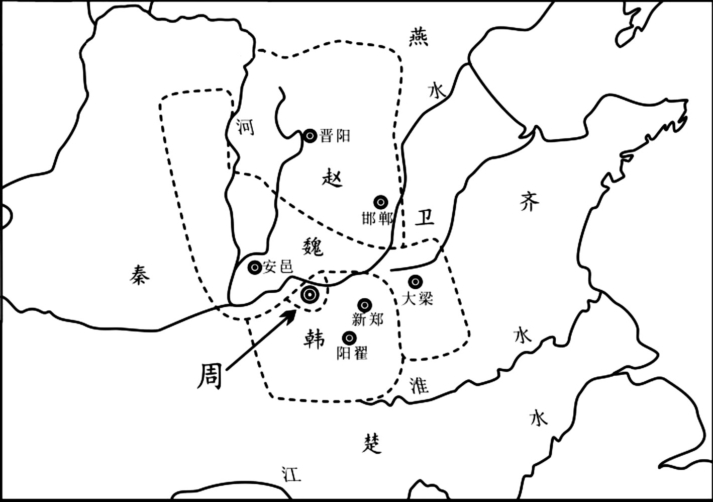
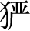
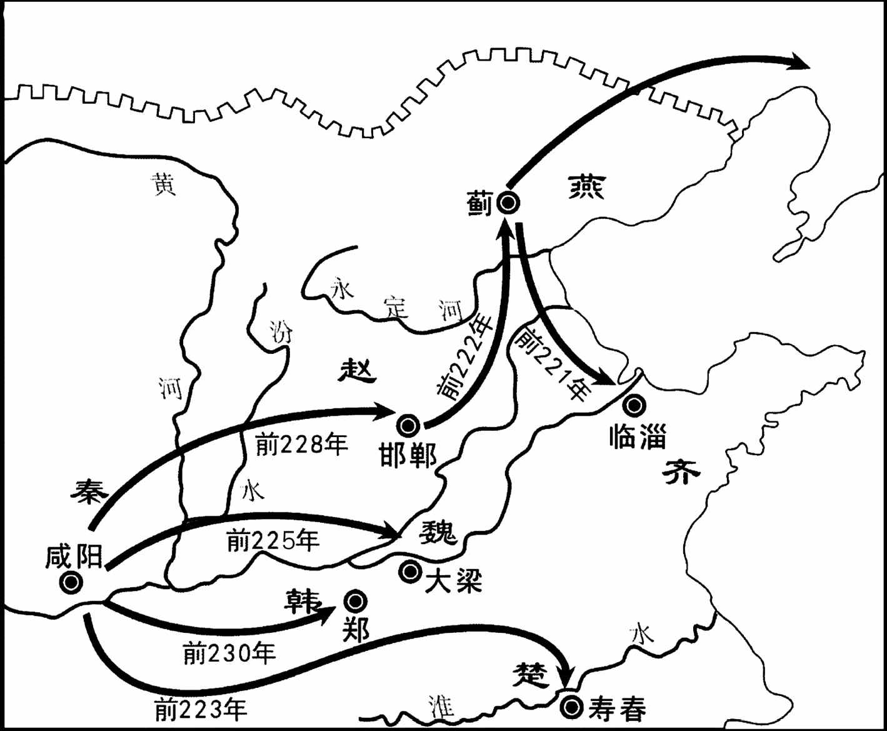
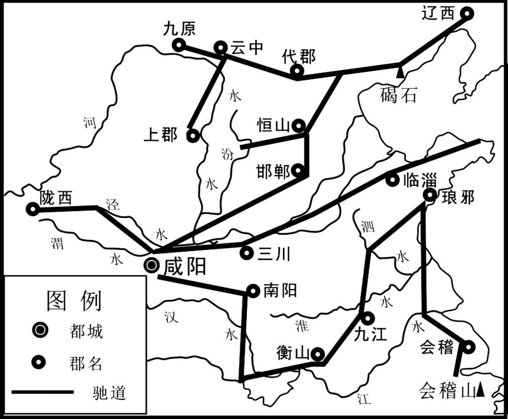
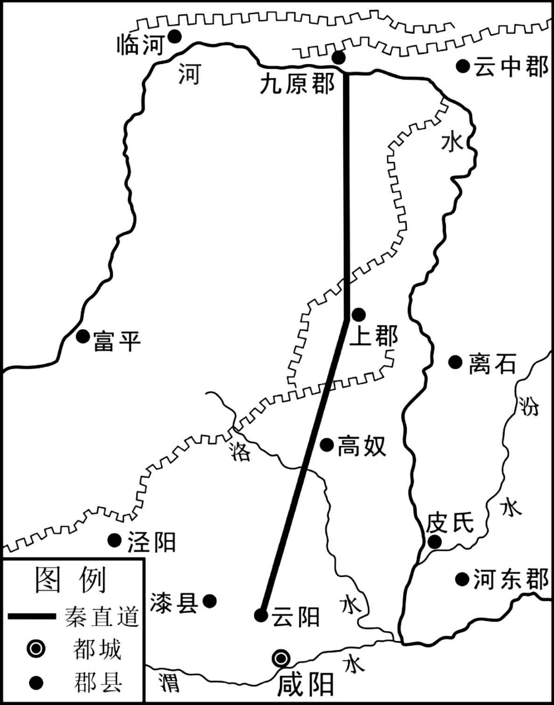
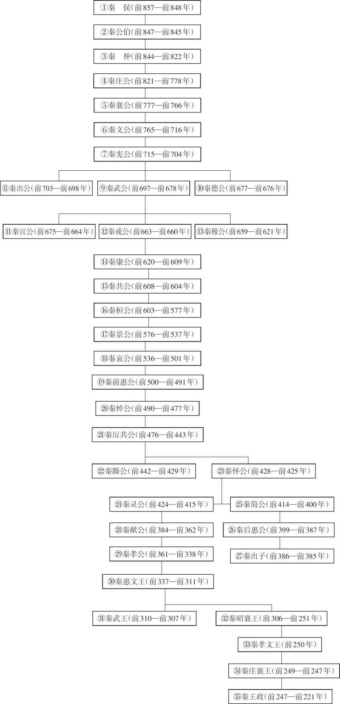
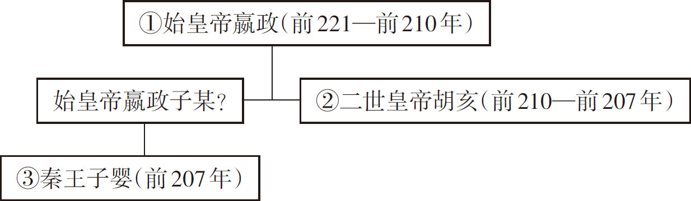

# 前言

《通鉴纪事本末》四十二卷，南宋袁枢编撰。袁枢（1131—1205年），字机仲，建州建安（今福建建瓯）人，南宋史学家。孝宗隆兴元年（1163年）登进士，历官温州判官、严州教授、处州知州、国史院编修官、大理少卿、工部侍郎兼国子祭酒。

袁枢学识渊博，与当时的学者朱熹、吕祖谦、杨万里都有往来。任国史院编修期间，负责修《宋史》列传部分，北宋宰相章惇的子孙因同乡关系而婉转请托于袁枢，求他对章惇的传记多加文饰，而袁氏驳曰：“子厚为相，负国欺君。吾为史官，书法不隐，宁负乡人，不可负天下后世公议。”（《宋史·袁枢传》）袁枢渊博的知识与正直的修史态度，都对其完成《通鉴纪事本末》大有助益。

袁枢喜读司马光的《资治通鉴》（或简称《通鉴》），但《资治通鉴》卷帙浩繁、内容纷博，特别是它所采用的编年体，“或一事而隔越数卷，首尾难稽”（《四库全书总目提要·通鉴纪事本末》），而使读者阅之不易。对此，司马光本人已有认识，他曾说：“光修《通鉴》，唯王胜之借一读，他人读未尽一编，已欠伸思睡矣。”（〔宋〕刘羲仲《通鉴问疑》）袁枢在读《通鉴》时，也颇“苦其浩博”，“乃区别其事而贯通之，号《通鉴纪事本末》”（《宋史·袁枢传》）。

袁枢从宦多年，在政治上，主张革除用人之弊、广开言路，为此，曾多次上书皇帝。他深知宋皇在就读经筵时，“以古证今”的史书习学是其重要内容，以此来从前朝获取鉴戒，而这其中，《通鉴》又是重要内容。袁枢曾对孝宗说过：“窃闻陛下尝读《通鉴》，屡有训词。”（《宋史·袁枢传》）宁宗即位后，袁枢受政治牵连被劾，闲居十年，《通鉴纪事本末》就是在他的政治主张受冷遇、仕途受挫折时所作，他将自己的政治热情，倾注到了历史典籍的编纂中，或许他希冀通过对《通鉴》的改编，能更好地为统治者取鉴服务。

《通鉴纪事本末》的材料全部来自《资治通鉴》，袁枢仅是将《通鉴》中依时间而散在诸卷的事件起讫、经过，加以整合，汇编成239个正目、69个附题，“每事各详起讫，自为标题。每篇各编年月，自为首尾。始于三家之分晋，终于周世宗之征淮南”（《四库全书总目提要·通鉴纪事本末》）。《通鉴纪事本末》这一以“事”为中心的编纂方法，也在其时流行的“二体”——纪传体和编年体之外，创立了一种新的史书体裁——纪事本末体，这一体裁“文省于纪传，事豁于编年”（《文史通义·书教下》），更便于读者对历史事件的把握。袁枢创立的纪事本末体，也成为其后重要的史书体裁，以这一体裁编修的著作频出。

完整的历史事件，更能使统治者从中取鉴，所以对袁枢的《通鉴纪事本末》，宋孝宗的评价是：“治道尽在是矣。”（《宋史·袁枢传》）而对一般的阅读者，纪事本末体著作同样可以起到“鉴往知来”的作用，对此，梁启超先生就说道：“夫欲求史迹之原因结果以为鉴往知来之用，非以事为主不可。故纪事本末体，于吾侪之理想的新史最为相近，抑亦旧史界进化之极轨也。”（《中国历史研究法·过去之中国史学界》）

虽然《通鉴纪事本末》曾经如此重要，但它还是在现代史学强调一手史料、今人更加关注横向比较的现实下，遭到了冷遇，不但历史爱好者对它相对陌生，就连一些历史系的学生，也对它知之甚少。至今，此书仅中华书局于1964年出版过标点本，而有深度的整理，则尚未得见，这不能不说是一件憾事。

在一定程度上，魏超先生策划出品的这部著作，是能弥补这一缺憾的。魏超先生毕业于北京大学哲学系，经营实业近三十年。他喜爱读书，对中华传统文化更是情有独钟，在阅读《资治通鉴》的过程中，他也遇到了历史事件首尾相隔而难以把握的问题，从而开始以《通鉴纪事本末》来辅助对《通鉴》的阅读。与此同时，他又想到，或许还有更多的历史爱好者也有着与他同样的感受。所以，他聘请有关专家和学者，投入资金，开始了对此书的校勘和详注全译工作。魏超先生对中华传统文化的热爱和惠及千万的胸怀，都是令人钦敬的。

本书采用联合攻关的形式，组织了北京大学、北京师范大学、中国社会科学院、中央民族大学、首都师范大学、山西大学等十余所高等院校与科研机构的专家学者，形成集团优势。本书的其他几位主编王永平、宁欣、李鸿宾都是史学界的著名学者，他们的加入，成了本书得以完成的最重要的助推器。

本书的最终出版，还得益于浙江人民出版社诸位编辑极为细致的工作，历经三年寒暑与辛勤，潘邦顺先生、陈巧丽女士为代表的编辑团队，逐字逐句勘校，提出了无数宝贵的意见，避免了书中可能存在的各种遗漏与错误。

本书还是一份同学情谊的见证。潘邦顺先生和北京日报出版社的司景辉先生都是魏超先生的大学同班同学，他们对魏超先生的出版计划，都表示高度赞赏并给予了最大支持。司景辉先生对本书的贡献也颇多，从发凡起例到排版印刷，他自始至终参与其中。作为同学，他们三人也希望通过这样一种协作，来纪念那美好的青春岁月。

本书以1964年中华书局标点本为工作底本。作者对原文进行了今注、今译，并在每目前增加了内容提要，以使读者在阅读各个事件前，能够掌握大脉；同时还聘请专家，绘制了若干插图。所以，本书是一部集文、图、释、译为一体的著作。通过这种组合方式，我们希望奉献给读者一部能读、可读的著作；更希望通过此书，能够为深入历史教育、弘扬民族精神，提供些许助力。

本书由多人合作而成，尽管专家学者们对工作极其认真，但也难免存在错误，敬请读者和专家批评指正。

**李志生**

2019年夏

# 目录

前言

三家分晋

秦并六国

豪杰亡秦

附录： 
秦统一前世系表

秦统一后世系表

返回总目录

# 三家分晋

## 【内容提要】

本篇主要叙述了春秋末期晋国公室衰微后，新兴封建势力赵、魏、韩三家战胜势力强大的智氏，最终瓜分智氏土地，形成三家分晋的历史过程。

春秋末期，随着奴隶制的没落，晋国王室的统治地位日渐衰微，而代表新兴封建势力的智氏、赵氏、魏氏、韩氏、范氏、中行氏却日益强大起来，控制了晋国政治、经济、军事。范氏、中行氏被打败逐出境后，便出现了由智、赵、魏、韩四卿分晋的局面。在四大家族中，智氏的势力最强，妄图吞并其他三家的土地。

智伯被提名继承人时，曾引起异议。早在智氏控制晋国时期，当时掌权的智宣子准备立其嫡子智伯为继承人。智果提出异议。智果认为智伯虽有五大超人的长处，也有令人忧虑的短处。长处是精于骑射、通晓各类技艺、善于文辞、做事果断等，但他胸襟狭窄、没有容人的度量，很难与人共处。如果立智伯为继承人，智氏家族定遭灭亡。智宣子没有听取他的意见。智果为避祸，改姓辅氏。

智伯执掌晋国大权后，自恃强大，不与人和睦。智伯在与韩康子（韩虎）、魏桓子（魏驹）赴宴时，当众戏弄韩康子，侮辱他的谋士段规。智国劝告智伯：激怒对方要防备报复，不然会灾祸临头。智伯不予理会。此后，智伯先后向韩康子、魏桓子提出领土要求，两家族虽不情愿，但从长计议，答应了智伯的要求，送给智伯两座大城。智伯对此并不满足，又向赵襄子索取土地，遭到抵制后联合韩、魏精兵攻打赵氏。赵氏退到后方城市晋阳。智伯派人掘开汾河，水灌晋阳城，晋阳军民坚守不降。

赵襄子利用唇亡齿寒的道理，说服魏、韩与其结成盟约，共同击杀智军。赵襄子面对大水围城的严峻形势，秘派张孟谈出城会见魏桓子、韩康子，阐明唇亡齿寒的道理，与其结成盟约，确定了联合行动的日期。在约定时间，赵襄子派人掘开堤防冲灌智军，率精兵冲击智军前锋，韩、魏两军从两翼夹击，致使智军大败，当场擒杀智伯，并将智氏家族斩尽杀绝。智果因改姓辅氏躲过这场大祸。

赵、魏、韩击灭智氏家族后，瓜分了智氏的土地，魏制止了纷争。智氏家族破灭后，韩国向魏国借兵征伐赵国，赵国向魏国借兵征伐韩国，魏文侯均以寡人与赵、韩两国亲如兄弟为由拒绝出兵。当赵、韩得知魏文侯的深情厚谊以后，非常感动。两国都来朝见魏文侯。此后，魏国在三晋中成为最强的国家，诸侯封国都不敢与之对抗。最终确定了三家分晋的局面。

## 【原文】

**周威烈王二十三年，初命晋大夫魏斯、赵籍、韩虔为诸侯[1]。**

## 【注文】

[1]周：朝代名。公元前11世纪周武王灭商后建立，建都于镐（今陕西长安沣河以东）。公元前771年，申侯联合犬戎攻杀周幽王。次年周平王东迁到洛邑（今河南洛阳）。历史上称平王东迁以前为西周，以后为东周。东周又可分为春秋和战国两个时期。前256年为秦所灭。共历三十四王，八百多年。　　周威烈王（生卒年不详）：战国时周王。姓姬，名午。周考王之子。公元前425年至前402年在位。周室益衰，威烈王二十三年（前403年）册命晋大夫魏斯、赵籍、韩虔为诸侯，是为魏、赵、韩正式立国之始。　　晋：周代国名。姬姓。周成王时灭唐国，封弟叔虞于其地（今山西翼城西，一说今山西太原北），叔虞之子燮称晋侯。春秋初，晋昭侯封其叔成师于曲沃（今山西闻喜东北），其后曲沃武公伐灭晋侯缗，代为晋君。献公时迁绛（今山西翼城东南），国力日盛，陆续吞灭邻近小国和部族，至文公时形成霸业。景公时迁新田（今山西曲沃西北）。疆土最盛时有今山西大部、陕西东南部、河南北部及河北西南部。春秋晚期，六卿专权，公室微弱，战国初晋幽公反朝于韩、赵、魏三家，仅保留绛、曲沃二地，已成三分之势。公元前403年，周威烈王册命韩、赵、魏为诸侯。前369年，韩、赵迁晋桓公于屯留，晋最终灭亡。　　大夫：官名。周代有大夫、乡大夫、遂大夫、冢大夫等，为一般任官职者之称。秦汉以后，中央要职有御史大夫，备顾问者有谏大夫、中大夫、大中大夫、光禄大夫等，秩自六百石至比二千石不等，多系中央要职和顾问。　　魏斯：即魏文侯（生卒年不详）。战国时魏国建立者。姓姬，魏氏，名斯。公元前445年至前396年在位。周威烈王时，与韩、赵列为诸侯。即位后，任用魏成子、翟璜、李悝为相，乐羊、吴起为将，西门豹为邺（今河北临漳西南）令，改革政治，奖励耕战，兴修水利。西取秦的河西（今黄河与北洛水间），北灭中山国，使魏成为战国初期的强国。　　赵籍：即赵烈侯（生卒年不详）。战国时赵国国君。名籍。赵献侯之子。公元前408年至前387年在位。任用公仲连、牛畜、荀欣、徐越等人，为政待以仁义，约以王道，又选练举贤，任官使能，节财俭用，察度功德。赵烈侯六年（前403年），与韩、魏并立为诸侯。　　韩虔（qián）（？—前400年）：战国时韩国国君。公元前408年至前400年在位。名虔。晋卿韩武子之子。韩景侯元年（前408年），攻郑，取雍丘（今河南杞县）。次年，为郑败于负黍（今河南登封西南）。五年，与赵、魏合兵攻齐，入齐长城，三晋声威大震。六年，被周天子正式册命为诸侯。　　诸侯：周代天子所封的各国国君的统称。周制，诸侯要服从王命，定期朝贡述职，并有出兵服役等义务，以屏藩王室。其所属上卿由天子任命。诸侯在封国内，政治、经济、军事等方面的独立性很大，并世袭其统治权。春秋时期其权力逐步为卿大夫取代。此后封建社会分封的王侯，也可泛称为诸侯王。

## 【译文】

周威烈王二十三年（前403年），首次分封晋国大夫魏斯、赵籍、韩虔为诸侯国君。

 
三家分晋示意图

## 【原文】

**臣光曰：臣闻天子之职莫大于礼，礼莫大于分，分莫大于名[1]。何谓礼？纪纲是也[2]。何谓分？君臣是也。何谓名？公侯卿大夫是也。**

## 【注文】

[1]臣光：即史臣司马光（1019—1086年），北宋陕州夏县（今属山西夏县）涑（sù）水乡人。司马池之子。世称涑水先生。宋仁宗时进士，后进龙图阁直学士。神宗即位，擢为翰林学士。极力反对王安石变法，数陈其害。要求罢除制置三司条例司，不行青苗、助役等法。神宗不能用，以端明殿学士知永兴军。后又被判西京御史台。主持修撰《资治通鉴》，被擢升为资政殿学士。哲宗初，复拜尚书左仆射兼门下侍郎，主持朝政，尽罢新法。　　礼：中国奴隶社会中奴隶主贵族的行为规范。体现在各种典章制度和礼仪规定上，包括种种规则、典礼仪式及舆服旌旗、宫室器用等。至周代最为全面和典型，有吉礼、凶礼、宾礼、军礼、嘉礼等。具有鲜明的阶级性，实行“礼不下庶人，刑不上大夫”的原则，即只用于奴隶主贵族内部。建筑在宗法关系基础上，其实质为维护、强化等级制度，以稳定社会秩序和贵族统治。至春秋时期，随着经济基础的变化和阶级关系的变动，“礼崩乐坏”的局面出现。　　分（fèn）：指人的地位和身份。　　名：名位，即官爵与品位。

[2]纪纲：同“纲纪”，指法度、法制、准则。

## 【译文】

史臣司马光评论说：我听说天子的职责没有比维护礼制更重要，维护礼制没有比区分等级地位更重要，区分等级地位没有比端正名分更重要。什么是礼制？就是国家法纪。什么是身份？就是君臣有别。什么是名分？就是公、侯、卿、大夫等官爵地位。

## 【原文】

**夫以四海之广，兆民之众，受制于一人，虽有绝伦之力，高世之智，莫敢不奔走而服役者，岂非以礼为之纲纪哉！是故天子统三公，三公率诸侯，诸侯制卿大夫，卿大夫治士庶人[1]。贵以临贱，贱以承贵。上之使下，犹心腹之运手足，根本之制支叶；下之事上，犹手足之卫心腹，支叶之庇本根。然后能上下相保，而国家治安。故曰天子之职莫大于礼也。**

## 【注文】

[1]四海：古人认为中国有四海环绕，因而用以泛指全国各地。　　兆（zhào）民：古称天子之民，即后代所说的民众或百姓。兆，旧言万亿为兆，极言众多。　　高世：超越世俗。　　三公：官名。即太尉、司徒、司空的合称。始建于西周。另说西周的三公，指太师、太傅、太保。

## 【译文】

以四海之广的土地，众多的平民百姓，都在天子一个人的统治之下，即使有无人可比的力量，超越世人的智慧，也没有谁敢在天子脚下不为他奔走效劳、尽力做事的，这难道不是因为礼是维系君臣名分、等级秩序的法纪吗！所以，天子统率三公，三公督率诸侯国君，诸侯国君控制卿、大夫，卿、大夫又统治士人与平民百姓。权贵治理贱民，贱民服从权贵。上层指挥下层，就如同人的心腹控制着人的手脚，树根与树干支配着树的枝叶；下层事奉上层，就如同人的手脚守护着人的心腹，树的枝叶遮护着树的根和干。做到这样之后，就能上层、下层互相保护，从而使国家长治久安。所以说“天子的职责没有比维护礼制更重要了”。

## 【原文】

**文王序《易》，以《乾》《坤》为首[1]。孔子系之曰：“天尊地卑，乾坤定矣[2]。卑高以陈，贵贱位矣。”言君臣之位，犹天地之不可易也。《春秋》抑诸侯，尊周室，王人虽微，序于诸侯之上，以是见圣人于君臣之际，未尝不惓惓也[3]。非有桀、纣之暴，汤、武之仁，人归之，天命之，君臣之分，当守节伏死而已矣[4]。是故以微子而代纣则成汤配天矣，以季札而君吴则太伯血食矣，然二子宁亡国而不为者，诚以礼之大节不可乱也[5]。故曰礼莫大于分也。**

## 【注文】

[1]文王：即周文王姬昌（生卒年不详）。周王朝的奠基者，古公亶父之孙。商纣时封为西伯，又称西伯昌。传说他曾被商纣王囚于羑（yǒu）里（今河南汤阴），在狱中著《易经》，以穷究天人变化之理。出狱后，积极改革政治，倡导奴隶逃亡搜查公约，从而提高周族威望；努力发展农业生产，广纳贤才，扩张势力。在国势渐强后，迫虞（今山西平陆北）、芮（今陕西大荔东）两国归附；向西攻灭犬戎和密须（今甘肃灵台）、向东兼并黎国（今山西长治西），又攻占邘（今河南沁阳西北）、崇（今陕西户县）等国，建立丰邑（今陕西长安西北）作为国都，使周在商王朝版图中三分天下有其二，为武王灭商创造了条件。在位五十年，谥文。　　《易》：书名，《周易》的简称，也称《易经》。原为上古由巫师卜师们编纂而成的巫书。儒家重要经典之一。《易》，有变易（穷究事物变化）、简易（执简驭繁）、不易（永恒不变）三义，相传作于周。又《周易》之周有周密、周遍、周流之义。本书内容包括《经》《传》两部分。《经》主要是六十四卦和三百八十四爻，卦、爻各有说明（卦辞、爻辞），作占卜之用。旧传伏羲画卦，文王作辞，说法不一。其萌芽期可能早在殷周之际。《传》包含解释卦辞、爻辞的七种文辞，共十篇，统称《十翼》，旧传孔子作。据今人研究，大抵系战国或秦汉之际的儒家作品，并非出自一人之手。《周易》通过八卦形式，推测自然和社会的变化，认为阴阳两种势力的相互作用是产生万物的根源。旧有郑玄注本，已失传。今通行本有魏王弼、晋韩康伯注，唐李鼎祚的《周易集解》等。　　《乾》《坤》：二卦名。《周易》六十四卦，首《乾》次《坤》。

[2]孔子（前551—前479年）：名丘，字仲尼。春秋时鲁国陬邑（今山东曲阜东南）人。先世为宋国贵族。少孤而贫贱。及长，好学习礼，曾任委吏、乘田等管理财务、畜牧的卑职。后聚徒讲学，从事政治活动。中年时，离鲁至齐，后又返鲁，仕鲁为中都宰，升任司空、司寇，摄行相事。后又周游宋、卫、陈、蔡、楚等国。晚年返鲁，致力于教育事业，相传弟子先后有三千人。同时整理《诗》《书》等古代文献，删修鲁史《春秋》。提倡“仁”的学说，主张以“礼”作为行为规范。政治上反对苛政而维护贵族统治秩序。是我国古代著名的思想家、政治家、教育家。

[3]《春秋》：书名。春秋末期，据传是由孔子修订的鲁国编年史，参考周王室及各诸侯国史官的记载修成。记述自鲁隐公元年（前722年）至哀公十四年（前481年）共二百四十二年的历史，内容为周王室及各诸侯国的政治、军事活动如朝聘、会盟、战争等，以及一些自然现象如日食、地震、水灾、旱灾、虫灾等。记事极简短，每条最多不过四十余字，最少仅一字。本为史书，自西汉以来，被儒家奉为经典，列为“五经”之一，故又有《春秋经》之称。后人以此书记事所包括的时代，称为春秋时代。　　惓（quán）惓：恳切的样子。

[4]桀（jié）：即夏桀（生卒年不详）。夏王朝末代国王。孔甲曾孙，姒姓，名癸。暴虐无道，宠妃妹喜，建肉林酒池，荒淫无度，饰瑶台宫室，横征暴敛，杀死敢于直谏的大臣关龙逄，天下怨声载道。诸侯叛桀附汤，商汤伐桀，战于鸣条（今属河南封丘），夏桀失败亡命南巢（今安徽巢县）而死。在位五十三年，国亡。　　纣（zhòu）（生卒年不详）：末代商王。名受，又名辛。才力过人，曾用兵东夷，扩大了商的势力。但刚愎自用，智足以拒谏，言足以饰非。残酷剥削人民。荒淫无度，酒池肉林，为长夜之饮。造炮烙之刑，残杀无辜。重用费仲、恶来等善谀好谗之徒，废商容，杀比干，囚箕子，统治集团分崩离析。周武王乘机进攻，商兵于牧野（今河南淇县西南）倒戈，他逃回鹿台自焚。商亡。　　汤：即商汤（生卒年不详）。商朝的开国之君。契之后，子姓，名履，又称天乙、太乙、高祖乙。始居于亳，又称夏方伯。作为商部族首领时，善用人才，任用伊尹为相，政事清明。夏桀无道，商汤攻伐夏朝，鸣条一战取胜，建立商王朝，在位三十年，商朝兴盛。　　武：即周武王（生卒年不详）。西周王朝的建立者，姬姓，名发，文王子。继位后，用姜尚、周公旦、召公奭、毕公高辅政，继承父亲遗志，联合庸、蜀、羌、髳、微、卢、彭、濮等族，率兵伐商。牧野之战，大败商军，纣王自焚，建立西周王朝，定都于镐。实行分封制度，封贵族、功臣为各地诸侯，加强对全国统治。灭商两年后病卒。

[5]微：指官职小，身份低微。　　季札（zhá）（生卒年不详）：春秋时吴国人。又称公子札。吴王寿梦少子。先封于延陵（今江苏常州），称延陵季子，后封于州来（今安徽凤台），称延州来季子。以其贤，其兄诸樊、余祭、夷昧数次推让君位于他，俱不受。吴余祭四年（前544年），奉使鲁国。在观赏周代诗歌和乐舞时，加以分析，借此评论周朝及诸侯盛衰大势。后又至齐、郑、卫、晋等国，对晏婴、蘧伯玉、子产、叔向等人都有劝勉。　　吴：古国名。也称句吴。姬姓。始祖是周太王之子太伯、仲雍。据有今安徽、江苏、浙江省部分地区，建都于吴（今江苏苏州）。至寿梦继位，吴渐兴盛并称王，始与中原来往。春秋时，吴王阖闾数与楚相战，曾一度攻破楚国。公元前494年吴王夫差败越于夫椒（今江苏苏州市吴中区西南太湖中），迫使越王勾践投降。继而北上伐齐，大败齐师于艾陵（今山东莱芜东北），会诸侯于黄池（今河南封丘西南），与晋争夺霸权。前473年为越所灭。　　太伯（生卒年不详）：西周时吴国始祖。一作泰伯。周太王长子。因太王要立幼子季历，他和弟仲雍同奔到梅里（今江苏无锡东南），改从当地风俗，断发文身，成为当地君长。其后人建立吴国。　　血食：指受到祭祀。祭祀要杀牲取血，所以称“血食”。

## 【译文】

周文王演绎排列《周易》，把《乾》《坤》二卦编排在首位。孔子在《系辞》中对此解释说：“天尊贵，地卑微，乾坤于是确定。高低排列有序，贵贱也就各得其位。”这是说君臣之间的上下关系，就如同天和地一样不能互易。《春秋》一书贬抑诸侯，尊崇周王室，周王室的官员即使地位不高，在书中排序仍在诸侯国君之上，由此可见孔圣人对于君臣之间的关系，未尝不是心存关注。如果没有夏桀、商纣的暴虐，商汤、周武王的仁德，人民的归心顺服，上天的授命统治人间，君臣之间的名分就只有恪守臣节、甘愿尽力效死罢了。所以，当年若是商朝用微子取代纣王，商朝不亡，建商的成汤就可以永配上天享受祭祀了；用季札做吴国国君，吴国不亡，开国之君太伯就可以永享杀牲的祭祀了。然而微子、季札二人宁肯国家灭亡也不做国君，实在是因为礼制的基本法纪不可以破坏。所以说“维护礼制没有比区分地位高下更重要”。

## 【原文】

**夫礼，辨贵贱，序亲疏，裁群物，制庶事[1]。非名不著，非器不形。名以命之，器以别之，然后上下粲然有伦，此礼之大经也[2]。名器既亡，则礼安得独存哉！昔仲叔于奚有功于卫，辞邑而请繁缨，孔子以为不如多与之邑[3]。惟器与名，不可以假人，君之所司也，政亡则国家从之。卫君待孔子而为政，孔子欲先正名，以为名不正则民无所措手足。夫繁缨，小物也，而孔子惜之；正名，细务也，而孔子先之：诚以名器既乱，则上下无以相有故也。夫事未有不生于微而成于著。圣人之虑远，故能谨其微而治之；众人之识近，故必待其著而后救之。治其微则用力寡而功多，救其著则竭力而不能及也。《易》曰“履霜坚冰至”，《书》曰“一日二日万几”，谓此类也[4]。故曰分莫大于名也。**

## 【注文】

[1]庶（shù）：众多；也指平民、百姓。

[2]粲（càn）然：形容鲜明发光的样子。这里指显著、明白。

[3]仲叔于奚（生卒年不详）：复姓仲叔，名于奚，春秋时期人。据《左传》记载，卫国的孙桓子率军与齐国在新筑开战，卫军战败。新筑人仲叔于奚救了孙桓子，使他免于死难，立了大功，被封为卫国大夫。　　卫：周朝诸侯国名。姬姓，开国君主为周文王嫡九子康叔封。辖地大致为今河南黄河北部、河北邯郸及邢台一部分、山东省聊城市西部一带，先后建都于朝歌、楚丘、帝丘、野王。公元前209年亡于秦。　　繁缨：古代天子、诸侯辂马的带饰。

[4]《书》：即《尚书》。又称《书》《书经》。中国上古政治文件和部分追述古事著作的汇编。“尚”即“上”，故名。为儒家经典。相传为孔子删定。有三种：1.《今文尚书》。汉初存二十八篇，为伏生口授，用当时文字隶书抄写，因名“今文”。2.《古文尚书》。相传汉武帝时鲁恭王坏孔子宅，从壁中发现。较《今文尚书》多十六篇。以秦汉前的“古文”书写，故名。已佚。3.东晋梅赜所献伪《古文尚书》。　　几：细微。

## 【译文】

礼，在于分辨贵贱，排序亲疏，裁决万物，处理日常事务。没有名分就不能凸显它的名声，不是器物就不能显示它的形状。只有根据名分称呼它，根据器物形状分别它，这样做以后，上上下下才能井然有序，这就是礼的根本法则。假如名分、器物都已丧失，那么礼又怎么能够单独存在呢！当年仲叔于奚为卫国立了大功，他拒绝接受赏赐封地，却请求允许他享用天子、诸侯的驾车马匹才有的带饰繁缨。孔子认为不如多赏赐他一些封地。唯独名分和器物不能借与他人，这是君主的责任，处理政事不坚持原则，国家就随着灭亡。卫国国君期待孔子为他处理政事，孔子打算首先端正名分，认为名分不端正，百姓不知道应该如何做才好。拉车马匹的带饰繁缨，是个小物件，而孔子却珍惜它；端正名分，是一件小事情，而孔子却作为首要的事情做。实在是因为名分、器物混乱无序以后，国家上下就无法相安互保。没有一件事情不是从微小产生而成为显著的。圣人考虑久远，所以能够在事情刚发生的微小时候谨慎地处理它；常人见识短浅，所以一定等到事情显著然后补救它。事情微小的时候处理，用力少而收效大；事情显著的时候补救，竭尽全力却不能成功。《周易》说“踩在霜上就该想到严寒的冰冻就要到来”，《尚书》说“一两天的短暂时间众多事情都在发生着细微的变化”，就是指这类情况。所以说“区分等级地位没有比端正名分更重要”。

## 【原文】

**乌呼！幽、厉失德，周道日衰，纲纪散坏，下陵上替，诸侯专征，大夫擅政，礼之大体什丧七八矣，然文、武之祀犹绵绵相属者，盖以周之子孙尚能守其名分故也[1]。何以言之？昔晋文公有大功于王室，请隧于襄王，襄王不许，曰：“王章也[2]。未有代德而有二王，亦叔父之所恶也。不然，叔父有地而隧，又何请焉！”文公于是乎惧而不敢违。是故以周之地则不大于曹、滕，以周之民则不众于邾、莒，然历数百年，宗主天下，虽以晋、楚、齐、秦之强不敢加者，何哉？徒以名分尚存故也[3]。至于季氏之于鲁，田常之于齐，白公之于楚，智伯之于晋，其势皆足以逐君而自为，然而卒不敢者，岂其力不足而心不忍哉，乃畏奸名犯分而天下共诛之也[4]。今晋大夫暴蔑其君，剖分晋国，天子既不能讨，又宠秩之，使列于诸侯，是区区之名分复不能守而并弃之也[5]。先王之礼，于斯尽矣！**

## 【注文】

[1]幽、厉：即周幽王和周厉王。周幽王（？—前771年）。西周末代国王。姬姓，名宫涅（一作宫湦）。宣王子，前781年至前771年在位。重用善谀好利的虢石父，进一步激化了社会矛盾。宠褒姒，废申后与太子宜臼，加剧了统治阶级内部矛盾。申侯联合鄫、犬戎攻幽王。幽王被犬戎杀于骊山下。西周灭亡。周厉王（？—前828年）。名胡。懿王孙，周夷王子。暴虐好利。用荣夷公执政，实行“专利”政策，垄断山林川泽的收益。人民不满，又令卫巫监视“国人”，杀死议论朝政的人，激起人民反抗。公元前841年，“国人”暴动，他出奔于彘（zhì），朝政由召公、周公执掌，号曰“共和行政”。十四年后，死于彘。　　擅：超越职权、自作主张、独揽、垄断、把持。

[2]晋文公（前697或前671—前628年）：春秋时晋国国君。公元前636年至前628年在位。名重耳。晋献公之子。为公子时，因献公欲立宠妾之子奚齐为嗣而遭加害，被迫流亡于外十九年。后由秦军护送返晋，立为国君。杀惠公之子圉（yǔ，即晋怀公）。即位后，善于听取臣下意见，改革内政，扩建二军为三军，国势渐强。晋文公二年（前635年）讨伐周室王子带叛乱，送周襄王回王城（今河南洛阳），安定王室。襄王以阳樊、温、原、攒茅之地赐之。五年，大败楚军于城濮（pú）（今山东鄄城西南）。不久主持晋、齐、鲁、宋、蔡、郑、卫、莒等国参加的践土（今河南原阳西南）之盟，自此称霸诸侯。　　襄王：即周襄王（？—前619年）。春秋时周天子。姬姓，名郑。惠王子，惠王死后继位。前652年至前619年在位。元年（前651年），齐桓公大会诸侯于葵丘（今河南考城），襄王使宰孔赐齐侯胙。二十年（前632年），晋文公大会诸侯于践土（今河南原阳西南），周襄王也被召去赴会，又册命晋侯为侯伯。三十三年去世。　　章：典章、制度。

[3]曹、滕（téng）：即曹国、滕国。曹国：西周时封置的诸侯国，春秋小国。在今山东西部地区。都城在陶丘（今山东定陶县西北）。公元前487年为宋国所灭。滕国：西周时封置，在今山东滕县西南，本为周文王子错叔绣封国。战国初灭于越，不久复国，后又灭于宋。　　邾（zhū）、莒（jǔ）：即邾国、莒国。邾国：又作邹国。西周封置。在今山东曲阜县东南。战国时灭于楚。莒国：西周时封置的诸侯国。己姓，一说曹姓。开国君主是己兹舆期，建都计斤（一作介根，今山东胶州市西南），春秋初年迁于莒（今山东莒县）。公元前431年为楚所灭。　　宗主：众所仰赖归依的人。此指处于天下独尊地位的周王。　　楚：即楚国。芈（mǐ）姓。西周时都丹阳，周人称其为荆蛮。后迁都郢（今湖北江陵西北纪南城）。春秋时兼并小国，与晋争霸。疆域西北到武关（今陕西丹凤县东南），东到昭关（今安徽含山县北），北到今河南省南阳，南到洞庭湖南。战国时为七雄之一。后又迁都陈（今河南淮阳县）与寿春（今安徽寿县）。前223年为秦所灭。　　齐：即齐国。公元前11世纪周分封的诸侯国。姜姓。开国君主吕尚，建都营丘（今山东临淄市东旧临淄北）。春秋初期齐桓公任用管仲改革，国力强盛，成为霸主。齐灵公时曾灭莱，领土扩大。春秋末年君权渐为大臣陈氏（即田氏）所夺。前386年，周安王承认田和为诸侯。在齐威王时期，继续进行改革，国势强盛，屡败魏国，并成为战国七雄之一。其后，长期与秦国东西对峙。前284年，秦、魏、韩、燕、楚联合攻齐，燕将乐毅攻入齐都临淄，齐从此国力大损。前221年为秦所灭。　　秦：古国名。嬴姓。相传为伯益之后。早时居于犬丘（今甘肃礼县东北）。善养马，被周孝王封于秦（今甘肃张家川回族自治县东），作为附庸，后因秦庄公子秦襄公护送周平王东迁雒邑（今河南洛阳市）有功，被封为诸侯。春秋时德公建都于雍（今陕西凤翔东南）。战国时，孝公又迁都咸阳，成为战国七雄之一。秦王嬴政时统一中国，建立秦朝。　　加：侵犯、凌驾、欺辱。

[4]季氏：指季孙肥（生卒年不详）。春秋鲁大夫，谥号季康子。季恒子之子。哀公三年，季恒子卒，康子继位，执掌鲁国大权。一度实行厚赋敛的田赋政策，受到孔子批评。　　鲁：国名。姬姓。西周初，周武王封周公旦于此，都曲阜（今山东曲阜市）。因周公在朝内辅佐武王，未就封。武王死后，周公辅佐成王，乃封其子伯禽为鲁公。春秋时国势减弱，战国时成为小国。鲁顷公时为楚所灭。　　田常（生卒年不详）：即田成子，又作陈成子。春秋时齐国大臣。陈釐（lí）子之子。名恒，一作常。继其父为齐大夫，继续结好于民，争取民心。齐简公四年（前481年），杀死简公，拥立齐平公，任相国，尽杀公族中的强者，扩大封地，从此齐国由陈氏专权。　　白公（生卒年不详）：名胜，为楚国白邑大夫，称白公。春秋后期楚平王孙，太子建之子。父建遭谗被杀，胜为报父仇，于公元前479年杀令尹子西、司马子期而劫楚惠王。有人劝他杀死惠王，他说：“不可，杀王不祥。”后自缢而死。　　智伯：即荀瑶（前506—前453年）。春秋时晋国大夫。一作知伯，又称知襄子。荀跞之孙。晋六卿之一。前472年，率晋军伐齐，齐师败绩。赵鞅与范氏、中行氏相攻，他支持赵鞅，逐范氏、中行氏并瓜分其地。前455年，率韩、魏共攻赵，围赵襄子于晋阳。后来赵襄子暗与韩、魏联合反攻智氏，他兵败被杀，赵、魏、韩三家灭智氏，共分其地。　　奸：与“犯”义同，侵犯。奸名犯分，即奸犯名分。

[5]暴蔑：欺罔蔑视。　　剖分：均分、瓜分。　　宠秩：因得帝王宠信而授官职。

## 【译文】

呜呼！自从周幽王、周厉王丧失君德，周朝的治国措施日益衰败，法纪朝纲散乱瓦解，下层纷乱无序，上层衰惰废职，诸侯国君不听周王的调遣自行征伐，士大夫独揽国政，礼制从总体上已经丧失了十之七八，然而周文王、周武王的祭祀还绵绵不断地延续下来，就是因为周王朝的子孙还能恪守名位不放的缘故。为什么这样说呢？从前晋文公为周王室立有大功，于是向周襄王请求允许他死后享用王的隧葬礼制，周襄王没有答应，说：“这是周王的制度。没有代替王治理天下之德而用天子之制，如同天下有两个天子，这也是叔父所憎恶的。如果不是这样的话，叔父有土地实行隧葬，又何必请示我呢？”晋文公于是感到畏惧而没敢违反礼制。因此，凭着周王室管辖的土地不比曹国、滕国大，凭着周王室管辖的百姓不比邾国、莒国多，然而经过几百年依然做天下独尊的天子，即使凭着晋国、楚国、齐国、秦国的强大也不敢侵犯欺凌，这是为什么呢？只是因为周王的名分还在的缘故。至于鲁国的大夫季氏，齐国的田常，楚国的白公，晋国的智伯，他们的势力都大得足够用来驱逐国君而自立，然而最终他们不敢这样做，难道是他们的力量不够或是于心不忍吗？是因为害怕侵犯名分而被天下人一起讨伐。如今晋国的三家大夫欺凌蔑视他们的国君，瓜分晋国，作为周天子既不能讨伐，反而对他们加以恩宠，赐予官职，使他们的名位排列到诸侯中，这样就使周王朝剩有的一点名分也不能坚守而全都废弃了。周朝先王创下的礼制，到此丧失尽了！

## 【原文】

**或者以为当是之时，周室微弱，三晋强盛，虽欲勿许，其可得乎！是大不然[1]。夫三晋虽强，苟不顾天下之诛而犯义侵礼，则不请于天子而自立矣[2]。不请于天子而自立，则为悖逆之臣，天下苟有桓、文之君，必奉礼义而征之[3]。今请于天子而天子许之，是受天子之命而为诸侯也，谁得而讨之！故三晋之列于诸侯，非三晋之坏礼，乃天子自坏之也。**

## 【注文】

[1]三晋：春秋战国之际，晋国的韩、赵、魏三家瓜分了晋国之地。历史上因此将战国期间的韩、赵、魏三国合称三晋。

[2]苟（gǒu）：假若、如果。

[3]悖（bèi）：相反、违背。　　桓、文：指春秋五霸中的齐桓公、晋文公。齐桓公（？—前643年），春秋时齐国君，即姜小白。襄公之弟。前685年至前643年在位。襄公乱政，诛杀不当，他避祸奔莒。襄公被杀后，他乘机回到齐国，夺取了君位。并任用管仲进行改革，奋发图强。在“尊王攘夷”的旗帜下，北伐山戎，南抑强楚，勤王平乱，救卫（今河南淇县）存邢（今河北邢台），经过“九会诸侯”，不断树立盟主威信，扩大国家的军事实力，首开春秋时代大国争霸的局面。 

## 【译文】

或许有人认为，在这时候，周王室势微力弱，晋国三家大夫势力强盛，即使周天子不答应他们，又怎么能做得到呢！这种说法是很不对的。晋国三家大夫虽然强大，如果他们不顾天下的指责而侵犯礼义的话，就不会向天子请求批准而自立为诸侯了。不向天子请求批准而自立为诸侯，就是叛逆之臣，天下如果有像齐桓公、晋文公那样的贤德诸侯，一定会尊奉礼义征讨他们。现在他们向天子请求封赐，天子答应他们的请求，他们是接受天子的册命而成为诸侯的，谁能够讨伐他们呢！所以，晋国三家大夫成为诸侯，不是晋国三家大夫破坏了礼制，而是天子自己破坏了周朝的礼制。

## 【原文】

**乌呼！君臣之礼既坏矣，则天下以智力相雄长，遂使圣贤之后为诸侯者，社稷无不泯绝，生民之类糜灭几尽，岂不哀哉[1]！**

## 【注文】

[1]雄长：争雄称霸。　　社稷（jì）：“社”指土神，“稷”指谷神，古代君主都祭社稷，后来就用“社稷”代替国家。　　泯（mǐn）：消灭、丧失。　　糜（mí）：破碎、毁坏。

## 【译文】

呜呼！维系君臣之间的礼制已经被破坏，那么天下就必定是凭着智慧、武力互相争雄称霸，于是使圣贤的后人被分封为诸侯的，其封国无不灭亡，广大平民百姓大都在战乱中家破人亡，难道不令人哀痛！

## 【原文】

**初，智宣子将以瑶为后，智果曰：“不如宵也。瑶之贤于人者五，其不逮者一也[1]。美须长大则贤，射御足力则贤，伎艺毕给则贤，巧文辩慧则贤，强毅果敢则贤，如是而甚不仁。夫以其五贤陵人，而以不仁行之，其谁能待之！若果立瑶也，智宗必灭。”弗听[2]。智果别族于太史，为辅氏[3]。**

## 【注文】

[1]智宣子（生卒年不详）：名申，春秋时晋国大夫。晋卿荀跞之子，智瑶之父。　　智果（生卒年不详）：春秋时晋智氏之族人，事不可详考。智宣子曾对智果讲，身后要立智伯为继，智果说：不如立宵（智宣子庶子）。智宣子认为宵人凶狠。智果说：宵狠在面，瑶（智伯）狠在心。心狠败国。若立瑶，智宗族必灭。后果如其言。　　逮（dài）：及、到、赶上。

[2]弗（fú）：不。

[3]太史：官名。夏、商、周三代为史官和历官的长官。春秋时期，太史掌管起草文书，记录给诸侯、卿、大夫的命令等，记载史事，编写史书，还兼管国家典籍、天文历法、祭祀等事，为朝廷大臣。

## 【译文】

起初，统治晋国的智宣子打算以智瑶为继承人，族人智果说：“他不如智宵。智瑶超过人的有五个方面，他不如人的只有一个方面。美胡须，身材高大，超过人；精于射箭、驾车，有充足的勇力，超过人；技能才艺全都具备，超过人；能写善辩、聪明，超过人；刚毅坚定，果断勇敢，超过人。超过人的方面如此，但不如人的方面却是很没有仁德。用他五个超过人的方面欺压人，而用不仁德的做法对人处事，谁能和他和睦相处？如果真的立智瑶为继承人，智氏宗族必遭灭门之祸。”智宣子不听智果的意见。智果便向太史请求自己家族脱离智族姓氏，另立宗族为辅氏。

## 【原文】

**赵简子之子，长曰伯鲁，幼曰无恤。将置后，不知所立，乃书训戒之辞于二简，以授二子，曰“谨识之！”三年而问之，伯鲁不能举其辞；求其简，已失之矣[1]。问无恤，诵其辞甚习；求其简，出诸袖中而奏之。于是简子以无恤为贤，立以为后。**

## 【注文】

[1]赵简子：即赵鞅（？—前475年），又称赵孟。景叔之子。任晋卿，长期执掌国政。其时六卿强大，公室益卑，前514年诛灭公族祁氏、羊舌氏，分其邑为十县，六卿各令其族为大夫。其后六卿内部互相兼并，以兵击败范氏、中行氏。前494年围范氏、中行氏于朝歌，次年，在铁地誓师，击败护送粮饷给范氏、中行氏的郑兵，范氏、中行氏遂奔齐。赵氏封地进一步扩大，为此后赵国的建立奠定了基础。　　简：古代书写用的材料。由狭长的竹片或木片制成。甲骨文、金文中的“册”字，就像若干条竹（木）简用两道组绳编缀成的样子，可见渊源甚古。竹木片的称为“简”，稍宽的木版称“札”或“牍”，均可统称为“简”。

## 【译文】

赵简子的儿子，长子叫伯鲁，幼子叫无恤。赵简子打算确立继承人，不知立哪位好，于是把他的训诫言辞写在两块竹简上，把它分别交给两个儿子，嘱咐说：“好好地记住它！”过了三年，赵简子问两个儿子，伯鲁说不出竹简上写的话；让他拿出竹简来，已经把竹简丢失了。问小儿子无恤，他却非常熟悉地背诵出竹简上写的训诫之辞；让他拿出竹简来，便从袖子中取出来呈上去。于是，赵简子认为无恤有贤德，就立他为继承人。

## 【原文】

**简子使尹铎为晋阳，请曰：“以为茧丝乎？抑为保障乎？”简子曰：“保障哉！”尹铎损其户数[1]。简子谓无恤曰：“晋国有难，而无以尹铎为少，无以晋阳为远，必以为归！”**

## 【注文】

[1]尹铎（duó）（生卒年不详）：春秋时人。晋卿赵鞅家臣。受命为晋阳（今山西太原南）大夫，增高往日被范氏、荀氏围攻时所筑壁垒，用以自备，令赵人居安思危，又减免赋税，使民众休养生息，以此深为赵鞅所重。赵鞅并预言赵可赖晋阳得安。后智氏攻赵氏，襄子守晋阳三年，终败智氏。　　晋阳：古邑名。在今山西省太原市晋源区。相传帝尧、夏禹曾都于此。春秋属晋，赵简子家臣董安于筑城。战国初赵都于此。后为秦攻取，设置县。 

## 【译文】

赵简子派尹铎治理晋阳，尹铎请示说：“您是打算让我像剥茧抽丝一样搜刮财富，还是使我像修筑堡垒来做保障一样施惠保民呢？”赵简子说：“像修筑堡垒来做保障。”尹铎便少算缴纳赋税的居民户数。赵简子对无恤说：“晋国一旦发生危难，你不要嫌尹铎地位不高，不要认为晋阳路途遥远，一定要把晋阳作为投靠的地方。”

## 【原文】

**及智宣子卒，智襄子为政，与韩康子、魏桓子宴于蓝台[1]。智伯戏康子而侮段规[2]。智国闻之，谏曰：“主不备，难必至矣！”智伯曰：“难将由我。我不为难，谁敢兴之！”对曰：“不然。《夏书》有之曰：‘一人三失，怨岂在明，不见是图[3]。’夫君子能勤小物，故无大患。今主一宴而耻人之君相，又弗备，曰‘不敢兴难’，无乃不可乎！蚋蚁蜂虿，皆能害人，况君相乎！”弗听[4]。**

## 【注文】

[1]智襄子（前506—前453年）：春秋末晋国四卿之一。即智伯、智瑶。一称荀瑶。灭范、中行氏后，肆意戏侮大臣，多所需索，骄势逼人。后向赵襄子索地，遭拒绝。他怒而胁迫韩、魏共围晋阳，引水灌城，城中悬釜而炊，民无悔意。赵襄子夜使张孟谈（一作张孟同）出城，说韩、魏反击智氏，他战败被杀，地为三家瓜分。　　韩康子（生卒年不详）：春秋时期韩国大夫。韩简子之孙，名虔（虎）。公元前453年，与赵襄子、魏桓子一起杀智伯，尽并其地。　　魏桓子（生卒年不详）：名驹。魏侈之孙。在位时智氏势力强大，初随智氏攻赵，后与韩康子、赵襄子共灭智伯，三分其地。

[2]段规（生卒年不详）：春秋时期韩国大夫韩康子谋士。韩、赵、魏三家灭智氏，共分其地。段规劝韩康子取成皋，为日后夺取郑打下基础。

[3]《夏书》：《尚书》组成部分。相传是记载夏代史事之书。今本凡《禹贡》《甘誓》《五子之歌》《胤征》四篇，后二篇为伪《古文尚书》。

[4]蚋（ruì）：昆虫，触角粗短，翅阔透明，吸食人畜的血液。幼虫头部方形，尾部稍膨大，生活在水中。　　虿（chài）：古书上说的蝎子一类的毒虫。

## 【译文】

等到智宣子去世，智襄子智伯治理政事，与韩康子、魏桓子在蓝台饮宴。智伯戏弄韩康子，又侮辱他的谋士段规。智伯的家臣智国听说此事，就劝告说：“主公没有防备招来灾祸，灾祸就一定会来了！”智伯说：“灾祸要由我发起。我不发起灾祸，谁敢发起灾祸！”智国说：“不是这样。《夏书》中有记载说：‘一个人多次犯错误，结下的仇怨怎么能在明处，在错误没有显现出来的时候就应该考虑到防范避免。’贤德的人能够竭尽心力做好小事，所以不会招致大祸。如今主公一次宴会使人的君主与他的谋士受到羞辱，又不防备，说什么‘他们不敢发起灾祸’，这种态度恐怕不行。蚊子、蚂蚁、蜜蜂、蝎子都能伤害人，何况是大夫与他的谋士呢！”智伯不听。

## 【原文】

**智伯请地于韩康子，康子欲弗与。段规曰：“智伯好利而愎，不与将伐我，不如与之[1]。彼狃于得地，必请于他人，他人不与，必向之以兵，然则我得免于患，而待事之变矣[2]。”康子曰：“善。”使使者致万家之邑于智伯。智伯悦。又求地于魏桓子，桓子欲弗与。任章曰：“何故弗与？”桓子曰：“无故索地，故弗与。”任章曰：“无故索地，诸大夫必惧[3]。吾与之地，智伯必骄。彼骄而轻敌，此惧而相亲。以相亲之兵，待轻敌之人，智氏之命必不长矣。《周书》曰：‘将欲败之，必姑辅之[4]。将欲取之，必姑与之。’主不如与之以骄智伯，然后可以择交而图智氏矣，奈何独以吾为智氏质乎！”桓子曰：“善。”复与之万家之邑一。**

## 【注文】

[1]愎（bì）：任性、固执、执拗。

[2]狃（niǔ）：因袭、拘泥。

[3]任章（生卒年不详）：春秋时期魏桓子谋士。曾帮助魏桓子灭智氏。

[4]《周书》：《尚书》组成部分。今本共三十二篇。其中《牧誓》《洪范》《金縢》《大诰》《康诰》《酒诰》《梓材》《召诰》《洛诰》《多士》《无逸》《君奭》《多方》《立政》《顾命》《康王之诰》《吕刑》《文侯之命》《费誓》《秦誓》二十篇属《今文尚书》。《泰誓》（上、中、下）《武成》《旅獒》《微子之命》《蔡仲之命》《周官》《君陈》《毕命》《君牙》《冏命》十二篇属伪《古文尚书》。

## 【译文】

智伯又向韩康子索要土地，韩康子想不给他。谋士段规说：“智伯贪好财利，刚愎自用，如果不给他土地就要攻打我们，不如给他。他贪婪于得到土地，一定又会向别人索要，别人不给，智伯一定会用武力对付他，这样，我们就能够免于祸患，等待事情的发展变化。”韩康子说：“好主意。”派使臣向智伯献上有万户居民的封地。智伯大喜。智伯果然又向魏桓子索求土地，魏桓子不想给。谋士任章说：“为什么不给呢？”魏桓子说：“无缘无故来要土地，所以不给。”任章说：“智伯无缘无故地向人索求土地，一定会引起诸位大夫的恐惧。我们给智伯土地，智伯一定会骄傲。智伯那边骄傲而轻敌，诸位大夫这边恐惧而互相团结。用互相团结的军队对付轻敌的智伯，智氏的命运一定不会长久了。《周书》说：‘打算打败他，一定要暂且听从他。打算夺取他，一定要暂且给他一些好处。’主公不如给智伯所求的土地，使智伯骄傲自大，然后我们可以选择盟友共同图谋智氏，又何必单单让我们作为智伯的攻击目标呢！”魏桓子说：“很好。”也给了智伯一块有万户居民的封地。

## 【原文】

**智伯又求蔡、皋狼之地于赵襄子，襄子弗与[1]。智伯怒，帅韩、魏之甲以攻赵氏[2]。襄子将出，曰：“吾何走乎？”从者曰：“长子近，且城厚完[3]。”襄子曰：“民罢力以完之，又毙死以守之，其谁与我？”从者曰：“邯郸之仓库实[4]。”襄子曰：“浚民之膏泽以实之，又因而杀之，其谁与我？其晋阳乎，先主之所属也，尹铎之所宽也，民必和矣[5]。”乃走晋阳。**

## 【注文】

[1]蔡：古国名。周武王灭商，封其弟叔度置，在今河南上蔡县西南。春秋时平侯迁都新蔡（今河南新蔡县），昭侯迁都州来（今安徽凤台县）称下蔡。前447年为楚所灭。　　皋（gāo）狼：古邑名。又称郭狼邑。战国赵地，在今山西吕梁离石西北。

[2]韩：即韩国。战国七雄之一。开国君主为韩景侯虔。系春秋晋国大夫韩武子之后，封于韩原（在今山西河津东北，一说在今陕西韩城市南）。世为晋国大夫，和赵、魏瓜分晋国。周威烈王二十三年（前403年）被周威烈王承认为诸侯，建都阳翟（今河南禹州市）。韩哀侯三年（前375年）灭郑，迁都郑（今河南新郑市）。　　魏：即魏国，战国时七雄之一。魏文侯为西周毕万的后代，晋国大夫，后与赵、韩灭智氏，形成三家分晋，并被周王承认为诸侯。建都安邑（今山西夏县西北）。魏文侯用李悝进行改革，成为战国初期的强国。西夺秦河西地，北灭中山，南败楚，攻占并迁都大梁（今河南开封），因而魏也被称为梁。后魏惠王召集逢泽（在今河南开封东南）之会，自称为王。马陵（今河南范县西南）之战失败后，国势不振。其后，疆土陆续被秦攻占，并被秦国所灭。　　赵氏：即赵国。战国七雄之一。自周定王时赵襄子（赵无恤）与韩、魏灭智氏后，三家分晋之势已成。襄子以后的桓子（嘉）、献侯二代，实际上已为国家。在献侯子烈侯时被周威烈王承认为诸侯。赵初都晋阳。桓子继位之年（前425年）迁中牟（今河南鹤壁西），敬侯时，迁都邯郸。疆域有今山西中部、陕西东北角、河北西南部。赵武灵王进行军事改革、胡服骑射，攻灭中山，打败林胡、楼烦，建立云中、雁门、代郡，占有今河北西部、山西北部和内蒙古河套地区。长平之战为秦所败，国势从此衰落。赵代王嘉时，为秦所灭。

[3]长子：地名。春秋时晋邑，在今山西长子县西南八里。

[4]邯郸：古邑名。春秋卫邑。即今河北省邯郸市。后属晋，春秋末年为赵邑。战国赵敬侯元年（前386年）赵国移都于此。

[5]浚（jùn）：索取、榨取。　　膏泽：恩惠、好处。此处喻指人民用血汗换来的财富。

## 【译文】

智伯又向赵襄子索要蔡和皋狼两处地方，赵襄子不给。智伯大怒，率领韩、魏两家的军队攻打赵氏。赵襄子准备出逃，说：“我逃到哪里去呢？”随从的人说：“长子城最近，而且城墙坚厚完整。”赵襄子说：“百姓精疲力竭地修好城墙，又拼死为我守城，谁能和我同心？”随从的人说：“邯郸城里储藏粮食与兵车、财物的仓库都很充足。”赵襄子说：“搜刮民财使仓库充实，又由此引来战争使他们送命，谁能和我同心？还是投奔晋阳吧，这是先主叮嘱的地方，尹铎宽厚对待百姓，百姓一定平和待我。”于是逃往晋阳。

## 【原文】

**三家以国人围而灌之，城不浸者三版。沉灶产蛙，民无叛意。智伯行水，魏桓子御，韩康子骖乘[1]。智伯曰：“吾乃今知水可以亡人国也。”桓子肘康子，康子履桓子之跗，以汾水可以灌安邑，绛水可以灌平阳也[2]。疵谓智伯曰：“韩、魏必反矣[3]。”智伯曰：“子何以知之？”疵曰：“以人事知之。夫从韩、魏之兵而攻赵，赵亡，难必及韩、魏矣。今约胜赵而三分其地，城不没者三版，人马相食，城降有日，而二子无喜志，有忧色，是非反而何？”明日，智伯以疵之言告二子，二子曰：“此夫谗臣欲为赵氏游说，使主疑于二家，而懈于攻赵氏也。不然，夫二家岂不利朝夕分赵氏之田，而欲为危难不可成之事乎！”二子出，疵入曰：“主何以臣之言告二子也？”智伯曰：“子何以知之？”对曰：“臣见其视臣端而趋疾，知臣得其情故也。”智伯不悛，疵请使于齐[4]。**

## 【注文】

[1]行水：巡视察看水情。　　骖（cān）乘：又作“参乘”。陪乘，也指陪乘的人。古代乘车时，尊者居左，驾车人居中，右边一人乘于车上以防倾侧，即为骖乘。

[2]跗（fū）：脚背、足上。　　汾水：即今山西汾河。中下游历代略有变迁。　　安邑：古都邑名。故址在今山西夏县西北禹王城。或说即夏县西北东下冯遗址。相传夏禹建都于此。春秋时属晋。　　绛水：源出山西屯留县西南盘秀山，东流至潞城界入浊漳水。　　平阳：古邑名。在今山西省临汾市西南。因在平水之阳得名。相传尧都于此。春秋时为晋羊舌氏邑。战国初为韩国都城。

[3]疵（Chī Cī）：春秋时晋国智伯谋士。疵在智伯与韩康子、魏桓子联盟围困赵襄子，水灌晋阳时，曾提醒智伯，韩、魏将背叛。智伯不听，后事果如疵所料。为此，疵离开智伯到齐国去了。

[4]悛（quān）：悔改、改过。

## 【译文】

智伯、韩康子、魏桓子三家用国人组成的军队围住晋阳，又引水淹城，城墙只差六尺高没有被淹没。百姓的锅灶淹没在水中，鱼蛙孳生，百姓没有背叛的意思。智伯巡视水势，魏桓子为他驾车，韩康子站在车的右面护卫。智伯说：“我今天知道了水可以灭亡人的国家。”魏桓子用胳臂肘儿碰了一下韩康子，韩康子用脚踩了一下魏桓子的脚面，因为汾水可以淹没魏国都城安邑，绛水也可以淹没韩国都城平阳。智氏的家臣疵对智伯说：“韩、魏两家一定反叛。”智伯说：“你根据什么知道他们一定反叛？”疵说：“根据人情事理知道他们一定反叛。我们带领韩、魏两家的军队围攻赵家，赵家灭亡，灾难一定牵连到韩、魏两家。如今约定灭掉赵家后三家分割赵家的土地，晋阳城墙没有被水淹着的只剩六尺高，城内人宰马吃，马又吃死人，城破人降没有多少日子了，然而韩康子、魏桓子两人却没有喜悦的神情，而有忧惧的脸色，这不是要反叛是什么？”第二天，智伯把疵的话告诉了韩康子、魏桓子，二人说：“这是那奸佞之臣想替赵家游说，使主公对韩、魏两家产生怀疑而放松对赵家的进攻。不是这样，我们两家难道不知珍视早晚就要分到赵氏土地的好处，而要做既陷于危难而又不可能成功的事情吗？”两人出去，疵进来说：“主公为什么把我的话告诉韩、魏二人呢？”智伯说：“你怎么知道我把你的话告诉了他们？”疵回答说：“我见他们仔细地看我以后又急速地离去，这是他们明白我了解了他们的实情的缘故。”智伯不悔改，于是疵请求让他出使齐国。

## 【原文】

**赵襄子使张孟谈潜出见二子，曰：“臣闻唇亡则齿寒[1]。今智伯帅韩、魏而攻赵，赵亡，则韩、魏为之次矣！”二子曰：“我心知其然也，恐事未遂而谋泄，则祸立至矣。”张孟谈曰：“谋出二主之口，入臣之耳，何伤也！”二子乃阴与张孟谈约，为之期日而遣之。襄子夜使人杀守堤之吏，而决水灌智伯军。智伯军救水而乱，韩、魏翼而击之，襄子将卒犯其前，大败智伯之众，遂杀智伯，尽灭智氏之族，唯辅果在[2]。**

## 【注文】

[1]张孟谈（生卒年不详）：春秋时期晋国大夫、赵襄子谋士。前453年在三家围困晋阳时，受赵襄子委托暗中与韩、魏结盟，致使智伯大败。　　潜：隐藏、秘密地。

[2]将卒：率领士兵。　　犯：侵害，进攻。　　辅果：即智果（生卒年不详）。春秋时晋智氏之族人。

## 【译文】

赵襄子派张孟谈秘密出城见韩康子、魏桓子二人，说：“我听说唇亡则齿寒。如今智伯率领韩、魏两家围攻赵家，赵家灭亡，那么接下来就该轮到韩、魏了。”韩康子、魏桓子也说：“我们心里知道事情是这样，只怕事情没有成功而计谋先泄露出去，那么大祸就会马上临头。”张孟谈说：“计谋出自二位主公之口，进入我的耳朵，有什么妨碍呢？”于是两人就暗地里与张孟谈商议，为联手攻杀智氏约定日期，而后送他回城了。赵襄子夜里派人杀掉智军守堤的官吏，掘堤放水冲淹智伯军队。智伯军队为救水淹而大乱，韩、魏两家军队分别从智军两侧夹击智军，赵襄子率领士兵进攻智军前队，大败智家军，于是杀死智伯，又全部诛灭智氏宗族的人，只有智果改姓辅氏得免。

## 【原文】

**臣光曰：智伯之亡也，才胜德也。夫才与德异，而世俗莫之能辨，通谓之贤，此其所以失人也。夫聪察强毅之谓才，正直中和之谓德。才者德之资也，德者才之帅也[1]。云梦之竹，天下之劲也，然而不矫揉，不羽括，则不能以入坚[2]。棠溪之金，天下之利也，然而不熔范，不砥砺，则不能以击强[3]。是故才德全尽谓之圣人，才德兼亡谓之愚人。德胜才谓之君子，才胜德谓之小人。凡取人之术，苟不得圣人、君子而与之，与其得小人，不若得愚人。何则？君子挟才以为善，小人挟才以为恶。挟才以为善者，善无不至矣；挟才以为恶者，恶亦无不至矣。愚者虽欲为不善，智不能周，力不能胜，譬之乳狗搏人，人得而制之[4]。小人智足以遂其奸，勇足以决其暴，是虎而翼者也，其为害岂不多哉！夫德者人之所严，而才者人之所爱；爱者易亲，严者易疏，是以察者多蔽于才而遗于德。自古昔以来，国之乱臣，家之败子，才有余而德不足，以至于颠覆者多矣，岂特智伯哉！故为国为家者苟能审于才德之分，而知所先后，又何失人之足患哉！**

## 【注文】

[1]资：凭借、依靠。

[2]云梦：古地区名。据今人考证，古籍中的云梦（或单称云或梦）并不专指云梦泽，为春秋战国时楚王游猎区的泛称。大致包括整个江汉平原及东、西、北三面一部分丘陵山峦，春秋时南达郢都以南的江南地，战国时南至江北。在此区域内，也不全属于云梦，错杂着许多已经开垦了的邑居聚落。　　矫揉：通过对竹或直或曲的加工，使其适应制作箭体的需要；意谓矫正。矫：纠正、使弯曲的变直。揉：用手来回擦或搓，使东西弯曲。

[3]棠溪（xī）：地名，春秋时楚地，战国时属韩，在今河南遂平西北。　　熔范：熔铸金属的模具。比喻规范、模式。　　砥（dǐ）砺（lì）：砂石，细者为砥，粗者为砺。后来引申为磨炼、磨砺。

[4]乳狗：指刚刚出生还处在哺乳期的狗崽。

## 【译文】

司马光评论说：智伯的灭亡，是他的才胜过了德。才与德是不同的，而社会上的普通人往往分不清它们，都把它们叫做贤明，这就是人们寻求不到贤人的原因。聪慧明察、刚强坚毅称为才，端正耿直、中庸平和称为德。才能是品德的辅助，品德是才能的统帅。云梦泽出产的竹子，是天下制造强力好箭的优质竹材，然而不矫正它的曲直，不配上羽毛箭头，就不能用它射入坚物。棠溪出产的铜，是天下铸造锋利好剑的优质铜材，然而不放在模具中熔炼制造，不磨砺，就不能用它击穿硬甲。所以，德才兼备的人称之为圣人，德才都没有的人称之为愚人。德胜过才的人称之为君子，才胜过德的人称之为小人。所有选用人才的方法，如果找不到圣人、君子而任用他，与其得到小人，不如得到愚人。为什么呢？因为君子持有才干用来行善，小人持有才干用来行恶。持有才干行善，善行就没有到不了的地方；持有才干行恶，恶行也没有到不了的地方。愚人即使想做不好的事，智慧不周全，力量不胜任，就像还在吃奶的狗崽与人搏击，人能捉住而且制服它。而小人的智慧足够用来使他的邪恶得逞，胆量足够使他决然施暴，这就像老虎长了翅膀，它的危害难道会不大吗！有德的人是人们敬重的，有才的人是人们喜爱的；对喜爱的人容易亲近，对敬重的人容易疏远，所以考察人才的人大多被人的才干蒙蔽而忘记考察他的品德。自古以来，国家的作乱之臣，家族的败家子，才有余而德不足，由此而招致国家灭亡、家族破落的事多了，难道只有智伯吗？所以治国治家的人，如果能够在才德的区别方面详究考察，而且懂得才德选择的孰先孰后，失去人才的事又哪里值得担心呢！

## 【原文】

**三家分智氏之田。赵襄子漆智伯之头以为饮器[1]。智伯之臣豫让欲为之报仇，乃诈为刑人，挟匕首，入襄子宫中涂厕[2]。襄子如厕心动，索之，获豫让[3]。左右欲杀之，襄子曰：“智伯死无后，而此人欲为报仇，真义士也！吾谨避之耳。”乃舍之。豫让又漆身为癞，吞炭为哑，行乞于市，其妻不识也[4]。行见其友，其友识之，为之泣曰：“以子之才，臣事赵孟，必得近幸[5]。子乃为所欲为，顾不易邪？何乃自苦如此！求以报仇，不亦难乎！”豫让曰：“不可。既已委质为臣，而又求杀之，是二心也。凡吾所为者，极难耳。然所以为此者，将以愧天下后世之为人臣怀二心者也。”襄子出，豫让伏于桥下。襄子至桥，马惊，索之，得豫让，遂杀之。**

## 【注文】

[1]饮器：饮酒的器皿。

[2]豫让（生卒年不详）：春秋战国间晋国人。初为范吉射和荀寅（中行氏）家臣，后任晋卿智瑶（即智伯）家臣，甚受宠信。赵、魏、韩共灭智氏，他矢志为智氏报仇，改名换姓，混入宫中修整厕所，又用漆涂身，吞炭使自己变哑，一再谋刺智氏主要政敌赵襄子，后被赵氏拘捕，他求取赵襄子衣服，拔剑击衣后自杀。　　刑人：指受过肉刑、形体受损伤的人。古代多用刑人充当服劳役的奴仆。

[3]如厕：到厕所去。如，到……去。

[4]癞：癞疾，即麻风病。

[5]赵孟：赵氏之长。孟，长。自春秋中期鲁文公时赵盾称赵孟开始，此后赵氏继承人赵武、赵鞅、赵无恤都称赵孟。这里指襄子赵无恤。　　近幸：亲近宠爱。

## 【译文】

韩、赵、魏三家瓜分了智氏的土地。赵襄子把智伯的头颅骨涂上漆，作为饮酒器具。智伯的家臣豫让想为智伯报仇，就假装是受过刑的罪人，怀藏匕首，混进赵襄子的宫室中修整厕所。赵襄子去厕所时，忽然感到心动不安，搜索厕所，抓到了豫让。赵襄子身边的人想要杀死他，襄子说：“智伯死了，没有后人，而这个人想要为他报仇，真是一个义士。我小心躲避他就是了。”于是释放了豫让。豫让又用漆涂身把自己装扮成生癞疮的病人，吞吃火炭把自己装扮成哑巴，在街市上乞讨，他的妻子见了都认不出来。路上遇到他的朋友，他的朋友认出了他，为他落泪说：“凭着你的才干，做赵无恤的臣子去侍奉他，一定会得到他的亲近宠爱。你到那时候再做你想做的事，难道不是很容易吗？为什么要让自己苦到这种地步？用这种做法报仇，不也太难了吗！”豫让说：“不能去做赵无恤的臣子。既已献身做赵氏的臣，又要谋求刺杀赵无恤，这是胸怀二心。我现在这种做法，都是非常难的。然而我做这些的原因，是打算用这些做法使天下后世做人臣子而怀有二心的人感到羞愧。”赵襄子乘车外出，豫让潜伏在桥下。赵襄子到了桥前，拉车的马受惊，搜索桥上桥下，抓到豫让，于是杀了他。

## 【原文】

**襄子为伯鲁之不立也，有子五人，不肯置后。封伯鲁之子于代，曰代成君，早卒，立其子浣为赵氏后[1]。襄子卒，弟桓子逐浣而自立，一年卒[2]。赵氏之人曰：“桓子立非襄主意。”乃共杀其子，复迎浣而立之，是为献子。献子生籍，是为烈侯[3]。魏斯者，桓子之孙也，是为文侯。韩康子生武子，武子生虔，是为景侯[4]。**

## 【注文】

[1]代：古国名。春秋时立。在今河北省蔚县东北。战国初为赵襄子所灭。后襄子以其地封其侄赵周为代成君。秦王政时攻灭赵，赵公子嘉率其宗族数百人奔代，自立为代王。后六年，又为秦所灭。　　浣（huàn）：即赵浣。赵周之子，伯鲁之孙。

[2]桓子：即赵桓子（生卒年不详）。战国初人，名嘉。赵襄子之弟（一说襄子之子）。晋国六卿之一。前424年，逐襄子兄伯鲁之孙浣（一说襄子之子，即赵献侯），自立于代，不久去世。

[3]籍：即赵籍（？—前387年）、赵烈侯。战国时赵国国君。赵献侯子。前408年至前387年在位。任用相国公仲连进行改革。番吾君推荐牛畜、荀欣、徐越三人给公仲连，连推荐给烈侯。牛畜侍以仁义，约以王道；荀欣侍以选练举贤，任官使能；徐越侍以节财俭用，察度功德。于是以牛畜为师，荀欣为中尉，徐越为内史，使赵国日渐富强。

[4]景侯：即韩景侯（？—前400年）。战国时韩国国君。公元前408年至前400年在位。名虔。晋卿韩武子之子。韩景侯元年（前408年），攻郑，取雍丘（今河南杞县）。次年，为郑败于负黍（今河南登封西南）。五年（前404年），与赵、魏合兵攻齐，入齐长城，三晋声威大震。六年（前403年），被周天子正式册命为诸侯。

## 【译文】

赵襄子因为哥哥伯鲁没被父亲立为继承人，所以自己虽然有五个儿子，也不肯将他们确立为继承人。他把伯鲁的儿子封在代国，称为代成君，代成君早年去世，立代成君的儿子赵浣为赵氏宗族的继承人。赵襄子死后，弟弟赵桓子驱逐赵浣，自立为赵氏继承人，继位一年去世。赵氏宗族的人说：“桓子立为赵氏继承人不是襄子的本意。”于是大家一起杀死了赵桓子的儿子，又迎接赵浣回来立为赵氏宗族的继承人，这就是赵献子。赵献子生子赵籍，就是赵烈侯。魏斯是魏桓子的孙子，就是魏文侯。韩康子生子韩武子，武子生子韩虔，就是韩景侯。

## 【原文】

**韩借师于魏以伐赵，文侯曰：“寡人与赵，兄弟也，不敢闻命[1]。”赵借师于魏以伐韩，文侯应之亦然。二国皆怒而去。已而知文侯以讲于己也，皆朝于魏。魏由是始大于三晋，诸侯莫能与之争。**

## 【注文】

[1]寡人：古代诸侯自己谦称“寡人”，意思是“寡德之人”。　　闻命：接受命令或指导。

## 【译文】

韩国向魏国借兵用来讨伐赵国，魏文侯说：“我与赵国是亲如兄弟的国家，不敢答应您的要求。”赵国向魏国借兵用来讨伐韩国，魏文侯也像回答韩国那样回答他。两国使臣都很生气地离开了。时过不久，韩、赵两国明白魏文侯是用希望相互和好对待自己，都前来魏国朝拜。魏国从此开始在魏、韩、赵三国中最受尊重，各诸侯国没有哪个国家能够和魏国抗衡。

# 秦并六国

## 【内容提要】

本篇主要叙述了秦国通过商鞅变法强盛后，采取巧妙的斗争策略兼并六国、统一天下的历史过程。

战国之初，七雄争衡，都力求统一，当时的秦国不过是被各诸侯国视为落后的戎狄之邦。然而经过自秦孝公以来几代人的共同努力，终于在秦王嬴政时兼并了六国，完成统一中国的大业。秦国秦献公去世后，其子秦孝公为使秦国富强起来，便向全国发布求贤令，征集富国强民的良策。卫国的公孙鞅（即商鞅）听到消息后来到秦国，向秦孝公提出了使秦国富强起来的五项主要变法措施，即废井田、开阡陌、重农桑、推行奖励军功政策等。秦孝公对公孙鞅的主张给予称赞与支持。新法推行十年后，秦国逐渐富强起来，后来居上。随着国力提升，秦国向东方六国展开了全面的攻势。

秦国在兼并六国的征战中，运用连横的策略成功瓦解了六国的合纵联盟，对各诸侯国实行各个击破。燕文公资助苏秦游说诸侯各国联合起来攻打秦国，形成了由韩、魏等六国的合纵联盟。约定若秦国进攻六国之中任何一国，其他国家要派兵支援，如果哪一国不履行盟约义务，其他五国联合起来对付他。针对六国合纵，秦王派张仪开展了他的连横外交活动。张仪从秦国拥有的军事实力、有可能发动的攻击，及各诸侯国所处的地理位置和兵力方面，分析了他们面临的形势，希望各诸侯国从自身利益出发做出选择。张仪的游说打动了各诸侯国王，经过多年努力，张仪先后说服魏国向秦国求和，使楚国、韩国、齐国、赵国接受连横的策略，促使燕国献出五座城池、改善与秦国的关系，通过连横瓦解了六国的合纵联盟。

为了兼并六国实现国家的统一，秦国在不断以武力攻击诸侯国的同时，还采取反间计策，离间各诸侯国的君臣关系。秦王嬴政采用李斯计谋，派能说善辩之人携带金钱、珠宝游说各国国君。对于各国的名流权臣，凡是可以收买的不惜重金收买，不肯接受收买的，派刺客进行暗杀。借机挑拨各国的君臣关系，从内部瓦解各国的防卫力量，然后派重兵发动进攻。秦王派间谍送给赵王宠臣金钱，让他诬陷赵国大将李牧等谋反，使李牧等被捕杀、罢免，从而使各诸侯国力量大为消耗。自此后，秦国经过不断征伐，终于兼并了六国，统一了天下。

## 【原文】

**周显王七年，秦献公薨，子孝公立[1]。孝公生二十一年矣。是时河、山以东强国六，淮、泗之间小国十余[2]。楚、魏与秦接界。魏筑长城，自郑滨洛以北有上郡；楚自汉中，南有巴、黔中[3]。皆以夷翟遇秦，摈斥之，不得与中国之会盟[4]。于是孝公发愤，布德修政，欲以强秦[5]。**

## 【注文】

[1]显王：即周显王（？—前321年）。战国时周王。名扁。公元前368年至前321年在位。周烈王弟。显王五年（前364年），秦、魏石门（今山西运城西南）之战，秦大胜，秦献公称霸。二十五年（前344年），魏惠王称王。逢泽（今河南开封东南）之会后诸侯朝周。四十四年（前325年），秦惠文王称王。其后诸侯相继称王。　　秦献公（？—前362年）：灵公子。初出奔于魏。前385年，庶长改举行政变，他被从河西迎入即位。秦献公元年（前384年），下令禁止人殉。次年，迁都栎阳。七年，初行为市。十年，为户籍相伍。后与晋战于石门，大捷。又与晋、魏战于少梁，俘魏将公孙痤。在位二十四年卒。　　薨（hōng）：按《礼记·曲礼下》：“天子死曰崩，诸侯曰薨，大夫曰卒，士曰不禄。”“崩”“薨”“卒”“不禄”具有别尊卑的作用，代表了贵族的四个等级。　　孝公：即秦孝公（前381—前338年）。名渠梁。献公子。前361年即位。与齐、楚、魏、燕、韩、赵并立，当时诸侯轻视秦国。他任用商鞅进行变法，废井田，开阡陌，实行县制，奖励耕战。从此秦国日益富强，屡胜魏军，渡过洛水向东拓地，夺取魏城安邑。前350年由雍迁都咸阳。

[2]河、山以东：即黄河、崤（xiáo）山以东。　　淮：即淮河。古称淮水。中国四大河之一。源出河南省桐柏山，东流经今河南、安徽等省，至江苏省入洪泽湖。

[3]郑：即郑县。在今陕西华县。　　洛：即北洛河。一名北洛水，在今陕西省。　　上郡：郡名。战国魏文侯置。秦时治所在肤施（今陕西榆林东南）。　　汉中：即汉中郡。战国秦惠文王时置，治南郑县（今陕西汉中市）。因在汉水中游得名。　　巴：这里指巴郡，秦惠文王时灭巴国置郡，治江州县（今重庆嘉陵江北岸）。　　黔（qián）中：即黔中郡。战国楚国置。辖境约当今湖南省西部和贵州东部，后地入秦。治所在临沅县（今湖南常德市）。

[4]翟（dí）：通“狄”，古族名。　　摈（bìn）：排除，遗弃。　　会盟：古代诸侯之间的集会、订盟。

[5]发愤：发奋振作。

## 【译文】

周显王扁七年（前362年），秦献公去世，其子孝公即位。当年孝公二十一岁。这时黄河、崤山以东有齐、楚、燕、韩、赵、魏六个强国，淮河与泗水流域之间有十几个小国并存。楚国和魏国与秦国接壤。魏国修筑长城，从郑县沿着洛水直到上郡。楚国北起汉中郡，南到巴郡和黔中郡。他们都把秦国视为未开化的夷狄排斥在外，不允许秦国参加中原大国的约盟活动。为此，秦孝公决心发愤图强，广施恩德，修明政治，立志要使秦国富强起来。

## 【原文】

**八年，孝公令国中曰：“昔我穆公，自岐、雍之间修德行武，东平晋乱，以河为界，西霸戎翟，广地千里，天子致伯，诸侯毕贺，为后世开业，甚光美[1]。会往者厉、躁、简公、出子之不宁，国家内忧，未遑外事[2]。三晋攻夺我先君河西地，丑莫大焉[3]。献公即位，镇抚边境，徙治栎阳，且欲东伐，复穆公之故地，修穆公之政令[4]。寡人思念先君之意，常痛于心。宾客群臣有能出奇计强秦者，吾且尊官，与之分土。”于是卫公孙鞅闻是令下，乃西入秦[5]。**

## 【注文】

[1]穆公：即秦穆公（？—前621年）。春秋时秦国国君。嬴姓，名任好。秦德公之子。前659年至前621年在位。在位时选拔贤能，任用蹇叔、百里奚、由余为谋臣击败晋国，俘晋惠公，灭梁、芮两国。后在淆（今河南三门峡东南）被晋军袭击，大败。转而向西发展，攻灭十二国，称霸西戎。周天子致贺，秦自此强大。　　岐（qí）：即岐山。在今陕西岐山东北。　　戎（róng）：中国古代族名。西北民族之一。殷周有鬼戎、西戎等。春秋时有已氏之戎、北戎、允姓之戎、伊洛之戎、犬戎、骊戎、蛮戎七种。秦国西北有狄豲（huán）邽（guī）翼之戎、义渠之戎、大荔之戎等。战国时，晋北有林胡、楼烦之戎；燕北有山戎，各分居山谷，均有头目。一说“戎”在殷代为猃（xiǎn）狁（yǔn）、绲（gǔn）戎、犬戎等，后因移动而加地名为之区别。旧时，“戎”或“西戎”是中原人对西北各族的泛称之一。　　伯：即方伯。古代诸侯中的领袖之称，为一方之长。

[2]厉、躁、简公、出子：战国前后相继的秦国国君。嬴姓。厉：即秦厉共公（？—前443年）。又作秦共公、秦刺龚公。悼公之子，继悼公即位。躁（zào）：即秦躁公（？—前429年）。秦厉共公子，继厉共公即位。前442年至前429年在位。即位后南郑（今属陕西）曾发生反叛，义渠伐秦至渭河南。简公：即秦简公（？—前400年）。公元前414年至前400年在位。战国时秦国国君。名悼子，秦怀公子。在位时，魏军西进，尽占河西（今陕西北部黄河与北洛水间的地带）。疏浚洛水，建城重泉（今陕西蒲城东南）以加强防御，又实施令吏带剑、初租禾等措施。出子：即秦出子（前388—前385年）。战国时秦国国君。前386年至前385年在位。秦惠公子即位二年，大庶长菌改迎立灵公之子公子连（献公）于河西，出子与母被大臣所杀。　　遑（huáng）：空闲，闲暇。

[3]先君：前代君主。

[4]镇抚：安抚。　　徙：迁移。　　栎（yuè）阳：战国时秦之都，在今陕西西安。

[5]公孙鞅（约前390—前338年）：战国时卫国人，公孙氏，名鞅，亦称卫鞅、商鞅、商君鞅、商君。少好刑名之学。初为魏相公孙痤家臣，痤死，西入秦以强国之术游说秦孝公，得孝公信任。从孝公时起任左庶长，实行变法。其后，迁大良造。率师攻魏，大破魏军，俘公子卬。以功封于商（今陕西商洛市商州区东南）十五邑，号商君。孝公死，惠文王立，因遭诬陷，举兵反抗，兵败被杀，处以车裂。

## 【译文】

周显王八年（前361年），秦孝公通令全国说：“从前我国的先君秦穆公，立足岐山、雍地之间，修明德政，加强武备，东平晋国之乱，使秦、晋两国以黄河为界，向西称霸于戎狄等族，拓地达数千里，被周天子封为方伯，各诸侯国都前来祝贺，为后世开辟了基业，极其光彩荣耀。后来恰逢秦厉公、躁公、简公与出子在位时社会相继不安定，国家动乱不止，政局不稳，无暇顾及国外事务。魏、赵、韩三国攻占先君所辟河西地，给秦国带来莫大的耻辱。献公即位后，平定安抚边境，将都城迁到栎阳，并准备向东征伐，收复秦穆公时的故土，恢复穆公时的政令。我每当想到先君未竟之志，常痛心不已。不论宾客或臣民，有能献计献策，使秦国强盛，我将封他高官，赏给他土地。”卫国公孙鞅听到这道命令，于是西行来到秦国。

## 【原文】

**公孙鞅者，卫之庶孙也，好刑名之学[1]。事魏相公叔痤，痤知其贤进[2]。会病，魏惠王往问之曰：“公叔病有如不可讳，将奈社稷何？”[3]公叔曰：“痤之中庶子卫鞅，年虽少，有奇才，愿君举国而听之[4]。”王嘿然[5]。公叔曰：“君即不听用鞅，必杀之，无令出境。”王许诺而去。公叔召鞅谢曰：“吾先君而后臣，故先为君谋，后以告子。子必速行矣！”[6]鞅曰：“君不能用子之言任臣，又安能用子之言杀臣乎！”卒不去。王出，谓左右曰：“公叔病甚，悲乎，欲令寡人以国听卫鞅也！既又劝寡人杀之，岂不悖哉[7]！”卫鞅既至秦，因嬖臣景监以求见孝公，说以富国强兵之术[8]。公大悦，与议国事。**

## 【注文】

[1]庶孙：旁支。与嫡孙相对，指妾媵（yìng）所生之子及其系属。　　刑名之学：战国时代法家的一派，以申不害为代表，强调循名责实，强化君主专制。刑通“形”，故刑名也作“形名”。

[2]公叔痤（生卒年不详）：战国时魏国大臣。曾任魏武侯、魏惠王相国。魏惠王时率军战胜韩、赵联军于浍水北岸，擒赵将乐祚。魏惠王赏以田一百万亩，他辞谢，说是吴起教导有方，是部下巴宁、爨（cuàn）襄之功，魏王因赏巴宁、爨襄各田四十万亩，赏吴起后裔田二十万亩，又赏他田四十万亩。同年，他在少梁（今陕西韩城）被秦军击败俘虏。

[3]会：恰好，正好。　　魏惠王（前400—前319年）：即梁惠王。战国时魏国国君。公元前369年至前319年在位。名罃（yíng）。魏武侯之子。在位时国都从安邑（今山西夏县西北）迁至大梁。在位时魏国在七国中最强盛。曾于逢泽会诸侯，称王，是中原诸侯中首先称王者。后屡遭秦国击败，先后失去河西、上郡。去世后其子嗣即位，即魏襄王。在位时开凿了黄河至圃田泽（今河南中牟县西）间的大沟及鸿沟的一段，对农田灌溉与水运有重要作用。　　讳：避忌，有顾忌不敢说或不愿说的话。

[4]中庶子：官职名。西周及春秋战国诸侯国负责掌管诸侯、卿大夫之子的教育。汉代以后成为太子属官。　　举国：整个国家。

[5]嘿（mò）然：嘿同“默”，不说话，不出声。沉默无言的样子。

[6]谢：认错，道歉。

[7]悖（bèi）：指谬误，错误的，不合情理的。

[8]嬖（bì）臣：受宠幸的近臣。　　景监（生卒年不详）：战国时秦人。有宠于秦孝公。商鞅闻孝公求贤令而西入秦，通过他求见孝公。开始三次进说，均不中旨。他也受到孝公斥责，但仍荐之不止。终使孝公起用商鞅，实行变法，令秦一跃而为七雄之首。

## 【译文】

公孙鞅，是卫国公室庶出的子孙，喜好法家刑名之学，最初为魏国国相公叔痤的家臣，公叔痤知道他贤能，有才干。还没来得及推荐，因身患重病，魏惠王前来看望，担心地问：“如果您的病万一不治，国家大事该怎么办？”公叔痤回答说：“我手下的中庶子公孙鞅，虽年纪轻，却有奇才大略，希望国君把国家交给他来治理。”魏惠王听了默不作声。公叔痤又说：“如果您不能重用公孙鞅，就一定杀掉他，不要让他离开魏国。”魏惠王答应后便离去。公孙痤又立即向公孙鞅道歉说：“我做事历来本着先君后臣的原则，因此先替国君谋划，然后再告诉你，你赶快逃走吧！”公孙鞅说：“国君既然不听信您的话任用我，又怎么能听信您的话来杀我呢！”所以一直没有逃走。惠王离开公孙痤之后，对左右侍从们说：“公孙痤病得很厉害，真是让人心痛啊！他让我把国家交给公孙鞅治理，然后又劝我杀掉他，这岂不是荒唐吗？”于是公孙鞅来到秦国，经宠臣景监推荐见到秦孝公，陈述自己富国强兵的谋略，秦孝公听了很高兴，便和他商讨国家大事。

## 【原文】

**十年，卫鞅欲变法，秦人不悦。卫鞅言于秦孝公曰：“夫民不可与虑始，可与乐成。论至德者不和于俗，成大功者不谋于众。是以圣人苟可以强国，不法其故[1]。”甘龙曰：“不然。缘法而治者，吏习而民安之[2]。”卫鞅曰：“常人安于故俗，学者溺于所闻。以此两者，居官守法可也，非所与论于法之外也。智者作法，愚者制焉；贤者更礼，不肖者拘焉[3]。”公曰：“善。”以卫鞅为左庶长，卒定变法之令[4]。令民为什伍而相收司、连坐，告奸者与斩敌首同赏，不告奸者与降敌同罚[5]。有军功者各以率受上爵；为私斗者各以轻重被刑大小[6]。僇力本业，耕织致粟帛多者复其身；事末利及怠而贫者，举以为收孥[7]。宗室非有军功论，不得属籍[8]。明尊卑爵秩等级，各以差次名田宅、臣妾、衣服[9]。有功者显荣，无功者虽富无所芬华[10]。**

## 【注文】

[1]法：仿效。

[2]甘龙（生卒年不详）：战国时人。秦国大夫。主张“圣人不易民而教，知者不变法而治。”建议秦孝公因民而教，据旧法而治，与大夫杜挚（zhì）一起反对商鞅变法。

[3]溺（nì）：沉溺，陷入不良的境地，不能自拔。　　不肖（xiào）者：小人，不成材之人。　　拘：拘束、限制。

[4]左庶长：爵位名。战国时秦设置。为二十等爵的第十级。庶长，意为众列之长。秦汉两代因之。秦时多以军功得之。汉武帝时，卜式曾多次捐助财物，赐爵左庶长。

[5]什伍：古代户籍与军队的编制。户籍以五家为伍，十家为什，十家相连，互相担保，叫什伍。军队以五人为伍，二伍为什。　　收司：相互检举告发，一家有罪，九家相连纠坐。　　连坐：一人犯罪他人连带受罚的规定。战国秦商鞅变法时所创。秦法又有军事连坐，战争期间一人逃亡而同伍其余四人连坐，主将战死而卫兵连坐。后代也多沿用。

[6]率（lǜ）：规格，标准。

[7]僇（lù）：同“戮”。努力，尽力。　　粟：谷子，一年生草本植物，花小而密集，籽实去皮后就是小米。旧时泛称谷类。　　复：免除（赋税、徭役）。　　末利：古指工商业。　　怠（dài）：懒惰，松懈。　　收孥（nú）：收其室家，没为官奴婢。

[8]宗室：与君主同宗族之人。　　属籍：属，隶属。隶属宗室之籍。

[9]臣妾：西周、春秋时对奴隶的称谓。男奴叫臣，女奴叫妾。

[10]芬华：茂美。引申为荣耀显达。

## 【译文】

周显王扁十年（前359年），公孙鞅准备变法，秦国贵族们都反对。公孙鞅对秦孝公说：“对普通百姓，不能和他们一起商讨开创的事业，只能和他们分享事业成功的快乐。真正品德高尚的人不会与世俗同流合污，成就大事业的人不会与大众一起谋划。所以圣贤之人如果想使国家富强，就不能墨守成规。”大夫甘龙反驳说：“不对，按旧规章处理政事，官员们做起来熟悉，百姓安定不乱。”公孙鞅说：“普通人一般都安于旧习俗，学者也局限在自己的见闻中，这两种人，可以任他们为官，使其守法，但不能和他们讨论旧章以外开创的事。有智慧的人制定法规政策，愚笨的人接受法规制约；贤能的人变革旧的礼制，庸碌的人死守成法。”秦孝公说：“说得很好。”于是任命公孙鞅为左庶长，制定变法命令。新法规定将五家编为“伍”、十家编为“什”，彼此监督，一家犯法，株连同什伍之家。检举揭发罪犯与杀敌立功受同等的赏赐，隐情不报藏匿罪犯与叛国投敌受同样处罚。建立军功的人按军功标准给予封爵和奖赏；私下斗殴，依据情节轻重给予惩罚。努力从事本业、辛勤耕织使粮食布匹丰收的人，免除其赋税徭役；因懒惰又不务正业而贫穷，罚全家为国家的奴隶。即使是帝王宗室成员，没有军功也不能载入宗室名册。明确尊卑爵秩的等级，并以等级确定田宅、奴隶、衣服的数量。有功劳的可显示荣耀，无功劳的人即使富有也不能荣耀显达。

## 【原文】

**令既具，未布，恐民之不信，乃立三丈之木于国都市南门，募民有能徙置北门者予十金[1]。民怪之，莫敢徙。复曰“能徙者予五十金”。有一人徙之，辄予五十金[2]。乃下令。**

## 【注文】

[1]募：广泛征求。　　金：古代钱币数量名称。二十两或一斤为一金。

[2]辄（zhé）：总是、就。

## 【译文】

法令制定后，并未立即公布，公孙鞅担心百姓不相信，就在国都栎阳南门立下一根三丈高的木杆，招募百姓中能将它搬到北门的人赏给他十金。人们觉得奇怪，没有人敢去搬。于是公孙鞅又说：“能搬走的赏五十金。”有个人把木杆搬到北门，立刻获得五十金。这时，公孙鞅便下令颁布变法。

## 【原文】

**令行期年，秦民之国都言新令之不便者以千数[1]。于是太子犯法。卫鞅曰：“法之不行，自上犯之。”太子，君嗣也，不可施刑，刑其傅公子虔，黥其师公孙贾[2]。明日，秦人皆趋令[3]。行之十年，秦国道不拾遗，山无盗贼，民勇于公战，怯于私斗，乡邑大治[4]。秦民初言令不便者，有来言令便者。卫鞅曰：“此皆乱法之民也。”尽迁之于边。其后民莫敢议令。**

## 【注文】

[1]期（jī）年：一周年。

[2]公子虔（qián）（生卒年不详）：战国时人。秦孝公太子驷的右傅。孝公用商鞅变法，他因纵太子犯法而受劓（yì）刑。孝公去世后，太子立，为秦惠文王。他诬告商鞅造反，秦遂诛杀商鞅，灭其家。　　公孙贾（生卒年不详）：战国秦孝公时人。太子驷（秦惠文王）之师。秦孝公用商鞅变法，他因纵太子犯法而被施以黥刑。　　黥（qíng）：在脸上刺上记号或文字并涂上墨，古代用做刑罚，后来也用于士兵，以防逃跑。

[3]趋令：服从命令。

[4]邑：城市，古时县的别称。

## 【译文】

变法推行了一年，秦国的百姓来到都城议论新法不便的数以千计。正在这时太子又触犯法律。公孙鞅说：“新法令不能顺利推行，就是因为位居上层的人带头犯法。”可是太子是国君的继承人，不可能对他实施刑罚，于是刑罚处罚了他的右傅公子虔，又以黥刑（脸上刺字涂墨）处罚了他的老师公孙贾。第二天，秦国人听说后，便都开始遵守法令。法令施行十年，秦国出现路不拾遗、山中没盗贼的景象，百姓为国奋勇作战，不敢私下械斗，乡村城镇都得到治理。这时，那些当初认为新法不便的人又来说新法的好处，卫鞅说：“这些人都是扰乱法令的刁民！”把他们全都驱赶到边境去。自此之后，百姓不敢再议论法令的是非。

## 【原文】

**臣光曰：夫信者，人君之大宝也[1]。国保于民，民保于信。非信无以使民，非民无以守国。是故古之王者不欺四海，霸者不欺四邻。善为国者不欺其民，善为家者不欺其亲。不善者反之，欺其邻国，欺其百姓，甚者欺其兄弟，欺其父子。上不信下，下不信上，上下离心，以至于败。所利不能药其所伤，所获不能补其所亡，岂不哀哉！昔齐桓公不背曹沫之盟，晋文公不贪伐原之利，魏文侯不弃虞人之期，秦孝公不废徙木之赏[2]。此四君者道非粹白，而商君尤称刻薄，又处战攻之世，天下趋于诈力，犹且不敢忘信以畜其民，况为四海治平之政者哉[3]！韩懿侯薨，子昭侯立[4]。**

## 【注文】

[1]信：信誉。

[2]齐桓公不背曹沫之盟：春秋时期齐国与鲁国作战，鲁国三次失败，鲁庄公请求献遂城的土地与齐求和，后来齐桓公与鲁庄公在柯（kē，古邑名。春秋、战国时的齐邑。在今山东阳谷县东北阿城镇）地会盟，鲁国将军曹沫手持匕首劫持齐桓公，在盟誓坛上胁迫齐桓公归还鲁国的土地，桓公只好答应。事后桓公后悔，想杀掉曹沫，齐国丞相管仲不同意，齐国终于还回侵占鲁国的土地。　　齐桓公：参见前“桓、文”条注。　　曹沫（生卒年不详）：即曹刿（guì）。刿一作翙（huì）。春秋时鲁国人。鲁庄公时，齐攻鲁，他随庄公迎战齐军于长勺（今山东莱芜东北），建议庄公待齐军三鼓气竭，即击鼓反攻。庄公依计，遂获大胜。又传庄公十三年，齐桓公与鲁庄公在柯（今山东阳谷县东北阿城镇）相会，他持剑相从，胁迫桓公订立盟约，收回鲁失地。　　晋文公不贪伐原之利：春秋时期，晋文公进攻原国，命令携带三天的口粮。到了三天，原国还不投降，晋文公就下令晋军撤退。这时间谍出城来报告说：“原国很快就要投降了。”军吏们也要求继续围困原城，但晋文公却下令退兵，以表示信守围攻三天的决定。待晋兵到了附近的孟门地方，原国便宣布投降了。　　原：古国名。姬姓，西周初封国，在今河南济源西北。　　魏文侯不弃虞人之期：魏文侯（？—前396年），战国时魏国的国君。一次在与群臣饮酒时，天下雨，魏文侯想起他与虞人（管理山林的人）约好当日要打猎，便亲自去告诉虞人因下雨不能打猎了。

[3]粹白：粹，纯，不杂。纯粹。　　刻薄：待人、说话冷酷无情；过分的苛求。　　诈力：欺诈与暴力。　　畜（xù）：抚养，养育。

[4]韩懿（yì）侯（？—前363年）：战国时韩国国君。公元前374年至前363年在位。名若山。韩哀侯子。公元前374年，韩严杀哀侯而立之，并改元。韩懿侯时，乘魏乱，与赵合兵攻魏，助魏公子缓争位，败归。同年，韩、赵迁晋桓公于屯留（今山西屯留南），晋亡。　　昭侯：即韩昭侯（生卒年不详）。战国时韩国国君。前362年至前333年在位。即位不久，任申不害为相，修术行道，循名责实。在位三十年，国势安定，诸侯不敢来侵伐。

## 【译文】

史臣司马光评论说：信誉，是君主的法宝。国家的保卫要依靠民众，民众的保护要依靠信誉。不守信誉，国家就不能驱使民众，失去民众，国家就无法保住。所以古时的君王不敢欺骗天下，建立霸业的人不敢欺骗四方邻国，善于治理国家的人不欺骗人民，善于治家的人不欺骗亲人。不善于治理国家的人则恰恰相反，欺骗他的邻国，欺骗他的百姓，甚至于欺骗他的兄弟、父子。上级不信任下级，下级不信任上级，上下之间离心离德，直到失败为止。靠欺骗方法获得的一点利益医治不了致命的创伤，得到的不能弥补失去的，这难道不令人痛心吗！当年齐桓公不违背与曹沫的盟约，晋文公不贪图攻伐原国的利益，魏文侯不背弃与虞人打猎的约会，秦孝公不废除搬木杆赏赐的承诺，这四位君主治国之道虽称不上完美，而公孙鞅可以说尤为刻薄，他们都处在春秋战国的攻伐时代，社会都争相用欺诈来谋取利益，尚且不敢忘记依靠树立信誉来笼络民众，更何况在天下安定时候的当政者呢！韩懿侯去世，子韩昭侯即位。

## 【原文】

**十一年，秦败韩师于西山[1]。**

## 【注文】

[1]西山：古山名。在今河南省宜阳境内熊耳山以西的地方。

## 【译文】

周显王扁十一年（前358年），秦国在西山击败韩国的军队。

## 【原文】

**十四年，秦孝公、魏惠王会于杜平[1]。**

## 【注文】

[1]杜平：古邑名。战国时秦邑，在今陕西省澄城县境内。

## 【译文】

周显王扁十四年（前355年），秦孝公与魏惠王在杜平举行会盟。

## 【原文】

**十五年，秦败魏师于元里，斩首七千级，取少梁[1]。**

## 【注文】

[1]元里：地名，在今陕西澄城县南。　　少梁：古邑名。在今陕西韩城市西南。本西周梁国，春秋时灭于秦，称少梁邑。后属晋。战国属魏，又入秦。秦惠王时改名夏阳。

## 【译文】

周显王扁十五年（前354年），秦国在元里击败魏国的军队。斩首七千人，占领少梁。

## 【原文】

**十七年，秦大良造卫鞅伐魏[1]。**

## 【注文】

[1]大良造：爵位名。也作大梁造、大上造。秦国二十等爵的第十六级。为高级贵族爵位，常为国君出谋划策和统兵作战。

## 【译文】

周显王扁十七年（前352年），秦国大良造公孙鞅率军攻打魏国。

## 【原文】

**十八年，秦卫鞅围魏固阳，降之[1]。**

## 【注文】

[1]固阳：此固阳即西汉时的稒阳县地，在今内蒙古包头市东古城湾。

## 【译文】

周显王扁十八年（前351年），秦国公孙鞅率军围攻魏国的固阳，迫使固阳归降。

## 【原文】

**十九年，秦商鞅筑冀阙宫庭于咸阳，徙都之[1]。令民父子、兄弟同室内息者为禁。并诸小乡聚集为一县，县置令、丞，凡三十一县[2]。废井田，开阡陌[3]。平斗、桶、权、衡、丈、尺[4]。赵成侯薨，太子肃侯立[5]。**

## 【注文】

[1]商鞅：参见前“公孙鞅”条注。　　冀阙（què）：冀，记之意；阙系宫殿、陵寝、祠庙等前面的附属建筑，多是成对建置，先立较高的砖石台基，台上建单层或有重檐房屋。冀阙也称魏阙，古时宫廷外的门阙，朝廷所下教令，当记于此门。

[2]令：这里指县令，官名。简称令。为县级行政机构长官。战国时韩、赵、魏和秦、齐等国已称令。　　丞：官名。辅佐官统称。战国时县丞称丞，为县令副职。

[3]井田：商周时期的一种土地使用管理制度。所谓“井田”，以一方里为一井，一井九百亩土地，划为九块，每块一百亩，八家各耕种一百亩，余下一百亩，八十亩为公田，二十亩为卢舍。　　阡陌：也作千百、仟佰。指田间的道路。

[4]平：治理，整治。　　桶：量器，即后代的斛。　　权：秤锤。　　衡：秤杆，秤。

[5]赵成侯（？—前350年）：战国时赵国国君。名种，赵敬侯之子。因赵都邯郸（今属河北），故又称邯郸君。前374年至前350年在位。在位时攻卫，取乡邑七十三，使卫更弱小。后又攻齐至甄（今山东鄄城北），与韩迁晋桓公于屯留（今山西屯留南），晋遂绝祀。其后，又攻齐至长城，而邯郸亦为魏所攻破，魏又以邯郸还赵，盟于漳水之上。　　肃侯（？—前326年）：战国时赵国国君。名语。赵成侯之子。公元前349年至前326年在位。在位时与魏惠王会于阴晋（今陕西华阴东），攻打魏国的首垣邑（今河南长垣县东北）。后又攻魏，围魏之黄城（今河南内黄西），不能下，赵以漳水、滏水（今滏阳河）的堤防为基础，筑南长城，以防齐、魏。后屡与齐、魏战，互有胜负。

## 【译文】

周显王扁十九年（前350年），秦国公孙鞅在咸阳修建宫廷翼阙，并把国都迁到咸阳。又下令禁止居民父子、兄弟同室休息。把许多小乡镇村落合并为一个县，设置县令、县丞等官员，一共设了三十一个县。废除旧的井田制度，打破旧的土地疆界。统一了斗、桶、权、衡、丈、尺等计量单位。赵成侯去世，太子赵肃侯即位。

## 【原文】

**二十一年，秦商鞅更为赋税法，行之[1]。**

## 【注文】

[1]赋税：田赋和各种捐税的总称。

## 【译文】

周显王扁二十一年（前348年），秦国公孙鞅改革赋税制度，并颁布施行。

## 【原文】

**二十六年，王致伯于秦，诸侯皆贺秦[1]。秦孝公使公子少官帅师会诸侯于逢泽以朝王[2]。**

## 【注文】

[1]致：使处于。　　伯（bà）：通“霸”。诸侯盟主。

[2]逢泽：战国时魏地，在今河南开封东南。

## 【译文】

周显王扁二十六年（前343年），周天子封秦国国君为诸侯之长，诸侯各国都来祝贺。秦孝公令公子少官率领军队在逢泽与各国诸侯会盟，并一起朝拜周显王。

## 【原文】

**二十九年，卫鞅言于秦孝公曰：“秦之与魏，譬若人之有腹心之疾，非魏并秦，秦即并魏[1]。何者？魏居岭阨之西，都安邑，与秦界河，而独擅山东之利，利则西侵秦，病则东收地[2]。今以君之贤圣，国赖以盛。而魏往年大破于齐，诸侯畔之，可因此时伐魏。魏不支秦，必东徙，然后秦据河、山之固，东乡以制诸侯，此帝王之业也[3]。”公从之，使卫鞅将兵伐魏。魏使公子卬将而御之。军既相距，卫鞅遗公子卬书曰：“吾始与公子，今俱为两国将，不忍相攻，可与公子面相见，盟，乐饮而罢兵，以安秦、魏之民。”[4]公子卬以为然，乃相与会；盟已，饮，而卫鞅伏甲士袭虏公子卬，因攻魏师，大破之[5]。魏惠王恐，使使献河西之地于秦以和。因去安邑，徙都大梁[6]。乃叹曰：“吾恨不用公叔之言！”秦封卫鞅商於十五邑，号曰商君[7]。楚宣王薨，子威王商立[8]。**

## 【注文】

[1]譬（pì）：比喻、比方。

[2]阨（ài）：通“隘”，险要。　　山东：即指崤山以东或华山以东地区，又称关东。亦指战国时秦以外的六国领土。崤山，在今河南省西部。

[3]畔（pàn）：通“叛”。　　乡（xiàng）：通“向”。

[4]相距：对峙。距通“拒”。　　遗（wèi）：送交。　　公子卬（áng）（生卒年不详）：战国时魏将。魏惠王时，秦公孙鞅伐魏，公子卬率师抵御。公孙鞅诈与其结盟，却暗藏埋伏，他遭袭击而被俘虏，魏军大败。　　书：信。　　（huān）：通“欢”。

[5]甲士：披甲的战士。泛指士兵。

[6]去：离开。　　大梁：都城名，在今河南开封西北，战国时魏国都城。

[7]商於（wū）：古地名。“商”和“於”两邑的合称，在今陕西商洛境内。

[8]楚宣王（？—前340年）：战国时楚国的国君，名良夫，赵悼王之子，楚肃王弟。公元前369年至前340年在位。在位晚年，秦用公孙鞅变法，南侵楚地。　　威王商：即楚威王（？—前329年）。战国时楚国的国君，公元前339年至前329年在位，名商，楚宣王的儿子。曾北伐齐国，败齐于徐州（今山东滕州东南）。

## 【译文】

周显王扁二十九年（前340年），公孙鞅对孝公说：“秦国与魏国，如同人有心腹大患，不是魏国吞并秦国，就是秦国吞并魏国，这是为什么呢？因为魏国居于险要的山岭以西，建都在安邑城，与秦国以黄河为界，独自占据崤山以东的地利。当国势强盛时就会向西侵略秦国，国力衰微时便向东收土自保。当今秦国在您圣明贤德领导下，国势强盛，而魏国前几年已被齐国打败，各诸侯国都背叛了他，我们可趁机攻打魏国。魏国抵挡不住我们的攻击，就会向东迁徙，然后秦国就可占据黄河、崤山的险固之地，向东制服各诸侯国，这是帝王的宏伟大业。”秦孝公听取了公孙鞅的建议，派他带领军队去攻打魏国。魏国派公子卬率军抵抗。两军对垒，公孙鞅送信给公子卬说：“当年你我是好朋友，现在都成为两国的将领，我不忍心互相攻杀。我们可见面缔结盟约，快乐地痛饮一番后，罢兵回国，使秦、魏两国的百姓安心。”公子卬信以为真，于是前来与他见面，双方盟誓完毕，正在畅饮时，公孙鞅埋伏的武士偷袭并俘虏了公子卬。秦军乘势攻打魏军，魏军惨败。魏惠王得知兵败的消息后惶恐不安，派使者以献出河西之地的条件向秦国求和。被迫离开安邑，迁都大梁。这时魏惠王叹息说：“我真悔恨当初没听公孙痤的话！”秦孝公封给公孙鞅商於的十五个县，故号称商君。楚宣王去世，他的儿子芈商即位为楚威王。

## 【原文】

**三十一年，秦孝公薨，子惠文王立[1]。公子虔之徒告商君欲反，发吏捕之。商君亡之魏，魏人不受，复纳之秦。商君乃与其徒之商於，发兵北击郑[2]。秦人攻商君，杀之，车裂以徇，尽灭其家[3]。**

## 【注文】

[1]惠文王：即秦惠王（前356—前311年）、秦惠文君。战国时秦国国君，名驷，秦孝公之子。公元前337年至311年在位。即位开始，车裂公孙鞅，但对新法无所更改。亲政后，派大良造公孙衍擒魏将龙贾，魏献河西地于秦。推行连横策略。其后，用司马错之策，派张仪、司马错伐蜀，破蜀军于葭萌（今四川剑阁东北），灭蜀。又使魏章大破楚军于丹阳，俘虏屈匄（gài）等将领七十余人，取楚汉中之地。

[2]之：往。　　郑：古国名。姬姓。周宣王时封弟友（郑桓公）于郑（今陕西华县东）。西周末年迁徙至东虢（ɡuó）和郐（kuài）之间。后犬戎杀幽王，并杀桓公。郑武公即位，灭郐及东虢，取其地，建立郑国。居今河南中部，都新郑（今河南新郑）。春秋初年颇强。郑简公时，子产执政，实行改革，使郑国得到发展。后渐衰弱，为韩所灭。

[3]车裂：又称（huàn）、刑，俗称“五马分尸”。古代一种酷刑。将人头和四肢分别拴在五辆车上，以五马驾车，同时分驰（快跑），撕裂尸体。春秋时即有此刑，战国时也常见。　　徇（xùn）：对众宣示。此指示众。

## 【译文】

周显王扁三十一年（前338年），秦孝公去世，他的儿子秦惠文王即位。因公子虔的门下人诬告公孙鞅要谋反，秦惠文王派官吏追捕他。公孙鞅逃到魏国，魏国人拒绝接纳，又将他送回秦国。公孙鞅和他的门徒到了商於，发兵向北攻打郑国。秦国出动军队攻打公孙鞅，杀了他，将尸体车裂示众，并诛杀其全家。

## 【原文】

**三十四年，秦伐韩，拔宜阳[1]。**

## 【注文】

[1]拔：攻下；攻取。指夺取军事上的据点。　　宜阳：古邑名。战国韩地，在今河南宜阳西。

## 【译文】

周显王扁三十四年（前335年），秦国出兵攻打韩国，攻占宜阳城。

## 【原文】

**三十六年。初，洛阳人苏秦说秦王以兼天下之术，秦王不用其言[1]。苏秦乃去，说燕文公曰：“燕之所以不犯寇被甲兵者，以赵之为蔽其南也[2]。且秦之攻燕也，战于千里之外；赵之攻燕也，战于百里之内。夫不忧百里之患，而重千里之外，计无过于此者。愿大王与赵从亲，天下为一，则燕国必无患矣[3]。”**

## 【注文】

[1]洛阳：中国古都之一。三国前作雒阳，三国魏改洛阳。后也有通用。周成王时周公营雒邑，为成周城所在。战国改称雒阳，以在雒水北得名。秦置县，为三川郡治所。　　苏秦（生卒年不详）：字季子。战国时东周洛阳（今河南洛阳东）人。学纵横之术游说各国，初至秦说惠王，不用。乃东至赵、燕、韩、魏、齐、楚，游说六国合纵御秦。他出任从约长，并相六国，归居于赵，被赵封为武安君。其后秦使人诳齐、魏伐赵，六国不能合作，合纵瓦解。他入燕转入齐，为齐客卿。与齐大夫争宠，被人刺死。一说他自燕入齐从事反间活动，使燕得以破齐，后反间活动暴露，被齐车裂而死。　　说（shuì）：用话劝说别人使其听自己的意见。

[2]燕（yān）：即燕国。本作郾、匽。公元前11世纪周分封的诸侯国。姬姓。开国君主召公奭（shì）。在今河北北部和辽宁西端，建都蓟（jì）（今北京城西南隅）。战国时成为七雄之一。又以武阳（今河北易县南）为下都。燕王哙时，因内乱，一度被齐攻占。燕昭王时，曾占齐国七十余城。同时燕将秦开击退东胡，向东北扩展，设立了上古、渔阳、右北平、辽西、辽东等郡。昭王去世后，被齐打败，所得齐地全部失去。后被秦攻破，燕王喜迁到辽东。前222年为秦所灭。　　文公（？—前333年）：釐公之后。前361年即位。前334年，苏秦来燕游说合纵抗秦，他赐予车马金帛使之至赵联合赵肃侯，合纵成功，苏秦任从约长。秦惠王为分化合纵局面，与燕联姻，以女为燕太子妻。前333年病死。　　被（pī）：通“披”。

[3]从（zòng）亲：从，同“纵”。结为合纵的盟约国。

## 【译文】

周显王扁三十六年（前333年）。当初，洛阳人苏秦向秦惠文王献兼并天下的计策，秦王没有采纳。苏秦离去后到燕国游说燕文公说：“燕国之所以没受到敌人的攻击，是赵国在南面做屏障。如果秦国要攻打燕国，必须远行千里之外；赵国若是攻打燕国，只在百里之内。现在不担忧百里之内的忧患，反倒重视千里之外的事，没有比这更失策的了。愿大王能与赵国合纵结好，成为亲密无间的命运共同体，那么燕国必然就没有忧患了。

## 【原文】

**文公从之，资苏秦车马，以说赵肃侯曰：“当今之时，山东之建国莫强于赵，秦之所害亦莫如赵[1]。然而秦不敢举兵伐赵者，畏韩、魏之议其后也。秦之攻韩、魏也，无有名山大川之限，稍蚕食之，傅国都而止[2]。韩、魏不能支秦，必入臣于秦。秦无韩、魏之规，则祸中于赵矣[3]。臣以天下之图案之，诸侯之地五倍于秦，料度诸侯之卒十倍于秦。六国为一，并力西乡而攻秦，秦必破矣。夫衡人者皆欲割诸侯之地以与秦，秦成则其身富荣，国被秦患而不与其忧，是故衡人日夜务以秦权恐愒诸侯，以求割地，故愿大王熟计之也[4]。窃为大王计，莫如一韩、魏、齐、楚、燕、赵为从亲以畔秦。令天下之将相会于洹水之上，通质结盟，约曰：‘秦攻一国，五国各出锐师，或挠秦，或救之。有不如约者，五国共伐之！’诸侯从亲以摈秦，秦甲必不敢出于函谷以害山东矣。[5]”肃侯大说，厚待苏秦，尊宠赐赉之，以约于诸侯[6]。**

## 【注文】

[1]害：患。

[2]蚕（cán）食：比喻逐步占领。　　傅：通“附”。附着。

[3]规：相劝、谋划。

[4]衡人：主张连横的人。　　与（yù）：参与；在其中。　　愒（hè）：通“喝”。恐吓。

[5]洹（huán）水：古水名。即今河南北境安阳河。源出林州市隆虑山，东流经安阳市、县至内黄县北入卫河。　　通质：古代列国互派人质，作为守信的保证。　　挠：扰乱、阻止。　　从（zòng）：通“纵”。　　摈（bìn）：排除。

[6]说（yuè）：通假字，同“悦”。　　尊宠：尊重宠幸。　　赉（lài）：赐予。

## 【译文】

燕文公采纳了苏秦的建议，资助他车辆马匹，让他去游说赵肃侯。苏秦对赵肃侯说：“当今这个时代，崤山以东地区建立的国家没有比赵国更强大的，对秦国构成威胁最大的也不如赵国，然而秦国所以不敢发兵攻打赵国，是因为害怕韩国、魏国在后面算计他。秦国如果攻打韩、魏两国，没有名山大川的阻挡，可以慢慢地蚕食他们，直至逼近国都为止。韩国、魏国抵挡不住秦国，必然会臣属于秦；秦国没有韩、魏在背后的算计，就会把战祸转移到赵国。我根据天下地图分析，各诸侯国的土地面积总和是秦国的五倍，猜想总兵力是秦国的十倍。如果六国联合为一体，共同向西进攻秦国，秦国一定被攻破而灭亡。现在主张连横的人都想说服各国以割地的方式去结好秦国，成就秦国的霸业，他们个人就可以获得荣华富贵，而对本国遭受秦国的危害却毫不担忧。所以这些人日夜以秦国的权势恐吓各诸侯，以使他们割让土地。因此我希望大王要认真仔细考虑一下！我私下为大王打算，不如使韩、魏、齐、楚、燕、赵联合起来，共同对付秦国，让天下各国的将相在洹水上会盟，互换人质，缔结盟约，共同宣誓：‘如果秦国攻打六国中的某一国，其他五国都要派出精兵，或是阻挠，或去救援。如果哪一国不遵守盟约，其他五国就一起去讨伐他！’各诸侯国结成联盟对付秦国，秦国必定不敢派兵出师函谷关来侵略崤山以东的国家了。”赵肃侯听了之后非常高兴，优待苏秦，并很尊重宠信他，给了他丰厚的赏赐，派他去联合各诸侯国。

## 【原文】

**会秦使犀首伐魏，大败其师四万余人，禽将龙贾，取雕阴，且欲东兵[1]。苏秦恐秦兵至赵而败从约，念莫可使用于秦者，乃激怒张仪，入之于秦[2]。**

## 【注文】

[1]犀（xī）首：即公孙衍（生卒年不详）。战国时人。今陕西华阴市东人，初为秦大良造，后为魏国将，主张各国合纵抗秦。曾发起燕、赵、中山、韩、魏国“五国相王”，后为魏相。犀首，本是魏国的官名，因公孙衍任此官，故又称公孙衍为犀首。　　龙贾（生卒年不详）：魏将。魏惠王时秦大良造公孙衍攻魏，率军御之，在雕阴大败，被擒。魏献河西地予秦。　　雕阴：战国魏邑。因在雕山西南得名。在今陕西甘泉县南洛河西岸。

[2]败：打败。使……战败。　　从约：合纵之约。　　张仪（？—前309年）：战国时魏国大梁人。魏国贵族后裔。传曾学于鬼谷先生。先游说于楚，后入秦，秦惠文王时为相，采用连横策略，使秦占有河西、上郡及河东、河南部分土地。后为魏相，劝魏背纵约而事秦，被逐回秦。其后，由秦至楚，以割商於之地六百里为诱饵，劝楚背齐亲秦。连横之策使秦占有三川、巴蜀、上郡、汉中之地，他以功封五邑，号武信君。秦武王即位，被逐之魏，相魏一岁而卒。

## 【译文】

适逢秦国派犀首为大将率领大军去攻打魏国，击败了魏军四万多人，擒获了魏将龙贾，夺取了雕阴，又准备继续向东进军。苏秦担心秦兵攻打赵国将会破坏各国联合一致对秦的计划，考虑到没有别人可派到秦国去游说，便用计策激怒张仪，让他前往秦国。

## 【原文】

**张仪者，魏人，与苏秦俱事鬼谷先生，学纵横之术，苏秦自以为不及也[1]。仪游诸侯无所遇，困于楚，苏秦故召而辱之。仪怒，念诸侯独秦能苦赵，遂入秦。苏秦阴遣其舍人赍金币资仪，仪得见秦王[2]。秦王说之，以为客卿[3]。舍人辞去，曰：“苏君忧秦伐赵败从约，以为非君莫能得秦柄，故激怒君，使臣阴奉给君资，尽苏君之计谋也。”张仪曰：“嗟乎，此在吾术中而不悟，吾不及苏君明矣！为吾谢苏君，苏君之时，仪何敢言！”**

## 【注文】

[1]鬼谷先生（生卒年不详）：也称鬼谷子。战国时人，居于鬼谷，因此为号。擅长养生持身和合纵连横之学。

[2]舍（shè）人：官名。战国及汉初王公贵官都有舍人，是对亲近左右的通称。　　赍（jī）：怀抱着，带着。　　金币：古代泛指金属货币。

[3]客卿：官名。古代指其他诸侯国人在本国做官，战国时秦、齐、燕、赵等国都设置。地位为卿，以客礼相待。

## 【译文】

张仪，魏国人，当年与苏秦一起在鬼谷先生门下，学习合纵连横的政治权术，苏秦自认为才能不如张仪。张仪游说各诸侯国，没有遇到了解自己的明君，被困于楚国，苏秦故意将他召回加以羞辱。张仪被激怒，想到各国只有秦国能对赵国形成威胁，于是他到秦国。苏秦私下暗派门下小官，带着金钱资助他，才使张仪见到秦王。秦王很高兴，任命他做客卿。这时苏秦派来的人与张仪告辞说：“苏秦先生担心秦军攻打赵国将会破坏合纵盟约，认为只有您才能执掌秦国国政，因此才故意激怒您，并派我暗中资助您费用，这些都是苏先生的计谋。”张仪感慨地说：“哎呀！原来我的行动都是在苏先生的安排当中，自己却全然不知，可见我比不上苏先生这已是很明显的了。请代我感谢苏先生，在苏先生用事的时候，我张仪绝对不再说别的！”

## 【原文】

**于是苏秦说韩宣惠王曰：“韩地方九百余里，带甲数十万，天下之强弓、劲弩、利剑皆从韩出[1]。韩卒超足而射，百发不暇止[2]。以韩卒之勇，被坚甲，跖劲弩，带利剑，一人当百，不足言也[3]。大王事秦，秦必求宜阳、成皋[4]。今兹效之，明年又复求割地。与则无地以给之，不与则弃前功，受后祸。且大王之地有尽，而秦之求无已，以有尽之地，逆无已之求，此所谓市怨结祸者也，不战而地已削矣。鄙谚曰：‘宁为鸡口，无为牛后。’[5]夫以大王之贤，挟强韩之兵，而有牛后之名，臣窃谓大王羞之！”韩王从其言。**

## 【注文】

[1]宣惠王（？—前312年）：又称韩威侯。韩昭侯子。前333年即位。前325年，魏兵伐韩，败韩将韩举。前322年自称为王，与赵王会于区鼠。前319年，秦兵攻韩，败韩军于鄢（yān）。次年，魏、赵、韩、楚、燕五国合纵攻秦。第二年秦攻三晋，大败韩、魏等军于修鱼，虏韩将申差。韩相公仲建议赂秦合攻楚，不听，秦增兵伐韩，前314年，秦大败韩军于岸门，韩只得以太子仓为质向秦求和。前312年，与秦合兵攻楚，大破楚军丹阳，斩首八万。　　带甲：春秋末年、战国时对步兵的通称。因穿带甲胄而得名。

[2]超足而射：其意是抬脚踏弩射箭。　　暇（xiá）止：指没空闲时间停止。

[3]跖（zhí）劲弩（nǔ）：跖，翻踏。指脚踏劲弩发射。射弩时，人坐着，抬起脚去踏弩，用手搬动引发机关，立即发射。

[4]宜阳：古邑名。战国属韩，西接于秦境，地当函谷出兵之路。在今河南洛阳西。　　成皋（gāo）：古邑名。春秋时郑邑。原名虎牢，后改。战国属韩。在今河南省荥阳市汜（sì）水镇西。此地形势险要。

[5]鄙：郊野之处。

## 【译文】

于是苏秦又去劝说韩宣惠王：“韩国方圆九百多里的土地，有甲士几十万，天下的强弓、劲弩、利剑都产于韩国。韩国士兵双脚踏弩射箭，连射百发而不停止。以韩国勇猛士兵，披上坚固的盔甲，带上强劲的弩弓，手拿锋利的宝剑，以一当百不成问题。如果大王屈服于秦国，秦国一定要你割让你的宜阳、成皋两城。今年给了，明年又提出割让别的地。这样下去将无地可给，如果不给就会前功尽弃引来祸端。况且大王的土地是有限的，而秦国的贪婪是无止境的，以有限的地应付无穷的贪欲，这就像常言说的花钱买怨恨，自找苦吃，没打一仗就丢了土地。俗话说：‘宁为鸡头，不做牛尾。’大王您这样贤明，拥有韩国强大的军队，却落个牛尾的名声，我私下里为大王感到羞愧！”韩宣惠王接受了苏秦合纵的建议。

## 【原文】

**苏秦说魏王曰：“大王之地方千里，地名虽小，然而田舍庐庑之数，曾无所刍牧[1]。人民之众，车马之多，日夜行不绝，輷輷殷殷，若有三军之众[2]。臣窃量大王之国不下楚。今窃闻大王之卒，武士二十万，苍头二十万，奋击二十万，厮徒十万，车六百乘，骑五千匹[3]。乃听于群臣之说，而欲臣事秦，愿大王熟察之！故敝邑赵王使臣效愚计，奉明约，在大王之诏诏之[4]。”魏王听之。**

## 【注文】

[1]庐庑（wǔ）：庐，村屋或田间小屋；庑，大屋。房屋。　　数（cù）：密。　　刍牧：放养牲口。

[2]绝：断。　　輷（hōng）輷殷（yǐn）殷：輷輷，同“轰轰”，象声词。殷殷，震动声。形容车马奔驰震动的声音。

[3]苍头：战国时以青巾裹头的军队。　　奋击：奋力击敌。也指能奋力击敌的士卒、精兵。　　厮（sī）徒：古代指服贱役的人。

[4]熟：经久而深入；精审。　　敝邑：古代称自己国家的谦辞。　　诏（zhào）：本指告知，训诫。秦始皇后，专指皇帝所发命令。

## 【译文】

苏秦又到魏王那里说：“大王的领地方圆上千里，表面上看地方虽然不算大，然而村镇房屋非常稠密，几乎到了找不到放牧的地步。人口稠密，车马众多，日夜行驶不绝，轰轰隆隆，像三军行走那样热闹。我私下估量大王的实力不弱于楚国。现在我还听说大王的士兵，武士有二十万，苍头军二十万，奋击军二十万，服杂役的十万，战车六百辆，战马五千匹，却听从群臣的浅见，想去臣服秦国，希望大王详加考虑。因此赵王派我向您建议，共立盟约，望您明察决断。”魏惠王同意了他的说法。

## 【原文】

**苏秦说齐王曰：“齐四塞之国，地方二千余里，带甲数十万，粟如丘山[1]。三军之良，五家之兵，进如锋矢，战如雷霆，解如风雨，即有军役，未尝倍泰山，绝清河，涉渤海也。临淄之中七万户，臣窃度之，不下户三男子，不待发于远县，而临淄之卒固已二十一万矣[2]。临淄甚富而实，其民无不斗鸡、走狗、六博、阘鞠[3]。临淄之涂，车毂击，人肩摩，连衽成帷，挥汗成雨[4]。夫韩、魏之所以重畏秦者，为与秦接境壤也[5]。兵出而相当，不十日而战，胜存亡之机决矣[6]。韩、魏战而胜秦，则兵半折，四境不守；战而不胜，则国已危亡随其后。是故韩、魏之所以重与秦战，而轻为之臣也。今秦之攻齐则不然，倍韩、魏之地，过卫阳晋之道，经乎亢父之险，车不得方轨，骑不得比行，百人守险，千人不敢过也[7]。秦虽欲深入则狼顾，恐韩、魏之议其后也[8]。是故恫疑、虚喝、骄矜而不敢进，则秦之不能害齐亦明矣[9]。夫不深料秦之无奈齐何，而欲西面而事之，是群臣之计过也。今无臣事秦之名，而有强国之实，臣是故愿大王少留意计之！”齐王许之。**

## 【注文】

[1]齐王：即齐宣王（？—前301年）。战国时齐国国君。田姓，名辟疆。齐威王之子。公元前319—前301年在位。任命田婴、储子为相，整饬吏治，国势渐强，加强合纵同盟，以抵抗秦国。齐宣王六年（前314年），乘燕国内乱，派军进攻燕国，几乎灭燕。因齐军暴虐，燕国民众纷起反抗，被迫撤退。在位期间继其祖齐桓公、父齐威王在稷下设置学宫，广揽学者、游士，任其各抒己见，讲学议论，使稷下之学臻于极盛。　　四塞之国：四面都有险要屏障的国家。《战国策·齐策一》：“齐南有太山，东有琅邪，西有清河，北有渤海，此所谓四塞之国也。”鲍彪注：“四面有山关之固，故曰四塞之国也。”　　带甲：披甲的将士。　　丘山：土山。

[2]三军：指周代诸侯大国上、中、下军的合称。　　五家：指齐国的临淄、平陆、阿、即墨、莒（jǔ）五个都。战国时，齐国曾建置五个都，与其他国家的郡相当，都设有选练的常备兵。　　雷霆（tíng）：这里指作战的威力极大。　　倍：翻。　　泰山：山名。古代岱山又称岱宗，位于山东省中部，春秋时改泰山。为中国“五岳”之一。因地处东部，故称“东岳”。　　绝：穿过；越过。　　清河：河名。黄河经淇水的一段称清河，自今河北馆陶县至威县。　　涉：徒步渡水。　　渤海：我国的内海，位于山东半岛与辽东半岛之间。　　临淄（zī）：古邑名。在今山东淄博东北旧临淄县城西北。　　度（duó）：推测；估计。

[3]斗鸡、走狗、六博、阘（tà）鞠（jū）：指古代的各种游戏。斗鸡，鸡与鸡相斗的游戏。走狗：纵狗行猎。六博，也作六簙、陆博。共十二枚棋子，黑白各六，每人六枚相博，故名六博。阘鞠，也作踏鞠，是一种踢球游戏，鞠，古时的一种皮球，内充实毛，可用脚踢，也可用棍打。

[4]车毂（gǔ）击：车轮的轴互相碰击。　　摩：摩擦，蹭。　　连衽（rèn）成帷：指人的衣襟连起来成了帷帐。衽：衣襟。　　挥汗成雨：大家用手抹的汗，甩出去，就像下雨一样。形容人多。

[5]境壤：边界的土地相连接。

[6]决：决断，决定。

[7]阳晋：古邑名。战国卫邑。在今山东郓（yùn）城县西。　　亢（kāng）父：古邑名。在今山东省济宁市西南。　　方轨：指两车并行。

[8]狼顾：狼走路时常回头张望，以防后面袭击。这里比喻心里不踏实，有后顾之忧。

[9]恫（dòng）疑：恐惧、怀疑。　　虚喝：虚张声势吓唬威胁。　　骄矜（jīn）：傲慢、骄傲自大。

## 【译文】

苏秦又到齐国去游说齐王说：“齐国四面险要，土地两千余里，披甲士兵数十万，粮食储备堆积如山。精锐的齐国三军，可抵挡五国的兵力，进攻如飞箭迅速，作战如万钧雷霆，撤退时如风雨消失，无影无踪。有了他们，即使军队需要兵丁，也不需翻泰山、过清河、越渤海去征取。临淄城内有七万户居民，以我推测，每户男子不少于三人，不必到边远的乡县去征兵，仅临淄城里能当兵的人就够二十一万。临淄城富足殷实，城中的人没有不斗鸡、遛狗、下棋、踢球的。临淄街道上，车多得轴头相互碰撞，人多得肩挨肩，他们的衣襟连起来成了帷帐，众人挥起汗来如下雨一般。韩、魏两国所以非常害怕秦国，是因与秦国边境接壤的缘故，双方作战，用不了十天，胜负存亡就可决定。韩国、魏国如果战胜了秦国，则兵力也损失过半，四方边境难以坚守；如果败给了秦国，国家便面临着危亡。所以韩国、魏国对与秦国交战很慎重，常常表示出忍让屈服。如今秦国进攻齐国就不同了，秦军要背靠韩国、魏国的领土，经过卫国阳晋的要道，再通过亢父的险要地段，车辆不能并行，骑兵只能单行，只要派一百名士兵守住险要，即使一千人也不敢通过。秦国虽然想冒险深入，却又畏惧韩国、魏国在其背后活动，所以秦军疑心重重，只能虚张声势，而不敢贸然进攻齐国。由此看来，秦国难以侵犯齐国是明摆着的。你们不仔细考虑秦国对齐国的无可奈何，却想向西屈从于他，这是齐国群臣的失策。现在还好，齐国没有俯首屈从秦国之名，却有强国之实，因此我希望大王要稍加注意谋划此事！”于是齐王也听取了苏秦的建议。

## 【原文】

**乃西南说楚威王曰：“楚，天下之强国也，地方六千余里，带甲百万，车千乘，骑万匹，粟支十年，此霸王之资也[1]。秦之所害莫如楚，楚强则秦弱，秦强则楚弱，其势不两立。故为大王计，莫如从亲以孤秦。臣请令山东之国，奉四时之献，以承大王之明诏[2]。委社稷，奉宗庙，练士厉兵，在大王之所用之[3]。故从亲则诸侯割地以事楚，衡合则楚割地以事秦，此两策者相去远矣，大王何居焉[4]？”楚王亦许之。**

## 【注文】

[1]乘：古代称四匹马拉的一辆车为一乘。

[2]四时：四季。

[3]委社稷（jì）：这里是说把国家政权与祭祀祖宗的处所都托付、隶属于楚国。　　宗庙：帝王或诸侯祭祀祖宗的处所。　　练士厉兵：操练士兵，磨快兵器，准备作战。

[4]衡合：又称“连衡”或“连横”。战国时期，秦国为对抗关东六国合纵抗秦的战略，采纳张仪的连横策略，对六国远交近攻，以瓦解六国的反秦联盟。

## 【译文】

于是苏秦又到西南游说楚威王说：“楚国是天下的强国，方圆有六千余里，披甲士兵有百万，战车有一千辆，战马有上万匹，存粮可供十年之用，这是称霸天下的资本。秦国最担忧的莫过于楚国，楚国强盛则秦国衰弱，秦国强盛则楚国弱，两国势不两立，无法并存。所以我为大王着想，不如与其他几国联合起来孤立秦国。我可以让崤山以东各国，一年四季向您进贡，接受大王的抗秦命令；再把江山社稷、宗庙都交付给您，加紧训练士兵，建造武器，一切听您的指挥。由此看来，若施行合纵结盟则各国割地去归附楚国，若要连横楚国则需割地去归附秦国，这两种策略相去甚远，不知大王您要选择哪一种呢？”楚王也听从了他的劝说。

## 【原文】

**于是苏秦为从约长，并相六国[1]。北报赵，车骑辎重拟于王者[2]。韩高门成。昭侯薨，子宣惠王立。齐威王薨，子宣王辟疆立。燕文公薨，子易王立[3]。**

## 【注文】

[1]从约长：合纵之约的盟主。

[2]车骑辎（zī）重：车辆马匹及携带的物资。

[3]齐威王（？—前320年）：战国时齐国的国君。公元前356年至前320年在位。田氏，名婴齐（一作因齐）。齐桓公田午之子。初好淫乐，委政卿大夫，致朝政荒怠，诸侯并侵。后起而图治，赏罚分明。先后任邹忌、田婴为相，田忌为将，孙膑为军师，虚心纳谏，国力渐强。继其父桓公在国都临淄招揽文士。扩建长城。大败魏军于马陵，迫使魏惠王到徐州（今山东滕州东南）朝见，互尊为王。战国诸侯称王（楚除外）自此始。　　宣王：即齐宣王。参见前“齐王”条注。　　易王：即燕易王（？—前321年）。战国时燕国国君。公元前332年至前321年在位。燕文公子。初立，齐即攻燕，取十城，既而复归之。后，魏公孙衍倡议魏、韩、赵、燕、中山“五国相王”，燕与赵、中山始称王。

## 【译文】

于是苏秦成为六国合纵联盟的盟约长，同时也兼任六国的丞相。当他从楚国北归赵国复命时，当时车马行装之多，可与君王相比。这一年韩国的高门建成，韩昭侯去世，其子韩宣王即位。齐威王去世，其子宣王即位。燕文公去世，其子燕易王即位。

## 【原文】

**三十七年，秦惠王使犀首欺齐、魏，与共伐赵，以败从约。赵肃侯让苏秦，苏秦恐，请使燕，必报齐[1]。苏秦去赵而从约皆解[2]。赵人决河水以灌齐、魏之师，［齐、魏之师］乃去。**

## 【注文】

[1]让：责备，谴责。　　使：出使。

[2]从约皆解：指合纵联盟瓦解。

## 【译文】

周显王扁三十七年（前332年），秦惠王派犀首欺骗齐国和魏国，跟他们共同出兵攻打赵国，以此破坏六国盟约。赵肃侯指责苏秦，苏秦非常害怕，请求派遣他出使燕国，共同对齐国进行报复。苏秦离开赵国后，合纵盟约就土崩瓦解了。赵国掘开黄河水去淹齐、魏的军队，齐国、魏国的联军才撤离。

## 【原文】

**魏以阴晋为和于秦，实华阴[1]。**

## 【注文】

[1]阴晋：古邑名。又作华阴。战国时魏邑，后入秦，改名宁秦。在今陕西华阴东。　　实：其实。

## 【译文】

魏国向秦国献出阴晋，作为与秦和解的条件。阴晋其实就是华阴。

## 【原文】

**三十九年，秦伐魏，围焦、曲沃[1]。魏入少梁、河西地于秦[2]。**

## 【注文】

[1]焦：古国名。春秋时属晋，战国时属魏，后又属秦。在今陕西省三门峡市陕州区西。因焦水得名。　　曲沃（wò）：古邑名。在今山西省闻喜县东北。

[2]河西：地区名。春秋、战国时指今山西、陕西二省间黄河南段以西地。

## 【译文】

周显王扁三十九年（前330年），秦国出兵进攻魏国，围困焦、曲沃两地。魏国被迫献出少梁、河西两地给了秦国。

## 【原文】

**四十年，秦伐魏，渡河取汾阴、皮氏，拔焦[1]。楚威王薨，子怀王槐立[2]。**

## 【注文】

[1]汾阴：古邑名。战国时魏邑。因在汾水之阴得名。即今山西省万荣县荣河镇西南庙前村北古城。　　皮氏：古邑名。战国时魏邑。在今山西省河津市西。

[2]怀王槐（？—前296年）：战国时楚国国君。公元前328年至前299年在位。名槐。楚威王之子。与山东六国合纵攻秦，被推为纵长。张仪以割商於六百里地为饵劝楚亲秦与齐绝交，楚从之。楚因未得秦地与秦战于丹阳失败，汉中地被占。后在黄棘（今河南南阳南）与秦王约为兄弟，秦将上庸地还楚。秦以楚太子杀秦大夫为借口，与齐、韩等国攻楚。后与秦昭王相约在武关会盟，被骗入秦，秦以藩臣礼节相待，胁迫割地，不从，后死于秦。

## 【译文】

周显王扁四十年（前329年），秦国继续进攻魏国，渡过黄河，占领了汾阴、皮氏，又夺取了焦城。楚威王去世，他的儿子楚怀王芈槐即位。

## 【原文】

**四十一年，秦公子华、张仪帅师围魏蒲阳，取之[1]。张仪言于秦王，请以蒲阳复与魏，而使公子繇质于魏[2]。仪因说魏王曰：“秦之遇魏甚厚，魏不可以无礼于秦。”魏因尽入上郡十五县以谢焉。仪归而相秦。**

## 【注文】

[1]公子华：秦惠文王之子，名华。有军事才能，为当时秦国大将。　　蒲阳：古邑名。在今山西省境内隰（xí）县。

[2]公子繇（yòu）（？—前311年）：秦惠王之子。一名“通”，又名“通国”。早年曾在魏国做人质。秦灭巴蜀后，惠王封其为蜀侯，陈庄为相。公元前311年，陈庄杀公子繇叛秦，后被秦军攻灭。

## 【译文】

周显王扁四十一年（前328年），秦国公子华与张仪率领军队围攻魏国蒲阳，占领了这座城。张仪建议秦王，将蒲阳还给魏国，并派公子繇到魏国做人质。张仪于是对魏王说：“秦国对待魏国很厚道，魏国对秦国不可不讲礼义。”魏国就把上郡的十五个县全部割让给秦国以表谢意。张仪回到秦国后被秦王任命做了国相。

## 【原文】

**四十二年，秦归焦、曲沃于魏。四十三年，赵肃侯薨，子武灵王立[1]。**

## 【注文】

[1]武灵王：即赵武灵王（？—前295年）。战国时赵国国君。名雍。赵肃侯之子。公元前325年至前299年在位。在位时，改革军事，行胡服骑射，以防御游牧部族进攻。后又命将军、大夫、嫡子、代吏均胡服，国势渐强，灭中山国，破林胡、楼烦，扩地北至燕、代，西至云中，国力一度强盛。后传位于少子何，是为赵惠文王。后来在内讧中被围困在沙丘宫，饿死。

## 【译文】

周显王扁四十二年（前327年），秦国还给魏国焦城、曲沃两地。四十三年，赵肃侯去世，其子赵武灵王即位。

## 【原文】

**四十四年，夏四月戊午，秦初称王。**

## 【译文】

周显王扁四十四年（前325年），夏季四月戊午（初四日），秦国开始称王。

## 【原文】

**四十五年，秦张仪帅师伐魏，取陕[1]。**

## 【注文】

[1]陕：古邑名。在今河南省三门峡市陕州区。

## 【译文】

周显王扁四十五年（前324年），秦国张仪率军攻打魏国，占领陕城。

## 【原文】

**四十六年，秦张仪及齐、楚之相会啮桑[1]。**

## 【注文】

[1]啮（niè）桑：啮桑津，又作采桑津，春秋时为晋地，今山西吉县西的黄河岸上。

## 【译文】

周显王扁四十六年（前323年），秦国张仪在啮桑与齐国、楚国的国相举行会盟。

## 【原文】

**四十七年，秦张仪自啮桑还而免相，相魏，欲令魏先事秦，而诸侯效之。魏王不听。秦王伐魏，取曲沃、平周，复阴厚张仪益甚[1]。**

## 【注文】

[1]平周：古邑名。战国时魏邑。在今山西介休市西。　　阴：暗中，暗地里。

## 【译文】

周显王扁四十七年（前322年），秦国张仪从啮桑回来后，被免去国相职务，改任魏国国相，企图让魏国首先依附秦国，然后使各诸侯国效法，魏王不肯依从。秦国便出兵进攻魏国，夺取了曲沃、平周两地，又暗中赏赐张仪更多丰厚的财物。

## 【原文】

**四十八年，王崩，子慎靓王定立[1]。燕易王薨，子哙立[2]。**

## 【注文】

[1]慎靓（jìng）王：即周慎靓王（？—前315年），战国时周王。名定。公元前320年至前315年在位。周显王之子。在位期间，周室微弱，诸侯皆称王。

[2]哙（kuài）：即燕王哙（？—前314年）。战国时燕国国君。姓姬，名哙。燕易王之子。燕易王去世后即位，任子之为相。几年后将王位让给相国子之，国事都由子之决定。后国内乱，将军市被与太子平起兵叛乱，齐国乘机攻占燕国，他和子之都被杀。

## 【译文】

周显王扁四十八年（前321年），周显王姬扁去世，其子姬定即位为周慎靓王。燕国燕易王去世，他的儿子姬哙即位。

## 【原文】

**周慎靓王二年，秦伐韩，取鄢[1]。魏惠王薨，子襄王立[2]。**

## 【注文】

[1]鄢（yān）：古国名。妘姓，在今河南省鄢陵县西北，为郑武公所灭，后改称鄢陵。

[2]襄（xiāng）王：即魏襄王（？—前296年），战国时魏国国君。姬姓。公元前318年至前296年在位。魏惠王之子。魏襄王时，魏、韩、赵、楚、燕五国合纵攻秦，至函谷关（今河南灵宝东北），五国军队失利而回。次年魏、韩、赵三国联军在修鱼为秦所败。后又派遣公孙喜为将，与齐将匡章、韩将暴鸢（yuān）大破楚军，韩、魏得楚国宛（yuān）、叶以北之地。还曾联合齐、韩连续攻秦，迫使秦归还部分所侵魏地。

## 【译文】

周慎靓王定二年（前319年），秦国进攻韩国，占领了鄢城。魏惠王去世，他的儿子魏襄王即位。

## 【原文】

**三年，楚、赵、魏、韩、燕同伐秦，攻函谷关[1]。秦人出兵逆之，五国之师皆败走[2]。**

## 【注文】

[1]函谷关：即旧函谷关。战国时秦设置。在今河南省灵宝市东北。东自崤山，西至潼津，绝岸壁立，谷深道狭，深险如函，通称函谷，号称天险。因关在谷中而得名。

[2]逆：迎击；迎战。

## 【译文】

周慎靓王定三年（前318年），楚、赵、魏、韩、燕五国联合讨伐秦国，一直进攻到函谷关。秦国出兵抵抗，五国军队都被打败而逃亡。

## 【原文】

**四年，秦败韩师于修鱼，斩首八万级，虏其将、申差于浊泽[1]。诸侯振恐。**

## 【注文】

[1]修鱼：古邑名。在今河南原阳西南。　　、申差（生卒年不详）：均为战国时期韩国将领，曾与秦国将领赢疾在浊泽交战，兵败被俘。　　浊泽：古湖名。又称涿泽。在今山西运城西南。战国曾为魏地。又为古邑名，一说在今河南长葛西北，一说在今山西运城解州西。

## 【译文】

周慎靓王定四年（前317年），秦国于修鱼击败韩军，斩首八万人。在浊泽俘虏韩国将领、申差。各诸侯国都感到震惊恐惧。

## 【原文】

**齐大夫与苏秦争宠，使人刺秦，杀之[1]。**

## 【注文】

[1]大（dà）夫：官名。战国秦至汉代，实行二十等爵制，大夫居第五级。此外有官大夫（六级）、公大夫（七级）、五大夫（九级）等名。

## 【译文】

齐国大夫与苏秦争权，派人将苏秦刺杀。

## 【原文】

**张仪说魏襄王曰：“梁地方不至千里，卒不过三十万，地四平，无名山大川之限，卒戍楚、韩、齐、赵之境，守亭障者不下十万，梁之地势固战场也[1]。夫诸侯之约从，盟洹水之上，结为兄弟以相坚也。今亲兄弟同父母，尚有争钱财相杀伤，而欲恃反覆苏秦之余谋，其不可成亦明矣[2]。大王不事秦，秦下兵攻河外，据卷、衍、酸枣，劫卫取阳晋，则赵不南，赵不南而梁不北，梁不北则从道绝，从道绝则大王之国欲毋危不可得也[3]。故愿大王审定计议，且赐骸骨[4]。”魏王乃倍从约，而因仪以请成于秦[5]。张仪归，复相秦。**

## 【注文】

[1]梁：此处指魏国。公元前362年魏国迁都大梁（今河南开封），故名。　　戍：军队防守。　　亭障：古代边塞要地设置的堡垒。　　固：本，原来。

[2]恃（shì）：依赖，仗着。

[3]不事：不侍奉。　　卷：古邑名。在今河南省原阳县原武故城西北。　　衍（yǎn）：古邑名。又称衍氏。战国魏邑。在今河南省郑州市北。　　酸枣：古邑名。春秋郑邑。战国属魏，在今河南省延津县西南。　　劫：强取，掠夺，夺取。　　毋（wú）：不要，不可以，没有。

[4]赐骸（hái）骨：乞求赐还尸骨。此指“放我回去”。

[5]倍：古同“背”，背弃，背叛。

## 【译文】

张仪游说魏襄王说：“魏国地不足千里，士兵不到三十万，地势四面平坦，没有名山大川可做屏障，士兵需要分守在楚、韩、齐、赵等国的边境，用以防守边塞亭障的士兵不少于十万人，所以，魏国的地势地貌本来就像一个天然的战场。各国联盟抗击秦国，结盟于洹水，成为兄弟关系，互相支持。可现在同一父母的亲兄弟间，有时还为钱财互相争夺残杀，而各国想凭借苏秦的计谋战败秦国，显而易见是不可能成功的。大王如果您确实不想臣服于秦国，秦国就会出兵攻打河外，占领卷城、衍城、酸枣等地，又去袭击卫国，夺取阳晋。那时，赵国的军队就无法南下，魏国的军队也不能北上，南北合纵的通道被隔绝，大王您的国家要想没有危险是根本不可能的。所以，我希望大王慎重、周密拿出对策，并且允许我回到秦国去。”魏襄王便背弃南北合纵抗秦的盟约，并且请托张仪向秦国求和。张仪回到秦国，重新恢复国相的职位。

## 【原文】

**五年，巴、蜀相攻击，俱告急于秦[1]。秦惠王欲伐蜀，以为道险狭难至，而韩又来侵，犹豫未能决[2]。司马错请伐蜀[3]。张仪曰：“不如伐韩。”王曰：“请闻其说。”仪曰：“亲魏善楚，下兵三川，攻新城、宜阳，以临二周之郊，据九鼎，按图籍，挟天子以令于天下，天下莫敢不听，此王业也[4]。臣闻争名者于朝，争利者于市。今三川、周室，天下之朝市也，而王不争焉，顾争于戎翟，去王业远矣[5]。”司马错曰：“不然。臣闻之，欲富国者务广其地，欲强兵者务富其民，欲王者务博其德，三资者备而王随之矣[6]。今王地小民贫，故臣愿先从事于易。夫蜀，西僻之国，而戎翟之长也，有桀、纣之乱，以秦攻之，譬如使豺狼逐群羊。得其地足以广国，取其财足以富民，缮兵不伤众，而彼已服焉[7]。拔一国而天下不以为暴，利尽西海而天下不以为贪，是我一举而名实附也，而又有禁暴止乱之名[8]。今攻韩，劫天子，恶名也，而未必利也，又有不义之名，而攻天下所不欲，危矣。臣请论其故：周，天下之宗室也；齐，韩之与国也[9]。周自知失九鼎，韩自知亡三川，将二国并力合谋，以因乎齐、赵而求解乎楚、魏，以鼎与楚，以地与魏，王弗能止也。此臣之所谓危也。不如伐蜀完。”王从错计，起兵伐蜀。十月，取之。贬蜀王，更号为侯，而使陈庄相蜀[10]。蜀既属秦，秦以益强富厚，轻诸侯。燕王哙以国让其相子之[11]。**

## 【注文】

[1]蜀：指古蜀国，从商代至战国都是方国，曾随从周武王伐纣。后建都于成都（今四川成都）。秦惠文王更元九年（前316年）灭蜀，初置封国，秦昭襄王二十二年（前285年）置郡。

[2]险狭：指路险要狭窄。

[3]司马错（生卒年不详）：战国时魏国少梁（今陕西韩城南）人。后入秦为将。秦惠文王时，巴、蜀两相攻击，告急于秦，韩又侵秦，他力主伐蜀，取之，秦益强。秦昭王时蜀侯辉反，他率兵定蜀。后为左更（爵位名），率兵攻魏取轵（今河南济源东南），攻韩取邓（今河南孟州西），攻魏河内，迁秦人于河东；攻楚，迁秦人于南阳。又发兵陇西，因蜀攻楚，拔黔中地。

[4]三川：指今河南省境内黄河、洛水、伊水交汇的地方。　　新城：古邑名。战国时韩邑。在今河南伊川县西南。　　二周：公元前367年东周王室内乱，京畿之内分出东周、西周两侯国，二周以伊洛河交汇处为界，西属西周都王城，东属东周都巩，西周公在洛，东周公在巩，故称二周。　　九鼎：古代象征国家政权的传国之宝。根据古代传说，夏禹时铸九鼎，象征九州，后作为传国之宝。　　图籍：指地图和户口册。图是指绘制的地形图，籍指记载户口的数字。　　挟天子以令于天下：挟制皇帝，用皇帝的名义发号施令。

[5]朝市：指朝廷与集市。　　去：距离。

[6]博：取得。　　三资：称王的三个条件。指地广、民富、德博。

[7]缮（shàn）兵：整治军队。缮，修缮；兵，兵士，此指军队。

[8]西海：古人以为中国四周有四海环绕，位于西方者为西海，具体说法不一。

[9]天下之宗室：指周仍然被各诸侯国奉为天下之大宗。

[10]贬：降级。　　蜀王（？—前311年）：蜀王杜芦之子，立为太子。前316年，秦军灭亡蜀国，杜芦身死。太子被俘，被贬为蜀侯，秦惠文王更元十四年（前311年）被陈庄所杀。　　侯：古代五等爵位公、侯、伯、子、男的第二等。　　陈庄（？—前310年）：秦臣。公元前316年，秦灭蜀，贬蜀王为侯，派陈庄为蜀国相国。秦惠文王更元十四年，陈庄杀死蜀侯。秦武王元年（前310年），被甘茂所杀。

[11]子之（？—前314年）：战国时燕人。燕王哙于前321年即位后，任用子之为燕相。子之为相时，办事果断，善于监督考核臣属，得到燕王的赏识和重用。燕王因年老不再过问政事，从此“国事皆决于子之”。燕王又听信鹿毛寿的建议，效法尧以天下让与许由的故事，把燕国政权都交给子之。

## 【译文】

周慎靓王定五年（前316年），巴、蜀两国互相攻击，都派人向秦国请求救援。秦惠王打算乘机出兵讨伐蜀国，但又考虑蜀道狭窄艰险，难以到达，而韩国又来侵犯，所以一直犹豫不决。秦将司马错建议秦惠王伐蜀。张仪说道：“不如攻打韩国。”秦惠王说：“请讲讲你的理由。”张仪说：“我们应该与魏国、楚国保持亲善关系，然后出兵攻打三川一带，夺取新城、宜阳，兵临东西两周的都城，占据象征王权的九鼎，控制天下的版图和户籍，挟持周天子号令天下，天下没有不服从的，这就是您帝王的大业。我听说，争夺名望要到朝廷，争夺利益要到集市。现在黄河、伊洛一带与周朝王室，就如同天下的朝廷和集市，大王您不到那儿去争，反倒去争夺边远的戎狄小族，这离统一天下的帝王大业太远了啊！”司马错说：“不是这样。我听说，要使国家富强必须先开拓疆土，要使军队强盛必须先使百姓富裕起来，要想称王天下必须广泛树立恩德。具备这三个条件，帝王大业就自然成功了。现在大王的土地面积狭小，老百姓还很贫穷，所以我希望大王先从容易的做起。蜀国是西南偏远的小国，又居于戎狄族首领的位置，政治上昏乱，如同夏桀和商纣王；以秦国的强兵去攻蜀国，犹如用豺狼驱赶羊群一般。获得它的土地足以使秦国的国土广阔辽远，占有它的财富足以使秦国的百姓生活富裕，整治军队又不伤害百姓，他们就会完全臣服。这样，我们灭掉一个国家天下人不认为残暴，获得四方的利益天下人不认为秦国贪婪，我们一举多得，名利双收，并获得止暴除乱的名声。如果攻打韩国，劫持周天子，就会落个恶名，也未必得到什么好处。蒙受不仁不义的罪名，进攻的只是一个天下人所不愿得到的地方，这可太危险了。请让我说说其中的原因：周天子是天下的宗主，齐国是韩国的盟国，两国关系密切。当周朝自知要失去重器九鼎，韩国自知要失去黄河、伊水、洛水三川的时候，两国会同心协力，共同抵抗，依靠齐国、赵国的支持，争取与有旧怨的楚国、魏国的和解，甚至毫不吝惜地把九鼎送给楚，把土地割给魏国，那么大王您无法阻止。这就是我说的危险。所以出兵攻打蜀国才是万全之策。”秦惠王接受了司马错的计谋，出兵攻打蜀国。十月攻取，取消了蜀王的称号，贬为侯爵，派遣陈庄任蜀相。蜀国归附于秦国，秦国因而更加强盛富裕，对周围各国更轻视看不起了。这一年燕王哙将王权让给了燕国的国相子之。

## 【原文】

**六年，王崩，子赧王延立[1]。**

## 【注文】

[1]赧（nǎn）王延：即周赧王（？—前256年）。战国时周王。慎靓王之子，姬姓。公元前314年至前256年在位。东周最后一位国王。在位时，依附西周公，又曾依附于秦。赧王五十九年（前256年）秦攻打韩国，取阳城（今河南登封东南告城镇）。西周恐惧，与诸侯联合隔断秦与阳城通路，秦派军伐西周，西周公降秦。周赧王死。至此周天子名实俱亡。

## 【译文】

周慎靓王定六年（前315年），周慎靓王去世，其子姬延即位，即周赧王。

## 【原文】

**周赧王元年，魏人叛秦。秦人伐魏，取曲沃而归其人。又败韩于岸门，韩太子仓入质于秦以和[1]。齐伐燕，取子之醢之，遂杀王哙[2]。齐宣王薨，子湣王地立[3]。**

## 【注文】

[1]岸门：古邑名。战国时魏邑，在今山西省河津市南。　　质：抵押，抵押品。　　太子仓：即韩襄王（？—前296年）。名仓，宣惠王之子。公元前311年至前296年在位。为太子时曾到秦国做人质。在位期间推行申不害的法家学说，加强中央集权的君主专制体制，主张以“术”治国；经济亦有发展，农业、手工业、商业皆有较大进步；但军事上屡败于秦，丢失西部门户宜阳。公元前296年去世，其子韩釐王继位。

[2]醢（hǎi）：古代的一种酷刑，把人杀死后剁成肉酱。

[3]湣（mǐn）王地：即齐湣王（生卒年不详），也作齐闵（mǐn）王、齐愍（mǐn）王。战国时齐国国君。齐宣王之子。约公元前300年至前284年在位。曾联合韩、魏，先后战胜楚、秦、燕三国。一度与秦昭王并称东西帝，继又攻灭宋国。后因五国联合攻齐，被燕将乐毅攻破，他出走到莒（jǔ）（今山东莒县），不久被杀。

## 【译文】

周赧王延元年（前314年），魏国背叛秦国。秦国出兵攻打魏国，占领曲沃城，将城里的民众驱赶到魏国。又在岸门击败韩国的军队，韩国太子韩仓被送到秦国做人质，以求和解。这一年齐国讨伐燕国，并将子之剁成肉酱，还杀了燕王姬哙。齐宣王去世，其子湣王即位。

## 【原文】

**二年，秦右更疾伐赵，拔蔺，虏其将庄豹[1]。**

## 【注文】

[1]右更：爵位名。战国秦置，二十等爵的第十四级。秦汉沿置。　　疾：人名。秦国将领。生平事迹不详。　　蔺（lìn）：即蔺城。在今山西吕梁离石区西。　　庄豹（bào）：战国时赵国的将军，曾率军攻克蔺城。

## 【译文】

周赧王延二年（前313年），秦将右更疾率军攻打赵国，占领了蔺地，俘虏了赵将庄豹。

## 【原文】

**秦王欲伐齐，患齐、楚之从亲，乃使张仪至楚，说楚王曰：“大王诚能听臣，闭关绝约于齐，臣请献商於之地六百里，使秦女得为大王箕帚之妾，秦、楚娶妇嫁女，长为兄弟之国。”[1]楚王说而许之。群臣皆贺，陈轸独吊[2]。王怒曰：“寡人不兴师而得六百里地，何吊也？”[3]对曰：“不然。以臣观之，商於之地不可得而齐、秦合，齐、秦合则患必至矣！”王曰：“有说乎？”对曰：“夫秦之所以重楚者，以其有齐也。今闭关绝约于齐则楚孤，秦奚贪夫孤国而与之商於之地六百里！张仪至秦，必负王[4]。是王北绝齐交，西生患于秦也，两国之兵必俱至。为王计者，不若阴合而阳绝于齐，使人随张仪，苟与吾地，绝齐未晚也。”王曰：“愿陈子闭口毋复言，以待寡人得地。”乃以相印授张仪，厚赐之。遂闭关绝约于齐，使一将军随张仪至秦[5]。**

## 【注文】

[1]箕帚之妾：持箕帚的奴婢。箕帚，扫除的工具。也借作妻妾的谦称。

[2]陈轸（zhěn）（生卒年不详）：战国时人。游说之士，属纵横家。与张仪俱事秦惠文王，皆贵重而争宠。后入楚。曾劝谏楚怀王勿中张仪与齐绝交之计。其后，又入秦，值韩、魏连年相攻，秦惠文王谋救韩，他以两虎相争为喻，建议两败俱伤后兴兵，秦王从之。　　吊：哀伤，悲悯。

[3]兴师：举兵，起兵。

[4]奚：如何、怎样。　　负：违背，背弃。

[5]将军：武官名。春秋时诸侯以卿统军，故称卿为将军。战国以后转为武官之称，加号极繁。如汉代有大将军，骠骑将军，车骑将军，卫将军，前、后、左、右将军以及楼船将军、材官将军、度辽将军等，多用以尊称。

## 【译文】

秦王准备发兵攻打齐国，又担心齐国和楚国订有合纵的约定，便派张仪出使楚国。张仪游说楚王说：“如果大王真能听从我的意见，与齐国断绝往来、废除盟约，我愿意向楚国献出商於六百里土地，让秦国的美女做您的婢妾侍奉您，秦、楚两国嫁女娶妇，长久结为兄弟关系。”楚王听了十分高兴，答应了张仪的要求。群臣都向楚王表示祝贺，只有陈轸表现痛心不已。楚王恼怒地说：“我不动一兵就能得到六百里土地，你为什么悲痛？”陈轸回答说：“事情恐怕不是这样，在我看来，商於的土地不会得到的，而齐国、秦国却会联合起来，齐、秦的联合，就意味着楚国灾难来临。”楚王问：“你可以解释吗？”陈轸说：“秦国重视楚国，是因为楚国背后有合作伙伴齐国，现在我们若撕毁盟约，与齐国断交，那么楚国就孤立了，秦国又怎么会重视一个孤立的国家，还将六百里地送给它呢！张仪回到秦国后，一定会背弃对您的承诺。这样，您北面与齐国断交，西面与秦结下冤仇，两国都会发兵向我们进攻。现在我为大王打算，不如暗中与齐国合作，表面上与齐国断交，同时派人随张仪到秦国去，如果真的把土地给了我们，再与齐国断交也不迟呀！”楚王斥责道：“我希望陈先生闭上嘴，别再说下去了，等着我得到大片的土地吧！”于是将国相的大印授给张仪，并重重地奖赏了他。接着与齐国断交，废除与齐国的盟约，派遣一名将军跟随张仪到秦国收取土地。

## 【原文】

**张仪佯堕车，不朝三月[1]。楚王闻之，曰：“仪以寡人绝齐未甚邪？”乃使勇士宋遗借宋之符，北骂齐王[2]。齐王大怒，折节而事秦，齐、秦之交合，张仪乃朝，见楚使者曰：“子何不受地？从某至某，广袤六里。”[3]使者怒，还报楚王。楚王大怒，欲发兵而攻秦。陈轸曰：“轸可发口言乎？攻之不如因赂以一名都，与之并兵而攻齐，是我亡地于秦，取偿于齐也[4]。今王已绝于齐，而责欺于秦，是吾合秦、齐之交而来天下之兵也，国必大伤矣！”楚王不听，使屈匄帅师伐秦，秦亦发兵使庶长章击之[5]。**

## 【注文】

[1]佯：假装。　　堕（duò）车：掉下车，落下车。

[2]勇士：勇敢的士兵。后亦泛指有力气有胆量的人。　　宋遗（生卒年不详）：战国时楚国勇士。楚怀王时，秦担心齐、楚结盟，故派张仪至楚，以割让六百里地为诱饵，诱使楚王与齐绝交。楚怀王贪图秦地，特派他至齐辱齐王，齐王大怒，与楚绝交。结果秦只给楚地六里，楚国被骗。　　宋：国名。子姓。开国君主为商纣王的庶兄微子启。周成王时，周公平定武庚和管、蔡的反叛后，把商的旧都一带分封给微子启，号宋国，都商丘（今河南商丘市南），有今河南东部和山东、江苏、安徽各一小部。春秋时，宋襄公欲称霸未成，国势渐衰。战国初，因受韩、魏的进逼，迁都彭城（今江苏徐州市）。至王偃，东败齐，取五城；南败楚，取地三百里；西败魏军。公元前286年为齐所灭，齐与楚、魏三分其地。　　符：古代国君传达命令和征调兵将用的凭证。用金、玉、铜、竹、木制成。上刻文字，分左右两半，右半在朝廷，左半在外官或兵将之手。国君有事、使节持半符至，外官或兵将合符以验真假。战国、秦汉时两国关系的信符也称符。另外，也作出入门关的凭证。

[3]折节：降低自己的身份。节：使臣所持的凭信，多以羽、旄牛尾编制。也作准许通过关卡的官方凭证，多用竹、玉、青铜等材料制成，刻有铭文。　　广袤（mào）：土地的长和宽，东西的长度叫“广”，南北的长度叫“袤”。广阔，宽广。

[4]因：趁机。　　赂：行贿，用钱、物买通别人。　　并兵：聚合兵力。

[5]屈匄（gài）（生卒年不详）：楚国的将领，公元前312年率军与秦军战于丹阳，大败被俘，楚国因此失去汉中。　　庶长：官爵名，春秋时秦国始置，握有军政大权，地位相当于卿。　　章：即魏章（生卒年不详）。本为魏将，后为秦臣。曾率秦军攻楚，败楚将屈匄，取汉中地。秦惠文王卒，太子秦武王立，与张仪一同被逐。死于魏国。

## 【译文】

张仪回到秦国，装作从车上摔下受伤，三个月不上朝。楚王听说后，说：“张仪是不是认为我与齐国断交做得不彻底？”于是派勇士宋遗借宋国的符节，北到齐国辱骂齐王。齐王非常气愤，屈尊去结交秦国，齐、秦两国建立了友好邦交，张仪这才正式上朝，面见楚国使者说：“你为什么不去接受割给的土地？从某处到某处，纵横六里。”楚国使者非常愤怒，回到楚国报告楚王。楚王听后愤怒无比，想发兵去攻打秦国。陈轸说：“我可以开口说话吗？现在攻打秦国还不如送他一座大城，与秦国共同去攻打齐国，这样我们割让给秦国的土地，还可以从齐国那里得到补偿。现在您已经与齐国断了邦交，又去指责秦国欺骗了您，这样会促使秦国、齐国联合而招来他们强大军队的进攻，楚国定会遭受更大的损失！”楚王听不进陈轸的劝告，派屈匄率军讨伐秦国，秦国也立即派庶长魏章率军迎击。

## 【原文】

**三年春，秦师及楚战于丹阳，楚师大败；斩甲士八万，虏屈匄及列侯、执珪七十余人，遂取汉中郡[1]。楚王悉发国内兵以复袭秦，战于蓝田，楚师大败[2]。韩、魏闻楚之困，南袭楚，至邓[3]。楚人闻之，乃引兵归，割两城以请平于秦[4]。燕人共立太子平，是为昭王[5]。韩宣惠王薨，子襄王仓立[6]。**

## 【注文】

[1]丹阳：一说，西周、春秋初楚国都城，在今湖北秭归县东南。一说，战国楚邑，在今河南淅川县东南丹水之阳。此处应指后者。　　列侯：爵位名。秦制爵分二十级，彻侯位最高。汉承秦制，为避汉武帝刘彻讳，改彻侯为通侯，或称“列侯”。　　执珪（guī）：爵位名。战国时楚国设置，又称上执珪，是楚国的最高爵位。

[2]悉：尽，全。　　发：征发；征调。　　蓝田：县名。在陕西渭河平原南缘、秦岭北麓、渭河支流灞河上游。秦时置县。

[3]邓：古邑名。在今河南郾（yǎn）城东南。

[4]引兵：率领军队。

[5]昭王：即燕昭王（？—前279年），姬姓，名职，战国时燕国国君，燕王哙之子、太子平之弟。简称昭王或襄王，公元前311年至前279年在位。公元前314年，齐攻破燕国，哙和子之被杀。他被赵国护送回国，即位后改革政治，招揽人才。曾联合五国攻齐，派将军乐毅攻破齐国，占领齐国七十多城。燕国达到最盛时期。一说昭王为太子平。

[6]襄王：即韩襄王韩仓。

## 【译文】

周赧王延三年（前312年），春季，秦与楚两国军队在丹阳交战，楚军惨遭失败，八万将士被歼灭，主帅屈匄及列侯、执珪等官员七十余人被俘，秦军乘势攻占了汉中郡。楚王又征调全国的兵力再次向秦国进攻，与秦军战于蓝田，结果楚军又遭失败。韩国、魏国听到楚国遭遇困境，也向南袭击楚国，进攻到邓邑。楚人闻此消息，便急忙撤军回国防守，割让两座城池与秦国求和。这一年燕国人共立太子姬平即王位，是为燕昭王。韩宣惠王去世，子韩仓即位，是为韩襄王。

## 【原文】

**四年，秦惠王使人告楚怀王，请以武关之外易黔中地[1]。楚王曰：“不愿易地，愿得张仪而献黔中地。”张仪闻之，请行。王曰：“楚将甘心于子，奈何行？”张仪曰：“秦强楚弱，大王在，楚不宜敢取臣。且臣善其嬖臣靳尚，靳尚得事幸姬郑袖，袖之言，王无不听者[2]。”遂往。楚王囚，将杀之。靳尚谓郑袖曰：“秦王甚爱张仪，将以上庸六县及美女赎之[3]。王重地尊秦，秦女必贵而夫人斥矣。”于是郑袖日夜泣于楚王曰：“臣各为其主耳。今杀张仪，秦必大怒。妾请子母俱迁江南，毋为秦所鱼肉也。”[4]王乃赦张仪而厚礼之。**

## 【注文】

[1]武关：在今陕西省丹凤县东南。战国时秦国设置。楚怀王心时，秦昭襄王诱执楚怀王于此；秦二世时，刘邦由此入秦。　　黔中：郡名。战国时楚置，后入秦。秦代治所在临沅（今湖南常德市）。辖境相当今湖南沅水、澧水流域、湖北清江流域、四川黔江流域和贵州东北一部分。

[2]嬖（bì）：受宠幸。　　靳尚（生卒年不详）：战国时楚国大臣。深得楚怀王及怀王宠姬郑袖的信任。张仪为秦出使楚国，曾因欺骗怀王，将要被杀。他进说郑袖，郑袖对王劝说，使张仪得以释放。不久被人所杀。　　幸姬：得到帝王宠爱的姬妾。　　郑袖（生卒年不详）：战国时楚怀王夫人，深得怀王的宠信。当时张仪为秦使楚，因欺骗怀王被囚，怀王想杀了他。经靳尚向她游说，她遂劝怀王不杀张仪，使张仪得以释放。

[3]上庸：古县名。本庸国，春秋时楚国设置。治今湖北竹山西南。　　赎（shú）：用财物换回抵押品，或用行动抵消、弥补罪过。

[4]江南：指今湖北的长江以南部分和湖南、江西一带。　　鱼肉：指以暴力欺凌，残害。

## 【译文】

周赧王延四年（前311年），秦惠王派人告诉楚怀王，想用武关以外的地方换取楚国黔中之地。楚王说：“我不愿意换地，只要将张仪交给我们，就可献出黔中地。”张仪听到消息后，请求秦王派他到楚国。秦惠王说：“楚国要杀掉你才甘心，怎么能去呢？”张仪说：“秦国强大，楚国弱小，只要大王在，楚国不敢把我怎么样。况且我与楚王的宠臣靳尚关系要好，他又在伺候楚王的宠姬郑袖，对郑袖的话楚王没有不听的。”于是张仪前往楚国。楚怀王将张仪囚禁牢中，准备把他杀掉。靳尚对郑袖说：“秦王非常宠爱张仪，将会用上庸等六个县和美女将他赎回。大王看重土地，又尊重秦国，必定会宠爱秦国的美女，而您会被冷落疏远。”于是郑袖在楚王面前日夜哭泣说：“臣子谋事无非是各为其主罢了。现在如果杀了张仪，秦王定会大怒。我请求大王把我们母子迁往江南，免得成为秦国刀下的鱼肉。”楚王只好赦免了张仪，并以厚礼相待。

## 【原文】

**张仪因说楚王曰：“夫为从者，无以异于驱群羊而攻猛虎，不格明矣。今王不事秦，秦劫韩驱梁而攻楚，则楚危矣。秦西有巴、蜀，治船积粟，浮岷江而下，一日行三百余里，不至十日而距扞关，扞关惊则从境以东尽城守矣，黔中、巫郡非王之有[1]。秦举甲出武关，则北地绝[2]。秦兵之攻楚也，危难在三月之内，而楚待诸侯之救在半岁之外[3]。夫待弱国之救，忘强秦之祸，此臣所为大王患也。大王诚能听臣，请令秦、楚长为兄弟之国，无相攻伐。”楚王已得张仪而重出黔中地，乃许之。**

## 【注文】

[1]岷江：长江上游左岸支流，又名汶江、都江。古人曾认为是长江正源，故亦称大江。发源于岷山南麓松潘县郎架岭，由西北向东南流经四川盆地西部，到宜宾汇入长江。　　扞（hàn）关：即瞿塘关，又作江关。春秋时楚国建置。在今重庆市奉节县东长江北岸赤甲山上。　　巫郡：战国时楚国设置。因巫山得名。辖有今湖北省清江中、上游及重庆市。秦昭襄王时废郡为县。

[2]举甲：举兵。

[3]岁：年。

## 【译文】

张仪于是游说楚王说：“倡导合纵联合各国抗秦，同赶着羊群去进攻猛虎没有什么差别，无法战胜这是明显的。现在大王不臣服于秦国，如果秦国逼迫韩国、胁迫魏国一起来进攻楚国，那么楚国就非常危险了。秦国西面据有巴、蜀之地，在这里制造船只，储备粮食，乘船沿着岷江东下，一天可以行三百余里，不需十天，便可到达扞关，扞关被惊扰，由此以东皆令守城以加强警备，黔中、巫郡便都不属您大王所有了。秦国如果举兵出武关，那么楚国北部地区被隔绝也将断送。秦兵进攻楚国，楚国的存亡只在三个月，而楚国等待各诸侯国来救援需半年以上。像这样等着弱国来救援，忽略强秦长期的威胁，这正是我为大王所担心的呀！大王您如果能听我的建议，我可以使秦国、楚国长期结为兄弟之国，不再互相攻伐。”楚王已经得到了张仪，却又舍不得将黔中之地交给秦国，于是只好同意了张仪的建议。

## 【原文】

**张仪遂之韩，说韩王曰：“韩地险恶山居，五谷所生，非菽而麦，国无二岁之食[1]。见卒不过二十万，秦被甲百余万[2]。山东之士被甲蒙胄而会战，秦人捐甲徒裼以趋敌，左挈人头，右挟生虏[3]。夫战孟贲、乌获之士以攻不服之弱国，无异垂千钧之重于鸟卵之上，必无幸矣[4]。大王不事秦，秦下甲据宜阳，塞成皋，则王之国分矣，鸿台之宫，桑林之苑，非王之有也[5]。为大王计，莫如事秦而攻楚，以转祸而悦秦，计无便于此者。”韩王许之。**

## 【注文】

[1]五谷：指粮食，五谷即稻、黍、稷、麦、豆。　　菽（shū）：豆类的总称。

[2]见（xiàn）：古同“现”，现存。　　被（pī）甲：穿上铠甲。

[3]蒙胄：戴着头盔。　　捐甲：脱去铠甲。　　徒裼（xī）：光着脚，脱去上衣，露出身体的一部分，即赤脚露体。　　挈（qiè）：用手提着。　　挟（xié）：夹在胳膊底下。

[4]孟贲（bēn）（生卒年不详）：战国时卫国人，勇士，与夏育、乌获齐名。相传其勇武有威严，怒时“发直目裂”，气势逼人，过路涉河者莫敢争先。　　乌获（生卒年不详）：战国时人。秦国力士。秦武王力大好戏，他与力士任鄙、孟说为武王所悦，皆至大官。传说他能力举千钧，寿至八十以上。　　钧：古代重量单位，三十斤为一钧。

[5]下甲：出兵。　　塞：包围。　　鸿台：韩国宫殿名。　　桑林：韩国的宫苑。

## 【译文】

张仪又到了韩国，游说韩襄王说：“韩国地处险峻的山岭，所产的粮食不是豆子就是麦子，国家储备粮食不够两年食用。现在军中士兵不超过二十万，秦国却有精兵一百多万。崤山以东各国的将士披上盔甲才能作战，而秦国人脱去甲胄赤膊上阵迎击敌人，他们左手提着人头，右臂夹着俘虏。在战场上，秦国用孟贲、乌获这样的大力士去进攻那些不肯臣服的弱国，这正像将千钧重的巨石压在鸟蛋上，必定没有幸免。大王如果您不肯臣服于秦国，秦国出兵占据宜阳，夺取成皋，大王您的国土会被分割成两部分，到那时鸿台的宫殿，桑林的园苑，就不属大王您享用了。臣为大王着想，您不如依附于秦国去进攻楚国，既取悦于秦国，也转嫁了您的灾祸，没有比这更好的计策了。”韩襄王听取了张仪连横的策略。

## 【原文】

**张仪归报，秦王封以六邑，号武信君[1]。复使东说齐王曰：“从人说大王者必曰：‘齐蔽于三晋，地广民众，兵强士勇，虽有百秦，将无奈齐何。’大王贤其说而不计其实[2]。今秦、楚嫁女娶妇，为昆弟之国[3]。韩献宜阳；梁效河外；赵王入朝，割河间以事秦[4]。大王不事秦，秦驱韩、梁攻齐之南地，悉赵兵渡清河，指博关，临淄、即墨非王之有也[5]。国一日见攻，虽欲事秦，不可得也。”齐王许张仪。**

## 【注文】

[1]武信：张仪封号名。

[2]蔽：掩蔽。　　贤：赞赏。

[3]昆弟：兄和弟，比喻亲密友好。

[4]梁：即魏。公元前361年，魏惠王迁都大梁，从此魏也被称为梁。　　河外：即今陕西华阴至河南三门峡市陕州区一带。　　河间：古地区名。战国时赵地，后属秦。以在两河之间，故名。相当于今河北献县、河间市、青县及泊头市一带。

[5]清河：古河名。战国时介于齐、赵两国间，源出今河南内黄南，受黎阳诸山泉流汇注，由浊变清，故称为清河。战国时在内黄县受洹水后折东北流经今河北省馆陶、清河等县一带至山东省平原县附近东注河水，成为齐、赵间一巨川。　　博关：古邑名。春秋时齐邑。在今山东茌平县西北。　　即墨：古邑、古县名。在今山东平度东南。战国时齐邑，秦时置县。

## 【译文】

张仪回国向秦王报告，秦王封给他六个城邑，号称武信君。又派他到东方的齐国去游说。张仪对齐王说道：“那些主张联合抗秦的人，一定会对您说：‘齐国有三晋的保护，土地宽广，人口众多，兵强士勇，即使有上百个秦国，对齐国也无可奈何。’大王您听了一定称赞这种说法，但没有考虑实际形势。如今秦、楚两国嫁女娶妇互通婚姻，已成为兄弟盟国。韩国将宜阳献给了秦国，魏国献出河外之地，赵王也亲自入朝拜见秦王，并割让河间地区以示臣服秦国。如果大王不归附秦国，秦国将驱使韩国、魏国出兵攻打齐国的南部，再逼迫赵国尽本国之军力渡过清河，直指博关，到那时，临淄和即墨就不再属于您大王了。等到齐国遭受攻击、挨打的那一天，您再想依附秦国，已来不及了！”于是齐王也采纳了张仪的建议。

## 【原文】

**张仪去，西说赵王曰：“大王收率天下以摈秦，秦兵不敢出函谷关十五年[1]。大王之威行于山东，敝邑恐惧，缮甲厉兵，力田积粟，愁居慑处，不敢动摇，唯大王有意督过之也[2]。今以大王之力，举巴、蜀，并汉中。包两周，守白马之津[3]。秦虽僻远，然而心忿含怒之日久矣[4]。今秦有敝甲凋兵军于渑池，愿渡河逾漳，据番吾，会邯郸之下，愿以甲子合战，正殷纣之事[5]。谨使使臣先闻左右[6]。今楚与秦为昆弟之国，而韩、梁称东藩之臣，齐献鱼盐之地，此断赵之右肩也[7]。夫断右肩而与人斗，失其党而孤居，求欲毋危，得乎！今秦发三将军：其一军塞午道，告齐使渡清河，军于邯郸之东；一军军成皋，驱韩、梁军于河外；一军军于渑池[8]。约四国为一以攻赵，赵服，必四分其地。臣窃为大王计，莫如与秦王面相约而口相结，常为兄弟之国也。”赵王许之。**

## 【注文】

[1]摈（bìn）：排除，抛弃。

[2]缮甲：整治武器装备。　　厉兵：磨砺兵器，使锋利。　　慑（shè）：恐惧，害怕。

[3]两周：参见前“二周”条注。　　白马之津：即白马津。又称围津、垝（guǐ）津、白马口。在今河南滑县东北。古黄河南岸的津渡，与北岸黎阳津相对。因在秦、汉白马县西北，故名。

[4]心忿：内心愤懑不平。　　含怒：隐忍愤怒而不发作。

[5]敝甲：破旧的战甲。亦以谦称自己的军队。　　凋兵：指毫无战斗力的军队。　　军：驻扎。　　渑（miǎn）池：古邑名。渑，又作黾。因南有渑池得名。战国初属郑，后属韩，后又入秦。有东、西两城：东城在今河南省渑池县43里，西城在县西44里。秦设渑池县。　　逾：越过，超过。　　漳：即漳河。卫河的最大支流。在河北、河南两省边境。有清漳河、浊漳河两源，均出山西省东南部，在河北省南部边境涉县合漳镇汇合后称漳河。　　番（pó）吾：古邑名。番又作播或鄱（pó）。战国时赵邑。在今河北省平山县东南。　　甲子：干支纪年纪日的首位，也泛指日历。　　殷纣之事：即商朝纣王之事。殷为朝代的名称。商王盘庚从奄（今山东曲阜）迁都到殷（今河南安阳西北），因而商也被称为殷。纣为商代最后的君主。曾征服东夷，获得大量俘虏。又杀死比干、梅伯等，囚禁周文王。后周武王会合西南各族向商进攻，在牧野（今河南淇县西南）之战中，他因“前徒倒戈”，兵败自焚。周武王遂率军占领商都，灭商。

[6]左右：近臣；随从。

[7]东藩：东方的藩国。　　鱼盐：鱼和盐，是滨海之地的主要产品。

[8]午道：古道路名。赵、齐之间地，在今山东聊城西北。

## 【译文】

张仪离开齐国又西去游说赵国，对赵王说道：“大王率领各国诸侯与秦国抗衡，使秦兵十五年不敢出函谷关进犯各国，大王的威望震慑崤山以东各国，秦国十分恐惧，不得不制造铠甲，磨砺兵器，努力耕种，积蓄粮草，心惊胆战地过日子，丝毫不敢放松警惕，只怕大王您前来指责问罪。现在秦国凭着大王的威力，一举占领了巴、蜀，吞并汉中，包围了西周和东周，控制了白马津。我们秦国虽然地处偏远，然而对赵国心存怨恨、强忍怒气已是很久了。现在秦国在渑池集结一支残兵败甲，准备渡过黄河，越过漳水，进据番吾，然后和您的士兵在邯郸城下相会，希望在甲子之日，像当年武王伐纣一样进行两国会战。为此，先派我来郑重地告知您的大臣。如今楚国与秦国已结为兄弟之邦，而韩国、魏国在东方自称为秦国的藩臣，齐国献出了盛产鱼盐的土地，这就如同砍断了赵国的右臂。断了右臂还与别人争斗，失去同伙，处于孤立无援的境地，还想摆脱危险，可能吗！现在如果秦国出动三支大军，其中一支守住午道，通知齐国出兵渡过清河，驻扎在邯郸以东；一支驻扎在成皋，驱使韩、魏两国的军队进入河外；一支驻扎在渑池。用联合四国的力量来共同攻击赵国，赵国被征服，必由四国瓜分其地。我私下为大王想，大王还不如与秦王当面谈判，两国结为长久的兄弟盟国。”赵武灵王也听从了张仪的劝说。

## 【原文】

**张仪乃北之燕，说燕王曰：“今赵王已入朝，效河间以事秦[1]。大王不事秦，秦下甲云中、九原，驱赵而攻燕，则易水、长城非大王之有也[2]。且今时齐、赵之于秦犹郡县也，不敢妄举师以攻伐[3]。今王事秦，长无齐、赵之患矣。”燕王请献常山之尾五城以和[4]。**

## 【注文】

[1]燕王：此处指燕昭王。　　赵王：此处指赵武灵王。参见前“武灵王”条注。

[2]云中：即云中郡。战国时赵武灵王设置。秦治云中县（今内蒙古托克托县东北古城。辖境相当今内蒙古自治区土默特右旗以东、大青山以南、卓资县以西、黄河南岸及长城以北。　　九原：古县名。本战国赵邑，秦设置县。为九原郡治所。治所在今内蒙古包头市西。秦末地入匈奴，郡、县俱废。　　易水：在河北省的西部。大清河上源支流有北、中、南三支，均源出易县境，汇合后入南拒马河，东南流注大清河。　　长城：指燕长城。春秋战国时期各国为防御，各在险要之地修筑长城。燕国北常有胡人南下骚扰，而西面、南面则有秦国、赵国等国的威胁。因此，燕国修筑了北长城和易水长城，以防胡和秦、赵。此处指燕易水长城，其位置大致相当于今天河北易县的西南，向东南经定兴、徐水、安新、文安、任丘之间，达于文安东南，长五百余里。

[3]郡县：是春秋、战国到秦代逐渐形成的地方政权组织。春秋时，秦、晋、楚等国初在边地设县，后逐渐在内地推行。春秋末年以后，各国开始在边地设郡，面积较县为大。战国时在边郡分设县，逐渐形成县统于郡的两级制。　　妄：胡乱，荒诞不合理。　　举师：即兴师，发兵。

[4]常山：即恒山。古北岳恒山即今大茂山，位于今河北阜平、涞源、唐县交界处，明清之后北岳恒山始指今山西浑源恒山。

## 【译文】

张仪于是北上燕国去游说，对燕昭王说：“现在赵王已经入朝见秦王，并献出河间之地以表臣服秦国。如果大王您还不臣服秦国与其结好，秦国很快就会派遣军队到云中、九原，驱使赵国的军队攻打燕国，到那时易水、长城就不属于您大王的了！而且现在的齐国和赵国犹如秦国的郡县，不敢轻举妄动举兵去攻伐别国。大王如果您依附于秦国，可永远解除齐国、赵国对您的威胁。”于是燕昭王请求献出常山尾端的五座城以向秦国求和。

## 【原文】

**张仪归报，未至咸阳，秦惠王薨，子武王立[1]。武王自为太子时不说张仪，及即位，群臣多毁短之[2]。诸侯闻仪与秦王有隙，皆畔衡，复合从[3]。**

## 【注文】

[1]咸阳：都邑名。在今陕西省咸阳市东北窑店附近。因位于九嵏（zōng）山之南、渭水之北，在山水之阳，故名。战国秦孝公时自栎（yuè）阳迁都于此。　　武王：即秦武王（前329—前307年）。战国时秦国国君。公元前310年至前307年在位。嬴姓，名荡。秦惠文王之子。即位后逐张仪、魏章赴魏。前309年，初置丞相，以樗（chū）里疾、甘茂为左右丞相。有“通三川，窥周室”之志。后又令甘茂率军攻韩宜阳，斩首六万。乘胜渡过黄河，占武遂（今山西垣曲东南）并筑城。性喜武，好勇有力，力士任鄙、乌获、孟说皆至大官。后与孟说举鼎，断胫骨而死。

[2]说：同“悦”。喜，喜欢。　　毁短：诋毁。

[3]隙（xì）：裂缝。　　衡：连横。　　合从：也作“合纵”。泛指联合。

## 【译文】

张仪离开燕国回国报告秦王，还未到达咸阳，秦惠王就去世了，由他的儿子秦武王即位。武王当太子时就不喜欢张仪，等到继位之后，很多大臣便前来说张仪的坏话。各诸侯国听说张仪与秦王之间有矛盾，都背叛了连横的盟约，再度合纵抗击秦国。

## 【原文】

**五年，张仪说秦武王曰：“为王计者，东方有变，然后王可以多割得地也。臣闻齐王甚憎臣，臣之所在必伐之[1]。臣愿乞其不肖之身以之梁，齐必伐梁，齐、梁交兵而不能相去，王以其间伐韩，入三川，挟天子，案图籍，此王业也。”王许之[2]。齐王果伐梁，梁王恐。张仪曰：“王勿患也，请令齐罢兵。”乃使其舍人之楚，借使谓齐王曰：“甚矣王之托仪于秦也！”齐王曰：“何故？”楚使者曰：“张仪之去秦也，固与秦王谋矣，欲齐、梁相攻而令秦取三川也。今王果伐梁，是王内罢国而外伐与国，以信仪于秦王也。”齐王乃解兵还。张仪相魏一岁，卒。**

## 【注文】

[1]憎（zēng）：恨，厌恶，嫌。

[2]不肖：谦辞。不才，不贤。　　相去：互相离开。　　挟天子：挟制着皇帝，用皇帝的名义发号施令。　　天子：在古代君权神授观念下，认为帝王是上天之子，故称天子。　　案：稽查。

## 【译文】

周赧王延五年（前310年），张仪对秦武王说：“我为大王着想，只要东方发生事变，秦国就能得到多国割让的土地。我听说齐国非常憎恨我，我到哪个国，齐国就一定去攻打哪里。我请求大王允许我这个不肖之人前往魏国去，齐国一定会攻打魏国，齐国与魏国因交战而无法分身时，大王可乘机攻打韩国，进入三川，挟制天子收取图籍，这是帝王的大业呀！”秦武王同意张仪的请求。齐王果然出兵进攻魏国，魏王十分害怕。张仪安慰说：“大王不必担忧！请允许让我使齐国退兵。”于是张仪派他的舍人到楚国去，聘请楚国的使者去见齐王，对齐王说：“大王这种向秦国抬举张仪的行为太愚蠢了！”齐王问：“为什么呢？”楚国的使者说：“张仪离开秦国，本来就是张仪与秦王定下的计谋，他们想让齐国、魏国互相攻打而让秦国借机出兵夺取三川之地。现在大王您果然出兵进攻魏国，正中了他们的计，这样使齐国内部国力疲惫，对外攻打兄弟盟国，而使张仪又重新获得秦王的信任。”齐王于是下令撤军回国。张仪当了一年魏国的丞相，便死在魏国。

## 【原文】

**仪与苏秦皆以纵横之术游诸侯，致位富贵，天下争慕效之[1]。又有魏人公孙衍者，号曰犀首，亦以谈说显名[2]。其余苏代、苏厉、周最、楼缓之徒，纷纷遍于天下，务以辩诈相高，不可胜纪，而仪、秦、衍最著[3]。**

## 【注文】

[1]纵横之术：即纵横的方法。一作从衡。“合纵离横”或“合纵连横”之简称。战国时两相对峙的外交方略。齐、楚、燕、韩、赵、魏等联合抗秦为纵；六国中某国或几国奉秦转相进攻为横。一说南北为纵，六国地连南北，故六国联合抗秦为合纵；东西为横，秦地偏西，六国居东，故秦与东方任何一国联合皆谓之连横。以张仪、公孙衍、庞煖等为其代表人物。

[2]公孙衍（生卒年不详）：参见前“犀首”条注。　　显名：显耀的名声。

[3]苏代（生卒年不详）：战国时东周洛阳（今河南洛阳东）乘轩里人。苏秦之兄或弟。曾为燕昭王所重，为燕策划。　　苏厉（生卒年不详）：战国时策士。苏秦之弟。随其兄学纵横术。苏秦死，与其兄苏代入燕，后随燕之质子入齐，遂为齐臣。主张合纵抗秦，曾以谋略退秦兵。　　周最（生卒年不详）：战国时周人。周之公子。约生活于周慎靓王、赧王时期。曾谋立为太子未果。后相周、魏、齐等国，频繁往来于周、秦、齐、魏、楚、郑之间，属纵横家，力主合纵，反对连横，以智谋存周室。　　楼缓（生卒年不详）：战国时赵国人。赵武灵王之大臣。主张与秦、楚联合，支持武灵王胡服骑射。后入秦。秦昭王时出任秦相。后二年，被免相职。秦赵长平之战后，为秦入赵，劝赵纳城讲和，不成而去。　　辩诈：言巧伪而多诈。　　不可胜纪：也作“不可胜记”。不能逐一记述。极言其多。

## 【译文】

张仪与苏秦都凭借合纵连横的策略游说各国诸侯，获得了尊贵的地位和丰厚的财富，天下的士人都争相效法他们。而魏国人公孙衍，号为犀首，也以能言善辩出了名。其他还有苏代、苏厉、周最、楼缓等人，他们纷纷遍布在各国，专门利用诡诈辩说以争高低，多得数不胜数，但以张仪、苏秦、公孙衍最为著名。

## 【原文】

**秦王、魏王会于临晋[1]。**

## 【注文】

[1]临晋：本大荔国，秦厉共公十六年（前461年）灭之，以为临晋邑；一说秦筑高垒以临晋国，故名临晋。后为魏邑。在今陕西大荔县东朝邑镇西。

## 【译文】

秦王和魏王在临晋举行会盟。

## 【原文】

**六年，秦初置丞相，以樗里疾为右丞相[1]。**

## 【注文】

[1]丞相：官名。初置于战国时的秦悼王，为百官之首，亦称相邦（楚国称令尹）。秦代以后为国家官僚组织中的最高官职，帮助皇帝综理万机。汉初置相国，后复改丞相，与太尉、御史大夫合称三公。汉末改丞相为大司徒。　　樗（chū）里疾（？—前300年）：又称樗里子。战国时秦国人，名疾。因居渭南阴乡之樗里，故称樗里子。秦惠王异母弟，滑稽多智，秦人号为智囊。惠王时，以庶长率军败魏、赵、韩联军于修鱼（今河南原阳西南），不久进爵右更。后佐魏章大败楚军于丹阳，取楚汉中之地，以功封严君。秦武王时，他与甘茂为左右丞相。秦昭王即位，更益尊重。死后葬于渭南章台之东。　　右丞相：官名。战国时秦始设置，为最高国务长官，辅助皇帝管理政务，省称丞相。

## 【译文】

周赧王延六年（前309年），秦国初次设置丞相职务，樗里疾被任命为右丞相。

## 【原文】

**七年，秦、魏会于应[1]。**

## 【注文】

[1]应：古国名，西周封国，姬姓。始封君为周武王之子，一说为武王弟，在今河南省鲁山县东。战国时曾为秦相范雎封地。

## 【译文】

周赧王延七年（前308年），秦国在应城与魏国会盟。

## 【原文】

**秦王使甘茂约魏以伐韩，而令向寿辅行[1]。甘茂至魏，令向寿还，谓王曰：“魏听臣矣，然愿王勿伐。”王迎甘茂于息壤而问其故，对曰：“宜阳大县，其实郡也[2]。今王倍数险，行千里，攻之难。鲁人有与曾参同姓名者杀人，人告其母，其母织自若也[3]。及三人告之，其母投杼下机，逾墙而走[4]。臣之贤不若曾参，王之信臣又不如其母，疑臣者非特三人，臣恐大王之投杼也。魏文侯令乐羊将而攻中山，三年而拔之[5]。反而论功，文侯示之谤书一箧[6]。乐羊再拜稽首曰：‘此非臣之功，君之力也[7]。’今臣，羁旅之臣也，樗里子、公孙奭挟韩而议之，王必听之，是王欺魏王，而臣受公仲侈之怨也[8]。”王曰：“寡人弗听也，请与子盟。”乃盟于息壤。秋，甘茂、庶长封帅师伐宜阳[9]。**

## 【注文】

[1]甘茂（生卒年不详）：茂一作戊。战国时下蔡（今安徽凤台）人。初从上蔡监门史举学百家之术，因张仪、樗里疾荐入秦为将。秦惠王时，佐魏章攻取楚汉中地。秦武王初，蜀相陈庄反，奉命定蜀。武王时，秦初置丞相，他与樗里疾分为左右丞相。后曾率军取韩宜阳。秦昭王初，因与向寿、公孙奭有隙，奔齐，齐湣王待以上卿之礼。卒于魏。　　向寿（生卒年不详）：战国时人。秦昭王母宣太后外族。少与秦昭王同衣，长与之同车。秦武王时，与甘茂使魏，约伐韩。昭王初，为秦守宜阳，反对甘茂以武遂（今山西垣曲东南）归韩，并谗甘茂于王，茂惧而奔齐。曾至楚，楚闻其在秦贵，厚遇之。昭王时，率军伐韩，取武始（今河北邯郸西南）。次年被免职。

[2]息壤：战国秦邑名。秦武王使甘茂将兵伐宜阳。甘茂恐怕武王半途而废，二人乃盟于息壤。后甘茂攻宜阳，五月不拔，武王欲罢兵。甘茂曰：“息壤在彼。”武王曰：“有之。”因大举起兵，遂拔宜阳。后因以“息壤”为信誓的代词。　　郡：古代行政区划，比县小。秦汉后，比县大。

[3]曾参（前505—前436年）：春秋战国间鲁国南武城（今山东费县西南）人，名参，字子舆。孔子弟子，以孝名世，能融会贯通孔子之道，提出“吾日三省吾身”的修养方法。认为“忠恕”是孔子“一以贯之”的思想。卒于鲁。将孔子学说传于子思，经弟子再传于孟子。因其学颇得孔子学说精髓，后世儒家誉其为“宗圣”。相传《孝经》为其所作。

[4]杼（zhù）：织布用的梭子。　　逾：越过。

[5]魏文侯（？—前396年）：战国时魏国国君。名斯（一说名都）。魏桓公子。招贤纳士，先后重用翟璜、吴起、西门豹、乐羊等人，师卜子夏，友段干木，客田子方，用李悝为相，致力于社会改革。对内实行“食有劳而禄有功，使有能而赏必行、罚必当”的政策，制定《法经》，作“尽地力之教”，行“平籴”法。外败秦国，占有西河（今黄河与北洛河间），东越赵境，攻取中山，遂使魏成为战国首强。魏文侯时，周威烈王承认魏、赵、韩为诸侯。　　乐羊（生卒年不详）：也作乐阳。战国时魏国人。魏文侯时，受翟璜推荐，为将军。周威烈王时将兵越赵境，北伐中山，三年而克之，以功封于灵寿（今河北灵寿西北）。后子孙留居封地，世代为将，乐毅即其后裔。　　中山：春秋、战国时国名。春秋末白狄的一支鲜虞人建立，又称鲜虞。在今河北正定东北。武公（约前414年即位）时建都顾（即今河北定州市）。后灭于魏。约前380年复国，桓公时徙都灵寿（今河北平山东北）。战国前期，疆域有今河北省涞源县以南，唐县以西，高邑、宁晋县以北，平山、井陉县以东地。曾与韩、燕、赵、魏等国同时称王。后为赵国所灭。

[6]谤书：诽谤和攻讦他人的书函。　　箧（qiè）：箱子一类的东西。

[7]再拜：拜了又拜，表示恭敬。古代的一种礼节。　　稽（qǐ）首：古代的一种礼节，跪下，拱手至地，头也至地。

[8]羁（jī）旅：长久寄居他乡。　　樗里子：参见前“樗里疾”条注。　　公孙奭（shì）（生卒年不详）：亦作公孙赫、公孙郝。战国时秦昭王大臣。少与王同衣，长与王同车。时楚怀王畏秦，欲以楚力扶置秦相以为外援。楚臣范环（或作范蜎）认为如使公孙郝相秦，则楚国之大利。　　公仲侈：即韩冯（生卒年不详）。战国时韩宣惠王相。韩宣惠王时，秦败魏、赵与韩联军于修鱼（今河南原阳西南）。他以为与国不可恃，主张赂秦一名都，与秦媾和。韩欲遣他为使入秦修好。楚闻之，制造救韩声势，韩王悦，止其入秦，他力谏，韩王不听，遂绝于秦。秦因增兵伐韩，而楚救不至。后秦大破韩于岸门（今山西河津南），韩太子仓质于秦，秦、韩乃和。

[9]封：人名，秦军将领，生平事迹不详。

## 【译文】

秦武王派甘茂去约魏国一起进攻韩国，让向寿作为他的助手一同前往。甘茂到了魏国，命令向寿回国，对秦王说：“魏国已经听从我的计谋，可是我希望大王您不要出兵去攻打韩国！”秦王亲自到息壤去迎接甘茂，询问其缘故，甘茂回答说：“宜阳虽说是一个大县，其实只有一个郡那么大。现在大王要冒着多重危险，行军千里去攻取那里，是很困难的。从前，鲁国有个与曾参同姓名的人杀了人，有人去告诉曾参的母亲，他的母亲正在织布，听完之后，泰然自若，依旧织她的布。等到第三个人来告诉她同样的事情后，曾参的母亲终于扔下织梭，跳墙逃走了。我的贤良比不上曾参，大王对我的信任也不如曾参母亲对曾参，怀疑我的人也不止三个人，我担心大王也会有相信谗言扔梭子的举动。魏文侯曾任命乐羊为大将率领军队攻打中山国，三年才攻下来。回国论功行赏时，魏文侯拿出多达一筐诬陷诽谤乐羊的信件让他看。乐羊一拜再拜叩头行礼说：‘攻占中山国不是我的功劳，是国君您的英明呀！’现在我甘茂只不过是寄居在秦国的臣子，假如樗里子、公孙奭利用韩国来攻击我，大王您必定会听信他们的话。这样一来，您欺骗了魏王背弃了与魏国的兄弟盟约，我也会遭受韩国国相公仲侈那样的怨恨。”秦武王说：“我不会听他们闲话的，我可以和你发誓！”于是两人在息壤立下誓言。当年秋天，甘茂与名叫封的庶长一起率领秦军进攻宜阳。

## 【原文】

**八年，甘茂攻宜阳，五月而不拔，樗里子、公孙奭果争之。秦王召甘茂，欲罢兵。甘茂曰：“息壤在彼。”王曰：“有之。”因大悉起兵以佐甘茂，斩首六万，遂拔宜阳。韩公仲侈入谢于秦以请平。**

## 【译文】

周赧王延八年（前307年），甘茂率军围攻宜阳，经过五个月的激烈战斗还没攻克。樗里子、公孙奭果然向秦王争说甘茂的坏话。秦王便派人将甘茂召回，想撤军休兵。甘茂说：“息壤还在原来的地方。”秦王才恍然大悟，说：“是的，我们曾在那儿发过誓。”于是调动全部的兵力去增援甘茂，结果斩韩军六万人首，攻克宜阳。韩国国相公仲侈只得亲自到秦国请求和好。

## 【原文】

**秦武王好以力戏，力士任鄙、乌获、孟说皆至大官[1]。八月，王与孟说举鼎，绝脉而薨，族孟说[2]。武王无子，异母弟稷为质于燕，国人逆而立之，是为昭襄王[3]。**

## 【注文】

[1]任鄙（？—前288年）：战国时秦国力士。秦武王力大好戏，任鄙与力士乌获、孟说因而皆至大官。秦昭王时穰侯魏冉荐任汉中郡守。后卒于官。　　孟说（？—前307年）：战国时人。力士。秦武王有力，好举重。孟说与武王举鼎，武王断胫骨而死，孟说获罪被灭族。

[2]绝脉：脉息停止。

[3]稷：即秦昭襄王（前324—前251年），一称秦昭王，嬴姓，名稷（一作侧），秦惠文王之子，秦武王异母弟，战国时期秦国国君。早年在燕国做人质。公元前307年，秦武王去世，秦昭襄王与其弟争位，遂立。公元前306年至前251年在位。在位时，秦国继续扩张。最著名的、决定秦赵两国命运的长平之战，就是在秦昭王在位晚期发生的。　　逆：迎接。

## 【译文】

秦武王喜好做角力游戏，大力士任鄙、乌获、孟说都做了大官。八月，秦王与孟说比赛举鼎，断胫骨而死；孟说被秦廷处死，家族全被诛杀。武王没有儿子，当时他的异母弟嬴稷正在燕国做人质，秦国人将其迎回继承了王位，即是秦昭襄王。

## 【原文】

**九年，秦昭王使向寿平宜阳，而使樗里子、甘茂伐魏。甘茂言于王，以武遂复归之韩[1]。向寿、公孙奭争之，不能得，由此怨谗甘茂[2]。茂惧，辍伐魏蒲阪，亡去[3]。樗里子与魏讲而罢兵。甘茂奔齐。**

## 【注文】

[1]武遂：古邑名。战国时韩邑。在今山西垣曲东南，一说在今山西临汾西南。

[2]怨谗：因怨恨某人而说其坏话。

[3]辍（chuò）：中止，停止。　　蒲阪（bǎn）：古邑名。又作蒲版、蒲反。在今山西省永济市西南蒲州镇。相传虞舜都此。春秋属晋。战国属魏。　　亡去：逃遁。

## 【译文】

周赧王延九年（前306年），秦昭襄王派向寿去平定宜阳，又派樗里子和甘茂攻打魏国。甘茂向秦王提出建议，将武遂归还给韩国。向寿、公孙奭对此进行争论，秦王没有采纳他们的意见，从此他们怨恨甘茂，一起说他的坏话。甘茂感到很害怕，便停止对魏国蒲阪的进攻，偷偷逃走。樗里子与魏国讲和撤兵。甘茂投跑到齐国。

## 【原文】

**赵王使楼缓之秦。**

## 【译文】

赵武灵王派楼缓到秦国。

## 【原文】

**楚王与齐、韩合从。**

## 【译文】

楚怀王与齐国、韩国结成联盟，共同抗击秦国。

## 【原文】

**十年，秦宣太后异父弟曰穰侯魏冉，同父弟曰华阳君芈戎；王之同母弟曰高陵君、泾阳君[1]。魏冉最贤，自惠王、武王时任职用事[2]。武王薨，诸弟争立，唯魏冉力能立昭王。昭王即位，以冉为将军，卫咸阳。是岁，庶长壮及大臣、诸公子谋作乱，魏冉诛之，及惠文后皆不得良死，悼武王后出归于魏，王兄弟不善者魏冉皆灭之[3]。王少，宣太后自治事，任魏冉为政，威震秦国[4]。**

## 【注文】

[1]宣太后（？—前265年）：芈（mǐ）姓，又称芈八子、秦宣太后。战国时期秦国王太后，秦惠文王之妾，秦昭襄王之母。秦昭襄王即位之初，宣太后以太后之位主政，执政期间，攻灭义渠国，一举扫除了秦国的西部大患。死后葬于芷阳骊山。　　穰（ráng）侯魏冉（生卒年不详）：战国时人。楚国贵族出身。秦昭王母宣太后异父弟。以拥立昭王有功，任将军，卫戍国都咸阳。昭王年少，宣太后掌权，被任为相。封穰侯。后又加封陶邑（今山东定陶北）。与华阳君、泾阳君、高陵君合称“四贵”。任相期间，举白起为将，与白起屡败韩、魏、赵、楚等国，向东方扩张，削弱诸侯。秦昭王时，范雎入秦游说秦王，他被免相，由范雎继任。后被放逐到陶邑。死于此地。　　华阳：地名。今陕西华阴东南。　　芈（mǐ）戎（生卒年不详）：即华阳君。战国时秦国的封君，芈姓，名戎，亦号新城君，秦昭王母宣太后异母弟。初封华阳，以太后故，与穰侯、高陵君、泾阳君共擅国事，私家之富超过王室，号称“四贵”。昭王时，将兵伐楚，取新城（今湖北京山东北），范雎入秦后，被逐。　　高陵：县名。战国秦置。治今陕西西安高陵区。　　高陵君（？—前262年）：即公子悝。战国时秦国的封君。秦昭王同母弟，名悝。封于高陵（今属陕西）。昭王时与穰侯、泾阳君、华阳君共擅国事，私家之富超过王室，号称“四贵”。后改封于邓（今河南孟州）。范雎入秦，与其母宣太后等为昭王所逐。几年后，又被逐到封地，死于途中。　　泾阳：县名。战国秦置。治今陕西泾阳。　　泾阳君（生卒年不详）：即公子市。战国时秦国封君。宣太后之子，秦昭王同母弟。初封泾阳（今陕西泾阳西北）。昭王时为质于齐，后归，又封于宛（今河南南阳）。以太后故，与穰侯、华阳君、高陵君并称“四贵”，共专朝政。范雎入秦后被逐。

[2]用事：执政；当权。

[3]是岁：这一年。　　壮：人名。时为秦庶长。生平事迹不详。　　惠文后（？—前305年）：战国时期秦国国君秦惠文王的王后，秦武王的母亲。　　良死：即善终。

[4]治事：治理政事。指主持朝政。

## 【译文】

周赧王延十年（前305年），秦国宣太后的同母异父弟是穰侯魏冉，同父弟为华阳君芈戎；秦昭王的同母弟是高陵君与泾阳君。其中魏冉最为贤能，从秦惠王、秦武王时起就担任重要职务。秦武王死后，他的几个弟弟争夺王位，唯独魏冉极力拥立秦昭王。秦昭王即位后，魏冉被任命为将军，负责守卫咸阳。这一年，名叫壮的庶长和大臣及诸公子阴谋反叛作乱，被魏冉镇压下去；连惠文后都因受牵连而被杀身亡，秦悼武王后也被遣送回魏国，秦昭王的几个弟弟凡与此事有关联的都被魏冉处死。当时秦昭王年纪小，宣太后便亲自主持朝政，任命魏冉执掌朝廷政事，其权势威震全国。

## 【原文】

**十一年，秦王、楚王盟于黄棘[1]。秦复与楚上庸。**

## 【注文】

[1]黄棘：古邑名。周谢国地。战国属楚。在今河南省新野县东北。

## 【译文】

周赧王延十一年（前304年），秦王和楚王在黄棘举行会盟。秦国又将上庸归还给楚国。

## 【原文】

**十二年，秦取魏蒲阪、晋阳、封陵，又取韩武遂[1]。**

## 【注文】

[1]封陵：又作风陵或封谷。因有津渡，也称封陵渡或风陵津。相传有风后（女娲）陵，故名。在今山西芮城西南、黄河北岸。

## 【译文】

周赧王延十二年（前303年），秦国出兵夺取了魏国的蒲阪、晋阳、封陵等地，又侵占了韩国的武遂。

## 【原文】

**齐、韩、魏以楚负其从亲，合兵伐楚。楚王使太子横为质于秦而请救[1]。秦客卿通将兵救楚，三国引兵去[2]。**

## 【注文】

[1]太子横：即楚襄王（？—前263年）或楚顷襄王。战国时楚国国君。公元前298年至前263年在位。名横。楚怀王之子。在位期间，疆土日削，国势益衰。楚顷襄王时，秦伐楚，取析（今河南西峡）等十六城。后秦拔楚黔中郡，楚割上庸、汉北之地予秦。次年，秦将白起攻楚，破鄢（今湖北宜城东南）、邓（今湖北襄樊北）、西陵（今湖北宜昌西）。之后，秦又破楚都郢，烧楚先王墓夷陵，楚被迫迁都陈（今河南淮阳）。后招集东部兵，收复黔中十五邑，建郡以拒秦。

[2]通：人名。秦客卿。生平事迹不详。

## 【译文】

齐国、韩国、魏国因为楚国背叛抗秦的盟约，于是联合起来出兵攻打楚国。楚国派太子芈横做人质，求救于秦国。秦国派一客卿名叫通的带兵救助楚国。三国联军于是退走。

## 【原文】

**十三年，秦王、魏王，韩太子婴会于临晋，韩太子至咸阳而归[1]。秦复与魏蒲阪。**

## 【注文】

[1]太子婴（？—前300年）：姬姓，韩氏，名婴，战国时期韩国太子，韩襄王之子。韩襄王十年（前302年），太子婴朝拜秦国，与秦在临晋相会，至咸阳而回。韩襄王十二年（前300年）去世。

## 【译文】

周赧王延十三年（前302年），秦昭王、魏襄王与韩国太子韩婴会盟于临晋，会盟后韩太子又前往秦国的都城咸阳，然后才回去。秦国又将蒲阪还给魏国。

## 【原文】

**秦大夫有私与楚太子斗者，太子杀之，亡归。**

## 【译文】

秦国的一位大夫私下与楚国太子（芈横）争斗，楚国太子将他杀死后，逃回楚国。

## 【原文】

**十四年，秦人取韩穰[1]。**

## 【注文】

[1]穰：古邑名。在今河南邓州。

## 【译文】

周赧王延十四年（前301年），秦国攻占了韩国的穰城。

## 【原文】

**秦庶长奂会韩、魏、齐兵伐楚，败其师于重丘，杀其将唐昧，遂取重丘[1]。**

## 【注文】

[1]奂：人名。秦庶长。生平事迹不详。　　重丘：战国时楚邑，在今河南泌阳东北。　　唐昧（？—前301年）：即唐蔑。战国时人。楚将。楚怀王时，齐将匡章、魏将公孙喜、韩将暴鸢（yuān）合兵攻楚方城，他率军抵御。双方夹沘（bǐ）水（位于今河南泌阳及沘水下游唐河）列阵，相持半年。后齐军乘夜袭击，楚军在垂沙（今河南唐河西南）大败，他被杀，楚失宛、叶以北之地。

## 【译文】

秦国派名叫奂的庶长联合韩国、魏国、齐国出兵攻打楚国，在重丘击败楚军，杀死了楚国大将唐昧，于是占领了重丘。

## 【原文】

**十五年，秦泾阳君为质于齐。**

## 【译文】

周赧王延十五年（前300年），秦国的泾阳君到齐国去当人质。

## 【原文】

**秦华阳君伐楚，大破楚师，斩首三万，杀其将景缺，取楚襄城[1]。楚王恐，使太子为质于齐以请平。**

## 【注文】

[1]景缺（？—前300年）：战国时楚人。楚怀王时率军拒秦，为秦华阳君击败，楚军死三万，失襄城，他战死。　　襄城：古邑名。本春秋郑汜（sì）邑（南汜）。战国属魏，改名襄城。即今河南襄城。

## 【译文】

秦国派华阳君率军攻打楚国，大败楚军，斩杀楚兵三万人，杀死了楚将景缺，夺取了楚国的襄城。楚王十分害怕，派太子到齐国做了人质，以请求和解。

## 【原文】

**秦樗里疾卒，以赵人楼缓为丞相。**

## 【译文】

秦国丞相樗里疾去世，赵国人楼缓被任命为丞相。

## 【原文】

**十六年五月，赵武灵王传国于少子何，自号主父[1]。主父欲使子治国，身胡服，将士大夫西北略胡地，将自云中、九原南袭咸阳[2]。于是诈自为使者，入秦，欲以观秦地形及秦王之为人。秦王不知，已而怪其状甚伟，非人臣之度，使人逐之；主父行已脱关矣，审问之，乃主父也[3]。秦人大惊。**

## 【注文】

[1]少子何：即赵惠文王（？—前266年），战国时赵国的国君。公元前298年至前266年在位。名何。赵武灵王少子。赵武灵王传位后，自称主父。在位时，其兄公子章与相田不礼起兵作乱，为公子成、李兑所败，主父被困饿死。于是公子成为相，李兑为司寇，他以年少，由成、兑主政。十二年至二十八年间，先后派赵梁、廉颇、赵奢、蔺相如等数度攻齐。其后赵奢大破秦军于阏与（今山西和顺）。　　自号：自称。

[2]胡：古代对北方及西域各族的泛称。又按所居的方位概称东胡或西胡。秦汉时往往专指匈奴，谓匈奴以外的各族为东胡。　　士大夫：有官位或未做官但有声望的知识分子。　　略：抢，掠夺。

[3]人臣：臣子；臣下。　　度：器度。

## 【译文】

周赧王延十六年（前299年）五月，赵武灵王把王位传给他的小儿子赵何，自称“主父”。赵武灵王想让赵何亲理朝政，自己身穿胡服，率领士大夫攻打西北胡人的领地，他准备从云中、九原向南袭击秦国的都城咸阳。于是诈称自己是使者，进入秦国，打算借机观察秦国的地理形势与秦王的为人。秦昭王全然不知，事后感到此人的仪表气度不凡，不像人臣所有的风度，便急忙派人去追赶；这时赵武灵王一行已经脱身出关，秦昭王经过仔细了解打听，才知道他是主父。得知此事，秦王和大臣们大为震惊。

## 【原文】

**齐王、魏王会于韩。**

## 【译文】

齐王、魏王在韩国会盟。

## 【原文】

**秦人伐楚，取八城。秦王遗楚王书曰：“始寡人与王约为弟兄，盟于黄棘，太子入质，至欢也。太子陵杀寡人之重臣，不谢而亡去，寡人诚不胜怒，使兵侵君王之边[1]。今闻君王乃令太子质于齐以求平。寡人与楚接境，婚姻相亲。而今秦、楚不欢，则无以令诸侯。寡人愿与君王会武关，面相约，结盟而去，寡人之愿也。”**

## 【注文】

[1]陵杀：凌辱杀害。　　谢：认错，道歉。

## 【译文】

秦国向楚国发动进攻，夺取八座城池。秦王派人送信给楚王说道：“当初我与大王约为兄弟，在黄棘立盟，你派太子来我国做人质，彼此关系非常融洽。谁知楚太子凌辱杀害了我的重臣，不辞而别，我实在气愤难忍，所以才派兵攻打你的边境。现在听说大王将太子送到齐国充当人质，求得和解。我国与楚国相邻接壤，相互通婚，结为婚姻亲家，如果今日秦国与楚国不能友好相处，就无法去号令别的诸侯。我希望与大王在武关会面，当面结成友好盟约，这是我最大的愿望啊！”

## 【原文】

**楚王患之，欲往恐见欺，欲不往恐秦益怒。昭睢曰：“毋行而发兵自守耳！秦，虎狼也，有并诸侯之心，不可信也！”[1]怀王之子子兰劝王行，王乃入秦[2]。秦王令一将军诈为王，伏兵武关，楚王至则闭关劫之，与西至咸阳，朝章台，如藩臣礼，要以割巫、黔中郡[3]。楚王欲盟，秦王欲先得地。楚王怒曰：“秦诈我，而又强要我以地！”[4]因不复许。秦人留之。**

## 【注文】

[1]昭睢（suī）（生卒年不详）：战国时楚国人。事楚怀王，力主联齐、援韩以拒秦。楚怀王时，秦昭王约楚怀王会武关（今陕西丹凤县东南），曾劝谏怀王毋行，以为“秦虎狼不可信”，当发兵自守。怀王不听，入秦果被拘留。时怀王太子横为质于齐，楚无君。诸臣欲立怀王子在国者。他以为不宜。乃诈称怀王死，使齐归太子横而立之，是为楚顷襄王。

[2]子兰（生卒年不详）：战国楚贵族。楚怀王幼子。曾劝怀王入秦，结果怀王被扣留，死于秦。顷襄王立，任令尹，与上官大夫诬害屈原，将屈原放逐江南。

[3]章台：战国时秦渭南离宫的台名。　　藩臣：拥有封地或封国的亲王或郡王一般拥有兵权，镇守一方。有封国（封地）的亲王、郡王都可以称作藩王，不管是宗室还是外姓。藩王的臣子便称为藩臣。

[4]以地：指割让土地。

## 【译文】

楚怀王深感忧虑，想前往赴约，又担心上当受骗，想不去又担心秦国会更加愤怒。丞相昭睢说：“大王您千万不能去，应该调兵守住边境才是！秦国如豺狼一般，有吞并各诸侯之心，不可以相信呀！”楚怀王的儿子芈子兰却劝怀王去赴约，于是楚怀王到了秦国。秦王命令一位将军装扮成自己，并在武关埋伏下重兵，楚王一到便关闭城门将他劫持，带着他西行到咸阳，秦王在章台宫以藩臣的礼节接待了他，逼迫楚怀王割让巫郡、黔中郡。楚王想与秦王缔结盟约，秦王却想先得到土地。楚王愤怒地喊道：“秦国欺骗了我，又强迫我割地！”不肯答应。秦国便把他扣留下来。

## 【原文】

**楚大臣患之，乃相与谋曰：“吾王在秦不得还，要以割地，而太子为质于齐。齐、秦合谋，则楚无国矣！”欲立王子之在国者。昭睢曰：“王与太子俱困于诸侯，而今又倍王命而立其庶子，不宜[1]。”乃诈赴于齐。齐湣王召群臣谋之，或曰：“不若留太子以求楚之淮北[2]。”齐相曰：“不可。郢中立王，是吾抱空质而行不义于天下也[3]。”其人曰：“不然。郢中立王，因与其新王市曰：‘予我下东国，吾为王杀太子[4]。不然，将与三国共立之。’”齐王卒用其相计而归楚太子，楚人立之[5]。**

## 【注文】

[1]庶子：非正妻所生的儿子。

[2]齐湣（mǐn）王（？—前284年）：战国时齐国国君。“湣”或作“愍”“泯”“闵”。田氏，名地（一作遂）。齐宣王田辟疆之子。任用田文（孟尝君）为相。曾联合韩、魏，大败楚军于垂沙（今河南唐河西南），继又与韩、魏攻秦，入函谷关，迫使秦归还部分所侵魏、韩之地。又大败燕军。后与秦并称东、西帝，不久自去东帝号。在位时灭宋，兼有宋以前取得的楚淮北地。自矜骄暴，诸侯难忍。后燕以乐毅为上将军，联合三晋与秦伐齐，攻入临淄（今山东临淄东北），攻取齐七十余城，唯即墨（今山东平度东南）与莒（今山东莒县）未服。他出奔，不久被楚将淖齿所杀。　　淮北：地区名。淮水北岸地。即今安徽凤台县至亳（bó）州市东南一带。

[3]郢（yǐng）中：地名。即“郢”。春秋战国时楚国都城。在今湖北荆州市荆州区（故江陵县城）西北十里纪南城。楚文王定都于此。昭王时，吴师入郢，即此。后昭王曾迁都鄀（今湖北宜城市东南），惠王初又曾迁都鄢，不久皆迁回。顷襄王时，陷于秦，遂迁都于陈（今河南淮阳县）。考烈王时，迁都钜阳（今安徽阜阳市北），后又迁都寿春（今安徽寿县西南）。凡迁都所至当时皆称郢。

[4]市：交易。　　下东国：又作东国、东地。战国楚地。指今淮河以北的安徽省东部和江苏省西部地区。

[5]楚太子：参见前“太子横”条注。

## 【译文】

楚国的大臣们都十分担忧，就一起商量说：“我们的君王被秦国扣留不能回国，还以割地相威胁，而太子又在齐国充当人质。假如齐国、秦国联合一起对付我们，那么楚国就要灭亡了。”于是打算拥立在国内的王子继承王位。昭睢说：“君王和太子都被困在国外，现在我们又违背他的意愿去拥立他的庶子，不合适。”于是到齐国假称楚怀王去世，要迎太子回国即位。齐湣王召集群臣商量对策，有人建议：“不如扣留太子要求楚国割让淮河以北的土地。”齐国的丞相说：“不能这样做。如果我们扣留了太子，楚国就会另立新王，这样，我们就等于空守一个人质又在世人面前蒙受不仁不义的罪名。”那个主张扣留太子的人又说：“不见得，如果楚国拥立新王，我们就与新王做交易，说：‘让给我们下东国，我们替你杀掉太子。不然，将会联合秦、韩、魏三国共同出兵送太子回国继承王位。’”齐湣王最后听取了丞相的意见，送楚太子回国，楚国便立他为楚王。

## 【原文】

**秦王闻孟尝君之贤，使泾阳君为质于齐以请[1]。孟尝君来入秦，秦王以为丞相。**

## 【注文】

[1]孟尝君（生卒年不详）：即田文，战国时齐国人，靖郭君田婴之子。后得父赏识令主持家务，广罗宾客，名声闻于诸侯。父死袭封于薛（今山东滕州南），有食客数千人。齐湣王时，任齐相，采取远交近攻策略，联合韩、魏攻楚、燕。因田甲叛乱事出奔魏，任魏相，主张联秦伐齐，后来与燕、赵等国合纵攻齐。田文去世，谥号称孟尝君。

## 【译文】

秦王听说孟尝君非常有才能，便派泾阳君到齐国做了人质，邀请孟尝君到秦国来。孟尝君到了秦国后，秦王任命他为丞相。

## 【原文】

**十七年，或谓秦王曰：“孟尝君相秦，必先齐而后秦，秦其危哉！”秦王乃以楼缓为相，囚孟尝君，欲杀之。孟尝君使人求解于秦王幸姬，姬曰：“愿得君狐白裘[1]。”孟尝君有狐白裘，已献之秦王，无以应姬求。客有善为狗盗者，入秦藏中，盗狐白裘以献姬，姬乃为之言于王而遣之[2]。王后悔，使追之。孟尝君至关，关法鸡鸣而出客，时尚蚤，追者将至[3]。客有善为鸡鸣者，野鸡闻之皆鸣，孟尝君乃得脱归[4]。**

## 【注文】

[1]姬：旧时称妾。　　狐白裘：用白色狐狸的腋皮做成的皮衣。

[2]藏（zàng）中：库藏之内。

[3]关：此处是指函谷关。　　蚤（zǎo）：通“早”。

[4]历史典故“鸡鸣狗盗”即来源于上述史实，最初的记载出自《史记·孟尝君列传》。

## 【译文】

周赧王延十七年（前298年），有人对秦王说：“孟尝君做了秦国的丞相，必定先考虑齐国的利益而后才会想到秦国；这样对秦国实在太危险了！”于是秦王改任楼缓为丞相，并将孟尝君囚禁起来，想把他杀掉。孟尝君派人向秦王宠爱的姬妾求救，姬妾说：“如果要我帮忙，希望得到孟尝君的那件白色狐狸皮袍。”孟尝君确实有件白色狐狸皮袍，已经献给了秦王，无法满足姬妾的要求。孟尝君的食客中有个善于偷盗的，便潜入秦国的仓库，偷出白色狐狸皮袍送给姬妾，于是姬妾在秦王面前为孟尝君说情并使秦王放了他。孟尝君走后，秦王非常后悔，派人去追。孟尝君已经逃到函谷关，但通关的规定是鸡鸣才能开门放客，这时尚早，而追赶的人马上就要到了，恰巧孟尝君的食客中又有一个善于学鸡叫的，便学鸡鸣之声，田野四处的鸡听到后也跟着叫了起来，孟尝君终于脱身回国。

## 【原文】

**楚人告于秦曰：“赖社稷神灵，国有王矣！”秦王怒，发兵出武关击楚，斩首五万，取十六城。**

## 【译文】

楚人向秦国宣告说：“依靠社稷神灵的保佑，我们楚国有国君了！”秦昭王非常愤怒，发兵出武关进攻楚国，杀了楚国五万人，占领了楚国十六座城池。

## 【原文】

**十八年，楚怀王亡归。秦人觉之，遮楚道，怀王从间道走赵[1]。赵主父在代，赵人不敢受[2]。怀王将走魏，秦人追及之，以归。**

## 【注文】

[1]遮：挡。　　间道：偏僻的小路。

[2]代：郡名。战国赵武灵王置。秦朝时辖今山西阳高至河北蔚县一带，治代县（今河北蔚县）。后治所有变迁。西晋末废。

## 【译文】

周赧王延十八年（前297年），楚怀王逃跑，准备回到楚国。结果被秦国人发现，他们派人封锁了通往楚国的道路，楚怀王只好从小路逃到赵国。此时赵主父在代郡，赵国人不敢接纳他。楚怀王又准备逃往魏国，却被秦国人追上，又被捉住送回秦国。

## 【原文】

**十九年，楚怀王发病，薨于秦，秦人归其丧。楚人皆怜之，如悲亲戚。诸侯由是不直秦[1]。**

## 【注文】

[1]直：古同“值”。

## 【译文】

周赧王延十九年（前296年），楚怀王生病，死在了秦国，秦人将他的灵柩送回楚国。楚国人都非常哀怜他，像是死了自己的亲人一样十分悲伤。各诸侯从此不再尊重秦国。

## 【原文】

**齐、韩、魏、赵、宋同击秦，至盐氏而还[1]。秦与韩武遂、与魏封陵以和。魏襄王薨，子昭王立[2]。韩襄王薨，子釐王咎立[3]。**

## 【注文】

[1]盐氏：古邑名。战国魏邑。即今山西省运城市。因南有盐池，设官掌管，故名。

[2]昭王：即魏昭王（？—前277年），战国时魏国国君。公元前295年至前277年在位。名遫。魏襄王之子。昭王时，韩、魏伐秦，秦以白起为将，大败韩、魏之师于伊阙。在此战中，秦军斩首二十万，拔城五座，魏将公孙喜被俘。后秦相魏冉伐魏，魏以河东四百里之地献于秦。又以大良造白起伐魏至轵，取魏六十一城。曾在魏、赵、齐、楚、韩五国联军伐秦时，逼秦还温（今河南温县西南）、轵、高平（今河南济源西南）三城与魏。后秦将司马错攻魏，魏割安邑、河内与秦。后又攻至魏都大梁。十九年去世，子圉（yǔ）即位，即魏安釐王。

[3]釐王咎：即韩釐王（？—前273年），战国时韩国国君。公元前295年至前273年在位。名咎。韩相王子。韩釐王即位初，秦伐韩。后又与魏御秦，战于伊阙。韩、魏联军被秦击败。韩釐王五年，秦又攻韩，取宛、邓（今河南孟州西）等地，韩献地二百里于秦，附之。后曾参与赵、齐、楚、魏合纵攻秦与燕、秦、魏、赵联兵伐齐，大败齐兵。二十三年，赵、魏攻韩，围华阳。韩求救于秦。秦遣白起救韩，打败赵、魏之师，斩魏军十三万，沉赵卒二万人于黄河。

## 【译文】

齐国、韩国、魏国、赵国、宋国五国联合出兵共同攻打秦国，直至盐氏才撤回。秦国将武遂归还给韩国，把封陵归还给魏国，求得和解。魏襄王去世，其子昭王即位。韩襄王去世，其子韩釐王即位。

## 【原文】

**二十年，秦尉错伐魏襄城[1]。**

## 【注文】

[1]尉：官名。武官统称。春秋时晋国上、中、下三军均设尉，主军中事务。战国时赵国设中尉，掌京师警卫。各国又设国尉、都尉等。

## 【译文】

周赧王延二十年（前295年），秦国国尉司马错率军攻打魏国襄城。

## 【原文】

**秦楼缓免相，魏冉代之。**

## 【译文】

秦国免去楼缓的丞相职位，由魏冉代替。

## 【原文】

**二十一年，秦败魏师于解[1]。**

## 【注文】

[1]解：古邑名。战国时魏邑。在今山西临猗（yī）西南。

## 【译文】

周赧王延二十一年（前294年），秦国在解打败魏国的军队。

## 【原文】

**二十二年，韩公孙喜、魏人伐秦[1]。穰侯荐左更白起于秦王，以代向寿将兵，败魏师、韩师于伊阙，斩首二十四万级，虏公孙喜，拔五城[2]。秦王以白起为国尉[3]。**

## 【注文】

[1]公孙喜（？—前293年）：战国魏将领。公元前301年，率兵与秦、韩、齐败楚将唐昧。公元前293年，率兵与秦战于伊阙（今河南洛阳）。兵败被俘。

[2]左更：爵位名。秦、汉二十等爵的第十二级。　　白起（？—前257年）：一称公孙起。战国郿（今陕西眉县东）人。善用兵。秦昭王时为左庶长，攻韩新城（今河南伊川西南）。后为左更，大破韩、魏联军于伊阙，迁为国尉及大良造，攻魏，取垣（今山西曲垣东南）、拔六十一城。后又击楚，破楚都郢，烧夷陵，东进至竟陵（今湖北潜江西北），南进至洞庭湖一带。秦在江南置南郡。以功封武安君。并在长平（今山西高平西北）大败赵军，坑杀赵降卒四十余万。后与秦相范雎有隙，免为士伍，被迫自杀。　　伊阙：古山名。又称伊阙山、阙塞山、阙口、龙门。在今河南省洛阳市南。自汝、颍北出，必经此地，为洛阳南面门户。

[3]国尉：官名。参见前“尉”条注。

## 【译文】

周赧王延二十二年（前293年），韩国大将公孙喜与魏军共同攻打秦国。秦国穰侯向秦王推荐左更白起，接替向寿率领秦军作战，在伊阙大败魏、韩联军，斩首二十四万人，活捉了公孙喜，攻取了五座城池。秦王任命白起为国尉。

## 【原文】

**秦王遗楚王书曰：“楚倍秦，秦且率诸侯伐楚。愿王之饬士卒，得一乐战！”楚王患之，乃复与秦和亲[1]。**

## 【注文】

[1]饬（chì）：整顿、使整齐。　　和亲：指古代君主利用婚姻关系与其他政权统治者结亲和好。

## 【译文】

秦昭王送信给楚襄王说：“楚国背叛了我们秦国，秦国将率领各诸侯国进攻楚国。希望大王整顿好队伍，让我们痛痛快快地打上一仗！”楚王很害怕，于是再次与秦国结好和亲。

## 【原文】

**二十三年，楚襄王迎妇于秦[1]。**

## 【注文】

[1]迎妇：迎娶新妇，娶亲。

## 【译文】

周赧王延二十三年（前292年），楚顷襄王到秦国去迎娶新娘。

## 【原文】

**臣光曰：甚哉秦之无道也，杀其父而劫其子；楚之不竞也，忍其父而婚其仇[1]。乌呼，楚之君诚得其道，臣诚得其人，秦虽强，乌得陵之哉[2]！善乎荀卿论之曰：“夫道，善用之则百里之地可以独立，不善用之则楚六千里而为仇人役。”[3]故人主不务得道而广有其势，是其所以危也[4]。**

## 【注文】

[1]无道：不行正道；做坏事。多指暴君或权贵者的恶行。　　不竞：不强；不振。

[2]乌呼：叹词。　　乌：文言疑问词，哪，何。

[3]荀卿（约前313—前238年）：即荀子。战国末赵国人。名况，字卿。初游学于齐，后适楚。秦昭王时，应聘至秦。约在楚考烈王时，任楚兰陵令。春申君死后，著书授徒以终。弟子以韩非、李斯和汉初传授《诗经》之浮丘伯最著名。对先秦哲学进行总结，提出“天行有常，不为尧存，不为桀亡”，指出天无意志，强调“制天命而用之”的人定胜天思想。认为“人生而有欲，欲而不得，则不能无求；求而无度量分界，则不能不争；争则乱，乱则穷”的观点。　　役：役使，驱使。

[4]人主：人君，君主。

## 【译文】

臣司马光说：秦国太霸道无理了，不仅害死楚怀王，还威逼其子楚襄王；楚国太软弱无能，也太不争气了，忍受杀父之仇，又与自己的敌人通婚！呜呼！楚国的国君如果能掌握正确的治国之道，如果能任用贤能的大臣，秦国即使强大，又怎敢肆意凌辱楚国呢！荀况说的话非常有道理。他说：“治国的道理，如果能善于运用，即使是百里方圆的小国也可以独立，反之，不善于运用，那么即使有楚国六千里的国土，也将被仇人所奴役。”所以作为一国的君主，不求治国之道而只想扩张势力，这正是国家处于危险境地的原因。

## 【原文】

**秦魏冉谢病免，以客卿烛寿为丞相[1]。**

## 【注文】

[1]谢病：托病谢绝会客或自请辞职。　　烛寿（生卒年不详）：战国秦臣。秦昭王十五年（前292年），秦魏冉称病免右丞相，以客卿烛寿继之。次年（前291），烛寿免相，魏冉复为秦相。

## 【译文】

秦国丞相魏冉因病辞去相位，由客卿烛寿任丞相之职。

## 【原文】

**二十四年，秦伐韩，拔宛[1]。**

## 【注文】

[1]宛：古邑名。春秋战国楚邑。在今河南省南阳市。秦汉时置县。

## 【译文】

周赧王延二十四年（前291年），秦国出兵攻打韩国，夺取宛城。

## 【原文】

**秦烛寿免，魏冉复为丞相，封于穰与陶，谓之穰侯[1]。**

## 【注文】

[1]陶：古邑名。在今山东定陶西北。相传尧初居唐，后居此，故称陶唐。周为曹国都，春秋末属宋，战国属齐。地当经济、交通中心，为春秋、战国时著名的商业城市。范蠡（lí）曾在此经商成巨富，号陶朱公。战国时秦穰侯魏冉被封于此。

## 【译文】

秦丞相烛寿被免职，魏冉再次被任命为丞相，受封于穰与陶，并称他为穰侯。

## 【原文】

**二十五年，魏入河东地四百里，韩入武遂地二百里于秦[1]。**

## 【注文】

[1]河东：古地区名。战国、秦、汉时指今山西省西南部。因黄河经此作南北流向，本区域处于黄河以东，故名。

## 【译文】

周赧王延二十五年（前290年），魏国将河东方圆四百里、韩国将武遂方圆二百里割让给秦国。

## 【原文】

**二十六年，秦大良造白起、客卿错伐魏，至轵，取城大小六十一[1]。**

## 【注文】

[1]轵（zhǐ）：古邑名。战国时魏邑。即今河南济源市东南轵城。

## 【译文】

周赧王延二十六年（前289年），秦国派大良造白起、客卿司马错率军攻打魏国，进攻到轵地，占领了大小城池六十一座。

## 【原文】

**二十七年冬十月，秦王称西帝，遣使立齐王为东帝，欲约与共伐赵[1]。苏代自燕来，齐王曰：“秦使魏冉致帝，子以为何如？”对曰：“愿王受之而勿称也。秦称之，天下安之，王乃称之，无后也。秦称之，天下恶之；王因勿称，以收天下，此大资也。且伐赵孰与伐桀宋利？今王不如释帝以收天下之望，发兵以伐桀宋，宋举则楚、赵、梁、卫皆惧矣。是我以名尊秦，而令天下憎之，所谓以卑为尊也。”齐王从之，称帝二日而复归之。十二月，吕礼自齐入秦，秦王亦去帝，复称王[2]。**

## 【注文】

[1]秦王：即秦昭王，或秦昭襄王（前324—前251年）。战国时秦国国君。公元前306年至前251年在位。名稷。秦武王异母弟。即位初年，由其母宣太后执政，太后弟魏冉任相。在位期间，以司马错、白起等为将，伐三晋，攻齐、楚，取魏之河东、南阳，楚之巫郡、黔中，北定太原，尽有上党，南定蜀。秦昭王时以范雎代魏冉为相。后曾大败赵军于长平（今山西高平西北），坑杀赵降卒四十万。至此六国俱弱，秦独强，为秦统一六国奠定了基础。　　西帝：战国后期秦昭王连年用兵韩、魏，取城略地，国势大增。秦相魏冉赴齐见齐湣王约齐称帝，并立约灭赵，而分其地。秦昭王在宜阳自称西帝时，尊齐湣王为东帝。不久，齐湣王从苏秦计，自去帝号，与赵惠王会盟。秦昭王因而也自去帝号。其后苏秦、李兑发动齐、赵、楚、魏、韩五国合纵攻秦至成皋，无功而还。秦乃归还部分侵地给赵、魏。

[2]吕礼（生卒年不详）：战国时人。初仕秦。秦昭王时为五大夫。昭王时，秦相魏冉欲诛之，遂去秦奔魏。后至齐。齐湣王欲与秦结好，任其为相。力主齐、秦联合，遭孟尝君田文所嫉。后因孟尝君与秦穰侯魏冉合谋，使秦伐齐，破坏联合，他被迫逃亡。后不知所终。

## 【译文】

周赧王延二十七年（前288年）冬季十月，秦昭王自称西帝，并派使者前往齐国立齐湣王为东帝，打算约齐国共同攻打赵国。苏代从燕国来到齐国，齐王问道：“秦国派丞相魏冉来劝我称东帝，您认为怎样？”苏代回答说：“我希望大王可以先接受帝号，但暂时不称帝。如果秦王称帝后，天下相安无事，这时大王再称帝，便没有后患。如果秦王称帝遭到天下一致反对，那么大王您也不要再称帝了，趁机笼络天下人心，这是大的政治资本。况且，进攻赵国与攻打有夏桀罪名的宋国，哪个更有利呢？当今，大王不如放弃帝号以笼络天下人心，然后再发兵攻打暴虐的宋国，只要把宋国攻下，楚国、赵国、魏国、卫国四国都惧怕齐国了。这样，我们在名义上是尊崇秦国，却让天下人非常憎恨它，这就是以谦卑获取尊重的策略。”齐王听取了苏代的建议，只称帝两天，就又恢复了王号。十二月，吕礼从齐国来到秦国，秦昭王也去掉帝号，依旧称王。

## 【原文】

**秦攻赵，拔杜阳[1]。**

## 【注文】

[1]杜阳：古邑名。战国时秦邑。在今陕西麟游西北。

## 【译文】

秦国出兵进攻赵国，占领了杜阳。

## 【原文】

**二十八年，秦攻魏，拔新垣、曲阳[1]。**

## 【注文】

[1]新垣（yuán）：古邑名。战国赵地，在今山西垣曲东南。　　曲阳：古邑名。战国时赵邑。因在太行山曲之阳，故名。在今河北曲阳西、沙河之东。

## 【译文】

周赧王延二十八年（前287年），秦国出兵攻打赵国，攻克了新垣、曲阳两城。

## 【原文】

**二十九年，秦司马错击魏河内[1]。魏献安邑以和，秦出其人归之魏[2]。**

## 【注文】

[1]河内：古地区名。春秋、战国时以黄河以北为河内，以南为河外。

[2]安邑：都邑名。在今山西省夏县西北禹王城。相传夏禹建都于此。春秋时魏绛自霍（今山西霍州市西南）迁此。战国初为魏都。

## 【译文】

周赧王延二十九年（前286年），秦国派遣司马错率军进攻魏国的河内。魏国献出安邑以求和解。秦国将安邑城中的居民驱赶到魏国。

## 【原文】

**秦败韩师于夏山[1]。**

## 【注文】

[1]夏山：地名。具体位置不详。

## 【译文】

秦军在夏山击败韩国军队。

## 【原文】

**三十年，秦王会楚王于宛，会赵王于中阳[1]。**

## 【注文】

[1]中阳：战国时赵邑。在今山西省中阳县。

## 【译文】

周赧王延三十年（前285年），秦王与楚王在宛会面，又在中阳与赵惠文王会面。

## 【原文】

**秦蒙武击齐，拔九城[1]。**

## 【注文】

[1]蒙武（生卒年不详）：名将蒙骜（áo）之子，蒙恬与蒙毅之父，战国时期秦国将领。公元前224年，蒙武担任副将，跟随王翦（jiǎn）率军攻打楚国，大败楚军，斩杀楚将项燕。公元前223年，蒙武再度与王翦率军攻打楚国，击败楚军，俘虏楚王负刍，灭亡楚国。其后事迹不详。

## 【译文】

秦国蒙武率军攻打齐国，夺取九座城池。

## 【原文】

**燕昭王与乐毅谋伐齐[1]。乐毅曰：“齐，霸国之余业也，地大人众，未易独攻也。王必欲伐之，莫如约赵及楚、魏。”于是使乐毅约赵，别使使者连楚、魏，且令赵秦以伐齐之利[2]。诸侯害齐王之骄暴，皆争合谋与燕伐齐[3]。**

## 【注文】

[1]乐毅（生卒年不详）：战国时灵寿（今河北灵寿西北）人。燕昭王时入燕，任亚卿，辅助昭王治燕。昭王时以上将军率燕、赵、魏、韩、秦五国联军大败齐军。后率燕军先后攻下齐城邑七十多座，攻入齐都临淄，齐湣王逃奔莒（今山东莒县）。因功封为昌国（今山东淄博东）君。燕惠王即位，素与他不和，又中反间计，改用骑劫为将。遂出奔赵国，受封于观津（今河北武邑东南），号望诸君。骑劫败死后，惠王曾使人召之，不肯就，终老于赵。

[2]（dàn）：吃或给人吃，拿利益引诱人。

[3]骄暴：骄横暴戾（lì）。

## 【译文】

燕昭王与大将乐毅谋划进攻齐国。乐毅说：“齐国是有霸业基础的国家，土地辽阔，人口众多，不容易独立攻打。如果大王一定想征服它，不如联合赵国与楚国、魏国。”于是燕王便派乐毅前去约定赵国，另派使者去联络楚国、魏国，并让赵国以征伐齐国的好处诱惑秦国。诸侯各国皆受过齐国骄横暴虐的伤害，都争着谋划与燕国联合去攻打齐国。

## 【原文】

**三十一年，燕王悉起兵，以乐毅为上将军[1]。秦尉斯离帅师与三晋之师会之[2]。赵王以相国印授乐毅，乐毅并将秦、魏、韩、赵之兵以伐齐。齐湣王悉国中之众以拒之，战于济西，齐师大败[3]。齐湣王出走，楚淖齿执之，弑王于鼓里[4]。**

## 【注文】

[1]上将军：官名。战国时魏、秦、燕、齐国都设置，为督军征战的主帅，一说为前军之将。西汉也置，位极尊。省称上将。

[2]斯离（生卒年不详）：战国秦将领。可能出自蜀地西南夷人。

[3]济西：济水之西。济水，河流名。古代分为南济水和北济水。北济水在黄河北，发源于今河南济源西王屋山，向南流至河南温县入黄河。南济水在黄河南，实为从黄河分出的支脉，因与北济水入黄河处正相对，古人遂视其为济水下游。南济水向东流至今河南荥阳北又分为南北二支，到今山东巨野汇合，再流经今山东济南以北入海。

[4]淖（nào）齿（？—前283年）：又作卓齿、踔齿、悼齿。战国时楚将。楚顷襄王时，燕将乐毅伐齐后，他受楚顷襄王命率军救齐，深得齐湣王信任，任为齐相。后杀齐湣王于莒（今山东莒县）之鼓里，欲与燕分齐地，不久为齐人王孙贾所杀。　　执：捕捉，逮捕。　　弑（shì）：古时称臣杀君、子杀父母为“弑”。　　鼓里：地名。在战国莒（jǔ）邑（今山东莒县）。

## 【译文】

周赧王延三十一年（前284年），燕王出动全部军队，任命乐毅为上将军。秦国尉斯离率领军队与韩、赵、魏三国的军队一起与其会合。赵王将赵国的相印授给乐毅，乐毅统帅秦、魏、韩、赵四国军队向齐国发起进攻。齐湣王以全国的兵力进行抵抗，双方大战于济水西岸。齐国军队惨遭失败。齐湣王逃走，被楚国大将淖齿捉住，在鼓里将他杀害。

## 【原文】

**秦王、魏王、韩王会于京师[1]。**

## 【注文】

[1]京师：即国都，这里指洛阳。

## 【译文】

秦昭王、魏昭王、韩釐王在周王朝的都城洛阳举行会盟。

## 【原文】

**三十二年，秦、赵会于穰。秦拔魏安城，兵至大梁而还[1]。**

## 【注文】

[1]安城：古邑名。在今河南省原阳县西南。战国时属魏地。

## 【译文】

周赧王延三十二年（前283年），秦昭王与赵惠文王在穰地会面。秦国出兵攻取了魏国的安城，并一直打到魏国的首都大梁才撤兵返回。

## 【原文】

**赵王得楚和氏璧，秦昭王欲之，请易以十五城[1]。赵王欲勿与，畏秦强；欲与之，恐见欺。以问蔺相如，对曰：“秦以城求璧而王不许，曲在我矣[2]。我与之璧而秦不与我城，则曲在秦。均之二策，宁许以负秦。臣愿奉璧而往，使秦城不入，臣请完璧而归之。”[3]赵王遣之。相如至秦，秦王无意偿赵城。相如乃以诈绐秦王，复取璧，遣从者怀之，间行归赵，而以身待命于秦[4]。秦王以为贤而弗诛，礼而归之。赵王以相如为上大夫[5]。齐王子法章亡在莒，齐亡臣相与求之，立以为齐王[6]。[7]**

## 【注文】

[1]和氏璧：春秋时，楚人卞和在山中得一璞玉，献给周厉王。王使玉工辨识，说是石头，以欺君罪断和左足。后武王即位，卞和又献玉，仍以欺君罪再断其右足。及文王即位，卞和抱玉，哭于荆山下。文王派人问他，他说：“吾非悲刖也，悲夫宝玉而题之以石，贞士而名之以诳。”文王使人剖璞，果得宝玉。因称“和氏璧”，简称“和璧”。《史记》中记载说：它为“天下所共传宝也”。

[2]蔺（lìn）相如（生卒年不详）：战国时赵国人。赵惠文王时得楚和氏璧，秦昭王谎称愿以十五城易之。以缪贤推荐，由他奉璧入秦，在秦坚请秦先割城而后奉璧，得完璧归赵，拜为上大夫。后随赵王与秦王相会于渑池（今河南渑池西），秦王欲辱赵王，使赵王鼓瑟；他也请秦王击缶（fǒu）；秦群臣请以十五城为秦王祝寿，他也请以秦之咸阳为赵王祝寿。终不使赵王受辱。归国后，拜为上卿，位在廉颇右。颇不服，欲辱之。他屡退让。颇悔悟，负荆请罪，两人为刎颈之交。　　曲：理屈；理亏。

[3]奉：恭敬地用手捧着。

[4]绐（dài）：欺骗、欺诈。　　怀：包藏。　　间行：从小路走。

[5]上大夫：官爵名。周代官制大夫爵中最高的一等。春秋时大国之上大夫相当于次国下卿、小国中卿之位。

[6]法章：即齐襄王（？—前265年）。战国时齐国国君。公元前283年至前265年在位。田氏，名法章。齐湣王时，燕将乐毅联合三晋与秦伐齐，攻入齐都临淄，湣王出逃，不久被楚将淖齿所杀。他变易姓名，为莒太史敫（jiǎo）家庸夫，后被齐国亡臣拥立，即位于莒（今山东莒县）。田单破燕军复齐后，始入居临淄，封田单安平君，任为相国。　　莒（jǔ）：古邑名。春秋时齐邑。即今山东省莒县。周莒国于春秋初年迁都于此。后又入楚，楚灭鲁后，迁鲁君于此。

[7]历史典故“完璧归赵”即来源于上述史实，最初的记载出自《史记·廉颇蔺相如列传》。

## 【译文】

赵惠文王得到楚国的宝玉和氏璧，秦昭王想得到它，打算以十五座城来换取。赵王不想给，但又畏惧秦国的强大；给了，又担心上当，便征询蔺相如的意见。蔺相如说：“秦国以十五座城来换取和氏璧，大王不答应，是我们的不对。如果我们给了秦国宝玉，秦国不给我们城，那么理屈在秦国。权衡两种办法，宁可答应秦国的要求让它有负于我们。我愿携着玉璧前往，如果秦国不献出城，我就一定带着完好的玉璧回来。”于是赵王便派蔺相如入秦。蔺相如到了秦国后，秦王果然没有诚意以城换和氏璧。于是蔺相如巧使骗术，从秦王手中取回和氏璧，派随从将璧藏在怀中，由小路返回赵国，自己则留下来等待秦王的处置。秦王认为蔺相如很有才能，不仅没有杀他，还以礼相待，送他回国。赵王任命蔺相如为上大夫。齐王的太子法章逃亡到莒邑，齐国逃亡的臣民一起找到了他，拥立他为齐王。

## 【原文】

**三十三年，秦伐赵，拔两城。**

## 【译文】

周赧王延三十三年（前282年），秦国发兵攻打赵国，夺取赵国的两座城。

## 【原文】

**三十四年，秦伐赵，拔石城。**

## 【译文】

周赧王延三十四年（前281年），秦国再次出兵攻打赵国，又夺取了石城。

## 【原文】

**秦穰侯复为丞相。**

## 【译文】

秦国的穰侯魏冉，再次出任丞相。

## 【原文】

**楚欲与齐、韩共伐秦，因欲图周。王使东周武公谓楚令尹昭子曰：“周不可图也[1]。”昭子曰：“乃图周则无之。虽然，何不可图？”武公曰：“西周之地，绝长补短，不过百里。名为天下共主，裂其地不足以肥国，得其众不足以劲兵[2]。虽然，攻之者名为弑君；然而犹有欲攻之者，见祭器在焉故也[3]。夫虎肉臊而兵利身，人犹攻之，若使泽中之麋蒙虎之皮，人之攻之也必万倍矣[4]。裂楚之地足以肥国，诎楚之名足以尊王[5]。今子欲诛残天下之共主，居三代之传器，器南则兵至矣[6]！”于是楚计辍不行[7]。**

## 【注文】

[1]东周：古国名。由战国时小国西周分裂出来的另一小国。公元前367年，西周威公去世，少子根在东部争立，赵韩用武力加以支持，遂分裂成西周、东周两小国。东周建都在巩（今河南巩义市西南）。前249年为秦所灭。　　武公：即东周武公（生卒年不详）。原名不详，是战国时期东周国的君主之一，承袭东周昭文君担任东周第三任君主。　　令尹：官名。春秋战国时楚国设置，为最高行政长官，辅佐楚王掌管全国军政事务。秦末张楚政权也设置。　　昭子（生卒年不详）：楚国令尹。曾接受东周武公劝说，放弃灭周。

[2]裂：割，分。　　肥国：使国家富足。　　劲兵：使军队强大。

[3]弑君：古时称臣杀君为“弑君”。　　祭器：这里所说的祭器，是指夏、商、周三代以来所传的祭器，像九鼎之类的国宝重器。

[4]臊（sāo）：像尿或狐狸的气味。　　麋（mí）：哺乳动物，比牛大，毛淡褐色，雄的有角，角像鹿，尾像驴，蹄像牛，颈像骆驼，但从整体看哪种动物都不像，原产中国，是一种珍贵的稀有兽类。俗称“四不像”。

[5]诎（qū）：屈服、折服。

[6]三代：指夏、商、周三个朝代。　　传器：指传国重器。

[7]不行：不执行。

## 【译文】

楚国想与齐国、韩国共同攻打秦国，目的是想借机灭掉周王朝。周赧王派东周的武公对楚国令尹昭子说：“周朝是不可以图谋夺取的。”昭子说：“图谋周朝，那是没有的事。虽然如此，周朝为什么不可谋取呢？”武公回答说：“西周的土地，取长补短，只不过百里。虽然名义上是天下的共主，但分割他的土地不足以使哪个国家更富足，得到他的民众也不足以使哪国军队更强大。即便如此，攻打它的人却要背负弑君的罪名。可是仍然有人想要攻打它，原因就是祭祀重器在那儿。老虎肉腥臊而有爪牙保护，依然有人追捕它，假使山泽中的麋鹿，外面披上诱人的虎皮，攻击它的人必定会增加万倍以上。分割楚国的土地，足以使自己富足，毁坏楚国的名声，足以表示对周王的尊重。现在楚国想要残害天下的共主，独占夏、商、周三代留传下的重器，恐怕礼器一旦运到南方，那么各国讨伐的军队也就到了！”于是楚国撤销了这次军事行动。

## 【原文】

**三十五年，秦白起败赵军，斩首二万，取代光狼城[1]。又使司马错发陇西兵，因蜀攻楚黔中，拔之[2]。楚献汉北及上庸地[3]。**

## 【注文】

[1]败：打败。使……战败。　　光狼城：古邑名。战国时赵邑。在今山西省高平市西。秦昭王时，白起为秦大良造攻赵，拔光狼城。

[2]陇西：古地区名。又称陇右。泛指陇山以西地区。古代以西为右，故名。约相当于今甘肃省陇山、六盘山以西，黄河以东一带。

[3]汉北：地区名。指湖北省汉水下游北侧汉川市北部和应城市南部地区。

## 【译文】

周赧王延三十五年（前280年），秦国大将白起击败赵军，诛杀两万人，攻取了代地的光狼城。又派司马错征集陇西区的军队，通过蜀地进攻楚国的黔中郡，并占领了这个地区。楚国被迫献出汉北与上庸两地给秦国。

## 【原文】

**三十六年，秦白起伐楚，取鄢、邓、西陵[1]。**

## 【注文】

[1]西陵：战国时楚邑。在今湖北省宜昌市西北。

## 【译文】

周赧王延三十六年（前279年），秦国大将白起率军攻打楚国，夺得鄢（yān）、邓、西陵等地。

## 【原文】

**秦王使使者告赵王，愿为好会于河外渑池。赵王欲毋行。廉颇、蔺相如计曰：“王不行，示赵弱且怯也[1]。”赵王遂行，相如从。廉颇送至境，与王诀曰：“王行，度道里会遇之礼毕，还不过三十日[2]。三十日不还，则请立太子以绝秦望。”王许之。会于渑池，王与赵王饮，酒酣，秦王请赵王鼓瑟，赵王鼓之[3]。蔺相如复请秦王击缶，秦王不肯[4]。相如曰：“五步之内，臣请得以颈血溅大王矣！”左右欲刃相如，相如张目叱之，左右皆靡[5]。王不怿，为一击缶[6]。罢酒，秦终不能有加于赵。赵人亦盛为之备，秦不敢动[7]。赵王归国，以蔺相如为上卿[8]。燕昭王薨，太子惠王立[9]。**

## 【注文】

[1]廉颇（生卒年不详）：战国时赵将。赵惠文王时为将伐齐，取昔阳（今河北晋州西北），拜为上卿。赵孝成王时曾以蔺相如位居己上不服。相如屡谦让退避。他感悟，负荆请罪，两人为刎颈之交。秦、赵长平之役，赵初以其御秦，用坚壁固守之策，秦师劳而无功。后赵王中秦反间计，以赵括代之，卒遭惨败。赵孝成王时与乐乘率军大破燕军，使燕割五城请和。以功封信平君，为假相国。后与乐乘不和，奔魏，魏不能用。赵以数困于秦，欲复用之，因仇者郭开之毁，赵王信以为衰老，遂不召。后卒于楚。　　示：显现；表示。　　弱：力气小，势力小，与“强”相对。　　怯：胆小，没勇气。

[2]诀：辞别，多指不再相见的分别。　　度（duó）：估计，推测。

[3]鼓：敲击或拍打使发出声音。　　瑟（sè）：拨弦乐器。春秋时已流行。形似琴，但无徽位，通常有二十五弦，每弦有一柱。据长沙马王堆一号汉墓出土的实物，可知瑟在当时是按五声音阶定弦的，由低到高，弦的粗细不同。古时，瑟常与琴或笙合奏。

[4]缶（fǒu）：瓦质的打击乐器。

[5]张目：大张双目。　　叱：大声责骂。　　靡（mǐ）：倒下。此指不敢动。

[6]怿：欢喜。

[7]盛：众，多；极充足。

[8]上卿：古官名。周制天子及诸侯皆有卿，分上、中、下三等，最尊贵者谓“上卿”。

[9]惠王：即燕惠王（？—前272年）。战国时燕国国君。燕昭王之子。为太子时与乐毅有隙，即位后又中田单反间计，遂用骑劫代乐毅。乐毅逃到赵国。骑劫庸碌无能，被齐田单打败，所占齐七十余城尽被夺回。惠王后为相国成安君公孙操所杀。

## 【译文】

秦王派使者告诉赵王，希望能在黄河外的渑池会面结好。赵王想不去，廉颇和蔺相如建议说：“如果大王不去，便表示赵国弱小而又胆怯。”赵王于是决定前往，蔺相如随从。廉颇护送到边境，与赵王告别说：“大王此去，估计路程的时间，到会面仪式全部结束，不会超过三十天。如果三十天没回来，请允许我们立太子为赵王，以断绝秦国的欲望。”赵王同意了。秦、赵两国王在渑池相会时，秦昭王与赵惠文王饮酒，喝到欢快的时候，秦王请赵王奏瑟，赵王演奏了。蔺相如也请秦王击缶，秦王没有答应。蔺相如对秦王说：“在五步之内，请允许我用脖子的血溅到大王！”秦王左右侍从想拔刀刺杀他，蔺相如两目圆睁大声呵斥，侍从被吓得不敢再动，秦王很不高兴，但还是为赵王敲了一下缶。直到会见结束，秦国始终没有再对赵国提出其他要求。赵国事先做好了多种防范准备，使秦国不敢轻举妄动。赵王回国后，任命蔺相如为上卿。燕昭王去世，太子燕惠王即位。

## 【原文】

**三十七年，秦大良造白起伐楚，拔郢，烧夷陵[1]。楚襄王兵散，遂不复战，东北徙都于陈[2]。秦以郢置南郡，封白起为武安君[3]。**

## 【注文】

[1]夷陵：古邑名。战国时楚邑。在今湖北省宜昌市东南。公元前278年，秦将白起烧楚王墓于此。秦设置夷陵县。

[2]徙都：迁移都城。　　陈：即陈县。本西周陈国。战国被楚灭亡设置县，治今河南淮阳。楚国曾迁都于陈。秦末农民起义军陈胜亦建都于此。汉以后，历为淮阳国、陈国、陈郡治所。

[3]南郡：郡名。战国时秦昭襄王时设置，治所郢县（今湖北江陵县纪南城），后迁江陵县。　　武安：封号。抚养军士，战必胜，使百姓安宁，故称武安。

## 【译文】

周赧王延三十七年（前278年），秦国的大良造白起率军进攻楚国，占领了郢都，火烧楚国夷陵。楚襄王的部队溃散以后，楚国就再也不敢迎战，不得不将国都迁到东北的陈城，秦国将郢城设为南郡，封白起为武安君。

## 【原文】

**三十八年，秦武安君定巫、黔中，初置黔中郡。魏昭王薨，子安釐王立[1]。**

## 【注文】

[1]安釐王：即魏安釐王（？—前243年）。战国时魏国国君。公元前276年至前243年在位。名圉。魏昭王之子。魏安釐王时，魏、赵攻韩华阳（今河南新郑北）。秦白起等救韩，大败魏将芒卯，斩首十三万。后信陵君无忌救赵邯郸之围。曾攻取秦在东方的陶郡，灭卫国，并联合五国攻秦，在河外击败蒙骜。

## 【译文】

周赧王延三十八年（前277年），秦国的武安君白起平定了楚国的巫郡和黔中两地，并在那里首次设置了黔中郡。魏昭王去世，其子魏安釐王即位。

## 【原文】

**三十九年，秦武安君伐魏，拔两城。**

## 【译文】

周赧王延三十九年（前276年），秦国武安君白起率军进攻魏国，攻占魏国的两座城池。

## 【原文】

**四十年，秦相国穰侯伐魏。韩暴鸢救魏，穰侯大破之，斩首四万[1]。暴鸢走开封，魏纳八城以和[2]。穰侯复伐魏，走芒卯，入北宅，遂围大梁，魏人割温以和[3]。**

## 【注文】

[1]暴鸢（yuān）（生卒年不详）：也作暴子。战国时韩国将领。韩襄王时，率军与齐匡章、魏公孙喜攻楚方城，相持半年，破楚军于垂沙（在今河南唐河境），韩、魏得宛、叶以北地。魏安釐王时，秦攻魏，军至大梁下，他奉韩王命率军救魏，为秦所败，遂逃入开封。

[2]走：逃跑。　　开封：地名。原名“启封”。在今河南开封朱仙镇古城村。因春秋时郑庄公筑仓城于此，取“开拓封疆”之意，故名。秦时设县，汉初改为开封。　　纳：缴纳，贡献。

[3]芒卯（mǎo）（生卒年不详）：也作孟卯、昭卯。战国时齐国人。曾仕魏为司徒、魏相。魏襄王时，秦、韩、齐、楚攻魏，遂西说秦、韩，东说齐、楚，平息四国之兵，襄王仅赏以五乘之禄。魏昭王时，秦约赵伐魏，他复使人说赵，诈许邺地予赵，使赵绝秦；又联秦攻齐，得齐地二十二县。魏安釐王时，秦攻魏，率军拒秦，在华阳兵败逃走。　　北宅：又作宅阳城。在今河南省荥阳市东。　　温：古国名。原称苏，建都于温，亦称温。故城在今河南省温县西南。

## 【译文】

周赧王延四十年（前275年），秦国丞相穰侯魏冉领兵攻打魏国，韩国派遣大将暴鸢率军营救魏国，穰侯魏冉大破韩军，诛杀四万人。暴鸢逃到开封，魏国只好献出八座城池以求和解。穰侯继续攻打魏国，赶走魏将芒卯，又攻进北宅，接着又围攻魏国的大梁城，魏国又割让温城求得和解。

## 【原文】

**四十一年，魏复与齐合从。秦穰侯伐魏，拔四城，斩首四万。**

## 【译文】

周赧王延四十一年（前274年），魏国又与齐国结成联盟抗秦。秦国派魏冉率军攻打魏国，攻克四座城池，斩首四万人。

## 【原文】

**四十二年，赵人、魏人伐韩华阳[1]。韩人告急于秦，秦王弗救。韩相国谓陈筮曰：“事急矣，愿公虽病，为一宿之行[2]。”陈筮如秦，见穰侯。穰侯曰：“事急乎？故使公来。”陈筮曰：“未急也。”穰侯怒曰：“何也？”陈筮曰：“彼韩急则将变而他从，以未急，故复来耳。”穰侯曰：“请发兵矣。”乃与武安君及客卿胡阳救韩，八日而至，败魏军于华阳之下，走芒卯，虏三将，斩首十三万[3]。武安君又与赵将贾偃战，沉其卒二万人于河[4]。魏段干子请割南阳予秦以和[5]。苏代谓魏王曰：“欲玺者段干子也，欲地者秦也[6]。今王使欲地者制玺，欲玺者制地，魏地尽矣！夫以地事秦，犹抱薪救火，薪不尽，火不灭。”王曰：“是则然也。虽然，事始已行，不可更矣。”对曰：“夫博之所以贵枭者，便则食，不便则止[7]。今何王之用智不如用枭也！”魏王不听，卒以南阳为和，实修武[8]。**

## 【注文】

[1]华阳：古邑名。在今河南省新郑北。春秋时郑华邑，战国时改名华阳，先后属魏、韩。

[2]陈筮（shì）（生卒年不详）：即陈筌、田荼（tú）、由余。战国时韩国人。韩釐王时，赵、魏攻韩华阳。韩告急于秦，秦不救。他抱病入秦见穰侯魏冉，终使秦发兵救韩，大败赵、魏联军于华阳城下。

[3]胡阳（生卒年不详）：一作胡伤。战国时卫国人。后入秦为客卿。秦昭王时率师攻魏，取卷（今河南原阳西）、蔡阳（今河南上蔡北）、长社（今河南长葛东北）后以中更攻赵，在阙与（今山西和顺）为赵将赵奢所败。

[4]贾偃（生卒年不详）：战国赵将领。公元前273年，率赵军联合魏军进攻韩国华阳，秦军救援韩国，赵、魏联军被秦将白起击败，魏国损兵十三万，赵国损兵两万。

[5]段干子（生卒年不详）：战国时魏将。《史记·魏世家》作段干子。魏安釐王时秦败魏、赵联军于韩之华阳，魏安釐王拟遣他为使者，赴秦，割南阳以媾和。　　南阳：古地区名。在今河南省西南部。战国时分属楚、韩。因地居古代中原南方，位于伏牛山、汉水之阳，故名。

[6]玺：印。自秦代以后专指帝王的印。

[7]博：古代的一种棋戏；后泛指赌财物。　　贵：值得看重，重视。　　枭（xiāo）：魁首、首领。

[8]修武：停止武力相争。

## 【译文】

周赧王延四十二年（前273年），赵国、魏国联合共同进攻韩国华阳。韩国向秦国求救，秦王不救。韩国丞相对陈筮说：“事情很急，您虽然有病在身，还望您辛苦连夜走一趟！”陈筮到了秦国，拜见穰侯魏冉。穰侯问：“事情很危急了吗？所以派你来了。”陈筮却说：“不急。”穰侯生气地问：“那是为什么？”陈筮回答说：“如果韩国形势真紧急的话，他就会改变想法，去向别的国家求援，因为还不危急，所以我才再次来秦国求援。”穰侯立即说：“发兵救韩国。”于是便和武安君白起及客卿胡阳领兵救韩，经过八天的紧急行军到达战场，在华阳城下击败魏军，赶跑芒卯，俘获敌人三名将领，斩首十三万人。武安君又与赵军大将贾偃作战，将赵军二万人淹死在黄河中。魏国段干子提出割让南阳与秦国求和解。苏代对魏王说：“想要得到秦国相印的是段干子，而想要得到魏国土地的是秦国。现在大王让想得到土地的秦国来控制想得相印的，想得到相印的段干子来控制想得到的地，这样魏国的土地就会被分割干净。以割地的办法去讨好秦国，就好像抱着干柴去救火，干柴烧不尽，火也不会灭的。”魏王说：“你说的有道理，可是割地的事已做了决定，不可更改了。”苏代接着劝说道：“下棋的人之所以看重‘枭’这颗棋子，是因它在便利时可以吃其他棋子，不便利时就停止行动等待机会。如今大王使用谋略还不如下棋用‘枭’棋子那样灵活多变呢！”魏安釐王没听从劝告，最后以南阳地割给秦国求和解。实际上停止了以武力相争。

## 【原文】

**韩、魏既服于秦，秦王将使武安君与韩、魏伐楚，未行，而楚使者黄歇至，闻之，畏秦乘胜一举而灭楚也，乃上书曰：“臣闻物至则反，冬、夏是也[1]。致至则危，累棋是也。今大国之地，遍天下有其二垂，此从生民已来，万乘之地未尝有也[2]。先王三世不忘接地于齐，以绝从亲之要。今王使盛桥守事于韩，盛桥以其地入秦，是王不用甲，不信威，而得百里之地，王可谓能矣！王又举甲而攻魏，杜大梁之门，举河内，拔燕、酸枣、虚、桃，入邢，魏之兵云翔而不敢救，王之功亦多矣！王休甲息众，二年而后复之，又并蒲、衍、首垣以临仁、平丘，黄、济阳婴城而魏氏服[3]。王又割濮磨之北，注齐、秦之要，绝楚、赵之脊，天下五合六聚而不敢救，王之威亦单矣！王若能保功守威，绌攻取之心，而肥仁义之地，使无后患，三王不足四，五伯不足六也[4]。王若负人徒之众，仗兵革之强，乘毁魏之威，而欲以力臣天下之主，臣恐其有后患也！《诗》曰：‘靡不有初，鲜克有终。’《易》曰：‘狐涉水，濡其尾。’此言始之易，终之难也[5]。昔吴之信越也，从而伐齐，既胜齐人于艾陵，还为越王禽三江之浦[6]。智氏之信韩、魏也，从而伐赵，攻晋阳城，胜有日矣，韩、魏叛之，杀智伯瑶于凿台之下[7]。今王妒楚之不毁，而忘毁楚之强韩、魏也，臣为王虑而不取也。夫楚国，援也；邻国，敌也。今王信韩、魏之善王，此正吴之信越也，臣恐韩、魏卑辞除患而实欲欺大国也[8]。何则？王无重世之德于韩、魏，而有累世之怨焉[9]。夫韩、魏父子兄弟接踵而死于秦者将十世矣[10]。故韩、魏之不亡，秦社稷之忧也。今王资之与攻楚，不亦过乎！且攻楚将恶出兵？王将借路于仇雠之韩、魏乎，兵出之日而王忧其不反也[11]。王若不借路于仇雠之韩、魏，必攻随水右壤[12]。此皆广川大水，山林溪谷，不食之地，是王有毁楚之名而无得地之实也[13]。且王攻楚之日，四国必悉起兵以应王，秦、楚之兵构而不离，魏氏将出而攻留、方与、铚、湖陵、砀、萧、相，故宋必尽[14]。齐人南面攻楚，泗上必举[15]。此皆平原四达，膏腴之地，如此则天下之国莫强于齐、魏矣[16]。臣为王虑，莫若善楚。秦、楚合而为一以临韩，韩必敛手而朝，王施以东山之险，带以曲河之利，韩必为关内之侯[17]。若是而王以十万戍郑，梁氏寒心，许、鄢陵婴城，而上蔡、召陵不往来也，如此而魏亦关内侯矣[18]。王壹善楚而关内两万乘之主注地于齐，齐右壤可拱手而取也[19]。王之地一经两海，要约天下，是燕、赵无齐、楚，齐、楚无燕、赵也[20]。然后危动燕、赵，直摇齐、楚，此四国者，不待痛而服矣。”王从之，止武安君而谢韩、魏，使黄歇归，约亲于楚。韩釐王薨，子桓惠王立[21]。**

## 【注文】

[1]黄歇（xiē）：即春申君（？—前238年）。战国时楚国人。楚考烈王时封君。顷襄王时为左徒。与太子完入质于秦，顷襄王病危，太子完乔装出关返楚。顷襄王卒，太子完立，是为楚考烈王，以他为令尹，赐淮北地十二县，号春申君。后改封于吴（今江苏苏州）。与齐孟尝君、赵平原君、魏信陵君并称“四公子”，有食客三千人，其上客皆蹑珠履。曾率兵救赵邯郸之围，北伐灭鲁。楚从陈（今河南淮阳）徙都寿春（今安徽寿县西南），他就封于吴而执楚国政。考烈王卒，他为李园伏兵刺杀。　　上书：向君主进呈书面意见。

[2]二垂：天与地的交接处。指极远地区。　　万乘：指天子。周制，天子地方千里，出兵车万乘，诸侯地方百里，出兵车千乘，故称天子为“万乘”。

[3]盛桥：人名。生平事迹不详。　　甲：披甲的人，即甲士。　　杜：阻塞，堵塞。　　燕：古邑名。战国时为魏邑。在今河南省延津县东北。　　虚：古邑名。又作郯（tán）。春秋时宋邑。战国时属魏。在今河南省延津县东。　　桃：古邑名。又作洮。春秋时鲁邑。在今山东省汶上县东北。　　邢：即邢丘。在今河南省温县东。春秋晋邑，战国属魏。　　云翔：比喻四散。　　蒲：古邑名。又作蒲阪。春秋卫邑，战国时魏邑。在今河南省长垣县。　　衍：古邑名。又称衍氏。战国时魏邑。在今河南省郑州市北。　　首垣：古邑名。又作长垣。战国时魏邑。在今河南省长垣县东北。　　临仁：古邑名。具体位置不详。　　平丘：古邑名。春秋时卫邑。在今河南省封丘县东。　　黄：古邑名。又作小黄。战国时魏邑，在今河南省开封市祥符区东北。　　济阳：古邑名。战国时魏邑，在今河南省兰考县东北。　　婴城：绕城、环城。

[4]濮磨：古地名。近濮水。今地不详，待考。　　脊：中间高起的部分。　　绌（chù）：不足，不够，这里指放弃或减少。

[5]《诗》：书名，即《诗经》。我国最早的诗歌总集，相传是孔子所编订。现存作品三百零五篇，绝大部分是西周和春秋时期的作品。内容分《风》《雅》《颂》三部分，《风》是民歌，《雅》是朝廷和贵族宴飨交际的诗歌，《颂》是宗庙祭祀的乐歌。《诗经》的许多作品描写了人们的生产劳动、爱情与婚姻、奴隶主的享乐、社会的动乱和战争等，是研究当时社会的宝贵史料。因此，孔子将《诗经》列为教授学生的课目之一，战国时，《诗经》更成了儒家的经典。《诗经》大量使用了“赋”“比”“兴”三种表现手法，“赋”是直接叙述事物或表达情感，“比”是比喻，“兴”是利用景物引出要抒发的内容。这种艺术手法为后人沿用模仿。　　濡（rú）：沾湿、润泽。

[6]昔：以前，从前。　　越：古国名。姒姓。相传始祖是夏代少康庶子无余。早期越国的封地本在古雷泽地区，也就是如今山东菏泽地区。西周后逐次南下，定都会稽（今浙江绍兴）。春秋末年，越逐渐强大，越王勾践经过二十年的卧薪尝胆，于公元前473年灭掉吴国。勾践灭吴后北上争雄，势力范围一度北达齐鲁，成为霸主。战国时，势力衰弱，公元前306年为楚所灭。　　艾陵：古邑名。春秋齐邑。在今山东省莱芜市东北，一说在今泰安市南。　　禽（qín）：通“擒”。捕捉。　　三江：即三江口，在今江苏吴江。为松江（吴淞江）、娄江、东江分流处。　　浦：水边或河流入海的地区。

[7]智氏：即智伯瑶（生卒年不详），春秋末晋国四卿之一。亦称知伯、知瑶。一称荀瑶。灭范、中行氏后肆意戏侮大臣，多所需索，骄势逼人。曾向赵襄子索地，遭拒绝。他怒而胁迫韩、魏共围晋阳，引水灌城，城中悬釜而炊，民无悔意。赵襄子夜使张孟谈（一作张孟同）出城，说韩、魏反击知氏，战败被杀，地为三家瓜分。　　凿台：在今山西省晋中市榆次区南、潇河南侧。

[8]卑辞：也作“卑词”。言辞谦恭。

[9]重世：累世；再世。　　累世：历代；接连几代。

[10]接踵：接触到前面人的足跟。意谓相继、相从、连续不断或紧接着。　　世：代。

[11]仇雠（chóu）：亦作“仇仇”。仇人；冤家对头。

[12]随水：河流名。在今湖北广水、安陆境，为涢水支流，当时为秦、楚边境。　　壤（rǎng）：地区，区域。

[13]广川：宽阔的河流。　　溪谷：山间的河沟。

[14]构而不离：指战事胶着。　　留：古邑名。春秋时郑邑。在今河南省偃师市南。　　方与：即方与郡。战国时魏国设置，因方与邑得名，治所不详。辖境约当今山东省嘉祥、金乡、鱼台等县及今江苏省丰县一带。　　铚（zhì）：古县名。春秋战国时宋邑。在今安徽省濉溪县南、浍河北岸。　　湖陵：古邑名。又作胡陵。战国时宋邑。在今山东省鱼台县东南。秦时设置胡陵县。　　砀（dàng）：古邑名、县名。战国时楚邑。秦时置县，治所在今河南永城东北。　　萧（xiāo）：古国名。春秋宋附庸国。子姓，始封之君为萧叔大心。在今安徽省萧县西北。　　相：古邑名。在今河南省内黄县东南。

[15]泗（sì）上：指泗水之滨。

[16]膏腴（yú）：谓（土地）肥沃。

[17]临：攻伐；挟制。　　敛（liǎn）手：缩手。表示不敢妄为。　　东山：指华山至崤山之间诸山，因皆在咸阳之东，故名。　　曲河：指黄河从南流至潼关曲而东流，故称为曲河。　　关内：指函谷关或潼关以西的关中平原一带。

[18]戍（shù）：军队防守。　　梁氏：即魏国。参见前“魏”条注。　　许：即许县。本春秋许国。秦时置县，治所在今河南省许昌市东。　　鄢（yān）陵：古邑名。春秋莒邑。在今山东省沂水县西南。　　上蔡：古邑名。本名蔡。在今河南省上蔡县西南。周武王封弟叔度于此。其后蔡平侯自此迁新蔡，蔡昭侯又自新蔡迁州来（今安徽凤台县），改州来为下蔡，因称此为上蔡。战国时属楚。后入韩，置上蔡县。　　召陵：古邑名。春秋时楚邑。在今河南省漯河市郾城区东。战国时属秦。

[19]拱手：极言轻易。

[20]两海：指东海和西海。

[21]桓惠王：即韩桓惠王（？—前239年）。战国时韩国国君。公元前272年至前239年在位。韩釐王之子。韩桓惠王时，秦以“远交近攻”之策攻韩。韩丧师失地。后秦取韩陉城（今山西曲沃东北），占领野王（今河南沁阳），断上党郡（今山西沁河以东地区）通韩都新郑之道路。韩恐。欲献上党求和。上党郡守冯亭却以上党予赵，秦赵遂爆发长平之战，赵军大败。韩、赵割地求和。秦又攻韩，取阳城、负黍两城，斩首四万及再取韩的十三城。其后，又参与赵、楚、魏、燕五国伐秦之役，败归。

## 【译文】

韩国与魏国屈服于秦国后，秦王打算派武安君白起联合韩、魏两国的军队去攻打楚国，然而楚国使者黄歇却来到秦国，听到这件事情后，担心秦国乘战胜韩、魏的有利时机而一举灭亡楚国，于是上书秦王说：“我听说物极必反，冬天、夏天的交替轮回就是这样。到了极端就会有危险，累积棋子就会有这样的后果。现在秦国土地广阔，天下多数土地都被贵国占领，西、北两端被控制，这是自古以来，即使一个有万乘的大国也未曾有的。秦国的三世先王都没忘记要让秦国的土地与齐国相连接，以断绝六国合纵抗秦的要冲。现在大王派盛桥到韩国掌权，他把韩国的土地献给秦国，这样大王不动一兵，不施威势，就能坐收百里的土地，大王可称得上贤能了！大王又出兵攻打魏国，封闭魏都大梁的门户，攻取河内，夺取燕邑、酸枣、虚邑、桃邑等地，进入邢丘，魏军虽多，但不敢去营救，大王可谓战功显赫呀！大王休兵息民，经过两年休整后再度用兵，又吞并蒲邑、衍城、首垣等地，进攻临仁、平丘，小黄、济阳，迫使魏国屈服。大王又继续占领濮磨的北部，进入齐国的要害之地，切断楚国和赵国的联络中枢，东方各国五次合纵、六次会盟，而不敢前去营救，大王威势可谓是举世无双了！现在，大王如果能保功守威，减少攻取之心，广施仁义之政，不仅可以防止后患，而且您的功业绝不止三王之后的第四位，五霸之后的第六位。大王如依仗兵将众多，武器坚锐，凭借摧毁魏国的兵威，借武力使天下列国君主臣服于您，我担心您会后患无穷。《诗经》说：‘每件事情无不有良好的开始，但很少有令人满意的结束。’《周易》上说：‘狐狸过河，尾部都会被浸湿。’这些说的都是开始容易结束难的道理。从前吴王听信越国，于是随越国去进攻齐国，在艾陵打败齐国后，回国途中，被越王在三江边上擒获。晋国大夫智伯相信韩、魏两国，联合去攻打赵国，围攻晋阳城时，在胜利在望之际，突然韩、魏两国反叛，在凿台下杀死智伯。现在大王怨恨楚国没被摧毁，却忘记如果楚国一旦灭亡，韩国、魏国借机强大起来，我为大王着想认为这种策略不可取。楚国可成为您的援助力量，而韩、魏是您临近的敌人，现在大王信任韩国、魏国对您友善，正像当年吴王信任越国一样。我担心韩、魏两国以谦卑的言辞恭顺大王是为了解除眼前的灾祸，其用意在使用手段来欺骗您。为什么呢？因大王对韩、魏两国没什么累世的恩德，反而有累世的怨恨。韩国、魏国父子兄弟相继死在秦兵刀下的已有十代人了，因此只要韩、魏两国不灭亡，秦国的社稷就一直存在祸患。如今大王提供兵力援助他们一起去攻打楚国，这不是大错吗？况且，攻打楚国会从哪儿出兵？大王是不是要向仇敌韩、魏两国借道？那样在出兵之时，大王您就会担心军队只去而无回。如果不向韩、魏两国借路，就会先进攻随水西边，那里到处是广川、大河、山林、溪谷，都是无经济实惠之地。这样大王获取了灭楚的罪名而没真正得到土地的实际利益。再说大王在进攻楚国时，韩、楚、齐、魏四国必然会联合出兵反抗，当秦、楚两国的战争激烈进行时，魏国会趁机攻打留城、方与、铚城、湖陵、砀邑、萧邑、相邑等地，所以昔日宋国土地必定被分割净尽。齐国人向南面进攻楚国，必然吞并泗上，这些地方都四通八达，土地肥沃，如此，天下没有比齐、魏两国更强大了。我为大王考虑，不如善待楚国，秦、楚两国联盟，共同进攻韩国，韩国必然束手无策，称臣屈服，大王控制东山险要地形，据有九曲黄河的利益，韩国成为您的关内之侯。如果大王再以十万大军驻守韩都新郑，魏国定会心寒胆战。围困许城、鄢陵后，楚国上蔡、召陵就无法与魏国交往，这样一来，魏国也将成为关内侯了。大王一旦与楚国亲近，关内两万乘兵车兵临齐境，齐国西部领土也将唾手可得。到那时，大王的领地可横贯东西两海，控制了天下大局，则燕国、赵国无法与齐国、楚国相互救援，齐国、楚国不能与燕国、赵国联合。然后大王再威胁燕国和赵国，直逼齐国、楚国，四个大国未经血战，就降服了。”秦昭王听了黄歇的意见，命令武安君白起停止军事行动，辞谢了韩、魏两国的军队，送黄歇回国，与楚国约盟结好。韩釐王去世，其子韩桓惠王即位。

## 【原文】

**四十三年，楚以左徒黄歇侍太子完为质于秦[1]。**

## 【注文】

[1]左徒：战国时楚国官名。　　太子完：即楚考烈王（？—前238年）。战国时楚国的国君。公元前262年至前238年在位。名元，楚顷襄王之子。为太子时质于秦，后得黄歇之助，自秦逃归即位。以黄歇为令尹，号春申君。楚考烈王时，从赵平原君门客毛遂言，发兵救赵。其后，灭鲁，迁鲁君于莒（今山东莒县）。晚年楚国益弱，曾与赵、魏、韩、燕五国伐秦，不利而回，不久为避秦，迁都寿春（今安徽寿县），仍称郢。

## 【译文】

周赧王延四十三年（前272年），楚国派左徒黄歇侍候楚太子芈完到秦国做了人质。

## 【原文】

**秦置南阳郡[1]。秦、魏、楚共伐燕。燕惠王薨，子武成王立[2]。**

## 【注文】

[1]南阳郡：古郡名。战国时秦昭王三十五年（前272年）设置，治所在宛县（今河南南阳）。

[2]武成王：即燕武成王（？—前258年）。战国时燕国的国君。公元前271年至前258年在位。燕惠王子。燕相公孙操杀惠王，拥他为王。即位初，韩、魏、楚合兵攻燕，后退兵。燕武成王时，齐将田单又攻燕，取中人（今河北唐县西南）。

## 【译文】

秦国设置南阳郡。秦、魏、楚三国联合进攻燕国。燕惠王去世，其子燕武成王即位。

## 【原文】

**四十五年，秦伐赵，围阏与[1]。赵王召廉颇、乐乘而问之曰：“可救否？[2]”皆曰：“道远险狭，难救。”问赵奢，赵奢对曰：“道远险狭，譬犹两鼠斗于穴中，将勇者胜[3]。”王乃令赵奢将兵救之。去邯郸三十里而止，令军中曰：“有以军事谏者死！”秦师军武安西，鼓噪勒兵，武安屋瓦尽振[4]。赵军中候有一人言急救武安，赵奢立斩之[5]。坚壁留二十八日不行，复益增垒[6]。秦间入赵军，赵奢善食而遣之。间以报秦将，秦将大喜曰：“夫去国三十里而军不行，乃增垒，阏与非赵地也！”赵奢既已遣间，卷甲而趋，一日一夜而至，去阏与五十里而军。军垒成，秦师闻之，悉甲而往。赵军士许历请以军事谏，赵奢进之[7]。许历曰：“秦人不意赵至此，其来气盛，将军必厚集其陈以待之[8]。不然，必败。”赵奢曰：“请受教。”许历请刑，赵奢曰：“胥，后令邯郸[9]。”许历复请谏，曰：“先据北山上者胜，后至者败。”赵奢许诺，即发万人趋之。秦师后至，争山不得上，赵奢纵兵击秦师，秦师大败，解阏与而还。赵王封奢为马服君[10]。[11]**

## 【注文】

[1]阏（yān）与：古邑名。战国时韩地，后属赵。在今山西和顺县。公元前270年，秦派胡阳攻赵阏与，赵将赵奢打破秦军；公元前236年，秦派王翦攻赵，取阏与等九城。

[2]乐乘（Yuè Shèng）：战国末赵将。曾从廉颇率军破燕将庆秦之军于代（今河北蔚县东北），因功封武襄君，再迁假相。赵悼王即位，以其代廉颇为主将，二人遂反目，各自出走。

[3]赵奢（shē）（生卒年不详）：战国时赵将。初任赵之田部吏，收租税。平原君因其奉公执法而荐之于赵王，主治国赋，国赋平，民富而府库实。赵惠文王时，秦经韩上党，围赵阏与。赵王召诸将问是否救援，廉颇、乐乘皆以道远险狭而言难救，唯他以为将勇者胜。后来，赵王令其为将前往，大破秦军，解阏与之围而归。赵王赐号马服君，与廉颇、蔺相如同位。

[4]武安：古邑名。战国时赵邑。在今河北省武安市西南。　　鼓噪：鸣鼓喧哗。　　勒兵：治军，操练或指挥军队。

[5]中候：官名。战国时赵国置此官，掌管侦察兵（斥候）。

[6]坚壁：作战时采用的一种对付入侵敌人的策略，坚守阵地，等待时机。

[7]许历：人名。赵国军士。生平事迹不详。

[8]陈：战阵；行列。

[9]胥（xū）：等待一下。

[10]马服：战国赵地，在今河北省邯郸市西北。赵封其名将赵奢于此，赐号为马服君。后以“马服”指赵奢。

[11]历史典故“两鼠穴斗将勇者胜”即来源于上述史实，最初的记载出自《史记·廉颇蔺相如列传》。

## 【译文】

周赧王延四十五年（前270年），秦国举兵进攻赵国，围困阏与城。赵惠文王召见廉颇与乐乘问道：“可以派兵援救吗？”两人都回答说：“道路遥远险峻，难以救援。”又问赵奢，赵奢回答说：“路途遥远又险恶，两军相遇如同两只老鼠在洞穴中打斗，勇敢者取胜。”于是赵王派赵奢领兵前去营救。队伍刚离开邯郸三十里，赵奢便命令停止前进，并下令说：“有敢以军事进谏者，一律处死！”秦国军队驻守在武安城的西面，列阵击鼓呐喊，喊杀之声使武安城内房屋瓦片都被震动。赵军中有一个中候忍不住提议赶快急救武安，赵奢立即将他斩首。赵军坚守在营垒，不停地修筑工事，驻留二十八天不曾前进。秦国派间谍潜入赵军，赵奢用美食款待，并把他放走。间谍将情况报告给秦国的将领，秦将高兴地说：“赵国的援军离开国都三十里就停滞不前了，并不停地增设营垒，看来阏与一定不属于赵国的了！”赵奢放走了间谍后，命令部队卷起铠甲紧急行军，一天一夜就来到离阏与五十里的地方安营扎寨，修筑营垒。秦军听说后，便全军出动披甲迎敌。这时赵军中有个军士叫许历，请求提出军事建议，赵奢请他进来。许历说：“秦军没有想到赵军能赶到这，他们会气势汹汹地前来，将军一定要集中兵力，严阵以待；不然此战必败。”赵奢说：“接受你的指教。”许历请求处以死刑，赵奢：“且慢，现在你的进谏是在邯郸所下军令之后的事了。”许历再次进谏说：“两国军队谁先占据北面的山头，谁就能获胜，后到的一定失败。”赵奢认为很对，于是派出一万士兵占领北山。秦军后于赵军到了此地，被阻挡在山下。赵奢命令全军猛烈地袭击秦军，秦军大败，被迫解除对阏与的包围而回去了。赵王因此封赵奢为马服君。

## 【原文】

**穰侯言客卿灶于秦王，使伐齐，取刚、寿，以广其陶邑[1]。**

## 【注文】

[1]灶：人名。生平事迹不详。　　刚：古邑名。又作纲。战国时齐邑。在今山东省宁阳县东北。　　寿：古邑名。战国时齐邑。在今山东省东平县西南。　　陶邑：地名。今山东定陶。为战国时期重要的商业都会。

## 【译文】

秦国的穰侯魏冉将客卿灶推荐给秦昭王，派他率兵攻打齐国，占领了刚邑、寿邑，以此扩大自己陶邑的封地。

## 【原文】

**初，魏人范雎从中大夫须贾使于齐，齐襄王闻其辩口，私赐之金及牛酒[1]。须贾以为雎以国阴事告齐也，归而告其相魏齐[2]。魏齐怒，笞击范雎，折胁摺齿[3]。雎佯死，卷以箦，置厕中，使客醉者更溺之，以惩后，令无妄言者[4]。范雎谓守者曰：“能出我，我必有厚谢。”守者乃请弃箦中死人。魏齐醉，曰：“可矣。”范雎得出。魏齐悔，复召求之。魏人郑安平遂操范雎亡匿，更姓名曰张禄[5]。**

## 【注文】

[1]范雎（jū）（？—前255年）：一作范且，或误作范睢。战国时魏国人，字叔。初在魏事中大夫须贾，为须贾所诬，被魏相魏齐令人笞（chī）击几死。为郑安平所救，更名张禄，由秦使谒者令王稽秘密带入秦国。在秦说秦昭王强公室，逐魏冉、华阳君、泾阳君、高陵君。昭王命为客卿。昭王时相秦，封于应（今河南宝丰西南），号称“应侯”。任相期间，推行远交近攻战略，屡败列国。长平之战，白起大败赵军，坑杀赵降卒四十多万。白起主张乘胜破赵，他忌白起功高，允赵割地讲和。继又谗杀白起，举郑安平为将，王稽为东守。后郑安平围攻赵都邯郸（今属河北）失败降赵，王稽因与诸侯私相交通而坐法诛，他忧惧谢病归相印，不久病死。　　中大夫：官名。春秋时晋、齐等国大夫分上、中、下三等，此为第二等。战国时魏国等国也设置。秦汉时期，为皇帝的侍从官员，属郎中令。汉代，也为王国官，多以文学之士充任，常受任奉使京师或出使诸王国。　　须贾（生卒年不详）：战国时魏国的大臣。魏安釐王时，秦相魏冉攻魏，围大梁（今河南开封市）时，见魏冉，力陈久攻大梁不下，魏冉必失其陶邑封地，魏冉从之，罢兵而归。曾与范雎出使齐，归魏诬范雎阴通齐，使雎被笞几死。雎为秦相后，他出使秦受其戏弄。　　齐襄王：参见前“法章”条注。　　辩口：即善于辞令，能言善辩。

[2]阴事：这里指秘密的事。　　魏齐（？—前265年）：战国时魏国大臣。魏昭王时任相。魏中大夫须贾使齐，贾之家臣范雎随行，齐王爱范雎辩才，赐雎金物。须贾归报，他以为雎阴通齐国，使人辱笞范雎，折胁断齿几至于死。后来范雎入秦为相，出兵攻魏强索，他出奔赵国，匿于平原君家。秦昭王又致信赵王，索要他的首级，又逃回魏国，欲求救于信陵君，信陵君犹豫不决，最后被迫自杀。

[3]笞（chī）：用鞭、杖或竹板打。　　折胁摺（lā，通“搚”）齿：谓打折其胁（从腋下到肋骨尽处的部分）而又拉折其牙齿。

[4]箦（zé）：床席。　　溺（niào）：同“尿”，小便。　　妄言：胡说；随便说说。

[5]郑安平（？—前255年）：战国时魏国人。范雎在魏国时受须贾陷害，被笞击折胁，他助范雎隐匿。后范雎入秦为相，他被范雎举为将军。秦昭王时率军围赵都邯郸，其后，魏、楚出兵救赵，他反为赵军所围，以二万人降赵，赵封为武阳君。后死于赵。　　匿（nì）：隐藏，躲藏。

## 【译文】

起初，魏国人范雎跟随中大夫须贾出使到齐国，齐襄王听说他口才出众能言善辩，私下赏给他黄金、牛和酒。须贾认为一定是范雎将国家机密泄露给齐国，回国后，便向丞相魏齐报告。魏齐非常生气，下令用鞭子抽打他，肋骨被打断，牙齿被打落。范雎装死，魏齐下令用竹席卷起，扔到厕所，令喝醉酒的客人们轮流往他身上撒尿，以告诫后人出使别国不要乱说话。范雎对看守他的人说：“如果你能放我出去，我必有重谢。”看守者请求扔掉竹席中的死人，魏齐因喝醉了酒，便说：“可以。”范雎得以脱身逃走。魏齐酒醒之后有些后悔，派人去搜查范雎。魏国人郑安平帮助范雎逃走并将他藏起来，更改其姓名为张禄。

## 【原文】

**秦谒者王稽使于魏，范雎夜见王稽，稽潜载与俱归，荐之于王[1]。王见之于离宫，雎佯为不知永巷而入其中[2]。王来而宦者怒，逐之，曰：“王至！”范雎谬曰：“秦安得王？秦独有太后、穰侯耳！”王微闻其言，乃屏左右，跽而请曰：“先生何以幸教寡人？”对曰：“唯唯[3]。”如是者三。王曰：“先生卒不幸教寡人邪？”范雎曰：“非敢然也！臣，羁旅之臣也，交疏于王，而所愿陈者皆匡君之事，处人骨肉之间，愿效愚忠而未知王之心也，此所以王三问而不敢对者也[4]。臣知今日言之于前，明日伏诛于后，然臣不敢避也[5]。且死者，人之所必不免也，苟可以少有补于秦而死，此臣之所大愿也。独恐臣死之后，天下杜口裹足，莫肯乡秦耳[6]。”王跽曰：“先生是何言也！今者寡人得见先生，是天以寡人溷先生，而存先王之宗庙也[7]。事无大小，上及太后，下至大臣，愿先生悉以教寡人，无疑寡人也。”范雎拜，王亦拜。范雎曰：“以秦国之大，士卒之勇，以治诸侯，譬若走韩卢而搏蹇兔也[8]。而闭关十五年，不敢窥兵于山东者，是穰侯为秦谋不忠，而大王之计亦有所失也。”王跽曰：“寡人愿闻失计。”然左右多窃听者，范雎未敢言内，先言外事，以观王之俯仰[9]。因进曰：“夫穰侯越韩、魏而攻齐刚、寿，非计也。齐湣王南攻楚，破军杀将，再辟地千里，而齐尺寸之地无得焉者，岂不欲得地哉？形势不能有也。诸侯见齐之罢敝，起兵而伐齐，大破之，齐几于亡，以其伐楚而肥韩、魏也[10]。今王不如远交而近攻，得寸则王之寸也，得尺则王之尺也[11]。今夫韩、魏，中国之处而天下之枢也，王若欲霸，必亲中国以为天下枢，以威楚、赵[12]。楚强则附赵，赵强则附楚，楚、赵皆附，齐必惧矣。齐附则韩、魏因可虏也。”王曰：“善。”乃以范雎为客卿，与谋兵事[13]。[14]**

## 【注文】

[1]谒（yè）者：官名。春秋战国始置，为国君、卿大夫的侍从官员，掌接待引见宾客，朝会时担任警卫，亦奉命出使。秦汉沿置，负责侍从皇帝，担任宾礼司仪，宿卫宫廷，也常充任出使、巡视、宣慰、考案、主持水利工程等临时差遣。　　王稽（？—前255年）：战国时人。秦昭王初年为谒者令。秦昭王时奉昭王令使魏，私见魏之罪臣范雎，携其入秦。范雎相秦后，为谢其恩，向昭王力荐之。昭王时，被任命为秦河东守，允其三年不上计。后因“与诸侯交通”罪名，被杀。

[2]离宫：指皇帝正宫以外的临时居住的宫室。　　永巷：宫内一条狭长的小巷，起初是宫内供宫女、嫔妃居住的地方，后来也作单独关押宫中女性犯罪者之处。

[3]宦者：宦官。　　谬（miù）：这里指故意说相反的话。　　太后：皇帝的母亲。　　屏左右：使身边的随从人员退避。　　跽（jì）：长跪，挺直上身两膝着地。　　唯唯：恭敬的应答声。

[4]疏：不亲密，关系远的。　　匡君：匡辅君主。　　骨肉：比喻至亲，指父母兄弟子女等亲人。　　对：答，答话，回答。

[5]伏诛：被处死。

[6]杜口裹足：闭口不言，止步不前。　　乡：通“向”。面对着。

[7]溷（hùn）：肮脏、厕所、猪圈。

[8]譬（pì）若：譬如。也作“比如”。　　韩卢：战国时韩国的名犬。　　蹇（jiǎn）：跛，行走困难。

[9]俯仰：举动；举止。

[10]罢敝：疲劳困敝。

[11]远交而近攻：联络距离远的国家，进攻邻近的国家。本是战国时范雎为秦国采用的一种外交策略，秦国用它达到了并吞六国、建立统一王朝的目的。后也指待人、处世的一种手段。

[12]枢（shū）：重要的或中心的部分、起决定性作用的部分。　　霸：称霸。

[13]兵事：战事；战争。

[14]历史典故“范雎唯唯”即来源于上述史实，最初的记载出自《史记·范雎蔡泽列传》。

## 【译文】

秦国的谒者王稽出使到魏国，范雎深夜前去拜见。王稽将他藏在车里偷偷运回秦国，将他推荐给秦昭王。秦王准备在离宫召见范雎。范雎装作不知是皇宫直接进入宫中巷道。这时秦王从内宫出来，宦官生气地驱赶他，说：“大王来了！”范雎故意胡乱地说道：“秦国哪里有大王，只有王太后和穰侯罢了！”秦王好像听见几句，便退下左右侍从单独接见范雎，跪地请求说：“先生有什么道理指教我？”范雎回答说：“没有，没有。”像这样范雎回答了三次。秦昭王说：“先生始终不肯指教我吗？”范雎这才说：“我不敢那样做！我是客居贵国的外乡人，与大王交往不多，想要和大王陈述的又都是纠正您的失误的事情，这些又关系到您的骨肉亲情，我希望能向大王您效愚忠却不知大王的想法如何，所以大王三次追问我而我不敢回答。我知道今天在您面前说了，明天会有被杀掉的可能，但这是不可回避的。对于死，人人都不可避免的，如果我的死能给秦国带来利益，这是我最大的愿望。只怕是把我处死之后，天下的有志之士都闭口不谈，裹足不前，不肯前来为秦国效力了。”秦王长跪着说：“先生您怎么这样说话呢！今天我能见到先生，这是上天的有意安排，都是为了我祖业宗庙能继续存在下去。无论事情大小，上至王太后，下到大臣，希望能得到您对我的全面指教，请不要怀疑我。”范雎于是下拜，秦王也急忙回拜。范雎说道：“凭着秦国的强大，将士的勇猛，来对付东方各国，好比以猛犬与跛兔搏斗一样，没有不成功的。可是秦国却关闭函谷关十五年，不敢派兵进攻崤山以东，这是因为穰侯魏冉没有尽心为秦国谋划，而大王的计谋也有所失误。”秦王跪下说：“我想知道我的失误在哪里。”可是当时左右侍从多在门外偷听，范雎因此不敢谈论内政，便先说国外的事以观察秦王的意向。于是他向秦王说：“穰侯越过韩国与魏国去攻打齐国的刚、寿两地，这不是一个良策。当年齐湣王正向南进攻楚国，破军杀将，开辟千里之地，可是最后齐国连寸尺的土地也没得到，难道是齐国不想得到土地吗？而是因形势使他无法得到。后来各诸侯国看到齐国已经疲惫不堪，便联合起来又去攻打齐国，齐国大败，几乎灭亡，这是因为齐国攻打楚国而好处却落在韩、魏两国。现在大王不如采取近攻远交的策略，攻下一寸土地就是您大王得到一寸，攻下一尺就是您大王得到一尺。如今韩国和魏国居于中原，处在天下中枢的位置，如果大王想称霸天下，必须与中原各国结交，并把它作为控制天下的枢纽，去威胁楚国和赵国。楚国强盛就降服赵国，赵国强盛就降服楚国，楚国、赵国都降服了，齐国就会感到惧怕。齐国降服了，韩国、魏国也就成为秦国的俘虏了。”秦王说：“你说得太好了。”于是任命范雎为客卿，与他共同谋划军事。

## 【原文】

**四十六年，秦中更胡伤攻赵阏与，不拔[1]。**

## 【注文】

[1]中更：爵位名。战国时秦置，二十等爵第十三级。“更”指更卒，即轮流服役的士卒。中更与第十二级左更、第十四级右更，均以更卒之将为爵位名。　　胡伤（生卒年不详）：战国秦将。秦昭王时率兵攻魏，攻取卷、蔡阳、长社等地。公元前270年，授中更，率兵攻赵，为赵将廉颇所败。

## 【译文】

周赧王延四十六年（前269年），秦国派中更胡伤领兵攻打赵国的阏与，没有攻克。

## 【原文】

**四十七年，秦王用范雎之谋，使五大夫绾伐魏，拔怀[1]。**

## 【注文】

[1]五大夫：爵名。战国时秦设置，为二十等爵第九级，秦、汉因之。秦代可为官长、将帅，赐邑三百户。　　绾：人名。秦将领。生平事迹不详。　　怀：古邑名。春秋时郑邑。在今河南省武陟（zhì）西南。战国时属魏。

## 【译文】

周赧王延四十七年（前268年），秦王运用范雎的计谋，派五大夫绾攻打魏国，夺取了怀邑。

## 【原文】

**四十八年，秦悼太子质于魏而卒。**

## 【译文】

周赧王延四十八年（前267年），秦国太子悼到魏国充当人质，于当年死在魏国。

## 【原文】

**四十九年，秦拔魏邢丘[1]。范雎日益亲用事，因承间说王曰：“臣居山东时，闻齐之有孟尝君，不闻有王；闻秦有太后、穰侯，不闻有王[2]。夫擅国之谓王，能利害之谓王，制杀生之谓王。今太后擅行不顾，穰侯出使不报，华阳、泾阳等击断无讳，高陵进退不请，四贵备而国不危者，未之有也[3]。为此四贵者下，乃所谓无王也。穰侯使者操王之重，决制于诸侯，剖符于天下，征敌伐国，莫敢不听[4]。战胜攻取则利归于陶，战败则结怨于百姓而祸归于社稷[5]。臣又闻之，木实繁者披其枝，披其枝者伤其心[6]。大其都者危其国，尊其臣者卑其主[7]。淖齿管齐，射王股，擢王筋，悬之于庙梁，宿昔而死[8]。李兑管赵，囚主父于沙丘，百日而饿死[9]。今臣观四贵之用事，此亦淖齿、李兑之类也。且夫三代之所以亡国者，君专授政于臣，纵酒弋猎[10]。其所授者妒贤疾能，御下蔽上，以成其私，不为主计，而主不觉悟，故失其国[11]。今自有秩以上至诸大吏，下及王左右，无非相国之人者[12]。见王独立于朝，臣窃为王恐，万世之后有秦国者非王子孙也！”王以为然，于是废太后，逐穰侯、高陵、华阳、泾阳君于关外，以范雎为丞相，封为应侯[13]。**

## 【注文】

[1]邢丘：古邑名。在今河南省温县东。春秋晋邑，战国时属魏。

[2]承间：这里指趁私下交谈的时间。

[3]击断：这里指专断决定大事。

[4]决制：专断、控制。　　剖符：古代帝王分封诸侯或功臣，把符节剖分为二，双方各执其半，作为信守的约证，叫做“剖符”。

[5]陶：郡名。因陶邑而得名。战国时秦国设置。秦封魏冉于此。魏冉死后，秦在此设郡，治所在陶（今山东定陶西北）。魏安釐王时魏攻占秦的陶郡。秦灭魏后废。

[6]披：这里是指果实饱满繁盛会使树枝压折断裂。

[7]大其都者危其国：使都市扩展过大就会危害国家。

[8]股：大腿，自胯至膝盖的部分。　　擢（zhuó）：拔、提拔。　　宿昔：这里指一夕之间。

[9]李兑（生卒年不详）：战国时赵国的大臣。赵武灵王二十七年（前299年），传国于少子何，是为赵惠文王。后四年，公子章（赵武灵王长子）不服，与其相田不礼作乱，他与公子成起四邑之兵平乱。公子章败，逃入主父所居沙丘宫，他又与公子成围沙丘宫三月余，主父饿死。以功升司寇，专国政。继任相国，封奉阳君。其后，他又与苏秦发动赵、楚、魏、韩、齐五国攻秦，迫使秦废西帝称号，归还部分所侵赵、魏之地。　　主父：即赵武灵王。　　沙丘：殷离宫别馆名。在今河北广宗县西北大平台。

[10]纵酒弋（yì）猎：没有节制地饮酒与射猎，或游猎。

[11]妒贤疾能：对品德、才能比自己强的人心怀怨恨。同“妒贤嫉能”。出自《新唐书·奸臣传上·李林甫》：“至林甫，［帝］曰：‘是子妒贤疾能，举无比者。’”　　御下蔽上：欺下瞒上。

[12]有秩：官名。秦汉时掌一乡民政赋役，由郡任命，秩百石。满五千户之乡设置，边郡要地不足五千户也设置。其后或置或否，皆依旧俗，无定制。

[13]应侯：即范雎。因其封地在应城（今河南平顶山），所以又称为“应侯”。

## 【译文】

周赧王延四十九年（前266年），秦国占领魏国邢丘。范雎越来越得到秦王的信任，于是趁机建议秦王：“我居住在崤山以东的时候，只听说齐国有孟尝君，却没听说有齐王；只听说秦国有太后、穰侯魏冉，而没听说有秦王。能掌握国家大权的人才可称为国王，能专掌国家利益损害与否的人称王，能控制生杀予夺权力的人称为王。现在太后擅行国政无所顾忌，穰侯魏冉出使外国也不向大王报告；华阳君、泾阳君处事随心所欲，无所畏惧，高陵君进退自由，凡事都不请示大王。有这四位权贵在朝，国家不存在危险，是不可能的。处在这四个权贵的威势之下，因此说秦国没有国王。穰侯派遣使者利用大王的威望，控制各诸侯国，命令他们，讨伐敌人，进攻他国，没有人敢不服从的。攻城略地取得利益，将好处归于封地陶邑；作战失败，引起百姓的怨恨，将罪过归于国家。我还听说过，树上的果实太多会压断树枝，伤及树根。治理国家也是这样，封地的城邑大于国都，威胁国家，大臣过于尊贵，国君就会显得卑微。当年淖齿掌管齐国大权，用箭射齐王的大腿，挑断齐王的筋，吊在庙的房梁上，一夜之间被折磨而死。李兑执掌赵国大权，赵主父被囚禁在沙丘宫里，一百天后被饿死。现在我看秦国四贵的做法与淖齿及李兑相类似。夏、商、周三代之所以灭亡，都是因君王把大权转授给宠臣，自己酗酒行猎，不问政事。而被授权的宠臣妒贤嫉能，欺下瞒上，谋取私利，他们不为君主着想，君主也没有醒悟觉察，所以才失去了国家。现在秦国从低级的小官到高级的大官，以及您身边的左右侍从，没有一个不是相国穰侯魏冉的人。我看到大王孤立地站在朝廷上，暗暗为您担忧，恐怕您不在世后，拥有秦国的，将不是您的子孙了！”秦昭王认为他说得有道理，于是废黜太后的专权，解除穰侯魏冉、高陵君、华阳君、泾阳君的职权，并把他们赶到关外，任命范雎为秦国丞相，封为应侯。

## 【原文】

**魏王使须贾聘于秦，应侯敝衣间步而往见之[1]。须贾惊曰：“范叔固无恙乎！”留坐饮食，取一绨袍赠之[2]。遂为须贾御而至相府，曰：“我为君先入通于相君[3]。”须贾怪其久不出，问于门下，门下曰：“无范叔。乡者，吾相张君也。”须贾知见欺，乃膝行入谢罪[4]。应侯坐，责让之，且曰：“尔所以得不死者，以绨袍恋恋，尚有故人之意耳！”乃大供具，请诸侯宾客，坐须贾于堂下，置莝、豆其前而马食之[5]。使归告魏王曰：“速斩魏齐头来！不然，且屠大梁[6]。”须贾还，以告魏齐，魏齐奔赵，匿于平原君家[7]。赵惠文王薨，子孝成王丹立[8]。**

## 【注文】

[1]聘：访问。　　敝（bì）衣：破旧衣服。

[2]无恙（yàng）：指没受损伤或没发生意外。　　绨（tí）袍：指用粗糙绨做的袍。

[3]御：驾驶车马。

[4]膝行：跪着向前行走，以表示尊敬或畏服。

[5]故人：旧交，老朋友。　　供具：供给酒食的器具。　　莝（cuò）：莝草、铡碎的草。

[6]屠大梁：大梁指战国魏国的都城。在今河南开封西北。其意是指攻下大梁城并要杀尽其人民。

[7]奔：急走，跑。　　平原君（？—前251年）：即赵胜。战国时赵国人。赵武灵王子。相惠文王及孝成王。封于东武城（今山东武城西北），号平原君。喜宾客，养食客数千人。赵孝成王时，秦围赵都邯郸，他在城中坚守三年，后率毛遂等门客求救于楚、魏，击败秦军，遂存赵国。与齐孟尝君、楚春申君、魏信陵君齐名，时称“四公子”。平原是其封号。

[8]赵惠文王（？—前266年）：参见前“少子何”条注。　　孝成王丹：即赵孝成王（？—前245年）。战国时赵国的国君。公元前265年至前245年在位。名丹。赵惠文王子。即位初，由母惠文后专权。赵孝成王时秦攻韩取野王，切断了上党郡通韩都新郑的通道。上党郡守冯亭以其地献赵，赵受之，终致爆发秦、赵长平之战，赵丧士卒四十余万，国力大衰。后期重用廉颇，屡破燕军。

## 【译文】

魏王派须贾出使秦国，应侯范雎身穿破衣，走小路步行前去看他。须贾非常惊讶地问：“范叔你还活着？”留下吃饭，又拿出一件厚丝棉袍送给他。范雎便亲自为须贾驾车前去丞相府，到了丞相府第，说：“我先进去通报丞相。”须贾等了许久，不见范雎出来，觉得很奇怪，就去向守门人询问，守门人回答说：“这里没有什么范叔，刚才进去的是我们的丞相张禄先生。”须贾很吃惊，知道自己被欺骗，只好跪着进去谢罪，请求宽恕。应侯坐在上面怒斥他，说道：“我现在没处你死，是念及你赠送丝袍，还有一丝故友之情！”于是大摆筵席宴请各国宾客，令须贾坐在大堂下，将拌好黑豆与碎草的马料放在他面前，强迫他像马一样去吞食。然后令他回去告诉魏王：“赶快砍下魏齐的头送来！不然，我就血洗大梁城。”须贾回国后，将此事如实报告给魏齐，魏齐只好逃到赵国，藏在平原君赵胜的家里。赵惠文王去世，其子赵孝成王即位。

## 【原文】

**五十年，秦宣太后薨。九月，穰侯出之陶。**

## 【译文】

周赧王延五十年（前265年），秦国宣太后去世，九月，穰侯被驱逐到他的封地陶邑。

## 【原文】

**臣光曰：穰侯援立昭王，除其灾害，荐白起为将，南取鄢郢，东属地于齐，使天下诸侯稽首而事秦[1]。秦益强大者，穰侯之功也。虽其专恣骄贪足以贾祸，亦未至尽如范雎之言[2]。若雎者，亦非能为秦忠谋，直欲得穰侯之处，故搤其吭而夺之耳[3]。遂使秦王绝母子之义，失舅甥之恩。要之，雎真倾危之士哉[4]！**

## 【注文】

[1]援：引、牵、帮助、救助。　　鄢（yān）郢：战国楚国都的通名，包括当时都城郢及别都鄢。鄢为郢都北边门户，两城关系密切，故鄢郢常连称。　　东属地于齐：是说开拓国土，东边与齐国的国界相连接。

[2]专恣：专横放肆。　　骄贪：骄横贪婪。　　贾（gǔ）祸：招致、招引祸害。

[3]搤（è）：同“扼”。用力掐住、把守、控制。　　吭（háng）：喉咙、嗓子。

[4]倾危：倾覆；倾侧危险。

## 【译文】

臣司马光说：穰侯魏冉尽心尽力帮助秦昭王即位，替他排除隐患，扫除障碍，推荐白起为大将，向南攻取鄢、郢两座城，向东拓展到与齐国地界接壤，使天下各诸侯都向秦国俯首称臣。秦国日益强盛，功劳应归于穰侯。虽然他恣意专权、骄傲贪婪，这也足以招来祸害，但也没达到像范雎所说的那样。范雎这种人，也不是真正为秦国效劳，只想要夺取穰侯的相位，才寻机扼住他的喉咙，取代他的权位。从而，使秦王断绝母子情义，失去舅甥间的恩惠。总之，范雎真正是个覆国毁家的危险人物。

## 【原文】

**秦王以子安国君为太子[1]。**

## 【注文】

[1]安国君：即秦孝文王（前320—前250年）。战国时秦国的国君。名柱，一名式，秦昭王之子。初封安国君。昭襄王时立为太子，前250年即位。在位时赦罪人，修先王功臣。褒厚亲戚，驰苑囿。不久去世。安国为其初封号。

## 【译文】

秦王立他的儿子安国君做太子。

## 【原文】

**秦伐赵，取三城。赵王新立，太后用事，求救于齐。齐人曰：“必以长安君为质[1]。”太后不可，齐师不出。大臣强谏。太后明谓左右曰：“复言长安君为质者，老妇必唾其面。”左师触龙愿见太后，太后盛气而胥之入[2]。左师公徐趋而坐，自谢曰：“老臣病足，不得见久矣[3]。窃自恕，而恐太后体之有所苦也，故愿望见太后[4]。”太后曰：“老妇恃辇而行[5]。”曰：“食得毋衰乎？”曰：“恃粥耳。”太后不和之色稍解。左师公曰：“老臣贱息舒祺，最少，不肖，而臣衰，窃怜爱之，愿得补黑衣之缺以卫王宫，昧死以闻[6]。”太后曰：“诺。年几何矣？”对曰：“十五岁矣。虽少，愿及未填沟壑而托之[7]。”太后曰：“丈夫亦爱少子乎？[8]”对曰：“甚于妇人。”太后笑曰：“妇人异甚。”对曰：“老臣窃以为媪之爱燕后贤于长安君[9]。”太后曰：“君过矣，不若长安君之甚。”左师公曰：“父母爱其子，则为之计深远。媪之送燕后也，持其踵而泣，念其远也，亦哀之矣[10]。已行，非不思也，祭祀则祝之曰：‘必勿使反！’岂非为之计长久，为子孙相继为王也哉！[11]”太后曰：“然。”左师公曰：“今三世以前，至于赵王之子孙为侯者，其继有在者乎？”曰：“无有。”曰：“此其近者祸及其身，远者及其子孙。岂人主之子侯则不善哉？位尊而无功，奉厚而无劳，而挟重器多也[12]。今媪尊长安君之位，而封之以膏腴之地，多与之重器，而不及今令有功于国，一旦山陵崩，长安君何以自托于赵哉！[13]”太后曰：“诺。恣君之所使之。[14]”于是为长安君约车百乘，质于齐，齐师乃出。秦师退。齐襄王薨，子建立[15]。**

## 【注文】

[1]长安君（生卒年不详）：战国时赵国的封君。赵惠文王少子，赵孝成王弟，为赵太后所生。赵孝成王时秦攻赵，赵向齐求救，他为质于齐，齐兵乃出。长安为其封号。

[2]左师：战国时赵国设置，有左师触龙，尊称左师公。　　触龙（生卒年不详）：或误作触詟（zhé）。战国时赵国的大臣。官左师。赵孝成王新立，太后掌权。秦急攻赵，赵求救于齐。齐必以太后少子长安君为质，始肯出兵。太后不许。他以“父母爱子，则为之计深远”劝之，指出“位尊而无功，丰厚而无劳”，为长安君之计短，非爱之也。太后悟，以长安君为质于齐，齐兵乃出。　　盛气：充满着怒气。　　胥（xū）：等待。

[3]徐：缓、慢慢地。　　趋：同“促”。靠近。

[4]窃自恕：私下里宽恕、原谅自己。

[5]辇（niǎn）：古时用人拉着走的车，后来多指皇帝、皇后坐的车。

[6]贱息：谦称自己的儿女。　　舒祺：一作旗，战国时赵国人，左师触龙之少子。赵孝成王时，触龙曾替他向赵太后请补“黑衣之缺，以卫王宫”，太后许之。　　黑衣：战国赵王宫宿卫常穿黑衣，故用以指宫廷侍卫。

[7]填沟壑（hè）：其意为死后尸体无人安葬，被弃置于沟壑里。这是对着太后谦称自己的死。

[8]丈夫：犹言大丈夫。指有所作为的人。

[9]媪（ǎo）：年老的妇人。　　燕后：赵太后的女儿，嫁给燕王，故称燕后。

[10]踵（zhǒng）：脚后跟。

[11]祭祀：祀神供祖的仪式。

[12]重器：指国家的宝物钟鼎等，也借指政权。

[13]山陵：比喻帝王或王后。

[14]恣：听任；任凭。

[15]建：即齐王建（生卒年不详）。战国齐国君。齐襄王之子。公元前265年至前221年在位。在位期间，任用后胜为相。受秦贿赂，不修战备，不助五国攻秦。前221年，不战降秦，齐被迁于共（今河南辉县），齐国灭亡。

## 【译文】

秦国进攻赵国，夺取三座城池。因赵王刚刚即位，便由太后执政，派人向齐国求救。齐国说：“必须派长安君赵公子做人质。”太后没答应，齐国便不肯发救兵。赵国的大臣们极力劝说太后答应齐国的条件，太后明确地对左右侍从说：“谁再敢和我说长安君当人质的事，我就往他脸上吐口水！”左师触龙请求见太后，太后怒气冲冲地等他进来。左师慢慢地走上前，坐稳之后向太后道歉说：“我老了，腿脚也不行了，所以很久没来看您。我常常以此宽恕自己，但也担心太后您的身体有所不适，所以我还是希望能见见太后。”赵太后说：“我现在要靠人推车代步了。”左师公又问：“每天的饭量也减少了吗？”太后回答说：“每天喝点粥而已。”这时太后脸上的怒气慢慢缓解。左师公又说：“我的小儿子舒祺，年龄最小，还不能做事，而我已经老了，心里特别疼爱他，希望他能补个黑衣卫士的空缺保卫王宫，冒昧地向您请求！”太后说：“可以。他现在多大了？”左师公回答说：“十五岁了。虽然他还年轻，但我还想在死之前为他安置好。”太后说：“大丈夫也知道疼爱小儿子吗？”回答说：“比妇人还要疼爱。”太后听了笑着说：“还是妇人疼爱得厉害。”左师公触龙说：“我认为老太后您疼爱女儿燕后胜过疼爱长安君。”太后说：“你错了！我疼爱长安君超过燕后。”左师公说：“父母疼爱自己的孩子，就要从长远考虑。当年您送燕后出嫁的时候，跟在她脚后直掉眼泪，想到她要远离您到燕国去，心里非常难过。等到她走了，您并不是不想她，待到祭祀时您却祷告说：‘千万别让她回来！’这难道不是为她长远考虑，希望她的子孙世代继承王位吗？”太后说：“是的。”左师公说：“到现在为止，三代以前赵王的子孙中授封侯爵的，还有继承下来的吗？”太后回答说：“没有了。”左师公说：“这就是人们常说的，近祸殃及自身，远祸殃及子孙。难道说君王的儿子封侯都不适合吗？只是因为他们地位尊贵，对国家却没有建立功劳，俸禄丰厚对国家却没有付出辛苦，又享有国家的许多珍宝。现在太后您提高长安君的职位，封给他肥沃的土地，又给他许多宝器，而今不让他为国家建立功勋。一旦太后您去世，长安君靠什么立身赵国呢？”太后说：“好吧，请您去安排吧！”于是触龙替长安君准备一百辆乘车，到齐国做人质，齐国这才立即出兵救援赵国。秦国军队便撤退了。齐襄王去世，其子齐王建即位。

## 【原文】

**五十一年，秦武安君伐韩，拔九城，斩首五万。**

## 【译文】

周赧王延五十一年（前264年），秦国武安君白起率军攻打韩国，占领九座城池，杀死五万人。

## 【原文】

**五十二年，秦武安君伐韩，取南阳，攻太行道，绝之[1]。**

## 【注文】

[1]太行道：道路名。在今河南沁阳市北、山西晋城市南太行山中。　　绝：割断；切断。

## 【译文】

周赧王延五十二年（前263年），秦国武安君继续攻打韩国，夺取了南阳，又进攻太行道，封锁了山道。

## 【原文】

**楚顷襄王疾病，黄歇言于应侯曰：“今楚王疾恐不起，秦不如归其太子。太子得立，其事秦必重，而德相国无穷，是亲与国而得储万乘也。不归，则咸阳布衣耳；楚更立君，必不事秦，是失与国而绝万乘之和，非计也。”[1]应侯以告王，王曰：“令太子之傅先往问疾，反而后图之。”[2]黄歇与太子谋曰：“秦之留太子，欲以求利也，今太子力未能有以利秦也。而阳文君子二人在中，王若卒大命，太子不在，阳文君子必立为后，太子不得奉宗庙矣[3]。不如亡秦，与使者俱出；臣请止，以死当之。”太子因变服为楚使者御以出关，而黄歇守舍，常为太子谢病。度太子已远，乃自言于王曰：“楚太子已归出远矣，歇愿赐死！”王怒，欲听之。应侯曰：“歇为人臣，出身以徇其主，太子立，必用歇[4]。不如无罪而归之，以亲楚。”王从之。黄歇至楚三月，秋，楚顷襄王薨，考烈王即位，以黄歇为相，封以淮北地，号曰春申君[5]。**

## 【注文】

[1]布衣：借指平民。古代平民不能衣锦绣，故称。

[2]太子之傅：太子的老师。

[3]阳文君（生卒年不详）：战国时楚国的封君。与楚顷襄王为近亲。当时楚太子完与春申君为质于秦，顷襄王病，太子不得归。春申君以太子在外，王若卒，阳文君之子必立为嗣，故劝太子逃归楚。阳文为封号。　　卒：死亡。　　大命：天年，寿命。

[4]徇：舍身。

[5]考烈王：参见前“太子完”条注。　　春申：为春申君黄歇的封号。楚考烈王元年（前262年），以黄歇为相，封为春申君，赐淮北地十二县。其封地是申地（今河南信阳一带），春申意为兴旺申地。

## 【译文】

楚顷襄王患了重病，黄歇对范雎说：“现在楚王可能会一病不起，秦国不如送他的儿子回到楚国。太子继承王位，他会更好地侍奉秦国，对相国您的恩德感激不尽，这样做既能结好友邦，秦国又储备了一个有万乘兵车的得力助手。如果不送他回国，他只不过是咸阳城里的平民百姓罢了。楚国再立一个新君主，一定不会服侍秦国，这样既失了盟国又断送了与万乘大国之间的友情，不是好的策略。”应侯范雎将这些话告诉了秦王，秦王说：“先派太子的老师去探望楚王的病，回来后再进行商议。”黄歇与太子盘算着说：“现在秦国把太子留下，是想用你换取利益，可当今太子的能量还不能使秦国得到根本的利益。况且阳文君的两个儿子都在楚国，假如楚王去世了，太子不在国内，阳文君的儿子肯定会继承王位，太子就无法成为王了。太子不如与使者一起逃离秦国回到楚国；我留下来，用我的生命对付秦王。”楚太子于是换过衣服，装扮成楚国使者车夫的样子，混出了关外。黄歇守候在馆舍内，常常以太子生病闭门谢客。他估计太子已经走远，才去告诉秦王说：“楚国太子已经回国，已走得很远了，我黄歇愿意接受您的处罚领受死罪。”秦王十分恼火，想处死他。应侯在一旁说：“黄歇作为人臣，敢于献身效忠他的主人，如果楚太子继承了王位，一定会重用黄歇。我们不如赦他无罪，放他回到楚国去，以加强秦、楚两国的友好关系。”秦王采纳了应侯的建议。黄歇回到楚国三个月后的秋天，楚顷襄王去世，太子芈完即位为楚考烈王，黄歇被任命为相，封给他淮河以北的土地，称为春申君。

## 【原文】

**五十三年，楚人纳州于秦以平[1]。**

## 【注文】

[1]州：春秋国名。姬姓。在今湖北省洪湖东北。

## 【译文】

周赧王延五十三年（前262年），楚国献给秦国州邑，以示和好。

## 【原文】

**武安君伐韩，拔野王，上党路绝[1]。上党守冯亭与其民谋曰：“郑道已绝，秦兵日进，韩不能应，不如以上党归赵[2]。赵受我，秦必攻之。赵被秦兵必亲韩，韩、赵为一则可以当秦矣。”乃遣使者告于赵曰：“韩不能守上党，入之秦。其吏民皆安为赵，不乐为秦。有城市邑十七，愿再拜献之大王。”赵王以告平阳君豹，对曰：“圣人甚祸无故之利[3]。”王曰：“人乐吾德，何谓无故？”对曰：“秦蚕食韩地，中绝，不令相通，固自以为坐而受上党也[4]。韩氏所以不入于秦者，欲嫁其祸于赵也。秦服其劳而赵受其利，虽强大不能得之于弱小，弱小固能得之于强大乎？岂得谓之非无故哉！不如勿受。”王以告平原君，平原君请受之。王乃使平原君往受地，以万户都三封其太守为华阳君，以千户都三封其县令为侯，吏民皆益爵三级[5]。冯亭垂涕不见使者，曰：“吾不忍卖主地而食之也[6]！”**

## 【注文】

[1]野王：即野王县。春秋时晋邑。战国时属韩，后入秦。治所在今河南沁阳市。属河内郡。　　上党：即上党郡。春秋晋地。战国时赵、韩各置上党郡。赵上党郡在今山西和顺、榆社等县以南，南与韩的上党郡相接；韩上党郡有今山西沁河以东一带。秦取赵、韩二郡合置上党郡，治所在壶关县（今长治市北）。

[2]守：又称太守、郡守。官职名。战国时期，各诸侯国在边地置郡，其长官称守，尊称为太守。秦始皇统一六国后，推行郡县制，每郡置郡守，为郡的最高行政长官，秩二千石。汉景帝刘启时更名为太守，为一郡之最高行政长官。隋初，废州存郡，以刺史为郡的长官。宋以后，改郡为府、州，郡守不再是正式官名，但习惯上仍称知府、知州为太守。明清专指知府。　　冯亭：韩国上党守。韩桓惠王时，秦伐取韩之野王，上党道绝，与众谋以上党归赵，图欲韩、赵一致对秦，赵受上党，封其太守为华阳君（又作华陵君）。

[3]平阳：古邑名。位于今山西临汾。　　平阳君：即赵豹（生卒年不详）。战国时赵国的封君。赵惠文王同母弟。封平阳君。赵孝成王时韩上党郡守不欲上党入秦，遣使至赵，愿以上党十七邑献赵。他说赵王，以为“韩氏所以不入于秦者，欲嫁其祸于赵也”。劝王勿受。赵王及平原君赵胜不听，发兵取上党。遂使秦、赵爆发长平大战，赵丧师四十余万众。

[4]蚕食：亦作“蚕蚀”。蚕食桑叶。喻逐渐侵占。

[5]县令：官名。旧时一县的行政长官。　　侯：古爵位名。为五等爵的第二等。据《礼记·王制》：“王者之制禄爵，公、侯、伯、子、男，凡五等。”　　爵：爵位。君主颁予臣民的一种封号等级。商周皆置。战国秦设置二十等爵。

[6]垂涕：落泪或流涕。指哭泣。

## 【译文】

武安君白起率军攻打韩国，攻克野王城，上党与外界通道都被切断。上党郡守冯亭与当地的民众商量说：“现在去往新郑的道路已断绝，秦军每天都在逼近，韩国不能接应救援，不如把上党送给赵国。如果赵国接受了，秦国一定会进攻赵国。赵国遭受秦军的攻击定会与韩国亲近，韩国与赵国结成一体就可抵挡秦国。”于是派使者前往赵国说：“韩国已经无法守卫上党了，不久会被秦国占领。这里的官员百姓都想归向赵国，不愿做秦民。现全郡大小城市有十七座，愿意恭敬地献给赵王。”赵考成王把这件事告诉平阳君赵豹，赵豹说：“圣人认为无缘无故接受别人的利益不是好兆头，是一种灾祸。”赵王说：“那里的人都仰慕我的恩德，怎么能说是无缘无故呢？”赵豹回答说：“秦国正在蚕食吞并韩国的土地，现在拦腰中断，使南北联系隔绝，自认为能轻而易举得到上党的土地。韩国之所以不把上党归附秦国，是想嫁祸于赵国。秦国付出辛劳而赵国获取利益，即使我国强大，也不能从弱小国中收获利益，更何况我们本来就弱小，能从强国手中贪得便宜吗？怎么能够说这不是无缘无故呢！还是不接受的好。”赵王又将此事告诉平原君赵胜，看看他的想法，平原君赞成接受上党。于是赵王派赵胜前去接收，将三个万户的大城封给上党郡守冯亭，封号华阳君，又将三个千户的城封给所属的县令，并封县令为侯，其他的地方官员都晋爵三级。冯亭不肯去见赵国的使者，悲伤地流着泪，说道：“我不忍心出卖国君的土地来作为俸禄去享用它！”

## 【原文】

**五十五年，秦左庶长王龁攻上党，拔之[1]。上党民走赵。赵廉颇军于长平以按据上党民[2]。王龁因伐赵，赵军战数不胜，亡一裨将、四尉[3]。赵王与楼昌、虞卿谋，楼昌请发重使为媾[4]。虞卿曰：“今制媾者在秦。秦必欲破王之军矣，虽往请媾，秦将不听。不如发使以重宝附楚、魏，楚、魏受之，则秦疑天下之合从，媾乃可成也。”王不听，使郑朱媾于秦，秦受之[5]。王谓虞卿曰：“秦内郑朱矣。”对曰：“王必不得媾而军破矣！何则？天下之贺战胜者皆在秦矣。夫郑朱贵人也，秦王、应侯必显重之以示天下[6]。天下见王之媾于秦必不救王，秦知天下之不救王，则媾不可得成矣。”既而秦果显郑朱而不与赵媾。**

## 【注文】

[1]王龁（hé）（？—前244年）：又作王齮（yǐ）。战国时秦将。昭王时任左庶长，率军攻韩、赵，拔韩上党，取赵皮牢（今山西翼城东北）。曾以尉裨将与白起在长平之战中大败赵军。后代王陵为将，围困赵都邯郸，不克。庄襄王时，复攻取上党诸城。

[2]长平：战国时赵地，在今山西省高平市西北。　　按据：安置、安定。

[3]裨（pí）将：古代指副将。

[4]楼昌（生卒年不详）：战国时赵国的大臣。秦、赵长平之战初起，赵失利，欲与秦媾和。他主张派重臣入秦，虞卿主张出重宝以附楚、魏，则秦疑天下合纵，媾和乃得成，赵孝成王不听虞卿而从其谋，遣郑朱入秦，结果媾和不成，赵军大败。　　虞卿（生卒年不详）：一作虞庆。战国时人。善游说，属纵横家。因进说赵孝成王被任为赵上卿，封之于虞，食一城，故号虞卿。主张以赵为主，合纵抗秦。长平之战时，建议联合楚、魏，迫使秦讲和。既解邯郸围，赵王拟割六城求和，他极力反对。曾与魏相魏齐友善，后以魏齐故，弃万户侯卿相之印，与魏齐间行，去赵至魏。在魏穷愁不得志，乃著书，上采《春秋》，下观近世，凡八篇，世传之曰《虞世春秋》。　　媾（gòu）：结合、交合、交好。

[5]郑朱（生卒年不详）：战国时赵国之贵人。赵孝成王时秦、赵长平之战，赵王曾派他去秦国讲和，秦虽接待而媾和未成。

[6]贵人：显贵的人。

## 【译文】

周赧王延五十五年（前260年），秦国派左庶长王龁率军进攻上党，并占领了这一地区，上党的百姓纷纷逃往赵国。赵国派大将廉颇率军驻守长平，安抚上党逃来的百姓。王龁于是攻打赵国，赵军迎敌作战，几次失败，一员副将及四名都尉阵亡。赵王与楼昌、虞卿商量对策，楼昌建议赵王派遣重要使节与秦国讲和。虞卿不同意这样做，说：“如今讲和或不和，主动权都控制在秦国手里。秦国已下决心要消灭赵国军队，我们即使派人去讲和，秦国也不会听我们说。不如派使者带上贵重的珍宝送给楚国和魏国。楚国、魏国只要接受礼物，秦国便会疑心各国再次结成抗秦联盟，这时讲和，才会成功。”赵王没听虞卿的意见，却派郑朱到秦国求和。秦国接待了他。赵王对虞卿说：“秦国接待了郑朱。”虞卿说：“大王肯定无法实现讲和的目的，而赵军就会被击败。为什么呢？因为天下各国祝贺胜利的人都聚集在秦国，郑朱的地位很高，影响比较大，秦王和应侯为了表示和好，会把郑朱到秦国求和的事向各国显扬，各国知道赵王派人去讲和，一定不会营救赵国；秦国知道各国不去救赵，赵国孤立无援，那么讲和是无法实现的。”不久秦国果然大肆宣扬郑朱为与秦讲和而出使秦国，但秦国却并不与赵国讲和。

## 【原文】

**秦数败赵兵，廉颇坚壁不出。赵王以颇失亡多而更怯不战，怒，数让之。应侯又使人行千金于赵为反间，曰：“秦之所畏，独畏马服君之子赵括为将耳！廉颇易与，且降矣[1]。”赵王遂以赵括代颇将。蔺相如曰：“王以名使括，若胶柱鼓瑟耳[2]。括徒能读其父书传，不知合变也[3]。”王不听。初，赵括自少时学兵法，以天下莫能当。尝与其父奢言兵事，奢不能难，然不谓善。括母问其故，奢曰：“兵，死地也，而括易言之。使赵不将括则已，若必将之，破赵军者必括也！”及括将行，其母上书言括不可使。王曰：“何以？”对曰：“始妾事其父，时为将，身所奉饭而进食者以十数，所友者以百数。王及宗室所赏赐者，尽以与军吏士大夫。受命之日，不问家事。今括一旦为将，东乡而朝，军吏无敢仰视之者[4]。王所赐金帛，归藏于家，而日视便利田宅可买者买之。王以为如其父，父子异心，愿王勿遣！”王曰：“母置之，吾已决矣！”母因曰：“即如有不称，妾请无随坐[5]。”赵王许之。[6]**

## 【注文】

[1]反间（jiàn）：诱使敌方的间谍或其他人反为我用，制造其内讧而伺机取胜。　　马服君：即赵奢（生卒年不详）。马服为封号，意为服马。一说指今河北邯郸西北的马服山。　　赵括（生卒年不详）：战国时赵将，好空谈兵法，不会指挥作战。长平战役中，被秦击败身死。见《史记·廉颇蔺相如列传》。后以“赵括”泛指夸夸其谈、纸上谈兵、没有实际本领的人。　　易与：容易对付。

[2]胶柱鼓瑟耳：胶黏住了弦柱而继续鼓瑟，比喻拘泥不知通变。

[3]合变：中国古代兵法的常用术语，为通变之意。

[4]东乡而朝：其意是指自居主帅之位东向而坐会见前来的官吏。　　仰视：抬起头向上看。

[5]随坐：指因受到株连而受到罪罚。

[6]历史典故“胶柱鼓瑟”“赵括败兵，其母不坐”即来源于上述史实，最初的记载出自《史记·廉颇蔺相如列传》。

## 【译文】

秦军数次打败赵国，廉颇于是下令坚守营垒不轻易与秦军交战。赵王认为廉颇是因屡屡失利而胆怯，不敢迎敌作战，十分生气，多次责备。应侯范雎又派人携千金去赵国实行反间计，到处散布说：“秦国所怕的，只是马服君赵奢的儿子赵括为将！廉颇没什么，很好对付，而且他很快就要投降了！”赵孝成王中计，于是便任命赵括为大将代替廉颇。蔺相如劝赵王说：“大王因赵括有点名气就重用他，这好比是用胶黏住琴柱而弹琴，怎能弹好呢！赵括只知道死读他父亲留下的兵书，根本不知道随机应变。”赵王不听劝告。当初，赵括自幼学习兵法时，就自以为天下无人能和他相比。曾和他的父亲赵奢谈论军事，赵奢难不住他，但也不认为他学得很好。赵括的母亲问其原因，赵奢说：“领军打仗关系到生死存亡，而赵括说起来很轻松随便。如果赵国不派他为将军还行，若是真的用他，灭亡赵军的一定是赵括！”等到赵括带兵将要出发时，他的母亲亲自上书给赵王，说不可重用赵括。赵王问：“为什么？”回答说：“当年我嫁给他父亲时，他父亲已经身为将军，自己亲自捧食进餐的有数十人，他结交的朋友有数百人。大王与宗室王族所赏给他的财物，全都分给部下的将领与谋士。他只要接受朝廷的命令就不再过问家事。现在赵括刚刚做了将军，立刻就向东高坐，接受拜见，他的士兵及大小军官没有人敢抬头正眼看他。大王所赏给他的金银财物，全部藏在家中，每天都在察看良田美宅，合适的就买下来。大王以为赵括会像他父亲，其实他们父子存在很大的差异，恳请大王不要派他去。”赵王说：“你不必管了，我已经做出决定。”赵括的母亲于是说：“假如赵括出现什么过失，请不要连累我治罪。”赵王答应了她的要求。

## 【原文】

**秦王闻括已为赵将，乃阴使武安君为上将军而王龁为裨将，令军中“有敢泄武安君将者斩！”赵括至军，悉更约束，易置军吏，出兵击秦师[1]。武安君佯败而走，张二奇兵以劫之。赵括乘胜追造秦壁，壁坚拒不得入。奇兵二万五千人绝赵军之后，又五千骑绝赵壁间。赵军分而为二，粮道绝。武安君出轻兵击之，赵战不利，因筑壁坚守以待救至。秦王闻赵食道绝，自如河内，发民年十五以上悉诣长平，遮绝赵救兵及粮食[2]。齐人、楚人救赵。赵人乏食，请粟于齐，齐王弗许。周子曰：“夫赵之于齐、楚，扞蔽也，犹齿之有唇也，唇亡则齿寒[3]。今日亡赵，明日患及齐、楚矣。救赵之务，宜若奉漏甕沃焦釜然[4]。且救赵，高义也；却秦师，显名也[5]。义救亡国，威却强秦，不务为此而爱粟，为国计者过矣！”齐王弗听。九月，赵军食绝四十六日，皆内阴相杀食。急来攻秦垒，欲出为四队，四五复之，不能出。赵括自出锐卒搏战，秦人射杀之。赵师大败，卒四十万人皆降。武安君曰：“秦已拔上党，上党民不乐为秦而归赵。赵卒反覆，非尽杀之，恐为乱[6]。”乃挟诈而尽坑杀之，遗其小者二百四十人归赵[7]。前后斩首虏四十五万人。赵人大震[8]。**

## 【注文】

[1]武安君：即白起。　　约束：这里是指军中命令与军事部署。

[2]诣：到，特指到尊长那里去。　　遮绝：即阻断。

[3]扞（gǎn）蔽：即屏障。　　唇亡则齿寒：嘴唇没有了，牙齿就会受寒。比喻相互依存的事物（多指国家），一个受损，必然影响到另一个的存在。也比喻关系密切的双方，利害一致。这里是指赵国与齐、楚国的关系。

[4]奉漏甕（wèng）沃焦釜：捧着漏瓮向焦灼的釜上浇水。甕，一种盛水、酒等的陶器。

[5]却：退。

[6]反覆（fù）：颠过来倒过去；翻悔。覆，同“复”。

[7]坑杀：活埋。

[8]首虏：这里是指砍杀俘虏的首级。

## 【译文】

秦王听说赵括被任命为大将，便暗中任命武安君白起为上将军，改任王龁为副将军，下令军中：“谁敢泄露武安君白起为上将军的，一律斩首！”赵括来到军中，完全改变廉颇的作战策略，调换原来的军职，下达命令出兵进攻秦军。武安君白起假装兵败而退，布置两支奇兵准备在赵军的后方给予截击。赵括乘胜追击，直抵秦军营垒前，秦军坚守营垒无法攻入；这时，秦军的一支奇兵二万五千人已切断赵军的后路，另一支五千骑兵又截断赵军返回营垒的通道，赵军被分为两半，粮食补给中断。武安君白起调动精兵攻击赵军，赵军迎战不利，只好就地修筑营垒守候等待救援。秦王听说赵军的粮食通道被切断，便亲自到河内征发当地十五岁以上男子从军，全部调往长平前线，堵截赵国的援兵和粮食。齐国、楚国出兵救援赵国。赵军粮食缺乏，请求齐国援助粮食，齐王不给。周子说：“赵国对于齐国、楚国来说是一道屏障，好比是牙齿外的嘴唇，互相依存，嘴唇如不在牙齿必受寒。如果今天赵国灭亡了，明天灾祸就会降临到齐、楚两国。营救赵国，就像手捧着漏罐提水去浇烧焦的铁锅一样，刻不容缓。而且援救赵国，可以提高道义；击退秦军，可以显示威名；我们必须坚持高尚的道义救援亡国，显示兵威击退强秦的进攻，不全力以赴做这件事，反而吝惜粮食，这是对国家前途不利的大错！”齐王不听劝告。九月，赵军已断绝粮食四十六天，士兵在内部暗中残杀，互相吞食。赵括在窘迫危急的形势下，下令对秦军实施进攻，准备分出四支分队，轮番出击四五次都没冲出重围。赵括亲自率精锐士兵，和秦军进行搏斗，秦军当即射杀了赵括。赵军全线崩溃，四十万士兵全部投降。武安君白起说：“当初秦军占领上党，上党的百姓还不愿归附秦国，反而依附赵国。赵国的士兵反复无常，如果不把他们杀光，恐怕会带来后患。”于是使用诈骗的手段，将四十万赵军全部坑杀，只留下二百四十个年龄还小的归还了赵国，前后赵国四十五万士兵被杀，赵国十分震惊。

## 【原文】

**五十六年十月，武安君分军为三。王龁攻赵武安、皮牢，拔之[1]。司马梗北定太原，尽有上党地[2]。韩、魏恐，使苏代厚币说应侯曰：“武安君即围邯郸乎？”曰：“然。”苏代曰：“赵亡则秦王王矣[3]。武安君为三公，君能为之下乎？虽无欲为之下，固不得已矣[4]。秦尝攻韩，围邢丘，困上党，上党之民皆反为赵，天下不乐为秦民之日久矣。今亡赵，北地入燕，东地入齐，南地入韩、魏，则君之所得民无几何人矣。不如因而割之，无以为武安君功也。”应侯言于秦王曰：“秦兵劳，请许韩、赵之割地以和，且休士卒。”王听之，割韩垣雍、赵六城以和[5]。正月，皆罢兵。武安君由是与应侯有隙[6]。**

## 【注文】

[1]皮牢：战国时赵邑。在今山西翼城东北。后属秦。

[2]司马梗（生卒年不详）：战国秦将领。秦昭襄王四十八年（前259年）率秦军平定太原，占韩国上党。　　太原：即太原郡。战国时秦庄襄王时设置，治所晋阳县（今山西太原市西南古城营）。辖境约当今山西省内长城以南，离石、灵石、昔阳等县以北地区。西汉以后辖境逐渐缩小。

[3]秦王王矣：秦王将称王于天下了。

[4]三公：这里是说秦王如果成为天下的共主，武安君白起就将成为最高军事长官，也就成为秦国的三公之一。

[5]垣雍：古邑名。即衡雍。在今河南省原阳县西南原武西北。春秋郑邑。战国时先后属韩、秦。

[6]有隙：亦作“有隟”。有嫌隙；有怨恨。

## 【译文】

周赧王延五十六年（前259年），十月，武安君白起将秦军分为三路：王龁率军攻打赵国的武安和皮牢，很快两座城被攻下。司马梗率军北进平定太原，占领上党地区。面对秦国的进攻，韩国、魏国感到惊恐，派苏代带大量的金钱去游说应侯范雎，对他说：“武安君是要立即进攻邯郸吗？”范雎回答：“是的。”苏代劝他说：“赵国一旦灭亡，秦王就可以称王于天下了。到那时，武安君白起被列入三公的高位，您能心甘情愿做他的下属吗？即使不情愿做，恐怕也不行了。秦国曾经攻打韩国，包围邢丘，占领上党，上党的百姓不愿归附秦国反倒依附赵国，天下人不愿做秦国的臣民已经很久了。现在灭亡赵国，赵国北方的百姓逃到燕国，东方的百姓逃向齐国，南方的百姓逃入韩国、魏国，你们所得到的百姓就没什么人了。不如就此接受赵国割让的土地，收兵罢战，不让武安君独享胜利的大功。”应侯对秦王说：“秦兵已经筋疲力尽，请接受韩国、赵国割地求和的请求，让将士们暂时休整一下再出击。”秦昭王听从了应侯的话，同意韩国割让垣雍与赵国割让六座城后和解。正月，双方都停战罢兵。从此，武安君白起与应侯结下怨恨。

## 【原文】

**赵王将使赵郝约事于秦，割六县[1]。虞卿谓赵王曰：“秦之攻王也，倦而归乎？王以其力尚能进，爱王而弗攻乎？”王曰：“秦不遗余力矣，必以倦而归也。”虞卿曰：“秦以其力攻其所不能取，倦而归，王又以其力之所不能取以送之，是助秦自攻也。来年秦攻王，王无救矣！”赵王计未定。楼缓至赵，赵王与之计之[2]。楼缓曰：“虞卿得其一，不得其二。秦、赵构难而天下皆说，何也？曰：‘吾且因强而乘弱矣。’今赵不如亟割地为和以疑天下，慰秦之心[3]。不然，天下将因秦之怒，乘赵之敝，瓜分之[4]。赵且亡，何秦之图乎！”虞卿闻之，复见曰：“危哉楼子之计，是愈疑天下，而何慰秦之心哉！独不言其示天下弱乎？且臣言勿与者，非固勿与而已也[5]。秦索六城于王，而王以六城赂齐。齐，秦之深仇也，其听王不待辞之毕也。则是王失之于齐而取偿于秦，而示天下有能为也[6]。王以此发声，兵未窥于境，臣见秦之重赂至赵而反媾于王也[7]。从秦为媾，韩、魏闻之必尽重王。是王一举而结三国之亲，而与秦易道也。”赵王曰：“善。”使虞卿东见齐王，与之谋秦。虞卿未返，秦使者已在赵矣。楼缓闻之，亡去。赵王封虞卿以一城。**

## 【注文】

[1]赵郝（生卒年不详）：赵国官员。曾出使秦国。　　不遗余力：即毫无保留地使出全部力量。

[2]楼缓（生卒年不详）：战国时赵国人。武灵王之大臣。主张与秦、楚联合，支持武灵王胡服骑射。后入秦。秦昭襄王时出任秦相。秦昭襄王十二年（前295年），被免相职。秦赵长平之战后，为秦入赵，劝赵纳城讲和，无成而去。

[3]构难：结成怨仇。　　亟（jí）：急切地。

[4]敝：破旧。

[5]楼子：即楼缓。　　且：尚且；况且。

[6]能为：语出《左传·隐公四年》：“老夫耄矣，无能为也。”后用作能有所为或有所作为之意。

[7]窥：从小孔、缝隙或隐蔽处偷看。

## 【译文】

赵王准备派赵郝到秦国办理和约之事，割让六县。虞卿对赵王说：“秦军进攻赵国，是因疲惫自行撤退停战呢？还是有余力能够进攻，是因爱护大王才撤退不再进攻的呢？”赵王说：“秦军为灭掉我们已经不遗余力，现在一定是因为疲倦才撤回去的。”虞卿说：“秦国用尽所用的力量，攻取它不能攻下的赵国，疲惫了才撤军，大王您又将以力不能夺取的土地奉献给他们，其实这是帮助秦国进攻我们。明年秦国如果再来攻打我们，大王您就无法挽救了。”赵王正犹豫不决，这时楼缓来到赵国，赵王与他商量此事。楼缓说：“虞卿只知其一，不知其二。现在秦国、赵国相互交战，天下各国都很高兴，为什么呢？他们说：‘我们可凭借强国的威势获取弱国的利益。’现在赵国不如赶快割让土地求和，以杜绝各国乘机获取利益的念头，这样可以安慰秦王的心。不然的话，各国将借助秦国的怒气，趁着赵国疲惫不堪之际，群起而瓜分。赵国就要灭亡了，还谈什么图谋秦国！”虞卿听到楼缓的主张后又来见赵王，说：“楼缓的计策太危险了！这样做会使各国更加怀疑赵国，不肯接近赵国，这又怎么能安慰秦国的贪心呢！他为什么唯独不去说这样做是向天下暴露赵国的懦弱呢？而且我说的不割地给秦国，并不是绝对不割地。秦国向大王索要六座城，假如您拿这六座城献给齐国，齐国是秦国的仇敌，齐王一定会听大王的话，不等赵国使者告辞就会答应出兵。那样，赵国虽然失去六座城给了齐国，却可以在秦国得到补偿，这样一来，又可以向天下显示赵国是有能力有作为的。如果大王决定这样去做，那么齐国接受土地的军队还没到边境，我相信可以看到秦国派使者便带着重礼到达赵国，反而向大王您讲和。那时秦国与我们讲和，韩国、魏国知道了一定会尊重大王。大王的一次举动可与三国结好，还能改变与秦国对立的局面。”赵王说：“好。”便派虞卿见齐王，与他商议共同对付秦国的策略。虞卿还没回到赵国，秦国的使者就到了赵国的邯郸。楼缓听此消息，赶忙逃走。赵王以一座城作为酬劳赏给虞卿。

## 【原文】

**秦之始伐赵也，魏王问于诸大夫，皆以为秦伐赵，于魏便。孔斌曰：“何谓也？”曰：“胜赵则吾因而服焉，不胜赵则可承敝而击之[1]。”子顺曰：“不然。秦自孝公以来，战未尝屈，今又属其良将，何敝之承！”[2]大夫曰：“纵其胜赵，于我何损？邻之羞，国之福也。”子顺曰：“秦，贪暴之国也，胜赵必复他求，吾恐于时魏受其师也[3]。先人有言：‘燕雀处屋，子母相哺，呴呴焉相乐也，自以为安矣[4]。灶突炎上，栋宇将焚，燕雀颜不变，不知祸之将及己也[5]。’今子不悟赵破患将及己，可以人而同于燕雀乎？”子顺者，孔子六世孙也[6]。子顺相魏凡九月，陈大计辄不用，退而以病致仕。人谓子顺曰：“王不用子，子其行乎？”答曰：“行将何之？山东之国将并于秦，秦为不义，义所不入。”遂寝于家。新垣固请子顺曰：“贤者所在，必兴化致治[7]。今子相魏，未闻异政而即自退，意者志不得乎，何去之速也？”子顺曰；“以无异政，所以自退也。且死病无良医。今秦有吞食天下之心，以义事之，固不获安。救亡不暇，何化之兴！昔伊挚在夏，吕望在商，而二国不治[8]。岂伊、吕之不欲哉？势不可也。当今山东之国敝而不振，三晋割地以求安，二周折而入秦，燕、齐、楚已屈服矣[9]。以此观之，不出二十年，天下其尽为秦乎！”**

## 【注文】

[1]孔斌（bīn）（生卒年不详）：战国魏安釐王时为相。字子顺，孔子六世孙。因其博学多才，安釐王遣使赠送给他黄金束帛，聘他为相，国事多与他商议参决。孔斌为相期间，根据列国形势和魏国具体情况，在政治上除旧布新，礼贤下士，举用能人，淘汰庸才，赏罚分明。曾遭多方诽谤陷害。任相仅九个月称病辞职，离开魏国。

[2]屈：委屈；冤屈。

[3]于时：就是“到此时”的意思。

[4]先人：指古时的人。　　呴（gòu）呴：鸟鸣声。呴，同“雊”。

[5]灶突：炉灶上的烟囱。　　炎：火。　　栋宇：泛指房屋。

[6]孔子（前551—前479年）：春秋晚期鲁国陬（zōu）邑（今山东曲阜东南）人，名丘，字仲尼。杰出思想家、教育家。儒家学派创始者。先世为宋国贵族。初为委吏和乘田等职。后周游列国，聚徒讲学，曾任鲁国司寇，并摄行相事。相传弟子三千人，著名者达七十二人。曾整理研究《诗》《书》《周易》等文献，并把鲁国史官所记《春秋》加以删修，成为中国第一部编年体史书。在政治和经济上，要求当政者实行教化和宽惠政策，反对苛政和任意刑杀。同时要求人民对上也要顺从和易使，反对犯上作乱，提出君、臣、父、子各守名分的主张。自汉以后，孔子的学说被改造成为封建文化的正统，其本人也被尊为圣人，对后世影响极大。

[7]新垣固：人名。新垣为姓。战国时人，生平事迹不详。

[8]伊挚（zhì）（生卒年不详）：即伊尹。商初大臣。名挚，殷墟甲骨文中或简称伊。相传曾为有莘氏媵臣，入商辅佐成汤，伐桀灭夏，建立商朝，称为阿衡或保衡。汤死后，其子太丁未立而卒，他先后辅立太丁弟外丙、仲壬。仲壬死后，复辅立太丁子太甲。太甲即位，不遵汤法，乃放之于桐，摄政。太甲居桐三年，悔过，遂迎归，还以国政，复为相辅，至沃丁时卒。一说他放太甲于桐后自立，后太甲自桐潜出，杀之。　　夏：朝代名。建立于公元前22世纪或前21世纪。姒姓。相传第一代王为禹，死后其子启继禹作夏后（王），确立王位世袭制，始为朝代名。后世称夏朝。　　吕望（生卒年不详）：即师尚父。又称太公望、吕尚。俗称姜太公、姜子牙。西周开国大臣。姜姓。周文王遇之于渭水之阳，云：“吾太公望子久矣”，故号为“太公望”。一说商纣暴虐，隐于海滨，经散宜生、闳夭招而归周，为文王、武王之师，佐武王伐纣，灭商后受封于营丘，为齐国开国之君。　　商：朝代名。约公元前16世纪至公元前11世纪。共历十七代三十一王。本为古代的一个部落。始祖名契（xiè），子姓。公元前16世纪，商部落首领汤起兵灭夏，建立商朝。汤都亳（bó，今河南偃师西），后曾多次迁都。约在公元前14世纪，商王盘庚迁都于殷（今河南安阳），后不再迁都，因此商也称为殷。国势最强时，控制东到大海，西到陕西西部；南及长江流域；东北达辽宁的广大区域。至纣王统治时，被周武王所灭。

[9]屈服：降服、折服。

## 【译文】

秦国开始攻打赵国的时候，魏安釐王征求各大臣对此事的意见，大家都认为秦国攻打赵国对魏国有利。孔斌问：“为什么这样说？”大家都认为：“如果秦国战胜了赵国，那么我们就臣服它；如果秦国打不赢赵国，我们趁其疲惫不堪时打击它。”孔斌反驳说：“不对。秦国自秦孝公以来，从未打过败仗，现在又任用良将白起，哪儿还有疲惫之机让我们可乘？”有个大夫说：“即使秦国战胜赵国，对魏国来说有什么害处呢？邻国的耻辱，正是我们的福气啊！”孔斌又反驳说：“秦国是个贪婪残暴的国家，一旦战胜了赵国，必定又有其他的要求，我担心那时魏国就会遭到秦军的攻击。古人说过：燕雀在屋檐下筑窝，燕妈妈哺育小鸟，叽叽喳喳地叫着非常快乐，自以为很安全了。炉灶烟囱突然冒起火苗，房屋将要被烧毁，燕雀依然面不改色，不知灾难就要临头了。现在你们还不明白赵国一旦灭亡，灾祸就会轮到魏国自身的道理，想不到有些人的想法却和燕雀一样！”子顺，是孔子的第六代世孙。他到魏国做了九个月的丞相，提出治国的大计都不被魏王采纳，便以生病为由辞去职务。有人对孔斌说：“魏王不用你，你会到别处去吗？”孔斌回答：“我到哪里去呢？崤山以东各国都将被秦国吞并，秦国是不仁不义的国家，讲道义的人是不会去的。”于是在家闭门不出。新垣固询问孔斌：“贤能的人所到之处，必定振兴教化、政治畅通。现在你做魏国的丞相，还没听说你做出什么政绩就自己退出政界，猜想是不得志吧，不然为什么这么快就离开你的相位呢？”孔斌说：“正是没有什么新的政绩，所以引退了。对于一个身患绝症的病人，世上没有良医。现在秦国有吞并天下之心，利用仁义之道侍奉他，是不会得到安宁的。每天拯救国家的危亡还来不及，哪儿还会兴教化呢？当年伊尹在夏朝做过官，吕望也曾做过商朝的官，而两国没能大治，结果也没逃脱灭亡的下场，这是他们的心愿吗？是因大势所趋而不可挽回。现在崤山以东各国已疲惫不堪、萎靡不振，韩、赵、魏三国割地于秦国，以求平安；二周屈身归顺秦国，燕国、齐国、楚国也早已屈服。由此看出，不用二十年，天下都会成为秦国的了！”

## 【原文】

**秦王欲为应侯必报其仇，闻魏齐在平原君所，乃为好言诱平原君至秦而执之。遣使谓赵王曰：“不得齐首，吾不出王弟于关。”魏齐穷，抵虞卿，虞卿弃相印，与魏齐偕亡。至魏，欲因信陵君以走楚[1]。信陵君意难见之，魏齐怒，自杀。赵王卒取其首以与秦，秦乃归平原君。九月，五大夫王陵将兵复伐赵[2]。武安君病，不任行[3]。**

## 【注文】

[1]信陵：地名。战国魏地，位于今河南宁陵。　　信陵君（？—前243年）：即魏无忌，战国时魏国人，魏安釐王弟，称信陵君。门下养食客三千。魏安釐王时，秦兵围赵都邯郸，赵向魏求救。魏遣将军晋鄙救赵，半途停留不进。他设法窃得兵符，带勇士朱亥至军中击杀晋鄙，夺取兵权，解赵之围。后又为上将军，联合五国击退秦将蒙骜的进攻。

[2]王陵（生卒年不详）：战国时秦将。爵五大夫。秦昭襄王四十八年（前259年），率军攻赵都邯郸，久攻不下。次年正月，秦增兵助之，再战失利，被免职。

[3]任行：按计划出发。

## 【译文】

秦昭襄王打算为应侯范雎报仇雪恨，听说魏齐藏在赵国平原君赵胜那里，他们用花言巧语将赵胜骗到秦国，然后又把他扣留起来。派使者对赵王说：“秦国得不到魏齐的人头，就不会放你弟弟赵胜！”魏齐没办法，已无路可走，便去找虞卿。虞卿舍去丞相职位，与魏齐一起逃到魏国，他们想凭借信陵君魏无忌的帮助，逃到楚国。信陵君感到很是为难，没有接见他们，魏齐大怒，于是自杀。赵王终于拿着魏齐的人头献给秦国，秦王才将平原君放回赵国。九月，秦国五大夫王陵攻打赵国。武安君白起因患病，没能出征。

## 【原文】

**五十七年正月，王陵攻邯郸，少利，益发卒佐陵，陵亡五校。武安君病愈，王欲使代之。武安君曰：“邯郸实未易攻也，且诸侯之救日至。彼诸侯怨秦之日久矣，秦虽胜于长平，士卒死者过半，国内空，远绝河山而争人国都，赵应其内，诸侯攻其外，破秦军必矣。”王自命不行，乃使应侯请之。武安君终辞疾不肯行，乃以王龁代王陵[1]。**

## 【注文】

[1]辞疾：以生病为由推托。

## 【译文】

周赧王延五十七年（前258）正月，王陵率军攻打邯郸，作战失利，秦国增派兵力支援，依然不能取胜，王陵这时已损失了五名校官。此时武安君病已经痊愈，秦王想派他代替王陵攻打邯郸。武安君白起说：“邯郸确实很难攻取，而且各国的救兵一天就能赶到。这些国家很久以来对秦国就非常怨恨。秦国在长平一战虽然取得胜利，但是伤亡也超过半数，国内空虚，现在跋山涉水，又去攻打别人的都城；如果赵国在内抵抗，各诸侯国在外围攻击，秦军一定会被打败。”秦王见亲自下令不行，于是派应侯范雎去请白起。武安君白起始终以生病为由，不肯出征，秦王只得派王龁代替王陵。

## 【原文】

**赵王使平原君求救于楚，平原君约其门下食客文武备具者二十人与之俱，得十九人，余无可取者[1]。毛遂自荐于平原君[2]。平原君曰：“夫贤士之处世也，譬若锥之处囊中，其末立见[3]。今先生处胜之门下三年于此矣，左右未有所称诵，胜未有所闻，是先生无所有也[4]。先生不能，先生留！”毛遂曰：“臣乃今日请处囊中耳。使遂蚤得处囊中，乃颖脱而出，非特其末见而已[5]”平原君乃与之俱，十九人相与目笑之。平原君至楚，与楚王言合从之利害，日出而言之，日中不决。毛遂按剑历阶而上，谓平原君曰：“从之利害，两言而决耳[6]。今日出而言，日中不决，何也？”楚王怒，叱曰：“胡不下！吾乃与而君言，汝何为者也[7]？”毛遂按剑而前曰：“王之所以叱遂者，以楚国之众也。今十步之内，王不得恃楚国之众也！王之命悬于遂手。吾君在前，叱者何也！且遂闻汤以七十里之地王天下，文王以百里之壤而臣诸侯，岂其士卒众多哉？诚能据其势而奋其威也[8]。今楚地方五千里，持戟百万，此霸王之资也[9]。以楚之强，天下弗能当。白起小竖子耳，率数万之众，兴师以与楚战，一战而举鄢郢，再战而烧夷陵，三战而辱王之先人[10]。此百世之怨，而赵之所羞，而王弗知恶焉[11]。合从者为楚，非为赵也。吾君在前，叱者何也！”楚王曰：“唯唯，诚若先生之言，谨奉社稷以从。”毛遂曰：“从定乎？”楚王曰：“定矣。”毛遂谓楚王之左右曰：“取鸡、狗、马之血来。”毛遂奉铜盘而跪进之楚王，曰：“王当歃血以定从，次者吾君，次者遂[12]。”遂定从于殿上。毛遂左手持盘血则右手招十九人曰：“公相与歃此血于堂下。公等录录，所谓因人成事者也[13]。”平原君已定从而归，至于赵，曰：“胜不敢复相天下士矣。”遂以毛遂为上客[14]。[15]**

## 【注文】

[1]食客：古代寄食于豪门贵家并为之服务的门客。

[2]毛遂（生卒年不详）：战国时平原君赵胜的食客。公元前257年，秦国围赵之邯郸，赵使平原君求救于楚，约纵抗秦。随从自门下食客中选文武备具者二十人，只得十九人，余无可取。毛遂自请：“愿备员而行。”胜以遂处门下三年，未见其能，不许。遂以未逢其时对，平原君只好让他随行。平原君与楚王谈合纵，从日初谈至日中不能决断。遂按剑历阶而上，慷慨陈词，数语而决，歃血而定纵。　　自荐：指自己推荐自己。

[3]囊：口袋。

[4]称诵：称颂。诵通“颂”。

[5]颖脱而出：锥尖穿出布袋来。比喻才能全部显露出来。颖，锥芒。

[6]按剑：以手抚剑。预示击剑之势。　　历阶：越阶而上。

[7]汝（rǔ）：你。

[8]文王：此处指周文王。

[9]持戟（jǐ）：执戟。

[10]小竖子：小子，对人的蔑称。　　辱王之先人：指挖掘、焚烧楚王先人的坟墓。先人，指祖先。

[11]百世：世世代代。指久远的岁月。

[12]歃（shà）血：古代定盟仪式上，取牲畜的血盛于盘或碗中，用嘴微微吸入口内，表示诚意、守信用。

[13]录录：这里指没有什么好的表现，只是辛苦地跟来跟去。

[14]上客：上等门客。

[15]历史典故“毛遂自荐”“脱颖而出”即来源于上述史实，最初的记载出自《史记·平原君虞卿列传》。

## 【译文】

赵孝成王派平原君赵胜到楚国求救，平原君准备挑选门下食客中具备文武双全的二十人一起前往，已选出十九人，其余的都不可选用。这时毛遂向平原君做自我推荐。平原君说：“贤能的人活在世上，好比一个锥子放在口袋里，锥尖会立刻穿露出来。如今先生已到我门下三年，左右的人没有称赞过你，我也没听说过你有什么作为，这说明先生没有什么才能。所以先生不能去，先生留下吧！”毛遂说：“今天就请您把我放在口袋里吧！如果早把我放在口袋里，早就脱颖而出了，岂止是露出个锥尖而已！”于是平原君同意让毛遂一同前往楚国，其他十九个人都相视嘲笑毛遂。平原君到了楚国，与楚王谈联合抗秦的利害关系，从早晨开始谈，一直谈到中午还没结果，毛遂于是手按长剑登上台阶走向前，对平原君说：“合纵抗秦的利害关系，两句话就可以决定的！今天从日出开始谈，到中午也没作决定，为什么？”楚王呵斥道：“还不退下去！我在和你的主人谈话，你来做什么？”毛遂手按长剑又上前几步说：“大王您之所以大声斥责我，是凭着楚国人多势众。现在我距您在十步之内，您靠不上楚国的人多势众了！您的性命掌握在我的手中。我的主人在面前，您喝斥什么！况且我毛遂听说商朝的商汤依仗方圆七十里土地而称王天下，周文王凭着一百里土地而使诸侯称臣，难道是因为他们兵多将广吗？那是因为他们依据当时的形势而振奋扬威。现在楚国有五千里土地，持戟士兵数百万，这是您称霸的资本呀！以楚国的强大，天下各国都难于抵挡。白起，只不过是个小人物，带着几万人马，兴师动众和楚国作战，一战就夺取鄢、郢两座城，再战就火烧了夷陵，三战使楚国的宗庙被烧毁，楚王的祖先被侮辱。这是楚国百世难解的仇恨，连赵国人都为您感到耻辱，而大王却感觉不到羞耻。现在建立南北合纵联盟抗秦，是为了楚国，而不是为赵国啊。我的主人就在面前，您呵斥我做什么？”楚王只好说：“是的，是的，确实像先生说的那样，我愿意竭尽楚国的全部力量与赵国共同抗秦。”毛遂说：“合纵的事就这么定了吗？”楚王说：“就这样定了。”毛遂对楚王左右的侍从说：“拿鸡、狗、马的血来！”毛遂捧起铜盘，跪着上前对楚王说：“大王应该歃血宣誓订立抗秦同盟，其次是我的主人，最后是我毛遂。”于是在大殿上订立了合纵盟约。毛遂又左手端着铜盘右手招呼随行的十九人说：“各位在堂下一起歃血吧。你们这些人庸庸碌碌，跟来随去，只会依靠别人才办成事情。”平原君与楚国订立盟约之后回到赵国，对人说：“我不能以表面现象识别天下人才了！”于是尊毛遂为上等宾客。

## 【原文】

**于是楚王使春申君将兵救赵，魏王亦使将军晋鄙将兵十万救赵[1]。秦王使谓魏王曰：“吾攻赵，旦暮且下，诸侯敢救之者，吾已拔赵必移兵先击之[2]！”魏王恐，遣人止晋鄙，留兵壁邺，名为救赵，实挟两端[3]。又使将军新垣衍间入邯郸，因平原君说赵王，欲共尊秦为帝，以却其兵[4]。齐人鲁仲连在邯郸，闻之，往见新垣衍曰：“彼秦者，弃礼义而上首功之国也[5]。彼即肆然而为帝于天下，则连有蹈东海而死耳，不愿为之民也！且梁未睹秦称帝之害故耳，吾将使秦王烹醢梁王[6]。”新垣衍怏然不悦曰：“先生恶能使秦王烹醢梁王[7]！”鲁仲连曰：“固也，吾将言之。昔者九侯、鄂侯、文王，纣之三公也[8]。九侯有子而好，献之于纣，纣以为恶，醢九侯。鄂侯争之强，辩之疾，故脯鄂侯[9]。文王闻之，喟然而叹，故拘之牖里之库百日，欲令之死[10]。今秦万乘之国也，梁亦万乘之国也，俱据万乘之国，各有称王之名，奈何睹其一战而胜，欲从而帝之，卒就脯醢之地乎[11]！且秦无已而帝，则将行其天子之礼以号令于天下，则且变易诸侯之大臣，彼将夺其所不肖而与其所贤，夺其所憎而与其所爱，彼又将使其子女谗妾为诸侯妃姬，处梁之宫，梁王安得晏然而已乎[12]！而将军又何以得故宠乎！”新垣衍起，再拜曰：“吾乃今知先生天下之士也。吾请出，不敢复言帝秦矣！”**

## 【注文】

[1]魏王：即魏安釐王。　　晋鄙（？—前257年）：战国魏大将。公元前258年，秦围赵都邯郸，他奉魏王命率军援救。魏王畏秦，命他停驻邺城（今河北临漳西南）。信陵君窃得兵符，前往接管其军，他疑而不肯授兵，被信陵君带来的力士朱亥所杀，遂夺其军权率兵往救赵。

[2]旦暮：早晚。喻短时间内。　　且：将要、将近。

[3]壁：壁垒、军营的围墙。其意为是指在军营中留守。　　邺：古邑名。春秋齐邑。相传齐桓公始筑城，在今河北省临漳县西。后属魏。战国魏设置县，文侯曾都于此。西门豹、史起先后在此引漳水灌田。　　两端：指游移于两者之间的态度。

[4]新垣衍（生卒年不详）：也作辛垣衍。战国时人。仕魏，为客将军。魏安釐王时，秦围赵邯郸，魏遣晋鄙救赵，畏秦，屯兵荡阴不进。魏安釐王派他偷入邯郸，劝说赵孝成王尊秦昭王为帝以乞退兵，被鲁仲连阻止。

[5]鲁仲连（生卒年不详）：即鲁仲子，战国时齐人，稷下学士。好谋划，善辞令，不肯仕宦。幼时曾折服著名辩士田巴。周赧王时，秦军围赵都邯郸。魏使新垣衍力促赵尊秦昭王为帝，以换取退兵，因他劝阻而止。秦兵退，让封辞金，认为天下之士，贵在“为人排患释难解纷乱而无取”。其后，又射书燕将，使之放弃所据齐之聊城。田单欲封赏之，遂逃隐海上，不知所终。　　上首功：是说秦以作战杀敌斩首多为上功。

[6]肆然：无所顾忌；安然自得。　　蹈：践踏，踩。　　东海：中国三大边缘海之一。也泛指中国东方之海。　　烹：古代以鼎镬（huò）煮杀人的酷刑。　　醢（hǎi）：古代的一种酷刑，把人杀死后剁成肉酱。

[7]怏然：形容不满意、不服气的样子。

[8]九侯：又作鬼侯。商纣时诸侯，与西伯昌、鄂侯为商朝三公。纣纳其女，女不喜淫，纣怒而杀之，并将九侯杀后剁为肉酱。　　鄂侯（生卒年不详）：又作邘（yú）侯。商纣时诸侯。与西伯昌、九侯为商朝三公。纣淫逸暴虐，醢九侯，他进谏被杀，并被制成肉干。

[9]脯（fǔ）：肉干。

[10]喟（kuì）然：感叹、叹息的样子。　　牖（yǒu）里：古城名。一作羑里。故址在今河南汤阴北。

[11]万乘之国：乘，古代四匹马拉之战车。战国时，常以千乘、万乘来说明国家实力之强弱。万乘之国，在当时即属大国。如战国七雄，皆可称为万乘之国，其余则为千乘之国或者更小。

[12]谗妾：好谗害人的姬妾。　　妃姬：指君主的妾室。亦指太子、王、侯的妻。　　安得：如何能得、怎能得。含有不可得的意思。　　晏（yàn）然：安适；安闲。

## 【译文】

楚国与赵国盟约订立之后，楚王便派春申君黄歇率军营救赵国，魏王也派大将晋鄙领兵十万救赵国。秦王派使者对魏王说：“我们攻打赵国，早晚会攻破的，各国诸侯谁敢来救赵国，我们灭赵国之后，就立即调动兵力去进攻它！”魏王害怕了，派人前去阻止晋鄙前进，命令他驻守邺城，名义上是救赵国，实际上是脚踩两边，静以待观。魏王又派将军新垣衍走小路秘密进入邯郸，通过平原君来劝说赵王，打算一起尊秦王为帝，以使秦国撤军。当时齐国人鲁仲连正在邯郸，听到这个消息后，前来见新垣衍说：“秦国是个背信弃义而崇尚战功的国家，如果它无所顾忌地称帝于天下，那么我鲁仲连只有跳东海而死了，我绝不会做秦国的百姓啊！而且你们魏国还没看到秦国称帝后所带来的危害，我将让秦王烹煮魏王把他剁成肉酱。”新垣衍显出怏怏不悦的样子说：“先生怎么能让秦王把魏王剁成肉酱呢！”鲁仲连说：“本来就是嘛，我会告诉你的。当年九侯、鄂侯、文王是商朝纣王的三公。九侯有个女儿长得很漂亮，九侯将她献给了商纣王，而纣王认为她丑陋，结果命令将九侯剁成肉酱。鄂侯极力劝阻纣王，并为九侯辩护喊冤，纣王盛怒之下杀死鄂侯做成肉干。周文王听说此事，长叹了一口气，就被关押在牖里的监狱一百天，想把他折磨死。现在秦国是拥有万乘兵车的大国，魏国也是万乘大国，都有雄厚的国力，各自都已称王，为什么仅看到秦国打了一次胜仗就屈从于他，尊他为帝，使自己落到被做成肉干的下场！如果秦王贪心不被制止而称帝，就将行使天子的礼仪号令天下，将要更换各诸侯国的大臣，并剥夺他认为不贤能的人的职位，赐给他认为贤能的人，剥夺他所憎恨的人，而给他所宠爱的人，他又会将秦国惯于花言巧语、献媚谗言的女子，送给各诸侯国做妃姬，住在魏国的王宫内，魏王怎能安稳地生活下去呢！而将军又怎么能保持住旧日魏王对您的恩宠呢！”新垣衍站起身来，再次拜谢说：“我今天才知道先生是天下的贤士。我请求回魏国去，不再谈尊奉秦王为帝的事了！”

## 【原文】

**初，魏公子无忌仁而下士，致食客三千人。魏有隐士曰侯嬴，年七十，家贫，为大梁夷门监者[1]。公子置酒大会宾客，坐定，公子从车骑虚左自迎侯生[2]。侯生摄敝衣冠，直上载公子上坐，不让[3]。公子执辔愈恭[4]。侯生又谓公子曰：“臣有客在市屠中，愿枉车骑过之[5]。”公子引车入市，侯生下见其客朱亥，睥睨，故久立，与其客语，微察公子[6]。公子色愈和。乃谢客就车，至公子家。公子引侯生坐上坐，遍赞宾客，宾客皆惊。及秦围赵，赵平原君之夫人，公子无忌之姊也，平原君使者冠盖相属于魏，让公子曰：“胜所以自附于婚姻者，以公子之高义，能急人之困也[7]。今邯郸旦暮降秦，而魏救不至，纵公子轻胜弃之，独不怜公子姊邪！”公子患之，数请魏王敕晋鄙令救赵，及宾客辩士游说万端，王终不听[8]。公子乃属宾客约车骑百余乘，欲赴斗以死于赵[9]。过夷门，见侯生。侯生曰：“公子勉之矣，老臣不能从！”公子去，行数里，心不快，复还见侯生。侯生笑曰：“臣固知公子之还也。今公子无他端而欲赴秦军，譬如以肉投馁虎，何功之有？”[10]公子再拜问计，侯嬴屏人曰：“吾闻晋鄙兵符在王卧内，而如姬最幸，力能窃之[11]。尝闻公子为如姬报其父仇，如姬欲为公子死，无所辞。公子诚一开口，则得虎符，夺晋鄙之兵，北救赵，西却秦，此五伯之功也[12]。”公子如其言，果得兵符。公子行，侯生曰：“将在外，君令有所不受[13]。有如晋鄙合符而不授兵，复请之，则事危矣。臣客朱亥，其人力士，可与俱。晋鄙若听，大善；不听，可使击之。”于是公子请朱亥与俱。至邺，晋鄙合符，疑之，举手视公子曰：“吾拥十万之众屯于境上，国之重任，今单车来代之，何如哉？”[14]朱亥袖四十斤铁椎，椎杀晋鄙，公子遂勒兵下令军中曰：“父子俱在军中者，父归；兄弟俱在军中者，兄归；独子无兄弟者，归养[15]。”得选兵八万人，将之而进。**

## 【注文】

[1]隐士：隐居不仕的人。　　侯嬴（？—前257年）：战国时魏国人。年七十岁，任大梁夷门的守门小吏。后被信陵君迎为上客。魏安釐王时，派将军晋鄙救赵，屯兵不敢前进，他献计信陵君，设法窃得兵符，并推荐勇士朱亥击杀晋鄙，夺取兵权，因而胜秦救赵。　　夷门：战国魏都大梁城的东门。因在夷山之上得名。在今河南开封市城内东北隅。

[2]置酒：陈设酒宴。　　虚左：古代座次以左为尊，空着左边的位置以待宾客称虚左。　　侯生：即侯赢。

[3]摄敝衣冠：整理一下破旧衣帽。

[4]辔（pèi）：驾驭牲口的嚼子和缰绳。

[5]市屠：市中屠肆。

[6]朱亥（？—前257年）：战国魏人。有勇力，隐居大梁（今河南开封）。魏安釐王十九年（前258），信陵君窃兵符救赵，他因侯嬴举荐，随信陵君往邺（今河北临漳县西南），击杀魏将晋鄙，助信陵君夺取军权。次年，魏军击败秦军，解邯郸之围。后赴秦国，为秦所强留，不得脱身，乃自杀。　　睥（pì）睨（nì）：眼睛斜着看，形容高傲的样子。

[7]冠盖：古代官吏的帽子和车盖。这里是指派出的使者与所乘的车骑。

[8]敕：告诫。　　辩士：能言善辩之士，游说之士。　　万端：亦作“万耑”。形容方法、头绪、形态等极多而纷繁。

[9]属（zhǔ）宾客：集中带领宾客。

[10]无他端：指没有其他的计策可以施行。　　馁（něi）虎：饥饿的虎。

[11]兵符：古代调兵遣将用的一种凭证。　　如姬（生卒年不详）：战国魏安釐王宠姬。其父为人所杀，寻凶手三年不得。信陵君派人斩杀凶手，如姬感恩，欲重报信陵君。秦围赵，信陵君欲救赵，她从魏王处窃得虎符，信陵君得以夺取晋鄙的兵权，率军击败秦兵，解赵邯郸之围。

[12]虎符：古代帝王授予臣属兵权和调发军队的信物。用铜铸成虎形，背有铭文，分为两半，右半留存中央，左半发给地方官吏或统兵的将帅。调发军队时，须由使臣持符验合，方能生效。盛行于战国、秦、汉。　　五伯：五个霸主。指夏昆吾、殷大彭、豕韦、周齐桓公、晋文公。

[13]将在外，君令有所不受：其意是将军带兵在外地，可以根据实际情况作出决定，即使是君王的命令，也可以不接受。

[14]屯：驻军防守。　　单车：古代战车一乘为四马三人，步卒七十二人；信陵君救赵时只带了朱亥，未带步卒，故称单车。

[15]椎（chuí）杀：用铁椎击杀。

## 【译文】

当初，魏国公子信陵君魏无忌为人仁义，礼贤下士，门下食客有三千多人。魏国有个隐士名叫侯嬴，已经七十岁了，家中贫穷，担任魏国大梁城东门的守门小官。有一次，公子设酒宴招待宾客，来宾已坐定，魏公子却吩咐随从备齐车马，将左边的主位空出，亲自去接侯嬴。侯嬴整理一下他的破旧衣帽，直接上了车，坐在车子的尊位上，毫不推辞谦让。公子手握缰绳亲自驾车，十分恭敬。侯嬴又对公子说：“我有个朋友是集市上的屠夫，请委屈您随从我顺路看看他。”公子驾车来到集市，侯嬴下车去见他的朋友朱亥，眼睛却斜着看魏公子，故意和他的朋友站在那里长谈，同时还悄悄地观察着魏公子。而魏公子的态度愈发和蔼。于是他告辞朋友来到公子家。魏公子将侯嬴引到上座，向各位宾客一一作了介绍并称赞他，宾客都很惊讶。到秦国在围攻赵国的邯郸时，赵国平原君赵胜的夫人是魏公子的姐姐，赵胜派使者到魏国求援的车马接连不断，责怪魏公子说：“我赵胜所以和您结成姻亲，是因为您有高尚的道义，能够解救别人的危难。现在邯郸早晚要被迫投降秦国，而魏国的救兵却迟迟不来，即使公子看不起我赵胜，将我抛弃，难道不可怜您的姐姐吗！”魏公子也为赵国的存亡担忧，多次请求魏王命令大将晋鄙领兵救赵，又利用门下能说善辩的宾客去游说魏王救赵，魏王却始终不听。魏公子只好聚集宾客的一百多辆车马，奔赴战场，为赵国不惜战死。路过大梁城东门时，去见侯嬴。侯嬴说：“公子您尽力吧，我是不能随您去了！”公子离开城门向前走了一段，心里不是滋味，又很纳闷，便回来见侯嬴。侯嬴笑着说：“我就知道公子会回来的。现在您没有别的办法就要和秦军去拼，这好比拿着肉投向饿虎，会有什么结果！”于是魏公子再拜，向侯嬴请教对策。侯嬴屏退身边的人说道：“我听说晋鄙调兵的虎符藏在魏王的卧室内，而如姬最受魏王的宠爱，她有能力将它偷出来。我听说公子曾为如姬报过杀父之仇，如姬想要报答公子，即使死了也心甘情愿。公子只要一开口，就能得到虎符，夺取晋鄙的兵权，然后率军北上救赵，向西打退秦军，这是与五霸一样的功业啊！”魏公子按照他说的去做了，果然得到虎符。公子出发之前，侯嬴又说：“大将出征在外，国君的有些命令可以不接受。如果晋鄙合验虎符后仍然不肯交出兵权，再向魏王请示，那事情就糟了。我的朋友朱亥，力气勇猛过人，可以和您一起去。晋鄙若是允了那是最好的；如果不允，就让朱亥打死他！”于是魏公子请朱亥一同前往。到了邺城之后，晋鄙核对虎符，举手看着公子疑惑地说：“我奉魏王的命令率十万大军驻扎边境，现在你孤身单车来取代我，这是怎么回事？”朱亥抽出藏在袖中的四十斤铁椎，打死了晋鄙，魏公子重新部署军队，下令说：“父子两人都在军中的，父亲回去；兄弟两人都在军中的，哥哥回去；没有兄弟的独子，回去奉养父母。”于是最后挑选出八万士兵，率军向邯郸前进。

## 【原文】

**王龁久围邯郸不拔，诸侯来救，战数不利。武安君闻之曰：“王不听吾计，今何如矣！”王闻之，怒，强起武安君。武安君称病笃，不肯起[1]。燕武成王薨，子孝王立[2]。**

## 【注文】

[1]病笃（dǔ）：病势沉重。

[2]孝王：即燕孝王（？—前255年）。战国时燕国的国君。燕武成王之子。公元前257年至前255年在位。

## 【译文】

王龁进攻邯郸，久攻不下，诸侯各国前来营救，几次出战都连连失利。武安君白起听到这一消息说：“大王不听我的计策，现在怎么样？”秦王听到此话，非常愤怒，强令武安君出兵。武安君声称自己病情严重，不肯动身。燕国武成王去世，其子燕孝王即位。

## 【原文】

**五十八年十月，免武安君为士伍，迁之阴密[1]。十二月，益发卒军汾城旁[2]。武安君病，未行。诸侯攻王龁，龁数却，使者日至，王乃使人遣武安君，不得留咸阳中。武安君出咸阳西门十里，至杜邮[3]。王与应侯群臣谋曰：“白起之迁，意尚怏怏，有余言[4]。”王乃使使者赐之剑，武安君遂自杀。秦人怜之，乡邑皆祭祀焉。**

## 【注文】

[1]阴密：古邑名。战国时秦邑。在今甘肃省灵台县西南。

[2]汾城：古邑名。战国时魏邑。在今山西省新绛县东北。

[3]杜邮：又称杜邮亭。战国时属秦。在今陕西省咸阳市东北。

[4]怏（yàng）怏：形容不满意或不高兴的神情。

## 【译文】

周赧王延五十八年（前257年）十月，秦王免去武安君的爵位，贬为普通士兵，被流放到阴密。十二月，秦王调动更多的兵力增援邯郸前线，部队驻扎在汾城旁边。武安君因病重，没有出征。各诸侯国联合进攻王龁，王龁数次被击退，使者每天都向秦国告急，秦王很是恼火，于是下令驱赶武安君，不让他停留在咸阳城。武安君出了咸阳城西门十里，到了杜邮。秦王与应侯范雎及群臣们议论说：“武安君被流放，心里不服，还有许多怨言。”秦王便派使者赐给他宝剑示意自裁，武安君于是自杀。秦国人很可怜他，各地乡邑都祭祀他。

## 【原文】

**魏公子无忌大破秦师于邯郸下，王龁解邯郸围走。郑安平为赵所困，将二万人降赵，应侯由是得罪。**

## 【译文】

魏无忌在邯郸城下大败秦军，王龁被迫解围退走。秦军的另一将领郑安平被赵军包围，率军两万人向赵国投降，应侯范雎也因重用郑安平被秦王治罪。

## 【原文】

**五十九年，秦将军摎伐韩，取阳城、负黍，斩首四万[1]。伐赵，取二十余县，斩首虏九万。赧王恐，倍秦，与诸侯约从，将天下锐师出伊阙攻秦，令无得通阳城。秦王使将军摎攻西周，赧王入秦，顿首受罪，尽献其邑三十六、口三万[2]。秦受其献，归赧王于周。是岁，赧王崩。**

## 【注文】

[1]摎（náo）：人名。战国秦将领。生平事迹不详。　　阳城：古都名。相传为夏禹的都城。在今河南省登封市东南告成镇。　　负黍：又称“黄城”。在今河南省登封市西南大金店镇。春秋时属周。后属郑。战国时，韩、郑、楚在此相争，公元前256年由韩入秦。

[2]顿首：磕头。旧时礼节之一。以头叩地即举而不停留。

## 【译文】

周赧王延五十九年（前256年），秦国派名叫摎的将军攻打韩国，夺取阳城、负黍，斩杀士兵四万人。又攻打赵国，占领二十多个县，杀死和俘虏九万人。周赧王十分恐慌，便背着秦国与各诸侯国联合，派各国率领精锐部队出伊阙向秦国发动进攻，切断阳城与秦国的联系。秦王派将军摎进攻西周，周赧王来到秦国，叩头请罪，将他所有的三十六个城邑、三万人口全部献给了秦国。秦王接受了他的献礼，周赧王被放回东周洛阳城。当年赧王去世。

## 【原文】

**秦昭襄王五十二年，河东守王稽坐与诸侯通，弃市[1]。应侯日以不怿。王临朝而叹，应侯请其故。王曰：“今武安君死，而郑安平、王稽等皆畔，内无良将而外多敌国，吾是以忧！”应侯惧，不知所出。**

## 【注文】

[1]坐：定罪。　　通：私下勾结。

## 【译文】

秦昭襄王五十二年（前255年），秦河东郡郡守王稽因与各诸侯国秘密勾结，被处死于市。应侯范雎心情沉重，一天比一天的不高兴。秦昭襄王在朝堂上治事也长声叹气，应侯范雎询问其原因。秦王说：“现在武安君白起已经死了，郑安平、王稽也都背叛，国家现在内无良将，外面却有许多敌国，所以我忧虑！”应侯范雎很是畏惧，不知怎么办。

## 【原文】

**燕客蔡泽闻之，西入秦，先使人宣言于应侯曰：“蔡泽，天下雄辩之士，彼见王，必困君而夺君之位[1]。”应侯怒，使人召之。蔡泽见应侯，礼又倨[2]。应侯不快，因让之曰：“子宣言欲代我相，请闻其说。”蔡泽曰：“吁，君何见之晚也！夫四时之序，成功者去[3]。君独不见夫秦之商君，楚之吴起，越之大夫种，何足愿与[4]？”应侯谬曰：“何为不可！此三子者，义之至也，忠之尽也。君子有杀身以成名，死无所恨。”蔡泽曰：“夫人立功，岂不期于成全邪！身名俱全者上也，名可法而身死者次也，名僇辱而身全者下也[5]。夫商君、吴起、大夫种，其为人臣尽忠致功则可愿矣。闳夭、周公，岂不亦忠且圣乎！三子之可愿，孰与闳夭、周公哉[6]？”应侯曰：“善。”蔡泽曰：“然则君之主惇厚旧故，不倍功臣，孰与孝公、楚王、越王[7]？”曰：“未知何如。”蔡泽曰：“君之功能孰与三子？”曰：“不若。”蔡泽曰：“然则君身不退，患恐甚于三子矣。语曰：‘日中则移，月满则亏。’进退嬴缩，与时变化，圣人之道也[8]。今君之怨已仇而德已报，意欲至矣而无变计，窃为君危之！”应侯遂延以为上客，因荐于王。王召见与语，大悦，拜为客卿。应侯因谢病免。王新悦蔡泽计画，遂以为相国[9]。泽为相数月，免。[10]**

## 【注文】

[1]蔡泽（生卒年不详）：战国时燕国人。曾游赵、韩、魏诸国而不遇。秦昭襄王时闻秦相范雎在秦失意，遂入秦劝雎告退，自代为相。执政时，东收周室。数月，遭人诋毁，惧而辞相位。居秦十余年，号刚成君。秦王政时，为秦使燕，使燕太子丹入质于秦。　　宣言：扬言，宣扬。谓故意散布某种言论。　　雄辩：有力的辩论。

[2]倨（jù）：傲慢。

[3]成功者去：这里是指春、夏、秋、冬四季的运转更替，成就了各自的功能后便被代替而去。

[4]商君：即商鞅。参见前“公孙鞅”条注。　　吴起（？—前381年）：即吴子。战国时卫国左氏（今山东定陶西）人。曾学于曾子，继学兵法。初任鲁将，继任魏将。屡建战功，被魏文侯任为西河守。文侯死，遭陷害，逃奔楚国，初任宛（今河南南阳）守，不久任令尹，辅佐楚悼王实行变法。“明法申令”，“要在强兵”。“废公族疏远者”，强迫旧贵族到边远地区开荒。“捐不急之官”，裁减冗官，整顿统治机构。其变法促进了楚国富强。曾北胜魏国，南收扬越，取得苍梧（今广西西北角）。楚悼王死，被旧贵族杀害，变法失败。　　大夫种：即文种（生卒年不详）。春秋时楚国郢城人，字少禽（一作“子禽”）。曾任楚宛令。与范蠡入越，共事越王勾践，任大夫。越王勾践时，越被吴击破，退守会稽（今浙江绍兴），越王勾践用其计，赴吴请和，得免亡国。勾践返越后，授以国政，经过十年生聚，十年教训，终灭吴国。后勾践听信谗言，赐剑令其自杀。

[5]名僇（lù）辱：指名声受到侮辱。

[6]闳（hóng）夭（生卒年不详）：西周人。闳氏，名夭。相传原以捕猎为业，周文王闻其贤，用以辅政。纣囚文王于羑里（今河南汤阴北），他以美女、重宝赂商纣，使文王得释。武王伐纣灭商后，受命修整扩大比干之墓，以安抚殷人。　　周公：西周初人，姬姓，名旦，亦称文公、叔旦。周武王弟，与吕尚同为西周开国元勋。以鲁公封于曲阜，留朝执政，长子伯禽就封。武王卒，成王幼，摄政。管叔、蔡叔、霍叔等不服，联合殷贵族武庚和东夷反叛。他率师东征，平定叛乱，灭奄（今山东曲阜东）后大举分封诸侯，营建成周（今河南洛阳）。又制礼作乐，为西周典章制度的主要创制者，主张“明德慎罚”，以“礼”治国，奠定了“成康之治”的基础。

[7]惇（dūn）厚：亲厚；敦厚。

[8]嬴缩：是指缩短、伸长，或者增、减。嬴，古同“赢”。

[9]计画：计虑，谋划。古人计事必用手指画，使其事易见，故称。

[10]历史典故“日中则移，月满则亏”即来源于上述史实，最初的记载出自《史记·范雎蔡泽列传》。

## 【译文】

燕国的客卿蔡泽听到这个消息，便向西来到秦国，先派人向应侯范雎扬言说：“蔡泽是天下能言善辩的人，如果他见到秦王，一定会使您为难，再夺去您的相位。”范雎听了非常生气，派人把蔡泽召来相见。蔡泽见应侯时傲慢无礼。应侯心里很不高兴，便责问他说：“你扬言要代替我做丞相，我希望能听听你的高见。”蔡泽说：“喔，您的见识是多么的落后啊！每年四个季节按照春夏秋冬的次序，各自完成自己的功能便自然离去。您难道没看到秦国的商鞅、楚国的吴起、越国的文种，您真的愿意得到和他们一样的下场吗？”应侯故意说：“有什么不可以的！这三个人的仁义都到了最高点，忠诚到了极点。君子以牺牲自己的性命去成就美名，即使死了也没有什么遗憾。”蔡泽说：“人们建功立业，谁不期望功成名就呢！性命与功名都能保全，这是上等愿望；功名被后人效法而性命失去了，就属次一等了；名誉受到侮辱而性命可以保全，这便是最下一等的了。商鞅、吴起、大夫文种，他们作为人臣时竭尽忠心，建树功业，这让人都仰慕。闳夭、周公不也是道德高尚，对国家也是忠心耿耿的圣人吗！商鞅、吴起、大夫文种虽然让人仰慕，但比得上闳夭与周公吗？”范雎说：“是的。”蔡泽说：“既然是这样，您的国君在善待旧交、不背弃有功之臣这方面与秦孝公、楚王、越王相比怎样？”范雎说：“不知道怎样。”蔡泽说：“那么您与商鞅、吴起、文种三人相比，谁的功绩更大呢？”范雎说：“比不上。”蔡泽说：“如果是这样，您如不引退，将会遇到比他们更严重的灾祸。俗话说：‘日到中午就要向西偏斜，月亮圆满则会逐渐亏缺。’进退伸缩，随着时势的变化及时调整适应形势，这是圣人处事的法则。现在您的冤仇也报了，恩德也已报答，心愿都已实现，却还不做引退的打算，我私下为您担忧！”范雎于是将蔡泽奉为贵宾，并把他推荐给秦王。秦王召见了他，和他交谈得十分满意，任命他为客卿。范雎便称病辞去相国的职位。秦王起初十分欣赏蔡泽的计策，任命他为丞相。几个月后，又免除了他丞相的职位。

## 【原文】

**周民东亡，秦人取其宝器，迁西周公于惮狐之聚[1]。燕孝王薨，子喜立[2]。**

## 【注文】

[1]惮（dàn）狐之聚：即惮狐聚。在今河南省汝州市西北。

[2]喜：即燕王喜（生卒年不详）。战国时燕国的国君。公元前254年至前222年在位。在位初年，趁赵遭长平之败，派相国栗腹、将军卿秦率军攻赵，为赵廉颇、乐乘击败。赵军进围燕都，乃任将渠为相国，割五城求和。其后，又乘赵数困于秦，遣剧辛率军攻赵。赵将庞煖击杀剧辛，燕折兵二万余。燕王喜二十八年（前227年），太子丹遣荆轲刺秦王，秦怒攻燕。秦王翦破燕都蓟，他被迫迁都辽东，斩太子丹献于秦。之后，秦将王贲破辽东，喜被虏，燕国灭亡。

## 【译文】

周朝的百姓不愿受秦国的统治，于是都向东方逃去，秦国人夺取了周的所有的传国重器，又把西周文公姬咎迁徙到惮狐聚。燕孝王去世，其子燕王喜即位。

## 【原文】

**五十三年，摎伐魏，取吴城[1]。韩王入朝。魏举国听令。**

## 【注文】

[1]吴城：又称虞城（“吴”“虞”两字古相通用）。在今山西省平陆县北，西周初年封虞国于此。春秋时为晋所灭。战国时属魏。

## 【译文】

秦昭襄王五十三年（前254年），秦国将领摎攻打魏国，夺取吴城。韩惠王入朝见秦昭襄王。魏国举国归附秦国，听从秦王的政命。

## 【原文】

**五十六年秋，王薨，孝文王立，以子楚为太子[1]。**

## 【注文】

[1]孝文王：即秦孝文王（前302—前250年）。战国时秦国国君。名柱，一名式，秦昭襄王之子。初封安国君。昭襄王时，立为太子，公元前250年继位。在位时赦罪人，修先王功臣。褒厚亲戚，驰苑囿。不久去世。　　子楚：即秦庄襄王（前280—前247年）。战国时秦国国君。孝文王之子，秦始皇之父。名子楚，又名异人。公元前249年至前247年在位。曾入赵为人质，结识吕不韦。吕不韦入秦游说华阳夫人，使安国君与华阳夫人立他为嗣。安国君即位，是为孝文王，子楚被立为太子。孝文王死后，他即位为王，尊华阳夫人为太后，以吕不韦为相。在位期间，灭东周，设三川郡；取上党置太原郡。死后子政继位。

## 【译文】

秦昭襄王五十六年（前251年）秋季，秦昭襄王去世，其子秦孝文王即位。立子楚为太子。

## 【原文】

**孝文王元年冬十月己亥(1)，王即位，三日薨。子楚立，是为庄襄王[1]。**

## 【注文】

[1]庄襄王：即秦庄襄王。参见前“子楚”条注。

## 【译文】

秦孝文王元年（前250年），冬季十月己亥，孝文王正式继承王位。三天后秦孝文王去世，他的儿子子楚即位，是为秦庄襄王。

## 【原文】

**庄襄王元年，吕不韦为相国[1]。**

## 【注文】

[1]吕不韦（？—前235年）：战国末年卫国濮阳（今河南濮阳西南）人。原为阳翟大商人，家累千金，后在赵都邯郸遇见入质于赵的秦公子子楚（原名异人），认为奇货可居，游说华阳夫人，立为太子。子楚继位（即秦庄襄王），他被任为丞相，封文信侯，食邑洛阳十万户。秦王政即位，年幼。他专断国政，被尊为相国，号称“仲父”。门下有宾客三千人，家僮万人。曾令宾客编书，名曰《吕氏春秋》，今尚存。秦王政亲政后，他被免职，逐居封地河南。不久迁蜀，惧诛自杀。

## 【译文】

秦庄襄王元年（前249年），吕不韦担任秦国的丞相。

## 【原文】

**东周君与诸侯谋伐秦，王使相国帅师讨灭之，迁东周君于阳人聚[1]。周既不祀[2]。周比亡，凡有七邑：河南、洛阳、谷城、平阴、偃师、巩、缑氏[3]。**

## 【注文】

[1]东周君：即战国时东周昭文君（生卒年不详）。承袭东周惠公，为东周第二任君主，居于巩（今河南巩义）。公元前249年为秦所灭。　　阳人聚：地名。又称阳人城。在今河南汝州市西。

[2]周既不祀：是说周朝已经灭亡，对宗庙不再祭祀了。

[3]河南：古地区名。一般指黄河以南地区。战国韩、魏两国河南，指今河南洛阳一带。　　谷城：古城名。故址在今山东平阴西南东阿镇。春秋时齐国谷邑，秦代称为谷城。　　平阴：古邑名。春秋、战国时齐邑。在今山东省平阴县东北。　　偃师：在河南省西部。公元前11世纪，周武王伐纣，在此筑城，取“息偃戎师”之意，得名偃师。　　巩：古邑名。在今河南巩义市西南。战国时，西周威公去世，少子根在东部争立，得赵、韩支持，建都于巩，西周遂分成西周、东周两小国。秦置巩县。　　缑氏：古邑名。缑，又作侯。春秋时周邑。即今河南省偃师市南缑市，因山得名。地处伊、洛平原东嵩山口，为兵家争夺之地。

## 【译文】

东周君与各诸侯国密谋共同攻打秦国，秦王派吕不韦率军进行讨伐，灭掉了东周，将东周君迁徙到阳人聚。周王朝彻底灭绝，无人再主持祭祀祖先了。周朝在将要灭亡时还据有：河南、洛阳、谷城、平阴、偃师、巩、缑氏七个城邑。

## 【原文】

**以河南、洛阳十万户封相国不韦为文信侯。**

## 【译文】

秦庄襄王将河南、洛阳十万户，赏赐给吕不韦，并封他为文信侯。

## 【原文】

**蒙骜伐韩，取成皋、荥阳，初置三川郡[1]。**

## 【注文】

[1]蒙骜（ào）（？—前240年）：一作蒙傲。战国时齐国人。秦昭襄王时入秦为将，官至上卿。秦庄襄王时率兵伐韩，取成皋（今河南荥阳西北）、荥阳（今河南荥阳东北），置三川郡。次年，攻赵，取三十七城。秦王政时，将兵攻韩，取十三城。后又攻魏，取二十城，秦初置东郡。其子武、孙恬均为秦将。　　荥（xíng）阳：古邑名。又作荧阳。战国时韩邑。在今河南省荥阳市东北。秦置县。　　三川郡：战国时韩宣王设置。以境内有河（黄河）、洛（洛水）、伊（伊水）三川得名。韩惠王时地入秦。秦庄襄王时设置，治所洛阳，一说治所荥阳。辖境约当今河南省黄河以南，灵宝市以东的伊、洛、河流域和北汝河上游地区。

## 【译文】

秦将蒙骜攻打韩国，占领了成皋、荥阳，开始设置三川郡。

## 【原文】

**二年，蒙骜伐赵，定太原，取榆次、狼孟等三十七城[1]。**

## 【注文】

[1]榆次：古邑名。战国时赵邑。在今山西省晋中北郊。后属秦。　　狼孟：古邑名。战国时赵邑。即今山西省阳曲县。后属秦。

## 【译文】

秦庄襄王二年（前248年），秦将蒙骜攻伐赵国，平定了太原，夺取了榆次、狼孟等三十七座城。

## 【原文】

**三年，王龁攻上党诸城，悉拔之，初置太原郡。**

## 【译文】

秦庄襄王三年（前247年），秦国大将王龁率军进攻魏国上党各城，征服了这一地区，开始设置太原郡。

## 【原文】

**蒙骜帅师伐魏，取高都、汲[1]。魏师数败，魏王患之，乃使人请信陵君于赵。信陵君畏得罪，不肯还，诫门下曰：“有敢为魏使通者死！”宾客莫敢谏[2]。毛公、薛公见信陵君曰：“公子所以重于诸侯者，徒以有魏也。今魏急而公子不恤，一旦秦人克大梁，夷先王之宗庙，公子当何面目立天下乎！”[3]语未卒，信陵君色变，趣驾还魏[4]。魏王持信陵君而泣，以为上将军。信陵君使人求援于诸侯，诸侯闻信陵君复为魏将，皆遣兵救魏。信陵君率五国之师败蒙骜于河外，蒙骜遁走[5]。信陵君追至函谷关，抑之而还。**

## 【注文】

[1]高都：古邑名。战国时魏邑。在今山西省晋城市。　　汲（jí）：古邑名。战国时魏邑。在今河南省卫辉市西南。

[2]诫：警告。

[3]恤：救济。

[4]趣（cù）驾：趣，同“促”。驾驭车马速行。

[5]遁（dùn）：逃跑，逃走。

## 【译文】

秦国大将率军攻打魏国，夺取了高都和汲两地。魏军连连遭到失败，魏王十分担忧，便派人到赵国请信陵君魏无忌回国。信陵君害怕回国被治罪，不肯回国，并告诫门下的宾客说：“有胆敢为魏国的使者通报消息的处死！”于是，宾客中没人敢劝说他。毛公、薛公为此前去拜见信陵君说：“各诸侯国所以敬重您，只是因为魏国还存在。魏国现在形势危急，而您却无动于衷，一旦秦国攻克了国都大梁，魏国祖先的宗庙被毁坏，那么您还有什么脸面立于天下啊！”还没等二位的话说完，信陵君脸色就变了，立刻催人备车马返回魏国。魏王见到信陵君后握着他的手痛哭不已，任命他为上将军。信陵君向各诸侯国请求援助，各诸侯国听说信陵君又重新担任魏将，都派兵去援救魏国。信陵君指挥五国联军在黄河以西击败秦国蒙骜的军队，蒙骜随败军逃走。信陵君率领联军一直追击到函谷关，将秦军赶到关中才班师回国。

## 【原文】

**安陵人缩高之子仕于秦，秦使之守管[1]。信陵君攻之不下，使人谓安陵君曰：“君其遣缩高，吾将仕之以五大夫，使为执节尉[2]。”安陵君曰：“安陵，小国也，不能必使其民。使者自往请之。”使吏导使者至缩高之所，使者致信陵君之命。缩高曰：“君之幸高也，将使高攻管也。夫父攻子守，人之笑也。见臣而下，是倍主也。父教子倍，亦非君之所喜。敢再拜辞！”使者以报信陵君。信陵君大怒，遣使之安陵君所曰：“安陵之地，亦犹魏也。今吾攻管而不下，则秦兵及我，社稷必危矣。愿君生束缩高而致之！若君弗致，无忌将发十万之师以造安陵之城下。”安陵君曰：“吾先君成侯受诏襄王以守此城也，手受太府之宪[3]。宪之上篇曰：‘子弑父，臣弑君，有常不赦。国虽大赦，降城亡子不得与焉。’今缩高辞大位以全父子之义，而君曰‘必生致之’，是使我负襄王之诏而废太府之宪也。虽死，终不敢行！”缩高闻之曰：“信陵君为人悍猛而自用，此辞反必为国祸[4]。吾已全己，无违人臣之义矣，岂可使吾君有魏患乎！”乃之使者之舍，刎颈而死[5]。**

## 【注文】

[1]安陵：古邑名。战国时魏邑。又作鄢、鄢陵。在今河南省鄢陵县西北。曾为安陵君的封邑。　　缩高（？—前247年）：战国时魏国安陵（今河南鄢陵北）人。其子仕于秦，秦使之为管（今河南郑州）守。魏安釐王时，魏攻管不下。信陵君使人令其攻管，则将仕之以五大夫，他推辞，信陵君大怒，命安陵君生缚之。否则，将发十万之师以攻安陵。他闻之，恐安陵君受祸，自刎而死。　　管：春秋郑邑，战国属韩。即今河南郑州市。

[2]安陵君（生卒年不详）：战国时魏国封君。一作“鄢陵君”。纣封于魏襄王时，其始封之君为成侯。仅有封地五十里。秦王嬴政欲以五百里地易其封邑安陵，他终不肯，并派侠士唐雎以理拒之。　　执节尉：职官名。战国时魏国所置持竹节的使臣。

[3]生束：活捉。　　太府之宪：战国时期魏国制定的法令。又称魏宪。

[4]悍猛：凶猛强悍。

[5]刎颈：割脖子，自杀。

## 【译文】

魏国安陵人缩高的儿子在秦国做官，秦国人派他去负责守卫管城。信陵君攻打管城，攻不下来，便派人去见安陵君对他说：“您如果能派遣缩高到我这里来，我将授给他五大夫的官位，并让他任执节尉。”安陵君说：“安陵国是个小国，百姓不一定都听从我的指挥。使者还是您自己去请他吧。”于是派一个官吏引导使者到缩高的住所，使者向缩高传达了信陵君的旨意，缩高听了后说：“信陵君这样信任我，派我去打管城。做父亲的去攻打儿子所守卫的城，是要被世人耻笑的。假如我的儿子看见我就弃城而去，这是背叛他的国君行为，做父亲的去教儿子做这样的事，就是您信陵君也是不喜欢的。谢谢您的好意，我不能接受信陵君的要求。”使者将此事报告给了信陵君。信陵君怒气冲冲，又派使者到安陵君的住处说道：“安陵这个地方也是魏国的，现在我打管城，屡攻不下，秦国的军队来进攻我，魏国是非常危险的。希望您活捉缩高，将他送过来！如果您不这样去做，我就将调动十万军队奔赴安陵城下。”安陵君说：“我的先祖成侯接受魏襄王的指令镇守此城，襄王亲自把藏在太府中的魏国大法交给了他。国法上面明确地说：‘当臣子的杀君主，做儿女的杀父亲一律严惩绝不赦免。即使国家大赦，对举城投降和临阵逃脱的都不被赦免。’现在缩高推辞不接受您授给的高官重位，来保全他们父子的情义，而您却要求‘一定要活捉缩高，将他送过来’，这是让我违背襄王的命令，废除太府中所藏的大法，即使我去死，也不敢按照您的命令去做！”缩高听了这个消息后说：“信陵君为人凶猛强悍，而又刚愎自用，那些推辞话必将给安陵君招来祸患。我已保全了自己，没有做违背臣子所应尽的道义，又怎能让我的国君蒙受来自魏国的灾祸呢！”于是到信陵君使者的住处，当面拔剑刎颈而死。

## 【原文】

**五月丙午，王薨，太子政立，生十三年矣，国事皆委于文信侯，号称仲父[1]。**

## 【注文】

[1]政：又称嬴政。即秦始皇（前259—前210）。战国时秦国国君。秦庄襄王子。公元前247年至前210年在位。即位时十三岁，委国事于相国吕不韦。亲政后镇压嫪毐（Lào'ǎi）叛乱，黜免吕不韦，重用李斯等人，并灭韩、赵、魏、燕、楚、齐六国，公元前221年统一全国，建立秦朝，称始皇帝。确立至高无上皇权，实行中央集权政治制度。废除分封制，建立郡县制；统一法律、货币、度量衡与文字。毁六国城郭，修驰道、直道和五尺道。北击匈奴，修筑长城，南平百越，统一岭南。下令销毁民间兵器，迁天下富豪于咸阳，焚毁民间儒家书籍。因刑罚苛酷、赋役繁重，农民痛苦不堪，死后不久即爆发农民大起义。　　文信侯：即吕不韦。

## 【译文】

秦庄襄王三年（前247年）五月丙午（二十六日），秦庄襄王去世，太子嬴政继承王位。嬴政这时仅有十三岁，国家的一切大事都由文信侯吕不韦决定，并尊称吕不韦为“仲父”。

## 【原文】

**始皇帝元年[1]。韩欲疲秦人使无东伐，乃使水工郑国为间于秦，凿泾水自仲山为渠，并北山，东注洛[2]。中作而觉，秦人欲杀之。郑国曰：“臣为韩延数年之命，然渠成，亦秦万世之利也。”乃使卒为之。注填阏之水溉舄卤之地四万余顷，收皆亩一钟，关中由是益富饶[3]。二年，赵孝成王薨，子悼襄王立[4]。**

## 【注文】

[1]始皇帝：即秦始皇。参见前“政”条注。

[2]郑国（生卒年不详）：战国时韩国的水工。秦王政时，受韩命入秦游说，建议引泾水东注洛水为渠，企图疲劳秦人，勿使伐韩。秦王采纳其议，命他主持其事。工程进行中为秦王察觉，拟加诛戮。他说渠成将为秦万世之利，因得以继续施工。后渠成，“于是关中为沃野，无凶年，秦以富强，卒并诸侯，因名曰‘郑国渠’”。　　泾水：即泾河。渭河支流。在陕西省中部。　　仲山：在今陕西省咸阳市淳化县境内。　　洛：指洛水。一名北洛水，即今陕西北洛河，因山陕间龙门至潼关段黄河河床作东西摆动，下游时而入河、时而入渭，变迁频繁。

[3]填阏（yān）：填，把凹陷地方垫平或塞满。阏，堵塞。　　舄（xì）卤：亦作“潟卤”。指含有较多盐碱成分不适于耕种的土地。　　钟：古度量单位。春秋时齐国的“公量”，以四升为豆，四豆为区（瓯），四区为釜，十釜为钟。战国时魏、秦等国也兼用这种量器。　　关中：地区名。指战国末函谷关以西秦国故地，包括今河南灵宝市以西及陕西、甘肃东部和四川地区。　　富饶：财富充足，物产丰富。

[4]悼襄王（？—前236年）：即赵悼襄王。战国时赵国的国君。公元前244年至前236年在位。名偃。赵孝成王之子。曾欲通平邑（今山西阳高西南）、中牟（今河南鹤壁西）之道，未成。先后使李牧、庞煖（nuǎn）将兵攻燕。又与韩、楚、燕、魏等合纵攻秦，至蕞（zuì，今陕西西安东北），不利而回。

## 【译文】

秦始皇帝元年（前246年），韩国想要耗尽秦国的国力，使他无法向东方发动进攻，便派遣水利专家郑国到秦国做间谍，游说秦国开凿一条从仲山开始，穿过泾水，沿北山向东入注洛河的灌溉渠。工程正在进行中，韩国的意图被发觉，秦人准备要杀掉郑国。郑国说：“我这样做确实为韩国延长了几年的寿命，不过水渠一旦修成，也会给秦国带来万世之利呀。”秦国认为他说的有道理，便让他继续完成这项工程。水渠开凿成功，可引淤浊而又肥沃的水灌溉盐碱地四万多顷，每亩的收成都在一钟以上，关中地区因此而更加富饶。秦始皇帝二年，赵孝成王去世，其子赵悼襄王继位。

## 【原文】

**三年，蒙骜伐韩，取十二城。**

## 【译文】

秦始皇帝三年（前244年），秦将蒙骜率军攻打韩国，夺取了十二座城。

## 【原文】

**四年春，蒙骜伐魏，取畼、有诡[1]。三月，军罢。**

## 【注文】

[1]畼（chàng）：依据《史记索引》为魏国的邑名。　　有诡：战国时魏国都邑，蒙骜伐魏之役战场之一。

## 【译文】

秦始皇帝四年（前243年）春季，秦将蒙骜攻打魏国，夺取了畼、有诡两座城。三个月后才撤军。

## 【原文】

**秦质子归自赵，赵太子出归国。魏安釐王薨，子景湣王立[1]。**

## 【注文】

[1]景湣王（？—前228年）：即魏景湣王。战国时魏国的国君。公元前242年至前228年在位。名增。魏安釐王之子。魏景湣王时，秦蒙骜攻取魏酸枣（今河南延津西南）等二十座城，建立东郡。次年，与赵、韩、楚、卫五国合纵攻秦，被击退。后屡为秦所败，失朝歌（今河南淇县）、汲（今河南卫辉西南）及首垣、蒲、衍氏（均在今河南长垣附近）等地。

## 【译文】

被秦国送到赵国做人质的公子回到秦国，在秦国充当人质的赵国太子也回到赵国。魏安釐王去世，其子景湣王即位。

## 【原文】

**五年，蒙骜伐魏，取酸枣、燕、虚、长平、雍丘、山阳等二十城，初置东郡[1]。**

## 【注文】

[1]雍丘：古邑名。本杞国，春秋为宋雍丘邑。即今河南省杞县。战国时魏邑。秦置雍丘县。　　山阳：古邑名。战国时魏邑。后属秦。在今河南省焦作市东北墙南村北侧。　　东郡：秦王政五年（前242年）设置，治所在濮阳县（今河南濮阳县西南）。

## 【译文】

秦始皇帝五年（前242年），秦将蒙骜攻打魏国，攻取了酸枣、燕、虚、长平、雍丘、山阳等二十座城，开始设置东郡。

## 【原文】

**六年，楚、赵、魏、韩、卫合从以伐秦。楚王为从长，春申君用事，取寿陵[1]。至函谷，秦师出，五国之师皆败走[2]。楚王以咎春申君，春申君以此益疏。观津人朱英谓春申君曰：“人皆以楚为强，君用之而弱[3]。其于英不然。先君时，秦善楚，二十年而不攻楚，何也？秦逾黾阨之塞而攻楚，不便；假道于两周，背韩、魏而攻楚，不可[4]。今则不然。魏旦暮亡，不能爱许、鄢陵[5]。魏割以与秦，秦兵去陈百六十里。臣之所观者，见秦、楚之日斗也。”楚于是去陈，徙寿春，命曰郢[6]。春申君就封于吴，行相事[7]。**

## 【注文】

[1]寿陵：战国古城，寿陵之役战场。在今河北境内，战国初属赵国，后属秦。公元前241年，韩、赵、魏、卫、楚五国共伐秦，曾一度攻取寿陵，后来，又为秦国收复，五国军队败归。

[2]函谷：亦作凾谷。即函谷关。

[3]观津：古邑名。战国时赵邑。即今河北省武邑县东南观津。　　朱英（生卒年不详）：战国时观津人。春申君门客。楚考烈王无子，赵人李园送其妹于春申君，知有身孕，乃献于楚王，生子男，立为太子，李园亦贵。考烈王病重，他进说春申君，认为李园不为兵而私养死士，楚王若卒，必先杀春申君以灭口。自请为春申君杀李园，春申君不听，乃亡去。不久，楚考烈王去世，李园果然将春申君杀掉。

[4]黾（mǐn）阨（è）之塞：即冥厄塞。在今河南信阳西南。　　假道：经由；取道。

[5]许：古国名。西周封国。姜姓，男爵。周武王封伯夷之后文叔于此。在今河南许昌市东部。

[6]寿春：古代县名。在今安徽省寿县西南。战国时为楚地。公元前241年，考烈王自陈迁都到此。秦时置县。

[7]吴：地名。指吴国旧地，今江苏苏州一带。

## 【译文】

秦始皇帝六年（前241年），楚国、赵国、魏国、韩国、卫国结成合纵联盟攻打秦国。楚国的考烈王被推举为联盟之长，由春申君黄歇负责军事事务，夺取了寿陵。当五国联军抵达函谷关时，秦军出兵迎击，五国联军败退而逃。楚王把败退的原因归罪于春申君，春申君与楚王的关系更加疏远。观津人朱英对春申君说：“人们都认为楚国原本是一个强国，只是因为你执掌楚国的事务后才逐渐衰弱。可我不这么认为。先王时，秦国对楚国友善，二十年间从不攻打楚国，为什么？因为秦国如果攻打楚国必须越过黾阨要塞之地，十分不便；如果要向西周和东周借道，背对着韩国、魏国来攻打楚国具有很大的风险是行不通的。那么现在不同了。魏国早晚会灭亡的，没有能力再保住它的属地许和鄢陵了，必然会割给秦国，这样，秦国距离楚国的都城陈，只不过一百六十里。根据我的观察，秦国与楚国每天都处于争斗之中。”楚国于是离开陈地，把都城迁到寿春，改名为郢，春申君被封到吴地，依然行使相权。

## 【原文】

**秦拔魏朝歌及卫濮阳，卫元君率其支属徙居野王，阻其山以保魏之河内[1]。**

## 【注文】

[1]朝歌：商代帝乙、帝辛（纣）的别都。在今河南省淇县。　　濮阳：又作帝丘，古都邑名。一说在今河南省濮阳县西南。一说在今河南省商丘东南。春秋、战国间曾为卫国都城。　　卫元君（？—前241年）：战国时卫国国君。卫怀君弟，卫嗣君之子（或说嗣君弟）。魏安釐王时，魏囚杀卫怀君，立他为卫君。　　支属：亲属、宗支。　　徙居：迁居。

## 【译文】

秦军占领了魏国的朝歌及卫国的都城濮阳。卫国卫元君带领他的部属迁移到野王，依仗山岭的险势，才使魏国河内得以保全。

## 【原文】

**七年，伐魏，取汲。**

## 【译文】

秦始皇帝七年（前240年），秦军再次进攻魏国，夺取了汲城。

## 【原文】

**蒙骜卒。八年，韩桓惠王薨，子安立[1]。**

## 【注文】

[1]安：即韩王安（？—前226年）。战国时韩国的国君。公元前238年至前230年在位。名安。韩桓惠王之子。时韩国日衰，韩非屡次劝谏，不听。韩王安六年（前233年）遣使纳地请为秦臣。其后复以残存之南阳献秦。后秦国派内史腾攻韩，他被俘，韩亡。韩贵族于新郑叛秦，秦平其乱。同年，被杀。

## 【译文】

秦将蒙骜去世。秦始皇帝八年（前239年），韩桓惠王去世，他的儿子安即位。

## 【原文】

**九年，伐魏，取垣、蒲[1]。杨端和伐魏，取衍氏[2]。**

## 【注文】

[1]垣：古邑名。战国时魏邑。又名王垣。在今山西省垣曲县东南王茅。

[2]杨端和（生卒年不详）：战国末秦将。公元前238年，率军攻魏衍氏，拔之。秦王政时，又与王翦、桓龁攻邺，取九座城。　　衍氏：又作衍。战国时魏邑。在今河南郑州市北。

## 【译文】

秦始皇帝九年（前238年），秦军攻打魏国，攻克垣和蒲两城。秦国将领杨端和率军进攻魏国，并占领了衍氏。

## 【原文】

**十年，文信侯免相，出就国。**

## 【译文】

秦始皇帝十年（前237年），文信侯吕不韦被罢免相国的职位，离开京城，回到他的封地河南洛阳。

## 【原文】

**宗室大臣议曰：“诸侯人来仕者，皆为其主游间耳，请一切逐之。”于是大索逐客。客卿楚人李斯亦在逐中，行，且上书曰：“昔穆公求士，西取由余于戎，东得百里奚于宛，迎蹇叔于宋，求丕豹、公孙支于晋，并国二十，遂霸西戎[1]。孝公用商鞅之法，诸侯亲服，至今治强。惠王用张仪之计，散六国之从，使之事秦。昭王得范雎，强公室，杜私门[2]。此四君者，皆以客之功。由此观之，客何负于秦哉！夫色、乐、珠、玉不产于秦，而王服御者众；取人则不然，不问可否，不论曲直，非秦者去，为客者逐[3]。是所重者在乎色、乐、珠、玉，而所轻者在乎人民也。臣闻太山不辞土壤，故能成其大；河海不择细流，故能就其深；王者不却众庶，故能明其德[4]。此五帝、三王之所以无敌也。今乃弃黔首以资敌国，却宾客以业诸侯，所谓藉寇兵而赍盗粮者也[5]。”王乃召李斯，复其官，除逐客之令。李斯至骊邑而还[6]。王卒用李斯之谋，阴遣辩士赍金玉游说诸侯，诸侯名士可下以财者厚遗结之，不肯者利剑刺之，离其君臣之计，然后使良将随其后，数年之中，卒兼天下。**

## 【注文】

[1]李斯（？—前208年）：秦国著名政治家。楚国上蔡（今河南上蔡西南）人。战国末入秦。初为郡小吏，后从荀卿学。曾任廷尉。秦统一六国后，任丞相。始皇采纳其建议，废分封制，推行郡县制，下焚书令，禁私学，以巩固中央集权的统治。他还变籀文为小篆，对统一我国的文字有一定贡献。秦始皇死后，他听赵高计，迫使始皇长子扶苏自杀，立少子胡亥为二世皇帝。后为赵高所构陷，诬斯子由与盗通，被腰斩于咸阳。工书，泰山、琅邪等石刻，相传均为他所书。　　由余（生卒年不详）：周携王的后人，他的祖辈在西周末年迁徙到西戎。公元前626年，由余奉戎王之命出使秦国，秦穆公喜其才而留为臣，任为上卿（即宰相）。由余为秦穆公出谋划策，帮助秦国攻伐西戎，一举攻伐绵诸戎、昆戎、翟戎、义渠等十二个戎国，遂称霸西戎，使秦位列春秋五霸。由余的子孙遂以他的名字为姓氏，称为由氏和余氏。　　百里奚（生卒年不详）：春秋时秦国的大夫。家贫流落于虞，曾为虞国大夫，晋献公时晋灭虞时为晋所俘。后为晋献公女媵臣陪嫁至秦，从秦逃楚，又为楚人所执。秦穆公闻其贤，用五张羊皮将其赎回，授以国政，故有“五羖大夫”之称。后与蹇叔、由余等共佐穆公创立霸业。　　蹇（jiǎn）叔（生卒年不详）：春秋时秦国的大夫。有贤名，为百里奚所荐，秦穆公任为上大夫。穆公在位时，欲袭郑，他加以谏阻，认为长途偷袭，军易疲劳，郑也会有备，穆公不听，仍派孟明视东征。其子也在军中，他泣送其子，断言秦军定在淆山为晋所败。秦军至滑（今河南偃师东南），知郑已有防备而返，至淆山果被晋军伏击，全军覆没，主帅孟明视等被俘，穆公深悔不听其言。　　丕（pī）豹（生卒年不详）：晋大夫丕郑之子。丕郑为晋惠公所杀，奔秦，劝秦穆公攻晋，公不听而阴用豹。越四年秦饥，晋发兵攻秦，穆公命他率兵击败晋军。　　公孙支（生卒年不详）：又称公孙子桑。秦国大夫。晋惠公背秦，天旱民饥，求秦借粮，有人劝秦穆公乘机伐晋，他主张运粮于晋，争取民心。其谋为秦穆公采用。　　西戎：参见前“戎”条注。

[2]公室：春秋战国时诸侯的家族。也用以指诸侯王国或政权。　　私门：权势之家；权贵者。

[3]服御：使用；役使。　　曲直：能和不能。指才能上的差别。

[4]太山：山名。即泰山，位于今山东泰安。　　众庶：众民、百姓。

[5]黔首：战国及秦代对国民的称谓。　　藉：同“借”。　　寇兵：敌兵。　　赍（jī）盗粮：拿东西送给人。把粮食送给盗贼。指做帮助敌人、危害自己的蠢事。

[6]骊邑：古地名。在今陕西西安临潼。

## 【译文】

秦国的宗室大臣们议论说：“各诸侯国来秦国做官的人，都是为他们的君主来游说，挑拨我们君臣之间的关系，使我们不和，请大王把他们全部驱逐出境。”于是秦王下令在全国进行大搜索，下逐客令。客卿楚国人李斯也在被驱逐之列，他在被驱逐将要离开秦国时，上书给秦王说：“从前秦穆公到处征求贤士，从西方的戎地得到由余，从东方的宛地得到百里奚，从宋国迎回了蹇叔，在晋国找到丕豹与公孙支。由此，秦国能兼并了二十国，称霸西戎。秦孝公利用商鞅实行变法，使各国亲近归顺，以至今天秦国得以富强安定。秦惠王采取张仪的谋略，拆散东方六国的合纵之盟，使各国都归附秦国，为其效力。秦昭襄王得到范雎，王室的权利得以强化，权贵的势力被遏制。这四位君王都是依靠客卿的力量，成就了秦国的功业。由此看来，客卿有哪些地方对不住秦国呢！美色、音乐、宝珠、美玉都不产于秦国，可是大王您使用的很多；而大王在选用人才方面却不是这样，不问可不可用，不论是非曲直，凡不是秦国人一律不用，并将他们驱逐出境。以此可以看出，您所看重的只是美色、音乐、宝珠、美玉等，而看轻的是人才。我听说泰山因不拒绝任何土壤，才能成其高大；河海不拣择细流，才汇集成深渊；君王不拒绝任何民众，才显明他的恩德。这则是五帝三王所以无敌于天下的原因。现在您抛弃别国的民众，让他们去资助敌国，排斥各国的宾客，让他们去为诸侯国建立功业，这就如同把武器借给入侵自己国家的敌人，把粮食送给强盗。”于是秦王下令召回李斯，恢复了他的官职，废除了逐客的命令。这时李斯已走到骊邑，接到命令后便返回。秦王最终采用了李斯的策略，秘密派遣能言善辩的人携带黄金珠玉去游说各国的诸侯。对诸侯国中那些有名望、有权势的人，凡是可以收买的就出重金收买，并结交他们；不肯被收买的，派刺客用利剑将其刺杀。利用离间计谋，挑拨各国君与臣之间的关系，然后派良将率军攻打各国。这样，在几年之内，秦国终于兼并了天下。

## 【原文】

**十一年，赵人伐燕，取狸阳[1]。兵未罢，将军王翦、桓齮、杨端和伐赵，攻邺，取九城[2]。王翦攻阏与、橑阳，桓齮取邺、安阳[3]。赵悼襄王薨，子幽缪王迁立[4]。**

## 【注文】

[1]狸（lí）阳：地名。在今河北省任丘北。

[2]王翦（生卒年不详）：战国末频阳东乡（今陕西富平东北）人。少好军事。事秦王政。秦王政时与桓齮、杨端和率兵攻赵，取九城。复攻赵，拔赵，赵王降。攻燕，燕王喜走辽东，拔蓟城。率军六十万攻楚，大破楚军，杀其将项燕，乘胜略定楚地城邑。岁余，虏楚王负刍，楚亡。又南征百越之君。其子贲、孙离皆为秦将军。　　桓齮（yǐ）：秦将。秦王政十一年（前237年），与王翦和杨端和攻赵，取邺九城。前234年，攻取赵国平阳、武城。次年，被赵将李牧所败，十万秦军被全歼。一说因战败被杀；一说桓齮即樊於期，战败后逃燕，太子丹派荆轲谋刺秦王时，为利于行刺，樊於期自刎而死。

[3]橑（liáo）阳：古邑名。又作轑（lǎo）阳。战国时赵邑。在今山西省左权县。　　安阳：古邑名。战国时赵邑。在今河北省阳原县东南。公元前14世纪商王盘庚迁都于此，称北蒙，亦称殷。历时二百七十三年。周灭商后，逐渐荒芜而称殷墟。战国时为魏国领地。秦昭襄王时秦占此地，命名安阳，是一座已有三千三百余年历史的古城。

[4]幽缪（miù）王迁（生卒年不详）：即赵幽缪王。战国时赵国的国君。名迁。赵悼襄王之庶子。公元前235年至前228年在位。母为邯郸倡女，受宠于悼襄王。王废嫡子赵嘉而立之。为政无行，信谗言，诛良将李牧，用佞臣郭开。赵王迁时，终为秦将王翦所虏。赵亡。后追谥为赵幽缪王，或称幽湣王。

## 【译文】

秦始皇帝十一年（前236年），赵国出兵攻打燕国，攻占了狸阳。战事尚未结束，秦国的大将王翦、桓齮、杨端和率军攻打赵国，围攻邺城，夺取九座城。王翦攻打阏与、橑阳，桓齮占领了邺城与安阳。赵悼襄王去世，其子赵迁即位，是为赵幽缪王。

## 【原文】

**十二年，发四郡兵助魏伐楚。**

## 【译文】

秦始皇帝十二年（前235年），秦国调动四个郡的兵力，援助魏国讨伐楚国。

## 【原文】

**十三年，桓齮伐赵，败赵将扈辄于平阳，斩首十万，杀扈辄[1]。赵王以李牧为大将军，复战于宜安、肥下，秦师败绩，桓齮奔还[2]。**

## 【注文】

[1]扈辄（？—前234年）：战国时人。赵将。赵王迁时秦将桓齮攻赵武城（今河北磁县南），他率师救之，兵败战死，赵军被斩首十万。

[2]李牧（？—前229年）：战国时人。赵将。常驻守赵北边境，习骑射，谨烽火，甚得军心，曾大败匈奴，使其十余年不敢犯赵，又灭襜（chān）褴，破东胡，降林胡。赵王迁时秦将桓齮攻赵赤丽、宜安，他以大将军率边兵反攻，大败秦军于肥（今河北晋州西），致桓齮畏罪出奔，因功封武安君。后屡败秦军，秦以之为患，遂设计扬言李牧欲反，赵王中反间计，捕杀之。不久，赵即为秦所灭。　　大将军：古代武官名。始于战国，汉代沿置，为将军最高称号，多由贵戚担任，统兵征战并掌握政权，职位极高。三国至南北朝，战事频繁，当朝大臣多兼大将军官号。　　宜安：古邑名。战国赵邑。在今河北省藁城市西南。秦王政十四年（前233年）赵将李牧败桓齮于宜安，即此。　　肥下：古国名、古邑名。春秋时白狄所建。后灭于晋。战国时赵邑。在今河北藁城市西南。

## 【译文】

秦始皇帝十三年（前234），秦国将领桓齮率军攻打赵国，在平阳将赵国扈辄的队伍击败，扈辄被杀，十万人被斩首。赵国国君任命李牧为大将军，又在宜安、肥下与秦军作战，秦军被击败，桓齮逃回秦国。

## 【原文】

**十四年，桓齮伐赵，取宜安、平阳、武城[1]。**

## 【注文】

[1]武城：古邑名。战国时赵邑。在今河北省磁县西南。

## 【译文】

秦始皇帝十四年（前233年），秦将桓齮攻打赵国，占领了宜安、平阳、武城。

## 【原文】

**韩王纳地效玺，请为藩臣，使韩非来聘[1]。非因上书说王曰：“今秦地方数千里，师名百万，号令赏罚，天下不如。臣昧死愿望见大王，言所以破天下从之计。大王诚听臣说，一举而天下之从不破，赵不举，韩不亡，荆、魏不臣，齐、燕不亲，霸王之名不成，四邻诸侯不朝，大王斩臣以徇国，以戒为王谋不忠者也。”[2]王悦之，未任用。李斯嫉之曰：“韩非，韩之诸公子也。今欲并诸侯，非终为韩不为秦，此人情也。今王不用，久留而归之，此自遗患也，不如以法诛之。”王以为然，下吏治非。李斯使人遗非药，令早自杀。韩非欲自陈，不得见。王后悔，使赦之，非已死矣[3]。**

## 【注文】

[1]效玺：献上国君的玉玺，表示臣服。　　藩臣：拱卫王室之臣。　　韩非（前280—前233年）：战国末韩国人。喜好刑名法术之学，而归本于黄老。为人口吃，不善言谈而善于著书，曾与李斯同师事于荀卿。见韩国消弱曾多次上书劝谏韩王，韩王不能用。发愤著书十余万言。其所作《孤愤》《五蠹》等传至秦国，得到秦王政的赏识。后出使秦国，得见秦王。不久遭李斯、姚贾谗言，秦王下令治罪，李斯使人送毒药，令其自杀。他想亲自面见秦王，但不得见。秦王悔悟后，派人赦免他，然而韩非已经死在狱中。　　聘：古代国与国之间互派使者访问。

[2]荆：古代楚国的别称。因其原来建国于荆山（今湖北南漳西）一带，故名。　　不臣：不称臣屈服。

[3]自陈：自己陈述。陈，述说。

## 【译文】

韩国国君屈服于秦国，割让土地，献出国王的大印，请求作秦国的附庸，派遣韩非为使者前往秦国访问。韩非趁此机会向秦王嬴政上书说：“现在秦国的领土方圆数千里，军队号称上百万，号令严明，赏罚公平，天下没有哪个国家能比得上的。我冒着死亡的危险愿和您见上一面，向您说一说攻破各国合纵联盟的策略。大王您若是听了我的主张，如果不能一举将合纵联盟拆散，赵国没有被攻下，韩国没有灭亡，楚国、魏国没有向秦国屈服称臣，齐国、燕国也没有亲近归顺您，没能使秦国霸主的威名远扬，四周的邻国国君也没有前来朝拜，就请大王把我斩首向全国示众，以此告诫那些不能忠心为大王谋划的人。”秦王读后，非常高兴，但没有任用他。李斯嫉妒韩非的才能，便对秦王嬴政说：“韩非是韩国的公子，现在想要兼并各诸侯国，韩非终究要为韩国做打算，而不会为秦国着想，这也在情理之中。现在您不用他，长期逗留在秦国，然后再送他回去，是自留后患呀，不如依法把他杀掉。”秦王嬴政认为李斯说得有道理，便令官吏治罪于韩非。李斯派人送去毒药给韩非，让他早点自杀。韩非想亲自见秦王嬴政诉说自己的冤情，却无法见到秦王。后来秦王感到后悔，便派人去赦免他的时候，韩非已经死了。

## 【原文】

**臣光曰：臣闻君子亲其亲以及人之亲，爱其国以及人之国，是以功大名美而享有百福也。今非为秦画谋，而首欲覆其宗国以售其言，罪固不容死矣！**

## 【译文】

臣司马光说：我听说君子先亲近自己的亲人而推广去亲近别人的亲人，热爱自己的国家推广到热爱别人的国家，这样的人才能功勋卓著，名声美好，从而能享有百福。如今韩非为秦国出谋献策而首先就要灭亡他自己的国家，来证实自己的主张，他的罪过无法宽容，真是死有余辜！

## 【原文】

**十五年，王大兴师伐赵，一军抵邺，一军抵太原。取狼孟、番吾，遇李牧而还[1]。**

## 【注文】

[1]番吾：古地名。番或作播、鄱。战国赵地。在今河北磁县境内，为秦、赵争胜之地，公元前232年，秦兴师征赵，取番吾，即此。

## 【译文】

秦始皇帝十五年（前232年），秦王嬴政大举出兵进攻赵国，一路抵达邺城，一路进抵太原，占领了狼孟、番吾，因遇到李牧部队的抵御，才撤军回国。

## 【原文】

**初，燕太子丹尝质于赵，与王善[1]。王即位，丹为质于秦，王不礼焉。丹怒，亡归。**

## 【注文】

[1]太子丹（？—前226年）：战国时燕王喜之子，名丹。少时曾为质于赵，与生在赵的秦王政交好。后质于秦，秦王嬴政待之不善，怨而逃归。时秦已并韩、赵，兵临燕境，他乃阴养壮士，欲劫秦王嬴政。燕王喜时他遣荆轲以献燕督亢地图为名，往刺秦王，未果。秦怒，发兵攻燕益急，燕退保辽东。次年，被燕王喜斩首献秦。

## 【译文】

当初，燕国的太子姬丹曾经在赵国做人质，与秦王嬴政友好。等到嬴政即位后，姬丹在秦国做人质。这时嬴政却不以礼相待，姬丹大怒，逃回燕国。

## 【原文】

**十六年，韩献南阳地。九月，发卒受地于韩。**

## 【译文】

秦始皇帝十六年（前231年），韩国向秦国献出南阳地。九月，秦国出兵前往韩国接收南阳地。

## 【原文】

**魏人献地。**

## 【译文】

这一年魏国也向秦国进献土地。

## 【原文】

**十七年，内史胜灭韩，虏韩王安，以其地置颍川郡[1]。**

## 【注文】

[1]内史：官职名。内史之职掌，历代有所差异。西周置。又称作册内史、作命内史。掌管著作简册，策命诸侯卿大夫，以及爵禄的废置。春秋时沿置。秦代设置内史，治理京畿地方，为京师之地方长官。　　颍（yǐng）川郡：秦王政时，灭韩后以其地置，因水为名。治所阳翟县（今河南禹州市）。辖境相当今河南登封、宝丰等市、县以东，鄢陵、郾城等县（区）以西，新密以南，叶县、舞阳以北地。

## 【译文】

秦始皇帝十七年（前230年），秦内史胜率军灭掉韩国，韩王韩安被俘。秦国在韩国土地上设颍川郡。

## 【原文】

**十八年，王翦将上地兵，下井陉，端和将河内兵，共伐赵[1]。赵李牧、司马尚御之[2]。秦人多与赵王嬖臣郭开金，使毁牧及尚，言其欲反[3]。赵王使赵葱及齐将颜聚代之[4]。李牧不受命，赵人捕而杀之。废司马尚。**

## 【注文】

[1]上地：古地区名。即上郡上县（今陕西绥德）一带。　　井陉：“太行八陉”之一。后世也称土门关。因四面高而中央低如井得名。是河东和河北中部地区太行山井陉隘道，今山西省平定县东北旧关为隘道西口，河北省鹿泉市西南东土门为隘道东口。　　端和：即杨端和。参见前“杨端和”条注。

[2]司马尚（生卒年不详）：战国时赵将。赵王迁时秦将王翦攻赵，他与李牧率军御之，赵王不久中秦反间计，他被废，李牧被杀。秦急攻赵，赵军大败，赵王迁被虏，赵亡。

[3]嬖（bì）臣：受宠的近臣。　　郭开（生卒年不详）：战国时人。赵王迁宠臣。赵悼襄王时赵因数困于秦兵，欲再起用老将廉颇，他因与廉颇有仇，从中作梗，终使悼襄王以为廉颇已老而弃之不用。秦王政时秦将王翦重金贿赂，使用反间计，扬言李牧、司马尚欲降秦反赵。赵王对其产生怀疑，遂杀李牧，废司马尚。其后，王翦大破赵军，克邯郸，赵王迁被虏，赵亡。

[4]赵葱（？—前228年）：战国末期赵国将领。一作赵忽。公元前233年，秦国攻赵，直逼邯郸，形势危急。赵王迁以李牧为大将军，率师阻秦。赵葱曾为敌佯动所惑，建议救援肥下，而李牧洞悉敌情，采取围魏救赵的策略，击败秦军。公元前229年，秦派王翦攻赵，赵以李牧、司马尚抵抗。秦军不得进，遂贿赂赵王宠臣郭开，使之在赵王面前散布李牧、司马尚欲谋反的谣言。赵王迁中计，派赵葱和颜聚取代李牧和司马尚。李牧不从命被杀，司马尚被撤换。王翦乘机猛攻，破杀赵葱，虏赵王迁等。赵都邯郸不久亦入秦。　　颜聚（生卒年不详）：一作颜最。战国时人。初为齐将。赵王迁时秦将王翦攻赵，赵使李牧、司马尚率军抵御。赵王不久中秦反间计，听信佞臣郭开谗言，杀李牧，废司马尚，使他与赵葱代之。次年，秦攻赵益急，赵葱军破，他逃走，赵王迁被虏，赵遂亡。

## 【译文】

秦始皇帝十八年（前229年），秦国大将王翦率领驻扎在上地的军队攻下井陉，杨端和率领河内的驻军进攻赵国。赵国大将李牧、司马尚奋力抵抗。秦国人用重金收买赵国宠臣郭开，让其诋毁李牧、司马尚，诬告他们企图谋反。赵王中计派赵葱与齐国的将领颜聚代替他们。李牧不接受命令，赵国派人捕杀了他，司马尚也被罢免。

## 【原文】

**十九年，王翦击赵军，大破之，杀赵葱，颜聚亡。遂克邯郸，虏赵王迁。王如邯郸，故与母家有仇怨者皆杀之。还，从太原、上郡归。**

## 【译文】

秦始皇帝十九年（前228年），秦将王翦率军进攻赵军，赵军大败，赵葱被杀，颜聚逃亡，邯郸也被秦军攻克，赵国国君赵迁被俘。秦王亲自到邯郸，把过去与他母亲家有怨仇的人全部杀死。然后经太原郡、上郡返回都城咸阳。

## 【原文】

**王翦屯中山以临燕[1]。赵公子嘉帅其宗数百人奔代，自立为代王，赵之亡大夫稍稍归之，与燕合兵，军上谷[2]。**

## 【注文】

[1]中山：古国名。又称鲜虞。春秋时白狄别族所建立。在今河北正定东北。战国初期建都于顾（今河北定县）。公元前406年被魏攻灭。不久复国，迁都灵寿（今河北平山东北）。其后，与韩、燕、宋同时称王。齐宣王乘燕内乱，攻破燕国；中山也同时攻燕，取得许多领土。后为赵所灭。

[2]嘉：即赵嘉。参见前“桓子”条注。　　上谷：郡名。战国时燕国设置。秦代治所在沮阳（今河北怀来东南）。辖境相当今河北张家口、小五台山以东，河北赤城、北京市延庆区以西，及内长城和北京市昌平区以北地。

## 【译文】

秦将王翦率军屯驻在中山，兵临燕国国境。赵国公子赵嘉率领他的宗族数百人逃往代地，自立为代王。赵国灭亡后，赵国中的一些官吏投归代王，与燕国的军队联合在一起，驻扎在上谷。

## 【原文】

**燕太子丹怨王，欲报之，以问其傅鞠武[1]。鞠武请西约三晋，南连齐、楚，北媾匈奴以图秦[2]。太子曰：“太傅之计，旷日弥久，令人心惛然，恐不能须也[3]。”顷之，将军樊於期得罪亡之燕，太子受而舍之[4]。鞠武谏曰：“夫以秦王之暴而积怒于燕，足为寒心，又况闻樊将军之所在乎！是谓‘委肉当饿虎之蹊’也[5]。愿太子疾遣樊将军入匈奴[6]。”太子曰：“樊将军穷困于天下，归身于丹，是固丹命卒之时也。愿更虑之。”鞠武曰：“夫行危以求安，造祸以为福，计浅而怨深，连结一人之后交，不顾国家之大害，所谓‘资怨而助祸’矣！”太子不听[7]。**

## 【注文】

[1]鞠武（生卒年不详）：或作鞫（jū）式。战国时人。燕太子丹太傅。当时秦将樊於期得罪秦王政，逃亡到燕，太子丹欲留他。鞠武劝谏勿留，以免秦积怒于燕。又建议西约三晋，南连齐、楚，北和匈奴以自保。太子丹均不从。不久推荐田光于太子丹，田光又推荐荆轲以刺秦王。

[2]匈奴：中国古代北方的一个草原民族。商朝时称鬼方，周朝时称，战国时始称匈奴，亦称胡。秦汉之际，匈奴国势强大。冒顿单于统一各部，势力强盛，统治了大漠南北广大地区。汉初，屡次南侵，逼迫汉朝实行消极的“和亲”政策。后经汉武帝遣将征伐，势力渐衰。

[3]旷日弥久：旷，耽搁荒废。指时间拖得很久。出自《战国策·赵策三》：“太子丹曰：‘太傅之计，旷日弥久，心惛然，恐不能须臾。’”　　惛（hūn）然：神志不清貌。

[4]樊於（wū）期（？—前227年）：战国末人。秦将。人称樊将军。因得罪秦王政，父母宗族皆为秦所戮没。他逃亡到燕，归身太子丹门下，秦以金千斤、邑万家购其首，太子丹不惧强秦而客之。时秦已灭赵，燕国危急，太子丹募荆轲欲刺秦王。为使荆轲入秦得见秦王，他自刭，荆轲携其首及燕督亢（今河北涿州东）地图入秦行刺。

[5]蹊（xī）：小路。亦泛指路。

[6]疾遣：立即派遣。

[7]资怨而助祸：积蓄怨恨而助长祸患。

## 【译文】

燕国太子姬丹怨恨秦王，想办法要报复他，便去征求太傅鞠武的意见。鞠武建议他向西约定三晋，南面联合齐国与楚国，北面与匈奴讲和，共同图谋秦国。太子姬丹说：“太傅的计谋是好的，实现它需要旷日持久，使我心烦焦虑，恐怕不能等到那个时候了。”不久秦国将领樊於期得罪秦王，逃亡到燕国，太子丹收留了他，安排他住在馆舍。鞠武劝告太子丹说：“凭着秦王的残暴和对燕国的积怨、愤怒，足以让人心寒了，更何况又听说樊将军被收留在燕国！这是把肉放在饿虎所经过的路上。希望您立刻将樊将军送到匈奴去！”太子丹说：“樊将军走投无路，穷困到绝境，现归附于我，我该舍命保护他，希望您再考虑别的办法吧！”鞠武说：“做危险的事来求安全，制造祸端以求幸福，计谋肤浅招来更深的怨恨，为了结交一个人，竟不顾给国家带来更大的灾难，这正是所谓积蓄怨恨而助长祸患啊！”太子听不进太傅鞠武的劝告。

## 【原文】

**太子闻卫人荆轲之贤，卑辞厚礼而请见之[1]。谓轲曰：“今秦已虏韩王，又举兵南伐楚，北临赵。赵不能支秦，则祸必至于燕[2]。燕小弱，数困于兵，何足以当秦！诸侯服秦，莫敢合从。丹之私计愚，以为诚得天下之勇士使于秦，劫秦王，使悉反诸侯侵地，若曹沫之与齐桓公，则大善矣。即不可，因而刺杀之。彼大将擅兵于外而内有乱，则君臣相疑，以其间诸侯得合从，其破秦必矣[3]。唯荆卿留意焉。”荆轲许之。于是舍荆卿于上舍，太子日造门下。所以奉养荆轲，无所不至。及王翦灭赵，太子闻之惧，欲遣荆轲行。荆轲曰：“今行而无信，则秦未可亲也。诚得樊将军首与燕督亢之地图，奉献秦王，秦王必说见臣，臣乃有以报[4]。”太子曰：“樊将军穷困来归丹，丹不忍也。”荆轲乃私见樊於期曰：“秦之遇将军可谓深矣，父母宗族皆为戮没。今闻购将军首金千斤，邑万家，将奈何？”於期太息流涕曰：“计将安出[5]？”荆卿曰：“愿得将军之首以献秦王，秦王必喜而见臣。臣左手把其袖，右手揕其胸，则将军之仇报而燕见陵之愧除矣[6]！”樊於期曰：“此臣之日夜切齿腐心也[7]。”遂自刎[8]。太子闻之，奔往，伏哭，然已无奈何，遂以函盛其首[9]。太子豫求天下之利匕首，使工以药焠之，以试人，血濡缕，人无不立死者[10]。乃装为遣荆轲，以燕勇士秦舞阳为之副，使入秦[11]。楚幽王薨，国人立其弟郝[12]。三月，郝庶兄负刍杀之自立[13]。魏景湣王薨，子假立[14]。**

## 【注文】

[1]荆轲（？—前227年）：又称荆卿、庆卿。战国时卫国人。好读书击剑，游说至燕，与击筑者高渐离、处士田光友善。田光推荐于燕太子丹。丹尊之为上卿，舍上舍。与丹共谋劫刺秦王政。当时秦将樊於期逃亡于燕，秦王购求甚急。他乃往见樊将军，陈说刺秦王事。樊将军愿以己之首级为饵，以利行事，即自刭死。燕王喜时，他携带樊将军首级，以献燕督亢地图为名，往刺秦王。既见秦王，献图，“图穷而匕首见”，遂以焠毒匕首击秦王不中，反为所杀。

[2]支：调度、指使。

[3]擅兵：掌握兵权。

[4]督亢：地区名。在今河北涿州市东，跨涿州、固安、新城等市、县界。中有陂泽，周五十余里，支渠四通，富灌溉之利。战国时为燕国著名富饶地带。

[5]太息：即叹气。　　流涕：古代一般指眼泪，用“泗”指鼻涕。

[6]揕（zhèn）：用刀剑等刺。　　陵：古同“凌”，侵犯，欺侮。

[7]切齿：上下牙齿紧紧地咬住，表示极端愤怒。　　腐心：即痛心。

[8]自刎：自己割断脖颈；自杀。

[9]函：匣，盒子。

[10]焠（cuì）：也作“淬”。铸造刀剑时把刀剑烧红浸入水中，使之坚硬。　　缕：线。

[11]秦舞阳（？—前227年）：战国时燕国勇士。年十三，杀人，人不敢对视，以勇悍著称。燕太子丹派荆轲入秦行刺秦王政，以他为副手，捧燕督亢地图进献秦王，上殿时畏惧变色，使得秦君臣有所警觉，荆轲连忙解释，“北蕃蛮夷之鄙人，未尝见天子，故振慑”。后来事败，谋刺失败。

[12]楚幽王（？—前228年）：战国时楚国的国君。公元前237年至公元前228年在位。名悍。楚考烈王之子。幽王时，秦征发关东四郡卒，助魏攻楚。　　郝：即楚哀王（前266—前228年），战国楚国君。名犹。楚考烈王之子，楚幽王同母弟。公元前228年，楚幽王去世，熊犹继位，在位仅两个多月，即被异母兄负刍的门客所杀，负刍自立为楚王。

[13]庶兄：庶出之兄。　　负刍（生卒年不详）：即楚王负刍。楚考烈王之子，公元前228—公元前223年在位。公元前223年秦灭楚，楚王负刍被俘。

[14]假：即魏王假（生卒年不详），战国时魏国国君，名假。魏景王之子。公元前227年至前225年在位。在位时，秦将王贲围攻魏都大梁，决黄河与大沟水灌大梁，大梁城坏，被虏，魏亡。

## 【译文】

太子姬丹听说卫国人荆轲非常有贤能，便携带厚重的礼物，以谦卑的言辞求见他。太子丹对荆轲说：“现在秦国已俘虏了韩王，又举兵向南讨伐楚国，向北进攻赵国；赵国无力抵挡秦军，灾难必然会降临到燕国。燕国国小力弱，数次受到兵困，怎么能抵挡住秦国的进攻！各诸侯国都屈服秦国，不敢合纵结盟。我的计谋很是愚昧，认为真的获得天下无畏的勇士，去出使秦国，劫持胁迫秦王，让他归还兼并的各国土地，像当年曹沫劫持齐桓公归还鲁国的领土一样，那样是最好的；假如不答应，就乘机刺杀秦王。他的大将都领兵在外，国内发生动乱，他们君臣之间相互猜疑。乘这个时机，各诸侯国可合纵抗秦，秦国一定会被击败。请您留意考虑这件事。”荆轲答应了他。于是太子丹请荆轲住进上等客舍，并每日亲自到舍中问候，凡是能奉养荆轲的，都应有尽有。等到秦将王翦灭掉了赵国，太子丹知道后十分害怕，准备派遣荆轲出行。荆轲说：“现在我到秦国，没有能使秦国信任我的理由，所以无法接近秦王。如果能得到樊将军的人头和燕国督亢的地图献给秦王，秦王必定很高兴地接见我，我才能刺杀他回报您。”太子说：“樊将军穷困到走投无路才来投奔我，我不忍心杀他啊！”荆轲于是便私下会见樊於期，说道：“秦国对待您，可说是残酷到极点了，您的父母、宗族都被诛杀了！现在又听说秦国要用千斤黄金、万户封地购买您的人头，您打算怎么办呢？”樊於期长声叹息流着泪说：“能有什么办法呢？”荆轲说：“希望能得到您的人头献给秦王，秦王必定会很高兴地召见我，我左手拉住他的袖子，右手用匕首刺他的胸膛。那么您的深仇可以报了，燕国所遭受的欺凌耻辱也都消除了！”樊於期说：“这正是我日夜切齿痛心盼望得到的事啊！”于是当面自刎。太子闻讯赶来，伏在尸体上痛哭，但已经无可奈何了，便把樊於期的人头装在匣子里。太子丹预先找到天下最锋利的匕首，令工匠烧红用毒药浸泡，用这毒匕首刺人，只要渗出血丝，人没有不立即死去的。为荆轲准备好了行装出发，派燕国的勇士秦舞阳做他的副手，出使到秦国。楚幽王去世，国人立他的弟弟郝为王，三月，郝的庶兄负刍将他杀了，立自己为王。魏景湣王去世，他的儿子假即位。

## 【原文】

**二十年，荆轲至咸阳，因王宠臣蒙嘉卑辞以求见[1]。王大喜，朝服，设九宾而见之[2]。荆轲奉图以进于王，图穷而匕首见，因把王袖而揕之。未至身，王惊起，袖绝。荆轲逐王，王环柱而走。群臣皆愕，卒起不意，尽失其度[3]。而秦法，群臣侍殿上者不得操尺寸之兵；左右以手共搏之，且曰：“王负剑！”负剑，王遂拔以击荆轲，断其左股[4]。荆轲废，乃引匕首擿王，中铜柱[5]。自知事不就，骂曰：“事所以不成者，以欲生劫之，必得约契以报太子也！”[6]遂体解荆轲以徇。王于是大怒，益发兵诣赵，就王翦以伐燕，与燕师、［代师］战于易水之西，大破之[7]。[8]**

## 【注文】

[1]蒙嘉（生卒年不详）：战国末秦国大臣。官中庶子。秦王政宠臣。燕太子丹找荆轲谋刺秦王，以千金厚赂之，使为先言，荆轲因得见秦王。

[2]朝服：又称为“具服”，是古代在大祀、庆成、正旦、冬至、圣节及颁诏开读、进表、传制等重大典礼时使用的礼服。　　九宾：古代外交上最隆重的礼节，有九个迎宾赞礼的官员延引上殿。

[3]愕（è）：惊讶、发愣。

[4]操：拿，抓在手里。　　负剑：即推剑于背。

[5]擿（zhì）：同“掷”，扔、投。

[6]就：完成；成功。　　生劫：挟持。　　约契：契约；券契。

[7]易水：在河北省西部。大清河上源支流，有北、中、南三支，均源出易县境，汇合后在定兴县入南拒马河。东南流注大清河。

[8]历史典故“图穷匕见”即来源于上述史实，最初的记载出自《史记·刺客列传》。

## 【译文】

秦始皇帝二十年（前227年），荆轲到达秦国都城咸阳，经秦王的宠臣蒙嘉，转达荆轲谦卑的言辞，请求进见秦王。秦王非常高兴，穿上朝服，安排九宾大礼接见他们。荆轲手捧地图献给秦王，地图全部展开，里面的匕首露出，荆轲左手抓住秦王的衣袖猛地刺过去，但没有刺到秦王的身上，秦王惊恐而起，挣脱了袖子。荆轲追逐秦王，秦王绕着柱子奔跑，这时群臣们都惊呆了，事发突然，谁都没想到，群臣也都失去常态。依照秦法，在殿上伺候的群臣，不能携带任何兵器。左右侍从只得徒手追打荆轲，而且大喊：“大王背上的剑！大王背上的剑！”于是秦王拔剑刺向荆轲，砍断了荆轲的左腿。荆轲伤残倒地，他举起匕首投向秦王，没投中，击中了铜柱。荆轲知道行刺之事没能成功，大骂道：“事情所以没成功，是因为想活着劫持你，以便得到你兼并土地的契约去回报燕太子啊！”秦王大怒，派人杀了荆轲，并将他的尸体肢解示众。秦王又增派大军前往赵国，令王翦率军进攻燕国。于是秦军与燕军和代军在易水之西展开决战，燕、代联军惨遭失败。

## 【原文】

**二十一年冬十月，王翦拔蓟，燕王及太子率其精兵东保辽东，李信急追之[1]。代王嘉遗燕王书，令杀太子丹以献[2]。丹匿衍水中，燕王使使斩丹欲以献王，王复进兵攻之[3]。**

## 【注文】

[1]蓟：古地名。在今北京城西南角。周封尧后于此，后为燕国国都。秦置县。　　精兵：训练有素、战斗力强的士兵。　　辽东：郡、国名。战国时燕国置郡。治所在襄平（今辽宁辽阳），辖境相当今辽宁大凌河以东。　　李信（生卒年不详）：即李岩。战国末人。年少壮勇。秦王政时与王翦率军攻燕，拔燕都蓟城，燕王喜及太子丹退保辽东，复以兵数千追燕太子丹至衍水中，燕王急，乃斩太子丹首献于秦，秦王政以为贤勇。后秦王政使其与蒙武将兵二十万南伐楚，大破楚军。又引兵攻鄢、郢，破之，引兵而西，与蒙武会于城父（今安徽亳州东南），不久为楚军所破，亡七都尉，败归。又与王贲定燕、代、齐等地，以功封陇西侯。

[2]代王嘉：即赵嘉（生卒年不详）。赵悼襄王子，赵王迁之兄。公元前229年，秦兵破赵，虏赵王迁，赵国贵族与赵嘉逃至代，立其为王。公元前222年，秦军破代，俘虏代王嘉。

[3]衍水：即今辽宁辽阳市东北太子河。

## 【译文】

秦始皇帝二十一年（前226年）冬季十月，秦将王翦率军占领燕都蓟城，燕王与太子姬丹率精兵向东退守辽东郡，秦将李信率军紧急追赶。代王赵嘉派人送信给燕王，令他杀太子丹献给秦王。这时太子丹藏在衍水一带，燕王派使节杀了太子丹，准备把他献给秦王，但秦王继续派兵攻打燕国。

## 【原文】

**王贲伐楚，取十余城[1]。王问于将军李信曰：“吾欲取荆，于将军度用几何人而足？”李信曰：“不过用二十万。”王以问王翦，王翦曰：“非六十万人不可。”王曰：“王将军老矣，何怯也！”遂使李信、蒙恬将二十万人伐楚[2]。王翦因谢病归频阳[3]。**

## 【注文】

[1]王贲（生卒年不详）：战国末年频阳东乡（今陕西富平东北）人。王翦之子。秦王政时与其父同为秦将，举兵击楚，大败楚军。返击魏，魏王降，以魏地为郡县。后又率军与李信攻取燕国辽东，灭燕，攻代，虏代王嘉，灭赵。接着率兵南下灭齐。秦终于统一六国。

[2]蒙恬（？—前210年）：秦人。先世为战国齐人，祖父蒙骜自齐至秦事昭襄王，后世代为秦将。秦王政时，任将军，破齐，拜内史。秦统一后，率兵三十万北逐匈奴，收河南地（今内蒙古河套以南地区），主持修筑长城。驻兵上郡十余年，匈奴不敢进扰，深受秦始皇尊宠。在秦始皇病死沙丘后，公子胡亥与中车府令赵高、丞相李斯篡改遗诏，被赐死，乃自杀。世传曾以兔毛改良毛笔。

[3]频阳：县名。频阳县城在陕西省富平县东北五十里美原镇西南古城村。秦历公时设置频阳县，以在频山南而名。秦始皇时秦将王翦谢病归频阳即此。汉亦为频阳县，属左冯翊。

## 【译文】

秦将王贲率军攻打楚国，夺取十多座城。秦王嬴政询问将军李信说：“我想占领楚国，依照你的意见，估计需要多少人才能攻下？”李信说：“不过二十万就够了。”秦王又询问王翦，王翦说：“没有六十万人不可。”秦王说：“王将军已经老了，怎么这么胆怯啊！”于是派李信、蒙恬率领二十万人攻打楚国。王翦于是便称病辞职，回到家乡频阳。

## 【原文】

**二十二年，王贲伐魏，引河沟以灌大梁。三月城坏，魏王假降，杀之，遂灭魏[1]。**

## 【注文】

[1]魏王假：参见前“假”条注。

## 【译文】

秦始皇帝二十二年（前225年），秦将王贲率军进攻魏国，引黄河水灌淹魏国都城大梁。三月，大梁城被毁。魏王假请求投降，被杀，于是魏国灭亡了。

## 【原文】

**王使人谓安陵君曰：“寡人欲以五百里地易安陵。”安陵君曰：“大王加惠，以大易小，甚幸。虽然，臣受地于魏之先王，愿终守之，弗敢易。”王义而许之。**

## 【译文】

秦王派人对安陵君说：“我想用五百里土地，来换你的安陵国。”安陵君说：“大王施加恩惠给我，以大换小，我很荣幸。虽然是这样，但是这块土地是魏国先王封给我的，我愿终生守护它，不敢用来交换！”秦王称赞他坚守道义，答应了他。

## 【原文】

**李信攻平舆，蒙恬攻寝，大破楚军[1]。信又攻鄢郢，破之。于是引兵而西，与蒙恬会城父[2]。楚人因随之，三日三夜不顿舍，大败李信，入两壁，杀七都尉[3]。李信奔还。王闻之大怒，自至频阳谢王翦曰：“寡人不用将军谋，李信果辱秦军！将军虽病，独忍弃寡人乎！”王翦谢病不能将[4]。王曰：“已矣，勿复言！”王翦曰：“必不得已用臣，非六十万人不可。”王曰：“为听将军计耳。”于是王翦将六十万人伐楚，王送至霸上[5]。**

## 【注文】

[1]平舆：古邑名。战国时楚邑。在今河南省平舆县北。　　寝：古邑名。战国时楚邑。在今安徽省临泉县。

[2]城父（fǔ）：古邑名。又名夷。春秋楚邑。在今河南省襄城县西。

[3]顿舍：停留止息。　　都尉：官名。统兵武官。战国赵、魏、秦等国已置，地位略低于将军。秦、两汉也为高级武官，稍低于校尉，或冠以骁骑、车骑、军门、强弩、复土等名号，皆有事时临时设置，事毕即罢。

[4]将：统率，指挥。

[5]霸上：一作灞上。在今陕西西安市东灞水上，故名。地处白鹿原北首，灞水西岸。为咸阳、长安东面近郊军事要地。

## 【译文】

秦将李信攻打平舆，蒙恬进攻寝，大破楚军。李信又攻打鄢郢，该城被攻破，于是又率军西进，与蒙恬的队伍在城父会合。楚军跟随在后，三天三夜没有休息，大败李信的军队，攻破秦军的两座营垒，七个都尉被杀。李信逃回秦国。秦王听到这个消息后，大怒，亲自到频阳向王翦道歉说：“我没有采纳将军的计策，而李信果然使秦军受到羞辱。将军虽然患病在身，难道会抛弃我不管吗！”王翦推辞说：“我病得不能带兵打仗了。”秦王说：“好啦，以前的事不要再说了！”王翦说：“如果不得已非要我出征，没有六十万大军不可！”秦王说：“一切按将军的计策办。”于是王翦率六十万秦军进攻楚国。秦王亲自送他到霸上。

## 【原文】

**二十三年，王翦取陈以南至平舆。楚人闻王翦益军而来，乃悉国中兵以御之。王翦坚壁不与战，楚人数挑战，终不出。王翦日休士洗沐，而善饮食，抚循之，亲与士卒同食[1]。久之，王翦使人问：“军中戏乎？”对曰：“方投石、超距[2]。”王翦曰：“可用矣。”楚既不得战，乃引而东。王翦追之，令壮士击，大破楚师。至蕲南，杀其将军项燕，楚师遂败走[3]。王翦因乘胜略定城邑。**

## 【注文】

[1]抚循：安抚、抚慰。

[2]超距：跳跃、跨过相隔的距离。

[3]蕲（qí）：战国时期楚国都邑。其故城在今安徽境内。公元前224年，秦将王翦、蒙武伐楚，与楚军战于此地，楚将项燕战败自杀。秦在此地置县。　　项燕（？—前223年）：下相（今江苏宿迁西南）人，战国末年楚将，西楚霸王项羽之祖父。曾大败秦将李信。公元前224年，秦将王翦大破楚军。次年，秦军攻到蕲（今安徽宿州东南）南，他兵败被杀。一说自杀。

## 【译文】

秦始皇帝二十三年（前224年），秦将王翦率军攻取了陈地，向南到了平舆。楚国人听说王翦增兵到来，便出动国中所有的兵力抵抗秦军。王翦坚守营垒不与楚军交锋。楚人多次挑战，始终不肯出战。王翦每天让士兵休息沐浴，改善饮食，抚慰他们，并亲自与士兵共同进餐。过了一段时间，王翦派人去问：“军中做什么游戏啦？”回答说：“士兵们都在玩投石、跳远。”王翦说：“这样的军队可以出征了！”楚国见秦军不与交战，便率军东去。王翦率军紧追其后，命令将士向楚军发起猛烈的进攻，楚军被打得大败，一直追到蕲南，将军项燕被斩杀，楚军溃败逃亡。王翦乘胜攻取了一些城邑。

## 【原文】

**二十四年，王翦、蒙武虏楚王负刍，以其地置楚郡[1]。**

## 【注文】

[1]楚郡：郡名。秦灭楚，曾置楚郡，治寿春（今安徽寿县）。

## 【译文】

秦始皇帝二十四年（前223年），王翦、蒙武俘虏了楚王芈负刍，秦国在楚地设置楚郡。

## 【原文】

**二十五年，大兴兵，使王贲攻辽东，虏燕王喜。**

## 【译文】

秦始皇帝二十五年（前222年），秦国大举出兵，派王贲率军攻打辽东，燕王姬喜被俘。

## 【原文】

**臣光曰：燕丹不胜一朝之忿，以犯虎狼之秦，轻虑浅谋，挑怨速祸，使召公之庙，不祀忽诸，罪孰大焉！而论者或谓之贤，岂不过哉！夫为国家者，任官以才，立政以礼，怀民以仁，交邻以信；是以官得其人，政得其节，百姓怀其德，四邻亲其义[1]。夫如是，则国家安如磐石，炽如焱火，触之者碎，犯之者焦，虽有强暴之国，尚何足畏哉！丹释此不为，顾以万乘之国，决匹夫之怒，逞盗贼之谋，功隳身僇，社稷为墟，不亦悲哉！夫其膝行蒲伏，非恭也；复言重诺，非信也；糜金散玉，非惠也；刎首决腹，非勇也[2]。要之谋不远而动不义，其楚白公胜之流乎！荆轲怀其豢养之私，不顾七族，欲以尺八匕首强燕而弱秦，不亦愚乎！故杨子论之，以要离为蛛蝥之靡，聂政为壮士之靡，荆轲为刺客之靡，皆不可谓之义[3]。又曰“荆轲，君子盗诸”。善哉！**

## 【注文】

[1]召公（生卒年不详）：召或作邵。西周初人，姬姓，名奭。周文王庶子。因采邑在召（今陕西岐山西南），故称召公或召伯，又称召康公。辅佐武王灭商后，封于燕（今北京西南琉璃河乡），后由其子就封，自己留于王都。成王时任太保，为三公之一。曾掌理东都的修建，又与周公分陕（今河南省三门陕市陕州区西南）治国。成王卒，受遗命辅佐康王。　　不祀（sì）忽诸：忽然不祭祀，即宗庙忽然停止祭祀，也就是国家灭亡了。

[2]磐（pán）石：厚而大的石头。比喻稳定坚固。　　焱（yàn）：火花、火焰。　　匹夫：独夫。多指无学识、有勇无谋的人。　　隳（huī）：毁坏。　　僇（lù）：同“戮”。杀。　　蒲伏：同“匍匐”，伏在地上用手行走。　　复言：实践诺言。　　糜：浪费。　　刎首：指以死忠君。出自典故“雍门刎首”。《说苑·立节》载越军攻至齐国，雍门子狄闻之，刎颈而死。越军感叹：“齐王有臣钧如雍门子狄，拟使越社稷不血食。”遂退军。齐王以上卿之礼葬雍门。　　决腹：剖腹。

[3]白公胜（？—前479年）：春秋时楚的公子。名胜。也称王孙胜。因其父在郑国被杀。他随伍子胥奔吴。后被令尹子西召回楚，使为巢（今安徽寿县南）大夫号白公（“公”是楚国县邑之长的尊称），以防吴。楚惠王时，吴攻慎（今安徽颍上县北江口集），他败吴师，请至郢都献捷，乘机作乱，杀令尹子西、司马子期于朝，劫持楚惠王，控制楚都。后为叶公子高率方城以外之兵击败，逃入山中自缢而死。　　豢（huàn）养：养育，供养。　　七族：亲族的统称。　　杨子（生卒年不详）：战国初著名哲学家。又称杨朱、阳子居或阳生。魏国人。对墨家“兼爱”和儒家“伦理”进行批评。主张“贵生重己”“全性葆真，不以物累形”。重视个人生命，也反对侵害别人。孟轲称他“拔一毛而利天下不为也”，极力抨击他的“为我”。　　要（yāo）离（生卒年不详）：春秋末年吴国人。相传他由伍子胥推荐给吴王，谋刺在卫的公子庆忌。他请吴王断其右手，杀其妻子，假装得罪出走。等到卫国，又假意向庆忌献破吴之策，谋求亲近庆忌。当同舟渡江时，庆忌被他刺死。他也自杀。　　蝥（máo）：同“蟊”。吃禾苗根的害虫。　　聂政（？—前397年）：战国时韩国轵人。韩烈侯时，严遂和相国侠累（即韩傀）争权结怨，求其代为报仇，他入相府刺死侠累，后自杀死亡。

## 【译文】

司马光评论说：燕太子丹不能忍受一时的忿怒，去触犯如狼似虎的秦国，轻率虑事，谋略肤浅，以致挑起了积怨，引来了祸端，加速燕国的灭亡，使燕国始祖召公奭祭祀突然中断，罪过该是多么重大啊！而评论的人，竟然还把他说成是贤才，岂不是太过分了吗！对于治理国家的人来说，任用有才能的人为官，以礼确定政策法规，用仁爱安抚百姓，以信义结交邻邦。因而，官吏由有能力的人担任，政事以礼来节制，百姓怀念他的仁德，四邻亲善他的道义。这样，国家则会坚固如磐石，炽热如火焰，触犯的必定粉碎，冒犯它的一定焦头烂额。即使有残暴的敌国存在，又有什么值得畏惧呢！太子丹放弃这条路不走，反而以万乘之国的实力，施展盗贼式的谋略，去发泄他个人的私愤，其结果功业被毁坏，性命遭杀戮，江山社稷化为乌有，这不是很悲痛的事吗！跪地匍匐前行，并不表示恭敬；言必行，重承诺，并不表示真正的守信义；耗费金钱，散发玉器，并不是真正的施恩惠；自割颈部，以刀剖腹，并不是真正的勇敢。主要是不能深谋远虑，而只顾眼前的利益，其行动不合乎礼义，也只是楚国为复仇而丧生的白公胜之辈罢了！荆轲心怀燕太子豢养的私情，不顾家族生命，想用一尺八的匕首来强大燕国、削弱秦国，这不是太愚蠢吗！所以杨子评论说，要离的死不过是蜘蛛、蝥虫一类的死，聂政的死是壮士一类的死，荆轲杀秦王为刺客一类的死，这都不能称之为义士。他又说：“荆轲，以君子的道德来衡量，不过是个盗贼罢了。”这话说得有道理啊！

## 【原文】

**王贲攻代，虏代王嘉。**

## 【译文】

秦将王贲率军攻打代国，代王赵嘉被虏。

## 【原文】

**王翦悉定荆江南地，降百越之君，置会稽郡[1]。**

## 【注文】

[1]百越：亦作“百粤”。我国古代南方越人的总称。分布在今浙、闽、粤、桂等地，因部落众多，故总称百越。亦指百越居住的地方。　　会稽郡：秦始皇时设置，治所在吴县（今江苏苏州）。辖境相当今江苏省长江以南地区，浙江省仙霞岭、牛头山、天台山以北和安徽省水阳江流域以东及新安江、率水流域地。

## 【译文】

秦将王翦平定楚国长江以南的全部地区，百越的首领被降服，设置了会稽郡。

## 【原文】

**初，齐君王后贤，事秦谨，与诸侯信，齐亦东边海上[1]。秦日夜攻三晋、燕、楚，五国各自救，以故齐王建立四十余年不受兵[2]。及君王后且死，戒王建曰：“群臣之可用者某。”王曰：“请书之。”君王后曰：“善。”王取笔牍受言，君王后曰：“老妇已忘矣[3]。”君王后死，后胜相齐，多受秦间金[4]。宾客入秦，秦又多与金。客皆为反间，劝王朝秦，不修攻战之备，不助五国攻秦，秦以故得灭五国。**

## 【注文】

[1]王后：国王的嫡妻。

[2]受兵：遭受战乱。

[3]牍：古代写字用的木简。

[4]后胜（生卒年不详）：战国末人。齐王建的丞相。多受秦国贿赂。使宾客入秦，为秦所收买，均为反间。屡劝齐王建朝秦，不修攻战设备，不助五国抗拒秦国。齐王建时，秦将王贲攻齐，齐王建听从其计，不战而降。齐亡，秦遂统一中国。

## 【译文】

当初，齐国的君王后（齐襄王后）十分贤惠，谨慎地侍奉秦国，对待诸侯国奉守信义。齐国的东部靠近大海，不与秦国相邻。由于秦国日夜攻打韩、赵、魏、燕、楚五国，这五国都忙于自救，所以齐王田建在位四十多年未曾遭受战乱。君王后临死之前对田建说：“群臣中某某可以任用。”田建说：“请把名字写下来。”君王后说：“好吧。”等取来笔和木牍时，君王后却摇摇头说：“我已经忘记是谁了。”君王后去世后，后胜出任齐国的丞相，他收受秦国大量金银财宝，来挑拨齐国君臣的关系。齐国的宾客前往秦国，秦国又多用重金贿赂，使这些宾客成了反间谍，劝说齐王去亲近秦王，不必修治攻战的设施，不必去援助韩、赵、魏、燕、楚五国攻打秦国。秦国因此相继灭掉了五国。

## 【原文】

**齐王将入朝，雍门司马前曰：“所为立王者，为社稷耶？为王耶？”王曰：“为社稷[1]。”司马曰：“为社稷立王，王何以去社稷而入秦？”齐王还车而反。即墨大夫闻之，见齐王曰：“齐地方数千里，带甲数百万[2]。夫三晋大夫皆不便秦而在阿、甄之间者百数，王收而与之百万人之众，使收三晋之故地，即临晋之关可以入矣[3]。鄢郢大夫不欲为秦而在城南下者百数，王收而与之百万之师，使收楚故地，即武关可以入矣。如此，则齐威可立，秦国可亡，岂特保其国家而已哉！”齐王不听。**

## 【注文】

[1]雍门：即春秋时齐都临淄城（今山东淄博市临淄北）西门。　　司马：官名。春秋战国县都邑军政长官。

[2]即墨：古邑名。今山东即墨。

[3]阿：又作柯。春秋、战国时齐邑。在今山东省阳谷县东北阿城镇。　　临晋之关：即临晋关。战国时魏国设置。在今陕西大荔县东朝邑镇东北黄河西岸。因地近临晋（今朝邑镇西南）得名。又名蒲阪关，简称蒲关。扼蒲津渡口，历代倚为秦、晋间重险。

## 【译文】

齐王准备前往咸阳朝见秦王，齐国雍门的司马走向前问道：“齐国设立国君，是为了国家，还是为了你自己啊？”齐王说：“是为国家。”司马说：“既然是为了国家才立王，那您为什么要离开自己的国家到秦国去呢？”齐王于是下令掉转车头回国。即墨大夫听说后拜见齐王说：“齐国领土方圆数千里，武装军队数百万。现在韩、赵、魏三国都不愿投降秦国，逃亡到阿城、甄城之间的有数百人。大王您将这些人召回安抚，交给他们百万军队，让他们去收复韩、赵、魏三国故土，那么，即使是秦国的临晋关也可攻进了。楚国鄢郢的官员们也不愿屈服秦国，藏在南城的有数百人，大王您将这些人收集起来，给他们百万人的军队，让他们去收复楚国失去的土地，这样即便是秦的武关也可攻下了。如果这样做，可树立齐国的威望，秦国最终会灭亡，这岂止是保全自己的国家而已！”但是齐王不肯听取。

## 【原文】

**二十六年，王贲自燕南攻齐，猝入临淄，民莫敢格者[1]。秦使人诱齐王，约封以五百里之地。齐王遂降，秦迁之共，处之松柏之间，饿而死[2]。齐人怨王建不早与诸侯合从，听奸人宾客以亡其国，歌之曰：“松耶柏耶！住建共者客耶！”疾建用客之不详也[3]。**

## 【注文】

[1]猝：突然。　　格：阻碍、击、打。

[2]共：古邑名。今河南辉县。

[3]奸人：亦作“姧人”。邪恶、狡诈的人。

## 【译文】

秦始皇帝二十六年（前221年），秦将王贲率军从燕国向南攻打齐国，突然攻进都城临淄，百姓都不敢抵抗。秦国派人引诱齐王，约定封给齐国五百里土地，齐王于是便投降了。秦国把他迁移到共地，安置在松柏之间，最后被饿死了。齐国人怨恨齐王不早参与诸侯国合纵联合抗秦，却去听信奸邪宾客的谗言，使国家遭到灭亡，于是编写歌谣唱道：“松树啊！柏树啊！使齐王饿死在共地的是宾客啊！”都痛恨齐王田建用人不当。

## 【原文】

**臣光曰：从衡之说虽反覆百端，然大要合从者，六国之利也[1]。昔先王建万国，亲诸侯，使之朝聘以相交，飨宴以相乐，会盟以相结者，无他，欲其同心戮力以保家国也[2]。向使六国能以信义相亲，则秦虽强暴，安得而亡之哉！夫三晋者齐、楚之藩蔽，齐、楚者三晋之根柢，形势相资，表里相依[3]。故以三晋而攻齐、楚，自绝其根柢也。以齐、楚而攻三晋，自撤其藩蔽也。安有撤其藩蔽以媚盗，曰“盗将爱我而不攻”，岂不悖哉[4]！**

## 【注文】

[1]从衡：即合纵与连横。　　百端：多种多样、百般。亦谓想尽或用尽一切办法。

[2]飨宴：摆酒席请客。　　同心戮力：齐心合力。

[3]籓蔽：屏障。　　根柢（dǐ）：树木的根。比喻事物的根基，基础。　　表里：表面和内部，内外。

[4]媚：巴结、逢迎。

 
秦灭六国示意图

## 【译文】

史臣司马光评论说：合纵连横的战略虽然反复无常，但最主要的是，合纵维护了六国的利益。从前，先王封立大量封国，亲近爱抚各个诸侯，使他们通过拜会朝见，增进相互交往，通过宴会增进欢乐友好，实行会盟增进团结。不为别的，就是想让他们能同心协力共保国家。假如当初六国能坚持信义相互团结，即使秦国再强暴，六国又怎能被相继灭掉呢！韩、赵、魏是齐、楚两国的屏障，齐、楚两国则是韩、赵、魏的根基，形势上相依靠，表与里相依赖。所以韩、赵、魏进攻齐、楚，就是自断根基；而齐、楚两国攻打韩、赵、魏，则是自毁屏障。然而竟有人自己拆毁屏障，去向盗贼讨好，还说“盗贼将会爱惜我而不攻打我”，这难道不是荒谬吗？

* * *

(1) 据方诗铭《中国史历日和中西历日对照表》，秦孝文王元年十月壬寅朔，无己亥日。

# 豪杰亡秦

## 【内容提要】

本篇主要叙述了秦王朝统治时期，焚书坑儒，大兴土木，施行暴政，各路豪杰奋起推翻秦王朝的历史过程。

秦王朝自统一六国后，继续征发徭役，大兴土木，施行暴政，使广大民众陷入水深火热之中。秦王嬴政自认为德兼三皇，功过五帝，称为“皇帝”，自为始皇帝。秦始皇巡视陇西途经回中宫，于渭水兴建极庙；修筑从咸阳通往全国的通道；在沿海登琅邪山，修筑琅邪台；征发徭役，修筑万里长城；烧毁除秦国史籍之外的所有史书；将四百多名儒生活埋；修筑阿房宫；建始皇帝陵墓。国内广大民众饱受劳役之苦，纷纷揭竿而起，发兵指向秦王朝。

在推翻秦王朝的斗争中，既有农民起义的首领，也有军队中的将士，他们与秦朝军队展开了英勇的决战。陈胜、吴广反抗秦王朝的暴政，在蕲县聚众起义。他们杀了秦朝的将尉，号称大楚。他们带领起义军先后攻占了蕲县、铚县等六地，一举攻占陈郡城，所率军队迅速发展到几万人。各地民众杀掉当地秦朝官吏，响应陈胜、吴广起义。刘邦、项梁、田儋也先后在沛县、吴县等地起兵反秦。刘邦率起义军在丰邑击败秦军，追杀了薛县、泗水郡的秦国军队。此后，刘邦在张良的辅佐下攻下秦国下邑、砀县等地。项梁派项羽和刘邦分兵攻击秦的城阳，屠灭了该城。项羽率军切断秦将章邯运粮甬道，击溃章邯军队。秦军屡次失败，章邯被秦二世胡亥问责后投降项羽。刘邦率大军进到峣关外，绕过峣关猛攻秦军，致使秦军大败。刘邦进军到霸上，秦王嬴婴投降。

秦朝统治者的腐败与宦官干预朝政也是使秦国走向灭亡的重要原因。宦官赵高一直得到胡亥的信赖，劝说胡亥假传始皇帝圣旨，诛杀始皇帝长子扶苏立他为太子，丞相李斯认为赵高计谋对自己有利，就与他合谋立胡亥为太子。在义军不断攻击秦军时，二世谴责李斯身居高位听任盗贼作乱，李斯贪图地位和金钱不肯辞退，并迎合秦二世对下属和民众通过刑法进行监督和问责，致使民众恐慌，盼天下大乱，从而加速了秦朝灭亡的进程。

## 【原文】

**秦始皇帝二十六年，王初并天下，自以为德兼三皇，功过五帝，乃更号曰“皇帝”，命为“制”，令为“诏”，自称曰“朕”[1]。追尊庄襄王为太上皇[2]。制曰：“死而以行为谥，则是子议父，臣议君也，甚无谓[3]。自今以来，除谥法。朕为始皇帝，后世以计数，二世、三世至于万世，传之无穷[4]。”**

## 【注文】

[1]秦：朝代名。中国历史上第一个统一的多民族封建专制主义中央集权国家。公元前221年，秦王政统一六国，建立秦朝，定都咸阳（今陕西咸阳东北）。采取一系列措施巩固封建中央集权。派兵北逐匈奴，南平百越。将全国分为三十六郡，后增至四十余郡。秦朝赋役繁重，刑法严酷。秦二世胡亥即位后，社会矛盾进一步激化。陈胜、吴广领导农民起义。全国各地响应，反秦武装风起云涌。后赵高胁迫胡亥自杀，立公子婴为秦王。后刘邦率起义军进抵霸上，子婴投降，秦朝灭亡。　　始皇：即秦始皇嬴政。参见前“政”条注。　　五帝：传说中的上古帝王。　　更号：更换名号。　　制：古代帝王的命令。　　朕（zhèn）：古人自称朕，从秦始皇帝以后专用作皇帝的自称。

[2]追尊：为逝者加尊号。　　庄襄王：即秦庄襄王。参见前“子楚”条注。　　太上皇：皇帝父亲的尊号。

[3]谥（shì）：也叫谥号。我国古代，在最高统治者或其他有地位的人死后，依据其生前事迹给予的称号，如“武”帝、“哀”公等。

[4]后世：后代，后世子孙。　　万世：很多世代。形容时代久远。　　无穷：没有穷尽；没有止境。

## 【译文】

秦始皇嬴政二十六年（前221年），秦王嬴政刚刚兼并六国后，自认为自己品德胜过三皇，功劳超过五帝，于是改称号为“皇帝”，皇帝的文告称“制书”，皇帝下达的命令称“诏书”，皇帝自称为“朕”。追尊父亲秦庄襄王为太上皇。并颁布制书说：“从前君王死后，依据他生前的事迹行为定谥号，这是儿子议论父亲，臣子议论君王，实在不应该。从今以后废除谥号制度。朕为第一个皇帝，后世依照顺序计数，称为二世皇帝、三世皇帝以至于万世，无穷无尽地传下去。”

## 【原文】

**二十七年，始皇巡陇西、北地，至鸡头山，过回中焉[1]。作信宫渭南；已，更命曰极庙[2]。自极庙道通骊山[3]。作甘泉前殿，筑甬道，自咸阳属之[4]。治驰道于天下[5]。**

## 【注文】

[1]北地：郡名。秦设置。治所在义渠（今甘肃庆阳西南）。　　鸡头山：古山名。又称笄（jī）头山、牵屯山、博洛山。即今宁夏回族自治区泾源县六盘山。　　回中：秦宫名。故址在今陕西陇县西北。

[2]信宫：战国时期赵国信都的宫殿，泛指信都。信都，今河北邢台。战国时期，赵成侯立邢台为信都，秦代设置为信都县，汉代更名襄国，隋代更名邢州，元代更名顺德府，今为邢台市。根据李公绪《赵记》云：“赵孝成王造檀台，有宫，为赵别都，以朝诸侯，故曰信都。秦末赵歇据之，项羽更名曰襄国。”襄国，今河北邢台。《汉书》记载：襄国县有檀台。《太平寰宇记》云：“赵成侯造檀台，有信宫，为赵别都，以朝诸侯，故曰信都。”　　渭南：县名。在陕西省渭河平原东部。　　极庙：宫庙像天极，故名极庙。

[3]骊山：山名。又称郦山。在陕西省西安市临潼骊山镇南，渭河南岸。为秦岭支脉。因山形似骊马，呈纯青色而得名（一说古骊戎居此得名）。北麓建有秦始皇陵。周、秦、汉、隋、唐等朝均在此地建离宫。今存遗址。

[4]甘泉：这里指甘泉宫，又称云阳宫。在陕西省淳化县北凉武帝村。原是秦代的林光宫，为秦始皇时建前殿，秦二世建宫，在甘泉山上。　　甬道：两旁有墙的驰道或通道。此外，也指大的院落或墓地中间对着厅堂、坟墓等主要建筑物的路，多用砖石砌成，也叫甬路。

[5]驰道：我国秦代专供帝王行驶马车的道路。

 
秦驰道示意图

## 【译文】

秦始皇嬴政二十七年（前220年），秦始皇巡视陇西、北地，又登上鸡头山，途经回中宫回到都城咸阳。下令在渭水南岸兴建信宫，竣工后改名为极庙。从极庙修筑道路通往骊山，兴建甘泉宫的前殿，再修甬道与咸阳连接。又下令修筑以咸阳为中心通往各地的驰道。

## 【原文】

**二十八年，始皇东行郡县，上邹峄山，立石颂功业[1]。于是召集鲁儒生七十人，至泰山下，议封禅[2]。诸儒或曰：“古者封禅，为蒲车，恶伤山之土石、草木；扫地而祭，席因菹秸[3]。”议各乖异[4]。始皇以其难施用，由此绌儒生[5]。而遂除车道，上自太山阳至颠，立石颂德；从阴道下，禅于梁父[6]。其礼颇采太祝之祀雍上帝所用，而封藏皆秘之，世不得而记也[7]。于是始皇遂东游海上，行礼祠名山、大川及八神[8]。始皇南登琅邪，大乐之，留三月[9]。作琅邪台，立石颂德，明得意[10]。**

## 【注文】

[1]邹峄（yì）山：古山名。又称邹山、邹泽山、邾峄山、邹峄山。即今山东省邹城市东南峄山。

[2]儒生：指通经之士，也指一般读书人。　　泰山：古代岱山，又称岱宗，春秋时改泰山。为中国“五岳”之一。因地处东部，故称“东岳”。秦始皇、汉武帝、唐玄宗、清康熙帝和乾隆帝等曾亲临封禅或祭祖。　　封禅：战国时齐鲁有些儒士认为五岳中泰山最高，帝王应到泰山祭祀，登泰山筑坛祭天曰“封”，在山南梁父山上辟基祭地曰“禅”。

[3]蒲车：用蒲草裹着车轮的车子。取其转动时震动较小，古代常用于封禅或迎接贤士。　　菹（zū）：一种水草。　　秸：农作物的茎秆。

[4]乖异：不一致；背离。

[5]绌：不足、不够。

[6]阳：山的南面。　　颠：山顶。　　阴：山的北面。　　梁父：古山名。这里指梁父山。又称梁甫山。在今山东省泰安市东南，西连徂（cú）徕山。秦始皇二十八年（前219年）、东汉建武中元元年（公元56年）禅梁父，均在此。

[7]太祝：秦代的奉常官有属官雍太祝令、丞，主管雍地祭祀上帝礼仪。

[8]八神：旧称主宰宇庙之八神。按《封禅书》记载，八神一为天主，祠天齐；二为地主，祠太山、梁父；三为兵主，祠蚩尤；四为阴主，祠三山；五为阳主，祠之罘（fú）；六为月主，祠之莱山；七为日主，祠成山；八为四时主，祠琅邪。

[9]琅邪：山名。亦作“琅琊”“瑯琊”。在今山东省诸城市东南海滨。

[10]琅邪台：在今山东胶南市西南琅邪山上，面临黄海。秦始皇二十八年（前219年），出巡东游，建琅邪台和石碑于此。

## 【译文】

秦始皇嬴政二十八年（前219年），秦始皇巡视东方的各郡、县，登上了邹峄山，刻立石碑赞颂秦朝的功德业绩。召集鲁地的儒家学士七十人，到泰山下，议论祭祀天地封禅之事。有的儒生说：“古代君主封禅，是用蒲草裹上车轮，避免伤害山上的土石草木；清扫地面进行祭祀，使用的席是用草编的。”每个人的想法很不相同。秦始皇认为他们的想法很难施行，由此便贬斥儒生。于是下令修筑车道，从泰山向阳的南坡一直到达顶峰，竖立石碑颂扬自己的功德；又从泰山阴面的北坡而下，到梁父山进行祭地仪式。祭祀天地的礼节与在雍城由太祝主持的祭祀上帝的仪式相同。而封藏都十分保密，世人不可能知道而记录下来。秦始皇又向东巡游沿海各地，依礼祭祀名山大川与天、地、兵、阴、阳、月、日、四时诸神。然后向南登上琅邪山，非常高兴，在那里逗留了三个月，还修建琅邪台，立石碑颂扬功德，表明自己得天下民心。

## 【原文】

**初，燕人宋无忌、羡门子高之徒，称有仙道、形解销化之术，燕、齐迂怪之士皆争传习之[1]。自齐威王、宣王、燕昭王皆信其言，使人入海求蓬莱、方丈、瀛洲[2]。云此三神山在勃海中，去人不远；患且至，则风引船去[3]。尝有至者，诸仙人及不死之药皆在焉。及始皇至海上，诸方士齐人徐市等争上书言之，请得齐戒与童男女求之[4]。于是遣徐市发童男女数千人入海求之。船交海中，皆以风为解，曰未能至，望见之焉。始皇还，过彭城，齐戒祷祠，欲出周鼎泗水[5]。使千人没水求之，弗得[6]。乃西南渡淮水，之衡山、南郡[7]，浮江至湘山祠，逢大风，几不能渡[8]。上问博士曰：“湘君何神？”对曰：“闻之，尧女，舜之妻葬此[9]。”始皇大怒，使刑徒三千人皆伐湘山树，赭其山[10]。遂自南郡由武关归。[11]**

## 【注文】

[1]宋无忌：古代传说他是火仙。　　羡门子高：古代传说他是仙人。　　仙道：成仙之道。　　形解：古代方士认为修道成仙，把死叫作“形解”，也称“尸解”。意谓解脱形体。　　销化：道家谓遗其形骸而仙去。　　迂怪：迂阔怪诞。迂，曲折、绕远。此指言行、见解陈旧不合时宜。

[2]蓬莱、方丈、瀛（yíng）洲：古代传说东海中的三山，为神仙所居，总称“三神山”。战国时齐威王、宣王、燕昭王与秦始皇都曾遣人入海访求三神山。

[3]云：说话，引文。　　勃海：即渤海。我国的内海，位于辽、冀、鲁、津三省一市间，东至辽东半岛南端，南至山东半岛北岸。

[4]方士：方术之士。古代自称能访仙炼丹以求长生不老的人。　　徐市（生卒年不详）：一作徐福。秦琅邪（今山东胶南琅邪台西北）人，字君房。秦始皇时，上书说海中有三神山，请斋戒求之。立即奉命入海求仙人、仙药。一无所得。后又诈称入海为大鲸所苦，请派善射者一同出海，遂率童男女三千人，携带五谷、百工，乘船入海不归。　　齐戒：即斋戒。

[5]彭城：春秋、战国宋邑。在今江苏徐州。秦时设置县。　　祷祠：泛指祭祀。　　周鼎：周之传国鼎，即夏禹所铸之九鼎。

[6]没水：潜水。

[7]淮水：即今江苏省南京市秦淮河。　　衡山：古山名。

[8]湘山：山名。即君山。在今湖南岳阳西南洞庭湖中。　　湘山祠：供奉湘水神的庙宇，在洞庭湖君山上。

[9]博士：古代学官名。六国时有博士，秦因之，诸子、诗赋、术数、方技皆立博士。汉文帝置一经博士，武帝时置“五经”博士，职责是教授、课试，或奉使、议政。晋置国子博士。唐有太学博士、太常博士、太医博士、律学博士、书学博士、算学博士等，皆教授官。　　湘君：尧的二女，舜的妃。　　尧（生卒年不详）：传说中父系氏族社会后期部落联盟领袖。陶唐氏，名放勋，史称唐尧。传曾设官掌管时令，指定历法。咨询四岳，推选舜为其继任人。对舜进行三年考核后，命舜摄位行政。他死后，即由舜继位。　　舜（生卒年不详）：传说中古代部落联盟领袖。姚姓或妫姓，名重华，字都君。曾受父亲瞽叟、后母及后母所生弟象的迫害，历经磨难，仍和善相对，孝亲爱弟。舜选贤任能，品德高尚，任命禹治水，并最终将帝位禅让给了禹。禹，姒姓，也称大禹、夏禹、戎禹。鲧（gǔn）之子。原为夏后氏部落领袖，奉舜命治理洪水。因治水有功，被舜选为继承人，舜死后担任部落联盟领袖。

[10]赭（zhě）：红褐色。

[11]历史典故“徐市入海”“伐树赭山”即来源于上述史实，最初的记载出自《史记·秦始皇本纪》。

## 【译文】

当初，燕国人宋无忌、羡门子高等人，宣称世上有仙道、能解体升天的法术，燕国、齐国中怪诞不经的人都争相学习传授此术。从齐威王、宣王到燕昭王都相信这个说法，派人到海上去寻求蓬莱、方丈、瀛洲三座神仙山。传说这三座神仙山在渤海中，距离人世间并不遥远。但是，只要人们将要接近时，船就被风吹走了。不过也有人曾经到过那里，诸位神仙及长生不老的药都在山上。等到秦始皇出游东海时，齐地的方士徐市等人都争着上书谈论海上神仙山的事，请求斋戒后，带领童男童女到海上去寻找。秦始皇于是派遣徐市率领数千名童男童女入海求仙。但是他们到了海上后，都解释说因风阻拦返航了，并说：“虽然没有到达仙山，但已经远远地望见了。”秦始皇返还咸阳时，途经彭城，进行斋戒祷告祭祀，打算从泗水中捞出沉没的周鼎。于是派遣一千人潜入泗水中寻找，始终没能找到。秦始皇又向西南渡过淮水，到衡山、南郡，再乘船渡江去湘山祭祀湘君。因遇到大风，几乎不能渡湘水。始皇问博士说：“湘君是什么神仙啊？”博士回答说：“据说她是尧的女儿，舜的妻子，埋葬在这里。”始皇大怒，派来三千名罪犯将湘山的树木砍光，使湘山只见红褐色的土，然后才从南郡经过武关回到咸阳。

## 【原文】

**初，韩人张良，其父、祖以上五世相韩[1]。及韩亡，良散千金之产，欲为韩报仇。**

## 【注文】

[1]张良（？—前190年）：秦朝末年人，字子房。其先是战国韩人，祖与父相继为韩五世相。秦灭韩后，他结交刺客，在博浪沙（今河南原阳东南）谋刺秦始皇未遂。后更姓名，亡匿下邳（今江苏邳州西南），得《太公兵法》。公元前208年，聚众归刘邦，为其重要谋士。汉朝建立，封留侯。刘邦曾夸赞他“运筹帷幄之中，决胜千里之外”。

## 【译文】

从前，韩国人张良的父亲、祖父以上五代都曾做过韩国的丞相。到韩国被秦始皇灭亡，张良散尽千金家产，一心想为韩国报仇。

## 【原文】

**二十九年，始皇东游，至阳武博浪沙中，张良令力士操铁椎狙击始皇，误中副车[1]。始皇惊，求，弗得，令天下大索十日。始皇遂登之罘，刻石[2]。旋，之琅邪，道上党入[3]。**

## 【注文】

[1]阳武：古邑名。在今河南原阳东南。　　博浪沙：又称博狼沙。在河南省原阳县城东关。汉初大臣张良与力士狙击秦始皇之处。　　铁椎：敲打东西的器具。　　狙击：暗中埋伏，伺机袭击。

[2]之罘：山名。也作芝罘。三面环海，一径南通，在今山东烟台市北部。

[3]旋：不久。

## 【译文】

秦始皇嬴政二十九年（前218年），始皇帝再次巡游东方，到达阳武县的博浪沙时，张良命令大力士用铁椎袭击秦始皇，但却误中了随行的副车。秦始皇惊恐万分，想抓住刺客却没抓到，便下令全国进行大搜捕十天。始皇帝于是登上芝罘山，刻石立碑颂扬自己的功德。不久又前往琅邪，途径上党郡回到了咸阳。

## 【原文】

**三十二年，始皇之碣石，使燕人卢生求羡门[1]。刻碣石门。坏城郭，决通堤坊[2]。始皇巡北边，从上郡入。卢生使入海还，因奏录图书曰：“亡秦者胡也。”[3]始皇乃遣将军蒙恬发兵三十万人，北伐匈奴。**

## 【注文】

[1]碣（jié）石：山名。在河北省昌黎县城北，史传秦皇、汉武都曾在这里观海刻石。　　卢生（生卒年不详）：秦代燕国人。秦始皇时方士。受尊崇，赏赐甚厚。因求仙人不死药没有得到，害怕招来祸害，便与侯生密谋逃跑。　　羡门：墓门。

[2]城郭：墙（城指内城的墙，郭指外城的墙），泛指城市。　　堤（dī）坊：沿河或沿海的挡水建筑物，多用土石等筑成。

[3]录图书：谶纬之类的书籍。　　胡：即胡人，中国古代对北方边地及西域各民族人民的称呼，也泛指外族人。

## 【译文】

秦始皇嬴政三十二年（前215年），秦始皇帝巡游到达碣石，派燕地人卢生寻求仙人羡门，然后又在碣石山门刻石立碑颂扬功德。拆毁城郭，决通堤防。后来始皇帝巡视北方边境，从上郡回到咸阳。卢生被派遣入海中寻求神仙归来，便上奏《录图书》，书中写道：“灭亡秦国的是胡人。”秦始皇于是就派遣大将军蒙恬率军三十万，向北攻伐匈奴。

## 【原文】

**三十三年，发诸尝逋亡人、赘婿、贾人为兵，略取南越陆梁地，置桂林、南海、象郡[1]。以谪徙民五十万人戍五岭，与越杂处[2]。**

## 【注文】

[1]逋：逃亡。　　赘婿：入赘的女婿。　　贾人：商人。　　南越：古国名。又作南粤。在今湖南南部、两广及越南北部一带，秦于其地设置南海、象、桂林三郡。秦末，龙川令赵佗兼并三郡，建立南越国。　　陆梁：地名。秦时称五岭以南为陆梁地。　　桂林：郡名。秦始皇三十三年（前214年）统一岭南置。治所在布山县（今广西贵港市贵城镇）。辖境大致为今广西境内北起兴安、南至扶绥及右江一线，东起玉林、西至河池一线。汉武帝时改为郁林郡。　　南海：郡名。秦始皇三十三年置，治番禺（今广东广州），秦、汉之际地入南越国，西汉元鼎六年（前111）灭南越国复置。辖境相当于今广东瀚江、大罗山以南，珠江三角洲及绥江流域以东。其后渐缩小。　　象郡：秦始皇三十三年置，治所在临尘县（今广西崇左），辖境相当今广西西部、广东雷州半岛、海南岛及贵州南部和越南东北部。一说治所在象林县（今越南广南维川南茶荞地方）。辖境相当今广西西部、越南北部和中部地区。西汉元凤五年（前76年）废。

[2]谪（zhé）：谴责、责罚、封建时代特指贬官。　　五岭：亦作“五领”。大庾岭、越城岭、骑田岭、萌渚岭、都庞岭的总称，位于今江西、湖南、广东、广西四省之间，是长江与珠江流域的分水岭。　　杂处：混杂而居；共处。

## 【译文】

秦始皇嬴政三十三年（前214年），秦朝廷征召那些曾经逃亡的人、入赘到女家的男人、商贩等入伍从军，攻取南越的陆梁地，设置了桂林、南海、象等郡。将罪犯五十万人迁往五岭戍守，与南越人杂居相处。

## 【原文】

**蒙恬斥逐匈奴，收河南地为四十四县[1]。筑长城，因地形，用制险塞，起临洮，至辽东，延袤万余里[2]。于是渡河，据阳山，逶迤而北[3]。暴师于外十余年[4]。**

## 【注文】

[1]河南：河套以南。

[2]地形：地势形状。　　险塞：即要塞。　　临洮（táo）：古县名。秦国设置，治所在今甘肃岷县，以临洮水得名。　　辽东：郡、国名。战国时期燕国设置郡。治所在襄平（今辽宁辽阳），辖境相当今辽宁大凌河以东。　　延袤（mào）：绵延伸展。

[3]阳山：秦、汉时称阴山最西的一段为阳山，即今内蒙古狼山。因位于当时黄河正流（今乌加河）之北，故名。　　逶迤：形容道路、山脉、河流等弯弯曲曲延绵不绝的样子。

[4]暴师：即军队在外，蒙受风雨霜露。出自《孙子·作战》：“久暴师则国用不足。”

## 【译文】

秦将蒙恬率领大军驱逐了匈奴，收复河套以南的地区，然后设置四十四个县。接着就修筑长城，依据地形，建筑险塞控制敌人，西起临洮，东至辽东，长达一万余里。蒙恬于是又率军渡过黄河，占据了黄河以北的阳山，再向北连绵延伸。秦军风餐露宿在外十余年。

## 【原文】

**三十四年，丞相李斯上书曰：“异时诸侯并争，厚招游学[1]。今天下已定，法令出一，百姓当家则力农工，士则学习法令[2]。今诸生不师今而学古，以非当世，惑乱黔首[3]。相与非法教，人闻令下，则各以其学议之。入则心非，出则巷议，夸主以为名，异趣以为高，率群下以造谤[4]。如此弗禁，则主势降乎上，党与成乎下。禁之便。臣请史官非秦记皆烧之[5]。非博士官所职，天下有藏《诗》、《书》、百家语者，皆诣守、尉杂烧之[6]。有敢偶语《诗》《书》，弃市[7]。以古非今者族[8]。吏见知不举，与同罪[9]。令下三十日不烧，黥为城旦[10]。所不去者，医药、卜筮、种树之书[11]。若欲有学法令，以吏为师。”制曰：“可。”**

## 【注文】

[1]异时：往时；从前。　　游学：指从事游说的人。

[2]法令出一：指法令统一。　　士：旧时指读书人。

[3]惑乱：使迷惑混乱。

[4]巷议：于里巷中议论是非。　　异趣：不同的意旨；不同的意趣。　　谤：恶意攻击别人，说别人的坏话。

[5]史官：主管文书、典籍，并负责修撰前代史书和搜集记录当代史料的官员。

[6]百家：指学术上的各种派别。

[7]偶语：相聚议论或窃窃私语。

[8]以古非今：非，非难，否定。用历史故事抨击当前的政治。出自《史记·秦始皇本纪》：“有敢偶语《诗》《书》者弃市，以古非今者族。吏见知不举者与同罪。”　　族：灭族。把（罪犯的）家族成员全部处死。

[9]见知：明见明知，并不隔膜。　　举：指摘；检举。

[10]黥（qíng）：古代在人脸上刺字并涂上墨用做刑罚，后来也施于士兵，以防逃跑。　　城旦：古代刑罚名。一种筑城四年的劳役。

[11]卜筮（shì）：古代占卜术。烧灼龟甲兽骨，视兆以定吉凶为卜；以蓍（shī）草运算、预测休咎为筮。二术皆有专门人员施行。

## 【译文】

秦始皇嬴政三十四年（前213年），丞相李斯上书说：“以前诸侯各国纷争，以高官厚禄广泛招揽人才。现在天下已经平定，法令统一出自朝廷，百姓应当专心致力于农业和手工业生产，读书人应该学习法令规章。如今儒生不学习现行的政策，而崇尚古代，以此非议朝廷，指责社会，惑乱民心，不依法令教导民众；听到命令一下达，就根据自己的学说妄加评论，入朝则口是心非，出朝则高谈阔论，夸耀自己的学说以扩大影响，标新立异以显示自己的高明，率领群众制造谣言以此诽谤国家的法令。这种情况如果不禁止，将会造成君主的权势逐渐下降，结党营私将会在民间蔓延。只有严加禁止才有利于国家！我请求皇上命令史官将所藏秦国史籍之外所有的史书一律烧毁；除了博士官依职责所藏图书之外，凡私藏《诗》《书》及诸子百家书籍的人一律送到郡守、郡尉处烧毁；有敢于相聚谈论《诗》《书》的人处死刑；以古非今者诛杀九族；官吏知情不报的与其同罪。命令下达三十天，还不烧毁私自藏书的，脸上刺字，罚筑长城。不烧毁的只有医药、占卜、农作物种植的书。如果有人想学习法令的，拜官吏为师。”始皇批示说：“可以。”

## 【原文】

**三十五年，使蒙恬除直道，道九原抵云阳，堑山堙谷千八百里，数年不就[1]。**

## 【注文】

[1]云阳：古邑名。战国时秦邑，在今陕西省淳化县西北。　　堑：挖掘。　　堙（yīn）：堵塞、填塞。

## 【译文】

秦始皇嬴政三十五年（前212年），秦始皇帝派遣蒙恬负责修筑通道，从九原直抵云阳，挖掘山岭，填平峡谷，长达一千八百里，干了几年都没完成。

 
秦直道走向示意图

## 【原文】

**始皇以为咸阳人多，先王之宫廷小，乃营作朝宫渭南上林苑中[1]。先作前殿阿房，东西五百步，南北五十丈，上可以坐万人，下可以建五丈旗[2]。周驰为阁道，自殿下直抵南山[3]。表南山之颠以为阙[4]。为复道，自阿房渡渭，属之咸阳，以象天极阁道绝汉抵营室也[5]。隐宫、徒刑者七十余万人，乃分作阿房宫或作骊山[6]。发北山石椁，写蜀、荆地材皆至[7]。关中计宫三百，关外四百余[8]。于是立石东海上朐界中，以为秦东门[9]。因徙三万家骊邑，五万家云阳，皆复不事十岁[10]。**

## 【注文】

[1]宫廷：帝王的住所。　　营作：建造（宫室）。　　朝宫：帝王的宫殿。　　渭南：渭水以南。　　上林苑：秦都咸阳时置，在今陕西西安市西渭水以南、终南山以北。秦惠文王时即开始兴建。至秦始皇时，先后在上林苑中修建了朝宫和宏伟壮丽的阿房宫前殿，还修建了大量的离宫别馆。西汉初荒废。武帝时复加拓展，周围扩至二百余里。

[2]阿（ē）房（páng）：这里指阿房宫。秦朝宫殿名。故址在今陕西省西安市西阿房村。秦始皇统一六国后，于渭南上林苑建筑朝宫，其前殿名阿房，故称阿房宫。殿东西五百步，南北五十丈，可容万人。修筑此宫曾征发民夫、刑徒数十万人。秦朝灭亡后，项羽率兵入关中，将此宫焚毁，火三月不熄。现仅存高大的夯土台基。　　五丈旗：借指帅旗。

[3]阁道：复道。　　南山：指终南山，属秦岭山脉，在今陕西省西安市南。

[4]表：作标志。　　阙（què）：皇宫门前面两边的楼。

[5]天极：星名。即北极星。　　阁道：星名。属奎宿，共六星。　　绝汉：横穿银河。绝，横穿。汉，指银河系。　　营室：星名。即室宿，二十八宿之一。

[6]隐宫：判处宫刑的人。　　徒刑：犯罪既加刑又罚劳役称为徒刑。

[7]椁：套在棺材外面的大棺材。　　写：输送。

[8]关外：即关东。指函谷关、潼关以东地区。

[9]上朐（qú）：地名。即朐县，治今江苏连云港。

[10]不事：不服劳役。

## 【译文】

始皇认为咸阳城里人口太多，而先王的宫廷又窄小，便令人在渭水以南的上林苑中建造宫殿，先建前殿阿房宫，东西长五百步，南北宽五十丈，殿上可容纳一万人，殿下可竖立五丈高的大旗，周围架起阁道通行车马，从阿房宫的前殿下直达南山，以南山的顶峰作为宫阙的标志。又建筑复道，从阿房宫渡过渭水河连接咸阳，以此象征天上的北极星与阁道星相连，横穿银河抵达营室星。征发判处宫刑和因犯罪服刑罚劳役的罪犯七十万人，分别建造阿房宫和骊山秦始皇陵墓。并开凿挖掘用作棺椁的北山石料，砍伐蜀地与楚地的木材，全部运到这里；在关中共计兴建三百座宫殿，在关外建造四百座，于是在东海边的上朐界内竖巨石，作为秦国的东方大门。又迁三万家民户到骊邑，迁移五万家民户到云阳，他们全都被免除十年的赋税和徭役。

## 【原文】

**卢生说始皇曰：“方中，人主时为微行以辟恶鬼。恶鬼辟，真人至。愿上所居宫毋令人知，然后不死之药殆可得也。”始皇曰：“吾慕真人！”自谓“真人”，不称“朕”[1]。乃令咸阳之旁二百里内宫观二百七十，复道、甬道相连，帷帐、钟鼓、美人充之，各案署不移徙[2]。行所幸，有言其处者，罪死。始皇幸梁山宫，从山上见丞相车骑众，弗善也[3]。中人以告丞相，丞相后损车骑[4]。始皇怒曰：“此中人泄吾语！”案问，莫服，捕时在旁者尽杀之[5]。自是后莫知行之所在。群臣受决事者，悉于咸阳宫[6]。[7]**

## 【注文】

[1]方中：世间。　　微行：旧时谓帝王或有权势者隐匿身份，易服出行或私访。　　殆（dài）：几乎、差不多。　　慕：羡慕、仰慕、依恋、思念。

[2]宫观：帝王游乐休息的离宫别馆。　　帷帐：用布或其他材料做成围在四周的帐幕。　　案署：安排登记。　　移徙：迁移；转移。

[3]梁山宫：秦离宫。在今陕西乾县西北四十里瓦子岗。

[4]中人：宦官。

[5]案问：审问。

[6]决事：决断事情；处理公务。　　咸阳宫：秦孝公时所筑的宫殿。又称信宫。位于今陕西咸阳东。

[7]历史典故“丞相损车，中人受诛”即来源于上述史实，最初的记载出自《史记·秦始皇本纪》。

## 【译文】

方士卢生劝说始皇帝说：“世间，皇帝经常要秘密出行，以躲避恶鬼。只有避开恶鬼，神仙真人才会到来。希望陛下居住的宫殿不要被别人知道，然后才能得到长生不死的药！”始皇说：“我羡慕真人！”于是自称“真人”，不再称“朕”。并命令咸阳周围二百里内二百七十座宫殿楼阁之间用复道、甬道相连接，各宫殿以深帷大帐、钟鼓乐器与美女充斥其间，各自安排的位置记载登记，不得迁移。始皇行幸所到之处居住下来，有透露消息的处以死刑。始皇有一次来到梁山宫，从山上看见丞相随行的车马众多，心里很是不高兴。宫中宦官有人将这事告诉了丞相，丞相知道后随即减少了车辆马匹。始皇愤怒地说：“这一定是宦官泄露了我的话！”于是进行了审问，但没有人承认。始皇就命令将当时在场的人全部杀掉。从这以后没人再知道始皇在什么地方，群臣奏请始皇裁决的事，都聚在咸阳宫等候。

## 【原文】

**侯生、卢生相与讥议始皇，因亡去[1]。始皇闻之大怒，曰：“卢生等吾尊赐之甚厚，今乃诽谤我[2]。诸生在咸阳者，吾使人廉问，或为妖言以乱黔首[3]。”于是使御史悉案问诸生[4]。诸生传相告引，乃自除犯禁者四百六十余人，皆坑之咸阳，使天下知之，以惩后[5]。益发谪徙边[6]。始皇长子扶苏谏曰：“诸生皆诵法孔子，今上皆重法绳之，臣恐天下不安[7]。”始皇怒，使扶苏北监蒙恬军于上郡。**

## 【注文】

[1]侯生（生卒年不详）：一作侯公，秦始皇时的方士。始皇命令求仙人不死的药，没有求得，因害怕而逃跑。　　讥：讽刺、挖苦。

[2]诽谤：说人坏话，诋毁和破坏他人名誉。诽是背地议论，谤是公开指责。

[3]廉问：查问。　　妖言：怪诞不经的邪说。

[4]御史：官名。西周为侍从属吏，同“御事”。春秋战国置为史官，本职掌记录国事、君王言行，接受、保管文书等；因侍从君主左右，为亲近之职，常执行临时性差遣。秦、韩等国常奉遣监察郡、县、军队。秦或奉使出外调查审理重大案件，收捕罪犯。秦代置御史大夫为其长官，御史监郡成为定制，也称“监御史”“郡监”。

[5]传相告引：相互揭发，依次牵连。　　犯禁：指违反律令，触犯禁令。语出《韩非子·五蠹》：“儒以文乱法，侠以武犯禁。”　　坑：把人活埋。　　惩后：警戒后人。

[6]徙边：将犯人流放边境服劳役。古代的一种刑罚。

[7]扶苏（？—前210年）：秦始皇长子。因反对秦始皇坑杀儒生等暴政失宠，被派往上郡监大将蒙恬军，在民间颇有声望。秦始皇死后，其弟胡亥与宦官赵高、丞相李斯合谋，伪造始皇诏书，命他自杀。陈胜曾诈用其名号召起义。　　诵：背诵、凭记忆读出、称述、述说。　　重法：严酷的刑法。　　绳：木工用的墨线，引申为标准、法则，又引申为按一定的标准去衡量、纠正。

## 【译文】

侯生、卢生相互议论讥讽秦始皇，不再为他寻找长生不死的药，便逃亡而去。始皇知道后勃然大怒，说：“卢生等人，我尊敬他们，赏赐也十分丰厚，现在竟敢诽谤我！那些还在咸阳的儒生，我派人去查问他们，还有没有人在制造谣言扰乱百姓。”于是派御史对每个儒生进行审问。儒生们相互检举揭发，始皇帝亲自将四百六十多名儒生，都活埋在咸阳。并告知于天下，以警戒后人，还有的人被惩罚到边疆戍守。始皇帝的长子扶苏劝谏说：“那些儒生们都诵读经书效法孔子，现在您却要用重法惩罚他们，我担心天下不安宁。”始皇大怒，便派扶苏到上郡去监督蒙恬的军队。

## 【原文】

**三十六年，有陨石于东郡[1]，或刻其石曰“始皇死而地分”。始皇使御史逐问，莫服，尽取石旁居人诛之，燔其石[2]。**

## 【注文】

[1]陨石：也叫石陨星。陨星的一类。主要由镁、铁的硅酸盐所组成。

[2]燔（fán）：焚烧、烤。

## 【译文】

秦始皇嬴政三十六年（前211年），有陨石坠落在东郡，有人在陨石上刻字说：“始皇死去而土地分。”始皇便派御史审问追查当地的人，但没有人承认此事是自己干的，于是下令将居住在陨石附近的人全部诛杀，并焚毁了那块石头。

## 【原文】

**三十七年冬十月癸丑，始皇出游，左丞相斯从，右丞相去疾守。始皇二十余子，少子胡亥最爱，请从，上许之[1]。始皇西至平原津而病，乃令中车府令行符玺事赵高为书赐扶苏曰：“与丧，会咸阳而葬[2]。”书已封，在赵高所，未付使者。秋七月丙寅(1)，始皇崩于沙丘平台[3]。丞相斯为上崩在外，恐诸公子及天下有变，乃秘之不发丧[4]。棺载辒凉车中，故幸宦者骖乘，所至上食、百官奏事如故，宦者辄从车中可其奏事[5]。独胡亥、赵高及幸宦者五六人知之。**

## 【注文】

[1]胡亥（前230—前207年）：秦代第二代皇帝。名胡亥，秦始皇少子。公元前210年至前207年在位。统治期间，赵高专权，多杀宗室大臣，继续修筑阿房宫、骊山陵，刑法苛暴，赋税徭役极为繁重，不久即爆发了陈胜、吴广领导的农民大起义。后赵高发动政变，在望夷宫逼他自杀。

[2]平原津：黄河下游重要渡口。在今山东平原县西南。　　中车府令：官名。战国时秦国设置，掌管王室车马政令。秦统一六国后沿置。　　符玺：印信。秦汉以后，特指帝王的符和印。　　赵高（？—前207年）：秦朝宦官。原系赵国贵族。入秦宫后，曾任中车府令，兼行符玺令事。秦始皇死后，与丞相李斯合谋，逼迫始皇长子扶苏自杀，私立少子胡亥为二世皇帝，自任郎中令。在任专权用事，赋役繁重，刑政苛暴，导致陈胜、吴广农民大起义。又杀丞相李斯，自任丞相。杀二世，立子婴为秦王。后为子婴所杀。

[3]沙丘平台：在今河北省广宗县西北大平台。相传殷纣筑台于此，蓄养禽兽。始皇帝在巡视途中病死于此。

[4]发丧：人死公告于众。

[5]辒（wēn）凉车：古代的一种可以卧息的车，也用作丧车。　　骖（cān）乘（shèng）：古代乘车时居右边陪乘的人。古人乘车“尚左”，即以左方为尊。乘车时尊者在左，御者（驭手）居中，另有一人在右陪乘。陪乘的人就叫“骖乘”，其任务在于随侍尊者，防备车辆倾侧。

## 【译文】

秦始皇嬴政三十七年（前210年）冬季十月癸丑（初四日），始皇帝出游，左丞相李斯随从前往，右丞相冯去疾留守都城。始皇有二十多个儿子，他的小儿子胡亥最受疼爱，请求随同出游，始皇帝答应了。始皇帝西行，到平原津病倒了，便命令中车府令及掌管符玺事务的赵高写诏书给长子扶苏说：“回来办理丧事，到咸阳后安葬灵柩。”诏书已经封好，放在赵高处，还未交给使者送出。秋季，七月，丙寅日，始皇驾崩于沙丘平台。丞相李斯因担心始皇死在都城外，诸公子会与天下百姓乘机作乱，于是就把消息隐瞒下来秘不发丧，将棺材放在辒凉车中，由始皇帝生前所宠信的宦官陪乘。每到一个地方，照例进呈饭食、百官参奏政事与过去一样。只有胡亥、赵高及宠信的宦官五六个人知道秦始皇已经去世。

## 【原文】

**初，始皇尊宠蒙氏，信任之[1]。蒙恬任外将，蒙毅常居中参谋议，名为忠信，故虽诸将相莫敢与之争[2]。赵高者，生而隐宫，始皇闻其强力，通于狱法，举以为中车府令，使教胡亥决狱，胡亥幸之[3]。赵高有罪，始皇使蒙毅治之。毅当高法应死，始皇以高敏于事，赦之，复其官。赵高既雅得幸于胡亥，又怨蒙氏，乃说胡亥，请诈以始皇命诛扶苏而立胡亥为太子。胡亥然其计。赵高曰：“不与丞相谋，恐事不能成。”乃见丞相斯曰：“上赐长子书及符玺皆在胡亥所，定太子在君侯与高之口耳[4]。事将何如？”斯曰：“安得亡国之言！此非人臣所当议也！”高曰：“君侯材能、谋虑、功高、无怨、长子信之，此五者皆孰与蒙恬[5]？”斯曰：“不及也。”高曰：“然则长子即位，必用蒙恬为丞相，君侯终不怀通侯之印归乡里明矣[6]。胡亥慈仁笃厚，可以为嗣[7]。愿君审计而定之！”丞相斯以为然，乃相与谋，诈为受始皇诏，立胡亥为太子。更为书赐扶苏，数以不能辟地立功，士卒多耗，反数上书直言诽谤，日夜怨望不得罢归为太子[8]。将军恬不矫正，知其谋[9]。皆赐死，以兵属裨将王离[10]。扶苏发书，泣，入内舍，欲自杀[11]。蒙恬曰：“陛下居外，未立太子，使臣将三十万众守边，公子为监，此天下重任也。今一使者来，即自杀，安知其非诈？复请而后死，未暮也[12]。”使者数趣之，扶苏谓蒙恬曰：“父赐子死，尚安复请[13]。”即自杀。蒙恬不肯死，使者以属吏，系诸阳周[14]。更置李斯舍人为护军，还报[15]。胡亥已闻扶苏死，即欲释蒙恬。会蒙毅为始皇出祷山川，还至。赵高言于胡亥曰：“先帝欲举贤立太子久矣，而毅谏以为不可，不若诛之。”乃系诸代。遂从井陉抵九原。会暑，辒车臭，乃诏从官令车载一石鲍鱼以乱之[16]。从直道至咸阳，发丧[17]。太子胡亥袭位[18]。[19]**

## 【注文】

[1]蒙氏：指蒙毅、蒙恬兄弟。

[2]蒙毅（？—前210年）：秦国人。蒙恬的哥哥。位至上卿，侍奉始皇帝左右，参与谋议，深得信用。曾依法论治中车府令赵高罪行。秦始皇时东巡，至平原津发病。蒙毅奉命祷祠山川。秦二世篡位后，赵高恐蒙氏兄弟掌权，便教唆秦二世将其诛杀。

[3]决狱：又称疏决。即清理、决放监狱所拘押未判暂禁或判待行的囚犯。

[4]君侯：秦汉时称列侯而为丞相者。

[5]材能：才智和能力。　　谋虑：计谋；策略。

[6]通侯：爵位名。即列侯、彻侯。始置于战国。为秦汉时最高爵位。金印紫绶。因避汉武帝名讳，改作通侯，或为列侯。

[7]笃厚：忠实厚道。　　嗣：接续、继承、子孙。

[8]耗：减损、消费、拖延。

[9]矫正：改正、纠正。

[10]裨（pí）将：古代指副将。　　王离（生卒年不详）：秦频阳东乡（今陕西富平东北）人，字明。王翦的孙子。秦始皇时封武城侯，曾随从始皇东巡。初为蒙恬裨将。秦二世即位后杀蒙恬，以恬军属之驻兵上郡。秦二世时，奉命从章邯率兵击赵。与项羽所率义军激战于巨鹿，兵败被俘。

[11]内舍：内室。

[12]暮：迟；晚。

[13]趣：古同“促”，催促；督促。

[14]系：拘囚。　　阳周：古地名。在今陕西省子长县西北。属上郡。

[15]护军：秦汉时临时设置护军都尉或中尉，以调节各将领间的关系。魏晋以后，设护军将军或中护军，掌军职的选用，亦与领军将军或中领军同掌中央军队。

[16]石（dàn）：重量单位，一百二十市斤为一石。　　鲍鱼：盐渍鱼，干鱼。其气腥臭。

[17]发丧：办理丧事。

[18]袭位：封建时代，子孙承袭先代的尊位。

[19]历史典故“鲍鱼乱臭”即来源于上述史实，最初的记载出自《史记·秦始皇本纪》。

## 【译文】

最初，秦始皇尊重宠爱蒙氏兄弟，特别信任他们。蒙恬在外带兵任大将，他的弟弟蒙毅在朝中通常参谋国事，被称为忠信之臣，因此那些将军与丞相都不敢与他们争高低。赵高一出生就被阉割了，始皇帝听说他有力气，又通晓监狱的刑法，便提拔他为中车府令，让他教胡亥学习审理案件。胡亥非常宠信他。赵高犯罪，始皇帝派蒙毅处理他；蒙毅认为依据法律赵高应处于死刑。始皇认为赵高办事机敏，便赦免了他，恢复他原来的官职。赵高平素受到胡亥的信赖，又怨恨蒙氏兄弟，便借机劝说胡亥，请他诈称始皇的命令诛杀扶苏而立胡亥为太子。胡亥听从了赵高的计谋。赵高说：“如果不与丞相商议，恐怕办不成这件事。”随即与李斯见面说：“皇上赐给长子扶苏的诏书和符玺都在胡亥手里。定立太子，你和我说了就能决定此事，你看怎么办？”李斯说：“这说的都是亡国的话呀！此事可不是我们臣子之间可以议论的啊！”赵高说：“您的才能、谋略、功劳、无怨恨及得到长子扶苏的信任，这五点与蒙恬相比如何？”李斯回答说：“我不如蒙恬。”赵高又说：“如果是这样，一旦长子扶苏即位，必然要任用蒙恬为丞相，您最终得不到封侯而荣归故乡的结局已是明摆着的事了！而胡亥仁慈厚道，可以作为皇帝的继承人。希望您慎重考虑，决定此事！”丞相李斯听后认为赵高说的有道理，便与赵高合谋，谎称接受了始皇的遗诏，定立胡亥为太子，又写了另一诏书给扶苏，历数他没有能力开辟疆土，创立功业，却使大量的士卒伤亡，并且多次上书诽谤朝廷，日夜怨恨不能回咸阳当太子，作为将军蒙恬也不纠正扶苏的过失，还参与谋划，一起赐死，把兵权交给副将王离。扶苏接到诏书，哭着进了室内，准备自杀。蒙恬劝他说：“陛下在外，并未确立太子。派我率领三十万大军守卫边境，公子担任监军，这可是天下的重任啊。今天仅派一个使者忽然来到，我们就要自杀，怎么能知道这不是欺诈呢！等我们奏请之后确定是否真实，再去死也不迟。”使者多次催促他们自尽，扶苏对蒙恬说：“父亲赐儿子死，不必再请示什么了！”随即自杀。蒙恬不肯去死，使者把他交给官吏，囚禁在阳周，改派李斯的舍人为护军，然后回来报告李斯和赵高。胡亥听说扶苏已经死了，想将蒙恬释放。恰巧蒙毅替秦始皇出外祭祀祈祷山川神灵回来。赵高对胡亥进谗言说：“始皇帝打算选拔贤能确立你为太子已经好久了，而蒙毅规劝他，认为不可以。不如将他杀了！”于是将蒙毅囚禁到代郡。巡视的皇家车队从井陉到达九原，当时正是酷暑季节，辒凉车内的始皇帝尸体已腐烂发臭，胡亥等人命令随从官员在车上装载了一石鲍鱼，利用臭鱼来迷惑混乱尸体的臭味。从直道到达咸阳后才正式发布治丧的公告。太子胡亥继承了帝位。

## 【原文】

**二世欲诛蒙恬兄弟，二世兄子子婴谏曰：“赵王迁杀李牧而用颜聚，齐王建杀其故世忠臣而用后胜，卒皆亡国[1]。蒙氏，秦之大臣、谋士也，而陛下欲一旦弃去之[2]。诛杀忠臣而立无节行之人，是内使群臣不相信，而外使斗士之意离也[3]。”二世弗听，遂杀蒙毅及内史恬。恬曰：“自吾先人及至子孙，积功信于秦三世矣。今臣将兵三十余万，身虽囚系，其势足以倍畔[4]。然自知必死而守义者，不敢辱先人之教以不忘先帝也[5]。”乃吞药自杀。**

## 【注文】

[1]子婴（？—前206年）：嬴姓，秦始皇的孙子。秦二世兄之子。秦二世即位后，曾谏劝勿诛大臣蒙毅。秦二世时赵高逼秦二世自杀，立其为王。后遂设计杀赵高于斋宫，夷其三族。刘邦率反秦义军抵达霸上后，系颈以组，白马素车，奉天子玺符归降，凡为秦王四十六日。降月余，为项羽所杀。

[2]谋士：设谋献计的人；有智谋的人。

[3]节行：节操品行。　　斗士：战士。　　离：分散，离散。

[4]倍畔：背叛。倍，通“背”。语出《墨子·尚贤中》：“使治官府则盗窃，守城则倍畔。”《汉书·贾谊传》：“下无倍畔之心，上无诛伐之志，故天下咸知陛下之仁。”

[5]守义：坚守道义。

## 【译文】

秦二世胡亥想要杀掉蒙恬、蒙毅兄弟。二世的侄子子婴规劝说：“赵王赵迁杀了名将李牧而用颜聚，齐王田建杀了世代忠臣而任用后胜，最终使国家灭亡。蒙氏兄弟是秦国的大臣和谋士，而陛下却要把他们一下子杀掉。杀掉忠臣却要立节操品行不端的人，这样做对内失去群臣的信任，使在外的将士们失去斗志啊！”秦二世根本不听其劝告，于是下令杀了蒙毅和内史蒙恬。蒙恬说：“从我的祖先直至他的子孙，为秦国建功立业已经三代了，如今我率领三十多万军队在外，虽然身被囚禁，还有势力进行反叛。然而我知道必死无疑却还要遵守道义，是因不敢辱没先人的教诲，不敢忘记先帝的恩德啊！”于是吞药自杀身亡。

## 【原文】

**二世元年春，二世东行郡县，李斯从。到碣石，并海，南至会稽[1]。而尽刻始皇所立刻石，旁着大臣从者名，以章先帝成功盛德而还[2]。夏四月，二世至咸阳，谓赵高曰：“夫人生居世间也，譬犹骋六骥过决隙也[3]。吾既已临天下矣，欲悉耳目之所好，穷心志之所乐，以终吾年寿，可乎[4]？”高曰：“此贤主之所能行，而昏乱主之所禁也[5]。虽然，有所未可，臣请言之。夫沙丘之谋，诸公子及大臣皆疑焉，而诸公子尽帝兄，大臣又先帝之所置也。今陛下初立，此其属意怏怏皆不服，恐为变。臣战战栗栗，唯恐不终，陛下安得为此乐乎[6]！”二世曰：“为之奈何？”赵高曰：“陛下严法而刻刑，令有罪者相坐，诛灭大臣及宗室；然后收举遗民，贫者富之，贱者贵之[7]。尽除去先帝之故臣，更置陛下之所亲信者。此则阴德归陛下，害除而奸谋塞，群臣莫不被润泽，蒙厚德，陛下则高枕肆志宠乐矣[8]。计莫出于此。”二世然之，乃更为法律，务益刻深。大臣诸公子有罪，辄下高，令鞠治之[9]。于是公子十二人僇死咸阳市，十公主矺死于杜，财物入于县官，相连逮者不可胜数[10]。**

## 【注文】

[1]会稽：郡名。参见“会稽郡”条注。

[2]刻石：即会稽刻石，秦刻石之一。据《史记·秦始皇本纪》，始皇时出巡，远至会稽山（在今浙江绍兴境内）曾登山祭大禹，望南海，又立刻石颂秦德，其文共二百八十九字。后秦二世又于其后加刻诏书及从臣姓名七十九字。其碑唐时尚存，今传拓本因辗转摹写翻刻，已失其真。　　章：通“彰”。彰明、明显、显著。

[3]譬：打比方。　　犹：如同、还、尚且。　　骋：骑马奔驰、奔跑、放任、尽量展开。　　骥：好马。　　隙：裂缝、空子、机会。

[4]心志：心意。

[5]贤主：贤明的君主。

[6]战战栗栗：哆嗦、发抖。因戒惧而小心谨慎的样子。

[7]相坐：一人有罪，连坐他人。　　诛灭：诛杀；消灭。　　遗民：后裔；后代。

[8]奸谋：奸邪的计谋。　　润泽：恩泽。　　肆志：快意；随心；纵情。　　宠乐：即尊荣安乐。

[9]鞠治：审问，治罪。鞠，通“鞫”。

[10]僇（lù）：侮辱。　　矺（zhé）：古同“磔”，古代分裂肢体的酷刑。　　杜：即杜县，县名。春秋时秦武公十一年（前687年）设置。治所在今陕西西安市东南。秦属内史。　　连逮：牵连拘捕。出自《史记·秦始皇本纪》：“乃行诛大臣及诸公子，以罪过连逮少近官三郎，无得立者。”《南史·后妃传下·陈文帝沉皇后》：“安国（张安国）事发被诛，时后左右近侍颇知其事，后恐连逮党与并杀之。”　　不可胜数：数也数不过来。形容数量极多。出自《墨子·非攻中》。

## 【译文】

秦二世胡亥元年（前209年）春季，胡亥到东方巡视郡县，丞相李斯随从。到达了碣石，然后又沿海向南到了会稽。在秦始皇以前所立的石碑上全都加刻了字，还将随从大臣的名字刻在旁边，以此彰显先帝的丰功与盛德，而后返回。夏季四月，秦二世到达咸阳，对赵高说：“人生在世，就如同骑在六匹骏马越过缝隙，一瞬间就过去了。我既然已经统治了天下，就要享受我耳目所听到和所看到的、喜闻乐见的东西，要享尽人间的一切快乐，直到我寿命终结，你认为这样可以吗？”赵高回答说：“这是贤明的君主能做的，而昏乱庸俗的君主所不能做的事情。尽管如此，还是要有所禁止，不能完全这样做，请听我说明理由。在沙丘谋划夺权，已经引起诸位公子和大臣们的怀疑，况且各位公子都是陛下的哥哥，大臣们又都是先帝任命的。现在皇上刚刚即位，他们内心都不服气而闷闷不乐，恐怕会有事变发生。作为臣子我战战兢兢，唯恐没有好的下场，陛下又怎能如此地享乐呢！”秦二世说：“那该怎么办呢？”赵高说：“陛下应该严厉地实行法律和残酷的刑法，使犯罪的人株连九族，这样可以把众大臣和诸公子杀净，然后再收拢提拔遗民，使他们贫穷的富起来，卑贱的高贵起来，并将先帝所有的老臣全部清除出去，重新安置陛下的亲信，这样一来，皇上可以积聚阴德，祸害被除掉，奸谋被堵塞，群臣没有不蒙受陛下恩德的。如此，您便可以高枕无忧，尽情地享乐了，没有比这更好的了！”秦二世认为赵高说得对。于是重新修订法律，务必求得更加残酷苛刻，只要大臣和诸公子犯了罪，都要交给赵高审讯严惩。于是十二位公子被斩首在咸阳街市，十位公主在杜县被分裂肢体而死，他们的财物被全部没收充公。受牵连被捉拿的人数，多得不可胜数。

## 【原文】

**公子将闾昆弟三人囚于内宫，议其罪独后[1]。二世使使令将闾曰：“公子不臣，罪当死，吏致法焉。”将闾曰：“阙廷之礼，吾未尝敢不从宾赞也；廊庙之位，吾未尝敢失节也；受命应对，吾未尝敢失辞也[2]。何谓不臣？愿闻罪而死[3]。”使者曰：“臣不得与谋，奉书从事。”将闾乃仰天大呼天者三，曰：“吾无罪！”昆弟三人皆流涕，拔剑自杀。宗室振恐[4]。**

## 【注文】

[1]将闾（lǚ）（？—前209年）：秦始皇之子。秦二世即位，大肆诛杀大臣及诸公子、公主。他也被秦二世议罪，被迫与兄弟一起自杀。　　内宫：指后宫。

[2]阙廷：朝廷，也借指京城。　　宾赞：举行典礼时导引仪式的人。宾，通“傧”。　　廊庙：指朝廷。　　失节：违背礼节。　　应对：酬对；对答。　　失辞：亦作“失词”。言辞失当。

[3]不臣：不守臣节，不合臣道。

[4]振恐：震惊；恐惧。

## 【译文】

公子将闾兄弟三人被囚禁在内宫，放在最后才议定他们的罪过。秦二世派使臣去命令将闾说：“公子不遵守臣子之礼，罪当处死！由行刑官吏执行判决。”将闾说：“在朝廷的礼仪中，我从来不敢违背有关它的规定；在朝廷的位次上，我从未敢失去礼节；承受皇上的命令应对言论，我从来不敢失言说过什么错话，这怎么叫不守臣子的礼节呢？我愿意听听我的罪过然后再去死！”使臣说：“我不能和你商议，只奉命按诏书行事！”将闾于是便仰天大叫三声“天”，说：“我没有罪！”兄弟三人都痛苦流泪，随即拔剑自杀。整个皇室都为此震惊恐惧。

## 【原文】

**公子高欲奔，恐收族，乃上书曰：“先帝无恙时，臣入则赐食，出则乘舆[1]。御府之衣，臣得赐之；中厩之宝马，臣得赐之[2]。臣当从死而不能，为人子不孝，为人臣不忠。不孝不忠者，无名以立于世。臣请从死，愿葬骊山之足。唯上幸哀怜之！”书上，二世大说，召赵高而示之曰：“此可谓急乎？”赵高曰：“人臣当忧死而不暇，何变之得谋！”二世可其书，赐钱十万以葬[3]。**

## 【注文】

[1]公子高（？—前209年）：秦始皇之子。秦二世即位，诛杀诸公子。他想出逃，又恐被灭族，于是上书请求殉葬始皇。二世准其所请，遂从葬。　　收族：收捕罪犯的家族。　　无恙：指没有疾病等事。　　乘舆：坐车或坐轿。

[2]御府：指皇帝的住所。　　厩（jiù）：马棚，泛指牲口棚。

[3]暇（xiá）：空闲、没有事的时候。

## 【译文】

公子高打算逃走，但又怕株连家族被逮捕处刑，于是便上书说：“先帝在世的时候，我入宫先帝赐给我饮食，外出赐给我车坐；先帝御府的衣服，我也得到了赏赐；宫中马厩里的宝马，也赏赐给了我。我应当随从先帝去死，却没有做到。为人之子而不孝敬，做人之臣又不忠诚，不忠不孝的人没有脸面活在世上。所以我请求随同先帝去死，希望将我埋在骊山脚下。并得到皇上的哀怜！”书上奏给胡亥，二世非常高兴，召见赵高，让他看公子高的上书，说：“事情的发展是不是太急了些？”赵高说：“那些臣子们担忧死亡还来不及呢，哪里还有空闲谋反呢！”二世批准了公子高的请求，赏赐他十万钱用于安葬。

## 【原文】

**复作阿房宫，尽征材士五万人为屯卫咸阳，令教射[1]。狗马禽兽当食者多，度不足，下调郡县，转输菽粟刍稿，皆令自赍粮食，咸阳三百里内不得食其谷[2]。**

## 【注文】

[1]屯卫：驻兵守卫。

[2]菽：豆类的总称。　　刍稿：一般指喂养牲畜的草饲料。稿为禾秆，刍为牧草。　　自赍（jī）：怀抱着、带着。

## 【译文】

秦二世下令继续修建阿房宫，又从各地征调五万名身强力壮的人去守卫咸阳，下令教他们射箭的方法。由于这些人和狗马禽兽消费很多的粮食，估计会供应不足，二世下令向郡县调拨粮食，转运输送豆类、谷物和干草，同时规定运输人员自带粮食。咸阳城三百里之内生产的粮食，百姓不准食用，一律上缴官府。

## 【原文】

**秋七月，阳城人陈胜、阳夏人吴广起兵于蕲[1]。是时，发闾左戍渔阳九百人屯大泽乡，陈胜、吴广皆为屯长[2]。会天大雨，道不通，度已失期[3]。失期，法皆斩。陈胜、吴广因天下之愁怨，乃杀将尉，召令徒属曰：“公等皆失期当斩；假令毋斩，而戍死者固什六七[4]。且壮士不死则已，死则举大名耳，王侯将相，宁有种乎[5]！”众皆从之。乃诈称公子扶苏、项燕，为坛而盟，称大楚[6]。陈胜自立为将军，吴广为都尉。攻大泽乡，拔之，收而攻蕲。蕲下，乃令符离人葛婴将兵徇蕲以东，攻铚、酂、苦、柘、谯，皆下之[7]。行收兵。比至陈，车六七百乘，骑千余，卒数万人。攻陈，乃入据陈。**

## 【注文】

[1]陈胜（？—前208年）：字涉，秦末阳城（今河南登封东南）人。雇农出身。公元前209年，秦二世征调贫苦农民屯戍渔阳，他与吴广同时被征，行至蕲县大泽乡时，两人发动同行戍卒九百人起义。起义军迅速攻占蕲、铚、酂、苦、柘、谯等地，兵至数万人，在陈县建立张楚政权，他被推为王。旋即派人率兵攻赵、魏、九江等地。又派周文率主力进攻关中。后周文被秦将章邯战败，他在陈县率军坚持战斗，失利后退至下城父，为御者庄贾杀害。　　阳夏：古邑名。战国时楚邑。在今河南省太康县。秦时置为阳夏县。　　吴广（？—前208年）：秦末阳夏人，字叔。秦二世时被征戍渔阳，为屯长。行至蕲县大泽乡遇雨失期，依律当斩，遂与陈胜共率戍卒九百人起义。为都尉。攻占陈后，陈胜称王，号“张楚”。起义军发展至数万人，全国各地闻风响应。吴广为假王，率诸将西征，击荥阳，久攻不克。因周文进兵关中失败，起义形势逆转，秦将章邯乘胜逼近，遂为部将田臧所杀。

[2]闾左：指贫民。古代二十五家为一闾，贫者居住闾左，富者居闾右。　　渔阳：郡名。战国时燕国设置。秦汉治所在渔阳（今北京市密云区西南）。辖境相当今河北围场以南、蓟运河以西、天津以北、北京怀柔、通州区以东地区。　　大泽乡：秦属蕲县。即今安徽宿州市东南四十里大泽乡。　　屯长：秦汉时戍边军中的领队。

[3]失期：耽误规定的期限；没按照约定的日期。　　将尉：古代统领屯戍士卒的武官。　　徒属：门徒；部属。

[4]什六七：十之六七。

[5]大名：大功名。　　王侯将相：泛指封建社会中位尊、禄厚、权重、势大的贵族。出自《史记·陈涉世家》：“且壮士不死即已，死即举大名耳，王侯将相宁有种乎！”

[6]项燕（？—前224年）：战国末楚将。下相（今江苏宿迁西）人。楚王负刍四年（前224），率军破秦，夺回楚的旧都，拥立昌平君为楚王。次年，秦将王翦攻破楚军，他自杀。一说为翦所杀。　　盟：旧时指宣誓缔约，现指阶级的联合，国与国的联合。

[7]符离：古邑名、古县名。战国时楚邑，秦置县。治所在今安徽宿州东北。　　葛婴（？—前208年）：秦末符离人。二世时参加陈胜、吴广起义，举兵向蕲以东进军，占领铚、酂、苦、柘、谯等地。至东城（今安徽定远东南），擅立襄疆为楚王；知道陈胜称王后，便杀襄疆还报。不久被陈胜所杀。　　徇：巡行。　　铚：即铚邑。春秋战国时宋邑。在今安徽省濉（suī）溪县南、浍河北岸。　　酂（cuó）：即酂县。秦时置县。治所在今河南永城西酂县乡。　　苦（gǔ）：这里指苦县。春秋时楚县。治所在今河南鹿邑东。　　柘（zhè）：即柘县。秦时设置。治所在今河南柘城北，以县有柘沟得名。　　谯（qiáo）：这里指谯县。春秋时陈国焦邑，秦时置县。治所在今安徽亳州。

## 【译文】

秦二世胡亥元年（前209年）秋季七月，阳城人陈胜和阳夏人吴广于蕲县聚众起义。当时，秦朝廷征调闾左的贫民去戍守渔阳，有九百人途经大泽乡，屯驻在那里，陈胜和吴广都是领队的屯长。恰巧赶上天降大雨，道路不通，推算根据规定的期限已无法到达渔阳。依据秦朝的法律规定，延误了期限，一律斩首。于是陈胜、吴广乘着天下百姓对秦国的愁苦怨恨，杀了押送他们的将尉，召集戍卒们说：“大家都延误了期限，就要被斩首的，即使不被杀头，戍守而死的也会有十之六七。再说壮士不死则已，要死就要建立伟大的功名，王侯将相难道他们都是天生的吗！”于是大家都积极响应。陈胜、吴广假借公子扶苏、楚国大将项燕的名义为号召，筑坛盟誓，号称大楚，陈胜立自己为将军，吴广为都尉。起义军攻占了大泽乡，接着招兵扩军，进攻蕲县，蕲县被攻取后，又命令符离人葛婴夺取蕲县以东的地区；相继占领了铚、酂、苦、柘、谯等地。起义军一边行进一边招兵；等到达陈县时，已有六七百辆兵车，一千多名骑兵，步兵达数万人。攻打陈县县城，并一举占领了陈地。

## 【原文】

**初，大梁人张耳、陈余，相与为刎颈交[1]。秦灭魏，闻二人魏之名士，重赏购求之。张耳、陈余乃变名姓，俱之陈。陈涉既入陈，张耳、陈余诣门上谒，陈涉素闻其贤，大喜[2]。陈中豪桀父老请立涉为楚王，涉以问张耳、陈余[3]。耳、余对曰：“秦为无道，灭人社稷，暴虐百姓[4]。将军出万死之计，为天下除残也[5]。今始至陈而王之，示天下私。愿将军毋王，急引兵而西，遣人立六国后，自为树党，为秦益敌[6]。敌多则力分，与众则兵强。如此，野无交兵，县无守城，诛暴秦，据咸阳以令诸侯。诸侯亡而得立，以德服之，如此则帝业成矣[7]。今独王陈，恐天下懈也[8]。”陈涉不听，遂自立为王，号张楚[9]。**

## 【注文】

[1]张耳（？—前202年）：秦末汉初大梁（今河南开封）人。战国末年曾为魏信陵君门客，后任魏国外黄县令。与陈余相友善。秦灭魏，匿居于陈。秦末农民起义，两人一同投奔陈胜，被任为校尉，随武臣率兵北定赵地。武臣自立为赵王，他任丞相。周文为秦将章邯击败，他劝武臣坐观不救，保存实力。秦亡，项羽分封诸侯，被封为常山王。后投降刘邦，仍立为赵王。　　陈余（？—前204年）：秦末大梁（今河南开封）人。少好儒术。陈胜起义后，他投奔张楚政权。与张耳从武臣占据赵地，劝武臣称赵王，任大将军，封成安君。武臣死，又与张耳立赵歇为王。后与张耳绝交。项羽分封诸侯，仅封他以南皮（今属河北）旁三县。不服，率兵击走张耳，为代王。辅赵王歇。在韩信破赵之战中兵败被杀。　　刎颈交：生死与共患难的朋友。

[2]陈涉：即陈胜，字涉。　　诣门上谒：登门拜访。　　素：平素、往常、旧时。

[3]豪桀：即“豪杰”。才智勇力出众的人。

[4]暴虐：凶恶残酷、凶恶残暴地对待。

[5]万死之计：指冒着万死危险的行动。　　除残：除去凶残的人。

[6]树党：建立私党。

[7]帝业：帝王的事业；建立王朝的事业。

[8]懈（xiè）：松懈、不紧张。

[9]张楚：陈胜所建国号名，意为张大楚国。

## 【译文】

当初，大梁人张耳、陈余之间感情深厚，成为同生死共患难的朋友。秦国灭掉魏国后，听说这两个人都是魏国的名士，便悬重赏捉拿他们。张耳、陈余于是更改姓名，一起逃到陈县。陈胜率领起义军攻到了陈县，张耳、陈余亲自登门拜见，陈胜早就听说二人有贤能，非常高兴地接待他们。这时陈县中的英雄豪杰父老乡亲都请求立陈涉为楚王，陈胜想听听张耳与陈余的意见。张耳、陈余回答说：“秦国暴虐无道，残灭别人的国家，虐待百姓。将军冒着万死的危险，为天下百姓除害去暴。现在您刚刚到了陈县就要称王，是向天下展示您的私心，希望您万万不能称王，迅速率军西进，派人去立六国的后代，为自己树立党羽，为秦国增加敌人。秦的敌人增多了，他的力量必然就会分散，我们起义军的党羽增多了，兵力必然会强大。这样做了，军队在野外不需交锋，郡县没有士兵为秦守城。诛灭残暴的秦政权，占领咸阳城，以号令天下的诸侯。已经灭亡的诸侯国得以复兴，施用仁德感化他们，使他们服从，这样一来，您的帝王大业就可以成功了。如今将军在陈县就要称王，恐怕天下人心会离散。”陈胜没有听取他们的意见，不久立自己为王，国号“张楚”。

## 【原文】

**当是时，诸郡县苦秦法，争杀长吏以应涉[1]。谒者使从东方来，以反者闻。二世怒，下之吏。后使者至，上问之，对曰：“群盗鼠窃狗偷，郡守、尉方逐捕，今尽得，不足忧也[2]。”上悦。[3]**

## 【注文】

[1]长吏：地位较高官吏的统称。秦、汉一般指秩六百石以上的官吏，县丞、尉禄秩虽低，也可称长吏。

[2]群盗：指起事反秦的势力。　　鼠窃狗偷：像老鼠和狗那样偷盗。指小偷小摸。　　郡守：参见前“守”条注。

[3]历史典故“闻忧则怒”即来源于上述史实，最初的记载出自《史记·秦始皇本纪》。

## 【译文】

在这时，各郡县的百姓都苦于秦国法令的残酷，争相杀掉当地的官吏，一起响应陈胜。朝廷的谒者从东方归来，向秦二世报告百姓反叛的消息。二世听后大怒，将他押进监狱审问治罪。于是，自此之后回来的使者，在秦二世问到东方情况的时候，他们都回答说：“那些盗贼只是些鼠窃狗偷之徒，各地的郡守、郡尉正在追捕捉拿他们，现在已经全部抓获，不必为此担忧了。”二世听了非常高兴。

## 【原文】

**陈王以吴叔为假王，监诸将以西击荥阳长吏[1]。**

## 【注文】

[1]吴叔：即吴广。字叔。　　假：官制用语。代理、兼摄之意。

## 【译文】

陈王任命吴广为代理楚王，监督众将领向西进攻荥阳。

## 【原文】

**张耳、陈余复说陈王，请奇兵北略赵地。于是陈王以故所善陈人武臣为将军，邵骚为护军，以张耳、陈余为左右校尉，予卒三千人徇赵[1]。**

## 【注文】

[1]武臣（？—前208年）：秦末陈县（今河南淮阳）人。秦末农民起义建立张楚政权后，任将军，率部北攻赵地，进占邯郸，自立为赵王。陈胜命其西进增援周文军，他拒不执行，并擅自派遣韩广、李良等北攻燕、常山、上党，起了分裂农民军的作用。后被李良攻杀于邯郸。　　邵骚（？—前208年）：秦汉之际赵臣。秦二世二年（前208年），武臣起兵反秦，自称赵王，以他为左丞相。同年，武臣部将李良叛赵，他与武臣被杀。　　左右校尉：官名。秦汉军制，于将军下分部，以校尉主之。部分左、右者，即设左、右校尉，因事而设。　　徇（xùn）：巡视。

## 【译文】

张耳、陈余对陈王又进行了劝说，请派奇兵向北攻略赵国的故地。于是，陈王以过去的好友、陈地人武臣为将军，任命邵骚为护军，张耳、陈余为左、右校尉，拨给士兵三千人，去攻打赵地。

## 【原文】

**陈王又令汝阴人邓宗徇九江郡[1]。当此时，楚兵数千人为聚者，不可胜数。**

## 【注文】

[1]汝阴：指汝阴县。秦国设置，治今安徽省阜阳市，属陈郡。　　邓宗（生卒年不详）：秦末起义军将领。汝阳（今安徽阜阳）人。公元前209年陈胜起义，他参加起义军，受命率兵攻取九江郡，与西进攻秦、北上攻赵等义军各路相呼应。　　九江郡：秦置，治所在寿春县（今安徽寿县）。辖境约当今安徽、河南二省淮河以南、湖北省黄冈市以东和江西全省。以九江在境内得名。

## 【译文】

陈胜又命令汝阴人邓宗率领军队向九江郡进攻。就在这个时候，楚军以数千人为一支的部队，数不胜数。

## 【原文】

**葛婴至东城，立襄强为楚王[1]。闻陈王已立，因杀襄强还报。陈王诛杀葛婴。**

## 【注文】

[1]东城：这里指东城县。秦国设置。属九江郡。治所在今安徽定远县东南。　　襄强（？—前209年）：秦末人。陈胜部将葛婴在攻下蕲县后，被派向蕲县东面进军，至东城立襄强为楚王。后闻陈胜建立“张楚”政权，称王，他遂被葛婴所杀。

## 【译文】

义军将领葛婴到了东城之后，立襄强为楚王。后来听说陈胜已经立为楚王，便杀了襄强回来报告，但陈胜还是杀了葛婴。

## 【原文】

**陈王令魏人周市北徇魏地[1]。以上蔡人房君蔡赐为上柱国[2]。陈王闻周文，陈之贤人也，习兵，乃与之将军印，使西击秦[3]。**

## 【注文】

[1]周市（生卒年不详）：秦末魏（今河南一带）人。公元前209年，陈胜起义，他参加起义军，被任为将，率兵攻略魏地，至狄为齐旧贵族田儋击败，复收兵击魏，攻占大梁。立魏旧公子咎为魏王，自任魏相。次年，秦将章邯攻魏，他至齐、楚求援，与齐、楚兵共同驰救魏王，为章邯击杀。

[2]房君：房为古邑名，位于今河南遂平。封邑于房，故称房君。　　蔡赐（？—前208年）：秦末起义军将领。上蔡（今河南上蔡）人。参加陈胜、吴广起义，被任命为上柱国，在秦将章邯攻陈之战中被杀。　　上柱国：官名。战国时楚国设置，位极尊，仅次于令尹，掌军政政令，主征战。秦末，项梁曾拜楚王、上柱国，陈胜以上蔡人号“房君”的蔡赐为上柱国。

[3]周文（？—前208年）：即周章。秦末起义军首领。陈县（今河南淮阳）人。曾在楚将项燕军中任“视日”（推算时辰吉凶），习兵事。曾被陈胜任为将军，率兵进击关中。因孤军无援，为秦将章邯所败。旋因守曹阳数月后退至渑池，兵败自杀。

## 【译文】

陈胜命令周市率军向北进攻魏国的故地。任命上蔡人号“房君”的蔡赐为上柱国。陈胜听说周文是陈地有名的贤人，又懂得军事，便授给他将军的大印，派他率军向西进攻秦。

## 【原文】

**武臣等从白马渡河，至诸县，说其豪桀，豪桀皆应之[1]。乃行收兵，得数万人。号武臣为武信君，下赵十余城，余皆城守。乃引兵东北击范阳，范阳蒯彻说武信君曰：“足下必将战胜而后略地，攻得然后下城，臣窃以为过矣[2]。诚听臣之计，可不攻而降城，不战而略地，传檄而千里定，可乎[3]？”武信君曰：“何谓也？”彻曰：“范阳令徐公畏死而贪，欲先天下降[4]。君若以为秦所置吏，诛杀如前十城，则边地之城皆为金城汤池，不可攻也[5]。君若赍臣侯印以授范阳令，使乘朱轮华毂，驱驰燕、赵之郊，即燕、赵城可毋战而降矣[6]。”武信君曰：“善。”以车百乘、骑二百、侯印迎徐公，燕、赵闻之，不战以城下者三十余城。**

## 【注文】

[1]白马：这里指白马津，又称围津、垝（guǐ）津、白马口。在今河南省滑县东北。古黄河南岸的津渡，与北岸黎阳津相对。因在秦、汉白马县西北，故名。

[2]范阳：这里指范阳县。秦国设置，以在范水之阳，故名。治所在今河北省定兴县西南固城镇。属广阳郡。　　蒯（kuǎi）彻（生卒年不详）：即蒯通。秦末范阳人。陈胜、吴广起义后，武臣奉命率兵攻略赵地，兵至范阳时，蒯通说服范阳令徐公以城投降于武臣。之后，赵地三十余城不战而降。楚汉战争中，闻郦食其说齐归汉，又劝说韩信以武力攻取齐地，致使郦食其被烹。后鼓动韩信叛汉自立，信不听。汉惠帝时，为丞相曹参宾客。

[3]檄（xí）：古代官府用以征召或声讨的文书。

[4]徐公（生卒年不详）：秦末人。秦末为范阳县令。武臣起兵，北击范阳，他接受招降。燕、赵诸城也纷纷归降。

[5]金城汤池：如钢铁铸造的城墙，像沸水流淌的护城河。比喻城池坚固，难于攻破。

[6]侯印：侯爵之印信。　　朱轮华毂（gǔ）：指古代王侯贵族乘坐的装饰华丽的车子。比喻显贵。　　驱驰：策马快跑。

## 【译文】

武臣等人率军从白马津渡过黄河，到达各县，派人劝说当地的豪杰反秦，这些地方的豪杰们都积极响应。武臣乘机沿途招收士兵，得到数万人。号称武臣为武信君。并接连攻下赵地的十多座城池，其余的大城都坚守不降。武臣便指挥军队向东北攻击范阳，范阳人蒯彻劝说武信君说：“您一定坚信先战胜后再去占领这个地方，强攻之后再占据城池，我私下里认为您这是失策。如果您能听我的计策，不需进攻就可以使城池投降，不作战就能取得土地，只要发布一道檄文便可以平定千里之地，您认为可以吗？”武信君问：“您说的是什么意思呀？”蒯彻说：“范阳的县令徐公，即贪生怕死又贪得无厌，早就想先天下人投降。如果您认为他是秦朝廷所任用的官吏，就应该按前十城的方法将他杀掉，那么边境的城池就都将成为金城汤池，无法攻破了。假如您交给我侯印，将它授给范阳的县令，让他乘坐豪华的车子，奔走在燕、赵各地的城外，那么燕、赵的城池就会不战而降服。”武信君听了之后说：“很好！”于是给蒯彻一百辆车，二百名骑兵与侯印到范阳去迎接徐县令。燕、赵各地知道这个消息后，便有三十多个城池不战而举城投降。

## 【原文】

**陈王既遣周章，以秦政之乱，有轻秦之意，不复设备[1]。博士孔鲋谏曰：“臣闻兵法‘不恃敌之不我攻，恃吾不可攻’[2]。今王恃敌而不自恃，若跌而不振，悔之无及也！”陈王曰：“寡人之军，先生无累焉[3]。”**

## 【注文】

[1]设备：设防。

[2]孔鲋（约前264—前208年）：战国末年鲁（今山东曲阜）人，字甲。孔子八世孙。入秦为博士，传儒者之业。陈胜、吴广起义反秦后，他与鲁儒生愤秦焚诗书、坑术士，持孔氏之礼器往归，为博士。不久与涉俱死于陈。

[3]无累：不牵累；没有牵累。

## 【译文】

陈胜派遣周文率军向西挺进，因秦王朝的政治混乱，产生了轻视麻痹之意，不再加强防备设置。博士孔鲋劝告他说：“我听兵法上这样说：‘不要凭借敌人不来进攻我，而要依靠我有不可被攻破的准备。’现在大王只依仗敌人不来进攻，而不仰仗自己有不怕敌人进攻的防备，如果一旦遭到失败就失去信心，则一蹶不振，后悔也来不及了！”陈胜说：“这是我的军队，先生您就不必操心了。”

## 【原文】

**周文行收兵至关，车千乘，卒数十万，至戏军焉[1]。二世乃大惊，与群臣谋曰：“奈何？”少府章邯曰：“盗已至，众强，今发近县不及矣[2]。骊山徒多，请赦之，授兵以击之[3]。”二世乃大赦天下，使章邯免骊山徒、人奴产子，悉发以击楚军，大败之，周文走[4]。**

## 【注文】

[1]戏：古邑名。在今陕西省西安市临潼区东北戏水西岸。

[2]少府：官名。始于战国。秦汉相沿，为九卿之一。掌管山海池泽收入和皇室手工业制造，为皇帝的私府。　　章邯（？—前205年）：秦将领。任少府。秦二世时，他与长史司马欣等率军击败陈胜、项梁等农民起义军。后在巨鹿（今河北平乡西南）为项羽所破，投降。从项羽入关，封为雍王。项羽大封诸侯王时，他被封咸阳以西之地，建都废丘（今陕西兴平）。楚汉战争中，刘邦围攻废丘，他兵败自杀。

[3]徒：刑徒。

[4]大赦天下：中国古代封建帝王以施恩为名，常赦免犯人。如在皇帝登基、更换年号、立皇后、立太子等情况下，常颁布赦令。一般在新皇帝登基或者皇宫有重大喜庆时，通常会赦免一批罪犯，这种行为叫大赦天下。　　人奴产子：是指封建社会奴婢的子女。秦时奴产子地位同于奴婢。

## 【译文】

周文沿途招收士兵到达函谷关，已有战车千辆，士卒数十万，到达戏邑后便驻扎在那里。秦二世这才大吃一惊，赶忙询问群臣：“怎么办？”少府章邯说：“盗贼已经进入关中，他们人多声势强盛，现在征调邻近各县的军队已经来不及了。骊山有很多的刑徒，请赦免他们，将他们武装起来去抵抗敌军。”于是，二世下令大赦天下，派章邯前去骊山赦免那里的刑徒和人奴之子，把他们聚集起来去攻打楚军，不久张楚军大败，周文逃走。

## 【原文】

**张耳、陈余至邯郸，闻周章却，又闻诸将为陈王徇地还者多以谗毁得罪诛，乃说武信君，令自王[1]。八月，武信君自立为赵王，以陈余为大将军，张耳为右丞相，邵骚为左丞相[2]。使人报陈王。陈王大怒，欲尽族武信君等家而发兵击赵。柱国房君谏曰：“秦未亡而诛武信君等家，此生一秦也。不如因而贺之，使急引兵西击秦。”陈王然之，从其计，徙系武信君等家宫中，封张耳子敖为成都君，使使者贺赵，令趣发兵西入关[3]。张耳、陈余说赵王曰：“王王赵，非楚意，特以计贺王。楚已灭秦，必加兵于赵。愿王毋西兵，北徇燕、代，南收河内以自广[4]。赵南据大河，北有燕、代，楚虽胜秦，必不敢制赵；不胜秦，必重赵[5]。赵乘秦、楚之敝，可以得志于天下。”赵王以为然，因不西兵，而使韩广略燕，李良略常山，张黡略上党[6]。**

## 【注文】

[1]谗毁：进谗毁谤。

[2]左丞相：官名。战国时秦国开始设置，秦代沿置。为最高国务长官，辅助皇帝管理政务。也省称丞相。

[3]敖：即张敖（？—前182年）。张耳子。刘邦女婿。秦末陈胜起义，随其父参加起义军，封成都君。秦将章邯围巨鹿，他北收代地兵万余人救赵。其父降汉被立为赵王，他随父至封国。公元前202年，父死继位为王，娶刘邦女鲁元公主为后。公元前200年，因赵相贯高谋杀刘邦被囚，后获释，贬为宣平侯。　　成都：县名。战国秦置。治今四川成都。

[4]自广：扩大自己的地盘﹑声望﹑识见等。

[5]大河：此处指黄河。

[6]韩广（？—前206年）：秦末人。曾任上谷卒史。随六国贵族后裔反秦，属赵王武臣。将兵攻略燕地，为当地豪杰立为燕王。公元前206年项羽分封诸侯时，徙为辽东王，都无终（今天津蓟县），另立臧（zāng）荼（tú）为燕王。因拒徙辽东，为臧荼击杀。　　李良（生卒年不详）：秦末农民起义，参加陈胜起义军，被任为将，举兵攻取常山，后又奉命攻略太原，至井陉，为秦军所阻。秦将诈使人招降，不听，转至邯郸请增兵，为人所辱，将其杀之，并以兵攻袭邯郸，杀赵王武臣及将领，不久为陈余所败，投奔秦将章邯。后又与章邯攻破邯郸，并围赵王歇等于巨鹿。　　张黡（yǎn）（生卒年不详）：秦末农民起义军部将。陈胜称王后，分兵略地，自立为赵王，拒绝执行陈胜西征攻秦之命令，听张耳、陈余计，扩地自广。派韩广攻燕，李良夺取常山，张黡进军上党。张黡攻上党不克。武臣被李良杀害后，归附张耳。秦军围攻巨鹿，张耳数使人召陈余出兵相救。陈余遣兵五千与秦激战。终因众寡悬殊，全军覆没，张等皆战死。

## 【译文】

张耳、陈余来到邯郸，听到周文败退的消息，又听说曾为陈胜略地的将领回来后，多因谗言遭陷害而被治罪诛杀，便劝说武信君自立为王。秦二世元年（前209年）八月，武信君自立为赵王，任命陈余为大将军，张耳为右丞相，邵骚为左丞相，并派人报告陈胜。陈胜大怒，打算将武信君的全家杀尽，然后发兵进攻武信君的赵国。上柱国号为“房君”的蔡赐劝说道：“秦国还未灭亡就要诛杀武信君的家族，这就等于又产生一个秦国。不如顺水推舟，祝贺他为王，命令他急速率军西攻秦国。”陈胜听从了他的计谋，将武信君的家属迁到宫中软禁起来，封张耳的儿子张敖为成都君，派使者前去对赵王即位进行祝贺，命令他们赶快向西发兵进入函谷关。张耳、陈余劝赵王说：“大王立为赵王，并不是楚王的本意，特意祝贺您为赵王，只是权宜之计。楚国一旦灭掉了秦国，必然会发兵进攻赵国。希望大王不要向西出兵，应当向北进攻燕地与代地，出兵向南攻取河内，以扩大自己的地盘。假如赵国在南面以黄河为界，在北面又占据燕地和代地，即使张楚战胜了秦国，也必定不敢制约赵国；如果张楚不能战胜秦国，也定会重视赵国。赵国乘秦、楚两家衰败之际，便可达到夺取天下的愿望。”赵王认为他们说的有道理，于是不再率军向西进攻，而是派韩广攻略燕地，派李良领兵夺取常山，张黡攻取上党。

## 【原文】

**九月，沛人刘邦起兵于沛，下相人项梁起兵于吴，狄人田儋起兵于齐[1]。**

## 【注文】

[1]沛：古邑名。春秋时宋邑。即今江苏省沛县。秦时置县。　　刘邦（前256—前195年）：即汉高祖。西汉王朝的建立者。公元前202年至前195年在位。沛县（今属江苏）人。曾任泗水亭长。秦二世时陈胜起义，他起兵响应，称沛公。初属项梁，后与项羽领导的起义军同为反秦主力。公元前206年，率军攻占咸阳，推翻秦朝统治，宣布临时律令，并废除秦的严刑苛法。同年，被封为汉王，占有巴蜀、汉中之地。不久，即与项羽展开长达五年的“楚汉战争”。后战胜项羽，即皇帝位，建立汉朝。在位期间，继承秦制，实行中央集权制度。先后消灭韩信、彭越、英布等异姓诸侯王；迁六国旧贵族和地方豪强到关中，以加强控制；实行重本抑末政策，打击商贾；以秦律为根据，制定《汉律》九章。死后由子刘盈（即惠帝）即位。　　下相：这里指下相县。古县名。秦国时设置，治所在今江苏省宿迁市西南。因地处相县、相水下游得名。　　项梁（？—前208年）：秦朝下相（今江苏宿迁）人。楚将项燕之子。秦灭楚，亡命吴中。陈胜起义后，他和侄子项羽杀会稽郡守殷通在吴起义。公元前208年率军渡江西进击秦，立楚王后裔熊心为王，仍称楚怀王。破东阿，攻定陶，屡败秦军。因骄傲轻敌，同年在定陶为秦将章邯击败，战死。　　吴：这里指吴县。秦置县于春秋吴国故都。治所在今江苏省苏州市旧城区。　　狄：这里指狄县。本春秋、战国齐邑。秦时设县。治所在今山东省高青县东南高苑城西北。　　田儋（dān）（？—前208年）：秦末狄县人。战国时齐国贵族。陈胜、吴广起义后，与从弟田荣等杀狄令，起兵反秦。自立为齐王，发兵击陈胜部将周市，略定齐地。次年，因率兵援救魏王咎（jiù），被秦将章邯击败，死于临济（今河南长垣南）。　　齐：古地区名。今山东省泰山以北黄河流域及胶东半岛地区，为战国时齐地，汉以后仍沿称为齐。

## 【译文】

秦二世元年（前209）九月，沛县人刘邦在沛县起兵反秦，下相人项梁在吴县起兵反秦，狄县人田儋在齐地起兵反秦。

## 【原文】

**刘邦字季，初为泗上亭长，为县送徒骊山，徒多道亡[1]。自度比至皆亡之，到丰西泽中亭，止饮，夜乃解纵所送徒曰：“公等皆去，吾亦从此逝矣[2]。”徒中壮士愿从者十余人。刘季亡匿于芒、砀山泽岩石之间，数有奇怪，沛中子弟闻之，多欲附者[3]。及陈涉起，沛令欲以沛应之。掾主吏萧何、曹参曰：“君为秦吏，今欲背之，率沛子弟，恐不听[4]。愿君召诸亡在外者，可得数百人，因劫众，众不敢不听。”乃令樊哙召刘季[5]。刘季之众已数十百人矣，沛令后悔，恐其有变，乃闭城城守，欲诛萧、曹。萧、曹恐，逾城保刘季。刘季乃书帛射城上，遗沛父老，为陈利害[6]。父老乃率子弟共杀沛令，开门迎刘季，立以为沛公。萧、曹等为收沛子弟得二三千人，以应诸侯。**

## 【注文】

[1]泗：这里指泗水亭。在今江苏省沛县东。　　亭长：官名。秦、汉时在乡村每十里设亭一，亭有亭长，掌治安警卫，监管停留旅客，治理民事。与后世里长职掌相同。

[2]丰：县名。秦置，治今江苏丰县。　　泽中亭：地名。在今江苏丰县王沟镇。秦、汉时在乡村每十里设一亭，为当时基层政权。　　解纵：释放。

[3]芒：即芒山。在今河南省永城市东北。　　砀（dàng）山：即今河南永城北六十里。　　附：归附。

[4]掾（yuàn）：古代属官的通称。　　主吏：秦汉郡县地方官的属吏。　　萧何（？—前193年）：西汉大臣。沛县人。秦二世时随刘邦起兵反秦，为沛丞，监督诸事。攻克咸阳后，收藏秦朝律令图书，使刘邦具知天下地理山川形势及户口数，劝刘邦接受项羽分封，以待时机。楚汉战争时，任丞相，留守关中。举荐韩信为大将军。制定规章制度，立宗庙、社稷、宫室、县邑。刘邦称帝后，封酂（zàn）侯。后受命采摭（zhí）秦法，作律九章，后封相国。高帝死后，复事惠帝。病危时推荐曹参继任相国。　　曹参（？—前190年）：汉初大臣。沛县人。曾为沛县狱吏。秦末从刘邦起义，屡立战功。汉朝建立，封平阳侯，曾任齐相九年。协助高祖平定陈豨、英布等异姓诸侯王。惠帝时，继萧何为相国，举事无所变更，一遵萧何约束。为相国三年，百姓歌曰：“萧何为法，讲若画一，曹参代之，守而勿失，载其清靖，民以宁一。”

[5]樊哙（？—前189年）：汉初将领。沛县（今属江苏）人。少以屠狗为业。初随刘邦起义，为其部将，以军功封贤成君。灭秦后，项羽谋士范增拟在鸿门宴上谋杀刘邦，他斥责项羽，刘邦得以脱走。汉初，随刘邦击破臧荼、陈豨和韩王信的叛乱，任左丞相，封舞阳侯。其妻吕须为吕后妹，因得吕后的信任。

[6]书帛：在丝绸上写信。

## 【译文】

刘邦，字季，最初担任泗水亭长，一次，奉命为县里押送刑徒到骊山服劳役，刑徒多数在途中逃走。估计到了骊山人都跑光了，于是他走到丰西泽中亭，停下休息饮酒，到了晚上，他释放了所有的刑徒，对他们说：“你们快逃走吧，我也从这里逃离。”刑徒中有十多名身强力壮的愿意跟随他一起逃跑。刘邦随后逃走，隐藏在芒山、砀山的草泽中，在他身上多次发生奇异的事情，沛县的年轻人听说后，许多人都想依附他。到陈胜起兵时，沛县的县令也打算响应，沛县的主吏萧何、曹参说：“您作为秦朝的官吏，想要率领沛县的年轻人反叛朝廷，恐怕他们不会跟随您。最好把逃亡在外的人都召集回来，能得到数百人，借用他们胁迫众人，众人就不敢不服从了。”县令便派樊哙去召刘邦，这时刘邦的部众已有数十百人了。沛县县令事后很后悔，担心事情会发生变故，于是下令紧闭城门防守，并准备要杀掉萧何、曹参。萧、曹二人十分害怕，越城逃跑，去投奔刘邦以求自保。刘邦在丝绸上写了一封信，用箭射进城中，送给沛县的父老，向他们讲述利害关系。沛县的父老乡亲率领他们的子弟一起将县令杀了，打开城门迎接刘邦，拥立他为“沛公”。萧何、曹参为刘邦在沛县召集青年，得到三千人，以响应天下诸侯抗秦的行动。

## 【原文】

**项梁者，楚将项燕子也。尝杀人，与兄子籍避仇吴中[1]。吴中贤士大夫皆出其下。会稽守殷通闻陈涉起，欲发兵以应涉，使项梁及桓楚将[2]。是时，桓楚亡在泽中。梁曰：“桓楚亡，人莫知其处，独籍知之耳。”梁乃出诫籍，持剑居外。梁复入，与守坐，曰：“请召籍，使受命召桓楚。”守曰：“诺。”梁召籍入，须臾，梁眴籍曰：“可行矣！”于是籍遂拔剑斩守头[3]。项梁持守头，佩其印绶[4]。门下大惊，扰乱，籍所击杀数十百人，一府中皆慑伏，莫敢起[5]。梁乃召故所知豪吏，谕以所为起大事，遂举吴中兵，使人收下县，得精兵八千人[6]。梁为会稽守，籍为裨将，徇下县。籍是时年二十四。**

## 【注文】

[1]籍：项籍，即项羽（前232—前202年），秦末农民起义领袖。下相（今江苏宿迁西南）人。秦二世时，从其叔项梁起义吴中（今江苏苏州）。项梁战死，他代将其军，于巨鹿之战摧毁秦军主力。秦亡，自立为西楚霸王，大封诸侯，以刘邦为汉王。后楚汉相争，为刘邦所败，兵困垓下（今安徽灵璧南），突围至乌江（今安徽和县东北），自刎而亡。

[2]殷通（？—前209年）：秦人。秦末会稽郡守，与项梁交好。秦二世元年（前209年），被项梁和项羽合谋所杀。　　桓楚（？—前202年）：项羽部将。追随项羽征战，顶替英布为楚军五大将之一，后战死于乌江边上。

[3]须臾：极短的时间、片刻。　　眴（shùn）：以目示意。

[4]印绶：旧时称印信和系印的丝带。

[5]慑伏：因恐惧而趴在那。

[6]豪吏：依仗权势的官吏。　　谕：告诉，使人知道。　　起大事：指反秦起义。

## 【译文】

项梁，是原楚国大将项燕的儿子，曾经因杀过人，为躲避仇人，与哥哥的儿子项羽逃到吴中，吴中的贤能志士都依附了项梁。会稽郡守殷通听说陈胜起兵抗秦后，也准备举兵响应陈胜，命令项梁和桓楚统率军队。当时，桓楚正逃亡在草泽中，项梁对殷通说：“桓楚正在逃亡，没人知道他藏在什么地方，只有项籍（项羽）知道他在何处。”项梁嘱咐项籍持剑在外面等候，自己又进去与郡守坐在一起，说：“请您召见项籍，派他受命将桓楚召回。”郡守殷通说：“可以。”项梁将项籍叫到屋里，过了一会儿，项梁给项籍使眼色，说：“可以行动了！”于是项籍拔剑砍下郡守的头颅，项梁手持郡守的头颅，佩带郡守的印绶。郡守的门下都惊慌失措，混乱不堪，被项籍诛杀的有数十百人，一郡府的人都趴在地上，没有人敢动身起来。项梁便召集他以前所熟悉的豪杰官吏，告诉他们要起义反秦的大事，于是在吴中招收兵员，又派人收集各县所属的强壮青年，得到精兵八千人。项梁做了会稽郡守，项籍做了裨将，率军向附近各县攻取。这年，项籍才二十四岁。

## 【原文】

**田儋者，故齐王族也。儋从弟荣，荣弟横，皆豪健，宗强，能得人[1]。周市徇地至狄，狄城守。田儋佯为缚其奴，从少年之廷，欲谒杀奴，见狄令，因击杀令，而召豪吏子弟曰：“诸侯皆反秦自立。齐，古之建国也[2]。儋，田氏，当王。”遂自立为齐王，发兵以击周市。周市军还去。田儋率兵东略定齐地。**

## 【注文】

[1]从弟：堂弟。　　荣：即田荣（？—前205年），秦末狄县（今山东高青东南）人。战国时齐国贵族。陈胜、吴广起义后，与其兄田儋杀狄令，起兵反秦。田儋自立为齐王死后，立儋子田市为王，自任相，平齐地。秦亡后，项羽封田市为胶东王，田荣因不肯助楚击秦，不得封王。不久，自立为王，尽并三齐之地。项羽率兵伐齐，其败退平原，被杀。　　横：即田横（？—前202年），秦末狄县人。战国时齐国贵族。秦末，从兄田儋起兵，重建齐国。楚汉战争中，汉军灭齐，他自立为王。失败后，投奔彭越。汉朝建立，率党徒五百余人逃亡海岛。汉高祖刘邦命他到洛阳，他不愿称臣于汉，于途中自杀。留居海岛者闻田横死讯，也全部自杀。　　豪健：强健；壮健。　　宗强：宗族势力强大。

[2]缚（fù）：捆绑。　　谒：拜见。

## 【译文】

田儋，原是齐国的王族，他的堂弟田荣，田荣的弟弟田横，都豪爽健壮，家族势力强盛，很得人心。楚将周市攻占地盘到了狄县，狄县闭城坚守。田儋假意捆绑他的奴仆，让一伙年轻人跟随来到县廷，打算拜见县令，请求准许他杀掉这个奴仆。等他见到狄县令时，趁机将县令杀掉，田儋召集狄县豪强官吏的子弟们说：“现在各诸侯都已经叛秦自立了。齐国是古时候建立的国家；我田儋，是齐国田氏的后裔，理应称王！”随即田儋自封为齐王，发兵攻击周市。周市战败撤军离去。田儋率军向东攻取平定了原属齐国的土地。

## 【原文】

**韩广将兵北徇燕，燕地豪桀欲共立广为燕王。韩广乃自立为燕王。**

## 【译文】

赵国的将领韩广率兵向北进攻燕国的故地，燕地的豪杰打算共同拥立韩广为燕王。韩广于是自立为燕王。

## 【原文】

**周市自狄还，至魏地，欲立故魏公子宁陵君咎为王[1]。咎在陈，不得之魏。魏地已定，诸侯皆欲立周市为魏王。市曰：“天下昏乱，忠臣乃见。今天下共畔秦，其义必立魏王后乃可。”诸侯固请立市，市终辞不受。迎魏咎于陈，五反，陈王乃遣之。立咎为魏王，市为魏相。**

## 【注文】

[1]宁陵：古邑名。位于今河南宁陵。　　咎：这里指魏咎（？—前208年）。原为魏国公子，封宁陵君。秦灭魏，废为庶人。陈胜、吴广起义后，投奔农民军。及周市攻下魏地，被立为魏王。秦二世二年（前208年）六月，秦将章邯围攻临济，遂自杀。

## 【译文】

周市率军从狄县回到魏地，准备立原魏国公子宁陵君魏咎为魏王。当时魏咎在陈县，不能回到魏地。这时魏地已经平定，诸侯们都想立周市为魏王。周市说：“天下混乱时，才能发现忠臣。现在天下都在反叛秦王朝，依据道义，必须立原魏王的后裔才行。”诸侯各国坚持请求周市称王，周市始终推辞不肯接受，只好到陈县迎接魏咎，使者往返五次，陈王才将魏咎放回，于是拥立他为魏王，周市被任命为魏相。

## 【原文】

**二年冬十月，泗川监平将兵围沛公于丰[1]。沛公出与战，破之，令雍齿守丰[2]。十一月，沛公引兵之薛[3]。泗川守壮兵败于薛，走至戚，沛公左司马得杀之[4]。**

## 【注文】

[1]泗川：即泗川郡，又作泗水郡。战国秦设置，治所在相县（今安徽濉溪西北）。辖境约当今安徽、江苏两省淮河以北，江苏省宿迁、泗洪、沛县等市县以西，安徽省萧县、涡阳、凤台等县以东地区。　　监：官职名。战国秦置。为负责一郡监察事务的长官。　　平：人名。生平事迹不详。秦末任泗川郡监。

[2]雍齿（？—前193年）：秦末泗水沛（今属江苏）人。为地方豪强。秦二世时随刘邦起义反秦，奉命守丰。因与刘邦素有怨隙，遂叛归魏王。高祖时以赵将复从刘邦击项羽。后分封功臣时，诸将争功不决。张良建议高祖先封雍齿以安抚群臣，遂得封为什方侯。立九年卒。

[3]薛：这里指薛县。秦朝设置，治所在今山东滕州市南。属薛郡。

[4]壮：人名。生卒年不详。秦末任泗川郡守。被刘邦义军所杀。　　戚：这里指戚县。秦朝设置，治所在今山东省微山县。属泗水郡。　　左司马：官名。司马之属，参掌军政。春秋时，开始设置，战国时楚、赵等国俱设。秦汉之际刘邦也置，使典武职。

## 【译文】

秦二世二年（前208年）冬季十月，泗水郡郡监平率秦军将刘邦包围在丰邑，刘邦领兵迎击，击败了秦军，命令雍齿守卫丰邑。十一月，刘邦领兵去攻打薛县。秦泗水郡守壮在薛县战败，退到戚县，刘邦的左司马将他杀掉。

## 【原文】

**周章出关，止屯曹阳，二月余，章邯追败之，复走渑池[1]。十余日，章邯击，大破之。周文自刎，军遂不战。**

## 【注文】

[1]曹阳：俗名七里涧，又名曹阳墟、曹阳坑、曹阳亭。在今河南省灵宝市东北。

## 【译文】

周文率军退出函谷关，在曹阳驻扎两个多月，章邯率秦军出函谷关追击，周文军再次战败，退到渑池。十几天后，章邯再次发起进攻，义军大败。周文自杀，楚军也不再作战。

## 【原文】

**吴叔围荥阳，李由为三川守，守荥阳，叔弗能下[1]。楚将军田臧等相与谋曰：“周章军已破矣，秦兵旦暮至[2]。我围荥阳，城弗能下，秦兵至，必大败。不如少遗兵守荥阳，悉精兵迎秦军。今假王骄，不知兵权，不足与计事，恐败[3]。”因相与矫王令以诛吴叔，献其首于陈王。陈王使使赐田臧楚令尹印，使为上将[4]。田臧乃使诸将李归等守荥阳，自以精兵西迎秦军于敖仓[5]。与战，田臧死，军破。章邯进兵击李归等荥阳下，破之，李归等死。阳城人邓说将兵居郯，章邯别将击破之[6]。铚人伍逢将兵居许，章邯击破之[7]。两军皆散走陈，陈王诛邓说。**

## 【注文】

[1]李由（？—前208年）：秦朝末年人。丞相李斯长子。秦二世元年（前209）为三川郡守。陈胜、吴广起义后，因慑于义军威势，不敢出击。次年，为项羽击杀。

[2]田臧（？—前208年）：秦末起义将领。秦二世元年（前209年），“张楚”政权建立，他任将军。曾随吴广围荥阳。久不能克。秦将章邯率军将至，他认为吴广骄而不知军事，于是与一些将领假陈胜令杀吴广，献首级给陈胜。陈胜赐他楚令尹印，任命为上将。乃命部下李归驻守荥阳，在敖仓（今河南荥阳东北）战败被杀。

[3]假王：代理的王。　　计事：计议大事；谋事画策。

[4]上将：主将，统帅。

[5]李归：人名。生平事迹不详。　　敖（áo）仓：秦朝设置，在今河南省荥阳市东北敖山上。地当黄河与古济水分流处。楚、汉相争时为刘邦夺取。

[6]邓说（？—前208年）：秦末起义军将领。阳城（今河南登封）人。陈胜称王，建“张楚”政权后，随吴广西征，围荥阳，久攻不克。他将兵居郯（今山东郯城）。被秦将章邯击败，后为陈胜所杀。　　郯（tán）：这里指郯城县，在山东省东南部，临近江苏省。属临沂市。秦于原郯国故城置郯县。　　别将：配合主力军作战的部队将领。

[7]铚：古邑名。春秋战国宋邑。在今安徽省濉溪县南、浍河北岸。秦置县。　　伍逢（生卒年不详）：秦末起义军将领。铚（今安徽濉溪）人。曾统兵居许，后被章邯击败。

## 【译文】

吴广率领义军围攻荥阳，三川郡守李由守荥阳，吴广攻不下来。楚将军田臧等人相互商议说：“周文的军队已被攻破，秦军很快就要到来。我们围攻荥阳城久攻不下，秦军一到，我军必将大败，不如留部分兵力镇守荥阳，率全部精兵向西迎击秦军。现在代理楚王吴广骄傲自大，不懂军事，不值得和他商议对策，恐怕会坏事。”他们于是就假传陈胜的命令将吴广杀掉，又将他的头颅献给陈胜。陈胜派使者赐给田臧张楚令尹的官印，任命他为上将军。田臧便命令李归等诸将领继续围攻荥阳，自己亲自率领精兵向西到敖仓迎击秦军，在交战中，田臧身亡，楚军破败。章邯率军攻打荥阳城李归的队伍，楚军被击败，李归等战死。楚将阳城人邓说率军驻扎在郯城，被章邯的部将击败。铚邑人伍逢率军驻扎在许县，又被章邯击败。邓、伍两军逃奔到陈县，陈胜将败将邓说诛杀。

## 【原文】

**二世数诮让李斯：“居三公位，如何令盗如此！”李斯恐惧，重爵禄，不知所出[1]。乃阿二世意，以书对曰：“夫贤主者，必能行督责之术者也[2]。故申子曰‘有天下而不恣睢，命之曰以天下为桎梏’者，无他焉，不能督责，而顾以其身劳于天下之民，若尧、禹然，故谓之‘桎梏’也[3]。夫不能修申、韩之明术，行督责之道，专以天下自适也，而徒务苦形劳神，以身徇百姓，则是黔首之役，非畜天下者也，何足贵哉！故明主能行督责之术以独断于上，则权不在臣下，然后能灭仁义之涂，绝谏说之辩，荦然行恣睢之心而莫之敢逆[4]。如此，群臣、百姓救过不给，何变之敢图！”二世说，于是行督责益严，税民深者为明吏，杀人众者为忠臣，刑者相半于道，而死人日成积于市，秦民益骇惧思乱[5]。**

## 【注文】

[1]诮（qiào）：责备、讥讽。　　三公：官名合称。周代已有此称，为最高辅政大臣。　　爵禄：官爵和俸禄。

[2]阿……意：迎合他人的意旨。　　督责：督察责罚；督促责备。

[3]申子：这里指申不害（约前385—前337年），郑国人。曾任韩昭侯的相十五年。他主张君主要经常监督臣下，考核其是否称职，予以奖惩，使能尽忠职守，以加强君主专制。　　恣睢：放纵、任意胡为。　　桎梏：古时用来拘系囚犯手脚的刑具，即通常所说的脚镣和手铐。系在脚上的叫“桎”；系住手的叫“梏”。比喻束缚人或事物的东西。

[4]韩：即韩非子。韩非（约前280—前233年），原称韩子。后人为与唐韩愈区别，改称韩非子。他著有《孤愤》《五蠹》《定法》等。提出法、术、势相结合的法治理论，主张中央集权、君主专制、信赏必罚、秉术用势，其说集先秦法家学说之大成。因李斯、姚贾的陷害，自杀于狱中。　　苦形劳神：指费心尽力做事。　　黔：黑色。　　谏说：进谏游说；规劝说服。出自《韩非子·说难》：“故谏说谈论之士，不可不察爱憎之主而后说焉。”　　荦（luò）然：卓绝之状；明显之状。

[5]骇惧：惊惶恐惧。　　思乱：盼望着发生叛乱。

## 【译文】

秦二世多次谴责李斯：“身居三公高位，为何使盗贼如此猖獗！”李斯感到害怕，但他又很重视爵位利禄，也没什么对策，便顺从二世的心意，上书说：“贤明的君主，必然是能对臣下行使督责之术的人。所以申不害说‘拥有了天下也不能任意胡作非为，被说成是以天下作为自己桎梏’的原因，没有别的，就在于对臣下不能督察责问，只得自身为天下平民百姓辛劳，如同从前的唐尧、大禹一样，因此称之为‘桎梏’。如果作为一国的君主，不能善于运用申不害、韩非的权术，实行督察责问之道，使天下适合自己的心愿，那么只能白白地苦心劳身为百姓牺牲，这是平民百姓所服的劳役，而不是统治天下的君主了，这还有什么尊贵呢！所以贤明的君主能行使督察责问之术，独断专行于上，这样权力就不会旁落在臣下的手中，然后才能阻断通向仁义的道路，杜绝规劝者的论辩，独自随心所欲为所欲为，无人敢来抵触反抗。如此，群臣、百姓想改正自己的过失还来不及呢，哪里还敢图谋反叛！”二世看了上书非常高兴，于是对臣民实行严厉督查责问，向百姓征收重税的人，被认为是有才干的官吏，杀人越多的官员被认为是忠臣，其结果使路上的行人有一半是受过刑罚的，被残杀的尸体堆满了街市，秦朝的百姓更加惊骇恐慌，盼望着发生叛乱。

## 【原文】

**赵李良已定常山，还报赵王，赵王复使良略太原。至石邑，秦兵塞井陉，未能前[1]。秦将诈为二世书以招良，良得书未信，还之邯郸，益请兵。未至，道逢赵王姊出饮，从百余骑，良望见，以为王，伏谒道旁[2]。王姊醉，不知其将，使骑谢李良。李良素贵，起，惭其从官。从官有一人曰：“天下畔秦，能者先立。且赵王素出将军下，今女儿乃不为将军下车，请追杀之。”李良已得秦书，固欲反赵，未决，因此怒，遣人追杀王姊，因将其兵袭邯郸。邯郸不知，竟杀赵王、邵骚。赵人多为张耳、陈余耳目者，以故二人独得脱。**

## 【注文】

[1]石邑：古邑名。又作石城。战国中山邑，后入赵。在今河北省鹿泉市东南。

[2]伏谒：指谒见尊者，伏地通姓名。

## 【译文】

赵国将领李良平定常山之后，回报赵王武臣，赵王又派他去攻取太原。当李良率军抵达石邑时，秦兵已阻挡在井陉，赵军不能继续前进。秦军将领伪造秦二世的书信来招降李良。李良收到书信后没有相信，率军回到邯郸，请求增加援军。还没到达邯郸，于途中遇到赵王的姐姐宴饮归来。李良远远望见认为是赵王来了，赶忙在道旁等候拜谒。赵王的姐姐已经醉了，不知道李良是将官，便派随行骑兵拜谢了李良。李良平日尊贵，起来后，面对随从的官员自觉羞愧。一位随从官说：“天下都在反叛秦王朝，有才能的人先立为王。而且赵王的地位一向在您之下，如今一个女子竟不肯为将军下车还礼，请追杀她！”李良已经收到秦二世的书信，本想要反叛赵国，但还没做决定。遇到此事正在愤怒，于是派人去追杀了赵王的姐姐，又趁势率军队袭击邯郸。邯郸人毫无戒备，李良终于将赵王和左丞相邵骚杀掉。赵国人多是张耳、陈余的耳目，所以只有他们二人才得以逃脱。

## 【原文】

**陈人秦嘉、符离人朱鸡石等起兵，围东海守于郯[1]。**

## 【注文】

[1]秦嘉（？—前207年）：秦末陵县（今江苏泗阳西北）人。陈胜、吴广起义后，率众响应，后知道陈胜军败，拥立景驹为楚王，军彭城东，后被项梁所杀。　　朱鸡石（？—前208年）：秦末起义军将领。符离（今安徽宿州东北）人。秦二世元年（前209年），起兵响应陈胜、吴广起义，率部围东海。后为项梁别将，与余樊君迎战秦将章邯，兵败逃走，为项梁所杀。　　东海：这里指东海郡。秦朝设置。楚汉之际或称郯郡。治所在郯县（今山东郯城县北）。

## 【译文】

陈地人秦嘉、符离人朱鸡石等人也聚众起兵，把东海郡守围困在郯城。

## 【原文】

**二世益遣长史司马欣、董翳佐章邯击盗[1]。章邯已破伍逢，击陈柱国房君杀之，又进击陈西张贺军[2]。陈王出监战，张贺死。腊月，陈王之汝阴，还，至下城父，其御庄贾杀陈王以降[3]。**

## 【注文】

[1]长史：官名。战国时秦国设置，掌管顾问参谋。秦汉沿置。　　司马欣（？—前203年）：秦时人。曾任栎阳狱掾（yuàn）、长史。秦二世时奉命辅佐章邯镇压农民起义，击败陈胜，又破项梁于定陶，灭魏咎于临济。后随章邯渡河北击赵。巨鹿一战为项羽所破，随即归降。公元前206年项羽分封诸侯时，立为塞王，封咸阳以东至河之地，都栎阳（今陕西西安东北）。汉高祖元年（前206年）投降刘邦，次年逃亡归楚。后在成皋战役中兵败自杀。　　董翳（yì）（生卒年不详）：秦代末年人。曾任都尉。秦二世二年（前208年），从秦将章邯镇压陈胜起义。后战事失利，劝说章邯投降项羽。公元前206年项羽分封诸侯时，为翟王。王上郡，都高奴（今陕西延安东北）。楚汉战争时，动摇于汉、楚之间，先降汉，后又归楚。

[2]张贺（？—前208年）：秦末起义将领。在章邯攻陈之战中被杀。

[3]下城父：在今安徽省涡阳县东南，因地近城父县（今安徽亳州市东南）得名。　　御：驾驶车马的人。　　庄贾（？—前208年）：秦末人。初随陈胜起义反秦，为御者。秦二世时因义军主力接连败退，遂于下城父（今安徽涡阳东南）杀害陈胜，投降秦军。不久被陈胜部将吕臣所杀。

## 【译文】

二世增派长史司马欣、董翳帮助章邯袭击盗贼。章邯已将伍逢军攻破，并击杀了陈王的柱国房君，又进击陈县西部张贺的军队。陈胜亲自出城督战，张贺阵亡。腊月，陈王到了汝阴，回来时，到了下城父，被他的车夫庄贾刺杀，庄贾投降了秦军。

## 【原文】

**赵张耳、陈余收其散兵，得数万人，击李良。良败走，归章邯。客有说耳、余曰：“两君羁旅，而欲附赵，难可独立。立赵后，辅以谊，可就功[1]。”乃求得赵歇[2]。春正月，耳、余立歇为赵王，居信都[3]。**

## 【注文】

[1]就功：成就功业。

[2]赵歇（生卒年不详）：秦末人。原为战国末年赵国宗室。秦二世二年（前208年），被张耳、陈余拥立为赵王，居信都。公元前206年项羽分封诸侯时，徙为代王，另立张耳为常山王，王赵地。陈余向齐王田荣请兵，击走张耳，复歇故地。后为汉将韩信、张耳所虏。

[3]信都：即信都县。参见前“信宫”条注。

## 【译文】

赵国的张耳、陈余收集被打散的赵军士兵，得到数万人，攻打李良；李良被打败逃走，投降了章邯。宾客中有人劝说张耳、陈余：“二位都是作客他乡的外地人，要想归附赵国，恐怕很难成功。如果拥立赵国国君的后裔，就要尽心尽意地辅助他，是可以成就功业的。于是他们找到了赵歇。春天，正月，张耳、陈余拥立赵歇为王，驻居在信都。

## 【原文】

**东阳宁君、秦嘉闻陈王军败，乃立景驹为楚王[1]。**

## 【注文】

[1]东阳：古县名。秦置。治所在今安徽天长西北。秦末陈婴为县令，东阳少年杀县令推婴为首，领导县民二万参加项梁起义队伍。　　宁君（生卒年不详）：秦末东阳人。陈胜被杀后，与秦嘉一起立景驹为楚王。一说宁君即秦嘉。　　景驹（？—前208年）：秦末楚人。秦二世二年（前208年）被秦嘉立为楚王，不久被项梁击败，死于梁地。

## 【译文】

东阳人宁君、秦嘉听到陈胜被打败的消息，便拥立景驹为楚王。

## 【原文】

**黥布者，六人也，姓英氏[1]。坐法黥，以刑徒论输骊山，骊山之徒数十万人，布皆与其徒长豪桀交通，乃率其曹耦，亡之江中为群盗[2]。番阳令吴芮甚得江湖间心，号曰番君[3]。布往见之，其众已数千人，番君乃以女妻之，使将其兵击秦[4]。**

## 【注文】

[1]黥布（？—前195年）：即英布。汉初诸侯王。六县人。早年犯法，处黥刑，故又名黥布。秦末率骊山刑徒起义，属项羽，作战常为前锋，封九江王。楚汉战争中归汉，封淮南王，从刘邦击灭项羽于垓（gāi）下（今安徽灵璧南）。汉初，以彭越、韩信相继为刘邦所杀，举兵反，战败逃到江南，被诱杀。　　六：即六县。古县名。秦置，属九江郡。治所在今安徽六安市东北。西汉为六安国治。

[2]坐法：犯法获罪。　　黥：这里指黥刑，即在脸上刺上记号或文字并涂上墨，古代用做刑罚，后来也施于士兵，以防逃跑。　　交通：交往；往来。　　曹耦：同辈。耦，同“偶”。

[3]番（pó）阳：秦置县，西汉称鄱阳县。在今江西鄱阳县东北古县渡。　　吴芮（？—前202年）：曾任番阳令，后率越人举兵反秦，从项羽入关。公元前206年项羽分封诸侯时，立为衡山王，都邾（今湖北黄冈西北）。刘邦称帝后，徙为长沙王，都临湘（今湖南长沙）。不久去世。

[4]妻：嫁给；给……做妻子。

## 【译文】

黥布为六县人，姓英，因受他人牵连犯法，被处以黥刑，以刑徒的罪名被押到骊山服苦役。在骊山服劳役的刑徒有数十万人，黥布与刑徒中的头目豪杰人物都有交往，于是率领他们到江中做了强盗。番阳县令吴芮，很受江湖百姓的拥戴，被称为“番君”。黥布前去拜见，这时黥布的部下聚众达数千人，番君便把自己的女儿嫁给了黥布，让他率领部众出击秦军。

## 【原文】

**楚王景驹在留，沛公往从之[1]。张良亦聚少年百余人，欲往从景驹，道遇沛公，遂属焉。沛公拜良为厩将[2]。良数以太公兵法说沛公，沛公善之，常用其策[3]。良为他人言，皆不省。良曰：“沛公殆天授[4]。”故遂从不去。**

## 【注文】

[1]留：这里指留县。秦时设置，治所在今江苏省沛县东南。属泗水郡。汉高祖封张良为留侯于此。

[2]厩将：武官名。职掌不详。

[3]太公兵法：书名。《汉书·艺文志》道家类有《太公》二百三十七篇，分《谋》《言》《兵》三部分。托名周初吕望作，班固自注：“或有近世又以为太公术者所增加也。”其中《兵》八十五篇，即《太公兵法》。今本书首列天阵、地阵、人阵，其说出于《六韬》，而风云日星等占都以七言诗句为歌诀，其为后人伪托无疑。有孙星衍校本、黄奭辑本。

[4]天授：指上天所授予；天赋。

## 【译文】

楚王景驹驻扎在留县，刘邦领兵前去归附。这时张良也聚集了一百多年轻人，准备前去投奔景驹，途中遇到刘邦，便成了他的部下，刘邦任命张良为厩将。张良数次为刘邦讲《太公兵法》；刘邦非常欣赏他，经常采用他的计策。张良也向其他人讲述太公兵法，可是那些人却不能理解，张良说：“沛公大概是天授的奇才。”所以留下来不再他往。

## 【原文】

**沛公与良俱见景驹，欲请兵以攻丰。时章邯司马仁将兵北定楚地，屠相，至砀[1]。东阳宁君、沛公引兵西，与战萧西，不利，还，收兵聚留[2]。二月，攻砀，三日拔之，收砀兵得六千人，与故合九千人。三月，攻下邑，拔之[3]。还击丰，不下。**

## 【注文】

[1]仁：秦将章邯手下的司马。生平事迹不详。　　楚：政权名。秦末项梁、项羽拥立战国时楚怀王孙心为楚怀王，其国号为“楚”。灭秦后，项羽又杀心自立，自立为西楚霸王。公元前202年，项羽被汉军困于垓下，自刎而死，其国亦灭。　　相：即相县。秦时设置，治所在今安徽省濉溪县西北。因境内相山得名，为泗水郡治。　　砀：这里指砀县。秦时设置，治所在今河南省永城市东北保安镇。属砀郡。

[2]萧：即萧县，在今安徽省萧县西北。

[3]下邑：县名。原为楚邑。秦置县，治今安徽砀山。北齐废。

## 【译文】

刘邦与张良一同去见景驹，想请求增援兵力进攻丰邑。这时章邯部中一个叫仁的司马率军向北攻占楚地，在相县屠城，又打到砀县。东阳人宁君与刘邦率军西去，在萧县西部与秦军交战，因失利撤兵退回，收兵聚集在留县。秦二世二年（前208年）二月，刘邦率军进攻砀县，经三天的激战，砀县被攻下，收集砀县的降兵达六千人，与原有的士兵汇集一起，共有九千人。三月，刘邦又率军进攻下邑，攻破后，回师进攻丰邑，还是没能攻下。

## 【原文】

**广陵人召平为陈王徇广陵，未下，闻陈王败走，章邯且至，乃渡江，矫陈王令，拜项梁为楚上柱国[1]。曰：“江东已定，急引兵西击秦[2]。”梁乃以八千人渡江而西。闻陈婴已下东阳，使使欲与连和俱西[3]。陈婴者，故东阳令史，居县中，素信谨，称为长者[4]。东阳少年杀其令，相聚得二万人，欲立婴为王。婴母谓婴曰：“自我为汝家妇，未尝闻汝先世之有贵者[5]。今暴得大名，不祥[6]。不如有所属，事成犹得封侯，事败易以亡，非世所指名也。”婴乃不敢为王，谓其军吏曰：“项氏世世将家，有名于楚。今欲举大事，将非其人不可，我倚名族，亡秦必矣[7]。”其众从之，乃以其兵属梁。**

## 【注文】

[1]广陵：古县名。秦时设置。治今江苏扬州。　　召平（生卒年不详）：秦末广陵（今江苏扬州西北）人。秦二世元年（前209年）陈胜、吴广起义后，为陈王部将。奉命攻广陵，不克。及陈胜兵败，乃假托拜项梁为楚上柱国，令其速进兵西击秦。

[2]江东：古地区名。长江在今芜湖、南京间作西南南、东北北流向，秦、汉以后，是南北往来主要渡口所在，习惯上称自此而下的长江南岸地区为江东。

[3]陈婴（？—前183年）：秦末东阳县（今江苏省盱眙县马坝镇）人，初任县令史，为人诚实而谨慎。为反抗暴秦统治，东阳少年杀县令，打算立陈婴为王。陈婴之母阻止作罢。后率众投奔项梁，共立熊心为楚怀王，陈婴任上柱国，封五县；后投靠刘邦，封堂邑侯。　　连和：联合；交好。

[4]令史：秦汉县令所属的办事人员。

[5]先世：前代；祖先。

[6]暴：突然；猝然。

[7]名族：名门望族。

## 【译文】

广陵人召平，为陈胜讨伐广陵，但没能攻下，这时他听说陈胜兵败逃走，章邯的军队将要到来，便渡过长江，假借陈王的命令任命项梁为楚上柱国，并说：“江东已经平定，应马上率军向西攻打秦军！”项梁便率八千人渡过长江向西进军。听说陈婴已经攻下了东阳，便派遣使者，打算与陈婴联合起来一同西进。陈婴这个人，过去是东阳县令史，居住在县内，为人一向信实谨慎，被人尊为长者。东阳县的年轻人将县令杀了，聚集了两万人，想拥立陈婴为王，陈婴的母亲对陈婴说：“自从我做了陈家的媳妇以来，从来没听说过你的祖先有过什么尊贵显赫之人。现在突然获得大名，不是什么吉祥的事。不如归属于他人，这样，事情成功了还可以封侯，事情失败了也容易逃亡，正因为不是举世有名的人。”于是陈婴不敢当王，便对他的部下将士们说：“项家世世代代为将，在楚国很有名望；现在要举兵做大事，将帅非出自他们不可。我们依靠这样的名门望族，一定会灭掉秦王朝！”他的部下听从了陈婴的主张，便将军队交给项梁指挥。

## 【原文】

**英布既破秦军，引兵而东，闻项梁西渡淮，布与蒲将军皆以其兵属焉[1]。项梁众凡六七万人，军下邳[2]。景驹、秦嘉军彭城东，欲以距梁。梁谓军吏曰：“陈王先首事，战不利，未闻所在[3]。今秦嘉倍陈王而立景驹，逆无道！”乃进兵击秦嘉。秦嘉军败走，追之，至胡陵[4]。嘉还战，一日，嘉死，军降。景驹走死梁地。梁已并秦嘉军，军胡陵，将引军而西。章邯军至栗，项梁使别将朱鸡石、余樊君与战[5]。余樊君死，朱鸡石军败，亡走胡陵。梁乃引兵入薛，诛朱鸡石[6]。沛公从骑百余往见梁，梁与沛公卒五千人，五大夫将十人。沛公还，引兵攻丰，拔之，雍齿奔魏。项梁使项羽别攻襄城，襄城坚守不下。已拔，皆坑之，还报。梁闻陈王定死，召诸别将会薛计事，沛公亦往焉。**

## 【注文】

[1]蒲将军（生卒年不详）：秦末起义军将领。名不详。秦末陈胜起义时，他在江淮地区聚众响应，后率兵归属项梁。梁死，随属项羽。以骁勇著称。楚怀王派兵北上救赵，他随项羽北上，和英布同任先锋，共率两万人渡河驰援巨鹿，于巨鹿大败秦军。后又引兵渡三户大破章邯秦军，迫使章邯投降。

[2]下邳：古县名。秦置，治所在今江苏睢宁西北。

[3]首事：首先发难；首先倡导。

[4]胡陵：参见前“湖陵”条注。

[5]栗：这里指栗县。秦时设置，治所在今河南省夏邑县。　　余樊君（？—前208年）：秦末人。秦末农民起义时，曾为项梁别将。秦二世二年（前208年）迎战秦将章邯，败死。

[6]薛：地名。这里指薛县。秦时设置，治所在今山东省滕州市南。属薛郡。

## 【译文】

英布击败秦军之后，便率军东进，听说项羽向西已经渡过淮河，英布和蒲将军都带领自己的军队去归属他。这时项梁的军队已有六七万人，驻扎在下邳。景驹和秦嘉的将士驻扎在彭城的东面，想要抵抗项梁的部众。项梁对将士们说：“陈胜首先起事抗击秦朝，作战失利，又不知在何处。现在秦嘉背叛陈胜而另立景驹，确属大逆不道！”便率军攻打秦嘉，秦嘉失败而逃。项梁领兵追击，到了胡陵，秦嘉迎战仅一天便战死，他的军队也都投降了。景驹逃走死在梁地。项梁兼并秦嘉的军队后，驻军在胡陵，准备率军西进。章邯的军队已到了栗县，项梁便派别将朱鸡石和余樊君前去迎战，余樊君阵亡，朱鸡石也战败，逃亡到胡陵。项梁带军进入薛县，杀了朱鸡石。刘邦率随从百余人前往拜见项梁，项梁拨给刘邦五千士兵及十名五大夫级的将领。刘邦返还，率军去攻打丰邑，雍齿逃奔到魏地。项梁派项羽攻打襄城，襄城坚守攻取不下。等到攻下后，项羽将全城的军民全部活埋，然后回报项梁。项梁听说陈胜的确死了，就将各部将领召集到薛城来议事，刘邦也前往参加了这次会议。

## 【原文】

**居鄛人范增，年七十，素居家，好奇计，往说项梁曰：“陈胜败，固当[1]。夫秦灭六国，楚最无罪。自怀王入秦不反，楚人怜之至今，故楚南公曰：‘楚虽三户，亡秦必楚[2]。’今陈胜首事，不立楚后而自立，其势不长。今君起江东，楚蜂起之将皆争附君者，以君世世楚将，为能复立楚之后也。”于是项梁然其言，乃求得楚怀王孙心于民间，为人牧羊[3]。夏六月，立以为楚怀王，从民望也[4]。陈婴为上柱国，封五县，与怀王都盱眙[5]。项梁自号为武信君。**

## 【注文】

[1]居鄛（cháo）：古国、邑名。故巢国，春秋为楚邑。在今安徽省六安市东北。与吴为邻，为两国争夺之地。　　范增（前277—前204年）：秦末居鄛（鄛或作巢，今安徽桐城城南）人。随项梁举兵反秦，劝说项梁立楚王族后裔为楚怀王。秦军围巨鹿，楚怀王派宋义、项羽等救赵，以他为末将。后属项羽，为其谋士，被尊为亚父。他屡劝项羽杀刘邦，项羽不听。后项羽中刘邦反间计，削其权力，他忿然离去，途中生病而死。

[2]楚南公（生卒年不详）：战国末楚阴阳学家，楚国贵族，著《南公》二十一篇，可谓为阴阳学派中之大家。曾认为楚国将灭掉秦国。

[3]心：即义帝楚怀王熊心（？—前205年）。秦朝末年人，熊氏，名心。战国时楚怀王的孙子。秦灭楚后，藏匿民间为人牧羊。秦二世时，被项梁等人拥立为怀王，以为号召。他与诸将立约：先入关中者王之。秦灭亡后，依照约定王刘邦于关中，遂为项羽所怨，项羽阳尊义帝而徙之江南，都郴（今湖南郴州）。不久，英布、吴芮、共敖等人依据项羽的密令将其杀于江中。

[4]民望：民众的希望、心愿。

[5]盱（xū）眙（yí）：古县名。原作盱台县。秦时设置，治所在今江苏省盱眙县东北盱眙山麓。属东海郡。西汉改名盱眙县。

## 【译文】

居鄛人范增，年已经七十岁，平常在家中好研究奇计谋略，他前去劝项梁说：“陈胜失败本来就是理所当然的。当初秦朝灭亡六国，楚国是最冤枉的。自从楚怀王被骗入秦一去不归，楚国人至今还在怀念他。所以楚国的南公说：‘楚国即使最后剩下三户人家，灭亡秦国的却必然是楚国。’现在陈胜首先起兵反秦，不立楚王的后裔，却自立为王，这种局势不会长久。现在您从江东起兵，楚地的将帅都蜂拥而起争先归顺您，正是因为您家世世代代为楚国的将领，相信你能重立楚国后代为王的缘故呀！”项梁认为他说的很有道理，便从民间寻找到楚怀王的孙子芈心，这时，他正在为别人放羊。秦二世二年（前208）夏天六月，项梁立芈心为楚怀王，以顺应民众的愿望。陈婴被任命为上柱国，封得五个县，随楚怀王建都于盱眙。项梁自己号称为武信君。

## 【原文】

**张良说项梁曰：“君已立楚后，而韩诸公子横阳君成最贤，可立为王，益树党[1]。”项梁使良求韩成，立以为韩王。以良为司徒，与韩王将千余人西略韩地，得数城，秦辄复取之，往来为游兵颍川[2]。**

## 【注文】

[1]横阳君成：即韩成（？—前206年），秦末人。战国末年韩国公子，封横阳君。秦末，六国诸侯后裔并起反秦，因得项梁支持，被立为韩王。公元前206年项羽分封诸侯，更封为穰侯，不久被杀。韩成封邑在横城，故称横阳君。横城在今河南商丘。　　树党：建立私党。

[2]司徒：官名。西周始置。金文作“司土”。掌教化。春秋时沿置，掌管土地、人口及耕籍之事。西汉哀帝时改丞相为大司徒，与大司马、大司空并列三公。　　游兵：流动作战的小股军队。　　颍川：即颍川郡，参见前“颍川郡”条注。

## 【译文】

张良劝项梁说：“您已经拥立楚王的后代为王了，而韩国的公子横阳君成最贤能，可以立他为王，以扩大我们的势力。”项梁派张良找到韩成，任命他为韩王。张良被任命为韩国的司徒，协助韩王率一千余人攻略过去韩国的故地，夺得数座城池，但后来又被秦军夺了回去，韩军就在颍川地区进行流动作战。

## 【原文】

**章邯已破陈王，乃进兵击魏王于临济[1]。魏王使周市出，请救于齐、楚，齐王儋及楚将项它皆将兵随市救魏[2]。章邯夜衔枚击，大破齐、楚军于临济下，杀齐王及周市[3]。魏王咎为其民约降，约定，自烧杀。其弟豹亡走楚，楚怀王予魏豹数千人，复徇魏地[4]。齐田荣收其兄儋余兵东走东阿，章邯追围之[5]。齐人闻齐王儋死，乃立故齐王建之弟假为王，田角为相，角弟间为将，以距诸侯[6]。**

## 【注文】

[1]临济：古城名。故址在今河南开封。秦末章邯灭魏咎于此。

[2]项它（？—前194年）：秦末起义将领。又作项佗。项羽从兄子。初为楚将，后为魏相。曾与楚将龙且率兵救齐，为韩信所败。归汉后，赐姓刘，封平皋侯。

[3]衔枚：古代军队秘密行动时，让士兵口中横衔着枚（像筷子的东西），防止说话，以免敌人发觉。

[4]豹：即魏豹（？—前204年），汉初诸侯王。战国时魏国贵族。陈胜起兵时，立其兄魏咎为魏王。秦将章邯攻魏，咎败自杀，他逃至楚，向楚怀王借兵数千人，攻下魏地二十余城，自立为魏王。后引兵从项羽。项羽大封诸侯，改封西魏王。韩信破魏，被虏，至荥阳。在楚军围困荥阳时，为汉将周苛所杀。

[5]东阿：地名。又作阿、柯。在今山东省阳谷县东北阿城镇。

[6]假：即田假（生卒年不详），秦末狄县（今山东高青东南）人。战国末年齐王建之弟。秦二世二年（前208）被齐人立为齐王。不久被田荣逐击而投奔项梁。　　田角（生卒年不详）：楚汉之际齐国之相。陈胜、吴广在大泽乡发动起义，六国旧地上义军将领相继称王称帝。秦二世时，秦大将章邯在临济击杀齐王田儋。后齐人拥立齐王建之弟田假为齐王，任田角为相。田儋从弟田荣因不满，领兵讨伐齐王。齐王假逃往楚国，后投奔赵国。　　间：即田间（生卒年不详）。田角弟。曾为齐王田假将。因假为田荣所逐，与兄角亡于赵。

## 【译文】

章邯已经将陈胜打败，又向临济进军攻打魏王。魏王派周市出使齐国和楚国请求援助。齐王田儋与楚将项它都率军随同周市救援魏国。章邯命令士兵口中衔枚在夜间秘密出击，在临济城下打败了齐、楚的军队，齐王和周市被杀。魏王咎为他的百姓订约投降，投降日期确定后，魏咎自焚身亡。魏咎的弟弟魏豹逃亡到楚国，楚怀王拨魏豹数千人，令他去攻取魏地。齐国田荣收集哥哥田儋的残兵，向东到了东阿。章邯随后追击围攻田荣的军队。齐国人听说田儋已经战死，便拥立原齐王田建的弟弟田假为齐王，任田角为相，田角的弟弟田间为将，以抵抗诸侯。

## 【原文】

**秋七月，大霖雨，武信君引兵攻亢父，闻田荣之急，乃引兵击破章邯军东阿下，章邯走而西[1]。田荣引兵东归齐。武信君独追北，使项羽、沛公别攻城阳，屠之[2]。楚军军濮阳东，复与章邯战，又破之[3]。章邯复振，守濮阳，环水。沛公、项羽去，攻定陶[4]。**

## 【注文】

[1]霖雨：连绵大雨。　　武信君：此处指项梁。秦朝末年项梁起兵后自称武信君。

[2]城阳：古邑名。在今山东省菏泽市东北。

[3]濮阳：又作帝丘，古都邑名。春秋、战国间曾为卫国都城。在今河南濮阳西南。战国时城阳君被封于此。

[4]定陶：地名。本春秋、战国陶邑，秦置定陶县。治所在今山东定陶西北。西汉初封彭越为梁王，建都于此。

## 【译文】

秦二世二年（前208年）秋天七月，大雨连绵。武信君项梁率军攻伐亢父，听说田荣被章邯军包围，形势危急，就带兵到东阿城下，将章邯军击败。章邯向西逃走。田荣率军东归齐国。项梁独自率军向北追击逃走的秦军，派项羽、刘邦分兵攻打城阳，屠灭了全城。楚军驻守在濮阳的东面，再次与章邯的军队交战，秦军又被打败。章邯又重新召集散兵，坚守濮阳，开沟引水自固环城。刘邦、项羽撤军，去进攻定陶。

## 【原文】

**八月，田荣击逐齐王假，假亡走楚，田角亡走赵。田间前救赵，因留不敢归。田荣乃立儋子市为齐王，荣相之，田横为将，平齐地[1]。章邯兵益盛，项梁数使使告齐、赵发兵共击章邯。田荣曰：“楚杀田假，赵杀角、间，乃出兵。”楚、赵不许，田荣怒，终不肯出兵。**

## 【注文】

[1]市：即田市（？—前206年）。秦末狄县（今山东高青东南）人。战国时齐贵族。秦末，其父田儋起兵反秦，自立为齐王。田儋为秦将所杀后，被田荣立为齐王，平齐地。项羽分封诸侯时，徙王胶东，治即墨（今山东平度东南）。后为田荣击杀。

## 【译文】

秦二世二年（前208年）八月，田荣带兵追击齐王田假，田假逃亡到楚国，田角逃亡到赵国。田间在此之前向赵国请求援助，因此留在赵国不敢回来。田荣于是立田儋的儿子田市为齐王，田荣自任丞相，田横为将军，平定了齐地。章邯的兵力越来越强盛，项梁多次派使者告诉齐国与赵国联合出兵进攻章邯的军队。田荣说：“只要楚国杀掉田假，赵国杀了田角、田间，我一定会出兵。”楚国、赵国都不答应，田荣非常愤怒，最终不肯出兵。

## 【原文】

**郎中令赵高恃恩专恣，以私怨诛杀人众多[1]。恐大臣入朝奏事言之，乃说二世曰：“天子所以贵者，但以闻声，群臣莫得见其面故也。且陛下富于春秋，未必尽通诸事，今坐朝廷，谴举有不当者，则见短于大臣，非所以示神明于天下也[2]。陛下不如深拱禁中，与臣及侍中习法者待事，事来有以揆之[3]。如此则大臣不敢奏疑事，天下称圣主矣[4]。”二世用其计，乃不坐朝廷见大臣，常居禁中。赵高侍中用事，事皆决于赵高。**

## 【注文】

[1]郎中令：官名。秦始皇时设置，为郎中长官，掌宫廷戍卫，侍从皇帝左右，参与谋议，职甚亲重。　　恃：依赖、倚仗。　　私怨：属于私人之间的怨恨。

[2]富于春秋：即年少、年轻。　　谴举：责罚或荐举，指赏罚之事。　　见短：暴露短处。　　神明：明智如神。

[3]拱禁中：拱手缄默居在宫禁中。禁中，指帝王所居宫内，也作“禁内”。帝王所居的宫苑，因不许人随便进出，故称。　　侍中：官名。秦代开始设置，即原丞相史，往来殿中奏事，故名。　　待事：接待上奏等事项。　　揆（kuí）：此指掌管处置。

[4]疑事：指复杂难断的案件。

## 【译文】

郎中令赵高依仗秦二世的恩宠专横跋扈，因个人的恩怨杀了许多人，他害怕大臣们上朝奏明这件事，便劝告秦二世说：“天子之所以尊贵，是因为群臣只可听到他的声音，而无法见到他容貌的缘故。况且陛下年纪这么轻，未必每件事都知道，每天坐在朝廷上，谴责、提拔如有不当之处，大臣们就会发现您的短处，便无法向天下人显示您的圣明了。所以陛下不如深居宫中，让我及熟悉法律的侍中们等待奏事者呈奏，公事来了先由我们判断决定。这样，大臣们不敢再奏报疑难的事情，天下都会称赞您是圣明的君主。”二世听取了赵高的建议，从此不再坐朝会见大臣，经常居住在深宫中。赵高侍奉左右，独揽大权，每件事情都由他做决定。

## 【原文】

**高闻李斯以为言，乃见丞相曰：“关东群盗多，今上急益发繇，治阿房宫，聚狗马无用之物[1]。臣欲谏，为位贱。此真君侯之事，君何不谏？”李斯曰：“固也，吾欲言之久矣。今时上不坐朝廷，常居深宫，吾所言者，不可传也，欲见无间。”赵高曰：“君诚能谏，请为君候上间语君。”于是赵高待二世方燕乐，妇女居前，使人告丞相：“上方间，可奏事[2]。”丞相至宫门上谒，如此者三。二世怒曰：“吾常多间日，丞相不来。吾方燕私，丞相辄来请事[3]。丞相岂少我哉？且固我哉？”赵高因曰：“夫沙丘之谋，丞相与焉[4]。今陛下已立为帝，而丞相贵不益，此其意亦望裂地而王矣。且陛下不问臣，臣不敢言。丞相长男李由为三川守，楚盗陈胜等皆丞相傍县之子，以故楚盗公行，过三川，城守不肯击[5]。高闻其文书相往来，未得其审，故未敢以闻。且丞相居外，权重于陛下。”二世以为然，欲按丞相，恐其不审，乃先使人按验三川守与盗通状。**

## 【注文】

[1]关东：参见前“关外”条注。　　繇（yáo）：同“徭”，指徭役。古时统治者强制人民承担的无偿劳动。　　阿房宫：参见前“阿房”条注。

[2]燕乐：宴饮欢乐。

[3]燕私：闲居休息。

[4]沙丘之谋：秦始皇病死沙丘（今河北广宗西北）时，少子胡亥与宦官赵高合谋篡夺帝位的事件。秦始皇于三十七年（前210）出巡，胡亥与丞相李斯、中车府令兼行符玺事赵高随行。返抵沙丘时，始皇病危，令赵高作书，命在上郡监军的长子扶苏至咸阳会丧。始皇死后，赵高扣压玺书，嗾使胡亥篡夺帝位。遂胁迫李斯矫始皇遗诏，立胡亥为太子，迫令扶苏自杀。胡亥至咸阳发丧，即位称二世皇帝。

[5]傍：旁边；侧近。　　公行：公然行动，公然进行。

## 【译文】

赵高听说李斯对秦二世修建阿房宫有些怨言，便去拜见丞相李斯说：“关东的盗贼越来越多，现在皇上却加紧征加徭役修建阿房宫，收集狗马一类无用的东西。我准备规劝，因为地位低贱没敢说，这实在是您丞相的事啊，您为什么不去规劝呢？”李斯回答说：“确实是这样，我想规劝已经很久了。如今皇上不坐朝听政，常常居住在深宫。我想说的，又传达不进去，想要拜见他，又没有机会。”赵高说：“如果您真的要进谏。就让我为您等候皇上有空闲时告诉您。”于是赵高等到秦二世宴饮欢乐，美女站在面前，便派人告诉李斯：“皇上正闲着，可以进宫奏事。”丞相便进宫拜见。这样有过三次。二世发怒说：“我平常空闲的时候，丞相不来；我正在闲居休息时，丞相却来奏事！丞相难道是认为我年轻，就看不起我吗？”赵高乘机说：“沙丘密谋伪造遗诏，丞相参与了。现在陛下即位当了皇帝，而丞相的地位却没有再提高，他的意思是想割给他土地称王呀。而且陛下不问我，我是不敢说的。丞相的长子李由是三川的郡守，楚地的盗贼陈胜等人都是丞相邻县的人，因为这个缘故，所以那些盗贼才公然横行，在经过三川城时，李由不肯出击只是躲在城里防守。我还听说他们相互有书信来往，因还没审查核实，所以没敢上奏给您。况且丞相居住在外面，权势比您要大。”二世认为赵高说的话都是真的，想审问丞相，但又担心事实不够准确，于是先派人调查核实三川郡守李由与盗贼相勾结的情况。

## 【原文】

**李斯闻之，因上书言赵高之短曰：“高擅利擅害，与陛下无异[1]。昔田常相齐简公，窃其恩威，下得百姓，上得群臣，卒弑简公而取齐国，此天下所明知也[2]。今高有邪佚之志，危反之行，私家之富，若田氏之于齐矣，而又贪欲无厌，求利不止，列势次主，其欲无穷[3]。劫陛下之威信，其志若韩玘为韩安相也[4]。陛下不图，臣恐其必为变也！”二世曰：“何哉？夫高，故宦人也，然不为安肆志，不以危易心，洁行修善，自使至此，以忠得进，以信守位，朕实贤之，而君疑之，何也？且朕非属赵君，当谁任哉？且赵君为人，精廉强力，下知人情，上能适朕，君其勿疑[5]。”二世雅爱信高，恐李斯杀之，乃私告赵高。高曰：“丞相所患者独高，高已死，丞相即欲为田常所为。”**

## 【注文】

[1]擅：擅自、长于、善于。

[2]齐简公（？—前481年）：春秋末年齐国的国君。公元前484年至481年在位。名壬。齐悼公之子。即位不久，便派遣国书、高无邳率师伐鲁，至于鲁郊，招致吴、鲁伐齐，侵及汶水上游博（今山东泰安东南）、赢（今山东莱芜西北）。于艾陵（今山东莱芜东北）之战中大败。宠爱阚（Kàn）止，以之执政，从而与田氏发生矛盾，后被迫出奔，在徐（或作舒）州（今山东枣庄薛城）被执，不久为田常所杀。　　恩威：恩惠与威力。多指仁政与刑治。

[3]邪佚：邪僻恣纵。　　危反：诡反。犹言阴谋叛乱。危，通“诡”。

[4]韩玘（qǐ）（生卒年不详）：一作韩姬。战国时韩国相，韩王安元年至九年（前238—前230年）任职。初为韩大夫，后为相。在任时，韩国日衰。韩王安九年（前230年），韩被秦所灭。　　韩安（？—前226年）：这里指韩王安，战国时韩国国君。公元前238年至前230年在位。名安。韩桓惠王之子。当时韩国日衰，韩非屡次劝谏，不听。其后，遣使纳地请为秦臣。又以残存之南阳地献秦。秦派内使腾攻韩，他被俘，韩亡。公元前226年，韩贵族于新郑（今河南新郑）叛秦，秦平其乱。同年被杀。

[5]精廉：清廉。

## 【译文】

李斯听说这件事，便上书奏报赵高的短处说：“赵高专擅赏罚生死予夺的大权，他掌握的权力与陛下没有什么区别。从前田常作齐国国君齐简公的丞相，窃取了简公的恩德和权威，下面得到百姓的拥护，上面得到群臣的支持，终于将齐简公杀掉，夺取了齐国，这是天下都知道的事。现在赵高用心险恶放荡，行为阴险，他私家的财富，如田氏在齐国一样，而又贪得无厌，追求利禄无休止，他的权势地位仅次于君主，他的欲望无穷，劫掠陛下的威信，他的野心就像韩玘做韩国国君韩安的相时那样。陛下如果不加防备，恐怕他必定要叛变的。”二世说：“这是什么话！赵高原本就是一个宦官，然而他从不因为处境安逸就放纵自己，也不因为处境危难而改变忠心，他洁身向善，凭着自己的努力才有了今天的地位。他因忠诚得以进用，靠着信用而守住职位，朕认为他是个贤才。而你却怀疑他，这是为什么呢？况且朕不信任赵高，又去信任谁呀？而且赵高为人精明廉洁，坚强有魄力，对下能了解民心人意，对上能适合我的心意，你不要怀疑他！”二世非常宠爱赵高，担心李斯会杀了他，便将李斯说的话悄悄地告诉了赵高。赵高说：“丞相所担心的只是我一个赵高，我死了，他立即会像田常那样做想要做的事了。”

## 【原文】

**是时盗贼益多，而关中卒发东击盗者无已。右丞相冯去疾、左丞相李斯、将军冯劫进谏曰：“关东群盗并起，秦发兵诛击，所杀亡甚众，然犹不止[1]。盗多，皆以戍漕转作事苦，赋税大也[2]。请且止阿房宫作者，减省四边戍转。”二世曰：“凡所为贵有天下者，得肆意极欲，主重明法，下不敢为非，以制御海内矣[3]。夫虞、夏之主，贵为天子，亲处穷苦之实，以徇百姓，尚何于法？且先帝起诸侯，兼天下，天下已定，外攘四夷以安边境，作宫室以章得意，而君观先帝功业有绪[4]。今朕即位二年之间，群盗并起，君不能禁，又欲罢先帝之所为，是上无以报先帝，次不为朕尽忠力，何以在位！”下去疾、斯、劫吏，案责他罪[5]。去疾、劫自杀。独李斯就狱，二世以属赵高治之。责斯与子由谋反状，皆收捕宗族、宾客。赵高治斯，搒掠千余，不胜痛，自诬服[6]。**

## 【注文】

[1]冯去疾（？—前208年）：始皇帝时曾任右丞相。陈胜、吴广起义后，因秦二世常居宫中与赵高议决政事，公卿稀得朝见，乃与左丞相李斯、将军冯劫进谏，以为关东“盗贼”蜂起，皆以“戍转漕作事苦，赋税大”，力主停修阿房宫，减省戍转。以此触怒二世，下吏论罪，不久自杀。　　冯劫（？—前208年）：始皇帝时曾任御史大夫，与丞相王、廷尉李斯议立帝号。后任将军。陈胜、吴广起义后，因二世常居宫中与赵高议决政事，公卿稀得朝见，乃与右丞相冯去疾、左丞相李斯进谏，请停止修筑阿房宫，减省赋税徭役，以此触怒二世，下吏论罪，不久自杀。

[2]漕：利用水道转运食粮。

[3]肆意：纵情任意，不受拘束。后多含贬义，谓不顾一切，由着自己的性子。　　制御：统治，控制。　　海内：国境之内，全国。古谓我国疆土四面临海，故称。

[4]虞：传说中远古部落。即有虞氏。居于蒲坂（今山西永济市蒲州镇）。舜乃其领袖。　　攘（rǎng）：侵夺、排斥。　　四夷：是古代华夏族对四方少数民族的统称，指东夷、西戎、南蛮、北狄。

[5]案责：查究责备。

[6]搒（péng）：用棍子或竹板子打。

## 【译文】

这时，盗贼日益增多，而关中的士兵不断地被秦朝廷征调去东方攻打盗贼。右丞相冯去疾、左丞相李斯、将军冯劫劝谏秦二世说：“关东地区群盗共同起事，朝廷出兵进剿诛杀，被杀的人很多，但是仍然没有止息。盗贼多的原因是由于戍守、水陆转运及劳作非常苦，赋税太重的缘故。请求暂时停止派人对阿房宫的修建，减少四方边防的戍守和转运。”二世说：“凡是拥有天下而尊贵的人，可以极尽自己的愿望，君主重要在于严明执法，臣下就不敢为非作歹，以此就可以控制天下。从前虞舜、夏禹时代的君主，虽然贵为天子，却处于穷苦的困境，依从于平民百姓，还需要什么法呢？况且先帝从诸侯兴起，兼并了天下。天下已经平定，对外驱逐了四夷，边境也安定了，兴建宫室用来彰显事业成功而得意的心情，而你们也看到了先帝事业的成就。现在我继帝位以来的两年之间，盗贼四面而起，你们既不能禁止，还要废弃先帝的作为，这样上不能报答先帝，下不能对朕尽忠效力，你们为什么还要在官位上！”于是下令将冯去疾、李斯、冯劫交给法官审问定罪。冯去疾、冯劫自杀身亡，唯独李斯被关进了监狱。二世将李斯交给赵高处治，赵高责问李斯和儿子李由谋反的情况，将他们的家族及亲朋宾客全都逮捕。赵高审讯李斯，拷打他一千多下，李斯不堪忍受痛苦，委屈含冤承认自己有罪。

## 【原文】

**斯所以不死者，自负其辩，有功，实无反心，欲上书自陈，幸二世寤而赦之[1]。乃从狱中上书曰：“臣为丞相治民，三十余年矣。逮秦地之狭隘，不过千里，兵数十万[2]。臣尽薄材，阴行谋臣，资之金玉，使游说诸侯。阴修甲兵，饬政教，官斗士，尊功臣。故终以胁韩弱魏，破燕、赵，夷齐、楚，卒兼六国，虏其王，立秦为天子。又北逐胡貉，南定百越，以见秦之强[3]。更克画，平斗斛度量文章，布之天下，以树秦之名[4]。此皆臣之罪也，臣当死久矣。上幸尽其能力，乃得至今。愿陛下察之。”书上，赵高使吏弃去不奏，曰：“囚安得上书！”**

## 【注文】

[1]寤（wù）：睡醒。古同“悟”，理解，明白。

[2]逮（dài）：到、及。　　狭（xiá）隘（ài）：范围狭小。

[3]貉：同，“貊”（mò），我国古代称东北方的民族。　　百越：古族名。泛指战国、秦汉、三国时主要分布在长江下游及东南、中南沿海地区的各族。

[4]更克画：指改变度量衡器上的刻度。　　斛：旧量器，方形，口小，底大，容量本为十斗，后来改为五斗。

## 【译文】

李斯之所以没有自杀，是相信自己有能言善辩的才能，对秦国有功劳，确实没有反叛之心，想要上书为自己辩解，希望二世能够醒悟赦免他。于是在狱中上书说：“我担任丞相治理百姓，已经三十多年了。当初秦国土地狭小，疆域不过千里，士兵只有数十万，我竭尽自己微薄的才能，秘密派遣谋臣带上黄金宝玉，让他们去游说各诸侯。暗中加强武备，整顿政令、教化，提拔勇敢善战的将士，尊重有功之臣。因此所以能够胁迫韩国，削弱魏国，击败燕国、赵国，平定了齐国和楚国，最终兼并了六国，将六国的国王俘虏，确立秦王为天子。又在北方驱逐匈奴及东北方的貊人，在南方平定了百越，显示了秦国的强盛。又制订政策，统一度量衡，对文字进行改革，并颁布于天下，从而树立了秦王朝的威名。这些都是我的罪过呀，早就该把我处死了！幸好皇上允许我尽其能力，才活到今天。希望陛下能明察！”奏书呈上，赵高命令狱吏毁弃而不上奏，说：“囚犯怎么可以上书！”

## 【原文】

**赵高使其客十余辈诈为御史、谒者、侍中，更往覆讯斯[1]。斯更以其实对，辄使人复搒之。后二世使人验斯，斯以为如前，终不敢更言。辞服，奏当上，二世喜曰：“微赵君，几为丞相所卖！”及二世所使案三川守由者至，则楚兵已击杀之。使者来，会丞相下吏，高皆妄为反辞以相傅会[2]。遂具斯五刑论，腰斩咸阳市[3]。斯出狱，与其中子俱执，顾谓其中子曰：“吾欲与若复牵黄犬俱出上蔡东门逐狡兔，岂可得乎！”遂父子相哭而夷三族[4]。二世乃以赵高为丞相，事无大小皆决焉。**

## 【注文】

[1]覆讯：审讯。

[2]反辞：谋反的供辞。　　傅会：即虚构或歪曲事实，强加比附。

[3]五刑：古代五种刑罚的总称。商周时期指墨刑（在脸上刺刻涂墨）、劓刑（割掉鼻子）、刖刑（把脚砍掉的酷刑）、宫刑（阉割生殖器）、大辟（死刑）。　　腰斩：古代的一种酷刑，从腰部把身体斩为两段。

[4]三族：有多种说法：一种指父、子、孙；一种指父族、母族、妻族；还有一种指父母、兄弟、妻子。

## 【译文】

赵高派他的门客十多人假装成御史、谒者、侍中，去轮番审讯李斯，李斯便改口供以实话回答，于是赵高又派人再对李斯进行拷打。后来秦二世派人去核实李斯的罪状，李斯认为还和以前一样，始终不敢更改自己的口供，承认了自己的罪行。认罪书呈上，秦二世高兴地说：“如果没有赵高，我几乎就被丞相出卖了！”等到二世派人去调查三川郡守李由的人到达三川时，李由已经被楚军杀了。使者回来后，恰在这时李斯被押进牢狱治罪，赵高便编造了关于李由企图谋反的罪状，与李斯的罪刑复合在一起，于是李斯以五刑罪论处，腰斩于咸阳市。李斯走出监狱，与他的二儿子一起被押解，回头对次子说：“我想和你再牵上黄狗，一起出上蔡东门去追逐狡兔，怎么可能呢！”于是父子二人相对痛哭，李斯的三族也都被诛杀。二世便任用赵高为丞相，事无大小，均由赵高决定。

## 【原文】

**项梁已破章邯于东阿，引兵西，北至定陶，再破秦军。项羽、沛公又与秦军战于雍丘，大破之，斩李由。项梁益轻秦，有骄色。宋义谏曰：“战胜而将骄卒惰者败[1]。今卒少惰矣，秦兵日益，臣为君畏之！”项梁弗听。乃使宋义使于齐，道遇齐使者高陵君显，曰：“公将见武信君乎[2]？”曰：“然。”曰：“臣论武信君军必败。公徐行即免死，疾行则及祸[3]。”二世悉起兵益章邯，击楚军，大破之定陶，项梁死。**

## 【注文】

[1]宋义（？—前207年）：战国末年曾为楚令尹。秦末农民起义后，随项梁起兵，曾劝项梁戒骄惰，项梁不听，卒至兵败身死。秦二世时，被义帝任为上将军，号卿子冠军，率项羽、范增等举兵救赵。至安阳饮酒高会，留四十六日不进，欲坐观秦、赵相争，从中渔利。不久被项羽斩杀于军中。

[2]高陵：县名。约属于琅邪郡，治琅邪（今山东青岛夏河城）。　　高陵君显：齐使者。名显，封于高陵。生平事迹不详。

[3]徐行：缓慢前行。　　疾行：急速行走；急速前进。

## 【译文】

项梁已经在东阿击溃了章邯的军队，便领兵西进，向北到了定陶，再次击败秦军。项羽、刘邦又在雍丘与秦军进行了交战，秦军大败，三川郡守李由被杀。项梁于是更加轻视秦军，显露出骄傲的神色。宋义规劝说：“仗打胜了，如果将领骄傲、士兵情绪怠惰，注定要失败的。现在士兵已经有怠惰的情形了，而秦兵却在日益增多，我为您担心啊！”但项梁听不进这些话，却派宋义出使齐国。在途中，宋义遇到齐国的使者高陵君显，问他道：“您将要去会见武信君项梁吗？”高陵君显回答说：“是的”。宋义说：“我论定武信君必定会失败的。您若慢走可免遭一死，快步赶去将会遭受灾祸。”秦二世调动所有的兵力支持章邯攻打楚军，在定陶击败了楚军，项梁战死。

## 【原文】

**项羽、沛公攻外黄未下，去，攻陈留[1]。闻武信君死，士卒恐，乃与将军吕臣引兵而东，徙怀王自盱眙都彭城[2]。吕臣军彭城东，项羽军彭城西，沛公军砀。**

## 【注文】

[1]外黄：古邑名。又作黄。春秋战国宋邑。在今河南省民权县西北。　　陈留：地名。即陈留县。秦国设置，治所在今河南省开封东南陈留镇。

[2]吕臣（？—前174年）：秦末汉初人。随陈胜起义反秦，为涓人将军。秦二世时，陈胜被御者庄贾杀害后，率仓头军起于新阳（今河南界首东北），又占据陈（治所在今河南淮阳），杀庄贾，以陈为楚，不久与英布联合，再破秦军。后归属项梁，与项羽屯兵彭城。项梁死后隶属楚怀王，曾任司徒。

## 【译文】

项羽、刘邦攻打外黄，没能攻下，便离开转攻陈留。听说项梁已经死了，士兵都很恐慌，项羽、刘邦便与将军吕臣一起率军东行，并将楚怀王芈心从盱眙迁出，建都彭城。吕臣在彭城东面驻扎下来，项羽驻扎在彭城西，刘邦军队驻扎在砀县一带。

## 【原文】

**魏豹下魏二十余城，楚怀王立豹为魏王。**

## 【译文】

魏豹攻下魏地的二十多个城池，楚怀王封魏豹为魏王。

## 【原文】

**章邯已破项梁，以为楚地兵不足忧，乃渡河，北击赵，大破之。引兵至邯郸，皆徙其民河内，夷其城郭。张耳与赵王歇走入钜鹿城，王离围之[1]。陈余北收常山兵，得数万人，军钜鹿北，章邯军钜鹿南棘原[2]。赵数请救于楚。**

## 【注文】

[1]钜（巨）鹿城：秦时设置。治所在今河北平乡西南。为巨鹿治所。

[2]棘原：地名。在今河北省平乡县西南平乡南。

## 【译文】

章邯已经击破了项梁的部队，认为楚地的残余军队不值得忧虑，于是便渡过黄河，向北进攻赵国，赵军大败。然后又率军到了邯郸，将城内的百姓全部迁到河内地区，邯郸城被夷为平地。张耳与赵王歇逃入巨鹿城，秦将王离将巨鹿城团团包围。陈余向北收集常山的士兵，达数万人，在巨鹿的北面驻扎下来。章邯的部队驻扎在巨鹿南面的棘原。赵王数次向楚国请求救援。

## 【原文】

**高陵君显在楚，见楚王曰：“宋义论武信君之军必败，居数日，军果败。兵未战而先见败征，此可谓知兵矣。”王召宋义与计事而大说之，因置以为上将军，项羽为次将，范增为末将，以救赵[1]。别将皆属宋义，号为卿子冠军。**

## 【注文】

[1]次将：武官职称。次于大将的武官。　　末将：位次于上将和次将的将领。

## 【译文】

齐国使者高陵君显正在楚国，拜见楚怀王说：“宋义曾推断武信君项梁的军队必定失败，过了几天果然失败了。军队还没交战却事先预见到失败的征兆，这可以说是懂得军事了！”楚怀王便召见宋义和他商量国事，怀王很喜欢他，于是任命他为上将军，项羽为次将，范增为末将，率军去救援赵国。所有部队的将领都归宋义统一领导，号称卿子冠军。

## 【原文】

**怀王遣沛公西入关。**

## 【译文】

楚怀王派遣刘邦向西攻打关中。

## 【原文】

**三年冬十月，宋义行至安阳，留四十六日不进[1]。项羽曰：“秦围赵急，宜疾引兵渡河，楚击其外，赵应其内，破秦军必矣[2]。”宋义曰：“不然。夫搏牛之虻不可以破虮虱，今秦攻赵，战胜则兵罢，我承其敝；不胜，则我引兵鼓行而西，必举秦矣[3]。故不如先斗秦、赵。夫被坚执锐，义不如公；坐运筹策，公不如义[4]。”因下令军中曰：“有猛如虎，很如羊，贪如狼，强不可使者，皆斩之[5]！”乃遣其子宋襄相齐，身送之，至无盐，饮酒高会[6]。天寒大雨，士卒冻饥。项羽曰：“将戮力而攻秦，久留不行[7]。今岁饥民贫，士卒食半菽，军无见粮，乃饮酒高会，不引兵渡河，因赵食，与赵并力攻秦，乃曰‘承其敝’[8]。夫以秦之强，攻新造之赵，其势必举赵。赵举秦强，何敝之承！且国兵新破，王坐不安席，扫境内而专属于将军，国家安危，在此一举。今不恤士卒而徇其私，非社稷之臣也[9]！”**

## 【注文】

[1]安阳：古邑名。本战国魏国宁新中，秦时改名。在今河南安阳市南。

[2]河：这里指黄河。又称黄水。

[3]虮（jǐ）虱：虱及其卵。　　鼓行：击鼓行军。

[4]被坚执锐：穿坚固甲胄，握锐利武器。谓上阵战斗或作好战斗准备。出自汉班固《汉书·高帝纪》：“前日天下大乱，兵革并起，万民苦殃，朕亲被坚执锐，自帅士卒，犯危难，平暴乱，立诸侯，偃兵息民，天下大安，此皆太公之教训也。”　　坐运筹策：即坐在军帐内策划军事方略。出自《汉书·项籍传》：“夫击轻锐，我不如公；坐运筹策，公不如我。”

[5]很：同“狠”。

[6]宋襄（？—前207年）：秦末人。宋义之子。宋义带军到达安阳，滞留不进。随后派其子宋襄去齐国为相。项羽杀宋义后，即派人追赶宋襄，至齐将他杀死。　　无盐：古县名。本战国时的齐邑，秦时设置。治所在今山东省东平县东南无盐村。属薛郡。　　高会：盛大宴会。

[7]戮力：协力，通力合作。

[8]半菽（shū）：谓半菜半粮，指粗劣的饭食。

[9]恤（xù）：体恤。　　徇：谋求。

## 【译文】

秦二世三年（前207年）冬季十月，宋义率军到达安阳，停留四十六日不肯前进。项羽说：“秦军包围赵国形势很危急，应该迅速率领部队渡过黄河，楚国在外进行攻击，赵军在里面接应，秦军必定会失败！”宋义说：“不对，要打叮在牛身上的大虻虫，却消灭不了牛毛中的小虮子。现在秦军进攻赵国，战胜了，军队也疲惫了，我们可乘秦军疲惫不堪时攻打它；战败了，我们击鼓引兵向西进发，这样必定能战胜秦军。因此不如先让秦、赵两国的军队相互争斗。看来，身披铠甲、手握利刃战斗在疆场，我不如您；而坐在帷帐中运筹帷幄，您不如我。”于是向军中下达命令说：“凡是凶猛如虎，狠斗如羊，贪婪如狼，强硬不听从指挥的人，一律斩首！”宋义接着派他的儿子宋襄去齐国任相，亲自将他送到无盐，大摆酒席招待宾客。当时天气寒冷，又下着大雨，士兵饥寒交迫。项羽说道：“应当齐心协力去攻打秦军，却长期停留在这里不向前进发。今年又是饥荒年，百姓饥贫，士兵们以野菜拌杂豆充饥，军中没有储备的粮食，却还大摆酒席招待宾客，不率军队渡过黄河，利用赵地的粮食，并和赵国联合起来共同攻打秦军，却在那里说‘乘秦军疲惫攻打它’。凭着强盛的秦军，攻打刚恢复的赵国，其形势必胜无疑。赵国被秦国占领，秦国越加强大，哪里还有什么疲惫可乘！况且我们的军队刚刚遭到失败，楚王坐立不安，集中所有的兵力交给了将军，国家的安危，在此一举。现在不能体恤士兵而谋求私情，不是国家能依靠的大臣！”

## 【原文】

**十一月，项羽晨朝上将军宋义，即其帐中斩宋义头，出令军中曰：“宋义与齐谋反楚，楚王阴令籍诛之。”当是时，诸将皆慑服，莫敢枝梧[1]。皆曰：“首立楚者，将军家也。今将军诛乱。”乃相与共立羽为假上将军。使人追宋义子，及之齐，杀之。使桓楚报命于怀王[2]。怀王因使羽为上将军。**

## 【注文】

[1]慑服：恐惧、害怕。　　枝梧：同“支吾”。说话含混躲闪；用含混的话搪塞。

[2]报命：复命。奉命办事完毕，回来报告。

## 【译文】

秦二世三年（前207年）十一月，项羽早晨去见上将军宋义，在营帐中斩了宋义的头。出帐后便向军中发布命令说：“宋义与齐国密谋勾结反楚，楚怀王暗下命令让我将他杀掉！”在这时，众将领都畏惧屈服了，没有人敢反对，都一致说：“最先立楚王的是将军家的人，现在将军又平定了叛乱。”于是大家都共同推举项羽为代理上将军。项羽又派人去追宋义的儿子，一直追到齐国将他杀掉。项羽派桓楚向楚怀王报告了情况，楚怀王便任命项羽为上将军。

## 【原文】

**十二月，沛公引兵至栗，遇刚武侯，夺其军四千余人，并之[1]。与魏将皇欣、武满军合攻秦军，破之[2]。**

## 【注文】

[1]刚武侯：当为某人爵号。具体不详。

[2]皇欣、武满：皆为秦汉之际魏将。生平事迹不详。

## 【译文】

秦二世三年（前207年）十二月，刘邦率军到达栗时，遇到刚武侯（姓名不详），夺取他的四千多士兵，与自己的队伍合并起来。又同魏将皇欣、武满的部队联合起来进攻秦军，将秦军击败。

## 【原文】

**章邯筑甬道属河，饷王离[1]。王离兵食多，急攻钜鹿。钜鹿城中食尽，兵少，张耳数使人召前陈余。陈余度兵少，不敌秦，不敢前。数月，张耳大怒，怨陈余，使张黡、陈泽往让陈余曰：“始吾与公为刎颈交，今王与耳旦暮且死，而公拥兵数万不肯相救，安在其相为死[2]！苟必信，胡不赴秦军俱死，且有十一二相全。”陈余曰：“吾度前终不能救赵，徒尽亡军。且余所以不俱死，欲为赵王、张君报秦。今必俱死，如以肉委饿虎，何益？”张黡、陈泽要以俱死，余乃使黡、泽将五千人先尝秦军，至，皆没。当是时，齐师、燕师皆来救赵，张敖亦北收代兵，得万余人来，皆壁余旁，未敢击秦。**

## 【注文】

[1]饷（xiǎng）：招待，供给或提供（吃喝的东西）。

[2]陈泽（生卒年不详）：秦末反秦起义军张耳之部将。秦章邯军于定陶会战杀项梁后，引兵北上攻赵，与王离军夹击围困巨鹿。城中食尽兵寡，军情危急。张耳数使人召陈余出兵相救，陈惧秦，按兵不动。张耳怒，命其与张黡往责陈余，逼劝其出兵救赵。陈余仍不出兵。后二将率领五千兵与秦激战而死。

## 【译文】

章邯修筑甬道与黄河连接，为王离供应粮饷。王离兵多粮足，加紧进攻巨鹿。巨鹿城内粮食用尽、兵力也少，张耳数次派人去召见陈余前来救援。陈余考虑自己兵力不足，敌不过秦军，不敢前往巨鹿。过了几个月，张耳大怒，怨恨陈余，便派张黡、陈泽前去责备陈余说：“以前我和你是生死之交，如今赵王和我危在旦夕，你拥有军兵数万，却不肯出兵救援，哪里还有什么同生死共患难啊！如果你信守誓言，为什么不去攻击秦军，与我们死在一起，而且这样做还有十分之一二的可能击败秦军保全性命的希望。”陈余说：“我估计自己前去无法救赵，最终只能使士兵白白送死。我所以不和张耳一同去死，是想为赵王、张耳向秦军报仇。现在一定要共同战死，犹如将肉送给饿虎，有什么好处呢！”可张黡、陈泽胁迫陈余一起去死。陈余于是派张黡、陈泽率领五千人的兵力先去试试秦军的军力情况，结果全军覆没。当时，齐军、燕军都来救赵，张敖也在北面的代地收集士兵，得到一万多人，都在陈余军队的旁边驻扎下来，不敢进攻秦军。

## 【原文】

**项羽已杀卿子冠军，威震楚国。乃遣当阳君、蒲将军将卒二万渡河，救钜鹿[1]。战少利，绝章邯甬道，王离军乏食。陈余复请兵。项羽乃悉引兵渡河，皆沉船，破釜甑，烧庐舍，持三日粮，以示士卒必死，无一还心[2]。于是至则围王离，与秦军遇，九战，大破之，章邯引兵却。诸侯兵乃敢进击秦军，遂杀苏角，虏王离[3]。涉间不降，自烧杀[4]。当是时，楚兵冠诸侯，军救钜鹿者十余壁，莫敢纵兵[5]。及楚击秦，诸侯将皆从壁上观[6]。楚战士无不一当十，呼声动天地，诸侯军无不人人惴恐。于是已破秦军，项羽召见诸侯将，诸侯将入辕门，无不膝行而前，莫敢仰视[7]。项羽由是始为诸侯上将军，诸侯皆属焉。**

## 【注文】

[1]当阳：县名。战国秦置，治今湖北当阳。　　当阳君：即英布。参见前“黥布”条注。

[2]釜（fǔ）：古代的一种锅。　　甑（zèng）：古代蒸饭的一种瓦器。底部有许多孔格，置于鬲上蒸煮，如同现代的蒸锅。　　破釜沉舟：这个典故就出自上面史籍及《史记·项羽本纪》的记载。主要讲项羽率兵救赵之举。秦将章邯破项梁军后，渡河击赵国，围赵王等人于巨鹿城。楚怀王派宋义、项羽、范增等人率兵救赵。军至安阳，宋义停师不进，项羽乘晨朝之机将其杀掉。取得统帅全军之权。此后，“乃遣当阳君、蒲将军将卒二万渡河，救巨鹿。战少利，陈余复请兵。项羽乃悉引兵渡河，皆沉船，破釜甑，烧庐舍，持三日粮，以示士卒必死，无一还心。”后以“破釜沉舟”比喻下定决心，义无反顾。　　庐舍：房屋，住宅。

[3]苏角（？—前207年）：秦朝时期人物。原为秦将蒙恬部将，作战凶悍。秦二世元年（前209年），陈胜、吴广在大泽乡起义，六国旧贵族纷纷起兵，苏角军团跟随章邯镇压各地的起义。秦二世三年（前207年）十二月，与楚国项羽战于巨鹿，苏角、王离、涉间被围，因求援消息未能及时送与章邯（求救信已送至章邯军，但被章邯弟扣下，未及时交于章邯），遂率军突围，突围失败被杀。

[4]涉间（？—前207年）：秦末将军，英勇善战，早年随蒙恬、王离北御匈奴。后随王离被征调关中戏下，帮苏角拒张楚王陈胜、周文部，后章邯大破张楚军，随协同出关作战。后并同苏角随王离入韩地作战，战事不佳，跟王离投奔大将军章邯，参与巨鹿之围。项羽杀上将军宋义，掌握楚军大权，率军直攻王离部，楚军中项羽、英布、蒲将军皆勇猛善战，王离败退被围，章邯前些日子被项羽所伤，正在棘原大本营疗养，精神颓废。王离发出的救援书，因为章邯的弟弟章平担心章邯伤势，而被搁置不发，故错过了最佳救援时机。

[5]纵兵：放纵兵士。

[6]壁上观：比喻坐观胜负而不帮助任何一方。

[7]辕门：古代帝王巡狩、田猎，住宿野外，用车围成行宫，以两车之辕相向交接形成半圆形之门，称“辕门”。后也指军营的大门。

## 【译文】

项羽已经杀死了卿子冠军宋义，声势威震楚国，又立即派当阳君英布、蒲将军率领士兵两万渡黄河援救巨鹿。战事稍有进展，便切断章邯所修筑的甬道，使王离军队的粮食短缺。陈余又请求增援兵力。项羽于是率领所有部队渡过黄河，凿沉了所有的船只，砸毁了锅、甑等炊具，烧毁了营舍，每人仅带三天的口粮，以此表示军队决一死战的决心与毫无退却之意。于是楚军到了巨鹿就将王离的部队包围，与秦军相遇，经过九次激烈的交战，大败秦军，章邯领兵退却。到了这时，诸侯的援兵才敢进攻秦军，诛杀了苏角，俘虏了王离。涉间不肯投降，自焚而死。这个时候，楚军的威势勇冠诸侯军，营救巨鹿的援军有十多座营垒，却无人敢发兵攻秦。等到楚军进攻秦军的时候，诸侯军的将领却都站在营垒上观望。楚军的士兵无不以一当十，喊杀声震天动地，各诸侯军人人都惊恐不已。待到秦军被打败后，项羽便召见诸侯军的将领们。当这些将领进入辕门时，没有一个不是跪着向前行的，谁也不敢仰望。从此项羽开始被推为诸侯军的上将军，诸侯都由他来统帅。

## 【原文】

**于是赵王歇及张耳乃得出钜鹿城，谢诸侯。张耳与陈余相见，责让陈余，以不肯救赵。及问张黡、陈泽所在，疑陈余杀之，数以问余。余怒曰：“不意君之望臣深也，岂以臣为重去将印哉！”乃脱解印绶，推予张耳，张耳亦愕不受。陈余起如厕。客有说张耳曰：“臣闻‘天与不取，反受其咎’。今陈将军与君印，君不受，反天不祥。急取之！”张耳乃佩其印，收其麾下[1]。而陈余还，亦望张耳不让，遂趋出，独与麾下所善数百人之河上泽中渔猎[2]。赵王歇还信都。**

## 【注文】

[1]麾（huī）下：指将帅的部下。麾，旌旗之属，是将帅用以指挥的旗帜。

[2]让：谦让。　　趋出：疾行退出。

## 【译文】

这时，赵王赵歇和张耳才得以出巨鹿城，向各诸侯军致谢。张耳和陈余相见，张耳责备陈余不肯率军营救赵国。等问到张黡、陈泽在何处时，张耳怀疑他两人被陈余杀了，数次追问陈余。陈余愤怒地说：“没想到你对我的怨恨这样深啊！难道你认为我会舍不得放弃将军的这个官印吗？”于是便解下印信绶带，推给了张耳。张耳非常惊讶不肯接受。陈余起身去了厕所，宾客中有人对张耳说：“我听说‘上天的赐与如果不接受，反而会受到责难。’现在陈将军把印信交给您，您不接受是违背了天意，是不吉祥的。赶快收起它吧！”张耳于是佩带上陈余的将印，接收了他部下的军队。等到陈余回来后，也非常怨恨张耳的不谦让，于是急步离去，独自带领他手下的亲信几百人到黄河边上的水泽中捕鱼狩猎去了。赵王赵歇不久返回到信都。

## 【原文】

**春二月，沛公北击昌邑，过彭越，越以其兵从沛公[1]。越，昌邑人，常渔钜野泽中，为群盗[2]。陈胜、项梁之起，泽间少年相聚百余人，往从彭越，曰：“请仲为长。”越谢曰：“臣不愿也。”诸少年强请，乃许。与期旦日日出会，后期者斩[3]。旦日日出，十余人后，后者至日中。于是越谢曰：“臣老，诸君强以为长。今期而多后，不可尽诛，诛最后者一人。”令校长斩之。皆笑曰：“何至是？请后不敢。”于是越引一人斩之，设坛祭，令徒属，皆大惊，莫敢仰视。乃略地，收诸侯散卒，得千余人，遂助沛公攻昌邑。**

## 【注文】

[1]昌邑：县名。秦置，治所在今山东巨野县南昌邑镇。　　彭越（？—前196年）：秦末起义将领。字仲，昌邑（今山东金乡西北）人。初捕鱼巨野泽中，为盗。秦末聚众起义。楚汉战争中，率兵三万余人归刘邦，攻占梁地，被封为魏相国。为汉游兵，往来袭击楚军，断项羽粮道。公元前202年，率兵随刘邦击灭项羽于垓下，封梁王。汉朝建立后，梁太仆告他与部将谋反，为刘邦所杀。

[2]钜（巨）野泽：古泽薮（sǒu，生长着很多草的湖泽）。即大野泽。在今山东省巨野县北。

[3]旦日：第二天早上。

## 【译文】

秦二世三年（前207年）春季二月，刘邦率军向北进攻昌邑，探望彭越，彭越带领他的军队跟随了刘邦。彭越，昌邑人，经常在巨野泽中捕鱼，与人结伙成为强盗。在陈胜、项梁起事时，巨野泽中的青少年一百多人相聚一起，前去投奔彭越，并说：“请您做我们的首领。”彭越推辞说：“我不愿意做。”青少年们强烈要求，彭越才同意，并和他们约定第二天的清晨太阳出来时会合，迟到者斩首。第二天太阳升起，有十多个人迟到，最迟的人直至中午才来。于是彭越向大家抱歉地说：“我年老了，你们勉强要我当头领。今天约定的时间而有许多人迟到，不可能都杀掉，只好杀最后到达的那个人。”命令队长斩了他。大家都笑着说：“至于这么严厉吗？以后再也不敢就是了。”于是彭越便拉出那个人将他斩首，设立祭坛进行祭拜，号令所属的部下。众人们都非常震惊，没人敢抬头看他。彭越率领他的士兵攻取四方的土地，收集诸侯军的散兵，得到了一千多人，便帮助刘邦进攻昌邑。

## 【原文】

**昌邑未下，沛公引兵西过高阳。高阳人郦食其家贫落魄，为里监门[1]。沛公麾下骑士适食其里中人，食其见，谓曰：“诸侯将过高阳者数十人，吾问其将皆握龊，好苛礼，自用，不能听大度之言[2]。吾闻沛公慢而易人，多大略，此真吾所愿从游，莫为我先[3]。若见沛公，谓曰：‘臣里中有郦生，年六十余，长八尺，人皆谓之狂生，生自谓我非狂生’。”骑士曰：“沛公不好儒，诸客冠儒冠来者，沛公辄解其冠，溲溺其中[4]。与人言，常大骂。未可以儒生说也。”郦生曰：“第言之。”骑士从容言如郦生所诫者。**

## 【注文】

[1]郦食其（Lì yìjī）（？—前203年）：秦末陈留高阳乡（今河南杞县西南）人。好读书，家贫落魄，为里监门，时人谓之“狂生”。到刘邦起兵反秦进至高阳，自称“高阳酒徒”，至传舍谒见。因献计攻下陈留，封广野君。楚汉战争中，常奉命使诸侯为说客。尝劝刘邦立六国后，因张良反对而未果。汉高祖时，往说齐王田广归汉。及韩信发兵袭齐，田广以其卖己，遂烹之。　　落魄：潦倒失意。　　里监门：里门门卫。

[2]握龊（chuò）：通“龌龊”。器量狭窄。　　苛礼：烦琐的礼节。　　大度：胸怀开阔，气量宽宏。

[3]从游：与之相游处。谓交往。

[4]冠儒冠：戴着儒生的帽子。　　溲（sōu）溺：小便。

## 【译文】

昌邑城没攻下来，刘邦率军向西进发，经过高阳。高阳人郦食其，家境贫寒而困苦失意，做了看守里门的小官吏。刘邦部下的一个骑兵恰好与郦食其是同乡，郦食其见到他时，便对他说：“诸侯军的将领经过高阳的有数十人，我打听过这些将领都是些器量狭窄的人，而且喜好烦琐礼节，刚愎自用，听不进器量宽宏人的言论。我听说沛公虽傲慢却平易近人，并富有谋略，这正是我所愿意追随的人，只是没人为我引见。如果你见到沛公，就对他说：‘我的同乡有个郦生，六十多岁了，身高八尺，人们都说他是狂生。而他自己认为他不是狂生。’”骑兵说：“沛公并不喜欢儒生，凡有宾客戴着儒生的帽子来见他，刘邦总是摘下他的帽子，往里面撒尿。与人谈话时，常常破口大骂。所以你不能以儒生的名义去游说他。”郦食其说：“你就这样去和他说吧。”骑兵便把郦食其所嘱托的话从容地转给了刘邦。

## 【原文】

**沛公至高阳传舍，使人召郦生[1]。郦生至，入谒，沛公方倨床使两女子洗足，而见郦生[2]。郦生入，则长揖不拜，曰：“足下欲助秦攻诸侯乎？且欲率诸侯破秦也[3]？”沛公骂曰：“竖儒！天下同苦秦久矣，故诸侯相率而攻秦，何谓助秦攻诸侯乎[4]？”郦生曰：“必聚徒合义兵诛无道秦，不宜倨见长者。”于是沛公辍洗，起摄衣，延郦生上坐，谢之[5]。郦生因言六国从横时[6]。沛公喜，赐郦生食，问曰：“计将安出？”郦生曰：“足下起纠合之众，收散乱之兵，不满万人，欲以径入强秦，此所谓探虎口者也[7]。夫陈留，天下之冲，四通五达之郊也，今其城中又多积粟。臣善其令，请得使之，令下足下。即不听，足下举兵攻之，臣为内应。”于是遣郦生行，沛公引兵随之，遂下陈留。号郦食其为广野君[8]。郦生言其弟商，时商聚少年得四千人来属沛公，沛公以为将，将陈留兵以从[9]。郦生常为说客，使诸侯[10]。**

## 【注文】

[1]传（zhuàn）舍：古时供来往行人休息住宿的旅舍。

[2]倨：通“踞”。伸开脚坐着。

[3]揖（yī）：古代的拱手礼。

[4]竖儒：对儒生的鄙称。　　相率：也作“相帅”。相继；一个接一个。

[5]摄衣：整饬衣装。　　延：假借为“引”。引入、引见、迎接。

[6]从横：这里指合纵连横。战国时各国处理军事外交活动的一种方式。“合众弱以攻一强”称合纵，“事一强以攻众弱”称连横。战国后期，秦国日益强大，合纵即指东方六国联合抗秦；连横即秦国拉拢某些弱国进攻他国。由于六国皆欲借外力以利己，故合纵实为松散联盟，抗秦活动不能持久，最终为秦国各个击破。一说南北为纵，六国地处南北，故南北联合抗秦谓之合纵；东西为横，秦处西，六国在东，故东方六国事秦谓之连横。

[7]纠合之众：指纠集起来的百姓。出自《史记·郦生陆贾列传》：“足下起纠合之众，收散乱之兵，不满万人。”

[8]广野：地名。确指不详。一说在山阳（今河南焦作）。

[9]商：即郦商（？—前180年）。秦末陈留高阳乡（今属河南杞县）人。陈胜、吴广起义后，聚少年数千人响应，不久属沛公刘邦，从入关灭秦。赐爵信成君，以将军为陇西都尉。楚汉战争中从击项羽，受梁相国印。刘邦称帝后，从击臧荼及陈豨、英布，助刘邦诛除异姓王侯，迁右丞相，定封曲周侯。惠帝、吕后时，因老病，不能治事。

[10]说（shuì）客：游说之士；善于用言语说动对方的人。

## 【译文】

刘邦来到高阳的旅舍，派人召郦食其来相见。郦食其到了之后，入门拜见。刘邦正伸开双脚坐在床上，让两个女子给他洗脚，一边接见郦食其。郦食其进来后，只做了拱手礼，并没有跪拜，问刘邦说：“您是帮助秦朝去攻打诸侯呢？还是率领诸侯去进攻秦朝呢？”刘邦骂道：“没有见识的儒生！天下人同受秦朝暴政苦难已经很久了，所以诸侯起来进攻秦朝，怎么能说去帮助秦朝攻打诸侯呢？”郦食其说：“您如果真的要聚集群众、联合正义的军队士兵去讨伐暴虐无道的秦朝，就不应该以这样傲慢无礼的态度接见长者！”刘邦于是停下洗脚，起身整理好自己的衣服，请郦食其坐上座，然后向他道歉。郦食其便谈起了六国合纵连横的史事经验。刘邦非常高兴，赏给郦食其饭吃，问道：“现在该采取什么样计策？”郦食其说：“您起事时聚集起的民众，收拢的一些散乱士兵，总共还不过万人，就想以此去直接攻打强秦，这如同用手去掏老虎的嘴呀！陈留是天下的要冲之地，四通八达，现在城内贮存着许多粮食，我和陈留的县令十分友好，请让我去陈留，劝他归属您的门下。假如他不听我的劝告，您就率军攻打，我在城里作内应。”刘邦于是派郦食其前往陈留，他自己率军紧随其后，随即攻下了陈留。刘邦封郦食其为广野君。郦食其又说起他的弟弟郦商，当时郦商聚集青少年四千多人，前来投奔于刘邦，刘邦任命郦商为将，令他率领陈留的军队跟随自己。郦食其常常充当说客，出使诸侯各国。

## 【原文】

**三月，沛公攻开封，未拔。西，与秦将杨熊会战白马，又战曲遇东，大破之[1]。杨熊走之荥阳，二世使使者斩之以徇。**

## 【注文】

[1]杨熊（生卒年不详）：秦将。公元前208年，楚怀王命宋义率军救赵，同时令刘邦西进攻咸阳，“并与诸将约，先入定关中者王之”。秦二世时，刘邦引兵攻开封，未克。“熊将兵与沛公战于白马”，被刘邦击败；“再战于曲遇东，大败”。旋率败兵走荥阳，被秦二世使者斩杀。　　白马：这里指白马县。春秋时为卫国的曹（也作漕）邑。秦时设置县，治所在今河南省滑县旧县城东。属东郡。　　曲遇：古聚落名。在今河南省中牟县东。

## 【译文】

秦二世三年（前207年）三月，刘邦进攻开封，未能攻下。便向西与秦将杨熊在白马进行会战，又在曲遇东展开交锋，击败秦军。杨熊逃到荥阳，秦二世派使者将他斩首示众。

## 【原文】

**夏四月，沛公南攻颍川，屠之。［因］张良，遂略韩地。时赵别将司马卬方欲渡河入关，沛公乃北攻平阴，绝河津南[1]。战洛阳东，军不利，南出辕[2]。张良引兵从沛公，沛公令韩王成留守阳翟，与良俱南[3]。六月，与南阳守齮战犨东，破之[4]。略南阳郡，南阳守走，保城守宛。沛公引兵过宛西。张良谏曰：“沛公虽欲急入关，秦兵尚众，距险。今不下宛，宛从后击，强秦在前，此危道也。”于是沛公乃夜引军从他道还，偃旗帜，迟明，围宛城三匝[5]。南阳守欲自刭，其舍人陈恢曰：“死未晚也[6]。”乃逾城见沛公曰：“臣闻足下约，先入咸阳者王之。今足下留守宛，宛郡县连城数十，其吏民自以为降必死，故皆坚守乘城。今足下尽日止攻，士死伤者必多，引兵去宛，宛必随足下后。足下前则失咸阳之约，后有强宛之患。为足下计，莫若约降，封其守，因使止守，引其甲卒与之西。诸城未下者，闻声争开门而待足下，足下通行无所累。”沛公曰：“善。”秋七月，南阳守齮降，封为殷侯。封陈恢千户。引兵西，无不下者。至丹水，高武侯鳃、襄侯王陵降[7]。还攻胡阳，遇番君别将梅鋗，与偕攻析、郦，皆降[8]。所过毋得虏掠，秦民皆喜[9]。**

## 【注文】

[1]司马卬（áng）（？—前205年）：秦末人。随六国贵族后裔起兵反秦，为赵将，定河内，数立战功。公元前206年项羽分封诸侯时，立为殷王，王河内地，都朝歌（今河南淇县）。次年，降刘邦，以其地为河内郡。

[2]（huàn）辕：山名。在河南偃师东南，接巩义、登封两市界。因山路有十二曲，盘旋往还得名。形势险阻，历代为控守要地。

[3]韩王成：即韩成。　　阳翟（dí）：这里指阳翟县。秦时设置，治所在今河南省禹州市。秦、汉为颍川郡治所。

[4]齮（yǐ）：即吕齮（生卒年不详）。秦朝军将。官南阳守。秦二世时，刘邦率义军与之战于犨东，大败之，迫使其退守宛城。刘邦用张良计，乘黑夜，偃旗息鼓，重兵围攻宛城，迫其投降。　　犨（chōu）：古邑名。又作犫。本春秋郑邑，后属楚。秦时置县。治所在今河南鲁山县东南。

[5]偃：倒下、倒伏。　　匝（zā）：环绕、周遍。

[6]陈恢（生卒年不详）：汉代谋士。宛（今河南南阳）人。刘邦围宛城三匝，秦南阳太守欲自杀，陈恢为其舍人，逾城墙出见刘邦，劝刘邦约降宛城，封其守将，引其甲兵西向，这样诸城会望风而降，刘邦的军队就可长驱直入，先至长安。刘邦深以为然。遂实行招降，封秦南阳太守为殷侯，封陈恢千户，以秦南阳郡兵为前驱，引兵西向，经武关，入长安灭秦。

[7]丹水：即丹河。古称泫水、源漳水、源泽水、莞谷水，又名丹水。在山西省东南部。源出高平市北丹朱岭。　　高武侯鳃（xǐ）：秦汉之际人。名“鳃”。封高武侯。生平事迹不详。一说为戚鳃（？—前191年），初从汉高祖刘邦为郎，任都尉，守蕲城。公元前196年，以中尉封侯。　　王陵（？—前181年）：汉初沛县（属江苏）人。初为县中豪杰。秦末聚众数千人据南阳，后归刘邦，征战天下。汉朝建立后，任右丞相，封安国侯。吕后时欲封诸吕为王，他表示反对，被罢相，改任太傅。称病不就，归家后病死。

[8]胡阳：即胡阳县，又作湖阳县。秦时设置，治所在今河南省唐河县西南湖阳镇，属南阳郡。　　梅鋗（juān）（生卒年不详）：秦末人。随番阳令吴芮起兵反秦。沛公刘邦攻南阳时，曾会兵攻析、郦。后从入关。项羽分封诸侯时，以功得封十万户侯。汉朝建立，刘邦以他率兵从入武关有功，封吴芮为长沙王，他也追随至长沙。　　析：这里指析县。秦时设置，因析水得名。治所在今河南省西峡县。属南阳郡。　　郦：战国时的楚邑，秦时置县。治所在今河南南阳市西北。

[9]虏掠：抢劫、掠夺。

## 【译文】

秦二世三年（前207年）夏季四月，刘邦率军向南进攻颍川，对其进行了屠城。因得到张良的协助，占领了故韩国地。这时赵国的别将司马卬正准备渡过黄河进入函谷关，刘邦便向北进攻平阴，断绝了黄河渡口的南部地区。与秦军战于洛阳之东，因战事失利，向南退出辕。张良带兵跟随刘邦，刘邦命令韩王韩成留守阳翟，自己和张良一起向南进军。六月，刘邦与南阳郡守吕齮在犨东进行交战，打败了秦军，占领了南阳郡。南阳郡守逃到宛城，固守城池。刘邦率军绕过宛城，向西而行。张良劝他说：“您虽然急于入关，但是秦军还有很多，他们占据了险要地带；如果现在不把宛城攻下，宛城的敌军一旦从背后袭击我们，强大的秦军在前面阻击，那是非常危险的！”刘邦于是趁夜率军走另一条道返回，收起旗帜，在天亮前，将宛城重重围住。南阳郡守见此情况想要自杀，他的舍人陈恢说：“想要死还早了些。”便出城去见刘邦说：“我听说您与楚怀王有约定，先攻入咸阳的被封为王。现在您停留在这里围攻宛城，宛县连接数十座城，城内的官民都认为投降必死，因此都竭力坚守。您停留在这里整日攻城，士兵的伤亡必然很多，如果您离开宛城，宛城的守军必定要随后追击。这样一来，您在前面也难如约先入咸阳为王，后面又会遭到宛城强大守军的袭击。我为您考虑，不如约定招降，加封郡守的官职，让他留守宛城，带走他守城的军队向西挺进。那些没有被攻下的城邑，闻讯后都会争先恐后地打开城门等待您的到来，到那时您就可以通行无阻了。”刘邦说：“很好！”秋季七月，南阳郡守吕齮投降，刘邦封他为殷侯，并封陈恢享用食邑一千户。于是刘邦率军西行，所过的城邑没有不投降的。当到达丹水时，高武侯鳃、襄侯王陵也都归降了。刘邦进军到胡阳，遇到番君的别将梅鋗，便和他一同进攻析、郦两县，两县也都投降了。刘邦下达命令，凡是军队所经过的地方禁止掳掠，秦地的百姓都非常高兴。

## 【原文】

**王离军既没，章邯军棘原，项羽军漳南，相持未战。秦军数却，二世使人让章邯。章邯恐，使长史欣请事。至咸阳，留司马门三日，赵高不见，有不信之心[1]。长史欣恐，还走其军，不敢出故道。赵高果使人追之，不及。欣至军，报曰：“赵高用事于中，下无可为者。今战能胜，高必疾妒吾功；不能胜，不免于死[2]。愿将军熟计之[3]！”陈余亦遗章邯书曰：“白起为秦将，南征鄢郢，北坑马服，攻城略地，不可胜计，而竟赐死[4]。蒙恬为秦将，北逐戎人，开榆中地数千里，竟斩阳周[5]。何者？功多，秦不能尽封，因以法诛之。今将军为秦将三岁矣，所亡失以十万数，而诸侯并起滋益多。彼赵高素谀日久，今事急，亦恐二世诛之，故欲以法诛将军以塞责，使人更代将军以脱其祸[6]。夫将军居外久，多内却，有功亦诛，无功亦诛。且天之亡秦，无愚智皆知之。今将军内不能直谏，外为亡国将，孤特独立而欲常存，岂不哀哉！将军何不还兵与诸侯为从，约共攻秦，分王其地，南面称孤，此孰与身伏质，妻子为戮乎[7]？”章邯狐疑，阴使候始成使项羽，欲约[8]。约未成，项羽使蒲军将日夜引兵渡三户，军漳南，与秦军战，再破之[9]。项羽悉引兵击秦军汙水上，大破之[10]。**

## 【注文】

[1]欣：即司马欣。　　司马门：宫廷的外门为司马门。

[2]疾妒：妒忌。

[3]熟计：周密地谋划。

[4]白起（？—前257年）：战国后期秦国名将。郿（陕西眉县东）人。善用兵，事秦昭王，屡立战功。秦昭王时任左庶长，后迁左更，国尉，大良造。后在攻楚时，拔郢，楚徙都陈（河南淮阳），因功封武安君。又定巫郡、黔中郡。又在长平（山西高平西北）之战，大破赵军，射杀赵括，坑降卒四十万，赵人大震。秦复定上党郡。秦相范雎妒其功，先破坏他乘胜进军的计划，后又强令他攻邯郸，并从中挑拨他与昭王的关系，被免为士伍，又赐之剑。逼其自杀。

[5]榆中：指榆林塞。

[6]谀（yú）：谄媚，奉承。　　塞责：做事不认真，敷衍了事，敷衍塞责。

[7]南面称孤：南面，面朝南；孤，皇帝、王侯的谦称。朝南坐着，自称孤家。指统治一方，称帝称王。出自《庄子·盗跖》：“凡人有此一德者，足以南面称孤矣。”　　质：即“锧”。古代腰斩时所用刑具。，如今铡刀；锧，腰斩时所用铡刀座。

[8]狐疑：猜疑，怀疑。　　候：即军候。职官名。军中领兵武官，低于校尉。　　始成（生卒年不详）：章邯部下军候，曾受命暗使项羽。

[9]蒲军：即蒲将军。　　三户：古津渡名。在今河北省磁县西南漳河上。

[10]汙（wū）水：古水名。在今河北省磁县西南。源出武安市境内，东南注入漳水。

## 【译文】

王离军覆没之后，章邯军驻守在棘原，项羽军驻扎在漳河的南面，两军相互对峙，并没交战。秦军数次退却，秦二世为此派人责备章邯。章邯恐惧不安，派遣长史司马欣前去说明情况。司马欣到了咸阳后，在宫廷外门的司马门等了三天，赵高都不接见，并表示出不信任的意思。长史司马欣害怕，赶紧回到他的军中，不敢原路返回。赵高果然派人来追，但没追上。司马欣回到军中，向章邯报告说：“赵高在朝中掌握大权，下面的人无法作为。现在如果作战能够取得胜利，赵高必定会嫉妒我们的功劳；如果战败，注定免不了一死。希望您认真考虑！”陈余也写信给章邯说：“白起为秦国的大将，他在南面攻取楚国的都城鄢郢，在北面坑杀马服君之子赵括的降兵，攻城略地，不计其数，却最终被赐死。蒙恬为秦国的大将，他北逐匈奴，开辟榆中的土地数千里，竟在阳周被斩杀。这是为什么呢？是功劳太多，秦国不能尽按功劳给予封赏，所以利用法律杀了他们。现在您已经任秦将三年了，伤亡士兵的人数也以十万计，各诸侯群起，且日益增多。赵高向来对皇上阿谀奉承，现在情况紧急，他也害怕秦二世将他杀了，所以想办法杀您来搪塞自己的罪责，派人代替将军而逃脱他的灾祸。您领兵在外作战时间已经很久，朝廷中对您的嫌隙也很多，有功也杀，无功的也要杀。况且上天将要灭亡秦朝，无论聪明还是愚蠢的人都知道的。现在将军对内不能直言相劝，在外又成为亡国的将军，孤单独立，要想长久地存在下去，这岂不是很可悲吗！将军何不还军倒戈与诸侯军结成联盟，约好共同进攻秦朝，分割秦的土地而称王，面向南而称孤！这和身伏砧板遭受诛杀，妻子儿女被杀戮相比，哪一个更好呢？”章邯狐疑不定，暗中派遣军候始成去拜见项羽，准备和他定立和约。和约未定，项羽派蒲将军日夜兼程率军渡过漳河三户渡口，驻扎在漳河的南面，与秦军交战，再次打败了秦军。项羽又率领全军在汙水上攻击秦军，又击溃了敌军。

## 【原文】

**章邯使人见项羽，欲约。项羽召军吏谋曰：“粮少，欲听其约。”军吏皆曰：“善。”项羽乃与期洹水殷虚上[1]。已盟，章邯见项羽而流涕，为言赵高。项羽乃立章邯为雍王，置楚军中，使长史欣为上将军，将秦军为前行。**

## 【注文】

[1]殷虚：商代晚期都邑遗址。位于今河南安阳西北小屯村一带。东起后岗，西至北辛庄，南至铁路苗圃，北至三家庄，总面积约二十四平方公里，即古本《竹书纪年》所云“自盘庚迁殷至纣之灭，二百七十三年更不徙都”的殷。

## 【译文】

章邯派人前去拜见项羽，想和他订立合约。项羽便召集将领们商议说：“现在军中粮食缺乏，我准备答应他们议和的请求。”众将领都说：“很好！”项羽于是与章邯约定在洹水南面的殷墟上见面。双方订立了盟约，章邯见到项羽流下眼泪，并对项羽讲述赵高操纵大权陷害忠良的事。项羽便立章邯为雍王，将他安置在楚军中。任命长史司马欣为上将军，率领投降的秦军为先行部队。

## 【原文】

**初，中丞相赵高欲专秦权，恐群臣不听，乃先设验，持鹿献于二世曰：“马也[1]。”二世笑曰：“丞相误邪？谓鹿为马。”问左右，左右或默，或言马以阿顺赵高，或言鹿者，高因阴中诸言鹿者以法[2]。后群臣皆畏高，莫敢言其过。[3]**

## 【注文】

[1]中丞相：官名。秦二世时，右丞相冯去疾、左丞相李斯相继为宦官赵高谋害至死，二世乃以赵高为中丞相，居中用事，代行丞相职务。秦、汉中丞相仅此一见。

[2]阿顺：阿谀随顺。

[3]历史典故“指鹿为马”即来源于上述史实，最初的记载出自《史记·秦始皇本纪》。

## 【译文】

当初，赵高任中丞相时，想独揽秦朝的大权，但又担心群臣不听从他，便先做试验，牵来一只鹿献给秦二世说：“陛下请收下这匹马。”二世笑着说：“丞相你说错了，怎么能把鹿说成马呢？”又问左右的侍从们，有的默不作声，有的为迎合赵高而说成马，有的说是鹿。赵高暗中将说是鹿的人以秦法将其陷害，此后群臣都畏惧赵高，没人敢说他的过错。

## 【原文】

**高前数言“关东盗无能为也”，及项羽虏王离等，而章邯等军数败，上书请益助。自关以东，大抵尽畔秦吏应诸侯，诸侯咸率其众西乡。八月，沛公将数万人攻武关，屠之。高恐二世怒，诛及其身，乃谢病不朝见。［二世］使使责让高以盗贼事。高惧，乃阴与其婿咸阳令阎乐及弟赵成谋曰：“上不听谏，今事急，欲归祸于吾[1]。欲易置上，更立子婴。子婴仁俭，百姓皆载其言[2]。”乃使郎中令为内应，诈为有大贼，令乐召吏发卒追，劫乐母置高舍。遣乐将吏卒千余人至望夷宫殿门，缚卫令、仆射，曰：“贼入此，何不止[3]？”卫令曰：“周庐设卒甚谨，安得贼，敢入宫[4]？”乐遂斩卫令，直将吏入，行射郎、宦者。郎、宦者大惊，或走或格，格者辄死，死者数十人[5]。郎中令与乐俱入，射上幄坐帏[6]。二世怒，召左右，左右皆惶扰不斗[7]。旁有宦者一人侍，不敢去。二世入内，谓曰：“公何不早告我，乃至于此！”宦者曰：“臣不敢言，故得全。使臣早言，皆已诛，安得至今？”阎乐前即二世，数曰：“足下骄恣，诛杀无道，天下共畔足下，足下其自为计[8]！”二世曰：“丞相可得见否？”乐曰：“不可。”二世曰：“吾愿得一郡为王。”弗许。又曰：“愿为万户侯[9]。”弗许。曰：“愿与妻子为黔首，比诸公子。”阎乐曰：“臣受命于丞相，为天下诛足下，足下虽多言，臣不敢报。”麾其兵进。二世自杀。阎乐归报赵高，赵高乃悉召诸大臣、公子，告以诛二世之状。曰：“秦故王国，始皇君天下，故称帝。今六国复自立，秦地益小，乃以空名为帝，不可。宜为王如故，便。”乃立子婴为秦王，以黔首葬二世杜南宜春苑中[10]。**

## 【注文】

[1]阎乐（生卒年不详）：秦末人。宦官赵高之婿。曾任咸阳令。秦二世时，刘邦率反秦义军攻克武关后，奉赵高之命乘二世斋于望夷宫之机，发兵围宫，逼令二世自杀。

[2]仁俭：仁德节俭。　　载：记录；刊登；描绘。

[3]望夷宫：秦代宫名。故址在今陕西咸阳市东北四十里顺陵村东北，北临泾水，以望北夷，故名。　　卫令：即卫士令。职官名。秦置，为主管皇宫诸城门卫士的官员。汉代、三国魏、西晋沿置。东晋废。　　仆射（yè）：武官名。战国时秦国置，位在屯长之下。秦汉时为侍中、谒者、博士、郎等诸官之长。

[4]周庐：古代皇宫周围所设警卫庐舍。

[5]格：击打；格斗。

[6]幄（wò）坐：垂帐的帝、后座位。　　帏：帐子、幔幕。

[7]惶扰：惊慌混乱。

[8]骄恣：亦作“骄姿”。骄傲放纵。

[9]万户侯：爵名。即食邑万户的列侯。战国秦、赵等国均置，食邑万户。

[10]杜：县名。即杜县，治所在今陕西西安雁塔区。　　宜春苑：古代苑囿名。秦时在宜春宫之东，汉称宜春下苑。即后曲江池。故址在今陕西西安。

## 【译文】

赵高以前多次说“关东的盗贼不会出什么大事”，等到项羽俘虏了王离等人，而章邯的军队又屡次失败，才上书请求援助。这时自函谷关以东，大多都背叛了秦朝，响应诸侯，诸侯也都率领部众向西进攻。八月，刘邦率领数万人攻打武关，屠杀全城。赵高害怕二世发怒，会招来杀身之祸，便称病不出，不上朝见秦二世。二世派人去责问赵高关于盗贼的事。赵高更加害怕，就偷偷地与其女婿咸阳县令阎乐和他的弟弟赵成密谋说：“皇上不听劝告，而现在形势紧急，想把灾祸归罪于我。我想改换皇上，另立子婴。子婴仁义节俭，百姓都听信他的话。”随即命令郎中令作内应，谎称有大盗，令阎乐召集官吏派士卒去追捕，同时又将阎乐的母亲安置在赵高的家中。又派遣阎乐率官兵一千余人到望夷宫的殿门前，将卫令和仆射捆了起来，说：“盗贼进去了，为何不阻止？”卫令说：“宫廷周围都有士兵防守，怎么会有盗贼敢进宫内！”阎乐就将卫令杀了，带着将吏直接闯入宫中，一路走一路射杀郎官与宦官。郎官和宦官都惊恐不已，有的逃跑，有的抵抗，凡是反抗的都被杀死，这样死了数十人。郎中令和阎乐一起进了宫内，用箭射二世的帷帏。二世大怒起来，召唤左右的侍从，但左右的侍从都惶恐不安，不敢前去搏斗。二世身旁有一位宦官侍候，不敢离去。二世进入室内对宦官说：“你为什么不早点告诉我，事情竟发展到这种程度！”宦官说：“我不敢说，因此才保住了我的性命，如果我早说了，也早就被杀了，哪里还能活到今天！”阎乐走近二世，历数他的罪状说：“您骄傲放纵，滥诛无辜，十分无道，天下的人共同背叛了您，您自己做个打算吧！”二世问：“我能见见丞相吗？”阎乐回答说：“不能见！”二世说：“我愿得到一个郡，做个王。”阎乐不准许。二世又说：“我愿意作万户侯。”阎乐依然没有答应。二世最后说道：“我愿意和我的妻子儿女一起去作平民百姓，待遇比照各位公子那样。”阎乐说：“丞相命令我，为天下民众诛杀您，尽管您说了许多，我也不敢回报！”于是指挥他的士兵上前。二世自杀身亡。阎乐回去报告赵高。赵高便召集所有的大臣、公子，告知他们诛杀秦二世的情况，并说：“秦国原本是一个诸侯国，始皇帝统治了天下，因此才称帝。现在六国又重新各自独立，秦国的疆域越来越小，还仍然以空名称帝，没有必要，应该依旧称王才合适。”便立子婴为秦王，用平民百姓的礼节将二世埋葬在杜南的宜春苑中。

## 【原文】

**九月，赵高令子婴斋，当庙见，受玉玺[1]。斋五日，子婴与其子二人谋曰：“丞相高杀二世望夷宫，恐群臣诛之，乃佯以义立我。我闻赵高乃与楚约，灭秦宗室而分王关中。今使我斋见庙，此欲因庙中杀我。我称病不行，丞相必自来，来则杀之。”高使人请子婴数辈，子婴不行。高果自往，曰：“宗庙重事，王奈何不行？”子婴遂刺杀高于斋宫，三族高家以徇。[2]**

## 【注文】

[1]斋：即斋戒。古人在祭祀之前，沐浴更衣，不饮酒，不吃荤，以示诚敬，称为“斋戒”。　　玉玺（xǐ）：专指皇帝的玉印。始于秦。

[2]历史典故“子婴称疾”即来源于上述史实，最初的记载出自《史记·秦始皇本纪》。

## 【译文】

秦二世三年（前207年）九月，赵高下令子婴斋戒，到宗庙中参拜祖先，接受玉玺。斋戒五日后，子婴和他的两个儿子商议说：“丞相赵高将秦二世皇帝诛杀在望夷宫，担心群臣把他杀了，又假借道义拥立我为王。我听说赵高与楚军曾经有过约定，将秦朝的宗室消灭之后，他就在关中称王。现在让我斋戒，参拜宗庙，是想在宗庙里杀了我。我称病不去，丞相赵高一定会前来，等他进来就把他杀掉。”赵高数次派人去请子婴，子婴不去。赵高果然亲自去请，说道：“参拜宗庙是国家的大典，大王您为什么不去呢？”子婴在斋宫刺杀了赵高，并下令诛杀赵高三族示众。

## 【原文】

**遣将将兵距峣关，沛公欲击之[1]。张良曰：“秦兵尚强，未可轻。愿先遣人益张旗帜于山上为疑兵，使郦食其、陆贾往说秦将，啖以利[2]。”秦将果欲连和，沛公欲许之。张良曰：“此独其将欲叛，恐其士卒不从，不如因其懈怠击之[3]。”沛公引兵绕峣关，逾蒉山，击秦军，大破之蓝田南[4]。遂至蓝田，又战其北，秦兵大败。**

## 【注文】

[1]峣（yáo）关：秦时设置，即今陕西省商洛市西北牧护关。因临峣山得名。

[2]陆贾（生卒年不详）：西汉楚人。从汉高祖定天下，常使诸侯为说客。曾官至太中大夫。曾向高祖提出：“居马上得之，宁可以马上治之乎？”意即武力可以夺取政权，却不能单靠它来维持政权。力主提倡儒学，“行仁义，法先圣”，并辅以黄老的“无为而治”思想，作为巩固地主阶级政权的工具。他说：“夫道莫大于无为”，“故无为也，乃无不为也”。对汉初政治曾发生影响。　　啖（dàn）：拿利益引诱人。

[3]懈怠：松懈懒惰。

[4]蒉（kuì）山：古山名。在今陕西省蓝田县南。秦末刘邦进军关中，经此。

## 【译文】

子婴派遣将领率军到峣关增援，刘邦准备攻打峣关的秦军。张良说：“秦军的力量还很强大，不可轻视。希望您派人到附近的山上多树立旗帜，作为疑兵，再派郦食其、陆贾去游说秦将，以利诱惑。”秦的将领果然想停战讲和，刘邦准备答应他们的请求。张良说：“这只是秦军的将领想要叛秦，恐怕士兵不一定服从，不如乘着斗志懈怠时攻打他们。”刘邦便率军绕过峣关，翻过蒉山，进攻秦军，在蓝田的南面打败秦军。随后到了蓝田，又与秦军在蓝田北面交战，彻底击溃了秦军。

## 【原文】

**汉高祖元年冬十月，沛公至霸上[1]。秦王子婴素车白马，系颈以组，封皇帝玺、符、节，降轵道旁[2]。诸将或言诛秦王。沛公曰：“始怀王遣我，固以能宽容。且人已降，杀之不祥。”乃以属吏。[3]**

## 【注文】

[1]汉：朝代名。分西汉和东汉。西汉（前202—公元8年），共历十三帝二百十年。是继秦朝之后的统一的封建王朝。公元前202年刘邦称帝，建都长安，史称西汉，也称前汉。西汉至公元8年王莽篡位止。东汉（25—220），共历十四帝一百九十六年。公元25年汉光武帝刘秀称帝，建都洛阳。因为在西汉旧都长安之东，故史称东汉，也称后汉。公元220年，汉献帝刘协禅让曹丕，东汉灭亡。　　汉高祖：即刘邦。参见前“刘邦”条注。

[2]素车白马：白色的马和车，这是服丧时才用的车马。子婴以此表示秦国已经灭亡，自己诚心投降。　　系颈以组：表示自己要自杀。　　轵（zhǐ）道：古亭名。“轵”亦作“枳”。在今陕西西安市东北。

[3]历史典故“茅旌鸾刀”即来源于上述史实，最初的记载出自《史记·秦始皇本纪》，典出《公羊传》。子婴归降，就如同春秋时郑伯拿着茅旌、鸾刀归顺楚庄王一样。

## 【译文】

汉高祖刘邦元年（前206年）冬季十月，刘邦率军到达霸上。秦王子婴乘着白马素车，脖子上系着绳索，以示自己要自杀，封好皇帝的玉玺和符节，在轵道路旁下车投降。诸将领中有人提出杀掉秦王，刘邦说：“当初楚怀王派我到这儿来，原本就认为我能够宽容。何况人家已经投降了，再把他杀了是不吉利的。”于是将秦王子婴交给官吏看管。

## 【原文】

**贾谊论曰：秦以区区之地，致万乘之权，招八州而朝同列，百有余年，然后以六合为家，肴、函为宫[1]。一夫作难而七庙堕，身死人手，为天下笑者，何也[2]？仁谊不施，而攻守之势异也[3]。**

## 【注文】

[1]贾谊（前200—前168年）：西汉大臣、政论家。洛阳（今河南洛阳）人。十八岁时即以文才出名。二十岁被文帝招为博士，一年后升太中大夫。因主张改革政治，为周勃等权贵忌妒、毁谤，贬为长沙王太傅、梁怀王太傅。曾多次上书，建议削弱诸侯王势力，劝农立本，使无业游民转归农亩。其政论文有《过秦论》《陈政事疏》《论积贮疏》等。因政治抱负无从施展，甚不得意。年三十三岁，忧郁而死。　　八州：指冀、兖、青、徐、扬、荆、豫、梁八州之地。　　六合：指天、地、东、西、南、北，也就是指天下。　　肴：此处指崤山。　　函：此处指函谷关。

[2]七庙：即指天子供奉的父亲、祖父、曾祖、高祖及远祖、始祖的宗庙。亦泛指祖先宗庙，也借指朝廷。

[3]仁谊：即“仁义”。仁爱和正义；宽惠正直。

## 【译文】

贾谊评论说：“秦国凭借小小的地块，发展到握有万乘兵车的权力大国，控制八州的诸侯，使同等地位的六国诸侯向它朝拜，经过了一百余年，统一了六国，然后以天下为家，以崤山、函谷关为宫阙。可是，一人发难却使祖宗庙遭毁坏，自己也身死他人之手，令天下人所耻笑，这究竟是为什么呢？是因不行仁义，而夺取天下与守住天下的形势不同啊！”

* * *

(1) 据方诗铭《中国史历日与中西历日对照表》，秦始皇三十七年七月丙子朔，无丙寅日。

# 附录：

## 秦统一前世系表

 

## 秦统一后世系表

