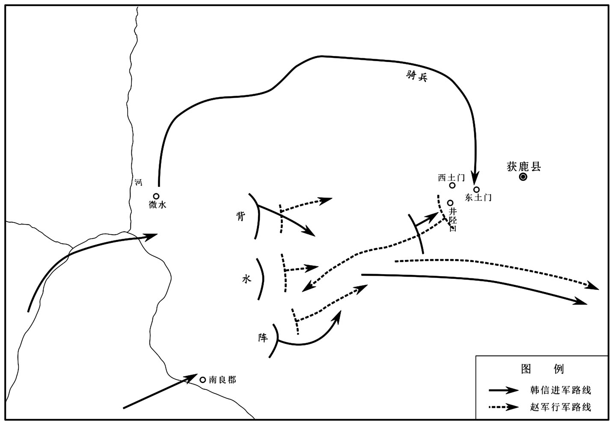
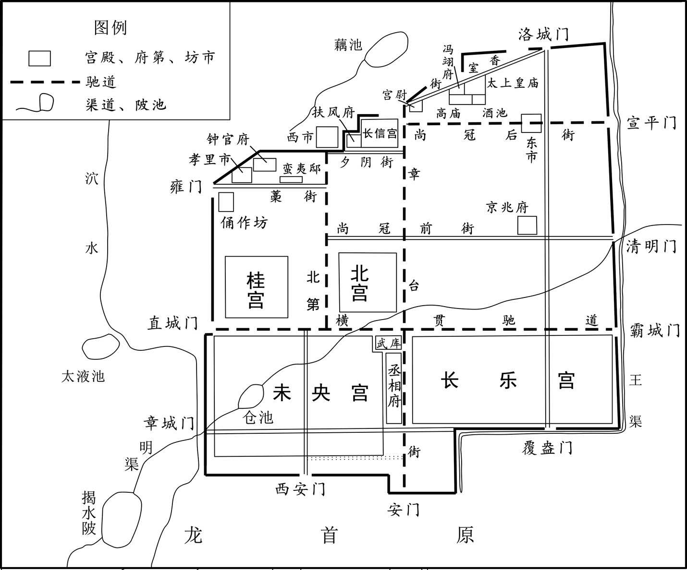
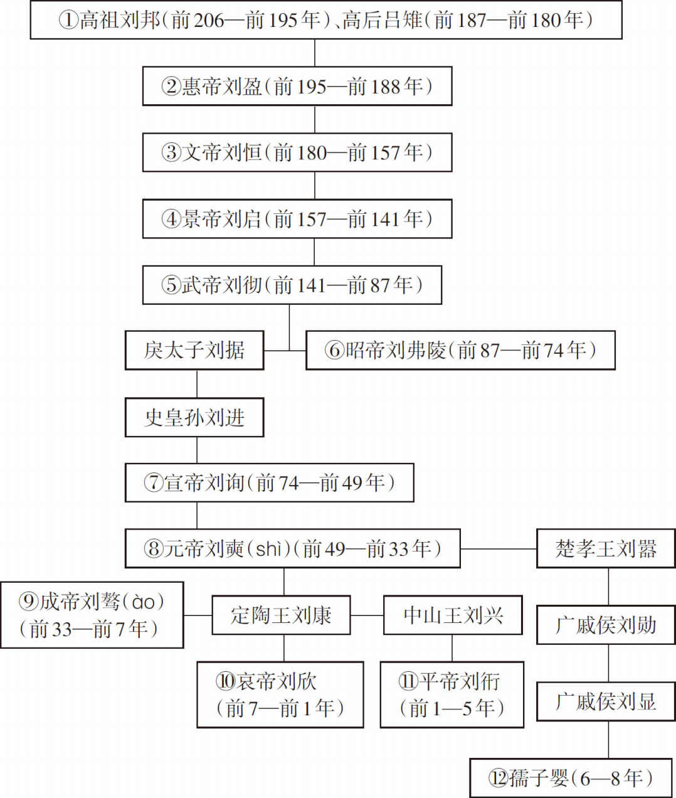

# 目录

高帝灭楚

诸将之叛

匈奴和亲

诸吕之变

南越称藩

七国之叛

梁孝王骄纵

附录： 
西汉皇帝世系表

返回总目录

# 高帝灭楚

## 【内容提要】

本篇主要叙述了汉高帝刘邦率军与西楚霸王项羽激战，最终灭掉楚国的历史过程。

经过五年的苦战，勇力过人、豪气盖世的西楚霸王项羽被围垓下，在乌江自刎，善于智斗的刘邦终于夺取天下。

秦二世（嬴胡亥）统治时期，秦国的兵力依然强盛。楚怀王为扩大地域，鼓励将士入关，并约定“先入定关中者王之”。楚军将士不敢入关，项羽愤恨秦朝杀死项梁，表示愿与刘邦一起入关，从而揭开了高帝灭楚斗争的序幕。刘邦西进咸阳后，不留恋秦国宫室财宝，返回霸上后，又召集父老和豪杰约法三章。项羽入关后，洗劫屠戮咸阳城，搜取秦朝的金银财宝和妇女。他请示楚怀王入关称王，因按约定称王未如愿而心怀不满，便将怀王放逐长江以南。

高帝灭楚始于关中称王。项羽入关后不顾背上逐君反叛的骂名，急于称王。他自恃兵力强大，私自划分土地，封各将领为侯，自立为西楚霸王。他深知刘邦有夺取天下之心，又不愿承受违约罪名，立刘邦为汉王。刘邦想攻打项羽，后因实力所限，只得在领地扩充实力，招纳贤才。回到封地后，刘邦任命萧何为丞相，听从萧何推荐，任命韩信为大将军，让他统率军队。后来任命张良为成信侯，做他的谋臣。随着军力的增强，刘邦率军东渡黄河，攻下河内；趁项羽与齐国作战，统率各诸侯军攻入楚都彭城。项羽收复彭城，击溃汉军。刘邦率余部汉军坚持作战。

在楚霸王项羽与汉王刘邦的作战中，项羽凭着强大兵力屡战屡胜，刘邦却用谋略使汉军由弱变强。韩信打败向齐国增援的楚军，请示汉王刘邦让他镇守齐国，代理齐王；刘邦为防他反叛，封他齐王，征调他的部队继续攻打楚军。刘邦率军死守荥阳成皋，夺取楚军敖仓粮食集散地，阻止楚军西进。为瓦解楚军力量，采取釜底抽薪策略，派萧何说服楚战将英布归汉所用。在楚军猛攻汉军形势危急时，用计离间楚国君臣关系，使范增等楚国重臣离项羽而去，无不显示刘邦利用谋略削弱楚军实力的战略思想。

在楚霸王项羽与汉王刘邦交战过程中，项羽刚愎自用，只知以力拼杀，致使自己到了缺乏援助力量、军粮吃尽的境地。项羽与刘邦签下了两人平分天下，以“鸿沟”为界的约定。而此时，刘邦看到汉朝已得到大半个天下，正是灭亡楚国的大好时机，于是率军追击项羽到固陵，将楚军营包围，使项羽面临四面楚歌，最终东渡乌江自刎，从而以楚国灭亡结束了数年的楚汉之争。

## 【原文】

**秦二世二年[1]。初，楚怀王与诸将约，先入定关中者王之[2]。当是时，秦兵强，常乘胜逐北，诸将莫利先入关[3]。独项羽怨秦之杀项梁，奋，愿与沛公西入关[4]。怀王诸老将皆曰：“项羽为人慓悍猾贼，尝攻襄城，襄城无遗类，皆坑之，诸所过无不残灭[5]。且楚数进取，前陈王、项梁皆败[6]。不如更遣长者，扶义而西，告谕秦父兄[7]。秦父兄苦其主久矣，今诚得长者往，无侵暴，宜可下[8]。项羽不可遣；独沛公素宽大长者，可遣[9]。”怀王乃不许项羽，而遣沛公西略地，收陈王、项梁散卒以伐秦[10]。**

## 【注文】

[1]秦：朝代名。中国历史上第一个统一的多民族封建专制主义中央集权国家。公元前221年，秦王政统一六国，建立秦朝，定都咸阳（今陕西咸阳东北）。采取一系列措施巩固封建中央集权。派兵北逐匈奴，南平百越。将全国分为三十六郡，后增至四十余郡。秦朝赋役繁重，刑法严酷。秦二世胡亥即位后，社会矛盾进一步激化。陈胜、吴广领导农民起义。全国各地响应，反秦斗争风起云涌。后赵高胁迫胡亥自杀，立公子婴为秦王。后刘邦率起义军进抵霸上，子婴投降，秦朝灭亡。　　秦二世（前230—前207年）：名胡亥。秦始皇次子。与丞相李斯、中车府令赵高谋篡改遗诏，赐兄扶苏死，自袭帝位，称二世皇帝。葬始皇于骊山陵墓，逼令后宫无子者均从死，又将全部筑墓工匠活埋于墓内。继续大修阿房宫和驰道。信用赵高，严刑峻法，有加无已，租役繁重至极，终于引起陈胜、吴广农民起义。听信赵高谗言，先后处死右丞相冯去疾、左丞相李斯。刘邦率起义军入关中，二世责让赵高，赵高派其婿阎乐率兵围宫，逼胡亥自杀于望夷宫中。

[2]楚：政权名。秦末项梁、项羽拥立战国时楚怀王孙熊心为王，仍称楚怀王，其国号为“楚”。灭秦后，项羽又杀熊心，自立为西楚霸王。公元前202年，项羽被汉军困于垓（gāi）下（今安徽灵璧南），自刎而死，其国亦灭。　　楚怀王（生卒年不详）：秦朝末年人。熊氏，名心。战国时楚怀王熊槐之孙。秦灭楚后，藏匿民间为人牧羊。秦二世时，被项梁等人拥立为怀王，以为号召。他与诸将立约：先入关者王之。秦亡后，依约王刘邦于关中，遂为项羽所怨，佯尊为义帝而徙之江南，都郴（今湖南郴州）。不久，英布、吴芮、共敖等人据项羽密令杀之于江中。　　关中：地区名。指战国末函谷关以西秦国故地，包括今河南灵宝市以西及陕西、甘肃东部和四川地区。

[3]逐北：追击败兵。　　莫利：不认为有利。

[4]独：唯独，仅仅。　　项羽（前232—前202年）：即项王，又称西楚霸王。名籍。下相（今江苏宿迁西南）人。秦二世时，从其叔项梁于吴（今江苏苏州）起义。项梁战死，他代将其军，于巨鹿之战摧毁秦军主力。秦亡，自立为西楚霸王，大封诸侯，以刘邦为汉王。后楚汉相争，为刘邦所败，兵困垓下（今安徽灵璧南），突围至乌江（今安徽和县东北），自刎而亡。　　项梁（？—前208年）：秦下相人。项燕子。项氏为楚国贵族，世代为将。秦二世时，陈胜起义后，他与其侄项羽杀秦会稽郡守殷通，在吴（今江苏苏州）起义，有兵八千人。后任张楚上柱国，率兵渡江西进。陈胜失败后，立楚怀王的孙子熊心为王，仍称楚怀王，自号武信君。曾率军击败秦将章邯，因轻敌，在定陶（今山东定陶西北）战死。　　奋：振作。　　沛公：即汉高祖刘邦（前256—前195年）。西汉王朝的建立者。沛县人。曾任泗水亭长。秦二世时，陈胜、吴广起义，起兵响应，称沛公。初属项梁，后与项羽领导的起义军同为反秦主力，率军攻占咸阳，推翻秦朝统治，约法三章，废除秦的严刑苛法。项羽大封诸侯王时，他被封为汉王，占有巴蜀、汉中之地。不久，即与项羽展开长达五年的战争。战胜项羽后，即皇帝位。在位期间，继承秦制，实行中央集权制度。先后消灭韩信、彭越等异姓诸侯王；迁六国旧贵族和地方豪强到关中，以加强控制；实行重本抑末政策，发展农业生产，打击商贾；以秦律为根据，制定《汉律》，使社会经济逐渐恢复，统一局面日趋巩固。

[5]慓悍：同“剽悍”，轻捷勇猛。　　猾贼：奸狡。　　尝：曾经。　　襄城：古邑名。本春秋郑汜（sì）邑（南汜）。战国属魏，改名襄城。即今河南襄城。　　遗类：指残存者。　　坑：秦代一种死刑。即活埋。　　残灭：残杀毁灭。

[6]数：屡次。　　进取：进攻；攻取。　　陈王：即陈胜（？—前208年）。字涉，秦朝阳城（今河南登封东南）人。雇农出身。前209年，秦二世征调贫苦农民屯戍渔阳，他与吴广同时被征，行至蕲县大泽乡时，两人发动同行戍卒九百人起义。起义军迅速攻占蕲、铚、酂、苦、柘、谯等地，兵至数万人，在陈县建立张楚政权，他被推为王。旋即派人率兵攻赵、魏、九江等地。又派周文率主力进攻关中。后周文被秦将章邯战败，他在陈县率军坚持战斗，失利后退至下城父，为御者庄贾杀害。

[7]长者：指德高望重的人。　　告谕：晓谕；晓示。

[8]苦：使困苦，困于。　　侵暴：侵犯暴掠。　　宜：应该。

[9]素：平素，往常，旧时。　　宽大：大度；宽厚，不苛刻。

[10]乃：于是，就。　　略地：占领土地；侵占土地。　　散卒：指被击溃了的士兵。　　伐：讨伐，进攻。

## 【译文】

秦二世胡亥二年（前208年）。当初，楚怀王与反秦的众将领共同约定，谁先攻入关中，谁就被尊为王。当时，秦国的兵力相当强盛，常常乘胜追击，楚军众将领都不敢率先进入关中。只有项羽怨恨秦军杀死他的叔父项梁，自告奋勇，愿与沛公一起向西进入关中。楚怀王的诸位老将们都说：“项羽为人剽悍凶狠，残暴狡猾。他曾进攻襄城，将襄城的百姓全部杀了，一个不留。凡是他经过的地方无不遭毁灭。况且楚军多次攻秦，以往陈王、项梁都失败了。不如另派忠厚的长者前去，依仗仁义西进，告谕秦国的父老兄弟。秦地的父老兄弟痛恨暴君已经很久了，现在如果真能都得到宽厚的长者前往，不实施暴力，攻下秦地是没有问题的。不能派遣项羽；只有刘邦平日宽大忠厚，可以派他去。”于是楚怀王没派项羽，而派刘邦向西攻城略地，收集陈王、项梁的散兵，以进攻讨伐秦朝。

## 【原文】

**汉高祖元年冬十月，沛公西入咸阳，诸将皆争走金帛财物之府分之，萧何独先入收秦丞相府图籍藏之，以此沛公得具知天下厄塞、户口多少、强弱之处[1]。沛公见秦宫室、帷帐、狗马、重宝、妇女以千数，意欲留居之[2]。樊哙谏曰：“沛公欲有天下耶？将为富家翁耶？凡此奢丽之物，皆秦所以亡也，沛公何用焉！愿急还霸上，无留宫中[3]。”沛公不听。张良曰：“秦为无道，故沛公得至此[4]。夫为天下除残贼，宜缟素为资[5]。今始入秦，即安其乐，此所谓‘助桀为虐’[6]。且忠言逆耳利于行，毒药苦口利于病，愿沛公听樊哙言[7]。”沛公乃还军霸上。**

## 【注文】

[1]汉：朝代名。包括西汉（前汉）、东汉（后汉）。公元前206年刘邦灭秦，后又打败项羽，于公元前202年称帝，国号汉，建都长安（今陕西西安），史称西汉或前汉。疆域东、南至海，西到巴尔喀什湖、费尔干纳盆地、葱岭，西南至云南、广西以及越南北、中部，北到大漠，东北迤至朝鲜半岛北部。初始元年（8年），外戚王莽代汉称帝，国号新。天凤四年（17年），爆发赤眉绿林农民大起义。建武元年（25年）刘秀（即汉光武帝）重建汉朝，建都洛阳（今河南洛阳），史称东汉或后汉。中平元年（184年），爆发黄巾农民大起义，东汉王朝名存实亡。延康元年（220年）曹丕称帝，东汉灭亡。汉代共历二十七帝，统治四百零六年。　　咸阳：都邑名。在今陕西咸阳市东北窑店附近。因位于九嵏（zōng）山之南、渭水之北，在山水之阳，故名。战国秦孝公时自栎（yuè）阳迁都于此。　　金帛：黄金和丝绸。泛指钱物。　　萧何（？—前193年）：西汉大臣。泗水沛人。秦二世时随刘邦起兵反秦，为沛丞，监督诸事。攻克咸阳后，收藏秦朝律令图书，使刘邦具知天下地理山川形势及户口数，劝刘邦接受项羽分封，以待时机。楚汉战争时，任丞相，留守关中。举荐韩信为大将军。制定规章制度，立宗庙、社稷、宫室、县邑。刘邦称帝后，封酂（zàn）侯。后受命采摭（zhí）秦法，作律九章，后封相国。高帝死后，复事惠帝。病危时推荐曹参继任相国。　　丞相：官名。初置于战国时的秦悼王，为百官之首，亦称相邦（楚国称令尹）。秦代以后为国家官僚组织中的最高官职，帮助皇帝综理万机。汉初置相国，后复改丞相，与太尉、御史大夫合称三公。汉末改丞相为大司徒。　　图籍：地图和户籍。常用来指疆土人民。　　具：完备；详尽。　　厄（è）塞：险要之地、险阻要塞。　　户口：住户和人口的总称。计家为户，计人为口。

[2]宫室：指帝王的宫殿。　　帷帐：帷幕床帐。　　狗马：犬与马。指游畋之物。　　重宝：重器。多指鼎彝宝器，也泛指贵重的财宝。

[3]樊哙（kuài）（？—前189年）：汉初将领。沛县人。少以屠狗为业。初随刘邦起义，为其部将，以军功封贤成君。灭秦后，项羽谋士范增拟在鸿门宴上谋杀刘邦，他斥责项羽，刘邦得以脱逃。汉初，随刘邦击破臧荼、陈豨和韩王信的叛乱，任左丞相，封舞阳侯。　　谏（jiàn）：旧时称规劝君主或尊长，使改正错误。　　奢丽：奢侈华丽。　　霸上：又作灞上、霸头。在今陕西西安市东。因地处霸水西高原上，故名。

[4]张良（？—前190年）：秦朝末年人，字子房。祖与父相继为韩五世相。秦灭韩后，图谋复国，倾家财求刺客，于博浪沙（今河南郏县东）狙击秦始皇，误中副车。后逃亡藏匿在下邳，从圯上老人学（太公兵法）。秦二世时，聚少年百余人响应陈胜、吴广起义。其后，归属刘邦，为重要谋士。曾劝刘邦不可贪恋宫室，在鸿门宴上为刘邦解危。楚汉战争中，力主争取英布、彭越、韩信，连兵破楚，反对郦（lì）食（yì）其（jī）分封六国诸侯之策。刘邦数用其计。汉高祖六年（前201年），封留侯，助刘邦定功行封及劝刘邦西都关中，定立太子等。后病死。　　无道：不行正道；做坏事。多指暴君或权贵者的恶行。

[5]残贼：残忍暴虐。　　缟（gǎo）素：白色、白色的衣服，指丧服。　　资：本，凭借。

[6]助桀（jié）为虐（nüè）：桀为夏代最后一个君主，传说是暴君。协助夏桀做暴虐的事。比喻帮助恶人干坏事。

[7]愿：希望。

## 【译文】

汉高祖刘邦元年（前206年）冬季十月，刘邦率军向西攻进咸阳，众将领都争先恐后地奔进秦朝贮藏金帛财物的府库瓜分财物，只有萧何率先独自进入宫内丞相府，将府内秦朝的图书、户籍档案收藏起来，刘邦得以全面了解全国的山川要塞、户口多少，以及财力、物力强弱的分布情况。刘邦亲眼看到秦朝宫室、帷帐、狗马、各种重宝以及数以千计的宫中美女，便准备留下来居住。樊哙劝阻他说：“沛公您是想夺取天下呢？还是想做个富翁？这些豪华奢侈华丽之物，都是些促进秦朝灭亡的东西，您要它们有什么用啊！希望您立即返回霸上，不要留在秦宫。”沛公不听劝告。张良说：“秦朝因暴虐无道，所以您才到了这里。为天下的民众消除祸害，应犹如丧服在身，要以安抚百姓为根本。现在刚刚进入秦的都城，就贪图安乐，这就像人们常说的‘助桀为虐’了。况且，忠言逆耳利于行，毒药苦口利于病，希望您能听取樊哙的劝告。”刘邦于是率军返回霸上。

## 【原文】

**十一月，沛公悉召诸县父老豪桀谓曰：“父老苦秦苛法久矣。吾与诸侯约，先入关者王之，吾当王关中。与父老约，法三章耳：杀人者死，伤人及盗抵罪。余悉除去秦法。诸吏民皆案堵如故[1]。凡吾所以来，为父老除害，非有所侵暴，无恐[2]。且吾所以还军霸上，待诸侯至而定约束耳。”乃使人与秦吏行县乡邑，告谕之[3]。秦民大喜，争持牛羊酒食献飨军士[4]。沛公又让不受，曰：“仓粟多，非乏，不欲费民[5]。”民又益喜，唯恐沛公不为秦王[6]。**

## 【注文】

[1]悉：尽、全。　　豪桀（jié）：即豪杰，引申为社会上有地位有势力的人。　　苛法：烦琐的法律。　　诸侯：古代帝王所分封的各国君主。在其统辖区域内，世代掌握军政大权，但按礼要服从王命，定期向帝王朝贡述职，并有出军赋和服役的义务。　　除：清除，去掉。　　案堵：指不迁徙移动。

[2]侵暴：侵犯暴掠。

[3]县：行政区划单位。为地方基层行政区，春秋时已经出现，战国后广泛设立，沿用至今。　　乡：行政区划基层单位，属县或县以下的行政区管辖。

[4]飨（xiǎng）：用酒食招待客人，泛指请人受用。

[5]让：通“攘”。推辞；推让；拒绝。　　粟：一年生草本植物，花小而又密集，籽实去皮后就是小米。旧时泛称谷类。

[6]益：更加。

## 【译文】

汉高祖刘邦元年（前206年）十一月，刘邦将各县的父老及德高望重的人全都召集起来，对他们说：“各位父老被秦朝暴政苛法残害已经很久了。我在入关前曾与各路诸侯们约定，先进入关中的称王，那么我应该在关中为王了。现在，与父老们约法三章：杀人者处死，伤人及抢劫者，视轻重判罪。除此之外，废除秦朝的一切法律。所有的官吏和百姓都按原来的安定不动。我之所以带兵到这里来，是为了替父老们消除祸害，不是来侵夺暴虐的，请大家不要害怕。况且我所以要领兵返回到霸上，是为等待各路诸侯到来之后，订立规章制度约束大家的行为罢了。”于是派人与秦朝的官吏一起巡视各县、乡邑，向老百姓说明情况。秦地的民众都非常高兴，争相牵着牛羊，拿着酒食慰问刘邦的官兵。刘邦又推辞不肯接受，他说：“军中仓库的粮食还很多，并不缺乏，不想让百姓们破费。”百姓们听了更加高兴，只担心刘邦不在秦地称王。

## 【原文】

**项羽既定河北，率诸侯兵欲西入关[1]。先是，诸侯吏卒、繇使、屯戍过秦中者，秦中吏卒遇之多无状[2]。及章邯以秦军降诸侯，诸侯吏卒乘胜多奴虏使之，轻折辱秦吏卒[3]。秦吏卒多怨，窃言曰：“章将军等诈吾属降诸侯[4]。今能入关破秦，大善；即不能，诸侯虏吾属而东，秦又尽诛吾父母妻子，奈何[5]？”诸将微闻其计，以告项羽[6]。项羽召黥布、蒲将军计曰：“秦吏卒尚众，其心不服[7]。至关不听，事必危。不如击杀之，而独与章邯、长史欣、都尉翳入秦[8]。”于是楚军夜击坑秦卒二十余万人新安城南[9]。[10]**

## 【注文】

[1]河北：泛指今黄河以北的地区。

[2]繇（yáo）：同“徭”。徭役，古代统治者强制人民承担的无偿劳动。　　屯戍：驻防。　　无状：行为失检，没有礼貌。

[3]章邯（？—前205年）：秦朝时人，字少荣。秦二世时任少府。陈胜、吴广起义后，奉二世之命发骊山徒、奴产子镇压起义。先击败周文所率攻入关中的起义军，继又击溃项梁及陈胜领导的义军队伍，屠杀甚众。后渡河击赵。其后，在巨鹿一战，为项羽所率义军大败，不久投降。项羽分封诸侯，立为雍王。封咸阳以西地，都废丘（今陕西兴平）。楚汉战争时，随项羽攻汉王刘邦，后为刘邦所杀。　　轻：随便，不庄重。　　折辱：侮辱。

[4]窃言：私下谈论。　　将军：武官名。春秋时诸侯以卿统军，故称卿为将军。战国以后转为武官之称，加号极繁。如汉代有大将军，骠骑将军，车骑将军，卫将军，前、后、左、右将军以及楼船将军、材官将军、度辽将军等，多用以尊称。　　诈：欺骗，用手段诓骗。　　属：侪辈。指同一类人。

[5]诛：杀戮。夺去生命。　　妻子：妻子和儿女。

[6]微闻：隐约听到。

[7]黥（qíng）布：即英布（？—前195年）。汉初诸侯王。六县（今安徽六安东北）人。早年犯法，处黥刑，故又名黥布。秦末率骊山刑徒起义，属项羽，作战常为前锋，封九江王。楚汉战争中归汉，封淮南王，从刘邦击灭项羽于垓（gāi）下（今安徽灵璧南）。汉初，以彭越、韩信相继为刘邦所杀，因举兵反，战败逃到江南，被长沙王（吴芮子成王臣）诱杀。　　蒲将军（生卒年不详）：名不详，秦末陈胜起义时，他在江淮地区聚众响应，后率兵归属项梁。梁死，随属项羽。以骁勇著称。楚怀王派兵北上救赵，他随项羽北上，和英布同任先锋，共率二万人渡河驰援巨鹿，于巨鹿大败秦军。后又引兵渡三户大破章邯秦军，迫使章邯投降。　　计：谋划，打算。

[8]长史：官名。战国时秦国设置，掌顾问参谋。秦汉沿置。　　欣：即司马欣（？—前203年），秦时人。曾任栎阳狱掾、长史。秦二世时，奉命佐章邯镇压农民起义，击败陈胜，又破项梁于定陶，灭魏咎于临济，后随章邯渡河北击赵。巨鹿一战为项羽所破，随即归降。项羽分封诸侯时，立为塞王，封咸阳以东至河之地，都栎阳。楚汉战争中动摇于楚汉之间，先降刘邦，后背汉归项羽，从楚大司马曹咎守荥阳，兵败自杀，被枭首于栎阳。　　都尉：官名。统兵武官。战国赵、魏、秦等国已置，地位略低于将军。秦、两汉也为高级武官，稍低于校尉，或寇以骁骑、车骑、军门、强弩、复土等名号，皆有事时临时设置，事毕即罢。　　翳（yì）：即董翳（生卒年不详）。秦代末年人。曾任都尉。秦二世二年（前208年），从秦将章邯镇压陈胜起义。后战事失利，劝说章邯投降项羽。公元前206年项羽分封诸侯时，为翟王，王上郡，都高奴（今陕西延安东北）。楚汉战争时，动摇于汉、楚之间，先降汉，后又归楚。

[9]新安：县名。秦置，治今河南渑池。

[10]历史典故“新安坑卒”即来源于上述史实，最初的记载见《史记·项羽本纪》。

## 【译文】

项羽已经平定了黄河以北地区之后，率领各诸侯国的军队准备向西进入关中。以前，东方各诸侯国中的官吏士卒，有的在关中服徭役，有的屯戍经过秦地关中，关中的秦朝官吏士卒对待他们苛刻无礼。所以等到章邯率领秦军向诸侯军投降后，各路诸侯们的官吏和士卒，乘着胜利的威势将秦军官兵当作奴隶和俘虏驱使，随便侮辱秦军官兵，使得秦军中的官吏和士卒多产生怨恨情绪。他们私下议论说：“章邯将军诈骗我们投降诸侯军。现在如能攻入关中击败秦朝，确是好事；假如不能，各诸侯掳掠咱们到东方去，秦朝廷又将我们的父母妻子杀尽，那该怎么办呢？”诸侯军的将领暗中听到了这些议论，便告诉了项羽。项羽召来黥布、蒲将军秘密商议说：“秦军中投降的官吏士卒虽然很多，但他们内心并不服。如果到了函谷关不听从命令，情况就很危险了。不如将他们都杀了，只留下章邯、长史欣、都尉董翳，带着他们进入关中。”于是楚军便在夜间突然袭击，将秦兵二十余万人活埋在新安城南面。

## 【原文】

**或说沛公曰：“秦富十倍天下，地形强[1]。闻项羽号章邯为雍王，王关中，今则来，沛公恐不得有此[2]。可急使兵守函谷关，无内诸侯军，稍征关中兵以自益，距之[3]。”沛公然其计，从之。已而项羽至关，关门闭[4]。闻沛公已定关中，大怒，使黥布等攻破函谷关。十二月，项羽进至戏[5]。沛公左司马曹无伤使人言项羽曰：“沛公欲王关中，令子婴为相，珍宝尽有之[6]。”欲以求封。项羽大怒，飨士卒，期旦日击沛公军[7]。当是时，项羽兵四十万，号百万，在新丰鸿门[8]。沛公兵十万，号二十万，在霸上。范增说项羽曰：“沛公居山东时，贪财好色[9]。今入关，财物无所取，妇女无所幸，此其志不在小[10]。吾令人望其气，皆为龙虎，成五采，此天子气也[11]。急击勿失。”**

## 【注文】

[1]或：某人，有的人。

[2]闻：听见。

[3]函谷关：在河南省灵宝市北坡头乡王垛村。因关在谷中，深险如函（匣子）而得名。现存关城遗址，为不规则长方形，平夯夯打而成。西据高原，东临绝涧，南接秦岭，北塞黄河，是中国建置最早的雄关要塞之一。始建于战国秦，是东去洛阳、西达长安的咽喉，素有“自古函谷一战场”之说，为兵家必争之地。　　稍：逐渐。　　益：扩大，加大。　　距：古同“拒”，抵抗。

[4]已而：旋即；不久。

[5]戏：古邑名。在今陕西西安市临潼区东北戏水西岸。

[6]左司马：官名。司马之属，参掌军政。春秋时开始设置，战国时楚、赵等国俱设。　　曹无伤：即曹毋伤（？—前206年）。秦朝末年人。秦末农民起义后属刘邦，任左司马。公元前206年随刘邦进军关中后，使人向项羽密告“沛公欲王关中”，遂使项羽起意消灭刘邦。刘邦于鸿门宴脱身后，即将其诛杀。　　子婴（？—前206年）：秦始皇的孙子。二世兄子。秦二世即位后，曾谏劝勿诛大臣蒙毅。赵高逼二世自杀，立子婴为王。后遂设计杀高于斋宫，夷其三族。刘邦率反秦义军进抵霸上后，系颈以组，白马素车，奉天子玺符归降。降月余，为项羽所杀。　　相：即丞相，参见前“丞相”条注。

[7]期：预定的时间；选定的日子；期限。　　旦日：明天，第二天。

[8]新丰鸿门：古地名。在陕西省西安市临潼区骊山镇东鸿门堡村。东接戏水，南靠高原，北临渭河。两千多年前这里是通往古新丰的大道，由于雨水冲刷，形似鸿沟，在北端出口处，形似门道，故称鸿门。当地又称为项王营。

[9]范增（前277—前204年）：秦末居鄛（今安徽桐城城南）人。随项梁举兵反秦，劝说项梁立楚王族后裔为楚怀王。秦军围巨鹿，楚怀王派宋义、项羽等救赵，以他为末将。后属项羽，为其谋士，被尊为亚父。他屡劝项羽杀刘邦，项羽不听。后项羽中刘邦反间计，削其权力，他愤然离去，途中生病而死。　　说（shuì）：用话劝说别人，使他听从自己的意见。　　山东：古地区名。战国、秦、汉时代，通称崤山或华山以东为山东，与当时关东含义相同。一般专指黄河流域，有时也泛指战国时秦以外的六国领土。

[10]幸：宠爱。

[11]望：察看。　　龙虎：形容皇帝的气派。　　五采：泛指多种颜色。　　天子：王的称号。意在宣扬王为上天之子，以神权支持王权。

## 【译文】

这时有人劝说刘邦：“秦国的财富是天下的十倍，地理形势也很有优越。听说项羽已封章邯为雍王，准备让他在关中称王，等他来到关中，恐怕就不能再是您的了。应该迅速派兵把守函谷关，不允许各诸侯军进入关内，并逐渐征集关中兵，以增强防御能力，进行抵抗。”刘邦认为此计不错，可以实行。不久项羽率军到了函谷关，可是关门紧闭。项羽听说刘邦已经平定了关中，便大怒，派黥布率重兵攻破函谷关。汉高祖刘邦元年（前206年）十二月，项羽已经进军到戏邑。刘邦的左司马曹无伤派人对项羽说：“刘邦想要在关中称王，命令秦王子婴为丞相，咸阳城内的珍宝都被他占为己有。”曹无伤想要讨好项羽求得封赏。项羽听了之后更为恼怒，立即犒劳士卒，让他们饱餐一顿，准备第二天去攻打刘邦的军队。这时，项羽有兵四十万，号称百万，驻扎在新丰鸿门。刘邦有兵十万，号称二十万，驻守在霸上。范增劝项羽说：“刘邦居住在崤山以东时，贪财物好女色。如今他进入关内，却不索取财物，也不宠幸女色，看来他的志向可不小呀。我曾派人去观望霸上空中的云气，都呈现出龙虎的形状，形成五彩，这就是天子之气啊。赶快攻打他，不能失去时机。”

## 【原文】

**楚左尹项伯者，项羽季父也，素善张良，乃夜驰之沛公军，私见张良，具告以事，欲呼与俱去，曰：“毋俱死也[1]。”张良曰：“臣为韩王送沛公，沛公今有急，亡去不义，不可不语[2]。”良乃入，具告沛公。沛公大惊。良曰：“料公士卒足以当项羽乎[3]？”沛公默然，曰：“固不如也。且为之奈何[4]？”张良曰：“请往谓项伯，言沛公之不敢叛也。”沛公曰：“君为我呼入。”良出，固要项伯，项伯即入见沛公[5]。沛公奉卮酒为寿，约为婚姻，曰：“吾入关，秋毫不敢有所近，籍吏民，封府库而待将军[6]。所以遣将守关者，备他盗之出入与非常也[7]。日夜望将军至，岂敢反乎！愿伯具言臣之不敢倍德也[8]。”项伯许诺，谓沛公曰：“旦日不可不蚤自来谢[9]。”沛公曰：“诺。”于是项伯复夜去，至军中，具以沛公言报项羽。因言曰：“沛公不先破关中，公岂敢入乎？今人有大功而击之，不义也。不如因善遇之。”项羽许诺。**

## 【注文】

[1]左尹：官名。春秋时楚国设置。秦汉之际也设置。位次令尹。位尊，多以王室贵族任之。掌军事。　　项伯（？—前192年）：秦末下相（今江苏宿迁西南）人，名缠。字伯。战国时楚国贵族的后裔，项羽的叔父。曾杀人犯罪，为张良营救。秦末，随项羽起义反秦。秦亡后，因闻项羽有意消灭刘邦以独霸天下，遂通过张良向刘邦报信，并于鸿门宴上暗护刘邦使其得脱危难。刘邦称帝后，赐姓刘氏，封射阳侯。　　季父：叔父。亦指最小的叔父。　　驰：疾行。　　俱：一起。　　毋：不要，不可以。

[2]韩王：即韩成（？—前206年），秦末人。战国末年韩国公子，封横阳君。秦末，六国诸侯后裔并起反秦，因得项梁支持，被立为韩王。公元前206年项羽分封诸侯，更封为穣侯，不久被杀。　　亡去：逃遁。

[3]料：估量；揣度；料想。

[4]默然：沉默不语的样子。　　固：确实。

[5]固要（yāo）：再三地邀请。要，通“邀”。

[6]卮（zhī）：古代盛酒的器皿。　　秋毫：亦作“秋豪”。鸟兽在秋天新长出来的细毛。喻细微之物。　　籍：登记。　　府库：国家贮藏财物、兵甲的处所。

[7]非常：意外的事情。

[8]倍德：背弃恩德。倍通“背”。

[9]蚤：同“早”。　　谢：认错，道歉。

## 【译文】

楚国的左尹项伯，是项羽的叔父，一向与张良要好，得到消息后，便连夜快马飞驰到刘邦的军营，私下与张良见面，把项羽要打刘邦的事全都告诉了他，想要张良和他一起离开刘邦的军营，对他说：“千万不要和刘邦一块儿去死呀。”张良说：“我是奉韩王的命令来送沛公的，现在沛公遇到急难，我自己逃离是不道义的，我不能不告诉他。”于是张良立即进去将项伯和他说的话都告诉了刘邦。刘邦非常吃惊。张良说：“您估计一下您的兵力能足够抵挡住项羽吗？”刘邦沉默一会说道：“我确实不如他。现在又该怎么办呢？”张良说：“请您去告诉项伯，说我刘邦绝对不敢背叛项羽。”刘邦说：“你替我把项伯请进来。”张良到军营外，邀请项伯与沛公相见。刘邦捧起酒杯向项伯敬酒，并祝他长寿，还约定下了儿女的婚姻。刘邦说：“我自进入关中后，不敢接近丝毫东西，只是登记官民，封存府库，一心等待将军的到来。之所以派遣将领们坚守函谷关，是为防备其他的盗贼出入和意外的事情发生。我日夜都在盼望项羽将军的到来，哪里敢谋反呢！希望您回去向将军说明我不敢违背道德去做图谋反叛的事。”项伯答应了，对刘邦说：“你明日早晨不可不早些到鸿门来向项羽道歉啊。”刘邦说：“好吧。”于是项伯连夜赶回了军营，将刘邦的话全部报告给了项羽。还说：“如果刘邦不先攻入关中，您怎么能入关呀？现在刘邦建立了大功，却要去攻打他，太不道义了。不如好好地善待刘邦。”项羽同意了。

## 【原文】

**沛公旦日从百余骑来见项羽鸿门，谢曰：“臣与将军戮力而攻秦，将军战河北，臣战河南，不自意能先入关破秦，得复见将军于此[1]。今者有小人之言，令将军与臣有隙[2]。”项羽曰：“此沛公左司马曹无伤言之；不然，籍何以生此！”项羽因留沛公与饮。范增数目项羽，举所佩玉玦以示之者三，项羽默然不应[3]。范增起，出召项庄，谓曰：“君王为人不忍，若入前为寿，寿毕，请以剑舞，因击沛公于坐，杀之[4]。不者，若属皆且为所虏。”庄则入为寿。寿毕，曰：“军中无以为乐，请以剑舞。”项羽曰：“诺。”项庄拔剑起舞，项伯亦拔剑起舞，常以身翼蔽沛公，庄不得击[5]。于是张良至军门，见樊哙[6]。哙曰：“今日之事何如？”良曰：“今项庄拔剑舞，其意常在沛公也。”哙曰：“此迫矣！臣请入，与之同命[7]。”哙即带剑拥盾入军门，卫士欲止不内，樊哙侧其盾以撞，卫士仆地，遂入，披帷立，瞋目视项羽，头发上指，目眦尽裂[8]。项羽按剑而跽曰：“客何为者[9]？”张良曰：“沛公之参乘樊哙也[10]。”项羽曰：“壮士！赐之卮酒。”哙立而饮之。项羽曰：“壮士！能复饮乎？”樊哙曰：“臣死且不避，卮酒安足辞！夫秦有虎狼之心，杀人如不能举，刑人如恐不胜，天下皆叛之[11]。怀王与诸将约曰：‘先破秦入咸阳者王之。’今沛公先破秦入咸阳，豪毛不敢有所近，还军霸上，以待将军。劳苦而功高如此，未有封爵之赏，而听细人之说，欲诛有功之人[12]。此亡秦之续耳，窃为将军不取也[13]！”项羽未有以应，曰：“坐！”樊哙从良坐[14]。**

## 【注文】

[1]鸿门：古地名。亦称鸿门阪。在陕西省西安市临潼区骊山镇东鸿门堡村。东接戏水，南靠高原，北临渭河。两千多年前这里是通往古新丰的大道，由于雨水冲刷，形似鸿沟，在北端出口处，形似门道，故称鸿门。当地又称为项王营。秦二世时，项羽在巨鹿（今河北平乡县）歼灭了秦朝主力军，率军入关后，在此宴请刘邦，史称“鸿门宴”。　　戮（lù）力：合力、并力。　　河南：古地区名。秦汉时以今内蒙古自治区河套以南为河南。　　不自意：自己没有料到。

[2]小人：指人格卑下的人。　　隙（xì）：感情上的裂痕。

[3]玦（jué）：古玉器名。环形，有缺口的佩玉。通“决”。

[4]项庄（生卒年不详）：秦末下相（今江苏宿迁西南）人。战国时楚国贵族的后裔。二世元年（前209年），随其从兄项羽起义反秦。秦亡后，项羽与刘邦会宴于鸿门，项庄于席中起舞，图谋刺杀刘邦，因项伯、樊哙卫护，未成。　　剑舞：舞剑。

[5]翼蔽：障蔽，遮护。

[6]军门：军营的门。

[7]迫（pò）：急促。

[8]内（nà）：古同“纳”，收入；接受。　　帷：围在四周的帐幕。　　瞋（chēn）：发怒时睁大眼睛。　　目眦（zì）尽裂：眼角都瞪裂了。形容非常愤怒。眦，眼角。

[9]跽（jì）：双膝着地，上身挺直。

[10]参乘（shèng）：也作“骖乘”。陪乘或陪乘的人。古代乘车，尊者在左，御者在中，一人在右陪坐，称“参乘”或“车右”。

[11]举：全。　　刑人：加刑于人。　　胜：尽；完。

[12]封爵：封土授爵。　　细人：见识短浅之人；小人。

[13]窃：私下；私自。多用作谦辞。

[14]历史典故“项庄舞剑，意在沛公”即来源于上述史实，最初的记载见《史记·项羽本纪》。

## 【译文】

第二天早晨，刘邦带着一百多名骑兵来到鸿门拜见项羽，向他道歉说：“我与将军合力攻打秦军，将军战斗在河北，我战斗在河南，没想到自己却先进入关中打败了秦军，并能和将军在这里重又相见。现在有小人闲言，搬弄是非，使将军您和我产生了误会。”项羽说：“这些都是您沛公左司马曹无伤散布的流言；不然的话，我怎么会这样做呢！”项羽当即留下刘邦一起喝酒。范增曾多次给项羽使眼色，并三次举起自己所佩带的玉玦示意项羽杀掉刘邦，但项羽默不作声，毫无反应。于是范增起身走出去，召来项庄，对他说：“项王为人心慈手软，不忍心亲自下手，还是你进去向刘邦敬酒祝寿，敬酒后，就请求舞剑助兴，借机把沛公杀死在座位上，如果不这样，我们都将被他俘虏去。”项庄便进去为刘邦祝酒。敬酒之后，项庄说：“军营中没有什么可用来进行娱乐的，就请我舞剑为你们酒宴助兴吧。”项羽说：“好呀。”项庄便拔剑起舞，项伯见此情景也拔剑起舞，并常常用自己的身体庇护刘邦，使项庄没有击杀的机会。这时张良来到军门见樊哙。樊哙问：“今天的事情怎么样了？”张良说：“现在项庄正拔剑起舞，他的用意是要杀死沛公。”樊哙说：“事情紧迫，我请求进去，和他拼命。”樊哙立即带剑持盾进入军门，守门的卫士想阻止不让他进去，樊哙侧过身用盾牌猛地一撞，卫士仆倒在地上，樊哙于是闯了进去，掀起帷帐站在那儿，双目怒视着项羽，头发都竖了起来，双眼角都瞪裂开了。项羽手按着剑，跪起身说道：“来客是干什么的？”张良说：“是沛公的参乘卫士樊哙。”项羽说：“好一位壮士！赐给他酒喝。”樊哙站着将赐酒饮下。项羽说：“壮士！你还能再喝酒吗？”樊哙答道：“我连死都不怕，一杯酒还有什么可值得推辞的！秦王的心肠犹如虎狼，杀人唯恐杀不尽，用刑唯恐用不够，天下人都背叛了他。楚怀王曾与诸将领约定说：‘先攻破秦军进入咸阳的人可封为王。’现在沛公先击败秦军进入咸阳，丝毫的东西都不敢接近，便赶紧率军返回到霸上，等待将军您的到来。如此的劳苦功高，并没有得到您的封爵奖赏，却听信小人的谗言，想要杀有功的人。这不过是暴秦的继续罢了，我私下里认为将军的做法根本不可取！”项羽无话可说，只好说：“坐下吧！”樊哙于是坐在了张良的身边。

## 【原文】

**坐须臾，沛公起如厕，因招樊哙出[1]。沛公曰：“今者出，未辞也，为之奈何？”樊哙曰：“如今人方为刀俎，我方为鱼肉，何辞为[2]！”于是遂去。鸿门去霸上四十里，沛公则置车骑，脱身独骑，樊哙、夏侯婴、靳强、纪信等四人持剑盾步走，从骊山下，道芷阳间行趣霸上[3]。留张良使谢项羽，以白璧献羽，玉斗与亚父[4]。沛公谓良曰：“从此道至吾军，不过二十里耳。度我至军中，公乃入[5]。”沛公已去，间至军中，张良入谢曰：“沛公不胜桮杓，不能辞[6]。谨使臣良奉白璧一双，再拜献将军足下；玉斗一双，再拜奉亚父足下[7]。”项羽曰：“沛公安在？”良曰：“闻将军有意督过之，脱身独去，已至军矣[8]。”项羽则受璧，置之坐上。亚父受玉斗，置之地，拔剑撞而破之。曰：“唉！竖子不足与谋[9]。夺将军天下者，必沛公也，吾属今为之虏矣。”沛公至军，立诛杀曹无伤。**

## 【注文】

[1]须臾（yú）：极短的时间、片刻。　　如厕：到厕所去。　　因：趁着；乘便。

[2]刀俎（zǔ）：指刀和砧板，比喻宰割者或迫害者。　　鱼肉：鱼和肉，比喻受侵害、欺压者。

[3]去：相距，远离。　　置：废弃；舍弃。　　车骑：即车马。　　脱身：抽身摆脱。　　夏侯婴（？—前172年）：秦末泗水沛县人。曾为滕令奉车，故号滕公。初为沛厩司御，与刘邦相厚爱。后随刘邦起兵反秦，屡建战功，赐爵昭平侯。楚汉战争中，刘邦败于彭城，惠帝与鲁元公主几为楚军所获，赖其得以保全。刘邦称帝后，封汝阴侯。协助诛除臧（zāng）荼（tú）、韩信、陈豨（xī）、英布等异姓王侯。高祖死，复以太仆事惠帝、高后及文帝。　　靳强（生卒年不详）：汉初将领。祖居西河，后徙曲沃（今属山西）。以郎中骑从高祖刘邦击项羽，以功迁中尉。后又击破钟离眜，封汾阳侯。　　纪信（生卒年不详）：秦汉间人。为刘邦部将。汉高祖时，项羽围刘邦于荥阳。纪信建议由其出面蒙骗项羽，让刘邦出逃。是夜装扮成刘邦，声称粮尽，请降楚。刘邦借机从西门逃遁得脱。待项羽觉，遂将信烧死。　　骊（lí）山：又称郦山。在陕西西安市临潼骊山镇南，渭河南岸。为秦岭支脉。周时为骊戎所居，故名。　　芷（zhǐ）阳：古邑名。战国时秦邑。在今陕西西安东北。　　间行：从小路走。　　趣：通“趋”。趋向；奔向。

[4]璧：平圆形中间有孔的玉，古代在典礼时用作礼器，亦可作饰物。　　玉斗：玉制的酒器。　　与：给。　　亚父：这里指范增，被尊为亚父。

[5]度（duó）：计算，推测。　　乃：才。

[6]桮（bēi）杓（sháo）：桮同“杯”，杓同“勺”。酒杯和勺子。借指饮酒。

[7]谨：恭敬。　　再拜：拜了又拜，表示恭敬。古代的一种礼节。　　足下：古代下称上或同辈相称的敬辞。

[8]督：责罚。

[9]竖子：小子（含轻蔑意）。

## 【译文】

坐了一会儿，刘邦起身去了厕所，便招呼樊哙也出来。刘邦说：“现在我该走了，可是出来时没有告辞，该怎么办呢？”樊哙说：“如今人家正好比屠刀和砧板，我们如同鱼和肉，如此这样还告什么辞呀！”于是他们便离开而去。鸿门与霸上沛公军营的距离仅四十里，刘邦留下车骑，自己独自骑着马脱身逃走，樊哙、夏侯婴、靳强、纪信等四人手持剑和盾快步随行，他们经骊山下，穿过芷阳，走小路直奔霸上。留下张良，让他来向项羽致谢告辞，将白璧献给项羽，玉斗献给亚父范增。临行前刘邦对张良说：“从这条小路到我军的营地，不过二十里地。你估计我已经到了军营，你再进去。”刘邦离开后，取近路到了军营，张良才进去向项羽告辞说：“刘邦不胜酒力，不能直接向您告辞了。他郑重恭敬地派我拿一双白璧，呈献给上将军足下；奉上玉斗一双，再拜呈献给亚父足下。”项羽说：“沛公现在在哪儿？”张良回答说：“沛公听说将军有意责备他的过失，非常害怕，自己先独自离去，现在已经回到军营了。”项羽便接受了白玉璧，放在座位前。亚父范增接受了玉斗，扔在了地上，拔剑猛击，玉斗被砸碎。说：“唉！这小子不值得与他共谋大事！将来夺取将军天下的必定是刘邦。我们这些人都将成为他的俘虏了。”刘邦到了军营，立即诛杀了曹无伤。

## 【原文】

**居数日，项羽引兵西屠咸阳，杀秦降王子婴，烧秦宫室，火三月不灭[1]。收其货宝、妇女而东[2]。秦民大失望。**

## 【注文】

[1]引兵：领兵。　　屠：大屠杀；残杀。

[2]东：即关东。地区名。秦、汉、唐等朝时期，称函谷关或潼关以东地区为关东。

## 【译文】

过了几天后，项羽率兵向西进攻，屠灭咸阳城，将已投降的秦王子婴杀掉，放火烧毁了秦的宫殿，大火烧了整整三个月还没熄灭。项羽还命令收取秦宫室的财宝和妇女，然后回到关东。项羽的暴掠行为，使秦地的百姓大失所望。

## 【原文】

**韩生说项羽曰：“关中阻山带河，四塞之地，地肥饶，可都以霸[1]。”项羽见秦宫室皆已烧残破，又心思东归，曰：“富贵不归故乡，如衣绣夜行，谁知之者！”韩生退曰：“人言楚人沐猴而冠耳，果然[2]。”项羽闻之，烹韩生[3]。[4]**

## 【注文】

[1]四塞：指四境皆有天险，可作屏障。　　肥饶：肥沃富饶。　　都：建都。

[2]沐（mù）猴而冠耳：沐猴：即猕猴。冠：戴帽子。猴子戴帽子，装成人的样子，而实际上并不像。

[3]烹（pēng）：古代以鼎镬（huò）煮杀人的酷刑。

[4]历史典故“沐猴而冠”即来源于上述史实，最初的记载见《史记·项羽本纪》。

## 【译文】

有位韩先生劝项羽说：“关中地区依仗高山大河作屏障，是四面都有关塞要隘可守的地方，土地肥沃富饶，可在这儿建都称霸。”项羽看到秦王朝的宫室都已烧尽，到处是残砖破瓦，一片狼藉，便惦记着要返回东方的家乡彭城去，说道：“如果富贵了不归故乡，就如同身穿锦绣的衣服在夜间行走，谁能知道你是谁呀！”韩生退出来后说：“人们都说楚人像猕猴戴帽子，装成人的样子，却办不成人事，果然如此。”项羽听到这话后，下令将韩生烹杀了。

## 【原文】

**项羽使人致命怀王，怀王曰：“如约。”项羽怒曰：“怀王者，吾家所立耳，非有功伐，何以得专主约！天下初发难时，假立诸侯后以伐秦[1]。然身被坚执锐首事，暴露于野三年，灭秦定天下者，皆将相诸君与籍之力也。怀王虽无功，固当分其地而王之[2]。”诸将皆曰：“善。”春正月，羽阳尊怀王为义帝，曰：“古之帝者，地方千里，必居上游[3]。”乃徙义帝于江南，都郴[4]。**

## 【注文】

[1]发难：发动某种政治斗争，多指反抗或革命。

[2]被坚执锐：穿坚固甲胄，握锐利武器。谓上阵战斗或做好战斗准备。出自班固《汉书·高帝纪》：“前日天下大乱，兵革并起，万民苦殃，朕亲被坚执锐，自帅士卒，犯危难，平暴乱，立诸侯，偃兵息民，天下大安，此皆太公之教训也。”　　首事：首先发难；首先倡导。　　将相：将帅和丞相。亦泛指文武大臣。

[3]阳：古同“佯”，假装。　　地方：土地方圆。　　上游：指河流接近发源地的部分或其附近地区。

[4]江南：地区名。泛指长江以南，但各时代的含义有所不同：春秋、战国、秦、汉时一般指湖北的江南部分和湖南、江西一带。　　郴（chēn）：即郴县。秦时设置，属长沙郡。治所在今湖南省郴州市。

## 【译文】

项羽派人去请示楚怀王，怀王说：“就按原来约定的办吧。”项羽怒气冲冲地说：“怀王这个人是我们项家把他立起来的，并非他立有什么功劳，凭什么就专断做主定约呢！当初天下起兵反秦时，我们是假借立各诸侯国国君后人的名义来讨伐秦王朝的。但身披坚甲、手持锐利的戈矛首先起事，经过风餐露宿三年之久的征战，终于灭掉了秦王朝平定了天下的，是诸位将领与我项籍。不过，楚怀王虽然没什么功劳，但还是应该分给他土地，尊他为王。”诸将领们都说：“好啊。”汉高祖刘邦元年（前206年）春季，正月，项羽便假意尊楚怀王为义帝，说道：“古代的帝王，都拥有千里的土地，一定要定居在江河的上游地带。”于是就将义帝迁徙到长江以南，都城定在长沙郡的郴县。

## 【原文】

**二月，羽分天下王诸将。羽自立为西楚霸王，王梁、楚地九郡，都彭城[1]。羽与范增疑沛公，而业已讲解，又恶负约，乃阴谋曰：“巴、蜀道险，秦之迁人皆居之[2]。”乃曰：“巴、蜀亦关中地也。”故立沛公为汉王，王巴、蜀、汉中，都南郑[3]。而三分关中，王秦降将，以距塞汉路。章邯为雍王，王咸阳以西，都废丘[4]。长史欣者，故为栎阳狱掾，尝有德于项梁；都尉董翳者，本劝章邯降楚[5]。故立欣为塞王，王咸阳以东至河，都栎阳；立翳为翟王，王上郡，都高奴[6]。项羽欲自取梁地，乃徙魏王豹为西魏王，王河东，都平阳[7]。瑕丘申阳者，张耳嬖臣也，先下河南郡，迎楚河上，故立申阳为河南王，都洛阳[8]。韩王成因故都，都阳翟[9]。赵将司马卬定河内，数有功，故立为殷王，王河内，都朝歌[10]。徙赵王歇为代王[11]。赵相张耳素贤，又从入关，故立耳为常山王，王赵地，治襄国[12]。当阳君黥布为楚将，常冠军，故立布为九江王，都六[13]。番君吴芮率百越佐诸侯，又从入关，故立芮为衡山王，都邾[14]。义帝柱国共敖将兵击南郡，功多，因立敖为临江王，都江陵[15]。徙燕王韩广为辽东王，都无终[16]。燕将臧荼从楚救赵，因从入关，故立荼为燕王，都蓟[17]。徙齐王田市为胶东王，都即墨[18]。齐将田都从楚救赵，因从入关，故立都为齐王，都临淄[19]。项羽方渡河救赵，田安下济北数城，引其兵降项羽，故立安为济北王，都博阳[20]。田荣数负项梁，又不肯将兵从楚击秦，以故不封[21]。成安君陈余弃将印去，不从入关，亦不封[22]。客多说项羽曰：“张耳、陈余一体有功于赵，今耳为王，余不可以不封[23]。”羽不得已，闻其在南皮，因环封之三县[24]。番君将梅功多，封十万户侯[25]。**

## 【注文】

[1]梁：指原魏国的故地。魏国是战国时七雄之一。开国君主魏文侯（名斯）是西周时毕万的后代，与赵、韩一起瓜分晋国。周威烈王时，承认为诸侯。建都安邑（今山西夏县西北）。魏文侯任用李悝进行改革，成为战国初期的强国。西攻取秦的河西，北攻灭中山，南击败楚国，夺得大梁等地。魏惠王迁都大梁，因而魏也被称为梁。在魏惠王时，召集逢泽之会，自称为王。马陵之战失败后，国势一蹶不振。此后疆土陆续被秦攻占，后为秦国所灭。　　楚：即楚国。芈（mǐ）姓。西周时都丹阳，周人称其为荆蛮。后迁都郢（今湖北江陵县西北纪南城）。春秋时兼并小国，与晋争霸。疆域西北到武关（今陕西丹凤县东南），东到昭关（今安徽含山县北），北到今河南省南阳，南到洞庭湖南。战国时为七雄之一。后又迁都陈（今河南淮阳）与寿春（今安徽寿县）。公元前223年为秦所灭。　　郡：行政区名。春秋时已出现，但当时的郡只设在边远地区，由国君的重臣率军驻守，其地位低于县。战国时期，郡的地位不断提高，故在郡下设县，形成郡、县两级制。郡长官称守，初为武职，防戍边郡。后成为地方长官。秦始皇统一后，确立郡县制。汉初，实行郡、国并存制。王国下辖郡县，后王国和郡同级别，后代沿置。隋文帝开皇三年（583年）废郡，隋大业初和唐天宝初曾两度恢复郡制，唐肃宗乾元元年（758年）再次废除，后不再复设，此后郡成为州、府的别称。　　彭城：春秋、战国宋邑。在今江苏徐州市。秦设置县。

[2]恶（wù）：讨厌，憎恨，与“好（hào）”相对。　　负约：失信，背约。　　阴谋：暗中策划，秘密计议。　　巴：商、周时方国名。相传源出武落钟离山（今湖北长阳土家族自治县西北）。自领廪君时，率族沿长江西迁，势力扩大。周武王克殷，封爵为子，称巴子国。都江州（今重庆市），或治垫江（今重庆市合川区），或治平都（今重庆市丰都县），后治阆（làng）中（今四川阆中）。战国时称王。其地东至鱼复（今奉节县），西至僰（bó）道（今宜宾市一带），北接汉中，南尽黔、涪（今乌江、赤水河流域）。后为秦惠文王所灭，设置巴郡。　　蜀：古国名。商周时方国。在今四川成都一带。都成都（今四川成都）。秦惠文王更元九年（前316年）灭蜀，初置封国，秦昭襄王二十二年（前285年）置郡。治成都，辖境约当今四川岷江流域、沱江中上游、涪江中游和大渡河下游地区。西汉高祖六年（前201年）分巴、蜀二郡置广汉郡，辖境缩小，仅有今成都市以西，松潘县以南，汉源、九龙等县以北，康定县以东地区。　　迁人：指迁徙到外地落户的人。

[3]汉中：郡名。公元前秦惠王设置，因水为名。治所在南郑（今陕西汉中东）。辖境相当于今陕西秦岭以南，留坝、勉县以东，乾祐（yòu）河流域以西和湖北郧（yún）县、保康以西，粉青河、珍珠岭以北地。西汉移治西城（今陕西安康西北）。　　南郑：古邑名。战国时秦邑。即今陕西省汉中市。

[4]废丘：即废丘县。秦改犬丘置，属内史。西周时都城。在今陕西兴平东南十里阜寨乡附近。

[5]栎（yuè）阳：战国时秦都。在今陕西省西安市东北、渭河北岸的石川河东流折向南的转弯处，包括关庄、新义、东西党家、南丁、华刘、汤家等七个自然村地。献公时，徙都于此。孝公时，徙都咸阳。一作栎邑。　　狱掾（yuàn）：官名。秦汉县级行政机构属吏，职掌刑狱。

[6]河：这里指黄河。　　上郡：战国时魏文侯设置。后属秦国。治所在肤施县（今陕西榆林市东南）。汉高祖时，改翟国，寻复故。辖境约当今陕西省北部及内蒙古自治区乌审旗等地。秦始皇时蒙恬统兵三十万屯兵于此防御匈奴。　　高奴：古县名。秦时设置。治所在今陕西省延安东北延河北岸。

[7]徙（xǐ）：迁移。　　魏：指秦汉之际的魏。秦末大起义中，战国时魏宗室魏豹被立为魏王。公元前204年被汉所灭。　　豹：即魏豹（？—前204年），秦末人。原战国时魏国公子咎的弟弟。秦灭魏，废为庶人。秦末，参加反秦武装。及项羽击破秦将章邯，被立为魏王。不久引兵从项羽入关。在项羽分封诸侯时，改封西魏王。都平阳（今山西省临汾西南）。汉王刘邦还定三秦时，以国相属，从击楚于彭城。汉王兵败，又叛汉归楚。后为韩信所虏。刘邦复令其守荥阳。汉高帝时，楚兵围城，汉将周苛以其反复无常，难与共守，遂将其诛杀。　　河东：古地区名。战国、秦、汉时指今山西省西南部。因黄河经此作南北流向，本区域处于黄河以东，故名。　　平阳：古邑名。在今山西省临汾市西南。因在平水之阳得名。相传尧都于此。春秋时为晋羊舌氏邑。战国初为韩国都城。

[8]瑕（xiá）丘：古县名。春秋鲁负瑕邑。西汉置县。治所在今山东兖州东北。　　申阳：秦末瑕丘人。随六国贵族起兵反秦。后攻下河南郡，引兵从项羽，为楚将。公元前206年项羽分封诸侯时，立为河南王，都雒阳（今河南洛阳白马寺东）。不久，归降汉王刘邦，以其地为河南郡。　　张耳（？—前202年）：战国末魏国大梁人。少时为魏信陵君客，曾任外黄令，与陈余为刎（wěn）颈交，都是魏国的名士。秦灭魏，以重金悬赏缉拿二人，便与陈余更改名姓到陈，为里监门。秦二世时，参加陈胜、吴广起义反秦，为校尉，劝陈胜立六国后，未被采纳。又请兵略赵地，与陈余共立武臣为赵王，自任丞相。巨鹿之战后，与陈余交恶，随从项羽入关。在项羽分封诸侯时，立为常山王，都襄国（治所在今河北邢台）。因受陈余袭击，遂归附汉王刘邦。不久随韩信破赵，汉高祖时，立为赵王。　　嬖（bì）臣：受宠爱的近臣。　　河南郡：本秦三川郡，汉高祖时改名。治所在雒阳县（今洛阳市东北）。辖境相当于今河南黄河以南，原阳、中牟等县以西，孟津、汝阳等县以东，汝州、新密、新郑（登封除外）等市以北地区。　　河上：黄河之上。　　洛阳：地名。我国古都之一。位于河南省西部、黄河南岸，由周成王时周公营建。“洛”本作“雒”，三国魏改。周成王时周公营雒邑，为成周城所在。战国改称雒阳，因在雒水之北得名。秦时置县，为三川郡治所。

[9]阳翟（dí）：古邑名。在今河南省禹县。相传夏禹都此。春秋为郑栎邑，战国时属韩，改名阳翟。韩景侯自平阳迁都于此。秦为颍川郡治所。

[10]赵：为秦末割据政权。辖境相当于今河北南部及河南浚县、内黄县，山东高唐、夏津、临清、武城县地。秦二世元年（前209年）武臣自立为赵王。不久，武臣被杀。赵王歇为王，都城信都（今河北邢台）。　　司马卬（áng）（？—前205年）：秦末人。随六国贵族后裔起兵反秦，为赵将，定河内，数立战功。公元前206年项羽分封诸侯时，立为殷王，王河内地，都朝歌（今河南淇县）。汉高祖二年降刘邦，以其地为河内郡。　　河内：古地区名。春秋、战国时以黄河以北为河内，以南为河外。　　朝歌：殷末帝乙、帝辛（纣）的别都。即今河南淇县。周初，平武庚、管叔、蔡叔之乱后，为卫国都。春秋时曾为狄人所居。战国时属魏。

[11]赵王歇（生卒年不详）：即赵歇。秦末人。原为战国末年赵国宗室。秦二世时，被张耳、陈余拥立为赵王，居信都。在项羽分封诸侯时，徙为代王，另立张耳为常山王，王赵地。陈余向齐王田荣请兵，击走张耳，复歇故地。汉高祖时，为汉将韩信、张耳所虏。　　代王：项羽所封王国之一。秦亡，项羽以秦代郡为代国，徙赵王歇为代王。都代县（今河北蔚县东北）。汉高祖时，为韩信所灭。地入汉，复为代郡。

[12]常山：此处为常山国。秦亡后，项羽封赵相张耳设置，治襄国（即今河北邢台市），辖境相当于今河北省南部及山东省西北部部分地。后为刘邦所灭。常山也为郡名。秦置恒山郡，治东垣（今河北石家庄）。辖境相当于今河北满城、阜平二县以南，保定、安国、赵县以西，赞皇以北地区。西汉改为常山郡，武帝时，治所迁至元氏（今河北元氏）。常山亦为山名，即恒山。古北岳恒山即今大茂山，位于今河北阜平、涞源、唐县交界处，明清之后北岳恒山始指今山西浑源恒山。　　襄国：古县名。楚、汉之际项羽改信都县设置。以赵襄子谥（shì）号为名。治所在今河北省邢台市。西汉高帝时属邯郸郡。景帝时属赵国。

[13]当阳：县名，战国秦置，治今湖北当阳。　　当阳君：即英布。　　九江：郡名。秦国时设置。治所在寿春（今安徽寿县）。辖境约当今安徽、河南淮河以南，湖北黄冈以东和江西全省。以九江在境得名。秦末、楚、汉之际割西境置衡山郡，割南境置庐江、豫章二郡。汉初改置淮南国。元狩初复为九江郡。辖境相当于今安徽省淮河以南、瓦埠湖流域以东、巢湖以北地区。　　六：古国名。或作“录”。夏封国，偃姓。春秋时为楚所灭。在今安徽六安市东北。秦时设县。

[14]吴芮（ruì）（？—前202年）：秦代人。曾任番阳令，能得江湖间民心，号曰“番君”。后率越人举兵反秦，从项羽入关。项羽分封诸侯时，立为衡山王，都邾（今湖北黄冈西北）。刘邦称帝后，徙为长沙王，都临湘（今湖南长沙市）。不久去世。　　百越：古族名。中国南方古代民族。也称百粤。泛指战国、秦汉、三国时分布在长江下游及东南、中南沿海地区的各族。其名称有扬越、於越、句吴、东越、闽越、东瓯、南越、西瓯等。闽越、东瓯、南越在汉初成为所在地域的政治中心。武帝时皆被征服。秦汉王朝屡迁越人至异地与华夏族杂处，又徙大批华夏人入越人各部。在长期发展中互相融合，族称亦有变易。　　佐：辅助，帮助。　　衡山：郡、国名。秦置，治邾县（今湖北黄冈）。相当于今鄂、豫、皖交界大别山脉周围一带。公元前206年，楚义帝置衡山国。汉高祖五年（前202年），废为郡。文帝十六年（前164年），复置衡山国，仍治邾县。武帝元狩元年（前122年）又废为郡。次年，废郡。衡山也为山名。即今安徽潜山境内的天柱山，秦时名衡山，汉改天柱山。　　邾（zhū）：即邾县。战国时楚邾邑，秦置县。治所在今湖北省黄冈市西北。项羽分封吴芮为衡山王都此。

[15]柱国：官名。战国时楚、赵设置，位令尹、相国下，甚尊。　　共敖（áo）（？—前204年）：秦末人。参加反秦起义，为义帝柱国，将兵击南郡，功多。项羽分封诸侯国时，立为临江王，都江陵（今湖北荆州）。死后，子尉继承。　　将兵：率兵，治兵。　　南郡：战国时秦昭襄王二十九年（前278年）设置。治所在郢（yǐng）县（今湖北省荆州市北纪南城），后移江陵（今荆州）。楚汉之际为临江国。　　临江：县名。西汉置，治今重庆忠县。　　江陵：县名。在湖北省中部的荆州。秦置县。

[16]韩广（？—前206年）：秦末人。曾任上谷卒史。随六国贵族后裔反秦，属赵王武臣。将兵攻略燕地，为当地豪杰立为燕王。公元前206年项羽分封诸侯时，徙为辽东王，都无终（今天津蓟县），另立臧（zāng）荼（tú）为燕王。因拒徙辽东，为臧荼击杀。　　辽东：郡、国名。战国燕国设置郡。治所在襄平（今辽阳市），辖境相当于今辽宁大凌河以东。西晋改为国，后复为郡。　　无终：古县名。秦置。治所在今天津蓟县。

[17]臧荼（？—前202年）：秦朝末年人。随六国贵族后裔起兵反秦，为燕将。后从项羽救赵，因从入关。项羽分封诸侯时，立为燕王，都蓟（今北京市西南）。遂击杀故燕王韩广，并其地。楚汉战争中从汉王刘邦击项羽。汉高帝时，因谋反被杀。　　燕：即燕国。楚汉之际项羽封臧荼为燕王，国都蓟县。有秦上谷、渔阳、右北平、辽西、辽东、广阳六郡，相当于战国时的燕地。　　蓟（jì）：古地名。在今北京城西南角。周封尧后于此，后为燕国国都。秦置县。

[18]齐：即齐国。公元前11世纪周分封的诸侯国。姜姓。开国君主吕尚，建都营丘（今山东临淄市东旧临淄北）。春秋初期齐桓公任用管仲改革，国力强盛，成为霸主。齐灵公时曾灭莱，领土扩大。春秋末年君权渐为大臣陈氏（即田氏）所夺。公元前386年周安王承认田和为诸侯。在齐威王时期，继续进行改革，国势强盛，屡败魏国，并成为战国七雄之一。其后，长期与秦国东西对峙。公元前284年，秦、魏、韩、燕、楚联合攻齐，燕将乐毅攻入齐都临淄，齐从此国力大损。公元前221年为秦所灭。　　田市（？—前206年）：秦末狄县（今山东高青东南）人。战国时齐国贵族。秦末，其父田儋起兵反秦，自立为齐王。儋为秦将所杀后，被田荣立为齐王，平齐地。公元前206年，项羽分封诸侯时，徙王胶东，治即墨（今山东平度东南）。后为田荣所杀。　　胶东：郡、国名。楚汉之际设置国，汉初为郡，文帝时恢复为国，景帝时参与叛乱的吴楚七国之一。治所在即墨。辖境相当于今山东平度、莱阳、莱西等县迤（yǐ）南一带。　　即墨：古邑、古县名。在今山东平度东南。战国时齐邑，秦时置县。秦末项羽徙齐王田市为胶东王，都此。

[19]田都（生卒年不详）：秦末狄县（今山东高青东南）人。战国时齐国贵族。秦末，随田儋反秦，为齐将。后从项羽救赵，又从入关。项羽分封诸侯时，立为齐王，治所临淄。后为田荣击破，逃亡到楚。　　临淄（zī）：地名。又名临菑、临甾，因城临菑水而得名。在今山东淄博市东北旧临淄北。周初封吕尚于齐，建都于此。原名营丘，后改名临菑。

[20]田安（？—前206年）：秦末狄县人。战国时齐王建之孙。秦末项羽率反秦义军救赵时，引兵投降项羽。项羽分封诸侯时，立为济北王，治所博阳，不久为田荣遣彭越击杀。　　济北：即济北郡。秦置。治博阳县（今山东泰安市东南）。辖境相当于今山东东北部及河北沧州、黄骅市及海兴、盐山县地。其后，项羽改为济北国，不久属汉仍为郡，属齐国。　　博阳：即博阳县。春秋时齐国的博邑，秦置博阳县。治所在今山东省泰安市东南旧县。为济北郡治。

[21]田荣（？—前205年）：秦末狄县人。战国时齐国贵族。秦二世时，陈胜、吴广起义后，与其兄田儋（dān）杀狄令，起兵反秦。儋自立为齐王。儋死后，立儋子市为王，自任相，平齐地。秦亡后，项羽更封市为胶东王，荣以不肯助楚击秦，不得封王。不久杀市及济北王田安，自立为王，尽并三齐之地。项羽率兵伐齐，荣败退平原，被杀。

[22]成安：所指具体不详。一说为县名。位于今河南汝州。恐非。　　君陈余（？—前204年）：战国末魏国大梁人。与张耳同为魏国的名士，相为刎颈交。秦灭魏，以重金悬赏缉拿二人，与张耳一起逃亡到陈，为里监门。秦二世时参加陈胜、吴广起义反秦，为校尉。与武臣、张耳等北略赵地，拥立武臣为赵王，自任大将军。后与张耳交恶。不从项羽入关。后在项羽分封诸侯时，仅以南皮周围三县封之，遂愤而依附田荣，请兵袭走常山王张耳，迎赵歇于代。汉高祖时，张耳韩信破赵，被斩于泜水（在河北邢台）上。　　将印：将军的印章。

[23]客：食客，门客。

[24]不得已：无可奈何；不能不如此。　　南皮：县名。秦置，治今河北南皮。

[25]梅（juān）（生卒年不详）：秦末人。随番阳令吴芮起兵反秦。沛公刘邦攻南阳时，曾会兵攻析、郦。后从入关。项羽分封诸侯时，以功得封十万户侯。汉朝建立，刘邦以他率兵从入武关有功，封吴芮为长沙王，他也追随至长沙。　　万户侯：爵名。即食邑万户的列侯。战国秦、赵等国均置，食邑万户。

## 【译文】

汉高祖刘邦元年（前206年）二月，项羽分割天下的土地，封诸将领为诸侯王。项羽自立为西楚霸王，管辖原魏国、楚国的九个郡，将都城建在彭城。项羽和范增怀疑刘邦有夺取天下的野心，可是双方都已经和解，又不愿意背上破坏和约的罪名，两人便在暗中密谋说：“巴地、蜀地道路险阻，秦国把罪犯都流放到那儿居住。”于是说道：“巴、蜀之地也属关中的土地。”因此立刘邦为汉王，统辖巴、蜀地与汉中郡，建都在南郑。又将关中分成三部分，把秦朝的降将封在那里，用以阻挡刘邦的退路。封章邯为雍王，管辖咸阳以西的地区，都城建在废丘。长史司马欣，原来做过栎阳县的狱掾，曾有恩于项梁；而都尉董翳也曾经劝过章邯投降楚军。所以封司马欣为塞王，管辖咸阳以东至黄河一带的地区，建都于栎阳；封董翳为翟王，拥有上郡地区，建都于高奴。项羽打算将原魏国的地为自己占有，就把魏王豹改封为西魏王，管辖河东地区，都城建于平阳。瑕丘县的申阳，原是张耳宠爱的大臣，他曾率先攻下河南郡，又在黄河边上迎接楚军，所以立申阳为河南王，建都洛阳。韩王韩成依然居住在旧都，都城设在阳翟。赵国的将领司马卬平定了河内郡，多次立有战功，所以立他为殷王，管辖河内地区，都城建在朝歌。赵王歇改封为代王。赵国的丞相张耳素有贤能，又随项羽进入关中，所以立张耳为常山王，统辖赵地，建都于襄国。当阳君英布为楚的大将，战时常勇冠三军，所以立英布为九江王，都城建于六。番君吴芮率百越部族协助诸侯军作战，又随从项羽进入关中，所以立吴芮为衡山王，都城建于邾县。义帝怀王的柱国共敖率军攻打南郡，战功卓著，又封共敖为临江王，都城建于江陵。燕王韩广改封为辽东王，都城建于无终。燕国的将领臧荼随从楚军救赵，跟随进入关中，所以立臧荼为燕王，都城建于蓟。齐王田市改封为胶东王，都城建在即墨。齐国的将领田都随从楚军救赵，跟随进入关中，所以立田都为齐王，都城建于临淄。就在项羽渡河救赵时，齐王田建的孙子田安率军攻下济北数座城镇，带领他的军队投降了项羽，所以立田安为济北王，都城建于博阳。田荣曾多次背弃项梁，又不肯带兵随楚军入关去攻打秦军，所以不能封官加爵。成安君陈余丢弃将军印出走，又不随楚军入关，也不能加官封爵。宾客中多数人都劝项羽说：“张耳、陈余对赵国都立过功，有重大贡献，如今封张耳为王，陈余不能不封。”项羽不得已，听说陈余正在南皮，所以把南皮周围的三个县封给了他。番君的将领梅功劳很多，封他为十万户侯。

## 【原文】

**汉王怒，欲攻项羽，周勃、灌婴、樊哙皆劝之[1]。萧何谏曰：“虽王汉中之恶，不犹愈于死乎？”汉王曰：“何为乃死也？”何曰：“今众弗如，百战百败，不死何为？夫能诎于一人之下，而信于万乘之上者，汤、武是也[2]。臣愿大王王汉中，养其民以致贤人，收用巴、蜀，还定三秦，天下可图也[3]。”汉王曰：“善。”乃遂就国，以何为丞相。汉王赐张良金百镒，珠二斗，良具以献项伯[4]。汉王亦因令良厚遗项伯，使尽请汉中地，项王许之[5]。**

## 【注文】

[1]周勃（？—前169年）：汉初沛县人。原以编织蚕具为业，兼任丧事中的乐师。秦末随刘邦起义，屡立战功。灭秦后从刘邦入汉中，为将军，封威武侯。楚汉战争中多有胜绩，汉朝建立，封绛侯，任太尉。随刘邦镇压韩王信、陈豨和卢绾的叛乱。吕后时，诸吕操纵军权。后与陈平合谋，诛杀欲篡政的吕产、吕禄等人，迎立文帝。任右丞相。因惧功高招祸，又不谙（ān）政事，故称病辞职。陈平死，复为丞相，不久免相就国。岁余，被人诬告谋反，下狱，后获赦免。　　灌婴（？—前176年）：汉初睢阳（今河南商丘南）人。早年贩缯。随刘邦起兵，从入关灭秦，赐爵执珪，号昌文君。楚汉战争中为郎中、中谒者、中大夫、御史大夫。屡立战功。汉高祖时，封颍阴侯。助高祖击臧荼、韩王信、陈豨、英布等。高祖死，以列侯事惠帝及吕后。吕后死，屯兵荥阳，与周勃等通谋诛诸吕，共立文帝。后拜太尉。文帝时为丞相，次年卒。

[2]诎（qū）：短缩、屈服、折服。　　万乘（shèng）：指天子。周制，天子地方千里，出兵车万乘，诸侯地方百里，出兵车千乘，故称天子为“万乘”。　　汤（生卒年不详）：商朝的建立者。又称成汤、武王、天乙、成唐。殷墟甲骨文称大乙、唐、成、高祖乙。名覆，子姓。契十三世孙。商自始祖契至汤八次迁徙。汤继位后，都于毫（河南商丘附近），任用伊尹、促虺（huǐ）为左右相，积极做灭夏的准备。首先剪除夏的属国葛，又相继攻灭了韦、顾、昆吾等国，进而伐夏桀。先败之于鸣条（今河南封丘东，一说在山西运城安邑镇北），又败之于三嵏（今山东定陶北），放桀于南巢（今安徽巢湖市西南），遂灭夏，建立商朝。　　武：即周武王（生卒年不详）。姬姓，名发。西周王朝创建者。文王次子。在姜尚、周公、召公、毕公等辅佐下，继承文王遗志，即位第二年，观兵孟津，叛商助周的诸侯有八百多，这是一次发动灭商战争的大演习。两年后（约公元前1027年），当纣王杀比干，囚箕子，自焚，商亡。他封武庚、立三监后，返回故土，定都镐京（沣水东，今陕西西安市西南）。克商后二年去世。

[3]贤人：有才德的人。　　三秦：秦亡以后，项羽三分秦故地关中，封秦降将章邯为雍王，领有今陕西中部咸阳以西和甘肃东部地区；司马欣为塞王，领有今陕西咸阳以东地区；董翳为翟王，领有今陕西北部地区，合称三秦。　　图：图谋；谋取。

[4]镒（yì）：古代重量单位，合二十两（一说二十四两）。　　斗：容量单位。也作量词。十升等于一斗，十斗等于一石。

[5]遗（wèi）：给予；馈赠。

## 【译文】

汉王刘邦听说自己被封到巴、蜀，非常生气，决定要去攻打项羽，周勃、灌婴、樊哙都赞同刘邦去打项羽。萧何劝谏他说：“虽然封在汉中当王环境不好，但在这里不比死还要好吗？”汉王说：“哪里就至于死呀？”萧何说：“现在您的兵力状况不如项羽，百战只能百败，不死又能怎么样呢？能够屈服于一人之下，而能有志于万乘大国之上的人，是商汤和周武王。我希望您先做汉中的大王，养育那里的百姓，招致贤才，收集巴、蜀地区的资财，然后回师平定三秦之地，这样可以夺取天下了。”汉王说：“好主意。”于是就前往他的封国，任用萧何为丞相。汉王赐给张良金百镒、珍珠二斗，张良将这些东西全都给了项伯。汉王也命令张良送厚礼给项伯，拜托项伯代他向项羽请求得到所管辖的汉中郡全部的土地，项王答应了。

## 【原文】

**夏四月，诸侯罢戏下兵，各就国[1]。项王使卒三万人从汉王之国。楚与诸侯之慕从者数万人，从杜南入蚀中[2]。张良送至褒中，汉王遣良归韩[3]。良因说汉王烧绝所过栈道，以备诸侯盗兵，且示项羽无东意[4]。**

## 【注文】

[1]戏：地名。在今陕西西安市临潼区东北戏水西岸。

[2]慕从：仰慕而随从。　　杜南：即杜县的南部。杜县，春秋秦武公十一年（前687年）灭杜伯国设置，治所即今陕西西安市西南杜城。秦属内史。　　蚀中：秦岭中川谷名。在今陕西西安市长安区南子午谷中。

[3]褒（bāo）中：地名。指褒中县。古褒国地，秦置褒县，汉改褒中县，属汉中郡。故城即今陕西勉县东北的褒城。

[4]绝：断。　　栈（zhàn）道：又称栈阁、阁道或桥阁。中国古代在今川、陕、甘、滇诸省境内峭岩陡壁上凿孔木桩，铺上木板而成的一种道路。　　盗兵：以狡诈手段取胜之兵。

## 【译文】

汉高祖刘邦元年（前206年）夏季四月，各国的诸侯王都撤离了部署在戏地周围的军队，各自回到自己的封国。项王派三万名士兵跟随汉王刘邦前往他的封国。楚军与其他诸侯国仰慕汉王刘邦，并追随他到汉中的人有数万，他们从杜县的南面进入蚀中地区。张良亲自送行到褒中，汉王与张良告别，派张良回韩国。张良于是劝说汉王将所走过的栈道全部烧断，以防备其他诸侯国军队的偷袭，并且向项羽显示自己没有东还的欲望。

## 【原文】

**六月，田荣杀齐王市，自立为齐王。**

## 【译文】

汉高祖刘邦元年（前206年）六月，田荣杀了齐王田市，自立为齐王。

## 【原文】

**初，淮阴人韩信，家贫无行，不得推择为吏[1]。及项梁渡淮，信杖剑从之，居麾下，无所知名[2]。项梁败，又属项羽，羽以为郎中；数以策干羽，羽不用[3]。汉王之入蜀，信亡楚归汉，信数与萧何语，何奇之。汉王至南郑，诸将及士卒皆歌讴思东归，多道亡者[4]。信度何等已数言王，王不我用，即亡去。何闻信亡，不及以闻，自追之[5]。人有言王曰：“丞相何亡。”王大怒，如失左右手。居一二日何来谒王，王且怒且喜，骂何曰：“若亡，何也[6]？”何曰：“臣不敢亡也，臣追亡者耳。”王曰：“若所追者谁？”何曰：“韩信也。”王复骂曰：“诸将亡者以十数，公无所追，追信，诈也！”何曰：“诸将易得耳。至如信者，国士无双[7]。王必欲长王汉中，无所事信；必欲争天下，非信无可与计事者[8]。顾王策安所决耳。”王曰：“吾亦欲东耳，安能郁郁久居此乎[9]！”何曰：“计必欲东，能用信，信即留；不能用，信终亡耳。”王曰：“吾为公以为将。”何曰：“虽为将，信不留。”王曰：“以为大将。”何曰：“幸甚。”于是王欲召信拜之[10]。何曰：“王素慢无礼，今拜大将，如呼小儿，此乃信所以去也[11]。王必欲拜之，择良日，斋戒，设坛场，具礼，乃可耳[12]。”王许之。诸将皆喜，人人各自以为得大将。至拜大将，乃韩信也，一军皆惊。**

## 【注文】

[1]淮阴：即淮阴县。秦时设县。治所在今江苏省淮阴西南。西汉高祖六年（前201年）封韩信为淮阴侯，后为县，属临淮郡。　　韩信（？—前196年）：淮阴（今江苏淮阴南）人。早年家贫，常从人寄食，曾受胯下之辱。秦二世时，参加项梁、项羽反秦。后归刘邦，保荐为大将。建议刘邦决策东向，以图天下。刘邦用韩信谋，明修栈道，暗度陈仓，定三秦，收河南。楚汉战争中善于以少胜多，先后定魏，击代、赵，降燕，破齐，刘邦封其为齐王。其后，引兵会垓（gāi）下（今安徽灵璧南），击灭项羽，徙为楚王，都下邳（pī）。因被人诬告谋反，贬为淮阴侯。陈豨（xī）反，牵连韩信，吕后、萧何设计，诱杀韩信于长乐宫。　　无行：没有善行；品行不端。　　推择：推举选拔。

[2]淮：即淮河。古称淮水。源头出自河南省桐柏山，东流经河南、安徽等省，至江苏省入洪泽湖。之后，主流经入江水道至扬州三江营注入长江，少量河水注入黄海，河道全长约1000公里。　　杖剑：持剑。　　麾（huī）下：指将帅的部下。麾，旌旗之属，是将帅用以指挥的旗帜。　　知名：声名为世所知。犹出名。

[3]郎中：官名。战国时为郎官通称。侍从君主左右，参与谋议，执兵宿卫，亦备差遣出使。秦、西汉掌执戟殿下，守卫宫殿门户，出充车骑扈从，又分车、户、骑郎，隶郎中令（光禄勋）所辖郎中车、户、骑将。其初多由功臣子弟充任，地位亲近尊显，后稍减，位次中郎、侍郎，秩比三百石。任满一定期限，选补内外官职。

[4]讴：歌唱。

[5]闻：报告上级。

[6]谒（yè）：拜见。

[7]无双：独一无二；没有可比。

[8]计事：计议大事；谋事划策。

[9]安：表示疑问，相当于“岂”“怎么”。　　郁郁：忧闷之状。

[10]拜：授予官职；任命。

[11]慢：骄傲；傲慢。　　小儿：小孩子。

[12]良日：吉日；好日子。　　斋戒：古人在祭祀前的一段时间，沐浴更衣，不饮酒，不吃荤，不与妻妾同寝，整洁心身，以示对神的虔诚敬畏，称为斋戒。　　坛场：古代设坛举行祭祀、继位、盟会、拜将等大典的场所。　　具礼：备礼；安排仪式。

## 【译文】

当初，淮阴人韩信，家里贫穷，也没有什么善行，不能被推选担任官吏。等到项梁率起义军渡淮河北上时，韩信带着自己的剑去追随他，成为项梁的部下，也一直默默无闻。项梁失败后，又归属于项羽，项羽任命他做了郎中；韩信曾多次向项羽献计献策，但项羽并没采纳。汉王刘邦进入蜀地之后，韩信又逃离楚军归属到汉王。韩信数次与萧何谈话，萧何感到他不同寻常。等到汉王到了南郑之后，诸将领和士兵们都唱歌思念故乡，而希望东归，许多人便中途逃跑了。韩信推测萧何等人多次向汉王举荐过他，但汉王一直没有重用韩信，于是他也逃跑了。萧何听说韩信逃走，来不及向汉王报告，自己便去追赶他。有人对汉王说：“丞相萧何逃跑了。”汉王大怒，萧何的离去如同失去左右手。过了一二天萧何回来拜见汉王，汉王又恼怒又惊喜，骂萧何说：“你为什么逃跑呀？”萧何答道：“我不敢逃跑，臣是去追赶逃跑的人。”汉王说：“你所追赶的人是谁？”萧何说：“是韩信。”汉王又骂道：“逃跑的诸将们数以十计，你都不去追，为什么专去追韩信，你纯粹是在骗人！”萧何说：“那些将领们很容易得到，像韩信这样的人，举世无双非常难得。汉王如果您只是想在汉中称王，必然不会用到韩信；如果您想争夺天下，非韩信不可，其他没有人能和您共谋大业。这就看汉王您的选择了。”汉王说：“我是想要东进的，怎么能闷在这里长期久居呢！”萧何说：“如果您计划向东发展，就能用到韩信，韩信就会留下来；如果不能用他，韩信终归还是要逃跑的。”汉王说：“那我就看你的面子任韩信为将军吧。”萧何说：“只任他为将军，韩信也不会留下来的。”汉王说：“就任他为大将军吧。”萧何说：“太好了。”于是汉王想召见韩信任命他的官职。萧何说：“汉王平日向来傲慢无礼，今天要任命大将军，如同招呼小孩儿一样，这就是韩信所以要离去的原因啊。汉王如果任命他官职，必须选择一个良辰吉日，沐浴斋戒，设置坛场拜将，举行授职的仪式才行。”汉王答应了萧何的要求。诸将领们听说后都很高兴，人人都认为自己会被任命为大将军的职务。等到任命大将军的时候，才知道是韩信，全军都很震惊。

## 【原文】

**信拜礼毕，上坐。王曰：“丞相数言将军，将军何以教寡人计策[1]？”信辞谢[2]，因王问曰：“今东乡争权天下，岂非项王邪[3]？”汉王曰：“然。”曰：“大王自料勇悍仁强孰与项王[4]？”汉王默然良久，曰：“不如也。”信再拜贺曰：“惟信亦以为大王不如也。然臣尝事之，请言项王之为人也[5]。项王喑恶叱咤，千人皆废，然不能任属贤将，此特匹夫之勇耳[6]。项王见人恭敬慈爱，言语呕呕，人有疾病，涕泣分食饮；至使人有功当封爵者，印刓敝，忍不能予，此所谓妇人之仁也[7]。项王虽霸天下而臣诸侯，不居关中而都彭城。背义帝之约，而以亲爱王，诸侯不平。逐其故主而王其将相，又迁逐义帝置江南，所过无不残灭，百姓不亲附，特劫于威强耳[8]。名虽为霸，实失天下心，故其强易弱。今大王诚能反其道，任天下武勇，何所不诛！以天下城邑封功臣，何所不服！以义兵从思东归之士，何所不散！且三秦王为秦将，将秦子弟数岁矣，所杀亡不可胜计，又欺其众降诸侯，至新安，项王诈坑秦降卒二十余万，唯独邯、欣、翳得脱[9]。秦父兄怨此三人，痛入骨髓[10]。今楚强以威王此三人，秦民莫爱也。大王之入武关，秋毫无所害，除秦苛法，与秦民约法三章，秦民无不欲得大王王秦者[11]。于诸侯之约，大王当王关中，关中民咸知之[12]。大王失职入汉中，秦民无不恨者。今大王举而东，三秦可传檄而定也[13]。”于是汉王大喜，自以为得信晚。遂听信计，部署诸将所击。留萧何收巴、蜀租，给军粮食。**

## 【注文】

[1]寡人：古代诸侯对自己的谦称，意思是“寡德之人”。　　计策：谋划；策略。

[2]辞谢：谦辞敬谢。

[3]东乡（xiàng）：乡通“向”。东乡，即“东向”。古代以东向的位子为尊。

[4]勇悍：勇猛强悍。　　仁强：仁爱强毅。

[5]事：侍奉；供奉。

[6]喑恶叱咤（yīn wù chì chà）：满怀怒气，厉声吆喝的样子。　　任属：信用托付。　　匹夫之勇：指不用智谋单凭个人的勇力。出自《孟子·梁惠王下》：“此匹夫之勇，敌一人者也。”

[7]呕呕（ǒu ǒu）：温和的样子。　　涕泣：哭泣；流泪。　　刓（wán）敝：又称“刓弊”。摩挲致损；磨损，损坏。刓，削去棱角、用刀子等挖、刻。　　妇人之仁：指处事姑息优柔，不识大体。出自《史记·淮阴侯列传》：“项王见人，恭敬慈爱，言语呕呕，人有疾病，涕泣分食饮，至使人有功，当封爵者，印刓弊，忍不能予，此所谓妇人之仁也。”

[8]亲附：亲近依附。　　威强：威力（包括武力、刑罚等）。

[9]武勇：指武勇的人。　　城邑：城和邑。泛指城镇。　　不可胜计：胜，尽；计，计算。不能全部计算完。形容数量极多。出自《战国策·韩策一》：“秦带甲百余万，车千乘，骑万匹，虎挚之士、跿跔科头、贯颐奋戟者，至不可胜计也。”　　新安：县名。在河南省西北部、黄河南岸，西北端邻接山西省。秦时设置县（故址在渑池县，唐移今治）。

[10]痛入骨髓：形容痛恨到极点。痛，痛恨。

[11]武关：古代关名。在今陕西省丹凤县城东。和潼关、萧关、大散关被称为秦之四寨。关东崖悬壑深，狭窄难行，险阻天成。秦末刘邦取此道入关，灭掉了秦王朝。

[12]咸：全，都。

[13]传檄（xí）：传布檄文。檄，古代官府用以征召或声讨的文书。　　定：平定。

## 【译文】

韩信被拜为大将军的仪式结束后，坐在上座。汉王说道：“丞相多次向我说到将军，将军有什么计策来教导我呢？”韩信谦谢了一番后，便问汉王说：“现在大王如果向东去争夺天下，您的对手难道不正是项羽吗？”汉王说：“对呀。”韩信接着说：“大王您自己估计一下，在勇敢、强悍、仁爱、刚强等方面您与项王相比谁更强呢？”汉王沉默了许久，说：“我不如他。”韩信拜了两拜，称赞地说：“我韩信也认为大王比不上他。然而我曾经侍奉过项羽，请让我来谈谈他的为人处事吧。项王发怒大吼，厉声呵斥时，上千的人都胆战心惊，但是他不能任用有才能的将领，这只不过是匹夫之勇而已。项羽对人恭敬慈爱，言语温和，他的部下有人生了病，会同情地流下眼泪，还把自己吃的东西分给他们吃；但是，当他所用的人立了功，应当给予封赏爵位时，他却把刻好的印章攥在手里，摸来揉去，以致棱角都被磨去，还不舍得授给人家，这就是人们所说的妇道人家的仁慈。项王虽然称霸天下使得诸侯臣服，可是却不占据关中而是建都在偏远的彭城。又违背了义帝的约定，将自己亲信分封在关中为王，引起诸侯们的愤愤不平。他还驱逐原来的诸侯王，封诸侯国的将相为王，又将义帝驱逐迁徙到江南，军队所过之处没有不被伤害毁灭的，百姓们都不亲近拥戴他，只不过是受他威势与强权的胁迫罢了。如此这些，虽然他名义上称霸天下了，而实际上早已失去了天下人的心，所以他的强很容易变成弱。现在大王如果真的能反其道而行之，任用天下威武、勇猛的将士，那还有什么敌人不能诛灭的！将天下的城邑封给有功的将士，那还有什么人会不心服口服呢！率领日夜盼望打回东方的正义之师，攻打东方的诸侯，还有什么敌人击不溃、打不垮的呢！而且分封在秦地的章邯、司马欣、董翳三人原来都是秦的将领，他们率领关中的子弟作战已多年了，所杀死的和逃亡的多得数不清，他们又欺骗部下投降了诸侯军，结果到了新安后，被项羽诈骗而遭活埋的秦军士兵达二十余万人，只有章邯、司马欣、董翳得以脱身。关中的父老兄弟怨恨这三个人，痛恨得入骨髓。现在项羽依仗自己的威势，强行把这三个人封为王，秦地的百姓没有人喜欢他们。大王您最初进入武关时，丝毫的东西都没受到伤害，废除了秦的严酷的法令，与秦地的百姓约法三章，秦地的百姓没有不希望大王做秦王的。而且依照当初与诸侯们的约定，大王理应在关中称王，这件事关中的百姓都知道的。大王失掉了关中的王位被封到汉中地区，秦地的百姓没有不怨恨项羽的。现在大王举兵东进，三秦之地只要发布一道檄文就可以平定了。”于是汉王听了大喜，自认为得到韩信太晚了。于是采纳韩信的计策，部署诸将领所要攻击的目标。留下萧何收取巴、蜀两地的租税，以补给军队的粮食。

## 【原文】

**八月，汉王引兵从故道出，袭雍，雍王章邯迎击汉陈仓[1]。雍兵败，还走；止，战好畤，又败，走废丘[2]。汉王遂定雍地，东至咸阳，引兵围雍王于废丘，而遣诸将略地[3]。塞王欣、翟王翳皆降，以其地为渭南、河上、上郡[4]。令将军薛欧、王吸出武关，因王陵兵以迎太公、吕后[5]。项王闻之，发兵距之阳夏，不得前[6]。王陵者，沛人也，先聚党数千人居南阳，至是始以兵属汉[7]。项王取陵母置军中，陵使至，则东乡坐陵母，欲以招陵。陵母私送使者，泣曰：“愿为老妾语陵，善事汉王[8]。汉王长者，终得天下，毋以老妾故持二心[9]。妾以死送使者！”遂伏剑而死[10]。项王怒，烹陵母。**

## 【注文】

[1]故道：又名陈仓道。始见于秦汉之际。起自陈仓县（今陕西省宝鸡市东），西南行出散关，沿故道水河谷至今凤县折东南入褒谷，出抵汉中。道虽迂远，然坡度平缓，道路开阔，为往来秦岭南北的主要通道。自斜谷道废，公私行旅，遂出此道，成为北栈道的一部分。　　陈仓：古县名。秦置，治所在今陕西宝鸡市东。地处陕西关中、汉中间的交通要冲，历来为兵家争夺要地。

[2]好畤（zhì）：县名。秦时设置。治所在今陕西省乾县好畤村。属内史。

[3]雍地：即雍。春秋秦国的国都。在今陕西省凤翔县西南古城与马家庄之北、孟家堡与瓦窑头之西、河北屯之东。

[4]渭南：郡名。西汉高祖二年（前205年）改内史置，治所在今陕西咸阳市东北。辖境相当于今陕西关中平原。五年（前202年）治所在长安县（今陕西西安市西北），九年（前198年）复为内史。

[5]薛欧（？—前188年）：汉初将领。以舍人的身份起于丰。至霸上，为郎。汉高祖元年（前206年），奉刘邦之命与将军王吸出武关，配合王陵，一道接刘太公、吕后。后以将军的身份攻打项羽部将钟离眜。高祖六年（前201年）封广平侯。　　王吸（？—前204年）：汉初将领。以中涓身份随刘邦起义，至霸上，为骑郎将，入汉中，迁将军。因与项羽作战有功，高祖六年（前201年）封清阳侯。　　王陵（？—前181年）：汉初大臣。沛县（今江苏沛县）人。始为县中豪强。秦末大起义爆发，他聚众数千人占据南阳。楚汉战争中，以兵归刘邦，从定天下。汉朝建立，封安国侯。曹参死后，继任右丞相。因反对吕后封诸吕为王而被免相位，授太傅，谢病不朝，后病故。　　太公：这里指刘邦的父亲。　　吕后：即吕雉（zhì）（？—前180年）。汉高祖皇后。名雉，字娥姁（xǔ）。楚汉战争初期为项羽所俘，后被释还。曾助刘邦剪除韩信、彭越等异姓诸侯王。后其子（惠帝）即位，她独揽大权，毒死赵王如意，残害戚夫人，惠帝死后，临朝称制，并分封诸吕为王侯，控制南北军，又以审食其为左丞相，掌握实权，公卿皆因而决事。她死后，诸吕阴谋作乱，为大臣周勃等平定。

[6]阳夏：古邑名。战国时楚邑。在今河南省太康县。秦时置为阳夏县。

[7]沛：古邑名。春秋时宋邑。即今江苏省沛县。秦时置县。　　南阳：秦置南阳郡，汉沿置。以在南山之南，汉水之北，故名。治所在宛，即今河南南阳市。

[8]老妾：旧时老妇对自己的谦称。　　语：告诉。　　善事：好好地侍奉。

[9]二心：异心；不忠实。

[10]伏剑：以剑自刎。

## 【译文】

汉高祖刘邦元年（前206年）八月，汉王率军从故道出来，袭击雍王的领地，雍王章邯在陈仓迎击汉军。章邯兵败逃跑，在好畤两军又进行了激战，章邯军又被打败，退到废丘。汉王便平定了雍地，向东到了咸阳，将雍王章邯包围在废丘，又派遣诸将领兵去攻略各地。塞王司马欣、翟王董翳（yì）都投降了，汉王把这些地区设置为渭南、河上、上郡。又命令将军薛欧、王吸率兵出武关，派遣王陵的部队去迎接太公和吕后。项王听说之后，发兵到阳夏阻拦，汉军于是无法前进。王陵是沛地人，早些时候聚集党徒数千人占据南阳，这时他带领部队归属了汉王。项羽把王陵的母亲抓到军中，王陵派来的使者到了项羽的军营，项羽便让王陵的母亲面向东而坐，想用这种办法招降王陵。王陵的母亲私下送使者时，流着眼泪说：“希望您替我转告王陵，要好好地侍奉汉王。汉王是位厚道大度的长者，最终将会取得天下的，不要因为我而对汉王存有二心。今天我是用死来为使者送行的！”说罢便伏剑自杀了。项王非常生气，下令将王陵母亲的尸体煮了。

## 【原文】

**项王以故吴令郑昌为韩王，以距汉[1]。**

## 【注文】

[1]吴：这里指吴县。秦置县于春秋吴国故都。治所在今江苏省苏州市旧城区。　　令：这里指县令，官名。简称令。为县级行政机构长官。战国时韩、赵、魏和秦、齐等国已称令。　　郑昌（生卒年不详）：秦末人。原吴县的县令。与项羽为旧交。汉高祖元年（前206年），项羽诛杀韩王韩成，封其为韩王，命率军拒汉。不久为韩信所败，降汉。

## 【译文】

项王任命原吴县的县令郑昌为韩王，以抗拒汉军。

## 【原文】

**张良遗项王书曰：“汉王失职，欲得关中，如约即止，不敢东[1]。”又以齐、梁反书遗项王曰：“齐欲与赵并灭楚[2]。”项王以此故无西意，而北击齐。**

## 【注文】

[1]书：信。

[2]反书：报告叛乱的文书。

## 【译文】

张良写信给项王说：“汉王失去了原来的封职，想要再得到关中，如能实现以前的约定就停止作战，不敢东进了。”又把齐地、梁地的反叛文书给了项王，说：“齐国是想与赵国共同灭掉楚国。”项王于是以此缘故没有西进之意，而发兵向北攻击齐国。

## 【原文】

**［是岁］，项王使趣义帝行，其群臣左右稍稍叛之[1]。**

## 【注文】

[1]是岁：这一年。　　趣：通“促”。催促；督促。　　左右：近臣；随从。

## 【译文】

这一年，项王派人催促义帝起程到江南的郴州去，他身边的群臣及近侍便逐渐叛离了义帝。

## 【原文】

**二年冬十月，项王密使九江、衡山、临江王击义帝，杀之江中。**

## 【译文】

汉高祖刘邦二年（前205年）冬季十月，项王秘密遣使九江王黥布、衡山王吴芮、临江王共敖袭击义帝，将他杀死在长江中。

## 【原文】

**陈余悉三县兵与齐兵共袭常山。常山王张耳败走汉，谒汉王于废丘，汉王厚遇之。陈余迎赵王于代，复为赵王。赵王德陈余，立以为代王。陈余为赵王弱，国初定，不之国，留傅赵王而使夏说以相国守代[1]。**

## 【注文】

[1]傅：辅助。　　夏说（yuè）（生卒年不详）：秦汉时期人，陈余的谋士，被陈余派去劝田荣借兵反张耳，打败张耳后任代国国相。汉高祖二年（前205年）后九月，在韩信攻赵时被擒杀。　　相国：初为春秋、战国时期对宰辅大臣的尊称。后渐成为官称，多作相邦（一说本名相邦，至西汉因避汉高祖刘邦名讳改为相国）。居宰辅之位，为百官之长，与丞相略同而位稍尊。秦代唯置丞相。西汉承秦制置丞相为国务长官。汉高祖、惠帝时萧何、曹参曾由丞相迁相国（或说改名为相国），职权秩位略同，礼遇稍尊，用绿绶。后复改丞相。诸侯王国也置，惠帝时改名为丞相。

## 【译文】

陈余调动三县的所有兵力，与齐军共同袭击常山。常山王张耳兵败逃到汉，在废丘拜见了汉王刘邦，汉王优厚地对待他。陈余在代地迎回了原赵王赵歇，恢复了赵王的王位。赵王有感于陈余的恩德，立陈余为代王。陈余认为赵王的力量还很微弱，国家刚刚稳定下来，没有先到代国，而是留下来辅佐赵王，并派遣夏说以相国的身份去代地留守。

## 【原文】

**张良自韩间行归汉，汉王以为成信侯。良多病，未尝特将，常为画策臣，时时从汉王[1]。**

## 【注文】

[1]画策：谋划策略；筹划计策。

## 【译文】

张良从韩地抄小路回到汉王处，汉王封他为成信侯。张良经常生病，从未独自领兵打过仗，时常作为出谋划策的谋臣，时时跟随在汉王左右。

## 【原文】

**汉王如陕，镇抚关外父老[1]。**

## 【注文】

[1]如：到……去。　　陕：地区名。一般认为陕为战国的陕陌，汉以后的陕县，即今河南省陕县西南旧陕县。一说“陕”当作“郏（jiá）”，指王城所在的郏鄏（rǔ）而言。　　镇抚：安抚。　　关外：即指函谷关以东地区为关外。

## 【译文】

汉王到陕县去，安抚关外的父老乡亲。

## 【原文】

**河南王申阳降，置河南郡。**

## 【译文】

河南王申阳投降了汉王，汉王在该地设置了河南郡。

## 【原文】

**汉王以韩襄王孙信为韩太尉，将兵略韩地[1]。信急击韩王昌于阳城，昌降[2]。十一月，立信为韩王，常将韩兵从汉王。**

## 【注文】

[1]信：即韩王信（？—前196年），又称韩信。秦末人。战国末韩襄王庶孙。秦末，率兵随刘邦入武关。刘邦还定三秦后，拜韩太尉。汉高祖刘邦二年（前205年），略定韩地十余城，立为韩王。六年，更以太原郡为韩国，徙信以备匈奴。都晋阳（今山西太原西南），后治马邑（今山西朔州）。其年秋，匈奴冒顿单于率兵来攻，以马邑降。次年，高祖亲征，破其军于铜鞮（dī）。遂亡走匈奴，常将兵侵扰汉边。后为汉柴将军斩于参合（治今山西阳高南）。为避免与同时期同名的淮阴侯韩信混淆，史书上多称其为韩王信。　　太尉：战国时开始设置，掌选拔人才，主赏罚爵禄。秦、西汉为全国性军政长官，与丞相、御史大夫并列，称三公，俸禄万石。　　略：通“掠”。抢劫；夺取。

[2]昌：即郑昌。　　阳城：相传为夏禹都城。在今河南登封市东南告城镇。春秋、战国时郑邑。秦时置县。

## 【译文】

汉王任命原韩襄王的孙子韩信为韩国太尉，率兵攻夺韩地。韩信加紧攻击在阳城的韩王昌，韩王昌被迫投降。汉高祖刘邦二年（前205年）十一月，汉王封韩信为韩王；韩王信常常率领军队跟从着汉王。

## 【原文】

**汉王还都栎阳。诸将拔陇西[1]。**

## 【注文】

[1]拔：攻下；攻取；指夺取军事上的据点。　　陇西：即陇西郡。战国秦昭襄王时，以义渠地设置。因在陇山以西得名。治所在狄道县（今甘肃临洮县）。西汉时辖境相当于今甘肃陇西、武山、天水等市、县以西，礼县、舟曲、卓尼、岷县等县以北及广河县以东、以南的洮河中游地区。

## 【译文】

汉王回到都城栎阳。诸将领们攻占了陇西地区。

## 【原文】

**春正月，项王北至城阳[1]。齐王荣将兵会战，败走平原，平原民杀之[2]。项王复立田假为齐王[3]。遂北至北海，烧夷城郭、室屋，坑田荣降卒，系虏其老弱妇女，所过多所残灭[4]。齐民相聚叛之。**

## 【注文】

[1]城阳：即城阳县。秦时设置。治所在今山东鄄（juàn）城县东南。属东郡。两汉作“成阳县”，属济阴郡。

[2]会战：敌对双方主力在一定地区和时间内进行的决战。　　平原：县名。秦时设置。治所在今山东平原县南。属济北郡。西汉为平原郡治。

[3]田假（生卒年不详）：秦末狄县（今山东高青东南）人。战国末年齐王建之弟。秦二世二年（前208年）被齐人立为齐王。不久被田荣逐击而投奔项梁。

[4]北海：所指因时而异，初为北方远僻地域泛称，春秋战国时又或指今渤海。　　烧夷：烧毁使成为平地。　　城郭：亦作“城廓”。城墙。城指内城的墙，郭指外城的墙。

## 【译文】

汉高祖刘邦二年（前205年）春季正月，项羽率军往北到了城阳。齐王田荣率领军队迎战，被楚军战败，田荣逃到平原，被平原的百姓杀死。项羽又立田假为齐王。接着，楚军就北进到达北海地区，烧毁城郭，铲平房屋，活埋田荣的降卒，劫掠当地的老弱妇女，所经过的地方多遭毁灭。齐地的百姓因此都聚集起来反叛项王。

## 【原文】

**汉将拔北地，虏雍王弟平[1]。**

## 【注文】

[1]北地：郡名。秦置，治所在义渠县（今甘肃庆阳市西南）。辖境相当于今甘肃东部、宁夏大部、陕西西北部及内蒙古乌海市、鄂托克旗等地。西汉移治马岭县（今庆阳市西北马岭镇）。　　平：即章平（生卒年不详）。雍王章邯弟。汉高祖时，为汉军破于好畤。不久被俘于北地。

## 【译文】

汉王的将领们攻克了北地，俘虏了雍王章邯的弟弟章平。

## 【原文】

**三月，汉王自临晋渡河，魏王豹降，将兵从[1]。下河内，虏殷王卬，置河内郡[2]。**

## 【注文】

[1]临晋：本大荔国。秦厉共公六年（前471年）被灭，其地设为临晋邑；一说秦筑高垒以临晋国，故名临晋。后为魏邑。在今陕西大荔县东朝邑镇西。

[2]河内郡：秦时设置。治所在怀县（今河南武陟县西南）。西汉辖境相当于今河南省黄河以北，太行山以南，安阳、滑县以西地区。

## 【译文】

汉高祖刘邦二年（前205年）三月，汉王率军从临晋渡过黄河，魏王魏豹投降了汉王，率领他的部队追随汉王。汉军攻下河内，俘虏了殷王司马卬，设置了河内郡。

## 【原文】

**初，阳武人陈平事魏王咎于临济，为太仆，说魏王，不听[1]。人或谗之，平亡去[2]。后事项羽，赐爵为卿[3]。殷王反楚，项羽使平击降之，还，拜为都尉，赐金二十镒。居无何，汉王攻下殷，项王怒，将诛定殷将吏[4]。平惧，乃封其金与印，使使归项王，而挺身间行，杖剑亡[5]。渡河，归汉王于修武，因魏无知求见汉王[6]。汉王召入，赐食，遣罢就舍。平曰：“臣为事来，所言不可以过今日。”于是汉王与语而说之，问曰：“子之居楚何官？”曰：“为都尉。”是日即拜平为都尉，使为参乘，典护军[7]。诸将尽欢曰：“大王一日得楚之亡卒，未知其高下，而即与同载，反使监护长者[8]。”汉王闻之，愈益幸平[9]。**

## 【注文】

[1]阳武：战国时邑名。在今河南省原阳县东南。　　陈平（？—前178年）：秦末阳武（今河南原阳东南）人。秦二世时，陈胜、吴广起义后，先后事魏王咎、项羽，随从入关破秦。刘邦还定三秦时，他间行归汉，历任都尉、亚将、护军中尉，为刘邦重要谋士。屡以奇策建功，如离间项羽君臣、建议刘邦伪游云梦逮捕韩信、解平城之围等。先后封户牖（yǒu）侯和曲逆侯。惠帝时，历任郎中令，左、右丞相。吕后死，与太尉周勃合谋诛灭诸吕，迎立文帝。以右丞相位让周勃，徙左丞相。周勃罢相后，为丞相。　　魏王咎（jiù）：即魏咎（？—前208年）。秦代人。原为魏国公子，封为宁陵君。秦灭魏，废为庶人。秦末陈胜、吴广起义后，投奔农民军。及周市攻下魏地，被立为魏王。秦二世时，秦将章邯围攻临济，遂自杀。　　临济：地名。在今河南封丘县东。南临古济水。　　太仆：官名。西周设置，也作大仆、大仆正、太仆正。《周礼》列为夏官司马属官，下大夫，掌供天子舆马，传达王命。秦、汉为九卿之一，掌御用车马和畜牧业。

[2]谗：说别人坏话。

[3]赐爵：赐予爵位。　　卿：古时高级长官或爵位的称谓。汉以前有六卿，汉设九卿，北魏在正卿下还有少卿。以后历代相沿，清末始废。

[4]无何：不多时；不久。　　殷：即殷王司马卬。

[5]挺身：独自脱身。

[6]修武：即修武县。本春秋晋宁邑，秦置县。治所在今河南获嘉县。汉属河内郡。　　魏无知（生卒年不详）：秦代末年人。楚汉战争时，从汉王刘邦。陈平背楚降汉，因其求见刘邦，遂得重用。后周勃、灌婴等谗平盗嫂受金。刘邦责其荐人不当，乃对曰：“今楚汉相距，臣进奇谋之世，顾其计诚足以利国家耳，盗嫂受金又安足疑乎？”刘邦于是拜平为护军中尉，尽护诸将，诸将不敢复言。

[7]典：主持，主管。　　护军：秦汉时临时设置护军都尉或中尉，以调节各将领间的关系。魏晋以后，设护军将军或中护军，掌军职的选用，亦与领军将军或中领军同掌中央军队。

[8]欢：喧哗。议论纷纷。　　高下：好坏；优劣得失。　　同载：共同乘坐车或船。　　监护：监督；监领。

[9]愈益：愈发；更加。

## 【译文】

先前，阳武人陈平在临济侍奉魏王魏咎，任太仆官，曾经给魏王出谋划策，魏王却不听。有人在魏王面前谗言中伤他，陈平只得逃走离开魏王。后来陈平又投奔项羽，项羽封他为卿。殷王司马卬反楚时，项羽派遣陈平去攻打并降服了反叛楚国的殷王司马卬，率军返回，项羽任他为都尉，赏赐黄金二十镒。不久，汉王刘邦攻克了殷地，项羽非常生气，准备将那些平定殷地的将领和官吏杀掉。陈平很害怕，他便把所得的黄金与官印封好，派人归还给项王，自己随即持剑抄小路逃走了。渡过黄河，投奔到在修武的汉王，通过魏无知求见汉王。于是汉王召见了陈平，赐给他酒饭，派人送他到馆舍去休息。陈平说：“我是因有要事来的，所要说的话不可以过了今天。”汉王又和他进行交谈，很喜欢他的言论，便问道：“你在军中担任什么官职呀？”陈平回答说：“任都尉官。”当天汉王就任命陈平为都尉官，令他做自己的陪乘官，兼任护军。诸将领们听后都议论纷纷，不服地说：“大王您得到楚军的一名降卒才一天，并不知道他的本领的高低，就和他乘同一辆车，反倒让他监护我们这些老将！”汉王听到这些议论，就更加宠信陈平了。

## 【原文】

**汉王南渡平阴津，至洛阳[1]。新城三老董公遮说王曰：“臣闻顺德者昌，逆德者亡[2]。兵出无名，事故不成[3]。故曰明其为贼，敌乃可服。项羽为无道，放杀其主，天下之贼也[4]。夫仁不以勇，义不以力，大王宜率三军之众为之素服，以告诸侯而伐之，则四海之内莫不仰德，此三王之举也[5]。”于是汉王为义帝发丧，袒而大哭，哀临三日[6]。发使告诸侯曰：“天下共立义帝，北面事之[7]。今项羽放杀义帝江南，大逆无道[8]！寡人悉发关中兵，收三河士，南浮江、汉以下，愿从诸侯王击楚之杀义帝者[9]。”使者至赵，陈余曰：“汉杀张耳乃从。”于是汉王求人类张耳者斩之，持其头遗陈余，余乃遣兵助汉[10]。**

## 【注文】

[1]平阴津：黄河津渡名。在今河南孟津县东北。

[2]新城：邑名。战国时韩邑。在今河南伊川县西南。后属秦。汉置新城县。　　三老：古时掌教化的乡官。战国魏有三老，秦置乡三老，汉增置县三老。　　董公（生卒年不详）：秦汉之际人。生平事迹不详。　　遮：使不通过，使中途停止。　　顺德：顺从道德。　　昌：兴旺发达，与“亡”相对。　　逆德：背弃仁德。　　亡：灭亡。

[3]无名：没有名义，没有正当理由。

[4]放杀：同“放弑”。即逐并诛杀君主。

[5]三军：指周代诸侯大国上、中、下军的合称。　　素服：本色或白色的衣服。居丧或遭遇凶事时所穿。　　四海：古人认为中国有四海环绕，因而用以泛指全国各处。　　仰德：仰慕道德品行。　　三王（生卒年不详）：指夏禹（传说为古代部落联盟的首领。姒姓，名文命，亦称大禹或夏禹。为鲧之子。虞舜时，他由四方部落推选治水，三过家门而不入，以疏导之法获得了成功，同时开沟修渠，有利于农田灌溉，被舜选为继承人。舜死后，他继任为部落联盟首领。据说，他即位之后，曾铸象征权力的九鼎）。商汤（又称武汤、武王、天乙、成汤及成唐等。原为商族领袖。与有莘氏通婚后，任用伊尹及仲虺为左右相，积极治国，为灭夏做准备。夏朝到桀在位时，国力日渐衰微，矛盾异常尖锐，汤遂乘机起兵，首先灭葛及十多个小国和部落，接着又克韦、顾和昆吾等三个夏的盟国。最后乘胜西征，大败夏桀，建立商朝）。周文王为商末周族首领。姬姓，名昌，史称西伯或昌伯。其父季历为商王文丁杀后，昌遂继立。他一面发展农业生产；一面调整内部关系，增强国力。曾宣布不把罪人家属籍没为奴，以争取周人的支持，同时又将逃亡的奴隶一一找回，以稳定奴隶制统治秩序。其后又通过调解虞、芮（ruì）两国的争端，使河东地区众多小国纷纷归附。在西征犬戎和密须、消除后顾之忧后，便渡河东征，连克黎、邘（yú），直接威胁殷都。后回师灭掉商的最大与国崇，并在崇建立丰邑，作为国都。在位期间，为“翦商”事业奠定了基础。一说，指夏禹、商汤和周代的文王武王。

[6]发丧：办理丧事。　　袒（tǎn）：古代行礼时脱去上衣的左袖，露出裼衣。　　哀临：帝后死，集众举哀，谓之哀临。后亦泛指到场为死者举哀。

[7]北面：古代君主面南背北设座，臣子拜见君主则面北。指臣服于人。

[8]大逆无道：封建时代称犯上作乱等重大罪行。出自《史记·高祖本纪》：“今项羽放杀义帝于江南，大逆无道。”

[9]三河：汉人称河东、河内、河南三郡为三河。　　江：即长江。　　汉：即汉水。一称汉江。　　诸侯王：汉代皇子封为王者，称诸侯王。

[10]类：相似；像。

## 【译文】

汉王率军南下渡过平阴津，到达洛阳。新城县的三老董公挡住汉王的去路说：“我听说顺德者昌，逆德者亡。随意出兵攻击他人没有正当的理由，战事不会取得成功。所以要说明要讨伐的人是贼寇，敌人才可以被征服。项羽残忍无人道，放逐并杀害了他的故主义帝，他就是天下的逆贼。仁德之士不凭勇武，讲求信义不依靠暴力，大王应当率领三军将士为义帝穿戴孝服，以此告之于诸侯王，共同讨伐项羽，这样天下的人没有不仰慕您高尚的道德，这就是古代夏禹、商汤、周文王三王统一天下之举啊！”汉王于是为义帝发丧，并袒露着臂膀大声痛哭，全军举哀三天。并派使者通告各路诸侯说：“天下共同拥立义帝，都面北称臣侍奉他。现在项羽将义帝驱逐到江南又谋杀了他，实在是大逆不道！所以我要率领关中所有的将兵，征集河东、河内、河南地区的士兵，准备沿长江、汉水南下，愿意跟随诸侯王攻打楚国这个诛杀义帝的逆贼。”汉王的使者到了赵国，陈余说：“如果汉王杀了张耳，我就跟随汉王。”汉王于是找到一个与张耳长相相类似的人，把他杀了，拿着他的头送给陈余，陈余才派兵援助汉军。

## 【原文】

**田荣弟横收散卒得数万人，起城阳[1]。夏四月，立荣子广为齐王，以拒楚[2]。项王因留，连战未能下。虽闻汉东，既击齐，欲遂破之而后击汉，汉王以故得率诸侯兵凡五十六万人伐楚。到外黄，彭越将其兵三万余人归汉[3]。汉王曰：“彭将军收魏地得十余城，欲急立魏后。今西魏王豹，真魏后。”乃拜彭越为魏相国，擅将其兵略定梁地。汉王遂入彭城，收其货宝、美人，日置酒高会[4]。项王闻之，令诸将击齐，而自以精兵三万人南，从鲁出胡陵至萧[5]。晨，击汉军而东至彭城，日中，大破汉军。汉军皆走，相随入谷、泗水，死者十余万人[6]。汉卒皆南走山，楚又追击，至灵壁东睢水上[7]。汉军却，为楚所挤，卒十余万人皆入睢水，水为之不流[8]。围汉王三匝[9]。会大风从西北起，折木发屋，扬沙石，窈冥昼晦，逢迎楚军大乱，坏散，而汉王乃得与数十骑遁去[10]。欲过沛，收家室，而楚亦使人之沛取汉王家；家皆亡，不与汉王相见。汉王道逢孝惠、鲁元公主，载以行。楚骑追之，汉王急，推堕二子车下[11]。滕公为太仆，常下收载之。如是者三[12]。曰：“今虽急，不可以驱，奈何弃之！”故徐行[13]。汉王怒，欲斩之者十余，滕公卒保护，脱二子[14]。审食其从太公、吕后间行求汉王，不相遇，反遇楚军。楚军与归，项王常置军中为质[15]。是时，吕后兄周吕侯为汉将兵，居下邑，汉王间往从之，稍稍收其士卒。诸侯皆背汉，复与楚[16]。塞王欣、翟王翳亡降楚。[17]**

## 【注文】

[1]横：即田横（？—前202年）。秦末狄县人。战国时齐国的贵族。秦二世时，陈胜、吴广起义后，与其从兄田儋（dān）和田荣等击杀狄令，起兵反秦。儋死后，与荣扶持儋子市为齐王，平齐地。秦亡，项羽北伐齐，荣、市败死，横乃立荣子广为齐王，自任相，事皆决于己。后吴广为汉王刘邦部将韩信击杀后，遂自立为王。军败，亡归彭越，不久率宾客五百余人逃亡海岛。汉高祖诏其来洛阳，许诺“横来，大者王，小者侯”。因不愿低首称臣，于途中自杀。刘邦以王礼葬之，其宾客闻其死讯，皆自杀。

[2]广：即田广（生卒年不详）。秦末狄县人。战国末年齐王田氏之族。田荣子。公元前205年被田横立为齐王。次年，从郦（lì）食（yì）其（jī）言背楚归汉。及闻韩信率兵攻齐，遂烹郦生，逃至高密（今山东高密西）。齐地被韩信攻占后，往投彭越，不久为汉军俘获。

[3]外黄：又作黄。战国时邑名。在今河南民权县西北。秦时设置县。　　彭越（？—前196年）：秦末起义将领。字仲，昌邑（今山东金乡西北）人。初捕鱼巨野泽中，为盗。秦末聚众起义。楚汉战争中，率兵三万余人归刘邦，攻占梁地，被封为魏相国。为汉游兵，往来袭击楚军，断项羽粮道。公元前202年，率兵随刘邦击灭项羽于垓下，封梁王。汉朝建立后，梁太仆告他与部将谋反，为刘邦所杀。

[4]高会：盛大宴会。

[5]精兵：训练有素、战斗力强的士兵。　　鲁：地区名。在今山东泰山以南的汶、泗、沂水流域，本鲁国之地，秦、汉以后仍沿称该地区为鲁。　　胡陵：古邑名。又作湖陵。战国时宋邑。在今山东省鱼台县东南。后属秦。秦置胡陵县。　　萧：古国名。春秋宋的附庸国。子姓，始封之君为萧叔大心。在今安徽省萧县西北。秦时置县。

[6]相随：伴随；跟随。　　谷：即谷水。古获水下游流经今安徽省砀山县北，有谷水经乘砀陂东北流来会，自下通称谷水，东至今江苏省徐州市北入泗水。　　泗（sì）水：古水名。又名清水、清泗。水源出自今山东省泗水县蒙山南麓，西南流，在山东省鱼台县东转东南，经江苏省徐州市大致循黄河故道至淮安市西南入淮河。

[7]灵壁：在今安徽省濉（suī）溪县西北濉河西岸。　　睢（suī）水：古水名。战国时魏所开鸿沟支派之一，故道自今河南省开封东鸿沟分出，东流经杞县、睢县北，宁陵、商丘南，夏邑、永城北，安徽省濉溪县南，宿州、灵璧、江苏省睢宁北，至宿迁西注入古泗水。

[8]却：退。　　挤：推开；除去。

[9]匝（zā）：周、满、环绕。

[10]会：恰好，正好。　　窈冥：阴暗貌。　　昼晦：白日光线昏暗。　　逢迎：对面相向；对面相逢。　　遁（dùn）：逃跑，逃走。

[11]家室：家庭；家眷。　　孝惠：即汉惠帝刘盈（前210—前188年）。西汉皇帝。公元前195年至前188年在位。汉高祖子。年六岁，立为太子。生性懦弱，刘邦晚年想将他废掉，另立赵王如意为太子，以大臣反对而罢。汉高祖时即位，大权为吕后掌握。因对吕后毒死赵王和残害戚夫人不满，纵情酒色，不理朝政，忧郁病死。　　鲁元公主（？—前187年）：汉高祖刘邦的长女。名佚。因食邑于鲁，故称鲁元公主。为赵王张敖妻，女为惠帝皇后。卒谥鲁元太后。

[12]滕（téng）公：即夏侯婴。

[13]徐行：缓慢前行。

[14]卒：最后。　　脱：逃。

[15]审食（yì）其（jī）（？—前177年）：秦末泗水沛县人。秦二世时，以舍人从刘邦起兵反秦。楚汉战争时，与刘邦父母及吕雉同为楚军所俘，以此得幸于吕雉。汉高祖时，封辟阳侯。惠帝时，以行为不端，几被诛。高后元年（前187年），为左丞相，常监宫中，公卿皆因而决事。诸吕诛灭后，得以幸免。后为淮南王刘长所杀。　　质：即质子。古代派往敌方或他国去的人质，多为王子或世子等出身贵族的人。

[16]周吕侯（？—前198年）：即吕泽。汉初将领。单父（今山东单县）人，吕后长兄。秦朝灭亡后，项羽封刘邦为汉王，他以客随刘邦入汉中，后随刘邦出兵返定三秦。楚汉战争中，一直随刘邦转战各地。刘邦称帝后，封周吕侯。　　下邑：即下邑县。秦设置。治所在今安徽省砀山县。汉、晋属梁国。

[17]历史典故“尸塞睢水”即来源于上述史实，最初的记载见《史记·项羽本纪》。

## 【译文】

田荣的弟弟田横收集失散的士卒，得到几万人，便从城阳起兵反楚。汉高祖刘邦二年（前205年）夏季四月，田横拥立田荣的儿子田广为齐王，来抗拒楚军。项王（即项羽）因此滞留在齐地，接连与齐军作战，但没能攻下城阳。项羽虽听说汉军在步步东进，可又想既然已经在进击齐国，那就攻破齐军后再去攻打汉王的军队，汉王刘邦因而能乘此机会率领各路诸侯兵共约五十六万人讨伐楚军。汉军到了外黄时，彭越带领他的军队三万多人归顺汉军。汉王说：“彭越将军夺得魏地十余座城，想急于扶立魏国国君的后代为王。现在西魏王魏豹，是真正原魏国的后人。”于是便任命彭越为魏国的丞相，命令他独自率领军队去攻取、平定梁地。汉王随即便攻占了彭城，收集城中的财物、珍宝、美女，天天摆设酒宴庆贺。项王知道这个消息后，命令他的诸将领继续攻打齐军，自己亲自率领精兵三万人南进，从鲁地出发到胡陵，又抵达萧县。清晨，楚军于萧县进攻汉军，又向东打到彭城，中午时分，汉军被打败。汉军将士都溃败逃走，楚军随后追击，汉军相继涌入谷水、泗水，死了十余万人。这时汉军的将士全都向南逃进山地，楚军仍紧追不舍，一直追到灵壁东面的睢水边上。汉军急忙退却，但无法渡过睢水，而被楚军疯狂地追击，最终十余万人坠入睢水被活活淹死，尸体将睢水堵塞而水则无法流动。楚军把汉王层层包围起来。正在这时大风从西北刮起，树木折断，房屋倒塌，扬沙走石，天昏地暗，楚军迎头赶上，被刮得乱了阵脚，士兵离散，而这时汉王便趁机得以与几十骑人逃走。汉王准备路过沛县去接自己的家眷，而楚军也派人到沛县掠取汉王的家人。家眷们都在四处逃散，与汉王不能相见。汉王在路途恰巧遇到他的儿子孝惠帝刘盈和女儿鲁元公主，就用车拉着他们一起走。楚军的骑兵在后面追赶过来，汉王焦急万分，急忙将两个孩子推下车。滕公夏侯婴为掌管车马的太仆，他总要下车把孩子抱起放在车上。这样做了三次。于是滕公便说道：“眼下尽管事情紧急，而车子也不会走得更快，怎么能把孩子丢下呢！”所以车子就慢慢地行走。汉王非常恼火，有十几次想杀掉两个孩子，但由于滕公的保护，两个孩子最终脱离了危险。审食其随从太公、吕后走小路寻找汉王，但没找到，反倒遇上了楚军。楚军将他们一起带回，项王把他们扣留在军营中当作人质。这个时候，吕后的哥哥周吕侯为汉王领兵，驻守在下邑，汉王便走小路去投奔他，渐渐地招收聚集一些溃散的士兵。可是各国的诸侯王们都背叛了汉王，重新又归附于楚王。塞王司马欣、翟王董翳也逃走投奔了楚军。

## 【原文】

**田横进攻田假，假走楚，楚杀之。横遂复定三齐之地[1]。**

## 【注文】

[1]三齐：西汉高帝元年（前206年）项羽徙齐王田市王胶东，治所即墨；齐将田都为齐王，治所临淄；故齐王建孙田安为济北王，治所博阳。三国均在故齐国境，其王均为故齐国王族，故合称为三齐。

## 【译文】

田横进攻项王新立的齐王田假，田假逃到楚国，被楚国杀了。田横于是又平定了三齐的属地。

## 【原文】

**汉王问群臣曰：“吾欲捐关以东等弃之，谁可与共功者？”张良曰：“九江王布，楚枭将，与项王有隙；彭越与齐反梁地，此两人可急使[1]。而汉王之将，独韩信可属大事，当一面[2]。即欲捐之，捐之此三人，则楚可破也。”**

## 【注文】

[1]枭（xiāo）将：勇猛的将领。

[2]属（zhǔ）：通“嘱”。托付；委托。

## 【译文】

汉王询问群臣们说：“我想放弃函谷关以东的地区，封赏给可以和我共同建功立业的人，谁适合得到这个封赏呢？”张良说道：“九江王黥布，他是楚国最勇猛的将领，同项王之间有矛盾；而彭越正在联合齐王田荣于梁地起兵反楚，这两个人可以立即被用。而汉王的将领，只有韩信可以托付大事，能独当一面。如果将关东的地方作为奖赏，就赏给这三个人，那么楚国立即就可以被打败了。”

## 【原文】

**初，项王击齐，征兵九江，九江王布称病不往，遣将将军数千人行。汉之破楚彭城，布又称病不佐楚。楚王由此怨布，数使使者诮让，召布[1]。布愈恐，不敢往。项王方北忧齐、赵，西患汉，所与者独九江王，又多布材，欲亲用之，以故未之击[2]。汉王自下邑徙军砀，遂至虞[3]。谓左右曰：“如彼等者，无足与计天下事[4]。”谒者随何进曰：“不审陛下所谓[5]。”汉王曰：“孰能为我使九江，令之发兵倍楚[6]？留项王数月，我之取天下可以百全[7]。”随何曰：“臣请使之！”汉王使与二十人俱。**

## 【注文】

[1]诮让：责问。诮，责备、讥讽。

[2]忧：担忧；发愁。　　患：担忧，忧虑。

[3]砀（dàng）：古邑名、县名。战国时楚邑。秦置县，治所在今河南永城东北。　　虞：古国名。周武王时分封的诸侯国。姬姓。开国君主是古公亶（dǎn）父之子仲雍之后虞仲。国于夏地，在今山西省平陆县北。

[4]无足：不值得。

[5]谒（yè）者：官名。春秋战国始置，为国君、卿大夫的侍从官员，掌接待引见宾客，朝会时担任警卫，亦奉命出使。秦汉沿置，负责侍从皇帝，担任宾礼司仪，宿卫宫廷，也常充任出使、巡视、宣慰、考案、主持水利工程等临时差遣。　　随何（生卒年不详）：秦末汉初人。楚汉战争时，任汉王刘邦的谒者。汉高祖元年（前206年），汉军大败于彭城后，奉命赴淮南劝说英布叛楚归汉。及灭楚，刘邦置酒，当众折辱其为“腐儒”，曰：“为天下安用腐儒哉！”他乃举前使淮南之功，据理相驳，刘邦遂任其为护军中尉。　　陛下：对帝王的尊称。

[6]倍：古同“背”，背弃，背叛。

[7]百全：即万全；百无一失。

## 【译文】

当初，项羽发兵攻打齐国时，曾征调九江郡地区的兵力，九江王黥布借口生病不能亲自前往，只是派遣他的部将率领几千人随从项羽出征。在汉军攻破楚国彭城的时候，黥布又称病不肯出兵援助楚国。楚王由此怨恨黥布，多次派遣使者前去对他进行谴责，又下令召见黥布。黥布愈加害怕，不敢前往。当时，项羽正在担忧北方的齐国与赵国和西面的反楚势力汉国，只有与九江王黥布关系紧密，并且又很器重他，准备亲近他加以重用，所以没有攻打他。汉王从下邑率军转移到砀县，而后又转至虞地。他对左右的随从人员说：“像你们这些人，没有一个可以和我共谋国家大事的！”谒者随何进言说：“不知道大王陛下说的是什么意思？”汉王说：“谁能为我出使九江王那里，说服他，让他起兵背叛楚国？只要把项王拖住几个月，我就有把握百分之百地取得天下了。”随何说：“我可以请求出使九江！”汉王派了二十人跟从他前往。

## 【原文】

**五月，汉王至荥阳，诸败军皆会，萧何亦发关中老弱未傅者悉诣荥阳，汉军复大振[1]。楚起于彭城，常乘胜逐北，与汉战荥阳南京、索间[2]。楚骑来众，汉王择军中可为骑将者，皆推故秦骑士重泉人李必、骆甲[3]。汉王欲拜之，必、甲曰：“臣故秦民，恐军不信，臣愿得大王左右善骑者傅之。”乃拜灌婴为中大夫，令李必、骆甲为左右校尉，将骑兵击楚骑于荥阳东，大破之，楚以故不能过荥阳而西[4]。汉王军荥阳，筑甬道属之河，以取敖仓粟[5]。**

## 【注文】

[1]诣：到，特指到尊长那里去。　　荥阳：古邑名。又作荧阳。战国时韩邑。在今河南省荥阳市东北。秦置县。　　未傅：指没有载入徭役簿籍，没有成年的人。

[2]乘胜逐北：乘，趁，因；北，败。指乘着胜利继续追击。出自西汉·刘向《战国策·中山策》：“魏军既败，韩军自溃，乘胜逐北，以是之故能立功。”　　京：春秋时郑邑。为共叔段所居。在今河南省荥阳市东南。　　索：城名。在今河南省荥阳市。春秋时属郑。

[3]重泉：地名，战国时秦邑。即今陕西省蒲城县南重泉村。西汉置重泉县。　　李必（生卒年不详）：秦末重泉（今陕西大荔西南）人。故秦骑士，善骑射。曾与灌婴校武，拜为左校尉。后从婴破楚骑于荥阳。　　骆甲（生卒年不详）：秦末重泉（今陕西大荔西南）人。故秦骑士，善骑射。曾与灌婴校武，拜为右校尉。后从婴破楚骑于荥阳。

[4]中大夫：官名。春秋时晋、齐等国大夫分上、中、下三等，此为第二等。战国时魏国等国也设置。秦汉时期，为皇帝的侍从官员，属郎中令。汉代，也为王国官，多以文学之士充任，常受任奉使京师或出使诸王国。　　左右校尉：官名。秦汉军制，于将军下分部，以校尉主之。部分左、右者，即设左、右校尉，因事而设。

[5]军：驻扎。　　甬（yǒng）道：两旁有墙的驰道或通道。此外，也指大的院落或墓地中间对着厅堂、坟墓等主要建筑物的路，多用砖石砌成，也叫甬路。　　敖（áo）仓：秦朝设置，在今河南省荥阳市东北敖山上。地当黄河与古济水分流处。中原漕粮都集中于此，再向西运到关中，北运到边塞，是当时最重要的粮仓。楚、汉相争时，刘邦夺取此仓，作为军需。汉、魏时仍以此设仓。

## 【译文】

汉高祖刘邦二年（前205年）五月，汉王到了荥阳，各路的溃军都奉命汇拢在这里，萧何也在关中地区征发老弱和未成年的百姓，将他们全部送到荥阳，汉军因此又振作起来。这时楚军从彭城出发，经常乘胜追击，与汉军在荥阳以南的京邑和索城之间交战。楚军来攻的骑兵很多，汉王就在军中挑选可以担任骑兵将领的人，大家都推选过去在秦军中的骑士重泉人李必、骆甲。汉王正准备任命他俩时，李必、骆甲说：“我们原来是秦国人，怕是军中的将士们不信服，但我们希望大王身边善于骑射的将领来担任，我们愿意听从他指挥。”于是汉王便拜灌婴为中大夫，任命李必、骆甲为左右校尉，率领骑兵在荥阳东面袭击楚的骑兵，楚军大败，楚军因此不能越过荥阳向西而行。汉王的军队驻扎在荥阳，修筑甬道与黄河连接，用它来运取敖仓的粮食。

## 【原文】

**魏王豹谒归视亲疾，至则绝河津，反为楚[1]。**

## 【注文】

[1]河津：指黄河渡口。

## 【译文】

魏王魏豹拜见汉王，请求回到魏地，探视双亲的病，当他到了魏国便切断黄河渡口，叛汉降于楚。

## 【原文】

**六月，汉王还栎阳。**

## 【译文】

汉高祖刘邦二年（前205年）六月，汉王回到都城栎阳。

## 【原文】

**汉兵引水灌废丘，废丘降，章邯自杀。尽定雍地，以为中地、北地、陇西郡[1]。**

## 【注文】

[1]中地：郡名。汉高祖二年（前205年）置。治长安（今陕西西安）。辖境约当今陕西秦岭以北，户县，咸阳，旬邑县以西之地。汉高祖九年（前198年）废。　　北地：郡名。秦置，治义渠（今甘肃庆阳）。西汉移治马领（今宁夏吴忠）。东汉移治富平（今甘肃庆阳）。汉代辖境相当于今宁夏贺兰山、青铜峡、山水河以东及甘肃环江、马莲河流域。

## 【译文】

汉军引导河水淹没废丘城，废丘城守兵投降，章邯兵败自杀。雍地全部被汉军平定，把雍地设置为中地、北地、陇西等郡。

## 【原文】

**秋八月，汉王如荥阳，命萧何守关中侍太子，为法令约束，立宗庙、社稷、宫室、县邑，事有不及奏决者辄以便宜施行，上来，以闻[1]。计关中户口，转漕、调兵以给军，未尝乏绝[2]。**

## 【注文】

[1]太子：又称世子、储君等。皇帝所选定的继承皇位的皇子，一般为皇帝的嫡（dí）长子，但也常以“传贤不传长”为名，另选皇帝所偏爱者。　　宗庙：帝王或诸侯祭祀祖宗的处所。　　社稷（jì）：“社”指土神，“稷”指谷神，古代君主都祭社稷，后来就用“社稷”代替国家。　　宫室：指帝王的宫殿。　　县邑：县城。　　辄（zhé）：总是，就。　　便（biàn）宜施行：即便宜行事。经过特许，不必请示，根据实际情况或临时变化斟酌处理。

[2]转漕：转运粮饷。古时陆运称“转”，水运称“漕”。　　乏绝：食用缺乏、断绝。多指暂时供应不继。

## 【译文】

汉高祖刘邦二年（前205年）秋季八月，汉王到了荥阳，命令萧何留守关中伺候太子，萧何制定法律规章，建立宗庙、社稷，修建宫室、县邑机构，特许萧何遇事若来不及奏请汉王，可根据实际情况或临时变化斟酌处理，等汉王回来后再作汇报。萧何统计关中地区的户口，运输粮草，征调兵员以补充汉军，从来没有缺乏断绝过。

## 【原文】

**汉王使郦食其往说魏王豹，且召之[1]。豹不听，曰：“汉王慢而侮人，骂詈诸侯、群臣如骂奴耳，吾不忍复见也[2]！”于是汉王以韩信为左丞相，与灌婴、曹参俱击魏[3]。汉王问食其：“魏大将谁也？”对曰：“柏直[4]。”王曰：“是口尚乳臭，安能当韩信[5]！”“骑将谁也？”曰：“冯敬[6]。”曰：“是秦将冯无择子也，虽贤，不能当灌婴[7]。”“步卒将谁也”？曰：“项它[8]。”曰：“不能当曹参。吾无患矣！”韩信亦问郦生：“魏得无用周叔为大将乎[9]？”郦生曰：“柏直也。”信曰：“竖子耳！”遂进兵。魏王盛兵蒲坂以塞临晋[10]。信乃益为疑兵，陈船欲渡临晋，而伏兵从夏阳以木罂渡军，袭安邑[11]。魏王豹惊，引兵迎信。九月，信击虏豹，传诣荥阳[12]。悉定魏地，置河东、上党、太原郡[13]。**

## 【注文】

[1]郦食其（？—前203年）：秦末陈留高阳乡（今河南杞县西南）人。好读书，家贫落魄，为里监门，时人谓之“狂生”。到刘邦起兵反秦进至高阳，自称“高阳酒徒”，至传舍谒见。因献计攻下陈留，封广野君。楚汉战争中，常奉命使诸侯为说客。尝劝刘邦立六国后，因张良反对而未果。汉高祖时，往说齐王田广归汉。及韩信发兵袭齐，田广以其卖己，遂烹之。

[2]侮人：欺侮、轻慢别人。　　詈（lì）：责骂。

[3]左丞相：官名。战国秦武王始置左、右丞相各一人。秦及汉初沿置，为百官之长，掌佐助天子处理全国政务。但秦以左丞相为上，汉以右丞相为尊。汉文帝以后仅置丞相一人。　　曹参（？—前190年）：汉初大臣。沛县人。曾为沛县狱吏。秦末从刘邦起义，屡立战功。汉朝建立，封平阳侯，曾任齐相九年。协助高祖平定陈豨、英布等异姓诸侯王。惠帝二年（前193年），继萧何为相国，举事无所变更，一遵萧何约束。为相国三年，百姓歌曰：“萧何为法，讲若画一，曹参代之，守而勿失，载其清靖，民以宁一。”

[4]柏直（生卒年不详）：曾为魏大将。韩信轻之，视为“竖子”。后为信所败。

[5]乳臭：指人年少无知。

[6]冯敬（？—前142年）：西汉大臣。冯无择子。秦亡后为西魏王魏豹骑将，与汉军交战，被俘降汉。汉文帝三年（前177年）拜为典客，四年后，迁任御史大夫。后任雁门郡守。汉景帝后元二年（前142年），匈奴进攻雁门，力战而死。

[7]冯无择（？—前185年）：秦末、西汉将领。本秦将。秦末大起义中，以吕泽郎中身份随刘邦起事于丰。后攻雍，力战项羽，保护吕泽退出荥阳。汉高后元年（前187年）封博成侯。

[8]项它（？—前194年）：秦末起义将领。又作项佗。项羽从兄子。初为楚将，后为魏相。曾与楚将龙且率兵救齐，为韩信所败。归汉后，赐姓刘，封平皋侯。

[9]郦生：郦先生，指郦食其。　　周叔（生卒年不详）：魏王魏豹将。善用兵，为韩信所嫉。

[10]盛兵：结集重兵。　　蒲坂（bǎn）：坂也作阪。在今山西省永济市西南蒲州镇。相传虞舜建都于此。春秋属晋，战国属魏。秦置县。

[11]疑兵：虚张声势以迷惑敌人的军阵。　　陈：陈设，陈列。　　伏兵：埋伏下来伺机袭击敌人的军队。　　夏阳：古邑名。在今陕西省韩城市南。战国时秦邑。　　木罂：渡水器材名。以木板为筏，下缚大腹小口陶瓮，瓮间5寸，以绳相连。呈长方形，前置筏头，后置长矛，左右设桨。　　安邑：都邑名。在今山西省夏县西北。相传夏禹建都于此。春秋时属晋。大夫魏绛自霍（今霍州市西南）迁此。战国初为魏都。秦昭襄王时，司马错“攻魏河内，魏献安邑”，始定属秦。秦置安邑县。

[12]传诣：押送到。

[13]河东：郡名。秦置，治安邑（今山西夏县西北禹王城）。　　上党：郡名。战国时韩国设置，其后入赵、入秦后仍然设置。治所在壶关。　　太原郡：战国时秦庄襄王三年（前247年）设置，治晋阳（今山西太原西南）。辖境约当今山西省内长城以南，离石、灵石、昔阳等县以北地区。西汉以后辖境逐渐缩小。

## 【译文】

汉王派郦食其去劝说魏王魏豹，而且要召见他。魏豹不听，说：“汉王傲慢而且还侮辱人，他责骂起诸侯、群臣如同骂奴仆一般，我不愿意再见到他！”于是汉王任命韩信为左丞相，与灌婴、曹参一起去攻打魏国。汉王问郦食其说：“魏国的大将是谁？”郦食其回答说：“是柏直。”汉王说：“他是一个乳臭未干的小孩子，怎么能抵挡住韩信！”汉王又问：“骑将是谁？”郦食其说：“是冯敬。”汉王说：“是秦将冯无择的儿子，他虽然很贤能，但还是抵不过灌婴。”接着又问：“步兵的将领又是谁”？郦食其说：“是项它。”汉王说道：“他这个人抵挡不过曹参。这样一来我没有什么可担心的啦！”韩信也问郦食其说：“魏国真的不用周叔为大将吗？”郦食其答道：“的确用的人是柏直。”韩信便说：“柏直只是一个小子罢了！”于是发兵进攻魏国。魏王豹在蒲坂部署重兵来阻挡从临晋方面来的汉军。韩信便增设疑兵，布设许多船只像是要在临晋渡河的样子，却秘密让埋伏的重兵从夏阳用木瓮渡河，向安邑发动进攻。魏王豹非常吃惊，急忙率兵迎击韩信。汉高祖刘邦二年（前205年）九月，韩信击败并俘虏了魏豹，将他押解到了荥阳。魏地被全部平定，设置河东郡、上党郡、太原郡。

## 【原文】

**汉之败于彭城而西也，陈余亦觉张耳不死，即背汉。韩信既定魏，使人请兵三万人，愿以北举燕、赵，东击齐，南绝楚粮道[1]。汉王许之，乃遣张耳与俱，引兵东，北击赵、代。后九月，信破代兵，禽夏说于阏与[2]。信之下魏破代，汉辄使人收其精兵诣荥阳以距楚。**

## 【注文】

[1]粮道：运粮的道路。

[2]后九月：后，指时间晚，未到的。此处指与闰九月相对的为后九月。　　禽：通“擒”。捕捉。　　阏与（yù yǔ）：古邑名。战国时韩邑，后属赵。即今山西省和顺县。

## 【译文】

当汉军在彭城兵败向西撤退的时候，陈余察觉到张耳并没有死，便立即背叛了汉王。韩信平定了魏地之后，就派人向汉王请求增加兵力三万人，愿以这些兵力向北去夺取燕、赵领地，向东去攻打齐地，在南面断绝楚军的粮道。汉王答应了韩信的请求，并派遣张耳与他一同向东出发，往北去攻击赵地和代国。汉高祖刘邦二年（前205年）闰九月，韩信击破代军，在阏与将代国的相国夏说俘获。当韩信攻占了魏地，平定了代国时，汉王派人调走韩信的精兵去荥阳抗击楚军。

## 【原文】

**三年冬十月，韩信、张耳以兵数万东击赵。赵王及成安君陈余闻之，聚兵井陉口，号二十万[1]。广武君李左车说成安君曰：“韩信、张耳乘胜而去国远斗，其锋不可当[2]。臣闻千里馈粮，士有饥色[3]。樵苏后爨，师不宿饱[4]。今井陉之道，车不得方轨，骑不得成列，行数百里，其势粮食必在其后[5]。愿足下假臣奇兵三万人，从间路绝其辎重，足下深沟高垒勿与战[6]。彼前不得斗，退不得还，野无所掠，不至十日而两将之头可致于麾下，否则必为二子所禽矣！”成安君尝自称义兵，不用诈谋奇计，曰：“韩信兵少而疲，如此避而不击，则诸侯谓吾怯，而轻来伐我矣[7]。”**

## 【注文】

[1]井陉（xíng）口：又称土门口、土门关、井陉关，为太行八陉之第五陉。即今河北省鹿泉市西南东土门。为河北和河东中部地区太行山井陉东西道交通要隘（ài）东口。

[2]广武：李左车封号名。　　李左车（生卒年不详）：秦代末年人。秦亡后为赵将，属陈余，封广武君。公元前205年韩信、张耳击赵，乃建议陈余绝井陉道以断汉军之后，没被采纳，兵败被俘。后归附韩信，劝其以声威征服燕、齐之地。韩信从其计，尽取燕地。　　锋不可当：锋，锋芒，指刀剑的刃和尖；当，阻挡、承受。锋芒纯利，没有东西可以承受。形容气势极盛，不可阻挡。出自《三国志·魏志·武帝纪》：“当有真人，起于梁沛之间，锋不可当。”

[3]馈（kuì）：馈赠、赠送。　　饥色：饥饿的面色。

[4]樵（qiáo）苏后爨（cuàn）：其意是在事前没做好准备，做饭时才打柴草然后再做饭，结果只会饿肚子。

[5]方轨：车并行向前走。

[6]假：通“借”。兼指借出和借入。　　奇兵：出乎敌人意料而突然袭击的军队。　　辎重：行军时由运输部队携带的军械、粮草、被服等物资。　　深沟高垒：深的战壕和高的营垒。指坚固的防御工事。出自《孙子·虚实》：“故我欲战，敌虽高垒深沟，不得不与我战者，攻其所必救也。”《史记·淮阴侯列传》：“足下深沟高垒坚营，勿与战。”

[7]义兵：义师。　　疲：疲乏；困倦。

## 【译文】

汉高祖刘邦三年（前204年）冬季十月，韩信与张耳率领数万军队向东进攻赵地。赵王赵歇和成安君陈余听到消息后，聚集重兵镇守在井陉口，号称二十万大军。广武君李左车劝成安君说：“韩信、张耳乘战胜的形势远离本国来这里战斗，其锋芒锐气是不可抵挡的。我听说从千里之外运送粮饷，士兵会因供给不及时而有饥色；做饭时才去打柴割草，结果只会饿肚子。现在井陉这条路险，车辆不能并行，骑兵不能成列，行走数百里，这种形势运送粮草的车辆必然会落在后面。希望您拨给我三万军兵，从小路切断他们的辎重粮草，您只需深挖战壕，高筑营垒，坚守不出兵与他们交战。这样，汉军前面没仗可打，后退又没路可回，野外又没有什么可以掠夺的，不到十天，韩信、张耳这两个将领的头颅就会送到您的面前，否则我们必定会被他们二人所擒获！”成安君陈余常常自称是仁义之师，不用欺诈诡计，故对李左军说：“韩信的士兵少而又疲惫不堪，对这样的军队还躲避而不进行攻击，那么各诸侯都会说我胆怯，便会轻视我来攻伐了。”

## 【原文】

**韩信使人间视，知其不用广武君策，则大喜，乃敢引兵遂下[1]。未至井陉口三十里，止舍[2]。夜半传发，选轻骑二千人，人持一赤帜，从间道萆山而望赵军，诫曰：“赵见我走，必空壁逐我，若疾入赵壁，拔赵帜，立汉赤帜[3]。”令其裨将传餐，曰：“今日破赵会食[4]。”诸将皆莫信，佯应曰：“诺[5]。”信曰：“赵已先据便地为壁，且彼未见吾大将旗鼓，未肯击前行，恐吾至阻险而还也[6]。”乃使万人先行，出，背水陈[7]。赵军望见而大笑。平旦，信建大将旗鼓，［鼓］行出井陉口，赵开壁击之，大战良久[8]。于是信与张耳佯弃鼓旗走水上军，水上军开入之，复疾战[9]。赵果空壁争汉旗鼓，逐信、耳。信、耳已入水上军，军皆殊死战，不可败[10]。信所出奇兵二千骑，共候赵空壁逐利，则驰入赵壁，皆拔赵旗，立汉赤帜二千[11]。赵军已不能得信等，欲还归壁，壁皆汉赤帜，见而大惊，以为汉皆已得赵王将矣。兵遂乱，遁走，赵将虽斩之，不能禁也。于是汉兵夹击，大破赵军，斩成安君泜水上，禽赵王歇[12]。**

## 【注文】

[1]间视：暗中侦察。

[2]止舍：驻扎宿营；安顿休息。

[3]传发：即传达命令出发。　　轻骑：轻装的骑兵。　　赤帜：红色的旗子。　　间道：偏僻的小路。　　萆（bì）山：即抱犊山。在今河北省鹿泉市西八里。　　诫：告诫，警告。　　空壁：谓守兵尽出营垒。

[4]裨（pí）将：古代指副将。　　会食：相聚进食。

[5]佯：假装。

[6]便地：形势便利之地。　　阻险：险阻。

[7]陈：古同“阵”。

[8]平旦：清晨。

[9]疾战：力战，死战。

[10]殊死：犹决死，拼死。

[11]逐利：求取好处。

[12]夹击：犹夹攻。　　泜（zhì）水：古水名。源出今河北省赞皇县西北黄沙岭，东北流经县北。再东北经元氏县南，折而东南，在宁晋县东南入滏（fǔ）阳河。

## 【译文】

韩信派人暗中侦察，得知陈余没有采纳广武君的计策，非常高兴，于是便率兵径直向前进军。走到距井陉口还有三十里的地方，停下来宿营。半夜时分，韩信传达命令出发，挑选二千人为轻骑兵，每人手持一面汉军红旗，从偏僻的小路上萆山隐蔽起来，观察赵军的动静，然后韩信告诫他们说：“赵军发现我军败退逃走，必定会倾巢出动追逐我们，你们就趁机快速地冲进赵军的军营，拔去赵军的旗子，立即插上汉军的红旗。”又命令他的副将传送一些食品给士兵，说道：“今天攻破赵军后就会餐。”诸将们都不相信，只是假装应承说：“好吧。”韩信说：“赵军已经抢先占据了有利地势扎下营寨，并且在没有见到我们大将的旗鼓时，是不肯出兵攻打我们的先锋部队的，他们担心我们遇到险阻的地方就撤回去。”韩信于是派了一万人为先行部队，开出营寨，背靠河水，摆开阵势。赵军望见这阵势而大笑起来。天刚亮时，韩信树起大将的旗鼓，鼓乐声传出井陉口，赵军打开营门迎击汉军，双方激战了许久。这时韩信与张耳装作丢弃鼓旗，逃到河边上的军营，河边上的部队敞开大门让他们进去，又与赵军进行激战。赵军果然倾巢出动争夺汉军的军旗与战鼓，追击韩信和张耳。韩信、张耳已经进入河边的阵地，全军都拼死作战，赵军一时不可取胜。这时韩信所派出的二千名骑兵一起等到赵军将士冲出争夺战利品时，便立即飞驰进入赵军的营垒，拔去所有赵军的旗子，立起汉军的两千面红旗。赵军已经没有办法抓到韩信等人，打算退回军营，但看到军营内全是汉军的红旗，都大惊失色，以为汉军已经都把赵王的将领擒获了。于是士兵们便大乱起来，纷纷逃跑，赵将极力斩杀那些逃走的士兵，但都无法禁止。于是汉兵进行夹击，大破赵军，在泜水岸边杀了成安君，活捉了赵王赵歇。

 
井陉之战示意图

## 【原文】

**诸将效首虏，毕贺，因问信曰：“兵法‘右倍山陵，前左水泽’。今者将军令臣等反背水陈，曰‘破赵会食’，臣等不服，然竟以胜，此何术也[1]？”信曰：“此在兵法，顾诸君不察耳。兵法不曰‘陷之死地而后生，置之亡地而后存’？且信非得素拊循士大夫也，此所谓‘驱市人而战之’，其势非置之死地，使人人自为战；今予之生地，皆走，宁尚可得而用之乎！”诸将皆服，曰：“善，非臣所及也[2]。”**

## 【注文】

[1]山陵：山岳。　　水泽：河湖沼泽。

[2]拊（fǔ）循：亦作“抚循”。安抚、抚慰。　　士大夫：将佐；将士。　　市人：市民；城市平民。　　置之死地：有意使人处于无法生存下去的境地。出自《孙子·九地》：“投之亡地然后存，陷之死地然后生。”

## 【译文】

战斗结束，将领们都献上敌人的首级和俘虏，向韩信祝贺，趁机询问韩信说：“兵法上曾经说：‘作战布阵时要右边和背面靠山，前面和左面靠水’。而今天将军命令我们背水布阵，还说‘等打败赵军后会餐’，我们当时心里都不服，可是竟然取胜了，这究竟是什么战术？”韩信说：“这种战术兵法上也是有的，只是你们没注意到罢了。兵法上不是说‘陷之死地而后生，置之亡地而后存’吗？而且我韩信率领的部队并不是平日训练有素的军队，这就像‘驱赶着街市上的百姓去作战’，这种形势非把他们置于危亡的境地，使他们每个人都必须为自己的生存而战；如果给他们留下生存的余地，他们都会逃走，那么还指望他们去和敌人作战吗！”诸将们都心悦诚服地说：“对呀！您的谋略确实不是我们所能及得上的。”

## 【原文】

**信募生得广武君者予千金[1]。有缚致麾下者，信解其缚，东乡坐，师事之[2]。问曰：“仆欲北攻燕，东伐齐，何若而有功[3]？”广武君辞谢曰：“臣败亡之虏，何足以权大事乎[4]！”信曰：“仆闻之，百里奚居虞而虞亡，在秦而秦霸，非愚于虞而智于秦也，用与不用，听与不听也[5]。诚令成安君听足下计，若信者亦已为禽矣。以不用足下，故信得侍耳。今仆委心归计，愿足下勿辞。”广武君曰：“今将军涉西河，虏魏王，禽夏说，东下井陉，不终朝而破赵二十万众，诛成安君[6]。名闻海内，威震天下，农夫莫不辍耕释耒，褕衣甘食，倾耳以待命者，此将军之所长也[7]。然而众劳卒罢，其实难用。今将军欲举倦敝之兵，顿之燕坚城之下，欲战不得，攻之不拔，情见势屈，旷日持久，粮食单竭，燕既不服，齐必距境以自强[8]。燕、齐相持而不下，则刘、项之权未有所分也，此将军所短也[9]。善用兵者，不以短击长，而以长击短。”韩信曰：“然则何由？”广武君对曰：“方今为将军计，莫如按甲休兵，镇抚赵民，百里之内，牛酒日至，以飨士大夫，北首燕路，而后遣辩士奉咫尺之书，暴其所长于燕，燕必不敢不听从[10]。燕已从而东临齐，虽有智者，亦不知为齐计矣[11]。如是，则天下事皆可图也。兵固有先声而后实者，此之谓也[12]。”韩信曰：“善。”从其策，发使使燕，燕从风而靡[13]。遣使报汉，且请以张耳王赵，汉王许之。楚数使奇兵渡河击赵，张耳、韩信往来救赵，因行定赵城邑，发兵诣汉。**

## 【注文】

[1]生得：生获，活捉。

[2]缚：捆绑。

[3]仆：谦称“我”。

[4]败亡：失败灭亡。

[5]百里奚（生卒年不详）：春秋时秦国的大夫。家贫流落于虞，曾为虞国大夫，晋献公时，晋灭虞时为晋所俘。后为晋献公女媵臣陪嫁至秦，从秦逃楚，又为楚人所执。秦穆公闻其贤，用五张羊皮将其赎回，授以国政，故有“五羖大夫”之称。后与蹇叔、由余等共佐穆公创立霸业。　　愚：愚蠢，愚昧。　　虞：古国名。周武王分封的诸侯国。姬姓。开国君主是古公亶父之子仲雍之后虞仲。国于夏虚，在今山西平陆北。

[6]涉：蹚水过河。　　西河：古水名。指今山西、陕西两省间自北而南流向的黄河南段。　　终朝：早晨。

[7]威震天下：威名传于全国，震惊世上。出自汉·桓宽《盐铁论·非鞅》：“蒙恬却胡千里，非无功也，威震天下，非不强也。”　　辍（chuò）耕释耒（lěi）：辍，中止、停止；耒，古代称犁上的木把。停止耕作，放下农具。　　褕（yú）衣甘食：褕，美好。穿漂亮的衣服，吃美味食品。　　倾耳：侧着耳朵静听。

[8]顿：止宿；屯驻。　　坚城：坚固的城池。　　情见势屈：情，真情；见，通“现”，暴露；势，形势；屈，屈曲。指军情已被敌方了解，又处在劣势的地位。出自《史记·淮阴侯列传》：“今将军欲举倦罢之兵，顿之燕坚城之下，欲战恐久，力不能拔，情见势屈，旷日粮竭，而弱燕不服，齐必距境以自强也。”　　旷日持久：旷，荒废，耽误。荒废时间，拖得很久。出自《战国策·赵策四》：“今得强赵之兵，以杜燕将，旷日持久，数岁，令士大夫余子之力，尽于沟垒。”　　单竭：罄尽。单通“殚”。

[9]相持：双方对立、互不相让或妥协。　　短：缺点。

[10]按甲休兵：收拾起铠甲武器。比喻停止军事行动。出自《汉书·韩信传》：“当今之计，不如按甲休兵，百里之内，牛酒日至，以飨士大夫，北首燕路，然而发一乘之使，奉咫尺之书以使燕，燕必不敢不听。”　　飨（xiǎng）：用酒食招待客人。　　辩士：能言善辩之士，游说之士。　　咫（zhǐ）尺：形容微小；不足道。　　暴：显露；暴露。

[11]智者：有智谋或智慧的人。

[12]先声：事先宣扬。

[13]靡：同“糜”，糜烂。

## 【译文】

韩信以千金悬赏能活捉广武君李左车的人。不久有人将李左车绑到韩信的面前，韩信亲自为他解绑，让他面向东坐下，把他当作老师来敬奉。并问李左车说：“我打算向北攻打燕国，向东征伐齐国，怎样做才能取得成功呢？”广武君推辞说：“我不过是一个败将亡国的俘虏，哪里有资格来谈论这种国家大事啊！”韩信说：“我听说百里奚居住在虞国而虞国就灭亡，在秦国而秦国却称霸，这并不是因为他在虞国愚昧，而到秦国就聪明了，是在于国君重不重用他，国君听不听他的计策。假如当时成安君陈余采纳了您的计谋，恐怕像我韩信这样的人也早已被生擒了。正是因为他不能采纳您的意见，所以韩信我才有机会向您请教。现在我诚心诚意地倾听您的计策，希望您不要推辞。”广武君于是说：“现在将军渡过黄河，俘虏了魏王，生擒夏说，东下井陉口，没用一个早晨就击败了赵军二十万人，杀了成安君。名扬四海，威势震动了天下，就连敌国的百姓都放下手中的农具停止了耕作，穿好吃饱，侧耳倾听，等待您进军的命令，这是将军您用兵的优势。然而您的部卒已经劳累不堪，实在难以再应战了。现在将军想要调动这些疲乏困倦的士兵，去驻扎在燕国坚固的城池下面，结果是想打打不成，想攻也攻不破，实际军情被敌人发现，威势就会减弱，时间久了，粮食必然断绝。像燕国这样的小国都不肯屈服，那么齐国必定会固守边境，图谋自强。这样一来，燕、齐两国都与汉军对峙，形成相持不下的局面，刘邦与项羽双方胜负也很难见分晓，这就是将军您用兵的短处了。善于用兵的人，不用自己的短处去攻击敌人的长处，而是用自己的长处去攻打敌人的短处。”韩信说：“那我该怎么办呢？”广武君李左车回答说：“现在我为将军打算，不如按兵不动，修养士兵，镇守安抚赵国的民众，使百里之内，每天都有人来送牛和酒，以犒劳将士，向北移动部队，驻守在通往燕国的道路上，然后派遣能言善辩的人，带着将军的书信去往燕国，向燕国展示自己军队的长处，燕国一定不敢不服从。燕国顺从了，便可以向东兵临齐国的边境，即使再聪明的人，也不知该如何为齐国想出对策了。这样的话，天下的大事就可以图谋成功了。用兵之道原本就有先造声势，然后再有实际行动，我所说的就是这个道理。”韩信说：“好极了。”于是采用了李左车的计策，立即派遣使者出使燕国，燕国听了使者的话便望风披靡，立即归降了。韩信又派遣使者向汉王刘邦汇报，并且请求任命张耳为赵王，汉王刘邦也答应了。楚军曾多次出奇兵渡过黄河进攻赵国，张耳、韩信奔波往来，救助赵国，借机夺取原属赵国的城邑，然后又调动兵力去增援汉王。

## 【原文】

**十一月，随何至九江，九江太宰主之，三日不得见[1]。随何说太宰曰：“王之不见何，必以楚为强，以汉为弱也，此臣之所以为使。使何得见，言之而是，大王所欲闻也；言之而非，使何等二十人伏斧质九江市，足以明王倍汉而与楚也[2]。”太宰乃言之王，王见之。随何曰：“汉王使臣敬进书大王御者，窃怪大王与楚何亲也？”九江王曰：“寡人北乡而臣事之。”随何曰：“大王与项王俱列为诸侯，北乡而臣事之者，必以楚为强，可以托国也[3]。项王伐齐，身负版筑，为士卒先[4]。大王宜悉九江之众，身自将之，为楚前锋，今乃发四千人以助楚[5]。夫北面而臣事人者，固若是乎？汉王入彭城，项王未出齐也。大王宜悉九江之兵渡淮，日夜会战彭城下。大王乃抚万人之众，无一人渡淮者，垂拱而观其孰胜[6]。夫托国于人者，固若是乎？大王提空名以乡楚，而欲厚自托，臣窃为大王不取也。然而大王不背楚者，以汉为弱也。夫楚兵虽强，天下负之以不义之名，以其背盟约而杀义帝也[7]。汉王收诸侯，还守成皋、荥阳，下蜀、汉之粟，深沟壁垒，分卒守徼乘塞[8]。楚人深入敌国八九百里，老弱转粮千里之外。汉坚守而不动，楚进则不得攻，退则不能解，故曰楚兵不足恃也[9]。使楚胜汉，则诸侯自危惧而相救[10]。夫楚之强，适足以致天下之兵耳。故楚不如汉，其势易见也。今大王不与万全之汉，而自托于危亡之楚，臣窃为大王惑之[11]。臣非以九江之兵足以亡楚也，大王发兵而倍楚，项王必留；留数月，汉之取天下可以万全。臣请与大王提剑而归汉，汉王必裂地而封大王，又况九江必大王有也[12]。”九江王曰：“请奉命[13]。”阴许畔楚与汉，未敢泄也[14]。**

## 【注文】

[1]太宰：官名。也作大宰，简称宰。相传殷朝设置，为百官之首。西周、春秋、战国时期，王室及诸国均设置，为执掌国政的主要大臣。

[2]斧质：即“斧锧”，古代一种腰斩刑具。将人放在质（砧板）上，用斧砍斩。　　市：街市。

[3]托国：谓以国事付托；受国事付托。

[4]版筑：两种筑土墙的工具。

[5]前锋：先锋；先头部队。

[6]垂拱：犹袖手。形容置身事外。

[7]盟约：结盟时订立誓约或条约；结盟时所订立的誓约或条约。

[8]成皋（gāo）：古邑名。春秋时郑国的虎牢邑，后改名成皋。战国属韩。在今河南荥阳市西北汜水西。西汉时置县。　　深沟壁垒：犹深沟高垒。深的战壕和高的营垒。指坚固的防御工事。　　徼（jiào）：边界。　　乘塞：守卫边疆要塞。

[9]恃：依赖，仗着。

[10]自危：自感处境危殆。

[11]万全：万无一失；绝对安全。　　危亡：接近于灭亡的十分危急的局势。

[12]裂地：划分土地。

[13]奉命：接受使命；遵命。

[14]阴：暗中，暗地里。　　许：同意，赞同。　　畔（pàn）：通“叛”。　　泄：泄漏；泄露。

## 【译文】

汉高祖刘邦三年（前204年）十一月，汉军随何来到九江，九江太宰负责接待了他，三天过后，仍然没有见到九江王黥布。随何便对太宰说：“九江王之所以不见我，必定是他认为楚国强大，而汉国弱小的缘故，这也正是我此次出使楚国的原因。假如能让我见到大王谈谈我的想法，如果说得有道理，大王一定会想继续听下去；假如说得不合情理，就把我们二十人押解到九江街市斩首示众，这足以证明大王背离汉国而亲近楚国。”太宰便把随何的这番话告诉了九江王，九江王黥布于是召见了随何。随何说：“汉王派遣我敬呈书信给大王您，私下奇怪大王与楚王项羽为何那样亲近？”九江王说：“我是面朝北以臣子的身份侍奉他。”随何说：“大王您与项王都位列诸侯，在地位上是平等的，却面北向他称臣，这必定是因为楚国的强大，可以作为九江国的靠山了。项王讨伐齐国，亲自背负修筑城墙的墙版和筑杵，身先士卒冲锋在先。大王您本应动员九江所有的兵力，亲自率领为楚军打先锋，如今却仅调拨四千人支援楚军作战。面北而称臣侍奉他人，难道就该是这样的吗？汉王率军攻入彭城时，项王还未来得及离开齐地回师。大王本该率领九江的所有兵力渡过淮水，日夜奋战，夺回彭城。可大王拥有数万人，却没有一个人渡过淮河，而是袖手旁观。难道将江山社稷托付给别人，应该这样做吗？大王像您这样借依附楚的空名，而只想保存自己的实力，我私下认为大王这样做不可取。然而大王还是不肯背弃楚国，是因为您认为汉国软弱罢了。楚国的兵力虽然强大，但在天下人面前却背上了不义的罪名，这是因为他们既背弃盟约又杀了义帝的缘故。而汉王兵力虽弱，却联合诸侯，率军回守成皋、荥阳，运来蜀、汉中的粮食，深挖壕沟，坚固营垒，分兵坚守边防要塞。楚军深入敌国八九百里作战，老弱残兵需从千里之外转运粮食。而汉军只要坚守不动，楚军想进攻则不能攻，想退又不能脱身，所以说楚兵的强大是不值得依靠的。假如楚军战胜了汉军，那么各诸侯就会个个自危而互相救援。因此，楚国的强盛，恰恰会招致天下的兵力都来与他抗衡。所以楚国的形势不如汉国，这是显而易见的。今天大王不与万无一失的汉国和好，却要依托于行将灭亡的楚国，我私下对大王的做法困惑不解。我并不是认为九江国的兵力足以能够消灭楚军，而认为大王只要发兵背叛楚国，项王必然会留下来，只要他滞留几个月，汉王夺取天下就可以万无一失了。我今天请求大王提剑而归汉，汉王必定会封给大王土地，更不必说九江的土地也一定会归大王所有。”九江王黥布说：“我请求听从您的命令。”便暗中许诺随何叛楚归汉，但不敢泄露出去。

## 【原文】

**楚使者在九江，舍传舍，方急责布发兵[1]。随何直入，坐楚使者上曰：“九江王已归汉，楚何以得发兵？”布愕然[2]。楚使者起，何因说布曰：“事已构，可遂杀楚使者，无使归，而疾走汉并力[3]。”布曰：“如使者教。”于是杀楚使者，因起兵而攻楚。楚使项声、龙且攻九江，数月，龙且破九江军[4]。布欲引兵走汉，恐楚兵杀之，乃间行与何俱归汉。**

## 【注文】

[1]舍：住宿。　　传舍：古时供行人休息住宿的处所。　　方：正在，正当。

[2]愕然：处于受惊或受惊者的状态。

[3]构：构成，造成。　　疾走：急速奔向。　　并力：合力；戮力。

[4]项声（生卒年不详）：项羽的部将。曾与彭越战于下邳。　　龙且（？—前203年）：初为楚国的司马。曾与田荣破秦军于东阿。汉高祖四年（前203年），率楚军二十万救齐，为韩信所败，自杀而死。

## 【译文】

这时楚国的使者也在九江王的都城，住在客舍里，正加紧催促九江王黥布出兵救楚。随何径直进入客舍，坐在楚国使者的上方座位上说：“九江王已经归附汉国，楚国为什么让他发兵呢？”黥布听了大吃一惊。楚国使者起身准备离开，随何趁机劝黥布说：“事情已到此，可以将楚国的使者杀掉，不要让他回去，现在要速和汉王联系与汉军合力作战。”黥布说：“就按您说的去做。”于是杀掉了楚国的使者，同时起兵进攻楚国。楚国派项声、龙且领兵攻打九江，历时几个月的激战，龙且打败了九江的军队。黥布想率领他的部队逃往汉国，担心楚兵会追杀他，便与随何抄小路，一起逃回了汉国。

## 【原文】

**十二月，九江王至汉。汉王方踞床洗足，召布入见[1]。布大怒，悔来，欲自杀。及出就舍，帐御、饮食、从官皆如汉王居，布又大喜过望[2]。于是乃使人入九江。楚已使项伯收九江兵，尽杀布妻子。布使者颇得故人幸臣，将众数千人归汉[3]。汉益九江王兵，与俱屯成皋[4]。**

## 【注文】

[1]踞（jù）床：伸开腿坐在床上。古人以踞坐为非礼之举。

[2]帐御：帷帐衣服等。泛指室内陈设及诸日用品。　　从官：属官。　　大喜过望：指结果比原来希望的还好，因而感到特别高兴。出自《史记·黥布传》：“出就舍，帐御食饮从官如汉王居，布又大喜过望。”

[3]故人：旧交；老友。　　幸臣：得宠的臣子。

[4]屯：驻军防守。

## 【译文】

汉高祖刘邦三年（前204年）十二月，九江王黥布到了汉军驻地。汉王刘邦正踞坐在床上洗脚，召黥布入室接见他。黥布愤怒极了，非常后悔来投靠汉王，想要自杀。但等回到馆舍，看到为自己准备的帷帐、饮食、侍从官都与汉王的待遇一样，黥布又喜出望外。于是派人到九江去联络。楚王已经派项伯收编了九江的军队，将黥布的妻子儿女都杀了。黥布的使者找到一些黥布的老友、宠臣，召集几千士兵归附汉王。汉王又增拨兵力给黥布，与他的部队一起屯驻在成皋。

## 【原文】

**楚数侵夺汉甬道，汉军乏食[1]。汉王与郦食其谋桡楚权[2]。食其曰：“昔汤伐桀，封其后于杞；武王伐纣，封其后于宋[3]。今秦失德弃义，侵伐诸侯，灭其社稷，使无立锥之地[4]。陛下诚能复立六国之后，此其君臣、百姓必皆戴陛下之德，莫不乡风慕义，愿为臣妾[5]。德义已行，陛下南乡称霸，楚必敛衽而朝[6]。”汉王曰：“善。趣刻印，先生因行佩之矣[7]。”食其未行，张良从外来谒，汉王方食，曰：“子房前，客有为我计桡楚权者[8]。”具以郦生语告良，曰：“何如？”良曰：“谁为陛下画此计者？陛下事去矣！”汉王曰：“何哉？”对曰：“臣请借前箸为大王筹之[9]。昔汤、武封桀、纣之后者，度能制其死生之命也[10]。今陛下能制项籍之死命乎？其不可一也。武王入殷，表商容之闾，释箕子之囚，封比干之墓[11]。今陛下能乎？其不可二也。发巨桥之粟，散鹿台之钱，以赐贫穷[12]。今陛下能乎？其不可三也。殷事已毕，偃革为轩，倒载干戈，示天下不复用兵[13]。今陛下能乎？其不可四也。休马华山之阳，示以无为[14]。今陛下能乎？其不可五也。放牛桃林之阴，以示不复输积[15]。今陛下能乎？其不可六也。天下游士，离其亲戚，弃坟墓，去故旧，从陛下游者，徒欲日夜望咫尺之地[16]。今复立六国之后，天下游士各归事其主，从其亲戚，反其故旧坟墓，陛下与谁取天下乎？其不可七也。且夫楚唯无强，六国立者复桡而从之，陛下焉得而臣之？其不可八也。诚用客之谋，陛下事去矣！”汉王辍食吐哺，骂曰：“竖儒，几败而公事！”令趣销印[17]。**

## 【注文】

[1]侵夺：侵占，抢夺。　　乏食：食用不足。

[2]桡（náo）：古同“挠”，削弱、扰乱、搅扰。

[3]昔：以前，从前。　　杞（qǐ）：国名。商代的方国，始见于殷墟卜辞，称“杞侯”。商末为地名，在今河南省杞县。周武王灭商后，封夏禹后裔东楼公于此地，称雍丘，仍为侯国。春秋时杞成公迁于缘陵（今山东昌乐东南）。杞文公时迁至淳于（今山东安丘东北）。公元前445年为楚国所灭。　　纣：即商纣王帝辛（？—前1066年），商朝末代国王，历史上的著名暴君。他才力过人而刚愎（bì）自用，沉湎酒色，荒淫暴虐。对人民残酷剥削，刑罚苛重，作炮烙之刑，杀鄂侯、九侯和大臣比干，连续发动对东夷的战争，引起民众与各诸侯的反抗。周武王乘机联合西南各族举兵攻商，在牧野之战中，商军阵前倒戈，纣大败，逃奔鹿台自焚而死，商朝灭亡。　　宋：国名。子姓。开国君主为商纣王的庶兄微子启。周成王时，周公平定武庚和管、蔡的反叛后，把商的旧都一带分封给微子启，号宋国，都商丘（今河南商丘市南），有今河南东部和山东、江苏、安徽各一小部。春秋时，宋襄公欲称霸未成，国势渐衰。战国初，因受韩、魏的进逼，迁都彭城（今江苏徐州市）。至王偃，东败齐，取五城；南败楚，取地三百里；西败魏军。公元前286年为齐所灭，齐与楚、魏三分其地。

[4]立锥之地：插锥尖的一点地方。形容极小的一块地方。也指极小的安身之处。出自《庄子·盗跖》：“尧舜有天下，子孙无置锥之地。”《史记·留侯世家》：“灭六国之后，使无立锥之地。”

[5]六国：指战国时的齐、楚、燕、韩、赵、魏六个国家。　　戴：敬奉，尊奉。　　乡风慕义：乡通“向”。指向往其教化，仰慕其礼义。或指向往其风度，仰慕其义行。出自《史记·留侯世家》：“陛下诚能复立六国后世，毕已受印，此其君臣百姓必皆戴陛下之德，莫不乡风慕义，愿为臣妾。”

[6]敛（liǎn）衽（rèn）：亦作“敛袵”。整饬衣襟，表示恭敬。

[7]趣：赶快；从速。

[8]子房：张良的字为子房。

[9]箸（zhù）：筷子。　　筹：谋划。

[10]死生：死亡和生存。

[11]商容（生卒年不详）：商末贤人。原为商典乐之官，知礼容，故名商容。得百姓之爱，纣废而不用，隐于太行山中。武王灭商后，于其闾建立表木，以彰其贤。　　闾（lǘ）：里巷的大门。　　释：释放；赦免。　　箕子（生卒年不详）：又称箕伯、箕仁。商纣之诸父，一说为庶兄。名胥余。任太师。见纣王淫乱暴虐，屡谏不听。人劝其去，他以“为人臣谏不听而去，是彰君之恶自说于民，吾不忍为也”，乃披发装疯为奴。周武王破商后，被释。武王曾访问之，他说以“天地之大法”。　　比干（生卒年不详）：又称王子比干、干叔。商纣之诸父。任少师。纣淫乱暴虐，微子启、箕子屡谏不听。后微子启逃亡，箕子装疯为奴，他再直言谏纣，被杀剖心。周武王灭商，封其墓。

[12]巨桥：即巨（钜）桥仓。在今河北曲周县东北。　　鹿台：殷纣王所筑，广三里，高千尺。在今河南淇县。

[13]偃（yǎn）革：即停止战争。　　轩：中国古代一种前顶较高而有帷幕的车子，供大夫以上乘坐。　　倒载干戈：倒，把锋刃向里倒插着；载，陈设，放置；干戈，古代的两种兵器，泛指武器。把武器倒着放起来，比喻没有战争，天下太平。出自《礼记·乐记》：“倒载干戈，包之以虎皮……然后天下知武王之不得用兵也。”

[14]华山：山名。在陕西省东部，北临渭河平原。属秦岭东段。　　阳：山的南面。　　无为：不要，不用。

[15]桃林：又称桃原。约当今河南省灵宝市以西、陕西省潼关县以东地区。　　阴：泛指北面。　　输积：谓输送聚积的物资。

[16]游士：指战国时的说客。

[17]吐哺：吐出口中的食物。　　竖儒：对儒生的鄙称。

## 【译文】

楚军多次袭击汉军运粮的通道侵夺军粮，使得汉军粮食缺乏。汉王于是与郦食其谋划要削弱楚军的力量。郦食其说：“从前商汤攻打夏桀，将夏桀的后代封在杞国这个地方；周武王讨伐商纣，将商纣的后裔封在宋。如今秦朝丧失道德，背弃仁义，侵伐各诸侯，毁灭他们的社稷，使各诸侯们没有立锥之地。陛下如果真能恢复六国后人的王位，那么他们的君臣、百姓都会对陛下感恩戴德，仰慕陛下的风范，会甘心情愿做您的臣民。如果您的恩德道义已经施行，陛下即可以面南而称霸天下，楚王也一定会整理衣襟，恭敬地朝拜您。”汉王说：“好极了。赶快去刻制玺印，先生就可以带着它到六国去，封他们的后人。”郦食其还没出行，张良从外面回来拜见汉王，汉王正在吃饭，说：“子房，你过来，宾客中有人为我策划削弱楚军力量的办法。”他便把郦食其说的话全都告诉了张良，问：“你看怎么样？”张良说：“是什么人为陛下策划这样的计谋呢？大王如果听这样的话，统一天下的大事就完了！”汉王说：“为什么呢？”张良回答说：“我请求借用大王面前的筷子，为您筹划一下天下的形势。从前商汤、周武王封立夏桀、商纣王的后裔，是因为估计到能够控制住夏桀、商纣王后代的生死大权。现在陛下您能控制住项籍灭亡的命运吗？这是不可封六国后代的第一个原因。周武王进入殷商之地后，在里门表彰商纣王时的贤人商容的德行，又释放了被囚禁的箕子，修理比干的坟墓。今天陛下能做到吗？这是第二个原因。周武王将巨桥仓库的粮食和鹿台的钱，散发出去，赈济贫穷的百姓。今天陛下您能做到吗？这是第三个原因。殷商被平定之后，周武王将战车改为乘车，把兵器倒置过来，向天下昭示不再打仗了，如今陛下能做到吗？这是第四个原因。武王将战马放养在华山的南坡上，表示以后不再使用，现在陛下能做到吗？这是第五个原因。武王还将牛群放到桃林以北的地区，以示不需要它们再运输军需物资，囤积粮草，现在陛下能做到吗？这是第六个原因。那些天下的游士，离开自己的亲戚，抛弃自己祖先的坟墓，离开旧交老友，跟随大王四处奔波，他们只想得到日思夜想的一小块封地。现在如果再恢复六国后人的王位，天下游士都各自回去侍奉他们的国君，与他们的亲人团聚，返归旧交老友，守候祖先的坟墓，那么陛下谁还会追随您夺取天下呢？这是第七个原因。况且目前楚国最为强大，被复立的六国一定会被削弱而附属于楚国，到那时，陛下还怎么能让他们臣服于汉呢？这是第八个原因。假如大王采用了那位宾客的计谋，陛下统一天下的大事不就完了吗！”汉王听了这番话后饭也不吃了，还把口中的食物吐了出来，骂道：“这个书呆子，几乎坏了老子的大事！”于是下令立即销毁那些王印。

## 【原文】

**荀悦论曰：夫立策决胜之术，其要有三：一曰形，二曰势，三曰情[1]。形者言其大体得失之数也，势者言其临时之宜进退之机也，情者言其心志可否之实也[2]。故策同、事等而功殊者，三术不同也[3]。**

## 【注文】

[1]荀悦（前148—前209年）：东汉史学家、政论家。字仲豫。颍川颍阴（河南许昌）人。荀彧堂兄。家贫，少好学，博闻强记，善《春秋》。疾宦官专权，终灵帝之世，隐居不仕。曹操掌权，为黄门侍郎，迁秘书监、侍中。献帝以《汉书》繁重难懂，命他仿照《左传》体裁，撰成《汉纪》三十篇。时人称其著“辞约事详”。另著《申鉴》五篇。提出为政应清除乱俗、坏法、越轨、败制四患，倡导农桑、审察好恶、宣扬文教、创立武备、明于赏罚五政。抨击谶纬神学，反对土地兼并。

[2]心志：志气；心意。

[3]殊：不同。

## 【译文】

荀悦评论说：确定胜负的策略方法，主要有三项要素：一为形，二为势，三为情。所说的形，就是大体得与失的趋势；所说的势，就是时机，是指随时把握进与退的形势；所说的情，是指人的心志是否符合实际情况。所以采用的策略相同，遇到的事情相同，而取得的功效却不同，就是因为这三个方法运用得不同决定的。

## 【原文】

**初，张耳、陈余说陈涉以复六国，自为树党，郦生亦说汉王[1]。所以说者同而得失异者，陈涉之起，天下皆欲亡秦，而楚、汉之分未有所定，今天下未必欲亡项也。故立六国，于陈涉所谓多己之党而益秦之敌也。且陈涉未能专天下之地也，所谓取非其有以与于人，行虚惠而获实福也[2]。立六国，于汉王所谓割己之有而以资敌，设虚名而受实祸也[3]。此同事而异形者也[4]。**

## 【注文】

[1]陈涉：即陈胜，字涉。　　树党：建立私党。

[2]实福：实际的幸福。

[3]虚名：没有实际内容或与实际内容不合的名称、名义等。

[4]异形：不同于一般类型，表现多种不同类型。

## 【译文】

当初，张耳、陈余劝说陈涉恢复六国诸侯的王位，来为自己树立党羽，郦食其也用同样的道理劝说汉王。所劝说的内容相同，而得失却不相同，这是因为陈涉起兵时，天下的人都想要灭亡秦，而楚、汉的纷争还没成为定局，当今天下的人未必都想要灭亡项羽。所以封立六国的后裔，对陈涉来说给自己增添了党羽，而给秦朝增添了更多的敌人。况且在那时陈涉还没能独占天下的土地，这样做就是拿本来不属于自己的东西送给别人，施行空虚的恩惠而获得实际的利益。封立六国的后代，对于汉王来说，却是分割自己已有的土地去资助敌人，得到仁义的虚名而实际受祸害。这就是虽然面临相同的事情，而得与失的趋向却有截然不同的结果。

## 【原文】

**及宋义待秦、赵之毙，与昔卞庄刺虎同说者也[1]。施之战国之时，邻国相攻，无临时之急则可也[2]。战国之立，其日久矣，一战胜败，未必以存亡也。其势非能急于亡敌国也，进乘利，退自保，故累力待时，承敌之毙，其势然也[3]。今楚、赵所起，其与秦势不并立，安危之机，呼吸成变，进则定功，退则受祸[4]。此同事而异势者也。**

## 【注文】

[1]宋义（？—前207年）：秦末人。战国末年曾为楚令尹。秦末农民起义后，随项梁起兵，曾劝梁戒骄惰，梁不听，卒至兵败身死。秦二世时，被义帝任为上将军，号卿子冠军，率项羽、范增等举兵救赵。至安阳（今属河南）饮酒高会，留四十六日不进，欲坐观秦、赵相争，从中渔利。不久被项羽斩于军中。　　卞庄（生卒年不详）：即卞庄子，一作管庄子、辨庄子。春秋时鲁国卞邑（今山东泗水东）人。大夫。好勇。善事母。母在时三战三北。母死后三年，鲁起兵出征，他连获三甲首，奔敌杀七十人而死。传说他有刺双虎的故事。

[2]战国：时代名。因当时秦、齐、燕、楚、韩、赵、魏七个诸侯大国称雄争霸，连年战争，故称为“战国”。西汉末刘向编《战国策》始作为时代名称。战国下限至秦王政二十六年（前221年）秦统一中国止。其起始年代有多种说法：1.司马迁《史记·六国年表》作周元王元年（前475年）；2.司马光《资治通鉴》作周威烈王二十三年（前403年）；3.吕祖谦《大事记》作鲁哀公十四年（前481年）；4.林春溥《战国纪年》和黄式三《周季编略》作周贞定王元年（前468年）。

[3]乘利：凭借着有利的形势。

[4]势不并立：敌对双方矛盾尖锐，其势不能并存。也比喻矛盾不可调和。

## 【译文】

这与宋义先让秦、赵两国之间相互争斗，准备等两败俱伤时再出兵攻击秦，宋义却最终被项羽杀了；卞庄子刺杀老虎，有人劝他等待两虎相斗两败俱伤时再去刺虎，卞庄子最后果然获得两个虎，是用类似的说法。如果将其用到战国时，邻国相互进攻，没有临时情势的变化和危急的发生，还是可行的。因为战国时诸侯国争立的情况，时间已经久远，一次战争的胜与败，未必就关系到生存灭亡。其形势的变化不能决定一个国家急于使敌国灭亡，在形势有利时就乘机进攻，无利时便后退自保，故积蓄力量等待时机，趁敌人疲惫不堪时，再去进攻他，这是势所必然。但现在楚、赵两国起兵反秦，楚、赵与秦势不两立，安危可以在呼吸的瞬间发生变化，进攻就可以获得成功，后退则会遭受灾祸。这便是面临相同的事情，随形势与时机不同而灵活应对的例子。

## 【原文】

**伐赵之役，韩信军于泜水之上，而赵不能败。彭城之难，汉王战于睢水之上，士卒皆赴入睢水，而楚兵大胜。何则？赵兵出国迎战，见可而进，知难而退，怀内顾之心，无出死之计；韩信军孤在水上，士卒必死，无有二心，此信之所以胜也[1]。汉王深入敌国，置酒高会，士卒逸豫，战心不固；楚以强大之威而丧其国都，士卒皆有愤激之气，救败赴亡之急，以决一旦之命，此汉之所以败也[2]。且韩信选精兵以守，而赵以内顾之士攻之。项羽选精兵以攻，而汉以怠惰之卒应之[3]。此同事而异情者也。**

## 【注文】

[1]知难而退：原指作战要见机而行，不要做实际上无法办到的事。后泛指知道事情困难就后退。出自《左传·宣公十二年》：“见可而行，知难而退，军之善政也。”　　内顾：指对家事、国事或其他内部事务的顾念。

[2]逸豫：闲适安乐。　　愤激：愤怒激动。

[3]怠惰：懈怠，懒惰。

## 【译文】

汉军攻打赵国的那次战役，韩信率领军队到了泜水旁，而赵军没能将韩信打败。彭城战役，汉王也在睢水旁边作战，而士兵都被赶入睢水，楚兵却大获全胜。这是为什么？赵兵出国与汉军迎击作战，见到可以打赢就前进，知道难以取胜就后退，只顾及到自己生死存亡，毫无必死的打算；而韩信的军队孤立无援列阵在泜水旁，士兵背水一战，都有不进必死的决心，没有不战逃走的二心，这便是韩信之所以取胜的原因。汉王深入敌国，设置酒宴招待宾朋，士兵们安逸享乐，作战的心理不坚决；而楚军具有强大威势却丧失了自己的国都彭城，所以士兵们都义愤填膺，急于挽救失败的局面，以求一时就决出胜败的命运，这就是汉军之所以失败的原因。况且韩信是挑选精兵坚守泜水，而赵军却以瞻前顾后的士兵进攻他。项羽挑选精兵攻击，而汉王却以怠惰的士兵去应战。这就是事情相同而情势不同的例子。

## 【原文】

**故曰：权不可预设，变不可先图。与时迁移，应物变化，设策之机也。**

## 【译文】

所以说：权谋不能够预先设计的，事态的变化不能够事先谋划的。随着时机而转移，适应事物的变化而变化，这才是制定策略的关键。

## 【原文】

**汉王谓陈平曰：“天下纷纷，何时定乎[1]？”陈平曰：“项王骨鲠之臣，亚父、钟离眜、龙且、周殷之属，不过数人耳[2]。大王诚能捐数万斤金，行反间，间其君臣，以疑其心。项王为人意忌信谗，必内相诛，汉因举兵而攻之，破楚必矣[3]。”汉王曰：“善。”乃出黄金四万斤与平，恣所为，不问其出入[4]。平多以金纵反间于楚军，宣言诸将钟离眜等为项王将，功多矣，然而终不得裂地而王，欲与汉为一，以灭项氏而分王其地[5]。项羽果意不信钟离眜等。**

## 【注文】

[1]天下纷纷：指国内纷乱不定。

[2]骨鲠（gěng）：耿直。　　钟离眜（？—前201年）：秦末东海朐（今江苏省连云港西南）人。楚汉战争中为楚军大将。后因陈平施反间计，遭猜疑。项羽死后，逃亡归至韩信，被刘邦缉捕。汉高祖六年（前201年），刘邦欲擒韩信，韩信想斩之以自保，遂自杀。　　周殷（生卒年不详）：秦末人。楚汉战争中，任楚大司马。公元前206年，被英布诱降叛楚，与汉军合击项羽于垓（gāi）下（今安徽灵璧南）。

[3]意忌：疑忌。　　举兵：出兵；起兵。

[4]恣（zì）：放纵，无拘束。　　出入：支出与收入。

[5]纵：放纵；随心所欲，不受约束，不加检点。　　宣言：扬言。谓故意散布某种言论。

## 【译文】

汉王刘邦对陈平说：“天下纷纷扰扰，什么时候才能平定呢？”陈平回答说：“项王身边耿直的臣子，如亚父范增、钟离眜、龙且、周殷等等，不过几个人罢了。大王如果能拿出数万斤黄金，施行反间计，离间楚军的君臣关系，使他们相互间猜疑不定。而项王的为人本来就多猜疑又相信谗言，这样一来，他们之间必定会相互残杀，汉王借机举兵进攻，楚军必败无疑。”汉王说：“好办法。”于是拿出四万斤黄金给陈平，让他任意去使用，不过问他使用的情况。陈平用大量的黄金，雇用间谍到楚军中进行离间活动，散布谣言说：“钟离眜等人为项王的将领，功劳卓著，却得不到分封土地及称王的机会，所以他们想与汉王联合起来，将项氏灭掉，瓜分楚国的土地而称王。”项羽果然猜疑，不再相信钟离眜等人。

## 【原文】

**夏四月，楚围汉王于荥阳，急，汉王请和，割荥阳以西者为汉[1]。亚父劝羽急攻荥阳，汉王患之。项羽使使至汉，陈平使为太牢具，举进，见楚使，即佯惊曰：“吾以为亚父使，乃项王使！”复持去，更以恶草具进楚使[2]。楚使归，具以报项王。项王果大疑亚父。亚父欲急攻下荥阳城，项王不信，不肯听。亚父闻项王疑之，乃怒曰：“天下事大定矣，君王自为之！愿请骸骨！”归，未至彭城，疽发背而死[3]。**

## 【注文】

[1]请和：求和。

[2]太牢：又称大牢。古代帝王祭祀时所用之牲。牢本为养牛羊之圈，因祭祀所用的牺牲为牛、羊、豕（shǐ，猪），故取其意为祭祀用牲名，有太牢、少（小）牢之分。用牲之法各说不一。据史料记载，天子、诸侯、卿大夫，用牛、羊、豕祭祀为大牢。诸侯、卿大夫祭宗庙用羊、豕为少牢。本文指丰盛的酒宴。

[3]请骸骨：指古代官吏请求退休。　　疽（jū）：中医指一种毒疮。

## 【译文】

汉高祖刘邦三年（前204年）夏季四月，楚军在荥阳包围了汉王，形势很危急，汉王请求与项王讲和，将荥阳以西的土地划归于汉。亚父范增劝说项羽要急攻荥阳，为此汉王忧心忡忡。这时项羽派使者前往汉处，以探求虚实，陈平派人准备丰盛的宴席，令人端去招待楚国的使者，见了楚国的使者后，便装作很惊讶地说：“我以为是亚父的使者呢，原来是项王的使者！”随即将酒菜撤了下去，换上粗劣的饭菜给楚国的使者。楚国的使者回来后，便把这些情况全都向项王做了汇报。项王果然对亚父产生了怀疑。亚父想要加紧攻下荥阳城，项王不相信，不肯听取他的意见。亚父听说项王怀疑他，非常愤怒地说：“天下的大事已经成为定局，君王好自为之吧！请允许我告老回家！”就这样亚父离开项羽踏上回家的路，还没走到彭城，因背上的毒疮发作而死。

## 【原文】

**五月，将军纪信言于汉王曰：“事急矣，臣请诳楚，王可以间出[1]。”于是陈平夜出女子东门二千余人，楚因四面击之。纪信乃乘王车，黄屋左纛，曰：“食尽，汉王降楚[2]。”楚皆呼万岁，之城东观。以故汉王得与数十骑出西门遁去。令韩王信与周苛、魏豹、枞公守荥阳[3]。羽见纪信，问：“汉王安在？”曰：“已出，去矣。”羽烧杀信。周苛、枞公相谓曰：“反国之王，难与守城。”因杀魏豹[4]。**

## 【注文】

[1]纪信（？—前204年）：汉将。汉高祖三年（前204年），汉王刘邦被楚军围于荥阳，形势危急。为掩护刘邦脱险，自请冒汉王名号，诈降诳楚，为项羽所杀。　　诳（kuáng）：欺骗，瞒哄。

[2]纛（dào）：古代军队里的大旗。

[3]周苛（？—前204年）：秦末泗水沛人。曾任泗水卒史。与从弟昌随刘邦起兵，从入关破秦，任御史大夫。楚汉战争中守荥阳，为项羽所俘。不降，被烹死。　　枞（cōng）公（生卒年不详）：刘邦的部将。曾与周苛、魏豹守荥阳，兵败被杀。

[4]历史典故“诳楚为王”即来源于上述史实，最初的记载见《史记·项羽本纪》。

## 【译文】

汉高祖刘邦三年（前204年）五月，将军纪信对汉王说：“事情很紧急，我请求去迷惑楚军，大王您可以乘机逃出荥阳城。”随后陈平趁着黑夜将二千多名妇女驱赶到荥阳城的东门，楚军立刻从四面进行攻击。纪信于是乘着汉王的黄绸车驾，车衡左边的装饰物纛等一应俱全，驶到楚军前说：“城里的粮食都已经吃完了，汉王前来向楚军投降。”楚军都高呼万岁，跑到城东门观看。汉王趁机带领几十名骑兵从西门逃了出去。命令韩王韩信与周苛、魏豹、枞公继续留守荥阳。项羽见到纪信，就问：“汉王在哪里？”纪信回答说：“已经出了荥阳城。”项羽知道上了当，便把纪信烧死。周苛、枞公两人商量说：“反国叛王，很难和我们一起守城。”于是杀了魏豹。

## 【原文】

**汉王出荥阳至成皋，入关，收兵欲复东。辕生说汉王曰：“汉与楚相距荥阳数岁，汉常困[1]。愿君王出武关，项王必引兵南走，王深壁勿战，令荥阳、成皋间且得休息[2]。使韩信等得安辑河北赵地，连燕、齐，君王乃复走荥阳[3]。如此，则楚所备者多，力分；汉得休息，复与之战，破之必矣。”汉王从其计，出军宛、叶间，与黥布行收兵[4]。羽闻汉王在宛，果引兵南。汉王坚壁不与战[5]。**

## 【注文】

[1]辕生（生卒年不详）：又作袁生。汉高祖三年（前204年）七月，刘邦得韩信军复振，欲击项羽，急谏阻刘邦，高垒深堑勿战。刘邦从其计，派遣刘贾、卢绾入扰楚地，分散楚军的兵力。　　相距：对峙。距通“拒”。　　困：陷在艰难痛苦或无法摆脱的环境中。

[2]深壁：深垒。

[3]安辑：安抚。

[4]宛：古邑名。春秋战国时楚邑。在今河南省南阳市。秦汉时置县。　　叶：古邑名。在今河南省叶县西南旧县镇。春秋许国都。后属楚。战国秦昭王十五年（前292年）取叶后，名叶阳。秦置叶县。

[5]坚壁：加固壁垒。

## 【译文】

汉王逃出荥阳，到了成皋，进入函谷关，收集兵力准备再出兵东进。辕生劝汉王说：“汉军与楚军在荥阳对抗了好几年，汉军常常遭遇困境。希望大王能从武关出兵，项王一定会引兵向南，大王高垒深堑，不与楚军交战，使荥阳、成皋间的汉军得以休整。再派韩信去安抚河北赵地的军民，联合燕、齐两国，然后大王再重新奔赴荥阳。这样一来，楚军处处增加防备，兵力便分散了；汉军得到休整，再与楚军作战，楚军必定会被打败的。”汉王采纳了辕生的计谋，出兵到宛、叶地区之间，并与黥布一起沿途收集兵马，扩充实力。项羽听说汉王在宛，果然率兵南下。汉王坚守营壁，不和楚军交战。

## 【原文】

**汉王之败彭城解而西也，彭越皆亡其所下城，独将其兵北居河上，常往来为汉游兵击楚，绝其后粮。是月，彭越渡睢，与项声、薛公战下邳，破杀薛公[1]。羽乃使终公守成皋，而自东击彭越[2]。汉王引兵北击破终公，复军成皋。**

## 【注文】

[1]薛公（生卒年不详）：项羽的部将。曾与彭越战于下邳，兵败被杀。　　下邳（pī）：即下邳县。秦时设置，治所在今江苏省睢宁县北古邳镇东三里。属东海郡。

[2]终公：项羽部将。生平事迹不详。

## 【译文】

汉王在彭城兵败时，士兵向西溃散，彭越也失去了攻下的所有城池，自己便独自率领部队驻扎在黄河沿岸上，常常作为汉军的游击部队往来袭击楚军，断绝楚军后方的粮食供应。当月，彭越率军渡过睢水，与项声、薛公战于下邳，击败了楚军，诛杀了薛公。项羽于是命令终公坚守成皋，而自己率领部队向东去攻打彭越。汉王引兵北进，击败了终公，再度率军驻扎在成皋。

## 【原文】

**六月，羽已破走彭越，闻汉复军成皋，乃引兵西拔荥阳城，生得周苛。羽谓苛：“为我将，以公为上将军，封三万户[1]。”周苛骂曰：“若不趋降汉，今为虏矣！若非汉王敌也。”羽烹周苛，并杀枞公，而虏韩王信，遂围成皋。汉王逃，独与滕公共车出成皋玉门，北渡河，宿小修武传舍[2]。晨，自称汉使，驰入赵壁。张耳、韩信未起，即其卧内夺其印符，以麾召诸将，易置之[3]。信、耳起，乃知汉王来，大惊。汉王既夺两人军，即令张耳循行备守赵地；拜韩信为相国，收赵兵未发者击齐。诸将稍稍得出成皋从汉王。楚遂拔成皋，欲西，汉使兵距之巩，令其不得西[4]。**

## 【注文】

[1]上将军：官名。战国时魏、秦、燕、齐国都设置，为督军征战的主帅，一说为前军之将。西汉也置，位极尊。省称上将。

[2]玉门：即成皋北门。　　小修武：地名。修武，为古邑名。又称宁邑。战国时为魏地，即今河南获嘉县。秦置为修武县。县内有大、小修武，此为小修武。大修武在小修武西，位于今河南修武县界。

[3]印符：古时调兵的凭证。

[4]巩：县名。秦时设置。治所在今河南巩义西南。

## 【译文】

汉高祖刘邦三年（前204年）六月，项羽已经击败并赶走了彭越，听说汉军又重驻扎在成皋，便引兵向西攻下荥阳城，生擒了周苛。项羽对周苛说：“如果你投降成为我的将领，我将任命你为上将军，封三万户给你。”周苛骂道：“你如果不赶快投降汉王，今天就成了俘虏。你不是汉王的对手。”项羽便烹杀了周苛，也将枞公杀害，俘虏了韩王信，随即包围了成皋。汉王逃离成皋，独自与滕公同乘一辆车出成皋的玉门，向北渡过河，住在小修武的馆舍中。次日清晨，汉王自称是汉的使者，骑马进入赵军的营地。张耳、韩信还没起床，在卧室内就夺走他们的印符，用指挥旗召集诸将领们，更换了众将们的职位。韩信、张耳起床后才知道汉王来了，非常吃惊。汉王夺了两人的军权，随即命令张耳巡行各地，坚守赵地。又封韩信为相国，要他收集赵国尚未征发的军队去攻击齐国。汉军的诸将领也渐渐地逃出成皋，去追随汉王。楚军攻占了成皋，准备率军向西进攻，汉军在巩县阻拦，使楚军不能西进。

## 【原文】

**秋七月，汉王得韩信军，复大振。八月，引兵临河，南乡军小修武，欲复与楚战。郎中郑忠说止汉王，使高垒深堑，勿与战[1]。汉王听其计，使将军刘贾、卢绾将卒二万人，骑数百，渡白马津入楚地，佐彭越，烧楚积聚，以破其业，无以给项王军食而已[2]。楚兵击刘贾，贾辄坚壁不肯与战，而与彭越相保。**

## 【注文】

[1]郑忠（生卒年不详）：曾为汉郎中。汉高祖三年（前204年）七月，刘邦得韩信军复振，欲击项羽，急谏阻刘邦，高垒深堑勿战。刘邦从其计，派遣刘贾、卢绾入扰楚地，分散楚军的兵力。　　堑（qiàn）：防御用的壕沟、护城河。

[2]刘贾（？—前196年）：西汉泗水沛县人。高祖堂兄。汉高祖元年（前206年）为将军，平定塞地，跟随刘邦袭击项羽。后率二万人渡白马津，入楚地，烧积聚，断辎重。避与楚军作战，与彭越相保。后渡淮水围寿春，招降楚军大司马周殷，与英布兵在垓下合击项羽。不久与太尉卢绾击杀临江王共尉。刘邦称帝后，立为荆王，王淮东。汉高祖十一年（前196年），击英布，兵败被杀。　　卢绾（wǎn）（前256—约前193年）：秦末泗水沛人。秦二世时，从刘邦起兵反秦入汉中，为将军。楚汉战争中，任太尉，甚得亲信，赏赐过于群臣，封长安侯。汉高祖刘邦五年（前202），因从击燕王臧荼，立为燕王。十二年，与反将陈豨暗通声气，高祖使樊哙击之。高祖死，遂将其众逃亡到匈奴，任其为东胡卢王。后死于匈奴。　　白马津：黄河南岸渡口，与北岸黎阳津相对。因在白马城西北得名。在今河南滑县东北。　　积聚：指积累聚集起来的物资或钱财。

## 【译文】

汉高祖刘邦三年（前204年）秋季七月，汉王得到韩信的军队之后，士气大振。八月，带兵来到黄河岸边，向南在小修武驻扎下来，准备再次与楚军作战。郎中郑忠劝阻汉王，要他高筑营垒，深挖战壕，不要与楚军交战。汉王采纳了郑忠的意见，派遣将军刘贾、卢绾率领二万名士兵，骑兵数百人，渡过白马津，进入楚地，辅助彭越，将楚军积聚的粮草辎重烧毁，以破坏楚军的军备基础，使其不能再供给前方军队粮食。楚军进攻刘贾，刘贾始终坚守营垒不肯与楚军交战，与彭越相互支援。

## 【原文】

**彭越攻徇梁地，下睢阳、外黄等十七城[1]。九月，项王谓大司马曹咎曰：“谨守成皋，即汉王欲挑战，慎勿与战，勿令得东而已[2]。我十五日必定梁地，复从将军。”羽引兵东行，击陈留、外黄、睢阳等城，皆下之[3]。**

## 【注文】

[1]徇（xùn）：攻占，夺取。　　睢（suī）阳：县名。秦置，属砀郡。治所在今河南商丘。西汉属梁国，文帝时为梁国国都。

[2]大司马：官名。相传为西周执政三官之一。春秋战国宋、楚、齐、邾（zhū）等国掌管军政的高级官员。常省称司马。楚汉战争时，项羽曾设置为武将名号。　　曹咎（？—前203年）：秦朝末年人。曾任蕲狱掾，与项梁有旧交。楚汉战争时，为楚大司马，封海春侯。公元前204年，项羽命其坚守成皋（今河南荥阳汜水镇），后在汉军挑战下，贸然出击，兵渡汜水，为汉军所袭，遂自杀。

[3]陈留：即陈留县。秦时设置，在今河南省开封县东南陈留镇，属砀郡。

## 【译文】

彭越攻占了原梁国的土地，夺取了睢阳、外黄等十七座城邑。汉高祖刘邦三年（前204年）九月，项王对大司马曹咎说：“谨慎守住成皋，即使汉王想来挑战，你也要小心，千万不要与他交战，只要不让他东进就可以了。我在十五天内一定平定梁地，回来再和你会合。”项羽随即率军向东进军，攻击陈留、外黄、睢阳等城，全部收复了这些地区。

## 【原文】

**汉王欲捐成皋以东，屯巩、洛以距楚[1]。郦生曰：“臣闻知天之天者，王事可成[2]。王者以民为天，而民以食为天。夫敖仓，天下转输久矣，臣闻其下乃有藏粟甚多。楚人拔荥阳，不坚守敖仓，乃引而东，令适卒分守成皋，此乃天所以资汉也[3]。方今楚易取而汉反却，自夺其便，臣窃以为过矣。且两雄不俱立，楚、汉久相持不决，海内摇荡，农夫释耒，工女下机，天下之心未有所定也[4]。愿足下急复进兵，收取荥阳，据敖仓之粟，塞成皋之险，杜太行之道，距飞狐之口，守白马之津，以示诸侯形制之势，则天下知所归矣[5]。”王从之，乃复谋取敖仓。**

## 【注文】

[1]洛：此处指洛阳。

[2]王事：指征伐、会盟、朝聘等王朝大事。

[3]适卒：指有罪而谪戍的兵卒。

[4]两雄：两个强有力者。　　释耒（lěi）：放下农具。谓停止耕作。　　工女：指从事纺织的妇女。　　下机：离开织机。

[5]杜：堵塞。　　太行之道：即太行山的通道。太行山在山西高原与河北平原间。东北至西南走向。北起拒马河谷，南至晋、豫边境黄河沿岸。海拔1000米以上，最高达2000米。西缓东陡，受河流切割，多横谷（陉），穿越太行山脉的主要有八条陉道：第一轵（zhǐ）关陉（在今河南济源市西北），第二太行陉（在今河南沁阳市西北），第三白陉（在今河南辉县市西北），第四滏口陉（在今河北磁县西北），第五井陉（在今河北井陉县西），第六飞狐陉（在今河北蔚县东南），第七蒲阴陉（在今河北易县西北），第八军都陉（在今北京市昌平西北）。此八陉一向为华北平原和山西高原之间的交通要隘，又为兵家必争之地。　　飞狐之口：即飞狐口。在今河北省蔚县东南恒山峡谷口之北口。为古代河北平原通向北方边陲地区的咽喉。

## 【译文】

汉王想要放弃成皋以东的土地，驻扎在巩县、洛阳以抵抗楚军。郦食其说：“我听说懂得天之为天者，王者的事业才能成功。治理天下的国君以百姓为天，而百姓以粮食为天。敖仓，这个地方作为天下粮食的转运站已经很久了，我听说那里储藏的粮食非常多。楚人攻取了荥阳，不坚守敖仓，却引兵东去，只命令些因犯罪被罚充军的士兵守成皋，这真是上天在帮助汉军啊。现在楚军容易攻取而汉军反倒退却，自己放弃了有利的时机，臣私下里认为这是不对的。况且两雄不能并存，楚、汉长久以来相持不下，使得海内动荡不安，农夫放下手中的农具停止了耕作，妇女走下织布机不再织布，天下百姓的心不能安定下来。我希望大王赶快再度进兵，收取荥阳，占据敖仓的粮食，抢占成皋之险，堵塞太行的通道，断绝飞狐隘道，坚守白马津渡口，向诸侯们显示大王已据有的地形及军事优势，这样一来，天下的人便知道自己该归附谁了。”汉王听取了郦食其的建议，再度计划谋取敖仓。

## 【原文】

**食其又说王曰：“方今燕、赵已定，唯齐未下，诸田宗强，负海、岱，阻河、济，南近于楚，人多变诈[1]。足下虽遣数万师，未可以岁月破也。臣请得奉明诏，说齐王，使为汉而称东籓[2]。”上曰：“善。”**

## 【注文】

[1]岱（dài）：中国泰山的别称。亦称“岱宗”“岱岳”。　　济：即济水。又称泲（jǐ）水，又作溪水、兖水。古为“四渎”之一。包括黄河南、北两部分：河北部分今仍名济水，源出今河南省济源市西王屋山，唯其下游入黄河处历代屡有变迁；河南部分原系黄河所分支流，其分流处在今河南省荥阳市北，东流经原阳、封丘等县，至今山东省定陶县西，折东北入巨野泽，又自泽北出经今梁山县东，折东北经今平阴、长清、齐河、历城、邹平、博兴等县区，而入于海，经历代屡次变迁，故道或堙（yīn），或为他河所夺。

[2]明诏（zhāo）：英明的诏示。诏，帝王所发的文书命令。　　籓（fān）：古同“藩”，王侯的封国。

## 【译文】

郦食其又劝汉王说：“现今燕、赵已经平定，唯有齐国还没攻下，齐的那些田氏宗族势力强大，依靠大海、泰山，以黄河、济水为屏障，南面临近于楚，那里的人多善变狡诈。您就是派遣数万军队去征伐，也不可能在数月或一年的时间内把它攻下来。我请求带着大王的诏令，前去游说齐王，使他归汉，而成为汉东边的籓属。”汉王说：“太好了。”

## 【原文】

**乃使郦生说齐王曰：“王知天下之所归乎？”王曰：“不知也。天下何所归？”郦生曰：“归汉。”曰：“先生何以言之？”曰：“汉王先入咸阳，项王负约，王之汉中。项王迁杀义帝，汉王闻之，起蜀、汉之兵击三秦，出关而责义帝之处。收天下之兵，立诸侯之后。降城即以侯其将，得赂即以分其士，与天下同其利，豪英贤才皆乐为之用[1]。项王有倍约之名，杀义帝之负；于人之功无所记，于人之罪无所忘；战胜而不得其赏，拔城而不得其封；非项氏莫得用事，天下畔之，贤才怨之，而莫为之用。故天下之事归于汉王，可坐而策也[2]。夫汉王发蜀、汉，定三秦，涉西河，破北魏，出井陉，诛成安君，此非人之力也，天之福也[3]。今已据敖仓之粟，塞成皋之险，守白马之津，杜太行之阪，距飞狐之口，天下后服者先亡矣。王疾先下汉王，齐国可得而保也；不然，危亡可立而待也。”先是，齐闻韩信且东兵，使华无伤、田解将重兵屯历下以距汉[4]。及纳郦生之言，遣使与汉平，乃罢历下守战备，与郦生日纵酒为乐。韩信引兵东，未度平原，闻郦食其已说下齐，欲止[5]。辩士蒯彻说信曰：“将军受诏击齐，而汉独发间使下齐[6]。宁有诏止将军乎，何以得毋行也？且郦生一士，伏轼掉三寸之舌，下齐七十余城；将军以数万众，岁余乃下赵五十余城[7]。为将数岁，反不如一竖儒之功乎！”于是信然之，遂渡河。**

## 【注文】

[1]赂：赠送的财物，亦泛指财物。

[2]豪英：指豪杰英雄。　　贤才：亦作“贤材”。才智出众的人。

[3]涉：步行过水。

[4]华无伤（生卒年不详）：齐国的将领。汉高祖三年（前204年），率兵屯历下，防备汉军。不久兵败被俘。　　田解（生卒年不详）：齐国的将领。曾与华无伤率兵屯历下，防备汉军。不久失败。　　重兵：指力量雄厚的军队。　　历下：古邑名。春秋、战国时的齐邑。在今山东省济南市西。因南对历山，城在山下，故名。　　纵酒：酗酒，任意狂饮。

[5]平原：即平原津。黄河下游重要渡口。在今山东平原县西南。

[6]蒯（kuǎi）彻（生卒年不详）：即蒯通。秦末范阳（治所在今河北定兴南固城镇）人。陈胜、吴广起义后，武臣奉命率兵攻略赵地，兵至范阳时，他说范阳令徐公以城降武臣。之后，赵地三十余城不战而降。楚汉战争中，闻郦食其说齐归汉，又劝说韩信以武力攻取齐地，致使郦食其被烹。后鼓动韩信叛汉自立，信不听。汉惠帝时，为丞相曹参宾客。

[7]伏轼：亦作“伏式”。俯身靠在车前的横木上。

## 【译文】

汉王于是派郦食其去劝齐王说：“大王您知道天下将归由谁来统一吗？”齐王回答说：“不知道。天下将归谁统一呢？”郦食其说：“归向汉王。”齐王说：“先生为什么要这样说呢？”郦食其说：“是因汉王最先攻入咸阳，项王背弃了当初的盟约，让汉王到了汉中。项王迁徙并杀害了义帝。汉王闻讯后，便发动蜀、汉的兵力攻打三秦，东出函谷关，责问义帝的下落。同时收集天下的士卒，封立诸侯的后裔，凡是降服的城邑，汉王就把它们封给有功的将领为侯王，得到馈赠的东西都把它分给士兵，有利益时与天下人同享，所以豪英贤才都愿意为他效劳。项王身背违背盟约的罪名，还有杀死义帝的负义行为；而且对别人的功劳并不记在心里，对别人的过失却时刻记在心上；将士打胜仗也得不到奖赏，夺取了城邑也得不到赐封；不是项氏的人就得不到项王的信任，因此天下人都背叛了他，有贤才的人怨恨他，没有人愿意为他效力。所以统一天下的大事归属于汉王，这即使坐在那里也可以推测出来的。汉王发兵蜀、汉，平定三秦，涉过黄河，击败了北魏，出兵井陉，诛杀成安君陈余，这不是靠人的力量能做到的，而是上天所赐的洪福。现在汉王已经占有敖仓的粮食，扼守成皋的险要，固守白马津渡，阻塞太行之道，断绝了飞狐隘口，天下的形势是后归顺者就会先灭亡。大王应率先臣服于汉王，齐国便可以保全；不然的话，齐国危亡的时刻很快就会到来！”在这之前，齐国听说韩信将要率军东进，便派华无伤、田解率重兵屯驻在历下城，用以抵御汉军。等到齐王听取了郦食其的建议后，就派使者与汉王讲和后，齐王便撤去历下城的防守战备，与郦食其整日饮酒作乐。此时韩信正引兵东来进击齐国，还没从平原渡口渡过黄河，就听说郦食其已说服齐国归降了，准备停止前进。辩士蒯彻劝说韩信道：“将军受汉王的诏命攻打齐国，而汉王单独派使者去劝说齐国投降。难道又接到诏令让您停止进攻了吗？您为什么不继续进军呢？况且郦食其只是一个说客，凭着他的三寸不烂之舌，拿下齐国七十多个城邑；将军您统率着数万大军，用了一年多的时间才攻下赵国的五十多座城邑。您作为汉军的大将数年，反不如一个迂腐的儒生功劳大了！”于是韩信接纳了蒯彻的意见，随即率军渡过了黄河。

## 【原文】

**四年冬十月，信袭破齐历下军，遂至临淄。齐王以郦生为卖己，乃烹之。引兵东走高密，使使之楚请救[1]。田横走博阳，守相田光走城阳，将军田既军于胶东[2]。**

## 【注文】

[1]高密：古邑名。战国时齐邑。在今山东省高密市西南。秦时设置为县。

[2]守相：郡守和诸侯王之相。　　田光（？—前227年）：战国时燕国人。处士。为人深谋远虑。因鞠武推荐，得与燕太子丹交往。他荐卫人荆轲给太子丹，谋刺秦王政。为表明不泄露谋刺秦王事，并激励荆轲，当即自刎而死。　　田既（生卒年不详）：齐将。韩信袭破临淄，逃亡于胶东。不久被俘。

## 【译文】

汉高祖刘邦四年（前203年）冬季十月，韩信攻破了齐国历下城的守军，随后又率军打到齐国的都城临淄。齐王田广认为自己被郦食其出卖了，便将他煮杀了。然后领兵向东逃至高密，并派使者到楚国去求救。田横逃奔到博阳，守相田光逃到城阳，将军田既率军驻扎在胶东。

## 【原文】

**楚大司马咎守成皋，汉数挑战，楚军不出。使人辱之，数日，咎怒，渡兵汜水[1]。士卒半渡，汉击之，大破楚军，尽得楚国金玉、货赂，咎及司马欣皆自刭汜水上[2]。汉王引兵渡河，复取成皋，军广武，就敖仓食[3]。**

## 【注文】

[1]汜（sì）水：古水名。源于今河南省巩义市东南，东流经荥阳市汜水镇西，北注入黄河。

[2]自刭（jǐng）：用刀自割其颈；自杀。刭，脖子。

[3]广武：城名。在今河南荥阳市东北广武山上。在敖仓西，有东西二城，相距二百余步，中隔广武涧。东广武项羽所筑，西广武刘邦所筑。

## 【译文】

楚国的大司马曹咎奉命留守在成皋，汉军数次进行挑战，楚军坚守不出兵应战。汉军于是派人前去轮番辱骂曹咎，接连数日，曹咎被激怒，率军横渡汜水。楚国的士兵刚渡过一半，汉军便对楚军发起攻击，大败楚军，获得楚国的全部金银玉器和财物。曹咎和司马欣都在汜水河上自杀身亡。汉王于是率军渡过黄河，再次攻取成皋，驻扎在广武，取用敖仓的粮食作军粮。

## 【原文】

**项羽下梁地十余城，闻成皋破，乃引兵还。汉军方围钟离眜于荥阳东，闻羽至，尽走险阻[1]。羽亦军广武，与汉相守数月。楚军食少，项王患之，乃为高俎，置太公其上，告汉王曰：“今不急下，吾烹太公[2]。”汉王曰：“吾与羽俱北面受命怀王，约为兄弟，吾翁即若翁，必欲烹而翁，幸分我一杯羹[3]。”项王怒，欲杀之。项伯曰：“天下事未可知，且为天下者不顾家，虽杀之无益，只益祸耳。”项王从之。**

## 【注文】

[1]险阻：险要阻塞之地。

[2]俎（zǔ）：割肉或菜时垫在下面的砧（zhēn）板。

[3]若：你，汝。　　而：古同“尔”，代词，你或你的。　　幸：希望。　　羹（gēng）：用蒸煮等方法做成的糊状、冻状食物。

## 【译文】

项羽攻下了梁地十余座城后，听说成皋又被汉王攻破，就率军立即返回。这时汉军正在荥阳东围攻钟离眜，听说项羽率军又回来了，全都撤到险要的地方。项羽也将军队驻扎在广武，与汉军相持了数月。楚军的粮食越来越缺乏，项王感到忧虑，便架设一个砧板，把高祖的父亲放在上面，告诉汉王说：“今天你不赶快投降，我就烹杀你的父亲。”汉王说：“我和你曾一起作为臣子面向北接受楚怀王的命令，盟约结为兄弟，所以我的父亲就是你的父亲，如果你一定要烹杀你的父亲，希望你分给我一杯羹喝。”项王听了大怒，想把太公杀了。项伯说：“天下的事还不可预料，况且争夺天下的人是不顾及家的，即使杀了他的父亲也没好处，只是增加祸害罢了！”项羽听了项伯的话，没有杀刘邦的父亲。

## 【原文】

**项王谓汉王曰：“天下匈匈数岁者，徒以吾两人耳[1]。愿与汉王挑战，决雌雄，毋徒苦天下之民父子为也。”汉王笑谢曰：“吾宁斗智，不能斗力[2]。”项王三令壮士出挑战，汉有善骑射者楼烦，辄射杀之[3]。项王大怒，乃自被甲持戟挑战[4]。楼烦欲射之，项王瞋目叱之，楼烦目不敢视，手不敢发，遂走还入壁，不敢复出[5]。汉王使人间问之，乃项王也。汉王大惊。**

## 【注文】

[1]匈匈：讻讻。动乱；纷扰。

[2]谢：推辞。

[3]楼烦（生卒年不详）：汉军善于骑射者。与楚军作战，每射必中。会项羽自挑战，甚恐，箭不敢发，走还入壁。

[4]被（pī）甲：身穿铠甲。　　持戟（jǐ）：即执戟。秦汉时的宫廷侍卫官。因值勤时手持戟，故名。

[5]瞋（chēn）目叱之：睁大眼睛大声责骂他。

## 【译文】

项王对汉王说：“天下忧攘不安了好几年，只是因为我们两个人争持不下罢了。我愿意和你汉王挑战，决一雌雄，不要让天下的老百姓白白地受苦！”汉王笑着谢绝说：“我宁可与你斗智，不与你斗力。”项王三次命令壮士出阵挑战，但都被汉军中能骑善射的楼烦射杀了。项王因此大怒，便自己被甲持戟上阵挑战。楼烦想要射杀他，项王瞪着大眼愤怒地厉声呵斥，使楼烦双眼不敢正视项羽，手中的箭不敢发出，遂进入军营，不敢再出来。汉王派人暗中探听那个挑战者是谁，才知道原来是项王本人。汉王大吃一惊。

## 【原文】

**于是项王乃即汉王相与临广武间而语[1]。羽欲与汉王独身挑战。汉王数羽曰：“羽负约，王我于蜀、汉，罪一。矫杀卿子冠军，罪二[2]。救赵不还报，而擅劫诸侯兵入关，罪三[3]。烧秦宫室，掘始皇帝冢，收私其财，罪四[4]。杀秦降王子婴，罪五。诈坑秦子弟新安二十万，罪六。王诸将善地，而徙逐故主，罪七。出逐义帝，彭城自都之，夺韩王地，并王梁、楚，多自与，罪八。使人阴杀义帝江南，罪九。为政不平，主约不信，天下所不容，大逆无道，罪十也[5]。吾以义兵从诸侯诛残贼，使刑余罪人击公，何苦乃与公挑战[6]！”羽大怒，伏弩射中汉王[7]。汉王伤胸，乃扪足曰：“虏中吾指[8]。”汉王病创卧，张良强请汉王起行劳军，以安士卒，毋令楚乘胜。汉王出行军，疾甚，因驰入成皋。**

## 【注文】

[1]广武间：即广武涧。为广武山上有一条由南向东北的巨壑。

[2]矫杀：即假托君命以杀人。　　卿子冠军：即宋义。

[3]擅（shàn）：超越职权，自作主张。

[4]始皇帝：即秦始皇嬴政（前259—前210年）。秦庄襄王子。公元前247年即位，年十三岁，委国事于相国吕不韦。前238年亲政，镇压嫪毐叛乱，黜免吕不韦，重用李斯等人，并灭韩、赵、魏、燕、楚、齐六国，前221年统一全国，建立秦朝，称始皇帝。确立至高无上的皇权，实行中央集权政治制度。废除分封制，建立郡县制；统一法律、货币、度量衡与文字。毁六国城郭，修驰道、直道和五尺道。北击匈奴，修筑长城，南平百越，统一岭南。下令销毁民间兵器，迁天下富豪于咸阳，焚毁民间儒家书籍。因刑罚苛酷、赋役繁重，农民痛苦不堪，死后不久即爆发农民大起义。　　冢（zhǒng）：坟墓。

[5]大逆无道：封建时代称犯上作乱等重大罪行。出自《史记·高祖本纪》：“今项羽放杀义帝于江南，大逆无道。”

[6]残贼：指凶残暴虐的人。

[7]伏弩：埋伏弓箭手。

[8]扪（mén）：按、摸。

## 【译文】

这时项王向汉王靠近，彼此隔着广武涧对话。项羽想要同汉王单独挑战。汉王趁机历数项羽的罪状说：“项羽你违背盟约，把我封在蜀、汉为王，是你的第一条罪状。假借怀王的命令杀了卿子冠军宋义，是你的第二条罪状。你率军救赵之后却不回报怀王，还擅自胁迫诸侯的军队入关，是你的第三条罪状。烧毁秦朝的宫室，挖掘始皇帝的陵墓，私自掠取财物归己有，是你的第四条罪状。将已归降的秦王子婴杀害，是你的第五条罪状。利用欺诈手段，在新安坑杀已经投降了的二十万名秦朝士兵，是你的第六条罪状。把好的地方封给你的诸将领，却将原来的诸侯王迁徙放逐，是你的第七条罪状。驱逐义帝出彭城，自己占据它作为都城，掠夺韩王的封地，吞并梁、楚之地据为己有，是你的第八条罪状。暗中派人到江南杀义帝，是你的第九条罪状。治政不公平，主持盟约却又不守信用，为天下所不容，属于大逆不道，是你的第十条罪状。现在我率领仁义之师随各诸侯讨伐你这残暴的罪人，只需派那些受过刑罚的罪人攻打你就够了，我何苦要与你挑战呢！”项羽听后大怒，用暗伏弩箭射中了汉王。汉王胸部受伤，却摸着自己的脚说：“这敌虏射中我的脚趾了。”汉王因受创伤而卧床休息，张良却请求汉王勉强起来去巡行慰劳士兵，以稳定军心，不给楚军乘胜攻击的机会。汉王于是出去到军营巡视，但病情更加严重了，急速赶赴成皋治疗养伤。

## 【原文】

**韩信已定临淄，遂东追齐王。项王使龙且将兵，号二十万，以救齐，与齐王合军高密。客或说龙且曰：“汉兵远斗穷战，其锋不可当[1]。齐、楚自居其地，兵易败散。不如深壁，令齐王使其信臣招所亡城，亡城闻王在，楚来救，必反汉。汉兵二千里客居齐地，齐城皆反之，其势无所得食，可无战而降也。”龙且曰：“吾平生知韩信为人，易与耳。寄食于漂母，无资身之策；受辱于袴下，无兼人之勇；不足畏也[2]。且夫救齐，不战而降之，吾何功？今战而胜之，齐之半可得也。”**

## 【注文】

[1]锋不可当：锋，锋芒，指刀剑的刃和尖；当，阻挡、承受。锋芒锐利，没有东西可以承受。形容气势极盛，不可阻挡。出自《三国志·魏志·武帝纪》：“当有真人，起于梁沛之间，锋不可当。”

[2]寄食：依附别人生活。　　漂母：漂洗衣物的老年妇人。　　袴：通“胯”，两腿之间。

## 【译文】

韩信已经平定了临淄之后，随即向东追赶齐王田广。项王派龙且率领军队，号称二十万人，前去救援齐国，与齐王的军队在高密会合。宾客中有人建议龙且说：“汉兵离开本土，到远方拼死作战，其锋芒锐不可当。而齐、楚两国的军队在自家门口作战，将士很容易溃败逃散。所以您不如深挖壕沟，高筑营垒，命令齐王派遣他的亲信大臣去招抚所丢失的城邑，丢失城邑的人听说齐王还健在，楚军又来救援，必定要反叛汉军。汉兵远离二千里，客居在齐地，齐城的人如果都起来反叛，汉军势必没有地方得到粮草，这样，你就可以不战，他们就已经投降了。”龙且说：“我一向了解韩信的为人，他很容易对付。韩信曾经依赖漂洗衣物的老年妇人分给他饭吃，没有自己养活自己的资本；而且还曾经受过从别人胯下爬过去的侮辱，没有胜过他人的勇气；没有什么值得让人害怕的。况且我现在是奉命来援救齐国的，不经作战就使汉军主动投降，我还有什么功劳而言呢？如今一战而打败了汉，齐国的一半土地我就可以得到了。”

## 【原文】

**十一月，齐、楚与汉夹潍水而陈[1]。韩信夜令人为万余囊，满盛沙，壅水上流，引军半渡击龙且，佯不胜，还走[2]。龙且果喜曰：“固知信怯也！”遂追信。信使人决壅囊，水大至，龙且军太半不得渡[3]。即急击，杀龙且。水东军散走，齐王广亡去。信遂追北至城阳，虏齐王广。汉将灌婴追得齐守相田光，进至博阳。田横闻齐王死，自立为齐王，还击婴。婴败横军于嬴下，田横亡走梁，归彭越。婴进击齐将田吸于千乘，曹参击田既于胶东，皆杀之，尽定齐地[4]。**

## 【注文】

[1]潍（wéi）水：或作维水、惟水。即今山东境内的潍河。源出山东莒县西北潍山，北至昌邑县东北入海。

[2]囊（nāng）：有底的口袋。　　壅（yōng）：堵塞。

[3]太半：大半，多半。　　嬴（yíng）：即嬴县。春秋时齐邑，秦置县。治所在今山东莱芜西北。

[4]田吸（生卒年不详）：齐国的将领。为灌婴击杀于千乘。　　千乘：古邑名。春秋战国时的齐邑。在今山东省高青县东北。因齐景公有马千驷，猎于境内的青田而得名。秦置千乘县于此。

## 【译文】

汉高祖刘邦四年（前203年）十一月，齐国和楚国的联军与汉军隔着潍水摆开阵势。韩信命令手下的人连夜赶制出一万多个袋子，装满沙石，堵住潍水的上游，韩信率领一半部队渡河去袭击龙且，假装成不胜而败退的样子。龙且果然高兴地说：“我本来就知道韩信非常胆怯！”于是率领部队渡潍水去追击韩信。这时韩信派人掘开堵塞潍水上游的沙石袋，大水立刻奔腾而至，龙且的部队还有大半没能渡过河去。韩信便迅速发起进攻，杀死了龙且。留在潍水东岸的军队四处逃散，齐王田广也逃走了。韩信随即向北紧追到城阳，俘虏了齐王田广。汉军将领灌婴追击齐国守相田光，将其活捉，继续进军到博阳。田横听说齐王已经死了，便自立为齐王，回头迎击灌婴的队伍。灌婴在嬴县将田横的部队打败，田横逃亡到梁地，投靠了彭越。灌婴紧接着又进军千乘攻打齐国的将领田吸，曹参便在胶东攻击田既，把田吸、田既全都杀了，至此，汉军平定了全部的齐地。

## 【原文】

**立张耳为赵王。**

## 【译文】

汉王刘邦立张耳为赵王。

## 【原文】

**汉王疾愈，西入关。至栎阳，枭故塞王欣头栎阳市[1]。留四日，复如军，军广武。**

## 【注文】

[1]枭（xiāo）：（古）悬挂砍下的人头。

## 【译文】

汉王的箭伤痊愈后，向西进入函谷关。到了栎阳，斩杀了塞王司马欣，将其头颅悬挂在栎阳市的街头示众。汉王在栎阳城停留了四天，又重返回军中，驻扎在广武。

## 【原文】

**春二月，遣张良操印立韩信为齐王，征其兵击楚。项王闻龙且死，大惧，使盱台人武涉往说齐王信[1]。信不忍倍汉，遂谢蒯彻。语在《诸将之叛》。**

## 【注文】

[1]盱（xū）台：古县名。秦时设置，治所在今江苏省盱眙（yí）县东北盱眙山麓。属东海郡。西汉改名盱眙县。　　武涉（shè）（生卒年不详）：秦末盱台人。龙且败亡后，奉项羽令游说韩信，劝其背汉归楚。被韩信谢绝。

## 【译文】

汉高祖刘邦四年（前203年）春季二月，汉王遣张良带着印信正式封韩信为齐王，并征调他的军队去攻击楚军。项王听说龙且已经战死的消息，非常害怕，便派盱台人武涉前去劝说齐王韩信。韩信不忍心背叛汉王，于是谢绝了蒯彻。详见《诸将之叛》。

## 【原文】

**秋八月，汉王下令：“军士不幸死者，吏为衣衾棺敛，转送其家[1]。”四方归心焉[2]。**

## 【注文】

[1]衾（qīn）：尸体入殓时盖尸的东西。　　棺敛：以棺木收殓死者。

[2]归心：诚心归附。

## 【译文】

汉高祖刘邦四年（前203年）秋天八月，汉王颁布命令：“凡军士在战争中不幸身亡的，官府为他们制作衣服用棺木装殓，转运送回到死者的家中。”四方的民众都心甘情愿地归附于汉王了。

## 【原文】

**项王自知少助；食尽，韩信又进兵击楚，羽患之。汉遣侯公说羽，请太公[1]。羽乃与汉约，中分天下，割洪沟以西为汉，以东为楚[2]。九月，楚归太公、吕后，引兵解而东归。汉王欲西归，张良、陈平说曰：“汉有天下太半，而诸侯皆附；楚兵疲食尽，此天亡之时也。今释弗击，此所谓养虎自遗患也。”汉王从之。[3]**

## 【注文】

[1]侯公：秦末汉初人。其人善言，刘邦曾使其说服项羽，与汉约定中分天下，并归还刘邦父母、妻子；后刘邦封侯公为平国君。

[2]洪沟：也作鸿沟。古运河名。约战国魏惠王十年（前360年）开通。故道自今河南荥阳北引黄河水，东流经今中牟北，又东经开封北，折而南经通许东、太康西，至淮阳东南入颍水。连接济、濮、汴、睢、颍、涡、汝、泗、菏等主要河道，形成了黄淮平原上的水道交通网，对促进全国各地经济、文化的交流起了巨大作用。楚汉相争时曾划鸿沟为界：东面是楚，西面是汉。分称界限分明为“划若鸿沟”，即出于此。汉以后改称狼汤渠。

[3]历史典故“鸿沟为界”即来源于上述史实，最初的记载见《史记·项羽本纪》。

## 【译文】

项王自己知道楚军缺乏外援力量，而且粮食已经用尽，韩信又在进兵攻击楚军，感到忧虑。这时汉王派遣侯公前来劝说项羽，请求放回太公。项羽于是与汉王定下盟约，两人平分天下，以洪沟为界，洪沟以西划归汉王刘邦，洪沟以东划归楚王项羽。汉高祖刘邦四年（前203年）九月，楚军将太公、汉王王后吕雉送还于汉王，项羽随即领兵向东归去。汉王也想西去回到关中。张良、陈平劝他说道：“现在汉王已经有了大半个天下，而诸侯也都归附；楚兵已经筋疲力尽，粮食也已经吃光，现在正是上天赐给我们灭亡楚国的大好时机。如今放走了楚军而不乘胜追击他们，这叫作‘豢养猛虎给自己留下后患’呀。”汉王听取了他们的意见。

## 【原文】

**五年冬十月，汉王追项羽至固陵，与齐王信、魏相国越期会击楚[1]。信、越不至，楚击汉军，大破之。汉王复坚壁自守，谓张良曰：“诸侯不从，奈何？”对曰：“楚兵且破，二人未有分地，其不至固宜。君王能与共天下，可立致也。齐王信之立，非君王意，信亦不自坚。彭越本定梁地，始君王以魏豹故拜越为相国，今豹死，越亦望王，而君王不早定。今能取睢阳以北至谷城皆以王彭越，从陈以东傅海与齐王信[2]。信家在楚，其意欲复得故邑。能出捐此地以许两人，使各自为战，则楚易破也。”汉王从之。于是韩信、彭越皆引兵来。**

## 【注文】

[1]固陵：地名。在今河南省太康县南。秦汉之际刘邦曾追项羽至此。　　期会：约期聚集。

[2]谷城：古邑名，位于今山东平阴。　　陈：即陈县。本西周陈国。战国楚灭之置县，治所在今河南省淮阳县。楚国曾迁都于陈。秦末农民起义军陈胜亦建都于此。汉以后，历为淮阳国、陈国、陈郡治所。

## 【译文】

汉高祖刘邦五年（前202年）冬季十月，汉王刘邦率军追击项羽到了固陵，与齐王韩信、魏国相国彭越约好日期共同围攻楚军。可是韩信、彭越的军队都没有来，楚军袭击汉军，汉军大败。汉王又重新坚壁自守，汉王对张良说：“诸侯不服从我去打楚军，怎么办？”张良回答说：“楚军将要被打败，而韩信、彭越二人没有明确得到封地，所以他们没有应约前来会战，这在情理之中，大王您如能与他们共分天下，就能把他们立即召来。齐王韩信虽被封立，但不是大王您的本意，韩信心里也不安。彭越本来平定了梁地，可当初您因魏豹的缘故，任命彭越为魏国的相国，现今魏豹已经死了，彭越也希望自己称王，而大王却不能尽早地做出决定。现在您如能把睢阳以北至谷城地区封给彭越，把从陈县以东到沿海地区划给齐王韩信。韩信的家乡在楚地，当然希望得到家乡的土地。您若能拿出这些土地给这两个人，让他们各自为战，那么楚国便很容易被攻破了。”汉王采纳了张良的建议。于是韩信、彭越都率军前来会战。

## 【原文】

**十一月，刘贾南渡淮，围寿春，遣人诱楚大司马周殷[1]。殷畔楚，以舒屠六，举九江兵迎黥布，并行屠城父，随刘贾皆会[2]。**

## 【注文】

[1]寿春：古邑名。战国时楚邑。在今安徽省寿县西南。

[2]舒：古国名。西周、春秋群舒之一。偃姓。西汉时置县，治所在今安徽省庐江县西南。　　城父（fǔ）：古邑名。又名夷。春秋陈邑。在今安徽省亳州市东南城父集。后入楚。

## 【译文】

汉高祖刘邦五年（前202年）十一月，汉军大将刘邦的堂兄刘贾南渡淮河，包围了寿春，并派人前去诱降楚国的大司马周殷。周殷随即背叛了楚国，率领舒县的军队屠杀了六地，并调发九江的军队去迎接黥布，途中又对城父进行了屠杀，接着跟随刘贾和汉军一起会合。

## 【原文】

**十二月，项王至垓下，兵少食尽，与汉战不胜，入壁[1]。汉军及诸侯兵围之数重。项王夜闻汉军四面皆楚歌，乃大惊曰：“汉皆已得楚乎？是何楚人之多也！”则夜起，饮帐中。悲歌慷慨，泣数行下，左右皆泣，莫能仰视[2]。于是项王乘其骏马名骓，麾下壮士骑从者八百余人，直夜溃围南出，驰走[3]。平明，汉军乃觉之，令骑将灌婴以五千骑追之[4]。项王渡淮，骑能属者才百余人。至阴陵，迷失道，问一田父，田父绐曰“左”[5]。左，乃陷大泽中，以故汉追及之。[6]**

## 【注文】

[1]垓（gāi）下：地名。在今安徽灵璧南。

[2]慷慨：感慨。　　仰视：仰头向上看。

[3]骓（zhuī）：青白杂色的马。项羽爱马的名字。　　溃（kuì）围：突破包围。　　驰走：快跑；疾驰。

[4]平明：即黎明。天刚亮的时候。

[5]阴陵：即阴陵县。秦时设置，治所在今安徽省定远县西北。属九江郡。　　绐（dài）：欺骗、谎言。

[6]历史典故“四面楚歌”即来源于上述史实，最初的记载见《史记·项羽本纪》。

## 【译文】

汉高祖刘邦五年（前202年）十二月，项王到了垓下，士兵剩下的很少，粮食也吃光了，与汉军作战没能取胜，只好退入壁垒固守。这时汉军和各诸侯的部队将项羽的军营重重包围起来。项王在夜间听到汉军四面都唱起楚歌，惊恐地说：“汉军已经将楚地都占领了吗？为什么楚人会这么多呢？”便在夜间于营帐中饮酒，慷慨悲歌，数行泪水流下，左右的人也都哭泣，不忍心抬头看项王。项王于是骑着他的骏马骓，其部下的八百多名壮士相随在后，乘着夜晚，冲出重围向南奔去。到天明时，汉军才发觉，汉王便命令骑兵大将灌婴率领五千名骑兵去追。项王渡过淮河，能够追随他身后的骑兵才一百多人。到了阴陵之后，项王迷失了路，向一农父问路，农父骗他说“往左走”。项王真的向左走去，却陷入大沼泽地中，所以汉军便追上了他。

## 【原文】

**项王乃复引兵而东，至东城，乃有二十八骑，汉骑追者数千人[1]。项王自度不得脱，谓其骑曰：“吾起兵至今八岁矣，身七十余战，未尝败北，遂霸有天下[2]。然今卒困于此，此天之亡我，非战之罪也！今日固决死，愿为诸君快战，必溃围，斩将，刈旗，三胜之，令诸君知天亡我，非战之罪也[3]！”乃分其骑以为四队，四乡。汉军围之数重。项王谓其骑曰：“吾为公取彼一将。”令四面骑驰下，期山东为三处。于是项王大呼驰下，汉军皆披靡，遂斩汉一将[4]。是时，郎中骑杨喜追项王，项王瞋目而叱之，喜人马俱惊，辟易数里[5]。项王与其骑会为三处，汉军不知项王所在，乃分军为三，复围之。项王乃驰，复斩汉二都尉，杀数十百人。复聚其骑，亡其两骑耳。乃谓其骑曰：“何如？”骑皆伏曰：“如大王言[6]。”**

## 【注文】

[1]东城：即东城县。秦时设置，属九江郡。治所在今安徽省定远县东南大桥乡三官集。

[2]败北：打败仗。

[3]刈（yì）旗：拔取旗子。

[4]披靡：指军队等溃败。

[5]郎中骑：官名。郎中骑将的简称。为郎中令部属，掌管皇帝出行时的骑从护卫。　　杨喜（生卒年不详）：曾为汉郎骑将。因追杀项羽，封为赤泉侯。　　辟易：退避；避开。

[6]伏：通“服”。佩服，信服。

## 【译文】

项王于是又领兵向东奔去，到达东城县时，只有二十八个骑兵跟在他的后面了，而追逐他的汉军骑兵有数千人。项王推测已经逃脱不了了，便对他的骑兵说：“我从起兵抗秦到现在已经八年了，亲身经历了七十多次战斗，从未失败过，因此才独霸天下。然而今天却困在此地，这是天意要灭亡我啊，这不是我作战的罪过！今天固然一定要死，愿意和你们痛快地打一仗，一定突破重围，斩杀汉将，拔掉汉旗，取胜三次，让你们都知道是天意要灭亡我的，不是我不会作战的罪过！”说完项王把他的骑兵分成四队，向四个方向突围。但汉军已将他们重重包围起来。项王对骑士们说：“看我为你们砍杀一名汉将。”便命令骑士们向四面冲出去，约好在山的东面分三处集合。于是项王大声呼喊，便飞驰而下，冲向汉军，汉军随即纷纷溃散，项王斩杀了一名汉将。这时，郎中骑杨喜随后追击项王，项王怒目圆睁大声呵斥他，杨喜连人带马一起受到惊吓，倒退了好几里。项王与他的骑士们分三处会合在一起，汉军不知道项王到底在什么地方，于是又将兵分三路，把他们重又包围起来。项王又骑马奔驰出去，接连斩杀了汉军的两个都尉，诛杀汉军达数十到数百人。项王重新将他的骑兵聚拢在一起，仅仅损失了两个骑士。项王对骑士们说：“怎么样？”骑士们都很佩服地说：“果真像大王您说的那样！”

## 【原文】

**于是项王欲东渡乌江，乌江亭长舣船待，谓项王曰：“江东虽小，地方千里，众数十万人，亦足王也[1]。愿大王急渡。今独臣有船，汉军至，无以渡。”项王笑曰：“天之亡我，我何渡为！且籍与江东子弟八千人渡江而西，今无一人还，纵江东父兄怜而王我，我何面目见之[2]？纵彼不言，籍独不愧于心乎！”乃以其所乘骓马赐亭长[3]。令骑皆下马步行，持短兵接战[4]。独籍所杀汉军数百人，身亦被十余创[5]。顾见汉骑司马吕马童曰：“若非吾故人乎[6]？”马童面之，指示中郎骑王翳曰：“此项王也[7]。”项王乃曰：“吾闻汉购我头千金，邑万户，吾为若德。”乃刎而死[8]。王翳取其头，余骑相蹂践争项王，相杀者数十人[9]。最其后，杨喜、吕马童及郎中吕胜、杨武各得其一体[10]。五人共会其体，皆是，故分其户，封五人皆为列侯[11]。**

## 【注文】

[1]乌江：今安徽和县东北一段长江。　　亭长：战国时，国与国之间为防御敌人，在边境上设亭，置亭长。秦汉时在乡村每十里设一亭，置亭长，掌治安，捕盗贼，理民事，兼管停留旅客。多以服兵役期满的人充任。此外设于城内和城厢的称“都亭”，设于城门的称“门亭”，亦设亭长，职责同上。东汉后渐废。　　舣：船靠岸。　　江东：古地区名。长江在今芜湖、南京间自西南向东北斜流，秦、汉以后，是南北往来主要渡口所在，习惯上称自此而下的长江南岸地区为江东。

[2]籍：这里指项羽。项羽，名籍，字羽。

[3]骓马：指项羽所乘的马。

[4]短兵：刀剑等短武器。

[5]创：伤。

[6]顾见：看见。　　司马：官名。春秋战国县都邑军政长官。　　吕马童（生卒年不详）：曾为项羽故人，后为汉郎骑将、司马。因追杀项羽，封为中水侯。　　故人：对门生故吏的自称。

[7]中郎骑：即中郎中的骑军将领。　　王翳（生卒年不详）：西汉初大臣。初以郎中骑起下邳，属淮阴，与灌婴共斩项羽。高祖七年（前200年）以功封杜衍侯。卒后谥号严侯。

[8]刎：割断。

[9]蹂践：踩踏。

[10]吕胜（生卒年不详）：曾为汉郎中。因追杀项羽，封为阳信侯。　　杨武（生卒年不详）：曾为汉郎中。因追杀项羽，封为吴房侯。

[11]列侯：爵位名。秦制爵分二十级，彻侯位最高。汉承秦制，为避汉武帝刘彻讳，改彻侯为通侯，或称“列侯”。

## 【译文】

于是项王想要东渡过乌江，乌江亭长把船划到岸边，等着项王上船，并对项王说：“江东虽然小，土地方圆有上千里，民众有数十万人，也足够使您成为一方之王了。希望大王快速渡江。现在只有我有船，汉军到了就无法渡过去了。”项王笑着说：“上天将要灭亡我，我即使渡过江去还有什么用！况且当初我项籍与江东八千子弟一起渡江西进，如今只有我一人回来，纵使江东父老兄弟怜悯我，拥立我为王，我还有什么脸面去见他们呢？即使他们什么都不说，我难道心里不感到惭愧！”于是便把自己所乘的骓马送给了亭长。命令所有骑兵均下马步行，与敌人短兵相接。项王仅一个人就杀了汉军数百人，自己也身受十多处创伤。就在这时，项王看到汉骑司马吕马童说：“你不是我的老朋友吕马童吗？”吕马童背过脸去，指给中郎骑王翳说：“他就是项王！”项王便说：“我听说汉王悬赏千金购买我的头，封食邑万户，我留下好处送给你吧。”随即自刎而死。王翳取下项王的头，其余的骑兵相互践踏，争抢项王的尸体，相互残杀的人有数十人。最后，由杨喜、吕马童及郎中吕胜、杨武各夺得项王尸体的一部分。后来五人将尸体拼合在一起，果然是项王的躯体，因此把原来悬赏的万户封邑分为五份，他们五人都被封为列侯。

## 【原文】

**楚地悉定，独鲁不下[1]。汉王引天下兵欲屠之。至其城下，犹闻弦诵之声[2]。为其守礼义之国，为主死节，乃持项王头以示鲁父兄，鲁乃降[3]。汉王以鲁公礼葬项王于谷城，亲为发哀，哭之而去。诸项氏枝属皆不诛[4]。封项伯等四人皆为列侯，赐姓刘氏。诸民略在楚者，皆归之。**

## 【注文】

[1]鲁：即鲁县。战国秦王政二十三年（前224年）置，治今山东曲阜。

[2]弦诵：弦歌诵读。

[3]死节：为保全节操而死。

[4]枝属：旁系亲属。

## 【译文】

楚国各地都平定了，只有鲁县攻打不下来。汉王刘邦率领天下所有的部队准备屠灭它。等到大军抵达城下后，却听到城中弦乐和读书的声音。因鲁县是礼义故国，他们在为自己的君主效忠守节，汉王手拿项王的头颅给鲁城的父老兄弟看，鲁县人这才投降。汉王按照安葬鲁公的礼仪将项王埋葬在谷城，亲自为他发丧哀悼，痛哭之后才离去。许多项王的家族亲属都免死不杀。封项伯等四人为列侯，赐他们为刘姓。将过去被掳掠到楚国的百姓都遣送回乡。

## 【原文】

**太史公曰：羽起陇亩之中，三年，遂将五诸侯灭秦，分裂天下而封王侯，政由羽出，位虽不终，近古以来未尝有也[1]。及羽背关怀楚，放逐义帝而自立，怨王侯叛已，难矣。自矜功伐，奋其私智，而不师古，谓霸王之业，欲以力征经营天下，五年，卒亡其国，身死东城，尚不觉悟而不自责，乃引“天亡我，非用兵之罪也”，岂不谬哉[2]！**

## 【注文】

[1]太史公：西汉时对太史令的尊称。一说当时也作为官名，位在丞相上，其职位尊贵与三公同，故称太史公，这里是指司马迁的自称。　　陇亩：草泽，山野。

[2]自矜：自负；自夸。　　私智：个人的智慧。常与公法相对，指偏私的识见。　　师古：效法古代。　　谬（miù）：极端错误，非常不合情理。

## 【译文】

太史公司马迁说：项羽起于田野民间，仅三年就率领齐、赵、韩、魏、燕五个诸侯国的军队灭掉了秦国，分割天下的土地分封王侯，一切政令全都由项羽颁布，他的王位虽然没能获得善终，但近古以来，也未曾有过的。到了后来，项羽背弃关中而怀念楚国故乡，放逐义帝到郴州而自立为王，却怨恨诸侯王们背叛自己，他所做的一切，要使天下人不背叛他，实在太难了。他还骄矜自夸功高无比，只会表现个人的智能，而不效法古人，认为霸主之业，就是用武力去征伐，要用武力来经营治理天下。结果只短短五年的时间，国家就灭亡了，弄得身死在东城，临死也没觉悟，也不知自责，反倒认为“上天要灭亡我，不是我用兵的罪过”，难道这不是太荒谬了吗？！

## 【原文】

**杨子《法言》：或问：“楚败垓下，方死，曰‘天也’，谅乎？”曰：“汉屈群策，群策屈群力，楚憞群策而自屈其力[1]。屈人者克，自屈者负，天曷故焉[2]！”**

## 【注文】

[1]杨子：即扬雄（前53—18年）。西汉蜀郡成都（今属四川）人，字子云。世代以农桑为业，家产不过十金。为人口吃，好学深思，博览群书，不为章句之学。成帝时，为侍郎，给事黄门。新莽时，转为大夫，校书天禄阁。初好辞赋，曾仿司马相如赋体作《甘泉》《河东》《校猎》《长杨》四赋。后以赋无益于讽谏，辍而不为。又仿《论语》作《法言》，仿《易经》作《太玄》。以玄为宇宙万物之本源。驳斥神仙方术迷信，重视儒家伦理学说。所撰《方言》记述当时各地方言，又续《仓颉篇》而为《训纂篇》。　　《法言》：书名。西汉扬雄仿《论语》体裁写成，共十三卷。内容以儒家传统思想为中心。认为“老子之言道德，吾有取焉耳；及捶提（排斥）仁义，绝灭礼学，吾无取焉耳”（《问道》）。提出“有生者必有死，有始者必有终，自然之道也”（《君子》）等论点，具有无神论倾向。　　憞（duì）：烦乱。

[2]曷（hé）：什么。

## 【译文】

杨雄在《法言》中评论说：有人问：“楚王兵败于垓下，临死之前说道：‘天意’，是可以原谅的吗？”杨雄回答说：“汉王刘邦采纳群臣的计谋，群臣的策略来自众人的力量，楚王项羽不能采用众人的计谋，只凭自己的智慧就想成功。而那些善于发挥、运用众人的智谋和力量的人就能获取胜利，只凭个人的智谋和力量的人必然会失败的，项王的失败，跟上天有什么关系！”

## 【原文】

**春正月，诸侯王皆上疏，请尊汉王为皇帝[1]。二月甲午，王即皇帝位于汜水之阳。**

## 【注文】

[1]上疏：臣下向皇帝进呈奏章。　　皇帝：封建国家最高统治者的称号。始自秦始皇。

## 【译文】

汉高祖刘邦五年（前202年）春季正月，诸侯王们都上疏，请求推尊汉王为皇帝。二月甲午（初三日），汉王在汜水之北即皇帝位。

## 【原文】

**帝西都洛阳。夏五月，帝置酒洛阳南宫。上曰：“彻侯、诸将毋敢隐朕，皆言其情，吾所以有天下者何？项氏之所以失天下者何[1]？”高起、王陵对曰：“陛下使人攻城略地，因以与之，与天下同其利[2]。项羽不然，有功者害之，贤者疑之，此其所以失天下也。”上曰：“公知其一，未知其二。夫运筹帷幄之中，决胜千里之外，吾不如子房[3]。填国家，抚百姓，给饷馈，不绝粮道，吾不如萧何[4]。连百万之众，战必胜，攻必取，吾不如韩信。三者皆人杰，吾能用之，此吾所以取天下者也[5]。项羽有一范增而不能用，此所以为我禽也。”群臣说服。**

## 【注文】

[1]彻侯：爵位名。秦统一后所建立的二十级军功爵中的最高级。汉初因袭，多授予有功的异姓大臣，受爵者还能以县立国。后避武帝讳，改称通侯或列侯。新莽时废。后用以泛指侯伯高官。

[2]高起（生卒年不详）：高祖时将军。高祖五年（前202年），曾与王陵对高祖所问，以为高祖能与群臣同利，故能夺取天下。

[3]运筹帷幄：筹，计谋、谋划；帷幄，古代军中帐幕。指拟定作战策略。引申为筹划、指挥。出自《史记·高祖本纪》：“夫运筹帷幄之中，决胜千里之外，吾不如子房。”　　决胜千里：坐镇指挥千里之外的战局。形容将帅雄才大略，指挥若定。出自《史记·留侯世家》：“运筹帷帐中，决胜千里外，子房功也。”

[4]填：古同“镇”，使安定。　　饷（xiǎng）馈（kuì）：军粮。

[5]人杰：人中之豪杰。

## 【译文】

汉高帝刘邦在洛阳正式建都。汉高祖五年（前202年）夏季五月，高帝在洛阳南宫置办酒宴，款待群臣。高帝对大家说道：“各位诸侯、诸位将军，对朕不要隐瞒，都讲真情，我今天之所以取得天下是什么原因？项羽之所以失去天下又是什么原因？”高起与王陵回答说：“陛下派人攻城略地，夺取了城邑、土地随即就分给有功的人，与天下的人共享利益。项羽就不是这样子，对有功的人他加以陷害，对有贤能的人加以怀疑，这便是他失去天下的原因。”高帝说：“你们只知其一，而不知其二呀。说到运筹在帷幄之中，决胜在千里之外，我不如张良。镇守国家，安抚百姓，供给粮饷，保证运粮道路畅通无阻，我不如萧何。率领百万大军，战必胜，攻必取，我不如韩信。这三位都是人中豪杰，我能重用他们，这才是我所以能取得天下的原因。项羽仅有一个谋士范增，却不能任用他，这是被我击败的原因。”群臣听了都心悦诚服。

## 【原文】

**齐人娄敬戍陇西，过洛阳，脱挽辂，衣羊裘，因齐人虞将军求见上[1]。虞将军欲与之鲜衣，娄敬曰：“臣衣帛，衣帛见；衣褐，衣褐见；终不敢易衣[2]。”于是虞将军入言上，上召见，问之。娄敬曰：“陛下都洛阳，岂欲与周室比隆哉[3]？”上曰：“然。”娄敬曰：“陛下取天下与周异。周之先自后稷封邰，积德累善十有余世，至于太王、王季、文王、武王而诸侯自归之，遂灭殷，为天子[4]。及成王即位，周公相焉，乃营洛邑，以为此天下之中也，诸侯四方纳贡职，道里均矣[5]。有徳则易以王，无德则易以亡。故周之盛时，天下和洽，诸侯、四夷莫不宾服，效其贡职；及其衰也，天下莫朝，周不能制也[6]。非唯其徳薄也，形势弱也。今陛下起丰、沛，卷蜀、汉，定三秦，与项羽战荥阳、成皋之间，大战七十，小战四十，使天下之民肝脑涂地，父子暴骨中野，不可胜数[7]。哭泣之声未绝，伤夷者未起，而欲比隆于成、康之时，臣窃以为不侔也[8]。且夫秦地被山带河，四塞以为固，卒然有急，百万之众，可立具也。因秦之故，资甚美膏腴之地，此所谓天府者也[9]。陛下入关而都之，山东虽乱，秦之故地可全而有也。夫与人斗，不扼其亢，拊其背，未能全其胜也[10]。今陛下案秦之故地，此亦扼天下之亢而拊其背也。”帝问群臣，群臣皆山东人，争言“周王数百年，秦二世即亡。洛阳东有成皋，西有肴、渑，倍河乡伊、洛；其固亦足恃也”[11]。上问张良，良曰：“洛阳虽有此固，其中小，不过数百里，田地薄，四面受敌，此非用武之国也。关中左肴、函，右陇、蜀，沃野千里，南有巴、蜀之饶，北有胡苑之利[12]。阻三面而守，独以一面东制诸侯。诸侯安定，河、渭漕挽天下，西给京师；诸侯有变，顺流而下，足以委输[13]。此所谓金城千里，天府之国也[14]。娄敬说是也。”上即日车驾西都长安[15]。拜娄敬为郎中，号曰奉春君，赐姓刘氏。**

## 【注文】

[1]娄敬（生卒年不详）：即刘敬。汉初齐（今山东）人。初为戍卒，献策于刘邦，请在关中定都。被采纳，因赐姓刘，任郎中。后封建信侯。匈奴在白登（山西大同东北）击败刘邦，他建议“和亲”，将公主（后以宗室女代）嫁与匈奴单于，借此修好，又奏请迁徙六国贵族后裔与豪强十余万人充实关中，以打击关东地方势力。　　辂（lù）：古代车辕上用来挽车的横木。　　衣：穿衣。　　羊裘（qiú）：羊皮做的衣服。　　虞将军（生卒年不详）：汉初将领。齐郡（治今山东淄博）人，官至将军。曾以娄敬有雄才大略，向刘邦举荐，使娄敬得以施展才能，并因功赐姓刘。

[2]鲜衣：美服。　　衣褐：泛指粗布衣服。　　易：改变，更改。

[3]周室：即周朝（前1046年至前256年）。朝代名。共传30代37王。分为西周和东周两个时期，东周又分为春秋和战国两个时期。西周建都镐京（今陕西西安），到公元前771年结束。公元前770年，周平王迁都洛邑（今河南洛阳），东周历史开始。周朝及各诸侯国的统治范围北到今辽宁喀左、朝阳一带，西至今甘肃渭河上游，东到大海，南至长江中下游地区。　　比隆：同等兴盛。

[4]后稷：相传为周始祖。母姜嫄于其生后曾弃之于野，故名弃。长而好农耕，尧举为农官。舜封之于邰，号后稷，姬姓。曾助夏禹治水，播种百谷，勤劳农事而死于山野。后世因以为官号。也称“稷”。　　邰（tái）：古国名。又作骀（tái），也作斄（tái）。在今陕西省武功县西南。相传是周始祖后稷封国，至公刘皆居于此。　　太王（生卒年不详）：即“古公亶父”。又称古公、公亶父、太王。周先王。周文王之祖父。早年居于豳（bīn，在今陕西省旬邑县西南），后为避狄人侵扰，南迁周原（今陕西岐山、扶风间），发展农耕，建设宫室都邑，人民皆乐从迁居。周武王伐纣灭商后追称太王。　　王季（生卒年不详）：又称公季。周先王。名季历。古公亶父幼子，文王之父。其兄太伯、仲雍逃奔江南后继位，遵循古公之法，诸侯多归顺。入朝商王武乙，受赏赐。数次征戎获胜，商王文丁命为牧师，为西方诸侯之长，国势日强，终为文丁所杀。一说勤劳国事而死。　　文王：即周文王姬昌（生卒年不详）。周王朝的奠基者，古公亶父之孙。商纣时封为西伯，又称西伯昌。传说曾被商纣王囚于羑（yǒu）里（今河南汤阴），在狱中著《易经》，以穷究天人变化之理。出狱后，积极改革政治，倡导奴隶逃亡搜查公约，从而提高周族威望；努力发展农业生产，广纳贤才，扩张势力。在国势渐强后，迫虞（今山西平陆北）、芮（陕西大荔东）两国归附；向西攻灭犬戎和密须（今甘肃灵台）、向东兼并黎国（今山西长治西），又攻占邘（河南沁阳西北）、崇（陕西户县）等国，建立丰邑（陕西长安西北）作为国都。使周在商王朝版图中，三分天下有其二，为武王灭商创造了条件。在位五十年，谥文。

[5]成王：周武王子，周朝第二代国君。姬姓，名诵。周灭商后两年，周武王病死，成王继位。当时天下初定，成王年少，周公摄政当国。这引起了周朝统治集团中一部分人的猜忌。纣子武庚乘机煽动管叔、蔡叔联合淮夷部落一起叛乱。周公兴师东征。经过三年苦战，平定叛乱，扩大了周朝的统治区域。周公摄政七年，成王长大执政，周公还政称臣。成王命周公、召公在居“天下之中”的洛邑营建新都，叫作成周，作为东都。在周公、召公的辅佐、教诲下，成王勤于政事，使周朝政权进一步得到巩固。周成王在位37年，大约在公元前1027年病死，太子钊继位，即为康王。　　周公（生卒年不详）：西周初人，姓姬，名旦，亦称文公、叔旦。周武王弟，与吕尚同为西周开国元勋。以鲁公封于曲阜，留朝执政，文公长子伯禽就封。武王卒，成王幼，摄政。管叔、蔡叔、霍叔等不服，联合殷贵族武庚和东夷反叛。他率师东征，平定叛乱，灭奄（今山东曲阜东）后大举分封诸侯，营建成周洛邑（今河南洛阳）。又制礼作乐，为西周典章制度的主要创制者，主张“明德慎罚”，以“礼”治国，奠定了“成康之治”的基础。　　洛邑：即雒邑。西周成王时由周公主持加以扩建，称为周城。战国时改称雒阳。三国时改雒为洛。　　纳：缴纳，贡献。　　贡职：贡赋；贡品。　　道里：道路；路途。

[6]和洽：安定融洽；和睦融洽。　　四夷：古代华夏族对四方少数民族的统称。含有轻蔑之意。　　宾服：归顺；服从。　　衰：减少；削弱。

[7]丰：即丰县。在今江苏省西部，苏、鲁、皖三省交界处。属徐州市。秦为沛县丰邑。汉置丰县，治所在今地址，属沛郡。此为建县之始。　　汉：即汉中郡，战国秦惠文王十三年（前312年）置，因水为名。治所南郑县（今陕西汉中市）。辖境相当于今陕西秦岭以南，米仓山、大巴山以北，留坝、勉县以东，湖北郧县、保康以西地区。西汉移治西城县（今安康市西北）。　　肝脑涂地：涂地，涂抹在地上。形容惨死。也形容竭尽忠诚，任何牺牲都在所不惜。出自《史记·刘敬书孙通列传》：“大战七十，小战四十，使天下之民肝脑涂地，父子暴骨中野。”　　暴骨：暴露尸骨。指死于郊野。　　中野：原野之中。

[8]伤夷：也作“伤痍”，创伤。多喻指疾苦。　　成：即周成王。　　康：即周康王。　　侔（móu）：相等。

[9]膏腴：谓（土地）肥沃。

[10]扼其亢（háng），拊（fǔ）其背：亢通“吭”，喉咙；拊，拍击。“扼亢拊背”比喻控制要害，制敌死命。

[11]肴（yáo）：即崤（xiáo）山。又称嵚（qīn）崟（yín）山。以古崤县得名。位于河南省西部。秦岭东段支脉。东北至西南走向。分东西两崤，延伸黄河、洛河间。主峰在灵宝市东南。　　渑（miǎn）：又作黾（mǐn）。即渑池。古邑名。因南有渑池得名，位于今河南渑池。　　伊：即伊水。洛水的支流。源出河南栾川县伏牛山北麓，东北流至偃师县南入洛水。　　洛：即洛水。一作雒水。即今河南洛河。黄河支流。

[12]陇：即陇山。在今河南信阳市东北。　　沃野：肥沃的田野。　　胡苑：胡人牧养禽兽的苑囿。指胡人地域。胡，中国古代对北方和西方各族的泛称。

[13]河：此处指黄河。　　渭：即渭河，又称渭水。黄河支流。发源于今甘肃省定西市渭源县鸟鼠山，主要流经今甘肃天水、陕西宝鸡、咸阳、西安、渭南等地，至渭南市潼关县注入黄河。全长818公里，流域总面积134766平方公里。　　漕挽：指水运和陆运。　　京师：帝王的都城。　　委输：转运。亦指转运的物资。

[14]金城千里：指辽阔的国土坚城环绕，险固可靠。金城，指坚固的城。出自《史记·留侯世家》：“夫关中左肴函，右陇蜀，沃野千里……此所谓金城千里，天府之国也。”唐·王勃《上刘右相书》：“虽复舳舻沸海，旌旗触天，铁山四面，金城千里，亦不能为敌人计矣。”　　天府之国：天府，天生的仓库；国，地区。原指土地肥沃、物产丰富的地区。后专指四川。出自《战国策·秦策一》：“田肥美，民殷富，战车万乘，奋击百万，沃野千里，蓄积饶多，地势形便，此所谓天府，天下之雄国也。”

[15]长安：古都名。西汉高祖五年（前202年）置县，治今陕西西安西北，高祖七年（前200年）定都于此，此即汉长安城。西汉以后，新莽、东汉献帝初、西晋愍帝、前赵、前秦、后秦、西魏、北周、隋初等相继以此为都。隋开皇二年（582年）隋文帝杨坚下令在汉长安城东南营建新都，定名大兴城，次年迁都于此，一般仍称为长安，即今陕西西安。唐代沿用，改称长安，此即隋唐长安城。

## 【译文】

齐国人娄敬去驻守陇西，路过洛阳，放下车辕上挽车的横木，身穿着羊皮袄，通过齐国人虞将军引荐求见高祖刘邦。虞将军想给娄敬换上华丽鲜亮的衣服，娄敬说：“我穿的是丝绸衣裳，就穿丝绸衣裳去拜见；如果穿的是粗布，就穿粗布衣去拜见；不需要更换衣服。”于是虞将军前去向高祖报告，高祖召见了娄敬，问他求见有何事。娄敬说：“陛下定都洛阳，难道想要与周王朝比王业的兴隆吗？”高祖说：“是这样的。”娄敬说：“陛下取得天下的方式与周朝不同。周王朝的先祖从后稷被封到邰地，积德累善已经十几代，以至于到太王、王季、文王、武王的时候，诸侯们都自愿来归附，因此消灭了殷商，做了天子。到了成王即位，周公摄政辅佐他，便开始营建洛邑，认为这里是天下的中心，四方诸侯都前来纳贡述职，所走的路程是均等的。君王有德行的就容易在此为王统治天下，无德行的在此为王就容易亡国。所以在周朝强盛的时候，天下祥和融洽，诸侯和四方的戎狄没有不臣服的，向周王室效力纳贡述职；到周王室衰微时，天下诸侯与四方戎狄不再来朝拜，周天子也不能制约他们。不只是因为他的德行差，而是因为形势衰弱的缘故。如今陛下从丰、沛两县起事，席卷蜀、汉中，平定秦地的雍、塞、翟三国，与项羽在荥阳、成皋之间作战，经过七十次大战、四十次小战，使天下的百姓肝脑涂地惨遭杀害，牺牲了很多生命，父子兄弟的尸骨暴露在荒野，多得数也数不清。哭泣的声音还没停息，伤残的人还没站起行走，而陛下就想与成王、康王时的兴隆盛世相比，我私下认为是不相等同的。况且秦地背靠大山面临黄河，四面有关塞作为屏障，即使突然有紧急情况出现，百万军队就可动员起来。凭借秦地原有的基础，利用那里富饶肥沃的土地，这就是所说的‘天府之国’。陛下入函谷关，在那里建都，即使崤山以东地区发生了战乱，而秦国故地也可以保全。与人争斗，如果不扼住对方的喉咙，从背后来攻打他，就不能获取全胜。现在陛下占据了秦国的故地，就像扼住了天下的咽喉而攻打他的背部了。”汉高祖询问群臣的意见，群臣们都是崤山以东的人，便争着发言说“周朝统治了几百年，而秦朝只经历二代就灭亡了。洛阳的东面有成皋，西面有崤山、渑池，背靠黄河，面对伊水、洛水，它的坚固足够可以依赖了”。汉高祖又问张良，张良回答说：“洛阳虽然具有这些稳固的地理形势，但它的中心地区狭小，方圆不过几百里而已，土地贫瘠，四面有受敌攻击的危险，这里不是用武的好地方。而关中地区，左边有崤山、函谷关，右边有陇山、蜀郡，沃野千里，南面有巴、蜀的富饶资源，北面又有利于畜牧的大草原。三面有险要的屏障可固守，只有东方一面就可以控制诸侯。若是诸侯安定了，可以通过黄河、渭河转运天下的粮食，供给西面的京师；如果诸侯有叛变的事情发生，随即可顺流而下，足够可以转输物资。这就是所说的金城千里、天府之国啊！娄敬说的是对的。”汉高祖就在当天起程向西出发，定都长安。并封娄敬为郎中，称为奉春君，赐他刘姓。

# 诸将之叛

## 【内容提要】

本篇主要叙述了汉王刘邦登上汉朝皇帝之位后，许多建汉功臣背叛朝廷的历史过程。

汉王刘邦为夺取天下，建立汉王朝，任用了许多谋臣勇将。刘邦登上皇位后有些将领却离他而去。在这些将领中，韩信可谓是为刘邦争夺天下立下汗马功劳的，但他自恃功高，急于称王，走上反叛朝廷的道路。韩信率军袭击齐国获胜后，便上书汉王，让他代理齐王，镇抚齐国。汉王为防他兵变，便封其为齐王，征调他的部队继续攻打楚军。然而汉王刘邦追击项羽到固陵时，他却按兵不动，汉王接管了他的部队。韩信知道汉王刘邦害怕并厌恶他的才能，便称病不参加朝见和随侍出行。后与叛臣陈豨相互勾结，共同谋划叛乱，击吕后、太子，被吕后发现，设计将其处死。

在反叛朝廷的将领中，陈豨被高祖任命为相国，监管赵国、代国边境部队，可谓重臣。而他在任职期间与韩信有叛逆私约。陈豨做相国时，在外专擅兵权，效仿魏国信陵君养士，随行宾客诸多，牵扯到许多不法之事。被人告知汉高祖后十分恐慌，高祖派人召陈豨，他称病不去，与王黄等人公开反叛，自封代王，率军劫掠赵国、代国。刘邦在邯郸城，陈豨部将游动袭击，汉军大破陈军，陈豨军队溃败。周勃平定代郡、雁门、云中等地，将陈豨斩首。

梁王彭越与公开反叛朝廷的将领不同，他只是在高祖进攻陈豨时，向其征兵，他称病，只派将军率兵赴邯郸。高祖大怒，令人前去斥责。彭越恐惧，想亲自入朝谢罪。其部将却劝他发兵反叛朝廷，彭越不听劝告。彭越部下太仆控告他谋反，高祖派人将他囚禁到洛阳，被定为有谋反迹象，高祖赦免他为民。吕后认为将彭越流放是自留后患，指使彭越的舍人控告他谋反，将其斩首。

淮南王黥布造反，除了想当皇帝外，淮阴侯韩信被杀、彭越遭处死，也使其大为惊恐。他暗中部署军队，等候邻近郡县告急。贲赫告他谋反，高祖派军队进攻黥布。刘邦与黥布军队在蕲西大战，黥布军队败退而逃，不能取胜。长沙成王吴臣派人诱骗黥布，番阳人在农舍中将其杀死。

燕王卢绾在背叛汉朝廷前，曾在陈豨造反时进攻他的东北面。卢绾派使臣张胜告诉匈奴不要援助陈豨，但张胜却让匈奴帮助陈豨攻击燕军，燕王卢绾怀疑张胜勾结匈奴反叛，上书朝廷将张胜全家斩首。汉朝杀死陈豨后，卢绾偏将说他曾与陈豨互通计谋。高祖派人召卢绾回朝，卢绾恐惧躲藏起来，后逃入匈奴。

## 【原文】

**汉高祖四年冬十月，韩信袭齐，已定临淄，遂东追齐王。项王使龙且将兵救齐，信击杀龙且，虏齐王广。韩信使人言汉王曰：“齐伪诈多变，反覆之国也，南边楚。请为假王以镇之[1]。”汉王发书，大怒，骂曰：“吾困于此，旦暮望若来佐我，乃欲自立为王[2]！”张良、陈平蹑汉王足，因附耳语曰：“汉方不利，宁能禁信之自王乎？不如因而立之，善遇，使自为守；不然，变生[3]。”汉王亦悟，因复骂曰：“大丈夫定诸侯，即为真王耳，何以假为！”春二月，遣张良操印立韩信为齐王，征其兵击楚。**

## 【注文】

[1]伪诈：欺诈。　　反覆：亦作“反复”。变化无常。　　假：代理，非正式。

[2]发：打开；开启。　　旦暮：日夜。

[3]蹑（niè）：踩，踏。

## 【译文】

汉高祖刘邦四年（前203年）冬季十月，韩信袭击齐军，平定了临淄之后，又向东追击齐王田广。项羽派龙且率军去援助齐军，韩信击杀了龙且，俘虏了齐王田广。这时韩信派人送书信给汉王（刘邦）说：“齐军伪诈多变，齐国又是反复无常的国家，其南面临近楚国。请让我临时代理齐王镇服齐人。”汉王打开韩信使者的书信，非常生气，骂道：“我被围困在这里，日夜盼望你来协助我打退敌人，你却想自立为王！”张良和陈平暗下踩汉王的脚，又凑到他的耳边小声说：“现在汉军正处在不利的时候，怎么能阻止韩信擅自称王呢？不如顺水推舟立他为王，好好地对待他，让他独自守住齐地；不然会发生兵变。”汉王这时也醒悟过来，顺势又骂道：“大丈夫平定了诸侯，本来就是真正的王了，何必做临时的假王呢！”春季二月，汉王派张良带着印信到齐地，封立韩信为齐王，并征调他的部队去攻击楚军。

## 【原文】

**项王闻龙且死，大惧，使盱台人武涉往说齐王信曰：“天下共苦秦久矣，相与戮力击秦。秦已破，计功割地，分土而王之，以休士卒。今汉王复兴兵而东，侵人之分，夺人之地，已破三秦，引兵出关，收诸侯之兵以东击楚，其意非尽吞天下者不休，其不知厌足如是甚也。且汉王不可必，身居项王掌握中数矣，项王怜而活之，然得脱，辄倍约，复击项王，其不可亲信如此。今足下虽自以与汉王为厚交，为之尽力用兵，必终为所禽矣[1]。足下所以得须臾至今者，以项王尚存也。当今二王之事，权在足下。足下右投则汉王胜，左投则项王胜。项王今日亡，则次取足下。足下与项王有故，何不反汉，与楚连和，参分天下王之[2]？今释此时，而自必于汉以击楚，且为智者固若此乎！”韩信谢曰：“臣事项王，官不过郎中，位不过执戟，言不听，画不用，故倍楚而归汉[3]。汉王授我上将军印，予我数万众，解衣衣我，推食食我，言听计用，故吾得以至于此。夫人深亲信我，我倍之，不祥，虽死不易。幸为信谢项王。”[4]**

## 【注文】

[1]厚交：至交，深交。

[2]连和：联合；交好。

[3]执戟：秦汉时的宫廷侍卫官。因值勤时手持戟，故名。

[4]历史典故“解衣推食”即来源于上述史实，最初的记载见《汉书·韩信传》。

## 【译文】

项王听说龙且已经死了，非常害怕，便派盱台人武涉前去游说齐王韩信说：“天下百姓同受秦国的暴政已经很久了，所以大家才同心协力攻打秦朝。秦朝已经灭亡，诸侯军将领按照功劳的大小划分疆土，各自称王进行治理，使士卒们得到休息。可是如今汉王又率军东进，侵犯人家的王位，掠夺人家的封地，已经攻破了三秦，后又重新带兵出关，征集各诸侯国的军队向东去攻打楚国，他的心思是不吞并天下誓不罢休，贪得无厌竟到了如此的程度，太过分了。况且汉王这个人是靠不住的，不可信任的，他数次落在项王的掌握之中，只是项王因可怜他给他留下活路，可是当他一旦脱身，就背弃盟约，又去攻打项王，他的不守信用到了如此地步。现在将军自认为与汉王有深厚的交情，替他竭尽全力用兵作战，但最终会被他擒获的。将军之所以能保全性命到今天，是因为项王还存在的缘故。当今楚、汉二王间成败之事，关键在于您的意向了。您站在右边汉王则取胜，站在左边则项王取胜。项王今天灭亡了，下一个就该轮到您了。将军曾经与项王有过交情，为什么不反叛汉国与楚国联合，三家瓜分天下而各自称王呢？现在放弃了这个机会，您必然投靠汉王而进攻项王，作为智者难道该这样做吗？”韩信辞谢说：“我侍奉项王的时候，官职不过是个郎中，地位不过是个执戟的将士，我说的话项王不听，所献的计策项王不采用，所以我才离开楚国投奔到汉。汉王授我上将军的官印，交给我数万军队率领，脱下自己的衣服给我穿，推过他的食物让我吃，并且我献的计策他都采用，所以我才有了今天这样的地位。汉王这样亲近、信任我，如果我背叛了他，是不吉利的，就是到死我都不会改变主意的。希望写下这封信向项王表示歉意。”

## 【原文】

**武涉已去，蒯彻知天下权在信，乃以相人之术说信曰：“仆相君之面，不过封侯，又危不安；相君之背，贵乃不可言[1]。”韩信曰：“何谓也？”蒯彻曰：“天下初发难也，忧在亡秦而已。今楚、汉分争，使天下之人肝胆涂地，父子暴骸骨于中野，不可胜数[2]。楚人越彭城，转斗逐北，乘利席卷，威震天下；然兵困于京、索之间，迫西山而不能进者，三年于此矣[3]。汉王将数十万之众，距巩、洛，阻山、河之险，一日数战，无尺寸之功，折北不救，此所谓智勇俱困者也[4]。百姓罢极怨望，无所归倚[5]。以臣料之，其势非天下之贤圣固不能息天下之祸。当今两主之命县于足下，足下为汉则汉胜，与楚则楚胜[6]。诚能听臣之计，莫若两利而俱存之，参分天下，鼎足而居，其势莫敢先动[7]。夫以足下之贤圣，有甲兵之众，据强齐，从燕、赵，出空虚之地而制其后，因民之欲，西乡为百姓请命，则天下风走而响应矣，孰敢不听！割大弱强，以立诸侯，诸侯已立，天下服听而归德于齐[8]。案齐之故，有胶、泗之地，深拱揖让，则天下之君王相率而朝于齐矣[9]。盖闻天与弗取，反受其咎；时至不行，反受其殃。愿足下熟虑之。”韩信曰：“汉王遇我甚厚，吾岂可以乡利而倍义乎！”蒯生曰：“始常山王、成安君为布衣时，相与为刎颈之交，后争张黡、陈泽之事，常山王杀成安君泜水之南，头足异处[10]。此二人相与，天下至欢也，然而卒相禽者何也？患生于多欲而人心难测也[11]。今足下欲行忠信以交于汉王，必不能固于二君之相与也，而事多大于张黡、陈泽者。故臣以为足下必汉王之不危己，亦误矣。大夫种存亡越，霸句践，立功成名而身死亡[12]。野兽已尽而猎狗烹。夫以交友言之，则不如张耳之与成安君者也；以忠信言之，则不过大夫种之于句践也。此二者足以观矣，愿足下深虑之！且臣闻勇略震主者身危，功盖天下者不赏。今足下戴震主之威，挟不赏之功，归楚，楚人不信，归汉，汉人震恐，足下欲持是安归乎？”韩信谢曰：“先生且休矣，吾将念之。”后数日，蒯彻复说曰：“夫听者，事之候也。计者，事之机也。听过计失而能久安者，鲜矣。故知者，决之断也。疑者，事之害也。审毫厘之小计，遗天下之大数，智诚知之，决弗敢行者，百事之祸也[13]。夫功者，难成而易败，时者，难得而易失也。时乎，时不再来！”韩信犹豫，不忍倍汉，又自以为功多，汉终不夺我齐，遂谢。蒯彻因去，佯狂为巫[14]。**

## 【注文】

[1]相人：观察人的体貌以推断其吉凶祸福。

[2]肝胆涂地：参见前“肝脑涂地”。

[3]转斗：转战。　　威震天下：威名传于全国，震惊世上。出自汉·桓宽《盐铁论·非鞅》：“蒙恬却胡千里，非无功也，威震天下，非不强也。”　　京：即京县。本春秋郑邑，秦置县。治所在今河南荥阳东南。　　索：城名。在今河南荥阳市。春秋时属郑。

[4]尺寸之功：尺寸，形容数量少。微末的功劳。出自《战国策·燕策一》：“夫民劳而实费，又无尺寸之功，破宋肥仇，而世负其祸矣。”　　折北：败北，败走。

[5]罢（pí）：同“疲”，疲惫。　　怨望：怨恨；心怀不满。　　归倚：归向，依附。

[6]贤圣：道德才智极高。

[7]鼎足：比喻三方并峙，犹如鼎的三足。

[8]甲兵：披甲的士兵。亦指军队。

[9]胶：即胶河。在今山东省境内。源出今招远市东，西南流，注入胶州湾。　　泗：即泗水。　　深拱：高拱。言敛手安居，无为而治。　　揖（yī）让：宾主相见的礼仪。　　相率：亦作“相帅”。相继；一个接一个。

[10]布衣：借指平民。古代平民不能衣锦绣，只能穿布衣，故称。　　刎颈之交：刎颈，割脖子；交，交情，友谊。比喻可以同生死、共患难的朋友。出自《史记·廉颇蔺相如列传》：“卒相与欢，为刎颈之交。”　　张黡（yǎn）（？—约前208年）：秦末人。初为赵王武臣的部将。后秦军围巨鹿，奉张耳令责备陈余拥兵不救。不久率五千兵与秦战，兵败被杀。　　陈泽（？—约前208年）：秦末人。张耳部将。巨鹿之战中，与张黡一同受张耳所派与陈余联合。陈余胆怯，只予其五千人攻秦，结果兵败战死。　　泜水：上游即今槐河，下游即今沙河。源出河北赞皇县西南黄沙岭（黄奄垴nǎo），东北流经县北，再东北经元氏南，折而东南，在宁晋县东南入滏阳河。

[11]至欢：指相处最欢乐的朋友。

[12]大夫：古代统治阶级，在国君之下有卿、大夫、士三级，因此为一般任官职者之称。　　种：即文种（生卒年不详）。春秋时楚国郢城（今湖北荆州纪南城）人，字少禽（一作子禽）。曾任楚宛（今河南南阳）令。与范蠡（lǐ）入越，共事越王勾践，任大夫。越王勾践三年（前494年），越被吴击破，退守会稽（今浙江绍兴），越王勾践用其计，赴吴请和，得免亡国。勾践返越后，授以国政，经过十年生聚，十年教训，终灭吴国。后勾践听信谗言，赐剑令其自杀。　　越：即越国。姒（sì）姓。相传始封君为夏少康庶子无余，都会稽（今浙江绍兴）。春秋晚期，屡与吴国交战。公元前494年为吴王夫差所败，越王勾践卧薪尝胆，刻苦图强，于公元前473年灭吴。其后与齐、晋等诸侯会于徐州（今山东滕州），遂称霸。疆土有今浙江北部、江西东部、安徽南部、江苏大部及山东南部一小部分。后曾迁都琅邪（今山东胶南北），至越王翳（yì）时又迁于吴（今江苏苏州）。战国时国力衰弱，约在公元前306年为楚所灭。　　句践（？—前465年）：又称菼（tǎn）执。句，同“勾”。春秋末越国国君。公元前年497至前465年在位。越王允常之子。勾践三年（前494年）与吴王夫差战于夫椒，败后求和，与范蠡入吴为人质三年。返越后与文种、范蠡等大臣共谋强国，食不重味，与百姓共苦乐，终于转弱为强。后乘吴王夫差邀晋、鲁北上黄池（今河南封丘西南）相会，遂率军攻入吴都，俘吴太子友，逼吴与越媾（gòu）和。后又多次攻吴，终于灭掉吴国。继而北上与齐、晋诸侯在徐州（今山东滕州南）大会，成为霸主。

[13]毫厘：毫与厘的并称。泛指长度、尺寸。

[14]巫：古代称能以舞降神的人。

## 【译文】

武涉离开之后，蒯彻知道决定天下局势的关键在于韩信，便以看相人的说法劝韩信说：“我相您的面，最高不过是个封侯而已，而且既危险又不安稳；但相您的背，却高贵得又无法形容。”韩信说：“这是什么意思呀？”蒯彻说：“当初天下发兵开始抗秦的时候，所忧虑的只是如何推翻秦王朝罢了。现在却是楚、汉纷争，战火连年，使得天下的百姓肝胆涂地，父子老少的尸骨暴露于荒郊野外，数都数不清。楚王从彭城起兵，转战追击，乘胜席卷四方，威势震动天下；然而军队困于京县、索城之间，被阻在西部山地而不能前进，至今已经有三年多了。汉王率领十万军队，占据巩县、洛阳险要地带，凭借山河险阻，一天之内进行数次交战，却得不到任何战功，遭受挫折又不能自救，这就是所说的智者勇者都陷入困窘之中。因长期的战争，百姓已疲惫不堪，怨声载道，民心无所归倚。根据我所预料的，这种形势如果没有天下贤圣者出面，是平定不了天下的祸乱。现在楚、汉两主的命运就掌握在您的手中，您为汉王出力，汉王则取胜，您为楚王出力，楚王则取胜。如果您真的能听从我的计策，使楚、汉都不受到损害，并共同存在下去，您与他们三分天下，鼎足而立，这种形势形成后，就没有人敢先动手了。凭您的圣德贤明与众兵强将，占领强大的齐国，联合燕国和赵国的力量，出兵袭击刘、项兵力不足的地方，以牵制他们的后方，顺应民众的愿望，出兵向西为百姓请命，制止楚、汉的纷争，这样，天下的百姓都闻风响应，还有谁敢不听您的命令！然后分割大国，削弱强国的兵力，封立新的诸侯国，诸侯被封立后，那么天下都服从您，听您的命令，而把功德归于齐国。您牢固地占据齐国原有的土地，控制住胶河、泗水流域，同时恭敬谦让地对待各诸侯国，那么天下各国的君王将会相继到齐国朝拜了。我听古人说‘上天赐予的如果你不接受，反而会受到上天的惩罚；时机到了而不行动，反而要受到灾祸’。所以，希望您仔细考虑！”韩信说：“汉王对我非常优厚，我怎么能因贪图私利而背信弃义呢！”蒯彻说道：“当初常山王张耳与成安君陈余为平民百姓的时候，结为生死之交，后来为张黡、陈泽的事引起争执，常山王张耳在泜水之南将成安君杀了，头脚被分在异处。两人在相互交往时，交情是天下最深的，然而最后还是彼此相互仇杀，这是为什么呢？是因祸患多生于无止境的欲望之中，而人心又是难以预测啊。现在您想凭借您的忠诚与信任与汉王交往，不过你们两人的关系肯定不会比常山王和成安君的友情牢固，况且影响您和汉王之间的事情也比张黡、陈泽的事件还大，所以我认为您坚信汉王绝不会危害您，这就错了。以前文种大夫保住了濒临灭亡的越国，又使勾践称霸诸侯，立功成名之后自己却被杀害。这与野兽已经打尽而猎狗将遭到烹杀一样。以交情来说，您与汉王的交情赶不上常山王张耳与成安君陈余；从忠诚信义来说，您对汉王也赶不上文种大夫对句践。这两个例证足以能让您反思了！望您认真地考虑，而且我听说，‘勇敢与谋略过人，会使君主受到威胁，自身也会处于危险的境地；功勋盖过天下的人，再也不会得到封赏’。如今您具有震惊君主的威势，拥有无法赏赐的功劳，归附楚国，楚国人不会信任您，归附汉国，汉国人也会感到震惊恐惧，那么凭借这样的威势和功勋，您要到哪里去安身呢？”韩信谢绝了他的好意说：“先生先别说了，让我认真考虑一下这件事。”过了几天，蒯彻又来劝韩信说：“善于听取正确的意见，是事情成功的预兆。善于谋划思索，是事业成功的关键。不善于听取意见，思考问题而能长治久安，不发生问题的，天下少有！所以为人做事要明智果断，迟疑忧虑，处理事情时会招来祸害。在细小的事情上精打细算，就会忽略那些关系到国家生死存亡的大事，凭着智慧和诚信足以预知事情该如何去做，做了决定却又不敢去执行，将会为一切事情埋下祸根。事业很难成功，而容易失败，时机得来不容易，失去却很容易。时机啊时机，失去了就不会再来！”韩信仍然犹豫不决，不忍心背叛汉王；却又认为自己功劳多，汉王终究不会夺走他手中的齐国，于是谢绝了蒯彻。蒯彻因此离去，装疯做了巫师。

## 【原文】

**五年冬十月，汉王追项羽至固陵，与韩信、彭越期会击楚。信、越不至，汉王用张良计分地以王二人。事见《高帝灭楚》[1]。**

## 【注文】

[1]事见《高帝灭楚》：即事见于本书卷二《高帝灭楚》。

## 【译文】

汉高祖刘邦五年（前202年）冬季十月，汉王刘邦率军追击项羽到固陵，与齐王韩信、魏相国彭越约定好日期合击楚军。但是韩信、彭越的军队没有如期到达，汉王用张良计策将地分给两个人为王。事见《高帝灭楚》。

## 【原文】

**十二月，汉王还至定陶，驰入齐王信壁，夺其军[1]。春正月，更立齐王信为楚王，王淮北，都下邳。封魏相国建城侯彭越为梁王，王魏故地，都定陶。**

## 【注文】

[1]定陶：地名。本春秋、战国陶邑，秦置定陶县。治所在今山东定陶西北。西汉初封彭越为梁王，都此。

## 【译文】

汉高祖刘邦五年（前202年）十二月，汉王攻灭项羽后，回军到达定陶县，奔入齐王韩信的营壁，夺了他的兵权。春季，正月，汉王改封齐王韩信为楚王，统辖淮河以北地区，建都在下邳。封魏相国建城侯彭越为梁王，统辖魏国原有的土地，建都在定陶。

## 【原文】

**六年冬十月，人有上书告楚王信反者[1]。帝以问诸将，皆曰：“亟发兵，坑竖子耳[2]！”帝默然。又问陈平，陈平曰：“人上书言信反，信知之乎？”曰：“不知。”陈平曰：“陛下精兵孰与楚？”上曰：“不能过。”平曰：“陛下诸将用兵有能过韩信者乎？”上曰：“莫及也。”平曰：“今兵不如楚精，而将不能及，举兵攻之，是趣之战也，窃为陛下危之。”上曰：“为之奈何？”平曰：“古者天子有巡狩，会诸侯[3]。陛下第出伪游云梦，会诸侯于陈[4]。陈，楚之西界，信闻天子以好出游，其势必无事而郊迎谒。谒而陛下因禽之，此特一力士之事耳[5]。”帝以为然，乃发使告诸侯会陈，“吾将南游云梦”。上因随以行。**

## 【注文】

[1]上书：向君主进呈书面意见。

[2]亟（jí）：快速；迅速。

[3]巡狩：也叫“巡守”。即天子出行，视察邦国州郡。

[4]云梦：古地区名。据今人考证，古籍中的云梦（或单称云或梦）并不专指云梦泽，为春秋战国时楚王游猎区的泛称。大致包括整个江汉平原及东、西、北三面一部分丘陵山峦，春秋时南达郢都以南的江南地，战国时南至江北。在此区域内，也不全属于云梦，错杂着许多已经开垦了的邑居聚落。

[5]力士：力气大的人。

## 【译文】

汉高祖刘邦六年（前201年）冬季十月，有人上书告发楚王韩信谋反。汉高祖向诸将领们征询对策，大家都说：“立即发兵，活埋了这个小子！”汉高祖默不作声。接着又问陈平，陈平说：“有人上书说韩信谋反，韩信知道这件事吗？”汉高祖说：“不知道。”陈平说：“陛下的精兵与楚王相比谁更强？”汉高祖说：“比不过他。”陈平说：“陛下的诸将们，用兵的才能有谁能超过韩信吗？”汉高祖说：“没有谁能超过他。”陈平说：“现在军队不如楚军精锐，而将领也比不上韩信，如果举兵攻打他，这是要促使他起兵反抗呀。我私下里为陛下的危险处境而感到不安。”汉高祖说：“这该怎么办呢？”陈平说：“古时候天子有巡视狩猎会见诸侯的制度。陛下装作巡游云梦，在陈县会见诸侯。陈县处在楚国的西部边界，韩信听说天子因为心情好而出游，全国的形势必定是安稳无事，他会到郊外迎接拜见陛下。拜见时陛下就趁机将其捉拿，这只不过是一个力士所能办到的事罢了。”汉高祖认为说得对，于是便派出使者去通告诸侯到陈县聚会，说“我将要南游云梦”。汉高祖便紧随使者之后出发南行了。

## 【原文】

**楚王信闻之，自疑惧，不知所为[1]。或说信曰：“斩钟离眜以谒上，上必喜，无患。”信从之。十二月，上会诸侯于陈，信持眜首谒上。上令武士缚信，载后车[2]。信曰：“果若人言：‘狡兔死，走狗烹。高鸟尽，良弓藏。敌国破，谋臣亡。’天下已定，我固当烹。”上曰：“人告公反。”遂械系信以归，因赦天下[3]。**

## 【注文】

[1]疑惧：猜疑畏惧。　　不知所为：不知道该怎么办，犹言无计可施。

[2]武士：勇力过人的人。

[3]械系：戴上镣铐，拘禁起来。　　赦（shè）：除去或减轻对罪犯的惩罚。

## 【译文】

楚王韩信听到这个消息后，自己内心怀疑害怕，不知该怎么办才好。这时有人劝韩信说：“把钟离眜杀了再去拜见皇上，皇上必定会很高兴，也就不会有什么忧患了。”韩信听取了他的建议。汉高祖刘邦六年（前201年）十二月，皇上在陈县会见诸侯，韩信提着钟离眜的头拜见皇上。皇上命令武士将韩信捆绑起来押在车后。韩信说：“果然如同人们所说的：‘狡猾的兔子死了，猎狗遭到烹杀。高飞的鸟没了，尚好的良弓就被收藏了起来。敌国被攻破了，谋臣就到死期了。’如今天下已经平定，我当然就该受到烹杀。”皇上说：“有人告发你要谋反。”随即命令给韩信带上刑具押回了洛阳，同时大赦天下。

## 【原文】

**田肯贺上曰：“陛下得韩信，又治秦中[1]。秦，形胜之国也，带河阻山，地势便利，其以下兵于诸侯，譬犹居高屋之上建瓴水也[2]。夫齐，东有琅邪、即墨之饶，南有泰山之固，西有浊河之限，北有勃海之利，地方二千里，持戟百万，此东西秦也，非亲子弟莫可使王齐者[3]。”上曰：“善。”赐金五百斤。上还，至洛阳，赦韩信，封为淮阴侯。[4]**

## 【注文】

[1]田肯（生卒年不详）：汉高祖时，曾前往高祖处向其祝贺擒获楚王韩信，又在秦中建都，进言不是刘氏的嫡系子弟，不可封为齐王。得到高祖的称赞，赐他黄金五百斤。　　秦中：古地区名。指今陕西省中部平原地区。

[2]譬犹：譬如。　　建瓴（líng）：倾倒瓶中之水，形容居高临下、难以阻挡的形势。瓴，古代一种盛水的瓶子。

[3]琅（láng）邪（yá）：古邑名。春秋时齐邑。在今山东省胶南市西南。约公元前379年，越王翳（yì）始从琅邪迁都于吴（即今江苏苏州市）。秦置琅邪县。　　泰山：古代岱山，又称岱宗，春秋时改称泰山。为中国“五岳”之一。在山东中部，因地处东部，故称“东岳”。　　浊河：即黄河。因河水含沙，水流混浊而得名。　　勃海：郡名。“勃”一作“渤”。汉高帝五年（前202年）分巨鹿、济北郡置，以地滨勃海得名。治所在浮阳（今沧县东南东关）。辖境相当于今天津市、河北安次以南，文安、交河、阜城、宁津以东，山东乐陵、无棣以北地区。

[4]历史典故“高屋建瓴”即来源于上述史实，最初的记载见《汉书·高帝纪》。

## 【译文】

田肯上书祝贺高帝说：“陛下将韩信擒获，又在秦中建都。秦地形势险要，是能够制胜的地方，有山、河为屏障，地势便利，以这样的地形优势向诸侯用兵，就如同在高屋顶上倾倒瓶中的水一样居高临下、势不可当。说到齐地，东有琅邪、即墨的富饶，南有泰山的峻峭险固，西有浊河的天然险阻，北有渤海的渔盐之利，土地纵横达二千里，精兵有百万，这便是东方的秦国了，因而不是陛下的嫡亲子弟是不可以封为齐王的。”汉高祖说：“说得很好。”于是赏给田肯黄金五百斤。汉高祖回到洛阳，赦免了韩信，封他为淮阴侯。

## 【原文】

**信知汉王畏恶其能，多称病，不朝从。居常鞅鞅，羞与绛、灌等列[1]。尝过樊将军哙，哙跪拜送迎，言称臣，曰：“大王乃肯临臣[2]！”信出门，笑曰：“生乃与哙等为伍！”上尝从容与信言诸将能将兵多少。上问曰：“如我能将几何[3]？”信曰：“陛下不过能将十万。”上曰：“于君何如？”曰：“臣多多而益善耳。”上笑曰：“多多益善，何为为我禽？”信曰：“陛下不能将兵而善将将，此乃信之所以为陛下禽也。且陛下，所谓天授，非人力也[4]。”**

## 【注文】

[1]鞅鞅：因不平或不满而郁郁不乐。　　绛：即绛侯周勃。　　灌：即灌婴。

[2]樊将军哙：即樊哙。　　跪拜：屈膝下拜；磕头。

[3]几何：若干，多少。

[4]天授：上天所授。

## 【译文】

韩信知道汉王刘邦畏惧并厌恶他的才能，于是便常闷闷不乐，不参加朝见及随从出行。平常在家里总是闷闷不乐，以和绛侯周勃、灌婴处在同等地位而感到羞耻。他曾去拜见樊哙将军，樊哙用跪拜的礼节迎送他，樊哙自称为臣，说道：“大王竟肯光临臣下的寒舍！”韩信出门笑着说：“我活着居然与樊哙等人为伍了！”汉高祖曾经与韩信谈论诸将领能带多少兵。汉高祖问道：“像我这样能率领多少兵呀？”韩信说：“陛下只不过能率领十万。”汉高祖说：“那您能带领多少？”韩信说：“臣是越多越好。”汉高祖笑着说：“越多越好，为什么会被我捉住呢？”韩信说：“陛下虽然不善于带领军队，但善于驾驭将领，这就是我为什么被陛下捉住的原因。而且陛下的才能是所谓上天赐予的，而不是人力所能做到的。”

## 【原文】

**十年。初，上以阳夏侯陈豨为相国，监赵、代边兵[1]。豨过辞淮阴侯，淮阴侯挈其手，辟左右，与之步于庭，仰天叹曰：“子可与言乎[2]？”豨曰：“唯将军令之。”淮阴侯曰：“公之所居，天下精兵处也，而公，陛下之信幸臣也。人言公之畔，陛下必不信；再至，陛下乃疑矣；三至，必怒而自将。吾为公从中起，天下可图也。”陈豨素知其能也，信之，曰：“谨奉教[3]。”**

## 【注文】

[1]陈豨（xī）（？—前195年）：秦末宛（yuān）朐（qú）（今山东菏泽西南）人，秦二世时起义反秦，后从刘邦入关灭秦。汉高祖时封为阳夏侯。次年，为赵相国，将兵监赵、代边。招致宾客千余人，为赵相周昌所告。其后，汉高祖令人覆案其宾客犯法事。因受牵连，便与逃亡到匈奴的韩王信部将王黄暗通声气，自立为代王后，起兵反汉，侵扰赵、代。高祖亲自讨伐他，军败，被杀。　　赵：汉代所设的诸侯国。汉高祖时封张耳为赵王，都襄国县（今河北邢台市），领有秦邯郸、巨鹿、常山三郡。汉高祖九年（前198年），废张氏，徙代王刘如意为赵王，都邯郸县（今河北邯郸），兼有秦云中、雁门、代郡三郡。

[2]挈（qiè）：提起。　　辟（bì）：通“避”。回避，躲避。

[3]奉教：接受教导。

## 【译文】

汉高祖刘邦十年（前197年）。起初，汉高祖任命阳夏侯陈豨为相国，监管赵国和代国北部边境的部队。陈豨拜访淮阴侯韩信并向他辞别，淮阴侯拉着他的手，屏退左右的人，和他在庭院里散步，淮阴侯仰天长叹说：“有话想和你说说好吗？”陈豨说：“将军的命令我一切听从。”韩信说：“你所监管的地方，集中了天下的精兵，而你，又是陛下所宠幸的大臣。如果有人告发你反叛，陛下绝对不相信；假如再有人说，陛下开始怀疑了；第三次有人告发，陛下就会愤怒并亲自率军攻打你了。到那时我做你的内应，整个天下就可以谋取了。”陈豨一向知道韩信的能力，相信他说的话，说：“我诚心地接受您的指教。”

## 【原文】

**豨常慕魏无忌之养士，及为相守边，告归，过赵，宾客随之者千余乘，邯郸官舍皆满[1]。赵相周昌求入见上，具言豨宾客甚盛，擅兵于外数岁，恐有变[2]。上令人覆案豨客居代者诸不法事，多连引豨[3]。豨恐，韩王信因使王黄、曼丘臣等说诱之[4]。**

## 【注文】

[1]魏无忌（？—前243年）：即信陵君。战国时魏国人。魏安釐王的弟弟。门下养食客三千。魏安釐王时，秦兵围赵都邯郸，赵向魏求救。魏遣将军晋鄙救赵，半途停留不进。他设法窃得兵符，带勇士朱亥至军中击杀晋鄙，夺取兵权，解赵之围。后十年为上将军，联合五国击退秦将蒙骜的进攻。　　养士：即收罗、供养贤才。　　乘：量词，用来计算车子。　　邯郸（Hándān）：古邑名。春秋时的卫邑。即今河北省邯郸市。后属晋，春秋末年为赵邑。战国赵敬侯元年（前386年）赵国移都于此。为河北平原上最大的城市。

[2]周昌（？—前192年）：秦末泗水沛县人。初为泗水卒史。后与从兄苛随刘邦起兵，为职志，从入关破秦。拜中尉，迁御史大夫，常从击项羽。汉高祖刘邦时封汾阳侯。为人倔强，敢直言。高祖欲废太子，赖其力争而罢。后高祖为保全戚姬及子赵王如意，徙他为赵相。高祖死，吕后鸩（zhèn）杀赵王。乃称病不朝，三岁而卒。　　擅（shàn）兵：掌握兵权。

[3]覆案：复审案件。

[4]王黄（生卒年不详）：白土（今陕西神木西）人。韩王信将。汉高祖时因韩信逃亡到匈奴，遂与曼丘臣立赵利为王，收韩信散兵，从匈奴攻晋阳，不久为汉军所败。其后，又从陈豨侵扰代郡。后为樊哙所俘。　　曼丘臣（生卒年不详）：白土（今陕西神木西）人。韩王信的将领。汉高祖时因韩信逃亡到匈奴，遂与王黄立赵利为王，收韩信散兵，与匈奴共同与汉对抗。

## 【译文】

陈豨常常羡慕魏国魏无忌的养士行为，到他做了相国坚守边境的时候，曾告假回家，经过赵国，跟随他的宾客车辆有一千多辆，住满了邯郸城的官舍。赵相周昌请求入宫晋见汉高祖，详细告诉汉高祖陈豨宾客盛多的情况，又专擅兵权在外好多年，恐怕会有反叛发生。汉高祖令人复审陈豨宾客在代国时的种种不法的事，有许多都牵连到陈豨。陈豨知道后十分害怕，韩王信趁机派王黄、曼丘臣等人去游说引诱他反叛汉朝。

## 【原文】

**太上皇崩，上使人召豨，豨称病不至[1]。九月，遂与王黄等反，自立为代王，劫略赵、代[2]。上自东击之，至邯郸，喜曰：“豨不南据邯郸而阻漳水，吾知其无能为矣[3]。”周昌奏：“常山二十五城，亡其二十城，请诛守、尉[4]。”上曰：“守、尉反乎？”对曰：“不。”上曰：“是力不足，亡罪。”上令周昌选赵壮士可令将者，白见四人，上嫚骂曰：“竖子能为将乎[5]？”四人惭，皆伏地。上封各千户，以为将。左右谏曰：“从入蜀、汉，伐楚，赏未遍行，今封此，何功？”上曰：“非汝所知。陈豨反，赵、代地皆豨有。吾以羽檄征天下兵，未有至者，今计唯独邯郸中兵耳[6]。吾何爱四千户不以慰赵子弟！”皆曰：“善。”又闻豨将皆故贾人，上曰：“吾知所以与之矣[7]。”乃多以金购豨将，豨将多降。**

## 【注文】

[1]太上皇：皇帝父亲的尊号。　　崩：君主时代称帝王死。

[2]劫略：抢劫掠夺。

[3]漳水：汉时漳水在信都国信都县（治所在今河北邢台市）的南部，所经之地有邺、邯郸、列人、斥章等，相当于今河北临漳、邯郸、肥乡、曲周等地。

[4]守：又称太守、郡守。官职名。战国时期，各诸侯国在边地置郡，其长官称守，尊称为太守。秦始皇统一六国后，推行郡县制，每郡置郡守，为郡的最高行政长官，秩二千石。汉景帝刘启时更名为太守，为一郡之最高行政长官。隋初，废州存郡，以刺史为郡的长官。宋以后，改郡为府、州，郡守不再是正式官名，但习惯上仍称知府、知州为太守。明清专指知府。

[5]白见：召见。　　嫚（màn）骂：辱骂；乱骂。

[6]羽檄（xí）：古代军事文书，插鸟羽以示紧急，必须迅速传递。

[7]贾（gǔ）人：商人。

## 【译文】

太上皇去世后，汉高祖派人征召陈豨，陈豨谎称有病不到。汉高祖刘邦十年（前197年）九月，便与王黄等人起兵反叛，自封代王，率军掠夺赵国、代国。汉高祖亲自带兵从东面进击，到了邯郸，高兴地说：“陈豨不南下占据邯郸而在漳水设防，我就知道他没有多大能耐了！”周昌上奏说：“常山郡有二十五城，二十城都失守了，请将郡守、都尉都处死。”汉高祖说：“郡守、都尉反叛了吗？”周昌说：“没有。”汉高祖说：“这是因为他们力量不够，并没有罪。”汉高祖命令周昌在赵国壮士中挑选能胜任将领的壮士，周昌选中四个人，汉高祖召见他们骂道：“你们几个小子能当将军吗？”四人很惭愧，都伏在地上。汉高祖各封给他们千户，任他们为将领。左右侍从都劝汉高祖说：“跟随您进入蜀、汉，讨伐楚国，都还没全部封赏，现在封他们，他们到底有什么功劳？”汉高祖说：“这不是你们所要知道的。陈豨谋反，赵、代两国都被陈豨占有。我紧急征调天下的军队，到现在还没来，现在只有邯郸城中这些兵了。我为什么还吝惜四千户，不用它安慰赵国的子弟呢！”左右的侍从都说：“好。”汉高祖又听说陈豨的将领过去都是商人，便说：“我知道该怎样对付他们了。”于是派人用重金去收买陈豨的将领，陈豨的将领大多都投降了。

## 【原文】

**十一年冬，上在邯郸。陈豨将侯敞将万余人游行，王黄将骑千余军曲逆，张春将卒万余人渡河攻聊城[1]。汉将军郭蒙与齐将击，大破之[2]。太尉周勃道太原入定代地，至马邑，不下，攻残之[3]。赵利守东垣，帝攻拔之，更命曰真定[4]。帝购王黄、曼丘臣以千金，其麾下皆生致之，于是陈豨军遂败[5]。**

## 【注文】

[1]侯敞（？—前196年）：秦汉之际人。曾为陈豨将领、丞相。公元前196年，被汉军击败，被杀。　　游行：指作战时迂回运动。　　曲逆：即曲逆县。秦置，因曲逆水（今河北顺平县曲逆河）得名。属恒山郡。治所在今河北顺平县东南二十里子城村。汉属中山国。　　张春（生卒年不详）：陈豨的将领。随陈豨反叛，被曹参击破。　　聊城：即聊城县。秦置，治所在今山东聊城西北，属东郡。

[2]郭蒙（？—前182年）：初以户卫从刘邦起事，击秦将杨熊于曲遇。后以都尉坚守敖仓，以将军从击项羽。汉高祖时封东武侯。后与齐将大破陈豨部将张春于聊城，谥贞侯。

[3]太原：参见前“太原郡”条注。　　马邑：即马邑县。秦置，治所在今山西省朔州市。属雁门郡。西汉初为韩王信都，既而为匈奴所攻取，后还属汉，元光二年（前133年）汉欲诱匈奴而击之，史称“马邑之谋”。传说秦始皇派人修此城时，每当快修好时就发生城崩。后来有马反复围绕城行走，修城者就按马走的路线重修筑城。人们就把这个城邑叫马邑。

[4]赵利（生卒年不详）：故赵国后裔。汉高祖时被韩王信将曼丘臣、王黄立为王。后屡与匈奴扰汉境。　　东垣：古邑名。战国中山国邑，后属赵，在今河北石家庄东。　　真定：即原东垣。后治所有迁移。北齐时治所迁到今河北正定县城。清代改真定为正定。

[5]生致：活捉或新鲜地送到。

## 【译文】

汉高祖刘邦十一年（前196年）冬季，汉高祖在邯郸城。陈豨的将领侯敞率万余人在邯郸游动作战，王黄率领一千多名骑兵驻扎曲逆，张春率一万余人过黄河攻打聊城。汉朝将军郭蒙与齐国将领一起攻击张春军，张春军大败。太尉周勃取道太原去平定代地，到达马邑县，久攻不下，攻下后，毁城屠杀守军。赵利率军退守东垣，汉高祖率军攻下该城，将它改为真定。并悬赏黄金千金捉拿王黄和曼丘臣，其部下将他们活捉献了上来，于是陈豨军溃散。

## 【原文】

**淮阴侯信称病，不从击豨，阴使人至豨所，与通谋[1]。信谋与家臣夜诈诏赦诸官徒、奴，欲发以袭吕后、太子[2]。部署已定，待豨报。其舍人得罪于信，信囚欲杀之[3]。春正月，舍人弟上变，告信欲反状于吕后。吕后欲召，恐其傥不就[4]。乃与萧相国谋，诈令人从上所来，言豨已得，死，列侯群臣皆贺[5]。相国绐信曰：“虽疾，强入贺。”信入，吕后使武士缚信，斩之长乐钟室。信方斩，曰：“吾悔不用蒯彻之计，乃为儿女子所诈，岂非天哉[6]！”遂夷信三族[7]。**

## 【注文】

[1]通谋：共同策划。

[2]太子：此处指汉惠帝刘盈。

[3]舍人：官名。始见《周礼·地官》。战国及汉初王公贵族都有舍人。《汉书·高帝纪》颜师古注：“舍人，亲近左右之通称也。”秦汉置太子舍人；汉制，皇后、公主的属官也有舍人。

[4]傥（tǎng）：副词。或许。

[5]萧相国：即萧何。参见前“萧何”条注。

[6]儿女子：犹言妇孺之辈。

[7]三族：指一人犯罪而诛其三族。有几种说法：指父、子、孙；或父族、母族、妻族；或父母、兄弟、妻子。

## 【译文】

淮阴侯韩信称病，没有随从高祖去攻打陈豨，却暗中派人到陈豨那里，和陈豨密谋。韩信打算与家臣在夜间假传诏令赦免官府中的罪犯与奴婢，准备发动他们去袭击吕后和皇太子。部署就绪后，只等待陈豨的消息。不巧这时韩信有个舍人得罪了韩信，韩信想把他杀了。汉高祖刘邦十年（前197年）春季正月，舍人的弟弟上书吕后说韩信要谋反。吕后准备把韩信召来，又担心他不会来。便和相国萧何密谋，诈称有人从高祖那儿回来，说陈豨已经被俘虏，并且已处死，列侯与群臣都到朝廷祝贺。相国萧何欺骗韩信说：“你虽然有病，也应该强挺着入宫祝贺。”韩信进宫后，吕后随即下令让武士将韩信捆绑起来，在长乐宫钟室里斩首。韩信被斩之前，说：“我后悔不用蒯彻的计策，如今竟被妇人、小孩子暗算了，这难道不是天意吗？”吕后随后下令斩杀了韩信的三族。

## 【原文】

**臣光曰：世或以韩信为首建大策，与高祖起汉中，定三秦，遂分兵以北，禽魏、取代、仆赵、胁燕，东击齐而有之，南灭楚垓下[1]。汉之所以得天下者，大抵皆信之功也。观其距蒯彻之说，迎高祖于陈，岂有反心哉？良由失职怏怏，遂陷悖逆[2]。夫以卢绾里闬旧恩，犹南面王燕，信乃以列侯奉朝请，岂非高祖亦有负于信哉[3]！臣以为高祖用诈谋禽信于陈，言负则有之，虽然，信亦有以取之也。始，汉与楚相距荥阳，信灭齐，不还报而自王。其后汉追楚至固陵，与信期共攻楚，而信不至。当是之时，高祖固有取信之心矣，顾力不能耳。及天下已定，则信复何恃哉？夫乘时以徼利者，市井之志也[4]。酬功而报德者，士君子之心也[5]。信以市井之志利其身，而以士君子之心望于人，不亦难哉！是故太史公论之曰：“假令韩信学道谦让，不伐己功，不矜其能，则庶几哉！于汉家勋可以比周、召、太公之徒，后世血食矣[6]。不务出此，而天下已集，乃谋畔逆，夷灭宗族，不亦宜乎[7]！”**

## 【注文】

[1]臣光：即司马光（1019—1086年），北宋陕州夏县（今属山西夏县）涑（sù）水乡人。司马池之子。世称涑水先生。宋仁宗时进士。后进龙图阁直学士。神宗即位，擢（zhuó）为翰林学士。极力反对王安石变法，数陈其害。要求罢除制置三司条例司，不行青苗、助役等法。神宗不能用，以端明殿学士知永兴军。后又判为西京御史台。主持修撰《资治通鉴》，加资政殿学士。哲宗初，复拜尚书左仆射兼门下侍郎，主持朝政，尽罢新法。

[2]良：诚然，的确。　　怏怏：不服气或闷闷不乐的神情。　　悖（bèi）逆：抗命叛乱。

[3]闬（hàn）：里巷门。　　旧恩：昔日的恩情。　　奉朝请：古代诸侯春季朝见天子叫朝，秋季朝见为请。因称定期参加朝会为奉朝请。汉代退职大臣、将军和皇室、外戚多以奉朝请名义参加朝会。晋代以奉车、驸马、骑三都尉为奉朝请，南北朝设以安置闲散官员，隋初罢之，另设朝请大夫、朝请郎，为文散官。

[4]徼（jiǎo）利：谋利，求利。　　市井：粗鄙。

[5]酬功：奖赏有功劳者。　　士君子：旧时指有学问而品德高尚的人。

[6]假令：假设，如果。　　学道：学习道艺，即学习儒家学说，如仁义礼乐之类。　　谦让：谦虚退让。　　召：即召公（生卒年不详），召或作邵。西周初人，姬姓，名奭（shì）。周文王庶子。因采邑在召（今陕西岐山西南），故称召公或召伯，又称召康公。辅佐武王灭商后，封于燕（今北京西南琉璃河乡），后由其子就封，自己留于王都。成王时任太保，为三公之一。曾掌理东都的修建，又与周公分陕（今河南陕县西南）治国。成王卒，受遗命辅佐康王。　　太公：即师尚父（生卒年不详）。又称太公望、吕尚、吕望。俗称姜太公、姜子牙。西周开国大臣。姜姓。周文王遇之于渭水之阳，云：“吾太公望子久矣”，故号为“太公望”。一说商纣暴虐，隐于海滨，经散宜生、闳（hóng）夭招而归周，为文王、武王之师，佐武王伐纣，灭商后受封于营丘，为齐国开国之君。　　血食：接受享祭品。古代杀牲取血以祭，故称。

[7]畔逆：背叛。畔通“叛”。　　夷灭：诛杀；消灭。　　宗族：谓同宗同族之人。

## 【译文】

臣司马光说：世上有人认为韩信首先为汉高祖奠定建功立业大计，并与他一同起兵汉中，平定三秦，然后分兵向北，擒获魏国、夺取代国、征服了赵国、胁迫屈服了燕国，向东攻打齐国并占领了它，又向南在垓下将楚国灭掉。汉朝所以能得到天下，大半是韩信的功劳。看他拒绝蒯彻的游说，在陈地迎接高祖，怎么会有反叛的心呢？确实是因为失去诸侯王位内心的不快，才做出叛逆的行为。卢绾与高祖仅是同乡旧邻的交情，能被封为燕王，韩信却以列侯的身份朝拜国君，难道不是高祖也有亏待韩信的地方吗？我认为高祖用欺诈手段在陈地擒获韩信，说他有亏待之处，不能说没有；不过韩信也有咎由自取的地方。当初，汉王与楚王在荥阳相对峙，韩信灭了齐国，不向汉王奏报，却自立为王。后来，汉王追击楚王一直到固陵，与韩信约好一起进攻楚国，而韩信却失约不到。就在这时，高祖已有杀掉韩信的想法了，只因力量不够而已。等到天下已经平定，韩信还依仗什么呢？趁着别人窘迫的时候去谋取利益，是市井小人极力追求的。论功劳以报答对方的恩德，这是士人君子才有的心胸。韩信使用市井小人的办法为自己谋求利益，却希望他人用士人君子的心胸回报，这不是太难了吗！所以，太史公司马迁评论说：“假如让韩信学习圣贤之道，会懂得谦虚礼让，不夸耀自己的功劳与自己的才能，情况可能就不同了！他对汉朝所建的功勋，可以和周公、召公、太公吕尚这些人相比，后代子孙就可以世世代代享受祭祀了。可他不知道这样去做，却在天下已经平定时，图谋叛乱，家族被斩灭，不是理所当然的吗？”

## 【原文】

**上还洛阳，闻淮阴侯之死，且喜且怜之。问吕后曰：“信死亦何言？”吕后曰：“信言恨不用蒯彻计。”上曰：“是齐辩士蒯彻也。”乃诏齐捕蒯彻。蒯彻至，上曰：“若教淮阴侯反乎？”对曰：“然。臣固教之，竖子不用臣之策，故令自夷于此。如用臣之计，陛下安得而夷之乎！”上怒曰：“烹之！”彻曰：“嗟乎，冤哉烹也！”上曰：“若教韩信反，何冤？”对曰：“秦失其鹿，天下共逐之，高材疾足者先得焉[1]。跖之狗吠尧，尧非不仁，狗固吠非其主[2]。当是时，臣唯独知韩信，非知陛下也。且天下锐精持锋欲为陛下所为者甚众，顾力不能耳，又可尽烹之邪[3]！”上曰：“置之[4]。”**

## 【注文】

[1]鹿：比喻政权，爵位。　　高材疾足：高材，才能高；疾足，迈步快。形容人才能出众，行事敏捷。出自《史记·淮阴侯列传》：“秦失其鹿，天下共逐之，于是高材疾足者先得焉。”

[2]跖（zhí）：人名。春秋战国之际人民起义领袖。名跖，旧时被诬称为盗跖。　　吠（fèi）：狗叫。　　尧：传说中父系氏族社会后期部落联盟领袖。陶唐氏，名放勋，史称唐尧。传曾设官掌管时令，指定历法。咨询四岳，推选舜为其继任人。对舜进行三年考核后，命舜摄位行政。他死后，即由舜继位。

[3]锐精：磨砺武器使锋利。

[4]置：赦罪，释放。

## 【译文】

汉高祖回到洛阳，听说淮阴侯韩信已经被杀，心里又高兴又怜惜。他问吕后说：“韩信临死时说什么话了？”吕后说：“韩信说悔恨自己没用蒯彻的计谋。”汉高祖说：“是齐国能言善辩的蒯彻。”于是下令齐国逮捕蒯彻。蒯彻被押到长安，汉高祖问道：“是你教淮阴侯造反吗？”蒯彻回答说：“是。我确实教过他，可是那小子不听我的计策，所以才到了被杀的地步。如果用了臣的计策，陛下怎么会杀了他呢！”汉高祖大怒，下令：“把他烹死！”蒯彻大叫：“哎呀！把我烹杀了，实在太冤枉啦！”汉高祖说：“你教韩信造反，杀了你还有什么冤枉的？”蒯彻回答说：“秦朝失去政权，天下人群起去争夺，能力强、跑得快的人先得到。古代盗跖的狗对唐尧吠叫，这并不是唐尧不仁，狗吠叫是因唐尧不是他的主人。当时，作为臣子我只知道有韩信，并不知道有陛下呀！况且天下拿着锐利精良的武器，想做陛下所做的统一大业的人很多，只是力量还没达到罢了，难道您将他们全都烹死吗？”汉高祖听了之后说：“放了他吧。”

## 【原文】

**上之击陈豨也，征兵于梁，梁王称病，使将将兵诣邯郸。上怒，使人让之。梁王恐，欲自往谢。其将扈辄曰：“王始不往，见让而往，往则为禽矣[1]。不如遂发兵反。”梁王不听。梁太仆得罪亡走汉，告梁王与扈辄谋反。于是上使使掩梁王，梁王不觉，遂囚之洛阳[2]。有司治反形已具，请论如法[3]。上赦以为庶人，传处蜀青衣[4]。西至郑，逢吕后从长安来，彭王为吕后泣涕，自言无罪，愿处故昌邑[5]。吕后许诺，与俱东。至洛阳，吕后白上曰：“彭王壮士，今徙之蜀，此自遗患，不如遂诛之。妾谨与俱来。”于是吕后乃令其舍人告彭越复谋反。廷尉王恬开奏请族之，上可其奏[6]。三月，夷越三族，枭越首洛阳。下诏：“有收视者，辄捕之。”**

## 【注文】

[1]扈辄（Hù Zhé）（？—前234年）：战国时人。赵国将领。赵王迁时秦将桓（yǐ）攻赵武城（今河北磁县南），他率师救援，兵败战死，赵军被斩首十万。

[2]掩：乘人不备而袭击或捉拿。

[3]有司：官吏。古代设官分职，各有专司，故称。

[4]庶人：秦汉以后泛指没有官爵的平民。　　青衣：古县名。本青衣羌地，西汉置县，为蜀郡西部都尉治之一，治所在今四川名山北。

[5]郑：县名。在今陕西华县华州镇一带。　　泣涕：哭泣。　　昌邑：古县名。秦时设置。治所在今山东巨野东南。两汉时曾先后为山阳国、昌邑国、山阳郡治所。

[6]廷尉：官名。战国时秦国始置，秦、西汉沿置。景帝时改名大理，武帝时恢复旧名，俸禄中二千石，位列九卿，为最高司法审判机构主官，遵照皇帝旨意修订法律，汇总全国断狱数，负责诏狱。大臣犯罪，由其直接审理、收狱。又负责审核州郡所谳（yàn，审判定罪）疑狱，或上报皇帝，有时派员至州郡协助审理要案。审处重大案件，可以封驳丞相、御史之议。属官有廷尉正和左、右监，俸禄均为千石。宣帝时又增廷尉左、右平。哀帝时改称大理。　　王恬开：西汉初人。生平事迹不详。一说即王恬启（？—前177年）。王恬启汉高祖五年（前202年）任郎中柱下令，以卫将军击破陈豨，任梁相。高后四年（前184年）封侯山都侯。王恬启当时为郎中令。

## 【译文】

汉高祖进击陈豨时，向梁王彭越征调兵力，彭越借口生病，只派将领率军到邯郸。汉高祖非常生气，派人前去责备他。梁王很害怕，准备亲自入朝谢罪。他的部将扈辄说：“大王当初不去，受责备后才去，去了就会被擒。不如发兵反叛。”梁王不听劝告。他的太仆因获罪逃到长安，告发梁王与扈辄要谋反。于是汉高祖派人在梁王不备时捉拿他，梁王毫无察觉，便被拘押到洛阳。经司法部门审查认为：谋反的迹象已具备，应按法律处死。汉高祖赦免了他，将其降为平民，并把他安置在蜀郡青衣县。梁王向西到了郑地，恰好遇到吕后从长安来，彭王向吕后哭诉，说自己没有犯罪，愿意到故地昌邑居住。吕后应允他的要求，与他一起向东到了洛阳，吕后对汉高祖说：“梁王彭越是个壮士，现在把他迁徙到蜀郡，恐怕是我们的后患，不如杀了他。我已把他带来了。”于是吕后便指使彭越的舍人诬告彭越再度谋反。廷尉王恬开奏请汉高祖诛灭彭越的宗族，汉高祖批准了他的请求。汉高祖刘邦十一年（前196年）三月，彭越的三族被诛灭，还割下彭越的头在洛阳城示众。并颁布诏令：“有谁敢收殓彭越尸体者，一律逮捕。”

## 【原文】

**梁大夫栾布使于齐还，奏事越头下，祠而哭之[1]。吏捕以闻。上召布骂，欲烹之。方提趋汤，布顾曰：“愿一言而死。”上曰：“何言？”布曰：“方上之困于彭城，败荥阳、成皋间，项王所以遂不能西者，徒以彭王居梁地，与汉合从苦楚也[2]。当是之时，王一顾，与楚则汉破，与汉而楚破。且垓下之会，微彭王，项氏不亡。天下已定，彭王剖符受封，亦欲传之万世[3]。今陛下一征兵于梁，彭王病不行，而陛下疑以为反，反形未具，以苛小案诛灭之，臣恐功臣人人自危也[4]。今彭王已死，臣生不如死，请就烹。”于是上乃释布罪，拜为都尉。**

## 【注文】

[1]栾（luán）布（？—前145年）：秦汉之际梁（河南商丘）人。少时与彭越相交。因穷困，在齐为人佣工，岁又被人略卖于燕为奴。秦末臧荼起兵于燕，任以为将。汉击燕，被俘，彭越请赎回，任为梁大夫。刘邦诛彭越，他不顾禁令哭祀越，刘邦壮其行任为都尉。文帝时为燕相、将军。景帝平定吴楚七国之乱，他有功封为鄃侯。

[2]合从：也作“合纵”。泛指联合。

[3]剖符：古代帝王分封诸侯或功臣，把符节剖分为二，双方各执其半，作为信守的约证，叫作“剖符”。符是古代国君传达命令和征调兵将的凭证。用金、玉、铜、竹、木制成。上刻文字，分左右两半，右半在朝廷，左半在外官或兵将之手。国君有事，使节持半符至，外官或兵将合符以验真假。战国、秦汉时两国关系的信符也称符。

[4]人人自危：每个人都感到自己不安全，有危险。出自《史记·李斯列传》：“法令诛罚，日益深刻，群臣人人自危，欲畔者众。”

## 【译文】

梁王彭越的大夫栾布奉命出使齐国，回来时，在彭越头下奏报出使的经过，并祭祀痛哭。官吏捉住他向汉高祖报告。汉高祖召见栾布大骂，准备烹杀他。正要抬起扔进沸水中时，栾布回头说：“请让我说句话再死。”汉高祖问：“什么话？”栾布说：“当年您被困在彭城，战败于荥阳、成皋间时，项王之所以不能西进，是因彭王在梁地驻守，与汉军联合共同抗击楚军。这个时候，只要梁王一倾斜，与项羽联合汉会失败，与汉联合而楚失败。而且垓下的那次会战，没有彭越的话，项羽不会灭亡。现在天下已经平定，彭越接受剖开的符节，接受册封，是希望能够传给子孙后代。而如今陛下向梁国征调一次军队，彭越生病没能率军前来，陛下就怀疑他要谋反，没有具备反叛的迹象，就以细小的事论罪杀了他，我担心功臣将会人人自危。现在彭越已经死了，我活着还不如死，请烹杀我吧。”汉高祖认为有道理，就赦免了栾布，任命他为都尉。

## 【原文】

**秋七月，淮南王布反[1]。初，淮阴侯死，布已心恐。及彭越诛，醢其肉以赐诸侯[2]。使者至淮南，淮南王方猎，见醢，因大恐，阴令人部聚兵，候伺旁郡警急。布所幸姬病，就医，医家与中大夫贲赫对门，赫乃厚馈遗，从姬饮医家[3]。王疑其与乱，欲捕赫。赫乘传诣长安上变，言布谋反有端，可先未发诛也[4]。上读其书，语萧相国。相国曰：“布不宜有此，恐仇怨妄诬之。请系赫，使人微验淮南王。”淮南王布见赫以罪亡，上变，固已疑其言国阴事；汉使又来，颇有所验。遂族赫家，发兵反。反书闻，上乃赦贲赫，以为将军。**

## 【注文】

[1]淮南：即淮南国。西汉高祖五年（前202年）以九江、衡山、庐江、豫章四郡置，治所在六县（今安徽六安市北十里城北乡），后徙治寿春（今寿县）。　　布：即黥布。

[2]醢（hǎi）：古代的一种酷刑，把人杀死后剁成肉酱。

[3]贲（bēn）赫（hè）：人名。曾为淮南国中大夫。因英布怀疑幸姬与其有私，想捉捕他，遂逃亡到长安，告英布要谋反。后英布举兵谋反。因事验，任为将军，封列侯。　　馈遗：馈赠。

[4]端：征兆。

## 【译文】

汉高祖刘邦十一年（前196年）秋季七月，淮南王黥布谋反。当初，淮阴侯韩信被处死，黥布已感到恐慌。到后来彭越也遭诛杀，汉高祖又将他做成肉酱分给各诸侯。使者到了淮南，淮南王正在打猎，见到肉酱，非常害怕，便暗中部署聚集军队，等待邻近郡县报警告急。黥布所宠爱的姬妾病了，去就医，医生与中大夫贲赫住对门，贲赫备了优厚的礼物送给医生，陪同宠姬在医生家饮酒。淮南王黥布怀疑贲赫与宠姬之间淫乱，想拘捕贲赫。贲赫便乘着传车到长安城紧急向汉高祖奏报说黥布有谋反的迹象，请求在他没发兵之前诛杀他。汉高祖读了贲赫的告发书，对相国萧何说起。萧何说：“黥布不会做这样的事，恐怕是仇人怨恨而诬陷他。请先把贲赫抓起来，再派人暗查淮南王黥布。”淮南王见贲赫畏罪逃走，去向汉高祖控告，心里本来就已经怀疑他会说出自己暗中聚集军队的事；加上汉朝又派来使者进行查验，于是便杀了贲赫的家族，发兵造反了。汉高祖听到黥布谋反的消息，就将贲赫赦免，任命他为将军。

## 【原文】

**上召诸将问计，皆曰：“发兵击之，坑竖子耳，何能为乎！”汝阴侯滕公召故楚令尹薛公问之，令尹曰：“是固当反[1]。”滕公曰：“上裂地而封之，疏爵而王之，其反何也[2]？”令尹曰：“往年杀彭越，前年杀韩信，此三人者，同功一体之人也，自疑祸及身，故反耳[3]。”滕公言之上，上乃召见，问薛公。薛公对曰：“布反不足怪也。使布出于上计，山东非汉之有也；出于中计，胜败之数未可知也；出于下计，陛下安枕而卧矣。”上曰：“何谓上计？”对曰：“东取吴，西取楚，并齐取鲁，传檄燕、赵，固守其所，山东非汉之有也。”“何谓中计？”“东取吴，西取楚，并韩取魏，据敖仓之粟，塞成皋之口，胜败之数未可知也。”“何谓下计？”“东取吴，西取下蔡，归重于越，身归长沙，陛下安枕而卧，汉无事矣[4]。”上曰：“是计将安出？”对曰：“出下计。”上曰：“何谓废上、中计而出下计？”对曰：“布，故丽山之徒也，自致万乘之主，此皆为身，不顾后为百姓万世虑者也，故曰出下计[5]。”上曰：“善。”封薛公千户。乃立皇子长为淮南王。**

## 【注文】

[1]汝阴：指汝阴县。秦国设置，治今安徽省阜阳市。属陈郡。　　令尹：官名。春秋、战国时楚国所设，为楚国的最高官职，掌军政大权。

[2]疏爵：分封爵位。

[3]往年：以往的年头；从前。

[4]下蔡：古邑名。本春秋州来邑。在今安徽省凤台县。西汉置县。　　长沙：郡、国名。战国时秦王嬴政二十四年（前223年）始置郡，治临湘（今湖南长沙）。西汉高祖五年（前202年）改为国，封吴芮为长沙王。仍治临湘，辖境相当于今湖南省全部、湖北省南境小部、广西壮族自治区东北小部和广东省阳山、英德以北部分及江西省西境一部。东汉复为郡。隋开皇中废。

[5]丽山：即骊山，又称郦山。在陕西西安临潼骊山镇南，渭河南岸。为秦岭支脉。周时为骊戎所居，故名。

## 【译文】

汉高祖召集诸将询问对策，大家都说：“发兵征讨他，坑杀这小子，他怎能做这样的事！”汝阴侯滕公夏侯婴请来原楚国令尹薛公，问他怎么办，薛公说：“他本来是要反的。”滕公问：“皇上分割土地给他，又分爵封他为王，他为什么还要反叛呢？”薛公回答说：“皇上前不久杀了彭越，再早些时候杀了韩信，彭越、韩信和黥布三个人，功劳相同，是一个类型的人，他自己怀疑灾祸就要殃及身上了，所以要发兵反叛。”滕公将这番话告诉了汉高祖，汉高祖召见薛公，问薛公。薛公回答说：“黥布反叛没什么可奇怪的。不过，如果黥布采用上策，那么崤山以东便不再属于汉朝了；若是采用中策，那么双方谁胜谁败还难以预料；如果采用下策，陛下就可以高枕无忧了。”汉高祖问：“他的上策是什么？”薛公回答说：“向东取得吴地，向西夺占楚地，兼并齐地，占领鲁地，再发布檄文给燕国和赵国，要他们坚守本土，那么崤山以东便不再属于汉朝了。”“什么是中策？”“向东取得吴地，向西取得楚地，吞并韩国，夺取魏国，掌握敖仓的粮食，阻塞成皋的关口，这样谁胜谁败就很难预料。”“什么是下策？”“向东取得吴地，向西夺取下蔡，然后再把重要物资运到越地，自己回到长沙，这样陛下就可以高枕无忧，汉朝就平安没事了。”汉高祖又问：“他会采用什么对策？”薛公说：“一定会采用下策。”汉高祖又问：“他为什么不采用上、中策而采用下策呢？”薛公回答说：“黥布，原是骊山的刑徒，凭自己的努力成为万乘大国的国主，这些使他只顾自己，不顾后代子孙，更不为百姓着想，所以他必然采用下策。”汉高祖说：“好。”下令封给薛公一千户。于是封皇子刘长为淮南王。

## 【原文】

**是时，上有疾，欲使太子往击黥布，太子客东园公、绮里季、夏黄公、角里先生说建成侯吕释之曰：“太子将兵，有功则位不益，无功则从此受祸矣[1]。君何不急请吕后承间为上泣言：‘黥布，天下猛将也，善用兵[2]。今诸将皆陛下故等夷，乃令太子将此属，无异使羊将狼，莫肯为用，且使布闻之则鼓行而西耳[3]。上虽病，强载辎车，卧而护之，诸将不敢不尽力[4]。上虽苦，为妻子自强。’”于是吕释之立夜见吕后。吕后承间为上泣涕而言，如四人意。上曰：“吾惟竖子固不足遣，而公自行耳！”**

## 【注文】

[1]东园公（生卒年不详）：汉时人，商山四皓之一，河内轵人，姓唐名秉，字宣明，居园中，因以为号。　　绮里季（生卒年不详）：汉时人，居绮里（或云复姓绮里），季其字也（有云绮里季夏），或曰姓朱名晖。避秦居商山中，为“四皓”之一。　　夏黄公（生卒年不详）：汉时人，鄞人（有云齐人），姓崔名广，字少通，因隐居夏里修道，故号曰夏黄公。避秦匿商山中，“四皓”之一。　　角里（生卒年不详）：“角”亦作“甪”。角里先生姓周，名术，字元道，太伯之后。在洞庭西山居，故以自号。“四皓”之一。子孙遂以为氏。或作角氏。汉有角里若叔者，乃其后也。　　建成：西汉初年候国。汉高祖六年（前201年），吕释之被封为建成侯，都城在今河南永城。高后七年（前181年）废。　　吕释之（？—前193年）：汉初将领，吕后次兄。单父（今山东单县）人。秦末大起义中，随刘邦起兵。刘邦封汉王，随其入汉中。楚汉战争中，被任为将，随刘邦转战各地。汉高祖六年（前201年），封建成侯。后病卒。

[2]承间：趁机会。

[3]等夷：同等；同辈；同等的人。　　鼓行：击鼓行军。

[4]辎（zī）车：古代有帷盖的车子。既可载物，又可作卧车。

## 【译文】

这时，汉高祖正生病，打算派太子刘盈前去攻打黥布，太子的宾客东园公、绮里季、夏黄公、角里先生都劝建成侯吕释之说：“太子统领军队，如果立了功劳地位也不会再高升，但没立功劳从此便会遭受祸端。你为什么不快去请求吕后，找机会在皇上面前哭泣说：‘黥布是天下闻名的猛将，善于用兵。这次出征的诸将领原来都是与陛下平起平坐地位相同的人，如果让太子统领这些人，无异于以羊群去驱赶狼群，没人听他的，况且，如果让黥布知道是太子在带兵，他将会大胆地击鼓向西进攻了。皇上您虽然有病，也要勉强乘坐辎车，躺在车里指挥，这样诸将领不敢不尽力。虽然辛苦，为了妻子儿女还是要坚强起来。’”于是吕释之立刻求见吕后。吕后找机会在汉高祖面前哭涕哀求，依照四宾客的意思说了。汉高祖说：“我已想到这小子不够格被派遣，还是我亲自去吧！”

## 【原文】

**于是上自将兵而东，群臣居守，皆送至霸上。留侯病，自强起，至曲邮，见上曰：“臣宜从，病甚。楚人剽疾，愿上无与争锋[1]。”因说上令太子为将军，监关中兵。上曰：“子房虽病，强卧而傅太子[2]。”是时叔孙通为太傅，留侯行少傅事[3]。发上郡、北地、陇西车骑、巴蜀材官及中尉卒三万人为皇太子卫，军霸上[4]。**

## 【注文】

[1]留侯：即张良。　　曲邮：即曲邮亭。在今陕西临潼东七里。　　剽（piāo）疾：强悍敏捷。

[2]子房：即张良。字子房。

[3]叔孙通（生卒年不详）：汉初薛县（今山东藤县东南）人。曾为秦博士。秦末，先为项羽部属，后归刘邦，任博士，称稷（jì）嗣君。汉朝建立，与儒生共立朝仪。后任太子太傅。　　太傅：官名。为辅导太子的官。西汉时称为太子太傅。　　少傅：官名。为辅导太子的官。西汉时称为太子少傅。

[4]车骑、材官：西汉时，根据地方特点训练各个兵种，平地或多马的地方多骑兵，称“车骑”；山地或少马的地方多步兵，称“材官”。　　中尉：官名。战国时赵国曾设置，职掌为“选练举贤，任官使能”。秦、西汉设置，为武职，掌京师的治安，为九卿之一。汉武帝太初元年（前104年）改称执金吾。

## 【译文】

于是汉高祖亲自率军向东进发征讨黥布，留守的群臣都到霸上送行。这时留侯张良也病了，勉强起来，送到曲邮亭，对汉高祖说：“我本该随您出征，只因病得很厉害去不成了，楚国人剽悍，行动敏捷，希望您不要与他们正面交锋。”张良又劝说汉高祖命令太子为将军，以便监督关中的军队。汉高祖说：“子房虽然身患重病，就勉强躺着辅佐太子吧。”当时，叔孙通为太子太傅，留侯张良做少傅的事。汉高祖又征调上郡、北地、陇西的骑兵，与巴、蜀两地的材官及中尉所统领的军队三万人，做皇太子守卫，驻守在霸上。

## 【原文】

**布之初反，谓其将曰：“上老矣，厌兵，必不能来。使诸将，诸将独患淮阴、彭越，今皆已死，余不足畏也。”故遂反。果如薛公之言，东击荆[1]。荆王贾走，死富陵[2]。尽劫其兵，渡淮击楚。楚发兵与战徐、僮间，为三军，欲以相救为奇[3]。或说楚将曰：“布善用兵，民素畏之。且兵法，诸侯自战其地为散地。今别为三，彼败吾一军，余皆走，安能相救！”不听。布果破其一军，其二军散走。布遂引兵而西。**

## 【注文】

[1]荆：汉初封国名。汉高祖六年（前201年），汉高祖以原东阴郡、鄣郡、吴郡共53县封刘贾，立其为荆王。刘贾死后因无后人，其地归吴国。

[2]荆王贾：即刘贾。　　富陵：即富陵县，西汉置，属临淮郡，治所在今江苏淮安市洪泽区西北（今已沦没洪泽湖中）。

[3]徐：地名。西周至春秋为徐国，西汉置徐县。在今江苏省泗洪。　　僮：县名。秦始皇二十六年（前221年）置。在今安徽泗县。

## 【译文】

黥布起兵反叛时对他的部将们说：“皇上年纪大了，厌倦兵事，一定不会自己带兵来。只能派将领出征，诸将中我只怕淮阴侯韩信、彭越，但现在他们都死了，其他人不值得担心。”所以他决定反叛。果然像薛公说的，黥布向东进攻荆地。荆王刘贾逃走，死在富陵。黥布收集刘贾的全部军队，渡过淮河攻击楚国。楚国发动军队在徐县、僮县之间与黥布交战，楚军分为三支，想要相互救援出奇制胜。有人劝楚将说：“黥布善于用兵，人们平时就畏惧他。况且兵法上说：‘诸侯在自己本土上作战，士兵因顾家容易逃散。’现在将楚军分成三支，只要一支被敌军打败，其余的都会逃走，哪里还能相互救援呢！”楚王不听劝告。黥布果然攻破楚军的一支军队，其余二支四处逃散。黥布于是便率军向西进攻。

## 【原文】

**十二年冬十月，上与布兵遇于蕲西[1]。布兵精甚，上壁庸城，望布军置陈如项籍军，上恶之[2]。与布相望见，遥谓布曰：“何苦而反？”布曰：“欲为帝耳。”上怒，骂之，遂大战。布军败，走渡淮，数止战，不利，与百余人走江南。上令别将追之[3]。**

## 【注文】

[1]蕲（qí）：即蕲县。秦置，属泗水郡。治所在今安徽宿州市蕲县镇一带。西汉属沛郡，为都尉治。

[2]庸城：地名。在今安徽宿州市南蕲县镇西。

[3]别将：官名。秦汉时期，泛指军中非主力之统领官。

## 【译文】

汉高祖刘邦十二年（前195年）冬季十月，高祖与黥布军队在蕲县西相遇。黥布的部队非常精锐，高祖坚壁固守在庸城，远远望去，看到黥布军队布阵与项羽一样，高祖心里厌烦。他与黥布彼此遥遥相望，远远地问黥布说：“你何苦要反叛？”黥布说：“想当皇帝啊！”高祖非常生气，骂他，两军便大战起来。黥布的军队失败，撤军渡过淮河，战了几个回合，黥布都不能取胜，只好带着百余人逃到长江以南。高祖命令将领去追击。

## 【原文】

**汉别将击英布军洮水南北，皆大破之[1]。布故与番君婚，以故长沙成王臣使人诱布，伪欲与亡走越[2]。布信而随之，番阳人杀布兹乡民田舍[3]。**

## 【注文】

[1]洮（yáo）水：古水名。在江、淮之间。

[2]长沙成王臣：即吴臣。长沙王吴芮子。西汉建国不久，长沙王吴芮死，刘邦以长沙王忠，命吴臣嗣位。汉初诸异姓王均被诛灭，仅长沙王独存。他即位后，曾佐刘邦诱杀淮南王黥布（英布）。　　越：即南越。古国名。又作南粤。在今湖南南部、两广及越南北部一带，秦于其地置南海、象、桂林三郡。秦末，龙川令赵佗兼并三郡，建立南越国。汉初，高祖封佗为南越王。

[3]番阳：即鄱（pó）阳。西汉以番阳县改鄱阳，属豫章郡。治所在今江西鄱阳县东北古县渡镇。　　兹乡：鄱县之乡。　　田舍：农舍。

## 【译文】

汉军将领在洮水南北两岸攻打黥布的部队，大获全胜。黥布曾与番君吴芮的女儿结婚，所以长沙成王吴臣派人诱骗黥布，谎称想和他一起逃到南越。黥布相信了并与他一起前往，结果被番阳人在兹乡农民的田舍里杀害。

## 【原文】

**周勃悉定代郡、雁门、云中地，斩陈豨于当城[1]。**

## 【注文】

[1]代郡：战国赵武灵王置，因故代国地，故名。秦、西汉治代县（今河北蔚县东北代王城）。西汉时辖境相当于今山西省阳高、浑源县以东，河北省怀安、涞源县以西的内外长城间地及内蒙古自治区兴和县等地。　　雁门：即雁门郡。战国赵武灵王置。秦、西汉治善无县（今山西右玉县南）。辖境约当今山西省河曲、五寨、宁武等以北，恒山以西，内蒙古自治区黄旗海、岱海以南地。　　云中：即云中郡。战国赵武灵王置。秦治云中县（今内蒙古托克托县东北古城）。辖境相当于今内蒙古自治区土默特右旗以东，大青山以南，卓资县以西，黄河南岸及长城以北。西汉辖境缩小。　　当城：即当城县。西汉置，治所在今河北蔚（yù）县东北定安。先后属代郡、蔚州。

## 【译文】

这时周勃完全平定了代郡、雁门郡、云中郡等地，在当城县斩杀了陈豨。

## 【原文】

**陈豨之反也，燕王绾发兵击其东北[1]。当是时，陈豨使王黄求救匈奴，燕王绾亦使其臣张胜于匈奴，言豨等军破[2]。张胜至胡，故燕王臧荼子衍出亡在胡，见张胜曰：“公所以重于燕者，以习胡事也[3]。燕所以久存者，以诸侯数反，兵连不决也。今公为燕，欲急灭豨等，豨等已尽，次亦至燕，公等亦且为虏矣。公何不令燕且缓陈豨而与胡和。事宽，得长王燕，即有汉急，可以安国。”张胜以为然，乃私令匈奴助豨等击燕。燕王绾疑张胜与胡反，上书请族张胜。胜还，具道所以为者。燕王乃诈论他人，脱胜家属，使得为匈奴间。而阴使范齐之陈豨所，欲令久亡，连兵勿决[4]。**

## 【注文】

[1]燕王绾：即卢绾。

[2]匈奴：中国古代北方的一个草原民族。商朝时称鬼方，周朝时称猃（xiǎn）狁，战国时始称匈奴，亦称胡。秦汉之际，匈奴国势强大。汉初，屡次南侵，逼迫汉朝实行消极的和亲策。后经汉武帝遣将征伐，势力渐衰。　　张胜（生卒年不详）：曾为燕王卢绾的使者，往劝匈奴勿助陈豨。当时臧荼子衍逃亡于匈奴，劝燕缓击陈豨而与匈奴联合。回来后报告给卢绾，卢绾听取了他的建议。

[3]衍：即臧衍（生卒年不详）。故燕王臧荼的儿子。逃亡到匈奴，曾为燕国使者张胜出谋划策，劝卢绾缓击陈豨。　　习：通晓，熟悉。

[4]范齐（生卒年不详）：曾为燕王卢绾的使者，暗中与陈豨谋和。

## 【译文】

陈豨反叛时，燕王卢绾率军攻打他的东北部。当时，陈豨派王黄求救于匈奴，燕王卢绾也派使臣张胜到匈奴那里，告知陈豨的军队已被打败。张胜到了匈奴，原来燕王臧荼的儿子臧衍也逃亡到匈奴，见到张胜说：“您之所以受到燕国的重用，是因您熟悉匈奴的事务。燕国所以能长久存在，是因各诸侯屡次反叛，战争连续不断。今天您为了燕国，想要赶快灭掉陈豨等人，陈豨等人被消灭后，下一个就轮到燕国，您将会成为俘虏。您为什么不让燕国暂时缓和进攻陈豨，而与匈奴和好。形势缓和，可以长久在燕国称王，即使汉朝廷有紧急事发生，也可以保全燕国。”张胜认为有道理，于是便私下让匈奴帮助陈豨等人进攻燕军。燕王卢绾怀疑张胜勾结匈奴反叛，上书朝廷要求斩杀张胜的全家。这时张胜回到燕国，具体说明所以这样做事的原因。燕王便欺骗朝廷处死了另一个人，为张胜的家属开脱，派他去匈奴做间谍。暗中派范齐到陈豨那里，想要他长期逃亡在外，双方对峙，不急于决战。

## 【原文】

**汉击黥布，豨常将兵居代。汉击斩豨，其裨将降，言燕王绾使范齐通计谋于豨所。帝使使召卢绾，绾称病。上又使辟阳侯审食其、御史大夫赵尧往迎燕王，因验问左右[1]。绾愈恐，闭匿，谓其幸臣曰：“非刘氏而王，独我与长沙耳[2]。往年春，汉族淮阴，夏，诛彭越，皆吕氏计[3]。今上病，属任吕后，吕后妇人，专欲以事诛异姓王者及大功臣。”乃遂称病不行，其左右皆亡匿[4]。语颇泄，辟阳侯闻之，归具报上，上益怒。又得匈奴降者，言张胜亡在匈奴为燕使。于是上曰：“卢绾果反矣！”春二月，使樊哙以相国将兵击绾，立皇子建为燕王[5]。**

## 【注文】

[1]辟阳：县名。治今河北冀州。　　御史大夫：官名。秦汉时代仅次于丞相的中央最高长官，主要职务为监察、执法，兼掌重要文书图籍。西汉时丞相缺位，往往以御史大夫递补，并与丞相（大司徒）、太尉（大司马）合称三公。后改名为大司空、司空。　　赵尧（yáo）（生卒年不详）：西汉初人。汉高祖时曾任符玺御史。因见高祖担忧戚夫人与吕后有隙，赵王如意不能自全，遂献计请徙御史大夫周昌为赵相。不久代为御史大夫。后从击陈豨有功，封江邑侯。复以御史大夫事惠帝。吕后称制，怨其为赵王出谋划策，免其职。　　验问：检验查问。

[2]匿：隐藏，躲藏。　　长沙：指长沙王吴芮。

[3]淮阴：代指淮阴侯韩信。

[4]亡匿：逃跑并躲藏起来。

[5]建：即刘建（？—前181年）。汉高祖庶子。汉高祖时立为燕王。其子为吕太后所杀，绝后。

## 【译文】

当汉朝攻击黥布时，陈豨时常率军驻扎在代郡。汉朝军队击杀了陈豨，他的副将投降，说出燕王卢绾曾派范齐到陈豨那里互通计谋的情形。汉高祖派使者将卢绾召回朝廷，卢绾借口称病不应召进见。汉高祖又派辟阳侯审食其、御史大夫赵尧前去燕国迎接燕王，并借机调查燕王身边的人。卢绾更加恐慌，藏匿起来，对他的心腹大臣说：“不是刘姓封为王的，只有我和长沙王了。去年春季，汉廷将淮阴侯韩信全家杀了，夏季，彭越又被处死，都是吕后的计谋。现在皇上病了，大权都托付给吕后，吕后是妇道人家，专门想找事诛杀异姓王和大功臣。”因此称病不动身，卢绾的左右大臣也都逃亡藏匿起来。卢绾的一些话被泄露出去，辟阳侯审食其听说后，回到长安报告朝廷，汉高祖更加愤怒。又从匈奴投降人那里得知张胜逃亡在匈奴为燕王的使者。于是汉高祖说：“卢绾果真要反叛了！”汉高祖刘邦十二年（前195年）春季二月，刘邦派樊哙以相国的名义率军攻打卢绾，并封皇子刘建为燕王。

## 【原文】

**卢绾与数千人居塞下候伺，幸上疾愈，自入谢[1]。闻帝崩，遂亡入匈奴。**

## 【注文】

[1]塞下：边塞附近。亦泛指北方边境地区。　　候伺：等候。

## 【译文】

卢绾率领几千人住在边塞等候机会，希望汉高祖病愈，自己亲自入朝向皇上请罪。但听说汉高祖死了，于是逃亡到匈奴。

# 匈奴和亲

## 【内容提要】

本篇主要叙述了汉朝为稳定北部边境，与匈奴和亲的历史过程。

匈奴是我国北方的游牧民族，战国时期，秦、赵、燕诸国修筑长城防御匈奴，秦朝统一后，把匈奴驱逐到北方。冒顿单于先后灭掉东胡，赶跑了月氏，吞并了黄河以南的楼烦、白羊二部，趁势侵掠燕国、代郡，收复原匈奴的旧地，拥有精骑三十万，威势震服了周边的邻国和部族。不断南下掳掠汉朝北部边郡。

汉高祖为稳定汉朝北部边境，决定领兵击退匈奴的侵扰。刘邦亲率三十二万大军迎战匈奴，被匈奴大军围困在白登山七天七夜，险些全军覆灭，后采用陈平之计重赂单于阏氏才得以逃脱。随后匈奴屡次侵扰汉朝北部边境，刘邦迫于形势采用刘敬的和亲建议。汉惠帝刘盈执政时期，朝廷选宗室女嫁给冒顿单于为阏氏，并赠予车马，与匈奴缔结和亲盟约。

汉高祖与匈奴签署的和亲约定，是在汉朝国力无力反击匈奴的背景下提出的，避免了汉与匈奴之间的大规模战争，为中原人民休养生息，赢得安定环境。但匈奴对汉境的侵扰时有发生。汉文帝刘恒统治时期，匈奴右贤王侵占河南地，文帝派将出击驻守，匈奴右贤王撤回塞外。匈奴侵犯狄道，文帝采用晁错计策，招募百姓迁往边塞定居，驻守边疆。匈奴老上单于攻入汉境，文帝派将领把匈奴逐出塞外，未对匈奴造成杀伤。匈奴连年入寇边境，劫掠百姓及财产。文帝担心匈奴再次入侵，派使臣送去书信，与匈奴恢复了和亲关系。

汉朝与匈奴缔结、恢复和亲关系，并不能阻止匈奴铁骑的入侵，随着国力恢复，改变了防御策略。当匈奴再次入侵上郡，烽火直逼长安城时，朝廷在保持和亲关系的同时，派众多将领率军加强边防，进行反击匈奴的准备。到汉武帝（刘彻）统治时期，随着国力增强，军力强大，具备了大规模攻打匈奴的实力。匈奴派使者前来请求和亲，汉武帝考虑到匈奴迁徙不定，难以控制的特点，答应了匈奴和亲的要求。

## 【原文】

**汉高祖六年[1]。初，匈奴畏秦，北徙十余年。及秦灭，匈奴复稍南渡河。**

## 【注文】

[1]汉高祖：即汉高祖刘邦。参见前“沛公”条注。

## 【译文】

汉高祖刘邦六年（前201年）。当初，匈奴因畏惧秦朝，向北迁徙了十多年。等到秦朝灭亡，匈奴又逐渐向南渡过黄河。

## 【原文】

**单于头曼有太子曰冒顿[1]。后有所爱阏氏生少子，头曼欲立之[2]。是时东胡强而月氏盛，乃使冒顿质于月氏[3]。既而头曼急击月氏，月氏欲杀冒顿[4]。冒顿盗其善马，骑之亡归[5]。头曼以为壮，令将万骑。冒顿乃作鸣镝，习勒其骑射[6]。令曰：“鸣镝所射而不悉射者，斩之！”冒顿乃以鸣镝自射其善马，既又射其爱妻，左右或不敢射者皆斩之。最后以鸣镝射单于善马，左右皆射之。于是冒顿知其可用，从头曼猎，以鸣镝射头曼，其左右亦皆随鸣镝而射。遂杀头曼，尽诛其后母与弟及大臣不听从者。冒顿自立为单于。**

## 【注文】

[1]单（chán）于（yú）：匈奴最高首领的称号。全称应作“撑犁孤涂单于”。匈奴语“撑犁”是“天”，“孤涂”是“子”，“单于”是“广大”之意。通常简称为“单于”。头曼（？—前209年）：匈奴单于。头曼时，匈奴东与东胡，南与秦，西与月支（今河套一带）为邻。秦始皇时期派遣蒙恬进取河南地，头曼率所部北徙，秦末边防松弛，又稍稍南进。秦二世元年（前209年），为其子所杀。　　冒（mò）顿（dú）（？—前174年）：匈奴单于。姓挛（luán）鞮（dī），秦二世元年杀父头曼自立。加强内部组织，建立军政制度，东灭东胡，西逐月支，并夺取楼兰、乌孙、呼揭及其旁二十六国地，北服丁零，南服楼烦、白羊，并进占秦的河南地（今河套一带），势力强大。西汉初年，经常南下侵扰，对西汉政权形成严重威胁。

[2]阏（yān）氏（zhī）：也作“焉提”。汉时匈奴王妻妾的称号。

[3]东胡：中国北方民族名。因居匈奴以东而得名。春秋战国以来，南邻燕国，后为燕将秦开所破，迁于今西辽河的上游老哈河、西拉木伦河流域。燕筑长城以防其侵袭。秦末，东胡盛强，其首领曾向匈奴要求名马、阏氏和土地，后为匈奴冒顿单于击败。退居乌桓山的一支称乌桓；退居鲜卑山的一支称鲜卑。　　月（yuè）氏（zhī）：“氏”一作“支”。古族名。秦汉之际，游牧于敦煌、祁连间。汉文帝前元三至四年（前177—前176年）间，遭匈奴攻击，大部分人西迁塞种地区（今新疆西部伊利河流域及其迤西一带）。西迁的月氏人称大月氏。少数没有西迁的人入南山（今祁连山），与羌（qiāng）人杂居，称小月氏。

[4]既而：不久，一会儿。

[5]善马：良马。

[6]鸣镝（dí）：响箭。

## 【译文】

匈奴单于头曼有个太子名叫冒顿。后来，头曼宠爱的阏氏生了个小儿子，头曼想立他为太子。这时东胡强大起来，而月氏部族也很盛，头曼便派冒顿到月氏充当了人质。不久，头曼就紧急攻打月氏，月氏想把人质冒顿杀了。冒顿盗取月氏人的良马，骑着它逃了回来。头曼认为冒顿强壮勇敢，命令他统率万人的骑兵。冒顿于是制作一种响箭，叫鸣镝，并让他的部下进行骑射练习。还命令他们说：“我的响箭射什么，你们就跟着射什么，不跟着射的人，斩首！”冒顿便以响箭射自己的良马，接着又射他的爱妻，左右的人凡是不敢跟着射的人，都被斩首了。最后又用响箭射单于的好马，左右的人也都跟着射了。于是冒顿知道这些骑兵可以使用了，便在一次随头曼出猎时，用响箭射头曼，他的左右也跟着用响箭射头曼。头曼最终被杀了，冒顿将他的后母和弟弟及不听从他命令的大臣全都诛杀。冒顿自立为单于。

## 【原文】

**东胡闻冒顿立，乃使使谓冒顿，欲得头曼时千里马。冒顿问群臣，群臣皆曰：“此匈奴宝马也，勿与。”冒顿曰：“奈何与人邻国而爱一马乎！”遂与之。居顷之，东胡又使使谓冒顿，欲得单于一阏氏[1]。冒顿复问左右，左右皆怒曰：“东胡无道，乃求阏氏，请击之！”冒顿曰：“奈何与人邻国爱一女子乎！”遂取所爱阏氏予东胡。东胡王愈益骄。东胡与匈奴中间有弃地，莫居千余里，各居其边，为瓯脱[2]。东胡使使谓冒顿：“此弃地，欲有之。”冒顿问群臣，群臣或曰：“此弃地，予之亦乎，勿与亦可。”于是冒顿大怒曰：“地者国之本也，奈何予之！”诸言予之者皆斩之。冒顿上马，令国中有后出者斩，遂袭击东胡。东胡初轻冒顿，不为备，冒顿遂灭东胡。既归，又西击走月氏，南并楼烦、白羊河南王，遂侵燕、代，悉复收蒙恬所夺匈奴故地，与汉关故河南塞至朝那、肤施[3]。是时汉兵方与项羽相距，中国罢于兵革，以故冒顿得自强，控弦之士三十余万，威服诸国[4]。**

## 【注文】

[1]居：停止；休息；止息。　　顷之：一会儿，不久，过些时候。

[2]瓯脱：也作“区脱”。匈奴语称边境屯戍或守望之处为“瓯脱”。后人对“瓯脱”有两种解释：（1）指边境上候望的土室；（2）指双方中间的缓冲地带。

[3]楼烦：中国北方古族名。春秋末，分布于今山西省宁武、岢岚等地。精骑射，从事畜牧。后活动于今陕北及内蒙古自治区南部。秦末被匈奴征服。移住“河南地”（今鄂尔多斯草原）。汉武帝元朔二年（前127年）为汉将卫青所破。　　白羊河南王：匈奴的一部，居住在黄河河套以南地区。　　蒙恬（？—前210年）：秦国名将。其祖先本齐国人，自祖父蒙骜（áo）起世代为秦国名将。秦统一六国后，率兵三十万人击退匈奴贵族，收复河南地（今内蒙古河套一带），并修筑长城。守卫数年，匈奴不敢进攻。后为秦二世所迫，自杀。传说他曾经改良过毛笔。　　朝那：县名。战国秦置，治所在今宁夏彭阳。　　肤施：即肤施县。战国时秦昭王三年（前304年）置，为上郡治。治所在今陕西榆林市东南七十五里鱼河堡附近。

[4]中国：指中原地区。　　兵革：指战争。　　控弦：古代以弓矢为战具，因用作兵士的代称。

## 【译文】

东胡听到冒顿杀父自立的消息，便派使者对冒顿说，想要得到头曼生前用的千里马。冒顿单于问群臣，群臣都说：“千里马是匈奴的宝马，不能给他。”冒顿说：“和人家是邻国何必还要吝惜一匹马！”随即将千里马送给了东胡。过了不久，东胡又派使者对冒顿说，想要单于的一个阏氏。冒顿再问左右群臣的意见，左右都愤怒地说：“东胡太无礼，竟然来要阏氏，请出兵攻打他！”冒顿说：“与人家是邻国怎么连一个女子都舍不得！”于是冒顿将自己所爱的阏氏送给了东胡。东胡王由此更加骄横放纵。东胡与匈奴之间有缓冲的地带，无人居住，方圆一千多里，双方各住一边，并建立哨所屯戍守望。东胡派使者对冒顿说：“这是被荒弃的土地，我想要它。”冒顿又问群臣，群臣中有的说：“这是无用的荒地，给也行，不给也行。”于是冒顿大发雷霆说：“土地是国家的根本，怎么能随便送人呢！”随即将那些说可以送给东胡的人都杀了。冒顿骑上战马，命令说：“国中有敢退却的人，斩首！”于是率军去袭击东胡。东胡起初很轻视冒顿，没加防备，冒顿很快就将东胡消灭了。归来后，又率军向西攻击赶走了月氏，向南兼并楼烦、白羊河南王，随即夺取燕、代两国，全部收复了当年被蒙恬夺走的匈奴土地，并夺取了汉时边关所设的河套以南诸要塞，一直到朝那县、肤施县等大片土地。这时，汉军正与项羽相对峙，中原地区被连年的战争弄得疲惫不堪，所以冒顿才得以强大起来，拥有骑射士兵三十余万，威势镇服周边的邻国。

## 【原文】

**秋，匈奴围韩王信于马邑，信数使使胡求和解。汉发兵救之，疑信数间使，有二心，使人责让信。信恐诛，九月，以马邑降匈奴。匈奴冒顿因引兵南逾句注，攻太原，至晋阳[1]。**

## 【注文】

[1]句（gōu）注：即句注山，又名陉岭、雁门山、西陉山，在今山西代县北。因山形勾转，水势流注得名。　　晋阳：春秋时晋邑。在今山西太原市西南古城营。

## 【译文】

汉高祖刘邦六年（前201年）秋季，匈奴将韩王信包围在马邑，韩王信派使者多次出使匈奴，要求和解。汉朝发兵援救韩王信，但又怀疑韩王信多次派遣使者去匈奴，对汉朝怀有二心，派人去责备韩王信。韩王信害怕被杀，于是在九月，便献出马邑县投降了匈奴。匈奴冒顿趁势率军向南越过句注山，进攻太原郡，一直打到晋阳。

## 【原文】

**七年冬十月，上自将击韩王信，破其军于铜鞮，斩其将王喜[1]。信亡走匈奴。白土人曼丘臣、王黄等立赵苗裔赵利为王，复收信败散兵，与信及匈奴谋攻汉[2]。匈奴使左右贤王将万余骑，与王黄等屯广武以南，至晋阳[3]。汉兵击之，匈奴辄败走，已复屯聚，汉兵乘胜追之[4]。会天大寒雨雪，士卒堕指者什二三[5]。**

## 【注文】

[1]铜鞮（dī）：春秋时晋邑，即今山西沁县南三十五里古城。　　王喜（？—前200年）：韩王信部将。从信降匈奴，被汉军斩杀于铜鞮。

[2]白土：地名。在今陕西神木。　　赵：即赵国。战国七雄之一。自周定王时赵襄子（赵孟）与韩、魏灭知氏后，三家分晋之势已成。襄子以后的桓子（嘉）、献侯二代，实际上已为国家。在献侯子烈侯时被周威烈王承认为诸侯。赵初都晋阳。桓子继位之年（前425年）迁中牟（今河南鹤壁西），敬侯时，迁都邯郸。疆域有今山西中都、陕西东北角、河北西南部。赵武灵王进行军事改革、胡服骑射，攻灭中山，打败林胡、楼烦，建立云中、雁门、代郡，占有今河北西部、山西北部和内蒙古河套地区。长平之战为秦所败，国势从此衰落。赵代王嘉时，为秦所灭。　　苗裔（yì）：后代。

[3]左右贤王：即左贤王和右贤王。均为匈奴官名。左贤王为左屠耆（qí）王。屠耆为匈奴语“贤”，汉人因称左屠耆王为左贤王。为单于手下的最高官职。匈奴尚左，故常以太子担任此职。一般统率万余骑，居单于东方。下置千长、百长、什长、禅小王、沮渠等官属，以管理辖地军政事务。右贤王为右屠耆王。汉人因称右屠耆王为右贤王。为单于之下最高官职，地位仅次于左贤王，以单于子弟充任。一般统辖万余骑，居单于西方，最为大国。下置千长、百长、什长、沮渠等官属，以管理辖地军政事务。

[4]屯聚：集结。

[5]大寒：酷寒，极冷。　　堕指：冻掉手指。　　什二三：十之二三。

## 【译文】

汉高祖刘邦七年（前200年）冬季十月，高祖亲自率军攻打韩王信，在铜鞮打败韩王信的部队，将其部将王喜斩首。韩王信逃亡到匈奴。他的部将白土人曼丘臣和王黄拥立原赵王的后裔赵利为王，重新收集韩王信战败的散兵，与韩王信及匈奴一起合谋攻击汉军。匈奴派左、右贤王率领一万多名骑兵，与王黄等人屯驻在广武城以南，一直到晋阳一带。汉军出兵袭击，匈奴骑兵败退，然而随后又聚集起来，汉军乘胜向北追击。这时恰恰又遇上天气异常的寒冷，下着暴风雪，士兵手指十之二三都被冻掉。

## 【原文】

**上居晋阳，闻冒顿居代谷，欲击之[1]。使人觇匈奴，冒顿匿其壮士、肥牛马，但见老弱及羸畜[2]。使者十辈来，皆言匈奴可击。上复使刘敬往使匈奴，未还，汉悉兵三十二万北逐之，逾句注。刘敬还报曰：“两国相击，此宜夸矜见所长[3]。今臣往，徒见羸瘠老弱，此必欲见短，伏奇兵以争利[4]。愚以为匈奴不可击也[5]。”是时汉兵已业行，上怒，骂刘敬曰：“齐虏，以口舌得官，今乃妄言沮吾军！[6]”械系敬广武。**

## 【注文】

[1]代谷：地名。在今山西代县西北。

[2]觇（chān）：看，窥视。　　羸（léi）：瘦。

[3]夸矜：炫耀；夸张。

[4]瘠（jí）：瘦弱。

[5]愚：自称之谦辞。

[6]妄言：胡说；随便说说。　　沮（jǔ）：坏，败坏。

## 【译文】

汉高祖住在晋阳城，听说冒顿单于住在代谷，准备去攻打他。便派人去侦察匈奴，这时冒顿单于将匈奴强壮的士兵、肥壮的牛马都藏了起来，汉军使者只看到老弱的士兵和瘦弱的牲畜。派往匈奴的使者有十来批，他们回来后都说匈奴可以攻打。高祖又派刘敬出使匈奴，还没等他回来，汉军就动员三十二万的兵力向北追击匈奴，越过句注山。这时刘敬回来报告说：“两国的军队相互攻击，本应炫耀显示自己的优势。而我现在到匈奴去，见到的是老弱的士兵和瘦弱的牲畜，这一定是故意在显露自己虚弱不堪，埋伏重兵，准备出奇制胜。我认为匈奴不可攻打。”这时汉军已经出发，高祖非常恼火，骂刘敬说：“你这个齐国的俘虏，不过是靠耍嘴皮子得到官做，现在你竟又胡言乱语扰乱我的军事行动！”用刑具将刘敬押到广武城。

## 【原文】

**帝先至平城，兵未尽到，冒顿纵精兵四十万骑，围帝于白登七日，汉兵中外不得相救饷[1]。帝用陈平秘计，使使间厚遗阏氏。阏氏谓冒顿曰：“两主不相困。今得汉地，而单于终非能居之也。且汉主亦有神灵，单于察之。”冒顿与王黄、赵利期，而黄、利兵不来，疑其与汉有谋，乃解围之一角。会天大雾，汉使人往来，匈奴不觉。陈平请令强弩傅两矢外乡，从解角直出[2]。帝出围，欲驱，太仆滕公固余行。至平城，汉大军亦到，胡骑遂解去。汉亦罢兵归，令樊哙止定代地。上至广武赦刘敬，曰：“吾不用公言，以困平城。吾皆已斩前使十辈矣。”乃封敬二千户为关内侯，号为建信侯[3]。帝南过曲逆，曰：“壮哉县，吾行天下，独见洛阳与是耳！”乃更封陈平为曲逆侯，尽食之。平从帝征伐，凡六出奇计，辄益封邑焉。**

## 【注文】

[1]平城：即平城县。秦时设置。治所在今山西大同市东北。　　白登：即白登山。在今山西大同市东北。　　救饷：援助粮饷。

[2]强弩（nǔ）：强劲的弓；硬弓。　　傅：捎带，随带。

[3]关内：爵位名。秦汉时置，为二十等级之第十九级。

## 【译文】

高祖先到了平城，但部队还没全部到达，冒顿出动四十万精练的骑兵，把高帝围困在白登山七天之久，这时汉军内外也不能相互救援。高帝用陈平的秘计，派使者暗中用重金厚礼贿赂冒顿的阏氏。阏氏对冒顿说：“两国的国君不应该相互围困。现在即使我们得到汉朝的土地，而单于您最终也不能居住在那里。况且汉朝的国君也有神灵保佑，希望单于您考虑吧。”冒顿与王黄、赵利约好会合的时间，而王黄、赵利的部队却没有带兵前来，冒顿怀疑他们与汉朝有密谋，便打开包围的一个角。正遇天有大雾，汉派使者来来往往，匈奴没有察觉。陈平请求高祖命令士兵用强弩再加两支箭，面向敌军，从解围的一角直接冲出去。高祖出了包围圈疾驰而去，太仆滕公夏侯婴却建议慢慢走。回到平城，汉朝的大军也赶到了，匈奴的骑兵才撤退而去。汉朝也收兵而归，而命令樊哙留下平定代地。高祖到广武后赦免刘敬，对他说：“我没采纳你的建议，被围困在平城。我已经把之前谎报军情的十多批使者都杀了。”于是封给刘敬二千户，晋升爵位为关内侯，号称建信侯。高祖在回京师时，向南经过曲逆，说道：“好壮观的县城啊！我走遍天下，只有洛阳城能和它相比！”于是改封陈平为曲逆侯，曲逆侯的全部赋税收入都做他的食邑。陈平跟随高祖出征，曾六次进献奇计，每次都给他增加封邑。

## 【原文】

**十二月，匈奴攻代，代王喜弃国自归，赦为郃阳侯[1]。**

## 【注文】

[1]代王喜：即代王刘喜（？—前193年）。秦末汉初泗水沛县（今属江苏）人。汉高祖之兄。初封宜信侯，高祖六年（前201年）正月立为代王。次年，为匈奴所败，弃国自归，废为郃（hé）阳侯。　　郃阳：地名。即今陕西合阳。　　郃阳侯：即代王刘喜。

## 【译文】

汉高祖刘邦七年（前200年）十二月，匈奴攻打代国，代王刘喜弃国，自己逃回京城，高帝免了他的罪，封他为郃阳侯。

## 【原文】

**八年。匈奴冒顿数苦北边，上患之，问刘敬。刘敬曰：“天下初定，士卒罢于兵，未可以武服也。冒顿杀父代立，妻群母，以力为威，未可以仁义说也。独可以计久远，子孙为臣耳，然恐陛下不能为。”上曰：“奈何？”对曰：“陛下诚能以适长公主妻之，厚奉遗之，彼必慕以为阏氏，生子必为太子[1]。陛下以岁时汉所余，彼所鲜，数问遗，因使辩士风谕以礼节[2]。冒顿在，固为子婿，死，则外孙为单于。岂尝闻外孙敢与大父抗礼者哉！可无战以渐臣也[3]。若陛下不能遣长公主，而令宗室及后宫诈称公主，彼知不肯贵近，无益也[4]。”帝曰：“善。”欲遣长公主，吕后日夜泣曰：“妾唯太子、一女，奈何弃之匈奴！”上竟不能遣[5]。**

## 【注文】

[1]适：女子出嫁。　　长公主：公主之尊崇者为长公主。西汉时多封皇帝的长女为长公主。　　妻：嫁给；给……做妻子。

[2]风谕：以委婉的言辞劝告开导。

[3]大父：外祖父。　　抗礼：行对等之礼；以平等的礼节相待。

[4]宗室：指同宗之人。先秦时或专指大宗之庙。秦汉以后又多指皇族。　　后宫：代指妃嫔。　　诈称：假称，谎说。　　贵近：敬重并亲近。

[5]竟：终于；到底。

## 【译文】

汉高祖八年（前199年），匈奴冒顿屡次侵扰汉朝北部边境，高祖非常担忧，询问刘敬该怎么办，刘敬说：“天下刚刚安定下来，士兵因战争已很疲劳，因此不能用武力征服冒顿。冒顿杀父自己代立单于，把父亲的妻妾霸占为妻子，凭借武力建立权威，是不能用仁义说服他的。只可用计策，使他的子孙长久做汉的臣属，然而我担心陛下做不到这些。”高祖说：“怎么做呢？”刘敬回答说：“陛下如果能把嫡长公主嫁给单于为妻，送给他丰厚的礼物，他一定爱慕她，并立她为阏氏，生了儿子，肯定立为太子。陛下按时节将汉朝多余而匈奴缺少的东西，经常慰问赠送他们，再顺便派能说善辩的人士用礼节奉劝他们。冒顿在世时，他必然是陛下的女婿，死了，您的外孙即位为单于。还从未听说外孙敢与外祖父分庭抗礼的呀！这样可以不用战争便使匈奴逐渐臣服。如果陛下舍不得派遣长公主，而令宗室和后宫中的女子冒充为公主，匈奴一旦知道了就不肯尊敬亲近，还是没用。”高帝说：“好办法。”准备让大公主去，但吕后日夜哭泣着说：“我只有太子和一个女儿，为什么把她扔给匈奴！”高帝终究没办法送大公主去。

## 【原文】

**九年冬，上取家人子名为长公主，以妻单于，使刘敬往结和亲约。**

## 【译文】

汉高祖刘邦九年（前198年）冬季，高帝在普通民家找了一名女子，称为大公主，嫁给冒顿单于做妻子，并派刘敬前去与匈奴缔结和亲盟约。

## 【原文】

**臣光曰：建信侯谓冒顿残贼，不可以仁义说，而欲与为婚姻，何前后之相违也！夫骨肉之恩，尊卑之叙，唯仁义之人为能知之，奈何欲以此服冒顿哉[1]？盖上世帝王之御夷狄也，服则怀之以德，叛则震之以威，未闻与为婚姻也[2]。且冒顿视其父如禽兽而猎之，奚有于妇翁[3]？建信侯之术，固已疏矣，况鲁元已为赵后，又可夺乎[4]！**

## 【注文】

[1]骨肉：比喻至亲，指父母兄弟子女等亲人。　　尊卑：贵贱；位分的高低。　　叙：同“序”。

[2]上世：先代；古代。　　御：统治；治理。　　夷（yí）狄（dí）：中国古代对东方及北方各族的泛称。

[3]妇翁：妻父。

[4]鲁元：即鲁元公主。参见前“鲁元公主”条注。

## 【译文】

司马光说：建信侯刘敬说冒顿是残暴的贼寇，不可以用仁义道德去说服，却主张与他联姻，为什么前后矛盾呀！骨肉亲人间的恩情，尊卑有序，只有懂得仁义的人才明白，为什么要用这样的手段降服冒顿呢？古时候帝王治理夷狄的方法，归服则用恩德感化安抚他，背叛则用兵威来震慑，从来没听说用联姻的方法。况且冒顿把他的亲生父亲视为禽兽而杀害，对岳父又能怎么样呢？建信侯的计策，本来就粗疏，更何况鲁元公主已经是赵王的王后，又怎么再夺回来呢！

## 【原文】

**惠帝三年春，以宗室女为公主，嫁匈奴冒顿单于。是时冒顿方强，为书使使遗高后，辞极亵嫚[1]。高后大怒，召将相大臣议斩其使者，发兵击之。樊哙曰：“臣愿得十万众横行匈奴中[2]。”中郎将季布曰：“哙可斩也！前匈奴围高帝于平城，汉兵三十二万，哙为上将军不能解围[3]。今歌吟之声未绝，伤夷者甫起，而哙欲摇动天下，妄言以十万众横行，是面谩也[4]。且夷狄譬如禽兽，得其善言不足喜，恶言不足怒也。”高后曰：“善。”令大谒者张释报书，深自谦逊以谢之，并遗以车二乘，马二驷[5]。冒顿复使使来谢，曰：“未尝闻中国礼义，陛下幸而赦之。”因献马，遂和亲。**

## 【注文】

[1]惠帝：即汉惠帝刘盈。参见前“孝惠”条注。　　高后：高祖皇后，即吕太后。　　亵（xiè）嫚：即亵慢。轻慢，不庄重。

[2]横行：犹言纵横驰骋。多指在征战中所向无敌。

[3]中郎将：官名。秦代置，为中郎长官，隶郎中令。西汉沿置，掌宫禁宿卫，随行护驾，佐郎中令（光禄勋）考核选拔郎官，亦常奉诏出使。后专设五官，左、右中郎将分领中郎、谒者、常侍侍郎。期门（虎贲）、羽林郎亦专设中郎将统领。　　季布（生卒年不详）：西汉楚人。楚汉战争中，为项羽部将，数围困刘邦。汉朝建立，被刘邦追捕，由朱家通过夏侯婴向刘邦进言，得赦免。后任河东守。他本为楚地著名“游侠”，当时称为：“得黄金百斤，不如得季布一诺。”

[4]面谩：当面欺蒙。

[5]大谒者：官名。谒者之尊者。西汉高祖时已置，掌传宣帝命。及吕后以女主称制，以宦官任此职，出入卧内，受宣诏命，其任甚重。　　张释（生卒年不详）：西汉臣。又名张泽，为大谒者、宦者令。其多奇计，高后八年（前180年）封建陵侯。同年夺侯，国除。　　报书：回信。　　驷（sì）：古代同驾一辆车的四匹马；或套着四匹马的车。

## 【译文】

汉惠帝刘盈三年（前192年）春季，惠帝以宗室女子作为公主，嫁给了匈奴冒顿单于。当时，冒顿势力正强大，派使者送书信给吕太后，言辞极为傲慢。吕太后非常愤怒，召集将相大臣商议要将匈奴使者杀掉，调兵力去攻打匈奴。樊哙说：“我愿率十万军队前去横扫匈奴。”中郎将季布说：“樊哙该杀！以前匈奴将高帝围困于平城，汉兵有三十二万，樊哙为上将军却不能解围。如今四方百姓哀苦之声还没断绝，受伤的士兵刚刚能动身，而樊哙却想动摇天下，妄想用十万的军队横扫匈奴，这是当面欺骗太后。而且夷狄犹如禽兽，听到他们的好话也不必心喜，听了他们的恶言也不值得愤怒。”吕太后说：“说得对。”命令大谒者张释写信回复，言辞十分谦逊地致以歉意，并送给匈奴二辆车、八匹马。冒顿又派使者前来表示歉意，说：“我从来不知道中国的礼义，感谢陛下能宽恕我。”于是献马给汉朝并和亲为好。

## 【原文】

**高后六年四月，匈奴寇狄道，攻阿阳[1]。**

## 【注文】

[1]寇：入侵；侵犯。　　狄道：战国时秦邑。即今甘肃临洮（táo）县。因在狄人所居地而得名。后置为狄道县。　　阿阳：古县名。西汉设置，治所在今甘肃省静宁县西南。属天水郡。

## 【译文】

汉高后吕雉六年（前182年）四月，匈奴派兵入侵狄道，攻击阿阳。

## 【原文】

**七年冬十二月，匈奴寇狄道，略二千余人。**

## 【译文】

汉高后吕雉七年（前181年）冬季十二月，匈奴派兵入侵狄道，掳掠二千多人。

## 【原文】

**文帝前三年五月，匈奴右贤王入居河南地，侵盗上郡保塞蛮夷，杀略人民[1]。上幸甘泉，遣丞相灌婴发车骑八万五千，诣高奴击右贤王，发中尉材官属卫将军，军长安[2]。右贤王走出塞。**

## 【注文】

[1]文帝：即汉文帝刘恒（前202—前157年）。西汉皇帝。公元前180年至前157年在位。吕后死后，周勃等平定诸吕之乱，他以代王入为皇帝。执行“与民休息”的政策，减轻地税、赋役和刑狱，使农业生产有所恢复发展。又削弱诸侯的势力，以巩固中央集权。旧史家把他同景帝统治时期并举，称为文景之治。　　河南地：古地区名。又称新秦中。在今内蒙古河套及其以南地区。秦始皇三十二年（前215年），使蒙恬发兵三十万北逐戎狄，收河南，其地富饶，新得，又与故秦地相接，世称新秦中。　　蛮夷：亦作“蛮彝”。古代对边远地区少数民族的泛称。亦专指南方少数民族。

[2]甘泉：山名。在今陕西淳化西北。战国时属秦地。　　高奴：即高奴县。秦置，治所在今陕西省延安市东北。　　卫将军：官名。西汉初为将军名号之一，统兵征战，事讫（qì）即罢。文帝即位，拜宋昌为之，总领南、北军，始成为重要武职，其后屡典京城、皇宫禁卫军队。

## 【译文】

汉文帝刘恒前元三年（前177年）五月，匈奴右贤王侵占河南地，侵占掠夺居于上郡为汉朝廷守边的蛮夷少数部族，杀掠民众。文帝亲自到甘泉，派丞相灌婴率领八万五千车骑，到高奴袭击右贤王，又调动中尉所属的步兵，由卫将军统率驻守长安。匈奴右贤王获知情况后，逃出塞外。

## 【原文】

**六年冬十月，匈奴单于遗汉书曰：“前时皇帝言和亲事，称书意，合欢。汉边吏侵侮右贤王，右贤王不请，听后义卢侯难支等计，与汉吏相距[1]。绝二主之约，离兄弟之亲，故罚右贤王，使之西求月氏，击之。以天之福，吏卒良，马力强，以夷灭月氏，尽斩杀降下，定之。楼兰、乌孙、呼揭及其旁二十六国，皆已为匈奴[2]。诸引弓之民，并为一家[3]。北州以定，愿寝兵休士卒养马，除前事，复故约，以安边民[4]。皇帝即不欲匈奴近塞，则且诏吏民远舍。”帝报书曰：“单于欲除前事，复故约，朕甚嘉之，此古圣王之志也[5]。汉与匈奴约为兄弟，所以遗单于甚厚。倍约离兄弟之亲者，常在匈奴。然右贤王事已在赦前，单于勿深诛。单于若称书意，明告诸吏，使无负约；有信，敬如单于书。”**

## 【注文】

[1]后义卢侯：匈奴官爵名。　　难支：匈奴官员名。生平事迹不详。

[2]楼兰：古西域国名。汉初，王治扜（yū）泥城（今新疆若羌，一说今新疆尉犁东罗布泊西北孔雀河北岸），所出简牍上之Krorain，即其对音。地多沙碛（qì），少田。民随畜牧逐水草，能作兵。国出玉，有驴、马、骆驼。昭帝元凤四年（前77年），汉立尉屠耆（qí）为王，改国名为鄯善，迁都伊循城（今新疆若羌东米兰）。后属西域都护。　　乌孙：古族名和古国名。王称昆弥，治所在赤谷城（在今吉尔吉斯斯坦伊塞克湖东南伊什特克附近）。分布在今伊犁河到天山一带。一般认为其先民系古代坚昆人从叶尼塞河流域南下的一支。原游牧于敦煌、祁连间，西汉初为大月氏所破，部落归服匈奴。匈奴老上单于时，乌孙王借匈奴兵，破大月氏南徙，据有其地，自立为国，故其民中有塞种及大月氏种。元狩四年（前119年）张骞第二次出使西域，乌孙王与汉结盟。汉先后以宗室女细君、解忧两公主妻之。属西域都护。汉于赤谷城驻军、屯田。　　呼揭：又称呼偈（jié）、呼得。中国古代北方民族名。位于乌孙西北，与丁零、坚昆相邻。从事畜牧业，出好马，产貂。初见于汉文帝时。宣帝时，匈奴内讧，其首领一度称呼揭单于，不久被匈奴郅（zhì）支单于击败。

[3]引弓：持弓。谓善于骑射。

[4]北州：塞北。指我国长城以北地区。　　边民：边境地区的老百姓。

[5]嘉：夸奖，赞许。

## 【译文】

汉文帝刘恒前元六年（前174年）冬季十月，匈奴单于派人送给汉朝书信说：“前些时候皇帝说到和亲的事，与书信说的意思相符，双方都很高兴。可是汉朝边境的官员侵犯侮辱右贤王，右贤王不经请示就听了后义卢侯难支等人的计谋，与汉朝官吏相抵抗。断绝了两国君主的友好盟约，背离了兄弟之间的亲情，所以我惩罚了右贤王，派他到西方寻找并攻打月氏国。靠上天托福保佑及将士的精良，战马的强壮，将月氏消灭，其部众或被杀或投降，其地被平定。楼兰、乌孙、呼揭及临近的二十六国，都已经归为匈奴的属国。与那些精于骑射的游牧民族，都成为一家。现在北方也已经平定，我愿意停止战争，让士兵休息养好马匹，消除以前的仇恨和不愉快的事，恢复过去的和亲友好约定，以安定边民的生活。皇帝如果不想让匈奴靠近边塞，我就下诏令让他们远离边塞去居住。”汉文帝回信说：“单于想解除以前不愉快的事，恢复原来的盟约，朕对此非常赞同，这是古代圣明君主的心愿啊。汉朝与匈奴约为兄弟，赠送单于的礼物是很丰厚的。违背盟约，离间兄弟的情谊，常常是匈奴一方。然而右贤王入侵的事发生在赦免之前，单于就不要深究他了。单于假如愿意按着书信说的意思去做，就明白地告诉大小官吏，让他们不要背弃双方的约定；遵守信用，我们一定会按单于信中的要求去做的。”

## 【原文】

**后顷之，冒顿死，子稽粥立，号曰老上单于[1]。老上单于初立，帝复遣宗室女翁主为单于阏氏，使宦者燕人中行说傅翁主[2]。说不欲行，汉强使之。说曰：“必我也，为汉患者。”中行说既至，因降单于，单于甚亲幸之。**

## 【注文】

[1]稽（jī）粥（yù）（？—前161年）：即老上单于。西汉时匈奴单于。冒顿单于之子。汉文帝六年（前174年）立。在位期间，继冒顿之后再击月氏，杀月氏王，以其头为饮器，迫使月氏远徙伊犁河流域。又重用汉宦者中行说，多次侵扰汉边郡。文帝十四年（前166年），率十四万骑入朝那萧关（今宁夏固原乐南），杀汉北地都尉卬，威胁长安。文帝后元二年（前162年），与汉通书修好。

[2]翁主：西汉诸侯王女尊号，也称王主。　　宦者：宦官。　　中行说（生卒年不详）：西汉燕人。文帝时宦官，奉命随宗室公主赴匈奴和亲，至则投靠匈奴，得单于爱幸。教单于左右疏记，计课人畜。又为匈奴骚扰汉朝出谋划策，给汉朝造成很大祸患。　　傅：辅助、教导。

## 【译文】

过了不久，冒顿死了，他的儿子稽粥即位，号为老上单于。老上单于刚刚即位，汉文帝又派遣宗室女翁主做单于的妻子，并派宦官燕国人中行说辅助翁主。中行说不愿意去匈奴，汉朝廷强迫他去。中行说说：“假如一定让我去，将会成为汉朝的祸患。”中行说一到匈奴那里，便投降了单于，单于非常宠信他。

## 【原文】

**初，匈奴好汉缯絮、食物[1]。中行说曰：“匈奴人众不能当汉之一郡，然所以强者，以衣食异，无仰于汉也。今单于变俗，好汉物，汉物不过什二，则匈奴尽归于汉矣。其得汉缯絮，以驰草棘中，衣袴皆裂敝，以示不如旃裘之完善也[2]。得汉食物，皆去之，以示不如湩酪之便美也[3]。”于是说教单于左右疏记，以计课其人众畜牧[4]。其遗汉书牍及印封皆令长大，倨傲其辞，自称“天地所生日月所置匈奴大单于”[5]。汉使或訾笑匈奴俗无礼义者，中行说辄穷汉使曰：“匈奴约束径，易行；君臣简，可久[6]。一国之政犹一体也，故匈奴虽乱必立宗种[7]。今中国虽云有礼义，及亲属益疏则相杀夺，以至易姓，皆从此类也。嗟！土室之人，顾无多辞，喋喋占占[8]。顾汉所输匈奴缯絮、米糵，令其量中、必善美而已矣，何以言为乎？且所给备善则已；不备，苦恶，则候秋熟，以骑驰蹂而稼穑耳[9]。”**

## 【注文】

[1]缯（zēng）絮：缯帛丝绵。亦指缯帛丝绵所制衣服。缯，古代对丝织品的总称。

[2]草棘（jí）：丛生的草木。比喻荒僻之地。　　袴（kù）：同“裤”。　　旃（zhān）：同“毡”。　　裘（qiú）：毛皮的衣服。

[3]湩（dòng）酪（lào）：用动物的乳汁做成的半凝固食品。

[4]疏记：分条记载。　　计课：计算、征收赋税。

[5]书牍（dú）：简牍、书信之类的总称。　　倨傲：亦作“倨敖”“倨骜”“倨慠”。傲慢不恭。

[6]訾（zǐ）：说别人的坏话、诋毁。　　穷：诘难。　　径：简单明确。

[7]宗种：本宗之后代。

[8]土室：土屋。　　喋（dié）喋：多言；唠叨。　　占占：低声小语貌。

[9]糵（niè）：酿酒的曲。　　驰蹂：驱马践踏。　　而：通“尔”，你、你们。　　稼穑（sè）：庄稼，农作物。

## 【译文】

当初，匈奴非常喜好汉朝的缯帛、棉絮和食物。中行说对单于说：“匈奴的人口还不够汉朝一个郡的人口多，然而匈奴却很强大，是因为他的衣食与汉人不同，不需要依赖汉朝。如今单于改变习俗，喜好汉朝的东西，汉朝只需拿出十分之二的物产，匈奴就要全部归属汉朝了。如果将所得的汉朝的丝帛衣服穿起来，骑着马在草丛荆棘中奔跑，衣服裤子就会破烂不堪，以此显示汉朝的丝帛不如匈奴毛制的衣服经久实用。把所得来的汉朝食物全部扔掉，以显示不如乳酪方便美味可口。”于是，中行说教单于的侍从们学习计算的方法，用来统计匈奴部落人口和牲畜。凡是匈奴送给汉朝书信、木简与印封，中行说都命令加宽增大，言辞也十分傲慢，自称是“天地所生、日月所置的匈奴大单于”。汉朝的使者有人非议匈奴不懂习俗礼节，中行说则诘难汉朝的使者说：“匈奴的约束简单明确，容易施行；君臣之间的关系简单，情谊维持得长久。一个国家的政体就像一个人的身体一样，所以匈奴伦常虽然乱，但一定拥立宗族。现在中原汉人虽说懂得礼义，但亲属关系疏远就相互争夺仇杀，以至于改了姓氏，都是这个原因造成的。唉！你们这些住在土房石屋的人，不要再喋喋不休地说下去了，更不要为自己的习俗沾沾自喜！只要汉朝送给匈奴的丝帛、好米酒曲数量够、质量好就行了，何必说那么多呢！而且你们送来的东西数量够、质量好，也就罢了；如果数量不足，质量低劣，到了秋熟的时候，我们匈奴就出动骑兵去践踏你们的庄稼！”

## 【原文】

**梁太傅贾谊上疏曰：“天下之势方倒县[1]。凡天子者，天下之首。何也？上也。蛮夷者，天下之足。何也？下也。今匈奴嫚侮侵掠，至不敬也，而汉岁致金絮采缯以奉之[2]。足反居上，首顾居下，倒县如此，莫之能解，犹为国有人乎？可为流涕者此也。今不猎猛敌而猎田彘，不搏反寇而搏畜菟，玩细娱而不图大患，德可远加而直数百里外，威令不伸，可为流涕者此也[3]。”**

## 【注文】

[1]贾谊（前200—前168年）：西汉大臣、政论家。雒阳（今河南洛阳）人。十八岁时即以文才出名。二十岁被文帝招为博士，一年后升太中大夫。因主张改革政治，为周勃等权贵忌妒、毁谤，贬为长沙王太傅、梁怀王太傅。曾多次上书，建议削弱诸侯王势力，劝农立本，使无业游民转归农亩。其政论文有《过秦论》《陈政事疏》《论积贮疏》等。因政治抱负无从施展，甚不得意。年三十三岁，忧郁而死。　　倒县（xuán）：“县”同“悬”。头脚颠倒，比喻极其艰难、危险的困境。

[2]嫚（màn）侮：亦作“嫚娒”。轻蔑侮辱。　　侵掠：侵犯掠夺。　　金絮：银两与绢。　　采缯：指彩色丝织品。

[3]彘（zhì）：猪。　　搏：捕捉。　　菟（tù）：通“兔”。　　细娱：指游乐。游乐对军国大事言为细事。

## 【译文】

梁国太傅贾谊上疏汉文帝说：“当今天下的形势如同一个倒悬的人。天子是天下的头。为什么这样说呢？因为天子尊贵，高高在上。被称为蛮夷的部族，是天下的双脚。为什么这样说呢？因为他们是卑贱的臣属。如今匈奴态度傲慢侮辱侵掠汉人，对汉人非常不恭敬，而汉朝廷每年还要为匈奴送去黄金和各种丝织品。双脚反倒在上，头反倒居下位，头脚倒悬到了这种地步，没有人能解救，国家到了这种程度，还能说国家有人才吗？这种状况真让人悲伤流泪。当今陛下不去攻击强敌却去猎取野猪，不去捕捉反叛的强寇而去追逐圈中的兔子，玩耍娱乐，追求享受，而不去思考消除眼前的祸患，恩德可远播到数百里之外，而汉朝的威令就没有施行，这种情况是值得让人悲伤流泪的。”

## 【原文】

**十一年（冬十一月）［夏六月］，匈奴寇狄道。时匈奴数为边患，太子家令颍川晁错上言兵事曰：“兵法曰：‘有必胜之将，无必胜之民[1]。’由此观之，安边境，立功名，在于良将，不可不择也。臣又闻用兵临战合刃之急者三：一曰得地形，二曰卒服习，三曰器用利。兵法，步兵、车骑、弓弩、长戟、矛、剑楯之地，各有所宜，不得其宜者或十不当一[2]。士不选练，卒不服习，起居不精，动静不集，趋利弗及，避难不毕，前击后解，与金鼓之指相失，此不习勒卒之过也，百不当十。兵不完利与空手同，甲不坚密与袒裼同，弩不可以及远与短兵同，射不能中与无矢同，中不能入与无镞同，此将不省兵之祸也，五不当一[3]。故兵法曰：‘器械不利，以其卒予敌也；卒不可用，以其将予敌也；将不知兵，以其主予敌也；君不择将，以其国予敌也。’四者，兵之至要也[4]。臣又闻小大异形，强弱异势，险易异备。夫卑身以事强，小国之形也；合小以攻大，敌国之形也；以蛮夷攻蛮夷，中国之形也[5]。今匈奴地形、技艺与中国异：上下山阪，出入溪涧，中国之马弗与也；险道倾仄，且驰且射，中国之骑弗与也；风雨罢劳，饥渴不困，中国之人弗与也[6]。此匈奴之长技也。若夫平原易地，轻车突骑，则匈奴之众易桡乱也；劲弩长戟，射疏及远，则匈奴之弓弗能格也；坚甲利刃，长短相杂，游弩往来，什伍俱前，则匈奴之兵弗能当也；材官驺发，矢道同的，则匈奴之革笥木荐弗能支也；下马地斗，剑戟相接，去就相薄，则匈奴之足弗能给也[7]。此中国之长技也。以此观之，匈奴之长技三，中国之长技五，陛下又兴数十万之众，以诛数万之匈奴，众寡之计，以一击十之术也。虽然，兵凶器，战危事也，故以大为小，以强为弱，在俯仰之间耳[8]。夫以人之死争胜，跌而不振，则悔之无及也。帝王之道，出于万全。今降胡、义渠、蛮夷之属来归谊者，其众数千，饮食、长技与匈奴同，可赐之坚甲、絮衣、劲弓、利矢，益以边郡之良骑，令明将能知其习俗和辑其心者，以陛下之明约将之[9]。即有险阻，以此当之；平地通道，则以轻车材官制之。两军相为表里，各用其长技，衡加之以众，此万全之术也。”帝嘉之，赐错书，宠答焉。**

## 【注文】

[1]太子家令：官名。太子官属。秦汉始置，秦、西汉掌太子汤沐邑，掌东宫刑狱、饮食、仓库；东汉不掌刑狱，两晋掌东宫刑狱、仓储、饮食等，五品。南朝、北魏沿置。宋五品，梁十班，陈四品，北魏从四品上。北齐至唐为太子家令寺长官，从四品上。明清时废。　　颍川：即颍川郡。秦王政十七年（前230年）置，治所在阳翟县（今河南禹州市）。西汉高祖五年（前202年）改为韩国。六年（前201年）复为颍川郡。辖境相当今河南登封、宝丰以东，尉氏、郾城以西，新密以南，叶县、舞阳以北地。　　晁（cháo）错（前200—前154年）：西汉颍川（今河南禹州）人。汉文帝时，以文学任太常掌故。奉派至故秦博士伏生处受今文《尚书》。后迁博士、太子家令、中大夫。上书言事凡三十篇，建议劝农立本、徙民备边，抵御匈奴侵扰，并力主剥夺诸侯王权力，颇能切中时弊，得文帝赏识。景帝即位，任内史，迁御史大夫，宠幸倾九卿。景帝采纳其议，更定法令，着手削藩。景帝三年（前154年）吴楚七国以诛错为名举兵反，因为袁盎等所谗，被斩于长安东市，父母妻子兄弟同时被杀。　　兵法：指晁错所著《言兵事疏》一书所谈及的兵法。

[2]合刃：交锋。　　（chán）：古代一种铁柄的短矛。　　楯（dùn）：同“盾”。盾牌。

[3]袒（tǎn）裼（xī）：脱去上衣，露出身体的一部分。　　镞（zú）：箭头。

[4]至要：紧要；极其重要。

[5]卑身：指谦恭、逊让。

[6]山阪（bǎn）：亦作“山坂”“山岅”。即山坡。　　涧（jiàn）：山间流水的沟。　　倾仄（zè）：即倾侧。崎岖不平。

[7]桡（ráo）乱：扰乱，搅乱。　　格：抗拒；抗御。　　驺（zōu）发：发射良箭。　　革笥（sì）：皮革制成的甲胄。　　木荐：木板制的防御武器，形如盾。　　支：抗拒。

[8]俯仰：形容时间短暂。

[9]义渠：中国古代北方民族名。西戎之一。分布于岐山、梁山、泾水、漆水之北今甘肃庆阳及泾川一带。春秋时，势力强大，自称为王。有城郭。地近秦国，与秦时和时战。周赧（nǎn）王四十五年（前270年）为秦所并，于是秦有陇西、北地、上郡。　　归谊：同“归义”。归附正义。　　明将：良将，贤明的将领。　　和辑（jí）：和睦团结。

## 【译文】

汉文帝前元十一年（前169年）夏季六月，匈奴再次侵扰狄道。当时匈奴经常对边境进行侵掠，太子家令颍川人晁错上书汉文帝，谈论有关战争的问题说：“兵法说：‘有战则必胜的将军，没有战则必胜的百姓。’由此看来，安定边境，建立功名，主要靠良将，所以不可不慎重地选择良将。臣又听说，在战场上，与敌人交锋时有三点需要注意的：一是占据有利地形，二是严格训练服从指挥的士兵，三是武器装备精良。依据兵法上说，步兵、车骑兵、弓弩、长戟、矛、剑盾等适用于不同军队的武器，适用于不同的地形，并发挥不同的作用。如果没有占据有利的地形，军队和武器的长处就不利于发挥，很可能会十个人抵不过一个人。士兵不经过挑选和训练，军队不服从命令，起居没有纪律，动静不整齐，乘胜追击跟不上，躲避灾难时不能一致行动，前方部队已经发动了攻击，后方的队伍却松松垮垮，金鼓之声失去了指挥作战的意义，这是不训练队伍的错误，这样的队伍一百个人却抵挡不过十个敌人。士兵手中的武器不精良与空手作战一样，身上的铠甲不坚固与袒胸露背一样，弓弩射不到远处与短兵器一样，射不能射中，与没有箭一样，射中而不能射入敌人的身体与没有箭镞一样，这是因为将领们不检查兵器是否完好锐利所带来的祸害，这样的士兵，五个人不抵一个敌人。所以兵法说：‘器械不锐利，是把士兵奉送给敌人；士兵不听命令，是把将领奉送给敌人；将领不懂兵法，是把国君奉送给敌人；国君不懂得慎重地选择将领，是把国家奉送给敌人。’这四点，是用兵作战最需要注意的问题。臣又听说，国家大小不同，情形也不同，强国弱国不同，战场危险平易与防备也不同。谦卑地事奉强国，是小国的形势；联合小国抵制大国，这是敌国武力对抗的形势；用蛮夷进攻蛮夷，这是中原王朝该使用的策略。现在匈奴的地形、军事技艺与中原都不同：在山坡的上下，出入于溪涧，中原的战马不能与匈奴相比；在险阻倾斜的道路上，一边奔驰一边射击，中原的骑兵不如匈奴；不怕风雨疲劳，在饥渴中不惧困顿，中原将士比不过匈奴。这是匈奴的优势。如果在平原或平缓的地带，使用轻便的战车和骁勇的骑兵作战，那么匈奴的士兵容易被挫败打乱；使用强劲的弓弩与长戟，远距离杀伤敌人，那么匈奴的弓箭就无法抵抗；如果是坚甲利刃，长枪短刀相互配合，弓箭手伺机出击，士兵按什伍编制统一勇猛向前，那么匈奴的部队就不能抵挡了；精强的弓箭手，突发箭矢，攻向同一个目标，那么匈奴用兽皮衣甲和木盾牌防身也不起作用；脱离战马在地面上战斗，剑戟相接。来回近距离交锋，那么匈奴的双脚就难以对付了。这些是中原作战的优势。由此看来，匈奴作战有三项优势，中原作战有五项优势，陛下又动用了十万的兵力，去征伐只有数万军队的匈奴，兵力众寡不同，是以一击十的战术。尽管这样，兵器是凶器，战争是危险的事，以大变小，以强变弱，发生在瞬息之间。用百姓的生死去争强夺胜，一旦失败不容易振作起来，到那时后悔也来不及了。所以古代帝王必须有万全计策才能安定国家。现在归服的胡人、义渠、蛮夷等已达数千人，他们的饮食习俗及善于骑射的特长与匈奴一样，可以赐给他们坚固的铠甲、绵衣、劲弓、锐利的箭，再加上边境各郡的良马，选择了解他们的习俗、懂得他们心理的将领，用陛下的贤明约束统帅他们。如果遇到敌情险阻，就派他们出击；若在平地上出现敌情，就用轻车与步兵出击制服敌人。两支军队相互援助，发挥各自的优势，再加上以多击少，这是万无一失的制敌策略。”汉文帝很赞赏晁错的建议，特意赐给他一封复信，以示宠信。

## 【原文】

**错又上言曰：“臣闻秦起兵而攻胡、粤者，非以卫边地而救民死也，贪戾而欲广大也，故功未立而天下乱[1]。且夫起兵而不知其势，战则为人禽，屯则卒积死。夫胡貉之人其性耐寒，扬粤之人其性耐暑，秦之戍卒不耐其水土，戍者死于边，输者偾于道[2]。秦民见行，如往弃市，因以谪发之，名曰‘谪戍’[3]。先发吏有谪及赘婿、贾人，后以尝有市籍者，又后以大父母、父母尝有市籍者，后入闾取其左[4]。发之不顺，行者愤怨，有万死之害而亡铢两之报，死事之后不得一算之复，天下明知祸烈及己也[5]。陈胜行戍，至于大泽，为天下先倡，天下从之如流水者，秦以威劫而行之之敝也[6]。胡人衣食之业不著于地，其势易以扰乱边境，往来转徙，时至时去[7]。此胡人之生业，而中国之所以离南亩也[8]。今胡人数转牧行猎于塞下，以候备塞之卒，卒少则入。陛下不救，则边民绝望而有降敌之心；救之，少发则不足，多发，远县才至，则胡又已去。聚而不罢，为费甚大，罢之则胡复入。如此连年，则中国贫苦而民不安矣。陛下幸忧边境，遣将吏发卒以治塞，甚大惠也。然今远方之卒守塞，一岁而更，不知胡人之能。不如选常居者家室田作，且以备之，以便为之高城深堑。要害之处，通川之道，调立城邑，毋下千家。先为室屋，具田器，乃募民免罪、拜爵、复其家，予冬夏衣，禀食，能自给而止[9]。塞下之民，禄利不厚，不可使久居危难之地[10]。胡人入驱而能止其所驱者，以其半予之，县官为赎其民[11]。如是则邑里相救助，赴胡不避死。非以德上也，欲全亲戚而利其财也。此与东方之戍卒，不习地势而心畏胡者，功相万也。以陛下之时，徙民实边，使远方无屯戍之事。塞下之民，父子相保，无系虏之患[12]。利施后世，名称圣明，其与秦之行怨民，相去远矣。”上从其言，募民徙塞下。**

## 【注文】

[1]粤（yuè）：中国古代南方民族之一，泛称百粤，也作百越。泛指战国、秦汉、三国时主要分布在长江下游及东南、中南沿海地区的各族。　　贪戾（lì）：贪婪暴戾。

[2]貉（mò）：同“貊”，中国古代南方民族之一。　　扬：即扬越，也作扬粤。战国至魏晋时对越人的一种泛称。因曾广泛散布于古扬州而得名。　　偾（fèn）：仆倒、僵死、覆败。

[3]弃市：弃之于市。谓处死刑。　　谪（zhé）发：贬谪并发配。　　谪戍（shù）：封建时代将有罪的人派到远方防守叫谪戍。

[4]赘（zhuì）婿：旧时男子就婚于女家，称为“赘婿”。　　贾（gǔ）人：古时指设肆售货的商人。　　市籍：商贾的户籍。秦汉时施行“重农抑商”政策，凡在籍的商贾及其子孙，与罪吏、亡命等同样看待，都要服役。汉时又规定凡有市籍的商贾不得坐车和穿丝绸衣服，其子孙不得做官。　　大父母：祖父母。

[5]愤怨：愤怒怨恨。　　铢（zhū）两：比喻微小。

[6]陈胜（？—前208年）：参见前“陈王”条注。　　行戍：赴戍役。　　大泽：即大泽乡。在今安徽宿州东南。　　先倡：亦作“先唱”。率先倡导。

[7]转徙：辗转迁移。

[8]南亩：由于南亩向阳，利于农作物生长，古人田土多向南开辟。后泛称农田为南亩。

[9]募民：征募民众。　　拜爵：封授官爵。　　禀（bǐng）食：谓官家给食。　　自给（jǐ）：依靠自己生产，满足自己需要。

[10]禄利：爵禄之利；利禄。

[11]赎：用财物换回人或抵押品。

[12]系虏：掳获；俘获。

## 【译文】

晁错再次上书说：“臣听说秦起兵攻打匈奴和百越，并不是为了保卫边塞和防止百姓不被胡、粤所害，而是贪婪残暴地想要扩大他的疆土，所以没能取得成功，天下反而大乱。况且只知道用兵，并不知道敌人强弱虚实的形势，作战将被敌人俘虏，屯守便被敌人困死。北方的胡、貉人，适应寒冷的气候，南方的扬、粤人，适应炎热潮湿的气候，秦朝的戍卒不服当地的水土，使得戍卒死在边境线上，运输物资的累死在路上。秦朝的百姓被征发如同赴刑场一样，于是秦朝廷就征发罪犯去戍边，称作‘谪戍’。最先征发犯罪的官吏与赘婿及商人充军，然后又征发曾有市籍经过商的人，后扩大到祖父母、父母有市籍曾经过商的人，最后征发闾左按规定可不负担兵役的穷人。被征发戍守的人心情不顺，上路心怀愤恨，认为戍守会遭受必死无疑的厄运，朝廷却不给丝毫的报酬，即使死在战场，家属也得不到国家免掉部分赋税的待遇，天下人都知道戍边会殃及自己。陈胜前去戍边，到了大泽乡，首先为天下人做出反秦的表率，天下的人纷纷响应，跟随的人如同流水，这是秦朝廷以严威强迫百姓戍边的后果。匈奴的衣食来源不依靠土地，所以他们必然经常要掳掠边境，往来转移，时来时去。这是匈奴的生活习惯，却使中原百姓被迫离开土地。现在匈奴人经常在边塞放牧狩猎，侦察汉军在边塞戍卒的状况，汉军人少时就入侵。陛下如果不发兵救援，边境百姓就会绝望而产生投降敌人的想法；如果发兵救援，发兵少了不起作用，发兵多了，远方各县的人刚到，匈奴又早已离去。不撤走聚集在边境，费用开支太大，援军撤走，匈奴又继续入塞。这样持续连年，使中原贫困而百姓无法安宁。陛下担忧边境的安全，派遣将领征发士兵治理边境，是对边境百姓的最大恩惠。然而现在远方的戍卒守卫边塞，一年一轮换，这样不了解匈奴的作战能力。不如选一些人长期居住在那里，成家立业，从事耕作，防备匈奴的入侵，利用地形建成高城，深挖沟堑。在战略要塞，交通要道，建立城镇，每个城规模不小于千户人家。由官府先在城内修建房室，准备好耕田的农具，然后招募百姓来城里居住，对移民赦免罪刑、赏赐爵位、免去他们的赋税，送给他们冬夏所用的衣服和粮食，直到生产能自给自足为止。边塞的百姓，如果不给他们优厚的待遇，就不可能使他们长久居住在危险困苦的边地。匈奴入侵时，有人敢于从匈奴手中夺回所抢掠的财物，就将其中的一半给他，官府出钱赎回所掠夺的人口。边塞的百姓受到这种待遇，就会邻里之间相互救助，攻击匈奴时不避死亡。这样做，不是对皇上感恩戴德，而是想保全亲戚，贪图财产；与征招来的东方戍卒，不熟悉本地形势而对匈奴心怀畏惧的相比，功效强似一万倍。在陛下在位时，迁徙百姓充实边境，使远方的郡县没有屯戍之劳。边塞的百姓可以父子相互保护，没有被匈奴俘虏的祸患。这样做，利益将传到后世，得到圣明的美名，这与秦朝征发心怀怨恨的百姓去戍守边境的做法，相差甚远。”文帝采纳了晁错的建议，招募百姓迁徙到边塞定居。

## 【原文】

**错复言：“陛下幸募民徙以实塞下，使屯戍之事益省，输将之费益寡，甚大惠也。下吏诚能称厚惠，奉明法，存恤所徙之老弱，善遇其壮士，和辑其心而勿侵刻，使先至者安乐而不思故乡，则贫民相募而劝往矣[1]。臣闻古之徙民者，相其阴阳之和，尝其水泉之味，然后营邑立城，制里割宅，先为筑室，家置器物焉。民至有所居，作有所用，此民所以轻去故乡而劝之新邑也。为置医巫以救疾病，以修祭祀，男女有婚，生死相恤，坟墓相从，种树畜长，室屋完安，此所以使民乐其处而有长居之心也[2]。臣又闻古之制边县以备敌也，使五家为伍，伍有长；十长一里，里有假士；四里一连，连有假五百；十连一邑，邑有假候：皆择其邑之贤材有护、习地形、知民心者。居则习民于射法，出则教民于应敌，故卒伍成于内，则军政定于外[3]。服习以成，勿令迁徙，幼则同游，长则共事。夜战声相知，则足以相救，昼战目相见，则足以相识，欢爱之心足以相死[4]。如此而劝以厚赏，威以重罚，则前死不还踵矣[5]。所徙之民非壮有材者，但费衣粮，不可用也。未有材力，不得良吏，犹亡功也。陛下绝匈奴不与和亲，臣窃意其冬来南也。壹大治，则终身创矣。欲立威者始于折胶，来而不能困，使得气去，后未易服也[6]。”**

## 【注文】

[1]存恤（xù）：慰抚；救济。　　侵刻：侵害，剥夺。

[2]医巫：治病的人。古代医生往往兼用巫术治病，故称。　　祭祀：置备供品对神佛或祖先行礼，表示崇敬并祈求保佑。

[3]伍：古代民户编制单位。五家编为一伍。　　长：首领；君长；领袖；各种组织的位高者。　　里：古代一种居民组织，先秦以二十五家为里。　　假士：古代对边县人民实行军事编制，设伍、里、连、邑四级，里之长称假士。　　假候：古代对边境县人民实行军事编制，设伍、里、连、邑四级，一邑之长称假候。

[4]欢爱：欢悦；喜爱。

[5]还（hái）踵（zhǒng）：旋踵；转身。

[6]折胶：用以指秋冬时节。

## 【译文】

晁错又上书说：“陛下幸亏能招募百姓迁徙到边塞，使屯戍边境的事越来越少，运输的费用越来越省，国家受到很大的实惠。下级官吏如真能体会到陛下的恩惠，奉公守法，对迁徙来的老弱百姓进行慰问抚恤，善待壮士，使他们和睦相处，内心安定，而不侵夺欺凌，使先来的人安居乐业，而不思念自己的故乡，那么贫民就会羡慕他们，相互劝勉迁往边塞。臣听说古代政府要迁徙百姓，先了解当地阴阳是否调和，尝尝那里水泉的味道，然后才营造城邑，制定里闾，划分住宅地，修筑房屋，为家中配置器物。百姓来到后就有房子住，有工作做，这样百姓就愿意离开故乡而互相劝慰到新邑居住。再为他们设置医生、巫师救疗疾病，主持祭祀，男女得以婚配，生死都能相互照顾，坟墓互相连接，再种植树木，饲养家畜，房屋安全完备，这样可以使百姓乐意长期居住在此地。臣还听说古代为防备敌人入侵，边境各县，每五家为一伍，伍有伍长；每十个伍为一里，里设假士；四里为一连，连设假五百；每十连为一邑，邑设假候。都选择邑中贤才，并有保护能力、熟悉地形、了解民心的人担任。安居后，就训练他们学习射箭的方法，出邑教他们怎样应对敌人，这种军事编制形成于内，军事政令在外就可以发挥作用了。百姓熟悉这种训练后，就不许随便迁徙，他们在年幼时一同游戏，长大后一起共事。夜有战事听到声音，相互熟悉，足以能相互救援。白天作战，只要见面，就能相互识别；由于存在友爱之心，情愿同生共死。这样一来，朝廷再用优厚的赏赐进行鼓励，用重罚威逼，百姓就会前仆后继决不后退了。如果迁徙的百姓不是身体强壮有力的，只能白白浪费粮食衣服，不能作为守卒来使用。百姓的身体尚未强壮有力，又没有好的官吏来管理，也会徒劳无功。陛下拒绝与匈奴和亲，臣私下估计他们冬季会南下侵扰。边境一旦得到大治，匈奴就要受到重创，使他们大伤元气终身不得恢复。对匈奴要立国威，必须立即行动，如果匈奴来攻，不能困住他们，让他们得志而去，以后就不容易制服他们了。”

## 【原文】

**十四年冬，匈奴老上单于十四万骑入朝那、萧关，杀北地都尉卬，虏人民畜产甚多；遂至彭阳，使奇兵入烧回中宫，候骑至雍甘泉[1]。帝以中尉周舍、郎中令张武为将军，发车千乘，骑卒十万，军长安旁以备胡寇，而拜昌侯卢卿为上郡将军，宁侯魏遫为北地将军，隆虑侯周灶为陇西将军，屯三郡[2]。上亲劳军，勒兵申教令，赐吏卒，自欲征匈奴。群臣谏，不听，皇太后固要，上乃止。于是以东阳侯张相如为大将军，成侯董赤、内史栾布皆为将军，击匈奴[3]。单于留塞内，月余乃去。汉逐出塞即还，不能有所杀。**

## 【注文】

[1]萧关：在今宁夏回族自治区固原市东南，为关中至塞北的交通要冲。　　卬：即孙卬（一说为“段卬”）（？—前166年）。西汉将领，任北地都尉，被匈奴所杀。　　彭阳：县名。西汉置，治所在今甘肃省镇原县东南景陈家。属安定郡。　　回中宫：秦时建筑，在今陕西陇县西北。　　雍：即雍地，春秋时为秦国的国都。在今陕西凤翔县西南七里南古城。　　甘泉：即甘泉宫。故址在今陕西淳化西北甘泉山。

[2]周舍（生卒年不详）：西汉将军。汉文帝十四年（前166年），匈奴入扰边郡，杀北地都尉孙卬，以中尉为卫将军，与车骑将军张武屯渭北防匈奴。　　郎中令：汉代诸侯王国属官。侍从左右，戍卫王宫，其职甚重，领诸大夫、郎官等。初秩二千石，武帝时减为千石，后更为六百石。　　张武（生卒年不详）：初为代国郎中令。高后八年（前180年），吕后去世，周勃等诛诸吕，遣使迎立代王刘恒为帝。以勃等多谋诈，劝王称疾勿往，静观待变。后王从中尉宋昌议，即位为文帝，以为郎中令，行殿中，后拜车骑将军，屯渭北，防匈奴。后元七年（前157年），为复土将军，治文帝丧事。　　卢卿：汉文帝时将领。封昌侯卢卿，拜上郡将军。　　魏遫（chì）：汉文帝时将领。封宁侯，拜北地将军。　　隆虑：县名。西汉置，治今河南林州。东汉延平元年（106年）改为林虑。　　周灶（生卒年不详）：初以卒从刘邦起事，后为连敖，以长鉟（pī）都尉从击项羽。高祖时以功封为隆虑侯。后率军击南越。文帝时拜为陇西将军，往击匈奴。谥克侯。　　皇太后：皇帝的母亲。又称“太后”。　　固要：竭力劝阻。

[3]东阳：西汉侯国名。在今江苏盱眙。　　张相如（生卒年不详）：西汉大臣。事高祖为中大夫，以河间守击陈豨有功，于高祖十一年封东阳侯。文帝时为太子太傅。文帝十四年（前166年），匈奴十四万骑（jì）犯边入彭阳，其受拜大将军与卢卿、周灶等将兵击匈奴，击逐出塞。　　大将军：官名。高级军事统帅。战国、秦、汉皆置，非常时期设置，遇有战事，临时委任统兵，事毕即罢。　　董赤（生卒年不详）：西汉臣。汉初功臣董渫子。惠帝元年（前194年）袭封成侯。文帝十四年（前166年）为前将军击匈奴。景帝时因罪免爵，后又复封为节氏侯。　　内史：官名。战国秦置，为京师地方行政长官。秦、西汉初沿置。景帝时分置左、右，武帝时改右内史为京兆尹，左内史为左冯翊，与右扶风合称“三辅”。

## 【译文】

汉文帝前元十四年（前166年）冬季，匈奴老上单于率十四万骑兵攻入朝那县与萧关，杀死北地郡都尉孙卬，掠走大量的百姓和牲畜财产；又到了彭阳，派奇兵焚烧回中宫，侦察骑兵还到了雍地甘泉宫。汉文帝任命中尉周舍、郎中令张武为将军，调动战车一千辆，骑兵十万，驻守在长安附近以防备匈奴的入侵，汉文帝还任命昌侯卢卿为上郡将军，以宁侯魏遫为北地将军，隆虑侯周灶为陇西将军，守卫在三郡。文帝亲自慰劳守军，检阅士兵，申明纪律，赏赐将士，并想亲自率军去征伐匈奴。群臣都进行劝阻，文帝不听，皇太后坚决阻止，皇上才打消亲征的决定。于是任命东阳侯张相如为大将军，成侯董赤、内史栾布为将军，率军攻打匈奴。匈奴单于在塞内掳掠一个多月才撤离。汉军将匈奴驱除出塞才回还，没能对匈奴有所杀伤。

## 【原文】

**后二年，匈奴连岁入边，杀略人民、畜产甚多，云中、辽东最甚，郡万余人[1]。上患之，乃使使遗匈奴书，单于亦使当户报谢，复与匈奴和亲[2]。**

## 【注文】

[1]后：即后元。汉文帝纪年号。

[2]当户：匈奴官名。有大当户、当户。大当户有左右之别，为匈奴高官，位在大将、大都尉之下。当户则为诸王、大臣自置官属。

## 【译文】

汉文帝后元二年（前162年），匈奴连年入侵边境，杀死掠夺许多百姓、畜产，其中云中郡、辽东郡受害最为严重，每郡受害的人数多达一万多人。文帝非常忧虑，就派使臣送书信给匈奴，匈奴单于也派当户答谢，汉与匈奴又联姻和亲。

## 【原文】

**三年，匈奴老上单于死，子军臣单于立[1]。**

## 【注文】

[1]军臣单于（？—前126年）：西汉时匈奴单于。老上单于之子。汉文帝时立。立四年而绝汉和亲，大举入侵上郡（治所在今陕西榆林东南）、云中（治所在今内蒙古托克托东北），杀掠甚众。汉景帝时复和亲。元光二年（前133年）汉武帝命马邑人聂翁壹诈降、伏兵诱击匈奴时，曾率十万骑兵入武州塞，因捕获雁门尉史，知有诈而退兵。遂绝和亲，数攻边塞。然嗜汉财物，乐通关市，汉亦不绝关市。

## 【译文】

汉文帝后元三年（前161年），匈奴老上单于去世，他的儿子军臣单于即位。

## 【原文】

**六年冬，匈奴三万骑入上郡，三万骑入云中，所杀略甚众，烽火通于甘泉、长安[1]。以中大夫令免为车骑将军，屯飞狐；故楚相苏意为将军，屯句注；将军张武屯北地；河内太守周亚夫为将军，次细柳；宗正刘礼为将军，次霸上；祝兹侯徐厉为将军，次棘门，以备胡[2]。上自劳军，至霸上及棘门军，直驰入，将以下骑送迎。已而之细柳军，军士吏被甲，锐兵刃，彀弓弩持满[3]。天子先驱至，不得入[4]。先驱曰：“天子且至。”军门都尉曰：“将军令曰：‘军中闻将军令，不闻天子之诏。’”居无何，上至，又不得入[5]。于是上乃使使持节诏将军：“吾欲入营劳军[6]。”亚夫乃传言开壁门[7]。壁门士请车骑曰：“将军约，军中不得驱驰。”于是天子乃按辔徐行[8]。至营，将军亚夫持兵揖曰：“介胄之士不拜，请以军礼见[9]。”天子为动，改容，式车，使人称谢：“皇帝敬劳将军。”成礼而去。既出军门，群臣皆惊。上曰：“嗟乎，此真将军矣！曩者霸上、棘门军，若儿戏耳，其将固可袭而虏也[10]。至于亚夫，可得而犯邪！”称善者久之。月余，汉兵至边，匈奴亦远塞，汉兵亦罢。乃拜周亚夫为中尉。**

## 【注文】

[1]烽火：古时边防报警的烟火。

[2]中大夫令：官名。战国时秦置。西汉景帝初，更名卫尉为中大夫令，秩中二千石。掌宫门卫屯兵。　　令免：西汉文帝时将领。生平事迹不详。　　车骑将军：官名。西汉初将军骑士，故名。后遂为高级武官称号，位次大将军，且文官辅政者亦加此衔。　　飞狐：即飞狐口。参见前“飞狐之口”条注。　　苏意：西汉文帝时将领。曾任楚相。其他不详。　　河内：即河内郡。　　太守：参见前“守”条注。　　周亚夫（？—前143年）：西汉沛（pèi）（今属江苏）人。周勃次子。文帝时，任河内守、将军，封条侯，军细柳，备匈奴。治军严谨，迁中尉。景帝即位后，为车骑将军。景帝前元三年（前154年），以太尉率军平定吴楚七国之乱，迁丞相。后因谏废栗太子等诸事触犯景帝，梁孝王又数言其短，致遭猜忌。其子被人告发盗买官器。受牵连下狱，绝食五日，呕血而死。　　细柳：地名。在今陕西省咸阳市西南渭河西岸两寺渡附近。　　次：临时驻扎和住宿。　　宗正：官名。掌管王室亲族的事务。汉魏以后，皆由皇族担任。　　刘礼（？—前150年）：即楚文王。西汉楚元王刘交之子。汉景帝时为宗正，封平陆侯。景帝时，楚王刘戊参与七国之乱，兵败自杀，景帝遂立其为楚王。在位四年去世。谥文。子刘道嗣位，即楚安王。　　祝兹：县名。即“松滋”。西汉侯国名。公元前184年，吕后封徐厉为松滋侯，国都在今安徽宿松。公元前135年，第三代松滋侯徐偃因有罪而被废黜，其国遂废。　　徐厉（生卒年不详）：曾被封为祝兹（松滋）侯。文帝后元六年（前158年），以将军屯兵棘门，以备匈奴。　　棘门：初为秦宫门。在今陕西咸阳市东北。

[3]彀（gòu）：张满弓。

[4]先驱：先锋；前导。

[5]无何：不久；很短时间之后。

[6]持节：古代使臣奉命出行，必执符节以为凭证。

[7]壁门：军营的门。

[8]按辔（pèi）：勒紧马缰使马缓行或停止。

[9]揖：拱手行礼。　　介胄：披甲戴盔。

[10]曩（nǎng）：以往、从前。

## 【译文】

汉文帝后元六年（前158年），冬季，匈奴三万骑兵攻入上郡，三万骑兵入侵云中郡，大规模地进行屠杀抢掠，报警的烽火一直传到甘泉、长安。汉文帝任命中大夫令免为车骑将军，驻扎在飞狐口；任命原楚国丞相苏意为将军，驻守句注；将军张武屯驻北地；河内太守周亚夫为将军，驻军在细柳；宗正刘礼为将军，驻守在霸上；祝兹侯徐厉为将军，驻扎在棘门，以防备匈奴。汉文帝亲自慰劳守军，来到霸上和棘门军营，直接驰马进入营内，将军以下的官兵亲自迎送。接着进入细柳军营，将士们都被铠甲，持锋利的兵刃，箭上弦，弓拉紧。汉文帝的先头卫队不能进入军营。先导说：“天子很快就到。”军门都尉说：“将军有令说：‘军中只听将军的命令，不听天子的诏令。’”过了一会儿，文帝到了，也不许进入军营。于是文帝派遣使者拿符节诏令给周亚夫将军：“我想入军营慰劳军队。”周亚夫才传达命令打开营门。营门的士兵对文帝的车骑说：“将军有规定，军营中不得驰马奔跑。”于是文帝令拉着马缰绳慢慢往前走。到了军营，将军周亚夫手拿兵器拱手作揖对文帝说：“身穿盔甲的武士不便于下拜，请以军礼拜见陛下。”文帝深受感动，容颜变得庄重严肃，便手扶车前的横木，向军营的将士致谢，并派人向周亚夫表示歉意，说：“皇帝恭敬地慰劳将军。”完成慰劳的礼节后才离去。出了营门，群臣都很惊讶。文帝说：“唉！周亚夫才是真正的将军呀！以前经过霸上、棘门军营，如同儿戏一样，那些将军很容易被敌人袭击而被俘虏。可对周亚夫，谁能进犯呢！”称赞周亚夫很久。过了一个多月，汉军到了边境，匈奴的军队便远远地离了边界，汉军便撤回。于是汉文帝任命周亚夫为中尉。

## 【原文】

**孝景元年夏四月，遣御史大夫青至代下与匈奴和亲[1]。**

## 【注文】

[1]孝景：即汉景帝刘启（前188—前141年）。西汉皇帝。文帝子。公元前157年至前141年在位。继位后继续推行与民休息、轻徭薄赋政策，社会经济得到进一步恢复和发展。田租由十五税一改为三十税一，此后成为汉朝定制。为加强中央集权，采晁错建议实行削藩。景帝前元三年（前154年）平定吴楚七国之乱。其后又令诸侯王不得治民，损黜其官制，王国官吏由皇帝任免。后世史家将其和文帝统治时期合称文景之治。　　青：即陶青（？—前147年）。高祖十二年（前195年），嗣父舍爵为开封侯。文帝后元二年（前162年）为御史大夫。景帝前元二年（前155年）为丞相。七年免相。谥夷侯。

## 【译文】

汉景帝元年（前156年）夏季四月，景帝派遣御史大夫陶青到代国边塞，与匈奴和亲。

## 【原文】

**二年秋，与匈奴和亲。**

## 【译文】

汉景帝二年（前155年）秋季，与匈奴和亲。

## 【原文】

**五年，遣公主嫁匈奴单于。**

## 【译文】

汉景帝五年（前152年），汉朝廷送汉家公主出嫁匈奴单于。

## 【原文】

**中二年春二月，匈奴入燕[1]。**

## 【注文】

[1]中：即中元。西汉景帝刘启在位期间所使用的年号，公元前149年至前144年。

## 【译文】

汉景帝中元二年（前148年）春季二月，匈奴又入侵燕国。

## 【原文】

**六年六月，匈奴入雁门，至武泉，入上郡，取苑马，吏卒战死者二千人[1]。陇西李广为上郡太守，尝从百骑出，遇匈奴数千骑，见广，以为诱骑，皆惊，上山陈[2]。广之百骑大恐，欲驰还走。广曰：“吾去大军数十里，今如此以百骑走，匈奴追射我立尽。今我留，匈奴必以我为大军之诱，必不敢击我。”广令诸骑曰：“前！”未到匈奴陈二里所，止，令曰：“皆下马解鞍[3]。”其骑曰：“虏多且近，即有急，奈何？”广曰：“彼虏以我为走；今皆解鞍，以示不走，用坚其意。”于是胡骑遂不敢击。有白马将出，护其兵，李广上马，与十余骑奔，射杀白马将，而复还至其骑中，解鞍，令士皆纵马卧。是时会暮，胡兵终怪之，不敢击。夜半时，胡兵亦以为汉有伏军于旁，欲夜取之，胡皆引兵而去。平旦，李广乃归其大军。**

## 【注文】

[1]武泉：即武泉县。西汉置，属云中郡。治所即今内蒙古呼和浩特市东北塔布陀罗亥古城。　　苑马：苑囿（yòu）中的马。

[2]李广（？—前119年）：西汉将领。陇西成纪（今甘肃秦安北）人。文帝时以良家子从军击匈奴为郎。善射，常从文帝射猎，格杀猛兽。景帝即位，为骑郎将。历任上谷、上郡、陇西、北地、雁门、云中等边郡太守，数与匈奴战。武帝时入为央卫尉。后以骁骑将军出雁门击匈奴，兵败被俘，夺胡马驰还。出任右北平太守时，匈奴称誉为“汉飞将军”，避之不敢入界。后从大将军卫青征匈奴，因迷失道路，未能参战，愤愧自杀。

[3]解鞍：解下马鞍。表示停驻。

## 【译文】

汉景帝中元六年（前144年）六月，匈奴又派兵攻入雁门郡，到了武泉，又攻入上郡，掠取官府养马场的良马，官兵战死的达两千人。陇西李广为上郡太守，曾带领一百名骑兵出巡，与匈奴数千名骑兵相遇，匈奴看到李广率领的队伍，以为是汉军派出的诱兵，都很惊慌，便上山摆开阵势。李广的百名骑兵大为恐慌，打算驰马逃走。李广说：“我们离开汉军的大部队数十里，现在这样一百名骑兵集体逃奔，匈奴一定会追杀我们，将我们全部杀尽。现在我们留在这里，匈奴一定会认为我们是大军的诱敌，肯定不敢进攻我们。”李广命令全部骑兵说：“前进！”来到离匈奴阵地约有二里的地方停下，命令说：“都下马解下马鞍。”骑兵们说：“敌人很多，而且离我们很近，如果突然进攻我们，怎么办？”李广说：“敌人认为我们一定会逃走；现在我们都解下马鞍，表示不走了，让他们坚信，认为我们在诱敌。”于是匈奴的骑兵果然不敢攻击。有一个骑白马的匈奴将领出来监护他的士兵，李广上马，和十几个骑兵飞奔过去，射死了骑白马的将军，回到骑兵军营，解下马鞍，命令士兵们放开战马，卧地休息。这时到了黄昏，匈奴始终感到奇怪，不敢进攻。到了半夜时分，匈奴军队依然认为汉朝大军埋伏在附近，想在夜间攻击，所以带领军队离开了。天亮以后，李广才回到大军的驻地。

## 【原文】

**后二年三月，匈奴入雁门，太守冯敬与战，死。发车骑、材官屯雁门[1]。**

## 【注文】

[1]后：即后元。西汉景帝刘启在位期间所使用的纪年号，共计三年，公元前143年至前141年。

## 【译文】

汉景帝后元二年（前142年）三月，匈奴入侵雁门郡，太守冯敬与匈奴作战，不幸战死。朝廷征发骑兵和步兵驻扎在雁门郡。

## 【原文】

**孝武建元六年，匈奴来请和亲，天子下其议[1]。大行王恢，燕人也，习胡事，议曰：“汉与匈奴和亲，率不过数岁，即复倍约[2]。不如勿许，兴兵击之。”韩安国曰：“匈奴迁徙鸟举，难得而制，自上古不属为人[3]。今汉行数千里与之争利，则人马罢乏；虏以全制其敝，此危道也[4]。不如和亲。”群臣议者多附安国，于是上许和亲。**

## 【注文】

[1]孝武：即汉武帝刘彻（前156—前87年）。景帝子。颁行推恩令，使诸侯王藩国自析为侯国。设十三部刺史、制订左官律，重附益之法，加强对地方的控制。接受董仲舒“独尊儒术”的建议，以其作为巩固中央集权的工具。对商人征收资产税，将冶铁、煮盐、铸钱收归官营，实行均输平准，由政府直接经营运输和贸易。又治理黄河，兴修水利，发展农业生产。曾派张骞两次出使西域，在西南地区设置郡县，并灭南越、东瓯等割据政权，多次派卫青、霍去病率兵进击匈奴，加强了封建国家的统一。由于不断用兵，赋役繁重，晚年各地曾爆发农民起义，被迫再行“与民休息”政策。　　建元：中国历史上第一个年号，汉武帝刘彻在位期间所使用的年号，共计六年，即公元前140年至前135年。

[2]大行：官名。春秋始置，又称大行人、小行人，掌迎四方宾客之礼与外交、出使之职。　　王恢（？—前133年）：西汉燕人。数为边吏，熟谙匈奴情形。武帝初年任大行。建元六年（前135年），因闽越王郢击南越，受命与大农令韩安国分道并出豫章、会稽征讨之。匈奴请求和亲，朝廷群臣多表赞同，独其极力反对。元光二年（前133年），雁门马邑豪聂壹因恢奏言，以利诱致单于，伏兵击之。遂与御史大夫韩安国廷辩，力主出兵。不久奉命与韩安国等率车骑、材官三十万匿马邑旁谷中，阴使聂壹诱单于入马邑。因单于觉察，引兵归去，遂还。后下狱而死。　　率：全部。

[3]韩安国（？—前127年）：西汉将领。字长孺，梁国成安（今河南汝州）人。初为梁孝王中大夫，吴楚七国之乱时，被任为将，击退吴兵，由此显名。武帝时任北地都尉，迁大司农，又升为御史大夫。元光二年（前133年），以护军将军统率大军企图伏击匈奴，事泄未成。后为材官将军，屯兵渔阳，兵败，徙屯右北平，忧病而死。　　鸟举：鸟飞。比喻居无定处。

[4]罢乏：同“疲”，疲乏。

## 【译文】

汉武帝刘彻建元六年（前135年），匈奴前来请求和亲，武帝让大臣们讨论。大行王恢，是燕国人，对匈奴的情况比较熟悉，他提议说：“汉朝与匈奴和亲，每次都维持不到几年，他们就背信盟约。不如不答应，发兵进攻匈奴。”韩安国说：“匈奴迁徙不定，像飞鸟一样，难以制服，自上古以来，就不把他们当人类看待。现在汉军行程数千里与他们争战，使我们的人马疲惫不堪；敌人却以全力对付我们，这是很危险的事。不如与匈奴和亲。”群臣们经过议论，多数都附和韩安国的意见，于是汉武帝同意与匈奴和亲。

# 诸吕之变

## 【内容提要】

本篇主要叙述了汉朝吕后（即高后），为谋取朝中大权，在高帝驾崩后，分封诸吕氏家族成员为王，后被朝廷大臣平息的历史过程。

在中国汉朝历史上，汉高祖刘邦去世后，其夫人吕后在朝中执掌实权，专制独裁，采取残忍手段排除异己，其行为令人发指。

汉高祖在长乐宫去世，皇太子刘盈即皇帝位。吕后被尊为皇太后之后，将刘邦宠幸的戚夫人囚禁，让她做苦役。吕后趁汉惠帝刘盈外出打猎之际，毒死赵王如意（戚夫人之子），将戚夫人断脚挖眼扔进厕所。饿死赵幽王刘友。惠帝在长安未央宫中去世。吕后立皇太子刘恭即皇帝位。刘恭年纪幼小，吕后在朝中行使天子权力。

吕后在行使天子权力过程中，为建立吕氏政权，急封诸吕氏家族成员为王。她先封号称惠帝之子刘强为淮阳王，刘不疑为恒山王。然后指使大谒者张释示意大臣，划出齐国济南郡建置吕国。吕后又封齐悼惠王之子刘章为朱虚侯，把吕禄的女儿嫁给刘章。吕后封妹妹吕媭为临光侯。封吕肃王吕台的弟弟吕产为吕王。后又让他改做少皇帝的太傅。丞相陈平担忧诸吕横暴，采用陆贾计谋，加强与太尉周勃团结，致使吕氏篡国意图衰减。吕后又封吕肃王吕台之子吕通为燕王，吕通之弟吕庄为东平侯。高后病情严重之后，便任命吕禄为上将军，统领北军。吕产统领南军。告诫吕产和吕禄：大臣恐要发动政变，要拥兵保卫皇宫，不要给她送葬，以免被人宰制。吕后去世后留下遗诏，任命吕产为相国，吕禄之女为皇后。

为粉碎吕后篡国阴谋，朝廷大臣共同谋划、相互配合，最终平息政变。在吕后执掌朝政期间，汉朝廷的诸多要职被吕氏占有。吕氏家族想要发动政变，因畏惧大臣周勃、灌婴未敢发动。朱虚侯刘章从妻（吕禄的女儿）口中得知吕氏阴谋，派人告知齐王刘襄统兵西征，由他和东牟侯刘兴居在长安城做内应，诛杀吕氏家族，立齐王刘襄为皇帝。相国吕产闻听齐王举兵，派颍阴侯灌婴率军迎接齐军。灌婴派人告知齐王和各诸侯王伺机而动。太尉周勃杀死吕产，处斩吕氏男女。后捕斩吕禄，鞭杀吕媭，杀死吕通。代王刘恒登基称帝，诸吕之变破灭。

 
西汉长安城示意图

## 【原文】

**高祖十年。定陶戚姬有宠于上，生赵王如意[1]。上以太子仁弱，谓如意类己，虽封为赵王，常留之长安。上之关东，戚姬常从，日夜啼泣，欲立其子。吕后年长，常留守，益疏。上欲废太子而立赵王，大臣争之，皆莫能得。御史大夫周昌廷争之强，上问其说[2]。昌为人吃，又盛怒，曰：“臣口不能言，然臣期期知其不可[3]。陛下欲废太子，臣期期不奉诏。”上欣然而笑。吕后侧耳于东厢听，既罢，见昌，为跪谢曰：“微君，太子几废！”时赵王年十岁，上忧万岁之后不全也，符玺御史赵尧请为赵王置贵强相，及吕后、太子、群臣素所敬惮者[4]。上曰：“谁可者？”尧曰：“御史大夫昌，其人也。”上乃以昌相赵，而以尧代昌为御史大夫。**

## 【注文】

[1]戚姬（？—前194年）：即戚夫人。汉高祖刘邦妃。祖籍定陶（今山东定陶）。善歌舞，为刘邦宠幸。生子如意，封赵王。刘邦在位时，曾与吕后争立太子。高祖死后，如意被吕后囚禁于永巷。后被吕后所杀。　　赵王如意：即刘如意（前201—前194年）。汉高祖少子。母戚姬。高祖时封代王，后徙为赵王。因母有宠，刘邦数欲立为太子，因大臣与吕后反对而罢。刘邦惧吕后谋害，乃以周昌为赵相护卫之。惠帝也为庇护，终为吕后召至长安鸩（zhèn）杀。

[2]廷争：在朝廷上向皇帝极力谏诤。

[3]吃：口吃，结巴。　　盛怒：大怒。　　期期：口吃结巴貌。

[4]万岁之后：指皇帝死后。　　符玺御史：官名。西汉时置，为御史大夫的属官，专管符玺，秩六百石。　　敬惮（dàn）：尊敬、恭敬而怕、畏惧。惮，怕，畏惧。

## 【译文】

汉高祖刘邦十年（前197年）。定陶人戚夫人受到汉高祖的宠爱，生下儿子赵王刘如意。高帝认为太子刘盈性情仁慈懦弱，而刘如意才像自己，虽然封他为赵王，却常常留他在长安。高帝到关东，戚夫人也常常跟随，她日夜哭泣，想要高帝立他的儿子如意为太子。吕后因年老，常常留守在长安，与高帝日渐疏远。高帝想废太子而立赵王为太子，大臣们都反对，但又都不能说服他。御史大夫周昌在朝廷上强烈地争执，高帝问他的理由。周昌为人口吃，又在盛怒之下，说：“臣嘴不能说，然而臣期期知道这样做不可以。陛下想废太子，臣期期不接受诏令。”高帝欣然地大笑起来。吕后在东厢房侧耳倾听，事后她去见周昌，向他跪下道谢说：“没有您力争，太子几乎就废了！”当时赵王才十岁，高帝担心自己死后他不能保全自己的生命，符玺御史赵尧建议为赵王设置一个地位尊贵而强有力的丞相，并且是吕后、太子、群臣平时都敬畏的人。高帝说：“谁合适呢？”赵尧说：“御史大夫周昌，这个人最合适。”高帝便任命周昌为赵国的相，而以赵尧代替周昌为御史大夫。

## 【原文】

**十二年十一月，上从破黥布归，疾益甚，愈欲易太子。张良谏，不听，因疾不视事[1]。叔孙通谏曰：“昔者晋献公以骊姬之故，废太子，立奚齐，晋国乱者数十年，为天下笑[2]。秦以不蚤定扶苏，令赵高得以诈立胡亥，自使灭祀，此陛下所亲见[3]。今太子仁孝，天下皆闻之。吕后与陛下攻苦食啖，其可背哉！陛下必欲废适而立少，臣愿先伏诛，以颈血污地[4]。”帝曰：“公罢矣，吾直戏耳[5]。”叔孙通曰：“太子，天下本，本一摇天下振动，奈何以天下为戏乎！”时大臣固争者多，上知群臣心皆不附赵王，乃止不立。**

## 【注文】

[1]视事：就职治事。多指政事言。

[2]晋献公（？—前651年）：春秋时晋国国君。继武公即位。曾伐骊戎（今陕西西安骊山一带，一说在今山西析城、王屋两山间），得骊姬，甚宠之。因惧桓叔、庄伯等族势大，用大夫士（wěi）计，诛群公子。后因欲立骊姬所生子，命太子申生居曲沃（今山西闻喜东北）、公子重耳居蒲（今山西隰县西北）、公子夷吾居屈（今山西吉县东北）。晋献公时作二军，灭耿（今山西河津东南）、霍（今山西霍州西南）、魏（今山西芮城北）等国。后又灭虢（guó）、虞等国。在位时国土拓宽，势力渐强。晚年因听骊姬谗言，迫使太子申生自杀，并逐公子重耳与夷吾。死后引起内乱。　　骊姬（？—前651年）：春秋时人。晋献公夫人。本为骊戎之女。献公时，晋伐骊戎得骊姬，立为夫人，深受宠爱，生子奚齐。献公以太子申生、公子重耳和夷吾三人有贤名。她欲使其子奚齐为太子，乃谗逼太子申生自杀，又使献公逐公子重耳、夷吾。奚齐得立为太子。献公死后，她和奚齐被大夫里克所杀。　　奚齐（前665—前651年）：春秋时晋献公之子。其母骊姬有宠，献公废太子申生，欲立他为嗣。献公死后，晋国内乱，被大臣里克所杀。　　晋国：周代国名。姬姓。周成王时灭唐国，封弟叔虞于其地（今山西翼城西，一说今山西太原北），叔虞之子燮称晋侯。春秋初，晋昭侯封其叔成师于曲沃（今山西闻喜东北），其后曲沃武公伐灭晋侯缗，代为晋君。献公时迁绛（今山西翼城东南），国力日盛，陆续吞灭邻近小国和部族，至文公时形成霸业。景公时迁新田（今山西曲沃西北）。疆土最盛时有今山西大部、陕西东南部、河南北部及河北西南部。春秋晚期，六卿专权，公室微弱，战国初晋幽公反朝于韩、赵、魏三家，仅保留绛、曲沃二地，已成三分之势。公元前403年，周威烈王命韩、赵、魏为诸侯。前369年，韩、赵迁晋桓公于屯留，晋最终灭亡。　　大夫：官名。周代有大夫、乡大夫、遂大夫、冢大夫等，为一般任官职者之称。秦汉以后，中央要职有御史大夫，备顾问者有谏大夫、中大夫、大中大夫、光禄大夫等，秩自六百石至比二千石不等，多系中央要职和顾问。

[3]扶苏（？—前210年）：秦始皇的长子。秦统一六国后（一说在秦始皇坑儒后）奉命到上郡监督蒙恬军。多次上书谏议时政。秦始皇坑儒时曾力加劝阻，触怒始皇。始皇临终前，为玺（xǐ）书（古代以泥封加印的文书）召其至咸阳主持丧事并继承帝位。中车府令赵高、丞相李斯与始皇少子胡亥合谋篡改遗诏，赐其死。不久自杀。　　赵高（？—前207年）：原系赵国贵族。后没入秦宫为宦官。通狱法，任中车府令，兼行符玺令事。私事始皇少子胡亥。始皇死后，他与李斯合谋，伪造遗诏，逼始皇长子扶苏自杀，立少子胡亥为二世皇帝。后又杀李斯，任中丞相，专擅朝政。此后又杀二世，立子婴为秦王。不久为宦官所杀。　　胡亥：参见前“秦二世”条注。

[4]攻苦食啖（dàn）：啖通“淡”，味薄，清淡。做艰苦的工作，吃清淡的食物。后用以形容刻苦自励。　　伏诛：指坏人被法律惩罚而受到死刑。

[5]戏：开玩笑。耍笑捉弄。

## 【译文】

汉高祖刘邦十二年（前195年）十一月，高帝自从击败黥布回来后，病情更加严重，越发想要换太子。张良劝谏，高帝也不听，并借口有病不再过问太子的事。叔孙通劝谏说：“从前晋献公因宠爱骊姬的缘故，废掉太子，另立少子奚齐，结果引起晋国内乱几十年，被天下所耻笑。秦国因为不早立扶苏为太子，才使赵高得以用欺诈的手段立了胡亥，自己使宗庙断了祭祀，这些都是陛下亲眼所见的。如今太子仁义孝顺，天下人都知道的。吕后与陛下艰苦创业，共同渡过了困苦艰辛的日子，怎能背弃她呢！如果陛下一定想要废长子而立少子，我愿陛下先杀了我，以颈血涂地。”高帝说：“算了，我只是说句玩笑罢了。”叔孙通说：“太子是天下的根本，根本一动摇，天下就会震动不安，怎么能拿天下来开玩笑呢！”当时大臣们反对易立太子的很多，高帝知道群臣心里都不归附赵王，只好不再提这件事了。

## 【原文】

**初，上击布时为流矢所中，行道，疾甚。吕后问曰：“陛下百岁后，萧相国既死，谁令代之？”上曰：“曹参可[1]。”问其次，曰：“王陵可，然少戆，陈平可以助之[2]。陈平知有余，然难独任。周勃重厚少文，然安刘氏者必勃也，可令为太尉。”吕后复问其次，上曰：“此后亦非乃所知也。”夏四月甲辰，帝崩于长乐宫[3]。**

## 【注文】

[1]百岁：死的讳称。

[2]戆（zhuàng）：刚直。

[3]长乐宫：西汉高帝时，就秦兴乐宫改建而成。为西汉主要宫殿之一。汉初皇帝在此视朝。惠帝后，为太后居地。故址在今陕西省西安市西北郊汉长安故城东南隅。

## 【译文】

当初，高帝征讨黥布时被流箭所射中，在行军途中，病情越加严重。吕后问高帝说：“陛下百岁之后，萧相国也死了，谁来代替他做相国？”高帝说：“曹参可以。”吕后又问曹参之后，高帝说：“王陵可以，但他有点憨直，陈平可以帮助他。陈平智慧有余，然而难以独自胜任。周勃持重厚道但不善言辞，不过将来能安定刘家天下的必定是周勃，可以任命他为太尉。”吕后再问其次，高帝说：“这以后的事不是你所知道的。”汉高祖刘邦十二年（前195）夏季，四月甲辰（二十五日），高帝死于长乐宫。

## 【原文】

**五月己巳(1)，太子即皇帝位，尊皇后曰皇太后。**

## 【译文】

汉高祖刘邦十二年（前195年）五月己巳（二十日），太子即皇帝位，尊称皇后吕雉为皇太后。

## 【原文】

**太后令永巷囚戚夫人，髡钳，衣赭衣，令舂[1]。遣使召赵王如意，使者三反，赵相周昌谓使者曰：“高帝属臣赵王，赵王年少。窃闻太后怨戚夫人，欲召赵王并诛之，臣不敢遣王，王且亦病，不能奉诏。”太后怒，先使人召昌。昌至长安，乃使人复召赵王。王来未到，帝知太后怒，自迎赵王霸上，与入宫，自挟与起居、饮食[2]。太后欲杀之，不得间[3]。**

## 【注文】

[1]永巷：宫中狱名。永，长也。宫中长巷，为幽闭宫女之所。　　戚夫人：即戚姬。　　髡（kūn）钳：将头发剃光，用铁圈锁住颈项，并强制其服劳役。　　赭（zhě）：红褐色。　　舂（chōng）：把东西放在石臼或乳钵里捣掉皮壳或捣碎。

[2]挟（xié）：用胳膊夹着、倚仗势力或抓住人的弱点强迫人服从。

[3]得间（jiàn）：得到机会。

## 【译文】

吕太后命令将戚夫人囚禁在永巷里，剃去头发，带上刑具，穿上褐色的囚服，强迫她做舂米等苦役。吕太后又派使者召赵王刘如意回京师，使者往返三次，赵相周昌对使者说：“高帝把赵王托付给我，赵王年纪还小。我私下听说吕太后怨恨戚夫人，想召回赵王并把他们一起杀了，我不敢让赵王回去，况且赵王生病了，不能奉行诏命。”太后非常生气，便先派使者将周昌召回。等到周昌到了长安，又派使者召回赵王。赵王应召还没到长安，汉惠帝知道太后发怒，便亲自到霸上去迎赵王，和他一起入宫，并把他带在身边和自己一起睡觉吃饭。太后想杀了赵王，但没有机会。

## 【原文】

**惠帝元年冬十二月，帝晨出射。赵王少，不能蚤起，太后使人持鸩饮之[1]。黎明，帝还，赵王已死。太后遂断戚夫人手足，去眼，辉耳，饮瘖药，使居厕中，命曰“人彘”[2]。居数日，乃召帝观人彘。帝见，问知其戚夫人，乃大哭，因病，岁余不能起。使人请太后曰：“此非人所为。臣为太后子，终不能治天下。”帝以此日饮为淫乐，不听政[3]。**

## 【注文】

[1]鸩（zhèn）：鸩是传说中一种羽毛有毒的鸟。鸩杀指用鸩羽泡成的毒酒杀人。

[2]辉（xūn）：通“熏”。用火灼。　　瘖（yīn）：哑、不能说话。　　彘（zhì）：猪。

[3]淫乐：荒淫嬉乐。

## 【译文】

汉惠帝刘盈元年（前194年）冬季十二月，惠帝凌晨出去打猎，赵王因年纪小，不能早起和他同去，太后便派人拿着毒酒给赵王喝。天亮之后，惠帝回来，赵王已经被毒死。吕太后派人砍断了戚夫人的手脚，挖去眼睛，熏聋她的耳朵，给她灌下哑药，把她扔在厕所里，称她为“人猪”。过了几天，太后特意召惠帝来看人猪。惠帝见到后，询问才知道是戚夫人，便大哭起来，从此生病，一年多不能起床。派人向吕太后请求说：“这不是人所做的事。我是太后的儿子，最终还是不能治理天下。”惠帝从此每天饮酒淫乐，不理朝政。

## 【原文】

**臣光曰：为人子者，父母有过则谏；谏而不听，则号泣而随之。安有守高祖之业，为天下之主，不忍母之残酷，遂弃国家而不恤，纵酒色以伤生。若孝惠者，可谓笃于小仁而未知大谊也[1]。**

## 【注文】

[1]大谊：正道；大原则。

## 【译文】

史臣司马光评论说：做儿子的，父母如果有了过错就应该劝谏；规劝了不听，就该随着痛哭。哪有继承了高祖的事业，成为天下的君主，只是不忍心见到母亲的残酷，便抛弃国家而不管，纵情酒色以伤害自己身体的道理。像惠帝这样的人，可以说只是固执于小的仁爱，而忘记了大义啊！

## 【原文】

**六年冬十月，以王陵为右丞相，陈平为左丞相[1]。［夏］，以周勃为太尉。**

## 【注文】

[1]右丞相：参见前“左丞相”条注。

## 【译文】

汉惠帝刘盈六年（前189年）冬季十月，朝廷任命王陵为右丞相，陈平为左丞相。夏季，任命周勃为太尉。

## 【原文】

**七年秋八月戊寅，帝崩于未央宫[1]。初，吕太后命张皇后取他人子养之，而杀其母，以为太子[2]。既葬，太子即皇帝位。年幼，太后临朝称制[3]。**

## 【注文】

[1]未央宫：西汉主要宫殿建筑群。据初步断定，遗址在今陕西西安市西北郊汉长安故城内西南隅。汉高祖时，丞相萧何主持修建，时有东阙、北阙、前殿、武库、太仓等建筑。武帝时扩建，共有宫殿数十座。其中有宣室、钩弋、白虎、昭阳诸殿，又有麒麟阁、天禄阁、金马门、甲观、画堂、弄田等。自惠帝至平帝为各朝皇帝听朝之处。

[2]张皇后（？—前163年）：汉惠帝皇后。宣平侯张敖之女，其母为吕后女、惠帝之姊。惠帝即位，吕太后将她配帝为皇后。无子，又使其伪装怀孕，另取后宫美人子作为己子，并杀其生母。吕太后死，被废。

[3]临朝称制：谓母后当政，代行皇帝职权。　　称制：代行皇帝的职权。

## 【译文】

汉惠帝刘盈七年（前188年）秋季八月戊寅（初二日），汉惠帝死于未央宫。当初，吕太后命张皇后收养别人的孩子，将孩子的母亲杀掉，立孩子为太子。埋葬惠帝后，太子即皇帝位。因年纪幼小，吕太后临朝听政。

## 【原文】

**高后元年冬，太后议欲立诸吕为王，问右丞相陵。陵曰：“高帝刑白马盟曰：‘非刘氏而王，天下共击之！’今王吕氏，非约也[1]。”太后不说，问左丞相平、太尉勃。对曰：“高帝定天下，王子弟，今太后称制，王诸吕，无所不可。”太后喜。罢朝，王陵让陈平、绛侯曰：“始与高帝喋血盟，诸君不在邪？今高帝崩，太后女主，欲王吕氏，诸君纵欲阿意背约，何面目见高帝于地下乎[2]！”陈平、绛侯曰：“于今面折廷争，臣不如君；全社稷，定刘氏之后，君亦不如臣[3]。”陵无以应之。**

## 【注文】

[1]白马盟：即白马之盟。西汉建立后，刘邦先后将异姓诸侯王铲除。与此同时，他又先后封刘氏子弟九人为王，并与大臣杀白马歃（shà）血为盟说：“非刘氏而王者，天下共击之。”

[2]喋血：同‘歃血’。古代举行盟会时，嘴唇涂上牲畜的血，表示诚意。　　女主：多指临朝执政的女统治者。　　阿意：迎合他人的意旨。

[3]面折廷争：面折，当面指责别人的过失；廷争，在朝廷上争论。指直言敢谏。出自《史记·吕太后本纪》：“于今面折廷争，臣不如君。”

## 【译文】

汉高后元年（前187年）冬季，太后吕雉想要立诸吕氏为诸侯王，问右丞相王陵。王陵说：“高帝当年与群臣曾杀白马共立盟约：‘不是刘姓而称王的，天下一起攻击他！’现在封吕氏为王，违背了盟约。”太后听了很不高兴，又问左丞相陈平、太尉周勃。他们回答说：“高帝平定天下，封刘氏子弟为王，现在太后管理朝政，封诸吕为王，没什么不可以的。”太后听了很高兴。退朝之后，王陵责怪陈平和绛侯周勃说：“当初与高帝歃血盟誓，你们二位难道没在场吗？现在高帝去世了，太后女主当权，想要封吕氏为王，诸君却阿谀奉迎太后而背弃盟约，有什么脸面再见到九泉之下的高帝呢？”陈平和周勃对王陵说：“现在在朝廷上当面谏阻太后，我们二人不如你；但保全国家，安定刘氏的子孙后代，你就不如我们了。”王陵无言以对。

## 【原文】

**十一月甲子，太后以王陵为帝太傅，实夺之相权，陵遂病免归。乃以左丞相平为右丞相；以辟阳侯审食其为左丞相，不治事，令监宫中，如郎中令。食其故得幸于太后，公卿皆因而决事[1]。太后怨赵尧为赵隐王谋，乃抵尧罪。上党守任敖尝为沛狱吏，有德于太后，乃以为御史大夫[2]。太后又追尊其父临泗侯吕公为宣王，兄周吕令武侯泽为悼武王，欲以王诸吕为渐[3]。**

## 【注文】

[1]公卿：三公九卿的简称，代指高级官职。　　决事：决断事情；处理公务。

[2]任敖（？—前179年）：秦末泗水沛（今属江苏）人。早年为狱吏。后随刘邦起兵反秦，为御史。楚汉战争时，迁上党守。因陈豨反对坚守有功，封广阿侯。后任御史大夫，三岁免。　　狱吏：旧时管理监狱的小吏。

[3]追尊：为死者追加尊号。　　临泗：吕公所封侯国名。　　吕公：即吕文，字叔平，刘邦妻子吕雉之父。单父（今山东单县）人，性情直爽，好结友，善相术，刘邦称帝后封临泗侯，吕雉称制赠为吕宣王。　　周吕：吕泽所封侯国名。　　令武：吕泽谥号。　　泽：即吕泽。参见前“周吕侯”条注。

## 【译文】

汉高后元年（前187年）十一月甲子（二十九日），太后任命王陵为皇帝的太傅，实际上剥夺了他的相权，王陵便假称病，而被免职还乡。太后任命左丞相陈平为右丞相；任命辟阳县侯审食其为左丞相，但不理左丞相的事，令他监管宫中事务，职位与郎中令一样。审食其很早就得宠于太后，公卿大臣都要通过他裁决政事。太后怨恨当年赵尧为赵王刘如意设谋，便罗织罪名将他撤职查办。上党郡守任敖曾做过沛县的狱吏，对太后有恩德，太后就任命他为御史大夫。太后还追尊已去世的父亲临泗侯吕公为宣王，追尊哥哥周吕令武侯吕泽为悼武王，想要以此作为分封诸吕氏为王的开始。

## 【原文】

**太后欲王吕氏，乃先立所名孝惠子强为淮阳王，不疑为恒山王[1]。使大谒者张释风大臣，大臣乃请立悼武王长子郦侯台为吕王，割齐之济南郡为吕国[2]。**

## 【注文】

[1]孝惠子强：即孝惠帝之子刘强（？—前183年）。高后元年（前187年），以惠帝后宫子立为淮阳王。一说为吕后所诈冒惠帝子。谥怀王。　　淮阳：即淮阳国。西汉高帝时立子友为淮阳王，为同姓九国之一。都陈县（今河南淮阳县）。惠帝时改为郡。此后或国，或郡。成帝元延末，辖境相当于今河南淮阳、柘城、太康、扶沟、鹿邑等县地。　　不疑：即刘不疑（？—前186年）。高后元年（前187年）以惠帝后宫子立为恒山王。一说为吕后所诈冒惠帝子。次年卒，谥哀王。　　恒山：郡名。秦置，治东垣（今河北石家庄），辖境相当于今河北满城、阜平二县以南，保定、安国、赵县以西，赞皇以北地区。西汉时避汉文帝讳，改为常山郡。

[2]风：暗中说。　　台：即吕台（？—前186年）。吕后侄，吕泽子。单父（今山东单县）人。前188年，汉惠帝死后，吕后临朝称制，重用诸吕，他被任为将，不久封为吕王。诸吕擅权，专断朝政。后病死。　　济南郡：郡名。西汉初分齐郡置，治所在东平陵县（今济南市章丘区）。辖境约今山东省济南、章丘、济阳、邹平等市县地。

## 【译文】

太后想封诸吕氏为王，便先封号称是孝惠帝的儿子刘强为淮阳王，刘不疑为恒山王。又指使大谒者张释暗示大臣，太后分封吕氏为王的意图，使大臣奏请太后立悼武王的长子郦侯吕台为吕王，分割齐国的济南郡，另立为吕国。

## 【原文】

**二年冬十一月，吕肃王台薨[1]。**

## 【注文】

[1]吕肃王台：即吕肃王吕台（？—前186年）。西汉单父（今山东单县）人。吕后侄。汉高祖时嗣父爵为周吕侯，后更封鄜（fū）侯，吕后称制后进封吕王。　　薨（hōng）：周代诸侯死叫薨。后代高官死也叫薨。

## 【译文】

汉高后二年（前186年）冬季十一月，吕肃王吕台去世。

## 【原文】

**夏五月丙申，封齐悼惠王子章为朱虚侯，令入宿卫，又以吕禄女妻章[1]。**

## 【注文】

[1]丙申：干支纪年是中国古代的一种纪年、纪月、纪日、纪时的方法。即以甲、乙、丙、丁、戊（wù）、己、庚（gēng）、辛、壬（rén）、癸（guǐ）十天干和子、丑（chǒu）、寅（yín）、卯（mǎo）、辰（chén）、巳、午、未、申、酉（yǒu）、戌（xū）、亥（hài）十二地支按照顺序组合起来纪年，如乙巳、甲午、丙申等。六十年为一周期，周而复始，循环不已。丙申为干支中的第33个。　　齐悼惠王：即刘肥（？—前189年）。西汉初期诸侯王，高祖刘邦和曹夫人之子。前201年立为齐王。惠帝二年（前193年），入朝，险被吕太后所杀。后采纳部下之计，割城阳郡献于吕后女鲁元公主，并尊公主为齐王太后，吕后喜，遂得归国。共立王十三年而卒。　　章：即刘章（？—前177年）。西汉宗室。齐悼惠王刘肥子。高后二年（前186年），入京城长安宿卫，封朱虚侯，娶吕禄女为妻。为诸吕所惮（dàn），然大臣皆依之。高后死，诸吕欲为乱，他知其谋，乃与大臣周勃等共诛之，迎立代王为文帝。文帝时封城阳王。卒谥景王。　　朱虚：县名。位于今山东临朐。　　宿卫：皇帝及其家属在皇宫或出行途中的防卫护守。宿卫有宿卫制度、宿卫军、宿卫兵之分。宿卫制度各历史时期均有所不同，担当宿卫军的军队也有不同。一般情况下，宿卫军由中央禁军担任。　　吕禄（？—前180年）：西汉单父（今山东单县）人。吕后侄。吕后称制，得封汉阳侯。高后七年（前181年），立为赵王。次年吕后病重，乃以上将军北领北军，据兵卫宫。吕后死，谋与诸吕作乱。然畏惧大臣和刘姓王侯，遂以兵授太尉周勃。不久被杀。

## 【译文】

汉高后二年（前186年）夏季五月丙申（初九日），封齐悼惠王儿子刘章为朱虚侯，令他入宫担任宿卫，又把吕禄的女儿嫁给他为妻。

## 【原文】

**四年夏四月丙申，太后封女弟媭为临光侯[1]。**

## 【注文】

[1]媭（xū）：即吕后的妹妹吕媭（？—前180年）、樊哙的妻子，生子伉（kàng）。惠帝六年（前189年），封为临光侯。吕后死后，与其子并诛。　　临光：西汉侯国名。

## 【译文】

汉高后四年（前184年）夏季四月丙申（十一日），太后封她的妹妹吕媭为临光侯。

## 【原文】

**少帝浸长，自知非皇后子，乃出言曰：“后安能杀吾母而名我？我壮，即为变[1]！”太后闻之，幽之永巷中，言帝病，左右莫得见[2]。太后语群臣曰：“今皇帝病久不已，失惑昏乱，不能继嗣治天下[3]。其代之。”群臣皆顿首言：“皇太后为天下齐民计，所以安宗庙、社稷甚深，群臣顿首奉诏[4]。”遂废帝，幽杀之[5]。**

## 【注文】

[1]少帝：即刘恭（约前192—前184年），西汉第三位皇帝。惠帝之子，母为后宫美人。惠帝即位，张皇后无子，遂立其为太子，同时吕后命人杀其母。公元前188年惠帝死，他即帝位，由吕太后临朝称制。后自知非皇后子，且其生母遇害，乃出怨言。吕太后闻之，将其废黜，不久将其杀害。

[2]幽：把人关起来，不让跟外人接触。

[3]失惑：失去理智，精神错乱。　　继嗣（sì）：传宗接代。

[4]顿首：磕头。旧时礼节。以头叩地即举而不停留。

[5]幽：隐藏，不公开的。

## 【译文】

少帝渐渐长大，自己知道不是皇后所生的儿子，便说：“皇后怎能杀了我的生母冒充我的母亲！我长大后，一定报仇！”太后知道了，就把他囚禁在永巷里，对外并说少帝患病，任何人都不得与他相见。太后对群臣们说：“如今皇帝患病很久，精神迷惑昏乱，不能继承皇位治理天下了。应该由其他人代替。”群臣都叩头说：“皇太后为天下百姓着想，为了安定宗庙社稷，想得周到深远，我们承受诏命。”吕后于是废掉了少帝，暗中将他杀死。

## 【原文】

**五月丙辰，立恒山王义为帝，更名曰弘[1]。不称元年，以太后制天下事故也。**

## 【注文】

[1]恒山王义：即刘义（？—前180年），又作刘弘。高后元年（前187年），以惠帝后宫子封为襄城侯。一说为吕后所诈冒惠帝子。二年，立为常山王，四年，以恒山王即帝位。吕后死后，以非惠帝子为群臣所诛。

## 【译文】

汉高后四年（前184年）五月丙辰，太后立恒山王刘义为皇帝，改名刘弘，但不改变年号，因太后称制治理天下，所以刘义继帝位不称元年。

## 【原文】

**六年冬十一月，立肃王弟产为吕王[1]。**

## 【注文】

[1]产：即吕产（？—前180年）。西汉单父（今山东单县）人。吕后侄。高后元年（前187年）封汶侯。六年进封吕王。七年为梁王。吕后病危时，任相国，与上将军吕禄分掌南北军，将兵卫宫。吕后死，与诸吕谋作乱，为朱虚侯刘章所杀。

## 【译文】

汉高后六年（前182年）冬季十一月，封吕肃王吕台的弟弟吕产为吕王。

## 【原文】

**七年春正月，太后召赵幽王友[1]。友以诸吕女为后，弗爱，爱他姬。诸吕女怒，去，谗之于太后曰：“王言‘吕氏安得王！太后百岁后，吾必击之’。”太后以故召赵王。赵王至，置邸，不得见，令卫围守之，弗与食[2]。其群臣或窃馈，辄捕论之。丁丑，赵王饿死。**

## 【注文】

[1]赵幽王友：即刘友（？—前181年）。汉高祖庶子。汉高祖时立为淮阳王。惠帝时徙赵王，以诸吕女为后。后王失宠，遂谗于吕太后。高后七年（前181年），被召至长安，幽闭而死。谥幽王。

[2]邸（dǐ）：官邸。高级官员、贵族办事或居住的地方，现多用于外交场合。

## 【译文】

汉高后七年（前181年）春季正月，太后召见赵幽王刘友。刘友娶吕氏女为王后，但不喜欢她，而宠爱另一个姬妃。吕氏王后愤怒地离开赵国，向太后进谗言说：“赵王曾说‘吕氏怎能称王！太后百岁之后，我一定将吕氏击灭’。”太后因此而召赵王。赵王刘友到了长安，被安置在官邸，见不到太后，太后令卫士包围官邸，不许供应他饮食。群臣中有悄悄去给刘友送食物的，都被逮捕论罪。丁丑（十八日），赵王刘友被饿死。

## 【原文】

**二月，徙梁王恢为赵王，吕王产为梁王[1]。梁王不之国，为帝太傅。**

## 【注文】

[1]梁王恢：即刘恢（？—前181年）。汉高祖庶子。汉高祖时立为梁王。高后时徙赵王。吕后以吕产女为王后，内擅权。有爱姬，王后鸩杀之，因悲而自杀。

## 【译文】

汉高后七年（前181年）二月，太后改封梁王刘恢为赵王，改封吕王吕产为梁王。梁王吕产并没到封国去，而做了皇帝的太傅。

## 【原文】

**吕媭女为将军营陵侯刘泽妻[1]。泽者，高祖从祖昆弟也[2]。齐人田生为之说大谒者张卿曰：“诸吕之王也，诸大臣未大服[3]。今营陵侯泽，诸刘最长。今卿言太后王之，吕氏王益固矣。”张卿入言太后，太后然之，乃割齐之琅邪郡封泽为琅邪王[4]。**

## 【注文】

[1]营陵：县名。西汉置，治今山东昌乐。　　刘泽（？—前178年）：人名。秦末泗水沛县人。汉高祖从祖兄弟。汉高帝时为郎中。后封营陵侯。以吕后妹吕媭之女为妻，高后时得立为琅邪王。吕后死，与齐王合谋欲诛诸吕，后与诸将共立文帝。文帝时徙为燕王。死后谥敬王。

[2]从祖昆弟：同曾祖的兄弟。　　昆弟：兄弟。昆，兄，哥哥。

[3]田生（生卒年不详）：字子装，西汉齐国（治今山东淄博临淄）人，后徙长安杜陵，号杜田生。受《易》于东武孙虞。为西汉儒学《易传》宗师，授东武王同、洛阳周王孙、齐服生及丁宽四人，而四人皆著《易传》数篇。　　张卿：即张释。参见前“张释”条注。　　大服：十分信服。

[4]琅邪郡：秦置。治琅邪县（今山东胶南西南夏河）。西汉移治东武。置有盐官、铁官。辖境相当今山东半岛东南部。

## 【译文】

吕媭的女儿是将军、营陵侯刘泽的妻子。刘泽是高祖的堂弟。齐人田生为刘泽之事对大谒者张卿说：“诸吕都被封为王，大臣们并不都心服。现在营陵侯刘泽在刘氏中最为年长。今天如果您能说服太后封他为王，那么吕氏诸王的地位会更加稳定了。”张卿入宫向太后说了这个道理，太后认为说的对，就从齐国划出琅邪郡，封刘泽为琅邪王。

## 【原文】

**赵王恢之徙赵，心怀不乐。太后以吕产女为王后，王后从官皆诸吕，擅权，微伺赵王，赵王不得自恣[1]。王有所爱姬，王后使人鸩杀之。六月，王不胜悲愤，自杀。太后闻之，以为王用妇人弃宗庙礼，废其嗣[2]。是时，诸吕擅权用事。朱虚侯章年二十，有气力，忿刘氏不得职[3]。尝入侍太后燕饮，太后令章为酒吏[4]。章自请曰：“臣将种也，请得以军法行酒[5]。”太后曰：“可。”酒酣，章请为《耕田歌》，太后许之。章曰：“深耕穊种，立苗欲疏，非其种者，锄而去之[6]。”太后默然。顷之，诸吕有一人醉，亡酒，章追，拔剑斩之，而还报曰：“有亡酒一人，臣谨行法斩之。”太后、左右皆大惊，业已许其军法，无以争也，因罢。自是之后，诸吕惮朱虚侯，虽大臣皆依朱虚侯，刘氏为益强。**

## 【注文】

[1]擅权：独揽权力、专权。　　微伺（sì）：亦作“微司”。暗中伺察。伺，观察，侦候。

[2]嗣：后代。

[3]忿：生气，恨。

[4]燕：通“宴”。　　酒吏：古代宴饮时主持酒政的人。

[5]将种：将门的后代。　　行酒：监酒，在席间主持酒政。

[6]穊（jì）：稠密。

## 【译文】

赵王刘恢被改封赵地之后，心中闷闷不乐。太后将吕产的女儿配给刘恢做王后，王后左右的侍从官都是吕氏，他们擅自专权，并暗中监视赵王的行动，赵王不能独自作主张。他有一个所宠爱的姬妾，被王后指使人用毒酒杀害。六月，赵王无法控制这种悲愤，自杀而死。太后听说此事，认为赵王是因为一个妇人而放弃宗庙的礼仪，所以不允许他的后代继承王位。这个时候，诸吕擅自专权把持朝政。朱虚侯刘章这年二十岁，身体健壮，有气力，愤恨刘氏宗室不能掌政权。他曾入宫侍奉太后参加宴饮，太后命令刘章为监酒官。刘章自己请求说：“臣是将门之后，请允许我用军法监酒。”太后说：“可以。”酒喝得尽兴时，刘章请求唱一首《耕田歌》，太后同意了。刘章说：“深耕密种，苗长应疏，不是同种，一定锄去。”太后听了知其歌中所指，默默不语，心中有些不快。过了一会，在宴席上，诸吕中有一人喝醉，想避席而去，刘章追上去，拔剑将他斩首，回来后对太后说：“有个人逃酒而走，我依照军法把他杀了。”太后及左右的人都十分吃惊，但因已经允许刘章按军法监酒，也就没办法将他治罪，只好散席。从此之后，诸吕都惧怕朱虚侯刘章，即使是朝中大臣也都依靠朱虚侯，刘氏宗室由此逐渐强大。

## 【原文】

**陈平患诸吕，力不能制，恐祸及己，尝燕居深念[1]。陆贾往，直入坐，而陈丞相不见[2]。陆生曰：“何念之深也？”陈平曰：“生揣我何念[3]？”陆生曰：“足下极富贵，无欲矣，然有忧念，不过患诸吕、少主耳[4]。”陈平曰：“然。为之奈何？”陆生曰：“天下安，注意相；天下危，注意将。将相和调，则士豫附，天下虽有变，权不分[5]。为社稷计，在两君掌握耳。臣常欲谓太尉绛侯，绛侯与我戏，易吾言。君何不交欢太尉，深相结？”因为陈平画吕氏数事。陈平用其计，乃以五百金为绛侯寿，厚具乐饮；太尉报亦如之。两人深相结，吕氏谋益衰。**

## 【注文】

[1]燕居：退朝而处；闲居。　　深念：深深思考。

[2]陆贾（生卒年不详）：秦汉之际楚人。从刘邦起义并击败项羽。有辩才，常使诸侯为说客。汉朝建立后，曾出使南越，说南越王赵佗归附汉朝。以功任太中大夫。他向高祖建议治国必须文武并用，力主提倡儒学，并辅以黄老的无为而治思想，对汉初的政治产生过重大影响。

[3]揣（chuǎi）：猜想，推测；估量。

[4]忧念：忧虑。

[5]和调：和睦；使和睦。　　豫附：乐意归附。

## 【译文】

陈平担忧诸吕执掌大权，自己无力不能控制，害怕大祸会殃及自己身上，常常独居家中，苦思对策。这时陆贾来拜访他，未经通报直接入堂坐下，而陈丞相正在冥思苦想，并没注意他的到来。陆贾说：“丞相思虑何事，竟如此专注？”陈平说：“请先生猜我在想什么？”陆贾说：“您富贵无比，应该没有别的欲望了，然而您所忧虑的不过是诸吕的势力和皇上的年幼而已。”陈平说：“您说得对。那又该怎么办呢？”陆贾说：“天下安，注意相；天下危，注意将。将相关系和睦协调，军民就愿意归附，天下虽有重大变故，大权不会分散。安定国家的根本计策，就在你和太尉的掌握之中。我经常想向太尉绛侯周勃说明这种情况，可绛侯一向好与我开玩笑，不会重视我说的话。丞相为什么不与太尉做朋友，建立深厚的关系呢？”陆贾为陈平谋划了对付诸吕的一些计策。陈平利用陆贾的计谋，便拿五百黄金为绛侯周勃祝寿，还献上丰厚的美酒与乐舞；太尉周勃也用同样的礼节回报。他们两人成为深交的朋友，吕氏图谋篡国的气势日益衰减。

## 【原文】

**太后使使告代王欲徙王赵，代王谢之，愿守代边[1]。太后乃立兄子吕禄为赵王，追尊禄父建成康侯释之为赵昭王[2]。**

## 【注文】

[1]代王：即汉文帝刘恒。

[2]释之：即吕释之。参见前“吕释之”条注。

## 【译文】

太后派使臣告诉代王刘恒，准备改封他为赵王，代王辞谢了太后，自称愿意戍守代国边境。于是，太后便封立其兄的儿子吕禄为赵王，追尊建成康侯吕释之为赵昭王。

## 【原文】

**八年冬十月辛丑，立吕肃王子东平侯通为燕王，封通弟庄为东平侯[1]。**

## 【注文】

[1]东平侯通：即东平侯吕通（？—前180年）。西汉外戚诸侯王。吕后兄吕泽之孙，吕台之子。初封东平侯，高后六年（前182年），封腄侯，八年晋封为燕王。后诸吕作乱，被诛。　　庄：即吕庄（生卒年不详）。西汉大臣。为吕后兄吕泽之孙，燕王吕通之弟，封东平侯。高后八年（前180年），后卒，为诸大臣所杀。

## 【译文】

汉高后八年（前180年）冬季十月辛丑（十六日），太后封吕肃王的儿子东平侯吕通为燕王，封吕通的弟弟吕庄为东平侯。

## 【原文】

**春三月，太后祓还，过轵道，见物如苍犬，撠太后掖，忽不复见[1]。卜之，云“赵王如意为祟”。太后遂病掖伤。**

## 【注文】

[1]祓（fú）：古代迷信的习俗，用斋戒沐浴等方法除灾求福。　　轵（zhǐ）道：又作枳道。在今河南省济源市境内。为豫北平原进入山西高原的孔道，自古为兵家争夺要地。　　撠（jǐ）：击、抓住。　　掖：胳肢窝。后作“腋”。

## 【译文】

汉高后八年（前180年）春季三月，太后进行除灾求福的祭仪，回来时经过轵道，有人看到太后的腋下有一类似灰白色狗的动物，猛抓住太后的腋窝，忽然间又不见了。太后令人占卜，巫师说“这是赵王刘如意的鬼魂在作祟”。从此太后感到腋窝伤痛。

## 【原文】

**夏四月，封中大谒者张释为建陵侯，以其劝王诸吕，赏之也[1]。**

## 【注文】

[1]中大谒者：官名，汉代置，掌侍奉皇后。　　建陵：县名，秦置。西汉时为侯国，位于今江苏新沂（yí）。

## 【译文】

汉高后八年（前180）夏季四月，太后封中大谒者张释为建陵侯，因他劝大臣奏请太后封诸吕为王，而对其进行的奖赏。

## 【原文】

**秋七月，太后病甚，乃令赵王禄为上将军，居北军；吕王产居南军[1]。太后诫产、禄曰：“吕氏之王，大臣弗平。我即崩，帝年少，大臣恐为变。必据兵卫宫，慎毋送丧，为人所制。”辛巳，太后崩，遗诏大赦天下，以吕王产为相国，以吕禄女为帝后[2]。**

## 【注文】

[1]北军：汉代卫戍京师的屯兵。以营垒在未央、长乐两宫北，故名。因其戍卫京师，地位重要。后吕后病重，令吕禄为上将军，将北军。太尉周勃先收北军兵权，得与大臣诛诸吕。　　南军：西汉守卫皇宫的禁卫军。因守卫的未央、长乐两宫均在城南，故名。南军由内郡征发的卫士组成，每年轮换，分别由诸宫卫尉主之。卫士驻宫垣下，掌宫门宿卫。宫内诸殿则由郎中令主之。

[2]遗诏：皇帝临终时颁发的诏书。　　大赦（shè）：帝王对全国已判罪犯普遍赦免或减刑，一般在皇帝登基、更换年号、立皇后、立太子等重大喜庆时实施。

## 【译文】

汉高后八年（前180年）秋季七月，太后病情加重，于是任命赵王吕禄为上将军，统率北军；命令吕王吕产统率南军。太后告诫吕产、吕禄说：“封吕氏为王，大臣们都愤恨不平。我即将去世，皇帝年纪小，大臣们恐怕会发生政变。你们必须掌握军队保卫皇宫，不要因为我发丧，被人所控制。”辛巳（三十日），太后去世，留下遗诏，大赦天下，任命吕王吕产为相国，以吕禄的女儿为皇后。

## 【原文】

**诸吕欲为乱，畏大臣绛、灌等，未敢发。朱虚侯以吕禄女为妇，故知其谋，乃阴令人告其兄齐王，欲令发兵西，朱虚侯、东牟侯为内应，以诛诸吕，立齐王为帝[1]。齐王乃与其舅驷钧、郎中令祝午、中尉魏勃阴谋发兵[2]。齐相召平弗听[3]。八月丙午，齐王欲使人诛相，相闻之，乃发卒卫王宫。魏勃绐召平曰：“王欲发兵，非有汉虎符验也，而相君围王固善[4]。勃请为君将兵卫王。”召平信之。勃既将兵，遂围相府，召平自杀。于是齐王以驷钧为相，魏勃为将军，祝午为内史，悉发国中兵。使祝午东诈琅邪王曰：“吕氏作乱，齐王发兵欲西诛之。齐王自以年少，不习兵革之事，愿举国委大王。大王自高帝将也，请大王幸之临菑，见齐王计事[5]。”琅邪王信之，西驰见齐王。齐王因留琅邪王，而使祝午尽发琅邪国兵，并将之。琅邪王说齐王曰：“大王高皇帝适长孙也，当立。今诸大臣狐疑，未有所定，而泽于刘氏最为长年，大臣固待泽决计[6]。今大王留臣，无为也，不如使我入关计事。”齐王以为然，乃益具车送琅邪王。琅邪王既行，齐遂举兵西攻济南，遗诸侯王书，陈诸吕之罪，欲举兵诛之[7]。**

## 【注文】

[1]齐王：即刘襄（？—前179年）。西汉宗室。齐悼惠王刘肥长子。惠帝时嗣立为王。吕太后称制时，屡被削夺奉邑。诸吕作乱后曾举兵西向，谋诛诸吕，自立为帝。诸吕被诛，乃罢兵归国。文帝时以原削夺之城阳、琅（láng）邪（yá）、济南郡予齐。汉文帝元年卒。　　东牟侯：即刘兴居（？—前177年）。刘肥子。高后六年（前182年），封东牟侯，宿卫长安。吕后卒，与群臣共诛诸吕。不久清宫，逐少帝，迎文帝入宫。文帝二年（前178年），立为济北王。次年，乘文帝亲征匈奴，发兵谋反。兵败被俘，自杀，国除。　　内应：隐藏在内部起事策应。亦指为对方做策应工作的人。

[2]驷（sì）钧（jūn）（生卒年不详）：西汉人。齐哀王刘襄舅。吕后死后，诸吕阴谋作乱，齐王起兵声讨，任其为相。诸吕之乱平，诸大臣议立齐王为帝，因钧为人恶戾而罢。文帝立，封邬（wū）侯。后坐济北王刘兴居举兵反不救罪被免。　　祝午（生卒年不详）：齐郎中令。吕后去世，曾与齐哀王刘襄谋发兵击诸吕。　　魏勃（生卒年不详）：西汉初人。齐悼惠王时为内史。齐哀王时为中尉，权重于相。高后死诸吕作乱，齐王遂以勃为将军，悉发国中兵。诸吕既诛，灌婴责以发兵事，他回答说“家中失火，哪儿还有空闲时间先请示长辈，然后再去救火呢！”得放还。

[3]召平（？—前180年）：西汉齐国相。齐王欲发兵讨诸吕，召平不从，后被迫自杀。

[4]虎符：古代帝王授予臣属兵权和调发军队的信物。一般以铜铸成虎形，背有铭文，分为两半，右半留存中央，左半发给地方官吏或统兵的将帅。调发军队时，须由使臣持符验合，方能生效。盛行于战国、秦、汉。

[5]临菑：参见前“临淄”条注。

[6]适（dí）：通“嫡”。　　狐疑：猜疑，怀疑。　　决计：决定计策。

[7]济南：即济南郡。西汉初置。治所在东平陵县（今济南市章丘区）。以在济水之南得名。

## 【译文】

诸吕想要作乱，因畏惧大臣绛侯周勃、灌婴等人，未敢发动。朱虚侯刘章娶吕禄的女儿为妻，所以知道诸吕的阴谋，便暗中派人告诉其兄齐王刘襄，要他发动军队领兵西征，朱虚侯刘章、东牟侯刘兴居做内应，诛杀诸吕，然后立齐王为皇帝。于是齐王和他的舅舅驷钧、郎中令祝午、中尉魏勃暗中密谋发动军队。齐国丞相召平反对举兵。汉高后八年（前180年）八月丙午（二十五日），齐王想派人杀掉齐国丞相召平，召平知道后，便发兵包围了王宫。魏勃欺骗召平说：“齐王想要发兵，没有汉朝廷的虎符的验证，显然是违法的。而丞相您发兵包围齐王这本是对的。我魏勃请求为丞相带兵保卫王宫。”召平信了他的话。魏勃带领军队便包围了相府，召平自杀。于是齐王刘襄以驷钧为齐国丞相，魏勃为将军，祝午为内史，动员齐国所有的军队。齐王派祝午去东面的琅邪国，欺骗琅邪王说：“吕氏家族在京城作乱，齐王发兵想要西去诛杀诸吕。齐王自认为年轻，不懂用兵打仗的事，愿意将齐国委托于大王。大王自高帝时就任将军，请大王亲临齐都临淄，与齐王共同商议大事。”琅邪王刘泽信以为真，迅速向西见了齐王。齐王乘机将琅邪王扣留，派遣祝午调动琅邪国的所有部队，与齐国军队合并统一指挥。琅邪王对齐王说：“大王是高祖皇帝的嫡长孙，理应立为皇帝。现在朝中大臣们还在犹豫不定，而我在刘氏家族中年龄最长，大臣们一定要等待我去决定择立皇帝的大计。现在大王留住我，我无所作为，不如派我入关商议立帝之事。”齐王认为他说得对，便准备了许多车辆送琅邪王。琅邪王走了之后，齐王就举兵向西进攻济南郡，向各诸侯王发布公开信，历数诸吕的罪行，打算举兵诛杀诸吕。

## 【原文】

**相国吕产等闻之，乃遣颍阴侯灌婴将兵击之[1]。灌婴至荥阳，谋曰：“诸吕拥兵关中，欲危刘氏而自立。今我破齐还报，此益吕氏之资也。”乃留屯荥阳，使使谕齐王及诸侯与连和，以待吕氏变，共诛之。齐王闻之，乃还兵西界待约。**

## 【注文】

[1]颍阴：县名。西汉高祖六年（前201年）置，位于今河南许昌。

## 【译文】

相国吕产等人听说齐王举兵，便派遣颍阴侯灌婴率军攻打齐王。灌婴领兵到了荥阳，与部下计谋说：“诸吕拥有重兵在关中，想推翻刘氏天下而自立为皇帝。我们现在打败齐军回去报功，这就是增强了吕氏的势力。”于是，灌婴便留下来屯驻荥阳，派使者告诉齐王和各诸侯王约定联络和好，互通情报，等待吕氏发动变乱，再共同诛杀吕氏。齐王得到消息，便把军队退回到西部边界，按照约定，等待出兵的日期。

## 【原文】

**吕禄、吕产欲作乱，内惮绛侯、朱虚等，外畏齐、楚兵，又恐灌婴畔之，欲待灌婴兵与齐合而发，犹豫未决。**

## 【译文】

吕禄、吕产想要作乱，因对内畏惧朝中绛侯周勃、朱虚侯等人，对外怕齐国和楚国的军队，又担心灌婴手握军权而背叛吕氏，想等待灌婴的军队与齐军会合后再动手，所以一直没有决定。

## 【原文】

**当是时，济川王太、淮阳王武、常山王朝及鲁王张偃皆年少，未之国，居长安[1]。赵王禄、梁王产各将兵居南、北军，皆吕氏之人也。列侯、群臣莫自坚其命。**

## 【注文】

[1]济川王太：即刘太（？—前180年），汉惠帝幼子。高后四年（前184年）二月，被立为昌平侯。七年（前181年）二月，改封吕王，不久又改为济川王。八年（前180年），周勃、灌婴等功臣和齐王刘襄杀诸吕外戚，八月戊辰，徙济川王为梁王，立赵幽王刘友子刘遂为赵王。后来称刘太不是汉惠帝的儿子，将他杀害。　　淮阳王武：即刘武（？—前144年），即梁孝王。汉文帝次子，母窦太后。文帝时先后受封代王、淮阳王。文帝十二年（前168年），徙为梁王，领四十余城，居天下膏腴之地。吴楚七国反，因坚守睢阳（今河南商丘南）有功，又为太后少子，赏赐无数，于封国大治宫室苑囿，招延四方豪杰，出入仪从比于天子。及栗太子废，太后欲立之为帝嗣，因大臣袁盎等反对未果。遂使人刺杀袁盎及议臣十余人，以此遭景帝疑忌。立三十五年病卒。藏府尚余黄金四十余万斤，其他财物不计其数。谥孝王。　　常山王朝：即刘朝（生卒年不详）。西汉宗室诸侯王。惠帝后宫子。高后时先后封为轵侯、常山王。年少未能治国事，留居长安。高后八年（前180年），诛诸吕，朝为有司诛杀于王府。　　张偃（？—前165年）：西汉诸侯王。鲁元王张敖子，吕后外孙。初封鲁王，袭称鲁元王。吕后崩，大臣诛诸吕，废鲁王，改封信平侯。文帝时封南宫侯。

## 【译文】

这个时候，济川王刘太、淮阳王刘武、常山王刘朝及鲁王张偃年龄都小，没到封地就职，居住在长安。赵王吕禄、梁王吕产分别统率南军和北军，都是吕氏家族的人。列侯、群臣都感到自身难保。

## 【原文】

**太尉绛侯勃不得主兵[1]。曲周侯郦商老病，其子寄与吕禄善[2]。绛侯乃与丞相陈平谋，使人劫郦商，令其子寄往绐说吕禄曰：“高帝与吕后共定天下，刘氏所立九王，吕氏所立三王，皆大臣之议，事已布告诸侯，诸侯皆以为宜。今太后崩，帝少，而足下佩赵王印，不急之国守藩，乃为上将将兵留此，为大臣诸侯所疑[3]。足下何不归将印，以兵属太尉，请梁王归相国印，与大臣盟而之国。齐兵必罢，大臣得安，足下高枕而王千里，此万世之利也。”吕禄信然其计，欲以兵属太尉，使人报吕产及诸吕老人。或以为便，或曰不便，计犹豫未有所决。吕禄信郦寄，时与出游猎。过其姑吕媭，媭大怒曰：“若为将而弃军，吕氏今无处矣！”乃悉出珠玉宝器散堂下，曰：“毋为他人守也。”**

## 【注文】

[1]主兵：掌握兵权；统率部队。

[2]曲周：地名。位于今河北曲周。　　郦商（？—前180年）：秦末起义将领。陈留高阳乡（今河南杞县西南）人。陈胜吴广起义后，聚少年数千人响应，后属刘邦，从入关灭秦。赐爵信成君，以将军为陇西都尉。楚汉战争中从击项羽，受梁相国印。刘邦称帝后，从击臧荼及陈豨、英布，助刘邦诛除异姓王侯，迁右丞相，定封曲周侯。惠帝、吕后时，因老病，不能治事。　　寄：即郦（lì）寄（生卒年不详）。西汉人。陈留高阳乡（今河南杞县）人。郦商之子，与吕禄交好。高后死后，大臣谋杀诸吕，因吕禄统领北军，太尉周勃不能进入，便劫持郦寄邀吕禄出游，周勃得以控制北军，诛杀诸吕。当年，继承父爵，为曲周侯。景帝时，废其侯爵。

[3]守藩（fān）：指王侯驻守其封地。亦指受封为王侯。

## 【译文】

太尉绛侯周勃手中没有掌握兵权。曲周侯郦商年老多病，他的儿子郦寄与吕禄非常友好。绛侯便与丞相陈平商定计策，派人去劫持郦商，让他的儿子郦寄去骗吕禄说：“高帝与吕后共同平定了天下，刘氏所立的九个诸侯王，吕氏所立的三个诸侯王，都是经过朝廷大臣们议定的，这些事都已经全国公布了，诸侯们都认为适宜。现在太后去世了，皇帝又年幼，您佩带赵王印，不赶快返回封国镇守，却担任上将率兵留在京城，一定会被大臣和诸侯王猜疑。为什么您不交出将印，把军权交给太尉，请梁王将相国大印还给朝廷，然后与大臣们盟誓各自回到封国。这样齐兵必然撤军，大臣也会安下心来，您从此可以高枕无忧地去做千里封地的国王，这是有利于子孙万代的事呀！”吕禄相信了郦寄的话，想把兵权交给太尉周勃，便派人向吕产以及诸吕中的老者们报告。有人认为可行，有人认为不妥，犹豫而不能决断。吕禄非常信任郦寄，经常和他一起出去游猎。途中曾去拜见其姑母吕媭，吕媭愤怒地对吕禄说：“你身为上将军却轻易地离开部队游猎，吕氏如今没有葬身之处了！”吕媭便把家中的珠宝玉器抛撒到堂下，说：“不要为别人看守这些东西了。”

## 【原文】

**九月庚申旦，平阳侯窋行御史大夫事，见相国产计事[1]。郎中令贾寿使从齐来，因数产曰：“王不早之国，今虽欲行，尚可得邪？”具以灌婴与齐、楚合从欲诛诸吕告产，且趣产急入宫[2]。平阳侯颇闻其语，驰告丞相、太尉。**

## 【注文】

[1]平阳侯窋（zhú）：即曹窋（？—前161年）。曹参子。惠帝时为中大夫。曾奉惠帝令婉责其父不理政事，被笞二百。惠帝时嗣父爵为平阳侯。吕后时为御史大夫。谥静候。

[2]贾寿：西汉郎中令。生平事迹不详。　　齐：即齐国。西汉高祖时立韩信为齐王，王三齐之地。五年徙韩信为楚王。六年，封子刘肥为齐王，王七十余城，辖有今山东省大部分地。文帝时齐国分为七，辖境缩小。　　楚：封国名。西汉高祖五年（前202年），封韩信为楚王，都下邳（pī）（今江苏睢宁西北古邳东）。辖境包括淮东、淮西，西至陈县（今河南淮阳），尽有淮北之地。不久，国除，分其地为二国，立弟刘交为楚王，都彭城县（今江苏徐州市），王薛郡、东海、彭城三十六县。景帝三年（前154年），吴楚七国之乱平定后国除。次年复置。仅有彭城附近数县之地。

## 【译文】

汉高后八年（前180年）九月庚申（初十日），早晨，平阳侯曹窋行使御史大夫的职权，与相国吕产见面商议国家大事。郎中令贾寿出使齐国回来，就批评吕产说：“大王不早点去封国，现在就是想去，还能行吗？”贾寿将灌婴与齐、楚两国联合想诛杀诸吕的事告诉了吕产，并且催促吕产赶快入宫。平阳侯曹窋听了贾寿的这些话，马上就告诉了丞相陈平、太尉周勃。

## 【原文】

**太尉欲入北军，不得入。襄平侯纪通尚符节，乃令持节矫内太尉北军[1]。太尉复令郦寄与典客刘揭先说吕禄曰：“帝使太尉守北军，欲足下之国[2]。急归将印辞去，不然，祸且起。”吕禄以为郦况不欺己，遂解印属典客，而以兵授太尉。太尉至军，吕禄已去。太尉入军门，行令军中曰：“为吕氏右袒，为刘氏左袒[3]。”军中皆左袒。太尉遂将北军。然尚有南军。丞相平乃召朱虚侯章佐太尉，太尉令朱虚侯监军门，令平阳侯告卫尉：“毋入相国产殿门。”吕产不知吕禄已去北军，乃入未央宫欲为乱，至殿门，弗得入，徘徊往来[4]。平阳侯恐弗胜，驰语太尉。太尉尚恐不胜诸吕，未敢公言诛之，乃谓朱虚侯曰：“急入宫卫帝。”朱虚侯请卒，太尉予卒千余人。入未央宫门，见产廷中。日时，遂击产，产走[5]。天风大起，以故其从官乱，莫敢斗。逐产，杀之郎中府吏厕中。**

## 【注文】

[1]襄平：县名。战国燕置，位于今辽宁辽阳。　　纪通：西汉功臣纪成之子。因纪成战死，纪通以此封侯。　　尚：给帝王管理事物。　　符节：古代符信之一种。以金玉竹木等制成，上刻文字，分为两半，使用时以两半相合为验。　　矫：假托；诈称。

[2]典客：官名。汉沿秦置，主要职掌为接待少数民族等事。其属官有行人、译官等，又有郡邸长丞，主诸郡之邸在京师者。行人后改名大行令。　　刘揭（生卒年不详）：西汉臣。诛吕时为典。文帝时封阳信侯。

[3]行令：发布命令。

[4]徘徊：犹彷徨。游移不定貌。

[5]（bǔ，旧时读bū）时：傍晚的时候。

## 【译文】

太尉想要进入北军，但进不去。襄平侯纪通负责掌管皇帝的符节，太尉就命令他假借皇帝之命，允许太尉进入并统领北军。太尉又命令郦寄与典客刘揭先去劝说吕禄：“皇帝已经派太尉坚守北军，要您去封国。并尽快交出将印赶快回国，不然，灾祸就要发生。”吕禄认为郦寄不会欺骗自己，便解下将军印绶给了典客刘揭，把北军军权交给了太尉。太尉进入北军，吕禄已经离开，回赵国了。太尉进入军营门，就对军中下命令说：“拥护吕氏的袒露右臂，拥护刘氏的袒露左臂。”军中士卒都露出左臂。太尉就这样掌握了北军的指挥权。可是南军还没控制。丞相陈平便召见朱虚侯刘章要他辅佐太尉，太尉命令朱虚侯监守军门，命令平阳侯曹窋告诉宫门禁卫军的卫尉说：“不许相国吕产进宫殿的门。”吕产不知吕禄已离开北军，便想进入未央宫作乱，吕产到了宫殿门口，无法进入，只好在宫殿门外徘徊。平阳侯担心不能取胜，飞驰去告知太尉。太尉害怕不能战胜诸吕，没敢公开说诛除诸吕，只对朱虚侯说：“赶快入宫保卫皇帝。”朱虚侯请求拨给他士兵一同前往，太尉拨给他一千多士兵。朱虚侯带兵进入未央宫门，见到吕产在宫廷中。近傍晚时，朱虚侯便率军攻击吕产，吕产逃走。这时天空突然狂风大作，因此吕产的侍从们都慌乱成一团，不敢抵抗。朱虚侯刘章追击吕产，在郎中府的厕所内将吕产杀死。

## 【原文】

**朱虚侯已杀产，帝命谒者持节劳朱虚侯。朱虚侯欲夺其节，谒者不肯，朱虚侯则从与载，因节信驰走，斩长乐卫尉吕更始[1]。还，驰入北军，报太尉。太尉起，拜贺朱虚侯曰：“所患独吕产，今已诛，天下定矣！”遂遣人分部悉捕诸吕男女，无少长皆斩之。辛酉，捕斩吕禄而笞杀吕媭，使人诛燕王吕通，而废鲁王张偃[2]。戊辰，徙济川王王梁。遣朱虚侯章以诛诸吕事告齐王，令罢兵。**

## 【注文】

[1]吕更始（？—前180年）：西汉臣。吕后称制，封侯。后为长乐卫尉。高后八年（前180年）以谋反罪被诛。

[2]笞（chī）杀：谓拷打致死。

## 【译文】

朱虚侯杀了吕产后，皇帝派谒者拿着符节去慰劳朱虚侯。朱虚侯想要夺谒者手中的符节，谒者不肯放手，朱虚侯就与谒者同车而行，凭着谒者的符节驱车奔驰，将长乐宫卫尉吕更始斩杀。事后回到北军，报告太尉。太尉周勃起身向朱虚侯祝贺说：“我们所担心的是吕产，现在他已经被杀，天下已经平定了！”于是，太尉便派人分头去捕捉诸吕的男男女女，无论老少一律处斩。汉高后八年（前180年）九月辛酉（十一日），捕杀了吕禄，乱棒打死吕媭，又派人杀了燕王吕通，废掉鲁王张偃。戊辰（十八日），改封济川王刘太为梁王。派朱虚侯刘章去告诉齐王诸吕被杀，命令他撤兵。

## 【原文】

**灌婴在荥阳，闻魏勃本教齐王举兵，使使召魏勃至，责问之。勃曰：“失火之家，岂暇先言丈人而后救火乎[1]？”因退立，股战而栗，恐，不能言者，终无他语[2]。灌将军熟视笑曰：“人谓魏勃勇，妄庸人耳，何能为乎[3]！”乃罢魏勃。灌婴兵亦罢荥阳归。**

## 【注文】

[1]暇：空闲，没有事的时候。　　丈人：古时对老人的尊称。

[2]股战而栗：战、栗，发抖。两腿发抖，不停地哆嗦。形容恐惧异常。出自《史记·齐悼惠王世家》：“（魏勃）因退立，股战而栗，恐不能言者，终无它语。”

[3]熟视：注目细看。　　庸人：指见识浅陋、没有作为的人。

## 【译文】

灌婴驻军在荥阳，听说魏勃最早教唆齐王举兵，便派使者将魏勃召来，责问他举兵的事。魏勃说：“家中失火了，哪儿还有空余时间先去请示长辈，然后再去救火呢！”说完退立在一旁，两腿颤抖不止，害怕得说不出话来，最终再也没说别的什么话。灌婴将军仔细地看他很久，笑着说：“人家都说魏勃勇敢，其实只是个狂动的庸人罢了，能有什么作为呢！”于是放了魏勃。灌婴也从荥阳撤军回到京师。

## 【原文】

**班固赞曰：孝文时，天下以郦寄为卖友[1]。夫卖友者，谓见利而忘义也。若寄父为功臣，而以执劫，虽摧吕禄以安社稷，谊存君亲可也[2]。**

## 【注文】

[1]班固（32—92年）：东汉扶风安陵（今陕西咸阳东北）人。班彪子。继续完成其父班彪所著《史记后传》，被人告发私改国史，下狱。其弟班超上书力辩，获释。出狱后被任为兰台令史，与陈宗等共同撰成《世祖本纪》。迁为郎，典校秘书。又撰写功臣、平林、新市、公孙述等列传及载记，为明帝所赏识，受命完成其父之著作，撰成《汉书》。继《史记》之后，开创断代史体例。又著《白虎通义》等。曾从大将军窦宪征伐匈奴，参与谋议。因窦宪擅权被杀，他受牵连，死于狱中。　　孝文：即汉文帝刘恒。　　卖友：出卖朋友。

[2]执劫：犹劫持。　　摧：破坏，折断。

## 【译文】

班固称赞说：汉文帝时，天下人都认为郦寄是出卖朋友的人。所说的出卖朋友，是指见利而忘义。然而郦寄，他的父亲是国家的功臣，而且又被人强制劫持作为人质，虽然吕禄被杀了，却使国家安定了，顾全了伦理大义，国君与父亲的生命也得以保存，还是值得赞赏的。

## 【原文】

**诸大臣相与阴谋曰：“少帝及梁、淮阳、恒山王皆非真孝惠子也，吕后以计诈名他人子，杀其母，养后宫，令孝惠子之，立以为后，及诸王，以强吕氏[1]。今皆已夷灭诸吕，而所立即长用事，吾属无类矣[2]。不如视诸王最贤者立之。”或言：“齐王，高帝长孙，可立也。”大臣皆曰：“吕氏以外家恶而几危宗庙，乱功臣[3]。今齐王舅驷钧虎而冠，即立齐王，复为吕氏矣。代王方今高帝见子，最长，仁孝宽厚。太后家薄氏谨良[4]。且立长固顺，况以仁孝闻天下乎！”乃相与共阴使人召代王。**

## 【注文】

[1]淮阳：代指淮阳王刘武。

[2]无类：犹言无遗类，无幸存者。

[3]外家：指外戚。

[4]薄氏（？—前155年）：即薄太后。吴郡吴县（今江苏苏州）人，汉高祖刘邦的嫔妃，其子即汉文帝刘恒。文帝即位后，尊为太后。　　谨良：谨慎善良。

## 【译文】

诸位大臣暗中共同谋划说：“少帝以及梁王刘太、淮阳王刘武、恒山王刘朝都不是汉惠帝的亲儿子，而是当年吕后用欺诈的办法夺取他人的儿子，又杀了他们的生母，养在后宫，命令惠帝认他们做儿子，立他们为太子和诸侯王，用以加强吕氏的势力。现在，吕氏家族都被诛灭，但是，吕氏所立的诸侯王很快就会长大，将来肯定是专权用事，我们恐怕会被灭族。不如从高帝所封的诸侯王中看谁最为贤者就立他为皇帝。”有人说：“齐王，是高帝的长孙，可立他为皇帝。”大臣们都说：“吕氏凭借外戚作恶多端，几乎危及了皇帝宗庙，乱杀功臣。现在齐王的舅舅驷钧像是一只戴着冠的猛虎，如果立齐王为皇帝，又会出现第二个吕氏了。现在只有代王刘恒是高帝尚在的儿子，年龄最大，又仁慈孝顺宽厚。太后薄氏一家谨慎善良。而且立年长的本来就顺应民心，更何况代王又以仁慈孝顺而闻名于天下呢！”于是，大臣们共同决定拥立代王为皇帝，并暗中派人召代王进京。

## 【原文】

**代王问左右，郎中令张武等曰：“汉大臣皆故高帝时大将，习兵，多谋诈[1]。此其属意非止此也，特畏高帝、吕太后威耳[2]。今已诛诸吕，新喋血京师，此以迎大王为名，实不可信[3]。愿大王称疾毋往，以观其变。”中尉宋昌进曰：“群臣之议皆非也[4]。夫秦失其政，诸侯豪桀并起，人人自以为得之者以万数，然卒践天子之位者，刘氏也，天下绝望，一矣[5]。高帝封王子弟地，犬牙相制，此所谓磐石之宗也，天下服其强，二矣[6]。汉兴，除秦苛政，约法令，施德惠，人人自安，难动摇，三矣[7]。夫以吕太后之严，立诸吕为三王，擅权专制，然而太尉以一节入北军，一呼士皆左袒，为刘氏，叛诸吕，卒以灭之。此乃天授，非人力也。今大臣虽欲为变，百姓弗为使，其党宁能专一邪！方今内有朱虚、东牟之亲，外畏吴、楚、淮（阳）［南］、琅邪、齐、代之强[8]。方今高帝子独淮南王与大王，大王又长，贤圣仁孝，闻于天下，故大臣因天下之心而欲迎立大王，大王勿疑也。”代王报太后计之，犹豫未定。卜之，兆得大横，占曰：“大横庚庚，余为天王，夏启以光[9]。”代王曰：“寡人固已为王矣，又何王？”卜人曰：“所谓天王者，乃天子也。”于是代王遣太后弟薄昭往见绛侯，绛侯等具为昭言所以迎立王意[10]。薄昭还报曰：“信矣，毋可疑者。”代王乃笑谓宋昌曰：“果如公言。”乃命宋昌参乘，张武等六人乘传从诣长安。至高陵休止，而使宋昌先驰之长安观变[11]。昌至渭桥，丞相以下皆迎[12]。昌还报。代王驰至渭桥，群臣拜谒称臣，代王下车答拜[13]。太尉勃进曰：“愿请间。”宋昌曰：“所言公，公言之。所言私，王者无私。”太尉乃跪上天子玺符[14]。代王谢曰：“至代邸而议之。”**

## 【注文】

[1]谋诈：阴谋诡计。

[2]属意：归心；着意。

[3]喋血：杀人很多，血流遍地。

[4]宋昌（生卒年不详）：西汉初人。以家吏从刘邦起兵反秦。楚汉战争中任都尉。高后时任代国中尉。高后死，大臣周勃等诛诸吕，迎立代王为帝。郎中令张武等以汉大臣多谋诈，劝代王静观其变，他乃力排众议，劝王赴长安即帝位。文帝立，拜卫将军，镇抚南北军，封壮武侯。景帝中元四年（前146年）有罪，夺爵一级，为关内侯。

[5]践：特指皇帝登临皇位。

[6]犬牙：像犬牙般交错。多指地形、地势。　　相制：互相制约。　　磐石：厚而大的石头。旧喻分封的宗室。

[7]苛政：残酷地压迫和剥削人民的政治。指繁重的赋税、苛刻的法令。　　德惠：德泽恩惠。

[8]吴：即吴王刘濞（bì）（前215—前154年）。汉高祖侄。初封沛侯。以骑将从高祖击英布。汉高祖时封吴王，王三郡五十三城。自后招致天下亡命，扩张势力。铸钱煮盐，国用富足。文帝时因皇太子误杀吴太子，由是怨望，称疾不朝。后景帝采纳晁错的建议，削夺王国的封地，他以诛晁错为名，联合楚赵等国叛乱，不久失败，逃东越被杀。　　楚：即楚元王刘交（？—前179年）。秦末泗水沛县人，子游。汉高祖同父异母弟。初封文信君，汉高祖时立为楚王。好诗书，多才艺。早年尝与鲁穆生、白生、申公等俱受《诗》于荀况门人浮丘伯，后自为诗传，号曰《元王诗》。谥元王。　　淮（阳）南：即淮南厉王刘长（生卒年不详）。汉高祖少子，母为赵王张敖美人。汉高祖时立为淮南王。文帝即位，自以为最亲，骄奢僭越，称制，自作法令。又擅杀辟阳侯审食（yì）其（jī）。文帝令薄昭与书数谏之，不听。文帝时计议谋反，事发，召至长安，废处蜀严道（今四川荥经）。于途中绝食而死。后追谥厉王。　　琅邪：即琅邪王刘泽。

[9]大横：龟卜卦兆名。龟文呈横形，故称。　　庚庚：形容纹理横布的样子、形容成果显著。　　夏启（生卒年不详）：传说为禹的儿子。禹在世时，曾经决定以东夷族的伯益为继承人。禹死后，启与伯益争夺王位并杀死伯益。自此，王位禅让制转为王位世袭制。启即王位后，有扈氏不服，起兵反抗，被启消灭。接着，四方诸侯前来都城阳翟（今河南禹县西北）朝会，以表示他们完全臣服于世袭王权的统治。另一说是，禹死后，伯益推辞王位，在这种情况下，启被拥立。

[10]薄昭（？—前170年）：西汉人。文帝生母薄太后之弟。汉高祖七年（前200年）为郎。从军十七年，后以中大夫迎文帝于代，迁车骑将军，封轵（zhǐ）侯。曾奉命予书谏劝淮南王刘长。文帝十年（前170年）坐杀使者罪，被勒令自杀。

[11]高陵：即高陵县。西周为高陵邑，以境内奉政原高隆得名。战国时秦孝公置，治所在今陕西高陵西南。秦属内史。西汉属左冯翊（yì），左辅都尉驻此。

[12]渭桥：古桥名。汉、唐时首都长安附近渭水上的桥梁，有中渭桥、东渭桥和西渭桥。中渭桥为秦始皇建。本名横桥。为通渭水南北离宫而造。汉名渭桥。因其与长安城横门相对，而桥之北首垒石水中，故名横门桥、石柱桥。后增建东、西二桥，始有中渭桥之称。原址在秦咸阳城南、汉长安城北稍西，约在今陕西咸阳东北二十里。

[13]拜谒：拜见。　　答拜：回拜。

[14]玺符：犹印信。天子所用。

## 【译文】

代王询问身边左右大臣们的意见，郎中令张武等人说：“汉廷的大臣都是过去高帝时的大将，善于用兵，多计谋巧诈。这些人的内心并不满足于现有的地位，只因畏惧高帝、吕太后威势而已。现在刚刚诛灭了诸吕，血洗京师，这样做而以迎接大王为名，实在让人不可相信。希望大王自称有病不要前往，以观察政局的变化。”中尉宋昌说：“群臣们的议论都是错的。当初，秦朝政治腐败，各诸侯、豪杰蜂拥而起，人人都认为可以得天下，多得数以万计，然而最后登上天子位的却是刘氏，天下人断绝了称帝的妄想，这是第一点。高祖皇帝分封子弟为诸侯王，封地犬牙交错，以便控制天下，这就是所说的坚如磐石的宗族，天下人人都屈服在刘氏强大的权势之下，这是第二点。汉朝兴起后，废除了秦朝暴政，简省了法令，施德政恩惠于百姓，人人感到平安无事，国势难以动摇改变，这是第三点。以吕太后的威严，封立吕氏三人为王，擅自专权独揽朝政，然而，太尉周勃只凭一个符节就进入了北军营，一招呼，将士们就都袒露左臂，拥护刘氏，而背叛了诸吕，吕氏终于被灭亡。这是上天赐予的，不是靠人力做到的。现在大臣即使有想要叛变的，但百姓也不会受驱使，他们的党羽能专权统一吗！当今朝廷内有朱虚侯刘章、东牟侯刘兴居的刘氏势力，外面畏惧吴王刘濞、楚王刘交、淮南王刘长、琅邪王刘泽、齐王刘襄和代王的强大势力。如今高帝亲生儿子健在的只有淮南王与大王，大王又年长，贤德、圣明、仁义、孝顺，闻名于天下，因此大臣们顺应天下百姓之心而想迎立大王为皇帝，大王不必怀疑。”代王报告太后商议此事，依然犹豫不定。占卜询问吉凶，得到大横的征兆，卜辞说：“一大条横纹强壮明晰，我将成为天王，像夏启一样继承父业，前程光明。”代王说：“我已经就是王了，还作什么王呢？”巫师说：“所说的天王，就是天子。”于是代王派遣太后的弟弟薄昭去拜见绛侯周勃，绛侯等人向薄昭详细地说明迎立代王为帝的意图。薄昭回去向代王报告说：“迎立您为帝，没什么可怀疑的。”代王便笑着对宋昌说：“果然像您说的。”于是代王命令宋昌陪乘一起前往，张武等六人乘坐驿车随从代王到长安。到了高陵县停了下来，代王命令宋昌先骑马入长安观察动静。宋昌行至渭桥，丞相及以下的官员都来迎接。宋昌回去报告。代王乘车到了渭桥，群臣都拜见称臣，代王下车回拜。太尉周勃上前说：“请求单独向大王进言。”宋昌说：“如果说公事，就当众说。如果说私事，天子没有私事可说。”太尉便下跪，呈上天子的御玺和符节，代王刘恒辞谢说：“请到代王的官邸再商量此事。”

## 【原文】

**后九月己酉晦，代王至长安，舍代邸，群臣从至邸[1]。丞相陈平等皆再拜言曰：“子弘等皆非孝惠帝子，不当奉宗庙[2]。大王高帝长子，宜为嗣。愿大王即天子位。”代王西乡让者三，南乡让者再，遂即天子位。群臣以礼次侍。**

## 【注文】

[1]晦（huì）：农历每月最后一天。

[2]弘：即刘弘。参见前“恒山王义”条注。

## 【译文】

汉高后八年（前180年）闰九月己酉晦（二十九日），代王刘恒到了长安，住在代王官邸，群臣们都跟随到了官邸。丞相陈平等人都再次行礼跪拜说：“皇子刘弘等人都不是孝惠帝的亲生儿子，不应当祀奉宗庙做天子。大王是高帝最年长的儿子，理应继承皇位。愿大王登基即天子位。”代王面向西辞谢了三次，又向南辞谢了两次，然后便即天子位。群臣们依照朝见皇帝的礼节和官秩高低顺序排列，侍从在皇帝的两旁。

## 【原文】

**东牟侯兴居曰：“诛吕氏，臣无功，请得除宫[1]。”乃与太仆汝阴侯滕公入宫，前谓少帝曰：“足下非刘氏子，不当立。”乃顾麾左右执戟者掊兵罢去[2]。有数人不肯去兵，宦者令张释谕告，亦去兵[3]。滕公乃召乘舆车载少帝出，少帝曰：“欲将我安之乎[4]？”滕公曰：“出就舍。”舍少府。乃奉天子法驾，迎代王于邸，报曰：“宫谨除[5]。”代王即夕入未央宫。有谒者十人持戟卫端门，曰：“天子在也，足下何为者而入[6]？”代王乃谓太尉。太尉往谕，谒者十人皆掊兵而去，代王遂入。夜，拜宋昌为卫将军，镇抚南、北军。以张武为郎中令，行殿中。有司分部诛灭梁、淮阳、恒山王及少帝于邸。文帝还坐前殿，夜下诏书，赦天下。**

## 【注文】

[1]除宫：清除宫室。喻宫廷易主。

[2]麾（huī）：指挥。　　掊（pǒu）：通“踣”。仆倒。

[3]宦者令：主管宦官内侍的头目。　　谕告：晓谕；告诫。

[4]舆（yú）：车；车中可以载人载东西的部分、指轿。

[5]法驾：天子车驾的一种。天子的卤簿分大驾、法驾、小驾三种，其仪卫之繁简各有不同。

[6]端门：宫殿的正南门。

## 【译文】

东牟侯刘兴居说：“诛杀吕氏，我没有功劳，请让我前去清除皇宫。”他便和太仆汝阴侯滕公夏侯婴一起进入宫内，上前对少帝说：“您不是刘氏的亲生儿子，不应当立为皇帝。”接着又转过头命令左右执戟的卫士放下兵器离开宫室。有几个人不肯放下兵器，宦者令张释向他们说明真实情况，他们也放下了兵器。滕公便叫来舆车将少帝送出宫外，少帝说：“你们要把我安置在哪儿？”滕公说：“住到皇宫的外面。”在少府的官署中把他安置下来。然后又用天子的法驾前去代王官邸，迎接代王进入皇宫，他们报告说：“皇宫清理完毕。”当晚代王刘恒被迎进未央宫。宫前有十位谒者拿着兵器守卫在端门，说：“天子在宫里，你为何要进入宫内？”代王告诉太尉。太尉前去说明废立皇帝的事，十位谒者都放下兵器离去，于是代王进入了未央宫。当天夜里，代王任命宋昌为卫将军，指挥南、北两军。任命张武为郎中令，负责宫中的事务。有关部门派人分头到梁王、淮阳王、恒山王和少帝的住所杀了他们。文帝回到未央宫坐在前殿，当天夜里，颁布诏书，大赦天下。

## 【原文】

**文帝元年冬十月，陈平谢病；上问之，平曰：“高祖时勃功不如臣，及诛诸吕，臣功亦不如勃，愿以右丞相让勃[1]。”十一月辛巳，上徙平为左丞相，太尉勃为右丞相，大将军灌婴为太尉。诸吕所夺齐、楚故地，皆复与之。论诛诸吕功，右丞相勃以下益户、赐金各有差。绛侯朝罢趋出，意得甚。上礼之恭，常目送之。郎中安陵袁盎谏曰：“诸吕悖逆，大臣相与共诛之[2]。是时丞相为太尉，本兵柄，适会其成功[3]。今丞相如有骄主色，陛下谦让；臣主失礼，窃为陛下弗取也。”后朝，上益庄，丞相益畏。**

## 【注文】

[1]谢病：托病引退或谢绝宾客。

[2]安陵：即安陵县。西汉惠帝置，属右扶风。治所在今陕西咸阳市东北穆家村附近。　　袁盎（？—前148年）：西汉内史安陵人。文帝时为郎中。见淮南王刘长擅杀辟阳侯审食其，恐诸侯王太骄生患，建议削地以弱其势。文帝不听。后刘长果以谋反获罪，迁蜀绝食而死。乃请立其三子为王，由此名重朝廷。历任陇西都尉、齐相、吴相。素与晁错交恶。景帝时，晁错为御史大夫，使吏案其受吴王财物事，遂被废为庶人。吴楚七国反，密劝景帝斩错以谢吴，后入吴，吴王刘濞欲杀他，得脱逃归。七国乱平，为楚相。后因事为梁孝王所怨，被刺死。

[3]兵柄：兵权，军权。

## 【译文】

汉文帝前元元年（前179年）冬季十月，丞相陈平称病请求辞职，文帝问他的原因，陈平说：“高祖皇帝时，周勃的功劳不如臣，后来在诛杀诸吕的事件中，我的功劳不如周勃，我愿意将右丞相的职位让给周勃。”十一月辛巳（初二日），文帝改任陈平为左丞相，太尉周勃为右丞相，大将军灌婴为太尉。文帝还下令，将原来被吕氏所夺去的齐、楚两国的封地，全部还给齐、楚两国。朝廷商议按照诛杀诸吕功劳的大小，右丞相周勃以下都增加了封户，赏赐了黄金，数量各有差别。绛侯周勃退朝告辞离去，非常得意。文帝对他恭敬有礼，常常目送他退朝。郎中安陵人袁盎劝文帝说：“诸吕叛逆谋反，大臣们共同合作杀了诸吕氏。那时丞相任太尉，本来掌握兵权，恰巧有这个机会才取得成功。现在丞相好像有骄傲的神色，陛下对他却十分谦让，这样臣子与君主都失去了礼节，我私下认为陛下不可取的。”以后上朝时，文帝越来越庄重严肃，丞相周勃也更加敬畏皇上。

* * *

(1) 据《汉书·惠帝纪》，汉惠帝刘盈即位于汉高祖十二年五月丙寅（十七日）。

# 南越称藩

## 【内容提要】

本篇主要叙述了原秦朝南越尉赵佗，在南海自立为王，为让他安抚百越，稳定一方，汉皇帝任命其为南越王的历史过程。

秦朝末期，中原地区仍处于战乱之中。龙川县令赵佗在原南海尉赵嚣死后，便立即切断秦朝修筑的通往内地的通道，聚兵自守，自立为南越武王。秦朝灭亡后，速发兵进攻吞并桂林、象郡。汉朝为维护天下的稳定，对此采取相应的措施。

汉高祖刘邦平定中原后，决定与民休息，恢复战争创伤，对南越实行安抚政策。高祖颁布诏书封赵佗为南越王，命他安定百越各部，和睦相处，不要成为南方边郡的祸害。陆贾受朝廷委派出使南越，向赵佗申明大义、晓以利害。赵佗接受汉朝封爵，向朝廷称臣。

汉高后吕雉（即吕后）执政末年，汉朝廷对南越采取与安抚相反的闭关政策，歧视和隔绝蛮夷之地，关闭了对南越的关市，禁止向南越出售金、铁、农具和雌性的马、牛、羊牲畜。赵佗针锋相对，自称南越武帝，发兵进攻长沙国，控制闽越、西瓯等国，与汉朝抗衡。吕后派兵征伐，因受地理、气候条件的限制未能取胜。

汉文帝刘恒即位后，恢复了安抚南越的政策。文帝下令给赵佗在真定的父母亲坟墓设置专职官员守护，每年四季祭祀，征召赵佗的兄弟授以高官，给予优厚待遇。派陆贾出使南越，通告吕氏家族的作乱被平息，同意撤回增援长沙国的军队，希望他捐弃前嫌，与汉朝廷友好如初。赵佗与汉使陆贾见面后，表示愿意奉行汉朝皇帝的明诏，永作藩国臣属，尽到纳贡之责，从而结束了南越王称帝的历史。

## 【原文】

**汉高帝十一年五月，诏立秦南海尉赵佗为南越王，使陆贾即授玺绶，与剖符通使，使和集百越，无为南边患害[1]。**

## 【注文】

[1]南海：郡名。秦始皇三十三年（前214年）置，治番禺（今广东广州）。西汉（前202—8年）初为南越国，汉武帝元鼎六年（前111年）灭南越国后复为郡。隋开皇九年（589年）废。西汉辖境相当于今广东滃（wēng）江、大罗山以南，珠江三角洲及绥江流域以东。其后渐小。　　赵佗（tuó）（？—前137年）：西汉真定（位于今河北石家庄，后迁正定）人。秦时为南海郡龙川县令，后行南海尉事。秦亡后，兼并桂林、象郡，自立为南越武王。汉高帝时遣陆贾使南越，立佗为南越王，剖符通使，使和辑百越。高后时因汉廷禁越关市铁器，愤而自称南越武帝，攻长沙边县，闽越、西瓯、骆均役属之。文帝时陆贾再使南越，乃上书称臣，去帝制。至景帝时遣使入朝请，称王朝命如诸侯。死后，其孙胡为南越王。　　南越（前203—前111年）：西汉前期割据政权。秦朝末年，南海郡尉赵佗起兵建国，建都番禺（今广东广州）。前196年，赵佗向西汉称臣。后与西汉交恶，赵佗开始称帝。前179年赵佗再次向汉文帝称臣。前112年，西汉汉武帝出兵讨伐南越国，次年南越灭亡。南越国共存在93年，历五君，疆域包括今广东、广西的大部分地区，福建的一小部分地区，海南，香港、澳门和越南北部、中部的大部分地区。　　玺（xǐ）绶（shòu）：玺即印信，绶即系印之丝带。玺本印章的通称，秦以后成为皇帝印章的专称。　　和集：同“和辑”。　　患害：祸害。

## 【译文】

汉高祖刘邦十一年（前196年）五月，下诏书封立秦朝南海尉赵佗为南越王，派遣陆贾前去授予赵佗印信绶带，给他剖分符节为凭信，互通使者，让他安定百越各部，不要成为南方边境的祸患。

## 【原文】

**初，秦二世时，南海尉任嚣病且死，召龙川令赵佗语曰：“秦为无道，天下苦之[1]。闻陈胜等作乱，天下未知所安。南海僻远，吾恐盗兵侵地至此，欲兴兵绝新道，自备，待诸侯变，会病甚[2]。且番禺负山险，阻南海，东西数千里，颇有中国人相辅，此亦一州之主也，可以立国[3]。郡中长吏无足与言者，故召公告之[4]。”即被佗书，行南海尉事。嚣死，佗即移檄告横浦、阳山、湟溪关曰：“盗兵且至，急绝道聚兵自守[5]！”因稍以法诛秦所置长吏，以其党为假守[6]。秦已破灭，佗即击并桂林、象郡，自立为南越武王[7]。**

## 【注文】

[1]任嚣（xiāo）（生卒年不详）：秦代将领、南海郡尉。秦始皇时统一岭南，任命任嚣为南海郡尉。任嚣入据番禺，建立郡治，采取“和辑百粤”的安抚政策，并在番禺建立城郭，后人称为“任嚣城”，是广州城建之始。　　龙川：即龙川县。秦置，属南海郡。治所在今广东龙川县西南二十里佗城镇。

[2]僻远：偏僻荒远。

[3]番（pān）禺（yú）：即番禺城。南越赵佗的都城。在今广东广州市内。

[4]长吏：旧称地位较高的官员。

[5]移檄（xí）：古代官方文书移和檄的并称。多用于征召、晓谕和声讨。　　横浦：即横浦关。秦置，即今广东南雄东北、江西大余西南大庾（yǔ）岭上之梅关。一名秦关。　　阳山：关名。即阳山关。秦置，在今广东阳山县东北锣寨岭上。　　湟（huáng）溪（xī）关：关名。秦置。在今广东英德市西南连江（即湟水，一作洭水）注入北江处。

[6]假守：古时称权宜派遣而非正式任命的地方官。

[7]桂林：即桂林郡。秦始皇三十三年（前214年）取陆梁地置。以“江源多桂，不生杂木”得名。治所在今广西桂平市西南古城。辖境约当今广西大部和广东小部。　　象郡：秦始皇三十三年（前214年）置，治所在临尘县（今广西崇左市境）。辖境相当今广西西部、广东西南部及贵州南部。

## 【译文】

当初，秦二世时，南海尉任嚣病重临死前，召来龙川县令赵佗，对他说：“秦朝暴虐无道，天下人痛苦不堪。听说陈胜等人起兵造反，天下不知何时能安定下来。我们南海虽然地处偏远，但我担心会有强盗匪徒侵犯这里，所以想使用军队把秦朝时所修通往内地的新道切断，以作自我防备，等待诸侯的变化，恰在这时我病得这么重。而且番禺城后有山岭险阻，有南海阻隔，东西数千里，得到很多中原人的辅佐帮助，凭此一州实行割据，完全可以建立国家。我看郡中的官员没有人能够和我商议这件事，所以把你召来，将我的想法告诉你。”任嚣说完，立即为赵佗写好任命书，让他行使南海尉的事务。任嚣死后，赵佗立即向横浦关、阳山关、湟溪关发布文书说：“盗匪军队就要来了，赶快断绝通道，聚集兵力自守！”随后逐渐利用法令杀了秦朝所设置的官员，用自己的党羽替代郡守。秦朝灭亡后，赵佗立即出兵进攻和兼并了桂林郡和象郡，自立为南越武王。

## 【原文】

**陆生至，尉佗魋结箕倨见陆生[1]。陆生说佗曰：“足下中国人，亲戚、昆弟坟墓在真定。今足下反天性，弃冠带，欲以区区之越与天子抗衡为敌国，祸且及身矣[2]。且夫秦失其政，诸侯豪杰并起，唯汉王先入关，据咸阳。项羽倍约，自立为西楚霸王，诸侯皆属，可谓至强。然汉王起巴、蜀，鞭笞天下，遂诛项羽灭之[3]。五年之间，海内平定，此非人力，天之所建也。天子闻君王王南越，不助天下诛暴逆，将相欲移兵而诛王，天子怜百姓新劳苦，故且休之，遣臣授君王印，剖符通使[4]。君王宜郊迎，北面称臣，乃欲以新造未集之越，屈强于此[5]。汉诚闻之，掘烧王先人冢，夷灭宗族，使一偏将将十万众临越，则越杀王降汉如反覆手耳[6]。”于是尉佗乃蹶然起坐，谢陆生曰：“居蛮夷中久，殊失礼义[7]。”因问陆生曰：“我孰与萧何、曹参、韩信贤？”陆生曰：“王似贤也。”复曰：“我孰与皇帝贤？”陆生曰：“皇帝继五帝、三皇之业，统理中国[8]。中国之人以亿计，地方万里，万物殷富，政由一家，自天地剖判未始有也[9]。今王众不过数十万，皆蛮夷，崎岖山海间，譬若汉一郡耳，何乃比于汉[10]！”尉佗大笑曰：“吾不起中国，故王此。使我居中国，何遽不若汉？[11]”乃留陆生，与饮数月，曰：“越中无足与语，至生来，令我日闻所不闻。”赐陆生橐中装直千金，他送亦千金[12]。陆生卒拜尉佗为南越王，令称臣，奉汉约。归报，帝大悦，拜贾为太中大夫[13]。**

## 【注文】

[1]魋（tuí）结：也作“魋髻（jì）”。结成椎形的髻。　　箕（jī）倨（jù）：也作“箕踞”。两脚张开，两膝微曲地坐着，形状像箕。这是一种轻慢傲视对方的姿态。箕，傲慢。

[2]天性：犹天命，指上天的意旨或上天安排的命运。　　冠带：帽子与腰带。比喻封爵，官职。　　区区：小；少。形容微不足道。　　抗衡：对抗；匹敌。

[3]鞭笞：比喻以暴力征服控制。

[4]暴逆：指凶暴忤逆的人。

[5]郊迎：古代出郊迎宾，以示隆重、尊敬。　　屈强：倔强。

[6]先人：祖先。　　偏将：副将。

[7]蹶（guì）然：行动急促的样子。

[8]五帝：上古传说中的五位帝王，说法不一。一般指黄帝、颛顼、帝喾、唐尧、虞舜。　　统理：统辖治理。

[9]殷富：繁盛，富足。　　剖判：亦作“剖泮”。开辟；分开。

[10]崎（qí）岖（qū）：形容地势或道路高低不平。　　山海：山与海。喻指荒远偏僻之处。

[11]遽（jù）：遂，就。

[12]橐（tuó）：口袋。　　直：价值。

[13]太中大夫：官名。也作大中大夫。秦朝置。西汉沿置，位居诸大夫之首。侍从皇帝左右，掌顾问应对、参谋议政、奉诏出使等，多以宠臣贵戚充任。名义上隶属光禄勋（郎中令）。

## 【译文】

陆贾来到南越，南海尉赵佗头上梳着椎形的发髻，两腿伸开坐在那儿接见他。陆贾劝赵佗说：“您本是中原人，亲戚、兄弟及祖先的坟墓都在真定县。现在您违反天性，抛弃华夏传统的装束，想以小小的南越与汉朝天子抗衡，成为敌国，灾祸就要殃及您身上了。况且秦朝政治腐败，诸侯、豪杰同时起兵反抗，只有汉王先攻进关中，占据咸阳。项羽违背盟约，自立为西楚霸王，各诸侯都归属于他，可以说他很强大了。然而汉王起兵于巴郡、蜀郡后，征服天下，终于诛灭了项羽。五年之间，海内平定，这不是人力所能做到的，是上天的建树啊！汉朝天子听说您在南越称王，而不帮助天下去诛杀暴逆，朝廷的将相都在请求出兵诛伐您，因为天子怜悯百姓刚刚经过战争的劳苦，所以暂且休兵，派我前来授予您君王的印信，剖符盟约，互通使者。您应该亲自到郊外迎接，并且面向北面称臣才是，而您竟然要凭着刚刚缔造人心还未安定的越国，如此倔强而不服从于汉朝。如果汉朝知道了，挖掘烧毁您先人的坟墓，灭了您的宗族，再派一名偏将率十万大军亲临南越，那时南越人杀了您投降汉朝犹如反掌一样容易。”于是赵佗立即从座位上站起来，向陆贾谢罪说：“我在蛮夷中已住很久，忘记了礼义。”他又问陆贾说：“我和萧何、曹参、韩信相比，谁更有才能？”陆贾说：“您好像更有才能。”赵佗又问：“我与汉朝皇帝相比，谁更有才能？”陆贾说：“汉朝皇帝继承五帝、三皇宏伟业绩，统一治理中国。中原的人口多得以亿计算，土地方圆万里，物产丰富，政令统领在皇帝一家之手，这是开天辟地以来从没有过的事。现在大王的臣民不过几十万，都是蛮夷人，居住在崎岖群山大海之间，就像汉朝的一个郡而已，怎么能与汉朝相比呢！”赵佗大笑说：“我没有在中原兴起，所以在这里称了王。假如我长居中原，怎么就知道我不如汉朝？”于是便留下陆贾和他一起饮酒，过了几个月，赵佗说：“南越中没有和我可谈论的人，直到你来了，才使我每天听到前所未闻的事。”又赏赐陆贾一袋价值千金的珠宝，其他馈赠也价值千金。陆贾最后拜赵佗为南越王，命令他向汉朝称臣，奉行汉朝的约定。陆贾回朝向高帝报告，高帝听了非常高兴，封陆贾为太中大夫。

## 【原文】

**高后四年夏五月，有司请禁南越关市铁器[1]。南越王佗曰：“高帝立我，通使物。今高后听谗臣，别异蛮夷，隔绝器物[2]。此必长沙王计，欲倚中国击灭南越而并王之，自为功也。”**

## 【注文】

[1]高后：即吕后吕雉。参见前“吕后”条注。　　关市：汉代专指设在边境上的互市市场。

[2]谗臣：好谗害人之佞臣。　　别异：区别；不相同。

## 【译文】

汉高后四年（前184年）夏季五月，汉朝有关官员请求在南越的关市中禁止输出铁器。南越王赵佗说：“高帝立我为王，互通使者，贸易往来不断。现在高后听信汉臣的谗言，视我们蛮夷为另类，断绝中原物品交流。这肯定是长沙王计谋，他想依仗中原的力量攻击灭掉我南越国，作为自己的功劳。”

## 【原文】

**五年春，佗自称南越武帝，发兵攻长沙，败数县而去。**

## 【译文】

汉高后五年（前183年）春季，赵佗自称南越武帝，发兵攻打长沙国，打败几个县的守军后，撤军离去。

## 【原文】

**七年九月，遣隆虑侯周灶将兵击南越。**

## 【译文】

汉高后七年（前181年）九月，太后派遣隆虑侯周灶率军击打南越国。

## 【原文】

**文帝元年。初，隆虑侯灶击南越，会暑湿，士卒大疫，兵不能隃领[1]。岁余，高后崩，即罢兵。赵佗因此以兵威财物赂遗闽越、西瓯、骆，役属焉，东西万余里[2]。乘黄屋，左纛，称制，与中国侔[3]。**

## 【注文】

[1]暑湿：炎热潮湿。　　隃（yú）：古通“逾”，越过；超过。

[2]赂遗：以财物赠送或买通他人。　　闽（mǐn）越：中国古代西南民族，古越族一支。秦汉时分布在今福建、浙江的部分地区。其王驺氏，相传系越王勾践的后裔。秦代以其地为闽中郡。秦末闽越首领无诸、繇（yáo）率众起义，归番君吴芮；后助汉高祖击楚，无诸因功受封闽越王，治东冶（福州）；繇为东海王，治东瓯（浙江温州），俗称东瓯王。分为两部。汉武帝初，东瓯遭闽越攻击，内徙附汉。汉封余善为东越王，此后闽越遂称东越。汉武帝时，余善反汉失败，被杀。东越部分族人被迫内迁，与东瓯民俱处江淮之间。　　西瓯（ōu）：也作西呕。古代百越族群之一。分布在今广西及广东部分地区。也为西部越人（即西越）的统称。包括骆越、南越、夷越、滇越各部。一说即骆越。　　骆：即骆越。古种族名。居于今云南、贵州、广西之间。

[3]黄屋：古代帝王所乘车上以黄缯为里的车盖。因指帝王车。　　左纛（dào）：古代皇帝乘舆上的饰物，以犛牛尾或雉尾制成，设在车衡左边或左（fēi，在两旁驾车的马）上。

## 【译文】

汉文帝刘恒元年（前179年）。当初，隆虑侯周灶率军攻打南越国，恰是暑热潮湿季节，士兵中流行瘟疫，部队无法越过山岭。过了一年多，高后去世，汉军便撤回。赵佗乘机炫耀兵威，并用贵重的财物贿赂闽越、西瓯、骆越，使他们归属南越国统治，南越国东西达一万余里。赵佗乘坐天子用的黄屋左纛车，自称皇帝，一切与汉朝皇帝相同。

## 【原文】

**帝乃为佗亲冢在真定者置守邑，岁时奉祀[1]。召其昆弟，尊官厚赐宠之。复使陆贾使南越，赐佗书曰：“朕，高皇帝侧室之子也，弃外，奉北藩于代[2]。道里辽远，壅蔽朴愚，未尝致书[3]。高皇帝弃群臣，孝惠皇帝即世，高后自临事；不幸有疾，诸吕为变，赖功臣之力，诛之已毕[4]。朕以王侯吏不释之故，不得不立，今即位。乃者闻王遗将军隆虑侯书，求亲昆弟，请罢长沙两将军。朕以王书罢将军博阳侯；亲昆弟在真定者，已遣人存问，修治先人冢[5]。前日闻王发兵于边，为寇灾不止。当其时长沙苦之，南郡尤甚。虽王之国，庸独利乎？必多杀士卒，伤良将吏，寡人之妻，孤人之子，独人父母，得一亡十，朕不忍为也。朕欲定地犬牙相入者，以问吏，吏曰：‘高皇帝所以介长沙土也。’朕不得擅变焉。今得王之地不足以为大，得王之财不足以为富，服领以南，王自治之。虽然，王之号为帝。两帝并立，亡一乘之使以通其道，是争也。争而不让，仁者不为也。愿与王分弃前恶，终今以来，通使如故[6]。”**

## 【注文】

[1]守邑：为守卫、照料而设的居住点。　　奉祀：供奉祭祀。

[2]侧室：燕寝旁侧之室。

[3]辽远：遥远。　　壅蔽：阻塞。　　朴愚：质朴愚钝。常用为谦辞。

[4]临事：特指治理政事。

[5]存问：慰问；慰劳。多指尊对卑，上对下。

[6]前恶：旧有的嫌隙。

## 【译文】

汉文帝下令给赵佗在真定县的父母亲坟墓设置专司守护，每年按时进行祭祀，并召见他的兄弟，任命他们为高官，给予优厚的赏赐与宠爱。文帝又派陆贾出使南越国，带去文帝赐给赵佗的亲笔书信说：“朕是高皇帝庶出之子，因此被安置在朝廷之外，在北方代地奉守做藩王。由于路途遥远，消息闭塞，本性朴实愚钝，所以未曾写信问候你。高皇帝去世之后，孝惠皇帝不幸也去世了，高后亲自主持朝政，不幸也患了疾病，诸吕趁机作乱，幸亏凭借功臣的力量，诛灭了吕氏。朕因诸侯王们的拥立无法推辞的缘故，不得不立为天子，现在已经即位。前不久，听说大王致将军隆虑侯周灶书信，请求保护你的亲兄弟，请求罢免长沙国的两位将军的职务。朕因你信里的要求，已罢免了将军博阳侯；你在真定县的堂兄弟，我已派人去慰问，并整修好你祖先的坟墓。前几天，听说大王在边境发动军队，不停地侵扰劫掠。当时长沙国受到侵害，南郡尤为严重。这样做，即便是大王的越国，也不会得到好处吧！一定会使许多士卒伤亡，良将官吏伤身，使人家的妻子成了寡妇，使孩子们成了孤儿，父母成为无人赡养的老人，这就是得一失十，这样的事朕不忍心去做。我想重新调整犬牙交错的地界，询问官员的意见，他们说：‘这是高皇帝确定的长沙国的边界线。’所以朕就不能擅自变更。现在夺得大王的土地，汉朝也大不了多少，夺得大王的财物也富不了多少，朕愿意将五岭以南的土地，由大王自行治理。虽然是这样，大王已号称为帝，存在两帝并存的局面，却没有一个使者来往联系，才出现了争执。只争而不让，这是仁者不该做的事。我愿与大王放弃前嫌，从今以后，互通使者，恢复原有的友好关系。”

## 【原文】

**贾至南越，南越王恐，顿首谢罪，愿奉明诏，长为藩臣，奉贡职[1]。于是下令国中曰：“吾闻两雄不俱立，两贤不并世。汉皇帝贤天子。自今以来去帝制、黄屋、左纛。”因为书称：“蛮夷大长老夫臣佗昧死再拜上书皇帝陛下：老夫，故越吏也，高皇帝幸赐臣佗玺，以为南越王[2]。孝惠皇帝即位，义不忍绝，所以赐老夫者厚甚。高后用事，别异蛮夷，出令曰‘毋与蛮夷越金铁田器、马牛羊；即予，予牡毋与牝’[3]。老夫处僻，马牛羊齿已长，自以祭祀不修，有死罪，使内史藩、中尉高、御史平凡三辈上书谢过，皆不反[4]。又风闻老夫父母坟墓已坏削，兄弟宗族已诛论[5]。吏相与议曰：‘今内不得振于汉，外亡以自高异。’故更号为帝，自帝其国，非敢有害于天下。高皇后闻之，大怒，削去南越之籍，使使不通。老夫窃疑长沙王谗臣，故发兵以伐其边。老夫处越四十九年，于今抱孙焉。然夙兴夜寐，寝不安席，食不甘味，目不视靡曼之色，耳不听钟鼓之音者，以不得事汉也[6]。今陛下幸哀怜，复故号，通使汉如故，老夫死，骨不腐。改号，不敢为帝矣[7]。”**

## 【注文】

[1]谢罪：向人认错，请求原谅。

[2]昧死：冒死。犹言冒昧而犯死罪。古时臣下上书帝王习用此语，表示敬畏之意。

[3]牡、牝（pìn）：雄性、雌性。

[4]藩：人名。南越官员。曾出使西汉。生平事迹不详。　　高：人名。南越官员。曾出使西汉。生平事迹不详。　　御史：官名。殷代甲骨文已有记载。秦以前为史官。秦汉以后改称侍御史，助御史大夫掌纠察。另有符玺御史、治书御史、监军御史等。　　平：人名。南越官员。曾出使西汉。生平事迹不详。

[5]风闻：经传闻而得知。　　诛论：定死罪。

[6]夙兴夜寐：夙，早；兴，起来；寐，睡。早起晚睡。典出《诗经·卫风·氓》。　　寝不安席：睡觉也不能安于枕席。形容心事重重，睡不着觉。出自《战国策·齐策五》：“秦王恐之，寝不安席，食不甘味。”　　食不甘味：甘味，感到味道好。吃东西都觉得没有味道。形容心里有事，吃东西也不香。出自《战国策·齐策五》：“秦王恐之，寝不安席，食不甘味。”　　靡曼：华美，华丽。

[7]哀怜：怜惜；同情。

## 【译文】

陆贾到了南越，南越王赵佗很害怕，叩头谢罪，表示愿意奉行文帝的诏令，永为汉朝的藩臣，按时纳贡。于是赵佗下令南越国说：“我听说两雄不能同时并立，两贤不能并存于世。汉朝皇帝是贤明的天子。从今以后我废除帝制、黄屋、左纛。”于是又复信给汉文帝说：“蛮夷大长、老臣赵佗昧死再拜上书汉皇帝陛下：老夫原是越地的官员，有幸得到高皇帝赐我的玺印，封为南越王。孝惠皇帝即位后，不忍心断绝与我们的关系，所以给老夫很丰厚的赏赐。高后执掌朝政，视蛮夷为另类，下令说‘不要给蛮夷南越金铁、农具、马、牛、羊；即使给牲畜，也只给雄性，不给雌性’。老夫处在僻远的地方，马、牛、羊都已经老了，自己认为没有祭品不能行祭祀之礼，罪该处死，因此派内史藩、中尉高、御史平等三批人上书朝廷谢罪，他们都没返回。又听说老夫父母的坟墓已被毁坏，兄弟宗族已论罪诛杀。官吏互相议论说：‘现在对内得不到汉朝尊重，对外就要显示出与汉朝廷一样高的地位。’所以改号为帝，称帝只在国内，不敢有害于天下。高皇后知道后，大怒，削去南越王的封号，断绝使者往来。老夫私下怀疑是长沙王谗言陷害我，所以才调发军队征伐他的边境。老夫在越地生活有四十九年，如今已抱孙子了。然而我早起晚睡，却睡不安稳，食不甘味，目不视美艳之色，耳不听钟鼓演奏的美妙之声，是因不能侍奉汉朝廷的缘故。今天有幸得到陛下的哀怜，恢复了臣的封号，和原来一样通使往来，老夫即使死了，尸骨也不腐朽。臣去掉帝号，改号为王，不敢再称帝了。”

# 七国之叛

## 【内容提要】

本篇主要叙述了汉景帝年间，以吴、楚为首的七个诸侯国反叛朝廷作乱，最后被平息的历史过程。

汉高祖刘邦平定天下之后，采取措施铲除异性诸侯王以巩固中央皇权，大封同姓诸侯王以藩屏汉室，到汉文帝刘恒、汉景帝刘启统治时期，同姓诸侯王政治势力日益壮大，分别成为独立的割据势力。汉朝廷在这种形势下，削夺王国的部分封地，引起以吴、楚为首诸侯国的不满，从而爆发了历史上有名的“七国之乱”。吴王刘濞因太子刘贤灵柩安放事不满，拒绝奉行蕃臣礼节，不进京朝见，产生反叛念头。后来吴王派人代替他去长安实行秋季朝见天子的礼仪，汉文帝不追究其过错，因其年老，特意赐给他几案和手杖，表示照顾他年老体弱，特准他不必亲自进京朝见。吴王由于在封地铸铜、煮盐，财力雄厚。他还有意笼络人心，不向民众征税，士兵服役由政府发放代役金，每年慰问人才，赏赐平民，庇护各国来到吴国的逃犯，这种情况持续四十多年。汉景帝采纳晁错建议削减了他的封地。赵国、胶西国因犯罪也被削减了不等的郡县。吴王刘濞怕剥夺封地没有止境，遂派人游说胶西王、齐王等五国诸侯王举兵叛乱，诸国王皆表示统一行动。七国反叛朝廷的动乱由此开始。

七国之乱是中央集权与封国割据之争的反映。吴国早有预谋。汉景帝逐步削夺王国封地、收归朝廷直接统辖，是巩固皇权、保持汉朝廷统治的正确选择。政治家晁错的这种主张却遭到吴国丞相袁盎的挑拨、利用，汉景帝误认为七国叛乱是由晁错引起，遂设计将晁错杀害。当得知吴国蓄意谋反已几十年，并非因削减封地而反叛，也未因诛杀晁错而停止时，景帝深感后悔。

七国之乱来势汹汹，在梁国的坚守和汉军重击之下被平定。当朝廷削夺吴国封地文书下达时，吴王首先起兵，杀死朝廷任命官员。楚国、赵国等五国诸侯王也举兵叛乱。齐王后悔通谋叛乱，违背联盟据守城池抵御。吴、楚联军进攻梁国，梁国坚守都城睢阳。在汉朝将领周亚夫大军攻击下，吴、楚国军队大败。吴王被东越人刺杀，楚王自杀。其他叛王不是被处死，就是自杀。历时仅三个月的七国之乱终被平定。

## 【原文】

**汉景帝前三年。初，孝文时，吴太子入见，得侍皇太子饮、博[1]。吴太子博，争道，不恭，皇太子引博局提吴太子杀之，遣其丧归葬[2]。至吴，吴王愠曰：“天下同宗，死长安即葬长安，何必来葬为[3]！”复遣丧之长安葬。吴王由此稍失藩臣之礼，称疾不朝[4]。京师知其以子故，系治验问吴使者[5]。吴王恐，始有反谋。后使人为秋请，文帝复问之，使者对曰：“王实不病[6]。汉系治使者数辈，吴王恐，以故遂称病。夫‘察见渊中鱼，不祥’。唯上弃前过，与之更始。”于是文帝乃赦吴使者归之，而赐吴王几杖，老，不朝[7]。吴得释其罪，谋亦益解。然其居国以铜、盐故，百姓无赋，卒践更，辄与平贾；岁时存问茂材，赏赐闾里；他郡国吏欲来捕亡人者，公共禁弗予[8]。如此者四十余年。**

## 【注文】

[1]吴太子：即吴王刘濞（bì）的太子。　　博：下棋。

[2]争道：争棋路。　　不恭：不尊敬；不严肃。

[3]吴王：即刘濞（前215—前154年），汉高祖侄子。于公元前195年封为吴王，其封地为吴国（首府在广陵，今江苏扬州），在封国内铸钱、煮盐，招纳天下逃亡的人，扩张势力。后以杀晁错为名，联合楚、赵等国叛乱，失败后，逃到东越被杀。　　愠（yùn）：怒、怨恨。

[4]藩臣：指拥有封地或封国的亲王或郡王，或同姓，或异姓。

[5]系治：谓囚禁而治其罪。

[6]秋请：旧谓侯王于秋季朝见天子。　　察见渊中鱼：简为“察见渊鱼”，意为彻查至能见到深渊之鱼，以喻深探别人隐私。语出《列子·说符》。

[7]几杖：坐几和手杖，皆老者所用，古常用为敬老者之物，亦用以借指老人。

[8]茂材：汉代举用人才的一种科目，初称秀才。因避汉光武帝刘秀讳，改秀才为茂材。

## 【译文】

汉景帝刘启前元三年（前154年）。当初，在汉文帝时，吴国太子入宫朝见皇上，侍候皇太子饮酒、下棋。吴太子走棋时与皇太子发生争执，态度不恭敬；皇太子拿起棋盘猛打吴太子，吴太子被打死。灵柩送回安葬，到了吴国，吴王怨恨地说：“天下都同是一家，死在长安就埋在长安，为什么要送回来呢！”吴王又把吴太子的灵柩送回长安。吴王从此渐渐违背藩臣的礼节，声称有病，不再朝见皇上。京师知道吴王是因儿子的缘故，便拘留、查问吴国的使者。吴王害怕，开始有了反叛的想法。后来，在长安行秋季朝见礼时，吴王派人参加，文帝再次问起吴王为何不来朝见的原因，使者说：“吴王其实没病，因吴国几批使者被朝廷拘留又被治罪，吴王害怕，所以才借口生病。前人说过：‘查看深渊中的鱼，是不吉祥的’；希望皇上不再追究他以前的过失，让他悔改自新。”于是文帝释放了使者，让他们回国，并特意赏给吴王几案、手杖，表示照顾他年老多病，特许不必进京朝见。吴王见自己不被再追究，反叛的想法也渐渐消除。可是，因吴国内能冶铜、制盐，百姓不缴纳赋税；服兵役时，吴王发给代役金，雇人服役；每年按时慰问茂才，赏赐百姓；其他封国的官吏来吴国搜捕逃犯，吴王都阻止保护，这样持续了四十多年。

## 【原文】

**晁错数上书言吴过，可削。文帝宽，不忍罚，以此吴日益横。及帝即位，错说上曰：“昔高帝初定天下，昆弟少，诸子弱，大封同姓，齐七十余城，楚四十余城，吴五十余城。封三庶孽，分天下半[1]。今吴王前有太子之郤，诈称病不朝，于古法当诛[2]。文帝弗忍，因赐几杖。德至厚，当改过自新，反益骄溢，即山铸钱，煮海水为盐，诱天下亡人谋作乱[3]。今削之亦反，不削亦反。削之其反亟，祸小；不削反迟，祸大。”上令公卿、列侯、宗室杂议，莫敢难，独窦婴争之，由此与错有郤[4]。及楚王戊来朝，错因言“戊往年为薄太后服，私奸服舍，请诛之”[5]。诏赦，削东海郡[6]。及前年，赵王有罪，削其常山郡；胶西王卬以卖爵事有奸，削其六县[7]。**

## 【注文】

[1]庶孽（niè）：妃妾所生之子。犹树有孽生，故称。

[2]郤（xì）：嫌隙，隔阂。

[3]骄溢（yì）：骄傲自满、盛气凌人。

[4]杂议：集议；共同评议。　　窦（dòu）婴（？—前131年）：西汉大臣，观津（今河北武邑东南）人。窦太后的侄子。文帝时曾为吴相。吴楚七国之乱时，景帝任命其为大将军，守荥阳，监视齐、赵国的军队。七国破，封魏其侯。武帝初，任丞相，推崇儒术，为好黄老之言的窦太后所贬斥。后失势居家，因罪被杀。

[5]楚王戊：即刘戊（？—前154年）。西汉宗室。楚元王刘交之孙。文帝时嗣父爵为楚王。为人淫暴。景帝时为薄太后服丧期间私奸，被削东海、薛郡。次年，与吴王刘濞等俱反，不久兵败自杀。　　私奸：私自搞不正当的男女关系。　　服舍：即倚庐。古代居父母丧未葬时住的简陋棚屋。既葬则居庐墓。

[6]东海郡：郡名。今山东郯（tán）城北。

[7]常山郡：郡名。参见前“常山”条注。　　胶西：西汉藩国。汉文帝十六年（前164年），立齐悼惠王子平昌侯刘卬为胶西王，都高密（今山东高密）。景帝前元三年（前154年），刘卬参与七国之乱，兵败自杀，国除。　　胶西王卬：即刘卬（生卒年不详）。西汉沛县（今属江苏）人。刘邦孙，齐悼惠王子。前176年，文帝封之为平昌侯。前164年又与其兄弟六人同日俱立为王，他被立为胶西王。景帝三年（前154年）汉削吴王刘濞封地，举兵叛乱。他因前已被削六县，遂与吴王同谋起兵，与胶东、菑川二王共围临淄，后兵败自杀。

## 【译文】

晁错多次上奏陈述吴王的过失，认为应削减他的封地。文帝宽厚，不忍心惩罚他，所以吴王更加骄纵。到景帝即位，晁错对景帝说：“以前高帝刚平定天下，兄弟少，诸子年幼，大封同姓诸侯王，封给齐国七十多个城，楚国四十多个城，吴国五十多个城。这三个非嫡亲诸侯王的封地，占去天下的一半。现在，吴王因先前太子死亡而生出嫌隙，谎称有病不来朝见，依古法应处死。文帝不忍心，赏赐他几案和手杖，对他的恩德深厚，本该悔改自新才对；但他却更加骄横放肆，利用矿山采铜铸钱，煮海水制盐，招诱天下逃亡人，阴谋叛乱。现在，削减他的封地会反叛，不削封地，他也会反叛。如果现在削减他的封地，反得快，祸害还小；不削减他的地，反得慢，祸害会更大。”景帝下令公卿、列侯、宗室共同讨论这件事，没人敢和晁错争辩，唯独窦婴有争议，从此窦婴与晁错有了矛盾。后来楚王刘戊入朝，晁错借机说：“刘戊以前为薄太后服丧时，在服丧室里奸淫，请杀了他。”景帝下诏，赦免刘戊死罪，收回他的东海郡。另外，在前年，赵王有罪，削夺了他的常山郡；胶西王刘卬在卖爵事件上有欺骗，朝廷削去他封地中的六个县。

## 【原文】

**廷臣方议削吴[1]。吴王恐削地无已，因发谋举事[2]。念诸侯无足与计者，闻胶西王勇，好兵，诸侯皆畏惮之[3]。于是使中大夫应高口说胶西王曰：“今者主上任用邪臣，听信谗贼，侵削诸侯，诛罚良重，日以益甚[4]。语有之曰：‘狧糠及米[5]。’吴与胶西，知名诸侯也，一时见察，不得安肆矣[6]。吴王身有内疾，不能朝请二十余年，常患见疑，无以自白，胁肩累足，犹惧不见释[7]。窃闻大王以爵事有过，所闻诸侯削地，罪不至此，此恐不止削地而已。”王曰：“有之。子将奈何？”高曰：“吴王自以为与大王同忧，愿因时循理，弃躯以除患于天下，意亦可乎[8]？”胶西王瞿然骇曰：“寡人何敢如是！主上虽急，固有死耳，安得不事[9]？”高曰：“御史大夫晁错，营惑天子，侵夺诸侯，朝廷疾怨，诸侯皆有背叛之意，人事极矣[10]。彗星出，蝗虫起，此万世一时，而愁劳，圣人所以起也[11]。吴王内以晁错为诛，外从大王后车，方洋天下，所向者降，所指者下，莫敢不服[12]。大王诚幸而许之一言，则吴王率楚王略函谷关，守荥阳敖仓之粟，距汉兵。治次舍，须大王[13]。大王幸而临之，则天下可并，两主分割，不亦可乎？”王曰：“善。”归报吴王，吴王犹恐其不果，乃身自为使者至胶西，面约之。胶西群臣或闻王谋，谏曰：“诸侯地不能当汉十二，为叛逆以忧太后，非计也。今承一帝，尚云不易。假令事成，两主分争，患乃益生。”王不听，遂发使约齐、菑川、胶东、济南，皆许诺[14]。**

## 【注文】

[1]廷臣：朝臣。

[2]举事：倡议起兵，夺取政权；起义。

[3]好兵：爱好战阵攻杀之事；爱好军事。

[4]应高：汉景帝时期吴王刘濞（bì）的中大夫，为吴王谋反游说（shuì）胶西王成功。　　邪臣：奸诈的官吏。　　谗贼：指好诽谤中伤残害良善的人。　　侵削：侵夺；削夺。　　诛罚：责罚；惩治。

[5]狧（shì）糠（kāng）及米：用舌头舔糠和米，比喻逐步地侵入。狧同“舐”，用舌头舔。糠，是米的外层，先舔食外层的糠，渐渐地就要吃米了。刘濞引用此成语是：今天削减领地，以后难保不进一步取消诸侯。

[6]安肆：安乐放纵。

[7]内疾：犹言暗病。身体内部的病症。　　胁（xié）肩累足：胁肩，耸起双肩；累足，两足相迭，不敢正立。形容恐惧的样子。

[8]循理：依照道理或遵循规律。　　弃躯：舍弃生命。

[9]瞿（jù）然：惊视、惊恐四顾。　　骇：惊吓、震惊。

[10]营惑：亦作“营或”。惑乱；迷惑。　　疾怨：怨恨。

[11]彗星：绕着太阳旋转的一种星体，通常在背着太阳的一面拖着一条扫帚状的长尾巴，体积很大，密度很小。通常称扫帚星。　　蝗虫：昆虫。种类很多，口器坚硬，前翅膀狭窄坚韧，后翅膀宽大柔软，善于飞行，后肢发达，善于跳跃，是农业的害虫。有的地区叫蚂蚱。

[12]方洋：也作“方羊”。即彷徉。翱翔；腾飞。

[13]次舍：止息之所。

[14]菑（zī）川：郡国名。西汉文帝时分临淄郡，在其东部设置，封齐悼王儿子刘贤为菑川王，都城剧县（今山东寿光市南）。景帝时因参与吴楚七国之乱，刘贤被诛杀，以济北王刘志为菑川王。最初时封地北近渤海，南到临朐（qú）县。　　济南：郡、国名。西汉初置郡。治所东平陵县（今山东章丘）。因在济水之南而得名。文帝时改为国，封刘肥之子辟光为济南王。景帝时因参与吴楚七国之乱被杀，国除为郡。

## 【译文】

朝廷的大臣们正在议论削夺吴王的封地。吴王担心削减封地会继续下去没有止境，因而图谋叛乱。考虑到不能与其他诸侯王在一起策划这件事，听说胶西王刘卬（áng）勇猛，好读兵书，诸侯们都怕他，于是派中大夫应高去游说胶西王说：“现在，皇上任用邪臣，听信贼臣谗言的话，削夺诸侯王的封地，对诸侯王处罚确实很重，而且一天比一天厉害。俗话说：‘狗先舔食外层的糠，慢慢地就要吃米了。’吴国和胶西国，都是有名的诸侯国，同时受到朝廷监视，以后就不会安宁了。吴王身体患有疾病，二十多年没入朝，常常担心被朝廷怀疑，无法为自己辩解，总是耸起双肩、一只脚压着另一只脚约束自己，依然担心得不到朝廷的宽恕。我私下听说大王因卖爵位的事受到朝廷的处罚。其他诸侯被削夺土地的事，罪责都没达到被削夺土地的程度，恐怕朝廷不止削夺封地而已\!”胶西王说：“有这样的事。你说怎么办？”应高说：“吴王自认为有和大王同样的忧虑，愿意顺应时势，遵循事理，牺牲自己的生命去为天下消除祸患，大王您也同意吗？”胶西王惊恐地说：“我怎么敢这样呢！皇上虽然严苛些，我死了就算了，怎能反叛呢！”应高说：“御史大夫晁错，蒙惑天子，侵夺诸侯的封地，诸侯王都有背叛的心思，人事已坏到了极点。彗星出现，蝗虫灾起，这是万世难得的好机会；百姓的忧愁困苦正是圣人兴起的时候。吴王想对内以杀晁错为名，在战场上追随大王之后，纵横天下，军队所到之处都会投降，所攻击的地方没有不敢不服从的。大王如果能真诚地许诺一句话，那么吴王就率领楚王一起攻入函谷关，守住荥阳、敖仓的粮食，抵御汉军，修治好营寨，等候大王来临。大王有幸光临，就可以吞并天下，然后吴王和大王可分割天下，不是很好吗！”胶西王说：“好！”应高回去报告吴王，吴王仍然担心胶西王犹豫不定，便亲自前往与胶西王当面约定。胶西国的群臣中有人知道这一情况后，规劝刘卬说：“天下诸侯的封地不到朝廷的十分之二，发动叛乱，太后会担忧，这不是好计策。现在侍候一个皇上，尚且不容易；假如吴王与胶西王的事情成功，出现两个国君抗争，祸患会更多。”胶西王不听劝告，于是派遣使者约齐王、菑川王、胶东王、济南王一起举事，他们都答应了。

## 【原文】

**初，楚元王好书，与鲁申公、穆生、白生俱受《诗》于浮丘伯[1]。及王楚，以三人为中大夫。穆生不耆酒，元王每置酒，常为穆生设醴[2]。及子夷王、孙王戊即位，常设，后乃忘设焉[3]。穆生退曰：“可以逝矣！醴酒不设，王之意怠[4]。不去，楚人将钳我于市[5]。”遂称疾卧。申公、白生强起之，曰：“独不念先王之德与？今王一旦失小礼，何足至此！”穆生曰：“《易》称‘知几其神乎！几者动之微，吉凶之先见者也[6]。君子见几而作，不俟终日’[7]。先王之所以礼吾三人者，为道存也。今而忽之，是忘道也。忘道之人，胡可与久处，岂为区区之礼哉！”遂谢病去。申公、白生独留。王戊稍淫暴，太傅韦孟作诗讽谏，不听，亦去，居于邹[8]。戊因坐削地事，遂与吴通谋。申公、白生谏戊，戊胥靡之，衣之赭衣，使雅舂于市[9]。休侯富使人谏王，王曰：“季父不吾与，我起，先取季父矣[10]！”休侯惧，乃与母太夫人奔京师[11]。**

## 【注文】

[1]楚元王：即刘交。　　申公（生卒年不详）：西汉著名学者，今文诗学“鲁诗学”的开创者。鲁（今山东曲阜县）人。名培，亦称申培公。少随浮丘伯学《诗经》。曾游学长安。文帝时，立为博士。后为楚太子傅，太子不好学，厌恶申公。及太子为王，罚申公作劳役，遂归鲁讲学，弟子千余人。武帝初，任为太中大夫，不久即以病免归。数年后卒。　　穆生、白生：人名。生卒年不详。西汉鲁人。与申公同学诗于浮丘伯。后皆为西汉楚国中大夫。　　诗：即《诗经》。最早的诗歌总集。相传是孔子所编订。现存作品三百零五篇，绝大部分是西周和春秋时期的作品。内容分《风》《雅》《颂》三部分。《风》有十五国风，《雅》有《大雅》《小雅》，《颂》有《周颂》《鲁颂》《商颂》。大多是周初至春秋中叶作品，产生于今陕西、山西、河南等地民歌。　　浮丘伯（约前270—前170）：也称包丘子。齐国人（今山东淄博市临淄）。荀子的学生。秦时以《诗经》教授，楚元王及鲁国的穆生、白生、申公都是他的弟子。汉初复教授于长安。门人申公独以《诗经》为博士，始为《诗》传，号“鲁诗”。

[2]耆（shì）酒：耆同“嗜”。特别爱喝酒。　　醴（lǐ）：甜酒。少曲多米，酿二宿而成。

[3]夷王：即刘郢客（？—前174年），也作刘郢。西汉楚元王子。吕后时，任宗正，封上邳侯。其父楚元王死，因太子早卒，遂嗣位为王。在位共四年。　　戊：即刘戊。参见前“楚王戊”条注。

[4]逝：去，离开。　　怠（dài）：轻慢、不恭敬。

[5]钳（qián）：夹住、限制、约束。

[6]《易》：这里指《周易》或《易》，是中国最古老的占卜术原著，由卦（guà）、爻（yáo）两种符号和卦辞（说明卦的）、爻辞（说明爻的）两种文字构成，都是占卦用的。共六十四卦和三百八十四爻。虽然存在迷信的色彩，但具有某些朴素的辩证法观点。

[7]俟（sì）：等待。

[8]淫暴：暴虐无度。　　太傅：官名。古代三公之一，周代始置，为辅佐国君的重臣。魏、晋以后，多为大臣加衔，以示尊崇。　　韦孟（wéi mèng）（生卒年不详）：彭城（今江苏徐州）人。为楚元王傅，后又为楚元王儿子夷王、孙王戊傅。当王戊荒淫无道时，他作诗讽谏。后离开楚，到了邹国。　　讽谏：以婉言隐语相劝谏。　　邹：古国名。春秋时称作邾，也作邾娄。战国时亦称驺。曹姓。相传为颛顼之后。周武王时始受封。据今山东费、邹、腾、济宁、金乡一带。初建都于邾（山东曲阜东南南陬村），公元前641年邾文公卜迁都于绎（山东邹县东南）。后为楚所灭。

[9]胥（xū）靡：古代服劳役的奴隶或刑徒，也为刑罚名。　　赭（zhě）衣：红褐色、古代罪人穿的赤褐色的衣服，借指罪人。

[10]休侯富：即休侯刘富。西汉楚元王刘交之子。初封休侯，曾劝谏楚王刘戊，不听，惧而与母逃亡京师。七国之乱时被废。七国之乱结束后，改封为红侯，恢复宗室身份。死后谥为“懿侯”。　　季父：叔父。亦指最小的叔父。

[11]太夫人：汉制，列侯之母称太夫人。

## 【译文】

起初，楚元王刘交喜好读书，和鲁地的申公、穆生及白生共同向浮丘伯学习《诗经》。后来刘交做了楚王，任命他们三人为中大夫。穆生不会喝酒，楚王每次设宴，常常为穆生另外准备甜酒。到了他儿子武夷王，孙子刘戊即位，也这样去做，后来就忘了准备甜酒，穆生退席后说：“应该离去了！不再准备甜酒，说明楚王有意慢待我了；再不离开，楚人就要给我戴上刑具夹到街市上示众了。”于是，穆生便称病不起。申公和白生都极力劝他继续为楚王效力，说：“你不想想先王对我们的恩德吗？现在楚王稍有失礼，怎么能这样呢！”穆生说：“《易经》上说：‘知道契机是神秘的吗？契机，就是当事情发生微妙变化时能发现吉祥凶祸即将发生。君子看到契机时就要立即有所行动，不必整天等待。’先王以礼待我们三人，是因为道还存在；如今，楚王忽略了道。怎么能与失道的人长期相处呢！我可不仅仅是因为楚王礼节有亏的缘故。”于是，谎称有病，离开了楚国。申公和白生继续留在楚国。楚王刘戊渐渐显露出荒淫残暴的一面，太傅韦孟作诗以规劝批评，楚王不听，韦孟也离开楚国，去邹国居住。后来刘戊因犯罪被削夺了封地，便与吴王刘濞阴谋反叛。申公、白生进行劝谏，刘戊执迷不悟，反而罚他们做苦役，穿上红褐色囚服，到街市上舂米。休侯刘富派人去规劝刘戊，刘戊说：“叔父不和我合作，我起事后，先攻打叔父！”休侯刘富很害怕，就带着母亲太夫人一起逃奔京师长安。

## 【原文】

**及削吴会稽、豫章郡书至，吴王遂先起兵，诛汉吏二千石以下[1]。胶西、胶东、菑川、济南、楚、赵亦皆反。楚相张尚、太傅赵夷吾谏王戊，戊杀尚、夷吾[2]。赵相建德、内史王悍谏王遂，遂烧杀建德、悍[3]。齐王后悔，背约城守。济北王城坏未完，其郎中令劫守，王不得发兵[4]。胶西王、胶东王为渠率，与菑川、济南共攻齐，围临菑[5]。赵王遂发兵住其西界，欲待吴、楚俱进，北使匈奴与连兵。**

## 【注文】

[1]会（huì）稽（jī）：即今浙江省绍兴市。春秋越王勾践建都于此。　　豫章郡：郡名。楚汉之际置，治所在南昌县（在今江西省南昌市市区），西汉后期隶属于扬州刺史部。　　二千石（dàn）：官秩等级，因所得俸禄以米谷为准，故说“石”。汉代二千石为中央政府机构的太子太傅、太子少傅、将作大匠、詹事、水衡都尉等以及州郡牧守、诸侯王国相一级官员。月俸谷一百二十斛，一年得谷一千四百四十斛。

[2]张尚（？—前154年）：西汉楚相。劝谏楚王勿参与叛乱，楚王不听，被杀。　　赵夷吾（？—前154年）：西汉楚太傅。劝谏楚王勿参与叛乱，楚王不听，被杀。

[3]赵相建德（？—前154年）：西汉赵相。劝谏赵王勿参与叛乱，赵王不听，被烧杀。　　王悍（？—前154年）：西汉赵内史。劝谏赵王勿参与叛乱，赵王不听，被烧杀。　　王遂（suì）：即赵幽王刘友长子刘遂（生卒年不详）。文帝时立为赵王。晁错建议景帝削藩，赵被削常山郡。汉景帝时与吴、楚等合谋起兵叛乱，兵败自杀，国被除掉。

[4]济北王：即刘志（？—前129年）。西汉宗室。齐悼惠王刘肥的儿子。文帝时以安都侯立为济北王。景帝时吴楚反叛，初与通谋，后坚守不发兵，故不被诛杀，改封菑川王。治所在剧（今山东省潍坊市寿光南）。立三十五年去世，谥号为懿王。　　劫（jié）：强取、掠夺、威逼。

[5]渠率：亦作“渠帅”。首领。旧时统治阶级称武装反抗者的首领或部落酋长。

## 【译文】

等到朝廷削夺吴国会稽郡、豫章郡的诏书一到来，吴王刘濞率先起兵，杀死朝廷任命的二千石以下的官吏；胶西王、胶东王、菑川王、济南王、楚王、赵王等都举兵反叛。楚相张尚、太傅赵夷吾劝阻楚王刘戊，刘戊杀死了张尚和赵夷吾。赵相建德、内史官王悍劝阻赵王刘遂，刘遂将建德、王悍烧死。齐王后悔通谋反叛，违背与吴楚立的盟约，守住城池按兵不动。济北王的城墙坏了，还没修好，郎中令就劫持了他，使他不能发兵，胶西王和胶东王为首领，联合菑川王、济南王共同进攻齐国，围攻齐国的国都临淄。赵王刘遂于是调兵到西部边境，等待吴国、楚国的军队联合发动进攻，又派使者到北方要求与匈奴联合出兵。

## 【原文】

**吴王悉其士卒，下令国中曰：“寡人年六十二，身自将。少子年十四，亦为士卒先。诸年上与寡人同，下与少子等，皆发。”凡二十余万人。南使闽、东越，闽、东越亦发兵从[1]。吴王起兵于广陵，西涉淮，因并楚兵，发使遗诸侯书，罪状晁错，欲合兵诛之[2]。吴、楚共攻梁，破棘壁，杀数万人，乘胜而前，锐甚[3]。梁孝王遣将军击之，又败梁两军，士卒皆还走[4]。梁王城守睢阳。**

## 【注文】

[1]闽：参见前“闽越”条注。　　东越：地名。治所在东冶（今福州）。后分为繇（yáo）和东越两部。汉武帝元鼎六年（公元前111）东越王余善反汉失败，部分族人被迫迁入江淮地区。

[2]广陵：古邑名。战国时楚邑。在今江苏省扬州市西北蜀岗上。

[3]梁：梁国。西汉诸侯王国。高祖五年（前202年）封彭越为梁王，以秦砀（dàng）郡设置梁国，都城定陶（在今山东定陶西北）。辖境在睢阳（今河南商丘）以北至谷城（即今山东平阴县西南东阿镇）地。后彭越因谋反被杀，改封儿子刘恢为梁王，增领东郡。后刘恢改封赵王。汉文帝前元一年（前179），复置梁国，立少子刘揖为梁王，汉文帝前元十一年（前169年）刘揖坠马而死。无子，国除。次年徙淮阳王刘武为梁王，国都始为大梁（今河南开封），不久迁都睢阳（今河南商丘）。　　棘壁：又称大棘。在今河南省柘（zhè）城县西北。　　锐：锋利、尖、骤、急剧。

[4]梁孝王：即刘武，参见前“淮阳王武”条注。

## 【译文】

吴王动员国内的所有士卒，下令全国说：“我今年已经六十二岁，准备亲自率军出征。我的小儿子才十四岁，也要身先士卒。凡是上与我年龄一样的，下与我小儿子年龄相同的人，都要从军出征。”总共征集了二十多万人。吴王派使者到南方去联络闽、东越，闽和东越他们也都派兵助战。吴王在广陵起兵，向西渡过淮河，与楚军在那里会合，派出使者送书信给诸侯，历数晁错的罪状，准备联合诸侯军队诛杀晁错。吴、楚联合一起攻打梁国，攻破棘壁，斩杀数万人，乘胜向前，兵锋锐不可当。梁孝王派将军迎击，两支军队都被吴、楚联军打败，士兵溃败逃亡。梁王只好固守都城睢阳。

## 【原文】

**初，文帝且崩，戒太子曰：“即有缓急，周亚夫真可任将兵[1]。”及七国反书闻，上乃拜中尉周亚夫为太尉，将三十六将军往击吴、楚，遣曲周侯郦寄击赵，将军栾布击齐[2]。复召窦婴拜为大将军，使屯荥阳，监齐、赵兵。**

## 【注文】

[1]缓急：指危急之事或发生变故之时。

[2]七国：指参与叛乱的吴、楚、赵、济南、淄川、胶西、胶东七个藩国。

## 【译文】

当初，汉文帝在临终前，告诫太子说：“假如国家形势有危急，周亚夫可以担任军队的统帅。”等到七国反叛的文书传到朝廷，景帝就任命周亚夫为太尉，率领三十六位将军及其部队出兵迎击吴、楚联军，派遣曲周侯郦寄率军迎击赵军，派将军栾布带兵迎击齐军。又召回窦婴，任命他为大将军，让他驻扎在荥阳监视齐国和赵国的军队。

## 【原文】

**初，晁错所更令三十章，诸侯哗[1]。错父闻之，从颍川来谓错曰：“上初即位，公为政用事，侵削诸侯，疏人骨肉，口语多怨，公何为也[2]？”错曰：“固也。不如此，天子不尊，宗庙不安。”父曰：“刘氏安矣，而晁氏危。吾去公归矣！”遂饮药死，曰：“吾不忍见祸逮身。”后十余日，吴、楚七国俱反，以诛错为名。**

## 【注文】

[1]章：条款。　　（huān）哗：喧哗、大声说笑或叫喊。

[2]口语：指毁谤。

## 【译文】

当初，晁错更改的法令有三十条款，各诸侯王都议论纷纷，反应强烈。晁错的父亲听说后，便从颍川赶到京师，对晁错说：“皇上刚刚即位，你掌权处理政事，剥夺削弱诸侯，疏远皇族之间的骨肉亲情，人家都怨恨你，你这是为了什么呢？”晁错说：“就该这样做。如果不这样做，天子没了尊贵，国家就没有安宁。”他的父亲说：“你这样做了，刘氏的家安宁了而晁氏的家危险了，我离开你回去了！”他父亲走后便服毒自杀了，临终前说：“我不忍心看到灾祸落到我身上！”过了十几天，吴、楚七国就都以诛杀晁错为名举兵反叛。

## 【原文】

**上与错议出军事，错欲令上自将兵，而身居守。又言“徐、僮之旁吴所未下者，可以予吴”。错素与吴相袁盎不善，错所居坐，盎辄避；盎所居坐，错亦避；两人未尝同堂语[1]。及错为御史大夫，使吏按盎受吴王财物，抵罪；诏赦以为庶人[2]。吴、楚反，错谓丞、史曰：“袁盎多受吴王金钱，专为蔽匿，言不反[3]。今果反，欲请治，盎宜知其计谋。”丞、史曰：“事未发，治之有绝。今兵西向，治之何益？且盎不宜有谋。”错犹与未决。人有告盎，盎恐，夜见窦婴，为言吴所以反，愿至前口对状[4]。婴入言，上乃召盎。盎入见，上方与错调兵食。上问盎：“今吴、楚反，于公意何如？”对曰：“不足忧也。”上曰：“吴王即山铸钱，煮海为盐，诱天下豪杰，白头举事，此其计不百全，岂发乎！何以言其无能为也？”对曰：“吴铜、盐之利则有之，安得豪杰而诱之？诚令吴得豪杰，亦且辅而为谊，不反矣。吴所诱皆无赖子弟、亡命、铸钱奸人，故相诱以乱[5]。”错曰：“盎策之善。”上曰：“计安出？”盎对曰：“愿屏左右[6]。”上屏人，独错在。盎曰：“臣所言，人臣不得知。”乃屏错。错趋避东厢，甚恨[7]。上卒问盎，对曰：“吴、楚相遗书，言‘高皇帝王子弟各有分地，今贼臣晁错擅适诸侯，削夺之地’[8]。以故反，欲西共诛错，复故地而罢。方今计独有斩错，发使赦吴、楚七国，复其故地，则兵可毋血刃而俱罢[9]。”于是上默然良久，曰：“顾诚何如，吾不爱一人以谢天下。”盎曰：“愚计出此，唯上熟计之[10]。”乃拜盎为太常，密装治行[11]。后十余日，上令丞相青、中尉嘉、廷尉欧劾奏错：“不称主上德信，欲疏群臣、百姓，又欲以城邑予吴，无臣子礼，大逆无道[12]。错当要斩，父母、妻子、同产无少长皆弃市[13]。”制曰：“可。”错殊不知。壬子，上使中尉召错，绐载行市，错衣朝衣斩东市[14]。上乃使袁盎与吴王弟子宗正德侯通使吴[15]。**

## 【注文】

[1]同堂：同处一堂；同居一家。

[2]按：考察，考验。

[3]丞（chéng）：即御史丞，官名。西汉御史大夫下有二丞，一称御史中丞，一即御史丞，俸禄均为千石。后御史大夫改为大司空，御史中丞为御史台长，大司空下设长史，御史丞遂废。　　史：即侍御史。官名。汉沿秦置，在御史大夫之下，或接受公卿奏事，或举劾非法；或督察郡县，或奉使出外执行指定任务。　　蔽匿（nì）：隐藏；隐瞒。

[4]对状：谓臣子向皇帝陈述事状。

[5]无赖：游手好闲、刁滑强横的人。　　亡命：指铤而走险、不顾性命的人。

[6]屏：退避；隐退。

[7]东厢：厢房，在正房前面两旁的房屋，这里指东厢房。

[8]擅适：擅自处罚。

[9]毋（wú）血刃：兵器上没有沾上血就结束了战斗，形容未经战斗就轻易地取得了胜利。

[10]愚计：愚拙之计。自谦之词。　　熟计：周密地谋划。

[11]太常：官名。秦时设置奉常，汉景帝时改称太常。为九卿之一，掌管宗庙礼仪，兼管选试博士。历代沿置，则专为主持祭祀礼乐的官。　　密装：秘密整装；秘密装备。　　治行：施政的措施。

[12]青：即陶青（生卒年不详）。汉景帝时丞相。汉高祖功臣陶舍之子。高后时因父荫袭爵，文帝时升御史大夫，爵加“开封侯”。景帝时丞相申屠嘉吐血而死，后拜为丞相。执政期间，国家变乱，七国谋反，周亚夫出兵，灭吴平楚，太子刘荣先立后废。陶青为相五年，政绩平平，景帝七年（前150年）被免相。　　嘉：人名。西汉官员。生平事迹不详。　　欧：即张欧（生卒年不详）。西汉人。文帝时以刑名侍奉太子。景帝时常为九卿。武帝时任御史大夫。为政宽厚。后以上大夫禄归老于家。子孙全都至大官。　　劾（hé）奏：向皇帝检举官吏的过失或罪行。　　德信：恩德与威信。　　大逆无道：封建时代称犯上作乱等重大罪行。出自《史记·高祖本纪》：“今项羽放杀义帝于江南，大逆无道。”

[13]要斩：古代的一种酷刑。以斧砧断人之腰。要，通“腰”。　　同产：同母所生。亦指同母所生者。

[14]东市：汉代在长安东市处决判死刑的犯人。后以“东市”泛指刑场。

[15]宗正：官名。西周至战国已经设置，掌管君主宗室亲族事务。秦、汉列位九卿，俸禄中二千石，例由宗室担任，管理皇族外戚事务，掌其名籍，分别嫡庶亲疏，编纂世系谱牒，参与审理诸侯王犯法案件。凡宗室亲贵有罪，须先向其请示，才能处治。　　德侯：即刘广（生卒年不详）。汉高祖刘邦时封其二哥刘仲的儿子刘广为德侯，建立德侯国。刘广去世后谥号“哀侯”，其子刘通即位。德侯国传四世，至前112年，汉武帝刘彻颁布了削藩的诏令，德侯国因“酎金”事件被撤销。　　通：即刘通（生卒年不详）。刘广之子，吴王刘濞侄子。曾任宗正。后即德侯位。前112年，被汉武帝废黜。

## 【译文】

景帝与晁错议论平定七国叛乱的事，晁错想让皇上统兵亲征，而他留守长安。晁错又说：“徐县、僮县附近地区，没被吴国占领的地方，可以送给吴国。”晁错一向与吴国丞相袁盎不友善。晁错在哪里，袁盎就避开，袁盎出现在哪里，晁错也一定避开；两人从没在一起说过话。后来晁错任御史大夫，便派遣官员审查袁盎接受吴王贿赂之事，判他有罪；景帝下诏赦免袁盎，降他为平民。吴、楚反叛后，晁错对御史丞和侍御史说：“袁盎多次接受吴王的金钱，专门为他掩盖遮蔽，说他不会反叛；今天吴王果然谋反了，我想请皇上治袁盎的罪，因为袁盎一定知道吴王的预谋。”史丞和侍御史说：“假如在吴、楚反叛前，治罪袁盎，可能会制止反叛的密谋。现在叛军已经向西进发，治罪袁盎，又有什么用呢？而且袁盎也不会参加预谋。”晁错犹豫不决。有人将此消息告诉了袁盎，袁盎非常害怕，便连夜去见窦婴，向他说明吴王反叛的原因，希望能在皇上面前说明情况。窦婴入宫向皇上奏明情况，景帝召见了袁盎。景帝正在和晁错计划如何调动军粮。景帝问袁盎：“现在吴、楚反叛，你觉得怎样？”袁盎说：“不值得担心！”景帝说：“吴王就近开矿铸钱，煮海水制盐，诱引天下豪杰，头发都白了还举兵反叛，如果他的密谋不周全的话，怎么会发兵反叛呢！为什么你说他没有能力有所作为呢？”袁盎回答说：“吴王采铜制盐的利益是有，但哪里会有豪杰被引诱呢！如果吴王真的招到豪杰，豪杰也会辅佐他做仁义之事，也就不会反叛了。吴王招引的都是些无赖青年、亡命之徒、私铸钱币的奸人，所以才互相诱惑而叛乱。”晁错说：“袁盎说得对。”皇帝说：“用什么办法平定？”袁盎说：“请陛下屏退您的左右。”皇上让身边的人都退出，只有晁错还在，袁盎说：“我所说的，人臣都不能知道。”皇上也让晁错退下。晁错快步退避到东厢房，心里非常愤恨。景帝于是再问袁盎，袁盎回答说：“吴国和楚国互相通信，说高皇帝分封子弟为王，每人都有封地，今天贼臣晁错擅自责罚诸侯，剥夺他们的封地，因此他们才谋反，准备向西举兵共同诛杀晁错，恢复封地才作罢。当今之计，只有杀了晁错，派使者赦免吴、楚七国，恢复他们原有的封地，那么七国的军队可以兵不血刃顺利地退走。”于是皇上沉默了很久，说：“把他杀了会怎么样？我不会因爱惜一个人而辜负天下。”袁盎说：“我的计策就是这样，愿皇上认真考虑！”景帝任命袁盎为太常，秘密地整治行装。十几天后，皇上命令丞相陶青、中尉嘉（姓不详）、廷尉张欧上奏弹劾晁错：“所作所为不符合皇上的恩德信义，想疏远群臣百姓的感情；又想把城邑送给吴国，这不符合君臣的礼节，犯了大逆不道罪。晁错应该被判处腰斩，其父母、妻子、同母兄弟姊妹不论老少长幼一律处于死刑。”景帝批复说：“同意。”晁错还全然不知。汉景帝刘启前元三年（前154年）正月壬子（二十九日），景帝派中尉嘉召晁错入宫，欺哄他一起坐车巡察市中，晁错穿着朝服在东市被斩首。皇上派袁盎和吴王的侄子、宗正德侯刘通出使吴国。

## 【原文】

**谒者仆射邓公为校尉，上书言军事，见上[1]。上问曰：“道军所来，闻晁错死，吴、楚罢不？”邓公曰：“吴为反数十岁矣。发怒削地，以诛错为名，其意不在错也。且臣恐天下之士，钳口不敢复言矣[2]。”上曰：“何哉？”邓公曰：“夫晁错患诸侯强大不可制，故请削之，以尊京师，万世之利也。计画始行，卒受大戮[3]。内杜忠臣之口，外为诸侯报仇，臣窃为陛下不取也。”于是帝喟然长息，曰：“公言善，吾亦恨之[4]！”**

## 【注文】

[1]仆（pú）射（yè）：官名。起于秦代，凡是侍中、尚书、博士、谒者、郎等官，都有仆射，根据所领职事作称号，意思就是指其中的首长。仆射之名，由仆人、射人合成，本为君主左右的小臣。另一说古者重武臣，以善射者掌事，故名。　　邓公（生卒年不详）：西汉官员。曾任谒者仆射、校尉。其他不详。　　校尉：汉代时军职的称呼，略次于将军。随其职务冠以名号，如掌北军军垒者有中垒校射，掌西域屯兵者有戊已校尉等。中垒、屯骑、步兵、越骑、长水、胡骑、射声、虎贲（bēn）总称八校尉，为西汉时专掌特种军队的将领。

[2]钳口：闭口。

[3]计画：计策。　　大戮：杀而陈尸示众。

[4]喟（kuì）然：叹息，叹声。

## 【译文】

谒者仆射邓公担任校尉，向景帝上书谈军队作战的情况，见到景帝后，皇上问道：“你从军中而来，听到晁错被杀，吴、楚罢兵了吗？”邓公说：“吴王阴谋反叛已有几十年了；因削减封地发怒，杀晁错是借口，他的本意不在杀晁错呀。而且我担心天下忠义之士从此都闭口不再向朝廷进言了。”皇上说：“为什么呢？”邓公说：“晁错忧虑诸侯王国势力强大就难以控制了，所以请求削夺诸侯的封地以尊崇朝廷，这是对造福万代有利的事。没想到计划刚刚开始，他就被杀了。这对内断绝了忠臣的进言，对外反而为诸侯报了仇，我私下认为陛下这样做法不可取。”于是汉景帝长长地叹口气说：“你说得对，我也很后悔杀了晁错！”

## 【原文】

**袁盎、刘通至吴，吴、楚兵已攻梁壁矣。宗正以亲故，先入见，谕吴王令拜受诏。吴王闻袁盎来，知其欲说，笑而应曰：“我已为东帝，尚谁拜？”不肯见盎，而留军中，欲劫使将。盎不肯，使人围守，且杀之。盎得间脱亡，归报[1]。**

## 【注文】

[1]脱亡：逃亡。

## 【译文】

袁盎、刘通到了吴国，吴、楚两国的军队已经攻进梁国的营垒。宗正刘通与吴王因有亲属关系，先入宫会见吴王，告诉他，要他跪拜接受皇帝的诏书。吴王听说袁盎来了，知道要劝说他撤兵，就笑着回答说：“我已经是东方的皇帝了，还下跪拜谁呢！”吴王不肯与袁盎见面，将他扣留在军营，想劫持他任吴军的将领，袁盎不肯，吴王派人包围困守他，准备把他杀掉。袁盎借机逃脱，回到京师向景帝汇报情况。

## 【原文】

**太尉亚夫言于上曰：“楚兵剽轻，难与争锋[1]。愿以梁委之，绝其食道，乃可制也。”上许之。亚夫乘六乘传，将会兵荥阳[2]。发至霸上，赵涉遮说亚夫曰：“吴王素富，怀辑死士久矣[3]。此知将军且行，必置间人于殽、渑阸狭之间[4]。且兵事上神密，将军何不从此右去，走蓝田，出武关，抵洛阳[5]。间不过差一二日，直入武库，击鸣鼓。诸侯闻之，以为将军从天而下也。”太尉如其计，至洛阳，喜曰：“七国反，吾乘传至此，不自意全。今吾据荥阳，荥阳以东无足忧者。”使吏搜殽、渑间，果得吴伏兵，乃请赵涉为护军。**

## 【注文】

[1]剽（piāo）轻：强悍轻捷；轻疾。

[2]会兵：大举调集军队。

[3]赵涉（生卒年不详）：西汉人。七国之乱爆发，曾向周亚夫献破敌之策。后被任为护军。　　遮说：拦路诉说。　　怀辑：怀集；招来。　　死士：敢死的勇士。

[4]间人：指刺客。　　阸（è）狭：阸通“厄”。高峻而狭窄的地方。

[5]神密：神秘莫测；极端秘密。　　蓝田：古邑名。战国时属楚邑。在今湖北省钟祥市西北。

## 【译文】

太尉周亚夫对皇上说：“楚军剽悍轻捷，不容易和他们正面交锋，希望放弃梁国，断绝吴、楚军队的粮道，这样可以把他们制服。”景帝同意了这种做法。周亚夫乘坐六匹马拉的驿车，准备去荥阳与大部队会师。行至霸上，赵涉拦路劝说周亚夫说：“吴王一向财力雄厚，早就豢养了一批刺客。现在知道将军东行，一定会在崤山、渑池之间狭窄险要地段埋伏安排刺客杀您。而且军事活动讲究神妙秘密，将军为什么不向右方向去，走蓝田，出武关，直达洛阳。这样时间也差不过一二天，军队可以直接进入洛阳的武库，敲响战鼓。参与叛乱的各诸侯王都会听到，以为将军是从天而降的呢。”太尉依照赵涉的计策去做，到了洛阳，高兴地说：“七国反叛，想不到我乘坐驿车平安顺利到达此地。现在我占据了荥阳，荥阳以东的地方没有什么可担忧的了。”周亚夫派人到崤山、渑池之间搜索，果然搜到了吴国的伏兵，于是任命赵涉担任护军。

## 【原文】

**太尉引兵东北走昌邑。吴攻梁急，梁数使使条侯求救，条侯不许[1]。又使使愬条侯于上，上使告条侯救梁[2]。亚夫不奉诏，坚壁不出，而使弓高侯等将轻骑兵出淮、泗口，绝吴、楚兵后，塞其饷道[3]。梁使中大夫韩安国及楚相张尚弟羽为将军，羽力战，安国持重，乃得颇败吴兵[4]。吴兵欲西，梁城守，不敢西，即走条侯军。会下邑，欲战，条侯坚壁不肯战。吴粮绝卒饥，数挑战，终不出。条侯军中夜惊，内相攻击，扰乱至帐下，亚夫坚卧不起，顷之复定。吴奔壁东南陬，亚夫使备西北，已而其精兵果奔西北，不得入[5]。吴、楚士卒多饥死，叛散，乃引而去。**

## 【注文】

[1]条侯：这里指周亚夫，文帝时，任河内守，封条侯。

[2]愬（sù）：同“诉”。叙说、控告。

[3]弓高侯（生卒年不详）：汉文帝封韩信的儿子韩颓（tuí）为弓高侯。弓高为县名，古址在今河北阜城县西南。　　饷（xiǎng）道：运军粮的道路。

[4]羽：即张羽（生卒年不详）。楚相张尚弟。

[5]陬（zōu）：隅（yú）、角落。

## 【译文】

太尉周亚夫领兵向东北方的昌邑进军。吴国猛烈攻打梁国，梁王数次派使者向周亚夫求救，条侯周亚夫不答应。梁王又派使者向景帝告状。景帝派使者命令周亚夫出兵救梁国，周亚夫不接受皇帝的诏令，依然坚守营垒不肯出兵，却派遣弓高侯等人率轻装骑兵，奔袭淮水、泗水河口，断绝吴、楚军的后路，切断吴、楚的粮道。梁国派中大夫韩安国与楚国丞相张尚的弟弟张羽任将军；张羽勇猛善战，韩安国指挥谨慎持重，所以挫败了吴兵。吴军准备向西进兵，但梁军坚守城池，而不敢向西进兵。于是吴军又取道条侯周亚夫的军营。两军在下邑相遇，吴军急于出战，条侯坚守营垒不肯出兵交战。吴军的粮食断绝，士兵陷入饥饿，数次挑战，周亚夫始终不出兵应战。一天夜间周亚夫的军营出现惊动，内部相互攻击，混乱闹到周亚夫的大帐附近，周亚夫坚持躺在床上不起，过了一会，就平静了下来。吴军又向汉军营垒的东南角进攻，周亚夫派兵对西北方向加强预防，不久，吴、楚的精兵果然向西北进攻，但攻不进去。这时吴、楚的士兵有很多人被饿死或背叛逃散，吴王只好带兵撤退。

## 【原文】

**二月，亚夫出精兵追击，大破之。吴王濞弃其军，与壮士数千人夜亡走。楚王戊自杀。**

## 【译文】

汉景帝刘启前元三年（前154年）二月，周亚夫派精锐部队进行追击，吴、楚军大败。吴王刘濞丢弃他的军队，带领几千名壮士连夜逃走。楚王刘戊自杀身亡。

## 【原文】

**吴王之初发也，吴臣田禄伯为大将军[1]。田禄伯曰：“兵屯聚而西，无他奇道，难以立功。臣愿得五万人，别循江、淮而上，收淮南、长沙，入武关，与大王会，此亦一奇也[2]。”吴王太子谏曰：“王以反为名，此兵难以借人。人亦且反王，奈何？且擅兵而别，多他利害，徒自损耳。”吴王即不许田禄伯。吴少将桓将军说王曰：“吴多步兵，步兵利险[3]。汉多车骑，车骑利平地。愿大王所过城不下，直去，疾西据洛阳武库，食敖仓粟，阻山、河之险以令诸侯，虽无入关，天下固已定矣。大王徐行留下城邑，汉军车骑至，驰入梁、楚之郊，事败矣。”吴王问诸老将，老将曰：“此年少椎锋可耳，安知大虑[4]。”于是王不用桓将军计。**

## 【注文】

[1]田禄伯（生卒年不详）：西汉时人。为吴王刘濞做事。景帝时吴王濞联合楚、赵等七国叛乱，举兵西进，他被任为大将军。建议亲率五万人，配合主力军，循江、淮而上，攻取淮南、长沙，直入武关，与吴王会兵于关中，以出奇制胜。吴太子认为授权臣下，分兵而去，前景不测，加以谏止。濞终不用其计。

[2]循：顺着，沿着。　　淮南：郡、国名。汉高祖四年（前203年）改九江郡为淮南国，武帝元狩初年又恢复九江郡。

[3]少将：年轻的将领。　　桓将军：吴王刘濞将领。生平事迹不详。

[4]椎锋：冲击敌人前锋。　　大虑：深思远虑。

## 【译文】

当初，吴王起兵反叛时，吴国臣子田禄伯任大将军。田禄伯说：“大军屯聚在一起向西进攻，没有奇特的战术，很难成功。我愿意带领五万士兵，另外沿着长江、淮河向上游进攻，收取淮南、长沙，攻取武关，与大王部队会合，这也是一支奇兵。”吴王的太子规劝说：“大王以反叛为名，这样的队伍不能借给别人带领，假如别人也反叛您，那该怎么办呢？而且，让别人走另一条路线指挥一支军队，容易产生对敌有利对我有害的事，会白白损害自己的力量。”吴王就没有答应田禄伯的要求。吴国的青年将领桓将军劝吴王说：“吴国作战多是步兵，步兵适合在险要的地方作战；汉军多战车、骑兵，有利于在平地作战。希望大王对沿途的城池不必攻取，挥军前进，迅速向西占领洛阳武库，凭借敖仓的粮食供应军队，利用崤山、黄河的险要号令诸侯，这样即使没有入关，您已经平定天下了。大王如果慢慢地行进，因沿途围困城邑，等到汉军的战车骑兵一到，冲进梁国、楚国的郊野，您必败无疑了。”吴王询问老将们的意见，老将们说：“这个年轻人冲锋陷阵还行，怎么知道考虑大局呢！”于是吴王没有采纳桓将军的计谋。

## 【原文】

**王专并将兵，兵未度淮，诸宾客皆得为将、校尉、候、司马，独周丘不用[1]。周丘者，下邳人，亡命吴，酤酒无行，王薄之，不任[2]。周丘乃上谒，说王曰：“臣以无能，不得待罪行间[3]。臣非敢求有所将也，愿请王一汉节，必有以报[4]。”王乃予之。周丘得节，夜驰入下邳。下邳时闻吴反，皆城守。至传舍，召令入户，使从者以罪斩令，遂召昆弟所善豪吏告曰：“吴反，兵且至，屠下邳不过食顷[5]。今先下，家室必完，能者封侯矣。”出乃相告，下邳皆下。周丘一夜得三万人，使人报吴王，遂将其兵，北略城邑。比至阳城，兵十余万，破阳城中尉军。闻吴王败走，自度无与共成功，即引兵归下邳，未至，疽发背死[6]。**

## 【注文】

[1]候：这里指军候。古代军中负责侦察敌情的军官。　　司马：这里指军司马，官名。领兵武官。两汉校尉所领营部，设置为佐官。不设置校尉之部则设置为长官，俸禄比千石，又有军假司马、假候为副。　　周丘（？—前154年）：吴王刘濞部将。下邳（今江苏睢宁）人。初酤酒无行，亡命于吴。景帝三年（前154年）吴王刘濞举兵反叛，他夜驰入下邳，召县令斩之，传告县中募兵，一夜之间得三万人。随即率兵北略城邑，至城阳，兵至十余万人，大败城阳汉军。后闻吴军败，引兵归下邳，未至病死。

[2]酤（gū）酒：薄酒、清酒、买酒、卖酒。　　薄（báo）：感情冷淡。

[3]上谒（yè）：谓通名进见尊长。　　行间：行伍之间，指军中。

[4]汉节：即符节。古代门关出入所持的凭证，为节的一种，用竹或木制成。

[5]食顷：一顿饭的时间，形容时间很短。

[6]疽（jū）：毒疮。

## 【译文】

吴王集中率领他的军队，还没渡过淮河，就把他的众宾客任命为将军、校尉、军候、军司马，只有周丘没被任用。周丘是下邳人，逃亡到吴国，喜好喝酒，品行不好，吴王看不起他，所以没被任用。周丘求见吴王，说：“我没有什么能力，不能在军队中任职、我不敢要求带兵成为将领，只求大王给我一个汉朝的符节，到时一定回报大王。”吴王给了他。周丘得到符节，连夜乘车进入下邳城。这时，下邳已经听说吴王反叛，所以都紧守城池。周丘到了传舍，传令召见县令，并让随从以罪名将他杀死。周丘又召集与他的兄弟要好的豪强官吏，对他们说：“吴王已经反叛，叛军很快就到，屠杀下邳城不过一顿饭的工夫，如果先归顺吴王，家室必定保全，有能力的还可封侯。”那些豪强官吏一出去就相互转告，整个下邳的人很快都归顺了吴王。周丘一夜之间得到三万人，派人报告吴王，于是率领他的部队向北进攻城邑。打到阳城时，周丘的军队已有十几万人了，打败了阳城中尉指挥的军队。但周丘听说吴王战败逃走，估计自己无法与吴王共同建功立业，便率军回到下邳，还没到达，背上生了毒疮而死去。

## 【原文】

**吴王之弃军亡也，军遂溃，往往稍降太尉条侯及梁军[1]。吴王度淮走丹徒，保东越，兵可万余人，收聚亡卒[2]。汉使人以利啖东越，东越即绐吴王出劳军，使人杀吴王，盛其头，驰传以闻[3]。吴太子驹亡走闽越[4]。吴、楚反，凡三月，皆破灭。于是诸将乃以太尉谋为是，然梁王由此与太尉有隙。**

## 【注文】

[1]溃：战败；大败。　　往往：纷纷。

[2]丹徒：古旧县名。秦设置，治所在今江苏省镇江市东丹徒镇。秦、汉时属会稽郡。

[3]啖（dàn）：拿利益引诱。　　（cōng）杀：用戈、矛刺杀。　　驰传（zhuàn）：驾乘传车急行。传车，古代驿站专用车辆。

[4]驹：即刘驹。吴王刘濞太子。前154年，吴王刘濞反叛失败，败走东瓯，为东瓯王所杀。刘驹逃亡闽粤，因怨东瓯杀其父，常劝闽越攻东瓯，曾导致闽粤与东瓯之间的战争。

## 【译文】

吴王刘濞丢弃军队自己逃亡，军队就崩溃离散瓦解了，许多士兵陆续地投降了太尉条侯周亚夫与梁国的军队。吴王渡过淮河，逃到丹徒县，投靠东越，约有士卒一万余人，同时继续收集逃亡的士卒。汉朝派人以金钱引诱东越，东越便骗吴王出来慰劳军队，然后派人用矛戟将吴王杀死，装上吴王的头颅，用传车迅速向汉朝报告。吴国太子刘驹逃到闽越。吴、楚谋反共有三个月的时间，全部被平定。于是所有的将领都认为太尉周亚夫的计谋是正确的，然而，梁王由此与太尉有了嫌隙。

## 【原文】

**三王之围临菑也，齐王使路中大夫告于天子[1]。天子复令路中大夫还报，告齐王坚守，“汉兵今破吴楚矣”。路中大夫至，三国兵围临菑数重，无从入。三国将与路中大夫盟曰：“若反言‘汉已破矣，齐趣下三国，不且见屠’。”路中大夫既许，至城下，望见齐王曰：“汉已发兵百万，使太尉亚夫击破吴、楚，方引兵救齐。齐必坚守，无下！”三国将诛路中大夫。齐初围急，阴与三国通谋，约未定，会路中大夫从汉来，其大臣乃复劝王无下三国。会汉将栾布、平阳侯等兵至齐，击破三国兵，解围已[2]。后闻齐初与三国有谋，将欲移兵伐齐。齐孝王惧，饮药自杀[3]。**

## 【注文】

[1]三王：即胶西王刘卬、胶东王刘熊渠、菑川王刘贤。　　路中大夫（？—前154年）：西汉齐国人。七国叛军攻齐，被齐王派往京城告急，返回时为叛军劫持，不屈被杀。

[2]平阳侯：此处指曹襄（？—前114年）。先祖是汉朝的开国功臣曹参，汉高帝时封平阳侯。其父曹寿死后曹襄袭平阳侯，曾为后将军跟随卫青出战。于元鼎三年（前114年）去世，其子曹宗袭平阳侯。

[3]齐孝王（？—前154年）：即刘将闾，西汉齐王。汉高祖刘邦之孙，齐悼惠王刘肥之子。汉文帝四年（前176年），封杨虚侯。前164年，立为齐王。汉景帝三年（前154年），七国之乱爆发，他犹豫观望。叛军围齐，他一面派人求救，一面暗与叛军联络，后因了解到周亚夫平定吴楚，故未参与叛乱。栾布击破叛军后，了解其情，准备伐齐，他惧而自杀。

## 【译文】

当胶西王刘卬、胶东王刘熊渠、菑川王刘贤联合围攻临淄的时候，齐王派路中大夫向景帝报告。景帝又命令路中大夫回报齐国，告诉齐王要坚持守住，说：“汉朝廷的军队已经攻破吴楚的叛军了。”路中大夫回到齐国时，三国的军队已重重包围了临淄，无法进城。三国的将领与路中大夫盟誓说：“你就这样说：‘汉朝廷的军队被攻破了，齐国赶快向三国投降，不然，临淄将被屠城。’”路中大夫答应了，到了城下，望见齐王说：“汉朝廷已派百万军队，由太尉周亚夫指挥已经攻破吴、楚，正领兵前来援救齐国，齐国一定坚守城池，不要投降！”三国的将领杀死路中大夫。当初齐国的都城被围困的紧急时刻，齐国曾暗中与三国合谋，密谋未定，这时恰好路中大夫从朝廷来，齐国的大臣都劝齐王不要向三国投降，要坚守住。正好在这时汉将栾布、平阳侯曹襄率军来到齐国，击败了三国的叛军，解除了包围。后听说齐王当初与三国曾密谋勾结，就调动军队攻击齐国，齐孝王很害怕，喝毒药自杀了。

## 【原文】

**胶西、胶东、菑川王各引兵归国。胶西王徒跣，席藁、饮水谢太后[1]。王太子德曰：“汉兵还，臣观之已罢，可袭[2]。愿收王余兵击之，不胜而逃入海，未晚也。”王曰：“吾士卒皆已坏，不可用。”弓高侯韩颓当遗胶西王书曰：“奉诏诛不义，降者赦，除其罪，复故；不降者灭之。王何处？须以从事。”王肉袒叩头，诣汉军壁谒曰：“臣卬奉法不谨，惊骇百姓，乃苦将军远道至于穷国，敢请菹醢之罪[3]。”弓高侯执金鼓见之，曰：“王苦军事，愿闻王发兵状。”王顿首膝行对曰：“今者晁错天子用事臣，变更高皇帝法令，侵夺诸侯地[4]。卬等以为不义，恐其败乱天下，七国发兵且诛错。今闻错已诛，卬等谨已罢兵归。”将军曰：“王苟以错为不善，则当以闻。（及）［乃］未有诏、虎符，擅发兵击义国？以此观之，意非徒欲诛错也。”乃出诏书，为王读之，曰：“王其自图。”王曰：“如卬等死有余罪！”遂自杀。太后、太子皆死。胶东王、菑川王、济南王皆伏诛[5]。**

## 【注文】

[1]徒跣（xiǎn）：光着脚走路。古时犯罪，用此表示自责。　　席藁（gǎo）：是指用禾秆编成的席子，坐卧藁上是古人请罪的一种方式，因以指请罪。

[2]王太子德：即刘德（？—约前154年）。胶西王刘卬之子。七国之乱失败后，被处死。

[3]肉袒（tǎn）：去衣露体。古时在祭祀或谢罪时表示恭敬或惶恐。　　惊骇：使惊慌害怕。　　菹（zū）醢（hǎi）：古代酷刑。把人剁成肉酱。

[4]膝行：跪着行走。多表示敬畏。

[5]济南王：即刘辟光（？—前154年）。西汉宗室。齐悼惠王刘肥的儿子。文帝时以扐（lē）侯立为济南王。景帝时吴楚反叛，发兵响应。兵败被杀，国除。

## 【译文】

胶西王、胶东王、菑川王各自领兵回到本国。胶西王刘卬光着脚、坐卧在草席子上、喝着水向母后请罪。胶西王的太子刘德说：“汉军正在撤退，据我的观察，他们非常疲惫了，可以乘机袭击。我愿意收集残余的军兵去攻击汉兵，如果失败再逃到海岛，也不算晚。”胶西王说：“我的队伍都已残破，不能作战了。”这时弓高侯韩颓正好送给胶西王刘卬一封信说：“我奉皇上的诏命诛杀不义之人，投降的赦免其罪，不投降的坚决消灭。大王选择哪一条道路？等候你的选择，我再采取适当的措施。”胶西王去衣露体磕着头到汉军营垒前拜见，他说：“我刘卬遵奉法令不谨慎，惊扰了百姓，竟辛苦将军远道来到我这个穷国，请求处于我剁成肉酱的处罚！”弓高侯手执金鼓接见胶西王说：“大王为军事所累，我愿听到你发兵反叛的原因。”胶西王一边磕头一边跪着向前回答说：“当时晁错是天子的当权大臣，他变更高皇帝（刘邦）的法令，侵夺诸侯王的封地。我认为他的做法不符合道义，担心他扰乱破坏天下，所以我们七国才联合发兵要诛杀晁错。现在知道晁错已经被杀，我们就撤兵回来了。”韩将军说：“如果你认为晁错的做法不好，则应当禀报皇上。没有得到皇上的诏书和调兵的虎符，就能擅自调兵去攻打忠于朝廷的封国吗？从这点来看，你们发兵的意图，不只是为了杀晁错。”韩将军取出皇上的诏书，向胶西王宣读，说：“你自己考虑，应该怎样处置吧！”胶西王说：“像我刘卬这样的人死有余辜！”于是自杀，胶西王的太后、太子都被处死。胶东王、菑川王、济南王也都相继被诛杀。

## 【原文】

**郦将军兵至赵，赵王引兵还邯郸城守。郦寄攻之，七月不能下。匈奴闻吴、楚败，亦不肯入边。栾布破齐还，并兵引水灌赵城，城坏，王遂自杀。**

## 【译文】

郦将军率军到了赵国，赵王领兵回到邯郸自守城池。郦寄下令进攻邯郸城，历时七个月没有攻下。匈奴听说吴、楚军都已失败，也不肯入塞援助赵国。栾布攻破齐国后率军返回。与郦寄军会合，引河水淹灌邯郸城，城墙被毁坏，赵王刘遂自杀而死。

## 【原文】

**帝以齐首善，以迫劫有谋，非其罪也，召立齐孝王太子寿，是为懿王[1]。**

## 【注文】

[1]迫劫：犹胁迫。　　寿：即刘寿（？—前132年）。齐孝王刘将闾之子。汉景帝时齐孝王暗中与济南王、胶西王、菑川王联络密谋叛乱，后被发现，惧而饮药自杀。因无罪，景帝封其为王。立二十三年去世。谥号懿（yì）王。

## 【译文】

景帝认为齐国开始没有背叛的意图，后来因被胁迫才有反叛的图谋，这不是齐王本身的罪过，便下令召见齐孝王的太子刘寿，立他为懿王。

## 【原文】

**济北王亦欲自杀，幸全其妻子。齐人公孙玃谓济北王曰：“臣请试为大王明说梁王，通意天子[1]。说而不用，死未晚也。”公孙玃遂见梁王曰：“夫济北之地，东接强齐，南牵吴、越，北胁燕、赵。此四分五裂之国，权不足以自守，劲不足以扞寇，又非有奇怪云以待难也，虽坠言于吴，非其正计也[2]。乡使济北见情实，示不从之端，则吴必先历齐，毕济北，招燕、赵而总之，如此则山东之从结而无隙矣[3]。今吴王连诸侯之兵，驱白徒之众，西与天子争衡，济北独底节不下，使吴失与而无助，跬步独进，瓦解土崩，破败而不救者，未必非济北之力也[4]。夫以区区之济北，而与诸侯争强，是以羔犊之弱而扞虎狼之敌也[5]。守职不桡，可谓诚一矣。功义如此，尚见疑于上，胁肩低首，累足抚衿，使有自悔不前之心，非社稷之利也[6]。臣恐藩臣守职者疑之！臣窃料之，能历西山，径长乐，抵未央，攘袂而正议者，独大王耳[7]。上有全亡之功，下有安百姓之名，德沦于骨髓，恩加于无穷，愿大王留意详惟之。”孝王大说，使人驰以闻。济北王得不坐，徒封于菑川。**

## 【注文】

[1]公孙玃（jué）（生卒年不详）：齐国人。吴楚反叛失败后，济北王刘勃想自杀以保全妻子儿女，被公孙玃进行阻拦。不久前往梁孝王刘武劝说，景帝也同意了公孙玃的观点。后济北王免于惩罚，被改封为淄川王。　　通意：表达意愿。

[2]扞（hàn）：保卫、抵御。　　坠言：失言。　　正计：根本大计。

[3]历：经过、越过。

[4]白徒：未经训练的兵卒；临时征集的壮丁。　　争衡：较量轻重；比试高低。　　底节：砥砺节操。底通“砥”。　　跬（kuǐ）步独进：半步独立向前走，形容行进比较艰难。　　瓦解土崩：形容溃散的迅速、容易、无法挽救。

[5]羔犊：小羊和小牛。常比喻弱的一方。

[6]胁肩低首：形容在人面前卑下的神情。　　累足抚衿（jīn）：两足相迭，不敢正立，形容小心戒惧。抚摸衣襟，表示感叹。

[7]攘（rǎng）袂（mèi）：捋上衣袖。常形容奋起貌。

## 【译文】

济北王刘志想要自杀，并希望保全他的妻子儿女。齐国人公孙玃对济北王说：“臣愿意试着为大王向梁王说明情况，让梁王向天子解释清楚，说了如果不起作用，您再死也不晚。”公孙玃便去求见梁王，说：“济北这个地方，东面接近强大的齐国，南面与吴国、越国连接，北面受燕国与赵国的威胁。这是一个四面受敌的国家，济北王靠权谋不足以自守防卫，军力也不足以防御敌寇的入侵，又没有非常奇妙的方法抗拒面临的灾难；虽然犯下答应吴王反叛的失言过错，这并不是他的本意，而是一时的权宜之计。如果当时济北王表现出忠于朝廷的真心，显示出不顺从的迹象，那么，吴国一定会先越过齐国，一举消灭济北国，再招抚燕国与赵国的兵力，这样崤山以东的诸侯国就会联合起来。现在吴王联合各封国的军队，驱使没有经过训练的百姓，向西与天子争权抗衡，济北王谨守臣子气节不肯屈服，使吴国失去盟国得不到帮助，艰难地孤军行进，最后只能土崩瓦解，破灭失败到不可挽救，这其中的原因未必不是济北王的贡献。一个小小的济北国与诸侯强国抗衡，如同以弱小的羔羊牛犊与凶猛的虎狼搏斗一样。但济北王职守不屈，可称得上对天子真诚忠心了。功劳道义到如此地步，竟然被朝廷怀疑，整天缩肩低头，两足相迭，抚摸衣襟悔恨在心，使他后悔当初没有与吴王通谋的念头，这对朝廷社稷是非常不利的。我担心从此之后，那些忠于职守的诸侯封国会对朝廷产生疑虑！臣私下料想能途经西山路，直接进入长乐宫，抵达未央宫，卷袖露臂在太后面前勇于据理力争的，只有大王您一个人。如真能这样做，上可以获得保全济北国临亡厄运的功德，下可拥有安定百姓的名誉，您的功德深入人心，您的恩惠世代相传，无穷无尽，希望大王留意思考这件事。”梁孝王听了这番话非常高兴，派人立即向汉景帝奏报。为此，济北王刘志免受反叛之罪，改封淄川王。

## 【原文】

**帝欲以吴王弟德哀侯广之子续吴，以楚元王子礼续楚[1]。窦太后曰：“吴王老人也，宜为宗室顺善，今乃首率七国纷乱天下，奈何续其后！”不许吴，许立楚后。乙亥，徙淮阳王余为鲁王，汝南王非为江都王，王故吴地[2]。立宗正礼为楚王，立皇子端为胶西王，胜为中山王[3]。**

## 【注文】

[1]德哀侯广：即刘广。参见前“德侯”条注。　　礼：即刘礼。参见前注。　　窦太后（？—前135年或前129年）：西汉文帝皇后。清河观津（今河北衡水东）人。吕后时以良家子被选入宫。吕后出宫人赐诸王各五人，窦姬如代，为代王所独幸，孝惠七年（前188年）生景帝。代王入为皇帝，她被立为后。景帝继位，尊为皇太后。武帝即位，尊为太皇太后。

[2]余：即鲁恭王刘余（？—前128年）。汉景帝的儿子。景帝时立为淮阳王，次年改封鲁王。好治宫室苑囿（yòu），曾坏孔子旧宅以广其宫，于壁中得古文经传。死后谥号恭王。　　非：即刘非（？—前128年）。汉景帝的儿子。景帝时立为汝南王。吴楚七国反叛时，受将军印破除吴军。改封江都王，治故吴国。好治宫室，招纳四方豪杰，骄横不法。死后谥号易王。　　江都：县名。位于今江苏扬州。

[3]端：即刘端（？—前108年），汉景帝子。景帝时立为胶西王，数犯法，因被削国大半。二千石级的官员，如果执法行事，刘端总是找出他们的罪过报告朝廷，若是找不到罪过，就设诡计用毒药毒死他们。死后，无子国除。谥号于王。　　胜：即刘胜（？—前113年），汉景帝子。景帝时立为中山王。好酒色，有儿子百二十余人。死后谥号靖王。其墓地在今河北满城，近年发掘，并有金缕玉衣随葬。　　中山：西汉郡、国名。汉景帝三年（前154年），置中山国，封皇子刘胜为中山王，都卢奴（今河北定州）。汉宣帝五凤三年（前55年），改为中山郡。后又数度在郡、国间转换。

## 【译文】

景帝想要封吴王刘濞的弟弟德哀侯刘广之子刘德为吴王，让楚元王的儿子刘礼接续楚王。窦太后说：“吴王在宗室中资格最老，本该是宗室恭顺善良的表率，但他却首先率领七国反叛，扰乱天下，为什么还要续封他的后人！”不准再立吴王，为楚王续封可以。汉景帝前元三年（前154年）六月乙亥（二十五日），景帝改封淮阳王刘余为鲁王，改封汝南王刘非为江都王，封地为以前吴国的故地。立宗正官刘礼为楚王，封皇子刘端为胶西王，刘胜为中山王。

## 【原文】

**四年。初，吴、楚七国反，吴使者至淮南，淮南王欲发兵应之[1]。其相曰：“王必欲应吴，臣愿为将。”王乃属之。相已将兵，因城守，不听王而为汉，汉亦使曲城侯将兵救淮南，以故得完[2]。**

## 【注文】

[1]淮南王：即刘安（前179—前122年）。西汉诸侯王。淮南厉王刘长之子。文帝时曾先后封为阜陵侯和淮南王。武帝时因阴谋叛乱获罪，自杀。所牵连列侯、官吏、豪强死者数以万计。生前曾组织门客撰写《淮南子》一书。

[2]曲城侯：汉高祖时封虫达为曲城侯，置侯国，元朔五年（前124年）封中山靖王儿子为曲城侯。治所在今山东省莱州市东北大原镇西曲城村。　　完：保全。

## 【译文】

汉景帝前元四年（前153年）。当初，吴、楚七国反叛，吴王派使者到淮南国，淮南王刘安也想发兵响应吴王。他的丞相说：“如果大王一定要响应吴王，我愿意担任将领。”淮南王便把军队指挥权给了他。淮南王的丞相掌握兵权之后，便据城防守，不听从淮南王的命令，站在汉朝廷一边。汉朝廷也派出曲城侯援救淮南国，因此，淮南王没受七国反叛的牵连，得到保全。

## 【原文】

**吴使者至庐江，庐江王不应，而往来使越[1]。至衡山，衡山王坚守，无二心。及吴、楚已破，衡山王入朝[2]。上以为贞信，劳苦之，曰：“南方卑湿”，徙王王于济北以褒之[3]。庐江王以边越，数使使相交，徙为衡山王，王江北[4]。**

## 【注文】

[1]庐江：郡名。楚汉之际置，治舒县（今安徽庐江），辖有今安徽长江以南大部地区，西汉武帝元狩二年（前121年）时移辖江北地。后郡治屡有变迁。　　庐江王：即刘赐（？—前122年）。西汉宗室。淮南厉王刘长的儿子。汉文帝时封阳周侯。后立为庐江王（庐江国首府在今安徽庐江西南）。景帝时因与南越国（建都番禺，今广东广州）相交往，改封衡山王。武帝初年，王国内史奏其侵夺人田，破坏别人冢墓以为田等犯法事，有司请求逮捕法治，武帝不许，为其设置官吏二百石以上。遂心怀怨恨，阴谋反叛。后事发，自杀。王后、太子弃市，国除为郡。

[2]衡山王：即刘勃（？—前152年）。西汉宗室。淮南厉王刘长的儿子。汉文帝时封安阳侯。后立为衡山王（衡山国首府在今安徽六安）。吴楚七国之乱时，坚守无二心。次年，改封济北王。死后谥号贞王。

[3]贞信：正直诚实。　　卑湿：地势低下潮湿。　　褒：嘉奖，表扬。

[4]江北：指长江以北地区。

## 【译文】

吴国的使者到了庐江国，庐江王没有响应吴王反叛，却派使者出使南越国，并互派使节。吴王的使者到衡山，衡山王坚守城池没有反叛之心。到吴、楚反叛被攻破后，衡山王入朝见景帝。景帝认为他忠贞诚信，慰劳他的辛苦，说：“南方地势低洼而潮湿”，改封他为济北王，作为奖励。庐江王因为与南越国相邻友好，景帝便改封他为衡山王，治理长江以北地区。

# 梁孝王骄纵

## 【内容提要】

本篇主要叙述了汉文帝刘恒为加强王室地位，扩大梁孝王封地、提高接待礼遇，致使梁孝王骄横放纵的历史过程。

汉朝统治时期曾采取排斥异性诸侯王，大封同姓诸侯王的做法，使朝廷与封国之间关系紧张。梁国太傅贾谊根据国情上书汉文帝，强调：封国过于强大，会产生朝廷与封国之间的疑忌，不利于朝廷的安定；应削弱原封国的势力，把原封国再分成若干小封国，加强中央对封国的控制。贾谊这个治国之策并没有引起汉文帝的重视，结果导致齐国之乱的发生。但汉文帝却采纳了贾谊的另一个建议，充实、加强作为藩屏的梁国和淮阳国的实力，阻止东方大国势力的西进，改封淮阳王刘武为梁王，使梁国的疆域统辖北至泰山，西到高阳四十多个大县。

梁孝王刘武作为窦太后的亲生儿子，汉景帝的亲弟弟，得到重封之后，行为更为骄纵。梁孝王不但封地扩大，还占据天下最肥沃的土地，得到的赏赐不计其数，府库里的金钱上百万千，拥有的珠宝玉器超过京城。他还在梁国修筑东苑，方圆三百余里，扩建睢阳城纵横七十里。他大兴土木兴建宫室、建筑双层道路，从王宫连通平台长达三十余里。广泛招聘四方豪杰。每次朝见天子，汉景帝刘启都派使臣到函谷关迎接，入宫与皇上同乘一车。他财力雄厚、政治地位优越，其他封国无人能比。对于不同意他继承帝位的袁盎等大臣，则派人采取刺杀手段将其致死。诸多行为反映出梁孝王骄纵到了无法无天的地步。

梁孝王的骄纵行为及后果使汉文帝的皇后、汉景帝的母亲窦太后寝食难安，景帝担忧。梁孝王派羊胜、公孙诡将袁盎等大臣杀害，凶手逃走。景帝怀疑是梁孝王所为，派田叔和吕季主去梁国逮捕羊胜和公孙诡，派多批使者督察梁国高官限期破案。梁国内使韩安国得知公孙诡和羊胜藏在梁孝王后宫后劝解梁孝王，梁孝王感动流泪并答应交出公孙诡、羊胜二人。梁孝王命公、羊二人自杀后将尸体交出。汉景帝怨恨梁孝王。田叔调查梁国案归来，烧毁取证材料见景帝，要皇上不要再过问梁国事。汉景帝认为所言极是，要他见太后说明杀袁盎与梁孝王无关，梁孝王安好。窦太后听后恢复平静。

从此，汉景帝对梁孝王刘武逐渐疏远，不再同乘一车。梁孝王郁闷而死。

## 【原文】

**汉文帝前二年春三月，有司请立皇子为诸侯王。诏立皇子武为代王，参为太原王，揖为梁王[1]。**

## 【注文】

[1]武：即刘武，参见前“淮阳王武”条注。　　参：即刘参（？—前162年）。汉文帝刘恒之子。文帝二年（前178年），立为太原王。次年更为代王。　　揖（yī）：即梁怀王刘揖（？—前169年），汉文帝少子。文帝二年（前178年）立为梁王，好诗书，为帝所爱。后坠马而死。无子，国除。谥怀王。

## 【译文】

汉文帝刘恒前元二年（前178年）春季三月，有关部门请求立皇子为诸侯王，文帝颁诏封刘武为代王。刘参为太原王，刘揖为梁王。

## 【原文】

**五年。初，帝分代为二国，立皇子武为代王，参为太原王。是岁，徙代王武为淮阳王，以太原王参为代王，尽得故地。**

## 【译文】

汉文帝刘恒前元五年（前175年）。最初，文帝将代国分为两个封国，立皇子刘武为代王，刘参为太原王。这一年，代王刘武改封为淮阳王；太原王改封为代王，得到原代国的全部封地。

## 【原文】

**六年，梁太傅贾谊上疏曰：**

## 【译文】

汉文帝刘恒前元六年（前174年），梁王太傅贾谊上疏文帝说：

## 【原文】

**进言者皆曰天下已安已治矣，臣独以为未也。曰安且治者非愚则谀，皆非事实知治乱之体者也[1]。夫抱火厝之积薪之下而寝其上，火未及然，因谓之安[2]。方今之势何以异此！陛下何不壹令臣得熟数之于前，因陈治安之策，试详择焉[3]。**

## 【注文】

[1]谀（yú）：谄媚，巴结、奉承。

[2]抱火厝（cuò）之积薪：把火放在柴堆底下，比喻潜伏着很大危险。

[3]熟：深透，周详。　　详择：审察采择。

## 【译文】

那些向皇上进言的人都说“现在天下已经安定了，已经治理好了”，而我却认为还没做到。那些认为天下已经安定、已治理好的人，不是愚昧无知，就是阿谀奉承，实际上都不了解国家治乱的真正本质。有人将火种放在柴堆下，自己又躺在上面，在火还没燃烧起来的时候，他认为是平安的，这与现在国家的形势有什么不同！陛下为什么不允许我向您详细说明这些情况，指出使国家真正长治久安的计策，以供您仔细斟酌选择试用呢！

## 【原文】

**使为治，劳智虑，苦身体，乏钟鼓之乐，勿为可也[1]。乐与今同，而加之诸侯轨道，兵革不动，匈奴宾服，百姓素朴，生为明帝，没为明神，名誉之美垂于无穷，使顾成之庙称为太宗，上配太祖，与汉亡极，立经陈纪，为万世法，虽有愚幼不肖之嗣，犹得蒙业而安[2]。以陛下之明达，因使少知治体者得佐下风，致此非难也[3]。**

## 【注文】

[1]智虑：指智慧与思虑。

[2]轨道：遵循法制。　　素朴：朴实；质朴无华。　　没（mò）：同“殁”。死。　　顾成之庙：即顾成庙。西汉文帝时建。故址在今陕西西安东。　　陈纪：指法度、法制、准则。　　不肖：品行不好。

[3]明达：对事理有明确透彻的认识；通达。　　治体：治国的纲领、要旨。

## 【译文】

如果提出治理国家的方法，使您劳神焦虑，苦累身体，失去享受钟、鼓所奏音乐的乐趣，陛下可以不采纳。如果我的治国策略与享受乐趣和现在相同，能使诸侯国遵守法规，没有战争，匈奴自动归顺，百姓朴素安定，陛下在世时被称为贤明的皇帝，死后也成为圣明的神灵，美名盛誉永传后世，使陛下的顾成庙成为太宗庙，上配太祖，与大汉王朝天下永存，创设国家纲纪，为万世效法，即使后世出现愚昧幼稚、品行不好的继承人，仍能承蒙您的庇护而安如泰山。凭着陛下的精明通达，使稍微懂得治国之道的人辅佐，达到这一目标并不困难。

## 【原文】

**夫树国固必相疑之势，下数被其殃，上数爽其忧，甚非所以安上而全下也。今或亲弟谋为东帝，亲兄之子西乡而击，今吴又见告矣。天子春秋鼎盛，行义未过，德泽有加焉，犹尚如是，况莫大诸侯，权力且十此者乎[1]！然而天下少安，何也？大国之王幼弱未壮，汉之所置傅、相方握其事。数年之后，诸侯之王大抵皆冠，血气方刚，汉之傅、相称病而赐罢，彼自丞、尉以上遍置私人[2]。如此有异淮南、济北之为邪？此时而欲为治安，虽尧、舜不治[3]。**

## 【注文】

[1]春秋鼎盛：春秋，指年龄；鼎盛，正当旺盛之时。比喻正当壮年。出自汉·贾谊《新书·宗首》：“天子春秋鼎盛，行义未过，德泽有加焉。”　　德泽：恩德，恩惠。

[2]冠：古代男子到成年则举行加冠礼，叫做冠。一般在二十岁。　　血气方刚：血气，精力；方，正；刚，强劲。形容年轻人精力正旺盛。出自《论语·季氏》：“及其壮也，血气方刚，戒之在斗。”　　丞（chéng）：即郡丞。官名。秦汉郡置，为郡守（太守）副贰，佐郡守掌众事。边郡别有长史，掌兵马。秩皆六百石，由朝廷任命。

[3]淮南：这里指淮南王刘安。　　济北：代指济北王刘志。　　舜（shùn）（生卒年不详）：古代传说中的帝王，原始社会后期部落联盟首领。姚姓（一说妫姓），名重华。号有虞氏，也称虞舜。被四岳荐为尧的继承人。接位后，耕田、打鱼、制陶，深受大众爱戴。先后实行了一系列社会改革：让八元管土地，八恺管教化，契管民事，伯益管山林川泽，伯夷管祭祀，皋陶作刑。又巡视四方，以禹治洪水，并经洪水考验，将禹立为自己的继承人。在位期间，继续对三苗等用兵，巩固华夏族的地位。晚年在南巡中病卒。

## 【译文】

所封的诸侯国过于强大，势必产生国君与诸侯王之间的上下猜疑，封王遭受怀疑就经常受到灾祸，国君因疑虑诸侯的谋反也常常忧虑不安，这不是安定朝廷保全封国的办法。如今皇上的亲弟弟图谋东方称帝，皇上的亲侄子也反叛，向西发动进攻；目前又有人告发吴王要谋反。现在陛下年富力强，所作所为没有过失，广施恩德，他们尚且谋反，更何况大的诸侯国了，其权力超过一般诸侯十倍呢！然而现在天下依然稍稍安宁，是什么原因？这是因许多诸侯王还年幼，未成年，汉朝廷所任命的太傅、丞相掌握大权的缘故。过上几年，诸侯王大都成年，血气方刚，朝廷所任命的太傅、丞相只能以生病为由而被罢免，诸侯王的封地内，将郡丞、郡尉以上的官员，都会安置他自己的人。如果是这样，与淮南王、济北王有什么不同呀？到那时要想使国家长治久安，即使是尧、舜也没办法。

## 【原文】

**黄帝曰：“日中必熭，操刀必割[1]。”今令此道顺而全安甚易，不肯蚤为，已乃堕骨肉之属而抗刭之，岂有异秦之季世乎[2]！其异姓负强而动者，汉已幸而胜之矣，又不易其所以然。同姓袭是迹而动，既有征矣，其势尽又复［然］。殃祸之变，未知所移，明帝处之，尚不能以安，后世将如之何[3]？**

## 【注文】

[1]黄帝：古代传说中的华夏始祖、中国远古时期部落联盟首领。少典之子，本姓公孙，居轩辕之丘（今河南新郑西北），故号轩辕氏，长居姬水（约位于今陕西渭河流域），故又姓姬，建都于有熊（今河南新郑），故也称有熊氏，因有土德之瑞，故号黄帝。相传炎帝欺凌各部落，黄帝在阪泉打败炎帝；黄帝部落和炎帝部落也逐渐融合，成为后来华夏族的主脉。后蚩尤作乱，黄帝又率领各部落与蚩尤在涿鹿激战，并杀死蚩尤。黄帝由此声威大震，被拥戴为部落联盟领袖。此外传说有很多发明，如养蚕、舟车、文字、音律、医学、算数等。　　熭（wèi）：也作“彗”。晒、晒干。

[2]堕（duò）：掉下来，坠落。　　抗刭：斩首。　　季世：末代；衰败时期。

[3]殃祸：灾祸。

## 【译文】

黄帝说：“太阳到中午时，要尽快暴晒东西；手中握刀时，赶快切割东西。否则机会失去。”现在照这个道理去治理，保全国家安定很容易做到，如果不早这样做，等亲情骨肉犯了罪，再去诛杀他们，这与秦朝末年君臣兄弟的残杀有什么不同！那些自恃强大而又反叛的异姓诸侯，朝廷已经打败了他们，但不能改变异姓王反叛的条件；同姓诸侯王也会效法图谋叛乱，现已有征兆了，形势与以前一样。灾祸的变化，不知向何处发展，像您这样如此英明的皇帝在位，社会都不能获得安定，后世人又该怎么办呢！

## 【原文】

**臣窃迹前事，大抵强者先反。长沙乃二万五千户耳，功少而最完，势疏而最忠，非独性异人也，亦形势然也[1]。曩令樊、郦、绛、灌据数十城而王，今虽以残亡可也；令信、越之伦列为彻侯而居，虽至今存可也[2]。然则天下之大计可知已。欲诸王之皆忠附，则莫若令如长沙王[3]。欲臣子勿菹醢，则莫若令如樊、郦等[4]。欲天下之治安，莫若众建诸侯而少其力。力少则易使以义，国小则亡邪心[5]。令海内之势，如身之使臂，臂之使指，莫不制从，诸侯之君不敢有异心，辐凑并进而归命天子[6]。割地定制，令齐、赵、楚各为若干国，使悼惠王、幽王、元王之子孙，毕以次各受祖之分地，［地］尽而止[7]。其分地众而子孙少者，建以为国，空而置之，须其子孙生者举使君之。一寸之地，一人之众，天子亡所利焉，诚以定治而已。如此则卧赤子天下之上而安，植遗腹朝委裘而天下不乱[8]。当时大治，后世诵圣，陛下谁惮而久不为此！**

## 【注文】

[1]长沙：代指长沙王。

[2]樊、郦、绛、灌：樊哙、郦商、周勃、灌婴。　　残亡：灭亡。　　信、越：韩信、彭越。　　伦：辈，类。

[3]忠附：犹忠顺。

[4]菹（zū）醢（hǎi）：古代酷刑。把人剁成肉酱。

[5]邪心：不正当的念头。

[6]辐凑（còu）：形容人或物聚集像车辐集中在车毂（gǔ，车轮中心）上。

[7]悼惠王：即齐悼惠王刘肥（生卒年不详）。汉高祖庶长子。高祖时立为齐王，食七十余城。惠帝二年（前193年）入朝，几次为吕太后所害，因献城阳郡，尊鲁元公主为齐王太后，才得以回国，死后谥号悼惠王。　　幽王：即赵幽王刘友。　　元王：即楚元王刘交。

[8]植：通“置”，放置。　　遗腹：父亲死后才出生的子女。　　委裘：任用贤能。

## 【译文】

我私下追寻从前的史事，多是势力强大的诸侯王先起来反叛。长沙王仅有二万五千户百姓，功劳最小，封国却最完整地保存下来，与朝廷的关系最疏远，却对朝廷最忠诚，这不是他的个性与其他诸侯王不同，是因国小势弱形势不允许他那样去做。假如当初封樊哙、郦商、周勃、灌婴各自占有数十城而为王，到今天可能全都残灭了；如果让韩信、彭越这类人物，封为彻侯而安居，他们即使保全到今天，也是有可能的。由此可知，治理天下的根本大计了。要使诸侯王都忠诚朝廷，最好让他们都像长沙王那样国小势弱。若使臣子不因反叛遭受被剁成肉酱的惩罚，最好就要像樊哙、郦商等人那样。要想使天下长治久安，最好的方法是多建诸侯国削弱他们的权力。权力小容易用礼仪规范，封地狭小就不会有叛乱的野心。使四海之内的形势，就像身体指挥胳臂，胳臂指挥手指一样，都能服从，诸侯国的国君不敢心怀二意，大家都像车辐聚集到车毂那样听从天子的指挥。所以应该分割封国的土地，订立制度，将齐、赵、楚各国分为若干个小国，使齐悼惠王、赵幽王、楚元王的子孙按次序得到祖先的一份土地，土地全都分割完为止。对于那些封地多，而子孙少的封国，先建立若干个小国，空设在那里，等到有了子孙再让他们任封国的国君。每一寸土地，每一个百姓，天子从中都不获得好处，这样做能真正安治天下。这样一来，即使让婴儿做皇帝，天下仍然太平安宁，甚至皇帝去世了，只留下遗腹之子，群臣只拜先帝的衣冠，天下也不会发生混乱。这样，当世不仅实现天下大治，后世也称颂国君圣明，陛下还担心什么，迟迟不这样办呢！

## 【原文】

**天下之势，方病大瘇，一胫之大几如要，一指之大几如股，平居不可屈伸，一二指慉[1]。身虑无聊。失今不治，必为锢疾，后虽有扁鹊不能为已[2]。病非徒瘇也，又苦盭[3]。元王之子，帝之从弟也，今之王者，从弟之子也[4]。惠王之子，亲兄子也，今之王者，兄子之子也。亲者或亡分地以安天下，疏者或制大权以逼天子，臣故曰非徒病瘇也，又苦盭。可痛哭者此病是也。**

## 【注文】

[1]瘇（zhǒng）：脚肿病。　　胫（jìng）：小腿，从膝盖到脚跟的一段。　　要（yāo）：“腰”的本字。　　股：大腿。　　慉（chù）：同“搐”，牵痛。

[2]锢（gù）疾：经久难治愈的疾病。　　扁鹊（生卒年不详）：姓秦，名越人。因古代有良医号扁鹊，时人也称他为扁鹊。战国时渤海郡鄚县（今河北任丘）人。学医于长桑君，精通各科，有丰富的医疗实践经验。曾周游各地行医，在赵为妇科医生，至周作五官科医生，入秦为儿科医生，随俗而变。能望色、听声、观形言病之所在，诊断并治愈许多危急疑难病症，医名遍于诸侯。他主张对病应防微杜渐，反对讳疾忌医与巫术治病。后为秦太医李醯妒忌，使人杀害。

[3]（zhí）盭（lì）：，跖的古字，为脚掌。此处指脚掌反转。

[4]今之王者：即齐惠王刘肥的儿子刘襄。

## 【译文】

现在天下的形势，好比人得了脚肿病一样，一只小腿肿得好像腰一样粗，一个脚趾肿得像大腿一样粗，平常都不能弯曲伸直了，一两个脚趾抽搐，全身都感到不舒服。错过今天医治的机会，必定会成为难以治疗的顽疾，以后即使请来扁鹊那样的神医，也无能力挽救。况且目前的病不仅仅是浮肿，还有脚掌反转不能行走的痛苦。楚元王的儿子，是陛下堂弟，现在坐居王位的又是陛下从弟的儿子。齐悼惠王的儿子是陛下亲哥哥的儿子，现在居王位的是他的儿子，与陛下血缘关系很近的人，有的还没封立为王，以稳定朝廷安宁天下，那些与陛下血缘关系疏远的人，却手握大权威逼天子。所以我说国家形势的现状，不仅是患了浮肿病，而且还患有脚掌反转的怪疾。使人痛哭流涕的，就是这种疾病。

## 【原文】

**十一年夏六月，梁怀王揖薨，无子。贾谊复上疏曰：“陛下即不定制，如今之势，不过一传再传，诸侯犹且人人恣而不制，豪植而大强，汉法不得行矣[1]。陛下所以为蕃扞及皇太子之所恃者，唯淮阳、代二国耳[2]。代北边匈奴，与强敌为邻，能自完则足矣。而淮阳之比大诸侯，廑如黑子之著面，适足以饵大国，而不足以有所禁御[3]。方今制在陛下，制国而令子适足以为饵，岂可谓工哉！臣之愚计，愿举淮南地以益淮阳，而为梁王立后，割淮阳北边二三列城与东郡以益梁。不可者可徙代王而都睢阳。梁起于新郪以北著之河，淮阳包陈以南揵之江，则大诸侯之有异心者，破胆而不敢谋[4]。梁足以扞齐、赵，淮阳足以禁吴、楚，陛下高枕，终无山东之忧矣，此二世之利也。当今恬然，适遇诸侯之皆少，数岁之后，陛下且见之矣[5]。夫秦日夜苦心劳力，以除六国之祸。今陛下力制天下，颐指如意，高拱以成六国之祸，难以言智[6]。苟身无事，畜乱、宿祸，熟视而不定，万年之后，传之老母、弱子，将使不宁，不可谓仁[7]。”帝于是从谊计，徙淮阳王武为梁王，北界泰山，西至高阳，得大县四十余城[8]。后岁余，贾谊亦死。死时年三十三矣。**

## 【注文】

[1]豪植：豪门私自培植势力。

[2]蕃（fán）扞（hàn）：藩屏、护卫。

[3]廑（jǐn）：通“仅”。　　禁御：禁止；制止。

[4]新郪（qī）：即新郪县。西汉置，在今安徽省太和县倪丘镇，初属陈郡。文帝时改属汝南郡。王莽改为新延县。　　揵（jiàn）：连接。　　破胆：吓破了胆。形容惊怖之至。

[5]恬（tián）然：安然，不在意貌。

[6]颐指：指以下巴的动向示意，来指挥人。常以形容指挥别人时的傲慢态度。　　高拱：两手相抱，高抬于胸前。安坐时的姿势。

[7]宿祸：留下隐患。

[8]高阳：古邑名。战国时燕邑，因在高河之阳，故名。在今河北省高阳县东旧城。西汉初设置高阳县。

## 【译文】

汉文帝刘恒前元十一年（前169年）夏季六月，梁怀王刘揖去世，他没有儿子继承王位。贾谊又上书说：“陛下如不确立封国的制度，从现今的形势看，封国不过才传一代或二代，诸侯尚且放纵朝廷无法控制，势力再扩张，朝廷的法令就难以实行了。陛下可倚为屏障及皇太子能依仗的只有淮阳国与代国罢了。代国，北部与匈奴相邻，与强敌接壤，能保全自己就足够了。淮阳国与大的诸侯国相比，仅仅如同附在脸上的一个黑痣，只会成为引诱大国吞并小国的欲望，不能构成对大国的威胁，现在陛下有制定政策的权力，封立王国却使自己的儿子成为被别人吞并的诱饵，这怎么会说设计得好呢！依我愚笨的计策，请陛下把淮南国的封地分给淮阳王以扩大其封地，再替梁王立下继承人，然后把淮阳北面的二三个城与东郡划给梁国，以扩大梁国的封地，如果认为不妥，可改徙封代王为梁王，以睢阳为都城。梁国封地从新郪开始，北面直达黄河，淮阳国的封地包括陈国，南部连接长江，这样即使大的诸侯国有反叛之心，也会心惊胆破不敢谋反了。梁国足以抵御齐国和赵国，淮阳国足以阻止吴国和楚国，陛下从此可以高枕无忧，就不会担心崤山以东的形势了。这是两代人的利益。现在宁静无事，恰巧诸侯王年纪都还小，几年之后，陛下就会见到他们带来危机。秦始皇日夜耗费苦心，以铲除六国灾祸。现在陛下控制着天下，事事如意，却拱手安坐，造成新的六国之祸，很难说您足智多谋。即使您一生平安无事，可是已经种下酿成灾难的祸根，对这些危机早就看到了却不解决，那么陛下万年之后，将给老母、幼弱的儿子留下祸乱的根源，这不能说您仁道。”汉文帝于是采纳了贾谊的建议，把睢阳王刘武改封为梁王，梁国的封地北到泰山，西到高阳，统辖四十多个大县。过了一年多，贾谊去世，死时才三十三岁。

## 【原文】

**景帝二年，梁孝王以窦太后少子故，有宠，王四十余城，居天下膏腴地。赏赐不可胜道，府库金钱且百巨万，珠玉宝器多于京师。筑东苑，方三百余里[1]。广睢阳城七十里，大治宫室，为复道，自宫连属于平台三十余里。招延四方豪俊之士，如吴人枚乘、严忌、齐人羊胜、公孙诡、邹阳、蜀人司马相如之属皆从之游[2]。每入朝，上使使持节，以乘舆驷马迎梁王于阙下[3]。既至，宠幸无比，入则侍上同辇，出则同车，射猎上林中[4]。因上疏请留，且半岁。梁侍中、郎、谒者著籍引，出入天子殿门，与汉宦官无异[5]。**

## 【注文】

[1]东苑：亦名梁苑、兔苑、竹圃、修竹园。在今河南商丘东南十里。

[2]招延：招请，延请。　　豪俊：指才智杰出的人。　　枚乘（？—前140年）：西汉淮阴（今江苏淮阴南）人，字叔。最初为吴王刘濞管理车、骑、侍卫，对外随从作战。见刘濞阴谋叛乱，奏书规劝，吴王不听，到梁国。后吴、楚反，又劝吴王罢兵。七国乱平，由是知名。武帝即位，以安车蒲轮征入京，因年老力衰，死于途中。　　严忌（生卒年不详）：西汉会稽吴（今属江苏）人。本姓庄，东汉时避明帝刘庄讳，改为严。善于辞赋，后为梁孝王的门客。　　羊胜（？—前150年）：西汉齐（治今山东淄博东）人。曾与公孙诡、邹阳等人游至梁国。因与梁孝王刺杀大臣袁盎（àng），遭景帝追捕，孝帝令其自杀。　　公孙诡（guǐ）（？—前148年）：西汉齐国人。梁孝王门客。多计谋，官至中尉，号称“公孙将军”。窦太后欲以孝王为景帝嗣，因袁盎等大臣谏阻而作罢。乃与孝王密谋，遣人刺杀盎等。景帝遣使至梁国缉捕，梁王不得已令其自杀。　　邹阳（生卒年不详）：西汉齐人。初与严忌、枚乘俱仕吴，皆以文辩著名。见吴王濞称病不朝，阴谋叛乱，乃以亡秦为喻，道齐、赵、淮南之难，奏书谏之。王不听，遂去吴至梁，为孝王门客。后被羊胜、公孙诡陷害入狱，乃上书自陈，得释。孝王与胜、诡使人刺杀汉谋臣袁盎等事发，曾亲赴长安疏通，使王得免于追究。　　司马相如（前179—前117年）：西汉蜀郡成都（今属四川）人，字长卿。因慕蔺相如之为人，更名相如。景帝时为武骑常侍，因病免。去梁，从枚乘等游。善辞赋。作《子虚赋》。为武帝所赏识，因得召见，又作《上林赋》，武帝用为郎。曾奉使西南，后为孝文园令。不久病免。

[3]乘舆：古代特指天子和诸侯所乘坐的车子；泛指皇帝用的器物。　　驷马：指显贵者所乘的驾四匹马的高车。表示地位显赫。　　阙下：宫阙之下。借指帝王所居的宫廷。

[4]同辇：指与天子同车。辇，天子之车。　　上林：古宫苑名。秦旧苑，汉初荒废，至汉武帝时重新扩建。故址在今西安市西及周至、户县界。

[5]著籍：记姓名于宫门的门籍。汉制，门籍有其姓名者，方得入宫。

## 【译文】

汉景帝刘启前元二年（前155年），梁孝王因是窦太后小儿子的缘故，受到宠爱，封给梁国统辖的有四十多座城，封地是天下最肥沃的土地。给他的赏赐不计其数，库中所藏金钱近百万，珠玉宝器超过京城。修建的东苑方圆三百余里，扩建的睢阳城纵横七十里，大规模兴建宫室，建双层道路，从王宫连接到平台长达三十余里。招揽引进四方豪杰，如吴国人枚乘、严忌，齐国人羊胜、公孙诡、邹阳，蜀国人司马相如之辈，都追随他。每当梁王入朝时，皇上都派使者持符节用四匹马拉的车，到阙下宫城的外门迎接梁王。到了长安之后，所受到的宠幸无人可与相比；进入皇宫与皇帝同坐一辆辇车，出宫与皇帝同坐一辆御车，到上林苑射猎。还借机向景帝上书，请求留居长安，一住就是半年。梁王的侍中、郎官、谒者都登记在名册，出入天子的殿门和朝廷宦官并无区别。

## 【原文】

**三年冬十月，梁王来朝。时上未置太子，与梁王宴饮，从容言曰：“千秋万岁后传于王。”王辞谢，虽知非至言，然心内喜[1]。太后亦然。詹事窦婴引卮酒进上曰：“天下者[2]，高祖之天下，父子相传，汉之约也，上何以得传梁王。”太后由此憎婴[3]。婴因病免，太后除婴门籍，不得朝请[4]。梁王以此益骄。**

## 【注文】

[1]至言：直言；真实的话。

[2]詹事：即给事、执事。　　卮（zhī）：古代一种盛酒器。

[3]憎（zēng）：恨，厌恶，嫌。

[4]门籍：古代悬挂在宫殿门前的记名牌。长二尺，竹制，各书官员姓名、年龄、身份等。后改竹籍为簿册。册籍上有名方可出入。

## 【译文】

汉景帝前元三年（前154年）冬季十月，梁王到长安朝拜景帝。当时皇上还没有立太子，与梁王一起饮酒时，景帝不慌不忙地说：“等我死了之后，把帝位传给你。”梁王客气地推辞道谢，虽然知道皇帝说的不是真心话，但内心还是很高兴。窦太后也是这样。詹事窦婴为景帝捧上一杯酒向前献给皇上说：“天下，是高祖（刘邦）打下的，帝位父子相传，这是祖宗的规定，皇上怎么能传给梁王呢！”窦太后由此憎恨窦婴。窦婴也借机以生病为由辞职，窦太后在宫廷出入的名册上除去窦婴的姓名，不准他进宫朝见。梁王从此更加骄傲放纵。

## 【原文】

**中（一）［二］年。初，梁孝王以至亲有功，吴、楚攻梁，梁王城守，事见《七国之叛》。[1]得赐天子旌旗，从千乘万骑，出跸、入警[2]。王宠信羊胜、公孙诡，以诡为中尉。胜、诡多奇邪计，欲使王求为汉嗣[3]。栗太子之废也，太后意欲以梁王为嗣，尝因置酒谓帝曰：“安车大驾，用梁王为寄[4]。”帝跪席举身曰：“诺。”罢酒，帝以访诸大臣。大臣袁盎等曰：“不可。昔宋宣公不立子而立弟，以生祸乱，五世不绝[5]。小不忍害大义，故《春秋》大居正[6]。”由是太后议格，遂不复言。王又尝上书，愿赐容车之地，径至长乐宫，自使梁国士众筑作甬道，朝太后[7]。袁盎等皆建以为不可。**

## 【注文】

[1]事见《七国之叛》：即详情见本书第二卷。

[2]旌（jīng）旗：亦作“旌旂”“旍旂”“旍旗”。旗帜的总称。　　跸（bì）：古代帝王出行时，清扫道路，禁止行人通过。

[3]奇邪：诡诈，邪伪不正。

[4]栗太子：即汉景帝长子刘荣（？—前148年）。景帝时立为皇太子。后废为临江王。景帝时，坐侵太宗庙壖垣为宫，召至中尉府责讯，即自杀，国除为南郡。

[5]宋宣公（？—前729年）：春秋时宋国国君。公元前747至前729年在位。宋武公之子。死前曾遗嘱由弟和即位，太子与夷不得即位，认为父死子继、兄死弟及是天下通义。死后由弟和即位。

[6]《春秋》：书名。据传是由孔子修订的鲁国编年史。参考周王室及各诸侯国史官的记载修成。记述自鲁隐公至鲁哀公二百四十多年的历史，内容为周王室及各诸侯国的政治、军事活动如朝聘、会盟、战争等，以及一些自然现象如日食、地震、水灾、旱灾、虫灾等。记事极简短，每条最多不过四十余字，最少仅一字。本为史书，自西汉以来，被儒家奉为经典，列为五经之一，故又有《春秋经》之称。后人以此书记事所包括的时代，称为春秋时代。　　大居正：以恪守正道为贵。大，尊尚。

[7]容车：古代妇女乘坐的小车。

## 【译文】

汉景帝刘启中元二年（前148年）。当初，梁孝王因是景帝同母弟弟，关系密切，又有平定吴楚之乱的功劳，得到皇帝赐予天子用的旗子，随从车辆有成千上万，出则跸，入则警，开路清道，戒备森严。梁孝王宠信羊胜、公孙诡，任命公孙诡为中尉。羊胜、公孙诡都有很多奇谋邪计，想让梁孝王成为皇帝的继承人。当栗太子刘荣被废后，窦太后想确定梁王为皇帝的继承人，曾经特设酒宴对景帝说：“你出入乘安车和大驾，让梁王陪你身旁。”景帝跪在席上挺起身子说：“是。”酒宴结束，景帝征求大臣们的意见，大臣袁盎等人说：“不可以。当年宋宣公传给弟弟不传给儿子，由此产生祸乱，祸乱持续五代不得安宁。小处不忍，会违背大义，所以《春秋》主张大义为主宰。”因此窦太后的意见被阻断，再也不提梁王即位这件事了。梁王曾经上书，要求赐给他一条通道的土地，让他直接到长乐宫，他自己派梁国的士兵修一条封闭式通道，以便随时朝见太后。袁盎等大臣们都建议说不可以。

## 【原文】

**梁王由此怨袁盎及议臣。乃与羊胜、公孙诡谋，阴使人刺杀袁盎及他议臣十余人。贼未得也。于是天子意梁，逐贼，果梁所为。上遣田叔、吕季主往按梁事，捕公孙诡、羊胜。诡、胜匿王后宫[1]。使者十余辈至梁，责二千石急。梁相轩丘豹及内史韩安国以下举国大索，月余弗得[2]。安国闻诡、胜匿王所，乃入见王而泣曰：“主辱者臣死。大王无良臣，故纷纷至此。今胜、诡不得，请辞，赐死。”王曰：“何至此？”安国泣数行下，曰：“大王自度于皇帝孰与临江王亲？”王曰：“弗如也。”安国曰：“临江王适长太子，以一言过，废王临江；用宫垣事，卒自杀中尉府[3]。何者？治天下终不用私乱公。今大王列在诸侯，邪臣浮说，犯上禁，挠明法[4]。天子以太后故，不忍致法于大王。太后日夜涕泣，幸大王自改，大王终不觉。有如太后宫车即晏驾，大王尚谁攀乎[5]！”语未卒，王泣数行，而下谢安国曰：“吾今出胜、诡。”王乃令胜、诡皆自杀，出之。上由此怨望梁王。**

## 【注文】

[1]田叔（生卒年不详）：西汉赵国陉城（今河北无极东北）人。赵相贯高等谋叛事发，乃与孟舒等衣赭衣，自髡钳，随王到长安。赵王事得释，高帝召叔与语，以为汉廷臣无能出其右者，遂任为汉中守。文帝时，坐法失官。后复为鲁相。数岁，卒于官。　　吕季主（生卒年不详）：西汉景帝时人。曾受景帝委派，与田叔一起到梁国追查袁盎被刺杀的案件。

[2]轩（xuān）丘豹（生卒年不详）：梁孝王时任丞相。公孙诡、羊胜谋杀袁盎等人后藏匿在王宫。朝廷限期破案。轩丘豹与韩安国进宫规劝梁王，梁王令羊胜、公孙诡自杀并交出了尸体。

[3]宫垣：特指皇宫的围墙。

[4]（xù）：引诱、诱惑；恫吓。　　浮说：虚浮不实的言谈。

[5]晏（yàn）驾：车驾晚出。古代称帝王死亡的讳辞。

## 【译文】

梁王从此怨恨袁盎及参加议论的朝廷大臣，便与羊胜、公孙诡商议，暗中派人刺杀了袁盎和参与议论的十余位大臣。刺客逃跑，没被抓到。汉景帝怀疑是梁王干的，便追查刺客的行踪，发现果然是梁王派去的。景帝派田叔和吕季主到梁国追查案情，准备逮捕公孙诡和羊胜。公孙诡和羊胜都藏在梁王的后宫内，朝廷派去的十几批使者先后来到梁国，严厉督察二千石的官员，限期破此案。梁国的丞相轩丘豹及内史韩安国与以下官员，对梁国进行大搜捕，过了一个多月，还没结果。后来韩安国听说公孙诡、羊胜都藏在梁王的后宫中，便进宫求见梁王，哭着说：“今天君主遭受耻辱，臣子该死。大王身旁没有良臣，所以使者们才纷纷到这来。现在抓不到羊胜和公孙诡，我向您诀别，赐我去死！”梁王说：“到这种程度了吗？”韩安国泪流满面地说：“大王自己想想与皇上的关系，比起临江王，哪个更亲？”梁王说：“我当然不如临江王。”韩安国说：“临江王是皇太子，只因说错一句话，被废去太子，贬到临江；又因修建王宫侵占围墙的事，被迫在中尉府自杀。这是为什么呢？因为皇上治理天下不能因私事而扰乱公事。现在大王身为诸侯王，却听信邪臣的胡言，违反皇上的禁令，扰乱严明的法律。因为太后非常疼爱您的缘故，皇上才不忍心用国法来惩罚您。太后因为您日夜哭泣，希望大王能悔过自新，大王却始终没有觉悟。如果太后即将去世，大王将依靠谁呢？”话还没有说完，梁王已经泪流满面，向韩安国谢罪说：“我现在就交出羊胜和公孙诡。”梁王命令羊胜和公孙诡都自杀，然后交出他们的尸体。景帝从此怨恨梁王。

## 【原文】

**梁王恐，使邹阳入长安见皇后兄王信，说曰：“长君弟得幸于上，后宫莫及，而长君行迹多不循道理者[1]。今袁盎事即穷竟，梁王伏诛，太后无所发怒，切齿侧目于贵臣，窃为足下忧之[2]。”长君曰：“为之奈何？”阳曰：“长君诚能精为上言之，得毋竟梁事，长君必固自结于太后，太后厚德长君入于骨髓，而长君之弟幸于两宫，金城之固也。昔者舜之弟象，日以杀舜为事，及舜立为天子，封之于有庳[3]。夫仁人之于兄弟，无藏怒，无宿怨，厚亲爱而已，是以后世称之[4]。以是说天子，徼幸梁事不奏[5]。”长君曰：“诺。”乘间入言之，帝怒稍解[6]。**

## 【注文】

[1]王信（？—前132年）：西汉槐里（今陕西兴平东南）人。景帝皇后的哥哥。汉景帝中元五年（前145年）封盖侯。武帝时曾任太常。　　长君：对他人长兄的尊称。　　弟：古代也或称妹为“弟”。

[2]穷竟：彻底追究。　　切齿：上下牙齿紧紧地咬住，表示极端愤怒。

[3]象（生卒年不详）：舜的弟弟，曾用阴谋诡计加害于舜，舜并不放在心上，一如既往。　　有庳（bì）：古地名。一名有鼻，又名鼻墟、鼻亭。在今湖南道县北，接永州市界。相传舜封象于此。

[4]藏怒：怀藏怒火；怀恨于心。　　宿怨：过去的嫌怨。即怀恨于心。

[5]徼（jiǎo）幸：徼通“侥”。希望获得意外成功；由于偶然的原因而得到成功或免去灾害。

[6]乘间：利用机会；趁空子。

## 【译文】

梁王心里害怕，派邹阳到长安去见皇后的哥哥王信说：“您的妹妹受到皇上的宠爱，在后宫没人可与相比，可是您的行为有许多地方不合道理。现在如果袁盎被杀的事被朝廷追查到底，梁王如果依法被处死，太后的怒火无处发泄，就会切齿痛恨你们这些权贵大臣，我私下替您担忧。”王信说：“那该怎么办？”邹阳说：“如果您真心地去劝告皇上，要他不再去追查梁王的事，您一定会得到太后的信任，太后也会从内心深深地感激您的恩德，这样太后和皇上都会宠爱您的妹妹，皇后的地位就像金城般的稳固。从前，舜的弟弟象，天天想杀害舜，后来舜做了天子，把他封到有庳。奉行仁义的人对自己的兄弟，不隐藏怒火，不结怨愁，只是宽厚地待他，所以后世的人称赞他，请用这番道理去说服天子，梁王的事可能会侥幸得到宽待。”王信说：“好吧。”他寻找机会劝说了皇上，景帝的怒气渐渐消解了。

## 【原文】

**是时太后忧梁事不食，日夜泣不止，帝亦患之。会田叔等按梁事来，还至霸昌厩，取火悉烧梁之狱辞，空手来见帝[1]。帝曰：“梁有之乎？”叔对曰：“死罪！有之。”上曰：“其事安在？”田叔曰：“上毋以梁事为问也。”上曰：“何也？”曰：“今梁王不伏诛，是汉法不行也。伏法，而太后食不甘味，卧不安席，此忧在陛下也[2]。”上大然之，使叔等谒太后，且曰：“梁王不知也，造为之者，独在幸臣羊胜、公孙诡之属为之耳，谨已伏诛死。梁王无恙也[3]。”太后闻之，立起坐餐，气平复[4]。**

## 【注文】

[1]霸昌厩（jiù）：地名。在今陕西西安市东北三十八里。　　狱辞：亦作“狱词”。犹供词。

[2]卧不安席：睡不安宁。形容心事、忧虑重重。出自《战国策·楚策一》：“寡人卧不安席，食不甘味，心摇摇如悬旌，而无所终薄。”

[3]无恙（yàng）：无灾祸。

[4]平复：恢复平静；使平静。

## 【译文】

这时，窦太后担心梁王的事，已经不进饮食，日夜哭泣不停，景帝也很担心。恰好田叔查办完梁王的事回到长安，到了霸昌厩，田叔用火烧毁了从梁国办案取得的证词材料，空手来见景帝。景帝问：“梁王有罪吗？”田叔回答说：“不但有罪，而且是死罪！”景帝问：“证据在哪里？”田叔说：“请您不要再过问梁王的事了。”景帝问：“为什么？”田叔说：“罪证有了，如果不杀梁王，汉朝的法律就废弃了；如果杀死梁王，太后会伤心得吃不下东西，睡不好觉，陛下也会忧愁起来。”景帝赞同他说的话，便派田叔等人去拜见太后，并且说：“梁王根本不知道此事，是梁王的宠臣羊胜、公孙诡之流阴谋策划的，他们都依照法令被处死了，梁王没有任何事情。”太后听了这些话，立即坐起吃饭，心情也平静下来。

## 【原文】

**梁王因上书请朝。既至关，茅兰说王，使乘布车、从两骑入，匿于长公主园[1]。汉使使迎王，王已入关，车骑尽居外，不知王处。太后泣曰：“帝果杀吾子。”帝忧恐[2]。于是梁王伏斧质于阙下谢罪，太后、帝大喜，相泣，复如故[3]。悉召王从官入关。然帝益疏王，不与同车辇矣。帝以田叔为贤，擢为鲁相[4]。**

## 【注文】

[1]关：即函谷关。或称新关。在今河南新安县东一里。汉武帝自灵宝县移此。　　茅兰：西汉人。梁孝王臣。生平事迹不详。

[2]忧恐：忧愁恐惧。

[3]斧质：即“斧锧”，古代一种腰斩刑具。将人放在质（砧板）上，用斧砍断。

[4]擢（zhuó）：拔、提拔、提升。

## 【译文】

梁王乘机上书请求进京朝见景帝。到了函谷关，茅兰劝说梁王，让他乘坐民间使用的布车，由两名骑兵随从入关，藏匿在长公主的花园内。朝廷派使臣前去函谷关迎接梁王，梁王已进关，随从的车辆仍在关外，却不知道梁王在何处。窦太后哭着说：“我的儿子果然让皇上杀了！”景帝忧愁担心。这时，梁王来到宫门前，解衣露体伏在刑具上表示认罪，请求处罚。太后、景帝都非常高兴，对着哭泣，又和好如初，把留在关外的随从官员都召入关。然而，景帝越来越疏远梁王，不再同他乘坐一辆车了。景帝认为田叔有贤能，擢升他做了鲁国的丞相。

## 【原文】

**六年冬十月，梁王来朝。上疏欲留，上弗许。王归国，意忽忽不乐[1]。**

## 【注文】

[1]忽忽不乐：忽忽，心中空虚恍惚的情态。形容若有所失而不高兴的样子。出自《史记·梁孝王世家》：“三十五年冬，复朝。上疏欲留，上弗许。归国，意勿勿不乐。”

## 【译文】

汉景帝刘启中元六年（前144年）冬季十月，梁王进京朝见天子。上书给景帝想请求在长安多留一段时间，景帝没有允许。梁王返回封国，心中闷闷不乐。

## 【原文】

**夏四月，梁孝王薨。窦太后闻之，哭极哀，不食，曰：“帝果杀吾子[1]。”帝哀惧不知所为[2]。与长公主计之，乃分梁为五国，尽立孝王男五人为王：买为梁王，明为济川王，彭离为济东王，定为山阳王，不识为济阴王[3]。女五人，皆食汤沐邑[4]。奏之太后，太后乃说，为帝加一餐。孝王未死时，财以巨万计，及死，藏府余黄金尚四十余万斤，他物称是。**

## 【注文】

[1]极哀：极其悲哀；最大的悲哀。

[2]哀惧：悲伤恐惧。

[3]买：即梁恭王刘买（？—前137年）其父死后，嗣封梁王，汉武帝建元四年（前137年）死，谥“恭”。　　明：即济川王刘明（生卒年不详）。梁孝王子，其父死后，他被封济川王。汉武帝建元三年（前138年）因杀人犯罪，武帝废其为庶人，国除。　　彭离：即济东王刘彭离（生卒年不详）。梁孝王子。梁孝王死后，被立为济东王。因骄悍不法，武帝将他废为庶人，国除。　　定：即梁孝王的儿子刘定（生卒年不详），西汉景帝中元六年（前144年）分封梁国时设山阳国，刘定封为山阳王。武帝建元五年（前136年）刘定去世，无后，国除为郡。汉武帝天汉四年（前97年）更为昌邑国，治所在今山东巨野县南。　　不识：即梁孝王儿子刘不识（生卒年不详）。西汉景帝时分封梁国时设济阴国，封刘不识为济阴王，都定陶县（今山东定陶西北），辖境约当今山东菏泽、定陶、东明、鄄城、巨野等地。不久国除为郡。东汉时曾一度恢复济阴国，后又除为郡。

[4]汤沐邑：即一种食邑制度，主要指国君、皇后、公主等收取赋税特权的私邑。

## 【译文】

汉景帝刘启中元六年（前144年）夏季四月，梁孝王去世。窦太后知道后，哭得非常伤心，不吃东西，说：“皇上果然杀了我儿子！”景帝悲痛恐惧，不知该怎么办才好。便与长公主商议，将梁国分成五国，把梁王的五个儿子全都封为诸侯王：刘买封为梁王，刘明封为济川王，刘彭离封为济东王，刘定封为山阳王，刘不识封为济阴王。梁王的五个女儿都封有汤沐邑。汉景帝将这一情况禀报窦太后，太后才高兴起来，为皇上的这个做法吃了一顿饭。梁孝王生前就有数以万计的财产，他死后，府库所藏剩余的黄金还有四十多万斤，其他财物与其一样多。

# 附录：

## 西汉皇帝世系表

