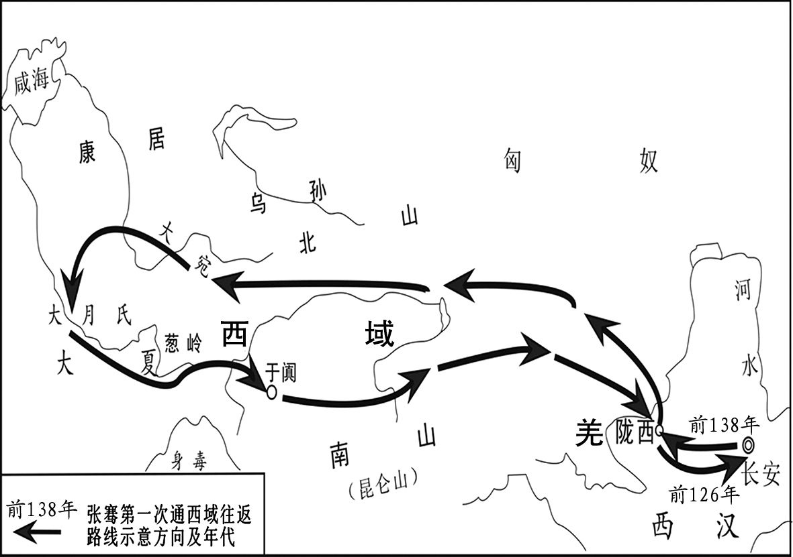
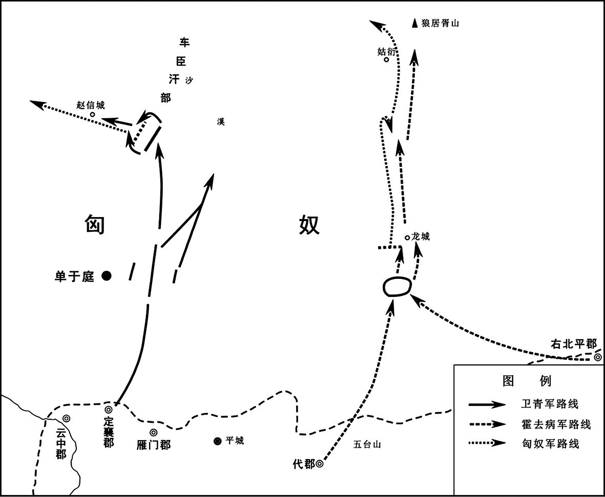
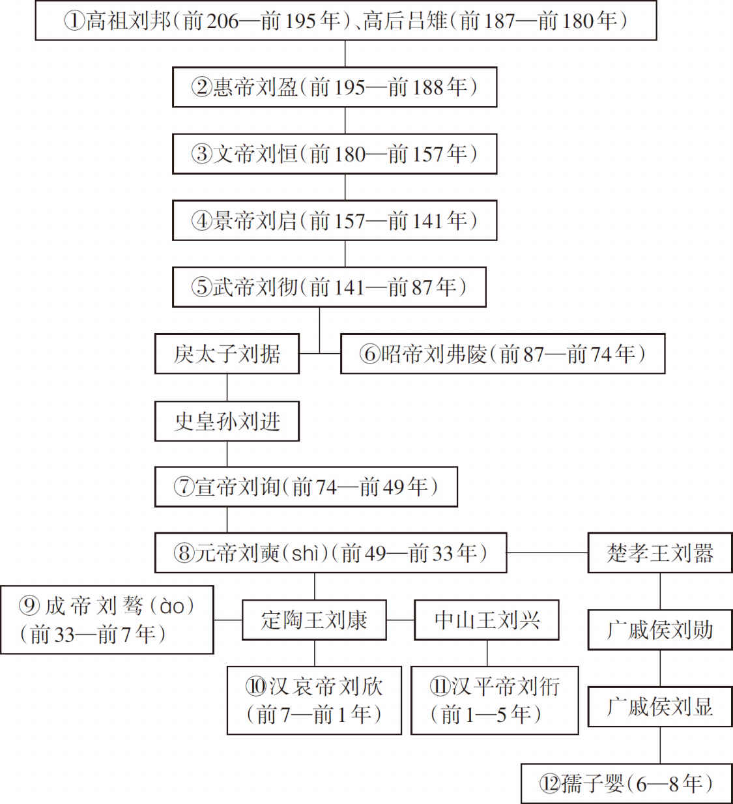

# 目录

汉通西南夷

淮南谋反

汉通西域

武帝伐匈奴

武帝平两越

武帝击朝鲜

武帝惑神怪

巫蛊之祸

燕盖谋逆

附录： 
西汉皇帝世系表

返回总目录

# 汉通西南夷

## 【内容提要】

本篇主要叙述了汉朝廷打通西南夷通道，设置机构、加强管理的历史过程。

汉代称我国西南地区语言不同、风格各异的民族为西南夷。他们大部分从事农耕，也有一部分过着游牧生活。春秋战国时期，他们与南方蛮越、中原华夏有了较多交往，秦统一后还在西南夷一些地方设置郡县，但是由于道路险远阻隔，仍然各不相往，到了汉朝才开始与西南夷接触。汉武帝派唐蒙进入夜郎，说服夜郎侯多同接受汉朝的管理，在夜郎及附近地区建置犍为郡。后又派司马相如持节出使西夷地区，邛都、筰都等国都请求臣服汉朝，废除边境关塞，汉朝边境便开始扩大。武帝在张骞出使西域后，有了开拓疆土的雄心，开始大力经营西南夷，终于打开通往西南夷的道路。

在打开西南夷通道的过程中，汉朝廷对西南夷治理采取以夷治夷、尊重当地风俗、不征收赋税等办法安定当地民众。汉朝廷派驰义侯准备攻打南越时，且兰酋长带兵发动叛乱，朝廷征调巴蜀罪犯及原准备进攻南越的八校尉兵，击杀了且兰酋长。汉朝廷又派将军郭昌征调巴郡和蜀郡军队，击灭劳深国和靡莫国。滇王举国投降，归服汉朝。汉朝在滇地设置益州郡，让滇王治理滇民。至此，汉朝击灭了南越和闽越两国，平定了西南夷，使汉朝疆土大为扩展，保持了当地民族的稳定。

在打通西南夷、保持通道畅通的过程中，汉朝运用政治经济手段与军事征服相结合策略，使汉朝天下实现有效统一。汉朝在平定西南夷后建立五个郡，派使者考察这五个郡通往大夏的道路，都被阻挡在昆明，遭滇人击杀。汉昭帝刘弗陵时期，益州郡夷人起来反叛，朝廷派吕破胡招募军队击败叛军。西南夷部分地区起兵反叛，朝廷派田广明征讨。田广明作战有功，被封为关内侯。

## 【原文】

**汉武帝元光五年[1]。初，王恢之讨东越也，使番阳令唐蒙风晓南越[2]。南越食蒙以蜀枸酱，蒙问所从来，曰：“道西北牂柯江[3]。牂柯江广数里，出番禺城下[4]。”蒙归至长安，问蜀贾人，贾人曰：“独蜀出枸酱，多持窃出市夜郎[5]。夜郎者，临牂柯江，江广百余步，足以行船。南越以财物役属夜郎，西至桐师，然亦不能臣使也[6]。”蒙乃上书说上曰：“南越王黄屋、左纛，地东西万余里，名为外臣，实一州主也[7]。今以长沙、豫章往，水道多绝，难行[8]。窃闻夜郎所有精兵，可得十余万，浮船牂柯江，出其不意，此制越一奇也[9]。诚以汉之强，巴、蜀之饶，通夜郎道，为置吏，甚易[10]。”上许之。乃拜蒙为中郎将，将千人，食重万余人，从巴、蜀筰关入，遂见夜郎侯多同[11]。蒙厚赐，喻以威德，约为置吏，使其子为令[12]。夜郎旁小邑，皆贪汉缯帛，以为汉道险，终不能有也，乃且听蒙约[13]。还报，上以为犍为郡[14]。发巴、蜀卒治道，自僰道指牂柯江[15]。作者数万人，士卒多物故，有逃亡者，用军兴法诛其渠率[16]。巴、蜀民大惊恐。上闻之，使司马相如责唐蒙等，因谕告巴、蜀民以非上意[17]。相如还报。**

## 【注文】

[1]汉：朝代名。分西汉和东汉。西汉（前202—公元8年），共历十三帝二百一十年，是继秦朝之后的统一的封建王朝。前202年刘邦称帝，建都长安，史称西汉，也称前汉。西汉至公元8年王莽篡位止。东汉（25—220年），共历十四帝一百九十六年。公元25年刘秀称帝，建都洛阳。因为在西汉旧都长安之东，故史称东汉，也称后汉。公元220年，汉献帝刘协禅让曹丕，东汉灭亡。　　武帝：即汉武帝刘彻（前156—前87年）。景帝子。颁行推恩令，使诸侯王藩国自析为侯国。设十三部刺史，制订左官律，重附益之法，加强对地方的控制。接受董仲舒“独尊儒术”的建议，以其作为巩固中央集权的工具。对商人征收资产税，将冶铁、煮盐、铸钱收归官营，实行均输平准，由政府直接经营运输和贸易。又治理黄河，兴修水利，发展农业生产。曾派张骞两次出使西域，在西南地区设置郡县，并灭南越、东瓯等割据政权，多次派卫青、霍去病率兵进击匈奴，加强了封建国家的统一。由于不断用兵，赋役繁重，晚年各地曾爆发农民起义，被迫再行“与民休息”政策。　　元光：西汉武帝刘彻在位期间所用的年号。共计六年，即公元前134年至前129年。元光五年，即公元前130年。

[2]王恢（？—前133年）：西汉燕人。初为边吏，武帝时任大行。前135年，闽越与南越相攻，他与大农令韩安国率兵赴救，未至越，越杀其王降汉。后匈奴来请和亲，武帝令群臣讨论，他力主用武力进击匈奴贵族。元光二年（前133年），马邑人聂壹建议趁汉匈新和亲设伏诱歼匈奴贵族，他又坚决主张出击。武帝以三十万人诱击匈奴单于，他奉命率兵主击辎重，因违犯军令，自杀而死。　　东越：古族名。百越的一支。包括东瓯与闽越。东瓯分布在今浙江南部瓯江流域一带，闽越主要在福建。秦末，东越族佐诸侯灭秦。汉武帝元鼎六年（前111年）东越王余善反汉失败，部分族人被迫迁入江淮地区，后逐渐融入华夏族中。　　番（pó）阳：县名。秦置番县，西汉改称番阳县。属豫章郡。在今江西鄱（pó）阳东北古县渡。后改为鄱阳。　　令：这里指县令，官名。简称令。为县级行政机构长官。战国时韩、赵、魏和秦、齐等国已称令。　　唐蒙（生卒年不详）：西汉人。武帝时任番阳令。曾受命出使南粤，得知蜀产枸酱多出市夜郎，遂上书建议开通夜郎道。不久拜中郎将，使夜郎，招致夜郎侯多同及旁小邑归汉。汉于其地置犍为郡，并开辟自僰道至牂柯江道路。　　风晓：示意，委婉含蓄地告知。　　南越（前203—前111年）：西汉前期割据政权。秦朝末年，南海郡尉赵佗起兵建国，建都番（pān）禺（yú）（今广东广州）。前196年，赵佗向西汉称臣。后与西汉交恶，赵佗开始称帝。前179年赵佗再次向汉文帝称臣。前112年，西汉汉武帝出兵讨伐南越国，次年南越灭亡。南越国共存在九十三年，历五君，疆域包括今广东、广西的大部分地区，福建的一小部分地区，海南、香港、澳门和越南北部、中部的大部分地区。也为古族名，又称南粤，百越的一支。分布在今湖南南部、两广及越南北部一带，秦于其地置南海、象、桂林三郡。

[3]食（sì）：通“饲”。给人吃。　　蜀：即蜀郡。战国秦昭襄王时置，治所在成都县（今四川成都）。辖境约当今四川岷江流域、沱江中上游、涪江中游和大渡河下游地区。高祖时分巴、蜀两郡置广汉郡，辖境缩小。仅有今成都市以西，松潘县以南，汉源、九龙县以北，康定县以东地区。　　枸（jǔ）酱：即蒟（jǔ）酱。一种用胡椒科植物做的酱，味辛而香。　　牂（zāng）柯江：古水名。又作牂柯水。一说即今北盘江，一说即今都江。此外又有今蒙江（源出贵州惠水西北，南流合红水河）、沅江、乌江等说。

[4]广：指面积、范围宽阔，与“狭”相对。　　番禺城：南越赵佗都城。在今广东广州市内，为秦、汉时期广州城的正式名称。始建于秦始皇时期，西汉时南越王赵佗扩建。

[5]长安：古都名。西汉高帝五年（前202年）置县，治今陕西西安西北，高帝七年（前200年）定都于此，即汉长安城。西汉以后，新莽、东汉献帝初、西晋愍帝、前赵、前秦、后秦、西魏、北周、隋初等相继以此为都。隋开皇二年（582年）隋文帝杨坚下令在汉长安城东南营建新都，定名大兴城，次年迁都于此，一般仍称为长安，即今陕西西安。唐代沿用，改称长安，此即隋唐长安城。　　贾（gǔ）人：古指设肆售货的商人。　　独：唯独，仅仅。　　市：售卖。　　夜郎：古族、国名。战国至汉时，主要在今贵州西部及北部，并包括云南东北、四川南部及广西北部部分地区。汉初与南越、巴、蜀有贸易关系。汉武帝元鼎六年（前111年）于其地置牂柯郡。

[6]役属：臣属并供役使。　　桐师：也作同师。古地名。在今云南西部澜沧江与怒江之间。

[7]上书：向君主进呈书面意见。　　说（shuì）：用话劝说别人使其听自己的意见。　　黄屋：古代帝王所乘车上以黄缯为里的车盖。指帝王车。　　左纛（dào）：古代皇帝乘舆上的饰物，以牦牛尾或雉尾制成，设在车衡左边或左（fēi，在两旁驾车的马）上。　　州：行政区名。先秦时即有州之称，汉武帝于元封五年（前106年）置十三州，即十三个监察区，州设刺史。另在三辅（京兆、右扶风、左冯翔）、三河（河内、河南、河东）、弘农七个郡设司隶校尉部，与州同级，合称为十四部州。东汉时州已成为一级行政区划，下辖若干郡，形成州、郡、县三级制。魏晋南北朝时沿用，州的数目大为增加，但辖境则大都缩小。隋初废郡，州直接辖县。隋炀帝杨广时又废州，采用郡县二级制。唐初改郡为州，唐天宝初再度用郡制，不久即恢复州。之后不再设郡，州成为县上一级的行政区。明清时期，直属于布政使司称直隶州、直辖县；隶属于府的州，称属州，地位则相当于县。

[8]长沙：郡、国名。战国时秦王嬴政二十四年（前223年）始置郡，治临湘（今湖南长沙）。西汉高帝五年（前202年）改为国，封吴芮为长沙王。仍治临湘，辖境相当于今湖南省全部、湖北省南境小部、广西壮族自治区东北小部和广东省阳山、英德以北部分及江西省西境一部。东汉复为郡。隋开皇中废。　　豫章：即豫章郡。西汉高帝六年（前201年）分九江郡置，治所在南昌县（今江西南昌东）。　　绝：断，断绝。

[9]窃：私下；私自。多用作谦辞。　　闻：听说；知道。　　精兵：训练精良的部队。　　可：大约。　　出其不意：趁对方没有意料到就采取行动。其，对方；不意，没有料到。语出《孙子·计篇》：“攻其无备，出其不意。”

[10]巴：即巴郡。秦惠文王时灭巴国置，治所在江州县（今重庆江北区），辖境相当今四川阆（làng）中、南充、泸州等以东，重庆奉节以西，綦（qí）江、武隆以北地区。西汉初略大，西汉高祖时分巴、蜀两郡置广汉郡，辖境缩小。　　饶（ráo）：富足，多。

[11]拜：授予官职；任命。　　中郎将：官名。秦代置，为中郎长官，隶郎中令。西汉沿置，掌宫禁宿卫，随行护驾，佐郎中令（光禄勋）考核选拔郎官，亦常奉诏出使。后专设五官，左、右中郎将分领中郎、谒者、常侍侍郎。期门（虎贲）、羽林郎亦专设中郎将统领。　　将：带领。　　筰（zuó）关：筰通“笮”。即笮关，也作符关、苻关。西汉置，即今四川合江县。　　侯：古爵位名。为五等爵的第二等。据《礼记·王制》：“王者之制禄爵，公、侯、伯、子、男，凡五等。”　　多同（生卒年不详）：古夜郎侯。西汉时武帝拜唐蒙为中郎将率众万余人运口粮辎重自巴符（筰）关（今四川合江南）进入夜郎，给予厚赐，“约为置吏，使其子为令”。汉便在夜郎置犍为郡。

[12]喻：晓喻；开导。　　威德：指威势和德政，刑罚和恩赏。

[13]邑：泛指一般城镇。大称都，小称邑。　　且：暂且，姑且。

[14]犍（qiān）为：郡名。汉武帝建元六年（前135年）置，治鄨（今贵州遵义）。西汉元光五年（前130年），移治南广县（今四川筠连）。汉昭帝始元元年（前86年），再迁治僰道城（今四川宜宾）。

[15]僰（bó）道：古县名。汉置。治所在今四川宜宾。僰本为古族名。为羌之别种，今之白族；一说为摆夷，今之傣族。秦汉时活动于犍为郡僰道县（今四川宜宾）。　　指：通往。

[16]物故：亡故，去世。　　军兴法：汉代军法的一种。为进行战争而征调人力、物资的有关法令。　　诛：把罪人杀死。　　渠率：亦作“渠帅”。首领。旧时统治阶级称武装反抗者的首领或部落酋长。

[17]司马相如（前179—前117年）：西汉文学家。蜀郡成都（今四川成都）人。景帝时为武骑常侍，因病免。客游于梁。工辞赋。所作《子虚赋》为武帝所赏识，因得召见，又作《上林赋》，武帝用为郎。曾奉使西南，后为孝文园令。见武帝好神仙之术，作《大人赋》。原有集已散佚，后人辑有《司马文园集》。　　谕（yù）：旧指上对下的文告、指示。又特指皇帝的诏令。

## 【译文】

汉武帝元光五年（前130年）。当初，王恢率领部队讨伐东越的时候，派遣番阳令唐蒙去南越王国说明出征的意图。南越人用蜀地出产的枸酱招待唐蒙，唐蒙问枸酱是从哪儿得来的，南越人说：“是从西北方牂柯江运来的。牂柯江数里宽，从番禺城下流过。”唐蒙回到长安，询问蜀地的商人，商人说：“只有蜀地出产枸酱，许多人偷着运到夜郎去卖。夜郎国靠近牂柯江，江宽一百多步，船足能行驶。南越人用财物迫使引诱夜郎归属，向西一直影响到桐师，然而却不能征服他们。”唐蒙便向汉武帝上书说：“南越王乘坐黄盖车，插着大旗，盘踞在长达万余里的地区，名义上是朝廷的外臣，实际上是一州之主。现在如果出兵从长沙国、豫章郡去征讨南越，水路多已断绝，难以行走。我听说夜郎国有精兵十多万人，可乘船顺牂柯江而下，出其不意，是制服南越的一个奇计。凭着汉朝的强大与巴、蜀的富饶，开通去夜郎的道路，在那里设置官吏，进行管理，很容易做到。”汉武帝采纳了唐蒙的建议。于是便任命唐蒙为中郎将，率领一千士兵，运输粮食和辎重的有一万多人，从巴、蜀两郡和笮关进入夜郎国，见到了夜郎侯多同。唐蒙赠送多同丰厚的礼物，让他知道汉朝的威势圣德，约定由朝廷在当地任命官吏，并让他的儿子为县令。夜郎国周围的小城邑，都贪图汉朝的缯帛，认为道路艰险，汉朝终究不会征服他们，所以暂且接受了唐蒙的约定。唐蒙回来上报朝廷，汉武帝在这个地区设置犍为郡。征发巴、蜀两郡的士兵修筑道路，自僰道通往牂柯江。参加修路的有数万人，士兵多因劳累而死，有的人逃跑了，唐蒙就用军法杀掉逃亡的首领。巴、蜀的百姓非常惊恐。汉武帝知道后，派司马相如前去责备唐蒙等人，并公开告知巴、蜀地区的百姓，这不是皇帝的本意。司马相如回朝廷奏报处置情况。

## 【原文】

**是时，邛、筰之君长，闻南夷与汉通，得赏赐多，多欲愿为内臣妾，请吏，比南夷[1]。天子问相如，相如曰：“邛、筰、冉、駹者近蜀，道亦易通[2]。秦时尝通为郡县，至汉兴而罢[3]。今诚复通，为置郡县，愈于南夷[4]。”天子以为然，乃拜相如为中郎将，建节往使，及副使王然于等乘传，因巴、蜀吏币物以赂西夷[5]。邛、筰、冉、駹、斯榆之君皆请为内臣，除边关[6]。关益斥，西至沫、若水，南至牂柯为徼，通零关道，桥孙水以通邛都[7]。为置一都尉，十余县，属蜀[8]。天子大说[9]。**

## 【注文】

[1]邛（qióng）、筰（zuó）：汉代西南少数民族名称。　　君长：指部族首领。　　南夷：南方的少数民族。　　通：通好。　　内臣妾：指所属臣下。

[2]天子：古代君权神授观念，认为帝王是上天之子，故称天子。　　冉（rǎn）、駹（máng）：汉代西南少数民族名称。

[3]秦：诸侯国名、朝代名。嬴姓。相传为伯益之后。因秦庄公子秦襄公护送周平王东迁雒邑（今河南洛阳）有功，被封为诸侯。战国时，为战国七雄之一。公元前221年，秦王嬴政统一六国，建立秦朝，定都咸阳（今陕西咸阳东北）。采取一系列措施巩固封建中央集权。派兵北逐匈奴，南平百越。将全国分为三十六郡，后增至四十余郡，为中国历史上第一个统一的多民族封建专制主义中央集权国家。秦朝赋役繁重，刑法严酷。秦二世胡亥即位后，社会矛盾进一步激化。陈胜、吴广领导农民起义。全国各地响应，反秦武装风起云涌。后赵高胁迫胡亥自杀，立公子婴为秦王。公元前206年，刘邦率起义军进抵灞上，子婴投降，秦朝灭亡。　　尝：曾经。　　郡县：是春秋、战国到秦代逐渐形成的地方政权组织。春秋时，秦、晋、楚等国初在边地设县，后逐渐在内地推行。春秋末年以后，各国开始在边地设郡，面积较县为大。战国时在边郡分设县，逐渐形成县统于郡的两级制。　　罢：废除，取消。

[4]愈：胜过。

[5]节：即符节。古代门关出入所持的凭证，为节的一种，用竹或木制成。　　王然于（生卒年不详）：西汉官员。曾以副使身份出使西南夷。元狩元年（前122年），受命出使身毒（今印度半岛），至滇国，未能抵达。　　传（zhuàn）：驿站所备的车马。　　赂：行贿，用钱、物买通别人。　　西夷：指西南一带少数民族。

[6]斯榆：亦称斯叟、斯徙、斯揄。斯与叟同声，或即为叟人族称。始见《华阳国志》。汉晋时主要分布在邛都（今四川西昌一带）。西汉武帝时司马相如曾出使该地。后其地属越嶲郡。与地名楪榆音近，或即今云南大理。

[7]斥：开拓，扩展。　　沫：即沫水。即今四川大渡河。　　若水：古水名。即今四川雅砻（lóng）江、金沙江。　　徼（jiào）：边界。　　零关道：西汉武帝开。自今四川大渡河南沿安宁河通向西昌谷地。　　孙水：即今四川西昌西南之安宁河。　　邛都：即邛都县。西汉武帝时置，治今四川西昌，属蜀郡。

[8]都尉：官名。战国赵、魏、秦等国已置，地位略低于将军。秦、两汉也为高级武官，稍低于校尉，或冠以骁骑、车骑、军门、强弩、复土等名号，皆有事时临时设置，事毕即罢。

[9]说（yuè）：通“悦”。高兴，愉快。

## 【译文】

当时，邛人、筰人的部落酋长，听说南夷与汉朝通好，得到很多赏赐，多数人都愿做汉朝统治下的臣民，请求朝廷像南夷一样，在那里任命官吏。武帝询问司马相如，司马相如说：“邛、筰、冉、駹都靠近蜀郡，道路也容易开通。秦时曾开通，并设置郡县，到汉朝兴起后才撤销。现在若再开通，设置郡县，将要胜过南夷地区。”天子认为他说的有道理，便任命他为中郎将，持节与副使王然于等人乘坐驿车一同前往西夷，他们用巴、蜀两郡官府的金钱和财物送给西夷。于是邛、筰、冉、駹、斯榆的各酋长也都请求为汉朝的臣民，废除边塞的关隘。关塞开放，由此，汉朝的辖境向西到了沫水、若水，向南到牂柯江为界，又开通了零关道，在孙水上搭桥通向邛都，并在此设置一个都尉，附近的十多个县，都隶属于蜀郡。汉武帝很高兴疆土得到开拓。

## 【原文】

**是时，巴、蜀四郡凿山通西南夷道，千余里戍转相饷[1]。数岁，道不通，士罢饿离暑湿死者甚众，西南夷又数反，发兵兴击，费以巨万计，而无功[2]。上患之，诏使公孙弘视焉[3]。还奏事，盛毁西南夷无所用，上不听[4]。**

## 【注文】

[1]西南夷：西汉时，分布于今甘肃南部，四川西部、南部及云南、贵州一带少数民族的总称。主要有夜郎、靡莫、滇、邛都、嶲、昆明、筰都、冉駹、白马等。皆与巴国、蜀国有密切的经济文化联系。秦始皇统一六国后，经营西南夷，曾建郡县。西汉武帝时又先后建立越嶲、沈黎、汶山、犍为、牂柯、武都、益州等郡。　　戍转（shùzhuǎn）：军事运输。　　饷（xiǎng）：军粮。

[2]罢（pí）：古同“疲”。累。　　离：通“罹”（lí）。遭受。　　巨万：形容数目极大。

[3]患：担忧，忧虑。　　公孙弘（hóng）（前200—前121年）：西汉大臣。字季。菑川薛（今山东微山）人。狱吏出身。武帝初以贤良为博士。元朔时为丞相，封平津侯。治《春秋公羊传》善于援引经义，议论政治，深得武帝信任。

[4]盛：极力。　　毁：诋毁。诽谤，说别人的坏话。

## 【译文】

这个时候，巴、蜀等四郡凿山开道，打通通往西南夷的道路，千余里外转运粮饷。经过几年的努力，道路仍然不通，修路的士兵们疲惫饥饿、遭受暑热潮湿的侵袭，死亡的人很多，西南夷又数次反叛，朝廷调动军队去进攻，耗费的财力以巨万计，却没见到功效。汉武帝很担心，命令公孙弘前去视察。公孙弘回来后奏报情况，极力诋毁开通西南夷，认为没什么用处，汉武帝不信他的话。

## 【原文】

**元朔三年冬，以公孙弘为御史大夫[1]。是时方通西南夷，东置苍海，北筑朔方之郡[2]。公孙弘数谏，以为罢敝中国以奉无用之地，愿罢之[3]。天子使朱买臣等难以置朔方之便，发十策，弘不得一[4]。弘乃谢曰：“山东鄙人，不知其便若是[5]。愿罢西南夷、苍海，而专奉朔方。”上乃许之。春，罢苍海郡。**

## 【注文】

[1]元朔：西汉武帝刘彻在位期间所用的年号。共计六年，即公元前128年至前123年。元朔三年，即公元前126年。　　御史大夫：官名。秦汉时期仅次于丞相的中央最高长官，主要职务为监察、执法，兼掌重要文书图籍。西汉时丞相缺位，往往以御史大夫递补，并与丞相（大司徒）、太尉（大司马）合称三公。后改名为大司空、司空。

[2]方：刚刚。　　苍海：即苍海郡。西汉武帝时置，治所在今朝鲜江源道境内，确址无考，元朔三年春废。　　朔（shuò）方：即朔方郡。西汉元朔二年（前127年）置。治朔方（今内蒙古杭锦旗北）。辖境约今内蒙古自治区河套西北部及后套地区。东汉移治临戎（今内蒙古磴口北）。东汉末废。

[3]谏（jiàn）：规劝君主或尊长，使改正错误。　　罢（pí）敝：困乏，劳累。又作“疲敝”、“疲弊”。　　中国：指中原地区。　　奉：供养，伺候。　　罢：停止。

[4]朱买臣（？—前115年）：西汉吴县（今江苏苏州）人，武帝时，为会稽太守，与横海将军韩说等击破东越首领的叛乱。曾官主爵都尉，后被杀。　　难（nàn）：诘责，质问。

[5]谢：认错，道歉。　　山东：即指崤（xiáo）山以东，或华山以东地区，又称关东。亦指战国时秦以外的六国。崤山，在今山西浑源县西北二十里。　　鄙人：指居住在郊野的人。

## 【译文】

汉武帝元朔三年（前126年），冬季，汉武帝任命公孙弘为御史大夫。这个时候，朝廷刚开通西南夷，在东方设置苍海郡，在北方修建朔方郡。公孙弘数次进谏，认为是以中原的疲敝不堪为代价，去开辟无用之地，请求停下来。汉武帝通过朱买臣等人以设置朔方郡的十项好处，对公孙弘进行反驳，公孙弘一个也无法回答。公孙弘于是请罪说：“我是崤山以东的郊野之人，不知道设立朔方郡竟有这样多的便利。请求放弃对西南夷、苍海地区的经营，集中力量去经营朔方郡。”汉武帝允许了他的要求。春季，下令撤销了苍海郡。

## 【原文】

**秋，罢西夷，独置南夷、夜郎两县、一都尉，稍令犍为自葆就，专力城朔方[1]。**

## 【注文】

[1]葆：通“保”。

## 【译文】

秋季，朝廷停止了对西南夷的经营，只设置南夷、夜郎两个县及一个都尉，稍后又命令犍为郡自守保护，集中全力修筑朔方郡城。

## 【原文】

**元狩元年[1]。初，张骞自月氏还，为天子言身毒国去蜀不远[2]。天子欣然，令骞因蜀、犍为发间使王然于等四道并出，出駹，出冉，出徙，出邛、僰，指求身毒国，各行一二千里，其北方闭氐、筰，南方闭嶲、昆明[3]。昆明之属无君长，善寇盗，辄杀略汉使，终莫得通[4]。于是汉以求身毒道，始通滇国[5]。滇王当羌谓汉使者曰：“汉孰与我大[6]？”及夜郎侯亦然。以道不通，故各自以为一州主，不知汉广大。使者还，因盛言滇大国，足事亲附[7]。天子注意焉，乃复事西南夷。**

## 【注文】

[1]元狩（shòu）：西汉武帝刘彻在位期间所使用的年号。共计六年，即公元前122年至前117年。元狩元年，即公元前122年。

[2]张骞（qiān）（？—前114年）：西汉外交家。汉中成固（今陕西城固东）人。建元二年（前139年），奉武帝命出使大月氏，以相约夹攻匈奴。他越葱岭，亲历大月氏、大宛、康居和大夏等中亚国家。途中两次被匈奴拘留，积十一年。元朔三年（前126年）脱身归汉。后又奉命出使乌孙，分遣副使至大宛、康居、大夏、月氏等地。与中亚各国正式通好，对促进中外经济文化交流做出重要贡献。封博望侯。　　月氏（Yuèzhī或Ròuzhī）：“氏”一作“支”。古族名。秦汉之际，游牧于敦煌、祁连间。汉文帝前元三至四年（前177—前176年）间，遭匈奴攻击，大部分人西迁塞种地区（今新疆西部伊利河流域及其迤西一带）。西迁的月氏人称大月氏。少数没有西迁的人入南山（今祁连山），与羌人杂居，称小月氏。　　身（yuān）毒国：南亚古国名。一般认为在北印度。译自梵文Sindhu，亦讹作天竺等。张骞首次西使抵大夏时，见蜀布与邛竹杖，当地人言贩自身毒。张骞便劝武帝重开西南夷。身毒有别国数十，别城数百，城置长，国置王。具以身毒为名。后月氏（即贵霜）杀王置将，统治其人。　　去：距离。

[3]欣然：非常愉快地，自然地（指表情上的）。　　因：依靠，凭借。　　徙：汉代西南少数民族名。　　闭：堵住，阻塞不通。　　氐（dī）：中国西北古代民族。多数人认为氐、羌同源而异派。商周时，氐人已分布在今甘肃、陕西、四川等省的邻接地带，从事畜牧业和农业。部落支系繁多。西汉初叶，氐人各部已“自有君长”，其社会阶级分化汉以前已存在。汉武帝元鼎六年（前111年）灭氐王，置武都郡，为氐地设郡县之始。汉至三国，氐人不断内迁。两晋、十六国时，氐人曾建立“仇池”、“前秦”、“后凉”政权。魏晋以后氐人在与汉族的频繁接触中转习农耕，最终融于汉族。　　嶲（xī）：也称“巂”。西南地区古族名。　　昆明：古族名。源出氐羌。两汉至唐分布在今云南西部、中部、贵州西部和四川西南部。

[4]寇盗：侵扰劫掠。　　辄（zhé）：总是，就。　　略：掠夺。

[5]滇（diān）国：古国名。在今云南省东部滇池附近地区。战国末期，楚将庄蹻至其地称滇王。从事农、牧、渔、纺织，并经营采矿。西汉武帝时，滇王曾协助汉使探求通往今印度的道路。后汉于此置益州郡。

[6]当羌（qiāng）：人名。滇国国王。生平事迹不详。

[7]盛言：极力申说。　　事：侍奉；供奉。　　亲附：亲近依附。

## 【译文】

汉武帝元狩元年（前122年）。当初，张骞从月氏回到汉朝后，对天子说身毒国离蜀地不远。天子很高兴，命令张骞借助蜀郡、犍为郡，派使者王然于等人由駹、冉、徙与邛、僰间四道出发寻找身毒国，他们各向西行进一二千里之后，北面被氐、筰等族阻挡，南面被阻于嶲、昆明。昆明地区没有统一的酋长，善于抢夺掳掠，经常劫杀汉朝的使者，因此，始终无法通过此地。这次，汉朝使者为了探寻身毒国的通道，才开通了滇国。滇王当羌问汉朝的使者说：“汉朝与我滇国相比谁大？”夜郎侯也提同样的问题。因道路不通，他们都各据一方为王，不知道汉朝地域的广大。使者回来后，都极力夸滇国是个大国，值得使他归附。天子关注，于是又重新开始经营西南夷地区。

## 【原文】

**三年秋，上将讨昆明，以昆明有滇池方三百里，乃作昆明池，以习水战[1]。是时法既益严，吏多废免[2]。兵革数动，民多买复及五大夫，征发之士益鲜[3]。于是除千夫、五大夫为吏，不欲者出马[4]。以故吏弄法，皆谪令伐棘上林，穿昆明池[5]。**

## 【注文】

[1]滇池：古称大泽、滇池泽。滇与“甸”同音，系古代彝民所指“坝子”，意“坝子中的湖泊”。又称昆明湖、昆明池。在云南昆明西南郊。　　昆明池：湖沼名。汉武帝元狩三年在长安西南郊（位于今陕西西安长安区）所凿，以习水战。宋以后湮没。　　习：训练。

[2]既：已经。　　益：更加。

[3]兵革：指战争。　　复：免除徭役。　　五大夫：爵名。战国秦置，为二十等爵第九级，秦、汉因之。秦代可为官长、将帅，赐邑三百户。西汉初仍得食邑。惠帝时，爵五大夫以上才得免一人徭役。除以军功赐爵外，平民入粟也可为五大夫。

[4]除：任命官职。　　千夫：爵名。武功爵第七级。汉武帝时以军国用不足，故置武功爵，令民得以钱谷买之，其高爵得补吏、免役。

[5]弄法：不尊重法律、玩弄法律的行为。　　谪（zhé）令：谪，贬谪。令，命令。意为贬责命令做某事。　　上林：即上林苑。秦都咸阳时置，在今陕西西安市西，渭水以南、终南山以北。秦惠文王时即开始兴建。至秦始皇时，先后在上林苑中修建了朝宫和宏伟壮丽的阿房宫前殿，还修建了大量的离宫别馆。西汉初荒废。武帝时复加拓展，周围扩至二百余里。　　穿：挖掘。

## 【译文】

汉武帝元狩三年（前120年），秋季，汉武帝准备讨伐昆明地区，因昆明有方圆三百里的滇池，所以挖昆明池，用来练习水上作战。这时候，法令越加严苛，许多官吏被免。战事经常发生，但百姓多能买到五大夫的爵位以免除徭役，所以官府能征发服徭役的人日益减少。于是，朝廷便任命千夫、五大夫爵位的人为官吏，不愿出任的缴纳马匹。凡是官吏弄权玩法的，都被发配去上林苑砍伐荆棘，挖掘昆明池。

## 【原文】

**元鼎六年冬，驰义侯发南夷兵欲以击南越[1]。且兰君恐远行，旁国虏其老弱，乃与其众反，杀使者及犍为太守[2]。汉乃发巴、蜀罪人尝击南越者八校尉，遣中郎将郭昌、卫广将而击之，诛且兰及邛君、筰侯，遂平南夷，为牂柯郡[3]。夜郎侯始倚南越，南越已灭，夜郎遂入朝，上以为夜郎王[4]。**

## 【注文】

[1]元鼎：西汉武帝刘彻在位期间所使用的年号。共计六年，即公元前116年至前111年。元鼎六年，即公元前111年。　　驰义侯：西汉所封侯爵。越人。其名不详。

[2]且（jū）兰：战国至汉初古国。在今贵州都匀、福泉、黄平、贵定等市、县一带。　　太守：又称郡守。官职名。战国时期，各诸侯国在边地置郡，其长官称守，尊称为太守。秦始皇统一六国后，推行郡县制，每郡置郡守，为郡的最高行政长官，秩二千石。汉景帝刘启时更名为太守，为一郡之最高行政长官。隋初，废州存郡，以刺史为郡的长官。宋以后，改郡为府、州，郡守不再是正式官名，但习惯上仍称知府、知州为太守。明清专指知府。

[3]校尉：官名。秦汉为统兵武官，略次于将军，高于都尉。出征时临时任命，领一校（营）兵，有司马、候等属官。抑或冠以名号，如横海校尉、轻骑校尉等。又有常设的专职校尉，依其具体职务冠以名号，如统领常备军的中垒、屯骑等北军诸校尉及西园八校尉，管理京畿的司隶校尉，管理京师门卫的城门校尉等，西汉秩二千石。　　郭昌（生卒年不详）：西汉云中（治所在今内蒙古托克托东北）人。武帝时，以校尉从大将军卫青出击匈奴。后以太中大夫为拔胡将军，屯朔方。后因击西南夷昆明无功，夺印。　　卫广（生卒年不详）：西汉将领。曾参与攻打且兰国。元封二年（前109年）受命与将军郭昌等发巴、蜀兵击灭劳深、靡莫，兵临滇地，滇王举国降。

[4]倚：仗恃。

## 【译文】

汉武帝元鼎六年（前111年），冬季，驰义侯征发南夷兵，准备去攻打南越。且兰的国君担心军队远行，邻国会趁机掳掠本国的老弱妇孺，于是带领部众反叛，杀了汉朝的使臣和犍为郡的太守。汉朝便征调应去攻打南越由巴、蜀罪犯组成的八校尉士兵，派中郎将郭昌、卫广率领他们去攻打且兰国，杀了且兰的酋长及邛君、筰侯，平定了南夷，设牂柯郡。夜郎侯起初依附于南越国，南越国被歼灭后，夜郎侯便入汉廷朝见，汉武帝封他为夜郎王。

## 【原文】

**冉、駹皆振恐，请臣，置吏。乃以邛都为越嶲郡，筰都为沈黎郡，冉、駹为汶山郡，广汉西白马为武都郡[1]。**

## 【注文】

[1]越嶲郡：汉武帝元鼎六年（前111年）置。治邛都（今四川西昌）。王莽时改为集嶲。　　筰（zuó）都：西汉初西南夷国。都于筰都（今四川汉源东北）。辖境相当于今四川汉源、石棉、泸定、荥经等县地。　　沈黎郡：汉武帝元鼎六年（前111年）汉灭南越，西南夷诸部请求内附，于是以筰都为治所，置沈黎郡。后废。　　汶山郡：西汉武帝时置，治所在汶江县（今四川茂县北）。辖境相当于今四川黑水县、邛崃山以东，岷山以南，北川、都江堰以西地区。地节三年（前67年）并入蜀郡。　　广汉：郡名。汉高帝六年（前201年）分巴、蜀二郡置。治所在梓潼（今四川梓潼）。　　白马：即白马氐。古族名。氐人的一支。汉代居住在白马水（今甘肃汶县西北）一带，因水得名。以畜牧为业。西汉时在该地设武都郡。治所在武都县（今甘肃西和县南仇池山东麓）。辖境相当于今甘肃武都、成县、徽县、西和、两当、康县及陕西凤县、略阳等县地。　　武都郡：汉武帝元鼎六年（前111年）以氐人之地置。白马氐为其中最大的一部。治所在武都道（今甘肃礼县）。王莽时改为乐平郡。

## 【译文】

这时，冉、駹等部族都震惊恐惧，请求归属汉朝，要求朝廷设置官吏管理。于是，汉武帝下令在邛都设置越嶲郡，在筰都设置沈黎郡，在冉、駹设置汶山郡，在广汉以西的白马地区设置武都郡。

## 【原文】

**元封二年[1]。初，上使王然于以越破及诛南夷兵威风喻滇王入朝[2]。滇王者，其众数万人，其旁东北有劳深、靡莫，皆同姓相杖，未肯听[3]。劳深、靡莫数侵犯使者吏卒。于是上遣将军郭昌、中郎将卫广发巴、蜀兵击灭劳深、靡莫，以兵临滇[4]。滇王举国降，请置吏，入朝。于是以为益州郡，赐滇王王印，复长其民[5]。是时，汉灭两越，平西南夷，置初郡十七，且以其故俗治，毋赋税[6]。南阳、汉中以往郡，各以地比，给初郡吏卒奉食、币物、传车、马被具[7]。而初郡时时小反，杀吏，汉发南方吏卒往诛之，间岁万余人，费皆仰给大农[8]。大农以均输、调盐铁助赋，故能赡之[9]。然兵所过县，为以訾给毋乏而已，不敢言擅赋法矣[10]。**

## 【注文】

[1]元封：西汉武帝刘彻在位期间所使用的年号。共计六年，即公元前110年至前105年。元封二年，即公元前109年。

[2]风（fěng）喻：也作“风谕”。以委婉的言辞劝告开导。

[3]劳深：亦称“劳浸”。中国古族名。汉代西南夷的一支。约活动于今云南东部至四川西南部。与靡莫同滇王皆同姓相仗，不听汉武帝要该部入朝的谕令。后被汉军击败，其属地并入益州郡。　　靡（mí）莫：中国古代西南民族。在夜郎以西、滇之东北。西汉时武帝发巴蜀兵击滇，先灭此部。其地汉晋时置牧靡县（一作收靡县），即今云南寻甸一带。

[4]将军：武官名。春秋时诸侯以卿统军，故称卿为将军。战国以后转为武官之称，加号极繁。如汉代有大将军，骠骑将军，车骑将军，卫将军，前、后、左、右将军以及楼船将军，材官将军，度辽将军等，多用以尊称。

[5]益州郡：西汉时置。治滇池（今云南晋宁东）。属益州。辖境相当于今中缅边界高黎贡山以东，云南洱海以西及姚安、元谋、昆明东川区等地以南，曲靖、宜良、华宁、蒙自等市县以西，哀牢山以北地。　　长：做长官，为首领。

[6]毋（wú）：勿、不要。

[7]南阳：即南阳郡。战国秦昭王时置，治所在宛县（今河南南阳）。汉辖境相当于今河南熊耳山以南叶县、内乡县间和湖北大洪山以北应山、郧（yún）县间地。　　汉中：即汉中郡。郡名。战国楚置，秦惠王又置。治所在南郑（今陕西汉中东）。西汉时曾移治西城（今陕西安康西北）。　　奉：送；给予，赐予。　　被（bèi）具：士卒所服用之具。

[8]间（jiàn）岁：隔一年，下一年。

[9]大农：官名。汉景帝时改秦代治粟内史为大农令，武帝改称大司农，为九卿之一。掌租税钱粮盐铁和国家财政收支。　　赡（shàn）：供给人财物。

[10]訾（zī）：通“赀”。钱财。

## 【译文】

汉武帝元封二年（前109年）。当初，汉武帝派王然于以击败南越和诛杀平定南夷的兵威，劝告滇国国王入朝称臣。滇王拥有部众数万人，在邻近的东北方有劳深、靡莫两国，与滇王同姓并相互支持，所以不肯听从汉朝的命令。劳深、靡莫两国多次侵扰汉朝的使者及官吏。于是汉武帝派遣将军郭昌、中郎将卫广，征调巴郡、蜀郡的兵力击灭了劳深、靡莫两国，兵临滇国。滇王举国投降，请求汉朝在此地设置官吏，入朝称臣。于是汉朝在滇国设益州郡，赐给滇王王印，令他治理滇地的百姓。这时，汉朝已灭掉了东、西两越，平定了西南夷的各族，增设十七个郡，而且按当地原民俗习惯进行治理，不征收赋税。南阳、汉中旧有的各郡，以各地距离的远近，为新设各郡的官吏士兵提供粮食、钱物、邮传车、马匹与配件用具。但是那些新设的郡，时有反叛发生，杀害官吏，汉朝廷调派南方郡县的官兵前往镇压，每年要出动一万多人，所需费用都仰仗大司农供给。大司农利用调节各地的物资和盐、铁专营的收入，以补充军赋的不足，所以能保证供应。然而部队所过的郡县官府供应的军需，只是不匮乏而已，不敢再擅自增加赋税了。

## 【原文】

**六年。汉既通西南夷，开五郡，欲地接以前通大夏，岁遣使十余辈出此初郡，皆闭昆明，为所杀，夺币物[1]。于是天子赦京师亡命，令从军，遣拔胡将军郭昌将以击之，斩首数十万[2]。后复遣使，竟不得通。**

## 【注文】

[1]五郡：此处指犍为、越嶲、沈黎、汶山、益州五郡。　　大夏：中亚古国。首都巴克特拉（今阿富汗巴尔赫）。大夏的原居民属东伊朗语族，公元前329年马其顿国王亚历山大征服此地后，即以巴克特拉为其东方领地的统治中心。塞琉西王朝统治中亚时，大批希腊人和马其顿人移居此地。公元前255年，巴克特里亚总督狄奥多图斯一世宣告独立，建立巴克特里亚王国。至公元前2世纪70年代时，巴克特里亚王国版图东起恒河中游流域，西达波斯沙漠，南抵孟买湾，北界锡尔河，势力鼎盛。后内部分裂，由盛转衰。公元前145年，巴克特里亚为大月氏人和部分塞种人所征服。

[2]赦（shè）：除去或减轻对罪犯的惩罚。　　京师：帝王的都城。　　拔胡将军：杂号将军名，西汉武帝置，掌率军征伐或驻守。

## 【译文】

汉武帝元封六年（前105年）。汉朝打通西南夷后，设置五个郡，希望在这一带寻找到与这五个郡相连接而直通到大夏国的道路，每年派十多批使者从新郡出发向前探险，但都被昆明阻挡，使者被杀，财物被抢夺。于是天子赦免京师的亡命之徒，命令他们从军，派遣拔胡将军郭昌率军去征讨昆明地区，杀了数十万人。以后又派遣使者，仍然不能通过此地。

## 【原文】

**昭帝始元元年夏，益州夷二十四邑三万余人皆反[1]。遣水衡都尉吕破胡募吏民及发犍为、蜀郡奔命往击，大破之[2]。**

## 【注文】

[1]昭帝：即汉昭帝刘弗陵（前94—前74年）。武帝少子，母为赵倢伃。即位时年仅八岁，霍光、上官桀、金日等受武帝遗诏辅政。即位后委政霍光。因海内虚耗，民生凋敝，故采取轻徭薄赋、与民休息的政策，屡次减免租赋，招抚流民。始元年间召集郡国贤良文学会议盐铁，旋罢榷（què）酤（gū）。又与匈奴恢复和亲。政治较为安定，社会经济有所恢复。　　始元：西汉昭帝刘弗陵在位期间所用的年号。共计六年七个月，即公元前86年至前80年。始元元年，即公元前86年。　　益州：参见前“益州郡”条注。

[2]水衡都尉：官名。汉武帝时始置，掌上林苑，兼保管皇室财物及铸钱。　　吕破胡（生卒年不详）：即吕辟胡，西汉官员。时为水衡都尉，曾率军击破西南夷反叛。　　奔命：不顾一切地拼命进行。　　破：打败，打垮。

## 【译文】

汉昭帝始元元年（前86年），夏季，益州郡的二十四个城邑共三万余人都起来反叛汉朝。朝廷派遣水衡都尉吕破胡招募官吏与百姓从军，并征调犍为郡、蜀郡的精勇壮年前去拼命征讨，击败了叛军。

## 【原文】

**四年。西南夷姑缯、叶榆复反[1]。遣水衡都尉吕辟胡将益州兵击之[2]。辟胡不进，蛮夷遂杀益州太守，乘胜与辟胡战，士战及溺死者四千余人[3]。冬，遣大鸿胪田广明击之[4]。**

## 【注文】

[1]姑缯（zēng）：古部落名。西汉时居益州郡（治今云南晋宁东北晋城镇）西部。汉昭帝时与廉头等部落起事，汉水衡都尉吕破胡率兵镇压，破之。据认为是滇西昆明族的一部分，约分布在今云南永胜至鹤庆一带。　　叶榆：古族名。汉代西南夷的一支。活动于益州郡（治今云南晋宁东，辖高黎贡山以东，云南洱海以西，姚安、元谋、东川以南，曲靖、宜良、华宁、蒙自以西和哀牢山以北）境内的叶渝河畔。曾归附西汉，以后复反叛，被平。

[2]吕辟胡（生卒年不详）：即吕破胡，参见前“吕破胡”条注。

[3]蛮夷：古代对边远地区少数民族的泛称。亦专指南方少数民族。

[4]大鸿胪（hónglú）：官名。为九卿之一。秦称典客，西汉景帝改名大行令，武帝太初元年（前104年）始为大鸿胪，秩中二千石。掌少数民族君长、诸侯王、列侯的迎送接待，安排朝会、封授、袭爵及夺爵削土之典礼；诸侯王死，则奉诏护理丧事，宣读诔（lěi）策谥号；百官朝会，掌赞襄引导；兼管京师郡国邸舍及郡国上计吏接待。成帝时，将典属国职掌并入本官，遂又兼管少数民族朝贡使节、侍子。有丞一员，属官有行人（大行）、译官、别火三令丞、郡邸长丞。　　田广明（？—前71年）：西汉臣。原为郎，昭帝时为司马，不久升南郡都尉、淮阳太守、鸿胪、左冯翊。昭帝时为御使大夫，封昌水侯。昭帝卒，议废昌邑王，立宣帝。后迁为祁连将军，击匈奴，军队如期不到达，当死，自杀，国除。

## 【译文】

汉昭帝始元四年（前83年）。西南夷中的姑缯、叶榆两部族再次反叛。汉朝廷派水衡都尉吕辟胡率领益州郡的部队前去攻打叛军。吕辟胡按兵不前，致使反叛的夷人杀掉益州郡太守，并乘胜与吕辟胡所率部队激战，汉军战死与溺水身亡的士卒达四千余人。冬季，朝廷派遣大鸿胪田广明率军前去征讨。

## 【原文】

**六年。诏以钩町侯毋波率其邑君长人民击反者有功，立以为钩町王，赐田广明爵关内侯[1]。**

## 【注文】

[1]钩町：县名。本西南夷地，汉武帝置县，属牂柯郡。虽置官吏，而仍以其君长为钩町侯，辖地在今云南广南。　　毋（wú）波：又作“亡波”。钩町首领。西汉元鼎六年（前111年），汉武帝征南中，毋波降汉，汉武帝封毋波为钩町侯。汉武帝刘彻去世后，西南部分地区反叛，西汉派军征讨，毋波率部配合，因功被汉昭帝封为王。　　关内侯：爵名。战国秦置，为二十等爵第十九级，位彻（通）侯下。秦汉沿置，因秦都咸阳，以关内为王畿，故名。但有侯号，居京师，无封土，依封户多少享受征收租税之权。关内：即关中，古地区名。秦都咸阳，汉都长安，因而称函谷关以西为关中，大体上相当于今陕西渭河流域。

## 【译文】

汉昭帝始元六年（前81年）。汉昭帝颁布诏书，由于钩町侯毋波率领其所属的部落首领与民众攻打叛军有功，封毋波为钩町王，赐田广明为关内侯。

# 淮南谋反

## 【内容提要】

本篇主要叙述了汉高祖刘邦大封同姓诸侯王后，淮南王谋反被平息的历史过程。

汉高祖刘邦平定天下后，大封同姓诸侯王，使他们的封地扩大，势力增强。他们中有人倚仗与皇帝的亲密关系和所处的地位与实力，蓄意谋反。汉文帝刘恒继皇帝位之后，淮南王刘长自认为与皇上最亲近，桀骜不驯，常违反朝廷法令跟随文帝外出打猎，与皇上同乘一车，以皇上大哥自称。他双手举鼎力大过人，为徇私情击杀审食其后，文帝念其为母亲复仇的孝心，赦免了他擅杀的罪过。刘长在封国更加骄纵，出入乘车，一切制度都效仿天子。刘长自制法令，通行其封国，驱除朝廷设置的官吏，自行设置丞相等高级官员，杀害无辜百姓，屡次上书言辞不恭，与柴奇谋划反叛，调用战车谋袭都城，通使匈奴和闽越两国谋取帮助。淮南王阴谋暴露后，汉文帝赦免刘长死罪，废黜王号，将其流放到蜀郡。淮南王在途中愤恨绝食而死。

汉文帝对淮南王刘长死亡深感悲痛，继续对淮南王儿子授予爵位。文帝封淮南王儿子刘安等四人为侯爵。贾谊预料汉文帝会再封他们为王，上书劝告文帝，封叛逆诸侯之子为王，是送给仇人危害国家的资本，不利于国家的稳定。汉文帝没有采纳贾谊的意见，后仍封刘长之子刘安为淮南王，刘赐为衡山王。

汉朝廷对淮南王父子仁至义尽，刘安却未吸取父王教训并收敛图谋，仍谋求反叛。早在吴楚七国发动叛乱时就蓄意起兵响应，只是由于丞相坚守才没有得逞。汉武帝因刘安是叔父辈，对他非常尊重，赐刘安几案和手杖，恩准他不必进京朝见。刘安不感恩戴德，反而变本加厉，在吴楚七国叛乱被平定的形势下，仍与他人谋划叛乱。当朝廷派使者逮捕淮南王太子刘迁时，淮南王准备杀死使者起兵，后被人告发。汉武帝命宗正官制裁淮南王刘安。宗正官未到达淮南，刘安已自刎而死。淮南王后荼、太子刘迁被诛杀，所有参与谋反的人一律屠灭九族。

## 【原文】

**汉文帝前三年[1]。初，赵王敖献美人于高祖，得幸，有娠[2]。及贯高事发，美人以坐系河内[3]。美人母弟赵兼，因辟阳侯审食其言吕后，吕后妒，弗肯白[4]。美人已生子，恚，即自杀[5]。吏奉其子诣上，上悔，名之曰长，令吕后母之，而葬其母真定[6]。后封长为淮南王[7]。**

## 【注文】

[1]文帝：即汉文帝刘恒（前202—前157年）。西汉皇帝。公元前180年至前157年在位。高祖子。高帝时立为代王。诸吕之乱平定后，被迎立为帝，继续推行与民休息政策，劝课农桑，减省租赋，废除收孥（nú）相坐律令，免官奴婢为庶人。又募民实边，令民得纳粟拜爵。为削弱诸侯王势力，分齐国和淮南国为小国。社会秩序相对稳定，经济得到恢复和发展，全国户口有所增长。后世史家将其与景帝统治时期并称为文景之治。庙号太宗。　　汉文帝前三年：即公元前177年。

[2]赵：西汉初年封国。秦末汉初，张耳参加起义军，项羽大封诸侯时，张耳被封为恒山王（后世为避汉文帝讳，恒山皆作常山），定都襄国（今河北邢台）。后张耳投归刘邦，被封为赵王。张耳去世，张敖袭爵赵王，后因事贬爵宣平侯。　　赵王敖（áo）：即赵王张敖（？—前182年）。西汉初人。张耳之子。秦末随父参加陈胜、吴广起义，封成都君。汉高祖时嗣爵为赵王，娶高祖长女鲁元公主。后在高祖过赵时，执子婿礼甚恭，反遭辱骂。赵相贯高等以此谋刺高祖，未遂，被牵连入狱。后因贯高极力辩白，得赦，尚鲁元公主如故，贬爵宣平侯。　　高祖：即汉高祖刘邦（前256—前195年）。西汉王朝的建立者。沛县人。曾任泗水亭长。秦二世时，陈胜起义，起兵响应，称沛公。初属项梁，后与项羽领导的起义军同为反秦主力，率军攻占咸阳，推翻秦朝统治，约法三章，废除秦的严刑苛法。在项羽大封诸侯王时，他被封为汉王，占有巴蜀、汉中之地。不久，即与项羽展开长达五年的战争。战胜项羽后，即皇帝位。在位期间，继承秦制，实行中央集权制度。先后消灭韩信、彭越等异姓诸侯王；迁六国旧贵族和地方豪强到关中，以加强控制；实行重本抑末政策，发展农业生产，打击商贾；以秦律为根据，制定《汉律》，使社会经济逐渐恢复，统一局面日趋巩固。　　幸：宠爱。　　有娠（shēn）：怀孕。

[3]贯高（？—前198年）：西汉初人。为赵王张耳客。后任赵相。以高祖过赵侮骂赵王张敖，乃图谋刺之。后事发，随王逮至长安。虽受酷刑，极力为王开脱。高祖感其至诚，乃赦王，欲任以官职，他以己实有谋弑之罪，自杀。　　坐：定罪，由……而获罪。　　系（xì）：拘禁。　　河内：即河内郡。西汉高帝二年（前205年）改殷国置，治所在怀县（今河南武陟西南）。辖境相当于今河南黄河以北，京汉铁路（包括卫辉市）以西地区。

[4]赵兼（生卒年不详）：淮南厉王刘长之舅。汉文帝时被封为周阳侯。后因罪国除。　　辟阳：县名。汉高帝六年（前201年）置，治今河北冀州。　　审食其（Shěnyìjī）（？—前177年）：秦末泗水沛县（今属江苏）人。二世时以舍人从刘邦起兵反秦。楚汉战争时，与刘邦父母及吕雉同为楚军所俘，以此得幸于吕雉。高帝时封辟阳侯。惠帝时，以行为不端，几被诛。高后元年（前187年），为左丞相，常监宫中，公卿皆因而决事。诸吕诛灭后，得以幸免。后为淮南王刘长所杀。　　吕后：即吕雉（zhì）（前241—前180年）。汉高祖皇后。名雉，字娥姁（xǔ）。楚汉战争初期为项羽所俘，后被释还。曾助刘邦剪除韩信、彭越等异姓诸侯王。后其子（惠帝）即位，她独揽大权，毒死赵王如意，残害戚夫人，惠帝死后，临朝称制，并分封诸吕为王侯，控制南北军，又以审食其为左丞相，掌握实权，公卿皆因而决事。她死后，诸吕阴谋作乱，为大臣周勃等平定。　　白：表明，说明。

[5]恚（huì）：恨，怒。

[6]诣（yì）：到，特指到尊长那里去。　　长：即淮南厉王刘长（约前198—前174年）。汉高祖少子，母为赵王张敖所献美人。汉高祖时立为淮南王。文帝即位，自以为最亲，骄奢僭越，称制，自作法令。又擅杀辟阳侯审食其。文帝令薄昭数谏之，不听。后企图谋反，事发，召至长安，废处蜀严道（今四川荥经）。于途中绝食而死。后追谥厉王。　　真定：县名。汉高祖改东垣县置。治所在今河北正定南。

[7]淮南：即淮南国。西汉高祖时以九江、衡山、庐江、豫章四郡置，治所在六县（今安徽六安），后徙治寿春县（今安徽寿县）。文帝时废。后以故淮南国九江郡复置。辖境相当于今安徽霍山、潜山以东的淮南（除天长县外）地区，河南东南角，湖北东部一小部分及江西省。元狩初国除为九江郡。

## 【译文】

汉文帝前元三年（前177年）。当初，赵王张敖向高祖献上一位美人，美人得宠幸怀孕。等到赵相贯高谋反被发觉，美人受株连被囚禁在河内。美人的弟弟赵兼，请辟阳侯审食其向吕后求情，吕后嫉妒美人，不愿为她说话。这时美人已生下儿子，心中感到愤恨，于是自杀身亡。官吏将美人的儿子送给高祖，高祖很后悔，为其取名刘长，命令吕后做他的母亲抚养他，将刘长的母亲葬在真定。后来，刘长被封为淮南王。

## 【原文】

**淮南王蚤失母，常附吕后，故孝惠、吕后时无患[1]。而常心怨辟阳侯，以为不强争之于吕后，使其母恨而死也。及帝即位，淮南王自以最亲，骄蹇，数不奉法，上常宽假之[2]。是岁入朝，从上入苑囿猎，与上同车，常谓上“大兄”[3]。王有材力，能扛鼎，乃往见辟阳侯，自袖铁椎椎辟阳侯，令从者魏敬刭之，驰走阙下，肉袒谢罪[4]。帝伤其志为亲故，赦弗治。当是时，薄太后及太子诸大臣皆惮淮南王，淮南王以此归国益骄恣，出入称警跸，称制，拟于天子[5]。袁盎谏曰：“诸侯太骄，必生患[6]。”上不听。**

## 【注文】

[1]蚤：通“早”。　　孝惠：即汉惠帝刘盈（前210—前188年）。西汉皇帝。公元前195年至前188年在位。高祖子。年六岁，立为太子。生性懦弱，刘邦晚年想将他废掉，另立赵王如意为太子，以大臣反对而罢。高祖十二年（前195年）即位，大权为吕后掌握。因对吕后毒死赵王和残害戚夫人不满，纵情酒色，不理朝政，忧郁病死。

[2]帝：此处指文帝刘恒。　　骄蹇（jiǎn）：傲慢、不顺从。　　奉法：奉行或遵守法令。　　宽假：宽恕，宽容。

[3]苑囿（yòu）：畜养禽兽的圈地。

[4]椎（chuí）：捶击具。　　魏敬（生卒年不详）：西汉人。淮南王刘长属下，受刘长令，砍下审食其头颅。　　刭（jǐng）：用刀割颈。　　驰走：快跑，疾驰。驰，快跑（多指车马）。　　阙下：宫阙之下。借指帝王所居的宫廷。　　肉袒（tǎn）：去衣露体。古时在祭祀或谢罪时表示恭敬或惶恐。　　谢罪：向人认错，请求原谅。

[5]薄太后：即薄氏（？—前155年）。吴郡吴县（今江苏苏州）人，汉高祖刘邦的嫔妃，其子即汉文帝刘恒。文帝即位后，尊为太后。太后：皇帝的母亲。　　太子：指被确定为继承王位的人，一般从帝王的儿子中选定。　　惮：怕，畏惧。　　骄恣（jiāozì）：亦作“骄姿”。骄傲放纵。　　警跸（bì）：警，警戒；跸，清道。谓皇帝出入经过的地方严加戒备，断绝行人。　　称制：代行皇帝的职权。

[6]袁盎（？—前148年）：西汉内史，安陵（今陕西咸阳东北）人。文帝时为郎中。见淮南王刘长擅杀辟阳侯审食其，恐诸侯王太骄生患，建议削地以弱其势。文帝不听。后刘长果以谋反获罪，迁蜀绝食而死。乃请立其三子为王，由此名重朝廷。历任陇西都尉、齐相、吴相。素与晁错交恶。景帝时，晁错为御史大夫，使吏案其受吴王财物事，遂被废为庶人。吴楚七国反，密劝景帝斩错以谢吴，后入吴，吴王刘濞欲杀之，得脱逃归。七国乱平，为楚相。后因事为梁孝王所怨，被刺死。　　诸侯：周代天子所封的各国国君的统称。周制，诸侯要服从王命，定期朝贡述职，并有出兵服役等义务，以屏藩王室。其所属上卿由天子任命。诸侯在封国内，政治、经济、军事等方面的独立性很大，并世袭其统治权。春秋时期其权力逐步为卿大夫取代。此后封建社会分封的王侯，也可泛称为诸侯王。

## 【译文】

淮南王刘长年幼丧母，一直依附于吕后，所以在汉惠帝、吕后临朝时平安无事。而他心里却怨恨辟阳侯，认为辟阳侯没有力争向吕后说情，才使他母亲含恨而死。到文帝即位，淮南王自以为与他最亲近而傲慢不顺从，数次违反法令，文帝经常宽恕他。这一年，淮南王入朝，随从文帝去苑囿打猎，与文帝同坐一辆车，常常称皇上为“大哥”。淮南王强壮有力，能举大鼎，他去拜见辟阳侯审食其，从自己的袖中掏出铁椎将辟阳侯击倒，命令随从魏敬砍下他的头，然后，跑到皇宫前，袒露胸背向皇上请罪。皇帝哀怜他为母亲复仇的孝心，没治他罪。当时，薄太后及太子和大臣们都害怕淮南王，自此淮南王回到封国后更加骄纵，出入称警跸，一切制度都仿照天子。袁盎劝告皇上说：“诸侯王过于骄纵，必生祸患。”皇上不听。

## 【原文】

**六年。淮南王长自作法令行于其国，逐汉所置吏，请自置相、二千石，帝曲意从之[1]。又擅刑杀不辜及爵人至关内侯[2]。数上书，不逊顺[3]。帝重自切责之，乃令薄昭与书风谕之，引管、蔡及代顷王、济北王兴居以为儆戒[4]。**

## 【注文】

[1]相：官职名，也称丞相、相国。为百官之长，系辅佐君主的最高官职。汉初先置丞相，后改为相国，各诸侯王国也设过相国，后改称为相。　　二千石（dàn）：官秩等级，因所得俸禄以米谷为准，故以“石”称之。汉代二千石为中央政府机构的太子太傅、太子少傅、将作大匠、詹事、水衡都尉、内史等列卿，以及州郡牧守、诸侯王国相一级官员。月俸谷一百二十斛，一年得谷一千四百四十斛。　　曲意：违反己意，去迁就他人。

[2]擅：超越职权，自作主张。　　不辜：无罪的人。

[3]逊顺：谦恭顺从。

[4]重：为难，难以。　　切责：严厉责备。切，言辞责备。　　薄昭（？—前170年）：西汉人。文帝生母薄太后之弟。汉高帝七年（前200年）为郎。从军十七年，后以中大夫迎文帝于代，迁车骑将军，封轵（zhǐ）侯。曾奉命予书谏劝淮南王刘长。文帝十年（前170年）坐杀使者，被勒令自杀。　　与：给，送。　　管：即管叔（生卒年不详）。管或作“关”，又称叔鲜。西周初三监之一。周文王之子，武王之弟。武王灭商后被封于管（今河南郑州），以监视武庚及殷遗民。武王死，成王年幼继位，周公代摄国政，同武庚作乱。周公东征，经三年乱平，被杀，一说自杀。　　蔡：周武王弟。姬姓，名度。武王灭商后，封其于蔡（今河南上蔡）。武王死后，成王即位。因成王年幼，由周公旦代为摄政，他与管叔联合纣王之子武庚发动叛乱。周公旦率师东征，经三年平定叛乱，将其放逐。　　代顷王：即刘仲（生卒年不详）。秦末沛县（今属江苏）人。刘邦之兄。汉朝建立，被立为代王。匈奴攻代，他不能坚守，弃国私逃，至洛阳。汉高祖不忍以法处治，废为合阳侯。后因儿子刘濞封王，被追谥为代顷王。　　济北：即济北国。西汉封置，治卢县（今山东济南长清区西南）。　　兴居：即济北王刘兴居（？—前177年）。西汉宗室。齐悼惠王刘肥之子。高后六年（前182年）封东牟侯，宿卫长安。高后死，与大臣诛灭诸吕，迎立代王为文帝。文帝二年（前178年）立为济北王。次年，趁文帝亲征匈奴，发兵谋反。兵败被俘，自杀，国除。　　儆（jǐng）戒：同“警戒”。告诫，使注意改正错误。

## 【译文】

汉文帝前元六年（前174年）。淮南王刘长自制法令，通行于封国，驱逐朝廷所设置的官员，请求由他自己设置丞相与二千石的官吏，皇帝违心地同意了他的要求。他又擅自刑杀无辜的人和擅自封赏爵位，最高封到关内侯。数次上书皇上，言辞都不谦逊恭顺。皇帝难以亲自严厉地责备他，便命令薄昭写信给他，婉言相劝，引用周初管叔、蔡叔和代顷王刘仲、济北王刘兴居被杀的事，请他警戒醒悟。

## 【原文】

**王不说，令大夫但、士伍开章等七十人，与棘蒲侯柴武、太子奇谋，以辇车四十乘反谷口，令人使闽越、匈奴[1]。**

## 【注文】

[1]大夫：官名。掌谏议、顾问。秦汉置太中大夫、中散大夫、光禄大夫、谏大夫等，皆无定员。侍奉皇帝左右，备咨询应对，谏诤议政，为皇帝的高级顾问。亦奉皇帝之命出使四方。地位尊崇，多由贵戚大臣、名儒或有军功者充任。西汉中期以后，渐成安排免职或不能任事官员的闲职，唯谏议大夫仍任谏官，金曾任谏院长官。　　但：人名。生平事迹不详。　　士伍：兵卒的行列。　　开章（生卒年不详）：淮南王刘长的谋士。事迹不详。　　棘蒲：县名，即平棘。西汉初置县，治今河北赵县。　　柴武（生卒年不详）：西汉大臣。一作陈武。初以将军身份在汉前率将三千五百人起事于薛，别救东阿，至霸上。后归汉，攻击齐历下军田既。高祖时参与垓下之战。后封棘蒲侯。文帝时为大将军，奉命率兵攻破济北王刘兴居。死后，谥号刚侯。　　太子奇：即西汉棘蒲侯柴武嗣子。其父死后，因嗣子谋反，国除。　　辇（niǎn）车：古代用人挽拉的辎重车。　　乘：古代称四匹马拉的车一辆为一乘。　　谷口：亦名“瓠（hù）口”。战国秦邑。在今陕西礼泉东北五十里。　　闽（mǐn）越：中国古代西南民族。古越族一支。秦汉时分布在今福建、浙江的部分地区。秦以其地为闽中郡。汉初首领无诸受封为闽越王。治所东冶（今福建福州）。后分为繇（yáo）和东越两部。汉武帝时东越王余善反抗汉朝统治失败，部分族人被迫迁入江淮地区。　　匈奴：中国古代北方民族。商朝时称鬼方，周朝时称玁，战国时始称匈奴，亦称胡。秦汉之际，匈奴国势强大。冒顿单于统一各部，势力强盛，统治了大漠南北广大地区。汉初，屡次南侵，逼迫汉朝实行消极的“和亲”政策。汉武帝时，屡为汉军所败，其势渐衰。汉宣帝时内讧，五单于分立。后呼韩邪单于附汉。

## 【译文】

淮南王接到薄昭的信，心里很不高兴，命令大夫但、士伍开章等七十人，与棘蒲侯柴武及太子柴奇谋划用辇车四十辆在谷口进行反叛，并派人与闽越、匈奴联络。

## 【原文】

**事觉，有司治之，使使召淮南王[1]。王至长安，丞相张苍、典客冯敬、行御史大夫事与宗正、廷尉奏长罪当弃市[2]。制曰：“其赦长死罪，废勿王，徙处蜀郡严道邛邮[3]。”尽诛所与谋者[4]。载长以辎车，令县以次传之[5]。**

## 【注文】

[1]有司：官吏。古代设官分职，各有专司，故称。

[2]丞相：官名。初置于战国时的秦悼王，为百官之首，亦称相邦（楚国称令尹）。秦代以后为国家官僚组织中的最高官职，帮助皇帝综理万机。汉初置相国，后复改丞相，与太尉、御史大夫合称三公。汉末改丞相为大司徒。　　张苍（？—前152年）：汉历算家。阳武（今河南原阳东南）人。秦时为御史。汉初，任代、赵相，封北平侯。迁为计相，以列侯居相府，主持郡国上计。后为丞相十余年，曾改定音律历法。年百余岁乃卒。　　典客：官名。汉沿秦置，主要职掌为接待少数民族等事。　　冯敬（生卒年不详）：西汉臣。文帝时任御史大夫、典客。齐太仓令淳于意之女上书后，文帝拟废除肉刑，他与丞相张苍为之制定具体法令，规定当黥者，髠钳为城旦舂；当劓者，笞三百；斩左趾者笞五百。结果犯罪被笞的人多被打死，外有轻刑之名，实际上被处死的人更多。　　宗正：官名。西周至战国已置，掌君主宗室亲族事务。秦、汉列位九卿，秩中二千石，例由宗室担任，管理皇族外戚事务，掌其名籍，分别嫡庶亲疏，编纂世系谱牒，参与审理诸侯王犯法案件。凡宗室亲贵有罪，须向其先请，方得处治。有丞，属官有都司空令丞、内官长丞及诸公主官属。汉平帝元始四年（4年）改名宗伯。　　廷尉：官名。战国时秦国始置，秦、西汉沿置，为九卿之一。掌刑狱，秦汉至北齐主管司法的最高官吏。汉景帝中元六年（前144年）改名大理，汉武帝建元四年（前137年）恢复旧称﹐汉哀帝元寿二年（前1年）又改为大理。新莽时改名作士﹐东汉时复称廷尉。汉末复为大理。属官有廷尉正和左、右监。汉宣帝时又增廷尉左、右平。　　弃市：古代在闹市执行死刑，并将尸体暴露于街头，称为弃市。语出《礼记·王制》。

[3]制：古代帝王的命令。　　徙：古代称流放的刑罚。　　严道：即严道县。秦置，属蜀郡。治所在今四川荥经西五里古城坪。一说即今荥经县。　　邛（qióng）邮：在今四川荥经西南大相岭。

[4]与（yù）谋：与，参加，参与。参与谋划。

[5]辎（zī）车：古代有帷盖的车子。　　以次：按次序。

## 【译文】

反叛的事被察觉，司法部门请求依法治罪，汉文帝派人召淮南王进京。淮南王到了长安，丞相张苍、典客冯敬、御史大夫与宗正、廷尉等上奏：“刘长当处死刑。”文帝命令：“赦免刘长的死罪，废除王号，把他流放到蜀郡严道的邛邮。”和他一起谋反的人全都处死。将刘长装进辎车，命令沿途各县依次传送。

## 【原文】

**袁盎谏曰：“上素骄淮南王，弗为置严傅、相，以故至此[1]。淮南王为人刚，今暴摧折之，臣恐卒逢雾露病死，陛下有杀弟之名，奈何？[2]”上曰：“吾特苦之耳，今复之。”淮南王果愤恚，不食死[3]。县传至雍，雍令发封，以死闻[4]。上哭甚悲，谓袁盎曰：“吾不听公言，卒亡淮南王。今为奈何？”盎曰：“独斩丞相御史以谢天下，乃可[5]。”上即令丞相、御史逮考诸县传送淮南王不发封馈侍者，皆弃市[6]。以列侯葬淮南王于雍，置守冢三十户[7]。**

## 【注文】

[1]素：平素，往常，旧时。　　傅：即太傅，官名。西汉诸侯国置，掌管辅导、监督国王。

[2]刚：倔强，固执。　　暴：急骤，猛烈。　　摧折：打倒。　　卒：最后。　　雾露：借指伤寒。

[3]愤恚：痛恨，怨恨。

[4]县传：驿传。也指驿站上所备的马匹车辆。此所用车为带帷盖的辎车。　　雍：即雍县。本春秋秦雍邑，秦德公至灵公时都于此，后为县。治今陕西凤翔西南之南古城。　　发：打开，开启。　　封：用加盖印章的纸条贴在门、箱或其他容器的口上以防开启。

[5]独：唯独，仅仅。　　御史：此处指御史大夫。

[6]馈（kuì）：进食于人。

[7]冢（zhǒng）：坟墓。

## 【译文】

袁盎劝告说：“皇上一向骄纵淮南王，不给他配置严厉的师傅和相，所以才到了这种地步。淮南王为人性情刚烈，现在这样猛烈地折磨他，我担心突然遭受风霜会生病死在途中，陛下将留下杀弟的罪名，该如何是好？”皇上说：“我只想让他吃点苦头而已，现在就召他回来。”淮南王果然怨恨绝食而死。辎车传送到雍县，雍县县令打开封闭的车，发现淮南王已经死了。上报朝廷，皇上哭得非常伤心，对袁盎说：“我没听你的话，最终使淮南王死了。如今该怎么办？”袁盎说：“只能斩了丞相和御史大夫向天下谢罪才行。”汉文帝立即命令丞相、御史大夫逮捕拷问沿路各县传送淮南王的官员，没有开启封门馈送食物的，将他们都处以死刑。以列侯的礼仪把淮南王埋葬在雍县，设置三十户百姓为他守墓。

## 【原文】

**七年。民有歌淮南王曰：“一尺布，尚可缝；一斗粟，尚可舂[1]。兄弟二人不相容。”帝闻而病之[2]。**

## 【注文】

[1]尚：还，仍然。　　粟：谷子，一年生草本植物，花小而密集，籽实去皮后就是小米。旧时泛称谷类。　　舂（chōng）：捣去皮壳或捣碎。

[2]病：忧虑，担心，不安。

## 【译文】

汉文帝前元七年（前173年）。民间传唱着关于淮南王的歌谣：“一尺布，尚可缝；一斗粟，尚可舂。兄弟二人不相容。”汉文帝听到后感到不安。

## 【原文】

**八年夏，封淮南厉王子安等四人为列侯[1]。贾谊知上必将复王之也，上疏谏曰：“淮南王之悖逆无道，天下孰不知其罪！陛下幸而赦迁之，自疾而死，天下孰以王死之不当！今奉尊罪人之子，适足以负谤于天下耳[2]。此人少壮，岂能忘其父哉[3]。白公胜所为父报仇者，大父与叔父也[4]。白公为乱，非欲取国代主，发忿快志，剡手以冲仇人之匈，固为俱靡而已[5]。淮南虽小，黥布尝用之矣；汉存，特幸耳[6]。夫擅仇人足以危汉之资，于策不便。予之众积之财，此非有子胥、白公报于广都之中，即疑有剸诸、荆轲起于两柱之间，所谓‘假贼兵为虎翼’者也，愿陛下少留计[7]。”上弗听。**

## 【注文】

[1]厉王：即刘长。参见前“长”条注。　　安：即刘安（前179—前122年）。西汉文学家、思想家。汉高祖刘邦之孙，淮南王刘长之子。始封阜陵侯，后袭父封为淮南王。因文才出众而得武帝宠。后因谋反事泄，自杀。其所作《离骚传》是最早评析《离骚》的著作。曾招宾客方术之士数千人，编成《内书》二十一篇、《外书》三十三篇、《中篇》八卷，后世称为《淮南鸿烈》，亦称《淮南子》。原有集二卷，后散失。　　列侯：爵名。战国楚、秦皆置。秦称彻侯，为二十等爵最高一级。西汉沿置，因避武帝名讳，改称通侯、列侯。

[2]贾谊（前200—前168年）：西汉大臣、政论家。雒阳（今河南洛阳）人。十八岁时即以文才出名。二十岁被文帝招为博士，一年后升太中大夫。因主张改革政治，为周勃等权贵忌妒、毁谤，贬为长沙王太傅、梁怀王太傅。曾多次上书，建议削弱诸侯王势力，劝农立本，使无业游民转归农亩。其政论文有《过秦论》、《陈政事疏》、《论积贮疏》等。因政治抱负无从施展，甚不得意。年三十三岁，忧郁而死。　　上疏：臣子向帝王进呈奏章。　　悖逆（bèi）：指违反正道，犯上作乱。　　无道：不行正道；做坏事。多指暴君或权贵者的恶行。　　奉尊：犹尊重。　　适：正好，恰好。　　负谤：蒙受责难。

[3]少壮：年轻力强的人。

[4]白公胜（？—前479年）：春秋时楚国公子。名胜。也称王孙胜。楚平王孙。因其父建在郑国被杀，随伍子胥奔吴。后被召回，任巢（今安徽寿县南）大夫，号白公。楚惠王十年（前479年），起兵杀死令尹子西、司马子期，控制楚都。后被叶公子高打败，自缢死。　　大父：祖父。

[5]发忿：发怒，愤慨。忿，今作“愤”，生气，恨。　　剡（yǎn）：尖，锐利。　　匈：胸膛，后作“胸”。　　固：本来。　　靡（mǐ）：倒下。

[6]黥（qíng）布：即英布（？—前195年）。汉初诸侯王。六县（今安徽六安东北）人。早年犯法，处黥刑，故又名黥布。秦末率骊山刑徒起义，属项羽，作战常为前锋，封九江王。楚汉战争中归汉，封淮南王，从刘邦击灭项羽于垓（gāi）下（今安徽灵璧南）。汉初，以彭越、韩信相继为刘邦所杀，举兵反，战败逃到江南，被长沙王（吴芮子成王臣）诱杀。

[7]子胥（？—前484年）：春秋时期吴国大臣。名员，字子胥。楚大夫伍奢次子，伍尚弟。楚平王七年（前522年），伍奢遭费无忌谗害被杀，他经宋、郑等国入吴，后助阖闾刺死吴王僚，夺取王位，整顿政治，训练军队，国势日强。前506年，与将军孙武率兵攻破楚国，直入郢都。以功封于申，故又称申胥。吴王夫差时，因反对吴王接受越国求和与出兵伐齐，受伯嚭（pǐ）谗毁，渐被疏远，后吴王夫差赐剑命他自杀。　　广都：大城。　　剸（zhuān）诸（？—前515年）：即“专诸”，亦称“鱄设诸”，春秋时吴国堂邑（今江苏六合）人。伍子胥由楚奔吴，与其结交。吴公子光（即吴王阖闾）欲杀王僚自立，伍子胥将其推荐给公子光。公元前515年，公子光乘吴内部空虚，与专诸密谋，以宴请吴王僚为名，藏匕首于鱼腹之中进献，专诸乃当场刺杀吴王僚，自己亦被杀。公子光自立为王，是为吴王阖闾，封专诸之子为卿。　　荆轲（？—前227年）：又称荆卿、庆卿。战国时卫国人。好读书击剑，游说至燕，与击筑者高渐离、处士田光友善。田光推荐于燕太子丹。丹尊之为上卿，舍上舍。与丹共谋劫刺秦王政。当时秦将樊於期逃亡于燕，秦王购求甚急。他乃往见樊将军，陈说刺秦王事。樊将军愿以己之首级为饵，以利行事，即自刭死。燕王喜二十八年（前227年），他携带樊将军首级，以献燕督亢地图为名，往刺秦王。既见秦王，献图，“图穷而匕首见”，遂以淬毒匕首击秦王不中，反为所杀。　　两柱之间：指朝堂君主听政正坐之处。　　少：稍稍，稍微。

## 【译文】

汉文帝前元八年（前172年），夏季，文帝封淮南厉王的儿子刘安等四人为列侯。贾谊预料皇上一定会再封他们为王，便上疏劝告说：“淮南王悖理叛逆无道德，天下没有人不知道他的罪恶！陛下免他死罪，将他流放，他自己生病而死，天下的人有谁认为他死得不应该！现在尊奉罪人的儿子，恰恰会背负责难。这些人长大后，怎能忘记他们父亲死亡的事。春秋时期楚国的白公胜为他父亲报仇的对象是他的祖父和叔父。白公胜发动叛乱，并不是夺取国家取代国君，只是发泄心中的愤恨，为满足内心的快意，手拿利刃插进仇人的胸膛，想与仇人同归于尽而已。淮南地方虽不大，黥布曾利用它反叛过，汉朝廷能保存下来，实在是万幸。让仇人专权是给了他危害朝廷的资本，这个决策不利于国家。给予他们大量的财物，他们不会像伍子胥、白公胜那样在广阔的都市报仇雪恨，就可能像专诸、荆轲那样在宫廷上行刺，这就是人们常说的‘把兵器借给盗贼，为猛虎添上翅膀’，希望陛下稍加考虑。”文帝没听他的劝告。

## 【原文】

**十一年夏六月，徙城阳王喜为淮南王[1]。**

## 【注文】

[1]徙：官员调任。　　城阳：汉代封国。公元前178年，汉文帝封刘章为城阳王，定都于莒（今山东莒县）。前169年，刘章之子刘喜被改封为淮南王。　　喜：即城阳共王刘喜（生卒年不详）。西汉沛县（今属江苏）人。刘邦曾孙，刘章子。继其父为王，前168年徙为淮南王，越五年，复返为城阳王，在位三十三年，子刘延嗣。

## 【译文】

汉文帝前元十一年（前169年），夏季六月，改封城阳王刘喜为淮南王。

## 【原文】

**十六年夏四月，徙淮南王喜复为城阳王，立淮南厉王子阜陵侯安为淮南王[1]。**

## 【注文】

[1]阜陵：西汉侯国。汉文帝八年（前172年），封淮南厉王刘长子刘安为阜陵侯，都今安徽全椒。

## 【译文】

汉文帝前元十六年（前164年），夏季，四月，改封淮南王刘喜为城阳王，封淮南厉王的儿子阜陵侯刘安为淮南王。

## 【原文】

**景帝前四年[1]。初，七国反，淮南王欲发兵应之，其相将兵城守，不听王而为汉，淮南以故得完[2]。事见《七国之叛》[3]。**

## 【注文】

[1]景帝：即汉景帝刘启（前188—前141年）。公元前157年至前141年在位。即位后，继续推行与民休息、轻徭薄赋政策，社会经济得到进一步恢复和发展。田租由十五税一改为三十税一，成为汉朝的制度。他采纳晁错的建议实行削藩。平定吴楚七国之乱。以后又下令把诸侯王任免官吏的权力收归中央，以巩固中央集权。历史上将他和文帝并称为“文景之治”。

[2]七国：指吴、楚、赵、胶西、济南、淄川、胶东七国。

[3]七国之叛：汉景帝即位后，为维护中央集权和国家统一，采纳御史大夫晁错的“削藩”建议，削夺诸侯王的部分封地，划归中央直接管辖。“削藩”引起诸侯王的强烈反对，汉景帝三年（前154年），吴王濞联合胶西王、楚王、赵王、济南王、淄川王、胶东王共七国同时起兵，以“诛晁错，清君侧”为名，发动叛乱。景帝决定用武力平叛，派太尉周亚夫、大将军窦婴率军迎击，大破叛军，吴王于丹徒（今江苏镇江）被杀，其余叛乱诸王亦自杀或伏诛。景帝在平定叛乱后，将诸侯王的行政权和官吏任免权收归中央，自此诸侯国地位与郡县无异，西汉中央集权得以强化，并为后来汉武帝彻底解决诸侯国问题奠定了基础。

## 【译文】

汉景帝前元四年（前153年）。当初，吴楚七国反叛，淮南王刘安想要发兵响应，他的丞相率军据城坚守，不听淮南王刘安的命令，却站在汉朝一边，因此淮南王没受反叛的牵连，得到保全。事见《七国之叛》。

## 【原文】

**武帝建元二年冬十月，淮南王安来朝[1]。上以安属为诸父而材高，甚尊重之，每宴见谈语，昏暮然后罢[2]。安雅善武安侯田蚡，其入朝，武安侯迎之霸上，与语曰：“上无太子，王亲高皇帝孙，行仁义，天下莫不闻[3]。宫车一日晏驾，非王尚谁立者？[4]”安大喜，厚遗蚡金钱财物。**

## 【注文】

[1]建元：西汉武帝刘彻在位期间所用的第一个年号。共计六年，即公元前140年至前135年。建元六年，即公元前135年。　　来朝：前来朝觐（jìn）。

[2]诸父：指伯父和叔父。　　材高：才识卓著。　　昏暮：黄昏，傍晚。

[3]雅善：推崇。　　武安：县名、侯国名。在今河北武安。　　田蚡（fén）：西汉大臣。长陵（今陕西咸阳东北）人。汉景帝王皇后弟，好儒术。武帝即位，封武安侯，拜太尉，后迁丞相。后黄河改道，洪水泛滥，十六郡皆遭水灾。他封邑于鄃（今山东平原西南），位于旧河道以北，不受洪水之害，故竭力反对治理黄河。任官骄横专断。曾诬杀窦婴及灌夫。不久病死。　　霸上：又作灞上、霸头。在今陕西西安东。因地处霸水西高原上，故名。

[4]宫车一日晏驾：皇上一旦去逝。宫车晏驾，帝王死亡的讳辞。宫车，帝王坐的车。晏驾，古代帝王死亡的讳辞。本意为臣子以为皇帝的宫车晚出。

## 【译文】

汉武帝建元二年（前139年），冬季十月，淮南王刘安来朝见天子。武帝以刘安的辈分为叔父，很有才华，非常尊重他，每次宴会见面谈话，都到黄昏后才结束。刘安与武安侯田蚡关系密切，他进京朝见，武安侯到霸上迎接他，对他说：“皇上没有太子，大王是高皇帝的亲孙子，又行仁义，天下没有不知道的。皇上一旦去世，除了大王还有谁能继帝位呢？”刘安听了很高兴，送给田蚡很多金钱财物。

## 【原文】

**元朔二年冬，赐淮南王几仗，毋朝[1]。**

## 【注文】

[1]几仗：老人居则坐几，行则携杖。古时常用以表示敬老。

## 【译文】

汉武帝元朔二年（前127年），冬季，武帝赐给淮南王几案和手仗，特许他不必来京朝见。

## 【原文】

**五年。初，淮南王安好读书属文，喜立名誉，招致宾客、方术之士数千人[1]。其群臣、宾客多江、淮间轻薄士，常以厉王迁死感激安[2]。建元六年，彗星见，或说王曰：“先吴军时，彗星出长数尺，然尚流血千里[3]。今彗星竟天，天下兵当大起[4]。”王心以为然，乃益治攻战具，积金钱。**

## 【注文】

[1]好：喜爱。　　属文：连缀字句而成文，指写文章。　　方术之士：古代自称能访仙炼丹以求长生不老的人。后也泛指医、卜、星、相之流为方士。

[2]江、淮：指长江、淮河。　　轻薄：言行不庄重、不敦厚。　　感激：使愤激或恼恨。

[3]彗星：绕着太阳旋转的一种星体，通常在背着太阳的一面拖着一条扫帚状的长尾巴，体积很大，密度很小。通常称扫帚星。　　见（xiàn）：古同“现”，出现，显露。　　或：指示代词。有人，有的。

[4]竟天：满天。

## 【译文】

汉武帝元朔五年（前124年）。当初，淮南王刘安喜好读书写文章，喜欢树立自己的名誉，招致四方宾客和方士数千人。他的群臣、宾客多数都是江淮间的轻薄之士，常常用厉王刘长被流放致死刺激刘安。建元六年（前135年），有彗星出现，有人对刘安说：“以前吴军反叛时，彗星出现，才长数尺，然而流血数千里。如今彗星竟贯穿了天空，天下将有大规模的战事发生。”淮南王信以为真，便加紧准备进攻的武器，积蓄金钱。

## 【原文】

**郎中雷被获罪于太子迁[1]。时有诏，欲从军者辄诣长安，被即愿奋击匈奴。太子恶被于王，斥免之，欲以禁后。是岁，被亡之长安，上书自明[2]。事下廷尉治，踪迹连王，公卿请逮捕治王[3]。太子迁谋令人衣卫士衣，持戟居王旁，汉使有非是者即杀之[4]。因发兵反。天子使中尉宏即讯王，王视中尉颜色和，遂不发[5]。公卿奏：“安壅阏奋击匈奴者，格明诏，当弃市[6]。”诏削二县。既而安自伤曰：“吾行仁义，反见削地，耻之[7]。”于是为反谋益甚。**

## 【注文】

[1]郎中：官名。始于战国。汉代沿置，属郎中令（后改光禄勋），管理车、骑、门户，并内充侍卫，外从作战。初分为车郎、户郎、骑郎三类，长官设有车户骑三将，其后类别逐渐泯除。　　雷被（生卒年不详）：西汉士人。曾为淮南王刘安门下高士，参与编纂《淮南子》，与苏飞、李尚、左吴、田由、伍被、毛被、晋昌七人，合称为淮南八公。后因得罪太子刘迁，自请赴长安随军击匈奴，为刘安所疑忌，被免职。雷被遂逃至长安上书自明。汉武帝借机剥夺了刘安封地，不久后刘安因谋反被诛。　　太子迁：即刘迁（？—前122年）。西汉人。淮南王刘安太子。武帝时其父刘安修治攻战之具，欲图帝位，他与其母荼、妹陵积极参与谋划。好舞剑，与郎中雷被习剑戏斗，被误伤。刘迁大怒。雷恐被害，逃往长安上书告其谋反。后太子庶兄子刘建因失宠亦使人上书告反，武帝命廷尉穷治，遂被诛。

[2]亡：逃离，出走。　　自明：自己说（证）明清白。明，阐明，表明。

[3]踪迹：追踪找寻。　　公卿：三公九卿的简称，泛指高级官职。

[4]衣：穿衣。　　持戟（jǐ）：即执戟。秦汉时的宫廷侍卫官。因值勤时手持戟，故名。

[5]中尉：官名。战国时赵国初置。秦汉时为武职，掌京师治安警卫。武帝时，改称执金吾。　　宏：人名。西汉官员。武帝时为中尉。生平事迹不详。

[6]壅（yōng）：堵塞。　　阏（è）：阻止，堵塞。　　格：受阻碍，被阻隔。　　明诏（zhào）：英明的诏示。诏，帝王所发的文书命令。

[7]既而：不久，一会儿。

## 【译文】

郎中雷被得罪了淮南王的太子刘迁。这时汉武帝颁布诏书，让想从军的人到长安应征，雷被表示愿意参军去攻打匈奴。刘迁向淮南王说雷被的坏话，所以雷被遭到刘安的斥责，将其免职，想以此告诫后人。这一年，雷被逃到长安，上书朝廷说明自己的情况。汉武帝将此事交给廷尉审理，事情牵连到淮南王，公卿请求逮捕刘安治罪。太子刘迁设计，令人穿卫士的衣服，拿着长戟站在淮南王身旁，汉朝使者如果治罪刘安立即就杀了他，然后起兵反叛。汉武帝派中尉段宏到淮南询问案情，淮南王看中尉和颜悦色，便没发动。公卿上奏：“刘安阻挠有志抗击匈奴的人，是犯阻碍诏令的大罪，当处死刑。”皇上下诏书削减淮南王两个县的封地。刘安既而悲伤地说：“我行仁义，反被削减封地，很耻辱。”于是加紧了谋反的准备。

## 【原文】

**安与衡山王赐相责望，礼节间不相能[1]。衡山王闻淮南王有反谋，恐为所并，亦结宾客为反具[2]。以为淮南已西，欲发兵定江、淮之间而有之。衡山王后徐来谮太子爽于王，欲废之而立其弟孝[3]。王囚太子而佩孝以王印，令招致宾客。宾客来者微知淮南、衡山有逆计，日夜从容劝之[4]。王乃使孝客江都人枚赫、陈喜作輣车锻矢，刻天子玺、将相军吏印[5]。秋，衡山王当入朝，过淮南，淮南王乃昆弟语，除前隙，约束反具[6]。衡山王即上书谢病，上赐书不朝[7]。**

## 【注文】

[1]衡山：郡、国名。秦置，治邾县（今湖北黄冈）。相当于今鄂、豫、皖交界大别山脉周围一带。前206年，楚义帝置衡山国。汉高祖五年（前202年），废为郡。文帝十六年（前164年），复置衡山国，仍治邾县。武帝元狩元年（前122年）又废为郡。次年，废郡。衡山也为山名。即今安徽潜山境内的天柱山，秦时名衡山，汉改天柱山。　　赐：即淮南厉王刘长之子刘赐（？—前122年）。汉文帝时封阳周侯。后立为庐江王（都今安徽舒县）。景帝时因与南越国相交往，改封衡山王。武帝初年，王国内史奏其侵夺人田，破坏别人冢墓以为田等犯法事，有司请求逮捕法治，武帝不许，为其设置官吏二百石以上。遂心怀怨望，阴谋反叛。后事发，自杀。王后、太子弃市，国除为郡。　　责望：责怪埋怨。

[2]反具：叛乱用的器物。

[3]徐来（？—前122年）：汉衡山王刘赐王后，刘赐以谋反被迫自杀，她亦被杀。　　谮（zèn）：说坏话诬陷别人。　　太子爽（？—前122年）：西汉衡山王刘赐的长子，被立为太子。后因其父欲废其太子位，他遂派人到京城告发其家反状，其父被迫自杀，他亦被杀。　　孝：即刘孝（？—前122年）。衡山王刘赐之子，以谋反之名被杀。

[4]微知：暗中探悉。　　逆：叛乱，谋反。　　从容（sǒngyǒng）：同“怂恿”。从旁劝诱或鼓动。

[5]江都：县名。位于今江苏扬州。　　枚赫、陈喜（？—约前122年）：皆为西汉江都（今江苏扬州）人。刘孝宾客。曾为衡山王刘赐谋反制兵具，刻天子玺、将相印。后因事泄被杀。　　輣（péng）车：古代有望楼的战车。　　锻矢：利箭。　　玺：印，自秦代以后专指帝王的印。

[6]昆弟：兄和弟，比喻亲密友好。　　隙：感情的裂痕。　　约束：共订契约。

[7]谢病：托病引退或谢绝宾客。

## 【译文】

刘安与衡山王刘赐互相指责怨恨，礼节疏远，不能相容。衡山王听说淮南王有谋反的打算，害怕被吞并，也去结交宾客准备武器。认为自己在淮南以西，准备找时机发兵平定江、淮之间便可占据。衡山王王后徐来在刘赐面前说太子刘爽的坏话，准备废掉刘爽而立其弟刘孝为太子。衡山王将刘爽囚禁起来，把王印交给刘孝，命令他招徕宾客。前来的宾客暗中探悉淮南王、衡山王有谋反的计划，便日夜慢慢地劝他们起兵。刘赐派刘孝的宾客江都人枚赫、陈喜制作战车，锻造箭矢，篆刻天子御玺、将相军吏的印信。秋季，衡山王应当入朝拜见皇上，路过淮南国，淮南王对衡山王以亲兄弟的态度交谈，消除了以前的隔阂，共订契约，准备叛乱的器物。衡山王上书皇上，谎称自己生病，皇上赐他书信，允许他不必上朝拜见。

## 【原文】

**元狩元年。淮南王安与宾客左吴等日夜为反谋，案舆地图，部署兵所从入[1]。诸使者道长安来，为妄言，言“上无男，汉不治”，即喜；即言“汉廷治，有男”，王怒，以为妄言，非也[2]。王召中郎伍被与谋反事，被曰：“王安得此亡国之语乎！臣见宫中生荆棘，露沾衣也[3]。”王怒，系伍被父母，囚之。三月，复召问之，被曰：“昔秦为无道，穷奢极虐，百姓思乱者十家而六七[4]。高皇帝起于行陈之中，立为天子，此所谓蹈瑕候间，因秦之亡而动者也[5]。今大王见高皇帝得天下之易也，独不观近世之吴、楚乎[6]？夫吴王王四郡，国富民众，计定谋成，举兵而西；然破于大梁，奔走而东，身死祀绝者何[7]？诚逆天道而不知时也。方今大王之兵，众不能十分吴、楚之一；天下安宁，万倍吴、楚之时。大王不从臣之计，今见大王弃千乘之君，赐绝命之书，为群臣先死于东宫也[8]。”王涕泣而起[9]。**

## 【注文】

[1]左吴（生卒年不详）：西汉士人。淮南王刘安门下高士，为淮南八公之一，曾参与刘安叛乱谋划。　　舆：详尽记载之意。

[2]妄言：胡说，随便说说。妄，胡乱，荒诞不合理。　　中郎：官名。秦置，西汉沿置，为郎官之一，位侍郎、郎中上，秩比六百石。给事禁中，宿卫宫禁，出充车骑，侍从皇帝左右、参议政事。隶郎中令（光禄勋），由五官，左、右中郎将分别统领。　　伍被（？—前122年）：西汉楚人。武帝时任淮南中郎，以才能为淮南王刘安宾客之冠。见刘安图谋作乱，屡以吴楚七国事谏之。安不听，并囚禁其父母，逼其出谋划策。后事发，武帝遣使至淮南案究，遂诣吏自告与王谋反。武帝欲赦之，张汤以其实为首谋，罪无赦，后被杀。

[3]沾：浸湿。

[4]昔：以前，从前。

[5]行陈（xíngchén）：巡行军阵。陈通“阵”。　　蹈瑕候间（jiàn）：利用对方失误，抓住机会。蹈瑕，利用过失。间，缝隙，空隙。

[6]吴：古国名。也称句吴。姬姓。始祖是周太王之子太伯、仲雍。据有今安徽、江苏、浙江省部分地区，建都于吴（江苏苏州）。至寿梦继位，吴渐兴盛并称王，始与中原来往。春秋时，吴王阖闾数与楚相战，曾一度攻破楚国。公元前494年吴王夫差败越于夫椒（江苏苏州西南太湖中），迫使越王勾践投降。继而北上伐齐，大败齐师于艾陵（山东莱芜东北），会诸侯于黄池（河南封丘西南），与晋争夺霸权。前473年为越所灭。　　楚：即楚国。芈（mǐ）姓。西周时都丹阳，周人称其为荆蛮。后迁都郢（今湖北江陵西北纪南城）。春秋时兼并小国，与晋争霸。疆域西北到武关（今陕西丹凤东南），东到昭关（今安徽含山北），北到今河南南阳，南到洞庭湖南。战国时为七雄之一。后又迁都陈（今河南淮阳）与寿春（今安徽寿县）。前223年为秦所灭。

[7]吴王：即刘濞（bì）（前215—前154年）。汉高祖的侄子。于高祖十二年（前195年）封为吴王，其封地为吴国（都广陵，今江苏扬州），在封国内铸钱、煮盐，招纳天下逃亡的人，扩张势力。后以杀晁错为名，联合楚、赵等国叛乱，失败后，逃到东越被杀。　　王：统治、领有一国或一地。　　大梁：都城名。在今河南开封西北。战国时魏国的都城。魏惠王三十一年（前339年，一说魏惠王六年或九年），自安邑（今山西夏县西北）迁都于此。秦王政时秦将王贲攻魏，引河水、大沟水灌其城，城毁，魏王请降，魏亡。　　奔走：很快地走，急行。

[8]千乘：古邑名。春秋战国时的齐邑。在今山东高青东北。因齐景公有马千驷，猎于境内的青田而得名。秦置千乘县于此。　　绝命：死亡。　　东宫：淮南王所居宫殿。

[9]涕泣：哭泣，流泪。

## 【译文】

汉武帝元狩元年（前122年），淮南王刘安与宾客左吴等日夜做谋反的准备，详尽记录地图，部署进兵长安的路线。派往长安的使者回来，谎言“皇上没有儿子，朝政混乱”，刘安就高兴；如果说“朝政治理得好，皇上有儿子”，刘安就发怒，认为是胡说。淮南王召来中郎伍被一起商议谋反的事，伍被说：“大王怎能说这种亡国的话呢？我已经见到宫中生满荆棘，露水沾衣的凄惨景象了。”淮南王大怒，将伍被的父母囚禁起来。三月后，又召见伍被问他，伍被说：“从前秦朝无道，极尽奢侈暴虐，百姓十之六七都想造反。高皇帝在行伍中起兵，最终立为天子，这正是利用了对方的弱点，把握时机，趁秦朝灭亡的时候兴举大业。现在大王见到高皇帝得天下容易，却看不到不久前吴、楚七国的败亡吗？吴王刘濞占有四个郡的封地，国家富裕，人口众多，计谋也定好了，准备举兵向西；然而战败于大梁，向东逃亡，落得身死，祭祀断绝，这是为什么呢？是他逆天道而行，不知时机。当前大王的兵力，还不到吴、楚之国的十分之一；可天下安宁的形势又是吴、楚叛乱时的一万倍。大王不听从我的劝告，将会看到您丢掉千乘之国的君位，天子赐您死的书信，在群臣之前死在东宫。”刘安听后，泪流满面站了起来。

## 【原文】

**王有孽子不害，最长，王弗爱，王后、太子皆不以为子、兄数[1]。不害有子建，材高有气，常怨望太子，阴使人告太子谋杀汉中尉事，下廷尉治[2]。王患之，欲发，复问伍被曰：“公以为吴兴兵是邪？非邪？”被曰：“非也。臣闻吴王悔之甚，愿王无为吴王之所悔。”王曰：“吴何知反！汉将一日过成皋者四十余人，今我绝成皋之口，据三川之险，招山东之兵，举事如此，左吴、赵贤、朱骄如皆以为什事九成，公独以为有祸无福，何也[3]？必如公言，不可徼幸邪[4]？”被曰：“必不得已，被有愚计[5]。当今诸侯无异心，百姓无怨气，可伪为丞相、御史请书，徙郡国豪桀、高赀于朔方，益发甲卒，急其会日[6]。又伪为诏狱书，逮诸侯、太子、幸臣[7]。如此，则民怨、诸侯惧，即使辩士随而说之，傥可徼幸什得一乎[8]！”王曰：“此可也。虽然，吾以为不至若此。”**

## 【注文】

[1]孽子：庶子，非嫡妻所生之子。　　不害：即刘不害。淮南王刘安庶子。生平事迹不详。

[2]建：即刘建（生卒年不详）。刘不害之子。曾告太子刘迁谋杀汉中尉事。　　怨望：怨恨；心怀不满。　　阴：暗中，暗地里。

[3]成皋（gāo）：古邑名。春秋时郑邑。原名虎牢，后改成皋。战国属韩。在今河南荥阳汜（sì）水镇西。此地形势险要。西汉时置县。　　三川：指伊河、洛河、黄河。　　举事：倡议起兵，夺取政权；起义。　　赵贤、朱骄如（生卒年皆不详）：皆为淮南王刘安的谋士，曾赞成淮南王刘安谋反。

[4]徼（jiǎo）幸：徼通“侥”。希望获得意外成功；由于偶然的原因而得到成功或免去灾害。

[5]愚计：愚拙之计。自谦之词。

[6]异心：二心，背叛的心意。　　怨气：心中怨愤的情绪。　　伪为：假装。　　请书：奏书。　　徙：指人的迁移。　　豪桀：即“豪杰”。才智勇力出众的人。　　高赀（zī）：资财雄厚。

[7]诏狱：奉皇帝命令拘押犯人的监狱。狱，罪案，官司。　　幸臣：得宠的臣子。

[8]惧：害怕。　　辩士：能言善辩之士，游说之士。　　傥（tǎng）：同“倘”。假使、如果。

## 【译文】

淮南王刘安有个庶出的儿子名叫刘不害，年龄最大，刘安不喜欢他，王后也不把他当儿子看待，太子也不把他视为兄长。刘不害的儿子刘建，才高且气盛，常常怨恨太子看不起他的父亲，暗中派人告发太子要谋杀朝廷中尉，汉武帝将此事交廷尉审理。淮南王很害怕，想要举兵反叛，再次问伍被说：“你认为吴王兴兵反叛是对？是错？”伍被说：“不对。我听说吴王事后很后悔，希望您不要做吴王那样后悔的事。”淮南王说：“吴王懂得什么是造反！当时朝廷一天就有四十多将领经过成皋，现在我切断成皋的通道，占据三川险要，招集崤山以东的兵马，这样便可举事，左吴、赵贤、朱骄如都认为有九成的把握，只有你认为有祸无福，是为什么呢？难道会像你说的那样，不能侥幸获取成功吗？”伍被说：“您一定要反的话，我有一愚计。当今各诸侯王对朝廷都没有二心，民众也没怨气，大王可伪造丞相、御史上奏书，请求皇上把各郡国的豪杰、富户迁到朔方郡，大量征发士兵，紧急集合限期出发。再伪造诏狱书，声称逮捕各国的诸侯、太子和宠臣。这样一来，就会百姓怨恨、诸侯恐惧，再派能言善辩的人去游说，或许侥幸有十分之一的可能！”淮南王说：“可以这样做。不过，我认为不必这样麻烦。”

## 【原文】

**于是王乃作皇帝玺，丞相、御史大夫、将军、军吏、中二千石及旁近郡太守、都尉印，汉使节。欲使人伪得罪而西，事大将军，一日发兵，即刺杀大将军[1]。且曰：“汉廷大臣，独汲黯好直谏，守节死义，难惑以非，至如说丞相弘等，如发蒙振落耳[2]。”王欲发国中兵，恐其相、二千石不听，王乃与伍被谋先杀相、二千石。又欲令人衣求盗衣，持羽檄从东方来，呼曰：“南越兵入界[3]！”欲因以发兵[4]。**

## 【注文】

[1]大将军：官名。高级军事统帅。战国、秦、汉皆置，非常时期设置，遇有战事，临时委任统兵，事毕即罢。此处大将军指卫青（？—前106年）。西汉名将。字仲卿，河东平阳（今山西临汾西南）人。卫皇后弟。本平阳公主家奴。后为汉武帝重用，官至大将军，封长平侯。西汉初年起，匈奴不断攻扰北方诸郡。武帝时他率军大败匈奴，控制了河套地区。后又和霍去病共同打败匈奴主力。他前后七次出击，解除了匈奴对汉王朝的威胁。

[2]汲黯（Jí A）（？—前112年）：西汉名臣。字长孺，濮阳（今河南濮阳西南）人。武帝时，任东海太守，继为主爵都尉，好黄老之术，常直言切谏，并反对武帝反击匈奴的战争。后出为淮阳太守，在任十年死。　　直谏：直言规谏；耿直劝谏。　　弘：即公孙弘。　　发蒙振落：蒙，覆盖物。振，摇动。比喻事情易做。

[3]羽檄（xí）：犹羽书。古时征调军队的文书，上插鸟羽表示紧急，必须速递。

[4]因：趁机。

## 【译文】

于是淮南王命令制作皇帝的印玺及丞相、御史大夫、将军、军吏、中二千石和附近各郡太守、都尉的印信与朝廷使者用的符节。又准备派人伪装在淮南国犯法向西逃到长安，投奔到大将军卫青的门下，一旦发兵谋反，立即刺杀大将军卫青。并且说：“汉朝廷大臣中，只有汲黯能直言敢谏，严守气节，为忠义而死，难以迷惑他，至于劝说丞相公孙弘等人，就像摘掉覆盖在头上的毛巾、摇掉树上的枯叶一样容易。”淮南王想征调本国的军队，担心丞相、二千石的官员不听，淮南王便与伍被谋划先杀了丞相、二千石的官员。同时准备派人穿上捕盗士兵的衣服，手拿紧急军事文书，从东方跑来大声呼喊：“南越兵侵入我国边界啦！”想借此机会起兵。

## 【原文】

**会廷尉逮捕淮南太子，淮南王闻之，与太子谋，召相、二千石，欲杀而发兵[1]。召相，相至，内史、中尉皆不至[2]。王念独杀相无益也，即罢相[3]。王犹豫，计未决。太子即自刭，不殊[4]。**

## 【注文】

[1]会：恰好，正好。　　淮南太子：即刘迁。参见前“太子迁”条注。

[2]内史：官名。内史之职掌，历代有所差异。西周置。又称作册内史、作命内史。掌管著作简册，策命诸侯卿大夫，以及爵禄的废置。春秋时沿置。战国秦置，为京师地方行政长官。秦、西汉初沿置。又景帝前时分置左、右，武帝时改右内史为京兆尹，左内史为左冯翊（yì），与右扶风合称“三辅”。

[3]罢：遣返，释放。

[4]自刭（jǐng）：用刀自割其颈，自杀。刭，脖子。　　殊：死。

## 【译文】

正在这时，廷尉来逮捕淮南王太子刘迁，淮南王听到消息后，便与太子密谋，召集相和二千石官员前来，准备杀了他们然后起兵造反。召相，只有相一人前来，内史、中尉都没到。刘安觉得只杀相一人也没有什么益处，就放了他。淮南王犹豫不决。太子刘迁刎颈自杀，可是没死成。

## 【原文】

**伍被自诣吏，告与淮南主谋反，踪迹如此。吏因捕太子、王后，围王宫，尽求捕王所与谋反宾客在国中者，索得反具，以闻。上下公卿治其党与，使宗正以符节治王[1]。未至，十一月，淮南王安自刭，杀王后荼、太子迁，诸所与谋反者皆族[2]。天子以伍被雅辞多引汉之美，欲勿诛[3]。廷尉汤曰：“被首为王画反计，罪不可赦[4]。”乃诛被。侍中庄助素与淮南王相结交，私论议，王厚赂遗助；上薄其罪，欲勿诛[5]。张汤争，以为“助出入禁门，腹心之臣，而外与诸侯交私如此，不诛，后不可治[6]”。助竟弃市[7]。**

## 【注文】

[1]党与：同党之人。　　符节：参见前“节”条注。

[2]王后荼（？—前122年）：即淮南王刘安王后，太子刘迁生母。受到刘安宠幸。与刘迁及刘陵等操纵国权，侵夺百姓田宅，妄致拘禁。刘安自杀，她亦被杀。　　族：灭族。把罪犯的家族成员全部处死。

[3]雅辞：平素的言语。

[4]汤：即张汤（？—前115年）。西汉杜陵（今陕西西安东南）人。初为长安吏，后历任廷尉、御史大夫。曾与赵禹共同编定律令，并主办许多重大刑狱案件，阿顺帝意，用法严峻。建议铸造白金（银币）及五铢钱，实行盐铁专卖，支持打击富商大贾政策，制定“告缗令”（奖励告发工商业者具报财产不实及偷漏财产税的法令），锄灭横行不法的豪强地主。后为丞相长史所告，自杀。

[5]侍中：官名。秦代始置，即原丞相史，往来殿中奏事，故名。西汉为加官，凡列侯、将军、卿大夫、将、都尉、尚书以至郎中，加此即可入侍宫禁。多授外戚、亲信、文学侍从、材武之士、武臣子弟等。侍从皇帝左右，侍奉生活起居，无定员，以功高者一人为仆射（yè）。武帝以后常授重臣儒者，与闻朝政，顾问应对，平议尚书奏事，为朝中要职。武帝末年因侍中马（也作莽）何罗挟刃谋逆，令出居宫禁外，有事召入，事毕即出，虽尊显日甚，亲近则逊于前。　　庄助（生卒年不详）：西汉臣。会稽吴（今江苏苏州）人。武帝初即位，郡举贤良对策，提为中大夫，后为会稽太守，寻回长安，任侍中。后闽越围东瓯，东瓯求救。帝遣其持信节到会稽调派军队。太守欲抗命，遂杀一司马，才得军渡海救东瓯。素与淮南王刘安善，后坐刘安谋反事，被杀。　　赂遗：赠送财物。　　薄（bó）：轻视。

[6]禁门：警卫森严的宫门。　　腹心：比喻极亲切可深信的人。　　交私：暗中勾结。

[7]竟：终于。

## 【译文】

伍被亲自到廷尉那里，报告与淮南王刘安谋反的情节。于是廷尉派人逮捕了淮南王太子与王后，并包围了王宫，搜捕淮南国内所有参与淮南王谋反的宾客，搜出谋反的证据，上奏朝廷。汉武帝下令公卿处治刘安的党羽，派宗正官持皇帝的符节制裁淮南王。没等宗正到来，元狩元年（前122年）十一月，淮南王刘安自杀身亡，王后荼、太子刘迁被处死，凡是参与谋反的人一律灭族。汉武帝认为伍被平日的言辞常常赞颂朝廷，不想杀他。廷尉张汤说：“伍被是最早与淮南王策划谋反的，其罪不可赦免。”于是伍被也被杀。侍中庄助平时与淮南王关系密切，曾私下议论朝政，淮南王以厚礼贿赂庄助，皇上认为这是小罪，不想杀他。张汤力争，认为“庄助出入宫廷，是皇上的心腹之臣，却外与诸侯如此私交，如果不杀他，以后类似这样的事就不好处置”。庄助也被处死。

## 【原文】

**衡山王上书请废太子爽，立其弟孝为太子。爽闻，即遣所善白嬴之长安上书，言孝作輣车锻矢，与王御者奸，欲以败孝[1]。会有司捕所与淮南谋反者，得陈喜于衡山王子孝家。吏劾孝首匿喜，孝闻律“先自告除其罪”，即先自告所与谋反者枚赫、陈喜等[2]。公卿请逮捕衡山王治之，王自刭死。王后徐来、太子爽及孝皆弃市，所与谋反者皆族。凡淮南、衡山二狱，所连引列侯、二千石、豪杰等死者数万人。**

## 【注文】

[1]白嬴（yíng）（生卒年不详）：人名。曾与衡山王太子刘爽友善。元朔六年（前123年），为刘爽所使至长安，上书告衡山王刘赐欲叛逆。书未及上，即被官吏逮捕。刘赐听说后，担心被告发，遂上书告刘爽不孝。　　之：往、到。到……去。　　御者：侍从。

[2]劾（hé）：揭发罪状。

## 【译文】

衡山王刘赐上书朝廷，请求废除太子刘爽，立刘爽的弟弟刘孝为太子。刘爽听说后，立即派遣他的好友白嬴到长安上奏，揭发刘孝私自制作兵车利箭，与父亲的姬妾通奸，想利用这种办法除掉刘孝。恰在这时，主管官员追捕参与淮南王计划谋反的人，在刘孝的家中将陈喜抓获。官员弹劾刘孝窝藏陈喜，刘孝听说法律规定“先自首的可免除其罪”，便立即向朝廷告发与自己密谋反叛的枚赫、陈喜等人。公卿请求逮捕衡山王给予治罪，衡山王自刎而死。王后徐来、太子刘爽和刘孝都被斩首，所有参与谋反的人一律灭族。淮南王、衡山王两案，所牵连的列侯、二千石、豪杰等人被处死的总计有数万人。

# 汉通西域

## 【内容提要】

本篇主要叙述了汉王朝为反击匈奴，派使者出使西域，与西域各国相通的历史过程。

我国汉代称玉门关、阳关以西的广阔地域为西域。历史记载西域拥有三十六国，后分成五十余国。西域各国语言不一、人口稀少，互不统属，多以城郭为中心兼营农牧业，也有少数国家逐水草而居。汉朝廷为统治天下，派使者出使西域，了解西域各国的情况。汉武帝为联络大月氏共击匈奴，派张骞出使西域，了解大月氏王国的情况。张骞从大月氏王国返回长安后，向汉武帝报告了西域各国的风土人情。汉武帝听后非常兴奋，特别重视张骞提供的西域这些情况。

汉朝军队把匈奴驱逐到大沙漠以北后，汉朝通往西域的道路畅行无阻，张骞受汉武帝的派遣，肩负重任，再次出使西域。匈奴浑邪王投降汉朝后，汉军把匈奴驱逐到大沙漠以北。汉武帝采纳张骞趁机招纳西域各国为汉朝藩臣的建议，派张骞携带牛马财物，出使西域。乌孙国王畏惧相邻的匈奴，没有答应与汉朝结为兄弟之邦的提议。张骞派人联络大宛、康居、大月氏等诸国，与汉朝建立了联系。乌孙国王派人随张骞回国，了解汉朝的强弱。汉武帝带领西域各国使臣出访沿海地区，显示汉朝广大富强，各国使臣为之惊骇。

汉朝廷与西域相通后，采取笼络政策，维护当地的稳定。汉成帝为平定乌孙国酋长之间的混乱，派朝臣段会宗前去安抚乌孙王国。段会宗到达乌孙国，立安日的弟弟末振将为小乌孙王，安定了全国之后返回。小乌孙王末振将害怕被大乌孙王雌栗靡吞并，派贵族乌日领诈降，趁机刺杀了雌栗靡。汉朝想讨伐末振将已力不从心，只得派段会宗前去立汉公主刘解忧之孙伊秩靡为大乌孙王。大乌孙王伊秩靡和酋长难栖合谋刺杀了末振将，安日之子安犁靡代理小乌孙王。乌孙大酋长难栖刺杀末振将有功，段会宗奏请任命他为坚守都尉，以资鼓励。杀害大乌孙王的同谋逃往康居王国，谋求吞并大小乌孙王。自从乌孙分成大小两个国王以来，汉朝常处在忧虑与劳累之中。而此时康居王国派来王子充当人质侍奉汉朝。朝廷知道康居王国想借此与汉朝做买卖，得到汉朝财物，他们没有因路途遥远不送来人质，还想与汉朝通好，便采取笼络政策继续与康居王国往来，以此达到稳定西域地区的目的。

 
张骞第一次通西域往返路线示意图

## 【原文】

**汉武帝元朔三年。初，匈奴降者言：“月氏故居敦煌、祁连间，为强国，匈奴冒顿攻破之[1]。老上单于杀月氏王，以其头为饮器，余众遁逃远去，怨匈奴，无与共击之[2]。”上募能通使月氏者，汉中张骞以郎应募，出陇西，径匈奴中，单于得之，留骞十余岁[3]。骞得间亡，乡月氏西走，数十日，至大宛[4]。大宛闻汉之饶财，欲通不得，见骞，喜，为发导译抵康居，传致大月氏[5]。大月氏太子为王，既击大夏，分其地而居之，地肥饶，少寇，殊无报胡之心[6]。骞留岁余，竟不能得月氏要领，乃还，并南山，欲从羌中归，复为匈奴所得[7]。留岁余，会伊穉斜逐于单，匈奴国内乱，骞乃与堂邑氏奴甘父逃归[8]。上拜骞为太中大夫，甘父为奉使君[9]。骞初行时百余人，去十三岁，唯二人得还[10]。**

## 【注文】

[1]敦煌：即敦煌郡。西汉元鼎六年（前111年）分酒泉郡置，治所在敦煌县（今甘肃敦煌西）。辖境相当于今甘肃疏勒河以西及以南地区。　　祁连：即祁连山。一名雪山。在今甘肃酒泉南。广义的祁连山亦指甘肃西部和青海东北部边境山地。因在河西走廊南边。亦称南山。　　冒顿（Mòdú）（？—前174年）：匈奴单于。姓挛鞮（Luándī）。秦二世时（前209年）杀父头曼自立。建立奴隶制军事政权，增设官职，加强军力，东灭东胡，西逐月氏，控制西域诸国，北服丁零，南并楼烦、白羊，进占河套一带，势力强大。西汉初年，经常南下，成为汉初西北地区最强劲的敌对势力。曾围刘邦于白登（山西大同东北）。自后汉与结和亲之约，遣公主为阏氏，岁赠币帛，开放关市，终文帝、景帝之世不变。

[2]老上单于：即西汉时匈奴单于稽粥（？—前161年）。冒顿单于之子。汉文帝前元六年（前174年）立。在位期间，继冒顿之后再击月氏，杀月氏王，以其头为饮器，迫使月氏远徙伊犁河流域。又重用汉宦者中行说，多次侵扰汉边郡。文帝前元十四年（前166年），率十四万骑入朝那萧关（今宁夏固原东南），杀汉北地都尉卬，威胁长安。文帝后元二年（前162年），与汉通书修好。单于：匈奴最高首领称号。全称“撑犁孤涂单于”。匈奴语，“撑犁”为“天”，“孤涂”为“子”，“单于”为“广大”之意。简称“单于”。西汉五凤元年（前57年）匈奴一度分裂，五单于并立。　　遁（dùn）逃：逃走，逃避。

[3]陇（lǒng）西：郡名。战国秦昭王二十八年（前279年）置，治狄道（今甘肃临洮南），西汉时辖境相当于今甘肃东乡以东的洮河中游、武山以西的渭河上游、礼县以北的西汉水上游及天水东部地区。后辖境多次变化。东汉安帝永初五年（111年）治所迁到襄武（今甘肃陇西东南）。延光三年（124年）还治狄道。三国魏又迁到襄武。北魏时辖襄武、首阳二县，辖境相当于今甘肃陇西附近地区。隋开皇初改为渭州。隋炀帝大业年间复为陇西，辖襄武、陇西、渭源、障县、长川五县。陇西也为古地区名。又称陇右。泛指陇山以西地区。古代以西为右，故名。约当今甘肃陇山、六盘山以西，黄河以东一带。　　径：经过，行经。

[4]得间：找到机会。　　乡：通“向”。　　大宛（yuān）：汉西域国名。又称破洛那、沛汗、跋贺那。有谓即古渠搜国。汉时王治贵山城（今乌兹别克斯坦塔什干东南卡散赛），属邑大小七十余城。居民从事农牧业，种稻麦，盛产葡萄、苜蓿，以汗血马著名。商业也较发达。西汉武帝时通西域，至其地。武帝时后贰师将军李广利伐之，宛人斩其王毋寡以降，汉更立昧蔡为宛王，取汗血马归。后岁余，宛贵人相与杀昧蔡，立母寡弟蝉封为宛王，遣其子入质于汉。后属西域都护府。

[5]抵：到达。　　康居：汉西域国名。在今哈萨克斯坦巴尔喀什湖和咸海之间。东界乌孙，西达奄蔡，南接大月氏，东南临大宛。王都卑阗城（今乌兹别克斯坦塔什干一带）。西汉元帝时，康居迎匈奴郅至单于居康居东部合力抗乌孙。建昭三年（前36年），西域都护甘延寿、副校尉陈汤率军入康居，诛灭郅支单于。　　大月氏：参见前“月氏”条注。

[6]肥饶：肥沃富饶。　　寇：入侵者。　　胡：古代对北方及西域各族的泛称。又按所居的方位概称东胡或西胡。秦汉时往往专指匈奴，谓匈奴以东的各族为东胡。后也泛指外族人。

[7]并南山：南山即长安南面的终南山，由此往西，山脉绵延至葱岭（今帕米尔高原一带），称并南山。

[8]伊穉（zhì）斜：即伊稚斜单于（？—前114年）。西汉时匈奴单于。军臣单于之弟，原为匈奴左谷蠡（lí）王。汉武帝时军臣死后，攻败太子于单，自立为单于。在位十三年。曾命匈奴数万骑攻入代郡、雁门、定襄、上郡，杀掠吏民甚众。汉武帝多次派卫青、霍去病率军深入漠北击匈奴，匈奴大败，遂退居漠北。　　于单（？—前126年）：匈奴军臣单于之子，又作“於单”。汉武帝元朔三年（前126年），军臣单于死，其弟伊稚斜单于继位。太子于单耻居其下，逃奔于汉。汉封之为涉安侯。数月而卒。　　堂邑氏（生卒年不详）：本名甘父、甘夫，匈奴人。善射，身强体壮，在与汉军作战中被俘。为汉人堂邑氏家奴，史称堂邑父。武帝时奉命扈从张骞出使大月氏，欲约大月氏王夹攻匈奴。途中历经艰险，常射禽兽充饥。道经匈奴，被俘执，滞居其地十余年。后脱出，随骞前往大宛、康居、大夏。居岁余，从天山南路经羌族地区返归，途中复为匈奴军拘执，留岁余。后趁匈奴单于死于内乱，始同张骞脱身返长安，被封为奉使君。　　奴：奴隶，奴仆。　　甘父：即堂邑父。

[9]太中大夫：官名。亦作大中大夫。秦朝置。西汉沿置，位居诸大夫之首，武帝时位在光禄大夫下，秩比千石，无员额。侍从皇帝左右，掌顾问应对、参谋议政、奉诏出使等，多以宠臣贵戚充任。名义上隶属光禄勋（郎中令）。　　奉使君：堂邑父所授官号。

[10]唯：只有。

## 【译文】

汉武帝元朔三年（前126年）。起初，匈奴投降过来的人说：“月氏原来居住在敦煌与祁连山之间，是个强国，匈奴冒顿击败了它。老上单于杀了月氏国王，用他的头骨做饮酒的器具，其余的月氏人逃到远方，心中怨恨匈奴，却没人愿意和他们共同攻打匈奴。”皇上招募能出使月氏国的使者，汉中人张骞以郎官身份应募出使，他从陇西郡出发，途经匈奴所控制的地区，被匈奴单于俘获，扣留在匈奴十多年。张骞找机会逃脱，向西方的月氏国走去，经数十日，到了大宛王国。大宛人听说汉朝物产丰富，想通使结好，却一直未能实现，见到张骞，非常高兴，为他安排向导和翻译，送他到康居国，又转送到大月氏国。原月氏国的太子做了国王，进攻大夏国后，占领了它的土地定居下来，这里土地肥沃富饶，很少有外来侵扰，没有一点报复匈奴的想法。张骞停留一年多，终究不知月氏人的打算，便离开那里回国，他沿南山走，打算从羌人的居住区返回，又被匈奴俘获。拘留了一年多，正赶上匈奴伊稚斜单于驱逐太子于单，匈奴国内混乱，张骞与堂邑氏的奴仆甘父一起逃回长安。皇上任命张骞为太中大夫，甘父为奉使君。张骞刚出发时有一百多人，一去十三年，只有他们两人活着回来。

## 【原文】

**元狩元年。初，张骞自月氏还，具为天子言西域诸国风俗：“大宛在汉正西，可万里[1]。其俗土著，耕田。多善马，马汗血。有城郭、室屋，如中国[2]。其东北则乌孙，东则于寘[3]。于寘之西，则水皆西流注西海；其东，水东流注盐泽[4]。盐泽潜行地下，其南则河源出焉[5]。盐泽去长安可五千里。匈奴右方居盐泽以东，至陇西长城，南接羌，隔汉道焉[6]。乌孙、康居、奄蔡、大月氏皆行国，随畜牧，与匈奴同俗[7]。大夏在大宛西南，与大宛同俗。臣在大夏时，见邛竹杖蜀布，问曰：‘安得此？’大夏国人曰：‘吾贾人往市之身毒[8]。身毒在大夏东南可数千里。其俗土著，与大夏同。’以骞度之，大夏去汉万二千里，居汉西南[9]。今身毒国又居大夏东南数千里，有蜀物，此其去蜀不远矣。今使大夏，从羌中，险，羌人恶之；少北，则为匈奴所得；从蜀宜径，又无寇[10]。”天子既闻大宛及大夏、安息之属，皆大国，多奇物，土著，颇与中国同业，而兵弱，贵汉财物，其北有大月氏、康居之属，兵强，可以赂遗设利朝也[11]。诚得而以义属之，则广地万里，重九译，致殊俗，威德遍于四海[12]。欣然以骞言为然。**

## 【注文】

[1]具：完备，详尽。　　西域：西汉以后对玉门关（在今甘肃敦煌西北）、阳关（在今敦煌西）以西地区的总称。狭义的西域专指今帕米尔高原以东的我国新疆，广义的西域则系通过狭义的西域所能到达的地区，包括今中亚、西亚、南亚次大陆、欧洲东部和非洲北部地区。　　风俗：特定区域、特定人群沿革下来的风气、礼节、习惯等的总和。

[2]城郭：城邑，城市。

[3]乌孙：古族名和古国名。王称“昆弥”，治赤谷城（今吉尔吉斯斯坦伊塞克湖东南伊什特克附近，一说在今新疆温宿北天山中，一说在新疆特克斯河流域）。分布在即今伊犁河到天山一带。一般认为其先民系古代坚昆人从叶尼塞河流域南下的一支。原游牧于敦煌、祁连间，西汉初为大月氏所破，部落归服匈奴。匈奴老上单于时，乌孙王借匈奴兵，迫大月氏南徙，据有其地，自立为国，故其民中有塞种及大月氏种。元狩四年（前119年）张骞第二次出使西域，乌孙王与汉结盟。汉先后以宗室女细君、解忧两公主妻之。属西域都护。汉于赤谷城驻军、屯田。　　于寘（tián）：西域古国名。又作于阗、于遁、瞿萨旦那、豁旦、屈丹、五端、兀丹、忽炭、斡端。汉时，王治西域，在今新疆和田境内。多桑麻，产玉。居民主要从事农业，有文字。信仰佛教。西汉通西域后，属西域都护。

[4]西海：古人以中国四周有四海环绕，位于西方者为西海，具体说法不一。　　盐泽：湖泊名。今新疆罗布泊。因湖水含盐质而得名。

[5]潜行：秘密行走。　　河：此处指黄河。

[6]陇西长城：即秦所筑长城一段。西起临洮（今甘肃临洮）。秦汉时属陇西郡。

[7]奄（yǎn）蔡：即奄蔡国。中亚古游牧部族。一作阖苏。为张骞首次西使所闻的大国之一，时有控弦者十余万。一般以为应即西史所见游牧于咸海、里海北部草原之Aorsi。后奄蔡改名阿兰聊，或以为阿兰聊即西史所见Alani，奄蔡后为Alani所灭。　　行国：指随畜牧逐水草而居，无固定城郭。　　畜牧：在原野饲养牲畜。

[8]邛（qióng）：即邛崃山。在今四川邛崃西南。

[9]度（duó）：推测，估计。

[10]恶（wù）：讨厌，憎恨。　　径：直，直截了当。

[11]安息：音译帕提亚。亚洲西部古国。即今伊朗。原为古波斯帝国的一个省，后隶属于亚历山大帝国及塞琉西王国。公元前247年宣告独立，建立阿萨息斯王朝。都城在番兜（即百牢门，今达姆甘），又相继迁至埃克巴坦那、忒息丰（今伊拉克巴格达附近）。领有全部伊朗高原及两河流域，为西亚大国。　　奇物：珍奇宝物。

[12]重（chóng）九译：语言经过辗转翻译才能够听懂。借指边远之地。　　殊俗：风俗、习俗不同。　　四海：古人认为中国有四海环绕，因而用以泛指全国各处。

## 【译文】

汉武帝元狩元年（前122年）。当初，张骞从月氏国回来后，向汉武帝详细报告西域各国的风俗民情：“大宛国在我国的正西面，约一万里。那里的百姓定居，耕种田地。产好马，出的汗像血一样红。有城郭、房屋，与我国相同。它的东北方是乌孙国，东面是于寘国。于寘国的西面，河水都向西流入西海；东面的河水向东流入盐泽。盐泽一带河流从地下流走，南面是黄河的源头。盐泽距长安约有五千里。匈奴右方在盐泽的东面，直到陇西的长城，南面与羌人相邻，隔断了我国通往西域的道路。乌孙、康居、奄蔡、大月氏王国都不定居，随畜牧逐水草而居，与匈奴习俗相同。大夏国在大宛国的西南面，与大宛国习俗一样。我在大夏国时，见到邛崃山出产的竹杖和蜀地出产的布，我问他们：‘这东西是从哪儿得来的？’大夏国人说：‘是国内的商人从身毒国买来的。身毒国在大夏国的东南面几千里，生活习俗也是定居，与大夏国相同。’以我的推测，大夏国距我国有一万二千里，在我国的西南方。而身毒国又位于大夏国东南方几千里，并有蜀地的物产，说明身毒国离蜀地不太远。现在派使者去大夏国，途经羌人地区，路险，羌人又厌恶；稍向北走，将会被匈奴俘获；从蜀地走直路，又没有盗寇。”汉武帝听说大宛和大夏、安息等都是大国，盛产珍奇物品，人民定居，与中国很相似，只是军事力量薄弱，喜欢中国的财物，他们北面是大月氏、康居等国，兵力较强，可以用贿赂引诱他们归附。如果能够用仁义的手段使他们归属，将会扩地万里，远方来的人通过九重翻译来朝见，不同习俗的国家归入中国的版图，使天子的声维恩惠遍于四海。所以，汉武帝非常重视张骞的建议。

## 【原文】

**元鼎二年。浑邪王既降汉，汉兵击逐匈奴于幕北，自盐泽以东空无匈奴，西域道可通[1]。于是张骞建言：“乌孙王昆莫本为匈奴臣，后兵稍强，不肯复朝事匈奴，匈奴攻不胜而远之[2]。今单于新困于汉，而故浑邪地空无人。蛮夷俗恋故地，又贪汉财物，今诚以此时厚币赂乌孙，招以益东，居故浑邪之地，与汉结昆弟，其势宜听，听则是断匈奴右臂也。既连乌孙，自其西大夏之属皆可招来而为外臣。”天子以为然，拜骞为中郎将，将三百人，马各二匹，牛羊以万数，赍金币帛直数千巨万，多持节副使，道可便，遣之他旁国[3]。**

## 【注文】

[1]浑邪（yé）王（生卒年不详）：浑邪是匈奴的部落名，在今甘肃武威、张掖一带。浑邪王是匈奴部落的最高统治者。　　幕北：即漠北。指北方沙漠、戈壁以北的广大地区。南大致以戈壁为界，东大致到克鲁伦河，西至杭爱山、阿尔泰山一线。

[2]建言：以言辞或文章提供意见。　　昆莫（生卒年不详）：乌孙首领的称号。又译“昆弥”。武帝时，曾为乌孙王。最初，其父被大月氏击杀，逃亡到匈奴。壮大后，请求匈奴单于帮助报父的怨仇，驱逐月氏向西迁至大夏地区，恢复了乌孙王的地位。

[3]赍（jī）：携带，持。　　持节副使：持节使的副职。持节使指代皇帝出使。

## 【译文】

汉武帝元鼎二年（前115年）。匈奴浑邪王归降汉朝之后，汉军将匈奴驱逐到沙漠以北，从盐泽以东，见不到匈奴的踪迹，去往西域的道路可以畅通了。于是张骞向武帝建议说：“乌孙王昆莫本来臣服于匈奴，后来兵力逐渐增强，不肯再事奉匈奴，匈奴派兵攻打他，不能取胜而远去。现在匈奴单于被我军击败，而过去的浑邪王辖地又空无人烟。蛮夷族的习俗好依恋故地，又贪图中原的财物，现在如果用丰厚的财物贿赂乌孙，招引他们向东来，居住在以前浑邪王所辖地区，与我国结为兄弟，依据形势他们会听从我朝调遣的，这样就如同断了匈奴的右臂。与乌孙联合后，它西面的大夏所属的国家都可以招来成为我国的藩臣。”汉武帝认为他说得对，便任命张骞为中郎将，率领三百人，每人两匹马，牛羊数以万计，随身携带价值数千万钱的黄金与布帛，又任命多名持符节的副使，只要路途方便，就派他们出使其他各国。

## 【原文】

**骞既至乌孙，昆莫见骞，礼节甚倨[1]。骞谕指曰：“乌孙能东居故地，则汉遣公主为夫人，结为兄弟，共距匈奴，匈奴不足破也[2]。”乌孙自以远汉，未知其大小；素服属匈奴日久，且又近之，其大臣皆畏匈奴，不欲移徙[3]。骞留久之，不能得其要领，因分遣副使使大宛、康居、大月氏、大夏、安息、身毒、于阗及诸旁国。乌孙发译道送骞还，使数十人，马数十匹，随骞报谢，因令窥汉大小[4]。是岁骞还，到，拜为大行[5]。后岁余，骞所遣使通大夏之属者皆颇与其人俱来，于是西域始通于汉矣。**

## 【注文】

[1]倨（jù）：傲慢。

[2]谕指：以天子之意晓谕之。　　公主：皇女、王女、宗女的封号。　　距：古同“拒”，抵抗。

[3]服属：顺从归属。　　移徙：迁移，转移。

[4]窥：伺机图谋，觊觎。

[5]大行：官名，即大行令。汉景帝中元六年（前144年）改典客为大行令，主管交聘事务，为九卿之一，秩中二千石。属官有行人、译官、别火三令、丞等。汉武帝太初元年（前104年），改大行令为大鸿胪，行人改名为大行令。

## 【译文】

张骞到达乌孙国后，乌孙王昆莫接见了他，态度傲慢，礼数不周。张骞向他转达汉武帝的谕旨说：“乌孙如果能回到原来东面的故地居住，汉朝就把公主许配昆莫作夫人，并结为兄弟之国，共同抗拒匈奴，匈奴一定会被打败。”乌孙自认为离汉朝太远，不知汉朝大小；因长期以来一直臣服于匈奴，且又靠近匈奴，朝中大臣都畏惧匈奴，不想迁徙到东面去。张骞在乌孙国滞留很久，一直没得到明确的答复，便分派副使到大宛、康居、大月氏、大夏、安息、身毒、于阗等附近的国家进行联络。乌孙派翻译和向导送张骞回国，又派使节数十人，马数十匹，随张骞到汉朝答谢，密令他们了解汉朝的大小强弱。当年张骞回到长安，汉武帝任他为大行。一年多以后，张骞所派遣出使大夏等国的副使都与各国的使臣一起回到长安，于是西域各国开始与汉朝联系往来。

## 【原文】

**西域凡三十六国，南北有大山，中央有河，东西六千余里，南北千余里，东则接汉玉门、阳关，西则限以葱岭[1]。河有两原：一出葱岭，一出于阗，合流东注盐泽。盐泽去玉门、阳关三百余里。自玉门、阳关出西域有两道：从鄯善傍南山北，循河西行至莎车，为南道；南道西逾葱岭，则出大月氏、安息[2]。自车师前王廷随北山循河西行至疏勒，为北道；北道西逾葱岭，则出大宛、康居、奄蔡焉[3]。故皆役属匈奴。匈奴西边日逐王，置僮仆都尉，使领西域，常居焉耆、危须、尉黎间，赋税诸国，取富给焉[4]。**

## 【注文】

[1]凡：总共。　　玉门：关名。西汉武帝置，在今甘肃敦煌西北一百五十里小方盘城。因古代西域玉石皆经此输入，故名。与其南边的阳关，同为汉时通往西域的重要门户，习称出玉门关为北道，出阳关为南道。　　阳关：西汉置，在今甘肃敦煌西南一百三十里古董滩西。因在玉门关之南，故名。和玉门关同为对西域交通的门户。　　葱岭：在今新疆西南。古代为帕米尔高原和昆仑山、喀喇昆仑山西部诸山的总称。古代中国与西方之间的交通，多经由葱岭山道。汉属西域都护府。

[2]鄯（shàn）善：西域国名。本名楼兰。汉昭帝元凤四年（前77年）改名鄯善。都城在捍泥城（今新疆若羌东北罗布泊西岸）。辖境相当于今新疆罗布泊及孔雀河下游至阿尔金山山脉北麓之地。　　循：顺着，沿着。　　河西：古地区名。泛指黄河以西之地。春秋战国时指今山西、陕西两省黄河南段之西。汉、唐时指今甘肃、青海两省黄河以西，即河西走廊与湟水流域。　　莎（shā）车：古西域国名。汉时都城在莎车城（今新疆莎车）。为丝绸之路南道的要冲。盛产玉，出铁。宣帝时，属西域都护，立乌孙公主之子，汉外孙万年为王。元帝时，其王延为侍子，生长于长安，爱慕汉文化，参用汉制。　　逾：越过，超过。

[3]车师：亦作姑师。古西域族名。汉宣帝时分前后两部：前部亦称“车师前国”，都城在交河城（今新疆吐鲁番西北交河故城遗址），辖境相当于今新疆吐鲁番盆地；后部亦称“车师后国”，都城在务涂谷（今新疆吉木萨尔南泉子街一带），辖境约相当于今新疆奇台、吉木萨尔二县地。属西域都护。元帝时戊己校尉始屯田于前部交河城。　　前王廷：指治交河城的前部。　　随：沿着。　　疏勒：古西域国名。又作疎勒、竭叉、沙勒、佉（qū）沙、室利讫粟多底、伽师祗离、乞思合儿、可失哈耳、可失哈里、合失合儿、乞失哈里、哈实哈儿、哈失哈。都城在疏勒城（今新疆喀什）。居民从事农业，精于工艺，开采铜铁。有城郭、文字（婆罗米文中亚直体）。信仰佛教。属西域都护。

[4]日逐王：匈奴贵族封号，分左、右。位次于左右贤王、左右谷蠡王。与左右温禺鞮王及左右渐将王并称为“六角”。　　僮仆都尉：匈奴官名。西边日逐王置于焉耆、危须、尉黎间，掌诸国赋税。匈奴视诸国为僮仆，故名。汉宣帝时日逐王降汉，汉使郑吉为西域都护，并护南北两道，僮仆都尉由此罢。　　焉耆（Yānqí）：即焉耆国。又名乌耆国、乌缠国、乌夷国、阿耆尼国。汉西域三十六国之一。属西域都护府。都城在员渠城（今新疆焉耆西南四十里城子，一说在四十里城子西北日仔和田旧城）。居民务农、捕鱼、畜牧，有文字。初属匈奴，西汉宣帝时属西域都护府。汉末又属匈奴。　　危须：即危须国。汉西域三十六国之一。属西域都护府。都城在今新疆和硕东乌什塔拉回族乡附近。后并于焉耆。　　尉黎（Yùlí）：即尉犁。古西域国名。汉时王治尉犁城，在今新疆焉耆西南紫泥泉一带。汉时属西域都护。后并于焉耆。

## 【译文】

西域共有三十六个国家，南北是大山，中部有河，东西有六千多里，南北有一千多里，东面与汉朝的玉门关、阳关相连，西面直到葱岭。中部的河有两个源头：一出自葱岭，一出自于阗，合流后向东流入盐泽。盐泽距玉门关、阳关三百多里。从玉门关、阳关出发到西域有两条道路：从鄯善国沿南山北麓前行，沿河向西到莎车国，这是南道；从南道向西越过葱岭，则到大月氏、安息。从车师国前王廷顺北山沿河向西到疏勒国，这是北道；从北道向西越过葱岭，可到大宛、康居、奄蔡等国。以前这些国家都隶属于匈奴。匈奴西面的日逐王设置僮仆都尉统辖西域各国，经常驻在焉耆、危须、尉黎等国之间，向各国征收赋税，掠取他们的财富。

## 【原文】

**乌孙王既不肯东还，汉乃于浑邪王故地置酒泉郡，稍发徙民以充实之[1]。后又分置武威郡，以绝匈奴与羌通之道[2]。**

## 【注文】

[1]酒泉郡：西汉元狩二年（前121年）置，治所在禄福县（今甘肃酒泉）。因郡治城下有泉，泉味如酒得名。辖境相当于今甘肃河西走廊西部。一说初建郡于元鼎二、三年间或六年，辖境有今河西走廊全境。其后分武威、酒泉地置张掖、敦煌郡，其辖仅及今甘肃疏勒河以东、高台县以西地区。　　徙民：移民。

[2]武威郡：西汉武帝时以匈奴休屠王地置（一说昭，宣帝时分张掖郡置），治所在姑臧县（今甘肃武威）。属凉州。辖境相当于今甘肃黄河以西，武威市以东及石羊河流域地区。

## 【译文】

既然乌孙王不肯回到东方的故地，汉朝便在匈奴浑邪王统辖的故地设置酒泉郡，逐渐迁徙内地的百姓充实这个地区。后来又从酒泉郡分出部分地区设置武威郡，以此隔绝匈奴与羌人联系的通道。

## 【原文】

**天子得宛汗血马，爱之，名曰“天马”[1]。使者相望于道以求之。诸使外国，一辈大者数百，少者百余人，人所赍操大放博望侯时，其后益习而衰少焉[2]。汉率一岁中使多者十余，少者五六辈；远者八九岁，近者数岁而反[3]。**

## 【注文】

[1]汗血马：即天马。汉朝对得自西域的良马的称呼。意即神马。

[2]辈：表示人的多数，批。　　赍操：携带。　　放（fǎng）：仿效，模拟。　　博望侯：即张骞，参见前“张骞”条注。博望为张骞所封侯国，都今河南方城博望镇。

[3]反：返回，返还。后作“返”。

## 【译文】

汉武帝得到大宛产的汗血马，非常喜爱，命名为“天马”。到大宛去搜求“天马”的使者在路上络绎不绝。汉朝出使外国的使团，多的一行数百人，少的一百多人，他们所带的礼物与博望侯张骞出使时大抵相当，后来随着对西域的熟悉，出使的人数也逐渐减少。汉朝在一年中，派往西域的使者，多时十余批，少时五六批；路程远的八九年才能返回，路程近的也需数年才能回来。

## 【原文】

**六年。博望侯既以通西域尊贵，其吏士争上书言外国奇怪利害，求使[1]。天子为其绝远，非人所乐往，听其言，予节，募吏民，毋问所从来，为具备人众遣之，以广其道[2]。来还，不能毋侵盗币物，及使失指，天子为其习之，辄覆按致重罪，以激怒令赎，复求使[3]。使端无穷，而轻犯法。其吏卒亦辄复盛推外国所有，言大者予节，言小者为副，故妄言无行之徒皆争效之[4]。其使皆贫人子，私县官赍物，欲贱市以私其利[5]。外国亦厌汉使，人人有言轻重，度汉兵远不能至，而禁其食物以苦汉使。汉使乏绝积怨，至相攻击[6]。而楼兰、车师小国，当空道，攻汉使王恢等尤甚，而匈奴奇兵又时遮击之[7]。使者争言西域皆有城邑，兵弱易击。于是天子遣浮沮将军公孙贺将万五千骑出九原二千余里，至浮沮井而还[8]。匈河将军赵破奴将万余骑出令居数千里至匈河水而还[9]。以斥逐匈奴，不使遮汉使，皆不见匈奴一人[10]。乃分武威、酒泉地置张掖、敦煌郡，徙民以实之[11]。**

## 【注文】

[1]奇怪：不寻常的人或事物。

[2]绝远：极其辽远。

[3]失指：亦作“失旨”。不合帝王旨意。　　覆按：即“覆案”，复审案件。　　赎：用财物换回人身自由。

[4]无行之徒：品行低下之人。

[5]私：占有。

[6]乏绝：食用缺乏、断绝。多指暂时供应不继。　　积怨：累积怨恨。

[7]楼兰：即楼兰国。都城楼兰城，遗址在今新疆罗布泊西北岸。为汉代通往西域的第一个城国，西南通且末、精绝、拘弥、于阗，北通车师，西北通焉耆，扼丝绸之路要冲。汉武帝通西域后，往来使者必经之地。楼兰王两面称臣于汉和匈奴。汉昭帝时，汉遣傅介子至楼兰，刺杀亲匈奴王安归，立其弟尉屠耆为王，遂改国名为鄯善，迁都扜泥城（今新疆若羌附近）。　　王恢（生卒年不详）：西汉官员。武帝时，出使通西域，数为楼兰、姑师所攻掠。后又奉命佐从票侯赵破奴击楼兰、姑师，掳楼兰王，破姑师，封为浩侯。不久坐出使酒泉矫制当死，赎为庶人。后为贰军李广利导师攻大宛。　　奇兵：趁敌人毫无防备，出其不意加以袭击的军队。　　遮击：截击。

[8]浮沮将军：将军名号。汉置。武帝时有浮沮将军公孙贺。浮沮为井名，在今蒙古国乌兰巴托西南；一说在今内蒙古百灵庙北。　　公孙贺（？—前91年）：西汉大臣。北地义渠（今甘肃宁县）人，字子叔。少以骑士从军。武帝即位，迁太仆。因妻为卫皇后姊，由是得宠。以轻车将军、车骑将军数击匈奴有功，封南窌（liáo）侯。曾因坐酎（zhòu）金失侯。后又任丞相，封葛绎侯。曾以前任丞相多获罪被谴，坚辞印绶终不得许可。征和元年（前92年），子敬声有罪下狱，乃自请逐捕京师大侠朱安世以赎子罪。安世由狱中上书，告敬声为巫蛊祝诅武帝，因被牵连入狱。次年，父子皆死狱中，族灭。　　九原：即九原县。战国时赵邑，秦置县，治所在今内蒙古包头西。为九原郡治。秦末地入匈奴，郡、县俱废。西汉元朔二年（前127年）复置，为五原郡治。　　浮沮井：地名。参见前“浮沮将军”条注。

[9]匈河将军：西汉将军名号。汉武帝时以匈河将军赵破奴出令居至匈河水而还。匈河，水名，在匈奴地界。　　赵破奴（生卒年不详）：太原（今山西太原）人。最初逃亡到匈奴，后来又归附汉朝，为骠骑将军司马。武帝时从骠骑将军霍去病出北地，以功封为从票侯。后因上酎金失侯。几年后以匈河将军击掳楼兰王，封为浞（zhuó）野侯。曾以浚稽将军击匈奴，兵败被俘。居匈奴十年，与其子安国逃亡归汉。不久以巫蛊事被族诛。　　令居：即令居塞。西汉武帝时筑。在今甘肃永登县城附近。　　匈河水：在今蒙古国巴彦洪戈尔省北部。

[10]斥逐：驱逐。　　遮：拦住，阻挡，拦阻。

[11]张掖（yè）：即张掖郡。汉武帝分武威郡置，治所（lù）得县（今甘肃张掖西北）。取“张国臂掖”（应劭语）为名。辖境约相当于今甘肃高台以东弱水上游和内蒙古额济纳旗地。一说分酒泉郡置，辖区包括后置都的武威郡地。

## 【译文】

汉武帝元鼎六年（前111年）。博望侯张骞因通使西域获得尊贵，与他一起出使的官吏士卒争相上书皇上，陈述外国的奇闻怪事与利害关系，请求出使。皇上认为西域路途遥远，不是一般人愿意去的地方，便听取他们的建议，赐予符节，让他们招募官吏和百姓，不问来历和出身，为他们准备好行装，派他们前往，以扩大出使西域的道路。这些人回来后，不免有侵占盗窃礼品财物的行为，以及违背朝廷旨意的事情，皇上认为他们熟悉出使之事，于是处他们重罪，以激怒他们，让其立功赎罪，再次请求出使。这些人会反复出使国外，对犯法的事看得很轻。使臣的随从官吏士卒也夸耀外国的珍奇异物，会说的往往被赐予正使符节，一般的任为副使，因此，那些浮夸而品行不端的人都争相效法。而这些出使国外的都是贫困人家子弟，他们将官府交给他们的财物据为己有，想贱卖后获得利益。西域各国也讨厌汉朝的使者说话不诚实，推测汉朝军队路远而很难来到，于是拒绝为汉使提供食物，给他们制造困难，汉使在粮食缺乏之下常常积怨，甚至与各国相互攻击。而楼兰、车师两个小国，处在汉朝通往西域的通道上，对汉使王恢的攻击尤为严重，匈奴的军队也时常袭击劫掠汉使。使者争相向皇上报告，说西域各国都有城邑，兵力薄弱容易攻击。于是皇上派浮沮将军公孙贺率一万五千骑兵从九原出发向西二千多里，到浮沮井返回。又派匈河将军赵破奴率一万多骑兵，从令居出发向西数千里到匈河水返回。目的都是为了驱逐匈奴，使汉使不被阻拦，但没碰到一个匈奴人。于是汉朝便划出武威、酒泉两郡的土地设置张掖、敦煌郡，迁徙内地的百姓充实此地。

## 【原文】

**元封三年冬十二月，上遣将军赵破奴击车师。破奴与轻骑七百余先至，虏楼兰王，遂破车师[1]。因举兵威以困乌孙、大宛之属。春正月甲申(1)，封破奴为浞野侯[2]。王恢佐破奴击楼兰，封恢为浩侯。于是酒泉列亭障至玉门矣[3]。**

## 【注文】

[1]轻骑：轻装便捷的骑兵。　　虏：俘获。　　楼兰王：楼兰国王。元封三年（前108年）被汉军所俘。其他不详。

[2]浞（zhuó）野：赵破奴所封侯国。其地不详。

[3]佐：协助。　　浩：王恢所封侯国。其地不详。　　亭障：古代在边疆险要处供防守的堡垒。

## 【译文】

汉武帝元封三年（前108年），冬季，十二月，汉武帝派将军赵破奴攻打车师国。赵破奴率轻骑兵七百多人，率先到达西域，俘虏楼兰王，然后攻破车师国。又乘机以兵威围困乌孙、大宛等国。春正月甲申日，汉武帝封赵破奴为浞野侯。王恢因帮助赵破奴攻打楼兰国，被封为浩侯。于是从酒泉郡到玉门关，汉朝都修筑了亭障。

## 【原文】

**六年，乌孙使者见汉广大，归报其国，其国乃益重汉。匈奴闻乌孙与汉通，怒，欲击之；又其旁大宛、月氏之属皆事汉。乌孙于是恐，使使愿得尚汉公主，为昆弟[1]。天子与群臣议，许之。乌孙以千匹马聘汉女[2]。汉以江都王建女细君为公主，往妻乌孙，赠送甚盛，乌孙王昆莫以为右夫人[3]。匈奴亦遣女妻昆莫，以为左夫人。公主自治宫室居，岁时一再与昆莫会，置酒饮食[4]。昆莫年老，言语不通，公主悲愁思归；天子闻而怜之，间岁遣使者以帷帐、锦绣给遗焉[5]。昆莫曰“我老”，欲使其孙岑娶(2)尚公主[6]。公主不听，上书言状。天子报曰：“从其国俗，欲与乌孙共灭胡。”岑娶遂妻公主。昆莫死，岑娶代立为昆弥[7]。**

## 【注文】

[1]尚：娶帝王之女为妻。

[2]聘：女子订婚或出嫁。

[3]江都：西汉封国。都今江苏扬州。　　建：即刘建（？—前121年）。西汉宗室。江都易王刘非子。武帝时嗣爵。荒淫暴虐，残杀无辜。闻淮南、衡山王谋反，遂预作兵器，治黄屋盖，刻皇帝玺，遣人通越繇王闽侯。及淮南王事发，颇受连引。后武帝遣丞相长史与江都相案治，乃自杀。国除，为广陵郡。　　细君：即江都公主刘细君（生卒年不详）。西汉江都王刘建女。汉武帝以她为公主，嫁与乌孙昆莫猎骄靡为右夫人。昆莫死，她从乌孙俗，改嫁其孙岑陬军须靡，生一女，名少夫。她常以币帛赠送乌孙王的左右贵人。后病死乌孙。

[4]置酒：设宴。

[5]帷帐：用布或其他材料做成围在四周的帐幕。　　遗（wèi）：给予，赠送。

[6]岑（cén）娶：乌孙官号。即军须靡（生卒年不详），乌孙王昆莫之孙。其父为太子，太子死，立岑娶为储。昆莫死，岑娶代立，为昆弥。“岑娶”也作“岑陬（zōu）”。

[7]昆弥：即昆莫。乌孙王号。《汉书·西域传》颜师古注：“昆莫本是王号，而其人名猎骄靡，故书云昆弥。昆取昆莫，弥取骄靡。”则原作昆莫，至猎骄靡时始称昆弥。或以为莫、弥一声之转。汉宣帝时立元贵靡为大昆弥，乌就屠为小昆弥，昆弥遂有大小之分。汉为分别其人民地界，皆赐印绶。

## 【译文】

汉武帝元封六年（前105年），乌孙国的使者看到汉朝疆域广大，回国向国王报告，于是乌孙国更加重视与汉朝的关系。匈奴听说乌孙国与汉朝通好，非常生气，准备攻打乌孙国；而乌孙国附近的大宛、月氏等国也都服从了汉朝。乌孙王很害怕，派使者到汉朝表示愿娶汉朝公主为妻，并结为兄弟。汉武帝与群臣商议，答应了乌孙王的请求。乌孙国以一千匹马为聘礼，迎接汉朝公主，汉朝以江都王刘建的女儿刘细君为公主，嫁给乌孙王为妻，并赠送丰厚的礼物，乌孙王昆莫以刘细君公主为右夫人。匈奴听说后也嫁给昆莫王一女，为左夫人。公主自建宫室居住，每年才与昆莫会见一两次，只设置酒宴而已。昆莫已经年老，语言又不通，公主悲伤愁苦，思归家乡；汉武帝听说后也很可怜她，每隔一年派使者送去帷帐、锦绣等物品。昆莫说“我老了”，想要公主嫁给他的孙子岑娶为妻。公主不同意，上书汉武帝说明此事。天子回信说：“你应随从那儿的风俗，因为我们想与乌孙国共同灭匈奴。”岑娶终于娶公主为妻。昆莫王死后，岑娶即位为乌孙王，王号为昆弥。

## 【原文】

**是时，汉使西逾葱岭，抵安息。安息发使以大鸟卵及黎轩善眩人献于汉，及诸小国潜、大益、（车）［姑］师、扜冞、苏薤之属，皆随汉使献见天子[1]。天子大悦[2]。西国使更来更去。天子每巡狩海上，悉从外国客，大都多人则过之，散财帛以赏赐，厚具以饶给之，以览示汉富厚焉[3]。大角抵，出奇戏诸怪物，多聚观者，行赏赐，酒池肉林，令外国客遍观（名）［各］仓库府藏之积，见汉之广大，倾骇之[4]。大宛左右多蒲萄，可以为酒；多苜蓿，天马嗜之[5]。汉使采其实以来，天子种之于离宫别观旁，极望。然西域以近匈奴，常畏匈奴使，待之过于汉使焉[6]。**

## 【注文】

[1]黎轩：亦作犁靬（jiān）、犁鞬，又名大秦。汉、晋时对罗马帝国的称呼。都城在罗马（今意大利罗马）。　　善眩（xuàn）人：指善于吞刀吐火的魔术艺人。　　（huān）潜：中亚古国名。称为宛西小国。一般认为即Khwarism（咸海南部基发一带）之音译。及武帝遣使通安息，乃随汉使奉献。　　大益：中亚古族名。宛西小国之一。一般认为即古希腊人所谓Dahae，系塞人之一支，游牧于里海东南。及武帝遣使通安息，乃随汉使奉献。　　扜冞（Yūmí）：又作扦弥、扜弥、媲靡、汗弥、绀州。古西域国名。距于阗国三百里。汉时王治扜弥城，即今新疆于田克里雅河东古拘弥城遗址。居民以农为主，兼事畜牧。属西域都护府。　　苏薤（xiè）：即粟特（Sogdiana），中亚古国和民族名，位于阿姆河、锡尔河之间（今中亚塔吉克斯坦与乌兹别克斯坦境内），首都马拉坎达（今撒马尔罕），居民属伊朗语族，主要经营农牧业。《隋书》载，粟特人先民原居祁连山下昭武城（今张掖），后为匈奴所破，西迁至中亚，建立康、安等国，也即中国史书中的昭武九姓。

[2]悦：高兴，愉快。

[3]巡狩：也叫“巡守”。即天子出行，视察邦国州郡。　　悉：尽，全。　　饶给：充分供给。　　览示：显示。　　富厚：财物丰厚。

[4]角抵：秦汉时一种技艺表演，大约类似于现代的摔跤。　　酒池肉林：古代传说，殷纣以酒为池，以肉为林，为长夜之饮。此处形容酒肉之多。　　府藏：国家储存文书、财物之所。亦指贮藏的财物。　　倾骇（hài）：惊骇。

[5]蒲萄：即葡萄。　　苜蓿（mùxu）：古代宛语buksuk的音译。植物名。豆科。一年生或多年生草本。汉武帝时张骞出使西域，从大宛国带回紫苜蓿种子。古代所称苜蓿专指紫苜蓿而言。　　天马：参见前“汗血马”条注。　　嗜（shì）：喜欢，爱好。

[6]离宫：指皇帝正宫以外的临时居住的宫室。　　别观：别宫。　　极望：满目。

## 【译文】

这时，汉朝使者向西越过葱岭，到达安息国。安息国王也派出使者，并将大鸟蛋和黎轩国善于变魔术的艺人献给汉朝，如欢潜、大益、姑师、扜冞、苏薤等诸小国，也都随汉朝使者来朝见天子。汉武帝非常高兴。西域各国的使者此来彼往。汉武帝每次沿海巡游，都带上外国使者，凡是遇到大都市或人口众多的地方都要经过那里，散发金钱和布帛赏赐当地的居民，准备丰厚的物品重重地赏赐各国的使者，以展示汉朝的富有和宽厚。观看大规模的角抵游戏和奇戏，以及展示各种奇异的动物，聚集了许多观众，每逢赏赐，都大摆宴席，布置酒池肉林，让外国使节到各处观看汉朝仓库所储藏的物品，以显示汉朝的富强广大，使他们倾慕惊骇。大宛及邻近的国家盛产葡萄，可以酿造葡萄酒；也盛产苜蓿，天马最喜欢吃它。汉朝使者采其果实带到内地，天子命令种在离宫附近，满目尽是。然而西域各国因靠近匈奴，对匈奴的使者常常怀有畏惧，对待他们超过对汉朝使者的恭敬。

## 【原文】

**太初元年，汉使入西域者言：“宛有善马，在贰师城，匿不肯与汉使[1]。”天子使壮士车令等持千金及金马以请之[2]。宛王与其群臣谋曰：“汉去我远，而盐水中数败，出其北有胡寇，出其南乏水草[3]。又且往往而绝邑，乏食者多。汉使数百人为辈来，而常乏食，死者过半，是安能致大军乎？无奈我何。贰师马，宛宝马也。”遂不肯予汉使。汉使怒，妄言，椎金马而去[4]。宛贵人怒曰：“汉使至轻我[5]！”遣汉使去，令其东边郁成王遮攻杀汉使，取其财物[6]。于是天子大怒。诸尝使宛姚定汉等言：“宛兵弱，诚以汉兵不过三千人，强弩射之，可尽虏矣[7]。”天子尝使浞野侯以七百骑虏楼兰王，以定汉等言为然，而欲侯宠姬李氏，乃拜李夫人兄广利为贰师将军，发属国六千骑及郡国恶少年数万人，以往伐宛[8]。期至贰师城取善马，故号“贰师将军”[9]。赵始成为军正，故浩侯王恢使导军，而李哆为校尉，制军事[10]。**

## 【注文】

[1]太初：西汉武帝刘彻在位期间所用的年号。共计四年，即公元前104年至前101年。　　贰师城：本大宛属地，产良马。在今吉尔吉斯斯坦西南奥西以西马尔哈马特。　　匿（nì）：隐藏，躲藏。

[2]车令（？—前104年）：西汉人。武帝时为期门郎。后奉诏持千金及金马至大宛贰师城求善马，因大宛王不肯给予，便椎破金马而还。不久为匈奴郁成王攻杀。武帝遂以李广利为贰师将军，率师伐宛。

[3]宛王（？—前102年）：大宛国王。因拒汉市马请求而与汉交恶，后汉伐大宛，他被手下所杀。　　盐水：即盐泽。今新疆若羌东北罗布泊。

[4]椎：古代锤击的器具。此处用作动词。

[5]贵人：达官贵族。

[6]郁成王（？—前102年）：大宛郁城王。武帝遣使大宛求马，大宛贵族不与，令东边郁成王拦杀汉使夺其财。太初元年（前104年）汉军击大宛，郁成王逃康居，汉军追至，康居交出郁成王，后被杀。郁成：即郁成国。在今吉尔吉斯斯坦奥什东北。

[7]姚定汉（生卒年不详）：武帝时为黄门郎，曾奉使大宛。太初元年（前104年），武帝因汉使车令被杀，欲伐大宛。乃献策说：宛兵弱，以汉兵三千即可破之。武帝遂拜李广利为贰师将军，率兵伐之。　　强弩（nǔ）：强劲的弓。

[8]骑（jì）：骑兵，亦泛指骑马的人。　　宠姬（jī）：受宠爱的姬妾。姬，旧时称妾。　　李氏（生卒年不详）：西汉中山（治今河北定州）人。本为乐工，善歌舞。其兄为著名乐师李延年，侍武帝，后平阳公主将她举荐于汉武帝，得宠，生昌邑王。早死，武帝思念不已。其兄李广利为贰师将军，封海西侯；兄李延年为协律都尉。武帝去世后，追谥为孝武皇后。　　李夫人：即李氏。　　广利：即李广利（？—前88年）。西汉中山（治所在今河北定州）人。汉武帝宠姬李夫人之兄。武帝时，奉命发属国骑兵及郡国不法少年至大宛贰师城索取汗血马，故号贰师将军。汉军劳师远征，死伤甚众，前后所发甲卒达十余万人。后宛人斩其王，献马三千余匹，汉军乃还。以此封海西侯。后率军出五原击匈奴，兵败，投降匈奴。狐鹿姑单于以女妻之。不久，因遭卫律谮（zèn）毁，为单于所杀。　　贰师将军：官名。贰师城属大宛。故址在今吉尔吉斯斯坦西南部马尔哈马特。汉武帝时拜李广利为贰师将军伐大宛，到贰师城取善马，故号“贰师将军”。

[9]期：希望。

[10]赵始成（生卒年不详）：汉武帝时曾以军正从贰师将军李广利伐大宛，因功拜为光禄大夫。　　军正：官名。军中司法官。春秋始置。两汉三国军中多置。　　导军：军队向导。　　李哆（duō）（生卒年不详）：校尉。西汉太初年间，随贰师将军李广利征伐大宛。武帝以其功拜为上党太守。　　制：主管。

## 【译文】

汉武帝太初元年（前104年），汉朝出使西域的使臣上奏说：“大宛有良马，藏在贰师城内，不肯给我们。”于是汉武帝派壮士车令等人带着千斤黄金和用金铸的马前往大宛请求换取良马。大宛国王与其群臣商议说：“汉朝离我们太远，中间隔着盐泽，道路行走艰难，常常致人死亡；若从北路来，会有匈奴的阻挠，如果从南路来，缺乏水草，又往往没有城郭，所以多缺乏粮食。汉朝使者每次来几百人，常常因缺乏粮食而死亡过半，这种情况又怎么能派大军来呢？因此汉朝对我们是没什么办法的。而贰师城的马，是大宛国的宝马。”于是不肯给汉使。汉使恼怒，便破口大骂，用椎砸破金马，然后离去。大宛的贵族十分生气地说：“汉使居然如此轻视我们！”便驱逐汉使离去，并命令大宛国东面的郁成王去拦截攻杀汉使，抢取汉使的财物。汉武帝因而大怒。曾出使过大宛国的姚定汉等人说：“大宛兵力薄弱，如果派三千人的汉兵，以强弩射击，就能把他们全部俘虏。”汉武帝曾派浞野侯赵破奴率七百名骑兵俘虏了楼兰王，所以认为姚定汉等人说得有道理，而且汉武帝正想封宠姬李氏的兄弟为侯，便任命李夫人的哥哥李广利为贰师将军，征发属国的六千名骑兵与郡国品行恶劣的青年几万人，前去讨伐大宛国。期望李广利到贰师城获得宝马，因此称他为“贰师将军”。另外任命赵始成为军正官，原浩侯王恢为军队的向导，而李哆为校尉，负责指挥作战。

## 【原文】

**二年，贰师将军之西也，既过盐水，当道小国各城守，不肯给食，攻之不能下。下者得食，不下者数日则去。比至郁成，士至者不过数千，皆饥罢[1]。攻郁成，郁成大破之，所杀伤甚众。贰师将军与李哆、赵始成等计：“至郁成尚不能举，况至其王都乎[2]？”引兵而还。至敦煌，士不过什一二[3]。使使上书，言“道远多乏食，且士卒不患战而患饥，人少不足以拔宛。愿且罢兵，益发而复往[4]。”天子闻之，大怒，使使遮玉门曰：“军有敢入者辄斩之！”贰师恐，因留敦煌。**

## 【注文】

[1]比至：等到。

[2]举：攻克。

[3]什一二：十之一二。

[4]罢兵：停止战争。

## 【译文】

汉武帝太初二年（前103年），贰师将军李广利率军西征，过了盐泽之后，沿途的小国都各守城堡，不肯供给汉军粮食，攻也攻不下。攻下的可以得到粮食，攻不下的几天也就离去。等到达郁成国时，军队只剩下不过数千人了，都很饥饿疲惫。攻打郁成国时，反被郁成国的军队打得大败，伤亡惨重。贰师将军李广利与李哆、赵始成等商议说：“到郁成国都不能攻下，更何况到大宛的国都了？”于是带兵返回。回到敦煌郡，士兵剩下的不过十分之一二。李广利上书汉武帝，说“路途遥远又缺乏粮食，士兵不怕作战而害怕饥饿，况且人数少，不足以攻占大宛国。希望暂且停止进攻，等到增调军队后再前去攻打”。汉武帝看到奏书后大怒，派使臣到玉门关拦截，同时传下命令：“军队有敢退入玉门关者一律斩首！”贰师将军李广利非常恐慌，只能留在敦煌。

## 【原文】

**三年，公卿议者皆愿罢宛军，专力攻胡[1]。天子业出兵诛宛，宛小国而不能下，则大夏之属渐轻汉，而宛善马绝不来，乌孙、轮台易苦汉使，为外国笑[2]。乃案言伐宛尤不便者邓光等，赦囚徒，发恶少年及边骑，岁余而出敦煌者六万人，负私从者不与[3]。牛十万，马三万匹，驴槖驼以万数[4]。赍粮，兵弩甚设，天下骚动，转相奉伐宛，五十余校尉[5]。宛城中无井，汲城外流水，于是遣水工徙其城下水空以穴其城[6]。益发戍甲卒十八万酒泉、张掖北，置居延、休屠，屯兵以卫酒泉，而发天下吏有罪者、亡命者及赘婿、贾人、故有市籍、父母、大父母有市籍者凡七科，适为兵，及载糒给贰师，转车人徒相连属[7]。而拜习马者二人为执、驱马校尉，备破宛择取其善马云[8]。**

## 【注文】

[1]专力：把力量或精神集中于某事。

[2]业：已经。　　轮台：城邑名，在今新疆轮台东南。原为轮台国（一作仑头国）。西汉武帝开拓西域，为贰师将军李广利所攻灭。于其地置使者校尉，屯田于此。武帝晚年颁《轮台罪己诏》中之轮台即此。后并于龟兹。

[3]案：狱讼定评。　　邓光（生卒年不详）：西汉官员。因攻大宛不利而被处罚。其他事迹不详。　　边骑：守卫边疆的骑兵。

[4]槖（tuó）驼：骆驼。

[5]甚设：设备极其完备。　　骚动：扰乱不安。　　奉：恭敬地接受。

[6]汲：从井里打水，取水。　　穴：挖凿，洞穿。

[7]居延：即居延县。古县名。西汉武帝时置，治所在今内蒙古额济纳旗东南黑城东北故城。为张掖郡，为郡都尉治。　　休屠：即休屠县。古县名。西汉置，治所在今甘肃武威北。为武威郡北部都尉治。太初三年（前102年）伐大宛，发卒屯于此以卫酒泉。　　屯兵：屯驻兵士。屯，戍守，驻扎。　　赘婿（zhuìxù）：指就婚、定居于女家的男子。以女之父母为父母，所生子女从母姓，承嗣母方宗祧。　　市籍：商贾的户籍。　　大父母：祖父母。　　科：分门别类用的名称。　　糒（bèi）：干粮。　　连属（zhǔ）：连续。

[8]执、驱马校尉：即执马校尉、驱马校尉，西汉军职。为在攻破大宛后挑选良马而设。

## 【译文】

汉武帝太初三年（前102年），公卿大臣们议论此事的都希望停止对大宛国用兵，集中力量攻打匈奴。但汉武帝则认为既然已出兵讨伐大宛，如果连大宛这样的小国都攻打不下，那么大夏等所属国会渐渐地轻视汉朝，不仅得不到大宛的好马，就像乌孙、轮台等国也会虐待汉朝使者，将会遭到外国的耻笑。于是汉武帝对认为讨伐大宛不力的邓光等人进行了处罚，下令赦免了正在服刑的囚徒，征发品行恶劣的青年与边塞的骑兵，经过一年多的时间，便派出六万人去敦煌增援贰师将军李广利，一些自带装备跟随出征的还不包括在内。另外，还征调牛十万头，马三万匹，驴和骆驼数以万计。粮食、兵器、弓弩都十分充足，全国被震动，从各地调来攻打大宛的校尉军官有五十多名。大宛城中没有水井，靠汲城外的河水，于是派水工将城外的水改道，用旧水道挖洞攻城。又征调戍卒十八万驻扎在酒泉、张掖的北部地区，设置居延城、休屠城，屯兵以保卫酒泉。汉武帝下令：全国犯罪的官吏与在逃人员和赘婿、商人，原来属商人户籍的，其父母、祖父母属商人户籍的，共七种人，一律充军从征。专门为贰师将军运送粮草的人马与车辆络绎不绝。汉武帝还派遣两名熟悉马匹情况的人担任执马校尉和驱马校尉，准备在攻破大宛后挑选那里的好马。

## 【原文】

**于是贰师后复行，兵多，所至小国莫不迎，出食给军。至轮台，轮台不下，攻数日，屠之[1]。自此而西，平行至宛城，兵到者三万。宛兵迎击汉兵，汉兵射败之，宛兵走入保其城。贰师欲攻郁成城，恐留行而令宛益生诈，乃先至宛，决其水原，移之，则宛固已忧困，围其城，攻之四十余日[2]。宛贵人谋曰：“王毋寡匿善马，杀汉使[3]。今杀王而出善马，汉兵宜解；即不解，乃力战而死，未晚也。”宛贵人皆以为然，共杀王。其外城坏，虏宛贵人勇将煎靡[4]。宛大恐，走入城中，持王毋寡头遣人使贰师，约曰：“汉无攻我，我尽出善马恣所取，而给汉军食[5]。即不听我，我尽杀善马，康居之救又且至，至，我居内，康居居外，与汉军战。熟计之，何从？”是时康居候视汉兵尚盛，不敢进[6]。贰师闻宛城中新得汉人，知穿井，而其内食尚多，计以为“来诛首恶老毋寡，毋寡头已至，如此不许则坚守，而康居候汉兵罢来救宛，破汉军必矣”。乃许宛之约。宛乃出其马，令汉自择之，而多出食食汉军。汉军取其善马数十匹，中马以下牝牡三千余匹[7]。而立宛贵人之故时遇汉善者名昧蔡为宛王，与盟而罢兵[8]。**

## 【注文】

[1]屠：屠杀，残杀。

[2]原：同“源”。　　忧困：忧患困顿。

[3]毋（wú）寡（生卒年不详）：西汉武帝时大宛国王，立都于贵山城，其地北与康居、南与大月氏相接，出产汗血马。张骞通西域后，武帝遣使持千金及金马往请购善马，他以为汉地绝远，不肯与，汉使谩言，复攻杀汉使取其财物。武帝于是遣贰师将军李广利率兵前后十余万伐大宛，连战四年，宛人惧，遂杀寡降汉，献马三千匹。

[4]煎靡（生卒年不详）：大宛将领。为汉军所俘。其他事迹不详。

[5]恣（zì）：任凭，听任。

[6]候：斥候，军候。军中任侦察之事者。

[7]牝牡（pìnmǔ）：动物的雌性与雄性。

[8]昧蔡（生卒年不详）：西汉大宛王。西汉太初四年（前101年），贰师将军李广利征伐大宛之后而立。后被国中贵族所杀之。　　盟：发誓结盟。

## 【译文】

这时贰师将军李广利奉命再次率军出征攻打大宛，由于兵多，途经西域小国没有不迎接的，他们向汉军提供粮食。到轮台国后，轮台国不肯降服，攻打数日，将其国屠灭。从此地又向西进发，一路顺利到达大宛国的都城，到达的士兵共计三万人。大宛出兵迎击汉军，汉军以箭射击，使其大败，大宛国士兵退入城中防守。贰师将军准备攻打郁成城，又担心一时打不下来，会使大宛想出其他计谋，于是便先到大宛城，掘开水源，改变流向，大宛城内的军民早已深受忧苦，汉军又围住城池，围攻了四十多天。大宛城的贵族们便商议说：“以前国王毋寡藏匿宝马，杀害汉使。今天我们杀了国王献出宝马，汉兵就会解围离去；如果依然不能解围退兵，再力战而死，也不晚。”大宛国的贵族们都同意这样做，于是一起杀了大宛王。这时大宛的外城已被攻破，贵族中勇猛的战将煎靡被俘虏。大宛人极为恐慌，逃入城中，派人拿着大宛王毋寡的头颅去见贰师将军，与贰师将军相约说：“汉军如果不攻打我们，我们献出最好的马任你们挑选，并向汉军提供粮食。如果不听取我们的意见，我们就将好马全部杀死，康居的援兵很快到了，他们一到，我军在内，康居兵在外，内外与汉军决一死战。请将军认真考虑，到底怎么办？”这时康居探察汉军还很强盛，不敢前进。贰师将军听说大宛城内的守军已向新近抓到的一些汉人学会了凿井，并且城内的粮食还很多，因此考虑到：“这次来主要是为了惩罚罪魁祸首老毋寡的，现在毋寡头已经送到，如果拒绝他们的请求，他们死守城池，而康居的援兵在汉军疲惫时来救援大宛国，汉军必定失败。”于是答应了大宛的求和条件。大宛献出所有的马，供汉军挑选，又向汉军提供大批的粮食。汉军选出数十匹良马，中等及以下的雌雄马三千余匹。又立过去对汉使友好的大宛贵族昧蔡为大宛国王，和他订立盟约，然后撤兵而归。

## 【原文】

**初，贰师起敦煌西，分为数军，从南、北道。校尉王申生将千余人别至郁成，郁成王击灭之，数人脱亡，走贰师[1]。贰师令搜粟都尉上官桀往攻破郁成[2]。郁成王亡走康居，桀追至康居。康居闻汉已破宛，出郁成王与桀，桀令四骑士缚守诣贰师[3]。上邽骑士赵弟恐失郁成王，拔剑击斩其首，追及贰师[4]。**

## 【注文】

[1]王申生（生卒年不详）：太初元年（前104年），以校尉从贰师将军李广利伐大宛。因轻敌冒进，被郁成王袭杀。　　脱亡：逃亡。

[2]搜粟都尉：军职名。汉武帝时设，又称“治粟都尉”，掌征军粮事，不常置。　　上官桀（jié）（？—前80年）：西汉陇西上邽（guī）（今甘肃天水）人，字少叔。少时任羽林期门郎，有材力，颇为武帝赏识，迁未央厩（jiù）令。后为侍中、太仆。武帝临终，受封为左将军、安阳侯，与大将军霍光等受遗诏辅佐少主。昭帝即位，其子安之女立为皇后。安为骠骑将军，封桑乐侯。后父子与霍光争权结怨，遂结交燕王旦和盖长公主等谋诛光、废昭帝。后事发，族诛。

[3]骑士：骑马的兵士。　　缚（fù）守：缚，捆绑。

[4]上邽：县名。治今甘肃天水。公元前688年秦武公置邽县，后改为上邽县。　　赵弟（生卒年不详）：上邽骑士。汉武帝时从贰师将军李广利伐大宛。后因斩郁成王，封为新畤（zhì）侯。此后又任太常。太始三年（前94年）因审讯罪人不实，用财物减免对自己的处罚。

## 【译文】

当初，贰师将军李广利自敦煌出兵西征时，分兵几路，由南、北两条道路进军。校尉王申生带领一千多人从另一条路到达郁成，被郁成王击灭，有数人逃脱到贰师那里。李广利命令搜粟都尉上官桀去攻打郁成并破之。郁成王逃亡到康居，上官桀又追到康居。康居王听说汉军已攻破大宛，于是便把郁成王交给上官桀，上官桀命令四名骑士把他捆绑押送到李广利的军营。上邽骑士赵弟担心郁成王逃走，拔剑将其头砍下后，追赶上了贰师将军李广利的部队。

## 【原文】

**四年春，贰师将军来至京师。贰师所过小国闻宛破，皆使其子弟从入贡献，见天子，因为质焉[1]。军还，入马千余匹。后行，军非乏食，战死不甚多，而将吏贪，不爱卒，侵牟之，以此物故者众[2]。天子为万里而伐，不录其过[3]。乃下诏封李广利为海西侯，封赵弟为新畤侯，以上官桀为少府，军官吏为九卿者三人，诸侯相、郡守、二千石百余人，千石以下千余人[4]。奋行者官过其望，以谪过行，皆黜其劳[5]。士卒赐直四万钱[6]。**

## 【注文】

[1]贡献：进奉，进贡。　　质：即质子。古代派往敌方或他国去的人质，多为王子或世子等贵族出身的人。

[2]侵牟（móu）：侵害掠夺。　　物故：亡故。

[3]录：记载。　　过：无意的犯法或作恶行为；错误。

[4]海西：侯国名。因大宛国近西海，故号海西侯；一说在海西县，故名，即今江苏灌南。　　新畤：侯国名。约位于齐地，确址不详。　　少府：官名。始于战国。秦汉相沿，为九卿之一。掌管山海池泽收入和皇室手工业制造，为皇帝的私府。　　九卿：古代中央部分行政长官的总称。　　诸侯相：官名。汉代诸侯王国相。高帝时王国置丞相，统王国众官，秩二千石，由朝廷任命。景帝时令诸侯王不得复治国，改丞相曰相。成帝时省内史，更令相治民，如郡太守。　　郡守：官名。始见于战国。初为武职，防守边郡，后演变为郡级行政机构最高长官，省称守。

[5]奋行：自告奋勇前往。　　谪（zhé）过：因罪过而被贬谪。　　黜（chù）：废除，取消。

[6]直：同“值”。价值。

## 【译文】

汉武帝太初四年（前101年），春季，贰师将军李广利回到京城长安。将军沿途所经过的小国听说大宛已被攻破，都派其子弟随李广利到长安进贡，拜见天子，并留在汉朝作人质。军队返回到玉门时，带回一千多匹马。此次再度出征大宛，军中并非缺乏粮食，战死的人也不是很多，而是因将领贪婪，不爱惜士兵，侵夺他们的粮饷，所以死人很多。天子因他们远行万里去讨伐，所以不计其过失。于是颁布诏书封李广利为海西侯，封赵弟为新畤侯，任命上官桀为少府，军官中当上九卿的三人，任诸侯王国相、郡太守及二千石官员的一百多人，任一千石以下官员的一千多人。那些自愿出征的人得到的官职都超过了他们的希望，因犯罪而令其出征的都免了他们的罪，只是不计功劳。士兵们的赏赐价值达四万钱。

## 【原文】

**匈奴闻贰师征大宛，欲遮之，贰师兵盛，不敢当，即遣骑因楼兰候汉使后过者欲绝勿通[1]。时汉军正任文将兵玉门关，捕得生口，知状，以闻[2]。上诏文便道引兵捕楼兰王，将诣阙簿责[3]。王对曰：“小国在大国间，不两属，无以自安[4]。愿徙国入居汉地。”上直其言，遣归国，亦因使候司匈奴，匈奴自是不甚亲信楼兰[5]。**

## 【注文】

[1]当（dāng）：同“挡”，阻挡，抵抗。

[2]任文（生卒年不详）：汉军将领。时率军驻扎在玉门关。其他事迹不详。　　生口：指俘虏。

[3]诣（yì）阙（què）：到天子的宫阙。阙，宫门的代称。指赴京都。　　簿（bù）责：据文书所列罪状责问审理。

[4]自安：自谋安乐。

[5]直：以为有理。　　候司：也作“候伺”。窥探，侦察。

## 【译文】

匈奴听说李广利率军征讨大宛，想要进行阻拦，发现汉军队伍强大，不敢抵挡，便派骑兵前往楼兰国，等候阻断大军后面的汉朝使臣的通道。这时汉军军正官任文率军驻扎在玉门关，抓到了匈奴俘虏，得知这种情况后上奏朝廷。汉武帝下诏书命令任文领兵捕捉楼兰王，押送到长安审讯。楼兰王回答说：“楼兰是个小国，处在汉朝与匈奴两大国之间，如不两边依附，难以生存。我愿举国迁入汉地居住。”汉武帝认为他说得有理，便放他回国窥视匈奴的动静，匈奴人从此不大相信楼兰国了。

## 【原文】

**自大宛破后，西域震惧，汉使入西域者益得职[1]。于是自敦煌西至盐泽往往起亭，而轮台、渠犂皆有田卒数百人，置使者、校尉领护，以给使外国者[2]。**

## 【注文】

[1]震惧：震惊恐惧。

[2]渠犂：即渠犁国。又作渠黎。汉西域三十六国之一。都渠犁城（在今新疆库尔勒西，孔雀河以东地区）。地广，饶水草，故李广利伐大宛后，汉朝在其地屯田，设使者校尉领护。后属西域都护。　　校尉：此处指屯田校尉，官名。西汉武帝置，掌西域诸屯田，以给使外国者。宣帝时属西域都护。　　领护：统领保护。

## 【译文】

自从大宛国被攻破之后，西域各国都十分震惊恐惧，被派往西域的汉朝使者都各尽其职。于是从敦煌以西到盐泽处处建起亭障，而汉朝在轮台城、渠犁国的屯田士兵有数百人，并分别设置使者、校尉统领，用以供应出使西域汉朝使者的需要。

## 【原文】

**后岁余，宛贵人以为昧蔡善谀，使我国遇屠，乃相与杀昧蔡，立毋寡昆弟蝉封为宛王，而遣其子入质于汉[1]。汉因使使赂赐以镇抚之[2]。蝉封与汉约，岁献天马二匹。**

## 【注文】

[1]善谀：善于阿谀奉承。　　蝉封（生卒年不详）：西汉时期大宛国王。其兄毋寡为大宛国王，武帝太初四年（前101年），汉贰师将军李广利率兵攻大宛，毋寡被杀，大宛贵族昧蔡被立为大宛国王。后岁余，大宛贵族认为昧蔡过于讨好汉朝，遂发动政变杀死昧蔡，另立蝉封为王，乃与汉相约，岁献天马（汗血马）两匹，汉使亦采葡萄、苜蓿种子归汉，武帝令人种植于离宫之旁。

[2]赂赐：赂，赠送财物；赐，旧指上对下的给予。赐予财物。　　镇抚：安抚。

## 【译文】

过了一年多之后，大宛贵族们认为昧蔡善于谀媚汉朝，使大宛国遭受屠杀，于是联合杀掉了国王昧蔡，拥立毋寡的弟弟蝉封为大宛王，并派蝉封的儿子入汉朝充当人质。汉朝派出使者赏赐蝉封，对他进行安抚。蝉封与汉朝约定，每年向汉朝贡献天马两匹。

## 【原文】

**昭帝元凤四年[1]。初，扜冞遣太子赖丹为质于龟兹[2]。贰师击大宛还，将赖丹入至京师。霍光用桑弘羊前议，以赖丹为校尉，将军田轮台[3]。龟兹贵人姑翼谓其王曰：“赖丹本臣属吾国，今佩汉印绶来，迫吾国而田，必为害[4]。”王即杀赖丹，而上书谢汉。**

## 【注文】

[1]元凤：西汉昭帝刘弗陵在位期间所用的年号。共计六年，即公元前80年至前75年。

[2]赖（lài）丹（生卒年不详）：扜冞国王子。曾质于龟兹。李广利伐大宛，责备龟兹：“外国皆臣属于汉，龟兹何以得受扜弥质？”将其带至京师。昭帝时，任之为校尉将军，管轮台屯田。后为龟兹王所杀。　　龟兹（Qiūcí）：古西域国名。一作鸠兹、屈支、归兹、拘夷、俱支襄、苦先、曲先、苦叉、丘兹等。西汉时都城在延城（今新疆库车东郊皮朗旧城）。居民主要务农，兼营畜牧。产良马、封牛、孔雀、葡萄、五金。能冶铸、酿酒。有文字。擅长音乐舞蹈。宣帝时，其王绛宾娶乌孙公主，复娶汉解忧公主女为妻，同到长安，习汉制度，行于境内。不久属西域都护。

[3]霍（huò）光（？—前68年）：西汉大臣。字子孟，河东平阳（今山西临汾西南）人。霍去病异母弟。武帝时，为奉车都尉。昭帝年幼继位，他与桑弘羊等受武帝遗诏辅政，任大司马大将军，封博陆侯。昭帝死后，迎立昌邑王刘贺为帝，不久即废，又迎立宣帝。前后执政凡二十年。执政期间，轻徭薄赋，百姓生活较为安定。　　桑弘羊（前152—前80年）：洛阳（今河南洛阳东）人。武帝时，任治粟都尉，领大司农。制订、推行盐铁酒类的官营专卖，设立平准、均输机构控制全国商品，从富商大贾手里夺回了盐铁和贸易的控制权。并主张积极抵抗匈奴的攻扰，反对屈辱的“和亲”政策，曾组织六十万人屯垦，以备御匈奴袭击。昭帝年幼继位，他与霍光、金日（dī）共同辅政，任御史大夫。在盐铁会议上，他坚持盐铁官营政策。被指为与上官桀等谋废昭帝而立燕王旦，被杀。

[4]姑翼（？—前71年）：西汉时龟兹贵族。汉昭帝时，汉以扜冞太子赖丹为校尉将军轮台屯田，姑翼鼓动龟兹王杀死赖丹，汉未讨伐。宣帝时，汉长罗侯常惠出使乌孙还，以其前杀汉校尉，发西域诸国兵讨伐龟兹，龟兹王将他押送汉军，旋即被杀。　　臣属：即臣下。　　印绶：系官印的丝带。借指官印或官爵。　　迫：逼近。

## 【译文】

汉昭帝元凤四年（前77年）。当初，扜冞国送太子赖丹到龟兹国作人质。贰师将军李广利攻打大宛回朝时，将赖丹带回京师长安。霍光听取桑弘羊以前的建议，任命赖丹为校尉，率军到轮台屯田。龟兹贵族姑翼对龟兹王说：“赖丹本来臣属于我国，如今却佩戴汉朝印信、绶带回来，在逼近我国的土地上进行屯垦，一定会给我国造成危害。”龟兹王派人杀了赖丹，并上书汉朝廷谢罪。

## 【原文】

**楼兰王死，匈奴先闻之，遣其质子安归归，得立为王[1]。汉遣使诏新王令入朝，王辞不至[2]。楼兰国最在东垂，近汉，当白龙堆，乏水草，常主发导，负水担粮，送迎汉使[3]。又数为吏卒所寇，惩艾，不便与汉通[4]。后复为匈奴反间，数遮杀汉使[5]。其弟尉屠耆降汉，具言状[6]。骏马监北地傅介子使大宛，诏因令责楼兰、龟兹[7]。介子至楼兰、龟兹，责其王，皆谢服。介子从大宛还，到龟兹，会匈奴使从乌孙还，在龟兹，介子因率其吏士共诛斩匈奴使者。还奏事，诏拜介子为中郎，迁平乐监[8]。**

## 【注文】

[1]安归（？—前77年）：西汉时期楼兰国王。汉武帝时期着手经营西域，公元前108年，汉兵破楼兰，楼兰降汉。但又遭匈奴威胁，于是分别向汉与匈奴遣质子，皆称臣。后匈奴质子安归立为楼兰王，采取亲匈奴而背汉之策，多次截杀汉使者，与汉关系恶化。公元前77年，汉遣平乐监傅介子到楼兰，刺杀安归，另立其弟为王。

[2]辞：推却不受。

[3]垂：边疆。后作“陲”。　　白龙堆：简称龙堆。即今新疆若羌东北库姆塔格沙漠。自罗布泊以东延袤至甘肃玉门关一带，属砾质荒漠（戈壁）。系古代湖积层及红色砂砾层的隆起高地遭受风力侵蚀而成。海拔一千米左右。散布成众多高出地面二十五至四十米的方山、岩塔和土柱；沟谷内又有流沙堆积，成东北、西南走向，顶面是石膏状盐结块，蜿曲如龙，故名。为古阳关通西域道路之所经。　　发导：做向导。

[4]惩艾（yì）：“艾”亦作“”。惩罚，惩戒。

[5]反间：利用敌方的间谍传递假情报，或者散布离间的谣言等，使敌人发生内讧，借以取胜的方法。

[6]尉屠耆（生卒年不详）：西汉时西域楼兰王尝归之弟。昭帝时楼兰王尝归亲附匈奴，数遮杀汉使。后大将军霍光遣平乐监傅介子至楼兰，在宴席上刺杀其王尝归，更立他为楼兰王，改其国名曰鄯善。汉并遣司马一人，率吏卒屯田于伊循。后改置为都尉。

[7]骏马监：官署名。也用作官名。西汉时太仆属官有骏马令、丞，当为骏马监主管。　　北地：郡名。秦置，治所在义渠县（今甘肃宁县）。辖境相当于今甘肃东部、宁夏大部、陕西西北部及内蒙古乌海市、鄂托克旗等地。西汉移治马岭县（今庆阳西北马岭镇）。　　傅介子（？—前65年）：西汉北地义渠（今甘肃宁县）人。昭帝时以骏马监求使大宛，奉诏责楼兰、龟兹遮杀汉使，又在龟兹诛斩匈奴使者。还，拜中郎，迁平乐监。后由大将军霍光奏遣，与士卒俱携金币，扬言奉命赏赐诸国，至楼兰刺杀其王安归。诏封义阳侯。

[8]迁：古代称调动官职，一般指升职。　　平乐监：官名。《汉书》卷一七《功臣表》作平乐厩监。当为掌管平乐厩的官员。

## 【译文】

楼兰国王死了，匈奴最先知道这一消息，便让在匈奴充当人质的楼兰国王的儿子安归回楼兰国。安归被立为楼兰国王。汉朝派使臣到楼兰国颁布诏书，命令安归入朝拜见天子，楼兰国王推辞不肯去。楼兰国位于西域的东端，与汉朝接近，中间隔着白龙堆沙漠，缺水缺草，以往楼兰人常常充当向导，送水担粮，送迎汉朝使者。又多次受到汉朝官吏士卒的掳掠惩罚，对汉朝心存戒惧，不愿与汉朝交往。后来，因受匈奴的离间，多次截杀汉朝使臣。楼兰王的弟弟尉屠耆归降汉朝，将详情报告给汉朝。因此当骏马监北地人傅介子出使大宛时，昭帝命他去责备楼兰、龟兹。介子到了楼兰、龟兹，责问他们的国王，他们都表示向汉朝谢罪臣服。介子从大宛回国后，又到龟兹，恰在这时匈奴使者从乌孙回来，正在龟兹，介子率领与他一起出使西域的官吏士卒把匈奴使者杀了。回国后，介子向皇上奏报了此事，昭帝任命介子为中郎，又晋升平乐监。

## 【原文】

**介子谓大将军霍光曰：“楼兰、龟兹数反复而不诛，无所惩艾。介子过龟兹时，其王近就人，易得也。愿往刺之，以威示诸国。”大将军曰：“龟兹道远，且验之于楼兰。”于是白遣之[1]。介子与士卒俱赍金币，扬言以赐外国为名。至楼兰，楼兰王意不亲介子。介子阳引去，至其西界，使译谓曰：“汉使者持黄金、锦绣行赐诸国，王，不来受，我去之西国矣[2]。”即出金币以示译。译还报王，王贪汉物，来见使者。介子与坐饮，陈物示之，饮酒皆醉[3]。介子谓王曰：“天子使我私报王。”王起，随介子入帐中屏语，壮士二人从后刺之，刃交胸，立死，其贵人左右皆散走[4]。介子告谕以：“王负汉，罪，天子遣我诛王，当更立弟尉屠耆在汉者[5]。汉兵方至，毋敢动，自令灭国矣！”介子遂斩王安归首，驰传诣阙，县首北阙下[6]。**

## 【注文】

[1]白：禀告，报告。

[2]阳：同“佯”，假装。

[3]陈物：排列，摆设。

[4]屏（píng）语：避人密语。　　左右：近臣，随从。

[5]告谕：明白告诉（用于上级对下级或长辈对晚辈）；使公众晓谕。　　更立：改立。

[6]驰传（zhuàn）：驾驿站车马疾行。　　县（xuán）：即“悬”。悬挂。　　北阙（què）：汉代宫殿北面的门楼，是臣子等候朝见或上书奏事之处。

## 【译文】

傅介子对大将军霍光说：“楼兰、龟兹两国反复不定，如果不诛杀，就不能惩戒其他国家。我出使经过龟兹时，发现龟兹王接近外人，惩治他容易。我愿前去刺杀他，以此向西域各国显示我国的国威。”大将军霍光说：“龟兹路途远，可先到楼兰去试试。”于是禀告汉昭帝派他前往。傅介子与士卒携带黄金布帛，声称要赏赐各国。他们借此来到楼兰，楼兰王对傅介子态度冷淡。傅介子便假意率兵离去，到了楼兰的西部边界，派翻译回去对楼兰王说：“汉朝使者携带黄金和锦绣是来赏赐各国的，楼兰王却不接受，我就去西部各国了。”随即拿出黄金锦绣给翻译看。翻译回去报告，楼兰王因贪图汉朝的财物，便亲自来见使者。傅介子与他对坐共饮，故意拿出财物展示给他看，一直到大家都喝醉了。傅介子对楼兰王说：“皇帝派我来有秘密报告大王。”楼兰王站起，跟随傅介子走入后帐，屏退了左右侍从密谈，这时两名壮士突然从后面刺向楼兰王，两把利刃交叉穿过胸膛，楼兰王当即死去，随楼兰国王来的贵族及侍从人员都逃走了。傅介子当众宣告说：“楼兰王背叛汉朝，有罪，天子派我来诛杀他，应当改立他在汉朝的弟弟尉屠耆为王。汉军马上就到，不要轻举妄动，否则自己将招来灭国的惩罚！”傅介子随即砍下楼兰国王安归的头，用驿马快速送到长安，将楼兰国王的头悬挂在宫城北门下。

## 【原文】

**乃立尉屠耆为王，更名其国为鄯善，为刻印章，赐以宫女为夫人，备车骑辎重[1]。丞相率百官送至横门外，祖而遣之[2]。王自请天子曰：“身在汉久，今归单弱，而前王有子在，恐为所杀。国中有伊循城，其地肥美，愿汉遣一将屯田积谷，令臣得依其威重[3]。”于是汉遣司马一人、吏士四十人田伊循，以填抚之[4]。秋七月乙巳，封范明友为平陵侯，傅介子为义阳侯[5]。**

## 【注文】

[1]辎（zī）重：随军携带的军械、粮草、被服等物资。

[2]百官：各种官吏。　　横门：又称光门。汉长安城北面西头一门。在今陕西西安西北六村堡乡关庙村与相家巷一带。为汉惠帝五年（前190年）建。汉朝西行的长安人都由此门出京。　　祖：出行时祭祀路神。

[3]伊循城：汉西域鄯善国（原楼兰国改名）之属城。汉昭帝元凤年间（前80—前75年），汉遣傅介子刺杀匈奴所立楼兰王，另立新王，更其国名为鄯善，且置屯田都尉于此，以镇抚国境，扶持新王。中国典籍或称其地为伊修、七屯城、屯城、小鄯善等。　　威重：威权，威势。

[4]司马：官职名。高级幕僚。西汉至南北朝诸公府、军府皆置，位仅次于长史，掌参赞军务，管理本府武职。其品秩随府主地位而定。　　填抚：填通“镇”，安定。镇定安抚。

[5]范明友（？—前66年）：西汉人。昭帝时为中郎将。元凤三年（前78年）拜度辽将军，将二万骑击辽东乌桓（huán），次年，因功封平陵侯。后为霍光女婿，任未央卫尉。宣帝时，因光妻显毒杀许后事泄，徙为光禄勋。后霍氏谋反，欲使其斩丞相、平恩侯以下。事败自杀。　　平陵：侯国名。都今湖北丹江口。　　义阳：侯国名。都今河南桐柏。

## 【译文】

汉朝封尉屠耆为楼兰王，更改国名为鄯善国，并颁发印章，赐给宫女做尉屠耆的夫人，为他准备了车马行装。由丞相亲率百官送他到长安横门外，为他祭祀路神，摆酒为其饯行。鄯善王向汉昭帝请求说：“我身在汉朝已经很久，现在回国，而前王安归的儿子还在，担心被其杀害。国中有座伊循城，土地肥美，希望汉朝能派一位将领在那儿屯田积谷，使我能有依靠的威势治理国家。”于是汉朝派一名司马和四十名官吏士兵到伊循城屯田，用来镇抚鄯善国。元凤四年（前77年）秋季，七月乙巳（二十三日），汉昭帝封范明友为平陵侯，傅介子为义阳侯。

## 【原文】

**臣光曰：王者之于戎狄，叛则讨之，服则舍之[1]。今楼兰王既服其罪，又从而诛之，后有叛者不可得而怀矣[2]。必以为有罪而讨之，则宜陈师鞠旅，明致其罚[3]。今乃遣使者诱以金币而杀之，后有奉使诸国者复可信乎！且以大汉之强，而为盗贼之谋于蛮夷，不亦可羞哉！论者或美介子，以为奇功，过矣。**

## 【注文】

[1]光：即司马光（1019—1086年）。北宋大臣、史学家。陕州夏县（今属山西）涑水乡人，世称涑水先生。仁宗末年任天章阁待制兼侍讲知谏院。他编撰《通志》，神宗赐该书名为《资治通鉴》。在神宗用王安石行新政时，他竭力反对，强调祖宗之法不可变。神宗不从，任为枢密副使。他坚辞不就，后出知永兴军（今陕西西安）。不久，又退居洛阳，以书局自随，继续编撰《通鉴》。哲宗即位后，高太皇后听政，他入京任尚书左仆射（yè），兼门下侍郎，废除新法。后病死。　　戎狄：古民族名。西方称戎，北方称狄。先秦时对中国北方、西北等地民族的统称，后泛指除汉族以外的民族。

[2]怀：安抚。

[3]陈师鞠（jū）旅：出征之前，集合军队发布动员令。陈，陈列；鞠，告诫。

## 【译文】

史臣司马光评论说：作为君主对待戎狄的态度应该是，如果他们背叛时，就出兵讨伐，顺服了就不再追究。如今楼兰王已经认罪，却又将其诛杀，以后再有背叛者，就难以使他们归附了。如果认为楼兰王有罪该讨伐，就应兴师出征，大张旗鼓地对其惩罚。如今却派使者用黄金布帛引诱，然后趁其不备将他杀死，以后汉使再奉命出使各国，还能得到他们的信任吗？况且凭借大汉的强盛，对待蛮夷却用对付盗贼的计谋，实在感到羞耻！有人评论此事，竟然赞美傅介子，认为他立了奇功，实在是太过分了。

## 【原文】

**宣帝本始二年[1]。初，乌孙公主死，汉复以楚王戊之孙解忧为公主，妻岑娶[2]。岑娶胡妇子泥靡尚小，岑娶且死，以国与季父大禄子翁归靡，曰：“泥靡大，以国归之[3]。”翁归靡既立，号肥王，复尚楚主，生三男两女。长男曰元贵靡，次曰万年，次曰大乐[4]。上遣光禄大夫常惠持节护乌孙兵共击匈奴[5]。事见《匈奴归汉》。**

## 【注文】

[1]宣帝：即汉宣帝刘询（前92—前49年）。幼遭巫蛊之祸，生长民间。昭帝时霍光与大臣废昌邑王贺后，被迎立为帝。即位后，致力于整顿吏治，强化皇权。大司马霍禹谋反，废皇后霍氏，彻底清除霍氏势力。重用熟悉法令政策的文法吏，设置治书侍御史和廷尉平，废除某些苛法。招抚流亡，假民公田，设置常平仓，蠲（juān）免和削减租赋。设置西域都护。下诏召集诸儒讲论五经异同，亲自称制临决。统治期间号称“中兴”。　　本始：西汉宣帝刘询在位期间所用的年号。共计四年，即公元前73年至前70年。

[2]楚王戊（wù）：即刘戊（？—前154年）。西汉宗室。楚元王刘交之孙。文帝六年（前174年），嗣父爵为楚王。为人淫暴。景帝前二年（前155年），为薄太后服丧期间私奸，被削东海、薛郡。次年，与吴王刘濞等俱反，不久兵败自杀。　　解忧：即刘解忧（前120—前49年）。西汉宗室楚王戊之孙女。汉武帝太初中出嫁乌孙昆弥（王）军须靡。军须靡死，又按照乌孙风俗，复嫁其族弟肥王翁归靡，生三男二女。乌孙肥王死，狂王泥靡继位，解忧再嫁泥靡。泥靡死，汉立公主长子元贵靡为乌孙大昆弥。以后公主孙星靡、曾孙雌栗弥等相继为大昆弥。她曾使侍者冯嫽持汉节行赏赐于西域诸国，相与结好。宣帝甘露三年（前51年）还长安，两年后去世。

[3]泥靡（？—前53年）：乌孙的昆弥。为军须靡（岑娶）与匈奴妻子所生，军须靡死的时候，因为泥靡尚小，传位给叔父之子翁归靡，待泥靡长大后，翁归靡再让位给泥靡。但翁归靡死前遗言，立他与解忧公主所生之子元贵靡为昆弥。翁归靡死后，乌孙贵族拥立泥靡为昆弥。泥靡倾向匈奴，与汉朝日渐疏远。他续娶解忧公主，与公主感情亦不和，又失去民心。后为翁归靡之子乌就屠所杀。　　且：将近，将要。　　季父：古时称弟兄的排行为伯、仲、叔、季。年龄最小的叔父称季父。　　大禄：乌孙官名。首为相，次即大禄。此处指军须靡（岑娶）季父。　　翁归靡（？—前60年，一说前64年）：岑娶季父大禄子。岑娶病危，让位给翁归靡。翁归靡既立，娶汉楚王刘戊之孙解忧公主。昭宣时，匈奴屡犯乌孙，并欲掳汉公主。解忧和翁归靡皆上书请汉出兵相助。公元前72年，汉出兵大败匈奴。后乌孙联合丁零、乌桓大破匈奴。公元前60年卒（一说前64年卒）。

[4]长男：第一个儿子。　　元贵靡（？—前51年）：翁归靡和公主刘解忧之子，翁归靡一度立其为太子，翁归靡死，乌孙贵族立岑娶子泥靡为昆弥。前53年，元贵靡的异母兄弟乌就屠杀死泥靡，自立为昆弥。汉拟派辛武贤率兵讨伐，后经刘解忧的侍女冯嫽劝说，乌就屠同意和解，汉朝以元贵靡为大昆弥，乌就屠为小昆弥，并划分其人口地域。前51年，大昆弥元贵靡去世，子星靡继立。　　万年、大乐：皆为翁归靡之子。生平事迹不详。

[5]光禄大夫：官名。原为中大夫，属郎中令。汉武帝太初元年（前104年）郎中令更名光禄勋，遂改为光禄大夫。秩比二千石，职掌论议，在大夫中地位最尊。武帝时霍光、金日均任此职。西汉晚期，贵戚重臣多在将军、给事中外加光禄大夫。　　常惠（？—前46年）：西汉太原（治所在今山西太原西南）人。少时家贫，应募随苏武出使匈奴，被扣留十九年。昭帝时还，任光禄大夫。宣帝时匈奴与车师共侵乌孙。汉发十五万骑，五将军分道并出。他以校尉持节护乌孙兵，进至匈奴右谷蠡王庭，获单于父及名王骑将以下三万九千人。得封长罗侯。复击龟兹，斩龟兹贵人姑翼而还。后为典属国，明习边事，勤劳数有功。迁右将军，典属国如故。后病卒。

## 【译文】

汉宣帝本始二年（前72年）。当初，嫁到乌孙去的汉朝公主死了，汉朝又以楚王刘戊的孙女刘解忧为公主，嫁给乌孙王岑娶。岑娶的胡人妻子生的儿子名叫泥靡年龄还小，岑娶临死前将王位传给了叔父大禄的儿子翁归靡，对他说：“等泥靡长大后，再把王位还给他。”翁归靡即位后号称肥王，又娶楚王刘戊的孙女刘解忧为妻，并生了三个儿子两个女儿。长子名为元贵靡，次子名为万年，三子名为大乐。皇上派光禄大夫常惠持节督护乌孙国，与其共同攻打匈奴。事见《匈奴归汉》篇。

## 【原文】

**三年。上复遣常惠持金币还赐乌孙贵人有功者。惠因奏请：“龟兹国尝杀校尉赖丹，未伏诛，请便道击之[1]。”帝不许。大将军霍光风惠以便宜从事[2]。惠与吏士五百人俱至乌孙，还，过，发西国兵二万人，令副使发龟兹东国二万人，乌孙兵七千人，从三面攻龟兹。兵未合，先遣人责其王以前杀汉使状，王谢曰：“乃我先王时为贵人姑翼所误耳，我无罪[3]。”惠曰：“即如此，缚姑翼来，吾置王[4]。”王执姑翼诣惠，惠斩之而还[5]。**

## 【注文】

[1]奏请：古代臣子向君王上奏建议、请示。　　伏诛：伏法。　　便道：顺路。

[2]风：暗中说。　　便（biàn）宜：因利乘便，不必请示而自行斟酌处理。

[3]先王：已故的君王。

[4]置：赦免，释放。

[5]执：捕捉，逮捕。

## 【译文】

汉宣帝本始三年（前71年），汉宣帝又派常惠携带黄金币帛到乌孙国，赏赐乌孙国中有功的贵族。常惠趁机上奏皇上：“以前龟兹国曾诛杀校尉赖丹，未曾受到惩罚，请求顺路去攻打。”汉宣帝不允许。大将军霍光示意常惠见机行事。常惠率领官兵五百人前往乌孙，回国时，征调途中经过的龟兹以西各国的军队二万人，还命令副使征调龟兹以东各国的军队二万人与乌孙的士兵七千人，从三方面进攻龟兹。在三路军未包围龟兹前，先派人去责问龟兹王以前诛杀汉使的事，龟兹王道歉说：“不是我的罪，是先王在世时受贵族姑翼的误导做的错事。”常惠说：“既然如此，把姑翼捆缚送来，我就放过你。”龟兹王抓到姑翼，送交常惠，常惠将他斩首，然后回国。

## 【原文】

**元康元年[1]。初，乌孙公主少子万年有宠于莎车王。莎车王死而无子，时万年在汉，莎车国人计欲自托于汉，又欲得乌孙心，上书请万年为莎车王[2]。汉许之，遣使者奚充国送万年[3]。万年初立，暴恶，国人不悦[4]。上令群臣举可使西域者，前将军韩增举上党冯奉世，以卫候使持节送大宛诸国客至伊循城[5]。会故莎车王弟呼屠征与旁国共杀其王万年及汉使者奚充国，自立为王[6]。**

## 【注文】

[1]元康：西汉宣帝刘询在位期间所用的年号。共计五年，即公元前65年至前61年。

[2]自托：自己有所依托。

[3]奚充国（？—前65年）：西汉官员。受命送万年为莎车王。后前莎车王的弟弟呼屠征与邻国一同杀了莎车王万年，他亦被杀。

[4]暴恶：残暴凶恶。

[5]韩增（？—前56年）：西汉人。少为郎，后任诸曹侍中光禄大夫，袭封龙额侯。昭帝时任前将军。曾与执金吾马适建、大鸿胪田广明率师镇压武都氐人起义。与霍光定策迎立宣帝。曾率三万骑出云中击匈奴。后为大司马车骑将军，领尚书事。为人宽和自守，善于承上接下，无所失意，保身固宠，少有建树。　　上党：郡名。战国韩置，其后入赵、入秦后仍置。治所在壶关（今山西长治北），西汉移治长子（今山西长子西）。辖境相当今山西和顺、榆社以南，沁水流域以东。　　冯奉世（？—前39年）：西汉上党潞县（今山西潞城东北）人，字子明。宣帝时，任卫侯，出使大宛。当时莎车贵族杀汉朝官员，破坏汉朝在西域的统治，他率兵击破莎车。后为左将军，封关内侯。　　卫候：官名。属卫尉。卫尉有八屯，卫候司马负责卫士巡守宿卫。

[6]呼屠征（生卒年不详）：汉代莎车国君。原为莎车王族。汉宣帝时，其杀前莎车王乌孙人万年，自立为王；又杀汉使者，约西域诸国背汉。后汉卫侯冯奉世送大宛客，乃趁机发西域诸国兵击杀之，更立它昆弟子为莎车王。

## 【译文】

汉宣帝元康元年（前65年）。当初，嫁给乌孙王的汉朝公主刘解忧的次子万年受到莎车王宠爱。莎车王死后没有儿子，那时万年正在汉朝，莎车国人商议，既可以依托于汉朝，又能与乌孙国结交，便上书汉朝廷请求立万年为莎车王。汉朝答应了他们的请求，派使者奚充国护送万年去莎车国即位。万年当上莎车王后，残暴凶恶，莎车国人对其不满。皇上命令群臣推举能出使西域的人，前将军韩增推举上党人冯奉世，他以卫候的身份携带皇帝的符节，护送大宛各国的宾客到伊循城。当时，恰好遇上前莎车王的弟弟呼屠征与邻国一同杀了莎车王万年和汉朝使者奚充国，自立为莎车王。

## 【原文】

**神爵二年[1]。乌孙昆弥翁归靡因长罗侯常惠上书：“愿以汉外孙元贵靡为嗣，得令复尚汉公主，结婚重亲，畔绝匈奴[2]。”诏下公卿议，大鸿胪萧望之以为乌孙绝域，变故难保，不可许[3]。上美乌孙新立大功，又重绝故业，乃以乌孙主解忧弟相夫为公主，盛为资送而遣之，使常惠送之，至敦煌[4]。未出塞，闻翁归靡死，乌孙贵人共从本约立岑娶子泥靡为昆弥，号狂王[5]。常惠上书：“愿留少主敦煌。”惠驰至乌孙，责让不立元贵靡为昆弥，还迎少主[6]。事下公卿，望之复以为“乌孙持两端，难约结[7]。今少主以元贵靡不立而还，信无负于夷狄，中国之福也[8]。少主不止，繇役将兴[9]。”天子从之，征还少主。**

## 【注文】

[1]神爵（jué）：西汉宣帝刘询在位期间所用的年号。共计四年，即公元前61年至前58年。

[2]长罗：侯国名。在今河南长垣。　　嗣（sì）：后代。　　畔：通“叛”，背叛。

[3]萧望之（？—前47年）：西汉大臣。字长倩（qiàn），东海兰陵（今山东兰陵西南）人，徙杜陵（今陕西西安东南）。宣帝时，历任左冯翊、大鸿胪、太子太傅等官。后为主持石渠阁会议，评议儒生对《五经》同异的意见。元帝即位，以师傅甚受尊重。后遭宦官弘恭、石显等排挤，被迫自杀。　　绝域：隔绝难通的边远地方。

[4]弟：古代亦称妹为弟。　　相夫：即刘相夫（生卒年不详），刘解忧之妹（一说侄女）。汉宣帝元康二年（前64年），翁归靡通过常惠上书汉宣帝，请求立其子元贵靡为嗣王，并为之求婚。汉宣帝同意，便以刘相夫为公主，派常惠护送刘相夫到敦煌。恰得知翁归靡去世，元贵靡未立为王，汉宣帝遂将刘相夫召回。

[5]出塞：离开边关。

[6]责让：责问。让，责备，谴责。

[7]持两端：犹豫不决或怀有二心。两端，态度左右不定，脚踩两只船。　　约结：结盟，订约。

[8]夷狄（yídí）：中国古代对东方及北方各族的泛称。

[9]不止：不回来。　　繇（yáo）：通“徭”，劳役。

## 【译文】

汉宣帝神爵二年（前60年）。乌孙昆弥王翁归靡通过长罗侯常惠上书给汉朝说：“愿意以汉朝外孙元贵靡为继承人，并希望他能娶汉朝的公主，结成两代婚姻，从此永远背离匈奴。”皇上下诏令公卿商议这件事情，大鸿胪萧望之认为乌孙在遥远的地域，很难保证不发生变故，不能答应他们的要求。皇上称赞乌孙新立了功，攻破匈奴，又与之断绝了关系，便封乌孙公主刘解忧的妹妹刘相夫为公主，赐给她丰厚的礼物，派常惠送她到敦煌。还没出塞，就听说翁归靡死去的消息，乌孙贵族人共同依照原来的约定，立岑娶的儿子泥靡为昆弥王，号称狂王。常惠上书：“请求将少公主暂留在敦煌。”常惠赶到乌孙，指责为何不立元贵靡为昆弥王，并说若不立元贵靡，就把少公主迎回长安。汉宣帝令公卿商议此事，萧望之再次认为“乌孙左右摇摆，很难与之缔结盟约。如今少公主因不立元贵靡为单于而返回，这并没有失信于夷狄，而是中国的福气。如果少公主不回来，徭役又将兴起”。汉宣帝听取了萧望之的意见，于是召少公主返回。

## 【原文】

**甘露元年夏四月，乌孙狂王复尚楚主解忧，生一男鸱靡，不与主和，又暴恶失众[1]。汉使卫司马魏和意、副侯任昌至乌孙[2]。公主言：“狂王为乌孙所患苦，易诛也。”遂谋置酒，使士拔剑击之。剑旁下，狂王伤，上马驰去。其子细沈瘦会兵围和意、昌及公主于赤谷城数月，都护郑吉发诸国兵救之，乃解去[3]。汉遣中郎将张遵持医药治狂王，赐金帛，因收和意、昌，系琐，从尉犂槛车至长安，斩之[4]。**

## 【注文】

[1]甘露：西汉宣帝刘询在位期间所用的年号。共计四年，即公元前53年至前50年。　　鸱靡（Chīmí）（生卒年不详）：泥靡为王，娶解忧公主，生鸱靡，早死。

[2]卫司马：官名。参见前“卫候”条注。　　魏和意（？—前53年）：汉卫司马。宣帝时，遣其与副侯任昌送侍子到乌孙。与解忧公主共谋，杀泥靡未遂。泥靡之子兵围魏和意、任昌及解忧公主于赤谷城。后西域都护郑吉发诸国兵救之。他被送至长安，与任昌一道被杀。　　副侯：卫司马之副职。　　任昌（？—前53年）：参见前“魏和意”条注。

[3]细沈瘦（生卒年不详）：泥靡之子，母亲是胡人。解忧公主和汉使合谋刺杀狂王未遂，泥靡受伤出逃，起兵包围解忧公主与汉使于赤谷城。　　会兵：大举调集军队。　　赤谷城：汉西域乌孙国都城。在今吉尔吉斯斯坦伊塞克湖东南伊什特克附近。　　都护：即西域都护。官名。汉代西域最高军政长官。公元前60年，西汉任命郑吉为西域都护，治乌垒城（今新疆轮台东北），新莽时曾罢，东汉明帝时复置。统领大宛（今中亚费尔干纳盆地）及其以东城郭诸国，兼督察乌孙（伊犁河流域）、康居（今锡尔河中游地带）等行国。　　郑吉（？—前49年）：西汉会稽（治今江苏苏州）人。初以卒伍从军，数随从出使西域。宣帝时以侍郎与校尉司马熹将免刑罪人屯田渠犁，发西域诸国兵和田卒破车师，升卫司马，使护鄯善以西南道。公元前60年发兵迎匈奴日逐王归汉，由是威震西域。遂并护车师以西北道，号都护，督察乌孙、康居等三十六国。西域都护之设置自此始。因功封安远侯。　　解去：解围而去。

[4]张遵（生卒年不详）：汉中郎将。曾受命持医药治狂王，赐金帛，安抚泥靡。　　收：拘捕。　　系（jì）琐：用铁链系束。　　尉犂：参见前“尉黎”条注。　　槛（jiàn）车：用栅栏封闭的车子，用以载运野兽或囚犯。

## 【译文】

汉宣帝甘露元年（前53年），夏季，四月，乌孙狂王泥靡又娶楚公主刘解忧，生个儿子名叫鸱靡，狂王与公主关系不好，又因残暴失去民心。汉朝派卫司马魏和意为使臣和副使卫侯任昌来到乌孙。公主说：“狂王给乌孙带来祸患困苦，杀了他很容易。”于是商议准备酒宴，派武士在席间拔剑杀了他。但因剑砍歪了，狂王受伤，骑马奔驰而去。他的儿子细沈瘦，率兵将魏和意、任昌和公主围困在赤谷城中数月后，都护郑吉征调西域各国的军队前往救援，细沈瘦的军队才离去。汉朝廷派中郎将张遵带上医药为狂王治疗，并赏赐很多黄金布帛，将魏和意、任昌逮捕，系着镣铐，用囚车从尉犁国押解到长安，斩首。

## 【原文】

**初，肥王翁归靡胡妇子乌就屠，狂王伤时，惊，与诸翕侯俱去居北山中，扬言母家匈奴兵来，故众归之[1]。后遂袭杀狂王，自立为昆弥[2]。是岁，汉遣破羌将军辛武贤将兵万五千人至敦煌，通渠积谷，欲以讨之[3]。**

## 【注文】

[1]乌就屠（生卒年不详）：西汉时乌孙昆弥（王）。翁归靡子，左夫人匈奴女所生。势力壮大后，袭杀其父，自立为昆弥。西域都护郑吉使冯夫人（冯嫽）说降，因惧汉朝威势。声言愿居次位。宣帝乃遣冯夫人锦车持节至赤谷城，立之为小昆弥，另立元贵靡为大昆弥，皆赐印授。自此，乌孙分为大、小昆弥。　　翕（xī）侯：汉代乌孙、月氏、康居等的官名。《汉书·西域传》颜师古注：“翕侯，乌孙大臣官号，其数非一，亦犹汉之将军耳。”“大月氏”“西击大夏而臣之”。“凡五翕侯，皆属大月氏”。《匈奴传》：“会康居王数为乌孙所困，与诸翕侯计……”有人认为，突厥官号叶护，与翕侯同，均为jabgu之对音。

[2]袭杀：乘人不备而杀害。袭，袭击，乘其不备，偷偷地进攻。

[3]破羌将军：将军名号。西汉宣帝神爵元年（前61年）为平定西北地区置，拜酒泉太守辛武贤为之，后废。　　辛武贤（生卒年不详）：西汉陇西狄道（今甘肃临洮）人。宣帝时任酒泉太守。奉命率郡兵与赵充国平定羌族起事，力主分兵并出张掖、酒泉，先破罕、开，后图先零。不久拜破羌将军。后宣帝用充国计，先击先零，招抚罕、开，罢兵屯田，遂罢归故官。后七年复为破羌将军，征乌孙至敦煌。病卒。

## 【译文】

起初，肥王翁归靡与匈奴妻子所生的儿子乌就屠，在狂王受伤时惊恐不安，便与诸翕侯一起逃到北山中，还扬言母亲娘家匈奴兵要来救援，所以乌孙的百姓都归附了他。后来他袭杀狂王，自立为昆弥。这一年（甘露元年），汉朝派破羌将军辛武贤率兵一万五千人到了敦煌，开凿水渠，积蓄粮食，准备去征讨乌就屠。

## 【原文】

**初，楚主侍者冯嫽能史书，习事，尝持汉节为公主使，城郭诸国敬信之，号曰冯夫人，为乌孙右大将妻[1]。右大将与乌就屠相爱，都护郑吉使冯夫人说乌就屠以汉兵方出，必见灭，不如降[2]。乌就屠恐，曰：“愿得小号以自处。”帝征冯夫人自问状，遣谒者竺次、期门甘延寿为副，送冯夫人[3]。冯夫人锦车持节，诏乌就屠诣长罗侯赤谷城，立元贵靡为大昆弥，乌就屠为小昆弥，皆赐印绶。破羌将军不出塞，还。后乌就屠不尽归诸翕侯民众，汉复遣长罗侯惠将三校屯赤谷，因为分别其人民、地界，大昆弥户六万余，小昆弥户四万余[4]。然众心皆附小昆弥。**

## 【注文】

[1]冯嫽（liáo）（生卒年不详）：西汉武帝时人。能史书，习政事。解忧公主出嫁于乌孙王，她为公主侍者随至乌孙。后嫁与乌孙右大将为妻，号曰冯夫人。常协助解忧公主持节出使各地，行赏赐于西域诸国，为各国首领所敬信。乌孙贵族内争，宣帝曾召她至长安问以政事，并遣使送回乌孙，以汉帝名义立大小昆弥，划分人民地界。对促进汉与乌孙友好关系起了重要作用。　　右大将：乌孙官号。

[2]相爱：关系亲密。

[3]谒（yè）者：官名。春秋战国始置，为国君、卿大夫的侍从官员，掌接待引见宾客，朝会时担任警卫，亦奉命出使。秦汉沿置，负责侍从皇帝，担任宾礼司仪，宿卫宫廷，也常充任出使、巡视、宣慰、考案、主持水利工程等临时差遣。　　竺次（生卒年不详）：西汉官员。曾奉命送冯夫人出使西域。　　期门：西汉武帝时选陇西、天水、安定、北地、上郡、西河等六郡的良家子组成。武帝微行，执兵器护卫，“期诸殿门”，故称。属光禄勋。平帝时改称虎贲郎。　　甘延寿（？—前25年）：西汉北地郁郅人（今甘肃庆阳）人，字君况。少以良家子善骑射为羽林，不久为期门，稍迁至辽东太守。后任西域都护、骑都尉。元帝时与副校尉陈汤矫制发城郭诸国兵、车师戊己校尉屯田吏士，进击康居，杀匈奴郅支单于。还封义成侯。后历任长水校尉、城门校尉、护军都尉。卒于官。

[4]三校：三位校尉。

## 【译文】

当初，楚公主的侍女冯嫽既通晓史书，又熟悉西域等国的事情，曾经携带汉朝符节为公主出使，西域各国都敬重她、相信她，称她为冯夫人，她是乌孙右大将的妻子。右大将与乌就屠是要好的朋友，所以都护郑吉派冯夫人去说服乌就屠，汉朝军队准备征讨，乌孙国定会被消灭，不如归降汉朝。乌就屠很害怕，说：“我愿得到汉朝的一个小王的封号，以便安身。”皇帝召冯夫人到京师询问乌孙的实情，派谒者竺次、期门甘延寿为副使，护送冯夫人回到乌孙。冯夫人乘坐锦车带上皇帝的符节，命令乌就屠到赤谷城去拜见长罗侯常惠，传达宣帝的诏令，立元贵靡为大昆弥，乌就屠为小昆弥，都赐他们印信绶带。破羌将军辛武贤还没出塞，朝廷令他率军撤回。后来乌就屠没有全部将诸翕（xī）侯的民众放回，汉朝又派长罗侯常惠率三位校尉屯驻赤谷城，为乌孙划清所辖的人口与地界，大昆弥拥有六万多户，小昆弥统辖四万多户。可是，乌孙的民心全都归向小昆弥。

## 【原文】

**三年五月，乌孙大昆弥元贵靡及鸱靡皆病死，公主上书言：“年老土思，愿得归骸骨，葬汉地[1]。”天子闵而迎之[2]。冬，至京师，待之一如公主之制。后二岁卒。**

## 【注文】

[1]土思：即对故乡的怀念。　　骸（hái）骨：尸骨。

[2]闵：哀怜，怜悯。

## 【译文】

汉宣帝甘露三年（前51年）五月，乌孙国的大昆弥元贵靡和鸱靡都病死了，公主刘解忧上书汉宣帝说：“我已经老了，很想念故乡，请让我回到家乡，将我的尸骨，埋在汉朝的土地上。”汉宣帝怜悯她，派人将她迎回汉朝。冬季，刘解忧回到长安，朝廷按照公主的礼节对待她。两年后死去。

## 【原文】

**元贵靡子星靡代为大昆弥，弱[1]。冯夫人上书：“愿使乌孙，镇抚星靡。”汉遣之。都护韩宣奏：“乌孙大吏大禄、大监皆可赐以金印紫绶，以尊辅大昆弥[2]。”汉许之。其后段会宗为都护，乃招还亡叛，安定之[3]。星靡死，子雌栗靡代立[4]。**

## 【注文】

[1]星靡（生卒年不详）：乌孙大昆弥，为元贵靡之子，解忧公主之孙。因威信不足，难以服众。后得解忧公主的侍女、乌孙右大将的夫人冯嫽及西域都护段会宗的保护，平安在位多年。

[2]韩宣（生卒年不详）：西汉官员。元帝时继郑吉之后，为第二任西域都护。　　大吏：指大官。多称外省长官。　　大监：官名。汉代西域乌孙等国设置。　　金印紫绶：金印，黄金铸造的官印；紫绶，系印的紫色绶带。秦汉时，相国、丞相、太尉、大司空、太傅、列侯等，皆金印紫绶。

[3]段会宗（前84—前10年）：西汉天水上邦（今甘肃天水）人。字子松，元帝时任西域都护，西域各族敬其威信。后拜为沛郡、雁门太守。阳朔中，应西域诸国请求，复出任都护。又迁金城太守。不久乌孙内乱，以左曹中郎将、光禄大夫率兵前往安辑。后复受命发戊己校尉及诸国兵，诛乌孙末振将太子番立，赐爵关内侯。病死乌孙。

[4]雌栗靡（生卒年不详）：乌孙大昆弥。星靡之子，星靡死后继位。他魁伟勇武，深为部众所畏服。治国有度，境内安定，小昆弥末振将因此不安，曾指使贵族乌日领诈降，伺机刺杀。

## 【译文】

元贵靡的儿子星靡被立为乌孙大昆弥，年龄尚且幼小。冯夫人上书汉宣帝说：“我愿到乌孙国去镇抚星靡。”汉宣帝同意了她的请求，派她前往。都护韩宣上奏说：“乌孙的大臣大禄、大监都可以赐给黄金印紫绶，提高他们的地位，让他们尊重辅佐大昆弥。”汉宣帝同意了韩宣的请求。此后段会宗任西域都护，帮助乌孙王召回流亡与叛逃在外的乌孙人，使乌孙国逐渐安定下来。星靡死后，他的儿子雌栗靡继位为大昆弥。

## 【原文】

**成帝建始四年[1]。西域都护段会宗为乌孙兵所围，驿骑上书：“愿发城郭、敦煌兵以自救[2]。”丞相商、大将军凤及百寮议，数日不决[3]。凤言“陈汤多筹策，习外国事，可问[4]”。上召汤见宣室[5]。汤击郅支时中寒，病两臂不屈申，汤入见，有诏毋拜，示以会宗奏[6]。汤对曰：“臣以为此必无可忧也。”上曰：“何以言之？”汤曰：“夫胡兵五而当汉兵一，何者？兵刃朴钝，弓弩不利[7]。今闻颇得汉巧，然犹三而当一。又兵法曰‘客倍而主人半，然后敌’。今围会宗者人众不足以胜会宗，唯陛下勿忧。且兵轻行五十里，重行三十里。今会宗欲发城郭、敦煌，历时乃至，所谓报仇之兵，非救急之用也。”上曰：“奈何？其解可必乎？度何时解？”汤知乌孙瓦合，不能久攻，故事不过数日，因对曰：“已解矣[8]。”屈指计其日，曰：“不出五日，当有吉语闻[9]。”居四日，军书到，言已解[10]。**

## 【注文】

[1]成帝：即汉成帝刘骜（ào）（前51—前7年）。元帝子，母为王皇后。公元前33年至前7年在位。宣帝时被立为世嫡皇孙。元帝即位后封为太子。即位后，荒于酒色，废许皇后而立婕妤赵飞燕为后，封舅王凤为大司马、大将军领尚书事辅政，又封王莽为新都侯。成帝时王家九人封侯。朝廷外戚擅政，赵氏内乱，权归王氏。先后爆发农民起义和铁官徒起义。西汉王朝迅速衰落。　　建始：西汉成帝刘骜在位期间所用的年号。共计五年，即公元前32年至前28年。

[2]驿骑（jì）：骑马传送公文的人。

[3]商：即王商（？—前25年），西汉大臣。涿郡蠡吾（今河北博野）人，徙居杜陵（今陕西西安）。宣帝舅王武子，初为太子中庶子。父死袭爵为乐昌侯。元帝时官至右将军、光禄大夫。成帝时，官左将军，后为丞相。因不满大将军王凤专权，遭王凤中伤免相，悲愤而死。　　凤：即王凤（？—前22年）。西汉魏郡元城（今河北大名东）人。元帝皇后王政君之兄。初任卫尉，封阳平侯。成帝即位后，任大司马大将军领尚书事。其弟五人同日封侯。专擅朝政，排除异己，奏遣定陶恭王归国，又诬害丞相王商和京兆尹王章。王氏子弟皆卿大夫侍中诸曹，郡国守相、刺史多出其门。五侯群弟争为奢侈，后庭姬妾各数十人，童奴以千百数。后病卒。　　寮：通“僚”。

[4]陈汤（？—约前6年）：字子公，西汉山阳瑕丘（今山东兖州东北）人。少好读书，家贫，不为州里所称。后为太官献食丞，求使外域，元帝时为西域副校尉。匈奴郅支单于盘踞康居，杀汉官员，攻略乌孙、大宛，奴役康居人民。他和西域都护甘延寿矫制发兵四万至康居，攻杀郅支单于，封关内侯，为射声校尉。后以罪免为庶民，徙敦煌、安定。后归长安，卒于成帝、哀帝之间。　　筹策：计谋策划。

[5]宣室：泛指帝王所居的正室。

[6]郅（zhì）支（？—前36年）：即郅支骨都侯单于。匈奴单于。名呼屠吾斯，虚闾权渠单于之子。汉宣帝时乘匈奴统治集团内讧之机，自立为郅支单于。与其弟呼韩邪单于对立。后击败呼韩邪，都单于庭，史称“北匈奴”。呼韩邪率众至漠南，求助于汉廷，是为“南匈奴”。因呼韩邪得汉兵谷之助，乃引兵西走，征服乌孙、乌揭、坚昆、丁零等。元帝时因杀汉使，又闻呼韩邪益强，恐遭袭，遂至康居，与其王婚姻，并于都赖水（今哈萨克斯坦塔拉斯河）畔筑郅支城。后为汉西域都护甘延寿与副校尉陈汤攻杀于郅支城。　　中寒：中医上称被风寒所侵。

[7]朴钝：刀刃不锋利。　　弓弩：指弓与弩。弩，以机械发射的弓。

[8]瓦合：破瓦相合，虽聚而不齐。比喻乌合之众。

[9]吉语：好消息，吉祥的言辞。

[10]居：停留。

## 【译文】

汉成帝建始四年（前29年）。西域都护段会宗被乌孙国军队包围，段会宗派人骑马上书：“请求征调西域各国和敦煌的军队营救。”丞相王商、大将军王凤与百官商议，数日未作出决定。王凤说：“陈汤多筹谋策略，又熟悉外国事务，可以询问他。”汉成帝在宣室殿召见了陈汤。陈汤在攻打郅支单于时中风受寒，两臂不能屈伸，陈汤觐见皇上，成帝令他不用拜跪，示意将段会宗的奏书拿给他看。陈汤回答说：“臣认为这件事没什么可担忧的。”成帝说：“为什么这样说？”陈汤说：“五个胡兵才能抵挡一个汉兵，为什么？因为胡兵的兵刃不锋利，弓弩也不强劲。现在听说学到汉人的一些制作兵器的技巧，可还是三个挡一个。还有《兵法》上说‘入侵的军队必须是守军的两倍，才能与敌作战’。现今围困段会宗的敌人不足以战胜他，请陛下不要忧虑。而且军队轻装每天行五十里，重装备每天行三十里。现在段会宗想要征调西域各国和敦煌的军队，要较长的时间才能到达，只能是所谓报仇的军队，而不是救急的军队。”成帝说：“那可怎么办呢？能解这个围吗？估计什么时候能解呢？”陈汤知道乌孙的军队不过是乌合之众，不能久攻，依照以前的经验，用不了几天，因此回答说：“已经解围了。”屈指计算了一下时间，又说：“不出五天，定有解围的消息传来。”过了四天，军书果然到了，报告已经解围。

## 【原文】

**阳朔四年闰九月，乌孙小昆弥乌就屠死，子拊离代立，为弟日贰所杀[1]。汉遣使者立拊离子安日为小昆弥[2]。日贰亡阻康居，安日使贵人姑莫匿等三人诈亡从日贰，刺杀之[3]。于是西域诸国上书：“愿复得前都护段会宗。”上从之。城郭诸国闻之，皆翕然亲附[4]。**

## 【注文】

[1]阳朔：西汉成帝刘骜在位期间所用的年号。共计四年，即公元前24年至前21年。　　闰：每四年加一日，称“闰日”。有闰日的这一年称“闰年”。这是公历的“闰”。中国的农历，二年或三年，需要加一个月，所加的这个月称“闰月”，平均十九年有七个闰月。　　拊（fǔ）离（生卒年不详）：西汉乌孙小昆弥。乌就屠之子，父死代立。后为其弟日贰所杀。有学者认为，拊离立约三年（前33—前30年）。　　日贰（生卒年不详）：西汉时乌孙王子。元帝初年。其父小昆弥乌就屠病故，日贰兄拊离继立为小昆弥。日贰不服将拊离杀死，汉遣使立拊离子安日为小昆弥，他逃到康居，后被刺杀。

[2]安日（生卒年不详）：西汉时乌孙小昆弥。乌就屠孙，拊离子。元帝年间，日贰杀死其父拊离后，汉廷立安日为小昆弥。为报父仇，安日派人杀死日贰。其后，他亦为降民所杀。

[3]姑莫匿（生卒年不详）：乌孙贵族。安日派姑莫匿等三人诈称叛逃，投奔日贰，乘机将日贰刺杀。　　诈亡：诈，欺骗。亡，逃亡。

[4]翕然：一致的样子。　　亲附：亲近依附。

## 【译文】

汉成帝阳朔四年（前21年），闰九月，乌孙国王小昆弥乌就屠去世，他的儿子拊离即位为王，被弟弟日贰杀害。汉派使者扶立拊离的儿子安日为小昆弥。日贰逃亡到康居国，安日派贵族姑莫匿等三人诈称反叛逃亡去追随日贰，将日贰刺杀。于是西域各国都上书：“请求派前任的都护段会宗再到西域任都护。”成帝听取了他们的意见。西域各国听到消息后，都一致归附了汉朝。

## 【原文】

**元延二年[1]。初，乌孙小昆弥安日为降民所杀，诸翕侯大乱。诏征故金城太守段会宗为左曹、中郎将、光禄大夫，使安辑乌孙，立安日弟末振将为小昆弥，定其国而还，时大昆弥雌栗靡勇健，末振将恐为所并，使贵人乌日领诈降，刺杀雌栗靡[2]。汉欲以兵讨之而未能，遣中郎将段会宗立公主孙伊秩靡为大昆弥[3]。久之，大昆弥、翕侯难栖杀末振将，安日子安犂靡代为小昆弥[4]。汉恨不自诛末振将，复遣段会宗发戊己校尉诸国兵，即诛末振将太子番丘[5]。会宗恐大兵入乌孙，惊番丘，亡逃不可得，即留所发兵垫娄地，选精兵三十弩径至昆弥所在，召番丘，责以末振将之罪，即手剑击杀番丘[6]。官属以下惊恐，驰归。小昆弥安犂靡勒兵数千骑围会宗，会宗为言来诛之意，“今围守杀我，如取汉牛一毛耳[7]。宛王、郅支头县藁街，乌孙所知也[8]。”昆弥以下服，曰：“末振将负汉，诛其子可也，独不可告我，令饮食之邪？”会宗曰：“豫告，昆弥逃匿之，为大罪[9]。即饮食以付我，伤骨肉恩[10]。故不先告。”昆弥以下号泣罢去[11]。会宗还，奏事，天子赐会宗爵关内侯，黄金百斤。会宗以难栖杀末振将，奏以为坚守都尉[12]。责大禄、大监以雌栗靡见杀状，夺金印、紫绶，更与铜、墨云[13]。末振将弟卑爰疐本共谋杀大昆弥，将众八万余口，北附康居，谋欲借兵兼并两昆弥[14]。汉复遣会宗与都护孙建并力以备之[15]。**

## 【注文】

[1]元延：西汉成帝刘骜在位期间所用的年号。共计四年，即公元前12年至前9年。

[2]金城：即金城郡。西汉始元六年（前81年）置，治所在允吾县（今青海民和南古鄯镇北古城）。辖境约当今甘肃兰州市以西，青海省青海湖以东的河、湟二水流域和大通河下游地区。　　左曹：西汉加官名号。武帝时置，与右曹合称诸曹。秩二千石。加此号者每日朝谒，在殿中收受平省尚书奏事，亲近皇帝，典掌枢机。　　安辑：安定和睦。　　末振将（生卒年不详）：西汉时乌孙小昆弥，成帝时，其兄安日被杀，汉命继之为小昆弥。时大昆弥雌栗靡甚强，恐为所并，使人诈降，伺机刺杀之。汉遣中郎将段会宗持金币与都护立雌栗靡季父、解忧公主孙伊秩靡为大昆弥。久之，末振将亦为大昆弥翎侯所杀。　　勇健：勇敢强健。　　乌日领（生卒年不详）：乌孙贵族。末振将因恐被雌栗靡兼并，遣他诈降刺杀了雌栗靡。　　诈降：假装投降。

[3]伊秩靡（生卒年不详）：乌孙大昆弥。为西汉解忧公主之孙，大昆弥雌栗靡的叔父。雌栗靡被刺杀后，其被汉将段会宗和西域都护所扶立。西汉元寿二年（前1年）与匈奴乌珠留单于共同入汉朝觐见。

[4]难栖（生卒年不详）：乌孙翕侯，曾杀末振将。　　安犂靡（生卒年不详）：末振将兄安日子，末振将死，他代为小昆弥。犂，今作“犁”。

[5]戊己校尉：官名。西汉初元元年（前48年）置，为驻车师屯田的长官。　　番丘（？—前11年）：乌孙末振将太子。汉元延中，段会宗至昆弥所在，召番丘杀之。

[6]垫娄地：地名。确址不详。

[7]勒（lè）兵：治军，操练或指挥军队。勒，统率，率领。

[8]藁（gǎo）街：也作“稿街”。本为汉代长安城内一条街，是当时外国人的居住区。后泛指京城中外国使者的居住区。

[9]豫：预先。

[10]骨肉：比喻至亲。指父子兄弟等。

[11]号泣：大声哭泣。　　罢：归，返回。

[12]坚守都尉：官名。汉代置。

[13]铜、墨：铜制的印，汉代禄六百石以上佩之；墨，黑绶，系印的黑色绶带。汉时，县令、长为铜印黑绶。

[14]卑爰疐（zhì）（生卒年不详）：末振将弟。谋杀大昆弥，统众八万，北附康居，欲借兵兼并两昆弥，势力自此强大，其后都护孙建袭杀之。

[15]孙建（生卒年不详）：西汉官员。汉成帝元延年间任西域都护，乌孙贵族内部争权，小昆弥叔父卑爰疐拥众欲杀昆弥，他与段会宗并力安辑，加强了内地和乌孙的联系。　　并力：合力，通力。　　备：防备，戒备。

## 【译文】

汉成帝元延二年（前11年）。最初，乌孙国小昆弥安日被乌孙的降民杀了，各翕侯国因此大乱。汉成帝下诏书征召以前的金城郡太守段会宗为左曹、中郎将、光禄大夫，派他去安抚乌孙，段会宗立安日的弟弟末振将为小昆弥，乌孙安定之后，他便回国。当时大昆弥雌栗靡勇猛健壮，末振将担心被他吞并，于是派贵族乌日领前去诈降，刺杀了雌栗靡。汉朝打算出兵讨伐，却没做到，便派中郎将段会宗前去立公主刘解忧的孙子伊秩靡为大昆弥。过了很长时间，大昆弥与翕侯难栖又杀了末振将，安日的儿子安犁靡代替末振将做了小昆弥。汉朝悔恨没有亲自杀掉末振将，又派段会宗调发戊己校尉所管辖的各国军队，前去诛杀末振将太子番丘。段会宗担心大军进入乌孙，惊动番丘，他会趁机逃走，抓不到他，于是又将征发的军队留在垫娄地，只挑选三十名精兵，带着弓弩直奔昆弥的所在地，召见番丘，谴责他父亲末振将的罪状，随即用剑击杀了番丘。他属下的官兵都惊恐万状，骑马逃回。小昆弥安犁靡率数千名骑兵包围了段会宗，段会宗向其说明诛杀番丘的原因，又说：“现在你包围并要杀我，如同拔汉牛身上的一根毛而已。而大宛国王、郅支单于的头悬挂在长安的藁街上，这也是乌孙该知道的。”昆弥和他的手下都畏服了，小昆弥说：“末振将背弃汉朝，诛杀他的儿子是对的，为什么事先不告诉我，让我们准备宴食为他饯别！”段会宗说：“如果预先告诉你，走漏风声，昆弥会逃亡藏匿起来，这就犯了大罪。如果你给他吃喝后，再交给我，会伤害你们之间的骨肉之情，所以事先没告诉你。”昆弥和他的部下都号啕大哭撤兵回去。段会宗回到长安奏报此事的经过，汉成帝封段会宗为关内侯，赏赐黄金一百斤。段会宗奏报，因难栖杀了末振将，请封他为坚守都尉。追究大禄、大监因未能救护雌栗靡而被杀的罪责，夺了他们的金印、紫绶，更换为铜印、黑绶。末振将的弟弟卑爰疐本是共谋杀害大昆弥的凶手之一，率领八万部众逃向北方，投靠康居国，谋求借用康居的兵力兼并两昆弥。汉朝再次派段会宗和都护孙建合力去防备他。

## 【原文】

**自乌孙分立两昆弥，汉用忧劳，且无宁岁[1]。时康居复遣子侍汉，贡献，都护郭舜上言：“本匈奴盛时，非以兼有乌孙、康居故也。及其称臣妾，非以失二国也[2]。汉虽皆受其质子，然三国内相输遗，交通如故，亦相候司，见便则发[3]。合不能相亲信，离不能相臣役。以今言之，结配乌孙竟未有益，反为中国生事。然乌孙既结在前，今与匈奴俱称臣，义不可距。而康居骄黠，讫不肯拜使者[4]。都护吏至其国，坐之乌孙诸使下，王及贵人先饮食已，乃饮啖都护吏，故为无所省以夸旁国[5]。以此度之，何故遣子入侍？其欲贾市，为好辞之，诈也。匈奴百蛮大国，今事汉甚备；闻康居不拜，且使单于有悔自卑之意[6]。宜归其侍子，绝勿复使，以章汉家不通无礼之国[7]。”汉为其新通，重致远人，终羁縻不绝[8]。**

## 【注文】

[1]用：以致，因而。　　忧劳：忧愁劳苦。

[2]郭舜（shùn）（生卒年不详）：汉西域都护。武帝时，康居遣子入侍汉廷，然自以绝远，骄慢不肯与诸国相望。郭舜奏言：遣归其侍子，绝其使者，以明汉家不通无礼之国。

[3]交通：往来，交往。

[4]骄黠（xiá）：傲慢狡猾。　　讫（qì）：始终，终究。

[5]啖（dàn）：给人吃。　　省（xǐng）：省视，理睬。　　夸：夸耀。

[6]百蛮：泛指各蛮夷民族。

[7]章：彰明。后作“彰”。

[8]羁縻（jīmí）：笼络牵制，使不生异心。

## 【译文】

自从乌孙分立两个昆弥之后，汉朝便处在忧虑与辛劳之中，而且没有安宁的日子。这时，康居国又派王子入侍汉朝，还进贡财物，都护郭舜上书说：“以前匈奴强盛时，并不是因为兼并了乌孙、康居两国的缘故。后来等到匈奴向汉朝称臣归顺，也不是因为失去二国。汉朝虽然都接受了三国送来做人质的王子，可是三国之间转输馈赠，交往和以前一样，他们也相互侦察，遇到机会时也发兵相互攻击。他们和好时也不能相信亲近，分离时也不能相互臣服役使。就目前的情况而言，我们与乌孙结交也得不到什么利益，反倒给中国惹出事来。然而与乌孙既然结亲在前，现在与匈奴一起称臣归顺汉朝，从道义上讲是不能拒绝他们的。而康居国骄慢狡猾，至今还不肯拜见汉朝的使者。都护府官员到了他们那里，却让坐在乌孙等国使者的下边，国王和贵族先进餐之后，才让都护府官员们进餐，故意做出看不起汉朝使者的样子，来向旁国夸耀。由此推测，他们为什么要派王子入侍汉朝呢？是想与汉朝做买卖，所以说好话，不过为了诈骗。匈奴国在众多的蛮夷国中为大国，现在侍奉汉朝非常周到；假如听到康居国不拜汉使的消息，将会使匈奴单于产生后悔自卑的心理。应当把康居的质子送回，和他们断绝关系，以此表示汉朝拒绝与无礼之国交往。”汉朝廷认为康居国新近才和汉朝通好，应该重视路程偏远的人，所以采用笼络的政策，而不断绝往来。

* * *

(1) 据陈垣《二十史朔闰表》，元封三年正月丁亥朔，无甲申日。

(2) 依《汉书》卷九六下《西域传下》“岑娶”应作“岑陬”。

# 武帝伐匈奴

## 【内容提要】

本篇主要叙述了汉武帝面对匈奴的屡次侵扰，发动数万大军展开军事反击，击败匈奴，阻止了匈奴对中原掠夺的历史过程。

在汉朝历史上，以游牧为生的北方匈奴不断南下杀虏人民、掠夺财富，多少年来对中原地区产生严重威胁。汉朝初期，汉高祖刘邦亲率大军迎击匈奴，企图解除北方威胁，迫于国力不足，大败后转而采取和亲政策。然而和亲并不能满足匈奴的贪欲，汉文帝刘恒与汉景帝刘启时期匈奴仍不断南下侵略。到了汉武帝刘彻时期国力强盛后，才对匈奴展开大规模反击。其中重大战役达十六次之多，而具有决定意义的有三次战役。

第一次战役，汉武帝派车骑将军卫青率军击败匈奴，夺回河套等大片地区。匈奴再次侵入上谷郡和渔阳郡，屠掠当地官吏和百姓，卫青受命出击，击败匈奴楼烦王和白羊王，夺回了这片被匈奴侵扰多年的地区。此后卫青又受武帝命率众将及十余万大军，大胜匈奴右贤王侵扰朔方郡的军队，俘获人畜众多，大胜而归。

第二次战役，汉武帝派遣骠骑将军霍去病率军重创匈奴右部，迫使匈奴浑邪王投降。霍去病被任命为骠骑将军，受命率骑兵出陇西郡进攻匈奴。汉军长驱直入，经过匈奴统辖的五个王国，转战六天击杀折兰王和卢侯王，活捉浑邪王的王子、相国、都尉，杀敌数千。当年，迫使匈奴浑邪王投降了汉朝。

第三次战役，汉武帝派大将军卫青、骠骑将军霍去病各率汉军远征漠北，直捣单于王庭，迫使匈奴不敢南侵。武帝命令大将军卫青、骠骑将军霍去病各统精锐骑兵进攻漠北匈奴内地。卫青击败匈奴伊稚斜单于军队，捕杀匈奴万余人，夺取匈奴若干储粮，补给军需。霍去病越过沙漠击败匈奴军队，俘获匈奴屯头王、韩王等三个亲王以及将军、相国等八十余个官员，捕斩匈奴七万余人。迫使匈奴远迁北方，很少再向南侵略，并多次派使者向汉朝请求和亲。

汉军对匈奴的讨伐尽管使匈奴受到沉重打击，但匈奴的继承人仍未放弃对汉边境的侵扰。匈奴乌维单于去世，他的儿子儿单于继位后，喜好诛杀征战，后来继承人仍不时派军队攻击汉朝边境地区，被汉军击败。匈奴派兵攻入上谷郡和五原郡屠杀掳掠官吏和平民。在他们的骑兵攻入五原郡和酒泉郡时，汉朝派遣贰师将军李广利率军击败匈奴，匈奴军向北逃走，不敢抵御。此后，汉朝廷出于强国富民考虑对外停止用兵。

## 【原文】

**汉武帝元光二年。雁门马邑豪聂壹因大行王恢言：“匈奴初和亲，亲信边，可诱以利致之，伏兵袭击，必破之道也[1]。”上召问公卿，王恢曰：“臣闻全代之时，北有强胡之敌，内连中国之兵，然尚得养老长幼，种树以时，仓廪常实，匈奴不轻侵也[2]。今以陛下之威，海内为一，然匈奴侵盗不已者，无他，以不恐之故耳。臣窃以为击之便。”韩安国曰：“臣闻高皇帝尝围于平城，七日不食[3]。及解围反位而无忿怒之心[4]。夫圣人以天下为度者也，不以己私怒伤天下之功，故遣刘敬结和亲，至今为五世利[5]。臣窃以为勿击便。”恢曰：“不然。高帝身被坚执锐，行几十年，所以不报平城之怨者，非力不能，所以休天下之心也[6]。今边境数惊，士卒伤死，中国櫘车相望，此仁人之所隐也[7]。故曰击之便。”安国曰：“不然。臣闻用兵者以饱待饥，正治以待其乱，定舍以待其劳，故接兵覆众，伐国堕城，常坐而役敌国，此圣人之兵也[8]。今将卷甲轻举，深入长驱，难以为功[9]。从行则迫胁，衡行则中绝，疾则粮乏，徐则后利，不至千里，人马乏食[10]。兵法曰‘遗人，获也’，臣故曰勿击便。”恢曰：“不然。臣今言击之者，固非发而深入也，将顺因单于之欲，诱而致之边，吾选枭骑、壮士，阴伏而处以为之备，审遮险阻以为其戒[11]。吾势已定，或营其左，或营其右，或当其前，或绝其后，单于可禽，百全必取[12]。”上从恢议。**

## 【注文】

[1]雁门：即雁门郡。战国赵武灵王置，秦、西汉治所在善无县（今山西右玉南）。辖境相当于今山西河曲、五寨、宁武等县以北，恒山以西，内蒙古黄旗海、岱海以南地。　　马邑：即马邑县。秦置，属雁门郡。治所在今山西朔州市。　　聂壹（生卒年不详）：西汉雁门马邑（今山西朔州）人。为当地豪姓。汉武帝时因大行王恢奏请以利诱致单于，伏兵袭击之。武帝命御史大夫韩安国及王恢、李广等将车骑、材官三十余万匿马邑旁谷中，使其约单于入马邑。单于率十万骑入塞，未至马邑百余里，觉之，乃引兵还。　　和亲：指君主利用婚姻关系与其他政权统治者结亲和好。

[2]代：古国名。春秋时立。在今河北省蔚县东北。战国初为赵襄子所灭。后襄子以其地封其侄赵周为代成君。秦王政十九年（前228年）攻灭赵，赵公子嘉率其宗族数百人奔代，自立为王。后六年，又为秦所灭。　　仓廪：贮藏米谷的仓库。

[3]韩安国（？—前127年）：西汉将领。字长孺，梁国成安（今河南汝州）人。初为梁孝王中大夫，吴楚七国之乱时，被任为将，击退吴兵，由此显名。武帝时任北地都尉，迁大司农，又升为御史大夫。元光二年（前133年），以护军将军统率大军企图伏击匈奴，事泄未成。后为材官将军，屯兵渔阳，兵败，徙屯右北平，忧病而死。　　高皇帝：即汉高祖刘邦。参见前“高祖”条注。　　平城：即平城县。秦置，治所在今山西大同东北。秦、汉属雁门郡，西汉又为郡东部都尉治。

[4]忿怒：生气、发怒。

[5]刘敬：即娄敬（生卒年不详）。西汉大臣。齐人。因建议刘邦西都关中有功，赐姓刘，拜为郎中，号奉春君。后封关内侯，号为建信侯。刘邦被匈奴击败，他主张将汉宗室女嫁与匈奴单于，谋求和亲。刘邦纳其议，命他出使匈奴，与之和亲结约。又曾建议迁徙六国贵族后裔及富商大族充实关中，以削弱各地豪强势力。

[6]被（pī）坚执锐：被，覆盖在肩背上，穿在身上，后作“披”。穿坚固甲胄，握锐利武器。

[7]櫘（huì）：粗陋的小棺材。　　隐：忧伤，痛苦。

[8]正治：治理，整治。　　定舍：驻扎休息。　　覆：覆灭，消灭。　　堕（huī）：毁坏。古同“隳”。

[9]卷甲：收起武器。　　轻举：轻易行动。　　长驱：大举深入。

[10]从：“纵”的古字。　　迫胁：逼迫，威胁。　　衡：通“横”。　　疾：迅速。　　徐：缓慢。

[11]枭（xiāo）：勇猛，强悍。　　阴伏：暗中埋伏。　　审：详查。　　遮：遮蔽。　　险阻：比喻险恶困难的处境。　　戒：掩护。

[12]营：设营。　　禽：俘虏。通“擒”。　　百全：指极为完整。

## 【译文】

汉武帝元光二年（前133年）。雁门郡马邑县的豪强聂壹，通过大行王恢上书皇上说：“匈奴刚刚与汉朝和好结亲，对边境吏民亲近信任，可以用财力引诱他们前来，然后埋伏重兵进行袭击，这是攻破匈奴的好办法。”汉武帝召见公卿征求他们的意见，王恢说：“我听说以前代郡作为一个独立的国家时，北面有强敌匈奴威胁着，南面受中原诸国军队的牵制，然而仍能赡养老人，抚育幼儿，按时令季节植树种粮，仓库的粮食常常充实，匈奴不敢轻易侵扰。当今凭着陛下的神威，四海之内已经统一，只有匈奴侵扰不断，没有别的原因，只是匈奴没有畏惧之心而已。我私下认为派兵攻打匈奴，对国家有利。”韩安国说：“我听说高皇帝曾被匈奴围困在平城，七天没有东西吃。等到解围回到京城之后，并没有对匈奴有愤恨恼怒之心。圣人应该宽宏大量，不因个人的私愤而伤害天下大局，所以高皇帝派刘敬前去与匈奴结好和亲，到现在已有五世的好处。我私下认为还是不攻打匈奴为好。”王恢说：“不对。高帝身被坚甲，手拿利器，征战几十年，他不报平城被围怨恨的原因，并不是力所不能及，而是为安定天下百姓的心。现在边境屡受匈奴侵扰，士兵受伤战死，中原地区运送死亡士兵棺材的车辆彼此相望，这是仁人所痛心的事。所以说打匈奴是应该的。”韩安国说：“不对。我听说善于用兵的人，是让自己的军队吃饱后等待敌人饥饿，治理好自己的士兵等待敌人混乱，定住军营等待敌人疲劳困乏，所以一旦与敌人交战，就将敌人歼灭，攻伐敌国摧毁城池，或是常常按兵不动，迫使敌人屈服，这是圣人的用兵策略。现在如果我们轻易对匈奴用兵，长驱直入敌境，很难成功。军队如果纵行前进，前锋就会遭受威胁，横行的话中路会受阻击而中断，急速前进会缺乏粮食供给，行军缓慢就会失去有利时机，走不到一千里，人马就会缺乏粮食。这正如《兵法》上所说‘是把自己的军队拱手送给敌人，使敌人获取胜利的机会’，所以我认为不打匈奴为好。”王恢说：“不对。我现在说的攻击匈奴，并不是要使军队深入敌人腹地，而是要利用匈奴单于的贪欲，引诱他们到边境，我们再挑选勇猛、强悍的骑兵和壮士，埋伏在险要地方做袭击的准备，查看地形，用险阻地形为掩护。我们的部署定下来，或攻打敌人的左翼，或攻打敌人的右翼，有的正面阻止敌人前进，有的断绝敌人的后路，这样的话，匈奴单于肯定会被擒获，我们必定会全面获得胜利。”武帝接受了王恢伏击匈奴的主张。

## 【原文】

**夏六月，以御史大夫韩安国为护军将军，卫尉李广为骁骑将军，太仆公孙贺为轻车将军，大行王恢为将屯将军，太中大夫李息为材官将军，将车骑、材官三十余万匿马邑旁谷中，约单于入马邑，纵兵[1]。阴使聂壹为间，亡入匈奴，谓单于曰：“吾能斩马邑令、丞以城降，财物可尽得[2]。”单于爱信，以为然而许之。聂壹乃诈斩死罪囚，县其头马邑城下，示单于使者为信，曰：“马邑长吏已死，可急来[3]。”于是单于穿塞将十万骑入武州塞[4]。未至马邑百余里，见畜布野而无人牧者，怪之[5]。乃攻亭，得雁门尉史，欲杀之，尉史乃告单于汉兵所居[6]。单于大惊曰：“吾固疑之！”乃引兵还。出曰：“吾得尉史，天也。”以尉史为“天王”。塞下传言单于已去，汉兵追至塞，度弗及，乃皆罢兵。王恢主别从代出击胡辎重，闻单于还，兵多，亦不敢出。**

## 【注文】

[1]护军将军：官名。西汉将军名号。武帝时以韩安国任此职，督护诸将军。不常置。　　卫尉：官名。战国秦始置，掌宫廷警卫。西汉沿置，秩中二千石，列九卿。景帝曾改名中大夫令，后元元年（前143年）复故。掌皇帝所居未央宫禁卫，主管宫门屯驻卫士，专司昼夜巡警和检查出入者之门籍。亦称未央卫尉。有丞一员。属官有公车司马、卫士、旅贲三令丞，诸屯卫候、司马二十二官等。京城外建章、甘泉等行宫亦或置，冠宫名，置属官。　　李广（？—前119年）：西汉陇西成纪（今甘肃秦安北）人。文帝时，以良家子从军击匈奴为郎。善射，常从文帝射猎，格杀猛兽。景帝即位，为骑郎将。吴楚反时，以军功显名。后历任上谷、上郡、陇西、北地、雁门、云中等边郡太守，数与匈奴战。武帝时入为央卫尉。又以骁骑将军出雁门击匈奴，兵败被俘，夺胡马驰还。在出任右北平太守时，匈奴称誉为“汉飞将军”，避之不敢入界。曾以郎中令复为将军。武帝时从大将军卫青征匈奴，因迷失道路，未能参战，愤愧自杀。　　骁骑将军：武官名。汉武帝时李广为骁骑将军。东汉初改屯卫为骁骑。　　太仆（pú）：官名。《周礼·夏官》有太仆，掌正王的职位，出入王之大命。秦汉时也设太仆，是九卿之一，掌管车马及畜牧等事务。皇帝出行，太仆总管车驾，亲自为皇帝御车。由于太仆和皇帝的关系密切而成为亲近的臣子，在臣属中是显要职务，因此太仆常常可以晋升为三公。　　轻车将军：将军名号。西汉置，统兵出征。东汉末地位较高，在九卿及卫将军之上。其后地位稍降。　　将屯将军：将军名号。西汉置。　　李息（生卒年不详）：西汉北地郁郅（zhì）（今甘肃庆阳）人。初事景帝。武帝初为材官将军，军马邑。后从大将军卫青击匈奴，赐爵关内侯。元狩元年（前122年）任大行令。御史大夫张汤获罪时，以身列九卿，不早言汤之诈，抵罪。　　材官将军：官名。汉朝有材官将军，有战事时领郡国材官士出征，回师后即省，为临时性的将官。　　车骑：战车和骑兵。　　材官：即步兵。西汉时根据地方特点训练各个兵种，用于内地平原和山阻地区的步兵，称为材官。　　纵兵：出兵，发兵。

[2]间：间谍。　　丞：县丞。县令的辅助官员。

[3]长吏：地位较高官吏的统称。秦、汉一般指秩六百石以上官吏，县丞、尉禄秩低，亦可称长吏。

[4]武州塞：又作武周塞。秦筑以备匈奴。在今山西大同以西至左云一带。为秦、汉北边要塞。

[5]布野：遍野。

[6]亭：秦汉时每十里设置一亭，为基层政权。　　尉史：官名。尉即障、塞尉，尉史为其属吏，掌巡徼诸侯、部。内郡则于县尉下置之。

## 【译文】

汉武帝元光二年（前133年），夏季，六月，汉武帝任命御史大夫韩安国为护军将军，卫尉李广为骁骑将军，太仆公孙贺为轻车将军，大行王恢为将屯将军，太中大夫李息为材官将军，统率战车、骑兵、步兵共三十多万人埋伏在马邑旁边的山谷中，约好匈奴单于一旦进入马邑，就立即出兵袭击敌人。并秘密派遣聂壹做间谍，逃到匈奴那里，对单于说：“我能杀了马邑的县令和县丞，举城投降，城中所有的财物您都可以得到。”匈奴单于非常相信聂壹，认为他说得对，准允了他。聂壹回到马邑城杀了死刑罪犯，将其头悬挂在马邑城下，诈称是马邑县令及县丞的人头，让单于的使者观看，以此表示守信，说：“马邑城的长官已经被杀死，你们可以赶快进城来。”于是单于穿过边塞，率领十万骑兵进入武州塞。他们走到离马邑城一百多里的地方，看到牲畜布满田野，却没有放牧的人，觉得奇怪。单于便派人攻打路亭，将雁门郡的尉史俘获，想杀了他，尉史告诉单于汉兵所埋伏的地方。单于非常吃惊地说：“我本来就怀疑其中有诈！”于是领兵撤退。在撤出险境后，单于说：“我得到尉史，是天意呀！”就封尉史为“天王”。边塞传来单于已经撤军回去的消息，汉兵一直追到边塞，估计追不上了，便撤兵而归。王恢的任务主要负责从代地出击匈奴的辎重，听说单于已经回去，匈奴的军队很多，也没敢出兵攻击。

## 【原文】

**上怒恢，恢曰：“始约为入马邑城，兵与单于接，而臣击其辎重，可得利。今单于不至而还，臣以三万人众不敌，只取辱。固知还而斩，然完陛下士三万人。”于是下恢廷尉[1]。廷尉当：“恢逗桡，当斩[2]。”恢行千金丞相蚡，蚡不敢言上，而言于太后曰：“王恢首为马邑事，今不成而诛恢，是为匈奴报仇也[3]。”上朝太后，太后以蚡言告上。上曰：“首为马邑事者恢，故发天下兵数十万从其言，为此。且纵单于不可得，恢所部击其辎重，犹颇可得以慰士大夫心[4]。今不诛恢，无以谢天下。”于是恢闻，乃自杀。自是之后，匈奴绝和亲，攻当路塞，往往入盗于汉边，不可胜数[5]。然尚贪乐关市，嗜汉财物；汉亦关市不绝，以中其意[6]。**

## 【注文】

[1]完：保全，保护，使不受损失。

[2]逗桡（náo）：也作“逗挠”，意为因怯阵而避敌。

[3]蚡（fén）：即田蚡。

[4]慰：安慰。　　士大夫：有官位或未做官但有声望的知识分子。

[5]胜（shēng）数：尽数。

[6]贪乐：贪恋喜爱。　　关市：关隘与市场。古代指设在交通要道的集市。后来专指设在边境同外族或外国通商的市场。

## 【译文】

汉武帝很生王恢的气，王恢说：“原来约定匈奴进马邑县城之后，我们的军队才与单于交战，而我率军袭击他们的辎重车，可以取胜。现在单于不到马邑城就撤回了，我以三万人的军队打不过匈奴军，如果出击，只能失败。我本知道回来要被斩首的，可这样能保全三万士兵。”于是武帝将王恢交给廷尉治罪。廷尉认为：“王恢避敌观望畏缩不前，罪当斩首。”王恢用黄金千斤向丞相田蚡行贿，田蚡不敢直接向武帝说情，只好对太后说：“王恢首先谋划在马邑城埋伏出击匈奴的，现在没有成功就要杀了他，这等于为匈奴报仇啊。”武帝拜见太后时，太后就将田蚡的话告诉了皇上。皇上说：“正因为王恢是马邑事件的主谋，所以才调动全国的军队几十万人，按他所说进行了安排。而且即使捉不到单于，王恢所率的部队袭击匈奴的辎重车，仍然能安慰天下将士的心。现在不诛杀王恢，无法向天下人谢罪。”王恢得到消息后绝望，便自杀了。从此之后，匈奴与汉朝断绝了和亲，不断攻打交通要塞，常常侵扰汉朝的边境，边境报警的次数，数不胜数。不过匈奴仍然贪图在边境上的互市贸易，喜好汉朝的财物；汉朝也没断绝与匈奴的买卖，以满足匈奴的需要。

## 【原文】

**六年冬，匈奴入上谷，杀略吏民[1]。遣车骑将军卫青出上谷，骑将军公孙敖出代，轻车将军公孙贺出云中，骁骑将军李广出雁门，各万骑，击胡关市下[2]。卫青至龙城，得胡首虏七百人[3]。公孙贺无所得。公孙敖为胡所败，亡七千骑。李广亦为胡所败，胡生得广，置两马间，络而盛卧[4]。行十余里，广佯死，暂腾而上胡儿马上，夺其弓，鞭马南驰，遂得脱归[5]。汉下敖、广吏，当斩，赎为庶人，唯青赐爵关内侯[6]。**

## 【注文】

[1]上谷：即上谷郡。战国燕置。秦时治所在沮（jù）阳县（今河北怀来东南）。辖境相当于今河北张家口、小五台山以东，赤城县、北京延庆以西及内长城和昌平以北地。

[2]车骑将军：官名。西汉初将车骑士，故名。后遂为高级武官称号，位次大将军，且文官辅政者亦加此衔。　　骑将军：应为“郎中骑将”、“骑郎将”。秦置骑郎，西汉沿置，平时居宫中更值宿卫，皇帝出行则充车骑侍从，由骑将主管。东汉罢。　　公孙敖（？—约前91年）：西汉北地义渠（今甘肃宁县）人。初以郎事景帝。武帝时，多次出征匈奴，封合骑侯。因亡卒及失期，两次论法当斩，皆赎为庶人。后以因杅（yú）将军筑塞外受降城。后七岁，出击匈奴至余吾水，失利当斩，诈死，亡匿民间五六年。后被发觉下狱。坐妻为巫蛊，族诛。　　代：此处指代郡。战国赵武灵王置。秦朝辖今山西阳高至河北蔚县一带，治代县（今河北蔚县）。后治所有变迁。西晋末废。　　云中：即云中郡。战国赵武灵王置，秦时治所在云中县（今内蒙古托克托东北古城）。辖境相当于今内蒙古土默特右旗以东、大青山以南、卓资县以西，黄河南岸及长城以北地。西汉辖境缩小。

[3]龙城：汉匈奴集会处。其地一在漠南，汉武帝时卫青出上谷击匈奴，至龙城。此时匈奴单于庭在今大青山地区，龙城应离此不远，在上谷西北，今内蒙古乌兰察布盟东境。一在漠北，今蒙古国鄂尔浑河上游西岸哈剌巴尔戛逊故城。后汉军大举出塞攻打匈奴后，单于庭迁到漠北，今鄂尔浑河上游，龙城亦应在此附近。

[4]生得：活捉。　　络（luò）：网状物。

[5]佯：假装。　　暂：忽然，突然。

[6]赎：用财物脱罪或抵免过失。　　庶（shù）人：平民。

## 【译文】

汉武帝元光六年（前129年），冬季，匈奴攻入上谷郡，杀害抢掠当地的官吏和百姓。汉武帝派车骑将军卫青率军从上谷郡出兵，骑将军公孙敖率军从代郡出发，轻车将军公孙贺率军从云中郡出发，骁骑将军李广率军从雁门郡出发，各自率一万骑兵，攻打屯兵在边关交易市场附近的匈奴军队。卫青一直进攻到龙城，斩首与俘虏匈奴七百多人。公孙贺没有取得战果。公孙敖被匈奴击败，伤亡七千名骑兵。李广也被匈奴击败。匈奴活捉了李广，把他放在两匹马中间，让他躺在网袋里。走了十余里，李广装死，后来突然跃身跳到匈奴的马背上，从匈奴人手中夺过弓箭，跃马扬鞭向南奔驰，于是得以逃脱回到汉朝。汉朝廷将公孙敖、李广交给廷吏审讯，论罪当斩，因他们缴纳了赎金，降为平民，只有卫青被赐封关内侯的爵位。

## 【原文】

**秋，匈奴数盗边，渔阳尤甚[1]。以卫尉韩安国为材官将军，屯渔阳。**

## 【注文】

[1]渔阳：即渔阳郡。战国燕置。秦汉治渔阳县（今北京密云西南三十里）。辖境相当今河北滦河上游以南，蓟运河以西，天津海河以北，北京怀柔、通州以东地区。

## 【译文】

汉武帝元光六年（前129年），秋季，匈奴多次侵扰边境，其中渔阳县受害最为严重。汉武帝任卫尉韩安国为材官将军，驻守渔阳县。

## 【原文】

**元朔元年秋，匈奴二万骑入汉，杀辽西太守，略二千余人[1]。围韩安国壁，又入渔阳、雁门，各杀略千余人[2]。安国益东徙，屯北平，数月，病死[3]。天子乃复召李广拜为右北平太守，匈奴号曰“汉之飞将军”，避之，数岁不敢入右北平[4]。**

## 【注文】

[1]辽西：即辽西郡。战国燕国置。秦时治所在阳乐县（今辽宁义县西）。西汉辖境相当今河北迁西、唐山以东，辽宁医巫闾山、大凌河下游以西及长城以南地区。

[2]壁：军营；军营的围墙。

[3]北平：即右北平郡。战国燕置。秦治所在无终县（今天津蓟州区）。西汉移治平刚县（今辽宁凌源西南）。辖境相当于今河北承德、天津蓟州区以东（长城南滦河流域及其以东除外），辽宁大凌河上游以南，六股河以西地区。

[4]右北平：郡名。战国燕置，秦时治所在无终县（今天津蓟州区）。辖境相当于今辽宁建昌、建平以西，内蒙古赤峰以南，河北围场、隆化及天津蓟州区以东地区。西汉移治平刚县（今辽宁凌源西南），东汉徙治土垠县（今河北丰润东南）。西晋改为北平郡。

## 【译文】

汉武帝元朔元年（前128年），秋季，匈奴以两万骑兵侵入汉境，杀了辽西郡太守，掠走两千多人。包围了韩安国的军营，又侵入渔阳县、雁门郡，两地各杀害与掳掠一千多人。韩安国向东迁徙，驻扎在右北平郡，数月后病死。汉武帝便再次任命李广为右北平太守，匈奴称他为“汉朝的飞将军”，躲避他，数年间，匈奴不敢入侵右北平郡。

## 【原文】

**车骑将军卫青将三万骑出雁门，将军李息出代。青斩首虏数千人。**

## 【译文】

车骑将军卫青率领三万骑兵从雁门郡出击，将军李息率军从代郡出击。卫青斩首俘虏匈奴数千人。

## 【原文】

**临菑人主父偃、严安上书[1]。［偃］言九事，其八事为律令，一事谏伐匈奴[2]。其辞曰：“《司马法》曰：‘国虽大，好战必亡，天下虽平，忘战必危[3]。’夫怒者逆德也，兵者凶器也，争者末节也[4]。夫务战胜穷武事者，未有不悔者也。昔秦皇帝并吞战国，务胜不休，欲攻匈奴[5]。李斯谏曰：‘不可[6]。夫匈奴无城郭之居，委积之守，迁徙鸟举，难得而制也[7]。轻兵深入，粮食必绝；踵粮以行，重不及事[8]。得其地不足以为利也，得其民不可调而守也。胜必杀之，非民父母也。靡敝中国，快心匈奴，非长策也[9]。’秦皇帝不听，遂使蒙恬将兵攻胡，辟地千里，以河为境[10]。地固沮泽咸卤，不生五谷[11]。然后发天下丁男以守北河[12]。暴兵露师十有余年，死者不可胜数，终不能逾河而北[13]。是岂人众不足，兵革不备哉？其势不可也。又使天下飞刍挽粟，起于黄、腄、琅邪负海之郡，转输北河，率三十钟而致一石[14]。男子疾耕不足于粮饷，女子纺绩不足于帷幕，百姓靡敝[15]。孤寡老弱不能相养，道路死者相望，盖天下始畔秦也。及至高皇帝定天下，略地于边，闻匈奴聚于代谷之外而欲击之[16]。御史成进谏曰：‘不可[17]。夫匈奴之性，兽聚而鸟散，从之如搏影[18]。今以陛下盛德攻匈奴，臣窃危之[19]。’高帝不听，遂北至于代谷，果有平城之围。高皇帝盖悔之甚，乃使刘敬往结和亲之约，然后天下忘干戈之事[20]。夫匈奴难得而制，非一世也。行盗侵驱，所以为业也，天性固然[21]。上及虞、夏、殷、周，固弗程督，禽兽畜之，不属为人[22]。夫上不观虞、夏、殷、周之统，而下循近世之失，此臣之所大忧，百姓之所疾苦也。”**

## 【注文】

[1]临菑（zī）：又名临淄、临甾，因城临菑水而得名。在今山东淄博东北旧临淄北。周初封吕尚于齐，建都于此。原名营丘，后改名临菑。齐胡公迁都薄姑，周厉王时献公又迁回。春秋、战国时均都于此。　　主父偃（yǎn）（？—前126年）：西汉临淄人，主父为复姓。任中大夫。曾上奏汉武帝，建议颁布推恩令以削弱诸侯王势力，迁徙豪杰兼并之家于茂陵，置朔方郡以备匈奴等，都被武帝采纳。后任齐相，究治齐厉王淫佚之行，王惧而自杀。武帝怒其胁迫齐王致死，赵王又使人告发其受诸侯金，遂被族诛。　　严安（生卒年不详）：西汉齐郡临淄（今山东淄博东北）人。武帝时，以故丞相史上书，引秦亡之教训，言用兵拓边非天下之长策。后任骑马令，主武帝之乘马。

[2]律令：律度法令，法规。

[3]《司马法》：书名。据《史记·司马穰苴传》载，齐威王命大夫整理三代遗规，附有司马穰苴兵法，故又称《司马穰苴兵法》。

[4]逆德：古代指勇、争、战、怒等有背慈善仁爱之事。　　末节：细节，小事。

[5]秦皇帝：即秦始皇嬴政（前259—前210年）。秦庄襄王子。前247年即位，年十三岁，委国事于相国吕不韦。前238年亲政，镇压嫪毐（Làoǎi）叛乱，黜免吕不韦，重用李斯等人，并灭韩、赵、魏、燕、楚、齐六国，前221年统一全国，建立秦朝，称始皇帝。确立至高无上皇权，实行中央集权政治制度。废除分封制，建立郡县制；统一法律、货币、度量衡与文字。毁六国城郭，修驰道、直道和五尺道。北击匈奴，修筑长城，南平百越，统一岭南。下令销毁民间兵器，迁天下富豪于咸阳，焚毁民间儒家书籍。因刑罚苛酷、赋役繁重，农民痛苦不堪，死后不久即爆发农民大起义。　　战国：这里指战国时期的六国，即齐、楚、燕、韩、赵、魏，逐一被秦吞并。

[6]李斯（？—前208年）：秦著名政治家。楚上蔡（今河南上蔡西南）人。战国末入秦。初为郡小吏，后从荀卿学。曾任廷尉。秦统一六国后，任丞相。始皇采其建议，废分封制，推行郡县制，下焚书令，禁私学，以巩固中央集权的统治。他还变籀文为小篆，对统一我国的文字有一定贡献。秦始皇死后，他听赵高计，迫使始皇长子扶苏自杀，立少子胡亥为二世皇帝。后为赵高所构陷，诬斯子由与盗通，腰斩于咸阳。工书，泰山、琅邪等石刻，相传均为他所书。

[7]委积：积聚，储备。　　鸟举：鸟类飞翔。比喻行动快速。

[8]踵（zhǒng）：追随。

[9]靡（mí）敝：耗费，浪费。　　快心：心中畅快。　　长策：良策，长计。

[10]蒙恬（tián）（？—前210年）：秦名将。其祖先本齐国人，自祖父蒙骜起世代为秦名将。秦统一六国后，率兵三十万人击退匈奴，收河南地（今内蒙古河套一带），并筑长城。守卫数年，匈奴不敢进攻。后为秦二世所迫，自杀。传说他曾经改良过毛笔。　　辟地：开辟土地。

[11]沮（jù）泽：水草所聚之处。　　咸卤：盐碱。　　五谷：指粮食，五谷即稻、黍、稷、麦、豆。

[12]丁男：已及服役年龄的成年男子。　　北河：即黄河北河。今内蒙古杭爱后旗、临河市、五原县北之乌加河。曾为黄河之正流。

[13]暴兵：用兵或动用军队。　　有（yòu）：通“又”，用于整数和零数之间。

[14]飞刍（chú）挽粟（sù）：指迅速运送粮草。刍，饲料；粟，小米，泛指粮食。　　黄：地名。即指西汉之黄县（今山东龙口东）。　　腄（Chuí）：地名。即指西汉之腄县（今山东福山）之地。黄与腄合称黄腄县。亦作东腄。　　琅邪：亦作琅邪郡。秦置，治所在琅邪县（今山东青岛黄岛区西南琅琊镇）。西汉移治东武县（今山东诸城）。辖境相当今山东青岛、胶州、即墨、诸城、日照和沂水、五莲、海阳、莒南及江苏赣榆等地。　　负海：背靠大海。　　转输：转运输送物资。　　钟：春秋战国时期容量单位与量器中之最大者。战国时期齐国用之，魏国、秦国等亦兼用。受六斛四斗。十釜为一钟。陈氏改革量制之后，钟的容量增大，由六百四十升变为一千二百五十升。钟原为盛粮食、酒等物之器具。

[15]疾耕：努力耕作。　　粮饷（xiǎng）：军队所需的粮食和款项。　　纺绩：纺纱与绩麻。　　帷幕：军中的帐幕。多用以泛指谋划计策的地方。

[16]略地：占领敌方的土地。　　代谷：在今山西代县西北。

[17]御史：官名。西周为侍从属吏，同“御事”。春秋战国置为史官，本职掌记录国事、君王言行，接受、保管文书等；因侍从君主左右，为亲近之职，常执行临时性差遣。秦、韩等国常奉遣监察郡、县、军队。秦或奉使出外调查审理重大案件，收捕罪犯。秦代置御史大夫为其长官，御史监郡成为定制，也称“监御史”、“郡监”。西汉沿置，掌监察百官，属御史中丞。　　成进（生卒年不详）：西汉官员。时为御史。事迹不详。

[18]兽聚而鸟散：比喻聚散无常。也比喻乌合之众。　　搏影：搏，拍击。拍击人影，比喻无实效。

[19]盛德：深厚的恩德，崇高的品德。

[20]干戈：干与戈，古代常用兵器。比喻战争。

[21]侵驱：侵犯掳掠。　　固然：本来就如此。

[22]虞：古部落名。即有虞氏。古史传说，舜为其首领时，都于蒲坂（今山西永济西蒲州）。主要从事畜牧业，已发明农业并能制陶。　　夏：即夏后氏。我国历史上第一个朝代。相传为夏后氏部落领袖禹子启所建立的奴隶制国家。建都阳城（今河南登封东）、斟（今登封西北）、安邑（今山西夏县西北）等地。传到桀，为商汤所灭。共传十三代、十六王。约当公元前21世纪到前16世纪左右。　　殷：朝代名。商王盘庚从奄（今山东曲阜）迁到殷（今河南安阳西北），因而商也被称为殷。从盘庚迁殷到纣亡国，共八世，十二王，二百七十三年，一般亦称为殷代。整个商代，也称为商殷、殷商。　　周：朝代名。公元前11世纪周武王灭商后建立。建都于镐（今陕西西安西南沣水东岸）。周公东征后，确立宗法制，创立典章制度，并不断分封诸侯。农业比商代发达，农产品种类增多，手工业也有发展。前771年申侯联合犬戎攻杀周幽王。次年周平王东迁到洛邑（今河南洛阳）。历史上称平王东迁以前为西周，以后为东周。东周时又可分为春秋和战国两个时期。前256年为秦所灭。共历三十四王，八百多年。　　程督：监督。

## 【译文】

这时临淄人主父偃、严安上书。主父偃谈了九件事，其中八件事是关于律令的问题，另一件是劝阻征伐匈奴。他在奏书中写道：“《司马法》说：‘国家虽然强大，好战必然灭亡，天下虽然太平，忘记作战的准备，必然会给国家带来危险。’愤怒是悖逆道德，兵器是凶险的器物，争斗是最末的节操。那些追求战争胜利而穷兵黩武的人，最终没有不后悔的。从前，秦始皇并吞六国后，追求胜利的欲望没有休止，又想攻打匈奴。李斯劝阻说：‘不可以这样做。匈奴人没有城郭可定居，没有储备粮食可守，迁徙流动如鸟飞，很难制服他们。派军队轻装深入匈奴境内，粮食必然断绝；粮食随军而行，会因负重失误战机。即使得到匈奴的土地，也不会为国家带来利益，俘获他们的百姓，也不能调教役使他们防守。战胜后杀掉他们，这又不是为民父母该有的行为。攻打只能使中原疲敝，使匈奴称心快意，这不是长久之计。’秦始皇不听劝告，就派蒙恬率军攻打匈奴，开辟疆域千里，以黄河为边界。那里本来是沼泽盐碱地，不生长五谷。后来又征发天下成年男子守卫北河。军队在外暴露十多年，死亡的人数也数不清，却最终不能越过黄河北进。这难道是兵力不足，装备不齐吗？绝不是，是因客观形势不允许啊。又命令天下百姓快速运输粮草，从黄腄县、琅邪郡等沿海郡县开始，转运到北河，大约开始启程运三十钟的粮食，到目的地后只剩下一石。男子拼命地耕作，也不够粮饷，女子纺纱织布也不够做帷幕，百姓疲惫不堪。孤寡老弱得不到抚养，路上的死人接连相望，所以天下人开始反叛秦朝。后来到汉高祖平定天下，攻略边塞的土地，听说匈奴的部队聚集在代谷之外，想攻打他们。御史成进言劝阻说：‘不可进攻匈奴。匈奴人的习性，如同野兽一样聚集，又像飞鸟一样忽然分散，追赶他们像捕捉影子。现在凭陛下的盛德去攻打匈奴，我私下认为很危险。’汉高帝不听他的劝告，于是率军向北到达代谷，果然发生平城被围的事件。高皇帝后悔不已，便派刘敬前往缔结和亲的盟约，此后天下安定下来，便都忘记双方动干戈的事了。匈奴难以制服，不是一代了。侵扰掠夺人畜财物，成为他们的职业，他们的天性就这样。从上古的虞、夏、殷、周时代，就没有督责规范他们，对他们像禽兽一样畜养，不当作人类看待。陛下不向上看虞、夏、殷、周的传统策略，却要遵循近代的失误，这是令我最担忧的，也将会给百姓带来疾苦。”

## 【原文】

**严安上书曰：“昔秦王意广心逸，欲威海外，使蒙恬将兵以北攻胡，又使尉屠睢将楼船之士以攻越[1]。当是时，秦祸北构于胡，南挂于越，宿兵于无用之地，进而不得退[2]。行十余年，丁男被甲，丁女转输，苦不聊生，自经于道树，死者相望[3]。及秦皇帝崩，天下大畔，灭世绝祀，穷兵之祸也[4]。故周失之弱，秦失之强，不变之患也。今徇南夷，朝夜郎，降羌、僰，略薉州，建城邑，深入匈奴，燔其龙城，议者美之[5]。此人臣之利，非天下之长策也。”**

## 【注文】

[1]屠睢（suī）（生卒年不详）：秦代将领。曾任尉职。秦始皇时，奉命率兵五十万分五路进攻南越，三年不解甲弛弩，终杀西瓯君译吁宋，统并南越。秦于其地置南海、桂林、象郡三郡。　　楼船：古代用于作战的大船，因甲板上起楼阁，故名。水军亦称楼船或楼船士。　　越：泛指战国、秦汉、三国时主要分布在长江下游及东南、中南沿海地区的各族。其名称见于记载的，有扬越、于越、句吴、东越、闽越、东瓯、南越、西瓯、骆越、山越等。扬越为《禹贡》扬州境内各族的泛称。与百越同义。闽越、东瓯、南越在汉初形成为所在地域的政治中心，各有疆域，但至武帝时皆被征服，改为汉朝郡县。秦汉王朝屡迁越人至异地与华夏族杂处，又徙大批华夏人入越人各部。在长期发展中彼此互相融合，族称亦有变易。

[2]构：图谋。　　挂：（内心）牵挂，惦念。　　宿兵：驻扎军队。

[3]苦不聊生：难以维持生活。形容备受痛苦，无法生存。　　自经：自缢。

[4]崩：君主时代称帝王死。　　绝祀：断绝祭祀。谓亡国。

[5]徇（xùn）：略地，占领敌方的土地。　　南夷：即西南夷。参见前“西南夷”条注。　　朝：使……朝觐。　　羌（Qiāng）：古族名。又称“羌戎”。古代西北及西南民族。　　僰（Bó）：古族名。参见前“僰道”条注。　　薉（huì）州：薉与獩（huì）同，本作濊、貃（mò），东北少数民族。其地位于今吉林省。　　燔（fán）：焚烧。

## 【译文】

严安上书说：“从前秦始皇踌躇满志，好大喜功，只想威扬海外，于是派蒙恬率兵向北攻打匈奴，又派尉屠睢率领水军攻打越人。在这个时期，秦朝兵连祸结，在北方与匈奴作战，南方又陷入百越地，军队驻扎在无用之地，只能进而不能退。经过十多年，成年男子当兵打仗，成年女子转运粮食，生活艰难困苦，活不下去，纷纷自经于道旁的树上，死的人一个接一个。等到秦皇帝去世，天下叛乱，秦的后代被灭，断绝了祭祀，这就是穷兵黩武带来的灾祸。所以，周王朝的灭亡因其衰弱，秦王朝的灭亡因其强盛，都是因不改变国策造成的结果。现在，朝廷要征服西南夷，诱使夜郎国前来称臣，降服了羌人和僰人，攻占了薉州，建筑城邑，深入匈奴内地，焚烧了龙城，议论的人都称赞这样的做法。实际上这样做只是群臣得到好处，对国家来说并不是长久的计策。”

## 【原文】

**书奏，天子召见，谓曰：“公等皆安在？何相见之晚也！”皆拜为郎中[1]。**

## 【注文】

[1]安在：何在。

## 【译文】

奏书上呈汉武帝，武帝召见主父偃、严安和徐乐，问他们：“你们原来都在哪里？为什么这么晚我们才相见！”任命他们做了郎中。

## 【原文】

**二年冬，匈奴入上谷、渔阳，杀略吏民千余人。遣卫青、李息出云中以西至陇西，击胡之楼烦、白羊王于河南，得胡首虏数千，牛羊百余万，走白羊、楼烦王，遂取河南地[1]。诏封青为长平侯[2]。青校尉苏建、张次公皆有功，封建为平陵侯，次公为岸头侯[3]。**

## 【注文】

[1]楼烦：中国古代北方民族。春秋末分布于今山西宁武、岢岚等县地。精骑射，从事畜牧。后活动于今陕北及内蒙古南部。秦末被匈奴征服。后移住“河南地”（今鄂尔多斯草原）。西汉武帝时为汉将卫青所破。　　白羊王：中国古代北方民族。战国末年及秦汉初，白羊王居于河南（今内蒙古鄂尔多斯）地，又叫河南王。被匈奴单于冒顿所吞并。　　河南：地区名。指黄河以南地。

[2]长平：汉代侯国。都今河南西华。

[3]苏建（生卒年不详）：西汉京兆尹杜陵（今陕西西安东南）人。武帝时，以校尉、将军、卫尉多次随大将军卫青击匈奴，封平陵侯。后因失军当斩，赎为庶人。起家复为代郡太守，卒官。　　张次公（生卒年不详）：西汉河东（治今山西夏县西北）人。以校尉从大将军卫青击匈奴，封岸头侯。后为将军，领北军。元朔五年（前124年），再从卫青出征。后坐法失侯。　　岸头：侯国名。都今山西河津。

## 【译文】

汉武帝元朔二年（前127年），冬季，匈奴入侵上谷郡、渔阳郡，杀害掳掠官吏和百姓一千多人。武帝派卫青、李息从云中郡出发向西一直打到陇西地区，在河南攻打匈奴的楼烦王、白羊王，斩杀俘获了匈奴数千人，得到牛羊一百多万头，赶走白羊王、楼烦王，又占领了河南地。武帝下诏封卫青为长平侯。卫青的校尉苏建、张次公都立有军功，武帝封苏建为平陵侯，封张次公为岸头侯。

## 【原文】

**主父偃言：“河南地肥饶，外阻河，蒙恬城之以逐匈奴，内省转输戍漕，广中国，灭胡之本也[1]。”上下公卿议，皆言不便。上竟用偃计，立朔方郡，使苏建兴十余万人筑朔方城，复缮故秦时蒙恬所为塞，因河为固。转漕甚远，自山东咸被其劳，费数十百巨万，府库并虚[2]。汉亦弃上谷之斗辟县造阳地以予胡[3]。夏，募民徙朔方十万口。**

## 【注文】

[1]阻：靠近。　　戍漕：水运边防军需品。

[2]咸：全，都。　　被（bèi）：蒙受，遭受。　　府库：国家贮藏财物、兵甲的处所。　　虚：空。

[3]斗辟：亦作“斗僻”。形容地势险绝偏远。斗通“陡”。　　造阳：古地名。在今河北赤城独石口附近。一说在今怀来，即秦汉时沮阳县。战国时燕国破东胡后筑长城，西起造阳，东至襄平（今辽宁辽阳）。

## 【译文】

主父偃说：“黄河以南的土地肥沃富饶，黄河是天然的屏障，蒙恬曾经在这里筑城用以驱逐匈奴，减少了内地转运屯戍漕运的麻烦，扩大了中国的疆域，这是消灭匈奴最好的办法。”汉武帝将他的意见交给公卿讨论，他们都认为不便利。武帝还是采用了主父偃的计策，建立朔方郡，派苏建率十多万人修筑朔方城，又重新修缮秦朝时蒙恬所建的要塞，以黄河为屏障。从很远的地方将粮食转运过来，崤山以东地区都遭受运输的劳苦，耗资达数十百万万，国家的库存已经空虚。汉朝也放弃了上谷郡偏远的造阳地区，让给了匈奴。这一年的夏季，朝廷招募了十万百姓迁居朔方郡。

## 【原文】

**三年冬，匈奴军臣单于死，其弟左谷蠡王伊稚斜自立为单于，攻破军臣单于太子于单，于单亡降汉[1]。**

## 【注文】

[1]军臣单于（？—前126年）：匈奴单于。老上单于子。前160年即位。初立，汉文帝复与匈奴和亲。后匈奴绝和亲，率骑兵六万入上郡、云中，杀掠甚众。景帝立，复与匈奴和亲，武帝即位，初通和亲，后派卫青等多次出击，取得河南地，设立朔方郡。汉元朔三年（前126年）病死，其弟自立，太子于单降汉。　　左谷蠡：匈奴贵族封号。

## 【译文】

汉武帝元朔三年（前126年），冬季，匈奴军臣单于死了，他的弟弟左谷蠡王伊稚斜自立为单于，击败了军臣单于的太子于单，于单逃到汉朝并归降。

## 【原文】

**夏四月丙子，封匈奴太子于单为涉安侯，数月而卒[1]。匈奴数万骑入塞，杀代郡太守恭及略千余人[2]。**

## 【注文】

[1]涉安：侯国名。确址不详。

[2]恭：人名。西汉代郡太守。生平事迹不详。

## 【译文】

汉武帝元朔三年（前126年）夏季四月丙子（初七日），武帝封匈奴太子于单为涉安侯，几个月后他就去世了。匈奴数万骑兵侵入边塞，杀了代郡太守恭，还掳掠了一千多人。

## 【原文】

**秋，匈奴又入雁门，杀略千余人。**

## 【译文】

汉武帝元朔三年（前126年），秋季，匈奴又侵入雁门，杀害掳掠一千多人。

## 【原文】

**四年夏，匈奴入代郡、定襄、上郡各三万骑，杀略数千人[1]。**

## 【注文】

[1]定襄（xiāng）：即定襄郡。西汉高祖时分云中郡地置，治所在成乐县（今内蒙古和林格尔西北土城子乡古城）。辖境相当今内蒙古和林格尔、清水河、卓资、察哈尔右翼中旗等地。　　上郡：战国魏文侯置。后属秦。治肤施县（今陕西榆林东南）。西汉辖境相当今陕西富县以北，榆林、米脂、子长等市县及延安以西和内蒙古乌审旗一带。

## 【译文】

汉武帝元朔四年（前125年），夏季，匈奴以三万骑兵分别侵入代郡、定襄郡与上郡，杀害和掳掠了数千人。

## 【原文】

**五年。匈奴右贤王数侵扰朔方，天子令车骑将军青将三万骑出高阙，卫尉苏建为游击将军，左内史李沮为强弩将军，太仆公孙贺为骑将军，代相李蔡为轻车将军，皆领属车骑将军，俱出朔方；大行李息、岸头侯张次公为将军，俱出右北平：凡十余万人，击匈奴[1]。右贤王以为汉兵远，不能至，饮酒醉。卫青等兵出塞六七百里，夜至，围右贤王。右贤王惊，夜逃，独与壮骑数百驰，溃围北去[2]。得右贤裨王十余人，众男女万五千余人，畜数十百万[3]。于是引兵而还。至塞，天子使使者持大将军印，即军中拜卫青为大将军，诸将皆属焉。夏四月乙未，复益封青八千七百户，封青三子伉、不疑、登皆为列侯[4]。**

## 【注文】

[1]右贤王：匈奴贵族封号，位次左贤王。辖匈奴西部，领河西、西域等诸部匈奴。　　侵扰：侵犯骚扰。　　高阙：战国赵长城西端障塞。即今内蒙古乌拉特中旗西南狼山南麓之石兰计山口。西汉时卫青领兵出此，与匈奴右贤王作战。　　游击将军：官名。汉朝置，为杂号将军。后代沿置。　　左内史：参见前“内史”条注。　　李沮（jǔ）（生卒年不详）：西汉云中（治今内蒙古托克托东北）人。初事景帝。武帝元朔五年（前124年），以左内史为强弩将军，从大将军卫青出击匈奴有功，赐爵关内侯。次年，又以左内史为强弩将军，从卫青出定襄击匈奴，取胜而返。　　强弩将军：官名。西汉武帝元狩元年（前122年）置，掌统兵伐匈奴，两汉为杂号将军，废置不定。　　代相：指西汉代国丞相。　　李蔡（？—前118年）：西汉陇西成纪（今甘肃秦安北）人。李广从弟，文帝时为郎。景帝时积功至二千石。武帝时为轻车将军，从大将军卫青击匈奴，封乐安侯。后由御史大夫进为丞相。后因盗取阳陵冢地获罪，自杀。　　领属：彼此之间，一方领有而另一方隶属的关系。

[2]溃围：突破包围。

[3]右贤裨（pí）王：匈奴贵族。汉时称匈奴右贤王之下的小王。

[4]伉：即卫伉（生卒年不详）。卫青长子。元朔五年（前124年），以父功封宜春侯。后坐法免侯，元封五年（前106年），卫青去世，嗣父爵为长平侯，不久坐法免。　　不疑：即卫不疑（生卒年不详）。卫青次子。以其父功封阴安侯。元鼎五年（前112年），坐酎金免。　　登：即卫登（生卒年不详）。卫青第三子，以其父功封发干侯。元鼎五年（前112年），坐酎金免。

## 【译文】

汉武帝元朔五年（前124年）。匈奴右贤王多次率军侵扰朔方郡，汉武帝命令车骑将军卫青率三万骑兵从高阙出塞，又封卫尉苏建为游击将军，左内史李沮为强弩将军，太仆公孙贺为骑将军，代相李蔡为轻车将军，他们都隶属于车骑将军卫青，一起率军从朔方郡出击；又命令大行李息、岸头侯张次公为将军，一起率军从右北平郡出击：共计十多万人，攻击匈奴。右贤王认为汉军相距遥远，不会很快到达，饮酒大醉。卫青等率兵出塞六七百里，乘夜赶到，包围了匈奴军营。右贤王很吃惊，乘夜逃走，只带数百名强壮的骑兵冲出包围，向北逃去。卫青俘获右贤王下属的副王十多人，男女部众一万五千多人，牲畜近百万头。于是卫青率军回朝。到达边塞，汉武帝派使臣带着大将军印，在军中拜卫青为大将军，诸将领都属卫青统领。夏季四月乙未（初八日），又加封卫青食邑八千七百户，封卫青的三个儿子卫伉、卫不疑、卫登都为列侯。

## 【原文】

**秋，匈奴万骑入代，杀都尉朱英，略千余人[1]。**

## 【注文】

[1]朱英（？—前124年）：西汉将领。时任都尉。被匈奴所杀。

## 【译文】

汉武帝元朔五年（前124年），秋季，匈奴一万余名骑兵入侵代郡，杀死都尉朱英，掳掠民众一千多人。

## 【原文】

**六年春二月，大将军青出定襄，击匈奴。以合骑侯公孙敖为中将军，大仆公孙贺为左将军，翕侯赵信为前将军，卫尉苏建为右将军，郎中令李广为后将军，左内史李沮为强弩将军，咸属大将军，斩首数千级而还，休士马于定襄、云中、雁门[1]。**

## 【注文】

[1]合骑：侯国。食邑在今河北盐山。　　中将军：官名。中军将军简称。汉代，大将军下有左、右、中、前、后五军，每军设将军一人为统帅。　　大仆：即“太仆”。参见前“太仆”条注。　　左将军：参见前“中将军”条注。　　赵信（？—约前107年）：西汉人。原为匈奴小王，后降汉，封翕侯。武帝时以前将军从卫青出征匈奴，失利，将其余骑复归匈奴。伊稚斜单于以其姊妻之。遂为单于划策，先退居漠北，待汉军度漠，人马疲敝，而后击之。单于从其计，于寘颜山筑赵信城，积粟。在卫青、霍去病分兵远征漠北时，曾追击单于至赵信城而还。后死于匈奴。　　前将军：参见前“中将军”条注。　　右将军：参见前“中将军”条注。　　郎中令：官名。秦始置，为郎中长官，掌宫廷戍卫，侍从皇帝左右，参与谋议，职甚亲重。二世时赵高曾任此职，左右朝政。西汉沿置，秩中二千石，列位九卿，凡郎官皆属之。文帝初由代邸入未央宫即位，当夜拜张武为郎中令，巡行宫禁，以备不虞。武帝时改名光禄勋。　　后将军：参见前“中将军”条注。　　士马：兵马。引申指军队。

## 【译文】

汉武帝元朔六年（前123年），春季，二月，大将军卫青又奉命率军自定襄出发出击匈奴。任命合骑侯公孙敖为中将军，大仆公孙贺为左将军，翕侯赵信为前将军，卫尉苏建为右将军，郎中令李广为后将军，左内史李沮为强弩将军，都归大将军卫青统领，这次斩杀匈奴几千人返回，驻扎在定襄、云中、雁门等地休养兵马。

## 【原文】

**夏四月，卫青复将六将军出定襄，击匈奴，斩首虏万余人。右将军建、前将军信并军三千余骑独逢单于兵，与战一日余，汉兵且尽。信故胡小王，降汉，汉封为翕侯，及败，匈奴诱之，遂将其余骑可八百降匈奴。建尽亡其军，脱身亡，自归大将军。议郎周霸曰：“自大将军出，未尝斩裨将[1]。今建弃军，可斩以明将军之威。”军正闳、长史安曰：“不然。兵法‘小敌之坚，大敌之禽也’[2]。今建以数千当单于数万，力战一日余，士尽，不敢有二心，自归而斩之，是示后无反意也。不当斩。”大将军曰：“青幸得以肺腑待罪行间，不患无威，而霸说我以明威，甚失臣意[3]。且使臣职虽当斩将，以臣之尊宠而不敢自擅诛于境外，而具归天子，天子自裁之[4]。于以见为人臣不敢专权，不亦可乎[5]！”军吏皆曰：“善。”遂囚建，诣行在所[6]。**

## 【注文】

[1]议郎：官名。西汉置，隶光禄勋。为高级郎官，不入直宿卫，职掌顾问应对，参与议政，指陈得失，为皇帝近臣。秩比六百石。　　周霸（生卒年不详）：西汉儒生。申公弟子。精通《尚书》，官至胶西内史。又受《易》于王同，治《易》，受赐二千石。汉武帝与公卿诸生信封禅，霸会诸儒国封事。武帝绌霸。　　裨将：初谓副将，相对主将而言，亦称裨将。

[2]闳：人名。西汉官员。生平事迹不详。　　长史：官名。战国秦置，掌顾问参谋。秦汉沿置。西汉时丞相、太尉、御史大夫府及大将军、车骑将军等主要将军幕府皆置，为所在府署诸掾属之长，秩皆千石。掌府中诸务，并佐府主参与国政，其中丞相长史职权尤重。　　安：人名。西汉官员。生平事迹不详。

[3]肺腑：亲信。　　行间：军队行伍之间。

[4]尊宠：尊重宠幸。　　自擅：自作主张，独自行动。　　裁：判断，裁决。

[5]专权：独揽大权。

[6]行在所：皇帝所在的地方，本指京都。后泛指皇帝所到之处。

## 【译文】

汉武帝元朔六年（前123年）夏季，四月，卫青再次率六位将军自定襄出发，攻打匈奴，斩杀与俘虏匈奴一万多人。右将军苏建、前将军赵信共三千多骑兵，单独与匈奴单于所率军队相遇，交战一天多，汉军伤亡殆尽。赵信原为匈奴小部落的首领，归降汉朝后，被汉朝封为翕侯，现在战败，匈奴引诱他投降，于是他率领其部剩余的八百名骑兵投降了匈奴。苏建全军覆没，脱身逃亡，独自回到大将军卫青的军营。议郎周霸说：“自从大将军出兵以来，未曾斩杀过一位部将。如今苏建弃军逃回，应将斩首以示将军的威严。”军正闳、长史安说：“不对。兵法说‘小部队坚强作战，也会被大部队擒住’。如今苏建以数千的军队抵挡单于数万人，奋战一天多，战士全部伤亡，仍然不敢有二心，独自返回。将其斩首，是告诉以后战败的将领不要再返回。所以不应斩杀苏建。”大将军说：“我卫青幸运以皇上亲信的身份为将带兵，不必担心没有威严。周霸劝我杀苏建以示威严，这不是臣的本意。况且，即使我有权斩杀将领，但作为大臣，地位尊贵，又受皇上的宠信，不敢擅自诛杀大将于境外，一切交给皇上，由皇上裁决，以显示作为臣子的不敢专权，不是更好吗！”军吏们都说：“好。”于是把苏建囚禁起来，送到汉武帝所在的地方。

## 【原文】

**初，平阳县霍仲孺给事平阳侯家，与青姊卫少儿私通，生霍去病[1]。去病年十八，为侍中，善骑射，再从大将军击匈奴为票姚校尉，与轻勇骑八百，直弃大军数百里赴利，斩捕首虏过当[2]。于是天子曰：“票姚校尉去病，斩首虏二千余级，得相国、当户，斩单于大父行藉若侯产，生捕季父罗姑比，再冠军，封去病为冠军侯[3]。上谷太守郝贤四从大将军，捕斩首虏二千余级，封贤为众利侯[4]。”是岁，失两将军，亡翕侯，军功不多，故大将军不益封，止赐千金[5]。右将军建至，天子不诛，赎为庶人。**

## 【注文】

[1]平阳县：古县名。春秋晋置，治所在今山西临汾西南。秦、汉属河东郡。汉曾置为侯国。　　霍仲孺（生卒年不详）：西汉人，霍去病、霍光之父。河东郡平阳县（今山西临汾）人，曾为平阳县小吏，与平阳侯侍婢卫少儿私通而生霍去病。后霍仲孺还家娶妻，生子霍光，遂与少儿断绝往来，霍去病功成名就，始拜认其父。　　给（jǐ）事：供事，供职。　　卫少儿（生卒年不详）：卫青、卫子夫的姐姐，霍去病之母。卫少儿在平阳公主府做侍婢时，与霍仲孺私通，生霍去病。后与霍仲孺失去来往，嫁于詹事陈掌。霍去病少年有成，卫少儿始告诉霍去病身世。　　私通：通奸。　　霍去病（？—前117年）：河东平阳（山西临汾西南）人。武帝皇后卫子夫姊之子。年十八岁从军击匈奴，多立战功，官至骠骑将军，封冠军侯。武帝时两次大败匈奴，控制河西地区。汉朝在该地设置武威、张掖、酒泉、敦煌四郡，打开通往西域的道路。后又和卫青分别率军击败匈奴主力，使其远遁漠北。汉武帝为其修建府第，他谢绝说：“匈奴不灭，无以家为也！”前后六次出击匈奴，解除了匈奴对汉王朝的严重威胁。

[2]票姚校尉：官名。汉置，位低于将军，掌领兵征伐或驻守。　　过当（dàng）：超过相抵之数。

[3]相国：官职名。即宰相。春秋时齐景公始设左右相，至战国时赵国始置相国，此为“相国”一名之始。又称相邦、丞相，为百官之长。秦代有丞相，又有相国。为辅佐皇帝的最高官职。汉初先置丞相，后改为相国，各诸侯王国也设过相国，后改称为相。东汉不设相，以大司徒任宰相之职。东汉末，献帝时始改司徒为丞相，曹操担任。东汉建安二十一年（216年），魏王置相国为属官。曹丕代汉后，改相国为司徒。两晋南北朝时期，废设不定，多为权臣担任，唐以后多用作实际任宰相者的尊称。　　当户：匈奴官名。有大当户、当户。大当户有左右之别，为匈奴高官，位在大将、大都尉之下。当户则为诸王、大臣自置官属。　　藉若侯产（生卒年不详）：当时匈奴单于的祖父辈。其他不详。　　罗姑比（生卒年不详）：匈奴单于叔叔。其他不详。　　冠军：犹言诸军之冠。

[4]郝（hǎo）贤（生卒年不详）：西汉大臣。初任上谷太守。曾四次从大将军卫青击匈奴，汉武帝时因功封众利侯。后因在上谷太守任上收受戍卒财物，犯罪，国除。　　众利：西汉侯国。都今山东诸城（一说山东莒县）。

[5]止：仅，只。

## 【译文】

当初，平阳县霍仲孺在平阳侯曹寿家做事，与卫青的姐姐卫少儿私通，生霍去病。霍去病十八岁时为侍中，他善于骑射，再次随从大将军卫青攻打匈奴时，被任命为票姚校尉，率轻骑兵八百人，离开大军数百里去寻找战机，斩杀俘获匈奴超过自己军队的损失。于是汉武帝说：“票姚校尉霍去病，斩首俘虏匈奴二千多人，生擒匈奴的相国、当户，斩杀匈奴单于的祖父藉若侯产，生擒叔父罗姑比，军功为全军之冠，封霍去病为冠军侯。上谷太守郝贤四次随从大将军卫青，捕捉、斩首匈奴二千多人，封郝贤为众利侯。”这一年，损失两位将军，翕侯赵信逃归匈奴，军功不多，所以不加封大将军卫青的食邑，只赏赐一千黄金。右将军苏建被押解到长安，汉武帝没杀他，赎身后为平民。

## 【原文】

**单于既得翕侯，以为自次王，用其姊妻之，与谋汉[1]。信教单于益北绝幕，以诱罢汉兵，徼极而取之，无近塞[2]。单于从其计。是时，汉比岁发十余万众击胡，斩捕首虏之士受赐黄金二十余万斤，而汉军士马死者十余万，兵甲转漕之费不与焉[3]。于是大司农经用竭，不足以奉战士[4]。六月，诏令民得买爵及赎禁锢免臧罪[5]。置赏官，名曰武功爵，级十七万，凡直三十余万金[6]。诸买武功爵至千夫者，得先除为吏[7]。吏道杂而多端，官职耗废矣[8]。**

## 【注文】

[1]以：使用，任用。

[2]绝幕：绝，横穿，越过。幕通“漠”，沙漠。越过沙漠。　　徼（jiǎo）极：徼，要。谓要其疲劳至极而袭取之。

[3]与（yù）：加上。

[4]大司农：官名。汉景帝时改秦代治粟内史为大农令，武帝改称大司农，简称大农。秩中二千石，列位九卿。掌管全国租赋收入和国家财政开支，凡百官俸禄、军费、各级政府机构经费等皆由其支付，兼理各地仓储、水利、官府农业、手工业、商业的经营，调运货物，管制物价等。有丞二员、部丞若干员。属官有太仓、均输、平准、都内、籍田五令丞，斡官、铁市两长丞。郡国诸仓、农监、都水六十五官长、丞皆属之，边郡的农都尉等屯田官员也归其统属。　　奉：通“俸”。俸禄。

[5]爵：指汉武帝为筹集军费，令民买爵而设的军功爵。共十一级，一级曰造士，二级曰闲舆卫，三级曰良士，四级曰元戎士，五级曰官首，六级曰秉铎，七级曰千夫，八级曰乐卿，九级曰执戎，十级曰左庶长，十一级曰军卫。　　禁锢：限制不准做官。　　臧：通“赃”。

[6]赏官：汉代行买爵制，纳一定数量钱，朝廷则赐以相应的官爵。

[7]千夫：汉武帝令民买爵而设的军功爵第七等。

[8]多端：繁多，杂乱。　　耗废：混乱荒废。

## 【译文】

匈奴单于得到翕侯赵信之后，任命他为自次王，将自己的姐姐嫁给他为妻，和他一起谋划对付汉朝的策略。赵信教单于向北迁徙越过大沙漠，引诱汉军，使他们疲惫不堪时将其攻取，不要靠近汉朝的边塞。单于听从了赵信的计策。当时，汉朝连年征发十多万军队攻打匈奴，斩首或俘获匈奴的将士，赏赐黄金二十多万斤，而汉军士兵和马匹也死亡达十多万，还不包括兵器衣甲与运送粮草的费用。所以大司农国库的经费用尽，无力供应军需。元朔六年（前123年）六月，汉武帝颁布诏书，允许百姓可以买爵位及用钱赎取禁锢罪。又设置赏官，称为武功爵，每买一级，钱十七万，总共价值三十多万黄金。凡是购买武功爵到千夫的人，可优先担任官吏。自此之后，做官的途径多而繁杂，官职变得混乱。

## 【原文】

**元狩元年夏五月，匈奴万人入上谷，杀数百人。**

## 【译文】

汉武帝元狩元年（前122年），夏季，五月，匈奴军队一万人入侵上谷郡，杀了数百人。

## 【原文】

**二年三月，霍去病为票骑将军，将万骑出陇西，击匈奴[1]。历五王国，转战六日，过焉支山千余里，杀折兰王，斩卢侯王，执浑邪王子及相国、都尉，获首虏八千九百余级，收休屠王祭天金人[2]。诏益封去病二千户。**

## 【注文】

[1]票骑（jì）将军：即骠骑将军，将军名号。汉朝为重要武职，领兵征战，秩万石。后代多沿置，但执掌多有变化。

[2]焉支山：亦名燕支山、删丹山。即今甘肃山丹南大黄山。　　折兰王（生卒年不详）：西域折兰国国王。　　卢侯王（生卒年不详）：西汉时匈奴卢侯国之王。　　浑邪王子（生卒年不详）：匈奴贵族。在与汉军作战中被俘。浑邪是匈奴一部。元狩二年（前121年），霍去病破匈奴，俘虏浑邪王子及相国、都尉。匈奴单于欲杀浑邪王。浑邪王和休屠王等遂降汉。　　休屠王（生卒年不详）：匈奴诸王。与浑邪王同驻牧于今甘肃河西走廊。汉武帝时单于怒其与浑邪王屡为汉败，欲召诛之，两王惧，共谋附汉。以休屠王中悔，为浑邪王所杀。　　祭天金人：为匈奴人祭天所用的中心器物，其为何种形象，至今多有争论。

## 【译文】

汉武帝元狩二年（前121年），三月，汉武帝任命霍去病为骠骑将军，率领一万名骑兵出陇西地区，攻打匈奴。经过匈奴的五个王国，转战六天，越过焉支山千余里，杀了折兰王、卢侯王，俘获浑邪王的儿子和相国、都尉，共斩首俘获匈奴八千九百多人，并获取休屠王的祭天金人。汉武帝下诏书为霍去病增加二千户食邑。

## 【原文】

**夏，去病复与合骑侯公孙敖将数万骑俱出北地，异道[1]。卫尉张骞、郎中令李广俱出右北平，异道。广将四千骑先行，可数百里，骞将万骑在后。匈奴左贤王将四万骑围广，广军士皆恐[2]。广乃使其子敢独与数十骑驰贯胡骑，出其左右而还，告广曰：“胡虏易与耳[3]。”军士乃安。广为圜陈外向，胡急击之，矢下如雨，汉兵死者过半[4]。汉矢且尽，广乃令士持满毋发，而广身自以大黄射其裨将，杀数人，胡虏益解[5]。会日暮，吏士皆无人色，而广意气自如，益治军，军中皆服其勇[6]。明日，复力战，死者过半，所杀亦过当。会博望侯军亦至，匈奴军乃解去。汉军罢，弗能追，罢归。汉法，博望侯留迟后期，当死，赎为庶人[7]。广军功自如，无赏。而票骑将军去病深入二千余里，与合骑侯失，不相得。票骑将军逾居延，过小月氏，至祁连山，得单桓、酋涂王，及相国、都尉以众降者二千五百人，斩首虏三万二百级，获裨小王七十余人[8]。天子益封去病五千户，封其裨将有功者鹰击司马赵破奴为从票侯，校尉高不识为宜冠侯，校尉仆多为辉渠侯[9]。合骑侯敖坐行留，不与票骑会，当斩，赎为庶人[10]。是时，诸宿将所将士、马、兵皆不如票骑，票骑所将常选，然亦敢深入，常与壮骑先其大军，军亦有天幸，未尝困绝也[11]。而诸宿将常留落不偶，由此票骑日以亲贵，比大将军矣[12]。**

## 【注文】

[1]异道：分道。

[2]左贤王：匈奴贵族封号。在匈奴诸王侯中，地位最高，领匈奴东部地区，常以太子为之。

[3]敢：即李敢（？—前118年），西汉陇西成纪（今甘肃秦安北）人。李广少子。武帝时以校尉从骠骑将军霍去病击匈奴左贤王，赐爵关内侯，为郎中令。因怨大将军卫青令其父含恨而死，乃击伤之。后随武帝至甘泉宫行猎，为霍去病射杀。　　贯：穿过。　　与：敌，对付。

[4]圜（yuán）陈：圜通“圆”。陈后作“阵”。环形战阵。

[5]矢：兵器。即箭。　　大黄：弩弓名，用兽角制成，色黄体大，是当时射程最远的武器。

[6]日暮：太阳快落山的时候。　　意气自如：比喻遇事神态自然，十分镇静。

[7]留迟：稽留延迟。　　后期：晚于所约定的期限到达，迟到。期，预定的时间；选定的日子；期限。

[8]小月氏：参见前“月氏”条注。　　单桓（huán）：古西域国名。王治单桓城，在今新疆乌鲁木齐一带。汉时属西域都护。　　酋涂王：西汉时匈奴王名。

[9]鹰击司马：武官名号。赵破奴曾为“鹰击司马”。　　高不识（生卒年不详）：西汉将领。初以校尉从骠骑将军霍去病击匈奴，有军功，武帝时封宜冠侯。后因进击匈奴增加兵员不实，犯罪当处斩，以米粮赎罪。国除。　　宜冠：侯国。食邑在今山东诸城。　　仆多（生卒年不详）：匈奴人，后降汉。其他不详。　　辉渠：侯国。食邑在今河南鲁山。

[10]行留：行军时滞留不进。

[11]宿将：作战经验丰富的老将。

[12]留落不偶：漂泊穷困而无人相知。形容潦倒失意。偶，遇。

## 【译文】

汉武帝元狩二年（前121年），夏季，霍去病又与合骑侯公孙敖率领数万骑兵共同从北地郡分两路出发攻打匈奴。卫尉张骞和郎中令李广从右北平分两路出击。李广率领四千骑兵先行，距大部队约有数百里，张骞率一万名骑兵跟随在后。匈奴左贤王率四万骑兵包围了李广的先头部队，李广的军士都紧张起来。李广便派自己的儿子李敢独自率领数十名骑兵，飞马从匈奴阵营中穿行而过，又从左右两侧迅速返回军营，向李广报告说：“对付匈奴很容易。”军心才安定下来。李广令士兵布列成环形战阵面向敌人，匈奴兵猛烈地向汉军进行攻击，箭如雨下，汉军士兵死亡过半。汉兵箭几乎用尽，李广便命令士兵拉满弓弦，但不要发射，而李广自己用特大的黄色强弓射击匈奴的将领，一连杀死了好几名，匈奴的攻势才逐渐减弱。此时天色黑下来，汉军的官兵都面无人色，而李广却神情自如。他加紧调整军阵，准备再战，军中都佩服他的勇气。第二天，再次与敌人进行激战，死伤虽然过半，但敌人死亡的人数超过汉军死伤的人数。此时，博望侯张骞也率军赶到，匈奴军队退去。汉军已经非常疲惫，不能再去追击，只好撤军而归。根据汉朝的军法，博望侯张骞行动迟缓，贻误战机，应当处死，他缴纳赎金后，成为平民。李广的军队功过相当，因此不给封赏。而骠骑将军霍去病深入匈奴境内二千多里，与合骑侯公孙敖失去联系，不能相互援助。骠骑将军越过居延，经过小月氏，到达祁连山，俘获单桓、酋涂王，相国、都尉也率部众二千五百人投降，斩首俘虏三万零二百人，俘获副王和小王七十多人。汉武帝加封霍去病食邑五千户，封他的副将建立军功的鹰击司马赵破奴为从票侯，校尉高不识为宜冠侯，校尉仆多为辉渠侯。合骑侯公孙敖行军缓慢，未能如期与骠骑军会合，应当斩首，缴纳赎金贬为平民。这时，各位老将所率领的将士、马匹、兵器都不如骠骑将军霍去病，骠骑将军所率领的官兵通常都经过挑选，敢深入匈奴腹地作战，经常率领精壮的骑兵走在大部队的前面，他的军队也很幸运，似乎得到老天的照顾，从未陷入困绝之境。而老将们落在后面不能建功，所以骠骑霍去病的地位日益亲信尊贵，可以和大将军卫青相比了。

## 【原文】

**匈奴入代、雁门，杀略数百人。**

## 【译文】

匈奴军队侵入代地和雁门郡，杀害掳掠几百人。

## 【原文】

**秋，匈奴浑邪王降。是时单于怒浑邪王、休屠王居西方为汉所杀虏数万人，欲召诛之。浑邪王与休屠王恐，谋降汉，先遣使向边境要遮汉人，令报天子[1]。是时，大行李息将城河上，得浑邪王使，即驰传以闻。天子闻之，恐其以诈降而袭边，乃令票骑将军将兵往迎之。休屠王后悔，浑邪王杀之，并其众。票骑既渡河，与浑邪王众相望。浑邪王裨将见汉军，而多不欲降者，颇遁去。票骑乃驰入，得与浑邪王相见，斩其欲亡者八千人，遂独遣浑邪王乘传先诣行在所，尽将其众渡河。降者四万余人，号称十万。既至长安，天子所以赏赐者数十巨万。封浑邪王万户，为漯阴侯，封其裨王呼毒尼等四人皆为列侯[2]。益封票骑千七百户。**

## 【注文】

[1]要（yāo）遮：拦截，拦阻。要，拦截。

[2]漯阴：侯国。食邑在今山东禹城。　　呼毒尼（生卒年不详）：西汉时匈奴裨王。又作苘毒尼。武帝时，从匈奴浑邪王归附汉朝，封下摩侯（又作下麾侯）。元鼎四年（前113年）卒，子伊即轩嗣，封炀侯。

## 【译文】

汉武帝元狩二年（前121年），秋季，匈奴浑邪王投降了汉朝。当时，匈奴浑邪王、休屠王居住在西部地区，被汉军屠杀俘虏几万人，单于很生气，想召回他们，把他们处死。浑邪王与休屠王都很害怕，计划投降汉朝，先派使臣到边境拦截过往的汉人，让他们向汉武帝报告。就在这时，大行令李息率领士兵在黄河边上筑城，得到浑邪王使臣的消息后，快马急速向武帝报告。武帝听说后，担心是诈降，是为趁机偷袭边境，便派骠骑将军率兵前往迎接。休屠王后悔投降汉朝，浑邪王把他杀了，合并了他的部众。骠骑将军渡过黄河后，与浑邪王的部众遥遥相望。浑邪王的副将们见到汉军后，很多人不想投降，想要逃跑。骠骑将军霍去病纵马疾驰入浑邪王的军营，与浑邪王相见，将其部下想要逃跑的八千人斩杀，又遣送浑邪王一人乘传车到皇上的住地，又令其部众全部渡过黄河。投降的有四万多人，号称十万。浑邪王到长安后，武帝赏赐他们数十万。赐给浑邪王万户食邑，封为漯阴侯，封浑邪王的副王呼毒尼等四人为列侯。又给骠骑将军霍去病增加食邑一千七百户。

## 【原文】

**浑邪之降也，汉发车二万乘以迎之。县官无钱，从民贳马[1]。民或匿马，马不具。上怒，欲斩长安令，右内史汲黯曰：“长安令无罪，独斩臣黯，民乃肯出马[2]。且匈奴畔其主而降汉，汉徐以县次传之，何至令天下骚动，罢敝中国而以事夷狄之人乎！”上默然[3]。及浑邪至，贾人与市者坐当死五百余人。黯请间见高门，曰：“夫匈奴攻当路塞，绝和亲，中国兴兵诛之，死伤者不可胜计，而费以巨万百数[4]。臣愚以为陛下得胡人，皆以为奴婢，以赐从军死事者家；所卤获，因予之，以谢天下之苦，塞百姓之心[5]。今纵不能，浑邪率数万之众来降，虚府库赏赐，发良民侍养，譬若奉骄子[6]。愚民安知市买长安中物，而文吏绳以为阑出财物于边关乎[7]？陛下纵不能得匈奴之资以谢天下，又以微文杀无知者五百余人，是所谓庇其叶而伤其枝者也，臣窃为陛下不取也[8]。”上默然，不许，曰：“吾久不闻汲黯之言，今又复妄发矣。”**

## 【注文】

[1]贳（shì）：租赁。

[2]右内史：参见前“内史”条注。

[3]默然：沉默不语貌。

[4]请间：也作“请闲”。请求在空隙之时白事，不欲对众言之。　　高门：汉代未央宫中的高门殿。

[5]愚：“我”的谦辞，用于下级对上级。　　奴婢：丧失自由被人无偿役使的人，男为奴，女为婢。　　卤：通“掳”。掠夺，抢劫。

[6]譬（pì）若：譬如。　　骄子：特别受宠的人。

[7]绳：纠正，制裁。　　阑（lán）出：未经许可擅自出边关。

[8]微文：繁苛的法律条文。　　庇（bì）：遮蔽，掩护。

## 【译文】

浑邪王投降后，汉朝征调二万乘车辆前去迎接。可是官府没有钱，便向民间租赁马匹。有的人将马藏起来，马匹不够用。汉武帝非常生气，想处斩长安县令，右内史汲黯说：“长安令没有罪，只有杀了我，百姓才肯献出马来。况且浑邪王背叛他的国主而投降了汉朝，汉朝按县的顺序往下传送，何必让天下人都不安，使中国疲惫不堪而去事奉夷狄之人呢！”汉武帝默默不语。等浑邪王到了长安，商人与市民和匈奴做买卖而犯罪被处死的有五百多人。汲黯请求汉武帝在空闲时到高门殿接见他，对汉武帝说：“匈奴人进攻我们，阻挡边疆要塞，断绝和亲，我们派兵去攻打，死伤人数数不清，耗费高达数百万。我原认为陛下得到匈奴人，都作为奴婢，赏赐给从军战死的家属；所获得的战利品，也一起赏赐他们，用以酬谢天下的愁苦，向天下百姓谢罪。现在纵然做不到，浑邪王率数万部众来投降，因赏赐而使国库空虚，征发善良的百姓侍养他们，如同侍奉骄横的孩子一样。那些无知的百姓哪里知道在长安与匈奴做买卖，执法的官吏以随便携带财物出关的罪名给予处罚呢？陛下既不能把匈奴的财物酬谢天下受苦的百姓，却利用民众不知晓的法律条文去杀死百姓五百多人，这就是常言说的为保护其叶子而伤害了树枝的做法，我私下里认为陛下这样做不可取。”皇上默然，没有允许，后来说：“我好久没听汲黯说话了，今天他又在乱发议论了。”

## 【原文】

**居顷之，乃分徙降者边五郡故塞外，而皆在河南，因其故俗为五属国[1]。而金城、河西，西并南山至盐泽，空无匈奴，匈奴时有候者到而希矣[2]。**

## 【注文】

[1]顷之：一会儿，不久，过些时候。　　五郡：此处指陇西郡、北地郡、上郡、朔方郡、云中郡。

[2]候者：斥候，军中任侦察之事者。　　希：少。

## 【译文】

过了不久，汉武帝将降服的匈奴人分别迁徙到沿边五郡故塞之外，全都在黄河以南，保留他们原有的风俗习惯，分成五个属国。从此，金城县、河西地区，西抵祁连山到盐泽地带，没了匈奴的踪影，有时偶尔有匈奴的侦察骑兵出现，不过很少。

## 【原文】

**三年秋，匈奴入右北平、定襄各数万骑，杀略千余人。汉既得浑邪王地，陇西、北地、上郡益少胡寇，诏减三郡戍卒之半，以宽天下之繇[1]。**

## 【注文】

[1]戍卒：汉代的徭役之一。即守边之卒。汉时规定，天下男女每年均须戍边三天，律称为“徭戍”，也称为“更”。　　宽：减轻。

## 【译文】

汉武帝元狩三年（前120年），秋季，匈奴率数万骑兵分别侵入右北平和定襄地区，杀死掳掠一千多人。汉朝得到浑邪王所管辖的土地后，陇西郡与北地郡及上郡等地，匈奴的侵扰日益减少，汉武帝下诏书命令三郡的戍卒减少一半，来减轻全国百姓的徭役负担。

## 【原文】

**四年。上与诸将议曰：“翕侯赵信为单于画计，常以为汉兵不能度幕轻留[1]。今大发士卒，其势必得所欲。”乃粟马十万，令大将军青、票骑将军去病各将五万骑，私负从马复四万匹，步兵转者踵军后又数十万人，而敢力战深入之士皆属票骑。票骑始为出定襄，当单于。捕虏言单于东，乃更令票骑出代郡，令大将军出定襄。郎中令李广数自请行，天子以为老，弗许，良久乃许之，以为前将军[2]。太仆公孙贺为左将军，主爵都尉赵食其为右将军，平阳侯曹襄为后将军，皆属大将军[3]。赵信为单于谋曰：“汉兵既度幕，人马罢，匈奴可坐收虏耳。”乃悉远北其辎重，以精兵待幕北。**

## 【注文】

[1]画计：谋划。亦指筹谋计策。　　度幕：穿越沙漠。幕，沙漠。　　轻留：轻易进入而久留。

[2]请行：请求前往作战。

[3]主爵都尉：官名。西汉景帝时改主爵中尉为主爵都尉，掌封爵之事。武帝时更名为右扶风，职掌全异，治内史右地，成为三辅行政长官之一。　　赵食其（yìjī）（生卒年不详）：西汉左内史，祋（duì）祤（yǔ）（今陕西铜川耀州区）人。武帝时以主爵都尉从大将军卫青出征匈奴。后赐爵关内侯与右将军，复从卫青出定襄，迷失道，论法当斩，赎为庶人。　　曹襄（生卒年不详）：沛县（今属江苏）人，曹参玄孙。前130年嗣位为平阳侯，后任后将军，从大将军卫青率兵出定襄击匈奴，出塞千余里。围匈奴单于，单于遁去，至窴颜山赵信城而返。

## 【译文】

汉武帝元狩四年（前119年）。汉武帝与各位将领商议说：“翕侯赵信为单于出谋划策，常常认为汉朝士兵不能轻装越过大沙漠，更不能在那里久留。现在派出大部队，一定能达到彻底消灭匈奴的目的。”于是决定挑选用粟米喂养的十万匹强壮的战马，命令大将军卫青、骠骑将军霍去病各率领五万名骑兵，还有私人跟随驮运行装的四万匹马，负责转运辎重跟在大部队后面的有数十万人，而勇敢善战能深入敌人腹地的勇士都隶属骠骑将军霍去病。开始，骠骑将军率军从定襄出发，抵挡单于。捕获的俘虏说单于在东方，便又命令骠骑将军率军从代郡出兵，命令大将军卫青率军从定襄出兵。郎中令李广多次请求随军出征，汉武帝认为他老了，不允许，过了很久才答应，任命李广为前将军。太仆公孙贺为左将军，主爵都尉赵食其为右将军，平阳侯曹襄为后将军，都归属于大将军卫青。赵信为单于谋划说：“汉朝军队穿过大沙漠，人马会疲劳困乏，匈奴到时候可以坐等俘虏汉军的兵马。”于是将辎重运到更远的北方，以精锐的部队在沙漠以北等候汉军的到来。

 
卫青、霍去病征匈奴作战经过示意图

## 【原文】

**大将军青既出塞，捕虏知单于所居，乃自以精兵走之，而令前将军广并于右将军军，出东道。东道回远而水草少，广自请曰：“臣部为前将军，今大将军乃徙令臣出东道[1]。且臣结发而与匈奴战，今乃一得当单于，臣愿居前，先死单于[2]。”大将军亦阴受上诫，以为李广老，数奇，毋令当单于，恐不得所欲[3]。而公孙敖新失侯，大将军亦欲使敖与俱当单于，故徙前将军广。广知之，因自辞于大将军。大将军不听，广不谢而起行，意甚愠怒[4]。**

## 【注文】

[1]回远：迂曲遥远。　　徙：改变，变化。

[2]结发：束发。指初成年时。

[3]数奇（jī）：命运不好，遇事多不利。古人认为偶数吉利，单数不吉，故将命运不佳，无法偶合者称为“数奇”。

[4]谢：辞别，离开。　　愠（yùn）怒：恼怒。

## 【译文】

大将军卫青出塞后，从捕获的俘虏口中得知单于的居住地，自己便带着精兵前去攻打，命令前将军李广与右将军赵食其军队合并，从东路出发。因东路绕远，水草也少，李广主动请求说：“我部队为前将军的部队，现在大将军命令我改从东路出发。况且我从少年起就与匈奴作战，现在得到抵挡单于的机会，我愿做前锋，先与单于进行死战。”大将军卫青曾受到汉武帝的暗中告诫，认为李广年纪已老，命运又不好，不让他去与匈奴对战，担心他不能擒获单于。而公孙敖刚失去侯爵，大将军卫青也想让公孙敖与自己一起攻打单于，所以将前将军李广调离。李广知道后，拒绝大将军卫青的调动。但大将军不听，李广不与卫青告别就带兵出发，心中十分生气。

## 【原文】

**大将军出塞千余里，度幕，见单于兵陈而待。于是大将军令武刚车自环为营，而纵五千骑往当匈奴，匈奴亦纵可万骑[1]。会日且入，大风起，砂砾击面，两军不相见[2]。汉益纵左右翼绕单于[3]。单于视汉兵多而士马尚强，自度战不能如汉兵，单于遂乘六骡，壮骑可数百，直冒汉围西北驰去[4]。时已昏，汉、匈奴相纷拏，杀伤大当[5]。汉军左校捕虏，言“单于未昏而去”，汉军发轻骑夜追之，大将军军因随其后，匈奴兵亦散走[6]。迟明，行二百余里，不得单于，捕斩首虏万九千级，送至窴颜山赵信城，得匈奴积粟食军，留一日，悉烧其城余粟而归[7]。**

## 【注文】

[1]武刚车：古代战车名。出现于汉朝，大将军卫青最早用之。

[2]日且入：太阳落山时。　　砂砾（lì）：粗细不一的碎石。砾，小石、碎石。

[3]绕：迂回绕过。

[4]自度：自我揣量、忖度。　　六骡：匈奴单于所乘之六匹骡马。后以指入侵者的坐骑。

[5]昏：天刚黑的时候。　　纷拏（rú）：同“纷挐”。混乱貌；混战。

[6]左校：官名。即左校尉。

[7]迟明：将近天明。　　首虏：首，首级；指斩下的人头。虏，俘虏。　　窴（tián）颜山：今蒙古国色楞格河南，哈努伊河、胡努伊河之间的巴彦鲁集克山脉。　　赵信城：地名。赵信降匈奴，匈奴筑城安置，故址在今蒙古国杭爱山南麓。赵信是西汉时匈奴人。汉武帝时以匈奴相国投降汉朝，封为翕侯。元朔六年（前123年），任前将军，与匈奴作战失败，遂奔降匈奴。

## 【译文】

大将军卫青率军出塞一千余里，横穿过大沙漠，看到单于的军队正列阵以待。于是卫青下令利用兵车围成一周结成营阵，又令五千骑兵向匈奴出击，匈奴派出约一万名骑兵迎战。这时恰好太阳要落山，狂风骤起，砂砾打在脸上，两军相互看不见。汉军增派左右两翼的军队将单于包围。单于看到汉兵人数很多，而且兵马也很强，估计自己再战下去，也打不过汉兵，于是单于便乘坐六匹骡子拉的车，带着数百名精壮骑兵，冲出汉军的包围，向西北奔去。当时天色已黑，汉军与匈奴的将士正在搏斗，双方伤亡大体相当。汉军左校捕获的俘虏，说“单于在天未黑之前已经离去”，卫青又派汉军轻骑兵乘夜追击，大将军率军跟随其后，匈奴兵也四散逃走。近天明时，汉军已行程二百多里，没捉到单于，捕获斩杀匈奴一万九千多人，部队到了窴颜山赵信城，得到匈奴的存粮，供应军需，在此停留一日后，烧毁了城内所剩余的粮食，班师撤回。

## 【原文】

**前将军广与右将军食其军无导，惑失道，后大将军，不及单于战[1]。大将军引还，过幕南，乃遇二将军[2]。大将军使长吏责问广、食其失道状，急责广之幕府对簿[3]。广曰：“诸校尉无罪，乃我自失道。吾今自上簿至幕府。”广谓其麾下曰：“广结发与匈奴大小七十余战[4]。今幸从大将军出接单于兵，而大将军徙广部行回远，而又迷失道，岂非天哉！且广年六十余矣，终不能复对刀笔之吏[5]。”遂引刀自刭。广为人廉，得赏赐辄分其麾下，饮食与士共之。为二千石四十余年，家无余财。猿臂善射，度不中不发[6]。将兵乏绝之处，见水，士卒不尽饮，广不近水，士卒不尽食，广不尝食，士以此爱乐为用。及死，一军皆哭，百姓闻之，知与不知无老壮皆为垂涕[7]。而右将军独下吏，当死，赎为庶人[8]。**

## 【注文】

[1]失道：迷失道路。

[2]引还：率军退回。

[3]责问：责备质问。　　幕府：军队出征，施用帐幕，所以古代将军的府署称“幕府”。　　对簿：簿，文状，起诉书之类。谓受审讯或质讯。

[4]麾（huī）下：麾，古代用以指挥军队的旗帜。犹言在主帅的旌麾之下。

[5]刀笔之吏：刀笔吏指办理文书的小吏。

[6]猿臂：形容臂长如猿，灵活矫健。

[7]垂涕：哭泣流泪。

[8]下吏：交付司法官吏审讯。

## 【译文】

前将军李广与右将军赵食其所率领的部队由东路进军，没有向导，迷了路，落在大将军卫青的后面，没赶上与单于作战。直到大将军率军返回，经过大沙漠的南部时才遇到二位将军。大将军派长吏责问李广和赵食其两人迷失道路的情况，并命令李广马上到卫青处听候审讯。李广说：“校尉们没有罪，是我自己迷失了道路。我自到幕府接受审讯。”李广对他的部下说：“我从少年时就与匈奴作过大小七十多次战斗。现在又幸运地跟随大将军出征与单于军作战，而大将军派我绕远道行进，又迷失了道路，这不是天意吗？况且我已经六十多岁，终究不能再去面对那些军法之吏。”于是拔刀自刎。李广为人清廉，得到赏赐就分给他的部下，与士兵同饮食。身为二千石的官四十余年，家无余财。他的双臂像猿猴，善于骑射，估计射不中的就不发箭。率军陷入困境，找到水源，士兵们不喝够，李广不靠近水，士兵们不吃饱，李广不进食，因此士兵都乐意为他所用。李广死后，全军都哭了，百姓听到他的死讯，认识与不认识的，无论是年老还是年轻都痛哭流涕。而右将军赵食其独自接受审讯，应当判处死罪，赎身后为平民。

## 【原文】

**单于之遁走，其兵往往与汉兵相乱而随单于，单于久不与其大众相得。其右谷蠡王以为单于死，乃自立为单于[1]。十余日，真单于复得其众，而右谷蠡王乃去其单于号。**

## 【注文】

[1]右谷蠡（lí）王：匈奴王号，位次左右贤王和左谷蠡王，而高于左右日逐王、左右温禺鞮王、左右渐将王等，有自己的部土，掌本部兵马人民等事，属官有骨都侯、尸逐骨都侯、日逐、且渠、当户等。

## 【译文】

匈奴单于逃走后，他的部下许多人与汉兵混杂在一起追赶单于，单于很久没有与他的部众会合。右谷蠡王以为单于已死，便自立为单于。十几天后，真单于又与他的部众会合，而右谷蠡王便去掉单于称号。

## 【原文】

**票骑将军骑兵车重与大将军军等而无裨将，悉以李敢等为大校，当裨将，出代、右北平二千余里，绝大幕，直左方兵，获屯头王、韩王等三人，将军、相国、当户、都尉八十三人，封狼居胥山，禅于姑衍，登临瀚海，卤获七万四百四十三级[1]。天子以五千八百户益封票骑将军，又封其所部右北平太守路博德等四人为列侯，从票侯破奴等二人益封，校尉敢为关内侯，食邑，军吏卒为官、赏赐甚多[2]。而大将军不得益封，军吏卒皆无封侯者。**

## 【注文】

[1]大校：古代次于将军的将领。汉有此官职，地位相当于副将。　　直：相遇。　　左方：东方。匈奴分其国为左右，诸左王居东方。　　屯头王、韩王：皆为匈奴王。被汉军俘虏。其他不详。　　封：帝王筑坛祭天。　　狼居胥（xū）山：即今蒙古国之肯特山。　　禅（shàn）：古代帝王的祭天祭地的典礼。　　姑衍（yǎn）：即姑衍山。在今蒙古国乌兰巴托东，土拉河上源附近之汗山。　　登临：登高望远。　　瀚（hàn）海：一作翰海。所指因时而异。两汉六朝时代指北方之海。

[2]路博德（生卒年不详）：西汉西河（治所在今内蒙古准格尔旗西南）平州人。武帝时，以右北平太守从骠骑将军霍去病击匈奴，封邳（pī）离侯。又以卫尉为伏波将军，破南越。后坐法失侯。太初三年（前102年），以强弩都尉屯居延（今内蒙古额济纳旗东南）。天汉四年（前97年），贰师将军李广利率大军出朔方击匈奴，乃将万余人与广利会师，不久引归。后卒于居延屯所。

## 【译文】

骠骑将军霍去病所率骑兵、兵车与辎重都与大将军卫青相等，只是没有副将，便任命李敢等人为大校，充当副将，从代郡、右北平郡出塞二千多里，越过大沙漠，与匈奴左部军队相遇，捕获屯头王、韩王等三人，还有将军、相国、当户、都尉八十三人。在狼居胥山祭祀天神，于姑衍山祭祀地神，登瀚海旁的山峰眺望，俘获匈奴七万四百四十三人。汉武帝加封骠骑将军霍去病五千八百户食邑，又封他的部下右北平太守路博德等四人为列侯，从票侯赵破奴等两人增加食邑，校尉李敢为关内侯，赐食邑，军中士兵升官、受赏赐的很多。而大将军卫青没有增加赏赐，部下的官吏士兵都没有被封为侯的。

## 【原文】

**两军之出塞，塞阅官及私马凡十四万匹，而复入塞者不满三万匹。**

## 【译文】

卫青与霍去病两军出塞时，曾在边塞检阅官私马匹共计十四万匹，战后回塞时马匹已不到三万。

## 【原文】

**乃益置大司马位，大将军、票骑将军皆为大司马[1]。定令，令票骑将军秩禄与大将军等[2]。自是之后，大将军青日退，而票骑日益贵[3]。大将军故人门下士多去事票骑，辄得官爵，唯任安不肯[4]。**

## 【注文】

[1]大司马：官名。西汉武帝时设置为加官号，以冠大将军、骠骑将军、车骑将军等。初授此官者多功勋卓著，以后则常授予显贵外戚，成为执掌国政中枢的中朝领袖官号。汉成帝时出居外朝，单置为官，不冠诸将军，赐金印紫绶，置官属，秩万石，位列三公之首，与丞相、御史大夫并为宰相，共同主持政务，其属官有长史、司直、主簿等，并设各曹分理政事。

[2]秩禄：俸禄。

[3]退：衰退。

[4]任安（？—前91年）：西汉荥阳（今河南荥阳东北）人。字少卿。武帝时任益州刺史。与太史令司马迁相友善。迁被腐刑，曾予书责以古贤臣之义。迁报之，即《报任少卿书》。后为监北军使者。戾太子诛江充起兵，召发北军兵。安受节。闭军门，不肯应太子，太子事败，武帝以其受太子节有二心，遂腰斩。

## 【译文】

汉武帝增设大司马职位，大将军卫青、骠骑将军霍去病同为大司马。并颁布命令，骠骑将军的官级与俸禄同大将军相等。从此之后，大将军的权势日渐衰退，而骠骑将军日益尊贵。原大将军门下很多的部将及门客去投靠骠骑将军，都得到官位，只有任安不肯这样做。

## 【原文】

**票骑将军为人少言不泄，有气敢往[1]。天子尝欲教之孙、吴兵法，对曰：“顾方略何如耳，不至学古兵法[2]。”天子为治第，令票骑视之，对曰：“匈奴未灭，无以家为也[3]。”由此上益重爱之。然少贵，不省士[4]。其从军，天子为遣太官赍数十乘，既还，重车余弃粱肉而士有饥者[5]。其在塞外，卒乏粮，或不能自振，而票骑尚穿域蹋鞠[6]。事多此类。大将军为人仁，喜士退让，以和柔自媚于上[7]。两人志操如此[8]。**

## 【注文】

[1]敢往：行事果敢而一无所顾。

[2]孙：即孙武（生卒年不详）。春秋时齐国乐安（今山东惠民）人，字长卿。田完之后裔。田完五世孙田书伐莒有功，齐景公赐姓孙氏，食邑乐安。他自齐入吴，以所著兵法十三篇见吴王阖闾。阖闾试其练兵之法后，任为将。吴攻楚，他率师，五战五胜，破楚之郢都。曾与阖闾对答，认为图强必须改革，预测晋国六卿兴亡前途，比较六卿实行的田制改革，认为亩大税轻者可成。所论得阖闾赏识，称之为“王者之道”（《孙子兵法·吴问》），所著《孙子兵法》一书为中国最早兵书。　　吴：即吴起（生卒年不详）。战国时军事家、政治家。卫国左氏人。少时家富，游仕不遂，遂破家去卫，就学曾子。曾子因其母死不归而与绝交。起乃学兵法以事鲁君。齐国攻鲁，起杀妻（齐女）求将，虽败齐兵，终遭见疑，只好离鲁至魏。魏文侯命为西河守，秦兵畏其名，不敢东向。文侯死，起在权臣谗忌下离魏至楚。初为宛令，不久升楚相，进行变法。楚国有所起色，南平百越，北并陈、蔡，却三晋，西伐秦。楚悼王死后，被害。他与魏文侯、魏武侯论兵的辑录，是中国古代著名的兵书。与《孙子兵法》合称《孙吴兵法》或《孙吴兵书》。　　顾：注意，留意。　　方略：方法谋略。

[3]治：修筑。　　第：大官的住宅。本指古代按一定品级为王侯功臣建造的大宅院，后也通称上等房屋。

[4]省：体恤。

[5]太官：官署名。或作大官。战国秦置，秦汉沿置，掌供应宫廷膳食宴会及饮料果品，设令、丞为长贰，属少府。　　粱肉：精美的膳食。形容富贵人家享用优渥。

[6]自振：自救；自给。　　穿域：穿地为营域。　　蹋（tà）鞠（jū）：鞠为古代的一种皮球，蹋鞠即踢球，是我国古代民间游戏之一。

[7]退让：谦退逊让。　　和柔：宽和柔顺。　　媚：逢迎取悦。

[8]志操：志向节操。

## 【译文】

骠骑将军霍去病为人寡言稳重，有勇气敢担重任。汉武帝曾想教他学习《孙吴兵法》，他说：“作战只需考虑策略如何而已，不必学习古代兵法。”汉武帝为他建造府第，他看后，回答说：“匈奴没有消灭，不考虑自家。”从此，汉武帝更加敬重宠爱他了。然而霍去病少年显贵，不懂体恤士兵。他率军出征，汉武帝都派掌管供应宫廷膳食的太官带着数十辆装满食物的车随行，班师返回时，车上装满剩余的粮食和肉类，而士兵却有的忍饥挨饿。在塞外时，军队有时因缺乏粮食而吃不饱，他却下令修建蹋鞠场地进行游戏活动。这样的事有很多。而大将军卫青为人仁义善良，尊重士兵，谦虚退让，以温和柔顺博得汉武帝的喜爱。两人的志趣节操大抵是这样。

## 【原文】

**是时，汉所杀虏匈奴合八九万，而汉士卒物故亦数万。是后匈奴远遁，而幕南无王庭[1]。汉度河自朔方以西至令居，往往通渠，置田官，吏卒五六万人，稍蚕食匈奴以北[2]。然亦以马少，不复大出击匈奴矣。**

## 【注文】

[1]王庭：匈奴等异族君长上朝的地方。

[2]田官：职官名。古代掌管农事、粮税的官吏。　　蚕食：比喻渐进式攻略土地。

## 【译文】

这时，汉朝所俘虏斩杀匈奴共八九万人，而汉朝的士兵也死伤数万人。从这之后，匈奴逃到远方，而沙漠以南再也没有匈奴王庭。汉军渡过黄河，从朔方县以西到令居县，开挖河渠，开垦农田，设置屯田的官吏，参加屯田的官兵达五六万人，逐渐蚕食匈奴以北的土地。然而因缺少马匹，不再大举攻击匈奴了。

## 【原文】

**匈奴用赵信计，遣使于汉，好辞请和亲[1]。天子下其议，或言和亲，或言遂臣之。丞相长史任敞曰：“匈奴新破困，宜可使为外臣，朝请于边[2]。”汉使任敞于单于，单于大怒，留之不遣。是时博士狄山议，以为和亲便[3]。上以问张汤，汤曰：“此愚儒无知[4]。”狄山曰：“臣固愚，愚忠[5]。若御史大夫汤，乃诈忠[6]。”于是上作色曰：“吾使生居一郡，能无使虏入盗乎[7]？”曰：“不能。”曰：“居一县。”对曰：“不能。”复曰：“居一障间[8]。”山自度辩穷且下吏，曰：“能。”于是上遣山乘障，至月余，匈奴斩山头而去[9]。自是以后，群臣震慑，无敢忤汤者[10]。**

## 【注文】

[1]好辞：逢迎讨好的言辞。

[2]任敞（chǎng）（生卒年不详）：西汉大臣。武帝时为丞相长史。时匈奴遣使来朝，好辞请和亲，武帝交群臣议，有言和亲，有言使之臣。敞主张匈奴应臣属于汉。武帝命敞出使匈奴以说单于臣汉。单于大怒因留敞在匈奴，不使其回国。　　外臣：指藩属。　　朝请：汉制，诸侯春天朝见皇帝叫朝，秋天朝见皇帝叫请。泛指朝见皇帝。

[3]博士：古代学官名。六国时有博士，秦因之，诸子、诗赋、术数、方技皆立博士。汉文帝置一经博士，武帝时置“五经”博士，职责是教授、课试，或奉使、议政。晋置国子博士。唐有太学博士、太常博士、太医博士、律学博士、书学博士、算学博士等，皆教授官。　　狄（dí）山（？—约前135年）：西汉人。武帝时为博士。后在匈奴求和亲时，武帝召集群臣讨论，乃力主和亲，与侍御史张汤驳难。不久奉命至边塞守障，月余，为匈奴所杀。

[4]愚儒：昧于事理的儒者。

[5]愚忠：愚憨刚直的忠心，多为臣子尽忠的谦辞。

[6]诈忠：伪装忠诚。

[7]作色：改变脸色。指神态严肃或发怒。　　居：治理。

[8]障：古代边塞用于戍守的城堡。

[9]乘（chéng）：防守。

[10]震慑：震惊恐惧。　　忤（wǔ）：抵触、违逆。

## 【译文】

匈奴采用赵信的建议，派使臣到汉朝，用花言巧语请求与汉朝和亲。汉武帝令群臣们商议，有人主张和亲，有人主张使匈奴臣服。丞相长史任敞说：“匈奴刚刚被击败，处于困境，可以趁机使它成为我们的藩属国，到边塞朝拜天子。”汉朝派任敞出使匈奴，单于大怒，将他扣留，不让他回来。这时博士狄山认为和亲对国家有利。皇上问张汤，张汤说：“狄山愚儒无知。”狄山说：“我固然愚笨，但我是愚忠。像御史大夫张汤，乃是诈忠。”于是皇上脸色沉下来说：“我派你镇守一个郡，你能使匈奴不入侵吗？”狄山说：“不能。”皇上说：“镇守一个县呢？”狄山回答说：“不能。”皇上又说：“镇守一个要塞呢？”狄山自己揣度，再穷辩下去回答不上来，将要受到制裁，便回答说：“能。”于是汉武帝派狄山去守要塞，过了一个多月之后，匈奴斩下狄山的头而去。从此之后，群臣们都感到震惊害怕，没有人敢不顺从张汤了。

## 【原文】

**六年秋九月，冠军景桓侯霍去病薨，天子甚悼之，为冢，像祁连山[1]。**

## 【注文】

[1]景桓：霍去病的谥号。意为布义行刚，辟土服远。　　薨（hōng）：古代称诸侯或有爵位的大官死亡。　　悼（dào）：悲痛；哀伤。

## 【译文】

汉武帝元狩六年（前117年），秋季，九月，冠军景桓侯霍去病去世，汉武帝非常悲痛，为他修建坟墓，其形状就像祁连山。

## 【原文】

**元鼎三年。匈奴伊稚斜单于死，子乌维单于立[1]。**

## 【注文】

[1]乌维单于（？—前126年）：伊稚斜单于子。武帝时立。时汉方击两越，无暇北顾。匈奴亦不侵边。休养士马，习射猎，数遣使求和亲。后汉置酒泉郡以隔绝匈奴与羌人相通之路，又西通月氏、大夏，以宗室女妻乌孙王，分匈奴西方之援国。由是匈奴日衰。

## 【译文】

汉武帝元鼎三年（前114年）。匈奴伊稚斜单于去世，他的儿子乌维即单于位。

## 【原文】

**元封元年冬十月，下诏曰：“南越、东瓯咸伏其辜，西蛮、北夷颇未辑睦[1]。朕将巡边垂，躬秉武节，置十二部将军，亲帅师焉[2]。”乃行，自云阳北历上郡、西河、五原，出长城，北登单于台，至朔方临北河，勒兵十八万骑，旌旗径千余里，以见武节，威匈奴[3]。遣使者郭吉告单于曰：“南越王头已县于汉北阙[4]。今单于能战，天子自将待边；不能，即南面而臣于汉！何徒远走亡匿于幕北寒苦无水草之地，毋为也[5]！”语卒，而单于大怒，立斩主客见者，而留郭吉，迁之北海上[6]。然匈奴亦詟，终不敢出，上乃还[7]。**

## 【注文】

[1]东瓯（ōu）：亦称瓯越。越族的一支。相传为越王勾践后裔。秦汉时分布在今浙江南部瓯江、灵江流域一带。楚汉战争时，首领摇率兵助汉王刘邦灭项羽。惠帝三年（前192年）封为东海王，都东瓯（今浙江温州），俗称东瓯王。汉武帝时，为闽越所攻，徙其族于江淮间。　　伏其辜（gū）：服罪；承担罪责而死。　　西蛮（mán）：古族名。位居今雅砻江中下游以西之地，与东蛮相对而言，故名。有磨些、东钦、弥羌、铄羌、胡从诸部落。以磨些最强大。　　北夷：泛指我国古代北方的少数民族。　　辑睦：和睦。

[2]朕（zhèn）：古人自称朕，从秦始皇帝以后专用作皇帝的自称。　　边垂：也作“边陲”。边疆地带。　　躬：亲自，亲身。　　秉：掌握、主持。　　武节：古代将帅凭以专制军事的符节。代指军事。

[3]云阳：即云阳县。秦置，属内史。治所在今陕西淳化西北四十里前头村北。汉属左冯翊。　　西河：即西河郡。西汉元朔四年（前125年）置，治所在平定县（今内蒙古伊金霍洛旗东南境）。一说治所在富昌县。辖境相当于今内蒙古鄂尔多斯东部、山西吕梁山、芦芽山以西，石楼以北及陕西宜川以北黄河沿岸地带。　　五原：即五原郡。西汉武帝时置，治所在九原县（今内蒙古乌拉特前旗东南黑柳子乡三顶帐房村古城）。辖境相当于今内蒙古后套以东，阴山以南，包头以西和达拉特、准噶尔等旗地。　　长城：即汉长城。汉长城在秦长城的基础上加以修缮，并新筑了部分长城。　　单于台：古地名。在今内蒙古呼和浩特西。　　旌旗：旗子的通称。　　径：通“竟”。

[4]郭吉（生卒年不详）：西汉武帝时人。武帝时汉灭两越后，武帝巡边，勒兵十八万骑至朔方，向匈奴示威，同时派郭吉出使匈奴，令其急来臣服。乌维单于闻之大怒，将他拘留，谪居北海之边，但惧汉兵来伐，亦不敢出兵扰汉边境。

[5]寒苦：寒冻困苦。

[6]主客见者：负责引见客人会面的人。　　北海：即今贝加尔湖。

[7]詟（zhé）：丧胆、惧怕。

## 【译文】

汉武帝元封元年（前110年），冬季，十月，汉武帝颁布诏书说：“南越、东瓯都服罪投降，西蛮、北夷还没有平定和睦。朕将要巡视边境地区，我亲自主持军事，设置十二部将军由朕统率。”汉武帝离开京城，自云阳郡北行，经上郡、西河郡、五原郡，出长城，向北登上单于台，然后到朔方郡，靠近北河，统率十八万骑兵，千余里内旌旗飘扬，以显示军威，气势威震匈奴。汉武帝派遣使者郭吉通告单于说：“南越王的人头已悬挂在汉朝皇宫的北门上。现在如果单于有能力出战，天子亲自率军在边境上等候；如果不能出战，立即臣服于南面的汉朝！何必徒劳地远逃到大漠以北躲藏起来，那里寒冷、困苦又没有水草，何必这么苦呢！”话刚说完，单于便大怒，立即将引见郭吉的人斩首，并将郭吉扣留，把他押送到北海。然而匈奴也惧怕，始终不敢出战，汉武帝于是从边塞返回京师。

## 【原文】

**四年。匈奴自卫、霍度幕以来，希复为寇，远徙北方，休养士马，习射猎[1]。数使使于汉，好辞甘言，求请和亲[2]。汉使北地人王乌等窥匈奴，乌从其俗，去节入穹庐，单于爱之，佯许甘言，为遣其太子入汉为质[3]。汉使杨信于匈奴，信不肯从其俗，单于曰：“故约汉尝遣翁主，给缯絮、食物有品，以和亲，而匈奴亦不扰边[4]。今乃欲反古，令吾太子为质，无几矣[5]！”信既归，汉又使王乌往，而单于复讇以甘言，欲多得汉财物，绐谓王乌曰：“吾欲入汉见天子，面相约为兄弟[6]。”王乌归报汉，汉为单于筑邸于长安[7]。匈奴曰：“非得汉贵人使，吾不与诚语[8]。”匈奴使其贵人至汉，病，汉予药，欲愈之，不幸而死[9]。汉使路充国佩二千石印绶往使，因送其丧，厚葬，直数千金，曰：“此汉贵人也[10]。”单于以为汉杀吾贵使者，乃留路充国不归。诸所言者，单于特空绐王乌，殊无意入汉及遣太子。于是匈奴数使奇兵侵犯汉边。乃拜郭昌为拔胡将军，及浞野侯屯朔方以东备胡。**

## 【注文】

[1]卫、霍：指卫青、霍去病。

[2]好辞甘言：甘言，甜美动听的语言。甜美动听的逢迎之辞。

[3]王乌（生卒年不详）：西汉北地人。家近边境，熟习匈奴习俗。武帝时奉命出使匈奴。匈奴伪许愿以太子入质于汉，以求和亲。他返报，单于食言。汉又令其再使匈奴，单于欲多得汉财物，又诳言愿亲入见汉帝。回报，汉为单于专修邸舍于长安，单于又不至，仅派其贵臣入汉朝见。不久，匈奴贵臣病死于汉，汉遣使者送丧归匈奴，匈奴以为汉杀其使者，遂拘汉使并发兵侵掠汉边郡。　　穹庐：因匈奴多住穹庐，故以穹庐为匈奴的代称。

[4]杨信（生卒年不详）：汉使，曾出使匈奴。　　翁主：汉代诸王之女为翁主，即后世之郡主。　　缯（zēng）絮：缯，古代纺织品的总称；絮，粗丝绵。缯帛丝绵。　　品：等差。

[5]无几（jì）：无冀，没有希望。

[6]讇（chǎn）：同“谄”。巴结、奉承。　　绐（dài）：欺骗、欺诈。

[7]筑邸（dǐ）：建造府邸。

[8]诚语：实言。

[9]愈：病好。

[10]路充国（生卒年不详）：西汉人。汉武帝时匈奴贵人至汉病死，乃奉命佩二千石印绶使匈奴，送其丧葬。单于以为汉杀匈奴贵人，遂留之不归。前后七年，不降。太初四年（前101年），匈奴且鞮侯单于初立，恐汉袭之，因得遣返。

## 【译文】

汉武帝元封四年（前107年）。匈奴自卫青、霍去病率军深入大漠以来，很少再对汉朝进行侵扰，而迁徙到北方很远的地方，休养生息，练习射猎。多次派使臣到汉朝来，以甜言蜜语请求与汉和亲。汉朝派北地人王乌等前往匈奴观察其虚实，王乌改从匈奴的习俗，放下使者的符节进入毡帐中，单于很喜欢他，编了一些好听的话许诺，声称派太子入汉朝做人质。汉朝又派杨信出使到匈奴，杨信不肯随从匈奴的习俗，单于说：“依照旧的盟约汉朝曾将藩王的女儿嫁给匈奴，并给各种缯絮和食物，以这种方式和亲，而匈奴也就不再侵扰边境。如今却要推翻以前的约定，命令我的太子去当人质，这是不可能的事。”杨信回来之后，汉朝又派王乌前往匈奴，而单于以甜言蜜语奉承他，想要多得到些汉朝的财物，于是欺骗王乌说：“我想到汉朝见天子，当面相互结为兄弟。”王乌回到汉朝报告给皇上，汉朝为单于在长安修建官邸。匈奴说：“除非汉朝派尊贵的人为使者前来，否则我们不会说实话。”匈奴派尊贵的人到汉朝来，来人生病了，汉朝给他药吃，想治好他的病，但他却不幸死了。汉朝派路充国佩戴二千石官员的印绶出使匈奴，护送匈奴使臣的灵柩回国，并送价值数千金的丧葬费，并说：“这位汉使就是汉朝尊贵的人。”单于认为汉朝杀了他的尊贵使臣，便扣留了路充国，不准他回国。以前所说的话都是单于特意用空话欺骗王乌的，他根本就无意到汉朝，也无意派太子到汉朝去。于是匈奴数次派遣军队侵犯汉朝边境。汉朝便派郭昌为拔胡将军，与浞野侯赵破奴率军屯兵于朔方，以防备匈奴。

## 【原文】

**六年。匈奴乌维单于死，子乌师庐立，年少，号儿单于[1]。自此之后，单于益西北徙，左方（丘）［兵］直云中，右方直酒泉、敦煌郡。**

## 【注文】

[1]乌师庐（？—前102年）：匈奴单于。挛鞮氏，乌维子。又作詹师庐。汉遣两使，一吊乌维单于，一吊右贤王，欲离间之，单于怒而留汉使；匈奴使来，汉亦留之相当。立后冬季，匈奴大雪，畜多死；而单于年少，好杀伐，国中多不安。匈奴左大都尉欲杀单于降汉，汉筑受降城应之。后汉将赵破奴出朔方，期至浚稽山以应降事；左大都尉欲发而觉，单于诛之，发兵击破奴，破奴被擒，全军皆没。单于遣兵攻受降城不下，侵边而去。之后，单于亲率军攻受降城，未至，病死。

## 【译文】

元封六年（前105年）。匈奴乌维单于去世，他的儿子乌师庐即位，年纪幼少，号称儿单于。自此之后，单于逐渐向西北方向迁徙，左方的军队抵达云中郡地区，右方的军队抵达酒泉郡、敦煌郡一带。

## 【原文】

**太初元年。匈奴儿单于好杀伐，国人不安，又有天灾，畜多死。左大都尉使人间告汉曰：“我欲杀单于降汉，汉远，即兵来迎我，我即发[1]。”上乃遣因杅将军公孙敖筑塞外受降城以应之[2]。**

## 【注文】

[1]左大都尉：匈奴官名。汉朝时匈奴有此官，位在诸王和左右大将之下，在左右大当户、左右骨都侯之上。　　间（jiàn）：秘密，暗中。

[2]因杅（yú）将军：将军名号。汉置。因杅为匈奴地名，因汉军征战此地，故以此为将军之名。　　受降城：西汉太初元年（前104年）建，在今内蒙古乌拉特中旗东阴山北。一说在乌拉特后旗北。为匈奴降者所居。

## 【译文】

汉武帝太初元年（前104年）。匈奴儿单于喜好杀戮讨伐，国内人心都感到不安，又闹天灾，牲畜多数因此而死。左大都尉派人偷偷告诉汉朝说：“我想杀了单于投降汉朝，但汉朝离我们太远，如果派军队来接应我，我就立即发动。”汉武帝便派因杅将军公孙敖在塞外修筑受降城来接应他。

## 【原文】

**二年。上犹以受降城去匈奴远，遣浚稽将军赵破奴将二万余骑出朔方西北二千余里，期至浚稽山而还[1]。浞野侯既至期，左大都尉欲发而觉，单于诛之，发左方兵击浞野侯。浞野侯行捕首虏，得数千人。还，未至受降城四百里，匈奴兵八万骑围之。浞野侯夜自出求水，匈奴间捕生得浞野侯，因急击其军。军吏畏亡将而诛，莫相劝归者，军遂没于匈奴[2]。儿单于大喜，因遣奇兵攻受降城，不能下，乃寇入边而去。**

## 【注文】

[1]浚稽将军：将军名号。汉置，武帝时赵破奴即任浚稽将军。浚稽即浚稽山，匈奴常以此为屏障，汉军攻匈奴，故以此为号。　　浚稽山：山名。在今蒙古国巴彦洪戈尔省推河、塔楚河之南的古尔班博克多山。在杭爱山之南。一说即推河上源地杭爱山。

[2]没：覆灭，败亡。

## 【译文】

汉武帝太初二年（前103年）。汉武帝认为受降城与匈奴离得太远，就派浚稽将军赵破奴率领二万多骑兵从朔方郡出塞，向西北推进两千多里，约定到浚稽山接应左大都尉后返回。浞野侯赵破奴如期而至，匈奴左大都尉准备发动政变被察觉了，单于将他杀了，又派左方的军队攻击浞野侯。浞野侯一路捕杀俘获匈奴数千人。在返回途中，距离受降城四百里的地方，被匈奴八万骑兵所包围。浞野侯夜间亲自出来寻找水源，被匈奴侦察兵俘虏，匈奴趁机攻击汉军。汉军吏们害怕主将丧失回去后被杀，相互间没人劝告突围后逃回，于是全军覆没。儿单于非常高兴，又派出奇兵去攻打受降城，没攻下来，便侵入边塞掳掠后离去。

## 【原文】

**三年春正月，匈奴儿单于死，子年少，匈奴立其季父右贤王呴犂湖为单于[1]。**

## 【注文】

[1]呴（hǒu）犂湖（生卒年不详）：即呴犁湖。匈奴单于。挛鞮氏，乌维单于弟。又作句犁湖。原为右贤王。汉武帝时，儿单于去世，子年少，遂立为单于，不久入侵掳掠云中、定襄、五原、朔方，杀掠数千人。次年病卒。

## 【译文】

汉武帝太初三年（前102年），春季，正月，匈奴儿单于去世，他的儿子年幼，匈奴立儿单于的叔父右贤王呴犁湖为单于。

## 【原文】

**上遣光禄勋徐自为出五原塞数百里，远者千余里，筑城、障、列亭，西北至庐朐，而使游击将军韩说、长平侯卫伉屯其旁；使强弩都尉路博德筑居延泽上[1]。秋，匈奴大入定襄、云中，杀略数千人，败数二千石而去，行破坏光禄所筑城、列亭、障。又使右贤王入酒泉、张掖，略数千人。会军正任文击救，尽复失所得而去。**

## 【注文】

[1]光禄勋（xūn）：官名。汉武帝时改郎中令置，掌管宫殿门户警卫，统诸大夫、郎官、谒者等侍从官员，并领期门（虎贲）、羽林等禁军。为九卿之一，秩中二千石。新莽时改称司中。　　徐自为（生卒年不详）：西汉人。武帝时曾任光禄勋。太初三年（前102年），奉命筑五原塞外列城，西北至卢朐，不久为匈奴骑兵破坏。　　列亭：排列在边境上侦察敌情的瞭望所。　　庐朐（qú）：即卢朐山。当今内蒙古西北阴山支脉。　　韩说（？—前91年）：西汉人。韩王信后代。武帝时，以校尉从大将军卫青击匈奴有功，封龙頟侯。后坐酎金不如法失侯。复以待诏为横海将军，击破东越，封按道侯。太初中，为游击将军屯五原外列城。还为光禄勋，征和二年（前91年），与江充等掘蛊卫太子宫，为太子所杀。　　强弩都尉：官名。参见前“都尉”条注。　　居延泽：湖泊名。在今内蒙古额济纳旗北境。

## 【译文】

汉武帝派光禄勋徐自为自五原郡出塞数百里，最远达一千多里建筑城堡、要塞、瞭望所，从西北一直到卢朐山，并派游击将军韩说、长平侯卫伉率军驻扎在附近；又派强弩都尉路博德在居延泽上筑城防守。太初三年（前102年），秋季，匈奴骑兵大举侵入定襄郡和云中郡，诛杀掳掠数千人，打败了数名二千石官员离去，并且沿途破坏光禄勋徐自为所修筑的城堡要塞、瞭望所。又派右贤王侵入酒泉郡、张掖郡，掳掠数千人。这时，恰好军正任文率军前来救援汉人，匈奴失去全部掳掠所得的财物逃走。

## 【原文】

**四年冬，匈奴呴犂湖单于死，匈奴立其弟左大都尉且鞮侯为单于[1]。天子欲因伐宛之威遂困胡，乃下诏曰：“高皇帝遗朕平城之忧，高后时单于书绝悖逆。昔齐襄公复九世之仇，《春秋》大之[2]。”且鞮侯单于初立，恐汉袭之，乃曰：“我儿子，安敢望汉天子。汉天子，我丈人行也[3]。”因尽归汉使之不降者路充国等，使使来献[4]。**

## 【注文】

[1]且鞮（dī）侯：即且鞮侯单于（？—前96年）。呴犁湖单于弟。原为左大都尉。汉武帝时立。初立时，恐汉袭击，乃尽归汉使路充国等，卑辞求和亲。武帝派中郎将苏武厚币赂遗，后益骄横，拘武等。汉便派贰师将军李广利等击之。后因病去世。

[2]高后（？—前180年）：姓吕，名雉，字娥姁，单父（今山东单县）人。汉高祖皇后。楚汉交兵之初被俘，项羽置其军中为人质，数年后释还。汉朝建立后，刘邦杀韩信、彭越等功臣，她曾参与谋划。惠帝时以太后掌握朝政，杀戚夫人及其子赵王如意。惠帝死后，临朝称制，排抑刘姓宗室，封诸吕为王侯，掌南北军；任亲信审食其为左丞相，把持朝政前后十六年。死后，诸吕策划叛乱，被太尉周勃等所镇压。　　悖（bèi）逆：狂悖忤逆。　　齐：即齐国。公元前11世纪西周分封的诸侯国。姜姓。开国君主吕尚，建都营丘（今山东临淄东北，旧临淄北）。春秋初期齐桓公任用管仲改革，国力强盛，成为霸主。齐灵公时曾灭莱，领土扩大。春秋末年君权渐为大臣陈氏（即田氏）所夺。前386年周安王承认田和为诸侯。在齐威王时期，继续进行改革，国势强盛，屡败魏国，并成为战国七雄之一。其后，长期与秦国东西对峙。前284年秦、魏、韩、燕、楚联合攻齐，燕将乐毅攻入齐都临淄，齐从此国力大损。前221年为秦所灭。　　齐襄公（？—前686年）：春秋时齐国国君。公元前697年至前686年在位。名诸儿。齐厘公之子。在位期间，数次侵鲁伐卫。与其妹鲁桓公夫人通奸。齐襄公时，邀鲁桓公夫妇来齐观社，使公子彭生于车中杀桓公，又杀彭生向鲁谢过。后强迁纪国的郱（Píng）、郚（Wú）（皆在今山东临朐东南）、鄑（今昌邑西北）三邑之民而取其地。齐襄公八年，终灭纪。后大夫连称、管至父凭借公孙无知作乱，杀之而立公孙无知。　　九世之仇：春秋时期，纪侯向周夷王进谗言，夷王三年，齐侯因此被周夷王所杀，是为哀公。自哀公开始，传九世到齐襄公，出兵灭纪国，为哀公报仇。后多用以指久远的深仇。　　《春秋》：书名。春秋末期，孔子根据鲁国史官编写的《鲁春秋》，并参考周王室及各诸侯国史官的记载修成。是现存最早的编年史。记述自鲁隐公元年至鲁哀公十四年共二百四十二年的历史，内容为周王室及各诸侯国的政治、军事活动如朝聘、会盟、战争等，以及一些自然现象如日食、地震、水灾、旱灾、虫灾等。记事极简短，每条最多不过四十余字，最少仅一字。本为史书，自西汉以来，被儒家奉为经典，列为五经之一，故又有《春秋经》之称。后人以此书记事所包括的时代，称为春秋时代。

[3]丈人：长老或老成的人。

[4]献：下对上、卑对尊的进献。

## 【译文】

汉武帝太初四年（前101年），冬季，匈奴呴犁湖单于去世，他的弟弟左大都尉且鞮侯立为单于。汉武帝打算趁伐大宛国胜利后的军威围困匈奴，于是下诏书说：“高皇帝给朕留下平城之围的忧患，高后时，匈奴单于送来的书信违天悖理。当年齐襄公报九代的仇恨，《春秋》大为赞赏。”且鞮侯单于刚刚即位，害怕汉朝来袭击他，便说：“我为儿子辈，怎敢和汉朝的天子相比。汉朝的天子，是我的长辈。”于是放回被扣留在匈奴的汉使臣路充国等人，又派使者前来进贡。

## 【原文】

**天汉元年三月，上嘉匈奴单于之义，遣中郎将苏武送匈奴使留在汉者，因厚赂单于，答其善意[1]。武与副中郎将张胜及假吏常惠等俱，既至匈奴，置币遗单于[2]。单于益骄，非汉所望也。**

## 【注文】

[1]天汉：西汉武帝刘彻在位期间所用的年号。共计四年，即公元前100年至前97年。　　嘉：夸奖，赞许。　　苏武（？—前60年）：西汉京兆尹杜陵（今陕西西安东南）人，字子卿。苏建之子。少以父任为郎，稍迁至栘（yí）中厩（jiù）监。武帝天汉元年（前100年），为中郎将出使匈奴。以副使张胜与匈奴缑（gōu）王图谋劫持单于母阏氏归汉事受牵连，被匈奴扣押幽置大窖中，断绝饮食，以雪和毡毛为食，数日不死。不久远徙北海（今贝加尔湖），以牧羊为生。前后十九年，秉持汉节，坚不投降。昭帝即位，与匈奴和亲，要求遣返苏武等汉使。始元六年（前81年）得归长安，任典属国。次年上官桀父子等谋反，因子参与其事，遂免。昭帝死后，以议立宣帝，赐爵关内侯，复为右曹典属国。后病卒。

[2]张胜（生卒年不详）：西汉武帝时以副中郎将与苏武出使匈奴，与匈奴缑王谋劫单于母阏氏归汉，后事败，投降匈奴。　　假吏：临时代理职务的官吏。

## 【译文】

汉武帝天汉元年（前100年），三月，汉武帝嘉奖匈奴单于的义举，也派中郎将苏武送回留在汉朝的匈奴使臣，送给单于丰厚的礼物，报答他的善意。苏武与副中郎将张胜及假吏常惠等一同前往，到了匈奴，将礼物送给了单于。发现单于更加傲慢，并不是汉朝所希望的样子。

## 【原文】

**会缑王与长水虞常等及卫律所将降者，阴相与谋劫单于母阏氏归汉[1]。卫律者，父故长水胡人，律善协律都尉李延年，延年荐言律使于匈奴，使还，闻延年家收，遂亡降匈奴[2]。单于爱之，与谋国事，立为丁灵王[3]。虞常在汉时素与副张胜相知，私候胜曰：“闻汉天子甚怨卫律，常能为汉伏弩射杀之[4]。吾母弟在汉，幸蒙其赏赐。”张胜许之，以货物与常。后月余，单于出猎，独阏氏、子弟在，虞常等七十余人欲发，其一人夜亡告之。单于子弟发兵与战，缑王等皆死，虞常生得。单于使卫律治其事。张胜闻之，恐前语发，以状语武。武曰：“事如此，此必及我，见犯乃死，重负国。”欲自杀，胜、惠共止之。虞常果引张胜[5]。单于怒，召诸贵人议，欲杀汉使者。左伊秋訾曰：“即谋单于，何以复加！宜皆降之[6]。”单于使卫律召武受辞，武谓惠等：“屈节辱命，虽生，何面目以归汉[7]！”引佩刀自刺。卫律惊，自抱持武，驰召医，凿地为坎，置煴火，覆武其上，蹈其背以出血[8]。武气绝，半日复息。惠等哭，舆归营[9]。单于壮其节，朝夕遣人候问武，而收系张胜[10]。**

## 【注文】

[1]缑（gōu）王（生卒年不详）：汉代匈奴人。匈奴浑邪王姊子，与浑邪王一同降汉，后随浞野侯没匈奴中。　　长水：河流名。源出白鹿原，北入霸水。降汉的胡骑屯于此。　　虞常（？—前100年）：西汉人。曾与汉副中郎将张胜相识，后逃亡归服匈奴。天汉元年（前100年），张胜随从苏武出使匈奴，并与张胜谋射杀匈奴丁零王卫律归汉。事败被杀。　　卫律（？—约前80年）：西汉人。匈奴族。先世降汉为胡骑，世居长水。及长，与武帝时期臣协律都尉李延年友善，延年荐其出使匈奴。他使还，会延年被逮，惧连坐并诛，亡走降匈奴。为单于宠信，封丁灵王。武帝时苏武使匈奴被囚，以富贵相诱劝降，遭武斥责。后汉将李广利战败，降匈奴。狐鹿姑单于以女妻之，尊宠在其上。他以计除之。狐鹿姑单于死时遗嘱立弟右谷蠡王。他与颛（zhuān）渠阏氏谋，诈矫单于令，改立单于子为壶衍鞮单于。晚年常言和亲之利于单于，单于遂释苏武等归。　　阏（yān）氏（zhī）：也作“焉提”。汉时匈奴王正妻的称号。

[2]协律都尉：官名。西汉武帝置，李延年为之，佩二千石印绶，掌谱作新曲。寻省。　　李延年（生卒年不详）：西汉中山（治所在今河北定州）人。与父母兄弟皆为乐师。后坐法腐刑，给事狗监。妹得幸于武帝，号李夫人。善歌，为新变声。时武帝耽于祠祀，令司马相如等作诗颂，他乃承意依诗为新声曲。及李夫人产昌邑王，由是贵为协律都尉，佩二千石印绶，与武帝同卧起。李夫人卒，其宠弛，后族诛。　　荐言：用言辞推荐。

[3]丁灵：我国古代少数民族之一。汉时为匈奴属国，游牧于我国北部和西北部广大地区。或作“丁零”、“丁令”、“钉灵”。

[4]相知：知心的朋友。　　候：看望，问好。　　伏弩：埋伏弓箭手。

[5]引：牵连，攀供。

[6]左伊秋訾：匈奴官号。

[7]受辞：亦作“受词”。听取供词。此处指受审。　　屈节辱命：失去了节操，辱没了使命。

[8]坎：坑，穴。　　煴（yūn）火：没有火焰的微火。　　蹈：踩，踏。

[9]舆（yú）：运载。

[10]收系：逮捕监禁。

## 【译文】

恰在这时，缑王与长水人虞常，以及卫律所率领投降匈奴的原汉朝人，暗中商议准备劫持单于的母亲阏氏回归汉朝。卫律的父亲是原居住在长水的匈奴人，卫律与汉朝协律都尉李延年关系要好，经李延年推荐卫律出使匈奴，卫律回来之后，听说李延年全家被捕杀，便逃到匈奴投降了。单于非常喜欢他，与他共商国事，封他为丁灵王。虞常在汉朝时与副使张胜关系一直密切，私下去拜访张胜说：“听说汉朝的天子非常怨恨卫律，我可以派伏兵用弓弩射杀他。我母亲和弟弟都在汉朝，希望他们能得到赏赐。”张胜答应了虞常的要求，并给他一些财物。一个多月之后，单于出外打猎，只有他母亲阏氏和单于的子弟们留在王庭，虞常等七十多人准备发动叛乱，其中有一人夜里逃跑，告发了这件事。单于的子弟们调兵与虞常等人作战，缑王等人都被诛杀，虞常被生擒。单于派卫律处理此事。张胜听说后，担心以前与虞常约定的事被泄露出去，便告诉了苏武。苏武说：“事到如此，必然会涉及到我，等到像罪犯一样被处死，会更加辜负国家。”苏武准备自杀，张胜、常惠都阻止他。后来虞常果然供出张胜。单于非常生气，召集许多贵族商议，准备将汉朝使者杀掉。左伊秋訾说：“既已谋杀到单于，又该如何加重处罚！应该让他们都投降。”单于派卫律召苏武来接受审问，苏武对常惠等人说：“屈节辱命，虽然活着，那还有什么脸面再回到汉朝呢！”说完拔出佩刀刺向自己。卫律大吃一惊，亲自抱起苏武，赶忙把医生叫来，在地上挖一个坑，燃起炭火，将苏武放在上面，用脚踩他的后背使淤血流出来。苏武昏死过去，半天才苏醒过来。常惠等人都痛哭不止，用车把他送回营地。单于非常佩服苏武的气节，早晚都派人问候，而逮捕了张胜。

## 【原文】

**武益愈，单于使使晓武，欲降之。会论虞常，欲因此时降武，剑斩虞常已，律曰：“汉使张胜谋杀单于近臣，当死；单于募降者，赦罪[1]。”举剑欲击之，胜请降。律谓武曰：“副有罪，当相坐[2]。”武曰：“本无谋，又非亲属，何谓相坐！”复举剑拟之，武不动[3]。律曰：“苏君，律前负汉归匈奴，幸蒙大恩，赐号称王，拥众数万，马畜弥山，富贵如此[4]。苏君今日降，明日复然。空以身膏草野，谁复知之[5]？”武不应。律曰：“君因我降，与君为兄弟；今不听吾计，后虽欲复见我，尚可得乎！”武骂律曰：“汝为人臣子，不顾恩义，畔主背亲，为降虏于蛮夷，何以汝为见[6]！且单于信汝，使决人死生，不平心持正，反欲斗两主，观祸败[7]。南越杀汉使者，屠为九郡；宛王杀汉使者，头县北阙；朝鲜杀汉使者，即时诛灭；独匈奴未耳[8]。若知我不降，明欲令两国相攻，匈奴之祸从我始矣。”律知武终不可胁，白单于[9]。单于愈益欲降之，乃幽武置大窖中，绝不饮食[10]。天雨雪，武卧啮雪，与旃毛并咽之，数日不死[11]。匈奴以为神，乃徙武北海上无人处，使牧羝，曰：“羝乳乃得归[12]。”别其官属常惠等各置他所。**

## 【注文】

[1]会论：会同判决罪犯死刑。　　近臣：君主身边的大臣。

[2]相坐：一人犯罪，连带他人一同治罪。

[3]拟：比划，指向。

[4]弥：满，遍。

[5]膏：使动词，使……肥沃。

[6]汝：你。

[7]平心持正：主持公正，无所偏倚。　　祸败：灾祸与失败。

[8]朝鲜：战国、秦汉时期的地区名。《战国策·燕策一》：“燕东有朝鲜、辽东。”《史记·朝鲜列传》记战国燕势力全盛时向东发展，“当略属真番、朝鲜，为置吏，筑鄣塞。”秦统一六国后，曾于燕故地东郭置辽西、辽东郡。汉初，燕人卫满走朝鲜，王之。元封二年（前109年），武帝令涉何出使朝鲜，召谕其王卫右渠。涉何于归途刺杀送行使者，诡称杀朝鲜将以邀功，被拜为辽东东郭都尉。朝鲜发兵袭杀之。武帝遣水陆两军夹击王险城。次年，右渠死，城陷。汉在其地设乐浪、临屯、玄菟、真番四郡。

[9]胁：威逼，用威力促使。

[10]幽（yōu）：囚禁。　　窖（jiào）：收藏东西的地洞或坑。

[11]啮（niè）：咬。　　旃（zhān）：通“毡”。

[12]牧羝（dī）：放牧公羊。　　乳：生子。指鸟兽产卵、产子。

## 【译文】

苏武的伤势逐渐好起来，单于派人去劝告苏武，想要他投降匈奴。正在这时，虞常已被定为死罪，打算趁机迫使苏武归降，卫律用剑砍下虞常的头之后，说：“汉朝使臣张胜谋杀单于的近臣，应当死罪；单于招募归降的人，赦免罪刑。”他举剑想要砍杀张胜，张胜请求投降。卫律对苏武说：“副使有罪，正使应当连坐治罪。”苏武说：“我没参与预谋，与张胜也没亲属关系，为什么要连坐？”又举剑威胁苏武，苏武一动不动。卫律说：“苏君，卫律以前背弃汉朝投归匈奴，有幸蒙受单于的大恩，赐号称王，拥有部众数万，马匹牲畜满山，富贵如此。苏君今日投降，明日会和我一样。不然，就白白横尸荒野，有谁会知道你呢？”苏武默不回应。卫律说：“苏君听我的话投降，我与君为兄弟；今天不听我的劝告，以后即使想见我，还有可能吗？”苏武大骂卫律说：“你身为汉朝的臣子，却不顾恩义，背叛国君，背离亲人，投降蛮夷，我为什么还要见你！况且单于相信你，使你有决定他人死活的权力，你不平心持正，反倒使两国的君主争斗下去，坐观两国的灾祸成败。南越杀了汉朝的使者，被汉灭掉后成为九个郡；大宛国王杀了汉使，其人头悬挂在长安的北门；朝鲜杀了汉朝的使者，很快被消灭；现在只有匈奴还没杀汉使。你知道我不会投降，却想借机挑起两国的相互攻击，匈奴的灾祸将从我开始了。”卫律知道苏武终究不会受他的威胁，只得禀告单于。单于愈加想让他投降，便把苏武囚禁在大地窖中，断绝他的饮食。当时天下大雪，苏武躺在雪地上，吞吃羊毛和雪片，过了几天也没死。匈奴认为他是神，便把他放逐到无人烟的北海上，让他放一群公羊，并对他说：“等公羊产子后你才能回来。”与常惠随行的官属不肯投降，也分别被扣留，安置在其他地方。

## 【原文】

**浞野侯赵破奴自匈奴亡归。**

## 【译文】

浞野侯赵破奴从匈奴逃回汉朝。

## 【原文】

**二年夏五月，遣贰师将军广利以三万骑出酒泉，击右贤王于天山，得胡首虏万余级而还[1]。匈奴大围贰师将军，汉军乏食数日，死伤者多。假司马陇西赵充国与壮士百余人溃围陷陈，贰师引兵随之，遂得解[2]。汉兵物故什六七，充国身被二十余创[3]。贰师奏状，诏征充国诣行在所，帝亲见，视其创，嗟叹之，拜为中郎[4]。汉复使因杅将军敖出西河，与强弩都尉路博德会涿涂山，无所得[5]。**

## 【注文】

[1]天山：即今甘肃西部祁连山。

[2]假司马：官名。两汉常设军职，为军司马的副职。　　赵充国（前137—前52年）：西汉陇西上邽（guī）（今甘肃天水）人，字翁孙。后迁金城令居（今甘肃永登西北）。武帝时为骑士，以六郡良家子善骑射补羽林。勇武有谋略，熟悉匈奴与羌族事务。后以假司马从贰师将军李广利击匈奴有功，拜中郎，迁车骑将军长史。昭帝时，以永衡都尉击匈奴，俘西祁王，擢后将军。因与大将军霍光迎立宣帝，封营平侯。将兵屯守边郡，匈奴不敢犯境。神爵元年（前61年）先零羌反汉，时年七十六岁，仍请领兵往击。后复为后将军、卫尉。后其子有罪自杀，遂罢官就第。然朝廷每议边事，仍常与谋划。　　陷陈：陷阵。

[3]创（chuāng）：创伤。

[4]嗟（jiē）叹：赞叹。

[5]涿（zhuō）涂山：亦作涿邪山。在今内蒙古西南古尔班赛汗山。

## 【译文】

汉武帝天汉二年（前99年），夏季，五月，汉武帝派贰师将军李广利率三万骑兵从酒泉郡出塞攻打在天山的匈奴右贤王，共斩杀匈奴一万多人后返回。途中匈奴将贰师将军所率部队包围，汉军缺乏粮食，被包围了数日，伤亡很多。假司马陇西郡人赵充国率壮士一百多人突破匈奴的重围，贰师将军率领军队跟随其后冲出包围圈。汉兵阵亡了十之六七，赵充国身受二十余处创伤。贰师将军将此情况奏报朝廷，汉武帝下诏书将赵充国召到所巡行的住所，亲自接见他，察看他的伤势，赞叹不已，封他为中郎。汉武帝又派因杅将军公孙敖率军出西河郡，与强弩都尉路博德会师在涿涂山，无功而返。

## 【原文】

**初，李广有孙陵，为侍中，善骑射，爱人下士[1]。帝以为有广之风，拜骑都尉，使将丹阳楚人五千人，教射酒泉、张掖以备胡[2]。及贰师击匈奴，上诏陵欲使为贰师将辎重。陵叩头自请曰：“臣所将屯边者，皆荆楚勇士、奇材、剑客也，力扼虎，射命中[3]。愿得自当一队，到兰于山南以分单于兵，毋令专乡贰师军[4]。”上曰：“将恶相属邪？吾发军多，无骑予女[5]。”陵对：“无所事骑，臣愿以少击众，步兵五千人涉单于庭[6]。”上壮而许之，因诏路博德将兵半道迎陵军。博德亦羞为陵后距，奏言：“方秋，匈奴马肥，未可与战[7]。愿留陵至春俱出。”上怒，疑陵悔不欲出而教博德上书，乃诏博德引兵击匈奴于西河；诏陵以九月发，出遮虏障，至东浚稽山南龙勒水上，徘徊观虏，即无所见，还，抵受降城休士[8]。陵于是将其步卒五千人出居延，北行三十日，至浚稽山止营，举图所过山川地形，使麾下骑陈步乐还以闻[9]。步乐召见，道陵将率得士死力，上甚悦，拜步乐为郎[10]。**

## 【注文】

[1]陵：即李陵（？—前74年）。西汉陇西成纪（今甘肃秦安北）人，字少卿。李广之孙。武帝时为侍中建章监，善骑射，拜骑都尉，教射酒泉、张掖将士，防备匈奴侵扰。后贰师将军李广利出击匈奴时，自请率步卒五千出居延（今内蒙古额济纳旗东南）。至浚稽山，为单于所率八万余骑包围。虽率军力战，终因粮尽矢绝、救援不继而投降。单于以女妻之，立为右校王，尊贵用事。后武帝听信谣传，以为陵教匈奴为兵，遂族灭其家。昭帝立，霍光遣使招之归汉，不还。居匈奴二十余年，病卒。

[2]骑都尉：官名。秦末汉初为统领骑兵之武职，无员，无固定职掌，不统兵时为侍卫武官。宣帝时以一人监羽林骑，又以一人领西域都护，秩比二千石，遂成定制。后又有领三辅胡越骑、监河堤事者。因亲近皇帝，多以侍中兼任。　　丹阳：亦作丹扬郡。西汉元封二年（前109年）改鄣郡置，治所在宛陵县（今安徽宣州）。辖境相当于今安徽长江以南、江苏宁镇山南北和浙江天目山以西、新安江中上游南北之地。

[3]荆楚：春秋战国时代的楚国，位于荆州，故称为“荆楚”。　　剑客：精于剑术的人。　　扼：抓住；掐住。

[4]兰于山：在今蒙古国西南戈壁省境。

[5]女（rǔ）：人称代词。你，你们。后作“汝”。

[6]涉：入，进入。　　庭：古代指少数民族所辖区域或所都之处。也泛指边疆地方。

[7]后距：也作“后拒”。居后以抗敌。

[8]遮虏障：即居延塞。在今内蒙古额济纳旗东南。　　龙勒水：今蒙古国西部古尔班博克多山脉南干河。　　抵：到达。　　休士：让士兵休息。

[9]图：画。　　陈步乐（生卒年不详）：汉朝人。李陵部下，受命回长安汇报军情，得召见，拜为郎。

[10]郎：郎官泛称。官名。秦汉郎中令所属中郎、侍郎、郎中等都是郎官。除议郎外，凡郎官皆掌持戟值班，宿卫诸殿门，出充车骑或侍从左右。

## 【译文】

当初，李广的孙子李陵任侍中，善于骑马射箭，爱惜他的部下。汉武帝认为他有李广的作风，任他为骑都尉，命他率丹阳郡和楚地的五千人，在酒泉郡、张掖郡地带教习射箭之术，以防备匈奴。当贰师将军李广利出击匈奴时，汉武帝命李陵为贰师将军护送辎重。李陵叩头请求说：“臣所率领的是屯戍边塞的人，都是荆楚地区的勇士、奇才、剑客，其力大能抓虎，射箭百发百中。我愿自己率领一队人马，到兰于山以南地区，用来分散单于的兵力，使他不能全力阻击贰师将军的队伍。”汉武帝说：“你不愿做别人的下属？这次我调动的军队太多，没有马匹给你配备。”李陵回答说：“我不需战马，我愿以少击众，只凭步兵五千人直捣单于王庭。”汉武帝称赞他的豪情壮志，答应了他的请求，便命令路博德率部队在中途接应李陵的军队。路博德也羞于做李陵的后援部队，上奏说：“现在正逢秋季，匈奴马肥，不利于与匈奴作战。请把李陵留下，到明年春天一起出征。”汉武帝非常生气，怀疑李陵后悔不想出兵而让路博德上书，便命令路博德率军到西河郡攻打匈奴；命令李陵于九月从遮虏障出发，到东浚稽山以南的龙勒水边，观察敌人的动静，如果没有情况，便返回到受降城休息。李陵于是率领五千步兵出居延，向北走了三十天，到了浚稽山安营扎寨，并将沿途所经过的山川地形绘制成图，派部下骑兵陈步乐送回长安上奏汉武帝。汉武帝召见了他，步乐报告说李陵率领士兵拼死效力，汉武帝非常高兴，任命陈步乐为郎官。

## 【原文】

**陵至浚稽山，与单于相值，骑可三万，围陵军，军居两山间，以大车为营[1]。陵引士出营外为陈，前行持戟盾，后行持弓弩[2]。虏见汉军少，直前就营。陵搏战攻之，千弩俱发，应弦而倒。虏还走上山，汉军追击，杀数千人。单于大惊，召左右地兵八万余骑攻陵。陵且战且引南行，数日抵山谷中，连战，士卒中矢伤，三创者载辇，两创者将车，一创者持兵战，复斩首三千余级。引兵东南，循故龙城，道行四五日，抵大泽葭苇中，虏从上风纵火，陵亦令军中纵火以自救[3]。南行至山下，单于在南山上，使其子将骑击陵。陵军步斗树木间，复杀数千人，因发连弩射单于，单于下走[4]。是日捕得虏，言“单于曰：‘此汉精兵，击之不能下，日夜引吾南近塞，得无有伏兵乎？’诸当户君长皆言：‘单于自将数万骑，击汉数千人不能灭，后无以复使边臣，令汉益轻匈奴。复力战山谷间，尚四五十里得平地，不能破，乃还。’”**

## 【注文】

[1]相值：相遇。

[2]戟盾：亦作“戟楯”。戟和盾。

[3]葭（jiā）苇：葭，初生的芦苇。芦苇。

[4]步斗：徒步战斗。

## 【译文】

李陵到达浚稽山，与单于所率的军队相遇，匈奴以三万骑兵将李陵军包围，李陵军处在两山之间，以大车围成营寨。李陵率士兵出营寨外摆开阵势，前排的手持戟和盾，后排的手持弓弩。匈奴见汉军数量少，就直奔营前阵地。李陵军与敌人展开搏斗，他命令战士千弩齐发，匈奴兵应弦倒下。他们只好退到山上，汉军乘胜追击，斩杀匈奴数千人。单于大惊，聚集左右方的八万多名骑兵对李陵军实施攻击。李陵边战边向南撤退，数日后，退进了山谷中，由于与匈奴连续作战，士卒多数都身中箭伤，李陵命令有三处创伤的坐在车上，伤两处的驾车，伤一处的坚持作战，又斩杀三千余敌人。李陵率军沿着龙城旧路向东南方向撤退，走了四五天后，来到大片的沼泽芦苇当中，匈奴在上风处纵火，李陵也命令放火烧掉周围的芦苇以自救。汉军继续向南撤到山下，单于在南山上指挥，派他的儿子率领骑兵攻打李陵军。李陵率军在树林中徒步战斗，又杀死匈奴数千人，并用连弩射击单于，单于逃到山下。当天汉军从捕获俘虏得知“单于说：‘这是汉朝的精兵，我们猛攻也攻不破他们，他们日夜引诱我们向南靠近边塞，莫非有埋伏的军队？’当户、君长们都说：‘如今单于亲自率领数万骑兵，攻打汉军数千人而不能把他们消灭，以后则无法再命令防守边塞的官兵，也会使汉朝更加轻视我们，所以要在山谷中继续作战，前面还有四五十里的路才到平原地区，如果还不能攻破汉军，只好返回。’”

## 【原文】

**是时，陵军益急，匈奴骑多，战一日数十合，复伤杀虏二千余人。虏不利，欲去，会陵军候管敢为校尉所辱，亡降匈奴，具言：“陵军无后救，射矢且尽，独将军麾下及校尉成安侯韩延年各八百人为前行，以黄与白为帜，当使精骑射之，即破矣[1]。”单于得敢大喜，使骑并攻汉军，疾呼曰：“李陵、韩延年趣降[2]！”遂遮道急攻陵。陵居谷中，虏在山上，四面射矢如雨下。汉军南行，未至鞮汗山一日，五十万矢皆尽，即弃车去。士尚三千余人，徒斩车辐而持之，军吏持尺刀，抵山入陿谷[3]。单于遮其后，乘隅下垒石，士卒多死，不得行[4]。昏后，陵便衣独步出营，止左右：“毋随我，丈夫一取单于耳！”良久陵还，太息曰：“兵败，死矣[5]！”于是尽斩旌旗及珍宝埋地中，陵叹曰：“复得数十矢，足以脱矣。今无兵复战，天明，坐受缚矣！各鸟兽放，犹有得脱归报天子者。”令军士人持二升糒，一片冰，期至遮虏障者相待[6]。夜半时，击鼓吉士，鼓不鸣。陵与韩延年俱上马，壮士从者十余人，虏骑数千追之。韩延年战死，陵曰：“无面目报陛下！”遂降。军人分散，脱至塞者四百余人。**

## 【注文】

[1]军候：军官官职，即军曲候。汉军部以下的编制单位称曲，曲设军候一人，秩比六百石。其余将领出兵也有部曲，有司马、军候等官。　　管敢（生卒年不详）：西汉人。任李陵军候，为校尉所辱，投降匈奴，告以汉军虚实，导致李陵战败被俘。　　成安：侯国名。在今河南汝州。　　韩延年（？—前99年）：颍川郏（今河南郏县）人。武帝时因父韩延秋击南越丞相吕嘉时战殁（mò），封为成安侯。后为太常，后坐法免官。天汉二年（前99年），以校尉随李陵击匈奴，兵败被杀。

[2]趣（cù）：通“促”。赶快。

[3]鞮汗山：在今蒙古国西南南戈壁省境。西汉武帝时，李陵伐匈奴，败降于此。　　车辐：车的轮辐。　　尺刀：短刀。　　陿（xiá）：古同“狭”。

[4]乘隅：借着山势（放石投人）。隅，山势弯曲险阻的地方。　　垒石：投击敌人的巨石。

[5]太息：即“叹气”。

[6]糒（bèi）：干粮。

## 【译文】

这时，李陵的军情更加危急，匈奴的骑兵多，一天交战数十个回合，汉军又杀伤匈奴二千多人。敌人作战形势不利，准备撤退，就在这时，李陵军中有一名叫管敢的军候，因被他的校尉所欺辱，逃亡到匈奴军中投降，并讲出实情：“李陵的部队并没有后援，箭矢很快就用完，只有李将军部下和校尉成安侯韩延年的各八百名士兵为前导，以黄色与白色旗子为标记，应当派精锐的骑兵射杀他们，汉军很快会被击破。”单于得到管敢，非常高兴，调集骑兵一起围攻汉军，大声呼叫：“李陵、韩延年快快投降！”于是又阻断汉军的后路，猛烈攻打。李陵被围困在山谷中，匈奴的部队在山上，四面八方的箭如雨般射下来。汉军向南撤退，还没到鞮汗山，五十万支箭全都用完，于是便丢弃辎重车辆。这时李陵军中还剩下三千多名士兵，他们砍下车的辐条拿在手中当武器，军吏拿着短刀一起与敌人决战，汉军退到狭谷中。单于率军堵住后路，指挥匈奴将山上的巨石滚下，汉军很多人被砸死，不能继续向前进。黄昏后，李陵穿上便衣独自走出军营，阻止左右的随从说：“不要跟随我，我要一个人擒拿单于！”过了许久，李陵回到军营，叹息着说：“我军已败，将要死在此地！”于是将所有的旌旗砍倒与珍宝一起埋在地下，李陵又叹息说：“如果再得到几十支箭，我们足以能够脱身了。现在没有武器再战下去，天亮后，只能坐等被擒了！不如各自逃命，有能逃回去的向天子报告。”于是下令，军中每个人各带二升干粮，一片冰块，约定逃到遮虏障去集合。到了半夜，李陵命令击鼓突围，战鼓已被击破，敲不出声音。李陵与韩延年一起上马，十几名壮士跟随在后，数千名匈奴骑兵在后面追赶。韩延年战死，李陵说：“没脸面回报皇帝陛下了！”于是投降了匈奴。其他人四处逃散，逃回边塞的有四百多人。

## 【原文】

**陵败处去塞百余里，边塞以闻。上欲陵死战，后闻陵降，上怒甚，责问陈步乐，步乐自杀。群臣皆罪陵，上以问太史令司马迁[1]。迁盛言：“陵事亲孝，与士信，常奋不顾身以徇国家之急，其素所蓄积也，有国士之风[2]。今举事一不幸，全躯保妻子之臣随而媒蘖其短，诚可痛也[3]。且陵提步卒不满五千，深蹂戎马之地，抑数万之师，虏救死扶伤不暇，悉举引弓之民共攻围之，转斗千里，矢尽道穷，士张空弮，冒白刃，北首争死敌，得人之死力，虽古名将不过也[4]。身虽陷败，然其所摧败亦足暴于天下[5]。彼之不死，宜欲得当以报汉也。”上以迁为诬罔，欲沮贰师为陵游说，下迁腐刑[6]。久之，上悔陵无救，曰：“陵当发出塞，乃诏强弩都尉令迎军；坐预诏之，得令老将生奸诈。”乃遣使劳赐陵余军得脱者[7]。**

## 【注文】

[1]太史令：官名。相传夏代置，掌文书。秦代置为奉常属官。西汉沿置，景帝中元六年（前144年）隶太常，掌天文、历法及修撰史书。　　司马迁（前145或前135—？）：字子长，西汉夏阳（今陕西韩城南）人。司马谈之子。二十岁时曾游历全国各地，考察风俗，采集历史遗闻。武帝时初为郎中，奉使巴蜀。前108年，继父职任太史令。曾与唐都、落下闳共制订《太初历》。后因替投降匈奴的李陵辩解，触怒武帝，被系狱处以腐刑。出狱后，任中书令，发愤完成所著史籍，时称《太史公书》，后人称为《史记》。这书是我国第一部通史著作，开创了我国纪传体史书的体例。

[2]徇：舍身。　　国士之风：指具有高贵的人格与风尚。

[3]妻子：妻子和儿女。　　媒蘖（niè）：媒，酒母；蘖，曲糵。比喻挑拨是非，陷人于罪。

[4]提：率领，调遣。　　深蹂：深入。　　戎马：比喻战乱。　　抑：抵挡。　　救死扶伤：抢救生命垂危的人，照顾受伤的人。　　暇：空闲，闲暇。　　转斗：转战。　　张：拉开。　　弮（quān）：弩弓。

[5]摧败：破敌。　　暴（pù）：显露，显示。

[6]诬罔（wǎng）：欺骗，欺诈。　　沮（jǔ）：坏，败坏。　　游说（shuì）：劝说别人采纳自己的意见。　　腐刑：即宫刑。中国古代五刑之一。残害男子生殖器，破坏妇女生殖机能（一说将妇女禁闭于宫中）的刑罚。约商周时期开始采用。最初用以惩罚“淫罪”，后来也适用于所谓谋反、叛逆等罪。

[7]劳赐：慰劳赏赐。

## 【译文】

李陵兵败的地方距边塞只有一百多里，守边塞的人将消息报告给朝廷。汉武帝希望李陵拼死以战，后来听说李陵投降了，十分生气，责问陈步乐，陈步乐自杀了。群臣都归罪于李陵，汉武帝询问太史令司马迁。司马迁极力为李陵辩护说：“李陵孝顺父母，对待将士注重信义，常常能奋不顾身以赴国家急难，正是他平时积累的美德，有国士的风度。今天偶然不幸战败，那些保全自己性命与妻子儿女的臣子随便捏造诬陷他，实在令人痛心。况且李陵带领不满五千人的步卒，深入匈奴腹地，抵挡数万的敌军，打得匈奴救死扶伤都忙不过来，调动全国所有能举箭引弓的人一起围攻他，李陵转战搏斗了上千里，弓箭用尽，走投无路，战士们拉着空弓，冒着刀锋，依然向北与敌人死战，即使是古代的名将也不过如此。李陵虽然身陷强敌，然而他对敌人的打击也足以名扬于天下。李陵虽然没有自杀，是想寻求机会报效汉朝。”汉武帝认为司马迁诬陷欺骗朝廷，是想诋毁贰师将军李广利而为李陵游说，下令对司马迁处以宫刑。过了很久，汉武帝才后悔当初让李陵孤军深入，而没派兵救援，说：“应当在李陵率军出塞后，再派强弩都尉路博德去接应；而我却预先下诏书，使得路博德老将生出奸诈之术。”于是派使臣去慰劳赏赐逃回来的李陵余部。

## 【原文】

**三年秋，匈奴入雁门，太守坐畏懦弃市[1]。**

## 【注文】

[1]畏懦：胆怯软弱。

## 【译文】

汉武帝天汉三年（前98年），秋季，匈奴入侵雁门郡，雁门郡太守因畏缩怯弱，被朝廷处以死刑。

## 【原文】

**四年春正月，发天下七科谪及勇敢士，遣贰师将军李广利将骑六万、步兵七万出朔方；强弩都尉路博德将万余人与贰师会；游击将军韩说将步兵三万人出五原；因杅将军公孙敖将骑万、步兵三万人出雁门[1]。匈奴闻之，悉远其累重于余吾水北，而单于以兵十万待水南，与贰师接战[2]。贰师解而引归，与单于连斗十余日。游击无所得。因杅与左贤王战，不利，引归。时上遣敖深入匈奴迎李陵，敖军无功还，因曰：“捕得生口，言李陵教单于为兵以备汉军，故臣无所得。”上于是族陵家。既而闻之，乃汉将降匈奴者李绪，非陵也[3]。陵使人刺杀绪，大阏氏欲杀陵，单于匿之北方；大阏氏死，乃还。单于以女妻陵，立为右校王，与卫律皆贵用事[4]。卫律常在单于左右，陵居外，有大事乃入议。**

## 【注文】

[1]七科谪（zhé）：谪，即谪发，汉代的一种谪戍制度。始于秦。据《汉书·武帝纪》，天汉四年（前97年），发天下七科谪及勇敢士等出朔方击匈奴。颜师古注引张晏曰：“吏有罪一，亡命二，赘婿三，贾人四，故有市籍五，父母有市籍六，大父母有籍七。凡七科也。”七科谪之名，汉代仅此一见。因规定应强制服役的七种人，故名。

[2]累（lèi）重：家属、资产。　　余吾水：即今蒙古国鄂尔浑河支流土拉河。

[3]李绪（生卒年不详）：西汉时人。本汉塞外都尉，居奚侯城，后降匈奴，单于颇器重。他曾教单于防备汉军之法，汉武帝误以为是李陵所为，故族李陵家，李陵痛其家因李绪而被诛，遂派人刺杀李绪。

[4]右校王：官名。汉时匈奴置。匈奴封李陵为右校王。　　用事：执政；当权。

## 【译文】

汉武帝天汉四年（前97年），春季，正月，汉朝征发全国犯了罪的官吏、杀人犯、入赘的女婿、商贾及直系亲属等“七科谪”和勇敢之士，派贰师将军李广利率领骑兵六万和步兵七万从朔方郡出塞；派强弩都尉路博德率一万多人去与贰师会合；游击将军韩说率领步兵三万人从五原郡出塞；因杅将军公孙敖率领骑兵一万名、步兵三万名从雁门郡出塞，出击匈奴。匈奴听到消息，就将家属、资产全都运到余吾水以北地区，单于则亲率十万大军在余吾水以南，迎战贰师将军李广利率领的部队。李广利军与单于军连续战斗十多天未能取胜，撤军而还。游击将军韩说也没收获。公孙敖与左贤王交战，失利，引兵而归。这时汉武帝派公孙敖深入匈奴腹地迎接李陵，公孙敖无功而还，上奏说：“捕获的匈奴俘虏，说李陵教单于训练军队以防备汉军，所以我没什么收获。”于是汉武帝下令杀了李陵的全家。以后又听说，是汉朝投降匈奴的李绪，并不是李陵。李陵派人刺杀了李绪，单于的母亲大阏氏想杀掉李陵，单于将他藏到北方去；直到大阏氏去世，李陵才回来。单于将女儿嫁给李陵为妻，立其为右校王，与卫律一样尊贵。卫律常在单于身边办事，李陵常在外地，有大事时才召他到王庭商议。

## 【原文】

**太始元年[1]。匈奴且鞮侯单于死。有两子，长为左贤王，次为左大将[2]。左贤王未至，贵人以为有病，更立左大将为单于。左贤王闻之，不敢进，左大将使人召左贤王而让位焉。左贤王辞以病，左大将不听，谓曰：“即不幸死，传之于我。”左贤王许之，遂立，为狐鹿姑单于，以左大将为左贤王。数年病死，其子先贤掸不得代，更以为日逐王，单于自以其子为左贤王[3]。**

## 【注文】

[1]太始：西汉武帝刘彻在位期间所用的年号。共计四年，即公元前96年至前93年。

[2]左大将：匈奴官号。在匈奴二十四长中，左大将位排名第五。

[3]先贤掸（？—前33年）：匈奴贵族。其父为狐鹿姑单于之弟，任左贤王。狐鹿姑即位之初，答应以其位传于弟，但其弟死后，立己子为左贤王以继位，以他为日逐王。他遂率其众数万骑归汉，宣帝封之为归德侯。

## 【译文】

汉武帝太始元年（前96年）。匈奴且鞮侯单于死了。且鞮侯有两个儿子，长子为左贤王，次子为左大将。因左贤王没有及时赶回王庭，匈奴贵族认为他病了，改立左大将为单于。左贤王听说这一消息后，不敢前往王庭，左大将派人将左贤王请来，把单于位让给他。左贤王推辞说自己有病，左大将不听，对他说：“如果真有病，不幸死去，再传位给我。”左贤王才同意，被立为狐鹿姑单于，后封左大将为左贤王。数年之后，左贤王病死，他的儿子先贤掸不得即位为左贤王，改任日逐王，单于封自己的儿子为左贤王。

## 【原文】

**征和二年九月，匈奴入上谷、五原，杀掠吏民[1]。**

## 【注文】

[1]征和：西汉武帝刘彻在位期间所用的年号。共计四年，即公元前92年至前89年。　　杀掠：屠杀抢掠。

## 【译文】

汉武帝征和二年（前91年），九月，匈奴入侵上谷、五原二郡，屠杀掳掠当地的百姓和官吏。

## 【原文】

**三年春正月，匈奴入五原、酒泉，杀两都尉。三月，遣李广利将七万人出五原，商丘成将二万人出西河，马通将四万骑出酒泉，击匈奴[1]。夏五月，匈奴单于闻汉兵大出，悉徙其辎重北邸郅居水，左贤王驱其人民度余吾水六七百里，居兜衔山，单于自将精兵度姑且水[2]。商丘成军至，追邪径，无所见，还[3]。匈奴使大将与李陵将三万余骑追汉军，转战九日，至蒲奴水，虏不利还去[4]。马通军至天山，匈奴使大将偃渠将二万余骑要汉兵，见汉兵强，引去，通无所得失[5]。是时汉恐车师兵遮马通军，遣开陵侯成娩将楼兰、尉犂、危须等六国兵共围车师，尽得其王民众而还[6]。贰师将军出塞，匈奴使右大都尉与卫律将五千骑要击汉军于夫羊句山陿，贰师击破之，乘胜追北，至范夫人城，匈奴奔走，莫敢距敌[7]。**

## 【注文】

[1]商丘成（？—前89年）：西汉大臣。任大鸿胪。征和二年（前91年），戾太子刘据起兵。他与莽通平定戾太子起事，力战有功，升御史大夫。次年，奉命率兵二万人出西河，与李广利、莽通分道征匈奴，至浚稽山，取胜而返。征和四年（前89年），因于庙中醉歌，获罪自杀。　　马通（？—前88年）：即莽通。西汉人。武帝末年为侍郎。征和二年（前91年），卫太子起兵诛江充，使囚徒如侯持节发长水及宣曲胡骑。通以捕斩如侯有功，封重合侯。次年，将四万骑与李广利等分道出击匈奴。及武帝诛江充宗族党羽，因惧受牵连，遂于后元元年（前88年）与其弟侍中仆射马何罗矫制发兵谋反。事败，皆被处死。

[2]邸：抵达。　　郅居水：即今蒙古国色楞格河。　　兜衔山：山名。约在今蒙古国乌兰巴托南，位于图拉河上游。　　姑且水：即今蒙古国西南巴彦洪戈尔省图音河。

[3]追邪径：亦作涿邪径。在今蒙古国西南巴彦洪戈尔省南境。

[4]蒲（pú）奴水：即今蒙古国西南之翁金河。源出前杭爱省阿尔拜雷西北，东南流至中戈壁省赛尔阿博东南入沙漠。

[5]偃渠（生卒年不详）：匈奴大将。汉武帝时以汉遣贰师将军李广利等统军攻匈奴，受狐鹿姑单于命，与左右呼知王将两万余骑拦截汉重合侯莽通（马通）所率汉军于天山。见汉军势强，不战而退。

[6]开陵：侯国名。属临淮郡（治今江苏泗洪）。　　成娩（生卒年不详）：匈奴介和王。降汉，曾统兵击车师，封开陵侯。

[7]右大都尉：官名。参见前“都尉”条注。　　夫羊句山：在今蒙古国南部南戈壁省布勒干一带。　　乘胜追北：趁着胜利追击败兵。　　范夫人城：地名。在今蒙古国南部南戈壁省古尔班赛汗山西部哈尔戛。

## 【译文】

汉武帝征和三年（前90年），春季，正月，匈奴侵入五原、酒泉二郡，杀死两郡都尉。三月，汉武帝派李广利率七万人出五原郡，商丘成率二万人出西河郡，马通率四万骑兵出酒泉郡，去攻打匈奴。夏季，五月，匈奴单于听到汉军大举进攻的消息后，便把全部辎重向北转移到郅居水，左贤王驱赶他的部众渡过余吾水到达六七百里外的兜衔山，单于亲自率领精兵渡过姑且水。这时，商丘成率军来到追邪径，却未发现匈奴的踪迹，撤军而回。匈奴派大将与李陵率三万多骑兵追击汉军，转战九日，到蒲奴水，见形势对作战不利，退兵而去。马通军到了天山，匈奴派大将偃渠率二万多骑兵阻截汉军，见汉军强盛，也退回去，马通所率的部队没有什么损失。这时，汉军担心车师出兵拦截马通军，派开陵侯成娩率楼兰、尉犁、危须等六国的军队共同围攻车师，俘虏了车师王和当地的民众而还。贰师将军率军出塞后，匈奴派右大都尉与卫律率五千骑兵在夫羊句山的狭道上截击汉军，贰师将军李广利将匈奴军打败，乘胜向北追击到范夫人城，匈奴军奔逃，不敢再与汉军对阵。

## 【原文】

**初，贰师之出也，丞相刘屈氂为祖道，送至渭桥[1]。广利曰：“愿君侯早请昌邑王为太子，如立为帝，君侯长何忧乎[2]！”屈牦许诺。昌邑王者，贰师将军女弟李夫人子也[3]。贰师女为屈牦子妻，故共欲立焉。会内者令郭穰告丞相夫人祝诅上，及与贰师共祷祠，欲令昌邑王为帝[4]。按验，罪至大逆不道[5]。六月，诏载屈牦厨车以徇，要斩东市，妻子枭首华阳街[6]。贰师妻子亦收。贰师闻之忧惧，其掾胡亚夫亦避罪从军，说贰师曰：“夫人、室家皆在吏，若还，不称意适与狱会，郅居以北，可复得见乎[7]！”贰师由是狐疑，深入要功，遂北至郅居水上，虏已去[8]。贰师遣护军将二万骑度郅居之水，逢左贤王、左大将将二万骑，与汉军合战一日，汉军杀左大将，虏死伤甚众[9]。军长史与决眭都尉辉渠侯谋曰：“将军怀异心，欲危众求功，恐必败[10]。”谋共执贰师。贰师闻之，斩长史，引兵还。至燕然山，单于知汉军劳倦，自将五万骑遮击贰师，相杀伤甚众[11]。夜，堑汉军前深数尺，从后急击之，军大乱败，贰师遂降[12]。单于素知其汉大将，以女妻之，尊宠在卫律上。宗族遂灭[13]。**

## 【注文】

[1]刘屈氂（máo）（？—前90年）：汉武帝庶兄中山靖王刘胜之子。征和二年（前91年）以涿郡太守征为左丞相，封澎侯。同年，卫太子因巫蛊（gǔ）事起兵，奉命率三辅近县兵讨伐太子，在长安城内混战五日，死者数万，太子兵败逃亡，后与姻亲贰师将军李广利谋立昌邑王为太子，被人告发，腰斩东市，妻子枭（xiāo）首示众。　　祖道：古代为出行者祭祀路神，饮宴送行。　　渭（wèi）桥：古桥名。汉、唐时首都长安附近渭水上的桥梁，有中渭桥、东渭桥和西渭桥。中渭桥为秦始皇建。本名横桥。为通渭水南北离宫而造。汉名渭桥。因其与长安城横门相对，而桥之北首垒石水中，故名横门桥、石柱桥。后增建东、西二桥，始有中渭桥之称。原址在秦咸阳城南、汉长安城北稍西，约在今陕西咸阳东北二十里。

[2]君侯：汉时对列侯的尊称。　　昌邑王：即刘贺（？—前59年）。汉武帝孙。武帝时嗣父爵为昌邑王。昭帝死后无嗣，被大将军霍光迎立为帝。不久遭废黜，归故国，赐汤沐邑二千户，国除，为山阳郡。宣帝即位后，以玺书密令山阳太守监护之。后封为海昏侯，食邑四千户，就国豫章。因扬州刺史劾其与故太守卒史交通，削户三千。死后国除。昌邑，即今山东巨野。

[3]女弟：妹妹。

[4]内者令：官名。一名内谒者令。汉书中载：少府属官有内者令、丞，掌宫内卧具帷帐。　　郭穰（ráng）（生卒年不详）：西汉人。任内者令，告发丞相刘屈牦夫人祝诅，使刘屈牦等被杀。　　祝诅：祝告鬼神，使加祸于人。　　祷祠：即向神求福及得福而后报赛以祭，也泛指祭祀。

[5]按验：亦作“案验”。验核其事，而治其罪。　　大逆不道：统治者对破坏国家秩序的人所加的重大罪名。语出《史记·高祖本纪》：“天下所不容，大逆无道。”

[6]徇（xùn）：示众。　　要（yāo）斩：要，“腰”的古字。古代的一种酷刑，以斧砧断人之腰。　　东市：汉时长安道东西均有市场，处决犯人都在东市，后世遂用以称刑场。　　枭（xiāo）首：古代的酷刑。杀人取头悬挂在木杆上示众。　　华阳街：汉长安城八街之一。在今陕西西安西北。

[7]忧惧：忧愁恐惧。　　掾（yuàn）：古代对官府中辅佐官吏的通称。　　胡亚夫（生卒年不详）：西汉人。李广利下属官员。　　室家：宗族。　　称意：如意、满意。

[8]狐疑：狐狸生性多疑，故以狐疑形容人因多疑而犹豫不决。　　要（yāo）功：也作邀功。求取功名。

[9]护军：秦汉时临时设置护军都尉或中尉，以调节各将领间的关系。魏晋以后，设护军将军或中护军，掌军职的选用，亦与领军将军或中领军同掌中央军队。　　郅居之水：即郅居水。

[10]决眭（suī）都尉：官名。西汉武帝时设于军中；一说为匈奴官。

[11]燕然山：即今内蒙古杭爱山。　　劳倦：劳累、疲倦。

[12]堑（qiàn）：挖掘壕沟、通道等。

[13]宗族：同宗同族之人。

## 【译文】

当初，贰师将军李广利出塞时，丞相刘屈氂为他祭祀路神，并设宴饯行送到渭桥。李广利说：“希望您尽早上奏皇上立昌邑王为太子，如果他能即皇帝位，以后您还有什么可担忧的呢！”刘屈氂答应了。昌邑王是李广利妹妹李夫人的儿子。李广利的女儿是丞相刘屈氂的儿媳妇，所以他们都想立昌邑王为太子。就在这时，内者令郭穰告发说：“丞相夫人祈祷诅咒皇上，而且还和贰师将军一起祈祷神灵，要让昌邑王当皇帝。”皇帝派人调查此事，情况属实，判其为大逆不道的罪行。征和三年（前90年）六月，下令将刘屈氂装在载食物的车上游街示众，后将他腰斩于东市，妻子在华阳街被砍了头。贰师的妻子儿女也被逮捕。贰师听到消息后担忧害怕，他的副官胡亚夫也因逃避罪行而从军，对贰师说道：“您的夫人及家属都被逮捕入狱，您回去要是不合皇上心意，正好被这个案件牵连上，到那时候，您也被杀了，再去郅居水以北去投降匈奴，还有可能吗！”贰师由此狐疑不定，但仍然想深入匈奴腹地立功，使皇帝回心转意，于是率军北进到郅居水畔，匈奴已经离去。贰师便派护军将领率领二万骑兵渡过郅居水，正与匈奴左贤王、左大将率领的二万骑兵相遇，两军交战了一天，汉军杀了左大将，匈奴军死伤惨重。汉军长史与决眭都尉辉渠侯商议说：“将军怀有二心，想危害众人以求立功，恐怕必定要失败。”两人谋划，一起拘捕擒拿贰师。贰师听到消息后，杀了长史，率军撤退到燕然山，单于知道汉军已十分疲劳，便亲率五万骑兵拦击贰师，双方相互攻杀，伤亡都很惨重。夜里，匈奴军在汉军前进的路上挖了深数尺的壕沟，然后从汉军背后进行猛烈攻击，汉军大乱失败，贰师将军于是投降了匈奴。单于平时就知道李广利是汉朝大将，便将女儿嫁给他为妻，对他的尊宠超过卫律。李广利的家族也因此被皇上全部处以死刑。

## 【原文】

**四年（春三月）〔夏六月〕丁巳(1)，以大鸿胪田千秋为丞相，封富民侯[1]。千秋无他材能、术学，又无伐阅、功劳，特以一言寤意，数月取宰相，封侯，世未尝有也[2]。然为人敦厚，有智，居位自称，逾于前后数公[3]。先是，搜粟都尉桑弘羊与丞相、御史奏言：“轮台东有溉田五千顷以上，可遣屯田卒，置校尉三人分获，益种五谷[4]。张掖、酒泉遣骑假司马为斥候，募民壮建敢徙者诣田所，益垦溉田，稍筑列亭，连城而西，以威西国，辅乌孙[5]。”上乃下诏，深陈既往之悔，曰：“前有司奏，欲益民赋三十助边用，是重困老弱孤独也[6]。而今又请遣卒田轮台。轮台西于车师千余里，前开陵侯击车师时虽胜，降其王，以辽远乏食，道死者尚数千人，况益西乎[7]？曩者朕之不明，以军候弘上书言匈奴缚马前后足置城下，驰言‘秦人，我匄若马’[8]。又汉使者久留不还，故兴遣贰师将军，欲以为使者威重也。古者卿大夫与谋，参以蓍龟，不吉不行[9]。乃者以缚马书遍视丞相、御史、二千石、诸大夫、郎为文学者，乃至郡、属国都尉等，皆以‘虏自缚其马，不祥甚哉’[10]。或以为‘欲以见强，夫不足者视人有余’。公车、方士、太史、治星、望气及太卜、龟蓍皆以为‘吉，匈奴必破，时不可再得也’[11]。又曰‘北伐行将，于鬴山必克[12]。卦，诸将，贰师最吉’[13]。故朕亲发贰师下鬴山，诏之必毋深入。今计谋、卦兆皆反缪[14]。重合侯得虏候者乃言‘缚马者，匈奴诅军事也’[15]。匈奴常言‘汉极大，然不耐饥渴，失一狼，走千羊’。乃者贰师败，军士死略离散，悲痛常在朕心。今又请远田轮台，欲起亭隧，是扰劳天下，非所以优民也，朕不忍闻[16]！大鸿胪等又议欲募囚徒送匈奴使者，明封侯之赏以报忿，此五伯所弗为也[17]。且匈奴得汉降者常提掖搜索，问以所闻，岂得行其计乎[18]！当今务在禁苛暴，止擅赋，力本农，修马复令，补缺、毋乏武备而已[19]。郡国二千石各上进畜马方略补边状，与计对。”由是不复出军，而封田千秋为富民侯，以明休息思富养民也。**

## 【注文】

[1]田千秋：即车千秋（？—前77年）。西汉长陵（今陕西咸阳东北）人。武帝时为高寝郎，因上书讼卫太子冤，召拜大鸿胪。后迁丞相，封富民侯。见武帝连年治太子狱，诛罚尤多，臣下恐惧，乃建议施恩惠，缓刑罚，安定民心。武帝临终，与大将军霍光等受遗诏辅少主。昭帝时霍光专权，乃谨厚自守，政事一决于光。因年老，朝见时恩准得乘小车入宫，故号曰“车丞相”。后卒于官。

[2]材能：才智和能力。　　术学：古代关于天文、历法等方面的学问。　　伐阅：指功绩和资历。　　功劳：劳绩，对事业的贡献。语出《管子·明法解》。　　一言寤（wù）意：指用一句话，就使人醒悟。用喻言语中肯。寤通“悟”，醒悟，明白。　　取：得到；取得。　　宰相：参见前“相国”条注。

[3]敦厚：宽宏厚道。

[4]轮台：古地名。汉西域之地。本为轮台国，被李广利所灭。汉武帝为牵制匈奴，在此屯田。唐置县，并置府。即今新疆轮台。　　溉田：灌溉而种田。

[5]骑假司马：骑司马：为郡骑司马之简称，秦汉时一些郡所置骑兵军官。假：汉官名凡加“假”者，均副贰之意。假司马即司马的副贰。余类此者甚多，如假候，即军候（军曲候）的副贰。　　斥候：假望、侦察之人。

[6]陈：述说。　　既往：以前。　　重困：加重困苦。

[7]辽远：遥远。

[8]曩（nǎng）者：过去、从前。　　弘：人名。西汉人，时任军候。其他不详。　　秦人：称中国人。　　匄（gài）：古同“丐”。给予。　　若：人称代词，你、你们。

[9]卿：官名。西周至战国为天子、诸侯所置执掌军政的高级长官。秦汉为中央高级官员的尊称，位次三公。如太常（奉常）、光禄勋（郎中令）、卫尉、太仆、廷尉、大鸿胪（典客）、宗正、大司农（治粟内史、大农令）、少府、执金吾（中尉）等号称九卿，又与将作大匠、太后三卿、大长秋等并号列卿，车骑将军、卫将军等居其上，号上卿。　　蓍（shī）龟：蓍，一种草；龟，龟甲。古人以蓍草、龟甲占卜吉凶。

[10]乃者：犹言曩者，往日。　　文学：指辞章修养。

[11]公车：对入京应试举人之俗称。本意为官车。　　太史：官名。夏、商、周三代为史官和历官的长官。春秋时期，太史掌管起草文书，记录给诸侯、卿、大夫的命令等，记载史事，编写史书，还兼管国家典籍、天文历法、祭祀等事，为朝廷大臣。　　治星：治天文之家。　　望气：古代方士的一种占候术。观察云气以预测吉凶。　　太卜：古代卜筮官之长。　　龟蓍：同“蓍龟”。

[12]鬴（fǔ）山：鬴，古代的一种量器，六斗四升为一鬴。鬴山是地名或山名，有争议。　　克：战胜，攻下。

[13]卦：占卜。

[14]计谋：计策，谋划。　　反缪（miù）：错误。

[15]重合侯：即马通。参见前“马通”条注。重合为侯国名，在今山东乐陵。

[16]亭隧：即亭燧。古代筑在边境上的烽火亭，用作侦伺和举火报警。　　扰劳：劳苦烦扰。　　优民：善待百姓。

[17]囚徒：关在监狱的人犯。　　报忿（fèn）：发泄怨恨。　　五伯：即“五霸”。春秋时先后称霸的五个诸侯。指齐桓公、晋文公、楚庄王、吴王阖闾（Hélǘ）、越王勾践。一说指齐桓公、宋襄公、晋文公、秦穆公、楚庄王。

[18]提掖：谓挟住两腋将人拎起。

[19]苛暴：苛刻暴虐。　　擅赋：擅加赋税。　　本农：农业。古以农为本，故称。　　马复令：关于因养马而免去徭役、赋税的政令。它是汉初鼓励民间养马的一种政策，是由晁错提出的，具体的内容是民家养马一匹，可以复免三人不充徭役。鼓励养马是为了加强武备，准备抗击匈奴的侵扰，同时也有利于农业生产。文景两代，都大力推行马复令，民间养马数量大增，为武帝与匈奴的长期军事对抗创造了有利条件。　　补缺：弥补缺漏。　　武备：军事方面的设施。

## 【译文】

汉武帝征和四年（前89年），夏季六月丁巳（二十五日），任命大鸿胪田千秋为丞相，封其为富民侯。田千秋没有其他的才干，也没有什么经历和功劳，只因一句话使汉武帝如梦初醒，就在数月之间取得宰相的职位，被封为侯，这是世上很少有的事。然而田千秋为人敦厚，有智慧，身居相位很称职，成绩超过前后的几位丞相。先前，搜粟都尉桑弘羊与丞相、御史上奏说：“轮台东有可灌溉的农田五千顷以上，可以派屯田兵去垦荒种植，设置校尉三人分别进行管理，多种植五谷。由张掖、酒泉二郡派假司马带领侦察兵巡逻保护屯田，招募身体强壮敢于迁徙到边塞的人去灌溉垦荒，逐渐修筑亭燧，一直连起来向西延伸，用来威震西域诸国，辅助乌孙。”汉武帝便颁布诏书，陈述以往的所作所为，自己后悔不已，说：“前不久曾有职官上奏，请求增加赋税，百姓每人多缴三十钱，用来巩固边防，这就要增加老弱孤独者的负担。现在又请求派士兵到轮台屯田。轮台在车师国西面一千余里，以前开陵侯攻打车师时，虽然取得胜利，国王被降服，因路途遥远，缺乏粮食，死在路上的有数千人，更何况现在更往西呢？过去是朕的一时糊涂，由于听信军候弘的上书，说匈奴困住马的四蹄，扔到城下，扬言：‘中国人，我给你们马匹。’再加上汉朝的使者长久被扣留在匈奴，不肯放回，因此派贰师将军李广利出兵征讨，想以此维护汉使的威信。古时候，与卿、大夫共谋大事，一般要参照占卜的结果，如果不吉利就不行动。所以我便将军候弘关于匈奴缚马的书信，交给丞相、御史、二千石、诸大夫、郎官等有文辞修养的官员，包括各郡、属国的都尉等传阅，都认为‘匈奴捆住他们的马匹，是很不吉祥的’。或是认为‘匈奴想向我们展示他的强盛，实际上是他的力量不足却要显示有余’。那些公车、方士、太史官、星象家、望气家和求神占卜的官员，都认为‘吉利，匈奴一定被击败，时机不可再得’。又说‘派军北伐，到了鬴山匈奴必然被攻克。卦辞显示诸将中贰师最吉利’。所以朕亲自派贰师率军前往鬴山，命令他不必深入。如今事实与计谋、卦兆截然相反。重合侯马通俘获的匈奴侦察兵说‘捆住马的四蹄，是匈奴人对汉军军事的诅咒’。匈奴常说‘汉朝极为广大，然而士卒不能忍耐饥渴，为追赶一只狼，而损失了千只羊’。以前李广利战败，将士们或战死，或被俘，或四处逃散，朕心中常常在悲痛。现在又请求到边远的轮台屯田，准备建亭燧，一定是扰劳天下的百姓，不是优惠天下的民众，朕不忍心听这些！大鸿胪等人又建议想招募囚徒护送匈奴使者返回，这明明是以封侯为赏赐引诱他们去刺杀匈奴单于，以发泄我们心中的怨愤，这是连春秋五霸都不肯做的事。况且匈奴得到汉朝的归降者，常常浑身搜查，详细地盘问，那种报仇的想法又怎能实施呢！当务之急是严禁对百姓的苛暴，禁止擅自增加赋税，全力务农，发展生产，恢复养马免除徭役赋税的法令，补充战马的空缺，不使国家军备缺乏而已。郡、国、二千石的官员，各自上报本地畜养战马补充边塞的实施计划，与呈送户籍和财政簿册的人员一起到京奏对。”从此，汉朝不再对外用兵，并封丞相田千秋为富民侯，以此表示，从今以后使百姓休息，希望能增加财富，养育百姓。

* * *

(1) 案：据《资治通鉴》卷二二，征和四年“春三月”为“夏六月”之误，据改。

# 武帝平两越

## 【内容提要】

本篇主要叙述了汉武帝刘彻派兵平定南越和闽越两国、统一天下的历史过程。

秦始皇在统一六国后，便派重兵征服了百越，在那里设置郡县，使该地区成为统一后国家的一部分。秦汉之际，南越、闽越两国逐渐发展起来，成为割据一方的独立王国。到了汉武帝时期，汉朝廷开始着手平定南越、闽越两大不稳定势力。

汉武帝趁闽越攻击南越，南越请求援助之机，出动大军将闽越收服。闽越国王骆郢进攻南越国边境城邑，南越王向汉武帝告急，武帝调集军队援助南越。闽越王骆郢的弟弟骆余善听说汉朝天子派军队讨伐闽越，便与相、宗族贵族商议，要用闽越国王骆郢的头颅换取闽越国的安全。众人同意。后骆余善便将骆郢刺杀，派人把人头献给汉朝军队大行王恢，汉朝停止进军。汉军攻入东越（闽越后分为繇和东越两部）国境，东越国建成侯敖等人谋杀了骆余善，带领民众投降。汉武帝认为闽越地区地势险阻，政局不稳，便诏命将当地民众迁到江、淮之间。闽越地区遂成为空地。

汉武帝平定南越，主要利用南越王年少即位，政局不稳时机，派军队征伐使南越归服。赵婴齐即位南越王后，汉朝多次派使者劝赵婴齐进京朝见天子，他要做专擅生杀予夺大权的国王，不肯朝见。赵婴齐去世后，王太子赵兴即王位。王太后顾虑政权不稳，想与赵兴进京朝见天子，依附汉朝，丞相吕嘉极力劝阻无效后想谋反。汉武帝接到吕嘉拒绝内附、想发动叛乱，国王、太后势力孤弱不能控制国情的报告后，大举发兵征伐南越。汉朝楼船将军杨仆率军攻进南越境内，突破石门要塞，挫败南越军的前锋，与路博德大军联合进攻番禺城，攻破城池，驱赶敌军逃向西北，番禺城全城投降。吕嘉被擒，南越国被剿平。汉朝在此地设立南海、苍梧、郁林、合浦、交趾、九真、日南等九郡。

## 【原文】

**汉武帝建元六年秋八月，闽越王郢兴兵击南越边邑，南越王守天子约，不敢擅兴兵，使人上书告天子[1]。于是天子多南越义，大为发兵，遣大行王恢出豫章，大农令韩安国出会稽，击闽越[2]。**

## 【注文】

[1]闽越：古族名。古代越人的一支。秦汉时分布在今福建北部、浙江南部的部分地区。秦以其地为闽中郡。其首领无诸相传是越王勾践的后裔，汉初受封为闽越王。治东冶（今福建福州），后分为繇和东越两部。汉武帝元鼎六年（前111年）东越王余善反抗汉朝统治失败，部分族人被迫迁入江淮地区。　　闽越王郢（yǐng）（？—前135年）：汉代闽越王，继父无诸为闽越王。武帝时发兵攻占东瓯未遂。后又领兵攻南越，被汉出兵制止。建元六年（前138年），为其弟余善所杀。　　南越：古族名、国名。古代南方越人的一支，也作南粤。秦于其地置桂林、南海和象郡。秦末，龙川令赵佗兼并三郡，建立南越国。汉武帝元鼎六年（前111年）灭南越，设置九郡。

[2]多：称赞，推重。　　大农令：参见前“大司农”条注。　　会稽：郡名。秦始皇时设置，治所在吴县（今江苏苏州）。辖境相当于今江苏长江以南，浙江仙霞岭、牛头山、天台山以北和安徽水阳江流域以东及新安江、率水流域地。东汉中期，分会稽郡浙江以北诸县置吴郡。会稽郡移治山阴（在今浙江绍兴）。

## 【译文】

汉武帝建元六年（前135年），秋季，八月，闽越王郢出兵攻击南越边境的城邑，南越王遵守汉朝天子的约定，不敢擅自出兵反击，派人上书报告汉武帝。汉武帝赞赏南越王遵守信义，于是便调动大批军队援助南越，派大行王恢率军从豫章郡出发，派大农令韩安国从会稽郡出发，攻打闽越。

## 【原文】

**淮南王安上书谏曰：**

## 【译文】

淮南王刘安上书规劝说：

## 【原文】

**陛下临天下，布德施惠，天下摄然，人安其生，自以没身不见兵革[1]。今闻有司举兵将以诛越，臣安窃为陛下重之[2]。**

## 【注文】

[1]施惠：给予恩惠、德泽。　　摄：通“慑”。使畏惧。　　没身：终身。

[2]重：担心。

## 【译文】

陛下君临天下，行德政，施恩惠，天下太平，每个人都安心生产，安定地生活，自己认为一生都不会看到战争。现在听说有关官员将要率兵去攻打闽越，我刘安私下为陛下感到担忧。

## 【原文】

**越方外之地，剪发文身之民也，不可以冠带之国法度理也[1]。自三代之盛，胡越不与受正朔，非强弗能服，威弗能制也，以为不居之地，不牧之民，不足以烦中国也[2]。自汉初定已来，七十二年，越人相攻击者不可胜数，然天子未尝举兵而入其地也。臣闻越非有城郭邑里也，处溪谷之间，篁竹之中，习于水斗，便于用舟，地深昧而多水险，中国之人不知其势阻而入其地，虽百不当其一[3]。得其地不可郡县也，攻之不可暴取也。以地图察其山川要塞，相去不过寸数，而间独数百千里，阻险林丛弗能尽着，视之若易，行之甚难[4]。天下赖宗庙之灵，方内大宁，戴白之老不见兵革，民得夫妇相守，父子相保，陛下之德也[5]。越人名为藩臣，贡酎之奉不输大内，一卒之用不给上事；自相攻击，而陛下发兵救之，是反以中国而劳蛮夷也[6]。且越人愚戆轻薄，负约反复，其不用天子之法度，非一日之积也[7]。壹不奉诏，举兵诛之，臣恐后兵革无时得息也[8]。**

## 【注文】

[1]方外：指境外，异域。　　剪发文身：常用以指代较落后地区的民俗。　　冠带之国：指讲礼仪的国家和习于礼教的人民。冠带，帽子，带子。

[2]三代：即夏、商、周三朝代。　　正朔：帝王颁行的新历法。后亦泛指历法。正，每年的开始；朔，每月的开始。

[3]溪谷：两山间可供流水通过的地带。　　篁（huáng）：竹林，泛指竹子。　　深昧：昧，暗，意为多水草。幽暗。

[4]要塞：军事上的险要处，防御重地。　　阻险：既阻隔而又艰险的地方。　　林丛：林木丛生之处。

[5]赖：依靠，依赖。　　宗庙：古代帝王、诸侯祭祀祖宗的庙宇。　　戴白：头生白发，形容人老。亦代称老人。

[6]藩臣：指拥有封地或封国的亲王或郡王。一般拥有兵权，镇守一方。　　贡酎（zhòu）：土贡和助祭之费。酎，即酎金。诸侯向皇帝缴纳的贡金，供祭祀之用。　　大内：战国、秦、汉时朝廷主藏财物的机构。后指皇宫、天子的居所。

[7]愚戆（zhuàng）：愚笨戆直。戆，愚笨、迂直。　　负约：失信，背约。　　法度：规矩，行为的准则。

[8]奉诏：奉承命令。

## 【译文】

越人生活在中原以外的土地上，他们都是剪断头发，在身上刻上花纹的人，不能用衣冠齐整的中原礼义来治理。自夏、商、周三代盛世以来，胡人和越人都不接受中原的历法，并不是因为三代的强大不足以征服他们，也不是因为三代的威势不足以制服他们，是三代王朝认为越人居住之地不适合居住，越人野蛮不能治理教化，不值得中原王朝为他们操劳。自从汉朝平定天下以来，七十二年之间，越人相互间进行攻击的事件数不胜数，然而天子从没率军攻入其地。我听说越人没有城郭乡邑，人们生活在溪水山谷之间，竹林之中，习惯于在水上战斗，善于划船行舟，居处环境复杂，有许多河流险阻，中原的人不知道这里地势险阻而进入其地，即使一百个人也抵不过一个越人。取得他们的土地，也不能设置郡、县，进攻他们，又不可能迅速获胜。从地图上来看，越人的山川要塞间，相距不过几寸，而实际上却相隔数百里或数千里，险阻与山林也不可能都记在地图上面，看起来比较容易进入，实际行动起来就非常难了。天下依仗祖宗神灵的保佑，四海之内非常安宁，白发老人一生没见过战乱，百姓得以夫妇相互厮守，父子间相互保养，这都是陛下的恩德。越人名义上为藩臣，但不向朝廷贡奉任何贡品和酎金，越人的士兵也不向朝廷承担徭役；他们自相攻击，而陛下却要发动军队救援，这倒是为了蛮夷反而使中原人遭受疲劳困苦。况且越人愚笨鲁莽轻薄，违背盟约，反复无常，他们不遵守国家的法令制度，这不是一时一事，而是由来已久。如果他们现在不接受皇上的诏令，就发兵讨伐他们，我担心从此之后，战争就无法停止了。

## 【原文】

**间者，数年岁比不登，民待卖爵、赘子以接衣食，赖陛下德泽振救之，得毋转死沟壑[1]。四年不登，五年复蝗，民生未复。今发兵行数千里，资衣粮入越地，舆轿而隃领，拕舟而入水，行数百千里，夹以深林丛竹，水道上下击石，林中多蝮蛇、猛兽，夏月暑时，欧泄霍乱之病相随属也；曾未施兵接刃，死伤者必众矣[2]。前时南海王反，陛下先臣使将军简忌将兵击之，以其军降，处之上淦[3]。后复反，会天暑多雨，楼船卒水居击棹，未战而疾死者过半；亲老涕泣，孤子啼号，破家散业，迎尸千里之外，裹骸骨而归[4]。悲哀之气，数年不息，长老至今以为记，曾未入其地而祸已至此矣。陛下德配天地，明象日月，恩至禽兽，泽及草木，一人有饥寒不终其天年而死者，为之凄怆于心[5]。今方内无狗吠之警，而使陛下甲卒死亡，暴露中原，沾渍山谷，边境之民为之早闭晏开，朝不及夕，臣安窃为陛下重之[6]。**

## 【注文】

[1]间（jiàn）者：近来，最近。　　岁比不登：农业连年歉收。比，屡屡；频频。　　赘（zhuì）子：指入赘。旧时称男子就婚于女家并成为女方家庭的成员为“入赘”。　　德泽：德惠恩泽。泽，恩惠。　　振救：救助、周济。　　转死沟壑（hè）：弃尸于山沟水渠。壑，山沟、坑。

[2]舆（yú）轿：用肩抬的轿子，又称作肩轿。　　隃（yú）领：隃，通“逾”。越过、超过。领，同“岭”。　　拕（tuō）：同“拖”。　　欧泄：上吐下泻。　　霍乱：急性肠道传染病。病原体是霍乱弧菌。症状是腹泻，呕吐，大便很稀，像米泔水，四肢痉挛冰冷，休克。患者因脱水而眼窝凹陷，手指、脚趾干瘪。

[3]南海王：即南海国王，名织（生卒年不详），百越人。原为闽越国的南武侯，公元前195年，汉高祖册封其为南海王，其国土大致在今广东、福建、江西交界之处。后织叛汉。汉淮南王刘长遣兵攻打南海国，织投降。刘长迁南海国的臣民于上淦（今江西樟树、新干、峡江一带），织被降为庶人，南海国灭亡。　　简忌（生卒年不详）：西汉将领。曾受淮南王刘长命，击破南海国叛乱。　　上淦（gàn）：汉代豫章郡有新淦县（治今江西樟树）。此处指淦水上游。

[4]棹（zhào）：划船的一种工具，形状和桨差不多。

[5]天年：自然的寿数。　　凄怆（chuàng）：凄凉悲伤。

[6]沾渍（zhānzì）：沾，浸湿、因为接触而被东西附着上、稍微碰上或挨上。渍，浸、沤、沾。沾渍，浸湿。　　晏（yàn）：晚，迟。　　朝不及夕：形容情况危急。出自《左传·襄公十六年》：“敝邑之急，朝不及夕。”

## 【译文】

近几年来收成都不好，百姓为维持生活要靠出卖爵位、或让儿子入赘充当赘婿换回钱财来维持生活，依仗陛下的恩德救济百姓，才使得百姓不辗转死于沟壑中。连续四年没有收成，第五年又遇蝗虫灾害，百姓的生活还没得到恢复。现在又发兵远征数千里之外，他们自带衣服粮食进入越人居住地，抬着轿子翻山越岭，靠手推着船在水中行进，远行数百里甚至上千里，两岸是茂密的山林和乱竹，船在水中行走，经常上下都要撞到石头上，树林中有许多蝮蛇、猛兽，尤其是夏季酷暑时，染上霍乱，腹泻、呕吐，各种疾病接连不断地发生；还没与敌人交锋，死伤的人就一定很多了。以前南海王反叛，陛下的先臣我的父亲派将军简忌率兵出击，南海王率领他的军队投降，将他们安置在上淦地区。后来他们再次反叛，当时正是夏季炎热多雨季节，前来平叛的楼船水军将士长期居住在船上，划桨撑篙缓慢地向前行走，还没经过交战就有一多半人死于疾病；年老的父母闻讯痛哭哀泣，幼小的孤儿哀号啼哭，家破人亡，家财产业遗失散尽，到千里之外去迎接亲人的尸体，包裹着骸骨返乡。那种悲哀的气氛，数年之后都没有消失，老人们至今还没忘记，当时还没进入越人的居住地就遭受如此的灾祸。陛下的恩德与天地匹配，贤明像日月一样高照，恩惠施及禽兽与草木，天下因一个人饥寒没能安享天年而死，陛下也会替他哀凄悲伤。如今境内没有警戒不安的现象，却要让陛下的士兵面临死亡，尸骨暴露在原野，血染山谷，边境的城门下午早早关上，上午很晚才打开，人心惶惶，都担心自己的性命，朝不保夕，臣刘安私下认为陛下要慎重而行。

## 【原文】

**不习南方地形者，多以越为人众兵强，能难边城。淮南全国之时，多为边吏，臣窃闻之，与中国异。限以高山，人迹绝，车道不通，天地所以隔外内也。其入中国，必下领水[1]。领水之山峭峻，漂石破舟，不可以大船载食粮下也[2]。越人欲为变，必先田余干界中，积食粮乃入，伐材治船[3]。边城守候诚谨，越人有入伐材者，辄收捕，焚其积聚，虽百越奈边城何[4]！且越人绵力薄材，不能陆战，又无车骑弓弩之用，然而不可入者，以保地险，而中国之人不耐其水土也[5]。臣闻越甲卒不下数十万，所以入之，五倍乃足，挽车奉饷者不在其中[6]。南方暑湿，近夏瘅热，暴露水居，蝮蛇蠚生，疾疢多作，兵未血刃而病死者什二三，虽举越国而虏之，不足以偿所亡[7]。**

## 【注文】

[1]领水：即今江西赣江。东源为贡水，西源为章水，在赣州市北汇合后始名赣江。曲折北流，经吉安市、樟树市、丰城县到南昌市以下分为十数支，主流在星子县蛟塘东入鄱阳湖。

[2]峭峻：山势陡峭险峻。

[3]余干：即余干县。在江西东北部、信汇下游，西北濒鄱阳湖。治所在今江西余干县。辖境相当于今余干县地。春秋战国属吴、越、楚地。秦置余干县（一说西汉置县），因居余水（今信江）之涯得名，别名干越，治所在今县东北，属九江郡。西汉作余汗（音干），移治今址，属豫章郡。

[4]诚谨：忠诚谨慎。　　积聚：累积聚集的财物。

[5]绵力薄材：力量小，没有什么才能。

[6]奉饷：俸饷。奉通“俸”。

[7]瘅（dàn）热：古病名。泛指热性病。瘅，因劳累造成的病。　　蠚（hē）：蜇（zhē），蜂、蝎子等用毒刺刺。　　疾疢（chèn）：疾病。疢，热病，也泛指病。　　兵未血刃：犹兵不血刃。指未经交锋或激战。

## 【译文】

不熟悉南方地形的人，多数都认为因越人人多兵强，所以能侵扰边境城邑。当年淮南地区为一个封国的时候，很多淮南人做过边境的官吏，臣私下听说，越人的风土与中原人不同。因有高山峻岭阻隔，人迹稀少，车道不通，这是因天地的阻隔使中原与越自然形成内外两个区域。越人要进入中原地区，必须沿着领水而下。领水两岸的山势陡峭险峻，水流湍急，冲起的巨石可将船撞破，不能用大船装运粮食顺水而下。越人要想反叛，必须先在余干县境内开垦土地，积存粮食，然后才能进入境内，砍伐树木制造船只。我们边城防守非常谨慎严密，如果发现有越人入境砍伐树木的，就立即将其收捕，焚毁越人积蓄的粮食，即使有一百个越族，对边境城邑也无可奈何！况且越人力量单薄，不能在陆地作战，他们又没有战车、骑兵、弓弩。然而中原人不能深入越地，这是因为越人地处险要，而中原人又不服那里的水土。臣听说越人的士兵不下几十万，汉军要想进入越地，必须具备五倍的兵力，拉车运输粮饷的后勤部队还不包括在内。南方暑热潮湿，临近夏季炎热，容易流行瘟疫，将士出征暴露在外，居住在水乡，常常受到毒蛇害虫的伤害，疾病会频繁地发生，汉军还没与越人交锋，病死的就有十分之二三，即使将越国人全都俘虏了，也不足以补偿汉军所有的损失。

## 【原文】

**臣闻道路言：闽越王弟甲弑而杀之，甲以诛死，其民未有所属[1]。陛下若欲来，内处之中国，使重臣临存，施德垂赏以招致之，此必携幼扶老以归圣德[2]。若陛下无所用之，则继其绝世，存其亡国，建其王侯，以为畜越，此必委质为藩臣，世共贡职[3]。陛下以方寸之印，丈二之组，填抚方外，不劳一卒，不顿一戟，而威德并行[4]。今以兵入其地，此必震恐，以有司为欲屠灭之也，必雉兔逃，入山林险阻[5]。背而去之，则复相群聚[6]。留而守之，历岁经年，则士卒罢倦，食粮乏绝[7]。民苦兵事，盗贼必起。臣闻长者言：秦之时，尝使尉屠睢击越，又使监禄凿渠通道，越人逃入深山林丛，不可得攻[8]。留军屯守空地，旷日引久，士卒劳倦，越出击之，秦兵大破，乃发谪戍以备之[9]。当此之时，外内骚动，皆不聊生，亡逃相从，群为盗贼，于是山东之难始兴[10]。兵者凶事，一方有急，四面皆耸[11]。臣恐变故之生，奸邪之作，由此始也[12]。**

## 【注文】

[1]甲：闽越王弟之名。据说杀其兄。其他不详。　　弑：古代称子杀父、臣杀君。

[2]临存：亲临省问。　　垂赏：称别人对自己作品的欣赏或者指上对下、长对幼的垂爱和赏识，也用作敬辞。　　圣德：至高无上的道德。一般用于古之称圣人者。此用以称帝德。

[3]委质：古时始仕，必先书其名于策，委死之质于君，表示必死之节，忠于国君，称为“委质”。　　贡职：上贡赋税，指藩属或外国对于朝廷按时纳贡。

[4]组：古代佩印用的绶带。　　不顿一戟：不动用干戈引起兵战。

[5]震恐：震惊、害怕。　　屠灭：赶尽杀绝。　　雉（zhì）兔：野鸡和兔子。亦指捕猎野鸡和兔子。

[6]背：离开。　　群聚：成群聚集在一起。

[7]罢倦：疲倦。

[8]长者：指有德行的人。　　监禄（生卒年不详）：一作史禄。秦代人。曾任御史监史。秦始皇统一六国后，为配合屠睢击越，曾奉命主持开凿灵渠（在今广西兴安境内），运送军粮辎重。渠长约三十公里，为古代沟通长江水系和珠江水系之重要运河。

[9]旷日引久：历时长久。引，迁延。　　劳倦：劳累、疲倦。　　谪戍：古时官吏因罪降职，流放戍守边疆。

[10]聊生：赖以维持生活。　　相从：跟随，在一起。

[11]耸：通“悚”。惊动，耸动。

[12]奸邪：奸诈邪恶。

## 【译文】

臣下我听到这样的传言：闽越王的弟弟甲杀了哥哥闽越王，甲后来也被杀了，那里的百姓没人统辖。陛下如果想招他们来归降，把他们安置在内地，就派重臣前去慰问他们，施加恩德给予奖赏，用来招致他们前来归降，他们一定会扶老携幼归顺于圣明而有德的汉朝天子。如果陛下不想用这些越人，就使越人已经断绝的世系得到延续，灭亡的国家重新恢复，为他们建立王侯，用这样的方法扶植培养越人，这些越人一定会派人质到汉朝，做汉朝的藩臣，世世代代负起向汉朝缴纳贡品的职责。陛下只用一块方寸大小的金印，一丈二尺长的印绶，就可镇抚化外地区，不用劳苦一兵一卒，不用损坏一戟一矛，就产生了威德并行的效果。现在陛下如果派军队进入越地，他们必定会震惊恐慌，认为将军们要把他们屠杀灭绝，他们会像野鸡野兔一样逃奔，逃进山林险阻的地方。如果汉军撤回，他们就会重新聚集起来。假如汉军留守在越地，经过几年，将士们就会疲惫不堪，粮食缺乏或断绝。百姓苦于战争，盗贼趁机四面而起。我听老人们讲：秦朝统治的时候，曾经派都尉屠睢攻打越人，还派监禄指挥开凿河渠，打开通道，结果越人却都逃入深山丛林之中，秦军无法对他们实施进攻。只得留下驻扎守卫空旷的地方，旷日持久，士兵疲劳困倦，越人趁机出来攻击，秦兵大败，于是便征召罪犯为士兵戍卫边境。在那个时候，国境内外都动荡不安，百姓无法生存，所以结伴逃亡，结群成为盗贼，于是崤山以东的战乱便由此而发。战争是凶险的事情，一方发生紧急的事情，四面都会惊动起来。我担心变乱发生，奸邪出现，都会从进攻越人而开始。

## 【原文】

**臣闻天子之兵有征而无战，言莫敢校也。如使越人蒙徼幸以逆执事之颜行，厮舆之卒有一不备而归者，虽得越王之首，臣犹窃为大汉羞之[1]。陛下以四海为境，生民之属，皆为臣妾[2]。垂德惠以覆露之，使安生乐业，则泽被万世，传之子孙，施之无穷，天下之安，犹泰山而四维之也[3]。夷狄之地，何足以为一日之间而烦汗马之劳乎[4]？《诗》云“王犹允塞，徐方既来”，言王道甚大而远方怀之也[5]。臣安窃恐将吏之以十万之师为一使之任也。**

## 【注文】

[1]逆：违背。　　颜行：前行。颜行即雁行，寓意前行。　　厮（sī）舆：指贱役之人。厮，微，指砍柴者；舆，众，驾车者。

[2]生民：教养人民。　　臣妾：泛指统治者所役使的民众和藩属。

[3]垂：赐予。　　覆露：使动用法。覆，荫；露，及时雨，比喻恩泽。使受庇荫和恩泽。　　安生乐业：安居乐业。　　泽被万世：恩惠遍及万代。泽，恩泽；恩惠。被，覆盖。　　泰山：泰亦作太。在今山东泰安北。为五岳中的东岳。亦称岱宗、岱山、岱岳、泰岳。　　四维：指四方。

[4]汗马之劳：指征战的劳苦。亦指战功。语出《韩非子·五蠹》：“弃私家之事而必汗马之劳，家困而上弗论，则穷矣。”

[5]《诗》：书名，即《诗经》。我国最早的诗歌总集，相传是孔子所编订。现存作品三百零五篇，绝大部分是西周和春秋时期的作品。内容分《风》、《雅》、《颂》三部分，《风》是民歌，《雅》是朝廷和贵族宴飨交际的诗歌，《颂》是宗庙祭祀的乐歌。《诗经》的许多作品描写了人们的生产劳动、爱情与婚姻、奴隶主的享乐、社会的动乱和战争等，是研究当时社会的宝贵史料。因此，孔子将《诗经》列为教授学生的课目之一，战国时，《诗经》更成了儒家的经典。《诗经》大量使用了“赋”、“比”、“兴”三种表现手法，“赋”是直接叙述事物或表达情感，“比”是比喻，“兴”是利用景物引出要抒发的内容。这种艺术手法为后人沿用模仿。　　王犹允塞，徐方既来：诗句出《诗经·大雅·常武》。其意是指统治者谋虑军事，要有信用而诚实，用兵有常，如此则王道甚大，而远方怀化之。

## 【译文】

臣下我听说天子的军队只有征伐而没有真正的战争，意思是说没人敢于较量。假如越人心存侥幸心理与汉朝的先锋部队作战，哪怕是一个勤杂类的士兵乘人不备逃走，即使汉军得到越王的头颅，我私下也为大汉朝廷深感羞耻。陛下以天下四海为边境，所有的百姓都属于陛下，都是陛下的臣妾。陛下广施仁德恩惠，保护养育他们，使所有的百姓安居乐业，陛下的德泽恩惠流传万世，传至子子孙孙，实施到无穷无尽，天下平安太平，如同泰山镇守四方，维系稳定。像夷狄之地，不足以天子用一天的时光发动战争，《诗经》说：“大王仁德布施天下，远方的部族自然归顺”，是说王道的深远广大，远方的部族会仰慕而归服。我私下担心，陛下命令将官们率领十万大军去伐越，是一个使臣就可以胜任的事啊！

## 【原文】

**是时，汉兵遂出，未逾领，闽越王郢发兵距险[1]。其弟余善乃与相、宗族谋曰：“王以擅发兵击南越不请，故天子兵来诛[2]。汉兵众强，即幸胜之，后来益多，终灭国而止。今杀王以谢天子，天子听罢兵，固国完，不听乃力战，不胜即亡入海。”皆曰：“善。”即杀王，使使奉其头致大行[3]。大行曰：“所为来者，诛王。今王头至，谢罪，不战而殒，利莫大焉[4]。”乃以便宜案兵，告大农军，而使使奉王头驰报天子[5]。诏罢两将兵，曰：“郢等首恶，独无诸孙繇君丑不与谋焉[6]。”乃使中郎将立丑为越繇王，奉闽越先祭祀[7]。余善已杀郢，威行于国，国民多属，窃自立为王。繇王不能制。上闻之，为余善，不足复兴师，曰：“余善数与郢谋乱，而后首诛郢，师得不劳[8]。”因立余善为东越王，与繇王并处[9]。**

## 【注文】

[1]距险：据守险要之地。距通“拒”。

[2]余善（？—前110年）：西汉时越族首领。闽越王郢之弟。汉武帝时，郢发兵击南越，汉遣大行王恢等兴师问罪，乃杀郢而降，被汉立为东越王，与越繇（yáo）王丑并处。后南越反，与之暗通声气。在侵扰边郡时，杀汉校尉，刻“武帝”玺自立。汉武帝遣横海将军韩说等率师往击。后为繇王居股等所杀。东越民被徙处江淮之间。

[3]（cōng）：古代兵器，短矛。

[4]殒（yǔn）：死。

[5]案兵：亦作“按兵”。止兵不动。

[6]无诸（生卒年不详）：西汉时越族首领。姓驺（Zōu）氏，越王勾践之后。原为闽越王，秦统一后废为君长。秦末，随番阳令吴芮起兵反秦。楚汉战争时，率越人助汉王刘邦。刘邦称帝后，复立为闽越王，王闽故地，都治（今福建福州治山之麓）。死后子郢即位。　　繇君丑（生卒年不详）：闽越国国君。无诸之孙。建元六年（前135年），闽越王郢发兵攻打南越，汉武帝派兵攻打闽越，援救南越。郢弟余善击杀郢，投降汉朝。汉朝册封余善为东越王，而以繇君丑未随郢反汉，封为越繇王。从此，闽越国一分为二，一为繇王丑，一为东越王余善。

[7]先：先祖。

[8]兴师：出兵，带兵出征。

[9]并处：并立。

## 【译文】

这时，汉朝军队已经出发，还没越过山岭，闽越王郢派兵据守险要进行抵抗。他的弟弟余善便与相、宗族贵族商量说：“因国王擅自派兵攻打南越，事先没有向天子请示，所以天子派兵讨伐问罪。汉朝的军队人多且强盛，即使侥幸取胜，后面派来的军队会更多，直到把我们的国家灭了为止。现在将国王杀了向天子谢罪，如果天子接受我们把汉军撤回，这样仍能保全国家，如果天子不接受我们，我们就全力与汉军拼死作战，不能取胜就逃亡到海上。”大家都说：“好。”当即用短矛将闽越王杀了，派使者拿着闽越王的头颅给了大行王恢。大行王恢说：“我们来的目的就是要杀掉闽越王。现在闽越王的头已经拿到，又向我们请了罪，闽越王不战而死，这是最大的好事。”王恢便把军队停了下来，通告大农令韩安国的军队，并派使者拿着闽越王的头飞速向天子报告。汉武帝下令撤回两位将军所率的部队，说：“闽越王郢是战争的罪魁祸首，只有无诸的孙子繇君丑不参与这个阴谋。”汉武帝便派中郎将封丑为越繇王，侍奉闽越先祖的祭祀。余善杀了闽越王郢之后，在闽越国内威望很高，国中百姓都拥护归属他，就自立为王。繇王丑不能控制他。武帝知道后，认为为了余善，不值得再兴师动众启动军队，就说：“余善多次与郢谋划反叛，但后来又带头杀了郢，使汉军免受劳苦。”所以就封余善为东越王，与繇王共同治理闽越国。

## 【原文】

**上使庄助谕意南越王，南越王胡顿首曰：“天子乃为臣兴兵讨闽越，死无以报德[1]。”遣太子婴齐入宿卫，谓助曰：“国新被寇，使者行矣，胡方日夜装，入见天子[2]。”助还，过淮南，上又使助谕淮南王安以讨越事，嘉答其意，安谢不及。助既去南越，南越大臣皆谏其王曰：“汉兴兵诛郢，亦行以惊动南越。且先王昔言：‘事天子期无失礼。’要之，不可以说好语入见，则不得复归，亡国之势也。”于是胡称病，竟不入见。**

## 【注文】

[1]谕意：表明意思；示意。　　胡：即赵胡（生卒年不详）。南粤文王，赵佗孙。立三年，闽粤王郢兴兵伐南粤，他上书武帝求援，武帝派兵讨闽粤，兵未至，郢弟余善杀郢以降。他感激汉出兵相助，遣太子婴齐入汉宿卫。十余年后病死。　　顿首：以头叩地而拜。

[2]婴齐（？—约前114年）：汉时南越国王。武王赵佗之曾孙。曾入质汉廷十余年，娶妻樛氏。父卒，归国即王位。卒谥明王。　　宿卫：指在皇城值宿警卫。

## 【译文】

汉武帝派庄助出使南越，向南越王说明讨伐闽越的意图，南越王赵胡磕头说：“天子竟然为了我而发兵讨伐闽越，就是死了我也无法报答天子的恩德。”于是就派遣太子婴齐到汉朝廷做侍卫，并对庄助说：“我的国家刚刚受到侵害，请使者先行一步，我正在日夜准备行装，很快就到汉朝觐见天子。”庄助回京途中，路过淮南国，汉武帝又派庄助向淮南王刘安说明讨伐闽越的事情经过，表示嘉奖他上书的好意，刘安表示谢罪，并认为自己没有朝廷那样的远见谋略。庄助离开南越之后，南越大臣们都劝告南越王说：“汉朝派出大量的军队诛杀闽越王郢，也是借此惊动我们南越。况且，先王曾经说过：‘侍奉天子一定不要失礼。’最重要的是，不要因为听信汉朝使臣的好话，就去朝见天子，否则去了就回不来了，亡国的形势就要出现。”于是赵胡谎称自己生病，终究没有进京朝见汉武帝。

## 【原文】

**元鼎四年。初，南越文王遣其子婴齐入宿卫，在长安取邯郸樛氏女，生子兴[1]。文王薨，婴齐立，乃藏其先武帝玺，上书请立樛氏女为后，兴为嗣[2]。汉数使使者风谕婴齐入朝。婴齐尚乐擅杀生自恣，惧入见要，用汉法比内诸侯，固称病，遂不［入］见[3]。婴齐薨，谥曰明王[4]。太子兴代立，其母为太后。**

## 【注文】

[1]南越文王：西汉南越王。南越创立者赵佗之孙。公元前143年佗死，他继南越王位。即位之初，边境屡遭闽越侵扰，他上书武帝求援，武帝派兵讨闽越。他感激汉出兵相助，遣太子婴齐入汉宿卫。后数请归太子，汉不允。十余年后病死，谥文王。　　邯郸（Hándān）：古邑名。春秋时的卫邑。即今河北邯郸。后属晋，春秋末年为赵邑。战国赵敬侯元年（前386年）赵国移都于此。　　樛（jiū）：姓。　　兴：即赵兴（？—前112年），南越王婴齐子，南越国第四位君主。生于长安，母樛氏为汉人。父死，嗣位。即位时年少，其母樛氏称制，欲附汉，南越丞相吕嘉不满，举兵叛汉，他与太后及汉使者均被杀。

[2]武帝：即南越武帝赵佗（？—前137年）。西汉真定（今属河北）人，秦时为南海郡龙川县令，后行南海尉事。秦亡后，兼并桂林、象郡，自立为南越武王。汉高祖时遣陆贾使南越，立佗为南越王，剖符通使，使和辑百越。高后时，因汉廷禁越关市铁器，愤而自称南越武帝，攻长沙边县，闽越、西瓯、骆均役属之。文帝时陆贾再使南越，乃上书称臣，去帝制。至景帝时遣使入朝请，称王朝命如诸侯。死后，其孙胡为南越王。　　后：帝王的妻子。

[3]尚：尊崇，注重。　　擅：超越职权，自作主张。　　自恣（zì）：佛教用语。随意。　　要（yāo）：要挟，胁迫。

[4]谥（shì）：即谥号。封建时代在人死后按其生前事迹评定褒贬给予的称号。

## 【译文】

汉武帝元鼎四年（前113年）。起初，南越文王赵胡派他的儿子婴齐到汉朝为武帝充当侍卫，婴齐在长安娶邯郸樛氏女子为妻，生一儿子，名叫赵兴。南越文王去世后，赵婴齐继承王位，他仍然藏着他曾祖父赵佗南越武帝的印玺，上书朝廷请求立樛氏女为王后，立赵兴为太子。汉朝廷多次派使臣劝勉婴齐入朝觐见天子。可是婴齐愿做一个具有专擅生杀予夺大权随心所欲的国王，害怕一入朝廷，会用汉朝法令比照内地诸侯来约束他，所以谎称有病，没到长安朝见皇上。婴齐去世后，谥号为明王。太子赵兴继承王位，其母樛氏为王太后。

## 【原文】

**太后自未为婴齐姬时，尝与霸陵人安国少季通[1]。是岁，上使安国少季往谕王、王太后以入朝，比内诸侯，令辩士谏大夫终军等宣其辞，勇士魏臣等辅其决，卫尉路博德将兵屯桂阳待使者[2]。南越王年少，太后中国人，安国少季往，复与私通。国人颇知之，多不附太后。太后恐乱起，亦欲倚汉威，数劝王及群臣求内属[3]。即因使者上书，请比内诸侯，三岁一朝，除边关。于是天子许之，赐其丞相吕嘉银印及内史、中尉、太傅印，余得自置[4]。除其故黥劓刑，用汉法，比内诸侯[5]。使者皆留填抚之。**

## 【注文】

[1]霸陵：即西汉文帝刘恒墓。因地处霸上，故名。在今陕西西安东北。　　安国少季（？—前112年）：西汉右内史霸陵人，姓安国。武帝时奉使南越，晓喻南越王兴、王太后入朝。太后与之私通，欲倚汉威，因其上书请比内诸侯，武帝许之。后南越丞相吕嘉反，与王太后等都被杀。　　通：通奸。

[2]谏大夫：官名。汉武帝时始置。原属郎中令。后郎中令更名光禄勋，遂改隶光禄勋。《汉书·百官公卿表》：大夫掌论议，有谏大夫，秩比八百石。王珪（guī）《齐职仪》以为秦已有，汉初不置，武帝因秦而置之。无定员，多至数十人。　　终军（约前133—前112年）：西汉官员。字子云，济南（治今山东章丘）人。少好学，以辩博善文而闻名郡中。十八岁被选为博士弟子，上书评论国事，武帝任为谒者给事中，迁谏大夫。时南越与汉和亲，武帝派他出使南越，劝说南越王入朝。他前往见南越王，说服南越王臣服汉朝，后因南越相吕嘉作乱，杀南越王，终军亦被害。　　魏臣（生卒年不详）：西汉人，随终军出使南越，协助决断。　　桂阳：即桂陵。在今河南长垣西北。

[3]内属：指归附朝廷为属国或属地。

[4]吕嘉（？—前111年）：西汉时人。曾相南越王三世，宗族任职长吏者七十余人，威权重于王。武帝时因南越王兴及太后欲朝汉请内比诸侯，遂杀王及太后，举兵反。武帝接连发兵往击。后汉楼船将军杨仆与伏波将军路博德进据番禹（今广东广州），遂亡逃海岛，不久被捕杀。　　太傅：官名。春秋时晋国设置，为辅弼国君的官。战国后废。汉复置，次于太师。历代沿置，多为大官加衔，并无实职。

[5]黥（qíng）：古代在犯人脸上刺刻涂墨的罚刑。也叫“墨刑”。　　劓（yì）：古代的一种割掉鼻子的酷刑。

## 【译文】

南越王太后樛氏在没成为婴齐的姬妾之前，曾经与霸陵人安国少季私通。这一年，汉武帝派安国少季出使南越，劝谕南越王和王太后到汉朝觐见皇上，按照境内诸侯王一样看待，又派能言善辩的谏大夫终军等宣告朝廷的谕旨，勇士魏臣等人协助他们做决定，命令卫尉路博德率军驻守在桂阳等待使臣的消息。因南越王年纪小，太后樛氏又是中原人，安国少季前往南越国，又与樛氏私通。南越国的人大多都知道，所以多数人都不归顺樛氏太后。樛氏担心发生变乱，也想倚靠汉朝的威势巩固自己的地位，便多次劝南越王赵兴和国中的群臣请求归附汉朝。随即让汉朝使臣带回给汉武帝的书信，请求比照内地诸侯，三年入朝一次，取消边境的关卡。于是汉武帝同意了他们的请求，赐给南越国丞相吕嘉银印，内史和中尉及太傅也都赐给了印信，其余的官吏由南越王自己设置。废除南越国原有的黥刑和劓刑，改用汉朝的法令，一切比照内地的诸侯。所派的使臣都被留了下来，对该地进行安抚和镇压。

## 【原文】

**五年十一月，南越王、王太后饬治行装重赍，为入朝具[1]。其相吕嘉年长矣，相三王，宗族仕宦为长吏者七十余人，男尽尚王女，女尽嫁王子弟、宗室，及苍梧秦王有连[2]。其居国中甚重，得众心愈于王。王之上书，数谏止王，王弗听[3]。有畔心，数称病不见汉使者。使者皆注意嘉，势未能诛。王、王太后亦恐嘉等先事发，欲介汉使者权，谋诛嘉等，乃置酒请使者，大臣皆侍坐饮[4]。嘉弟为将，将卒居宫外。酒行，太后谓嘉曰：“南越内属，国之利也，而相君苦不便者，何也[5]？”以激怒使者。使者狐疑相杖，遂莫敢发[6]。嘉见耳目非是，即起而出[7]。太后怒，欲嘉以矛，王止太后[8]。嘉遂出，介其弟兵就舍，称病不肯见王及使者，阴与大臣谋作乱[9]。王素无意诛嘉，嘉知之，以故数月不发。**

## 【注文】

[1]饬（chì）治：整理。　　重赍（zī）：优厚的施与。

[2]仕宦：做官。　　苍梧：即苍梧郡。西汉武帝时以南越地置。因苍梧山（九嶷yí山）为名。治所在广信县（今广西梧州）。辖境相当今广西都庞岭、大瑶山以东，湖南江华、江永等县以南，广东肇庆、云浮等市以西，信宜、罗定等市以北地区。　　连：姻亲关系。

[3]谏止：劝阻。

[4]介：凭借，依靠。

[5]酒行：依次斟酒。

[6]相杖：亦作“相仗”。犹相持。

[7]耳目非是：指声色不同于平常。

[8]：用矛刺杀。

[9]介：铠甲。也指披铠甲。此处指被保护。

## 【译文】

汉武帝元鼎五年（前112年），十一月，南越王赵兴、王太后樛氏整理行装，携带贵重的礼物，准备入朝觐见皇上。南越国的丞相吕嘉年纪已经老了，历任南越国的三代丞相，其家族中担任过南越国重要官职的有七十多人，男的都娶了国王的女儿，女的都嫁给国王的子弟、宗室，与苍梧郡的秦王也有姻亲关系。吕嘉在南越国中具有很重要的地位，深得民心，甚至超过南越王。南越王上书给汉朝廷请求归附，吕嘉多次劝阻南越王，南越王不听。吕嘉便有了背叛之心，数次称病不与汉使者见面。汉使者也都特别注意吕嘉的行动，只因他的势力强大，不能铲除。南越王和王太后也担心吕嘉等人先发动叛变，想借助汉使的势力，杀掉吕嘉等人，于是便设置酒宴款待汉使者，大臣都来奉陪。吕嘉的弟弟为南越国的将军，率领士兵在宫外巡视。敬酒的时候，太后对吕嘉说：“南越国归附汉朝，对国家有利，而丞相认为这样做不便，为什么呢？”想以此激怒汉朝的使者。但使者犹豫不决，相互观望，不敢动手。吕嘉见情况有些异常，便立即起身退席。王太后很生气，想用短矛刺杀吕嘉，南越王阻止了太后。吕嘉便离开王宫，在其弟弟士兵的保护下回去了，并称病不肯见南越王和使者，暗中与大臣密谋叛乱。南越王一直不想杀吕嘉，吕嘉知道后，也僵持几个月没发动叛变。

## 【原文】

**天子闻嘉不听命，王、王太后孤弱不能制，使者怯无决[1]。又以为王、王太后已附汉，独吕嘉为乱，不足以兴兵，欲使庄参以二千人往使[2]。参曰：“以好往，数人足矣；以武往，二千人无足以为也。”辞不可，天子罢参。郏壮士故济北相韩千秋奋曰：“以区区之越，又有王、王太后应，独相吕嘉为害，愿得勇士三百人，必斩嘉以报[3]。”于是天子遣千秋与王太后弟樛乐将二千人往，入越境[4]。吕嘉等乃遂反，下令国中曰：“王年少，太后中国人也，又与使者乱。专欲内属，尽持先王宝器入献天子以自媚。多从人行，至长安，虏卖以为僮仆[5]。取自脱一时之利，无顾赵氏社稷，为万世虑计之意[6]。”乃与其弟将卒攻杀王、王太后及汉使者，遣人告苍梧秦王及其诸郡县，立明王长男越妻子术阳侯建德为王[7]。而韩千秋兵入，破数小邑。其后越直开道给食，未至番禺四十里，越以兵击千秋等，遂灭之[8]。使人函封汉使者节置塞上，好为谩辞谢罪，发兵守要害处[9]。**

## 【注文】

[1]孤弱：孤单薄弱。指势孤力弱。

[2]庄参（生卒年不详）：西汉人。武帝欲派他往南越平乱，未行。其他事迹不详。

[3]郏：即郏县。秦置，属颍川郡。治所即今河南郏县。　　韩千秋（？—前112年）：西汉官员。颍川郏县（今河南郏县）人。武帝时为济北相（一说济南相）。后南越丞相吕嘉反，武帝遣其将卒二千人前往平乱。兵入南越，连获小胜。后被诱深入，遭伏击被杀。武帝封其子延年为成安侯。

[4]樛乐（？—前112年）：南越樛太后弟，与韩千秋一道往南越，同遭伏杀。

[5]僮仆：家僮与仆役。泛指仆人。

[6]赵：指南越国。因其国君姓赵。　　社稷（jì）：“社”指土神，“稷”指谷神，古代君主都祭社稷，后来就用“社稷”代指国家。　　虑计：思虑筹划；计议谋虑。

[7]术阳：侯国名。都今江苏睢宁。　　建德：即赵建德（生卒年不详）。南粤王婴齐长子，其母为粤女。初为术阳侯。汉武帝元鼎五年（前112年），南粤丞相吕嘉不满王与太后上书求归汉，杀粤王赵兴、太后樛及汉使者，他被立为南粤王。同年，武帝发兵讨粤。次年，他与吕嘉兵败逃入海中，不久为汉校司马苏弘擒获，被杀。

[8]番禺：县名。秦置。治今广东广州。

[9]谩（mán）辞：谩，欺骗；蒙蔽。欺诳（kuáng）的言辞。

## 【译文】

汉武帝听说吕嘉不肯听从内附的命令，南越王、王太后势单力薄不能控制，汉使者胆怯又不能决断。天子又认为南越王、王太后已经归附汉朝，只有吕嘉在作乱，不足以动用兵力，准备派庄参率二千人前往南越国。庄参说：“如果以友好的目的前往，几个人就够了；如果以用武力前往，二千人就不够用了。”庄参推辞不接受，汉武帝罢免了庄参。郏县壮士原济北国丞相韩千秋自告奋勇说：“一个小小的南越国，又有南越王和王太后做内应，只有丞相吕嘉在作乱，我愿带三百个勇士，一定把吕嘉斩首向天子报告。”于是汉武帝派韩千秋与王太后的弟弟樛乐率二千人前往南越国，他们入了南越国的国境，吕嘉等人便反叛了，下令对南越国的百姓说：“国王年纪小，太后又是中原人，并与汉使者淫乱。一心想归附汉朝，把先王所有的宝器全都献给天子来讨好献媚。还想带走许多人，到长安卖给人当奴仆。只顾自己眼前一时的小利，不管南越国家的根本利益，也不为子孙万代着想。”吕嘉便与他的弟弟率军攻杀了南越王和王太后及汉朝使臣，派人通告苍梧郡的秦王及各郡县，拥立南越国明王与越人妻子所生的术阳侯赵建德为南越王。韩千秋所率的二千汉军进入南越国，接连攻下几座小城。后来南越人打开通道，提供粮食，在距番禺四十里的地方，南越国出动军队攻打韩千秋，将他的汉军全都歼灭。然后派人把汉使者的符节和信函放在边境上，编造一些动听的谎言表示谢罪，同时派兵把守边界的要害之处。

## 【原文】

**春三月壬午，天子闻南越反，曰：“韩千秋虽无功，亦军锋之冠，封其子延年为成［安］侯。樛乐姊为王太后，首愿属汉，封其子广德为龙亢侯[1]。”秋，遣伏波将军路博德出桂阳，下湟水；楼船将军杨仆出豫章，下浈水，归义越侯严为戈船将军，出零陵，下离水；甲为下濑将军，下苍梧；皆将罪人，江、淮以南楼船十万人；越驰义侯遗别将巴、蜀罪人，发夜郎兵，下牂柯江：咸会番禺[2]。**

## 【注文】

[1]广德：即樛广德（生卒年不详），樛乐儿子，封龙亢侯。元封六年（前105年），坐酎金免。　　龙亢：侯国名。都今安徽怀远。

[2]伏波将军：武官名号。西汉武帝置。历朝多沿置。　　湟水：黄河上游最大的一条支流。发源于青海海晏县大坂山南坡，流经湟源、西宁、乐都、民和等市县，于甘肃永靖县境内入黄河。　　楼船将军：官名。西汉武帝时置，统水军出战。　　杨仆（生卒年不详）：西汉弘农宜阳（今河南宜阳西）人。武帝时以千夫为吏，河南守举为御史。使督关东“盗贼”，以严酷著称。稍迁至主爵都尉。后以楼船将军征南越，有功，封将梁侯。复与王温舒俱破东越。后将兵五万与左将军荀彘（zhì）俱击朝鲜。以失亡多，当诛，赎为庶人。病死。　　浈（zhēn）水：古水名。在今广东翁源西南之滃（wēng），为北江支流。　　归义越侯严：严为越人，降汉，为归义侯。　　戈船将军：将军名号。汉武帝时置。戈船，可能是在船下安戈，以御蛟龙水虫之害。　　零陵：即零陵郡。西汉武帝时，分桂阳郡置，治所在零陵县（今广西全州西南）。辖境相当于今湖南邵阳市、衡阳县以南，永州市、宁远县以西，武冈市和广西桂林市以东，阳朔县和湖南道县以北地。　　离水：亦作漓水。即今广西东部之桂江。　　甲：人名。越人，后归汉。其他不详。　　下濑（lài）将军：将军名号。汉武帝时置。　　驰义侯遗：人名。越人归汉者，封驰义侯。

## 【译文】

汉武帝元鼎五年（前112年）春季三月壬午（初四日），汉武帝听说南越国反叛，便说：“韩千秋虽然没有功绩，也是军中之冠，就封他的儿子韩延年为成安侯。樛乐的姐姐为南越王太后，首先表示愿意归属汉朝，封她的儿子樛广德为龙亢侯。”秋季，汉武帝派伏波将军路博德从桂阳出发，沿湟水进军；楼船将军杨仆从豫章出发，沿浈水进军，南越降将归义侯严为戈船将军，从零陵出发，沿离水进军；南越降将甲为下濑将军，率军进攻苍梧；这次出动的军队都是由罪犯组成，又调动江、淮以南地区的楼船共十万人；南越降将驰义侯遗另率巴、蜀两地的罪犯，又征调夜郎国的军队，沿牂柯江南下，与各路大军在番禺会合。

## 【原文】

**齐相卜式上书，请父子与齐习船者往死南越[1]。天子下诏褒美式，赐爵关内侯，金六十斤，田十顷[2]。布告天下，天下莫应[3]。是时，列侯以百数，皆莫求从军击越。会九月尝酎，祭宗庙，列侯以令献金助祭[4]。少府省金，金有轻及色恶者，上皆令劾以不敬，夺爵者百六人[5]。**

## 【注文】

[1]卜式（生卒年不详）：西汉河南（治所在今河南洛阳东北）人。以田畜为事，羊至千余头。因见武帝连年征发匈奴，上书愿以家财之半助边。岁余，又持钱二十万与河南太守，资助徙边贫民。乃拜中郎，赐爵左庶长、田十顷，布告天下。后以郎牧羊于上林。历任缑（gōu）氏令、成皋（gāo）令、齐王太傅、齐相。南越吕嘉反，上书愿与其子从军，于是赐爵关内侯。后征为御史大夫，上言郡国不便盐铁、算缗，宜罢之。武帝不悦。次年，贬秩为太子太傅。后以寿终。

[2]褒（bāo）：嘉奖，表扬。

[3]布告：通告大众。

[4]尝酎（zhòu）：祭祀时尝饮新酒。酎，连酿三次的醇酒。

[5]省（xǐng）：审查，检查。

## 【译文】

齐国的丞相卜式上书朝廷，请求汉武帝允许他们父子率领齐国熟习航船的人前往南越赴死疆场。汉武帝颁布诏书表扬卜式爱国的美德，封他为关内侯，赐黄金六十斤，田十顷。布告天下，但天下没人响应。当时，列侯数以百计，却没有一个人要求从军攻打南越的。九月正好举行祭祀祖庙活动，汉武帝命令天下列侯献黄金助祭祀。少府负责检查列侯所献的黄金，凡黄金重量不足，或质地不好的，汉武帝都命令以“不敬”之罪加以弹劾，结果，被夺去爵位的有一百零六人。

## 【原文】

**六年冬，楼船将军杨仆入越地，先陷寻陿，破石门，挫越锋，以数万人待伏波将军路博德至俱进[1]。楼船居前，至番禺。南越王建德、相吕嘉城守。楼船居东南面，伏波居西北面。会暮，楼船攻败越人，纵火烧城。伏波为营，遣使者招降者，赐印绶，复纵令相招。楼船力攻烧敌，驱而入伏波营中。黎旦，城中皆降[2]。建德、嘉已夜亡入海，伏波遣人追之。校尉司马苏弘得建德，越郎都稽得嘉[3]。戈船、下濑将军兵及驰义侯所发夜郎兵未下，南越已平矣。遂以其地为南海、苍梧、郁林、合浦、交趾、九真、日南、珠厓、儋耳九郡[4]。师还，上益封伏波，封楼船为将梁侯、苏弘为海常侯、都稽为临蔡侯及越降将苍梧王赵光等四人皆为侯[5]。**

## 【注文】

[1]陷：攻破，占领。　　寻陿（xiá）：即寻陕。亦作寻峡。又名观峡山、中宿山、峡山。在今广东清远东。　　石门：位广东广州西北石门镇小北江与流溪河汇合处。因两岸有山对峙如门，故名。古为南北交通孔道、兵家必争之地。西汉时南越丞相吕嘉曾在此阻击杨仆楼船南下。　　挫（cuò）：挫伤，折伤。

[2]黎旦：黎明。

[3]校尉司马：官名。为校尉属官。　　苏弘（生卒年不详）：西汉将领。汉武帝时为伏波将军校尉司马。元鼎六年（前111）冬，伏波将军在番禺（今广东番禺）大破南越后，弘捕获南越王建德，因功封海常侯，享侯爵七年。去世后，谥庄侯。无后，国除。　　郎：南越所置郎官。　　都稽（生卒年不详）：南越官员。因为抓获南越相吕嘉，被封临蔡侯。

[4]南海：即南海郡。秦始皇时置，治所在番禺县（今广东广州）。秦、汉之际地入南越国，西汉武帝时灭南越国复置。辖境相当于今广东滃江、大罗山以南，珠江三角洲及绥江流域以东。其后渐缩小。　　郁林：即郁林郡。西汉武帝时置，治所在布山县（今广西桂平西南古城）。辖境相当今广西三江、鹿寨、桂平以西、邕（yōng）宁、上思、宁明以北、贵州榕江及越南高平一带。　　合浦（pǔ）：即合浦郡。西汉武帝时置，治所在徐闻县（今广东徐闻南）。辖境相当今广东新兴、开平以西南，广西容县、玉林、横县以南地区。　　交趾（zhǐ）：即交趾郡。西汉初南越赵佗置。元鼎六年（前111年）归汉。西汉时治所在羸（léi）（lóu）县（今越南河内西北）。辖境相当今越南北部地区。　　九真：即九真郡。西汉初南越赵佗置。武帝时归汉。治所在胥浦县（在今越南清化东山县杨舍村）。辖境相当今越南清化、河静两省及义安河东部地区。　　日南：即日南郡。元鼎六年（前111年）置，治所在西卷县（今越南广治西北广治河与甘露河合流处）。　　珠厓（yá）：即珠厓郡。一作朱崖郡。西汉武帝时置，治所在瞫（shěn）都县（今海南海口琼山东南三十里）。　　儋（dān）耳：即儋耳郡。西汉武帝时置，治所在儋耳县（今海南儋州西北南滩）。辖境相当今海南省海南岛西部地区。始元五年（前82年）并入珠厓郡。

[5]将梁：侯国名。具体位置不详。　　海常：侯国名。食邑在东莱郡（治今山东掖县）。一说在琅邪（治今山东诸城）。　　临蔡：侯国名。食邑在河内郡（治今河南武陟）。　　赵光：西汉时南越国苍梧王，降汉，封随桃侯。

## 【译文】

汉武帝元鼎六年（前111年），冬季，楼船将军杨仆率军入南越境内，首先攻下寻陕，击破了石门要塞，挫败南越的锋锐，后又率领数万人等待伏波将军路博德到来一起前进。楼船将军为前锋，到达南越番禺。南越王赵建德、丞相吕嘉据城防守。楼船将军占据城的东南面，伏波将军占据城的西北面。到黄昏时，楼船将军击败南越人，放火烧城。伏波将军设立军营，派使者招揽投降的南越官兵，赐给印信绶带，又命令他们去召回自己的同伴。楼船将军尽全力攻打、火烧敌军，南越军被驱赶进入伏波将军路博德的军营中。天亮时，城中的南越军全部投降。赵建德、吕嘉已在夜里逃到海上，伏波将军派人去追击。校尉司马苏弘俘虏了赵建德，南越郎官都稽俘虏了吕嘉。戈船、下濑所率的部队与驰义侯所率的夜郎军还没到达，南越国已被平定。于是汉朝便在此地设南海、苍梧、郁林、合浦、交趾、九真、日南、珠厓、儋耳九郡。大军班师返回，汉武帝加封伏波将军食邑，封楼船将军杨仆为将梁侯、苏弘为海常侯、都稽为临蔡侯，南越降将苍梧王赵光等四人都被封为列侯。

## 【原文】

**初，东越王余善上书，请以卒八千人从楼船击吕嘉。兵至揭阳，以海风波为解，不行，持两端，阴使南越[1]。及汉破番禺，不至。杨仆上书：“愿便引兵击东越。”上以士卒劳倦，不许，令诸校屯豫章梅岭以待命[2]。余善闻楼船请诛之，汉兵临境，乃遂反，发兵距汉道。号将军驺力等为“吞汉将军”，入白沙、武林、梅岭，杀汉三校尉[3]。是时汉使太农张成、故山州侯齿将屯，弗敢击，却就便处，皆坐畏懦诛[4]。余善自称武帝。**

## 【注文】

[1]揭阳：即揭阳县。秦置，属南海郡。治所在今广东揭阳西北。以在揭阳岭之南为名。

[2]梅岭：在今江西南昌西湾里区，为西山最高峰。

[3]驺（zōu）力（生卒年不详）：东越王余善部将，随余善反汉。　　吞汉将军：东越王余善所置将军名号。　　白沙：地名。在今江西鄱阳西。　　武林：即今江西余干东北武陵山。西汉元鼎六年（前111年）东越王余善发兵拒汉，使驺力等入白沙、武林、梅岭，汉楼船将军杨仆出武林入东越，皆即此。

[4]太农：即大农，参见前“大司农”条注。　　张成（？—约前111年）：西汉官员。余善叛乱，他怯懦避战，被杀。　　山州：汉时侯国名。具体位置不详。　　齿：即刘齿（？—约前111年）。西汉城阳共王刘喜之子，封山州侯，坐酎金失侯。余善叛乱，他怯懦避战，被杀。　　却：退。

## 【译文】

起初，东越王余善上书给皇上，请求率八千士兵随楼船将军杨仆攻打吕嘉。军队到了揭阳后，他借口海上风浪大，停止不前，抱着两头观望的态度，暗地派使者到南越。到汉军攻破番禺，东越余善的军队还没到来。杨仆上书给皇上：“愿意乘胜率军攻打东越。”皇上考虑士兵疲劳困倦，没有允许，下令各路屯兵在豫章、梅岭等待命令。余善听说楼船将军杨仆请求攻打东越，汉朝军队已屯兵在边境，于是决定反叛，发动军队到汉军所经过的通道上堵截抵抗。还赐号将军驺力为“吞汉将军”，率军进入白沙、武林、梅岭，杀死汉军三个校尉。这时汉朝派大农令张成、原山州侯刘齿率军驻守在那里，他们不敢出兵进击，反撤退躲避起来，都以畏敌懦弱被处死。余善随即自称为武帝。

## 【原文】

**上欲复使杨仆将，为其伐前劳，以书敕责之曰：“将军之功独有先破石门、寻陿，非有斩将搴旗之实也，乌足以骄人哉[1]！前破番禺，捕降者以为虏，掘死人以为获，是一过也。使建德、吕嘉得以东越为援，是二过也。士卒暴露连岁，将军不念其勤劳，而请乘传行塞，因用归家，怀银、黄，垂三组，夸乡里，是三过也。失期内顾，以道恶为解，是四过也[2]。问君蜀刀价而阳不知，挟伪干君，是五过也。受诏不至兰池，明日又不对[3]。假令将军之吏，问之不对，令之不从，其罪何如？推此心在外，江海之间可得信乎？今东越深入，将军能率众以掩过不？”仆惶恐对曰：“愿尽死赎罪。”上乃遣横海将军韩说出句章，浮海从东方往；楼船将军杨仆出武林，中尉王温舒出梅岭，以越侯为戈船、下濑将军，出若邪、白沙，以击东越[4]。**

## 【注文】

[1]伐：夸耀。　　敕责：斥责。　　斩将搴（qiān）旗：斩杀敌将，拔取敌旗，形容勇猛善战。搴，拔取。　　乌：疑问代词，怎么，哪里。

[2]失期：超过了限定的日期；误期。　　内顾：关心顾虑家室之事。

[3]兰池：即兰池宫。秦离宫。在今陕西咸阳。　　不对：不回复。

[4]横海将军：官名。西汉置。武帝攻东越，以韩说为横海将军。三国魏后成为杂号将军。　　句章：县名。治今浙江宁波。　　王温舒（？—约前104年）：西汉酷吏。阳陵（今陕西西安高陵区）人。少时曾以盗墓为生。后任亭长、廷史，事张汤，迁御史，督捕盗贼，以刑杀为威。任广平都尉时，选郡中豪民为爪牙，督办盗贼，为政严酷。武帝以为能，迁河内太守，在河内镇压豪强，连坐千余家，大者族诛，小者杀戮，流血十余里。为人多谄，有势即为奸多不究，无势则遭侵辱。后历任廷尉、中尉、少府、右内史等职。因获罪自杀。　　若邪：山名，即若邪山。一作若耶山。在今浙江绍兴南。

## 【译文】

汉武帝想再派杨仆率军攻打东越，却因他居功自傲，便下诏书责怪他说：“将军的功劳只是先攻破石门、寻陕而已，并没有斩将夺旗的功勋，有什么可值得骄傲呢！以前攻破番禺，你将捕获投降的人当作俘虏，挖出死人冒充是战场上斩杀的敌人，这是第一条罪过。使赵建德、吕嘉得到东越的救援，这是第二条罪过。士兵连年暴露在野外，将军不念记他们的辛劳，自己却请求乘坐驿车到边塞巡行，乘机回家探亲，怀揣金、银印信，挂着三条绶带，向乡里夸耀，这是第三条罪过。留恋妻妾儿女，延误归营日期，却以道路险阻为借口，这是第四条罪过。问你蜀地的刀价，你装作不知道，用虚伪欺诈手段冒犯君主，这是第五条罪过。接受诏书却不去兰池宫，第二天也不作解释。假如将军的部下，问话不回答，命令他也不服从，你认为他该是什么罪？以此推论在外怀有这种心肠，在江海的战场上能使士兵信任吗？现在东越军队已深入我边境，将军是否能率军以弥补自己的罪过呢？”杨仆惶恐不安地回答说：“我愿尽死力赎罪！”汉武帝便派横海将军韩说从句章出发，渡海从东面前往；楼船将军杨仆从武林出发，中尉王温舒从梅岭出发，以南越降将为戈船将军、下濑将军，从若邪、白沙出发，攻打东越。

## 【原文】

**元封元年冬十月，汉兵入东越境[1]。东越素发兵距险，使徇北将军守武林[2]。楼船将军率钱唐辕终古斩徇北将军[3]。故越衍侯吴阳以其邑七百人反攻越军于汉阳[4]。越建成侯敖与繇王居股杀余善，以其众降[5]。上封终古为御儿侯，阳为卯石侯，居股为东成侯，敖为开陵侯[6]。又封横海将军说为按道侯，横海校尉福为缭荌侯，东越降将多军为无锡侯[7]。上以闽地险阻，数反复，终为后世患，乃诏诸将悉徙其民于江、淮之间，遂虚其地[8]。**

## 【注文】

[1]元封：西汉武帝刘彻在位期间所用的年号。共计六年，即公元前110年至前105年。

[2]徇北将军：东越官名。

[3]钱唐：即钱唐县。秦置，属会稽郡。治所在今浙江杭州西灵隐山下。西汉为会稽郡西部都尉治。　　辕终古（生卒年不详）：西汉将领。钱唐人（今浙江杭州）。在平定东越反叛时，斩东越徇北将军，封御儿侯。

[4]吴阳：西汉时东越人。东越封衍侯，曾往汉，汉使归谕余善，余善不听。西汉征东越，他率七百人反越，攻越军于汉阳，后封卯石侯。　　汉阳：地名。在今福建浦城北。

[5]繇王居股（生卒年不详）：西汉武帝时继繇王丑为繇王。公元前111年，东越王余善举兵叛汉，武帝派韩说等率大兵讨叛，他与越建成侯敖、越衍侯吴阳等合谋，杀余善降汉，被封东成侯。

[6]御儿：侯国名。都今浙江桐乡。　　卯石：侯国名。食邑在济南（治今山东章丘）。　　东成：侯国名。属九江郡（治今安徽寿县）。　　开陵：侯国名。属临淮郡（治今江苏泗洪）。

[7]按道：侯国名。属南阳（治今河南南阳）。　　横海校尉：武官名号。汉武帝时置，时汉攻东越，有横海校尉福。　　福（生卒年不详）：西汉将领。任横海校尉，攻东越有功，封为缭荌侯。　　缭荌（àn）：侯国名。具体位置不详。　　多军：东越降将，封无锡侯。　　无锡：侯国名。都今江苏无锡。

[8]闽地：即闽越地区。

## 【译文】

汉武帝元封元年（前110年），冬季十月，汉兵进入东越国境。东越王平时就派兵占据险要地带，命令徇北将军守卫武林。楼船将军的部下钱唐县人辕终古杀了徇北将军。原东越衍侯吴阳率其城邑的七百人，在汉阳对越军进行反攻。东越建成侯敖与繇王骆居股杀了东越王余善，率众投降。汉武帝封辕终古为御儿侯，吴阳为卯石侯，骆居股为东成侯，敖为开陵侯。又封横海将军韩说为按道侯，横海校尉福为缭荌侯，东越投降的将军多军为无锡侯。汉武帝因闽越地形险阻，数次反叛无常，终将给后世带来祸患，于是下令诸将领将当地的民众迁到长江、淮河之间，使闽越地区成为空地。

# 武帝击朝鲜

## 【内容提要】

本篇主要叙述了汉武帝刘彻派兵出击朝鲜，将其平定的历史过程。

朝鲜王卫满原来是燕国人，在汉朝铲除异姓诸侯王时聚集千余人，改变服饰着装东出边塞渡过水，役使当地夷人建立朝鲜国，定都王险城。到了汉武帝时期，卫满之孙卫右渠为朝鲜王，由于汉武帝扩张疆土、统一天下的政策，使汉朝与朝鲜关系紧张，发生战事。早在汉惠帝刘盈、汉高后吕雉时期，天下刚刚平定，辽东郡太守就与卫满约定，做汉朝的藩臣，不阻挡塞外夷人朝见天子。卫满因此得到汉朝廷赏赐的武器、财物，领土扩展到数千里。卫右渠即朝鲜王位后，未曾朝见天子，并阻挡辰国王入朝。汉朝廷派涉何责问劝告，卫右渠不听诏令，涉何回国刺杀朝鲜护送他的朝鲜副王长。朝鲜王怨恨涉何，发兵将涉何攻杀。汉武帝发兵进攻朝鲜，汉王朝征发朝鲜开始。

汉武帝在发兵进攻朝鲜过程中，派军队武力攻击失败后，又派汉臣以军事压力劝说朝鲜王卫右渠归顺。汉将杨仆率军攻进朝鲜国境，朝鲜王卫右渠发动猛攻，致使杨仆、荀彘二将军进攻未能取胜。武帝见进攻失利，派卫山前往朝鲜，依靠军事压力劝说卫右渠归顺，卫右渠表示降服。后因汉使处置不当，使朝鲜太子不肯渡水，导致战事又起。

在汉武帝派兵进攻朝鲜过程中，没有设置统帅，只让杨仆、荀彘各率兵攻击朝鲜，导致两将军各行其是，互相猜疑，兵久不决。在进军朝鲜时，左将军荀彘渡过水推进到王险城下，杨仆赶来会合。朝鲜王卫右渠据城坚守，汉军未能攻下。杨、荀二将军都希望招降朝鲜而未能会战，荀彘怀疑杨仆有投敌叛国阴谋。汉朝廷派公孙遂调查纠正，授权他相机而定。公孙遂将杨仆军队交由荀彘统一指挥后，荀彘命令卫右渠的儿子卫长、降相路人的儿子路最劝告朝鲜民众归顺汉朝，并诛杀卫右渠降而复叛的大臣成己，汉朝因而平定了朝鲜。

汉武帝在平定朝鲜过程中不设统帅，平定后却追究两将军争功的过失。朝鲜战事结束，汉武帝将左将军荀彘征召到长安，判其“争功相嫉”“思虑乖戾”罪，将他处死在街市。楼船将军杨仆不等左将军到来就擅自发动进攻，造成重大伤亡，本应处死，后赎身成为平民。

## 【原文】

**汉武帝元封二年。初，全燕之世，尝略属真番、朝鲜，为置吏，筑障塞[1]。秦灭燕，属辽东外徼[2]。汉兴，为其远难守，复修辽东故塞，至水为界，属燕[3]。燕王卢绾反，入匈奴[4]。燕人卫满亡命，聚党千余人，椎髻、蛮夷服，而东走出塞，渡水，居秦故空地上下障，稍役属真番、朝鲜蛮夷及燕亡命者王之，都王险[5]。会孝惠、高后时，天下初定，辽东太守即约满为外臣，保塞外蛮夷，无使盗边；诸蛮夷君欲入见天子，勿得禁止。以故，满得以兵威财物侵降其旁小邑，真番、临屯皆来服属，方数千里[6]。传子至孙右渠，所诱汉亡人滋多，又未尝入见；辰国欲上书见天子，又雍阏不通[7]。是岁，汉使涉何诱谕右渠，终不肯奉诏[8]。何去至界上，临水，使御刺杀送何者朝鲜裨王长，即渡，驰入塞，遂归报天子曰：“杀朝鲜将[9]。”上为其名美，即不诘，拜何为辽东东部都尉[10]。朝鲜怨何，发兵袭攻杀何。**

## 【注文】

[1]燕：即燕国。本作郾、匽。公元前11世纪周分封的诸侯国。姬姓。开国君主是召公奭（shì）。在今河北北部和辽宁西端，建都蓟（今北京城西南隅）。战国时成为七雄之一。又以武阳（今河北易县南）为下都。燕王哙时，因内乱，一度被齐攻占。燕昭王时，乐毅为将，联合各国攻破齐国，占齐七十多城。同时燕将秦开击退东胡，向东北扩展，设立了上古、渔阳、右北平、辽西、辽东等郡。昭王去世后，被齐打败，所得齐地全部失去。前226年被秦攻破，燕王喜迁到辽东。前222年为秦所灭。　　真番（fān）：即真番郡。西汉元封三年（前108年）置，治所在昭明县（今朝鲜黄海南道信川西湖里）。一说在霅（zhà）县（今朝鲜礼成江、汉江之间）。辖境相当今朝鲜黄海北道大部分，黄海南道及京畿道北部。始元五年（前82年）废，部分辖境并入乐浪郡。　　障塞：边防要塞。

[2]辽东：即辽东郡。战国燕置，治所在襄平（今辽宁辽阳老城）。辖境相当今辽宁大凌河以东、开原市以南，朝鲜清川江下游以北地区。　　徼（jiào）：边界。

[3]（pèi）水：一作江，又名王城江。所指因时而异，两汉时为朝鲜清川江。

[4]卢绾（wǎn）（前256—前193年）：秦末泗水沛人。与刘邦是同里，且同日生，因相亲爱。秦二世时从刘邦起兵反秦入汉中，为将军。楚汉战争中，任太尉，甚得亲信，赏赐过于群臣，封长安侯。汉高祖时因从击燕王臧荼，立为燕王。后与反将陈豨（xī）暗通声气，高祖以击之。高祖死，遂将其众亡入匈奴，匈奴以为东胡卢王。岁余，死于匈奴。

[5]卫满（生卒年不详）：西汉初燕人。燕王卢绾叛入匈奴后，他聚党千余人亡命出塞，渡水，杀朝鲜王箕（jī）准，役属真番、朝鲜及故燕、齐亡人。称王，都王险（今朝鲜平壤）。高后时，与辽东太守约，为汉外臣，保塞外诸侯。倚汉朝威势降服周围小邑，真番、临屯皆来服属，拓地数千里。　　椎（chuí）髻（jì）：发髻之形如椎。　　王险：今朝鲜平壤。公元前2世纪为古朝鲜的都城。

[6]临屯：即临屯郡。西汉武帝时置，治所在东暆（yí）县（今朝鲜江原道江陵。一说在今江原道元山与德源一带）。辖境略当今朝鲜咸镜南道与江原道。昭帝时并入乐浪郡。

[7]右渠（？—前108年）：朝鲜国王。卫满之孙。继位为朝鲜王，诱汉亡人，不肯朝汉。武帝元封二年（前109年），汉遣涉何谕其入朝，仍不肯听命。涉何返时杀朝鲜裨王。及何为辽东东部都尉，遂发兵攻杀何。武帝怒，派军攻朝鲜，朝鲜贵族畏惧，遂合谋将他杀死降汉。　　滋：增益，加多。　　辰国：朝鲜半岛古国。属于奴隶制国家，存在时间大约为公元前4世纪至前2世纪，统治范围是朝鲜半岛中南部，其都城可能在汉江之南，一些历史学者认为其是三韩的前身。　　雍阏（è）：雍通“壅”，堵塞；阏，堵塞。阻塞不通。

[8]诱谕：亦作“诱喻”。诱导教喻。

[9]裨王：小王。　　长（？—前109年）：朝鲜裨王。因右渠不肯奉汉诏，他送汉使离开，被涉何所杀。

[10]诘：谴责，问罪。　　东部都尉：官名。汉置，掌辽东军事，治武次县（今辽宁凤城）。

## 【译文】

汉武帝元封二年（前109年）。起初，在战国时代燕国强盛的时候，曾占据真番郡、朝鲜为属地，并在那里设官吏，修筑军事要塞。秦国灭掉燕国之后，真番、朝鲜都属辽东郡外部边界。汉朝兴起后，因距该地遥远难于防守，所以只修复辽东郡原有的边塞，以水作为边界，归属燕国管辖。后来燕王卢绾反叛失败，逃入匈奴。燕国人卫满逃亡聚集亲信一千多人，将头发结成椎形的髻，身穿蛮夷服装，向东逃出边塞，渡过水，占据秦时原来的空地，逐渐役使真番、朝鲜的蛮夷部族和从燕国逃到这里的人，将他们全都归到自己的统治之下，建都王险。在汉惠帝、汉高后时期，天下刚刚安定下来，辽东太守就和卫满约定，由卫满做汉朝的外臣，保证塞外蛮夷部族不对汉朝边境掠夺侵扰；各蛮夷君长如果想到汉朝觐见天子，卫满不得禁止。因此，卫满得以用兵威和财物去侵略、降服周围的小国，真番、临屯都来臣服，使卫满管辖的领土方圆达数千里。王位传给他的儿子，后又传到他的孙子卫右渠时，从汉朝招诱逃亡来的人增多，而卫右渠却从来没朝见过汉朝的天子；辰国国王想上书汉朝觐见天子，又因朝鲜的阻隔难以通行。这一年，汉朝派使臣涉何前去劝诱朝鲜王卫右渠，但卫右渠终究不肯接受汉朝的诏令。涉何只好离开朝鲜到了边界，在水的边上，派人将护送他的朝鲜副王长刺杀，然后立即渡过水，进入汉朝的边塞，回来他向汉武帝报告说：“杀了朝鲜的部将。”汉武帝认为他有杀朝鲜将领的美名，不加责问，任命涉何为辽东东部都尉。朝鲜王怨恨涉何，派军队袭击辽东，杀了涉何。

## 【原文】

**秋，上募天下死罪为兵，遣楼船将军杨仆从齐浮渤海，左将军荀彘出辽东，以讨朝鲜[1]。**

## 【注文】

[1]渤海：中国内海名。又作勃海。位于辽、冀、鲁、津三省一市间，东至辽东半岛南端，南至山东半岛北岸。　　荀彘（zhì）（？—前108年）：西汉太原广武（今山西代县西南）人。武帝时以善御为侍中。后以校尉数从大将军卫青出征匈奴。元封三年（前108年）为左将军，率燕、代卒及应募罪人击朝鲜。后朝鲜降，坐与楼船将军杨仆争功，被处死刑。

## 【译文】

汉武帝元封二年（前109年），秋季，汉武帝下令招募天下犯了死罪的人入伍从军，派楼船将军杨仆率领，从齐国出发，渡过渤海，左将军荀彘从辽东郡出发，去讨伐朝鲜。

## 【原文】

**三年。汉兵入朝鲜境，朝鲜王右渠发兵距险。楼船将军将齐兵七千人先至王险[1]。右渠城守，窥知楼船军少，即出城击楼船，楼船军败散，遁山中十余日，稍求退散卒，复聚。左将军击朝鲜水西军，未能破。天子为两将未有利，乃使卫山因兵威往谕右渠。右渠见使者，顿首谢：“愿降，恐两将诈杀臣。今见信节，请复降[2]。”遣太子入谢，献马五千匹，及馈军粮。人众万余，持兵，方渡水，使者及左将军疑其为变，谓太子：“已服降，宜令人毋持兵。”太子亦疑使者左将军诈杀之，遂不渡水，复引归。山还报天子，天子诛山。**

## 【注文】

[1]齐：汉代郡、国名。西汉高祖时立韩信为齐王，王三齐之地。后徙韩信为楚王，封子刘肥为齐王，王七十余城，辖境相当于今山东省大部分地，都临淄（今山东淄博）。汉文帝时齐国分为七，辖境缩小。武帝时国除为齐郡。元狩六年（前117年），复改郡为国。元封元年（前110年）国除，分置为齐郡、千乘郡。

[2]卫山（？—前108年）：西汉将领。曾参与征匈奴，有功封义阳侯。武帝征朝鲜，派他往谕右渠，未成，被武帝所杀。　　信节：使者所持的符节印信。

## 【译文】

元封三年（前108年）。汉朝军队进入朝鲜国境，朝鲜王卫右渠发兵占据险要地带进行抵抗。楼船将军杨仆率领齐国七千人先到达王险。卫右渠在城内防守，他探知杨仆军力较弱，便率军出城攻打杨仆，杨仆被击败，士兵四处逃散，逃到深山中十多天，后来慢慢找回溃散的士兵，重新聚集起来。左将军荀彘率军攻打朝鲜水西部的军队，也没能取胜。汉武帝认为两位将军未能胜利，又派卫山前往朝鲜，他凭借军队的威势劝谕卫右渠归顺。卫右渠会见汉朝的使者，叩头道歉说：“我愿意投降，只担心被两位将军欺诈，将我杀了。现在见到汉朝天子的信节，所以我再次请求投降。”右渠派太子到汉朝谢罪，并献出马五千匹，还为汉军提供军粮。朝鲜太子率领一万多人的军队，手持武器，正准备渡过水的时候，卫山和左将军担心会发生变故，对朝鲜王太子说：“既然已经归降，应该命令你的随从人员不要携带武器。”太子也害怕卫山和左将军有欺诈要谋杀他，于是不肯渡过水，带人返回王险城。卫山回朝报告了汉武帝，汉武帝便诛杀了卫山。

## 【原文】

**左将军破水上军，乃前至城下，围其西北。楼船亦往会，居城南[1]。右渠遂坚守城，数月未能下。左将军所将燕、代卒，多劲悍[2]。楼船将齐卒已尝败亡困辱，卒皆恐，将心惭，其围右渠，常持和节[3]。左将军急击之，朝鲜大臣乃阴间使人私约降楼船，往来言，尚未肯决[4]。左将军数与楼船期战，楼船欲就其约，不会。左将军亦使人求间隙降下朝鲜，朝鲜不肯，心附楼船。以故两将不相能[5]。左将军心意楼船前有失军罪，今与朝鲜私善而又不降，疑其有反计，未敢发[6]。天子以两将围城乖异，兵久不决，使济南太守公孙遂往正之，有便宜得以从事[7]。遂至，左将军曰：“朝鲜当下，久之不下者，楼船数期不会。”具以素所意告，曰：“今如此不取，恐为大害。”遂亦以为然，乃以节召楼船将军入左将军营计事，即命左将军麾下执楼船将军，并其军，以报天子。天子许遂。**

## 【注文】

[1]会：会合。

[2]劲悍：强悍有力。

[3]困辱：困窘和侮辱。　　惭：羞愧。　　和节：议和主张。

[4]约降：约请投降。

[5]相能：彼此亲善和睦。

[6]心意：想法。

[7]乖异：不一致；背离。　　济南：即济南郡。西汉初分齐郡置，治所在东平陵县（今山东章丘市西）。辖境约当今山东济南、泰安、长清、肥城、章丘、济阳、邹平等市县地。以治所东平陵在古济水（今黄河）之南，故名济南。文帝时改为济南国。景帝时复改为郡。武帝以后将南部划归泰山郡，辖境缩小。　　公孙遂（生卒年不详）：西汉时人。武帝时遣楼船将军杨仆等将兵击朝鲜，数月不下。便派济南太守公孙遂前往。持节缚杨仆，并其军于左将军，天子将公孙遂诛杀。

## 【译文】

左将军荀彘攻破水上的朝鲜敌军，于是便向前推进，直到王险城下，包围城的西北面。楼船将军杨仆也率军赶来会合，屯驻在城南。朝鲜王卫右渠坚守城池，汉军经数月没能攻下。荀彘所率领的燕国、代国的士兵，多数都英勇强悍。杨仆率领的齐国士兵因遭受败亡的困辱，都很恐惧，将领们也深感惭愧不安，所以在包围卫右渠的时候，常常主张议和。荀彘紧急进攻，朝鲜大臣便私下派人与杨仆商议投降事宜，正在往来磋商，但没有做最后的决定。荀彘多次与杨仆商议会战的日期，杨仆想赶快与朝鲜达成归降的约定，所以不与荀彘军会合。荀彘也派人寻求机会劝说朝鲜投降，朝鲜不肯投降，而想归降于杨仆。因为这个缘故使两位将军不和。荀彘认为杨仆以前有军败的过失，现在又私下与朝鲜相友好，朝鲜又不投降，所以怀疑杨仆有反叛的计谋，只是还不敢发动。汉武帝认为两位将军在围城后不能团结一致，使王险城久攻不下，便派济南太守公孙遂前往调查纠正，并授权他遇事可随机从事。公孙遂到达朝鲜，左将军报告说：“朝鲜早就该攻下，所以拖了这么久没攻下，是因杨仆几次不能如期会合。”他还把平时对杨仆的怀疑一同向公孙遂做了汇报，并且说：“如果现在不把他拿下，恐怕会酿成大祸。”公孙遂认为他说得有道理，便用符节召杨仆到荀彘军营议事，立即命令荀彘的武士将杨仆逮捕，兼并了他所属的部队，公孙遂将此事报告汉武帝。汉武帝将公孙遂诛杀。

## 【原文】

**左将军已并两军，即急击朝鲜。朝鲜相路人、相韩阴、尼溪相参、将军王唊相与谋曰：“始欲降楼船，楼船今执，独左将军并将，战益急，恐不能与战，王又不肯降[1]。”阴、唊、路人皆亡降汉，路人道死。夏，尼溪参使人杀朝鲜王右渠来降。王险城未下，故右渠之大臣成己又反，复攻吏[2]。左将军使右渠子长、降相路人之子最告谕其民，诛成己[3]。以故遂定朝鲜，为乐浪、临屯、玄菟、真番四郡[4]。封参为澅清侯，阴为萩苴侯，唊为平州侯，长为几侯[5]。最以父死颇有功，为涅阳侯[6]。左将军征至，坐争功相嫉，乖计，弃市。楼船将军亦坐兵至列口，当待左将军，擅先纵，失亡多，当诛，赎为庶人[7]。**

## 【注文】

[1]路人（？—前108年）：朝鲜贵族。武帝征讨，归降，半道而死。　　韩阴、参：皆朝鲜贵族。武帝征讨。其他不详。　　王唊（jiá）（生卒年不详）：朝鲜贵族。武帝征讨，杀右渠来降。

[2]成己（？—前108年）：朝鲜右渠大臣。朝鲜降汉后又反，被杀。

[3]最（生卒年不详）：路人之子。以其父有功，封涅阳侯。

[4]乐浪：即乐浪郡。西汉武帝时置，治所在朝鲜县（今朝鲜平壤市大同江南岸土城洞，一说即今平壤市）。辖境相当今朝鲜平安南道，黄海南、北道、江原道和咸镜南地道。　　玄菟（tú）：即玄菟郡。西汉武帝时置，治所在沃沮县（今朝鲜咸镜南道咸兴）。昭帝时移治高句骊县（今辽宁新宾兴京老城附近）。辖境相当今朝鲜狼林山、清川江以西，辽宁宽甸、清原二满族自治县以东，北到吉林浑江市一带。

[5]澅（huà）清：侯国名。食邑位于齐郡（治今山东淄博）。　　萩苴（qiūjū）：侯国名。食邑位于勃海（治今河北南皮）。　　平州：侯国名。在今山东泰安。　　几：侯国名。位于河东郡（治今山西夏县）。

[6]涅阳：侯国名。都今河南镇平。

[7]列口：侯国名。都今朝鲜黄海南道殷栗郡大同江入海口南岸。

## 【译文】

左将军荀彘合并两军之后，立即加紧对朝鲜发动进攻。朝鲜的丞相路人、韩阴、尼溪相参、将军王唊一起商议说：“当初我们想向楼船将军投降，如今楼船将军被捕，两军都由荀彘指挥，对我们的攻击越来越急，恐怕抵挡不住，而国王又不肯向荀彘投降。”于是韩阴、王唊、路人都逃向汉军投降了，路人死在途中。夏季，尼溪相参派人杀了朝鲜国王卫右渠后也来投降。在汉军还没攻下王险城时，原卫右渠的大臣成己又起来反叛，再次攻杀汉朝官吏。荀彘派卫右渠的儿子卫长、降相路人的儿子路最告谕朝鲜的百姓，杀了成己。汉朝平定朝鲜，并将此地设为乐浪、临屯、玄菟、真番四郡。封参为澅清侯，韩阴为萩苴侯，王唊为平州侯，卫长为几侯。路最的父亲路人，因降汉死于路途，多有功劳，所以封其子为涅阳侯。荀彘被征召回长安，汉武帝以他作战时争功相嫉、计虑乖违的罪名，将其斩首。杨仆也因率军到列口时，本该等待与荀彘会合，却擅自先行，纵兵与朝鲜交战，以致造成较大的伤亡，本应斩首，赎为平民。

## 【原文】

**班固曰：玄菟、乐浪，本箕子所封[1]。昔箕子居朝鲜，教其民以礼义，田蚕织作[2]。为民设禁八条，相杀，以当时偿杀；相伤，以谷偿；相盗者，男没入为其家奴，女为婢；欲自赎者，人五十万，虽免为民，俗犹羞之，嫁娶无所售[3]。是以其民终不相盗，无门户之闭，妇人贞信不淫辟[4]。其田野饮食以笾豆，都邑颇放效吏，往往以杯器食[5]。郡初取吏于辽东，吏见民无闭臧，及贾人往者，夜则为盗，俗稍益薄，今于犯禁浸多，至六十余条[6]。可贵哉，仁贤之化也[7]！然东夷天性柔顺，异于三方之外[8]。故孔子悼道不行，设浮桴于海，欲居九夷，有以也夫[9]。**

## 【注文】

[1]班固（公元32—92年）：东汉扶风安陵人（今陕西咸阳）人。字孟坚。班彪子。初继续完成其父班彪所著《史记后传》，被人告发私改国史，下狱。弟班超上书力辩，得释。后召为兰台令史，转迁为郎，典校秘书。奉诏完成其父所著书，修成《汉书》，继司马迁之后，开创了“包举一代”的断代史体例。擅作赋，著《两都赋》《白虎通义》。和帝时从大将军窦宪攻匈奴，为中护军。后宪因擅权被杀，他受牵连，死于狱中。　　箕子（生卒年不详）：又称箕伯、箕仁。商纣王的诸父，官太师。封于箕（今山西太谷东北）。曾劝谏纣王，纣王不听，将他囚禁。周武王灭商后被释放。

[2]礼义：礼仪，礼节仪式。

[3]禁：禁令。　　售：实现。

[4]贞信：正直诚实。　　淫辟（pì）：也作“淫僻”。僻，不正，邪。放荡淫乱。

[5]笾（biān）豆：笾和豆之联称，为盛食物的器皿。笾，用竹制，豆用木制而成。　　放效：模仿，效法。

[6]闭臧（cáng）：也作“闭藏”。收藏，保管。　　浸：渐渐。

[7]仁贤：既仁且贤。

[8]东夷：也称九夷，华夏人对东方民族的泛称，非特定的一个民族。早期是对分布于今山东东部、淮河中下游江苏、安徽一带的部族的泛称。后亦泛指包括肃慎、朝鲜、日本在内的东部夷人。　　柔顺：驯服、顺服。

[9]悼道：治国之道。　　桴（fú）：小筏子。　　九夷：即东夷。

## 【译文】

班固评论说：玄菟郡、乐浪郡，本是箕子的封地。以前他居住在朝鲜的时候，用礼义教导那里的百姓，教他们种田、养蚕、纺织。还替朝鲜的民众设立八条禁令。凡杀人者，当即以自己性命抵偿；伤人者，以谷物赔偿损失；盗窃财物的，男子到被盗家当家奴，女子为婢女；想要赎回罪责，一人交赎金五十万钱，虽然免罪为平民，但按风俗仍然被轻视，女嫁男娶都办不成。因此，这里的民众始终不盗窃，不需关门闭户，妇女守贞节不淫乱。在田间野外饮食都用竹器或木制的器物盛放食物，在城市里，都仿效官吏的样子，使用杯盘盛放食物。郡里的官吏最初都来自辽东，他们看到这里百姓不闭门户民风淳朴，等到一些商人到来之后，夜里出现盗窃，习俗逐渐遭到破坏，时至今日犯禁令的人越来越多，禁令也增加到六十多条。由此可见，以仁义贤德教化百姓是多么可贵啊！然而，东夷人天性就柔顺，不同于西、北、南方的民族。所以孔子哀叹他的治国之道得不到推行，想要乘筏出海，到九夷去居住，确实有他的道理。

# 武帝惑神怪

## 【内容提要】

本篇主要叙述了汉武帝晚年被神怪迷惑，最终醒悟的过程。

汉武帝刘彻晚年追悔自己即位以来许多作为狂妄荒谬，其中之一就是被方士欺骗，信惑神怪达到了如醉如痴的程度。李少君凭借祭祀灶神，巧施长生不老的方术觐见汉武帝。武帝对他很信任，并亲自祭祀灶神，派遣方士到大海中寻找蓬莱仙山和安期生之类的仙人，还从事炼制丹砂和其他药物以求炼出黄金。李少君病死，武帝还认为他化仙而去，并没有死。乐成侯丁义向汉武帝推荐方士栾大。栾大自称常往来于大海，见过安期生、羡门等神仙，并说他的老师说：“黄金可以炼出，黄河决口可以堵塞，长生不老的药可以得到，神仙可以招致。”武帝让栾大试验小法术成功后，封栾大五利、天士等将军称号。后又封栾大为乐通侯，赐给他食邑、上等府第、车马等，还将亲生女儿嫁给他为妻。数月之中，栾大佩带六枚印信，其显贵使天下为之震动。

汉武帝对神怪除了相信，还到处巡游祭告，兴建神祠、宫观，盼望神仙降临。方士公孙卿声称在河南缑氏城上看到神仙脚印。汉武帝亲自前去观看，听信公孙卿神话，下令在各郡、国扩建道路，修缮宫观、神祠，盼望神仙来到人间。汉武帝巡游泰山，扩建祭天神坛，又在明堂祭祀。回京途中祭祀常山，在祭坛下埋放黑色玉石。汉武帝经过多年出巡、祭祀终未见方士的话应验，开始厌倦方士们的奇谈怪论，但还笼络他们，希望能遇到真仙。

汉武帝迷信神怪，晚年最终醒悟过来，对自己给天下民众带来的愁苦感到后悔。武帝巡游到东莱海滨，想要渡海访求仙山，后因天气恶化只得返回。汉武帝在巨定躬耕，表示对农业的重视。回归途中登泰山扩建祭天神坛，在接见地方官员时称自己即位以来所为多属狂妄悖谬，使天下民众陷入愁怨困苦之中，以后凡伤害民众、耗费财富的事一概停止。后汉武帝在五柞宫去世。

## 【原文】

**汉武帝元光二年冬十月，李少君以祠灶却老方见上，上尊之[1]。少君者，故深泽侯舍人，匿其年及其生长，其游以方遍诸侯[2]。无妻子。人闻其能使物及不死，更馈遗之，常余金钱衣食。人皆以为不治生业而饶给，又不知其何所人，愈信，争事之[3]。少君善为巧发奇中[4]。尝从武安侯饮，坐中有九十余老人，少君乃言与其大父游射处，老人为儿时从其大父识其处，一坐尽惊[5]。少君言上曰：“祠灶则致物，致物而丹沙可化为黄金，寿可益，蓬莱仙者可见，见之以封禅则不死，黄帝是也[6]。臣尝游海上，见安期生，食臣枣，大如瓜[7]。安期生仙者，通蓬莱中，合则见人，不合则隐[8]。”于是天子始亲祠灶，遣方士入海求蓬莱安期生之属，而事化丹沙诸药齐为黄金矣。居久之，李少君病死，天子以为化去，不死，而海上燕、齐怪迂之方士多更来言神事矣[9]。**

## 【注文】

[1]李少君（生卒年不详）：西汉时人。方士。不治产业，以方术遍游诸侯。汉武帝迷信长生，他迎合其意，以祠灶、长生却老方术觐见。武帝信其说，派方士入海求蓬莱仙人。后病死，武帝以为化去。此后，海上燕、齐方士纷纷来言鬼神之事。　　祠灶：祀祭灶神。汉代方士为之。　　却老：袪老，指长生不老。

[2]深泽侯：西汉侯国名。高祖八年（前199年）封赵将夜为深泽侯，至元朔五年（前124年），夷侯赵胡薨，无后，国除。都今河北深泽。　　舍人：官名。战国、秦时贵戚官僚属员，类似宾客，为主人亲近私属。《史记·秦始皇本纪》载李斯为吕不韦舍人。裴骃集解引文颖曰：“主厩内小吏官名。或曰侍从宾客谓之舍人也。”至汉代演变为正式职官。太子太傅、少傅属官及皇后、公主属官皆有之。同时，大臣仍有私养舍人者。卫青即有舍人百余人。　　年：年龄。

[3]生业：产业、职业。　　饶给：丰足；生活富裕。

[4]巧发奇中：形容善于乘机发表意见，后能为事实所证实。发，射箭，比喻发言。

[5]游射：野游射猎。　　一坐尽惊：指满座皆惊服。

[6]丹沙：矿物名。俗称“朱砂”，古时被作为炼制丹药的原材料之一。　　蓬莱：古代传说中的三仙山之一，与方丈、瀛洲为三神山，为神仙所居，总称“三神山”。《史记·秦始皇本纪》：“齐人徐巿等上书言：海中有三神山，名曰蓬莱、方丈、瀛洲。”相传山形如壶，故又称“三壶山”。又传上有不死药，以黄金白银为宫阙。战国齐威王、宣王、燕昭王，及秦始皇、汉武帝都曾为求仙觅药先后来此。　　封禅：古代帝王祭祀天地的典祀。在泰山上筑坛祭天叫封，在泰山南梁父山上辟场祭地叫禅。　　黄帝：古代传说中的华夏始祖、中国远古时期部落联盟首领。少典之子，本姓公孙，居轩辕之丘（今河南新郑西北），故号轩辕氏，长居姬水（约位于今陕西渭河流域），故又姓姬，建都于有熊（今河南新郑），故也称有熊氏，因有土德之瑞，故号黄帝。相传炎帝欺凌各部落，黄帝在阪泉打败炎帝；黄帝部落和炎帝部落也逐渐融合，成为后来华夏族的主脉。后蚩尤作乱，黄帝又率领各部落与蚩尤在涿鹿激战，并杀死蚩尤。黄帝由此声威大震，被拥戴为部落联盟领袖。此外传说有很多发明，如养蚕、舟车、文字、音律、医学、算数等。

[7]安期生（生卒年不详）：道教仙人。相传为琅邪（今山东境内）人。常年卖药于东海边，人呼“千岁翁”。秦始皇东巡时与其会见，赐金璧万数。留书秦始皇“后千岁求我于蓬莱山下。”后始皇遣徐福、卢生数百人入海求之，遇风浪而还。

[8]合：道相合。　　隐：隐逸。

[9]化去：谓飞升成仙。　　怪迂：怪诞迂曲。

## 【译文】

汉武帝元光二年（前133年），冬季十月，李少君凭借献祭祀灶神可以长生不老的方术觐见武帝，武帝非常尊敬他。李少君是已故深泽侯的舍人，他隐瞒了自己的年龄及出生和生长的地方，周游各地，以他的方术交结诸侯。他没有妻子儿女。人们听说他能役使万物鬼神，有使人长生不死的方术，都馈送他财物，因此他常常有剩余的金钱、衣食。人们都认为他不从事产业却很富有，又不知道他是一个什么样的人，所以更加相信他，争着侍奉他。李少君善于用巧妙的语言猜中一些离奇的事情。他曾陪武安侯饮酒，在座的有一位九十多岁的老人，李少君便说他与老人的祖父一起游猎射箭的地方，老人在童年时确实与祖父去过那里，在座的客人都大吃一惊。李少君对武帝说：“祭祀灶神就能役使鬼神，役使鬼神就能使丹砂化成黄金，可以延年益寿，可以见到蓬莱山的仙人，见到蓬莱仙人再进行封禅大典，就可以长生不死，黄帝就是这样做的。我曾经在海上游历，见到过安期生，他给我吃的枣大得像瓜。安期生是仙人，往来于蓬莱山，合他的意就现身相见，不合他的意就隐身不见。”于是武帝便开始亲自祭祀灶神，派方士到大海中寻求蓬莱安期生之类的仙人，并从事熔化丹砂和其他的药物，试图将其炼成黄金。过了很久，李少君病死了，武帝认为他化仙而去，并没有死，所以，燕国、齐国等沿海地区的奇怪迂腐的方士，更多地前来谈论有关神仙的事了。

## 【原文】

**亳人谬忌奏祠太一方，曰：“天神贵者太一，太一佐曰五帝[1]。”于是天子立其祠长安东南郊。**

## 【注文】

[1]亳（bó）：亳县，今亳州市。在安徽省西北端、涡河上游，邻接河南省。　　谬忌（生卒年不详）：一作薄诱忌。西汉时亳县人。好方术。汉武帝迷信鬼神，他以方术进说武帝，建议武帝祭祀太一，武帝采纳其说，令太祝依照其方立其祠于长安城东南郊，每日以一太牢祭祀，经常奉祠。　　太一：神名。或作大一、泰一。初为道家用语，系宇宙本根的后代。后被作为上帝的别称。　　五帝：相传上古的五个帝王。其说法不一：一为伏羲（太昊）、神农（炎帝）、黄帝、尧、舜。二为黄帝、颛（zhuān）顼、帝喾（kù）、尧、舜。三为太昊（伏羲）、炎帝（神农）、黄帝、少昊、颛顼。四为少昊、颛顼、帝喾、尧、舜。五为黄帝、少皞（hào）、帝喾、帝挚、帝尧。

## 【译文】

亳县人谬忌奏请汉武帝祭祀太一神，他解释说：“天神中太一神最尊贵，太一神的辅佐是五帝神。”于是汉武帝下令在长安东南郊修建太一神庙。

## 【原文】

**元狩四年。齐人少翁以鬼神方见上[1]。上有所幸王夫人卒，少翁以方夜致鬼，如王夫人之貌，天子自帷中望见焉[2]。于是乃拜少翁为文成将军，赏赐甚多，以客礼礼之[3]。文成又劝上作甘泉宫，中为台室，画天、地、太一诸鬼神，而置祭具以致天神[4]。居岁余，其方益衰，神不至。乃为帛书以饭牛，佯不知，言曰：“此牛腹中有奇[5]。”杀视，得书，书言甚怪，天子识其手书，问其人，果是伪书，于是诛文成将军而隐之[6]。**

## 【注文】

[1]少翁（？—前119年）：即李少翁，方士，西汉齐人，为方士栾大的同门师兄弟。据称擅招唤鬼神的方术。

[2]王夫人（？—前121年）：汉武帝妃。卫皇后色衰之后得武帝宠幸，生齐怀王刘闳，元狩二年（前121年）卒。

[3]客礼：接待宾客的礼节。

[4]甘泉宫：一名云阳宫，宫殿名。本秦离宫，秦始皇二十七年（前220年）改建为甘泉宫。汉武帝时扩建。故址在今陕西淳化西北甘泉山。　　台室：高室。

[5]帛（bó）书：写在缣（jiān）帛上的文字；用缣帛写的文字或书籍。

[6]手书：笔迹。　　伪书：伪造的文书。

## 【译文】

汉武帝元狩四年（前119年）。齐国人少翁，以能召唤鬼神的方术进觐汉武帝。汉武帝所宠幸的王夫人死了，少翁在夜里用法术召来鬼魂，与王夫人的相貌一模一样，武帝在帷帐中看到王夫人。于是汉武帝封少翁为文成将军，赏赐他很多财物，并用宾客的礼节对待他。少翁又劝武帝修建甘泉宫，在宫中建高台殿堂，画上天、地、太一各神，设置祭祀用的器具，用来招请天神。一年多以后，他的方术日渐无效，天神一直没有到来。于是少翁便在丝绸上写好字让牛吃下，装作不知，对武帝说：“这头牛肚子中有怪物。”将牛杀了后查看，果然发现有帛书，书上的文字非常奇怪，武帝认出是少翁的笔迹，追问少翁，果然是他伪造，于是将文成将军少翁诛杀，并下令将此事隐瞒起来。

## 【原文】

**五年夏四月，天子病鼎湖甚，巫医无所不致，不愈[1]。游水发根言：“上郡有巫，病而鬼神下之[2]。”上召置祠之甘泉。及病，使人问神君[3]。神君言曰：“天子无忧病。病少愈，强与我会甘泉。”于是病愈，遂起幸甘泉，病良已[4]。置酒寿宫[5]。神君非可得见，闻其言，言与人音等。时去时来，来则风肃然，居室帷中[6]。神君所言，上使人受书其言，命之曰“画法”。其所语，世俗之所知也，无绝殊者，而天子心独喜[7]。其事秘，世莫知也。**

## 【注文】

[1]鼎湖：即鼎湖宫。西汉武帝时建。在今陕西蓝田西南焦岱镇。　　巫医：利用画符、念咒等方法祛除鬼神作祟、作为治病手段的人。　　无所不致：致，也作至。凡能做的都做到了，多用于贬义。语出《论语·阳货》：“既得之，患失之，苟患失之，无所不至矣。”

[2]游水发根（生卒年不详）：西汉武帝人。事巫。游水为复姓。

[3]神君：对神灵的尊称。

[4]幸：皇帝亲临，后也泛指皇族亲临。　　良已：痊愈。

[5]寿宫：西汉宫室，在今陕西西安西北汉长安城中。

[6]肃然：微风吹动貌。

[7]绝殊：特殊。

## 【译文】

元狩五年（前118年），夏季，四月，汉武帝在鼎湖宫生了重病，巫师、医生都被招来，仍然治不好他的病。游水发根说：“上郡有位巫师，有重病时有鬼神附体。”汉武帝将他召来安置在甘泉宫。这次病发作时，派人去问神灵。神灵便说：“天子不用担心病情。病稍见好后，一定到甘泉宫来见我。”于是武帝病情稍有好转，就起身到甘泉宫，病彻底痊愈后，就在寿宫设置酒宴奉祀神灵。人们见不到神灵，能听到他说话的声音，和人的声音一样。神时去时来，来时微风吹动，居住在房间的帷帐中。神灵所说的话，武帝派人将其记录下来，命名为“画法”。神灵说的话，都是世俗人知道的，没有特殊之处，只有汉武帝听了心里高兴。这事很神秘，世人并不知晓。

## 【原文】

**元鼎四年春二月，乐成侯丁义荐方士栾大，云与文成将军同师[1]。上方悔诛文成，得栾大，大说。大先事胶东康王，为人长美言，多方略，而敢为大言，处之不疑[2]。大言曰：“臣常往来海中，见安期、羡门之属[3]。顾以臣为贱，不信臣。又以为康王诸侯耳，不足与方。臣之师曰：‘黄金可成，而河决可塞，不死之药可得，仙人可致也。’然臣恐效文成，则方士皆掩口，恶敢言方哉[4]！”上曰：“文成食马肝死耳。子诚能修其方，我何爱乎！”大曰：“臣师非有求人，人者求之。陛下必欲致之，则贵其使者，令为亲属，以客礼待之，乃可使通言于神人[5]。”于是上使验小方，斗棋，自相触击[6]。是时上方忧河决而黄金不就，乃拜大为五利将军，又拜为天士将军、地士将军、大通将军[7]。夏四月乙巳，封大为乐通侯，食邑二千户，赐甲第，僮千人，乘舆斥车马、帷帐、器物以充其家[8]。又以卫长公主妻之，赍金十万斤[9]。天子亲如五利之第，使者存问共给，相属于道[10]。自太主、将、相以下皆置酒其家，献遗之[11]。天子又刻玉印曰“天道将军”，使使衣羽衣，夜立白茅上，五利将军亦衣羽衣，立白茅上受印，以示不臣[12]。大见数月，佩六印，贵震天下，于是海上燕、齐之间，莫不扼腕自言有禁方，能神仙矣[13]。**

## 【注文】

[1]乐成：侯国名。都今河南泌阳。　　丁义（生卒年不详）：西汉乐成侯。汉高祖刘邦功臣丁礼之曾孙。汉武帝时嗣为乐成侯。　　栾大（？—前112年）：西汉胶东（治所在今山东平度东南）人。方士。武帝时，曾为胶东王尚方。后乐成侯荐于武帝。声言黄金可成而河决可塞，不死之药可得，仙人可致。遂被封为五利将军，不久拜天士将军、地士将军、大通将军。封乐通侯。赐列侯甲第，童千人。又以卫长公主妻之。数月之间，身佩六印，贵震天下。于是燕、齐之间自言有禁方、能神仙者益多。后其言多无验，遂被杀。

[2]胶东康王：即刘寄（？—前122年）。景帝子，母王夫人。景帝中元二年（前148年），立为胶东王。淮南王刘安谋反时，私制兵车箭矢，欲应之。后事泄，忧郁而死，不敢立嗣。谥康王。

[3]羡（xiàn）门（生卒年不详）：一作羡门高，是古代传说中的仙人，秦始皇曾派人寻求他。后因用作咏仙的典故。

[4]掩口：沉默不语；不敢出声。

[5]贵：崇尚，重视。　　通言：互通言语。

[6]斗棋：古代方士的一种法术，使棋子自相斗击。　　触击：相互碰撞。

[7]五利将军、天士将军、地士将军、大通将军：皆为武帝封栾大官号。

[8]甲第：豪门贵族的宅第。　　乘（shèng）舆：帝王所用的车舆。　　斥：不用。

[9]卫长公主（约前137年—？）：汉武帝长女。汉武帝与皇后卫子夫所生，前夫为平阳侯曹襄。后嫁方士栾大。当卒于征和二年（前91年）之前，去世后与其前夫平阳侯曹襄合葬于茂陵。

[10]如：到……去。　　存问：问候、慰问。　　共给（gōngjǐ）：供给，谓供应必需的财物。共通“供”。　　相属（zhǔ）：连续不断。属，连续，跟随。

[11]太主：古称皇帝的姑母为“太主”。　　献遗（wèi）：谓奉赠财物。

[12]白茅：植物名。禾本科白茅属，宿根草本。其根味甜，可入药。　　不臣：不以臣礼相待。表示恭敬。

[13]贵震天下：显贵震动天下。　　扼腕（èwàn）：用一只手握住自己另一只手的手腕，表示振奋、惋惜等情绪。　　禁方：秘密的医方。

## 【译文】

汉武帝元鼎四年（前113年），春季，二月，乐成侯丁义向汉武帝推荐方士栾大，说栾大与文成将军少翁同出一个老师。汉武帝正后悔不该杀了文成将军，所以见到栾大，非常高兴。栾大先前侍奉胶东康王刘寄，善于说好听的话，多有方术谋略，而且敢说大话，毫不犹疑。栾大对武帝说：“我经常来往于大海之中，见到过安期生、羡门等老神仙。只因我地位低贱，不相信我。还认为康王只是一个诸侯王，不值得给他长生不死的秘方。我的老师说：‘黄金可以炼成，黄河决口可以堵塞，长生不死的仙药可以得到，神仙也可以招来。’然而我担心下场会和文成将军一样，到那时，天下所有的方士都堵上了嘴不敢说话，谁还再敢谈长生不老的秘方呢！”汉武帝说：“文成将军是吃马肝死去的。如果你真能得到长生不老的秘方，我还会有什么吝惜的呢！”栾大说：“我的老师从不求人，只有别人去求他。陛下一定想要请到他，就应尊崇他的使者，使他成为陛下的亲属，以宾客的礼节对待他，这样才可以使他与神仙通话转达陛下的请求。”于是汉武帝派人验证栾大的法术，栾大让棋子相斗，棋子真的相互撞击起来。这时，汉武帝正在忧虑黄河决口无法堵塞，黄金也无法炼成，便封栾大为五利将军，又封他为天士将军、地士将军、大通将军。夏季四月乙巳（二十二日），又封栾大为乐通侯，食邑二千户，赐上好府第及僮仆一千人，还赠送御用的车舆而不用一般的车马、帷帐、器物等，以充实他的家里。又将卫长公主嫁给栾大为妻，送给他黄金十万斤。汉武帝亲自到五利将军的家，派去慰问和供应他财物的使者，往来于路上接连不断。上自汉武帝的姑妈窦太主及将军、丞相都在他家设置酒宴，赠送礼品给他。汉武帝还命刻“天道将军”的玉印，派使者身穿羽衣，于夜间站在白茅上，五利将军也身穿羽衣，站在白茅上接受玉印，以表示不是皇上的臣属。栾大自见到汉武帝才几个月，便佩带六枚大印，他的显贵震动天下，于是沿海地带的燕国、齐国等地的人无不激动地握住手腕，都自称有长生不老的秘方，能请到神仙。

## 【原文】

**六月，汾阴巫锦得大鼎于魏脽后土营旁，河东太守以闻[1]。天子使验问，巫得鼎无奸诈，乃以礼祠，迎鼎至甘泉，从上行，荐之宗庙及上帝，藏于甘泉宫，群臣皆上寿贺[2]。**

## 【注文】

[1]汾阴：即汾阴县。西汉置，属河东郡。治所在今山西万荣西南庙前村北古城。　　锦：汾阴巫名。于魏脽得大鼎。其他不详。　　魏脽（shuí）：即汾阴脽，汉汾阴县（治今山西万荣）的一个土丘，为武帝祭祀地神之地，原属魏地。　　营：范围。　　河东：即河东郡。战国魏置，后属秦。治所在安邑县（今山西夏县西北十五里禹王城）。辖境相当于今山西沁水以西、霍山以南地区。

[2]验问：检验查问。　　上帝：天帝。我国古代指证实万物的神。

## 【译文】

汉武帝元鼎四年（前113年）六月，汾阴一名叫锦的巫师，在汾阴脽后土祠附近得到一个大鼎，河东太守听说后奏报皇上。汉武帝派人去查问，证明巫师得鼎没有欺诈，便以礼节进行祭祀，将鼎迎到甘泉宫，皇上带上它一起走，把鼎献给宗庙和上帝，收藏在甘泉宫，群臣都向汉武帝表示祝贺。

## 【原文】

**秋，上行幸雍，且郊[1]。或曰：“五帝，泰一之佐也，宜立泰一，而上亲郊[2]。”上疑未定。齐人公孙卿曰：“今年得宝鼎，其冬辛巳朔旦冬至，与黄帝时等[3]。”卿有札书曰：“黄帝得宝鼎，是岁己酉朔旦冬至，凡三百八十年，黄帝仙登于天[4]。”因嬖人奏之[5]。上大悦，召问卿。对曰：“受此书申公[6]。申公曰：‘汉兴复当黄帝之时[7]。汉之圣者在高祖之孙且曾孙也[8]。宝鼎出而与神通。黄帝接万灵明庭[9]。明庭者，甘泉也。黄帝采首山铜，铸鼎于荆山下，鼎既成，有龙垂胡髯下迎黄帝，黄帝上骑龙，与群臣后宫七十余俱登天[10]。’”于是天子曰：“嗟乎，诚得如黄帝，吾视去妻子如脱屣耳[11]！”拜卿为郎，使东候神于太室。**

## 【注文】

[1]行幸：皇帝出行。　　雍：即雍地，春秋时为秦国的国都。在今陕西凤翔西南七里南古城。　　郊：郊祭。

[2]泰一：参见前“太一”条注。

[3]公孙卿（生卒年不详）：西汉齐人。武帝时上书言黄帝得宝鼎及成仙登天事，被任为郎，使候神于太室。又数言神仙事，武帝遂东巡海上，缮治宫馆名山，作通天台，以召神仙。齐人以此上疏言神怪奇方者至万数。后任中大夫。　　朔旦：农历每月初一。亦专指正月初一。　　冬至：二十四节气之一。公历12月21、22或23日，这天北半球夜最长，昼最短，南半球相反。

[4]札（zhá）书：薄小的简策。　　仙登：成仙。

[5]嬖（bì）人：皇帝或国王所偏爱的人。嬖，宠幸。

[6]申公（生卒年不详）：西汉鲁（今山东曲阜）人。名培。亦称申培公。少与楚元王刘交俱从齐人浮丘伯受《诗》，元王至楚，遂以为中大夫。文帝时召为博士。所为《诗》传号鲁诗。后失官，退居家教，弟子自远方至受业者达千人。武帝初，其弟子王臧为郎中令，议立明堂，乃奏请以安车蒲轮迎之，任为太中大夫，时年八十余。武帝问治乱之事，对以“为治者不在多言，顾力行何如耳”。不久病免。

[7]兴复：恢复。

[8]曾孙：三世孙，也统称孙子以下的后代子孙。

[9]万灵：众神。　　明庭：帝王祭祀神灵之地。

[10]首山：山名。在今河南襄城。相传当年黄帝铸鼎炼丹，曾在此采铜。　　荆（jīng）山：在今河南灵宝阌（wén）乡南。相传黄帝采首山之铜，铸鼎于此。　　胡髯（rán）：颊旁及下巴上的胡须。髯，两颊上的长须。也泛指胡须。　　后宫：代指妃嫔。

[11]脱屣（xǐ）：脱鞋子。比喻把事情看得很简单，有轻视的意思。屣，鞋。

## 【译文】

汉武帝元鼎四年（前113年），秋季，汉武帝巡行到雍地，举行郊祭。有人建议说：“五帝是泰一神的辅佐，应当建泰一庙，再由皇上亲自祭祀。”汉武帝疑惑未作决定。齐国人公孙卿说：“今年获得宝鼎，冬季十一月初一清晨为冬至，与黄帝时一样。”公孙卿有简策，上面说：“黄帝得到宝鼎，本年十一月初一清晨是冬至，共经过了三百八十年，黄帝成仙登上天。”由皇上宠幸的人奏上。汉武帝非常高兴，将公孙卿召来询问。公孙卿回答说：“我是从申公那儿得到的书。申公说：‘汉朝兴盛应当与黄帝一样。汉朝的圣人是高祖的孙子到曾孙。宝鼎的出土正与神灵相通。黄帝在明庭迎接万灵众神。明庭就是甘泉宫。黄帝开采首山上的铜，在荆山下铸鼎，鼎铸成之后，有龙从天上垂下胡须迎接黄帝，于是黄帝骑上龙，与群臣、后宫的嫔妃七十多人一起登上天成为仙人。’”于是汉武帝说：“天啊，如果真的与黄帝一样，我抛去妻子儿女就如同脱掉鞋子一样！”就任命公孙卿为郎官，派他到东方的太室山，等候天神的降临。

## 【原文】

**五年。五利将军装治行，东入海求其师[1]。既而不敢入海，之太山祠[2]。上使人随验，实无所见。五利妄言见其师，其方尽多不售，坐诬罔，腰斩[3]。乐成侯亦弃市。**

## 【注文】

[1]治行：整理行装。

[2]太山：即泰山。在今山东泰安。号称东岳。又称岱山、岱岳。古称岱宗。

[3]不售：没有应验。　　腰斩：一种古代刑法。将犯人从腰部斩为两截。

## 【译文】

汉武帝元鼎五年（前112年）。五利将军栾大准备好行装出发，向东入海寻求神仙老师。然而他不敢入海，却去泰山祭祀。汉武帝派人跟踪查证，确实没看到神仙的踪影。栾大回来后胡说见到了他的老师，他的方术已经用尽，都不应验。汉武帝以欺君罔上之罪，判处栾大腰斩，推荐栾大的乐成侯也被当众斩首暴尸街头。

## 【原文】

**六年冬，公孙卿候神河南，言见仙人迹缑氏城上[1]。春，天子亲幸缑氏城视迹，问卿：“得毋效文成、五利乎？”卿曰：“仙者非有求人主，人主者求之[2]。其道非宽假，神不来[3]。言神事如迂诞，积以岁月乃可致也[4]。”上信之。于是郡、国各除道，缮治宫观、名山、神祠，以望幸焉[5]。**

## 【注文】

[1]河南：即河南郡。汉高祖时改河南国置，治所在洛阳县（今河南洛阳东北汉魏故城）。辖境相当今河南原阳、中牟二县以西，孟津、伊川二县以东，孟津至荥阳段黄河以南，汝阳、临汝、新密、新郑等县市以北地。　　仙人：神话传说中长生不死，并且有各种神通的人。　　缑（gōu）氏城：地名。在今河南偃师东南。

[2]人主：指一国之主，即帝王。

[3]宽假：宽容；宽纵。

[4]迂诞：迂阔荒诞。

[5]除：修治。　　缮治：整理，修补。　　宫观：天子、王侯居住的宫殿。　　神祠：祭神的祠堂。

## 【译文】

汉武帝元鼎六年（前111年），冬季，公孙卿在河南郡等候神仙降临，说在缑氏城上看见仙人的足迹。春季，汉武帝亲自到缑氏城视察仙人的足迹，问公孙卿说：“你不会效法少翁、栾大骗人吧？”公孙卿说：“仙人对人间君主无所求，而人间君主却有求于他。不修筑宽远的道路，神仙是不会来的。谈到神仙的事好像迂阔荒诞，只要积够了岁月就可以请到。”汉武帝信以为真。于是命令各郡、国都修筑道路，兴建修缮宫观、名山、神祠，盼望神仙降临。

## 【原文】

**初，司马相如病且死，有遗书颂功德，言符瑞，劝上封泰山[1]。上感其言，会得宝鼎，上乃与公卿诸生议封禅。封禅用希旷绝，莫知其仪[2]。而诸方士又言：“封禅者，合不死之名也。黄帝以上封禅，皆致怪物与神通。秦皇帝不得上封。陛下必欲上，稍上即无风雨，遂上封矣。”上于是乃令诸儒采《尚书》、《周官》、《王制》之文，草封禅仪，数年不成[3]。上以问左内史儿宽，宽曰：“封泰山，禅梁父，昭姓考瑞，帝王之盛节也[4]。然享荐之义，不着于经[5]。臣以为封禅告成，合祛于天地神祇，唯圣王所由，制定其当，非群臣之所能列[6]。今将举大事，优游数年，使群臣得人人自尽，终莫能成[7]。唯天子建中和之极，兼总条贯，金声而玉振之，以顺成天庆，垂万世之基[8]。”上乃自制仪，颇采儒术以文之[9]。上为封禅祠器，以示群儒，或曰“不与古同”，于是尽罢诸儒不用。上又以古者先振兵释旅，然后封禅[10]。**

## 【注文】

[1]符瑞：吉祥的征兆。多指帝王受命的征兆。

[2]旷绝：空缺；断绝。

[3]《尚书》：亦称《书》、《书经》。儒家经典之一。“尚”即“上”，上代以来之书，故名。中国上古历史文件和部分追述古代事迹著作的汇编。相传由孔子编选而成。事实上有些篇如《尧典》、《皋陶谟》、《禹贡》、《洪范》等是后来儒家补充进去的。西汉初存二十八篇，仅《今文尚书》。另有相传汉武帝时在孔子住宅壁中发现的《古文尚书》和东晋梅赜（zé）（一作梅颐、枚颐）所献的伪《古文尚书》两种。现在通行的《十三经注疏》本《尚书》，就是《今文尚书》与伪《古文尚书》的合编。《尚书》中保存商周特别是西周初期的一些重要史料。注本有唐孔颖达《尚书正义》、清孙星衍《尚书今古注疏》等。　　《周官》：亦称《周礼》或《周官经》。儒家经典之一。搜集周王室官制和战国时代各国制度，添附儒家政治思想，增减排比而成的汇编。古文经学家认为周公所作，今文经学家认为出于战国，也有人指为西汉末年刘歆所伪造。近人曾从周秦铜器铭文所载官制，参证该书中的政治、经济制度和学术思想，定为战国时代的作品。全书共有《天官冢宰》、《地官司徒》、《春官宗伯》、《夏官司马》、《秋官司寇》、《冬官司空》等六篇。《冬官司空》早佚，汉时补以《考工记》。有东汉郑玄《周礼注》、唐贾公彦《周礼正义》、清孙诒让《周礼正义》。　　《王制》：《礼记》篇名。汉文帝命博士诸生杂采六经古制，比较系统地记述有关封国、爵禄、朝觐、丧祭、巡狩、刑政、学校等典章制度。内容同真实的商周礼制不尽相符，与《周礼》亦多不合，今文经学家每据以排诋古文经学。可以考见中国古代的政治制度和儒家的政治思想。

[4]儿宽（？—前103年）：西汉大臣。千乘（今山东广饶）人。曾任左内史、御史大夫。治《尚书》，为孔安国弟子。在任期间，减轻刑罚，重视农业，兴修水利，在郑国渠上流南岸，开发六条小渠，灌溉两旁高地，史称“六辅渠”，受到百姓拥戴。后任御史大夫，与司马迁等共同制定“太初历”。　　梁父：即梁父山。亦作梁甫山。在今山东泰安东南，西连徂（cú）徕山。　　昭：彰明，显著。　　考瑞：祈求祥瑞。　　盛节：盛大的礼仪。

[5]享荐：祭祀进献。

[6]合祛（qū）：开闭。　　神祇（qí）：“神”指天神，“祇”指地神，“神祇”泛指神。

[7]优游：犹豫不决。　　人人自尽：人人都竭尽全力。

[8]中和：中正平和。　　条贯：条理，头绪。　　金声而玉振：即金声玉振，以钟发声，以磬收韵，奏乐从始至终。比喻音韵响亮、和谐。也比喻人的知识渊博，才学精到。语出《孟子·万章下》：“集大成也者，金声而玉振之也。金声也者，始条理也；玉振之也者，终条理也。始条理者，智之事也；终条理者，圣之事也。”　　顺成天庆：顺利完成上天的吉庆。　　万世之基：万世遵循的法则。

[9]儒术：儒家的学术思想。

[10]振兵释旅：收缴兵器，解散军队。

## 【译文】

当初，司马相如病重将要去世的时候，留下歌颂汉武帝功德的遗书，并谈到吉祥征兆之事，劝汉武帝到泰山封禅祭祀。汉武帝被他的言语所感动，恰好又得到宝鼎，便与公卿大臣商议封禅的事。封禅是旷世稀少的大典，没人知道应有的仪式。而各位方士又说：“封禅的意义就是长生不死。黄帝以前的君主封禅，都招来怪异奇物以与神灵相通。秦皇帝不能登上泰山封禅。陛下如果一定要登上泰山，应慢慢地往上走，如果没有风雨，就可以在山上封禅了。”汉武帝于是便命令众儒生采录《尚书》、《周官》、《王制》等书中的内容，草拟封禅仪式，数年之后，没有拟出。汉武帝询问左内史儿宽，儿宽说：“在泰山祭祀天神，在梁父山祭祀地神，彰显祖先的姓氏，祈求祥瑞，是帝王的盛大典礼。然而典礼的仪式，经书中并未记载。我认为封禅典礼告成，就意味着与天地神相联通，只有圣明的君主才能制定出恰当的礼仪形式，而非群臣所能做到的。现在将要举行封禅的大典，已经耗费了数年时间，群臣每个人都竭尽全力，但终究没能拟出。只有天子掌握中正平和的道德目标，兼总各种头绪，进行条理贯通，发出金玉般振荡飞扬的声音，以顺利完成上天的吉庆，作为万世遵循的法则。”汉武帝便自制礼仪，多采用儒术的学说进行修饰。还制作封禅用的祭器，给群儒们看，儒生有的说“与古代的不同”，于是汉武帝将所有的儒生罢免不用。又根据古书上的记载，首先展示军威，然后解散士兵，再举行封禅典礼。

## 【原文】

**元封元年冬十月，行自云阳，北历上郡、西河、五原，出长城，北登单于台，至朔方，临北河。还，祭黄帝冢桥山，释兵须如[1]。上曰：“吾闻黄帝不死，今有冢，何也？”公孙卿曰：“黄帝已仙上天，群臣思慕，葬其衣冠[2]。”上叹曰：“吾后升天，群臣亦当葬吾衣冠于东陵乎[3]？”乃还甘泉，类祠太一[4]。**

## 【注文】

[1]桥山：在今陕西黄陵西北。相传黄帝死后，葬于桥山，即在此地。后因用“桥山”作为咏皇帝陵墓的典故。　　释兵：解除军事行动。　　须如：一作“凉如”。地名。具体不详。

[2]思慕：怀念；追慕。

[3]升天：上升到天界；指死亡。　　东陵：即茂陵。汉武帝刘彻的陵墓，位于今陕西兴平，因在长安东，故称东陵。

[4]类祠：类祭，因同类事而祭。

## 【译文】

汉武帝元封元年（前110年），冬季，十月，汉武帝自云阳出发向北，经过上郡、西河、五原郡，出长城继续向北登上单于台，然后到朔方郡，靠近北河。起驾返回，在桥山祭祀黄帝陵，走到须如，将跟随的士兵遣散。汉武帝问：“我听说黄帝是仙人长生不老，现在却有他的坟墓，这是为什么呢？”公孙卿回答说：“黄帝已成仙登上天了，群臣思念仰慕他，于是把他的衣冠埋在这里。”汉武帝感叹地说：“我以后升天了，群臣也把我的衣冠埋在东陵吗？”回到甘泉宫后，祭祀太一神。

## 【原文】

**春正月，上行幸缑氏，礼祭中岳太室，从官在山下闻若有言“万岁”者三[1]。诏祠官加增太室祠，禁无伐其草木，以山下户三百为之奉邑[2]。**

## 【注文】

[1]礼祭：祭祀。　　中岳：五岳之一，即太室山，今称嵩山，在河南登封。

[2]祠官：官职名。古代掌管祭祀及祠庙事务的官。　　奉邑：以收取赋税作为俸禄的封地。奉通“俸”。

## 【译文】

汉武帝元封元年（前110年），春季正月，汉武帝巡行到缑氏城，以礼祭祀中岳太室，随从的官员在山下好像听到有人连声三次呼喊“万岁”的声音。汉武帝命令主管祭祀的官员扩建太室祭祠，禁止砍伐山上的草木，并且将山下三百户百姓作为供奉中岳太室的奉邑。

## 【原文】

**上遂东巡海上，行礼祠八神[1]。齐人之上疏言神怪、奇方者以万数，乃益发船，令言海中神山者数千人求蓬莱神人。公孙卿持节常先行，候名山，至东莱，言：“夜见大人长数丈，就之则不见，其迹甚大，类禽兽云[2]。”群臣有言：“见一老父牵狗，言‘吾欲见巨公’，已忽不见[3]。”上既见大迹，未信，及群臣又言老父，则大以为仙人也，宿留海上，与方士传车及间使求神仙，人以千数[4]。**

## 【注文】

[1]八神：即天主、地主、兵主、阴主、阳主、月主、日主、四时主八大自然神。

[2]东莱：即莱山。在今山东龙口东南。

[3]巨公：即天子。

[4]宿留：停留。

## 【译文】

汉武帝继续向东在海上巡视，举行典礼祭祀八位神仙。齐国人向汉武帝上书，谈论神仙鬼怪和奇妙方术的数以万计，于是便增派船只，派那些说海中有仙山的数千人乘船出海寻求蓬莱神仙。公孙卿常常带着符节先行，在名山上等候神仙驾临，到了东莱，声称：“夜里见到一个高数丈的巨人，走近他时却又不见了，但留下的脚印很大，类似禽兽的蹄印。”群臣中有人说：“看见一位老翁牵着一条狗，说‘我想见天子’，说完忽然就不见了。”汉武帝见过大的足迹，并不相信，后来听说群臣中又有人谈论老翁的事，才认为一定是神仙，于是留宿在海边，供给方士们驿车，其间又派去寻求神仙的人多达数千。

## 【原文】

**夏四月，还至奉高，礼祠地主于梁父[1]。乙卯，令侍中儒者皮弁、缙绅，射牛行事，封泰山下东方，如郊祠泰一之礼[2]。封广丈二尺，高九尺，其下则有玉牒书，书秘[3]。礼毕，天子独与侍中奉车都尉霍子侯上泰山，亦有封，其事皆禁[4]。明日，下阴道[5]。丙辰，禅泰山下址东北肃然山，如祭后土礼[6]。天子皆亲拜见，衣上黄而尽用乐焉。江、淮间茅三脊为神藉，五色土益杂封[7]。其封禅祠，夜若有光，昼有白云出封中。天子从禅还，坐明堂，群臣更上寿，颂功德[8]。诏曰：“朕以眇身承至尊，兢兢焉，惟德菲薄，不明于礼乐，故用事八神[9]。遭天地况施，着见景象，屑然如有闻，震于怪物，欲止不敢，遂登封泰山至于梁父，然后升肃然[10]。自新，嘉与士大夫更始，其以十月为元封元年[11]。行所巡至博、奉高、蛇丘、历城、梁父，民田租逋赋，皆贷除之，无出今年算[12]。赐天下民爵一级。”又以五载一巡狩，用事泰山，令诸侯各治邸泰山下。**

## 【注文】

[1]奉高：即奉高县。西汉元封元年（前110年）置，治所在今山东泰安东北。以奉泰山之祀，故名。　　地主：八神之一，祭祀于泰山梁父。参见前“八神”条注。

[2]皮弁（biàn）：用鹿皮制成的帽子。尊贵者才能戴用。弁，古代男子穿礼服时戴的帽子。　　缙（jìn）绅：缙，赤白色的帛。缙常用作绅带，故缙绅常连用，古代做官的人要插笏于绅带间，就把“缙绅”作为仕宦之代称。

[3]玉牒（dié）：文书名。古代告天之文书。书于简，（jué）而封之，以玉为饰，故名。凡帝王举行封禅之礼时则用之。

[4]奉车都尉：官名。西汉武帝始置，职掌皇帝车舆，入侍左右，多由皇帝亲信充任，秩比二千石。　　霍子侯：即霍嬗（shàn）（？—前110年），字子侯。霍去病子。嗣父爵为冠军侯。后为奉车都尉，从武帝封泰山。无子，国除。

[5]阴：山北为阴，山南为阳。

[6]址（zhǐ）：基址，根基。　　肃然山：山名。在今山东莱芜西北六十里。今讹为宿岩山。

[7]间茅三脊：也称“一茅三脊”。有三条脊骨的茅草，即菁茅，又名灵芽。　　神藉（jiè）：祭祀时摆设供品的垫物。

[8]明堂：古代天子举行大典的地方。

[9]眇（miǎo）身：犹言微末之身。封建帝后自谦之辞。　　至尊：天子。　　兢兢（jīng）：小心谨慎的样子。　　菲（fěi）薄：德才等鄙陋。常用来表示自谦。　　礼乐：礼与乐。礼为行为道德的规范，而乐能调和性情、移风易俗，皆可用以教化人民，治理国家。　　用事：有所事，指祭祀。

[10]况施：赐予。况通“贶（kuàng）”，赐予。　　屑然：细微之状。　　（shàn）：祭天。

[11]嘉：吉。　　更始：重新开始；更新。

[12]博：即博县。西汉改博阳县置，属泰山郡。治所在今山东泰安东南三十里旧县。　　蛇丘：即蛇丘县。本春秋铸国，西汉置蛇丘县。在今山东肥城东南。西汉属泰山郡。　　历城：今山东济南，西汉置历城县于此，故称历城。　　逋（bū）：拖欠。　　算：即算赋。汉代对成年人所征的人头税，高祖四年（前203年）始，年十五以上至五十六出赋钱，每人一算，共一百二十钱。

## 【译文】

汉武帝元封元年（前110年），夏季四月，汉武帝回京师，到达奉高，在梁父山以礼祭祀地主神。乙卯（十九日），命令任侍中的儒家学者头戴皮帽，将笏板用丝带系在腰间，举行射牛仪式，在泰山下的东面祭祀天神，礼仪与祭祀太一神相同。祭坛宽一丈二尺，高九尺，坛的下面埋着汉武帝致天神的玉牒书信，书信的内容绝密。祭祀礼仪结束后，汉武帝独自与侍中官、奉车都尉霍子侯登上泰山，再进行祭祀，祭祀的形式都秘而不宣。第二天，从泰山的北道下山。丙辰（二十日），在泰山脚下东北的肃然山祭祀地神，祭祀如同后土神之礼。汉武帝身穿黄色衣服，随音乐的伴奏，亲自一一拜叩。用江淮地区生长的三棱茅草做祭神供品的衬垫，以五种颜色的土作祭坛。在夜间，禅祠中好像放光，白天好像有白云从祭坛中升起。汉武帝祭祀地神之后回到奉高，坐在明堂上，群臣轮番向他祝寿，歌颂他的功德。汉武帝下诏说：“朕以微末之身，继承了至尊的君位，兢兢业业，唯恐德才浅薄，不明白礼乐之道，所以祭祀八神。祭祀时蒙受天地之神赐给祥瑞，不仅奇异的景象出现，而且声音也听得见，被怪物所震惊，想停下祭祀又不敢，于是登泰山祭祀天神，又到梁父山，然后又在肃然山设坛祭祀地神。悔过自新，从今以后与士大夫重新开始新的生活，以十月为元封元年。这次凡是朕出行所经过的博、奉高、蛇丘等县与历城和梁父山等地，一律免征百姓的田租及拖欠的赋税，今年算赋也不缴纳。并赏赐天下百姓晋升一级爵位。”又规定天子每五年巡狩一次，到泰山举行封禅祭祀，命令各诸侯国都要在泰山下修建官邸。

## 【原文】

**天子既已封泰山，无风雨，而方士更言蓬莱诸神若将可得，于是上欣然庶几遇之，复东至海上望焉[1]。上欲自浮海求蓬莱，群臣谏，莫能止。东方朔曰：“夫仙者，得之自然，不必躁求[2]。若其有道，不忧不得；若其无道，虽至蓬莱见仙人，亦无益也。臣愿陛下第还宫静处以须之，仙人将自至[3]。”上乃止。会奉车霍子侯暴病，一日死。子侯，去病子也，上甚悼之。乃遂去，并海上，北至碣石，巡自辽西，历北边至九原[4]。五月，乃至甘泉。凡周行万八千里云[5]。**

## 【注文】

[1]庶几（jī）：也许可以。表示希望。

[2]东方朔（前154—前93年）：西汉平原厌次（今山东惠民东）人，字曼倩。武帝初上书自荐，待诏金马门。后为常侍郎、太中大夫。性滑稽，有急智，武帝以俳优待之。曾以辞赋谏武帝戒奢侈，又陈农战强国之计。其言多为商鞅、韩非之语，然终不为所用。辞赋以《答客难》、《非有先生论》较有名。《汉书·艺文志》杂家有《东方朔》二十篇，今佚。后世有关其事迹流传颇广，但多非其实。　　躁求：急于求得。

[3]静处：静居。　　须：等待，停留。

[4]碣（jié）石：山名。在河北昌黎北，史传秦皇、汉武都曾在这里观海刻石。　　北边：北方边境地区。

[5]周行：总长。

**汉武帝主要巡游列表**
**时间** **巡行记载** **地点** **出处**   元鼎五年  
（前112年） 行幸雍，祠五畤。遂逾陇，登空同，西临祖厉河而还。 雍（今陕西）、陇（今甘肃）、空同（今甘肃平凉西）、祖厉河（今甘肃中部） 《汉书·武帝纪》   元封元年  
（前110年） 行自泰山，复东巡海上，至碣石。自辽西历北边九原，归于甘泉。 泰山（今山东泰安）、碣石、辽西、九原（今内蒙古包头西） 《汉书·武帝纪》   元封五年  
（前106年） 上巡南郡，至江陵而东。登礼灊之天柱山，号曰南岳。浮江，自寻阳出枞阳，过彭蠡，礼其名山川。北至琅邪，并海上。 南郡、江陵（今湖北荆州）、天柱山（今安徽安庆）、寻阳（今湖北黄梅西南）、枞阳（今安徽安庆正东面）、彭蠡（今安徽巢湖一带）、琅邪（今山东东南沿海地区） 《史记·封禅书》    

## 【译文】

汉武帝到泰山举行封禅仪式，没有遇到风雨，而方士们更强调说蓬莱诸神仙似乎能够请到，于是汉武帝高兴地盼望能与神仙相遇，所以又向东到海上瞭望。汉武帝想乘船渡海寻找蓬莱诸位神仙，群臣劝谏，也不起作用。东方朔说：“神仙是自然得到的，不必急着去寻求。如果有道术，不愁得不到；如果没有道术，即使到了蓬莱见到仙人，也无益处。我希望陛下回到宫中静心等待，神仙将会自己到来。”汉武帝这才取消出海的打算。恰在这时奉车都尉霍子侯突然得病，一天之间就死了。霍子侯是霍去病的儿子，汉武帝非常伤心，便离开海上，沿着海边向北走到碣石，自辽西郡巡视，经过北部边塞到九原县。元封元年（前110年）五月，回到甘泉。这次出巡，行程共计一万八千里。

## 【原文】

**二年春正月，公孙卿言：“见神人东莱山，若云欲见天子。”天子于是幸缑氏城，拜卿为中大夫，遂至东莱，宿留之，数日，无所见，见大人迹云[1]。复遣方士求神怪，采芝药以千数。时岁旱，天子既出无名，乃祷万里沙[2]。夏四月，还，过祠泰山。**

## 【注文】

[1]中大夫：官名。春秋时晋、齐等国大夫分上、中、下三等，此为第二等。战国时魏国等国也设置。秦汉时期，为皇帝的侍从官员，属郎中令，掌议论、侍从。汉代，也为王国官，多以文学之士充任，常受任奉使京师或出使诸王国。

[2]既出：从这里出来后。　　无名：没有正当理由。　　祷：祈祷，祈神求福。　　万里沙：地名。在今山东莱州东北。夹万岁河，两岸皆沙，长三百里。

## 【译文】

汉武帝元封二年（前109年），春季，正月，公孙卿上奏说：“我在东莱山见到神仙，好像说是想见见天子。”汉武帝于是便前往缑氏城，任命公孙卿为中大夫，然后到东莱山，住了几天，却什么也没见到，只看到巨人的足迹。又派方士到处寻求神仙，采集了数千灵芝药草。当时正遇干旱，汉武帝出巡没什么理由，便去祭祀万里沙神庙。夏季，四月，返回京师，中途路过泰山，进行祭祀。

## 【原文】

**公孙卿言“仙人好楼居”，于是上令长安作飞廉、桂观，甘泉作益寿、延寿观，使卿持节设具而候神人[1]。又作通天茎台，置祠具其下[2]。更置甘泉前殿，益广诸宫室。**

## 【注文】

[1]飞廉：西汉都城长安宫观名。　　桂观：西汉都城长安宫城内馆名。在今陕西西安西北汉长安故城内。　　益寿：即益寿观。西汉都城长安城内宫观名。在今陕西西安西北汉长安故城内。　　延寿观：汉武帝时筑，在今陕西西安。

[2]通天茎（jīng）台：在今陕西淳化西北甘泉山故甘泉宫中。建于西汉元封二年（前109年）。台高五十丈。

## 【译文】

公孙卿说“神仙喜欢住在楼上”，于是汉武帝命令在长安建造飞廉观、桂观，在甘泉兴建益寿观、延寿观，派公孙卿带上皇上的符节，布置好用具，等候神仙的到来。又兴建通天茎台，在台下布置祭祀器具。重新修建甘泉宫的前殿，对其他各宫室都进行了扩建。

## 【原文】

**太初元年冬十月，上行幸泰山。十一月甲子朔旦，冬至，祠上帝于明堂。东至海上，考入海及方士求神者，莫验；然益遣，冀遇之[1]。**

## 【注文】

[1]冀（jì）：希望，期望。

## 【译文】

汉武帝太初元年（前104年），冬季，十月，汉武帝巡游泰山。十一月甲子朔（初一日），冬至，汉武帝在明堂祭祀了天帝。然后向东到了海上，考察那些方士入海求神仙的结果，没有一个人的话应验。然而汉武帝又派更多的人，依然希望能够遇到神仙。

## 【原文】

**十二月甲午朔，上亲禅高里，祠后土[1]。临勃海，将以望祀蓬莱之属，冀至殊廷焉[2]。**

## 【注文】

[1]高里：即高里山。又名高禅山。在今山东泰安。

[2]勃海：参见前“渤海”条注。

## 【译文】

汉武帝太初元年（前104年），十二月甲午朔（初一日），汉武帝亲自到高里山祭祀地神，又祭拜后土神。然后又到了渤海边，遥祭蓬莱仙山，希望自己能到神仙所聚集的仙庭。

## 【原文】

**春，上还，以柏梁灾故，朝诸侯、受计于甘泉[1]。甘泉作诸侯邸。越人勇之曰：“越俗，有火灾复起屋必以大，用胜服之[2]。”于是作建章宫，度为千门万户[3]。其东则凤阙，高二十余丈，其西则唐中，数十里虎圈[4]。其北治大池，渐台高二十余丈，命曰太液池，中有蓬莱、方丈、瀛州、壶梁，象海中神山、龟鱼之属[5]。其南有玉堂、璧门、大鸟之属[6]。立神明台、井干楼，度五十丈，辇道相属焉[7]。**

## 【注文】

[1]柏梁：即柏梁台。西汉元鼎二年（前115年）建。在长安城中北关内（今陕西西安西北未央乡卢家口村）。　　受计：谓汉代皇帝接受郡国所上的计簿。计，郡国所上的计吏登记户口、赋税、人事的簿籍（计簿）。

[2]勇之（生卒年不详）：人名。越人。建议武帝作建章宫。其他事迹不详。　　胜：胜过；超过。

[3]建章宫：汉代宫苑。武帝于太初元年（前104年）下令营建，在上林苑中，规模宏大。遗址位于今陕西西安。　　度：计划。

[4]凤阙：建章宫东门。因其阙圜（huán）上有铜凰凰而得名。　　唐中：建章宫中的堂庭。

[5]渐台：台名。在陕西西安长安区。　　太液池：又称泰液池，汉武帝时建人工湖。位于西汉长安城建章宫北，是渠引昆明池水而形成的一个人工湖，占地约一百五十亩。故址在今陕西西安西北。　　方丈：古史传说中的三座仙山之一。又名方壶。三座仙山是方丈、蓬莱、瀛洲。　　瀛州：传说中的海上仙山。　　壶梁：通往神山的桥梁。

[6]玉堂：原为汉代宫殿名。后作宫殿的通称。　　璧（bì）门：汉宫门名。后也泛指宫门。

[7]神明台：汉长安建章宫台榭之一。在今陕西西安西北。　　井干楼：或称井干台、凉风台，汉建章宫楼台名。汉武帝时建。位于南宫门内之西，与东面别凤阙左右相对，两者之间并以画有云气鸟兽图案的曲阁相连。　　辇（niǎn）道：犹“阁道”。楼阁间的空中通道。后也指帝王车驾所经的路。

## 【译文】

春季，汉武帝回到京城，因柏梁台火灾的缘故，所以改在甘泉宫接见各诸侯王，接受各诸侯国户口、赋税簿册。又在甘泉宫兴建诸侯王官邸。这时南越人勇之说：“依照越族的习俗，火灾之后再建起的房屋必须比原来的大，以压服胜过它。”于是汉武帝下令兴造建章宫，计划有千门万户。其中东面为凤阙，高二十余丈，西面为唐中，方圆有数十里的养虎圈。北面开凿一个大池，池中渐台，高二十多丈，命名为太液池，还建有蓬莱、方丈、瀛州、壶梁，这些都是海中的神山和龟鱼类雕塑。南面建有玉堂、璧门、大鸟等建筑群。同时在建章宫中建神明台、井干楼，各高有五十丈，各景之间有皇帝专用的辇道相互连接。

## 【原文】

**三年春正月，上东巡海上，考神仙之属，皆无验。令祠官礼东泰山。夏四月，还，修封泰山，禅石闾[1]。**

## 【注文】

[1]石闾（lǘ）：即石闾山。在今山东泰安南四十五里。

## 【译文】

汉武帝太初三年（前102年），春季，正月，汉武帝向东巡游大海，考查寻访神仙的情况，发现都没有结果。命令祭祀官在泰山举行祭祀。夏季四月，回到京师，途中在泰山祭祀天神，在石闾山祭祀地神。

## 【原文】

**天汉三年春三月，上行幸泰山，修封，祀明堂，因受计。还，祠常山，瘗玄玉[1]。方士之候祠神人、入海求蓬莱者，终无有验，而公孙卿犹以大人迹为解。天子益怠厌方士之怪迂语矣，然犹羁縻不绝，冀遇其真[2]。自此之后，方士言神祠者弥众，然其效可睹矣[3]。**

## 【注文】

[1]常山：即恒山，今称大茂山。位于今河北阜平、涞源、唐县交界处。　　瘗（yì）：掩埋，埋葬。　　玄玉：黑色的玉。

[2]怠厌：犹厌倦。

[3]弥：更加。

## 【译文】

汉武帝天汉三年（前98年），春季，三月，汉武帝巡游泰山，修建封台，在明堂举行祭祀，接见到朝廷汇报的使臣。返回京师，途中祭祀常山，并将黑色玉石埋在祭坛的下面。在各地等候神仙降临以及入海寻求蓬莱仙山的方士，始终都没有应验，而公孙卿仍然以巨人的足迹为自己辩解。汉武帝对方士们的奇谈怪论越来越厌倦，但依然与他们保持联系，还抱有幻想，希望能真正遇到真仙。从此以后，谈论神仙的方士日益增多，然而效果是有目共睹了。

## 【原文】

**征和四年春正月，上行幸东莱，临大海，欲浮海求神山。群臣谏，上弗听。而大风晦冥，海水沸涌，上留十余日，不得御楼船，乃还[1]。**

## 【注文】

[1]晦（huì）冥（míng）：昏暗、阴沉。　　沸涌：水翻腾之状。

## 【译文】

汉武帝征和四年（前89年），春季，正月，汉武帝巡游到东莱，来到海边，想乘船入海寻求神仙山。群臣都劝阻，汉武帝不听。然而大风刮得天昏地暗，海水波涛汹涌，汉武帝在海边等待了十多天，御用的楼船也不能出海，只好返回京师。

## 【原文】

**三月，上耕于钜定[1]。还，幸泰山，修封。庚寅，祀于明堂。癸巳，禅石闾，见群臣。上乃言曰：“朕即位以来，所为狂悖，使天下愁苦，不可追悔[2]。自今事有伤害百姓，糜费天下者，悉罢之[3]。”田千秋曰：“方士言神仙者甚众，而无显功，臣请皆罢斥遣之[4]。”上曰：“大鸿胪言是也。”于是悉罢诸方士候神人者。是后上每对群臣，自叹：“曏时愚惑，为方士所欺[5]。天下岂有仙人？尽妖妄耳[6]！节食服药，差可少病而已[7]。”夏六月，还，幸甘泉。**

## 【注文】

[1]钜（jù）定：即巨定县。西汉置，属齐郡。治所在今山东广饶北。

[2]狂悖（bèi）：狂妄背理。　　追悔：后悔。

[3]糜（mí）费：耗费过度；浪费。

[4]罢斥：免职、免除。

[5]曏（xiàng）时：以前。曏，今作“向”。向，先前、过去。　　愚惑：愚昧而迷乱。

[6]妖妄：诞妄妖怪，怪诞不实在。

[7]差（chā）可：差，尚，略。尚可，勉强可以。

## 【译文】

汉武帝征和四年（前89年），三月，汉武帝在巨定县亲自耕田，表示对农业的重视。返回途中到泰山修治祭坛，祭祀天神。庚寅（二十六日），在明堂又举行祭祀。癸巳（二十九日），在石闾山祭祀地神，接见地方群臣。汉武帝对大家说：“朕自从即位以来，做了许多狂妄悖逆的事，使天下百姓遭受愁怨困苦，我追悔莫及。从今以后，凡有伤害百姓，浪费天下财物的事，一律停止不干。”田千秋说：“谈论神仙的方士人数众多，却没有显著的功效，我请求陛下将他们都罢斥遣散。”汉武帝说：“大鸿胪说得很对。”于是将等候神仙降临的方士全都遣散。从此之后，汉武帝接见群臣，常常自己叹息说：“过去我实在是愚昧昏惑，被方士所欺骗。天下哪里会有仙人，全是胡说八道！节制饮食，服用药物，不过可以减少疾病而已。”夏季六月，汉武帝返回，前往甘泉。

## 【原文】

**后元二年春正月，上朝诸侯王于甘泉宫[1]。二月，行幸盩厔五柞宫[2]。丁卯，帝崩于五柞宫。**

## 【注文】

[1]后元：西汉武帝刘彻在位期间所用的年号。共计两年，即公元前88年至前87年。

[2]盩厔（Zhōuzhì）：县名。西汉太初元年（前104年）置，属右扶风。治所在今陕西周至终南镇。　　五柞（zuò）宫：汉宫名。故址在今陕西周至。

## 【译文】

汉武帝后元二年（前87年），春季，正月，汉武帝在甘泉宫接见各诸侯王。二月，前往盩厔五柞宫。丁卯（十四日），汉武帝在五柞宫去世。

## 【原文】

**臣光曰：孝武穷奢极欲，繁刑重敛，内侈宫室，外事四夷，信惑神怪，巡游无度，使百姓疲敝，起为盗贼[1]。其所以异于秦始皇者无几矣[2]。然秦以之亡，汉以之兴者，孝武能尊先王之道，知所统守，受忠直之言，恶人欺蔽，好贤不倦，诛赏严明，晚而改过，顾托得人，此其所以有亡秦之失而免亡秦之祸乎[3]！**

## 【注文】

[1]孝武：即汉武帝。参见前“武帝”条注。　　穷奢极欲：奢侈和贪欲到了极点。　　繁刑重敛：繁重的刑罚和赋税。　　四夷：东夷、西戎、南蛮、北狄的总称。　　信惑：迷惑。　　巡游：到处游历；尤指巡回游历。　　无度：没有节制。　　疲敝：同“罢敝”。亦作“疲弊”。疲乏凋敝。

[2]无几：没有多少；很少。

[3]忠直：忠诚正直。　　欺蔽：欺骗蒙蔽。　　不倦：不厌倦、不疲乏。　　诛赏：责罚与奖赏。　　顾托：托付。

## 【译文】

史臣司马光评论说：汉武帝穷奢极欲，刑罚苛重，赋税沉重。对内大肆兴建宫室，对外不断攻伐四夷，又迷信神仙鬼怪之说，四处巡游没有节制，使百姓疲乏凋敝，被迫成为盗贼，与秦始皇相比没有多少区别。然而秦灭亡了，汉朝却由此兴盛，究其原因，这是因为汉武帝能尊重先王的治国之道，知道如何去继承遵守，能接受忠诚正直的言论，厌恶被欺诈蒙蔽，爱惜贤才，赏罚严明，在晚年又能悔改自己的过失，将继承人托付合适的人，这就是他虽然有亡秦的过失，但却避免了亡秦之祸的原因吧！

# 巫蛊之祸

## 【内容提要】

本篇主要叙述了汉武帝刘彻统治时期，宫廷产生巫蛊之祸，被奸邪利用，致人死命的历史过程。

汉武帝统治时期迷惑神怪，全国各地方士、神巫之辈聚集京城，一些女巫利用欺骗手段在后宫举行祭祀，致使众多宫女互相诬告遭受屠杀，牵连朝臣数万人，使朝廷上下处于惶恐之中。汉武帝在建章宫发现一男子带剑闯入中华龙门，怀疑他别有图谋，下令逮捕，始终未能擒获。前丞相公孙贺之子公孙敬声接替父亲任太仆，任职期间违法入狱。公孙贺为其子赎罪追捕大侠客朱安世。朱安世被捕后上书朝廷，揭发公孙敬声在皇上去甘泉宫的驰道上埋藏木偶人，念咒语诅咒皇上，于是公孙贺父子死于狱中，并被灭族。诸邑公主、阳石公主以及皇后的侄子长平侯卫伉，也都因受巫蛊案的牵连被处死。

在汉朝廷中发生的这场巫蛊之祸，数年来被奸邪利用，成为他们陷害人的手段。汉武帝每次外出巡游都把留下的事交给太子，宫中事交与皇后。汉武帝用法严厉，多任用严苛残酷的官吏。太子则为人宽厚，经常轻罚有错之人。邪恶的权臣便结成同党竞相构恶、诋毁太子。就连门人也对太子造谣陷害，卫皇后不得不提防遭受闲话，避开嫌疑。绣衣使者江充负责监督纠察皇亲国戚、大臣不法行为，自以为与太子有嫌隙，害怕武帝去世后被太子诛杀，便指使巫师称宫中有蛊气，扬言太子宫中埋有木头人，使皇上生病。太子被迫派人将江充、巫师逮捕处死。后被人传报武帝，说太子造反。太子出逃后，汉武帝收缴了皇后的印信，皇后卫子夫自杀。

发生在汉朝廷的这场巫蛊之祸，也使汉武帝遭受丧妻之后的失子之痛。太子刘据出逃后，汉武帝大怒，派丞相追杀，死伤数万人。朝中群臣为此恐惧又无法解决。经过壶关三老令孤茂劝说，汉武帝方才醒悟，太子已自缢而死。经调查，诸多官吏与平民因巫蛊案而相互告发的罪状不属实。汉武帝理解了太子当时的恐惧心理，并没有反叛的敌意，哀怜太子无辜死去，在湖县建造了思子宫，筑起归来望思台。天下人为之深感悲哀。

## 【原文】

**汉武帝太始三年。皇子弗陵生[1]。弗陵母曰河间赵倢伃，居钩弋宫，任身十四月而生，上曰：“闻昔尧十四月而生，今钩弋亦然[2]。”乃命其所生门曰尧母门。**

## 【注文】

[1]弗（fú）陵：即汉昭帝刘弗陵。参见前“昭帝”条注。

[2]河间：即河间国。西汉文帝二年（前178年）改河间郡置，治所在乐成县（今河北献县东南十六里）。辖境相当今河北献县及泊头市等地。　　赵倢（jié）伃（yú）（？—约前88年）：西汉武帝姬。河间（今河北献县）人，昭帝之母。武帝巡狩河间时，被召见，得幸，进为倢伃，居钩弋宫。太始三年（前94年），身孕十四月时生子，号钩弋子，是为汉昭帝。后从幸甘泉，有过被责，忧郁而死（一说为武帝所杀）。倢，通“婕”。妃嫔的称号。汉武帝时始置，自魏晋至明多沿置。　　钩弋（yì）宫：宫殿名。在今陕西西安西北。　　任身：妊娠，怀孕。　　尧：传说中父系氏族社会后期部落联盟领袖。陶唐氏，名放勋，史称唐尧。传曾设官掌管时令，指定历法。咨询四岳，推选舜为其继任人。对舜进行三年考核后，命舜摄位行政。他死后，即由舜继位。

## 【译文】

汉武帝太始三年（前94年）。皇子刘弗陵出生。刘弗陵的生母是河间人，姓赵，封为倢伃，住在钩弋宫，怀孕十四个月后才生刘弗陵，汉武帝说：“听说当年唐尧是十四个月生的，如今倢伃生这个孩子也是如此。”于是命令将钩弋宫宫门改称为尧母门。

## 【原文】

**臣光曰：为人君者，动静举措不可不慎[1]。发于中必形于外，天下无不知之。当是时也，皇后、太子皆无恙，而命钩弋之门曰尧母，非名也[2]。是以奸臣逆探上意，知其奇爱少子，欲以为嗣，遂有危皇后、太子之心，卒成巫蛊之祸，悲夫[3]！**

## 【注文】

[1]动静：行为举止。　　举措：言行举动。

[2]无恙：无疾、无忧。

[3]逆探：预测；事先探知。　　巫蛊（gǔ）：古代法律指祈求鬼神加害于人或以邪术使人迷惑昏狂的犯罪行为。历代均以严刑惩治。汉律规定，巫蛊者处死。

## 【译文】

史臣司马光评论说：作为国君，他的动静、举措不可不谨慎。心里想的事，外表上一定会显露出来，天下人没有不知道的。当时，皇后和太子都平安健在，汉武帝却命令将钩弋宫门改为尧母门，这是不妥当的。因此一些奸猾之臣揣摩皇上的心意，知道他很爱少子，想立他为皇位继承人，于是产生危害皇后和太子的阴谋，终于酿成巫蛊之祸，实在是可悲啊！

## 【原文】

**赵人江充为水衡都尉[1]。初，充为赵敬肃王客，得罪于太子丹，亡逃，诣阙，告赵太子阴事，太子坐废[2]。上召充入见。充容貌魁岸，被服轻靡，上奇之[3]；与语政事，大悦，由是有宠，拜为直指绣衣使者，使督察贵戚、近臣逾侈者[4]。充举劾无所避，上以为忠直，所言皆中意[5]。尝从上甘泉，逢太子家使乘车马行驰道中，充以属吏[6]。太子闻之，使人谢充曰：“非爱车马，诚不欲令上闻之，以教敕无素者[7]。唯江君宽之。”充不听，遂白奏[8]。上曰：“人臣当如是矣。”大见信用，威震京师[9]。**

## 【注文】

[1]赵：西汉封国。此处指汉景帝封其子刘彭祖为赵王，都邯郸（今河北邯郸），共传六代。　　江充（？—前91年）：西汉赵国邯郸（今属河北）人。初以妹嫁赵太子刘丹，为赵王上客。后与太子相忤，家室被杀，逃亡入关，更名充。上书告赵太子丹罪，武帝废丹为庶人。任充为直指绣衣使者，兴巫蛊狱，所诛官贵吏民数万人。诬告戾太子埋偶人诅咒武帝，被太子起兵收捕诛杀。

[2]赵敬肃王：即刘彭祖（？—前92年）。汉景帝子。景帝时立为广川王，后徙为赵王。为人巧佞（nìng），好法律。王国相、二千石欲奉汉法以治者，辄被中伤，无有能满二岁者。又使人为贾人榷会，收入多于王国租税。死后谥号敬肃王。　　丹：即刘丹（生卒年不详）。本为西汉赵王刘彭祖的太子。初江充因妹嫁刘丹，为赵王上客。后江充与太子刘丹交恶，遂告太子与其姐、王后淫乱，交结郡国豪猾，攻剽为奸。武帝怒，下令收捕赵太子丹，治罪至死，后免死，废黜太子位。　　阴事：私密的事。　　坐废：获罪罢职。

[3]魁岸：高大魁梧。　　被（pī）服：衣服。　　轻靡：轻，细；靡，丽。轻柔美丽。

[4]直指绣衣使者：汉代官职。指受中央派遣，奉行“捕盗”、“治狱”等特殊使命的吏员。同时负责监察官员和王公贵戚的违制行为，又有调动军队的权力，可以诛杀各地官员。　　督察：监督检查。　　贵戚：君主的内外亲族。　　逾侈：过度奢华。

[5]举劾（hé）：列举罪状，加以弹劾。　　中意：合乎心意；满意。

[6]驰道：古代君王驰走车马的大道。　　属吏：将其法办。

[7]教敕：教诫；教训。

[8]白奏：启奏；上奏章弹劾。

[9]信用：听信而纳用。

## 【译文】

赵国人江充被任命为水衡都尉。当初，江充是赵敬肃王的门客，后因得罪了太子刘丹，便逃亡到长安，向朝廷告发赵太子刘丹隐私事情，于是太子之位被废除。汉武帝在宫中召见江充。发现他魁梧高大，穿的衣服轻柔美丽，汉武帝感到惊奇；和他谈论一些政事，汉武帝非常高兴，从此宠信江充，封他为直指绣衣使者，派他去督察贵戚、近臣奢侈僭越体制的不法行为。江充检举弹劾从不避讳，汉武帝认为他忠诚正直，所说的话都中武帝的心意。江充曾随从汉武帝到甘泉宫，恰巧遇到皇太子派出的使者所乘马车在皇上使用的驰道上行驶，江充就将其法办。太子听说后，派人向江充谢罪说：“并不是我爱惜车马，是真的不想让皇上知道这件事，认为我平时没管教部属。希望江先生能宽恕他们。”江充不听，仍然上奏。汉武帝说：“作为臣子，应当如此。”江充更加得到信任，他的威势震动京师。

## 【原文】

**征和元年夏，上居建章宫，见一男子，带剑入中龙华门，疑其异人，命收之[1]。男子捐剑走，逐之弗获[2]。上怒，斩门候[3]。冬十一月，发三辅骑士大搜上林，闭长安城门索，十一日乃解[4]。巫蛊始起。**

## 【注文】

[1]中龙华门：建章宫宫门。　　异人：怀有异才、特殊本领的人。

[2]捐：抛弃。

[3]门候：官名。看守京师城门或主将营门的军官。

[4]三辅：西汉治理京畿地区的三个职官，即京兆尹、左冯翊（píngyì）、右扶风。汉武帝刘彻时改内史为京兆尹，管理长安以东；改左内史为左冯翊，管理长陵以北；改都尉为右扶风，管理渭城以西，合称三辅。也为地名，指今西安及其周边地区。　　索：搜索。

## 【译文】

汉武帝征和元年（前92年），夏季，汉武帝住在建章宫，看见一个男子，带剑进入中龙华门，怀疑是怪异之人，便命令去捕捉他。那个男子扔下剑逃走，没被擒获。汉武帝非常生气，处死掌管开闭城门的门候。冬季十一月，汉武帝征调三辅地区的骑兵对上林苑进行搜查，并将长安城门关闭进行搜索，十一天后才解禁。巫蛊之祸开始出现。

## 【原文】

**丞相公孙贺夫人君孺，卫皇后姊也，贺由是有宠[1]。贺子敬声代父为太仆，骄奢不奉法，擅用北军钱千九百万，发觉，下狱[2]。是时诏捕阳陵大侠朱安世甚急，贺自请逐捕安世以赎敬声罪，上许之[3]。后果得安世，安世笑曰：“丞相祸及宗矣！”遂从狱中上书，告“敬声与阳石公主私通[4]。上且上甘泉，使巫当驰道埋偶人，祝诅上，有恶言[5]”。**

## 【注文】

[1]君孺：即卫君孺（生卒年不详），一名卫孺，汉武帝皇后卫子夫之长姊。河东平阳（今山西临汾）人。嫁予太仆公孙贺为妻。　　卫皇后（？—前91年）：武帝第二位皇后。字子夫，河东平阳（今山西临汾）人。初为平阳公主家歌女，后被武帝召入宫中。元朔元年（前128年）生戾太子刘据，被立为皇后。其弟即卫青，击匈奴有功，封长平侯，官至大司马大将军，其姊子霍去病亦以军功封冠军侯，官至大司马骠骑将军。后在巫蛊之祸中，戾太子刘据举兵诛江充，兵败自杀，她被武帝废黜，自杀。

[2]敬声：即公孙敬声（？—前91年）。公孙贺子。因母为卫皇后姊，素骄奢不奉法，征和初，擅用北军钱一千九百万，下狱，后为京师大侠朱安世告发祝诅武帝，与父俱死于狱中。　　骄奢：既傲慢又奢侈。　　北军：汉朝常备军的精锐和主力，因驻守长安城北，故称。　　发觉：阴谋或罪迹等被察觉。　　下狱：关入监牢。

[3]阳陵：即阳陵县。西汉景帝时改弋阳县置，属左冯翊。治所在今陕西咸阳东北四十一里。因县东有阳陵故名。　　朱安世（生卒年不详）：西汉阳陵（今陕西西安高陵区西南）人。武帝时人称京师大侠，武帝下诏指名缉捕。征和年间，丞相公孙贺为赎子罪自请逐捕之。朱安世下狱后，乃上书告贺子敬声与阳石公主私通，使巫祭祠祝诅等。有司案验，贺父子下狱死，族诛。巫蛊之祸由此起。　　逐捕：追捕。

[4]阳石公主（？—前91年）：汉武帝女。征和二年（前91年），朱安世告公孙敬声行巫蛊之事，并与阳石公主通奸。公孙贺父子下狱而死，不久，阳石公主与诸邑公主等也因坐巫蛊事而被诛。

[5]偶人：以土木等为材料所制成的人像。　　恶言：粗野的言语、诽谤性的或恶毒的言语。

## 【译文】

丞相公孙贺的夫人卫君孺，是卫皇后的姐姐，所以公孙贺受到宠信。他的儿子公孙敬声代替父亲继任为太仆，骄傲奢侈，不遵奉法律，擅自动用北军军费一千九百万钱，事情被发现，押入监狱。当时汉武帝正下令紧急追捕阳陵大侠客朱安世，于是公孙贺自己请求负责追捕朱安世，来为儿子公孙敬声赎罪，得到汉武帝允许。后来，朱安世果然被公孙贺逮捕，朱安世笑着说：“丞相的灾祸将要殃及宗族了！”于是他从狱中上书朝廷，告发“公孙敬声与汉武帝的女儿阳石公主私通；在汉武帝将要去甘泉宫的时候，派巫师在皇上专用的驰道上埋下木偶人，诅咒皇上，口出恶言”。

## 【原文】

**二年春正月，下贺狱，案验，父子死狱中，家族[1]。**

## 【注文】

[1]案验：考验其事，而治其罪。　　家族：全家灭族。

## 【译文】

汉武帝征和二年（前91年），春季，正月，公孙贺被关进监狱，经核查犯罪情况属实，公孙父子都死在狱中，家族全被诛灭。

## 【原文】

**闰四月，诸邑公主、阳石公主及皇后弟子长平侯伉，皆坐巫蛊诛[1]。**

## 【注文】

[1]诸邑公主（？—前91年）：汉武帝女。其母可能是卫皇后卫子夫。与阳石公主同坐巫蛊之祸而死。

## 【译文】

汉武帝征和二年（前91年）闰四月，诸邑公主、阳石公主和皇后弟弟的儿子长平侯卫伉，都因受巫蛊案的牵连被诛杀。

## 【原文】

**初，上年二十九乃生戾太子，甚爱之[1]。及长，性仁恕温谨，上嫌其材能少，不类己，而所幸王夫人生子闳，李姬生子旦、胥，李夫人生子髆，皇后、太子宠浸衰，常有不自安之意[2]。上觉之，谓大将军青曰：“汉家庶事草创，加四夷侵陵中国，朕不变更制度，后世无法；不出师征伐，天下不安[3]。为此者，不得不劳民。若后世又如朕所为，是袭亡秦之迹也[4]。太子敦重好静，必能安天下，不使朕忧[5]。欲求守文之主，安有贤于太子者乎[6]？闻皇后与太子有不安之意，岂有之邪？可以意晓之。”大将军顿首谢。皇后闻之，脱簪请罪[7]。太子每谏征伐四夷，上笑曰：“吾当其劳，以逸遗汝，不亦可乎。”**

## 【注文】

[1]戾（lì）太子：即刘据（前128—前91年）。汉武帝子。母卫皇后。武帝时立为皇太子，时年七岁。深得武帝喜爱，为其建博望苑，得以交结宾客，从其所好，故多有以异端进者。武帝末，卫后宠衰。时江充用事，与太子及卫氏有隙，遂借巫蛊事至太子宫掘蛊，声称得桐木人。太子无以自明，遂举兵诛杀江充，与丞相刘屈氂等战于长安，兵败逃亡后自杀。全家遇难，仅其孙刘询幸免，后继昭帝登极，即汉宣帝。

[2]仁恕：有仁心而能推己及人。　　温谨：温和恭谨。　　类己：像自己。　　闳（hóng）：即刘闳（？—前110年）。汉武帝子。母王夫人。元狩六年（前117年）立为齐王。母有宠，故尤爱幸。卒后无子，国除。谥怀王。　　李姬：汉武帝嫔妃。育燕王刘旦、广陵王刘胥二子。　　旦：即燕刺王刘旦（？—前80年）。武帝子。元狩六年（前117年），立为燕王。为人辩略，博学经书杂说，好招致游士。戾太子死，旦上书求入宿卫，武帝怒，使其下狱，而立少子为太子。昭帝立，旦与上官桀等勾结，欲废帝自立，败，以绶自绞。国除。赐谥曰刺王。　　胥（xū）：即广陵王刘胥（？—前54年）。武帝庶子。母李姬。元狩六年（前117年）立为广陵王。有勇力，好倡乐逸游。昭帝时，觊觎帝位，使女巫祝诅。宣帝即位，与楚王刘延寿私通书信，后谋叛事发被治罪，自杀，谥厉王，国除。　　髆（bó）：即刘髆（？—前88年）。昌邑哀王。武帝子，母为李夫人。武帝天汉四年（前97年）立为昌邑王。后病死，在位十一年。子刘贺嗣。　　衰：减少；削弱。　　自安：自安其心；自以为安定。

[3]庶事：百事，许多事。　　草创：开始创立、创造。　　侵陵：侵犯欺凌。

[4]袭：因袭，照旧搬用。

[5]敦重：敦厚庄重。

[6]守文之主：推行文治的君主。

[7]脱簪请罪：脱簪，除去簪珥珠饰。为古代后妃犯重错时的请罪之礼。

## 【译文】

当初，汉武帝二十九岁时才有戾太子，十分喜爱他。戾太子长大后，性情仁义宽恕，温顺谨慎，汉武帝嫌他没有什么才能，不像自己精明能干，平日宠爱的王夫人生了儿子刘闳，李姬生了儿子刘旦、刘胥，李夫人生了儿子刘髆。皇后、太子因汉武帝对他们的宠爱日益减少，常常心有不安的感觉。汉武帝也有所察觉，便对大将军卫青说：“汉朝有许多事处于草创阶段，加上四方有外族对我们的侵略，朕如果不变更制度，后世没有遵守的法则；如不出兵去征伐，天下就不安宁。由此看来，不得不劳苦天下的百姓。假如后代也像朕一样去做，便是重蹈秦朝灭亡的覆辙。太子敦厚稳重，喜好安静，必然能安定天下，不会使朕感到担忧。因此，想要寻求一个以文治国的国君，谁还能比太子更贤明呢？听说皇后与太子有不安的感觉，难道是真的吗？你可以转告朕的意思。”大将军叩头致谢。皇后听说之后，摘下自己的头饰向皇上请罪。太子每次劝谏汉武帝出征讨伐四夷时，汉武帝都笑着说：“这份劳苦由我来承担，将安逸留给你，不也很好吗？”

## 【原文】

**上每行幸，常以后事付太子，宫内付皇后。有所平决，还，白其最，上亦无异，有时不省也[1]。上用法严，多任深刻吏[2]。太子宽厚，多所平反，虽得百姓心，而用法大臣皆不悦[3]。皇后恐久获罪，每戒太子：“宜留取上意，不应擅有所纵舍[4]。”上闻之，是太子而非皇后。群臣宽厚长者皆附太子，而深酷用法者皆毁之[5]。邪臣多党与，故太子誉少而毁多[6]。卫青薨后，臣下无复外家为据，竞欲构太子[7]。**

## 【注文】

[1]平决：判断处理。

[2]深刻：严峻刻薄。

[3]用法：执法。

[4]纵舍：释放；宽放。

[5]深酷：苛刻严酷。

[6]邪臣：奸佞之臣。

[7]外家：外戚。　　据：凭依、倚仗。　　竞：比赛，比着。　　构：诬陷，陷害。

## 【译文】

汉武帝每次出外巡游，常常将留下的事交付给皇太子，宫内的事托付给皇后。太子如果有需判断处理的，就等汉武帝回来后，将其中最重要的向皇上报告，汉武帝也没有什么不同的意见，有时根本都不过问。汉武帝用法严厉，多任用刻薄的官吏；而太子为人宽厚，经常对一些处罚过重的事给予平反，这样做虽然很得百姓之心，但一些执法大臣却不高兴。皇后担心这样久了会获罪，经常告诫太子：“应该留心皇上的心思，不应该擅自有所纵容宽赦。”汉武帝听说后，认为太子这样做是对的，而皇后是错的。群臣中宽厚的官员都依附太子，而那些用法严酷的官员都诋毁太子。由于奸邪的权臣多结成党羽，因此毁坏诽谤太子的多，赞誉的少。卫青将军去世后，那些臣子认为太子没有了外戚作为靠山，便争着想设计陷害太子。

## 【原文】

**上与诸子疏，皇后希得见[1]。太子尝谒皇后，移日乃出[2]。黄门苏文告上曰：“太子与宫人戏[3]。”上益太子宫人满二百人。太子后知之，心衔文[4]。文与小黄门常融、王弼等常微伺太子过，辄增加白之[5]。皇后切齿，使太子白诛文等[6]。太子曰：“第勿为过，何畏文等[7]？上聪明，不信邪佞，不足忧也[8]。”上尝小不平，使常融召太子，融言“太子有喜色”，上嘿然[9]。及太子至，上察其貌，有涕泣处，而佯语笑，上怪之；更微问，知其情，乃诛融。皇后亦善自防闲，避嫌疑，虽久无宠，尚被礼遇[10]。**

## 【注文】

[1]疏：疏远，不亲近。　　希：通“稀”。稀少；罕见。

[2]谒：拜见。　　移日：日影移动，表示时间很久。

[3]黄门：官署名。汉朝黄门令、中黄门、小黄门等职皆由宦官充任。　　苏文（生卒年不详）：武帝时为黄门郎。征和二年（前91年），助江充掘蛊于卫太子宫，不久被武帝焚杀于横桥上。　　戏：游戏；戏耍。

[4]衔：含在心里（怨恨）。

[5]小黄门：汉魏时期宦官通称。侍奉皇帝、后宫左右。　　常融、王弼（生卒年不详）：宦官名。常窥测太子过失，过甚其辞告发，故与皇后、太子关系紧张。　　微伺：亦作“微司”。暗中伺察。

[6]切齿：咬紧牙齿，牙齿相摩擦。形容十分痛恨。

[7]第：但。

[8]邪佞：奸邪小人。

[9]不平：身体不适。　　嘿（mò）然：沉默无语的样子。

[10]防闲：防范。　　礼遇：以优厚的礼节相待遇。

## 【译文】

汉武帝与诸子疏远，与皇后也很少见面。一次，太子进宫拜见皇后，过了半天才从宫中出来。黄门苏文禀告汉武帝说：“太子在宫中与宫女一起嬉戏。”汉武帝便为太子增加宫女到二百人。后来太子知道了这件事，心里很恨苏文。苏文与小黄门常融、王弼等常常在暗中观察太子的过错，总是添油加醋地向武帝报告。皇后也非常愤恨，让太子去向皇上说明情况，将苏文等人杀了。太子说：“只要我没什么过失，何必害怕苏文等人呢！皇上明智，不相信邪恶谗言，不必忧虑。”有一次皇上感到身体有点不舒服，派常融去召太子，常融回来说“太子面带喜色”，皇上沉默无语。等太子来了，皇上察看他的神色，发现脸上有泪痕，还强装有说有笑，汉武帝觉得很奇怪；进一步查问，才知道事情真相，于是杀了常融。皇后也十分小心，提防闲话，避开嫌疑，虽然很久得不到皇上的宠爱，但仍能受到皇上的以礼相待。

## 【原文】

**是时，方士及诸神巫多聚京师，率皆左道惑众，变幻无所不为[1]。女巫往来宫中，教美人度厄，每屋辄埋木人祭祀之；因妒忌恚詈，更相告讦，以为祝诅上，无道[2]。上怒，所杀后宫延及大臣，死者数百人。上心既以为疑，尝昼寝，梦木人数千持杖欲击上，上惊寤，因是体不平，遂苦忽忽善忘[3]。江充自以与太子及卫氏有隙，见上年老，恐晏驾后为太子所诛，因是为奸，言上疾祟在巫蛊[4]。于是上以充为使者，治巫蛊狱。充将胡巫掘地求偶人，捕蛊及夜祠、视鬼，染污令有处，辄收捕验治，烧铁钳灼，强服之[5]。民转相诬以巫蛊，吏辄劾以大逆无道，自京师、三辅连及郡国，坐而死者前后数万人[6]。**

## 【注文】

[1]左道：左，邪，不正派。邪道，多指非正统的巫蛊、方术等。　　惑众：迷惑众人。

[2]美人：嫔妃等次名称。　　度厄：古人认为人有灾难，可以禳（ráng）除逃过，谓之度厄。　　妒忌：憎恨他人胜过自己。　　恚詈（huìlì）：恨、怒、骂。　　更相：彼此、互相。　　告讦（jié）：告发别人的阴私。

[3]惊寤（wù）：寤，睡醒。受惊而醒。　　忽忽：迷惘的样子。　　善忘：健忘，记忆力差。

[4]祟（suì）：古人想象中的鬼怪或鬼怪出而害人。

[5]验治：查验处治。　　灼：烧，灸。　　强服：勉强屈服。

[6]大逆无道：指犯上作乱等重大罪行。　　郡国：汉初，郡和王国同为地方高级行政区划。郡直隶中央，王国由分封的诸王统治。吴楚七国之乱以后，王国权力削弱，上、中级官员均由中央政府任免，王国名存实亡。

## 【译文】

这时，方士和巫师们多聚集在京师长安，都以歪门邪道迷惑众人，变换各种手法进行欺骗，无所不为。那些女巫往来于宫中，教宫中美人如何躲避灾祸，在每间屋里都埋上木头人进行祭祀；宫人因相互妒忌而怨恨怒骂，更是相互告发对方诅咒皇上，大逆不道。皇上大怒，对后宫进行了屠杀，还殃及大臣，死者达数百人。皇上产生疑心之后，有一次，白天睡着了，梦见有数千个木头人手拿木棒想要攻打他，汉武帝猛然惊醒，觉得身体有些不舒服，精神恍惚，健忘。江充自认为与太子和卫皇后有嫌隙，见汉武帝年纪老了，担心皇上去世后被太子诛杀，因此便使用奸计，说皇上的病是因巫蛊的关系。汉武帝便派江充为使者，去查处巫蛊案件。于是江充率领胡人巫师到处掘地寻找木偶人，搜捕那些用巫术害人，以及在夜间祈祷、诅咒，声称自己见到鬼的人，又命人事先把木人埋入地下，上面洒上血污，然后对拘捕的人进行审讯，用烧红的铁钳灼烤他们，强迫他们认罪。这样使许多人被迫相互诬告，官吏就奏劾这些人大逆不道，自京师长安到三辅地区，牵连到各郡、国，前后被处死刑的有数万人。

## 【原文】

**是时，上春秋高，疑左右皆为蛊祝诅，有与无，莫敢讼其冤者[1]。充既知上意，因胡巫檀何言：“宫中有蛊气，不除之，上终不差[2]。”上乃使充入宫，至省中，坏御座，掘地求蛊[3]。又使按道侯韩说、御史章赣、黄门苏文等助充[4]。充先治后宫希幸夫人，以次及皇后、太子宫，掘地纵横，太子、皇后无复施床处[5]。充云：“于太子宫得木人尤多，又有帛书，所言不道，当奏闻[6]。”太子惧，问少傅石德[7]。德惧为师傅并诛，因谓太子曰：“前丞相父子、两公主及卫氏皆坐此，今巫与使者掘地得征验，不知巫置之邪，将实有也，无以自明[8]。可矫以节收捕充等系狱，穷治其奸诈[9]。且上疾在甘泉，皇后及家吏请问皆不报。上存亡未可知，而奸臣如此，太子将不念秦扶苏事邪[10]！”太子曰：“吾人子，安得擅诛。不如归谢，幸得无罪。”太子将往之甘泉，而江充持太子甚急，太子计不知所出，遂从石德计[11]。秋七月壬午，太子使客诈为使者，收捕充等。按道侯说疑使者有诈，不肯受诏，客格杀说[12]。太子自临斩充，骂曰：“赵虏！前乱乃国王父子不足邪，乃复乱吾父子也！”又炙胡巫上林中[13]。**

## 【注文】

[1]春秋：年龄。　　讼：为人辩冤。

[2]檀何（？—前91年）：胡巫。由江充授意，进言宫中有蛊气，由是宫中大索巫蛊。后被太子刘据处死。　　蛊气：施行诅咒术的邪气。　　差（chài）：同“瘥”。病愈。

[3]省中：宮中。　　御座：王座或皇座。

[4]章赣（生卒年不详）：西汉官员。时为御史，受命协助江充在宫中大索巫蛊。

[5]希幸夫人（生卒年不详）：武帝嫔妃。因巫蛊之祸受牵连。其他不详。　　次及：依次而及。

[6]奏闻：臣下将事情向帝王报告。

[7]少傅：官名。相传西周置，与少师、少保合称三少，或称三孤，居少师下，少保上。佐太师、太傅、太保等辅弼君王。　　石德（生卒年不详）：西汉温县（今属河南）人。石庆子。父死嗣位为侯，后为太常，以罪免爵，国除。

[8]征验：应验；证实。

[9]系狱：囚禁在监狱。　　穷治：彻底查办。

[10]扶苏（？—前210年）：秦始皇的长子。秦统一六国后（一说在秦始皇坑儒后）奉命到上郡监督蒙恬军。多次上书谏议时政。秦始皇坑儒时曾力加劝阻，认为天下初定，不宜对诸生施以重法，以此触怒始皇。秦始皇临终前，为玺（xǐ）书（古代以泥封加印的文书）召其至咸阳主持丧事并继承帝位。中车府令赵高、丞相李斯与始皇少子胡亥合谋篡改遗诏，赐其死。不久在上郡军中自杀。

[11]不知所出：不知道该怎么办。

[12]格杀：击杀。格，击。

[13]炙（zhì）：烧灼人体。

## 【译文】

这时，汉武帝年事已高，怀疑身边的人都用巫蛊诅咒他，究竟有还是没有，没人敢诉说自己的冤情。江充揣摩出皇上的心思，便指使胡人巫师檀何说：“宫中有蛊气，如果不除去蛊气，皇上的病最终也治不好。”于是汉武帝便派江充进入宫内，直至宫中的深处，拆毁皇上的宝座，挖掘土地寻找巫蛊。皇上还派按道侯韩说、御史章赣、黄门苏文等人协助江充。江充先从后宫很少得到皇上宠幸的妃嫔房间下手查办，然后依次到皇后、太子宫里，地面被纵横翻起，以至太子、皇后的床都没地方放。江充声称：“太子宫挖出的木人最多，还发现布帛上写有文字，都是些大逆不道的话，应当上奏皇上。”太子非常害怕，便问少傅石德该怎样办。石德害怕因自己是太子的老师会受牵连而被诛杀，便对太子说：“以前公孙贺丞相父子、两公主和卫氏都因巫蛊之罪被杀，现在巫师与皇上的使者挖地得到证物，不知道是巫师放置的，还是原来就有的，已经无法说清楚。可以派人伪装成皇上持节使者将江充等人逮捕入狱，然后追究他们的奸谋。况且皇上有病住在甘泉宫，皇后和太子派去请安的都没回报。皇上是否还活着都不知道，而奸臣竟如此猖狂，太子您不会忘记秦朝扶苏之事吧？”太子说道：“我身为人子，怎能擅自诛杀大臣。不如到甘泉宫请罪，或许能侥幸免罪。”太子准备前往甘泉宫，而江充胁持太子，情况又紧急，太子想不出别的办法，于是就实施了石德的计策。征和二年（前91年）秋天七月壬午（初九日），太子刘据派门客冒充皇上的使者，将江充等人逮捕。按道侯韩说怀疑使者身份有诈，不肯接受诏令，被太子门客立即杀了。太子亲自监斩江充，骂道：“你这个赵国的奴才，以前你扰乱你们赵国国王父子的关系，还嫌不够，现在又要扰害我们父子！”又将胡人巫师烧死在上林苑中。

## 【原文】

**太子使舍人无且持节夜入未央宫殿长秋门，因长御倚华具白皇后，发中厩车载射士，出武库兵，发长乐宫卫卒[1]。长安扰乱，言太子反。苏文迸走，得亡归甘泉，说太子无状[2]。上曰：“太子必惧，又忿充等，故有此变。”乃使使召太子。使者不敢进，归报云：“太子反已成，欲斩臣，臣逃归。”上大怒。丞相屈牦闻变，挺身逃，亡其印绶，使长史乘疾置以闻[3]。上问：“丞相何为？”对曰：“丞相秘之，未敢发兵。”上怒曰：“事籍籍如此，何谓秘也[4]。丞相无周公之风矣，周公不诛管、蔡乎[5]？”乃赐丞相玺书曰：“捕斩反者，自有赏罚[6]。以牛车为橹，毋接短兵，多杀伤士众[7]。坚闭城门，毋令反者得出。”太子宣言告令百官云：“帝在甘泉病困，疑有变，奸臣欲作乱[8]。”上于是从甘泉来，幸城西建章宫，诏发三辅近县兵，部中二千石以下，丞相兼将之。太子亦遣使者矫制赦长安中都官囚徒，命少傅石德及宾客张光等分将[9]。使长安囚如侯持节发长水及宣曲胡骑，皆以装会[10]。侍郎马通使长安，因追捕如侯，告胡人曰：“节有诈，勿听也[11]。”遂斩如侯，引骑入长安，又发楫棹士以予大鸿胪商丘成[12]。初，汉节纯赤，以太子持赤节，故更为黄旄加上以相别[13]。**

## 【注文】

[1]无且（生卒年不详）：太子刘据舍人。奉太子命，持节夜入未央宫殿长秋门，向皇后报告，发宫中武备起兵。　　未央宫：西汉主要宫殿建筑群。据初步断定，遗址在今陕西西安西北郊汉长安故城内西南隅。汉高帝祖时丞相萧何主持修建，时有东阙、北阙、前殿、武库、太仓等建筑。武帝时扩建，共有宫殿数十座。其中有宣室、钩弋、白虎、昭阳诸殿，又有麒麟阁、天禄阁、金马门、甲观、画堂、弄田等。自惠帝至平帝为各朝皇帝听朝之处。　　长御：女官名。也称御长。　　倚华：宫中女官。生平事迹不详。　　具白：详细说明。　　中厩：皇后车马所在地。　　长乐宫：西汉规模最大的宫殿建筑群。遗址在今陕西西安西北郊汉长安故城东南隅。本秦兴乐宫。汉高祖迁都长安后改建。周围十公里，内有鸿台、临华殿、温室殿、信宫、长秋殿、永寿殿、永宁殿、钟室等建筑。汉初，高祖在此听朝。自惠帝至平帝朝移至未央宫，长乐宫改为太后居处。吕后捕斩韩信于长乐宫钟室，即此。

[2]迸（bèng）走：犹逃跑。迸通“屏”。　　无状：不肖、无善状。

[3]挺身：脱身。　　亡：丢失；丧失。　　疾置：古时为供紧急传递公文的使人途中停宿、换乘马匹等而设置的驿站及马匹等。

[4]籍籍：也作“藉藉”。纷乱貌。形容众口喧腾。

[5]周公（生卒年不详）：西周初人。又称叔旦。周武王弟，与吕尚同为西周开国元勋。以鲁公封于曲阜，留朝执政，长子伯禽就封。武王卒，成王幼，摄政。管叔、蔡叔、霍叔等不服，联合殷贵族武庚和东夷反叛。他率师东征，平定叛乱，灭奄（今山东曲阜东）后大举分封诸侯，营建成周洛邑。又制礼作乐，为西周典章制度的主要创制者，主张“明德慎罚”，以“礼”治国，奠定了“成康之治”的基础。

[6]玺书：古代以印信封记的文书。秦以后专指皇帝的敕令诏书。

[7]橹：大盾牌。　　短兵：持短兵器的士兵。

[8]宣言：扬言，宣扬。

[9]矫制：假托朝命以行事。　　张光（生卒年不详）：太子刘据宾客，参与巫蛊之变中的太子起兵。

[10]如侯（？—前91年）：本长安囚徒，巫蛊之变中受太子命发胡人骑兵，未成被杀。　　宣曲：汉宫殿名。在昆明池西。　　装：全副武装。

[11]侍（shì）郎：官名。皇帝侍从官。西汉武帝以后置，为郎官之一，隶光禄勋，宿卫宫禁，侍奉皇帝。亦供尚书、黄门等官署差遣。

[12]楫棹（jízhào）士：负责用楫及棹行船者。可能即为水衡都尉所属楫棹令、丞。楫棹，船桨。短桨称楫，长桨称棹。

[13]黄旄（máo）：黄色旗号。旄，用牦牛尾装饰的旗子。

## 【译文】

太子派舍人无且带着符节，乘夜到了未央宫殿的长秋门，通过长御倚华将实情全都报告给皇后，于是便调发中厩的马车运载射手，打开武器库拿出兵器，又调发长乐宫卫兵。长安城中一片混乱，传言说太子反叛。苏文趁乱逃出长安，跑进甘泉宫，向汉武帝报告说太子造反。汉武帝说道：“太子一定是心里害怕了，又愤恨江充等人，所以才发生这样的变故。”便派使者将太子召来。使者不敢进长安，回去报告说：“太子已经造反，想要杀我，我就逃了回来。”汉武帝听后大怒。丞相刘屈氂听说太子造反，拔腿就逃，连丞相的官印绶带都丢了，派长史骑快马急速去报告汉武帝。汉武帝问：“丞相在做什么呢？”长史回答说：“丞相封锁消息，没敢发兵。”汉武帝生气地说：“事情已经乱纷纷成这个样子了，还有什么秘密可言。丞相没有当年周公的风度，周公不是将管叔、蔡叔杀了吗？”于是便赐给丞相诏书说：“捕杀反叛者，自会有赏罚。以牛车为掩护，不要短兵相接，免得士卒过多被杀。紧闭城门，不要让叛军逃出城去。”太子也向文武百官发布命令说：“皇帝病困在甘泉宫，我怀疑这里有变诈，可能奸臣想要作乱。”汉武帝于是从甘泉宫回到长安，住在城西的建章宫，颁布诏书调发三辅附近各县的驻军，部署中二千石以下的官员，都由丞相统领。太子也派使者假传皇帝的命令，赦免长安城中各官府的囚徒，命令由少傅石德和宾客张光等分别率领。又派长安的囚徒如侯持符节调发长水及宣曲两地的胡人骑兵，都全副武装到长安会齐。侍郎马通被派往长安。马通立即去追捕如侯，并告诉胡人骑兵说：“如侯的符节是假的，不要听他的。”于是杀了如侯，带领胡人骑兵进入长安，又征调船夫士兵，交给大鸿胪商丘成指挥。当初，汉朝的符节是纯红色的，因为太子用赤色符节，所以汉武帝所发的符节又加上黄旄缨以示区别。

## 【原文】

**太子立车北军南门外，召护北军使者任安，与节，令发兵[1]。安拜受节，入，闭门不出。太子引兵去，驱四市人凡数万众，至长乐西阙下，逢丞相军，合战五日，死者数万人，血流入沟中[2]。民间皆云太子反，以故众不附太子，丞相附兵浸多。**

## 【注文】

[1]立车：站立于车上。　　护北军使者：官名。即监北军使者，西汉置，为皇帝派遣监领北军之使者。

[2]长乐：即长乐宫。

## 【译文】

太子刘据来到北军军营的南门外，站在车上，将护北军使者任安召出，发给他符节，命令他发兵。任安拜受符节后，进入军营，闭门不出。太子只得带兵离去，将长安四市的百姓约数万人聚集起来，到长乐宫的西门外，遇到丞相所率的部队，双方会战五天，死了数万人，鲜血流入街边的水沟中。民间都说太子谋反，因此民众都离开太子，而归附丞相的士兵逐渐增多。

## 【原文】

**庚寅，太子兵败，南奔覆盎城门[1]。司直田仁部闭城门，以为太子父子之亲，不欲急之，太子由是得出亡[2]。丞相欲斩仁，御史大夫暴胜之谓丞相曰：“司直，吏二千石，当先请，奈何擅斩之[3]！”丞相释仁。上闻而大怒，下吏责问御史大夫曰：“司直纵反者，丞相斩之，法也，大夫何以擅止之？”胜之惶恐，自杀。诏遣宗正刘长、执金吾刘敢奉策收皇后玺绶，后自杀[4]。上以为任安老吏，见兵事起，欲坐观成败，见胜者合从之，有两心，与田仁皆要斩[5]。上以马通获如侯，长安男子景建从通获石德，商丘成力战获张光，封通为重合侯，建为德侯，成为秺侯[6]。诸太子宾客尝出入宫门，皆坐诛。其随太子发兵，以反法族。吏士劫略者，皆徙敦煌郡[7]。以太子在外，始置屯兵长安诸城门。**

## 【注文】

[1]覆盎城门：西汉长安城南出东头第一门。故址在今陕西西安西北渭水南岸。

[2]司直：官名。相传商汤时已有此官。汉武帝元狩五年（前118年）置丞相司直，省称司直，秩比二千石，掌佐丞相举不法，位丞相属官之首，职任甚重。　　田仁（？—前91年）：西汉赵国陉（xíng）城（今河北无极东北）人。田叔之子。武帝时以体勇为卫将军卫青舍人，数从击匈奴。召为郎中。官至二千石，丞相长史。以事失官。后奉使刺举三河，不畏强御，三河太守皆下吏诛死。拜京辅都尉，迁丞相司直，名闻天下。后戾太子以诛杀江充起兵，他奉丞相刘屈氂令闭守城门。以坐纵太子出亡，下吏诛死。　　部：部属。　　闭：守备。

[3]暴胜之（？—前91年）：西汉河东（治所在今山西夏县西北）人，字公之。武帝末年，为直指使者，衣绣衣持符，督察郡国镇压农民起义，以军兴诛不从命者。后任御史大夫，在卫太子因巫蛊事起兵时，兵败逃亡。丞相司直田仁坐纵太子，丞相刘屈氂欲斩之，他以诛吏二千石当先请加以拦阻。武帝闻知大怒，下吏责问，遂惶恐自杀。

[4]刘长（生卒年不详）：汉代官员。时为宗正。其他不详。　　执金吾：官名。西汉武帝时由中尉改置，秩中二千石。掌京师治安、督捕盗贼，负责宫廷以外、京城之内的警卫，戒备非常水火之事，管理中央武库，皇帝出行则掌护卫及仪仗。属官有丞、候、司马、千人及中垒、寺互、武库、都船四令、丞，领式道左、右、中候、候丞及左、右京辅都尉、尉丞、兵卒，出巡时舆服导从甚盛。王莽时更名奋武。　　刘敢（生卒年不详）：汉代官员。时为执金吾。其他不详。

[5]坐观成败：冷眼旁观人家的成功或失败。出自《史记·田叔列传》：“见兵事起，欲坐观成败；见胜者，欲合从之。”　　两心：二心、异心。

[6]景建（生卒年不详）：长安人。巫蛊之变中，随马通平太子起兵，封德侯。　　德：侯国名。属济南郡（治今山东章丘）。　　秺（dù）：侯国名。属济阴郡（治今山东定陶）。

[7]劫略：抢劫掠夺。

## 【译文】

汉武帝征和二年（前91年）七月庚寅（十七日），太子兵败，向南逃到长安城的覆盎门。司直田仁率部队把守城门，认为太子与皇上之间毕竟是父子关系，不愿逼迫太急，所以太子得以逃脱。丞相刘屈氂想诛杀田仁，御史大夫暴胜之对丞相说：“司直，为朝廷二千石的官员，本该先请示皇上，怎么能擅自斩杀！”于是丞相释放了田仁。汉武帝听说后大怒，派官员责问御史大夫说：“司直官放走反叛的人，丞相要杀他，是按法律办事，你为什么要擅自阻止？”暴胜之惊恐不安，便自杀身亡。汉武帝派宗正刘长、执金吾刘敢按其下达的谕旨收缴皇后的印玺和绶带，皇后卫子夫自杀。皇上认为任安是老官吏，见到有兵事乱起，想坐观成败，看谁胜就归向谁，怀有二心，所以将他与田仁一同腰斩。汉武帝因马通捕获如侯，长安男子景建跟随马通捕获了石德，商丘成努力奋战俘获了张光，封马通为重合侯，景建为德侯，商丘成为秺侯。太子的宾客凡出入宫门参与策划的，一律处死。跟随太子起兵谋反的，以谋反罪灭族。官吏士卒被胁迫参加反叛的，全家都流放到敦煌郡。因太子逃亡在外，便开始在长安各城门设置军队屯守。

## 【原文】

**上怒甚，群下忧惧不知所出。壶关三老茂上书曰：“臣闻父者犹天，母者犹地，子犹万物也[1]。故天平，地安，物乃茂成；父慈，母爱，子乃孝顺。今皇太子为汉适嗣，承万世之业，体祖宗之重，亲则皇帝之宗子也[2]。江充布衣之人，闾阎之隶臣耳，陛下显而用之，衔至尊之命以迫蹴皇太子，造饰奸诈，群邪错谬，是以亲戚之路隔塞而不通[3]。太子进则不得见上，退则困于乱臣，独冤结而无告，不忍忿忿之心，起而杀充，恐惧逋逃[4]。子盗父兵，以救难自免耳，臣窃以为无邪心[5]。《诗》曰：‘营营青蝇，止于藩[6]。恺悌君子，无信谗言[7]。谗言罔极，交乱四国[8]。’往者江充谗杀赵太子，天下莫不闻[9]。陛下不省察，深过太子，发盛怒，举大兵而求之，三公自将[10]。智者不敢言，辩士不敢说，臣窃痛之[11]。唯陛下宽心慰意，少察所亲，毋患太子之非，亟罢甲兵，无令太子久亡[12]。臣不胜惓惓，出一旦之命，待罪建章宫下[13]。”书奏，天子感寤，然尚未显言赦之也[14]。**

## 【注文】

[1]壶关：又名吾儿峪。即今山西黎城东北东阳关镇。　　三老：古时掌管教化的乡官，始置于战国，如魏有邺三老。秦置乡三老，西汉增置县三老。

[2]适嗣：嫡嗣。指正妻所生的长子。　　万世之业：指传之万世不朽的大业。

[3]布衣：平民。　　闾阎（lǘyán）：里巷的门。借指平民。　　隶臣：奴仆。　　衔：接受，奉。　　迫蹴（cù）：逼迫。　　造饰：伪造掩饰。　　错谬：错乱；错误；杂乱貌；交错纠缠。　　隔塞：阻塞。

[4]冤结：犹冤屈。　　无告：有疾苦而无处诉说。　　忿忿：愤怒不平的样子。　　逋逃：逃亡；逃窜。

[5]自免：求得脱身；自求避灾免患。　　邪心：邪恶的心思、邪念。

[6]营营：往来频繁的样子。　　藩：篱笆。

[7]恺悌（kǎitì）：和乐平易。　　谗言：诽谤或挑拨离间的话。

[8]罔（wǎng）极：无穷；久远。　　交乱：共乱。　　四国：各地，天下。

[9]往者：以前、昔日。　　谗杀：用谗言杀害。　　赵太子：即刘丹。参见前“丹”条注。

[10]省察：审察；仔细考察。　　盛怒：大怒；狂怒。　　三公：秦汉时以丞相（大司徒）掌政务，太尉（大司马）掌军事，御史大夫（大司空）掌监察，合称三公。

[11]智者：有智谋或智慧过人的人。

[12]宽心：解除愁闷。　　亟：急切；迫切。　　甲兵：武装的士兵。亦泛指军队。

[13]不胜：受不住，承担不了。胜，承受，经得起。　　惓（quán）惓：真挚诚恳。　　一旦之命：悬于一日的生命，短暂的生命。

[14]感寤：即“感悟”。有所感触而领悟。　　显言：明言。

## 【译文】

汉武帝极其愤怒，群臣上下也十分忧虑和恐惧，不知该怎么办。壶关三老令狐茂上书说：“我听说父亲如同天，母亲如同地，儿子如同天地间的万物。所以天地平安，万物才能茂盛地成长；父慈母爱，儿子才孝顺。如今皇太子本为汉朝合法继承人，将继承万世的基业，体现祖宗的重托，又是皇上的嫡长子。而江充本是布衣之人，不过是乡里的一个贱民罢了，陛下却使他尊显重用，让他行使至尊的诏命，对皇太子实施迫害，纠集一些奸邪小人，制造假象掩饰奸诈，他们是一群邪恶小人，就是他们的缘故，使皇上与太子间的亲情被隔绝。太子进则不得见到皇上，退则困于乱臣之中，独自含冤结恨，而无处申诉，又无法忍受心中的愤恨，奋起杀死江充，心怀恐惧，戴罪逃亡。这不过是子盗父兵，只是为了解救危难罢了，臣认为他没有邪恶之心。《诗经》里说：‘嗡嗡飞的青蝇，最终落在藩篱上。平易谦谦的君子，不相信谗言。谗言的危害毫无止境，甚至使天下出现大乱。’以前，江充曾进谗言杀死赵太子，天下人没有不知道的。现在，陛下不认真进行调查，却过分地责备太子，大发雷霆，出动大军四处追捕太子，还派丞相亲自率兵。聪明智慧的人不敢进言，能说善辩的人也不敢说话，臣私下感到痛心。希望陛下能放宽心怀，平心静气，少苛求自己的亲人，不要忧虑太子的过失，赶快撤回追捕的军队，不能让太子长久逃亡在外。这是臣的忠心实意，愿献出我短暂的生命，在建章宫下待罪。”奏章递上，天子看后醒悟，但并未公开表示赦免太子。

## 【原文】

**太子亡，东至湖，藏匿泉鸠里[1]。主人家贫，常卖履以给太子[2]。太子有故人在湖，闻其富赡，使人呼之而发觉[3]。八月辛亥，吏围捕太子。太子自度不得脱，即入室距户自经[4]。山阳男子张富昌为卒，足蹋开户，新安令史李寿趋抱解太子，主人公遂格斗死，皇孙二人皆并遇害[5]。上既伤太子，乃封李寿为邘侯，张富昌为题侯[6]。**

## 【注文】

[1]湖：即湖县。西汉初置胡县，建元元年（前140年）改作湖县，治所在今河南灵宝西北文乡西。　　泉鸠（jiū）里：又名全鸠里、全节。在今河南灵宝西北鸠水西。

[2]履：鞋。

[3]富赡（shàn）：资财丰富。赡，富足，足够。

[4]距户：撑拄门户。距通“拒”。　　自经：上吊。经，缢死。

[5]山阳：即山阳县。西汉置，属河内郡。治所在今河南焦作东十里墙南村北侧。　　张富昌（生卒年不详）：西汉山阳（今陕西山阳）人。武帝时卫太子刘据反，富昌以山阳卒与李寿共得太子，封题侯。后为人所贼杀。　　新安：即新安县。秦置，属三川郡。治所在今河南义马西石河村。西汉属弘农郡。　　令史：官名。战国秦置。县府属吏。一般低级官吏亦称令史。汉代兰台、尚书台、三公府及大将军等府皆置，位在诸曹掾（yuàn）下。　　李寿（生卒年不详）：汉代官员。时为新安县令史，因搜得太子，封为邘（yú）侯。后任卫尉，因犯罪下狱死。　　趋：快步走。　　格斗：拼斗、打斗。

[6]邘：侯国名。都今河南沁阳。　　题：侯国名。属钜鹿郡（治今河北平乡）。

## 【译文】

太子向东逃到湖县，隐藏在泉鸠里。主人家里贫穷，经常靠卖草鞋供养太子。太子有位以前曾相识的人住在湖县，听说他很富有，便派人去找他，于是被发觉。征和二年（前91年）八月辛亥（初八日），地方官吏围捕太子。太子估计自己逃脱不掉，随即进入屋内关闭房门，自缢而死。前来搜捕的人中，有一兵卒是山阳县男子张富昌，用脚踹开房门，新安县令史李寿上前抱住太子将他解下，主人为保护太子与搜捕太子的人格斗而死，两个皇孙也被杀害。汉武帝为太子的死感到悲伤，于是封李寿为邘侯，张富昌为题侯。

## 【原文】

**初，上为太子立博望苑，使通宾客，从其所好，故宾客多以异端进者[1]。**

## 【注文】

[1]博望苑：西汉都城长安苑囿。在今陕西西安北未央宫西南。　　异端：指与社会主流思想和意识形态相异的思想、理论。

## 【译文】

当初，汉武帝为太子专门建立了博望苑，使他与宾客相往来，顺从他的爱好，所以太子的宾客中多是因异端进献给太子的。

## 【原文】

**臣光曰：古之明王教养太子，为之择方正敦良之士以为保傅、师友，使朝夕与之游处[1]。左右前后无非正人，出入起居无非正道，然犹有淫放邪僻而陷于祸败者焉[2]。今乃使太子自通宾客，从其所好。夫正直难亲，谄谀易合，此固中人之常情，宜太子之不终也[3]。**

## 【注文】

[1]明王：圣明的君主。　　方正：正直不阿。　　敦良：敦厚善良。　　保傅：保，保其身体；傅，教导德义。古代辅导天子、太子及诸侯子弟的官员。　　游处：出游和家居。借指相处，彼此生活在一起。

[2]淫放：任性放荡。　　邪僻：不合正道。　　祸败：灾祸与失败。

[3]谄谀（chǎnyú）：逢迎奉承。

## 【译文】

史臣司马光评论说：古代圣明的君王教养太子，为他选择正直、敦厚、贤良的人做老师、朋友，让他们朝夕相处在一起。使得太子左右前后都是正人君子，太子的出入起居都能遵循正道，然而依然有淫邪怪僻放纵而陷于灾祸，最终遭到失败的。如今，汉武帝竟让太子自选宾客交往，而随从他的爱好。那些正直的人难以和他亲近，阿谀奉承的人却容易一拍即合，这当然是人之常情，难怪太子没有好的结局。

## 【原文】

**三年九月，吏民以巫蛊相告言者，案验多不实。上颇知太子惶恐无他意，会高寝郎田千秋上急变，讼太子冤，曰：“子弄父兵，罪当笞[1]。天子之子过误杀人，当何罪哉？臣尝梦见一白头翁教臣言。”上乃大感寤，召见千秋谓曰：“父子之间，人所难言也，公独明其不然。此高庙神灵使公教我，公当遂为吾辅佐。”立拜千秋为大鸿胪，而族灭江充家，焚苏文于横桥上，及泉鸠里加兵刃于太子者，初为北地太守，后族。上怜太子无辜，乃作思子宫，为归来望思之台于湖，天下闻而悲之[2]。**

## 【注文】

[1]高：指汉高祖。　　寝郎：负责管理寝陵的官员。　　急变：非常的变故。　　笞（chī）：用鞭杖或竹板打。

[2]思子宫：宫名。太子刘据自杀后，武帝知其冤，于是在其自杀处湖县（今河南灵宝）建思子宫，以示痛悔。

## 【译文】

汉武帝征和三年（前90年），九月，官吏和百姓以巫蛊害人之罪相互告发，经过核查多属不实。这时，汉武帝也渐渐知道太子是被江充所逼迫而惶恐不安，才起兵诛杀江充，他并没有反叛之意，此时，恰巧守卫汉高祖刘邦祭庙的郎官田千秋又紧急上奏，为太子诉说冤情，说：“儿子动用父亲的军队，论罪应当鞭打。天子的儿子误杀了人，该判什么罪呢？臣曾梦见一位白头老翁教我上奏说这番话的。”汉武帝便豁然醒悟过来，召见田千秋，对他说：“父子之间的事，外人难以插言，但你却讲明白了其中的道理。这是高祖皇帝的神灵让你来教导我，你应当成为我的辅佐大臣。”当即任命田千秋为大鸿胪，并且下令灭了江充的家族，逮捕苏文，将他烧死在横桥上，在泉鸠里曾对太子兵刃相加的人，最初被任命为北地太守，后来，其全族也都被诛杀。汉武帝怜惜太子无辜死去，便在湖县修建一座思子宫，建造归来望思之台，天下人知道这件事后都悲伤不已。

## 【原文】

**昭帝始元五年春正月，有男子乘黄犊车诣北阙，自谓卫太子，公车以闻[1]。诏使公、卿、将军、中二千石杂识视[2]。长安中吏民聚观者数万人。右将军勒兵阙下，以备非常[3]。丞相、御史、中二千石至者并莫敢发言。京兆尹不疑后到，叱从吏收缚[4]。或曰：“是非未可知，且安之。”不疑曰：“诸君何患于卫太子！昔蒯聩违命出奔，辄距而不纳，《春秋》是之[5]。卫太子得罪先帝，亡不即死，今来自诣，此罪人也。”遂送诏狱。天子与大将军霍光闻而嘉之，曰：“公卿大臣，当用有经术明于大谊者[6]。”由是不疑名声重于朝廷，在位者皆自以不及也。廷尉验治何人，竟得奸诈，本夏阳人，姓成，名方遂，居湖，以卜筮为事[7]。有故太子舍人尝从方送卜，谓曰：“子状貌甚似卫太子[8]。”方遂心利其言，冀得以富贵。坐诬罔不道，要斩。**

## 【注文】

[1]黄犊：小牛。　　卫太子：即刘据。　　公车：汉官署名，为卫尉的下属机构，掌管宫殿司马门的警卫及天下上事及征召等事宜。

[2]识视：辨认。

[3]非常：突然，意外的事变。

[4]京兆尹（yǐn）：官名。在汉代亦为政区名。西汉武帝时改右内史置。分原右内史东半部为其辖区。职掌相当于郡太守。因地属畿辅，故不称郡。为三辅之一。治长安县（今陕西西安西北）。辖境约当今陕西秦岭以北、西安以东、渭河以南及河南灵宝西部地区。　　不疑：即隽（jùn）不疑（生卒年不详）：西汉勃海（治今河北沧县东南）人，字曼倩。初为郡文学，进退必以礼，名闻州郡。武帝末年，以御史暴胜之推荐，任青州刺史。昭帝时，因捕治齐孝王孙刘泽谋反案，擢为京兆尹。治政严而不酷。始后有冒充卫太子者诣北阙，百官莫敢言其是非，乃命吏逮送诏狱，由是名重朝廷。后以病免。终于家。　　叱（chì）：大声呵斥。　　从吏：泛指属员。　　收缚：收，逮捕；拘押。缚，捆绑。收系。

[5]蒯聩（Kuǎikuì）：姬姓，卫后庄公，卫灵公的庶子，春秋时期卫国第三十任国君，前480年至前478年在位，因谋害嫡母南子事败而出逃。　　出奔：出走、逃亡。　　纳：接纳；接受。

[6]经术：以经书为主要研究对象的学术。　　大谊：谊通“义”，周时作“谊”，汉时作“义”，仁义。正道；大道理。

[7]夏阳：古邑名。在今陕西韩城南。战国时秦邑。　　方遂：即成方遂（？—前82年），西汉人。本夏阳（今陕西韩城南）人，居湖县，以卜筮（shì）为事，始元五年（前82年）因冒充戾太子刘据被杀。　　卜筮：卜，以龟甲推断吉凶。筮，以蓍草推断吉凶。卜筮泛指占卜。

[8]状貌：容态、面貌。

## 【译文】

汉昭帝始元五年（前82年），春季，正月，有一个男子，乘着黄牛车来到未央宫北门，自称是汉武帝的卫太子刘据，公车官上奏朝廷。汉昭帝派朝中的公、卿、将军、中二千石等官员前去辨认。长安城内聚集围观的有数万官吏和民众。右将军率军守备在宫门外，以备不测。前来的丞相、御史、中二千石等官都不敢发言。京兆尹隽不疑最后赶到，命令随从的官吏将其逮捕。有人对他说：“是不是卫太子还没确定，暂且别处理。”隽不疑说：“各位为何担心他是不是卫太子！春秋时期，蒯聩违抗卫灵公命令出逃，他的儿子辄即位，就拒绝接纳他回国，《春秋》上十分赞同他的做法。卫太子得罪了先帝，逃亡在外，当时没死，现在却自己来到这里，也是个罪人。”于是将他押送到诏狱。汉昭帝与大将军霍光听说后都称赞他的决定，说：“公卿大臣，应当启用通经学、明大义的人。”于是隽不疑的名声在朝中大为提高，其他身居高位的官员都自认为比不上他。后经廷尉调查核实，那个人竟然是来诈骗的。他本是夏阳人，姓成，名方遂，住在湖县，以占卜为职业。卫太子的舍人曾请他算卦，对他说：“您的身材相貌非常像卫太子。”成方遂听了之后，认为有利可图，可借机得到富贵。成方遂被判为“诬罔不道”的罪名，处以腰斩。

# 燕盖谋逆

## 【内容提要】

本篇主要叙述了汉昭帝刘弗陵在位期间，燕王刘旦与盖长公主等人共同密谋反叛朝廷，后被平息的过程。

汉代的巫蛊之祸逼迫太子刘据自尽。巫蛊之祸后，燕王刘旦认为自己按长幼次序该被立为太子，请求回京侍卫皇上。汉武帝大怒，削去燕国封地的三个县，未将刘旦立为太子。汉武帝刘彻立幼子刘弗陵为太子，不久武帝驾崩于五柞宫。幼主即位，大将军霍光、左将军上官桀等受诏辅政。汉武帝去世后，刘旦派宠信以询问祭悼武帝礼仪为借口刺探朝廷动态，并编造谣书称，如今小皇帝非武帝之子，是朝中大臣拥立，号召天下讨伐，并将谣书散发各郡国以动摇民心。刘旦、刘泽（宗室齐孝王孙）分别组织兵力约期举行叛乱。不久青州刺史隽不疑得到消息，逮捕了刘泽等人，并奏闻朝廷。汉昭帝刘弗陵认为刘旦为至亲，未予追究，将刘泽等全部处死。

燕盖谋逆，合谋同伙相互串通，设计谋害朝廷重臣，夺取帝位。上官桀、上官安父子为感谢盖长公主帮上官安的女儿进入后宫，为其情人丁外人谋求封侯，遭霍光拒绝，盖长公主因此怨恨霍光。在汉武帝时期，上官桀官至九卿，在霍光之上，而霍光反而专制朝政，常与霍光争夺事权。刘旦自以为是皇帝的兄长，未继承皇位，常常心怀不满。桑弘羊自认为对国家有功，想为弟子谋取官位，遭霍光拒绝后也怨恨霍光。刘旦、盖长公主与上官桀父子及桑弘羊密谋夺取霍光的权力。为达到此目的，刘旦派孙纵之等多位使者携带大批金银、珠宝、良马进京贿赂盖长公主等人。上官桀又命人盗用燕王名义上书给汉昭帝，称霍光独揽大权、为所欲为。汉昭帝知道奏章是假，扣留不发，追捕呈递奏章的人。上官桀等人不敢再攻击霍光。后又密谋由盖长公主设宴杀死霍光，废除汉昭帝，立燕王刘旦为皇帝。刘旦设置驿马传书，许诺事成之后封上官桀为王，并对外联络各郡、国豪杰，命群臣整治行装，随时准备出发。上官安则密谋引诱燕王刘旦前来，将其杀死，废掉汉昭帝，拥立其父上官桀为皇帝。

燕盖谋反部署完毕，盖长公主舍人父亲将反事告发。汉昭帝获知反情后下令将上官父子、桑弘羊等人及其家族诛杀。盖长公主自杀，刘旦用王印绶带自缢而死。叛乱平息。

## 【原文】

**汉武帝后元元年。燕王旦自以次第当为太子，上书求入宿卫[1]。上怒，斩其使于北阙。又坐藏匿亡命，削良乡、安次、文安三县[2]。上由是恶旦。旦辩慧博学，其弟广陵王胥有勇力，而皆动作无法度，多过失，故上皆不立[3]。**

【注文】

[1]燕王旦：即燕刺王刘旦。参见前“旦”条注。　　次第：次序。

[2]藏匿：潜藏隐匿。　　良乡：县名、侯国名。西汉置，治今北京房山。　　安次：县名。西汉置，治今河北廊坊。　　文安：县名。西汉置，治今河北文安。

[3]辩慧：巧言狡黠。　　博学：学识丰富广博。　　广陵：西汉封国。都广陵（今江苏扬州）。　　勇力：勇气和力量。　　动作：行为举止。

## 【译文】

汉武帝后元元年（前88年）。燕王刘旦认为自己依长幼次序该被立为太子，便上书请求入宫充当侍卫。汉武帝大怒，下令将燕王的使者斩首于未央宫的北门。又因燕王刘旦窝藏逃犯，削去封地中的良乡、安次、文安三个县。汉武帝由此厌恶刘旦。燕王刘旦巧言狡黠，博学多才。他的弟弟广陵王刘胥勇武有力，而他们两人的行为都不合法度，屡犯过失，因此两人都未被汉武帝立为太子。

## 【原文】

**二年春正月，上病笃[1]。［二月］乙丑，诏立弗陵为皇太子。丁卯，帝崩于五柞宫。**

## 【注文】

[1]病笃（dǔ）：疾病危重。

## 【译文】

汉武帝后元二年（前87年），春季，正月，汉武帝病重。乙丑（二月十二日），颁布诏书立刘弗陵为皇太子。丁卯（十四日），汉武帝在五柞宫去世。

## 【原文】

**昭帝始元元年。初，武帝崩，赐诸侯王玺书。燕王旦得书不肯哭，曰：“玺书封小，京师疑有变。”遣幸臣寿西长、孙纵之、王孺等之长安，以问礼仪为名，阴刺候朝廷事[1]。及有诏褒赐旦钱三十万，益封万三千户，旦怒曰：“我当为帝，何赐也[2]！”遂与宗室中山哀王子长、齐孝王孙泽等结谋，诈言以武帝时受诏，得职吏事，修武备，备非常[3]。郎中成轸谓旦曰：“大王失职，独可起而索，不可坐而得也[4]。大王一起，国中虽女子皆奋臂随大王[5]。”旦即与泽谋，为奸书，言：“少帝非武帝子，大臣所共立，天下宜共伐之。”使人传行郡国，以摇动百姓[6]。泽谋归发兵临菑，杀青州刺史隽不疑[7]。旦招来郡国奸人，赋敛铜铁作甲兵，数阅其车骑、材官卒，发民大猎以讲士马，须期日[8]。郎中韩义等数谏旦，旦杀义等凡十五人[9]。会瓶侯成知泽等谋，以告隽不疑[10]。八月，不疑收捕泽等以闻。天子遣大鸿胪丞治，连引燕王[11]。有诏以燕王至亲，勿治[12]。而泽等皆伏诛。**

## 【注文】

[1]寿西长、孙纵之、王孺：皆燕王刘旦幸臣。武帝死，刘旦派他们以问礼仪为名，暗中窥测朝廷事。其他事迹不详。　　刺候：刺探侦察。

[2]褒赐：褒扬赏赐。

[3]中山哀王（？—约前113年）：即刘昌，中山靖王刘胜子，刘胜死后嗣位，在位仅一年即去世。　　长：即刘长（生卒年不详）。中山哀王刘昌之子，武帝死，刘旦与其结谋反叛。　　齐孝王：即西汉齐孝王刘将闾（？—前154年）。汉高祖刘邦之孙，齐悼惠王刘肥之子。汉文帝四年（前176年），封杨虚侯。前164年，立为齐王。汉景帝三年（前154年），七国之乱爆发，他犹豫观望。叛军围齐，他一面派人求救，一面暗与叛军联络，后因了解到周亚夫平定吴楚，故未参与叛乱。栾布击破叛军后，了解其情，准备伐齐，他惧而自杀。　　泽：即刘泽（？—前86年）。齐孝王孙子。武帝死，昭帝年幼即位。始元元年（前86年），燕王刘旦与其通谋反叛，传书郡国，宣称昭帝非武帝子，天下应共伐之，并约定在临淄与燕地同时起兵。其事被瓶侯刘成告发，青州刺史隽不疑遂将其逮捕处死。　　结谋：勾结密谋。　　职吏：汉朝丞相（三公）及郡县官署各曹处理具体事务的员吏。

[4]成轸（zhěn）（生卒年不详）：西汉燕王刘旦郎中。武帝死后，他曾劝说刘旦起兵夺位。

[5]奋臂：有力地高举手臂，表示激昂振奋。

[6]传行：颁行，流传通行。　　摇动：摇之使动；动摇。

[7]青州：州名。古九州之一，汉武帝所置十三刺史部之一。辖今山东德州、齐河以东，马颊河以南，济南、临朐（qú）、安丘、高密、莱阳、栖霞、乳山等市县以北、以东和河北吴桥。东汉治临菑（zī）（今山东淄博临淄北），东晋移治东阳城（今山东青州）。　　刺史：官职名。自汉武帝刘彻开始设立。本为监察郡县的官员，“刺”为检核问事之意，即监察之职，在郡守管辖之下。东汉灵帝刘宏改刺史为州牧，职权益重，位居郡守之上，掌握一州军政大权，成为郡上一级地方行政长官。魏晋南北朝，以刺史领州，多带持节、都督诸军事衔，隋唐时期，也为州一级建制的长官，但职权减轻，宋代保留刺史官称，但无职掌，辽、金也有刺史州，以刺史为长官。明清时刺史仅作为知州的别称。

[8]奸人：狡猾、奸诈的坏人。　　赋敛：征收赋税。　　讲：习。　　须：等待。　　期日：约定的时日。

[9]韩义（？—前86年）：西汉燕王刘旦郎中。刘旦欲反，韩义等数次劝谏，刘旦不听，杀之。

[10]瓶侯成：即刘成（生卒年不详），西汉淄川靖王刘建之子。昭帝时期，燕王刘旦等密谋叛乱，刘成得知消息告发，以功封瓶侯。瓶侯，食邑在琅邪郡（西汉时期治东武，即今山东诸城）。

[11]大鸿胪丞：官名。汉置。为大鸿胪属官，协助大鸿胪掌管诸侯及周边少数民族事务。　　燕王：即刘旦。

[12]至亲：关系最近的亲戚。

## 【译文】

汉昭帝始元元年（前86年）。当初，汉武帝去世的时候，曾向诸侯王颁发印有皇帝玉玺的诏书。燕王刘旦接到诏书后不肯哭泣，却说：“诏书封面过小，怀疑京师发生了什么变化。”于是派他宠信的臣僚寿西长、孙纵之、王孺等前去长安，以询问礼仪为名，暗中刺探朝廷的动静。到汉昭帝下诏书赏赐刘旦三十万钱，增加封国一万三千户时，刘旦却生气地说：“我本该被立为皇帝，为什么赏赐我呢！”于是便与宗室中山哀王的儿子刘长、齐孝王的孙子刘泽等共同密谋，谎称在汉武帝时就接受了诏书，可以掌握封国内各级官吏的任免权，整治军队，防备异常事件发生。郎中成轸对刘旦说：“大王失去继嗣皇位的权力，只能靠自己去索取，不可能坐着得到。只要大王一起来，燕国内即使是妇女也都会奋臂而起追随大王。”于是刘旦立即与刘泽密谋，伪造文书，说：“小皇帝不是汉武帝的儿子，而是被大臣共同拥立的，天下人应该一起讨伐他。”派人到各郡国散发，以动摇民心。刘泽计划从临淄发兵，杀青州刺史隽不疑。刘旦招来郡国地痞奸邪，征收民间的铜铁作武器，多次检阅燕国的车骑和各类军队，征调民众举行大规模的围猎活动，以进行军事训练，等待约定的日期。郎中韩义等多次规劝刘旦，刘旦却杀了韩义等十五人。正在这时，瓶侯刘成得知刘泽等人要谋反，便告诉了隽不疑。八月，隽不疑逮捕了刘泽等人，并上报朝廷。汉昭帝派大鸿胪丞负责审理此事，牵连出燕王刘旦。汉昭帝下诏书，以燕王为皇帝的至亲，下令不许追究。而刘泽等人都被诛杀。

## 【原文】

**二年春正月，封大将军光为博陆侯，左将军桀为安阳侯[1]。**

## 【注文】

[1]博陆：侯国名。都今北京平谷。　　安阳：侯国名。都今河南安阳（一说在今河南正阳）。

## 【译文】

汉昭帝始元二年（前85年），春季，正月，汉昭帝封大将军霍光为博陆侯，左将军上官桀为安阳侯。

## 【原文】

**三年。初，霍光与上官桀相亲善。光每休沐出，桀常代光入决事[1]。光女为桀子安妻，生女，年甫五岁，安欲因光内之宫中，光以为尚幼，不听[2]。盖长公主私近子客河间丁外人，安素与外人善，说外人曰：“安子容貌端正，诚因长主时得入为后，以臣父子在朝而有椒房之重，成之在于足下[3]。汉家故事，常以列侯尚主，足下何忧不封侯乎[4]。”外人喜，言于长主。长主以为然，诏召安女入为倢伃，安为骑都尉。**

## 【注文】

[1]休沐：休息洗沐，即休假。

[2]安：即上官安（？—前80年）。西汉陇西上邽（今甘肃天水）人。上官桀子，官侍中。其女为汉昭帝夫人，立为皇后，昭帝时他以皇后父封桑乐侯，迁为车骑将军。后与父谋杀霍光，废昭帝，事发，灭族。　　甫：刚刚，才。　　内：纳入，进入。

[3]盖长公主（？—前80年）：即鄂邑盖长公主。汉武帝女。食邑于鄂，盖侯之妻。昭帝七岁即位，由其供养省中。盖汤沐邑，为长公主，亦称鄂邑公主、盖长公主。因私幸丁外人，说上官桀父子为外人求官爵，皆为霍光所拒，遂深怨之。乃与上官桀父子、燕王旦谋反兵诛光，废昭帝，迎立旦为帝。后事败，自杀。　　私近：私通。　　丁外人（？—前80年）：西汉河间（今河北献县东南）人。为昭帝姊鄂邑盖长公主所嬖幸。昭帝时，左将军上官桀以长公主故为其求封，使得以列侯尚公主，又为其求光禄大夫官，皆为大将军霍光所拒。后盖长公主与燕王旦、上官桀父子谋逆事发，遂被族诛。　　长主：即盖长公主。　　椒（jiāo）房：汉代皇后所住的宫殿。以椒和泥涂壁，取其温暖有香气；花椒结子多，寓意多子。　　足下：古代下对上或同辈相称的敬辞。

[4]故事：旧例、老规矩。

## 【译文】

汉昭帝始元三年（前84年）。当初，霍光与上官桀相互友好关系亲密。每当霍光休假离开朝廷，上官桀常常代替霍光处理朝廷政事。霍光的女儿是上官桀儿子上官安的妻子，生了一个女儿，年方五岁，上官安想以霍光的关系使女儿进入宫中，霍光认为她年龄小，不同意。汉昭帝的姐姐盖长公主与她儿子的宾客河间人丁外人私通，上官安与丁外人平时关系很要好，就对丁外人说：“我女儿容貌端正，如果能得到盖长公主的帮助进宫为皇后，我们父子在朝廷就有了皇后作为依靠，此事能否办成全都在您。依照汉朝的惯例，通常是公主嫁给列侯，您又何愁不被封侯呢！”丁外人听了非常高兴，便对盖长公主说了此事。盖长公主也表示赞同，于是让汉昭帝颁布诏书，让上官安的女儿入宫，封为倢伃，并任命上官安为骑都尉。

## 【原文】

**四年春三月甲寅，立皇后上官氏，赦天下[1]。是岁，上官安为车骑将军。**

## 【注文】

[1]上官氏（约前89—约前37年）：西汉昭帝皇后。上邽（今甘肃天水）人。安阳侯上官桀孙女，桑乐侯上官安女，霍光外孙女。汉昭帝始元元年（前86年），立为皇后。后上官桀、上官安谋反，事败被诛，皇后年幼未参与谋反，免死。昭帝卒，昌邑王刘贺即位，尊其为皇太后。她与霍光合谋，废刘贺，立汉宣帝刘询，被尊为太皇太后。

## 【译文】

汉昭帝始元四年（前83年），春季三月甲寅（二十五日），正式立上官氏为皇后，大赦天下。当年，上官安被封为车骑将军。

## 【原文】

**五年夏六月，封上官安为桑乐侯[1]。安日以骄淫，受赐殿中，对宾客言：“与我壻饮，大乐[2]。”见其服饰，使人归，欲自烧物。子病死，仰而骂天。其顽悖如此[3]。**

## 【注文】

[1]桑乐：侯国名。属千乘郡（治今山东高青）。

[2]骄淫：傲慢放纵，没有节制。　　壻（xù）：同“婿”，女婿。此处指汉昭帝。

[3]顽悖（bèi）：愚妄悖逆。

## 【译文】

汉昭帝始元五年（前82年），夏季，六月，上官安被封为桑乐侯。上官安日以骄横淫乱，汉昭帝赏赐他在宫中参加宴会，他对宾客说：“与我女婿一起饮酒，很高兴。”看见皇上华丽的服饰，便派人回家，想要烧掉自己的衣物。他的儿子有病死去，他竟仰面骂天。他愚妄悖逆竟到了这种地步。

## 【原文】

**元凤元年。上官桀父子既尊，盛德长公主，欲为丁外人求封侯，霍光不许。又为外人求光禄大夫，欲令得召见，又不许。长主大以是怨光，而桀、安数为外人求官爵弗能得，亦惭[1]。又桀妻父所幸充国为大医监，阑入殿中，下狱当死；冬月且尽，盖主为充国入马二十匹赎罪，乃得减死论[2]。于是桀、安父子深怨光而重德盖主[3]。自先帝时，桀已为九卿，位在光右，及父子并为将军，皇后亲安女，光乃其外祖，而顾专制朝事，由是与光争权[4]。燕王旦自以帝兄不得立，常怀怨望。及御史大夫桑弘羊建造酒榷、盐、铁，为国兴利，伐其功，欲为子弟得官，亦怨恨光[5]。于是盖主、桀、安、弘羊皆与旦通谋。**

## 【注文】

[1]官爵：官阶和爵位。

[2]充国（生卒年不详）：西汉大医监。为上官桀妻父所幸。犯罪下狱当死，为盖长公主所救，免死。　　大医监：即太医监，官名。属少府，掌管医疗。　　阑（lán）入：阑，擅自（出入）。未经许可擅自进入。　　盖主：即盖长公主。　　死论：死罪。

[3]重德：大德；厚德。亦指大德之人。

[4]专制：独断专行。

[5]酒榷（què）：又称榷酒酤、榷酤、酤酒。官府对酒类的专卖政策。　　伐：夸耀。

## 【译文】

汉昭帝元凤元年（前80年）。上官桀父子已取得尊贵的地位，非常感谢盖长公主的恩德，便想为丁外人谋求封侯，但霍光不允许。又为丁外人谋求能被任命为光禄大夫，想使其有被皇上召见的机会，霍光还是不允许。因此，盖长公主非常怨恨霍光，而上官桀、上官安多次为丁外人求官爵均未实现，也觉得羞愧。上官桀的岳父所宠信的一个名叫充国的人，任太医监，因私自闯进宫殿，被捕下狱，定为死罪。这时处决犯人的冬季将要过去，盖长公主为充国缴纳二十匹马赎罪，使他被免除死刑。于是上官桀、上官安父子更加怨恨霍光而对盖长公主却感激不尽。自从汉武帝时起，上官桀已经位居九卿，地位在霍光之上，到上官桀与上官安父子都当上了将军，皇后又是上官安的女儿，而霍光只是皇后的外祖父，但霍光却独揽朝政，所以上官桀父子与霍光争权。燕王刘旦自认为是皇帝的兄长，没能继承皇位，为此常常心怀怨恨。御史大夫桑弘羊创立酒、盐、铁类的专卖制度，为国家取得了利益，自认为于国有功，想替子弟谋取官职，遭到霍光的拒绝，因此也怨恨霍光。于是盖长公主、上官桀、上官安、桑弘羊都与刘旦共同密谋，想夺取霍光的权力。

## 【原文】

**旦遣孙纵之等前后十余辈，多赍金宝，走马赂遗盖主、桀、弘羊等。桀等又诈令人为燕王上书，言“光出都肄郎、羽林，道上称跸，太官先置”[1]。又引“苏武使匈奴二十年不降，乃为典属国。大将军长史敞无功，为搜粟都尉，又擅调益莫府校尉[2]。光专权自恣，疑有非常。臣旦愿归附符玺，入宿卫，察奸臣变”[3]。候司光出沐日奏之。桀欲从中下其事，弘羊当与诸大臣共执退光。书奏，帝不肯下。明日，光闻之，止画室中不入[4]。上问：“大将军安在？”左将军桀对曰：“以燕王告其罪，故不敢入。”有诏“召大将军”，光入，免冠顿首谢。上曰：“将军冠[5]。朕知是书诈也，将军无罪。”光曰：“陛下何以知之？”上曰：“将军之广明都郎，近耳；调校尉以来，未能十日，燕王何以得知之[6]？且将军为非，不须校尉。”是时帝年十四，尚书、左右皆惊[7]。而上书者果亡，捕之甚急。桀等惧，白上：“小事不足遂[8]。”上不听。后桀党与有谮光者，上辄怒曰：“大将军忠臣，先帝所属以辅朕身。敢有毁者，坐之[9]！”自是桀等不敢复言。**

## 【注文】

[1]都肄（yì）郎：又称都试郎、都郎，指参与总阅试习武备大会比试者。汉代规定“诸当试者，不会都所，免之”。都肄指总阅试习武备；都，试；肄，教习。　　羽林：皇帝禁卫军。西汉武帝太初元年（前102年）始置，名曰建章营骑，后更名羽林骑。属光禄勋，掌禁卫皇宫。有令丞。宣帝令中郎将、骑都尉监羽林，秩比二千石。　　称跸：皇帝出行称跸，清道而禁行人。　　太官：官名。属少府，掌供饮食之具，主管膳食。凡皇帝车驾巡幸，太官先往其处，做供应准备。

[2]大将军长史：官名。掌大将军府顾问参谋职。　　敞：即杨敞（？—前74年）。西汉华阴（今属陕西）人。初为大将军霍光幕僚，任军司，甚受器重，迁大司农。后为御史大夫，代王欣为丞相，封安平侯。昭帝死，霍光与张安世拟废昌邑王，使大司农田延年通报，他素恭谨畏事，闻之惊惧，汗流浃背，其妻从旁谋划，方参悟许诺。遂共废昌邑王，策立宣帝。月余病。　　莫府：大将军府。

[3]符玺：天子的符印。

[4]画室：皇帝近臣筹谋划策之室。

[5]冠：把帽子戴在头上。

[6]广明：亭名。在长安城东东都门外。　　都郎：即都肄郎。参见前“都肄郎”条注。

[7]尚书：官职名。战国时始置，也作掌书，齐、秦均置。秦属少府，为低级官员，在殿中主发布文书。秦及汉初与尚冠、尚衣、尚食、尚浴、尚席，称“六尚”。汉武帝刘彻提高皇权，因尚书在皇帝左右办事，掌理文书章奏，地位逐渐重要，汉武帝时设尚书五人，开始分曹办事。东汉尚书辅佐皇帝处置政务，权任很重，其官署称尚书台，各曹尚书地位更为重要，尚书台长官尚书令则为总揽事权的高级官员。汉灵帝刘宏开始用曹名任命尚书。魏有五曹，晋增为六曹。后尚书台改名尚书省，曹改称部，各曹（各部）尚书遂为品级很高的官员，皆三品（梁吏部十四班，诸曹十三班）。隋以后尚书为六部长官，隋唐时期为正三品。

[8]遂：穷究。

[9]属：古同“嘱”，嘱咐，托付。

## 【译文】

刘旦派孙纵之等人前后十余批，带着大量的金银、珠宝及良马去长安贿赂盖长公主、上官桀、桑弘羊等人。上官桀等又命令人伪造燕王上书，说“霍光出外检阅郎官和羽林军时，清理道路，禁止行人来往，命令太官先行为其准备饮食”。又指责“苏武出使匈奴，被扣留二十年都不愿投降，回来后，才任命他为典属国的官职。而大将军长史杨敞并没什么功劳，却被任命为搜粟都尉，他还擅自增加大将军幕府校尉的人数。霍光独揽大权，随心所欲，怀疑他对朝廷有不利之举。我刘旦愿意归还燕王印玺给朝廷，进入宫中侍卫皇上，洞察奸臣的行动，防备事变”。等到霍光出朝廷休假时上奏汉昭帝。上官桀想在宫中等待皇上下诏查办此事，再由桑弘羊与各大臣共同捉拿霍光。奏书呈上后，汉昭帝不肯下令查办。第二天，霍光听说此事后，停在画室中不敢进入殿中。汉昭帝问：“大将军霍光在哪儿？”左将军上官桀回答说：“因燕王告发大将军的罪状，所以他不敢进殿。”汉昭帝下令“召大将军进来”，霍光进殿后，摘下官帽叩头请罪。汉昭帝说：“将军请戴上帽子。朕知道这奏书是假的，将军没有罪。”霍光说：“陛下是怎么知道的？”汉昭帝说：“将军去广明检阅郎官，是最近的事；选调校尉到现在还不到十天，燕王怎么能知道呢？况且将军想要谋反，不需要选调校尉。”这时汉昭帝才十四岁，尚书和左右的官员都感到吃惊。后来发现呈送奏书的人果然逃走了，汉昭帝下令紧急追捕。上官桀等人非常害怕，便对皇上说：“区区小事，用不着这么去深究。”汉昭帝不听。后上官桀的党羽中有人诬陷霍光，汉昭帝愤怒地说：“大将军是忠臣，先帝嘱托他来辅佐朕。谁再敢诽谤大将军，就治他的罪！”自此之后，上官桀等不敢再攻击霍光。

## 【原文】

**李德裕论曰：人君之德，莫大于至明，明以照奸，则百邪不能蔽矣，汉昭帝是也[1]。周成王有惭德矣，高祖、文、景俱不如也[2]。成王闻管、蔡流言，遂使周公狼跋而东[3]。汉高闻陈平去魏背楚，欲舍腹心臣[4]。汉文惑季布使酒难近，罢归股肱郡；疑贾生擅权纷乱，复疏贤士[5]。景帝信诛晁错兵解，遂戮三公[6]。所谓“执狐疑之心，来谗贼之口”[7]。使昭帝得伊、吕之佐，则成、康不足侔矣[8]。**

## 【注文】

[1]李德裕（787—850年）：赵郡赞皇（今河北赞皇）人，唐代政治家，牛李党争中李党领袖，官至宰相。　　至明：极贤明。　　百邪：各种邪恶。　　蔽：蒙蔽。

[2]周成王（生卒年不详）：西周王。姬姓，名诵，或作庸。周武王之子。即位时年幼，由武王弟周公旦摄政。管叔、蔡叔疑周公欲篡王位，与武庚联合作乱。周公率军东征，经三年，诛武庚、管叔，流放蔡叔，又东伐淮夷及奄，命召公奭于洛邑建东都（今河南洛阳），以镇抚东方，并安置殷遗民。周公摄政七年后还政。　　文：即汉文帝刘恒。参见前“文帝”条注。　　景：即汉景帝刘启。参见前“景帝”条注。

[3]流言：没有根据的话，多用于毁谤他人。　　狼跋：《诗经·豳（bīn）风》的篇名。共二章。

[4]陈平（？—前178年）：秦末阳武（今河南原阳东南）人。秦二世时，陈胜、吴广起义后，先后事魏王咎、项羽，随从入关破秦。刘邦还定三秦时，他间行归汉，历任都尉、亚将、护军中尉，为刘邦重要谋士。屡以奇策建功，如离间项羽君臣、建议刘邦伪游云梦逮捕韩信、解平城之围等。先后封户牖（yǒu）侯和曲逆侯。惠帝时，历任郎中令，左、右丞相。吕后死，与太尉周勃合谋诛灭诸吕，迎立文帝。以右丞相位让周勃，徙左丞相。周勃罢相后，为丞相。　　魏：指秦汉之际的魏。秦末大起义中，战国时魏宗室魏豹被立为魏王。公元前204年被汉所灭。　　楚：秦汉之际政权名、封国名。秦汉之际有多个楚国。秦末项梁、项羽拥立战国时楚怀王孙心为楚怀王，其国号为“楚”。灭秦后，项羽又杀心自立，自立为西楚霸王。前202年，项羽被汉军困于垓（gāi）下（今安徽灵璧南），自刎而死，其国亦灭。西汉高帝五年（前202年），封韩信为楚王，都下邳（pī）（今江苏睢宁西北古邳镇东）。辖境包括淮东、淮西，西至陈县（今河南淮阳），尽有淮北之地。此年，国除。

[5]惑：心疑不定。　　季布（生卒年不详）：西汉楚人。楚汉战争中，为项羽部将，数围困刘邦。汉朝建立，被刘邦追捕，由朱家通过夏侯婴向刘邦进言，得赦免。后任河东守。他本为楚地著名“游侠”，当时称为：“得黄金百斤，不如得季布一诺。”　　股肱郡（gǔgōngjùn）：借指能起拱卫京师作用的要地。　　贾生：即贾谊。参见前“贾谊”条注。　　擅权：独揽权力；专权。　　纷乱：杂乱，混杂。　　贤士：德行高尚的人。

[6]晁错（Cháocuò）（前200—前154年）：西汉颍川（治今河南禹州）人。少学申不害、商鞅刑名之学。文帝时任太常掌故。奉命从伏生受《尚书》，后任太子家令，以其善辩得太子（即景帝）信任，号“智囊”。景帝即位，任御史大夫。主张实行重农抑末、纳粟受爵政策，积极防御匈奴贵族的攻掠，募民徙边，又建议削夺诸侯王国的封地，以加强中央集权。这些建议均为景帝所采纳。不久，吴楚等七国以请诛晁错为名发动叛乱，他为袁盎等所谮，被杀。　　戮：杀。　　三公：官职名。为古代中央三种最高官衔的合称。周立太师、太傅、太保为三公。一说为司马、司徒、司空。秦不设三公，但习惯称丞相、太尉、御史大夫为三公。西汉末至东汉初，以大司马、大司徒、大司空为三公。东汉至隋唐及宋代多以太尉、司徒、司空为三公，三公也逐渐成为荣誉职务，无实际执掌。明清沿周制，以太师、太傅、太保为三公，作为大臣的最高荣衔。此处指晁错，时任御史大夫，故称三公。

[7]谗贼：诽谤中伤，残害良善。

[8]伊：即伊尹（生卒年不详）。商代大臣。一说名挚。史称他原为有莘（shēn）氏奴隶，作为嫁女的陪臣入商，受汤赏识，委以国政，帮助汤灭夏，建立商朝。接着辅佐外丙、中壬二君。中壬死后，太甲即位。因太甲不理国政，被他放逐于桐宫。三年后，太甲悔过自新，又接回复位。在伊尹辅佐下，太甲终成贤君。年百岁卒。另一说太甲逃回王都，杀伊尹。　　吕：即吕尚、姜尚（生卒年不详）。字子牙，尊称姜太公或太公望。西周齐国始祖。他为四岳后裔。被周文王姬昌寻访赏识，拜为军师。在他的辅佐下，周人实力大增。姬昌去世后，又辅佐武王灭商，因功封于齐，建都在营丘［今山东昌东东南，一说其子吕伋（jí）始封齐］。因治国有方，齐国生产很快发展起来，成为东方大国。　　成：即周成王。　　康：即周康王（生卒年不详）。西周王。姬姓，名钊。周成王之子。即位后由召公奭、毕公高等辅政，继成王之业，“天下安宁，刑错四十余年不用”（《史记·周本纪》），史称“成康盛世”。　　侔（móu）：相等，齐。

## 【译文】

李德裕评论说：人君的美德，没有比明察秋毫更崇高伟大了。能明察可以洞悉奸邪，不管什么奸邪都无法将其蒙蔽，汉昭帝就是这样。周成王就有愧于这种美德，汉高祖、汉文帝、汉景帝都不如汉昭帝。周成王听到管叔、蔡叔的流言，周公进退两难，只好率军东征。汉高祖听说陈平叛离了魏国又背离了楚国，想舍弃这位心腹大臣。汉文帝担心季布酒后发疯，难做天子的近臣，便让他做了地方官，又怀疑贾生擅自专权将会导致混乱，就疏远了这位有贤能的人。汉景帝相信杀了晁错，七国之兵就可以解退，因而杀了位为三公之一的晁错。这正是所谓的“先有怀疑之心，就会召来奸邪的谗言”。假如汉昭帝得到伊尹、吕尚的辅佐，那么，就是周成王、周康王的盛世都不能与他相比。

## 【原文】

**桀等谋令长公主置酒请光，伏兵格杀之，因废帝，迎立燕王为天子。旦置驿书往来相报，许立桀为王，外连郡国豪桀以千数[1]。旦以语相平，平曰：“大王前与刘泽结谋，事未成而发觉者，以刘泽素夸，好侵陵也[2]。平闻左将军素轻易，车骑将军少而骄，臣恐其如刘泽时不能成，又恐既成反大王也[3]。”旦曰：“前日一男子诣阙，自谓故太子，长安中民趣乡之，正不可止[4]。大将军恐，出兵陈之，以自备耳。我，帝长子，天下所信，何忧见反！”后谓群臣：“盖主报言，独患大将军与右将军王莽[5]。今右将军物故，丞相病，幸事必成，征不久[6]。”令群臣皆装。安又谋诱燕王至而诛之，因废帝而立桀。或曰：“当如皇后何？”安曰：“逐麋之狗，当顾菟邪[7]！且用皇后为尊，一旦人主意有所移，虽欲为家人亦不可得。此百世之一时也[8]。”会盖主舍人父稻田使者燕仓知其谋，以告大司农杨敞[9]。敞素谨，畏事，不敢言，乃移病卧，以告谏大夫杜延年，延年以闻[10]。九月，诏丞相部中二千石逐捕孙纵之及桀、安、弘羊、外人等，并宗族悉诛之。盖主自杀。燕王旦闻之，召相平曰：“事败，遂发兵乎？”平曰：“左将军已死，百姓皆知之，不可发也。”王忧懑，置酒与群臣、妃妾别[11]。会天子以玺书让旦，旦以绶自绞死，后、夫人随旦自杀者二十余人。天子加恩，赦王太子建为庶人，赐旦谥曰刺王[12]。皇后以年少不与谋，亦霍光外孙，故得不废。**

## 【注文】

[1]驿书：经驿站递送的文书。

[2]平：人名。燕王刘旦相，曾劝谏刘旦不要谋反。其他不详。　　侵陵：侵犯欺凌。

[3]轻易：轻视，简慢。

[4]（huān）：喧哗。议论纷纷。

[5]王莽（生卒年不详）：西汉大臣。字稚叔，天水（治冀县，即今甘肃甘谷）人。昭帝时任右将军，上官桀等人密谋政变，然对霍光和他颇为忌惮。

[6]征：效验，证明，验证。

[7]麋（mí）：即麋鹿。哺乳动物，比牛大，毛淡褐色，雄的有角，角像鹿，尾像驴，蹄像牛，颈像骆驼，但从整体看哪种动物都不像，原产中国，是一种珍贵的稀有兽类。俗称“四不像”。　　菟（tù）：通“兔”。

[8]百世：百代。历时久远的意思。

[9]稻田使者：官名。掌管将官田租佃给农民耕种，从而收取地租。　　燕仓（？—约前74年）：西汉官员。任稻田使者，其子为盖长公主舍人，得知上官桀等人密谋，遂上告大司农杨敞。以功封宜城侯。后为汝南太守，治理有道。

[10]杜延年（？—前52年）：西汉大臣。字幼公，西汉南阳（治今河南南阳）杜衍人。杜周少子。明习法律，主张宽厚行事。初补军司空，昭帝始元四年（前83年）以校尉率兵击益州蛮夷，升谏大夫，因揭发上官桀与燕王谋反事，封建平侯，迁太仆、右曹给事中，官至御史大夫。

[11]忧懑（mèn）：亦作“忧满”。愁闷。懑，烦闷、生气。

[12]王太子建（？—前44年）：即燕王太子刘建。刘旦长子，刘旦自杀后，初被废为庶人，后宣帝于本始元年（前73年）封刘建为广阳王。在王位二十九年。

## 【译文】

上官桀等人密谋让盖长公主设酒宴邀请霍光，埋伏士兵把他杀掉，然后废掉汉昭帝，迎立燕王刘旦为天子。刘旦专门设置驿站，传递往来的书信，并向上官桀承诺事成后，封上官桀为王，还向外联络数千名各郡、国的豪杰。刘旦把这个计划告诉燕国丞相名叫平的人，平说：“大王以前与刘泽合谋，事未成功，却被发觉，因为平时刘泽就喜好浮夸，好侵陵别人。我听说左将军上官桀一向轻率随便，车骑将军年少而骄横，我担心如与刘泽那时一样事情办不成，又担心事成之后他们会背叛大王。”刘旦说：“前些天有一男子来到宫前，自称是前卫太子刘据，长安城中的百姓前来围观，喧哗不止。大将军担心发生意外，派出军队，以保护自己。我是先帝的长子，天下都相信，还担忧被人反对吗！”后又对群臣说：“盖长公主报来消息说，只担心大将军霍光与右将军王莽。如今右将军已经去世，丞相病了，事情肯定成功，不久就可得到验证。”命令群臣全都整治行装。上官安又密谋将燕王引诱出来杀死他，然后废昭帝，立上官桀为帝。有人问：“皇后该怎么办？”上官安说：“追逐麋鹿的猎狗，还会顾及兔子吗！况且利用皇后而得到尊贵的地位，一旦皇帝的心意有所转移，即使想做个普通百姓，恐怕也不可能了。这是百世难得的好机会！”恰在这时，盖长公主一位舍人的父亲，稻田使者燕仓知道了上官桀等人的阴谋，便告诉了大司农杨敞。杨敞平时很谨慎，怕事，不敢告发，便请病假卧床休息，燕仓又去告诉谏大夫杜延年，杜延年立即上报朝廷。元凤元年（前80年）九月，汉昭帝颁布诏书，命令丞相田千秋带领中二千石的官员，去追捕孙纵之和上官桀、上官安、桑弘羊、丁外人等人，连同他们的家族全部诛杀。盖长公主自杀。燕王刘旦闻此消息后，召见丞相平说：“事情已经败露，我们可就此发兵吗？”平说：“左将军已死，百姓都知道了，不可发兵。”燕王忧虑烦闷，摆设酒宴，与群臣、妃妾诀别。正在这时，汉昭帝的诏书到了，责问刘旦，刘旦便用王印的绶带自绞而死，刘旦的王后、夫人等二十多人随同刘旦自杀。汉昭帝加恩，赦免燕王太子刘建死罪，废为平民，赐刘旦谥号为“刺王”。上官皇后因年纪小，没参与预谋，又是霍光的外孙女，所以未被废黜。

# 附录：

## 西汉皇帝世系表

