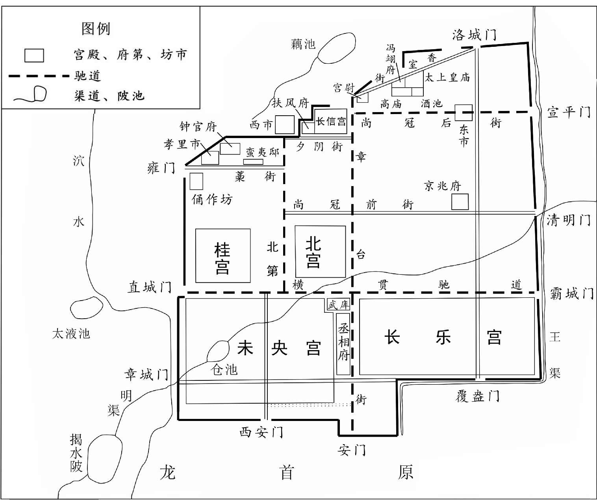
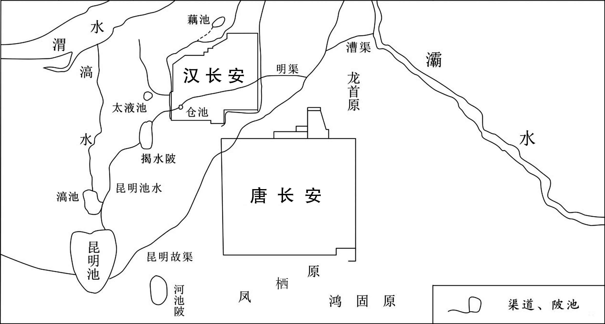
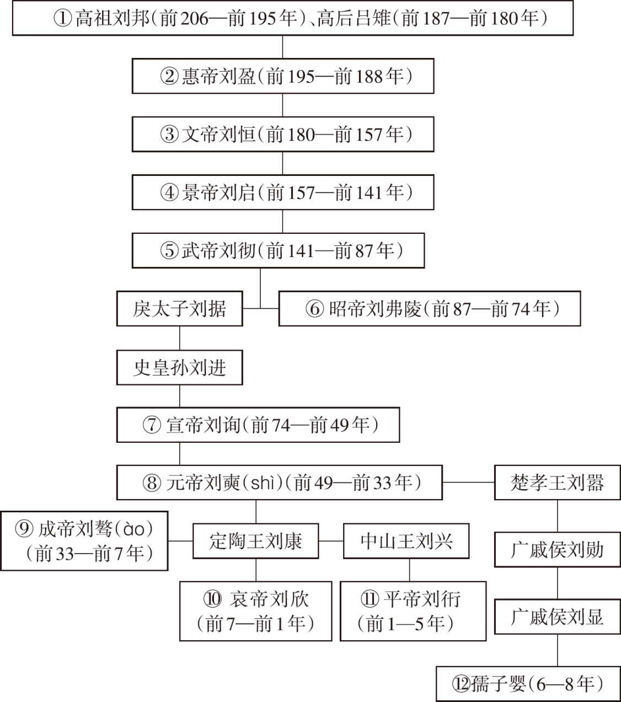

# 目录

霍光废立

赵充国破羌

匈奴归汉

恭显用事

成帝淫荒

河决之患

附录： 
西汉皇帝世系表

返回总目录

# 霍光废立

## 【内容提要】

本篇主要叙述了西汉大将军霍光辅佐朝廷，废君立君，被封赏，霍氏家庭成员谋反被诛杀的历史过程。

巫蛊之祸使汉武帝刘彻失去了自认为能够守护汉室家业的皇太子刘据，在其他皇子不成器、立幼子刘弗陵即位时，命霍光、金日等大臣辅政。霍光经历了从废帝到立帝的全部过程，在朝执政长达二十年之久。汉昭帝在未央宫去世后，霍光与群臣商议让昌邑王刘贺承袭帝位。刘贺做了皇帝，淫乱荒唐没有节制。霍光向太后禀告刘贺情况，皇太后废黜刘贺，命他仍回昌邑居住，撤销昌邑国，改为山阳郡。霍光与丞相杨敞推举刘病已做孝昭皇帝的继承人，太后同意。不久，刘病已进入未央宫被封为阳武侯，文武群臣献上皇帝御玺，刘病已正式即皇帝位，尊称皇太后为太皇太后。

霍光在辅佐过程中对安定宗庙有功，在朝中权势越来越大，霍光去世后，家族受到封赏。汉宣帝刘询命主管部门议定确立大计安定祖庙功勋，予以奖赏。大将军霍光功勋最高，被增加封邑。汉宣帝封霍光女儿霍成君为皇后，任命霍光儿子霍禹为右将军，霍光去世后，征调三河地守军修筑陵墓，派人负责祭扫，免除后代子孙徭役，继承霍家的爵位和封邑。为报答霍光恩德，汉宣帝封霍光兄长的孙子霍山为平乐侯，让他任奉车都尉监理尚书事。

汉宣帝的封赏，使得霍氏家族在朝中为所欲为，骄纵奢侈，受到宣帝限制后走上了反叛朝廷的道路。随着霍氏家族权势的加大，霍家显夫人竟然对皇帝封太子大为不满，想毒死太子。他们随心建筑府第宅院，出入长信宫无所顾忌。汉宣帝采纳魏相建议，调整、削弱霍家在重要位置上的权力，收回印信。霍家对自家权势被削夺深为忧虑，开始密谋策划，杀害魏相，废黜汉宣帝，拥立霍禹为皇帝。霍氏密谋被发觉，霍云、霍山、范明友自杀，显夫人及家族参与密谋的霍禹、邓广汉被逮捕，霍禹被处以腰斩的极刑，显夫人以及她的儿女兄弟被押赴街头斩首示众。

## 【原文】

**汉武帝后元元年[1]。钩弋夫人之子弗陵，年数岁，形体壮大，多知，上奇爱之，心欲立焉。以其年稚，母少，犹与久之[2]。欲以大臣辅之，察群臣，唯奉车都尉光禄大夫霍光，忠厚可任大事[3]。上乃使黄门画周公负成王朝诸侯以赐光。后数日，帝谴责钩弋夫人，夫人脱簪珥，叩头[4]。帝曰：“引持去，送掖庭狱。”夫人还顾，帝曰：“趣行，汝不得活！”卒赐死。顷之，帝闲居，问左右曰：“外人言云何？”左右对曰：“人言‘且立其子，何去其母乎’。”帝曰：“然。是非儿曹愚人之所知也。往古国家所以乱，由主少、母壮也。女主独居骄蹇，淫乱自恣，莫能禁也[5]。汝不闻吕后邪？故不得不先去之也[6]。”**

## 【注文】

[1]汉：朝代名，分为西汉与东汉，又叫前汉与后汉。公元前206年刘邦灭亡秦朝后，又打败项羽，于前202年称帝，定都长安，国号“汉”，史称西汉。公元8年，外戚王莽代汉称帝，国号新。共历十三帝，二百一十年。公元23年，新莽政权被推翻。公元25年，汉皇族刘秀即皇帝位，沿用“汉”国号，迁都洛阳，至公元220年曹丕代汉止，共历十四帝，一百九十六年，史称东汉。　　武帝：即西汉武帝刘彻（前156—前87年）。汉朝第六位皇帝。景帝子。在位期间，颁行推恩令。制订左官律。不拘一格录用人才。裁抑丞相职权。设十三州部刺史。派卫青、霍去病多次出击匈奴，命张骞出使西域。征服闽越、东瓯和南越，经营西南夷。改革币制，实行盐铁官营及均输平准等制度。颁布算缗、告缗令。治理黄河决口。建立正规的察举制度，令郡国举孝廉及秀才、贤良方正等。表彰儒术，设五经博士，兴建太学。令郡国皆立学官。因迷信神仙，挥霍无度，使齐、楚、燕、赵和南阳等地均曾爆发农民起义，又因汉军远征匈奴失利，便下诏拒绝桑弘羊募民屯田轮台的建议，表示要“禁苛暴，止擅赋，力本农”。后元二年（前87年）病死。　　后元：西汉武帝刘彻在位期间所用的年号，共计两年，即公元前88年至前87年。

[2]钩弋（yì）夫人（生卒年不详）：即赵倢（jié）伃（yú）、拳夫人。西汉河间（治所在今河北献县东南）人。武帝巡狩过河间时得幸，进为倢伃，居钩弋宫。后生子弗陵，武帝欲立弗陵为嗣，恐她日后擅权，遂借故赐死。弗陵立为皇太子后，不久即位为昭帝，追尊她为皇太后。又成帝后飞燕入宫初亦为倢伃。　　弗陵：即汉昭帝刘弗陵（前94—前74年）。西汉皇帝。武帝少子，母为赵倢伃。即位时年仅八岁，霍光、上官桀、金日、桑弘羊受武帝遗诏辅政。即位后委政霍光。因海内虚耗，民生凋敝，故采取轻徭薄赋、与民休息的政策，屡次减免租赋，招抚流民。议盐铁而罢榷酤。又与匈奴恢复和亲。政治较为安定，社会经济有所恢复。　　与：通“豫”。迟疑。

[3]霍光（？—前68年）：西汉大臣。字子孟，河东平阳（今山西临汾市西南）人。霍去病异母弟。武帝时，为奉车都尉。昭帝年幼继位，他与桑弘羊等受武帝遗诏辅政，任大司马大将军，封博陆侯。昭帝死后，迎立昌邑王刘贺为帝，不久即废，又迎立宣帝。前后执政凡二十年。执政期间，轻徭薄赋，百姓生活较为安定。

[4]周公（生卒年不详）：西周初人，姬姓，名旦，叔旦。周武王弟，与吕尚同为西周开国元勋。以鲁公封于曲阜，留朝执政，长子伯禽就封。武王卒，成王幼，摄政。管叔、蔡叔、霍叔等不服，联合殷贵族武庚和东夷反叛。他率师东征，平定叛乱，灭奄（今山东曲阜市东）后大举分封诸侯，营建成周（今河南洛阳）。又制礼作乐，为西周典章制度的主要创制者，主张“明德慎罚”，以“礼”治国，奠定了“成康之治”的基础。　　脱簪（zān）珥（ěr）：簪，古代别发髻或冠的长针。珥，古代用珠玉做的耳饰。表示自责请罪。

[5]掖（yè）庭：也作掖廷。皇宫中的旁舍，妃嫔住的地方。　　趣（cù）：通“促”。催促。　　骄蹇（jiǎn）：傲慢，不顺从。

[6]吕后：即吕雉（zhì）（？—前180年）。汉高祖皇后。字娥姁（xǔ）。楚汉战争初期为项羽所俘，后被释还。曾助刘邦翦除韩信、彭越等异姓诸侯王。后其子（惠帝）即位，她独揽大权，毒死赵王如意，残害戚夫人，惠帝死后，临朝称制，并分封诸吕为王侯，控制南北军，又以审食其为左丞相，掌握实权，公卿皆因而决事。她死后，诸吕阴谋作乱，为大臣周勃等平定。

## 【译文】

汉武帝后元元年（前88年）。钩弋夫人生的皇子刘弗陵，仅有几岁，身体却长得高大壮硕，懂得很多事儿，皇上非常疼爱他，想立他为太子。只因他年纪小，母亲又太年轻，因此犹豫不决。汉武帝想派合适的大臣辅佐他，观察群臣，只有奉车都尉、光禄大夫霍光，为人忠厚，可胜任此事。于是汉武帝让黄门画周公背负周成王朝见诸侯的画赐给霍光。过了几天，汉武帝借故谴责钩弋夫人，夫人摘掉头上的装饰，叩头请求宽恕。汉武帝说：“将她拉下去，送到宫中监狱。”钩弋夫人回头看着皇帝，汉武帝说：“快走，你不能活下去！”最终将她处死。没过多久，汉武帝闲暇无事，问周围的人说：“外面人对处死钩弋夫人都说什么了？”周围的人回答说：“人们说‘既然立她的儿子为太子，为什么将他母亲杀了’。”汉武帝说：“对。这就不是你们这些愚蠢的人所能知道的。自古以来国家所以发生混乱，都是因为国君年纪小，母亲年轻。女主一人独居，就会骄横不顺，荒淫秽乱，没人禁止得了。你没听说过吕后的事吗？所以不得不将她先除掉。”

## 【原文】

**二年春二月，上病笃，霍光涕泣问曰：“如有不讳，谁当嗣者？”上曰：“君未谕前画意邪？立少子。君行周公之事。”光顿首让曰：“臣不如金日[1]。”日亦曰：“臣外国人，不如光，且使匈奴轻汉矣[2]。”乙丑，诏立弗陵为皇太子，时年八岁。丙寅，以光为大司马、大将军，日为车骑将军，太仆上官桀为左将军，受遗诏辅少主[3]。又以搜粟都尉桑弘羊为御史大夫[4]。皆拜卧内床下。丁卯，帝崩于五柞宫。戊辰，太子即皇帝位。**

## 【注文】

[1]金日（mì）（dī）（前134—前86年）：西汉人，字翁叔。本匈奴休屠王太子，武帝时随昆邪王归汉。因父不降被杀，没为官奴。后任马监。迁侍中驸马都尉光禄大夫，深受宠信。后擒缚谋反的莽何罗，以功封秺侯。昭帝即位，与霍光、桑弘羊等同受武帝遗诏辅政，任车骑将军。病死。

[2]匈奴：中国古代北方民族。又称“胡”。有学者认为即周代典籍中所见之薰粥、猃狁。战国时期，分布于秦、赵、燕（西部）三国之北，三国皆筑长城以拒之。秦始皇命蒙恬北征匈奴，取“河南”（今内蒙古鄂尔多斯）地。秦汉之际，匈奴冒顿单于统一各部，建立了横跨大漠南北的匈奴国家。辖地相当今内蒙古、新疆大部、蒙古国、俄罗斯贝加尔湖东西、叶尼塞河、鄂毕河上游地区及哈萨克斯坦斋桑地区。与西汉和亲后，相约以长城为界。其统治中心的单于庭，在今阴山地区。武帝时，多次与匈奴战争，统治中心移入今蒙古国，“漠南无王庭”。宣帝时匈奴内乱“五单于争立”，呼韩邪单于臣服于汉朝，战胜了对立势力。

[3]上官桀（？—前80年）：西汉大臣。陇西上邽（guī）（今甘肃天水）人。武帝时为期门羽林郎，以材力迁未央厩令。后任太仆。昭帝即位，与霍光、金日同受武帝遗诏辅政，为左将军，封安阳侯。其孙女为昭帝皇后，后勾结燕王旦、桑弘羊等谋反，事发，被诛。

[4]桑弘羊（前152—前80年）：西汉大臣。洛阳（今属河南）人。武帝时任治粟都尉、领大司农。积极推行重农抑商政策，坚持将冶铁、煮盐收归官营，充实国家经济实力；并设平准、均输机构，控制全国商品，平抑物价，使商贾不得从中获得大利。受武帝遗诏辅佐昭帝，任御史大夫。曾参加盐铁会议，阐述盐铁官营的观点。后与霍光争权，失败被杀。

## 【译文】

汉武帝后元二年（前87年），春季，二月，汉武帝病重，霍光流着泪问道：“陛下万一不测，由谁来继承皇位？”汉武帝说：“你真的没理解以前我赐给你那幅画的意图吗？立我的幼子。由你像周公那样辅佐他。”霍光叩头推让说：“我不如金日。”金日也推辞说：“我是个外国人，赶不上霍光，如果由我辅佐会使匈奴轻视汉朝啊。”乙丑（十二日），汉武帝颁布诏书立刘弗陵为皇太子，当年八岁。丙寅（十三日），汉武帝任命霍光为大司马、大将军，金日为车骑将军，太仆上官桀为左将军，三人共同接受遗诏辅佐幼主。又任命搜粟都尉桑弘羊为御史大夫。他们都是在汉武帝病倒后在床下拜叩接受遗命的。丁卯（十四日），汉武帝驾崩于五柞宫。戊辰（十五日），太子刘弗陵即皇帝位。

## 【原文】

**帝姊鄂邑公主共养省中，霍光、金日、上官桀共领尚书事[1]。光辅幼主，政自己出，天下想闻其风采。殿中尝有怪，一夜，群臣相惊，光召尚符玺郎，欲收取玺[2]。郎不肯授，光欲夺之。郎按剑曰：“臣头可得，玺不可得也。”光甚谊之，明日，诏增此郎秩二等[3]。众庶莫不多光[4]。**

## 【注文】

[1]省中：宫禁之中。　　鄂邑公主（？—前80年）：即盖长公主。汉武帝女。食邑于鄂，盖侯之妻。昭帝八岁即位，由其供养省中。盖汤沐邑，为长公主，亦称鄂邑公主、盖长公主。因私幸丁外人，说上官桀父子为外人求官爵，皆为霍光所拒，遂深怨之。乃与上官桀父子、燕王旦谋反兵诛光，废昭帝，迎立旦为帝。后事败，自杀。

[2]尚符玺郎：官名。亦称符玺郎中。属符节令。汉代以郎官而掌符玺，故名。

[3]谊：通“义”。

[4]多：称赞，推重。

## 【译文】

刘弗陵的姐姐鄂邑公主陪他一起住在寝宫中，负责抚养照顾，霍光、金日、上官桀一同主管尚书事，主持朝政。霍光辅佐幼主，朝廷政令都由他自己发出，天下人都想一见他的风采。一天夜里，宫中曾出现怪物，群臣都为怪物惊慌不安，霍光在慌乱中召见尚符玺郎，想收回皇帝的御玺。尚符玺郎不肯给他，霍光想强迫他交出。尚符玺郎手持宝剑严肃地说：“臣的头你可以拿到，但御玺你不可能得到。”霍光非常赞赏他的尽忠职守。第二天，下令将尚符玺郎品秩提了两级。众人也为此更加敬重霍光。

## 【原文】

**昭帝始元二年春正月，封大将军光为博陆侯[1]。**

## 【注文】

[1]始元：西汉昭帝刘弗陵在位期间所用年号，共计七年，即公元前86年至前80年。

## 【译文】

汉昭帝始元二年（前85年），春季，正月，汉昭帝封大将军霍光为博陆侯。

## 【原文】

**或说霍光曰：“将军不见诸吕之事乎？处伊尹、周公之位，摄政擅权，而背宗室，不与共职，是以天下不信，卒至于灭亡[1]。今将军当盛位，帝春秋富，宜纳宗室，又多与大臣共事，反诸吕道，如是则可以免患。[2]”光然之。**

## 【注文】

[1]伊尹（生卒年不详）：商初大臣。名挚，又称伊挚，出身寒微，有莘氏女嫁商汤，他为陪嫁媵（yìng）臣事汤。后被任以国政，助汤改善政治，发展实力，攻灭夏桀，建立商朝。汤卒，立子外丙、仲壬，后又佐汤孙太甲即位。太甲淫暴，他放逐太甲，后太甲悔改，接回复位。沃丁时病卒。

[2]春秋：年龄。　　富：年幼。

## 【译文】

这时有人劝霍光说：“将军是否听说过吕氏家族的事？处在伊尹、周公的地位，处理国政，独揽大权，疏远皇族成员不与他们共事，所以失去天下人的信任，最终遭到灭亡。如今将军身居显要地位，皇帝年幼，应接纳皇室成员，再多与朝廷大臣共商大事，一切与吕氏处事的方法相反，如果这样去做，便可以免除祸患。”霍光认为有道理。

## 【原文】

**元凤元年冬十月，大将军光以朝无旧臣，光禄勋张安世自先帝时为尚书令，志行纯笃，乃白用安世为右将军，兼光禄勋，以自副焉[1]。安世，故御史大夫汤之子也。光又以杜延年有忠节，擢为太仆、右曹、给事中[2]。**

## 【注文】

[1]元凤：西汉昭帝刘弗陵在位期间所用的年号，共计六年，即公元前80年至前74年。

[2] 杜延年（？—前52年）：西汉南阳杜衍（今河南南阳）人。字幼公，自幼从父杜周习律学，父子并世治汉律，称“小杜律”。昭帝时任大将军霍光军司空（主狱官）。光主张严刑罚，延年则辅之以宽。后任谏大夫、太仆右曹给事中，宣帝时任御史大夫。后以年老病免，不久去世。

## 【译文】

汉昭帝元凤元年（前80年），冬季，十月，大将军霍光因在朝中见不到旧臣，而光禄勋张安世在汉武帝时就任尚书令，志向行为纯正真诚，于是奏请汉昭帝任命张安世为右将军兼光禄勋，作为自己的助手。张安世，是前御史大夫张汤的儿子。霍光又以杜延年有忠诚志节，提升他为太仆、右曹、给事中。

## 【原文】

**三年春正月，泰山有大石自起立。上林有柳树枯僵自起生，有虫食其叶成文，曰“公孙病已立”。符节令鲁国眭弘上书言：“大石自立，僵柳复起，当有匹庶为天子者[1]。枯树复生，故废之家公孙氏当复兴乎？汉家承尧之后，有传国之运，当求贤人禅帝位，退自封百里，以顺天命[2]。”弘坐设妖言惑众，伏诛。**

## 【注文】

[1]鲁国：西汉高后元年（前187年）改薛郡置。治鲁县（今山东曲阜），辖境相当今山东曲阜、泗水、滕州等市县地。　　眭（suī）弘（？—前78年）： 西汉鲁国蕃（今山东滕州）人，字孟。以明经为议郎，任符节令。昭帝时以灾异数起，乃推《春秋》之意，使人上书建议求索贤人，禅以帝位。大将军霍光恶之，遂下廷尉，以妖言惑众，大逆不道罪名被杀。　　匹庶：平民百姓。

[2]尧：（生卒年不详）又称唐尧。传说中五帝之一。帝喾（kù）之子，号陶唐氏，或简称唐。尧曾设官掌管时令，制定历法。经常召集四岳讨论重要职官的任命及继任人的遴选等。时处原始社会末期的部落联盟时期。尧传位于舜的“禅让”制度，当是军事民主制的表现。

## 【译文】

汉昭帝元凤三年（前78年），春季，正月，发现泰山上有一块大石头自己竖立起来。又发现上林苑中有一棵柳树枯死倒在地上，自己立起，又复活生长，有虫子将树叶咬成“公孙病已立”几个字。担任符节令的鲁国人眭弘上书说：“大石自己立起，枯倒的柳树又站立起来，应当是有平民百姓成为天子。枯树复生，是不是表示已废的公孙氏家族又要复兴？汉王朝为帝尧的后代，有传国的命运，应当寻求贤明的人把帝位禅让给他，而自退百里封地自守，以顺应天命。”眭弘以制造妖言惑众之罪，被处死。

## 【原文】

**元平元年夏四月癸未，帝崩于未央宫，无嗣[1]。时武帝子独有广陵王胥，大将军光与群臣议所立，咸持广陵王[2]。王本以行失道，先帝所不用；光内不自安。郎有上书言：“周太王废太伯立王季，文王舍伯邑考立武王，唯在所宜，虽废长立少可也。广陵王不可以承宗庙。[3]”言合光意，光以其书示丞相敞等，擢郎为九江太守。即日承皇后诏，遣行大鸿胪事少府乐成、宗正德、光禄大夫吉、中郎将利汉迎昌邑王贺，乘七乘传诣长安邸。光又白皇后，徙右将军安世为车骑将军。**

 
西汉长安城示意图

 
西汉长安附近示意图

## 【注文】

[1]元平：西汉昭帝刘弗陵在位期间所用的年号，共计一年，即公元前74年。

[2]胥（xū）：即刘胥（？—前54年）。汉武帝子。武帝时封广陵王。好倡乐逸游。无法度。因见昭帝年少无子，乃觊觎帝位，使女巫下神祝诅。宣帝即位，复令祝诅如前。后事发，药杀巫及官人以灭口。宣帝遣廷尉等传讯，遂自绞死。诸子赦为庶人。赐谥厉王，国除。

[3]周太王（生卒年不详）：即古公亶父、太王。周先王，周文王之祖。早年居于豳（bīn）（今陕西旬邑县西），后为避狄人侵扰，南迁周原（今陕西岐山、扶风间），发展农耕，建设宫室都邑，人民皆乐从迁居。周武王伐纣灭商后追称太王。　　太伯（生卒年不详）：太又作泰。古公亶父之长子，周文王之伯父。有弟仲雍、季历，古公欲传位给幼子季历，以使季历子昌（周文王）能即位振兴周国，他与仲雍得知后即避让，逃奔江南，断发文身，示不可用，于吴（今江苏无锡市东）建国，为吴国之始祖。　　王季（生卒年不详）：又称公季。周先王。名季历。古公亶父之幼子，文王之父。其兄太伯、仲雍逃奔江南后即位，遵循古公之法，诸侯多归顺。入朝商王武乙，受赏赐。数次征戎狄获胜，商王文丁命为牧师，为西方诸侯之长，国势日强，终为文丁所杀。　　文王（生卒年不详）：即周文王。姓姬，名昌。古公亶父之孙，季历之子。号西伯。效法后稷、古公，士多归之。纣畏其强大，囚之羑里（今河南汤阴县北）。闳天等人以美女、文马、九驷及其他奇物赂纣，乃获赦。他一面争取商的与国，一面武力征服密须、耆、邗、崇等国，自岐下迁都于丰（沣水西，今陕西西安市西），为灭商打下了基础。卒后谥为文王。　　伯邑考（生卒年不详）：又称邑考。商末周初人。周文王之长子，武王之兄。周灭商前死。相传在商王朝做人质，为纣御，纣杀之，烹为羹赐文王。武王灭商后祭祀祖先时亦列入祀典。　　武王（生卒年不详）：即周武王。西周王朝的建立者。周文王死后第四年春，他乘商军主力在东南之机，率兵车三百乘，虎贲（勇士）三千人，联合庸、蜀、羌、髳、微、卢、彭、濮等方国部落，东向伐纣，经孟津进抵牧野（今河南淇县）。因商军阵前倒戈，乘机取胜，遂灭商，建立西周王朝，建都镐（今陕西西安市西）。灭商二年后去世。

## 【译文】

汉昭帝元平元年（前74年），夏季，四月癸未（十七日），汉昭帝在未央宫驾崩，他没有儿子继承帝位。当时汉武帝的儿子只有广陵王刘胥还在，大将军霍光与群臣商议立谁做新皇帝，大家都主张立广陵王刘胥。可是刘胥的行为失去礼法，不被汉武帝所器重；霍光内心感到不安。有一位郎官上书朝廷说：“周太王废弃长子太伯而立太伯的弟弟王季为继承人，周文王舍弃伯邑考而立伯邑考的弟弟周武王为继承人，由此看来，古人注重是否适合继承王位，即使是废长子而立少子也是可以的。广陵王不适合继承皇位。”上书正合霍光的心意，霍光将上书拿给丞相杨敞等人传阅。并擢升这位郎官为九江太守。当天，由上官皇后颁布诏书，派遣代理大鸿胪职务的少府乐成、宗正官刘德、光禄大夫丙吉、中郎将利汉前去迎接昌邑王刘贺，乘坐七辆驿车迎刘贺到长安昌邑王官邸。霍光又向皇后禀明，调右将军张安世为车骑将军。

## 【原文】

**贺，昌邑哀王之子也，在国素狂纵，动作无节[1]。武帝之丧，贺游猎不止。尝游方与，不半日驰二百里[2]。中尉琅邪王吉上疏谏曰：“大王不好书术而乐逸游，冯式撙衔，驰骋不止，口倦乎叱咤，手苦于箠辔，身劳乎车舆，朝则冒雾露，昼则被尘埃，夏则为大暑之所暴炙，冬则为风寒之所匽薄[3]；数以耎脆之玉体，犯勤劳之烦毒，非所以全寿命之宗也，又非所以进仁义之隆也[4]。夫广厦之下，细旃之上，明师居前，劝诵在后，上论唐、虞之际，下及殷、周之盛，考仁圣之风，习治国之道，欣欣焉发愤忘食，日新厥德，其乐岂衔橛之间哉[5]！休则俛仰屈伸以利形，进退步趋以实下，吸新吐故以练臧，专意积精以适神，于以养生，岂不长哉[6]！大王诚留意如此，则心有尧、舜之志，体有乔、松之寿，美声广誉，登而上闻，则福禄其臻而社稷安矣[7]。皇帝仁圣，至今思慕未怠，于宫馆、囿池、弋猎之乐未有所幸。大王宜夙夜念此，以承圣意。诸侯骨肉，莫亲大王。大王于属则子也，于位则臣也，一身而二任之责加焉。恩爱行义，孅介有不具者，于以上闻，非飨国之福也。[8]”王乃下令曰：“寡人造行，不能无惰，中尉甚忠，数辅吾过。”使谒者千秋赐中尉牛肉五百斤，酒五石，脯五束[9]。其后复放纵自若。**

## 【注文】

[1]贺：即刘贺（？—前59年）。西汉诸侯王。昌邑哀王刘髆（bó）之子。嗣立十三年，昭帝卒，无嗣，他被霍光立为帝。即位二十七日又被废。后宣帝封为海昏侯。

[2]方与：即方与县。秦置，属薛郡。治所在今山东鱼台县北古城集。西汉属山阳郡。

[3]中尉：官名。西汉初，置为将兵武职。后遂常置，主京师治安事务，又称备盗贼中尉，为九卿之一，秩中二千石。领中垒、寺互、武库、都船四令丞及式道左右中候，兼领左右京辅都尉兵卒。　　王吉（？—前48年）：西汉琅邪皋虞（今山东即墨县东北）人，字子阳。初以郡吏举孝廉为郎，不久举贤良任昌邑王中尉。王好游猎，他上疏谏劝。昭帝死，迎昌邑王即帝位，旋以淫乱废，他因先谏免死。后复为益州刺史，去官，又征为博士谏大夫，劝宣帝毋任用外戚而用能吏，不听，遂谢病归。元帝即位，遣使征迎，年老，病卒于道。　　冯式：冯，通“凭”。凭借；依靠。式，古代车前扶手的横木，后作“轼”。靠着前扶手。　　撙（zǔn）衔：撙，控制，勒住。衔，马嚼子。勒住马嚼子。　　箠（chuí）辔（pèi）：马鞭和缰绳。泛指御马之具。　　匽薄：匽，同“偃”，倒伏。薄，逼迫。掩伏侵迫。

[4]耎（ruǎn）：软。

[5]旃（zhān）：通“毡”。　　衔橛（jué）：橛，马口中所衔横木。指驰骋游猎。

[6]俛（fǔ）：同“俯”。头低下，屈身向下。

[7]虞：即虞舜（生卒年不详）。传说中五帝之一。号有虞氏。系颛顼的苗裔。四岳荐舜于尧，尧使用事二十年，知可授舜以天下，先使舜摄政，后让位于舜。舜谋于四岳，以禹平水土，以弃掌农事，以契理民政，以皋陶司刑狱。各得其宜，唯禹功大。乃禅位于禹。卒于苍梧。　　殷：朝代名。商王盘庚从奄（今山东曲阜）迁到殷（今河南安阳市西北），因而商也被称为殷。从盘庚迁殷到纣亡国，共八世，十二王，二百七十三年，一般亦称为殷代。整个商代，亦或称为商殷、殷商。　　周：朝代名。公元前11世纪周武王灭商后建立。建都于镐（今陕西西安市西南沣水东岸）。周公东征后，确立宗法制，创立典章制度，并不断分封诸侯。农业比商代发达，农产品种类增多，手工业也有发展。前771年申侯联合犬戎攻杀周幽王。次年周平王东迁到洛邑（今河南洛阳）。历史上称平王东迁以前为西周，以后为东周。东周时又可分为春秋和战国两个时期。前256年为秦所灭。共历三十四王，八百多年。　　乔：即王子乔（生卒年不详），神话人物。一说名晋，字子晋。周灵王太子。游伊、洛之间，在嵩山修炼三十余年。喜吹笙作凤鸣。后在缑氏山顶，向世人挥手告别，升天而去。　　松：即赤松子（生卒年不详）、赤诵子、赤松子舆、松子。相传为帝喾之臣，帝喾曾从其学。后世神仙家依托为上古仙人。

[8]孅（xiān）介：孅，通“纤”。细微。　　飨（xiǎnɡ）：通“享”。

[9]谒者：官名。春秋、战国始置，为国君通接宾客，掌管传达。秦汉沿置，职掌宾赞受事，秩比六百石，员额至七十人。皆以孝廉者担任，要求年未五十，仪表威严，美须大音。任满一年者可拜任县令、长史等其他官职。当迁而愿意留任者，增加其禄秩。　　脯（fǔ）：干肉。

## 【译文】

刘贺，是昌邑哀王刘髆的儿子，他在封国内一向狂妄放纵，所作所为毫无节制。在他的祖父汉武帝丧期里，刘贺照样出外巡游狩猎不止。曾出游到方与县，不到半天时间骑马奔驰了二百里。中尉琅邪人王吉上疏劝谏说：“大王不喜好读书，不求学术，而喜欢游玩逸乐，乘车，骑马，每天不停地驰骋，嘴里因不断吆喝而疲倦，手因握缰绳挥鞭而痛苦，身体因驾车颠簸而劳累，早晨冒着露水雾气，白天顶着尘土风沙，夏天则被骄阳暴晒，冬天则受狂风寒流的侵袭；大王常常以脆弱的身体，去承受劳累痛苦的折磨，这不是保全寿命的正确方法，也不能促进仁义道德的培养。希望您在宽敞的殿堂之中，在细软的毛毡之上，在明师的督导下，去勤勉诵读，讨论上至唐尧、虞舜之际，下到殷、周时期，考察仁义圣贤的风范，学习治国平天下的道理，欣欣然发奋学习而忘食，使自己的品德修养得到日新月异的提高，这种快乐，哪里是整日驰骋游猎所能得到的！休息的时候，则可以俯仰屈伸以利于形体，进退散步或慢跑以坚实脚力，吸收新鲜空气吐出废气以锻炼五脏，专心专意，养精蓄锐，以此养生，怎么能不长寿呢！大王真能留心这样去做，心中就会产生尧、舜的志向，身体才有王子乔和赤松子一般的寿命，美好的声誉广为播扬，传到朝廷，一切福禄就会降临，封国也安定太平了。当今皇上仁义圣贤，直到现在思念先帝不已，对于宫殿别馆、苑囿池塘、巡游狩猎都没兴趣。大王应日夜不忘这些，以符合皇上的心意。在所有的诸侯王中，大王与皇上的关系最近。论骨肉亲情，大王如同皇上的儿子，就地位来说，大王是皇上的臣僚，一人具有两种身份，担负两种责任。因此大王在施恩爱、行仁义中，有细微之处不周全，被皇上知道了，都不是封国之福。”昌邑王刘贺阅读后，下令说：“我所为的确有懈怠之处，中尉十分忠诚，多次辅导我，纠正我的过失。”于是派谒者千秋赐给中尉王吉牛肉五百斤，酒五石，干肉五捆。但是，过后刘贺依然放纵如故，没有悔改之意。

## 【原文】

**郎中令山阳龚遂，忠厚刚毅，有大节[1]。内谏争于王，外责傅相，引经义，陈祸福，至于涕泣。蹇蹇无已，面刺王过[2]。王至掩耳起走，曰：“郎中令善愧人。”王尝久与驺奴、宰人游戏，饮食赏赐无度，遂入见王，涕泣膝行，左古侍御皆出涕。王曰：“郎中令何为哭？”遂曰：“臣痛社稷危也[3]。愿赐清闲，竭愚。”王辟左右，遂曰：“大王知胶西王所以为无道亡乎？”王曰：“不知也[4]。”曰：“臣闻胶西王有谀臣侯得，王所为拟于桀、纣也，得以为尧、舜也[5]。王说其谄谀，常与寝处，唯得所言，以至于是。今大王亲近群小，渐渍邪恶，所习，存亡之机，不可不慎也。臣请选郎通经有行义者与王起居，坐则诵《诗》、《书》，立则习礼容，宜有益[6]。”王许之。遂乃选郎中张安等十人侍王。居数日，王皆逐去安等。**

## 【注文】

[1]郎中令：官名。秦及西汉前期九卿之一，职掌守卫宫殿门户，系皇帝左右亲近的高级官吏。所属有丞、大夫、郎、谒者及期门、羽林宿卫官。汉武帝时更名为光禄勋。　　山阳：即山阳郡。西汉景帝时分梁国置山阳国，立梁孝王子定为山阳王。武帝时改为山阳郡，治所在昌邑县（今山东巨野县南六十里）。辖境相当今山东巨野以南，成武、曹县以东，单县以北，鱼台以西及邹城、兖州等市县地。　　龚遂（？—前62年）：西汉山阳郡南平阳（今山东邹城）人，字少卿。初为昌邑王刘贺郎中令，敢直言谏诤。宣帝时，以七十高龄出任渤海太守。在郡开仓借粮，救济百姓，平息因灾荒引起的农民反抗。奖励农桑，发展生产，使民归田，狱讼减少。迁水衡都尉。后世把他和黄霸作为封建“循吏”的代表，称为“龚黄”。

[2]蹇（jiǎn）蹇：亦作“謇謇”。蹇而又蹇，多难的样子。后用为进尽忠言之意。

[3]社稷：“社”指土神，“稷”指谷神，古代君主都祭社稷，后来就用“社稷”代替国家。

[4]胶西王：即刘卬（？—前154年）。西汉宗室。齐悼惠王刘肥之子。文帝时以平昌侯立为胶西王。景帝时响应吴王刘濞谋反。兵败被杀，国除。

[5]桀：夏代国王（生卒年不详）。名履癸。残酷剥削，暴虐荒淫。在有仍（今山东济宁市东南）会合诸侯，攻灭有缗氏（今山东金乡）。后被商汤所灭，出奔南方而死。夏朝灭亡。　　纣：即帝辛（生卒年不详）。末代商王。历代有名暴君之一。在位期间穷兵黩武，滥施暴政，刚愎自用，诛杀大臣。后武王伐纣，战于牧野（今河南淇县西南），因商军在阵前倒戈，他兵败自焚。

[6]《诗》：即《诗经》。我国最早的诗歌总集，相传是孔子所编订。现存作品三百零五篇，绝大部分是西周和春秋时期的作品。内容分《风》、《雅》、《颂》三部分，《风》是民歌，《雅》是朝廷和贵族宴飨交际的诗歌，《颂》是宗庙祭祀的乐歌。《诗经》的许多作品描写了人们的生产劳动、爱情与婚姻、奴隶主的享乐、社会的动乱和战争等，是研究当时社会的宝贵史料。因此，孔子将《诗经》列为教授学生的课目之一，战国时，《诗经》更成了儒家的经典。《诗经》大量使用了“赋”、“比”、“兴”三种表现手法，“赋”是直接叙述事物或表达情感，“比”是比喻，“兴”是利用景物引出要抒发的内容。这种艺术手法为后人沿用模仿。　　《书》：即尚书。亦称《书经》。儒家经典之一。“商”古代通“上”。因为它是上古文献汇编。所以叫《尚书》。相传由孔子编选而成。一百篇。秦焚书，被毁。汉初由伏胜出二十九篇，用当时的隶书写成，叫《今文尚书》。汉武帝时又从孔子住宅壁中发现用古文写的竹简，叫《古文尚书》。孔安国曾校读并作传，不久就亡佚了。东晋时，梅赜献上《古文尚书》二十五篇和孔安国的《尚书传》，历代学者认为是伪作。《十三经注疏》中的《尚书》是《今文尚书》和伪《古文尚书》的合编本。上起尧舜，下迄春秋中叶的秦穆公。按虞、夏、商、周四代顺序编辑。其体例分典、谟、训、诰、誓、命六种。清孙星衍《尚书今古注疏》是较完备的注释本。

## 【译文】

郎中令山阳郡人龚遂，忠厚刚毅，注重大节。他经常规劝昌邑王刘贺，还责备刘贺的师傅和封国的丞相没能尽到责任，他引经据典，陈述祸福，直至声泪俱下。忠心无已，当面指出昌邑王的过失。昌邑王见到他甚至捂着耳朵起身走开，说道：“郎中令善于揭别人的短处。”昌邑王曾经很长一段时间与他的厨师、车夫一起游戏娱乐，大吃大喝，对他们赏赐无度，龚遂入宫去见昌邑王，流着泪双膝跪行到刘贺面前，连左右的侍从都感动得流下眼泪。昌邑王问：“郎中令为什么哭？”龚遂说：“我痛心您的封国面临危机。希望您赐给我一个单独的机会，详细陈述我的看法。”昌邑王屏退了左右的人，龚遂说：“大王知道胶西王刘昂因为无道而灭亡的吗？”昌邑王说：“不知道。”龚遂说：“我听说胶西王有一个专门会阿谀奉承的大臣名叫侯得，胶西王所作所为如同夏桀、商纣王，侯得却说他像唐尧、虞舜。胶西王对侯得的阿谀奉承很欣赏，常常与他住在一起，很听信他的话，以至于落得如此下场。今天大王亲近一群小人，逐渐沾染了恶习，这是存亡的关键，不可不慎重考虑。我请求选派精通经书主持正义的郎官与大王生活在一起，坐则诵读《诗经》、《尚书》，立则学习礼仪习俗，对大王一定会有益处。”昌邑王同意了。龚遂便挑选郎中张安等十人侍奉昌邑王。然而没过几天，昌邑王将张安等人都赶走了。

## 【原文】

**王尝见大白犬，颈以下似人，冠方山冠而无尾，以问龚遂。遂曰：“此天戒，言在侧者尽冠狗也。去之则存，不去则亡矣。”后又闻人声曰“熊”！视而见大熊，左右莫见，以问遂。遂曰：“熊，山野之兽，而来入宫室，王独见之，此天戒大王，恐宫室将空，危亡象也。”王仰天叹曰：“不祥何为数来！”遂叩头曰：“臣不敢隐忠，数言危亡之戒，大王不说。夫国之存亡，岂在臣言哉？愿王内自揆度。大王诵《诗》三百五篇，人事浃，王道备。王之所行，中《诗》一篇何等也？大王位为诸侯王，行污于庶人，以存难，以亡易，宜深察之。[1]”后又血污王坐席，王问遂。遂叫然号曰：“宫空不久，妖祥数至。血者，阴忧象也，宜畏慎自省。”王终不改节。**

## 【注文】

[1]揆（kuí）度（duó）：揣度，估量。　　浃（jiā）：融洽。

## 【译文】

昌邑王曾见到一条大白狗，脖子以下长得像人，头上戴着一顶方山冠，没有长尾巴，昌邑王以此问龚遂。龚遂说：“这是上天在告诫，说您身边的人尽是戴帽子的狗。将他们赶走就能生存，不然则会灭亡！”后来昌邑王又听到有一人的声音叫喊“熊”！昌邑王果然见到一只大熊，可是他左右的人却没看见，昌邑王又问龚遂。龚遂说：“熊是山野中的兽类，却来到宫室，只有大王能够看见，这是上天在告诫大王，恐怕宫室将要变得空如山野，这是危亡的迹象。”昌邑王仰天长叹说：“不祥的兆头为什么接连而来！”龚遂叩头说道：“我的忠心使我不敢隐瞒事情的真相，所以多次说到上天对国家危亡的告诫，大王听了都不愉快。然而国家的存亡，哪里是我的话所能决定的！希望大王认真想一想，您诵读《诗经》三百零五篇，应知只有人事洽当，王道才能具备。大王的言行举止，有哪一点与《诗经》的哪一篇相符合呢？大王位居诸侯王，行为却比平民还污浊，以这种行为保存国家难，想要灭亡容易，希望大王深思省察。”后来，又有血污出现在昌邑王的坐席上，昌邑王问龚遂。龚遂大叫说：“妖异数次出现，王宫空虚就在眼前。血是阴暗凶险事情发生的征兆，大王应该谨慎畏惧地反省自己。”然而昌邑王始终不改他的品行。

## 【原文】

**及征书至，夜漏未尽一刻，以火发书。其日中，王发；晡时，至定陶，行百三十五里，侍从者马死相望于道[1]。王吉奏书戒王曰：“臣闻高宗谅暗，三年不言[2]。今大王以丧事征，宜日夜哭泣悲哀而已，慎毋有所发。大将军仁爱勇智，忠信之德，天下莫不闻。事孝武皇帝二十余年，未尝有过。先帝弃群臣，属以天下，寄幼孤焉。大将军抱持幼君襁褓之中，布政施教，海内晏然，虽周公、伊尹无以加也。今帝崩无嗣，大将军惟思可以奉宗庙者，攀援而立大王，其仁厚岂有量哉[3]！臣愿大王事之，敬之，政事壹听之，大王垂拱南面而已[4]。愿留意，常以为念！”**

## 【注文】

[1]晡（bū）时：申时，即午后三时至五时。　　定陶：即定陶县。本春秋、战国陶邑，秦置定陶县。治所在今山东定陶县西北。西汉初封彭越为梁王，都此。

[2]高宗（生卒年不详）：即商高宗武丁。商代国王。盘庚弟小乙子。相传少时生活在民间。即位后，重用傅说、甘盘为大臣，力求巩固其统治。不断对西北的（qióng）方、土方、鬼方、方（一释羌方）和周族等用兵。对方曾一次出兵一万三千人至三万人。在位五十九年。　　谅暗：也作“谅阴”。指为天子诸侯居丧。

[3]攀援：援引提拔。

[4]垂拱：垂衣拱手。谓不亲理事务。　　南面：指居帝王之位或其他尊位。因古代帝王、诸侯见群臣，或卿大夫见僚属，都面向南面而坐，故称。

## 【译文】

等到征召昌邑王刘贺继承皇位的诏书送到时，正是夜间，刘贺点起蜡烛，打开诏书。中午，刘贺便出发前往长安；当天晚上到了定陶县，走了一百三十五里，以致侍从人员的马匹不断累死在半路上。王吉上书劝告刘贺说：“我听说商高宗武丁在居丧期间，三年不说话。今天大王因丧事接受征召，应当日夜哭泣悲哀而已，对于国事一定要谨慎，不要随意发号施令。大将军霍光仁爱、勇敢有智慧，以及忠信的品德，天下人没有不知道的。他事奉孝武皇帝二十多年，未曾有过过失。孝武皇帝抛弃群臣撒手人寰，把天下及幼弱孤儿托付给大将军。大将军怀抱襁褓中的幼君，发布政令，施教万民，使国家平安无事，即使周公、伊尹也胜不过他。如今皇帝驾崩，没有后代，大将军在思考谁可以继承皇位，最终选择了大王，他的仁义忠厚没有限量！我希望大王要依靠他，敬重他，朝政大事都听从大将军的安排，大王只是垂衣拱手面南坐在皇帝的宝座上而已。希望大王能留心注意，常常记住我的这番话！”

## 【原文】

**王至济阳，求长鸣鸡，道买积竹杖[1]。过弘农，使大奴善以衣车载女子[2]。至湖，使者以让相安乐，安乐告龚遂[3]。遂入问王，王曰：“无有。”遂曰：“即无有，何爱一善以毁行义。请收属吏，以湔洒大王[4]。”即[5]捽善属卫士长行法。**

## 【注文】

[1]济阳：战国魏邑。在今河南兰考县东北堌（gù）阳镇。　　积竹：削去竹白，取青处合在一起为杖，取其有力。

[2]弘农：即弘农县。西汉元鼎三年（前114年）置，属内史，四年（前113年）为弘农郡治。治所在函谷关（今河南灵宝市北旧灵宝西南）。

[3]湖：即湖县。西汉建元元年（前140年）改胡县置，属内史（后属京兆尹）。治所在今河南灵宝市西北原阌（wén）乡县城。

[4]湔（jiān）洒：湔，洗。洗涤，指清除过恶。

[5]捽（zuó）：持头。

## 【译文】

刘贺到了济阳，派人索求长鸣鸡，在沿途中购买用竹子制作的积竹杖。经过弘农时，派大奴仆善将美女装在有帘幕遮蔽的车内随行。到了湖县，朝廷派来迎接的使者便去责备昌邑国相安乐，安乐转告龚遂。龚遂去问刘贺，昌邑王刘贺说：“没有这样的事。”龚遂说：“既然没有此事，您为什么为了庇护一个奴仆而损坏礼义呢！请逮捕善，交给官员处治，以洗清大王的名誉。”于是立即将善交给卫士长就地处决了。

## 【原文】

**王到霸上，大鸿胪郊迎，驺奉乘舆车[1]。王使寿成御，郎中令遂参乘。且至广明、东都门，遂曰：“礼，奔丧望见国都哭。此长安东郭门也。”王曰：“我嗌痛，不能哭[2]。”至城门，遂复言。王曰：“城门与郭门等耳。”且至未央宫东阙，遂曰：“昌邑帐在是阙外驰道北，未至帐所，有南北行道，马足未至数步[3]。大王宜下车，乡阙西面伏哭，尽哀止。”王曰：“诺。”到，哭如仪。六月丙寅，王受皇帝玺绶，袭尊号，尊皇后曰皇太后。**

## 【注文】

[1]霸上：又作灞上、霸头。在今陕西西安市东。因地处霸水西高原上，故名。　　大鸿胪：官名。西汉武帝时改大行令置，为九卿之一，掌接待诸侯王及周边少数民族首领，负责朝会司仪及封授典制，兼管各郡国在京城的邸舍。秩中二千石。成帝时省典属国，其职掌归入大鸿胪属下。新莽时改称典乐。

[2]嗌（ài）：咽喉。

[3]未央宫：西汉主要宫殿建筑群。据初步断定，遗址在今陕西西安市西北郊汉长安故城内西南隅。汉高祖时丞相萧何主持修建，时有东阙、北阙、前殿、武库、太仓等建筑。武帝时扩建，共有宫殿数十座。其中有宣室、钩弋、白虎、昭阳诸殿，又有麒麟阁、天禄阁、金马门、甲观、画堂、弄田等。自惠帝至平帝为各朝皇帝听朝之处。

## 【译文】

刘贺到了霸上，朝廷派大鸿胪到郊外去迎接，侍奉他换乘皇帝坐的御车。刘贺命太仆寿成为他驾车，郎中令龚遂陪乘。将要到达广明、东都门时，龚遂说：“依照礼仪的规定，奔丧见到国都就要哭的。前面就是长安城外郭的东门了。”刘贺说：“我咽喉堵塞，疼痛，不能哭。”来到城门前，龚遂又提醒他。刘贺说：“城门和郭门是一样的。”快要到未央宫的东门时，龚遂说：“昌邑国的丧帐设在门外御道的北面，帐的前面，有一条南北通道，马走不了几步，大王应该下车，面对门阙，向西面伏地痛哭，哭到尽哀为止。”刘贺说：“知道了。”于是到了灵堂前，按照规定的礼仪哭拜。六月丙寅日（初一日），昌邑王刘贺接受皇帝的御玺，继承帝位，尊称上官皇后为皇太后。

## 【原文】

**壬申，葬孝昭皇帝于平陵[1]。**

## 【注文】

[1]平陵：西汉昭帝刘弗陵的墓。在今陕西咸阳市东北十三里，故平陵城北二里。

## 【译文】

壬申（初七日），将孝昭皇帝安葬在平陵。

## 【原文】

**昌邑王既立，淫戏无度。昌邑官属皆征至长安，往往超擢拜官。相安乐迁长乐卫尉，龚遂见安乐，流涕谓曰：“王立为天子，日益骄溢，谏之不复听[1]。今哀痛未尽，日与近臣饮食作乐，斗虎豹，召皮轩车九旒，驱驰东西，所为悖道[2]。古制宽，大臣有隐退。今去不得，阳狂恐知，身死为世戮，奈何！君陛下故相，宜极谏争。”**

## 【注文】

[1]长乐卫尉：官名，汉置，为太后属官，掌长乐宫卫士守卫宫门和宫中巡逻。

[2]旒（liú）：古代旗子上面的飘带。

## 【译文】

昌邑王刘贺即帝位之后，荒淫游乐没有节制。原昌邑国的官吏都被征调到长安，很多人被破格提拔。原丞相安乐擢升为长乐卫尉。龚遂见到安乐，流着泪说：“大王被立为天子后，一天比一天骄横，规劝他再也不听。如今还在丧期，他却每天与近臣吃喝玩乐，观看虎豹争斗，又出动悬挂天子旌旗的虎皮轿车，坐在上面东奔西跑，其所作所为都有悖于常理。古代制度宽大，大臣可以隐退辞职。如今却欲退不得，想假装疯狂，又担心被人看穿，即使死了还要遭世人唾骂，这该如何是好？您原是昌邑王的丞相，应该极力规劝才对。”

## 【原文】

**王梦青蝇之矢积西阶东，可五六石，以屋版瓦覆之，以问遂[1]。遂曰：“陛下之《诗》不云乎：‘营营青蝇，止于藩。恺悌君子，毋信谗言。’陛下左侧谗人众多，如是青蝇恶矣。宜进先帝大臣子孙、亲近，以为左右。如不忍昌邑故人，信用谗谀，必有凶咎。愿诡祸为福，皆放逐之，臣当先逐矣。”王不听。**

## 【注文】

[1]矢：通“屎”。

## 【译文】

刘贺梦见在西台阶的东面堆积着青蝇的粪便，约有五六石那么多，上面盖着大片的屋瓦，刘贺去询问龚遂。龚遂说：“陛下所读的《诗经》中不是这样说吗：‘嗡嗡飞的青蝇，最终落在藩篱上。平易谦谦的君子，不听信谗言。’如今陛下左右进谗言的人很多，如同您梦中见到的苍蝇粪便一样。因此，应当注意选用先帝大臣和子孙，去亲近他们，并成为陛下身边的侍从。如果总不忍舍弃昌邑国的那些故旧，信任并重用进谗言和阿谀奉承的人，必然要有凶险事发生。希望陛下转祸为福，将他们都驱逐出去，我愿是最先被驱逐的。”刘贺不听从龚遂的劝告。

## 【原文】

**太仆丞河东张敞上书谏曰：“孝昭皇帝蚤崩无嗣，大臣忧惧，选贤圣承宗庙，东迎之日，唯恐属车之行迟[1]。今天子以盛年初即位，天下莫不拭目倾耳，观化听风。国辅大臣未褒，而昌邑小辇先迁，此过之大者也。[2]”王不听。**

## 【注文】

[1]太仆丞：官名。秦置，为太仆令副职。西汉沿置。　　河东：古地区名。战国、秦、汉时指今山西省西南部。因黄河自北而南流经本区西界，故有河东之称。　　张敞（？—前47年）：西汉河东平阳（今山西临汾市西南）人，字子高。其家先徙茂陵（今陕西兴平市东北），后徙杜陵（今陕西西安市东南）。昭帝时，为太仆丞。因切谏昌邑王显名。宣帝擢为豫州刺史，不久征为太中大夫，平尚书事。后历任山阳太守、胶东相、守京兆尹。整顿京师治安，颇有成效。朝廷每议大事应奏得体，多为宣帝采纳。尝为妻画眉，时人非之，以此不得大位。后以光禄勋杨恽获罪被杀事受牵连，被劾奏当免。掾属讥之为“五日京兆”，不肯听命，他愤而案杀之，以此免为庶人。后复起任冀州刺史、守太原太守等职。

[2]小辇：挽辇小臣。

## 【译文】

太仆丞河东人张敞上书规劝说：“孝昭皇帝早逝，没有儿子，大臣们担忧恐惧，选择有才能圣贤的人继承帝位，在去东方迎接陛下的时候，唯恐御车行进得缓慢。现在天子正当壮年承继帝位，天下人没有不擦亮眼睛，侧着耳朵，观望陛下的教化善政。然而，辅国的大臣没有得到褒奖，而昌邑国的小吏却先获得升迁，这是最大的过失。”刘贺依然不听。

## 【原文】

**大将军光忧懑，独以问所亲故吏大司农田延年[1]。延年曰：“将军为国柱石，审此人不可，何不建白太后，更选贤而立之？”光曰：“今欲如是，于古尝有此不？”延年曰：“伊尹相殷，废太甲以安宗庙，后世称其忠[2]。将军若能行此，亦汉之伊尹也。”光乃引延年给事中，阴与车骑将军张安世图计。**

## 【注文】

[1]懑（mèn）：烦闷、生气。　　大司农：官名。秦代置治粟内史，西汉沿置。景帝时更名大农令。武帝时改称大司农。九卿之一，掌租税钱谷盐铁和国家的财政收支。东汉相沿。曹魏时主管全国民屯事务。北齐时称司农寺卿。唐一度改为司稼，不久复旧称，职掌仓储。金元置大司农司，掌农桑、水利、学校、救荒等事。并曾改称为务农司或司农寺。明初，其职掌并入户部。习惯用作户部尚书的别称。简称大农。　　田延年（？—前72年）：字子宾，西汉阳陵（今陕西西安市高陵区西南）人。昭帝时，任大将军霍光长史，出为河东太守，诛锄豪强，郡内以治。不久，入为大司农。昭帝死，昌邑王嗣位，霍光欲废之，群臣不敢表态，他按剑怒斥，其议遂决，因功封阳成侯。后因人告发其在官贪污，自杀，国除。

[2]太甲（生卒年不详）：商国王。汤嫡长孙，太丁子。传说其叔仲壬死后，他应即位，伊尹篡位自立，将他放逐于桐。七年后，他潜回杀死伊尹复位。在位十二年。一说因纵欲败度，破坏汤法，被伊尹放逐。三年后，他悔过自责，又被迎归复位。

## 【译文】

大将军霍光看到刘贺的所作所为，心中忧愁烦闷，便独自去问亲信部属大司农田延年如何对策。田延年说：“将军身为国家的柱石，审查此人认为不行，为什么不向太后禀告，改选有贤能的人立为新君呢？”霍光说：“我今天正想这样去做，不知古代有过这样的事吗？”田延年说：“当年伊尹是商朝的相，为安定国家，废除了太甲，后世称颂他的忠诚。将军若能这样去做，也能成为汉朝的伊尹。”于是霍光任命田延年为给事中，与车骑将军张安世密谋废黜刘贺。

## 【原文】

**王出游，光禄大夫鲁国夏侯胜当乘舆前谏曰：“天久阴而不雨，臣下有谋上者[1]。陛下出，欲何之？”王怒，谓胜为祆言，缚以属吏[2]。吏白霍光，光不举法。光让安世，以为泄语[3]。安世实不言，乃召问胜。胜对言：“在《鸿范传》，曰‘皇之不极，厥罚常阴，时则有下人伐上者’。恶察察言，故云‘臣下有谋’。[4]”光、安世大惊，以此益重经术士。侍中傅嘉数进谏，王亦缚嘉系狱。**

## 【注文】

[1]光禄大夫：官名。原为中大夫，属郎中令。汉武帝时郎中令更名光禄勋，遂改为光禄大夫。秩比二千石，职掌论议，在大夫中地位最尊。武帝时霍光、金日均任此职。西汉晚期，贵戚重臣多在将军、给事中外加光禄大夫。及至东汉，因权臣不复冠此衔，渐成散闲之职。　　夏侯胜（生卒年不详）：西汉东平（今山东汶上县附近）人。始昌族子。少孤好学，从始昌学《今文尚书》，又从欧阳生学习儒经。为西汉今文尚书学“大夏侯学”的开创者，称“大夏侯”。昭帝时，立为博士、光禄大夫。宣帝即位，迁长信少府，赐爵关内侯。常以阴阳灾异推论时政得失。后为太子太傅。年九十卒于官。

[2]祆（yāo）：同“妖”。

[3]安世（生卒年不详）：西汉大臣。字子孺。杜陵（今陕西西安市东南）人。张汤子。昭帝时，任右将军、光禄勋，封富平侯。昭帝死，与大将军霍光定策立宣帝，为大司马。他在家经营作坊，拥有“家童”七百人，家资巨富。

[4]恶（wù）察察言：恶，忌讳；察察，明辨。不敢明言。

## 【译文】

刘贺外出巡游，光禄大夫鲁国人夏侯胜挡住御驾劝阻说：“天久阴而不下雨，预示有臣下在图谋皇上。陛下外出，想到哪里去？”刘贺非常生气，认为夏侯胜口出妖言，下令将他捆绑起来交司法官。司法官向霍光报告，霍光没依法处罚他。霍光认为是张安世泄露了秘密。其实张安世没有泄露，于是便召来夏侯胜询问。夏侯胜回答说：“《鸿范传》里说‘君王一再有过失，会遭上天的惩罚，天气常阴沉而不下雨，这时会有臣下将要谋害君上’。我不敢明言，因此只说是‘臣下有图谋’。”霍光、张安世听后大吃一惊，从此更加重视精通经学的儒士。侍中傅嘉多次规劝刘贺，刘贺也将他捆绑起来关进监狱。

## 【原文】

**光、安世既定议，乃使田延年报丞相杨敞。敞惊惧，不知所言，汗出洽背，徒唯唯而已[1]。延年起，至更衣。敞夫人遽从东厢谓敞曰：“此国大事，今大将军议已定，使九卿来报君侯；君侯不疾应，与大将军同心，犹与无决，先事诛矣！[2]”延年从更衣还，敞、夫人与延年参语许诺，请奉大将军教令。**

## 【注文】

[1]杨敞（生卒年不详）：西汉华阴（今属陕西）人。初为大将军霍光幕僚，任军司，甚受器重，迁大司农。后为御史大夫，代王䜣为丞相，封安平侯。昭帝死，霍光与张安世拟废昌邑王，使大司农田延年通报，他素恭谨畏事，闻之惊惧，汗出浃背，其妻从旁谋画，方参语许诺。遂共废昌邑王，策立宣帝。月余病死。　　洽（qià）：周遍。

[2]遽（jù）：急、仓促。

## 【译文】

霍光、张安世决策已定，便派田延年报告丞相杨敞。杨敞听了既惊又怕，不知该说什么好，吓得汗流浃背，只是支支吾吾而已。田延年起身去更换衣服。杨敞夫人急匆匆从东厢房走出对杨敞说：“这是国家大事，现在大将军已经商议定了下来，派九卿来告诉你，你不快答应表示响应，表示与大将军同心，还在那里犹豫不决，是先要被诛杀的！”田延年更衣后回来，杨敞与夫人向田延年表示，一切都听从大将军的命令。

## 【原文】

**癸巳，光召丞相、御史、将军、列侯、中二千石、大夫、博士会议未央宫[1]。光曰：“昌邑王行昏乱，恐危杜稷，如何？”群臣皆惊鄂失色，莫敢发言，但唯唯而已。田延年前，离席按剑曰：“先帝属将军以幼孤，寄将军以天下，以将军忠贤能安刘氏也。今群下鼎沸，社稷将倾，且汉之传谥常为‘孝’者，以长有天下，令宗庙血食也。如汉家绝祀，将军虽死，何面目见先帝于地下乎！今日之议，不得旋踵，群臣后应者，臣请剑斩之！[2]”光谢曰：“九卿责光是也。天下匈匈不安，光当受难。”于是议者皆叩头曰：“万姓之命，在于将军，唯大将军令。”**

## 【注文】

[1]丞相：官名。春秋时诸侯或置相，或为司礼仪官员，或为诸侯国行政、军事最高长官。如管仲相齐桓公。战国时秦置左、右丞相，始皇帝以吕不韦为相国，西汉初年沿袭之，丞相成为皇帝下面的最高执政官，左为正、右为副。相国以卓著功勋者为之，不常设置。汉哀帝时置大司马、大司徒、大司空共同执政。　　御史：官名。秦以前本为史官。秦、西汉为御史大夫属官，职务不同。有侍御史，掌察举劾奏公卿臣吏非法之事；符玺御史，管理符玺；治书侍御史，察疑狱；其派出临察郡国或军事者，则称监御史、郡监或监军御史。又有绣衣御史，亦称直指绣衣使者，不常置，其职为逐捕盗贼，治理大狱。　　将军：高级军事统帅。春秋、战国为军队统帅的泛称，一般亦作为高级武官的尊称。秦、西汉初略同，后渐作为正式官称，冠以各种名号，如骠骑将军、车骑将军、卫将军，典领禁军，卫戍京师，或受命统兵出征，皆为朝廷重臣，常加中朝官号，参与朝政。又有楼船、材官、将屯、伏波等杂号将军，地位稍低，因事立名，临时设置，统兵征伐，事讫即罢。　　列侯：爵位名。战国楚、秦皆置。秦称彻侯，为秦二十等爵的最高一级。西汉时沿用，也称彻侯、列侯。自汉武帝始，丞相也得以封侯。诸侯王推恩分封子弟，也称列侯。其后又有以外戚和恩泽封侯者。西汉时其食邑多者万户，少者数百，皆为县侯。奉朝请在长安者位次三公。　　中二千石（dàn）：汉代官吏秩位之一。中即满，九卿皆为中二千石，银印青绶，西汉月俸百八十斛，一岁凡得谷二千一百六十石。或亦兼发钱谷。　　大夫：官名。有固定职司的官署长官。殷、周官制，国君之下有卿、大夫、士三级，大夫指低于卿、高于士的官僚阶层，有乡大夫、遂大夫、朝大夫、冢大夫、县大夫、都邑大夫、公族大夫等。秦汉有御史大夫，为宰相之副。　　博士：学官名。源于战国末期。秦及汉初，博士所掌为古今史事待问及典守诸子专书或儒家专经，秩比六百石，员多至数十人，属于奉（太）常。其长官为博士仆射，东汉改称祭酒。汉初诸侯王国中亦可自置博士官。武帝时起，只设五经博士，置弟子员。自后博士专掌儒家经学传授，与汉初博士制度有异。

[2]鼎沸：形容局势不安定，如鼎水之沸腾。　　旋踵：旋转脚跟，后退。

## 【译文】

癸巳（六月二十八日），霍光召集丞相、御史、将军、列侯、中二千石、大夫、博士在未央宫开会。霍光说：“昌邑王德行昏乱，担心他会危害国家，怎么办呢？”群臣们听后全都大惊失色，不敢发言，只是唯唯诺诺而已。田延年离开席位，走上前去，手按着剑柄说：“先帝把年幼的孤儿托付给大将军，并把天下的安危也委托于大将军，是因将军忠诚贤能，一定能安定刘氏的天下。如今一群奸佞小人把朝廷搅得乌烟瘴气，国家处于危险的境地，况且汉朝的皇帝都用‘孝’字为谥号，为的是长久治理天下，使宗庙祭祀不断。如今如果汉家的祭祀断绝了，将军即使死去，有何脸面见九泉下的先帝呢！今天大家所议论的，必须立即作出决断，群臣中哪个最后响应，我就当场用剑将他斩首！”霍光道歉说：“九卿对我的责备是对的。天下动荡不安，我应当先受处罚。”于是参加会议的人都叩头请求说：“天下百姓的性命都决定于大将军，我们都听大将军的命令。”

## 【原文】

**光即与群臣俱见白大后，具陈昌邑王不可以承宗庙状。皇太后乃车驾幸未央承明殿，诏诸禁门毋内昌邑群臣。王入朝太后还，乘辇欲归温室，中黄门宦者各持门扇，王入，门闭，昌邑群臣不得入[1]。王曰：“何为？”大将军跪曰：“有皇太后诏，毋内昌邑群臣。”王曰：“徐之，何乃惊人如是！”光使尽驱出昌邑群臣，置金马门外[2]。车骑将军安世将羽林骑收缚二百余人，皆送廷尉诏狱[3]。令故昭帝侍中中臣侍守王。光敕左右：“谨宿卫，卒有物故自裁，令我负天下，有杀主名。[4]”王尚未自知当废，谓左右：“我故群臣从官安得罪，而大将军尽系之乎？”**

## 【注文】

[1]温室：汉代宫殿名，武帝建。　　中黄门：官名。西汉置，掌皇宫黄门以内诸伺应杂务，持兵器宿卫宫殿，为宦官中地位较低者。名义上隶属于少府，无员额。

[2]金马门：西汉长安城内未央宫宫门。在今陕西西安市西北未央宫遗址。

[3]羽林：皇帝禁卫军。西汉武帝太初元年（前104年）始置，名曰建章营骑。属光禄勋，掌禁卫皇宫。有令丞。宣帝令中郎将、骑都尉监羽林，秩比二千石。

[4]卒（cù）：同“猝”。突然。

## 【译文】

霍光立即与群臣一起去晋见太后，向太后详细讲述昌邑王刘贺不可以继承皇位的情况。皇太后便乘车前往未央宫的承明殿，下诏命令各宫门的守卫，不许昌邑王的群臣入内。刘贺朝见太后准备乘辇车回温室殿时，中黄门的宦官各把持门扇，当刘贺一进去，门立即关闭，昌邑王的群臣不能进入。刘贺问道：“为什么要关门？”大将军霍光跪在地上回答说：“皇太后有诏，不许昌邑王的群臣进宫。”刘贺说：“慢慢说就是了，为什么竟这样吓人！”霍光派人将昌邑王的群臣都赶到金马门的外面。车骑将军张安世率领羽林骑兵逮捕被赶出来的昌邑王群臣二百多人，全部押送廷尉的监狱。命令曾在昭帝时担任过侍中的宦官看守刘贺，霍光还叮嘱身边的人：“一定谨慎小心地守护，如果他突然间出了意外或是自杀了，让我对不起天下人，并背上杀害君主的罪名。”这时刘贺还不知道自己将被废黜，问左右的人说：“我原来的群臣、侍从们犯了什么罪，为什么大将军把他们逮捕关押起来呢？”

## 【原文】

**顷之，有太后诏召王。王闻召，意恐，乃曰：“我安得罪而召我哉？”太后被珠襦，盛服坐武帐中，侍御数百人皆持兵，期门武士陛戟陈列殿下，群臣以次上殿，召昌邑王伏前听诏[1]。光与群臣连名奏王，尚书令读奏曰：“丞相臣敞等昧死言皇太后陛下：孝昭皇帝早弃天下，遣使征昌邑王典丧，服斩衰，无悲哀之心，废礼谊，居道上不素食，使从官略女子载衣车，内所居传舍[2]。始至谒见，立为皇太子，常私买鸡豚以食。受皇帝信玺、行玺大行前，就次，发玺不封。从官更持节引内昌邑从官、驺宰、官奴二百余人，常与居禁闼内敖戏[3]。为书曰：‘皇帝问侍中君卿：使中御府令高昌奉黄金千斤，赐君卿取十妻。’大行在前殿，发乐府乐器，引内昌邑乐人击鼓，歌吹，作俳倡；召内泰壹、宗庙乐人，悉奏众乐[4]。驾法驾，驱驰北宫、桂宫，弄彘，斗虎[5]。召皇太后御小马车，使官奴骑乘，游戏掖庭中。与孝昭皇帝宫人蒙等淫乱，诏掖庭令：‘敢泄言，要斩！’”太后曰：“止！为人臣子，当悖乱如是邪！”王离席伏，尚书令复读曰：“取诸侯王、列侯、二千石绶及墨绶、黄绶以并佩昌邑郎官者免奴。发御府金钱、刀剑、玉器、采缯，赏赐所与游戏者。与从官、官奴夜饮，湛沔于酒[6]。独夜设九宾温室，延见姊夫昌邑关内侯。祖宗庙祠未举，为玺书，使使者持节，以三太牢祠昌邑哀王园庙，称‘嗣子皇帝’。受玺以来二十七日，使者旁午，持节诏诸官署征发凡一千一百二十七事[7]。荒淫迷惑，失帝王礼谊，乱汉制度。臣敞等数进谏，不变更，日以益甚。恐危社稷，天下不安。臣敞等谨与博士议，皆曰：今陛下嗣孝昭皇帝后，行淫辟不轨。‘五辟之属，莫大不孝。’周襄王不能事母，《春秋》曰‘天王出居于郑’，由不孝出之，绝之于天下也。宗庙重于君，陛下不可以承天序，奉祖宗庙，子万姓，当废！臣请有司以一太牢具告祠高庙。[8]”皇太后诏曰：“可。”光令王起，拜受诏。王曰：“闻‘天子有争臣七人，虽无道不失天下’。”光曰：“皇太后诏废，安得称天子！”乃即持其手，解脱其玺组，奉上太后。扶王下殿，出金马门，群臣随送。王西面拜曰：“愚戆，不任汉事。[9]”起就乘舆副车，大将军光送至昌邑邸。光谢曰：“王行自绝于天，臣宁负王，不敢负社稷。愿王自爱，臣长不复左右。”光涕泣而去。**

## 【注文】

[1]襦（rú）：短衣、短袄。　　武帐：置有兵器的帷帐。　　期门：禁军名。汉武帝时置，比郎，以仆射主之。无员数，多至千人。隶光禄勋。地位较羽林略高。职责为执兵送从、护卫皇帝，偶被征调作战。如宣帝时，赵充国曾率期门伐羌。平帝时改期门为虎贲，但《汉书·王莽传》元始三年尚有期门之名，则改名当在三年以后。　　陛戟：古代卫士持戟立于殿阶下两侧叫“陛戟”。

[2]尚书令：官名。秦、西汉为尚书之长官，掌收发文书，隶少府。初秩六百石，武帝以后，职权稍重，为宫廷机要官员，掌传达记录诏命章奏，并有权审阅宣读裁决章奏，升秩千石。常以中朝官领、平、视尚书事，居其上。又置中书谒者令（中书令），以宦官充任，已分其任。成帝时罢中书宦官，复重尚书令。虽三公九卿，稀得见帝，出令纳奏，一以主之。　　斩衰（cuī）：“衰”同“缞”。旧时丧服名，“五服”中最重的一种。其服用最粗的麻布做成，不缉边，使断处外露，以示无饰，故称“斩衰”。服期三年。凡子及未嫁女为父、孙为祖父、妻为夫，都服之。

[3]闼（tà）：门、小门。　　敖：游嬉；闲游。

[4]俳（pái）倡（chānɡ）：谐戏。

[5]法驾：天子的车驾。天子车驾有大驾、小驾和法驾。

[6]湛（chén）沔：通“沉湎”。

[7]旁（bànɡ）午：交错，纷繁。

[8]五辟：即五刑。中国古代的五种刑罚。帝周时期指墨刑、劓刑、剕（fèi）刑（即刖刑）、宫刑、大辟（死刑）。隋至清诸代指笞刑、杖刑、徒刑、流刑和死刑。　　周襄王（？—前619年）：东周国王。名郑。公元前651年至前619年在位。周惠王太子。惠王死，畏王子带争位，不敢发丧，求助于齐。齐盟诸侯于洮（今山东鄄城县西南），尊之为王。后齐桓公举行葵丘之盟，他遣宰孔往赐祭酒。曾以狄女为后，继又废之。襄王十六年，王子带引狄师伐周，他被迫逃至汜（今河南襄城县南）。晋师杀王子带，护送他返王城复位，因赐晋以阳樊、温、原、茅之田。后应晋文公之召，参预温之会，《春秋》以礼诸侯不能召天子，故书此事为“天子狩于洛阳”以予掩盖。　　《春秋》：书名。亦称《春秋经》。中国第一部编年体史书，儒家经典之一。相传为孔子据鲁史修订而成。起自鲁隐公元年（前722年），终于鲁哀公十四年（前481年），所记凡二百四十二年。记载了周王室及诸侯国的政治、军事活动，以及日食、地震、水灾、旱灾、虫灾等自然现象。文字极其精简，用字讲究褒贬，并讲求为尊者讳，后人称为“春秋笔法”。有《左传》、《公羊传》、《榖梁传》、《夹氏传》、《邹氏传》等为之解释，后仅存前三传，称为“春秋三传”。　　太牢：古代帝王、诸侯祭祀社稷时，牛、羊、豕全备为“太牢”。亦作“大牢”。

[9]戆（ɡànɡ）：愚而刚直。

## 【译文】

没多久，皇太后下诏要召见刘贺。刘贺听说太后要召见他，感到恐慌，便说：“我犯了什么罪？太后要召见我？”皇太后身披用珠宝串成的短衣，盛装打扮，端坐在特设的武帐中，数百名侍卫全都手持兵器，与持戟的期门武士排列在殿下的两侧，群臣依官阶的大小循序走上殿来，这时命令昌邑王前来伏在地上听候诏书。霍光与群臣联名上奏劾昌邑王，由尚书令宣读奏章说：“丞相杨敞等冒死上奏皇太后陛下：由于孝昭皇帝过早地抛弃天下撒手而去，朝廷派使者征召昌邑王前来主持丧事，他虽身穿丧服，却没有悲哀之心，废弃了所有应该遵循的礼制和义理，在入京的路上不吃素食，还派随从的官吏去掳掠女子，用带帷幕的车子运载，在沿途驿站房舍中陪宿。初到京城，拜见皇太后，被立为皇太子，却常常私下派人购买鸡、猪肉来吃。在昭帝灵柩前，接受皇帝的御玺，拆开玺封就不再封存。派侍从官手持符节去引进昌邑国的侍从官、车马官、官奴二百多人，经常与他们居住在宫禁内游乐。曾写信说：‘皇帝问候侍中君卿：已派中御府令高昌携带千斤黄金，赐给君卿娶十个妻子。’孝昭帝的灵柩还停放在前殿，竟然取出乐府的乐器，叫来昌邑国的乐队击鼓、唱歌、吹奏，演杂戏乐舞；还调来祭泰一神和祭祖庙的乐队，演奏各种乐曲。乘天子的车驾，往来奔驰在北宫、桂宫，弄猪斗虎。还调用皇太后乘坐的小马车，命令官奴仆骑乘，在后宫中游戏取乐。与孝昭皇帝宫女叫蒙的人淫乱，还命令掖庭说：‘有谁敢走漏消息，腰斩！’皇太后说：“停！为人臣子，该这样悖逆昏乱吗？”刘贺离开座席伏地请罪，尚书令又继续宣读说：“刘贺用诸侯王、列侯、二千石官员才能使用的黄色、黑色绶带，赏给昌邑府的郎官和被免除奴隶身份的人佩戴。把御府的金钱、刀剑、玉器、彩色绸缎，赏赐给和他一起做游戏的人。与侍从官和奴仆彻夜饮酒狂欢，沉湎于酒食之中。在夜里，于温室殿设九宾礼仪，单独召见其姐夫昌邑关内侯。祭祀宗庙的大礼还未举行，却颁布诏书，派使者拿着皇上的符节，用三牛、三羊、三猪的祭祀大礼，前去祭祀他的父亲昌邑哀王的陵庙，还自称‘嗣子皇帝’。自从接受御玺的二十七天以来，就派使者频繁地到各地去，持皇帝符节用诏令向各官署征调物资，共有一千一百二十七次。昌邑王的荒淫无道，失掉了帝王应有的礼仪，扰乱了汉室的制度。臣杨敞等数次劝谏，不但不改，反而日以更甚。恐怕继续下去会危害国家，使天下不安。臣杨敞等人与博士官商议，都说：当今陛下承继孝昭皇帝后，行为荒淫邪僻。《孝经》上说，‘古代的五种刑罚，最大的罪是不孝’。从前周襄王不能孝顺母亲，所以《春秋》上说他‘天王出居于郑国’，是因其不孝顺，所以才出居郑国，他是自绝于天下。宗庙重于国君，陛下既然不能承继天命，侍奉宗庙，不能爱民如子，就该废黜！因此，臣请求以一牛、一羊、一猪的祭礼，祭告于高祖庙。”皇太后下诏说：“可以。”霍光命刘贺起身，拜受皇太后的诏书。刘贺说：“听说‘天子只要有耿直敢言的臣子七人在左右，即使无道也不会失天下’。”霍光说：“皇太后已经下诏将您废黜了，您怎还敢自称天子！”于是上前抓住刘贺的手，解下他身上佩戴的御玺绶带，奉给皇太后。然后扶刘贺走下大殿，出金马门，群臣随后送行。刘贺面向西叩拜说：“我愚笨刚直，不能胜任汉家的大事。”然后起身登上皇上的副车，大将军霍光护送到昌邑王的官邸。霍光告辞说：“大王的行为自绝于天下，臣宁可对不起您，也不敢对不起国家。希望大王自爱，臣不能长久侍奉在您的左右了。”霍光挥着泪离去。

## 【原文】

**群臣奏言：“古者废放之人，屏于远方，不及以政。请徙王贺汉中房陵县[1]。”太后诏归贺昌邑，赐汤沐邑二千户，故王家财物皆与贺[2]。及哀王女四人，各赐汤沐邑千户。国除，为山阳郡[3]。**

## 【注文】

[1]汉中：即汉中郡。战国秦惠王更元十三年（前312年）置，治所在南郑县（今陕西汉中市东）。因水为名。辖境相当今陕西秦岭以南，留坝、勉县以东，乾祐河流域及湖北十堰郧（yún）阳、保康以西，米仓山、大巴山以北地。西汉移治西城县（今陕西安康市西北）。　　房陵县：秦置，属汉中郡。治所即今湖北房县。

[2]汤沐邑：指国君、皇后、公主等收取赋税的私邑。

[3]山阳郡：西汉景帝中元六年（前144年）分梁国置山阳国，立梁孝王子定为上阳王。武帝建元五年（前136年）改为山阳郡，治所在昌邑县（今山东巨野县南六十里）。辖境相当今山东巨野以南，成武、曹县以东，单县以北，鱼台以西及邹城、兖州等市地。

## 【译文】

群臣上奏太后说：“古代被废黜的人，要放逐到远方，使他不能干预政事。请把昌邑王刘贺迁移到汉中郡房陵县去。”太后下诏，让刘贺仍回到昌邑去，赐给他二千户汤沐邑，原来昌邑王家产都归还给刘贺，昌邑哀王（刘髆）的四个女儿，各赐一千户作为汤沐邑。撤销昌邑国，改为山阳郡。

## 【原文】

**昌邑群臣坐在国时不举奏王罪过，令汉朝不闻知，又不能辅道，陷王大恶，皆下狱，诛杀二百余人。唯中尉吉、郎中令遂，以忠直数谏正，得减死，髠为城旦[1]。师王式系狱，当死，治事使者责问曰：“师何以无谏书？”式对曰：“臣以《诗》三百五篇朝夕授王，至于忠臣、孝子之篇，未尝不为王反复诵之也。至于危亡失道之君，未尝不流涕为王深陈之也。臣以三百五篇谏，是以无谏书。”使者以闻，亦得减死论。**

## 【注文】

[1]髠（kūn）：古代剃去头发的刑罚，用于罪行较轻者。　　城旦：秦汉时的一种刑罚名。服四年兵役，夜里筑长城，白天防敌寇。

## 【译文】

原昌邑国的群臣，因在封国时不举报昌邑王的罪过，使朝廷不知道他的情况，又不能给予辅佐引导，使昌邑王陷入罪恶之中，把他们全都关入监狱，诛杀了二百多人。只有中尉王吉、郎中令龚遂，忠诚耿直多次规劝谏正昌邑王，得以免除死罪，剃去头发，处他们夜里筑长城，白天防敌寇（站岗）的劳役。刘贺的老师王式也被逮捕入狱，本该处以死罪，法官责问王式说：“作为昌邑王的老师为什么不上书规劝？”王式回答说：“我每天早晚都在给他讲《诗经》中的三百零五篇，讲到忠臣、孝子的篇章，反复为他朗诵、讲解。讲到关于无道的国君，使国家遭受危亡的篇章，都是流着泪向他详细地陈述。我以三百零五篇的《诗经》规劝他，所以没有专门上书规劝。”法官将王式的这番话上报朝廷，也被免除死罪。

## 【原文】

**霍光以群臣奏事东宫，太后省政，宜知经术。白令夏侯胜用《尚书》授太后，迁胜长信少府，赐爵关内侯[1]。**

## 【注文】

[1]《尚书》：亦称《书》、《书经》，儒家经典之一。中国上古历史文件和部分追述古代事迹著作的汇编。　　长信少府：官名。西汉景帝中元六年（前144年）改长信詹事置，掌皇太后宫中事务，秩二千石。

## 【译文】

霍光认为群臣奏报政事都到东宫，由太后省察决定，太后应当通晓儒家经典。因此向太后禀明，命令夏侯胜为太后讲授《尚书》，将其擢升为长信少府，赐关内侯的爵位。

## 【原文】

**初，卫太子纳鲁国史良娣，生子进，号史皇孙[1]。皇孙纳涿郡王夫人，生子病已，号皇曾孙[2]。皇曾孙生数月，遭巫蛊事，太子三男、一女及诸妻妾皆遇害，独皇曾孙在，亦坐收系郡邸狱。故廷尉监鲁国丙吉受诏治巫蛊狱，吉心知太子无事实，重哀皇曾孙无辜，择谨厚女徒渭城胡组、淮阳郭征卿，令乳养曾孙，置间燥处[3]。吉日再省视。**

## 【注文】

[1]卫太子（前128—前91年）：即刘据。武帝长子。母卫皇后。元狩元年（前122年）立为太子。元鼎四年（前113年）娶史良娣，生男名进，号史皇孙。武帝末年，江充用事，充因事与太子有怨，惧太子即位后被诛，即借当时有人为巫蛊诅咒武帝之事，诬陷太子为巫蛊。他怒而矫命捕斩江充，与丞相刘屈氂战于长安。后战败，逃至湖，自杀。谥戾太子。

[2]涿郡：西汉高帝置。治所在涿县（今河北涿州）。因涿水得名。汉成帝末辖境相当今北京市房山以南，河北易县、清苑以东，安平、河间以北，霸州、任丘以西地区。

[3]丙吉（？—前55年）：西汉鲁国（治今山东曲阜）人，字少卿。熟悉律令。初为狱史，迁至廷尉右监。武帝末治巫蛊郡狱。皇曾孙因卫太子事系于狱中，乃数护卫之。后为车骑将军军市令，迁大将军长史。及皇曾孙立为帝（宣帝），赐爵关内侯。宣帝时为太子太傅，不久迁御史大夫，进封博阳侯。后为丞相。政尚宽大，不问小事。掾史有罪赃，不称职，辄长给休假以去职，无所案验。公府不案吏，后遂以为故事。以知大体见称，与魏相并有时名，号为“丙魏”。卒于官。　　间（xián）燥：间，宽净之处；燥，高敞。宽净高敞。

## 【译文】

当初，卫太子刘据娶了鲁国的姬妾名为史良娣，生子名刘进，号称史皇孙。史皇孙娶涿郡女子王夫人，生子名刘病已，号称皇曾孙。皇曾孙出生几个月，就遇到巫蛊之祸，卫太子的三个儿子、一个女儿及所有的妻妾全都遇害，只有皇曾孙一人还在，也被牵连关进大鸿胪所属的郡邸狱。原廷尉监鲁国的丙吉，奉命负责审理巫蛊案，丙吉心里知道卫太子没有犯罪事实，对皇曾孙无辜被关押而深感哀怜，于是便特意挑选谨慎厚道的女囚徒渭城人胡组、淮阳人郭征卿，安置她们住在宽净高敞的牢房里命令她们哺养皇曾孙。丙吉每天都前去探视。

## 【原文】

**巫蛊事连岁不决，武帝疾，往来长杨、五柞宫。望气者言：“长安狱中有天子气[1]。”于是武帝遣使者分条中都官诏狱系者，无轻重一切皆杀之。内谒者令郭穰夜到郡邸狱，吉闭门拒使者不纳，曰：“皇曾孙在。他人无辜死者犹不可，况亲曾孙乎！[2]”相守至天明，不得入。穰还以闻，因劾奏吉。武帝亦寤，曰：“天使之也。”因赦天下。郡邸狱系者，独赖吉得生。**

## 【注文】

[1]巫蛊（ɡǔ）：古代法律指祈求鬼神加害于人或以邪术使人迷惑昏狂的犯罪行为。历代均以严刑惩治。汉律规定，巫蛊者处死。

[2]内谒者：官名。汉代置，掌宫中杂事，为少府属官。　　穰：音ránɡ。

## 【译文】

巫蛊案连续几年没有结果，后来汉武帝患病，往来于长杨宫、五柞宫。专门观望云气的人说：“长安监狱中有天子的气象。”于是汉武帝派使者分别通知长安城中的各官府，凡各监狱的在押犯人，不分罪行轻重一律处斩。内谒者命令郭穰夜间来到郡邸狱调查，丙吉关闭大门，不让郭穰进去，说：“皇曾孙在这里。其他人都不能被无辜处死，更何况是皇上的亲曾孙呢！”双方一直僵持到天亮，郭穰终究没能进去。郭穰返回，将此事奏报汉武帝，并弹劾丙吉的过错。这时汉武帝也已经明白了，说：“这应是上天的旨意呀！”于是大赦天下。郡邸狱的罪犯，依靠丙吉的保护得以活下来。

## 【原文】

**既而吉谓守丞谁如“皇孙不当在官”，使谁如移书京兆尹，遣与胡组俱送[1]。京兆尹不受，复还。及组日满当去，皇孙思慕，吉以私钱雇组，令留，与郭征卿并养，数月，乃遣组去。后少内啬夫白吉曰：“食皇孙无诏令[2]。”时吉得食米、肉，月月以给皇曾孙。曾孙病，几不全者数焉，吉数敕保养乳母加致医药，视遇甚有恩惠。吉闻史良娣有母贞君及兄恭，乃载皇曾孙以付之。贞君年老，见孙孤，甚哀之，自养视焉。**

## 【注文】

[1]皇孙：即指皇曾孙刘病已。　　京兆尹：官名，在汉代亦为政区名。西汉太初元年（前104年）改右内史置。分原右内史东半部为其辖区。职掌相当于郡太守。因地属畿辅，故不称郡。为三辅之一。治长安县。辖境约当今陕西秦岭以北、西安市以东、渭河以南及河南灵宝市西部地区。

[2]少内啬夫：官名，汉置，属少府，掌掖庭府藏。

## 【译文】

不久，丙吉对监狱守丞谁如说“皇曾孙不应该留在监狱中”，让谁如致信给京兆尹，要求把皇曾孙与胡组一起送去。而京兆尹不肯接受，又回到监狱。等到胡组刑满应当离去时，皇曾孙对她却很依恋，丙吉便自己出钱雇胡组，令她留下与郭征卿一起抚养皇曾孙，又过了几个月才让胡组离去。后来少内啬夫告诉丙吉说：“没有朝廷的诏令，皇曾孙没有食物供养。”当时丙吉就把自己俸禄中的米、肉，按月供给皇曾孙。皇曾孙曾几次患重病，有时性命几乎都难保，丙吉多次要求乳母为他请医喂药，对皇曾孙精心照顾，恩情深厚。他听说皇曾孙的祖母史良娣的母亲贞君和哥哥兄恭还健在，就用车将皇曾孙送去抚养。贞君这时年纪很大了，见到外曾孙孤苦无依，十分可怜他，便留下来自己抚养。

## 【原文】

**后有诏掖庭养视，上属籍宗正[1]。时掖庭令张贺，尝事戾太子，思顾旧恩，哀曾孙，奉养甚谨，以私钱供给，教书[2]。既壮，贺欲以女孙妻之。是时昭帝始冠，长八尺二寸。贺弟安世为右将军，辅政，闻贺称誉皇曾孙，欲妻以女，怒曰：“曾孙乃卫太子后也，幸得以庶人衣食县官足矣，勿复言予女事！”于是贺止。时暴室啬夫许广汉有女，贺乃置酒请广汉，酒酣，为言“曾孙体近，下乃关内侯，可妻也”[3]。广汉许诺。明日，妪闻之，怒[4]。广汉重令人为介，遂与曾孙；贺以家财聘之。曾孙因依倚广汉兄弟及祖母家史氏，受《诗》于东海澓中翁，高材好学，然亦喜游侠，斗鸡、走马，以是具知闾里奸邪，吏治得失[5]。数上下诸陵，周遍三辅，尝困于莲勺卤中[6]。尤乐杜、鄠之间，率常在下杜[7]。时会朝请，舍长安尚冠里[8]。**

## 【注文】

[1]掖庭：皇宫中官署名。西汉太初元年（前104年）改永巷为掖庭，属少府。设令丞，主宫内后妃事，由宦官充任。汉宣帝幼年曾养于掖庭。　　宗正：官名。西周至战国已置，掌君主宗室亲族事务。秦、汉列位九卿，至中二千石，例由宗室担任，管理皇族外戚事务，掌其名籍，分别嫡庶亲疏，编纂世系谱牒，参与审理诸侯王犯法案件。凡宗室亲贵有罪，须向其先请，方得处治。有丞，属官有都司空令丞、内官长丞及诸公主官属。平帝时改名宗伯。

[2]张贺（生卒年不详）：西汉京兆尹杜陵（今陕西西安市东南）人。张汤之子。武帝时得宠于卫太子。及太子败，宾客皆诛，因其弟安世上书，乃得减死，下蚕室。后为掖庭令，养育皇曾孙。及皇曾孙立为宣帝，贺已死，乃追思旧恩，为置守冢三十家，赐谥阳都哀侯。

[3]暴室啬夫：官名。暴室主事小吏。以宦者为之。　　许广汉（？—前61年）：西汉昌邑（今山东巨野县东南）人。曾为昌邑王郎，因坐法腐刑，为暴室啬夫。宣帝养育宫中时，曾与之同舍居。掖庭令张贺劝他以女嫁宣帝。后其女立为皇后，得封为昌成君。后封平恩侯，位特进。

[4]妪（yù）：妇人，多指老妇。此指许广汉妻。

[5]澓（fú）中翁（生卒年不详）：也作复中翁。东海人，汉宣帝之师。

[6]三辅：西汉京畿地区三个地方长官，亦用以指其所管理的京畿地区。西汉景帝二年（前155年）分内史为左、右内史，与主爵中尉（中元六年改为主爵都尉）同治长安城中，所辖皆京畿之地，故合称“三辅”。武帝时改左、右内史与主爵都尉为左冯翊、京兆尹、右扶风，辖境相当今陕西中部地区。　　莲勺卤中：地名。又作东卤池。在今陕西蒲城县西南荆姚镇卤阳盐厂一带。

[7]杜：即杜县。春秋秦武公时灭杜伯国置，治所在今陕西西安市西南杜城。秦属内史。西汉宣帝时改名杜陵县，移治今陕西西安市长安区东杜陵南五里。　　鄠（hù）：即鄠县。西汉时置，在今陕西户县北。　　下杜：即下杜城。在今陕西西安市南杜城。本秦杜县，西汉宣帝迁治东原，更名杜陵县，故以故址为下杜城。

[8]尚冠里：汉长安城（今陕西西安市西北）里名。具体方位不详。

## 【译文】

后来，汉武帝下诏书，命令掖庭抚养照顾皇曾孙刘病已，并由宗正为其登记为皇族成员。当时任掖庭令的张贺，曾服侍过卫太子刘据，思念太子的旧恩，又哀怜皇曾孙的遭遇，所以精心谨慎地奉养，自己出钱供他读书。等到皇曾孙长大后，张贺想把自己的孙女嫁给他。这时汉昭帝刚刚举行完加冠礼，身高八尺二寸。张贺的弟弟张安世为右将军，辅佐汉昭帝，听说张贺称赞皇曾孙，并想把孙女嫁给他，生气地说：“皇曾孙是卫太子的后代，幸运地以一个平民身份得到官府的衣食供养，已经不错了，不要再提嫁孙女的事了！”于是张贺只好不提了。当时暴室啬夫许广汉也有一个女儿，张贺便置办酒席宴请许广汉，当喝得酒酣耳热时，张贺对许广汉说“皇曾孙是皇上的近亲，将来最低也得封个关内侯，你可以把女儿嫁给他”。许广汉答应了。第二天，许广汉的妻子听说了，非常生气。许广汉又重新找人做媒，将女儿嫁给皇曾孙；张贺用自己家中的财产做聘礼，替他操办了婚事。皇曾孙刘病已依靠许广汉兄弟家和外曾祖母史家，又跟东海澓中翁学习《诗经》。皇曾孙天资聪明好学，然而也喜欢游侠，喜欢斗鸡、跑马之事，所以对乡里奸邪丑恶及官吏治理的好坏，都很清楚。皇曾孙多次到各皇陵周围游玩，走遍三辅地区，还曾在莲勺卤中遭围困。尤其喜欢杜县、鄠县一带地区，经常住在下杜城。参加朝会时，就住在长安的尚冠里。

## 【原文】

**及昌邑王废，霍光与张安世诸大臣议所立，未定。丙吉奏记光曰：“将军事孝武皇帝，受襁褓之属，任天下之寄[1]。孝昭皇帝早崩，无嗣，海内忧惧，欲亟闻嗣主。发丧之日，以大谊立后。所立非其人，复以大谊废之，天下莫不服焉。方今社稷、宗庙、群生之命，在将军之壹举。窃伏听于众庶，察其所言诸侯、宗室在列位者，未有所闻于民间也。而遗诏所养武帝曾孙名病已在掖庭、外家者，吉前使居郡邸时，见其幼少；至今十八九矣，通经术，有美材，行安而节和。愿将军详大义，参以蓍龟岂宜，褒显先使入侍，令天下昭然知之，然后决定大策，天下幸甚。[2]”杜延年亦知曾孙德美，劝光、安世立焉。**

## 【注文】

[1]襁（qiǎnɡ）褓（bǎo）：包裹婴儿的被子和带子。

[2]蓍（shī）龟：古人以蓍草、龟甲占卜吉凶，因此用来指代占卜。

## 【译文】

等到昌邑王被废之后，霍光与张安世及诸位大臣商议重新确立皇位继承人，但一时未能确定下来。这时丙吉上奏霍光说：“大将军以前曾侍奉孝武皇帝，接受辅佐孤幼的嘱托，担负治理天下的重任。孝昭皇帝早逝，又没有嗣子，所以四海之内都非常忧虑恐惧，急切希望听到新的君主嗣位。为孝昭皇帝发丧的时候，大将军就秉承大义确立皇帝的继承人。后来发现所立的人不能胜任，又秉承大义将其废黜，天下人没有不敬佩的。如今国家、宗庙、百姓的生命，全都取决于大将军的一举一动。我私下曾听到百姓们议论，经他们的观察现有在位诸侯、宗室成员，没有在百姓中有好名声的。而奉遗诏在掖庭、外曾祖母家抚养的武帝曾孙，名叫刘病已，我以前在郡邸狱办案时，见他年纪还幼小，现在已经十八九岁了，他精通儒家经典，很有才干，举止端庄，性格平和。希望大将军对刘病已详加了解审查，再参照占卜的结果断定继承帝位是否合适，可先让他入宫侍奉太后以示褒扬，发布诏令，使天下人都知道他，然后再决定大计，那天下百姓实在太幸运了。”杜延年也知道曾皇孙刘病已品德很好，因此劝霍光、张安世能立他为帝。

## 【原文】

**秋七月，光坐庭中，会丞相以下议定所立，遂复与丞相敞等上奏曰：“孝武皇帝曾孙病已，年十八，师受《诗》、《论语》、《孝经》，躬行节俭，慈仁爱人，可以嗣孝昭皇帝后，奉承祖宗庙，子万姓[1]。臣昧死以闻。”皇太后诏曰：“可。”光遣宗正德至曾孙家尚冠里，洗沐，赐御衣[2]。太仆以軨猎车迎曾孙，就斋宗正府[3]。庚申，入未央宫，见皇太后，封为阳武侯。已而群臣奏上玺绶，即皇帝位。谒高庙，尊皇太后为太皇太后。**

## 【注文】

[1]《论语》：书名。儒家经典之一。孔子弟子、再传弟子所记孔子及其弟子言行。由其再传弟子编辑成书。共二十篇。汉代有三种本子：古文本《古论》二十一篇（鲁恭王刘余得于孔子旧宅壁中）、《齐论》二十二篇和今文本《鲁论》二十篇。西汉末安昌侯张禹传授《鲁论》，兼讲齐说，善者从之，号称《张侯论》，为时人推崇。　　《孝经》：书名。儒家经典之一。多以为孔门后学所撰。今文本十八章。宣传孝道。认为孝是天经地义之常理，处理封建伦理关系之准则，亦是治家治国之根本。宣称：“君子之事亲孝，故忠可移于君；事兄悌，故顺可移于长；居家理，故治可移于官。”视不孝为罪孽。并将孝道与天道相联系，赋之以天命外衣。故从汉代起即被推崇。《汉书·艺文志》列为七经之一。

[2]德：即刘德（？—前57年）。西汉宗室。楚元王刘交之后。字路叔。修黄老术，有智略。少时数言事，武帝谓之“千里驹”。昭帝时官至宗正。后参与谋立宣帝，以定策功赐爵关内侯，再封阳成侯。宗族以其得官宿卫者二十余人。后其子向坐铸伪黄金，当处死刑，上书为之讼罪。不久去世。大鸿胪劾其失大臣体，不宜赐谥置嗣。后诏赐谥缪，为置嗣。

[3]太仆：官名。西周置，亦作大仆、大仆正、太仆正。《周礼》列为夏官司马属官，下大夫，掌供天子舆马，传达王命。秦、汉为九卿之一，掌御用车马和畜牧业，秩中二千石。　　軨（línɡ）猎：轻便小车。

## 【译文】

汉昭帝元平元年（前74年），秋季，七月，霍光坐在宫廷上，召集丞相以下的官员共同商议皇位的继承人，霍光又与丞相杨敞等人上奏皇太后说：“孝武皇帝曾孙刘病已，现年十八岁，向老师学习《诗经》、《论语》、《孝经》，厉行节俭，慈爱仁义，可以继嗣为孝昭皇帝的继承人，奉承宗庙的祭祀，治理天下。臣冒死上奏皇太后。”皇太后下诏说：“可以。”霍光派宗正刘德到皇曾孙在尚冠里的家中，为曾皇孙沐浴，赐给他宫中御衣。并由太仆用轻便的小车将皇曾孙刘病已接进宗正府斋戒。庚申（二十五日），刘病已进入未央宫，拜见皇太后，被封为阳武侯。然后群臣奉上皇帝的御玺绶带，刘病已正式即皇帝位。拜谒汉高祖陵庙，尊称皇太后为太皇太后。

## 【原文】

**侍御史严延年劾奏：“大将军光擅废立主，无人臣礼，不道[1]。”奏虽寝，然朝廷肃然敬惮之。**

## 【注文】

[1]侍御史：官名。简称御史、侍御。西汉为御史大夫属官，由御史中丞统领，入侍禁中兰台，给事殿中，故名。员十五人，秩六百石，掌受公卿奏事，举劾按章，监察文武官员，分令、印、供、尉马、乘五曹，监领律令、刻印、斋祀、厩马、护驾等事宜，或供临时差遣，出监郡国，持节典护大臣丧事，收捕、审讯有罪官吏等。其专掌皇帝玺印者称符玺御史。又有治书侍御史，选明习法律者充任，复核疑案，平决刑狱。　　严延年（？—前58年）：西汉东海下邳（今江苏睢宁县北）人，字次卿。少学法律。昭帝时为郡吏。以选除御史掾，举侍御史。宣帝初，劾奏大将军霍光擅废立，以此为朝廷所敬惮（dàn）。后坐法亡命，会赦，复为御史掾。神爵年间迁涿郡太守，诛灭大姓东高氏、西高氏，郡中震恐。复迁河南太守，以摧折豪强为治。冬月审决罪囚，血流数里，河南号曰“屠伯”。后坐怨望诽谤政治不道弃市。

## 【译文】

侍御史严延年上奏弹劾大将军霍光说：“大将军霍光擅自废立国主，失去人臣之礼，大逆不道。”奏章虽然被压了下来，但朝廷群臣对严延年肃然起敬，又十分畏惧。

## 【原文】

**初，许广汉女适皇曾孙，一岁，生子奭[1]。数月，曾孙立为帝，许氏为倢伃[2]。是时霍将军有小女，与皇太后亲，公卿议更立皇后，皆心拟霍将军女，亦未有言[3]。上乃诏求微时故剑。大臣知指，白立许倢伃为皇后。十一月壬子，立皇后许氏。霍光以后父广汉刑人，不宜君国，岁余，乃封为昌成君。**

## 【注文】

[1]奭（shì）：即汉元帝刘奭（前75—前33年）。西汉皇帝。公元前49年至前33年在位。宣帝子。母恭哀许皇后。八岁立为太子。少好儒术，曾以其父持刑太深，言宜用儒生。即位后颇改宣帝之政。以名儒萧望之、周堪领尚书事，贡禹、匡衡等迭为丞相。又委政宦官，重用外戚。致使宦官弘恭、石显擅权，外戚许氏、史氏奢僭放纵，政治渐趋腐败。虽减免租赋徭役，以公田苑囿假贫民，也无济于事。史称其多材艺，善史书。在位十七年，庙号高宗。

[2]倢（jié）伃（yú）：通“婕妤”。妃嫔的称号。汉武帝时置。

[3]公卿：三公九卿合称。后又泛指中央政府高级行政官员。

## 【译文】

当初，许广汉的女儿嫁给皇曾孙刘病已，一年后，生下一个儿子，名叫刘奭。过了几个月，皇曾孙被立为皇帝，许氏封为倢伃。当时霍光大将军有一个小女儿，与皇太后有亲戚关系，因此公卿大臣在商议立皇后时，心中都认为该立霍光大将军的女儿，但都没说明。汉宣帝下诏寻求他在微贱时用的一把宝剑。大臣明白汉宣帝的意思，于是奏请立许倢伃为皇后。十一月，壬子（十九日），确立许氏为皇后。霍光认为许氏的父亲许广汉是曾经受过刑的人，不宜封国，一年多之后，才封许广汉为昌成君。

## 【原文】

**宣帝本始元年春，诏有司论定策安宗庙功[1]。大将军光益封万七千户，与故所食凡二万户。车骑将军富平侯安世以下益封者十人，封侯者五人，赐爵关内侯八人。**

## 【注文】

[1]宣帝：即汉宣帝刘询（前92—前49年）。西汉皇帝。又名病已，字次卿。公元前74年至前49年在位。汉武帝曾孙。少年时曾生活于民间。前74年，昭帝死，无子，被迎立为帝。即位后，强调实行“霸道”（法治）、“王道”（礼治）杂治政策，重视吏治，平理刑狱，减轻徭役租税，使社会矛盾相对缓和。其时匈奴分为南北两部，甘露二年（前52年），南匈奴呼韩邪单于降汉。派赵充国等击西羌，设置西域都护，对保障东西商路畅通有一定作用。　　本始：西汉武帝刘询在位期间所用的年号，共计四年，即公元前73年至前70年。

## 【译文】

汉宣帝本始元年（前73年），春季，汉宣帝下令有关部门议定对安定宗庙的有功之臣给予奖赏。大将军霍光加封食邑一万七千户，加上原来所封的食邑共二万户。从车骑将军富平侯张安世以下的十位功臣也加封了食邑，封侯的有五人，赐爵位为关内侯的共有八人。

## 【原文】

**大将军光稽首归政，上谦逊不受，诸事皆先关白光，然后奏御[1]。自昭帝时，光子禹及兄孙云皆为中郎将，云弟山奉车都尉、侍中，领胡、越兵，光两女婿为东、西宫卫尉，昆弟、诸婿、外孙皆奉朝请，为诸曹、大夫、骑都尉、给事中，党亲连体，根据于朝廷[2]。及昌邑王废，光权益重，每朝见，上虚己敛容，礼下之已甚。**

## 【注文】

[1]稽（qǐ）首：古时一种跪拜礼，叩头至地。一说拱手至地，头至手，不触及地。　　关白：关，通达。犹禀告，报告。

[2]禹：即霍禹（？—前66年）。西汉河东平阳（今山西临汾市西南）人。霍光之子。昭帝时为中郎将。宣帝时迁右将军。霍光去世，嗣为博陆侯。广治第宅，走马驱逐。后其母显毒杀许后事泄，更为大司马，无印绶，罢右将军屯兵官属。遂称病，谋废太子而自立。后事发，被捕腰斩。与霍氏相连坐诛灭者数千家。　　云：即霍云（？—前66年）。西汉河东平阳人。霍光兄孙。昭帝时为中郎将，宣帝时封冠阳侯。奢侈无法度，常使苍头奴上朝代为谒请。及霍光妻显毒杀许后事泄，免官就第。后因谋废宣帝而立霍禹事发，自杀。　　奉朝请：本为贵族、官僚定期朝见皇帝的称谓。古代以春季的朝见为朝，秋季的朝见为请，故名。汉代退职的大臣、将军和皇室、外戚，多以奉朝请名义参加朝会。　　诸曹：丞相、三公以至州郡等官署所属各职事机构统称。所属曹多寡不同，各有主事，曹置掾（史）。　　骑都尉：官名。秦末汉初为统领骑兵之武职，无员、无固定职掌，不统兵时为侍卫武官。宣帝时以一人监羽林骑，又以一人领西域都护，秩比二千石，遂成定制。后又有领三辅胡越骑、监河堤事者。因亲近皇帝，多以侍中担任。　　给事中：官名，秦始置。西汉因之，为加官，位次中常侍，无定员。所加之官或为大夫、博士或议郎，御史大夫、三公、将军、九卿等亦有加者。加此号得给事宫禁中，常侍皇帝左右，备顾问应对，每日上朝谒见，分平尚书奏事，负责实际政务，为中朝要职，多以名儒国亲充任。

## 【译文】

大将军霍光在殿上叩头请求归政于皇上，汉宣帝谦让不肯接受，所以朝中诸项事务都先向霍光禀报，然后再上奏皇上。自从昭帝时起，霍光的儿子霍禹和他哥哥的孙子霍云都任中郎将，霍云的弟弟霍山为奉车都尉、侍中，统领胡人、越人归附部队，霍光的两个女婿为东、西宫卫尉，他的兄弟、女婿、外孙子全都参加朝会，担任诸曹、大夫、骑都尉、给事中等职，霍氏家族亲戚连为一体，盘根错节于朝廷。到昌邑王被废黜之后，霍光权力更加威重，每次朝见，皇上都谦虚恭敬地对待他，礼仪有些过于谦卑。

## 【原文】

**三年春正月癸亥，恭哀许皇后崩。时霍光夫人显欲贵其小女成君，道无从。会许后当娠，病，女医淳于衍者，霍氏所爱，尝入宫侍皇后疾[1]。衍夫赏为掖庭户卫，谓衍“可过辞霍夫人，行为我求安池监”[2]。衍如言报显，显因生心，辟左右字谓衍曰：“少夫幸报我以事，我亦欲报少夫，可乎？”衍曰：“夫人所言，何等不可者！”显曰：“将军素爱小女成君，欲奇贵之，愿以累少夫。”衍曰：“何谓邪？”显曰：“妇人免乳，大故，十死一生。今皇后当免身，可因投毒药去也，成君即为皇后矣。如蒙力，事成，富贵与少夫共之。[3]”衍曰：“药杂治，当先尝，安可？”显曰：“在少夫为之耳。将军领天下，谁敢言者！缓急相护，但恐少夫无意耳。”衍良久曰：“愿尽力。”即捣附子，赍入长定宫。皇后免身后，衍取附子并合太医大丸以饮皇后，有顷，曰：“我头岑岑也，药中得无有毒？[4]”对曰：“无有。”遂加烦懑，崩。衍出，过见显，相劳问，亦未敢重谢衍。后人有上书告诸医侍疾无状者，皆收系诏狱，劾不道。显恐急，即以状具语光，因曰：“既失计为之，无令吏急衍。”光大惊，欲自发举，不忍，犹与[5]。会奏上，光署衍勿论。显因劝光内其女入宫。**

## 【注文】

[1]淳于衍（生卒年不详）：西汉女医。字少夫。通医术。宣帝初，尝入宫治许皇后疾。受霍光夫人指使，捣附子并合大医大丸毒害皇后至死。衍并诸医下狱。霍光庇护，置衍无论。后事发，受株连而受极刑。

[2]掖庭户卫：掌管掖庭门户出入。　　安池监：官名，汉置，为地方盐官，掌管盐池。

[3]免乳：免，通“娩”。生育。

[4]附子：指乌头有毒、有辣味的侧根。中药入药，对水肿、虚脱等有疗效。　　赍（jī）：持，携带。　　岑（cén）：形容烦闷。

[5]犹与（yù）：即“犹豫”。

## 【译文】

汉宣帝本始三年（前71年），春季，正月癸亥（十三日），恭哀许皇后去世。当时霍光的夫人显想让她的小女儿霍成君成为皇后，只是没有机会。恰在这时许皇后妊娠，身体有些不适，有位女医生名叫淳于衍，受霍氏的钟爱，曾入宫为许皇后看病。淳于衍的丈夫担任掖庭户卫，对淳于衍说“你可先去拜见霍夫人，为我请求调任安池监一职”。淳于衍依照丈夫的话，如实地向霍夫人显说了，于是霍夫人显心生一计，便屏退左右的人，称呼淳于衍的字号说：“少夫你有要我做的事，我一定尽力做好，我也有事想让少夫帮忙，可以吗？”淳于衍说：“夫人请讲，有什么事不可以做的呢！”霍夫人显说：“霍将军一向疼爱他的小女儿成君，希望她尊贵，我想将此事托付少夫成全。”淳于衍说：“这话是什么意思？”霍夫人显说：“妇人生孩子是件大事，十死一生。如今皇后将要临产，可以趁机投毒药将她除去，成君即可成为皇后。如果承蒙您办成，与少夫共同享受富贵。”淳于衍说：“皇后吃的药都是由医生共同配制的，由人先尝之后，她才服用，这怎么能行呢？”霍夫人显说：“这全在少夫了。将军统领天下，谁敢说什么！即使有急事发生，也可以保护你，只怕少夫无意帮忙罢了。”淳于衍思考了许久说：“我愿尽力。”于是淳于衍将附子（剧毒）捣碎，带入长定宫。皇后生产后，淳于衍取出附子与太医制作的药丸掺和一起让皇后吃下，过了一会，许皇后说：“我头昏闷胀疼痛，药中是不是有毒？”淳于衍回答说：“没有。”许皇后更加烦闷难受，终于死去。淳于衍出来见到霍夫人显，相互安慰道贺一番，但霍夫人也没敢立即去重谢淳于衍。后来有人上书状告各御医对皇后未竭尽全力诊治，汉宣帝下诏将所有为皇后看病的御医，以大逆不道罪收捕下狱。霍夫人听说后十分着急害怕，立即将实际情况告诉了霍光，并说：“既然做错了，不要命令法官去逼问淳于衍了。”霍光非常吃惊，想自己揭发检举，又于心不忍，正犹豫不定。这时正好有奏书呈上，霍光在奏书上签字，此事与淳于衍无关，应免于追究。霍夫人显极力劝霍光趁机将女儿送进宫内。

## 【原文】

**四年春三月乙卯，立霍光女为皇后。轝驾、侍从甚盛，赏赐官属以千万计，与许后时县绝矣[1]。**

## 【注文】

[1]轝（yú）： 古同“舆”。车。　　县（xuán）：同“悬”。距离远。

## 【译文】

汉宣帝本始四年（前70年），春季，三月乙卯（十一日），汉宣帝立霍光的女儿霍成君为皇后。其用的车驾、侍从官非常多，对官属的赏赐以千万计，与许皇后时有天壤之别。

## 【原文】

**地节二年春，霍光病笃，车驾自临问，上为之涕泣[1]。光上书谢恩，愿分国邑三千户以封兄孙奉车都尉山为列侯，奉兄去病祀[2]。即日拜光子禹为右将军。三月庚午，光薨，上及皇太后亲临光丧，中二千石治冢，赐梓宫葬具，皆如乘舆制度，谥曰宣成侯[3]。发三河卒穿复土，置园邑三百家，长、丞奉守。下诏复其后世，畴其爵邑，世世无有所与。**

## 【注文】

[1]地节：西汉宣帝刘询在位期间所用的年号，共计四年，即公元前69年至前66年。　　临问：前来慰问或征求意见。旧常指皇帝亲自或派人慰问、咨询。

[2]奉车都尉：官名。西汉武帝始置，职掌皇帝车舆，入侍左右，多由皇帝亲信充任，秩比二千石。　　山：即霍山（？—前66年），西汉河东平阳人。霍光兄孙。昭帝时，为奉车都尉侍中，领胡越兵。宣帝时因光临终上书分予国邑户三千，得封平乐侯，以奉车都尉领尚书事。遂大治第宅，走马驰逐。宣帝以霍氏尊盛日久，欲抑损其权，乃令吏民得奏封事，不关尚书。后霍光妻显毒杀许后事泄，免官就第。地节四年，因谋废宣帝而立霍禹事发，自杀。

[3]梓（zǐ）宫：古代帝、后所用梓木制成的棺材。梓木质轻而易割，为木中珍品。

## 【译文】

汉宣帝地节二年（前68年），春季，霍光病重，汉宣帝亲自前去慰问，并为他流泪。霍光上书谢恩，同时也请求将自己的封地分出三千户，给其兄长霍去病的孙子奉车都尉霍山并封他为列侯，以奉祀霍去病的香火。当天，汉宣帝任命霍光的儿子霍禹为右将军。三月庚午（初八日），霍光去世，汉宣帝与皇太后亲自到霍光灵堂进行祭悼，命令中二千石的官员负责霍光的治丧事宜，赏赐梓木葬具，一切都按御用制度办理，赐谥号为宣成侯。又征发三河地区的差役为其修建坟墓，设置园邑户三百家负责管理陵园，设置长、丞负责祭扫和守护。汉宣帝还下诏免除霍光后世子孙的赋税徭役，承袭霍光的爵位和食邑，世世代代，永不改变。

## 【原文】

**御史大夫魏相上封事曰：“国家新失大将军，宜显明功臣，以填藩国，毋空大位，以塞争权[1]。宜以车骑将军安世为大将军，毋令领光禄勋事，以其子延寿为光禄勋[2]。”上亦欲用之。夏四月戊申，以安世为大司马、车骑将军，领尚书事。**

## 【注文】

[1]御史大夫：官名。秦汉时代仅次于丞相的中央最高长官，主要职务为监察、执法，兼掌重要文书图籍。西汉时丞相缺位，往往以御史大夫递补，并与丞相（大司徒）、太尉（大司马）合称三公。后改名为大司空、司空。　　魏相（？—前59年）：字弱翁，西汉济阴定陶（今山东菏泽市定陶区西北）人。后徙平陵（今陕西咸阳市西北）。少学《易》，为郡卒史。昭帝时任茂陵令、扬州刺史、河南太守、谏大夫等职。宣帝即位，征为大司农，迁御史大夫。及霍光死，上书言霍氏骄奢放纵，宜损夺其权。宣帝善之，遂为给事中，不久任丞相，封高平侯。曾谏劝宣帝出兵击匈奴右地，又条理汉兴以来国家便宜行事及贤臣所言，奏请施行，多为宣帝采纳。卒于官。

[2]延寿：即张延寿（？—前152年）。西汉京兆尹杜陵（今陕西西安市东南）人。张安世之子。宣帝时任中郎将侍中，出为北地太守，复征入为左曹太仆。后嗣父爵为侯。其国在陈留，别邑在魏郡，租入岁千余万。数上书让减户邑。乃徙封平原，并一国，户口如故，而租税减半。　　光禄勋：官名。西汉武帝时，改郎中令置，秩中二千石，位列九卿。虽不如郎中令亲近，但职司范围更广大，地位显要。掌宫殿门户宿卫，兼侍从皇帝左右，宫中宿卫、侍从、传达诸官皆隶属之。又典期门（虎贲）、羽林诸禁卫军。署设官禁中，宫中设狱，称光禄外部。属官众多，机构庞大，有丞、掾、主事等，领诸大夫，五官、左、右中郎将，郎中车、户、骑三将，期门仆射、羽林中郎将、诸郎署长等。

## 【译文】

御史大夫魏相呈上一道秘密奏章说：“国家新近失去了大将军，应提拔高尚贤明的功臣，以镇抚诸侯国，不要使大将军官位空置，以免引起朝臣对权位的争夺。可以任用车骑将军张安世为大将军，别再让他兼管光禄勋事宜，任命他的儿子张延寿为光禄勋。”皇上也想任用张安世。夏季，四月戊申（十七日），任命张安世为大司马、车骑将军，掌领尚书事务。

## 【原文】

**上思报大将军德，乃封光兄孙山为乐平侯，使以奉车都尉领尚书事。魏相因昌成君许广汉奏封事，言：“《春秋》讥世卿，恶宋三世为大夫及鲁季孙之专权，皆危乱国家。自后元以来，禄去王室，政由冢宰。今光死，子复为右将军，兄子秉枢机，昆弟、诸婿据权势，在兵官，光夫人显及诸女皆通籍长信宫，或夜诏门出入，骄奢放纵，恐浸不制。宜有以损夺其权，破散阴谋，以固万世之基，全功臣之世。[1]”又故事，诸上书者皆为二封，署其一曰“副”，领尚书者先发副封，所言不善，屏去不奏。相复因许伯白去副封，以防壅蔽。帝善之，诏相给事中，皆从其议。**

## 【注文】

[1]封事：古时臣下上书奏事，防有泄漏，用袋封缄，称为封事。　　鲁：即鲁国。公元前11世纪周分封的诸侯国。姬姓。开国君主是周公旦之子伯禽，在今山东西南部，建都曲阜（今属山东）。春秋时国势衰弱，春秋后期公室为季孙氏、孟孙氏、叔孙氏三家所分。战国时成为小国，前256年为楚所灭。　　季孙（生卒年不详）：即季孙氏。春秋后期鲁国掌握政权的贵族。三桓之一。鲁桓公少子季友的后裔。从季文子（季友之孙）起，季武子（文子之子）、季平子（武子之孙）、季桓子（平子之子）、季康子（桓子庶子）等相继执政，掌握鲁国权力。　　通籍：籍是二尺长的竹片，上写姓名、年龄、身份等，挂在宫门外，以备出入时查对。“通籍”谓记名于门籍，可以进出宫门。　　长信宫：宫殿名，位于西汉长安城内东南隅，太后常居之。

## 【译文】

汉宣帝因为想要报答大将军霍光拥立自己做皇帝的恩德，便封霍光的兄长霍去病的孙子霍山为乐平侯，让他以奉车都尉主管尚书事。魏相通过昌成君许广汉上奏秘密奏章，说：“《春秋》讥讽世卿世禄的世袭制度，厌恶春秋宋国三代国君如同大夫和鲁国季孙氏独断专权，都危害了国家。自从后元（指汉武帝前88年）以来，王室失去掌握支配俸禄的权力，朝中大权都由显要大臣掌握。如今霍光死了，他的儿子霍禹又任右将军，他的侄子霍山掌管中枢事务，兄弟、女婿在朝中掌握重权，或在军中任军事将领，霍光夫人显和她的女儿们都在长信宫门录有名籍，甚至半夜也能出入宫门，霍氏家族表现得骄奢放纵，恐怕越来越难以控制。所以要设法削弱他们的权力，破坏他们的阴谋，以巩固万世基业，保全功臣的后世子孙。”按照原来的规定，凡上书朝廷的奏章，都一式两份，其中一份标明为副本，先由掌领尚书事务的人打开副本审阅，如所说的内容有问题，便放弃不予上奏皇上。魏相又通过许广汉向汉宣帝请求取消副本，以防止言路阻塞使皇上遭受蒙蔽。汉宣帝采纳了他的建议，下令任命魏相为给事中，一切都听从他的意见。

## 【原文】

**三年夏四月戊申，立子奭为皇太子，以丙吉为太傅，太中大夫疏广为少傅[1]。封太子外祖父许广汉为平恩侯，又封霍光兄孙中郎将云为冠阳侯[2]。霍显闻立太子，怒恚不食，欧血，曰：“此乃民间时子，安得立！即后有子，反为王邪？”复教皇后令毒太子[3]。皇后数召太子赐食，保阿辄先尝之，后挟毒不得行[4]。**

## 【注文】

[1]太傅：官名。春秋时期晋国设置，为辅弼国君的官。战国后废。汉代复置，次于太师，历代沿置，多为大官加衔，并无实职。西汉时称太子太傅。　　疏广（？—前45年）：西汉东海兰陵（今山东兰陵县西南兰陵镇）人，字仲翁。治《春秋》，家居教授。征为博士、太中大夫。宣帝时先后任太子少傅、太子太傅。其侄疏受同时为少傅。任职五岁，俱告病辞官还乡，得赐金数十斤。亲属劝其为子孙购置产业，乃以“贤而多财，则损其志，愚而多财，则益其过”，多置家产适足使子孙怠情，不从。后以寿终。　　少傅：春秋时齐国设置，为辅导太子的官。西汉时称太子少傅。

[2]中郎将：官名。秦代置，为中郎长官，隶郎中令。西汉沿置，掌宫禁宿卫，随行护驾，佐郎中令（光禄勋）考核选拔郎官，亦常奉诏出使。后专设五官，左、右中郎将分领中郎、谒者、常侍侍郎。期门（虎贲）、羽林郎亦专设中郎将统领。

[3]恚（huì）：恨、怒。

[4]保阿：古代抚养教育贵族子女的妇女。

## 【译文】

汉宣帝地节三年（前67年），夏季，四月戊申（二十二日），汉宣帝封儿子刘奭为皇太子，任命丙吉为太傅，太中大夫疏广为少傅。封太子刘奭的外祖父许广汉为平恩侯，还封霍光的侄孙中郎将霍云为冠阳侯。霍显听说刘奭被立为太子，既愤怒又怨恨，竟然吃不下饭，还吐了血，说：“刘奭是皇上在民间时生的儿子，怎么能被立为太子！如果以后皇后生了儿子，反倒成了诸侯王吗？”于是多次教皇后霍成君投毒杀害太子。皇后几次召太子来，给他食物吃，但太子的保姆、乳母都先亲口尝一尝再让太子吃，因此皇后准备了毒药，却找不到机会投放。

## 【原文】

**［冬十月］霍氏骄侈纵横。太夫人显广治第室，作乘舆辇，加画，绣冯，黄金涂，韦絮荐轮，侍婢以五采丝挽显游戏第中[1]。与监奴冯子都乱，而禹、山亦并缮治第宅，走马驰逐平乐馆。云当朝请，数称病私出，多从宾客，张围猎黄山苑中，使仓头奴上朝谒，莫敢谴者[2]。显及诸女昼夜出入长信宫殿中，无期度。**

## 【注文】

[1]冯（píng）：，通“茵”，褥子，床垫；冯，与“凭”同。指车上的座垫。　　韦絮：皮革和丝绵。　　荐：衬，垫。

[2]仓头：也作“苍头”。汉代仆隶称苍头，因以苍巾为饰，以有别于良人，故称。

## 【译文】

冬季十月。霍氏一家骄横奢侈。太夫人霍显大兴土木建府第居室，又制作豪华轿舆和人拉辇车，以彩画装饰，用锦绣做褥垫，以黄金涂车身，用皮革和丝绵包裹车轮，侍女用五彩丝绸拉着霍显在府第中游玩娱乐。霍显还与家奴总管冯子都淫乱，而霍禹和霍山也都修缮扩建府邸宅院，常常骑马在平乐馆中驰骋。霍云每当朝会应拜见皇帝时，便称病私自外出游玩，带着许多宾客到黄山苑囿中围猎，竟派苍头奴上朝谒见皇上，就这样没人敢于指责。霍显和她的女儿们不分昼夜随意出入上官太后所居住的长信宫，时间次数都没有限度。

## 【原文】

**帝自在民间，闻知霍氏尊盛日久，内不能善。既躬亲朝政，御史大夫魏相给事中。显谓禹、云、山：“女曹不务奉大将军余业，今大夫给事中，他人壹间女，能复自救邪？[1]”后两家奴争道，霍氏奴入御史府，欲躢大夫门；御史为叩头谢，乃去[2]。人以谓霍氏，显等始知忧。**

## 【注文】

[1]女（rǔ）曹：女，通“汝”。曹，辈、们。你们。

[2]躢（tà）：同“蹋”。踢。

## 【译文】

汉宣帝生长在民间时，就听说霍氏一家因地位尊贵显盛日久，而不能约束自己。如今已经亲临执政，便命御史大夫魏相为给事中。霍显对霍禹、霍云、霍山说：“你们不考虑怎样去继承大将军留下的功业，现在由大夫魏相在宫中任给事中，如果一旦有人离间你们和皇上的关系，你们还能保全自己的身家性命吗？”后来霍、魏两家的家奴为争道，霍氏家奴竟冲入御史府，想要踢魏大夫的大门；御史为此叩头道歉，霍氏家奴才肯离去。有人将此事告诉了霍家的主人，霍显等人才开始感到担忧。

## 【原文】

**会魏大夫为丞相，数燕见言事，平恩侯与侍中金安上等径出入省中[1]。时霍山领尚书，上令吏民得奏封事，不关尚书，群臣进见独往来，于是霍氏甚恶之。上颇闻霍氏毒杀许后而未察，乃徙光女婿度辽将军、未央卫尉平陵侯范明友为光禄勋，出次婿诸吏、中郎将、羽林监任胜为安定太守[2]。数月，复出光姊婿给事中、光禄大夫张朔为蜀郡太守，群孙婿中郎将王汉为武威太守[3]。顷之，复徙光长女婿长乐卫尉邓广汉为少府[4]。戊戌(1)，更以张安世为卫将军，两宫卫尉、城门、北军兵属焉。以霍禹为大司马，冠小冠，无印绶；罢其屯兵官属，特使禹官名与光俱大司马者[5]。又收范明友度辽将军印绶，但为光禄勋；及光中女婿赵平为散骑都尉、光禄大夫，将屯兵，又收平骑都尉印绶[6]。诸领胡、越骑、羽林及两宫卫将屯兵，悉易以所亲信许、史子弟代之。**

## 【注文】

[1]燕见：也作“宴见”。天子与大臣的非正式会面。因这种会面多在皇帝进膳或罢朝后，故称宴见。　　平恩侯：即许广汉。　　金安上（？—前56年）：西汉人，字子侯。父金伦，本匈奴休屠王子，武帝元狩中与兄日俱降汉。少为侍中，宣帝时因告发楚王延寿谋反，赐爵关内侯。后霍禹等谋反，以加强宫门禁卫，不纳霍氏亲属，封都成侯，官至建章卫尉。

[2]度辽将军：将军名号。据《汉书·昭帝纪》元凤三年（前78年），因辽东乌桓反，以中郎将范明友为度辽将军，将骑击之。颜师古引应劭曰：“当度辽水往击之，故以度辽为官号。”宣帝时罢。　　范明友（？—前66年）：西汉人。昭帝时为中郎将、拜度辽将军，将二万骑击辽东乌桓，又因功封平陵侯。后为霍光女婿，任未央卫尉。宣帝时，因光妻显毒杀许后事泄，徙为光禄勋。地节四年（前66年）霍氏谋反，欲使其斩丞相、平恩侯以下。事败自杀。　　任胜（生卒年不详）：西汉时人。霍光次婿。光执政时，任中郎将羽林监，掌握皇帝禁卫。光死，宣帝夺其兵权，徙为安定太守。羽林及两宫卫将、屯兵，全部调换宣帝所亲信外戚许、史两家子弟代任。后参与霍禹等谋反案，被处死。

[3]张朔（生卒年不详）：西汉臣，大将军霍光姊婿。官至给事中光禄大夫。光死后，出任蜀郡太守。余事不详。　　蜀郡：战国秦昭襄王时置，治成都县（今四川成都）。辖境约当今四川省岷江流域、沱江中上游、涪江中游和大渡河下游地区。西汉高祖时分巴、蜀两郡置广汉郡，辖境缩小，仅有今成都市以西，松潘县以南，汉源、九龙县以北，康定县以东地区。　　武威：古郡名。汉武帝元狩二年（前121年）以匈奴休屠王故地置。治所在武威（今甘肃民勤县东北）。

[4]邓广汉（生卒年不详）：西汉时人，霍光长女婿。霍光执政时，任长乐卫尉。光死，宣帝夺其兵权，迁为长信少府。后霍禹等谋反，他参与其谋，被发觉，处死弃市。

[5]大司马：官名。汉武帝罢太尉置大司马。西汉一朝，常以授掌权的外戚，多与大将军、骠骑将军、车骑将军等联称，也有不兼将军号的。

[6]赵平（生卒年不详）：西汉人。霍光中女婿。光执政时，任散骑骑都尉光禄大夫，率领屯兵。光死，宣帝下令夺其兵权，收骑都尉印绶。后霍禹谋反，参与其谋，被诛死。

## 【译文】

不久魏相出任丞相，多次被汉宣帝私下召见，报告谈论国事，平恩侯许广汉与侍中金安上也可以直接出入宫廷。当时霍山领尚书事，汉宣帝命令官吏百姓可直接呈递秘密奏章，不须经过尚书群臣则可以直接晋见皇上，霍氏非常厌恶这些做法。汉宣帝也听说关于霍氏毒杀许皇后的事情，只是一直还没追查，于是将霍光的女婿度辽将军、未央卫尉、平陵侯范明友调任为光禄勋，又调霍光的二女婿诸吏、中郎将、羽林监任胜为安定太守。过了几个月，又将霍光的姐夫给事中、光禄大夫张朔调任为蜀郡太守，将霍光的孙女婿中郎将王汉调任为武威太守。不久，又调霍光的大女婿长乐卫尉邓广汉为少府。戊戌日，改张安世为卫将军，未央、长乐两宫卫尉及各城门的警卫部队和北军都由他管。任命霍禹为大司马，只戴小官帽，而不按惯例戴大官帽，也不颁发印信、绶带；撤销他统领屯戍部队和官属的权力，只让他的官名与霍光的大司马相同。又收回了范明友度辽将军的印信和绶带，只任光禄勋一职；霍光的另一女婿赵平原为散骑都尉、光禄大夫，统领城防部队，也将赵平骑都尉的印信、绶带收回。凡是由霍氏统领的胡人与越人的骑兵和羽林军，以及未央、长乐两宫的禁卫军将领，全都由汉宣帝所亲信的许家和史家子弟担任。

## 【原文】

**四年。霍显及禹、山、云自见日侵削，数相对啼泣自怨。山曰：“今丞相用事，县官信之，尽变易大将军时法令，发扬大将军过失[1]。又，诸儒生多窭人子，远客饥寒，喜妄说狂言，不避忌讳，大将军常仇之[2]。今陛下好与诸儒生语，人人自书对事，多言我家者。尝有上书言我家昆弟骄恣，其言绝痛，山屏不奏。后上书者益黠，尽奏封事，辄下中书令出取之，不关尚书，益不信人[3]。又闻民间言‘霍氏毒杀许皇后’，宁有是邪？[4]”显恐急，即具以实告禹、山、云。禹、山、云惊曰：“如是，何不早告禹等！县官离散、斥逐诸婿，用是故也。此大事，诛罚不小，奈何？”于是始有邪谋矣。**

## 【注文】

[1]县官：皇帝的称谓。

[2]窭（jù）：贫穷、贫寒。

[3]中书令：官名。汉武帝时以宦者为之，掌传宣诏命。司马迁被刑后，曾迁此职。西汉后期改为中谒者令。汉末曹操为魏王，置秘书令以典尚书奏事，曹丕称帝后，改秘书为中书，以久掌机要的幕僚刘放、孙资分任中书监及中书令。因两人资历不相上下，故分设两官而监列在令前。

[4]（huān）：喧哗。

## 【译文】

汉宣帝地节四年（前66年）。霍显和霍禹、霍山、霍云等人眼见自家的势力权位日益被削夺，常聚在一起相对哭泣哀怨。霍山说：“如今丞相魏相当权，皇上特别信任他，完全改变了大将军时定下的法令，举发扩大大将军的过失。再有，那些儒生多是贫家出身，他们远离家乡来到长安，饥寒交迫，却喜欢口出狂言，爱说大话，毫不避讳顾忌，大将军以前非常痛恨他们。如今皇上愿意和这些儒生谈论朝政事情，人人都可上书奏事，大多是攻击我们家的。还有人上书说我家兄弟骄横放纵，言词极为恶毒，被我扣压下来，没有上奏。后来上书的人越加狡猾，他们竟全改为密封上奏，直接由中书令取走，根本不通过尚书来转呈，越来越不相信我了。又听民间纷纷传闻说‘霍氏毒死了许皇后’，难道这是真的吗？”霍显听后非常害怕，便把实情告诉了霍禹、霍山、霍云。他们听了震惊地说：“原来真是这样，为什么不早告诉我们呢！皇上将霍家的女婿全都调离放逐，就是因为这个缘故。这是大事，如果被揭发了，必受严重的惩罚，这该怎么办呢？”于是霍氏便开始有图谋反朝廷的邪念了。

## 【原文】

**云舅李竟所善张赦，见云家卒卒，谓竟曰：“今丞相与平恩侯用事，可令太夫人言太后，先诛此两人。移徙陛下，在太后耳。[1]”长安男子张章告之，事下廷尉，执金吾捕张赦等[2]。后有诏，止勿捕。山等愈恐，相谓曰：“此县官重太后，故不竟也。然恶端已见，久之犹发。发即族矣，不如先也。”遂令诸女各归报其夫，皆曰：“安所相避！”**

## 【注文】

[1]张赦（生卒年不详）：西汉时人。宣帝时霍氏阴谋废宣帝，东织室令史张赦使魏郡豪强李竟报冠阳侯霍云谋为大逆。余事不详。　　卒（cù）卒：匆促急遽的样子。

[2]廷尉：官名。战国秦始置，秦、西汉沿置。景帝时改名大理，武帝时复旧名，秩中二千石，位列九卿，为最高司法审判机构主官，遵照皇帝旨意修订法律，汇总全国断狱数，负责诏狱。大臣犯罪，由其直接审理、收狱。又负责审核州郡所谳（yàn）疑狱，或上报皇上，有时派员至州郡协助审理要案。审处重大案件，可以封驳丞相、御史之议。属官有廷尉正和左、右监，秩皆千石。宣帝时又增廷尉左、右平。哀帝时改称大理，新莽又改称作士。　　执金吾（yù）：官名。西汉武帝时由中尉改置，秩中二千石。掌京师治安、督捕盗贼，负责宫廷以外、京城之内的警卫，戒备非常水火之事，管理中央武库，皇帝出行则掌护卫及仪仗。属官有丞、候、司马﹑千人及中垒﹑寺互﹑武库﹑都船四令﹑丞，领式道左、右、中候、候丞及左、右京辅都尉、尉丞、兵卒，出巡时舆服导从甚盛。

## 【译文】

霍云的舅父李竟有一位好友，名叫张赦，看到霍云一家整天惶恐不安，便对李竟说：“如今是丞相与平恩侯当权，可以让霍太夫人与上官太后商议，先杀了这两个人。废掉当今的皇上，改立新皇上，这就在太后的一句话了。”后被长安一名叫张章的男子告发了这件事，此案交给廷尉与执金吾审理，张赦等人被逮捕。后来汉宣帝下诏，停止收捕。霍山等人愈加惶恐不安，商议说：“这是皇上碍于太后的面子，所以不追究了。然而，要整我们的苗头已经显露出来，时间久了还会爆发。一旦爆发就要灭族，不如先动手。”于是命令霍家的女儿各自回家通知自己的丈夫做好准备，他们都说：“灾祸来了，我们谁也躲不过去了！”

## 【原文】

**会李竟坐与诸侯王交通，辞语及霍氏，有诏：“云、山不宜宿卫，免就第。”山阳太守张敞上封事曰：“臣闻公子季友有功于鲁，赵衰有功于晋，田完有功于齐，皆畴其庸，延及子孙[1]。终后田氏篡齐，赵氏分晋，季氏颛鲁[2]。故仲尼作《春秋》，迹盛衰，讥世卿最甚。乃者大将军决大计，安宗庙，定天下，功亦不细矣[3]。夫周公七年耳，而大将军二十岁，海内之命，断于掌握。方其隆盛时，感动天地，侵迫阴阳。朝臣宜有明言曰：‘陛下褒宠故大将军，以报功德足矣。间者辅臣颛政，贵戚大盛，君臣之分不明，请罢霍氏三侯皆就第。及卫将军张安世，宜赐几杖归休，时存问召见，以列侯为天子师。[4]’明诏以恩不听，群臣以义固争而后许之，天下必以陛下为不忘功德，而朝臣为知礼，霍氏世世无所患苦。今朝廷不闻直声，而令明诏自亲其文，非策之得者也。今两侯已出，人情不相远，以臣心度之，大司马及其枝属必有畏惧之心。夫近臣自危，非完计也。臣敞愿于广朝白发其端，直守远郡，其路无由。唯陛下省察。”上甚善其计，然不召也。**

## 【注文】

[1]太守：官名。战国时为郡守尊称。西汉景帝中元二年（前148年）改郡守置，为郡的最高行政长官，掌民政、司法、军事、财赋等，得自辟僚属，秩二千石。新莽改称大尹。　　季友（？—前644年）：又称友、季子、成季、成季友。春秋时鲁国人。鲁桓公子，庄公同母弟。庄公死，庆父连杀子般、闵公，国乱。他立僖公，逼庆父自杀，乱平。因定有功，僖公赐之汶阳之田（汶水之北之田）及费（今山东费县西北）。其后人为鲁“三桓”之一的季孙氏。　　赵衰（cuī）（？—前622年）：春秋时晋国大臣。字子余，谥成子。系晋卿公明的少子，亦称成季，做过原（今河南济源市北）的大夫，又称原季或原大夫。从重耳出亡，为五贤士之一。衰文而忠贞，重耳师事之。文公即位、称霸，多得孤偃、赵衰之力。任新上军帅，中军佐。　　田完（生卒年不详）：即陈完。春秋时齐国大夫。字敬仲。陈厉公少子。齐桓公时陈宣公杀太子御寇，陈国内乱，惧祸及己，出奔至齐。齐桓公欲使为卿，辞不受，后被任为工正。其后世子孙壮大，篡夺姜齐政权，史称田齐。　　畴（chóu）庸：畴，通“酬”，酬谢，酬报；庸，功劳，功勋。酬报功勋。

[2]颛（zhuān）：同“专”。

[3]仲尼（前551—前479年）：即孔子。名丘。春秋时鲁国陬邑（今山东曲阜市东南）人。先世为宋国贵族。少孤而贫贱。及长，好学习礼，曾任委吏、乘田等管理财务、畜牧的卑职。后聚徒讲学，从事政治活动。中年时，离鲁至齐，后又返鲁。年五十，仕鲁为中都宰，升任司空、司寇，摄行相事。后又周游宋、卫、陈、蔡、曹、郑、齐、楚等国。晚年返鲁，致力于教育事业，相传弟子先后有三千人。同时整理《诗》、《书》等古代文献，删修鲁史《春秋》。提倡“仁”的学说，主张以“礼”作为行为规范。政治上反对苛政而维护贵族统治秩序。是我国古代著名的思想家、政治家、教育家。

[4]几（jī）杖：老人居则凭几，行则携杖。古时常用以表示敬老。

## 【译文】

恰在这时，李竟因犯了与诸侯王结交的罪而被指控，在供词中牵涉到霍氏家族，汉宣帝下诏：“霍云、霍山不适合在宫中做事，应当免去一切职务回家。”山阳郡太守张敞向皇上呈上一件秘密奏章说：“我听说春秋时期，公子季友有功于鲁国，赵衰有功于晋国，田完有功于齐国，他们都得到应有的酬劳，并延续到子孙。其结果，田氏篡夺了齐国的政权，赵氏瓜分了晋国，季氏独揽鲁国政权。因此孔子作《春秋》，追踪各国兴衰的原因，严厉讥讽批评世卿世禄制度。以前，由于大将军决定国家重大决策，安定祖庙，使国家稳定，功劳可不小。周公辅佐成王也才七年，而大将军掌握国家命运长达二十年，四海之内的生命都决定于他，在他权势鼎盛的时候，威严震动天地，势力侵逼阴阳。朝中大臣应该有人明确地指出：‘陛下褒奖宠信已故大将军，以报答他的功德已经足够了。可是，近来辅政大臣专权于朝政，外戚的势力显盛，君臣之间区分也不明显，所以，请求罢免霍氏三名列侯的官职，让他们都回到自己的府邸。包括卫将军张安世，也应赐给他几案和手杖，令他退休回家，让他以列侯的身份充当皇上的老师，陛下时常召见他，并派人去慰问他。’皇上颁布诏书，明确地表示不予采纳，经过群臣们再次据理力争，然后才得以批准，这样，天下人一定会认为陛下不忘霍氏的功德，而朝臣也被认为是知书达礼，霍氏世世代代也没有忧患苦难发生。可是当今朝廷听不到这样的直言，却让陛下不得不自己亲自颁发诏书，这并不是好的策略。现在霍氏两侯已被驱逐出宫，人情相差不远，以臣的心情来推测，大司马霍禹及其亲戚部属必然会产生畏惧心理。那么会使陛下的近臣感到自危，这不是完美的计策。臣张敞愿在朝中公开讲明我的想法，只是因身在偏远的山阳郡，不能实现，希望陛下认真考虑。”汉宣帝认为他的建议很好，却没有召见他。

## 【原文】

**禹、山等家数有妖怪，举家忧愁。山曰：“丞相擅减宗庙羔、菟、蛙，可以此罪也。[1]”谋令太后为博平君置酒，召丞相、平恩侯以下，使范明友、邓广汉承太后制引斩之，因废天子而立禹。约定未发，云拜为玄菟太守，太中大夫任宣为代郡太守[2]。会事发觉，秋七月，云、山、明友自杀，显、禹、广汉等捕得。禹要斩，显及诸女昆弟皆弃市，与霍氏相连坐诛灭者数十家。太仆杜延年以霍氏旧人，亦坐免官。八月己酉，皇后霍氏废，处昭台宫。乙丑，诏封告霍氏反谋者男子张章、期门董忠、左曹杨恽、侍中金安上、史高皆为列侯[3]。恽，丞相敞子。安上，车骑将军日弟子[4]。高，史良娣兄子也。**

## 【注文】

[1]菟：通“兔”。

[2]玄菟（tú）：即玄菟郡。西汉武帝时置，治所在沃沮县（今朝鲜咸镜南道咸兴）。昭帝时移至高句丽县（今辽宁新宾满族自治县兴京老城附近）。辖境相当今朝鲜狼林山、清川江以西，辽宁宽甸、清原两满族自治县以东，北到吉林浑江市一带。　　代郡：战国赵武灵王置，因故代国地，故名。秦、西汉治代县（今河北蔚县东北代王城）。西汉时辖境相当今山西阳高、浑源县以东，河北怀安、涞源县以西的内外长城间地及内蒙古兴和县等地。

[3]董忠（生卒年不详）：西汉将。位至长乐卫尉，封高昌侯。宣帝时汉遣忠及韩昌将骑万六千，又发边郡士马以千数，送单于出朔方鸡鹿塞。并诏忠等留卫单于，助诛不服者。　　左曹：西汉加官名号。武帝时置，与右曹合称诸曹。秩二千石。加此号者每日朝谒，在殿中收受平省尚书奏事，亲近皇帝，典掌枢机。　　杨恽（？—前54年）：字子幼。西汉华阴（今属陕西）人。司马迁外孙。好史学，习《春秋》、《太史公书》。以才能称，名异朝廷。宣帝时，因告发霍氏谋反，以左曹擢中郎将，封平通侯。在任廉洁无私，迁为光禄勋。好发人阴私。因此被免官。以后一改昔日所行，广治产业。被告骄奢不悔过，以大逆不道罪腰斩。　　侍中：官名。秦代始置，即原丞相史，往来殿中奏事，故名。西汉为加官，凡列侯、将军、卿大夫、将、都尉、尚书以至郎中，加此即可入侍宫禁。多授外戚、亲信、文学侍从、材武之士、武臣子弟等。侍从皇帝左右，侍奉生活起居，无定员，以功高者一人为仆射。武帝以后常授重臣儒者，与闻朝政，顾问应付，平议尚书奏事，为朝中要职。武帝末年因侍中马（亦作莽）何罗挟刃谋逆，令出居宫禁外，有事召入，事毕即出，虽尊显日甚，亲近则逊于前。王莽秉政，复令与宦官同止禁中。　　史高（？—前43年）：西汉鲁国（治所在今山东曲阜）人，后徙杜陵（今陕西西安市东南）。宣帝时以外戚为侍中。因告发大司马霍禹谋反有功，封乐陵侯。宣帝临终，拜为大司马车骑将军，领尚书事。哀帝时称病辞官就第。

[4]日：即金日。

## 【译文】

霍禹、霍山等人的家中多次出现妖怪现象，霍氏家族都很忧愁。霍山说：“丞相魏相擅自削减祭祀宗庙的羊羔、兔子、青蛙等祭品，可以此向他问罪。”于是谋划让上官太后设宴置酒招待博平君，让丞相魏相、平恩侯许广汉及其下属也来赴宴，然后命令范明友、邓广汉假称太后的名义将他们斩杀，再趁机废掉汉宣帝改立霍禹为帝。密谋已定，还未动手，霍云被任命为玄菟太守，太中大夫任宣被任命为代郡太守。就在这时，霍氏的反叛被发觉，秋季七月，霍云、霍山与范明友自杀，霍显、霍禹、邓广汉等被捕。霍禹处腰斩，霍显和她的女儿兄弟们都被处以死刑，因受霍氏家族牵连而被杀的有数十家。太仆杜延年与霍家为老友，也受牵连而免官。八月己酉（初一日），霍皇后被废，囚禁在昭台宫。乙丑（十七日），汉宣帝下诏，封告发霍氏反叛的男子张章、期门董忠、左曹杨恽、侍中金安上、史高为列侯。其中杨恽是前丞相杨敞的儿子。金安上是前车骑将军金日弟弟的儿子。史高是史良娣哥哥的儿子。

## 【原文】

**初，霍氏奢侈，茂陵徐生曰：“霍氏必亡[1]。夫奢则不逊，不逊必侮上。侮上者，逆道也，在人之右，众必害之。霍氏秉权日久，害之者多矣。天下害之，而又行以逆道，不亡何待。”乃上疏言：“霍氏泰盛，陛下即爱厚之，宜以时抑制，无使至亡。[2]”书三上，辄报闻。其后霍氏诛灭，而告霍氏者皆封，人为徐生上书曰：“臣闻客有过主人者，见其灶直突，傍有积薪。客谓主人：‘更为曲突，远徙其薪，不者且有火患。’主人嘿然不应。俄而家果失火，邻里共救之，幸而得息。于是杀牛置酒，谢其邻人，灼烂者在于上行，余各以功次坐，而不录言曲突者。人谓主人曰：‘乡使听客之言，不费牛酒，终无火患。今论功而请宾，曲突徙薪无恩泽，焦头烂额为上客邪？’主人乃寤而请之[3]。今茂陵徐福数上书言霍氏且有变，宜防绝之。乡使福说得行，则国无裂土出爵之费，臣无逆乱诛灭之败。往事既已，而福独不蒙其功，唯陛下察之，贵徙薪曲突之策，使居焦发灼烂之右。”上乃赐福帛十匹，后以为郎。**

## 【注文】

[1]茂陵：西汉武帝刘彻的陵墓，在今陕西兴平市东北南位乡茂林村。始建于武帝时期。《三辅黄图》：“本槐里县之茂乡，故曰茂陵。”并迁守陵户于此置茂陵县。后武帝死，葬于此。为西汉最大的陵墓。　　徐生（生卒年不详）：即徐福。西汉茂陵人。宣帝时见霍氏奢侈，谓其必亡，上疏称霍氏泰盛，宜以时抑制。书三上，辄报闻。霍氏诛灭后，宣帝赐以帛十匹。后为郎。

[2]泰：同“太”。过分，甚。

[3]突：灶旁突起的出烟口，烟囱。　　嘿（mò）然：沉默无言的样子。　　寤（wù）：睡醒。

## 【译文】

当初，霍氏一家奢侈无度，茂陵人徐福就曾说：“霍氏一定会灭亡。因为奢侈无度，就会傲慢不谦逊，不谦逊就会犯上。犯上的人就是大逆不道，而久居高位的人，必然会遭到众人的厌恶憎恨。霍氏家族长期把持朝政，厌恶他们的人就会很多。天下人憎恶他们，他们又行大逆不道的事，不灭亡还等待什么呢！”于是他上疏说：“霍氏的权位显盛，陛下既然厚爱宽待他们，就该及时给予节制，不使他们发展到灭亡的地步。”上书三次，天子都知道了，并未采纳。其后霍氏一家被诛灭，而告发霍氏的人都被封赏，有人为徐福上书说：“我听说，有位客人去拜访主人，发现他家炉灶的烟囱是直的，旁边又堆积着木柴。客人对主人说：‘将烟囱改为弯曲的，把木柴搬到远处，不然会发生火灾。’主人默然不理。过了不久，主人家果然失火，邻里都来救火，幸而火被扑灭。于是，主人家杀牛置酒，酬谢邻里人，在救火中烧伤的被让到上位，其余的则按出力的大小依次坐下，而没有请建议他将烟囱改为弯曲的客人。有人对主人说：‘当初如果你听了那位客人的话，就用不着杀牛摆酒，也不会有火灾发生。如今论功行赏请客酬谢，建议改弯烟囱搬离木柴的人没有功劳，救火被烧得焦头烂额的反倒成为上宾？’主人这才醒悟过来，便将他请来。如今茂陵徐福多次上书说霍氏会有反叛发生，应当给予防范杜绝。假如陛下采纳了徐福的建议，国家也不会有分封土地赏赐爵位的费用，大臣也不会谋逆反叛，而遭受灭族的大祸。这些事情已经过去，而唯独徐福的功劳没有受到奖赏，请陛下洞察，称赞他搬走木柴改建弯曲烟囱的远见，使他位居焦头烂额者之上。”汉宣帝便赏赐徐福布帛十匹，后又任命他为郎官。

## 【原文】

**帝初立，谒见高庙，大将军光骖乘，上内严惮之，若有芒刺在背[1]。后车骑将军张安世代光骖乘，天子从容肆体，甚安近焉[2]。及光身死而宗族竟诛，故俗传霍氏之祸萌于骖乘。后十二岁，霍后复徙云林馆，乃自杀[3]。**

## 【注文】

[1]骖（cān）乘（chénɡ）：古制一车乘三人，尊者居左，御者在中，右为骖乘。兵车则主帅居中，以便指挥作战；御者在左；右为陪乘，负责保护主帅或排除行车途中的故障。亦作“参乘”，兵车或称“车右”，或直称“右”。　　芒刺：谷类种子壳上或草木上的细刺。比喻隐患。

[2]肆：放，展，不受拘束。

[3]云林馆：汉上林苑别馆。汉宣帝霍皇后废处昭台宫，居十二年后，又徙处此。

## 【译文】

汉宣帝刚即帝位时，前去祭拜汉高祖庙，大将军霍光同车陪乘，汉宣帝内心非常害怕，就像芒刺刺在背上。后来车骑将军张安世代替霍光陪乘，汉宣帝才觉得从容舒坦，感到安全也不紧张。等到霍光死了而宗族遭受诛杀，因此民间传说霍氏的灾祸，早在霍光陪乘时就萌生了祸根。经过十二年后，霍皇后又被移到云林馆，自杀身亡。

## 【原文】

**班固赞曰：霍光受襁褓之托，任汉室之寄，匡国家，安社稷，拥昭立宣，虽周公、阿衡何以加此[1]。然光不学无术，暗于大理，阴妻邪谋，立女为后，湛溺盈溢之欲，以增颠覆之祸，死财三年，宗族诛夷，哀哉[2]！**

## 【注文】

[1]班固（公元32—92年）：东汉著名的史学家、文学家。字孟坚。扶风安陵（今陕西咸阳市东北）人。继撰其父班彪所著《史记后传》，被告发私改国史，下狱。弟班超上书力辩，得释，召为兰台令史，后迁为郎，校秘书。奉诏继父著书，历二十余年，修成《汉书》，继司马迁之后，开创了断代史体例。后迁玄武司马。善作赋，有《两都赋》等。又著有《白虎通义》，是对白虎观会议的总结。汉和帝时从大将军窦宪攻匈奴，为中护军。后宪因擅权被杀，他受牵连，死于狱中。后人辑有《班兰台集》。　　阿衡：商汤时相伊尹的官名，辅导帝王，主持国政。

[2]暗：糊涂，不明白。　　湛（chén）：通“沉”。　　财：通“才”。

## 【译文】

班固评论说：霍光身受汉武帝辅佐幼主的重托，担负汉朝执政重任，匡扶国家，安定社稷，拥立汉昭帝，确立汉宣帝，即使是周公、伊尹也超不过他。但是霍光不学无术，不明大理，隐瞒妻子的邪恶阴谋，立他的女儿为皇后，沉溺在无穷无尽的欲望之中，加快了颠覆灭亡的灾祸，霍光死了才三年，宗族被诛灭，实在是悲哀啊！

## 【原文】

**臣光曰：霍光之辅汉室，可谓忠矣，然卒不能庇其宗，何也？夫威福者，人君之器也。人臣执之，久而不归，鲜不及矣。以孝昭之明，十四而知上官桀之诈，固可以亲政矣。况孝宣十九即位，聪明刚毅，知民疾苦，而光久专大柄，不知避去，多置亲党，充塞朝廷，使人主蓄愤于上，吏民积怨于下，切齿侧目，待时而发，其得免于身幸矣，况子孙以骄侈趣之哉[1]。虽然，曏使孝宣专以禄秩、赏赐富其子孙，使之食大县，奉朝请，亦足以报盛德矣[2]。乃复任之以政，授之以兵，及事丛衅积，更加裁夺，遂至怨惧以生邪谋[3]。岂徒霍氏之自祸哉，亦孝宣酝酿以成之也。昔斗椒作乱于楚，庄王灭其族而赦箴尹克黄，以为子文无后，何以劝善[4]。夫以显、禹、云、山之罪，虽应夷灭，而光之忠勋不可不祀。遂使家无噍类，孝宣亦少恩哉[5]！**

## 【注文】

[1]趣（cù）：催促。

[2]曏（xiàng）使：通“向使”。假使、假如、如果。

[3]衅（xìn）：缝隙；感情上的裂痕。

[4]斗椒（jiāo）（生卒年不详）：春秋中期楚国大夫。斗伯比之孙，令尹子文之侄。名椒，字子越，一字伯棼。官司马，后为令尹。周匡王时辅佐庄王灭庸国。周定王时因讨厌司马（wěi）贾而率若敖氏之族发动叛乱，杀司马，遂居烝野（今湖北江陵县境），欲攻庄王。庄王以三代国王的子孙作为人质，其不允。庄王在漳澨（今湖北江陵县河溶镇）发兵。后与庄王师战于皋浒（今湖北襄阳市西），以箭连射庄王，未中。庄王率师反击，其战败被杀，庄王灭若敖族。　　庄王：即楚庄王（？—前591年）。春秋时楚国国君。芈姓，名侣，一作吕、旅，穆王子。前613至前591年在位。继位初，三年不理政事，曾令国中“有敢谏者死无赦”！伍举、苏从谏，乃罢淫乐，整顿内政，国人大悦。先后灭庸、伐宋获五百乘。又伐陆诨戎，陈兵周境，问鼎（传说夏铸九鼎，夏亡，迁于商；商亡，迁于周。）之大小轻重，表示欲代周有天下。伐郑，郑降。围宋五月，晋不敢出兵。宋城中食尽，降楚。于是称霸中原。　　箴（zhēn）尹：楚国官名。　　克黄：即斗克黄（生卒年不详）。春秋时楚箴尹。斗氏，名克黄，后改名为“生”。斗穀於菟（子文）之孙，斗般之子。楚庄王时令尹子越率族众为乱。庄王以武力平叛，几尽灭若敖氏之族。时克黄使于齐，未参与叛乱。返楚至宋得悉此事，从者皆谓不可返楚，克黄认为不应弃君之命，从容归郢，复命后自拘于司败。庄王念及其祖子文之功，释放克黄，使复其所，仍任箴尹，改其名为“生”。

[5]噍（jiāo）类：原谓能饮食的动物，特指活着的人。

## 【译文】

史臣司马光评论说：霍光辅佐汉朝皇室，可说是忠心耿耿，然而最终却不能庇护他的宗族，这是为什么？威势与福禄，是君主的利器。作为人臣执掌了它，长久不归还君主，很少能逃脱灭亡的命运。以汉昭帝的贤明，十四岁就知道上官桀的奸诈阴谋，本来可以亲理朝政了。何况汉宣帝十九岁即位，聪明刚毅，深知民间的疾苦，而霍光久专大权，不知引退，反倒广植亲党，充斥于朝廷，使在上位的君主积蓄怨愤，使在下位的官吏百姓积蓄不满，咬牙痛恨，侧目而视，等待时机，霍光本身能免其灾祸，已是很幸运的了，何况他的子孙骄横奢侈。即使是这样，如果当初汉宣帝专用官职俸禄、赏赐霍光的子孙，使他们富有，让他们享食大县的收入，按时朝见皇上，也足以报答霍氏的恩德了。宣帝却又让他们主持朝政，授以兵权，等到事故丛生争端蓄积，才加以裁夺，以致引起他们的怨恨恐惧，产生邪恶的反叛朝廷。这只是霍氏自己招来的祸灾吗？也是因为汉宣帝酝酿而成的悲剧。从前，斗椒在楚国作乱，楚庄王灭其族而赦免了子文的孙子箴尹斗克黄，认为子文如果断了后代，怎能去劝告人们弃恶从善。以霍显、霍禹、霍云、霍山所犯下的罪行，虽然该灭其族，但霍光的忠诚与立下的功勋不可没人祭祀。霍氏全族竟被灭绝，汉宣帝也是太过于刻薄寡恩了！

* * *

(1) 据陈垣《二十史据朔闰表》，地节三年十月癸丑朔，无戊戌日。

# 赵充国破羌

## 【内容提要】

本篇主要叙述了西汉宣帝刘询年间，后将军赵充国采取以谋略为主导的打击敌人的策略，击破羌人部落的历史过程。

羌族是我国古老民族之一。汉时分布在中国西北、西南各地，以营田畜牧为生，分成许多部落。由于匈奴人的引诱和汉朝官员处置措施不当，羌人不再信任汉朝，联合其他部族攻打汉朝边塞城镇，发动叛乱。汉宣帝派义渠安国以骑都尉身份，带领骑兵进驻羌人地区，遭到羌人猛烈攻击，损失惨重后奏报朝廷。宣帝征调大军，派赵充国统率军队进击西羌。赵充国根据西北形势和自己处理羌人事务的经验，力排众议，运用谋略发动军事进攻，坚持通过屯田戍守的战术使敌人不战而屈，最终取得了破羌的胜利。

在赵充国与羌人的作战中，他主张利用谋略打击、瓦解敌人，不注重采用征杀的战法与敌人作战。赵充国率军进入羌人地区后，受到羌人阻击，他不忙于应战，而是根据敌情采用多种策略打击敌人。他在行军作战中，经常先进行远程侦察，把探清敌情作为首要任务；进军时做好战斗准备，驻止时坚固营垒，趁敌人疲劳时再发动攻击；在追击敌人时主张对穷极之寇不追得太急，以使敌人奋力逃命，不与追军拼命；主张对敌人攻击时先惩罚首恶，借以震慑其他敌人，达到迫使其就范的目的。赵充国的这些策略对取得破羌的胜利发挥了重要作用。

在赵充国破羌的战斗过程中，他主张要创造条件使自己立于不败之地，等待时机战胜敌人。他根据军队大量消耗粮草、羌人原有土地广的情况，上奏皇帝派士兵屯田，满足军队之需，使羌敌背井离乡，产生背叛的想法。为使皇帝采纳他的斗争策略，他向汉宣帝陈述了让士兵留下屯田的十二项便利，即：派兵屯田，既能守边，又能产粮，使武威恩德并行；用屯田排斥羌敌，使他们陷入贫困境地，瓦解羌敌联盟，等等。汉宣帝将赵充国屯田建议交与朝廷大臣讨论，得到大多数人赞成，从而为破羌胜利提供了重要保证。

赵充国破羌胜利班师回朝，不求功名，仍向皇帝强调军事谋略的重要性，说明这次战争的利害关系。汉宣帝完全理解了他的策略，继续任赵充国为后将军。

## 【原文】

**汉宣帝元康四年[1]。初，武帝开河西四郡，隔绝羌与匈奴相通之路，斥逐诸羌，不使居湟中地[2]。及帝即位，光禄大夫义渠安国使行诸羌[3]。先零豪言：“愿时度湟水北，逐民所不田处畜牧[4]。”安国以闻。后将军赵充国劾安国奉使不敬[5]。是后羌人旁缘前言，抵冒渡湟水，郡县不能禁[6]。**

## 【注文】

[1]元康：西汉宣帝刘询在位期间所用的年号，共计五年，即公元前65年至前61年。

[2]河西四郡：西汉武帝时匈奴昆邪王杀休屠王降汉，以其故地置酒泉、武威二郡（西汉元狩二年，即公元前121年，置武威郡。治所在姑臧县，即今甘肃武威市。元鼎后辖境相当今甘肃黄河以西，武威以东及大东河、大西河流域地区）。后又分置张掖、敦煌二郡。因地在甘肃黄河以西，故称河西四郡。　　羌：中国古代西北方民族。最早见于甲骨卜辞。殷周时又称羌方，分布于黄河中上游地区，部分与周族杂居，结为婚姻集团，曾助周伐商。秦逐诸戎，被迫西迁。秦厉王时秦奴无弋爰剑逃入“河湟间”，教诸羌人耕牧，部落始盛。其俗所居无常，依随水草，地少五谷，以畜牧为业。氏族无定，或以父名母姓为种号。不立君臣，无相长一，强则分种为酋豪，弱则为人附落。秦献公时，爰剑孙卬畏秦之威，徙其一部分人于赐支河曲西数千里。以后参狼种羌徙武都（今甘肃武威），白马种羌徙广汉（今四川西部），牦牛种羌徙越巂（xī）水下游，忍与舞两部仍留湟中。汉初，湟水下游及祁连山以北诸羌役属于匈奴。景帝时，研种羌留何部求汉保护，被内徙于汉陇西郡南部边塞。武帝开河西，隔绝羌、胡，置护羌校尉统辖先零、烧当、烧何、罕幵、牢姐、钟羌诸郡。　　湟中：指今青海湟水两岸之地。汉时为羌、汉、月氏胡等族杂居处。

[3]义渠安国（生卒年不详）：西汉人。宣帝时为光禄大夫。后因羌侯狼何遣使至匈奴借兵，欲击鄯善、敦煌，以绝汉道，奉命行视诸羌。至则斩杀先零羌首领多人，又纵兵击其种人，斩首千余级。诸降羌及归义羌侯杨玉等以此恐怒，遂劫略小种，攻城邑，杀长史。复以骑都尉将骑三千备羌，至浩亹，为羌人所击，失亡车重兵器甚众，乃引还。　　先零：古代西北部落。为羌人的一支，即先零羌。西汉时分布于今青海东部河湟一带。以游牧为业。武帝时，因与封养羌、牢姐羌等部助匈奴攻汉，被击败，遂迁往今青海湖地区。其后，仍经常出入河湟间，屡扰金城、陇西（治所在今甘肃临洮）等郡。宣帝时，后将军赵充国以剿抚相兼使之归服，首领若零、弟泽受封为“师众王”。汉设金城都尉进行督理。王莽末，复攻金城、陇西、临洮诸郡。

[4]湟水：水名。黄河上游支流。在青海省东部。

[5]赵充国（前137—前52年）：字翁孙，西汉陇西上邽（今甘肃天水市西南）人。初为骑士，以六郡良家子善骑射补羽林军，沉勇有大略，熟习兵法，了解边境少数民族情况。武帝时随贰师将军击匈奴，骁勇善战，迁车骑将军长史。昭帝立，平定武都氐人反叛，击获匈奴西祁王，升后将军。宣帝即位，因参与策立有功，封营平侯。神爵元年（前61年），西羌反汉，奉命率兵讨伐西羌贵族，以分化与镇压相结合的策略，并驻兵屯田，终使反叛平息。后仍屯田西北，对当地农业生产的发展，起了促进作用。年八十六病卒。

[6]旁缘：旁，依也。依仗，凭借。　　抵冒：抵忤，冒犯。

## 【译文】

汉宣帝元康四年（前62年）。当初，汉武帝开设河西四郡，隔断了羌与匈奴相通的道路，并驱逐羌族各部，不许他们居住在湟中地区。汉宣帝即位，派光禄大夫义渠安国出使巡查各羌人的部落。先零羌部落首领对义渠安国说：“请允许我们到湟水以北的地方，到不能耕种的地方放牧。”义渠安国同意了他的要求，并上奏皇上。后将军赵充国知道后弹劾义渠安国擅自做主，办事不谨慎。此后，羌人按照义渠安国的许诺，强行渡过湟水，当地的郡县无力去禁止他们。

## 【原文】

**既而先零与诸羌种豪二百余人解仇、交质、盟诅，上闻之，以问赵充国。对曰：“羌人所以易制者，以其种自有豪，数相攻击，势不壹也。往三十余岁，西羌反时，亦先解仇、合约攻令居，与汉相距，五六年乃定[1]。匈奴数诱羌人，欲与之共击张掖、酒泉地，使羌居之[2]。间者匈奴困于西方，疑其更遣使至羌中与相结。臣恐羌变未止，此且复结联他种，宜及未然为之备。[3]”后月余，羌侯狼何果遣使至匈奴借兵，欲击鄯善、敦煌以绝汉道[4]。充国以为“狼何势不能独造此计，疑匈奴使已至羌中，先零、罕、幵乃解仇、作约。到秋马肥，变必起矣。宜遣使者行边兵，豫为备敕，视诸羌毋令解仇，以发觉其谋”[5]。于是两府复白遣义渠安国行视诸羌，分别善恶[6]。**

## 【注文】

[1]西羌：西汉时对居于陇西郡（治今甘肃临洮县南）以西以南诸羌人的泛称。　　令居：即令居县。西汉武帝置。治所在今甘肃永登县西北。两汉属金城郡。地当湟水流域通向河西走廊的冲要。汉武帝时，筑塞、通渠，置田官吏卒于此。两汉皆曾为护羌校尉治。

[2]张掖（yè）：即张掖郡。汉武帝分武威郡置，治所觻（lù）得县（今甘肃张掖市西北）。取“张国臂掖”（应劭语）为名。辖境约当今甘肃省高台县以东弱水上游和内蒙古自治区额济纳旗地。一说分酒泉郡置，辖区包括后置都的武威郡地。　　酒泉：即酒泉郡。西汉元狩二年（前121年）匈奴昆邪王降后置，因郡治城下有泉，泉味如酒得名。《史记·大宛列传》：“西置酒泉郡，以隔绝胡与羌通之路。”治所在禄福县（今甘肃酒泉）。辖境相当今甘肃省河西走廊西部。一说初建郡于元鼎二、三年间（前115—前114年）或六年，辖境有今河西走廊全境。其后分武威、酒泉地置张掖、敦煌郡，其辖仅及今甘肃省疏勒河以东、高台县以西地区。

[3]间者：近来。

[4]鄯善：即鄯善国。汉西域三十六国之一。本名楼兰。元凤四年（前77年）改名鄯善，属西域都护府。都城在扞泥城（今新疆若羌县东北罗布泊西岸）。　　敦煌：即敦煌郡。元鼎六年（前111年；一说元封四至五年，前107—前106年）分酒泉郡置，治所在敦煌县（今甘肃敦煌市西）。辖境相当今甘肃省疏勒河以西及玉门关以东地区。

[5]狼何：古族名。小月氏之一部。西汉宣帝时游牧于敦煌以西地区，与羌人关系密切。　　羌中：秦汉时指羌族居住的地区，在今青海、西藏及四川西北部、甘肃西南部。　　罕：即“汗”。又作克寒、黑韩、汗、合罕。北方游牧民族君主称号。相当于汉族之帝王，匈奴之单于。　　幵（jiān）：古代西北部落。为羌人部落之一。即幵羌。

[6]两府：亦作二府。汉代以丞相与御史为两府。

## 【译文】

不久，先零羌与其他各羌族部落率领二百多人解除相互间的仇恨、彼此交换人质、盟约发誓。汉宣帝听说后，以此询问赵充国。赵充国回答说：“羌人以前之所以容易被控制，是因为他们各自都有自己的首领，常常相互攻击，没有形成统一的势力。三十多年以前，西羌反叛朝廷，也是先解除相互间的仇恨、订立合约，然后再共同去进攻令居，与汉朝对抗，经过五六年才平定下来。匈奴数次引诱羌人，想和他们一起去攻打张掖郡和酒泉郡，让羌人在那里居住。近来，匈奴在西方受到挫败，他们又可能派遣使者到羌人那里联合诸部羌人。我担心羌人变乱无休止，并且还会与其他部族再次联合，应该事先做好准备。”一个多月之后，羌侯狼何果然派遣使者到匈奴去借兵，准备攻打鄯善国和敦煌郡，以断绝汉朝通往西域的道路。赵充国认为：“单凭狼何的势力不可能独自想出此计，我怀疑匈奴的使者已经到了羌中，先零、罕、幵等羌人部落才解开仇恨，订立盟约。他们等到秋天马匹肥壮的时候，必然发生变乱。应该派遣使臣去巡视边界防备情况，预先做好准备，要设法阻止羌人各部落解除仇恨，注意揭露他们的阴谋。”于是丞相、御史再次派遣义渠安国巡视羌人各部落，区分各部的善恶。

## 【原文】

**神爵元年三月，义渠安国至羌中，召先零诸豪三十余人，以尤桀黠者皆斩之，纵兵击其种人，斩首千余级[1]。于是诸降羌及归义羌侯杨玉等怨怒，无所信乡，遂劫略小种，背畔犯塞，攻城邑，杀长吏[2]。安国以骑都尉将骑三千屯备羌，至浩亹，为虏所击，失亡车重、兵器甚众[3]。安国引还，至令居，以闻。**

## 【注文】

[1]神爵：西汉宣帝刘询在位期间所用的年号，共计四年，即公元前61年至前58年。　　桀（jié）黠（xiá）：凶悍而狡猾。

[2]杨玉（？—前60年）：西汉时先零羌首领，初附汉，被封为归义羌侯。宣帝时先零羌众起事，首领三十余人为汉光禄大夫义渠安国所杀。他叛亡出塞。后羌酋若零斩其首以降，余部复归汉。　　乡：通“向”。

[3]浩亹（mén）：即浩亹县。西汉置，属金城郡。治所在今甘肃永登县西南河桥镇。

## 【译文】

汉宣帝神爵元年（前61年），三月，义渠安国到达羌中，召集先零羌各部落首领三十多人，将其中最桀骜狡猾者全部斩首，又纵兵攻打其余的先零人，斩首一千余人。于是引起所有归降的羌人和归义羌侯杨玉等人的怨恨愤怒，不再相信汉朝，于是劫略弱小种族部落，背叛汉朝，攻打侵犯边塞城镇，杀死官吏。义渠安国以骑都尉身份带领骑兵三千防备羌人，到达浩亹，遭到羌人的猛烈攻击，伤亡惨重，车马辎重及兵器损失了很多。义渠安国引兵撤回，到达令居，上奏朝廷。

## 【原文】

**时赵充国年七十余，上老之，使丙吉问：“谁可将者？”充国对曰：“无逾于老臣者矣。”上遣问焉，曰：“将军度羌虏何如？当用几人？”充国曰：“百闻不如一见。兵难遥度，臣愿驰至金城，图上方略。羌戎小夷，逆天背畔，灭亡不久。愿陛下以属老臣，勿以为忧。[1]”上笑曰：“诺。”乃大发兵诣金城。夏四月，遣充国将之，以击西羌。**

## 【注文】

[1]金城：即金城县。西汉置，属金城郡。治所即今甘肃兰州市西北西固城。

## 【译文】

当时，赵充国已经七十多岁，汉宣帝认为他已经老了，派丙吉前去问他：“谁能担任大将出征羌人？”赵充国回答说：“没有谁比我老臣更合适了。”汉宣帝又派人去问他，说：“将军认为羌人的势力如何？需要派多少军队？”赵充国说：“百闻不如一见。行兵打仗难以预测，我愿赶到金城县，绘成地图，制定作战的方略。羌人为戎夷小种，逆天背叛，不久将会灭亡。请陛下交给老臣来办，不必担忧。”汉宣帝笑着说：“可以。”于是便调发大军前往金城。夏季四月，派赵充国率领金城部队，去攻打西羌。

## 【原文】

**六月，赵充国至金城，须兵满万骑，欲渡河，恐为虏所遮，即夜遣三校衔枚先渡，渡辄营陈[1]。会明毕，遂以次尽渡。虏数十百骑来，出入军傍，充国曰：“吾士马新倦，不可驰逐。此皆骁骑难制，又恐其为诱兵也。击虏以殄灭为期，小利不足贪。[2]”令军勿击。遣骑候四望陿中无虏，夜，引兵上至落都，召诸校司马谓曰：“吾知羌虏不能为兵矣。使虏发数千人守杜四望陿中，兵岂得入哉！[3]”**

## 【注文】

[1]遮：阻遏；拦住。　　衔枚：古代军队秘密行动时，让兵士口中横衔着枚（像筷子的东西），防止说话，以免敌人发觉。　　陈（zhèn）：通“阵”。

[2]殄（tiǎn）灭：灭绝。

[3]四望陿（xiá）：即四望山。一作四望狭。在今青海海东市乐都区西三十里大峡口。　　落都：即落都城，一作乐都城。即今青海海东市乐都区。　　校：即校尉。官名。秦汉为统兵武官，略次于将军，高于都尉。出征时临时任命，领一校（营）兵，有司马、候等属官。亦或冠以名号，如横海校尉、轻骑校尉等。又有常设的专职校尉，依其具体职务冠以名号，如统领常备禁军的中垒、屯骑等北军诸校尉及西园八校尉，管理京畿的司隶校尉，管理京师门卫的城门校尉等，西汉秩二千石。　　司马：官名。领兵武职。春秋至秦汉皆置为领兵官，或分左、右。汉代或称军司马、军假司马，辅佐校尉领营兵，校尉缺则代行其事；亦有单独领营者，称别部司马。皇宫诸门皆置，属卫尉。边郡亦置。

## 【译文】

汉宣帝神爵元年（前61年），六月，赵充国到了金城，等到聚集一万骑兵时，准备渡过黄河，担心遭羌人的阻击，便趁夜派三名校尉带兵悄无声息地先渡过河，渡河后安营布阵。等到天亮，大部队也依次全部渡过黄河。羌军约有数十上百的骑兵，在汉军左右出没，赵充国说：“我军兵马刚渡过河，还很疲乏，不可去追逐他们。这些都是骁勇善战的骑兵，难以降服，同时还要防备他们是敌人的诱兵。我们攻打羌敌目的是彻底消灭，不去贪求小利。”命令军队不准出击。派骑兵到四望狭侦察，发现狭中没有羌敌，夜间，赵充国又率军迅速穿过四望狭，到达落都城，召集诸校、司马说道：“我知道羌人不善于用兵。假如他们派数千人堵住四望狭，我们怎么能顺利到达呢！”

## 【原文】

**充国常以远斥候为务，行必为战备，止必坚营壁，尤能持重，爱士卒，先计而后战[1]。遂西至西部都尉府，日飨军士，士皆欲为用[2]。虏数挑战，充国坚守。捕得生口，言羌豪相数责曰：“语汝无反。今天子遣赵将军来，年八九十矣，善为兵，今请欲壹斗而死，可得邪？”初，罕、幵豪靡当儿使弟雕库来告都尉曰：“先零欲反。”后数日，果反。雕库种人颇在先零中，都尉即留雕库为质。充国以为无罪，乃遣归告种豪：“大兵诛有罪者，明白自别，毋取并减。天子告诸羌人：犯法者能相捕斩，除罪，仍以功大小赐钱有差，又以其所捕妻子、财物尽与之。”充国计欲以威信招降罕、幵及劫略者，解散虏谋，徼其疲剧，乃击之[3]。**

## 【注文】

[1]斥候：侦察；候望。也指侦察敌情的士兵。

[2]飨（xiǎnɡ）：用酒食款待人。

[3]徼（jiāo）：要，求。

## 【译文】

赵充国经常注意派侦察兵到远处巡察，行军时一定要做好作战的准备，安营时一定使营垒坚固，他尤其能保持稳重，爱护士兵，作战时一定先制定好计划，然后再投入战斗。于是他率军向西来到西部都尉府，每天都用丰盛的饮食犒劳将士，将士都争相效力。羌敌屡次挑战，赵充国都下令坚守。汉军从俘虏口中得知，羌人的部落首领都相互指责说：“告诉你不要反叛。现在天子派赵将军来了，赵将军已经八九十岁了，善于用兵，如今我们请求拼一死战，能办到吗？”最初，罕、幵羌人的部落首领靡当儿派他的弟弟雕库前来报告西部都尉说：“先零羌想反叛。”过了几天后，果然反叛了。雕库同族的许多人在先零羌中，西部都尉扣留雕库为人质。赵充国认为他没有罪，便将雕库放回去，让他转告羌人的部落首领说：“汉朝的大部队前来是杀有罪的人，你们要清楚地区别开，不要与有罪的人混在一起去死。天子要我转告各部羌人：犯法者如果能主动捕杀同伙，就免除罪刑，仍按功劳大小赐给金钱，还将捕杀之人的妻子儿女、财物全都给他。”赵充国的计划是想用威信招降罕、幵以及其他被先零羌劫持胁迫的羌人部落，瓦解羌人联合叛汉的阴谋，以求他们疲惫不堪时，再去攻打他们。

## 【原文】

**时上已发内郡兵屯边者合六万人矣。酒泉太守辛武贤奏言：“郡兵皆屯备南山，北边空虚，势不可久。若至秋冬乃进兵，此虏在境外之册。今虏朝夕为寇，土地寒苦，汉马不耐冬，不如以七月上旬赍三十日粮，分兵出张掖、酒泉，合击罕、幵在鲜水上者。虽不能尽诛，但夺其畜产，虏其妻子，复引兵还。冬复击之，大兵仍出，虏必震坏。[1]”天子下其书充国，令议之。充国以为：“一马自负三十日食，为米二斛四斗，麦八斛，又有衣装、兵器，难以追逐。虏必商军进退，稍引去，逐水草，入山林。随而深入，虏即据前险，守后阨，以绝粮道，必有伤危之忧，为夷狄笑，千载不可复。而武贤以为可夺其畜产，虏其妻子，此殆空言，非至计也。先零首为畔逆，它种劫略，故臣愚册，欲捐罕、幵暗昧之过，隐而勿章，先行先零之诛以震动之，宜悔过反善，因赦其罪，选择良吏知其俗者，拊循和辑。此全师保胜安边之册[2]。”**

## 【注文】

[1]辛武贤（生卒年不详）：西汉陇西狄道（今甘肃临洮）人。宣帝时任酒泉太守，奉命率郡兵与赵充国平定羌族起事，力主分兵并出张掖、酒泉，先破罕、幵，后图先零。不久拜破羌将军。后宣帝用充国计，先击先零，招抚罕、幵，罢兵屯田，遂罢归故官。后七年复为破羌将军，征乌孙至敦煌。病卒。　　南山：即今甘肃祁连山。　　赍（jī）：怀抱着、带着。　　鲜水：即今青海省东部的青海湖。亦叫鲜水海。

[2]斛（hú）：量器名，也是容量单位。古代以十斗为一斛，南宋末年改为五斗。　　阨（ài）：险要的地方。　　捐：除去，废除。　　暗昧：愚昧，糊涂。　　章：明显，显著。后作“彰”。　　拊（fǔ）循：亦作“抚循”。安抚；抚慰。　　和辑：和协，辑睦。

## 【译文】

这时，汉宣帝已经从内地各郡征发士兵六万人屯驻在西北边塞。酒泉太守辛武贤上奏说：“各郡士兵都屯驻在祁连山，而山的北部边地军力空虚，这种形势不能长久。如果等到秋冬季节再出兵，那是羌虏远在边境之外时所采取的策略。现在羌虏日夜都来侵扰，当地天气寒冷，汉军马匹耐不住这里的严冬，不如在七月上旬，携带三十天的口粮，分别从张掖、酒泉出兵，共同攻打鲜水岸上的罕羌和幵羌。虽然不能将他们全部击灭，但也能夺其畜产，虏其妻子儿女，然后撤兵回到原地。到冬天再出兵进攻，我们的大军反复出击，羌虏必然震惊惧怕。”汉宣帝将辛武贤的奏书交给赵充国，令他拿出意见。赵充国认为：“一匹马要驮负一名战士三十天的口食，就是米二斛四斗，麦八斛，还有衣装、兵器，难以快速追击敌人。羌虏一定会估计出我军的进退时间，稍稍引退，追逐水草，躲进山林。我军如随后深入，羌虏占据前面险要地带，扼守后面的通道，断绝我军粮道，必定会有伤亡危险的担忧，这将会受到夷狄之人的耻笑，这种耻辱千年也难挽回。而辛武贤认为可以夺取羌人的畜产，虏其妻子，这恐怕都是空话，不是上策。并且先零羌是反叛的祸首，其他部族都是被其胁迫，所以我认为，舍弃罕、幵羌人愚昧的过失，隐藏起来不再声扬，先讨伐先零，以震动羌人，让他们知道悔过从善，然后再赦免其罪刑，挑选了解他们风俗的优秀官吏，前去抚慰和协。这才是保全部队，获取胜利，保证边疆安定的良策。”

## 【原文】

**天子下其书公卿，议者咸以为“先零兵盛，而负罕、幵之助，不先破罕、幵，则先零未可图也”。上乃拜侍中许延寿为强弩将军，即拜酒泉太守武贤为破羌将军，赐玺书嘉纳其册[1]。以书敕让充国曰：“今转输并起，百姓烦扰，将军将万余之众，不早及秋共水草之利，争其畜食，欲至冬，虏皆当畜食，多藏匿山中，依险阻，将军士寒，手足皲瘃，宁有利哉！将军不念中国之费，欲以岁数而胜敌，将军谁不乐此者。今诏破羌将军武贤等将兵，以七月击罕羌，将军其引兵并进，勿复有疑。[2]”**

## 【注文】

[1]许延寿（？—53年）：西汉昌邑（今山东巨野县东南）人。许广汉三弟，宣帝许皇后叔父。宣帝即位，任侍中光禄大夫。后封乐成侯。神爵元年（前61年），西羌反汉，被任为强弩将军，率兵辅助赵充国进伐西羌贵族，获胜，羌人降服。后任大司马车骑将军辅政。甘露元年（前53年）卒。

[2]让：责备，责问。　　畜：积蓄，积聚。后作“蓄”。蓄积牛羊的草料。　　皲（jūn）瘃（zhú）：皮肤因寒冷干燥而开裂，或冻成疮。

## 【译文】

汉宣帝将赵充国的奏书交给公卿大臣们讨论，大家都认为“先零羌兵力强盛，又有罕羌和幵羌的帮助，如果不先攻破罕、幵羌人，先零羌也不能被击败”。汉宣帝于是便任命侍中许延寿为强弩将军，就地任命酒泉太守辛武贤为破羌将军，颁布诏书嘉奖辛武贤的出击策略。并写信责备赵充国说：“如今全国都在向前方运输粮草，百姓受到烦扰，将军率领一万多人，不趁早利用秋季水草繁茂的时候，去争得羌人的牲畜粮食，却要等到冬天，到那时羌虏都储备好牲畜粮草，藏匿在深山中，凭借险要，而将军和士兵遭受寒苦，手脚开裂，甚至冻成疮，对作战有利吗？将军不考虑国家的军用负担，想要拖延数年，取胜敌人，哪位将军不愿这样做呢！现在诏令破羌将军武贤等率兵，在七月攻打罕羌，将军所率部队和他一同出击，不要再迟疑了。”

## 【原文】

**充国上书曰：“陛下前幸赐书，欲使人谕罕，以大军当至，汉不诛罕以解其谋。臣故遣幵豪雕库宣天子至德，罕、幵之属皆闻知明诏。今先零羌杨玉阻石山木，候便为寇，罕羌未有所犯，乃置先零，先击罕。释有罪，诛无辜，起壹难，就两害，诚非陛下本计也。臣闻兵法‘攻不足者守有余’，又曰‘善战者致人，不致于人’。今罕羌欲为敦煌、酒泉寇，宜饬兵马，练战士，以须其至。坐得致敌之术，以逸击劳，取胜之道也。今恐二郡兵少，不足以守，而发之行攻，释致虏之术而从为虏所致之道，臣愚以为不便。先零羌虏欲为背畔，故与罕、幵解仇、结约，然其私心不能无恐汉兵至而罕、幵背之也。臣愚以为其计常欲先赴罕、幵之急，以坚其约。先击罕羌，先零必助之。今虏马肥，粮食方饶，击之恐不能伤害，适使先零得施德于罕羌，坚其约，合其党。虏交坚党，合精兵二万余人，迫胁诸小种，附著者稍众，莫须之属不轻得离也。如是，虏兵浸多，诛之用力数倍。臣恐国家忧累，由十年数，不二三岁而已。于臣之计，先诛先零已，则罕、幵之属不烦兵而服矣。先零已诛，而罕、幵不服，涉正月击之，得计之理，又其时也。以今进兵，诚不见其利。[1]”戊申，充国上奏。秋七月甲寅，玺书报，从充国计焉。**

## 【注文】

[1]兵法：即《孙子兵法》。亦称《孙武兵法》《吴孙子兵法》。我国最早的兵书。春秋时代齐国孙武所著，共十三篇。孙武曾在吴国为将，有指挥战争的丰富经验。因此在书中对战争问题进行了较为细致、全面、深刻的论述，包含有朴素的辩证法思想。此书在世界上有极其深远的影响，古今中外许多政治家、军事家都从《孙子兵法》中汲取营养。历史上许多人都曾注释此书，现存宋本曹操、杜佑等《十一家注孙子兵法》。1972年，在山东银雀山西汉墓中，出土了写有《孙子兵法》的竹简，明确了此书的作者和成书时代。　　须：等待。　　莫须：古代西北部落。为羌人的一支。是羌人部落中较小者。汉代活动于今甘肃、青海一带。或为对于诸羌小部落的统称。　　浸（jìn）：逐渐。

## 【译文】

赵充国上书汉宣帝说：“陛下上次赐下诏书，准备派人劝谕罕羌，大军将要到来，但汉军并不是要诛伐罕羌，而是要瓦解羌人联合谋反的计划。所以我派幵部首领雕库去宣扬天子的盛德，罕羌和幵羌都听到皇上的诏令。先零羌杨玉占据山林险阻，并随时出山侵扰，而罕羌并没有侵犯行为，如今却要放弃有罪的先零，先去攻打无辜的罕羌。本来一个部族引起的灾祸，却给两个部族造成伤害，这并不是陛下的本意。我听《孙子兵法》上说‘进攻力量不足，用于防守还是有余的’，还说‘善于作战的人，能主动地支配敌人，而不是被动地被敌人支配’。现在罕羌想要侵犯敦煌、酒泉两郡，我们应该整顿兵马，训练士兵，等待敌人的到来。坐在那里，用诱敌之术，以逸击劳，这是歼灭敌人取得胜利的方法。现在担心敦煌、酒泉两郡的兵力少，防守力量不足，却要发兵进攻，放弃主动制服敌人的方法，而改用被敌人支配的战术，我认为不妥。先零羌想背叛汉朝廷，所以才与罕、幵解开怨仇，缔结盟约，然而其内心不能不担心汉军到来，罕、幵又要背叛他们。我认为先零羌的计划是想让罕、幵先受到我军的攻打，以坚固他们的联盟。如果先攻打罕羌，先零羌肯定会援助他们。现在，羌人马匹肥壮，粮食充足，攻打他们恐怕也不能造成伤害，恰好使先零羌施德于罕羌，巩固了盟约，其党羽更为团结。聚集精兵二万多人，迫胁其他各小种族部落，依附者逐渐增多，像莫须那样的小部落是不会轻易脱离开的。如果是这样，羌虏兵力逐渐增多，要讨伐他们，需要付出数倍的力量。我担心国家烦忧疲惫，取得最终胜利，需以十年计，而不只是二三年了。依臣的计划，先诛杀先零羌，则罕、幵之属不用烦劳军队就可顺服。先零羌被诛杀，如果罕羌和幵羌还不服，等到来年正月再发动进攻，不但计谋合理，而且也合时机。现在进兵，确实见不到有什么有利之处。”戊申（六月二十八日），赵充国奏报朝廷。秋季七月甲寅（初五日），汉宣帝颁布诏书，采纳了赵充国的计策。

## 【原文】

**充国乃引兵至先零在所。虏久屯聚，懈弛，望见大军，弃车重，欲渡湟水，道阨陿，充国徐行驱之[1]。或曰：“逐利行迟。”充国曰：“此穷寇，不可迫也。缓之则走不顾，急之则还致死。”诸校皆曰：“善。”虏赴水溺死者数百，降及斩首五百余人，虏马牛羊十万余头，车四千余两。兵至罕地，令军毋燔聚落，刍牧田中。罕羌闻之，喜曰：“汉果不击我矣。”豪靡忘使人来言：“愿得还复故地[2]。”充国以闻，未报。靡忘来自归，充国赐饮食，遣还谕种人。护军以下皆争之，曰：“此反虏，不可擅遣[3]。”充国曰：“诸君但欲便文自营，非为公家忠计也。[4]”语未卒，玺书报，令靡忘以赎论。后罕竟不烦兵而下。**

## 【注文】

[1]阨（ài）陿（xiá）：阨，通“隘”，狭隘，险要；陿，通“狭”。险要狭窄。

[2]靡（mí）忘：汉宣帝时罕羌的首领。初反，后为赵充国召降，封为献牛君。

[3]护军：官名。军中监督官。秦代已置。陈胜起义后，以武臣为将军，邵骚为护军。刘邦曾以成平为护军都尉、护军中尉，皆临时设置，监督诸将，调节诸部关系。西汉或置为护军将军督领诸军，大司马、大将军及诸将军幕府常置护军都尉，监督诸部，有时亦单独率部征战，简称护军。大司马府所置护军都尉，哀帝时改名司寇，平帝元始元年（公元1年）更名护军，新莽及东汉诸将军幕府多置。

[4]便文：便，熟习。指因熟习法令条文而不加变通。

## 【译文】

赵充国便率军到了先零羌所在的地区。先零羌屯驻已久，防备松懈下来，突然见到汉军到来，丢弃车辆辎重，企图渡过湟水，道路狭窄，赵充国率军慢慢进逼，驱赶羌军。有人说：“追逐战利，行动迟缓不行。”赵充国说：“这是走投无路的穷寇，不可逼迫太急。缓慢追击，他们只顾逃跑，不会回头，逼迫太急则会回头拼命。”诸校官都说：“有道理。”羌敌争相渡湟水，掉入水中淹死的数百人，投降和被斩首的五百多人，缴获羌敌的马、牛、羊十万多头，车四千多辆。汉军到了罕地，赵充国命令军队不得焚烧羌人的村落，不得在田地里牧马。罕羌听说后，高兴地说：“汉军果然不攻击我们。”罕羌的首领靡忘派人前来对赵充国说：“我们希望能回到原来的地方。”赵充国上报朝廷，还没得到回音。靡忘亲自前来归降，赵充国设宴招待他，派他回去劝谕他的族人。护军及以下的军官们都说：“靡忘是反叛的羌贼，不可擅自放他回去。”赵充国说：“诸位这样说只为自己营利，而不替国家长久之计考虑。”话未说完，诏书到了，命令靡忘将功赎罪。后来罕羌终于不用兵就平定下来。

## 【原文】

**上诏破羌、强弩将军诣屯所，以十二月与充国合，进击先零。时羌降者万余人矣，充国度其必坏，欲罢骑兵，屯田以待其敝。作奏未上，会得进兵玺书，充国子中郎将卬惧，使客谏充国曰：“诚令兵出，破军杀将，以倾国家，将军守之可也。即利与病，又何足争。一旦不合上意，遣绣衣来责将军，将军之身不能自保，何国家之安[1]。”充国叹曰：“是何言之不忠也。本用吾言，羌虏得至是邪？往者举可先行羌者，吾举辛武贤，丞相、御史复白遣义渠安国，竟沮败羌。金城、湟中谷斛八钱，吾谓耿中丞：‘籴三百万斛谷，羌人不敢动矣。’耿中丞请籴百万斛，乃得四十万斛耳；义渠再使，且费其半。失此二册，羌人致敢为逆。失之毫厘，差以千里，是既然矣。今兵久不决，四夷卒有动摇，相因而起，虽有知者不能善其后，羌独足忧邪！吾固以死守之，明主可为忠言。[2]”**

## 【注文】

[1]卬（ánɡ）：即赵卬（生卒年不详）。赵充国之子。神爵元年（前61年），以右曹中郎将率兵从其父击先零羌。后与破羌将军辛武贤结怨，武贤遂上书告其泄省中语。坐法下吏，自杀。　　绣衣：（汉）侍御史绣衣直指省称。临时派遣。其职为率部讨奸治猾。

[2]沮（jǔ）败：败坏，挫败。　　耿：即耿寿昌（生卒年不详）。西汉人。宣帝时为大司农中丞。五凤年间，建议籴三辅、弘农、河东、上党、太原郡谷供应京师，以省关东转漕。又请增海租三倍。宣帝皆从其议。复建议边郡皆置常平仓，谷贱时增其价而籴，谷贵时减价而粜。以此赐爵关内侯。精通数学，曾删补《九章算术》；又以铜铸浑天仪观测天象，著有《月行帛图》二百三十二卷，《月行图》二卷，今佚。　　中丞：御史中丞的简称。　　籴（dí）：买进粮食。

## 【译文】

汉宣帝下诏书命破羌将军辛武贤、强弩将军许延寿率军到赵充国屯兵的地方，准备在十二月与赵充国会合，进攻先零羌。当时，羌人已有一万多人投降，赵充国估计先零羌一定会失败，准备撤回骑兵，留下步兵屯田戍卫，等待先零羌败亡。奏书已写好，还未上奏，恰好这时汉宣帝命令进兵的诏书到了，赵充国的儿子中郎将赵卬担心，便派人劝赵充国说：“如果这次出兵，会造成损兵折将，国家倾危，将军坚持防守不出兵是可以的。如果只是利与弊的选择，又何必去争执。一旦不合皇上的旨意，派御史前来指责将军，将军本身不能自保，又怎能谈到国家的安全。”赵充国感叹地说：“为什么说这些不忠的话。假如原来就采纳我的建议，羌虏能反叛到这种程度吗？以前推举先到羌地巡行的使者，我举荐辛武贤，丞相、御史又坚持派义渠安国，义渠安国去了，竟坏了大事。金城、湟中地区的谷价每斛才八钱时，我建议司农中丞耿寿昌：‘我们只要购买三百万斛谷储备起来，羌人便不敢发动反叛。’而耿寿昌只请求购买一百万斛，实际上只储备了四十万斛；义渠安国再次出使，又耗费了一半。两项计策都失去了，因此羌人才敢叛逆。俗话说‘失之毫厘，差之千里’，讲的就是这个理儿。如今战事久拖不决，如果四方蛮夷突然出现变动，相继起来谋反，即使再聪明有才智的人也难以收拾，到那时，担忧的岂止是羌人呢！所以我要誓死坚持自己的意见，相信圣明的君主会知道我的一片忠心。”

## 【原文】

**遂上屯田奏曰：“臣所将吏士、马牛食所用粮谷、茭藁，调度甚广，难久不解，傜役不息，恐生他变，为明主忧，诚非素定庙胜之册[1]。且羌易以计破，难用兵碎也，故臣愚心以为击之不便。计度临羌东至浩亹，羌虏故田及公田，民所未垦，可二千顷以上，其间邮亭多坏败者[2]。臣前部士入山伐材木六万余枚，在水次[3]。臣愿罢骑兵，留步兵万二百八十一人，分屯要害处，冰解漕下，缮乡亭，浚沟渠，治湟陿以西道桥七十所，令可至鲜水左右[4]。田事出，赋人二十亩。至四月草生，发郡骑及属国胡骑各千，就草为田者游兵，以充入金城郡，益积畜，省大费。今大司农所转谷至者，足支万人一岁食，谨上田处及器用簿。”**

## 【注文】

[1]茭（jiāo）：喂牲口的干草。　　藁（ɡǎo）：亦作“藳”。同“稿”。稻、麦等的秆。　　庙胜：庙，王宫的前殿。在朝廷上谋划而胜敌。　　傜：同“徭”。劳役。

[2]临羌：即临羌县。西汉宣帝置。治所在今青海湟源县东南。西汉赵充国经营湟中，曾屯田于此。

[3]次：近旁。

[4]湟陿：地名。即今青海平安县西峡口乡峡口山。　　鲜水：汉金城郡金城县罕羌所处之地。

## 【译文】

于是赵充国上书主张屯田，奏章说：“我所率领的官兵及马牛需要大量的粮食、干草，都需从各地征调，羌人的反叛长久不能解除，徭役不能止息，恐怕会发生其他祸端，我为陛下担忧，这肯定不是安定国家的上策。况且，羌人容易以计策攻破，难以用兵力粉碎，所以我认为以兵力进攻不是上策，根据估算从临羌东到浩亹，羌人原有的耕地和无主的荒地，以及民众还未开垦的荒地，约在二千顷以上，其间的驿站邮亭多数已被破坏。我以前曾派士兵入山砍伐六万余棵木材，存放在湟水边上。我请求撤除骑兵，留步兵一万二百八十一人，分别屯驻在要害之处，等到冰雪融化后，顺水而下运输木材，修缮乡间的驿站邮亭，疏浚沟渠，在湟陿以西修建桥梁七十处，使道路通到鲜水附近。到了春天，每名屯田兵分得二十亩土地。至四月春草生长起来后，征调本郡的骑兵和附属国的胡人骑兵各一千人，到草地为屯田者巡逻，充当警卫，所收获的粮食运进金城郡，增加积畜，节省国家大量的军费开支。现在大司农转运来的粮食，足够一万屯田士兵一年食用，谨呈上屯田区划及所需农具的清册。”

## 【原文】

**上报曰：“即如将军之计，虏当何时伏诛？兵当何时得决？敦计其便，复奏。”**

## 【译文】

汉宣帝下诏书询问赵充国说：“如果按照将军的计策，羌人该何时降服？战事何时能结束？你认真考虑后拿出方案，然后再上奏。”

## 【原文】

**充国上状曰：“臣闻帝王之兵，以全取胜，是以贵谋而贱战。‘百战而百胜，非善之善者也，故先为不可胜以待敌之可胜。’蛮夷习俗虽殊于礼义之国，然其欲避害就利，爱亲戚，畏死亡，一也。今虏亡其美地荐草，愁于寄托，远遁，骨肉心离，人有畔志[1]。而明主班师罢兵，万人留田，顺天时，因地利，以待可胜之虏，虽未即伏辜，兵决可期月而望[2]。羌虏瓦解，前后降者万七百余人，及受言去者凡七十辈，此坐支解羌虏之具也。臣谨条不出兵留田便宜十二事：步兵九校、吏士万人留屯，以为武备，因田致谷，威德并行，一也。又因排折羌虏，令不得归肥饶之地，贫破其众，以成羌虏相畔之渐，二也。居民得并田作，不失农业，三也。军马一月之食，度支田士一岁，罢骑兵以省大费，四也。至春，省甲士卒，循河、湟漕谷至临羌，以示羌虏，扬威武，传世折冲之具，五也[3]。以闲暇时，下先所伐材，缮治邮亭，充入金城，六也。兵出，乘危徼幸；不出，令反畔之虏窜于风寒之地，离霜露、疾疫、瘃墯之患，坐得必胜之道，七也[4]。无经阻、远追、死伤之害，八也。内不损威武之重，外不令虏得乘间之势，九也。又无惊动河南大幵，使生他变之忧，十也。治湟陿中道桥，令可至鲜水以制西域，伸威千里，从枕席上过师，十一也[5]。大费既省，繇役豫息，以戒不虞，十二也[6]。留屯田得十二便，出兵失十二利，唯明诏采择。”**

## 【注文】

[1]荐：牧草。

[2]伏辜：伏，犹“服”。辜，罪，罪过。服罪。　　期月：一整年。

[3]折冲：冲，即冲车，古代战车的一种。使敌军的战车后撤，克敌制胜。

[4]瘃（zhú）墯（duò）：手指冻坏而掉落。

[5]西域：泛指玉门关、阳关以西广大地域。有广、狭二义：狭义指今敦煌以西至新疆全区；广义则包括亚洲中西部、印度半岛、北非及东欧部分地区。两者范围因中国历代中原王朝军事政治力量西及的程度不同而异。汉时西域范围包括天山南北部及中亚。西汉宣帝时设西域都护府。

[6]不虞：出乎意料之事。

## 【译文】

赵充国详细奏报说：“老臣听说，帝王的军队，应当既使全军不受损失又能获取胜利，所以重视谋略而轻视攻战。‘百战而百胜，并不是最好的战略，所以应该先使自己处于不败之地，然后再等待战胜敌人的机会。’蛮夷人的习俗虽与礼义之国不同，然而也希望能躲避灾难，获取利益，爱护亲人，畏惧死亡，都和我们是一样的。现在羌人失去了肥美的土地和茂盛的牧地，逃到远方的荒山野岭中，正为自己栖身之地发愁，骨肉之亲离心离德，人人产生背叛的想法。而就在这时陛下命令撤回大军，留下万人屯田，顺应天时，运用地利，等待可以战胜羌敌的机会，虽然他们还没有立即降服，却可望在一年之内战事结束。目前羌虏正在被逐渐瓦解之中，前后已投降的达一万七百多人，被放回去劝降的有七十批，这些人都成为我们瓦解羌人的有力工具。我谨分条陈述不出兵而留士兵屯田的十二项有利之处：步兵的九位指挥官和万名官兵留下屯田，作为军备，以土地生产粮食，威德并行，此其一。又因屯田排斥羌人，使他们不得再回到肥沃的土地上，陷入贫困破产的境地，促成羌人逐渐相互背叛趋于瓦解的趋势，此其二。使当地的居民能一起耕作，不失农时，此其三。军马一个月的饲料，能维持屯田士兵一年的口粮，撤回骑兵可以节省大量的军费，为国家减轻了负担，此其四。到了春季，调集部分士卒，顺黄河与湟水将谷物运到临羌，向羌人展示实力，以宣扬我军的武威，这是传给后世御敌的资本，此其五。利用闲暇时间，运回先前砍伐的木材，修缮邮亭，充实金城郡，此其六。如果现在出兵，是冒着败亡的危险，侥幸去求取胜利；假如暂不出兵，可以使反叛的羌人流窜于风寒雪地之中，遭受霜露、疾病瘟疫、冻伤的侵袭，这是我们坐等必胜的策略，此其七。不出击，可免遭险阻、深入追击、死亡创伤的损害，此其八。对内使朝廷的威严不受损害，对外不给羌人以可乘之机，此其九。又不去惊动黄河以南的幵羌人部落，使其产生变故而增加陛下的忧虑，此其十。修建湟狭中的道路和桥梁，使道路通到鲜水，以控制西域，使国威扬至千里之外，也使军队从此经过如同从枕席经过一样安全，此其十一。庞大的军费得以节省，不再征发民众的徭役，可以防止其他意想不到的变故，此其十二。留兵屯田得到这十二项便利，出兵攻击则会失去这十二项便利，请陛下英明选择。”

## 【原文】

**上复赐报曰：“兵决可期月而望者，谓今冬邪？谓何时也？将军独不计虏闻兵颇罢，且丁壮相聚，攻扰田者及道上屯兵，复杀略人民，将何以止之？将军熟计复奏。[1]”**

## 【注文】

[1]罢（pí）：通“疲”。　　且：将要。

## 【译文】

汉宣帝再次下诏说：“你说战事可望在一年之中结束，说的是今年冬季吗？还是什么时候？将军难道不考虑羌人听说我们的军队非常疲劳，将要聚集精兵，攻打骚扰我屯田的士兵及沿途要道的守军，再次烧杀掳掠百姓，到那时，我们该如何制止？请将军深思熟虑后再上奏。”

## 【原文】

**充国［复］奏曰：“臣闻兵以计为本，故多算胜少算。先零羌精兵，今余不过七八千人，失地远客分散，饥冻畔还者不绝。臣愚以为虏破坏可日月冀，远在来春，故曰兵决可期月而望。窃见北边自敦煌至辽东万一千五百余里，乘塞列地有吏卒数千人，虏数以大众攻之而不能害[1]。今骑兵虽罢，虏见屯田之士精兵万人，从今尽三月，虏马羸瘦，必不敢捐其妻子于他种中，远涉河山而来为寇，亦不敢将其累重，还归故地[2]。是臣之愚计所以度虏且必瓦解其处，不战而自破之册也。至于虏小寇盗，时杀人民，其原未可卒禁[3]。臣闻战不必胜，不苟接刃；攻不必取，不苟劳众。诚令兵出，虽不能灭先零，但能令虏绝不为小寇，则出兵可也。即今同是，而释坐胜之道，从乘危之势，往终不见利，空内自罢敝，贬重而自损，非所以示蛮夷也。又大兵一出，还不可复留，湟中亦未可空，如是，徭役复更发也，臣愚以为不便。臣窃自惟念，奉诏出塞，引军远击，穷天子之精兵，散车甲于山野，虽无尺寸之功，偷得避嫌之便，而无后咎余责，此人臣不忠之利，非明主社稷之福也。”**

## 【注文】

[1]辽东：地区名。泛指今辽宁辽河以东地区。或通称今辽宁省。　　乘（chénɡ）：防守。

[2]羸（léi）：瘦弱。　　捐：舍弃。　　累（lèi）重：指家口和财物。

[3]卒（cù）：同“猝”。突然。

## 【译文】

赵充国再次上奏说：“我听说用兵以计谋为根本，所以多算胜于少算。先零羌的精兵，如今剩下的不过七八千人，他们失去原有的土地，逃向远离家乡的地方，挨饿受冻，叛逃回来的络绎不绝。我认为羌人溃败灭亡的时间指日可待，最迟在明年的春天，所以说可望在一年内结束战事。我私下看到北部边疆自敦煌至辽东长达一万一千五百多里，驻守边塞的官兵有数千人，敌人数次以重兵攻击都不能伤害他们。现在骑兵虽然撤回，可是羌人见屯田的军队依然有精兵万人，从现在起，到三月底，羌人的马匹处在瘦弱期，他们一定不会将妻子儿女留在其他部族，而长途跋涉来攻打我们，更不敢带着妻子儿女与家畜返回故地。这正是我预计羌人必然土崩瓦解，不攻自破的根据。至于羌人小规模的侵扰抢掠，有时会杀伤百姓，这本来就无法马上禁绝。我听说打仗没有必胜的把握，就不能轻易地与敌人短兵相接；进攻没有必胜的把握，就不能轻率地劳伤民众。如果出兵进攻，虽然不能灭亡先零羌，但也能禁绝小规模的扰掠活动，这样可以出兵。如果今天不能禁绝扰掠活动，却放弃坐等胜利的机会，而去面临危险的形势，最终得不到好处，却白白地使自己内部疲惫不堪，贬低损耗自身，这就不是用来向蛮夷显示威严的做法。再者大军兵一出动，返回时人人都思归，很难再让他们留守，而湟中也不能无人防守，如果是这样，徭役又再次兴起，臣认为这样做没有益处。我暗自思量，假如奉命出塞，率军远征袭击羌人，用尽天子的精兵，把车辆、甲胄散落在山野当中，即使不立尺寸之功，也能避开抗旨不遵的嫌疑，过后还不追究责任，但是那样做，是臣对陛下的不忠，不会给圣上和国家带来幸福。”

## 【原文】

**充国奏每上，辄下公卿议臣。初是充国计者什三，中什五，最后什八。有诏诘前言不便者，皆顿首服。魏相曰：“臣愚不习兵事利害。后将军数画军册，其言常是，臣任其计可必用也。”上于是报充国，嘉纳之。亦以破羌、强弩将军数言当击，于是两从其计，诏两将军与中郎将卬出击[1]。强弩出降四千余人，破羌斩首二千级，中郎将卬斩首降者亦二千余级，而充国所降复得五千余人。诏罢兵，独充国留屯田。**

## 【注文】

[1]强弩将军：官名。西汉元朔五年（前124年）置，以李沮任之，统兵伐匈奴。两汉为杂号将军，省置无常。

## 【译文】

赵充国每次呈上奏书，汉宣帝都交给公卿大臣们讨论。最初，认为赵充国计策正确的人只有十分之三，后逐渐增加到十分之五，最后达到十分之八。汉宣帝责问开始反对赵充国意见的人，他们都叩首承认自己原来的意见不对。丞相魏相说：“我不熟悉军事上的利害关系。后将军赵充国多次筹划军事策略，他的意见常常是正确的，臣相信他的计划一定能成功。”于是汉宣帝颁布诏书称赞赵充国，嘉勉并采纳了他的计划。同时又因为破羌将军辛武贤与强弩将军许延寿多次提出应当进击羌人，所以他们的建议也得到批准及采纳，命令两将军与中郎将赵卬出击羌人。结果许延寿俘虏四千多人，辛武贤斩首二千级，中郎将赵卬斩首及俘虏也达二千多人，赵充国又招降了五千多人。汉宣帝下诏书撤军，只有赵充国留在当地负责屯田。

## 【原文】

**二年夏五月，赵充国奏言：“羌本可五万人军，凡斩首七千六百级，降者三万一千二百人，溺河湟、饥饿死者五六千人，定计遗脱与煎巩、黄羝俱亡者不过四千人。羌靡忘等自诡必得，请罢屯兵。[1]”奏可。充国振旅而还[2]。所善浩星赐迎说充国曰：“众人皆以破羌、强弩出击，多斩首、生降，虏以破坏。然有识者以为虏势穷困，兵虽不出，必自服矣。将军即见，宜归功于二将军出击，非愚臣所及。如此，将军计未失也。[3]”充国曰：“吾年老矣，爵位已极，岂嫌伐一时事以欺明主哉！兵势，国之大事，当为后法。老臣不以余命，壹为陛下明言兵之利害，卒死，谁当复言之者。”卒以其意对。上然其计，罢遣辛武贤归酒泉太守官，充国复为后将军。**

## 【注文】

[1]定计：以定数计算。　　煎巩：古代西北部落。汉代时活动于今甘肃南部至青海东部地区。曾被汉将赵充国击败。　　黄羝（dī）：羌部部落之一。

[2]振旅：犹整军。

[3]浩星赐（生卒年不详）：赵充国友人。神爵二年（前60年），赵充国罢屯还朝，前去规劝充国朝见汉宣帝时，应当将破羌归功于破羌将军辛武贤与强弩将军许延寿，以迎合群臣。被充国所拒绝。

## 【译文】

汉宣帝神爵二年（前60年），夏季，五月，赵充国奏报：“先零羌原有民众和军队约五万人，被斩首七千六百人，投降三万一千二百人，被黄河、湟水淹死及饿死的有五六千人，以定数计算跟着煎巩、黄羝部落逃跑的不过四千人。已归降的罕羌首领靡忘保证规劝这些人回来归降，所以我请求将屯田兵撤回。”汉宣帝同意。赵充国整顿队伍班师归来。赵充国的好友浩星赐前去迎接赵充国对他说：“大家认为是破羌将军辛武贤与强弩将军许延寿率军出击，斩杀、俘虏了很多羌人，才使羌人败亡。然而有见识的人认为羌人已经走投无路，即使不出兵攻击，也必然会自行投降。将军见到皇上时，应将功劳归于辛武贤和许延寿两位将军的出击，你不能与他们相比。这样做将军并没有什么损失。”赵充国说：“我年岁大了，爵位也已经到头了，岂能为避开嫌疑担心别人说我夸耀一时的功劳而欺骗皇上！用兵的策略是国家的大事，应当为后人树立榜样。老臣我不惜余生，要向皇上说明用兵的利害关系，一旦我去世，谁还能向皇上说明这些真实情况呢。”赵充国终究按着自己的想法向汉宣帝奏明。汉宣帝理解了他的策略，于是罢免了辛武贤的破羌将军，令他仍回酒泉郡任太守，赵充国恢复后将军的职务。

## 【原文】

**秋，羌若零、离留、且种、儿库共斩先零大豪犹非、杨玉首，及诸豪弟泽、阳雕、良儿、靡忘皆帅煎巩、黄羝之属四千余人降[1]。汉封若零、弟泽二人为帅众王，余皆为侯、为君。初置金城属国，以处降羌。诏举可护羌校尉者[2]。时充国病，四府举辛武贤小弟汤[3]。充国遽起，奏：“汤使酒，不可典蛮夷，不如汤兄临众。[4]”时汤已拜受节，有诏更用临众。后临众病免，五府复举汤。汤数醉酗羌人，羌人反畔，卒如充国之言。辛武贤深恨充国，上书告中郎将卬泄省中语，下吏，自杀。**

## 【注文】

[1]若零（生卒年不详）：汉宣帝时羌人的部落首领。因杀先零羌的部落首领犹非、杨玉，率四千余人降汉，封为帅众王。　　离留（生卒年不详）：汉宣帝时羌人的部落首领。因杀先零羌的部落首领犹非、杨玉，率四千余人降汉，封为侯。　　且种（生卒年不详）：汉宣帝时羌人的部落首领。因杀先零羌的部落首领犹非、杨玉，率四千余人降汉，封为侯。　　儿库（生卒年不详）：汉宣帝时羌人的部落首领。因杀先零羌的部落首领犹非、杨玉，率四千余人降汉，封为君。　　犹非（生卒年不详）：汉宣帝时先零羌的部落酋长。曾起兵反汉。后为降汉羌人所杀。　　弟泽（生卒年不详）：汉宣帝时羌人的部落首领。因率四千余人降汉，封为帅众王。　　阳雕（生卒年不详）：汉宣帝时羌人的部落首领。因率四千余人降汉，封为言兵侯。　　良儿（生卒年不详）：汉宣帝时羌人的部落首领。因率四千余人降汉，封为君。

[2]护羌校尉：官名。掌羌族事务。汉武帝因先零羌等与匈奴相结攻扰边郡，遣将军李息等将兵十万人击平之。遂置护羌校尉，持节统领。宣帝神爵中置金城属国以处降羌，又以护羌校尉领护之。新莽时罢。

[3]汤：即辛汤（生卒年不详）。辛武贤之弟。汉宣帝时为护羌校尉。性好酒，常因酒醉欺凌羌人。

[4]遽（jù）：急、仓促。　　临众：即辛临众（生卒年不详）。辛武贤之弟。汉宣帝神爵元年（前61年），以校尉从赵充国击先零羌，奉令安抚众羌。后为护羌校尉，不久病免。

## 【译文】

秋季，羌人若零、离留、且种、儿库等部落首领共同将先零羌的首领犹非、杨玉斩杀，羌人弟泽、阳雕、良儿、靡忘等各部落首领分别率领煎巩、黄羝所属的四千余人前来归降。汉宣帝封若零、弟泽二人为帅众王，其他人都分别被封为侯或君的爵位。始设金城属国，用来安置归降的羌人。汉宣帝下诏推举可以担任护羌校尉的人选。当时赵充国正在生病，丞相、御史、车骑将军、前将军四府都举荐辛武贤的小弟弟辛汤。赵充国听到消息后，急忙起来上奏汉宣帝说：“辛汤酗酒任性，不适合负责蛮夷的事务，不如让辛汤的哥哥辛临众担任此职。”当时辛汤已经被任命并接受了符节，汉宣帝又下诏书改任辛临众。后来辛临众因生病而免职，丞相、御史、车骑将军、前将军、后将军五府再次举荐辛汤。辛汤任护羌校尉后，多次醉酒虐待羌人，引起羌人的反叛，确实像赵充国预料的那样。辛武贤深恨赵充国，上书朝廷，状告赵充国之子中郎将赵卬泄露中枢机密，赵卬被捕入狱，自杀身亡。

# 匈奴归汉

## 【内容提要】

本篇主要叙述了匈奴在汉朝军队不断征讨下，内部争斗不断，国力衰弱，最后归属汉朝廷的历史过程。

汉武帝刘彻时期凭借建国后几十年积蓄的国力，大举反击匈奴，经过浴血奋战，终于击败了匈奴，但匈奴人没有屈服。直到汉宣帝刘询时期，迫于国内外的形势，匈奴才归附汉朝。在征服匈奴的过程中，汉朝始终没有放弃通过武力打击匈奴的斗争策略。汉昭帝刘弗陵时期，匈奴派骑兵袭扰汉朝边境。汉朝派兵追杀，生擒匈奴瓯脱王，斩杀俘获匈奴数千人。匈奴派兵攻击日勒、屋兰、番和等地，被汉朝太守和属国都尉军队击败，侥幸逃回匈奴地，不敢再进攻张掖郡。后匈奴又出兵入侵乌孙，汉朝廷调动五路大军从各地出发与乌孙军共击匈奴。匈奴得知汉军大举出击，纷纷逃离，汉军没有取得重大战果。乌孙国王和汉校尉常惠一起直捣匈奴右谷蠡王庭，俘获众多匈奴贵族和牲畜。匈奴经此打击，国力衰耗。汉朝边塞战事大为减少。

在匈奴归汉过程中，匈奴内部争斗，藩属国叛离，是迫使匈奴单于归附汉朝的重要原因。匈奴虚闾权渠单于去世后，立右贤王为握衍朐鞮单于。握衍朐鞮单于即位后凶恶残暴，杀死郝宿王刑未央等人，将虚闾权渠单于所有子弟近亲的官职罢免，用自己的子弟代替。握衍朐鞮单于因惯于征伐，与国人离心离德，在内战失败后自杀。后匈奴出现五单于并列的局面，各单于之间互相攻击。匈奴单于迫于国内争斗困难的局面，向汉朝称臣。

在使匈奴归附汉朝的过程中，汉朝廷采取笼络政策，利用粮食、财物与亲情促使匈奴归汉，收到较好的效果。汉宣帝时，匈奴呼韩邪单于战败之后，亲自到五原郡边塞表示归附。呼韩邪单于朝见汉宣帝，受到特殊的礼遇，皇帝赏赐他很多财物。汉元帝刘奭时，匈奴呼韩邪单于上书陈述部众困乏，汉元帝下诏云中郡、五原郡转运粮食给匈奴。呼韩邪单于请求做汉家的女婿，与汉朝亲近友好，汉元帝把后宫王嫱赏赐给他。匈奴单于和乌孙国大昆弥伊秩靡进京朝见天子。自黄龙年间以来，匈奴单于每次来长安朝见，皇帝都赏赐他们财物，以此安抚他们，使他们归附。

## 【原文】

**汉昭帝始元二年[1]。初，武帝征伐匈奴，深入穷追二十余年，匈奴马畜孕重堕殰，罢极，苦之，常有欲和亲意，未能得[2]。狐鹿孤单于有异母弟为左大都尉，贤，国人乡之[3]。母阏氏恐单于不立子而立左大都尉也，乃私使杀之[4]。左大都尉同母兄怨，遂不肯复会单于庭。是岁，单于病且死，谓诸贵人：“我子少，不能治国，立弟右谷蠡王[5]。”及单于死，卫律等与颛渠阏氏谋匿其丧，矫单于令，更立子左谷蠡王为壶衍鞮单于[6]。左贤王、右谷蠡王怨望，率其众欲南归汉，恐不能自致，即胁卢屠王欲与西降乌孙[7]。卢屠王告之单于，使人验问，右谷蠡王不服，反以其罪罪卢屠王，国人皆冤之。于是二王去居其所，不复肯会龙城，匈奴始衰[8]。**

## 【注文】

[1]昭帝（前94—前74年）：即刘弗陵。西汉皇帝。公元前87年至前74年在位。武帝少子，母为赵倢伃。即位时年仅八岁，霍光、上官桀、金日、桑弘羊受武帝遗诏辅政。即位后委政霍光。因海内虚耗，民生凋敝，故采取轻徭薄赋、与民休息的政策，屡次减免租赋，招抚流民。始元六年（前81年）召集郡国贤良文学会议盐铁，不久罢榷酤（ɡū）。又与匈奴恢复和亲。政治较为安定，社会经济有所恢复。

[2]殰（dú）：胎死腹中。

[3]单于：匈奴最高首领称号。全称“撑犁孤涂单于”。匈奴语，“撑犁”为“天”，“孤涂”为“子”，“单于”为“广大”之意。简称“单于”。西汉宣帝时匈奴一度分裂，五单于并立。狐鹿孤单于即狐鹿姑单于。　　左大都尉：匈奴官名，汉朝时匈奴有此官，位在诸王和左右大将之下，在左右大当户、左右骨都侯上。《汉书·匈奴传》：“置左右贤王、左右谷蠡、左右大将、左右大都尉、左右大当户、左右骨都侯。”各有分地，其民逐水草而迁移。

[4]阏（yān）氏（zhī）：也作“焉提”。汉时匈奴单于妻子的称呼。

[5]右谷蠡（lǐ）王：匈奴官名。谷又作奕。左、右谷蠡王位在左、右贤王之下。为单于子弟，依次可继为单于；允许自立庭帐，设官属。领西边分地。为四角之一，亦为二十四个万骑长之一。

[6]卫律（？—约前80年）：西汉武帝时人。父本为长水胡，生长于汉，与协律都尉李延年相友善，延年推荐他出使匈奴。使返，正值延年以罪被收下狱，他惧被株连，遂逃亡投降匈奴，被任为丁灵王，受单于宠信。苏武被扣留于匈奴，他曾多次威胁诱降，武不从，告单于使徙之北海牧羊。李广利降匈奴，他谮杀之。　　颛（zhuān）渠阏氏：匈奴单于的正室，等同于中原皇帝的皇后。　　壶衍鞮单于（生卒年不详）：西汉时匈奴单于。狐鹿姑单于之子，原为左谷蠡王，汉昭帝时立为单于。立时年少，部众乖离，恐汉兵袭之，乃归还拘留多年之汉使苏武等人。后虽数次侵扰汉边郡，然兵常困。又遇天灾，丁令乘弱攻其北，乌桓入其东，乌孙击其西，诸国羁属皆瓦解，匈奴由此虚弱。

[7]左贤王：匈奴官名。即左屠耆王。屠耆为匈奴语“贤”，汉人因称左屠耆王为左贤王。为单于手下的最高官职。匈奴尚左，故常以太子担任此职。一般统率万余骑，居单于东方。下置千长、百长、什长、裨小王、相、都尉、当户、沮渠等官属，以管理辖地军政事务。　　卢屠王（生卒年不详）：匈奴部落王。属右王将。汉昭帝时壶衍鞮单于立，左贤王、右谷蠡王以不得立，欲率其众归汉，恐不能自致，即胁其西降乌孙，谋击匈奴。卢屠王告，单于使验之，右谷蠡王不服，反以其罪责之于卢屠王，国人皆冤之。　　乌孙：古族名和古国名。王称昆弥，治所在赤谷城（在今吉尔吉斯斯坦伊塞克湖东南伊什特克附近）。分布在即今伊犁河到天山一带。一般认为其先民系古代坚昆人从叶尼塞河流域南下的一支。原游牧于敦煌、祁连间，西汉初为大月氏所破，部落归服匈奴。匈奴老上单于时，乌孙王借匈奴兵，破大月氏南徙，据有其地，自立为国，故其民中有塞种及大月氏种。武帝时张骞第二次出使西域，乌孙王与汉结盟。汉先后以宗室女细君、解忧两公主妻之。属西域都护。汉于赤谷城驻军、屯田。

[8]龙城：匈奴集会处。其地一在漠南。武帝时卫青出上谷击匈奴。至龙城。此时匈奴单于庭在今大青山地区，龙城应离此不远，在上谷西北，今内蒙古乌兰察布盟东境。一在漠北，今蒙古国鄂尔浑河上游西岸哈剌巴尔戛逊故城。东汉军大举出塞攻打匈奴后，单于庭迁到漠北，今鄂尔浑河上游，龙城亦应在此附近。

## 【译文】

汉昭帝始元二年（前85年）。当初，武帝派兵征伐匈奴深入到大漠，穷追猛打共有二十多年，使匈奴的马匹牲畜不能正常繁殖生产，损失惨重，百姓贫苦到了极点，常常表示要与汉朝恢复和亲的愿望，但都没能实现。匈奴狐鹿姑单于有一同父异母弟弟任左大都尉，非常贤能，民众都归附他。单于的母亲阏氏担心单于不立自己的儿子为继承人而立其弟弟左大都尉，便暗地派人将他杀了。此事引起左大都尉同母哥哥的怨恨，便不再到单于王庭朝见。这一年，狐鹿姑单于病重，临死前，对贵族们说：“我儿子年纪幼小，不能治理国家，我决定立我的弟弟右谷蠡王。”等到单于死后，卫律等人与狐鹿姑单于的夫人颛渠阏氏密谋，隐瞒单于去世的消息，伪造单于的遗诏，改立其子左谷蠡王为壶衍鞮单于。左贤王、右谷蠡王得知真相后都心怀不满，准备率领部众向南归附于汉朝，因为担心自己的力量不够不能实现，于是就胁迫卢屠王准备一起向西归降到乌孙。卢屠王将此事告诉了壶衍鞮单于，壶衍鞮单于派人去查证求实，右谷蠡王不但不承认，反而将罪责全推归于卢屠王，匈奴人都认为卢屠王冤枉。于是左贤王、右谷蠡王离去，回到他们的辖地，不肯再去参加每年一次的龙城祭祀大典，匈奴从此衰落。

## 【原文】

**六年春二月，壶衍鞮单于立，母阏氏不正，国内乖离，常恐汉兵袭之，于是卫律为单于谋，与汉和亲。汉使至，求苏武等，匈奴诡言武死[1]。后汉使复至匈奴，常惠私见汉使，教使者谓单于，言“天子射上林中，得雁，足有系帛书，言武等在某泽中”[2]。使者大喜，如惠语以让单于。单于视左右而惊，谢汉使曰：“武等实在。”乃归武及马宏等。马宏者，前副光禄大夫王忠使西国，为匈奴所遮，忠战死，马宏生得，亦不肯降[3]。故匈奴归此二人，欲以通善意。天汉元年苏武使匈奴事，见《武帝伐匈奴》[4]。**

## 【注文】

[1]苏武（？—前60年）：西汉名臣。字子卿。杜陵（今陕西西安市东南）人。苏建子。武帝时为中郎将，奉命出使匈奴被扣。单于诱降，他严词拒绝，被幽禁大窖中，威武不屈，后把他迁至北海（今贝加尔湖）边牧羊，掘野鼠和野草为食，坚持十九年不屈。后昭帝与匈奴和亲，才被释回朝。官至典属国。

[2]常惠（？—前46年）：西汉太原（治今山西太原市西南）人，少时家贫，应募随苏武出使匈奴，被拘留十九年。昭帝时还，任光禄大夫。宣帝时匈奴与车师共击乌孙。汉发十五万骑，五将军分道并出。他以校尉持节护乌孙兵，进至匈奴右谷蠡王庭，获单于父及名王骑将以下三万九千人。得封长罗侯。复击龟兹，斩龟兹贵人姑翼而还。后为典属国，明习边事，勤劳数有功。迁右将军，典属国如故。后病卒。　　上林：即上林苑。秦都咸阳时置，在今陕西西安市西渭水以南、终南山以北。秦惠文王时即开始兴建。至秦始皇时，先后在上林苑中修建了朝宫和宏伟壮丽的阿房宫前殿，还修建了大量的离宫别馆。西汉初荒废。武帝时复加拓展，周围扩至二百余里。

[3]西国：即西域。泛指玉门关、阳关以西广大地域。西汉宣帝时设西域都护府。

[4]天汉：西汉武帝刘彻在位期间所用的年号，共计四年，即公元前100年至前97年。

## 【译文】

汉昭帝始元六年（前81年），春季，二月，壶衍鞮单于即位后，因其母阏氏行为不端，国内人心涣散，常常担心汉朝的军队来袭击，于是卫律为单于订立计谋，与汉朝和亲。汉朝使者到了匈奴，要求放回苏武等人，匈奴谎称苏武已经死了。后来汉朝的使者又来到匈奴，常惠私下与汉使会面，教汉朝使者对单于说“汉朝的天子在上林苑射猎，射下一只雁，雁的脚上系着帛书，上面说苏武等人在漠北的大泽中”。使者非常高兴，便按照常惠的话责问单于。单于看看左右感到非常吃惊，然后向汉朝使者道歉说：“苏武等人确实还在。”于是将苏武和马宏等人送回国。马宏，是以前汉朝派遣出使西域各国的光禄大夫王忠的副使，中途被匈奴军拦截，王忠战死，马宏被俘，但始终不肯投降。所以这次匈奴将苏武、马宏送回，想以此向汉朝表示他们的诚意。天汉元年苏武出使匈奴的事，见《武帝伐匈奴》。

## 【原文】

**元凤元年。匈奴发左右部二万骑为四队，并入边为寇。汉兵追之，斩首、获虏九千人，生得瓯脱王[1]。汉无所失亡。匈奴见瓯脱王在汉，恐以为道击之，即西北远去，不敢南逐水草，发人民屯瓯脱。**

## 【注文】

[1]瓯（ōu）脱王：汉代匈奴诸王之一。因统率匈奴驻于瓯脱（匈奴语，意为“边界”）的边防军队，故称。汉昭帝时匈奴入扰汉边，为汉兵所败，其瓯脱王（名佚）被俘。匈奴壶衍鞮单于恐其向导汉军击匈奴，远走西北，不敢南逐水草，仅遣人屯瓯脱。

## 【译文】

汉昭帝元凤元年（前80年）。匈奴调发左、右两部骑兵二万人，分成四队，同时对汉朝的边境地区进行侵袭。汉军追杀他们，斩首、俘虏了九千人，生擒匈奴瓯脱王。汉军没有什么伤亡。匈奴见瓯脱王被汉军俘获，担心瓯脱王会引汉军去袭击他们，便向西北方向远远退去，不敢再南下追逐水草，放牧牛羊。汉朝征发百姓驻屯在瓯脱地区。

## 【原文】

**二年。匈奴复遣九千骑屯受降城以备汉，北桥余吾水，令可度，以备奔走[1]。欲求和亲，而恐汉不听，故不肯先言，常使左右风汉使者[2]。然其侵盗益希，遇汉使愈厚，欲以渐致和亲，汉亦羁靡之[3]。**

## 【注文】

[1]受降城：西汉太初元年（前104年）为接受匈奴投降，武帝令将军公孙敖所筑。在今内蒙古乌拉特中旗东阴山北。　　余吾水：即今蒙古国鄂尔浑河支流土拉河。

[2]风（fěnɡ）：通“讽”，劝告。

[3]羁（jī）靡（mí）：笼络牵制（藩属等）。

## 【译文】

汉昭帝元凤二年（前79年）。匈奴又派九千骑兵屯驻在受降城，以防备汉军的袭击，在受降城以北的余吾水上兴建桥梁，准备一旦有紧急情况时可以渡河，迅速逃跑。匈奴想要向汉朝请求和亲，又担心汉朝不答应，所以不肯先提出要求，常常派左右的官员去向汉朝的使者暗示。于是，匈奴侵扰边境的事件越来越少，对待汉朝的使者也越来越宽厚，希望以此办法逐渐实现和亲的目的，汉朝廷对匈奴也采取笼络的态度。

## 【原文】

**三年春正月，匈奴单于使犂污王窥边，言“酒泉、张掖兵益弱，出兵试击，冀可复得其地”。时汉先得降者，闻其计，天子诏边警备。后无几，右贤王、犂污王四千骑分三队，入日勒、屋兰、番和[1]。张掖太守、属国都尉发兵击，大破之，得脱者数百人[2]。属国义渠王射杀犂污王，赐黄金二百斤，马二百匹，因封为犂污王。自是后，匈奴不敢入张掖。[3]**

## 【注文】

[1]日勒：县名。西汉置，治所在今甘肃永昌县西。　　屋兰：县名。西汉置，治今甘肃山丹县西北。　　番和：县名。西汉置，属张掖郡，治今甘肃永昌。

[2]属国都尉：官名。管理属国事务之行政长官。西汉武帝时置五属国于西北边郡，安置内附匈奴族，沿其旧俗，置匈奴官号，设都尉主之，掌民政军事，兼负戍卫边塞之责，秩比二千石。属官有丞、候、千人等。初隶典属国，后典属国省并大鸿胪，遂直隶中央，与诸郡守略同。宣帝以后，属国或增置，或废罢，兼安置羌族。

[3]犂污王：犂，今作“犁”。

## 【译文】

汉昭帝元凤三年（前78年），春季，正月，匈奴单于派犁污王侦察汉朝边境的防备情况。犁污王回来报告说“酒泉郡和张掖郡的守备兵力日益渐弱，如果试探性地出兵攻击，有可能收回那些地方”。这时，汉朝已先从匈奴归降者口中得知这个计谋，汉昭帝颁布诏令加强边境地区的警备。没过多久，匈奴的右贤王、犁污王率领四千骑兵分为三队，侵入日勒县、屋兰县及番和县。汉朝张掖郡太守、属国都尉发兵反击，匈奴兵大败，只有数百人得以逃脱。属国的义渠王当即射死了匈奴犁污王，朝廷赏赐他黄金二百斤，马二百匹，并封他为犁污王。自此之后，匈奴不敢再入侵张掖郡。

## 【原文】

**初，冒顿破东胡，东胡余众散保乌桓及鲜卑山为二族，世役属匈奴[1]。武帝击破匈奴左地，因徙乌桓于上谷、渔阳、右北平、辽东塞外，为汉侦察匈奴动静[2]。置护乌桓校尉监领之，使不得与匈奴交通。至是，部众渐强，遂反。**

## 【注文】

[1]冒（mò）顿（dú）（？—前174年）：匈奴单于，姓挛（luān）鞮（dī）氏。约公元前209年至前174年在位。初为质于月（ròu）氏（zhī）。其父头曼攻月氏，月氏欲杀冒顿，冒顿盗其善马亡归。头曼以为勇，命率万骑。秦二世时杀父而自立。即位后，率控弦之士三十余万，东败东胡，西逐月氏，南并楼烦、白羊河南王，复占秦时所失河南塞，降服浑窳（yǔ）、屈射、丁零、隔昆、薪犁诸族，平定楼兰、乌孙、呼揭等西域二十六国。数侵扰汉边郡，汉高祖刘邦曾被其困于平城白登山（今山西大同市东北）。自后汉与结和亲之约，遣公主为阏氏，岁赠币帛，开放关市，终文帝、景帝之世不变。　　东胡：中国古代北方民族名。以游牧为生，居住在我国东北部。战国时期与燕、赵为邻，屡次寇掠两国。先后为燕将秦开、赵将李牧所破，北徙于今西辽河上游。燕筑长城以防其侵袭。秦末东胡王曾恃强向匈奴索取名马、阏氏和土地，后被冒顿单于所破，余部分徙至乌桓山与鲜卑山，为乌桓和鲜卑的先祖古族名。　　乌桓：一作乌丸。古族名。东胡之一支。汉初东胡被匈奴袭破后，部分余众退保乌桓山（在今内蒙古阿鲁科尔沁旗北境大兴安岭山脉南端）。以游牧、狩猎为生，兼营手工业、粗放农业。受匈奴统治，定期向匈奴缴纳牛、马、羊、皮张，逾时不缴，妻、子被没收为奴婢。至汉武帝遣师击破匈奴东部地区，原居今内蒙古赤峰市一带者附汉，徙居上谷、渔阳、右北平、辽西、辽东五郡塞外。　　鲜卑：古族名。东胡之一支。汉初各部均受匈奴统治。汉武帝遣师破匈奴东部地区，部分鲜卑南下至西拉木伦河流域乌桓故地。

[2]上谷：即上谷郡。战国燕置。秦时治所在沮（jù）阳县（今河北怀来县东南）。辖境相当今河北张家口、小五台山以东，赤城县、北京延庆区以西及内长城和昌平区以北地。　　渔阳：即渔阳郡。战国燕置。秦汉治渔阳县（今北京密云区西南三十里）。辖境相当今河北滦河上游以南，蓟运河以西，天津海河以北，北京怀柔、通州区以东地区。　　右北平：即右北平郡。战国燕置。秦治所在无终县（今天津蓟县）。西汉移治平刚县（今辽宁凌源市西南）。辖境相当今河北承德、天津蓟县以东（长城南滦河流域及其以东除外），辽宁大凌河上游以南，六股河以西地区。

## 【译文】

当初，匈奴冒顿单于击败东胡人，东胡的残余部众分别退居到乌桓山和鲜卑山，形成两个部族，世代役属于匈奴。汉武帝时击破匈奴的左地，便将乌桓迁徙到上谷、渔阳、右北平、辽东等郡的塞外地区，为汉朝侦察匈奴的动静。并设置护乌桓校尉官对他们进行监督和管理，不得与匈奴有来往。到这时，乌桓部众的势力逐渐强大，于是竟公开反叛汉朝。

## 【原文】

**先是，匈奴三千余骑入五原，杀略数千人[1]。后数万骑南旁塞猎，行攻塞外亭障，略取吏民去。是时汉边郡烽火候望精明，匈奴为边寇者少利，希复犯塞[2]。汉复得匈奴降者，言乌桓尝发先单于冢，匈奴怨之，方发二万骑击乌桓。霍光欲发兵邀击之，以问护军都尉赵充国[3]。充国以为：“乌桓间数犯塞，今匈奴击之，于汉便。又匈奴希寇盗，北边幸无事，蛮夷自相攻击，而发兵要之，招寇生事，非计也。[4]”光更问中郎将范明友，明友言可击。于是拜明友为度辽将军，将二万骑出辽东。匈奴闻汉兵至，引去。初，光诫明友：“兵不空出。即后匈奴，遂击乌桓。”乌桓时新中匈奴兵，明友既后匈奴，因乘乌桓敝，击之，斩首六千余级，获三王首。匈奴由是恐，不能复出兵。**

## 【注文】

[1]五原：即五原郡。西汉武帝时置，治所在九原县（今内蒙古乌拉特前旗东南黑柳子乡三顶帐房村古城）。辖境相当今内蒙古后套以东，阴山以南，包头市以西和达拉特、准噶尔等旗地。

[2]精明：精细明察。

[3]护军都尉：官名。汉元狩四年隶大司马。绥和元年居大司马府，比司直。哀帝时更名司寇。平帝时更名护军。大司马、大将军属官。

[4]要（yāo）：通“邀”。中途拦截；遮留。

## 【译文】

起先，匈奴以三千多名骑兵侵入五原郡，杀掠数千人。以后又派数万骑兵南下，一面沿着汉朝边塞地区狩猎，一面攻打汉朝塞外的亭障城堡，掳掠边塞的官员和百姓而去。这时，汉朝北部边郡的烽火报警设施严密紧凑，匈奴每次进行侵扰都没有什么收获，因此，就很少再来侵犯边塞。后汉朝又获得归降的匈奴人，从他们口中得知乌桓人曾经挖掘先单于的坟墓，匈奴非常怨恨他们，正准备派二万骑兵去攻打乌桓。霍光想派军队去截击匈奴，便征求护军都尉赵充国的意见。赵充国认为：“乌桓近年来不断侵扰边塞，如今匈奴又来攻打他们，对我们很有利。再说匈奴很少前来掠夺，北部边境幸好平安无事，蛮夷之间相互攻击，而我们调兵进行截击，招他们前来生出事端，这不是好计谋。”霍光又询问中郎将范明友的意见，范明友说可以攻打。于是任范明友为度辽将军，率领二万骑兵出辽东郡，迎击匈奴。匈奴听说汉兵要来，便撤兵而去。当初，霍光曾告诫范明友说：“大军不得无功而归。假如落在匈奴后面，便对乌桓实施进攻。”当时乌桓刚刚受到匈奴军队的猛烈打击，范明友没能赶上匈奴，于是便乘机向乌桓发动进攻，击杀六千多人，获取乌桓三个王的首级。匈奴从此更加恐惧，不敢再发兵进攻汉朝。

## 【原文】

**宣帝本始二年。昭帝时乌孙公主上书言：“匈奴与车师共侵乌孙，唯天子幸救之[1]。”汉养士马，议击匈奴。会昭帝崩，上遣光禄大夫常惠使乌孙，乌孙公主及昆弥皆遣使上书，言“匈奴复连发大兵，侵击乌孙。使使谓乌孙，‘趣持公主来’，欲隔绝汉。昆弥愿发国精兵五万骑，尽力击匈奴，唯天子出兵以救公主、昆弥”[2]。先是，匈奴数侵汉边，汉亦欲讨之。秋，大发兵，遣御史大夫田广明为祁连将军，四万余骑出西河；度辽将军范明友，三万余骑出张掖；前将军韩增，三万余骑出云中；后将军赵充国为蒲类将军，三万余骑出酒泉；云中太守田顺为虎牙将军，三万余骑出五原；期以出塞各二千余里[3]。以常惠为校尉，持节护乌孙兵，共击匈奴[4]。**

## 【注文】

[1]车师：亦作姑师。古西域族名。汉宣帝时分前、后两部：前部亦称“车师前国”，王治交河城（今新疆吐鲁番西北交河古城遗址），辖境相当今新疆吐鲁番盆地；后部亦称“车师后国”，王治务涂谷（今新疆吉木萨尔县南泉子街一带），辖境约当今新疆奇台、吉木萨尔二县地。属西域都护。

[2]昆弥：即昆莫。乌孙王号。《汉书·西域传》颜师古注：“昆莫本是王号，而其人名猎骄靡，故书云昆弥。昆取昆莫，弥取骄靡。”则原作昆莫，至猎骄靡时始称昆弥。或以为莫、弥一声之转。宣帝甘露元年（前53年）立元贵靡为大昆弥，乌就屠为小昆弥，昆弥遂有大小之分。汉为分别其人民地界，皆赐印绶。　　趣（cù）：赶快。

[3]田广明（？—前71年）：西汉京兆郑（今陕西渭南市华州区东）人，字子公。武帝时以郎为天水司马，因功迁河南都尉，以杀伐称能。迁淮阳太守，捕斩诈称光禄大夫谋反者，征入为大鸿胪。昭帝时，将兵镇压益州夷民，赐爵关内侯，徙卫尉。不久出为左冯翊。宣帝初代蔡义为御史大夫，以定策功封昌水侯。宣帝时以祁连将军将兵击匈奴。后因坐逗留不进下吏，自杀，国除。　　云中：即云中郡。战国赵武灵王置。秦治云中县（今内蒙古托克托县东北古城）。辖境相当今内蒙古土默特右旗以东，大青山以南，卓资县以西，黄河南岸及长城以北。西汉辖境缩小。

[4]校尉：官名。秦汉为统兵武官，略次于将军，高于都尉。出征时临时任命，领一校（营）兵，有司马、候等属官。亦或冠以名号，如横海校尉、轻骑校尉等。又有常设的专职校尉，以其具体职务冠以名号，如统领常备禁军的中垒、屯骑等北军诸校尉及西园八校尉，管理京畿的司隶校尉，管理京师门卫的城门校尉等，西汉秩二千石。

## 【译文】

汉宣帝本始二年（前72年）。汉昭帝刘弗陵时，下嫁乌孙国的汉朝公主上书说：“匈奴与车师共同入侵乌孙，请求天子来救援。”于是汉朝便调集军队驯养马匹，准备出击匈奴。恰在这时汉昭帝驾崩，汉宣帝派光禄大夫常惠出使乌孙，汉公主和乌孙王昆弥都派使臣上书说：“匈奴又接连出动大军，袭击乌孙。还派使臣对乌孙说：‘赶快将汉朝公主交出来！’打算隔绝乌孙与汉朝的联系。乌孙王愿意派出国内五万精锐的骑兵，尽全力抗击匈奴，请求天子出兵来救公主和乌孙王。”以前，匈奴多次侵扰汉朝边境，汉朝也想出兵进行讨伐。秋季，汉朝大举兴兵，派遣御史大夫田广明为祁连将军，率领四万多骑兵出西河郡；度辽将军范明友率领三万多骑兵从张掖郡出发；前将军韩增率三万多骑兵从云中出发；后将军赵充国为蒲类将军，率三万多骑兵从酒泉郡出发；云中太守田顺为虎牙将军，率领三万多骑兵从五原郡出发；约定各路军马出塞二千余里。又以常惠为校尉，携带汉朝符节监护乌孙部队，共同攻击匈奴。

## 【原文】

**三年春正月戊辰，五将军发长安[1]。匈奴闻汉兵大出，老弱奔走，驱畜产远遁逃，是以五将少所得。夏五月，军罢。度辽将军出塞千二百余里，至蒲离候水，斩首、捕虏七百余级[2]。前将军出塞千二百余里，至乌员，斩首、捕虏百余级。蒲类将军出塞千八百余里，西去候山，斩首、捕虏，得单于使者蒲阴王以下三百余级[3]。闻虏已引去，皆不至期还。天子薄其过，宽而不罪。祁连将军出塞千六百里，至鸡秩山，斩首、捕虏十九级[4]。逢汉使匈奴还者冉弘等言：“鸡秩山西有虏众。”祁连即戒弘，使言无虏，欲还兵。御史属公孙益寿谏，以为不可。祁连不听，遂引兵还。虎牙将军出塞八百余里，至丹余吾水上，即止兵不进，斩首、捕虏千九百余级，引兵还[5]。上以虎牙将军不至期，诈增卤获，而祁连知虏在前，逗遛不进，皆下吏，自杀[6]。擢公孙益寿为侍御史。**

## 【注文】

[1]长安：我国古都之一。汉高祖时置县，七年定都于此。治所在今陕西西安市西北。

[2]蒲离候水：在今蒙古国西南。

[3]员：音yún。

[4]鸡秩山：在今蒙古国西南。

[5]丹余吾水：在今蒙古国西南。

[6]卤：通“掳”。掠夺。　　逗遛：同“逗留”。

## 【译文】

汉宣帝本始三年（前71年），春季，正月戊辰（十八日），五位将军奉命从长安出发，匈奴听说汉朝派大军前来征讨，老弱便惊慌奔走，驱赶着牲畜家产逃向远方，因此，五位将军没有获得大的成果。夏季五月，五路军队撤军而归。度辽将军范明友出塞一千二百余里，到达蒲离候水，斩首、俘获匈奴共计七百多人。前将军韩增出塞一千二百余里，到达乌员，斩首、俘获匈奴一百多人。蒲类将军赵充国出塞一千八百余里，到达西面的候山，斩首、俘获匈奴单于使臣蒲阴王及以下三百多人。这三位将军听说匈奴已经撤退，所以均未达到预定的目标就率军而回。汉宣帝认为他们过失不大，因此从宽处理，不加治罪。祁连将军田广明出塞一千六百里，到达鸡秩山，斩杀、俘获匈奴共计十九人。恰好与奉命出使匈奴的汉朝使臣冉弘等人相遇。他们说：“鸡秩山以西地区有匈奴军队。”但田广明当即告诫冉弘，要他们说没看到匈奴的踪迹，准备撤兵。御史属官公孙益寿劝谏田广明，认为不可撤军。田广明不听劝阻，率兵而还。虎牙将军田顺出塞八百余里，到达丹余吾水边，便停止不前，斩杀、俘虏共计一千九百多人，率军而回。汉宣帝认为虎牙将军田顺没到预定的目标就撤军而归，还谎报战果，而祁连将军田广明知道前面有匈奴兵，却停止不前，下令将二人交有关部门审理治罪，二人自杀。汉宣帝擢升公孙益寿为侍御史。

## 【原文】

**乌孙昆弥自将五万骑与校尉常惠从西方入，至右谷蠡王庭，获单于父行及嫂、居次、名王、犂污都尉、千长、骑将以下四万级，马牛羊驴橐驼七十余万头[1]。乌孙皆自取所虏获。上以五将皆无功，独惠奉使克获，封惠为长罗侯。然匈奴民众伤而去者，及畜产远移死亡，不可胜数，于是匈奴遂衰耗，怨乌孙。**

## 【注文】

[1]行：音hánɡ。　　居次：匈奴称号。一说为匈奴王侯妻之称；一说为公主之称。此处指公主。　　橐 （tuó）驼：即“骆驼”。

## 【译文】

乌孙王昆弥亲自率领五万骑兵，与校尉常惠一同从西方向匈奴出击，一直攻到右谷蠡王王庭，俘获单于的父辈及嫂子、公主、名王、犁污都尉、千长、骑将及以下共计四万人，缴获马、牛、羊、驴、骆驼共计七十余万头。乌孙人将他们所俘获的人及牲畜全部留下自用。汉宣帝认为五位将军都没什么功劳，只有常惠奉命出使乌孙，获得克敌制胜的战果，因此封常惠为长罗侯。然而匈奴受此打击之后，其伤亡极为惨重，牲畜在长途迁移中死亡的不可胜数。从此之后，匈奴的国力也衰落下去，因此非常怨恨乌孙。

## 【原文】

**冬，匈奴单于自将数万骑击乌孙，颇得老弱。欲还，会天大雨雪，一日深丈余，人民畜产冻死，还者不能什一。于是丁令乘弱攻其北，乌桓入其东，乌孙击其西[1]。凡三国所杀数万级，马数万匹，牛羊甚众。又重以饿死，人民死者什三，畜产什五。匈奴大虚弱，诸国羁属者皆瓦解，攻盗不能理。其后汉出三千余骑为三道，并入匈奴，捕虏得数千人还。匈奴终不敢取当，滋欲乡和亲，而边境少事矣。**

## 【注文】

[1]丁令：古族名。亦作丁灵、丁零、钉灵。汉代丁零主要分布于今贝加尔湖以南地区。汉初为匈奴所破。汉宣帝和章帝时丁零配合汉军，协同乌孙、乌桓、鲜卑等族击败匈奴，并迫其西迁。

## 【译文】

冬季，匈奴单于亲自率领数万名骑兵袭击乌孙，俘获许多乌孙国老弱百姓。在准备撤军时，遇上天下大雪，一天之内雪深达一丈多厚，匈奴的百姓、牲畜被大批冻死，生还者还不到十分之一。于是，丁令人乘匈奴虚弱进攻他的北面，乌桓从其东面进攻，乌孙攻打其西面。三国共击杀匈奴数万人，马数万匹及大量的牛羊。加上饿死的，匈奴人死亡十分之三，牲畜损失了十分之五。从此匈奴的力量更为虚弱，原来臣服于他的许多小国都背叛，不断对其进行骚扰和攻击。后来，汉朝派出三千多骑兵，分为三路，同时攻入匈奴，俘获数千人，然后撤军。匈奴始终不敢再来报复，越加盼望与汉朝和亲，汉朝边境的战事大为减少。

## 【原文】

**地节二年[1]。匈奴壶衍鞮单于死，弟左贤王立为虚闾权渠单于，以右大将女为大阏氏，而黜前单于所幸颛渠阏氏。颛渠阏氏父左大且渠怨望[2]。是时汉以匈奴不能为边寇，罢塞外诸城以休百姓。单于闻之，喜，召贵人谋，欲与汉和亲。左大且渠心害其事，曰：“前汉使来，兵随其后。今亦效汉发兵，先使使者入。”乃自请与呼卢訾王各将万骑，南旁塞猎，相逢俱入。行未到，会三骑亡降汉，言匈奴欲为寇。于是天子诏发边骑屯要害处，使大将军军监治众等四人将五千骑，分三队，出塞各数百里，捕得虏各数十人而还。时匈奴亡其三骑，不敢入，即引去。是岁，匈奴饥，人民、畜产死什六七，又发两屯各万骑以备汉。其秋，匈奴前所得西嗕居左地者，其君长以下数千人皆驱畜产行，与瓯脱战，所杀伤甚众，遂南降汉[3]。**

## 【注文】

[1]地节：西汉宣帝刘询在位期间所用的年号，共计四年，即公元前69年至前66年。

[2]左大且渠：官名，西汉时匈奴置此官，为二十四长属官，位在当户下。

[3]西嗕（rù）：匈奴所属部落名。被匈奴奴隶主征服后，安置于匈奴东部地区（左地）游牧。汉宣帝时乘匈奴饥馑，人畜死伤惨重，局势不稳，属国离叛之机，其部长率数千人南下附汉，在匈奴与汉朝边界处，与瓯脱（边境守望处）兵战，始至汉地。

## 【译文】

汉宣帝地节二年（前68年）。匈奴壶衍鞮单于去世，他的弟弟左贤王即位，称为虚闾权渠单于，封右大将的女儿为大阏氏，废黜了前单于所宠爱的颛渠阏氏。此事引起颛渠阏氏父亲左大且渠的怨恨。这时，汉朝认为匈奴已经没有能力来侵扰汉朝边境了，将塞外各城的戍卒撤除，使百姓休养生息。匈奴单于听到这个消息后，非常高兴，便召集贵族们一起商议，准备与汉朝和亲。左大且渠想要破坏这件事，便说：“以前汉朝使臣到这里来，大军紧随其后。如今我们也效法汉朝发兵，先派使臣到汉朝去，然后派兵进行袭击。”于是左大且渠请求与呼卢訾王各率领一万骑兵南下，沿着汉朝边塞地区狩猎，两路会合之后，再一起攻入汉朝的边境，然而，当他们所率的部队还没到达边塞时，已有三个匈奴骑兵逃亡投降到汉朝，并报告说匈奴准备寇掠汉朝的边境。于是汉宣帝命令边塞的骑兵屯驻到战略要地，派大将军军监官与治众等四人率领五千骑兵，分成三路，各自出塞数百里迎击，分别捕获匈奴数十人撤回。当时，匈奴因逃跑了三个骑兵，因此不敢再进入汉朝的边境，便引兵退走。这一年，匈奴发生饥荒，百姓、牲畜死亡达十分之六七，又出动两路骑兵各万人以防备汉朝的袭击。秋季，以前被匈奴所降服，安置在匈奴东部地区的西嗕部落，有数千人在其酋长的率领下，驱赶着他们的全部牲畜南下，在边境上与匈奴军发生激战，双方死伤甚众，于是向南奔去归降了汉朝。

## 【原文】

**三年。昭帝时，匈奴使四千骑田车师[1]。及五将军击匈奴，车师田者惊去，车师复通于汉。匈奴怒，召其太子军宿，欲以为质[2]。军宿，焉耆外孙，不欲质匈奴，亡走焉耆，车师王更立子乌贵为太子[3]。及乌贵立为王，与匈奴结婚姻，教匈奴遮汉道通乌孙者。是岁，侍郎会稽郑吉与校尉司马憙将免刑罪人田渠犂，积谷，发城郭诸国兵万余人，与所将田士千五百人共击车师，破之[4]。车师王请降。匈奴发兵攻车师，吉、憙引兵北逢之，匈奴不敢前。吉、憙即留一候与卒二十人留守王，吉等引兵归渠犂。车师王恐匈奴兵复至而见杀也，乃轻骑奔乌孙。吉即迎其妻子，传送长安。匈奴更以车师王昆弟兜莫为车师王，收其余民东徙，不敢居故地，而郑吉始使吏卒三百人往田车师地以实之。**

## 【注文】

[1]车师：亦作姑师。古西域族名。

[2]军宿（生卒年不详）：汉代车师国君。本焉耆王外孙，车师太子。宣帝初，汉遣兵击匈奴，车师通于汉，匈奴欲召其为质，乃亡走焉耆，车师王乃立子乌贵为太子，后为王。在前车师王乌贵亡走乌孙时，汉乃立其为王，尽徙车师国民于渠犁，车师故地则没于匈奴。

[3]焉耆：西域国名。又作乌耆、乌缠、阿耆尼。国都在员渠城（今新疆焉耆县西南四十里城子，一说在四十里城子西北日仔和田旧城）。居民务农、捕鱼、畜牧，有文字。初属匈奴，西汉神爵二年（前60年）后属西域都护府。汉末又属匈奴。　　乌贵（生卒年不详）：汉西域车师国王。宣帝时以匈奴召车师太子军宿为质，军宿亡走焉耆，遂被立为太子。后不久，嗣王位。因联姻匈奴，教其阻截汉通乌孙道路。后为汉侍郎郑吉、校尉司马憙等击破，走避国北境石城，派人向匈奴请援。因汉兵攻急，纳贵人苏犹议，击匈奴边小蒲类国降汉。匈奴军至，恐被杀，轻骑逃乌孙。乌孙王留不遣，欲借以从西道击匈奴，诏准。元康四年（前62年），被护送至长安，与妻子等欢聚。

[4]郑吉（？—前49年）：西汉会稽（治今江苏苏州）人。初以卒伍从军，数随从出使西域。宣帝时，以侍郎与校尉司马憙将免刑罪人屯田渠犁，发西域诸国兵和田卒破车师，升卫司马，使护鄯善以西南道。后发兵迎匈奴日逐王降汉，由是威震西域。遂护车师以西北道，号都护，督察乌孙、康居等三十六国。西域都护之设置自此始。因功封安远侯。　　渠犂： 即渠犂国。汉西域国名。西汉设“城都尉一人”。有“口千四百八十”。东北接尉犂，东南接且末，南接精绝。故地在今新疆库尔勒县西、孔雀河以东地区。李广利伐大宛后，汉朝在其地屯田，设使者校尉领护。后属西域都护。今作“渠犁”。

## 【译文】

汉宣帝地节三年（前67年）。在汉昭帝时，匈奴派四千骑兵驻扎在车师国屯田。后来汉朝派五将军率军去攻打匈奴，在车师屯田的匈奴兵惊慌撤军而去，车师国又与汉朝恢复关系。匈奴大为恼火，便召车师国的太子军宿，打算让他到匈奴当人质。军宿是焉耆国王的外孙，不愿去匈奴充当人质，便逃到焉耆，车师王便改立另一个儿子乌贵为太子。等到乌贵即位为车师王之后，与匈奴结成婚姻关系，建议匈奴出兵拦截汉朝去往乌孙的使者。这一年，侍郎会稽人郑吉与校尉司马憙率领被免除罪刑的罪犯到渠犁屯田，积存粮食，并征发西域各国士兵一万多人，与屯田的士兵一千五百人一起共同攻打车师国，车师国被打败。车师王请求投降。匈奴出兵攻打车师国，郑吉、司马憙率兵北上迎击，匈奴不敢前进。郑吉、司马憙便留下一名军候率领二十名士兵守护车师王乌贵，郑吉等人领兵回到渠犁国。车师王乌贵害怕匈奴兵再来遭杀害，便轻骑逃奔到乌孙国。郑吉立即迎接乌贵的妻子，并用驿车将她送到长安。匈奴改立车师王乌贵的弟弟兜莫为车师王，收其余下的百姓向东迁移，不敢再留居在原来的地方。而郑吉开始派官吏士兵三百人前往车师屯田，以充实那里。

## 【原文】

**元康二年。匈奴大臣皆以为“车师地肥美，近匈奴，使汉得之，多田积谷，必害人国，不可不争”。由是数遣兵击车师田者。郑吉将渠犂田卒七千余人救之，为匈奴所围。吉上言：“车师去渠犂千余里，汉兵在渠犂者少，势不能相救，愿益田卒。”上与后将军赵充国等议，欲因匈奴衰弱，出兵击其右地，使不敢复扰西域。**

## 【译文】

汉宣帝元康二年（前64年）。匈奴的大臣们都认为“车师国的土地肥美，又靠近匈奴，却让汉朝占有，这里大量的土地被开垦，积蓄粮食，必然要危害我们国家，不可不去争夺回来”。于是多次派兵攻打在车师国屯田的汉朝军队。郑吉率领渠犁国屯田的士兵七千多人前去救援，被匈奴兵围困。郑吉上书说：“车师国与渠犁国相距一千多里，汉朝在渠犁国士兵又很少，就这种形势是不能救援车师国的，希望能增加屯田的兵力。”汉宣帝与后将军赵充国等人商议，准备在匈奴国力衰弱时，再派军队攻打他的西部地区，使其不敢再去侵扰西域各国。

## 【原文】

**魏相上书谏曰：“臣闻之，救乱诛暴，谓之义兵，兵义者王。敌加于己，不得已而起者，谓之应兵，兵应者胜。争恨小故，不忍愤怒者，谓之忿兵，兵忿者败。利人土地货宝者，谓之贪兵，兵贪者破。恃国家之大，矜民人之众，欲见威于敌者，谓之骄兵，兵骄者灭。此五者，非但人事，乃天道也。间者匈奴尝有善意，所得汉民辄奉归之，未有犯于边境，虽争屯田车师，不足致意中。今闻诸将军欲兴兵入其地，臣愚不知此兵何名者也。今边郡困乏，父子共犬羊之裘，食草菜之实，常恐不能自存，难以动兵。‘军旅之后，必有凶年’，言民以其愁苦之气伤阴阳之和也。出兵虽胜，犹有后忧，恐灾害之变因此以生。今郡国守相多不实选，风俗尤薄，水旱不时。按今年计，子弟杀父兄，妻杀夫者，凡二百二十二人，臣愚以为此非小变也。今左右不忧此，乃欲发兵报纤介之忿于远夷，殆孔子所谓吾恐季孙之忧，不在颛臾而在萧墙之内也[1]。”上从相言，止遣长罗侯常惠将张掖、酒泉骑往车师，迎郑吉及其吏士还渠犂。召故车师太子军宿在焉耆者，立以为王，尽徙车师国民令居渠犂，遂以车师故地与匈奴。以郑吉为卫司马，使护鄯善以西南道。**

## 【注文】

[1]矜（jīn）：骄傲，自负。　　殆（dài）：恐怕，大概。　　季孙：即季孙斯（？—前492年）。又称季桓子。春秋末鲁国人。季平子之子。鲁定公时执政。因家臣不断据邑叛乱，在大司寇孔子支持下，于定公时发动堕三都行动。堕费邑、堕郈（hòu）邑后，将堕成邑，受阻力而罢。　　颛（zhuān）臾：西周东夷小国，春秋鲁之附庸。风姓。在今山东平邑县东。《左传》僖公二十一年（前639年）：“任、宿、须句、颛臾，风姓也，实司大皞与有济之祀，以服事诸夏。”《论语·季氏》：季氏将伐颛臾。孔子曰：“夫颛臾，昔者先王以为东蒙主，且在邦城之中矣，是社稷之臣也，何以伐为？”　　萧墙：古代宫室内当门所立的作为屏障的小墙。常用来指内部。

## 【译文】

魏相却上书汉宣帝劝谏说：“我听说，拯救危乱诛杀凶暴，可称为义兵，兵行仁义，可称王于天下。如果敌人对我们实施侵略，不得已而起兵应战，称为应兵，也可以取得胜利。为了一点细小事，争气斗恨，不忍心中的愤怒而起兵的，叫做忿兵，忿兵必然失败。贪图别人的土地、财货、珠宝而起兵，称之为贪兵，贪兵定会被别人攻破。依仗自己国家的强大，百姓的众多，想在敌人面前显露自己的威风，称之为骄兵，骄兵必定会灭亡。这五种战事的情况，不仅仅是人事的原因，实际是上天的旨意。近来匈奴经常向我们表示出善意，将他们所掳掠的汉朝民众送回来，也没再侵扰边境，虽然与我们争着在车师国屯田，那不值得介意。现在听说各位将军准备兴兵攻入匈奴境内，我不知如此用兵该假借什么名义。如今边境各郡都很困乏，父子共穿一件狗皮或羊皮衣服，靠吃野菜充饥，经常担心自己不能生存下去，难以征发他们再服兵役。古人说过‘战争过后，必有荒年’，就是说百姓以愁苦怨恨之气伤害了天地间阴阳的调和。这样出兵即使取得胜利，也将后患无穷，恐怕灾害由此而生。如今各郡国的太守、丞相的人选多属不当，风俗尤为淡薄，水灾旱灾不时发生。按今年的统计，子杀父亲，弟弟杀哥哥，妻子杀丈夫的共有二百二十二人，臣认为这不是小的变故。现在陛下左右的人不为此担忧，却要以小忿发兵到遥远的地方报复夷人，恐怕将会像孔子所说的：‘我担心季孙氏的忧虑，不在颛臾之国，而在萧墙之内。”汉宣帝听取了魏相的劝告，只派长罗侯常惠率领张掖郡、酒泉郡的骑兵前往车师国，迎接郑吉及其官兵回到渠犁国。又召回逃亡在焉耆的原车师国太子军宿，立为车师王，将车师国所有的百姓迁徙到渠犁居住，将车师国的故地让给匈奴。汉宣帝任命郑吉为卫司马，命他负责鄯善以西南道诸国的安全。

## 【原文】

**神爵二年九月，匈奴虚闾权渠单于将十余万骑旁塞猎，欲入边为寇[1]。未至，会其民题除渠堂亡降汉，言状，汉以为言兵鹿奚卢侯，而遣后将军赵充国将兵四万余骑屯缘边九郡备虏。月余，单于病欧血，因不敢入，还去，即罢兵。乃使题王都犂胡次等入汉请和亲，未报，会单于死。虚闾权渠单于始立而黜颛渠阏氏，颛渠阏氏即与右贤王屠耆堂私通，右贤王会龙城而去[2]。颛渠阏氏语以单于病甚，且勿远。后数日，单于死，用事贵人郝宿王刑未央使人召诸王，未至，颛渠阏氏与其弟左大且渠都隆奇谋，立右贤王为握衍朐鞮单于。握衍朐鞮单于者，乌维单于耳孙也[3]。**

## 【注文】

[1]虚闾权渠单于（？—前60年）：西汉时匈奴单于。壶衍鞮单于之弟。原为左贤王，汉宣帝地节二年（前68年）立为单于。在位时匈奴势衰。立九年卒。

[2]颛（zhuān）渠阏氏（生卒年不详）：西汉时匈奴单于呼韩邪单于稽侯（shān）之妻，呼衍王之女。成帝时呼韩邪病危，欲立其子且莫车，颛渠以且莫车年少，百姓未附，建议立其妹大阏氏之子雕陶莫皋，单于用其言。　　右贤王：匈奴官名。即右屠耆王。屠耆为匈奴语“贤”，汉人因称右屠耆王为右贤王。为单于之下最高官职，地位仅次于左贤王，以单于子弟充任。一般统辖万余骑，居单于西方，最为大国。下置千长、百长、什长、裨小王、相、都尉、当户、且渠等官属，以管理辖地军政事务。

[3]乌维单于（？—前105年）：匈奴单于。伊稚斜单于之子。汉武帝时立。在位期间，汉置酒泉郡隔绝匈奴与羌人相通之路，又西通月氏、大夏，以宗室女妻乌孙王，分匈奴西方之援国，于是匈奴之势日衰。

## 【译文】

汉宣帝神爵二年（前60年），九月，匈奴虚闾权渠单于率领十多万骑兵沿汉朝边塞狩猎，准备侵入边境掳掠。大军没到来之前，恰好有一匈奴人名叫题除渠堂逃亡到汉朝归降，报告了匈奴军队的行动计划，汉朝封他为“言兵鹿奚卢侯”，然后派后将军赵充国率领四万多骑兵屯驻在边境九郡防备匈奴的侵扰。一个多月之后，单于病重吐血，因此不敢入侵汉境，军队撤回。匈奴派题王都犁胡次等人到汉朝来请求和亲，在未得到答复时，单于去世。虚闾权渠单于刚即位时，罢黜了颛渠阏氏，颛渠阏氏便与右贤王屠耆堂私通，右贤王参加龙城大会后要离去。颛渠阏氏告诉他单于病重，暂且不要远离。几天后，单于死去，执事贵族郝宿王刑未央派人召集诸王，还未到来，颛渠阏氏便和她的弟弟左大且渠都隆奇密谋，立右贤王为握衍朐鞮单于。握衍朐鞮单于是乌维单于的八世孙。

## 【原文】

**握衍朐鞮单于立，凶恶，杀刑未央等，而任用都隆奇，又尽免虚闾权渠子弟近亲，而自以其子弟代之[1]。虚闾权渠单于子稽侯既不得立，亡归妻父乌禅幕[2]。乌禅幕者，本乌孙、康居间小国，数见侵暴，率其众数千人降匈奴，狐鹿姑单于以其弟子日逐王姊妻之，使长其众，居右地[3]。日逐王先贤掸，其父左贤王当为单于，让狐鹿姑单于，狐鹿姑单于许立之[4]。国人以故颇言日逐王当为单于。日逐王素与握衍朐鞮单于有隙，即率其众欲降汉，使人至渠犂，与骑都尉郑吉相闻[5]。吉发渠犂、龟兹诸国五万人迎日逐王口万二千人、小王将十二人，随吉至河曲，颇有亡者，吉追斩之，遂将诣京师[6]。汉封日逐王为归德侯。**

## 【注文】

[1]握衍朐（qú）鞮（dī）单于（生卒年不详）：匈奴单于。名屠耆堂，原为右贤王。汉宣帝时虚闾权渠单于死后，被颛渠阏氏及其弟左大且渠都隆奇拥立为单于。立后与汉重修和亲，遣弟伊酉若王胜之入汉奉献。然暴虐杀伐，部众不附。后匈奴贵臣姑夕王等共立虚闾权渠单于子稽侯为呼韩邪单于，发兵击之，遂兵败自杀。

[2]稽侯（shān）（？—前31年）：匈奴单于。挛鞮氏，虚闾权渠子。握衍朐鞮时，亡归妻父乌禅幕，后得部众拥立为呼韩邪单于。

[3]康居：汉西域国名。在今哈萨克斯坦巴尔喀什湖和咸海之间。东接乌孙，西达奄蔡，南接大月氏，东南临大宛。王都卑阗城（今乌兹别克斯坦塔什干一带）。元帝时，康居迎匈奴郅支单于居康居东部合力击乌孙。后西域都护甘延寿、副校尉陈汤率军入康居，诛灭郅支单于。

[4]日逐王：匈奴官名。有左、右之别。位在左右贤王、左右谷蠡王下，由单于子弟任之，依次可继为单于。武帝时狐鹿姑单于立，以其弟左大将为左贤王，越数年左贤王病死，其子先贤掸得继位，单于自以其子为左贤王，改封先贤掸为日逐王。为六角之一，亦为二十四个“万骑长”之一。领匈奴西边，置僮仆都尉统治西域诸国。

[5]隙（xì）：隔阂；怨仇。

[6]龟（qiū）兹（cí）：古西域国名。一作鸠兹、屈茨、归兹、拘夷、俱支囊、苦先、曲先、苦叉、丘兹等。西汉时王治延城，在今新疆库车县一带。居民主要务农，兼营畜牧。产良马、封牛、孔雀、葡萄、五金。能冶铸、酿酒。有文字。擅长音乐舞蹈。宣帝时，其王绛宾娶乌孙公主，复娶汉解忧公主女为妻，同到长安，习汉制度，行于境内。不久属西域都护。　　河曲：指今山西芮城县西风陵渡一带。黄河自北向南流，至此折向东流成一曲，故名。

## 【译文】

握衍朐鞮单于继位后，凶恶残暴，杀死刑未央等人，任用且渠都隆奇，又免除了虚闾权渠所有的子弟及近亲的官职，并以自己的子弟取代他们。虚闾权渠单于的儿子稽侯（呼韩邪）没能立为单于，逃到他的岳父乌禅幕那里。乌禅幕本是乌孙、康居之间的小国国王，因多次受到侵掠，便率领其部众数千人投降匈奴，狐鹿姑单于将其弟弟的儿子日逐王的姐姐嫁给稽侯为妻，让他统领原来的部众，居住在西部地区。日逐王先贤掸的父亲左贤王本当为单于，后来让位给狐鹿姑单于，而狐鹿姑单于曾许诺将来立左贤王为单于。因此匈奴人都认为日逐王先贤掸应当立为单于。日逐王平时就与握衍朐鞮单于有怨恨，于是准备率领他的部众归降汉朝，他派人到渠犁国，与骑都尉郑吉取得联系。郑吉调集渠犁、龟兹等国五万人前去迎接日逐王率领的一万二千人、小王将十二人，他们随郑吉到了河曲居住，途中有些人逃亡，郑吉派人追杀他们，最后郑吉带领日逐王来到京师长安。汉朝封日逐王为归德侯。

## 【原文】

**吉既破车师，降日逐，威震西域，遂并护车师以西北道，故号“都护”，都护之置自吉始焉[1]。上封吉为安远侯。吉于是中西域而立莫府，治乌垒城，去阳关二千七百余里[2]。匈奴益弱，不敢争西域，僮仆都尉由此罢。都护督察乌孙、康居等三十六国动静，有变以闻，可安辑，安辑之，不可者诛伐之，汉之号令班西域矣[3]。**

## 【注文】

[1]都护：官名。意即总监。西汉宣帝时设西域都护，为驻在西域地区的最高长官。其后废置不常。

[2]莫府：即幕府。将军出征时的府署。战国置。将帅出征军还则罢，治无常处，故以帐幕为府署。幕府省约文书图籍。后世沿称，亦作将军府、将军的代称。五代时指节度使府。后唐诸道开置幕府，除节度使、两使判官由中央授任外，皆自辟举，辟举官府移随去，府罢亦罢。

[3]僮仆都尉：匈奴官名。西边日逐王置于焉耆、危须、尉黎间，掌诸国赋税。匈奴视诸国为僮仆，故名。汉宣帝神爵二年（前60年），日逐王降汉，汉使郑吉为西域都护，并护南北两道，僮仆都尉由此罢。　　安辑：犹安抚。

## 【译文】

郑吉攻破车师国，降服了日逐王后，威震西域，于是监护车师国以西的北道各国，所以号称“都护”，汉朝在西域设置都护是从郑吉开始。汉宣帝封郑吉为安远侯。于是郑吉在西域的中部地区设立幕府，治所设在乌垒城，距离阳关二千七百多里。匈奴的势力从此越加衰弱，不敢再与汉朝争夺西域，匈奴原设在西域的僮仆都尉，也从此被撤销。西域都护负责督察乌孙、康居等西域三十六国的动静，如发生变乱，立即上报朝廷，能安抚的便安抚，不能安抚的便派兵讨伐，从此汉朝的号令在西域各地通行。

## 【原文】

**握衍朐鞮单于更立其从兄薄胥堂为日逐王。**

## 【译文】

握衍朐鞮单于改立他的堂兄薄胥堂为日逐王。

## 【原文】

**三年。匈奴单于又杀先贤掸两弟，乌禅幕请之，不听，心恚。其后左奥鞬王死，单于自立其小子为奥鞬王，留庭。奥鞬贵人共立故奥鞬王子为王，与俱东徙。单于遣右丞相将万骑往击之，失亡数千人，不胜。**

## 【译文】

汉宣帝神爵三年（前59年）。匈奴单于又杀死先贤掸的两个弟弟，乌禅幕曾为他们求情，却被拒绝，因此心怀怨恨。后来匈奴左奥鞬王去世，握衍朐鞮单于自立其小儿子为奥鞬王，留在单于王庭。奥鞬部落的贵族人共立以前奥鞬王的儿子为王，全部落一起向东迁徙。单于派右丞相率领一万骑兵前去追击，伤亡数千人，没能制服他们。

## 【原文】

**四年五月，匈奴单于遣弟呼留若王胜之来朝。**

## 【译文】

汉宣帝神爵四年（前58年），五月，匈奴单于派其弟弟呼留若王胜之来汉朝拜见汉宣帝。

## 【原文】

**匈奴握衍朐鞮单于暴虐，好杀伐，国中不附。及太子、左贤王数谗左地贵人，左地贵人皆怨。会乌桓击匈奴东边姑夕王，颇得人民，单于怒。姑夕王恐，即与乌禅慕及左地贵人共立稽侯狦为呼韩邪单于，发左地兵四五万人，西击握衍朐鞮单于，至姑且水北[1]。未战，握衍朐鞮单于兵败走，使人报其弟右贤王曰：“匈奴共攻我，若肯发兵助我乎？”右贤王曰：“若不爱人，杀昆弟、诸贵人。各自死若处，无来污我。[2]”握衍朐鞮单于恚，自杀[3]。左大且渠都隆奇亡之右贤王所，其民众尽降呼韩邪单于[4]。呼韩邪单于归庭，数月，罢兵，使各归故地，乃收其兄呼屠吾斯在民间者立为左谷蠡王，使人告右贤贵人，欲令杀右贤王。其冬，都隆奇与右贤王共立日逐王薄胥堂为屠耆单于，发兵数万人，东袭呼韩邪单于，呼韩邪单于兵败走[5]。屠耆单于还，以其长子都涂吾西为左谷蠡王，少子姑瞀楼头为右谷蠡王，留居单于庭。**

## 【注文】

[1]呼韩邪单于（？—前31年）：匈奴单于。挛鞮氏。名稽侯。虚闾权渠单于之子。西汉宣帝时为左地贵人拥立。后其兄自立郅支骨都侯单于，他被击败，后率众降汉，并至长安谒汉宣帝。汉待以客礼，使“位在诸侯王上”，送其所部至光禄塞（在今内蒙古包头市西北）下驻牧。在汉朝支持下，元帝时北归，恢复对匈奴全境的统治。郅支西奔被杀后，又入汉。元帝妻以宫女王昭君。长期与汉朝保持和亲关系。　　姑且水：即今蒙古国西南巴彦洪戈尔省图音河。

[2]若：人称代词。你（的），你们（的）。

[3]恚（huì）：怨恨、愤怒。

[4]之：往，到……去。

[5]屠耆（qí）单于（？—前56年）：匈奴语“屠耆”为“贤”的意思，故又称“贤单于”。前58年自立为匈奴单于，与呼韩邪单于争夺单于位，前56年兵败自杀。

## 【译文】

匈奴握衍朐鞮单于为人凶残暴虐，喜好屠杀征伐，国中人都不愿依附于他。而太子和左贤王又多次诋毁东部地区的贵族，因此引起东部地区贵族们的怨恨和恐慌。正在这时，乌桓派兵攻打匈奴东部地区的姑夕王，掠走当地的大批人口，单于大怒。姑夕王也很害怕，于是与乌禅慕及东部地区的贵族共立稽侯为呼韩邪单于，调派东部地区的军队四五万人，袭击西部地区的握衍朐鞮单于，到了姑且水的北岸。还未交战，握衍朐鞮单于的军队便溃败而逃，派人告诉其弟右贤王说：“匈奴人一起来攻打我，你能派兵帮助我吗？”右贤王说：“你不爱惜百姓，屠杀兄弟和诸贵族。你就死在自己的地方吧，不要来玷污我。”握衍朐鞮单于非常怨恨，自杀身亡。左大且渠都隆奇逃亡到右贤王那里，他的民众都归降于呼韩邪单于。呼韩邪单于回到单于庭，过了几个月，宣布撤军，命令他们各自回到原来的地方，于是找到在民间的哥哥呼屠吾斯，立他为左谷蠡王，又派人告诉右贤王的贵族，准备命令其杀死右贤王。这年冬天，左大且渠都隆奇与右贤王共同拥立日逐王薄胥堂为屠耆单于，征发几万士兵，向东袭击呼韩邪单于，呼韩邪单于兵败逃走。屠耆单于回到西部地区，立其长子都涂吾西为左谷蠡王，最小的儿子姑瞀（mào）楼头为右谷蠡王，留他们驻守在单于庭。

## 【原文】

**五凤元年秋，匈奴屠耆单于使先贤掸兄右奥鞬王与乌藉都尉各二万骑屯东方，以备呼韩邪单于[1]。是时西方呼揭王来与唯犂当户谋，共谗右贤王，言欲自立为单于[2]。屠耆单于杀右贤王父子，后知其冤，复杀唯犂当户。于是呼揭王恐，遂畔去，自立为呼揭单于。右奥鞬王闻之，即自立为车犂单于，乌藉都尉亦自立为乌藉单于，凡五单于。屠耆单于自将兵东击车犂单于，使都隆奇击乌藉[3]。乌藉、车犂皆败，西北走，与呼揭单于兵合为四万人[4]。乌藉、呼揭皆去单于号，共并力尊辅车犂单于。屠耆单于闻之，使左大将、都尉将四万骑分屯东方，以备呼韩邪单于，自将四万骑西击车犂单于。车犂单于败，西北走，屠耆单于即引兵西南留闟敦地。**

## 【注文】

[1]五凤：西汉宣帝刘询在位期间所用的年号，共计四年，即公元前57年至前54年。

[2]呼揭王（生卒年不详）：匈奴单于派去统治呼揭人的偏小王。属右贤王管辖，自冒顿单于征服呼揭后即已设置，不知撤销于何时。汉宣帝时期匈奴大乱时，呼揭王曾一度自立为单于（前57年），可见实力颇为强大。后被呼韩邪单于攻打，自废单于号。

[3]车犂单于（生卒年不详）：犂，今作“犁”。西汉匈奴单于。原为右奥鞬王，日逐王先贤掸之兄。宣帝时奉屠耆单于之命率兵防备呼韩邪单于，因屠耆单于杀右贤王父子，发生内讧，他乘机自立，号车犁单于。不久为屠耆单于所败。次年，归降呼韩邪单于。

[4]乌藉：即乌藉单于（生卒年不详）。原任都尉。汉宣帝时奉屠耆单于之命与右奥鞬王各率兵二万骑防备呼韩邪单于。因屠耆单于杀右贤王父子，发生内讧，他乘机自立，号乌藉单于。不久被屠耆单于所遣都隆奇击败，率部退走西北，自去单于号，与呼揭并力尊辅车犁单于。后屠耆单于被呼韩邪单于击败自杀，车犁单于亦东降呼韩邪单于。他被李陵子复立为单于，不久被呼韩邪单于抓获斩首。

## 【译文】

汉宣帝五凤元年（前57年），秋季，匈奴屠耆单于派先贤掸的哥哥右奥鞬王与乌藉都尉各率二万骑兵屯驻在东部地区，以防备呼韩邪单于的袭击。这时匈奴西部的呼揭王来与唯犁当户密谋，一同陷害右贤王，说他想要自立为单于。屠耆单于杀了右贤王父子，后来得知右贤王是冤枉的，又将唯犁当户杀死。呼揭王心里很害怕，便叛逃而去，自立为呼揭单于。右奥鞬王听到消息，自立为车犁单于，乌藉都尉也自立为乌藉单于，一时间匈奴有五个单于并存。屠耆单于亲自率军向东攻击车犁单于，派都隆奇攻打乌藉单于。乌藉单于与车犁单于均战败，向西北方向逃去，与呼揭单于的兵众联合一起共计四万人。乌藉、呼揭都去掉单于的称号，共同辅助车犁单于。屠耆单于听到消息后，派左大将、都尉率领四万骑兵分别驻扎在东部地区，以防备呼韩邪单于的进攻，自己率领四万骑兵向西攻打车犁单于。车犁单于战败，向西北方向逃去，屠耆单于带兵转向西南，留守在闟（tà）敦这个地区。

## 【原文】

**汉议者多曰：“匈奴为害日久，可因其坏乱，举兵灭之。”诏问御史大夫萧望之，对曰：“《春秋》，晋士匄帅师侵齐，闻齐侯卒，引师而还[1]。君子大其不伐丧，以为恩足以服孝子，谊足以动诸侯[2]。前单于慕化乡善，称弟，遣使请求和亲，海内欣然，夷狄莫不闻。未终奉约，不幸为贱臣所杀。今而伐之，是乘乱而幸灾也，彼必奔走远遁。不以义动兵，恐劳而无功。宜遣使者吊问，辅其微弱，救其灾患，四夷闻之，咸贵中国之仁义。如遂蒙恩得复其位，必称臣服从，此德之盛也。”上从其议。**

## 【注文】

[1]萧望之（？—前47年）：西汉大臣。东海兰陵（今山东兰陵县西南）人，字长倩。后徙杜陵。宣帝时历任左冯翊、大鸿胪、御史大夫、太子太傅等职。甘露三年（前51年），主持石渠阁会议，评议儒生对《五经》异同的意见。元帝即位，以师傅甚受尊重。后遭宦官弘恭、石显等排挤，被迫自杀。　　晋：古国名。姬姓，始封之君为周成王弟唐叔虞。春秋时国都先后在绛（今山西翼城县东南）、新田（今山西侯马）。春秋前期逐步发展，至文公时成为中原霸主。此后一百多年与楚国争霸。公元前4世纪中叶韩、赵、魏瓜分晋国。在此之后，这三国有时合称三晋，魏国有时也单独被称为晋。　　士匄（ɡài）（生卒年不详）：匄或写作丐。也称范宣子。春秋时晋国大臣。范文子之子。初任中军之佐。晋平公时，掌握国政，曾攻灭贵族栾盈的族党，把过去“夷之蒐”（阅兵典礼）宣布的法令，制订为刑书。他死后，晋国将所订刑书铸于鼎上。

[2]谊：同“义”。正确的道理，合宜的道德、行为。

## 【译文】

汉朝的大臣大多在议论说：“匈奴危害汉朝已经很久，可乘其内乱衰败之际，举兵将其歼灭。”汉宣帝下诏询问御史大夫萧望之，萧望之回答说：“《春秋》中记载，晋国的士匄率军入侵齐国，听说齐侯死了，便率军而归。君子的大义是不乘敌国在丧乱之际发动进攻，并认为只有这种恩德可以使孝子心服，情谊足以能感动诸侯。先前的匈奴单于仰慕汉朝的礼仪教化，归向善良，自称是汉朝的弟弟，派使臣请求和亲，四海之内都感到欣慰，夷狄之人没有不知道的。可惜的是尚未缔结和约，便被奸臣所杀。现在如果去讨伐匈奴，是乘人之危而幸灾乐祸，他们必然要逃向远方。我们不为正义而兴兵讨伐，恐怕会劳而无功。现在最好派使臣前去吊唁慰问，在其微弱的时候去扶助他们，为其解救灾患，这样四方的夷狄听说了，都会崇尚我们的仁义。如果能使匈奴人蒙受汉朝的恩惠，得以复位，他们必定要对我朝称臣服从，这才是称得上天子的盛德之举。”汉宣帝听取了萧望之的意见。

## 【原文】

**二年秋八月，匈奴呼韩邪单于遣其弟右谷蠡王等西袭屠耆单于，屯兵杀略万余人。屠耆单于闻之，即自将六万骑击呼韩邪单于。屠耆单于兵败，自杀。都隆奇乃与屠耆少子右谷蠡王姑瞀楼头亡归汉[1]。车犂单于东降呼韩邪单于。冬十一月，呼韩邪单于左大将乌厉屈与父呼遫累乌厉温敦皆见匈奴乱，率其众数万人降汉，封乌厉屈为新城侯，乌厉温敦为义阳侯[2]。是时李陵子复立乌藉都尉为单于，呼韩邪单于捕斩之，遂复都单于庭，然众裁数万人[3]。屠耆单于从弟休旬王自立为闰振单于，在西边；呼韩邪单于兄左贤王呼屠吾斯亦自立为郅支骨都侯单于，在东边[4]。**

## 【注文】

[1]瞀：音mào。

[2]乌厉屈（生卒年不详）：匈奴将领。呼遫累乌厉温敦之子。隶呼韩邪单于，任左大将。汉宣帝时见匈奴内乱，争战不休，与父率众数万人南附汉，封新城侯（又作信成侯），食邑一千六百户。后坐弟伊细王谋反，削食邑一百五十户。封爵十二年后卒，子广汉嗣。

[3]李陵（？—前74年）：字少卿，西汉陇西成纪（今甘肃秦安）人。李广孙。少为侍中建章监。善骑射，谦让下士。武帝以为有李广之风，使为骑都尉，率五千兵出击匈奴，至浚稽山与匈奴单于相遇、单于以八万人攻陵，矢尽粮绝战败投降，武帝杀其母弟妻子。昭帝立，遣人招陵，终不返，元平元年病死于匈奴。　　裁：通“才”。仅仅。

[4]闰振单于（生卒年不详）：汉代匈奴单于。挛鞮氏。屠耆单于从弟。原任匈奴休旬王。宣帝时率所部五六百骑击杀左大且渠，并吞其兵，在西边自立为闰振单于。后率兵击自立于东边的郅支单于，兵败被杀。　　郅支骨都侯单于（？—前36年）：本名呼屠吾斯，原为匈奴左贤王，呼韩邪单于之兄。宣帝时自立为单于，后攻逐呼韩邪占住单于庭。呼韩邪归附西汉，他亦遣子入侍汉朝。后因怨汉庇护呼韩邪，杀汉使谷吉，率部西走。先后征服乌揭、坚昆、丁零，并与康居结盟，威胁汉朝在西域的统治。元帝时被汉西域都护甘延寿与副校尉陈汤发西域诸国兵及屯田吏卒攻杀于康居。

## 【译文】

汉宣帝五凤二年（前56年），秋季，八月，匈奴呼韩邪单于派他的弟弟右谷蠡王等人向西袭击屠耆单于的军队，杀掠屯驻的士兵一万多人。屠耆单于得到消息后，便亲自率领六万骑兵袭击呼韩邪单于。结果屠耆单于战败，自杀。都隆奇便与屠耆的小儿子右谷蠡王姑瞀楼头逃奔到汉朝归降。车犁单于向东去投降呼韩邪单于。冬季十一月，呼韩邪单于的左大将乌厉屈和他的父亲呼遫累乌厉温敦见到匈奴陷于内乱之中，便率其部众数万人归降汉朝，汉宣帝封乌厉屈为新城侯，封乌厉温敦为义阳侯。这时李陵的儿子又立乌藉都尉为单于，呼韩邪单于将他捕杀，呼韩邪单于又重新定都在单于王庭，然而部众仅有几万人。屠耆单于的堂弟休旬王在西部地区自立为闰振单于；呼韩邪单于的哥哥左贤王呼屠吾斯在东部地区也自立为郅支骨都侯单于。

## 【原文】

**三年六月，置西河、北地属国以处匈奴降者。**

## 【译文】

汉宣帝五凤三年（前55年），六月，汉朝设置西河和北地属国，以安置归降的匈奴人。

## 【原文】

**四年春，匈奴单于称臣，遣弟谷蠡王入侍，以边塞无寇，减戍卒什二。**

## 【译文】

汉宣帝五凤四年（前54年），春季，匈奴单于向汉朝称臣，并派他的弟弟谷蠡王到长安充当人质，因边境没有外族的侵扰，便将戍守士兵减少了十分之二。

## 【原文】

**夏四月，匈奴闰振单于率其众东击郅支单于。郅支与战，杀之，并其兵，遂进攻呼韩邪。呼韩邪兵败走，郅支都单于庭。**

## 【译文】

夏季四月，匈奴闰振单于率领部队向东袭击郅支单于。郅支单于率军与其交战，杀死了闰振单于，兼并了他的军队。于是又进攻呼韩邪单于。呼韩邪单于战败退走，郅支单于占据了单于王庭。

## 【原文】

**甘露元年[1]。匈奴呼韩邪单于之败也，左伊秩訾王为呼韩邪计，劝令称臣入朝事汉，从汉求助，如此，匈奴乃定。呼韩邪单于问诸大臣，皆曰：“不可。匈奴之俗，本上气力而下服役，以马上战斗为国，故有威名于百蛮。战死，壮士所有也。今兄弟争国，不在兄则在弟，虽死犹有威名，子孙常长诸国。汉虽强，犹不能兼并匈奴，奈何乱先古之制，臣事于汉，卑辱先单于，为诸国所笑。虽如是而安，何以复长百蛮！”左伊秩訾曰：“不然。强弱有时。今汉方盛，乌孙城郭诸国皆为臣妾[2]。自且鞮侯单于以来，匈奴日削，不能取复，虽屈强于此，未尝一日安也[3]。今事汉则安存，不事则危亡，计何以过此。”诸大人相难久之。呼韩邪从其计，引众南近塞，遣子右贤王铢娄渠堂入侍。郅支单于亦遣子右大将驹于利入侍。**

## 【注文】

[1]甘露：西汉宣帝刘询在位期间所用的年号，共计四年，即公元前53年至前50年。

[2]左伊秩訾（zī）王（生卒年不详）：名佚。呼韩邪单于辅臣。汉宣帝时以呼韩邪为其兄郅支单于所败，力驳群臣，劝单于附汉求助，保持匈奴与汉和好达六七十年。后因呼韩邪信谗，被怀疑疏远。惧诛，率众千余降汉，封关内侯，食邑三百户，并保持匈奴王号印绶。元帝时呼韩邪朝汉，劝其回归匈奴，固辞，留居汉地。

[3]且鞮侯单于（？—前96年）：匈奴单于。句犁湖单于之弟。原为左大都尉。汉武帝时立为单于。初立时，恐汉袭之，尽归扣留的汉使路充国等人，卑辞求和。汉遣中郎将苏武以厚币赂遗。后渐骄横，拘禁苏武等。

## 【译文】

汉宣帝甘露元年（前53年）。匈奴呼韩邪单于被郅支单于打败之后，左伊秩訾王为呼韩邪单于出谋划策，劝他向汉朝称臣，朝见汉朝天子，求得汉朝的帮助，认为只有这样去做匈奴才能安定。呼韩邪单于征求各位大臣的意见，他们都说：“这样做不行。我们匈奴人的习俗，本来是崇尚勇力，鄙视屈服别人，以马上顽强征战建立国家，所以威名于天下，震慑百族。战斗而死，是壮士的本分。如今我们内部兄弟争国，不是哥哥取胜，就是弟弟取胜，即使战死，也留有威名，子孙永远称雄于各国。现在汉朝虽然强大，但不能吞并我们匈奴，为何要搅乱毁坏先祖的制度，臣服于汉朝，鄙视侮辱我们的祖先单于，被诸国所耻笑。虽然这样能得到安宁，又将如何去统率百族呢！”左伊秩訾说：“不对。国家的强与弱随时都在变化。现在汉朝正处在强盛时期，乌孙等所有城邦各国都向汉朝称臣。我们自且鞮侯单于以来，匈奴势力日渐削弱，不能取得再恢复的机会，尽管倔强至今，却一天未曾安宁过。如今若臣服于汉朝，便可以安定生存，不臣服则要陷入危亡境地，这是最好的策略了。”各位大臣不断向左伊秩訾王提出疑难问题。最后，呼韩邪单于还是采纳了左伊秩訾王的建议，率领部众向南靠近边塞，派遣儿子右贤王铢娄渠堂到汉朝做人质。郅支单于也派遣其子右大将驹于利受入汉朝充当人质。

## 【原文】

**二年冬十二月，匈奴呼韩邪单于款五原塞，愿奉国珍，朝三年正月[1]。诏有司议其仪。丞相、御史曰：“圣王之制，先京师而后诸夏，先诸夏而后夷狄。匈奴单于朝贺，其礼仪宜如诸侯王，位次在下。”太子太傅萧望之以为：“单于非正朔所加，故称敌国，宜待以不臣之礼，位在诸侯王上。外夷稽首称藩，中国让而不臣，此则羁縻之谊，谦亨之福也。《书》曰‘戎狄荒服’，言其来服荒忽无常。如使匈奴后嗣卒有鸟窜鼠伏，阙于朝享，不为畔臣，万世之长策也。[2]”天子采之，下诏曰：“匈奴单于称北蕃，朝正朔。朕之不德，不能弘覆。其以客礼待之，令单于位在诸侯王上，赞谒称臣而不名。”**

## 【注文】

[1]款：归顺，服罪。　　五原塞：两汉五原郡边塞的统称，今内蒙古大青山西端、乌拉山南麓及阴山南坡的秦汉长城障塞。据考古报告，汉五原郡境（今包头、乌拉特前旗）有南北两道长城：南线由呼和浩特市大青山南麓（汉云中郡地）西行，至土默特右旗水涧沟门，进入大青山里，至包头市昆都仑区北，过昆都仑河，延伸于乌拉山南麓；北线由武川县南大青山北坡向西延伸，进入固阳县昆都仑河上游，西至乌拉特前旗大佘太北，往西进入狼山（汉朔方郡地）。

[2]稽（qǐ）首：古时一种跪拜礼。叩头到地。是九拜中最恭敬者。　　谦亨：亨，通达顺利。意为谦之为德，无所不通。　　荒忽：同“恍惚”。隐约不可辨识。　　赞谒（yè）：古代谒见帝王及上级时的赞唱之礼，以引导进见。

## 【译文】

汉宣帝甘露二年（前52年），冬季，十二月，匈奴呼韩邪单于到达五原塞，表示归降，并愿意将匈奴的珍宝献出，于三年正月到长安朝见汉宣帝。汉宣帝下诏命有关部门议定朝见的仪式。丞相和御史都说：“按照古代圣王的制度，先京师而后诸侯，先诸侯而后夷狄。匈奴单于前来朝见，应按诸侯王的礼仪，位置排在诸侯王之下。”太子太傅萧望之认为：“匈奴单于并不是汉朝正统属国，所以称为敌国，不应用对待臣子的礼仪对待，其位置应在诸侯王之上。外夷向我国低头称藩，我们谦让，而不视他们为臣子，为的是笼络他们，谦虚可以享受福分。《尚书》上说‘戎狄很难驯服’，说他们来去归附反复无常。能让匈奴的后世子孙像鸟飞鼠伏，不来朝贡，也不属于我国的叛臣，这是一项万世久安的策略。”汉宣帝采纳了萧望之的建议，下诏说：“匈奴单于自愿称为北方藩臣，表示明年正月初一前来朝见。朕的恩德不够，不能受此重礼。应该以国宾的礼节接待他们，使匈奴单于的位置在诸侯王之上，拜见时称臣，而不称名。”

## 【原文】

**荀悦论曰：《春秋》之义，王者无外，欲一于天下也[1]。戎狄道里辽远，人迹介绝，故正朔不及，礼教不加，非尊之也，其势然也。《诗》云：“自彼氐、羌，莫敢不来王[2]。”故要荒之君，必奉王贡，若不供职，则有辞让号令加焉，非敌国之谓也。望之欲待以不臣之礼，加之王公之上，僭度失序，以乱天常，非礼也。若以权时之宜，则异论矣[3]。**

## 【注文】

[1]荀悦（148—209年）：东汉史学家、政论家。字仲豫。颍川颍阴（今河南许昌）人。荀彧堂兄。家贫，少好学，博闻强记，善《春秋》。疾宦官专权，终灵帝之世，隐居不仕。曹操掌权，为黄门侍郎，迁秘书监、侍中。献帝以《汉书》繁重难懂，命他仿照《左传》体裁，撰成《汉纪》三十篇。时人称其著“辞约事详”。另著《申鉴》五篇。提出为政应清除乱俗、坏法、越轨、败制四患，倡导农桑、审察好恶、宣扬文教、创立武备、明于赏罚五政。抨击谶纬神学，反对土地兼并。

[2]氐：中国古代北方民族。殷、周至南北朝分布在今陕西、甘肃、四川边区。西汉初，氐人各部已自有君长，汉武帝时灭氐王，置武都郡（治今甘肃西和县西南），为氐地设郡县之始。后部分氐人徙居酒泉，汉献帝时又有五万氐人落户扶风、天水二郡，与汉人杂处。

[3]僭度：僭，超越本分，旧指下级冒用上级的名义、礼仪或器物。逾越法度。

## 【译文】

荀悦评论说：依照《春秋》的大义，圣明君王不分内外，以表示天下要统一。戎狄民众相距甚远，人事隔绝，所以中国的历法政令传不过去，礼仪教化也不能施加给他们，这并不是不尊重他们，而是形势所决定的。《诗经》上说：“不管是氐族，还是羌族，都不敢不来朝见天子。”所以地处荒远的外族酋长，也必须前来向天子朝贡，如果不来朝贡，则要受到斥责，向其发出号令，并不是当作敌国对待。萧望之打算用非臣属之礼接待匈奴单于，其地位在王公之上，是僭越制度，错乱了规矩，违背了天理，是不合礼法的。不过，如果是一时的权宜之计，则可另当别论。

## 【原文】

**诏遣车骑都尉韩昌迎单于，发所过七郡二千骑为陈道上[1]。**

## 【注文】

[1]车骑都尉：官名。掌车骑士，不常置。汉文帝时，拜冯唐为车骑都尉，主中尉及郡国车士。

## 【译文】

汉宣帝下诏派遣车骑都尉韩昌前去迎接呼韩邪单于，征发沿途七郡二千骑兵，陈列于道路两旁。

## 【原文】

**三年春正月，匈奴呼韩邪单于来朝，赞谒称藩臣而不名。赐以冠带、衣裳、黄金玺、盭绶，玉具剑、佩刀，弓一张，矢四发，棨戟十，安车一乘，鞍勒一具，马十五匹，黄金二十斤，钱二十万，衣被七十七袭，锦绣绮縠杂帛八千匹，絮六千斤[1]。礼毕，使使者道单于先行宿长平。上自甘泉宿池阳宫。上登长平阪，诏单于毋谒，其左右当户、群臣皆得列观，及诸蛮夷君长、王、侯数万，咸迎于渭桥下，夹道陈[2]。上登渭桥，咸称万岁。单于就邸长安。置酒建章宫，飨赐单于，观以珍宝[3]。二月，遣单于归国。单于自请“愿留居幕南光禄塞下，有急，保汉受降城”。汉遣长乐卫尉高昌侯董忠、车骑都尉韩昌将骑万六千，又发边郡士马以千数，送单于出朔方鸡鹿塞[4]。诏忠等留卫单于，助诛不服。又转边谷米糒，前后三万四千斛，给赡其食[5]。先是，自乌孙以西至安息诸国近匈奴者，皆畏匈奴而轻汉，及呼韩邪单于朝汉后，咸尊汉矣。**

## 【注文】

[1]盭（lì）：通“”，绿色。　　棨（qǐ）戟（jǐ）：古代官吏出行的一种仪仗，用木头做成，状如戟。　　安车：古代一种小车，因可坐乘，故名。　　绮（qǐ）：有花纹的丝织品。　　縠（hú）：绉纱一类的丝织品。

[2]甘泉：即甘泉宫。一名云阳宫。在今陕西淳化县西北甘泉山。　　池阳宫：在今陕西泾阳县西北二里，俗名迎冬城。《汉书·地理志》池阳县注引应劭曰：“在池水之阳。”因名。汉建池阳宫于此。

[3]建章宫：西汉武帝时筑，在今陕西西安市西北六公里汉长安故城西南城外，东与长安城内西南的未央宫隔城相望，有跨越城垣的飞阁相连。周三十里，内有骀荡、馺（sà）娑、枍诣、天梁、奇宝、鼓簧等宫，又有玉堂、神明、疏圃、鸣銮、奇华、铜柱、函德等二十六殿，号称“千户万门”。

[4]韩昌（生卒年不详）：西汉将。位至车骑都尉。宣帝时呼韩邪单于归汉，汉遣昌迎，发过所七郡二千骑，为陈道上。后复送其出塞。因私与匈奴结盟，上薄其过，有诏其以赎论，勿解盟。　　朔方：即朔方郡。西汉武帝时置，治所在朔方县（今内蒙古杭锦旗北什拉召一带）。辖境相当今内蒙古鄂尔多斯市西北部及巴彦淖尔市后套地区。　　鸡鹿塞：西汉朔方郡边塞。在今内蒙古磴（dènɡ）口县西北沙金套海苏木哈日嘎那阿木村北古城（今哈隆格乃山口）。

[5]糒（bèi）：干粮。

## 【译文】

汉宣帝甘露三年（前51年），春季，正月，匈奴呼韩邪单于前来朝见汉宣帝，拜见时只称藩臣而不称名字。汉宣帝赏赐他冠带、衣裳、黄金印玺、绿色绶带，玉石装饰的宝剑、佩刀，一张弓，四十八支箭，十支棨戟，一辆安车，马鞍马辔一套，马十五匹，黄金二十斤，钱二十万，衣被七十七套，锦绣、绸缎布帛八千匹，丝绵六千斤。朝见的礼仪结束后，汉宣帝派使臣带领单于先到长平阪（bǎn）住宿休息。自己也从甘泉宫前往池阳宫住宿。汉宣帝登上长平阪准备在渭桥会见呼韩邪单于，下诏令单于不必下拜，允许单于左右的随行官员都列队观看，各蛮夷君长、王、侯数万人，全都聚集在渭桥下夹道欢迎。汉宣帝登上渭桥，众人都高呼万岁。后来单于又到长安居住。汉宣帝在建章宫设酒宴款待单于，让他观赏中原的珍宝。二月，朝廷派人送单于归国。呼韩邪单于主动请求“希望能留居在沙漠之南的光禄要塞之下，有紧急情况时，便到汉朝的受降城自保”。汉宣帝派长乐卫尉高昌侯董忠、车骑都尉韩昌率领一万六千骑兵，又征发边疆各郡数以千计的士兵、马匹，护送单于出朔方郡鸡鹿塞。命令董忠等人留下护卫单于，帮助诛杀不顺服其统治的匈奴人。又转运边疆的谷米干粮，前后共有三万四千斛，供给匈奴食用。起初，从乌孙以西至安息与匈奴邻近的西域各国，都畏惧匈奴而轻视汉朝，自呼韩邪单于朝见汉朝之后，都转而敬畏汉朝了。

## 【原文】

**上以戎狄宾服，思股肱之美，乃图画其人于麒麟阁，法其形貌，署其官爵、姓名；唯霍光不名，曰“大司马、大将军、博陆侯，姓霍氏”[1]。其次张安世、韩增、赵充国、魏相、丙吉、杜延年、刘德、梁丘贺、萧望之、苏武凡十一人，皆有功德，知名当世，是以表而扬之，明著中兴辅佐，列于方叔、召虎、仲山甫焉[2]。**

## 【注文】

[1]股肱（ɡōnɡ）：股，大腿；肱，手臂由肘到腕的部分。比喻帝王左右辅助得力的臣子。

[2]张安世（？—前62年）：西汉京兆尹杜陵（今陕西西安市东南）人，张汤子。武帝时初为郎，后迁尚书令。昭帝即位，任右将军、光禄勋，封富平侯。昭帝死，迁车骑将军，与大将军霍光共同废昌邑王，定策立宣帝，益封万六百户。光死，任大司马，领尚书事。为官恭谨，家富于财，有家僮七百人，从事手工业生产，内治产业，殖其财货，其家资超过霍光。　　韩增（？—前56年）：西汉人。韩王信之后。少为郎，后任诸曹侍中光禄大夫，袭封龙頟侯。昭帝时任前将军。曾与执金吾马适建、大鸿胪田广明率师镇压武都氐人起义。与霍光定策迎立宣帝。宣帝时，将三万骑出云中击匈奴。后为大司马、车骑将军，领尚书事。为人宽和自守，善于乘上接下，无所失意，保身固宠，少有建树。　　杜延年（？—前52年）：字幼公，西汉南阳（郡治今河南南阳）杜衍人。杜周少子。明习法律。昭帝时以校尉率兵击益州蛮夷，升谏大夫，因揭发上官桀与燕王谋反事，封建平侯，迁太仆右曹给事中。后官至御史大夫。曾建议霍光继续实行休养生息政策与罢盐铁酒官营事业，主张用政宽和。以参与策立宣帝有功，益封受赏，赀至数千万。病死，谥敬侯。　　梁丘贺（生卒年不详）：姓梁丘，名贺，西汉琅邪诸县（今山东诸城市西南）人。初为武骑，后从杨何弟子京房学《易》，旋更师事田王孙。宣帝时，闻其明《易》，召以为郎，入教授诸侍中，迁太中大夫，给事中，官至少府。为人小心周密，受帝信任，年老终于官。　　方叔（生卒年不详）：周宣王时的卿士。曾北伐狁，南征荆蛮，功勋卓著。　　召（shào）虎（生卒年不详）：召或作邵。又称召公、召穆公。西周晚期大臣。名虎，周初召康公之后。厉王时为卿士，厉王暴虐，曾屡次劝阻，不听。国人逐厉王，他将太子静（宣王）匿于其家，以其子替死，与周定公共同行政，号为“共和”。厉王死，拥立宣王，团结亲族，和协诸侯，又征伐淮夷，对宣王中兴贡献甚大。　　仲山甫（生卒年不详）：周宣王卿士。封于樊（今河南济源市境），亦称樊仲，谥穆仲。

## 【译文】

汉宣帝认为四方戎狄已经臣服，想起那些辅佐大臣们的功劳，便决定将这些功臣画在未央宫的麒麟阁上，不仅要画出他们的形体外貌，还要注明他们的官爵与姓名；只有霍光不注名字，只写“大司马、大将军、博陆侯，姓霍氏”。其余依次是张安世、韩增、赵充国、魏相、丙吉、杜延年、刘德、梁丘贺、萧望之、苏武共计十一人，都是功勋卓著，德高望重，知名于当世的功臣，所以要表彰他们，表明他们是中兴汉室的有功之臣，可以同古代的方叔、召虎、仲山甫相媲美。

## 【原文】

**四年冬十月，匈奴呼韩邪、郅支两单于俱遣使朝献，汉待呼韩邪使有加焉。**

## 【译文】

汉宣帝甘露四年（前50年），冬季，十月，匈奴呼韩邪与郅支两单于都派使臣前来向汉朝进献，汉朝对呼韩邪单于派来的使臣优于郅支单于的使臣。

## 【原文】

**黄龙元年春正月，匈奴呼韩邪单于来朝[1]。二月，归国。始，郅支单于以为呼韩邪兵弱降汉，不能复自还，即引其众西，欲攻定右地。又屠耆单于小弟本侍呼韩邪，亦亡之右地，收两兄余兵得数千人，自立为伊利目单于。道逢郅支，合战，郅支杀之，并其兵五万余人。郅支闻汉出兵谷助呼韩邪，即遂留居右地，自度力不能定匈奴，乃益西近乌孙，欲与并力，遣使见小昆弥乌就屠。乌就屠杀其使，发八千骑迎郅支。郅支觉其谋，勒兵逢击乌孙，破之。因北击乌揭、坚昆、丁令，并三国[2]。数遣兵击乌孙，常胜之。坚昆东去单于庭七千里，南去车师五千里，郅支留都之。**

## 【注文】

[1]黄龙：西汉宣帝刘询在位期间所用的年号，共计一年，即公元前49年。

[2]乌揭：又称呼揭、呼偈、呼得。中国古代北方民族。位于乌孙西北，与丁零、坚昆相邻。从事畜牧业，出好马，产貂。初见于汉文帝时。宣帝时，匈奴内讧，其首领一度称呼揭单于，不久被匈奴郅支单于击败。　　坚昆：中国古代北方民族。又作鬲昆、隔昆。居匈奴之北，在今叶尼塞河上游。汉初被匈奴冒顿单于征服，受其统治。公元前1世纪中叶，匈奴呼韩邪单于降汉，郅支单于西迁右地，再次降服坚昆，并建庭于其地。3世纪时，坚昆有三万兵力，“随畜牧，亦多貂，有好马”，过着游牧兼狩猎的生活。　　丁令：即丁零。

## 【译文】

汉宣帝黄龙元年（前49年）春季，正月，匈奴呼韩邪单于再次前来朝见汉宣帝。二月，回国。当初，郅支单于认为呼韩邪单于因为兵力软弱才归降汉朝，不能再重返自己的旧地，于是就带领部众向西推进，打算攻占西部地区。而屠耆单于的小弟弟本是呼韩邪单于的部下，也逃到西部地区，收集屠耆单于与闰振单于两兄长的余部士兵，得其数千人，自立为伊利目单于。一次在路上遇到郅支单于，双方交战，伊利目单于被郅支单于杀死，其部下被吞并，共有五万多人。郅支单于听说汉朝出兵出粮帮助呼韩邪单于，便留居在西部地区，估计凭自己的力量不能平定匈奴，于是逐渐向西发展，靠近乌孙，打算与乌孙国联合起来，便派遣使臣去见乌孙小昆弥乌就屠。乌就屠杀了郅支单于的使臣，派八千骑兵声称去迎接郅支单于。郅支单于察觉到其中有诈，率兵迎击，乌孙军队被打败。郅支单于遂又向北袭击乌揭、坚昆、丁令，吞并了这三个国家。郅支单于多次派兵去攻打乌孙，经常取得胜利。坚昆与东面的匈奴单于王庭相距七千里，与南面车师国相距五千里，郅支单于留了下来，并建都于此。

## 【原文】

**元帝初元元年秋九月，匈奴呼韩邪单于复上书言民众困乏[1]。诏云中、五原郡转谷二万斛以给之。**

## 【注文】

[1]初元：西汉元帝刘奭在位期间所用的年号，共计五年，即公元前48年至前44年。

## 【译文】

汉元帝初元元年（前48年），秋季，九月，匈奴呼韩邪单于再次上书西汉朝廷，陈述部众生活困苦。汉元帝下诏书命令云中和五原两郡转运粮食二万斛，供给匈奴。

## 【原文】

**五年。匈奴郅支单于自以道远，又怨汉拥护呼韩邪而不助己，困辱汉使者江乃始等，遣使奉献，因求侍子。汉议，遣卫司马谷吉送之[1]。御史大夫贡禹、博士东海匡衡以为：“郅支单于乡化未醇，所在绝远，宜令使者送其子，至塞而还[2]。”吉上书言：“中国与异地有羁縻不绝之义，今既养全其子十年，德泽甚厚，空绝而不送，近从塞还，示弃捐不畜，使无乡从之心，弃前恩，立后怨，不便。议者见前江乃始无应敌之数，智勇俱困，以致耻辱，即豫为臣忧。臣幸得建强汉之节，承明圣之诏，宣谕厚恩，不宜敢桀。若怀禽兽心，加无道于臣，则单于长婴大罪，必遁逃远舍，不敢近边。没一使以安百姓，国之计，臣之愿也。愿送至庭。[3]”上许焉。既至，郅支单于怒，竟杀吉等。自知负汉，又闻呼韩邪益强，恐见袭击，欲远去。会康居王数为乌孙所困，与诸翕侯计，以为：“匈奴大国，乌孙素服属之。今郅支单于困阨在外，可迎置东边，使合兵取乌孙以立之，长无匈奴忧矣。[4]”即使使至坚昆，通语郅支。郅支素恐，又怨乌孙，闻康居计大说，遂与相结，引兵而西。郅支人众中寒道死，余才三千人。到康居，康居王以女妻郅支，郅支亦以女予康居王。康居甚尊敬郅支，欲倚其威以胁诸国。郅支数借兵击乌孙，深入至赤谷城，杀略民人，驱畜产去。乌孙不敢追，西边空虚不居者五千里。**

## 【注文】

[1]卫司马：官名。西汉置。宣帝时，郑吉以侍郎屯田渠黎积谷，发诸国兵攻破车师，迁卫司马，使护鄯善以西南道。　　谷吉（生卒年不详）：西汉长安（今陕西西安市西北）人。元帝时任卫司马。后匈奴郅支单于侍子由汉回匈奴，他奉命护送。御史大夫贡禹等主张送至边塞而返，他上书，愿送至单于庭，以示信义，卒为郅支单于所杀。

[2]贡禹（前127—前44年）：字少翁，西汉琅邪（今山东诸城市西南）人。以明经征为博士，迁凉州刺史。元帝初为谏大夫，他鉴于当时朝政腐败，皇室贵族荒淫奢侈，郡国民贫，多次上书批评朝政窳败，上下骄奢，要求元帝罢倡乐，兴节俭，选贤能，去奸佞，轻徭薄赋，约法省禁。后升为御史大夫，数月病卒。　　匡衡（生卒年不详）：字稚圭，西汉东海承（今山东兰陵）人。父世农夫，少好学，家贫，佣作以供资用。能文学，善说《诗》。宣帝时，任太常掌故。元帝好儒术，善其精于经学，以为郎中，历迁博士、太子少傅、御史大夫，官至丞相，封乐安侯。曾多次上疏，引经义议论政治得失。成帝时，因被人告发专地盗土，多占封地四万亩，免为庶人。

[3]桀：桀猾，凶残狡黠。　　婴：通“撄”。触犯。

[4]翕（xī）侯：官名。又写作“翖侯”。汉代乌孙、大夏、康居等均有设置。国事一般为若干翕侯分管，由国王统领。

## 【译文】

汉元帝初元五年（前44年）。匈奴郅支单于自认为与汉朝路途相距遥远，又怨恨汉朝帮助呼韩邪单于而不帮助自己，因此便困辱汉朝使臣江乃始等人，同时又派遣使臣向汉朝进贡，要求送还在汉朝当人质的儿子栾提驹于利受。汉朝廷经过商议，决定派卫司马谷吉送栾提驹于利受回国。御史大夫贡禹、博士东海人匡衡认为：“郅支单于没有真心归附汉朝，所处之地又相距遥远，应该派使臣将其送到边塞就返回。”谷吉上书说：“中国对夷狄一直是笼络与约束的关系，如今我们已经养育郅支单于的儿子十年，恩德深厚，如果不送到家，只送到边塞就返回，显示出与他永远断绝了关系，使匈奴失去向往归附汉朝的心意，抛弃以前的恩德，便结下以后的怨恨，这对汉朝是不利的。参加议事的人看到以前江乃始缺乏与敌人应变的才能，智慧勇气都处于困境，以致蒙受耻辱，就预先为臣担忧。我有幸手持汉朝的符节，承受圣上的诏命，去宣扬皇上对匈奴的恩德，料他郅支单于也不敢放肆无礼。如果心怀禽兽之心，无道义于我，郅支单于就犯下了滔天大罪，必然要畏罪逃遁远方，不敢靠近边塞。这样，牺牲一个使者却使百姓安宁，是治国的大计，也是臣的心愿。所以我愿送郅支单于的儿子到王庭。”汉元帝答应了谷吉的请求。谷吉将郅支单于的儿子送到王庭，郅支单于反而大怒，竟诛杀谷吉等人。他自知有负于汉朝的恩德，又发现呼韩邪单于日益强盛，害怕遭受袭击，打算逃向远方。正在这时，康居因不断遭受乌孙的围困，康居王便与各位翕侯商议，认为：“匈奴是一个强盛的国家，乌孙人一向臣属于他。现在郅支单于困于国境之外，可以迎接他到我国东部居住，然后联合兵力攻取乌孙，立郅支单于为乌孙王，这样匈奴就不会对我们造成危害了。”于是立即派使臣到坚昆，与郅支单于取得联系。郅支单于一向畏惧怨恨乌孙王国，听到康居王的计策非常高兴，便与康居王结盟，率兵向西挺进。郅支单于的部众在路途中很多人被冻死，最后只剩下三千人。到了康居王国后，康居王把自己的女儿嫁给了郅支单于，郅支单于也将自己的女儿嫁给康居王。康居王非常尊敬郅支单于，想倚重他的武力威胁诸国。郅支单于经常向康居王借兵袭击乌孙王国，曾一度打到乌孙的京师赤谷城，屠杀掳掠民众，驱赶牲畜而去。乌孙人不敢追击，西部五千里地区被抢劫一空，没有人敢在此居住。

## 【原文】

**永光元年[1]。匈奴呼韩邪单于民众益盛，塞下禽兽尽，单于足以自卫，不畏郅支，其大臣多劝单于北归者。久之，单于竟北归庭，民众稍稍归之，其国遂定。**

## 【注文】

[1]永光：西汉元帝刘奭在位期间所用的年号，共计五年，即公元前43年至前39年。

## 【译文】

汉元帝永光元年（前43年）。匈奴呼韩邪单于的民众日益强盛，而塞外的飞禽走兽几乎绝尽，单于的兵众也足以能自卫，不再怕郅支单于的袭击，呼韩邪单于的大臣们多数也都劝单于北归故地。过了一段时间，呼韩邪单于终于北归王庭，分散的民众又渐渐地归附于他，匈奴逐步安定下来。

## 【原文】

**建昭三年冬，使西域都护、骑都尉北地甘延寿、副校尉山阳陈汤共诛斩匈奴郅支单于于康居[1]。始，郅支单于自以大国，威名尊重，又乘胜骄，不为康居王礼，怒杀康居王女及贵人、人民数百，或支解投都赖水中。发民作城，日作五百人，二岁乃已。又遣使责阖苏、大宛诸国岁遗，不敢不予[2]。汉遣使三辈至康居，求谷吉等死，郅支困辱使者，不肯奉诏，而因都护上书，言：“居困厄，愿归计强汉[3]，遣子入侍。”其骄嫚如此[4]。**

## 【注文】

[1]建昭：西汉元帝刘奭在位期间所用的年号，共计五年，即公元前38年至前34年。　　西域都护：官名。汉宣帝时置，秩二千石，治所在乌垒城（今新疆轮台县东野云沟附近），辖西域三十六国（后增至五十余国）。所属有副校尉、丞等。　　甘延寿（？—前25年）：西汉北地郁郅（今甘肃庆阳）人，字君况。少以良家子善骑射为羽林，不久为期门，稍迁至辽东太守。后任西域都护、骑都尉。元帝时与西域副校尉陈汤矫制发城郭诸国兵、车师戊己校尉屯田吏士，进击康居，杀匈奴郅支单于。还封义成侯。后历任长水校尉、城门校尉、护军都尉。卒于官。　　陈汤（？—约前6年）：字子公。西汉山阳瑕丘（今山东济宁市兖州区东北）人。元帝时，为西域副校尉。匈奴郅支单于占据康居，攻略乌孙、大宛等国，威胁汉朝在西域的统治。他主谋矫诏发西域诸国兵与屯田士卒，与都护甘延寿攻杀郅支单于。封关内侯，任射声校尉。成帝时因上奏营造昌陵，数年不成，被迁徙安定。后召还，卒于长安。

[2]阖（hé）苏：即奄蔡。中亚古游牧部族。张骞首次西使所传闻的大国之一，时有控弦者十余万。一般以为应即西史所见游牧于咸海、里海北部草原之Aorsi。据《后汉书·西域传》，奄蔡后改名阿兰聊，或以为阿兰聊即西史所见Alani，奄蔡后为Alani所灭，故云。　　大宛（yuān）：汉西域国名。在今乌兹别克斯坦费尔干纳盆地。都贵山城（今卡散赛）。《史记·大宛传》：大宛“在匈奴西南，在汉正西，去汉可万里。其俗土著，耕田，田稻麦。有蒲陶酒。多善马，马汗血，其先天马子也。有城郭屋室。其属邑大小七十余城，众可数十万”。张骞通西域后，与汉往来逐渐频繁。武帝时大宛降汉。后属西域都护府。

[3]归计：归附并听从计策。

[4] 骄嫚：骄，骄傲，放纵；嫚，轻侮；倨傲。骄傲怠慢。

## 【译文】

汉元帝建昭三年（前36年），冬季，派西域都护、骑都尉北地郡人甘延寿与副校尉山阳郡人陈汤一起率领军队诛杀在康居王国的匈奴郅支单于。最初，郅支单于自以为匈奴是一个大国，威名远扬，受到别国的尊重，又因连连取得胜利而十分骄傲，却得不到康居王的礼敬，便怒杀了康居王的女儿及康居国的贵族、平民数百人，有的甚至将其尸体肢解后投到都赖水里。他还征调康居国的民众为他筑城，每天有五百人施工，历经两年才完成。又派遣使者到阖苏王国、大宛王国，责令每年向他进贡，两国都不敢不给。汉朝派遣三批使者到康居王国，查询谷吉等人遗体的下落，郅支单于围困侮辱汉使者，不肯接受汉朝的诏书，只是通过西域都护上书，说：“居住环境困苦，愿意归顺强大的汉王朝，派儿子去充当人质。”郅支单于的态度傲慢到如此地步。

## 【原文】

**汤为人沈勇，有大虑，多策谋，喜奇功，与延寿谋曰[1]：“夷狄畏服大种，其天性也。西域本属匈奴，今郅支单于威名远闻，侵陵乌孙、大宛，常为康居画计，欲降服之。如得此二国，数年之间，城郭诸国危矣。且其人剽悍，好战伐，数取胜；久畜之，必为西域患。虽所在绝远，蛮夷无金城强弩之守。如发屯田吏士，驱从乌孙众兵，直指其城下，彼亡则无所之，守则不足自保，千载之功，可一朝而成也。”延寿亦以为然，欲奏请之。汤曰：“国家与公卿议，大策非凡所见，事必不从。”延寿犹与不听。会其久病，汤独矫制发城郭诸国兵、车师戊己校尉屯田吏士[2]。延寿闻之，惊起，欲止焉。汤怒，按剑叱延寿曰：“大众已集会，竖子欲沮众邪！[3]”延寿遂从之。部勒行陈，汉兵、胡兵合四万余人。延寿、汤上疏自劾奏矫制，陈言兵状[4]。即日引军分行，别为六校：其三校从南道逾葱岭，径大宛；其三校都护自将，发温宿国，从北道入赤谷，过乌孙，涉康居界，至阗池西[5]。而康居副王抱阗将数千骑寇赤谷城东，杀略大昆弥千余人，驱畜产甚多，从后与汉军相及，颇寇盗后重[6]。汤纵胡兵击之，杀四百六十人，得其所略民四百七十人，还付大昆弥，其马牛羊以给军食。又捕得抱阗贵人伊奴毒。入康居东界，令军不得为寇。间呼其贵人屠墨见之，谕以威信，与饮盟，遣去[7]。径引行，未至单于城可六十里，止营。复捕康居贵人贝色子男开牟以为导。贝色子，即屠墨母之弟，皆怨单于，由是具知郅支情。明日，引行，未至城三十里，止营。**

## 【注文】

[1]沈（chén）：通“沉”。

[2]矫制：假托君命，发布诏敕。　　戊（wù）己校尉：官名。西汉初元元年（前48年）始置，掌管屯田事务，治所在车师前王庭，隶西域都护，单独设府，有丞、司马、候等属官。所领吏士亦任征伐。秩比六百石。新莽至东汉初或置或省。

[3]竖子：鄙贱的称谓，犹小子。

[4]部勒：组织约束。　　行（hánɡ）陈（zhèn）：巡行军阵。

[5]葱岭：在今新疆西南。古代为帕米尔高原和昆仑山、喀喇昆仑山西部诸山的总称。《汉书·西域传》：西域三十六国“西则限以葱岭”。古代中国与西方之间的交通，多经由葱岭山道。汉属西域都护府。　　温宿国：汉西域三十六国之一，属西域都护府。都城在温宿城（今新疆乌什）。　　赤谷：即赤谷城 。汉西域乌孙国都城。在今吉尔吉斯斯坦伊塞克湖东南伊什特克附近。　　阗（tián）池：西域湖名。今吉尔吉斯斯坦境内伊塞克湖。汉元帝时，西域副校尉陈汤追北匈奴郅支单于，至阗池西。唐代称大清池、热海。玄奘曾亲历其境。元称亦思渴。明称热海或亦息渴尔。清称特穆尔图淖尔或图斯库勒。

[6]抱阗（生卒年不详）：汉代康居国副主，即康居小王。元帝时，西域都护甘延寿、副校尉陈汤发戊己校尉屯田吏士及西域城郭诸国兵四万余众，分南、北两道击匈奴郅支单于，至康居界。其率数千骑侵赤谷城，杀掠乌孙大昆弥众千余人。又从后侵扰汉军，陈汤等率兵击之，得其所掠吏民，与大昆弥。又捕得其贵人伊奴毒，以入康居境。

[7]屠墨（生卒年不详）：汉康居贵族。元帝时，西域都护甘延寿、副校尉陈汤发戊己校尉屯田吏士及西域城郭诸国兵击郅支单于，至康居东界，密呼其见之，谕以威信，与之饮盟，遂得以直入康居境。

## 【译文】

陈汤为人沉着勇敢，深谋远虑，富有策略，渴望能建立奇特的功勋，他向甘延寿建议说：“夷狄人畏惧顺服强大的匈奴，这是他们的天性决定的。西域各国本属匈奴的势力范围，如今郅支单于威名远扬，不断侵扰欺凌乌孙王国和大宛王国，经常给康居王国出谋划策，打算降服这两个国家。如果降服了这两个国家，数年之后，西域各国都陷入危险之中。而郅支单于性情剽悍，喜好战争，多次战斗都获得胜利；如此发展下去，必然会成为西域的祸患。虽然他与我们相距甚远，蛮夷也没有坚固的城池与强劲的弓箭来防守。如果我们征发屯田的官兵前往，并使乌孙王国的军队随从，直接打到郅支单于的城堡下，他一定是想逃亡而又无处可逃，想固守又不能自保，这是千载难逢的功业，可在一早晨完成。”甘延寿也认为有道理，准备上奏朝廷请求获准。陈汤说：“皇上一定会与公卿们商议，这远大的策略根本不会被平庸的官僚所理解，肯定不会同意。”甘延寿犹豫不决，不敢采纳陈汤的意见。当甘延寿因病长卧在床，陈汤则独自行动，假传圣旨，征集西域各国的兵力和车师戊己校尉的屯田官兵。甘延寿听到这一消息，惊慌而起，打算制止，陈汤大怒，手按剑柄叱责甘延寿说：“所有的大军都已聚集在一起，你小子想要阻止大军吗？”甘延寿只好顺从。于是他们将汉朝和西域各国军队共四万多人部署排列好。甘延寿与陈汤上疏弹劾自己假传圣旨调动军队的罪行，陈述这样做的理由。奏章发出的当天，便率军出发，将士兵分为六部：其中三部从南道越过葱岭，穿过大宛王国；另外三部由都护甘延寿自己率领，从温宿国出发，经北道进入赤谷城，穿过乌孙王国，进入康居国的边界，到达阗池西部地区。这时，康居王国的副王抱阗率领数千骑兵侵扰赤谷城以东地区，屠杀掠走乌孙大昆弥的部众一千多人，抢走大批的牲畜，然后又尾随于汉军的后面，夺走汉军的大批辎重。陈汤指挥西域兵去迎击，杀死四百六十人，夺回被掳掠的乌孙民众四百七十人，交还给大昆弥，夺回的马、牛、羊，则留下来军队食用。还捕获抱阗的部下贵族伊奴毒。进入康居王国的东部边界后，陈汤命令军队不得烧杀抢掠，暗中召见康居王国的贵族屠墨，向他展示汉军的威力与信心，与他饮酒结盟之后，送他回去。汉军径直朝着单于城挺进，在离单于城约六十里的地方安营扎寨。这时又俘获康居王国的贵族贝色子男开牟，让他做向导。贝色的儿子是屠墨的舅父，他们都怨恨郅支单于的残暴，于是汉朝军队知道了郅支单于的内部情况。第二天，汉军继续前行，在距离单于城三十里处安营。

## 【原文】

**单于遣使问：“汉兵何以来？”应曰：“单于上书言‘居困厄，愿归计强汉，身入朝见’，天子哀闵单于，弃大国，屈意康居，故使都护将军来迎单于妻子。恐左右惊动，故未敢至城下。[1]”使数往来相答报，延寿、汤因让之：“我为单于远来，而至今无名王、大人见将军受事者，何单于忽大计，失客主之礼也！兵来道远，人畜罢极，食度且尽，恐无以自还，愿单于与大臣审计策！[2]”**

## 【注文】

[1]闵：哀怜，怜悯。

[2]度（duó）：推测，估计。

## 【译文】

郅支单于派使节前来询问：“汉军为何到这里来？”汉军的官员回答说：“你们郅支单于曾上书汉朝的天子，说：‘居住环境困苦，愿意归顺强大的汉朝，并亲自到长安朝见’，天子哀怜郅支单于，放弃广阔的国土，委屈地居住在康居，所以派都护将军前来迎接单于和妻子儿女。担心惊动单于的左右，所以没敢直接到城下。”双方使者来往数次之后，甘延寿、陈汤便责怪郅支单于的使者说：“我们为了单于远道而来，然而到了今天，郅支单于还没派出一位名王、显贵前来与都护将军会面，接受事宜，为什么单于这样疏忽国家的大事，失去主人待客的礼节！士兵远道而来，人马困乏至极，粮草几乎用完，恐怕不等回程就要断绝，请郅支单于和大臣们慎重考虑你们的计策！”

## 【原文】

**明日，前至郅支城都赖水上，离城三里，止营傅陈[1]。望见单于城上立五采幡帜，数百人被甲乘城；又出百余骑往来驰城下，步兵百余人夹门鱼鳞陈，讲习用兵[2]。城上人更招汉军曰：“斗来！”百余骑驰赴营，营皆张弩持满指之，骑引却。颇遣吏士射城门骑、步兵，骑、步兵皆入。延寿、汤令军：“闻鼓音皆薄城下，四面围城，各有所守，穿堑塞门户，卤楯为前，戟弩为后，仰射城楼上人。[3]”楼上人下走。土城外有重木城，从木城中射，颇杀伤外人。外人发薪烧木城，夜，数百骑欲出外，迎射杀之。**

## 【注文】

[1]都赖水：西域水名。即今哈萨克斯坦境内塔拉斯河。西汉元帝时，副校尉陈汤发西域诸国兵及车师戊己校尉屯田吏士，击北匈奴郅支单于于此。　　傅（fū）陈：傅，布；陈，作战时军队的行列或组合方式，后作“阵”。布阵。

[2]乘：登之备守。　　鱼鳞陈：陈，即“阵”。队伍相接，形似鱼鳞。

[3]薄：迫近，接近。　　堑（qiàn）：壕沟，护城河。　　卤楯（dùn）：大矛。

## 【译文】

第二天，汉军前进到郅支城的都赖水上，在距单于城三里处安营布阵。望见单于城上竖立着五彩旗帜，数百名匈奴兵身被铠甲在城楼上守备；又从城中冲出百余名骑兵往来奔驰于城下。百余名步兵在城门两侧排成鱼鳞阵，正在作战斗演习。城上的匈奴兵向汉军呼喊：“上来打呀！”有百余名骑兵冲向汉军营地，发现汉营的强弩都拉满，弓弩指向他们，骑兵便立即撤退。汉军出动弓箭手射击城门外匈奴的骑兵、步兵，他们都立即退入城内。甘延寿和陈汤命令士兵们说：“听到鼓声后都要逼近城下，四面包围城堡，守住自己的位置，挖掘壕沟，堵塞门户，盾牌在前，戟弩在后，仰射城楼上的守军。”攻击开始，城楼上的匈奴守军下楼撤退逃走。土城外还有两层木制城墙，匈奴兵从木城中向外射击，许多汉军被杀伤。汉军从木城外纵火烧城。到了夜间，数百名匈奴骑兵欲冲出包围，汉军迎面射击，匈奴兵全部被歼灭。

## 【原文】

**初，单于闻汉兵至，欲去，疑康居怨己，为汉内应，又闻乌孙诸国兵皆发，自以无所之。郅支已出，复还，曰：“不如坚守。汉兵远来，不能久攻。”单于乃被甲在楼上，诸阏氏、夫人数十皆以弓射外人。外人射中单于鼻，诸夫人颇死，单于乃下。夜过半，木城穿，中人却入土城，乘城呼。时康居兵万余骑，分为十余处，四面环城，亦与相应和。夜，数奔营，不利，辄却。平明，四面火起，吏士喜，大呼乘之，钲鼓声动地[1]。康居兵引却，汉兵四面推卤楯，并入土城中。单于男女百余人走入大内。汉兵纵火，吏士争入，单于被创死[2]。军候假丞杜勋斩单于首[3]。得汉使节二及谷吉等所赍帛书。诸卤获，以畀得者[4]。凡斩阏氏、太子、名王以下千五百一十八级，生虏百四十五人，降虏千余人，赋予城郭诸国所发十五王。**

## 【注文】

[1]钲（zhēnɡ）：古代乐器。又名“丁宁”。形似钟而狭长，有长柄可执，击之而鸣。军队行进时，以为节奏。

[2]被（pī）创（chuānɡ）：被，通“披”；创，伤。受伤。

[3]军候假丞：官名，汉置，为“曲”的试用副长官。汉朝军队编制为部、曲、屯。“部”的长官称校尉，“曲”的长官称军候，“屯”的长官称屯长。军候为曲的正长官，副长官有丞或假候。汉制，官吏试用期间称假，试用合格，才正式下令任命，去“假”字。　　杜勋（xūn）（生卒年不详）：汉元帝时以军候假丞从甘延寿、陈汤击匈奴，斩郅支单于首。后王莽为安汉公秉政时，封为讨狄侯。

[4]畀（bì）：给予。

## 【译文】

起初，郅支单于听说汉朝军队来了，打算逃走，离开此城，因担心康居王怨恨自己，会充当汉朝的内应，又听说乌孙及西域各国都派出军队，自认为无处逃亡。所以郅支单于离开单于城，后又返回城里，说：“不如坚守。汉朝军队远程而来，不可能持久攻城。”郅支单于便披甲登上城楼指挥作战，他的阏氏和夫人共数十人也都拉开弓箭，向城外的汉军射击。城外汉军射中郅支单于的鼻子，其夫人也多有死亡，郅支单于便从城楼上退下来。过了半夜，木城被攻破，木城中的匈奴兵退到土城，登上城楼呼喊。此时，康居王国的一万多骑兵前来救援郅支单于，分散在十多处，从四面包围了木城，也与城上的匈奴兵相呼应。夜里，多次冲击汉军兵营，但未能得逞，转而便向后退却。快要天明时，四面燃起大火，汉军将士振奋，大声呼喊着向前进攻，钲鼓之声惊天动地。康居的军队只好退却，汉朝军队举着盾牌从四面冲进土城中。郅支单于带着匈奴男女一百多人逃入王宫。汉朝军队纵火焚烧王宫，官兵争先冲进去，郅支单于身受重伤而死。军候假丞杜勋砍下郅支单于的人头。汉朝军队在王宫中搜出汉使符节两副和谷吉等人带来的书信。所有俘获的财物，都归个人所有。一共斩杀阏氏、太子、名王以下一千五百一十八人，生擒一百四十五人，投降的一千多人，把他们分给西域各国所派来参战的十五个国王。

## 【原文】

**四年春正月，郅支首至京师。延寿、汤上疏曰：“臣闻天下之大义当混为一，昔有唐、虞，今有强汉[1]。匈奴呼韩邪单于已称北藩，唯郅支单于叛逆，未伏其辜。大夏之西，以为强汉不能臣也[2]。郅支单于惨毒行于民，大恶通于天。臣延寿，臣汤，将义兵，行天诛，赖陛下神灵，阴阳并应，天气精明，陷陈克敌，斩郅支首及名王以下[3]。宜县头槀街蛮夷邸间，以示万里，明犯强汉者，虽远必诛[4]。”丞相匡衡等以为：“方春掩骼、埋胔之时，宜勿县[5]。”诏县十日，乃埋之。仍告祠郊庙，赦天下。群臣上寿，置酒。**

## 【注文】

[1]唐（生卒年不详）：即唐尧。传说中父系氏族社会后期部落联盟领袖。陶唐氏，名放勋，史称唐尧。传曾设官掌管时令，制定历法。咨询四岳，推选舜为其继任人。对舜进行三年考核后，命舜摄位行政。他死后，即由舜继位。一说尧到了晚年，德衰，为舜所囚，其位也为舜所夺。　　虞（生卒年不详）：即虞舜。传说中远古部落名，即有虞氏。居于蒲阪（今山西永济市西）。舜乃其领袖。

[2]大夏：中亚古国名。张骞首次西使亲临的大国之一，都阿姆河西岸之蓝市城（Balkh，今阿富汗北部巴尔克附近）。时该国已为西迁之月氏人征服。月氏于其地分置五部翕侯。一说大夏即西史所见希腊-巴克特里亚王国；一说该王国在月氏西迁前已亡于吐火罗人，故“大夏”应即“吐火罗”（Tokhara）之异译，后说近是。

[3]精明：晴明。

[4]县：通“悬”。　　槀（ɡǎo）街：在今陕西西安市西北长安古城内。汉时诸夷来朝，槀街设邸以居之。　　邸（dǐ）：古时朝觐京师者在京的住所。

[5]骼（ɡé）：骨头。　　胔（zì）：带腐肉的尸骨、腐烂的肉。

## 【译文】

汉元帝建昭四年（前35年），春季，正月，郅支单于的人头被送到京师长安。甘延寿、陈汤上疏说：“我们曾经听说天下的大义当是实现统一，从前有唐尧、虞舜，现在有强大的汉朝。匈奴呼韩邪单于已经归顺，成为北方的藩属，唯独郅支单于背叛汉朝，没有服罪。他逃到大夏王国以西，认为强大的汉朝也无法使他臣服。郅支单于对待百姓残忍狠毒，大恶通天。臣甘延寿、陈汤，率领仁义之师，替天行道，进行诛伐，依赖陛下的神灵，阴阳相互呼应，天气晴明，克敌陷阵，打败敌人，诛杀郅支单于与名王以下。应该将郅支单于的头颅悬挂在长安槀街的蛮夷馆之间，以昭示万里之外，表明胆敢冒犯强大汉朝的人，虽然路途遥远也必杀无论。”丞相匡衡等认为：“现正是春季掩埋尸体之时，不应悬挂郅支单于的头颅示众。”汉元帝下诏悬挂十天，将其掩埋。依然祭告郊外的宗庙，大赦天下。朝廷的文武百官向汉元帝祝贺，设置酒宴进行庆祝。

## 【原文】

**五年。匈奴呼韩邪单于闻郅支既诛，且喜且惧，上书愿入朝见。**

## 【译文】

汉元帝建昭五年（前34年）。匈奴呼韩邪单于听说郅支单于已经被诛杀，既高兴又恐惧。于是上书请求进京朝见。

## 【原文】

**竟宁元年春正月，匈奴呼韩邪单于来朝，自言愿婿汉氏以自亲[1]。帝以后宫良家子王嫱字昭君赐单于[2]。单于欢喜，上书：“愿保塞上谷以西至敦煌，传之无穷。请罢边备塞吏卒，以休天子人民。”天子下有司议，议者皆以为便。郎中侯应习边事，以为不可许。上问状，应曰：“周、秦以来，匈奴暴桀，寇侵边境，汉兴尤被其害[3]。臣闻北边塞至辽东，外有阴山，东西千余里，草木茂盛，多禽兽，本冒顿单于依阻其中，治作弓矢，来出为寇，是其苑囿也[4]。至孝武世，出师征伐，斥夺此地，攘之于幕北，建塞徼，起亭隧，筑外城，设屯戍以守之，然后边境得用少安[5]。幕北地平，少草木，多大沙，匈奴来寇，少所蔽隐；从塞以南，径深山谷，往来差难。边长老言：‘匈奴失阴山之后，过之未尝不哭也。’如罢备塞戍卒，示夷狄之大利，不可一也。今圣德广被，天覆匈奴，匈奴得蒙全活之恩，稽首来臣。夫夷狄之情，困则卑顺，强则骄逆，天性然也。前已罢外城，省亭隧，令裁足以候望、通烽火而已[6]。古者安不忘危，不可复罢，二也。中国有礼义之教，刑罚之诛，愚民犹尚犯禁，又况单于能必其众不犯约哉，三也。自中国尚建关梁以制诸侯，所以绝臣下之觊欲也[7]。设塞徼，置屯戍，非独为匈奴而已，亦为诸属国降民，本故匈奴之人，恐其思旧逃亡，四也。近西羌保塞，与汉人交通，吏民贪利，侵盗其畜产、妻子，以此怨恨，起而背畔。今罢乘塞，则生嫚易分争之渐，五也[8]。往者从军多没不还者，子孙贫困，一旦亡出，从其亲戚，六也。又边人奴婢愁苦，欲亡者多，日闻匈奴中乐，无奈候望急何？然时有亡出塞者，七也。盗贼桀黠，群辈犯法，如其窘急，亡走北出，则不可制，八也。起塞以来，百有余年，非皆以土垣也，或因山岩、石木、谿谷、水门，稍稍平之，卒徒筑治，功费久远，不可胜计[9]。臣恐议者不深虑其终始，欲以壹切省徭戍，十年之外，百岁之内，卒有他变，障塞破坏，亭隧灭绝，当更发屯缮治，累世之功，不可卒复，九也。如罢戍卒，省候望，单于自以保塞守御，必深德汉，请求无已，小失其意，则不可测。开夷狄之隙，亏中国之固，十也。非所以永持至安，威制百蛮之长策也。”对奏，天子有诏：“勿议罢边塞事。”使车骑将军嘉口谕单于曰[10]：“单于上书愿罢北塞吏士屯戍，子孙世世保塞。单于乡慕礼义，所以为民计者甚厚，此长久之策也，朕甚嘉之。中国四方皆有关梁障塞，非独以备塞外也，亦以防中国奸邪放纵，出为寇害，故明法度以专众心也。敬谕单于之意，朕无疑焉。为单于怪其不罢，故使嘉晓单于。”单于谢曰：“愚不知大计，天子幸使大臣告语，甚厚。”**

## 【注文】

[1]竟宁：西汉元帝刘奭在位期间所用的年号，共计一年，即公元前33年。

[2]王嫱（qiánɡ）（生卒年不详）：即王昭君。西汉南郡秭归（今属湖北）人，名嫱，字昭君。晋代避司马昭讳，改称明妃或明君。汉元帝时，以良家子选入宫中。后匈奴呼韩邪单于入朝求和亲，自请嫁呼韩邪为妻，称宁胡阏氏。呼韩邪死，上书求归。成帝命其遵从胡俗，复为呼韩邪子复株累若鞮单于阏氏。昭君和亲对汉匈通好起了积极作用，并成为后代诗词、戏曲、小说、说唱的流行题材。

[3]周：朝代名。公元前11世纪周武王灭商后建立。建都于镐（hào，今陕西西安市西南沣河以东）。公元前771年申侯联合犬戎攻杀周幽王。次年周平王东迁到洛邑。历史上称平王东迁以前为西周，以后为东周。东周又可分为春秋和战国两个时期。公元前256年为秦所灭。共历三十四王，八百多年。　　秦：朝代名。我国历史上第一个专制主义中央集权的封建王朝。先后击灭六国，在前221年统一中原，建都咸阳。进一步统一了东南、西南地区。其疆域东、南到海，西到今甘肃、四川，西南至云南、广西，北到阴山，东北至辽东。其加强中央集权的措施，如在全国范围内推行郡县制、用什伍的编制加强对农民的控制、制定繁密的秦律及统一文字、统一度量衡等等，有利于巩固统一，并对后世有深远的影响。但其横征暴敛，严刑峻法使社会各种矛盾迅速激化，秦二世时爆发了农民大起义。前207年秦朝灭亡。共传二世，历时十五年。

[4]阴山：山名。在内蒙古南部，东西绵亘千里，为古代北方的一大屏障。

[5]斥：开辟。　　攘（rǎnɡ）：击退。　　幕北：即漠北。指今蒙古高原大沙漠以北地区。　　徼（jiào）：巡逻，巡察。　　隧：意为深开小道而行以避敌。

[6]裁足：裁，通“才”，仅仅。勉强够。

[7]觊（jì）：冀望，希图。

[8]嫚（màn）易：轻侮，不以礼相待。

[9]垣（yuán）：矮墙；也泛指墙。

[10]嘉：即许嘉（？—前28年）。西汉昌邑（今山东巨野县东南）人。许延寿中子。元帝外祖父之侄。元帝悼伤其母许恭哀后死于霍氏之手，乃从舅家选其女配皇太子。成帝即位，许氏立为皇后。他以外戚之故，自元帝时任大司马车骑将军辅政。成帝即位后，仍任大司马车骑将军，数年，成帝欲专任其舅大司马大将军王凤，命其退职。岁余死，谥恭侯。

## 【译文】

汉元帝竟宁元年（前33年），春季，正月，匈奴呼韩邪单于前来朝见，请求和亲成为汉朝的女婿。元帝把后宫良家女子王嫱字昭君赏赐给呼韩邪单于。单于非常高兴，上书说：“愿意替汉朝保护从上谷以西至敦煌的边塞，世世代代传下去。请将防备边塞的官吏士卒撤走，使天子的百姓得以休息。”元帝把呼韩邪单于的上书交给官员们讨论，参加议论的人都认为对汉朝有利。郎中侯应因为熟悉边塞各种事宜，认为不可以允许。皇上问其原因，侯应回答说：“自周朝与秦朝以来，匈奴残忍暴虐，不断侵扰边境，汉朝兴起之后遭受其侵害更甚。我听说，从北部边塞到辽东，外有阴山，东西长达一千多里，草木茂盛，禽兽很多，本来冒顿单于依赖于该地，他们制作弓箭，常出来抢掠，那里是匈奴人的苑囿。直到汉武帝时期，出兵征伐他们，才将此地夺到手，把匈奴赶到大漠以北，汉朝在那里建立边塞，修建亭隧，建筑外城，设置屯戍大军进行防守，然后边境才得以安宁下来。漠北的土地平坦，草木稀少，都是大沙漠，匈奴前来掳掠，很少有隐蔽的地方；边塞以南，多是深山峡谷，来往十分困难。边塞的老人常说：‘匈奴失去阴山之后，每次经过那里，无不伤心地痛哭。’如果我们将守备边塞的戍卒撤回，对夷狄非常有利，这是不能答应的第一个理由。如今圣上恩德广播天下，像天一样覆盖着匈奴，匈奴承蒙皇上的恩德才得以活下去，所以俯首称臣。而夷狄的性情，在身处困境的情况下就很卑顺，强大时便会骄横叛逆，这是他们的天性。以前已经撤销了外城，减少了亭障、烽燧等建筑，剩下的仅够用来瞭望、互通烽火而已。古人向来是居安思危，边塞的防备设施不能再撤除，这是第二个理由。中国有礼义教化，有刑罚的惩处，愚民还要犯禁，更何况单于，他能保证他的民众不违反约定吗？这是第三个理由。在中国境内尚且要建立关卡控制诸侯，断绝为臣的非分之想。朝廷在边塞设置亭障，进行屯田戍守，不只是仅为防备匈奴，也为各属国的降民，他们本是匈奴人，担心他们会思念故土而逃亡，这是第四个理由。近年来有西羌保护边塞，他们与汉人来往，汉朝的官吏小民贪图财利，侵夺他们的畜产、妻子，以此引起他们的怨恨，发生背叛。现在如果撤除边塞的守军，有可能发生这种因轻侮而引起的纷争，这是第五个理由。以往从军的战士有很多都没有回来，留在了匈奴，他们的子孙生活贫困，一旦逃亡到边塞，就会去寻找他们的亲人，这是第六个理由。另外，边塞的奴婢忧愁凄苦，想逃亡的人很多，每天都在听说匈奴那里生活快乐，只是边塞守望很严紧！然而时常还有逃亡出塞的人，这是第七个理由。盗贼都凶悍狡黠，成伙犯法，如果追捕得紧迫，就会向北逃到匈奴，则无法控制，这是第八个理由。自建筑边塞以来，已有一百多年，并非都以土筑墙，有的是用山上的岩石，有的是用石木、山谷、水口，稍稍平整，征发士卒与囚徒修筑完成，所用的劳力和经费，无法计算。我担心参加评论的人没有深思熟虑这项工程的始末，只想一刀切，节省徭役戍守的费用，如果十年之外，百年之内，突然发生变故，障塞已经破坏，亭障烽燧也已毁绝，还要再调发屯卒进行修缮整治，百年累积的工程，怎么能立即修好，这是第九个理由。如果撤去戍卒，省去边境上伺候守望的士兵，匈奴单于自认为保塞守边，对汉朝功德无量，请求赏赐无休止，如果稍有失望，后果难以预测。这也给夷狄产生野心的机会，毁坏了中国的防卫，这是第十个理由。所以说认为可以撤除边塞和边防军队不是永久保持安定，控制百蛮的长久计策。”奏书呈上后，汉元帝下诏：“停止讨论撤除边塞的事情。”派车骑将军许嘉向单于口头传谕说：“单于上书，请求撤除北部边塞屯田戍守的官兵，愿意子子孙孙世世代代保卫边塞。单于向往仰慕汉朝的礼仪，所以为民众想得深远，这的确是一个长久之策，朕非常赞许。可是中国四面八方都设有关塞亭障，不只是为了防备塞北，也为了防备中国的奸邪之徒，肆无忌惮地到塞外寇略，造成危害，所以设置边塞修明法度，用来统一民众的思想，消灭人们的邪念。朕对单于心怀敬意，决不怀疑。因担心单于对未撤除边塞而产生误解，所以派许嘉向单于解释。”单于道歉说：“我愚昧，不知道天子这些重大的谋划，天子幸亏派大臣来告诉我，对我真是诚心诚意。”

## 【原文】

**初，左伊秩訾为呼韩邪单于画计归汉，竟以安定。其后或谗伊秩訾自伐其功，常鞅鞅[1]。呼韩邪疑之。伊秩訾惧诛，将其众千余人降汉，汉以为关内侯，食邑三百户，令佩其王印绶。及呼韩邪来朝，与伊秩訾相见，谢曰：“王为我计甚厚，令匈奴至今安宁，王之力也，德岂可忘。我失王意，使王去不复顾留，皆我过也。今欲白天子，请王归庭。”伊秩訾曰：“单于赖天命，自归于汉，得以安宁。单于神灵，天子之佑也，我安得力！既已降汉，又复归匈奴，是两心也。愿为单于侍使于汉，不敢听命。”单于固请，不能得而归。**

## 【注文】

[1]伐：自我夸耀。　　鞅鞅：同“怏（yànɡ）怏”，因不平或不满而郁郁不乐。

## 【译文】

当初，匈奴左伊秩訾为呼韩邪单于出谋划策归降汉朝，使得匈奴得以安定。后来，有人进谗言，诋毁左伊秩訾，说他居功自傲，自认为有安定匈奴的功绩，因得不到封赏，常常心怀不满。呼韩邪单于对他产生怀疑。左伊秩訾因担心被杀，于是便率领部众一千多人投降了汉朝，汉朝封他为关内侯，给他三百户的封邑，佩戴匈奴王的印绶。等到呼韩邪单于进京朝见天子，与左伊秩訾相见面，呼韩邪单于向他道歉说：“大王为我出谋划策得很好，使匈奴到现在仍然安宁无事，这是大王的功劳啊！恩德怎么能忘记。是我使大王失望，让您离我而去，不再有所顾念而留在匈奴，这都是我的过错。现在我要禀报天子，请大王回到单于王庭。”左伊秩訾回答说：“单于依赖上天的旨意，自愿归顺于汉朝，使匈奴得以安宁。这是单于的神灵使然，汉朝天子保佑的结果，我哪有什么能力！既然已归降汉朝，再回归匈奴，是心怀二心。我愿作为单于的使者来侍奉天子，不能再回到匈奴去。”呼韩邪单于一再请求，终不能劝说左伊秩訾返回匈奴。于是自己回国。

## 【原文】

**单于号王昭君为宁胡阏氏，生一男伊屠智牙师，为右日逐王。**

## 【译文】

呼韩邪单于给予王昭君宁胡阏氏的称号，生下一男孩，名叫伊屠智牙师，被封为右日逐王。

## 【原文】

**初，中书令石显尝欲以姊妻甘延寿，延寿不取[1]。及破郅支还，丞相、御史亦恶其矫制，皆不与延寿等。陈汤素贪，所卤获财物入塞，多不法。司隶校尉移书道上，系吏士，按验之[2]。汤上疏言：“臣与吏士共诛郅支单于，幸得禽灭，万里振旅，宜有使者迎劳道路。今司隶反逆收系按验，是为郅支报仇也。[3]”上立出吏士，令县道具酒食以过军。既至，论功，石显、匡衡以为：“延寿、汤擅兴师矫制，幸不得诛，如复加爵土，则后奉使者争欲乘危徼幸，生事于蛮夷，为国招难。”帝内嘉延寿、汤功，而重违衡、显之议，久之不决[4]。**

## 【注文】

[1]石显（？—32年）： 字君房，西汉济南（治今山东章丘市西）人。青年时犯法被处腐刑，为中黄门，后为中尚书。宣帝欲加强皇权，重用宦官，他被任为中尚书仆射，典掌机要。元帝即位后，宦官中书令弘恭死，他继恭为中书令。善窥伺帝意，阿奉顺承，遂被委以政事，贵幸倾朝。为人阴刻，凡忤恨不附者，辄以法加害。先后专权数十年，中伤杀害萧望之、京房、贾捐之等多人。成帝即位后，迁为长信中太仆，失势，被劾奏免官，徙归故里，半路忧死。

[2]司隶校尉：官名。西汉武帝时始置司隶校尉，秩二千石。初掌管理役使在中央诸官府服役的徒隶，领一千二百人，持节，亦捕治罪犯。后罢其兵，掌纠察京都百官及京师附近的三辅（京兆、左冯翊、右扶风）、三河（河东、河内、河南）、弘农七郡的犯法者，职权渐重。元帝时去节。成帝时省，哀帝即位后复置，改名司隶，隶大司空，位比司直。　　财：金钱物资的总称。　　移书：送发公文，也指送发的公文。

[3]振旅：振，整；旅，众。犹整军。　　劳：慰问。

[4]重（zhònɡ）：难。

## 【译文】

当初，中书令石显曾打算把他的姐姐嫁给甘延寿为妻，被甘延寿拒绝。等到甘延寿打败匈奴郅支单于回到长安，丞相和御史都厌恶他假传圣旨的做法，对其所立的功勋并不赞许。而陈汤一向贪婪，把掳掠的财物都带入塞内，违反多项法规。司隶校尉用公文通知沿途各地逮捕陈汤的下属，进行调查核实。于是陈汤上疏说：“我与我的部下共同攻打郅支单于，有幸将他擒杀，从万里之外班师回朝，应该派使臣到道上迎接慰劳才是。现在反倒被司隶校尉逮捕审问，这是在为郅支单于报仇啊！”汉元帝下令立即释放被逮捕的将士，命令沿途各郡县用酒与食品慰劳路过的军队。甘延寿和陈汤回到京师后，对其论功行赏，石显、匡衡认为：“甘延寿、陈汤擅自发兵，假传圣旨，侥幸不被诛杀，如果再晋官加爵，封给土地，那么以后派出的使节将会争先恐后为贪图功劳而冒险行动，在蛮夷中制造事端，为国家招来灾难。”汉元帝内心赞许甘延寿、陈汤的功劳，而又难于否定匡衡、石显的意见，因此，事情很久都不能定下来。

## 【原文】

**故宗正刘向上疏曰：“郅支单于囚杀使者、吏士以百数，事暴扬外国，伤威毁重，群臣皆闵焉[1]。陛下赫然欲诛之，意未尝有忘[2]。西域都护延寿、副校尉汤，承圣指，倚神灵，总百蛮之君，揽城郭之兵，出百死，入绝域，遂蹈康居，屠三重城，搴歙侯之旗，斩郅支之首，县旌万里之外，扬威昆山之西，扫谷吉之耻，立昭明之功，万夷慑伏，莫不惧震[3]。呼韩邪单于见郅支已诛，且喜且惧，乡风驰义，稽首来宾，愿守北藩，累世称臣。立千载之功，建万世之安，群臣之勋莫大焉。昔周大夫方叔、吉甫为宣王诛猃狁而百蛮从，其《诗》曰：‘啴啴焞焞，如霆如雷。显允方叔，征伐猃狁，蛮荆来威[4]。’《易》曰：‘有嘉折首，获匪其丑[5]。’言美诛首恶之人，而诸不顺者皆来从也。今延寿、汤所诛震，虽《易》之‘折首’，《诗》之‘雷霆’，不能及也。论大功者不录小过，举大美者不疵细瑕[6]。《司马法》曰‘军赏不逾月’，欲民速得为善之利也[7]。盖急武功，重用人也。吉甫之归，周厚赐之，其《诗》曰：‘吉甫宴喜，既多受祉。来归自镐，我行永久。[8]’千里之镐，犹以为远，况万里之外，其勤至矣。延寿、汤既未获受祉之报，反屈捐命之功，久挫于刀笔之前，非所以劝有功、厉戎士也。昔齐桓前有尊周之功，后有灭项之罪，君子以功覆过而为之讳[9]。贰师将军李广利捐五万之师，靡亿万之费，经四年之劳，而仅获骏马三十匹，虽斩宛王毋寡之首，犹不足以复费，其私罪恶甚多；孝武以为万里征伐，不录其过，遂封拜两侯、三卿、二千石百有余人[10]。今康居之国强于大宛，郅支之号重于宛王，杀使者罪甚于留马，而延寿、汤不烦汉士，不费斗粮，比于贰师，功德百之。且常惠随欲击之乌孙，郑吉迎自来之日逐，犹皆裂土受爵。故言威武勤劳则大于方叔、吉甫，列功覆过则优于齐桓、贰师，近事之功则高于安远、长罗，而大功未著，小恶数布，臣窃痛之。宜以时解县通籍，除过勿治，尊宠爵位，以劝有功。[11]”于是天子下诏，赦延寿、汤罪勿治，令公卿议封焉。议者以为“宜如军法捕斩单于令”。匡衡、石显以为“郅支本亡逃失国，窃号绝域，非真单于”。帝取安远侯郑吉故事，封千户；衡、显复争。夏四月戊辰，封延寿为义成侯，赐汤爵关内侯，食邑各三百户，加赐黄金百斤。拜延寿为长水校尉，汤为射声校尉[12]。**

## 【注文】

[1]刘向（约前79—前6年）：本名更生，字子政。西汉沛县（今属江苏）人。楚元王（刘交）四世孙。曾任谏大夫、散骑宗正给事、光禄大夫等官职，终中垒校尉，故亦称“刘中垒”。为著名学者。治《穀梁春秋》。元帝时为宗正，多以阴阳灾异推论时政得失，直言上谏。成帝时任光禄大夫，数次上书劾奏外戚王氏专擅国政。曾参加石渠阁会议，讲论五经。又领校秘书，撰成我国最早的目录学著作《别录》。所作《新序》、《说苑》、《列女传》、《洪范五行传》等传世。另有辞赋三十三篇，大多亡佚。　　闵：忧虑，担心。

[2]赫然：大怒的样子。

[3]搴（qiān）：拔取。　　昆山：即昆仑山。在今甘肃肃南裕固族自治县西北。

[4]宣王：即周宣王（？—前782年）。西周王。姬姓，名静。公元前827年至前782年在位。厉王之子。国人逐厉王，因藏于召穆公家，召公以子代替，得免。厉王流死于彘（zhì）后，为大臣共立。早年励精图治，攘逐西北猃狁侵扰，开拓东南荆楚徐淮地区，号称中兴。晚年干预鲁国君位继承，以私爱立鲁武公少子为太子，引起诸侯不满，又与姜戎战于千亩（今山西介休市南），大损人力、物力，乃“料民于太原”，统计人口，国势渐衰。　　猃（xiǎn）狁（yǔn）：中国古代北方民族。居于周之西北，为周之劲敌，与薰育为同族。猃狁之称见于周懿王至宣王之间，以厉王、宣王时侵扰最甚。　　《诗》：即《诗经》。　　啴（tān）啴焞（tūn）焞：啴啴，形容牲畜喘息。焞焞，声音盛大。　　蛮荆：指长江流域中部的荆州地区，古为楚国之地，北人称南人为蛮，故曰蛮荆。

[5]《易》：即《易经》、《周易》。先秦文献中，《周易》常被简称为《易》，却未曾名为《易经》。章学诚《文史通义·经解上》据《荀子》“学始乎诵经，终乎礼”及《庄子》言孔子“治六经”诸语，谓荀、庄皆出子夏门人，故认为“六经之名，始于孔门弟子”。但这只是关于“六艺”的一种通称，而以“经”为单项专书之名尚未流行。至汉武帝置“五经博士”，“经”的名称才广泛通用，《易》遂冠于诸经之首。《汉书·艺文志》载成帝时，刘向奉诏领校《五经》，曾“以中《古文易经》校施、孟、梁丘经”。然汉初所言《易经》者，通常特指六十四卦经文；后来费直、郑玄以《十翼》参合卦爻辞并行之后，学者所称《易经》，则往往兼指经、传部分。

[6]疵：挑剔，非议。

[7]《司马法》：中国古代兵书。隋唐诸志误为司马穰苴作。据《史记》记载，战国时齐威王命大夫整理古司马兵法，而把穰苴兵法附其中，定名《司马穰苴兵法》。据《汉书·艺文志》载，《司马法》共一百五十篇。今本仅存五篇：《仁本》、《天子之义》、《定爵》、《严位》、《用众》。

[8]吉甫（生卒年不详）：即尹吉甫。甫或作父。周人。宣王大臣。尹为官名。一说尹氏，系尹佚之后。曾率军反击猃狁入侵有功，《诗·小雅·六月》咏其事。青铜器“兮甲盘”器主兮氏，名甲，字吉父，曾从王征伐猃狁，又受命管理成周四方积至于南淮夷，可能即此人。　　祉（zhǐ）：福。

[9]齐桓：即齐桓公（？—前643年）。春秋时齐国君。齐襄公弟。公元前685年至前643年在位。因襄公无道出奔莒。襄公被杀后，从莒回国取得政权，经鲍叔牙推荐，任管仲为相，进行改革，国力富强。以“尊王攘夷”相号召，联合燕国打败北戎；营救邢、卫两国，制止了戎狄对中原的侵扰；联合中原诸侯进攻蔡楚，和楚国会盟于召陵（今河南漯河市郾城区东）；防止了楚对中原的进攻；还安定东周王室的内乱。多次大会诸侯，订立盟约，成为春秋时第一个霸主。

[10]贰师将军：官名。贰师城属大宛。故址在今吉尔吉斯斯坦西南部马尔哈马特。汉武帝时拜李广利为贰师将军伐大宛，到贰师城取善马，故号“贰师将军”。　　李广利（？—约前88年）：西汉中山（治所在今河北定州）人。汉武帝宠姬李夫人之兄。武帝时，奉命发属国骑兵及郡国不法少年至大宛贰师城索取汗血马，故号贰师将军。汉军劳师远征，死伤甚众，前后所发甲卒达十余万人。后宛人斩其王，献马三千余匹，汉军乃还。以此封海西侯。后率军出五原击匈奴，兵败，投降匈奴。狐鹿姑单于以女妻之。岁余，因遭卫律谮毁，为单于所杀。　　靡：浪费，耗费。

[11]县：处罚。　　通籍：令得出入。

[12]长水校尉：官名。西汉武帝初置，为北军八校尉之一，秩二千石，位次列卿，属官有丞、司马等。领长水宣曲胡骑，屯戍京师，兼任征伐。　　射声校尉：官名。西汉武帝初置，为北军八校尉之一，位次列卿，属官有丞、司马等。领待诏射士，掌常备精兵，屯戍京师，亦任征伐。秩二千石。

## 【译文】

曾任宗正官的刘向上书说：“郅支单于囚禁和杀害汉朝的使者及官员，数以百计，这种事件已经宣扬在国外，对汉朝的威望毁坏严重，群臣都为此感到忧虑。陛下大怒，也想杀郅支单于，这一想法一直没有忘记。西域都护甘延寿与副校尉陈汤，秉承圣上的旨意，倚仗先皇帝的神灵，聚集百蛮的君主，总揽各城邦的兵力，出生入死，深入绝境，直捣康居王国，攻杀匈奴的三重城，拔掉歙侯的旗帜，砍下郅支单于的头颅，使汉军的旗帜飘扬在万里之外，国威传到昆仑山以西，扫除谷吉被杀的耻辱，建立了辉煌的战功，各蛮夷都慑服，没有不害怕恐惧的。呼韩邪单于看到郅支单于被杀，既高兴又恐惧，向往仰慕汉朝的恩义，跪拜朝见天子，愿为汉朝守卫北部边塞，世世代代臣属于中国。建立千载的功劳，创建万世久安的基业，上下群臣的贡献都不能与之相比。从前周朝的大夫方叔、吉甫，为周宣王诛杀猃狁部落的酋长，而北方各蛮夷都顺从归附，所以《诗经》说：‘战车云集，如雷霆轰鸣一般。英明信诚的方叔，率师征伐猃狁，使荆楚之地的蛮夷都畏威而归附。’《易经》说：‘应该嘉奖斩杀敌首，俘获敌虏。’说的是赞美诛杀首恶之人，所有不愿归顺的人也都会来归顺。如今甘延寿、陈汤诛杀郅支单于引起的震动，即使是《易经》的‘折敌首’，《诗经》的‘雷霆’，也不能与之相比。评论一项重大的功勋，不必计较小的过失，推举重大至善至美的行为，就不能计较细小的瑕疵。《司马法》说‘奖赏军功不超过一个月’，是要百姓迅速得到为善建功的利益。是为了以武功为先，以用人为重。尹吉甫班师归来，周王朝给他丰厚的赏赐，《诗经》上说：‘尹吉甫既得到宴会上的喜悦，又得到很多的赏赐。因他从镐地归来，在外旷日持久。’千里之外的镐城，尚为遥远，更何况万里之外的康居，勤劳辛苦至极。可是，甘延寿、陈汤既没有获得奖赏及祝福，反被抹杀了浴血奋战所立下的功劳，受挫于善文能墨的官吏刀笔之前，这不是用来奖赏有功人员，激励战士的方法。以前齐桓公前有尊崇周王室抗拒异族入侵的功劳，后有灭亡项国的罪过，君子认为他的功大于错，而为他掩饰。贰师将军李广利，献出五万人的生命，耗费了亿万的费用，经过四年的劳苦，仅获得三十匹骏马，虽然砍下了大宛国王毋寡的头颅，也不足以弥补巨大的损耗，并且他个人犯下的罪恶也很多；可是武帝认为他万里征伐，不追究他的过失，还赐封两位侯爵、擢升三位卿，提拔二千石的有一百多人。如今康居王国强于大宛王国，郅支单于的名号重于大宛王，诛杀汉朝使者的罪过远远大于不献汗血马，而甘延寿和陈汤没有调用汉朝内地的军队，也没耗费内地一斗粮食，比起贰师将军，他们的功德超过百倍。而且常惠凭自己的意愿，出击乌孙王国，郑吉擅自迎接匈奴日逐王的归降，他们都享受封地加官晋爵的待遇。因此说甘延寿、陈汤的威武勤劳要大于方叔和吉甫，论功与过也优于齐桓公和李广利，近世的功劳，也高于安远侯郑吉、长罗侯常惠，然而如此之大的功劳没有受到褒扬，细小的过失却被传布，臣深感痛惜。应及时解除给予二人的惩罚，恢复他们的人身自由，赐给尊宠的爵位，用以奖励为国家建功立业。”于是元帝下诏，赦免甘延寿和陈汤，不对他们治罪，命令公卿讨论如何对其进行封赏。参加讨论者们认为“应该依照捕斩单于的法令”。可是匡衡、石显则认为“郅支单于本属逃亡在外，失去国土的人，在绝远的地域称单于，并非真正的单于”。元帝按照安远侯郑吉的前例，甘延寿和陈汤各封一千户食邑；这又引起匡衡、石显的争议。夏季，四月戊辰（三十日），元帝封甘延寿为义成侯，赐封陈汤的爵位为关内侯，食邑各三百户，又赏赐黄金一百斤。任命甘延寿为长水校尉，陈汤为射声校尉。

## 【原文】

**成帝建始二年[1]。匈奴呼韩邪单于嬖左伊秩訾兄女二人：长女颛渠阏氏生二子，长曰且莫车，次曰囊知牙斯；少女为大阏氏，生四子，长曰雕陶莫皋，次曰且麋胥，皆长于且莫车，少子咸、乐二人，皆小于囊知牙斯[2]。又他阏氏子十余人。颛渠阏氏贵，且莫车爱，呼韩邪病且死，欲立且莫车。颛渠阏氏曰：“匈奴乱十余年，不绝如发，赖蒙汉力，故得复安。今平定未久，人民创艾战斗[3]。且莫车年少，百姓未附，恐复危国。我与大阏氏一家共子，不如立雕陶莫皋。”大阏氏曰：“且莫车虽少，大臣共持国事。今舍贵立贱，后世必乱。”单于卒从颛渠阏氏计，立雕陶莫皋，约令传国与弟。呼韩邪死，雕陶莫皋立为复株累若鞮单于。复株累若鞮单于以且麋胥为左贤王，且莫车为左谷蠡王，囊知牙斯为右贤王。复株累单于复妻王昭君，生二女，长女云为须卜居次，小女为当于居次[4]。**

## 【注文】

[1]成帝：即汉成帝刘骜（前51年—前7年）。西汉皇帝。公元前33年至公元前7年在位。字太孙。元帝子。即位后以母舅王凤为大司马大将军领尚书事，总揽朝政。王氏诸舅皆为列侯。曾罢中书宦官，初置尚书员五人。后改大司马骠骑将军为大司马，置官署，御史大夫为大司空，益其俸均如丞相。更部刺史为州牧，秩为二千石。耽于酒色，赵飞燕、赵合德姊妹专宠后宫。营建昌陵，费以巨亿，以致天下匮竭，百姓流离，饿死于道路者数以百万计。各地人民反抗斗争此起彼伏，西汉王朝迅速衰落。　　建始：西汉成帝刘骜在位期间所用的年号，共计五年，即公元前32年至前28年。

[2]嬖（bì）：宠幸、被宠幸。　　颛（zhuān）渠阏氏（生卒年不详）：匈奴壶衍鞮单于妻。虚闾权渠单于立，她被废黜，另立右大将女为大阏氏。其父左大且渠怨恨，阴破单于与汉和亲之谋。她复私通于右贤王屠耆堂，虚闾权渠单于病甚，她告右贤王切勿远走。单于死，右贤王遂立为握衍朐鞮单于。　　雕陶莫皋（生卒年不详）：匈奴单于。挛鞮氏，稽侯子。即位后称复株累若鞮单于，自呼韩邪后与汉亲密，慕汉帝谥多为“孝”，而匈奴称孝为“若鞮”，故是后单于皆增此号。遣子入侍汉。从匈奴俗，复娶王昭君，后生二女。汉成帝时，遣右皋林王等入汉奉献，右皋林王私欲降汉；汉以单于称臣为藩，不受。后单于朝汉，汉加锦绣缯帛二万匹、絮二万斤，它如竟宁时待呼韩邪之礼赐。单于拜谒丞相王商于白虎殿之未央廷。　　麋：音mí。

[3]创艾（yì）：亦作“创刈”。惩戒；打击。此处指因受惩戒而畏惧。

[4]须卜居次、当于居次：须卜、当于为二女夫家姓氏。须卜氏为匈奴贵族，当于亦属匈奴大族。居次，匈奴王侯妻号。

## 【译文】

汉成帝建始二年（前31年）。匈奴呼韩邪单于宠爱左伊秩訾的两个侄女。长女为颛渠阏氏，生了两个儿子，长子且莫车，次子囊知牙斯；幼女为大阏氏，生了四个儿子，长子雕陶莫皋，次子且麋胥，两人都比且莫车年长，三儿子咸，四儿子乐，两人都比囊知牙斯年龄小。其他阏氏又生儿子十多人。颛渠阏氏地位尊贵，儿子且莫车最受单于喜爱，呼韩邪单于病重将去世，打算立且莫车为太子。颛渠阏氏说：“匈奴内乱了十多年，国家的命脉如发丝一样艰难地维持着，全靠汉朝的力量，才得以安宁下来。现在刚平定不久，人民惧怕战争及带来的创伤。且莫车年龄小，不一定被百姓信服，恐怕立他又会给国家带来灾难。我与大阏氏是一家，儿子是我们共同的，不如立雕陶莫皋。”大阏氏说：“且莫车虽然年龄小，有大臣们共同辅助他施政。现在舍去贵子而立贱子，必然要引起后世的内乱。”呼韩邪单于终于听从颛渠阏氏的意见，立雕陶莫皋为继承人，约定将来雕陶莫皋传位给弟弟且莫车。呼韩邪单于去世，雕陶莫皋即位为复株累若鞮单于。复株累若鞮单于任命且麋胥为左贤王，且莫车为左谷蠡王，囊知牙斯为右贤王。复株累单于按匈奴的习俗又娶王昭君为妻，生两个女儿，长女为须卜居次公主，小女为当于居次公主。

## 【原文】

**四年。上即位之初，丞相匡衡复奏：“射声校尉陈汤，以吏二千石奉使，颛命蛮夷中，不正身以先下，而盗所收康居财物，戒官属曰‘绝域事不覆校’[1]。虽在赦前，不宜处位。”汤坐免。后汤上言：“康居王侍子非王子。”按验，实王子也。汤下狱，当死。太中大夫谷永上疏讼汤曰[2]：“臣闻楚有子玉得臣，文公为之仄席而坐；赵有廉颇、马服，强秦不敢窥兵井陉；近汉有郅都、魏尚，匈奴不敢南乡沙幕[3]。由是言之，战克之将，国之爪牙，不可不重也。盖‘君子闻鼓鼙之声，则思将帅之臣’[4]。窃见关内侯陈汤，前斩郅支，威震百蛮，武畅西海，汉元以来，征伐方外之将，未尝有也。今汤坐言事非是，幽囚久系，历时不决，执宪之吏，欲致之大辟[5]。昔白起为秦将，南拔郢都，北阬赵括，以纤介之过，赐死杜邮，秦民怜之，莫不陨涕[6]。今汤亲秉钺，席卷、喋血万里之外，荐功祖庙，告类上帝，介胄之士靡不慕义[7]。以言事为罪，无赫赫之恶[8]。《周书》曰：‘记人之功，忘人之过，宜为君者也[9]。’夫犬马有劳于人，尚加帷盖之报，况国之功臣者哉[10]！窃恐陛下忽于鼙鼓之声，不察《周书》之意，而忘帷盖之施，庸臣遇汤，卒从吏议，使百姓介然有秦民之恨，非所以厉死难之臣也。[11]”书奏，天子出汤，夺爵为士伍。**

## 【注文】

[1]二千石（dàn）：官秩等级，因所得俸禄以米谷为准，故以“石”称之。汉代二千石为中央政府机构的太子太傅、太子少傅、将作大匠、詹事、水衡都尉、内史等列卿，以及州郡牧守、诸侯王国相一级官员。月俸谷一百二十斛，一年得谷一千四百四十斛。另有中二千石、比二千石、真二千石。　　颛（zhuān）：同“专”。

[2]太中大夫：官名。亦作大中大夫。秦朝置。西汉沿置，位居诸大夫之首，武帝太初元年（前104年）后位在光禄大夫下，秩比千石，无员额。侍从皇帝左右，掌顾问应对，参谋议政，奉诏出使等，多以宠臣贵戚充任。名义上隶属光禄勋（郎中令）。　　谷永（？—约前8年）：西汉长安（今陕西西安市西北）人，字子云。博学经书。成帝时，日食、地震俱发，议者多归咎大将军王凤秉政。乃上书为之辩说，由是擢为光禄大夫。后历任安定太守、凉州刺史、太中大夫、光禄大夫给事中、大司农等职。善说灾异。皇太后及王氏诸舅见成帝数为微行，赵飞燕姊妹专宠，遂指使其借灾异切谏。成帝以其党于王氏，不甚亲信。后以病免，卒于家。

[3]楚：古国名。周成王时，封熊绎于楚，都丹阳（今湖北秭归县东南），后其常与周发生战争，周人称其为荆蛮。熊渠时疆域扩大到长江中游，后建都于郢（今湖北江陵县西北纪南城）。春秋楚庄王时为五霸之一。战国时疆域继续扩大，为七雄之一。后又迁都陈（今河南淮阳）与寿春（今安徽寿县）。前223年为秦所灭。　　仄（zè）席：仄，古“侧”字。侧席而坐。　　廉颇（生卒年不详）：战国时赵国名将。赵惠文王时拜为上卿。以骁勇闻于诸侯。屡次战胜齐、魏等国。长平之战，因赵孝成王中秦反间计，改用赵括为将，致遭大败。赵孝成王时战胜燕军，任相国，封信平君。赵悼襄王时，因不得志，奔魏居大梁。后赵王多次为秦所败，派使者去看他，拟再任为大将。使者受其政敌贿赂未言实话，赵王以为他已衰老，不再起用。后老死于寿春。　　马服（生卒年不详）：即马服君赵奢。战国时赵将。平原君因其奉公执法而荐之于赵王，主治国赋，民富而府库实。赵惠文王时秦经韩上党，围赵阏与（今山西和顺）。赵王召诸将问是否救援，廉颇、乐乘皆以道远险狭而言难救，唯他以为将勇者胜。后，赵王令其为将前往，大破秦军。赵王赐号马服君。　　井陉（xínɡ）：“太行八陉”之一。后世也称土门关。因四面高而中央低如井得名。是河东和河北中部地区太行山井陉隘道，今山西省平定县东北旧关为隘道西口，河北省鹿泉市西南东土门为隘道东口。　　郅（zhì）都（生卒年不详）：西汉官员。河东大阳（今山西平陆县东）人。熟谙刑法，执法严峻，权贵称其为“苍鹰”。景帝时，任济南太守，诛杀豪强瞯（xián）氏。后任雁门太守，因得罪窦太后，被杀。　　魏尚（生卒年不详）：西汉内史槐里（今陕西兴平市东南）人。文帝时为云中守，善治军，军市租尽以给士卒。又出私俸钱，杀牛以飨宾客军吏舍人，是以士卒皆愿效命，匈奴不敢近云中塞。后坐上功首虏差六级，被削爵罚作。因郎中署长冯唐向文帝进谏，乃得恢复原职。

[4]鼓鼙（pí）：大鼓和小鼓。古代军中常用的乐器，因借以指军事。

[5]大辟（bì）：中国古代五刑之一，初谓五刑中的死刑。

[6]白起（？—前257年）：也叫公孙起。战国时军事家。秦国郿（今陕西眉县）人。秦昭王时，从左庶长官至大良造。善用兵，屡战获胜，攻取韩、魏、赵、楚七十余城。秦昭王时攻克楚都郢，因功封武安君。长平之战大胜赵军，坑杀俘虏四十万人。后秦攻赵都邯郸（今属河北），他与相国范雎意见不合，称病不起。后被逼自杀。　　阬（kēnɡ）：“坑”的异体字。　　赵括（？—前260年）：也叫马服子。战国时赵将。马服君赵奢之子。空谈其父所传兵法，实际不会指挥作战。把国王赏赐金帛，买进上好宅田。赵孝成王时，赵中秦反间计，用他代廉颇为将，在长平（今山西高平市西北）大举出击，被秦将白起包围，突围不成，被射死。赵军四十万都被俘坑死。　　杜邮：战国时秦地，又名杜邮亭。在今陕西咸阳市东北五里。秦昭王令其名将白起自杀于此。后又名孝里亭。　　陨（yǔn）涕：流泪。

[7]秉钺：秉，执持；钺，古代兵器，形状似板斧而较大，也是权力的象征。执持兵器，指挥部队。　　喋（dié）血：喋，通“蹀”，脚踩。意为血流遍地。形容杀人多。　　告类：祭告上天之礼。特指为皇帝即位、立皇太子及其他特殊重大事件而举行的非常之祭。

[8]赫赫：显耀盛大貌。

[9]《周书》：《尚书》组成部分之一。今本共三十二篇。其中《牧誓》、《洪范》、《金縢》、《大诰》、《康诰》、《酒诰》、《梓材》、《召诰》、《洛诰》、《多士》、《无逸》、《君奭》、《多方》、《立政》、《顾命》、《康王之诰》、《吕刑》、《文侯之命》、《费誓》、《秦誓》二十篇属《今文尚书》。《泰誓》（上、中、下）、《武成》、《旅獒》、《微子之命》、《蔡仲之命》、《周官》、《君陈》、《毕命》、《君牙》、《冏命》十二篇属伪《古文尚书》。

[10]帷盖之报：帷盖，车的帷幔和篷。《礼记·擅弓下》：“敝帷不弃，为埋马也；敝盖不弃，为埋狗也。”

[11]介然：耿耿于心。　　厉：通“励”。劝勉。

## 【译文】

汉成帝建始四年（前29年）。汉成帝即位之初，丞相匡衡又上奏说：“射声校尉陈汤，以朝廷二千石官员的身份奉命出使西域，专门负责西域蛮夷中的各项事务，他不能端正自身，为下属作表率，反而盗取了所没收的从康居王国缴获的财物，并告诫下属说‘远在绝域做的事，不会被核实追查的’。此事虽然发生在大赦之前，但也不适合他再居官处位。”陈汤因此被免职罢官。后来陈汤上言说：“康居王送来当人质的王子，不是真正的王子。”然而经过查检，却是真王子。陈汤被捕入狱，罪当处死。太中大夫谷永上书为陈汤辩护说：“我听说楚国因有子玉得臣，因他有贤能，晋文公为此坐不安席；赵国有廉颇、马服，强大的秦国不敢进兵到井陉关；汉初以来有郅都和魏尚，匈奴不敢南下沙漠。由此说来，能征善战的将领，是国家的爪牙，不可不重视他们。常言说‘君子听到战鼓的声音，便会想起军事将帅之臣’。我私下看见关内侯陈汤，曾斩杀郅支单于，威震蛮夷各国，武威震荡西海，自汉朝开国以来，在征伐外域的将领中，没人能和他相比。现在陈汤只因奏事失实而获罪，长期被囚禁在监狱内，历时这么久而不能裁决，执法的官吏想要置他于死地。从前白起作为秦国的大将，率军南拔郢都，北杀赵括，却因一点小事被赐死在杜邮，秦国的百姓哀怜他，无不为他流泪。如今陈汤亲自执武器，席卷康居王国，喋血于万里之外，将战功进献给祖庙，禀告上帝，天下的武士没有不倾慕他的。只因他说错话而被治罪，其实并没有犯什么严重的罪恶。《周书》说：‘记人之功，忘人之过，才适合做国君。’即使是犬马为主人付出劳苦，死了还要用车帷伞盖将其埋葬好作为报答，何况是国家的有功之臣呢！臣担心陛下忽视了战鼓的声音，没有理解《周书》的本意，而忘记了对功臣效劳的报答，是以平庸之臣对待陈汤，听取狱吏的意见，将其处死，使百姓耿耿于怀，心中产生的怨恨如同秦民，这不是用来勉励大臣为国效忠死难的办法。”该书上奏之后，汉成帝下令释放陈汤，但夺去他的爵位，降为士卒。

## 【原文】

**河平元年[1]。匈奴单于遣右皋林王伊邪莫演等奉献，朝正月[2]。**

## 【注文】

[1]河平：西汉成帝刘骜在位期间所用的年号，共计四年，即公元前28年至前25年。

[2]伊邪莫演（生卒年不详）：西汉时匈奴右皋林王。汉成帝时，受复株累若鞮单于所遣赴汉奉献并朝二年正旦。后北归，为汉使者送至蒲阪（今山西永济市西），表示愿附汉，汉廷为安抚匈奴，不致使单于疏远，避免因“贪一夫之得而失一国之心”，拒受，遣之归。

## 【译文】

汉成帝河平元年（前28年）。匈奴单于派遣右皋林王伊邪莫演等前来朝贡，并参加元旦的庆典。

## 【原文】

**二年春，伊邪莫演罢归，自言：“欲降。即不受我，我自杀，终不敢还归。”使者以闻，下公卿议。议者或言：“宜如故事，受其降。”光禄大夫谷永、议郎杜钦以为：“汉兴，匈奴数为边害，故设金爵之赏以待降者[1]。今单于屈体称臣，列为北藩，遣使朝贺，无有二心，汉家接之，宜异于往时。今既享单于聘贡之质，而更受其逋逃之臣，是贪一夫之得，而失一国之心，拥有罪之臣，而绝慕义之君也[2]。假令单于初立，欲委身中国，未知利害，私使伊邪莫演诈降以卜吉凶，受之，亏德沮善，令单于自疏，不亲边吏；或者设为反间，欲因而生隙，受之，适合其策，使得归曲而责直[3]。此诚边境安危之原，师旅动静之首，不可不详也[4]。不如勿受，以昭日月之信，抑诈谖之谋，怀附亲之心，便。[5]”对奏，天子从之。遣中郎将王舜往问降状，伊邪莫演曰：“我病狂，妄言耳[6]。”遣去。归到，官位如故，不肯令见汉使。**

## 【注文】

[1]杜钦（生卒年不详）：西汉南阳杜衍（今河南南阳市西南）人，字子夏。杜延年之子。一目盲，少好经书。成帝时，曾为大将军王凤军武库令。后对策，谏成帝“正后妾，抑女宠，防奢泰，去佚游，躬节俭，亲万事”。拜议郎，以病免。不久征诣大将军王凤幕府，常与议朝政。优游不仕，以寿终。其子及昆弟友属至二千石者且十人。

[2]逋（bū）：逃亡。

[3]沮（jǔ）：败坏。　　归曲而责直：以负面之义归于汉，而以正面之义责备汉。

[4]详：审慎。

[5]谖（xuān）：欺诈。

[6]王舜（？—11年）：西汉末年人。王莽从弟。成帝时为中郎将。哀帝时嗣爵安阳侯。哀帝死，以车骑将军迎立中山王为平帝，不久为太保。助王莽议定制度。又与议莽称“安汉公”、“宰衡”之号。王莽称帝后，以太傅、左辅、骠骑将军为太师，封安新公。因内心恐惧，病悸转剧而死。

## 【译文】

汉成帝河平二年（前27年），春季，伊邪莫演朝拜完毕遣归，自己提出说：“我想归降汉朝，如果不接受我，将要自杀，至死不再回匈奴。”使者奏报天子，汉成帝交给朝臣们商议。有人认为：“依照惯例，应该接受他归降。”光禄大夫谷永、议郎杜钦认为：“自汉兴以来，匈奴数次为边疆之患，所以设立赏赐黄金、爵位的制度以鼓励归降者。现在单于已屈体称臣，成为我国北方的藩国，而且派使臣前来朝贺进贡，没有二心，汉朝对待他们的政策也应与从前不同。现在既然接受了单于朝贡派遣人质的诚意，又要接纳他的叛逃的臣子，这便是贪图得到一人，而将失去一国之心，为了一个有罪之臣，而失去了仰慕仁义的匈奴国君。假如是匈奴单于新即位，想要继续依靠中国，但不知事情的利害关系，私下派伊邪莫演诈降以测吉凶，中国接受他，就有亏于道义败坏道德，使单于与中国疏远，不再亲近中国边疆的官员；或许是他们设的反间计，想以此破坏双方的关系，如果接受伊邪莫演的归降，正中单于的奸计，使得匈奴将责任全都归结到我们的头上，可以理直气壮地责备我们。此事便是边境安危的根源，是守军动静的关键，不可不慎重。不如不接受，以昭示我们汉朝的信义，抑制欺诈的阴谋，安抚怀柔匈奴单于亲近之心，这样才有利。”上奏皇上，汉成帝采纳了他们的意见。派中郎将王舜前往询问归降的情况，伊邪莫演说：“我有病一时发狂，只是胡言而已。”于是汉朝送他回国。回到匈奴后，他的官职和原来一样，不过，单于不肯让他再会见汉朝的使臣。

## 【原文】

**四年春正月，匈奴单于来朝。**

## 【译文】

汉成帝河平四年（前25年），春季，正月，匈奴单于来汉朝朝见天子。

## 【原文】

**元延元年[1]。匈奴搜谐单于将入朝，未入塞，病死。弟且莫车立为车牙若鞮单于，以囊知牙斯为左贤王[2]。**

## 【注文】

[1]元延：西汉成帝刘骜在位期间所用的年号，共计四年，即公元前12年至前9年。

[2]车牙若鞮单于（？—前8年）：西汉时匈奴单于。名且莫车。呼韩邪单于子，搜谐单于异母弟。元延元年（前12年）搜谐单于死，即位为单于。遣子入侍，与汉朝继续通好，立四年死。

## 【译文】

汉成帝元延元年（前12年）。匈奴搜谐单于将要到长安朝见天子，还没进入边塞，便病死在途中。他的弟弟且莫车即位为车牙若鞮单于，任命囊知牙斯为左贤王。

## 【原文】

**绥和元年秋八月，匈奴车牙单于死，弟囊知牙斯立为乌珠留若鞮单于[1]。乌珠留单于立，以弟乐为左贤王，（兴）［舆］为右贤王。汉遣中郎将夏侯藩、副校尉韩容使匈奴[2]。或说王根曰：“匈奴有斗入汉地，直张掖郡，生奇材木，箭竿，鹫羽[3]。如得之，于边甚饶，国家有广地之实，将军显功垂于无穷。”根为上言其利，上直欲从单于求之，为有不得，伤命损威。根即但以上指晓藩，令从藩所说而求之。藩至匈奴，以语次说单于曰：“窃见匈奴斗入汉地，直张掖郡，汉三都尉居塞上，士卒数百人，寒苦，候望久劳。单于宜上书献此地，直断割之，省两都尉士卒数百人，以复天子厚恩，其报必大。”单于曰：“此天子诏语邪，将从使者所求也？”藩曰：“诏指也。然藩亦为单于画计耳。”单于曰：“此温偶王所居地也，未晓其形状所生，请遣使问之[4]。”**

## 【注文】

[1]绥和：西汉成帝刘骜在位期间所用的年号，共计两年，即公元前8年至前7年。　　乌珠留若鞮单于（？—13年）：西汉末匈奴单于。名囊知牙斯。呼韩邪单于稽侯之子，成帝时车牙单于去世，以弟得立为单于。与汉继续通好，遣子入侍。后亲自入朝，受赐衣及锦绣缯帛等物甚众。曾与汉朝相约，同意凡中原、乌孙、乌桓及西域诸国逃亡匈奴者，皆不得收受。新莽始时因王莽无端将“匈奴单于玺”易为“新匈奴单于章”，以此积愤，事后不断遣骑扰掠边城。莽兴师动众，十道并出，进攻匈奴。数年之间，北边虚空，宣帝以来汉与匈奴之间的友好关系遂遭破坏。立二十一年死。

[2]夏侯藩（生卒年不详）：西汉将领。匈奴乌珠留单于立，藩奉诏以中郎将使匈奴，以语次说单于。后复使，至则求地。还迁为太原太守。单于遣使上书，以藩求地状闻。以其擅称诏以单于求地，徙为济南太守，不令当匈奴。

[3]王根（？—前2年）：西汉魏郡元城（今河北大名县东）人，字稚卿。元帝皇后王政君庶弟。成帝时赐爵关内侯。后与兄谭等五人同日受封，为曲阳侯。曾以光禄勋代王商为大司马骠骑将军。因受定陶王祖母傅太后重赂，使定陶王得立为太子。绥和元年（前8年）因病免官，荐王莽自代。哀帝即位，为司隶校尉解光所劾，遣就国，所荐举为官者皆罢。　　斗：通“陡”。险峻，陡峭。　　直：径直；直接。意为直面。　　张掖郡：汉武帝分武威郡置，治所觻（lù）得县（今甘肃张掖市西北）。

[4]温偶（tú）王（生卒年不详）：匈奴王。名佚。汉昭帝时，匈奴犁污王被汉将射杀后，领有其地，驻牧于今甘肃河西走廊以北一带，与汉张掖郡相对。其地盛产奇木，仰之制造穹庐骨架、车辆、箭杆，为匈奴要地，攸关生计。成帝时遣使至匈奴求索其地，为乌珠留若鞮单于所拒，未果。

## 【译文】

汉成帝绥和元年（前8年），秋季，八月，匈奴车牙单于去世，弟弟囊知牙斯被立为乌珠留若鞮单于。乌珠留若鞮单于即位后，任命其弟弟乐为左贤王，舆为右贤王。汉朝派中郎将夏侯藩、副校尉韩容出使匈奴。有人建议王根说：“匈奴有块地伸入汉界，直达张掖郡，那儿生长奇异的木材，可制作箭杆，并用鹫（jiù）羽做箭羽。如果能得到那块地，可使边塞富饶起来，国家也能取得开拓疆土的实惠，将军也会功业显著而永垂后世。”王根向皇上讲述得到这块地将会给汉朝带来的利益，皇上想直接向单于索取，担心单于不答应，会有损于诏命的威严。王根便将皇上要地的意思转告给夏侯藩，要他以个人的意见向匈奴要地。夏侯藩到了匈奴，会谈时对单于说：“我私下里看到匈奴有块地伸到汉朝的地界，到了张掖郡，汉朝派出三位都尉率领数百名士兵驻守在边塞，那里寒冷，守候时间久了非常辛苦。单于最好能主动上书献出此地，直接让给汉朝，这样既可以节省两名都尉和数百名士兵，还可以报答天子的厚恩，天子必然给予众多的回报。”单于说：“这是天子的意思，还是你使者提出的要求呢？”夏侯藩说：“天子诏命中这样指示的。也是夏侯藩在为乌珠留若鞮单于谋划这件事。”单于说：“此地是温偶王所居住的地方，不知道其地的情况，以及物产如何，请让我派人去察看。”

## 【原文】

**藩、容归汉，后复使匈奴，至则求地。单于曰：“父兄传五世，汉不求此地，至知独求，何也？已问温偶王，匈奴西边诸侯作穹庐及车，皆仰此山材木，且先父地，不敢失也。”藩还，迁为太原太守[1]。单于遣使上书，以藩求地状闻。诏报单于曰：“藩擅称诏，从单于求地，法当死。更大赦二，今徙藩为济南太守，不令当匈奴[2]。”**

## 【注文】

[1]太原：即太原郡。战国秦庄襄王四年（前246年）置，治所在晋阳县（今山西太原市西南）。辖境相当今山西五台山和管涔山以南、霍山以北地区。西汉以后缩小，文帝时改为国，寻复为郡。

[2]更：历经。　　济南：即济南郡。西汉初分齐郡置，治所在东平陵县（今山东章丘市西）。辖境约当今山东济南、泰安、长清、肥城、章丘、济阳、邹平等市县地。以治所东平陵在古济水（今黄河）之南，故名济南。文帝时改为济南国。景帝时复改为郡。武帝以后将南部划归泰山郡，辖境缩小。

## 【译文】

夏侯藩、韩容回到汉朝后又奉命出使匈奴，到匈奴后提出割地的要求。乌珠留若鞮单于说：“自从呼韩邪单于以来，到我们父子兄弟已传世五代，汉朝从来没有对此地提出要求，只是到了我在位才提出这种要求，这是为什么？我已问过温偶王，匈奴西部各部落酋长所制作的穹庐和车辆，都是靠这座山上生产的木材，况且是先父留下的土地，不敢将其失去。”夏侯藩回国后，被调任为太原郡太守。乌珠留若鞮单于派使臣上书皇上，讲述夏侯藩要求割地的情况。汉成帝下诏回复乌珠留若鞮单于说：“夏侯藩擅自假称诏令，向单于提出割地的要求，依法当处死罪。因两次发布赦令，现在调任他为济南郡太守，不让他再出使匈奴。”

## 【原文】

**哀帝建平四年秋八月，匈奴单于上书，愿朝五年[1]。时帝被疾，或言：“匈奴从上游来厌人，自黄龙、竟宁时，单于朝中国，辄有大故。”上由是难之，以问公卿，亦以为虚费府帑，可且勿许[2]。单于使辞去，未发。黄门郎扬雄上书谏曰[3]：**

## 【注文】

[1]哀帝：即汉哀帝刘欣（前27—前1年）。西汉皇帝。公元前7年至前1年在位。元帝庶孙，定陶恭王子。即位后为削弱外戚王氏权势，遣王莽及曲阳侯王根就国。又欲限制宗室、诸王侯、吏民名田和奴婢，然一次赐宠臣董贤田二千顷，加以外戚丁、傅用事阻挠，均田之议遂罢。因社会危机严重，采纳方士夏贺良之议，以为汉家王朝历运中衰，当再受命，以建平二年（前5年）为太初元将元年，自号陈圣刘太平皇帝。不久即废除。对三公、刺史官称亦多有更动。身患痿（wěi）痹（bì）之症，末年加剧，朝政日乱。　　建平：西汉哀帝刘欣在位期间所用的年号，共计两年，即公元前6年至前5年。

[2]难（nàn）：诘责；驳诘。　　府帑（tǎng）：国库所藏金帛。

[3]黄门郎：官名。秦汉时黄门侍郎或给事黄门侍郎之省称。　　扬雄（前53—公元18年）：一作杨雄，字子云，西汉蜀郡成都（今属四川）人。成帝时，初为待诏，岁余，任为郎，给事黄门，与王莽、刘歆并列。王莽称帝，校书天禄阁，官为大夫。为人口吃，不能剧谈，善为辞赋，以文章名世。其辞赋著名者有《反离骚》、《甘泉赋》、《长杨赋》、《校猎赋》等。形式多模仿司马相如《子虚》、《上林》赋。后转而研究哲学，仿《论语》作《法言》，仿《易经》作《太玄》。又续《仓颉》篇作《训纂》。在文学、哲学、语言文字学上都有重要成就。

## 【译文】

汉哀帝建平四年（前3年），秋季，八月，匈奴乌珠留若鞮单于上书，请求在来年入朝晋见天子。这时哀帝正在生病，有人说：“匈奴从黄河上游方向来，气势压人，自从黄龙、竟宁年间起，匈奴单于每到中原来，中原就有大的变故发生。”皇上由此犯难，询问公卿们的意见，他们也认为每次匈奴来都白白花费掉国家的钱财，可以暂且回绝。匈奴单于的使者告辞准备离去，还没出发。黄门郎扬雄上书劝谏说：

## 【原文】

**臣闻《六经》之治，贵于未乱；兵家之胜，贵于未战[1]。二者皆微，然而大事之本，不可不察也。今单于上书求朝，国家不许而辞之，臣愚以为汉与匈奴从此隙矣[2]。匈奴本五帝所不能臣，三王所不能制，其不可使隙明甚[3]。臣不敢远称，请引秦以来明之。**

## 【注文】

[1]《六经》：六部儒家经典。指《诗》、《书》、《礼》、《乐》、《易》、《春秋》。始见于《庄子·天运》：“丘治《诗》、《书》、《礼》、《乐》、《易》、《春秋》六经。”至汉代被尊崇。《礼记·经解》主张以六经设教，授之以为处事的各项道理和准则。《史记·孔子世家》和《滑稽列传》称六经为六艺，并阐述其在教育中之作用，指出：“《礼》以节人，《乐》以发和，《书》以道事，《诗》以达意，《易》以神化，《春秋》以义。”《汉书·艺文志》将六艺列于诸子之前。但因《乐经》不传，故只以《诗》、《书》、《礼》、《易》、《春秋》五经列于学官，置五经博士。

[2]隙：感情上有裂痕。

[3]五帝：相传上古的五个帝王。其说法不一：一为伏羲（太昊）、神农（炎帝）、黄帝、尧、舜。二为黄帝、颛顼、帝喾、尧、舜。三为太昊（伏羲）、炎帝（神农）、黄帝、少昊、颛顼。四为少昊、颛顼、帝喾、尧、舜。五为黄帝、少皞、帝喾、帝挚、帝尧。　　三王：指夏禹、商汤、周文王；一说，指夏禹、商汤和周代的文王武王。

## 【译文】

臣下我曾经听说，运用儒家的《六经》治理国家，贵在变乱未形成就将它消灭在萌芽之中；兵家的取胜，贵在未经厮杀就使敌人屈服。两者都非常高明绝妙，然而也都是大事的根本，不能不明细地考察。如今匈奴单于上书请求入朝，国家不允许而拒绝他，我愚昧地认为汉朝与匈奴之间从此会产生隔阂。匈奴原本是五帝都不能使其臣服，三王都不能对其进行控制的强国，不能使汉与匈奴产生隔阂这是明显的。我不敢追溯到遥远的古代，就用秦朝以来的史实说明这个问题。

## 【原文】

**以秦始皇之强，蒙恬之威，然不敢窥西河，乃筑长城以界之[1]。会汉初兴，以高祖之威灵，三十万众困于平城，时奇谲之士、石画之臣甚众，卒其所以脱者，世莫得而言也[2]。又高皇后时，匈奴悖慢，大臣权书遗之，然后得解[3]。及孝文时，匈奴侵暴北边，候骑至雍甘泉，京师大骇，发三将军屯细柳、棘门、霸上以备之，数月乃罢[4]。孝武即位，设马邑之权，欲诱匈奴，徒费财劳师，一虏不可得见，况单于之面乎？其后深惟社稷之计，规恢万载之策，乃大兴师数十万，使卫青、霍去病操兵，前后十余年[5]。于是浮西河，绝大幕，破寘颜，袭王庭，穷极其地，追奔逐北，封狼居胥山，禅于姑衍，以临翰海，虏名王、贵人以百数[6]。自是之后，匈奴震怖，益求和亲，然而未肯称臣也。**

## 【注文】

[1]秦始皇（前259—前210年）：即嬴政。秦庄襄王子。前247年即位，年十三岁，委国事于相国吕不韦。前238年亲政，镇压嫪毐叛乱，黜免吕不韦，重用李斯等人，并灭韩、赵、魏、燕、楚、齐六国，前221年统一全国，建立秦朝，称始皇帝。确立至高无上皇权，实行中央集权政治制度。废除分封制，建立郡县制；统一法律、货币、度量衡与文字。毁六国城郭，修驰道、直道和五尺道。北击匈奴，修筑长城，南平百越，统一岭南。下令销毁民间兵器，迁天下富豪于咸阳，焚毁民间儒家书籍。因刑罚苛酷、赋役繁重，农民痛苦不堪，死后不久即爆发农民大起义。　　蒙恬（？—前210年）：秦名将。其祖先本齐国人，自祖父蒙骜起世代为秦名将。秦统一全国后，率兵三十万人击退匈奴，收河南地（今内蒙古河套一带），并筑长城。守卫数年，匈奴不敢进攻。后为秦二世所迫，自杀。传说他曾经改良过毛笔。

[2]高祖：即汉高祖刘邦（前256—前195年）。西汉王朝的建立者。公元前202年至前195年在位。字季，沛县（今属江苏）人。曾任泗水亭长。秦二世时陈胜起义，起兵响应，称沛公。初属项梁，后与项羽领导的起义军同为反秦主力。前206年，率军攻占咸阳，推翻秦朝统治，约法三章，废除秦的严刑苛法。在项羽大封诸侯王时被封为汉王。不久，与项羽展开五年的战争。前202年，战胜项羽，即皇帝位，建立汉朝。在位期间，实行中央集权制度。先后消灭韩信、彭越、英布等异姓诸侯王；迁六国旧贵族和地方豪强到关中；实行重本抑末政策，发展农业生产，打击商贾；制定《汉律》九章。这些措施有利于社会经济的恢复和中央集权的巩固。平城之困是指高祖七年（前200年），汉高祖刘邦因韩王信叛乱，并勾结匈奴企图攻打太原，高祖亲率兵迎击匈奴，中计而被匈奴围困于白登山（今山西大同市东北）七天七夜。　　奇谲（jué）：奇特而有机谋。　　石画之臣：石，通“硕”，大；画，计策。出众的权谋之臣。

[3]高皇后：即吕雉。汉高祖皇后。匈奴冒顿单于曾派使者致信吕后，愿以吕后为妻。　　悖慢：悖，违背；违反；慢，傲慢。违逆傲慢。　　权书：顺其辞而为书。　　遗（yí）：赠予；致送。

[4]孝文：即汉文帝刘恒（前202—前157年）。西汉皇帝。公元前180年至前157年在位。吕后死后，周勃等平定诸吕之乱，他以代王入为皇帝。执行“与民休息”的政策，减轻地税、赋役和刑狱，使农业生产有所恢复发展。又削弱诸侯的势力，以巩固中央集权。旧史家把他同景帝统治时期并举，称为文景之治。

[5]规恢：规划恢张，规划宏大。　　卫青（？—前106年）：西汉名将。字仲卿。河东平阳（今山西临汾市西南）人。本平阳公主家奴，后其姊为武帝皇后，被武帝重用，官至大将军，封长平侯，汉初以后，匈奴经常侵掠北方边郡。武帝时率军大败匈奴白羊王、楼烦王，控制河套地区。汉朝在该地设置朔方郡和五原郡，解除了对长安的威胁。后又同霍去病分别率军出塞，击败匈奴主力，使其远遁漠北。前后七次统兵打败匈奴贵族，保障了汉朝北方地区的安全。　　霍去病（生卒年不详）：西汉著名青年将领。河东平阳（今山西临汾市西南）人。武帝皇后卫子夫姊之子。年十八岁从军击匈奴，多立战功，官至骠骑将军，封冠军侯。武帝时，两次大败匈奴，控制河西地区。汉朝在该地设置武威、张掖、酒泉、敦煌四郡，打开通往西域的道路。后又和卫青分别率军击败匈奴主力，使其远遁漠北。汉武帝为其修建府第，他谢绝说：“匈奴不灭，无以家为也！”前后六次出击匈奴，解除了匈奴对汉王朝的严重威胁。

[6]寘（zhì）颜：古山名。又作阗颜山。约为今蒙古国杭爱山南面的一支。西汉武帝时卫青破匈奴单于兵，北至寘颜山赵信城而还，即此。　　狼居胥山：即今蒙古国境内肯特山。西汉武帝时霍去病出代郡塞击败匈奴，封狼居胥山。一说在今内蒙古克什克腾旗西北阿巴嘎旗一带；一说即今河套西北狼山，皆与《史记》、《汉书》所载当时用兵途径不合。　　姑衍：即姑衍山。在今蒙古国乌兰巴托东，土拉河上源附近之汗山。　　翰海：亦作瀚海。所指因时而异。西汉南北朝时指今俄罗斯贝加尔湖。西汉武帝时，霍去病击匈奴出代二千余里，经狼居胥山“临翰海而还”。

## 【译文】

凭借秦始皇的强盛，蒙恬的威势，然而也不敢窥伺西河，于是便修筑长城作为边界。待到汉朝兴起之初，以高祖的威灵，三十万大军依然被匈奴围困在平城，当时高祖身边善于出奇特计谋的智士、筹划决策的谋士很多，最终能逃脱的原因，世人也无法知道内情。还有高皇后时，匈奴悖逆傲慢，大臣以权道为书，顺辞以答，才化解了危机。到了汉文帝时，匈奴侵扰暴掠北部边境，侦察兵甚至深入到了雍城、甘泉，消息传到长安，京师大为震惊，朝廷派三位将军率军驻扎在细柳、棘门、霸上用以防备匈奴，经数月后才撤回。汉武帝即位，设下马邑之谋，想引诱匈奴深入将其击败，其结果却是白白浪费钱财，劳顿军队，连一个匈奴也没看见，更何况单于本人呢！此后，汉武帝深思国家的大计，规划万世安宁的策略，于是大规模地兴师数十万，派卫青、霍去病统率，前后经过十多年的苦战。渡过西河，穿越大漠，攻破寘颜山，袭击单于王庭，深入匈奴的内地，追击奔逃的匈奴败兵残将，在狼居胥山祭天，又于姑衍山祭地，逼近翰海，俘虏名王、贵族数以百计。自此之后，匈奴震惊害怕，越加迫切请求和亲，然而，始终不肯向汉朝称臣。

## 【原文】

**且夫前世岂乐倾无量之费，役无罪之人，快心于狼望之北哉[1]？以为不壹劳者不久佚，不暂费者不永宁，是以忍百万之师以摧饿虎之喙，运府库之财填卢山之壑而不悔也[2]。至本始之初，匈奴有桀心，欲掠乌孙，侵公主，乃发五将之师十五万骑以击之，时鲜有所获，徒奋扬威武，明汉兵若雷风耳[3]。虽空行空反，尚诛两将军，故北狄不服，中国未得高枕安寝也。逮至元康、神爵之间，大化神明，鸿恩溥洽，而匈奴内乱，五单于争立，日逐、呼韩邪携国归死，扶伏称臣，然尚羁縻之，计不颛制[4]。自此之后，欲朝者不距，不欲者不强，何者？外国天性忿鸷，形容魁健，负力怙气，难化以善，易肄以恶，其强难诎，其和难得[5]。故未服之时，劳师远攻，倾国殚货，伏尸流血，破坚拔敌，如彼之难也[6]。既服之后，慰荐抚循，交接赂遗，威仪俯仰，如此之备也[7]。往时尝屠大宛之城，蹈乌桓之垒，探姑缯之壁，藉荡姐之场，艾朝鲜之旃，拔两越之旗，近不过旬月之役，远不离二时之劳，固已犂其庭，扫其闾，郡县而置之，云彻席卷，后无余灾[8]。唯北狄为不然，真中国之坚敌也。三垂比之县矣，前世重之兹甚，未易可轻也[9]。**

## 【注文】

[1]狼望：一说为匈奴中地名；一说因边燧起狼烟（烽火），故意为狼烟候望之地。

[2]喙（huì）：口，嘴。　　卢山：匈奴中山名。　　壑（hè）：坑谷，深沟。

[3]桀：凶暴。

[4]溥（pǔ）洽（qià）：溥，通“普”，普遍；洽，广博，周遍。周遍，遍及。　　羁縻：笼络；怀柔。　　颛（zhuān）制：颛，同“专”。谓以为臣子。

[5]忿鸷（zhì）：鸷，凶猛。残忍凶狠。　　怙（hù）：依靠，倚仗。　　肄：习，习学，习惯。　　诎（qū）：短缩、嘴笨、屈服、折服。

[6]殚（dān）：竭尽。

[7]慰荐：同“慰藉”。安慰；抚慰。　　抚循：同“拊循”。抚慰。

[8]姑缯（zēnɡ）：中国古代部落名。西汉时居益州郡（治今云南晋宁东北晋城镇）西部。始元元年（前86年），与廉头等部落起事，汉水衡都尉吕破胡率兵镇压，破之。据认为是滇西昆明族的一部分，约分布在今云南永胜至鹤庆一带。　　藉：蹈，践踏，踩。　　荡姐：古代西北部落。为羌人的一支。汉代时活动于今甘肃中部至青海东部一带，具体地域不清。一说为汉代羌人的代名词。　　艾（yì）：刈绝，止绝。　　朝鲜：战国、秦、汉时期的地区名。《战国策·燕策一》苏秦说燕，文侯曰：“燕东有朝鲜、辽东。”《史记·朝鲜列传》记战国燕势力全盛时向东发展，“尝略属真番、朝鲜，为置吏，筑鄣塞”。秦灭燕后，该地属辽东外徼，约在战国末至秦代时，朝鲜侯准自称王。秦汉时指今朝鲜半岛北部大部分地区。秦统一全国后，曾于燕国故地东部置辽西、辽东郡。汉初，燕人卫满东出塞，渡水，杀箕氏朝鲜末王箕准，割据半岛北部，都王险城。汉武帝时汉军攻陷王险城，在其地置乐浪、临屯、玄菟、真番四郡。　　旃（zhān）：纯赤色的曲柄旗。　　两越：即南越和东越。南越，亦作南粤。古族名、国名。百越的一支。分布在今湖南南部、两广及越南北部一带，秦于其地置南海、象、桂林三郡。秦末，龙川令赵佗兼并三郡，建立南越国。汉初，高祖封佗为南越王。武帝时置南海、苍梧、合浦、儋耳、珠崖、郁林、交趾、九真、日南等九郡。东越，古族名、国名。古越人的一支。汉武帝时闽越王郢击南越，汉出兵干涉。郢弟余善与宗族谋杀郢，被汉武帝立为东越王，与繇王并处。后余善反，被其部下所杀，国灭，其族人迁至江、淮间。

[9]垂：通“陲”。边境。

## 【译文】

再说前世之人哪里愿意耗费巨大的财力，征发无罪的百姓，到狼烟候望以北去求得一时痛快呢？我们则认为不如此地劳苦就不能永久地安逸，不暂时耗费就不能长久地安宁，于是才下狠心，出动百万大军摧毁饿虎之口，搬运国库的钱财，去填匈奴卢山沟壑，而不后悔。到本始初年，匈奴有凶暴之心，打算掳掠乌孙，侵夺乌孙公主，于是汉朝便派五位将领率十五万骑兵去攻打他们，当时没有取得什么收获，仅仅向匈奴显示了武威，表明汉朝军势如雷似风，行动神速。虽然空去空返，朝廷为此还杀了两位将军，因为北狄不顺服，中原就不能高枕无忧。到了元康、神爵年间，朝廷政治清明，皇恩广施四方，而匈奴发生内乱，五个单于争夺王位，日逐王和呼韩邪单于率领部众归顺朝廷，匍匐称臣，然而朝廷对其采取笼络的政策，没有把他们置于朝廷直接的统治之下。自此之后，匈奴单于想要求见，从不拒绝，不想求见，也不勉强，为什么呢？因为匈奴人天性残忍凶狠，身材魁梧健壮，凭借力气，因此很难使其从善，从恶却很容易，他们的性情倔强难以屈服，与他们和平相处实在难。因此在没顺服的时候，需要辛苦大军进行远征，倾尽国家的财力，伏尸沙场，流血千里，攻破坚城，打败敌人，征服他们是如此的艰难。降服之后，朝廷对其慰藉安抚，交际馈赠礼物，接待的礼节威严隆重，如此完备周详。过去汉军曾经攻破大宛的都城，捣毁乌桓的堡垒，袭击姑缯的军营，扫除荡姐的反叛，砍断朝鲜的旗杆，拔去两越的旗帜，每次战役近不过十天半个月，远的不过是半年的劳苦，就已在王庭内耕田种植，扫平原来的聚落，设置汉朝的郡、县，如席卷残云，不给后世留下任何祸根。只有匈奴不是这样，他们才是中国的顽固敌人。与东、西、南三方敌人相比，差得太远了，前代人对匈奴非常重视，今天也万万不能掉以轻心。

## 【原文】

**今单于归义，怀款诚之心，欲离其庭，陈见于前，此乃上世之遗策，神灵之所想望，国家虽费，不得已者也，奈何距以来厌之辞，疏以无日之期，消往昔之恩，开将来之隙。夫疑而隙之，使有恨心，负前言，缘往辞，归怨于汉，因以自绝，终无北面之心，威之不可，谕之不能，焉得不为大忧乎！夫明者视于无形，聪者听于无声，诚先于未然，即兵革不用而忧患不生。不然，壹有隙之后，虽智者劳心于内，辩者毂击于外，犹不若未然之时也[1]。且往者图西域，制车师，置城郭都护三十六国，费岁以大万计者，岂为康居、乌孙能逾白龙堆而寇西边哉？乃以制匈奴也[2]。夫百年劳之，一日失之，费十而爱一，臣窃为国不安也。唯陛下少留意于未乱、未战，以遏边萌之祸。**

## 【注文】

[1]毂（gǔ）：车轮。引申为滚动。

[2]白龙堆：简称龙堆。即今库姆塔格沙漠。在今新疆罗布泊以东至甘肃敦煌间。

## 【译文】

如今匈奴单于归心仁义，心怀诚恳之心，准备离开自己的王庭，亲自来京师朝见陛下，这正是前代遗留下的策略，也是神灵所盼望的结果，国家虽然要为此花费，是不得已而为，为什么用‘匈奴从黄河上游来，气势压人’的言辞加以拒绝，推托说以后再来而不约定确切日期，而抹杀以往的恩德，打开将来裂痕的开端。因为怀疑而产生嫌隙，使匈奴单于怀恨在心，背负前言，借助上述的那些言辞，将怨恨归结于汉朝，因此与汉朝断绝关系，最终改变臣服的心，威慑不行，劝谕又不能，怎能不成为国家的一大忧患呢！目明的人能看到无形的东西，耳聪的人能听到无声的声音，如果能事先防患于未然，即使不动兵革就能防范忧患的发生。不然，一旦嫌隙发生之后，虽然智者劳心费神地策划，能言善辩的人四处奔走，都不如嫌隙没有发生的时候。况且以前图谋西域，控制车师国，设置城郭都护，监护三十六个国，每年耗费以万计，岂又是为了防备康居和乌孙人，能逾白龙堆而寇掠我西部边境呢？而是为了制服匈奴。一百年的辛劳获得的成就，竟要毁于一旦，花费十分的费用来制服匈奴，今天却为来朝的十分之一的费用而引起匈奴的叛离，臣私下为国家感到不安。希望陛下在变乱与战争发生之前稍加留意，以遏止边疆祸患的萌生。

## 【原文】

**书奏，天子寤焉，召还匈奴使者，更报单于书而许之[1]。赐雄帛五十匹，黄金十斤。单于未发，会病，复遣使愿朝明年，上许之。**

## 【注文】

[1]寤（wù）：古同“悟”，理解，明白，醒悟。

## 【译文】

奏书呈上，天子醒悟，将匈奴使臣召回，更换给匈奴单于的国书，表示欢迎他入朝晋见。同时赏赐扬雄布帛五十匹，黄金十斤。单于还未动身，就生了病，又派使臣到汉朝，请求将朝见推迟一年，汉哀帝答应了他的请求。

## 【原文】

**元寿二年春正月，匈奴单于来朝[1]。自黄龙以来，单于每入朝，其赏赐锦绣、缯絮辄加厚于前，以慰接之。**

## 【注文】

[1]元寿：西汉哀帝刘欣在位期间所用的年号，共计两年，即公元前2年至前1年。

## 【译文】

汉哀帝元寿二年（前1年），春季，正月，匈奴乌珠留若鞮单于来朝晋见天子。自黄龙年间以来，单于每次入京朝见，皇上赏赐他的锦绣、丝绸一次比一次多，以此来安抚他们。

# 恭显用事

## 【内容提要】

本篇主要叙述了汉元帝刘奭时期，宦官弘恭、石显利用皇帝的信任打击陷害朝臣的过程。

汉元帝时期的宦官弘恭、石显历经汉宣帝刘询、汉元帝刘奭两个朝代，长期执掌朝廷中枢机要。尤其是石显在汉元帝时期专权用事，结党营私，陷害忠良，是继赵高之后宦官干预朝政的又一恶例。刘询重病在身，召见史高、萧望之、周堪接受遗诏，辅佐太子刘奭治理朝政，主管尚书事务。汉元帝时，乐陵侯史高凭借外戚的身份总理尚书事，前将军萧望之、光禄大夫周堪担任他的助手。萧望之与周堪深得汉元帝信任，元帝多次接见他们，谈论朝廷兴衰，陈述国家根本大计。史高与萧望之之间有了猜忌。弘恭、石显长期主管中枢机要，石显权势超越所有朝臣，与史高内外勾结。石显和弘恭指使人控告萧望之罢黜史高，使皇帝疏远许、史两大家族，致使萧望之被收回印绶，自杀而死，周堪被贬为庶人。当年弘恭因病而死，石显继任中书令，仍执掌朝中大权。

石显陷害朝臣除了靠结党营私、控告外，还利用天气变化攻击、诬陷国家忠良。汉元帝又提升周堪为光禄勋，任命张猛为光禄大夫、给事中。石显畏惧周堪、张猛，不断进谗言陷害他们。当夏天异常寒冷，太阳不见光芒时，石显便趁机诬陷是周堪、张猛当权的恶果。汉元帝器重周堪想找到保护他的凭信，后听信势利小人谗言，贬降周堪为河东郡太守，张猛为槐里令。天空发生日食，汉元帝召见把灾害归咎于周堪、张猛的人责问，他们都叩头认罪。周堪、张猛被调回长安继续任职。石显从中阻隔，周堪难以见到元帝，患失音病后去世，张猛被石显诬陷后自杀。

汉元帝死后，汉成帝刘骜继位，石显失去了皇上的倚重，丞相、御史大夫列举石显罪恶奏报汉成帝，石显及同党被罢官。石显与妻子被遣送回乡，在途中忧闷而死。那些因结交石显而得到官位的人，全都被罢黜。丞相匡衡、御史大夫张谭明知石显专权行为有害天下，不奏明皇上予以惩罚，反而在大赦之后，指控石显时，故意宣扬先帝任用倾覆小人的失误，失去辅佐道义。匡衡深感惭愧恐惧，脱掉官帽谢罪，交还丞相、侯爵的印信、绶带。因汉成帝新即位，不愿伤害大臣，下诏安抚慰留，不准他辞职。

## 【原文】

**汉宣帝黄龙元年三月，帝寝疾，选大臣可属者，引外属侍中乐陵侯史高、太子太傅萧望之、少傅周堪至禁中，拜高为大司马、车骑将军，望之为前将军、光禄勋，堪为光禄大夫，皆受遗诏辅政，领尚书事[1]。冬十二月甲戌，帝崩于未央宫。癸巳，太子即皇帝位。**

## 【注文】

[1]寝疾：卧病。　　属（zhǔ）：通“嘱”。托付。　　史高（？—前43年）：西汉鲁国（治所在今山东曲阜）人。史恭子。宣帝即位，以外戚侍中贵幸，因发举霍禹谋反事，有功封乐陵侯。宣帝病，任为大司马车骑将军，领尚书事。元帝即位，辅政五年，告老乞归，罢就第。死谥安侯。　　萧望之（？—前47年）：西汉东海兰陵（今山东兰陵县西南兰陵镇）人，字长倩。后徙杜陵（今陕西西安市东南）。少学儒术。宣帝时以上疏奏对得信用。历任左冯翊、大鸿胪、御史大夫、太子太傅等官。石渠阁会议中，曾主持评议诸儒对《五经》同异的看法。元帝时，任前将军光禄勋，受宦官弘恭、石显陷害，自杀。　　周堪（？—前40年）：西汉齐人，字少卿。宣帝时，与诸儒论《五经》异同于石渠，为太子少傅。元帝即位，以诸吏光禄大夫与太傅萧望之并领尚书事。时外戚放纵，宦官弘恭、石显擅权，乃与望之议欲罢退宦官，为石显等诬陷免官。后复为光禄勋，左迁河东太守，拜光禄大夫，秩中二千石，领尚书事。因中书令石显控制尚书台，事决显口，遂积愤病卒。　　禁中：宫中。

## 【译文】

汉宣帝黄龙元年（前49年），三月，宣帝重病在床，想挑选可嘱托后世的大臣，所以外戚侍中乐陵侯史高、太子太傅萧望之、少傅周堪被召进宫中，任命史高为大司马、车骑将军，萧望之为前将军、光禄勋，周堪为光禄大夫，都接受遗诏辅政，掌管尚书事。冬季十二月甲戌（初七日），汉宣帝在未央宫驾崩。癸巳（二十六日），太子刘奭（shì）即皇帝位。

## 【原文】

**元帝初元元年三月，封外祖父平恩戴侯同产弟子中常侍许嘉为平恩侯[1]。**

## 【注文】

[1]中常侍：官名。秦始置，西汉沿用，为加官，常以列侯以下至郎中的官员充任。加此号者得出入宫廷，侍从皇帝；服饰为银铛左貂。　　许嘉（？—前28年）：西汉人。平恩侯许广汉之侄。元帝时以中常侍嗣爵平恩侯，永光三年（前41年）为大司马车骑将军。成帝时，其女立为皇后。后成帝专任元舅王凤，遂被策免，以特进侯就朝位。

## 【译文】

汉元帝初元元年（前48年），三月，元帝封其外祖父平恩戴侯许广汉的侄子中常侍许嘉为平恩侯。

## 【原文】

**二年［春正月］，乐陵侯史高以外属领尚书事，前将军萧望之、光禄大夫周堪为之副。望之名儒，与堪皆以师傅旧恩，天子任之，数宴见，言治乱，陈王事。望之选白宗室明经有行散骑、谏大夫刘更生给事中，与侍中金敞并拾遗左右[1]。四人同心谋议，劝导上以古制，多所欲匡正，上甚乡纳之[2]。史高充位而已，由此与望之有隙。**

## 【注文】

[1]谏大夫：官名。汉武帝时始置，或以为秦已有，汉初不置，武帝因秦而置之。初属郎中令，太初元年（前104年）郎中令更名光禄勋后改隶之，秩比八百石，无定员，多至数十人。掌顾问应对，参与谋议，多以名儒宿德为之。　　金敞（生卒年不详）：金安上子。宣帝时为诸曹中郎将、太子中庶子。元帝时为骑都尉光禄大夫、中郎将侍中。元帝卒，依旧制，近臣皆随陵为园郎。因世名忠孝，太后诏留侍成帝，为奉车水衡都尉，至卫尉。为人正直，敢犯颜正谏。病卒。　　拾遗：在汉朝为官制用语，指大臣补救皇帝遗失之谏。

[2]乡（xiànɡ）纳：信向而采纳其言。

## 【译文】

汉元帝初元二年（前47年），春季，正月，乐陵侯史高因是外戚的缘故掌管尚书事，前将军萧望之、光禄大夫周堪任他的副手。萧望之是著名的儒者，他与周堪都曾担任过元帝的老师，感情深厚，皇帝非常信任二人，多次宴请接见他们，并谈论有关国家的治乱兴衰，以及重大的方针政策。萧望之推举出自宗室又精通儒家经典的散骑常侍、谏大夫刘更生为给事中，与侍中金敞一起辅佐在皇上身边。四人同心协力，出谋划策，劝导皇上实行古代圣王的制度，打算从多方纠正朝政的失误，汉元帝接纳了他们的意见。而史高身居高位却只是充数罢了，由此与萧望之产生了怨隙。

## 【原文】

**中书令弘恭、仆射石显，自宣帝时久典枢机，明习文法[1]。帝即位多疾，以显久典事，中人无外党，精专可信任，遂委以政，事无大小，因显白决，贵幸倾朝，百僚皆敬事显。显为人巧慧习事，能深得人主微指，内深贼，持诡辩，以中伤人，忤恨睚眦，辄被以危法[2]。亦与车骑将军高为表里，论议常独持故事，不从望之等。**

## 【注文】

[1]弘恭（？—前47年）：西汉沛郡（治所在今安徽濉溪县西北）人。少坐法腐刑，为中黄门，选为中尚书。宣帝时任中书令。明习法令，善为奏请，元帝时，与中书仆射石显共擅朝政，诬告前将军萧望之，望之被迫自杀。不久病卒。　　仆射：官名。秦汉时为侍中、谒者、博士、郎等诸官之长。　　石显（？—前32年）：西汉济南（治所在今山东章丘市西）人，字君房。少坐法受腐刑，为中黄门，选为中尚书。宣帝时任中书仆射。元帝以其久典枢机，中人无外党，遂委以朝政，事无大小，俱为所决。后与中书令弘恭诬陷前将军萧望之。望之被迫自杀。代弘恭为中书令。复与中书仆射牢梁、少府五鹿充宗结党营私，诸依附者皆得宠位。前后得赏赐及赂遗达一万万。成帝初迁长信中太仆，失势。复坐专权擅势免官，徙归故郡，忧懑（mèn）不食，于途中病死。　　枢机：旧指朝廷的重要职位或机构。

[2]忤恨（hěn）：忤，违逆；恨，违背。违背。　　睚（yá）眦（zì）：瞪眼睛；怒目而视。引申为小怨小忿。　　危法：意为以法加害。

## 【译文】

中书令弘恭、仆射石显，在汉宣帝时就长期掌管中枢机要，对法令条文非常熟悉。元帝即位后多有疾病，所以石显长期掌管要事，因其是宦官没有外戚亲党，精明专一，可以信任，于是委任他重任，朝廷中无论大小事，都由石显上奏后，再由皇上裁决。石显的尊贵和所受的宠幸，倾动满朝文武，朝中上下都恭敬地侍奉他。石显为人精巧狡黠，通晓事理，能深刻领会皇上内心深处的想法，其内心阴险毒辣，好诡计善辩，而陷害他人，任何一点小的怨恨，便动用法律加害。他还与车骑将军史高相互勾结，在议论政事时，常常坚持按老制度办，不听从萧望之等人的意见。

## 【原文】

**望之等患苦许、史放纵，又疾恭、显擅权，建白，以为[1]：“中书政本，国家枢机，宜以通明公正处之。武帝游宴后庭，故用宦者，非古制也。宜罢中书宦官，应古不近刑人之义[2]。”由是大与高、恭、显忤。上初即位，谦让，重改作，议久不定，出刘更生为宗正[3]。**

## 【注文】

[1]建白：陈述意见或有所倡议。

[2]宦官：指阉割后失去男性功能在宫中侍奉皇帝及其家族成员之人。亦称寺人、阉（奄）人、阉宦、宦者、中官、内官、内臣、内侍或内监等。其内部等级森严。

[3]重：难。

## 【译文】

萧望之等人忧虑许氏家族和史氏家族的放纵，又痛恨弘恭、石显的擅自专权，于是向皇上建议，认为：“中书是发布皇上诏命的地方，是国家的中枢机构，应该由贤明公正的人担任那里的工作。汉武帝因常在后宫游玩宴饮，因此才改用宦官，并不是古代的制度。应该废除中书官职由宦官担任的规定，这样才符合古代君主不接近受过刑之人的训诫。”由此加深了萧望之与史高、弘恭、石显的矛盾。汉元帝刚即位不久，处事谦让谨慎，不想轻易改变先帝的安排，所以这件事很久不能作决定，不久刘更生由中书调出，被任为宗正官。

## 【原文】

**望之、堪数荐名儒、茂材以备谏官，会稽郑朋阴欲附望之，上疏言车骑将军高遣客为奸利郡国，及言许、史子弟罪过[1]。章视周堪，堪白：“令朋待诏金马门。”朋奏记望之曰[2]：“今将军规橅，云若管、晏而休，遂行日昃，至周、召乃留乎？若管、晏而休，则下走将归延陵之皋，没齿而已矣[3]。如将军兴周、召之遗业，亲日昃之兼听，则下走其庶几愿竭区区奉万分之一。”望之始见朋，接待以意；后知其倾邪，绝不与通。朋，楚士，怨恨，更求入许、史，推所言许、史事，曰：“皆周堪、刘更生教我。我关东人，何以知此。”于是侍中许章白见朋。朋出，扬言曰：“我见，言前将军小过五，大罪一。”待诏华龙行污秽，欲入堪等，堪等不纳，亦与朋相结。**

## 【注文】

[1]茂才：即“秀才”，是汉代的另一种察举常科。后汉时，为避光武帝刘秀名讳，改秀才为茂才。　　会稽：郡名。秦始皇时灭楚、降越君后，于原吴、越地设置。治所吴县（今江苏苏州）。辖境约当今江苏长江以南、浙江衢（qú）州、金华、奉化三市以北及安徽长江以南芜湖、黟（yī）县以东地区。以境内会稽山为名。　　郑朋：会稽（治所在今江苏苏州）人。元帝初，上书劾外戚许、史子弟罪过，为太子少傅周堪荐举待诏金马门。因欲依附前将军萧望之被拒，遂从中书令弘恭、石显陷害望之。后为黄门郎。

[2]奏记：汉时朝官对三公，州郡百姓或僚佐对长官陈述的书面意见。至六朝尚沿用。

[3]橅（mó）：通“模”。　　管：即管仲（？—前645年）。字仲。颍上（颍水之滨）人。少时与鲍叔牙友善。齐桓公即位，任鲍叔牙为宰，鲍叔牙坚辞不就，推荐他为相。他对政治、经济、军事、官制均有改革，注意选拔人才，治理国家。从此齐国大振。后帮助齐桓公以“尊王攘夷”相号召，使其成为春秋时第一个霸主。　　晏：即晏婴、晏子（？—前500年）。字平仲。春秋时齐国夷维（今山东高密）人。齐灵公时继其父晏弱任齐卿。历仕灵公、庄公、景公三君。以节俭著称，能忠言直谏。力劝齐景公减轻剥削，省约刑罚。曾奉景公命出使晋国，与晋大夫叔向私下议论齐、晋政局，预言齐国政权终将为田氏所取代。　　昃（zè）：日西斜。　　下走：指供奔走役使的人。旧时用作自称的谦词。　　延陵：古邑名。春秋吴邑。即今江苏常州市武进区南淹城遗址。　　皋（ɡāo）：沼泽。　　没（mò）齿：犹言没世，一辈子。

## 【译文】

萧望之与周堪多次推荐著名的儒士和优秀人才担任皇上的谏官，会稽郡人郑朋暗中想要依附萧望之，于是上书汉元帝，揭露车骑将军史高派门客到各郡国牟取私利，以及指责许家、史家子弟所犯下的罪恶。皇上将奏章交给周堪看，周堪便建议说：“命令郑朋到金马门等候召见。”郑朋又呈上一封书信给萧望之说：“当今将军为国家规范法度，是像管仲、晏婴那样就行了，还是忙得过了中午才吃午饭，直到像周公、召公才肯停止？如果像管仲、晏婴那样就满足了，那么我将回到延陵，直到老死家乡。如果将军要复兴周公、召公的事业，每天都兼听群言，亲自治理朝政，我将愿意竭尽忠诚贡献自己的微薄之力。”萧望之开始接见郑朋，与他真诚相待，推心置腹；后来发现郑朋是一个邪恶之徒，便和他断绝了来往。郑朋是楚地人，对萧望之由失望转为怨恨，于是又改变策略投靠到许、史的家族，对自己过去所做的事推诿说：“都是周堪、刘更生教我做的。我是函谷关以东的人，怎么能知道朝廷里的事。”于是侍中许章奏请皇上召见郑朋。郑朋出来后，扬言说：“我见到了皇上，和他说了前将军萧望之的五点小的过错，一项大的罪过。”待诏华龙品行卑劣，也打算加入周堪等人的派系中，周堪等不接纳他，于是也与郑朋勾结在一起。

## 【原文】

**恭、显令二人告望之等谋欲罢车骑将军，疏退许、史状，候望之出休日，令朋、龙上之。事下弘恭问状，望之对曰：“外戚在位多奢淫，欲以匡正国家，非为邪也。”恭、显奏：“望之、堪、更生朋党相称举，数谮诉大臣，毁离亲戚，欲以专擅权势。为臣不忠，诬上不道，请谒者召致廷尉。[1]”时上初即位，不省“召致廷尉”为下狱也，可其奏。后上召堪、更生，曰：“系狱。[2]”上大惊曰：“非但廷尉问邪？”以责恭、显，皆叩头谢。上曰：“令出视事。[3]”恭、显因使史高言：“上新即位，未以德化闻于天下，而先验师傅。既下九卿、大夫狱，宜因决免[4]。”于是制诏丞相、御史：“前将军望之傅朕八年，无他罪过，今事久远，识忘难明，其赦望之罪，收前将军、光禄勋印绶，及堪、更生皆免为庶人。[5]”**

## 【注文】

[1]谮（zèn）：进谗言，说人的坏话。

[2]系（xì）：拴缚；拘囚。

[3]视事：办公；就职治事。

[4]九卿：各代所指不同，秦汉以奉常（太常）、郎中令（光禄勋）、卫尉、太仆、廷尉、典客（大鸿胪）、宗正、治粟内史（大司农）、少府为九卿。

[5]识（zhì）忘：识，记住。记住和忘记。

## 【译文】

弘恭、石显命令郑朋、华龙二人告发萧望之等密谋打算罢黜车骑将军史高，唆使皇上疏远许、史两家亲戚的罪状，等萧望之休假出宫的那天，命令郑朋、华龙上奏。汉元帝派弘恭处理此事，萧望之回答说：“外戚身在高位多奢侈荒淫无度，我希望皇上疏远他们，是为了纠正弥补国家的过失，并没有邪恶的想法。”弘恭、石显便上奏说：“萧望之、周堪、刘更生结成朋党相互吹捧推荐，多次诬陷大臣，离间皇上与亲戚的关系，想要专擅权势。作为臣子不忠，诬陷皇上无道，请派谒者将此案移交廷尉处理。”当时汉元帝刚刚即位，不清楚把人移交廷尉就是关进监狱，便批准了他们的奏请。后来皇上想要召见周堪、刘更生，官员们才告诉他说：“他们已被关进监狱。”元帝非常吃惊地说：“不是由廷尉问问话吗？”于是斥责弘恭、石显，二人都叩头谢罪。皇上说：“赶快放他们出来办公。”弘恭、石显又指使史高说：“皇上刚刚即位，没有以德教化百姓而闻名天下，却先用法律验证师傅。既然把九卿、大夫等官员下了狱，就该免了他们的职。”于是皇上下诏书给丞相、御史：“前将军萧望之做过我的师傅八年，没有别的罪过，如今事情久远，记忆减退，难以弄明白，赦免他的罪过，收回他前将军、光禄勋印绶，至于周堪、刘更生都免官，成为平民。”

## 【原文】

**夏四月，诏赐萧望之为关内侯，给事中，朝朔望[1]。**

## 【注文】

[1]朔望：朔日和望日。即农历每月的初一日和十五日。

## 【译文】

汉元帝初元二年（前47年），夏季，四月，汉元帝下诏，封萧望之为关内侯，并任命为给事中，每月初一、十五去朝见天子。

## 【原文】

**上复征周堪、刘更生，欲以为谏大夫。弘恭、石显白，皆以为中郎[1]。上器重萧望之不已，欲倚以为相，恭、显及许、史子弟、侍中、诸曹皆侧目于望之等[2]。更生乃使其外亲上变事，言“地震殆为恭等，不为三独夫动。臣愚以为宜退恭、显以章蔽善之罚，进望之等以通贤者之路[3]。如此，太平之门开，灾异之原塞矣”。书奏，恭、显疑其更生所为，白请考奸诈，辞果服，遂逮更生系狱，免为庶人。**

## 【注文】

[1]中郎：官名。秦置，西汉沿置，为郎官之一，位侍郎、郎中上，秩比六百石。给事禁中，宿卫宫禁，出充车骑，侍从皇帝左右、参议政事。隶郎中令，由五官，左、右中郎将分别统领。无员限，多时至千余人。

[2]诸曹：丞相、三公以至州郡等官署所属各职事机构统称。所置曹多寡不同，各有主事，曹置掾（史）。　　侧目：犹怒目而视。形容怒恨。

[3]章：彰明。

## 【译文】

汉元帝又征召周堪、刘更生，准备任命他们为谏大夫。弘恭、石显从中阻挠，后改任二人为中郎。皇上一直很尊重萧望之，想倚重他，任命其为丞相，弘恭、石显及许、史家族的子弟、侍中、诸曹，都嫉恨萧望之。刘更生便让他的亲戚上书议论灾变，说“地震灾难的发生恐怕是针对弘恭等人的，而不是针对萧望之、周堪、刘更生三个匹夫的。臣愚昧地以为，应该斥退弘恭、石显，以彰显对压制善良的惩罚，应该重用萧望之等人，以便打开通贤者之路。如果能这样，天下太平的大门被打开，灾异的源泉就被堵塞了”。奏章被呈上之后，弘恭、石显怀疑是刘更生所为，要求皇上派人去追究其中的奸诈，结果供词人果然承认是受刘更生的指使，于是将刘更生逮捕入狱，免官降为平民。

## 【原文】

**会望之子散骑中郎伋亦上书讼望之前事，事下有司，复奏：“望之前所坐明白，无谮诉者，而教子上书，称引无辜之诗，失大臣体，不敬，请逮捕[1]。”弘恭、石显等知望之素高节，不诎辱，建白[2]：“望之前幸得不坐，复赐爵邑，不悔过服罪，深怀怨望，教子上书，归非于上。自以托师傅，终必不坐，非颇屈望之于牢狱，塞其怏怏心，则圣朝无以施恩厚。”上曰：“萧太傅素刚，安肯就吏？”显等曰：“人命至重。望之所坐，语言薄罪，必无所忧。”上乃可其奏。**

## 【注文】

[1]散骑：官名。秦代置。随皇帝出行，骑而散从，故名。无常职，无定员。西汉因之，为加官。武帝时以其掌顾问应对，属中朝官。

[2]诎（qū）：同“屈”。

## 【译文】

恰好萧望之的儿子散骑、中郎萧伋，也上书诉讼父亲以前被送进廷尉的冤枉，奏章上交到有关部门，有关部门上奏说：“萧望之以前所犯的错误很明确，不存在诬告陷害，他却教唆儿子上书，引用《诗经》中有关无罪的诗篇，有失大臣的体统，犯不敬罪，请逮捕他。”弘恭、石显等人知道萧望之平时高尚有气节，不肯受这屈辱，便建议说：“萧望之在前案中侥幸没被牵连进去，又得到赐爵封邑，却不悔改认罪，反而心怀怨恨，教唆儿子上书，把过失归罪于皇上。自认为是陛下的师傅，无论如何也不会治罪，如不稍加委屈萧望之，将他关进监狱，阻止他不满之心，陛下就无法再施厚恩给他了。”元帝说：“萧太傅一向性情刚烈，怎么肯去坐牢呢？”石显等人说：“人的性命至关重要。萧望之所犯的错误，不过是语言方面的小罪过，必定不会有什么可值得担忧的。”皇上便批准了石显等人的奏请。

## 【原文】

**冬十二月，显等封诏以付谒者，敕令召望之手付。因令太常急发执金吾车骑驰围其第。使者至，召望之。望之以问门下生鲁国朱云[1]。云者，好节士，劝望之自裁。于是望之仰天叹曰：“吾尝备位将相，年逾六十矣，老入牢狱，苟求生活，不亦鄙乎！[2]”字谓云曰：“游，趣和药来，无久留我死！”竟饮鸩自杀[3]。天子闻之，惊，拊手曰[4]：“曩固疑其不就牢狱，果然杀吾贤傅！”是时太官方上昼食，上乃却食，为之涕泣，哀动左右[5]。于是召显等责问，以议不详，皆免冠谢，良久然后已。上追念望之不忘，每岁时遣使者祠祭望之冢，终帝之世。**

## 【注文】

[1]朱云（生卒年不详）：西汉鲁国人，家徙平陵。字游。年四十，学《易》、《论语》。元帝时，与少府五鹿充宗论《易》，折之，由是为博士。先后任杜陵令、槐里令。时中书令石显用事，百官畏之。他独与御史中丞陈咸不附。后以触犯显与丞相韦玄成，与咸俱被诬陷下狱，减死为城旦，终元帝世遭废锢。成帝时，上书请赐尚方剑以斩帝师张禹，几遭杀害，赖左将军辛庆忌相救得免。自后不复仕。

[2]鄙：庸俗；鄙陋。

[3]趣（cù）：赶快。　　鸩（zhèn）：传说中的一种毒鸟。把它的羽毛泡在酒里，喝了可以毒死人。

[4]拊（fǔ）：击；拍。

[5]曩（nǎnɡ）：从前的、过去的。　　太官：官署名。或作大官。战国秦置，秦汉沿置，掌供应宫廷膳食宴会及饮料果品，设令、丞为长贰，属少府。　　却：拒绝；推却。

## 【译文】

汉元帝初元二年（前47年），冬季，十二月，石显等人封好诏书后上交谒者，命令交给萧望之让他亲手拆封。同时命令太常紧急调动执金吾的战车骑兵包围萧望之的府第。使者到了萧望之的住所，面交诏书。萧望之问其学生鲁国人朱云，该如何办理。朱云是个崇尚气节的人，劝萧望之自杀。于是萧望之仰天长叹说：“我曾经位居将军、丞相之列，现在已年过六十，老了却要被关进监狱，苟且偷生，不是太卑贱了吗？”便呼唤朱云的字说：“游，赶快把药和好拿来，让我快些死去！”萧望之竟然饮鸩自杀身亡。汉元帝听到消息后，震惊不已，拍手说：“以前我就怀疑他不会去坐牢，果然将我的好师傅杀了！”这时，太官正呈上午餐，皇上不肯进食，他悲痛落泪感动了身边的人。于是召来石显等人责问，石显等人认为判断有误，便都摘下帽子，叩头认罪，过了很长时间，事情才算了结。汉元帝追思怀念萧望之，每年都派使臣到萧望之的坟墓前祭祀，直到他去世为止。

## 【原文】

**臣光曰：甚矣，孝元之为君，易欺而难寤也！夫恭、显之谮愬望之，其邪说诡计，诚有所不能辨也[1]。至于始疑望之不肯就狱，恭、显以为必无忧，已而果自杀，则恭、显之欺亦明矣。在中智之君，孰不感动奋发以底邪臣之罚[2]？孝元则不然，虽涕泣不食以伤望之，而终不能诛恭、显，才得其免冠谢而已。如此则奸臣安所惩乎！是使恭、显得肆其邪心而无复忌惮者也。**

## 【注文】

[1]愬（sù）：“诉”的异体字。

[2]奋发：振作。　　底：致。

## 【译文】

史臣司马光评论说：孝元皇帝作为国君，竟如此容易地被欺骗，而又难以醒悟！弘恭、石显诬陷萧望之，他们的邪说诡计，诚然一时难以辨别。可是他一开始就怀疑萧望之不肯坐牢，弘恭、石显认为他一定不会出现意外，不久，萧望之果然自杀了，那么弘恭与石显的欺诈已是很明显了。即使对一个中等智慧的国君来说，能不激动愤怒而给邪恶之臣以惩罚吗？孝元皇帝则不然，虽然哀痛落泪不肯进食悼念萧望之，但终究不能诛杀弘恭、石显，只是让他们摘下帽子，叩头谢罪而已。像这样，奸臣又怎能得到严惩呢！这正是使弘恭、石显的邪恶之心得以放纵，而更加肆无忌惮了。

## 【原文】

**是岁，弘恭病死，石显为中书令。**

## 【译文】

这年，弘恭因病去世，石显任中书令。

## 【原文】

**三年。上复擢周堪为光禄勋。堪弟子张猛为光禄大夫、给事中，大见信任。**

## 【译文】

汉元帝初元三年（前46年）。汉元帝又擢升周堪为光禄勋。任命周堪的弟子张猛为光禄大夫、给事中，很受信任。

## 【原文】

**永光元年。石显惮周堪、张猛等，数谮毁之。刘更生惧其倾危，上书曰：“臣闻舜命九官，济济相让，和之至也[1]。众臣和于朝则万物和于野，故箫《韶》九成，而凤凰来仪[2]。至周幽、厉之际，朝廷不和，转相非怨，则日月薄食，水泉沸腾，山谷易处，霜降失节[3]。由此观之，和气致祥，乖气致异，祥多者其国安，异众者其国危，天地之常经，古今之通义也。今陛下开三代之业，招文学之士，优游宽容，使得并进[4]。今贤不肖浑肴，白黑不分，邪正杂揉，忠谗并进，章交公车，人满北军，朝臣舛午，胶戾乖剌，更相谗愬，转相是非，所以营惑耳目，感移心意，不可胜载[5]。分曹为党，往往群朋，将同心以陷正臣。正臣进者，治之表也；正臣陷者，乱之机也。乘治乱之机，未知孰任，而灾异数见，此臣所以寒心者也。初元以来六年矣，按《春秋》六年之中，灾异未有稠如今者也。原其所以然者，由谗邪并进也。谗邪之所以并进者，由上多疑心，既已用贤人而行善政，如或谮之，则贤人退而善政还矣。夫执狐疑之心者来谗贼之口，持不断之意者开群枉之门，谗邪进则众贤退，群枉盛则正士消[6]。故《易》有《否》、《泰》，小人道长，君子道消，则政日乱；君子道长，小人道消，则政日治。昔者鲧、共工、驩兜与舜、禹杂处尧朝，周公与管、蔡并居周位，当是时，迭进相毁，流言相谤，岂可胜道哉[7]？帝尧、成王能贤舜、禹、周公而消共工、管、蔡，故以大治，荣华至今[8]。孔子与季、孟偕仕于鲁，李斯与叔孙俱宦于秦，定公、始皇贤季、孟、李斯而消孔子、叔孙，故以大乱，污辱至今[9]。故治乱、荣辱之端，在所信任，信任既贤，在于坚固而不移。《诗》云‘我心匪石，不可转也’，言守善笃也[10]。《易》曰‘涣汗其大号’，言号令如汗，汗出而不反者也[11]。今出善令未能逾时而反，是反汗也；用贤未能三旬而退，是转石也。《论语》曰‘见不善如探汤’，今二府奏佞讇不当在位，历年而不去，故出令则如反汗，用贤则如转石，去佞则如拔山，如此望阴阳之调，不亦难乎[12]！是以群小窥见间隙，缘饰文字，巧言丑诋，流言飞文，哗于民间[13]。故《诗》云‘忧心悄悄，愠于群小’，小人成群，诚足愠也[14]。昔孔子与颜渊、子贡更相称誉，不为朋党[15]。禹、稷与皋陶传相汲引，不为比周[16]。何则？忠于为国，无邪心也。今佞邪与贤臣并交戟之内，合党共谋，违善依恶，歙歙訿訿，数设危险之言，欲以倾移主上，如忽然用之，此天地之所以先戒，灾异之所以重至者也[17]。自古明圣，未有无诛而治者也，故舜有四放之罚，而孔子有两观之诛，然后圣化可得而行也[18]。今以陛下明知，诚深思天地之心，览《否》、《泰》之卦，历周、唐之所进以为法，原秦、鲁之所消以为戒，考祥应之福，灾异之祸，以揆当世之变，放远佞邪之党，坏散险诐之聚，杜闭群枉之门，广开众正之路，决断狐疑，分别犹豫，使是非炳然可知，则百异消减而众祥并至，太平之基，万世之利也[19]。”显见其书，愈与许、史比而怨更生等。**

## 【注文】

[1]舜（生卒年不详）：中国传说中父系氏族社会后期部落联盟领袖。姚姓，有虞氏，名重华，史称虞舜。相传因四岳推举，尧命他摄政。他巡行四方，除去鲧、共工、驩兜和三苗等四人。尧去世后继位，又咨询四岳，挑选贤人，治理民事，并选拔治水有功的禹为继承人。一说舜为禹所放逐，死于苍梧。

[2]《韶》：传说中虞舜时代的乐曲名。

[3]周幽：即周幽王（？—前771年）。西周末代国王。姬姓，名宫涅（涅一作湦）。宣王子，前781年至前771年在位。重用善谀好利的虢石父，进一步激化了社会矛盾。宠褒姒，废申后与太子宜臼，加剧了统治阶级内部矛盾。申侯联合缯、犬戎攻幽王。幽王被犬戎杀于骊山下。西周灭亡。　　厉：即周厉王（？—前828年）。名胡。懿王孙，周夷王子。暴虐好利。用荣夷公执政，实行专利政策，垄断山林川泽的收益。人民不满，又令卫巫监视“国人”，杀死议论朝政的人，激起人民反抗，公元前841年，“国人”暴动，他出奔于彘（zhì），朝政由召公、周公执掌，号曰“共和行政”。十四年后，死于彘。　　薄食：薄，迫近；食，日月食。日月被遮蔽。

[4]优游：悠闲；闲暇自得的样子。

[5]不肖：不贤。　　公车：官署名。西汉置，掌皇宫司马门警卫，夜晚巡视宫中，并接待四方臣民上书、各地贡献及被征召入朝者。以公车司马令为长官，隶卫尉。　　北军：汉代守卫京师的屯卫兵，中垒校尉主之，其下设上书者狱。上章奏于公车者如有不法者，交付北军尉，北军尉依法处置。　　舛（chuǎn）午：也作“舛互”。交相抵触。　　胶戾（lì）：乖戾；不和。　　乖剌（là）：犹乖戾，不顺。　　营：围绕。　　胜（shēnɡ）：尽。

[6]枉：弯曲；不正。引申为行为不合正道或违法曲断。

[7]鲧（ɡǔn）（生卒年不详）：亦作“鮌”。我国传说中原始时代的部落首领。居于崇（亦称有崇），号崇伯，由四岳推举，奉尧命治水。他用筑堤防水的方法治水，九年未治平，被舜杀死在羽山。神话谓其神化为黄熊（一作“黄能”）。一说他与禹同为治水有功的人物。　　共工：相传为尧之臣，尧时担任水官，不善，后被流放（《史记·五帝本纪》）。　　驩（huān）兜（生卒年不详）：古代南方民族。即驩头。传说驩兜为尧帝时大臣，因有罪投海自尽，尧使其子居南海岛屿之上，其部众即以驩兜自称，故有此称。又或音转为头。　　禹（生卒年不详）：夏朝开国的君主，亦称大禹、夏禹。禹，姒姓，名文命。鲧的儿子。因治水有功，得舜禅位，立国号为夏。

[8]尧（生卒年不详）：传说中父系氏族社会后期部落联盟领袖。陶唐氏，名放勋，史称唐尧。传曾设官掌管时令，制定历法。咨询四岳，推选舜为其继任人。对舜进行三年考核，命舜摄位行政。他死后，即由舜继位。一说尧到了晚年，德衰，为舜所囚，其位也为舜所夺。　　成王：即周成王（生卒年不详）。西周国王。姓姬，武王子。武王卒后即位。年少，周公摄政。管叔、蔡叔不服，与武庚叛周。及命周公东征，历时三年，叛乱平定后，实行了大规模的分封，并营建洛邑，巩固东方（原商朝地区）的统治。周公行政七年，归政于他。他又命周公制礼作乐，完善了周王朝的典章制度，开创了西周政治的新局面。　　管（生卒年不详）：即管叔。又称叔鲜。西周初三监之一。周文王之子。武王灭商后被封于管（今河南郑州），以监视武庚及殷遗民。武王死，成王年幼继位，周公代摄国政，他与蔡叔疑周公不利于成王，同武庚作乱。周公东征，经三年乱平，被杀，一说自杀。　　 蔡（生卒年不详）：即蔡叔。周初三监之一。名度，周武王弟。武王灭商后，封于蔡（今河南上蔡）。武王去世，成王年幼，周公旦摄政，他和管叔等不满，勾结武庚叛乱，被周公旦平定，被放逐。后成王又封其子胡于蔡。

[9]孔子（前551年—前479年）：名丘，字仲尼。春秋时鲁国陬邑（今山东曲阜市东南）人。先世为宋国贵族。少孤而贫贱。及长，好学习礼，曾任委吏、乘田等管理财务、畜牧的卑职。后聚徒讲学，从事政治活动。中年时，离鲁至齐，后又返鲁。年五十，仕鲁为中都宰，升任司空、司寇，摄行相事。后又周游宋、卫、陈、蔡、曹、郑、齐、楚等国。晚年返鲁，致力于教育事业，相传弟子先后有三千人。同时整理《诗》、《书》等古代文献，删修鲁史《春秋》。提倡“仁”的学说，主张以“礼”作为行为规范。政治上反对苛政而维护贵族统治秩序。是我国古代著名的思想家、政治家、教育家。现存《论语》一书，是研究其学说的主要资料。　　季（生卒年不详）：即季孙氏。春秋后期鲁国掌握政权的贵族。三桓之一。鲁桓公少子季友的后裔。　　孟：即孟孙氏（生卒年不详）。亦称“仲孙氏”。鲁桓公之子仲庆父的后裔。鲁国三桓之一。自鲁宣公九年开始与季孙氏、叔孙氏轮流执政，至季氏家臣阳虎执国命而失势。　　李斯（？—前208年）：战国末楚上蔡（今属河南）人。后入秦，秦始皇时拜为客卿、廷尉、丞相。曾建议实行郡县制，下禁书令，变仓颉之籀文为小篆。始皇崩听赵高计，矫诏胡亥为帝。后高欲诬斯谋反，被腰斩于咸阳市中，立夷三族。　　叔孙：即叔孙通（生卒年不详）。汉初儒者。薛县（今山东枣庄薛城）人。曾为秦博士。秦末农民战争中，先为项羽部属，后归刘邦，任博士，称稷嗣君。汉朝建立，他杂采古礼和秦代制度，与儒生共立朝仪。后任太子太傅。　　定公：即鲁定公（？—前495年）。名宋。前510年即位。政权操纵在季氏手中，形成民不知君的局面。前503年，齐伐鲁，取郓，送给季氏家臣阳虎，阳虎想除三桓势力，为三桓所败，奔齐，复奔晋，为赵鞅家臣。后和齐景公相会于夹谷，孔子行相事，令鲁兵诛齐侏儒淫乐，齐侯惧，被迫归还所侵鲁地。不久，齐人送女乐于鲁，孔子离去。

[10]笃（dǔ）：厚实；结实。

[11]涣：水盛貌。

[12]《论语》：儒家经典之一。孔子弟子及其后学关于孔子言行思想的记录。共二十篇。每篇若干章，每章记一事或几句话，文字简短，蓄有深意，内容涉及哲学、政治、教育、文学，以及立身处世之理等，包含着孔子的渊博知识和丰富的生活经验。　　佞讇（chǎn）：佞，用花言巧语谄媚人。讇，同“谄”。谄媚；佞幸谄媚之人。

[13]丑诋：诋毁；污辱。

[14]悄（qiǎo）悄：忧愁貌。

[15]颜渊（前521—前490年）：即颜回。春秋时儒者。鲁国人。孔丘弟子。天资聪睿，贫而好学。以德行著称。孔丘称他“不迁怒，不贰过”，“贫居陋巷，箪食瓢饮，而不改其乐”；并说他“其心三月不违仁”。三十二岁死，孔丘极悲恸。后世儒家尊为“复圣”。　　子贡（前520年—？）：春秋时儒者。卫国人。孔丘弟子。善于辞令。经商曹、鲁间，富至千金。曾聘问各国，与诸侯“分庭抗礼”。游说齐、吴等国，促使吴救鲁伐齐。

[16]稷（jì）：即后稷（生卒年不详）。相传为周始祖。母姜原于其生后曾弃之于野，故名弃。长而好农耕，尧举为农官。舜封之于邰（或作斄，今陕西武功县西），号后稷，姬姓。曾助夏禹治水，播种百谷，勤劳农事而死于山野。后世因以为官号。亦称“稷”。　　皋陶（yáo）（生卒年不详）：人名，一作咎繇。传说生于曲阜；偃姓。舜臣，掌刑狱。禹继位后以皋陶最贤，荐之于天，想让位于皋陶，未及禅，早卒。春秋时英（蓼）、六等偃姓国为其后裔。　　汲引：引荐。　　比周：周，与人团结；比，与坏人勾结。“比周”连用，义同“比”，指植党营私。语出《论语·为政》。

[17]交戟：指宿卫宫廷之人。　　歙（xī）歙訿（zǐ）訿：朋比为奸，相互诋毁。　　重（chónɡ）：再。

[18]两观之诛：孔子为鲁司寇，摄行相事，主政七日，而诛乱政大夫少正卯，戮之于两观之下。后遂以“两观之诛”喻指为了国家安定，而对乱臣贼子所施之必要杀戮。

[19]《否》：否，音pǐ。　　揆（kuí）：掌管。　　险诐（bì）：邪恶不正。　　炳：光明；显著。

## 【译文】

汉元帝永光元年（前43年）。石显畏惧周堪、张猛等人，多次在元帝面前诬陷他们。刘更生害怕再次遭受诬陷，于是上书说：“我听说虞舜任命九官的时候，有才能的人很多，他们相聚在一起，相互谦让，和睦到了极点。群臣在朝廷上和睦相处，万物在田野里也欣欣向荣，所以箫吹奏出名叫《韶》的乐章，吹到九遍，凤凰便主动飞来朝拜。到了周幽王、周厉王的时候，朝廷不再和睦，互相非难怨恨，于是相继发生日食、月食，泉水沸腾翻滚，高山峡谷改变位置，霜降失去节序。由此可以看出，和气可以带来安详，怨气则会招来灾祸。祥瑞多则国家就安宁，灾异多则国家就危险，这是天地之间运行的正常规律，也是古今贯通的道理。如今陛下开创三代的伟业，招揽文学人才，给予优厚的待遇，并包容他们的过失，使得他们共同并进。可是现在贤能的与愚笨的混淆在一起，黑白不分，邪正掺杂在一起，忠奸齐头并进，百姓上书，由公车接待，因上书建言的人很多，由于言语不妥而被关押在北军监狱，已人满为患，朝廷大臣因意见不同，相互诽谤，搬弄是非，所以使皇上的耳目迷惑，改变圣上的心意，这类事情数不胜数。相臣分成帮派，往往结成朋党，共同陷害正直的大臣。正直大臣的晋升，是国家治的表现；正直大臣遭受陷害，是国家灾乱的前兆。乘国家治乱的机会，不知任用谁才对，而天灾变异屡屡发生，这是臣所以感到寒心的原因所在。从皇上登基以来已经六年，按照《春秋》记载的六年中，天灾变异从来没有像今天这样频繁。究其原因，是因为奸邪之臣进入朝廷被任用。奸邪之臣所以被任用，是由于皇上多生疑心，既然已经任用贤能的人推行善政，如果受到陷害，贤能被辞退而善政也就终止。由于皇上怀有疑心，所以招来奸臣陷害之口，只是陛下不能当机立断，才为群邪打开方便之门，于是奸邪得到任用，而贤者被辞退，群邪得势而正直之士却遭受排斥。所以《易经》有《否卦》和《泰卦》，如果小人之道得到赏识，君子之道被废除不用，则政治就会日益混乱；如果君子之道被赏识，小人之道被废除，则政治就会日益大治。从前鲧、共工、驩兜，以及舜、禹共同在唐尧的朝廷中当官，周公与管叔、蔡叔一同居于周朝的高位，当时，他们之间寻找机会相互诋毁，流言诽谤，岂能说得清楚。然而唐尧、周成王认定舜、禹、周公有贤能，斥退共工、管叔、蔡叔，所以国家大治，荣耀到今天。孔子与季孙氏、孟孙氏都在鲁国做官，李斯与叔孙通都在秦国做官，鲁定公、秦始皇认为季孙氏、孟孙氏、李斯有贤能，而排斥孔子、叔孙通，所以国家大乱，蒙受耻辱直到今天。所以国家治乱、荣辱之间的关键，在于陛下信任什么，既然信任贤能，就要坚定不移。《诗经》说‘我的心虽非磐石，但却不可逆转’，说的是坚守善行的坚定态度。《易经》说‘出大令如出大汗’，说明君主发号施令，如同出汗，汗水流出之后，而不能再返回体内。可是现在的情况是发出善政的命令之后不到三个月，便又收回，这是一种返汗现象；任用贤能还不到三个月而被斥退，如同转动磐石一样。《论语》说‘遇见邪恶，如同用手去试探沸腾的水’，如今二府奏请皇上，那些奸邪谄媚的人不应在朝中任职，可是经历数年，并没执行，所以发号施令如同返汗，任用贤能如同转动磐石，祛除邪恶则如同拔山一样困难，像这样，还指望阴阳调和，不是太难了吗？所以一群小人窥测机会，以文字作掩饰，巧言、丑化、诋毁别人，制造流言蜚语，在民间广泛流传。所以《诗经》说‘我忧心忡忡，愤恨于小人’，小人成群，实在令人怨恨。从前孔子与他的学生颜渊、子贡互相赞扬，但没有结成党派。夏禹、后稷与皋陶互相提携，并不是结党营私。为什么呢？因为他们忠心为国，无邪恶之心。而今奸臣与贤臣同时手拿剑戟在宫内警卫朝廷，奸臣结成同党一起密谋，违背善良，依从邪恶，相互诋毁，数次设置制造险恶的语言，打算动摇人主的心意，如果忽然间皇上信用他们，这正是天地所以先发出警告，灾异之所以不断发生的原因。自古以来圣明的君主，没有不实施诛罚而能治理好国家的，所以舜有四处流放的惩罚，而孔子也有在两观门内诛杀少正卯的事情，然后圣明的教化才可以得到推行。如今以陛下的圣明与智慧，真正能深思熟虑天地之心，观览《否卦》、《泰卦》的立意，考察唐尧、周成王用贤能的方法，推究秦朝、鲁国之所以灭亡的原因，以此为戒，思考祥瑞给国家带来的幸福，灾害变异给人们带来的祸患，掌管当前世态的变化，放逐奸邪险恶小人，毁坏阴谋陷害的集团，杜绝群邪枉法的门路，广开正大光明的道路，坚决果断，不再犹豫怀疑，使是非明显可知，而百种变异都会消失，众多祥瑞都会到来，这是太平盛世的基础，万世的利益。”石显看到刘更生的奏章，更加紧与许、史两家族的勾结，对刘更生更为怨恨。

## 【原文】

**是岁，夏寒，日青无光，显及许、史皆言堪、猛用事之咎[1]。上内重堪，又患众口之浸润，无所取信。时长安令杨兴以材能幸，常称誉堪[2]。上欲以为助，乃见问兴：“朝臣龂龂不可光禄勋，何邪？[3]”兴者，倾巧士，谓上疑堪，因顺指曰：“堪非独不可于朝廷，自州里亦不可也。臣见众人闻堪前与刘更生等谋毁骨肉，以为当诛，故臣前书言堪不可诛伤，为国养恩也。”上曰：“然此何罪而诛？今宜奈何？”兴曰：“臣愚以为可赐爵关内侯，食邑三百户，勿令典事。明主不失师傅之恩，此最策之得也。”上于是疑之。**

## 【注文】

[1]猛：即张猛（？—前40年）。西汉汉中成固（今陕西城固）人，字子游。元帝时为光禄大夫、给事中，大见信任。因权臣石显及外戚许、史等谮毁，左迁为槐里令。后任太中大夫、给事中。复为石显诬陷，自杀于公车。

[2]杨兴（生卒年不详）：西汉人。元帝时任长安令，以才能得幸。他与贾捐之相友善。二人合谋试图以共同奏荐中书令石显而自进。石闻知奏白元帝，遂以“怀诈伪，以上语相风，更相荐誉，欲得大位，漏泄省中语”的罪名，减死罪一等，髡钳为城旦。成帝时，他官至部刺史。

[3]龂（yín）龂：愤嫉之意。

## 【译文】

这一年的夏天，天气寒冷，太阳呈青色，昏暗无光，石显与许、史两个家族都说这是因为周堪、张猛当权引起的。元帝心中器重周堪，又害怕众口一词的诋毁进谗，无法取得大家的信任。当时长安县令杨兴因有才干得到皇上的宠信，常常称赞周堪。皇上想得到他的帮助，便召见杨兴，问他：“朝臣们都愤恨，争着反对光禄勋周堪，这是为什么？”杨兴这个人，倾斜巧辩，习惯于见风使舵，误认为皇帝对周堪有怀疑，于是顺着皇上的旨意说：“周堪不但不适合在朝廷中做事，即使在州里也难做好。臣以前看到众人说周堪与刘更生等人合谋离间圣上的骨肉亲情，认为当杀，所以臣以前上书说周堪不可诛杀，是为国家培养恩德。”皇上问：“用什么罪名去杀他？现在又该怎么办？”杨兴说：“臣愚昧地认为可以赐他关内侯的爵位，给他三百户食邑，不要让他在朝中掌管事务。这样英明的君主也不失去师傅的恩德，这是最上等的策略。”皇上果然开始怀疑周堪与张猛。

## 【原文】

**司隶校尉琅邪诸葛丰，始以特立刚直著名于朝，数侵犯贵戚，在位多言其短[1]。后坐春夏系治人，徙城门校尉。丰于是上书告堪、猛罪。上不直丰，乃制诏御史：“城门校尉丰前与光禄勋堪、光禄大夫猛在朝之时，数称言堪、猛之美。丰前为司隶校尉，不顺四时，修法度，专作苛暴以获虚威，朕不忍下吏，以为城门校尉。不内省诸己，而反怨堪、猛以求报举，告按无证之辞，暴扬难验之罪。毁誉恣意，不顾前言，不信之大也。朕怜丰之耆老，不忍加刑，其免为庶人。[2]”又曰：“丰言堪、猛贞信不立，朕闵而不治，又惜其材能未有所效，其左迁堪为河东太守，猛槐里令[3]。”**

## 【注文】

[1]诸葛丰（生平不详）：西汉琅邪（治所在今山东诸城）人，字少季。以明经为郡文学。元帝时，任司隶校尉，刺举无所避。侍中许章以外戚贵幸，不奉法度，纵容宾客犯事，乃举节欲收捕之，元帝以此收其节。司隶去节自此始。后徙城门校尉。因上书告光禄勋周堪忤旨，免为庶人。终于家。

[2]省（xǐnɡ）：察看；检查。　　恣（zì）意：放纵；不加限制。　　耆（qí）老：古称六十岁为耆，七十岁为老。老人。

[3]槐里：即槐里县。西汉高帝三年（前204年）改废丘县置，属右扶风。治所在今陕西兴平市东南十里南佐村附近。

## 【译文】

司隶校尉琅邪人诸葛丰，最初以刚强正直著名于朝廷，多次因冒犯皇亲国戚，在位的大臣都谈论他的短处。后来因在春夏之际抓捕法办犯人，被指控为不顺天时，而被降为城门校尉。诸葛丰于是上书状告周堪、张猛有罪。皇上认为诸葛丰不正直，便下诏书给御史：“城门校尉诸葛丰以前与光禄勋周堪、光禄大夫张猛同在朝廷的时候，多次称赞周堪、张猛的美德。诸葛丰以前担任司隶校尉时，不顺应四时，不遵守法律制度，专门使用苛刻暴力的手段获取虚假的威信，朕不忍心交到法律部门治他罪，改任城门校尉。他却不知反省自己的过失，反而怨恨周堪、张猛，以求报复，控告之辞没有证据，揭发的罪行又无法验证。随心所欲地诋毁或赞誉，不顾以前说的话，不讲信义到了极点。朕可怜诸葛丰的年老，不忍心给他施刑罚，免他的官，贬为平民。”又下诏书说：“诸葛丰状告周堪、张猛没有建立忠贞信守，朕心存怜悯，不予追究，又惋惜他们的才干没能全部报效国家，因此贬周堪为河东太守，张猛为槐里县令。”

## 【原文】

**臣光曰：诸葛丰之于堪、猛，前誉而后毁，其志非为朝廷进善而去奸也，欲比周求进而已矣，斯亦郑朋、杨兴之流，乌在其为刚直哉[1]！人君者，察美恶，辨是非，赏以劝善，罚以惩奸，所以为治也。使丰言得实，则丰不当绌；若其诬罔，则堪、猛何辜焉[2]？今两责而俱弃之，则美恶、是非果何在哉！**

## 【注文】

[1]乌：何。

[2]绌（chù）：通“黜”。贬退、废。　　辜（ɡū）：罪；犯罪。

## 【译文】

史臣司马光评论说：诸葛丰对于周堪、张猛，以前是赞誉，后来又诋毁，其目的不是为朝廷进贤而除掉奸邪，只是想以此投靠皇亲集团，求得飞黄腾达而已，他也属于郑朋、杨兴之流，哪里可以算刚烈正直！作为君主，应该观察善美丑恶，分辨是非，以奖赏劝导行善，惩罚奸人，这才是治理国家的原则。如果诸葛丰说的情况属实，那么他就不应当被罢官；假如他以不实之辞诬陷人，而周堪、张猛又有什么罪呢？如今双方都受到责罚，同时被抛弃，那么美与恶、是与非，究竟区别在哪里？

## 【原文】

**贾捐之与杨兴善[1]。捐之数短石显，以故不得官，稀复进见。兴新以材能得幸，捐之谓兴曰：“京兆尹缺，使我得见，言君兰，京兆尹可立得。”兴曰：“君房下笔，言语妙天下，使君房为尚书令，胜五鹿充宗远甚[2]。”捐之曰：“令我得代充宗，君兰为京兆，京兆郡国首，尚书百官本，天下真大治，士则不隔矣。”捐之复短石显，兴曰：“显方贵，上信用之。今欲进，第从我计，且与合意，即得入矣。”捐之即与兴共为荐显奏，称誉其美，以为宜赐爵关内侯；引其兄弟以为诸曹；又共为荐兴奏，以为可试守京兆尹。石显闻知，白之上，乃下兴、捐之狱，令显治之，奏“兴、捐之怀诈伪，更相荐誉，欲得大位。罔上，不道。”捐之竟坐弃市，兴髡钳为城旦[3]。**

## 【注文】

[1]贾捐之（？—前43年）：西汉洛阳（今属河南）人。字君房。贾谊曾孙。元帝初，待诏金马门，时珠崖郡民反，朝廷议发兵征讨。乃奏言关东民众久困，连年流离，至嫁妻卖子，法不能禁，宜罢珠崖，而以忧恤关东为务。元帝从之。数召见，言多采用。因与中书令石显不合，不得官。后为石显所谮，竟坐弃市。

[2]五鹿充宗（生卒年不详）：西汉人。字君孟，学梁丘易，任职少府。石显为事，结充宗等为党友。元帝令与诸易家辩论，充宗乘贵行便，诸儒莫能抗，唯朱云折之。时云：“五鹿岳岳，朱云折其角。”显罢免，充宗左迁玄菟太守。

[3]弃市：古代死刑之一。在闹市对犯人执行死刑、陈尸街头示众，以示为大众所遗弃的刑罚。秦汉以前已有弃市刑，秦汉到南朝列为死刑的常用刑。　　髡钳：古代剃掉头发并以铁圈束住颈部的刑罚。　　城旦：秦汉时的一种刑罚。秦服四年兵役，汉定其刑期为五年，夜里筑长城，白天防敌寇。

## 【译文】

贾捐之与杨兴很友好。贾捐之多次批评石显的短处，因此得不到官做，很少有进见皇上的机会。杨兴因新近以才能得到皇上信任，于是贾捐之对杨兴说：“京兆尹官位有空缺，假使我能见到皇上，推荐你，你马上就可得到京兆尹的官位。”杨兴说：“你的笔下，说的都是天下最美妙的语言，假如你成为尚书令，将远远胜过五鹿充宗。”贾捐之说：“如果让我取代五鹿充宗，你任京兆尹，京师是郡国的中心，而尚书是百官的根本，天下一定会安宁太平，士人与皇上就不会再产生隔阂。”贾捐之又抨击起石显的短处，杨兴说：“石显正在显贵的时候，皇上对他非常信任。如果我们想要谋求高位，就必须听从我的计谋，要合他的心意，就可得到提升。”贾捐之当即与杨兴联名上书，称赞石显的美德，认为应该赏赐他关内侯的爵位；并引进他的兄弟为诸曹官；又共同写好推荐杨兴的奏书，认为可以试着让他去担任京兆尹。石显听说两人的计谋后，向皇上禀告，于是杨兴、贾捐之被逮捕入狱，皇上派石显去审理此事，石显上奏说：“杨兴、贾捐之心怀奸诈，互相推荐吹捧，想谋取高位。欺骗皇上，大逆不道。”贾捐之被斩首示众，杨兴被削发戴上刑具，去服苦役。

## 【原文】

**臣光曰：君子以正攻邪，犹惧不克，况捐之以邪攻邪，其能免乎！**

## 【译文】

史臣司马光评论说：君子以正道攻击邪道，还怕不能取胜，更何况贾捐之以邪道攻击邪道，怎能避免灾祸呢！

## 【原文】

**四年夏六月戊寅晦，日有食之[1]。上于是召诸前言日变在周堪、张猛者责问，皆稽首谢。因下诏称堪之美，征诣行在所，拜为光禄大夫，秩中二千石，领尚书事[2]。猛复为太中大夫、给事中。中书令石显管尚书，尚书五人，皆其党也，堪希得见，常因显白事，事决显口。会堪疾瘖，不能言而卒[3]。显诬谮猛，令自杀于公车。**

## 【注文】

[1]晦：阴历月终。　　有（yòu）：通“又”。

[2]征诣：召往。　　行在所：也作“行在”。古代封建皇帝所在的地方。

[3]瘖（yīn）：“喑”的异体字。哑。

## 【译文】

汉元帝永光四年（前40年），夏季，六月戊寅晦（三十日），发生日食。汉元帝于是召集以前那些说天变灾祸归咎为周堪、张猛的人进行责问，他们都叩头认罪。皇上因此下诏赞扬周堪的美德，征召他回京师长安，任命为光禄大夫，俸禄中二千石，并主管尚书事。又任命张猛为太中大夫、给事中。中书令石显仍然兼管尚书，尚书五人都是他的党羽，周堪很难见到皇上，有事常常要经过石显转奏，朝中事情的决定权都被石显控制。正巧周堪得了失音病，不能说出话而去世。石显又诬陷张猛，逼迫他自杀于公车官署中。

## 【原文】

**建昭二年六月，东郡京房学《易》于梁人焦延寿[1]。延寿常曰：“得我道以亡身者，京生也。”其说长于灾变，分六十卦，更直日用事，以风雨寒温为候，各有占验。房用之尤精，以孝廉为郎，上疏屡言灾异，有验，天子说之，数召见问[2]。房对曰：“古帝王以功举贤，则万化成，瑞应著；末世以毁誉取人，故功业废而致灾异。宜令百官各试其功，灾异可息。”诏使房作其事，房奏《考功课吏法》。上令公卿朝臣与房会议温室，皆以“房言烦碎，令上下相司，不可许”[3]。上意乡之。时部刺史奏事京师，上召见诸刺史，令房晓以课事，刺史复以为不可行[4]。唯御史大夫郑弘、光禄大夫周堪初言不可，后善之[5]。**

## 【注文】

[1]东郡：战国秦王政五年（前242年）置，治所在濮阳县（今河南濮阳县西南十六里故县村）。西汉辖境相当今山东东阿、梁山以西，山东郓城、河南南乐、清丰、濮阳以南地。　　京房（前77—前37年）：西汉东郡顿丘（今河南清丰县西南）人，字君明。本姓李。学《易》于焦延寿，好讲灾异，为西汉今文易学“京氏学”的开创者。元帝初以孝廉为郎，数上疏，以灾异推论时政得失。曾提出对官吏考核的考功课吏法。因劾奏中书令石显等专权，出为魏郡太守，不久，被石显等劾罪下狱，诛死。好音律、知乐理，曾创十三弦“准”以定律。　　焦延寿（生卒年不详）：名赣，字延寿，西汉梁国（治今河南商丘）人。初为布衣，贫贱，因好学得到梁王器重，遂供其资用以专心学习。后为郡吏，察举任小黄县令，有治绩。通《易》经，其说长于灾变。京房是其弟子，对于灾异之说用之尤深。

[2]说（yuè）：通“悦”。

[3]温室：汉代宫殿名，武帝建，冬天处之温暖。

[4]部刺史：汉代中央派到地方的监察官。又称州刺史。武帝为加强中央对地方的督察和控制，于元封五年（前106年），分天下为十三州，各置刺史一员，史称“十三部刺史”。

[5]郑弘（？—前37年）：西汉泰山刚（今山东宁阳县东北）人，字稚卿。以明经、通法律政事为南阳太守。条教法度，为时人所称。元帝永光二年（前42年）以右扶风为御史大夫。后以与京房议论朝政，为中书令石显所陷，免官。

## 【译文】

汉元帝建昭二年（前37年），六月，东郡人京房向梁国人焦延寿学习《易经》。焦延寿常说：“得到我的学问而以此丧失生命的人，就是京房这个学生。”焦延寿的学说擅长以《易经》解释天灾人祸，分为六十卦，轮流交替更换指定日期，以风雨寒温作为验证，都很灵验。京房运用这种学说尤为精确，他被推举为孝廉后，担任郎官，屡次上书谈论天象灾异，十分灵验，汉元帝非常高兴，多次召见并问讯。京房回答说：“古代帝王凭功劳选拔贤能，所以万物顺利生成，祥瑞应运而生；衰亡之世以毁坏或赞誉取舍人才，所以功业尽废，而导致灾异的发生。现在应该对文武百官的才能进行考核，这样灾异便可止息。”汉元帝命令京房主持这件事，京房上奏《考功课吏法》。皇上命令公卿朝臣与京房在温室殿进行讨论，他们都认为“京房的考核方法太烦杂琐碎，上下级互相监督，是不可行的”。但皇上倾向京房。这时各州刺史正集中在朝廷奏报事宜，汉元帝召见了他们，命令京房向他们说明考核官吏的方法，刺史们都认为不可施行。只有御史大夫郑弘、光禄大夫周堪最初认为不可行，后来转向赞同。

## 【原文】

**是时，中书令石显颛权，显友人五鹿充宗为尚书令，二人用事。房尝宴见，问上曰：“幽、厉之君何以危？所任者何人也？”上曰：“君不明，而所任者巧佞。”房曰：“知其巧佞而用之邪？将以为贤也。”上曰：“贤之。”房曰：“然则今何以知其不贤也？”上曰：“以其时乱而君危知之。”房曰：“若是，任贤必治，任不肖必乱，必然之道也。幽、厉何不觉寤而更求贤？曷为卒任不肖以至于是？[1]”上曰：“临乱之君，各贤其臣，令皆觉寤，天下安得危亡之君？”房曰：“齐桓公、秦二世，亦尝闻此君而非笑之[2]。然则任竖刁、赵高，政治日乱，盗贼满山，何不以幽、厉卜之而觉寤乎？[3]”上曰：“唯有道者能以往知来耳。”房因免冠顿首曰：“《春秋》纪二百四十二年灾异，以示万世之君。今陛下即位已来，日月失明，星辰逆行，山崩泉涌，地震石陨，夏霜冬雷，春凋秋荣，陨霜不杀，水旱螟虫，民人饥疫，盗贼不禁，刑人满市，《春秋》所记灾异尽备。陛下视今为治邪？乱邪？[4]”上曰：“亦极乱耳，尚何道！”房曰：“今所任用者谁与？[5]”上曰：“然，幸其愈于彼，又以为不在此人也。”房曰：“夫前世之君，亦皆然矣。臣恐后之视今，犹今之视前也。”上良久乃曰：“今为乱者谁哉？”房曰：“明主宜自知之。”上曰：“不知也；如知，何故用之。”房曰：“上最所信任，与图事帷幄之中，进退天下之士者是矣。[6]”房指谓石显，上亦知之，谓房曰：“已喻。”房罢出，后上亦不能退显也。**

## 【注文】

[1]曷（hé）：何故；为什么。

[2]秦二世（前230—前207年）：即秦朝第二代皇帝。姓嬴名胡亥。秦始皇少子。前210年始皇病死沙丘，他与赵高及丞相李斯阴谋篡改遗诏而即位。赐死公子扶苏和大将蒙恬，继续大兴土木，修阿房宫，加重对人民的赋税徭役剥削，刑罚更加酷烈。前209年，爆发陈胜吴广领导的农民大起义，不久为赵高逼迫自杀。

[3]竖刁（生卒年不详）：刁或作刀、貂。春秋时齐国人。为齐桓公之近臣。官为寺人。管仲病危，劝桓公疏远他与易牙、开方三人，桓公不听。管仲死后，三人专权。桓公死，秘不发丧，五公子相争立为太子，他又与易牙诛杀诸大夫，立公子无亏。太子昭奔宋，齐国因此发生内乱。　　赵高（？—前207年）：战国末年赵国人。本为赵王疏远宗族，赵亡入秦。出身宦者。在秦宫中任宦官二十余年，通狱法，秦始皇以为中车府令，兼行符玺令事。曾教始皇少子胡亥狱律，与胡亥亲近。前210年始皇死，他与李斯伪造诏书，逼始皇长子扶苏自杀，立胡亥为二世皇帝。任郎中令，控制朝政，加重刑罚赋敛，谗杀功臣名将。诬杀李斯后，任中丞相。不久又杀秦二世，立子婴为秦王。不久为子婴所杀。

[4]螟（mínɡ）：螟蛾的幼虫。一种蛀食稻心的害虫。

[5]与（yú）：表示疑问口气。

[6]帷幄（wò）：幄，帐幕，篷帐。指天子决策之处或将帅的军帐。代指帝王。

## 【译文】

这时，中书令石显正独揽大权，石显的好友五鹿充宗为尚书令，二人共同执掌朝中大事。有一次，在皇上举行的宴会上，京房问元帝：“周幽王和周厉王时国家为何出现政治危机？他们所任用的都是什么样的人？”元帝说：“国君不明智，任用的都是机巧奸佞、阿谀奉承的人。”京房又问：“是明知其机巧奸佞、阿谀奉承仍然用他们？还是认为有贤能被任用？”皇上回答说：“认为他们有贤能。”京房说：“可是，今天又为何知道他们没有贤能呢？”皇上回答说：“根据当时国家局势混乱，国君面临的危机知道的。”京房又问：“如果是这样，任用贤能国家必然能治理得好，任用奸佞之人国家必然混乱，这是事物发展的必然规律。周幽王和周厉王为何不觉悟，而改用有贤能的人？为什么一直任用奸佞，导致国家危亡呢？”皇上说：“面临乱世的国君，认为所任用的官员都是有贤能的，如果能察觉到自己的错误，天下怎么还会有危亡的国君？”京房说：“齐桓公、秦二世，也曾听说周幽王和周厉王的昏庸而讥笑他们。然而齐桓公也任用竖刁、赵高选择的佞臣，使得国家政治日益混乱，盗贼满山遍野，为什么不以周幽王、周厉王的事例作为教训，而觉醒过来呢？”皇上说：“只有圣明的国君才能以往事为借鉴而预知未来。”京房于是脱下官帽叩头说：“《春秋》书中记载了二百四十二年间天灾变异，以警示后世的国君。如今陛下即位以来，出现日食月食，星辰逆行倒转，山崩泉涌，大地震动，陨石坠落，夏季下霜，冬季响雷，春季百花凋谢，秋季草木茂盛，霜雪降落而不杀害虫，水灾、旱灾、虫灾，百姓饥饿，瘟疫流行，盗贼猖獗，囚犯挤满街市，《春秋》上所记载的各种灾异，全都发生了。陛下看今天是治世？还是乱世？”皇上说：“已经乱到极点，这还用说吗？”京房说：“现在陛下任用的是些什么人呢？”皇上说：“还好，幸而超过了前代，而且认为责任不在这些人身上。”京房说：“前世的国君，也都是这种想法。我恐怕后世看今天，也犹如今天看古代。”皇上沉思了好一会儿才问：“现在造成混乱的是谁啊？”京房说：“明主自己应该知道。”皇上说：“我不知道；如果知道，怎么还用他呢？”京房说：“皇上最信任，与他共同运筹帷幄，掌握天下用人大权的人，就是他。”京房所指的就是石显，皇上也知道说的是谁，便对京房说：“我知道你的意思。”京房退出，后来，皇上依然不能罢免石显。

## 【原文】

**臣光曰：人君之德不明，则臣下虽欲竭忠，何自而入乎？观京房之所以晓孝元，可谓明白切至矣，而终不能寤，悲夫！《诗》曰：“匪面命之，言提其耳。匪手携之，言示之事。[1]”又曰：“诲尔谆谆，听我藐藐[2]。”孝元之谓矣。**

## 【注文】

[1]匪面命之，言提其耳：匪，非但；面，当面；提耳，提着耳朵。不仅是当面告诉他，而且是提着他的耳朵向他讲。形容长辈教导热心恳切。后简为“耳提面命”。语出《诗经·大雅·抑》。

[2] 谆谆：教诲不倦貌。　　藐藐：疏远貌。

## 【译文】

史臣司马光评论说：国君的德行如果不够贤明，即使臣下想竭尽忠诚，又怎么能做得到呢？观察京房诱导汉元帝，可以说是明白透彻到了极点，然而最终不能使皇上醒悟，真是可悲啊！《诗经》上说：“我不但面对面命令他，而且提起他的耳朵叮嘱他。不但用手拉着他的手，而且提示他许多事。”又说：“我那么恳切细致地教诲他，他却是那样地漫不经心，听不进去。”说的就是汉元帝啊。

## 【原文】

**上令房上弟子晓知考功、课吏事者，欲试用之[1]。房上“中郎任良、姚平，愿以为刺史，试《考功法》，臣得通籍殿中，为奏事，以防壅塞”[2]。石显、五鹿充宗皆疾房，欲远之，建言宜试以房为郡守。于是以房为魏郡太守，得以《考功法》治郡[3]。房自请岁竟乘传奏事，天子许焉[4]。房自知数以论议为大臣所非，与石显等有隙，不欲远离左右，乃上封事曰：“臣出之后，恐为用事所蔽，身死而功不成，故愿岁尽乘传奏事，蒙哀见许。乃辛巳，蒙气复乘卦，太阳侵色，此上大夫覆阳而上意疑也。己卯、庚辰之间，必有欲隔绝臣，令不得乘传奏事者。”**

## 【注文】

[1]考功：按一定标准考核官吏的政绩。　　课：考核。

[2]姚平（生卒年不详）：西汉河东（今山西省西南部）人。受业于《易》师京房，传“京氏《易》”。为郎、博士。　　通籍：谓记名于门籍，可以进出宫门。

[3]魏郡：西汉高祖时置，治所在邺县（今河北临漳县西南邺镇）。辖境相当今河北大名、磁县、涉县、武安、临漳、肥乡、魏县、邱县、成安、广平、馆陶，河南滑县、浚县、内黄及山东冠县等地。

[4]竟：本义为奏乐完毕，引申为完、尽。　　传（zhuàn）：古代驿站上所备的车马。

## 【译文】

皇上命令京房推荐他的学生中了解考功课吏法的，想要他试着去施行。京房上奏“中郎任良、姚平，希望能担任刺史，试验施行考功课吏法，臣请求留在朝廷，随时奏报他们的奏章，以防下情被阻隔”。然而石显、五鹿充宗都嫉恨京房，想让他远离皇上，于是向皇上建议京房可代理郡太守。汉元帝便以京房为魏郡太守，让他用考功法去治理本郡。京房自己请求每年年终乘坐驿车到京城向皇上当面奏报，元帝允许了。京房自知因多次议论朝政，被大臣们非议，与石显等人有隔阂，不想远离皇上身边，便上奏密封的奏章说：“臣出京师之后，恐怕被当权大臣蒙蔽，身死而考功法不能完成，所以请求年终乘驿车回京师向陛下奏报，承蒙陛下的哀怜而被允许。可是辛巳日，昏暗的天气，太阳暗淡，这是臣下的卦象比天子强，因而引起天子的怀疑。己卯日、庚辰日之间，一定会有权臣想隔绝陛下与臣的关系，使我不能乘驿车回京师奏报的事情发生。”

## 【原文】

**房未发，上令阳平侯王凤承制诏房止无乘传奏事[1]。房意愈恐。秋，房去至新丰，因邮上封事曰[2]：“臣前以六月中言《遁卦》不效，法曰：‘道人始去，寒涌水为灾。’至其七月，涌水出[3]。臣弟子姚平谓臣曰：‘房可谓知道，未可谓信道也。房言灾异，未尝不中。涌水已出，道人当逐死，尚复何言！’臣曰：‘陛下至仁，于臣尤厚，虽言而死，臣犹言也。’平又曰：‘房可谓小忠，未可谓大忠也。昔秦时赵高用事，有正先者非刺高而死，高威自此成，故秦之乱，正先趣之。[4]’今臣得出守郡，自诡效功。恐未效而死，惟陛下毋使臣塞涌水之异，当正先之死，为姚平所笑。”**

## 【注文】

[1]王凤（？—前22年）：西汉东平陵（今山东济南市东）人，字孝卿。元帝皇后王政君之兄。元帝时嗣父爵为阳平侯。成帝即位后，任大司马大将军领尚书事，专擅朝政，王氏秉权自此开始。后诸弟五人同日封侯，世称“五侯”。专擅朝政，排除异己，奏遣定陶恭王归国，又诬害丞相王商和京兆尹王章。王氏子弟皆卿大夫侍中诸曹，郡国守相、刺史多出其门。五侯群弟争为奢侈，后庭姬妾各数十人，僮奴以千百数。后病卒。

[2]新丰：即新丰县。西汉高祖时改骊邑县置，初属内史，后属京兆尹。治所在今陕西西安市临潼区东北十四里阴盘城。　　邮：古代传递文书、供应食宿和车马的驿站。

[3]遁（dùn）卦：《周易》卦名。下艮上乾。乾为天，喻朝廷；艮为山，喻贤人；遁，退也。卦义言，小人当朝，贤人位于廷外。故君子应审时度势，明哲保身，见机而去。

[4]非刺：非议讽刺。

## 【译文】

京房还没出发，元帝命阳平侯王凤承制诏命通知京房，不准乘驿车回京师奏事。京房心中更加恐慌。秋季，京房离开京师，走到新丰县，通过邮传递上密封的奏章，说：“臣以前曾在六月中谈到《遁卦》没有应验，但我的占候方法说：‘有道术的人离去，天气寒冷，水涌成灾。’到了七月，果然发生水灾。我的弟子姚平对我说：‘你可以说通晓道术，但不能说笃信道术。你所预测的天灾变异，没有不言中的。现在，大水已涌出，有道术的人将被放逐而死，还有什么话可说呢！’我说：‘陛下最仁慈，对臣尤其宽厚，即使因进言而死，臣还是要进言。’姚平又说：‘京房可称得上是小忠，不能称为大忠。从前，秦朝赵高当权，有一个名叫正先的人，因为讽刺赵高而被处死，赵高威势由此形成，所以秦朝的衰乱，是由正先促成的。’现在臣出任郡守，自愿为国效力。恐怕还没为国效力便被处死，只希望陛下不要使臣应验大水上涌的预言，像正先那样被处死，而被姚平嘲笑。”

## 【原文】

**房至陕，复上封事曰[1]：“臣前白愿出任良试考功，臣得居内。议者知如此于身不利，臣不可蔽，故云‘使弟子不若试师’。臣为刺史，又当奏事，故复云‘为刺史，恐太守不与同心，不若以为太守’[2]。此其所以隔绝臣也。陛下不违其言而遂听之，此乃蒙气所以不解，太阳无色者也。臣去稍远，太阳侵色益甚，唯陛下毋难还臣而易逆天意。邪说虽安于人，天气必变，故人可欺天不可欺也，愿陛下察焉。”**

## 【注文】

[1]陕：即陕县（今河南三门峡市陕州区）。秦置，属三川郡。西汉属弘农郡。

[2]刺史：官名。汉武帝时始置，分全国为十三部（州），各置刺史一人，秩六百石。无治所，奉诏巡行诸郡，以六条问事，省察治政，黜陟（zhì）能否，断理冤狱。所察对象主要是二千石长吏，其次为强宗豪右，诸侯王亦在督察之列。成帝时更名州牧，秩二千石。哀帝时复旧制，后又改名州牧。

## 【译文】

京房到了陕县，又上密封奏章：“我以前推荐任良负责试行考核官员，使我能留在朝廷。议论此事的大臣知道这样对他们自身不利，也不能把我与陛下隔绝，所以说‘派学生去，不如让老师去试验’。可是，又考虑到让臣去当刺史，能向陛下当面奏报，因此又说‘当刺史，担心他与太守不同心，不如让他任太守’。这显然是在隔绝我们君臣。陛下没有抵制就采纳了他们的意见，这便是天气昏暗不明、太阳暗淡无光的原因。臣离京城越来越远，太阳的昏暗越来越重，希望陛下不要碍于难召臣回京师而轻易地违背天意。邪恶阴谋，虽然不被察觉，可是天象却要发生变化，所以说可以欺人，不可以欺天，愿陛下明察。”

## 【原文】

**房去月余，竟征下狱。初，淮阳宪王舅张博，倾巧无行，多从王求金钱，欲为王求入朝[1]。博从京房学，以女妻房。房每朝见，退辄为博道其语。博因记房所说密语，令房为王作求朝奏草，皆持柬与王，以为信验[2]。石显知之，告“房与张博通谋，非谤政治，归恶天子，诖误诸侯王”[3]。皆下狱，弃市，妻子徙边。郑弘坐与房善，免为庶人。**

## 【注文】

[1]淮阳：即淮阳国。西汉高帝十一年（前196年），立子友为淮阳王，为同姓九国之一。都陈县（今河南淮阳）。惠帝元年（前194年）改为郡。此后或国，或郡。成帝元延末，辖境相当今河南淮阳、柘城、太康、扶沟、鹿邑等县地。　　张博（生卒年不详）：西汉元帝时人。元帝异母弟，淮阳宪王舅父。从京房学《易》，以女妻房。房每朝见帝，即出与他俱说其中所言。他又建议房为淮阳王草拟奏章要求入朝，以助房行考功课吏法。其事为石显所伺知，被劾奏通谋诸侯王诽谤政治，引导诸侯王以邪意等罪。与京房同时被诛死。

[2]柬（jiǎn）：通“简”。信札、名帖等的统称。

[3]非（fěi）：通“诽”。诽谤。　　诖（ɡuà）误：诖，欺骗；贻误。贻误；连累。

## 【译文】

京房离开京城一个多月，竟被征召回京师，逮捕入狱。当初，淮阳国宪王刘钦的舅舅张博，是个品行恶劣狡诈的人，他向刘钦要了许多金钱，进京活动，想使刘钦被朝廷征召入朝。张博曾向京房学习《易经》，并将女儿嫁给他。京房每次朝见，回家后都把与皇上说的话告诉张博。张博便把所说的这些密语记下来，又让京房为刘钦起草请求入朝的奏章，他把奏章和密语记录都交给刘钦，作为他在京城活动的印证。石显知道此事后，状告“京房与张博通谋，诽谤朝政，将罪恶强加给天子，欺骗诸侯王”。京房和张博都被捕入狱，后在街头斩首示众，妻子儿女被流放到边塞。御史大夫郑弘被指控与京房友好，遭免职降为平民。

## 【原文】

**御史中丞陈咸数毁石显，久之，坐与槐里令朱云善，漏泄省中语，石显微伺知之，与云皆下狱，髡为城旦[1]。**

## 【注文】

[1]御史中丞：官名。汉承秦置，为御史大夫的副职，居宫中兰台，一方面掌管国家的图籍和档案的储藏，一方面处理直达君主的一切奏章，并且监督行使地方监察权的各部刺史。西汉末年御史大夫转为大司空，御史中丞即成为御史台的长官，专司监察。　　陈咸（生卒年不详）：西汉沛郡相（今安徽濉溪县西北）人，字子康。陈万年之子。以父任为郎。元帝时擢御史中丞，总领州郡奏事，课第诸刺史，内执法殿中，公卿以下皆敬惮之。因劾奏中书令石显专权，被诬髡为城旦。成帝时复起，历任冀州刺史及北海、东郡、南阳诸郡太守。所居以杀伐立威，调发属县所产以自奉养，奢侈玉食。以赂遗陈汤，得征入为少府，又为光禄大夫给事中，均为丞相翟方进劾免。后归故郡，忧死。　　毁：诽谤，说别人的坏话。　　省中：宫禁之中。　　微伺：微，暗中察访；伺，侦察，窥探。暗中伺察。

## 【译文】

御史中丞陈咸曾多次抨击石显，后来被石显知道，石显指控他与槐里令朱云友好泄露宫中机密，结果陈咸与朱云一起被关进监狱，判以髡刑，罚做苦工。

## 【原文】

**石显威权日盛，公卿以下畏显，重足一迹[1]。显与中书仆射牢梁、少府五鹿充宗结为党友，诸附倚者皆得宠位[2]。民歌之曰：“牢邪、石邪！五鹿客邪！印何累累，绶若若邪！[3]”**

## 【注文】

[1]重（chónɡ）足一迹：重足，指两脚并拢站着，不敢前进，形容非常恐惧的样子。重足而立，因而足迹为一。

[2]中书仆射：官名。西汉中书谒者仆射的省称，为中书谒者令之副，隶少府。二者同掌传达诏令章奏，皆由宦者充任。成帝时罢。　　牢梁：西汉人。元帝时为中书仆射，与中书令石显、少府五鹿充宗结党擅权，诸附倚者皆得宠位。民间以歌讽刺曰：“牢邪、石邪！五鹿客邪！印何累累，绶若若邪！”成帝即位，石显失势，被免官，后不知所终。

[3]累累：多貌；重叠貌；连贯成串貌。　　若若：长貌。

## 【译文】

石显的淫威和权势日益剧增，朝廷公卿及以下的大臣都畏惧他，走路都不敢迈错脚步。石显与中书仆射牢梁、少府五鹿充宗结为死党，凡依附他们的人都被重用。民间有歌谣说：“你是姓牢的人、姓石的人！还是五鹿家的门客！身上的官印为何那么多！绶带为何那么长！”

## 【原文】

**显内自知擅权，事柄在掌握，恐天子一旦纳用左右耳目以间己，乃时归诚，取一信以为验[1]。显尝使至诸官，有所征发，显先自白[2]：“恐后漏尽宫门闭，请使诏吏开门。[3]”上许之。显故投夜还，称诏开门入[4]。后果有上书告显“颛命矫诏开宫门”，天子闻之，笑以其书示显。显因泣曰：“陛下过私小臣，属任以事，群下无不嫉妒，欲陷害臣者，事类如此非一，唯独明主知之。愚臣微贱，诚不能以一躯称快万众，任天下之怨。臣愿归枢机职，受后宫扫除之役，死无所恨。唯陛下哀怜裁幸，以此全活小臣。[5]”天子以为然而怜之，数劳勉显，加厚赏赐，赏赐及赂遗訾一万万[6]。初，显闻众人凶凶，言已杀前将军萧望之，恐天下学士讪己，以谏大夫贡禹明经著节，乃使人致意，深自结纳，因荐禹天子，历位九卿，礼事之甚备[7]。议者于是或称显，以为不妒谮望之矣。显之设变诈以自解免，取信人主者，皆此类也。**

## 【注文】

[1]间（jiàn）：合者使离，亲者使疏。

[2]使（旧读shì）：出使。

[3]漏：古代滴水计时的仪器。

[4]投：到；临。

[5]属（zhǔ）：委（以政事）。　　枢机：旧指朝廷的重要职位或机构。　　裁幸：也作“财幸”。裁择而幸从其言。

[6]劳（旧读lào）勉：慰劳；慰勉。　　赂遗（wèi）：赂，赠送财物。遗，赠予。以财物赠送或买通他人。　　訾（zī）：钱财。

[7]凶凶：喧扰貌。　　讪（shàn）：毁谤。　　贡禹（前127—前44年）：西汉琅邪（治今山东诸城）人，字少翁。家贫。以明经德行征为博士，历任凉州刺史、河南令。元帝时，征为谏大夫。以年岁不登，郡国多困，乃上疏奏请减损乘舆服御器物。元帝遂令太仆减食谷马，水衡减食肉兽，省宜春下苑以与贫民，又罢齐三服官。迁光禄大夫、长信少府。后为御史大夫，数月卒。在位数言得失，要求元帝选贤能，诛奸臣，罢倡乐，修节俭。又奏请元帝令民产子七岁乃出口钱，以减轻赋役。

## 【译文】

石显心里知道自己专擅朝中事权，把持朝政，担心皇上一旦听信左右耳目而疏远自己，便时常向元帝表示自己心意，取得信任，以之验证皇帝对自己的态度。石显曾到各官署征发人力或物资，他便先向元帝请示：“恐怕回宫太晚，宫门被关闭，请让我说是奉陛下诏命让他们开门。”元帝答应了。一天，石显故意到午夜才回宫，宣称奉皇上的诏命，叫开门入内。后来，果然有人上书状告石显“专擅皇命，假传诏命，叫开宫门”，元帝接到奏章，笑着把奏书拿给石显看。石显趁机哭着说：“陛下误而宠爱我这个小臣，朝中的事委任我去办理，上下的群臣没有不嫉妒的，想陷害臣，类似这样的事不止一次，只有圣明君主才知道他们的阴谋。我出身微贱，实在不能以一身使万众称心快意，只能承担天下的怨恨。我愿辞去中枢机要职务，接受清扫后宫的差役，死无所恨。只求陛下哀怜裁决，以此保全小臣的性命。”元帝信以为真，怜悯他，不断慰劳勉励他，又重重给予奖赏，先后赏赐以及百官贿赂赠送的资金达一万万。当初，石显听说人们气势汹汹的议论，说他逼死前将军萧望之，害怕天下的文人学士毁谤自己，知道谏大夫贡禹深明经典，有气节又高尚，便派人向贡禹致意，与其深交，并向汉元帝推荐，将他擢升到九卿的高位，以礼相待，事事周备。所以舆论也有称赞石显的，认为他不会去妒忌陷害萧望之。石显设法变诈，为自己解脱，取得皇上的信任，用的都是此类手法。

## 【原文】

**荀悦曰[1]：夫佞臣之惑君主也甚矣，故孔子曰：“远佞人。[2]”非但不用而已，乃远而绝之，隔塞其源，戒之极也。孔子曰：“政者，正也。”夫要道之本，正己而已矣。平直真实者，正之主也。故德必核其真然后授其位，能必核其真然后授其事，功必核其真然后授其赏，罪必核其真然后授其刑，行必核其真然后贵之，言必核其真然后信之，物必核其真然后用之，事必核其真然后修之。故众正积于上，万事实于下，先王之道，如斯而已矣。**

## 【注文】

[1]荀悦（148—209年）：东汉史学家、政论家。

[2]佞（nìnɡ）：用花言巧语谄媚人。

## 【译文】

荀悦评论说：奸佞之臣迷惑君主的方法太厉害了，所以孔子说：“要远离奸佞。”不但不用他们，还要把他们驱逐到远方，与他们隔绝任何关系，堵塞源头，可以说戒备到了极点。孔子说：“政治的本意，就是公正。”治理国家的重要之道，就是端正自己而已。耿直诚实是公正的主体。所以对于品德，必须核实是真实的，然后再授给他官位；对于能力，必须核实是真实的，然后才让他做事；对于功劳，必须核实是真实的，然后再给予赏赐；对于罪恶，必须核实是真实的，才给予惩罚；对于行为，必须核实是真实的，然后才给予他应有的富贵；对于言论，必须核实是真实的，然后才相信；对于器物，必须核实是真实的，才加以使用；对于事情，必须核实是真实的，然后再去做。所以，一切端正风气都汇集在朝廷，那么下面的万事，才能真实不虚伪，古代圣王的治国之道，不过如此而已。

## 【原文】

**竟宁元年。初，石显见冯奉世父子为公卿著名，女又为昭仪在内，显心欲附之[1]。荐言：“昭仪兄谒者逡修敕，宜侍帷幄。[2]”天子召见，欲以为侍中。逡请间言事。上闻逡言显颛权，大怒，罢逡归郎官。及御史大夫缺，在位多举逡兄大鸿胪野王，上使尚书选第中二千石，而野王行能第一[3]。上以问显，显曰：“九卿无出野王者。然野王，亲昭仪兄，臣恐后世必以陛下度越众贤，私后宫亲以为三公。[4]”上曰：“善，吾不见是。”因谓群臣曰：“吾用野王为三公，后世必谓我私后宫亲属，以野王为比。”三月丙寅(1)，诏曰：“刚强坚固，确然无欲，大鸿胪野王是也。心辨善辞，可使四方，少府五鹿充宗是也。廉洁节俭，太子少傅张谭是也。其以少傅为御史大夫。”**

## 【注文】

[1]冯奉世（？—前39年）：西汉上党潞（今山西黎城县西南）人，后徙杜陵，字子明。武帝末，以良家子选为郎。昭帝时，任武安长。宣帝立，任卫侯，出使大宛。其时莎车贵族杀汉官员，破坏汉朝在西域的统治，他以节发诸国兵击破莎车，斩其王，返迁水衡都尉。元帝即位，为执金吾。后又率兵击破羌人的反抗。升左将军，封关内侯。　　昭仪：内官名。皇帝嫔妃。西汉元帝始置，位视宰相，仅次皇后，爵比诸侯王。

[2]谒（yè）者：官名。始置于春秋、战国时，为国君掌管传达。秦汉沿置。汉制，郎中令属官有谒者，少府属官亦有中书谒者令（后改称中谒者令）。郎中令所属谒者掌宾（傧）赞受事，员额至七十人。　　逡：即冯逡（生卒年不详）。字子产。冯奉世之子。少为郎，补谒者。元帝时任美阳令、长乐屯卫司马。成帝初任清河都尉，奏请疏浚屯氏河，以杜河患。丞相、御史遣使行视，以用度不足而搁置。成帝时，河果决东郡金堤，泛滥兖、豫等州。后迁陇西太守，年四十余卒。

[3]大鸿胪：官名。秦及汉初本名典客，西汉为九卿之一。景帝中元六年（前144年），更名为大行令。武帝太初元年（前104年），再更名为大鸿胪。始掌诸侯及边疆民族事务，成帝时，再典属国所辖职务。　　野王：即冯野王（生卒年不详）。字君卿，奉世子。其姊为元帝妃。宣帝时任当阳长，栎阳、夏阳县令。元帝立，迁陇西太守，有治绩，入为左冯翊，迁大鸿胪。成帝即位，出为上郡太守，京兆尹王章荐他可代大将军王凤，被凤以罪诛，他遂告归，为凤劾免。　　尚书：官名。始置于战国时，或称掌书，尚即执掌之意。秦为少府属官，汉武帝提高皇权，因尚书在皇帝左右办事，掌管文书章奏，地位逐渐重要。汉成帝时设尚书五人，开始分曹办事。东汉时，正式成为协助皇帝处理政务的官员，从此三公权力大为削弱。　　选第：选其有行能者而排出高下之次。　　中二千石：汉代官吏千年秩禄等级。凡中央机构的主管长官，皆为中二千石。地方三辅（京兆尹、左冯翊、右扶风）长官，秩也为中二千石。

[4]度：通“渡”。

## 【译文】

汉元帝竟宁元年（前33年）。当初，石显见冯奉世父子同为朝廷的公卿大臣，名声显赫，女儿又封为宫内昭仪，想去依附他们。便向元帝推荐说：“昭仪的哥哥谒者冯逡，为人善良，品行端正，应该在宫中侍奉陛下。”于是，元帝召见冯逡，准备任命他为侍中。冯逡请求单独进见皇上。皇上听他抨击石显专权用事，大怒，仍然让他回去当郎官。后来御史大夫官位空缺，朝中大臣很多人都举荐冯逡的哥哥大鸿胪冯野王，皇上派尚书在二千石中评定品行好、能力强的人，而冯野王被评为第一。皇上询问石显，石显说：“九卿中的官员没有能超过冯野王的。然而，冯野王是冯昭仪的哥哥，我担心后世会认为陛下超越众贤能，对后宫亲属偏私，擢升他出任三公。”元帝说：“好，我没想到这一点。”于是对群臣们说：“我如果任用冯野王为三公，后世一定会说我对后宫亲属徇私，会拿冯野王的事例做例证。”三月丙寅，元帝颁布诏令说：“刚强坚毅，宁静寡欲，大鸿胪野王就是这种人。心辨是非，善于辞令，可以出使四方，少府五鹿充宗就是这种人。廉洁节俭，太子少傅张谭就是这种人。现在，我任命太子少傅张谭为御史大夫。”

## 【原文】

**夏五月壬辰，帝崩于未央宫。六月己未，太子即皇帝位。**

## 【译文】

夏季，五月壬辰（二十四日），汉元帝驾崩于未央宫。六月己未（二十二日），太子刘骜即皇帝位。

## 【原文】

**成帝建始元年春正月，石显迁长信中太仆，秩中二千石[1]。显既失倚离权，于是丞相、御史条奏显旧恶，及其党牢梁、陈顺皆免官。显与妻子徙故郡，忧懑不食，道死[2]。诸所交结以显为官者，皆废罢。少府五鹿充宗左迁玄菟太守，御史中丞伊嘉为雁门都尉[3]。**

## 【注文】

[1]长信中太仆：官名。掌皇太后车马，不常置。

[2]忧懑（mèn）：懑，愤，闷。愁闷。

[3]玄菟：郡名。汉武帝元封三年（前103年）置。治所在沃沮城（今朝鲜咸镜南道咸兴）。辖境相当今辽宁东部东至朝鲜咸镜道一带。后移治辽河流域，辖境缩小。北魏以后，地入高句（ɡōu）丽。　　雁门：郡名。战国赵武灵王置。秦、西汉治所在善无（今山西右玉县南）。辖境相当今山西河曲、五寨、宁武等县以北，恒山以西，内蒙古黄旗海、岱海以南地。

## 【译文】

汉成帝建始元年（前32年），春季，正月，石显被调任长信宫中太仆，俸禄为中二千石。石显失去了原皇上的靠山，于是丞相、御史上奏成帝，逐条列举石显过去的罪恶，石显和他的党羽牢梁、陈顺均被罢官。石显和妻子儿女被遣送回原郡。石显忧愁郁闷，不进饮食，死于途中。所有与石显结交任官的人，都被罢免。少府五鹿充宗降职调任为玄菟郡太守，御史中丞伊嘉为雁门郡都尉。

## 【原文】

**司隶校尉涿郡王尊劾奏[1]：“丞相衡、御史大夫谭，知显等颛权擅势，大作威福，为海内患害，不以时白奏行罚，而阿谀曲从，附下罔上，怀邪迷国，无大臣辅政之义，皆不道！在赦令前。赦后，衡、谭举奏显，不自陈不忠之罪，而反扬著先帝任用倾覆之徒，妄言‘百官畏之，甚于主上’[2]。卑君尊臣，非所宜称，失大臣体！”于是衡惭惧，免冠谢罪，上丞相、侯印绶。天子以新即位，重伤大臣，乃左迁尊为高陵令，然群下多是尊者[3]。衡嘿嘿不自安，每有水、旱，连乞骸骨让位，上辄以诏书慰抚，不许[4]。**

## 【注文】

[1]王尊（生卒年不详）：字子赣，西汉涿郡高阳（今河北高阳县东）人。少孤，牧羊泽中，勤奋自学，粗习史书，年十三为狱小吏。不久从师学《尚书》、《论语》。汉元帝即位，任虢令，以供职称能迁安定太守。后历任护羌将军、盖州刺史、东平相、司隶校尉等官，数度免而复起。执法不畏权贵，严惩豪强猾吏，曾劾奏丞相匡衡，故常坐免左徙。成帝初，平定南山傰宗起义，由京辅都尉升为京兆尹。后坐事免，复为徐州刺史，东郡太守，卒于官。　　谭（tán）：即张谭（生卒年不详）。西汉臣。字仲叔，琅邪（今山东诸城）人。元帝时，任京兆尹、太子太傅等职，因廉洁节俭为御史大夫。石显专权时，阿附畏事，不敢言，及显免官，奏显旧恶事。

[2]著：显明。

[3]重（zhònɡ）：难。

[4]嘿（mò）嘿：同“默默”。　　乞骸（hái）骨：犹“乞身”。封建时代官员因年老自请退休，称“乞骸骨”。

## 【译文】

司隶校尉涿郡人王尊上书弹劾说：“丞相匡衡、御史大夫张谭，明知石显等专擅权势，作威作福，成为海内的祸害，却不及时上奏给予处罚，而阿谀屈从，攀附臣下，欺骗天子，心怀邪恶，迷惑君王，失去辅佐大臣的道义，均属大逆不道！这些都发生在大赦之前。大赦之后，匡衡、张谭检举石显，却不陈述自己不忠的罪责，反而宣扬先帝任用倾覆国家的邪恶之徒，胡说什么‘百官畏惧石显，超过了皇上’。这种卑君尊臣的说法，是不合宜的，失去大臣的体统！”于是，匡衡感到惭愧和畏惧，摘下官帽向皇上请罪，呈上丞相、乐安侯的印绶。成帝因新即位，不愿重伤大臣，便下令将王尊降职为高陵县令，然而群臣大多认为王尊说得有道理。匡衡心中沉默感到不安，每当有水灾、旱灾的发生，就连忙请求辞职让位，皇上下诏书安抚挽留，不准他辞职。

* * *

(1) 据陈垣《二十史朔闰表》，竟宁元年三月庚午朔，无丙寅日。

# 成帝淫荒

## 【内容提要】

本篇主要叙述了汉成帝刘骜在执政期间不专朝政、淫荒度日的过程。

西汉末年昏君辈出，汉元帝刘奭之后就是以荒淫著称的汉成帝刘骜即位。他在执政期间不专朝政，拒不纳谏，迷恋酒色，私出游荡，可谓是集各种恶习于一身。汉成帝为太子时，就以好色出名。皇太后颁下诏命选取良家女充实后宫。大将军武库令杜钦陈述皇帝多妃的弊害，皇太后未予采纳。汉成帝私自微服出游，出没在街市和城郊野外，在甘泉宫、五柞宫斗鸡、赛马，无所不为。成帝私游经过阳阿公主家时，迷上歌舞女赵飞燕和她的妹妹，先后将二人召进后宫。封赵飞燕为皇后，封她的妹妹为昭仪。汉成帝召集年轻侍中官在宫中饮酒，大杯畅饮，大声喧嚷，谈笑风生，尽显其不当行为。

在汉成帝不专朝政、以淫荒度日期间，朝中大臣对国家前途无不忧虑，多次冒死进谏，汉成帝未予采纳。天空发生日食、夜里未央宫发生地震时，杜钦指出：宫中受宠幸宫女众多、嫉妒太甚，将会发生危害皇上生育子嗣的灾祸。成帝在授权博士官举行大射典礼时，成群野鸡飞集院中，群落在未央宫大殿顶上。车骑将军王音上书直称：陛下即位至今未有继位太子，却经常驾车出游，行为失去检点，上天屡次出现怪异，是让陛下恢复礼仪，只有按礼仪规范行事，灾害和变异才会消失。当彗星出现于鹑首，又接连发生灾害和变异，成帝便征求群臣的意见。北地太守谷永劝说成帝要亲自践行道德，顺承天地的旨意，只有这样，天气才会正常，百姓才能长寿，祥瑞一同降临。尽管朝臣进谏发自肺腑，却终未引起成帝重视。后，汉成帝在未央宫去世。

汉成帝的死，民间都认为赵昭仪应负责任。皇太后命大司马王莽等人进行调查，赵昭仪自杀身亡。

## 【原文】

**元帝竟宁元年六月（乙）［己］未，成帝即皇帝位。**

## 【译文】

汉元帝竟宁元年（前33年），六月己未（二十二日），太子刘骜即皇帝位。

## 【原文】

**秋七月，丞相衡上疏曰：“臣闻之师曰：‘妃匹之际，生民之始，万福之原。婚姻之礼正，然后品物遂而天命全。’孔子论《诗》以《关雎》为始，此纲纪之首，王教之端也[1]。自上世已来，三代兴废，未有不由此也。愿陛下详览得失盛衰之效，以定大基，采有德，戒声色，近严敬，远技能。臣闻《六经》者，圣人所以统天地之心，著善恶之归，明吉凶之分，通人道之正，使不悖于本性者也[2]。及《论语》、《孝经》，圣人言行之要，宜究其意[3]。”**

## 【注文】

[1]品物：犹万物。出《易·乾》：“云行雨施，品物流形。”　　遂：成。　　《关雎（jū）》：《诗经·国风·周南》篇名。《周南》首篇。《诗序》称歌颂“后妃之德”。

[2]《六经》：儒家六部经典。始见于《庄子·天运》。即在《诗》、《书》、《礼》、《易》、《春秋》五经之外，另加《乐经》。后世学者，或认为《乐经》因秦焚书而亡失；或认为儒家本来没有《乐经》，“乐”即包括在《诗》、《礼》之中。据古代文献考证，以后说较妥。也有称六经为六艺的，见《史记·滑稽列传》。　　悖（bèi）：违背；违反。

[3]《孝经》：儒家经典著作之一。十八章。作者各说不一，以孔门后学所作一说较为合理。论述封建孝道，宣传宗法思想，汉代列为七经之一。今《十三经注疏》本系唐玄宗注，宋邢昺疏。清皮锡瑞另有《孝经郑玄注疏》二卷。

## 【译文】

秋季七月，丞相匡衡上书说：“我听老师说：‘男女婚配的时候，是人生的开始，是千万幸福的源头。婚姻礼仪端正，然后事物如意，而天命也能保全。’孔子谈论《诗经》，从《关雎》开始，认为婚姻是纲纪的起首，是礼教的开端。自上古以来，夏、商、周三代的兴衰，没有不以此为缘由的。希望陛下详细考察历代的盛衰得失，以奠定国家的基业，任用贤德，戒除淫声女色，亲近严肃端庄的人，远离花言巧语、善耍诡计的人。我听说《六经》是圣人用来统御天下人心，将善恶归类，明确区分吉凶，通达人生的正理，使人不违背善良本性的经典著作。包括《论语》、《孝经》，都是圣人的重要言行辑要，应该探究其中的意义。”

## 【原文】

**成帝建始二年。上自为太子时，以好色闻。及即位，皇太后诏采良家女以备后宫[1]。大将军武库令(1)杜钦说王凤曰[2]：“礼，一娶九女，所以广嗣重祖也[3]。娣姪虽缺不复补，所以养寿塞争也[4]。故后妃有贞淑之行，则胤嗣有贤圣之君；制度有威仪之节，则人君有寿考之福[5]。废而不由，则女德不厌；女德不厌，则寿命不究于高年[6]。男子五十，好色未衰；妇人四十，容貌改前。以改前之容，侍于未衰之年，而不以礼为制，则其原不可救而后徕异态；后徕异态，则正后自疑而支庶有间適之心[7]。是以晋献被纳谗之谤，申生蒙无罪之辜[8]。今圣主富于春秋，未有適嗣，方乡术入学，未亲后妃之议[9]。将军辅政，宜因始初之隆，建九女之制，详择有行义之家，求淑女之质，毋必有声色技能，为万世大法。夫少戒之在色，《小弁》之作，可为寒心[10]。唯将军常以为忧。”凤白之太后，太后以为故事无有，凤不能自立法度，循故事而已。凤素重钦，故置之莫府，国家政谋常与钦虑之，数称达名士，裨正阙失，当世善政多出于钦者[11]。**

## 【注文】

[1]良家：即良人家庭出身者。古代时良贱为重要的人群划分界限。

[2]大将军：官名。高级军事统帅。战国、秦、汉皆置，非常设，遇有战事，临时委任统兵，事毕即罢。　　武库令：官名。西汉初为中尉属官，武帝太初元年（前104年）改中尉为执金吾，仍隶之，有三丞，掌京师武库兵器，洛阳、大将军等处亦置。　　王凤（？—前22年）：西汉贵戚。字孝卿。东平陵（今山东济南市东）人。妹王政君为元帝皇后。初为卫尉、侍中，袭父爵阳平侯。成帝时，以外戚为大司马、大将军、领尚书事。其弟五人也都同日封侯。他专断朝政，内外官吏皆出其门下。

[3]一娶九女：夏、殷时期的制度。天子一娶九女，指天子有后一人，妃八人。

[4]娣姪：娣，女弟，妹妹；姪，侄女。古时诸侯的女儿出嫁，从嫁的妹妹和侄女或同姓国女子称“娣姪”。

[5]寿考：犹言高寿。

[6]由：用，从。

[7]徕（lái）：同“来”。　　间（jiàn）適（dí）：间，代；適，嫡。取代嫡妻。

[8]晋献：即晋献公（？—前651年）。名诡诸。武公子。前677年即位。立八年，听士（wěi）之计，尽杀诸公子。始都绛。后欲废太子，立所宠骊姬子奚齐，乃令太子申生居曲沃，公子重耳居蒲，夷吾居屈。后建立二军。灭霍、魏、耿，赐赵夙耿，赐毕万魏，以为大夫。又灭虢、虞。骊姬谮杀太子申生，公子重耳、夷吾出奔狄。晋伐狄。晋势日强。　　申生（？—前656年）：春秋时晋献公太子。献公宠爱骊姬，骊姬诬陷申生，毒杀献公。申生为了全孝，不作申辩，自杀而死。

[9]適（dí）嗣：嫡嗣，正妻所生之子。

[10]小弁（pán）：《诗经·小雅》篇名。原诗描写了主人公被其父弃逐后的幽怨。

[11]莫（mù）府：莫，通“幕”。即幕府。　　称达：荐引。　　裨（bì）：增添；补凑。引申为补益。

## 【译文】

汉成帝建始二年（前31年）。成帝从当太子时，就以喜好女色著名。等到即位之后，皇太后便颁布诏令挑选良家女子充实后宫。大将军军中之武库令杜钦规劝王凤说“按照古代礼制，天子大婚，一次可娶九个女子，主要是为了多生儿子继承祖宗开创的基业。如遇死亡，虽位有空缺，但也不再补，目的是使君主延年长寿，也免得后宫争宠。所以皇后嫔妃有贞洁贤淑的德行，则子嗣便有圣贤的国君；有严格的制度加以节制，国君就有长寿之福。如果废弃而不用这些古礼，国君就会沉湎于女色；对女色毫不厌倦，则寿命就不会长。男子到了五十岁，好色之心仍然没有减退；而女人到了四十岁，容貌已不同从前。以逐渐衰退的容颜，去侍奉好色未衰退之年的君主，如果不以礼制克制约束，就无法拯救其原本好色的心态；后来将会发生变态，这种变化的结果，会使正宫皇后自起疑心，而妃嫔则会萌生夺嫡的野心。这正是晋献公听信诽谤谗言，使申生蒙受无辜被杀的原因。现在圣上年轻精力旺盛，还没有嫡子，正在研习学术，还没因亲近后妃引起议论。将军身为辅政大臣，应该趁着皇上即位初期的隆盛，建立娶九女的制度，详密选择品行高尚的仁义之家，寻求善良贤淑的女子，不必一定要有声色技能，为宫廷设立万世不变的法规。少年时就要戒色，《诗经·小弁》这首诗，就是指责周幽王废申后立褒姒，哀痛的太子被放逐，听了让人寒心。请将军能常以此为忧。”王凤将杜钦的话转告太后，太后认为宫廷没有娶九女的制度，王凤也不能自立法度，只有遵循惯例而已。王凤一向器重杜钦，所以将他安置在大将军幕府内，国家大政方针，常与杜钦一起研究考虑，杜钦多次称赞颂扬有名望的士人，使他们补正朝廷政治上的缺失，当世的善政，多出于杜钦的建议和智能。

## 【原文】

**三年十二月戊申朔，日有食之[1]。其夜，地震未央宫殿中。诏举贤良方正、能直言极谏之士[2]。杜钦及太常丞谷永上对，皆以为后宫女宠太盛，嫉妒专上，将害继嗣之咎[3]。**

## 【注文】

[1]有（yòu）：通“又”。

[2]贤良方正、直言极谏：汉代选拔统治人才的科目。汉文帝为了询访政治得失，始诏“举贤良方正能直言极谏者”。中选者则授予官职。武帝时复诏举贤良或贤良文学。贤良方正的名称时有不同，性质无异。在历代，两科往往被视作非常设之制科。

[3]太常丞：官名。西汉置，为太常副贰，员一人，秩千石，多由博士、议郎充任。　　谷永（？—约前8年）：本名并，后改名永，字子云，西汉长安（今陕西西安市西北）人。谷吉子。元帝建昭中，为太常丞。成帝即位，被举待诏公车，对策佳，被召见，擢为光禄大夫，出为安定太守，徙北地太守，征入为大司农。通经书，明于《易》，次上书言事，灾异推论政治得失，评皇室奢靡、后宫妒乱，阴为专权外戚大将军王凤颂美，为王氏所厚。　　咎（jiù）：灾祸；灾殃。

## 【译文】

汉成帝建始三年（前30年），十二月戊申朔（初一日），生日食。当天夜里，未央宫大殿中发生地震。汉成帝下诏推举贤良、方正与能直言辩的规劝人士。杜钦和太常丞谷永上书，都认为后宫中受宠的宫女太多，心怀嫉妒太甚，都要皇上专宠自己，会发生危害皇位继嗣的灾祸。

## 【原文】

**河平元年夏四月己亥晦，日有食之。诏公卿百僚陈过失，无有所讳，大赦天下。光禄大夫刘向对曰：“四月交于五月，月同孝惠，日同孝昭，其占恐害继嗣。[1]”是时，许皇后专宠，后宫希得进见，中外皆忧上无继嗣，故杜钦、谷永及向所对皆及之[2]。上于是减省椒房、掖庭用度，服御、舆驾所发诸官署及所造作，遗赐外家、群臣妾，皆如竟宁以前故事[3]。**

## 【注文】

[1]孝惠：即汉惠帝刘盈（前210—前188年）。西汉皇帝。沛县（今属江苏）人。汉高祖子。前195年即位。在位七年，继续实行休养生息政策，鼓励农民发展生产，繁殖人口。废除秦朝的挟书律，对孝悌力田的人免除徭役。后因其母吕后控制朝政残杀宗室忧疾死。　　孝昭：即汉昭帝刘弗陵。

[2]许皇后：即孝成皇后许氏（？—前8年），昌邑（今山东巨野）人，出宣帝第一位皇后、元帝母许平君之家，为许平君堂兄弟、大司马、车骑将军、平恩侯许嘉之女。元帝时，入为太子妃，成帝继位，许氏为皇后。她出身名门，色艺俱长，特擅文章，专宠于成帝达十数年。后因其姊行媚道，于鸿嘉三年（前18年）被废；绥和元年（前8年），再因谋复位，被赐药自尽。

[3]椒房：汉代后妃所住的宫殿，用椒和泥涂壁，取其温暖有香气，兼有多子之意，故名。

## 【译文】

汉成帝河平元年（前28年），夏季，四月己亥晦（三十日），发生日食。成帝下诏令公卿百官指陈朝廷的过失，不要有所隐讳，又大赦天下。光禄大夫刘向上书说：“四月与五月衔接，出现日食与汉孝惠帝出现日食的月份相同，与汉孝昭帝发生日食的日子相同，这种情况恐怕危害继嗣。”这时，只有许皇后得到皇上的专宠，后宫其他妃嫔很少有机会见到皇上，朝廷内外都为皇上没有儿子而忧愁，所以杜钦、谷永及刘向上书都谈到这个问题。皇上于是减少后宫椒房、掖庭的费用，各官署征发制作的衣服、车马，以及给皇亲外戚及妃嫔与群臣的赏赐，都一律按照竟宁年间以前的惯例。

## 【原文】

**皇后上疏自陈，以为：“时世异制，长短相补，不出汉制而已，纤微之间，未必可同。若竟宁前与黄龙前，岂相放哉[1]！家吏不晓，今壹受诏如此，且使妾摇手不得设[2]。妾欲作某屏风张于某所，曰‘故事无有’，或不能得，则必绳妾以诏书矣。此诚不可行，唯陛下省察[3]。故事，以特牛祠大父母，戴侯、敬侯皆得蒙恩以太牢祠；今当率如故事，唯陛下哀之[4]。今吏甫受诏读记，直豫言使后知之，非可复若私府有所取也，其萌芽所以约制妾者，恐失人理。唯陛下深察焉。[5]”**

## 【注文】

[1]放（fǎnɡ）：依。

[2]家吏：皇后的官属。

[3]省（xǐnɡ）察：省，察看；检查。审察，仔细考虑。

[4]故事：成例；旧日的典章制度。　　特牛：特，一。牲牛一头。　　太牢：又称大牢。古代祭祀所用祭品名称，一般指牛、羊、豕三牲，古代帝王、诸侯祭祀社稷等时用。有时特指牛。后代多指三牲。汉高祖刘邦过鲁，以太牢祀孔子。历代释奠时，孔子神位前多备三牲，太牢致祭成为定例。

[5]甫（fǔ）：才；方。　　豫：通“预”。事先有所准备。

## 【译文】

皇后上疏为自己辩解，认为：“时代不同了，制度也有所不同，有长有短相互补充，只要不超出汉代的制度，未必细枝末节都要求与前代相同。就像元帝竟宁年间与以前宣帝黄龙年间（奢俭不同），能说是一样的吗？后宫的官吏并不知道这个道理，如今一接到诏书，使我连摇摇手都做不到。我想做个屏风，放在某个地方，他们会说‘没有这个先例’，我需要的，却不能办，就拿诏书来制约我。上述的办法实在不可行，请陛下明察。按照过去的规定，我家用‘特牛’，即一头牛来祭祀祖父母的，而祭祀祖父戴侯、敬侯都蒙受恩准是用太牢，即用一牛、一羊、一猪祭祀；现在要一律按照旧例，就只能用‘特牛’祭祀了，请陛下哀怜。现在官吏刚把诏书读过，就径直预告我，以后索取财物不可能再像以前那样，对宫廷如同私家的一样，现在刚刚开始就这样约束限制我，恐怕失去人情常理。请陛下深究细察。”

## 【原文】

**上于是采谷永、刘向所言灾异咎验皆在后宫之意以报之，且曰：“吏拘于法，亦安足过。盖矫枉者过直，古今同之[1]。且财币之省，特牛之祠，其于皇后，所以扶助德美，为华宠也[2]。咎根不除，灾变相袭，祖宗且不血食，何戴侯也[3]！传不云乎？‘以约失之者鲜’，审皇后欲从其奢与[4]？朕亦当法孝武皇帝也，如此则甘泉、建章可复兴矣[5]。孝文皇帝，朕之师也。皇太后，皇后成法也。假使太后在彼时不如职，今见亲厚，又恶可以逾乎[6]！皇后其刻心秉德，谦约为右，垂则列妾，使有法焉。[7]”**

## 【注文】

[1]枉：弯曲，不正。引申为行为不合正道或违法曲断。

[2]华宠：荣华优宠。指荣贵的地位。

[3]血食：受祭祀。因祭祀有牲牢，故称“血食”。

[4]与（yú）：表语气，同“欤”。

[5]甘泉：宫名。故址在今陕西淳化县西北甘泉山。本秦林光宫，汉武帝增筑扩建。武帝常在此避暑，接见诸侯王、郡国上计吏及外国客。　　建章：汉宫名。汉武帝时建造。

[6]恶（wū）：疑问词。何；怎么。

[7]右：古时尚右，故即以指较高的地位。引申为高贵、重要等。

## 【译文】

汉成帝于是摘录谷永、刘向奏章中所说灾异责任全归咎于后宫的意思，转报给皇后，并且说：“官吏依据法令办事，又何足以为罪。矫枉必须过正，古今是同一个道理。况且节省钱财，用特牛来祭祀，对于皇后而言，正可以有助于发扬美德，表其荣贵的地位。如果祸根不除掉，灾变相继发生，祖宗的祭祀尚且中断，还谈什么你的祖父戴侯啊！经传上不是说：‘凭着俭约，出现过失的很少’，皇后真的想要追求奢侈浪费吗？朕也应当效法孝武皇帝了，这样一来，甘泉宫、建章宫可以重新建起来。（而节俭的）孝文皇帝，才是朕应效法的。皇太后与皇后的费用都有明文规定。假使皇太后在以前做皇后时未能达到肆意享受的标准，而皇后你现在受到厚爱，又怎能超过皇太后！作为皇后应当刻意加强自己的品德修养，以谦虚俭约为先，给后宫的诸妃们做典范，使她们效法才是。”

## 【原文】

**鸿嘉元年二月，上始为微行，从期门郎或私奴十余人，或乘小车，或皆骑，出入市里郊野，远至旁县甘泉、长杨、五柞，斗鸡、走马，常自称富平侯家人[1]。富平侯者，张安世四世孙放也[2]。放父临尚敬武公主，生放，放为侍中、中郎将，娶许皇后女弟，当时宠幸无比，故假称之[3]。**

## 【注文】

[1]鸿嘉：西汉成帝刘骜在位期间所用的年号，共计四年，即公元前20年至前17年。　　微行：旧时帝王或高官隐藏自己身份改装出行。　　期门郎：西汉武帝时选陇西、天水、安定、北地、上郡、西河等六郡良家子组成。武帝微行，执兵器护卫，“期诸殿门”，故称。属光禄勋。平帝时改称虎贲郎。　　柞：音zhà。

[2]张安世（？—前62年）：字子孺，京兆杜陵（今陕西西安市东南）人，汉武帝、昭帝、宣帝三朝重臣，著名酷吏张汤之子，封富平侯。

[3]敬武公主（？—3年）：汉宣帝之女。初嫁张安世曾孙富平侯张临为妻，生放。张临死，再嫁赵充国孙临平侯赵钦。

## 【译文】

汉成帝鸿嘉元年（前20年），二月，皇上开始微服出宫巡游，期门郎或私奴十多人跟随，有时或乘小车，有时或全骑马，出入市里或城郊野外，最远到邻县的甘泉宫、长杨宫、五柞宫，斗鸡、赛马，还常常自称是富平侯家人。富平侯，即张安世四代孙张放。张放的父亲张临娶敬武公主为妻，生张放，张放任侍中、中郎将，娶许皇后的妹妹为妻，当时所受的宠幸，没人可与相比，所以成帝假称自己是富平侯家人。

## 【原文】

**二年春三月，博士行大射礼，有飞雉集于庭，历阶登堂而雊[1]。后雉又集大常、宗正、丞相、御史大夫、车骑将军之府，又集未央宫承明殿屋上[2]。车骑将军王音、待诏宠等上言[3]：“天地之气，以类相应，谴告人君，甚微而著[4]。雉者听察，先闻雷声，故《月令》以纪气[5]。经载高宗雊雉之异，以明转祸为福之验[6]。今雉以博士行礼之日，大众聚会，飞集于庭，历阶登堂，万众睢睢，惊怪连日，径历三公之府，大常、宗正典宗庙骨肉之官，然后入宫[7]。其宿留告晓人，具备深切，虽人道相戒，何以过是！[8]”后帝使中常侍晁闳诏音曰：“闻捕得雉，毛羽颇摧折，类拘执者，得无人为之？”音复对曰：“陛下安得亡国之语！不知谁主为佞谄之计，诬乱圣德如此者。左右阿谀甚众，不待臣音复谄而足。公卿以下，保位自守，莫有正言。如令陛下觉寤，惧大祸且至身，深责臣下，绳以圣法，臣音当先诛，岂有以自解哉！今即位十五年，继嗣不立，日日驾车而出，失行流闻，海内传之，甚于京师。外有微行之害，内有疾病之忧，皇天数见灾异，欲人变更，终已不改。天尚不能感动陛下，臣子何望，独有极言待死，命在朝暮而已。如有不然，老母安得处所，尚何皇太后之有，高祖天下当以谁属乎？宜谋于贤智，克己复礼，以求天意，继嗣可立，灾变尚可销也[9]。”**

## 【注文】

[1]大射礼：古代天子、诸侯将有祭祀之事，为选择参与祭祀之人，举行大射之礼，以射中多者参加祭祀活动。　　雊（ɡòu）：雉鸡叫。

[2]车骑将军：官名。西汉初将车骑士，故名。后遂为高级武官称号，位次大将军，且文官辅政者亦加此衔。

[3]王音（？—前15年）：西汉魏郡元城（今河北大名县东）人。元帝皇后王政君从弟。成帝时，为侍中、太仆。亲附大将军王凤，卑恭如子。得悉京兆尹王章劾凤专权，乃具以告凤，以此得为御史大夫。后凤病危，固荐以自代。凤死，遂为大司马大将军，领尚书事，封安阳侯。辅政八年，卒于官。　　待诏宠：以经术待诏，此人名宠，而不记其姓。

[4]谴告：西汉董仲舒用语。认为上天对统治者经常通过自然灾异进行谴责、警告，使其改正错误。谴告说是董仲舒“天人感应”论的中心论点。

[5]《月令》：《礼记》篇名。又见于《吕氏春秋》十二纪中。记述每年夏历十二个月的时令及其相关事物，并把各类事物归纳在五行相生的系统中，比最早的行事月历《夏小正》为丰富而系统。可供研究战国、秦汉时农业生产和有关时令的参考。

[6]经：即《书经》，亦为《尚书》。汉武帝时尊奉为五经之一，故名。

[7]睢（huī）睢：仰视貌。

[8]宿留：停留；等待。

[9]尚：还；犹。

## 【译文】

汉成帝鸿嘉二年（前19年），春季三月，博士举行大射礼时，有群野鸡飞集到庭院中，沿着台阶登上大堂鸣叫。后又集中到太常、宗正、丞相、御史大夫、车骑将军的官府，然后又集中飞到未央宫承明殿的屋脊上。车骑将军王音、待诏宠等人上书说：“天地之气，是以同类事物相互呼应的验证，警告君王，虽然很微小，但非常显著。野鸡听觉敏锐，能先听到雷声，所以《月令》以野鸡的鸣叫来记录节气。《书经》上记载，商高宗武丁祭祀先祖时，有野鸡飞到鼎耳上鸣叫的奇异现象，而高宗坚守正道，消除了灾祸，这是以祸转为福的验证。如今，在博士行大射礼之日，野鸡群聚，集中飞于庭院，经过台阶登上厅堂，在万人的仰望下，出现连日的惊怪，一直飞过三公的府邸，以及大常、宗正这些主持宗庙祭典和骨肉亲属的官署，然后入宫。野鸡停留，它告诫人们的意义既具体而又深切，虽然人们之间也相互告诫，哪里能超过这些呢！”后来，成帝派中常侍晁闳传诏书询问王音说：“听说捕捉到了野鸡，羽毛多数被折断，像是被人抓过，莫非有人故意制造的变异？”王音回答说：“陛下怎能说这种亡国的话！不知是谁主谋设下这奸佞的计策，如此诬蔑扰乱圣德。圣上左右阿谀奉承的太多了，不必等待我王音再去献媚就已足够了。公卿以下的高级官员，都只顾保住官位，没人敢于直言。如能使陛下觉悟过来，惧怕大祸降至于身，从而严厉地责备臣下，绳之以法，臣王音当首先被杀，哪有自己解脱的道理！现在陛下已即位十五年，还没有继嗣的太子，每天驾车出游，做些有失道德的行为，在社会上流传，比京师之内还厉害。陛下在外有微服出行的毛病，在内又有疾病的忧愁，上天常常出现灾异的现象，想要陛下自己改正过失，但始终不能改。上天尚不能感动陛下，臣子又有什么希望，只有直言劝谏，等候处死，命在朝夕之间而已。如有不测，我的老母都没有安宁的处所，哪里还能再顾得了皇太后了，到那时，汉高祖的天下当托付给谁？陛下应当与贤能之臣谋划，克制自己的欲望，恢复礼义，以求符合天意，这样继嗣可以建立，灾害和变异犹可消除。”

## 【原文】

**三年。初，许皇后与班倢伃皆有宠于上[1]。上尝游后庭，欲与倢伃同辇载，倢伃辞曰：“观古图画，贤圣之君皆有名臣在侧，三代末主乃有嬖妾[2]。今欲同辇，得无近似之乎！”上善其言而止。太后闻之，喜曰：“古有樊姬，今有班倢伃！[3]”班倢伃进侍者李平得幸，亦为倢伃，赐姓曰卫。**

## 【注文】

[1]班倢伃（生卒年不详）：西汉成帝妃，本名李平。始为少使，进位倢伃。进止有礼。后为赵飞燕诬陷。自求供养太后长信宫。成帝死，充奉园陵。善辞赋，今存《自悼赋》《怨歌行》等三篇。

[2]嬖（bì）：宠爱；宠幸。

[3]樊姬（生卒年不详）：春秋楚庄王夫人。樊姬谏止庄王狩猎，并激楚相虞丘子使进孙叔敖。庄王以敖为令尹，三年而霸。

## 【译文】

汉成帝鸿嘉三年（前18年）。最初，许皇后与班倢伃都得到成帝的宠爱。有一次，成帝在后宫游玩，想与班倢伃同乘一辆车，班倢伃推辞说：“我观看古代的图画，贤圣的君王都有名臣在身旁，而三代末世的君王身边才有宠妃。今天想和我同乘一辆车，岂不是有些相似吗！”汉成帝称赞她的回答，也就不再勉强。皇太后听说后，高兴地说：“古代有樊姬，今天有班倢伃！”班倢伃将侍者李平进献给成帝，受到宠爱，也被封为倢伃，赐姓卫。

## 【原文】

**其后上微行过阳阿主家，悦歌舞者赵飞燕，召入宫，大幸[1]。有女弟，复召入，姿性尤粹，左右见之，皆啧啧嗟赏[2]。有宣帝时披香博士淖方成在帝后，唾曰[3]：“此祸水也，灭火必矣！”姊弟俱为倢伃，贵倾后宫，许皇后、班倢伃皆失宠。于是赵飞燕谮告许皇后、班倢伃挟媚道，祝诅后宫，詈及主上[4]。冬十一月甲寅，许后废处昭台宫，后姊谒等皆诛死，亲属归故郡。考问班倢伃，倢伃对曰：“妾闻‘死生有命，富贵在天’[5]。修正尚未蒙福，为邪欲以何望？使鬼神有知，不受不臣之愬；如其无知，愬之何益？故不为也[6]。”上善其对，赦之，赐黄金百斤。赵氏姊弟骄妒，倢伃恐久见危，乃求共养太后于长信宫，上许焉[7]。**

## 【注文】

[1]阳阿主：阳阿公主，生卒年月、生父均不详，或为宣帝或元帝。　　赵飞燕（？—前1年）：汉成帝皇后。原为阳阿公主家歌女，因善舞体轻，故号“飞燕”。成帝微行过公主家作乐，见面悦之，召入宫中，大受宠幸。其妹合德复被召入宫，俱为倢伃。后立为皇后。姊妹专宠十余年，然无子，后宫有产子者辄为其所害。哀帝即位，尊为皇太后。及哀帝死，贬为成帝皇后，徙居北宫。不久废为庶人，是日自杀。

[2]（nóng）粹：，同“浓”，含某种成分多，跟“淡”相对。深厚，不淡薄。粹，纯粹。艳娟洁。　　啧啧：赞叹声。　　嗟（jiē）：叹美。

[3]披香博士：后宫女官。　　淖：音zhuō。

[4]媚道：古代指女子用巫术蛊诅他人，以求自己亲幸。　　祝（zhòu）：通“咒”。诅咒。　　詈（lì）：骂。

[5]死生有命，富贵在天：语出《论语·颜渊篇》。

[6]不臣：祝诅皇帝，是为不臣之举。　　愬（sù）：“诉”的异体字。

[7]长信宫：汉代宫殿名，为汉长乐宫建筑群中最重要的建筑物。遗址在今陕西西安市西北郊汉长安故城东南隅。惠帝后，为太后居住。

## 【译文】

在此之后，成帝微服出行，路过阳阿公主的家，喜欢上歌舞女赵飞燕，将她召入宫内，极宠爱。赵飞燕有个妹妹，也被召入宫，姿色禀性尤为艳丽，如同美玉，没有瑕疵，成帝左右的人看见她，都称扬赞颂。当时，有位汉宣帝时的披香博士淖方成，正站在成帝的身后，口吐唾沫骂道：“这是祸水，定是灭掉汉朝的火呀！”赵飞燕姐妹二人都被封为倢伃，受到的宠爱，倾倒后宫，许皇后和班倢伃都失去宠爱。于是赵飞燕向成帝进谗言诬陷许皇后、班倢伃，说她们用邪术诅咒后宫得宠的人，甚至还骂到皇上。冬季十一月甲寅（十六日），许皇后被废，移居到昭台宫，皇后的姐姐许谒等人被诛杀，亲属们都被遣送回原籍。还对班倢伃进行了审问，班倢伃回答说：“我听说‘死生有命，富贵在天’。我修养持正都未曾享到幸福，如果行邪恶，又怎能有好的结果呢？假如鬼神有知，也不会接受叛臣的毁谤；如果鬼神无知，向他们诉说又有什么用呢？所以我不会做这种事的。”成帝称赞她说得对，将她赦免，并赐给黄金一百斤。赵氏姐妹越加骄纵嫉妒，班倢伃担心时间久了难逃陷害，便请求到长信宫去侍奉皇太后，汉成帝答应了。

## 【原文】

**永始元年春正月，上欲立赵倢伃为皇后，皇太后嫌其所出微甚，难之[1]。太后姊子淳于长为侍中，数往来通语东宫，岁余，乃得太后指，许之。夏四月乙亥，上先封倢伃父临为成阳侯，谏大夫河间刘辅上书言[2]：“昔武王、周公，承顺天地，以飨鱼、乌之瑞，然犹君臣祇惧，动色相戒[3]。况于季世，不蒙继嗣之福，屡受威怒之异者乎？虽夙夜自责，改过易行，畏天命，念祖业，妙选有德之世，考卜窈窕之女，以承宗庙，顺神祇心，塞天下望，子孙之祥犹恐晚暮。今乃触情纵欲，倾于卑贱之女，欲以母天下。不畏于天，不愧于人，惑莫大焉。里语曰[4]：‘腐木不可以为柱，人婢不可以为主。’天人之所不予，必有祸而无福，市道皆共知之，朝廷莫肯壹言。臣窃伤心，不敢不尽死！”书奏，上使侍御史收缚辅，系掖庭秘狱，群臣莫知其故[5]。于是左将军辛庆忌、右将军廉褒、光禄勋琅邪师丹、太中大夫谷永俱上书曰[6]：“窃见刘辅前以县令求见，擢为谏大夫，此其言必有卓诡切至当圣心者，故得拔至于此[7]。旬月之间，收下秘狱。臣等愚以为辅幸得托公族之亲，在谏臣之列，新从下土来，未知朝廷体，独触忌讳，不足深过。小罪宜隐忍而已，如有大恶，宜暴治理官，与众共之。今天心未豫，灾异屡降，水旱迭臻，方当隆宽广问，褒直尽下之时也，而行惨急之诛于谏争之臣，震惊群下，失忠直心[8]。假令辅不坐直言，所坐不著，天下不可户晓。同姓近臣，本以言显，其于治亲养忠之义，诚不宜幽囚于掖庭狱。公卿以下，见陛下进用辅亟而折伤之暴，人有惧心，精锐销耎，莫敢尽节正言，非所以昭有虞之听，广德美之风[9]。臣等窃深伤之，唯陛下留神省察。”上乃徙系辅共工狱，减死罪一等，论为鬼薪[10]。**

## 【注文】

[1]永始：西汉成帝刘骜在位期间所用的年号，共计四年，即公元前16年至前13年。　　皇太后（前71—13年）：魏郡元城（今河北大名县东）人，母李氏，元帝皇后，成帝生母。历经元、成、哀、平、孺子婴、新莽诸朝，以皇太后、太皇太后的身份把持朝政，并一度临朝称制。王莽篡汉，忧愤而死。　　难（nàn）：诘责；驳诘。

[2]通语：传达话语。　　河间：地区名。战国赵地，后属秦。在今河北献县、河间、青县、泊头等市县地。以在两河之间而名。　　刘辅（生卒年不详）：西汉河间（治今河北献县东南）人。成帝时为襄贲令，上书言时政得失，擢谏大夫。以谏封赵倢伃父为列侯事忤旨，系掖庭秘狱。赖中朝左将军辛庆忌等上书申辩，得减死罪一等，论为鬼薪。终于家。

[3]飨（xiǎnɡ）：通“享”。享受。　　祇（qí）：大。

[4]里语：即俚语。通俗的口语词，俗语的一种。常带有方言性。

[5]收缚：犹收系。逮捕监禁。　　掖庭秘狱：即掖庭诏狱。令丞以宦官为之，主理后宫、女官之犯罪者。

[6]辛庆忌（？—前12年）：西汉将军。字子真。狄道（今甘肃临洮县南）人。初为右校丞，屯田乌孙赤谷城。元帝时，任金城长史，迁张掖、酒泉太守。成帝初，任光禄大夫、执金吾等职。后任左将军。　　廉褒（生卒年不详）：西汉成帝时的西域都护，任职时间当在建始三年（前30年）至河平元年（前28年）。　　琅邪：即琅邪郡。春秋末越国都城。在今山东青岛市黄岛区西南琅邪（夏河城）。　　师丹（？—5年）：字仲公，琅邪东武（今山东诸城）人。元帝末为博士，历任少府、光禄勋、侍中。哀帝时，为大司马，封高乐侯，后徙大司空。数上言建议改良政治，慎施封赏，主张限制贵族、官僚、大地主占有土地和奴婢的数目，以缓和当时尖锐的阶级矛盾，后因贵族官僚反对，未能实行。平帝时病卒。

[7]卓诡：卓，高远；诡，异于众。高超奇异。

[8]豫：悦乐。　　迭臻（zhēn）：迭，更迭，轮流；臻，至。接踵而来。　　争（zhènɡ）：直言规谏。

[9]亟（jí）：急；迫切。　　耎（ruǎn）：软弱。　　有虞之听：有虞，指舜。相传舜设敢谏之鼓，故言有虞之听。

[10]共（ɡōnɡ）工狱：共工，指少府。汉时少府属官亦设诏狱。　　鬼薪：古代强制男犯入山为宗庙打柴的一种刑罚。秦代始制，徒刑为三年，汉代因之。

## 【译文】

汉成帝永始元年（前16年），春季，正月，皇上准备立赵倢伃为皇后，皇太后嫌其出身过于低微，加以阻拦。当时太后姐姐的儿子淳于长任侍中，常常往来于东宫，与皇太后进行联系，经过一年多，太后才答应了这件事。夏季四月乙亥（十五日），汉成帝先封赵倢伃的父亲赵临为成阳侯，谏大夫河间人刘辅上书说：“以前周武王、周公，承顺天地的旨意，所以能享有白鱼入王舟、火焰变乌鸦的祥瑞，然而君臣依然心存恐惧与恭敬，脸面变色，相互劝勉告诫。何况现正处于末世，没有蒙受太子降生的福气，却屡次受到上天降威震怒的变异呢？虽昼夜自责检讨，改正过错，敬畏天命，感念祖宗大业，精心挑选世上品德高尚的家族，从中考察窈窕淑女，以侍奉宗庙，顺从神灵之心，满足天下人的愿望，然而生子生孙的祥福恐怕还要推迟到很晚。现在陛下乃在放纵情欲，倾心于卑贱之女，想让她成为天下之母。既不畏惧天命，也不觉得有愧于人，竟然迷惑到如此地步。俚语说：‘腐朽的木头不能做支柱，卑贱的女人不能做人主。’凡是上天和人民都不支持的事，必然是祸而不是福，这是街市小民和路上的人所共知的道理，朝廷大臣却不肯讲一句真言。臣私下感到伤心，不敢不冒着死亡的危险劝谏！”奏书呈上去，皇上派侍御史收捕了刘辅，关进掖庭秘密监狱，群臣不知道其中的原因。于是左将军辛庆忌、右将军廉褒、光禄勋琅邪师丹、太中大夫谷永一起上书说：“我们私下见到以前刘辅仅以县令的身份求见陛下，被陛下擢为谏大夫，他说的话必定具有高超奇异之处，正切合圣上的心，所以才被提拔到这样的高位。可是不到一个月的时间，就被关进秘密监狱。我们这些做臣的愚昧地认为刘辅有幸为刘姓成员之一，位在谏臣之列，新近从乡下入朝，不知道朝廷的规矩，独自触犯了忌讳，不足以深究过错。若是小错，请陛下容忍他，如果有大罪恶，就请司法部门审案办理，让大家都知道他的罪过。现在天心不悦，灾异屡屡降临，水涝、旱灾接续而来，正是应当崇尚宽容，广求建议，褒奖正直，使臣下尽言的时候，然而却对谏争之臣施行残暴的惩罚，震惊了群臣，使他们丧失忠诚耿直的心。假如刘辅不是因为直言而获罪，罪名又不公开，不能使天下家喻户晓。皇上的同姓近臣，本来是以直言著称，所以从培养亲族忠诚的意义上来说，确实不该将他囚禁在掖庭监狱。朝中公卿及以下的官员，见陛下快速地擢升刘辅，又急切地将其折伤，人人怀有恐惧之心，精气锐意懦弱，再也不敢尽忠正言了，也不能显示出陛下具有虞舜倾听下情，以及推广美好的道德风范的方法。臣下感到深深的伤痛，只希望陛下留心考察。”成帝便把刘辅转移到少府诏狱，减免死罪，判他做三年苦役的“鬼薪”徒刑。

## 【原文】

**夏六月丙寅，立皇后赵氏，大赦天下。皇后既立，宠少衰，而其女弟绝幸，为昭仪，居昭阳舍，其中庭彤朱而殿上髹漆，切皆铜沓，黄金涂，白玉阶，壁带往往为黄金釭，函蓝田璧、明珠、翠羽饰之，自后宫未尝有焉[1]。赵后居别馆，多通侍郎、宫奴多子者[2]。昭仪尝谓帝曰：“妾姊性刚，有如为人构陷，则赵氏无种矣！”因泣下凄恻[3]。帝信之，有白后奸状者，帝辄杀之。由是后公为淫恣，无敢言者，然卒无子。**

## 【注文】

[1]髹（xiū）漆：髹，以漆漆物。多次刷漆。　　切（qì）：通“砌”。　　沓（tà）：众多、重叠。　　釭（ɡānɡ）：古代宫室壁带上的环状金属装饰物。　　蓝田：即蓝田县。秦置，故城在今陕西蓝田县西。古代称玉之美者为球，次美者为蓝，以县出美玉故名。

[2]侍郎：官名。皇帝侍从官。西汉武帝以后置，为郎官之一，隶光禄勋，宿卫宫禁，侍奉皇帝。亦供尚书、黄门等官署差遣。

[3]凄恻：哀伤。

## 【译文】

夏季六月丙寅（初七日），成帝立赵飞燕为皇后，大赦天下。赵飞燕被立为皇后之后，成帝对她的宠爱渐渐地衰退，而她的妹妹却受到空前的宠爱，封她为昭仪，居住在昭阳舍，中庭全用朱红色，而殿上漆成红黑颜色，门限都用铜包，再涂上黄金，以汉白玉砌台阶，室内墙壁带上的横木用黄金镶嵌，又用蓝田县的玉璧、明珠、翡翠羽毛做装饰，后宫如此的奢华从来没有过。赵飞燕皇后居住在别馆，常常与侍郎和多子女的宫奴私通。昭仪曾对成帝说：“我的姐姐性情刚烈，如有人对她诬陷，赵家则要灭绝了！”因此哭得很凄惨。成帝相信了她说的话，有人状告皇后奸情的事，成帝就下令将其杀死。从此之后，皇后公开淫乱，没有人敢报告了，然而她始终没能生儿子。

## 【原文】

**光禄大夫刘向以为王教由内及外，自近者始，于是采取《诗》、《书》所载贤妃、贞妇兴国显家及孽嬖、乱亡者，序次为《列女传》，凡八篇；及采传记行事，著《新序》、《说苑》凡五十篇，奏之[1]。数上疏言得失，陈法戒。书数十上，以助观览，补遗阙。上虽不能尽用，然内嘉其言，常嗟叹之[2]。**

## 【注文】

[1]光禄大夫：官名。秦时置，初称中大夫，汉武帝太初元年（前104年），改称光禄大夫，秩比二千石，掌顾问应对。　　孽（niè）嬖（bì）：孽，古时指庶子，即妾媵所生之子；嬖，爱。宠妾。　　《列女传》：书名。西汉刘向撰。七卷，分母仪、贤明、仁智、贞顺、节义、辨通、孽嬖等七门，共记一百十一名古代妇女事迹。　　《新序》：书名。西汉刘向撰。今本十卷，系宋曾巩所校定，较原本三十卷已有残缺。内《杂事》五卷，《刺奢》一卷，《节士》二卷，《善谋》二卷。采集舜、禹至汉代史实，分类编纂，所记事实与《左传》、《战国策》、《史记》等颇有出入。　　《说苑》：书名。西汉刘向撰。原二十卷，后仅存五卷，经宋曾巩搜辑，复为二十卷。内分君道、臣术、建本、立节等二十门，分类纂辑先秦至汉代史事，杂以议论，借以阐明儒家的政治思想和伦理观念。

[2]嗟（jiē）叹：叹息。

## 【译文】

光禄大夫刘向认为国家的教化，应该由宫内再到朝外，从皇上身边的人开始。于是摘录《诗经》、《书经》所记载的贤妃、贞妇使兴国显家，以及君王因宠妃嫔，使得国家内乱而灭亡的故事，按照次序编成《列女传》，共八篇；又广泛采集传、记、行事，著成《新序》、《说苑》共五十篇，上奏给成帝。并屡次上疏谈论国家的得失，陈述可以效法或借鉴的史事。先后上书数十次，想帮皇上观察政事，弥补损失和遗漏。成帝对他的建议虽不能完全采用，然而内心却很称赞他的言论，常常感叹不已。

## 【原文】

**二年。谷永为凉州刺史，奏事京师，讫，当之部，上使尚书问永，受所欲言[1]。永对曰：“臣闻王天下有国家者，患在上有危亡之事，而危亡之言不得上闻。如使危亡之言辄上闻，则商、周不易姓而迭兴，三正不变改而更用[2]。夏、商之将亡也，行道之人皆知之，晏然自以若天有日，莫能危，是故恶日广而不自知，大命倾而不自寤[3]。《易》曰：‘危者有其安者也，亡者保其存者也。’陛下诚垂宽明之听，无忌讳之诛，使刍荛之臣得尽所闻于前，群臣之上愿，社稷之长福也[4]。元年九月，黑龙见。其晦，日有食之。今年二月己未夜，星陨。乙酉，日有食之。六月之间，大异四发，二二而同月。三代之末，春秋之乱，未尝有也。臣闻三代所以陨社稷、丧宗庙者，皆由妇人与群恶沈湎于酒；秦所以二世、十六年而亡者，养生泰奢，奉终泰厚也[5]。二者，陛下兼而有之，臣请略陈其效。建始、河平之际，许、班之贵，倾动前朝，熏灼四方，女宠至极，不可上矣[6]。今之后起，什倍于前。废先帝法度，听用其言，官秩不当，纵释王诛，骄其亲属，假之威权，纵横乱政，刺举之吏，莫敢奉宪[7]。又以掖庭狱大为乱阱，榜箠于炮烙，绝灭人命，主为赵、李报德复怨[8]。反除白罪，逮治正吏，多系无辜，掠立迫恐，至为人起责，分利受谢，生入死出者不可胜数，是以日食再既，以昭其辜[9]。王者必先自绝，然后天绝之。陛下弃万乘之至贵，乐家人之贱事，厌高美之尊号，好匹夫之卑字[10]。崇聚僄轻无义小人以为私客，数离深宫之固，挺身晨夜，与群小相随，乌集杂会，醉饱吏民之家，乱服共坐，（流）［沈］湎媟嫚，溷殽无别，黾勉遁乐，昼夜在路，典门户、奉宿卫之臣执干戈而守空宫，公卿百僚不知陛下所在，积数年矣[11]。王者以民为基，民以财为本，财竭则下畔，下畔则上亡[12]。是以明王爱养基本，不敢穷极，使民如承大祭。今陛下轻夺民财，不爱民力，听邪臣之计，去高敞初陵，改作昌陵，役百乾溪，费拟骊山，靡敝天下，五年不成而后反故[13]。百姓愁恨感天，饥馑仍臻，流散冗食，餧死于道，以百万数[14]。公家无一年之畜，百姓无旬日之储，上下俱匮，无以相救。《诗》云：‘殷监不远，在夏后之世。’[15]愿陛下追观夏、商、周、秦所以失之，以镜考己行，有不合者，臣当伏妄言之诛！汉兴九世，百九十余载，继体之主七，皆承天顺道，遵先祖法度，或以中兴，或以治安。至于陛下，独违道纵欲，轻身妄行，当盛壮之隆，无继嗣之福，有危亡之忧，积失君道，不合天意，亦以多矣。为人后嗣，守人功业如此，岂不负哉！方今社稷、宗庙祸福安危之机在于陛下，陛下诚肯昭然远寤，专心反道，旧愆毕改，新德既章，则赫赫大异庶几可销，天命去就庶几可复，社稷宗庙庶几可保[16]。唯陛下留神反覆，熟省臣言。”**

## 【注文】

[1]凉州：西汉元封五年（前106年）置，为十三州刺史部之一。西汉时辖区东至阴槃（今陕西彬县西北），西至玉门关（今甘肃敦煌市西北），北至居延泽以北（今内蒙古阿拉善盟额济纳旗北部，临中蒙边境），南达羌道（今甘肃舟曲县附近）。　　之：前往；去到。

[2]商：朝代名。公元前16世纪，成汤灭夏，建立奴隶制国家。以商为国号，建都亳（今山东曹县南）。曾多次迁都。盘庚时将都城迁至殷（今河南安阳市小屯村），因而商也称作殷。帝乙时又迁都朝歌（一说仍都殷，朝歌为其离宫），传至帝辛（即纣），为周所灭。共传十七代，三十一王。存在时间约公元前16世纪至公元前11世纪。　　周：朝代名。公元前11世纪，周武王灭商后建立。建都于镐（今陕西西安市西南沣水东岸）。周公东征后，确立宗法制，创立典章制度，并不断分封诸侯。前771年，申侯联合犬戎攻杀周幽王。次年周平王东迁到洛邑（今河南洛阳）。历史上称平王东迁以前为西周，以后为东周。东周时又可分为春秋和战国两个时期。前256年，为秦所灭。共历三十四王，八百多年。　　三正（zhēng）：正，阴历一年的第一个月。夏、商、周三代的正月之始不同，夏正以正月，殷正以十二月，周正以十一月，故称“三正”。喻指历法。

[3]夏：即夏后氏。我国历史上第一个朝代。相传为夏后氏部落领袖禹子启所建立的奴隶制国家。建都阳城（今河南登封县东）、斟（今登封县西北）、安邑（今山西夏县西北）等地。传到桀，为商汤所灭。共传十三代、十六王。约当公元前21世纪到前16世纪左右。　　晏（yàn）然：晏，平静；安逸。安适，安闲。　　自以若天有日：《尚书·大传》记载，夏桀说：天上有太阳，就像吾有子民，太阳有消亡的时候吗？太阳消失，我也消亡。

[4]垂：犹言“俯”。用为敬词。　　刍（chú）荛（ráo）：割草打柴的人，谦辞，在向别人提供意见时把自己比作草野鄙陋的人。

[5]泰：过甚。

[6]熏灼：比喻气焰逼人。

[7]纵释：纵，放纵；释，释放。放纵地释放。　　王诛：意为依法当诛之人。　　假：凭借。

[8]阱（jǐnɡ）：为防御或猎取野兽而设的陷坑。此喻为设坑阱以拘捕人。　　榜（péng）箠（chuí）：榜，通“搒”，捶击；打。箠，“棰”的异体字，鞭子。鞭笞拷打。　　（cǎn）：痛。　　炮烙：古代酷刑。传为商纣王时发明，其刑用膏涂铜柱上，以炭火烧热铜柱，令人爬行柱上，即坠炭上烧死。后泛指以烧红的铁烧烫犯人的刑具。　　赵、李：指皇后赵飞燕和班倢伃李平。

[9]反（fān）除白罪：反，翻案。意为罪之明白者，反而除罪。

[10]万乘（shènɡ）：周制，王畿方千里，能出兵车万乘，后因以“万乘”指帝位。

[11]僄（piào）轻：矫捷；敏疾。敏捷轻浮。　　媟嫚：轻薄、不庄重。　　溷（hùn）殽（xiáo）：溷，通“混”。混乱，杂乱。殽：“淆”的异体字。　　黾（mǐn）勉：勤勉；努力。

[12]畔：通“叛”。

[13]昌陵：也是汉成帝的陵墓。汉成帝时在新丰县戏乡修筑昌陵。永始元年（前16年）废昌陵。　　乾溪：即乾溪宫。楚灵王的陵墓，在今安徽亳州市东南。楚灵王是春秋时代有名的穷奢极欲、昏暴之君。　　骊山：亦名丽山、丽戎之山。在今陕西西安市临潼区东南。周幽王死于山下。秦始皇亦葬此。　　靡敝：靡，破坏。敝，败坏。毁坏，破坏。

[14]饥馑（jǐn）：灾荒。　　冗（rǒnɡ）：逃散。　　餧（něi）：同“馁”。饥饿。

[15]殷监：监同“鉴”。此句出《诗·大雅·荡》。原谓殷人灭夏，殷的子孙应以夏的灭亡作为鉴戒。后泛称可作借鉴的往事。

[16]愆（qiān）：过错。　　庶几（jī）：也许可以。

## 【译文】

汉成帝永始二年（前15年）。谷永为凉州刺史，到京师奏报政事完毕后，正准备要回到凉州，成帝派尚书去问谷永，有没有想说的话。谷永回答说：“我听说称王天下拥有国家的人，最忧虑的是面临存在危亡的事情，而有拯救危亡的言论君王却听不到。如果危亡的言论很快能上达，那么商朝、周朝就不会改朝换代，夏、殷和周的历法也不会三次改变，而继续沿用。夏、商即将灭亡的时刻，连路上的行人都很清楚，可是君王却安然地认为，自己如同天上的太阳一样，没人能危害到他，所以罪恶与日俱增，自己却全然不知，直到王位倾覆，自己还不知醒悟。《易经》说：‘危险出现时，有能转危为安的办法，国家面临灭亡，有能保全图存的办法。’陛下若能放宽心胸广泛地垂听下面的意见，不会因言论触犯忌讳而行诛杀，使出身低微的臣子对陛下也能畅所欲言，这才是群臣的最大心愿，也是国家的长久福气。在元年九月，有黑龙出现。同月三十日，发生日食。今年二月初四日夜间，有陨星坠落。同月三十日，又出现日食。在这六个月之间，发生四次大的变异，又集中发生在两个同月之内。从夏、商、周三代之末，到春秋的混乱，都未曾发生过。我听说三代之所以国家灭亡、宗庙丧失，都是因为妇人和一群恶人沉湎于酒造成的；秦王朝之所以历经二代、十六年便灭亡了，是因为皇帝生前养生太过奢侈，送终的时候又过于丰厚。这两个方面，陛下兼而有之，陛下请允许臣约略陈述其后果。建始、河平年间，许氏、班氏的显贵，倾动朝廷，势焰熏灼四方，对美女的宠爱到了无以复加的地步。如今对后来美女的宠爱，十倍于前。废除先帝的法度，听信并采用了他们的话，对官员的任免失当，甚至纵容释放触犯王法而应被诛杀的人，骄纵他们的亲属，借助天子的威权，横行霸道，扰乱朝政，负责巡查和举荐的官员，不敢依法办事。还利用宫廷监狱，设陷阱随意捕杀人，用棍棒捶打，比炮烙的刑罚还要惨痛，绝灭人命，国家的法律，成了为赵、李两家报德复仇的工具。罪证确凿的反被释放，无罪的却被收捕，被逮捕治罪的是正直的官员，监狱中关押的多数是无辜的人，用威逼恐吓的手段使人认罪，赵、李两家甚至为人家放债，分得利息，接受谢礼，生着入狱，死后才出狱的人，不可胜数，因此日食才接连发生，以昭示赵、李两家的罪过。君王必须先自我毁灭，然后上天才毁灭他。而今陛下放弃拥有万乘大国至尊至贵的身份，乐意去做家人奴婢下贱的事，厌倦高尚美好的尊号，却喜好匹夫的贱名。推崇聚集一些轻佻无义的小人为私家门客，多次离开深宫，不分昼夜，挺身走险，与成群的小人相混在一起，像乌鸦聚集一起似的，醉饱在吏民的家里，穿着便服共同坐在一起，沉湎在轻薄狂慢懈怠之中，混杂无别，戏耍无度。昼夜奔波在路上，使掌管门户负责宿卫的臣子手执兵器守卫着空宫，就连公卿百官都不知陛下在什么地方，这种状况已经持续好几年了。君王要以人民为基础，人民以财产为根本，财源竭尽，则下面反叛，下面反叛，则圣上就要灭亡。所以英明的君王要爱护培养根基，不敢穷奢极欲，役使人民如同祭祀大典一样。如今陛下轻易地夺取民财，不珍爱民力，听信邪臣的主意，舍弃那地势高而又开阔的初陵，改建昌陵，服役的民众百倍于楚灵王，所耗费的钱财可与秦始皇的骊山墓相比，费尽天下的财富，五年没有修成，而后又返回修初陵。百姓的愁恨感动了上天，饥馑接踵而来，饥民四处逃散，饿死在路上的人，以百万计。国家府库没有一年的积蓄，百姓没有十天的存粮，上下都匮乏，无法相互救济。《诗经》说：‘殷商的鉴戒不远，就在夏朝灭亡的后面。’愿陛下能够追溯夏、商、周、秦之所以失去天下的原因，以它为镜子对照自己的行为，如有不适合的，我甘愿接受妄言之罪被诛杀。汉朝兴国以来，已传九世，一百九十余年，继承帝位的有七位，他们都能上承天道，遵守先祖的法度，或使国家中兴，或使天下长治久安。至于陛下，唯独敢于违背正道，放纵欲望，轻视自己的身份，胡作妄为，正当盛壮之年，却没有得到有子嗣的福气，只有危亡的忧虑，因陛下失去君王之道，不合天意的地方实在太多了。身为先帝的后嗣，所守护祖先的功业，竟然到了如此的地步，岂不是辜负祖先的希望！现在，国家、宗庙的祸福安危，关键就掌握在陛下的手里，陛下如能醒悟过来，专心悔改过去的过错，走到正道上来，使新的恩德彰显以后，则天地巨大的灾异差不多也能消除，即使失去天命，也可复回，国家宗庙又有希望保住。请陛下留神再三考虑，认真考虑我说的话。”

## 【原文】

**帝性宽，好文辞，而溺于燕乐，皆皇太后与诸舅夙夜所常忧；至亲难数言，故推永等使因天变而切谏，劝上纳用之[1]。永自知有内应，展意无所依违，每言事辄见答礼[2]。至上此对，上大怒，卫将军商密擿永令发去[3]。上使侍御史收永，敕过交道厩者勿追；御史不及永，还，上意亦解，自悔[4]。**

## 【注文】

[1]燕：通“宴”。安闲；休息。

[2]依违：犹豫不决；模棱两可。

[3]商：即王商（？—前25年）。字子威，西汉涿郡广望（今河北博野县西北）人。后徙杜陵。王武子。少为太子中庶子，父死嗣侯位，为诸曹侍中中郎将。元帝时，官右将军，定陶共王爱幸，帝欲以为嗣，他以外戚护佑太子。成帝即位，徙左将军，任丞相，帝舅大将军王凤专权，两人不协，被谮免相，呕血死。　　擿（tì）：发动、指使。

[4]交道厩（jiù）：为汉马厩。离汉长安约六十里，在今陕西咸阳市西北，近汉成帝陵。

## 【译文】

成帝性情宽厚，喜好文辞，却沉溺于宴乐之中，这些都使皇太后与诸位舅父日夜忧虑不安；因为是至亲，难以再三地劝说，所以推举谷永等人，趁天象变异恳切地劝谏，希望成帝能够采纳。谷永自知宫内有人支持，所以无所顾忌，以前他每次奏事，总能得到有礼的回答。而这次，成帝勃然大怒，卫将军王商暗中指使谷永赶快离开。成帝派侍御史收捕谷永，不过命令追过交道厩就不要再追了；御史没有追上谷永，便返回，成帝的怒气也消了下来，感到后悔不该下令去追捕。

## 【原文】

**上尝与张放及赵、李诸侍中共宴饮禁中，皆引满举白，谈笑大噱[1]。时乘舆幄坐张画屏风，画纣醉踞妲己，作长夜之乐[2]。侍中、光禄大夫班伯久疾新起，上顾指画而问伯曰[3]：“纣为无道，至于是乎？”对曰：“《书》云‘乃用妇人之言’，何有踞肆于朝[4]！所谓众恶归之，不如是之甚者也。”上曰：“苟不若此，此图何戒？”对曰：“‘沈湎于酒’，微子所以告去也[5]。‘式号式呼’，《大雅》所以流连也[6]。《诗》、《书》淫乱之戒，其原皆在于酒。”上乃喟然叹曰[7]：“吾久不见班生，今日复闻谠言。”放等不怿，稍自引起，更衣，因罢出[8]。**

## 【注文】

[1]张放（？—前7年）：西汉京兆杜陵（今陕西西安市东南）人。成帝时，以公主子得幸，为侍中中郎将，监平乐屯兵，置幕府，仪比将军。常从成帝微行出游、斗鸡走马长安中。外戚王氏嫉其得宠，言于太后，议者又以灾异皆由放起。遂为丞相薛宣等劾奏，左迁北地都尉。复征入为侍中。历任天水属国都尉、侍中光禄大夫等职。后免官就国。成帝卒，哭泣而死。　　举白：白；古时罚酒用的酒杯。干杯。谓举杯告尽。　　噱（xué）：笑。

[2]纣（生卒年不详）：即商纣王。商王朝末代国王。帝乙之子，名辛。相传大力过人，手格猛兽。在位期间荒淫残暴，好酒淫乐，宠爱妲己，任意滥杀宗室大臣，狂施毒刑，残杀敢于直谏的叔父比干，禁囚叔父箕子，逼走庶兄微子，众叛亲离。周武王伐商，牧野之战，商军阵前倒戈，纣王被迫鹿台自焚。在位三十三年。国亡。　　踞（jù）：倚靠。　　妲（dá）己（jǐ）（生卒年不详）：商纣妃。己姓。纣伐有苏氏（今河南武陟县东），有苏氏献之，为纣宠爱，唯其言是从。周武王伐商，纣败亡，她自缢而死。

[3]班伯（生卒年不详）：西汉扶风安陵（今陕西咸阳市东北）人。班况子。少时受诗于师丹。王凤荐为中常侍，迁奉车都尉。与外戚许、王子弟相游，混迹于纨绔之间。数求使匈奴，成帝河平中，任定襄太守，精选掾吏，收捕盗贼，郡得以安。后征入为侍中光禄大夫。时成帝常出微行，与张放淳于长同出，他数讽谏，不听。后迁水衡都尉。年三十八病卒。　　顾指：以目示意而指使之。

[4]肆：放，陈。

[5]微子（生卒年不详）：周代宋国的始祖。名启（一作开）。商纣的庶兄。封于微（今山东梁山县西北）。因见商代将亡，数谏纣王，王不听，遂出走。周武王灭商时，向周乞降。周公旦攻灭武庚后，封他于宋。

[6]式号式呼：式，语气助词。呼，号叫、大声喊叫。指醉酒呼号。　　《大雅》：《诗经》组成部分之一。三十一篇。多是西周王室贵族的作品，主要歌颂从后稷以至武王、宣王等的功绩，保存着较多的周初及“宣王中兴”的史料；有些诗篇对周厉王、幽王时期的政治混乱和统治危机，也有所反映。

[7]喟（kuì）然：形容叹息的样子。

[8]怿 （yì）：欢喜。

## 【译文】

成帝曾在宫中与张放和赵、李诸位侍中共同宴饮，都斟满酒杯高举一饮而尽，谈笑风生。当时成帝车子帐内有一幅画着商纣王醉酒后依偎在妲己身旁长夜欢乐的屏风，侍中、光禄大夫班伯久病刚刚痊愈，成帝回过头指着画问班伯说：“商纣王昏庸无道，到这种程度了吗？”班伯回答说：“《尚书》中说纣王‘听信妇人的话’，哪里放肆到这种程度！这正所谓众恶都推到他一人身上，事实上没有这么严重。”成帝说：“如果不是这个样子，那么这幅图又劝诫什么呢？”班伯回答说：“‘纣王沉溺于酒’，微子所以离他而去。‘由于喝醉了就大喊大叫’，所以《大雅》诗中反复嗟叹告诫。《诗经》和《尚书》告诉人们淫乱的根源都在于酒。”成帝便喟然长叹地说：“我好久没见到班伯了，今天又听到他正直的言论。”张放等人听了很不高兴，就悄悄离开各自的座位去了厕所，借机退去。

## 【原文】

**时长信庭林表适使来，闻见之[1]。后上朝东宫，太后泣曰：“帝间颜色瘦黑[2]。班侍中本大将军所举，宜宠异之，益求其比，以辅圣德。宜遣富平侯且就国。”上曰：“诺。”上诸舅闻之，以风丞相、御史，求放过失[3]。于是丞相宣、御史大夫方进奏[4]：“放骄蹇纵恣，奢淫不制，拒闭使者，贼伤无辜，从者支属并乘权势，为暴虐[5]。请免放就国。”上不得已，左迁放为北地都尉[6]。其后比年数有灾变，故放久不得还，玺书劳问不绝[7]。敬武公主有疾，诏征放归第视母疾。数月，主有瘳，后复出放为河东都尉[8]。上虽爱放，然上迫太后，下用大臣，故常涕泣而遣之。**

## 【注文】

[1]长信：长信宫，太后所居宫名。　　庭林表：宫中女官名。　　适：正；恰好。

[2]间（jiān）：近来。

[3]风（fěnɡ，旧读fènɡ）：通“讽”。劝告。

[4]宣：即薛宣（生卒年不详）。西汉东海郯（今山东郯城县北）人，字赣君。少为廷尉书佐都船狱史。成帝时为宛句令，王凤闻其能，荐为长安令。历任御史中丞，临淮、陈留太守，左冯翊、御史大夫。为吏赏罚明，用法平。后继张禹为丞相，封高阳侯。以镇压广汉郑躬起义不力免职，旋复征用，给事中、视尚书事，复高阳侯爵。后又因其子使客伤人，免为庶人，卒于故郡。　　方进：即翟方进（？—前7年）。字子威。西汉汝南上蔡（今河南上蔡县西南）人。幼孤家贫，西至长安学《春秋》，母随之织屦以供。成帝时，历任议郎、博士、朔方刺史、丞相司直、京兆尹、御史大夫，后为丞相，封高陵侯。兼通文法吏事，又缘饬以儒术，善求帝意以固位。任相十年，因官僚内部倾轧，成帝以灾害并至盗贼众多罪，迫令自杀。

[5]骄蹇（jiǎn）：傲慢，不顺从。

[6]北地：郡名。秦置，治所在义渠县（今甘肃庆城县西南），所辖西至贺兰山，东至直路（今陕西富县西）北至今宁夏与内蒙古交界的乌海市、鄂托克旗等地，南至漆县（今陕西彬县）。　　都尉：官名。统兵武官。战国赵、魏、秦等国已置，地位略低于将军。秦、两汉亦为高级武官，稍低于校尉，或冠以骁骑、车骑、军门、强弩、复士等名号，皆有事时临时设置，事讫即罢。

[7]比（bǐ，旧读bì）：屡屡；频频。　　劳（láo，旧读lào）：慰劳。

[8]瘳（chōu）：病愈。　　河东：郡名。秦置，治所在安邑县（今山西夏县西北），所辖西至蒲阪（今山西永济市西），东至端氏县东（今山西阳城县东北），北至土军县南（今山西石楼），南至黄河。

## 【译文】

当时，长信宫的庭林表女官正好有事被太后派来，知道了这件事。后来成帝到长信宫拜见皇太后，太后哭泣着说：“皇上近来的脸色又黑又瘦。班侍中本来是大将军所举荐的，应当要特别地宠信他，还要多方寻求像他这样的人去辅佐皇上的德行。应该把富平侯张放送回他的封国去。”成帝说：“是。”成帝的诸位舅父听说后，便暗示丞相和御史，让他们去查找张放的过失。于是丞相薛宣、御史大夫翟方进上奏说：“张放骄傲放纵，恣意妄为，奢侈宜淫不加节制，闭门拒绝使者，指使他人伤害无辜，侍从和亲属都依仗他的权势，残暴肆虐。请求罢免张放的官职，遣送他回封国。”成帝不得已，将张放降职为北地都尉。此后连年发生灾害变异，因此张放很久不能回到长安，不过，成帝不断下诏书慰问张放。后来敬武公主生病，成帝下诏书征召张放回家探望母亲。数月之后，敬武公主病愈，以后又任张放为河东都尉。成帝虽然喜欢张放，但是，因上迫于皇太后的压力，下又因大臣的缘故，所以常常流着泪把他送走。

## 【原文】

**元延元年秋七月，有星孛于东井[1]。上以灾变，博谋群臣。北地太守谷永对曰：“王者躬行道德，承顺天地，则五征时序，百姓寿考，符瑞并降。失道妄行，逆天暴物，则咎征著邮，妖孽并见，饥馑荐臻。终不改寤，恶洽变备，不复谴告，更命有德。此天地之常经，百王之所同也。加以功德有厚薄，期质有修短，时世有中季，天道有盛衰[2]。陛下承八世之功业，当阳数之标季，涉三七之节纪，遭《无妄》之卦运，直百六之灾厄，三难异科，杂焉同会[3]。建始元年以来，二十载间，群灾大异，交错锋起，多于《春秋》所书。内则为深宫后庭，将有骄臣悍妾、醉酒狂悖卒起之败，北宫苑囿街巷之中、臣妾之家幽间之处征舒、崔杼之乱；外则为诸夏下土，将有樊并、苏令、陈胜、项梁奋臂之祸[4]。安危之分界，宗庙之至忧，臣永所以破胆寒心，豫言之累年。下有其萌，然后变见于上，可不致慎！祸起细微，奸生所易。愿陛下正君臣之义，无复与群小媟黩燕饮。勤三纲之严，修后宫之政，抑远骄妒之宠，崇近婉顺之行。朝觐法驾而后出，陈兵清道而后行，无复轻身独出，饮食臣妾之家[5]。三者既除，内乱之路塞矣。诸夏举兵，萌在民饥馑而吏不恤，兴于百姓困而赋敛重，发于下怨离而上不知。《传》曰：‘饥而不损，兹谓泰，厥咎亡[6]。’比年郡国伤于水灾，禾麦不收，宜损常税之时，而有司奏请加赋。甚缪经义，逆于民心，市怨趋祸之道也。臣愿陛下勿许加赋之奏，益减奢泰之费，流恩广施，振赡困乏，敕劝耕桑，以慰绥元元之心，诸夏之乱庶几可息。”**

## 【注文】

[1]孛（bèi）：古书上指彗星。　　东井：星宿名。即井宿，或简称井。二十八宿中南方朱鸟七宿的首宿。共八星。星次跨属实沉与鹑首而以鹑首为主，分野主秦、主雍州。星占家以之为天之亭候，谓主水衡事。星以明而整齐为佳。

[2]五征：指雨、日、寒、热、风等五种征候。意出《尚书·洪范》。　　著邮：著，显明；显出。邮，同“尤”，过。彰明其过。　　见（xiàn）：同“现”。　　荐臻（zhēn）：接连来到；一再遇到。一般用于不幸的事情。　　洽：周遍。　　 期质：犹言寿命。　　 中（zhònɡ）：同“仲”。

[3]八世：指高、惠、文、景、武、昭、宣、元八帝。　　阳数之标季：指阳九之末纪。阳九，古代术数家的说法，四千六百一十七岁为一元，初入元一百零六岁，外有灾岁九，称为“阳九”。　　三七：二百一十年。古代谶语，谓在三七之年，国家当有厄运。　　无妄：《易经》六十四卦之一。无妄卦，震下乾上。为天下雷行之象。　　直：通“值”。当。　　百六之灾厄：古谓一百零六岁为阳九之灾厄。

[4]卒（cù）：同“猝”。突然。　　征舒：即夏征舒（？—前598年）。一称夏南。春秋陈国人。母夏姬与陈灵公及大夫孔宁、仪行父私通。鲁宣公十年（前599年），他杀灵公、孔宁、仪行父奔楚，遂自立为陈国国君。次年，楚庄王以其杀君为借口，率师灭陈，将其车裂。　　崔杼（zhù）（？—前546年）：春秋时人。齐国大夫。丁公后裔，食邑于崔（今山东章丘市西北），得宠于齐惠公。惠公卒后，与高氏、国氏发生冲突，奔卫。灵公时返齐为大夫，参与诸侯会盟，从晋伐郑、秦等国。灵公病危，迎立前所废太子吕光即位，为庄公，杀政敌高厚。执政期间，率师伐莒、侵鲁。齐庄公时庄公与其妻棠姜私通，遂杀庄公，立景公，自为右相。后两年，子辈内讧，左相庆封乘机灭其族，他自缢而死。　　樊（fán）并（？—前14年）：西汉陈留尉氏（今属河南）人。曾从张霸学《尚书》。成帝时率十三人起兵，攻杀陈留太守，夺取兵器，释放被囚禁的农民，打击官僚、地主，自称将军。后为徒李谭等人所杀。　　 苏令（？—前14年）：西汉时人。山阳铁官徒。成帝时率二百二十八人起义，杀长吏，出囚徒，取库兵，自称将军。活动遍及十九郡国，杀东郡太守及汝南都尉。成帝遣丞相长史、御史中丞持节督捕，不克。后为汝南太守严䜣（xīn）俘杀。　　陈胜（？—前208年）：字涉，秦朝阳城（今河南登封市东南）人。雇农出身。前209年，秦二世征调贫苦农民屯戍渔阳，他与吴广同时被征，行至蕲县大泽乡时，两人发动同行戍卒九百人起义。起义军迅速攻占蕲、铚、酂、苦、柘、谯等地，兵至数万人，在陈县建立张楚政权，他被推为王。旋即派人率兵攻赵、魏、九江等地。又派周文率主力进攻关中。后周文被秦将章邯战败，他在陈县率军坚持战斗，失利后退至下城父，为叛徒庄贾杀害。　　项梁（？—前208年）：秦下相（今江苏宿迁市西南）人。项燕子。项氏为楚国贵族，世代为将。秦二世时陈胜起义后，他与其侄项羽杀秦会稽郡守殷通，在吴（会稽郡治，今江苏苏州）起义，有兵八千人。后任张楚上柱国，率兵渡江西进。陈胜失败后，立楚怀王的孙子心为王，仍称楚怀王，自号武信君。曾率军击败秦将章邯，因轻敌，在定陶（今山东菏泽市定陶区西北）战死。

[5]媟（xié）黩（dú）：亵狎、轻慢。　　婉，顺从。

[6]《传》：按《汉书·五行志》，此句为引京房《易传》之文。

## 【译文】

汉成帝元延元年（前12年），秋季，七月，有彗星出现于井宿。成帝因接连发生灾害和变异，便广泛征求群臣的意见。北地太守谷永回答说：“作为国家君王如能亲自实行道德，顺承天地的旨意，那么五种气候的次序就会按照正常顺序出现，使得百姓长寿，祥瑞一同降临。如果失去君王的道德，胡作非为，违背天命，残害万物，则灾害就会应验，妖孽同时出现，饥荒接连而来。如果始终不能改悔，罪恶遍生，那么上天将不再作谴责警告，令把天命交给有道德的人做天子。这是天地间的常理，对待百王都是同样的原则。此外，由于考虑到君王功德厚薄的不同，寿命有短长的区别，所处的时代有中期、末世，天道也有盛衰的变化。陛下承继八世皇帝（汉高祖、汉惠帝、汉文帝、汉景帝、汉武帝、汉昭帝、汉宣帝、汉元帝）所创立的功业，正当阳数中的末季，接近二百一十年的劫数，遭遇《易经》中意想不到的灾祸，正值‘百六’的厄运，三种灾难性质各异，却混杂汇合在一起。自建始元年以来，二十年间，多种灾害与巨大的变异，蜂拥而起，相互交错，比《春秋》书中记载的多得多。这表示，在朝廷内部的深宫后院内，将有骄横的大臣和凶悍的姬妾、醉酒狂妄叛逆之徒，群起败坏国家；在宫廷园囿及街巷之中，侍臣与姬妾家里的幽静之处，将有夏征舒、崔杼那样的变乱发生；在朝廷之外华夏的领土上，将有樊并、苏令、陈胜、项梁奋臂造反的祸患。这种或安或危的分界，是宗庙社稷生存的最大忧患，所以臣下谷永冒破胆寒心的杀身之祸，连年预言。下面有变乱不安因素在萌动，然后在上面就会有变乱发生，不可不谨慎啊！灾祸是从细微之处产生发展的，奸邪产生于轻视忽略之间。愿陛下端正君臣的义理，不要再与那群轻慢的小人一起宴饮，玷污身份。应严格按照三纲的原则，修正后宫的管理，抑制疏远那些骄横妒忌的宠爱，尊崇亲近和顺有德行的淑女。朝拜皇太后或祭祀宗庙，准备好仪仗后再出宫，街道布兵，清理街道后再行动，不要再微服独自出游，到臣妾之家饮酒吃饭。以上三点除掉之后，内乱的路子就堵塞了。如今，天下到处都在举兵谋反，其原因在于百姓的饥馑，而官吏又不加抚恤，由于百姓的困苦，而赋敛更为沉重，发端于下面的怨恨叛离，而上面却全然不知。《京氏易传》中说：‘发生饥馑而不减少赋税，还说什么国泰民安，定要灭亡的。’郡国连年遭受水灾，粮食没有收成，本应是减免常税的时候，而官署却奏请增加赋税。这完全违背了儒家经典的大义，违背了民心，是买怨恨制造祸患的做法。臣希望陛下不批准增加赋税的奏文，减少奢侈浪费，广泛地布施恩惠，赈济赡养困乏的人，下敕书劝勉他们耕田种桑，用以慰抚民众的心，各地的变乱将可平息。”

## 【原文】

**中垒校尉刘向上书曰：“臣闻帝舜戒伯禹‘毋若丹朱敖’，周公戒成王‘毋若殷王纣’[1]。圣帝明王，当以败乱自戒，不讳废兴，故臣敢极陈其愚，唯陛下留神察焉。谨案《春秋》二百四十二年，日食三十六。今连三年比食，自建始以来，二十岁间而八食，率二岁六月而一发，古今罕有。异有小大希稠，占有舒疾缓急，观秦、汉之易世，览惠、昭之无后，察昌邑之不终，视孝宣之绍起，皆有变异著于汉纪[2]。天之去就，岂不昭昭然哉！臣幸得托末属，诚见陛下宽明之德，冀销大异而兴高宗、成王之声，以崇刘氏，故恳恳数奸死亡之诛[3]。天文难以相晓，臣虽图上，犹须口说然后可知。愿赐清燕之间，指图陈状。”上辄入之，然终不能用也。**

## 【注文】

[1]中垒校尉：官名。汉武帝初置。为北军八校尉之一，秩二千石，戍卫京师，兼任征伐，有丞、司马。　　丹朱：传说中尧之子。因居丹水，名为丹朱。傲慢荒淫，尧因禅位于舜。　　伯禹：指禹。伯，一种爵位。禹曾代鲧为崇伯，入为天子司空，因其伯爵，故称伯禹。

[2]昌邑：即昌邑王刘贺（前92—前59年），汉武帝孙，昌邑哀王刘髆之子，西汉第九位皇帝。元平元年（前74年），汉昭帝驾崩，无子，刘贺被拥立为帝，在位仅二十七天，因荒淫无度被废，仍回故地巨野为昌邑王。元康三年（前63年），被废为海昏侯，移居豫章国（今江西南昌）。神爵三年（前59年），去世，史称汉废帝。

[3]末属：犹支属。刘向为汉宗室，先祖为汉高祖刘邦异母弟。　　恳恳：殷切貌。　　奸（ɡān）：通“干”。犯。

## 【译文】

中垒校尉刘向上书说：“我听说帝舜曾告诫伯禹‘不要像丹朱那样骄傲’，周公告诫周成王‘不要像殷纣王那样暴虐’。圣明的帝王，经常以失败变乱自我警戒，不忌讳谈论国家的兴废，所以我才敢极力陈述愚昧的见解，请陛下留神考察。查考《春秋》二百四十二年，共发生日食三十六次。如今连续三年发生日食，自建始以来，二十年之间就发生八次日食，平均每两年六个月就发生一次，古今罕有。变异有大小稀疏，占卜也有舒疾缓急的区别，观察秦、汉改朝换代，汉惠帝和汉昭帝都没有后嗣，昌邑王刘贺被罢帝位，汉宣帝起于民间即帝位，都有变异记载于史书。上天的取舍不是很清楚了吗！臣下有幸成为皇族的支属，诚然看到陛下宽厚圣明的美德，希望能消除巨大的变异，复兴商高宗、周成王时的声誉，崇尚刘氏的功绩，所以才恳切地多次冒死而上书。天文现象是难以说清楚的，臣虽然绘制天文图呈上，但仍然需要口头解释，陛下才能明白。请陛下赐一点清闲的时间，让我指着图向您详细陈述。”皇上立即召刘向进宫，然而最终没能采纳他的建议。

## 【原文】

**十二月，北地都尉张放到官数月，复征入侍中。太后与上书曰：“前所道尚未效，富平侯反复来，其能默乎！”上谢曰：“请今奉诏。”上于是出放为天水属国都尉，引少府许商、光禄勋师丹为光禄大夫，班伯为水衡都尉，并侍中，皆秩中二千石[1]。每朝东宫，常从。及大政，俱使谕指于公卿。上亦稍厌游宴，复修经书之业，太后甚悦。**

## 【注文】

[1]天水属国都尉：西汉天水郡治平襄（今甘肃通渭县西北），天水属国都尉治勇士县（今甘肃榆中县东北）。　　许商（生卒年不详）：西汉长安（今陕西西安市西北）人，字长伯。周堪弟子。治大夏侯尚书学。善于历算，著《五行论历》，官四至九卿，所教授弟子，亦如孔子分为四科。王莽时，大夫博士郎吏为许氏学者，各从门人相会车至数百辆。　　水衡都尉：官名。汉武帝时始置，掌上林苑，兼保管皇室财物及铸钱。属官有上林、均输、御羞、禁圃、辑濯、钟官、技巧、六厩、辨铜。王莽时改水衡都尉为予虞。

## 【译文】

十二月，北地都尉张放到任才几个月，就被征召回宫任侍中。皇太后致书责问汉成帝说：“以前让你做的事，你还没办，现在富平侯张放怎么又回来了，我能不说话吗？”成帝赶紧道歉说：“请让我今天就奉诏去办。”于是成帝调张放出京师任天水属国都尉，命令少府许商、光禄勋师丹为光禄大夫，班伯为水衡都尉，同时兼侍中，俸禄都是秩中二千石。成帝每次朝见皇太后，他们常常随从前往。遇有议论国家大事，就派他们向公卿传达皇上的旨意。成帝也厌倦外出游玩和宴饮，又重新研修经书，太后非常高兴。

## 【原文】

**绥和二年三月丙戌，帝崩于未央宫。帝素强，无疾病。是时，楚思王衍、梁王立来朝，明旦当辞去，上宿，供张白虎殿[1]。又欲拜左将军孔光为丞相，已刻侯印，书赞[2]。昏夜，平善。乡晨，傅绔韈欲起，因失衣，不能言，昼漏上十刻而崩。民间哗，咸归罪赵昭仪[3]。皇太后诏大司马莽杂与御史、丞相、廷尉治，问皇帝起居发病状，赵昭仪自杀[4]。**

## 【注文】

[1]供张（zhànɡ）：同“供帐”。陈设帷帐等用具以供宴会或行旅的需要。

[2]孔光（前65—后5年）：字子夏，西汉鲁国（今山东曲阜）人。孔霸少子。通经学，元帝时，为谏大夫。成帝即位，任博士、尚书令，掌管中枢机要十多年。后任御史大夫、丞相，封博山侯。哀帝时，因忤傅太后，一度免相，后复起为丞相。曾与大司空何武拟定限田限奴婢方案，因遭贵族官僚反对，未能实行。元始五年病死。　　赞：延拜、参见之文。

[3]平善：平安；安康。　　傅：著。　　绔韈：绔，同“袴（裤）”。古指套裤；韈，“襪（袜）”的异体字。裤袜。

[4]莽：即王莽（公元前45—后23年）。新朝建立者。公元8年至23年在位。字巨君，汉元帝皇后侄。西汉末，以外戚掌握政权，封新都侯。初始元年（公元8年）代汉称帝，改国号为新，在位期间实行“改制”，推行“王田制”和“五均六管”，又屡改币制，更改官制。阶级矛盾激化，于天凤四年（公元17年）爆发全国性农民起义。后被杀，新亡。

## 【译文】

汉成帝绥和二年（前7年）三月丙戌（十八日），成帝在未央宫去世。成帝平时身体强壮，没有疾病。当时，楚思王刘衍、梁王刘立来京朝见，第二天早晨，当他们准备辞别回封国时，成帝住在白虎殿，陈设帷帐，还准备任左将军孔光为丞相，侯爵的印都已刻好，诏书也写好。黄昏至夜间，平安正常。清晨，成帝穿裤袜准备起床，衣服却掉下来，说不出话，计时的滴漏到十刻时去世。民间喧哗，都将罪过归于赵昭仪。皇太后命大司马王莽，与御史、丞相、廷尉一起审理这件事，查问皇帝日常起居发病情况，赵昭仪自杀而死。

## 【原文】

**班彪赞曰：臣姑充后宫为婕妤，父子、昆弟侍帷幄，数为臣言：“成帝善修容仪，升车正立，不内顾，不疾言，不亲指，临朝渊嘿，尊严若神，可谓有穆穆天子之容者矣。博览古今，容受直辞，公卿奏议可述。遭世承平，上下和睦。然湛乎酒色，赵氏乱内，外家擅权，言之可为于邑！[1]”建始以来，王氏始执国命，哀、平短祚，莽遂篡位，盖其威福所由来者渐矣。**

## 【注文】

[1]班彪（3—54年）：字叔皮，两汉之际扶风安陵（今陕西咸阳市东北）人。班稚子。少家足于财，专修儒学。年二十，新莽败亡。他初投依天水隗嚣，后至河西，为窦融从事，劝说窦融支持光武帝。融归附光武帝后，他出任徐县令，因病免官。后专力从事史学，感于司马迁所作《史记》，止于汉武帝太初年间，汉史有缺，乃收集史料，作《后传》六十余篇。有二子，名班固、班超。均显名于后汉。　　渊嘿（mò）：嘿，同“默”。深沉静默。

## 【译文】

班彪评论说：我的姑母充任后宫为婕妤，她的父亲、兄弟都在皇帝身边侍奉，曾多次对我说：“成帝善于修饰仪表，坐车能端庄正直而立，不回头看，不急切地说话，不指指点点，临朝听政深沉，尊严如同神一样，可说是端庄恭敬的天子容貌。成帝博览群书，通晓古今，宽容地接受臣下的直率言辞，公卿的奏议有可称述的内容。正遇太平之世，上下和睦。然而他沉溺于酒色，赵氏乱了内宫，外戚家族擅权，说起来真是令人叹息！”从建始以来，王氏开始执掌国家的命运，哀帝、平帝在位短暂，王莽遂篡位掌权。王氏家族的威福有其逐渐形成发展的过程。

* * *

(1) “大将军武库令”当为“大将军之军中武库令”，脱字。

# 河决之患

## 【内容提要】

本篇主要叙述汉朝统治时期，黄河不断决口，有司广泛征集人才，使黄河得到治理的历史过程。

汉朝时期，当权者政治腐败，天灾伴随人祸相继发生。尤其是在汉元帝刘奭、汉成帝刘骜统治时期，朝中大臣以财力不足为借口，或从自身利益出发，延误对黄河的治理，致使黄河不断决口，给当地人民造成严重灾难。黄河在东郡金堤决口，共淹四郡三十二县十五万余顷土地。在汉成帝时，黄河再次在平原郡决口，洪水灌入济南郡和千乘郡，所造成的水灾损失相当于建始四年府库收入的一半。后黄河又在渤海、清河、信都三地泛滥成灾，冲灌了三十一座县邑，毁坏官亭民舍四万余所，给当地百姓带来深重灾难。

面对空前的水灾，当朝皇帝委派朝官召集有才之士研究治水方案，却未予以施行。骑都尉平当被委派主管治理河堤事务。他上奏朝廷，广泛征求有治河经验的人。待诏贾让提出治理黄河上、中、下三个策略。王莽奏请征集治理黄河的专家，让他们提出治理黄河方案。所到专家各有治河的主张，长水校尉关并主张把地势低洼的地方空出来，不要再建官亭和民宅；御史韩牧则认为，可按《禹贡》记载进行挖掘河道，只要开凿出四五条河道就可受益；大司空掾官王横提出，把平原地带的百姓都迁走，重新开凿河道，使黄河水从高处流入大海。然而，当时执政的王莽只崇尚空谈，并没有具体实施。

在西汉平帝时，黄河、汴渠先后决口，长期没有修复、水灾面积日益扩大。到了东汉初期，战争刚刚结束，民众饱受徭役之苦，修复黄河又被搁置下来。后来，汴水向东泛滥，水利专家王景实施了综合治理黄河的方案。通过修筑堤防和水门的办法，限制河水在一定区域内流动，使黄河不再有决堤忧患。汴水工程全部竣工，从此黄河与汴渠分流，各自又回到原来的河道。

## 【原文】

**汉元帝永光五年。初，武帝既塞宣房，后河复北决于馆陶，分为屯氏河，东北入海，广深与大河等，故因其自然，不堤塞也[1]。是岁，河决清河灵鸣犊口，而屯氏河绝[2]。**

## 【注文】

[1]宣房：瓠子堤名，堤在东郡（东郡治在今河南濮阳县西南）。　　馆陶：即馆陶县。西汉置，属魏郡。治所即今河北馆陶县馆陶镇。　　屯氏河：古水名。黄河下游故道之一。西汉武帝时堵河水决口瓠子以后不久，又于今河北馆陶县北决，分为屯氏河，流经魏、清河、信都、勃海四郡，约在今东光县境归入正流，全长一千五百里。屯氏河与黄河正流分水达七十年之久。元帝时河水又在灵县鸣犊口（今山东高唐县南）决口，屯氏河遂淤绝。

[2]灵：即灵县。西汉置，属清河郡。治所在今山东高唐县南三十里南镇。　　鸣犊（dú）口：在今山东高唐县南，西汉大河（黄河）所经出处。

## 【译文】

汉元帝永光五年（前39年）。当初，汉武帝时代为堵塞黄河决口，在上面建宣房，后来黄河又在北岸的馆陶决口，分流为屯氏河，从东北方向入海，其河的宽度与深度与黄河相当，所以顺其自然流淌，不再筑堤堵塞。这一年，黄河在清河郡灵县鸣犊口决口，而屯氏河因此干涸。

## 【原文】

**武帝元封二年[1]。上使汲仁、郭昌发卒数万人塞瓠子河决，筑宫其上，名曰宣房宫[2]。**

## 【注文】

[1]元封：西汉武帝刘彻在位期间所用的年号，共计六年，即公元前110年至公元前105年。

[2]瓠（hù）子河：古黄河支流。自今河南濮阳县南分黄河水东出经山东鄄城、郓城县南，折北经梁山西、阳谷东南，至阿城镇折东北经茌（chí）平县南，东注济水。

## 【译文】

汉武帝元封二年（前109年）。武帝派汲仁、郭昌征调数万人堵塞瓠子河的决口，在其堰上兴建宫殿，称为宣房宫。

## 【原文】

**成帝建始四年夏四月，大雨水十余日，河决冬郡金堤[1]。先是，清河都尉冯逡奏言：“郡承河下流，土壤轻脆易伤，顷所以阔无大害者，以屯氏河通两川分流也。今屯氏河塞，灵鸣犊口又益不利，独一川兼受数河之任，虽高增堤防，终不能泄。如有霖雨，旬日不霁，必盈溢。九河故迹，今既灭难明，屯氏河新绝未久，其处易浚；又其口所居高，于以分杀水力，道里便宜，可复浚以助大河，泄暴水，备非常。不豫修治，北决病四五郡，南决病十余郡，然后忧之，晚矣。[2]”事下丞相、御史，白遣博士许商行视，以为“方用度不足，可且勿浚”。后三岁，河果决于馆陶及东郡金堤，泛滥兖、豫，入平原、千乘、济南，凡灌四郡三十二县，水居地十五万余顷，深者三丈，坏败官亭、室庐且四万所[3]。**

## 【注文】

[1]金堤：古堤名。西汉时在东郡、魏郡、平原郡界内黄河两岸，均有石筑金堤，高可达四五丈。

[2]清河：即清河郡。西汉高帝置，治所在清阳县（今河北清河县东南）。辖境相当今河北清河及枣强、南宫各一部分，山东临清、夏津、武城及高唐、平原各一部分地。　　冯逡（qūn）（生卒年不详）：字子产，西汉杜陵（今陕西西安市东南）人。奉世子。通《易》，举孝廉为郎，任谒者。元帝建昭年间，为复土校尉。成帝初，任清河都尉，提出正确治河方略，未被采用。后迁陇西太守，治有廉名。　　霁（jì）：本指雨止，引申为风雪停，云雾散，天气放晴。

[3]平原：即平原郡。西汉初置，治平原县（今山东平原县西）。辖境约当今山东平原、陵县、禹城、齐河、临邑、商河、惠民、阳信及河北吴桥等市县。　　千乘：即千乘郡。汉高祖置，治千乘县（今山东高青县高苑镇北）。辖境相当今山东博兴、高青、利津、滨州等市县。

## 【译文】

汉成帝建始四年（前29年），夏季，四月，大雨连降十多天，黄河在东郡金堤决口。在此之前，清河郡都尉冯逡上奏说：“清河郡处在黄河的下流，土壤松弱，容易崩塌，最近所以没发生大水灾害，是因为屯氏河变为两条河分流。现在屯氏河已经堵塞，灵县鸣犊口又流水不畅，如今只有一条黄河承受数条河流的水量，虽然加高堤防，但最终不能使它顺畅宣泄。如遇到大雨，十天不停，必然泛滥成灾。大禹时代修筑的九河故道，如今很难寻找，屯氏河刚刚淤塞不久，容易疏通；又由于黄河与屯氏河分流的汊口处在高处，修筑分减水力的工程，也非常方便，可以重新疏通屯氏河，以缓解黄河泄水的压力，防备非常情况的发生。如果不预先进行修理整治，黄河一旦在北岸决口，将会使四五个郡受灾，如果在南岸决口将危害十多个郡，事发后再忧愁后悔，已经晚了。”成帝将冯逡的奏章交给丞相和御史大夫审查办理，丞相和御史大夫奏白天子，派遣博士许商到那一地区巡视考察，根据许商的考察，他们认为“现国家经费不足，暂且不必疏通”。三年之后，黄河果然在馆陶和东郡金堤决口，洪水泛滥到兖州和豫州，包括平原郡、千乘郡、济南郡，一共淹没了四个郡三十二县，十五万余顷的土地，水深之处达三丈，冲毁官署驿站，以及民房近四万所。

## 【原文】

**冬十一月，御史大夫尹忠以对方略疏阔，上切责其不忧职，自杀[1]。遣大司农非调调均钱谷河决所灌之郡，谒者二人发河南以东船五百艘，徙民避水，居丘陵九万七千余口[2]。**

## 【注文】

[1]疏阔：疏漏，不周密。　　大司农：秦置，掌朝廷财政经济。原名治粟内史，景帝后元元年（前143年）更名大农令，武帝太初元年（前104年）更名大司农。

[2]非调：人名。非姓，为秦非子之后。

## 【译文】

汉成帝建始四年（前29年），冬季，十一月，因御史大夫尹忠治河的方案疏漏，不切合实际，成帝斥责他不尽职尽责，尹忠自杀。汉成帝派大司农非调筹措调集均平钱谷解救洪水冲毁的郡县，派谒者二人向河南以东地区征调五百艘船，转运灾民到丘陵地带躲避洪水，共救出九万七千多人。

## 【原文】

**河平元年春，杜钦荐犍为王延世于王凤，使塞决河[1]。凤以延世为河堤使者。延世以竹落长四丈，大九围，盛以小石，两船夹载而下之。三十六日河堤成。三月，诏以延世为光禄大夫，秩中二千石，赐爵关内侯，黄金百斤。**

## 【注文】

[1]王延世（生卒年不详）：西汉犍为资中（今四川资阳）人，字长叔。成帝时任校尉。建始四年（前29年），河决东郡金堤。次年，受命以河堤使者治河。用竹落长四丈，大九围，盛以小石，两船夹载而下之，三十六日河堤成，遂迁光禄大夫，秩中二千石，赐爵关内侯。河平三年（前26年），河复决平原，又奉诏与丞相史杨焉等治之，六月乃成。

## 【译文】

汉成帝河平元年（前28年），春季，杜钦将犍为人王延世推荐给王凤，派他去负责堵塞黄河决口。王凤任命王延世为河堤使者。王延世用竹编成长四丈、九人合围的竹篓，里面盛上小石头，用两条船夹着运载，投入到决口处。经过三十六天奋战，河堤修成。三月，成帝下诏任命王延世为光禄大夫，领取俸禄中二千石，赐关内侯爵位与黄金一百斤。

## 【原文】

**三年秋八月，河复决平原，流入济南、千乘，所坏败者半建始时。复遣王延世与丞相史杨焉及将作大匠许商、谏大夫乘马延年同作治，六月乃成[1]。复赐延世黄金百斤。治河卒非受平贾者，为著外繇六月[2]。**

## 【注文】

[1]乘（shènɡ）马：复姓。

[2]平贾（jià）：汉代市署机构基于时价制定的一种官定价格，其由各郡的市署机构制定，并在本郡范围内发挥效力。此处意为视其时的平贾标准，雇人为挖河之役。　　外繇（yáo）：繇，通“徭”，征役。此指戍边。

## 【译文】

西汉成帝河平三年（前26年），秋季，八月，黄河再次在平原郡决口，洪水灌入济南、千乘郡，所造成的损失是建始四年的一半。朝廷再次派遣王延世与丞相史杨焉及将作大匠许商、谏大夫乘马延年，共同负责治理，六个月后，工程竣工。再次赏赐王延世黄金一百斤。凡是参加治河的人没有按照“平贾”领取工钱的，登记在册，折合免除戍边之徭六个月。

## 【原文】

**鸿嘉四年秋，勃海、清河、信都河水湓溢，灌县邑三十一，败官亭、民舍四万余所[1]。平陵李寻等奏言：“议者常欲求索九河故迹而穿之。今因其自决，可且勿塞，以观水势，河欲居之，当稍自成川，跳出沙土，然后顺天心而图之，必有成功，而用财力寡。[2]”于是遂止不塞。朝臣数言百姓可哀，上遣使者处业振赡之。**

## 【注文】

[1]湓（pén）：水上涌。

[2]李寻（生卒年不详）：西汉平陵（今陕西咸阳市西北）人，字子长。治《尚书》，好《洪范》灾异。成帝时为丞相属吏。哀帝即位，因大司马骠骑将军王根荐待诏黄门，上书以灾异说时政，建言“稍抑外亲，选练左右”。历任黄门侍郎、骑都尉、使护河堤。哀帝即位，荐夏贺良等待诏黄门。贺良等陈说汉家历运中衰，当再受命，宜改元易号。后哀帝以贺良言无验诛之。李寻亦减死一等，徙敦煌。　　九河：《尚书·禹贡》记载，当时黄河流至河北平原中部后，“又北播为九河”，据《尔雅·释水》说是徒骇、太史、马颊、覆釜、胡苏、简、絜、钩盘、鬲津等九河，今已不能确定。近人多主张九河不一定是九条河，而是古代黄河下游许多支派的总称。

## 【译文】

汉成帝鸿嘉四年（前17年），秋季，黄河又在渤海、清河、信都等地泛滥成灾，三十一个县邑被淹没，冲毁官亭、民舍四万余所。平陵人李寻上奏说：“参加议论治河的人经常想寻找九河的故道，进行疏通治理。如今黄河已决口，可暂时不进行堵塞，先观察水的流势，如果使黄河有一条固定的水道，就应当使它自己形成河川，再沿河川挑出河床的沙土，然后按其自然状况进行治理，就一定会成功，而且也节省财力和人力。”于是停止堵塞不再筑堤。朝臣屡次上奏谈论灾区百姓的哀愁悲惨，汉成帝派使者进行安置赈济。

## 【原文】

**绥和二年九月，骑都尉平当使领河堤，奏：“九河今皆寘灭[1]。按经义，治水有决河深川，而无堤防壅塞之文。河从魏郡以东北多溢决，水迹难以分明，四海之众不可诬，宜博求能浚川疏河者。”上从之。**

## 【注文】

[1]平当（？—前4年）：字子思，西汉平陵（今陕西咸阳市西北）人。出身豪富，少为大行治礼丞。元帝时，任顺阳、栒邑县令。因明经升博士，常以经术言灾异得失。累迁太中大夫给事中、长信少府、大鸿胪、光禄勋。因主张续修昌陵，降为钜鹿太守。哀帝即位，复为光禄勋，后升御史大夫至丞相。赐爵关内侯。　　寘（zhì）：同“置”。

## 【译文】

汉成帝绥和二年（前7年），九月，骑都尉平当任河堤使，上奏说：“古代的九河故道今天都已湮灭。按照经书的意义，治理水患有决开堵塞的河道、深挖河床的方法，而没有修堤防阻塞水流的记载。黄河从魏郡的东北多次泛滥决口，水道难以分清，四海之内的民众不可轻视，应当广泛征求能浚川疏河的人。”汉成帝听取了他的建议。

## 【原文】

**待诏贾让奏言：“治河有上、中、下策。古者立国居民，疆理土地，必遗川泽之分，度水势所不及。大川无防，小水得入，陂障卑下，以为污泽，使秋水多得其所休息，左右游波宽缓而不迫[1]。夫土之有川，犹人之有口也；治土而防其川，犹止儿啼而塞其口，岂不遽止，然其死可立而待也。故曰：‘善为川者决之使道，善为民者宣之使言。’盖堤防之作，近起战国，雍防百川，各以自利[2]。齐与赵、魏以河为竟，赵、魏濒山，齐地卑下，作堤去河二十五里，河水东抵齐堤则西泛赵、魏；赵、魏亦为堤去河二十五里，虽非其正，水尚有所游荡，时至而去，则填淤肥美，民耕田之；或久无害，稍筑宫宅，遂成聚落[3]。大水时至漂没，则更起堤防以自救，稍去其城郭，排水泽而居之，湛溺自其宜也[4]。今堤防狭者去水数百步，远者数里，于故大堤之内复有数重，民居其间，此皆前世所排也。河从河内黎阳至魏郡昭阳，东西互有石堤，激水使还，百余里间，河再西三东，迫阨如此，不得安息[5]。今行上策，徙冀州之民当水冲者，决黎阳遮害亭，放河使北入海。河西薄大山，东薄金堤，势不能远，泛滥期月自定。难者将曰：‘若如此，败坏城郭、田庐、冢墓以万数，百姓怨恨。’昔大禹治水，山陵当路者毁之，故凿龙门，辟伊阙，析底柱，破碣石，堕断天地之性，此乃人功所造，何足言也[6]。今濒河十郡，治堤岁费且万万，及其大决，所残无数。如出数年治河之费，以业所徙之民，遵古圣之法，定山川之位，使神人各处其所而不相奸。且以大汉方制万里，岂其与水争咫尺之地哉？此功一立，河定民安，千载无患，故谓之上策。若乃多穿漕渠于冀州地，使民得以溉田，分杀水怒。虽非圣人法，然亦救败术也[7]。可从淇口以东为石堤，多张水门。恐议者疑河大川难禁制，荥阳漕渠足以卜之[8]。冀州渠首尽当仰此水门。诸渠皆往往股引取之，旱则开东方下水门，溉冀州；水则开西方高门，分河流，民田适治，河堤亦成。此诚富国安民，兴利除害，支数百岁，故谓之中策。若乃缮完故堤，增卑倍薄，劳费无已，数逢其害，此最下策也。”**

## 【注文】

[1]待诏：官名。汉代征士凡特别优异的待诏于金马门（宫门）。　　贾让（生卒年不详）：西汉人。成帝时提出过治理黄河的上、中、下三策。他的从黎阳改河北行的上策和在淇口至漳水一带筑坝设闸调节径流的中策对治理黄河有积极影响；他把利用堤防防洪作为下策。　　陂（bēi）障：堤岸。　　污泽：污，停积不流的水。积水的洼地。

[2]战国：时代名。我国古代史上春秋之后至秦以前的一个历史时代。时魏、赵、韩、齐、楚、秦、燕为代表的诸大国之间进行着激烈、频繁的大规模战争，一直到前221年秦始皇兼并六国才告结束。

[3]齐：即齐国。西周初吕尚封国。初都营丘，在今山东昌乐县东南五十里古城（一说即今山东淄博市临淄区北临淄故城）。胡公徙都薄姑，即今山东博兴县东北十五里博姑城。献公又徙临淄，在今山东淄博市临淄区北临淄故城。春秋时齐桓公首先称霸。战国时为七雄之一。公元前221年为秦所灭。　　赵：古国名。战国七雄之一。初都晋阳（今山西太原市西南），赵敬侯时迁都邯郸（今河北邯郸市西南）。至公元前222年为秦所灭。　　魏：即魏国，战国时七雄之一。开国君主魏文侯（名斯）是西周时毕万的后代，与赵韩一起瓜分晋国。公元前403年被周威烈王承认为诸侯。建都安邑（今山西夏县西北）。魏文侯任用李悝进行改革，成为战国初期的强国。西攻取秦的河西，北攻灭中山，南击败楚国，夺得大梁（今河南开封）等地。魏惠王迁都大梁，因而魏也被称为梁。前344年魏惠王召集逢泽之会，自称为王。马陵之战失败后，国势一蹶不振。此后疆土陆续被秦攻占，前225年为秦国所灭。　　竟：通“境”。

[4]湛（chén）：通“沉”。

[5]河内：即河内郡。西汉高祖时改殷国置，治所在怀县（今河南武陟县西南）。辖境相当今河南黄河以北，京汉铁路（包括卫辉市）以西地区。　　黎阳：古津渡，故址在今河南浚县东南。黎阳位于古黄河北岸，为黄河津渡，与白马津隔河相对。　　昭阳：在今河南浚县东北。

[6]薄：迫近。　　龙门：地名。即禹门口。在山西河津西北和陕西韩城县东北。黄河至此，两岸峭壁对峙，形如阙门，故名。　　伊阙：山名。在今河南洛阳市南。　　底柱：底当“砥”。地名。在今河南三门峡市，黄河急流中的石岛。　　碣石：山名。在古黄河入海处。　　堕（huī）：通“隳”。毁坏。

[7]奸（ɡān）：通“干”。犯。　　冀州：古九州之一。《尚书·禹贡》中的冀州，西、南、东三面都以当时黄河与雍、豫、兖、青等州为界，指今山西和陕西间黄河以东、河南和山西间黄河以北及山东西部、河北东南部地。

[8]淇口：淇，淇水，在河南北部，古为黄河支流。淇水东至黎阳入黄河处。　　荥（xíng）阳：古邑名。又作荧阳。战国时韩邑。在今河南荥阳市东北。秦置县。

## 【译文】

待诏贾让上奏说：“治理黄河有上、中、下三策。古代建立城郭安置居民，划分疆界，垦殖土地，一定要放弃川泽汇流之处，考虑水势不能到达的地方。大河没有堤防，小河能够流入，在地势低下的地方筑堤，成为湖泊池泽，在秋天雨水多时可以用它蓄水，左右水波宽缓而不急迫。土地上有河流，就像人有嘴一样；治理土地要防止河水，就像婴儿哭了堵住嘴制止他哭一样，怎么会不能立即制止住呢？然而孩子的死亡也就到了。所以说：‘善于治理河水的人，决开堤防，使它通畅；善于治民的人，使人宣泄心中的想法，畅所欲言。’修筑堤防工程，兴起于近代的战国时期，各自为了本国的利益，堵塞百川。齐国与赵国、魏国各自以黄河为界，赵国、魏国接近大山，齐国地势低下，便在距黄河二十五里的地方修筑堤防，河水向东流到齐国的堤防，便向西泛滥，于是赵国、魏国遭受水灾。赵、魏两国也在距黄河二十五里的地方修建堤防，这虽然不是正确的方法，但河水尚有流动的地方，有时流来又流走，沉积的淤泥成为肥美的土地，百姓在上面耕田种植；或许有很长时间都没有发生水灾，就渐渐在那里兴建住宅，最后形成村落。如果洪水到来，漂流淹没人畜田宅，为了自救，便再修筑堤防，然后离开城郭到河床地带，排除积水，居住下来，在这种情况下，经常会有遭受洪水袭击而被淹死的事发生。如今黄河的堤防，窄的地方距河只有数百步远，远的有数里，于是在旧有的大堤之内又修起数重堤防，人民居住在里面，这些地方都是以前排水的河床。黄河从河内郡黎阳到魏郡昭阳，东西两岸都有石筑的堤防，使得洪峰到这里急转而回，百余里之间，黄河两次向西流，三次向东流，急迫成这样，而不得安宁。如今要行使上策，就将面临洪水冲击的冀州人民迁走，决开黎阳遮害亭的大堤，放黄河的水使其向北流入大海。黄河以西临近大山和东面靠近金堤的阻挡，水流得不会太远，洪水泛滥一个月就能平定下来。责难的人将会说：‘如果这样，将要毁坏数以万计的城郭、农田房舍，以及坟墓，百姓会怨恨的。’从前大禹治水，山陵挡路要摧毁它，所以开凿龙门，打开伊阙，分开砥柱，击破碣石，改变天地的原来面貌，而这些城郭、房舍、坟墓不过是人工制造，有什么好说的。当今濒临黄河的十个郡，每年治理河堤的费用需万万钱，一旦遇上大的决堤，所受的毁坏就无计其数了。如果拿出数年治河的费用，用来迁徙安置百姓，遵照古代圣人的方法，确定山川的位置，使神和人各处其所而互不相扰。况且大汉王朝的国土方圆万里，何必与黄河去争那一点土地呢！这一工程如能实施，黄河稳定，百姓安居乐业，千年没有水患，所以称其为上策。如果在冀州地区多开凿运河渠道，既能使百姓灌溉农田，又可分减水势。虽然不是圣人的治水方法，然而也是挽救水患的一种良策。可从淇口以东修筑石堤，多设水门。恐怕有人会怀疑黄河水大，难以用渠道、水门控制，而荥阳县的漕运河道，足可证实这种做法行之有效。冀州水渠灌溉，从头至尾，都仰仗这种水门。其他的水渠往往都要从这条渠引水，天旱时便可打开东方下水门，灌溉冀州地区的土地；遇有洪水到来，便可打开西方高处的水门，使水分流，这种方法，使民田得到适时管理，河堤也得到了保护。这是富国安民、兴利除害、可以防止水患百岁之久的办法，所以称其为中策。如果只是修理完善原有的堤防，不断增高加厚，所耗费的人力劳力没有止境，且依然屡屡遭遇灾害，这是最下策。”

## 【原文】

**平帝元始四年，王莽奏征能治河者以百数，其大略异者，长水校尉平陵关并言[1]：“河决率常于平原、东郡左右，其地形下而土疏恶。闻禹治河时，本空此地，以为水猥盛则放溢，少稍自索，虽时易处，犹不能离此。上古难识。近察秦、汉以来，河决曹、卫之域，其南北不过百八十里，可空此地，勿以为官亭、民室而已。”御史临淮韩牧以为：“可略于《禹贡》九河处穿之，纵不能为九，但为四、五宜有益[2]。”大司空掾王横言[3]：“河入勃海地，高于韩牧所欲穿处。往者天尝连雨，东北风，海水溢，西南出浸数百里，九河之地已为海所渐矣。禹之行河水，本随西山下东北去，《周谱》云：‘定王五年，河徙，’则今所行，非禹之所穿也。又秦攻魏，决河灌其都，决处遂大，不可复补。宜却徙完平处，更开空，使缘西山足，乘高地而东北入海，乃无水灾。”司空掾沛国桓谭典其议，为甄丰言[4]：“凡此数者，必有一是。宜详考验，皆可豫见。计定然后举事，费不过数亿万，亦可以事诸浮食无产业民。空居与行役同当衣食，衣食县官而为之作，乃两便，可以上继禹功，下除民疾。”时莽但崇空语，无施行者。**

## 【注文】

[1]平帝：即汉平帝刘衎（kàn）（前9年—后5年）。元帝孙，中山孝王子。哀帝死，被迎立为帝，年仅九岁。元帝后王氏以太皇太后临朝，外戚王莽任大司马掌握朝政，打击异己，笼络民心，自升为安汉公、宰衡。元始五年（公元5年）为王莽毒死。　　元始：西汉平帝刘衎在位期间所用的年号，共计五年，即公元1年至5年。　　长水校尉：掌驻扎在长水、宣曲的胡骑。

[2]《禹贡》：《尚书》中的一篇。战国时代的著作。篇中把当时中国划分为九州。记述各地区山川分布、交通、物产等。

[3]掾（yuàn）：属官统称。汉代三公府及其他重要官府皆置掾、史、属，分曹治事。掾为曹长，史、属为副贰。故掾史多冠以曹名，如户曹掾、户曹史等。掾史为有职吏，其下还有从掾位、从史位、待事掾、待事史等散吏。

[4]桓谭（约前24—后56年）：字君山，沛国相（今安徽濉溪）人。初以父任为郎，好音律、善鼓琴，博学多通，遍习《五经》，能文章，尤好古学。光武帝时官至议郎给事中。曾因反对谶纬之学，几乎被杀，出六安郡丞。著有赋、诔、书、奏凡二十六篇，并有《新论》二十九篇。年七十余病卒。　　甄（zhēn）丰（生卒年不详）：西汉末年人。哀帝末为左将军光禄勋。平帝立，以定策安宗庙封广阳侯，为少傅。助王莽定制度，议立“安汉”、“宰衡”名号等。莽居摄，为太阿右拂大司空。因畏汉宗室反对，不欲莽称帝，被贬为更始将军、广新公。始建国二年（公元10年）其子寻作符命遭莽追捕，乃自杀。

## 【译文】

汉平帝元始四年（4年），王莽奏请征集能够治理黄河的专家以百计算，他们各自的主张并不相同，长水校尉平陵人关并说：“黄河常常在平原郡、东郡左右的地方决口，那一带地形低洼，土质疏松。听说大禹治理黄河时，原本将这里空了出来，认为水大时可倾泻到那里，水少时就自行干涸（hé）。虽然有时改变地点，但依然不能离开这一带。上古时代的事情，难以考察。考察近代秦、汉以来的状况，黄河决口在古曹国、古卫国地域内，南北不过一百八十里，可以把这一带腾空，不要再建官亭和民宅。”御史临淮人韩牧认为：“可按《禹贡》记载的九条河道进行挖掘，即使挖不出九条河道，只要开凿出四五条也受益。”大司空掾官王横认为：“黄河注入渤海的入口处，比韩牧打算挖掘的河道地势高。过去，常常有连雨天气，刮起东北风，海水四溢，向西南倒灌数百里，古九河的故道早已被海水淹没。大禹开凿的黄河古道，本来是顺着西山向东北流去，《周谱》说：‘周定王五年（前602年），黄河改道，’如今的黄河，并非当年大禹开凿的河道。再有秦国攻打魏国，决开黄河灌其国都大梁城，决口已扩大，不能再堵塞。应该把平原地带的百姓都迁走，重新开凿河道，使河水沿西山地势较高的地区，向东北流入大海，便不会发生水灾。”司空掾官沛国人桓谭集中了大家的建议，对甄丰说：“这几点建议，肯定会有一个是正确的。应详细考察，可以找出正确的意见。计划定下，然后行动，费用不超过数亿万，也可以给无业的游民找到事做。他们闲着无事可做，与服劳役同样都需要国家的衣服和粮食，由官府供应衣服、粮食，而他们为国家劳作，这对国家与百姓都有好处，这样上可以继承大禹治水的功业，下可以为民众除去水害。”然而，当时执政的王莽只崇尚空谈，并没有具体实施。

## 【原文】

**王莽始建国三年[1]。河决魏郡，泛清河以东数郡。先是，莽恐河决为元城冢墓害，及决东去，元城不忧水，故遂不堤塞[2]。**

## 【注文】

[1]始建国：王莽在位期间所用的年号，共计五年，即公元9年至13年。

[2]元城：即元城县。西汉置，属魏郡。治所在沙鹿旁（今河北大名县东）。

## 【译文】

王莽始建国三年（11年）。黄河在魏郡决口，泛滥到清河以东数郡地区。最初，王莽担心黄河决口将淹没元城王氏皇族的坟墓，这一年黄河决口向东泛滥，元城县没有遭受水患，所以决定不堵塞河堤。

## 【原文】

**明帝永平十二年[1]。初，平帝时河、汴决坏，久而不修。建武十年，光武欲修之，浚仪令乐俊上言[2]：“民新被兵革，未宜兴役。”乃止。其后汴渠东侵，日月弥广，兖、豫百姓怨叹，以为县官恒兴他役，不先民急。会有荐乐浪王景能治水者，夏四月，诏发卒数十万，遣景与将作谒者王吴修汴渠堤，自荥阳东至千乘海口千余里，十里立一水门，令更相洄注，无复溃漏之患[3]。景虽简省役费，然犹以百亿计焉。**

## 【注文】

[1]明帝：即东汉明帝刘庄（28—75年）。光武帝第四子，汉光武帝时立为皇太子。公元58年即位，年号永平。在位期间，社会安定，徭役较轻，户口增加；开凿汴渠，重视农业；遣将窦固、耿秉出击北匈奴，并经营西域，设置西域都护、戊己校尉。死后谥为明帝，庙号显宗。　　永平：东汉明帝刘庄在位期间所用的年号，共计十八年，即公元58年至75年。

[2]建武：东汉汉光武帝刘秀在位期间所用的年号，共计三十二年，即公元25年至56年。　　光武：即汉光武帝刘秀（前6—后57年）。东汉建立者。西汉皇族。字文叔，南阳蔡阳（今湖北枣阳市西南）人。25年至57年在位。新朝末年与兄刘起兵，加入绿林军。更始元年（23年）至河北，以兴复汉室为号召，势力渐大。建武元年（25年）称帝。后削平各割据势力，统一全国。在位时，多次发布释放奴婢及禁止残害奴婢之令，减轻赋役，兴修水利，精简官吏。

[3]乐浪：即乐浪郡。西汉时置，治所在朝鲜县（今朝鲜平壤大同江南岸土城洞，一说即今平壤）。辖境相当今朝鲜平安南道、黄海道、北道、江原道和咸镜南道地。　　将作谒者：谒者，官名，光禄勋属官，掌宾赞受事，定员七十人，秩比六百石。王吴以谒者身份而将作，故谓之将作谒者。

## 【译文】

汉明帝永平十二年（69年）。当初，在汉平帝时，黄河、汴水曾经决口，长久没有修复。到了建武十年，汉光武帝打算进行治理，浚仪县令乐俊上奏说：“民众新近遭受战争的创伤，不宜兴起徭役。”于是停止。此后汴渠水向东蔓延，面积日益扩大，兖州、豫州的百姓哀怨叹息，认为朝廷兴办其他工程，不先解救民众的困急。恰在这时有人推荐乐浪郡王景，说他有治水才能，夏季四月，汉明帝下令征发民工数十万人，派王景与将作谒者王吴修筑汴渠堤防，从荥阳东直到千乘的入海口一共一千多里，每十里地设立一座水门，使水门之间的水互相流动，不再有溃决漏水的忧患。王景虽然减省工程费用，然而所用钱财仍以数以百亿计。

## 【原文】

**十三年夏四月，汴渠成，河、汴分流，复其旧迹。**

## 【译文】

汉明帝永平十三年（70年），夏季，四月，汴渠治水工程竣工，从此黄河与汴渠分流，各自回到原来的河道。

# 附录：

## 西汉皇帝世系表

