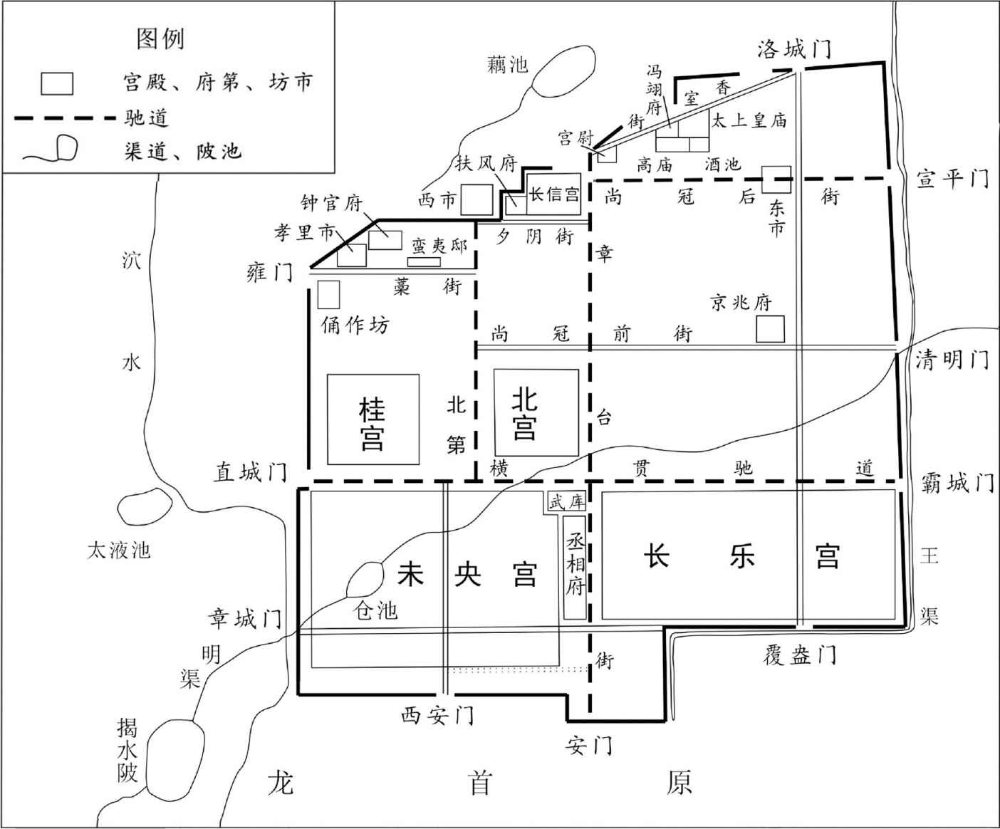
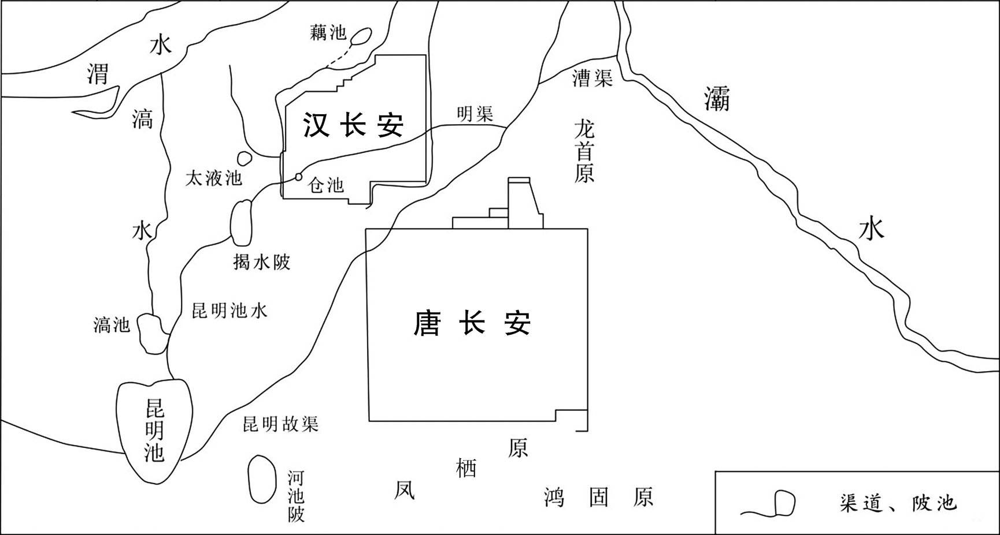
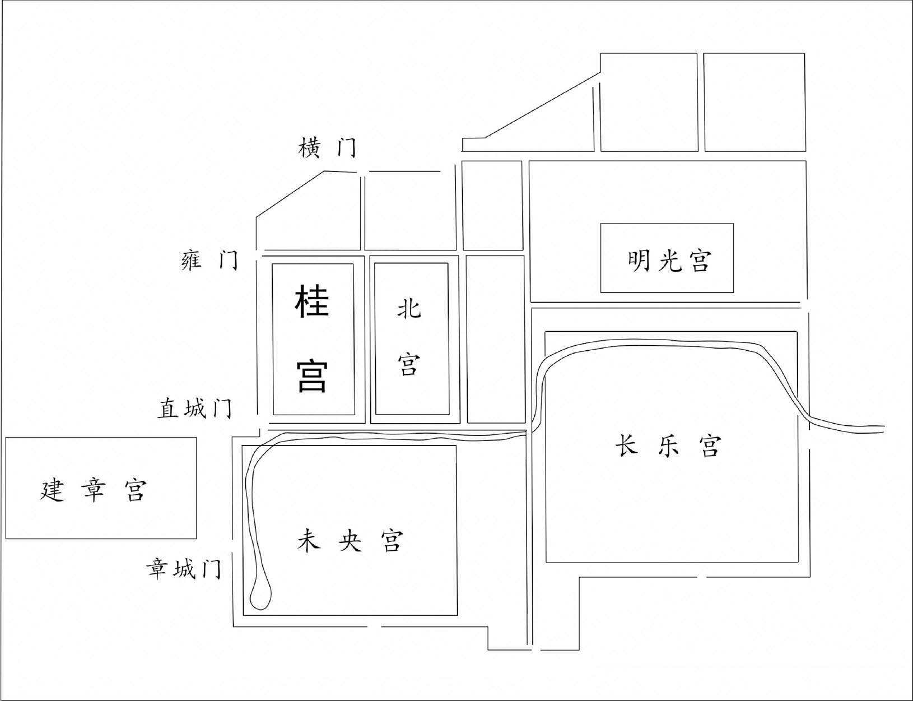
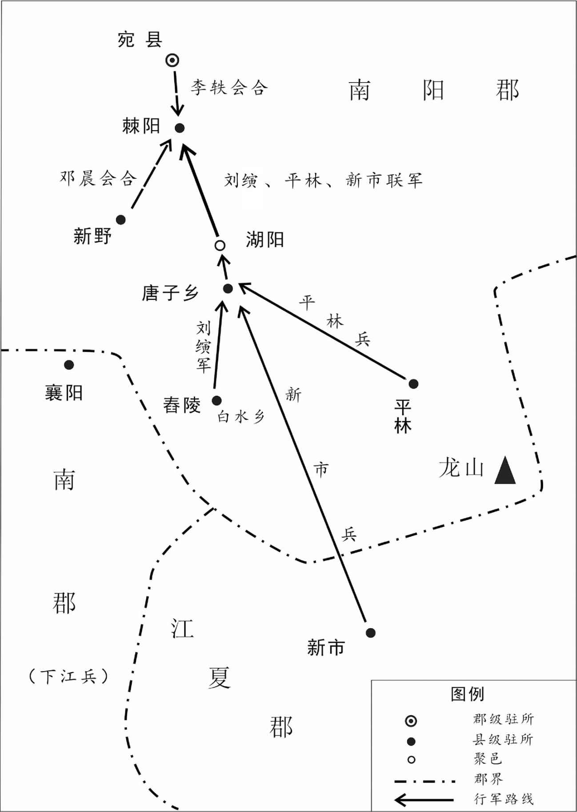
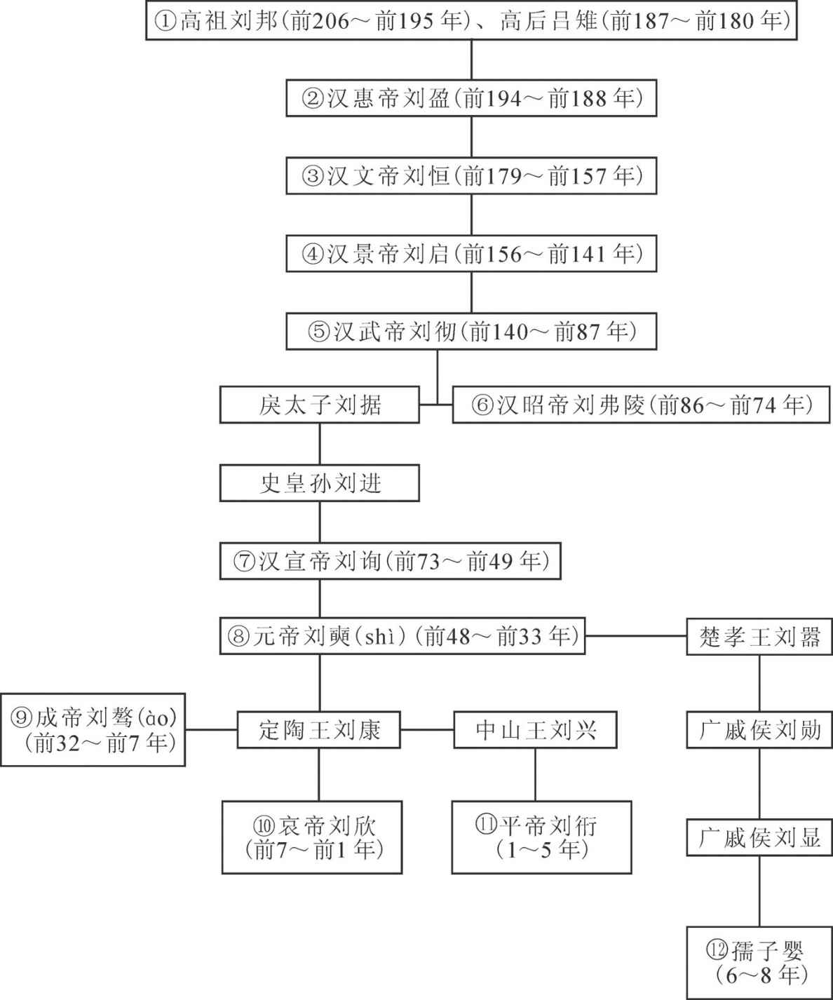
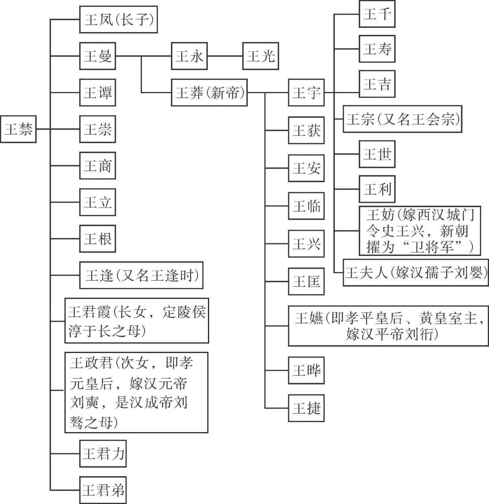
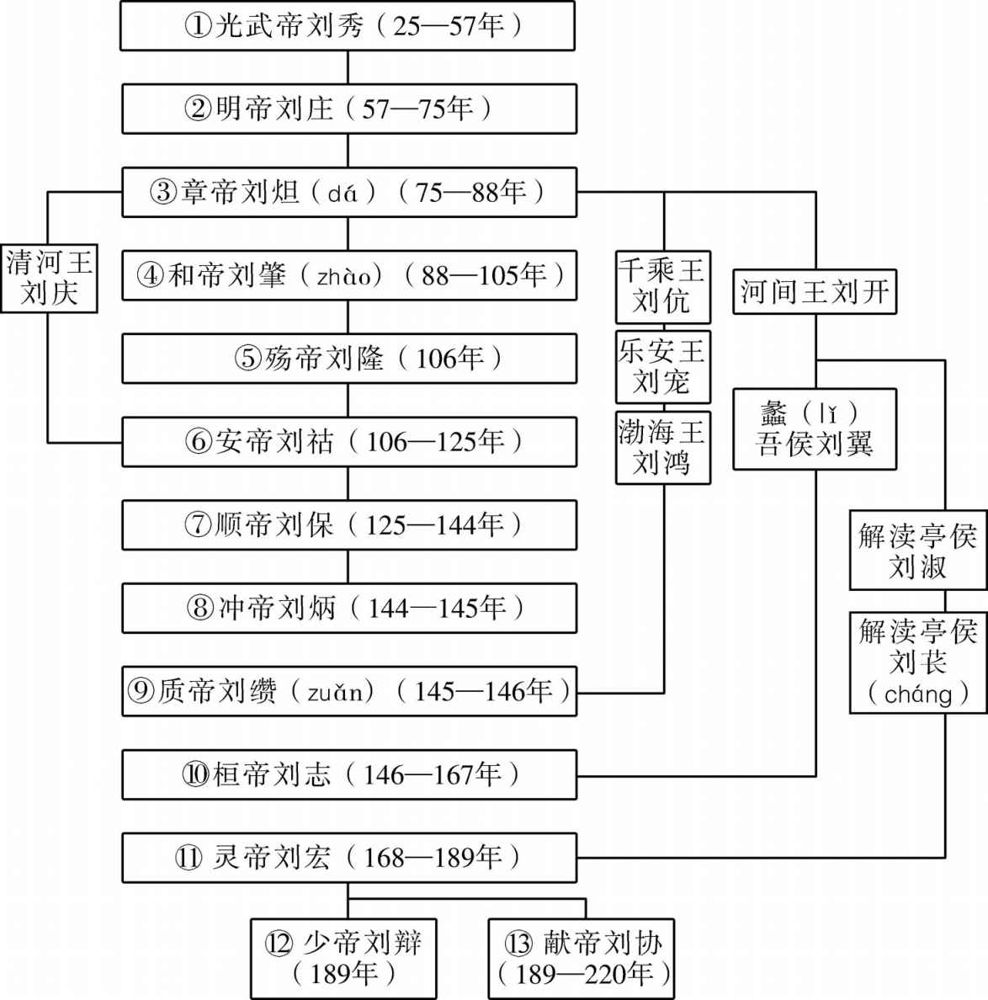

# 目录

丁傅用事

董贤嬖幸

王莽篡汉

光武中兴

附录： 
西汉皇帝世系表

王莽家族世系表

东汉皇帝世系表

返回总目录

# 丁傅用事

## 【内容提要】

本篇主要叙述了汉哀帝刘欣在定陶傅太后的拥立下当上汉朝皇帝，本想借鉴成帝之失，亲自理政，振兴汉室江山，但是被傅太后和丁姬逼迫，不得已也走上了宠信外戚、大权旁落、排挤忠臣、朝政昏乱的道路的历史过程。

整个汉朝，母后干政、外戚专权的情况很普遍，高祖时期的吕雉，景帝时期的窦太后，都干预朝政。到了成帝时期，王氏家族“一日五侯”，更是祸国殃民，使得汉朝国势江河日下。而此时成帝无嗣，定陶王刘欣在祖母傅太后贿赂皇后赵飞燕姊妹和帝舅王根的情况下，登上帝位，是为汉哀帝。

哀帝即位后，本想“鉴成帝之失，约俭正身，欲与天下更始”，但是时间不长就被傅太后控制了局面。傅氏本是汉元帝的一个宠妃，生子定陶恭王刘康。刘康有才艺，颇受汉元帝的宠爱。他们母子差点就取代了王皇后和成帝刘骜的地位。哀帝即位后，傅氏不满足于“定陶恭王太后”的称号，倚仗自己的抚养和拥立之功，不仅称“帝太太后”尊号，大封丁、傅两家族，还把持朝政，打击、排挤包括孔光、师丹、傅喜等朝廷重臣。

此时，汉朝先后发生地震、日食，一些大臣便上奏说明“阳尊阴卑”，劝谏哀帝重振朝纲。傅太后和汉哀帝去世后，王莽回朝，丁、傅两族顷刻土崩瓦解，这也为后来的王莽篡汉埋下了伏笔。

## 【原文】

**汉成帝元延四年春正月，中山王兴、定陶王欣皆来朝[1]。中山王独从傅，定陶王尽从傅、相、中尉[2]。上怪之，以问定陶王，对曰：“令，诸侯王朝，得从其国二千石[3]。傅、相、中尉皆国二千石，故尽从之。”上令诵《诗》，通习，能说[4]。他日问中山王：“独从傅，在何法令？”不能对；令诵《尚书》，又废；及赐食于前，后饱；起下，韈系解[5]。帝由此以为不能，而贤定陶王，数称其材。是时，诸侯王唯二人于帝为至亲。定陶王祖母傅太后随王来朝[6]。私赂遗赵皇后、昭仪及票骑将军王根[7]。后、昭仪、根见上无子，亦欲豫自结，为长久计，皆更称定陶王，劝帝以为嗣。帝亦自美其材，为加元服而遣之，时年十七矣[8]。**

## 【注文】

[1]汉成帝：即刘骜（音ào，前51—前7年）。西汉皇帝，公元前33—前7年在位。字太孙。元帝与王皇后之子。即位后以母舅王凤为大司马大将军领尚书事，总揽朝政。王氏诸舅皆为列侯。耽于酒色，赵飞燕、赵合德姊妹专宠后宫。无子嗣。营建昌陵，费以巨亿，导致天下匮竭，百姓流离，饿殍遍野。各地人民反抗斗争此起彼伏，西汉王朝迅速衰落。　　中山王兴：刘兴（？—前8年），汉元帝子，母冯昭仪。建昭二年（前37年）立为信都王。阳朔二年（前23年）徙为中山王。汉成帝议立太子，御史大夫孔光力主以刘兴为嗣，但外戚王氏、赵昭仪与票骑将军王根等拥立定陶王刘欣，故终不得立。成帝于是加封万户以慰之。死后谥号孝王。　　定陶王欣：即汉哀帝刘欣（前25—前1年）。西汉皇帝，公元前7—前1年在位。元帝庶孙，当时为定陶恭王子。被汉成帝立为子嗣。即位后为削弱外戚王氏权力，派遣王莽及曲阳侯王根就国。又欲限制宗室、诸王侯，对三公、刺史官称亦多有改动。但是一次就赏赐宠臣董贤良田两千顷，加上外戚丁、傅用事阻挠，均田之议作罢，导致社会危机严重，朝政日乱。身患痿痹之症，末年加剧。

[2]傅：官名。西周设置，春秋秦汉及后代沿用。国君辅相称太傅、少傅，太子辅相称太子太傅、太子少傅。汉代太子少傅、诸侯王国的傅也简称傅。这里指诸侯王国的傅。该官名在明洪武九年（1376年）罢。　　相：官名。初为辅佐君王的执政大臣的泛称。秦汉以后成为相国、丞相等宰相之官的通称。西汉初诸侯王国设置相国、丞相，景帝中元五年（前145年）改诸侯王国的相国、丞相名称“相”，秩两千石。执掌辅导、匡正、监督诸侯王，为王国最高行政长官，位高于郡守，多由朝廷选派，统领王国诸官。这里指的就是诸侯王国的相。　　中尉：诸侯国军事长官。西汉初，由诸侯国自己设置，汉景帝以后由朝廷委派。统领王国中的军兵，监察军吏，维护国内治安，秩两千石。东汉沿置，与郎中令、大农并称王国三卿。

[3]令：法令，礼法。一般指为解决某类问题而颁行的具体法规，较“律”灵活，所谓“前主所是著为律，后主所是疏为令”。律令相辅而行。这里指礼法。　　二千石（dàn）：官秩等级，因为所得俸禄以米谷为准，米谷又以“石”为单位，所以以“石”称之。汉代二千石为中央政府机构的太子太傅、太子少傅、将作大匠、詹事、内史等列卿，以及州郡牧守和王国相一级的官员。如文中的傅、相、中尉等都是二千石的官员。

[4]《诗》：即《诗经》。中国最早的诗歌总集。原本称《诗》，后因被儒家奉为经典，故称《诗经》。　　习：背诵。　　说：解释。

[5]《尚书》：原称《书》，至汉代时改称《尚书》，意为“公之于众的（古代）皇室文献”。《尚书》，在作为历史典籍的同时，向来被文学史家称为我国最早的散文总集，是和《诗经》并列的一个文体类别。是一部多体裁文献汇编，也是中国现存最早的史书。　　韈（wà）：古同“袜”，即“袜子”。《说文》：“韤是足衣。”最初，韈大概是皮做的，因此写作“韈”。

[6]傅太后（？—前2年）：西汉河内温人。定陶王（也就是后来的哀帝）刘欣的祖母。她用珍宝贿赂赵昭仪、帝舅王根，使定陶王得立太子。定陶王即位后，地位尊贵、骄奢益甚，干预朝政，外家并居高位。

[7]遗（wèi）：给予；馈赠。赂遗即贿赂，行贿。　　赵皇后：即赵飞燕（前45—前1年），西汉成帝之皇后。以能歌善舞、身轻如燕闻名于后世。名宜主，吴县（今江苏苏州）人，长安宫人，因其舞姿轻盈如燕飞凤舞，故称其为“飞燕”。其妹赵合德亦被立为昭仪，两姐妹专宠后宫，显赫一时。引起了朝野上下很多人的不满和嫉妒。　　昭仪（？—前7年）：即赵合德，赵飞燕之妹。其姊入宫受成帝宠爱，她亦因其姊而被推荐给成帝刘骜，两人俱立为婕妤，专宠后宫，飞燕立为皇后，她立为昭仪。居昭阳宫，受宠甚于其姊。公元前7年，成帝因在赵合德床上暴死，人多归罪于她，称其为“祸水”，赵合德自知罪责难逃，自杀。　　票骑将军：票，也作“骠”。汉代将军名号。汉武帝元狩二年（前121年），因霍去病征匈奴有大功，始以其为骠骑将军，金印紫绶，位同三公。　　王根（？—前2年）：西汉后期权臣，魏郡元城人，字稚卿。太后王政君的亲族，大司马王凤的弟弟。河平二年（前27年），汉成帝诏封王谭为平阿侯，王商为成都侯，王立为红阳侯，王根为曲阳侯，王逢时为高平侯，世人称之“一日五侯”。五侯之间不和睦，其门客之间也不敢互相往来。王凤在职十一年卒，王音接替其为大司马。王音在职七年，王凤之弟王商接替辅政，为大司马卫将军，三年而卒。后由王凤之弟王根为大司马骁骑将军辅政，在职四年而病免。而后由王莽为大司马。

[8]豫：通“预”。事先有所准备。　　加元服：元服，指冠。古称行冠礼为加元服。“冠礼”，是古代男子成年开始戴冠的仪式。

## 【译文】

汉成帝刘骜元延四年（前9年）春季正月，中山王刘兴和定陶王刘欣两人都到都城长安朝见天子。中山王只带了一个官员——王国的傅，而定陶王把王国的傅、相和中尉都带来了。成帝很奇怪，就问定陶王怎么回事，刘欣回答说：“按照汉朝礼法，诸侯王朝见皇帝，必须由国中官秩二千石的官员陪同。傅、相和中尉三者都是官秩二千石的官，因此就让他们都来了。”成帝让他背诵《诗经》，他不仅能够熟练背诵，而且还能解释大意。过了几天，成帝问中山王刘兴：“你只带傅一人来朝，有什么礼法根据？”刘兴答不上来；成帝让他背诵《尚书》，又背不下来；到了皇上赐宴和他一起进餐时，他在成帝之后吃完。饭后起身的时候，袜带松开了也不自知。成帝由此认为刘兴没有能力，定陶王刘欣贤能，多次称赞他是可造之材。当时，在众多诸侯王中，只有刘兴和刘欣两人跟成帝的血缘关系最近。定陶王刘欣的祖母傅太后和刘欣一起来朝见的时候，暗地里以珍宝贿赂成帝皇后赵飞燕、昭仪赵合德以及骠骑将军王根。皇后、昭仪和王根知道成帝没有子嗣，为长远着想，正好也想私下结交诸侯王，以做靠山，于是都在皇帝面前称赞刘欣，并劝说皇上立定陶王做太子。成帝自己也很欣赏刘欣的才干，就在刘欣十七岁这年，亲自为他举行加冠礼后送他回了封国。

## 【原文】

**绥和元年春正月，上召丞相翟方进、御史大夫孔光、右将军廉褒、后将军朱博入禁中，议中山、定陶王谁宜为嗣者[1]。方进、根、褒、博皆以为：“定陶王，帝弟之子。《礼》曰：‘昆弟之子犹子也，为其后者为之子也。’定陶王宜为嗣。”[2]光独以为：“礼，立嗣以亲。以《尚书·盘庚》殷之及王为比，兄终弟及[3]。中山王，先帝之子，帝亲弟，宜为嗣。”上以中山王不材，又礼，兄弟不得相入庙，不从光议。二月癸丑，诏立定陶王欣为皇太子，封中山王舅谏大夫冯参为宜乡侯，益中山国三万户以慰其意[4]。使执金吾任宏守大鸿胪，持节征定陶王[5]。定陶王谢曰：“臣材质不足以假充太子之宫，臣愿且得留国邸，旦夕奉问起居，俟有圣嗣，归国守藩。”书奏，天子报闻[6]。戊午，孔光以议不合意，左迁廷尉，何武为御史大夫。**

## 【注文】

[1]翟方进（前53—前7年）：字子威，西汉上蔡人。少孤，家世微贱，以射策甲科为郎。汉成帝河平二年（前27年），转为博士。数年，迁朔方太守，居官不烦苛，甚有威名，调任丞相司直。永始二年（前15年），升任御史大夫，旋擢丞相，封高陵侯，因通晓法律号为“通明相”。为王莽视所嫉妒。西汉成帝绥和二年（前7年），天文台观测到了“荧惑守心”的天象，汉成帝赐册斥责方进，认为方进为相十年，灾害并至，民受饥饿，政令无常，方进即日自杀，谥恭侯。　　孔光（前65—5年）：字子夏，鲁国（今山东曲阜）人。孔子第十四代孙，西汉成帝、哀帝时大臣。以明经学，于法律颇为擅长，未满二十岁就被举为议郞。为官严守秘密，坚持原则。曾任御史大夫，绥和元年（前8年）二月，成帝诏仪立皇太子。光主张立中山王，结果以议不中意，被贬为廷尉。一度罢相，后又复职。元始五年（5年）病故。　　廉褒（生卒年不详）：陇西襄武人。赵国将军廉颇的后人。成帝、哀帝时为右将军。汉与羌戎在河西长期战争，人民深受战乱之苦，他以恩义结交羌戎，羌戎感其恩泽，边境得以安宁。班固说：“山东出相，山西出将，汉兴，成纪李广、李蔡，上邦赵充国，襄武廉褒，狄道辛武贤、庆忌，皆以勇武显闻。”　　朱博（？—前5年）：字子元，西汉杜陵（今陕西西安东南）人。成帝时，历任博阳令、冀州刺史、左冯翊、光禄大夫、廷尉、后将军等，因与红阳侯王立交从甚密，在王立包庇淳于长侮辱废后许氏一案败露后连座获罪免职。哀帝即位后，复位光禄大夫，迁京兆尹，因附逆傅太后得为大司空，旋迁丞相，封阳乡侯。后被哀帝获悉其奸，自杀身亡。

[2]《礼》：即《礼记》。儒家经典之一，是中国古代一部重要的典章制度书籍。是战国至秦汉年间儒家学者解释说明经书《仪礼》的文章选集，是一部儒家思想的资料汇编。《礼记》的作者不止一人，写作时间也有先后，其中多数篇章可能是孔子的七十二名高徒弟子及其学生们的作品，还兼收先秦其他典籍。

[3]《尚书·盘庚》：《尚书》原称《书》，中国现存最早的史书，是古代重要的历史典籍，同时也被文学家称为我国最早的散文总集。盘庚，生卒年不详。祖丁子，阳甲死后继位。是商代第二十位国王，根据《夏商周年表修正》，在位二十三年（前1300—前1277年在位）。在位的第三年（前1298年）迁都殷。是一位很有作为的国王。《尚书·盘庚》就是他在迁殷前后的讲话记录。

[4]冯参（？—前6年）：字叔平，西汉上党潞（今山西潞城）人。姊为汉元帝昭仪，生中山王。元帝时以中山王舅历任代郡、安定太守、谏大夫等职，封宜乡侯。哀帝即位后，帝祖母傅太后用事，陷中山太后大逆罪，遭连坐，自杀。

[5]执金吾：官名。西汉太初元年，由中尉改置，秩中二千石掌管京师治安、督捕盗贼，负责京城之内、皇宫以外的警卫，戒备非常水火之事，管理中央武库，皇帝出行则掌管护卫及仪仗。王莽时更名奋武，东汉复执金吾旧名。　　任宏：西汉人，生卒年不详，成帝时为步兵校尉。因成帝认为国家藏书颇有散亡，搜求天下遗书。后诏刘向等人分类校书，任宏主校兵书。

[6]报闻：封建时代，天子批答臣下奏章时，书一“闻”字，谓之报闻。泛指天子批答，意思说所奏之事已知，相当于今天领导的批示“已阅”。

## 【译文】

汉成帝绥和元年（前8年）春季正月，汉成帝宣召丞相翟方进、御史大夫孔光、右将军廉褒和后将军朱博进宫，商议中山王刘兴和定陶王刘欣谁更适合继承帝位之事。丞相方进、骠骑将军王根以及右将军廉褒和后将军朱博都说：“定陶王刘欣是皇上亲弟弟之子，根据《礼记》记载，兄弟的儿子也是儿子，立他为后嗣，就是儿子了。所以定陶王刘欣适合做太子。”但孔光认为：“依照礼法，立后嗣应该按照血缘关系的亲疏，谁最亲谁合适，比如用《尚书·盘庚》里记载的商朝君王传位方法做榜样，就应兄终弟及。中山王刘兴，是先帝的儿子，皇上的亲弟弟，更适合做继承人。”成帝以中山王没有学识才干和按照礼法兄弟的牌位不能相继进入宗庙这两个理由，未采纳御史大夫孔光的建议。二月癸丑（初九日），汉成帝正式下诏立定陶王刘欣为皇太子，同时封中山王刘兴的舅舅谏大夫冯参为宜乡侯，并增加中山国食邑三万户，表示安慰。然后派执金吾任宏暂代大鸿胪，持皇帝的符节去征召定陶王刘欣。刘欣上书推辞说：“臣天资愚钝，才能资质不足以占据太子宫，充当太子，我愿意暂住在定陶国设在京城的官邸中，早晚进宫给皇帝请安，等皇帝有了自己的亲儿子，我就返回我的封国为陛下守边疆。”汉成帝看了刘欣的奏章，批复：“已阅。”戊午（十四日），孔光因为提议不合汉成帝的心意，被贬为廷尉，由何武继任御史大夫。

## 【原文】

**秋八月，中山孝王兴薨[1]。**

## 【注文】

[1]薨（hōng）：古代称诸侯或有爵位的大官死去为“薨”。史书对人身故有多种描述方式，常见的用“卒”，早亡一般用“殇”，帝后级别用“崩”，还有就是对一些特殊地位或者特殊方式死亡的描述，比如“殉”“没”“自尽”“弑”等。而“薨”专指诸侯王去世。《礼记·曲礼》：“天子死曰崩，诸侯死曰薨，大夫死曰卒，士曰不禄，庶人曰死。”

## 【译文】

秋季，八月，中山王刘兴去世。

## 【原文】

**冬十月，上以太子既奉大宗后，不得顾私亲[1]。十一月，立楚孝王孙景为定陶王，以奉恭王后[2]。初，太子之幼也，王祖母傅太后躬自养视。及为太子，诏“傅太后与太子母丁姬自居定陶国邸，不得相见”[3]。顷之，王太后欲令傅太后、丁姬十日一至太子家，帝曰：“太子承正统，当共养陛下，不得复顾私亲。”[4]王太后曰：“太子小而傅太后抱养之，今至太子家，以乳母恩耳，不足有所妨。”于是令傅太后得至太子家，丁姬以不养太子，独不得。**

## 【注文】

[1]大宗：封建宗法社会以嫡系长房为“大宗”，余子为“小宗”。其本质是帝位的嫡长子继承制，即只有天子是大宗，其余不论诸侯王还是卿、士大夫都是小宗。《仪礼·丧服》：“‘为人后者’，孰后？后大宗也。曷为后大宗？大宗者，尊之统也。”王位和财产必须由嫡长子继承，嫡长子是嫡妻（正妻）所生的长子，庶子对嫡子的大宗来说，是小宗，而在自己的封地内又为大宗，其继承者也必须是嫡长子。嫡长子继承制的目的在于解决权位和财产的继承与分配，稳定社会的统治秩序。

[2]楚孝王（？—前5年）：即刘嚣，汉朝宗室，汉宣帝的第三子，生母是卫婕妤。甘露二年（前52年）正月，汉宣帝立刘嚣为定陶王。甘露四年（前50年）正月，定陶王刘嚣改封为楚王。史称刘嚣“素行孝顺仁慈，之国以来二十余年，纤介之过未尝闻”。河平三年（前26年）正月，刘嚣带病朝见汉成帝。汉成帝为了褒扬叔父刘嚣，封刘嚣的次子刘勋为广戚侯。次年，刘嚣病故，谥号孝，楚王的爵位由他儿子刘文继承。　　恭王（？—前23年）：即定陶恭王刘康，汉元帝次子，母傅昭仪。永光三年（前41年），汉元帝立刘康为济阳王。建昭五年（前34年）徙为山阳王。河平二年（前27年）徙为定陶王。刘康多才艺、知音律，汉元帝非常宠爱他，生母傅昭仪又是元帝的宠妃，他们母子差点就取代了皇后王政君、太子刘骜。因匡衡、史丹的劝谏而作罢。汉成帝刘骜即位，根据先帝的意思，刘康优厚的待遇异于其他诸侯王。阳朔二年（前23年）八月，定陶王刘康去世，谥号恭，丁姬所生的刘欣嗣定陶王位。成帝无子，迎刘欣为皇太子。另立楚孝王孙刘景为定陶王，奉定陶恭王祭祀。成帝崩，太子即位，是为汉哀帝。汉哀帝即位次年，追尊定陶恭王刘康为恭皇帝。

[3]丁姬（？—前5年）：西汉山阳瑕丘（今山东兖州）人。汉哀帝刘欣的生母，定陶恭王刘康的王妃，河平四年（前25年）生刘欣。汉哀帝登基后尊其为帝太后，称中安宫。王莽秉政时，贬号丁姬，外戚丁氏全部罢免官爵，徙归故郡。　　定陶国邸：邸，诸侯、王侯为朝见天子而设在京城的住所。定陶国邸，即是定陶王刘欣为朝见在京设置的府邸。

[4]王太后（前71—13年）：即王政君，西汉魏郡元城（今河北大名东）人。汉元帝刘奭皇后，汉成帝刘骜生母，王莽姑母。元帝即位，立为皇后。成帝即位，尊为皇太后。哀帝即位，尊为太皇太后。河平二年（前27年），她的五个兄弟同日封侯，王氏专权自此开始。哀帝死后，临朝称制，委政于王莽，导致王莽篡汉。

## 【译文】

冬季十月，汉成帝认为太子刘欣既然已经继承大宗做了皇帝的子嗣，就不能再顾念自己的生身父母了，于是在十一月立楚孝王刘嚣的孙子刘景为定陶王，来奉养恭王。当初太子年幼的时候，是由祖母傅太后亲自抚养的。被封为太子之后，皇上便下诏，诏令傅太后和太子的生母丁姬住在定陶国的国邸，不能与太子见面。没多久，皇太后想让傅太后和丁姬每隔十天可以到太子住处探望，汉成帝说：“太子已经继承正统，就应当奉养太后陛下您，不能再顾念自己的私亲了。”王太后却说：“太子小的时候是由他祖母傅太后抚养的，现在让她们来探望，只是乳娘的恩情罢了，没什么大不了的。”于是，皇帝传令傅太后可以来太子住处探望，丁姬因为没有抚养过太子，不得前往。

## 【原文】

**二年三月丙戌。帝崩于未央宫[1]。**

## 【注文】

[1]崩：即驾崩。古代把天子的死看得很重，常用山塌比喻，由此从周代开始帝王死称“崩”。《礼记·曲礼》：“天子死曰崩，诸侯死曰薨，大夫死曰卒，士曰不禄，庶人曰死。”因此“崩”专指皇帝去世。　　未央宫：西汉主要宫殿建筑群，皇家宫殿。位于今陕西西安西北约3000米处。因在长乐宫之西，汉时称“西宫”。汉高祖七年（前200年）在秦章台基础上修建，同年自栎阳迁都长安。汉惠帝即位后未央宫基本建成，开始成为主要宫殿。惠帝元年至五年修筑城墙。“未央”一词取自《诗·小雅·庭燎》诗句“夜如何其？夜未央”。意思是“未尽”“不尽”。西汉王朝的创始人将自己的统治中心以“未央”命名，其用意与秦嬴政将自己称“始皇”，以便“传之万世”的愿望相一致。另一说，“未央”截取于“长乐未央”。汉代有两座宫殿分别名为“长乐宫”“未央宫”。“长乐未央”意为永远快乐，没有穷尽。

## 【译文】

绥和二年（前7年）三月丙戌（十八日），汉成帝在未央宫去世。

## 【原文】

**夏四月丙午，太子即皇帝位，尊皇太后曰太皇太后[1]。太皇太后令傅太后、丁姬十日一至未央宫。**

## 【注文】

[1]太皇太后：是古代皇帝对自己的祖母十分尊敬的称呼。或是以孙子辈分入继大统的，对尚在世的先帝母亲的尊称，原来是皇太后，再晋为太皇太后。《汉书·外戚传》：“汉兴，与秦之称号，帝母称皇太后，祖母称太皇太后。”秦汉以后历代沿称。也省作“太皇”。

## 【译文】

夏季四月丙午（初八日），皇太子刘欣即皇帝位（是为哀帝），尊称皇太后王政君为太皇太后。太皇太后诏命，傅太后和皇帝生母丁姬可以每隔十天到未央宫探视皇帝一次。

 
汉长安城示意图

 
汉长安附近示意图

## 【原文】

**有诏问丞相、大司空：“定陶共王太后宜当何居？”[1]丞相孔光素闻傅太后为人刚暴，长于权谋，自帝在襁褓，而养长教道至于成人，帝之立又有力。光心恐傅太后与政事，不欲与帝旦夕相近，即议以为：“定陶太后宜改筑宫。”大司空何武曰：“可居北宫。”[2]上从武言。北宫有紫房复道通未央宫，傅太后果从复道朝夕至帝所，求欲称尊号，贵宠其亲属，使上不得由直道行。高昌侯董宏希指，上书言：“秦庄襄王母本夏氏，而为华阳夫人所子，及即位后，俱称太后。宜立定陶共王后为帝太后。”[3]事下有司，大司马王莽、左将军、关内侯、领尚书事师丹劾奏宏：“知皇太后至尊之号，天下一统，而称引亡秦以为比谕，诖误圣朝，非所宜言，大不道。”[4]上新立，谦让，纳用莽、丹言，免宏为庶人。傅太后大怒，要上，欲必称尊号，上乃白太皇太后，令下诏尊定陶恭王为恭皇。**

## 【注文】

[1]大司空：官名。“司空”这个官职，从尧帝以来就设有，但历代的职务有所不同：尧、舜、禹时代的司空，主管治理水土；西周时为六卿之一，主管治理水土、建筑工程、车服器械等，三公之一；西汉绥和元年（前8年）由御史大夫改为此名，秩万石，俸禄等同丞相。置长史等属官，府设诸曹分管具体事务。与丞相（大司徒）、大司马并为三公，共同管理政务。后去“大”字，称司空，主管囚徒。　　定陶共王太后：即傅太后（？—前2年），西汉河内温人。定陶王（也就是后来的哀帝）刘欣的祖母。

[2]何武（？—3年）：西汉蜀郡郫县（今四川郫县北）人，字君公。以射策甲科为郎。历任扬州刺史、丞相司直、清河太守、兖州刺史、司隶校尉等职。成帝绥和元年（前8年）封御史大夫，旋即为大司空，封汜乡侯。哀帝初，与丞相孔光议限民名田及奴婢，因外戚丁傅专权，不成。哀帝死后，因反对王莽为大司马，免官。　　北宫：皇后所居之宫，也指后宫。这里指长安汉宫，汉高祖时建，后来武帝增修之。

[3]复道：古代宫殿楼阁间架空的通道，称复道，也称阁道。　　高昌侯董宏（？—前3年）：西汉人。成帝时嗣爵高昌侯。哀帝即位，帝母傅太后欲求尊号，董宏迎合承旨上书议立傅太后为皇太后。大司马王莽、左将军师丹等弹劾其大不道，被贬为庶人。哀帝后来尊傅太后为恭皇太后和太皇太后时，得以恢复爵位。哀帝死，平帝即位后，复免为庶人。　　希指：即希旨，意为迎合在上者的旨意。　　秦庄襄王（前280—前247年）：战国时秦国国君，名异人，秦孝文王之子。公元前249—前247年在位。小时候在赵国做人质，吕不韦以为“奇货可居”，说服华阳夫人立为嗣，更名子楚。孝文王死后即位，以吕不韦为相国，灭东周，伐三晋，置三川、太原郡。死后，子嬴政继位。　　华阳夫人（？—前230年）：即秦孝文王皇后，亦称华阳太后。战国时楚国人。秦昭王太子安国君爱姬。因为自己无子，从吕不韦言，立在赵国做质子的异人为嗣，更名子楚。前251年，秦昭王死，安国君继位，即秦孝文王，被立为后，以子楚为太子。子楚即位，是为庄襄王。她被尊为华阳太后。

[4]有司：官吏和官署的泛称。古代设官分职，各有专司，故称。有司一称，相当于今天白话文“有关部门”或“负责这事的单位”。　　王莽（前45—23年）：字巨君，魏郡元城（今河北大名东）人。新朝皇帝。8—23年在位。汉元帝皇后王政君的亲侄子，初任黄门侍郎，成帝永始元年（前16年）封新都侯，迁骑都尉光禄大夫给事中。因弹劾外戚定陵侯淳于长，获正直之名，示人俭约，笼络人心。绥和元年（前8年）任大司马。哀帝时因丁傅用事，罢官就第。哀帝死，王政君临朝称制，复任大司马，议立平帝，封安汉公。元始五年（5年），平帝死，选立年仅两岁的孺子婴，仿效周公摄政，自称“假皇帝”。初始元年（8年）自立为帝，改国号“新”。然后实行一系列托古改制，民不聊生，以致爆发绿林、赤眉起义。地皇四年（23年）长安失陷身死，新朝灭亡。　　师丹（？—3年）：西汉琅邪（今山东诸城）人，字仲公。元帝末以治《诗》为博士。成帝时历任光禄大夫、丞相司直、少府、光禄勋、太子太傅等职。哀帝即位，为左将军，领尚书事，代王莽为大司马，封高乐侯。建言限民名田及奴婢。因反对哀帝尊傅太后尊号，免官。平帝即位，王莽秉政，封义阳侯。

## 【译文】

刚即位的汉哀帝刘欣下诏问丞相和大司空：“定陶恭王太后（即傅太后）住在哪里比较合适呢？”丞相孔光素来听说傅太后为人刚强暴躁，工于心计且会玩弄权谋，哀帝刘欣是她从襁褓中一直抚养长大教育成人的，而且在刘欣能当上皇帝这件事上又出了大力。因此孔光担心傅太后会干预朝政，不想让她和皇帝朝夕接触，于是就上奏建议：“应该给定陶太后另外修筑宫殿。”大司空何武却说：“可以住在北宫。”皇上采纳了何武的建议。北宫的紫房有复道直接通到皇帝住的未央宫，傅太后果然每天早晚从复道去皇上的住所，求哀帝加封她皇太后的尊号，宠信提拔她的亲属，这让哀帝刘欣没办法按朝纲办事。高昌侯董宏为了迎合傅太后和哀帝的旨意，就上奏说：“秦朝庄襄王的亲生母亲本来是夏氏，但后来被过继给华阳夫人，秦庄襄王即位后，两个母亲都被尊为太后。所以当今定陶恭王太后也应该尊为皇太后。”皇帝把奏章交给有司讨论，大司马王莽和左将军、关内侯领尚书事师丹联名上奏弹劾董宏说：“董宏明明知道皇太后是至尊的称号，现今天下大一统，他却援引已经灭亡的秦朝事例作比喻，贻误圣上和朝廷，这是不该上的奏言，是大逆不道之罪。”皇上刚刚即位，态度很谦让，就采纳了王莽和师丹的建议，把董宏罢免并贬为平民。傅太后知道后勃然大怒，要挟皇上，强迫哀帝给她皇太后尊号。皇帝不得以告诉了太皇太后，太皇太后命令下诏尊称哀帝的生父定陶恭王刘康为恭皇。

## 【原文】

**五月丙戌，立皇后傅氏，傅太后从弟晏之子也[1]。诏曰：“《春秋》，母以子贵[2]。宜尊定陶太后曰恭皇太后，丁姬曰恭皇后，各置左右詹事，食邑如长信宫、中宫。”[3]追尊傅父为崇祖侯，丁父为褒德侯；封舅丁明为阳安侯，舅子满为平周侯，皇后父晏为孔乡侯，皇太后弟侍中、光禄大夫赵钦为新城侯。**

## 【注文】

[1]傅氏（？—前1年）：西汉河内温（今属河南）人。汉哀帝皇后。定陶傅太后堂弟的女儿。哀帝刘欣还是定陶王的时候，傅太后想亲上加亲，于是把她嫁给了刘欣。等到哀帝即位，就立为了皇后。哀帝死后，被废为庶人，旋即自杀。　　从弟晏：从，指堂房亲属。如堂兄弟称从兄弟，堂伯叔称从伯叔。傅晏（生卒年不详），西汉河内温县（今属河南）人。定陶傅太后的堂弟。哀帝即位，因其女被立为皇后，得封孔乡侯。建平二年（前5年），傅晏与京兆尹朱博共谋迎合傅太后上尊号，弹劾丞相孔光、大司马傅喜，后又承傅太后旨，指使朱博夺傅喜爵位。傅晏遂以搅乱朝政被削户四分之一。元寿元年（前2年），拜大司马卫将军。平帝即位，王莽秉政，傅因为前罪，被削爵罢官。

[2]《春秋》：儒家经典之一，“五经”之一。编年体春秋史。相传由孔子据鲁国史官所编《春秋》加以整理修订而成，记载了从鲁隐公元年（前722年）到鲁哀公十四年（前481年）的历史，是中国现存最早的一部编年体史书。另外，春秋在古代也代表一年四季，而史书记载的都是一年四季中发生的大事，因此“春秋”也作为史书的统称。

[3]左右詹事：官名。西汉承秦制置詹事，管理太后、皇后宫中事务，成帝时省并大长秋。哀帝即位，复置，分左、右，为恭皇太后、恭皇后宫中总管。后罢。　　长信宫、中宫：宫殿名，这里代指长信宫皇太后王政君、中宫皇后赵飞燕。

## 【译文】

五月丙戌（十九日），汉哀帝立傅氏为皇后，傅氏是傅太后的堂弟傅晏的女儿。皇帝下诏说：“《春秋》记载，母亲凭借儿子而尊贵。所以应该尊称定陶太后为恭皇太后，尊称丁姬为恭皇后，为她们分别设置左、右詹事，食邑应该和长信宫皇太后和中宫皇后一样。”并追封傅太后的父亲为崇祖侯，丁姬的父亲为褒德侯；然后封哀帝的舅舅丁明为阳安侯，舅舅的儿子丁满为平周侯，傅皇后的父亲傅晏为孔乡侯，皇太后赵飞燕的弟弟当时的侍中、光禄大夫赵钦为新城侯。

## 【原文】

**傅太后从弟右将军喜，好学问，有志行，众庶归望于喜。初，上之官爵外亲也，喜独执谦称疾[1]。傅太后始与政事，数谏之，由是傅太后不欲令喜辅政。［秋七月］庚午(1)，赐喜黄金百斤，上右将军印绶，以光禄大夫养病[2]。大司空何武、尚书令唐林皆上书言：“喜行义修洁，忠诚忧国，内辅之臣也。今以寝病一旦遣归，众庶失望，皆曰：‘傅氏贤子，以论议不合于定陶太后，故退，’百寮莫不为国恨之[3]。忠臣，社稷之卫，鲁以季友治乱，楚以子玉轻重，魏以无忌折冲，项以范增存亡[4]。百万之众，不如一贤，故秦行千金以间廉颇，汉散万金以疏亚父[5]。喜立于朝，陛下之光辉，傅氏之废兴也。”上亦自重之，故寻复进用焉。**

## 【注文】

[1]右将军喜（？—10年）：即傅喜，西汉河内温县（今属河南）人。字稚游。傅太后堂弟。哀帝初，任卫尉，迁右将军，因不满傅太后干政，推官养病，后复任大司马，封高武侯。后再次得罪傅太后，遂被策免，以侯就国。王莽时得还长安。　　众庶：庶民；众民。　　执谦：保持谦逊。

[2]与（yù）：参与。　　印绶：印和系印用的绶带，即为官印的统称，是朝廷官员的权力象征，代表官阶级别。汉制，凡治事命官都颁有印绶，以示职权受命于朝廷和天子，有金印紫绶、银印青绶、铜印黑绶等多种。后历代沿用。没有印绶的官员多为不治事的散官。

[3]唐林（前33—24年）：字子高，沛郡（治今安徽濉溪）人。汉元帝末年至刘玄更始末年在世。哀帝时曾任尚书令，以经学科目考试整齐严谨而闻名。仕王莽封侯，数上疏谏正，有忠直节。　　修洁：高尚纯洁。　　寝病：卧病。　　寮：通“僚”。

[4]季友（？—前644年）：又称季子，春秋鲁国人。鲁桓公之子，鲁庄公同母弟。庄公死后，庆父连杀子般、闵公，国乱。季友立鲁僖公，逼庆父自杀，乱平。因定鲁有功，赐汶阳之田和费（今山东费县）。其后人为鲁“三桓”之一的季孙氏。　　子玉（？—前632年）：春秋时楚国人，名得臣。楚君若敖之孙。楚成王三十五年（前637年）因与陈国作战有功，代子文任令尹。晋公子重耳（文公）流亡至楚，主张杀之以绝后患。四十年，在城濮之战中，为晋大败，自杀。　　无忌（？—前243年）：即魏无忌，魏昭王少子，安釐王的异母弟，战国时期魏国著名的军事家。因安釐王元年（前276年）被封于信陵（今河南宁陵县），故后世皆称其为信陵君，与春申君黄歇、孟尝君田文、平原君赵胜并称“战国四公子”。

[5]间（jiàn）：挑拨使人不和。　　廉颇（前327—前243年）：山西太原人。战国末期赵国的杰出名将，与白起、王翦、李牧并称“战国四大名将”。　　亚父：即范增（前277—前204年），秦末居鄛（今安徽桐城南）人，秦末农民战争中楚霸王项羽的主要谋士，被项羽尊为“亚父”。随项羽攻入关中，劝项羽消灭刘邦势力，未被采纳，汉三年，刘邦被困荥阳，用陈平计离间其与项羽关系，被削弱权力，辞官归里，途中病死。

## 【译文】

傅太后的堂弟、右将军傅喜，喜欢学问，志高品洁，德才兼备，很多人都认为傅喜会有大作为。哀帝初立时，大封外戚官爵，只有傅喜一个人称病谦让推辞。傅太后干预政事之初，傅喜多次进言劝谏她，因此傅太后不想让傅喜辅政。秋天七月庚午（初四日），赏赐傅喜一百斤黄金，让他交出右将军的印信绶带，以光禄大夫的头衔在家养病。大司空何武和尚书令唐林一起上书说：“傅喜品行仁义、修养高洁、忠诚忧国，是辅佐国家的重臣呀。现在因为一点小病，就把他遣返回家，有失众望呀，大家都说：‘他是傅氏一脉的贤才，只因为意见不合定陶傅太后的意思，才被退官。’百官没有不为国家感到惋惜的。忠臣是国家社稷的卫士，季友决定了鲁国是治理还是混乱；子玉活着与否决定楚国的被重视还是被轻视；公子无忌决定魏国是战胜还是败绩；范增的存在更决定了项羽的存亡。百万之众，不如一个大的贤才，因此秦国才会用千金去离间廉颇和赵王的关系；汉高祖刘邦才会使用万金让项羽疏远亚父范增。傅喜能在朝堂辅政，是陛下您的光辉，也是决定傅氏一脉兴废的关键所在。”皇上本来也是器重傅喜的，因此不久又再次任用了他。

## 【原文】

**九月庚申，地震，自京师到北边郡国三十余处，坏城郭，凡压杀四百余人。上以灾异问待诏李寻，对曰：“夫日者，众阳之长，人君之表也[1]。君不修道，则日失其度，暗昧无光[2]。间者日尤不精，光明侵夺失色，邪气珥蜺数作[3]。小臣不知内事，窃以日视陛下，志操衰于始初多矣。唯陛下执乾刚之德，强志守度，毋听女谒、邪臣之态，诸保阿、乳母甘言悲辞之托，断而勿听，勉强大谊，绝小不忍[4]。良有不得已，可赐以货财，不可私以官位，诚皇天之禁也。臣闻月者，众阴之长、妃后、大臣、诸侯之象也。间者月数为变，此为母后与政乱朝，阴阳俱伤，两不相便。外臣不知朝事，窃信天文，即如此，近臣已不足仗矣。唯陛下亲求贤士，无强所恶，以崇社稷，尊强本朝。臣闻五行以水为本，水为准平，王道公正修明，则百川理，落脉通；偏党失纲，则涌溢为败[5]。今汝、颍漂涌，与雨水并为民害，此《诗》所谓‘百川沸腾’，咎在皇甫卿士之属[6]。唯陛下少抑外亲大臣。臣闻地道柔静，阴之常义也。间者关东地数震，宜务崇阳抑阴以救其咎，固志建威，闭绝私路，拔进英隽，退不任职，以强本朝[7]。夫本强则精神折冲；本弱则招殃致凶，为邪谋所陵[8]。闻往者淮南王作谋之时，其所难者独有汲黯，以为公孙弘等不足言也[9]。弘，汉之名相，于今无比，而尚见轻，何况无弘之属乎？故曰朝廷无人，则为贼乱所轻，其道自然也。”**

## 【注文】

[1]待诏：官名。汉代以才技征召士人，使随时听候皇帝的诏令，谓之待诏。其特别优异者待诏金马门，以备顾问。唐初，置翰林院，凡文辞经学之士及医卜等有专长者，均待诏值日于翰林院，给以粮米，使待诏命，有画待诏、医待诏等。宋、元时期尊称手艺工人为待诏，即由于此。唐玄宗时遂以名官，称翰林待诏，掌批答四方表疏，文章应制等事。宋有翰林待诏，堂写书诏。辽有翰林画待诏。明清时，翰林院中仍置有待诏，掌校对章疏文史，但地位低微，秩从九品。　　李寻（生卒年不详）：西汉儒家。推阴阳言灾异，指陈朝政弊端，要求政治改革的人物。字子长。平陵（今陕西咸阳西北）人。早年治《尚书》，独好《洪范》灾异，又学天文月令阴阳。哀帝时为黄门侍郎、骑都尉。因支持贺良等改元乱政，被流放敦煌郡。

[2]暗昧：昏暗。

[3]珥（ěr）蜺（ní）：晕珥、虹霓。泛指日、月旁的光晕。

[4]女谒（yè）：指女宠。汉时，请宫中受宠的女子帮忙办事，称女谒。简单讲，就是皇帝宠幸的妃子给皇帝吹枕边风，进而搞乱后宫和朝政。后泛指通过有权势的妇女干求请托。　　勉强：勉力去做。“勉”“强”二字同义。　　谊：通“义”。

[5]落：通“络”。

[6]汝：即汝水，古水名。上游即今河南北汝河；自郾城以下，故道南流至西平县东今洪河，又南经上蔡县西至遂平县东会涤水（今沙河）；此下即今南汝河及新蔡以下的洪河。　　颍：即颍水，发源于中岳嵩山，迤逦东下，流经河南登封、禹州、许昌、临颍、周口、颍上、阜阳汇入淮河，为淮河第一大支流。

[7]隽：通“俊”。

[8]陵：超越。

[9]淮南王：即淮南王刘安（前179—前122年），西汉皇族，淮南王。汉高祖刘邦之孙，淮南厉王刘长之子。著有《淮南子》。汉武帝时，企图起兵反叛汉王朝，失败被自杀。　　汲黯（？—前112年）：西汉名臣。字长孺，濮阳（今河南濮阳）人。景帝时，父为太子洗马。武帝初为谒者，出为东海太守，有治绩。召为主爵都尉，列于九卿，好直谏廷诤，武帝称为“社稷之臣”。主张与匈奴和亲。以事免官，居田园数年，召拜淮阳太守，卒官。　　公孙弘（前200—前121年）：字季，一字次卿，西汉菑川（郡治今山东寿光南）薛人。他起身于乡鄙之间，居然为相，直至今日，人们依然对他推崇备至。尤其他的“非学无以广才，非志无以成学”的精神，已成为历史长卷中醒目的一章。

## 【译文】

九月庚申（二十五日），发生了大地震，从京城到北边的郡国边疆，有三十多处城郭被地震震毁，压死百姓四百多人。汉哀帝向等候诏命的官员李寻询问地震灾异的事，李寻回答说：“太阳，是所有阳性事物的主宰，是君王的象征。君王不修正道，太阳就失去了它的光辉，暗淡无光。最近这段时间，太阳尤其没有精气，光明被侵夺而失去了本来的色彩，邪气侵入，晕珥、虹霓数次出现。我官微职低，不知道内廷的情况，仅以太阳的变化来观察陛下，节操志向比刚即位时差多了。希望陛下您能够振奋阳刚德气，坚定意志，严守法度，不要听信女人和佞臣的欺骗，诸如保姆、奶娘之类的或甜言或悲辞的请求，一概不要听，努力维护大义，杜绝感情用事。实在不得已的时候，可以赏赐他们金银财帛，不要赏赐他们官位，因为这可是皇天的大忌。微臣听说月亮，是所有阴性事物的主宰，是皇后妃子和大臣、诸侯的象征。最近这段时间，月亮数次发生变化，这是母后干预朝政的象征，其结果是阴阳都受到伤害，对两方面都不利。我是外臣，不知道朝廷大事，只相信天象变化，按照天象来说，您的近臣已经不足以依靠了。陛下唯有亲自选拔贤能，不要助长奸佞之臣，才能使社稷兴旺、朝廷强大。我也听说，水是五行的根本，也是公平的标准。皇帝执政公正、政治修明，就会百川治理，脉络畅通；反之皇帝执政偏私，失去纲常，则会江河决堤泛滥成灾。现如今，汝水、颍水两条河泛滥，与大雨一起祸害百姓，这就是《诗经》里所说的‘百川沸腾’，其责任应该归咎于皇甫卿士这些人。希望陛下稍微约束一下外戚大臣。微臣知道地之道柔和安静，是阴性事物的常态。最近这段时间，关东地区多次发生地震，应该崇阳抑阴来挽救过失，皇上要坚固意志，树立威信，断绝私情请托的道路，选拔英俊贤能之才，罢免那些不称职的官员，来加强朝廷。根本强大了，就会精神振奋；根本虚弱了，就会招来灾祸，被邪恶的阴谋算计。听说当年淮南王谋反之时，他所惧怕的只有汲黯一个人，认为公孙弘等人都不值得一提。公孙弘，汉朝的名相，尚且被轻视，何况今天我们连公孙弘这样的人都没有呢！所以说，朝廷没有贤能之人，就会被乱臣贼子轻视，这是很自然的道理。”

## 【原文】

**冬十月癸酉，以师丹为大司空。丹见上多所匡改成帝之政，乃上书言：“古者，谅暗不言，听于冢宰；三年无改于父之道[1]。前大行尸柩在堂，而官爵臣等以及亲属，赫然皆贵宠，封舅为阳安侯，皇后尊号未定，豫封父为孔乡侯[2]。出侍中王邑、射声校尉王邯等，诏书比下，变动政事，卒暴无渐[3]。臣纵不能明陈大义，复曾不能牢让爵位，相随空受封侯，增益陛下之过[4]。间者郡国多地动水出，流杀人民，日月不明，五星失行，此皆举错失中，号令不定，法度失理，阴阳溷浊之应也[5]。臣伏惟人情无子，年虽六七十，犹博取而广求。孝成皇帝深见天命，烛知至德，以壮年克己，立陛下为嗣[6]。先帝暴弃天下，而陛下继体，四海安宁，百姓不惧，此先帝圣德，当合天人之功也。臣闻‘天威不违颜咫尺’，愿陛下深思先帝所以建立陛下之意，且克己躬行，以观群下之从化[7]。天下者，陛下之家也，肺附何患不富贵，不宜仓卒若是，其不久长矣[8]。”丹书数十上，多切直之言。**

## 【注文】

[1]谅暗：亦作“谅阴”。居丧时所住的房子，借指居丧，多用于皇帝。　　冢（zhǒng）宰：官名。即太宰。就是我们常说的宰相、丞相。

[2]大行：古代亦称初死的皇帝。　　赫然：形容令人惊讶或引人注目的事物突然出现。

[3]比：屡屡；频频。　　卒暴：急促；紧迫。

[4]牢让：坚决辞让。

[5]间（jiàn）者：最近；近来。　　溷（hùn）浊：同“混浊”，即混乱污浊的意思。

[6]烛知：指明察洞悉。

[7]天威不违颜咫（zhǐ）尺：比喻离天子容颜极近。

[8]肺附：比喻帝王的亲属或亲戚。

## 【译文】

冬季十月癸酉（初九日），朝廷任命师丹为大司空。师丹见汉哀帝对成帝时期的施政措施和法令多有更改，于是就上书说：“在古代，新继位的君主在服丧期间都沉默不言，朝廷一切大事均听凭宰相处理；三年都不改变先帝的施政主张。现在，先帝的尸身棺椁灵柩还停在灵堂，而我们这些臣属、外戚们就都封官授爵，全都赫然荣华显贵起来。皇上您封舅为阳安侯，皇后的尊号还未确定，就预先封她父亲为孔乡侯，并罢免了侍中王邑、射声校尉王邯等人，诏书接二连三地下发，政事的变动仓促突然没有间歇。微臣纵然不能公开申明大义，又不能坚决地辞让爵位，跟随别人一起凭空接受了侯爵，这更增加了陛下的过错。最近这段时间，各郡国多次发生地震，河流涌出大水，淹死百姓，太阳和月亮都失去了原有的光辉，五星不能正常地运行，这些都是举措失当，号令不确定，法律制度不合常理，阴阳混沌失调的反映。微臣知道从人之常情来看，如果没有儿子，即便年龄已经六七十岁了，仍然要多娶妻妾生儿子。先帝孝成皇帝深知天命，非常了解陛下您的高尚品德，在壮年的时候，就无私地立陛下为子嗣。先帝突然驾崩抛弃了天下，陛下即位，四海安宁，百姓毫不惊慌，这时先帝的圣德，正合天人合一的功绩。我听说‘不要违背先帝的威严，因为他离你只有咫尺之遥’，希望陛下您能深思先帝立您做皇位继承人的意图，暂且克制自己，亲力亲为，观察群臣如何顺从您的治化。天下，都是陛下您的，您的亲属们何愁不会富贵起来呢？不应该这样仓促行事，那样是不会长久的。”师丹先后上书十多次，言辞恳切直率。

## 【原文】

**傅太后从弟子迁在左右，尤倾邪，上恶之，免官，遣归故郡[1]。傅太后怒，上不得已，复留迁。丞相光与大司空丹奏言：“诏书前后相反，天下疑惑，无所取信[2]。臣请归迁故郡，以销奸党。”卒不得遣，复为侍中。其逼于傅太后，皆此类也。**

## 【注文】

[1]迁：即傅迁（生卒年不详），是傅太后的堂侄子，善于谄媚。　　倾邪：谄媚而又阴险奸邪。

[2]光：即孔光（前65—5年）。字子夏，鲁国（今山东曲阜）人。孔子第十四代孙，西汉成帝、哀帝时大臣。明经学，于法律颇为擅长，不到二十岁就被举为议郞。为官严守秘密，坚持原则，曾任御史大夫。汉成帝刘骜绥和元年（前8年）二月，成帝诏议立皇太子。孔光主张立中山王，结果以议不中意，被贬为廷尉。一度罢相，后又复职。元始五年（5年）病故。

## 【译文】

傅太后的堂侄子傅迁，侍奉在汉哀帝左右，特别谄媚阴险，哀帝很讨厌他，罢免了他的官职，要把他遣回老家去。傅太后知道后，大怒，哀帝不得已又把傅迁留了下来。丞相孔光和大司空师丹一起上奏说：“两份诏书的内容前后相反，这会使天下人疑惑，不知道该相信哪份。我们请求还是把傅迁遣回他的故里，以清除朝廷的奸党。”最终也没有把傅迁遣回，又恢复了侍中的职位。皇帝受傅太后的逼迫和控制，大都类似这样。

## 【原文】

**哀帝建平元年正月丁酉，光禄大夫傅喜为大司马，封高武侯[1]。**

## 【注文】

[1]建平：汉哀帝刘欣的第一个年号。公元前6年至公元前3年，共计四年。其中，建平二年（前5年）六月改元太初元将，同年八月又改回建平二年。　　光禄大夫：官名。战国时代置中大夫，汉武帝时始改为光禄大夫，秩比二千石，掌顾问应对。隶于光禄勋。　　大司马：官名。大司马是中国古代对中央政府中专司武职的最高长官的称呼。类似于后世的“天下兵马大元帅”，《周礼·夏官》记载：“大司马，掌邦政。”汉承秦制，置丞相，御史大夫，太尉。汉武帝罢太尉置大司马。西汉时期，常常授予掌权的外戚大司马称号，多与大将军、骠骑将军、车骑将军等连称，也有不兼将军号的。东汉初为三公之一，旋改太尉，东汉末年又别置大司马，位在三公之上。

## 【译文】

汉哀帝刘欣建平元年（前6年）正月丁酉（初四日），朝廷任命光禄大夫傅喜为大司马，并封为高武侯。

## 【原文】

**秋九月，郎中令冷褒、黄门郎段犹等复奏言：“定陶共皇太后、共皇后皆不宜复引定陶藩国之名以冠大号[1]。车马、衣服宜皆称皇之意，置吏二千石以下，各供厥职。又宜为共皇立庙京师。”上复下其议。群下多顺指，言“母以子贵，宜立尊号以厚孝道”。唯丞相光、大司马喜、大司空丹以为不可。丹曰：“圣王制礼，取法于天地。尊卑者，所以正天地之位，不可乱也。今定陶共皇太后、共皇后以‘定陶共’为号者，母从子、妻从夫之义也。欲立官置吏，车服与太皇太后并，非所以明‘尊无二上’之义也[2]。定陶共皇号谥已前定，义不得复改。礼‘父为士，子为天子，祭以天子，其尸服以士服’。子无爵父之义，尊父母也。为人后者为之子，故为所后服斩衰三年，而降其父母期，明尊本祖而重正统也[3]。孝成皇帝圣恩深远，故为共王立后，奉承祭祀，令共皇长为一国太祖，万世不毁，恩义已备。陛下既继体先帝，持重大宗，承宗庙、天地、社稷之祀，义不可复奉定陶共皇，祭入其庙[4]。今欲立庙于京师，而使臣下祭之，是无主也。又亲尽当毁，空去一国太祖不堕之祀，而就无主当毁不正之礼，非所以尊厚共皇也。”丹由是浸不合上意[5]。**

## 【注文】

[1]共皇（？—前23年）：即恭皇，即定陶恭王刘康，汉元帝次子，母傅昭仪。永光三年（前41年），汉元帝立刘康为济阳王。河平二年（前27年）徙为定陶王。刘康多才艺、知音律，汉元帝非常宠爱他，生母傅昭仪又是元帝的宠妃，他们母子差点就取代了皇后王政君和太子刘骜。因匡衡、史丹劝谏作罢。阳朔二年（前23年）八月，定陶王刘康去世，谥号恭，妾侍丁姬所生的刘欣嗣定陶王位。成帝无子，迎刘欣为皇太子。另立楚孝王孙刘景为定陶王，奉定陶恭王祭祀。成帝崩，太子即位，是为汉哀帝。汉哀帝即位次年，追尊定陶恭王刘康为恭皇帝。

[2]尊无二上：意思是一个国家不能有两个皇帝，犹言国无二君，引申为至高无上。出自《礼记·坊记》“天无二日，土无二王，家无二主，尊无二上”。

[3]斩衰（cuī）：丧服名。衰通“缞”。“五服”中最重的丧服。用最粗的生麻布制作，断处外露不缉边，丧服上衣叫“衰”，因此称“斩衰”。表示毫不修饰以尽哀痛，服期三年。　　期（jī）：也称“期服”，丧服名，为期一年之服。

[4]持重：谓主持宗庙祭祀之重。

[5]浸：逐渐。

## 【译文】

这一年的秋季九月，郎中令冷褒和黄门郎段犹等人又上奏说：“定陶恭皇太后和恭皇后都不应该再把定陶藩国的名称加在尊号之上了。她们的车马仪仗、衣着服饰都应该与皇族的身份相称，同时应该设置官署，让二千石以下的官吏为她们服务。还应该为恭皇帝刘康在京师立庙祭祀。”皇上把奏章交给大臣们讨论。群臣大都顺着哀帝的意思说：“母以子贵，可以立尊号以弘扬孝道。”只有丞相孔光、大司马傅喜、大司空师丹认为不妥。师丹奏说：“圣王制定礼法，是效法于天地的，尊卑上下有别，是为了摆正天地的位置，不能够混乱。现在定陶恭皇太后和恭皇后以‘定陶恭’为号，正符合母从子、妻从夫的大义。如果建立官署任命官员，车马服饰都与太皇太后并驾齐驱，就无法表明‘国无二君’的原则了。定陶恭皇的尊号之前已经确定好了，也不能再改动。《礼记》说：‘父亲是士大夫，儿子成为皇上的，祭祀父亲时可以用天子的礼仪，但是父亲的殡服仍需穿士大夫的服饰。’说明没有儿子给父亲封爵的道理，只能表示尊敬父母而已。成为别人的后嗣，就是别人的儿子了，就要为他穿麻衣守丧三年，而对亲生父母，则适当缩短守孝期为一年，表明尊重被继承人的祖先，重视正统。先帝孝成皇帝圣恩深远，已经特意为恭王选定了继承人，好承奉恭皇一脉的祭祀，让恭皇能够长久地做一个王国的太祖，香火万世不灭，恩义已经备至了。陛下您既然已经继承了先帝的皇位，成了大宗，并承袭了宗庙、天地、社稷的祭祀，就不可以再奉定陶恭皇，也不可在其庙祭祀了。若要在京城为恭皇立庙，且让臣属们去祭祀，这是无主的。而且，当亲情不在时就会被拆除，白白地放弃了诸侯国太祖这样一个万古流芳的祭祀，而去建立一个无主的、定会被拆除的、违背正道的祭祀，尊重厚待恭皇不是这样的。”从此事开始，师丹就渐渐不合汉哀帝的心意了。

## 【原文】

**会有上书言：“古者以龟贝为货，今以钱易之，民以故贫，宜可改币。”上以问丹，丹对言可改。章下有司议，皆以为“行钱以来久，卒难变易”。丹老人，忘其前语，复从公卿议。又丹使吏书奏，吏私写其草。丁、傅子弟闻之，使人上书告“丹上封事，行道人遍持其书”。上以问将军、中朝臣，皆对曰：“忠臣不显谏。大臣奏事，不宜漏泄，宜下廷尉治。[1]”事下廷尉，劾丹大不敬，事未决，给事中、博士申咸、炔钦上书言：“丹经行无比，自近世大臣能若丹者少。发愤懑，奏封事，不及深思远虑，使主簿书，漏泄之过不在丹，以此贬黜，恐不厌众心。[2]”上贬咸、钦秩各二等，遂策免丹曰：“朕惟君位尊任重，怀谖迷国，进退违命，反覆异言，甚为君耻之！以君尝托傅位，未忍考于理，其上大司空高乐侯印绶，罢归。[3]”**

## 【注文】

[1]廷尉：官名。秦置，为九卿之一。掌管天下刑狱。秦汉至北齐主管司法的最高官吏。颜师古云：“廷，平也。治狱贵平，故以为号。”汉景帝中元六年（前144年）改名大理，武帝建元四年（前137年）恢复旧称，哀帝元寿二年（前1年）又改为大理。新莽时，改名作士，东汉时复称廷尉，汉末复为大理。

[2]大不敬：古代不敬天子的罪名。西汉时，定罪大不敬，即处以斩刑。隋唐以后，法律将之入于“十恶”之中。　　给事中：官名。秦始置，西汉沿用，为加官，位次中常侍，无定员。所加之官或为大夫、博士或议郎，御史大夫、三公、将军、九卿等亦有加者。加此号得给事宫禁中，常侍皇帝左右，备顾问应对，每日上朝谒见，分平尚书奏事，负责实际政务，为中朝要职，多以名儒国亲充任。　　炔（Guì）：古代姓氏，罕见。《汉书》曰：齐人炔钦，治《尚书》。……姓不始于秦末。《辞海》亦称：“春秋时齐有炔钦。”皆误矣。炔钦，字幼卿，汉哀帝时人，许商门客。　　愤懑（mèn）：烦闷；抑郁不平。　　厌：满足。

[3]怀谖（xuān）迷国：谖，欺诈，欺骗。怀谖迷国指心怀欺诈之心，迷惑国家。　　考：假借为“拷”。拷打。　　理：掌刑狱的理官，指廷尉。

## 【译文】

正巧当时有人上奏说：“古代用龟甲、贝壳做货币，现在用钱币代替，老百姓因为这个都很贫困，应该改变货币。”汉哀帝就此事询问师丹，师丹回答说可以改。于是，皇上把奏章交给有关部门讨论，都认为“钱币已经使用很久了，仓促之间很难改变”。师丹年龄已经大了，忘记了他前次说过的话，又同意了公卿们的意见。还有一次，师丹让属吏代写奏章，该属吏私自抄了一份奏章的草稿。丁、傅两家的子弟知道了这件事，便指使人上奏控告说：“师丹呈上的密奏，行路人都拿着副本。”哀帝询问将军和中朝的官员，都回答说：“忠臣是不会炫耀对皇帝的劝谏的。大臣们上书奏事，不应该泄露，应该把师丹交廷尉治罪。”案件交付到廷尉，廷尉弹劾师丹犯了大不敬之罪，事情还没最后裁决，给事中、博士申咸、炔钦就上书说：“师丹的经学造诣和品行没人能比。近些年来，像师丹这样的大臣很少了。因为对小人的愤恨，师丹上密奏时没有深思熟虑，就让主簿代为书写了，泄露奏章的罪不在师丹，因为这个就贬斥甚至罢黜师丹的官爵，恐怕不能让众人心服呀。”汉哀帝没有理会，反而把申咸、炔钦二人官降二级，并下策书罢免师丹说：“朕看你官居高位责任重大，却心怀欺诈有误国事，进退都违抗诏命，言论反复前后矛盾，朕为你感到害羞！因为你曾经当过朕的师傅，不忍心将你依法查办，交上你的大司空、高乐侯的印信绶带，罢官回家去吧。”

## 【原文】

**尚书令唐林上疏曰：“窃见免大司空丹策书，泰深痛切。君子作文，为贤者讳。丹，经为世儒宗，德为国黄耇，亲傅圣躬，位在三公，所坐者微，海内未见其大过[1]。事既以往，免爵太重。京师识者咸以为宜复丹爵邑，使奉朝请[2]。唯陛下裁览众心，有以尉复师傅之臣。”上从林言，下诏赐丹爵关内侯。**

## 【注文】

[1]黄耇（gǒu）：耇，老人面部的寿斑。黄耇，一般指年老的人，在这里是元老的意思。

[2]奉朝请：是给予闲散大官的优惠待遇。古称春季的朝见为“朝”，秋季的朝见为“请”。奉朝请者，即有参加朝会的资格。汉对罢省的三公、外戚、宗室、诸侯，给予此名。使得岁时朝见，以示优待。后在官名上加此字样，表示有享此待遇的资格，实非官名。

## 【译文】

尚书令唐林上疏说：“我看见了罢免大司空师丹的策书，深感痛惜。君子写文章，都为贤人隐瞒过失。师丹，经学为儒家当世宗师，德行为国家几代元老，亲自辅导过陛下您，位居三公，所犯罪过又很轻，全国百姓都没有见到他大的过错。事情既然都已经过去了，免除爵位的处罚太重了。京城有见识的人都认为应该恢复师丹的爵位和封邑，让他能够朝见陛下。希望皇上您能考虑众人的心愿再裁决，以此安慰报答当过师傅的大臣。”哀帝采纳了唐林的建议，下诏赏赐师丹为关内侯。

## 【原文】

**二年，丁、傅宗族骄奢，皆嫉傅喜之恭俭。又傅太后欲求称尊号，与成帝母齐尊[1]。喜与孔光、师丹共执以为不可。上重违大臣正议，又内迫傅太后，依违者连岁[2]。傅太后大怒，上不得已，先免师丹以感动喜，喜终不顺。朱博与孔乡侯傅晏连结，共谋成尊号事，数燕见，奏封事，毁短喜及孔光[3]。［春正月］丁丑(2)，上遂策免喜，以侯就第。**

## 【注文】

[1]成帝母：汉成帝的生母，太皇太后王政君。

[2]重（zhòng）违：犹难违。　　依违：犹豫不决；模棱两可。　　连岁：连年。这里指很长的时间。

[3]燕见：“燕”通“晏”。晏，息也，指闲居。“燕见”即古代帝王退朝闲居时召见或接见臣子，区别于在朝堂上正式召见。　　毁短：诋毁。

## 【译文】

哀帝建平二年（前5年），丁姓、傅姓宗族的人骄横奢侈，都嫉恨傅喜谦恭节俭。正好傅太后要求称尊号，想拥有与汉成帝的母亲一样的尊号。傅喜和孔光还有师丹联合反对，坚持认为不可。哀帝外难以违背大臣们的公正议论，内又受到傅太后的逼迫，迟疑不决好久。傅太后大怒，哀帝不得已，先把师丹免官，想以此动摇傅喜，傅喜始终不顺从。朱博与孔乡侯傅晏勾结在一起，共谋促成傅太后称尊号的事，数次在退朝后朝见皇上，上密奏，构陷诽谤傅喜和孔光。春天正月丁丑这一天，哀帝终于下诏免去了傅喜的官职，以侯爵的身份遣回府第。

## 【原文】

**夏四月，傅太后又自诏丞相、御史大夫曰：“高武侯喜附下罔上，与故大司空丹同心背畔，放命圮族，不宜奉朝请，其遣就国。”[1]丞相孔光自先帝时议继嗣，有持异之隙，又重忤傅太后指，由是傅氏在位者与朱博为表里，共毁谮光。乙亥，策免光为庶人[2]。以御史大夫朱博为丞相，封阳乡侯。**

## 【注文】

[1]御史大夫：官名。秦代始置，负责监察百官，代表皇帝接受百官奏事，管理国家重要图册、典籍，代朝廷起草诏命文书等。西汉沿置，御史大夫与丞相、太尉合称三公，秩中二千石。职务类似后来的尚书令，此为汉初之情况。通常谓御史职掌监察，然主管非御史大夫，而是其下的御史中丞。汉成帝刘骜绥和元年（前8年），仿古制设三公，改大夫为大司空。　　附下罔（wǎng）上：罔，蒙蔽的意思。附下罔上指附和、偏袒同僚或下属，却欺骗君上。　　畔：通“叛”。　　放命圮（pǐ）族：放命，不遵守命令；圮，毁坏、倾覆；族，同族、宗族。放命圮族意为不遵守命令，危害宗族。也作名词，用来指民族的败类。

[2]隙：感情上的裂痕。　　忤：违逆；不顺从。　　毁谮：诬蔑；诽谤。

## 【译文】

夏季四月，傅太后又亲自下诏给丞相和御史大夫说：“高武侯傅喜附和偏袒下属，却欺骗君上，与前任大司空师丹一起背叛朝廷，不守诏令，危害宗族，不应该再朝见皇帝，立刻遣送回封国。”丞相孔光自从先帝商议谁来做皇位继承人时，就因持有不同意见而被傅太后记恨，现在又多次忤逆傅太后的旨意，于是傅氏在朝为官的人与朱博内外勾结，一起诽谤孔光。乙亥（十九日），下诏贬孔光为平民。命御史大夫朱博为丞相，策封阳乡侯。

## 【原文】

**朱博既为丞相，上遂用其议，下诏曰：“定陶共皇之号，不宜复称定陶；尊共皇太后曰帝太太后，称永信宫；共皇后曰帝太后，称中安宫；为共皇立寝庙于京师，比宣帝父悼皇考制度。[1]”于是四太后各置少府、太仆，秩皆中二千石[2]。傅太后既尊后，尤骄，与太皇太后语，至谓之“妪”[3]。时丁、傅以一二年间暴兴尤盛，为公卿列侯者甚众。然帝不甚假以权，势不如王氏在成帝世也[4]。**

## 【注文】

[1]寝庙：古代宗庙的后殿称寝，正殿称庙，两部分合称“寝庙”。　　悼皇考：指汉武帝之孙刘进（前113—前91年），太子刘据之子，号“史皇孙”。刘进之子刘询后来登上帝位，是为汉宣帝。宣帝继位后，追尊父亲为“悼皇考”，生母为“悼后”。

[2]少府：官名。始于战国，秦汉沿用，为九卿之一。掌山海地泽收入和皇室手工业制造，为皇帝的私府。西汉时诸侯王和郡守亦设有少府。西汉政权的少府是管理帝室财政的重要机构。这里指太后少府，即专门为太后掌管财政的官署。　　太仆：官名。始置于春秋，秦、汉沿袭，为九卿之一。掌皇帝的舆马和马政。西汉太仆是主管皇帝车辆、马匹之官，后逐渐转为专管官府畜牧事务。车府主管皇帝乘坐的车辆，其余主管马厩。这里指的太后太仆是专门管理太后出行车马的官吏。

[3]妪（yù）：老妇。

[4]王氏：指的是以王政君为首的包括王莽等在内的王氏家族。王政君是汉元帝刘奭皇后，汉成帝刘骜生母，王莽姑母。元帝即位时立为皇后。成帝即位，尊为皇太后。哀帝即位，尊为太皇太后。汉成帝刘骜河平二年（前27年），她的五个兄弟同日封侯，王氏专权自此开始。哀帝死后，她临朝称制，委政于王莽，最终导致王莽篡汉。

## 【译文】

朱博既已当上丞相，汉哀帝就采用了他的建议，下诏书说：“定陶恭皇这个称号，不应该再用‘定陶’这两个字了；尊称恭皇太后为‘帝太太后’，称永信宫；尊称恭皇后为‘帝太后’，称中安宫；并比照汉宣帝父悼皇考的规格，为恭皇在京师建立寝庙。”于是，汉朝四位太后各自设置少府、太仆等官员供职，官秩俸禄都是中二千石。傅太后取得尊号以后，更加骄横，跟太皇太后说话的时候，甚至称她为“老婆子”。当时，丁、傅两家族的势力在几年之间迅速膨胀，被封为公卿列侯的人非常多。然而，汉哀帝不太给予他们实权，他们的势力比不上当年王氏家族在汉成帝在世时的势力大。

## 【原文】

**丞相博、御史大夫玄奏言[1]：“前高昌侯宏，首建尊号之议，而为关内侯师丹所劾奏，免为庶人。时天下衰粗，委政于丹，丹不深惟褒广尊号之义，而妄称说，抑贬尊号，亏损孝道，不忠莫大焉[2]。陛下仁圣，昭然定尊号，宏以忠孝复封高昌侯。丹恶逆暴著，虽蒙赦令，不宜有爵邑，请免为庶人。[3]”奏可。**

## 【注文】

[1]玄：即赵玄（生卒年不详），汉成帝时，任少府，后为太子太傅。成帝绥和元年（前8年），被贬。后在丁傅时，迎合傅太后称尊号事，升任御史大夫。

[2]衰粗：亦作“衰麤（cū）”。即斩衰粗服。三年之丧所穿粗麻毛边的丧服。在这里借指帝王大丧。

[3]暴著：昭著。

## 【译文】

丞相朱博和御史大夫赵玄上奏说：“前高昌侯董宏，首先建议称尊号这件事，但是被关内侯师丹弹劾，被免官贬为平民。当时正值先帝大丧时期，陛下您把朝政委托给师丹，师丹不深思推崇尊号的大义，却狂妄胡说，抑制贬低尊号，损害孝道的弘扬，没有比这更大的不忠啦。陛下仁慈圣明，定下尊号，董宏也因忠孝恢复了高昌侯的爵位。师丹罪恶逆行已经暴露，虽然蒙皇恩赦免其罪，但不应该再有爵位和封邑，请陛下将他免为平民。”汉哀帝批准了奏章。

## 【原文】

**谏大夫杨宣上封事言[1]：“孝成皇帝深惟宗庙之重，称述陛下至德以承天序，圣策深远，恩德至厚。惟念先帝之意，岂不欲以陛下自代，奉承东宫哉。太皇太后春秋七十，数更忧伤，敕令亲属引领以避丁、傅，行道之人为之陨涕。况于陛下时登高远望，独不惭于延陵乎！[2]”帝深感其言，复封成都侯商中子邑为成都侯[3]。**

## 【注文】

[1]杨宣（生卒年不详）：字君纬，西汉时什邡人也。儒学大师，教授弟子以百数。汉成帝时拜谏大夫。帝无嗣，宣上书劝成帝以定陶恭王子为太子。帝从之，出宣为交州牧。哀帝即位，拜宣河内太守、太仓令。

[2]延陵：汉成帝刘骜之墓。刘骜，汉元帝之子。死后葬于延乡（位于今咸阳城北渭城区），故其墓名延陵。

[3]邑：即王邑（？—23年），新朝皇帝王莽从弟、成都侯王商之子，新朝大司空，王莽新朝时期的主要军事将领之一。曾率军镇压瞿义、刘崇等西汉旧势力的反叛，为王莽建立新朝立下了赫赫战功。新莽地皇四年（23年），更始政权建立，王莽为灭更始政权，征发天下精兵共计四十二万，以大司空王邑和大司马王寻为统帅，扑向昆阳。王邑骄纵轻敌，大军顿于坚城之下，士气大损。不久，在刘秀所率领的援军冲击之下，新莽大军的中军被冲垮，军士死伤甚众，此即昆阳之战。后王邑为保王莽，率军在长安城中与更始军血战，最后父子二人全部战死。

## 【译文】

谏议大夫杨宣上密奏说：“孝成皇帝深知宗庙社稷的重要性，称道陛下您品德至高让陛下继承了天子世系，决策圣明意义深远，对陛下恩德至诚厚重。推想先帝的本意，难道不是想让陛下您代替他，来侍奉照顾太皇太后吗。现在太皇太后已经是七十岁的高龄了，数次经历忧伤，还是勒令王氏家族的亲属引退，来避开丁、傅家族的锋芒，路上的行人都会为这事流泪。何况陛下您有时登高远望还能看到延陵（汉成帝墓），难道不感到惭愧吗！”哀帝深为这些话所感动，又封成都侯王商的二儿子王邑为成都侯。

## 【原文】

**六月庚申，帝太后丁氏崩，诏归葬定陶共皇之园[1]。**

## 【注文】

[1]帝太后：是仅见于中国古代的太后位号，等同于皇太后的变体位号。西汉哀帝刘欣登基后，尊汉成帝皇后赵飞燕为皇太后、皇太后王政君为太皇太后；时哀帝生母丁姬、祖母傅氏俱在，皆有资格称皇太后、太皇太后，但仅有的两个太后名号已经被赵飞燕与王政君所使用，为尊封生母、祖母，哀帝于是制定新名号，尊生母丁姬为恭皇后、祖母傅氏为恭皇太后。不久，改尊恭皇后丁氏帝太后、恭皇太后傅氏为帝太太后。于是，皇太后最早的变体“帝太后”由此生焉。

## 【译文】

六月庚申（初五日），帝太后丁氏驾崩，汉哀帝下诏，把丁氏送回定陶王国，葬在了定陶恭皇的陵园。

## 【原文】

**秋七月，傅太后怨傅喜不已，使孔乡侯晏风丞相朱博令奏免喜侯[1]。博与御史大夫赵玄议之，玄言：“事已前决，得无不宜？”博曰：“已许孔乡侯矣。匹夫相要，尚相得死，何况至尊！博唯有死耳[2]。”玄即许可。博恶独斥奏喜，以故大司空氾乡侯何武前亦坐过免就国，事与喜相似，即并奏：“喜、武前在位，皆无益于治，虽已退免，爵土之封，非所当也，皆请免为庶人。”上知傅太后素常怨喜，疑博、玄承指，即召玄诣尚书问状，玄辞服[3]。有诏：“左将军彭宣与中朝者杂问。”[4]宣等奏劾“博、玄、晏皆不道，不敬，请召诣廷尉诏狱”[5]。上减玄死罪三等，削晏户四分之一，假谒者节召丞相诣廷尉，博自杀，国除[6]。**

## 【注文】

[1]孔乡侯晏：即傅晏（生卒年不详），汉哀帝祖母傅太后的叔叔傅中叔之子。汉哀帝开始以傅晏伯父傅子孟的儿子傅喜为大司马，他被封为孔乡侯。傅晏的女儿为皇后。公元前2年，为大司马、卫将军。公元前1年，傅晏因乱妻妾之位，免职，迁徙到合浦郡。　　风：通“讽”。劝告。

[2]要（yāo）：相约。

[3]诣：前往；去到。　　辞服：服罪。

[4]彭宣（生卒年不详）：字子佩，居淮阳阳夏，号玉徵。师从张禹，深通易经，学识渊博，很有名气，被推荐为官，至哀帝时已为左将军，后因故免官以关内侯衔返家。后经谏议大夫鲍宣屡荐，元寿元年（前2年）任光禄大夫，后升御史大夫，又转任大司空，封长平侯。哀帝死后，大司马王莽专权，彭宣上书辞官。后携其后裔迁居陇西，故彭氏郡望称淮阳又称陇西，而以彭宣为陇西彭氏第一世祖。彭宣辞官后病逝于家中，谥号“顷侯”。　　中朝：西汉武帝时，为了加强皇权，选用一些亲信侍从如尚书、常侍等组成宫中的决策班子，称为“中朝”或“内朝”。相对于“外朝”而言，“大司马、左右前后将军、侍中、常侍、散骑、诸吏为中朝。丞相以下至六百石为外朝也”。中、外是相对皇帝居住的宫禁而言，内朝官员享有较大的出入宫禁的自由，可以随侍皇帝左右且能在宫中办公，外朝官员则无此特权。

[5]不道：封建时代刑律中所称十恶之一。汉律，杀一家无辜者三人为不道。　　诏狱：就是由皇帝直接掌管的监狱，俗称“天牢”，意为此监狱的罪犯都是由皇帝亲自下诏书定罪的。主要用于九卿、郡守一级的二千石高官有罪，需皇帝下诏书始能入狱的案子。

[6]谒者：官名。春秋战国时国君左右掌传达等事的近侍，已用此称。秦属郎中令，汉改光禄勋。西汉定员七十人，东汉减半，以谒者仆射为主官。通俗地说，就是皇帝的使者。

## 【译文】

秋季七月，傅太后对傅喜怨恨不止，便派孔乡侯傅晏暗示丞相朱博，让他奏请免除傅喜的侯爵爵位。朱博找御史大夫赵玄商议此事，赵玄说：“这件事都已经裁定了，再提不知合不合适？”朱博说：“我已经答应孔乡侯了。普通人相约定的事，尚且能以死相助，何况是至尊的傅太后呢！朱博我只有一死罢了。”赵玄也就同意了。朱博不敢单独奏请罢黜傅喜一个人，正好前任大司空、氾乡侯何武之前也因犯罪被免官遣回封国，情况与傅喜类似，就同时斥奏两人说：“傅喜、何武之前在位时，对治理国家没有贡献，虽然已经罢免了官职，但还有爵位和封邑，这是不妥当的，请求陛下把他们都贬为平民。”哀帝知道傅太后向来常怨恨傅喜，怀疑朱博、赵玄受到指使，就宣召赵玄去尚书那里审问，赵玄认罪。皇帝便下诏说：“命左将军彭宣和中朝官员共同审理此事。”彭宣等上奏弹劾：“朱博、赵玄、傅晏都犯无道和大不敬之罪，请陛下召他们到廷尉诏狱受审。”哀帝减赵玄死罪三等，削减傅晏四分之一的封邑户口，并派使者拿着符节召丞相朱博到廷尉受审判，朱博畏罪自杀，封国被撤销。

## 【原文】

**冬十月，上欲令丁、傅处爪牙官，以光禄勋丁望为左将军[1]。**

## 【注文】

[1]爪牙官：官名。爪牙官就是指掌管卫兵的军官，这里特指皇家禁卫军官。爪牙，原指动物的尖爪和利牙。古代则是武臣、武将的意思，属于褒义。　　光禄勋：官名。秦汉负责守卫宫殿门户的宿卫之臣，后逐渐演变为专掌宫廷杂务之官。本名郎中令，秦已设置。汉武帝太初元年（前104年），改名光禄勋，由郎中令改置，为九卿之一，掌守卫宫殿门户。属官有大夫（光禄大夫、太中大夫等）、郎、谒者、期门（虎贲）、羽林等。

## 【译文】

冬季十月，汉哀帝想让丁、傅两家族的人来担任皇家禁卫军官，就任命光禄勋丁望为左将军。

## 【原文】

**四年春正月，上欲封傅太后从父弟侍中、光禄大夫商，尚书仆射平陵郑崇谏曰[1]：“孝成皇帝封亲舅五侯，天为赤黄，昼昏，日中有黑气。孔乡侯，皇后父，高武侯以三公封，尚有因缘。今无故欲复封商，坏乱制度，逆天人之心，非傅氏之福也。臣愿以身命当国咎。”[2]崇因持诏书案起。傅太后大怒，曰：“何有为天子乃反为一臣所颛制邪！”二月癸卯，上遂下诏封商为汝昌侯[3]。夏六月，尊帝太太后为皇太太后。**

## 【注文】

[1]尚书仆（pú）射（yè）：官名。尚书省的副官，秦始置，为少府属官，帮助尚书令管理少府档案和文书，是低阶官员。汉成帝时，置尚书五人，其中一人为仆射。尚书令为虚职后，尚书仆射成为尚书省的长官。　　郑崇（生卒年不详）：字子游，平陵人，高密大族，世与王家相嫁娶。他的父亲是御史，宾明法令，名声公直。崇年轻时为郡文学史，后任丞相大车属。他的弟弟郑立与高武侯傅喜同门学，相友善。傅喜做大司马，举荐崇，哀帝擢为尚书仆射。多次劝谏哀帝。

[2]国咎：咎，过失，罪过，处分。国咎，即国家的惩罚，朝廷的处分。

[3]颛（zhuān）制：颛，通“专”。意为独断专行，此指操纵控制之意。　　汝昌侯：即王商（？—前12年），西汉人，“五侯”之一。原籍东平陵（今山东济南东），后迁居杜陵。成帝初年出任宰相，后遭大司马大将军王凤迫害，被免去丞相职，郁郁而终。

## 【译文】

汉哀帝建平四年（前3年）春季正月，汉哀帝打算封傅太后的堂弟侍中、光禄大夫傅商爵位。尚书仆射平陵人郑崇劝谏说：“孝成皇帝封亲舅舅五人为侯那天，天变成赤黄色，白天变得非常昏暗，太阳中有黑气。孔乡侯是皇后的父亲，高武侯傅喜位列三公，这两人受封还是有道理有根据的。现在没有任何理由却要封傅商，这样做破坏了朝廷制度，违背了天意人心，不是傅氏家族的福气。微臣愿以身家性命承担国家的罪责。”郑崇说完拿着诏书就起来了。傅太后大为愤怒，说：“哪有做天子的反倒被一个下臣控制的道理！”二月癸卯（二十八日），汉哀帝还是下诏封傅商为汝昌侯。夏季六月，尊称帝太太后为皇太太后。

## 【原文】

**元寿元年春正月辛丑朔，诏将军、中二千石举明习兵法者各一人，因就拜孔乡侯傅晏为大司马、卫将军，阳安侯丁明为大司马、票骑将军[1]。**

## 【注文】

[1]元寿：汉哀帝刘欣的第三个年号，也是他的最后一个年号，公元前2—前1年，共计两年。元寿二年（前1年）九月汉平帝即位沿用，次年改为元始。　　朔（shuò）：天文学名词，又称新月，月球与太阳的黄经相等的时刻。此时的月相只有一点点月牙。字意为农历每月初一。　　票骑将军：官名。即骠骑将军，汉武帝元狩二年（前121年）设，以霍去病为之，秩、禄同大将军，金印紫绶，位同三公，东汉以后各代沿置。武帝时期的将军品级依等级高低如下：第一为大将军，第二为骠骑将军，第三为车骑将军，第四为卫将军，再往下就是前、后、左、右将军以及杂号将军。

## 【译文】

汉哀帝元寿元年（前2年）春季正月初一，皇帝下诏让将军和中二千石官员各举荐一个精通兵法的人，借此就任命孔乡侯傅晏为大司马、卫将军，任命阳安侯丁明为大司马、骠骑将军。

## 【原文】

**是日，日有食之[1]。上诏公卿大夫悉心陈过失，又令举贤良、方正、能直言者各一人[2]。前凉州刺史杜邺以方正对策曰[3]：“臣闻阳尊阴卑，天之道也。是以男虽贱，各为其家阳；女虽贵，犹为其国阴。故礼明三从之义，虽有文母之德，必系于子[4]。昔郑伯随姜氏之欲，终有叔段篡国之祸[5]。周襄王内迫惠后之难，而遭居郑之危[6]。汉兴，吕太后权私亲属，几危社稷[7]。窃见陛下约俭正身，欲与天下更始，然嘉瑞未应，而日食、地震。案《春秋》灾异，以指象为言语。日食，明阳为阴所临。坤以法地，为土，为母，以安静为德。震，不阴之效也。占象甚明，臣敢不直言其事。昔曾子问从令之义，孔子曰：‘是何言与！’善闵子骞守礼不苟从亲，所行无非理者，故无可间也[8]。今诸外家昆弟，无贤不肖，并侍帷幄，布在列位，或典兵卫，或将军屯，宠意并于一家，积贵之势，世所希见、所希闻也[9]。至乃并置大司马、将军之官，皇甫虽盛，三桓虽隆，鲁为作三军，无以甚此[10]。当拜之日，晻然日食[11]。不在前后，临事而发者，明陛下谦逊无专，承指非一，所言辄听，所欲辄随，有罪恶者不坐辜罚，无功能者毕受官爵，流渐积猥，过在于是，欲令昭昭以觉圣朝[12]。昔诗人所刺，《春秋》所讥，指象如此，殆不在他[13]。由后视前，忿邑非之；逮身听行，不自镜见，则以为可，计之过者[14]。愿陛下加致精诚，思承始初，事稽诸古，以厌下心，则黎庶群生无不说喜。上帝百神收还威怒，祯祥福禄，何嫌不报[15]。”**

## 【注文】

[1]有：通“又”。

[2]贤良、方正：贤良，指才能、德行好。方正，正直。贤良方正是汉代选拔统治人才的科目之一。始于汉文帝前元二年（前178年）。被举荐者对政治得失应直言劝谏。如表现特别优秀，则授以官职。

[3]杜邺（？—前2年）：西汉大臣，字子夏，茂陵（今陕西兴平东北）人。幼年随舅父张吉生活，遂继承张氏家学。初以孝廉为郎，后因受大司马王商赏识而被荐为御史。哀帝即位，又被任命为凉州刺史。他为人宽厚，善于辞令，尤工古文。留有文集五卷。另有《灾异对》《说王商》《汉书本传》《书断》等文，均受时人的赞誉。

[4]三从：儒家性别理论的重要支柱。指女子依人生阶段而从父、从夫、从子。《仪礼·丧服》曰：“妇人有三从之义，无专用之道，故未嫁从父，既嫁从夫，夫死从子。”

[5]叔段篡国：郑庄公父为郑武公，母为申侯之女武姜。郑武公十四年武姜生庄公，十七年又生少子叔段。因庄公出生时难产惊吓了姜氏，所以姜氏不喜欢他，而宠爱他的弟弟叔段。武公病重，武姜“欲立段为太子，公弗许”。庄公即位后，武姜不断威逼庄公给叔段封邑，庄公一次次地放纵姜氏和叔段，导致叔段发动叛乱，但最后被庄公平息。

[6]居郑之危：周惠王病死后，周襄王压制皇子子带继位。子带不甘心失败，几次引西戎兵攻周，先后被挫败。公元前636年，更与惠王后隗氏秘密勾结，再次引西戎兵攻周，攻占了都城。周襄王仓皇逃出，避居于郑国的汜（今河南襄城），向各国诸侯求救。即位不久的晋文公打着勤王的旗号，出兵生擒子带，然后迎襄王回都，平定了内乱。

[7]吕太后（前241—前180年）：即吕后，汉高祖刘邦结发之妻，名雉。秦时单父县（今山东单县）人。刘邦称帝，封吕雉为皇后。为人有谋略而性格残忍，汉惠帝病死后“临朝称制”。称制期间压制功臣，大封诸吕为王，拔擢亲信，专擅用事。她死后，太尉周勃和丞相陈平联合刘邦旧臣，灭吕氏家族，恢复了刘氏政权。　　社稷：古代帝王、诸侯所祭的土神和谷神，旧时用作国家的代称。

[8]与：表语气，同“欤”。　　闵子骞（前536—前487年）：名损，字子骞，春秋末期鲁国人，孔子高徒，在孔门中以德行与颜回并称，为七十二贤人之一。他为人所称道之处，主要是他的孝，是古代二十四孝子之一。孔子很称道他。

[9]不肖：肖，似。不似，特指子不似其父那样贤能；不贤。

[10]三桓：三桓，春秋鲁国卿大夫孟氏（亦称仲氏）、叔孙氏、季氏三家的合称。因为三家出自鲁桓公，故史称“三桓”。

[11]晻（ǎn）然：晻，古同“暗”，昏暗不明的意思。晻然就是昏暗不明的样子。

[12]辜（gū）：罪；犯罪。　　积猥（wěi）：积习深重。　　昭昭：明白。

[13]刺：讥刺，告诫。

[14]忿邑：忿，同“愤”，愤怒，愤恨；邑，通“悒”，忧郁不乐。愤恨忧郁。

[15]祯（zhēn）：吉祥。

## 【译文】

这一天，发生了日食。汉哀帝诏令公卿大夫尽心陈述过失，又下令举荐贤良、方正、能直言进谏的人各一名。前任凉州刺史杜邺，以方正的身份，回答策问说：“我听说阳尊阴卑，是上天之道。所以男子即便再卑贱，也仍然是一家之阳；女子即便再尊贵，也仍然是一国之阴。因此，礼教明确规定了‘三从’的大义。即使有像文王的母亲那样的盛德，也必须依附于自己的儿子。当年郑伯放任母亲姜氏的欲望，终于酿成叔段篡国的大祸。周襄王由于在国内受到母亲惠后的压力，而遭受了流亡郑国的困境。汉朝兴起后，吕太后把朝廷大权都交给自己的亲属，几乎危及国家社稷。我看陛下节约俭朴，正直修身，想要重新振兴天下。然而，祥瑞征兆没有应验，反而发生了日食、地震。按照《春秋》的记载，灾异是用指示的景象作为语言，来警告世人的。日食，说明阳刚被阴气侵犯。坤被用来指地，是土地，是母性，以安静为美德。地震的发生，是阴气失控，不遵循正道的表现。占卜卦象的警告非常明显，我哪里敢不直言此事啊。昔日，曾子问听从父命的道理大义，孔子说：‘这是什么话！’并赞扬了闵子骞守礼但不盲目听从亲人的命令，他的行为没有不合理的，所以别人也没有什么可以离间他与亲人的关系。现在这些外戚兄弟，不管贤能与否，都在朝廷中做官，位居要职。有的掌管着禁卫军，有的率军驻防，恩宠集中于一个家族，累积的显贵声势，世上很少见到，甚至都很少听到。甚至出现同时设置两个大司马、将军的官职，周朝贵族皇甫虽强盛，鲁国三桓虽势大到建立三支军队，但都不能和今天的皇亲国戚相比。就在拜大司马的当天，太阳昏暗不明，发生了日食。不前不后，正好在拜官的时刻发生日食，指明陛下太过谦逊，不敢专断，不止一次地顺着太后的旨意，所说的话全都听从，提出要求全都满足。其中有罪恶的，不能受法律制裁；没有功名没有能力的，全都加封官爵。这类事情逐渐积累深重，过失正在于此。希望陛下您赶快醒悟。昔日诗人讽刺的、《春秋》讥讽的，就是这类现象，恐怕不是指别的什么。由后世来看前代发生的事情，就会愤懑地指责它。一旦等到自己去做，就不能引以为鉴了，自以为很合适，其实计策已经错了。希望陛下加倍精诚治国，承接即位之初，事情都遵照古代礼法，满足百姓的心愿，这样的话，黎民百姓就没有不喜悦的了。上天众神灵就会收回威力和怒气，祥瑞福禄何愁不来呢。”

## 【原文】

**丁巳，皇太太后傅氏崩，合葬渭陵，称孝元傅皇后[1]。**

## 【注文】

[1]渭陵：汉渭陵位于咸阳市渭城区周陵镇新庄村东南。汉元帝刘奭陵墓。渭陵始建于永光四年（前40年）。渭陵东北约三百五十米处，是孝元傅皇后陵，现存陵冢低矮，显系削残。

## 【译文】

丁巳（十七日），皇太后傅氏驾崩，与汉元帝合葬在渭陵，称为孝元傅皇后。

## 【原文】

**二年六月戊午，帝崩于未央宫。大司马王莽白太皇太后，以定陶共王太后与孔乡侯晏同心合谋，背恩忘本，专恣不轨，徙孝哀皇后退就桂宫[1]。傅氏、丁氏皆免官爵归故郡，傅晏将妻子徙合浦[2]。独下诏褒扬傅喜曰：“高武侯喜姿性端悫，论议忠直，虽与故定陶太后有属，终不顺指从邪，介然守节，以故斥逐就国[3]。《传》不云乎：‘岁寒然后知松柏之后凋也。’其还喜长安，位特进，奉朝请。”[4]喜虽外见褒赏，孤立忧惧，后复遣就国，以寿终。莽又贬傅太后号为定陶共王母，丁太后号曰丁姬。**

## 【注文】

[1]桂宫：宫殿名。始建于汉武帝太初四年（前101年）。故址在今陕西省西安市西北。班固《西都赋》记载桂宫：“自未央而连桂宫，北弥明光而亘长乐。”

[2]将（jiāng）：带领。　　合浦：县名。合浦县位于广西南端，北部湾东北岸。始建于西汉武帝刘彻元鼎六年（前111年），属合浦郡辖县。在西汉属于贫穷落后的边苦之地。

[3]端悫（què）：端，端正、端庄。悫，诚实，谨慎。端悫就是性情端正、诚实严谨的意思。　　介然：耿介；坚贞。

[4]特进：官名。始设于西汉末。授予列侯中有特殊地位的人，位在三公下，列侯之上。东汉至南北朝时期仅为加官，无实职。

 
汉桂宫位置示意图

## 【译文】

元寿二年（前1年）六月戊午（二十六日），汉哀帝在未央宫驾崩。大司马王莽奏报太皇太后，因定陶恭王太后傅氏与孔乡侯傅晏勾结合谋，背恩忘本，专断放肆，图谋不轨，将孝哀皇后贬到桂宫居住，傅氏、丁氏两家族的人全部罢免官爵，遣回原郡，傅晏带领妻儿全家迁居合浦。唯独下诏褒奖赞扬傅喜说：“高武侯傅喜，性情端正严谨，言论忠诚正直。虽然和已故定陶太后有亲属关系，但始终不肯顺从旨意，附和邪恶，坚守节操，因此才被驱逐回封国。《论语》里不是有这样的记载吗：‘年岁寒冷，才知道松树、柏树是最后才凋谢的。’现召傅喜回到长安，赐位特进，参加御前朝见。”傅喜虽在表面上受到褒奖，但内心深感孤立和忧惧。后来又被遣送回封国，终其天年。王莽又把傅太后的称号贬为定陶恭王母，把丁太后的称号贬为丁姬。

## 【原文】

**平帝元始五年，莽奏言：“共王母、丁姬，前不臣妾，冢高与元帝山齐，怀帝太后、皇太后玺绶以葬。请发共王母及丁姬冢，取其玺绶。徙共王母归定陶，葬共王冢次。”太后以为既已之事，不须复发。莽固争之，太后诏因故棺改葬之。莽奏：“共王母及丁姬棺皆名梓宫，珠玉之衣，非藩妾服[1]。请更以木棺代，去珠玉衣。葬丁姬媵妾之次。”奏可。公卿在位阿莽指，入钱帛、遣子弟及诸生、四夷凡十余万人，操持作具，助将作掘平共王母、丁姬故冢，周棘其处，以为世戒云[2]。**

## 【注文】

[1]梓（zǐ）宫：指皇帝、皇后的棺材。梓，落叶乔木，木材可供建筑、制造棺材之用。

[2]将作：官名。掌管宫室修建之官。秦代称将作少府。西汉景帝改称将作大匠，职掌宫室、宗庙、陵寝等的土木营建，秩二千石。这里代指工匠。

## 【译文】

汉平帝元始五年（5年），王莽启奏报说：“定陶恭王的母亲傅太后、丁姬，先前不遵守藩臣姬妾的道德，坟墓竟然和元帝一样高，还带着帝太后、皇太后的玉玺绶带被埋葬。请求挖掘定陶恭王母亲和丁姬的坟墓，取出玉玺绶带。把遗体运回定陶国，葬在恭王的墓旁。”太皇太后认为，这都已经是过去的事了，不必再发掘坟墓。王莽坚持自己的观点，太皇太后于是诏令用原来的棺木改葬。王莽又上奏说：“定陶恭王母亲和丁姬的棺木，都是用名贵的梓木制成，还穿着珠子玉石的衣服，这都不是藩臣姬妾的服饰。我请求用木棺代替，除去珠玉服饰。把丁姬埋葬在妃嫔的坟墓中间。”太皇太后批准了。朝廷官员都阿谀奉迎王莽的意图，捐出钱财，派遣子弟、儒生、四方的少数民族，共计十万多人，拿着工具，帮助工匠掘平了恭王母亲傅太后和丁姬的坟墓。在四周种上荆棘，作为对世人的警诫。

* * *

(1) 据《资治通鉴》卷三三，汉成帝绥和二年，傅喜致仕为七月事，据以补“秋七月”三字。

(2) 据《资治通鉴》卷三四，汉哀帝建平二年，策免傅喜为正月事，据以补“春正月”三字。又据陈垣《二十史朔闰表》，建平二年正月戊子朔，无丁丑日。

# 董贤嬖幸

## 【内容提要】

本篇主要叙述了汉哀帝刘欣宠信佞臣董贤、荒淫误国的事件。通过记叙董贤得幸到刘欣病死、再到董贤自杀的历史过程，揭露了西汉末封建统治者只顾一家之私利、不惜破坏国之制度，荒淫无道、麻木不仁的丑恶行径。

汉哀帝刘欣即位后，表面上准备“鉴成帝之失，约俭正身”，装出一副为国为民、厉行节俭的样子，但是时间不长就暴露了本来面目，不仅放任丁傅用事，更不顾礼教，公开宠幸男子董贤，行断袖之癖。为了取悦董贤，哀帝不仅与之同食同寝，不离左右，更不惜破坏国家制度、祖宗先例，不但让年轻的董贤无功封侯，而且赏赐给他大量的钱财珍宝，甚至把武器库中的皇家军械也送给他。更有甚者，还想让位于董贤。

这一切遭到忠臣、谏臣们的反对，谏议大夫鲍宣、王嘉等人先后上书劝阻哀帝，刘欣不仅不听，反而赶走了鲍宣，杀死了王嘉，冒天下之大不韪封董贤为大司马、卫将军，总揽朝政。汉哀帝在位的短短六年时间里，没有对开始衰微的汉朝做一丝贡献，反而把全部精力都用在一个小小的佞臣身上，再加上丁傅等外戚力量的控制，致使朝政混乱、民怨沸腾，董贤在失去哀帝这个靠山后也只能落得个畏罪自杀的下场。董贤嬖幸也成为王莽能够篡汉的一个重大原因。

## 【原文】

**汉哀帝建平四年二月，驸马都尉、侍中云阳董贤得幸于上，出则参乘，入御左右，赏赐累钜万，贵震朝廷[1]。常与上卧起。尝昼寝，偏藉上袖[2]；上欲起，贤未觉，不欲动贤，乃断袖而起。又诏贤妻得通引籍殿中，止贤庐[3]。又召贤女弟以为昭仪，位次皇后。昭仪及贤与妻旦夕上下，并侍左右。以贤父恭为少府，赐为关内侯。诏将作大匠为贤起大第北阙下，重殿，洞门，土木之功，穷极技巧。赐武库禁兵、上方珍宝[4]。其选物上弟尽在董氏，而乘舆所服乃其副也[5]。及至东园秘器、珠襦、玉柙，豫以赐贤，无不备具[6]。又令将作为贤起冢茔义陵旁，内为便房，刚柏题凑，外为徼道，周垣数里，门阙罘罳甚盛[7]。郑崇以贤贵宠过度谏上，由是重得罪。**

## 【注文】

[1]驸马都尉：官名。汉武帝时始置。驸，即副。驸马都尉，即掌副车之马。到三国时期，魏国的何晏，以帝婿的身份授官驸马都尉，以后又有晋代杜预娶晋宣帝之女安陆公主，王济娶司马昭（晋文帝）之女常山公主，都授驸马都尉。所以魏晋以后，帝婿照例都加驸马都尉称号，简称驸马，非实官。　　董贤（前23—前1年）：字圣卿，西汉云阳人。董贤是西汉御史董恭之子，是一个美男子。董贤初任太子舍人，汉哀帝即位后改任他职，二年后，哀帝有一天在宫中看见董贤，被其仪貌吸引，拜为黄门郎。后拜为大司马。哀帝崩，王莽掌权后，董贤随即失势，自杀而死。

[2]尝：曾经，有一次的意思。　　藉（jiè）：垫在下面，这里指压住、枕住的意思。

[3]籍（jí）：登记册。这里做动词，登记、记录在案的意思。

[4]武库：古代掌管兵器的官署，也指储藏兵器的仓库。

[5]上弟：弟通“第”，次序。上弟同“上第”，即上等的意思。　　乘舆：古代特指天子和诸侯所乘坐的车子，后泛指皇帝用的器物，也指皇帝。

[6]东园秘器：皇室、显宦死后用的棺材。　　珠襦（rú）：襦，指短衣短袄或幼儿的围嘴儿。珠襦即用珠缀串成的短衣。　　玉柙（xiá）：柙古同“匣”，指收藏东西的器具。玉匣指汉代皇帝的葬具，即玉衣。指古代帝后诸侯王的葬服。　　豫：预先，事先。通“预”。

[7]冢茔（yínɡ）：指墓地。　　义陵：汉哀帝刘欣的陵墓。位于咸阳城北渭城区周陵乡南贺村。刘欣在位六年病死，葬于义陵。　　便房：古代帝王、诸侯王等墓葬中象征生人卧居之处的建筑，棺木就放置其中。重臣死后，也有受赐而享此殊遇者。　　刚柏题凑：“题凑”是一种葬式，始于上古，多见于汉代。刚柏题凑是指西汉帝王陵寝椁室四周用柏木堆垒成的框形结构，与梓宫、便房、外藏椁同属帝王陵墓中的重要组成部分。经朝廷特赐，个别勋臣贵戚也可使用。　　徼（jiǎo）道：巡逻警戒的道路。　　罘（fú）罳（sī）：古代设在门外的一种屏风。

## 【译文】

汉哀帝建平四年（前3年）二月，驸马都尉、侍中、云阳人董贤得到哀帝的宠爱，哀帝外出他就陪同乘车，回到宫中他就随侍左右，赏赐的财宝累积起来数以万计，他的显贵震惊了整个朝廷。董贤常与哀帝睡在一起。有一次睡午觉，董贤侧身睡压住了哀帝的袖子，哀帝想起床，但董贤还没睡醒，哀帝不想惊动他，就把袖子割断了再起床。哀帝又下诏董贤的妻子可以经通报记录后进入皇宫，住在董贤在宫中的住所里。又召董贤的妹妹入宫，封为昭仪，地位仅次于皇后。昭仪与董贤夫妻日夜跟随左右侍奉哀帝。还任命董贤的父亲董恭为少府，赐爵关内侯。同时哀帝还下诏，命令将作大匠为董贤在北宫门外建筑宏大的宅邸，有前后大殿，殿门宽阔，大兴土木工程，极尽建筑技术之精巧。还赐给他武器库里皇家专用的兵器和上等珍宝。宫中上等的珍宝物品，全都被董贤挑进了家里，而哀帝自己使用的东西都是次一等的。甚至连皇家丧葬用的棺木、珍珠金缕制成的殓服，都预先赐给了董贤，无不齐备。又下令让将作大匠在哀帝的陵墓义陵旁为董贤修建墓园，内修别室，还用坚实的柏木，大头朝内排垒在棺外。在墓园外修筑警戒的道路，环绕周围好几里地，威严壮观十分堂皇。郑崇因为董贤贵宠过度，劝谏哀帝，因而深深得罪了哀帝。

## 【原文】

**三月，上欲侯董贤而未有缘，侍中傅嘉劝上定息夫躬、孙宠告东平本章，去宋弘，更言因董贤以闻，欲以其功侯之，皆先赐爵关内侯[1]。顷之，上欲封贤等而心惮王嘉，乃先使孔乡侯晏持诏书示丞相、御史[2]。于是嘉与御史大夫贾延上封事言：“窃见董贤等三人始赐爵，众庶匈匈，咸曰贤贵，其余并蒙恩[3]；至今流言未解。陛下仁恩于贤等不已，宜暴贤等本奏语言，延问公卿、大夫、博士、议郎，考合古今，明正其义，然后乃加爵土[4]；不然，恐大失众心，海内引领而议[5]。暴评其事，必有言当封者，在陛下听从，天下虽不说，咎有所分，不独在陛下。”上不得已，且为之止。**

## 【注文】

[1]宋弘（生卒年不详）：字仲子，京兆长安（今陕西西安）人。哀帝立，以不附董贤，违忤抵罪。王莽时为共工。东汉初年成为名臣，为人正直，做官清廉，对皇上直言敢谏。赤眉军入长安时以佯死得免，光武帝即位，拜为太中大夫，以清行称。封为宣平侯。

[2]王嘉（？—前2年）：西汉平陵人，字公仲。以明经射策甲科为郎。建昭中，任光禄掾。建平中，迁御史大夫。哀帝时为丞相，封新甫侯。元寿元年（前2年），哀帝宠幸董贤，欲封董贤为侯，王嘉反对，“往古以来，贵臣未尝有此，流闻四方，皆同怨之”，王嘉说“千人所指，无病而死”。哀帝怒将王嘉下狱。狱中绝食二十余日，呕血而死。诸葛亮评：“王嘉长于遇明君，不可以事暗主。”

[3]窃：谦辞，指自己。　　众庶匈匈：庶，平民、老百姓；匈匈，喧哗，吵嚷。众庶匈匈指众人议论纷纷。

[4]延问：延，邀请、请教。延问是请教询问的意思。　　议郎：官名。郎官的一种。秦置，西汉沿用，属于光禄勋，秩为比六百石，与中郎相同，高于侍郎、郎中。议郎职为顾问应对，无须轮流当值，多征贤良方正之士任之。晋以后废。

[5]引领而议：引领，伸长脖子。引领而议，伸长脖子来议论，表示会等着议论抨击某事。

## 【译文】

三月，哀帝想封董贤侯爵，又没有什么机会，这时侍中傅嘉劝哀帝更改息夫躬、孙宠告发东平王的奏章，去掉宋弘的名字，改成是由于董贤的告发，皇上才知晓的。哀帝想用这个功劳给董贤封侯，就先把告发的有功人员全都赐封为关内侯。没多久，哀帝想封董贤等人，又担心宰相王嘉反对，就先派孔乡侯傅晏将诏书拿给丞相和御史看。于是王嘉与御史大夫贾延上密奏说：“我们看到董贤等三人当初被赐封关内侯的时候，众人议论纷纷，都说董贤是因为皇上的贵宠而得赐封，其余两人也跟着一起蒙恩受封，到现在流言都没有平息。现在陛下对董贤等施加的恩赐有增无减，那就应该公布董贤等人的奏章文字，召集询问公卿、大夫、博士、议郎，让他们考查是否合乎古今先例，使此事能名正言顺，然后再赐爵封土。不这样的话，恐怕会大失民心，天下人都会对此事议论抨击。若公开评论此事，必有说应当加封他们的人，那时陛下不过是听从采纳其建议，天下人虽然有不满意的，但过失责任有人分担，就不单在陛下一人了。”哀帝不得已，只好暂且放下了这件事。

## 【原文】

**秋八月辛卯，上下诏切责公卿曰：“昔楚有子玉得臣，晋文为之侧席而坐[1]；近事，汲黯折淮南之谋。今东平王云等至有图弑天子逆乱之谋者，是公卿股肱，莫能悉心、务聪明以销厌未萌故也[2]。赖宗庙之灵，侍中、驸马都尉贤等发觉以闻，咸伏厥辜[3]。《书》不云乎，‘用德章厥善’，其封贤为高安侯。”**

## 【注文】

[1]子玉得臣（？—前632年）：春秋时楚国人，成氏，字子玉，名得臣。楚君若敖之孙。楚成王三十五年（前637年），因与陈国作战有功，代子文任令尹。晋公子重耳（文公）流亡至楚，主张杀之以绝后患。楚成王三十八年（前634年），率楚军灭夔国，次年围宋国。楚成王四十年（前632年）与救宋的晋齐联军战于城濮，楚军溃败，引咎自杀于归途之中。

[2]弑（shì）：封建时代称臣杀君、子杀父母为“弑”。　　销厌：抑制并消灭、遏制并杀死的意思。

[3]咸伏厥（jué）辜（gū）：咸，都；厥，严重的；辜，罪行。咸伏厥辜即都因为严重的罪行伏法。

## 【译文】

秋季八月辛卯（十九日），汉哀帝下诏严厉斥责公卿说：“昔日楚国有子玉得臣，晋文公为此忧愁地坐卧不安，近世有汲黯，挫败了淮南王刘安的阴谋。现在东平王刘云等甚至有杀死天子反叛作乱的阴谋，这是因为身为国家栋梁的公卿大臣们不能尽心职守、致力于察觉阴谋，把祸患消灭在还未萌发阶段的缘故。幸赖祖宗在天之灵的保佑，侍中、驸马都尉董贤等人发现了他们的阴谋报告给我，才使奸人全部伏诛。《尚书》不是说吗，‘用恩德表彰善行’。现在封董贤为高安侯。”

## 【原文】

**上使中黄门发武库兵前后十辈，送董贤及上乳母王阿舍[1]。执金吾毋将隆奏言：“武库兵器，天下公用，国家武备，缮治造作，皆度大司农钱[2]。大司农钱，自乘舆不以给共养；共养劳赐，一出少府。盖不以本藏给末用，不以民力共浮费，别公私，示正路也。古者诸侯、方伯得颛征伐，乃赐斧钺，汉家边吏职任距寇，亦赐武库兵，皆任事然后蒙之[3]。《春秋》之谊，家不藏甲，所以抑臣威损私力也[4]。今贤等便僻弄臣，私恩微妾，而以天下公用给其私门，契国威器，共其家备，民力分于弄臣，武兵设于微妾，建立非宜，以广骄僭，非所以示四方也[5]。孔子曰：‘奚取于三家之堂！’[6]臣请收还武库。”上不说。**

## 【注文】

[1]中黄门：官名。在宫廷中服役的小太监。《汉书·百官公卿表》颜师古注：“中黄门，奄人居禁中在黄门之内给事者也。”秩比百石，后增至比三百石。平常担任宿卫，直守门户，皇帝出行时，骑马随从。其长官称中黄门冗从仆射，秩六百石。中黄门、中黄门冗从仆射之官，北魏、北齐尚置，此前各朝亦或置。　　辈：表示人的多数，成批的。　　舍：居住的房子，住所。

[2]毋将隆（生卒年不详）：字君房，东海兰陵人。成帝时为大司马从事中郎，迁谏大夫，历冀州牧、颍川太守。哀帝即位，入为京兆尹，迁执金吾。忤旨，左迁沛郡都尉，历南郡太守。王莽秉政，免官徙合浦。　　缮（shàn）治：缮，补。缮治，即整理、修补的意思。　　大司农：官名。秦汉时全国财政经济的主管，后逐渐演变为专掌国家仓廪或劝课农桑之官。本名治粟内史，汉景帝后元元年（前143年），更名为大农令，武帝太初元年（前104年），改为大司农，掌钱谷，为国家财政长官，与管理皇帝私财的少府并列。属官有太仓、均输、平准等。

[3]方伯：古代诸侯中的领袖之称，谓一方之长。殷周时代一方诸侯之长。后泛称地方长官。　　斧钺（yuè）：斧钺在上古是用于作战的兵器，后作为军权和国家统治权的象征。同时，斧钺也是古代酷刑中的一种，意思是用斧钺劈开头颅，使人致死。　　距寇：距，同“拒”，抗拒，抵抗的意思，距寇就是指防御边关、抵抗侵略。

[4]谊：会意兼形声。从言，从宜。宜，表示合宜。本义为合宜的道德、行为或道理；也通“义”。

[5]便僻弄臣：便僻，顺人之所欲避人之所恶，指君主左右受宠幸的小臣；弄臣，意为帝王所宠幸的狎玩之臣。　　骄僭（jiàn）：骄横僭越。

[6]奚取于三家之堂：语出《论语·八佾》，原句是“三家者以《雍》彻。子曰：‘相维辟公，天子穆穆’，奚取于三家之堂？”意思是《雍》这首诗是天子祭祀才能唱的诗，怎么能用在你三家的庙堂里呢？这里借用孔子的话点明董贤的骄横僭越。

## 【译文】

哀帝前后十次派中黄门到武库取兵器，送到董贤和哀帝乳母王阿的住处。执金吾毋将隆上奏说：“武库中的兵器，是国家公用的东西。国家武器装备，建造制作，都是用大司农的钱。大司农的钱，连皇帝的日常费用等都不能支付。天子的一切开支以及犒劳赏赐臣下的钱，一律出自少府。送兵器给董贤和王阿，就是把国家的根本储藏用在不重要的事情上，把人民的财力供应无谓消耗。处理好公私关系，以表示所行是正路。古代诸侯、方伯受命主持讨伐，天子才赐给他们斧钺。汉朝边疆官吏接受抗拒侵略的任务和职守时，也赐给他们武库兵器，都是先接受任务和军职，然后接受兵器。《春秋》之义，强调臣民之家不可以私藏武器铠甲，目的在于抑制臣子的武威，削弱私家的力量。而今董贤等不过是陛下亲近宠爱的弄臣、对陛下有私情的卑贱奴仆，而陛下却把国家公用的东西送入私人家门，取走国家的威武之器，供他们家用，使人民的财力分散于弄臣，国家的武库兵器摆设在卑贱奴仆之家，所做不当，将使骄横僭越愈演愈烈，不能够给四方做出好榜样。孔子说：‘雍乐怎么能出现在三家的庙堂呢！’请陛下把兵器收还武库。”哀帝不高兴。

## 【原文】

**谏大夫渤海鲍宣上书曰：“窃见孝成皇帝时，外亲持权，人人牵引所私以充塞朝廷，妨贤人路，浊乱天下，奢泰无度，穷困百姓，是以日食且十，彗星四起[1]。危亡之征，陛下所亲见也。今奈何反覆剧于前乎？今民有七亡：阴阳不和，水旱为灾，一亡也。县官重责，更赋租税，二亡也。贪吏并公，受取不已，三亡也。豪强大姓，蚕食无厌，四亡也。苛吏繇役，失农桑时，五亡也。部落鼓鸣，男女遮列，六亡也[2]。盗贼劫略，取民财物，七亡也。七亡尚可，又有七死：酷吏殴杀，一死也。治狱深刻，二死也。冤陷无辜，三死也。盗贼横发，四死也。怨仇相残，五死也。岁恶饥饿，六死也。时气疾疫，七死也。民有七亡而无一得，欲望国安，诚难；民有七死而无一生，欲望刑措，诚难[3]。此非公卿、守相贪残成化之所致邪[4]！群臣幸得居尊官，食重禄，岂有肯加恻隐于细民，助陛下流教化者邪[5]！志但在营私家，称宾客，为奸利而已。以苟容曲从为贤，以拱默尸禄为智，谓如臣宣等为愚[6]。陛下擢臣岩穴，诚冀有益毫毛，岂徒欲使臣美食大官，重高门之地哉！天下，乃皇天之天下也。陛下上为皇天子，下为黎庶父母，奈何独私养外亲与幸臣董贤，多赏赐以大万数，使奴从、宾客，浆酒藿肉，苍头庐儿，皆用致富，非天意也。”[7]宣语虽刻切，上以宣名儒，优容之。**

## 【注文】

[1]谏大夫：官名。秦代置，专掌论议，为郎中令之属官，有数十人之多。汉初不置，后于汉武帝元狩五年（前118年）置谏大夫，无定员，掌议论。属光禄勋，秩六百石。此后该职存续到新莽和更始之时。相比光禄大夫、太中大夫，其地位要次一些。谏大夫之基本职责是“论议”，其选任的条件也多是注重“论议”之才能。其职责是谏议、巡行。又有两种不常见的：一是受理庶民上访，二是管理铸钱。　　鲍宣（前30—3年）：西汉大夫，字子都。渤海高城（今河北盐山东南）人。哀帝时，为谏大夫，敢于上书直言，抨击时政。对哀帝宠信外戚子弟及幸臣董贤等，谏争甚切。后拜司隶，因丞相孔光的从官犯法被鲍宣撞见制罪而得罪孔光，汉哀帝派人将之逮捕入狱，博士弟子王威等千余人上书营救，得救。王莽秉政，因宣不附己，以事逮之入狱，自杀。　　牵引：援引，引荐，也有拉拢的意思。　　奢泰无度：奢侈过度。

[2]遮列：亦作“遮迾”或“遮厉”。列队遮拦、追捕的意思。也引申为阻挡、排斥的意思。

[3]刑措：亦作“刑厝”。即置刑法而不用，意思是社会治安好、诉讼人数少。

[4]守相：郡守和诸侯王之相。　　成化：化，教化。成化指成为风气。　　邪（yé）：古同“耶”，疑问词。

[5]细民：平民，小民。　　流：传布、扩散，这里有帮助推动、推行的意思。

[6]苟容曲从：苟且纵容，曲意顺从，比喻不分是非曲直，完全听命于权势者。　　拱默尸禄：拱手沉默、尸位素餐，空拿俸禄而不尽职守。

[7]浆酒藿（huò）肉：把酒肉当作水浆、豆叶一样。形容饮食的奢侈。　　苍头庐儿：指奴仆。颜师古注《汉书》曰：“汉名奴为苍头，非纯黑，以别于良人也。诸给殿中者所居为庐，苍头侍从因呼为庐儿。”

## 【译文】

谏议大夫渤海人鲍宣上书说：“我见到孝成皇帝朝时，外戚把持政权，人人引荐自己的亲信充斥朝廷，妨碍贤能人才的晋升之路，混乱天下，又奢侈无度，使百姓穷困不堪，因此才出现了十次日食、四次彗星。这些危险亡覆的征兆，都是陛下亲眼见过的。如今为什么反而更甚于从前呢？现在人民面临被迫逃亡的七大灾难：阴阳不和，水旱成灾，是其一；各地县官苛责严酷，加重征收更赋和租税，是其二；贪官污吏假公济私，勒索不停，是其三；豪强地主蚕食兼并小民土地，贪得无厌，是其四；苛吏横行，徭役沉重，耽误了种田养蚕的农时，是其五；村落到处鸣鼓示警，男女到处被追捕，是其六；强盗贼子四处抢劫，夺民财物，是其七。七种灾难尚可忍受，然而还有七死：被酷吏殴打致死，是一死；狱政残暴，入狱刑讯致死，是二死；无辜被陷害冤枉致死，是三死；盗贼横行劫财残杀致死，是四死；结仇结怨互相报复残杀而死，是五死；荒年没有收成，饥饿而死，是六死；瘟疫流行染病而死，是为七死。人民有七大苦难却没有一点收获，想让国家安定，实在困难；百姓有七种死法却没有一条生路，想要无人犯法，废弃刑罚，更是困难。这难道不是公卿大臣、太守宰相们贪婪残忍成风所造成的吗？群臣有幸得以身居高位，享受优厚的俸禄，怎么肯对小民存有怜悯之心，帮助陛下推行教化的人呢？群臣的志向，只不过是经营自家私产，满足宾客的要求，图谋个人私利而已。他们认为苟且纵容、曲意顺从是贤能，拱手沉默尸位素餐是明哲保身的智者之举，说像臣下这样的人是愚蠢的。陛下把我从山岩野穴之中提拔到朝廷为官，当然是希望我能有些许微小的贡献，难道仅仅是让我吃美食，当大官，尊贵地站在高门大殿上吗！天下，是皇天的天下。陛下上为皇天的儿子，下为黎民百姓的父母，为什么只供养外戚和弄臣董贤，给他们赏赐之多，数以巨万来计算，使他们的仆从、门客把酒当水，把肉当豆叶一样挥霍，大小奴才都因而成了富翁，这不是皇天的本意吧！”鲍宣的措辞虽然尖刻激烈，但哀帝因为他是知名儒学家，就宽容了他。

## 【原文】

**元寿元年春正月，丞相嘉奏封事曰：“陛下在国之时，好《诗》、《书》，尚俭节，征来，所过道上称诵德美，此天下所以回心也[1]。初即位，易帷帐，去锦绣，乘舆席缘绨缯而已[2]。共皇寝庙比当作，忧闵元元，惟用度不足，以义割恩，辄且止息，今始作治[3]。而驸马都尉董贤亦起官寺上林中，又为贤治大第，开门乡北阙，引王渠灌园池，使者护作，赏赐吏卒，甚于治宗庙[4]。贤母病，长安厨给祠具，道中过者皆饮食。为贤治器，器成，奏御乃行。或物好，特赐其工，自贡献宗庙、三宫，犹不至此。贤家有宾婚及见亲，诸官并共，赐及仓头、奴婢人十万钱[5]。使者护视、发取市物，百贾震动，道路哗，群臣惶惑[6]。诏书罢苑，而以赐贤二千余顷，均田之制从此堕坏。奢僭放纵，变乱阴阳，灾异众多，百姓讹言，持筹相惊，天惑其意，不能自止。陛下素仁智慎事，今而有此大讥。孔子曰：‘危而不持，颠而不扶，则将安用彼相矣！’臣嘉幸得备位，窃内悲伤，不能通愚忠之信，身死有益于国，不敢自惜。唯陛下慎己之所独乡，察众人之所共疑[7]。往者宠臣邓通、韩嫣，骄贵失度，逸豫无厌，小人不胜情欲，卒陷罪辜，乱国亡躯，不终其禄，所谓‘爱之适足以害之’者也[8]。宜深览前世，以节贤宠，全安其命。”上由是于嘉浸不说。**

## 【注文】

[1]征：征召，多用于皇家召见。

[2]帷帐：帷，四周相围而无顶的篷帐。帐，有顶的篷帐。　　绨（tí）缯（zēng）：粗厚的丝织品。

[3]忧闵（mǐn）：“闵”通“悯”，怜悯的意思。忧闵就是忧虑怜悯。　　元元：平民，老百姓。《战国策·秦策》载：“制海内，子元元，臣诸侯，非兵不可！”高诱注：“元，善也，民之类善故称元元。”

[4]乡（xiàng）：用作动词，通“向”。面对着。　　北阙：古代宫殿北面的门楼。是臣子等候朝见或上书奏事之处，用为宫禁或朝廷的别称。

[5]宾婚：招待宾客与举行婚礼。

[6]哗：喧哗，大声说笑或叫喊。　　惶惑：惶恐疑惑，即疑惑畏惧。

[7]独乡：乡通“向”，即“独向”，独自向慕的意思。这里指哀帝的独宠、专宠，即董贤。

[8]邓通（生卒年不详）：蜀郡南安人，西汉文帝宠臣，凭借与汉文帝的特殊关系，依靠当时铸钱业，广开铜矿，富甲天下。　　韩嫣（生卒年不详）：字王孙。汉武帝在位时宫中的宠臣，韩王信的曾孙。擅骑、射，十分聪慧，当汉武帝还是胶东王之时，就深得刘彻宠爱，官职高至上大夫，赏赐的钱财和前代的邓通大体相当。

## 【译文】

汉哀帝元寿元年（前2年）春季正月，丞相王嘉上密封奏折说：“陛下在定陶封国之时，喜好《诗经》《书经》，崇尚节俭，征召前来长安时，一路经过的地方，都称颂陛下您的美德，这正是天下之人转而归心于陛下的原因。初即位的时候，陛下更换帷帐，撤去锦绣，车马坐席不过用粗丝绸包边而已。共皇寝庙按理应当兴建，但陛下怜悯百姓劳苦，又担心国家经费不足，为了公义而割舍亲情，下令暂停修建，直到现在才开始动工。可是驸马都尉董贤，却在上林苑中兴建官衙，陛下还为他修建宏大的宅第，大门朝着皇宫的北门，引王渠之水灌注园林，派使者监督施工，赏赐吏卒，比修建皇家宗庙还隆重。董贤母亲患病，由皇家长安厨官提供祈祷的食品、用具，道路过往行人都可获得施舍的饮食。陛下为董贤下令制造的器具，做成后，必须奏报陛下看过，才可送去。有些工艺精巧的，还特别赏赐制作工匠。即使是供奉皇家宗庙、奉养三宫太后，也没有达到这种程度。遇到董贤家招待宾客、举行婚礼以及亲戚往来的事情，各官署都要一起供献财物，甚至赏赐仆人、奴婢的钱，一人就达十万之多。在圣上派遣的使者护卫下，董贤去街市任意购买物品，百商震动，路人喧哗，群臣为之惶恐。陛下诏令裁撤皇家苑林，却赏赐董贤两千余顷土地，均田制度从此被破坏。奢侈僭越，放纵无度，阴阳混乱，灾异不断发生，百姓流言四起，手持禾秆惊恐奔走，上天也感到迷惑，不能使他们自己停止。陛下一向仁慈智慧，谨慎行事，现在却有了这样被人大肆讥讽的过失。孔子说：‘国家有危险不去相助，见颠覆不去匡扶，还要你们这些宰相有什么用！’臣王嘉有幸能够位居丞相，自己私下常内心悲伤，无法让陛下知道我的愚忠。如果身死能够有益于国家，我绝不爱惜自己的生命。请陛下审慎地对待自己的偏宠，体察大家共同的疑惑！从前邓通、韩嫣骄横显贵没有限度，安逸享乐没有节制，贪婪小人不能克制自己的情欲，终于犯下大罪，既乱了国家，也葬送了自己，不能最终保全爵禄。正所谓‘太爱他，恰恰是害了他！’陛下应该深察前世的教训，节制对董贤的宠爱，以保全他的性命。”汉哀帝由此对王嘉渐渐不满。

## 【原文】

**鲍宣上书曰：“陛下父事天，母事地，子养黎民；即位已来，父亏明，母震动，子讹言相惊恐[1]。今日食于三始，诚可畏惧[2]。小民正朔日尚恐毁败器物，何况于日亏乎？陛下深内自责，避正殿，举直言，求过失，罢退外亲及旁仄素餐之人，征拜孔光为光禄大夫，发觉孙宠、息夫躬过恶，免官遣就国，众庶歙然，莫不说喜[3]。天人同心，人心说则天意解矣。乃二月丙戌，白虹干日，连阴不雨，此天下忧结未解，民有怨望未塞者也。侍中、驸马都尉董贤，本无葭莩之亲，但以令色谀言自进，赏赐无度，竭尽府藏，并合三第，尚以为小，复坏暴室[4]。贤父、子坐使天子使者，将作治第，行夜吏卒皆得赏赐，上冢有会，辄太官为供[5]。海内贡献，当养一君，今反尽之贤家，岂天意与民意邪！天不可久负，厚之如此，反所以害之也。诚欲哀贤，宜为谢过天地，解仇海内，免遣就国，收乘舆器物，还之县官，如此，可以父子终其性命；不者，海内之所仇，未有得久安者也。孙宠、息夫躬不宜居国，可皆免以视天下。复征何武、师丹、彭宣、傅喜，旷然使民易视，以应天心，建立大政，兴太平之端。”上感大异，纳宣言，征何武、彭宣。拜鲍宣为司隶。**

## 【注文】

[1]亏明：亏，亏欠，缺少。亏明即缺少光明。也作日亏，即日食的意思。

[2]三始：即正月初一。因为正月初一为一年之开始，一月之开始，也是一日之开始，所以古人称之为“三始”。

[3]正朔（shuò）日：正和朔分别为一年和一月的开始。正朔日也指正月初一。参见“三始”。　　旁仄（zè）：近侧；左右，旁边。　　素餐：亦作“素飡”。即无功受禄、不劳而食，代指那些不干活白吃饭的人。　　歙（xī）然：和谐、融洽的样子。

[4]葭（jiā）莩（fú）之亲：葭莩，芦苇秆内壁的薄膜。比喻关系疏远的亲戚。　　暴室：汉代官署名，属掖庭令管，其职责是掌管织作染练，故取暴晒为名。宫中妇女有病或皇后、贵人等后妃有罪，都幽禁于此室，亦称暴室狱。

[5]上冢（zhǒng）有会：上冢，俗称“上坟”。皇家则称“上陵”。起于上古，即祭扫先人陵墓，表示纪念。汉代自天子至百姓，莫不重其事，唯被刑的罪人不上冢。届时往往会聚宗族、故旧，飨以酒食，因此称“上冢有会”。

## 【译文】

鲍宣上书说：“陛下把上天当作父亲侍奉，把大地当作母亲孝顺，把黎民百姓当做儿女抚养。但是您即位以来，上天缺少光明出现日食，大地发生震动，百姓谣言四起，互相担惊受怕。而今天日食竟发生在年月日‘三始’之时的元旦，实在是令人畏惧。平民百姓在平常元旦之日尚且害怕弄坏器物，何况是发生了日食呢！陛下在内心深刻地责备自己，不坐正殿，听取正直言论，征求臣属对过失的批评，罢黜外戚以及身边那些尸位素餐无功受禄的人，征召孔光为光禄大夫，察出了孙宠、息夫躬的叛乱罪恶，将他们免除官职并遣送回封国，民众一致，没有不欢喜的。天意人心相同，人心欢悦了，则天意的恼怒自然就化解了。然而，二月丙戌这天，白虹邪气竟然干扰太阳，天气连阴不雨，这说明天下还有忧愁没有化解，百姓尚有怨气没有平息。侍中、驸马都尉董贤，本来与陛下没有一点亲戚关系，仅仅凭借着他的巧言媚色和阿谀奉承，博得了陛下的欢心，才使陛下对他施行没有限度的赏赐，用尽了府库的珍藏，合并三座宅第赐给他，还嫌太小，又拆除宫中掌管织作的官署来加大面积。董贤父子俩随意调用天子的使者，让朝廷的将作大匠为他修造宅第，就连夜间为他巡逻的吏卒都能得到赏赐。他家祭祖上坟或是举行宴会，都由宫廷的太官御厨供应膳食。天下所有的贡赋奉献，本应当奉养的是一位君主，而今反而全部送到了董贤的家里，这符合天意和民意吗！天意不可长久地违背，陛下您对董贤如此厚待，反而是害了他呀！您如果真的怜惜董贤，应该为他向天地谢罪，解除全天下人对他的仇恨，罢免他的官职，遣送回封国，收回赏赐给他的皇家御用器具，归还宫廷。只有这样，才可长久保全他们父子的性命。不然的话，天下人所仇恨的人，是不可能获得长久安宁的。孙宠、息夫躬不应该再拥有封国，应该全部免去官爵，向天下表明正义。还应该重新征召何武、师丹、彭宣、傅喜等人为官，使百姓看到一个全新明朗的朝廷，以顺应天意，建立大治政权，开启太平盛世的伟大复兴。”哀帝大为惊异，采纳了鲍宣的建议，重新征召何武、彭宣，并任命鲍宣为司隶校尉。

## 【原文】

**上托傅太后遗诏，令太皇太后下丞相、御史，益封董贤二千户，及赐孔乡侯、汝昌侯、阳新侯国。王嘉封还诏书，因奏封事谏曰：“臣闻爵禄、土地，天之有也。《书》云：‘天命有德，五服五章哉。’[1]王者代天爵人，尤宜慎之。裂地而封，不得其宜，则众庶不服，感动阴阳，其害疾自深。今圣体久不平，此臣嘉所内惧也[2]。高安侯贤，佞幸之臣，陛下倾爵位以贵之，单货财以富之，损至尊以宠之，主威已黜，府藏已竭，唯恐不足[3]。财皆民力所为，孝文皇帝欲起露台，重百金之费，克己不作[4]。今贤散公赋以施私惠，一家至受千金，往古以来，贵臣未尝有此，流闻四方，皆同怨之。里谚曰‘千人所指，无病而死’，臣常为之寒心。今太皇太后以永信太后遗诏诏丞相、御史，益贤户，赐三侯国，臣嘉窃惑。山崩、地动、日食于三朝，皆阴侵阳之戒也[5]。前贤已再封，晏、商再易邑，业缘私横求，恩已过厚，求索自恣，不知厌足，甚伤尊尊之义，不可以示天下，为害痛矣[6]。臣骄侵罔，阴阳失节，气感相动，害及身体。陛下寝疾久不平，继嗣未立，宜思正万事，顺天人之心，以求福佑，奈何轻身肆意，不念高祖之勤苦，垂立制度，欲传之于无穷哉！臣谨封上诏书，不敢露见，非爱死而不自法，恐天下闻之，故不敢自劾。”**

## 【注文】

[1]《书》：即《尚书》，意为“公之于众的（古代）皇室文献”。《尚书》在作为历史典籍的同时，向来被文学史家称为我国最早的散文总集。是一部多体裁文献汇编，也是中国现存最早的史书。　　五服五章：五服指天子、诸侯、卿、大夫、士之服装，五章指五服的五种不同文采，用以区分尊卑。

[2]不平：不适，欠安。即身体不好。

[3]佞（nìng）幸之臣：佞幸，以谄媚而得到宠幸。佞幸之臣指以谄媚得到君主宠幸的人。

[4]克己不作：克己，克制自己的私心；对自己要求严格。不作，不去实行，不去作为。

[5]三朝：意同“三始”。即正月初一。因为正月初一为一年之开始，一月之开始，也是一日之开始。

[6]求索自恣：恣意，放纵，无拘束。求索自恣即指恣意索求，贪婪而没有限度。　　尊尊之义：亲亲尊尊是西周立法和司法的根本原则和指导思想，其意思是要亲近应该亲近的人，尊重应该尊重的人。尊尊之义就是指维护等级制度的大义。

## 【译文】

汉哀帝假托傅太后的遗诏，请太皇太后下令丞相、御史，给董贤增加采邑两千户，并赐孔乡侯、汝昌侯、阳新侯封国。丞相王嘉把诏书封起来退还哀帝，并上密奏劝谏说：“我听说爵位、俸禄、土地，是上天所有的。《书经》说：‘天命把有德之人分列天子、诸侯、卿、大夫、士之位，并让他们穿五种不同文采的服装，以示尊卑。’君王代表上天给人封爵，尤其应该慎重对待。割裂土地分封侯爵，如果处理不当，就会民心不服，民心不服则震动阴阳，所害疾病自会加深。现在陛下圣体长时间不舒服，这正是臣下内心恐惧的事情。高安侯董贤，不过是一个靠谄媚而得宠的小臣，陛下却想倾尽所有的爵位使他显贵，竭尽所有的财物使他富足，损害圣上自己的利益去宠爱他，现在君主的权威已然降低，国库的储藏已经枯竭，还怕他不满足。财富都是百姓辛苦创造的，孝文帝刘恒想兴建一个露台，因为要耗费百金，就克制自己没有去兴建。如今，董贤却把国家的赋税用作私人施舍恩惠，甚至一家就可得到千金的赏赐。自古以来的尊贵大臣，还从没有这样的。有关董贤的流言传播四方，人们都怨恨他。俗话说：‘千夫所指，无病而死。’微臣常为他感到寒心。现在太皇太后根据永信宫傅太后的遗诏，命丞相、御史，增加董贤采邑户数，赐给三位侯爵封国，微臣王嘉感到十分困惑。山崩、地震、日食，同时发生在正月初一‘三朝’之日，这都是阴气侵犯阳气的警告呀。前段时间，董贤已经再次封过爵了，傅晏、傅商也再次改换封国采邑了，傅业则利用私情非分要求，陛下对他们的恩惠已经太厚了，他们仍恣意索要，不知满足，这已极大地伤害了‘尊尊’的儒家君臣大义，不能向天下人公布，那将为害惨痛呀！臣属骄横，欺君罔上，阴阳失去调节，阴气阳气互相冲突，伤害身体。陛下卧床久病不愈，后嗣继承人也没有选立，应该考虑使万事步入正轨，顺应天命人心，以求得上天的保佑，为何轻视自身健康而肆意放纵，怎么不想想汉高祖创业时的勤奋艰苦、建立制度，是为了要使它无穷尽地传下去呢！微臣谨慎地封还诏书，不敢露在外面让别人看见，并非爱惜生命不敢承认抗旨的犯法事实，而是恐怕天下人知道这件事，才不敢自我弹劾的。”

## 【原文】

**初，廷尉梁相治东平王云狱时，冬月未尽二旬，而相心疑云冤狱，有饰辞，奏欲传之长安，更下公卿覆治[1]。尚书令鞫谭、仆射宗伯凤以为可许。天子以为相等皆见上体不平，外内顾望，操持两心，幸云逾冬，无讨贼疾恶主仇之意，免相等皆为庶人。后数月，大赦，嘉荐“相等皆有材行，圣王有计功除过，臣窃为朝廷惜此三人”。书奏，上不能平。后二十余日，嘉封还益董贤户事，上乃发怒，召嘉诣尚书，责问，以“相等前坐不忠，罪恶著闻，君时辄已自劾；今又称誉云‘为朝廷惜之’，何也？”[2]嘉免冠谢罪[3]。**

## 【注文】

[1]东平王云狱：即东平王刘云一案。《汉书·诸侯年表》载：“鸿嘉元年炀王云嗣，十一年；建平三年坐祝诅上，自杀。”据《汉书·宣元六王传》记载，哀帝时，无盐危山的土突然自地下涌起，将山下的草地掩埋，状如驰道。附近瓠山又忽崩裂，山石转立。东平王刘云以为不祥，就常带王后伍谒到瓠山石前祭祀，祈求平安。国中一个名叫息夫躬的与汉哀帝皇后的父亲傅晏交往甚密。为求封侯，息夫躬伙同孙宠、幸臣董贤等人诬奏说：“东平王借危山、瓠山地形变化之机，日夜祭祷，诅咒皇上早崩，妄想立为天子。”刚即帝位、体弱多病的哀帝下令将东平王刘云及王后伍谒逮捕。

[2]诣（yì）：前往，去到。

[3]免冠：脱帽。古人表示谢罪，免冠引咎的意思。

## 【译文】

当初，廷尉梁相审理东平王刘云一案之时，冬月还差二十天过完，然而梁相心中怀疑刘云一案有冤情，供词有掩饰不详的地方，就上奏哀帝，请求把此案转交长安，改由公卿复审。尚书令鞫谭、仆射宗伯凤认为可行，应以准许。哀帝却认为，梁相等人是见皇上身体不好，里外观望，怀有二心，妄图侥幸把刘云一案拖过冬季，没有为主上讨贼和疾恶如仇的忠心，于是罢免了梁相等人的官职，贬为平民。后来过了数月，天下大赦。王嘉举荐说：“梁相等人都有才干德行，圣明的君王对臣下都是计其功劳、抹除过失的，我私下为朝廷惋惜这三个人才。”奏书呈上，哀帝看了愤愤不平。过了二十多天，王嘉封还了为董贤增加封户的诏书，哀帝大怒，召王嘉到尚书那里，责问他：“梁相等人之前犯了对天子不忠之罪，罪恶昭著，人所共闻，当时你也曾自我弹劾。现在却又称誉赞美他们，说‘为朝廷怜惜他们’，这是为什么？”王嘉摘下官帽谢罪。

## 【原文】

**事下将军朝者，光禄大大孔光等劾“嘉迷国罔上，不道，请谒者召嘉诣廷尉诏狱”。议郎龚等以为“嘉言事前后相违，宜夺爵土，免为庶人”。永信少府猛等以为“嘉罪名虽应法，大臣括发关械，裸躬就笞，非所以重国，褒宗庙也”[1]。上不听。**

## 【注文】

[1]永信少府：官名。始于战国、秦汉相沿，为九卿之一，掌山海地泽收入和皇室手工业制造，为皇帝的私府。永信少府指永信宫的少府官。　　括发关械：括发，指束发受刑。关械，指锁上刑具。

## 【译文】

汉哀帝把此案交付将军和朝廷的官员们讨论，光禄大夫孔光等弹劾王嘉说：“王嘉迷惑国家，欺骗皇上，大逆不道，请皇上派使者召令王嘉前往廷尉下狱。”议郎龚等人认为：“王嘉的奏言前后不一致，应该剥夺爵位和封土，免去官职，贬为平民。”永信宫的少府猛等人认为：“王嘉的罪名虽然应该依法处置，但是把大臣捆住头发，锁上刑具，光着身体，挨鞭笞拷打，这不是尊重国家，褒扬宗庙的做法。”哀帝不听劝告。

## 【原文】

**三月，诏假谒者节，召丞相诣廷尉诏狱[1]。使者既到，府掾、史涕泣，共和药进嘉，嘉不肯服[2]。主簿曰：“将相不对理陈冤，相踵以为故事，君侯宜引决。”[3]使者危坐府门上，主簿复前进药。嘉引药杯以击地，谓官属曰：“丞相幸得备位三公，奉职负国，当伏刑都市，以示万众。丞相岂见女子邪，何谓咀药而死！”[4]嘉遂装，出见使者，再拜受诏，乘吏小车，去盖，不冠，随使者诣廷尉。延尉收嘉丞相、新甫侯印绶，缚嘉载致都船诏狱[5]。上闻嘉生自诣吏，大怒，使将军以下与五二千石杂治。吏诘问嘉，对曰：“案事者思得实。窃见相等前治东平王狱，不以云为不当死，欲关公卿，示重慎，诚不见其外内顾望、阿附为云验，复幸得蒙大赦[6]。相等皆良善吏，臣窃为国惜贤，不私此三人。”狱吏曰：“苟如此，则君何以为罪？犹当有以负国，不空入狱矣。”吏稍侵辱嘉，嘉喟然仰天叹曰[7]：“幸得充备宰相，不能进贤退不肖，以是负国，死有余责。”吏问贤、不肖主名。嘉曰：“贤，故丞相孔光、故大司空何武，不能进；恶，高安侯董贤父子，佞邪乱朝，而不能退。罪当死，死无所恨。”嘉系狱二十余日，不食，欧血而死。**

## 【注文】

[1]假：作动词，授予、给予的意思,这里指假以符节。

[2]府掾（yuàn）：官名。掾，原为佐助的意思，后为副官佐或官署属员的通称。府掾，即府署专置的僚属。

[3]主簿：官名。指各级主官属下掌管文书的佐吏。　　相踵（zhǒnɡ）：踵，指脚后跟。相踵指足踵相接，相互追随的意思。　　引决：自裁、自尽的意思。

[4]女子：女人和孩子的意思，不同于现代的表述。　　咀：咀嚼，吃的意思。

[5]新甫侯：宰相王嘉的侯爵爵位。　　都（dōu）船：官名。汉官执金吾的属官，水官。汉武帝时始置，掌治水事。

[6]诘：谴责，问罪。　　验：证信，凭据。

[7]稍：逐渐，渐渐地，慢慢开始。　　喟然：形容叹气的样子。

## 【译文】

三月，哀帝下诏命使者持符节，征召丞相王嘉入廷尉诏狱。使者到达丞相府，相府的掾、史等官员都痛哭流涕，一起调和毒药送到王嘉面前，王嘉拒绝服毒。主簿说：“朝廷的将相，从不面对狱官为自己诉冤，这种做法世代相沿已成惯例，丞相应当自尽。”使者严肃地坐在相府大门口，主簿再次把毒药送到王嘉面前，王嘉拿起药杯摔在地上，对相府的属官们说：“我有幸位居三公，如果身负要职而有负于国家，应当在街市上接受处决，让老百姓都知道。丞相我难道是女人小孩吗？为什么要服毒而死！”于是王嘉穿上官服，出来见使者，拜了二拜，接受诏书，坐上一般官吏的小车，去掉车篷，不戴官帽，随使者到了廷尉处。廷尉收缴了王嘉的丞相印绶和新甫侯印绶，用绳索把王嘉捆起来，押送到都船诏狱。哀帝听说王嘉没有自杀而是活着去诏狱投案，大发雷霆，派将军以下官员与五名二千石官员共同审讯。官员审问王嘉，王嘉回答说：“处理案件的人希望得到事实真相，我见梁相先前等人审理东平王刘云一案时并不是认为刘云不该处死，而是想让公卿公开审理，以表示慎重，实在没有看出他里外观望，阿谀攀附刘云的罪证，后来他们又侥幸得到大赦。梁相等人都是优秀善良的官员，我只是为国家惋惜贤才，并不是袒护这三个人。”狱吏说：“如果是这样，那么你是因为什么犯的罪？你还是有负国的行为，否则不会凭白让你入狱的。”后来，狱史凌辱王嘉，王嘉仰天叹息说：“我有幸能充任宰相，不能推荐贤能，罢黜奸佞，所以有负国之罪，死有余辜。”狱吏问贤能者和奸佞之臣的名字，王嘉说：“贤能者有前丞相孔光，前大司空何武，我不能推荐他们；奸佞之臣有高安侯董贤父子，扰乱朝政，我无法罢黜他们，罪应当处死，死而无憾。”王嘉被囚禁在狱中二十多天，绝食，吐血而死。

## 【原文】

**十二月庚子，以侍中、驸马都尉董贤为大司马、卫将军，册曰：“建尔于公，以为汉辅。往悉尔心，匡正庶事，允执其中。”[1]是时贤年二十二，虽为三公，常给事中，领尚书［事］，百官因贤奏事[2]。以父卫尉恭不宜在卿位，徙为光禄大夫、秩中二千石[3]。弟宽信代贤为驸马都尉，董氏亲属皆侍中、诸曹、奉朝请，宠在丁、傅之右矣[4]。**

## 【注文】

[1]册：古代帝王祭祀天地神仙的文书或封爵的诏书。

[2]领尚书［事］：指大臣兼管尚书之意。汉代称兼管他官而不兼其职者为领。武帝时，尚书成为直属于皇帝的枢机之职。昭帝时，君主年幼，霍光代行天子事，以领尚书事的名义控驭着尚书。以后，凡当权重臣都援此先例而领尚书事。领尚书事多为大将军、给事中之类的高官或皇帝心腹近臣。西汉时主宰尚书者并非尚书令，而是领尚书事的贵戚和权臣。　　因：这里作动词，通过的意思。

[3]卫尉：官名。始于秦，九卿之一，汉朝沿袭，为统率卫士守卫宫禁之官，秩为中二千石，其副职为丞，属官有公车司马、卫士、旅贲三令等。始皇时有卫尉竭。汉景帝时一度改名中大夫令，后又恢复旧名。新莽时改为大卫，东汉时仍称卫尉。卫尉即卫将军。

[4]右：在……之上，比……更高、更强、更甚的意思。

## 【译文】

十二月庚子（初六日），汉哀帝下诏册封侍中、驸马都尉董贤为大司马、卫将军，任命策书上写道：“封你为三公，作为汉朝的辅佐之臣。我一向了解你的忠心，能匡正国事，坚持中庸之道，处事公道。”此时董贤二十二岁，虽然位居三公，但经常承担给事中之事务，主管尚书事务，文武百官都须通过董贤向皇帝奏事。因为董贤位列三公，他的父亲卫尉董恭就不适合再居卿位，便升为光禄大夫，俸禄为中二千石。他的弟弟董宽信接替董贤的驸马都尉一职，董氏家族的亲属们都任侍中、诸曹、奉朝请等官，荣华宠爱已在丁氏和傅氏家族之上了。

## 【原文】

**初，丞相孔光为御史大夫，贤父恭为御史，事光；及贤为大司马，与光并为三公，上故令贤私过光[1]。光雅恭谨，知上欲尊宠贤。及闻贤当来也，光警戒衣冠出门待，望见贤车乃却入[2]。贤至中门，光入阁，既下车，乃出，拜谒、送迎甚谨，不敢以宾客钧敌之礼[3]。上闻之，喜，立拜光两兄子为谏大夫、常侍[4]。贤由是权与人主侔矣[5]。**

## 【注文】

[1]事：职也。即事务，引申为职守。即“为……做事”的意思。　　私过：私，即秘密、私下；过，经过，过从，交往。私过即秘密地去拜访的意思。

[2]雅：素常，向来，平素。

[3]阁：阁楼，偏房小屋。　　钧敌之礼：势均力敌的礼仪，即对等的礼仪。

[4]常侍：官名。中常侍或散骑常侍的简称。汉武帝为了限制相权，创立了内朝，选用一些中下级官吏做自己的侍从和助手，给他们一些头衔：侍中、给侍中、常侍，让他们与尚书令一起组成一个机构，叫作内朝。内朝的级别很低，但权力很大，国家的大政事务多由它掌握，原来的三公九卿等朝廷大臣被称为外朝。外朝仅是执行政令，重大决策由内朝讨论。

[5]人主：古代专指一国之主，即帝王、皇上。　　侔（móu）矣：侔，相等，相齐，相似的意思。侔矣即已经相似了、差不多了。

## 【译文】

开始时，丞相孔光是御史大夫，董贤的父亲董恭是御史，为孔光部下；等到董贤成为大司马，与孔光并列三公，汉哀帝故意让董贤私下去孔光的家里拜访。孔光平素恭敬谨慎，知道哀帝一心想让董贤获得尊崇。一听说董贤快到了，孔光立即布置警戒，衣冠整齐出门等候，直到看见董贤的车队来了，才退回门内。董贤到了中门，孔光退入阁楼小门，董贤一下车，孔光就出来拜见，迎送都非常谨慎，不敢用接待宾客或平等地位的同僚之礼来接待董贤。哀帝听说了这情况，很高兴，立即加封孔光的两个侄子为谏大夫、常侍官。董贤从此权势与皇帝差不多了。

## 【原文】

**是时，成帝外家王氏衰废，唯平阿侯谭子去疾为侍中，弟闳为中常侍[1]。闳妻父中郎将萧咸，前将军望之子也[2]。贤父恭慕之，欲为子宽信求咸女为妇，使闳言之。咸惶恐不敢当，私谓闳曰：“董公为大司马，册文言‘允执其中’，此乃尧禅舜之文，非三公故事，长老见者莫不心惧。此岂家人子所能堪邪！”[3]闳性有知略，闻咸言，心亦悟，乃还报恭，深达咸自谦薄之意。恭叹曰：“我家何用负天下，而为人所畏如是！”意不说。后上置酒麒麟殿，贤父子、亲属宴饮，侍中、中常侍皆在侧[4]。上在酒所，从容视贤笑曰：“吾欲法尧禅舜，何如？”[5]王闳进曰：“天下乃高皇帝天下，非陛下之有也。陛下承宗庙，当传子孙于无穷，统业至重，天子无戏言。”上默然不说[6]。左右皆恐，于是遣闳出归郎署[7]。**

## 【注文】

[1]外家：女子出嫁后称娘家为外家，这里即指外戚。　　平阿侯：即王莽的叔父王谭（生卒年不详），他生有二子，一为王去疾，一为琅邪名士王闳。

[2]萧咸（生卒年不详）：字仲君，东海兰陵（今山东苍山兰陵）人，西汉大臣、经学家萧望之的儿子，琅邪名士王闳的岳父，曾任丞相史、淮阳内史、泗水内史，张掖太守、弘农太守、河东太守、越骑校尉、护军都尉、中郎将、大司农等官职。

[3]故事：先例，旧日的典章制度，典故。　　长老：长者老臣，年龄大的人。

[4]麒麟殿：汉代宫殿名。《文选·张衡〈西京赋〉》记载汉宫有“麒麟、朱鸟、龙兴、含章”四殿。麒麟殿是其中之一。

[5]上在酒所：所，意态、意思；酒所即酒意。“上在酒所”就是皇上有了几分酒意。

[6]默然：沉默不语，是一种状态。多表示无言以对或者对别人的言论心存不满但没有表现出来。

[7]郎署：官署名，指汉时宿卫侍从官的公署。

## 【译文】

那时候，汉成帝（刘骜）的外戚王氏家族势力已经衰落，只有平阿侯王谭之子王去疾担任侍中，他的弟弟王闳担任中常侍。王闳的岳父中郎将萧咸，是前任将军萧有望的儿子。董贤的父亲董恭很敬慕萧咸，想为儿子董宽信求得萧咸的女儿为妻，于是请王闳出面说媒。萧咸非常慌恐，不敢答应这门婚事，私下对王闳说：“董贤现在是大司马，册封诏书上说，‘允执其中’，这是尧让位于舜时说的话，不是任命三公这事这么简单，长者老臣们看到这话没有不感到恐惧的。这婚事岂是平民之子所能承受得起的！”王闳聪颖有谋略，听了萧咸的一番话，心里也明白了，于是回报董恭，着重转达了萧咸深感卑微不敢允婚的意思。董恭叹息着说：“我家有什么地方对不起天下，而被人怕成这个样子！”心里很不高兴。后来哀帝在麒麟殿设宴，招待董贤父子和亲属，侍中、中常侍都在旁伺候。哀帝有了几分酒意，不紧不慢地笑着对董贤说：“我想效法尧让位给舜的故事，你看怎样？”王闳上前进言说：“天下是高皇帝（刘邦）的天下，并不是陛下所有。陛下既已继承了刘氏宗庙，就应传位于子孙万代以至无穷，统治国家的大业至关重要，作为天子是不能随便开玩笑的。”哀帝沉默了，心里很不高兴。左右大臣们都很惊恐，于是哀帝把王闳遣出宫去，回到了郎署。

## 【原文】

**久之，太皇太后为闳谢，复召闳还[1]。闳遂上书谏曰：“臣闻王者立三公，法三光，居之者当得贤人[2]。《易》曰‘鼎折足，覆公’，喻三公非其人也[3]。昔孝文皇帝幸邓通，不过中大夫，武皇帝幸韩嫣，赏赐而已，皆不在大位[4]。今大司马、卫将军董贤，无功于汉朝，又无肺腑之连，复无名迹高行以矫世，升擢数年，列备鼎足，典卫禁兵，无功封爵，父子、兄弟横蒙拔擢，赏赐空竭帑臧，万民喧哗，偶言道路，诚不当天心也[5]。昔褒神蚖变化为人，实生褒姒，乱周国[6]。恐陛下有过失之讥，贤有小人不知进退之祸，非所以垂法后世也。”上虽不从闳言，多其年少志强，亦不罪也。**

## 【注文】

[1]谢：这里指谢罪，认错、道歉的意思。

[2]三光：天文学术语，指日、月、星，三者合称三光。

[3]《易》：即《易经》，也称《周易》，是儒家四书五经之一。据说由伏羲氏与周文王根据《河图》、《洛书》演绎并加以总结概括而来，是华夏五千年智慧与文化的结晶，被誉为“群经之首，大道之源”。在古代是帝王之学，政治家、军事家、商家的必修之术，对中国文化产生了巨大的影响。　　（sù）：古语指鼎中的食物，后泛指美味佳肴。

[4]孝文皇帝：即汉文帝刘恒（前202—前157年），汉朝的第三个皇帝，汉高祖刘邦第四子，汉惠帝刘盈弟，曾为代王。惠帝、吕后死，在周勃、陈平支持下诛灭了诸吕势力，登上皇帝之位，在位二十三年。　　武皇帝：即汉武帝刘彻（前156—前87年），政治家、战略家。前141—前87年在位，在位期间数次大破匈奴，遣使出使西域。独尊儒术，首创年号。开创了西汉王朝最鼎盛繁荣的时期，雄才大略、文治武功，使汉朝成为当时世界上最强大的国家。

[5]肺腑之连：比喻帝王的宗室近亲，也比喻极亲近的人。　　名迹高行：声名业绩与高尚行德。　　矫（jiǎo）世：纠正世俗。　　帑（tǎng）臧（zāng）：亦作“帑藏”，在这里指国库。

[6]蚖（yuán）：同“螈”和“鼋”。《说文解字·虫部》记载，指蝾螈、蜥蜴等动物。　　褒姒（sì）：指周幽王姬宫湦的王后，褒姒原是一名弃婴，在褒国（今陕西汉中西北）长大，公元前779年，周幽王征伐褒国，褒人献出美女褒姒乞降，幽王爱如掌上明珠，立为妃，宠冠周王宫。翌年，褒姒生子伯服，幽王竟废去王后申氏和太子宜臼，册立褒姒为王后，立伯服为太子。褒姒因为过不惯宫中生活，平时很少露出笑容，周幽王发出重赏，谁能引褒姒一笑，赏以千金，虢国石父献出“烽火戏诸侯”的奇计，周幽王同褒后并驾游骊山，燃起烽火报警，诸侯兵马闻警来救，到了才发现平安无事，又退兵回去，褒姒不觉启唇而笑，幽王大喜，但却因此失信于诸侯，公元前771年，犬戎兵至，幽王再燃烽火，诸侯不再出兵救援，幽王被杀，褒姒被掳，西周遂亡。

## 【译文】

过了很久，太皇太后代王闳向哀帝谢罪求情，哀帝才又召回了王闳。王闳又上书进谏说：“我听说君王设立三公，是效法日、月、星三光，担任这种官职的应当是大贤人。《易经》说：‘鼎的三足如果有一足折断，里面的食物就会倾洒出来’，这是比喻三公的人选不合适造成的后果。昔日汉孝文皇帝（刘恒）宠幸邓通，不过就是让他做中大夫罢了，汉武皇帝（刘彻）宠幸韩嫣，不过就是多给赏赐而已，都没有让他们身居高位。现在大司马、卫将军董贤，对汉王朝没有功劳，又不是皇亲国戚，也没有名望事迹、高尚德行来矫正世俗，却在数年之内一再提拔，位列三公成为鼎足之一，并且掌管京都戍卫禁军，无功而册封爵位，父子、兄弟凭空提拔，赏赐无度以致国库空竭，百姓议论哗然，道路上众说纷纭，实在不是顺应天意的事。昔日褒国的神蚖变化为人，生下美女褒姒，祸乱周朝。我害怕陛下有因过失而遭到讥讽的可能，董贤也会有无自知之明、不知进退而遭到凶祸的危险，这不是永垂后世可以效法的榜样。”哀帝虽然不听从王闳的劝谏之言，但赞许他年轻有志向，没有怪罪于他。

## 【原文】

**二年春正月，匈奴单于及乌孙来朝[1]。单于宴见，群臣在前，单于怪董贤年少，以问译[2]。上令译报曰：“大司马年少，以大贤居位。”单于乃起，拜贺汉得贤臣。**

## 【注文】

[1]单（chán）于：汉代匈奴族最高首领的称号。全称为“撑犁孤涂单于”，匈奴语“撑犁”是“天”，“孤涂”是“子”，“单于”是“广大”之貌，全称即“像天子那样广大的首领”。始创于匈奴著名的冒顿单于的父亲头曼单于，之后这个称号一直继承下去，直到匈奴灭亡为止。　　乌孙：乌孙是汉代连接东西方草原交通的最重要民族之一，乌孙的首领称为“昆莫”或“昆弥”。

[2]宴见：皇帝公余时召见臣下或他国使者，有别于朝见。有时也指皇帝在内廷召见臣下。

## 【译文】

汉哀帝元寿二年（前1年）春季正月，匈奴首领单于和乌孙国国王来汉朝朝见。单于在宴会上拜见天子，汉朝群臣都在殿前，单于看到董贤那么年轻，感到很奇怪，便向翻译询问。哀帝命令翻译大声回答说：“大司马年纪虽轻，却是因为有大贤能才身居高位的。”单于听后就起身，拜贺大汉朝得此贤臣。

## 【原文】

**夏五月甲子，正三公官分职。大司马、卫将军董贤为大司马。**

## 【译文】

夏季五月甲子（初二日），朝廷正式确定了三公官名以及各自的分工。原大司马、卫将军董贤任大司马一职。

## 【原文】

**六月戊午，帝崩于未央宫。太皇太后闻帝崩，召大司马贤，引见东箱，问以丧事调度[1]。贤内忧，不能对，免冠谢。太后曰：“新都侯莽前以大司马奉送先帝大行，晓习故事，吾令莽佐君。”[2]贤顿首：“幸甚。”[3]太后遣使者驰召莽，诏尚书，诸发兵符节、百官奏事、中黄门、期门兵皆属莽[4]。莽以太后指，使尚书劾贤，帝病不亲医药，禁止贤不得入宫殿司马中。贤不知所为，谐阙免冠徒跣谢[5]。己未，莽使谒者以太后诏即阙下册贤曰：“贤年少，未更事理，为大司马不合众心，其收大司马印绶，罢归第。”[6]即日，贤与妻皆自杀，家惶恐，夜葬。莽疑其诈死，有司奏请发贤棺，至狱诊视，因埋狱中。莽又奏董贤父子骄恣奢僭，请收没入财物县官。诸以贤为官者，皆免。父恭、弟宽信与家属徙合浦，母别归故郡钜鹿[7]。长安中小民哗，乡其第哭，几获盗之。县官斥卖董氏财凡四十三万万。贤所厚吏沛朱诩自劾去大司马府，买棺衣，收贤尸葬之[8]。莽闻之，以他罪击杀诩。**

## 【注文】

[1]东箱：同“东厢”，即东厢房。　　调度：安排、调遣。

[2]大行：古代称皇帝、皇后驾崩，刚死但尚未定谥号，称“大行”。取一去不返之意。　　晓习故事：熟悉这方面的古例。

[3]幸甚：古代常用语，表示非常庆幸或幸运的意思。

[4]尚书：官名。战国时亦作“掌书”，秦置。秦属少府，秩六百石，为低级官员，在殿中主发布文书。秦及汉初与尚冠、尚衣、尚食、尚浴、尚席，称“六尚”。武帝时，选拔尚书、中书、侍中组成“中朝”（或称内朝），成为实际上的中央决策机关，因系近臣，地位渐高。和御史、史书令史等都是由太史选拔。在汉宣帝时期权势就已经很高，《汉书·盖宽饶传》载，担任卫司马的盖宽饶向尚书投诉卫尉不合理差遣，尚书责成卫尉废除弊端。卫尉是中二千石，仅次于三公的品秩，尚书在当时已经是有实权的职务了。　　期门：官名。汉皇帝侍从官官名，汉武帝时置，掌执兵扈从护卫。期门之意，东汉服虔谓：“与期（约）会于门下以微行，后遂以命官”。汉平帝时更名虎贲郎。

[5]谐阙：阙，宫门。谐阙指到宫门口。　　徒跣（xiǎn）：赤脚行走。

[6]下册：册，古代称编串好的竹简，这里作动词，特指皇帝下诏书。

[7]恭：即董恭，西汉御史，董贤之父。　　宽信（生卒年不详）：即董宽信，董贤之弟。　　徙：古代称流放的刑罚为徙。即流放有罪的人到边远地区。　　钜（jù）鹿：郡名。秦置，汉因之。唐名邢州。

[8]沛（pèi）：江苏沛县简称，昔沛县西有大泽，故称沛地为沛泽。至春秋末，楚国灭宋，在沛地置县，始改称沛县，简称沛。

## 【译文】

六月戊午（二十六日），汉哀帝在未央宫驾崩。太皇太后听闻哀帝驾崩的消息后，立即在东厢召见大司马董贤，询问他对哀帝丧事的安排调度。董贤内心慌乱忧惧，回答不上来，只能摘下官帽谢罪。太皇太后说：“新都侯王莽曾以大司马身份办理过先帝（汉成帝）的丧事，熟习这事，我命王莽来协助你吧。”董贤叩头说：“那太好了。”太后遣使者骑马急速征召王莽，并下诏给尚书，命令所有调动军队的符节、百官的奏章、宫廷禁卫中黄门、殿门武士期门兵都归王莽掌管。王莽按照太皇太后的旨意，指使尚书弹劾董贤，说他在哀帝病重时不亲自侍奉医药，因此禁止董贤进入皇宫。董贤不知如何是好，于是就脱下官帽、光着脚到宫门前谢罪。己未（二十七日），王莽派使者拿着太后的诏书，在宫门外罢免了董贤。诏书说：“董贤年轻，没有经历过大事情，任大司马不合民心，收回他的大司马印信、绶带，罢免官职遣返回宅第。”当天，董贤与妻子都自杀了。家里的人惊慌恐惧，连夜把他埋葬了。王莽怀疑董贤假死，于是主管部门就奏请把董贤的棺椁抬到监狱开棺验尸，证实后就将他埋在了监狱里。王莽又上奏说董贤父子骄横无度、奢侈僭越，请求没收他们的所有财物，归还官府。凡是依靠董贤当官的，一律免官。他父亲董恭、弟弟董宽信及其家属皆流放到合浦，其母特准回到故郡巨鹿。长安城内的老百姓欢呼雀跃，奔向董贤家假装哭丧，企图趁机偷些东西。官府变卖董家财产，共计四十三亿钱。与董贤交厚的官吏沛县人朱诩，自我弹劾，辞去了大司马府的职务，购买了棺木、寿衣，收殓了董贤的尸身并把他安葬了。王莽听闻此事后，借其他的罪名杀掉了朱诩。

# 王莽篡汉

## 【内容提要】

本篇主要叙述了王莽篡夺西汉刘氏政权、复古改制以及新莽政权迅速败亡的历史过程，并引用班氏《汉书》的评论，阐述了西汉与王莽政权覆灭的原因，明确指出了王莽倒行逆施的危害。

西汉自昭宣中兴以后一蹶不振，到成帝时已走向衰落，社会矛盾激化、人民反抗不断。而统治层大权逐渐落入以王政君为首的王氏外戚之手，这就为王莽篡汉提供了前提。王莽在篡夺刘氏政权过程中耍尽手段，终得权倾朝野，最后由“摄皇帝”成为真皇帝。建立新朝政权后，为了稳固统治，获得合法性支持，进一步否定刘汉政权，开始推行复古改制。然而，其终归失败——限制土地兼并和奴婢买卖，三年便在权贵的抵制下破产；币制改革反复无常，一片混乱反而坑害了百姓，也彻底拖垮了社会经济；官制改革、区划改革更是徒为附会，影响行政；各级官僚在执掌改革大权中又不断权力寻租，搜刮百姓，从中牟利，在谎言的伪装中彻底丧失了人心。加之其仿照周礼，信奉儒家思想，复古以推新政的理论不能与时俱进。随着新政的推进，种种弊端积重难返，进一步激化了社会矛盾，导致了更加深重的社会灾难，使得短命的新莽政权在人民起义中迅速走向覆亡。

## 【原文】

**汉宣帝甘露三年，太子所幸司马良娣死，太子悲恚不乐[1]。帝乃令皇后择后宫家人子可以娱侍太子者，得元城王政君，送太子宫[2]。政君，故绣衣御史贺之孙女也[3]。是岁，生成帝于甲馆画堂，为世适皇孙[4]。帝爱之，自名曰骜，字大孙。**

## 【注文】

[1]甘露：汉宣帝的第六个年号。前53—前50年，汉朝使用甘露这个年号共四年。　　太子：汉元帝刘奭（前74—前33年）。生于昭帝元平元年，是刘询与嫡妻许平君生的儿子。地节三年（前67年）四月，被立为太子。宣帝死后继位，在位十六年，病死，谥号为元帝，庙号高宗。　　司马良娣（dì）（生卒年不详）：良娣是皇太子妾称号，太子妾中品级较高者，地位仅次于太子妃。司马良娣是刘奭还是太子时最宠爱的一位妃嫔。公元前54年，刘奭尚未登上皇位，司马良娣就病死了。临死前，她哽咽着对太子说：“我死非天命，是其他姬妾得不到太子宠爱，妒忌诅咒我，活活要了我的命！”太子刘奭对此十分相信，因而悲愤成疾，闷闷不乐，把所有姬妾都拒之门外。　　悲恚（huì）：悲愤怨恨，闷闷不乐。

[2]家人子：汉代对宫廷内无官职名号宫人的称呼。是古代选太子妃的女人，有时也指平民子女。　　王政君（前71—13年）：汉元帝刘奭皇后，汉成帝刘骜生母。魏郡元城（今河北大名东）人。

[3]绣衣御史贺：即王贺（生卒年不详），字翁孺。西汉东平陵人。齐国田氏之后，祖上曾为王，乃以官名为氏。汉武帝时官至绣衣御史。因与东平陵终氏家族有怨，王贺举家移居魏郡元城（今河北大名东）委粟里，在当地颇受人尊重，举为乡老。后王贺之孙女王政君，嫁给汉元帝，即汉孝元皇后。

[4]甲馆画堂：甲馆古时指藏书馆，画堂指古代宫中绘有彩绘的宫殿。　　世适皇孙：即当世的嫡系皇孙。

## 【译文】

汉宣帝甘露三年（前51年），太子刘奭宠爱的嫔妃司马良娣去世，太子悲伤怨恨闷闷不乐。汉宣帝就命皇后在后宫没有名号的宫人中，挑选可以让太子高兴和能侍奉太子的女子，结果选中了元城人王政君，送入太子宫。王政君是前绣衣御史王贺的孙女。就在这一年，王政君在甲馆画堂生下汉成帝（刘骜），成为嫡皇孙。汉宣帝非常疼爱他，亲自给他取名刘骜，字大孙。

## 【原文】

**元帝初元（元）［二］年夏四月丁巳，立子骜为皇太子[1]。**

## 【注文】

[1]初元：汉元帝刘奭（shì）的年号，前48—前44年，共计五年时间。

## 【译文】

汉元帝初元二年（前47年），夏季四月丁巳（二十八日），元帝立儿子刘骜为皇太子。

## 【原文】

**竟宁元年[1]。初，太子少好经书，宽博谨慎；其后幸酒，乐燕乐，上不以为能[2]。而山阳王康有材艺，母昭仪又爱幸，上以故常有意欲以山阳为嗣[3]。及上寝疾，傅昭仪、山阳王康常在左右，而皇后、太子希得进见。上数问尚书以景帝时立胶东王故事。是时，太子长舅阳平侯凤为卫尉、侍中，与皇后、太子皆忧，不知所出[4]。史丹以亲密臣得侍疾，候上间独寝时，丹直入卧内，顿首伏青蒲上，涕泣言曰：“皇太子以适长立，积十余年，名号系于百姓，天下莫不归心。今者道路流言，为国生意，以为太子有动摇之议[5]。审若此，公卿以下必以死争，不奉诏[6]。臣愿先赐死以示群臣。”上意大感寤，太子由是遂定[7]。**

## 【注文】

[1]竟宁：汉元帝刘奭（shì）的年号，也是他的最后一个年号。

[2]燕乐：燕乐有广义与狭义之分，广义的燕乐，如宋人沈括在《梦溪笔谈》中所说：“先王之乐为雅乐，前世新声为清乐，合胡部为燕乐。”是指汉族俗乐与外来（外国或外族）音乐的总称。而狭义的燕乐即“房中乐”，为后妃在宫中所用，其歌词俱在《诗经》的《周南》《召南》中。汉代宫廷中的燕乐即指这种“房中乐”，是周代始创的一种乐歌，由后妃讽诵。

[3]山阳王康：刘康（？—前22年），即定陶恭王。汉元帝子，母亲傅昭仪，妻丁姬生哀帝刘欣。永光三年（前41年）被立为济阳王，建昭五年（前34年），徙为山阳王，河平二年（前27年），徙定陶。年少受宠，多才艺，谙知音律。元帝临终前本欲立其为太子，被史丹阻拦。成帝即位，厚待之。绥和元年（前8年），成帝无子，征欣入为皇太子，后即位为哀帝，另立楚思王子景为定陶王。

[4]阳平侯凤：即王凤（？—前22年），西汉权臣。字孝卿，魏郡元城（今河北大名东）人。原籍东平陵（今山东济南东）。汉元帝皇后王政君之兄。初为卫尉，永光二年（前42年），嗣父爵为阳平侯。成帝即位后，以元舅任大司马大将军，领尚书事，权倾朝野。阳朔三年（前22年）病死。

[5]史丹（生卒年不详）：字君仲，鲁人，徙杜陵。官汉代都尉侍中，汉元帝时的宠臣，对汉元帝一直忠心耿耿，而且智谋过人，很多大事的决策元帝都听他的建议。太子刘骜若不是因为他的床前哭奏，整个西汉的命运都将改写。　　生意：生即产生，意为兴趣。生意一词是指物品或事情使人产生兴趣，此指为国家命运着想。

[6]审（shěn）：果然的意思。

[7]感寤（wù）：受感动而醒悟。

## 【译文】

汉元帝竟宁元年（前33年）。起初，太子刘骜从小就喜爱儒家经典，宽厚博学，办事谨慎。可是后来却喜欢上了喝酒，还好听后妃讽诵的燕私音乐，所以元帝认为他没有能力。而另一位皇子山阳王刘康却很有才干，多才多艺，且刘康的母亲傅昭仪又很受宠爱，元帝因此常有意改立刘康为皇太子。后来，元帝得病，长时间卧床不起，傅昭仪和她的儿子山阳王刘康经常侍奉病床前，而皇后王政君和太子刘骜却很少能够觐见。元帝几次向尚书询问之前汉景帝废掉皇太子刘荣，改立胶东王刘彻为皇太子的旧事。那时，太子的大舅父阳平侯王凤官任卫尉、侍中，与皇后、太子都忧心忡忡，不知道该怎么办才好。史丹因为是元帝最亲密的大臣得以进宫探望皇上的病，他趁元帝单独躺在床上的时候，径直进入卧室内，伏在地板的青蒲上叩头，并流着泪说：“太子刘骜以嫡长子的身份被立为太子，到现在经过十多年的时间，他的名号百姓们已经尽人皆知，天下没有不归心的。如今道路上传言四起，为国家命运担忧考虑，都认为太子的地位不稳。如果真是这样，三公九卿及其以下的官员们，必然以死相争，不肯接受这样的诏令。微臣愿意请陛下先赐死我，以警示群臣。”皇上受感动并有所觉悟，太子刘骜的地位从此才得以确定下来。

## 【原文】

**五月壬辰，帝崩于未央宫。六月己未，太子即皇帝位，以元舅侍中、卫尉、阳平侯王凤为大司马、大将军、领尚书事[1]。**

## 【注文】

[1]元舅：元，头、首、始、大。元舅也就是长舅、大舅。

## 【译文】

五月壬辰（二十四日），汉元帝在未央宫驾崩。六月己未（二十二日），太子刘骜即皇帝位。任命大舅父侍中、卫尉、阳平侯王凤为大司马、大将军、兼管尚书事务。

## 【原文】

**成帝建始元年春正月壬子(1)，封舅诸吏、光禄大夫、关内侯王崇为安成侯，赐舅谭、商、立、根、逢时爵关内侯[1]。夏四月，黄雾四塞，诏博问公卿大夫，无有所讳。谏大夫杨兴、博士驷胜等对，皆以为阴盛侵阳之气也。高祖之约，非功臣不侯；今太后诸弟皆以无功为侯，外戚未曾有也，故天为见异。于是大将军凤惧，上书乞骸骨，辞职[2]。上优诏不许[3]。**

## 【注文】

[1]建始：汉成帝刘骜的年号，建始元年（前32年）至建始五年（前28年）二月。建始五年（前28年）三月改元河平。　　关内侯：爵位名。秦汉时置，为二十等级之第十九级，位于彻（列）侯之次。有其号，无国邑。一般是对有军功之将的奖励，封有食邑，有按规定户数征收租税之权，可世袭。南北朝时沿用，仅成为爵位的一种品级。汉成帝刘骜赏封自己的五个舅舅为侯爵，王谭被封为平阿侯，王商为成都侯，王立为红阳侯，王根为曲阳侯，王逢时为高阳侯，时人称为“一日五侯”。汉成帝对王氏外戚的滥封滥赏，标志着西汉王朝的权力由刘氏皇族集团逐渐向王氏外戚集团转移，为后来王莽篡汉埋下了隐患。

[2]乞骸骨：乞是求、讨的意思。乞骸骨即请求保留骸骨。在古代，官吏因年老请求退职、请求告老还乡称乞骸骨。

[3]优诏：即褒美嘉奖的诏书，古代皇帝对大臣、官员们表示嘉奖，以示优秀的诏书称优诏。

## 【译文】

汉成帝建始元年（前32年）春季正月壬子日，成帝封舅父诸吏、光禄大夫、关内侯王崇为安成侯，赐王谭、王商、王立、王根、王逢这五个舅父同时为关内侯。而夏季四月，黄雾充斥四方，遮天蔽日。成帝下诏广泛征求公卿大夫们的意见，希望大臣们各抒己见，不得顾忌隐讳。谏大夫杨兴、博士驷胜等回答，都认为是阴气太盛，侵犯了阳气的缘故。汉高祖（刘邦）曾立约：不是功臣的人不得封侯。如今太后的这些兄弟们全都无功而封侯，自古外戚还没有这样的情况。因此上天才出现异象。于是大将军王凤惶恐畏惧，上书请求回家养老，辞去官职。成帝不准，并下诏嘉奖。

## 【原文】

**三年，上专欲委任王凤[1]。八月，策免车骑将军许嘉，以特进侯就朝位[2]。**

## 【注文】

[1]专：独自掌握和占有。

[2]许嘉（生卒年不详）：汉成帝皇后许娥的父亲，昌邑（今山东金乡）人。官至大司马、车骑将军，封爵平恩侯。

## 【译文】

建始三年（前30年），汉成帝打算把国家大事完全委托给王凤一个人管理。八月，下诏书免去车骑将军许嘉的官职，命他以特进侯的身份参加朝会。

## 【原文】

**四年夏，上悉召前所举直言之士，诣白虎殿对策[1]。是时上委政王凤，议者多归咎焉。谷永知凤方见柄用，阴欲自托，乃曰：“方今四夷宾服，皆为臣妾，北无薰粥、冒顿之患，南无赵佗、吕嘉之难，三垂晏然，靡有兵革之警[2]。诸侯大者乃食数县，汉吏制其权柄，不得有为，无吴、楚、燕、梁之势。百官盘互，亲疏相错，骨肉大臣有申伯之忠，洞洞属属，小心畏忌，无重合、安阳、博陆之乱[3]。三者无毛发之辜，窃恐陛下舍昭昭之白过，忽天地之明戒，听晻昧之瞽说，归咎乎无辜，倚异乎政事，重失天心，不可之大者也。”[4]上擢永为光禄大夫。**

## 【注文】

[1]白虎殿：汉朝宫殿名。即白虎观，汉皇帝经常在此召集大臣议事。　　对策：汉代察举制度的一种考试方法，又称“策试”。被举荐参加科举的人对答皇帝有关政治、经义的策问，称对策。所谓对策，就是把策题写在简册上，使应举者作文答问。策问有君主“求言于吏民”之意，策题一般以政事、经义等设问；答策则相当于“应诏陈政”，发表政见。王朝往往因灾异、动乱而下诏特举，使应举者对策进言。君主常常亲自主持策问并阅读策文，所以对策兼有征询政见与考核才识的双重意义。

[2]谷永（？—前9年）：字子云，西汉长安人。通晓儒家经典。为光禄大夫，屡次应诏对策。针对成帝荒淫好色，敢于直言进谏。历任郡太守，升任大司农。《汉书》有传。　　臣妾：即西周、春秋时对奴隶的称谓。男奴叫臣，女奴叫妾。亦作为所属臣下的称谓。后来使之为奴；统治，管辖都可用臣妾。　　薰（xūn）粥（yù）：又作獯鬻、荤粥、薰育。西周古族名，与昆夷、畎夷、串夷、猃狁同族之称，而熏育之名较早。居地在周王朝之西北，西起汧陇，东至山西太行山一带。　　赵佗（前240—前137年）：汉族，秦朝恒山郡真定县（今河北正定）人，秦朝著名将领，南越国创建者。赵佗是南越国第一代王和皇帝，前203—前137年在位，号称“南越武王”或“南越武帝”。　　吕嘉（？—前110年）：汉武帝时南越国丞相，为越族人首领，被称为越众酋师，传说吕嘉本是西瓯的酋长，少年时曾接受中原汉化教育。赵佗在建立南越国以后，为巩固后方，积极拉拢当地土著，任命粤西冼氏族女酋长冼大娘为高凉太守，把吕嘉调升中央，封地置产并任命为丞相。

[3]申伯（生卒年不详）：西周厉王至宣王时期人，周宣王的长舅。西周著名政治家、军事家，申国（今河南南阳）开国君主，对周朝忠心耿耿。　　洞洞属属：指恭敬谨慎的样子。　　重合（？—前88年）：即重合侯莽通，本姓马，后人改为莽。武帝晚年任侍郎。征和二年（前91年）因参加平定戾太子反叛，捕获反将如侯有功，封重合侯。后武帝感于戾太子冤死，杀江充家族，他惧被株连，后元元年（前88年）遂与其兄侍中仆射莽何罗合谋持刀入武帝卧室行刺，为金日发觉搏拘，被处死。　　安阳（？—前80年）：即安阳侯上官桀，西汉陇西上邽（今甘肃天水）人，字少叔。汉武帝、昭帝时人。少为羽林期门郎。有才力，累迁未央厩令、侍中、太仆。昭帝即位，以左将军受遗诏辅政，封安阳侯；子安，任车骑将军，封桑乐侯；孙女为昭帝皇后，一门贵显。后与大将军霍光争权，欲谋杀光，并废昭帝立燕王旦，事败被族诛。　　博陆（？—前66年）：即博陆侯霍禹，西汉大臣。祖籍河东平阳（今山西临汾西南）人。霍光之子，生长于长安。昭帝时任中郎将，与其诸昆弟诸侄为朝官、给事中，亲党连体，根植于朝廷。父将死，被任为右将军。后迁大司马，无印绶，削去兵权。其兄弟亲党逐渐调任外官，日见削黜，遂阴谋反叛，被发觉，腰斩。

[4]昭昭：即明显的、昭然若揭的。　　晻（ǎn）昧（mèi）：昏暗、愚昧的意思，也指愚昧之人。　　瞽（gǔ）说：瞽，指盲人。瞽说即瞎说、胡说、乱说的意思。

## 【译文】

建始四年（前29年）夏季，汉成帝把前些时候被举荐的直言进谏的人士，都召集到白虎殿，陈述对朝政的看法，回答皇帝的策问。那时候，汉成帝已经把国家大事都委托给王凤。直言之士在回答策问时，很多人将朝政问题归咎于王凤。谷永知道王凤正受汉成帝信任，执掌权柄，暗中想巴结投靠，于是就说：“现在四方外族都已降服，都成为汉朝的臣属国、北方没有薰粥和匈奴冒顿的祸害，南方也没有赵佗、吕嘉这样的外患，边陲平静安宁，没有战争的危险。大的诸侯国食邑也不过几个县，由汉朝廷委派的官吏控制着诸侯的权柄，使诸侯王不能为所欲为，不会形成当年吴、楚、燕、梁等诸侯国那样大的势力。文武百官互相交接制衡，皇亲国戚与普通官员掺杂共事。皇上信得过的肱骨大臣都像申伯那样的忠诚，他们恭敬谨慎、小心翼翼，没有重合侯莽通、安阳侯上官桀、博陆侯霍禹那样的叛乱。以上三个方面皇上您都没有丝毫的失误，微臣担心陛下放过明显的错误，忽略天地的明显警告，听信愚昧乱说的话，把错误归咎于无辜之人，把政事托付给别的不可靠的人，那将大失上天之意，反倒是大大的不应该了。”汉成帝于是擢升谷永为光禄大夫。

## 【原文】

**河平二年六月，上悉封诸舅：王谭为平阿侯，商为成都侯，立为红阳侯，根为曲阳侯，逢时为高平侯[1]。五人同日封，故世谓之“五侯”[2]。**

## 【注文】

[1]河平：汉成帝刘骜的年号，前28—前25年，共计四年。　　悉（xī）：全部、都。

[2]五侯：汉成帝即位后，元帝皇后王政君之兄王凤，以元舅任大司马大将军，领尚书事，权倾朝野。河平二年（前27年）六月，王凤诸弟谭、商、立、根、逢时同日封侯，世称“五侯”。王氏子弟也被任为卿大夫、侍中、诸曹，郡国守、相、刺史皆出其门。王氏“群弟世权，更持国柄”，最后促成王莽代汉，加速了西汉王朝的灭亡。

## 【译文】

汉成帝刘骜河平二年（前27年）六月，汉成帝给他的舅舅们全部封侯：封王谭为平阿侯；封王商为成都侯；封王立为红阳侯；封王根为曲阳侯；封王逢时为高平侯。因为五人在同一天被封侯，因此当世人称他们为“五侯”。

## 【原文】

**三年，刘向以王氏权位太盛，而上方向《诗》、《书》古文，向乃因《尚书·洪范》，集合上古以来历春秋、六国至秦、汉符瑞、灾异之记，推迹行事，连傅祸福，著其占验，比类相从，各有条目，凡十一篇，号曰《洪范五行传论》，奏之。[1]天子心知向忠精，故为凤兄弟起此论也，然终不能夺王氏权[2]。**

## 【注文】

[1]刘向（前77—前6年）：西汉经学家、目录学家、文学家。字子政，沛县（今属江苏）人。历经宣帝、元帝、成帝朝；历任散骑谏大夫、散骑宗正、光禄大夫等职。屡次上书称引灾异，弹劾宦官外戚专权。成帝时受诏命校书近20年，未完成的工作由其子刘歆续成。　　《尚书·洪范》：《洪范》是《尚书》中的一篇。亦称“洛书”。托武王与箕子对话，言禹治水有功，上帝予其“洪范九畴”（大法九种）。其中提出水、火、木、金、土“五行”及其性能作用。主张天子建立“皇极”，实行赏罚，使臣民顺服。又提出“正直”、“刚克”、“柔克”三种治民方法。认为龟筮可以决疑，政情可使天象变化，后成为汉代“天人感应”说的理论基础。董仲舒以五行之序释孝子忠臣之行，夏侯始昌作《洪范五行传》，刘向作《洪范五行传》皆参以谶纬、天人感应之说。王安石作《洪范传》以五行为“天所以命万物者也”。　　符瑞：吉祥的征兆。多指帝王受命的征兆。

[2]忠精：精忠，精诚。

## 【译文】

河平三年（前26年），光禄大夫刘向鉴于外戚王氏权势太盛，而皇上又正迷恋《诗经》、《书经》等古书，就根据《尚书·洪范》收集自上古以来，历经春秋战国，直至秦朝汉朝，所有关于祥瑞、灾祸、变异的记载，推演考证当时的天象和所行之事，联系人间的祸福，加上他自己的占卜与应验之处，分门别类，各立条目，共计十一篇，书名为《洪范五行传》，呈献给汉成帝。成帝心里明白刘向忠心耿耿，是因为王凤兄弟的权势太盛，才写这样的论书。然而，他始终未能削夺王氏一族的权力。

## 【原文】

**四年三月，琅邪太守杨肜与王凤连昏，其郡有灾害，丞相王商按问之[1]。凤以为请，商不听，竟奏免肜，奏果寝不下[2]。凤以是怨商，阴求其短，使频阳耿定上书，言“商与父傅婢通，及女弟淫乱，奴杀其私夫，疑商教使”[3]。天子以为暗昧之过，不足以伤大臣[4]。凤固争，下其事司隶[5]。太中大夫蜀郡张匡，素佞巧，复上书极言诋毁商[6]。有司奏请召商诣诏狱。上素重商，知匡言多险，制曰“勿治”，凤固争之[7]。**

## 【注文】

[1]琅邪：郡名，秦置，治所在琅邪（今山东胶南琅邪台）。西汉移治东武（今山东诸城）。东汉改为国，移治邢阳（今山东临沂）。　　连昏：昏同婚。连昏即通婚，联姻。　　按问：按同案，查究审问。

[2]请：求情，请求。　　寝：在这里是搁置的意思。

[3]阴：暗地里，秘密地。　　频（pín）阳：县名。在频山以南设置频阳县（今陕西富平美原镇古城村一带）。秦统一全国后，频阳属内史。西汉高帝时属河上郡。景帝时属左内史。武帝时属左冯翊。新莽时属列尉大夫。　　傅：依附，靠近的人。

[4]暗昧：原意指愚昧；昏庸。引申为不可告人的隐私。

[5]司隶：官名。掌管督察坏人坏事。

[6]太中大夫：官名。秦官，掌论议，汉以后各代多沿置。

[7]制：古代称帝王的命令为制。

## 【译文】

河平四年（前25年）三月，琅邪太守杨肜与王凤结成姻亲，但琅邪郡发生了灾害，由丞相王商查办此事。王凤为杨肜向王商说情，王商不听，竟上奏请求罢免杨肜的官职。奏章上去后，迟迟不能批复。王凤因此怨恨王商，暗中搜求王商的短处，指使频阳人耿定上书弹劾王商说：“王商与他父亲身边的婢女通奸。他妹妹淫乱，奴仆把他妹的奸夫杀死，怀疑是王商教唆指使奴仆杀的。”成帝认为，这些都是暧昧的小过失，不足以构成大罪而戕害大臣。王凤固执争辩坚持查办，于是把此事交付司隶处理。太中大夫、蜀郡人张匡，素来谄媚乖巧，也上书极力诋毁王商。主管部门上奏要求召王商到诏狱进行审讯。成帝一向器重王商，知道张匡的话多为阴险不实之词，于是批示说“不要惩治”，但王凤仍然坚持追究。

## 【原文】

**夏四月壬寅，诏收商丞相印绶。商免相三日，发病，欧血薨，谥曰戾侯[1]。而商子弟亲属为驸马都尉、侍中、中常侍、诸曹、大夫、郎吏者，皆出补吏，莫得留给事、宿卫者[2]。有司奏请除国邑；有诏：“长子安嗣爵为乐昌侯。”[3]**

## 【注文】

[1]欧：同“呕”，吐的意思。　　戾侯：西汉王商死后谥号为戾侯。

[2]诸曹：为丞相府分曹办事之所。各置掾属，而以长史统诸曹事。西曹负责丞相府诸吏的任免；东曹负责二千石长吏的任免；奏曹负责处理奏章；议曹负责大小事务的谋划；侍曹负责接待丞相的宾客；集曹负责在丞相召集廷议或召开大臣会议的时候记录；大车属负责丞相所用的车马；其他辞讼、决狱、钱谷、盗贼等事务，也各有曹、属分领。另有征事、史、少史、主计等。　　补吏：候补、待用的官吏。

[3]安：指王商长子王安。

## 【译文】

夏季四月壬寅（二十日），汉成帝下诏，收回王商的丞相印信、绶带。王商被免去丞相职位的第三天就得病了，吐血而死，死后谥号为戾侯。王商的子弟、亲属担任驸马都尉、侍中、中常侍、诸曹、大夫、郎吏等官职的，全部都被调出宫廷补任其他官职，没有留在像给事、宿卫等可接近皇帝的位置上。负责王商一事的主管部门还上奏，请求废除王商的封邑；成帝没准，直接下诏说：“王商长子王安继承爵位为乐昌侯。”

## 【原文】

**阳朔元年冬，京兆尹泰山王章下狱，死[1]。时大将军凤用事，上谦让无所颛[2]。左右尝荐光禄大夫刘向少子歆通达有异材，上召见，歆诵读诗赋，甚说之，欲以为中常侍[3]。召取衣冠，临当拜，左右皆曰：“未晓大将军。”上曰：“此小事，何须关大将军！”左右叩头争之，上于是语凤，凤以为不可，乃止。**

## 【注文】

[1]阳朔：汉成帝刘骜的年号，前24—前21年。凡四年。　　王章（生卒年不详）：字仲卿，泰山钜平（山东泰安市磁窑镇西太平）人。少以文学为官，稍迁至谏大夫，敢直言。元帝初，擢为左曹中郎将，与御史中丞陈咸相善，共毁中书令石显，为显所陷，被免官。成帝立，征章为谏大夫，迁司隶校尉，后被选为京兆尹。

[2]颛（zhuān）：同“专”，专权。

[3]歆：即刘歆（前50—23年），字子骏，西汉末年人，汉高祖刘邦四弟楚元王刘交五世孙，刘向之子。西汉后期著名学者。他不仅在儒学上很有造诣，而且在目录校勘学、天文历法学、史学、诗等方面都堪称大家，积极推行古文经学。刘歆跟随其父刘向用左丘明的《左传》（即《左氏春秋》）拿去解释孔子的《春秋》。清代学者刘逢禄乃怀疑《左传》遭到篡改，引起论战。康有为认为东汉以来经学，多出刘歆伪造，是新莽一朝之学，非孔子之经。而章太炎、梁启超等人都把刘氏父子看作是孔子的后继者。　　诗赋：诗和赋，也指雅乐。这里特指《诗经》和汉赋。

## 【译文】

汉成帝阳朔元年（前24年）冬天，京兆尹泰山人王章被捕入狱，被处死。当时，大将军王凤掌握朝政大权，汉成帝软弱谦让，没有实权。成帝左右的侍臣，曾向他推荐光禄大夫刘向的幼子刘歆，博学贯通有奇才。成帝召见，刘歆诵读诗赋，成帝非常喜欢他，想任命他为中常侍，命左右取来中常侍的衣冠，正准备授职行拜官礼时，左右侍从都说：“这事还没有让大将军知道呢。”成帝说：“这种小事，还用麻烦大将军！”左右之人叩头力劝，成帝于是就告诉了王凤，王凤（果然）认为不可以，这事便作罢了。

## 【原文】

**王氏子弟皆卿、大夫、侍中、诸曹，分据势官，满朝廷。杜钦见凤专政泰重，戒之曰：“愿将军由周公之谦惧，损穰侯之威，放武安之欲，毋使范雎之徒得间其说。[1]”凤不听。**

## 【注文】

[1]杜钦（生卒年不详）：字子夏，西汉末年人，少好经书，不好为吏。汉成帝时，帝舅大将军王凤以外戚辅政，求贤知自助。凤深知钦能，奏请钦为大将军军武库令。　　泰：大之极，极大。　　周公（？—约前1100年）：周公姓姬名旦，亦称叔旦，周文王姬昌第四子。因封地在周（今陕西岐山北），故称周公或周公旦。周武王病死后，由于刚创下基业，政局不稳定，武王儿子成王年幼，还没有治理国家的能力，便由周公姬旦辅佐，处理政务，周公安定了西周政局，创造了丰功伟绩。周公旦摄政六年，当成王长大时，还政于成王。是西周初期杰出的政治家、军事家和思想家，被尊为儒学奠基人，孔子一生最崇敬的古代圣人之一。　　穰（ráng）侯：即魏冉（生卒年不详），亦作魏厓，战国时秦国大臣。原为楚国人，秦昭襄王之舅，宣太后异父同母的长弟。从惠王时起，就任职用事。昭襄王立，他受任为将军，警卫咸阳（今陕西咸阳东），因食邑在穰（今河南邓州），号曰穰侯。凭着他与昭王的特殊关系在秦国独揽大权，一生四任秦相，党羽众多，深受宣太后宠信。曾保举白起为将，东向攻城略地，击败“三晋”和强楚，战绩卓著，威震诸侯，“苞河山，围大梁，使诸侯敛手而事秦”。　　武安（？—前131年）：即武安侯田蚡，长陵（今陕西咸阳）人。汉景帝皇后王娡同母异父弟，汉武帝刘彻的舅舅。由于他天资聪明，又很有口才，便飞黄腾达。汉武帝刘彻登基的同年，田蚡被封为武安侯，后又当了丞相。权重一时，专横跋扈。　　范雎（jū）（？—前255年）：也叫范且，字叔。战国时魏人，著名政治家、军事谋略家。他同商鞅、张仪、李斯先后任秦国丞相，范雎提出“远交近攻”之策，对秦的强大和统一天下起了重大作用。

## 【译文】

王家的子弟全都是上卿、大夫、侍中、诸曹，分别占据高官要职，达官显贵充满朝廷。杜钦看到王凤专权太严重，就劝诫他说：“我希望将军采用周公旦谦恭谨慎的态度，去掉穰侯魏冉的威风，放弃武安侯田蚡的贪欲，不要让范雎之类的人从中抓住把柄、挑拨离间！”王凤（我行我素）不听杜钦的话。

## 【原文】

**时上无继嗣，体常不平。定陶共王来朝，太后与上承先帝意，遇共王甚厚，赏赐十倍于他王，不以往事为纤介，留之京师，不遣归国[1]。上谓共王：“我未有子，人命不讳，一朝有他，且不复相见，尔长留侍我矣。[2]”其后天子疾益有廖，共王因留国邸，旦夕侍上，上甚亲重之[3]。大将军凤心不便共王在京师，会日食，凤因言：“日食，阴盛之象。定陶王虽亲，于礼当奉藩在国。今留侍京师，诡正非常，故天见戒，宜遣王之国。”[4]上不得已于凤而许之。共王辞去，上与相对涕泣而决。**

## 【注文】

[1]定陶共王：即刘康（？—前22年），汉元帝次子，母傅昭仪。永光三年（前41年），汉元帝立刘康为济阳王。河平二年（前27年）徙为定陶王。多才艺、知音律，汉元帝非常宠爱他，生母傅昭仪又是元帝的宠妃，他们母子差点就取代了皇后王政君和太子刘骜。因匡衡、史丹劝谏作罢。阳朔二年（前23年）八月，定陶王刘康去世，谥号恭。汉哀帝即位次年，追尊定陶恭王刘康为恭皇帝。　　纤介：亦作“纤芥”、“纎芥”。指细小的嫌隙。

[2]不讳（huì）：讳，顾忌、避讳，也指死亡的婉辞。

[3]疾益有廖（liào）：病情有所好转。

[4]会：正巧，恰巧碰上的意思。　　因：顺着、就着、承着。　　奉藩在国：汉朝诸侯王按礼应当在自己的封国当藩王。　　诡：怪异，出乎寻常。

## 【译文】

那时候，汉成帝没有儿子，又经常患病。定陶恭王刘康来长安朝见，皇太后与成帝禀承先帝的遗愿，对待刘康十分优厚，给予的赏赐比其他诸侯王多十倍，对当初的事（夺嫡之事）也不存丝毫芥蒂，汉成帝还把他留在京师，不让他返回封国，并对恭王说：“我没有儿子，人总会死不必避讳，一旦我有个三长两短，将再也看不见你了，你就长期留在京师陪伴我吧！”后来成帝病情好转，恭王刘康就住在定陶国驻京府邸，早晚进宫服侍成帝。汉成帝对他也十分亲近。大将军王凤对刘康长期留居京师感到不爽，恰好赶上发生日食，王凤就趁机说：“发生日食，是阴气过盛的表象，定陶王虽亲，但按礼应当在自己的封国当藩王。如今留在京师侍奉天子，是不正常的，因此上天显现异常警告，陛下应遣送定陶王返回他的封国！”成帝对王凤毫无办法，只好同意了。刘康前来辞行，成帝和他相对流泪告别。

## 【原文】

**王章素刚直敢言，虽为凤所举，非凤专权，不亲附凤。乃奏封事，言“日食之咎，皆凤专权蔽主之过”[1]。上召见章，延问以事。章对曰：“天道聪明，佑善而灾恶，以瑞异为符效。今陛下以未有继嗣，引近定陶王，所以承宗庙，重社稷，上顺天心，下安百姓，此正议善事，当有祥瑞，何故致灾异！灾异之发，为大臣颛政者也[2]。今闻大将军猥归日食之咎于定陶王，建遣之国，苟欲使天子孤立于上，颛擅朝事以便其私，非忠臣也[3]。且日食，阴侵阳、臣颛君之咎。今政事大小皆自凤出，天子曾不壹举手，凤不内省责，反归咎善人，推远定陶王[4]。且凤诬罔不忠，非一事也。前丞相乐昌侯商，本以先帝外属，内行笃，有威重，位历将相，国家柱石臣也[5]。其人守正，不肯屈节随凤委曲，卒用闺门之事为凤所罢，身以忧死，众庶愍之[6]。又凤知其小妇弟张美人已尝适人，于礼不宜配御至尊，托以为宜子，内之后宫，苟以私其妻弟，闻张美人未尝任身就馆也[7]。且羌胡尚杀首子以荡肠正世，况于天子，而近已出之女也[8]！此三者皆大事，陛下所自见，足以知其余及他所不见者。凤不可令久典事，宜退使就第，选忠贤以代之。”**

## 【注文】

[1]奏封事：大臣给皇帝上密封奏章。　　蔽主：蔽，遮盖的意思。蔽主，指功高盖主，也指蒙蔽，欺瞒主上。

[2]社稷：社稷原指土神和谷神，因古时君主都祭祀社稷，后来就用社稷代表国家。　　颛（zhuān）政：谓独揽政权，专权用事。颛，通“专”。

[3]猥：动词，假借为“委”。委曲、曲解。　　咎（jiù）：过失，罪过，灾祸。

[4]推远：推开，疏远。这里指遣送定陶王回封国。

[5]诬罔（wǎng）：亦作“诬誷”。欺骗、诬陷诽谤的意思。　　行笃：行为敦厚谨慎。“言忠信，行笃敬”出自《论语·卫灵公》，意为言语忠诚老实，行为敦厚恭敬。

[6]闺门之事：闺门，古代称内室的门，后延伸为妇女所居之处。闺门之事，即和妇女有关的事，也代指淫乱之事。　　众庶：众民，众人。代指百姓。　　愍（mǐn）之：同“悯”，怜悯、惋惜的意思。

[7]美人：古代妃嫔的称号，起于秦朝，止于明朝，多跟随姓氏之后使用。　　配御至尊：官配御谓作帝王的嫔妃。至尊意即皇帝。　　任身就馆：任身即“妊娠”。就馆指临产时移住侧室分娩。任身就馆引申为怀孕生子。

[8]羌（qiāng）胡：原指我国古代的羌族和匈奴族，后用以泛称我国古代西北部的少数民族。　　荡肠正世：古代羌胡陋习，娶已婚妇女或非处女，都要杀长子以正血统。

## 【译文】

王章一向刚正直言，他虽由王凤举荐做官，但却反对王凤专权，不愿亲近依附王凤。他给成帝上密封奏章说：“发生日食这种现象，都应归咎于王凤专权，蒙蔽主上的过错。”成帝召见王章，进一步询问这事。王章回答说：“天之道，耳聪目明，保佑善良，惩罚邪恶，用祥瑞或灾异为征兆来展示。如今陛下因为没有儿子，才把定陶王留在身边，这是承接宗庙，看重国家社稷的好事，是上能顺应天意，下能安定民心的正确决定。上天应当给以祥瑞，怎么会招致灾异呢！灾异的发生，是因为有大臣专权的缘故。现在听说大将军王凤把日食的罪过归咎于定陶王，还建议遣送他回封国。这是想使天子孤立无援，由他专擅朝政，以便实现私欲，这不是忠臣所为。况且日食的发生，是阴气侵犯阳气，臣下专权抑制君王的过错。如今政事不论大小都由王凤决定，陛下您连手都没有举过一次，王凤不但不从内心反省自责，反而把错归咎于善良的人，排挤边缘化定陶王。而且王凤诬陷欺骗不忠，不止这一件事。前丞相、乐昌侯王商，本是先帝的外戚，品行敦厚，威望很高，历任将相，是国家的栋梁。他为人坚持正直，不肯违心地依附追随王凤，最后竟然被王凤用闺房阴私之事治罪罢黜，忧愤而死，连百姓都怜惜他。又如，王凤明知他小妾的妹妹张美人已嫁过人，按礼不适合再上配至尊的皇帝，但王凤却托言张美人能生男孩，就将她送入后宫，分明是想用不正当的手段为小妾的妹妹谋取私利。可是听说到现在张美人也未曾怀孕生子。即使是羌人，胡人，还要杀死头胎婴儿，以洗涤女人的肠肚，让后来所生之子血统纯正呢，何况您是天子，怎能亲近已嫁过人的女子呢！以上我说的这三件都是大事，陛下您亲眼所见，足以证明他其他看不见的事什么样了。不能再让王凤长期主持国事，应让他辞退官职回侯国府第，另选贤能忠臣代替之！”

## 【原文】

**自凤之白罢商，后遣定陶王也，上不能平。及闻章言，天子感寤，纳之，谓章曰：“微京兆尹直言，吾不闻社稷计[1]。且唯贤知贤，君试为朕求可以自辅者。”于是章奏封事，荐信都王舅琅邪太守冯野王忠信质直，智谋有余[2]。上自为太子时，数闻野王名，方倚欲以代凤。章每召见，上辄辟左右[3]。时太后从弟子侍中音独侧听，具知章言，以语凤[4]。凤闻之，甚忧惧。杜钦令凤称病出就第，上疏乞骸骨，其辞指甚哀[5]。太后闻之，为垂涕，不御食。上少而亲倚凤，弗忍废，乃优诏报凤强起之。于是凤起视事。**

## 【注文】

[1]微：非，不是。

[2]信都王：即信都王刘兴（？—前7年），中山孝王。汉元帝子，母冯昭仪。汉平帝刘衎父。汉元帝刘奭建昭二年（前37年）立为信都王，河平四年（前25年），徙中山。汉成帝无子，议从诸侯王子中立太子，御史大夫孔光建议立兴，成帝以他不才，又是兄弟，遂立刘欣为太子。　　冯野王（生卒年不详）：字君卿，冯奉世之子，西汉上党潞（今山西潞城）人，后徙杜陵（今陕西西安东南）。元帝时擢陇西太守，入左冯翊，有治绩。迁大鸿胪，甚见器重。成帝时出任琅邪郡郡守。京兆尹王章以大司马大将军王凤专权，荐其代之。因章被诛，惧不自安，然后称病告老还乡去了杜陵。为王凤指使御史中丞劾奏私自去郡，奉诏不敬，遂免。

[3]辄（zhé）辟（bì）左右：辄，总是，就。辟，同“避”。辄辟左右即每次都是屏退左右侍奉的人。

[4]音（？—前14年）：即王音，王政君的堂兄弟，任侍中时，京兆尹王章曾被堂兄王凤举荐，但是王章十分不满王凤专权，密陈成帝刘骜，请求诛杀王凤，任用贤良。刘骜不忍杀舅。王音偷听到这个消息，赶忙报告王凤，王凤诬陷王章。王音因此得到王凤信任，擢升御史大夫。

[5]辞指：文辞或话语所表达出的含义、感情色彩和风格。

## 【译文】

自从王凤平白无故把王商罢免，到后来遣送定陶王归国，成帝心里一直气闷不平，此时听了王章的话，成帝感触颇深而有所醒悟，想采纳他的建议，就对王章说：“若不是京兆尹直言，我还不知道这国家的大事呢。而且，只有贤能者才了解贤能的人，你试着为朕找一位可靠、能够辅政的人。”于是王章再上密封奏章，举荐信都王刘兴的舅舅、琅邪太守冯野王，忠诚正直、富有谋略。成帝当太子的时候，就多次听说冯野王的名声，于是想让冯野王代替王凤。王章每次进见，成帝都命左右随从回避。当时，皇太后堂弟之子，侍中王音独自在外偷听，听到了王章所有的谈话内容，并报告了王凤。王凤听了很是忧虑恐惧。杜钦出主意让王凤声称有病搬出大将军府，回到原来的侯爵府第，上书请求辞官养老，措辞非常哀痛。皇太后（王政君）闻讯，为王凤流下眼泪，不肯进食。汉成帝从小就亲近依靠王凤，这时也不忍心罢免他，就下优诏安抚王凤，勉强他继续任职。于是，王凤又出来执掌朝政。

## 【原文】

**上使尚书劾奏章：“知野王前以王舅出补吏而私荐之，欲令在朝阿附诸侯[1]。又知张美人体御至尊，而妄称引羌胡杀子荡肠，非所宜言。”下章吏。廷尉致其大逆罪，以为“比上夷狄，欲绝继嗣之端。背畔天子，私为定陶王”[2]。章竟死狱中，妻子徙合浦[3]。自是公卿见凤，侧目而视[4]。**

## 【注文】

[1]阿附：逢迎依附，阿谀附和。

[2]背畔（pàn）：畔同“叛”，背叛的意思。

[3]竟：毕竟，到底，终于。　　妻子：古代妻子、子女合称妻子。

[4]侧目而视：斜着眼睛看，形容对某人或某事又怕又恨。

## 【译文】

汉成帝让尚书上奏章弹劾王章：“明明知道冯野王先前因为是诸侯王的舅舅而外放补官任琅邪太守，还因私心违制推荐，想让他回朝任职，以阿谀攀附诸侯。又明知张美人已入宫侍奉皇帝，却狂妄地引用羌胡杀子洗肠的风俗比喻，这是不应说的话。”接着把王章交付有关部门处理，廷尉罗织“大逆不道”的罪命，认为王章：“把皇帝比作羌胡夷族，想让皇上绝后，背叛当今天子，为定陶王谋私。”王章最终死在狱中，妻子儿女流放合浦郡（今广东省境内）。从此，公卿们见到王凤都不敢正眼看他，只能侧目而视。

## 【原文】

**冯野王惧不自安，遂病，满三月，赐告，与妻子归杜陵就医药[1]。大将军凤风御史中丞劾奏：“野王赐告养病而私自便，持虎符出界归家，奉诏不敬。”[2]杜钦奏记于凤曰：“二千石病，赐告得归，有故事；不得去郡，无著令[3]。《传》曰‘赏疑从予’，所以广恩劝功也；‘罚疑从去’，所以慎刑，阙难知也[4]。今释令与故事而假不敬之法，甚违阙疑从去之意。即以二千石守千里之地，任兵马之重，不宜去郡，将以制刑为后法者，则野王之罪在未制令前也。刑赏大信，不可不慎。”凤不听，竟免野王官。**

## 【注文】

[1]赐告：给假，准予告假。汉律，官二千石者病满三月当免。赐告谓皇帝优赐其假，准其带印绶僚属归家治病。　　杜陵：西汉后期汉宣帝刘询的陵墓。位于陕西西安东南的杜陵原上。陵墓所在地原来是一片高地，僪、浐两河流经此地，汉代旧名“鸿固原”。宣帝少时好游于原上，他即帝位后，遂在此选择陵地，建造陵园。

[2]风：吹风，这里有暗示、指使的意思。　　御史中丞：官名。秦始置。汉朝为御史大夫的次官，或称御史中执法，秩千石。汉哀帝废御史大夫，以御史中丞为御史台长官，后历代相沿，唯官名时有变动。　　虎符：虎符是古代皇帝调兵遣将用的兵符，用青铜或者黄金做成伏虎形状的令牌，劈为两半，其中一半交给将帅，另一半由皇帝保存，只有两个虎符同时使用，才可以调兵遣将。

[3]著（zhuó）令：书面写定的规章制度。

[4]《传》：“传”是一种古书的体裁。《左传》是传《春秋》的，所以古人引《左传》有时就用“传曰”二字。引《公羊》《穀梁》也可以用“传曰”。引《论语》《孝经》也有用“传曰”的。汉时只有五经，五经之外的儒家典籍都可称为“传”。　　赏疑从予：在进行赏赐时，如果拿不准的话，应该给予。　　罚疑从去：在是否对一个人进行惩罚时，如果不确定，则应该免去。　　阙（jué）：去除，避免的意思。

## 【译文】

冯野王非常恐惧内心不安，就患了病，三个月病假期满，成帝批准他带职养病，他就跟妻子回到故乡杜陵医治。大将军王凤暗示御史中丞上奏章弹劾他说：“冯野王蒙皇上赐准带职养病，却私自趁便拿着虎符离开郡界回老家，有奉诏不敬之罪。”杜钦给王凤上书说：“官秩为二千石的官员患病，批准带职养病后回老家的，有先例。但法令条文中没有不许离郡这一条。《经传》上说：‘赏赐有疑问的，应给予赏赐。’目的在于广施恩惠，勉励有功的人；‘惩罚有疑问的，应该尽量赦免。’目的在于谨慎刑罚，避免产生冤案。现在，不按法令条文和先例，而以大不敬的罪名惩处，完全违背了‘惩罚有疑问的，应该尽量赦免’的古训。即使认为两千石的高级官员管辖千里国土，负有军事上的重要责任，不应轻易离开辖郡，应该制定相应的律条作为以后的法令，那么冯野王的罪过是在没有制定条文之前。刑罚和赏赐关乎国家的重大信誉，不能不慎重！”王凤不听，最后还是免去了冯野王的官职。

## 【原文】

**时众庶多冤王章讥朝廷者，钦欲救其过，复说凤曰：“京兆尹章所坐事密，自京师不晓，况于远方[1]！恐天下不知章实有罪，而以为坐言事。如是，塞争引之原，损宽明之德[2]。钦愚以为宜因章事举直言极谏，并见郎从官，展尽其意，加于往前，以明示四方，使天下咸知主上圣明，不以言罪下也[3]。若此，则流言消释，疑惑著明。”凤白行其策焉[4]。**

## 【注文】

[1]复：又一次、再一次。　　坐：定罪，由……而获罪。

[2]如是：像这样，果然如此。　　争引：援引事例以谏诤。争，通“诤”。

[3]郎从官：官名。即郎官，战国时创立，本为君主侍从之官，因此亦称郎从官。为议郎、中郎、侍郎、郎中等官员的统称。

[4]白行：白，告诉。白行即说出并施行。

## 【译文】

当时百姓大多认为王章冤枉而讥笑朝廷，杜钦为了挽回不利影响，再次劝王凤说：“京兆尹王章，被指控的罪行都是隐私之事，连京师的人都不知道，何况远方的人呢！恐怕天下人都不了解王章确实有罪，都以为他是因直言规谏才被下狱。如果真是这样的话，将会堵塞谏争的源泉，有损宽容贤明的圣德。杜钦愚昧地认为，应该就王章这件事，命令举荐直言极谏的人，和现有的郎从官一起，尽量让他们发表意见，使朝廷的言路比以前更宽，以向天下明白地展示，使天下人都知道皇上圣明，不会因为直言而治臣下的罪。若能如此，流言就会消释，疑惑也会变明白。”王凤将杜钦的想法报告了汉成帝，施行了他的计策。

## 【原文】

**二年夏四月丁卯，以侍中太仆王音为御史大夫。于是王氏愈盛，郡国守相、刺史皆出其门下。五侯群弟争为奢侈，赂遗珍宝，四面而至，皆通敏人事，好士养贤，倾财施予以相高尚，宾客满门，竞为之声誉[1]。刘向谓陈汤曰：“今灾异如此，而外家日盛，其渐必危刘氏。吾幸得以同姓末属，累世蒙汉厚恩，身为宗室遗老，历事三主。上以我先帝旧臣，每进见，常加优礼。吾而不言，孰当言者！[2]”遂上封事极谏曰：“臣闻人君莫不欲安，然而常危；莫不欲存，然而常亡；失御臣之术也。夫大臣操权柄，持国政，未有不为害者也。故《书》曰‘臣之有作威作福，害于而家，凶于而国’。孔子曰‘禄去公室，政逮大夫’，危亡之兆也[3]。今王氏一姓，乘朱轮华毂者二十三人，青、紫、貂、蝉充盈幄内，鱼鳞左右[4]。大将军秉事用权，五侯骄奢僭盛，并作威福，击断自恣，行污而寄治，身私而托公，依东宫之尊，假甥舅之亲，以为威重[5]。尚书、九卿、州收、郡守皆出其门，管执枢机，朋党比周[6]。称誉者登进，忤恨者诛伤；游谈者助之说，执政者为之言。排摈宗室，孤弱公族，其有智能者，尤非毁而不进[7]。远绝宗室之任，不令得给事朝省，恐其与己分权。数称燕王、盖主以疑上心，避讳吕、霍而弗肯称[8]。内有管、蔡之萌，外假周公之论，兄弟据重，宗族盘互，历上古至秦、汉，外戚僭贵未有如王氏者也[9]。物盛必有非常之变先见，为其人征象。孝昭帝时，冠石立于泰山，仆柳起于上林，而孝宣帝即位[10]。今王氏先祖坟墓在济南者，其梓柱生枝叶，扶疏上出屋，根齿地中，虽立石起柳，无以过此之明也[11]。事势不两大，王氏与刘氏亦且不并立，如下有泰山之安，则上有累卵之危[12]。陛下为人子孙，守持宗庙，而令国祚移于外亲，降为皂隶，纵不为身，奈宗庙何[13]！妇人内夫家而外父母家，此亦非皇太后之福也。孝宣皇帝不与舅平昌侯权，所以全安之也。夫明者起福于无形，销患于未然，宜发明诏，吐德音，援近宗室，亲而纳信，黜远外戚，毋授以政，皆罢令就第，以则效先帝之所行，厚安外戚，全其宗族，诚东宫之意，外家之福也[14]。王氏永存，保其爵禄，刘氏长安，不失社稷，所以褒睦外内之姓，子子孙孙无疆之计也。如不行此策，田氏复见于今，六卿必起于汉，为后嗣忧，昭昭甚明，唯陛下深留圣思。[15]”书奏，天子召见向，叹息悲伤其意，谓曰：“君且休矣，吾将思之。”然终不能用其言。**

## 【注文】

[1]赂遗：以财物赠送或买通他人。　　通敏人事：对人际关系通达了解。

[2]陈汤（？—前6年）：字子公，山阳瑕丘（今山东兖州）人，西汉大将。汉元帝时，他任西域副校尉，曾和西域都护甘延寿一起出奇兵攻杀与西汉王朝相对抗的匈奴郅支单于，为安定边疆做出了很大贡献。　　末属：支属，支脉。　　宗室遗老：一般指同一宗族的老臣，先帝的老臣。

[3]禄：古代官吏的俸给、俸禄。　　逮：捉拿，把持。

[4]朱轮华毂（gǔ）：朱、华：形容装饰华丽；毂：车轮中心的圆木。指古代王侯贵族乘坐的装饰华丽的车子。比喻荣华显贵。　　青、紫、貂、蝉：配青色、紫色绶带，帽上有貂尾或绣蝉，比喻达官显贵，有爵位的人。　　幄内：帐幕、帷幄之内，这里代指朝廷、朝堂。

[5]僭（jiàn）盛：越礼而嚣张。　　击断自恣（zī）：击断，指专断、决断。恣，指放纵。“击断自恣”即专断放纵。

[6]枢（shū）机：指事物运动的关键，又指朝廷的重要职位或机构。　　朋党比周：同类的人为同一目的而相互勾结，结党营私，排斥异己。

[7]排摈（bìn）：排斥摈弃。　　孤弱：孤单微弱，孤独衰弱。

[8]燕王：中国封建社会著名王爵之一。历代多有分封及自立，最著名的如五代初期的燕王刘守光、唐初的燕王罗艺、明初的燕王朱棣等。文中指的是汉昭帝时谋逆的燕王刘旦。　　盖主：指的是汉昭帝时谋逆被诛的盖长公主。　　吕、霍：指汉高祖皇后吕雉及诸吕专权及汉宣帝皇后霍成君、霍光专权的并称。

[9]管、蔡：即管叔鲜和蔡叔度，周文王的儿子，周武王的弟弟。武王同母兄弟十人：长子曰伯邑考，次曰武王发，次曰管叔鲜，次曰周公旦，次曰蔡叔度，次曰曹叔振铎，次曰成叔武，次曰霍叔处，次曰康叔封，次曰厓季载。同母昆弟十人，唯发、旦贤，左右辅文王，管蔡二人都曾生反叛之心。　　盘互：交错，连结。

[10]孝昭帝（前94—前74年）：即汉昭帝刘弗陵，汉武帝少子，母为钩弋夫人，武帝崩后继位。继位时年仅八岁，遵照武帝遗诏，由霍光辅政，在位十三年，病死，终年二十一岁。　　冠（ɡuàn）石：以三石为足而矗立于地的大石。古人认为是将有天子兴于民间的一种祥瑞。　　仆（pū）柳：向前趴倒的柳树再度立起来生长，被认为是将有天子兴于民间的一种祥瑞。　　孝宣帝（前91—前49年）：汉宣帝刘询，本名刘病已，字次卿。汉武帝刘彻嫡曾孙、戾太子刘据孙。少遭不幸，流落民间，察知民间疾苦，即位之后，能躬行节俭，多次下令节省开支，改革吏治，稳定社会局势。对外大破匈奴和西羌，巩固了西汉的辽阔版图。刘询为人聪明刚毅，高才好学，为政励精图治，史称“宣帝中兴”。

[11]梓（zǐ）柱：梓木做的柱子。

[12]累卵之危：累，堆积。好比堆叠起来的鸡蛋一样，极容易打碎，比喻情况极其危险。

[13]国祚（zuò）：国运、皇位。祚，专指帝王的宝座。国祚则引申为王朝维持的时间。　　皂（zào）隶：皂：黑色。差役常穿黑色衣服。皂隶原指旧时衙门里的差役，后代称衙门小吏。

[14]未然：还没有成为事实。　　德音：指合乎仁德的言语、教令。后用以指帝王的诏书。主要指恩诏。　　毋：不要，不可以。　　东宫：汉代指太后所居之宫。因太后的长乐宫在未央宫东，故称。

[15]田氏：田氏代齐，指中国战国初年齐国田氏取代姜姓成为齐侯的事件。　　六卿：春秋中期以后，十余家卿大夫控制了晋国政局。经过激烈兼并，到春秋晚期只剩下赵、魏、韩、范、智、中行氏六家，称为“六卿”。春秋末期，只剩下韩、赵、魏三家。公元前403年，由周威烈王册命，韩、赵、魏正式成为诸侯国，史称“三家分晋”。

## 【译文】

（阳朔）二年（前23年）夏季四月丁卯（二十七日），汉成帝任命侍中太仆王音为御史大夫。于是王氏家族的权势更盛，郡国的郡守、宰相还有州刺史都出自王氏门下。王氏五侯的兄弟们比着奢侈荣华，贿赂的珍宝从四面八方涌来，五侯都是明白人事关系的，他们招贤纳士，拿出大量钱财供养食客，互相攀比，以此为荣。于是，王氏宾客满门，争着为王氏家族传播好的声誉。刘向对陈汤说：“如今灾异如此严重，而外戚权势日益强盛，如此发展下去，慢慢地必将危害刘氏政权。我有幸是刘姓皇族的远支后裔，几代蒙受汉朝的厚恩，我身为汉宗室的遗老，前后侍奉过三位汉朝皇帝。现在陛下还因为我是先帝的旧臣，每次进见，都以优礼待我。我若不说话，还有谁应当说话呢！”于是上密封奏书，极力劝谏成帝说：“我听说，君王没有不希望国家安定的，然而却常常发生危机；没有不希望国家长存的，然而却常常亡国，这都是因为君王失去了驾驭臣下的手段。由大臣掌握权柄，主持国政，没有不危害国家的。因此《尚书》说：‘臣子作威作福，就会给家族带来危害，给国家带来凶险。’孔子说：‘王室不能支配俸禄，政事都由大夫主持’，这是危亡的先兆啊！如今王氏一族，乘坐红轮彩毂华车的就有二十三人之多。配青色、紫色绶带，帽上有貂尾或绣蝉的，充斥朝廷宫殿，像鱼鳞一样排列左右。大将军主持国事，操持权柄，五侯骄横奢侈，僭越本分盛气凌人，一起作威作福，随意攻击诛杀大臣。品行卑鄙却声称为治国需要，身怀私心却假托为国为公。依仗皇太后的尊位，凭借与皇帝的甥舅关系，树立自己的权威。尚书、九卿、州牧、郡守这些大官全都出自王氏门下，掌握着国家中枢机要部门，结党营私、排除异己。他们夸奖的，得以拜官高升，他们憎恨的，就受到诛杀伤害。游说者帮他们宣传，掌权者为他们说话。排斥刘氏宗室，使皇族孤立削弱。对皇族中有智慧才能的人，非要进行诋毁使之不能得以晋升，让他们与宗室的信任远远隔绝，不许他们在朝廷和宫中任职，生怕他们与自己分权。王氏多次提起昭帝时发生的燕王、盖主之乱，使天子对刘姓宗室产生疑心。却对吕氏、霍光等外戚擅权之事，避而不谈。内心已如管叔、蔡叔那样，反叛之心已经萌芽，外表却借用周公旦的忠诚论调。王氏兄弟占据重要位置，家族盘根错节，从上古至秦汉，外戚僭越尊贵没有像王氏这样严重的。天下万物太盛就必然会有非常的变异显现，成为预示人事变化的征兆。孝昭帝时，泰山上有大石自己立起来，上林苑枯倒的柳树复苏而起，结果昭帝驾崩，宣帝即位。而今，王氏在济南祖坟上的梓木长出枝叶，枝头伸出屋顶，生根也扎入地中。即使是大石起立，枯柳复活，也没有这种迹象更明显呀。世间的事，一山不容二虎，两极皆大是不能共存的，王氏与刘氏也不能并立。如果王氏家族有如泰山那样的安稳，那么皇上的刘氏宗族就有累卵那样的危险。陛下身为刘姓子孙，有守持宗庙的责任，如果让国统转移到外戚手中，刘姓皇族降为平民或奴隶，陛下纵然不为自身打算，又怎样向祖先宗庙交代呀！妇女按礼本应亲近夫家，而疏远娘家。像今天的状况，也不是皇太后的福气。孝宣皇帝不把大权交给舅父平昌侯，目的是为了保全他。都说明智的人，造福于幸福未成之时，消灾于灾祸未发生之前，陛下应公开下诏，宣读德政，引进任用刘氏宗族，作为左右辅臣，采纳他们的建议。罢黜疏远外戚，不把国家的权柄授予他们，全部罢免他们的官职，遣送他们回自己府邸，效法先帝的做法，安定厚赐外戚，保全他们的宗族，这才真正是太后的本意，外戚的福分。这样一来，王氏家族可以永远保存，保持爵位和俸禄，刘氏宗亲可以长久安宁，不丧失国家社稷。这才是褒美和睦内外亲属、刘氏皇统子孙绵延不绝的谋略。如果不实行这一计策，春秋时田氏篡齐的事件又要再次出现于今世，六卿分晋之事必要崛起于汉代，给后世子孙造成忧患，事情已十分明显，恳请陛下三思。”奏章呈上去后，成帝召见刘向，对刘向的心意叹息悲伤，并对他说：“你不必再说了，我会考虑的！”然而，终究没有采用刘向的建议。

## 【原文】

**三年秋，王凤疾，天子数自临问，亲执其手涕泣曰：“将军病，如有不可言，平阿侯谭次将军矣！[1]”凤顿首泣曰：“谭等虽与臣至亲，行皆奢僭，无以率导百姓，不如御史大夫音谨敕，臣敢以死保之。[2]”及凤且死，上疏谢上，复固荐音自代，言谭等五人必不可用。天子然之。初，谭倨不肯事凤，而音敬凤，卑恭如子，故凤荐之[3]。八月丁巳，凤薨。九月甲子，以王音为大司马、车骑将军，而王谭位特进，领城门兵[4]。安定太守谷永以谭失职，劝谭辞让，不受城门职。由是谭、音相与不平[5]。**

## 【注文】

[1]不可言：即不好说，对死的讳指。　　谭：王谭（？—前16年），西汉外戚，魏郡元城（今河北大名东）人，字子元。汉成帝生母皇太后王政君及成帝大将军王凤的异母四弟。西汉中期五侯之一。永始元年（前16年）王谭去世，谥号安侯。

[2]奢僭：奢侈逾礼，不合法度。　　率导：以自身的表率行为对他人进行教导。　　谨敕（chì）：亦作“谨勅”。谨慎自饬，小心周到。

[3]倨（jù）：傲慢。

[4]车骑（jì）将军：官名。仅次于大将军、骠骑将军，金印紫绶，地位相当于上卿，或比三公。典京师兵卫，掌宫卫。第二品，是战车部队的统帅。车骑将军是西汉时期重要的武官之一，执掌四夷屯警、京师兵卫、征伐背叛、出使宣诏、荐举官吏、重要的迎来送往礼制性活动等。武帝时主要以功臣与亲信担任，此后主要以外戚担任，一定程度上反映了西汉后期皇权旁落外戚的事实。

[5]相与不平：不平，在这里指因不公平的现象而引起的不满或愤怒的情绪。相与不平指相互不满，相互怨恨。

## 【译文】

（阳朔）三年（前22年）秋，王凤患了重病，汉成帝数次亲临探望，亲自握着王凤的手流泪说：“将军染病，如果万一有意外，我让平阿侯王谭接替你做大将军！”王凤叩头哭泣说：“王谭等人虽和我是至亲，但他们行事奢侈僭越，无法统领百姓，不如御史大夫王音谨慎周到。微臣敢用性命保举他（来当大将军）！”直到王凤临死时，上书感谢皇恩，再次坚持推荐王音接替自己，说王谭等五人一定不能用。成帝同意了他的请求。起初，王谭倨傲不肯侍奉王凤，而王音则对王凤很尊敬，谦卑恭敬得像儿子一样，所以王凤举荐他。八月丁巳（二十四日），王凤去世。九月甲子（初二日），汉成帝任命王音为大司马、车骑将军。却赐王谭为特进，统领城门兵。安定太守谷永，因为王谭已经失去大将军的职位，劝他辞让，不接受统领城门兵的职务。从此之后，王谭和王音互相不满，结下仇怨。

## 【原文】

**鸿嘉元年，王音既以从舅越亲用事，小心亲职[1]。上以音自御史大夫入为将军，不获宰相之封，六月乙巳(2)，封音为安阳侯[2]。**

## 【注文】

[1]鸿嘉：汉成帝刘骜的年号，前20—前17年，凡四年。　　从舅：母亲的叔伯兄弟，即堂舅。

[2]宰相之封：当时只有封侯爵之后才能当宰相，而此时的王音还没封侯。

## 【译文】

汉成帝鸿嘉元年（前20年），王音因为是以皇帝堂舅的身份，超过皇帝其他亲舅（五侯）得到重用的，所以特别小心供职。成帝因王音是从御史大夫直接提升为大将军的，没有获得宰相应当封的爵位，所以六月乙巳日封王音为安阳侯。

## 【原文】

**三年，王氏五侯争以奢侈相尚。成都侯商尝病，欲避暑，从上借明光宫[1]。后又穿长安城，引内澧水注第中大陂以行船，立羽盖，张周帷，楫棹越歌[2]。上幸商第，见穿城引水，意恨，内衔之未言[3]。后微行出，过曲阳侯第，又见园中土山，渐台，象白虎殿，于是上怒，以让车骑将军音[4]。商、根兄弟欲自黥、劓以谢太后[5]。上闻之，大怒，又使尚书责问司隶校尉、京兆尹，知成都侯商等奢僭不轨，藏匿奸猾，皆阿纵，不举，奏正法[6]。二人顿首省户下[7]。又赐车骑将军音策书曰：“外家何甘乐祸败，而欲自黥、劓相戮辱于太后前，伤慈母之心，以危乱国家！外家宗族强，上一身浸弱日久，今将一施之，君其召诸侯，令待府舍。[8]”是日，诏尚书奏文帝时诛将军薄昭故事[9]。车骑将军音籍槀请罪，商、立、根皆负斧质谢[10]，良久乃已。上特欲恐之，实无意诛也。**

## 【注文】

[1]明光宫：宫殿名。建于汉武帝太初四年（前101年）秋，位于长乐宫北，具体地点尚不清楚，一般认为其地望当年在清明门大街以北，宣平门大街以南，安门大街以东，东城墙以西范围之内。

[2]澧（lǐ）水：长安城内的一条水脉澧水河。　　大陂（bēi）：大池塘，大水池。　　楫棹（zhào）：古时称船桨，短桨称楫，长桨称棹。这里代指划船的人。

[3]幸：临幸，驾幸。旧指皇帝亲临，后也泛指皇族亲临。　　内衔：衔，含着。内衔指含在心里，不说出来。

[4]微行：帝王或有权势的高官隐匿身份，易服出行或私访。　　渐台：台名。在未央宫沧海中，四面环水。指四周环水的小岛、亭台等。

[5]黥（qíng）：古代在人脸上刺字并涂墨之刑，后亦施于士兵和罪犯以防逃跑。　　劓（yì）：劓鼻，古代割掉鼻子的酷刑。

[6]司隶校尉：官名。旧号“卧虎”，是汉至魏晋监督京师和地方的监察官。始置于汉武帝时，汉哀帝时省去校尉而称司隶。西汉时司隶校尉秩为二千石。属官有从事、假佐等。因率领由一千二百名中都官徒隶所组成的武装队伍而得名。其不畏权贵，战绩不凡，权势强大远远胜过了明代的东西厂和锦衣卫。　　京兆尹：官名。为三辅（治理京畿地区的三位官员，即京兆尹、左冯翊、右扶风）之一。相当于今日的北京市市长。

[7]省户：原专指宫门、禁门，后也泛指门下、中书诸省。

[8]浸（jìn）弱：浸，逐渐。“浸弱”指逐渐地被软弱。　　一施之：一，统一、一一。“一施之”指全部处理、一一处理。

[9]文帝（前202—前157年）：即汉文帝刘恒。汉高祖太后吕雉死后，太尉周勃、丞相陈平等大臣把诸吕一网打尽，迎立代王刘恒入京为帝，是为汉文帝。文帝俭约节欲自持，谦逊克己，好黄老之学，在位二十三年，对稳定汉初封建统治秩序，恢复和发展经济起了重要作用。　　薄昭（？—前170年）：西汉文帝之母薄太后唯一的亲弟弟，即汉文帝的舅舅，出任车骑将军，封轵侯，后因杀死了汉文帝的使者而被诛杀。

[10]籍槀（gǎo）：籍，跪着、坐着。槀，草，草席。“籍槀”即跪在草席上。　　斧质：斧，行刑的斧子。质，铁砧。一种刑具，杀人时作垫用的砧板。“斧质”即指古代一种酷刑。杀人时，置人于铁砧上，以斧砍之。

## 【译文】

汉成帝鸿嘉三年（前18年），王氏五侯争着崇尚奢华。成都侯王商有一次得病了，想找个地方避暑，就向皇上借用明光宫。后来，他又命人凿穿长安城墙，把城内澧水河的水，引入他家宅第中的大池塘，以行船取乐，并在游船上竖立羽毛华盖，四周张挂帷幔，还命划船的人吟唱越歌。有一次，汉成帝到王商的府第做客，看见池水是凿穿城墙引来的，十分恼怒。但只记在心里没有说出来。后来，成帝微服出巡时，经过曲阳侯（王根）的府第，看见园中修筑土山。环绕水的人工小岛，是模仿白虎殿的样式，于是成帝大怒，以此责问车骑将军王音。王商、王根兄弟害怕了，就（谎说）想用在自己脸上刺字割鼻的方法，向皇太后谢罪。成帝听说后，更加怒不可遏，派尚书去责问司隶校尉和京兆尹，明知成都侯王商等人奢侈僭越、意图不轨行为，甚至窝藏坏人罪犯，却都阿谀纵容，不举奏揭发，将他们依法惩处。司隶校尉和京兆尹两人在宫门外叩头请罪。接着成帝又给车骑将军王音下了一道策书说：“这些外戚为什么自己甘愿犯罪来败坏自己呢？竟然还想自己刺面割鼻，在太后面前做出一副受辱的样子，伤害太后的慈母之心，这是想危害搅乱国家。外戚家族实力过于强大，朕都软弱很长一段时间无所作为了，今天我要对他们一一施行处罚。你立即告诉那几位诸侯，让他们待在自己家里等待处理！”当天，成帝还诏令尚书，奏报汉文帝诛杀将军薄昭的旧事经过。车骑将军王音坐在草垫子上向成帝请罪，王商、王立、王根也都背负刀斧和砧板，负荆谢罪待刑。此事很久才得以平息。成帝只不过是想吓唬吓唬他们，其实并不想真的诛杀他们。

## 【原文】

**四年，平阿安侯王谭薨，上悔废谭使不辅政而薨也，乃复成都侯商，以特进领城门兵，置幕府，得举吏如将军[1]。魏郡杜邺时为郎，素善车骑将军音，见音前与平阿侯有隙，即说音曰：“夫戚而不见殊，孰能无怨[2]！昔秦伯有千乘之国而不能容其母弟，《春秋》讥焉[3]。周、召则不然，忠以相辅，义以相匡，同己之亲，等己之尊，不以圣德独兼国宠，又不为长专受荣任，分职于陕，并为弼疑，故内无感恨之隙，外无侵侮之羞，俱享天佑，两荷高名者，盖以此也[4]。窃见成都侯以特进领城门兵，复有诏得举吏如五府，此明诏所欲宠也。将军宜承顺圣意，加异往时，每事凡议，必与及之。发于至诚，则孰不说谕。[5]”音甚嘉其言，由是与成都侯商亲密。二人皆重邺。**

## 【注文】

[1]幕府：本指将帅在外的营帐，后亦泛指军政大吏的府署。这里指幕僚。

[2]郎：官名。战国创立，本为君主侍从之官。汉初有郎中、中郎，以后有侍郎和议郎，郎或郎官是其总称。

[3]秦伯（？—前537年）：即秦景公，嬴姓，名石，是秦桓公的长子，治理秦国长达三十九年，将秦国势力不断推向中原。　　千乘：古代用四匹马拉的一辆兵车叫一乘，诸侯国的大小以兵车的多少来衡量。千乘形容兵车很多。

[4]周、召：指周公姬旦，召公姬奭（shì），二人皆为周文王子，周武王弟。周成王时，周公旦和召公奭共同辅政，二人分陕而治，陕以东的地方归周公旦管理，陕以西的地方归召公奭管理，皆有美政。　　弼（bì）疑：指在君王左右担当辅佐的重任。　　荷（hè）：担负、承受，享有。

[5]说（yuè）谕：同悦愉，喜悦愉快的意思。

## 【译文】

汉成帝鸿嘉四年（前17年），平阿侯王谭去世。成帝后悔废除王谭的官职，导致他没有担任辅政大臣就去世了。于是再次启用成都侯王商，让他以特进的身份统领城门兵，并设置幕府，使他与将军一样有举荐下级官吏的权力。魏郡人杜邺，当时担任郎官，他一向与车骑将军王音关系很好，见王音从前与平阿侯王谭有嫌隙，就劝王音说：亲戚之间如果没有特殊照顾，怎么能没有怨恨呢？从前秦景公拥有千乘战车，那么强大的国家，却容不下自己的同母弟弟，《春秋》因此而讥刺此事。周公、召公却不这样，忠心耿耿相互辅助，申明大义相互匡扶，把对方当作自己一样亲密、把对方当作自己一样尊重。不因自己德高望重，就独享国家的荣宠，也不因自己年长，就包揽所有要职，将国家从陕地分开，分开管理，二人同为天子的辅弼大臣。因此内没有遗憾怨恨的嫌隙，外不用遭受侵犯侮辱的羞耻，同享上天的保佑，两人同时享有盛名的原因，可能就在于此吧。我看成都侯王商，能以特进的身份统领城门兵，皇上还下诏，给他与五府一样有举荐官吏的职权。诏书的意思很明显，圣上想重用宠信王商。将军您应该顺从皇上的旨意，改变过去的做法加倍亲近他，每件重要政事，凡是有建议的奏章，都和王商磋商，只要有发自内心的诚意，还会有谁不高兴呢！王音非常赞赏他的话，从此与成都侯王商很亲密，两个人也都从此很看重杜邺。

## 【原文】

**永始元年[1]。初，太后兄弟八人，独弟曼早死，不侯，太后怜之[2]。曼寡妇渠供养东宫，子莽幼孤，不及等比，其群兄弟皆将军、五侯子，乘时侈靡，以舆马声色佚游相高[3]。莽因折节为恭俭，勤身博学，被服如儒生，事母及寡嫂，养孤兄子，行甚敕备[4]。又外交英俊，内事诸父，曲有礼意[5]。大将军凤病，莽侍疾，亲尝药，乱首垢面，不解衣带连月。凤且死，以托太后及帝。拜为黄门郎，迁射声校尉[6]。久之，叔父成都侯商上书，愿分户邑以封莽。长乐少府戴崇、侍中金涉、中郎陈汤等皆当世名士，咸为莽言，上由是贤莽，太后又数以为言[7]。**

## 【注文】

[1]永始：汉成帝刘骜的年号，前16—前13年，共四年。

[2]曼：即王曼（生卒年不详），新朝王莽的父亲。

[3]舆马：亦作“轝马”，车马的意思。　　佚游：放荡，淫佚。　　相高：相互比较高低。

[4]被服：这里指穿着。　　敕（chì）备：谨慎周到。

[5]英俊：才智杰出的人。　　曲有礼意：委曲求全，恭谨有敬意。

[6]黄门郎：官名。又称黄门侍郎，专指给事于宫门之内的郎官。因宫禁之门曰黄闼（tà），故称黄门郎或黄门侍郎。秦置，汉朝沿用。秩六百石，掌侍从皇帝，传达诏命等。　　射声校尉：官名。汉武帝时设置。八校尉之一，掌待诏射声，秩比二千石。所属有丞及司马，领兵七百人。

[7]长乐少府：官名。汉代制度，太后宫官皆冠宫名。汉初有长信詹事，主管太后宫，由宦者任职。汉景帝时改为长信少府。汉平帝时又改长乐少府，位在少府正卿之上。　　金涉（生卒年不详）：西汉成帝时侍中。通晓经典，勤俭节行，儒家学者都很称颂他。原任左曹，汉成帝时升侍中、骑都尉，担任京畿地区匈奴人、南越人等少数民族组成的骑兵团司令。史称其“明经俭节，诸儒称之”，也就是说他很明事理，而且对自己要求严格，从不张狂，因此深得其他大臣的称赞。　　中郎：官名。郎官的一种。即省中之郎，为帝王近侍官。战国始设，汉代沿置，秩比六百石，属光禄勋，习称中郎。其职为管理车、骑、门户，担任皇帝的侍卫和随从。

## 【译文】

汉成帝永始元年（前16年）。最初，皇太后（王政君）有兄弟八人，唯独弟弟王曼早死，没能够封侯，太后可怜他。王曼的遗孀渠被太后（派人）接到东宫居住。王曼的儿子王莽，小时候就成了孤儿，没法跟堂兄弟们相比，那些堂兄弟都是将军、五侯的儿子，乘（父在高位）时奢侈靡乱，争相以声色犬马来比较高低。而王莽因为不如堂兄弟，态度谦恭生活简朴，勤劳苦学，博览群书，穿得像普通儒生一样，侍奉母亲跟寡居的嫂子，抚养亡兄留下的孤儿，做得非常尽心周到。而且在外面广泛结交英俊杰出的人，在族内对待几位伯父叔父，能委曲求全，礼敬有加。大将军王凤病重时，王莽在旁侍候他，亲自尝药，忙得蓬头垢面，一连几个月都没有脱衣睡觉。于是王凤临死前，把王莽托付给皇太后和成帝。王莽因此官拜黄门郎，后又升任射声校尉。很长一段时间以后，王莽的叔父成都侯王商上书，表示愿分出自己封地的一部分给王莽。长乐少府戴崇、侍中金涉，中郎陈汤等，都是当代名士，也都为王莽说好话，因此汉成帝认为他贤能，太后也多次为王莽说好话。

## 【原文】

**五月乙未，封莽为新都侯，迁骑都尉、光禄大夫、侍中[1]。宿卫谨敕，爵位益尊，节操愈谦，散舆马、衣裘振施宾客，家无所余[2]。收赡名士，交结将、相、卿、大夫甚众。故在位更推荐之，游者为之谈说，虚誉隆洽，倾其诸父矣[3]。敢为激发之行，处之不惭恧[4]。尝私买侍婢，昆弟或颇闻知，莽因曰：“后将军朱子元无子，莽闻此儿种宜子，为买之。[5]”即日以婢奉朱博。其匿情求名如此。**

## 【注文】

[1]骑都尉：官名。汉武帝时期设置，皇帝的侍从官。两汉均有，属光禄勋，秩比二千石，掌监羽林骑，无定员。

[2]谨敕（chì）：谨慎周到。　　振施：振同“赈”，救济；施，施舍、给予的意思。振施即救济施舍。

[3]更（gēng）：更替、轮流、轮番。　　隆洽：隆，盛大，隆重。洽，广博，周遍。隆洽指盛大且广为人知，一般用来形容声誉。

[4]激发：原意指激之使奋起。这里形容矫情立异。　　惭恧（nǜ）：羞惭、自愧。

[5]后将军：官名。战国设置，秦因之，汉不常置。金印紫绶，位次于上卿。职掌为典京师兵卫，或屯兵边境。汉末以后，将军名号繁多，名称多有前、后、左、右之类，后来逐渐废弃。　　朱子元（生卒年不详）：即朱博，字子元，西汉杜陵（今陕西西安东南）人。成帝时，历任博阳令、冀州刺史、左冯翊、光禄大夫、廷尉、后将军等，因红阳侯王立被翟方进弹劾，朱博作为其党羽被牵连获罪。哀帝即位后，复位光禄大夫，迁京兆尹，因附逆傅太后得为大司空，旋迁丞相，封阳乡侯。

## 【译文】

五月乙未（初六日），汉成帝封王莽为新都侯，升为骑都尉、光禄大夫、侍中。王莽在宫廷值宿禁卫谨慎周到，爵位越高，礼节操守越谦恭，他把自己的车马、衣服皮裘都施舍给门下宾客，家里不留多余的财物。他收罗赡养名士，广泛结交将、相、卿、大夫们。因此，在位的官员争相推荐他，善于游说的人也为他到处宣传，虚名声誉隆盛无比，已经盖过了他的诸位伯父叔父。王莽敢于做另类的事情，却能安然处之，毫不感到惭愧。有一次，王莽私下买了一个婢女，其他兄弟中有人听说了，王莽便说：“后将军朱子元没有儿子，我听说此女有生子相，就替他买了下来。”接着，当天就把那婢女奉送给了朱博。他就是这样藏匿真实情况来博取好名声的！

## 【原文】

**二年春正月己丑，安阳敬侯王音薨。王氏唯音为修整，数谏正，有忠直节[1]。**

## 【注文】

[1]修整：修身严谨。　　谏正：劝谏匡正，谏诤、规劝。

## 【译文】

永始二年（前15年），春季正月己丑（初三日），安阳敬侯王音去世。外戚王氏家族中，唯有王音行为修身严整，数次劝谏成帝改正错误，有忠诚正直的节操。

## 【原文】

**三月丁酉，以成都侯王商为大司马、卫将军；红阳侯王立位特进，领城门兵[1]。**

## 【注文】

[1]王立（生卒年不详）：西汉外戚，王莽的六叔。成帝时被封为红阳侯。　　位：动词，位居、位列某某官职。

## 【译文】

三月丁酉（十二日），汉成帝任命成都侯王商为大司马、卫将军。赐红阳侯王立官位特进，统领城门兵。

## 【原文】

**冬十一月，卫将军王商恶陈汤，奏“汤妄言昌陵且复发徙[1]。又言黑龙冬出，微行数出之应”[2]。廷尉奏汤非所宜言，大不敬。诏以汤有功，免为庶人，徙边。**

## 【注文】

[1]昌陵：西汉成帝在位期间修建的一座陵墓，位于汉长安城东南的戏乡，地势平坦，交通便利。昌陵是在延陵建设了近十年之后开始修建的，由于其所在地势等原因，建设了五年即被放弃，又返回延陵。昌陵的修建致使国库空虚、民力疲乏。后因地下水外渗且无法克服而罢弃。

[2]黑龙：汉代谶纬学说里的一种黑云天象。

## 【译文】

冬季十一月，卫将军王商厌恶陈汤，上奏说：“陈汤散布谣言说昌陵又要再次进行移民，又说黑龙在冬季里出现，这是皇帝数次微服出巡的反应。”廷尉上奏称，陈汤说了不应该说的话，犯了大不敬之罪。成帝下诏说，陈汤有功，只免官为平民，放逐到边疆。

## 【原文】

**初，少府陈咸、卫尉逢信，官簿皆在翟方进之右[1]。方进晚进，为京兆尹，与咸厚善。及御史大夫缺，三人皆名卿，俱在选中，而方进得之。会丞相薛宣得罪，与方进相连，上使五二千石杂问丞相、御史，咸诘责方进，冀得其处，方进心恨[2]。陈汤素以材能得幸于王凤及王音，咸、信皆与汤善，汤数称之于凤、音所，以此得为九卿。及王商黜逐汤，方进因奏“咸、信附会汤以求荐举，苟得无耻”。[3]皆免官。**

## 【注文】

[1]陈咸（生卒年不详）：字子康，西汉沛郡洨县（今石湖区濠城乡）人。初为郎，后升任左曹。成帝初即位，大将军王凤认为陈咸忠诚直率，遂奏请皇帝起用，初为郎，迁左曹、御史中丞。先任长史，而后历任冀州刺史、谏议大夫、楚国内史，及北海郡、东郡太守之职。成帝永始二年（前15年），丞相翟方进举报陈咸贪赃枉法遂被免官。后因翟方进弹劾罢免，复任尚书。　　官簿：亦作“官薄”，原指记录官吏功绩和经历的簿籍，后多指做官的资历。

[2]薛宣（生卒年不详）：字赣君，东海郯（今山东郯城）人。西汉末年丞相，敬武公主之夫，封高阳侯，以知人善任而著称。历任县丞、乐浪都尉丞、宛句令、长安令等。成帝时，诏补御史中丞，执法殿中，外总部刺史。鸿嘉元年（前20年）升御史大夫。四月，任丞相。永始二年（前15年）被免相位。　　杂问：即会审。　　诘责：质问并追究责任。

[3]附会：依附、追随。　　苟得：苟且、随便。

## 【译文】

最初，少府陈咸，卫尉逢信，做官的资历都比翟方进老。翟方进做官较晚，担任京兆尹时，与陈咸关系很好。等到御史大夫职位空缺，三人都是著名的卿大夫，都在候选人名单之内，而最后却由翟方进取得了御史大夫的官位。正好那时丞相薛宣获罪，事情牵连到翟方进，皇上派五位二千石官员一同审问丞相、御史，陈咸乘机对翟方进深究切责，希望得到他的御史大夫的官位，翟方进心里非常记恨。陈汤向来以才能高深得王凤以及王音的欣赏。陈咸，逢信都与陈汤关系不错，陈汤在王凤、王音面前也多次称赞他们，靠这个他们俩得以官列九卿，等到王商罢黜放逐了陈汤，翟方进趁机上奏说，陈咸、逢信都是附会陈汤，而得以被举荐升官的，苟且无耻。于是陈咸、逢信二人都被免官。

## 【原文】

**三年十二月，故南昌尉九江梅福上书曰：“昔高祖纳善若不及，从谏若转圜，听言不求其能，举功不考其素，陈平起于亡命而为谋主，韩信拔于行陈而建上将[1]。故天下之士云合归汉，争进奇异，知者竭其策，愚者尽其虑，勇士极其节，怯夫勉其死[2]。合天下之知，并天下之威，是以举秦如鸿毛，取楚若拾遗，此高祖所以无敌于天下也。孝武皇帝好忠谏，说至言，出爵不待廉、茂，庆赐不须显功，是以天下布衣各厉志竭精以赴阙廷，自衔鬻者不可胜数[3]。汉家得贤，于此为盛。使孝武皇帝听用其计，升平可致，于是积尸暴骨，快心胡、越，故淮南王安缘间而起。所以计虑不成而谋议泄者，以众贤聚于本朝，故其大臣势陵，不敢和从也[4]。方今布衣乃窥国家之隙，见间而起者，蜀郡是也。及山阳亡徒苏令之群，蹈藉名都、大郡，求党与，索随和，而无逃匿之意，此皆轻量大臣，无所畏忌，国家之权轻，故匹夫欲与上争衡也[5]。士者，国之重器，得士则重，失士则轻。《诗》云‘济济多士，文王以宁’。庙堂之议，非草茅所言也[6]。臣诚恐身涂野草，尸并卒伍，故数上书求见，辄报罢。臣闻齐桓之时，有以九九见者，桓公不逆，欲以致大也[7]。今臣所言，非特九九也，陛下距臣者三矣，此天下士所以不至也。昔秦武王好力，任鄙叩关自鬻[8]；缪公行伯，由余归德[9]。今欲致天下之士，民有上书求见者，辄使诣尚书问其所言，言可采取者，秩以升斗之禄，赐以一束之帛，若此，则天下之士，发愤懑，吐忠言，嘉谋日闻于上，天下条贯，国家表里，烂然可睹矣[10]。夫以四海之广，士民之数，能言之类至众多也。然其隽桀指世陈政，言成文章，质之先圣而不缪，施之当世合时务，若此者亦无几人[11]。故爵禄束帛者，天下之砥石，高祖所以厉世摩钝也。孔子曰：‘工欲善其事，必先利其器。’至秦则不然，张诽谤之罔以为汉驱除，倒持泰阿，授楚其柄[12]。故诚能勿失其柄，天下虽有不顺，莫敢触其锋，此孝武皇帝所以辟地建功，为汉世宗也。今陛下既不纳天下之言，又加戮焉。夫鸢鹊遭害，则仁鸟增逝，患者蒙戮，则智士深退[13]。间者愚民上疏，多触不急之法，或下延尉而死者众。自阳朔以来，天下以言为讳，朝廷尤甚，群臣皆承顺上指，莫有执正。何以明其然也？取民所上书，陛下之所善，试下之廷尉，延尉必曰：‘非所宜言，大不敬。’以此卜之，一矣。故京兆尹王章资质忠直，敢面引廷争，孝元皇帝擢之，以厉具臣而矫曲朝[14]。及至陛下，戮及妻子。且恶恶止其身，王章非有反畔之辜而殃及室家，折直士之节，结谏臣之舌。群臣皆知其非，然不敢争，天下以言为戒，最国家之大患也。陛下循高祖之轨，杜亡秦之路，除不急之法，下无讳之诏，博览兼听，谋及疏贱，令深者不隐，远者不塞，所谓辟四门，明四目也。往者不可及，来者犹可追。方今君命犯而主威夺，外戚之权，日以益隆。陛下不见其形，愿察其景。建始以来，日食、地震，以率言之，三倍春秋，水灾亡与比数，阴盛阳微，金铁为飞，此何景也[15]？汉兴以来，社稷三危，吕、霍、上官，皆母后之家也。亲亲之道，全之为右，当与之贤师良傅，教以忠孝之道。今乃尊宠其位，授以魁柄，使之骄逆，至于夷灭，此失亲亲之大者也。自霍光之贤，不能为子孙虑，故权臣易世则危[16]。《书》曰：‘毋若火，始庸庸。’势陵于君，权隆于主，然后防之，亦无及已。”上不纳。**

## 【注文】

[1]若不及：像要来不及了一样。　　转圜（huán）：转动圆形器物。常用以代指便易迅速之事。　　亡命：谓削除户籍而逃亡在外，这里代指逃亡的人。　　韩信（前231—前196年）：字重言，淮阴（今江苏淮安）人，西汉开国功臣，中国历史上杰出的军事家，“汉初三杰”之一，先后为齐王、楚王，后贬为淮阴侯。为汉朝的天下立下赫赫功劳，但却遭到刘邦的疑忌，最后被安上谋反的罪名，处死。　　行陈：巡行军阵，此指从村郡招募来的军队。陈，通“阵”。

[2]云合：像云一样集合，即云集。　　奇异：这里指各种奇策异计。

[3]廉、茂：孝廉与茂才的并称。　　庆赐：赏赐，一般指帝王赏赐。　　阙廷：亦作“阙庭”。指楼阙庭院，后借指朝廷。　　自衔鬻（yù）者：鬻，卖、出售。自衔鬻者，自己叫卖自己，指毛遂自荐的人。

[4]势陵（líng）：陵通“凌”，势力凋零、稀少的意思。

[5]苏令（？—前14年）：山阳郡（今山东金乡西北）人，汉成帝永始三年（前14年）铁官徒起义军将领。　　蹈藉：即践踏。　　党与：同党之人，亦作“党羽”。

[6]庙堂：太庙的明堂。是古代帝王祭祀、议事的地方，借指朝廷。　　草茅：亦作“草茆”，即杂草。借指草野、民间，多与朝廷相对，也借指在野未出仕的人或比喻浅陋微贱的人。

[7]九九：即九九乘法算术法。　　不逆：逆，抵触、不顺从。不逆即没有抵触。　　致大：导致、引出大事件。

[8]秦武王（前329—前307年）：嬴姓，名荡，秦惠文王之子，又称为秦武烈王、秦悼武王。身高体壮，有神力，喜好跟人比角力，大力士任鄙、乌获、孟说等人都因此做了大官。　　任鄙（生卒年不详）：任不齐五世孙，生活在距今两千三百年左右，战国秦武王时著名勇士、大力士。官至汉中郡守，昭王十九年死。

[9]缪公（？—前621年）：即秦穆公，春秋时代秦国国君。嬴姓，名任好。在位三十九年（前659—前621年）。谥号穆。在部分史料中被认定为春秋五霸之一。秦穆公非常重视人才，其任内获得了百里奚、蹇叔、丕豹、公孙支等贤臣的辅佐。周襄王时出兵攻打蜀国和其他位于函谷关以西的国家，开地千里，因而周襄王任命他为西方诸侯之伯，遂称霸西戎。　　行伯（bà）：伯，古同“霸”，古代诸侯联盟的首领。行伯，即推行霸业。　　由余（？—前623年）：一作繇余，罕之第三十七世孙。春秋时天水人。由余的祖先原为晋国人，因避乱才逃到西戎。后来，由余奉命出使秦国。见秦穆公贤明大度，便留在了秦国，秦穆公元年，被秦穆公任为上卿（即宰相），为秦穆公出谋划策，帮助秦国攻伐西戎，一举攻伐锦诸戎、绲戎、翟戎、义渠等十二个戎国，遂称霸西戎，使秦位列春秋五霸。由余的子孙遂以他的名字以姓氏，称为由氏和余氏。

[10]愤懑：抑郁、气愤。　　条贯：条理；系统。　　烂然：灿烂、光明的样子。

[11]隽桀（jié）：隽同“俊”，桀同“杰”，俊杰，杰出人才的意思。

[12]泰阿：十大名剑之一，泰阿剑是欧冶子和干将两大剑师联手所铸，楚国镇国至宝，是把威道之剑。

[13]鸢（yuān）：鸢，老鹰，大鸟。

[14]厉具臣：鼓励有才干的大臣。　　矫曲朝：矫正被歪曲的朝廷风气。

[15]率（lǜ）：比例、比率。

[16]霍光（？—前68年）：字子孟，生于汉武帝元光年间，卒于汉宣帝地节二年（前68年）。河东平阳（今山西临汾西南）人。是汉昭帝的辅政大臣，执掌汉室最高权力近二十年，为汉室的安定和中兴建立了功勋，成为西汉历史发展中重要的政治人物。

## 【译文】

永始三年（前14年）十二月，前南昌尉、九江人梅福上书说：“昔年汉高祖接纳善言建议唯恐不及，顺从谏言犹如转动圆形器物一样快，听取建议不要求他是否有才能，奖励有功劳的人，不考察他平素的行为。陈平出身于亡命之徒却能成为重要谋臣，韩信从一个普通军士提拔为上将。因此天下人像云一样集结归附汉朝，争相献奇策异计，智者施展全部谋略，愚者也尽心献上一得之虑。勇士极力显示尽忠报国的气节，懦夫也勉励自己拼死效命。集合天下人的智慧，汇并天下人的威力，因此推翻秦朝就像拿起一根羽毛，攻取楚国就像捡起掉在路上的东西，这就是汉高祖之所以能无敌于天下的原因。汉孝武皇帝（刘彻）好听忠言纳谏，喜欢听至忠至理的言语，封爵不必等人有了孝廉、茂才的本事，赏赐也不须非得有显赫功绩，所以天下百姓各自磨砺意志，殚精竭虑来到京城，要求献计献策的人数都数不清。汉朝得到的贤能人才，以此时为最多。假使孝武皇帝能多听信采用这些人的计策，国家就会出现一派升平的景象。但当时连年征战，尸体堆积，骸骨遍野，而胡人、越人称心快意，因而淮南王刘安趁机起兵反叛。但他的企图之所以没有成功，反而密谋泄露，就是因为众多贤能的人才汇聚于朝廷，而他手下大臣实力孤弱，没人敢附和他们的阴谋。而如今，平民百姓都窥视国家空隙，想趁机起来造反，蜀郡就是这样。后来山阳的亡命徒苏令之流，践踏有名都市、大郡县，广结党羽，搜罗徒众，根本没有逃跑躲避的意思，这是因为他们根本瞧不起朝廷大臣，无所畏惧和顾忌。国家的权力衰落，因此小人物都想跟朝廷抗衡。贤士，是国家的重要工具，得到人才的拥护，国家的分量就重，失去人才的拥护，国家的分量就会变轻。《诗经》里说‘人才济济、贤士众多，使文王得以安宁’。虽然事关国家大政的讨论，不是我这个茅屋出身的人所应当谈论的。但我生怕有朝一日死于荒草之间，尸体跟士兵们埋在一起，因而多次上书求见陛下，但都没有被批准。我听说齐桓公时，有人进献九九算数法，齐桓公不因小事而不见，是想因此而引出更重要的建议。现在微臣所要谈的，不是九九算数法那样的小事，陛下却三次拒绝我，这正是天下贤士所以不来的原因。昔年，秦武王喜好勇猛力士，任鄙就敲打城关自我推荐，秦缪公推行霸业，贤士由余就前来报效有德之君。如今陛下若想网罗天下贤士，百姓有上书求见的，就应让他们到尚书那里，问他们有什么建言，若有可采纳的，就应赏给升斗微薄的俸禄，赐予一束丝帛那样的小奖赏。若能如此，则天下有才能的贤士，就能发泄怨气，倾吐忠言，好的谋略天天可以呈报到陛下您这里，天下就会治理得井井有条，国内外的太平局势，就会灿烂可观了。陛下拥有的广阔疆土和众多民众，能进忠言的人可能有很多。然而那种才智出众，能够指点世情，陈述政事，出口成章，与古代圣贤的话对照而毫无谬误，施行于当代还合乎时务的，恐怕也没有几个。因此，所谓爵位、俸禄、丝帛，只不过是天下的磨刀石，汉高祖用来激励世人，磨砺鲁钝让人奋发进取。孔子说：‘工匠要想做好东西，必须先使工具锋利。’至于秦朝却不是这样，大张诽谤之法，反而为汉王朝的兴起扫除了障碍，这就相当于倒拿着泰阿宝剑，把剑柄交给了楚人（项羽），如果能够不失去对剑柄的掌握，天下虽有不顺从的人，也不敢碰触剑锋。这正是孝武皇帝所以开拓疆土建功立业，成为汉世宗的原因。而今陛下既不采纳天下人的建议，又对进谏之人加以杀戮。正如鸢鹊那种恶鸟遭到伤害，也会使被吓走的仁鸟增多。愚昧的人被刑戮了，聪明的人就会隐姓埋名。近来，有些愚民上书，因所言不是当务之急而触犯法令，被廷尉究治处死的人很多。自阳朔年间以来，天下就以直言进谏为忌讳，在朝廷内尤其严重，群臣都顺着皇上的意旨说话，没有敢坚持正义的。如何证明这种情况呢？请取小民的奏书，把陛下认为很好的挑出来，试着交给廷尉去处理，廷尉一定会说：‘这不是应该说的话，犯了大不敬之罪。’用这种方法推测其余（陛下认为不好的），可知一般。已故京兆尹王章忠诚正直，敢在朝廷上与皇帝当面争论。孝元皇帝擢升他，以此来鼓励有才干的大臣，矫正被歪曲的朝廷风气。可是到了陛下手中，不仅将王章处死，甚至连妻子儿女都不能幸免。况且惩恶只应限其本人，王章并没有犯反叛的重罪，而竟连家室都遭殃及。这样做，会摧折忠直之士的气节，绑住谏臣们的舌头。群臣都知道这事不对，但不敢争辩。天下人以直言为戒，这是国家的最大隐患。希望陛下能遵循汉高祖的做法，杜绝秦朝那种覆亡的道路，废除因言不急之事而获罪的法令，颁布进言不必忌讳的诏书，博览多听，甚至包括听取疏远和低贱之人的意见，使深藏的不再隐退，遥远的言路不被阻塞。这才是四门大开、招揽贤才，察观四方、心明眼亮呀。过去的事已经无法挽救，未来仍可以迎头去追。现在君王的权力已被大臣侵犯，夺取了主上的威严。外戚的权势，日益隆盛，陛下若不能看到具体形迹，请想一下周围的影响。自建始年间以来，日食、地震大致有春秋时期的三倍之多，而水灾发生次数之多，更无法相比，阴盛阳衰，连铸钱的铜铁都如流星飞走，这是什么样的情景呀？自汉朝兴起以来，国家江山社稷有三次大的危机，分别是吕氏、霍氏、上官氏作乱，他们都是皇太后的娘家。亲爱亲戚的正道，是以保全为上策，应当派给他们贤良的师傅，用忠孝之道教育他们。如今却赐予他们尊贵荣宠的地位，授予重要的军政大权，使他们骄横悖逆，早晚会导致灭族之祸。这就失去了亲爱亲属的大义。即使以霍光的贤能，也未有保全子孙后代的好办法，所以说权势过重的大臣，新皇帝登基后，他就危险了。《尚书》说，‘不要让他像火一样，开始火苗很小很平庸，（但早晚会发展成烈焰）。’如果大臣的势力已凌驾于君王之上，权力的隆盛也超过主上，然后再去防范，就来不及了。”成帝没有采纳他的建议。

## 【原文】

**四年冬十一月庚申，卫将军王商病免[1]。**

## 【注文】

[1]卫将军：官名。西汉时，汉文帝由代王入继帝位，设卫将军一员，以亲信宋昌任之，总领京城各军，是防卫部队的统帅，二品品级。后成为惯例，卫将军置官属，掌握禁兵，预闻政务。

## 【译文】

永始四年（前13年）冬季十一月庚申（二十一日），卫将军王商因病免职。

## 【原文】

**元延元年春正月壬戌，王商复为大司马、卫将军[1]。**

## 【注文】

[1]元延：汉成帝刘骜的年号，前12—前9年，凡四年。

## 【译文】

汉成帝刘骜元延元年（前12年）春季正月壬戌（二十四日），王商再次被任命为大司马，卫将军。

## 【原文】

**［秋七月］，红阳侯立举陈咸方正，对策，拜为光禄大夫、给事中[1]。丞相方进复奏“咸前为九卿，坐为贪邪免，不当蒙方正举，备内朝臣”[2]。并劾“红阳侯立选举故不以实”[3]。有诏免咸，勿劾立。**

## 【注文】

[1]给（jǐ）事中：官名，秦始置。西汉因之，为加官，位次中常侍，无定员。所加之官或为大夫、博士或议郎，御史大夫、三公、将军、九卿等亦有加者。加此号得给事宫禁中，常侍皇帝左右，备顾问应对，每日上朝谒见，分平尚书奏事，负责实际政务，为中朝要职，多以名儒国亲充任。

[2]蒙：蒙恩。　　内朝臣：古代官职有内外朝之分，外朝指站班文武。内朝一般指在皇帝身边服侍伺候皇帝的人，如侍从、给事中等官职。

[3]故：故意。　　以实：按照实际情况。

## 【译文】

元延元年（前12年）秋季七月，红阳侯王立举荐陈咸为方正，通过御前对策后，被任命为光禄大夫、给事中。丞相翟方进再次上奏说：“陈咸从前位列九卿，因为贪赃奸邪而获罪免职，不应该以方正资格再被举荐，担任内朝大臣。”同时还弹劾说：“红阳侯王立，在选拔举荐人才时，故意不按真实情况。”成帝下诏免去陈咸的官职，但不许弹劾王立。

## 【原文】

**十二月乙未，王商为大将军。辛亥，商薨。其弟红阳侯立次当辅政。先是立使客因南郡太守李尚占垦草田数百顷，上书以入县官，贵取其直一万万以上[1]。丞相司直孙宝发之，上由是废立，而用其弟光禄勋曲阳侯根[2]。庚申，以根为大司马、骠骑将军。**

## 【注文】

[1]南郡：郡名。始置于秦朝，治所在江陵县（今湖北荆州）。汉成帝末年李尚为南郡太守。　　垦草田：汉时称农民自己除草开垦的荒地为垦草田。　　贵取其直：直通“值”，贵取其值即从中抽取钱财、从中牟利的意思。

[2]丞相司直：官名。协助丞相检举不法的人。　　孙宝（生卒年不详）：字子严，颍川鄢陵人也，初为议郎，迁谏大夫。鸿嘉中，上拜为冀州刺史，迁丞相司直。后征为京兆尹。哀帝时为谏大夫，迁司隶。哀帝崩，王莽向王太后推荐他做了光禄大夫，与王舜等俱迎中山王。平帝立，官居大司农。

## 【译文】

十二月乙未（初二日），汉成帝任命王商为大将军。辛亥（十八日），王商去世。他的弟弟红阳侯王立，按照顺序应当接替王商辅政。先前，王立曾派他的门客，通过南郡太守李尚以草田名义强占百姓新开垦的田地数百顷，然后上书，把这些田当作他新开垦的田地卖给国家，从中牟利达一亿以上。丞相司直孙宝揭发了这件事，汉成帝因此废黜王立，起用他的弟弟光禄勋、曲阳侯王根。庚申（二十七日），成帝任命王根为大司马、骠骑将军。

## 【原文】

**特进、安昌侯张禹请平陵肥牛亭地，曲阳侯根争，以为此地当平陵寝庙，衣冠所出游道，宜更赐禹他地[1]。上不从，卒以赐禹[2]。根由是害禹宠，数毁恶之。天子愈益敬厚禹，每病，辄以起居闻，车驾自临问之，上亲拜禹床下，禹顿首谢恩。禹小子未有官，禹数视其小子，上即禹床下拜为黄门郎、给事中。禹虽家居，以特进为天子师，国家每有大政，必与定议。**

## 【注文】

[1]张禹（？—前5年）：字子文，河内轵（今河南济源东）人。幼年喜欢卜相，初元中，“诏令禹授太子《论语》，由是迁光禄大夫。数岁出为东平内史”。成帝即位，崇经学，敬重师傅，以师赐禹爵关内侯，食邑六百户，拜为诸吏光禄大夫，秩中二千石，给事中，领尚书事。河平四年（前25年）为丞相，封安昌侯。鸿嘉元年（前20年）致仕还乡，以列侯朝朔望，赐位特进，见礼如丞相。建平二年（前5年）卒，谥节侯。　　平陵：汉昭帝刘弗之陵。刘弗原名刘弗陵，汉武帝幼子，八岁即位，在位十三年。汉昭帝元平元年（前74年）二十一岁时刘弗陵不明不白地暴死于未央宫，遂安葬于东距未央宫前殿二十二公里、西距其父茂陵六公里的平陵陵园西北大冢中。　　衣冠所出游：汉制，每月初一，都要从汉高祖陵寝中取出刘邦在世时的衣冠，用车驾承载，在宗庙行走，名衣冠游。

[2]卒：最终、最后。

## 【译文】

特进安昌侯张禹，请求汉成帝把平陵旁肥牛亭的那片土地赐给他。曲阳侯王根反对，他认为这片地在平陵寝庙的附近，又是每次举行汉高祖刘邦衣冠出游仪式的必经之路，应换一块地赐给张禹。汉成帝没有听从，最终还是把那块地赐给了张禹。王根因此事对张禹的得宠十分嫉妒，多次在成帝面前诽谤张禹。但成帝却越来越尊敬厚待张禹，张禹每次患病，成帝都打听他的饮食起居情况，亲自坐车到张禹家问候，亲自到病床前问候张禹，张禹叩头谢恩。张禹的小儿子没有官职，张禹数次用眼睛看他那个小儿子，成帝就在张禹床前封他的小儿子为黄门郎，给事中。张禹虽然居家没有正式官职，但他以特进身份当天子的老师，国家每有大事，成帝都要跟他商量才决定。

## 【原文】

**时吏民多上书言灾异之应，议切王氏专政所致，上意颇然之，未有以明见。乃车驾至禹第，辟左右，亲问禹以天变，因用吏民所言王氏事示禹。禹自见年老，子孙弱，又与曲阳侯不平，恐为所怨，则谓上曰：“《春秋》日食、地震，或为诸侯相杀，夷狄侵中国。灾变之意，深远难见，故圣人罕言命，不语怪神，性与天道，自子贡之属不得闻，何况浅见鄙儒之所言[1]。陛下宜修政事，以善应之，与下同其福喜，此经义意也。新学小生，乱道误人，宜无信用，以经术断之。[2]”上雅信爱禹，由此不疑王氏[3]。后曲阳侯根及诸王子弟闻知禹言，皆喜说，遂亲就禹。**

## 【注文】

[1]子贡（前520—前456年）：即端木赐，字子贡，政治家，儒商之祖，官至鲁、卫两国之相。是孔门七十二贤之一，孔门十哲之一，春秋末期卫国（今河南省鹤壁市浚县）人。他是孔子的得意门生。善于经商之道，曾经经商于曹、鲁两国之间，富致千金，为孔子弟子中首富。《论语》中对其言行记录较多，《史记》对其评价颇高。

[2]新学小生：指治学时间不长，见闻浅陋、经验不足的后生晚辈。

[3]雅：素来、向来的意思。

## 【译文】

当时官吏和百姓中有很多人上书谈论灾异的应现，谴责讽刺是王氏专权招致灾异。汉成帝也认为颇有道理，但还没有明确表示出来，于是就坐车来到张禹的府第，屏退左右，亲自询问张禹关于天象变异的事，也把官吏和民众上书说王氏专权之事告诉了张禹。张禹认为自己已年老，子孙都还年弱，又与曲阳侯王根不和，恐怕遭王氏怨恨，就对汉成帝说：“《春秋》上记载的日食、地震，有的是因为诸侯互相攻杀，有的是因为夷狄侵犯中原。天象灾难变异的根源，本来就是深奥难以捉摸。所以圣人很少谈论天命，也不说有关神怪的事，性命与天道，连子贡那样的孔子的弟子，也未能听到孔子谈论，更何况那些见识浅薄鄙陋的儒生呢。陛下应该多在政事上下功夫，用善行来应对上天的警告，与臣下一起为民造福，这才是儒家经义的本意呀。那些初学小生胡言乱语、误人子弟，不要相信他们，一切应按儒学经学来判断。”成帝一向信任张禹，从此不再怀疑王氏家族。曲阳侯王根以及王氏子弟知道了张禹的话，都很高兴，开始亲近张禹。

## 【原文】

**故槐里令朱云上书求见，公卿在前，云曰：“今朝廷大臣上不能匡主，下无以益民，皆尸位素餐，孔子所谓‘鄙夫不可与事君，苟患失之，无所不至’者也。[1]臣愿赐尚方斩马剑断佞臣一人头，以厉其余。”[2]上问：“谁也？”对曰：“安昌侯张禹！”上大怒曰：“小臣居下讪上，廷辱师傅，罪死不赦！[3]”御史将云下。云攀殿槛，槛折。云呼曰：“臣得下从龙逄、比干游于地下足矣，未知圣朝何如耳！[4]”御史遂将云去。于是左将军辛庆忌免冠，解印绶，叩头殿下曰：“此臣素著狂直于世，使其言是，不可诛；其言非，固当容之，臣敢以死争！[5]”庆忌叩头流血。上意解，然后得已。及后当治槛，上曰：“勿易，因而辑之，以旌直臣。[6]”**

## 【注文】

[1]朱云（生卒年不详）：字游，原居鲁地，后移居平陵，元帝时，与少府五鹿充宗辩论易学，获胜，遂授博士，迁任杜陵令，后为槐里令。为人狂直，多次上书抨击朝廷大臣。汉成帝时，朱云进谏攻击丞相张禹为佞臣，成帝怒，欲斩之，他死抱殿槛，结果殿槛被折断，后获赦。皇帝亦下令不换断槛：“勿易，因而辑之，以旌直臣。”这是成语“朱云折槛”的典故。朱云自此不复仕，晚年教授生徒，年七十余岁卒于家。　　尸位素餐：成语，空占着职位，不做事而白吃饭（尸位：空占职位，不尽职守；素餐：白吃饭）。

[2]尚方斩马剑：即尚方剑，中国古代皇帝收藏在“尚方”的剑，汉代称“尚方斩马剑”，是皇帝御用的宝剑，持有尚方宝剑的大臣，有先斩后奏等代表皇权的权力。在戏剧、小说中一般俗称其为“尚方宝剑”。　　厉：这里作警告，严厉约束的意思。

[3]居下讪（shàn）上：指下属背地里讥笑上级。　　师傅：这里专指古时太师、太傅、太保、少师、少傅、少保，或为辅佐国君之官，或为教导太子之官，或为虚衔。统称为师傅、师保、保傅。

[4]龙逄（生卒年不详）：即关龙逄，夏朝桀王时期的大臣，因直言被害。　　比干：商朝纣王时期的大臣，因直言被剖心致死。

[5]辛庆忌（？—前12年）：西汉将领，字子真，狄道（今甘肃临洮南）人，辛武贤子。以父任为右校丞，屯田乌孙赤谷城，有战功。元帝初，补金城长史，累迁张掖、酒泉太守，成帝初，征为光禄大夫，执金吾。后拜左将军，为国虎臣，匈奴西域，敬其威信。　　狂直：疏狂率直。

[6]因而辑（jí）之：因，顺着、沿着，表承接。辑，修葺、修理的意思。　　旌（jīng）：原指古代用羽毛装饰的旗子，这里作动词，表扬、表彰的意思。

## 【译文】

曾任槐里县令的朱云上书求见汉成帝，公卿都在场，朱云对成帝说：“当今朝廷大臣，上不能匡扶君主，下没有本事造福人民，都是些占着官位不做事、白领俸禄的人，都是像孔子所说的‘卑鄙的人不可让他侍奉君主，他们害怕失去官位，什么事都做得出来’的人。我请求陛下赐给我尚方斩马剑，斩断一个奸佞大臣的头颅，来警告其他人。”成帝问：“此人是谁？”对曰：“安昌侯张禹！”成帝大怒说：“如此小官竟敢以下犯上，公然在朝廷之上侮辱帝师，该当死罪，不容赦免。”御史将朱云拉下去。朱云牢牢抓住宫殿栏杆，栏杆折断。朱云大喊说：“我能到地下追随关龙逄、比干，心满意足了。但却不知圣明的汉王朝将会有什么下场！”御史强行将朱云押下殿去。这时，左将军辛庆忌脱下官帽，解下印信绶带，伏在殿下叩头说：“朱云这个臣子，一向以癫狂耿直闻名于世，假使他说的话是对的，不应该杀他；假使他说的话不对，也应该宽容他。微臣愿以死请求陛下（赦免他）！”辛庆忌叩头叩得头破血流，成帝怒意才消解，杀朱云之事才得以作罢，后来，工匠修理宫殿栏杆时，成帝说：“不要换新的，就着原来的修补一下就行，我要用它来表彰敢直言的大臣。”

## 【原文】

**三年春正月丙寅，蜀郡岷山崩，壅江三日，江水竭[1]。刘向大恶之，曰：“昔周岐山崩，三川竭，而幽王亡[2]。岐山者，周所兴也。汉家本起于蜀、汉，今所起之地，山崩川竭，星孛又及摄提、大角，从参至辰，殆必亡矣。[3]”**

## 【注文】

[1]岷（mín）山：中国西部大山。位于甘肃省西南、四川省北部。西北—东南走向。西北接西倾山，南与邛崃山相连。包括甘肃南部的迭山，甘肃、四川边境的摩天岭。主要由石灰岩构成。　　壅（yōng）：壅塞、壅阻的意思，多形容阻断江河。

[2]岐山：又称凤凰山。为何称之为凤鸣岐山呢？传说中有一只凤凰栖息于此，起飞时鸣叫一声形成这座凤凰山，岐山县县政府所在地凤鸣镇正是由此而名。岐山县属于陕西省宝鸡市，地处陕西关中西部，南接秦岭，北枕千山，中部为平原，岐山是炎帝生息、周朝兴起之地，是周文化的发祥地。　　三川：指今河南省黄河及以南的洛水、伊河这三条河流。三川名称起源于夏商周时代，这里是华夏民族、中华文明的核心策源地，最早意义上的中原。　　幽王（前795—前771年）：即周幽王，周宣王之子，西周末代君主。姬姓，名宫湦。继位后，贪婪腐败，不问政事，重用佞巧，加之自然灾害严重，引起国人强烈不满。又废嫡立庶，为取悦褒姒，数举骊山烽火，失信于诸侯。后被犬戎兵杀死于骊山之下，致使西周灭亡。

[3]星孛（bèi）：我国古代对彗星的称呼，此外还有蓬星、长星等称呼。　　摄提：古星名，属二十八宿中的亢宿，共六星，位于大角星的两侧。左摄提三星即牧夫座ο，π（π1、π2），ζ；右摄提三星即牧夫座η，τ，υ。　　大角：牧夫座的主星，即α星。由于它亮度大，所以列为二十八宿之首。大角在中国古代有着特殊的地位，它是北斗七星指示方向的标志，更重要的是，古代星象家认为大角星象征君王。　　从参至辰：指彗星的行动路线，从参宿一直走到辰宿的位置。　　殆（dài）：在这里表示时间，相当于“将”“将要”的意思。

## 【译文】

元延三年（前10年）春季正月丙寅（初十），位于蜀郡的岷山发生山崩，土石堵塞长江达三天，下游江水枯竭。刘向对这事非常厌恶，说：“昔年，周朝岐山发生山崩，（泾、渭、洛）三条河川都枯竭了，结果周幽王被杀。岐山是周朝的兴起之地。汉朝本是由蜀郡汉中兴起，而今初兴之地山崩川竭，彗星长尾又扫过摄提、大角，从参宿一直走到辰宿的位置，汉朝恐怕不久就要灭亡了。”

## 【原文】

**绥和元年冬十月甲寅，王根病免。[1]**

## 【注文】

[1]绥和：汉成帝刘骜的年号，也是他的最后一个年号，前8—前7年，共计二年。绥和二年四月汉哀帝即位沿用，次年改元建平。

## 【译文】

汉成帝绥和元年（前8年），冬季里十月甲寅（十四日），王根因患病，被免去官职。

## 【原文】

**十一月，卫尉、侍中淳于长有宠于上，大见信用，贵倾公卿，外交诸侯、牧、守，赂遗赏赐累钜万，淫于声色[1]。许后姊孊为龙頟思侯夫人，寡居[2]。长与孊私通，因娶为小妻。许后时居长定宫，因孊赂遗长，欲求复为婕妤[3]。长受许后金钱、乘舆、服御物前后千余万，诈许为白上，立以为左皇后。孊每入长定宫，辄与孊书，戏侮许后，嫚易无不言[4]。交通书记，赂遗连年。**

## 【注文】

[1]淳于长（？—前8年）：字子鸿，西汉魏郡元城（今河北大名东）人。其父族虽无权势，但母族十分显赫：姨娘王政君，是汉元帝刘奭的皇后，成帝刘骜的皇太后；舅父为当时的“五侯”。基于此，他二十岁便当上了黄门郎，出入于宫廷，往来于显贵之间，竭尽阿谀奉承之能事，千方百计地接近、讨好成帝，很快升为卫尉，成为九卿之一。　　牧、守：官名。州郡的长官。州官称牧，郡官称守。

[2]孊（mǐ）：古女子人名用字。　　龙頟（é）思侯：即“龙頟侯”，亦作“龙额侯”。侯名，汉韩说、韩增曾封此侯，后也泛指宠幸之臣。

[3]婕（jié）妤（yú）：古代宫中嫔妃的“职称”，汉代将嫔妃名号分为十四等：昭仪、婕妤、舞涓、婧娥、容华、美人、八子、充衣、七子、良人、长使、少使、五官、顺常，汉代婕妤往往晋封皇后。汉武帝置，为妃嫔之首。

[4]嫚（màn）易：即轻薄、侮辱的意思。

## 【译文】

绥和元年（前8年）十一月，卫尉、侍中淳于长在汉成帝面前很得宠，深受信任和重用，权贵压倒公卿，他在外结交诸侯、州牧、太守，收受贿赂和皇帝给予的赏赐，累计达亿万，还整日放纵于声色之中。许皇后的姐姐许孊原是龙頟思侯（韩宝）的夫人，韩宝死后寡居在家。淳于长与她私通，就娶她为妾。许皇后那时候被罢黜，居住在长定宫，就通过她姐姐许孊贿赂淳于长，谋求恢复婕妤的地位。淳于长收了许皇后的金钱、车马、衣服、器具等，前后加起来千余万钱，他便欺骗许后，许诺为她向汉成帝请求，立她为左皇后。许孊每次去长定宫，淳于长都让许孊带信戏弄侮辱许后，轻薄的言辞无所不用其极。这种书信往来，以及贿赂，连续数年。

## 【原文】

**时曲阳侯根辅政，久病，数乞骸骨。长以外亲居九卿位，次第当代根。侍中、骑都尉、光禄大夫王莽心害长宠，私闻其事。莽侍曲阳侯病，因言：“长见将军久病，意喜，自以当代辅政，至对衣冠议语署置[1]。”具言其罪过。根怒曰：“即如是，何不白也？”莽曰：“未知将军意，故未敢言。”根曰：“趣白东宫[2]！”莽求见太后，具言长骄佚，欲代曲阳侯，私与长定贵人姊通，受取其衣物[3]。太后亦怒曰：“儿至如此，往白之帝！”莽白上，上以太后故，免长官，勿治罪，遣就国。**

## 【注文】

[1]衣冠：衣和冠。古代只有士以上官员才能戴冠，用以指士以上的服装。这里以此代称缙绅和士大夫们。　　署置：部署设置，常指选用官吏。

[2]趣（cù）：同“促”，赶快；从速去做某事的意思。

[3]长定贵人：即住在长定宫的许皇后。

## 【译文】

这时曲阳侯王根辅政，久病不起，数次请求辞官退休。淳于长因为是外戚，所以位居九卿，按顺序应当接下来代替王根（辅政）。侍中、骑都尉、光禄大夫王莽妒忌淳于长得宠，就暗中打听他的隐私坏事。王莽在伺候曲阳侯王根病的时候，趁机说：“淳于长见将军您久病，很高兴，自以为应当代替将军辅政，甚至已经开始对士大夫们谈论给他们封官设署的话了。”并把（他搜集到的）淳于长的全部坏事都说了出来。王根大怒说：“有这等事，为什么不早告诉我！”王莽说：“不知将军的意思，因此没敢说。”王根说：“快去禀告太后。”王莽求见太后，详细讲述了淳于长骄奢淫逸，想取代曲阳侯王根，以及与废后长定贵人许氏的姐姐私通，收取许氏的衣物贿赂的事。太后很愤怒地说：“小子放肆到这种地步，去奏告皇上吧！”王莽又报告了汉成帝，成帝因为淳于长是太后的亲属，虽免去了淳于长的官职，但没有治其罪，而是把他遣送回封国。

## 【原文】

**初，红阳侯立不得辅政，疑为长毁谮，常怨毒长，上知之。及长当就国，立嗣子融从长请车骑，长以珍宝因融重遗立[1]。立因上封事，为长求留曰：“陛下既托文以皇太后故，诚不可更有他计。”于是天子疑焉，下有司按验。吏捕融，立令融自杀以灭口。上愈疑其有大奸，遂逮长系洛阳，诏狱穷治[2]。长具服戏侮长定宫，谋立左皇后，罪至大逆，死狱中。妻子常坐者徙合浦，母若归故郡。上使廷尉孔光持节赐废后药，自杀[3]。**

## 【注文】

[1]嗣子：应当接替爵位的儿子，即嫡长子。　　重遗：重重贿赂。

[2]系：约束、拘禁。　　洛阳：这里指东汉的洛阳狱。洛阳狱设置在洛阳县官署之内，由司隶校尉、河南尹与洛阳令共同管辖。洛阳狱规模巨大，机构庞杂，兼有中央政府“诏狱”和地方郡县监狱的职能，囚禁的对象包括各级官僚贵族和平民百姓，对京师安全和朝廷政局影响甚重。

[3]持节：持着符节，拿着官符、令牌行事，亦即奉诏办事。

## 【译文】

当初，红阳侯王立没有得到辅政大臣的位置，怀疑是淳于长诽谤诬陷导致的，因此常怨恨淳于长。成帝也知道这事。等到淳于长该回封国的时候，王立的嫡长子王融，请求淳于长把在京都用的车辆马匹送给他，淳于长答应了并让王融拿珠宝贿赂王立。王立因此上密封奏书，请求成帝把淳于长留在京师说：“陛下既然在诏书中说因皇太后的缘故不加罪淳于长，就不应该再有其他的惩罚了。”于是，成帝很怀疑，将此事交付有关部门调查验证。主管的官吏逮捕了王融，王立没办法就让王融自杀来灭口，成帝愈发怀疑这其中有大的奸谋，就逮捕了淳于长，关押在洛阳诏狱，追查到底。淳于长招供出戏弄侮辱废后许氏，承诺立她为左皇后等所有事，罪名达到“大逆不道罪”，在狱中被处死。他的妻儿中依法当连坐的，被放逐到合浦，母亲王若遣送回原郡。成帝派廷尉孔光拿着符节赐毒药给废后许氏，许氏服毒自杀。

## 【原文】

**上以王莽首发大奸，称其忠直。王根因荐莽自代。丙寅(3)，以莽为大司马，时年三十八。莽既拔出同列，继四父而辅政，欲令名誉过前人，遂克己不倦[1]。聘诸贤良以为掾、史，赏赐、邑钱悉以享士，愈为俭约[2]。母病，公卿列侯遣夫人问疾，莽妻迎之，衣不曳地，布蔽膝，见之者以为僮，使问，知其夫人，皆惊[3]。其饰名如此。**

## 【注文】

[1]同列：同一班列；古代同等地位的官，亦指地位相同者。后泛指同僚。　　克己：克制自己的私心，对自己要求严格。

[2]掾（yuàn）：本意为两手合拢半围住物体。引申为佐助的意思，后为副官佐或官署属员的通称。　　士：中国古代社会中具有一定身份地位的特定社会阶层，后演变为对知识分子的泛称。这里指门客。

[3]蔽膝：围在衣服前面的大巾，用以蔽护膝盖。　　僮：封建时代受奴役的未成年人。

## 【译文】

汉成帝因为王莽首先揭发重大奸恶，称赞他忠心正直。王根因而举荐王莽代替自己，丙寅这天，任命王莽为大司马，时年三十八岁。王莽既然超出同列受到提拔，继他的四位叔父伯父之后成为辅政大臣，就想让自己的名誉超越前人，于是更加克制自己的欲望，不敢倦怠。聘请各位贤良做掾、史等属官，将皇帝的赏赐和封邑的收入全部用来供养门客、名士，越发地简朴节约。王莽母亲患病，公卿列侯都派夫人去探问，王莽的妻子出来迎客，衣裙不拖地，穿着布围裙，看见她的人，还以为是奴婢，询问之下，才知是王莽夫人，都很惊讶。王莽就是这样矫饰做作，博取名声的。

## 【原文】

**二年三月丙戌，帝崩于未央宫。**

## 【译文】

绥和二年（前7年），三月丙戌（十八日），汉成帝刘骜在未央宫去世。

## 【原文】

**夏四月丙午，哀帝即位[1]。**

## 【注文】

[1]哀帝：西汉末年皇帝刘欣（前25—前1年），字和，汉元帝庶孙、成帝之侄，定陶恭王刘康之子。因成帝无子，绥和元年（前8年）立侄定陶王刘欣为皇太子。绥和二年（前7年）成帝病故。同年四月，十九岁的刘欣继帝位。哀帝有治国之志却无治国之才，刚即位时是个想有一番作为的年轻皇帝，认识到身为皇帝必须政由己出，不能像成帝那样大权旁落、任人摆布，但在位时天灾频频，民众苦不堪言。元寿二年（前1年），在位仅七年的哀帝贪色纵情而早逝，葬于义陵，谥号“孝哀帝”。不久，外戚王莽篡汉，西汉灭亡。　　即位：即皇帝位。

## 【译文】

夏季，四月丙午（初三日），汉哀帝刘欣即位。

## 【原文】

**五月，太皇太后诏大司马莽就第，避帝外家[1]。莽上疏乞骸骨。帝遣尚书令诏起莽，又遣丞相孔光、大司空何武、左将军师丹、卫尉傅喜白太皇太后曰：“皇帝闻太后诏，甚悲，大司马即不起，皇帝即不敢听政。”太后乃复令莽视事[2]。**

## 【注文】

[1]就第：指免职回家。

[2]尚书令：官名。始于秦，西汉沿置，本为少府的属官，掌文书及群臣的奏章，由于是内廷职务尚未完全脱离少府序列，品级不高。汉武帝时以宦官担任（又称中书令），汉成帝时改用士人，所掌仍为章奏文书，为天子近臣，西汉后期职权渐重。　　丞相：官名。常与宰相通称，有时也称相国或简称“相”。是中国古代最高行政长官的通称，辅佐皇帝治国理政，掌丞天子、助理万机，典领百官、无所不统。丞相制度起源于战国，明太祖朱元璋时废除，皇权与相权的斗争以皇权胜利而告终。西汉末，由外戚充任的大司马权势在丞相之上，丞相职权为内朝取代，已无所作为。汉成帝时，为分散丞相权力，何武以丞相一人难以处理繁多的政事为由，建议立大司马、大司空、丞相为三公，实际上是三个宰辅。哀帝时改丞相为大司徒。　　孔光（前65—5年）：字子夏，孔子第十四代孙。绥和二年（前7年）升大将军，继而拜为丞相。哀帝刘欣即位，封为千户。一度罢相，后又复职。为官擅法律，坚持原则，曾参与拟定限田、限奴婢等方案以缓和激化的社会矛盾，因遭官僚权贵反对，未能实施。　　左将军：战国时已有，秦因之，汉不常置。金印紫绶，位仅次于上卿，职务或典京师兵卫、或屯兵边境。汉末以后，将军名号繁多，素朴的名称如前、后、左、右之类，遂渐废弃。　　傅喜（生卒年不详）：字稚游，河内温人，汉哀帝祖母定陶傅太后从父之弟。傅喜是傅氏外戚集团在朝中最活跃的人物之一，自幼好学，品行过人，哀帝即位时便被任命为卫尉，稍后即升迁为右将军，正式进入朝廷重臣的行列，直至成为三公之首。　　视事：指官吏到职办公，多指政事。

## 【译文】

五月，太皇太后（王政君）下达诏令让王莽免职回家，以避开哀帝刘欣的外戚。王莽随即上奏书请求辞官。哀帝便派尚书令传达他的旨意，让王莽出来继续任职，又派丞相孔光、大司空何武、左将军史丹、卫尉傅喜向太皇太后报告说：“皇帝听到太皇太后的诏书，十分悲痛，如果大司马不重新继续任职，皇上就不敢主持政务了。”太后于是又下命令叫王莽处理政事。

## 【原文】

**六月，上置酒未央宫[1]。内者令为傅太后张幄，坐于太皇太后坐旁[2]。大司马莽按行，责内者令曰：“定陶太后，藩妾，何以得与至尊并！”彻去，更设坐[3]。傅太后闻之，大怒，莽复乞骸骨。**

## 【注文】

[1]上：指君主、皇帝。

[2]内者令：官名。汉代少府的属官。据《后汉书·百官志》注文：内者令“掌官中帷帐及诸衣物。”　　傅太后（？—前2年）：河内温人，汉元帝妃嫔，元帝授予昭仪名号，定陶王刘康的生母。史称孝元傅皇后。元帝死后，随子回到封国，人称定陶太后。后刘康生子刘欣，傅太后亲自抚养，刘康死后，刘欣继立为王。汉成帝无子，终立刘欣为皇太子。傅太后也以侍奉太子名义回到长安。汉成帝死后，刘欣继为汉哀帝。哀帝追尊生父定谥号陶恭王为恭皇，尊奉傅太后为恭皇太后，一年后，又尊傅太后为帝太太后，后又改称皇太太后。当时，汉成帝母王政君为太皇太后，成帝赵皇后为皇太后，哀帝生母丁姬为帝太后，四个太后并立一朝。　　幄（wò）：指帐幕，即在野外以布巾四面围合起来像屋宇的临时性个人空间。

[3]按行：巡行，巡视。　　设坐：安排座位。

## 【译文】

六月，哀帝在未央宫摆设酒席。内者令为傅太后（哀帝刘欣的祖母）置设帷幕，安排在太皇太后身旁。大司马王莽巡视后，斥责内者令说：“定陶太后（即傅太后）不过是封属国的藩王妃子而已，怎么配跟至尊的太皇太后并排而坐？”便撤下原来的位置，重新安排座次。傅太后听说此事，大怒，王莽于是再次请求辞官退休。

## 【原文】

**秋七月丁卯，上赐莽黄金五百斤，安车驷马，罢就第[1]。公卿大夫多称之者，上乃加恩宠，置中黄门，为莽家给使，十日一赐餐。又下诏益封莽邑户，以为特进、给事中，朝朔望，见礼如三公[2]。**

## 【注文】

[1]安车：古代一种马拉的、可以在车厢里坐乘的车子。上古乘车一般都是站立在车厢里，而安车则可以安坐，故名。官员告老，或征召德高望重的人，往往赐乘安车，这是一种优礼方式。安车多用一马，也有用四马的，表示特殊的礼遇。　　驷（sì）马：指驾显贵者所乘高车之四马。

[2]朝朔望：指在每月的初一和十五日都可以参加朝会，象征着国家不忘有功之臣。　　三公：官名。具体所指说法各异，是中国古代朝廷中天子之下最尊显的三个官职的合称。周以太师、太傅、太保曰三公。西汉以丞相、大司马、御史大夫为三公。东汉又以太尉、司徒、司空为三公。

## 【译文】

秋季，七月丁卯（初一日），哀帝赏赐给王莽黄金五百斤、四匹马驾的安车一辆，让他辞官回家。公卿大夫等官员纷纷称赞王莽，哀帝于是给予他更多的特殊恩宠，特意增派中黄门到王莽家以供差使。每隔十天，哀帝赐宴一次。又下诏，增加王莽封邑的户数，加封王莽为特进、给事中，每月初一日和十五日可以朝见皇帝，朝见时的礼节一如三公。

## 【原文】

**哀帝建平二年，丞相博、御史大夫玄奏言：“新都侯王莽前为大司马，不广尊尊之义，抑贬尊号，亏损孝道，当伏显戮[1]。幸蒙赦令，不宜有爵土，请免为庶人[2]。”上曰：“以莽与太皇太后有属，勿免，遣就国。”天下多冤王氏者。事见《丁傅用事》。**

## 【注文】

[1]显戮（lù）：泛指处死，加罪而死。明正典刑，陈尸示众。

[2]赦令：旧时君王发布的减免罪刑或赋役的命令。　　庶人：泛指无官爵的平民、百姓。周秦以后，除奴婢外，无官、爵及秩品者均泛称庶人。史籍中常见夺官的官吏及削籍的宗室被免为“庶人”的记载。

## 【译文】

汉哀帝建平二年（前5年），丞相朱博、御史大夫赵玄上奏说：“新都侯王莽，先前为大司马时，不能发扬敬重尊号的大义，反而抑贬高贵尊号，损伤了陛下的孝道，罪当诛杀示众，幸而得到皇帝的赦令免去死罪，但不应该再有封爵采邑，请求陛下将他贬为平民。”哀帝说：“因为王莽与太皇太后的亲戚关系，不必免去封官，只让他返回封国。”天下人多认为王莽冤枉。参见《丁傅用事》。

## 【原文】

**元寿元年。初，王莽既就国，杜门自守[1]。其中子获杀奴，莽切责获，令自杀[2]。在国三岁，吏民上书冤讼莽者百数[3]。至是，贤良周护、宋崇等对策，复深讼莽功德[4]。上于是征莽及平阿侯仁还京师，侍太后[5]。**

## 【注文】

[1]杜门自守：关闭大门，安分守己。

[2]获：指王莽第二子王获（生卒年不详）。魏郡元城（今河北大名东）人，西汉末年王莽退隐新野期间，王获因为杀了一个奴婢而被王莽逼令自杀。　　切责：严词斥责。

[3]冤讼：谓为他人申诉冤枉。

[4]贤良：是汉代选拔统治人才的考试科目之一，具体名称不固定，一般称贤良方正或贤良文学，简称为“贤良”。由郡国推举文学之士充选，始于汉文帝二年（前178年），主要是表示广开直言之路。后比作有德行有才能的人或忠诚、聪慧的大臣。

[5]仁：即王仁（生卒年不详）。元帝皇后弟王谭被封为平阿侯，王谭逝后其子王仁继平阿侯爵位。王仁性格刚直，王莽也有所忌惮。

## 【译文】

汉哀帝元寿元年（前2年）。当初，王莽返回封国后，闭门不出，安分自保。他的次子王获杀死家奴，王莽严厉责备王获，命他自杀赎罪。在封国的三年中，官员百姓上奏书为王莽申冤的数以百计。到这时，贤良周护、宋崇等人在朝廷对策，又极力颂扬王莽的功德。哀帝于是征召王莽以及平阿侯王仁回到京师，让他们侍奉太皇太后。

## 【原文】

**二年六月戊午，帝崩。太皇太后闻帝崩，即日驾之未央宫，收取玺绶，太皇太后诏公卿举可大司马者[1]。莽故大司马，辞位，避丁、傅，众庶称以为贤，又太皇太后近亲，自大司徒孔光以下，举朝皆举莽[2]。独前将军何武、左将军公孙禄二人相与谋，以为“往时惠、昭之世，外戚吕、霍、上官持权，几危社稷[3]。今孝成、孝哀比世无嗣，方当选立近亲幼主，不宜令外戚大臣持权，亲疏相错，为国计便”。于是武举公孙禄可大司马，而禄亦举武。庚申，太皇太后自用莽为大司马，领尚书事。**

## 【注文】

[1]玺绶：古代印玺上所系的彩色丝带。借指印玺。　　公卿：三公九卿的简称。

[2]丁、傅：即丁姬和傅昭仪。汉哀帝刘欣时的皇太后和皇太太后。

[3]惠：即汉惠帝刘盈（前211—前188年），作为刘邦的嫡次子成为西汉皇帝，母亲吕雉。高祖十二年（前195年）十七岁的刘盈继承皇位，即位后实施“仁政”，减轻赋税，政治清明，社会安定。但惠帝优柔寡断，软弱无能，在位期间大权掌握在母亲吕后手中，又受到母亲极大的压力，最后抑郁而终，在位七年，死时年仅二十四岁，谥号“孝惠”，葬于安陵。　　昭：即汉昭帝刘弗（前94—前74年），幼名刘弗陵，汉武帝幼子，母亲钩弋夫人。其在位期间，始终委政霍光，不疑其忠心，开创了“昭宣中兴”的序曲。在位十三年，享年仅二十一岁，谥号孝昭皇帝。　　社稷（jì）：旧时国家的代称。社指土地之神象征国土，稷指五谷之神象征农业，反映了我国古代以农立国的社会性质。

## 【译文】

汉哀帝元寿二年（前1年）六月戊午（二十六日），汉哀帝刘欣驾崩。太皇太后得到哀帝去世的消息，当天即驾临未央宫，收走了皇帝的御玺及绶带。太皇太后诏令公卿官员举荐可担任大司马的人选。王莽从前是大司马，为避开丁、傅两家外戚才辞去职务，众人都认为他贤能，又是太皇太后的近亲，满朝百官自大司徒孔光以下，全都推举他担任大司马，只有前将军何武和左将军公孙禄互相磋商，认为：“以前惠帝、昭帝时，外戚吕氏、霍氏、上官氏把持朝政，几乎危及江山，而今，成、哀两帝接连没有后嗣，正应当选立刘氏近支亲属为新帝，不应再让外戚大臣独专大权。应让皇亲国戚跟其他官员相互掺杂，宜以此为治国之策。”于是，何武举荐公孙禄为大司马人选，而公孙禄也举荐何武。庚申（二十八日），太皇太后自定任用王莽为大司马，兼管尚书事务。

## 【原文】

**秋七月，莽以大司徒孔光名儒，相三主，太后所敬，天下信之，于是盛尊奉光，引光女婿甄邯为侍中、奉车都尉[1]。诸素所不说者，莽皆傅致其罪，为请奏草，令邯持与光，以太后指风光。光素畏慎，不敢不上之；莽白太后，辄可其奏。于是劾奏何武、公孙禄互相称举，皆免官，武就国。又奏董宏子高昌侯武，父为佞邪，夺爵[2]。又奏南郡太守毋将隆前为冀州牧，治中山冯太后狱，冤陷无辜，关内侯张由诬告骨肉，中太仆史立、泰山太守丁玄陷人入大辟，河内太守赵昌谮害郑崇，幸逢赦令，皆不宜处位在中土，免为庶人，徙合浦[3]。中山之狱，本立、玄自典考之，但与隆连名奏事。莽少时慕与隆交，隆不甚附，故因事挤之。**

## 【注文】

[1]甄（zhēn）邯（hán）（生卒年不详）：字子心，中山无极（今河北无极）人，孔光女婿。哀帝时为斄令。汉平帝初进侍中奉车都尉，封承阳侯，拜光禄勋。王莽居摄初为太保后承，王莽建国初拜大司马，封承新公。　　侍中：官名。秦始置，为少府属下宫官群中直接供皇帝指派的散职，是列侯以下至郎中的正规官职外加官，没有定员，初为丞相之史，以其往来东厢奏事，故谓之侍中。两汉沿置，文武大臣加上侍中名号可入禁中受事，因侍从皇帝左右，出入宫廷，与闻朝政，武帝以降，地位渐高，等级直超过侍郎，逐渐变为亲信贵重之职。　　奉车都尉：官名。汉武帝刘彻元鼎二年（前115年）置，秩比二千石，掌御乘舆车。

[2]高昌侯：封号的一种。高昌，地名。汉朝属千乘郡。汉朝有高昌侯董永，其子董宏、孙董武相继为侯。西汉哀帝元寿元年（前2年）因为董武的父亲董宏行为奸佞邪恶，朝廷剥夺董武父子爵位。东汉光武帝建武二年（26年）董武子董永被朝廷再度封为高昌侯。

[3]毋（wú）将隆（生卒年不详）：字君房，东海兰陵人。为人正直，敢于进言，有征召定陶王为帝嗣以安邦定国的言论。官至执金吾。哀帝为了维护傅太后，左迁毋将隆为沛郡都尉，后历南郡太守。王莽秉政，认为报复毋将隆的时机已到，将之免官徙合浦。　　大辟：五刑之一，隋朝以前死刑的通称，其执行方法主要是斩首，又称杀罪。

## 【译文】

汉哀帝元寿二年（前1年）秋季七月，王莽因为大司徒孔光是著名儒学家，历经成帝、哀帝、平帝三位皇帝担任丞相，太皇太后对他也很尊敬，天下人也信赖他，因此对孔光特别毕恭毕敬，引荐任用孔光的女婿甄邯为侍中、奉车都尉。王莽对自己平时不喜欢的人，都会罗织一个罪名，写成弹劾奏章草稿，让甄邯拿给孔光，并用太后的旨意暗示孔光。孔光一向胆小谨慎，不敢不以自己的名义送上这些奏章。然后王莽再向太后表达看法，太后总是予以批准。于是，上书弹劾何武、公孙禄互相称颂推举，二人都被免去官职，何武被遣回封国。又弹劾董宏之子高昌侯董武，说其父行为奸佞邪恶，剥夺董武爵位。又上奏弹劾南郡太守毋将隆，曾担任冀州牧在审理中山冯太后（冯媛）一案时，制造冤案，陷害无辜；关内侯张由诬告皇亲；中太仆史立、泰山太守丁玄，陷害人致死刑；河内太守赵昌，诬告陷害郑崇。他们这些人幸而遇到大赦令，但都不应留住中原之地，应将他们免去官爵，贬为平民，放逐到合浦（广东海康）。中山一案，本是史立、丁玄刑讯处理的，毋将隆只是联名上奏而已。只因王莽年轻时仰慕毋将隆，想与其结交，但毋将隆却不太接近他，王莽因此找这个借口把他排挤掉了。

## 【原文】

**红阳侯立，太后亲弟，虽不居位，莽以诸父内敬惮之，畏立从容言太后，令己不得肆意，复令光奏立罪恶：“前知定陵侯淳于长犯大逆罪，多受其赂，为言误朝。后白以官婢杨寄私子为皇子，众言曰‘吕氏少帝复出’，纷纷为天下所疑，难以示来世，成襁褓之功。请遣立就国。”[1]太后不听。莽曰：“今汉家衰，比世无嗣，太后独代幼主统政，诚可畏惧。力用公正先天下，尚恐不从；今以私恩逆大臣议，如此，群下倾邪，乱从此起。宜可且遣就国，安后复征召之。”太后不得已，遣立就国。莽之所以胁持上下，皆此类也。于是附顺莽者拔擢，忤恨者诛灭，以王舜、王邑为腹心，甄丰，甄邯主击断，平晏领机事，刘秀典文章，孙建为爪牙[2]。丰子寻、秀子棻、涿郡崔发、南阳陈崇皆以材能幸于莽[3]。莽色厉而言方，欲有所为，微见风采，党与承其指意而显奏之。莽稽首涕泣，固推让，上以惑太后，下用示信于众庶焉[4]。**

## 【注文】

[1]吕氏：即吕雉（zhì）（前241—前180年）。汉高祖刘邦的皇后（前187—前180年在位），刘邦死后，太子刘盈继位，史称汉惠帝，尊吕后为皇太后。惠帝仁弱，实际朝政由吕后掌政，汉惠帝七年（前188年），惠帝驾崩，吕雉立过继的刘盈之子（前）少帝刘恭，临朝称制行使皇帝职权八年。刘恭因其生母宫女周氏为吕后所杀故有怨言，吕后四年（前184年），吕后遂废杀刘恭，立常山王刘弘为（后）少帝，吕后照旧临朝天下，故刘弘不称纪年。她是中国皇后专政的第一人。吕后晚年，因没有子孙，怕高祖的子孙欺凌吕氏，故大封外戚诸吕为侯。掌握汉朝政权长达十六年。但吕后当政时继续推行休养生息、无为而治的政策，为“文景之治”奠定了坚实的基础。

[2]王舜（？—11年）：西汉魏郡元城（今河北大名东）人。王莽堂弟，汉元帝皇后从侄，袭爵为安阳侯。为人严整，与王莽相善。哀帝死后为车骑将军，因迎立平帝升迁太保。王莽居摄时期为太傅、左辅。王莽称帝，向元帝皇后求传国御玺，官至太师，封安新公，为王莽四辅臣之一。新莽始建国三年（11年）病死。　　甄丰（？—10年）：西汉平帝时以定策功拜少傅，封广阳侯。与刘歆、王舜同为王莽心腹，倡导居摄。王莽新朝中拜更始将军，封广新公。本为有功之臣，但因生性刚强得罪王莽，不得重用，并被陷害自杀。　　平晏（？—20年）：下邑（今安徽砀山）人。丞相平当之子，王莽亲信，五经博士。平帝元始五年（5年）封防乡侯，王莽篡位后，与王舜、刘歆、哀章成为莽新四辅臣之一，为就新公、太傅，后被免去官职终病死。　　孙建（？—15年）：字子夏。哀帝初为护军都尉，元寿年间升迁执金吾，拜右将军，元始年间升迁左将军、光禄勋，后历轻车将军、强弩将军，封成武侯。王莽居摄时为奋武将军。后又为轻车将军。新朝建国初拜为四将军之一立国将军，封成新公。

[3]寻：即甄寻（生卒年不详），将军甄丰之子。受封茂德侯。甄寻轻佻，欲娶皇后为妻。后王莽招孙豫为婿，因羡生妒，假造符命，莽下令逮捕甄寻，甄丰自杀，遂将甄寻、刘棻等数百人，一并诛死，受此牵连的朝臣也不下数百。　　秀：即刘歆（前50—23年），字子骏，汉高祖刘邦四弟楚元王刘交五世孙，宗正刘向之子。是西汉后期的著名学者。在儒学上很有造诣，在目录校勘学、天文历法学、史学、诗等方面都堪称大家。公元前6年（汉哀帝建平元年）为符应谶纬而改名秀。在给《山海经》作注之后上书西汉哀帝的表奏中即自称臣“秀”。　　棻（fēn）：即刘棻（生卒年不详），刘歆之子，王莽时任侍中，封隆威侯。曾师从扬雄学作奇字。因擅自造作符命，与刘泳、丁隆、甄寻皆被王莽杀害，并牵连扬雄。刘棻死后，王莽仿古将尸首载入驿车被置幽州。　　崔发（生卒年不详）：西汉末新莽时涿郡（治今涿州）人。西汉末以明经出任骑都尉。王莽执政时攀附王莽，承意解说符命，王莽称帝后，封说符侯，任五威中城将军。曾建议莽修建九庙，靡费数百巨万，卒徒死者以万数。23年任大司空，此时反莽斗争四起，又劝莽率群臣至南郊仰天大哭以求神佑。王莽最终被绿林军所破，降于申屠建被杀。

[4]稽（qǐ）首：古代的一种跪拜礼，为“九拜”之一。行礼时屈膝跪地，左手按右手（掌心向内），拱手于地，头也缓缓至于地。头至地停留一段时间，手在膝前头在手后。这是九拜中最隆重的拜礼，常为臣子拜见君王时所用。后来子拜父、拜天拜神、新婚夫妇拜天地父母、拜祖拜庙、拜师、拜墓等也都用此大礼。

## 【译文】

红阳侯王立是太皇太后王政君的亲弟弟，虽然早已不在官位，但王莽因他是自己叔父的原因对他是既尊敬又忌惮，很担心王立在太后面前可以从容地谈论朝廷政事，使自己不能随心所欲。便命孔光上书弹劾王立的罪恶，说：“从前，王立明明知道定陵侯淳于长犯了大逆不道之罪，却为收受他的贿赂而为他辩护说情，贻误了朝廷。后来，又提议把官婢杨寄的私生子作为皇太子，大家都说：‘吕氏外戚跟小皇帝的局面又要再度出现。’天下人对他纷纷表示猜疑，他难以向后世交待，不能完成辅立幼主的功业，所以请求遣送王立回封国。”太后却不同意。王莽说：“现在汉王朝已衰落，连续两个皇帝都没有子嗣可以继承，只能太后独自代替幼主主持国政，这种情况实在令人担心。即使全力想做到公正无私、先为天下着想，仍然恐怕人心不服。现在因为皇家私人感情而反对大臣的建议，这样一来，下面的大臣就将离心离德倾轧作恶，祸乱就将由此而起。所以最好先暂时让王立返回封国，等局势安定后，再把他征召回来。”太后迫不得已，只好遣返王立回到封国。王莽用来胁迫上下的手段，都类似于这种例子。于是，攀附、顺从王莽的人就得到提拔；抵触不满王莽或被他忌恨的人，就被灭绝诛杀。王莽任用王舜、王邑作为心腹骨干；甄丰、甄邯主管弹劾及审判刑狱；平晏主管机要事务；刘秀主管典章文告；孙建负责武装力量。甄丰的儿子甄寻、刘秀的儿子刘棻、涿郡人崔发、南阳人陈崇，都因为有才干而受到王莽的宠信。王莽外表十分严肃，言辞一本正经，想要做什么，只略微做出一点示意，底下的党羽就会按照他的意图上书奏明。受到恩赐时，王莽却总叩头哭泣，坚持推辞。用这种方法，他对上迷惑太后，对下向众人显示他的谦恭和美德。

## 【原文】

**八月，莽复白太皇太后，废孝成皇后、孝哀皇后为庶人，就其园。是日，皆自杀[1]。**

## 【注文】

[1]孝成皇后：即汉成帝之皇后赵飞燕（前45—前1年），名宜主，吴县（今江苏苏州）人。其能歌善舞舞姿轻盈如燕飞凤舞故称其“飞燕”。少时入阳阿公主府学习歌舞，逢汉成帝刘骛与富平侯张放出外在阳阿公主家见到，便召入宫中封为婕妤，后废掉许皇后，立赵飞燕为皇后，其妹赵合德被立为昭仪，两姐妹专宠后宫，显赫一时。成帝死后无子，定陶王刘欣即位，因有举荐之功，赵飞燕被哀帝尊为太后。哀帝死后王莽把持朝政，赵飞燕不堪政敌打击而自尽。　　孝哀皇后（前59—前1年）：汉哀帝皇后傅氏，也是傅太后堂弟傅宴之女。

## 【译文】

汉哀帝元寿二年（前1年）八月，王莽又向太皇太后王政君上奏进言，要求废黜孝成皇后赵飞燕、孝哀皇后傅氏，都贬斥为平民，遣送到成帝和哀帝的陵园去守墓。当天，二位皇后自杀。

## 【原文】

**大司空彭宣以王莽专权，乃上书言：“三公鼎足承君，一足不任，则覆乱美实。臣资性浅薄，年齿老眊，数伏疾病，昏乱遗忘，愿上大司空、长平侯印绶，乞骸骨归乡里，竢寘沟壑。”莽白太后策免宣，使就国[1]。莽恨宣求退，故不赐黄金、安车、驷马。宣居国数年，薨。**

## 【注文】

[1]鼎足：即鼎的腿，一般鼎有三足，故比喻三方面并立的形势，也比喻三公的重要政治地位。　　年齿：指年龄、年纪。　　老眊（mào）：即老耄（mào）。指七八十岁以上的老人，亦指衰老。　　昏乱：指头脑迷糊、神志不清，糊涂妄为。　　竢（sì）：同“俟”。等待的意思。　　寘（zhì）沟壑：亦作“寘壑谷”。意指死，因人死埋于地下，故称，多用作自谦之词。

## 【译文】

大司空彭宣因王莽专权横行，遂上奏书说：“三公就像鼎的足一样一起承奉皇帝，如果有一足不能胜任，就会使鼎倾覆破坏里面的美食。我天生资质浅薄，年纪已老，多次患病卧床，头脑昏乱，记忆力衰退。愿上缴大司空、长平侯的印信绶带，请求批准我辞职退休，回乡里，等待寿终。”王莽报告太后王政君，遂下策书免去彭宣的官职，让他返回封国。王莽对彭宣的自行请求退休甚为忌恨，所以故意没有按惯例赐给他黄金、安车、驷马。彭宣在封国居住数年后病死。

## 【原文】

**九月辛酉，中山王即皇帝位，大赦天下[1]。平帝年九岁，太皇太后临朝，大司马莽秉政，百官总己以听于莽。莽权日盛，孔光忧惧不知所出，上书乞骸骨。莽白太后：“帝幼少，宜置师傅。”徙光为帝太傅，位四辅，给事中，领宿卫、供养，行内署门户，省服御食物[2]。**

## 【注文】

[1]中山王：公元前154年，汉景帝刘启封其庶子刘胜为中山王，建立中山国。后来，中山国几经废除和建立，其主都称为中山王。

[2]太傅：官名。位列三公，正一品位，处于专制统治者的核心位置，直接参与军国大事的拟定和决策，是皇帝统治四方的高级代言人。周代设置，为辅弼天子之任。

## 【译文】

九月辛酉（初一日），中山王刘箕子即帝位，大赦天下。平帝时年九岁，太皇太后临朝听政，大司马王莽把持国政。百官各自负责本职，最后都听王莽裁决。王莽的权势日益上升，孔光忧虑恐惧，不知如何才好，上书请求退休。王莽奏报太后，认为皇帝年幼，应该为他配置师傅。于是，调任孔光为皇帝的太傅，位居四辅，兼给事中，负责皇宫宿卫和皇帝的供养，兼管禁中官署门户、察看皇帝服饰、御用和食物等。

## 【原文】

**平帝元始元年春正月，王莽风益州，令塞外蛮夷自称越裳氏重译献白雉一、黑雉二[1]。莽白太后下诏，以白雉荐宗庙。于是群臣盛陈莽功德：“致周成白雉之瑞；周公及身在而托号于周，莽宜赐号曰安汉公，益户畴爵邑[2]。”太后诏尚书具其事。莽上书言：“臣与孔光、王舜、甄丰、甄邯共定策，今愿独条光等功赏，寝置臣莽，勿随辈列。”甄邯白太后下诏曰：“‘无偏无党，王道荡荡。’君有安宗庙之功，不可以骨肉故蔽隐不扬，君其勿辞！”莽复上书固让数四，称疾不起。左右白太后：“宜勿夺莽意，但条孔光等。”莽乃肯起。**

## 【注文】

[1]元始：汉平帝刘衎（kàn）的年号，1—5年，共计五年。　　益州：州名，现在四川省一带。战国末期秦国灭了巴蜀之后在原巴蜀地区设置了巴郡和蜀郡。汉武帝刘彻元封五年（前106年），汉武帝在全国设十三刺史部，四川地区为益州部，州治在雒县。下辖一百四十六县，属蜀地。位于今四川、贵州、云南及陕西汉中盆地。东汉时，全国行政区划作了改动，原以云南为主的益州将四川纳入，并且把州的首府从味县（今云南曲靖）迁到成都，所以也以益州作为成都的别名。　　越裳氏：又作越常氏，居于今越南、老挝一带。

[2]周：即叔旦（？—约前1100年），周文王姬昌第四子。因封地在周（今陕西宝鸡岐山北），故称周公或周公旦。为西周初期杰出的政治家、军事家和思想家，被尊为儒学奠基人。　　户畴（chóu）：畴，耕地也。户畴即人口户数和耕地。

## 【译文】

汉平帝元始元年（1年），春季正月，王莽暗示益州地方官命令塞外蛮族自称越裳氏部落，通过几道翻译，向天子进献一只白野鸡、两只黑野鸡。王莽向太皇太后报告此事，建议太后下诏，用白野鸡祭献宗庙。于是，群臣大肆歌颂王莽的功德，认为他“像周公姬旦使周成王获得白野鸡的祥瑞一样。姬旦活着时就被称为‘周公’，因此王莽也应该被赐号为‘安汉公’，并增加他的采邑人户，使与公爵爵位相称。”太皇太后诏令尚书备办此事。王莽上书说：“我与孔光、王舜、甄丰、甄邯共同制定迎立今上的国策，现在我希望仅让孔光等人论功行赏，抛开我王莽，不要与他们列在一起。”甄邯向太皇太后报告，太皇太后下诏说：“《尚书》说：‘不偏向，不结党，圣王之道，宽广坦荡。’你有安定宗庙的大功，不能因为你是我的骨肉亲戚，就遮盖隐讳，不加宣扬褒奖。请你不要推辞了。”王莽又四次上书坚持推让，称病不上朝。左右臣子对太后说：“还是不要硬改变王莽谦让的心意，只论功赏赐孔光等人吧。”王莽才肯起床。

## 【原文】

**二月丙辰，太后下诏：“以太傅、博山侯光为太师，车骑将军、安阳侯舜为太保，皆益封万户。左将军、光禄勋丰为少傅，封广阳侯，皆授四辅之职。侍中、奉车都尉邯封承阳侯[1]。”四人既受赏，莽尚未起。群臣复上言：“莽虽克让，朝所宜章，以时加赏，明重元功，无使百僚元元失望！”太后乃下诏：“以大司马新都侯莽为太傅，干四辅之事，号曰安汉公，益封二万八千户。”于是莽为惶恐，不得已而起，受太傅、安汉公号，让还益封事，云：“愿须百姓家给，然后加赏。”群臣复争，太后诏曰：“公自期百姓家给，是以听之，其令公俸赐皆倍故。百姓家给人足，大司徒、大司空以闻[2]。”莽复让不受，而建言褒赏宗室群臣，立故东平王云太子开明为王。又以故东平思王孙成都为中山王，奉孝王后。封宣帝耳孙信等三十六人皆为列侯[3]。太仆王恽等二十五人皆赐爵关内侯。又令诸侯王公、列侯、关内侯无子而有孙若同产子者，皆得以为嗣。宗室属未尽而以罪绝者，复其属。天下吏比二千石以上年老致仕者，参分故禄，以一与之，终其身。下及庶民鳏寡，恩泽之政，无所不施。**

## 【注文】

[1]太保：官名。西周始置，监护与辅弼国君之官。　　少傅：官名。为“三公九卿”中“九卿”之一，夏朝始设，后只作为皇帝对有功之臣的表彰，是虚职。与少师、少保合称三孤。

[2]大司徒：官名。《周礼》以大司徒为地官之长。汉哀帝刘欣元寿二年（前1年），改丞相为大司徒。东汉光武帝刘秀建武二十七年（51年），改称司徒。

[3]列侯：爵位名。秦与汉初名。秦汉以二十等爵赏有功者，其最高级叫彻侯。后因避汉武帝讳，改为通侯，后又改列侯。列侯是最高的一级，金印紫绶，只有少数高级官吏和望族宗亲可以享有。列侯有封国，按封区户数所拥有的土地数量和产量征收地税，供其享用，称食邑。在封国无治民权。封国大小不等，大者相当于一个县，称侯国；小者为一乡、一亭。因而以封国食邑的大小封三等，并以其封地为名号。东汉实行两等封爵制，皇子封王、功臣封侯；赐爵也只有列侯、关内侯两级。列侯的名号，既是封国，又是赐爵。列侯可世袭。

## 【译文】

二月丙辰（二十八日），太皇太后下诏：“任命太傅、博山侯孔光为太师，车骑将军、安阳侯王舜为太保，均增加采邑民户到万户。任命左将军、光禄勋甄丰为少傅，封广阳侯。以上三人都分别授予四辅的职务。封侍中、奉车都尉甄邯为承阳侯。”四人接受封赏后，王莽尚未起来上朝理事。群臣又进言：“王莽虽然克己谦让，但朝廷对应当表彰的大臣，还是应及时加以封赏，以表明重视元勋，不要使百官和人民失望！”于是太皇太后下诏：“任命大司马、新都侯王莽为太傅，主管四辅事务，称‘安汉公’，增加采邑民户到二万八千户。”于是王莽惶恐，不得已而起来，接受太傅、安汉公的封号，但推辞了增加的采邑民户。他说：“我愿等到百姓家家自足之后才能接受赏赐。”群臣又力争，太皇太后下诏说：“安汉公自己约定要等到百姓家家自足之后才接受赏赐，因此，听从安汉公的意见，不过要让俸禄和赏赐都增加一倍。等到百姓家家自足时，大司徒、大司空再行奏报。”王莽仍然谦让不接受，而建议褒奖赏赐宗室和群臣。于是，立已故东平王刘云的太子刘开明为东平王；又立已故东平思王的孙子刘成都为中山王，为中山孝王的后嗣；封汉宣帝的曾孙刘信等三十六人为列侯；又赐太仆王恽等二十五人爵位，均为关内侯；又命诸侯王公、列侯、关内侯，凡无儿子，但有孙子或同母兄弟的儿子的，都可作为继承人；皇族近亲支系的后裔，因犯罪而被开除宗室谱籍的，恢复原来的身份；全国官秩为比二千石以上的官员，年老退休的，以原俸禄的三分之一作为退休金，直到去世。下至平民百姓，鳏夫寡妇，都使用恩惠照顾政策，无所不施。

## 【原文】

**莽既媚说吏民，又欲专断，知太后老，厌政，乃风公卿奏言：“往者吏以功次迁至二千石，及州部所举茂材异等吏，率多不称，宜皆见安汉公[1]。又太后春秋高，不宜亲省小事。”令太后下诏曰：“自今以来，唯封爵乃以闻，他事安汉公四辅平决。州牧、二千石及茂材吏初除奏事者，辄引入，至近署对安汉公，考故官，问新职，以知其称否[2]。”于是莽人人延问，密致恩意，厚加赠送，其不合指，显奏免之，权与人主侔矣。**

## 【注文】

[1]二千石：汉官秩，又为郡守（太守）的通称。汉郡守俸禄为两千石，即月俸百二十斛，因有此称。汉官秩以万石为最高，中二千石次之，真二千石再次，后一级就是两千石，其下有比二千石。

[2]州牧：官名。汉初，文帝因御史多失职，命丞相另派人员出任刺史，不常置。汉武帝元封五年（前106年）始置刺史，行郡县，分全国为十三部（州），各置部刺史一人，后通称刺史。王莽称帝时期刺史改称州牧，职权进一步扩大，由监察官变为地方军事行政长官。　　茂材：汉代察举的一个重要科目。西汉时，原称为秀才；东汉时因避光武帝刘秀之讳改为茂材，或作茂才。茂材科主要是选拔奇才异能之士，所以通常称茂材异等，或茂材特立之士。察举茂材，始于汉武帝。

## 【译文】

王莽已经讨好取悦于吏民，又想独断专行。他知道太皇太后年老了，厌倦政事，就暗示公卿上奏说：“以往根据官吏的功绩和资历，按顺序逐阶提升到二千石。各州部刺史所举荐的茂材、异能等被委任为官吏，大多数不称职。应该让他们都去谒见安汉公。另外，太皇太后年事已高，不适宜亲自过问这些小事。”让太皇太后下诏说：“从今以后，只有封爵之事才禀告我，其他事项由安汉公和四辅裁决处理。新任命的州牧、二千石，以及茂材出身的官吏奏报情况，直接引至安汉公官署回答所问，安汉公考核官吏过去的治绩，询问到任后打算如何施政，以了解他们是否能称职。”于是，王莽对这些官员一一接见询问，关怀备至，示以恩意，赠送厚重的礼品。对那些不迎合他的旨意的人，就公开奏报，予以免职。王莽的权力几乎与皇帝相等了。

## 【原文】

**王莽恐帝外家卫氏夺其权，白太后：“前哀帝立，背恩义，自贵外家丁、傅，桡乱国家，几危社稷[1]。今帝以幼年复奉大宗为成帝后，宜明一统之义，以戒前事，为后代法[2]。”六月，遣甄丰奉玺绶，即拜帝母卫姬为中山孝王后。赐帝舅卫宝、宝弟玄爵关内侯[3]。赐帝女弟三人号曰君。皆留中山，不得至京师。**

## 【注文】

[1]哀帝（前25—前1年）：即汉哀帝刘欣，字和，汉元帝庶孙，成帝侄，定陶恭王刘康之子。

[2]成帝（前51—前7年）：即汉成帝刘骜，公元前33—公元前7年在位，死后谥号“孝成皇帝”，葬于延陵，庙号统宗。

[3]卫宝（生卒年不详）：西汉末中山卢奴（今河北定州）人。平帝舅。公元前1年哀帝死，王莽以太皇太后（元帝后）之名，迎立年仅九岁的中山王为帝，即平帝。他与弟玄被封为关内侯。王莽为操纵朝政，禁止帝母及舅入京师。他与莽子宇合谋，令帝母卫姬上书求入。后莽子宇又令人乘夜以血洒于莽宅第，欲托以鬼神进行恐吓，事发，他及卫氏被族灭。

## 【译文】

王莽恐怕平帝的外戚卫氏夺去他的权力，禀告太后说：“从前哀帝即位，背叛恩义，自行使外戚丁、傅两家显贵，扰乱了国家，几乎危害社稷。而今平帝年岁幼小，又奉大宗，成为成帝后嗣，应该明确一统的大义，以防备再出现从前的事情，作为后代效法的榜样。”六月，派甄丰奉玺印、绶带，在中山国拜平帝的母亲卫姬为中山孝王后。赐平帝舅父卫宝、卫宝的弟弟卫玄为关内侯。赐平帝三个妹妹尊号为君。命令这些亲属全部留居中山国，不准许到京师。

## 【原文】

**扶风功曹申屠刚以直言对策曰：“臣闻成王幼少，周公摄政，听言下贤，均权布宠，动顺天地，举措不失[1]。然近则召公不悦，远则四国流言。今圣主始免襁褓，即位以来，至亲分离，外戚杜隔，恩不得通。且汉家之制，虽任英贤，犹援姻戚，亲疏相错，杜塞间隙，诚所以安宗庙、重社稷也。宜亟遣使者征中山太后，置之别宫，令时朝见。又召冯、卫二族，裁与冗职，使得执戟亲奉宿卫，以抑患祸之端，上安社稷，下全保傅。”莽令太后下诏曰：“刚所言僻经妄说，违背大义。”罢归田里。**

## 【注文】

[1]扶风：县名。即右扶风，政区名，为汉代三辅之一。汉时将京兆尹、左冯翊、右扶风称三辅，即把京师附近地区划归三个地方官分别管理。秦时主爵都尉，掌列侯，汉景帝中元六年（前144年）更名都尉，武帝太初元年（前104年）更名右扶风，取扶助风化之意。治所亦在长安（今西安市西北）。辖境约当今陕西秦岭以北，鄠县，咸阳，枸邑以西之地。职掌相当于郡太守，因地属畿辅，故不称郡，为三辅之一。　　功曹：官名。汉代郡守有功曹史、县有主吏，功曹史简称功曹、主吏即为功曹。除掌人事之外，得以参与一郡或县的政务。　　申屠刚（生卒年不详）：字巨卿，扶风茂陵人也。七世祖嘉，文帝时为丞相。刚质性方直，常慕史、汲黯之为人。仕郡功曹。　　成王（前1055—前1021年）：即周成王，姓姬，名诵，周武王之子，是中国西周第二代国王，谥号成王。周成王继位时年幼，由周公旦辅政，平定三监之乱。周成王亲政后，营造新都洛邑、大封诸侯，还命周公东征、编写礼乐，加强了西周王朝的统治。

## 【译文】

扶风功曹申屠刚，以耿直率真的话回答“策试”，在朝廷策问时回答说：“我听说周成王年幼，周公摄政，能听取直言，礼贤下士，平均权力，广布恩宠，所为均顺天地之心，举措没有失当之处。然而，近处的召公不高兴，远处的四国则传布流言。如今圣主刚离襁褓，即位以来，就与至亲骨肉分离，与外戚断绝来往，不能互通亲情。况且汉家制度，虽然任用英杰贤才，仍然要引进外戚，使亲疏交错，阻塞间隙，这实在是为了安定宗庙，以国家为重。所以应该赶快派遣使者征召中山太后到京师，安顿在另外的宫殿，使时常能够朝见。再征召冯、卫两家亲属到京，安排担任闲散官职，使他们能亲执武器，充当宿卫，以抑止祸患的发生。上可以令国家安定，下可以保全四辅。”王莽让太皇太后下诏说：“申屠刚的话违反儒家经典，背叛大义！”罢免他的官职，遣回家乡。

## 【原文】

**二年春，黄支国献犀牛[1]。黄支在南海中，去京师三万里。王莽欲燿威德，故厚遗其王，令遣使贡献。越巂郡上黄龙游江中，太师光、大司徒宫等咸称“莽功德比周公，宜告祠宗庙”[2]。大司农孙宝曰：“周公上圣，召公大贤，尚犹有不相说，著于经典，两不相损。今风雨未时，百姓不足，每有一事，群臣同声，得无非其美者？”时大臣皆失色。甄邯即时承制罢议者。会宝遣吏迎母，母道病，留弟家，独遣妻子。司直陈崇劾奏宝，事下三公即讯[3]。宝对曰：“年七十，悖眊，恩衰共养，营妻子，如章。[4]”宝坐免，终于家。**

## 【注文】

[1]黄支国：古代南亚国家。汉代时活动于今印度马德拉斯邦西南的康契普纳姆附近。

[2]越巂（xī）郡：郡名。又作越嶲郡，古代中国的郡级行政区划之一，汉武帝刘彻元鼎六年（前111年）开邛都国而置，治所在邛都县（今四川西昌东南），辖境相当于今天云南丽江及绥江两县间金沙江以东，以西的祥云大姚以北和四川木里、石棉、甘洛、雷波以南地区。西汉后期隶属于益州刺史部。王莽时改越巂为集巂。梁置巂州。

[3]司直：官名。汉武帝刘彻元狩五年（前118年）时初置“司直”官，属丞相府，称“丞相司直”，比二千石，负责协助丞相检举不法，地位在司隶校尉之上。武帝时，以御史中丞督察司隶校尉，以司隶校尉督察丞相，以丞相督察司直，以司直督察诸州刺史，以刺史督察官秩在二千石以下的官员。

[4]悖（bèi）眊（mào）：《说文解字》记载：眊，目少精也。即看不清楚。悖眊即老眼昏花、糊涂昏聩的意思。

## 【译文】

汉平帝元始二年（2年）春，黄支国贡献犀牛。黄支国在南海，距京师三万里。王莽想要炫耀他的威望和盛德，所以先向黄支国王赠送厚重的礼物，让国王派遣使节到长安贡献。越隽郡官员奏报，发现有黄龙在长江中游动。太师孔光、大司徒马宫都称赞说：“王莽的功德可以比得上周公，应该把他的功德禀告祭祀宗庙。”大司农孙宝说：“周公是崇高的圣人，召公是伟大的贤人，这两人仍然有不和，这种情况被记载在儒学经典中，但对两人的形象，都没有损伤。如今风雨不依时节，百姓衣食不足，然而每遇到一件事，群臣都异口同声赞颂，难道就没有不赞美的人吗？”当时大臣们都大惊失色。甄邯立即宣布：奉旨停止讨论。这时正赶上孙宝派遣属吏去迎接母亲，母亲在途中患病，就留居在孙宝的弟弟家里，只让孙宝的妻儿赶到长安。司直陈崇上奏弹劾孙宝。此案交付三公立即审讯，孙宝回答说：“我年纪已七十，糊涂昏聩，供养母亲的恩义衰退，只知照顾妻儿，正如奏章所说。”孙宝因而获罪，被免去官职，寿终于家。

## 【原文】

**三月癸酉，大司空王崇谢病免，以避王莽[1]。**

## 【注文】

[1]王崇（生卒年不详）：西汉谏议大夫王吉之孙、王骏之子。王莽专权于朝，篡位之心日益明显，王崇自感无力回天，为保名节，欲称病乞骸骨归于乡里，未成，后被傅婢毒死。

## 【译文】

三月癸酉（二十一日），大司空王崇为了避开王莽，称病要求辞职，被免去官职。

## 【原文】

**夏四月丁酉，左将军甄丰为大司空，右将军孙建为左将军，光禄勋甄邯为右将军[1]。**

## 【注文】

[1]右将军：官名。战国已有。秦因之。汉不常置。金印紫绶，位仅次于上卿。职务或典京师兵卫，或屯兵边境。汉末以后，将军名号繁多，名称素朴，前、后、左、右之类，遂渐废弃，东汉与三国时非常置之官位，三品官。

## 【译文】

夏季四月丁酉（十六日），朝廷任命左将军甄丰为大司空，右将军孙建为左将军，光禄勋甄邯为右将军。

## 【原文】

**郡国大旱、蝗，青州尤甚，民流亡[1]。王莽白太后：“宜衣缯练，颇损膳，以示天下。”莽因上书“愿出钱百万，献田三十顷，付大司农助给贫民”。于是公卿皆慕效焉，凡献田宅者二百三十人，以口赋贫民。又起五里于长安城中，宅二百区以居贫民。莽帅群臣奏太后，言：“幸赖陛下德泽，间者风雨时，甘露降，神芝生，蓂荚、朱草、嘉禾，休征同时并至[2]。愿陛下遵帝王之常服，复太官之法膳，使臣子各得尽心，备共养。”莽又令太后下诏，不许。每有水旱，莽辄素食，左右以白太后。太后遣使者诏莽曰：“闻公菜食，忧民深矣。今秋幸熟，公以时食肉，爱身为国！”**

## 【注文】

[1]青州：州名。古九州之一，西汉武帝所置十三刺史部之一。辖境相当于今山东德州市、齐河县以东，马颊河以南，济南、临朐、安丘、高密、莱阳、栖霞、乳山等市县以北、以东和河北吴桥地。东汉治所在临菑县（今山东淄博临淄北）。

[2]甘露：晓枝滴甘露，味落寒泉中，象征吉祥。　　蓂（mì）荚：古代传说中一种表示祥瑞的草。　　朱草：传说中的一种红色瑞草。王者有盛德则此草生，古以为祥瑞之物。　　嘉禾：生长奇异的禾，古人以之为吉祥的征兆，亦泛指生长茁壮的禾稻。

## 【译文】

郡国发生大旱灾、蝗灾，青州尤其严重，人民逃荒流亡。王莽禀告太皇太后：“应该改穿没有花纹的丝帛服装，减省御用膳食，以向天下表示克己节约。”王莽乘机上书，愿意拿出百万钱的捐款和献田三十顷，交付大司农以救助贫民。于是公卿大臣都敬仰而仿效，共有二百三十人捐献田宅，把这些田宅按人口数分配给贫民。又在长安城中兴建五个里，盖民宅二百所，用来安置贫民。然后，王莽率群臣奏报太皇太后说：“有幸仰赖陛下的盛德恩泽，最近以来，风雨依时，甘露从天而降，灵芝生长，蓂荚、朱草、嘉禾等诸般美好祥瑞的征兆，同时并至。愿陛下仍然遵照规定穿帝王正常的服装，恢复太官的正常膳食供应。使做臣子的各自都能尽力使陛下有和乐之心，精心周到地供养陛下。”王莽又让太皇太后下诏，表示不同意。每遇水旱灾害，王莽就吃素食。左右侍臣将此情况报告给太皇太后，太皇太后派使者诏令王莽说：“听说安汉公只吃素食，真是忧民至深。今年秋天幸而庄稼丰收，请公及时吃肉，为国家爱护自己的身体！”

## 【原文】

**六月，光禄大夫楚国龚胜、太中大夫琅邪邴汉以王莽专政，皆乞骸骨[1]。莽令太后策诏之曰：“朕愍以官职之事烦大夫，大夫其修身守道，以终高年。”皆加优礼而遣之。梅福知王莽必篡汉祚，一朝弃妻子去，不知所之[2]。其后，人有见福于会稽者，变名姓为吴市门卒云[3]。**

## 【注文】

[1]龚胜（前68—前11年）：字君宾，西汉彭城（今江苏徐州）人。少好学，通五经，与龚舍相友善，并著名节，世谓之楚二龚。　　邴汉（生卒年不详）：琅邪人，西汉末年以清行而见称的名士，官至京兆尹及太中大夫。王莽秉政之时，他不屑与“汉贼”同流合污，乞骸骨归经秀里，保全了自己的声誉。

[2]梅福（生卒年不详）：字子真，九江郡寿春（今安徽寿县）人。少年求学长安，是《尚书》和《穀梁春秋》专家。西汉南昌县尉，后去官归寿春。经常上书言政。

[3]会稽：郡名。秦王嬴政二十四年（前223年），秦灭楚。秦将王翦“定荆江南地，降越君，置会稽郡”。会稽郡为战国时期越国故地，后为吴国的首都，经济政治相对发达，因此秦时以吴县（今江苏苏州）为治所。会稽郡初置时，领有吴、越两国之地，大致相当于今江苏长江以南、安徽东南、上海西部以及浙江北部。汉初，“会稽东接于海，南近诸越，北枕大江，间者阔焉”，领二十余县。

## 【译文】

六月，光禄大夫楚国人龚胜、太中大夫琅邪人邴汉，因为王莽专权，都请求辞职退休。王莽教太后下策书诏令他们说：“朕不忍心用官职上的事务烦扰两位大夫，你们就好自为之，修养品德，严守正道，以终高年吧。”对他们都给予优厚的待遇，遣送回家。梅福知道王莽必定要篡夺汉朝皇位，有一天，忽然抛弃妻子儿女而走开，不知到什么地方去了。以后，有人在会稽看见了他，他已改换姓名，当吴城市场的守门卒了。

## 【原文】

**秋九月，王莽欲悦太后以威德至盛，异于前，乃风单于令遣王昭君女须卜居次云入侍太后，所以赏赐之甚厚[1]。**

## 【注文】

[1]单于：匈奴人对部落联盟首领的专称，意为“广大之意”。单于始创于匈奴著名的冒顿单于的父亲头曼单于，之后这个称号一直继承下去，直到匈奴灭亡为止。　　王昭君（生卒年不详）：名嫱，字昭君，乳名皓月，中国古代四大美女之一的落雁，晋朝时为避司马昭讳，改称“明妃”，汉元帝时期宫女，匈奴呼韩邪单于阏氏。昭君出塞的故事千古流传。　　须卜居次云（生卒年不详）：姓栾提，名云。王昭君与其第二任丈夫匈奴复株累单于雕陶莫皋所生的长女，最初封为伊墨居次，后因嫁与须卜骨都侯当为妻，又称为须卜居次。她是一个个性刚毅的女将军，1世纪前后的匈奴女政治家。然而，其卓越的才能因其母亲之故几乎被后世遗忘，一般认为其母的光环盖过了英武豪侠的须卜居次云。

## 【译文】

秋季九月，王莽想显示太皇太后的威望和恩德已达至盛，超过了前代，以此取悦于太皇太后，就暗示单于，让单于派遣王昭君的女儿须卜居次云到长安侍奉太后，因此给予单于的赏赐非常丰厚。

## 【原文】

**莽奏令中国不得有二名，因使使者以风单于，宜上书慕化[1]，为一名，汉必加厚赏。单于从之，上书言：“幸得备藩臣，窃乐大平圣制[2]。臣故名囊知牙斯，今谨更名曰知。”莽大说，白太后，遣使者答谕，厚赏赐焉。**

## 【注文】

[1]慕化：向往羡慕并归化。

[2]藩（fān）臣：拥有封地或封国的亲王或郡王。汉代凡享有封土和食邑的诸侯王、列侯以及臣服于汉王朝的周边少数部族、邻国皆称藩臣。

## 【译文】

王莽上奏，要求命令中国人不准取两个字的名字。因而让使者暗示单于应该上书表示仰慕中国古代文化风俗，要改成一个字的名字，汉朝必定加以优厚的赏赐。单于听从了，上书说：“我有幸能充当中国的藩国臣属，对太平圣制十分喜欢，我原名囊知牙斯，现在谨改名叫‘知’。”王莽大为高兴，奏报太皇太后，遣使者到匈奴致以答辞，并给予单于丰厚的赏赐。

## 【原文】

**莽欲以女配帝为皇后以固其权，奏言：“皇帝即位三年，长秋宫未建，掖廷媵未充[1]。乃者国家之难，本从无嗣，配取不正，请考论“五经”，定取后礼，正十二女之义，以广继嗣，博采二王后及周公、孔子世、列侯在长安者适子女[2]。”事下有司，上众女名，王氏女多在选中者。莽恐其与己女争，即上言：“身无德，子材下，不宜与众女并采。”太后以为至诚，乃下诏曰：“王氏女，朕之外家，其勿采。”庶民、诸生、郎吏以上守阙上书者日千余人，公卿大夫或诣廷中，或伏省户下，咸言：“安汉公盛勋堂堂若此，今当立后，独奈何废公女，天下安所归命！愿得公女为天下母[3]。”莽遣长史以下分部晓止公卿及诸生，而上书者愈甚。太后不得已，听公卿采莽女。莽复自白：“宜博选众女。”公卿争曰：“不宜采诸女以贰正统。”莽乃白：“愿见女。”**

## 【注文】

[1]长秋宫：宫殿名。高帝居之，后为皇后所居，因用以为皇后的代称。　　掖（yè）廷：掖庭，宫中旁舍，妃嫔居住的地方。　　媵（yìng）：妾侍。

[2]“五经”：儒家的五部经典，即《周易》《尚书》《诗经》《礼记》《春秋》。温柔宽厚，《诗》教也；疏通知远，《书》教也；广博易良，《乐》教也；洁静精微，《易》教也；恭俭庄敬，《礼》教也；属词比事，《春秋》教也。

[3]庶民：一般的民众。　　郎吏：官名。即郎官，本为君主侍从之官。秦、汉，郎官属郎中令，员额不定，最多时达五千人，有议郎、中郎、侍郎、郎中四等。以守卫门户，出充车骑为主要职责，亦随时备帝王顾问差遣。

## 【译文】

王莽想把女儿嫁给平帝为皇后，以巩固自己的权力。就上奏说：“陛下即位已三年，还没有立皇后，后宫嫔妃也空缺。以往国家的灾难，本由于无继承人，后妃的来路不正所引起。请考查讨论儒学“五经”的有关记载，制定聘娶皇后之礼，使古代天子娶十二个女子的规定，纳入正规，以广求继嗣。广泛地在殷、周天子的后裔，周公、孔子的后代，以及在长安的列侯之家中，挑选合适的女子。”太皇太后将此事交付有关主管机关办理，主管官员呈上众女的名单，王氏家族的女子多在被选中。王莽恐怕王氏其他人的女儿会与自己的女儿争当皇后，就上书说：“我本身没有高尚的品德，女儿的资质才能又为下等，她不适宜与众女子一起被挑选。”太皇太后以为他是诚心诚意谦虚，就下诏说：“王氏家族的女子，是我娘家人，就不要参加挑选了。”平民、诸生、郎吏及以上官吏，守候在皇宫大门上书的，每天有一千余人。公卿大夫，有的前往廷中，有的俯伏在宫内官署的门下，都要求说：“安汉公的盛大功勋如此辉煌，如今应当立他的女儿为皇后，为什么单单剔除了安汉公的女儿，天下人将把期望归聚到哪一位身上呢！我们希望能让安汉公的女儿做天下之母！”王莽派遣长史及以下官员，分别劝说阻止公卿及诸生的请愿，然而上书请愿的人反而愈来愈多。太皇太后不得已，就听从公卿的意见，挑选王莽的女儿为皇后。王莽又为自己辩白说：“应该广选众女。”公卿争辩说：“再选取其他女子，就会出现两个正统，是不应当的。”王莽于是说：“请察看我的女儿吧。”

## 【原文】

**三年春，太后遣长乐少府夏侯藩、宗正刘宏、尚书令平晏采见女[1]。还，奏言：“公女渐渍德化，有窈窕之容，宜承天序，奉祭祀。”太师光、大司徒宫、大司空丰、左将军孙建、执金吾尹赏、行太常事、太中大夫刘秀及太卜、太史令服皮弁、素积，以礼杂卜筮，皆曰：“兆遇金水王相，卦遇父母得位，所谓康强之占，逢吉之符也[2]。”又以太牢策告宗庙。有司奏：“故事：聘皇后，黄金二万斤，为钱二万万。”莽深辞让，受六千三百万，而以其四千三百万分予十一媵家及九族贫者。**

## 【注文】

[1]宗正：官名。秦至东晋，朝廷掌管皇帝亲族或外戚勋贵等有关事务之官。

[2]太师：官名。太，亦作大。西周置，为辅弼国君之臣，历代相因，以太师、太傅、太保为三公，多为大官的加衔，无实际的职权。　　宫：即马宫（生卒年不详），东海戚人也。师丹荐马宫行能高洁，迁廷尉平。征为詹事，光禄勋，右将军，代孔光为大司徒，封扶德侯。光为太师薨，宫复代光为太师，兼司徒官。

## 【译文】

三年春季，太皇太后王政君派长乐少府夏侯藩、宗正刘宏、尚书令平晏，前往王莽家，呈上礼物，并与王莽的女儿相见。回来后，向王政君奏报：“安汉公的女儿，受到最好的教育，有美丽善良的容貌，适宜承受天命，侍奉皇家宗庙祭祀。”太师孔光、大司徒马宫、大司空甄丰、左将军孙建、执金吾尹赏、行太常事太中大夫刘秀，以及太卜、太史令，戴上鹿皮帽，穿上素色衣裳，依照仪式，共同卜卦。都说：“这是金、水互相辅佐的吉兆，父母和睦喜悦的卦象。正是所谓康乐、强健的预示，子孙大吉的征兆。”接着，又用猪牛羊各一头祭祀，以策书禀告宗庙。主管官吏报告：“按照成例，聘皇后的彩礼是黄金二万斤，折合钱二万万。”王莽执意推辞，只愿接受钱六千三百万，又在其中拨出四千三百万，分赠给被选为从嫁媵妾的十一家，以及王姓家九族以内的贫苦亲属。

## 【原文】

**夏，大司徒司直陈崇使张敞孙竦草奏，盛称安汉公功德，以为：“宜恢公国令如周公，建立公子令如伯禽，所赐之品亦皆如之，诸子之封皆如六子[1]。”太后以示群公。群公方议其事，会吕宽事起[2]。**

## 【注文】

[1]张敞（？—前48年）：字子高，西汉大臣，河东平阳（今山西临汾西南）人。祖父张孺为上谷太守，徙居茂陵（今陕西兴平一带）。父张福事汉武帝，官至光禄大夫。张敞事宣帝时，徙居杜陵（今陕西西安东南）。　　伯禽（生卒年不详）：周公长子，西周初年人，姬姓，字伯禽，亦称禽父。周公旦长子，周代鲁国的第一任国君。

[2]吕宽（生卒年不详）：东汉末年平帝时期人。后王莽想专权称帝，不准平帝之母卫后和平帝见面。王莽的长子王宇为了避免以后受到迫害，不赞成王莽这么做。王宇的老师吴章认为王莽不喜欢进谏而喜好鬼神，可用怪事吓唬他，然后乘势推演，劝说王莽把政权移交卫氏家族。于是，王宇让大内兄吕宽半夜用狗血洒在王莽的府邸门口，不料却被人发现。王莽一怒之下，把儿子王宇逮捕入狱，并用毒酒赐死。王宇的夫人吕焉因为怀孕，被投进监狱，待生下孩子后再杀。吕宽潜逃后不久被捕，遭诛杀，并灭三族。

## 【译文】

夏季，大司徒司直陈崇命张敞的孙儿张竦起草奏章，歌颂王莽的功德，说：“应该扩大安汉公的封国，让他像周公一样；赐封安汉公的长子，让他像伯禽一样，赏赐的等级也完全相同。其他儿子的封赏，都像周公的六个儿子一样。”太皇太后王政君把奏章交给大臣们看，大臣们正在讨论这件事，恰巧吕宽事件发生了。

## 【原文】

**初，莽长子宇非莽隔绝卫氏，恐久后受祸，即私与卫宝通书，教卫后上书谢恩，因陈丁、傅旧恶，冀得至京师[1]。莽白太皇太后，诏有司褒赏中山孝王后，益汤沐邑七千户。卫后日夜啼泣，思见帝面，而但益户邑。宇复教令上书求至京师，莽不听。宇与师吴章及妇兄吕宽议其故，章以为莽不可谏而好鬼神，可为变怪以惊惧之，章因推类说令归政卫氏。宇即使宽夜持血洒莽第。门吏发觉之，莽执宇送狱，饮药死。宇妻焉怀子，系狱，须产子已，杀之。甄邯等白太后，下诏曰：“公居周公之位，辅成王之主，而行管、蔡之诛，不以亲亲害尊尊，朕甚嘉之[2]。”莽尽灭卫氏支属，唯卫后在。吴章要斩，磔尸东市门。初，章为当世名儒，教授尤盛，弟子千余人。莽以为恶人党，皆当禁锢不得仕宦，门人尽更名他师。平陵云敞时为大司徒掾，自劾吴章弟子，收抱章尸归，棺敛葬之，京师称焉[3]。**

## 【注文】

[1]宇：即王宇（？—3年），王莽长子，王莽正室王氏所生。王莽专权，不让汉平帝与生母卫氏相见。王宇怕此举会遭平帝报复而反对。王宇的老师吴章建议他用怪事吓唬王莽，再借此请求还政卫氏。王宇便让内兄吕宽半夜把狗血洒在王莽府邸门口，不料却被发现。王莽一怒之下，把亲生长子王宇逮捕入狱并用毒酒赐死。王宇的夫人吕焉因为怀孕，被投进监狱，待生下孩子后再杀。吕宽潜逃后不久被捕遭诛杀，并灭三族。

[2]管（生卒年不详）：西周初人。姬姓，名鲜。周武王弟。封于管（今河南郑州）。武王克商后，将商王畿的一部分封给纣之子武庚，并在王畿设置“三监”加以监督。　　蔡（生卒年不详）：周初三监之一。姬姓，名度，周武王同母弟。武王灭商后，封于蔡（今河南上蔡）。成王时，他与其兄管叔挟纣王子武庚叛乱，被周公旦平定。他被放逐。后其子胡又被封于蔡，为蔡国和蔡姓的始祖。

[3]云敞（生卒年不详）：字幼儒，西汉大臣。平陵（今陕西咸阳西北）人。年轻时拜同县人、博士吴章为师，习读《尚书》。王莽执政时，吴章因参与反王莽事件，被杀，弃尸长安东市门。吴章门生千余人皆更名，改投他人为师。时云敞为大司徒掾，自报为吴章门徒，殓葬吴章尸首。车骑将军王舜赏识他的志节，荐其为中郎谏议大夫。王莽称帝后，被擢为鲁郡大尹。更始帝刘玄入长安后，安车征敞为御史大夫。后因病免官，卒于家。

## 【译文】

当初，王莽的长子王宇反对王莽隔离卫姓家族，恐怕将来受到报复，便暗中与卫宝通信，让卫后上书谢恩，并借机陈述丁姓家族和傅姓家族的罪恶，盼望被召到京师长安。王莽报告太皇太后，下诏让主管官吏褒扬赏赐卫后，增加汤沐邑七千户人家。卫后日夜哭泣，思念与平帝见面，然而只是增加了汤沐邑的户数。王宇再次教她上书要求前来京师探望。王莽不听。王宇与他的老师吴章和内兄吕宽商量这件事，吴章认为王莽不听规劝，但相信鬼神，可以制造怪异来恐吓他，再由吴章乘势推演，劝说他把政权移交卫氏家族。王宇便让吕宽于夜晚拿血洒于王莽的宅第，守门的小吏发觉了这件事，王莽捉拿王宇送入牢狱，令其服毒而死。王宇的妻子吕焉正怀孕，被囚禁在监狱里，等到生下小孩后再杀。右将军甄邯等报告太皇太后，王政君下诏褒扬王莽：“阁下身居周公的地位，辅佐像周成王这样的幼主，而实施对管叔、蔡叔的诛杀，不以骨肉私情伤害君臣之间的大义，朕非常嘉勉这种大义灭亲的壮举。”王莽于是下令把卫姓家族全部屠杀，只留下卫后一人。吴章遭腰斩，在长安东市门施以分裂肢体的酷刑。吴章是当时著名的儒家学派学者，广收学生，有千余人之多。王莽认为那些学生全是恶人的党徒，都应当禁锢起来，不得为官。学生们纷纷改投别的老师。平陵人云敞，当时任大司徒掾，上书自我弹劾，声称是吴章的学生，把吴章的尸体领回，买一口棺材收殓埋葬。长安人称道他的高义。

## 【原文】

**莽于是因吕宽之狱，遂穷治党与，连引素所恶者悉诛之。元帝女弟敬武长公主素附丁、傅，及莽专政，复非议莽[1]。红阳侯王立，莽之尊属，平阿侯王仁素刚直，莽皆以太皇太后诏，遣使者迫守，令自杀。莽白太后，主暴病薨；太后欲临其丧，莽固争而止。甄丰遣使者乘传案治卫氏党与，郡国豪桀及汉忠直臣不附莽者，皆诬以罪法而杀之。何武、鲍宣及王商子乐昌侯安、辛庆忌三子护羌校尉通、函谷都尉遵、水衡都尉茂、南郡太守辛伯等皆坐死。凡死者数百人，海内震焉[2]。北海逢萌谓友人曰：“三纲绝矣，不去祸将及人！”即解冠挂东都城门，归，将家属浮海，客于辽东[3]。**

## 【注文】

[1]敬武长公主（？—3年）：汉宣帝女，汉元帝妹。敬武公主初嫁张安世曾孙富平侯张临为妻，生子张放。张临死后，又嫁赵充国孙临平侯赵钦，赵钦又死，再嫁高阳侯薛宣。薛宣以罪免侯归故郡，公主留京师。后宣病卒，薛宣子薛况回长安与之同居。因阿附丁、傅外戚，为外戚王氏所恨。汉平帝时，王莽专权，遂使人以药逼其自杀。

[2]护羌校尉：官名。汉武帝元鼎六年（前111年），因西羌联合匈奴，围攻抱罕（今甘肃临夏东北），派李息、徐自为率兵击破西羌，乃置护羌校尉，掌西羌事务，秩比二千石。东汉沿置。晋惠帝时改称凉州刺史。　　函谷都尉：官名。掌管出入函谷关的人员、货物的检核及放行事务。　　水衡都尉：官名。汉武帝刘彻元鼎二年（前115年）置。掌上林苑及铸钱等事，兼保管皇室财物、铸钱、造船、治水等。东汉废并少府，把水利航政之职划归都水使者。

[3]北海：郡名。即北海郡，汉置，山东旧青州府东部莱州府西部之地。　　逢萌（生卒年不详）：字子康，东汉北海都昌（今昌邑）人。家贫，曾为亭长。后至长安学《春秋》。因不满王莽统治，泛海客居辽东，长于阴阳之术。东汉初年，至崂山修道。朝廷多次征辟，始终不仕，寿终而死。

## 【译文】

王莽于是假借吕宽案件，下令追究吕宽党羽，牵连自己平素所厌恶的人，都予以诛杀。其中包括汉元帝的妹妹敬武长公主，她一向跟丁姓家族、傅姓家族友善，及至王莽专权，又非议王莽。王莽的亲叔父红阳侯王立，平阿侯王仁性格一向刚强正直，王莽都以太皇太后的名义，颁下诏书，并派使节监督，强迫他们自杀。王莽报告太皇太后说，敬武长公主患急病死亡。太皇太后要亲自前往祭悼，王莽竭力劝阻，才罢。大司空甄丰派遣专人，乘坐朝廷驿车，前往各地诛杀卫姓家族党羽。各郡、各封国的豪杰，汉王朝的忠臣义士，凡不顺附王莽的，都被诬陷有罪，依法处决。前任前将军何武、前任司隶校尉鲍宣，以及王商的儿子乐昌侯王安、前任左将军辛庆忌的三个儿子：护羌校尉辛通、函谷都尉辛遵、水衡都尉辛茂，以及南郡太守辛伯，都被处死。共诛杀数百人，全国震惊。北海郡人逢萌对朋友说：“君臣、父子、夫妇之道都废绝了，再不离开，大祸临头。”说完就摘下帽子挂在东都城门，回到故乡，带着家属乘船渡海，到辽东客居。

## 【原文】

**莽召明礼少府宗伯凤入说为人后之谊，白令公卿、将军、侍中、朝臣并听，欲以内厉天子而外塞百姓之议[1]。**

## 【注文】

[1]人后：后嗣。继承人。

## 【译文】

王莽征召深明古礼的少府宗伯凤，到宫廷讲解充任继承人的大义。建议由太皇太后下令，公卿、将军、侍中及文武百官，都要参加听讲。目的在于对内教训天子，对外消除百姓的议论。

## 【原文】

**四年二月丁未，遣大司徒宫、大司空丰等奉乘舆法驾迎皇后于安汉公第，授皇后玺绂，入未央宫[1]。大赦天下。**

## 【注文】

[1]玺绂（fú）：亦作“玺韨”，即玉玺及绶带。

## 【译文】

元始四年（4年），二月丁未（初七），派大司徒马宫、大司空甄丰等，带着御用车轿和皇家仪仗队，前往安汉公王莽家宅，迎接王莽的女儿为皇后，呈上皇后印信，将她载回未央宫，大赦天下。

## 【原文】

**夏，太保舜等及吏民上书者八千余人，咸请“如陈崇言，加赏于安汉公”。章下有司，有司请“益封公以新息、召陵二县及黄邮聚、新野田；采伊尹、周公称号，加公为宰衡，位上公，三公言事称‘敢言之’[1]。赐公太夫人号曰功显君。封公子男二人，安为褒新侯，临为赏都侯。加后聘三千七百万，合为一万万，以明大礼。太后临前殿亲封拜，安汉公拜前，二子拜后，如周公故事。”莽稽首辞让，出奏封事：“愿独受母号，还安、临印韨及号位户邑[2]。”事下，太师光等皆曰：“赏未足以直功，谦约退让，公之常节，终不可听。忠臣之节亦宜自屈，而伸主上之义。宜遣大司徒、大司空持节承制诏公亟入视事，诏尚书勿复受公之让奏[3]。”奏可。莽乃起视事，止减召陵、黄邮、新野之田而已。**

## 【注文】

[1]新息：县名。春秋息国，在今河南息县西南。汉置县，治所移今河南息县，改名新息。晋为汝南郡治所。南朝宋分置南北二县：南新息治所在原新息县，先后为汝南郡及东西豫州、淮州治所。北新息治所在今河南息县东，北齐时并入南新息，复名新息。南宋咸淳二年（1266年）并入息州。　　召陵：县名。位于今河南省中南部。　　黄邮聚：县名。位于今河南新野县新甸铺镇南王村。　　新野：县名。古称贵地。北依宛洛，南接荆襄，西临秦陇，东通宁沪，沃野百里，八水竞流，物华天宝，人杰地灵，自古有“南北孔道，中州屏障”之称。位于今河南省西南部，南襄盆地中心，号称“百里平川”。在远古时期，新野境域为沼泽之区，以后逐渐成为陆地，蔓草盈野，后经开发，成为良沃。建县时，改“薪”为“新”，名为新野。　　加：加官衔。　　敢言之：汉代掾吏对长官陈辞或报告的套语。

[2]韨（fú）：系印纽的丝带。

[3]让：推辞退让。

## 【译文】

夏季，太保王舜等以及官民八千余人上书朝廷，一同请求：“请按照大司徒司直陈崇的建议，增加对安汉公王莽的赏赐。”奏章传达给主管官吏，主管官吏奏报：“增加安汉公王莽的封地，把召陵、新息二县，与黄邮聚、新野两地的田地全都划入。采用伊尹和周公的称号，给安汉公加上宰衡的官号，位居上公。三公向安汉公报告工作，自称‘冒昧陈辞’。封王莽的母亲为功显君，封王莽的两个儿子，王安为褒新侯，王临为赏都侯。增加皇后彩礼三千七百万钱，合成一万万钱，用来表明礼仪的隆重。太皇太后来到前殿，亲自赐封爵位和称号。王莽在前面下拜，两个儿子在后面下拜，一如周公的旧例。”王莽叩头辞让，出宫以后送上密封的奏章，说：“仅愿接受对我母亲的封号，退还王安、王临的印符和爵位称号、封邑民户。”太师孔光等人都说：“赏赐不足以抵过功劳，谦虚辞让是安汉公的一贯作风，到底不可以听从。忠臣的气节有时应该自己屈服，使主上的大义得以伸张。应该派遣大司徒、大司空拿着符节，奉皇帝命令征召安汉公赶快入宫主持朝政。并下令尚书，拒绝接受安汉公的推辞退让的奏章。”奏章被批准。王莽这才起来办理公务，仅减去召陵、黄邮聚、新野三地的封地。

## 【原文】

**莽复以所益纳征钱千万遗太后左右奉共养者[1]。莽虽专权，然所以诳耀媚事太后，下至旁侧长御，方故万端，赂遗以千万数[2]。白尊太后姊、妹号皆为君，食汤沐邑[3]。以故左右日夜共誉莽[4]。莽又知太后妇人，厌居深宫中，莽欲虞乐以市其权，乃令太后四时车驾巡狩四郊，存见孤、寡、贞妇，所至属县，辄施恩惠，赐民钱帛、牛酒，岁以为常[5]。太后旁弄儿病，在外舍，莽自亲候之。其欲得太后意如此。**

## 【注文】

[1]遗：给，送。

[2]诳耀：欺骗、炫耀。　　长御：随从侍者。指宦者。　　方：办法，手段。　　万端：多种多样，花样无穷。

[3]汤沐邑：指国君、皇后、公主等受封者收取赋税的私邑。“汤沐邑”这个词语源于周代的制度，是指诸侯朝见天子，天子赐以王畿以内的、供住宿和斋戒沐浴的封邑。贵族受封的汤沐邑，是一种食邑制度，秦汉以前，卿、大夫在食邑内享有统治权并对诸侯承担义务。秦汉推行郡县制，受封者在其封邑内渐无统治权，食禄改为征敛封邑内民户的赋税。食邑随爵位黜升而损益，可以世袭。

[4]誉：夸赞。

[5]虞乐以市其权：意谓通过搞娱乐活动以取得其权力。虞，娱。　　存见：抚慰，视察。　　辄：就。

## 【译文】

王莽又在所增加的（三千七百万）彩礼中提出一千万，送给太皇太后左右侍奉、随从人员。王莽虽然专权，但他千方百计迷惑谄媚取悦太皇太后，甚至采用多种方法，送数以千万计的贿赂给太皇太后身旁那些常侍的随从。又建议封太后的姐、妹为君，各有汤沐邑。因此，太皇太后身旁的人共同赞美王莽。此外，王莽知道太皇太后是一个女人，厌恶居住在深宫之中。他想用娱乐换取在太后手里的权力，于是，春夏秋冬四季都请太后到长安四郊游览，慰问孤儿、寡妇和贞妇。所到长安下属各县，都布恩施惠，赏赐平民钱币、丝织品、牛肉、美酒，每年都是如此。太后身旁供支使的小子有病，王莽亲自前往探望。王莽想得到太后的好感，所用手段大致就是这样。

## 【原文】

**太保舜奏寿：“天下闻公不受千乘之土，辞万金之币，莫不乡化[1]。蜀郡男子路建等辍讼，惭怍而退，虽文主却虞、芮何以加！宜报告天下。[2]”奏可。**

## 【注文】

[1]千乘之土：谓相当于小国的封地。千乘，指小国。

[2]蜀郡：郡名。治成都（今四川成都）。　　辍（chuò）：中途停止，撤销，撤除。　　虞、芮：古代二小国名。虞在今山西平陆北。芮在今陕西大荔县境。虞芮让畔是《史记·周本纪》记载的典故，说的是周初名为虞、芮的两个小侯国，两侯国国君因为一块疆土问题产生争执，去找周国西伯姬昌（周文王）评理。在周国的国土上看到了祥和的生活状态：耕地的人把田与田间的田塍留得很宽，相互谦让田间地；行人彼此礼貌相让，无人夺路而行；男女有别分路而走，长幼有序，年轻人总是搀扶老人前行；住户和客栈都没有门闩，因为社会安定从未失盗，夜不闭户路不拾遗；朝廷上文武百官人人彬彬有礼，温良俭让，等级分明。这种种祥和的社会状态让两位国君彻底醒悟，最终不好意思在西伯面前提起地界争执一事，于是将原来争执的那块田弃为闲田，在现今的平陆县洪池乡南后沟西，仪家沟东。这里土肥物富，地平垄直，历代封建统治者一直把这巧夺天工的“闲田春色”列为平陆县的古八景之一。后以“虞芮”指谦让息讼者。

## 【译文】

太保王舜奏报：“全国百姓听到安汉公王莽不接受可以出一千辆兵车的封地，推辞万斤黄金的彩礼，无人不仰慕。蜀郡男子路建等人停止诉讼，惭愧地回去了，就是周文王感化虞君、芮君，让他们自动停止争执返回本国，也不能超过安汉公王莽！应当把这些事情宣告全国。”奏报被批准。

## 【原文】

**群臣奏言：“昔周公摄政七年，制度乃定[1]。今安汉公辅政四年，营作二旬，大功毕成，宜升宰衡位在诸侯王上。[2]”诏曰：“可。”仍令议九锡之法[3]。**

## 【注文】

[1]周公摄政：周公（？—前1100年），姓姬名旦，又称叔旦，谥文公，是西周初年著名政治思想家、教育家，西周开国君主周文王的第四子、周武王之弟。他在周灭商之战中，“常左翼武王，用事居多。”灭商两年后，武王病死，由于刚创下基业，政局不稳定，武王儿子成王年幼，没有治理国家的能力，便由周公姬旦辅佐，处理政务。周公摄政期间东征叛国，平定管叔、蔡叔、霍叔三监叛乱，大规模分封诸侯。“制礼作乐”，制定和完善宗法、分封等各种制度，使西周奴隶制获得进一步的巩固，对后世影响很大。成王长大以后，周公就把政权归还给成王，让他亲理国政。

[2]宰衡：汉平帝时加给王莽的官名。《汉书·王莽传》：“咸曰，伊尹为阿衡，周公为大宰，采伊尹周公称号，加公为宰衡，位上公”。莽因伊尹为阿衡、周公为太宰，故合二人称号以自尊。位上公，又改诸侯王上，后常用以指宰相。

[3]九锡：九锡是中国古代皇帝赐给诸侯、大臣有殊勋者的九种礼器，是最高礼遇的表示。这些礼器通常是天子才能使用，赏赐形式上的意义远大于使用价值。锡，在古代通“赐”字。九种特赐用物分别是：车马、衣服、乐、朱户、纳陛、虎贲、斧钺、弓矢、鬯。皇权最盛的汉武帝，首先议论过“九锡”之礼。本来都是皇帝赐给大臣的荣誉物品，后来所谓的“九锡”，因为王莽、曹操、孙权、司马昭等都接受过，宋、齐、梁、陈四朝的开国皇帝都曾受过“九锡”，于是“九锡”逐渐成了篡逆的代名词。

## 【译文】

文武百官上奏说：“从前，周公代周成王处理国政七年，国家的制度才安定妥当。如今，安汉公辅助国政四年，修建明堂等用了二十天，却大功全部完成。所以，应当把宰衡的地位，提高到侯爵亲王之上。”下诏说：“可以。”同时下令讨论九锡之法。

## 【原文】

**莽自以北化匈奴，东致海外，南怀黄支，唯西方未有加，乃遣中郎将平宪等多持金币诱塞外羌，使献地愿内属[1]。宪等奏言：“羌豪良愿等种可万二千人，愿为内臣，献鲜水海、允谷、盐池，平地美草，皆予汉民[2]。自居险阻处为藩蔽。问良愿降意，对曰：‘太皇太后圣明，安汉公至仁，天下太平，五谷成熟，或禾长丈余，或一粟三米，或不种自生，或茧不蚕自成；甘露从天下，醴泉自地出；凤皇来仪，神爵降集。从四岁以来，羌人无所疾苦，故思乐内属。’宜以时处业，置属国领护。[3]”事下莽，莽复奏：“今已有东海、南海、北海郡，请受良愿等所献地为四海郡[4]。分天下为十二州，应古制[5]。”奏可。冬，置西海郡。又增法五十条，犯者徙之西海。徙者以千万数，民始怨矣。**

## 【注文】

[1]怀：怀柔，用温和的政治手段笼络其他的民族或国家，使归附自己。　　黄支：亦作“黄枝”。古代南亚国家，汉代活动于今印度马德拉斯邦西南的康契普纳姆附近。　　中郎将：官名。汉朝武官的级别分：将军、中郎将、校尉三级。由于将军并不常置，有战事时才冠以统兵者将军之称，所以平时一般武官所能获得的最高官职为中郎将，品秩为“比二千石”，掌管皇家卫队，属光禄勋管辖。　　羌（qiāng）：当时中原部落对西部（陕西、甘肃、宁夏、新疆、青海、西藏、四川）游牧民族的泛称。

[2]内臣：原意指国内的臣僚或下属的诸侯，这里指少数民族归附汉朝。　　鲜水海：一称西海，即青海湖。　　允谷：地名。在青海湖东南。

[3]凤皇来仪：凤凰来舞朝贺，古代指吉祥的征兆。同“凤凰来仪”。　　岁：年。这里的“从四岁以来”指四年以来。　　处：安置。　　置：设立。　　属国：附属区，处置各族。汉设都尉掌其事务。

[4]下：动词，下达给某人处理。　　东海：郡名。亦称郯郡，西汉时期下辖三十七县，其时辖地在今山东费县、临沂、江苏赣榆以南，山东枣庄、江苏邳州以东和宿迁、灌南以北一带地区。　　南海：郡名。公元前214年秦置，广东旧广州、韶州、潮州、惠州、肇庆、南雄诸府州及高州府北境、广西旧平乐府东境、梧州府东南境皆其地，郡治番禺，即今广东省治。　　郡：古代行政区域，其下设县。划制一如现在“省”下的“市”。

[5]应：符合。

## 【译文】

王莽自以为他的德威，北面感化了匈奴，东面招徕了海外国家，南边怀柔了黄支，只有西边没有施加影响，便派遣平宪等人多多携金钱礼物，去招引边界以外的羌人，使他们献出土地，归属汉朝。平宪等人奏报说：“羌人以良愿等为首的部落，人口约一万二千，愿意成为汉朝的臣民，献出鲜水海和允谷、盐池，该地区地平草茂，都交给汉朝，自己住到险阻之处，作为汉朝的屏障。我们询问良愿归降的用意，他回答说：‘太皇太后圣明，安汉公最仁慈，天下太平，五谷成熟，有的禾苗长到一丈多高，有的一粒谷子包含三粒米，有的不需种植自己生长，有的茧不要蚕吐丝就可以自织而成，甘露从天上降下，甘泉从地下涌出，凤凰前来朝贺，神雀飞临聚集。四年以来，羌人没有遭遇过艰难困苦，所以希望并喜欢归属汉朝。’应及时安排他们的生产和生活，设置属国统辖保护他们。”事情交给王莽处理，王莽回奏说：“现在已有东海郡、南海郡、北海郡，请接受良愿等所献土地设置西海郡。全国分为十二州，以符合古代制度。”平帝批准。冬季，设置西海郡。又增订法律五十条，违犯者被流放到西海郡。被流放的人数以千万，百姓开始怨恨了。

## 【原文】

**分京师置前辉光、后丞烈二郡。更公卿、大夫八十一元士官名、位次及十二州名[1]。分界郡国所属，罢置改易，天下多事，吏不能纪矣[2]。**

## 【注文】

[1]前辉光：汉平帝时所置郡名。元始四年（4年）冬，王莽分京师置前辉光、后丞烈二郡，分领长安南、北诸县。　　后丞烈：汉平帝时所置郡名。《资治通鉴》胡注以为“领长安以北诸县。”　　更：更改。　　位次：官位等级。

[2]罢：取消。　　易：变更。　　不能纪：纪不胜纪，记不清楚。

## 【译文】

分割京师长安，设置前辉光郡、后丞烈郡。更改公卿、大夫、八十一元士官名、等级以及十二州州名。更改各郡、各封国的管辖区域，或取消，或新设，或变更，从此天下事端增多，官吏无法胜记。

## 【原文】

**五年夏四月，吏民以莽不受新野田而上书者前后四十八万七千五百七十二人，及诸侯、王公、列侯、宗室见者皆叩头言：“宜亟加赏于安汉公[1]。”于是莽上书言：“诸臣民所上章下议者，愿皆寝勿上，使臣莽得尽力毕制礼作乐事；事成，愿赐骸骨归家，避贤者路[2]。”甄邯等白太后，诏曰：“公每见辄流涕叩头言，愿不受赏；赏即加，不敢当位。方制作未定，事须公而决，故且听公制作。毕成，群公以闻，究于前议，其九锡礼仪亟奏。[3]”**

## 【注文】

[1]以：因为。　　亟：赶快，急切。

[2]寝：搁置，停止。　　毕制：制作完毕。

[3]当位：处在高位。　　制作：制定礼乐的工作。　　未定：没有完成。　　群公：总称诸侯和朝臣。

## 【译文】

汉平帝元始五年（5年）夏季四月，官吏、平民因为王莽不接受新野县的田地而上书的，前后达四十八万七千五百七十二人，以及诸侯王、公卿、列侯和皇族被接见的，都叩头说：“应该尽快对安汉公加以奖赏。”于是王莽上书说：“官民所上奏章交下来讨论的，应全部搁置不再呈上，使我得以尽力完成制作礼仪和乐章。等到制作完成，我愿退休回归故乡，给贤能人才让路。”右将军甄邯等奏报太皇太后，太皇太后下诏给王莽：“安汉公每次进见，都流着眼泪，叩头陈请，不愿接受奖赏。如果加以奖赏，您就不敢处在高位。现在制作礼乐制度的工作尚未完成，这件大事，必须由您决定，所以暂且由您制作礼乐。等工作完成，群臣报告之后，再研究大家从前的建议。但关于九锡之礼，仍要迅速地制定奏报。”

## 【原文】

**五月，策命安汉公莽以九锡[1]。莽稽首再拜，受禄韨、衮冕、衣裳、玚琫、玚珌，句履、鸾路、乘马、龙旂九旒，皮弁、素积，戎路、乘马，彤弓矢、卢弓失，左建朱钺，右建金戚，甲、胄一具，秬鬯二卣，圭瓒二，九命青玉珪二，朱户，纳陛，署宗官、祝官、卜官、史官，虎贲三百人[2]。**

## 【注文】

[1]策命：亦作“筴命”。以策书封官授爵。

[2]韨（fú）：古代祭服的蔽膝。　　衮冕：即衮衣和冕，是古代皇帝及上公的礼服和礼冠，是皇帝等王公贵族在祭天地、宗庙等重大庆典活动时穿戴的正式服装。汉代规定，皇帝冕冠为十二旒（即十二排），为玉制。冕冠的颜色，以黑为主。冕冠两侧，各有一孔，用以穿插玉笄，以与发髻拴结。并在笄的两侧系上丝带，在颌下系结。在丝带上的两耳处，还各垂一颗珠玉，名叫“允耳”。不塞入耳内，只是系挂在耳旁，以提醒戴冠者切忌听信谗言。后世的“允耳不闻”一语，即由此而来。按规定，凡戴冕冠者，都要穿衮服。衮服以玄上衣、朱色下裳，上下绘有章纹。此外还有蔽膝、佩绶、赤舄等，组成一套完整的服饰。这种服制始于周代。今衮冕还有比喻“登朝入仕”的意思。　　玚（dàng）琫（běng）：上端以黄金装饰的刀鞘。　　玚珌（bì）：刀鞘、剑鞘下端的黄金饰物。　　句履：履名。句，履头饰，形如刀鼻。　　鸾（luán）路：即鸾辂。郑玄注：“鸾路，有虞氏之车。有鸾和之节，而饰之以青，取其名耳。”　　龙旂（qí）：即上绘交龙并有铃铛的旗帜。《周礼》所称“交龙为旂”，就是在竿头上悬铃、在帛上画龙作为旗帜。　　九旒（liú）：古代旌旗上的九条丝织垂饰。　　皮弁（biàn）：先人很重视冠帽的礼仪，将其尊称为首服。皮弁就是华夏衣冠体系中首服的一种。以皮革为冠衣，冠上当有饰物，一般是皮革缝隙之间缀有珠玉宝石。　　素积：素积是古代华夏服章体系里裳的一种，又叫素裳，以十五升布为衣，积素以为裳。　　戎路：古代帝王军中所乘的车。　　彤弓矢：漆成红色的弓，天子用来赏赐有功诸侯。　　朱钺（yuè）：红色的斧钺，古代兵器。钺的形成与斧的形成属相同的时代，钺的式样与斧相同，惟较斧为大。钺比斧头大三分之一，杆长一尺半。钺杆末端有钻。钺在斧头之上加有突出之短矛，长约六寸。使钺之法合斧、矛、枪三者为一体。其用法除有斧、矛和枪功能之外，还有刺、拨、点、追四法。在青铜器中更强调华丽、美观的特质，成为象征权力、象征威严的礼仪用物。　　金戚：作仪仗用的金色斧子。　　秬（jù）鬯（chànɡ）：古代以黑黍和郁金香草酿造的酒，用于祭祀降神及赏赐有功的诸侯。　　卣（yǒu）：古代一种盛酒的器具，口小腹大，有盖和提梁。　　圭（guī）瓒（zàn）：古代的一种玉制酒器，形状如勺，以圭为柄，用于祭祀。　　朱户：古代帝王赏赐诸侯或有功大臣的朱红色的大门。　　纳陛：古代帝王赐给有殊勋的诸侯或大臣的器物。陛，即台阶。　　虎贲（bēn）：“九锡”中的一种赏赐，守门之军虎贲卫士若干人，或谓三百人；也指虎贲卫士所执武器，戟、铩之类。

## 【译文】

五月，颁策书加赐王莽九锡，王莽叩头再拜，接受了绿色的蔽膝和龙冠、礼服，用金玉装饰的佩刀，鞋头突出的履，有铃大车和套马，装饰着九束绦子的大龙旗，皮帽子和细褶白布衫，军车和套马，红色的弓和箭，黑色的弓和箭，立在左边的红色钺斧，立在右边的有金饰的戚斧，铠甲和头盔一套，美酒二卣，玉勺两只，九级青玉圭两枚，规定家里可以安装红漆大门和修建檐内台阶。设置宗官、祝官、卜官、史官，拥有护卫勇士三百人。

## 【原文】

**莽以皇后有子孙瑞，通子午道，从杜陵直绝南山，径汉中[1]。**

## 【注文】

[1]瑞：吉祥，好预兆。　　通：动词，修通。　　子午道：子午道开辟于秦末汉初。子午道自长安直南入子午谷翻越秦岭通往汉中、安康及巴蜀。古代称北方为子，南方为午，南北走向的道路即称子午道路，子午谷及从长安南行开始一段道路的走向基本取南北方向，子午道由此得名。但子午道全线并非正南正北，而是从长安到秦岭分水岭稍折西南，其后又转为由东南向西北，最后一段转为东西方向。　　南山：南山历来有多种说法，这里大致指西安城南之终南山。　　径：直通。　　汉中：郡名。治所在南郑（今陕西汉中东），辖境相当于今陕西秦岭以南，留坝、勉县以东，乾祐河流域以西及湖北部分地区。

## 【译文】

王莽因皇后有了生男育女的吉兆，修通子午道，从杜陵县穿过终南山，直通汉中郡。

## 【原文】

**泉陵侯刘庆上书言：“周成王幼少，称孺子，周公居摄。今帝富于春秋，宜令安汉公行天子事，如周公。”[1]群臣皆曰：“宜如庆言。”**

## 【注文】

[1]泉陵：泉陵侯国都城在城北二里，今零陵城内泉陵街一带，传为泉陵城故址。9年，新朝建立后废。　　富于春秋：指未来年岁尚多。意思是还年少、年轻。　　宜：应当、适宜。

## 【译文】

泉陵侯刘庆上书：“周成王年龄幼小，由周公居位摄政。当今圣上年龄还轻，应当让安汉公代行天子的职务，如同周公一样。”群臣都说：“应当照刘庆所说的办。”

## 【原文】

**时帝春秋益壮，以卫后故，怨不悦[1]。冬十二月，莽因腊日上椒酒，置毒酒中[2]。帝有疾。莽作策，请命于泰畤，愿以身代，藏策金滕，置于前殿，敕诸公勿敢言[3]。丙午(4)，帝崩于未央宫。大赦天下。莽令天下吏六百石以上皆服丧三年。奏尊孝成庙曰统宗。孝平庙曰元宗。敛孝平，加元服，葬康陵[4]。**

## 【注文】

[1]卫后（生卒年不详）：或称中山卫姬，为西汉中山孝王刘兴妻、汉平帝生母。王莽有鉴于前代傅太后、丁太后两家外戚专权之事，因此以汉平帝是继承汉成帝之统、需以汉成帝为父作为理由，不准汉平帝生母卫姬及其家族进入京师。为安抚卫姬及其家族，王莽以宗室桃乡侯之子刘成都继任中山王，又遣使少傅左将军甄丰，赐卫姬玺绶，册封为中山王太后，领苦陉县为汤沐邑。卫姬请求入京不允，扶风功曹申屠刚表示反对，说汉平帝年幼，应将卫姬迎入宫内照拂。此番建言引起王莽不悦，申屠刚因此革职。卫姬日夜思念汉平帝，痛哭流涕，王宇同情卫姬，上书求情，被杀，卫氏一族被尽诛。王莽篡汉建新后，废去卫姬中山王太后的位置。卫姬不久逝世，葬于中山孝王之旁。　　怨：怨恨，不高兴。

[2]因：依靠，凭借。　　置毒：下毒。

[3]泰畤（zhì）：古代天子祭天神之处。　　金滕：金柜子。　　敕：告诫。

[4]元服：原指古代男子成年开始戴冠的仪式。　　康陵：汉平帝刘衎及其皇后王氏同茔异穴的合葬陵园，位于陕西省咸阳市周陵乡大寨村。

## 【译文】

平帝的年龄渐长，因母亲卫皇太后的缘故，怨恨不快。冬季，十二月，王莽借着腊日向平帝进献椒酒，在椒酒中下了毒。平帝中毒害病。王莽写下策书，到泰畤祈祷，请求保全平帝的性命，愿意用自身代平帝去死。他把策书收藏在金柜里，放在前殿，告诫各大臣不准说出去。丙午，平帝在未央宫驾崩。大赦天下。王莽命令官秩六百石以上的官员，一律服丧三年。又上书太皇太后，建议尊称成帝庙作统宗，平帝庙作元宗。收殓孝平帝，戴上成人冠帽，埋葬在康陵。

## 【原文】

**班固赞曰：孝平之世，政自莽出，褒善显功，以自尊盛[1]。观其文辞，方外百蛮，无思不服，休征嘉应，颂声并作[2]。至乎变异见于上，民怨于下，莽亦不能文也[3]。**

## 【注文】

[1]以：用来。

[2]百蛮：中国古代南方少数民族的总称，后也泛称其他少数民族。　　休征嘉应：吉利的征兆，美好的回报。

[3]文：掩饰。

## 【译文】

班固评论说：平帝在位期间，由王莽发号政令，褒扬自己的善行，宣扬功德，用来显示他自己的尊贵威严。从文辞上来看，中原以外的众多蛮族，没有不想归附臣服的。吉祥的征兆纷呈，歌颂的声音四起。至于上有天象的变异，下有沸腾的民怨，王莽也是没办法掩饰的。

## 【原文】

**太后与群臣议立嗣[1]。时元帝世绝，而宣帝曾孙有见王五人，列侯四十八人。莽恶其长大，曰：“兄弟不得相为后。”乃悉征宣帝玄孙，选立之[2]。是月，前辉光谢嚣奏武功长孟通浚井得白石，上圆下方，有丹书著石，文曰：“告安汉公莽为皇帝。”[3]符命之起自此始矣。莽使群公以白太后，太后曰：“此诬罔天下，不可施行[4]。”太保舜谓太后：“事已如此，无可奈何；沮之，力不能止。又莽非敢有他，但欲称摄以重其权，填服天下耳。”[5]太后心不以为可，然力不能制，乃听许[6]。舜等即共令太后下诏曰：“孝平皇帝短命而崩，已使有司征孝宣皇帝玄孙二十三人，差度宜者，以嗣孝平皇帝之后[7]。玄孙年在襁褓，不得至德君子，孰能安之！安汉公莽辅政三世，与周公异世同符。今前辉光嚣、武功长通上言丹石之符，朕深思厥意，云‘为皇帝’者，乃摄行皇帝之事也[8]。其令安汉公居摄践祚，如周公故事，具礼仪奏！[9]”于是群臣奏言：“太后圣德昭然，深见天意，诏令安汉公居摄[10]。臣请安汉公践祚，服天子韨冕，背斧依于户牖之间，南面朝群臣，听政事[11]。车服出入警跸，民臣称臣妾，皆如天子之制[12]。郊祀天地，宗祀明堂，共祀宗庙，享祭群神，赞曰‘假皇帝’，民臣谓之‘摄皇帝’，自称曰‘予’[13]。平决朝事，常以皇帝之诏称‘制’。以奉顺皇天之心，辅翼汉室，保安孝平皇帝之幼嗣，遂寄托之义，隆治平之化。其朝见太皇太后、帝皇后皆复臣节。自施政教于其宫家国采，如诸侯礼仪故事[14]。”太后诏曰：“可。”**

## 【注文】

[1]嗣：君位或职位的继承人。

[2]悉：全部。

[3]武功：县名。武功建县始于秦孝公十二年（前350年），治所在今眉县芽槐镇。秦汉武功辖境相当于今眉县、岐山、周至和太白北部。汉平帝刘衎元始五年（5年）十二月，武功县为安汉公王莽采邑，名曰汉光邑。新朝王莽天凤二年（15年），改为新光县。东汉明帝刘庄永平八年（65年），复武功县，邰县并之，治所迁邰亭（今扶风县揉谷乡）。　　浚：疏浚，深挖。　　丹书：红色的文字。

[4]诬罔：欺骗。

[5]填服：镇服。填，通“镇”。

[6]制：控制，制止。

[7]嗣：动词，做某人的后嗣。

[8]摄行：代理行使。

[9]践祚（zuò）：登基，登皇位。

[10]昭然：显著、明显的样子。

[11]服：动词，穿上。　　韨（fú）冕：古代祭服的蔽膝和帽子。

[12]警跸（bì）：古代帝王出入时，于所经路途侍卫警戒，清道止行，谓之“警跸”。出为警，入为跸。

[13]假皇帝：又称摄皇帝。即代理皇帝，假为代理之意。这是王莽代汉建立新朝之前的称号之一。5年，汉平帝刘衎病死，王莽认为“年长的新皇帝登基，不利于自己操纵政局”，便拥立年仅两岁的刘婴为皇太子，史称孺子婴。太后王政君被迫诏令王莽“居摄践祚，如周公故事”，暂代天子朝政，称“假皇帝”。

[14]宫：指王莽所居。　　国：指新都国。　　采：指以武功县为采地。

## 【译文】

太皇太后与文武百官，商议选立新皇帝。这时元帝的后代断绝了，而宣帝的曾孙有当王的五人，为列侯的四十八人，王莽厌恶他们已经长大，便说：“兄弟之间不能互相作为后代。”于是全部征召宣帝玄孙，逐一选择。这个月，前辉光谢嚣奏报，武功县长孟通疏浚水井挖得一块白色的石头，上部是圆形，下部是四方形，有朱红文字在石头上：“宣告安汉公王莽为皇帝”。符命的兴起从此开始。王莽让各大臣把这件事上报太皇太后，太皇太后说：“这是欺骗天下，不可以施行！”太保王舜告诉太皇太后：“事已如此，无可奈何。想要制止，力量也达不到。而且王莽没有别的想法，只是想要公开宣告代行皇帝的职权来加强他的权力，好去镇服全国罢了。”太皇太后心里知道不可以这样做，但自己的力量不能制止，只好答应了。王舜等人就让太皇太后下诏书道：“孝平帝短命去世，已经命令主管官吏征召孝宣皇帝曾孙二十三人，选择合适的，让他做孝平皇帝的后嗣。玄孙年龄还很幼小，如果不求得有最高德行的君子，谁能够维护他？安汉公王莽辅佐朝政已经三代，与周公时代虽异而功业相同。现在前辉光谢嚣和武功县长孟通上报丹书白石的符命，我深深地思索它的意思，说‘为皇帝’的含义，就是代行皇帝的职权。现命令安汉公王莽登上皇位，代行职权，仿照周公的旧例，开列典礼仪式上报。”于是群臣上书说：“太后圣德英明，明了地看到了天意，下诏书让安汉公居位摄政。我们请求安汉公登上皇位，代行职权，穿着天子的礼服，戴着天子的帽子，背靠着设置在门窗之间的斧形图案屏风，向着南面接受臣子们的朝见，处理政事。他的车驾进出要戒严，平民和臣下对他自称为臣妾，全部按照天子的礼仪制度办事。在郊外祭祀天地，在明堂和宗庙祭祀祖宗，祭祀各种神祇，赞辞称‘假皇帝（代理皇帝）’，平民和臣下称他为‘摄皇帝’，自称为‘予’。讨论决定朝廷大事，通常用皇帝的诏书形式，称为‘制’，从而秉承和遵循上天的心意，辅佐汉朝，抚育孝平皇帝的幼小继承人，完成委托的义务，振兴治平的教化。在朝见太皇太后和孝平皇后时，则恢复臣下的礼节。在他的官署、家宅、封国、采邑，可以独立地实行政治教化，按照诸侯礼仪的成例办。”太皇太后下诏：“可行。”

## 【原文】

**王莽居摄元年春正月，王莽祀上帝于南郊，又行迎春、大射、养老之礼[1]。**

## 【注文】

[1]居摄：西汉时期皇帝孺子婴的第一个年号，6—8年，共计三年。这时王莽摄政，代行皇帝之权。　　上帝：中国古代的上帝，就是当时中国人的祖宗神，即五帝。　　迎春：于立春日举行迎春典礼。　　大射：为祭祀而举行的射礼。　　养老：古代对年高德劭的老者按时饷以酒食而敬礼之的礼节。

## 【译文】

王莽代行皇权第一年（6年）的春季，正月，王莽到长安南郊祭祀上帝，又举行迎春、大射、养老的仪式。

## 【原文】

**三月己丑，立宣帝玄孙婴为皇太子，号曰孺子[1]。婴，广戚侯显之子也。年二岁，托以为卜相最吉，立之。尊皇后曰皇太后。以王舜为太傅，左辅甄丰为太阿、右拂，甄邯为太保、后承[2]。又置四少，秩皆二千石。**

## 【注文】

[1]婴：即刘婴（5—25年），史称孺子婴，楚孝王刘嚣曾孙，广戚侯刘显子。王莽毒杀平帝后，见夺位的时机尚未成熟，再次舍大就小，于6年立刘婴为帝。刘婴继位时年仅两岁，由王莽摄政，改年号为居摄，不久，王莽自称假皇帝（代理皇帝）。初始元年（8年）十一月，王莽称帝，改国号为新，废黜刘婴，降封他为安定公，命令他闲居长安，西汉灭亡。公元25年，平陵人方望等起事，劫取刘婴逃离长安，到了临泾，立刘婴为帝。已被拥立为更始帝的刘玄，派部将带兵前去攻打。混战中，刘婴为乱兵所杀，终年二十一岁，葬处不明。

[2]左辅：官名。辅佐太子的官。　　太阿：官名。新朝置，负责掌教太子。　　后承：官名。新朝置，负责掌教太子的官。　　四少：官名。指少师、少傅、少阿、少保。

## 【译文】

三月己丑（初一日），册立宣帝玄孙刘婴为皇太子，称号孺子。刘婴是广戚侯刘显的儿子，年仅二岁。王莽声称，卜卦的结果显示他最吉利，所以才册立为太子。尊王皇后为皇太后。任命王舜当太傅、左辅，甄丰当太阿、右拂，甄邯当太保、后承。又设置四少官位，官秩都是二千石。

## 【原文】

**四月，安众侯刘崇与相张绍谋曰：“安汉公莽必危刘氏，天下非之，莫敢先举，此乃宗室之耻也[1]。吾帅宗族为先，海内必和。”绍等从者百余人遂进攻宛，不得入而败[2]。绍从弟竦与崇族父嘉诸阙自归，莽赦弗罪[3]。竦因为嘉作奏，称莽德美，罪状刘崇，“愿为宗室倡始，父子兄弟负笼荷锸，驰之南阳，猪崇宫室，令如古制；及崇社宜如亳社，以赐诸侯，用永监戒[4]。”于是莽大说，封嘉为率礼侯，嘉子七人皆赐爵关内侯。后又封竦为淑德侯。长安为之语曰：“欲求封，过张伯松[5]。力战斗，不如巧为奏。”自后谋反者皆污池云[6]。群臣复白：“刘崇等谋逆者，以莽权轻也。宜尊重以填海内[7]。”**

## 【注文】

[1]危：威胁，摧败。

[2]宛：县名。初为楚之宛郡治所。战国时，一直是楚国冶炼铜铁、制造武器的中心城市之一。秦有宛郡之后，随即封公子市于宛，为诸侯。昭襄王时复与楚顷襄王在宛会见。秦设南阳郡后，宛县仍是郡治，名称沿用未改，历经汉魏六朝，至隋初，始改县名为南阳县。

[3]自归：自行投案，自行归顺。

[4]负笼荷锸：背着箩筐，扛着锸锹。负，驮着，背。荷，扛。　　猪：潴，积水，名词作动词用，此处指掘成蓄积污水的池沼。　　监戒：鉴察往事，警戒将来。监，通“鉴”。

[5]张伯松（生卒年不详）：张竦，字伯松，茂陵（今陕西兴平东南）人，张敞之孙。曾为京兆尹，曾做文章对王莽溜须拍马，歌功颂德。

[6]污池：掘毁房屋，使其成为蓄积污水的池沼。

[7]尊重：增强权力。

## 【译文】

四月，安众侯刘崇与封国丞相张绍商量说：“安汉公王莽一定会危害刘家。天下人反对他，竟然没有人敢首先起事，这是我们皇族的耻辱。我率领同族的人最先起事，全国必定响应。”于是张绍等跟随者共一百多人进攻宛城，没有攻进去就失败了。张绍的堂弟张竦和刘崇的远房伯叔刘嘉前往朝廷自首，王莽赦免了他们，没有治罪。张竦代替刘嘉撰写奏章，歌颂王莽美德，痛斥刘崇有罪，声称：“愿意给皇族带头，父子兄弟背着箩筐，扛着锸锹，跑到南阳郡去，掘毁刘崇的宫室使成为蓄积污水的池沼，像古代的制度一样。还有，刘崇的土地神灶应当像亡国的亳社一样被毁掉，把它分赐给各王侯，用来作永远的鉴戒！”王莽非常高兴，封刘嘉为率礼侯，刘嘉的七个儿子都封为关内侯。后来又封张竦为淑德侯。长安人为这件事编成顺口溜说：“要想封，去找张柏松（张竦）。拼命斗，不如巧上奏。”从此以后，凡是谋反的人，都把他们的房屋掘毁成污池。群臣又上报：“刘崇等人敢于造反，就是因为王莽的权力还小，应当提高他的权力以镇服全国。”

## 【原文】

**五月甲辰，太后诏莽朝见太后，称“假皇帝”。**

## 【译文】

五月甲辰（十七日），太皇太后宣布王莽在朝见她的时候，可以自称“假皇帝”。

## 【原文】

**十二月，群臣奏“请以安汉公庐为摄省，府为摄殿，第为摄宫”[1]。奏可。**

## 【注文】

[1]庐：大臣在宫殿中止宿之舍。　　府：治事之所。　　第：居所。

## 【译文】

十二月，群臣上书请奏：“请把安汉公王莽在皇宫中的处所称作摄省，官署称作摄殿，住宅称作摄宫。”奏章被批准了。

## 【原文】

**二年五月，东郡太守翟义，方进之子也[1]。与姊子上蔡陈丰谋曰：“新都侯摄天子位，号令天下，故择宗室幼稚者以为孺子，依托周公辅成王之义，且以观望，必代汉家，其渐可见[2]。方今宗室衰弱，外无强蕃，天下倾首服从，莫能亢扞国难[3]。吾幸得备宰相子，身守大郡，父子受汉厚恩，义当为国计贼，以安社稷。欲举兵西，诛不当摄者，选宗室子孙辅而立之。设令时命不成，死国埋名，犹可以不惭于先帝[4]。今欲发之，汝肯从我乎[5]？”丰年十八，勇壮，许诺[6]。义遂与东郡都尉刘宇、严乡侯刘信、信弟武平侯刘璜结谋，以九月都试日斩观令，因勒其车骑、材官士，募郡中勇敢，部署将帅[7]。信子匡时为东平王，乃并东平兵，立信为天子。义自号大司马、柱天大将军。移檄郡国，言“莽鸩杀孝平皇帝，摄天子位，欲绝汉室，今天子已立，共行天罚”[8]。郡国皆震。比至山阳，众十余万[9]。**

## 【注文】

[1]东郡：郡名，治濮阳（在今河南濮阳西南）。　　翟义（？—7年）：西汉上蔡人，字文仲。翟方进子。为翟公之孙。二十岁时即任南阳都尉，后升任弘农河内东郡太守。平帝死后，王莽摄政，称“摄皇帝”，翟义起兵讨伐王莽，立刘信为帝，自号大司马柱天大将军。移檄郡国，国人达十余万。后被王莽击败，翟义被捕后被碎尸于陈都大街，并被夷灭三族。翟义首举反莽大旗，虽兵败身亡，但他揭穿了王莽篡权野心，点燃了西汉末年农民起义的星星之火。　　方进：即翟方进。

[2]上蔡：县名。今河南省西南部，是秦相李斯、汉相翟方进的故里。　　幼稚：年纪小，未成熟。　　依托：依靠，凭借。　　观望：怀着犹豫不定的心情观看事态发展。

[3]倾首：低头，表示屈服。　　亢扞：抵御，捍卫。

[4]设：假使，假设。

[5]发：举事，发难。

[6]许诺：同意，应允。

[7]刘信：东平王刘宇之孙、刘云之子。　　都试：西汉时，各郡国以立秋日举行军事演习、检阅军队，对地方常备兵进行考课，称为都试。　　勒：统率。　　募：招人，征召。

[8]檄：古代官府用以征召或声讨的文书。

[9]比：及，等到。　　山阳：郡名。西汉武帝建元末年改山阳国置郡，治昌邑（在今山东金乡西北）。

## 【译文】

居摄二年（7年）五月，翟方进的儿子，东郡太守翟义，与姐姐的儿子上蔡人陈丰密谋说：“新都侯王莽代理皇位，向全国发号施令，故意在皇族中挑选一个幼年孩子，称为孺子，假托周公辅佐成王的做法，试探天下人心，他必然取代汉家，迹象已经逐渐可见。而今，皇族衰弱，长安以外没有强大的封国，天下全都低头顺从，没有人能挽救国家的灾难。我有幸是宰相的儿子，自己又是一个大郡的郡守，父子都受汉朝的厚恩，有义务为国家讨伐叛贼，使国家安定。我打算发兵西进，诛杀不应当代理皇位的人，而另行选择、辅助皇族子弟当皇帝。即使事情不能成功，为国而死，身虽埋葬，名却长存，还可以无愧于先帝。如今我准备行动，你肯追随我吗？”陈丰十八岁，勇猛强壮，一口承诺。翟义于是与东郡都尉刘宇、严乡侯刘信、刘信的弟弟武平侯刘璜合谋，在九月检阅军队的日子斩杀观县县令，控制了本地的战车、骑兵、弓箭手，再征召郡中勇士，部署将帅。刘信的儿子刘匡，当时是东平王，于是与东平国的防卫部队合兵一处，拥立刘信为皇帝。翟义自称大司马，兼柱天大将军。通报各郡、各封国，指出：“王莽用鸩酒毒死孝平皇帝，代理皇位，目的在于铲除汉朝政权。现在，天子已经即位，当共同代天惩罚！”各郡、各封国大为震动。大军抵达山阳时，已有十余万人。

## 【原文】

**莽闻之，惶惧不能食[1]。太皇太后谓左右曰：“人心不相远也。我虽妇人，亦知莽必以是自危[2]。”莽乃拜其党亲轻车将军、威武侯孙建为奋武将军，光禄勋、成都侯王邑为虎牙将军，明义侯王骏为强弩将军，春王城门校尉王况为震威将军，宗伯、忠孝侯刘宏为奋冲将军，中少府、建威侯王昌为中坚将军，中郎将、震羌侯窦况为奋威将军，凡七人，自择除关西人为校尉、军吏，将关东甲卒，发奔命以击义焉[3]。复以太仆武让为积弩将军，屯函谷关；将作大匠、蒙乡侯逯并为横壄将军，屯武关；羲和、红休侯刘秀为扬武将军，屯宛[4]。**

## 【注文】

[1]惶惧：惶恐害怕。

[2]自危：自感处境危殆。

[3]拜：授予官职，任命。　　党亲：同党、同族。　　王邑（？—23年）：新朝大司空、军事将领，王莽从弟，成都侯王商之子。因辅佐王莽代汉自立有功，拜大司空，封隆新公，后又兼三公职司。23年，绿林军立刘玄为帝，邑与王寻征集精兵42万人，号称百万，进攻绿林军，在昆阳（今河南叶县）大败逃归。绿林军攻长安，王莽被杀，邑父子亦战死。　　春王：城门名。西汉长安城东出北头第一门。王莽改宣平门为此名。　　王况（生卒年不详）：王莽四叔王商之子。　　宗伯：官名。王莽改宗正为宗伯。掌管皇帝亲族或外戚勋贵等有关事务之官。　　中少府：官名。长乐少府。因其在宫中，故称中少府。　　王昌（？—24年）：一名王郎，赵国邯郸人。初以卜相为业，自称为汉成帝之子刘子舆。23年，被西汉宗室刘林和大豪李育等立为汉帝，都邯郸。24年，刘秀破邯郸，败死。　　关西：指函谷关以西的地区。下文“关东”，指函谷关以东的地区。　　将关东甲卒：率领关东士兵。将，带领。　　奔命：军队名。汉代郡国应急的部队。

[4]将作大匠：官名。职掌宫室、宗庙、陵寝及其他土木建筑。　　武关：关名。在陕西省丹凤县城东40公里的峡谷间。与潼关、萧关、大散关称为秦之四寨。　　羲和：官名。西汉时称太史令，管天文历法的长官。王莽夺权后，把许多官名都改为上古时的官名。羲和是帝尧（约公元前21世纪）时的天文官，王莽就把太史令之称改为羲和。　　刘秀（前50—23年）：即刘歆，字子骏，沛（今江苏沛县）人。西汉后期著名的经学家、目录学家、文学家。汉哀帝时为应谶纬而改名秀，字颖叔。汉高祖刘邦四弟楚元王刘交五世孙，刘向少子，西汉皇族。西汉古文经学的真正开创者。是中国儒学史上的一个重要人物，也是颇有争议的人物之一。他不仅在儒学上很有造诣，而且在目录校勘学、天文历法学、史学、诗等方面都堪称大家。曾与父刘向同校皇家藏书，继父业，集六艺群书，分类撰为《七略》，为中国第一部图书目录、分类，是具有学术史价值的著作。曾任河内、五原、涿郡太守。刘歆陷入政治旋涡后，又想极力挣脱。他谋诛王莽，事泄自杀。

## 【译文】

王莽听说后，惊惶失措得连饭都吃不下。太皇太后对她的侍从说：“人同此心，心同此理。我虽是一个女人，也知道王莽必定因此而自感处境危殆。”王莽于是任命他的同党和亲属，轻车将军、成武侯孙建为奋武将军，光禄勋、成都侯王邑为虎牙将军，明义侯王骏为强弩将军，春王城门校尉王况为震威将军，宗伯、忠孝侯刘宏为奋冲将军，中少府、建威侯王昌为中坚将军，中郎将、镇羌侯窦况为奋威将军，共七人，由各人自己选择任命函谷关以西地区的人当校尉和军吏，率领函谷关以东地区的士兵，再征调各郡临时召集的部队，向翟义的军队发动攻击。王莽又任命太仆武让为积弩将军，驻防函谷关地区；命将作大匠、蒙乡侯逯并为横野将军，驻防武关地区；任命羲和、红休侯刘秀为扬武将军，驻防宛城地区。

## 【原文】

**三辅闻翟义起，自茂陵以西至汧二十三县，盗贼并发[1]。槐里男子赵朋、霍鸿等自称将军，攻烧官寺，杀右辅都尉及斄令，相与谋曰：“诸将精兵悉东，京师空，可攻长安。”[2]众稍多至十余万，火见未央宫前殿。莽复拜卫尉王级为虎贲将军，大鸿胪、望乡侯阎迁为折冲将军，西击朋等[3]。以常乡侯王恽为车骑将军，屯平乐馆；骑都尉王晏为建威将军，屯城北；城门校尉赵恢为城门将军。皆勒兵自备。以太保、后承承阳侯甄邯为大将军，受钺高庙，领天下兵，左杖节，右把钺，屯城外[4]。王舜、甄丰昼夜循行殿中。**

## 【注文】

[1]三辅：西汉时本指治理京畿地区的三位官员，后指这三位官员（京兆尹、左冯翊、右扶风）管辖的地区（辖境相当今陕西中部地区）。　　茂陵：县名。在今陕西兴平东北。　　汧（Qiān）：县名。在今陕西陇县南。　　并发：一齐爆发。

[2]槐里：县名。汉高祖刘邦三年（前204年）改废丘县置。治所在今陕西兴平东南。　　官寺：官府。　　右辅都尉：官名。右扶风之别称。掌右扶风军事。　　斄（Tái）：县名。古同“邰”，在今陕西省武功县南。

[3]大鸿胪：官名。汉代九卿之一，武帝时改典客为大鸿胪，原掌少数民族事务，后渐变为赞襄礼仪之官。

[4]受钺：古代大将出征，接受天子所授的符节与斧钺，称“受钺”。

## 【译文】

京畿地区听到翟义起兵的消息，自茂陵以西到汧县，共二十三县，同时发生民变。槐里男子赵朋、霍鸿等自称为将军，攻击、焚烧官府，击杀右辅都尉及斄县县令。他们会商说：“众将和精兵全部东征，京师空虚，我们可以进攻长安！”军队渐渐增多到十余万人，未央宫前殿可以见到火光。王莽又任命卫尉王级为虎贲将军，大鸿胪、望乡侯阎迁为折冲将军，向西攻击赵朋等。任命常乡侯王恽为车骑将军，驻防平乐馆；骑都尉王晏为建威将军，驻防城北；城门校尉赵恢为城门将军，都各自统率军队，进入戒备状态。再任命太保、后承、承阳侯甄邯为大将军，在高帝庙举行接受斧钺的礼节，统率全国的军队，左边执持符节，右边把握斧钺，驻扎在城外。王舜和甄丰夜以继日在宫殿之中巡查。

## 【原文】

**莽日抱孺子祷郊庙，会群臣，而称曰：“昔成王幼，周公摄政，而管、蔡挟禄父以畔。今翟义亦挟刘信而作乱。自古大圣犹惧此，况臣莽之斗筲！[1]”群臣皆曰：“不遭此变，不章圣德。[2]”**

## 【注文】

[1]郊：郊祀之处。　　庙：指汉朝宗庙。　　禄父（生卒年不详）：商纣王之子。　　畔：通“叛”，叛变。　　斗筲：自喻材器细小。

[2]章：展示，彰显。

## 【译文】

王莽每天抱着孺子（刘婴）到郊祀祭坛和汉宗庙祷告，集合群臣宣称：“从前周成王年幼，周公代君处理国政，管叔、蔡叔挟持禄父叛变。而今，翟义也挟持刘信作乱。连古代的大圣人都还怕这种事情，更何况像我王莽这样渺小的人！”群臣都说：“不遭受这次大难，就不能彰显您的圣德！”

## 【原文】

**冬十月甲子，莽依《周书》作《大诰》曰：“粤其闻日，宗室之俊有四百人，民献仪九万夫，予敬以终于此谋继嗣图功[1]。”遣大夫桓谭等班行谕告天下，以当反位孺子之意[2]。诸将东至陈留菑，与翟义会战，破之，斩刘璜首[3]。莽大喜，复下诏先封车骑都尉孙贤等五十五人皆为列侯，即军中拜授。因大赦天下。于是吏士精锐遂攻围义于圉城，十二月，大破之[4]。义与刘信弃军亡，至固始界中，捕得义，尸磔陈都市[5]。卒不得信[6]。**

## 【注文】

[1]《大诰》：西汉末期一篇文章，王莽用以来安抚人心。模仿《尚书·大诰》所做。最终王莽篡位，和《大诰》所言相违背。　　粤：发语辞。　　宗室之俊有四百人：指诸刘健在者。　　民献仪：当作“民仪”，“献”为衍字。民仪，民之表仪，谓贤者。　　以：依靠。

[2]桓谭（前23—50年）：桓谭当时为谏大夫。东汉哲学家、经学家。字君山，沛国相（今安徽濉溪西北）人。爱好音律，善鼓琴，博学多通，遍习五经，喜非毁俗儒。官至议郎给事中。著《新论》二十九篇，早佚，今有辑本。　　反：通“返”。

[3]陈留：郡名。治陈留（在今河南开封东南）。　　菑：县名。在今河南民权县东北。

[4]圉城：圉县城。在今河南通许东南。

[5]亡：逃跑。　　固始：县名。在今河南太康南。　　磔（zhé）：古代祭祀时分裂牲畜肢体，这里指碎尸酷刑。

[6]卒不得信：刘信最终没有抓到。据《汉书·王莽传》，刘信于天凤三年（前16年）被捕，遭刳剥。

## 【译文】

冬季，十月甲子（十五日），王莽效仿《周书》，撰写《大诰》，说：“当翟义反书传到的那天，刘姓皇族在京师的俊杰有四百人，而民众的贤者有九万男子。我谨依靠这些俊杰和贤人，保卫皇家继承人，建功立业。”派大夫桓谭等前往全国各地，将自己会把政权归还孺子的意图晓谕全国。各位将军率军东征，抵达陈留郡菑县，与翟义的军队进行会战，取得胜利，斩杀刘璜。王莽大喜，再次下诏，将车骑都尉孙贤等五十五人封为列侯，就在军中授予爵位。因此大赦天下。于是，用精兵围攻翟义于圉城，十二月，大败翟义。翟义与刘信弃军队逃亡。逃到固始县界内，翟义被捕，押解到淮阳国所属陈县，施以分裂肢体的酷刑，在市上示众。而刘信最终没有抓到。

## 【原文】

**初始元年春，王邑等还京师，西与王级等合击赵朋、霍鸿[1]。二月，朋等殄灭，诸县悉平。还师振旅，莽乃置酒白虎殿，劳飨将帅[2]。诏陈崇治校军功，第其高下，依周制爵五等，以封功臣为侯、伯、子、男，凡三百九十五人，曰“皆以奋怒，东指西击，羌寇、蛮盗，反虏、逆贼，不得旋踵，应时殄灭，天下咸服”之功封云[3]。其当赐为关内侯者，更名曰附城，又数百人[4]。莽发翟义父方进及先祖冢在汝南者，烧其棺柩，夷灭三族，诛及种嗣，至皆同坑，以棘五毒并葬之[5]。又取义及赵朋、霍鸿党众之尸，聚之通路之旁，濮阳、无盐、圉、槐里、盩厔凡五所，建表木于其上，书曰；“反虏逆贼鳣鲵[6]。”义等既败，莽于是自谓威德日盛，大获天人之助，遂谋即真之事矣[7]。**

## 【注文】

[1]初始：也作始初，西汉时期孺子婴（刘婴）的第二个年号，也是他的最后一个年号，指初始元年（公元8年）十一月，仅使用了一个月。

[2]劳飨（xiǎng）：慰劳犒赏。

[3]治校（jiào）：计较。　　第：分别等级。　　旋踵：转过脚跟。踵，脚跟。　　殄（tiǎn）灭：消灭，灭绝。　　咸：全，都。

[4]附城：据陈直考证，王莽所封附城，皆冠以里名，而其里名都为假设，并非真有其地。

[5]棘（jí）：棘刺。　　五毒：五种毒虫，通常指蝎子、蛇、蜈蚣、壁虎、蟾蜍。

[6]濮阳：县名。战国时期，因城址位于濮水之阳，始称濮阳。秦朝时始置濮阳县，汉代因之，现河南省东北部。　　无盐：县名。秦置无盐县，故治在今山东省东平县东平镇无盐村南。属薛郡。西汉先后属梁国、济东国、大河郡、东平国。　　鳣（zhān）鲵（ní）：即鲸。比喻凶恶的人。

[7]即真：正式登皇帝位。

## 【译文】

初始元年（8年）春季，王邑等人回到长安，再向西与王级等会合，共同进击赵朋、霍鸿。二月，赵朋等人被消灭，各县秩序恢复。军队凯旋、休整，王莽在白虎殿举行酒宴，慰劳和赏赐将帅。命令陈崇审核军功，排列高低。依照周朝旧的制度，把爵位分为五等，赐封功臣为侯、伯、子、男，共三百九十五人。指出：“他们都带着愤怒的心情，东征西讨，羌寇、蛮盗、反叛、逆贼，还没有转过脚跟，便及时扑灭，天下人都敬服。”封爵全用这项理由。应当赐爵为关内侯的，改名附城，又有数百人。王莽下令挖掘翟义父亲翟方进和他祖先在汝南的坟墓，焚烧棺材，屠杀三族，连幼儿都不能幸免。甚至还将尸体都放进同一个大坑中，用荆棘跟五毒羼杂一并埋葬。又下令把翟义、赵朋、霍鸿党羽们的尸体，堆积在濮阳、无盐、圉城、槐里、盩厔（Zhōuzhì）五个地方的交通大道旁边，把木牌竖立在尸堆上，上面写道：“反虏逆贼鳣鲵。”翟义等人已经失败，王莽于是认为自己的声威一天天兴盛，便谋划正式登皇位了。

## 【原文】

**群臣复奏进摄皇帝子安、临爵为公，封兄子光为衍功侯[1]。是时莽还归新都国，群臣复白以封莽孙宗为新都侯[2]。**

## 【注文】

[1]安：即王安（？—21年），汉朝外戚，王莽的三子，母亲是王莽的正妻王氏。4年，王安被封为褒新侯，9年，新朝建立，因为王安恍惚糊涂，王莽立四子王临为太子，将王安封为新嘉辟。20年，封王安为新王，立王临为统义阳王。21年正月，王皇后去世，王临自杀，王安病故。　　临：即王临（？—21年），王莽第四子，母王皇后。始建国元年（9年）正月立为皇太子，国师刘歆的女儿刘忻为妻，新朝王莽地皇元年（20年）七月贬为统义阳王。新朝王莽地皇二年（21年）正月，自刺死。

[2]宗：即王宗（生卒年不详），又名王会宗，新朝皇帝王莽长子隐太子王宇的第四个儿子，其父王宇死于“吕宽事件”。王莽晋为安汉公后，把最先受封的“新都侯”爵位交还朝廷。根据大臣们的建议，由长四孙王会宗继承。由于抢班夺权，与其舅舅合谋，事情暴露后自杀。

## 【译文】

诸位大臣又上奏建议，晋升王莽的儿子王安、王临为公爵；赐封王莽哥哥的儿子王光为衍功侯。这时，王莽交还了新都国，文武官员又建议赐封王莽的孙子王宗为新都侯。

## 【原文】

**九月，莽母功显君死。莽自以居摄践祚，奉汉大宗之后，为功显君缌缞弁而麻环绖，如天子吊诸侯服[1]。凡壹吊再会，而令新都侯宗为主，服丧三年云[2]。**

## 【注文】

[1]缌缞：即“缌”，丧服名。　　弁（biàn）：古代贵族的一种帽子。　　绖（dié）：古代用麻做的丧带，在头上为首绖，在腰为腰绖。

[2]壹吊再会：指丧礼的两项。

## 【译文】

九月，王莽的母亲功显君去世。王莽自以为自己代理皇位，登上宫廷的宝座，尊奉汉室大宗的后嗣，于是就为功显君守五服中最轻的缌麻服，在细麻布帽上面加上用麻环绕而成的孝带，如同天子吊唁诸侯的丧服。总共一次吊唁，两次会祭。新都侯王宗为丧主，由他守三年的丧服。

## 【原文】

**司威陈崇奏：“莽兄子衍公侯私报执金吾窦况，令杀人；况为收系，致其法[1]。”莽大怒，切责光[2]。光母曰：“汝自视孰与长孙、中孙！[3]”长孙、中孙者，宇及获之字也。遂母子自杀，及况皆死[4]。初，莽以事母、养嫂、抚兄子为名，及后悖虐，复以示公义焉[5]。令光子嘉嗣爵为侯。**

## 【注文】

[1]陈崇（生卒年不详）：南阳人，平帝时为大司马司徒，封为南乡侯，王莽时，拜为司威。　　奏：上报。　　私报：私下里告诉。　　执金吾：官名。掌督察京师及附近地区的治安。　　令：命令。　　为：替。　　致其法：此句为省略句，致其（以）法。谓将其法办。

[2]切：严厉地。　　光：即王光（生卒年不详），王莽哥哥的儿子。

[3]视：认为。　　孰：怎么样。　　长孙：王宇之字。　　中孙：王获之字。

[4]遂：于是。

[5]事：侍奉。　　养：供养。　　及：等到。　　悖虐：狂妄凶暴。　　公义：公正无私。

## 【译文】

司威陈崇上报：王莽哥哥的儿子、衍功侯王光私下里告诉执金吾窦况，让窦况替他杀人。窦况替他拘禁了那个人，将那个人法办了。王莽大怒，严厉地责备了王光。王光的母亲对王光说：“你自己认为和长孙、中孙相比怎么样？”长孙、中孙是王莽长子王宇、次子王获的表字。王光母子便自杀了，连窦况都死了。起初，王莽因为侍奉母亲，供养嫂子，抚育兄长的儿子求得了名誉，等到后来狂妄凶暴，又这样来显示公正无私。令王光的儿子王嘉继承爵位为侯。

## 【原文】

**是岁，广饶侯刘京言齐郡新井，车骑将军千人扈云言巴郡石牛，太保属臧鸿言扶风雍石，莽皆迎受[1]。**

## 【注文】

[1]言：上报。　　齐郡：郡名。治临淄，在今山东淄博东北。　　巴郡：郡名。治江州，在今重庆北。　　雍：县名。在今陕西凤翔南。　　迎受：欢迎接受。

## 【译文】

这年，广饶侯刘京上奏说齐郡冒出一口新井，车骑将军千人扈云上奏说巴郡发现一头石牛，太保属臧鸿上奏说扶风雍县发现了一块仙石。王莽都欢迎接受了。

## 【原文】

**十一月甲子，莽奏太后曰：“陛下遇汉十二世三七之厄，承天威命，诏臣莽居摄[1]。广饶刘京上书言：‘七月中，齐郡临淄县昌兴亭长辛当一暮数梦，曰：“吾，天公使也。天公使我告亭长曰：‘摄皇帝当为真。’即不信我，此亭中当有新井。”亭长晨起视亭中，诚有新井，入地且百尺。[2]’十一月壬子，直建冬至，巴郡石牛。戊午，雍石文，皆到于未央宫之前殿。臣与太保安阳侯舜等视，天风起，尘冥，风止，得铜符帛图于石前，文曰：‘天告帝符，献者封侯。’骑都尉崔发等视说。孔子曰：‘畏天命，畏大人，畏圣人之言。’臣莽敢不承用，臣请共事神祇、宗庙，奏言太皇太后、孝平皇后，皆称‘假皇帝’[3]。其号令天下，天下奏言事，毋言‘摄’[4]。以居摄三年为始初元年[5]。漏刻以百二十为度，用应天命[6]。臣莽夙夜养育隆就孺子，令与周之成王比德，宣明太皇太后威德于万方，期于富而教之[7]。孺子加元服，复子明辟，如周公故事。”奏可。众庶知其奉符命，指意群臣博议别奏，以示即真之渐矣。**

## 【注文】

[1]遇汉十二世三七之厄：此是当时汉朝命运的流言。十二世：十二代。三七：谓二百一十年。西汉自高祖至平帝恰是十二世二百一十余年。厄：危险的命运。　　承：秉承。　　威命：威严的命令。　　居：位居，居于。

[2]上书：上奏折。　　暮：晚上。　　天公使：上天的使者。　　诚：确实。

[3]“畏天命，畏大人，畏圣人之言”：见《论语·季氏》，意思是孔子说：“君子有三种敬畏：敬畏天命，敬畏地位高、德行高的人，敬畏圣人的话。”　　敢：岂敢。

[4]毋：不要。

[5]以……为：固定句式，把……当作。

[6]漏刻：古代计时器。汉代漏刻原定每天一百度，王莽改为一百二十度。　　应：符合。

[7]隆就：长成。

## 【译文】

十一月甲子（二十一日），王莽奏报太皇太后说：“陛下现在的处境是汉王朝已经十二世，恰巧碰上‘三七’数字的危险命运，秉承上天威严的命令，陛下下诏让我暂居皇帝之位，处理政务。广饶侯刘京上奏说，七月中旬，齐郡临淄县昌兴亭长辛当一夜做了几个梦，梦中有声音说：‘我是上天的使者。上天打发我告诉亭长：代理皇帝应当成为真皇帝。如果不相信我，这个驿亭里会出现一口新井。’亭长早晨起来查看亭中，确实出现了一口新井，深入地下将近一百尺。十一月壬子（初九），节令交替正赶上冬至，巴郡的石牛，戊午（十五日），雍县的石文，都到达未央宫的前殿。我和太保安阳侯王舜等人去看时，天空刮起了大风，尘土飞扬，大风停止了，在石头前面得到了铜符帛图，上面的文字是：‘上天告示皇帝的符言，进献的人可以封侯。’骑都尉崔发等人看到并进行解说。孔子说：‘畏惧上天的意旨，畏惧长辈，畏惧圣人的言论。’我王莽岂敢不遵照执行！我请求在服侍神祇、宗庙，向太皇太后和孝平皇后奏报时，都自称‘假皇帝’。至于向全国臣民发号施令，全国臣民向我奏报，都不要说是‘代理’。把居摄三年改为初始元年，铜壶滴漏的刻度改为一百二十度，以符合上天的旨意。我王莽一定日夜养育孺子长成，让他能够跟周成王的品德相媲美，把太皇太后的声威德行传播到各地，让各地富有并教导他们。等到孺子举行弱冠礼以后，再把明君的权力归还给他，如同周公旧例。”奏章被批准。大众知道他信奉符命，指使大臣们广泛议论，分别奏报太皇太后，以显示正式登上皇位的发展趋势。

## 【原文】

**期门郎张充等六人谋共劫莽，立楚王[1]。发觉，诛死。**

## 【注文】

[1]期门郎：官名。汉代郎官之一种，掌狩猎。其主官称仆射，后改称期门仆射。期门郎亦简称期门。汉平帝时改称虎贲郎。　　楚王：即楚王刘纡（？—29年），新朝末年东汉初期政治人物，豫州梁郡睢阳县人，父亲是更始帝刘玄政权的梁王刘永。叔父刘防、刘少公。前汉梁孝王刘武第九世孙，宣帝曾孙。

## 【译文】

期门郎张充等六人策划劫持王莽，拥立楚王刘纡做皇帝。被发觉后处死。

## 【原文】

**梓潼人哀章学问长安，素无行，好为大言，见莽居摄，即作铜匮，为两检，署其一曰“天帝行玺金匮图”，其一署曰“赤帝玺某传予皇帝金策书”[1]。某者，高皇帝名也。书言王莽为真天子，皇太后如天命[2]。图书皆书莽大臣八人，又取令名王兴、王盛，章因自窜姓名，凡十一人，皆署官爵，为辅佐[3]。章闻齐井、石牛事下，即日昏时，衣黄衣，持匮至高庙以付仆射[4]。仆射以闻。戊辰，莽至高庙拜受金匮神禅，御王冠，谒太后[5]。还坐未央宫前殿，下书曰：“予以不德，托于皇初祖考黄帝之后，皇始祖考虞帝之苗裔，而太皇太后之末属[6]。皇天上帝隆显大佑，成命统序，符契、图文、金匮策书，神明诏告，属予以天下兆民[7]。赤帝汉氏高皇帝之灵，承天命，传国金策之书，予甚祗畏，敢不钦受[8]！以戊辰直定，御王冠，即真天子位，定有天下之号曰新[9]。其改正朔，易服色，变牺牲，殊徽帜，异器制[10]。以十二月朔癸酉为始建国元年正月之朔，以鸡鸣为时[11]。服色配德上黄，牺牲应正用白，使节之旄幡皆纯黄，其署曰‘新使五威节’，以承皇天上帝威命也[12]。”**

## 【注文】

[1]梓（zǐ）潼（tóng）：县名。今四川梓潼。梓潼之名始于战国时期，取“东依梓林、西枕潼水”之意。　　哀章（？—23年）：广汉梓潼人。西汉末年太学生，王莽新朝时期位至上公。王莽死后，他和太师王匡共降更始政权，皆被杀。　　素：向来。　　好：喜欢。　　检：题签。　　赤帝：指刘邦。汉代迷信传说有赤帝子（刘邦）诛蛇故事。

[2]如：像。

[3]大臣八人：指王舜、平晏、刘歆、甄邯、王寻、王邑、甄丰、孙建。　　王兴、王盛：意谓王氏兴盛。　　窜：掺杂。

[4]仆射：官名。掌高庙事务。秦律中有仆射称谓。汉代仆射是个广泛的官号，侍中、尚书、博士、谒者、郎以至于军屯吏、驺、宰、水巷宫人皆有仆射。仆是“主管”的意思，古代重武，主射者掌事，故诸官之长称仆射。

[5]戊辰：初始元年（8年）十一月廿五日。　　谒：拜见。

[6]还：回来。　　黄帝：号有熊氏、轩辕氏。我国祖先之一。

[7]隆：隆厚。　　符契：符应。　　属（zhǔ）：嘱托。

[8]祗畏：敬畏。

[9]号曰新：王莽国号称“新”，变名甚多。据陈直考证，有新家、新室、黄室、新成、新世等；仅新室、黄室见于《汉书》，其余皆散见于铜器印镜等。

[10]改正朔：谓改定新历法。正朔：指一年的第一天。　　易服色：变换车马、服节的颜色。　　牺牲：指祭祀用的牲畜。　　器制：指祭器、礼器之形制。

[11]鸡鸣为时：汉代原以夜半（子时）为一天之始，王莽改以鸡鸣（丑时）为一天开始。

[12]配德上黄：王莽据五德终始说，以为汉是火德，尚赤；而土可以克火，故尚黄。　　应正用白：王莽之正为阴历十二月，建丑，丑色白，故牺牲用白。　　旄幡（fān）：以牦牛尾装饰的旗帜。　　五威：意谓秉五帝（东方青帝、南方赤帝、西方白帝、北方黑帝、中央黄帝）之威命。

## 【译文】

梓潼县人哀章在长安学习，素来品行不好，喜欢说大话。他看见王莽居位摄政，就制造了一只铜柜，做了两道标签，一道写作“天帝行玺金匮图”，另一道写作“赤帝玺某传予黄帝金策书”。所谓某，就是指高皇帝的名字。那策书说王莽是真天子，皇太后应遵照天意行事。图和策书都写明王莽的大臣八人，又加上两个好名字王兴和王盛，哀章乘机把自己的姓名也塞在里面，共十一人，都写明了官职和爵位，作为辅佐。哀章听到齐郡新井和巴郡石牛事件下达了，当天黄昏时候，穿着黄衣，拿着铜柜到高帝祭庙，把它交给了仆射。仆射奏报。戊辰（二十五日），王莽到高帝祭庙拜受天神命令转让统治权的铜柜。他戴上王冠，进见太皇太后，回来便坐在未央宫的前殿，发布文告说：“我德行不好，幸好有赖于是皇初祖黄帝的后代，是皇始祖虞帝的子孙，又是太皇太后的微末亲属。皇天上帝予以隆厚的庇佑，让我继承大统。符命、图文，金柜中的策书，都是神明的诏告，把天下千百万人民嘱托给我。赤帝汉朝高皇帝的神灵，秉承上天的命令，传给我转让政权的金策书，我十分敬畏，敢不敬谨接受！根据占卜，戊辰日（二十五日）是吉日，我戴上王冠，登上真天子的座位，建立‘新王朝’。决定改变历法，改变车马、服饰的颜色，改变供祭祀用地牲畜的毛色，改变旌旗，改变用器制度。把今年十二月朔癸酉（初一）定为始建国元年正月的初一，把鸡鸣之时作为一天的开始。车马、服饰的颜色配合土德崇尚黄色，祭祀用地牲畜与正月建丑相应而使用白色，使者符节的旄头旗幡都采用纯黄色，写上‘新使五威节’，表明我们是秉承皇天上帝的威严命令。”

## 【原文】

**莽将即真，先奉诸符瑞以白太后，太后大惊[1]。是时以孺子未立，玺藏长乐宫[2]。及莽即位，请玺，太后不肯授莽。莽使安阳侯舜谕指[3]。舜素谨敕，太后雅爱信之。舜既见太后，太后知其为莽求玺，怒骂之曰：“而属父子宗族，蒙汉家力，富贵累世，既无以报，受人孤寄，乘便利时夺取其国，不复顾恩义。人如此者，狗猪不食其余，天下岂有而兄弟邪！且若自以金匮符命为新皇帝，变更正朔、服制，亦当自更作玺，传之万世，何用此亡国不祥玺为，而欲求之！我汉家老寡妇，旦暮且死，欲与此玺俱葬，终不可得！”太后因涕泣而言，旁侧长御以下皆垂涕。舜亦悲不能自止，良久，乃仰谓太后：“臣等已无可言者。莽必欲得传国玺，太后宁能终不与邪！”太后闻舜语切，恐莽欲胁之，乃出汉传国玺投之地，以授舜曰：“我老已死，如而兄弟今族灭也！”舜既得传国玺，奏之。莽大说，乃为太［后］置酒未央宫渐台，大纵众乐。**

## 【注文】

[1]白：报告。

[2]孺子：即汉孺子刘婴（5—25年），西汉末代皇帝（6—8年十一月在位），楚孝王刘嚣曾孙、广戚侯刘显子、汉宣帝玄孙也。25年正月，平陵人方望等起事，劫取刘婴逃离长安，到了临泾，立刘婴为帝。二月，因推翻王莽而被拥立为更始帝的刘玄，派部将带兵前去攻打。混战中，刘婴为乱兵所杀。

[3]安阳侯舜（？—11年）：即王舜，西汉魏郡元城（今河北大名东）人。王音子，王莽堂弟，汉元帝皇后从侄，为人严整。父死，袭爵为安阳侯，与王莽相善。哀帝死，王莽执政，为车骑将军，迎立平帝，迁太保。王莽居摄，为太傅、左辅。王莽称帝，他遵王莽命见元帝后求玺，持之予王莽。官至太师，封安新公，为王莽四辅之一。新莽始建国三年（11年）病死。

## 【译文】

王莽将要即位当真皇帝，先捧来各种符命祥瑞向太皇太后报告，太皇太后大吃一惊。这时，因孺子刘婴并没有即位，所以皇帝御玺仍放在太皇太后所住的长乐宫。等到王莽即位，向太后请求交出御玺，太皇太后不肯给。王莽让安阳侯王舜规劝。王舜一向谨慎恭敬，太后平素喜欢他、信任他。王舜见到了太皇太后，太皇太后知道他是为王莽索求御玺，怒骂他道：“你们父子宗族，靠着汉朝的力量，几代富贵，不但没有回报，反而利用人家托孤寄子的机会，夺取政权，不再顾念恩义。这样的人，连猪狗都不吃他剩余的东西，天下难道会容下你们兄弟吗！而且你们自己以金匮符命当新皇帝，改变历法，改变车马、服饰颜色，改变制度，也应该自己另刻御玺，使它传到万世，用这个亡国不祥的玺做什么，而想得到它？我是汉朝的老寡妇，早晚要死，打算跟御玺一同埋葬。你们终究得不到！”太后边说边哭泣。身边的常侍随从及下面的人都跟着哭泣。王舜也哀恸落泪，不能自止。过了很久，王舜才抬头问太后：“我等已无话可说，只是王莽一定要得到传国御玺，太后难道能够最终不给他吗？”太后听王舜的话恳切，又怕王莽用暴力胁迫，于是拿出汉朝的传国御玺扔到地上，对王舜说：“待我老死后，你们兄弟将被灭族！”王舜得到传国御玺后，报告王莽。王莽万分喜悦，于是为太皇太后在未央宫渐台设酒宴，让众人纵情欢乐。

## 【原文】

**莽又欲改太后汉家旧号，易其玺绶，恐不见听；而莽疏属王谏欲谄莽，上书言：“皇天废去汉而命立新室，太皇太后不宜称尊号，当随汉废，以奉天命。”莽以其书白太后，太后曰：“此言是也。[1]”莽因曰：“此悖德之臣也，罪当诛！”于是冠军张永献符命铜璧文，言太皇太后当为新室文母太皇太后，莽乃下诏从之。于是鸩杀王谏，而封张永为贡符子[2]。**

## 【注文】

[1]新室：新朝（9—23年），王莽所建，建都长安（今陕西西安）。9年，王莽自立为帝，国号“新”，年号为“始建国”，14年改元“天凤”，20年又改元“地皇”。新朝末期，社会混乱，爆发了绿林赤眉农民大起义。23年，在昆阳，王莽军被更始帝大军打败。同年，绿林赤眉军攻入长安，王莽被杀，新朝灭亡。

[2]冠军：侯国名。汉武帝封霍去病冠军侯之国。在今河南邓州西北。

## 【译文】

王莽又打算改变王太后在汉朝时的旧封号，更换她的印玺绶带，但又怕她拒绝。而王莽的远族王谏打算向王莽献媚，上奏说：“皇天废除汉朝，而命令建立新朝，太皇太后不宜再称尊号，应该跟汉朝同时废除，顺应天命。”王莽把奏章呈报太后，太后说：“此话有理！”王莽却说：“这是违背德义之臣，罪当杀！”当时冠军人张永呈献璧形铜片，上有符命文字，说太皇太后应称为“新室文母太皇太后”。王莽下诏接受。于是用鸩酒毒死王谏，封张永为贡符子。

## 【原文】

**班彪赞曰：三代以来，王公失世，稀不以女宠[1]。及王莽之兴，由孝元后历汉四世为天下母，飨国六十余载，群弟世权，更持国柄；五将、十侯，卒成新都[2]。位号已移于天下，而元后卷卷犹握一玺，不欲以授莽，妇人之仁，悲夫[3]！**

## 【注文】

[1]班彪（3—54年）：字叔皮，东汉史学家。祖父班况，汉成帝时为越骑校尉。父班稚，汉哀帝时为广平太守。班彪是班固、班超和班昭的父亲。扶风安陵（今陕西咸阳）人。家世儒学，造诣颇深。西汉末年，群雄并起，隗嚣在天水拥兵割据，他避难相随，后至河西，为大将军窦融“画策事汉”。经窦融推荐，被汉光武帝征召，任为徐县令。不久因病免官，专心史籍。晚年任望都长。　　三代：夏商周三代。　　世：权势。

[2]更：交替。　　五将：指王凤、王音、王商、王根、王莽五大司马。　　十侯：阳平侯王禁（王凤嗣）、安成侯王崇、平阳侯王谭、成都侯王商、红阳侯王立、曲阳侯王根、高平侯王逢时、安阳侯王音、新都侯王莽和定陵侯淳于长。

[3]卷卷：诚恳、深切的样子。

## 【译文】

班彪评论说：自从夏商周三代以来，无论天子或诸侯失去权势，很少不是因为被宠爱的女人。等到王莽兴起，孝元帝皇后王政君经历了汉朝四世皇帝，身居国母高位，享受国家奉养六十余年。王姓家族的外戚世代掌权，轮换把握国家命脉，共计有五个大司马、十个侯爵，而终于权归王莽。君王的宝座和名号已经完全丧失，而孝元后王政君还恋恋不舍地握着一颗印玺，不想交给王莽。妇人之仁，是多么可悲啊！

## 【原文】

**始建国元年春正月朔，莽帅公侯卿士奉皇太后玺韨，上太皇太后，顺符命，去汉号焉[1]。**

## 【注文】

[1]始建国（9—13年）：王莽新朝的第一个年号，共计5年。　　韨（fú）：系印玺的带子，也作“绂”。　　符命：上天预示帝王受命的符兆。

## 【译文】

新朝王莽始建国元年（9年）春季正月一日，王莽率领公卿百官，捧着制成的太皇太后印玺，呈献给王政君，遵从符命，去掉了汉朝的称号。

## 【原文】

**初，莽娶故丞相王䜣孙宜春侯咸女为妻，立以为皇后，生四男，宇、获前诛死，安颇荒忽，乃以临为皇太子，安为新嘉辟[1]。封宇子六人皆为公，大赦天下。莽乃策命孺子为定安公，封以万户，地方百里，立汉祖宗之庙于其国，与周后并行其正朔、服色[2]。以孝平皇后为安定太后[3]。读策毕，莽亲执孺子手，流涕歔欷曰：“昔周公摄位，终得复子明辟；今予独迫皇天威命，不得如意。[4]”哀叹良久。中傅将孺子下殿，北面而称臣[5]。百僚陪位，莫不感动。**

## 【注文】

[1]王䜣（？—前76年）：济南人，西汉御史大夫、丞相。元凤四年（前77年），丞相田千秋去世，王䜣代为丞相，封宜春侯。元凤五年（前76年）薨，谥曰敬侯。其孙王咸，王咸之女为王莽妻。　　荒忽：神思不定、神志不清。　　新嘉辟：新嘉国君。辟，天子，国君。

[2]正（zhēng）朔：正，农历一年的第一个月；朔，农历每月初一。

[3]孝平皇后（前4—23年）：即王嬿（yàn），王莽长女，汉平帝刘衎的皇后，王莽称帝后，被封为“黄皇室主”。

[4]明辟（bì）：还政于君。

[5]北面而称臣：古代君主面南而北，臣子拜见君主则面北，指臣服于人。

## 【译文】

早先，王莽娶的故丞相王䜣孙子宜春侯王咸之女，被立为皇后。孝睦王皇后一共生了四个儿子，王宇、王获已经被处死，王安神志不清，于是就立王临为皇太子，王安被封为新嘉君。赐封王宇的六个儿子为公爵。大赦天下。王莽颁布策书，封孺子刘婴为定安公，封食邑一万户，土地方圆百里，并在其封国内建立汉朝的宗庙，与周朝的后代一样，可以采用汉朝的历法、车马服饰制度。封孝平皇后为安定太后。策书宣读完毕，王莽亲自握着孺子刘婴的手，流着泪抽泣着说：“从前周公代理皇位，最后将政权交还周成王；现在我只是迫于皇天威严的命令，不能如愿。”悲哀叹息了很久。中傅带着孺子走下金殿，面朝北面，向王莽叩头称臣。两旁陪同的文武百官，没有不受感动的。

## 【原文】

**又按金匮封拜辅臣，以太傅、左辅王舜为太师，封安新公；大司徒平晏为太傅，就新公；少阿、羲和刘秀为国师，嘉新公；广汉梓潼哀章为国将，美新公；是为四辅，位上公[1]。太保、后承甄邯为大司马，承新公；丕进侯王寻为大司徒，章新公；步兵将军王邑为大司空，隆新公；是为三公[2]。大阿、右拂、大司空甄丰为更始将军，广新公；京兆王兴为卫将军，奉新公；轻车将军孙建为立国将军，成新公；京兆王盛为前将军，崇新公；是为四将[3]。凡十一公。王兴者，故城门令史；王盛者，卖饼[4]。莽按符命求得此姓名十余人，两人容貌应卜相，径从布衣登用，以示神焉。**

## 【注文】

[1]金匮（guì）：古时用以收藏文献、文物的铜制柜子，哀章所献的金匮图、金策书藏于其中。匮，后作“柜”。　　刘秀（约前50—23年）：即刘歆，字子骏，西汉后期著名学者。汉高祖刘邦四弟楚元王刘交五世孙，刘向之子。建平元年（前6年）因避汉哀帝刘欣讳，改名为刘秀。　　上公：指位在三公以上的公。西汉时，有太师、太傅、太保，为上公。

[2]王寻（？—23年）：汉平帝时为副校尉、丕进侯，佐王莽篡汉有功，始建国元年（9年）封大司徒、章新公。地皇四年（23年），与绿林军战于昆阳，莽军大败，王寻被杀，王邑逃走。

[3]大（dà）阿：大通“太”，大阿即太阿，是辅佐皇帝的官。

[4]城门令史：官名。事城门校尉，掌文书。

## 【译文】

王莽又按照金柜中的策书，拜封辅政大臣：任命太傅、左辅王舜为太师，封安新公；大司徒平晏为太傅，就新公；少阿、羲和刘秀（即刘歆）为国师，嘉新公；广汉郡梓潼县人哀章为国将，封美新公；此四人为四辅，位列上公。任命太保、后承甄邯为大司马，承新公；丕进侯王寻为大司徒，章新公；步兵将军王邑为大司空，隆新公；此是三公。任命大阿、右拂、大司空甄丰为更始将军，广新公；京兆王兴为卫将军，奉新公；轻车将军孙建为立国将军，成新公；京兆王盛为前将军，崇新公；此为四将。共十一公。王兴，原为城门令史；王盛，是个卖饼的。王莽按照符命找到这样姓名的十多个人，只有这两人的容貌与卜相相符，于是便直接把他们从平民提拔任用，以显示神意。

## 【原文】

**是日，封拜卿大夫、侍中、尚书官凡数百人，诸刘为郡守者皆徙为谏大夫[1]。改明光宫为定安馆，定安太后居之；以大鸿胪府为定安公第；皆置门卫使者监领。敕阿乳母不得与婴语，常在四壁中，至于长大，不能名六畜，后莽以女孙宇子妻之。**

## 【注文】

[1]卿大夫：卿与大夫爵名的合称。

## 【译文】

这天，任命卿大夫、侍中、尚书官共几百人，刘氏皇族担任郡守的都调任为谏大夫。将明光宫改为定安馆，让定安太后在那里居住；又将大鸿胪府改为定安公的宅地；设置门卫使者进行监督管理。告诫奶妈不能与刘婴讲话，并让他常常待在四壁围绕的房间里，到他长大，连六畜的名字都叫不上来；后来王莽又将其孙女，王宇之女嫁给刘婴为妻。

## 【原文】

**莽策命群司各以其职，如典诰之文[1]。置大司马司允、大司徒司直、大司空司若，位皆孤卿[2]。更名大司农曰羲和，后更为纳言，大理曰作士，太常曰秩宗，大鸿胪曰典乐，少府曰共工，水衡都尉曰予虞，与三公司卿分属三公。置二十七大夫、八十一元士，分主中都官诸职[3]。又更光禄勋等名为六监，皆上卿。改郡太守曰大尹，都尉曰大尉，县令、长曰宰；长乐宫曰常乐室，长安曰常安[4]。其余百官、宫室、郡县尽易其名，不可胜纪。封王氏齐缞之属为侯，大功为伯，小功为子，缌麻为男，其女皆为任[5]。男以“睦”、女以“隆”为号焉[6]。又曰：“汉氏诸侯或称王，至于四夷亦如之，违于古典，缪于一统[7]。其定诸侯王之号皆称公，及四夷僭号称王者皆更为侯。”于是汉诸侯王二十二人皆降为公，王子侯者百八十一人皆降为子，其后皆夺爵焉。**

## 【注文】

[1]典诰：《尚书》中《尧典》《汤诰》等篇的并称，此处泛指经书典籍。

[2]孤卿：指少师、少傅、少保。

[3]大理：官名。汉九卿之一，即廷尉，景帝中元六年（前144年）更名“大理”，武帝建元四年（前137年）复为“廷尉”，哀帝元寿二年（前1年）复为“大理”，掌管刑狱。　　太常：官名。初名“奉常”，汉景帝中元六年（前144年）更名为“太常”，掌宗庙礼仪。位列汉朝九卿之首，地位十分崇高，兼管文化教育、陵县行政，也统辖博士和太学。　　中都官：京师诸官。

[4]都尉：秦汉时期的中高级武官，初名“郡尉”，汉景帝前元二年（前155年）更名为“都尉”，秩比两千石，掌佐守典武职甲卒。　　长乐宫：宫殿名。位于长安城内的东南部，宫垣东西长二千二百米左右，南北三千二百米左右，周长一万零七百六十米，面积近七平方公里。西汉皇家宫殿群，与未央宫、建章宫同为汉代三宫。汉高祖之后为太后居所。因其位于未央宫东，又称东宫，意为“长久快乐”。

[5]齐（zī）缞（cuī）：丧服五服之第二等，次于斩缞。其服以粗疏的麻布制成，衣裳分制，缘边部分缝缉整齐，故名。具体服制及穿着时间视与死者关系亲疏而定。　　大功：丧服五服之第三等，服期九月。其服用熟麻布做成，较齐缞稍细，较小功为粗，故称大功。　　小功：丧服五服之第四等，服期五月。其服以熟麻布制成，较大功为细，较缌麻为粗。　　缌（sī）麻：丧服五服之第五等，服期三月。用较细熟麻布制成，较“小功”为细。

[6]睦、隆：封邑的名号。

[7]缪：逆；违背。

## 【译文】

王莽下策书命令各部门的职责，按照经书典籍的规定确立。设置大司马司允、大司徒司直、大司空司若，职位都是孤卿。把大司农改为羲和，后又改为纳言；大理改为作士；太常改为秩宗；大鸿胪改为典乐；少府改为共工；水衡都尉改为予虞；与三公司卿分别隶属于三公。设置二十七个大夫，八十一个元士，分别担任京都各府的职务。又将光禄勋等改名为六监，职位都是上卿。改郡太守为大尹，都尉为大尉，县令、县长为宰；把长乐宫改为常乐室，把长安改为常安。其他百官、宫室、郡县也都改了名称，不能尽记。封王氏家族丧服为齐缞的亲属为侯爵，丧服为大功的为伯爵，丧服为小功的为子爵，丧服为缌麻的为男爵，其中的女子一律封为任爵。男子用“睦”字，女子用“隆”字作为称号。又下诏说：“汉朝的诸侯有的称之为王，甚至四方蛮夷之族也是如此，违背了古代典章制度，背离了大一统的原则。现在规定诸侯王的名号都称公，四方外族超越本分的，都改称侯。”于是汉朝的诸侯王二十二人都降为公爵，王子被封为侯的一百八十一人都降为子爵，后来刘氏的爵位则全部废除。

## 【原文】

**莽因汉承平之业，府库百官之富，百蛮宾服，天下晏然，莽一朝有之，其心意未满，陿小汉家制度，欲更为疏阔[1]。乃自谓黄帝、虞舜之后，至齐王建孙济北王安失国，齐人谓之王家，因以为氏；故以黄帝为初祖，虞帝为始祖。追尊陈胡公曰陈胡王，田敬仲曰齐敬王，济北王安曰济北愍王[2]。立祖庙五，亲庙四[3]。天下姚、妫、陈、田、王五姓皆为宗室，世世复，无有所与。封陈崇、田丰为侯，以奉胡王、敬王后。天下牧、守皆以前有翟义、赵朋等作乱，领州郡，怀忠孝，封牧为男，守为附城。以汉高庙为文祖庙[4]。汉氏园寝庙在京师者勿罢，祠荐如故。诸刘勿解其复，各终厥身，州牧数存问，勿令有侵冤。**

## 【注文】

[1]陿（xiá）：同“狭”，窄。

[2]陈胡公：本姓妫（Guī），有虞氏，名满，字少汤，系舜帝的第三十三世孙。商朝末年，舜帝的第三十二代孙虞阏父（又称遏父）投附周国，担任陶正一职。他制陶的技艺极为精湛，深得周文王的欢心。公元前1046年，周武王灭商建周，追封先贤遗民时，把虞阏父的儿子虞满封于陈地，国号为陈，侯爵。谥号胡公，史称陈胡公，为陈氏与胡氏的得姓始祖。周武王将长女大姬嫁给他，备以三恪，奉祀虞舜。　　齐敬王：田敬仲奔齐，为田氏。　　济北愍王：田安的后代是王家。

[3]祖庙：宗庙，天子诸侯祭祀祖先的处所。　　亲庙：古代称皇帝的高祖、曾祖、祖父、父亲的四庙为亲庙。

[4]文祖庙：此为王莽欲效法舜受终于文祖。

## 【译文】

王莽承受了汉朝太平盛世的基业，府库充实，百官齐备，各少数民族都臣服，天下太平。王莽虽然顷刻之间就拥有了一切，但他的内心仍不满足，认为汉朝的制度狭小，想改变汉制，恢复古代的粗略制度。于是自称是黄帝、虞舜的后代，一直传到齐王田建的孙子济北王田安的时候，失去了政权，齐人称他们为“王家”，因此就以王氏为姓，所以王姓的初祖是黄帝，始祖为虞舜。于是，追封陈胡公为陈胡王，追封田敬仲为齐敬王，济北王田安为济北愍王。兴建了五座祖庙，四座亲庙。天下姚、妫（Guī）、陈、田、王五姓都是皇族，世世代代免除赋税、劳役，对国家不负担义务。封陈崇、田丰为侯，让他们当陈胡王、齐敬王的后裔，奉祀宗庙。全国的州牧、郡守都因从前翟义、赵朋叛乱时，能带领州郡官民，忠心耿耿效忠新朝，因此封州牧为男爵，郡守为附城。以汉高祖刘邦的祭庙为文祖庙，汉王朝在京都的陵园寝庙不废除，祭祀如故。对刘姓皇族不解除其免劳役、赋税的特权，直到他们去世为止；州牧要经常慰问他们，使他们避免遭受到侵害和冤枉。

## 【原文】

**莽以刘之为字“卯、金、刀”也，诏正月刚卯、金刀之利皆不得行，乃罢错刀、契刀及五铢钱[1]。**

## 【注文】

[1]卯、金、刀：“刘”字繁体为“劉”。　　刚卯：汉代人用来辟邪佩戴的饰物，在正月卯日制成，用金、玉、桃木做材料，上面刻有辟邪内容的文字。　　金刀：王莽时期所铸的钱。　　错刀：王莽时期所铸的钱。以黄金错其文，曰“一刀直五千”。　　契刀：王莽时期所铸的钱。其环如大钱，身形如刀，长二寸，曰“契刀五百”。　　五铢钱：西汉武帝元狩五年（前118年）在中原发行五铢钱，从此开启了汉五铢钱的先河，直到东汉末年王莽废除。除了中间有些小的变动（例如王莽统治的时期）之外，西汉、东汉上下四百年内，五铢钱一统天下。它是我国钱币史上使用时间最长的货币，也是用重量作为货币单位的钱币，在我国五千年的货币发展史上有一定的影响。五铢钱奠定了中国铜钱圆形方孔的传统。这种小铜钱外圆内方，象征着天地乾坤。在下面用篆字铸出“五铢”两字。“铢”是古代一种重量的计量单位，一两的二十四分之一为一铢，因此“五铢”实际上很轻。

## 【译文】

王莽认为“劉”字是由“卯、金、刀”构成的，于是下诏正月刚卯和金刀钱币不准再通行，并废除错刀币、契刀币以及五铢钱。

## 【原文】

**秋，遣五威将王奇等十二人班符命四十二篇于天下：德祥五事，符命二十五，福应十二[1]。五威将奉符命，赍印绶，王侯以下及吏官名更者，外及匈奴、西城、徼外蛮夷，皆即授新室印绶，因收故汉印绶[2]。大赦天下。改汉印文，去玺曰章。**

## 【注文】

[1]五威将：官名。西汉王莽新朝所置。分左、右、前、后、中帅五将，掌管衣冠、车服、驾马等方面事务。

[2]赍（jī）：携、持。　　徼（jiǎo）外：塞外，边外。

## 【译文】

秋季，派遣五威将王奇等十二人到全国各地颁布符命四十二篇：有关道德祥瑞的五篇，有关符命的二十五篇，有关福应的十二篇。五威将拿着符命，带着印信，对王侯以下和改变官名的官员，以及匈奴、西域、塞外地区的蛮夷部族，都就地授予新王室的印信，并收回汉王朝的印信。大赦天下，更改汉朝的印信文字，去掉玺字改为章字。

## 【原文】

**二年春二月，五威将帅七十二人还奏事，汉诸侯王为公者悉上玺绶为民，无违命者。独故广阳王嘉以献符命，鲁王闵以献神书，中山王成都以献书言莽德，皆封列侯[1]。**

## 【注文】

[1]广阳王嘉：即刘嘉（生卒年不详），燕剌王刘旦玄孙。

## 【译文】

新朝王莽始建国二年（10年）春季二月，五威将帅七十二人回到朝廷奏报，汉室诸侯王被降为公爵的都交出印信而成为平民，没有违抗命令的。只有原广阳王刘嘉因献符命，鲁王刘闵因献神书，中山王刘成都因献书颂扬王莽的功德，被封为列侯。

## 【原文】

**班固论曰：昔周封国八百，同姓五十有余，所以亲亲贤贤，关诸盛衰，深根固本，为不可拔者也。故盛则周、召相其治，致刑错；衰则五伯扶其弱，与共守；天下谓之共主，强大弗之敢倾[1]。历载八百余年，数极德尽，降为庶人，用天年终[2]。秦讪笑三代，窃自号为皇帝，而子弟为匹夫。内无骨肉本根之辅，外无尺土藩翼之卫。陈、吴奋其白梃，刘、项随而毙之。故曰“周过其历，秦不及期”，国势然也[3]。**

## 【注文】

[1]五伯（bà）：此处指春秋五霸。春秋五霸有三种说法：第一种，齐桓公、晋文公、宋襄公、楚庄王、秦穆公；第二种，齐桓公、晋文公、楚庄王、吴王阖闾、越王勾践；第三种，齐桓公、宋襄公、晋文公、秦穆公、吴王夫差。

[2]用天年终：指周赧王事。

[3]白梃：大木棍。

## 【译文】

班固评论说：从前周朝封国有八百个，其中同姓家族有五十多个，这是为了亲近亲属，尊重贤才，这关系到王朝的盛衰，只有根本深固，才能坚不可拔。所以周朝强盛之时，周公、召公共同治理朝政，使民不犯法，不用刑罚；衰弱之时，有五霸扶助，共同维护国家；天下人认为周王是天下人的君主，即使强大的诸侯也不敢颠覆周王朝。历时八百多年，天道决定周朝帝王命运已到头，恩德已尽，于是被贬为平民，但仍终其天年。秦王朝讥笑夏、商、周三代的君主，自称皇帝，然而皇室子弟都是平民，朝廷内无骨肉亲人辅助，朝廷之外没有一点封邑和诸侯封国的护卫。一旦陈胜、吴广揭竿而起，刘邦、项羽随后就颠覆了秦王朝。因此说“周朝统治超过了历数，秦王朝的统治则没有达到应有的期限”，这是国家形势所造成的。

## 【原文】

**汉兴之初，惩戒亡秦孤立之败，于是尊王子弟，大启九国。自雁门以东尽辽阳，为燕、代；常山以南，太行左转，度河、济，渐于海，为齐、赵；谷、泗以往，奄有龟、蒙，为梁、楚；东带江、湖，薄会稽，为荆、吴；北界淮濒，略庐、衡，为淮南；湘、汉之阳，亘九嶷，为长沙[1]。诸侯比境，周匝三垂，外接胡、越。天子自有三河、东郡、颍川、南阳，自江陵以西至巴、蜀，北自云中至陇西，与京师、内史，凡十五郡；公主、列侯颇邑其中[2]。而藩国大者夸州兼郡，连城数十，宫室、百官同制京师，可谓矫枉过其正矣。虽然，高祖创业，日不暇给，孝惠享国又浅，高后女主摄位，而海内晏如，无狂狡之忧，卒折诸吕之难，成太宗之业者，亦赖之于诸侯也[3]。**

## 【注文】

[1]雁门：关名。即雁门关，又名雁门塞、西隆关。　　辽阳：县名。辽水之阳，在今辽宁省辽阳县。　　常山：县名。在今河北省元氏县。　　太行：太行山。　　谷：即谷水。　　泗：即泗水，出鲁国卞县。　　龟、蒙：指龟山、蒙山。　　荆、吴：先为荆国，后改成吴国，实为一国。　　濒：水边。　　庐、衡：指庐山、衡山。　　九嶷（yí）：山名。在湖南省，相传是安葬舜的地方。

[2]比：接连。　　三垂：三边，东、北、南三边。　　三河：指汉朝时的河东郡、河南郡、河内郡。

[3]高后女主：指高后吕雉。　　太宗：指汉文帝刘恒。

## 【译文】

汉朝建立之初，以秦朝因皇族孤立而败亡为戒，大封皇族子弟为王，建立九个封国。从雁门以东到辽阳，是燕国、代国；常山以南，太行山以东，越过黄河、济水，直到渤海、黄海，是齐国、赵国；谷水、泗水以南，龟山、蒙山一带，是梁国、楚国；东边围绕着长江、太湖，迫近会稽一带，是荆国、吴国；北临淮河，南至庐山、衡山一带是淮南国；顺着汉水的北面，到九嶷山一带，是长沙国。各诸侯国边界相连，环绕着东方、北方、南方三面边境，外边与匈奴、南越的国土接壤，天子直接管理三河、东郡、颍川、南阳等地，从江陵以西至巴郡、蜀郡，北从云中至陇西，加上长安、内史共十五个郡；公主、列侯的采邑也都分布在十五个郡内。而大的封国面积跨越几个州郡，相连的几十个城市都是封国所有，宫室、文武百官的制度与京都相同，同秦朝相比，可以说是矫枉过正了。虽然如此，汉高祖创立大业，每天繁忙无有闲暇，孝惠帝刘盈在位时间又短，高皇后以女主身份代理皇帝执政，而全国却太平无事，没有狂暴狡诈之徒作乱的忧患，最终摧毁了吕氏家族的阴谋，成就太宗大业的，也都是依靠这些诸侯。

## 【原文】

**然诸侯原本以大，末流滥以致溢，小者淫荒越法，大者睽孤横逆，以害身丧国[1]。故文帝分齐、赵，景帝削吴、楚，武帝下推恩之令而藩国自析[2]。自此而来，齐分为七，赵分为六，梁分为五，淮南分为三[3]。皇子始立者，大国不过十余城。长沙、燕、代虽有旧名，皆无南北边矣。景遭七国之难，抑损诸侯，减黜其官[4]。武有衡山、淮南之谋，作左官之律，设附益之法，诸侯惟得衣食租税，不与政事[5]。至于哀、平之际，皆继体苗裔，亲属疏远，生于帷墙之中，不为士民所尊，势与富室无异。而本朝短世，国统三绝。是故王莽知汉中外殚微，本末俱弱，无所忌惮，生其奸心，因母后之权，假伊、周之称，颛作威福庙堂之上，不降阶序而运天下。诈谋既成，遂据南面之尊，分遣五威之吏，驰传天下，班行符命；汉诸侯王厥角稽首奉上玺韨，惟恐在后，或乃称美颂德以求容媚，岂不哀哉！**

## 【注文】

[1]睽（kuí）孤：乖离而孤独、乖戾。　　横逆：横暴无礼的行为。

[2]推恩之令：汉武帝刘彻为削弱诸侯王势力而颁行的一项重要法令。具体办法是，令诸侯王各分为若干国，使诸侯王的子孙依次分享封土，地尽为止；封土广大而子孙少者，则虚建国号，待其子孙生后分封。

[3]齐分为七：齐国析分为齐、城阳、济北、济南、淄川、胶西、胶东七国。　　赵分为六：赵国析分为赵、平原、真定、中山、广川、河间六国。　　梁分为五：梁国析分为梁、济川、济东、山阳、济阴五国。　　淮南分为三：淮南国析分为淮南、衡山、庐山三国。

[4]抑损诸侯，减黜其官：将诸侯王国中的丞相改称为相，省却御史大夫、廷尉、少府、宗正、博士，贬损、谦退大夫、谒者、诸官长、丞员等人。

[5]衡山、淮南之谋：指武帝元朔五年（前124年）和元狩元年（前122年）的两次诸侯叛乱。　　左官之律：汉武帝规定在诸侯国任职为左官，地位低于中央任命的官吏，且不得进入中央任职，以此限制诸侯王网罗人才。　　附益之法：汉武帝为解决诸侯国问题而推行的法律。目的是孤立诸侯王，使其在财政上无法聚敛，在政治上无法组成自己的小集团。

## 【译文】

然而诸侯国原本因势力过于强大，像河的支流泛滥溢出造成灾害，小的荒淫犯法，大的谋反叛乱，结果丢掉性命失去封国。因此，汉文帝分割齐国、赵国，汉景帝削弱吴国、楚国，汉武帝颁布推恩令而使封国自行瓦解。从此以后，齐国分为七个小国，赵国分为六个小国，梁国分为五个小国，淮南国分为三个小国。皇子封王时，其封国大的不超过十多个城。长沙、燕、代等封国，虽然仍用旧名，但都已失去了南北边郡的饶利。汉景帝遭遇七国之乱后，便限制诸侯权力，减少封国的官员。汉武帝时发生衡山王（刘赐）、淮南王（刘安）图谋叛乱之事，于是制定左官律，设置附益法，诸侯只准依靠采邑的租税生活，不许参与政事。到了汉哀帝、平帝之时，诸侯都是原封国国君的后代，与皇帝的亲属关系日益疏远了，生活在封国的王宫之中，不受士民尊敬，处境与富豪人家无异。而汉朝君主在位时间都很短，成帝、哀帝、平帝时一连三代都没有后嗣。因此王莽知道汉朝朝廷内外势尽力微，根本和末梢都软弱无力，所以无所畏惧，产生篡权野心，依靠太后王政君的权势，假托伊尹、周公的美名，在朝廷作威作福，独断专行，不用走下台阶就掌握了天下的大权。阴谋诡计得逞之后，就占据了皇帝尊位，坐北朝南正式当皇帝，分别派遣五威等官员，驾着驿站车马急行到全国各地颁布符命；汉朝的那些诸侯王叩头至地，双手呈上印信，惟恐呈献太晚，有的人歌功颂德，以求取得王莽的欢心，岂不可悲吗！

## 【原文】

**冬十一月，立国将军孙建奏：“九月辛巳，陈良、终带自称废汉大将军，亡入匈奴。又今月癸酉，不知何一男子遮臣建车前，自称‘汉氏刘子舆，成帝下妻子也[1]。刘氏当复，趣空宫’。收系男子，即常安姓武字仲。皆逆天违命，大逆无道。汉氏宗庙不当在常安城中，及诸刘当与汉俱废[2]。陛下至仁，久未定，前故安众侯刘崇等更聚众谋反，今狂狡之虏复依托亡汉，至犯夷灭连未止者，此圣恩不蚤绝其萌牙故也[3]。臣请汉氏诸庙在京师者皆罢，诸刘为吏者皆罢待除于家。”莽曰：“可。嘉新公、国师以符命为予四辅，明德侯刘龚、率礼侯刘嘉等凡三十二人皆知天命，或献天符，或贡昌言，或捕告反虏，厥功茂焉[4]。诸刘与三十二人同宗共祖者勿罢，赐姓曰王。”唯国师以女配莽子，故不赐姓。**

## 【注文】

[1]下妻：小妻，妾。

[2]常安：即长安。

[3]安众侯刘崇等更聚众谋反：刘崇事在居摄元年，事败后刘信、刘快又起兵。

[4]率礼侯刘嘉：安众侯刘崇的族父。

## 【译文】

冬季十一月，立国将军孙建上奏言：“九月辛巳（十八日），陈良、终带两人自称是被灭亡的汉朝大将军，逃入匈奴。还有，本月癸酉（十二日），不知什么地方的一个男子，拦在我的车前，自称是‘汉朝刘子舆，汉成帝小妻的儿子。刘氏应当复位，赶快腾出皇宫！’当即逮捕了那男子，原来是首都常安人，姓武名仲。这些人违背天命，大逆不道。汉朝皇帝的祭庙不应留在常安城里，刘氏皇族应当与汉朝同时废弃。陛下最仁慈，很久未作决定，先是发生了原安众侯刘崇等聚众叛乱之事。现在，一些狂妄狡猾之徒又依靠已经灭亡的汉王朝，以致杀身灭族的罪行接连发生，这是由于您的仁慈而没有及早地铲除萌芽之患的缘故。我请求废除汉朝在京师的所有祭庙；凡刘姓在朝当官的，全都罢黜官职，在家等待重新授予官职。”王莽说：“可以。嘉新公、国师依照符命当我的四辅，明德侯刘龚、率礼侯刘嘉等共三十二人都懂得天命，有的献出天符，有的提出善言，有的告发、逮捕叛逆者，都立下了大功。凡是姓刘的当中与这三十二人同一宗族的，不罢职，赐他们姓王。”只有国师刘秀因其女儿嫁给了王莽的儿子，所以不赐姓。

## 【原文】

**定安公太后自刘氏之废，常称疾不朝会。时年未二十，莽敬惮伤哀，欲嫁之，乃更号为黄皇室主，欲绝之于汉[1]。令孙建世子盛饰，将医往问疾。后大怒，笞鞭其傍侍御，因发病，不肯起[2]。莽遂不复强也。**

## 【注文】

[1]定安公太后：即孝平皇后王嬿（前4—23年）。王莽的长女，汉平帝刘衎的皇后。

[2]笞（chī）鞭：用鞭杖或竹板拷打。　　侍御：侍者。

## 【译文】

定安宫太后自从刘氏王朝灭亡后，经常称病不朝见王莽。当时她还不满二十岁，王莽对她既尊重害怕又哀怜，想叫她改嫁，于是改称“黄皇室主”，想让她与汉朝刘氏断绝关系。王莽让孙建的儿子盛装打扮，带领御医前去探问。定安太后大怒，鞭打身边的侍者，因此气病了，不肯起床。王莽于是不再勉强她。

## 【原文】

**莽之谋篡也，吏民争为符命，皆得封侯。其不为者相戏曰：“独无天帝除书乎？”司命陈崇白莽曰：“此开奸臣作福之路而乱天命，宜绝其原。”莽亦厌之，遂使尚书大夫赵并验治，非五威将率所班，皆下狱[1]。**

## 【注文】

[1]尚书大夫：王莽分九卿，每一卿置三大夫。尚书大夫，隶属共工。　　班：颁布，后作“颁”。

## 【译文】

王莽阴谋篡夺王位时，官民争相呈献符命，因此都被封为侯爵。那些没有献符命的人相互之间开玩笑说：“你难道没有得到天帝任命官职的书吗？”司命陈崇对王莽说：“这将要为奸臣打开谋取福利之路而扰乱天命，应当断绝它的根源。”王莽也厌烦这些了，于是命令尚书大夫赵并审查处理，凡不是五威将帅所颁布的符命，乱传符命的人一律逮捕入狱。

## 【原文】

**初，甄丰、刘秀、王舜为莽腹心，唱导在位，褒扬功德，“安汉”、“宰衡”之号及封莽母、两子、兄子，皆丰等所共谋，而丰、舜、秀亦受其赐，并富贵矣，非复欲令莽居摄也[1]。居摄之萌，出于泉陵侯刘庆、前辉光谢嚣、长安令田终术。莽羽翼已成，意欲称摄，丰等承顺其意，莽辄复封舜、秀、丰等子孙以报之。丰等爵位已盛，心意既满，又实畏汉宗室、天下豪杰；而疏远欲进者并作符命，莽遂据以即真，舜、秀内惧而已。丰素刚强，莽觉其不说，故托符命文徙丰为更始将军，与卖饼儿王盛同列，丰父子默默[2]。时子寻为侍中、京兆大尹、茂德侯，即作符命，新室当分陕，立二伯，以丰为右伯，太傅平晏为左伯，如周、召故事[3]。莽即从之，拜丰为右伯。当述职西出，未行，寻复作符命，言故汉氏平帝后黄皇室主为寻之妻。莽以诈立，心疑大臣怨谤，欲震威以惧下，因是发怒，曰：“黄皇室主天下母，此何谓也！”收捕寻。寻亡，丰自杀。寻随方士入华山，岁余捕得，辞连国师公秀子侍中隆威侯棻，棻弟右曹长水校尉、伐虏侯泳，大司空邑弟左关将军、掌威侯奇，及秀门人侍中、骑都尉丁隆等，牵引公卿、党亲、列侯以下死者数百人，乃流棻于幽州，放寻于三危，殛隆于羽山，皆驿车载其尸传致云[4]。**

## 【注文】

[1]居摄：皇帝年幼不能亲政，由大臣代居其位处理政务。

[2]默默：缄口不说话。

[3]京兆大尹：治理京畿地区的三位官员之一，分别为京兆尹、左冯翊、右扶风。

[4]右曹：官名。西汉时加官的一种。　　长水校尉：官名。西汉八校尉之一，掌管屯于宣曲的胡骑。　　三危：在今甘肃敦煌境内。《尚书》中有“窜三苗于三危”的记载。　　羽山：山名。在今山东省蓬莱境内。

## 【译文】

起初，甄丰、刘秀、王舜都是王莽的亲信，首先提出让王莽占据要位，颂扬他的功德；安汉公、宰衡的称号，以及封赐王莽的母亲，两个儿子、侄子，都是甄丰等人共同谋划的，而甄丰、王舜、刘秀也受到封赐，都有了富贵，于是不希望王莽居摄政之位。开始提出居位摄政的，是泉陵侯刘庆，前辉光谢嚣，长安令田终述等人。王莽的羽翼已丰满，便想代理皇帝摄政，甄丰等人顺从其意，王莽就又赐封王舜、刘秀、甄丰等人的子孙作为报答。甄丰等人的爵位已达到顶点，心满意足，但实在害怕汉朝宗室及天下豪杰；然而那些与王莽关系疏远，想往上爬的人，便制作符命，王莽便利用这些符命登上皇位，王舜、刘秀只是内心感到害怕而已。甄丰一向刚强，王莽发现他不高兴，就假托符命，调任甄丰为更始将军，与卖饼的王盛地位相同，甄丰父子默不作声。当时，甄丰之子甄寻任侍中、京兆大尹、茂德侯，就制作符命，说新王朝应当把京城从陕县分成两部分治理，设立二伯，任命甄丰为右伯，太傅平晏为左伯，像周公、召公那样分别治理周朝。王莽就照符命所说的做了，封甄丰为右伯。当甄丰准备西行就职，还未出发之时，甄寻又制作符命，说原汉朝汉平帝皇后、黄皇室主是甄寻的妻子。王莽靠欺诈登上皇位，心里怀疑大臣们怨恨，诋毁他，正想施展威风震慑臣下，因此发怒说：“黄皇室主是国母，这是什么话！”于是下令逮捕甄丰，甄寻逃跑了，甄丰自杀。甄寻跟随一个术士躲进了华山，一年多以后被捉到，供词牵连到国师公刘秀的儿子，侍中隆盛侯刘棻，还有刘棻的弟弟右曹、长水校尉、伐虏侯刘泳，大司空王邑的弟弟左关将军、掌威侯王奇，以及刘秀的门生侍中、骑都尉丁隆等，牵连公卿、党羽、亲族、列侯以下的，死的有几百人。于是王莽把刘棻流放到幽州，把甄寻流放到三危，在羽山把丁隆处死，死者的尸体都是用驿车传送的。

## 【原文】

**三年，莽为太子置师、友各四人，秩以大夫。以故大司徒马宫等为师疑、傅丞、阿辅、保拂，是为四师；故尚书令唐林等为胥附、奔走、先后、御侮，是为四友[1]。又置师友、侍中、谏议、《六经》祭酒各一人，凡九祭酒，秩皆上卿[2]。**

## 【注文】

[1]师疑、傅丞、阿辅、保拂（bì）：官名，王莽为太子所置“四师”。以马宫为师疑、宗伯凤为傅丞、袁圣为阿辅、王嘉为保拂。拂：辅佐，帮助。　　胥附、奔走、先后、御侮：官名，王莽为太子所置“四友”，掌辅佐太子。以唐林为胥附、李充为奔走、赵襄为先后、廉丹为御侮。

[2]谏议：官名，即谏议大夫。

## 【译文】

始建国三年（11年），王莽给太子王临设立教师、宾友各四人，俸禄按照大夫等级发给。任命前大司徒马宫等人为师疑、傅丞、阿辅、保拂，称四师；任命前尚书令唐林等人为胥附、奔走、先后、御侮，称为四友。又设置师友、侍中、谏议、《六经》祭酒各一人，共有九个祭酒，俸禄按照上卿等级。

## 【原文】

**遣使者奉玺书、印绶、安车、驷马迎龚胜，即拜为师友祭酒[1]。使者与郡太守、县长吏、三老、官属、行义、诸生千人以上入胜里致诏[2]。使者欲令胜起迎，久立门外。胜称病笃，为床室中户西、南牗下，东首加朝服拖绅[3]。使者付玺书，奉印绶，内安车驷马，进谓胜曰：“圣朝未尝忘君，制作未定，待君为政。思闻所欲施行，以安海内。”胜对曰：“素愚，加以年老被病，命在朝夕，随使君上道，必死道路，无益万分。”使者要说，至以印绶就加胜身，胜辄推不受。使者即上言：“方盛夏暑热，胜病少气，可须秋凉乃发。”有诏许之。使者五日壹与太守俱问起居，为胜两子及门人高晖等言：“朝廷虚心侍君以茅土之封，虽疾病，宜动移至传舍，示有行意，必为子孙遗大业。[4]”晖等白使者语，胜自知不见听，即谓晖等：“吾受汉家厚恩无以报；今年老矣，旦暮入地，谊岂以一身事二姓，下见故主哉！”胜因敕以棺敛丧事：“衣周于身，棺周于衣。勿随俗动吾冢，种柏，作祠堂。”语毕，遂不复开口饮食，积十四日死。死时七十九矣。**

## 【注文】

[1]驷马：指驾一车之四马。

[2]县长吏：指县令、县丞、县尉。　　三老：古代掌教化的乡官。　　行义：乡邑有行义的人。

[3]牖（yǒu）：古代建筑中室与堂之间的窗子。古院落由外而内的次序是门、庭、堂、室。进了门是庭，庭后是堂，堂后是室。室门叫“户”，室和堂之间有窗子叫“牖”，室的北面还有一个窗子叫“向”。上古的“窗”专指开在屋顶上的天窗，开在墙壁上的窗叫“牖”。后泛指窗户。

[4]茅土：古天子分封王、侯时，用代表方位的五色土筑坛，按封地所在方向取一色土，包以白茅而授之，作为受封者得以有国建社的表征，后以此代表王、侯的封爵。

## 【译文】

王莽派遣使者带着诏书、印信、安车、驷马去迎接龚胜，就地封为师友祭酒。使者与郡太守、县长吏、三老、官署、行义、学生等一千多人到龚胜宅第送诏书。使者想叫龚胜起来到门外接诏书，在门外等了很久。龚胜自称病重，把床放在卧室里面门西侧的南窗下，头朝东，身穿官服，系上腰带，使者只好到床边把诏书、印信交给龚胜，把安车、驷马送进院内，对龚胜说：“新王朝没有忘记您，国家的典章制度还没有制定完毕，等待您来主持完成。朝廷很想听听您的意见，我们怎样做才能安定国家。”龚胜回答说：“我一向愚笨，加上年老患病，命在旦夕，跟随您上路，一定会死在途中，没有万分之一的好处。”使者极力劝说，甚至要把印绶立刻给他佩带在身上，龚胜坚决推辞不接受。使者就上奏说：“现在正是盛夏，天气酷热，龚胜患病，气力不足，可以等到秋凉时动身。”王莽下诏允许。使者每隔五天就和太守一同去问候龚胜的饮食起居，并对龚胜的两个儿子和他的学生高晖等人说：“朝廷用封爵、采邑虚心等待他，他虽然有病，也应该到驿站的屋舍去住，表示有出任的诚意，这样就会给子孙留下庞大的家业。”高晖等人把使者的话告诉了龚胜，龚胜知道使者不会再听从自己的要求，就对高晖等人说：“我深受汉朝的恩惠，没有什么报答的，现在年纪老了，早晚会死去被埋入地下，岂有以一身事奉二主的道理，死后怎么有脸去见故主！”龚胜于是告诫他们如何用棺木收敛自己：“衣服能裹住身体、棺材能包住衣服就行了。入葬后不要追随世俗再翻墓土，植柏树，建祠堂。”说完，便不再吃喝，过了十四天而死，终年七十九岁。

## 【原文】

**是时清名之士，又有琅邪纪逡、齐薛方、太原郇越、郇相、沛唐林、唐尊，皆以明经饬行，显名于世[1]。纪逡、两唐皆仕莽，封侯，贵重，历公卿位。唐林数上疏谏正，有忠直节。唐尊衣敝、履空，被虚伪名。郇相为莽太子四友，病死，莽太子遣使裞以衣衾，其子攀棺不听曰：“死父遗言：‘师友之送，勿有所受。’今于皇太子得托友官，故不受也。[2]”京师称之。莽以安车迎薛方，方因使者辞谢曰：“尧、舜在上，下有巢、由[3]。今明主方隆唐、虞之德，小臣欲守箕山之节。[4]”使者以闻，莽说其言，不强致。**

## 【注文】

[1]郇越（生卒年不详）：字臣仲，西汉太原（郡治今山西太原西南）人。与郇相为同族昆弟，举州郡孝廉茂材，数托言病，去官。曾散其先人家产四余万，分给九族州里，以高其老志。明经饬行，显名于时。　　唐尊（？—23年）：新朝太傅，字伯高，西汉末沛郡（今安徽濉溪）人。初为儒生，从山阳张无故习小夏侯学，汉成帝以后，即以明经饬行显名于世。王莽称帝，被任为予虞（水衡都尉），为九卿之一。新朝王莽地皇元年（20年），继平晏任太傅，着短衣敝履，用瓦器饮食，以示范于群臣，封平化侯。新朝王莽地皇四年（23年），绿林军入长安，他与王邑、苗欣、王盛等共护莽于渐台，后被杀。　　饬（chì）行：行为谨严合礼。

[2]裞（shuì）：赠送死者的衣被。

[3]巢：指巢父（生卒年不详），传说中的高士，因筑巢而居，人称巢父。尧以天下让之，不受，隐居聊城，以放牧终其一生。　　由：许由，字武仲，阳城槐里人。尧帝知其贤德，欲禅让君位于他，许由坚辞不就，洗耳颍水，隐居山林，卒葬箕山之巅，尧帝封其为“箕山公神，配食五岳，后世祀之”。

[4]箕山之节：指归隐以保全节操，旧时用以称誉不愿在乱世做官的人。

## 【译文】

当时有名的清廉人士，还有琅邪郡纪逡、齐郡薛方、太原郡郇越、郇相，沛郡唐林、唐尊，都以通晓经典，行为端正，闻名当世。纪逡、唐林、唐尊都在王莽新朝任职，被封为侯爵，位尊任重，历任公卿之职。唐林多次上疏直言规劝，有忠直刚正的节操。唐尊穿着破衣服和漏底的鞋，假冒清高，虚有其名。郇相是王莽的太子（王临）的四友之一，患病死去，太子王临派使者赠送寿衣，郇相的儿子攀住棺材推辞说：“亡父留下遗言：‘师友赠送，不能接受。’现在对于皇太子来说，是我父亲的友官，因此不能接受。”京师的人都称赞他。王莽用安车迎接薛方，薛方通过使者辞谢说：“尧舜在上，民间有巢父、许由那样的隐士。现今圣明的君主正在光大唐光、虞舜的圣德，我愿像许由那样退守箕山之节操。”使者奏报，王莽听了很高兴，不再勉强薛方出任。

## 【原文】

**初，隃糜郭钦为南郡太守，杜陵蒋翊为兖州刺史，亦以廉直为名[1]。莽居摄，钦、翊皆以病免官，归乡里，卧不出户，卒于家。哀、平之际，沛国陈咸以律令为尚书，莽辅政，多改汉制，咸心非之。及何武、鲍宣死，咸叹曰：“《易》称‘见几而作，不俟终日’，吾可以逝矣！[2]”即乞骸骨去职。及莽篡位，召咸为掌寇大夫，咸谢病不肯应。时三子参、丰、钦皆在位，咸悉令解官，归乡里，闭门不出入。犹用汉家祖腊，人问其故，咸曰：“我先人岂知王氏腊乎？[3]”悉收敛其家律令书文，壁藏之。又齐栗融、北海禽庆、苏章、山阳曹竟皆儒生，去官，不仕于莽[4]。**

## 【注文】

[1]隃（yú）糜：县名。汉置，因隃麋泽而得名，故地在今陕西千阳东。东汉为侯国，晋并入汧县。

[2]见几而作，不俟终日：辞出《易·系辞下》，意思是指发现一点苗头就立刻采取措施，而不是终日等待。

[3]祖腊：祭名。祖，祭祀路神；腊，年终大祭。

[4]山阳：县名。初为战国魏邑，西汉置县，治所在今河南焦作市东北，属河内郡。

## 【译文】

当初，隃糜人郭钦是南郡太守，杜陵蒋诩是兖州刺史，也以清廉正直而闻名。王莽代理汉朝皇帝时，郭钦、蒋诩都因病免官，回到家乡，卧床不出，死于家中。汉哀帝、汉平帝之时，沛国陈咸因通晓法律而任尚书之职，王莽辅政，把汉朝的制度更改了许多，陈咸内心反对。等到何武、鲍宣逝世，陈咸叹息说：“《易经》说：‘遇到机会立刻去做，不要等到天黑’，我可以走了！”立即申请辞职回家养老。等到王莽篡夺皇位，征召陈咸出任掌寇大夫，陈咸称病不肯答应。当时他的三个儿子陈参、陈丰、陈钦都在朝廷任职，陈咸命他们全都辞去官职，返回家乡，闭门不出。仍然按照汉朝的传统日期祭祀众神，有人问其原因，陈咸说：“我的祖先怎么知道王氏朝廷规定的祭祀日期呢！”陈咸把家中有关法令文书全部藏到墙壁之中。另外，还有齐郡栗融、北海郡禽庆、苏章、山阳曹竟，都是儒生，辞去官职，不在王莽朝廷任职。

## 【原文】

**班固赞曰：春秋列国卿大夫及至汉兴将相名臣，怀禄耽宠，以失其世者多矣，是故清节之士，于是为贵，然大率多能自治而不能治人[1]。王、贡之材优于龚、鲍。守死善道，胜实蹈焉[2]。贞而不谅，薛方近之[3]。郭钦、蒋翊，好遁不污，绝纪、唐矣。**

## 【注文】

[1]怀禄耽宠：心怀俸禄、贪恋荣宠，意即迷恋做官。

[2]守死善道：孔子提出的殉道主张，意谓保守节操、至死不离善道。出自《论语·泰伯》：“笃信好学，守死善道，危邦不入，乱邦不居。”

[3]贞而不谅：出自《论语·卫灵公》：“君子贞而不谅。”

## 【译文】

班固评论说：从春秋时代各封国的卿大夫到汉朝的将领、宰相、名臣，留恋爵禄，贪恋荣宠，而丧失立身处世原则的很多，因此保有清廉节操的人，在此时是很可贵的。但是，大多数只能自己保持节操，不能影响别人。王吉、贡禹的才干高于龚胜、鲍宣。但以死坚守正道，龚胜是真正地做到了。坚守正道，不拘于小信，薛方的言行接近圣人之意。郭钦、蒋翊躲避浊乱，不污节操，与纪逡、唐林、唐尊截然不同。

## 【原文】

**四年。初，莽为安汉公时欲谄太皇太后，以斩郅支功，奏尊元帝庙为高宗，太后晏驾后，当以礼配食云。及莽改号太后为新室文母，绝之于汉，不令得体元帝[1]。堕坏孝元庙，更为文母太后起庙，独置孝元庙故殿以为文母篹食堂[2]。既成，名曰长寿宫，以太后在，故未谓之庙。莽置酒长寿宫，请太后。既至，见孝元庙废彻涂地，太后惊泣曰：“此汉家宗庙，皆有神灵，与何治而坏之！且使鬼神无知，又何用庙为。如令有知，我乃人之妃妾，岂宜辱帝之堂以陈馈食哉！[3]”私谓左右曰：“此人慢神多矣，能久得佑乎！”饮酒不乐而罢。自莽篡位后，知太后怨恨，求所以媚太后无不为，然愈不说。莽更汉家黑貂著黄貂，又改汉正朔、伏腊日[4]。太后令其官属黑貂，至汉家正、腊日，独与其左右相对饮食。**

## 【注文】

[1]新室文母：即王政君（前71—13年），魏郡元城人，宣帝时选为宫女，后为太子刘奭所幸。刘奭嗣位后，立政君为皇后。成帝嗣位，尊为皇太后，以其兄王凤为大司马大将军领尚书事，位在三公上，外戚王氏专权即以此为肇端。哀帝即位尊为太皇太后。哀帝死，政君召其侄王莽为大司马，共议立平帝，自己则临朝称制，而委政于莽。王莽毒死平帝，立两岁的孺子婴，自称假皇帝，不到三年即篡汉自立，改国号为“新”，后迫政君更名为“新室文母皇太后”。

[2]篹（zhuàn）：供设食物，通“馔”。

[3]馈：吴人对“祭”的一种称呼。

[4]汉家黑貂著黄貂：汉时侍中穿着黑色貂皮，王莽改汉制后，要求穿黄貂皮。　　伏腊：伏祭和腊祭之日。

## 【译文】

王莽始建国四年（12年）。当初，王莽任安汉公时，想谄媚讨好太皇太后，便以斩杀郅支的功劳，奏请尊称汉元帝的祭庙为高宗祭庙，并说太皇太后逝世后，就把牌位送到高宗祭庙与元帝同享祭祀。到了王莽建立新王朝，改太皇太后称号为新室文母，表示与汉王朝断绝了关系，便不让她与元帝同享汉朝的祭祀了。于是拆毁了汉元帝的祭庙，另外给文母太后修一座祭庙，只保留了汉元帝庙里一个殿，作为文母太后陈列食品的食堂。建成后，名叫长寿宫，因为太后仍在世，所以不称为庙。王莽在长寿宫摆设酒宴，宴请太后。太后来到后，看见元帝祭庙被废弃无法收拾，不禁惊骇，哭诉说：“这是汉朝的宗庙，都有神灵，与你有什么仇怨而毁坏它！如果鬼神没有神灵，又何必修庙！如果鬼神有灵，我是元帝的妃妾，难道可以辱没元帝的厅堂而改成我的祭堂用来陈设食品吗！”她悄悄对左右侍从说：“这个人得罪神灵的地方太多了，能长久地得到神灵的保佑吗！”酒宴不欢而散。王莽自从篡夺皇位后，知道太后怨恨不满，就寻找谄媚太后的办法，无所不为，然而，太后越来越不高兴。王莽下令改变汉朝宫廷服装，由穿黑色貂皮改穿黄色貂皮，还更改了汉朝的正朔、伏腊日。太后王政君命她的侍从官员仍穿黑貂皮，每到汉朝的正月初一和祭祀百神之日，便独自与左右侍从聚餐。

## 【原文】

**五年春二月，文母皇太后崩，年八十四。葬渭陵，与先帝合而沟绝之[1]。新室世世献祭其庙，元帝配食，坐于床下[2]。莽为太后服丧三年。**

## 【注文】

[1]渭陵：汉渭陵位于咸阳市渭城区周陵镇新庄村东南。汉元帝刘奭陵墓。渭陵始建于永光四年（前40年）。陵园近方形，南北四百一十米，东西四百米，四周有夯土筑成的垣墙。陵冢位于陵园之中，呈覆斗形，底边长约一百二十米，顶边长五十米，高二十九米。　　沟绝之：挖沟隔开。

[2]配食：祔（fù）祭，古时一种祭祀。专指帝王宗庙及孔子庙，把后死者的神位附于先祖旁，与祖先共享祭祀。

## 【译文】

王莽始建国五年（13年）春季二月，文母皇太后王政君逝世，终年八十四岁。葬在渭陵，与汉元帝合葬，但在中间挖掘一条沟隔绝开。规定新王朝世世代代要祭祀王政君庙，元帝配享，他的牌位放在王政君牌位龛架的下面。王莽为王政君服丧三年。

## 【原文】

**天凤二年春二月，民讹言黄龙堕死黄山宫中，百姓奔走往观者有万数[1]。莽恶之，捕系，问语所从起，不能得[2]。**

## 【注文】

[1]天凤：也作始建国天凤上戊、始建国天凤。新朝时期王莽的第二个年号，公元14—19年，共计六年。　　黄山宫：地名。位于陕西省兴平市城西十五公里处，马嵬镇李家坡村。黄山宫是一处道教圣地，相传老子当年曾在此讲经说道。

[2]莽恶之：王莽称自己顺命黄德（即土德），所以非常厌恶这个传说。王莽篡汉后为了证明其政权的合法性，采用了刘向、刘歆父子二人的五行相生说，并修改汉朝以前诸朝代的德性，交替顺序为：虞（土）→夏（金）→商（水）→周（木）→汉（火），因此王莽为土德，尚黄色。

## 【译文】

新朝王莽天凤二年（15年）春季二月，民间谣传有条黄龙坠入黄山宫而死亡，百姓奔走相告，前去观看者达一万多人。王莽非常厌恶这件事，逮捕了很多人，追问谣言从什么地方传开的，但没有查出来。

## 【原文】

**莽意以为制定则天下自平，故锐思于地理、制礼、作乐、讲合《六经》之说；公卿旦入暮出，论议连年不决，不暇省狱讼冤结，民之急务[1]。县宰缺者数年守兼，一切贪残日甚。中郎将、绣衣执法在郡国者，并乘权势，传相举奏。又十一公士分布劝农桑，班时令，按诸章，冠盖相望，交错道路，召会吏民，逮捕证左，郡县赋敛，递相赇赂，白黑纷然，守阙告诉者多[2]。莽自见前颛权以得汉政，故务自览众事，有司受成苟免。诸宝物名、帑藏、钱谷官皆宦者领之；吏民上封事，宦官、左右开发，尚书不得知，其畏备臣下如此。又好变改制度，政令烦多，当奉行者，辄质问乃以从事，前后相乘，愦眊不渫[3]。莽常御灯火至明，犹不能胜。尚书因是为奸，寝事，上书待报者连年不得去，拘系郡县者逢赦而后出，卫卒不交代者至三岁。谷籴常贵，边兵二十余万人，仰衣食县官。五原、代郡尤被其毒，起为盗贼，数千人为辈，转入旁郡。莽遣捕盗将军孔仁将兵与郡县合击，岁余乃定[4]。**

## 【注文】

[1]暇（xiá）：空闲。

[2]绣衣执法：即绣衣直指，属御史中丞，不常置。武帝时为“出讨奸猾，治大狱”而设，为者衣绣衣，持节及虎符，用军兴之法。　　十一公士：十一公的下属官员。汉朝公府，各有掾属，王莽设十一公，改掾为士。　　赇（qiú）赂：贿赂。　　白黑纷然：清浊不分。

[3]愦眊（mào）：昏乱糊涂。

[4]孔仁（？—23年）：新莽时期司命将军，王莽即真（由摄政或监国而正式即皇帝位），夺公辅之任，损宰相之威，以刺举为明，徼讦为直。尤备大臣，抑夺下权，朝臣有言其过失者，辄拔擢。孔仁、赵博、费兴等以敢击大臣，故见信任，择名官而居之。孔仁有“翟方进”之誉。

## 【译文】

王莽认为只要把制度确定下来，天下自然太平，因此专心一意去研究地理、制定礼仪、创作乐章、讲究符合《六经》的理论；公卿们早出晚归，连年议论而不能作出决断，没有时间去处理诉讼冤案等百姓急需解决的事情。有的县甚至几年没有县令而由郡守兼任，各种贪赃枉法的行为一天比一天严重。派往各郡和封国的中郎将、绣衣执法等，都利用权势，辗转牵连检举奏报。还有十一公士分别到各地鼓励农耕蚕桑，颁布按季节制定的政令，查看各种规章实行的情况；车马往来前后相望，络绎不绝，召集平民小吏，逮捕证人，郡、县官员搜刮赋税，交替贿赂，清浊不分，是非不明，到京城皇宫门前向朝廷诉冤的人很多。王莽知道自己从前因专权才取得了汉朝政权，因此现在一定要自己亲自包揽众事，有关部门只按已成的政令办事，只图免除罪责。掌管宝物、国库、钱粮的官，都由宦官担任；官吏、百姓上密封奏章，都由宦官或王莽身边的人拆封，主管尚书都不知道密奏的内容，王莽畏惧戒备臣下达到如此程度。王莽还喜欢改变制度，政令繁多，应当奉命执行的人，总要反复询问才能去做，致使前面的事情还未解决，后面的事情又出现了，昏乱不清，一塌糊涂。王莽经常在灯下批阅奏章，直到天明还没办完。尚书乘机胡作非为，私自扣压奏章不向皇帝呈报，致使呈报奏章等待批示的人一连几年不能离去，被关押在郡县受审的人，要等到大赦才能出狱，卫兵未交接换防的达到三年。粮谷价格经常昂贵，边防士兵二十余万人，依赖朝廷供给衣食。五原、代郡受害尤其严重，人民纷纷起来结伙抢劫，几千人集聚在一起，转到邻近各郡活动。王莽派遣捕盗将军孔仁，率兵与郡县联合出击，经过一年多的时间才平定。

## 【原文】

**四年秋八月，临淮瓜田仪等依阻会稽长州[1]。琅邪吕母聚党数千人，杀海曲宰，入海中为盗，其众浸多，至万数[2]。荆州饥馑，民众入野泽，掘凫茈而食之，更相侵夺[3]。新市人王匡、王凤（争）［为］平理诤讼，遂推为渠帅，众数百人[4]。于是诸亡命者南阳马武、颍川王常、成丹等，皆往从之[5]。共攻离乡聚，藏于绿林山中，数月间至七八千人。又有南郡张霸、江夏羊牧等与王匡俱起，众皆万人[6]。莽遣使者即赦盗贼，还言“盗贼解辄复合，问其故，皆曰：‘愁法禁烦苛，不得举手；力作所得，不足以给贡税。闭门自守，［又坐邻伍铸钱挟铜，奸吏因以愁（揪）民。’民穷，悉起为盗贼”。莽大怒，免之。其或顺指言“民骄黠当诛”，及言“时运适然，且灭不久”，莽说，辄迁官[7]。］**

## 【注文】

[1]临淮：郡名。治徐县，在今江苏泗洪南。　　长州：苑名，在今江苏苏州西南。

[2]琅邪：郡名，秦置，治所在琅邪（今山东胶南琅琊台）。西汉移治东武（今山东诸城）。　　海曲：县名。在今山东日照西南。　　宰：古官名，县长。

[3]荆州：州名。东汉荆州，辖郡七，县一百一十七。治所汉寿，今湖南汉寿县北。辖地约当今湖北、湖南及豫、黔、粤等省部分地区。　　凫（fú）茈（cí）：植物，又称乌芋，可以食用。

[4]王匡（？—25年）：新朝末年荆州江夏郡新市（今湖北京山东北）人，绿林军首领。新朝天凤四年（17年），与王凤在绿林山起义。山中瘟疫，他带领部众到南阳。更始元年（23年）拥立刘玄为更始帝，王匡为定国上公。新朝灭亡后，更始帝封他为比阳王。被更始帝猜忌，他投靠赤眉军，后转投刘秀，但半路上打算逃跑，东汉将领宗广把他们全部处斩。　　王凤（生卒年不详）：新莽末年绿林起义军首领。新市（今湖北京山东北）人。天凤四年（17年）与王匡等在绿林山（在今湖北当阳东北）领导饥民起义。后率部分起义军北入南阳（治今河南南阳），号“新市兵”。昆阳之战时曾率军守城，想投降被拒，王莽政权被推翻后，刘玄封他为宜城王。

[5]马武（？—61年）：字子张，南阳湖阳（今河南唐河湖阳镇）人，东汉大臣，“云台二十八将”之一。马武少年时为避仇家，客居江夏。后入绿林军，为新市兵将领。终归刘秀，随其南征北战、平定四方。东汉建立后，任捕虏将军，封杨虚侯。　　颍川：郡名。以颍水得名。秦王政十七年（前230年）置郡，治所在阳翟（今河南禹州）。　　王常（生卒年不详）：字颜卿，出生年月不详，东汉开国大将，出生于河南省舞阳县，光武帝拜为横野大将军。光武帝建武九年（33年），受命征战内黄（今豫内黄），屯兵故安（今冀易县）。光武帝建武十二年（36年），战功显赫，南征北战，东拼西杀，为东汉开国立下汗马功劳的名将，死于屯所，谥曰节侯。　　成丹（？—25年）：新莽末年绿林起义军将领，后被刘玄诱杀。天凤四年（17年），从王匡、王凤在绿林山（在今湖北当阳东北）起义。地皇三年（22年）随王常和张卬共率部分起义军西入南郡（今湖北江陵），称“下江兵”。

[6]江夏：郡名。汉高祖刘邦六年（前201年）置。两汉皆治西陵县（今武汉市新洲区境内），亦有前汉治于安陆（今湖北省安陆市北），后汉治于西陵一说。

[7]贡税：土贡与赋税的合称。　　邻伍：古时以邻近之家结成居民组织，五家为伍，故称邻伍。　　愁（jiū）：敛也。　　骄黠：狡猾刁蛮。　　说：通“悦”，高兴。

## 【译文】

王莽天凤四年（17年）秋季八月，临淮郡瓜田仪等人为盗贼，盘踞会稽郡城长州苑。琅邪郡吕母聚集党羽几千人，杀死海曲县宰，乘船到大海上为盗，人数越来越多，达到了一万多人。荆州发生了饥荒，百姓们逃入山野河泽，挖掘乌芋吃，互相争夺攻击。新市人王匡、王凤，因为常常出来为大家调解纠纷，所以被推举成为首领，拥有好几百人。于是那些逃亡在外的南阳的马武，颍川的王常、成丹等人，都来投奔他们。他们共同攻击离城市远的村落，隐蔽在绿林山中，几个月就聚集了七八千人。还有南郡张霸、江夏羊牧等人与王匡同时起事，各有一万人。王莽派使者就地赦免盗贼，使者回到京城后说：“盗贼解散之后又聚集起来，问他们原因，都说：‘法令烦琐苛刻，无法劳动谋生；劳动所得的报酬，不够缴纳赋税。即使关起门来老实过日子，也会受邻居私自铸钱和私藏铜铁的牵连而入狱，贪官污吏乘机敲诈勒索，逼迫人民。’百姓走投无路，就都起来做盗贼。”王莽听了大怒，立即将其免职。有的人顺着王莽的意图，说“百姓狡猾刁蛮，应当杀头”，或者说“时运如此，况且不久就会消灭他们”，王莽听了很高兴，马上升他们官职。

## 【原文】

**五年春正月，以大司马司允费兴为荆州牧。见，问到部方略，兴对曰：“荆、扬之民，率依阻山泽，以渔采为业。间者国张六筦，税山泽，妨夺民之利，连年久旱，百姓饥穷，故为盗贼[1]。兴到部，欲令明晓告盗贼归田里，假贷黎牛、种食，阔其租赋，冀可以解释安集[2]。”莽怒，免兴官。**

## 【注文】

[1]扬：即扬州。州名。古九州之一，西汉武帝所置十三刺史部之一。辖境相当今安徽淮水和江苏长江以南及江西、浙江、福建三省，湖北英山、黄梅、广济，河南固始、商城等县市地。东汉时治所在历阳县（今安徽和县），末年移治寿春县（今安徽寿县），又移治合肥县（今安徽合肥西北）。　　渔采为业：指渔业、林业及经营果蔬之业。　　六筦（guǎn）：王莽设置六筦之令，对酒类、盐、铁、铸钱及山泽开采物资统一由政府主管征收。

[2]假贷：借贷。　　阔：宽也。　　冀：希望。

## 【译文】

王莽天凤五年（18年）春季正月，任命大司马司允费兴为荆州牧。晋见的时候，王莽问他到任后的施政计划，费兴回答说：“荆州、扬州的百姓大多数依靠山泽，以捕鱼打柴为生。近来国家宣布六筦之令，征收捕鱼、砍柴、采集山果等税，伤害了百姓的利益，加上连年久旱，百姓饥饿贫穷，所以当了盗贼。我到任后，打算公开宣布让盗贼回家务农，借贷给他们耕牛、种子和粮食，宽减赋税，希望可以解决问题，使他们安定下来。”王莽听了大怒，罢免费兴的官职。

## 【原文】

**琅邪樊崇起兵于莒[1]。事见《光武平赤眉》。**

## 【注文】

[1]樊崇（？—27年）：字细君，琅邪（今山东诸城）人。新莽末年著名农民起义领袖、赤眉军首领。他英勇善战，富有谋略，曾发动樊崇起义，为推翻新莽王朝做出了贡献。后被任为御史大夫，最终樊崇和赤眉军首领逢安等再度起义，被刘秀杀害。　　莒（Jǔ）：县名。在今山东莒县，莒地商属姑幕国。西周至战国初期属莒国，后莒为楚所灭，先属楚，后属齐。秦置莒县，属琅邪郡。西汉初属兖州刺史部城阳郡，公元前178年（汉文帝二年）置城阳国，定都于莒。王莽改莒县为莒陵。东汉仍称莒县，属琅邪国，初都莒城，后迁都开阳（今临沂市）

## 【译文】

琅邪的樊崇在莒县起兵。参见《光武平赤眉》。

## 【原文】

**六年春，莽见盗贼多，乃令太史推三万六千岁历纪，六岁一改元，布天下[1]。下书自言“己当如黄帝仙升天”，欲以诳耀百姓，销解盗贼。众皆笑之。**

## 【注文】

[1]太史：官名。秦汉时掌天文与历法。属太常。

## 【译文】

新朝王莽天凤六年（19年）春季，王莽见盗贼太多，就命令太史推算出三万六千年的日历，下令六年更换一次年号，布告天下。并下诏书宣称“我会像黄帝一样，成仙升天”。想以此来欺骗迷惑百姓，瓦解盗贼。百姓都嘲笑他。

## 【原文】

**地皇元年春正月，莽见四方盗贼多，复欲厌之，又下书曰：“予之皇初祖考黄帝定天下，将兵为上将军，内设大将，外置大司马五人，大将军至士吏凡七十三万八千九百人，士千三百五十万人[1]。予受符命之文，稽前人，将条备[2]焉。”于是置前、后、左、右、中大司马之位，赐诸州牧至县宰皆有大将军、偏、裨、校尉之号焉。乘传使者经历郡国，日且十辈，仓无见谷以给，传车马不能足，赋取道中车马，取办于民[3]。**

## 【注文】

[1]地皇：也作始建国地皇上戊、始建国地皇，新朝王莽的第三个年号，也是他的最后一个年号，公元20—23年，共使用四年。　　司马：官名。汉武帝置司马，主武也，掌管军事之职。

[2]稽：考究。　　条备：逐条配备。

[3]赋取：像赋税一样取用、征用的意思。

## 【译文】

王莽地皇元年（20年）春季正月，王莽看到各地的盗贼越来越多，又想用迷信的方法来压制他们，便颁下诏书说：“我的皇初祖黄帝平定天下，统领军队为上将军，内设大将，外设大司马五人，从大将军至军官共七十三万八千九百人，士兵一千三百五十万人。我接受符命的指示，效法古人，将逐条照此设置。”于是设立前、后、左、右、中大司马的职位，各州州牧直至县宰，都授予大将军、偏将军、裨将军、校尉等称号。乘坐驿站传车的使者经过各郡国，每天将近十来批，仓库没有现存的粮食供给，传车马不能满足需要，就征调路上的车马，责令百姓供应。

## 【原文】

**秋七月，钜鹿男子马适求等谋举燕、赵兵以诛莽[1]。大司空士王丹发觉以闻[2]。莽遣三公大夫逮治党与，连及郡国豪杰数千人，皆诛死。封丹为辅国侯。**

## 【注文】

[1]钜鹿：郡名。治所在巨鹿，今河北平乡西南。

[2]王丹（生卒年不详）：字仲回，京兆下邽人也。哀、平时，仕州郡。王莽时，连征不至。家累千金，隐居养志，好施周急。丹资性方洁，疾恶强豪。会前将军邓禹西征关中，军粮乏，丹率宗族上表二千斛。后征为太子少傅。寻复征为太子太傅，其后逊位，卒于家。

## 【译文】

王莽地皇元年（20年）秋季七月，巨鹿男子马适求等人，谋划发动燕赵地区的军队讨伐王莽。大司空王丹发觉密谋，奏报王莽。王莽派遣三公大夫前往，逮捕、惩办马适求的党羽，牵连郡国豪杰几千人，全都处死。封王丹为辅国侯。

## 【原文】

**汝南郅恽明天文历数，以为汉必再受命，上书说莽曰：“上天垂戒，欲悟陛下，令就臣位[1]。取之以天，还之以天，可谓知命矣。”莽大怒，系恽诏狱，逾冬，会赦得出。**

## 【注文】

[1]汝南：郡名。郡治在平舆（今河南平舆北），属豫州刺史部。辖境大致相当于今河南东南部、安徽阜阳一带。　　郅恽（生卒年不详）：字君章，西平县人。东汉刘秀时，郅恽为皇太子教书，后任长沙太守。

## 【译文】

汝南致恽，通晓天文历数，他认为汉朝一定复兴，就上书劝说王莽：“上天出现异常现象，是想让陛下觉悟，使你回到臣子的职位上。从上天取来的皇位，还要还给上天，这才算是知道天命。”王莽大怒，逮捕郅恽关入朝廷监狱。过了冬天，遇到赦免，致恽才出狱。

## 【原文】

**二年春正月，卜者王况谓魏成大尹李焉曰：“汉家当复兴，李氏为辅。[1]”因为焉作谶书，合十余万言。事发，莽皆杀之[2]。**

## 【注文】

[1]魏成：郡名。即魏郡，战国初期属于卫国，后来被赵国吞并。秦朝时属于邯郸郡、河内郡管辖。西汉高祖刘邦置魏郡，辖县十八，东汉辖十五县，郡治都在邺，属于冀州。辖境相当今河北大名、磁县、涉县、武安、临漳、肥乡、魏县、丘县、成安、广平、馆陶，河南滑县、浚县、内黄及山东冠县等县（市）地。

[2]谶（chèn）书：“谶”是秦汉间的巫师、方士编造的预言吉凶的隐语、预言，作为上天的启示，向人们昭示未来的吉凶祸福、治乱兴衰。

## 【译文】

新朝王莽地皇二年（21年）春季正月，卜卦人王况对魏成郡（河南临漳县）大尹李焉说：“汉朝一定复兴，姓李的任辅佐之臣。”并为李焉编写了预言吉凶得失的书，共十多万字。此事被告发，王莽把他们全杀了。

## 【原文】

**是岁，南郡秦丰聚众且万人，平原女子迟昭平亦聚数千人，在河阻中[1]。莽召问群臣禽贼方略，皆曰：“此天囚行尸，命在漏刻。”故左将军公孙禄征来与议，禄曰：“太史令宗宣，典星历，候气变，以凶为吉，乱天文，误朝廷。太傅、平化侯尊饰虚伪以偷名位，贼夫人之子。国师嘉信公秀颠倒《五经》，毁师法，令学土疑惑。明学男张邯、地理侯孙阳，造井田，使民弃土业。羲和鲁匡，设六筦以穷工商。说符侯崔发，阿谀取容，令下情不上通。宜诛此数子以慰天下[2]。”**

## 【注文】

[1]平原：郡名。汉高祖从齐郡分置平原郡，汉武帝时属青州刺史部，治平原，今山东平原西南。　　迟昭平（生卒年不详）：平原县城南人。西汉农民起义的巾帼英雄。　　河：古代特指黄河。

[2]井田：井田制是我国奴隶社会的土地国有制度，西周时盛行。那时，道路和渠道纵横交错，把土地分隔成方块，形状像“井”字，因此称作“井田”。

## 【译文】

这一年，南郡人秦丰聚众将近一万人，平原郡女子迟昭平也聚众几千人，在黄河险阻地区活动。王莽召集群臣商议擒贼方案，大家都说：“这些人都是上天的囚犯，行尸走肉，死在眼前。”原左将军公孙禄被征召来参加讨论，公孙禄说：“太史令宗宣，掌管观察天文星象，测算节气的变化，把凶象说成吉象，扰乱了天文，贻误了朝廷大事。太傅、平化侯唐尊用虚伪的手段窃取名位，坑害别人子弟。国师嘉信公刘秀颠倒了《五经》，毁坏了师法，使学者迷惑。明学男张邯、地理侯孙阳，推行井田制，使百姓失去田产。羲和鲁匡，设立六筦制度，使工商业者无路可走。说符侯崔发，阿谀奉承来取悦讨好，使下情不能上达。应当杀掉这几个人来安慰全国百姓。”

## 【原文】

**初，四方皆以饥寒穷愁，起为盗贼，稍稍群聚，常思岁熟得归乡里，众虽万数，不敢略有城邑，转掠求食日阕而已[1]。诸长吏、牧守，皆自乱斗中兵而死，贼非敢欲杀之也。而莽终不谕其故[2]。是岁，荆州牧发奔命二万人讨绿林贼，贼帅王匡等相率迎击于云杜，大破牧军，杀数千人，尽获辎重。牧欲北归，贼马武等复遮击之，钩牧车屏泥，刺杀其骖乘，然终不敢杀牧。贼遂攻拔竟陵，转击云杜、安陆，多略妇女，还入绿林中，至有五万余口，州郡不能制[3]。**

## 【注文】

[1]日阕（què）：谓当日即尽，这里指每日吃尽。

[2]兵：武器。　　谕：知晓明白。

[3]奔命：即奔命军。　　云杜：县名。西汉置，属南郡。东汉、魏、晋因之。在今湖北京山。　　竟陵：县名。春秋时属郧国的辖区，战国时为楚之竟陵邑。秦朝置竟陵县（取“竟陵者，陵之竟也”之意，即山陵至此终止），隶属于南郡。西汉时，竟陵县改隶属于新置的江夏郡。新莽时，将竟陵县改名守平县。至东汉又复名竟陵县。治在今湖北潜江西北。　　安陆：县名。在今湖北安陆县。夏、商时代，天下分九州，安陆属古荆州之域。春秋战国时期，安陆为楚国属县。秦统一天下后分楚为四郡，安陆为南郡之地。汉高祖刘邦分南郡置江夏郡，取汉水与夏（沔）水在郡境汇合之意。安陆为江夏郡属县，汉之安陆县包括安陆、云梦、应城三县及汉川、孝感、黄陂、汉阳等县之各一部分。

## 【译文】

当初，各地百姓因饥寒交迫，走投无路，才出去当盗贼；逐渐聚集的人多了，常常盼望年成好而返回故乡，因此虽有数以万计的队伍，却不敢攻占城市，只是抢劫一些食物每天填饱肚子罢了。各地的一些长吏、牧守，都是由于乱斗中被武器伤到而死的，盗贼并不是存心想杀死他们。而王莽始终不明白这个缘故。这一年，荆州牧发出二万奔命军讨伐绿林贼，绿林首领王匡等率兵在云杜迎战，大破荆州军，杀死几千人，掳获全部军用物资。荆州牧打算率兵向北撤退，绿林将领马武等又在半路截击，钩住了荆州牧所坐的车前挡泥的物件，杀死了他的陪乘官员，但始终没敢杀死州牧。绿林军于是攻下了竟陵，又转而进攻云杜、安陆，掠去了许多妇女，回到绿林山中，此时已增加到五万多人，州、郡已无法制服他们。

## 【原文】

**翼平连帅田况上言：“盗贼始发，其原甚微，部吏、伍人所能禽也[1]。咎在长吏不为意，县欺其郡，郡欺朝廷，实百言十，实千言百[2]。朝廷忽略，不辄督责，遂至延蔓连州，乃遣将帅，多发使者，传相监趣。郡县力事上官，应塞诘对，共酒食，具资用，以救断斩，不暇复忧盗贼，治官事[3]。将帅又不能躬率吏士，战则为贼所破，吏气浸伤，徒费百姓。前幸蒙赦令，贼欲解散，或反遮击，恐入山谷，转相告语，故郡县降贼皆更惊骇，恐见诈灭，因饥馑易动，旬日之间更十余万人，此盗贼所以多之故也。今洛阳以东米石二千，窃见诏书欲遣太师、更始将军，二人爪牙重臣，多从人众，道上空竭，少则无以威示远方。宜急选牧、尹以下，明其赏罚，收合离乡，小国无城郭者，徙其老弱置大城中，积藏谷食，并力固守[4]。贼来攻城则不能下，所过无食，势不得群聚；如此招之必降，击之则灭。今空复多出将帅，郡县苦之，反甚于贼。宜尽征还乘传诸使者，以休息郡县，委任臣况以二州，盗贼必平定之[5]。”**

## 【注文】

[1]连帅：泛称地方官。　　部吏：官名。指郡县以下的治安官吏，如郡贼曹、县游徼、乡亭长之类。　　伍人：同伍之人。　　禽：通“擒”，捉拿的意思。

[2]咎：错误。

[3]力：勤也。　　不暇：没有时间。

[4]离乡：指分散的乡村。　　小国：指列侯的封国。

[5]休息：休养生息。

## 【译文】

翼平郡连帅田况上书说：“盗贼开始起事时，他们的力量很小，部吏、士兵就能捉拿他们。错在长吏不在意，县欺骗郡，郡欺骗朝廷，实际有一百人而说有十人，实际有一千人而说有一百人。朝廷忽略了这件大事，没有及时督查责罚，于是蔓延到几州，才派遣将帅，派遣大量的使者，辗转督促。郡县官员极力侍奉朝廷派来的官员，应付上面的责问，供给酒食，备齐物资和费用，以此来解救自己的杀头之罪，没有时间再去考虑盗贼和办理公事。将帅又不能亲自率领官兵出战，一旦交战，就被贼兵打败，士气渐渐低落，白白耗费百姓的财力。前些时候，幸而得到了敕令，贼众本想解散，有人却在半路截击，他们在恐惧中进入山谷，互相转告，原先各郡县已经投降的贼兵又都胆战心惊，惧怕受到欺骗而被消灭，因为饥荒人心容易动摇，十来天的时间，又聚集了十多万人，这就是盗贼所以增多的原因。现在洛阳以东地区米价每石二千钱，我看到诏书说要派遣太师、更始将军前来，他们二人都是勇武的重臣，如果随从人马众多，而沿途百姓贫困已极，无法供给；如果随从人马太少，则无法向远方展开威严。应当尽快挑选州牧、大尹以下的官员，申明赏罚规定，聚集离城较远的村落和没有城郭的小封国，把那里的百姓安置到大城市中，积存粮食，合力坚守。盗贼前来攻城，就不能攻下，他们经过的地方又没食物，这种形势就使他们不能聚集很多人；这样，招抚他们就一定会投降，攻打他们就一定会被消灭。现在白白地再派出许多将帅，郡县苦于负担过重，反而比害怕盗贼还厉害。应当全部召回乘驿站传车的使者，使郡县得到休养生息。把治理两州的事委托我田况，我一定能够平定盗贼。”

## 【原文】

**三年夏四月，遣更始将军廉丹等东讨众贼[1]。事见《光武平赤眉》。莽又多遣大夫、谒者分教民煮草木为酪，酪不可食，重为烦费[2]。**

## 【注文】

[1]廉丹（？—22年）：京兆杜陵（今陕西西安东南）人，王莽新朝大司马庸部（益州）牧。绿林赤眉起义后，任更始将军，与王匡一起镇压赤眉军，奸淫烧杀无恶不作。赤眉军攻破成昌（今山东东平西）后，将廉丹斩杀。原先的更始将军甄丰谋反被诛，先后由姚恂、孔永、侯辅、戴参接任，廉丹位列第六任更始将军，居十一公之位。

[2]酪（lào）：浆糊。

## 【译文】

王莽地皇三年（22年）夏季四月，派遣更始将军廉丹等人向东讨伐贼兵。参见《光武平赤眉》。王莽又派遣许多大夫、谒者，到各地教百姓把草木煮成浆糊，但这种草木浆糊不能吃，反而浪费了人力物力。

## 【原文】

**绿林贼遇疫疾死者且半，乃各分散引去[1]。王常、成丹西入南郡，号“下江兵”；王匡、王凤、马武及其支党朱鲔、张卬等北入南阳，号“新市兵”，皆自称将军[2]。莽遣司命大将军孔仁部豫州，纳言大将军严尤、秩宗大将军陈茂击荆州，各从吏士百余人，乘传到部募士。尤谓茂曰：“遣将不与兵符，必先请而后动，是犹绁韩卢而责之获也。[3]”**

## 【注文】

[1]疫疾：这里指瘟疫。　　且：将近。

[2]下江兵：王莽末绿林农民起义军的一支。绿林起义军自湖北绿林分兵转移，其中一路由王常、成丹等率领，进入南郡（今湖北江陵）活动，称下江兵。　　新市兵：新莽末年绿林农民起义军的一支。以王匡、王凤等为首。地皇三年（22年）绿林军分别转移，他们进入南阳（治今河南南阳）地区活动。王匡、王凤都是新市（今湖北京山东北）人，因称“新市兵”。　　朱鲔（wěi）（生卒年不详）：西汉末年汉阳人。早年参加农民起义军，后投降刘秀，官拜平狄将军，封扶沟侯。朱鲔后为少府，传封累代。

[3]绁（xiè）：本为系牲口的缰绳，这里指系、拴。　　韩卢：战国时韩国的名犬。色黑，故名卢。　　责：要求。

## 【译文】

绿林军遭到瘟疫，死了近一半人，于是各自分散离去。王常、成丹等向西进入南郡，称“下江兵”；王凤、王匡、马武及其部下朱鲔、张卬等向北进入南阳，称“新市兵”。他们都自称将军。王莽遣司命大将军孔仁巡察豫州，派纳言大将军严尤和秩宗大将军陈茂攻打荆州，各随带官员一百多人，乘坐传车，到辖区招募士兵。严尤对陈茂说：“派出将领不发给兵符，遇事一定要先请示然后才能行动，这犹如牵着猎犬而要求它去捉野兽呢。”

## 【原文】

**流民入关者数十万人，乃置养赡官禀食之[1]。使者监领，与小吏共盗其禀，饥死者什七八。先是，莽使中黄门王业领长安市买，贱取于民，民甚患之[2]。业以省费为功，赐爵附城。莽闻城中饥馑，以问业，业曰：“皆流民也。”乃市所卖梁饭、肉羹持入示莽，曰“居民食，咸如此”，莽信之。**

## 【注文】

[1]关：这里指的是函谷关，古代以函谷关作为地理分界线，函谷关以东称为关东，以西称为关中或关西。　　养赡官：官名。一般为临时性加官，掌赡养流民。　　禀：官府发给的粮食。

[2]领长安市买：主管长安交易之事。

## 【译文】

流民进入函谷关的有几十万人，于是设置养赡官发粮食给他们吃，由使者监管。而使者却与小吏一起盗窃那些粮食，流民饿死的十有七八。在此以前，王莽指令中黄门王业管理长安市场的买卖，他压低价格向百姓收购物品，百姓以此为患。王业由于节省收购费用立了功，被赏赐附城的爵位。王莽听说城里发生了饥荒，向王业询问情况。王业说：“都是流民。”于是买些市场上的精米饭和肉汁，拿进宫给王莽看，说：“居民的食物都是这样。”王莽相信了他的话。

## 【原文】

**秋七月，新市贼王匡等进攻随，平林人陈牧、廖湛复聚众千余人号“平林兵”以应之[1]。**

## 【注文】

[1]平林：县名。在今湖北随州东北柳林古城畈村。　　陈牧（？—25年）：新莽末平林（今湖北随州东北）人。新朝王莽地皇三年（22年）与廖湛等在平林起兵，号“平林兵”，后合于绿林军。王莽政权被推翻后，刘玄封他为阴平王。后遭刘玄疑忌，被害。　　廖湛（？—26年）：新莽末年绿林起义军将领。平林人。王莽地皇三年（22年）与陈牧等在平林起兵，称“平林兵”，后合于绿林军。王莽政权推翻后，刘玄封他为穰王。后遭刘玄疑忌，几为所杀，乃率兵归赤眉军。东汉光武帝建武二年（26年），率领赤眉军十八万进攻刘玄所封的汉中王刘嘉，失败被害。　　平林兵：莽末年绿林农民起义军的一支。以陈牧、廖湛为首。地皇三年（22年）他们聚众千余人响应新市兵，在平林（今湖北随州东北）起义，称“平林兵”。同年与本属绿林军的新市兵、下江兵会合。

## 【译文】

王莽地皇三年（22年）秋季七月，新市盗贼王匡等进攻随县。平林人陈牧、廖湛又聚众一千余人，称“平林兵”，以响应新市兵的攻势。

## 【原文】

**莽以诏书让廉丹曰：“仓廪尽矣，府库空矣，可以怒矣，可以战矣！将军受国重任，不捐身于中野，无以报恩塞责。”丹惶恐，夜召其掾冯衍，以书示之[1]。衍因说丹曰：“张良以五世相韩，椎秦始皇博浪之中[2]。将军之先，为汉信臣。新室之兴，英俊不附。今海内溃乱，人怀汉德，甚于诗人思召公也。人所歌舞，天必从之。今方为将军计，莫若屯据大郡，镇抚吏士，砥厉其节，纳雄桀之士，询忠智之谋，兴社稷之利，除万人之害，则福禄流于无穷，功烈著于不灭；何与军覆于中原，身膏于草野，功败名丧，耻及先祖哉！”丹不听。衍，左将军奉世曾孙也。**

## 【注文】

[1]掾：原为佐助的意思，后为副官佐或官署属员的通称。　　冯衍（生卒年不详）：东汉初期的辞赋家，字敬通，京兆杜陵（今陕西西安东南）人。王莽时，冯衍辞不肯仕，后为更始将军廉丹辟为掾属，冯衍劝廉丹屯兵大郡，以待时变。廉丹不听，战死，冯衍亡命河东。更始二年（24年），尚书仆射鲍永行大将军事，冯衍出计言事，乃以衍为立汉将军。后降于光武帝，任曲阳令，转迁司隶从事。因与外戚交往，免官归里。明帝即位，上书自辩，终不见用，潦倒而死。

[2]椎：用铁椎击打。这里指的是，秦朝时韩国后裔张良在博浪沙用铁椎刺杀秦始皇。

## 【译文】

王莽下诏书责备廉丹说：“仓库粮食已尽，国库财物已空，真该愤怒，真该出战了。将军身受朝廷委托的重任，如果不捐躯于荒野之中，就无法报答朝廷的厚恩，尽到所负的重大责任。”廉丹惶恐，晚上，召来属官冯衍，把诏书拿给他看。冯衍趁机对廉丹说：“张良因为五代都是韩国的相国，所以在博浪沙中用铁椎谋刺秦始皇。将军的先人是汉朝的诚实臣属，新朝兴起，天下英雄豪杰没有人心悦诚服的。现在全国崩溃大乱，百姓怀念汉朝恩德，超过周朝百姓对召公的思念。人们歌舞所称颂的，上天定会遵从。现在我为将军设计，不如把部众屯驻在一个大郡，安抚官员，磨炼他们的品质，延揽英雄豪杰之士，询问忠直智慧的谋略，为国家兴利，替万人除害。那么，你的福禄将保持无穷，功业将永垂青史。何必连同你的军队一起在荒野中毁灭，使你的尸体跟草木同时腐烂，身败名裂，使祖先蒙耻？”廉丹拒绝接受。冯衍是汉朝左将军冯奉世的曾孙。

## 【原文】

**冬，无盐索卢恢等举兵，反城附贼，廉丹、王匡攻拔之，斩首万余级。莽遣中郎将奉玺书劳丹、匡，进爵为公，封吏士有功者十余人[1]。**

## 【注文】

[1]反城：占据县城造反。　　附贼：响应贼人。

## 【译文】

冬季，无盐县索卢恢等人占据县城起兵造反，响应赤眉。廉丹和王匡攻陷无盐，斩杀一万余人。王莽派遣中郎将捧着加盖御玺的诏书去慰劳廉丹和王匡，进封二人为公，赐封有功的官员十多人。

## 【原文】

**赤眉别校董宪等众数万人在梁郡，王匡欲进击之，廉丹以为“新拔城，罢劳，当且休士养威”。匡不听，引兵独进，丹随之。合战成昌，兵败，匡走[1]。丹使吏持其印韨节付匡曰：“小儿可走，吾不可。”遂止，战死。校尉汝云、王隆等二十余人别斗，闻之，皆曰：“廉公已死，吾谁为生！[2]”驰奔贼，皆战死。**

## 【注文】

[1]董宪（？—30年）：新朝、东汉时武将，徐州东海郡人。新末东汉初群雄之一，以东海郡为根据地，后依附于自称梁天子的刘永、刘纡父子。后刘永父子灭亡，逃亡时被吴汉属下校尉韩湛斩杀。　　梁郡：郡名，治睢阳，在今河南商丘东南。　　成昌：地名，在今山东东平西。

[2]谁为：即为谁。

## 【译文】

赤眉军别部校尉董宪等人的部队几万人在梁郡活动，王匡想要进攻他们，廉丹认为刚攻下县城，士兵疲劳，应当让士兵休息一下，以恢复战斗力。王匡不听，单独带领军队前进，廉丹只好跟着他。在成昌地方会战，王匡兵败逃走。廉丹吩咐军官拿着自己的印、绶带和符节交给王匡，说道：“小儿可以逃走，我不可以！”便留下来，战斗而死。校尉汝云和王隆等二十多人在另外的地方进行战斗，听到这个消息，都说：“廉公已经死了，我们还为谁活着？”飞马冲向赤眉军，战死。

## 【原文】

**国将哀章自请愿平山东，莽遣章驰东与太师匡并力。又遣大将军阳浚守敖仓，司徒王寻将十余万屯洛阳，镇南宫，大司马董忠养士习射中军北垒。大司空王邑兼三公之职[1]。**

## 【注文】

[1]山东：古代特指崤山以东的地区，非现今之山东省。　　敖仓：汉代的大粮仓，建于荥阳敖山，在今河南郑州市西北上。　　南宫：宫殿名。在洛阳城内，旧址在今洛阳东北郊。

## 【译文】

国将哀章自愿请求去平定崤山以东地区。王莽派遣哀章赶往东方，与太师王匡合作。又派遣大将军阳浚去防守敖仓；司徒王寻统领十多万人驻扎洛阳，镇守南宫；大司马董忠在北军中垒营地训练士兵，演习武艺；大司空王邑兼理三公的职务。

## 【原文】

**汉宗室刘秀等起南阳，与新市、平林、下江兵合[1]。事见《光武中兴》。**

## 【注文】

[1]宗室：国君或皇帝的宗族，也指同一祖宗的贵族。又称皇族、帝宗、天潢。以与皇帝的父系血缘亲疏关系来确定是否列入宗室之列，历代就此规定不一。历代均专设官衙来主管宗室事务。汉朝皇族为彭城“刘氏”，始于汉高祖刘邦。也指同姓家族。　　刘秀（前5—57年）：东汉王朝开国皇帝，中国历史上著名的政治家、军事家。新莽末年，海内分崩，天下大乱，身为一介布衣却有前朝血统的刘秀在家乡乘势起兵。25年，刘秀与更始政权公开决裂，于河北登基称帝，为表刘氏重兴之意，仍以“汉”为其国号，史称“东汉”。经过长达十二年之久的统一战争，刘秀先后平灭了关东、陇右、西蜀等地的割据政权，结束了自新莽末年以来长达近二十年的军阀混战与割据局面。刘秀在位三十三年，大兴儒学、推崇气节，东汉一朝也被后世史家推崇为中国历史上“风化最美、儒学最盛”（司马光、梁启超语）的时代。庙号世祖，谥号光武皇帝。

 
刘舂陵起兵示意图

## 【译文】

汉朝宗室刘秀等起南阳，与新市、平林、下江兵汇合。参见《光武中兴》。

## 【原文】

**淮阳王更始元年春二月，王莽欲外示自安，乃染其须发，立杜陵史谌女为皇后。置后官，位号视公卿、大夫、元士者凡百二十人[1]。**

## 【注文】

[1]更始：新朝王莽地皇四年（23年），王莽被赤眉军杀，新朝灭亡。同年二月绿林军拥立刘玄为帝，年号更始，仍然称汉。更始三年（25年）九月，赤眉军攻入长安，刘玄逃走，该政权灭亡。同年六月，刘秀称帝，国号汉，是为东汉，年号建武。更始二年复寅正。　　史谌女（生卒年不详）：史皇后，王莽的皇后，杜陵（今陕西西安东南）人，父亲是史谌，是戾太子刘据妻子史氏的家族。新朝王莽地皇四年（23年）春，新朝崩溃之际，她被王莽立为皇后。七个月后，绿林军从宣平门攻入新朝都城长安，王莽在未央宫被杀。史谌投降绿林军，仍被处死。史皇后下落不明。　　视：比照。　　元士：官名。古代一般指低级官吏。

## 【译文】

淮阳王更始元年（23年），春季二月，王莽想要显示自己的心情是安定的，于是染黑了胡子和头发，立杜陵人史谌的女儿为皇后。此外，还设置后宫，遴选嫔妃一百二十人，地位封号分别比照公、卿、大夫、元士。

## 【原文】

**莽赦天下，诏：“王匡、哀章等讨青、徐盗贼，严尤、陈茂等讨前队丑虏，明告以生活、丹青之信，复迷惑不解散，将遣大司空、隆新公将百万之师劋绝之矣[1]。”**

## 【注文】

[1]赦：大赦，中国古代封建帝王以施恩为名，赦免犯人。如在皇帝登基、更换年号、立皇后、立太子等情况下，常颁布赦令，赦免一批罪犯，这种行为叫大赦天下。　　生活：意谓来降者不杀。　　丹青之信：丹、青两色显明而不易消失，比喻至为显著。

## 【译文】

王莽大赦天下，宣布诏命：“王匡、哀章等讨伐青州、徐州地区的盗贼，严尤、陈茂等讨伐前队地区的盗贼，明白地向他们宣告来降者不杀、守约不变；如果仍然迷惑而不解散，即将派遣大司空、隆新公王邑带领百万大军剿灭他们。”

## 【原文】

**王莽遣司空王邑、司徒王寻发兵四十二万围昆阳，刘秀发诸营兵三千人大破之[1]。事见《光武中兴》。**

## 【注文】

[1]昆阳：县名。古为豫州地，周为应侯国，春秋时期属楚。战国时代，魏国在此设昆阳邑，后属秦，置昆阳县，西汉因之。位于今河南叶县。

## 【译文】

王莽派遣司空王邑、司徒王寻出动四十二万大军围攻昆阳，刘秀发动各营兵三千人大败王邑等人率领的军队。参见《光武中兴》。

## 【原文】

**莽闻汉兵言莽鸩杀孝平皇帝，乃会公卿于王路堂，开所为平帝请命金縢之策，泣以示群臣[1]。**

## 【注文】

[1]鸩（zhèn）：鸩是一种毒鸟，相传以鸩毛或鸩粪置酒内有剧毒。这里指的是毒酒。　　孝平皇帝：即汉平帝刘衎（kàn）（前1—5年在位），原名刘箕子，汉元帝之孙，汉成帝的侄子，汉哀帝的堂兄弟，中山王刘兴之子。刘欣于公元前1年病死后，王莽为便于弄权，迎立年仅九岁的刘衎为帝。次年改元“元始”。共在位六年。终年十四岁，葬于康陵（今陕西咸阳西）。

## 【译文】

王莽听说玄汉政府的士兵议论他毒死了孝平皇帝，就在未央宫王路堂召见公卿大臣，打开金柜，拿出藏在金柜中替平帝向上天请求解除疾病保全性命的文章，哭泣着给群臣观看。

## 【原文】

**夏六月，道士西门君惠谓王莽卫将军王涉曰：“谶文刘氏当复兴，国师公姓名是也。”涉遂与国师公刘秀、大司马董忠、司中大赘孙伋谋，以所部兵劫莽降汉，以全宗族[1]。**

## 【注文】

[1]国师公姓名：谓刘秀。国师公姓名“刘歆（xīn）”，其谐音“刘秀”。

## 【译文】

夏季六月，道士西门君惠对王莽的卫将军王涉说：“谶文说刘氏一定复兴，国师公刘秀的名字就是。”王涉于是与国师公刘秀、大司马董忠、司中大赘孙伋谋划，打算用他们的军队劫持王莽而投降玄汉，来保全自己的宗族。

## 【原文】

**秋七月，伋以其谋告莽，莽召忠诘责，因格杀之。使虎贲以斩马剑剉忠，收其宗族，以醇醯、毒药、白刃、丛棘并一坎而理之[1]。秀、涉皆自杀，莽以其骨肉旧臣，恶其内溃，故隐其诛[2]。莽以军师外破，大臣内畔，左右无所信，不能复远念郡国，乃召王邑还为大司马，以大长秋张邯为大司徒，崔发为大司空，司中寿容苗欣为国师。莽忧懑不能食，但饮酒，啖鳆鱼[3]。读军书倦，因冯几寐，不复就枕矣[4]。**

## 【注文】

[1]诘责：质问并责备。　　斩马剑：少府尚方所制，非常锋利，俗称尚方宝剑。　　剉（cuò）：砍也。　　醇醯（xī）：浓醋。　　丛棘：乱堆的荆棘。

[2]骨肉：王涉是王莽的堂弟。　　旧臣：老臣，多年的大臣。刘歆多年追随王莽。

[3]忧懑（mèn）：愁闷。

[4]冯：通“凭”，伏着。　　就枕：上床安眠。

## 【译文】

秋季七月，孙伋把他们的密谋告诉了王莽，王莽召见董忠进行责问，并趁机当场击杀董忠。命虎贲武士用斩马剑砍碎董忠的尸体，逮捕他的宗族，用浓醋、毒药、利刀、荆棘把董忠家族的人合在一起，埋在一个大坑里。刘秀（刘歆）、王涉都自杀了。王莽因为他们是亲属和老臣，不愿让人知道他的内部崩溃了，因而没有公开宣布对他们的惩处。王莽因为军队在外面遭到失败，大臣从内部叛变，左右没有可以信任的人，不能再考虑远方的郡国，于是召回王邑任大司马，任命大长秋张邯为大司徒，崔发为大司空，司中寿容苗欣为国师。王莽忧愁、愤怒吃不下饭，只是饮酒，吃鳆鱼。每当阅读兵书疲倦了，就伏在案几上入睡，不再上床安眠。

## 【原文】

**八月，王莽使太师王匡、国将哀章守洛阳。更始遣定国上公王匡攻洛阳，西屏大将军申屠建、丞相司直李松攻武关，三辅震动[1]。析人邓晔、于匡起兵南乡以应汉，攻武关都尉朱萌，萌降；进攻右队大夫宋纲，杀之；西拔湖[2]。莽愈忧，不知所出。崔发言：“古者国有大灾，则哭以厌之。宜告天以求救。”莽乃率群臣至南郊，陈其符命本末，仰天大哭，气尽，伏而叩头。诸生、小民旦夕会哭，为设飧粥；甚悲哀者，除以为郎，郎至五千余人[3]。**

## 【注文】

[1]更始：即更始帝刘玄（？—25年），字圣公，南阳蔡阳（今湖北枣阳西南）人，西汉皇族后裔。23年，刘玄被绿林军立为皇帝，年号更始，成为历史上著名的更始帝。更始元年，新朝灭亡，刘玄入主长安，成为天下之主。两年后的更始三年，更始政权在赤眉军和刘秀大军的两路夹击之下，土崩瓦解，刘玄向赤眉军出降，献出传国玉玺，更始政权灭亡。不久，刘玄亦被赤眉军所杀，后刘秀大将邓禹遵刘秀之意将刘玄葬在长安附近的霸陵。　　申屠建（？—25年）：新莽末年绿林起义军将领。初为起义军绣衣御史。更始元年任西屏大将军，率起义军攻入武关，占领长安。次年，刘玄封他为平氏王。后遭刘玄疑忌，被害。

[2]析：县名。在今河南西峡。　　邓晔（生卒年不详）：西汉末王莽时析县农民起义英雄，西峡历史上第一位将军。在讨伐王莽和东汉年间都屡建奇功。后投降刘秀，再以后史无明文，不知所终。　　南乡：乡名，在汉析县南。　　右队：弘农郡的改名。　　湖：县名。在今河南灵宝西北。

[3]飧（sūn）：简单的饭食。　　除：任命。

## 【译文】

八月，王莽派太师王匡，国将哀章驻守洛阳。更始皇帝（刘玄）派定国上公王匡攻打洛阳，西屏大将军申屠健、丞相司直李松攻打武关，三辅地区震惊。析县人邓晔、于匡在南乡起兵响应玄汉政府，进攻武关都尉朱萌，朱萌投降；进攻右队大夫宋纲，杀死宋纲。向西攻克湖县。王莽更加忧虑，不知怎么办才好。崔发说：“古时国家遇到大的灾难，就用哭泣来诅咒战胜它。应当向上天哀告祈求救助。”王莽于是率领群臣到南郑，陈述他接受符命的始末，仰天大哭，哭得精疲力尽，伏在地上叩头。那些儒生、小民，每天早晚会集起来一起哭，朝廷给他们准备了稀饭；哭得特别悲哀的封为郎官，被封为郎官的达五千多人。

## 【原文】

**莽拜将军九人，皆以“虎”为号，将北军精兵数万人以东，内其妻子宫中以为质[1]。时省中黄金尚六十余万斤，他财物称是，莽愈爱之，赐九虎士人四千钱[2]。众重怨，无斗意。九虎至华阴回谿，距隘自守[3]。于匡、邓晔击之，六虎败走，二虎诣阙归死。莽使使责死者安在，皆自杀。其四虎亡，三虎收散卒保渭口京师仓[4]。**

## 【注文】

[1]北军：汉朝常备军的精锐和主力。初由中尉统率，因驻守长安城北，故称。　　内：通“纳”，收纳。

[2]爱：吝啬。

[3]回谿：溪名，在华阴县境。　　距：通“拒”，占据，凭借。

[4]京师仓：仓名。旧址在今陕西华阴县境。

## 【译文】

王莽任命九名将军，都用“虎”字为称号，命他们率领北军精兵几万人向东进军，把他们的妻、子送入宫中当作人质。当时的宫中还有六十多万斤黄金，其他财物的价值也与之相当，王莽更加吝啬财物，只赏赐九虎将军部下每人四千钱。大家特别怨恨，毫无斗志。九虎将军率部到华阴的回溪，凭借险要地势固守。于匡、邓晔去攻打他们，六名虎将战败逃走，其中两名虎将回到朝廷请罪，王莽派使者责问他们“死的人在哪里”，两名虎将遂自杀。其余四虎逃走，另外三虎收集离散的士卒，守卫渭口的京师仓。

## 【原文】

**邓晔开武关迎汉兵。李松将三千余人至湖，与晔等共攻京师仓，未下。晔以弘农掾王宪为校尉，将数百人北度渭，入左冯翊界[1]。李松遣偏将军韩臣等径西至新丰，击破莽波水将军，追奔至长门宫。王宪北至频阳，所过迎降[2]。诸县大姓各起兵称汉将，率众随宪。李松、邓晔引军至华阴，而长安旁兵四会城下[3]。又闻天水隗氏方到，皆争欲先入城，贪立大功、卤掠之利[4]。莽赦城中囚徒，皆授兵，杀豨饮其血，与誓曰：“有不为新室者，社鬼记之！”使更始将军史谌将之，度渭桥，皆散走，谌空还[5]。众兵发掘莽妻、子、父、祖冢，烧其棺椁及九庙、明堂、辟雍，火照城中。**

## 【注文】

[1]渭：即渭水。渭水是黄河的第一大支流，发源于甘肃省渭源县的鸟鼠山，由陕西省潼关汇入黄河；渭河全长七百八十七公里，流域包括甘肃、宁夏、陕西三省区。　　冯（píng）翊（yì）：郡名。郡治所在地今陕西大荔。

[2]波水将军：指窦融（前16—62年），字周公。扶风平陵（今陕西咸阳西北）人。新莽末曾从王匡镇压绿林、赤眉，拜波水将军。后归刘玄，为张掖属国都尉。刘玄败，被推行河西五郡大将军事，据境自保。光武帝即位，遂决策归汉，授职凉州牧，从破隗嚣，封安丰侯。后入朝，历大司空、将作大将，行卫尉事。为“云台二十八将”之一。　　奔：败逃者。　　频阳：县名。在今陕西蒲城西南。

[3]大姓：豪门大族。

[4]天水：郡名。西汉武帝刘彻元鼎三年（前114年），析陇西郡地置天水郡，治所在冀县（今甘肃甘谷东南），领平襄、冀县等十六县。属凉州。东汉天水郡更名汉阳郡，改治冀县，领十一县，三国曹魏复名天水郡。　　卤：通“掳”，掳获。

[5]豨（xī）：古语，指巨大的野猪。　　社鬼：即土地神。　　渭桥：长安附近渭水上的桥梁，旧址在今陕西咸阳东。

## 【译文】

邓晔打开武关关门，迎接玄汉的军队。李松率领三千多人到达湖县，与邓晔会合共同攻打京师仓，没有攻下。邓晔任命弘农郡掾吏王宪为校尉，带领几百人北渡渭水，进入左冯翊境内，打败了王莽的波水将军，追赶到长门宫。王宪向北抵达频阳，沿途经过的各郡县都来迎接、降服。各县豪门大族也都各自起兵，自称是汉朝的将军，率领兵众跟随王宪。李松、邓晔率军抵达华阴，在长安城旁边的别的部队都会集在城下。又听说天水隗氏的军队也来到了，都争抢首先进入长安城，贪图立大功和抢掠财宝的利益。王莽下令赦免城中的囚犯，发给兵器，杀猪饮血，与他们发誓说：“如果有人不为新王朝出力，神鬼记住他！”派更始将军史谌率领他们，这些人渡过渭桥便四散逃跑了，史谌空手而回。各部兵士掘开了王莽妻子、儿子、父亲和祖先的坟墓，烧毁了他们的棺材和九庙、明堂、辟雍，火光照到长安城。

## 【原文】

**九月戊申朔，兵从宣平城门入。张邯逢兵见杀[1]。王邑、王林、王巡、恽等分将兵距击北阙下，会日暮，官府、邸第尽奔亡。己酉，城中少年朱弟、张鱼等恐见卤掠，趋并和，烧作室门，斧敬法闼，呼曰：“反虏王莽，何不出降！[2]”火及掖庭、承明，黄皇室主所居[3]。黄皇室主曰：“何面目以见汉家！”自投火中而死。**

## 【注文】

[1]宣平城门：长安东北第一门。　　见杀：被杀。

[2]趋（huān）：奔走喧哗。　　作室门：未央宫的便门。作室，指尚方的作坊。　　敬法闼（tà）：敬法殿的小门。

[3]黄皇室主：汉平帝皇后王氏。

## 【译文】

九月戊申朔（初一日），起义军从宣平门入城。张邯遇到士兵被杀。王邑、王林、王巡、蹛恽等人分别率兵在北门下阻击，恰好天黑了，官府、宅第的人全部逃走。己酉（初二日），长安城中少年朱弟、张鱼等恐怕遭到抢掠，便奔跑喧哗，集聚了许多人，烧毁了未央宫的作室门，用斧头劈开敬法殿的小门，大喊：“反贼王莽，为什么不出来投降！”大火烧到掖庭、承明殿，是黄皇室主居住的地方。黄皇室主说：“我还有什么脸面再见汉朝的人！”便跳入火中而死。

## 【原文】

**莽避火宣室前殿，火辄随之。莽绀袀服，持虞帝匕首，天文郎按式于前，莽旋席随斗柄而坐，曰：“天生德于予，汉兵其如予何！[1]”庚戌，且明，群臣扶掖莽自前殿之渐台，欲阻池水，公卿从官尚千余人随之。王邑昼夜战，罢极，士死伤略尽；驰入宫，间关至渐台，见其子侍中睦解衣冠欲逃，邑叱之令还，父子共守莽[2]。军人入殿中，闻莽在渐台，众共围之数百重。台上犹与相射，矢尽，短兵接。王邑父子、恽、王巡战死，莽入室。下餔时，众兵上台，苗欣、唐尊、王盛等皆死[3]。商人杜吴杀莽，校尉东海公宾就斩莽首，军人分莽身，节解脔分，争相杀者数十人[4]。公宾就持莽首诣王宪。宪自称汉大将军，城中兵数十万皆属焉。舍东宫，妻莽后宫，乘其车服。癸丑，李松、邓晔入长安，将军赵萌、申屠建亦至，以王宪得玺绶不上，多挟宫女，建天子鼓旗，收斩之。传莽首诣宛，县于市，百姓共提击之，或切食其舌[5]。**

## 【注文】

[1]宣室：未央宫殿名，皇帝斋戒之处。　　绀（gàn）袀（jūn）服：绀青一色服装。　　虞帝匕首：匕首名。　　天文郎：官名，掌观天象、占时日。　　式（shì）：古代占时日的器具，形似罗盘。　　斗柄：指袀上斗柄所指的方向，北斗七星，四星象斗，三星象柄。　　“天生德于予”两句：王莽此语是仿孔子“天生德于予，桓魋其如予何”（见《论语·述而》）。

[2]阻池水：以池水为防。　　间关：经历曲折艰险。

[3]下餔时：申时过后五刻。即下午五时三刻。

[4]脔（luán）分：切割分解。

[5]县：这里应该是“悬”，悬挂。

## 【译文】

王莽躲避大火到宣室前殿，大火跟随着他。王莽穿着一身绀青色的衣服，手里拿着虞帝的匕首，天文郎站在面前，手按占卜时日的星盘，王莽转动着座席，随着斗柄所指的方向坐着，说：“上天赋予我圣德，玄汉的军队能把我怎么样！”庚戌（初三日），天将明，群臣扶持王莽从未央宫前殿到渐台，打算依靠池水阻隔防御，随从的官员还有一千多人。王邑日夜指挥战斗，疲劳已极，士兵伤亡将尽；王邑骑马奔入宫中，辗转到了渐台，看见他的儿子侍中王睦脱下衣帽，想要逃走，王邑斥骂他回到王莽那里，父子共同守卫王莽。起义军进入殿中，听说王莽在渐台，众人立即把渐台包围了几百层。渐台的守军仍然与包围的士兵对射，箭射光了，双方短兵相接。王邑父子、蹛恽、王巡战死，王莽躲入室内。下午五时三刻，大批士兵登上渐台，苗欣、唐尊、王盛等被杀。商人杜吴杀死了王莽，校尉东海郡人公宾砍下王莽的头，众士兵分割王莽的尸体，割断四肢，砍碎肌肉，争着去砍杀的有几十人。公宾拿着王莽的头到王宪那里。王宪自称汉朝大将军，城中几十万兵马都归属了他。王宪住在长乐宫，把王莽的后宫嫔妃当成妻妾，使用王莽的车马服饰。癸丑（初六日），李松、邓晔进入长安城，将军赵萌、申屠健也相继到达，因王宪得到玉玺没有上交，又挟持许多宫女，建立天子的旗帜鼓号，于是逮捕并处死了他。把王莽的头传送到宛城，悬挂在街头示众，百姓都扔石头击打王莽的头，有的人把他的舌头割下来吃了。

## 【原文】

**班固赞曰：王莽始起外戚，折节力行以要名誉，及居位辅政，勤劳国家，直道而行，岂所谓“色取仁而行违”者邪[1]！莽既不仁而有佞邪之材，又乘四父历世之权，遭汉中微，国统三绝，而太后寿考，为之宗主，故得肆其奸慝，以成篡盗之祸[2]。推是言之，亦天时，非人力之致矣。及其窃位南面，颠覆之势险于桀、纣，而莽晏然自以黄、虞复出也[3]。乃始恣睢，奋其威诈，毒流诸夏，乱延蛮貉，犹未足逞其欲焉[4]。是以四海之内，嚣然丧其乐生之心，中外愤怨，远近俱发，城池不守，支体分裂，遂令天下城邑为虚，害遍生民，自书传所载乱臣贼子，考其祸败，未有如莽之甚者也[5]。昔秦燔《诗》《书》以立私议，莽诵《六艺》以文奸言，同归殊涂，俱用灭亡，皆圣王之驱除云尔[6]。**

## 【注文】

[1]赞：评论。　　要（yāo）：追求；博取。　　色取仁而行违：见《论语·颜渊篇》，意思是表面上主张仁德，实际行动却背道而驰。

[2]四父：王凤、王音、王商、王根四人，皆王莽之伯、叔父。　　太后：指汉元帝王后王政君。　　寿考：谓长寿。　　宗主：意谓保护伞。　　肆：施逞。　　慝（tè）：邪恶。

[3]颠覆：毁灭。　　晏然：安静的样子。　　黄、虞：黄帝、虞舜。

[4]恣睢（suī）：放纵骄横貌。　　蛮貉（hé）：即“蛮貊”，亦作“蛮貃”。古代称南方和北方落后部族，亦泛指四方落后部族。

[5]嚣然：这里应该指敖然、忧愁的样子。　　城池：城墙和护城河。借称都邑。此指长安。

[6]秦燔《诗》《书》以立私议：指秦始皇三十四年（前213年）焚书，确定废分封立郡县之事。　　文：文饰。　　同归殊涂：即殊途而同归。谓用不同的手段而达到同样愚民的目的。　　用：因也。　　圣王：这里指光武帝刘秀。

## 【译文】

班固评论说：王莽起始靠外戚起家，屈己下人谨慎做事来博取美名。等到身居辅政高位，为国家不辞辛劳、正直行事，岂不是孔子所说的“表面上赞同仁德而实际行为却背道而驰”的人吗！王莽本来就没有仁义的品德，却有谄媚奸邪的才能，又利用四位伯父、叔父在汉朝累世所掌握的权力，遇上汉朝中途衰落，一连三代没有皇帝继承人，而皇太后王政君享有高寿，成为他的依靠，因此得以任意施展奸邪阴谋，造成篡夺皇位，窃取政权的灾祸。根据这些来推论，这也是天意，不是人力所能做得到的。等到王莽窃取皇位而南面称帝时，其败亡的形势比夏桀、商纣时还要严重，而王莽却安然自以为是黄帝、虞舜再世。于是开始放纵暴戾，施展威力诈骗之术，流毒全国，蔓延到外族，但还没有满足他的欲望。因此，天下人愁苦不堪，人民丧失了乐生的信念。朝廷内外怨愤，远近都起来反抗，京城失守，躯体被肢解，使全国的城市变为废墟，害尽了百姓，自从经典记载乱臣贼子以来，考察他们所造成的灾祸及其失败的经历，没有超过王莽的。从前秦朝焚毁《诗经》《书经》，想建立自己一家之说，王莽诵读《六艺》来掩饰自己的谬论，途径不同而结果相同，都因此而灭亡，都是为刘邦、刘秀这样的圣明君王开道而已。

* * *

(1) 据陈垣《二十史朔闰表》，始建元年正月乙丑朔，无壬子日。

(2) 据陈垣《二十史朔闰表》，鸿嘉元年六月癸丑朔，无乙巳日。

(3) 据陈垣《二十史朔闰表》，绥和元年十一月辛未朔，无丙寅日。

(4) 据陈垣《二十史朔闰表》，元始五年十二月辛酉朔，无丙午日。

# 光武中兴

## 【内容提要】

本篇主要叙述了南阳豪族、刘氏皇亲后代刘、刘秀兄弟起兵反抗王莽，并同新市、平林、下江等农民军一起打败王莽，拥立刘玄称帝，以及刘秀韬光养晦、经营河北，后在鄗县称帝和定都洛阳的经过。以汉光武帝刘秀的活动为主线，以两汉之际复杂的社会矛盾、激烈的政治和军事斗争为背景，着重记述刘秀参加反莽起事，讨平割据势力，创建东汉王朝，统一中国的历史进程。

王莽篡夺西汉政权后一系列不切实际的“新政”，大大激化了西汉中期以来日益尖锐的社会矛盾，导致社会混乱、民不聊生，引发了绿林、赤眉和铜马等为代表的农民大起义，新莽政权遂土崩瓦解，王莽自己也身首异处。与之相反，刘秀以西汉宗室贵族疏属的身份，在23年投入反莽起义军，昆阳大战中刘秀指挥农民军以少胜多、一战成名。之后，在邓禹等大将的帮助下，刘秀始终坚持招揽人才、争取民心的方针，终于在25年（建武元年）荣登帝位，并定都洛阳。在更始政权垮台后，逐步建立了统一的东汉王朝，从而成为“中兴之主”，继其祖先刘邦之后成为第二个白手起家的创业帝王。

## 【原文】

**王莽地皇三年。初，长沙定王发生舂陵节侯买，买生戴侯熊渠，熊渠生考侯仁[1]。仁以南方卑湿，徙封南阳之白水乡，与宗族往家焉[2]。仁卒，子敞嗣，值莽篡位，国除。节侯少子外为郁林太守，外生钜鹿都尉回，回生南顿令钦[3]。钦娶湖阳樊重女，生三男：、仲、秀[4]。兄弟早孤，养于叔父良[5]。性刚毅，慷慨有大节，自莽篡汉，常愤愤，怀复社稷之虑，不事家人居业，倾身破产，交结天下雄俊。秀隆准日角，性勤稼穑[6]；常非笑之，比于高祖兄仲[7]。秀姊元为新野邓晨妻，秀尝与晨俱过穣人蔡少公，少公颇学图谶，言“刘秀当为天子”[8]。或曰：“是国师公刘秀乎？”秀戏曰：“何用知非仆邪！”坐者皆大笑，晨心独喜[9]。**

## 【注文】

[1]定王发：即刘发（？—前129年），汉景帝第六子，长沙王。母唐姬，原为程姬侍女。景帝召幸程姬，因有所避令唐儿饰其进，后生发。汉景帝前元二年（前155年）立发为长沙王。其时长沙国领地大为缩小。公元前142年诸王来朝，以歌舞为父皇拜寿，刘发仅张开袖子举举手，上怪问之，发对曰：“臣国小地狭，不足回旋。”帝乃加封武陵、零陵、桂阳。自此，长沙国的辖地又包括今湖南大部地区。在位二十七年，卒后谥定王。　　舂陵节侯买：即刘买（？—前129年），汉朝宗室，长沙定王刘发的儿子，汉景帝的孙子。长沙王的爵位由他哥哥刘庸继承，他被封为舂陵侯。他死后，谥号节。他的儿子刘熊渠继承舂陵侯之位，刘熊渠是更始帝刘玄的曾祖父；另一个儿子郁林太守刘外就是汉光武帝刘秀的曾祖父。

[2]卑湿：地势低下潮湿。　　南阳：郡名。今河南南阳，豫陕鄂川渝交界处区域性中心城市，豫西南政治、经济、文化教育、科技、物流、交通中心，东汉时期为光武帝刘秀的发迹之地，故有“南都”“帝乡”之称。

[3]节侯少子外：即刘外（生卒年不详），汉朝宗室，汉景帝的儿子长沙定王刘发的孙子，汉光武帝刘秀的曾祖父。父亲是舂陵节侯刘买，舂陵侯的爵位由他哥哥刘熊渠继承，他担任实职官郁林（今广西玉林）太守，生子刘回，刘回生子刘钦。刘钦就是刘秀的父亲。　　钜鹿都尉回：即刘回（生卒年不详），汉朝宗室，汉景帝的儿子长沙定王刘发的曾孙，汉光武帝刘秀的祖父。在西汉末年担任巨鹿（今河北巨鹿）都尉，生子刘钦、刘良、刘歙。　　南顿令钦：即刘钦（生卒年不详），汉朝宗室，汉景帝的儿子长沙定王刘发的玄孙，汉光武帝刘秀的父亲。他担任实职官南顿县令。

[4]樊重（生卒年不详）：字君云，西汉末年南阳湖阳（今南阳市唐河县湖阳镇）人。樊姓发源于河南济源，在河南繁衍兴旺，其中有一支迁至今唐河湖阳，迅速繁衍成为南阳郡大姓。湖阳樊姓至樊重，在西汉末、新莽初，成为全国有数的大庄园主。樊重有子樊宏、樊丹，有女樊娴。　　、仲、秀：西汉末年南阳郡大庄园主樊重之女樊娴嫁于舂陵宗室南顿令刘钦，生刘、刘仲、刘秀三兄弟，其中刘死于更始皇帝迫害，刘仲在征伐山东时死于战阵，刘秀于25年在鄗城（今河北高邑）即皇帝位，是为汉光武帝。

[5]良：即赵孝王刘良（？—41年），字次伯，谥号孝。汉荆州南阳蔡阳（今湖北枣阳西南）人。是东汉开国皇帝光武帝刘秀叔父，东汉时先后封广阳王、赵王。

[6]隆准：高鼻梁。　　日角：额骨中央部分隆起，形状如日，旧时相术家认为是大贵之相。　　稼穑：种植与收割庄稼，泛指进行农业劳动。

[7]高祖兄仲：即刘仲（？—前193年），沛县人，汉高祖刘邦兄。公元前200年，刘邦下诏将刘仲和其长子刘肥一起封为王。刘仲被封为代王，统辖今河北、山西一带。匈奴于公元前199年入侵代国，身为代王却毫无军事才能的刘仲根本无力坚守边疆，最后弃国独自逃回洛阳。刘邦大怒，下诏革了刘仲王位，贬为合阳侯。

[8]邓晨（？—49年）：东汉初官吏。字伟卿，南阳新野（今河南新野南）人。初率宾客会棘阳，从妻弟刘秀起兵。刘玄称帝，封为偏将军，与刘秀略地颍川，击破王寻、王邑。刘玄北都洛阳，他为常山太守。后助刘秀镇压河北各地农民军，刘秀即帝位，封为房子侯。后复为汝阳太守，在任兴鸿却陂，灌溉田几千顷，鱼稻丰饶。建武十八年（42年），调至京城行廷尉事。　　穣（ráng）人：古代替人向神鬼禳祝致福者。穣，通“禳”。　　图谶（chèn）：谶，是秦汉间巫师、方士编造的预示吉凶的隐语。图谶是古代宣扬迷信的预言、预兆的书籍。

[9]戏：动词，开玩笑，嘲弄。　　仆邪（yé）：仆，代词，古时男子谦称自己。邪古同“耶”，疑问词。

## 【译文】

新朝王莽地皇三年（22年）。当初，汉朝长沙定王刘发，生舂陵节侯刘买，刘买生戴侯刘熊渠，刘熊渠生考侯刘仁。刘仁因南方地势底下、潮湿，被改封到南阳郡的白水乡，与宗族迁居到此。刘仁死后，儿子刘敞继承爵位，正逢王莽篡夺帝位，封国被撤除。舂陵节侯刘买的小儿子刘外当了郁林太守，刘外生巨鹿都尉刘回，刘回生南顿令刘钦。刘钦娶湖阳樊重的女儿为妻，生下三个儿子：刘、刘仲、刘秀。兄弟三人早早就成了孤儿，由叔父刘良抚养长大。刘性情刚毅有力，慷慨大方有高尚节操，自从王莽篡夺汉朝政权之后，刘时常愤愤不平，心怀光复汉朝的志向，不侍奉家人、经营家产，反而变卖家产，来结交天下的英雄俊杰。刘秀生得鼻梁高大，额角隆起，性格勤勉，喜欢种庄稼。刘经常讥笑他，把他比作刘邦的哥哥刘仲。刘秀的姐姐刘元，是新野县邓晨的妻子，刘秀曾经跟邓晨一起拜访过穰县人蔡少公，蔡少公对图谶学说很有研究，说“刘秀应当做天子！”有人说：“您说的是那个国师公刘秀吧？”刘秀开玩笑地说：“你怎么知道说的不是我呢？”在座的人都哄堂大笑，只有邓晨心中暗喜。

## 【原文】

**宛人李守好星历、谶记，为莽宗卿师，尝谓其子通曰：“刘氏当兴，李氏为辅[1]。”及新市、平林兵起，南阳骚动，通从弟轶谓通曰：“今四方扰乱，汉当复兴。南阳宗室独刘伯升兄弟泛爱容众，可与谋大事[2]。”通笑曰：“吾意也。”会秀卖谷于宛，通遣轶往迎秀，与相见，因具言谶文事，与相约结，定谋议。通欲以立秋材官都试骑士日，劫前队大夫甄阜及属正梁丘赐，因以号令大众，使轶与秀归舂陵举兵以相应[3]。于是召诸豪桀计议曰：“王莽暴虐，百姓分崩。今枯旱连年，兵革并起，此亦天亡之时，复高祖之业，定万世之秋也。”众皆然之。于是分遣亲客于诸县起兵，自发舂陵子弟。诸家子弟恐惧，皆亡匿，曰：“伯升杀我。”及见秀绛衣大冠，皆惊曰：“谨厚者亦复为之。”乃稍自安。凡得子弟七八千人，部署宾客，自称“柱天都部”。秀时年二十八。李通未发，事觉，亡走；父守及家属生死者六十四人。**

## 【注文】

[1]李守（？—22年）：李通之父，为人严厉刚毅，好星历谶记。22年，其子李通起事于宛，李守与同乡黄显及家人一并被诛。

[2]刘伯升（？—23年）：即刘，新莽末南阳蔡阳（今湖北枣阳西南）人，字伯升。西汉皇族。刘秀长兄。新莽末年农民大起义时，与刘秀乘机率宾客子弟起兵，企图重建汉王朝，自称“柱天都部”，加入绿林农民起义军。更始元年（23年）攻占宛（今河南南阳），后因与刘玄争夺领导权，被刘玄杀死。

[3]甄阜（？—21年）：新莽时期前队大夫。　　梁丘赐（生卒年不详）：新莽时期属正。　　舂陵：县名。西汉置县。位于今湖南宁远北。

## 【译文】

宛城人李守，喜好星象与谶书，担任王莽的宗卿师，曾对他的儿子李通说：“刘姓当会复兴，李姓将做辅佐大臣。”等到新市兵、平林兵崛起，南阳郡人心浮动，李通的堂弟李轶对李通说：“现在天下动乱，汉朝当会重新兴盛。南阳刘姓皇族，只有刘伯升兄弟博爱，对人宽大，可以与其磋商大事。”李通笑着说：“我正有此意。”正好刘秀运粮食到宛城贩卖。李通派李轶前往迎接刘秀，与其相见，详细地谈了谶文的事，于是互相结交，商定了计划。李通打算在立秋那天，趁着骑兵武士大检阅的时候，劫持前队大夫甄阜和属正梁丘赐，然后发号施令，聚众起兵，让李轶与刘秀回到舂陵起兵，以互相呼应。于是刘召集当地豪杰商量说：“王莽凶残暴虐，百姓分崩离析，而今又连年大旱，到处兵荒马乱，正是上天灭亡他的时候，是恢复高祖的大业，建立千秋万世功劳的时候！”大家都表示同意。于是分别派出亲友宾客到各县起事，刘自己则发动舂陵的子弟。各家子弟都感到害怕，纷纷逃避躲藏，说：“刘害死我！”等到看见刘秀身着红衣，头戴大冠，改穿将军服，都吃了一惊，说：“谨慎忠厚的人也干上了呀！”心里才逐渐安定。共集结子弟七八千人，安排下属，自称“柱天都部”。刘秀当时二十八岁。李通的起兵计划还未付诸实施，就泄露了，因而逃亡。他的父亲李守与家人因罪被诛杀，共死六十四人。

## 【原文】

**使族人嘉招说新市、平林兵，与其帅王凤、陈牧西击长聚，进屠唐子乡，又杀湖阳尉[1]。军中分财物不均，众恚恨，欲反攻诸刘；秀敛宗人所得物悉以与之，众乃悦。进拔棘阳，李轶、邓晨皆将宾客来会[2]。**

## 【注文】

[1]陈牧（？—25年）：新莽末平林（今湖北随州东北）人。新朝王莽地皇三年（22年）与廖湛等在平林起兵，号“平林兵”，后合于绿林军。王莽政权被推翻后，刘玄封他为阴平王。后遭刘玄疑忌，被害。

[2]棘阳：县名。位于今河南南阳新野境内，有一条南北流向的河叫溧河，历史上称棘水，棘水东侧有城，因位于棘水之阳，故名棘阳。　　李轶（？—25年）：字季文，南阳宛人。新莽末，与兄李通及光武帝刘秀举事。更始帝刘玄即帝位，封拜舞阴王。后同朱鲔等谋害光武兄刘。建武元年（25年），与廪丘王田立、大司马朱鲔、白虎公陈侨将兵号三十万，与河南太守武勃共守洛阳。两军对峙之际，暗与冯异来往书信，闭门自守，两不相帮。朱鲔得知，遣人将其刺杀。

## 【译文】

刘让同族人刘嘉去说服了新市、平林兵，与他们的首领王凤、陈牧一起西击长聚。进攻唐子乡杀伤很多人，又杀死了湖阳尉。由于军中分配财物不均，众人愤怒怨恨，打算反击刘姓家族的部队。刘秀收拢同宗族人所得到的财物，全部交出，大家才高兴了。再向前挺进，攻陷棘阳。李轶、邓晨各带着他们的宾客前来会合。

## 【原文】

**十一月，刘欲进攻宛，至小长安聚，与甄阜、梁丘赐战[1]。时天密雾，汉军大败，秀单马走，遇女弟伯姬，与共骑而奔[2]。前行，复见姊元，趣令上马，元以手挥曰：“行矣，不能相救，无为两没也！”会追兵至，元及三女皆死。弟仲及宗从死者数十人。**

## 【注文】

[1]小长安聚：县名。在今河南南阳南。

[2]伯姬（前2—30年）：伯姬兄妹六人，长兄刘、次兄刘仲、三兄刘秀（东汉光武帝），长姊刘黄、次姊刘元。在排行中刘秀居五，伯姬居六为小妹。

## 【译文】

十一月，刘打算进攻宛城，挺进到小长安聚，与前队大夫甄阜、属正梁丘赐交战。当时，大雾弥漫，刘率领的汉军大败。刘秀单骑逃命，遇到妹妹刘伯姬，兄妹共乘一马逃跑。向前行进，又遇到姐姐刘元，刘秀叫她火速上马。刘元挥手说：“跑吧，你们无法救我，不要死在一起！”这时追兵已到，刘元和她的三个女儿都被官府军诛杀。刘的弟弟刘仲及刘姓宗族一同死亡的有数十人。

## 【原文】

**复收会兵众，还保棘阳。阜、赐乘胜，留辎重于蓝乡，引精兵十万南度潢淳，临沘水，阻两川间为营，绝后桥，示无还心[1]。新市、平林见汉兵数败，阜、赐军大至，各欲解去，甚患之。会下江兵五千余人至宜秋，即与秀及李通俱造其壁，曰：“愿见下江一贤将，议大事[2]。”众推王常。见常，说以合从之利，常大悟曰：“王莽残虐，百姓思汉。今刘氏复兴，即真主也，诚思出身为用，辅成大功。”曰：“如事成，岂敢独飨之哉！”遂与常深相结而去。常还，具为余将成丹、张卬言之[3]。丹、卬负其众，曰：“大丈夫既起，当各自为主，何故受人制乎！”常乃徐晓说其将帅曰：“王莽苛酷，积失百姓之心，民之讴吟思汉，非一日也，故使吾属因此得起。夫民所怨者，天所去也；民所思者，天所与也。举大事，必当下顺民心，上合天意，功乃可成。若负强恃勇，触情恣欲，虽得天下，必复失之。以秦、项之势尚至夷覆，况今布衣相聚草泽，以此行之，灭亡之道也。今南阳诸刘举宗起兵，观其来议者，皆有深计大虑，王公之才，与之并合，必成大功，此天所以佑吾属也。”下江诸将虽屈强少识，然素敬常，乃皆谢曰：“无王将军，吾属几陷于不义。”即引兵与汉军及新市、平林合。于是诸部齐心同力，锐气益壮。大飨军土，设盟约，休卒三日，分为六部。十二月晦，潜师夜起，袭取蓝乡，尽获其辎重[4]。**

## 【注文】

[1]蓝乡：乡名。在今河南新野县东。　　潢淳（chún）：今河南唐河城西。　　沘水：河流名，亦名泌水，源出河南沁阳市东铜山，西南流经沁阳市南，又西南流经沘源县北，会北来之赵河，名曰唐河，又西南流经新野，至湖北襄阳入于白河。

[2]宜秋：县名。在今河南唐河西南的淮河边。

[3]张卬（生卒年不详）：新末绿林军将领，从绿林起兵，与王匡等入南阳，号新市兵。

[4]晦（huì）：农历每月的末一天，朔日的前一天。

## 【译文】

刘又集结兵众，退到棘阳据守。甄阜、梁丘赐乘胜把物资留在蓝乡，率领精兵十万南渡潢淳水，到达了沘水，在潢淳水与沘水之间扎营布防，破坏身后的桥梁，表示决不回师的决心。新市兵、平林兵看到汉兵多次遭到挫败，而甄阜、梁丘赐的军队要大举进攻，纷纷打算逃走，刘忧心如焚。正好下江兵五千余人进抵宜秋聚，刘带着刘秀、李通亲自到他们营寨拜访，说：“我们愿见下江的一位贤明将领，商议大事。”下江兵推举王常。刘见到王常，陈述联合作战的利益。王常大大省悟，说：“王莽残酷暴虐，百姓思念汉朝。而今刘姓家族复兴，就是真正的天下之主。我愿挺身而出效力，辅佐大业成功。”刘说：“如果事业成功，我岂敢独自享受？”于是与王常深相结交，告辞而去。王常回来，把他的想法告诉下江兵的其他将领成丹、张卬。成丹、张卬自负他们的兵力强大，说：“大丈夫既然起事，应该自己当主子，为什么受别人控制呢？”王常于是不慌不忙地向他们分析说：“王莽苛刻残酷，不断丧失民心。百姓歌唱吟咏，思念汉朝，已经不是一天的事了。正因为如此，我们才能够趁机崛起。民心怨恨的，上天定会铲除；民心盼望的，上天定会赐予。兴起大事业，必须下顺民心，上合天意，然后大功才可以成就。如果仗恃自己强大勇猛，感情用事，为所欲为，虽然得到天下，必然会再失掉它。以秦王朝和西楚霸王项羽的势力，尚且归于消灭，何况而今我们这些平民，在山林水泽聚集成群，如果也任情纵欲，那是走灭亡之路。而今，南阳郡刘姓家族起兵，观察他们派来跟我们商谈的这几位，都有深谋远虑，有王爵公爵的才能，与他们合作，必然成就大功，这是上天用来保佑我们的啊！”下江兵的将领们虽然倔强，又缺少见识，然而向来尊敬王常，于是一致道歉说：“如果没有王将军，我们几乎陷于不义！”立即率军与汉军、新市兵、平林兵会合。各部同心协力，士气高昂。刘用丰盛的酒食招待军队，订立盟约，让士兵休息三天。然后，把军队分为六路。十二月三十日，军队秘密行动，乘夜出发，攻取蓝乡，把甄阜军的物资全部夺获。

## 【原文】

**淮阳王更始元年春正月甲子朔，汉兵与下江兵共攻甄阜、梁丘赐，斩之，杀士卒二万余人[1]。王莽纳言将军严尤、秩宗将军陈茂引兵欲据宛，刘与战于淯阳下，大破之，遂围宛[2]。先是，青、徐贼众虽数十万人，讫无文书、号令、旌旗、部曲，及汉兵起，皆称将军，攻城略地，移书称说。莽闻之，始惧。**

## 【注文】

[1]淮阳王：即两汉之际绿林军建立的更始政权皇帝刘玄。

[2]严尤（生卒年不详）：字伯石，庄君平的远房玄孙，与王莽共读于长安敦学坊，著《三将》。自比乐毅、白起。颇受王莽器重，曾经担任大司马，征战无数，胜多败少。以纳言将军率军出战昆阳，却因为与大司徒王寻、大司空王邑有嫌隙，郁郁不得志。　　陈茂（生卒年不详）：河东猗氏人，新莽政权末年，受王莽重用，担任秩宗将军。　　淯阳：县名。在今河南省白河以北地区。

## 【译文】

淮阳王（刘玄）更始元年（23年）春季正月甲子朔（初一日），汉兵与下江兵一起攻打甄阜、梁丘赐军，杀死了甄阜、梁丘赐军及士卒二万多人。王莽的纳言将军严尤、秩宗将军陈茂率兵想据守宛城，刘在淯阳县（河南南阳北）与他们交战，大破严尤、陈茂，于是包围了宛城。在此之前，青州、徐州起事的队伍有几十万人，始终没有文书、号令、旌旗、军队编制，等到刘起兵，都自称将军，攻打城市，夺取土地，传递公文数说王莽罪状。王莽知道情况，才开始惧怕。

## 【原文】

**舂陵戴侯曾孙玄在平林兵中，号“更始将军”。时汉兵已十余万，诸将议以兵多而无所统一，欲立刘氏以从人望。南阳豪桀及王常等皆欲立刘，而新市、平林将帅乐放纵，惮威明，贪玄懦弱，先共定策立之，然后召示其议。曰：“诸将军幸欲尊立宗室，甚厚。然今赤眉起青、徐，众数十万，闻南阳立宗室，恐赤眉复有所立[1]。王莽未灭而宗室相攻，是疑天下而自损权，非所以破莽也。舂陵去宛三百里耳，遽自尊立，为天下准的，使后人得承吾敝，非计之善者也。不如且称王以号令，王势亦足以斩诸将。若赤眉所立者贤，相率而往从之，必不夺吾爵位。若无所立，破莽，降赤眉，然后举尊号，亦未晚也。”诸将多曰：“善。”张卬拔剑击地曰：“疑事无功。今日之议，不得有二！”众皆从之。二月辛巳朔，设坛场于淯水上沙中，玄即皇帝位[2]。南面立，朝群臣，羞愧流汗，举手不能言。于是大赦，改元，以族父良为国三老，王匡为定国上公，王凤为成国上公，朱鲔为大司马，刘为大司徒，陈牧为大司空，余皆九卿、将军[3]。由是豪桀失望，多不服。**

## 【注文】

[1]赤眉：即赤眉军，新莽末年兴起于今山东东部的一支农民起义军名称。主要领导人有樊崇、徐宣，军队约一百三十四万人。为便于区别，用赤色染眉，故名。见绿林赤眉起义。　　青：州名。古九州之一，西汉武帝所置十三刺史部之一。辖境相当今山东德州市、齐河县以东，马颊河以南，济南、临朐、安丘、高密、莱阳、栖霞、乳山等市县以北、以东和河北吴桥地。东汉治所在临菑县（今山东淄博临淄北）。　　徐：州名。古九州之一，汉武帝所置十三刺史部之一，辖境相当今山东东南部和江苏长江以北地区。东汉时治所在郯县（今山东郯城县）。范围大致在今山东省泰山、沂蒙山以南和江苏省淮河以北的地区。

[2]坛场：设坛又称安坛、铺坛或设厂。各坛场大都供奉有他们崇拜的神灵人物或历史名人武将等，大多设于寺、庙、庵、观，或其他公共场所。

[3]良（？—41年）：字次伯，谥号孝。汉荆州南阳蔡阳（今湖北枣阳西南）人。是东汉开国皇帝光武帝刘秀叔父，东汉时先后封广阳王、赵王。　　朱鲔（wěi）（生卒年不详）：王莽地皇三年（22年）与王匡起兵反王莽，北入南阳，号新市兵，皆称将军。

## 【译文】

舂陵戴侯刘熊渠的曾孙刘玄，在平林兵中号称“更始将军”。此时，汉兵已有几十万人，众将领讨论，认为兵虽多，但没有统一的领导，想立一位汉朝的刘氏皇族为皇帝来顺从民望。南阳郡的豪杰及王常等都想立刘，而新市兵、平林兵的将帅乐于放纵，害怕刘威严明正，贪图刘玄软弱，于是共同决定立刘玄，然后让刘发表意见。刘说：“蒙各位将军尊重刘氏皇族，拥立刘玄为皇帝，甚是厚爱。但现在赤眉军从青州、徐州起事，已有几十万人，如果听到南阳拥立刘氏皇族，恐怕赤眉军也要立一位刘氏皇族。王莽还没有被消灭，而宗室内部互相攻击，是使天下人不知所从而损害自己的权威，这不是消灭王莽的好办法。舂陵离宛城不过三百里罢了，这样仓促称帝，会成为天下众矢之的，使后人承受我们造成的灾难，这不是好的计策。不如暂且称王来发号施令，王的权势也足可以斩杀将领。如果赤眉军所拥立的人贤明，我们就率领众人去归附他们，一定不会夺去我们的官爵。如果赤眉军没拥立谁，我们消灭了王莽，使赤眉降服，然后再拥立皇帝，也不算晚呀。”众将领赞成说：“好。”张卬拔出宝剑敲击着地面说：“做事抱怀疑态度不会成功。今天决定的事，不能有第二种说法！”大家都听从他的意见。二月辛巳朔（初一日），在淯水河沙滩上，设置高台，刘玄即皇帝位，刘玄面南而立，接受群臣朝拜，他紧张、羞愧得汗流满面，举起手来说不出一句话。于是下令大赦天下，改变年号，任命堂叔刘良为国三老，王匡为定国上公，王凤为成国上公，朱鲔为大司马，刘为大司徒，陈牧为大司空，其他将领都封为九卿、将军。刘玄的表现使众豪杰感到失望，多有不服。

## 【原文】

**三月，王凤与太常、偏将军刘秀等徇昆阳、定陵、郾，皆下之[1]。**

## 【注文】

[1]偏将军：官名。即将军的辅佐，此官制始设于春秋，通常由帝王拜授，也有大将军拜授的。在将军中的地位较低，多由校尉或裨将升迁，无定员。　　定陵：县名。西汉置，治今河南省郾城县西北，两汉属颍川郡，西晋属襄城郡。　　郾（Yǎn）：县名。西汉置，属颍川郡，治所在今河南郾城县西南，位于今河南省漯河市郾城区。

## 【译文】

三月，王凤与太常、偏将军刘秀等带兵攻取昆阳（河南叶县）、定陵（河南午阳县）、郾等地，都攻陷了。

## 【原文】

**王莽闻严尤、陈茂败，乃遣司空王邑驰传，与司徒王寻发兵平定山东，征诸明兵法六十三家以备军吏，以长人巨毋霸为垒尉，又驱诸猛兽虎豹犀象之属以助威武[1]。邑至洛阳，州郡各选精兵，牧守自将，定会者四十二万人，号百万，余在道者，旌旗、辎重千里不绝。夏五月，寻、邑南出颍川，与严尤、陈茂合[2]。**

## 【注文】

[1]巨毋霸（生卒年不详）：汉王莽时的巨人，据《汉书·王莽传》记载：天凤元年（14年），天下大乱，匈奴犯边，义军四起，夙夜太守韩博向王莽推荐大将：“有一个奇人，身高三米多，腰围有十围，来到臣下的家里，说愿意为陛下抵抗匈奴。他自称是山东蓬莱人，名叫巨毋霸。一般的车子坐不下他，三匹马也拉不动他。”　　垒尉：官名。警卫垒壁的武官。

[2]颍川：郡名。秦王嬴政十七年（前230年）置。以颍水得名。治所在阳翟（今河南禹州）。辖境相当今河南登封、宝丰以东，尉氏、郾城以西，新密市以南，叶县、舞阳以北地。

## 【译文】

王莽听说严尤、陈茂战败，就派遣司空王邑乘驿站马车急行，与司徒王寻一起发兵平定山东，征召精通六十三家兵法的人充任军官，任命身材高大的巨毋霸为垒尉，又驱赶虎、豹、犀牛、大象之类的猛兽来助威。王邑到洛阳，州郡已各自选拔精兵，由牧守亲自率领，约定会集的有四十二万人，号称百万；其余还没到达，正在向洛阳进发的部队旗帜、军用物资，千里之途络绎不绝。夏季五月，王寻、王邑率军南下，出颍川与严尤、陈茂的队伍会合。

## 【原文】

**诸将见寻、邑兵盛，皆反走入昆阳，惶怖，忧念妻孥，欲散归诸城。刘秀曰：“今兵谷既少，而外寇强大，并力御之，功庶可立，如欲分散，势无俱全。且宛城未拔，不能相救，昆阳即拔，一日之间，诸部亦灭矣。今不同心胆共举功名，反欲守妻子、财物邪！”诸将怒曰：“刘将军何敢如是！”秀笑而起。会候骑还，言：“大兵且至城北，军陈数百里，不见其后[1]。”诸将素轻秀，及迫急，乃相谓曰：“更请刘将军计之。”秀复为图画成败，诸将皆曰：“诺。”时城中唯有八九千人，秀使王凤与廷尉、大将军王常守昆阳，夜与五威将军李轶等十三骑出城南门，于外收兵[2]。**

## 【注文】

[1]候骑（jì）：古代骑兵兵种之一，骑马的侦察兵或者担任侦察巡逻任务的骑兵。

[2]五威将军：官名。王莽时置五威将军，其衣服依五方之色，以威天下。

## 【译文】

刘玄手下的众将领见王寻、王邑的军队声势浩大，都向后撤退进入昆阳，全军慌恐，挂念妻子儿女，想分散回到各地。刘秀说：“我们现在兵力、粮食很少，而外有强敌威胁，如果大家合力抵抗，有成功的希望；如果想分散，势必无法保全。况且刘还未攻下宛城，不能来救助我们；如果昆阳被攻破，只要一天的时间，军队就会被消灭。现在大家不同心协力共同成就大业，反而想守着妻子、儿女、财物吗！”众将领大怒说：“刘将军怎么敢说这种话！”刘秀笑着起身。正巧侦察兵回来说：“敌军即将到达城北，军队的阵营长达几百里，看不见队伍的后部。”众将领平素轻视刘秀，等到有了急难，就对他说：“再请刘将军出谋划策吧。”刘秀又为他们分析成功与失败的因素。将领们说：“是。”此时城中只有八九千人，刘秀让王凤与廷尉、大将军王常守卫昆阳，自己连夜与武威将军李轶等十三人骑着马从南城门出去，在外地收集散失的兵众。

## 【原文】

**时莽兵到城下者且十万，秀等几不得出。寻、邑纵兵围昆阳，严尤说邑曰：“昆阳城小而坚，今假号者在宛，亟进大兵，彼必奔走。宛败，昆阳自服。”邑曰：“吾昔围翟义，坐不生得，以见责让。今将百万之众，遇城而不能下，非所以示威也。当先屠此城，蹀血而进，前歌后舞，顾不快邪。”遂围之数十重，列营百数，钲鼓之声闻数十里。或为地道、冲輣撞城，积弩乱发，矢下如雨，城中负户而汲[1]。王凤等乞降，不许。寻、邑自以功在漏刻，不以军事为忧。严尤曰：“兵法‘围城为之阙’，宜使得逸出，以怖宛下[2]。”邑又不听。**

## 【注文】

[1]輣（péng）：《说文解字》中记载：“輣，兵车也。”古代的一种战车。

[2]兵法：用兵作战的方法、策略。相关的著作有《孙子兵法》。《孙子兵法》是中国古典军事文化遗产中的璀璨瑰宝，是中国优秀传统文化的重要组成部分。其内容博大精深，逻辑缜密严谨。

## 【译文】

这时，王莽军队到达城下的将近十万人，刘秀等人差一点不能出城。王寻、王邑命令军队包围昆阳，严尤劝王邑说：“昆阳城小而坚固，现在自称皇帝名号的人在宛城，应急速带领大军向宛城进军，他一定逃跑。宛城战败，昆阳自然会降服。”王邑说：“从前，我们包围翟义，因为没有活捉他，而被责备。今率百万大军，遇到被敌人占领的城市而不攻下来，这不是向敌人显示威力的做法。应当先杀尽此城的人，踏着鲜血进军，前边队伍唱歌，后边跳舞，岂不是快乐的事吗？”于是把昆阳城围了几十层，排列的兵营以百来计算，钲鼓的声音传到几十里之外。有挖地道或用战车撞城，积弩乱射，矢如雨下，城内的人背着门板出外取水。守军首领王凤请求投降，王邑拒绝接受。王寻、王邑自以为顷刻就会成功，不再忧虑军事上的事情，严尤说：“《兵法》记载，包围城市要留一个缺口，应使城中守军能够逃出，使宛城的军队害怕。”王邑还是不听。

## 【原文】

**棘阳守长岑彭与前队贰严说共守宛城，汉兵攻之数月，城中人相食，乃举城降[1]。更始入都之。诸将欲杀彭，刘曰：“彭，郡之大吏，执心坚守，是其节也。今举大事，当表义士，不如封之。”更始乃封彭为归德侯。**

## 【注文】

[1]岑彭（？—35年）：字君然，南阳棘阳（今河南南阳新野）人，东汉开国名将，“云台二十八将”第六位。王莽时为南阳县长，后归刘秀，任刺奸大将军，刘秀即位，任廷尉、行大将军事，封舞阴侯，守益州牧，为刺客所杀。

## 【译文】

棘阳县长岑彭与前队郡的副将严说好共守宛城，汉兵围攻了几个月，城中人饥饿互相烹食，于是全城投降。更始皇帝进入宛城，并在宛城建都。将领们想杀岑彭，刘说：“岑彭是郡的大官，忠心固守宛城，是他应有的节操。现在我们创建大业，应当表扬义士，不如封他官爵好。”刘玄于是就封岑彭为归德侯。

## 【原文】

**刘秀至郾、定陵，悉发诸营兵。诸将贪惜财物，欲分兵守之。秀曰：“今若破敌，珍宝万倍，大功可成。如为所败，首领无余，何财物之有！”乃悉发之。六月己卯朔，秀与诸营俱进，自将步骑千余为前锋，去大军四五里而陈。寻、邑亦遣兵数千合战，秀奔之，斩首数十级。诸将喜曰：“刘将军平生见小敌怯，今见大敌勇，甚可怪也。且复居前，请助将军。”秀复进，寻、邑兵却，诸部共乘之，斩首数百千级。连胜，遂前，诸将胆气益壮，无不一当百。秀乃与敢死者三千人，从城西水上冲其中坚。寻、邑易之，自将万余人行陈，敕诸营皆按部毋得动，独迎与汉兵战，不利，大军不敢擅相救。寻、邑陈乱，汉兵乘锐崩之，遂杀王寻。城中亦鼓噪而出，中外合势，震呼动天地，莽兵大溃，走者相腾践，伏尸百余里。会大雷风，屋瓦皆飞，雨下如注，滍川盛溢，虎豹皆股战，士卒赴水溺死者以万数，水为不流[1]。王邑、严尤、陈茂轻骑乘死人度水逃去，尽获其军实辎重，不可胜算，举之连月不尽，或燔烧其余。士卒奔走，各还其郡，王邑独与所将长安勇敢数千人还洛阳。关中闻之震恐。于是海内豪桀翕然响应，皆杀其牧守，自称将军，用汉年号，以待诏命，旬月之间，遍于天下[2]。**

## 【注文】

[1]滍（zhì）川：今称沙河，发源于鲁山县伏牛山脉主峰尧山，是淮河流域沙颍河水系的一级支流，《水流经》中写道：“滍水出南阳鲁阳县西尧山。”鲁阳县即今鲁山县，古时候属南阳府。流经河南省的平顶山市、漯河市、周口市，在周口市汇入沙颍河干流，全长四百一十八公里，其中平顶山境内一百七十一点八公里，总流域面积二万八千八百平方公里，平顶山流域面积三千九百七十四点二平方公里。流域共涉及平顶山八个县（市）区。

[2]牧守：官名。即州郡的长官。州官称牧，郡官称守。　　年号：指用于纪年的名号。一般由皇帝发起，但也有以国家名（国家诞生时间）来纪念的。发端于中国，后来日本在7世纪后期、越南在10世纪都因为中国的影响，开始使用年号。

## 【译文】

刘秀到了郾县、定陵县，调集了各营的全部军队。有些将领贪图财物，想分出一些士兵在那里守卫。刘秀说：“现在如果打败敌人，将会有一万倍的珍宝，而且可以建立大业。如果被敌人打败，脑袋都掉了，还有什么财物！”于是全部出发。六月己卯朔（初一日），刘秀与各营队伍一起前进，亲自率领步兵、骑兵一千多人为前锋，在离王邑大军四五里的地方列阵。王寻、王邑派几千名士兵出来交战，刘秀在战场上横冲直撞斩杀几十人。将领们高兴地说：“刘将军平时看见一小股敌人都胆怯，而今见到强敌，却这么勇敢，太奇怪了。请让我们到前边去，帮助将军。”刘秀又向前进军，王寻、王邑带兵退却，玄汉各部队乘势攻击，杀死的敌人成百上千，接连取胜，继续向前，将领们士气高昂，没有不以一身抵挡百人的。刘秀与三千名敢死壮士，从城西水上向王莽军的主将所在营垒冲击。王寻、王邑轻视刘秀的小队伍，亲自率领一万多人巡行军阵，命令各部不得妄动，独自率军迎战，战斗不利，诸军又不敢擅自援救。王寻、王邑的阵势大乱，逃跑的士兵互相践踏，百余里地面躺满尸体。这时正巧巨雷轰响，狂风大作，屋顶上瓦片都在空中乱飞，大雨倾盆，滍水暴涨，虎豹都吓得恐惧发抖，王邑部队的士卒被水淹死的以万计算，河水因被尸体堵塞而不能流动。王邑、严尤、陈茂轻装骑马踏着尸体渡过滍水逃跑了，刘秀的队伍缴获了王邑队伍的全部军用物资和粮草，多得无法计算，一连几个月还没拾取完，剩下的只好烧毁。王邑溃败的士卒逃回各郡，王邑只和他所率领的几千长安勇士回到洛阳。关中听到了这一消息，十分震惊。于是全国各地的豪杰都起事响应，杀死了当地的牧守，自称将军，使用汉朝年号，等待更始皇帝的诏命，一个月之内，几乎全国都叛离了王莽的新朝。

## 【原文】

**刘秀复徇颍川，攻父城不下，屯兵巾车乡[1]。颍川郡掾冯异监五县[2]。为汉兵所获。异曰：“异有老母在父城，愿归，据五城以效功报德。”秀许之。异归，谓父城长苗萌曰：“诸将多暴横，独刘将军所到不虏略[3]。观其言语举止，非庸人也。”遂与萌率五县以降。**

## 【注文】

[1]父城：县名。春秋时期楚国的城父邑，楚将伍子胥跟随楚平王太子建在这里驻扎军队，以抵御晋国。汉代时设置父城县，北魏时废。故城址在今宝丰县闹店镇。　　巾车乡：县名。位于今河南宝丰东南。

[2]冯异（？—34年）：字公孙，颍川父城（今河南宝丰东）人。东汉开国名将，“云台二十八将”之一。在刘秀统一天下的过程中，任征西大将军，为刘秀平定关中立有大功。东汉建武十年（34年），因连年征战，在对陇右的作战中，病故于军中。

[3]苗萌（生卒年不详）：新莽时期父城的城长。

## 【译文】

刘秀又攻取了颍川，进军父城没有攻克，大军在巾车乡驻扎。颍川郡掾冯异监察所属五个县，被汉兵俘获。冯异说：“我有老母在父城，请准许我回去，我愿以所属五个城来效力报恩。”刘秀允许了他的请求。冯异回到父城，对城长苗萌说：“玄汉的将领们多残暴蛮横，只有刘秀所到之地从不掳夺，看他的言谈举止，不是平庸的人。”于是与苗萌带领五个县投降刘秀。

## 【原文】

**新市、平林诸将以刘兄弟威名益盛，阴劝更始除之。秀谓曰：“事欲不善。”笑曰：“常如是耳。”更始大会诸将，取宝剑视之，绣衣御史申屠建随献玉玦，更始不敢发。舅樊宏谓曰：“建得无有范增之意乎？”不应[1]。李轶初与兄弟善，后更谄事新贵。秀戒曰：“此人不可复信！”不从。部将刘稷勇冠三军，闻更始立，怒曰：“本起兵图大事者，伯升兄弟也。今更始何为者邪！”更始以稷为抗威将军，稷不肯拜[2]。更始乃与诸将陈兵数千人，先收稷，将诛之，固争。李轶、朱鲔因劝更始并执，即日杀之，以族兄光禄勋赐为大司徒。秀闻之，自父城驰诣宛谢。司徒官属迎吊秀，秀不与交私语，惟深引过而已，未尝自伐昆阳之功，又不敢为服丧，饮食言笑如平常。更始以是惭，拜秀为破虏大将军，封武信侯。**

## 【注文】

[1]樊宏（？—51年）：东汉初期南阳湖阳人，汉光武帝的舅舅，以仁义厚道著称，东汉建立后，被封为寿张侯，建武二十七年（51年）去世，谥号为“寿张恭侯”。　　范增（前277—前204年）：秦末项羽谋士，居鄛（今安徽巢湖，一说安徽桐城南）人。秦末农民战争中为项羽主要谋士，被项羽尊为“亚父”。公元前206年随项羽攻入关中，劝项羽消灭刘邦势力，未被采纳。后在鸿门宴上多次示意项羽杀刘邦，又使项庄舞剑，意欲借机行刺，终未获成功。

[2]刘稷（？—23年）：王莽新朝末年南阳人，开始为刘家三兄弟的家仆，新莽末年，他与刘等人率七八千人起义，号“舂陵兵”，他被封“刘四将军”，成了刘家的兄弟。后加入绿林军，更始政权建立后，任将军。昆阳之战后被更始帝猜忌，被杀。

## 【译文】

新市兵、平林兵的将领，因为刘兄弟的声威一天比一天大，就暗中劝更始皇帝除掉他们。刘秀对刘说：“情况可能不妙。”刘笑着说：“一向就这样。”不久，刘玄召集众将议事，刘玄让刘解下宝剑鉴赏，接着绣衣御史申屠建向刘玄献上玉与玦，刘玄没敢动手。刘的舅父樊宏对刘说：“申屠建该不会怀有范增示意项羽杀刘邦的意思吧？”刘没有回答。李轶当初与刘兄弟友好，后来常谄媚有权有势的新权贵。刘秀告诫刘说：“对这个人不能再信任了！”刘没有听从。刘的部将刘稷，是全军最勇敢的将领，听说刘玄当皇帝，非常气愤地说：“最初起兵图谋大事的，是刘伯升兄弟。现在刘玄为什么当皇帝？”更始皇帝任命刘稷为抗威将军，刘稷不肯接受。更始皇帝就与众将带领几千人列阵，先逮捕了刘稷，准备杀死他，刘坚决反对。李轶、朱鲔乘机劝说刘玄把刘也一并逮捕，当天杀死刘、刘稷。刘玄任命同族兄长光禄勋刘赐为大司徒。刘秀听到此事，从父城立即赶回宛城向刘玄请罪。司徒官属迎接刘秀，对刘之死表示哀悼，刘秀不和他们说一句私心话，只是深深责备自己有罪罢了，没有夸耀自己在昆阳之战的功劳，又不敢为刘服丧，饮食谈笑同平常一样。刘玄因此感到惭愧，任命刘秀为破虏大将军，封武信侯。

## 【原文】

**更始帝遣王匡攻洛阳，申屠建、李松攻武关，京兆诸县及城中共起兵杀王莽[1]。**

## 【注文】

[1]洛阳：城名。即今河南洛阳。是中国建都时间最长，建都朝代较多的千年帝都，有“九朝古都、八代陪都”之称。　　李松（生卒年不详）：绿林军将领，受命攻武关，三辅震动。复攻京师仓、华阴等地，屡破王莽军，率先攻入长安，迎更始迁都。劝说更始封诸功臣为王，任丞相。后从更始击败王匡等。赤眉攻长安，李松出战被擒。赤眉以其为质，令其弟李况开门纳其军。　　京兆：地名。位于古都西安（长安），是长安及其附近地区的古称。秦统一全国后，在全国各地实行郡县制，两级行政管理，在首都咸阳设内史，不属于任何郡县，直属中央政府。内史，管辖京畿各县，行政区划与官职同名，为郡级建制，今西安市辖域属其管辖范围之内。汉武帝刘彻太初元年（前104年），将右内史东部改为京兆尹，西部改为右扶风，左内史改为左冯翊，称“三辅”，共治长安城中。

## 【译文】

更始皇帝派王匡带兵攻打洛阳，派申屠建、李松攻打武关，京兆各县及长安城中豪强都起兵攻杀王莽。

## 【原文】

**王匡拔洛阳，生缚莽太师王匡[1]、哀章，皆斩之。**

## 【注文】

[1]王匡（？—23）：王莽第六子，被封为功建公，魏郡元城（今河北大名东）人，为人凶狠残酷，在攻打赤眉军时，所过之处奸淫掳掠，百姓对他恨入骨髓。后被赤眉军打败，军溃逃走。在防守洛阳时，城被绿林军攻破，王匡也被俘处死。

## 【译文】

王匡攻下了洛阳，活捉了王莽的太师王匡、国将哀章，并杀死了他们。

## 【原文】

**更始将都洛阳，以刘秀行司隶校尉，使前整修宫府。秀乃置僚属，作文移，从事司察，一如旧章。时三辅吏士东迎更始，见诸将过，皆冠帻而服妇人衣，莫不笑之。及见司隶僚属，皆欢喜不自胜，老吏或垂涕曰：“不图今日复见汉官威仪！”由是识者皆属心焉。**

## 【译文】

刘玄准备在洛阳建都，任命刘秀为司隶校尉，派他先到洛阳修建宫殿、官府。刘秀于是设置了属官，向各郡县传递公文，并设立从事史来督促文书工作和察举非法行为，一切均按照汉朝旧章办理。当时三辅的官员们到洛阳去迎接更始皇帝，看见过往的将领头上戴的都是布头巾，身穿女人的衣服，没有不嘲笑他们的。等到看见司隶校尉刘秀的属官时，都无法克制喜悦的心情，一些年纪大的官员甚至流着泪说：“想不到今天又看见汉朝官员的庄重仪容举止！”从此，有见识的人都归向刘秀。

## 【原文】

**更始北都洛阳，分遣使者徇郡国，曰“先降者复爵位”[1]。使者至上谷，上谷太守扶风耿况迎，上印绶，使者纳之，一宿，无还意[2]。功曹寇恂勒兵入见使者，请之，使者不与，曰：“天王使者，功曹欲胁之邪！”恂曰：“非敢胁使君，窃伤计之不详也[3]。今天下初定，使君建节衔命，郡国莫不延颈倾耳；今始至上谷而先堕大信，将复何以号令他郡乎？”使者不应。恂叱左右以使者命召况，况至，恂进取印绶带况。使者不得已，乃承制诏之，况受而归。**

## 【注文】

[1]爵位：又称封爵、世爵，是古代皇族、贵族的封号，用以表示身份等级与权力的高低。

[2]上谷：郡名。位于现今河北怀来大古城村北。秦始皇统一中国后，分天下为三十六郡，上谷郡治沮阳县。秦汉时期，上谷郡下辖十六个县（汉弃斗辟县后为十五个）。王莽夺取皇位，改上谷郡为朔调郡。　　耿况（生卒年不详）：字侠游，东汉名臣。“云台二十八将”之一耿弇之父。扶风茂陵（今陕西兴平东北）人，曾任上谷连率，王莽失败后，令耿弇投奔淮阳王刘玄，会同王郎起兵邯郸，后投靠光武帝刘秀。建武四年（28年），封为喻糜侯，后封为牟平侯。建武十二年（36年），耿况病，光武帝刘秀数次前往探望。去世后谥号烈侯。

[3]寇恂（？—36年）：字子翼，上谷昌平（今属北京市）人，东汉名将，“云台二十八将”之一。寇恂出身世家大姓，年轻时任郡功曹，太守耿况很器重他。

## 【译文】

刘玄定都洛阳后，分别派遣使者到各郡、各封国巡行，宣布“率先投降的可以保持原有的封爵和官位”。使者到了上谷郡（河北怀来县），上谷太守扶风人耿况迎接他，上缴了印信，使者收下了，但过了一夜还没有归还的意思。郡功曹寇恂带兵拜见使者，请求归还印信，使者不给，说：“我是皇帝的使者，你想威胁我吗！”寇恂说：“我不敢威胁您，只是为您考虑的不周到而感到伤心。现今天下刚刚安定，您手持符节奉皇帝使命来到，各郡国没有不伸长脖子洗耳恭听的；可是一开始到上谷就毁掉了诚信，还怎样去对其他郡国发号施令呢？”使者不回答。寇恂吆喝左右随从，用使者的命令召唤耿况，耿况来到后，寇恂取来印信给耿况佩戴上。使者无可奈何，只好按皇帝旨意下诏书任命耿况，耿况受命后告辞而归。

## 【原文】

**更始欲令亲近大将徇河北，大司徒赐言：“诸家子独有文叔可用[1]。”朱鲔等以为不可，更始狐疑，赐深劝之，更始乃以刘秀行大司马事，持节北度河，镇慰州郡。**

## 【注文】

[1]徇（xùn）：这里作动词，巡行的意思。　　赐：即刘赐（生卒年不详），光武帝的族兄，刘玄已经立为皇帝，使刘赐做光禄勋，封他为广汉侯，到刘伯升被害，刘赐做代理大司徒，领兵讨伐汝南。　　文叔：即刘秀。

## 【译文】

更始皇帝打算命亲信大将去河北巡行，大司徒刘赐说：“南阳宗室子弟只有刘文叔（刘秀）可以任用。”朱鲔等人认为不可以，刘玄疑惑难以决定，刘赐竭力地劝他，刘玄才命刘秀行使大司马的权力，带着符节，北渡黄河，镇抚慰问河北各州郡。

## 【原文】

**以大司徒赐为丞相，令先入关修宗庙、宫室。**

## 【译文】

刘玄任命大司徒刘赐为丞相，命他先入关修建宗庙、宗室。

## 【原文】

**大司马秀至河北，所过郡县，考察官吏，黜陟能否，平遣囚徒，除王莽苛政，复汉官名[1]。吏民喜悦，争持牛酒迎劳，秀皆不受[2]。**

## 【注文】

[1]黜（chù）陟（zhì）：古语，指人才的进退和官吏的升降。

[2]牛酒：古语，指牛和酒。古代用作馈赠、犒劳、祭祀的物品。

## 【译文】

大司马刘秀到了河北，经过各郡县时，考察官吏的政绩，提升贤能者，惩处奸邪者，平反冤案，释放无罪囚徒，废除王莽的苛政，恢复汉朝的官名。官民都很高兴，争先恐后地拿着牛肉、美酒迎接慰劳刘秀，刘秀一律不接受。

## 【原文】

**南阳邓禹杖策追秀，及于邺[1]。秀曰：“我得专封拜，生远来，宁欲仕乎？”禹曰：“不愿也。”秀曰：“即如是，何欲为？”禹曰：“但愿明公威德加于四海，禹得效其尺寸，垂功名于竹帛耳。[2]”秀笑，因留宿间语。禹进说曰：“今山东未安，赤眉、青犊之属动以万数[3]。更始既是常才，而不自听断，诸将皆庸人屈起，志在财币，争用威力，朝夕自快而已，非有忠良明智，深虑远图，欲尊主安民者也。历观往古圣人之兴，二科而已，天时与人事也。今以天时观之，更始既立而灾变方兴；以人事观之，帝王大业非凡夫所任，分崩离析，形势可见。明公虽建藩辅之功，犹恐无所成立也。况明公素有盛德大功，为天下所向服，军政齐肃，赏罚明信。为今之计，莫如延揽英雄，务悦民心，立高祖之业，救万民之命，以公而虑，天下不足定也[4]。”秀大悦，因令禹常宿止于中，与定计议。每任使诸将，多访于禹，皆当其才。**

## 【注文】

[1]邓禹（2—58年）：字仲华，南阳新野（今河南新野）人，东汉开国名将，“云台二十八将”之首。　　邺：城名。在今河北临漳的漳河畔。

[2]明公：旧时对有名位者的尊称。

[3]赤眉：即赤眉军，新莽末年兴起于今山东东部的一支农民起义军。主要领导人有樊崇、徐宣，军队约一百三十四万人。为便于区别，用赤色染眉，故名。　　青犊：新莽末年河北地区较为强大的一支农民起义军。建武三年（27年）被刘秀镇压。后也泛称农民起义军。

[4]高祖：即汉高祖刘邦，字季，汉朝开国皇帝，前206—前195年在位。

## 【译文】

南阳人邓禹执鞭驱马追赶刘秀，到邺县才追上。刘秀说：“皇帝授权我，可以专断封官爵，您远道而来，难道想当官吗？”邓禹说：“我不想当官。”刘秀说：“既然如此，你想做什么？”邓禹说：“只希望您的威望和恩德遍及全国，我能在您的属下效一点力，使我的功名能记在史书上。”刘秀笑了起来，乘机留他住下，私下交谈。邓禹建议说：“现在山东不安定，赤眉、青犊队伍有数以万计的人在活动。更始皇帝是个庸才，遇事自己不能决断，将领们都是平庸的人，靠着时运而占据高位，其目的是追求财物，争着利用权势图一时的快乐罢了，没有一个是忠于朝廷、聪明贤能、深谋远虑、想尊奉皇帝和安定百姓的人。遍观古代圣明君王的兴起，只有两个条件罢了，即天时与人事。现在从天时来看，刘玄当皇帝后，天象变异不断出现；从人事来看，帝王大业绝不是平凡人物所能胜任的，朝廷分崩离析的形势已很明显。您虽然建立了诸侯之功，还怕不能成就大业。况且您平素有盛德大功，天下人归向顺服，您无论带兵还是理政都很严正，赏罚公平而讲究诚信。当今之计，不如招揽英雄豪杰，使百姓心悦诚服，建立汉高祖那样的大业，拯救万民的性命。以阁下的深谋远虑，天下不难平定！”刘秀特别高兴，就叫邓禹住在军营中，随时与他计议。每当任命将领或派遣使者，大多征求邓禹的意见。事实证明邓禹所推荐的人都很合适。

## 【原文】

**秀自兄之死，每独居辄不御酒肉，枕席有涕泣处。主簿冯异独叩头宽譬，秀止之曰：“卿勿妄言！”[1]。异因进说曰：“更始政乱，百姓无所依戴。夫人久饥渴，易为充饱。今公专命方面，宜分遣官属徇行郡县，宣布惠泽。”秀纳之。骑都尉宋子耿纯谒秀于邯郸，退，见官属将兵法度不与他将同，遂自结纳[2]。**

## 【注文】

[1]宽譬（pì）：宽解劝慰。

[2]宋子：地名。在今河北省赵县东北宋城村和各子村之间，现仍有部分古城墙残存。　　耿纯（？—37年）：东汉初将领，字伯山。巨鹿宋子（今河北赵县东北）人。更始政权时为骑都尉，后率宗族宾客归刘秀，转战河北，为东汉开国功臣“云台二十八将”之一。　　邯郸：县名。在今河北省南端。因邯山至此而尽（单，尽之意）得名，后建城郭从邑，故为邯郸。战国时为赵国都城。汉高祖五年置县。

## 【译文】

刘秀自从哥哥刘死后，每当自己独居时，便不动酒肉，枕头上常有哭泣哥哥的泪痕。主簿冯异偷偷叩头宽慰刘秀，刘秀阻止他说：“你休要胡说！”冯异乘机对刘秀说；“更始政治混乱，百姓没有依附和拥戴的人，一个人长久饥渴容易使他吃饱。您现在可以在自己任职的地方，不必请示独自行事，应当分别派遣官属巡行各郡县，宣布您的善政恩德。”刘秀采纳了他的意见。骑都尉、宋子人耿纯在邯郸拜见刘秀，告辞后，发现刘秀的官属带兵的法令制度与其他将领的不同，于是与刘秀结为深交。

## 【原文】

**王莽时，长安中有自称成帝子子舆者，莽杀之[1]。邯郸卜者王郎缘是诈称真子舆，立为天子，移檄州郡，赵国以北，辽东以西，皆望风响应[2]。**

## 【注文】

[1]子舆：即刘子舆（生卒年不详），一个叫王郎的算命先生为了当皇帝，称自己是汉成帝的儿子刘子舆。历史上汉成帝是没有儿子的。

[2]王郎（？—24年）：本名王昌，赵国邯郸人，新朝末年群雄之一，割据河北。起初以卜相为业，后来诈称自己是汉成帝之子刘子舆，以图大事。23年，西汉宗室刘林和大豪李育等拥立他为汉帝，都邯郸，史称这一政权为赵汉，以区别于汉延宗更始帝刘玄的玄汉、汉昌宗建世帝刘盆子的赤眉汉。24年五月，刘秀破邯郸，王郎兵败出逃，途中被杀。自23年十二月登基为汉帝，至24年五月政权覆亡，共在位两年。　　赵国：西汉分封的诸侯国。

## 【译文】

王莽当政时，长安城中有个人自称是汉成帝的儿子刘子舆，王莽杀了他。邯郸一个算卦的人叫王郎，因此诈称自己是真的刘子舆，被一些不明真相的人拥立为皇帝，向各州郡发布文告，赵国以北、辽东以西，都望风响应。

## 【原文】

**二年春正月，大司马秀以王郎新盛，乃北徇蓟[1]。**

## 【注文】

[1]蓟（Jì）：县名。秦置，属上谷郡，治所在今北京西南。西汉为广阳国治。东汉为幽州、广阳郡治所。

## 【译文】

更始二年（24年）春季正月，大司马刘秀因为王郎的势力不断壮大，便向北攻占了蓟县。

## 【原文】

**申屠建、李松自长安迎更始迁都。二月，更始发洛阳。初，三辅豪桀假号诛莽者人人皆望封侯。申屠建既斩王宪，又扬言：“三辅儿大黠，共杀其主。[1]”吏民惶恐，属县屯聚，建等不能下。更始至长安，乃下诏大赦，非王莽子，他皆除其罪。于是三辅悉平。**

## 【注文】

[1]黠（xiá）：聪明而狡猾。

## 【译文】

申屠建、李松从长安出发到洛阳，迎接更始皇帝刘玄迁都长安。二月，刘玄从洛阳出发。最初，三辅地区的豪杰假称汉朝将军诛杀王莽的，人人都盼望封侯。申屠建杀了王宪，又扬言说：“三辅地区的人都很狡猾奸诈，共同杀死了主子王莽。”官民因此惶恐，于是在自己所属县区聚集兵众，申屠建无法攻下。更始皇帝到了长安，就下诏大赦，除王莽的儿子，其他人都免除其罪，于是三辅全部平定。

## 【原文】

**时，长安唯未央宫被焚，其余宫室、供帐、仓库、官府皆案堵如故，市里不改于旧。更始居长乐宫，升前殿，郎吏以次列庭中。更始羞怍，俯首刮席，不敢视[1]。诸将后至者，更始问：“虏掠得几何？”左右侍官皆宫省久吏，惊愕相视。**

## 【注文】

[1]俯（fǔ）首：低下头。

## 【译文】

这时，长安只有未央宫被烧毁，其他宫室、供帐、仓库、官府都安然如故，街市也没有什么变化，如往日一样。更始居住在长乐宫，登上前殿，官员按尊卑等次排列在殿廷中。刘玄羞愧不安，低着头用手刮着座席，不敢面对群臣。有的将领拜见时来晚了，刘玄便问：“抢了多少东西？”左右侍从、官员都是宫廷中老臣，听到刘玄的问话，惊愕地互相对视。

## 【原文】

**李松与棘阳赵萌说更始：“宜悉王诸功臣。”朱鲔争之，以为“高祖约，非刘氏不王”。更始乃先封诸宗师，祉为定陶王，庆为燕王，歙为元氏王，嘉为汉中王，赐为宛王，信为汝阴王；然后立王匡为沘阳王，王凤为宜城王，朱鲔为胶东王，王常为邓王，申屠建为平氏王，陈牧为阴平王，卫尉大将军张卬为淮阳王，执金吾大将军廖湛为穰王，尚书胡殷为随王，柱天大将军李通为西平王，五威中郎将李轶为舞阴王，水衡大将军成丹为襄邑王，骠骑大将军宗佻为颍阴王，尹尊为郾王[1]。唯朱鲔辞不受，乃以鲔为左大司马。宛王赐为前大司马，使与李轶等镇抚关东。又使李通镇荆州，王常行南阳太守事。以李松为丞相，赵萌为右大司马，共秉内任。**

## 【注文】

[1]祉（zhǐ）：即刘祉，字巨伯，光武族兄舂陵康侯刘敞的儿子。　　庆：刘庆，汉武帝刘彻之孙，燕刺王刘旦之子。　　歙：刘歙，东汉光武帝刘秀的叔父。　　嘉：即刘嘉（生卒年不详），字孝孙，光武帝族兄。刘嘉跟随更始征战，攻破宛城，封兴德侯，迁为大将军。在冠军击破延岑，延岑降。更始都长安，以刘嘉为汉中王、扶威大将军，持符节往汉中封地，都于南郑，拥众数十万。　　信：刘信，刘赐侄子，为更始政权效命，曾受命攻克汝南。后更始政权败，刘秀从河北夺取天下，刘信乃投入刘秀帐下。

## 【译文】

李松与棘阳赵萌劝更始：“应封所有功臣为王爵。”朱鲔与他们争论，认为“汉高祖有规定，不是姓刘的不能封王”。刘玄就先封刘姓皇族：刘祉为定陶王，刘庆为燕王，刘歙为元氏王，刘嘉为汉中王，刘赐为宛王，刘信为汝阴王；然后封王匡为沘阳王，王凤为宣城王，朱鲔为胶东王，王常为邓王，申屠建为平氏王，陈牧为阴平王，卫尉大将军张卬为淮南王，执金吾大将军廖湛为穰王，尚书胡殷为随王，柱天大将军李通为西平王，五威中郎将李轶为舞阴王，水衡大将军成丹为襄邑王，骠骑大将军宗佻为颍阴王，尹尊为郾王。只有朱鲔推辞不肯接受，于是封朱鲔为左大司马，宛王刘赐为前大司马，派他们与李轶等镇守、安抚关东（函谷关以东地区）。又派李通镇守荆州，王常行使南阳郡太守的职权。任命李松为丞相，赵萌为右大司马，共同主持朝廷政事。

## 【原文】

**更始纳赵萌女为夫人，故委政于萌，日夜饮燕后庭，群臣欲言事，辄醉不能见，时不得已，乃令侍中坐帷内与语。韩夫人尤嗜酒，每侍饮，见常侍奏事，辄怒曰：“帝方对我饮，正用此时持事来邪！”起，抵破书案。赵萌专权，生杀自恣。郎吏有说萌放纵者，更始怒，拔剑击之，自是无敢复言。以至群小、膳夫皆滥授官爵，长安为之语曰：“灶下养，中郎将。烂羊胃，骑都尉。烂羊头，关内侯。”军师将军李淑上书谏曰：“陛下定业，虽因下江、平林之势，斯盖临时济用，不可施之既安。唯名与器，圣人所重；今加非其人，望其裨益万分，犹缘木求鱼，升山采珠。海内望此，有以窥度汉祚。”[1]更始怒，囚之。诸将在外者皆专行诛赏，各置牧守，州郡交错，不知所从[2]。由是关中离心，四海怨叛[3]。**

## 【注文】

[1]下江：长江下游地区，包括今江苏、安徽、浙江等省地。　　缘木求鱼：缘木指爬树。爬到树上去找鱼。比喻方向或办法不对，不可能达到目的。　　升山采珠：到山上去采珍珠。比喻办事的方向、方法错误，一定达不到目的。意同缘木求鱼。　　窥度（duó）：暗中猜测、暗中图谋。　　汉祚（zuò）：指汉朝的皇位和国统。

[2]州郡：州和郡，均为古代行政区。

[3]关中：关中，指陕西省秦岭北麓渭河冲积平原（渭河流域一带）。这里指京师地区。

## 【译文】

刘玄把赵萌的女儿接入宫中封为夫人，因此把大权交给赵萌，自己日夜在后宫宴饮，群臣有事要禀告，则因刘玄酒醉不能接见，有时不得已就命侍中坐在帷帐中与臣子说话。韩夫人特别喜欢饮酒，每次侍奉刘玄饮酒，见中常侍向天子奏事，就发怒说：“皇帝正跟我饮酒，偏偏在这个时候来奏事吗！”说完便站起来，击破了书案。赵萌专权，生杀之事由他随意而定。郎官有说赵萌任意胡作非为的，刘玄大怒，拔出剑击杀那个人，从此无人再敢说此类话。对一些社会上的小人物、厨师也都随意授予官爵，长安人为此编成谚语说：“在灶下烹调的，当了中郎将。煮烂羊胃的，当了骑都尉。煮烂羊头的，当了关内侯。”军师将军李淑上书规劝说：“陛下奠定国家大业，虽然依靠下江兵、平林兵的声势，但这种声势大概在临时有用，而不能用在国家安定时期。只有爵位和车服仪制是圣人重视的；而今封给不应封爵的人，如果期望他们对国家有万分的益处，就如同爬到树上去找鱼，登山采珍珠一样。国内看到这些，就会有人暗中图谋汉朝的皇位了。”刘玄看到奏书大怒，把李淑囚禁起来。将领们在全国各地，都由自己决定赏罚，各自设置州牧、郡守，州郡重叠交错，人民不知听从谁的命令。因此关中人民离心，全国人民怨愤反叛。

## 【原文】

**耿况遣其子弇奉奏诣长安，弇时年二十一[1]。行至宋子，会王郎起，弇从吏孙仓、卫包曰：“刘子舆，成帝正统，舍此不归，远行安之？”弇按剑曰：“子舆弊贼，卒为降虏耳。我至长安，与国家陈渔阳、上谷兵马，归发突骑以辚乌合之众，如摧枯折腐耳[2]。观公等不识去就，族灭不久也！”仓、包遂亡，降王郎。**

## 【注文】

[1]弇（yǎn）：耿弇（3—58年），东汉开国名将。字伯昭。扶风茂陵（今陕西兴平东北）人。少而好学，尤爱兵事。耿弇久经战阵，用兵重谋，战功显著，共收取十二郡、三百余城。“云台二十八将”中，耿弇排名第四。他勇猛善战，用兵灵活，指挥果断，富于创造，是中国战争史上卓越的军事天才。

[2]渔阳：郡名，今北京密云西南。在战国时属燕国，秦置，治渔阳县，故城在今北京密云区西南，汉置渔阳县为郡治，因城在渔水之阳，故名。王莽时更名通路郡。东汉复称渔阳郡。

## 【译文】

耿况派他的儿子耿弇到长安向朝廷呈送奏章。此时耿弇二十一岁。走到宋子县时，正赶上王郎起兵称帝，耿弇的随从官员孙仓、卫包说：“刘子舆是汉成帝的正统，舍弃这里不归附，跑那么远干什么？”耿弇按剑说：“刘子舆是个败贼，早晚会被人俘虏的，我到长安，与诸侯国调遣渔阳郡、上谷郡的兵马，回来后出动突骑来碾轧那些乌合之众，像摧枯拉朽那样容易。看你们这些人，不知应当离去还是留下，不久就会被灭族呀！”孙仓、卫包于是逃跑，投降了王郎。

## 【原文】

**弇闻大司马秀在卢奴，乃驰北上谒，秀留署长史，与俱北至蓟[1]。王郎移檄购秀十万户，秀令功曹令史颍川王霸至市中募人击王郎，市人皆大笑，举手邪揄之，霸惭懅而反[2]。秀将南归，耿弇曰：“今兵从南方来，不可南行。渔阳太守彭宠，公之邑人；上谷太守，即弇父也[3]。发此两郡，控弦万骑，邯郸不足虑也。”秀官属腹心皆不肯，曰：“死尚南首，奈何北行入囊中？”秀指弇曰：“是我北道主人也。”**

## 【注文】

[1]秀：即汉光武帝刘秀（前6—57年），南阳蔡阳（今湖北枣阳西南）人，皇族后裔的远支旁庶。东汉开国皇帝，在位三十三年。新莽末年，刘秀与兄在舂陵起兵，以“复兴汉室”为号召，与众豪杰并争天下。更始三年六月，刘秀于河北鄗城（今河北高邑）千秋亭登基称帝，仍以“汉”作为王朝国号，史称“后汉”，到建武十二年（36年）巴蜀归汉，刘秀用了十二年的时间，先后平灭了诸多割据政权，天下再归一统。战争结束之后，光武帝偃武修文，励精图治，大兴儒学，奠定了日后东汉王朝近二百年的基业。　　卢奴：县名。即卢奴县。西汉始置，汉、晋为中山国治所。治所在今河北定州市。相传城内有池，水色黑而不流，水黑曰“卢”，不流曰“奴”，故曰“卢奴”，十六国时后燕国慕容垂定都于此。　　长史：官名。秦始置，如丞相、国尉和御史大夫的属官中都有长史，职责不详，为掾属之长，汉时秩皆千石，丞相长史职权尤重。边郡太守也有长史，掌兵马。魏、晋与两汉略同。

[2]令史：官名。汉代县令属吏的总称。“史”本为秦汉时代对属吏的通称，故以县令之属吏为令史。令史身份低下，为低级办事吏员，多被士人所不屑。　　王霸（？—59年）：字元伯，颍川颍阳（今河南许昌西南）人。东汉“云台二十八将”之一，长期戍守北部边疆，终封淮陵侯。刘秀任大司马时任命王霸为功曹令史，一起巡行河北。　　邪（yé）揄（yú）：即揶揄。对人耍笑、嘲弄、戏弄、侮辱的意思。　　惭懅（jù）：羞惭的意思。

[3]彭宠（？—29年）：新朝末东汉初武将，字伯通，荆州南阳郡宛县人。父彭宏在汉哀帝时为渔阳太守。更始帝时以彭宠为偏将军兼渔阳太守。刘秀招抚彭宠，封为建忠侯，任命为大将军。建武二年（26年）自称燕王。建武五年（29年）彭宠宗族全被处死，渔阳平。

## 【译文】

耿弇听说大司马刘秀在卢奴县（今河北定州），就骑马飞奔北上去拜见他，刘秀把他留下，封官长史，并与他一路往北到了蓟城。王郎传递文告给十万户食邑，购求刘秀的项上人头，刘秀命功曹令史、颍川人王霸上街去招募勇士攻打王郎，街上的人全都大笑，举手嘲弄他，王霸羞愧地回来了。刘秀又打算往南回去，耿弇说：“现在敌军自南方来，不能往南走。渔阳太守彭宠，是您的同乡；上谷太守，是我的父亲。发动这两个郡的兵力便可以有一万的骑兵，邯郸就不值得忧虑了。”刘秀的官员和亲信都不同意，说：“我们死了头尚且要朝南，为什么偏偏要向北走投入敌人的口袋？”刘秀指着耿弇说：“这便是我往北路上能接待我们的主人了。”

## 【原文】

**会故广阳王子接起兵蓟中以应郎，城内扰乱，言邯郸使者方到，二千石以下皆出迎。于是秀趣驾而出，至南城门，门已闭，攻之得出，遂晨夜南驰，不敢入城邑，舍食道傍[1]。至芜蒌亭，时天寒烈，冯异上豆粥[2]。至饶阳，官属皆乏食。秀乃自称邯郸使者，入传舍，传吏方进食，从者饥，争夺之[3]。传吏疑其伪，乃椎鼓数十通，绐言“邯郸将军至”，官属皆失色。秀升车欲驰，既而惧不免，徐还坐，曰：“请邯郸将军入。”久，乃驾去[4]。晨夜兼行，蒙犯霜雪，面皆破裂。**

## 【注文】

[1]趣驾：指驾驭车马速行。

[2]芜蒌（lóu）亭：又做“无蒌亭”，故址在今河北饶阳滹沱河滨。

[3]传舍：原为战国时贵族供门下食客食宿的地方。因客有上、中、下之分，舍也分传舍、幸舍、代舍。后泛指古时供行人休息住宿的处所，即指旅馆、饭店，供驿长、驿夫以及往来官吏们休息食宿。

[4]椎（chuí）鼓：击鼓。　　绐（dài）：同“诒”，欺骗、欺诈的意思。

## 【译文】

正巧从前西汉时广阳王刘嘉的儿子刘接在蓟城起兵响应王郎，城中一片大乱，传说邯郸王郎派来的使者刚刚到，俸禄在两千石以下的官员都出去迎接。于是刘秀催促车辆奔出，到了南城门，城门已经关上了，便率士兵强攻得以逃出城。接着昼夜向南奔驰，吃住都不敢进入城市，直接在道旁解决。到了芜蒌亭（河北饶阳）时，天气特别寒冷，冯异送上豆粥充饥。等到了饶阳城时，随行官员都没有吃的了。刘秀就自称是邯郸方面派来的使者，才得以进入驿站的旅馆，驿站官吏正在吃饭，刘秀的随从饥饿难忍，便争抢着吃。驿站官员怀疑他们是假冒的，于是就击鼓几十响，骗他们说：“邯郸将军到！”刘秀的部下都惊慌失措。刘秀上车想逃跑，又想到已被困在城中无法逃脱，就慢慢回到座位上说：“请邯郸将军进来！”过了很久，才驾车离去。继续日夜兼程，冒着霜雪，脸都被冻伤吹破了。

## 【原文】

**至下曲阳，传闻王郎兵在后，从者皆恐。至滹沱河，候吏还白“河水流澌，无船，不可济”[1]。秀使王霸注视之。霸恐惊众，欲且前，阻水还，即诡曰：“冰坚可度。”官属皆喜。秀笑曰：“候吏果妄语也。”遂前，比至河，河冰亦合，乃令王霸护度，未毕数骑而冰解。至南宫，遇大风雨，秀引车入道傍空舍，冯异抱薪，邓禹爇火，秀对灶燎衣[2]。冯异复进麦饭[3]。**

## 【注文】

[1]滹（hū）沱河：是海河水系的主要河流之一，发源于山西省繁峙县泰戏山一带，东流至河北省献县与子牙河一支流相汇入海。全长五百八十七公里，流域面积二点七三万平方公里。　　候吏：古代掌管整治道路、稽查奸盗，或迎送宾客的官员，亦指驿吏。　　流澌（sī）：江河解冻时流动的冰块。

[2]南宫：县名。位于河北省南部、邢台市东北部，因西周八士之一的南宫适封侯于此而得名，西汉初置县。　　爇（ruò）：烧、烘烤。

[3]麦饭：以野菜或蔬菜为主料搅拌磨碎的麦蒸煮的饭，做法简便。

## 【译文】

到了下曲阳地区（河北晋县），有人听说王郎的军队就在后边，刘秀的随从官员们都感到非常害怕。到了滹沱河，派去侦察的官员回来禀报说：“河里有冰块在流动，但是没有船，我们无法过河。”刘秀派王霸去察看情况。王霸怕众人害怕，就想让大家先向前走，等到河边受到阻挡再回来，于是骗大家说：“河冰很坚实，可以渡过去。”官兵们都非常高兴。刘秀笑着说：“侦察官果然胡说。”于是继续向前走，等到了河边，河冰真的冻结在一起了，刘秀就命令王霸监护渡河，还剩几匹马没渡完，河冰便融化了。到了南宫县，遇到狂风暴雨，刘秀带领车马到路旁的空房中避雨，冯异抱来一些木柴，邓禹点燃柴火，刘秀对着灶火烤衣服，冯异送来了用碎麦做成的饭。

## 【原文】

**进至下博城西，惶惑不知所之。有白衣老父在道旁，指曰：“努力，信都郡为长安城守，去此八十里[1]。”秀即驰赴之。是时郡国皆已降王郎，独信都太守南阳任光、和戎太守信都邳彤不肯从[2]。光自以孤城独守，恐不能全，闻秀至，大喜，吏民皆称万岁。邳彤亦自和戎来会。议者多言可因信都兵自送，西还长安。邳彤曰：“吏民歌吟思汉久矣，故更始举尊号而天下响应，三辅清宫除道以迎之[3]。今卜者王郎假名因势，驱集乌合之众，遂振燕、赵之地，无有根本之固[4]。明公奋二郡之兵以讨之，何患不克。今释此而归，岂徒空失河北，必更惊动三辅，堕损威重，非计之得者也。若明公无复征伐之意，则虽信都之兵犹难会也。何者？明公既西，则邯郸势成，民不肯捐父母、背成主而千里送公，其离散亡逃可必也。”秀乃止。**

## 【注文】

[1]信都郡：郡名。汉高祖刘邦时设置，治信都县（今河北冀州市旧城）。王莽改称新博，把信都县改称新博亭。

[2]任光（？—29年）：字伯卿，南阳宛人。更始元年刘玄称帝，任光为信都郡太守。后王郎实力大增，郡国多降，任光与李忠、万脩守卫信都郡。更始二年，刘秀逃至蓟县，刘秀到信都见任光，命后者为左大将军，封武成侯。建武二年（26年），改封阿陵侯，食邑一万户。　　邳（pī）彤（生卒年不详）：字伟君，信都（今河北冀州）人。东汉名医，文韬武略，屡立战功，东汉“云台二十八将”之一。初为王莽和成郡卒正，刘秀至下曲阳，邳彤率城投降，仍封为和成太守。光武帝即位后封灵寿侯。刘秀在河北倘未遇邳彤，恐难有后汉，故史称其为“一言可以兴邦”的俊杰。

[3]清宫除道：打扫房屋和道路，准备迎接贵宾的到来。

[4]乌合之众：像暂时聚合的一群乌鸦，比喻临时杂凑、毫无组织纪律的一群人。

## 【译文】

到了下博县（河北深县）城西，刘秀一行既焦虑又害怕，不知该往哪里去。这时，有一位身穿白衣的老人站在路旁，指点说：“大家要努力！信都郡太守还在为长安方面守此城，离这里只有八十里路。”刘秀听后立即带领大家奔赴信都（河北冀州）。此时周边各个郡县封国都已经投降王郎，只有信都郡太守南阳人任光、和戎太守信都人邳彤不肯投降王郎。任光正在担心自己孤军守城，恐怕不能保全时，听说刘秀来了，非常高兴，官民都高喊万岁。邳彤也从和戎郡前来与他们相会。有人说，可以由信都兵护送刘秀独自返回长安。邳彤说：“官民歌唱吟咏着思念汉朝已经很久了，因此刘玄称帝才得到全国响应，三辅地区都在打扫房屋、清洁道路来迎接他。而现在一个卜卦的王郎，假借名号乘势纠集乌合之众，取得了燕赵之地，但他没有牢固的基础。如果您能发动信都、和戎二郡的兵力去讨伐王郎，还用担心不能取胜吗？如果现在放弃这样的机会而返回长安，那岂不是白白失去了河北，而且还必定会惊动在三辅的长安方面，损害朝廷威信，这绝对不是一个成功的计策。如果您没有再征讨王郎的意思，那么即使是信都兵也难以召集。为什么这么说呢？因为您一旦西返长安，那就说明邯郸王郎的局势安定了，百姓必然不肯抛弃父母妻子，背叛现在的主人（王郎）来千里追随您，所以他们必定要逃散。”刘秀听了此话后，决定不再回长安。

## 【原文】

**秀以二郡兵弱，欲入城头子路、刁子都军中，任光以为不可[1]。乃发傍县，得精兵四千人，拜任光为左大将军，信都都尉李忠为右大将军，邳彤为后大将军，和戎太守如故，信都令万修为偏将军，皆封列侯[2]。留南阳宗广领信都太守事，使任光、李忠、万修将兵以从，邳彤将兵居前。任光乃多作檄文曰：“大司马刘公将城头子路、刁子都兵百万众从东方来，击诸反虏！”遣骑驰至钜鹿界中[3]。吏民得檄，传相告语。秀投暮入堂阳界，多张骑火，弥满泽中，堂阳即降[4]。又击贳县，降之[5]。城头子路者，东平爰曾也，寇掠河、济间，有众二十余万，刁子都有众六七万，故秀欲依之。昌城人刘植聚兵数千人据昌城迎秀，秀以植为骁骑将军[6]。耿纯率宗族宾客二千余人，老病者皆载木自随，迎秀于育，拜纯为前将军。进攻下曲阳，降之。众稍合，至数万人，复北击中山。耿纯恐宗家怀异心，乃使从弟宿归，烧庐舍，以绝其反顾之望[7]。**

## 【注文】

[1]城头子路（生卒年不详）：新莽末年山东东平人爰（yuán）曾，字子路，与肥城刘诩起义于卢县（今济南市长清）城头，因号“城头子路”。聚众二十余万，活跃于黄河、济水之间。更始政权建立后，爰曾遣使归附，被任为东莱太守，刘诩为济南太守，皆行大将军事。不久，爰曾为部将所杀。众人又推举刘诩为主，更始帝刘玄封刘诩为助国侯，其军队被解散。　　刁子都（？—26年）：又作力子都、刀子都。新莽末年的农民起义首领。东海治（今山东郯城）人。天凤五年（18年）起义，转战于徐、兖（今江苏北部和山东西南部）一带，有众六七万人。刘玄政权建立，被任为徐州牧，后为部属所杀。余部又与其他起义军聚于檀乡（今山东兖州东北），号“檀乡军”。不久渡河，成为河北起义军的一支。建武二年（26年）在吴汉被镇压。

[2]李忠（？—43年）：字仲都，东莱黄县人。“云台二十八将”第二十五位。更始元年刘玄称帝，任命李忠为信都郡都尉。更始二年，与任光、刘秀入信都，被拜为右大将军、封武固侯。在巨鹿参加对王郎军的包围战。此后屡建战功，东汉建立后，被封为中水侯、五官中郎将。又先后平定割据山东庞萌、董宪。之后担任丹阳太守。　　万修（？—26年）：亦作“万脩”。字君游，扶风茂陵（今陕西兴平东北）人。东汉大将。历官信都令、偏将军、从军河北，封槐里侯，为“云台二十八将”之一。早先与任光、李忠是同事，后来一同归顺刘秀。更始年间（23—25年）任信都令，迎光武帝，拜偏将军。后来，在与扬化将军坚镡俱击南阳战争中，病死军中。

[3]檄文：古代的官方文书、文告的一种，用于征召、晓谕政府的公告或声讨、揭发罪行等的文书。也特指声讨敌人或叛逆的文书或战斗性强的批判、声讨文章。

[4]投暮：傍晚。　　堂阳：汉侯国名。汉高祖十一年（前196年）正月，封功臣孙赤为堂阳侯，置堂阳侯国，隶于巨鹿郡，治在今城关西北处（今河北邢台市新河县）。

[5]贳（shì）县：县名。汉高祖六年（前201年），建贳侯国，武帝时为县。故治在今河北辛集市南智丘镇大、小车城村一带。属巨鹿郡。东汉并入鄡县。

[6]刘植（生卒年不详）：字伯先，巨鹿昌城（今河北巨鹿）人。东汉“云台二十八将”之一，封骁骑将军、昌成侯。曾是地方豪强大族，乱世中在昌城拥兵自保，后来为刘秀和刘扬牵线，为刘秀立足河北功劳不小。建武二年（26年）在平定密县残余乱兵时战死，在云台诸将中死得最早。刘秀为了表示感激，对他的兄弟几个人待遇很高。

[7]宗家：同姓大家族的主干家族。

## 【译文】

刘秀认为二郡的兵力太弱，便想投奔城头子路和刁子都的部队，但任光不同意。于是在邻县征集了精兵四千人，封任光为左大将军，信都郡都尉李忠为右大将军，邳彤为后大将军，仍担任和戎太守一职，信都县令万修为偏将军，均封为列侯。留下南阳人宗广兼任信都太守，命任光、李忠、万修率兵跟随，邳彤带兵充当前锋。任光于是写了多份讨伐文告，说：“大司马刘秀率领城头子路、刁子都大军百万余人，从东方出发，前来讨伐叛贼！”派骑兵急驰到巨鹿郡内散发。官民们拿到了文告，辗转相告。刘秀夜袭堂阳县（河北新河县），命令将士骑马高举火把，火光把河水映照得一片通明，堂阳县立即投降。然后攻打贳县，贳县也投降了。城头子路是东平人爰曾，在黄河、济水一带抢掠，有二十多万人，刁子都有六七万人，因此刘秀想依靠他们。昌城人刘植聚集几千士兵占据昌城迎接刘秀，刘秀任命刘植为骁骑将军。耿纯率领宗族宾客二千多人，年弱多病的都带着棺木跟随，在育县迎接刘秀。刘秀任命耿纯为前将军。大军进攻下曲阳县，收复了那里。部队渐渐会合，达到几万人，又向北进攻中山（河北定州）。耿纯害怕宗族的人怀有二心，就派他的堂弟耿连夜返回故乡，烧毁了所有的房屋，以此了断他们的反悔之心。

## 【原文】

**秀进拔卢奴，所过发奔命兵，移檄边郡，共击邯郸，郡县还复响应[1]。时真定王杨起兵附王郎，众十余万，秀遣刘植说杨，杨乃降[2]。秀因留真定，纳杨甥郭氏为夫人以结之[3]。进击元氏、防子，皆下之[4]。至鄗，击斩王郎将李恽[5]。至柏人，复破郎将李育，育还保城，攻之不下[6]。**

## 【注文】

[1]奔命兵：应急出战的部队。

[2]真定王杨：指真定王刘杨。

[3]郭氏：即郭圣通（？—52年），真定藁城人，西汉皇族后裔，其外祖父是汉景帝的七世孙、真定恭王刘普。刘秀的第一任皇后。因建武十七年（41年）被废为中山王太后而无谥号，故后世称之为“光武郭皇后”，生东海恭王刘彊、沛献王刘辅、济南安王刘康、阜陵质王刘延、中山简王刘焉。

[4]元氏：县名。地处太行山东麓，河北省中南部。战国时赵国公子元被封于此因而得名。秦时属巨鹿郡。西汉初设置为县。

[5]鄗（Hào）：县名。故城在今河北省柏乡县北固城店。西汉于故赵之鄗邑置鄗县，东汉初改名高邑县。

[6]柏人：县名。西汉置，治所在今河北省隍尧县西北。原系春秋时的柏人邑。

## 【译文】

刘秀继续带兵进攻卢奴，所经之地都征发奔命兵，到周围各郡去传递檄文，命令各地共同进攻邯郸。各郡县迅速响应号召。此时，真定王刘杨起兵归附王郎，带兵十多万人，刘秀派刘植去说服刘杨，刘杨遂投降。刘秀因此就留在了真定，并娶刘杨的外甥女郭氏为夫人，利用姻亲关系结交。刘秀进而率兵攻打元氏（河北元氏）、防子（河北高邑），都取得了胜利。大军到鄗县（河北柏乡），击杀了王郎的将军李恽（yùn）。到柏人县（河北隍尧县西北），又击败了王郎的将军李育，李育撤回固守柏人城，刘秀围攻，但是没有攻下。

## 【原文】

**南郑人延岑起兵据汉中，汉中王嘉击降之，有众数十万[1]。校尉南阳贾复见更始政乱，乃说嘉曰：“今天下未定，而大王安守所保，所保得无不可保乎？”嘉曰：“卿言大，非吾任也。大司马在河北，必能相用[2]。”乃为书荐复及长史南阳陈俊于刘秀[3]。复等见秀于柏人，秀以复为破虏将军，俊为安集掾。**

## 【注文】

[1]延岑（？—36年）：字叔牙，南阳筑阳（今湖北谷城）人。新朝末年至东汉初年武将，割据群雄之一。初期主要在汉中、荆州南阳郡一带活动，后为公孙述属下。延岑被人称为用兵良将，时人苏茂认为他的军事能力很强。更始元年（23年），延岑被更始帝刘玄属下的刘嘉在南阳郡冠军县击败，后投降。建武二年（26年），延岑在汉中郡南郑再度叛乱，破刘嘉占领南郑。同年二月自称武安王。建武十二年（36年），公孙述死后第二天，延岑就向吴汉投降，吴汉将之灭族。

[2]贾复（9—55年）：字君文，南阳郡冠军县（今河南邓州西北）人，“云台二十八将”之一，出身儒生。新莽末年，聚众加入绿林军，更始政权建立后，归附汉中王刘嘉，被任命为校尉。后来，贾复见更始政权日趋腐败，劝说刘嘉脱离刘玄。刘嘉不愿，但写信向刘秀推荐贾复。贾复持刘嘉推荐他的书信前往河北，先拜见了邓禹，然后通过邓禹谒见了刘秀，被委任为破虏将军。刘秀即位，任执金吾，封冠军侯。统一全国后，封胶东侯。贾复临阵身先士卒，屡受重创，晚年退居私第仍参议国家大事，在功臣中受恩宠最深。

[3]陈俊（？—52年）：字子昭，河南南阳西鄂人。东汉“云台二十八将”之一。一开始跟随刘嘉，官拜长史。后来跟贾复一起经刘嘉推荐投奔刘秀。作战勇猛，后与吴汉参与山东作战，平定山东后一直留陈俊坐镇，老死任所。

## 【译文】

南郑人延岑兴兵占据了汉中，汉中王刘嘉征服了他，遂有兵几十万人。校尉、南阳人贾复看到更始政权政治混乱，就劝刘嘉说：“现在天下还不稳定，而您只满足于守卫汉中，您所保卫的汉中不会保不住吧？”刘嘉说：“您的志向很大，我用不了你，大司马在河北，他一定能重用你。”于是写信向刘秀推荐贾复和长史南阳人陈俊。贾复等人在柏人城见到了刘秀，刘秀封贾复为破虏将军，封陈俊为安集掾（yuàn）。

## 【原文】

**秀舍中儿犯法，军市令颍川祭遵格杀之[1]。秀怒，命收遵。主簿陈副谏曰：“明公常欲众军整齐，今遵奉法不避，是教令所行也。”乃贳之，以为刺奸将军，谓诸将曰：“当备祭遵！吾舍中儿犯法尚杀之，必不私诸卿也[2]。”**

## 【注文】

[1]舍中儿：年轻的家仆。　　军市令：官职名。古时军中立市进行贸易，军市令就是军中交易场所的主管。　　祭遵（？—33年）：字弟孙，颍川颍阳（今河南许昌西南）人。东汉“云台二十八将”之一。为人廉约小心，克己奉公。刘秀昆阳之战回军经过颍阳，任命他为门下史。后来，他随军进攻河北，担任军市令。建武二年（26年）春，刘秀任命祭遵为征虏将军，定封颍阳侯。

[2]贳（shì）：宽纵，赦免。

## 【译文】

刘秀家中的仆人犯了法，被军市令颍川人祭遵杀了。刘秀非常恼怒，下令逮捕祭遵。主簿陈副劝慰刘秀说：“您一向要求军队纪律严明，现在祭遵按法办事，不避权贵，表明军政法令已经得到了执行。”刘秀听后就释放了祭遵，封他为刺奸将军，并对众将军说：“大家一定要警惕祭遵！我家的仆人犯法尚且被杀，他一定不会对你们徇私情的。”

## 【原文】

**或说大司马秀以守柏人不如定钜鹿，秀乃引兵东北拔广阿[1]。秀披舆地图，指示邓禹曰：“天下郡国如是，今始乃得其一。子前言以吾虑天下不足定，何也？”禹曰：“方今海内殽乱，人思明君，犹赤子之慕慈母[2]。古之兴者在德薄厚，不以大小也。”**

## 【注文】

[1]广阿（ē）：县名。西汉置广阿县（故城在今河北隆尧县城东），属冀州巨鹿郡。东汉时，广阿县仍属冀州巨鹿郡，于中平中期废置。

[2]殽（xiáo）乱：混乱。　　赤子：初指刚生的婴儿，后被引申为皇帝统治下的子民，用以比喻对祖国忠诚的人民，也泛指纯洁善良的人。

## 【译文】

有人劝大司马刘秀，固守柏人县不如安扎在巨鹿作为基地。于是，刘秀率兵向东北进攻，攻下了广阿。刘秀翻阅地图，指着地图对邓禹说：“天下郡国的情况就是这样，如今我只得到了其中一个，您前些时候说根据我的情况，不难平定天下，这又是为什么呢？”邓禹说：“当今天下到处混乱，人们思念英明的君主，就像孩子思念慈母一般。古代帝王的兴起，在于他的德行厚薄，而不在他所占据的地盘大小。”

## 【原文】

**蓟中之乱，耿弇与刘秀相失，北走昌平，就其父况，因说况击邯郸[1]。时王郎遣将徇渔阳、上谷，急发其兵，北州疑惑，多欲从之[2]。上谷功曹寇恂、门下掾闵业说况曰：“邯郸拔起，难可信向。大司马，刘伯升母弟，尊贤下士，可以归之[3]。”况曰：“邯郸方盛，力不能独拒，如何？”对曰：“今上谷完实，控弦万骑，可以详择去就[4]。恂请东约渔阳，齐心合众，邯郸不足图也。”况然之，遣恂东约彭宠，欲各发突骑二千匹，步兵千人，诣大司马秀[5]。**

## 【注文】

[1]昌平：县名。西汉时期始设昌平县，位于今北京市西北部。

[2]徇（xùn）：谋求。

[3]门下掾：汉代州郡长官自己选荐的属吏，因常居门下故称。

[4]去就：离去或接近，犹取舍去留不定。

[5]诣（yì）：前往，去到。

## 【译文】

在蓟中混乱的时候，耿弇与刘秀走散了。耿弇向北跑到昌平他父亲耿况那里，并趁此机会劝父亲与刘秀一起攻打邯郸。这时，王郎派遣将领谋取了渔阳、上谷，并急忙发兵，北方的郡县都疑虑不安起来，多数人打算听从其调遣。上谷功曹寇恂、门下掾闵业劝谏耿况说：“邯郸方面突然强盛起来，难以值得信赖。大司马刘秀是刘伯升的同母弟，礼贤下士，我们可以归附于他。”耿况说：“邯郸的势力正强盛，我们不能单独抵抗，怎么办？”回答说：“现在上谷实力充沛，有一万骑兵，可以周密地考虑选择一下去向。我请求东去邀约渔阳方面，与我们齐心合力，攻取邯郸就不用费心了。”耿况同意，便派遣寇恂向东去邀约彭宠，打算各自出动突击骑兵二千人，步兵一千人，到大司马刘秀那里去。

## 【原文】

**安乐令吴汉、护军盖延、狐奴令王梁亦劝宠从秀，宠以为然，而官属皆欲附王郎，宠不能夺[1]。汉出止外亭，遇一儒生，召而食之，问以所闻。生言：“大司马刘公，所过为郡县所称。邯郸举尊号者，实非刘氏。”汉大喜，即诈为秀书，移檄渔阳，使生赍以诣宠，令具以所闻说之[2]。会寇恂至，宠乃发步骑三千人，以吴汉行长史，与盖延、王梁将之，南攻蓟，杀王郎大将赵闳[3]。**

## 【注文】

[1]吴汉（？—44年）：字子颜，南阳宛（今河南南阳）人，东汉“云台二十八将”位居第二。为人质厚少文，更始帝即位后，任命他为安乐县令。追随刘秀任偏将军、大将军，刘秀称帝后，升任大司马，封广成侯。　　护军：官名。中国古代高级军事长官，其中中护军、中领军、中都护等职位掌管禁军、主持选拔武官、监督管制诸武将。秦置护军都尉，汉因之。汉武帝时属大司马。建武十二年（36年）改护军为中护军。　　盖延（？—39年）：字巨卿，渔阳要阳人。东汉“云台二十八将”之一。虎牙大将军、安平侯，始是彭宠护军，后跟吴汉一起投奔刘秀。在刘秀征战山东时功劳卓越，后在平定陇西战争中攻无不克。建武十一年（35年）拜左冯翊。建武十五年（39年）病死。　　狐奴：县名。西汉置，因在狐奴山下，故名。在今北京顺义区。　　王梁（？—38年）：字君严，渔阳要阳人。东汉“云台二十八将”之一。早年为郡吏，太守彭宠以王梁为狐奴令，拜偏将军。占领邯郸后，赐关内侯。历任大司空、济南太守，先封武强侯。建武十三年（37年），封阜成侯。次年卒于官任。

[2]赍（jī）：拿东西给人，携带。

[3]赵闳（？—29年）：新莽时人，王郎部将，29年彭宠派出步兵与骑兵三千人，让吴汉当长史，由盖延、王梁率领，向南攻打蓟县，赵闳战败被杀。

## 【译文】

安乐县令吴汉、护军盖延、狐奴县令王梁，三人都劝彭宠归附刘秀，彭宠也认为应当，但是其他官员想归附王郎，彭宠一时之间不能做出决定。吴汉外出在一亭子稍做休息，偶遇一位儒生，就请他坐下来一起吃饭，问他有没有什么见闻。儒生说道：“大司马刘秀，所经过的郡县都称颂他。在邯郸当皇帝的王郎，并不是刘氏皇族的后代。”吴汉听了很高兴，马上伪造了一封刘秀写的信以官方文书的形式送去渔阳，让儒生带着给彭宠送去，还让儒生把实际情况也告诉彭宠。正好寇恂来了，彭宠就派出步兵与骑兵三千人，让吴汉当长史，由盖延、王梁率领，向南攻打蓟县，杀死了王郎的大将赵闳。

## 【原文】

**寇恂还，遂与上谷长史景丹及耿弇将兵俱南，与渔阳军合，所过击斩王郎大将、九卿、校尉以下，凡斩首三万级，定涿郡、中山、钜鹿、清河、河间凡二十二县[1]。前及广阿，闻城中车骑甚众，丹等勒兵问曰：“此何兵？”曰：“大司马刘公也。”诸将喜，即进至城下。城中初传言二郡兵为邯郸来，众皆恐。刘秀自登西城楼勒兵问之，耿弇拜于城下，即召入，具言发兵状。秀乃悉召景丹等入，笑曰：“邯郸将帅数言我发渔阳、上谷兵，吾聊应言‘我亦发之’，何意二郡良为吾来[2]。方与士大夫共此功名耳[3]。”乃以景丹、寇恂、耿弇、盖延、吴汉、王梁皆为偏将军，使还领其兵。加耿况、彭宠大将军，封况、宠、丹、延皆为列侯。**

## 【注文】

[1]景丹（？—26年）：字孙卿，冯翊栎阳（今陕西临潼）人。东汉“云台二十八将”之一。刘玄称帝时为上谷长史。率兵归刘秀，为偏将军。光武即位，拜骠骑大将军，封栎阳侯。卒于军中。　　涿（zhuō）郡：郡名。汉高祖六年（前201年），分广阳郡南部、巨鹿郡北部及恒山郡一部，置涿郡。治所在涿县（今河北涿州）。西汉元封五年（前106年），属幽州刺史部。新莽始建国元年（9年）改称垣翰郡。东汉时又复称涿郡。　　清河：郡名。位于河北省东南部。汉高祖四年（前203年）置清河郡，治在青阳县（今河北清河县东南）。因境内有清河流经而得名。　　河间：县名。古称瀛州，地处冀中平原腹地。前身为秦置武垣县，因其境介于九河之间，改为河间县。

[2]良：确实、果然。

[3]士大夫：旧指官吏中较有声望、地位的知识分子阶层。是中国社会特有的产物，出现于战国，在历史上形成一个特殊的集团，他们是知识分子与官僚相结合的产物。

## 【译文】

寇恂回来后，与上谷长史景丹和耿弇一起率兵南下，与渔阳军会合后，沿路杀死了王郎的大将、九卿、校尉以下的军士共三万多人，平定了涿郡、中山、巨鹿、清河、河间等在内的二十二个县。前队到达了广阿，听说城里有许多车马，景丹等人就停下军队向路人询问：“这是什么军队？”路人回答说：“是大司马刘秀的军队。”诸位将领听了很高兴，马上带兵赶到城下。一开始城中传言这二郡兵马是邯郸方面来的，大家都很害怕。刘秀亲自登上西城楼率领兵将询问他们，耿弇在城下看见刘秀立即便拜，刘秀旋即请耿弇进城，耿弇向他说明了二郡发兵的经过。刘秀就请景丹等所有人全部进城，并笑着说：“邯郸王郎的将帅多次说要发动渔阳、上谷军来对付我，我应对说‘我也要征发渔阳、上谷的军队’。没想到二郡真的为我而来。我正想与各位贤达共建功名呢。”于是，便任命景丹、寇恂、耿弇、盖延、吴汉、王梁为偏将军，出城统领自己的部队。擢升耿况、彭宠为大将军，封耿况、彭宠、景丹、盖延为列侯。

## 【原文】

**吴汉为人，质厚少文，造次不能以辞自达，然沈勇有智略[1]。邓禹数荐之于秀，秀渐亲重之[2]。**

## 【注文】

[1]造次：匆忙、仓促的意思。　　沈勇：沈同“沉”，沈勇即沉勇，沉着勇敢的意思。

[2]亲重：亲近器重，亦指亲近器重的人。

## 【译文】

吴汉为人忠厚朴实、不善言辞，遇到紧急困难的事，不能很清楚地表达自己的意思，但是他沉着勇敢且有谋略。邓禹多次向刘秀推荐他，因此刘秀逐渐对他亲近、重视起来。

## 【原文】

**更始遣尚书令谢躬率六将军讨王郎，不能下[1]。秀至，与之合军，东围钜鹿，月余未下。王郎遣将攻信都，大姓马宠等开城内之[2]。更始遣兵攻破信都，秀使李忠还，行太守事。王郎遣将倪宏、刘奉率数万人救钜鹿，秀逆战于南辔，不利[3]。景丹等纵突骑击之，宏等大败。秀曰：“吾闻突骑天下精兵，今见其战，乐可言邪！”**

## 【注文】

[1]谢躬（？—24年）：字子张，东汉南阳人。更始时为尚书令。率军攻王郎不能下，与刘秀共定邯郸。光武深忌躬，然每慰安之，常称曰：“谢尚书真吏也。”故躬不疑。其妻谏之，亦不纳。后躬还屯邺，光武诱之击尤来，而遣吴汉、岑彭袭邺，降其众。躬还，为伏兵所杀。

[2]信都：镇名。信都镇，历史悠久。汉武帝刘彻元鼎六年（前111年）置，属封阳县。　　大姓：指世家大族。在某范围内人数多、势力大的家族。其家丁兴旺、社会地位高，历史影响大。

[3]南辔（luán）：古地名，今河北巨鹿北。

## 【译文】

更始皇帝派尚书令谢躬率领六位将军去征讨王郎，但是没有打胜。刘秀率兵赶来，与他们联合，向东包围了巨鹿，一个多月也没有打胜。王郎派遣将领来攻打信都，城中大户马宠等人打开城门迎接。更始政权又派兵收复了信都，刘秀命令李忠回信都，行使太守职权。王郎派将领倪宏、刘奉，率领几万人救援巨鹿，刘秀在南辔迎战，形势大大不利。景丹等人纵马率突骑出击，倪宏等将领被打败。刘秀说：“我听说突骑是天下的精兵，今天见到他们在战场上勇猛善战，真是名不虚传呀！”

## 【原文】

**耿纯言于秀曰：“久守钜鹿，士众疲弊，不如及大兵精锐进攻邯郸，若王郎已诛，钜鹿不战自服矣。”秀从之。夏四月，留将军邓满守钜鹿，进军邯郸，连战破之。郎乃使其谏大夫杜威请降。威雅称郎实成帝遗体，秀曰：“设使成帝复生，天下不可得，况诈子舆者乎[1]！”威请求万户侯，秀曰：“顾得全身可矣。”威怒而去[2]。秀急攻之二十余日，五月甲辰，郎少傅李立开门内汉兵，遂拔邯郸。郎夜亡走，王霸追斩之。秀收郎文书，得吏民与郎交关谤毁者数千章，秀不省，会诸将军烧之，曰：“令反侧子自安[3]。”**

## 【注文】

[1]遗体：指亲生子。　　舆：王郎起初以卜相为业，后来诈称自己是汉成帝之子刘子舆，以图大事。

[2]万户侯：食邑万户以上，号称“万户侯”，是汉代侯爵最高的一层，泛指高爵显位的大官，拥有很高的社会地位。

[3]交关：交易、贸易、买卖。　　不省：不察看、不理会。引申为不检查。　　反侧子：怀有二心的人。

## 【译文】

耿纯对刘秀说：“长期困守巨鹿，官兵都感到很疲劳了，不如调遣一些精锐部队去进攻邯郸，如果能杀了王郎，巨鹿就会不攻自破了。”刘秀接受了耿纯的建议。在夏季四月，留下邓满将军带兵坚守巨鹿外，其余人均进攻邯郸，连战告捷。王郎忙派谏大夫杜威向刘秀请求投降。杜威强调说王郎确是成帝的骨肉，刘秀说：“就算成帝复活了，也不能得到天下了，何况一个冒充成帝儿子的人呢！”杜威请求封王郎为万户侯。刘秀说：“他能保全性命就已经很不错了。”杜威大怒离去。刘秀率领官兵们猛烈攻击邯郸二十多天，在五月甲辰（初一日），王郎的少傅李立打开城门迎接刘秀的汉军，于是占领了邯郸。王郎连夜逃跑，王霸追去杀死王郎。刘秀命令搜查王郎的文书，发现了几千封汉军官吏和百姓写给王郎而毁谤刘秀的信，刘秀看都不看，当着大家的面把信件全部烧了，说：“让那些睡不好觉的人安心吧！”

## 【原文】

**秀部分吏卒各隶诸军，士皆言愿属大树将军[1]。大树将军者，偏将军冯异也，为人谦退不伐，敕吏士非交战受敌，常行诸营之后[2]。每所止舍，诸将并坐论功，异常独屏树下，故军中号曰“大树将军”[3]。**

## 【注文】

[1]部分：指按部分类，分别部属。　　大树将军：即冯异（？—34年），字公孙，颍川父城（今河南宝丰东）人。东汉开国名将“云台二十八将”之一。在刘秀统一天下的过程中，任征西大将军，为刘秀平定关中立有大功。建武十年（34年），因连年征战，在对陇右的作战中，病故于军中。

[2]谦退不伐：谦让、不自夸耀。

[3]止舍：驻扎宿营；安顿休息。　　独屏（bǐng）：屏，抑止（呼吸），屏着气。独屏指独自屏息，即默默地不说话。

## 【译文】

刘秀重新调整了部队，把官兵分编到各将领所管辖的部队中去。许多士兵说愿意跟随大树将军。大树将军就是偏将军冯异，他为人谦逊又不爱夸耀自己的功绩，常令他的官兵只要不是与敌人作战，行军就走在其他部队后面。每到一个地方停军，将领们坐在一起谈论各自功劳，冯异却常常独自默默坐在大树下，因此军中称他为“大树将军”。

## 【原文】

**护军宛人朱祜从容言于秀曰：“长安政乱，公有日角之相，此天命也[1]。”秀曰：“召刺奸收护军[2]！”祜乃不敢复言。**

## 【注文】

[1]朱祜（hù）（？—48年）：东汉武将，字仲先，河南南阳宛人。因避讳或作朱祐、朱福。东汉“云台二十八将”第八位。　　日角：额骨中央部分隆起，形状如日。旧时相术家认为是大贵之相，喻指帝王。　　天命：上天之意旨。

[2]刺奸：官名。东汉置，掌罪法。汉将军属员，与外刺同主军中罪法。　　护军：这里代指朱祜。

## 【译文】

护军宛人朱祜从容地对刘秀说：“长安朝廷政治混乱，您有帝王的相貌，这是天命呀！”刘秀说：“叫刺奸将军将你逮捕！”朱祜就不敢再说了。

## 【原文】

**更始遣使立秀为萧王，悉令罢兵，与诸将有功者诣行在所[1]。遣苗曾为幽州牧，韦顺为上谷太守，蔡充为渔阳太守，并北之部[2]。**

## 【注文】

[1]行在所：指天子所在的地方。

[2]幽州牧：幽州的最高官员。古代以九州之长为“牧”，“牧”是管理百姓之意。汉武帝时设十三刺史部，每部设一刺史，汉成帝时，改刺史为州牧。后废置无常。

## 【译文】

更始朝廷派使者封刘秀为萧王，命令全部停止作战，让刘秀与所有有功劳的将领们回到皇帝所在地长安。又派遣苗曾任幽州牧，韦顺任上谷太守，蔡充任渔阳太守，都去北方地区任职。

## 【原文】

**萧王居邯郸宫，昼卧温明殿，耿弇入，造床下请间，因说曰：“吏士死伤者多，请归上古益兵[1]。”萧王曰：“王郎已破，河北略平，复用兵何为？”弇曰：“王郎虽破，天下兵革乃始耳。今使者从西方来，欲罢兵，不可听也。铜马、赤眉之属数十辈，辈数十百万人，所向无前，圣公不能办也，败必不久[2]。”萧王起坐曰：“卿失言，我斩卿[3]！”弇曰：“大王哀厚弇如父子，故敢披赤心[4]。”萧王曰：“我戏卿耳。何以言之？”弇曰：“百姓患苦王莽，复思刘氏，闻汉兵起，莫不欢喜，如去虎口得归慈母。今更始为天子，而诸将擅命于山东，贵戚纵横于都内，虏掠自恣，元元叩心，更思莽朝，是以知其必败也。公功名已著，以义征伐，天下可传檄而定也。天下至重，公可自取，毋令他姓得之[5]。”萧王乃辞以河北未平，不就征，始贰于更始[6]。**

## 【注文】

[1]萧王：即刘秀。　　造：到、去，特指拜访尊贵者。　　益：本意水涨，指在某些方面增加、补助。

[2]铜马：即铜马军。新莽末年河北农民起义军。当时，河北起义军有铜马等共数百万人，各自分散，没有形成统一的力量。其中以铜马军为最强大，领袖有东山荒秃、上淮况等。24年，起义军被刘秀陆续击破，铜马部众多被收编。后来铜马、青犊、尤来余众共立孙登为帝，不久失败。　　所向无前：指无论走到哪里，前面都没有能阻挡的。形容军威壮盛，锐不可当。

[3]失言：本指不该对某些人说某些话；后引申为无意中说了不该说的话。

[4]哀厚：厚爱。　　赤心：丹心，专一赤诚的心志。

[5]叩心：指捶胸。悔恨、悲痛的样子。　　功名：指功业和名声。　　传檄而定：比喻不待出兵，只用一纸文书，就可以降服敌方，安定局势。

[6]贰：指背离、怀有二心，不再听命于的意思。

## 【译文】

刘秀任萧王住在邯郸宫殿中，白天在温明殿中睡觉。耿弇进入宫殿，走到床前和刘秀单独交谈，遂劝刘秀说：“官兵伤亡非常多，请回到上谷去补充兵力。”刘秀说：“王郎已经被灭了，黄河以北也已经大致平定，还用兵做什么？”耿弇说：“王郎虽然被杀，但天下的争战才刚刚开始。现在，长安朝廷派使者来，让我们停止战争，我们不能听他的。铜马、赤眉之类的军队有几十支，每家有几十上百万人，所到之处没有谁能够阻挡，刘玄根本无法应对他们，不久便会溃败。”刘秀坐起来说：“你说了不该说的话，我要杀了你！”耿弇说：“您对待我如同父子，所以我敢向您说出心里话。”刘秀说：“我只是和你开玩笑罢了，你是怎么得出这些结论的？”耿弇说：“百姓厌恶王莽，而思念汉朝刘氏朝廷，他们听说汉军起事，没有不高兴的，如同从虎口逃回到母亲那里一样。现在刘玄当皇帝，而诸将在山东擅自发号施令，皇亲贵族在首都城内横行，肆意掠夺，百姓痛苦至极，甚至想念王莽王朝，因此便可知刘玄必定溃败。而您却已经建立了功名，凭借正义讨伐，只要发出讨伐的檄文，天下便可安定。天下政权是最重要的，您应该自己掌握才是，千万不要让非刘姓皇族得到。”刘秀于是答复刘玄说：河北还没有完全平定，我不能接受征召回长安。刘秀开始背叛刘玄的更始朝廷了。

## 【原文】

**是时，诸贼铜马、大彤、高湖、重连、铁胫、大枪、尤来、上江、青犊、五校、五幡、五楼、富平、获索等各领部曲，众合数百万人，所在寇掠[1]。萧王欲击之，乃拜吴汉、耿弇俱为大将军，持节北发幽州十郡突骑[2]。苗曾闻之，阴敕诸郡不得应调[3]。吴汉将二十骑先驰至无终，曾出迎于路，汉即收曾，斩之[4]。耿弇到上谷，亦收韦顺、蔡充斩之。北州震骇，于是悉发其兵。**

## 【注文】

[1]部曲：在汉代部曲本是军队编制的名称，大将军营有五部，部下有曲。泛指某人统率下的军队。以后，部曲地位卑微化。在南北朝前期，主人视部曲为贱口，但并未得到法律上的认可。　　寇掠：侵犯劫掠。

[2]吴汉（？—44年）：字子颜，南阳宛（今河南南阳）人，东汉“云台二十八将”位居第二，任偏将军、大将军。刘秀称帝后，升任大司马，封广成侯。　　幽州：州名，汉置。幽州治所在蓟县，故址在今北京市城区西南部的广安门附近。辖境相当于今北京市、河北北部、辽宁南部及朝鲜西北部。

[3]阴敕：暗中吩咐。

[4]无终：县名，即河北蓟县。

## 【译文】

这时，铜马、大彤、高湖、重连、铁胫、大枪、尤来、上江、青犊、五校、五幡、五楼、富平、获索等农民军各自率领他们的队伍，共有好几百万人，到处掠夺。刘秀想攻打他们，就任命吴汉、耿弇为大将军，拿着符节北上，去征调幽州十郡的突骑。幽州牧苗曾听说了此事后，暗中吩咐各郡不要听从调遣。吴汉率领二十名骑兵，首先来到无终（河北蓟县），苗曾在路上迎接他们，吴汉当即把他逮捕并处死。耿弇到了上谷，也逮捕了韦顺、蔡充，并当场把他们杀了。北方的郡县都很震惊，于是都听从征调，发出他们的全部兵马。

## 【原文】

**秋，萧王击铜马于鄡，吴汉将突骑来会清阳，士马甚盛，汉悉上兵簿于莫府，请所付与，不敢自私，王益重之[1]。王以偏将军沛国朱浮为大将军、幽州牧，使治蓟城[2]。铜马食尽夜遁，萧王追击于馆陶，大破之[3]。受降未尽，而高湖、重连从东南来与铜马余众合，萧王复与大战于蒲阳，悉破降之，封其渠帅为列侯[4]。诸将未能信贼，降者亦不自安。王知其意，敕令降者各归营勒兵，自乘轻骑按行部陈[5]。降者更相语曰：“萧王推赤心置人腹中，安得不投死乎！”由是皆服，悉以降人分配诸将，众遂数十万。赤眉别帅与青犊、上江、大彤、铁胫、五幡十余万众在射犬，萧王引兵进击，大破之[6]。南徇河内，河内太守韩歆降[7]。**

## 【注文】

[1]鄡（Qiāo）：县名。西汉文帝前元元年（前179年）封齐王舅驷钧为侯国，后改为县，治今河北省辛集市东南。属巨鹿郡。　　士马：兵马，引申指军队。　　兵簿（bù）：军士的名册。　　莫府：即幕府。莫，通“幕”，此处指代军营。

[2]沛国：诸侯国名，治相县，今安徽淮北市相山区，领二十一县。　　朱浮（？—约66年）：东汉沛国萧人（今萧县），字叔元。初从刘秀为大司马主簿，改任偏将军，从定河北。后拜大将军领幽州牧，都蓟城。建武二年（26年）封舞阳侯，食邑三县。不久，为渔阳太守彭宠所攻，汲郡太守张丰也起兵反汉，朱浮兵败弃城。刘秀念其有才有功不忍加罪，降为执金吾，掌管京师治安，改封父城侯。建武二十年（44年）官至大司空，因事免。明帝时被杀。

[3]遁（dùn）：逃避，躲闪，隐，消失。　　馆陶：县名，馆陶县古为冀州地，始建于西汉初年。

[4]高湖（生卒年不详）：字大渊，勃海蓚（今河北景县）人也。汉太傅高裒之后。　　蒲阳：县名，今河北顺平县西北。　　渠帅：魁首，泛指行业的出头人物。

[5]勒兵：治军，操练或指挥军队。　　部陈：亦作“部阵”，军伍行阵。

[6]别帅：偏军之统帅。　　射犬：县名。位于今河南沁阳附近。

[7]徇（xùn）：攻占。　　韩歆（xīn）（生卒年不详）：字翁君，南阳人，以从攻伐有功，封扶阳侯。

## 【译文】

秋天，萧王刘秀在鄡县击败了铜马军。吴汉率领突骑来到清阳与刘秀会合，他的队伍兵强马壮，吴汉把自己队伍的名册交给刘秀的军营，再拨给他人马，没有一点私心，因此刘秀更加器重他。刘秀任命偏将军沛国人朱浮为大将军、幽州牧，命他治理蓟城。铜马军的粮食已经用完了，连夜逃跑，刘秀率兵追击，在馆陶击败铜马军。刘秀正在接受铜马投降时，高湖军、重连军从东南开来，与尚未投降的铜马士兵会合，刘秀又与农民军在蒲阳作战，后者溃败，全部投降，刘秀把他们的将领封为列侯。刘秀的将领不相信这些降者能诚心投降，而降者也都感到疑惑不安。刘秀知道大家的想法，就下令降将各自回营，统领原来的部队，自己带了几个轻骑到各营巡视。降者们相互规劝说：“萧王对我们推心置腹，怎么能不效忠于他呢！”从此大家心悦诚服，刘秀把归降的部队都分配给各将领，兵众达几十万人。赤眉军的将领与青犊，上江、大彤、铁胫、五幡的农民军约十几万人在射犬集结，萧王刘秀带兵攻打他们，农民军败。于是向南攻占河内，河内郡太守韩歆投降。

## 【原文】

**冬，萧王将北徇燕、赵，度赤眉必破长安，又欲乘衅并关中而未知所寄，乃拜邓禹为前将军，中分麾下精兵二万人，遣西入关，令自选偏裨以下可与俱者[1]。时朱鲔、李轶、田立、陈侨将兵号三十万，与河南太守武勃共宁洛阳；鲍永、田邑在并州[2]。萧王以河内险要富实，欲择诸将守河内者而难其人，问于邓禹[3]。禹曰：“寇恂文武备足，有牧民御众之才，非此子莫可使也[4]。”乃拜恂河内太守，行大将军事。萧王谓恂曰：“昔高祖留萧何关中，吾今委公以河内[5]。当给足军粮，率厉士马，防遏他兵，勿令北渡而已[6]。”拜冯异为孟津将军，统魏郡、河内兵于河上，以拒洛阳[7]。萧王亲送邓禹至野王，禹既西，萧王乃复引兵而北[8]。寇恂调糇粮，治器械以供军，军虽远征，未尝乏绝[9]。**

## 【注文】

[1]度：考虑，打算。　　乘衅：利用机会，趁空子。　　麾（huī）下：即部下。　　偏裨（pí）：偏将，裨将。将佐的通称。

[2]李轶（？—25年）：字季文，南阳宛人。新莽末，与兄李通及光武帝刘秀举事。更始帝刘玄即帝位，拜舞阴王。后同朱鲔等谋害光武兄刘。建武元年（25年），与廪丘王田立、大司马朱鲔、白虎公陈侨将兵号三十万，与河南太守武勃共守洛阳。两军对峙之际，暗与冯异来往书信，闭门自守，两不相帮。朱鲔得知，遣人将其刺杀。　　共宁：共同守卫。　　鲍永（？—42年）：字君长，上党屯留（今山西长治屯留）人。他活动于西汉末年与东汉初年，曾为绿林军的重要将领。刘秀即皇帝位后，他又成为东汉初期敢于抗击强梁的地方官。　　并（bīng）州：州名，为九州之一。其地约当今河北保定和山西太原、大同一带地区。

[3]险要：地势险峻而处于要冲的地位。　　富实：富裕殷实。

[4]牧民：治民。

[5]萧何（？—前193年）：沛县（今江苏沛县）人。西汉初期政治家，汉初三杰之一。早年任秦沛县狱吏，秦末辅佐刘邦起义。攻克咸阳后，他接收了秦丞相、御史府所藏的律令、图书，掌握了全国的山川险要、郡县户口，对日后制定政策和取得楚汉战争胜利起了重要作用。楚汉战争时，他留守关中，使关中成为汉军的巩固后方，不断地输送士卒粮饷支援作战，对刘邦战胜项羽，建立汉代起了重要作用。采摭秦六法，重新制定律令制度，作《九章律》，主张“无为”，喜好“黄老之术”。汉高祖十一年（前196年）协助高祖灭韩信、英布等异姓诸侯王。高祖死后，他辅佐惠帝。汉惠帝二年（前193年）卒，谥号“文终侯”。

[6]防遏（è）：防备遏止。

[7]河上：黄河边。　　拒：抵抗；抵挡；拒敌。

[8]野王：县名。在今河南沁阳市境内。

[9]糇（hóu）粮：干粮，食粮。　　治：治理；管理；置办。

## 【译文】

冬天的时候，刘秀准备向北攻打燕、赵之地，估计赤眉军一定能攻下长安，于是又想借此机会一同吞并关中，但不知应该让谁去完成这个任务，就封邓禹为前将军，把自己营中的精兵二万人对半分开，派他带领向西入关中，并让他自己挑选可以跟他一起去的副将以下的官员。这时，刘玄的将领朱鲔、李轶、田立、陈侨率军号称三十万，与河南太守武勃共同守卫洛阳；鲍永、田邑驻守并州。刘秀认为河内地势险要，经济富足，于是想在众将当中挑选一名能守河内的人，但却很难挑选出来，就向邓禹询问，邓禹说：“寇恂文武双全，有统领群众的才能，除了他，无人可以胜任。”于是，刘秀任命寇恂为河内太守，并行使大将军的职权。刘秀对寇恂说：“从前汉高祖把萧何留在关中，我现在把河内委托给您。要给军队供给充足的粮食，鼓励士兵，挡住其他军队，不能让他们北渡黄河。”又任命冯异为孟津将军，统领魏郡、河内的军队，在黄河沿岸布防，以抵御洛阳的军队。刘秀亲自送邓禹到野王（河南沁阳境内），邓禹率兵向西进军，刘秀继续带兵向北进军。寇恂征调粮食，置办武器，供应军需，大军虽然远征，但从来没有缺少过物资供应。

## 【原文】

**汉光武建武元年春正月，邓禹至箕关，击破河东都尉，进围安邑[1]。**

## 【注文】

[1]汉光武：光武帝刘秀。光武，是汉光武帝刘秀死后的谥号，后人常用“光武”指代刘秀。　　建武：东汉光武帝刘秀的第一个年号，也是东汉的第一个年号，公元25—56年。　　箕（jī）关：关名。河南济源市西王屋山，山南亦名淇关。　　河东：郡名，秦汉时指河东郡地，在今山西运城、临汾一带。　　安邑：县名，在今山西夏县。秦汉时期又成为河东郡治所和安邑县治所。

## 【译文】

汉光武帝刘秀建武元年（25年）春季正月，邓禹到箕关（山西恒曲县境），击败了河东郡都尉的军队，包围了河东郡安邑县。

## 【原文】

**夏四月，萧王北击尤来、大枪、五幡于元氏，追至北平，连破之；又战于顺水北，乘胜轻进，反为所败[1]。王自投高岸，遇突骑王丰下马授王，王仅而得免，散兵归保范阳[2]。军中不见王，或云已殁，诸将不知所为。吴汉曰：“卿曹努力！王兄子在南阳，何忧无主？”众恐惧，数日乃定[3]。贼虽战胜，而惮王威名，夜，遂引去[4]。大军复追至安次，连战，破之[5]。贼退入渔阳，所过虏掠。强弩将军陈俊言于王曰：“贼无辎重，宜令轻骑出贼前，使百姓各自坚壁以绝其食，可不战而殄也[6]。”王然之，遣俊将轻骑驰出贼前，视人保壁坚完者，敕令固守；放散在野者，因掠取之[7]。贼至，无所得，遂散败。王谓俊曰：“困此虏者，将军策也。”**

## 【注文】

[1]尤来：即尤来山，一作尤崃山，即徂徕山。在今山东泰安东南。24年农民起义军领袖樊崇曾以此为根据地，号尤来军。　　大枪：王莽末年一支农民起义军的称号，曾击败过刘秀军队，后被东汉军队所灭。　　五幡：王莽末年一支农民起义军的称号。　　元氏：县名。元氏县地处太行山东麓，河北省中南部。　　北平：古县名，西汉置，属中山郡（国）。今河北省保定市满城区。　　轻进：轻率冒进。

[2]高岸：高崖，高峻的山崖、堤岸。　　授：给，与。　　散兵：溃散的士兵。　　归保：回到……继续保卫。　　范阳：郡名。中国古代的地名和行政区划名，约在今北京市和河北省保定市北部。

[3]卿曹：大家，你们。

[4]引去：离去，撤走。

[5]安次：古县名。西汉置，即安次县，今为河北省廊坊市安次区。

[6]强弩：强劲的弓，硬弓。借指能开硬弓的射手。　　辎重：运输中的（或可以运输的）设备。　　出：来到，绕到。　　坚壁：坚固的壁垒。　　殄（tiǎn）：尽，绝，消灭。

[7]放散：分散。

## 【译文】

夏季四月的时候，刘秀带兵向北进到元氏，攻击尤来、大枪、五幡等农民军，一直追到北平县，接连击败对手；又在顺水北岸与农民军作战，刘秀乘着胜利而轻视了农民军贸然前行，被农民军击败。刘秀杀出阵，从悬崖上跳下来，恰遇突骑兵王丰，王丰急忙下马，将战马让给刘秀，刘秀才得免死，溃败的散兵回到范阳坚守。将士们在军营中没有见到刘秀，有人说刘秀已经死了，众将领不知道该怎么办了。吴汉说：“大家要努力，刘秀哥哥的儿子在南阳，为什么还担心没有主帅呢？”将领们仍然感到害怕，几天以后，才安定下来。农民军虽然取得了胜利，但却畏惧于刘秀的威名，于是在夜间撤走。刘秀的军队又追到安次县，接连进攻，击败农民军。强弩将军陈俊对刘秀说：“贼军没有粮食辎重，应派轻骑兵绕到他们的前面，命令百姓们各自坚壁清野，断绝他们的粮食，可以不用交战就消灭他们。”刘秀认为说得很对，就派遣陈俊率领轻骑兵赶到农民军的前面，对能够保障人民安全，壁垒坚固的村镇，就命令坚守；对散居在郊外田野的人家，就先行抢掠。当农民军到达的时候，什么东西都抢不到，于是溃散。刘秀对陈俊说：“让这群贼寇陷入困境的是将军您的谋略啊。”

## 【原文】

**冯异遗李轶书，为陈祸福，劝令归附萧王[1]。轶知长安已危，而以伯升之死，心不自安，乃报书曰：“轶本与萧王首谋造汉，今轶守洛阳，将军镇孟津，俱据机轴，千载一会，思成断金[2]。唯深达萧王，愿进愚策以佐国安民[3]。”轶自通书之后，不复与异争锋，故异得北攻天井关，拔上党两城，又南下河南成皋已东十三县，降者十余万[4]。武勃将万余人攻诸畔者，异与战于士乡下，大破，斩勃；轶闭门不救[5]。异见其信效，具以白王[6]。王报异曰：“季文多诈，人不能得其要领[7]。今移其书告守、尉当警备者[8]。”众皆怪王宣露轶书[9]。朱鲔闻之，使人刺杀轶，由是城中乖离，多有降者[10]。**

## 【注文】

[1]遗：给……写书信。　　陈：分析，陈述。

[2]伯升：即刘（？—23年），汉景帝之子长沙定王刘发的后人，汉光武帝刘秀的兄长。字伯升，南阳蔡阳人，他锋芒外露，性格刚毅，慷慨有大节。自从王莽篡汉后，常愤愤不平，意图恢复汉室江山，倾家荡产以交结天下豪杰。新朝末年，他与刘秀等率数千人起义，号舂陵军，自称“柱天都部”。后绿林军加入，更始政权建立后，任大司徒，封为汉信侯。后被更始帝刘玄猜忌，以杀其下属为诱饵引他前来理论。与他有隙的李轶和朱鲔建议刘玄乘此时机诛杀刘，于是刘与刘稷同日遇难。刘秀建立东汉后，追谥他为齐武王。　　造：建立。　　孟津：津渡名。古黄河渡口，在今河南省孟津县东北、孟州市西南。相传周武王在此盟会诸侯并渡河，故一名盟津。一说本作盟津，后讹作孟津。为历代兵家争战要地。　　据：占据。　　机轴：关键重要的处所。

[3]深达：转达。

[4]争锋：交兵作战。　　天井关：关名。即太行关。在今山西晋城市南太行山顶，因关南有天井泉三处得名。形势险峻，当太行南北要冲，历代为兵争要地。　　拔：占领。夺取军事上的据点。　　上党：郡名。在今山西省东南部。春秋属晋，及至战国，韩、赵、魏三家分晋，上党地区亦被三家瓜分。这一地区遂成为三国对峙的前沿，韩、赵、魏三国分别在自己所控制的上党地区设置上党郡。秦统一六国后，上党为三十六郡之一，治今长子县西南；两汉时，上党郡隶并州、冀州，汉献帝刘协建安元年（196年）移治于壶关城。　　成皋（gāo）：县名。本古东虢国，西汉置成皋县。

[5]将：率领。　　畔者：背叛的人。　　士乡：县名。在今洛阳东北。

[6]信效：守信用并见诸行动而收到实效。　　具：全部。　　以：把。

[7]报：答复，回答。　　季文：即李轶。

[8]移：把……给……。

[9]怪：感到奇怪的意思。

[10]乖离：抵触；背离。

## 【译文】

冯异给李轶写信，分析祸福利弊，劝他归附刘秀。李轶知道长安已经处于危险的境地，但因刘之死，心中很不安宁。于是回信说：“我本来最早与刘秀谋划重建汉朝，现在我为刘玄守卫洛阳，您为刘秀镇守孟津，都占据着军事要地，这是千载难逢的机会，我们两人如若同心，便可断金。希望您向萧王（刘秀）转达我的意思，说我愿献出自己的愚策来帮助他定国安民。”李轶自从与冯异通信后，便不再与冯异交战。因此冯异能够顺利地向北进攻天井关（在山西晋城南太行山），占领了上党郡的两个城，又南下攻取河南成皋以东的十三个县，有十多万人投降。刘玄的将领武勃率一万多人攻打这些背叛的部众，冯异与他在士乡（洛阳东北）交战，击败武勃的军队，并杀死了武勃；李轶紧闭城门，不去救援武勃。冯异看到书信已经起到作用，便把这种情况告诉了刘秀。刘秀回答冯异说：“李轶为人奸诈多变，人们不容易了解他的想法。现在你应该把他的书信抄送给各个守卫各郡的将领们。”大家都奇怪刘秀为什么要把李轶的信泄露出来。守卫洛阳的另一将领朱鲔得到此消息后，就派人刺杀了李轶，从此洛阳城中人心背离朝廷，有很多人投降。

## 【原文】

**朱鲔闻王北征而河内孤，乃遣其将苏茂、贾强将兵三万余人渡巩河攻温[1]。鲔自将数万人攻平阴以缀异[2]。檄书至河内，寇恂即勒军驰出，并移告属县，发兵会温下[3]。军吏皆谏曰：“今洛阳兵渡河，前后不绝，宜待众军毕集，乃可出也。”恂曰：“温，郡之藩蔽，失温则郡不可守[4]。”遂驰赴之。旦日，合战，而冯异遣救及诸县兵适至，恂令士卒乘城鼓噪，大呼言曰：“刘公兵到！”苏茂军闻之，陈动；恂因奔击，大破之[5]。冯异亦渡河击朱鲔，鲔走；异与恂追至洛阳，环城一帀而归[6]。自是洛阳震恐，城门昼闭[7]。**

## 【注文】

[1]孤：兵力少而弱。　　苏茂（？—26年）：东汉初将领，初为玄汉大将，奉令攻东汉，被东汉河内太守寇恂击败，退回洛阳。洛阳降东汉，苏茂不服，东降梁王刘永，受封王爵，对抗东汉皇帝刘秀。东汉大将盖延伐梁，刘永被杀。苏茂奉刘永之子刘纡继位，皇帝刘秀亲征刘纡，刘纡被杀。苏茂投奔齐王张步，东汉建威将军耿弇大破张步，步斩茂，降东汉。　　温：县名。汉置，位于今河南温县西。

[2]平阴：县名。在今山东省济南市郊县。　　缀：牵制。

[3]檄书：檄文，声讨的文书。　　勒军：率领军队。

[4]藩蔽：屏障。

[5]适：恰好，正好。　　乘：登上。　　鼓噪：鸣鼓喧哗，喧闹，起哄。　　陈动：阵地骚动。

[6]一帀：一周，一圈。

[7]震恐：惊恐。

## 【译文】

朱鲔听说刘秀亲自率兵北征而河内郡兵力孤弱，就派部将苏茂、贾强率领三万多人渡过巩河攻打温县。朱鲔自己率几万人攻打平阴来牵制冯异的部队。声讨的文书传到河内郡，郡守寇恂立即率领军队出发迎战，并传命所属各县派兵到温县会合。军官们都劝他说：“现在洛阳的军队正北渡黄河，前后不绝，应等各县的队伍全部聚集起来再出兵。”寇恂说：“温县，是河内郡的屏障，失去温县，郡也就守不住了。”于是飞驰奔赴温县。第二天，寇恂与敌军交战，冯异派遣的救兵及诸县的队伍也都赶到，寇恂就命令士兵登城高呼：“刘秀的大军来了！”苏茂的士兵听到呼喊后，阵地骚动起来；寇恂乘势追击，大破苏茂军。冯异此时也渡过黄河去攻打朱鲔，朱鲔逃跑；冯异与寇恂追他到洛阳，绕城一周才回来，从此洛阳陷入恐慌之中，白天也紧闭着城门。

## 【原文】

**异、恂移檄上状，诸将入贺，因上尊号[1]。将军南阳马武先进曰：“大王虽执谦退，奈宗庙、社稷何！宜先即尊位，乃议征伐[2]。今此谁贼而驰骛击之乎？”王惊曰：“何将军出此言？可斩也！”乃引军还蓟[3]。复遣吴汉率耿弇、景丹等十三将军追尤来等，斩首万三千余级，遂穷追至浚靡而还。贼散入辽西、辽东，为乌桓、貊人所钞击略尽[4]。**

## 【注文】

[1]恂：即寇恂。　　上状：汇报情况、战况。　　上：请。　　尊号：指即帝位。

[2]奈：如何，怎样。

[3]骛（wù）：乱跑，奔驰。

[4]辽西：指辽河以西的地区，今辽宁省的西部。战国、秦、汉至南北朝设郡。　　辽东：指辽河以东的地区，今辽宁省的东部和南部。战国、秦、汉至南北朝设郡。　　乌桓：亦作“乌丸”，古时北方少数民族名。原是东胡族的一支，西汉初被匈奴击败，迁移到乌桓山，因以为名。汉建安十二年曹操破乌桓，徙万余落至中原，其势遂衰。　　貊（mò）人：生活在中国东北和朝鲜半岛西北部的古老民族，又称藏貊，古文献称之为“白民”“毫人”或“发人”。后与濊人会合而成濊貊族，是满族族源之一。　　钞击：包抄袭击。　　略尽：将尽，殆尽。

## 【译文】

冯异、寇恂向刘秀汇报战况，将领们进帐篷向刘秀祝贺，乘机请刘秀称帝。将军南阳人马武首先说：“大王虽然谦虚退让，可是对宗庙、社稷是如何安排的呢！应该先登上皇帝之位，再商讨征伐。现在位号还没定，不知道谁是贼，就到处奔走击杀吗？”刘秀听后大惊说：“将军怎么说这样的话？要杀头的！”于是率领军队回到蓟县。又派吴汉率领耿弇、景丹等十三位将领追击尤来等农民军，杀一万三千多人，又追到浚靡才返回。农民军散入辽西、辽东，被乌桓、貊人掳掠杀戮殆尽。

## 【原文】

**都护将军贾复与五校战于真定，复伤疮甚[1]。王大惊曰：“我所以不令贾复别将者，为其轻敌也[2]。果然失吾名将！闻其妇有孕，生女邪，我子娶之；生男邪，我女嫁之，不令其忧妻子也。”复病寻愈，追及王于蓟，相见甚欢[3]。**

## 【注文】

[1]都护：官名。汉宣帝置西域都护，总监西域诸国，并护南北道，为西域地区最高长官。其后废置不常。晋宋以后，公府则有参军都护、东曹都护，职权较卑，与汉制异。唐置安东、安西、安南、安北、单于、北庭六大都护，权任与汉同，且为实职。元代有北庭都护，明清废。　　五校：王莽末年高扈率领的农民起义军称号。　　真定：县名。汉高祖十一年（前196年）改东垣县置，治今河北省石家庄市东。　　疮：皮肤上肿烂溃疡的病。

[2]别将：配合主力军作战的部队将领。

[3]寻：不久。　　蓟（Jì）：县名。秦置，属上谷郡，治所在今北京西南。西汉为广阳国治。东汉为幽州、广阳郡治所。

## 【译文】

都护将军贾复与五校农民军在真定（河北正定）交战，贾复身受重伤。刘秀大惊说道：“我之所以不让贾复另外率兵作战，是因为他太轻敌了，果然丧失了我的名将！听说他的妻子已经怀孕，如果生的是女儿，我儿子就娶她为妻；如果生的是男孩，我女儿就嫁给他，不要让贾复挂念妻子儿女。”贾复不久病好了，追到蓟县去晋见刘秀，二人见面后都特别高兴。

## 【原文】

**还至中山，诸将复上尊号，王又不听[1]。行到南平棘，诸将复固请之，王不许[2]。诸将且出，耿纯进曰：“天下士大夫捐亲戚，弃土壤，从大王于矢石之间者，其计固望攀龙鳞，附凤翼，以成其所志耳[3]。今大王留时逆众，不正号位，纯恐士大夫望绝计穷，则有去归之思，无为久自苦也[4]。大众一散，难可复合。”纯言甚诚切，王深感曰：“吾将思之。”**

## 【注文】

[1]中山：古郡国名。西汉置中山国，屡改为郡，在今河北省定州、唐县一带。

[2]南平棘：县名。今河北省赵县。　　固：坚定，不变动，坚决。

[3]捐：舍弃，抛弃。　　矢石：指战争，打仗。　　计：谋划，打算，愿望。　　成：完成，达到。　　志：意向，志向。

[4]留时：延误时日。　　自苦：自己受苦；自寻苦恼。

## 【译文】

刘秀回到中山以后，将领们再次劝他称帝，刘秀又不听。走到南平棘（河北赵县），将领们坚决请求他称帝，刘秀仍然不同意。将领们退出军帐后，耿纯进言说道：“天下的士大夫抛弃亲属，远离故乡，之所以跟从大王在枪林弹雨之中，他们就是为了攀龙附凤，来成就自己的志向。现在您一直违背众意，不定尊号，我担心士大夫们绝望，又无计可施，就会有离去的想法，他们不会一直忍耐下去的。如果大家散了，就很难再集合起来了啊。”耿纯的话句句恳切，刘秀深受感动说道：“我会考虑此事的。”

## 【原文】

**行至鄗，召冯异诣鄗，问四方动静[1]。异曰：“更始必败，宗庙之忧在于大王，宜从众议。”会儒生强华自关中奉《赤伏符》来诣王，曰：“刘秀发兵捕不道，四夷云集龙斗野，四七之际火为主[2]。”群臣因复奏请。六月己未，王即皇帝位于鄗南，改元，大赦。**

## 【注文】

[1]鄗（Hào）：县名。春秋时属晋，战国属赵。故城在今河北省柏乡县北固城店。

[2]儒生：同儒士，指通经之士，也指一般读书人、崇信孔子学说的文人。　　《赤伏符》：新莽末年谶纬家所造符箓，是一本所谓的“神秘预言书”。指名道姓地预言了刘秀当皇帝的前景，谓刘秀上应天命，当继汉统为帝。后亦泛指帝王受命的符瑞。

## 【译文】

刘秀率兵到鄗县，征召冯异也到鄗县来，询问四方有什么动静。冯异说：“更始必定失败，担忧宗庙社稷的大事就在您身上了，您应当听从大家的意见。”正好儒生强华从关中拿着《赤伏符》来见刘秀，《赤伏符》上面说：“刘秀起兵捕捉无道的人，四方各民族云集，群雄割据混战，从汉高祖到现在正是四七之际（二百二十八年），火德为主，汉朝将要复兴了。”群臣又上奏请刘秀当皇帝。六月己未（二十二日），刘秀在鄗城南郊的坛场登上皇帝之位，更改年号，并大赦天下。

## 【原文】

**秋七月己亥(1)，帝使吴汉率建义大将军朱佑等十一将围朱鲔于洛阳[1]。**

## 【注文】

[1]朱佑：即朱祜，因避讳作朱祐、朱佑等。

## 【译文】

秋季七月己亥日，光武帝刘秀派吴汉率领建义大将军朱佑等十一位将领，在洛阳围攻朱鲔。

## 【原文】

**诸将围洛阳数月，朱鲔坚守不下。帝以廷尉岑彭尝为鲔校尉，令往说之。鲔在城上，彭在城下，为陈成败。鲔曰：“大司徒被害时，鲔与其谋，又谏更始无遣萧王北伐，诚自知罪深，不敢降[1]。”彭还，具言于帝，帝曰：“举大事者不忌小怨，鲔今若降，官爵可保，况诛罚乎？河水在此，吾不食言[2]！”彭复往告鲔，鲔从城上下索曰：“必信，可乘此上。”彭趣索欲上，鲔见其诚，即许降[3]。辛卯，朱鲔面缚，与岑彭俱诣河阳。帝解其缚，召见之，复令彭夜送鲔归城。明旦，与苏茂等悉其众出降[4]。拜鲔为平狄将军，封扶沟侯。**

## 【注文】

[1]大司徒：即刘秀兄长刘，更始政权建立后，曾任大司徒。昆阳之战后，因更始帝猜忌被杀。

[2]河水：特指黄河水。

[3]趣：趋向、奔向的意思。

[4]面缚（fù）：双手反绑于背而面向前，古代用以表示投降。

## 【译文】

刘秀的将领们包围洛阳好几个月，但是因为朱鲔的坚守始终攻不下来。廷尉岑彭曾经是朱鲔的校尉，刘秀就命他去游说朱鲔。朱鲔在城上，岑彭在城下，给朱鲔分析成败得失。朱鲔说：“大司徒刘被害，我曾参与谋划，又劝谏更始政权不要派遣刘秀去河北北伐，我自知罪孽深重，所以不敢投降。”岑彭回来把朱鲔的话告诉了刘秀。刘秀说：“创大业的人不计较小的仇怨，如果朱鲔现在投降，官职爵位都可保住，怎么会诛杀惩罚呢？黄河在此作证，我绝不食言！”岑彭又到洛阳城下转告朱鲔，朱鲔从城上放下一条绳索说：“如果你说的是真话，请攀绳索上城来。”岑彭抓住绳索就想攀爬上去，朱鲔见他确实诚恳，就立即答应投降。到了辛卯（二十五日），朱鲔两手被反绑，与岑彭一起到了河阳。刘秀亲自解下他身上的绳索并接见了他，又命令岑彭连夜送朱鲔回洛阳城。第二天早晨，朱鲔与苏茂等率全军出城投降。刘秀任命朱鲔为平狄将军，封为扶沟侯。

## 【原文】

**冬十月癸丑，车驾入洛阳，幸南宫，遂定都焉[1]。**

## 【注文】

[1]车驾：帝王所乘的车，亦用为帝王的代称。　　幸：指帝王亲自到达某地。

## 【译文】

冬季十月癸丑（十八日），刘秀的车队进入洛阳，住进南宫，于是定都洛阳。

## 【原文】

**二年春正月庚辰，悉封诸功臣为列侯。梁侯邓禹、广平侯吴汉皆食四县。博士丁恭议曰：“古者封诸侯不过百里，强干弱枝，所以为治也。今封四县，不合法制[1]。”帝曰：“古之亡国，皆以无道，未尝闻功臣地多而灭亡者也[2]。”**

## 【注文】

[1]博士：官名。秦汉时是掌管书籍文典、通晓史事的官职，后成为学术上专通一经或精通一艺、从事教授生徒的官职。　　丁恭（生卒年不详）：字子然，东汉山阳东缗（今山东金乡东）人。汉代大儒学者，光武帝建武初年，为谏议大夫、博士、封关内侯。后拜侍中祭酒、骑都尉等，与侍中刘昆俱在光武帝刘秀左右，以备咨访。以研究儒家经典为主，门生常数百人，尤重《公羊严氏春秋》，具有一定影响和贡献。　　强干弱枝：加强树干，削弱枝叶。比喻削减地方势力，加强中央权力。

[2]无道：指社会政治纷乱，黑暗。不行正道；做坏事。多指暴君或权贵者的恶行。

## 【译文】

东汉光武帝建武二年（26年）春季，正月庚辰（十七日），刘秀把功臣都封为列侯。梁侯邓禹、广平侯吴汉的采邑都有四个县。博士丁恭发表意见说：“古时封侯的采邑不超过一百里，为的是让主干强大、枝叶弱小，以便于治理。现在诸侯的采邑有四个县，不合法制。”光武帝说：“古时国家灭亡，都是因为君王无道，还没有听说过因为功臣地多而亡的。”

## 【原文】

**起高庙于洛阳，四时合祀高祖、太宗、世宗[1]。建社稷于宗庙之右，立郊兆于城南[2]。**

## 【注文】

[1]高庙：高即汉高祖刘邦。其谥号为高皇帝。高庙即汉高祖刘邦的祭庙。　　世宗：即汉武帝刘彻。其庙号世宗，谥号孝武皇帝。

[2]社稷：古代帝王、诸侯所祭的土神和谷神。　　郊兆：祭坛外所围的土界，泛指祭坛。

## 【译文】

在洛阳建立汉高祖刘邦的祭庙，每年四季合于此一处祭高祖刘邦、太宗文帝刘恒、世宗武帝刘彻。在宗庙右侧建社庙、稷庙，在洛阳城南建立祭坛。

* * *

(1) 据陈垣《二十史朔闰表》，建武元年七月丁卯朔，无己亥日。

# 附录：

## 西汉皇帝世系表

 

## 王莽家族世系表

 

## 东汉皇帝世系表

