# 目录

光武平赤眉

光武平渔阳

光武平齐

光武平陇蜀

楚王英之狱

马后抑外家

窦氏专恣

西域归附

附录： 
东汉皇帝世系表

窦氏世系表

返回总目录

# 光武平赤眉

## 【内容提要】

本篇简要叙述了王莽统治后期东方的一支农民起义军——赤眉军的兴起、壮大及最后归降刘秀的历史过程。

王莽统治后期，广大农民不堪忍受暴政，掀起了全国范围的农民起义。赤眉军是东方农民起义军中最大的一支。其士兵在公元22年与王莽军作战时用赤色涂眉，遂被称为赤眉军。它由樊崇最初起义时的几百人，短短一年时间就发展到万人以上。再加之后续逄安、谢禄、杨音率领的农民起义军的加入，迅速发展到几万人。并在大败王匡、廉丹率领的王莽十万大军后，人数暴增至三十余万人，发展迅猛。

赤眉军是一支纯粹的农民起义武装，有其固有的农民阶级局限性。缺乏强有力的领导者，缺乏明确的政治纲领，更缺乏组织性和纪律性。如本篇中记载赤眉军西攻长安并不是想要夺取全国政权，只是怕军队溃散各自回家；又如在入长安之前组成的临时朝廷，拥立十五岁放牛娃刘盆子为皇帝；再如受流寇思想支配，赤眉军进入长安后，以抢掠为生，等等，都是局限性的表现。这些都严重损害了人民群众的利益。最后他们只能把长安抢劫一空后转战长安周围郡县，在缺乏粮草、内部涣散的情况下，二十万大军被迫东撤，并最终在河南境内投降了刘秀大军。

反观以南阳豪强为主体的刘秀军队，由于纪律严明，战斗力较强，再加上刘秀及其大将的谋略，先利用赤眉军消灭更始政权，随后对赤眉军动兵。他们趁赤眉军东撤，总结邓禹败于赤眉的教训，采取了以逸待劳的战略战术，消耗赤眉军的力量，迫使赤眉军陷入绝境，然后劝其归降。刘秀对投降的赤眉军没有采取残酷的屠杀政策，而是将其将领、士卒都妥善安置，让绝大多数人返回故乡，重整家业，重务农桑。刘秀对待赤眉军的政策，缓和了西汉末年以来激化的社会矛盾，有助于东汉新兴政权的经济恢复和社会稳定。

## 【原文】

**王莽始建国二年春二月，下诏曰：“《周礼》有赊贷，《乐语》有五均，传记各有筦焉[1]。今开赊贷，张五均，设诸筦者，所以齐众庶，抑并兼也。”遂于长安及洛阳、邯郸、临菑、宛、成都立五均司市、钱府官[2]。**

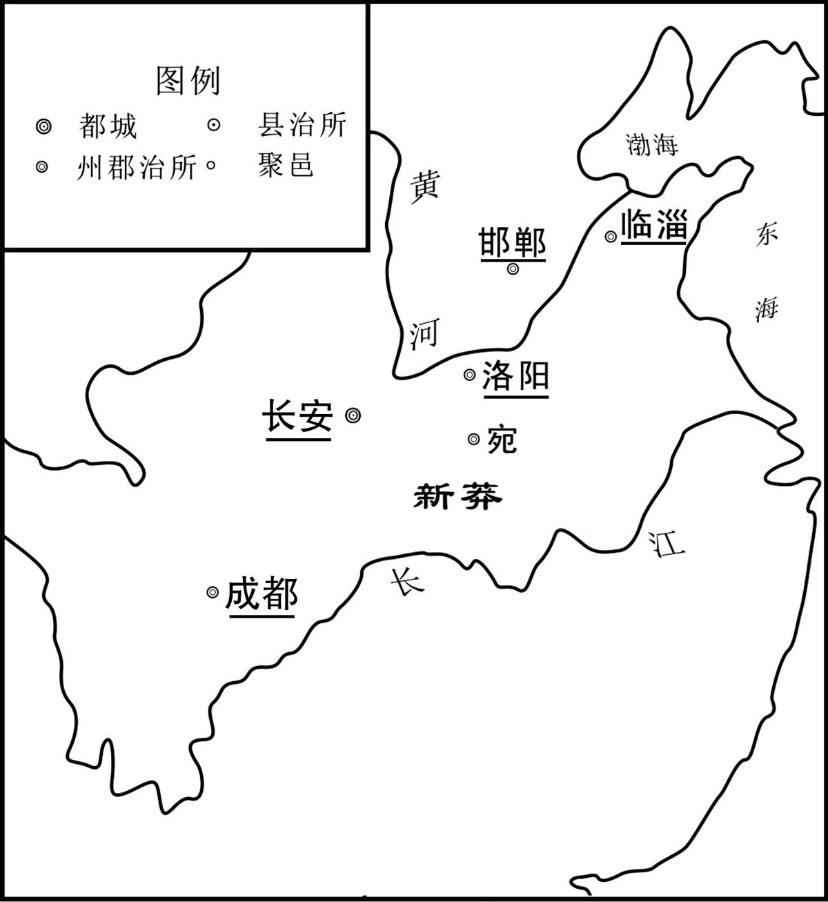 
五均六筦地点分布示意图

## 【注文】

[1]王莽（前45—23年）：字巨君，魏郡元城（今河北大名县东）人。新朝皇帝。公元8年至公元23年在位。汉元帝皇后王政君的亲侄子，初任黄门侍郎，成帝永始元年（前16年）封新都侯，迁骑都尉光禄大夫给事中。因弹劾外戚定陵侯淳于长，获正直之名，示人俭约，笼络人心。绥和元年（前8年）任大司马。哀帝时因丁、傅用事，罢官就第。哀帝死，王政君临朝称制，复任大司马，议立平帝，封安汉公。元始五年（5年），平帝死，选立年仅两岁的孺子婴，仿效周公摄政，自称“假皇帝”。初始元年（8年）自立为帝，改国号“新”。然后实行一系列托古改制，民不聊生，以致爆发绿林赤眉起义，地皇四年（23年）长安失陷身死，新朝灭亡。　　始建国：王莽所建新朝的第一个年号，从公元9年到公元13年，共计五年。　　《周礼》：儒家经典之一。古文经学家认为周公所作，今文经学家认为出于战国。今从其思想内容分析，则说明儒家思想发展到战国后期，融合道、法、阴阳等家思想，与春秋孔子时思想相比发生了极大变化。《周礼》所涉及之内容极为丰富，大至天下九州，天文历象；小至沟洫道路，草木虫鱼。凡邦国建制，政法文教，礼乐兵刑，赋税度支，膳食衣饰，寝庙车马，农商医卜，工艺制作，各种名物、典章、制度，无所不包。　　《乐语》：古代书名。《颜鲁公集》有七言联句四绝，其目曰：《大言》、《乐语》。　　五均：古代称管理市场物价的官为五均。　　筦（guǎn）：“管”的异体字。

[2]洛阳：都城名。我国古代大都市之一，中国建都时间最长，建都朝代较多的千年帝都。以洛阳城为中心的河洛地区，历史上被称为“河南”，与“河东”、“河内”相对应，是华夏民族最早的政治活动中心。西周时期，周成王时周公营雒邑，此为成周城所在，是西周王朝的东都，直属于周天子。东周时期，雒邑为首都，其余大体和西周时期相同。战国时期，雒邑改称雒阳。秦置三川郡，郡治雒阳，辖今三门峡、洛阳、巩义、荥阳、中牟、原阳等市县。西汉时期，此地区东部为以东都洛阳为中心的河南郡，西部属弘农郡。东汉时期，河洛地区的建制与西汉时期基本相同，只是河南郡改为河南尹，辖区不变。　　邯郸：城名。在今河北省南端。我国古代大都市之一。邯郸的地名源于邯郸山，在邯郸的东城下，有一座山，名叫邯山，单是山脉的尽头，邯山至此而尽，因此得名邯单。邯郸城邑，起于商殷。邯郸之域在西周时属于卫国，春秋时为晋地，当时邯郸已是闻名遐迩的农业、手工业和商业比较发达的城邑。公元前386年赵敬侯迁都于邯郸，为赵国都城长达一百五十八年之久。特别是赵武灵王，开改革之先河，实行胡服骑射的军事改革，富国强兵，国势大盛，雄踞战国七强之列，使赵国成为可与强秦抗衡的国家之一。秦始皇灭赵国后统一六国，将全国分为三十六郡，邯郸是邯郸郡的首府。汉高祖四年（前203年）立张耳为赵王，都城仍设邯郸。九年，刘邦封其爱子刘如意为赵王，并重建邯郸宫。一直到西汉后期，邯郸城有“富冠海内，天下名都”之称，是除国都长安之外，与洛阳、临淄、成都、宛（南阳）齐享全国五大都会盛名，从战国到东汉，邯郸兴盛长达五百年之久。东汉末叶，豪强并起，割据混战，邯郸开始走向衰落。汉献帝建安十八年（213年），曹操为魏国公，于邺城建都。魏都邺城的兴起导致黄河以北的政治、经济、军事、文化中心南移，邯郸沦为一般的县城，隶属于魏郡。　　临菑（zī）：城名。我国古代大都市之一。亦作临甾、临淄，以城临菑水得名。在今山东淄博市东北旧临淄。周初封吕尚于齐，建都于此，名营丘。齐胡公迁都薄姑，周厉王时，献公又迁回。春秋、战国时均都于此。桑麻遍野，又富鱼盐之利。战国时手工业有冶铁、制陶、纺织等，商业繁盛。稷门下聚集许多学者讲学，是当时经济、文化中心。　　宛：城名。我国古代大都市之一。秦昭襄王置县。治所在今河南南阳。战国时为楚著名铁产地。秦以后每为南阳郡治所。　　五均司市：官名。王莽改长安东西市与洛阳、邯郸、临淄、宛、成都五市的市长为五均司市师，掌五均内赊贷。　　钱府官：官名。王莽新朝时设置的经济官。五均司市下有交易丞五人，又称均官，钱府丞一人，又称钱府官，分别掌管均平物价、收税和赊贷事宜。

## 【译文】

新朝王莽始建国二年（10年）春季，二月，王莽下诏说：“《周礼》上有由官府办理赊贷的记载，《乐语》上有五均的设立，史书传记里各有关于诸管的记载。现在，开展赊贷、设立五均、诸管，目的在于使民众均平，抑制富豪侵吞兼并。”于是在长安以及洛阳、邯郸、临淄、宛、成都设立五均司市、钱府官。

## 【原文】

**天凤四年秋八月，莽置羲和命士，以督五均、六筦[1]。郡有数人，皆用富贾为之，乘传求利，交错天下。因与郡县通奸，多张空簿，府藏不实，百姓愈病。是岁，莽复下诏申明六筦，每一筦为设科条防禁，犯者罪至死。奸吏猾民并侵，众庶各不安生，又一切调上公以下诸有奴婢者，率一口出钱三千六百，天下愈愁。纳言冯常以六筦谏，莽大怒，免常官[2]。法令烦苛，民摇手触禁，不得耕桑，繇役烦剧，而枯旱蝗虫相因，狱讼不决[3]。吏用苛暴立威，旁缘莽禁，侵刻小民，富者不自保，贫者无以自存，于是并起为盗贼，依阻山泽，吏不能禽而覆蔽之，侵淫日广[4]。**

## 【注文】

[1]天凤：天凤也作始建国天凤上戊、始建国天凤。是新朝时期王莽的第二个年号，公元14年至公元19年，共计六年。　　羲和：中国神话中太阳神之母的名字。传说她是帝俊的妻子，与帝俊生了十个儿子，都是太阳，住在东方大海的扶桑树上，轮流在天上值日。后来，十个兄弟不满先后次序，十日并出，被后羿射杀其中的九个。后王莽改大司农为羲和。　　命士：据《王莽传》记载，俸禄五百石的官员称为命士。　　六筦（guǎn）：王莽新朝时对六种经济事业的管制措施。即盐、铁、酒专卖，政府铸钱，名山大泽产品收税和五均赊贷。这些措施于王莽即位的次年先后公布施行，合称六筦。也称五均六筦。其名称是在当时托古改制的风气下，由儒家刘歆以古文经《周礼》、《乐语》为依据而提出来的。王莽表面上说要以此来限制商人对农民的过度盘剥，制止高利贷者的猖獗活动，但实际上首要目的是增加新莽专制主义封建国家的财政收入，并为构成这一国家的政权基础的豪族权门大谋私利。筦，“管”的异体字。

[2]纳言：官名。主要负责出纳王命。《书·舜典》：“命汝作纳言，夙夜出纳朕命，惟允。”孔传：“纳言，喉舌之官，听下言纳于上，受上言宣于下，必以信。”秦汉不置，王莽依古制，改大司农为纳言。

[3]繇（yáo）役：即徭役。繇，通“徭”，古代封建统治阶级强制农民承担的一定数量的无偿劳动。　　狱讼（sòng）：讼事，讼案，案件。

[4]旁缘：古语，依仗、利用的意思，有时也指相互勾结。　　依阻：依仗、凭借的意思。　　禽（qín）：古通“擒”。

## 【译文】

新朝王莽天凤四年（17年）秋季八月，王莽设置羲和命士，用以督促实行管理财政的五均六管制度。每郡有几个名额，都由富豪、大商人担任，这些人乘坐驿车，谋求私利，往来全国各地，乘机与郡县官吏勾结，设立假账，国库不能得到充实，而百姓更加穷苦。这一年，王莽再下诏重申六管之重。每一项管理制度，都要为它设置条规禁令，违犯的人罪重的甚至处死。奸猾之徒与贪官污吏同时侵害百姓，百姓不得安宁。此外又规定上公及以下有奴婢的人一律交税，每一奴婢要缴纳三千六百钱，天下愈发愁怨。纳言冯常就六管制度进行规劝，王莽大怒，把冯常免了职。新朝的法令烦琐苛刻，百姓动辄触犯禁令，农民没有时间耕田种桑，徭役繁重，而旱灾、蝗灾接连发生，诉讼和监狱中在押的囚犯长久不能结案。官吏用残暴的手段建立威严，利用王莽的法令侵占人民财产。富人不能保护自己的财产，穷人不能保证自己的生命。于是无论贫富都当起强盗，（他们）依靠高山大泽的险阻，官吏无法逮捕，只好蒙蔽朝廷，以致盗贼渐渐越来越多，遍布各地。

## 【原文】

**五年春，琅邪樊崇起兵于莒，众百余人，转入太山[1]。群盗以崇勇猛，皆附之，一岁间至万余人。崇同郡人逄安、东海人徐宣、谢禄、杨音各起兵，合数万人，复引从崇，共还攻莒，不能下，转掠青、徐间[2]。**

## 【注文】

[1]琅邪（yé）：郡名。秦始建。治所在今山东诸城市一带。　　樊崇（？—27年）：字细君，琅邪（今山东诸城）人。新莽末年著名农民起义领袖、赤眉军首领。他英勇善战，富有谋略，曾发动樊崇起义，为推翻新莽王朝做出了贡献。后被任为御史大夫，最终樊崇和赤眉军首领逄安等再度起义，被刘秀杀害。　　莒（jǔ）：县名。诸侯国名。己姓，旧都介根，位于今山东东南部。古邑名。春秋时齐邑，在今山东日照市莒县。　　太山：即泰山，是我国的“五岳”之首，又称东岳，中国十大名山之一，位于山东泰安。数千年来，先后有十二位皇帝到泰山封禅。

[2]逄（páng）安（生卒年不详）：字少子，新莽末年赤眉军将领，琅邪（今山东诸城）人。新末起兵与樊崇合，他们在泰山、北海一带进行斗争，屡破新莽、更始军。公元25年，赤眉军进至华阴，有众三十万。赤眉领袖在地主和巫师怂恿下，在军中找到一个没落的西汉宗室、十五岁的牛吏刘盆子做皇帝，任左大司马。后率军攻汉中延岑，先胜后败，奔还长安。引众东归，这时，刘秀的军队已经扼守洛阳以西地区，截断了赤眉东归道路。赤眉军奋勇力战，但终因粮尽力细，败于崤底，于汉建武三年（27年）春失败。逄安归降刘秀，后图再起，被诛。东海：郡名。即东海郡，治所在郯邑（今山东郯城），后置郯县，属徐州刺史部。在氏族社会末期境内已有人群定居，时境为“东夷”之地，与夷族杂居于此，称“炎”地，周朝时期封炎族首领于此，称炎国，后演化为郯国。春秋时期，郯国附鲁，战国时期为越国所灭。秦朝时期始置郯郡，后改称东海郡。领十二县：郯县、襄贲、兰陵、缯县、朐县、下邳、淩县、淮阴、盱眙、东阳、广陵、堂邑。　　徐宣（生卒年不详）：字骄耭（jī），新莽末年赤眉军将领，东海临沂（今山东临沂）人。为县狱吏，新末起兵与樊崇合，领兵与樊崇分道入长安。刘盆子立，以其通《易经》，推为丞相。归降刘秀时，应对得体，被刘秀称为“铁中铮铮，庸中佼佼”。　　谢禄（生卒年不详）：字子奇，新莽末年赤眉军将领，东海临沂（今山东临沂）人。新末起兵与樊崇合，领兵与樊崇分道入长安。刘盆子立，被推为右大司马。赤眉入长安时请全活更始，寻听张昂之言缢杀之。邓禹袭长安，击破之。降刘秀后，刘恭为更始报仇，杀之。　　杨音（生卒年不详）：新莽末年赤眉军将领，东海（今山东郯城）人。新末起兵与樊崇合，领兵与樊崇分道入长安。刘盆子立，被推为大司农。于长安怒诸将无君臣之礼，颇相杀伤。归降刘秀后，因对赵王刘良有恩，封关内侯。

## 【译文】

新朝王莽天凤五年（18年）的春季，琅邪人樊崇在莒城聚众起兵，有一百多人，辗转进入泰山。盗贼们因为樊崇勇猛，纷纷归附，一年之间，集结到一万多人。樊崇的同郡人逄安，东海郡人徐宣、谢禄、杨音等人，也各自起兵，加起来总共有数万人之多，也带着部下跟随了樊崇，并一同回军进攻莒城，攻不下来，他们就在青州、徐州一带流窜，抢掠。

## 【原文】

**地皇三年夏四月，遣太师王匡、更始将军廉丹东讨众贼[1]。初，樊崇等众既浸盛，乃相与为约：“杀人者死，伤人者偿创。”其中最尊号三老，次从事，次卒史[2]。及闻太师、更始将讨之，恐其众与莽兵乱，乃皆朱其眉以相识别，由是号曰“赤眉”[3]。匡、丹合将锐士十余万人，所过放纵。东方为之语曰：“宁逢赤眉，不逢太师。太师尚可，更始杀我。”**

## 【注文】

[1]地皇：也作始建国地皇上戊、始建国地皇。是新朝时期王莽的第三个年号，也是他的最后一个年号。公元20年至公元23年，共计四年。地皇年号来自中国神话中地皇曾历三万六千岁，以示统治长久。　　太师：官名。太，亦作大。西周置，为辅弼国君之臣，历代相因，以太师、太傅、太保为三公，多为大官的加衔，无实际的职权。　　王匡（前10—23年）：王莽的第六子，一说为王莽之侄。被封为功建公，魏郡元城（今河北大名县东）人，为人凶狠残酷，在攻打赤眉军时，所过之处奸淫掳掠，百姓对他恨之入骨。后被赤眉军打败，大军溃败逃走。在防守洛阳时，洛阳城被绿林军攻破，王匡也被俘，之后被处死。　　廉丹（？—22年）：京兆杜陵（今陕西西安市东南）人，王莽新朝大司马庸部（益州）牧。绿林赤眉起义后，任更始将军，与王匡一起镇压赤眉军，奸淫烧杀无恶不作。赤眉军攻破成昌（今山东东平县西）后，将廉丹斩杀。原先的更始将军甄丰谋反被诛，先后由姚恂、孔永、侯辅、戴参接任，廉丹位列第六任更始将军居十一公之位。

[2]三老：古代掌教化的乡官。战国魏有三老，秦置乡三老，汉增置县三老，东汉以后又有郡三老。指的是郡县一级官员，类似乡长。其主要工作是收税，也负责查证调停民事纠纷和教化。　　从事：官名。即从吏史，亦称从事掾，汉刺史的佐吏。分为别驾从事史、治中从事史等。又有部郡国从事史，大致刺史辖几郡，即设几人。每人主管一郡的文书，察举非法，汉末刺史权重，从事名目更多，文有文学从事、劝学从事等，武有武猛从事、都督从事等，均由刺史自行辟任。　　卒史：官名。秦、汉官署中的属吏。地位比书佐稍高，秩一百石。西汉郡国每郡初有卒史十人，后有增至二百人者。其他官署也有设置。

[3]赤眉：新莽末年兴起于今山东东部的一支农民起义军的名称。主要领导人有樊崇、徐宣等人，军队约一百三十四万人。赤眉军是中国新莽末年起事的军队之一，因将眉毛染红，示别于政府军，故称作赤眉军。

## 【译文】

新朝王莽地皇三年（22年）的夏季四月间，（王莽）派遣太师王匡、更始将军廉丹向东征讨农民军。最初，樊崇等人的部众逐渐强盛，于是互相约定：“杀人的抵命，伤人的要赔偿养伤费用。”农民军中官职最高的称号是三老，其次是从事，再其次是卒史。等到听说太师与更始将军廉丹要率军前来讨伐他们，恐怕部众跟王莽军队混战时难于辨别敌我，于是下令全军都用朱砂涂抹双眉，以便互相认识辨别，从此号称“赤眉”军。王匡、廉丹一起率领精兵十余万人，一路放任士兵胡作非为，不加约束。东部地区为此出现民谣说：“宁遇赤眉军，不遇太师兵。太师兵还可以躲，更始军却会杀死我\!”

## 【原文】

**淮阳王更始元年冬十月，更始遣使降赤眉[1]。樊崇等闻汉室复兴，即留其兵，自将渠帅二十余人随使者至洛阳，更始皆封为列侯[2]。崇等既未有国邑，而留众稍有离叛者，乃复亡归其营[3]。**

## 【注文】

[1]淮阳王：即淮阳王刘玄（？—25年），两汉之际绿林军建立的更始政权的皇帝。字圣公。南阳蔡阳（今湖北枣阳市西南）人。西汉皇族，汉光武帝刘秀的族兄。地皇三年绿林农民起义爆发后，刘玄投奔陈牧领导的平林兵，为安集掾。次年正月，绿林军诸部合兵击破新莽将领甄阜、梁丘赐，遂号刘玄为更始将军。后因其为刘姓宗室，遂被拥立为帝，建元更始。起义军昆阳大捷后，更始帝遣王匡攻洛阳，申屠建、李松攻武关，三辅震动，各地豪强纷纷诛杀新莽牧守，用汉年号，服从更始政令。王莽败死后，更始由洛阳移都长安。他没有才能，一朝为帝，便沉湎于宫廷淫乐生活，委政于其岳父赵萌，以致众叛亲离。赤眉军进逼长安时，刘玄杀害申屠建、陈牧、成丹等起义军重要将领，于更始三年（25年）十月，奉玺绶归降赤眉，封长沙王。不久，被缢死。　　更始：汉更始帝的年号。新朝王莽地皇四年（23年）九月，王莽被赤眉军杀，新朝灭亡。同年二月绿林军拥立刘玄为帝，年号更始，仍然称汉。更始三年（25年）九月，赤眉军攻入长安，刘玄逃走，该政权灭亡。

[2]渠帅：即魁首、头领人物。

[3]国邑（yì）：国都，城邑。汉代特指诸侯的封地。

## 【译文】

淮阳王刘玄更始元年（23年）冬季十月，更始皇帝刘玄派使者来招降赤眉。樊崇等人听说汉朝宗室复兴，便留下部众，自己率将领二十余人随同使节来到洛阳，更始帝刘玄把他们都封为列侯。但是，樊崇等侯却没有采邑，而留在原地待命的部众又逐渐有背叛离去的，于是樊崇等人又逃回他们的营地。

## 【原文】

**二年冬，赤眉樊崇等将兵入颍川，分其众为二部，崇与逄安为一部，徐宣、谢禄、杨音为一部[1]。赤眉虽数战胜，而疲敝厌兵，皆日夜愁泣，思欲东归。崇等计议，虑众东向必散，不如西攻长安[2]。于是崇、安自武关，宣等从陆浑关两道俱入[3]。更始使王匡、成丹与抗威将军刘均等分据河东、弘农以拒之[4]。**

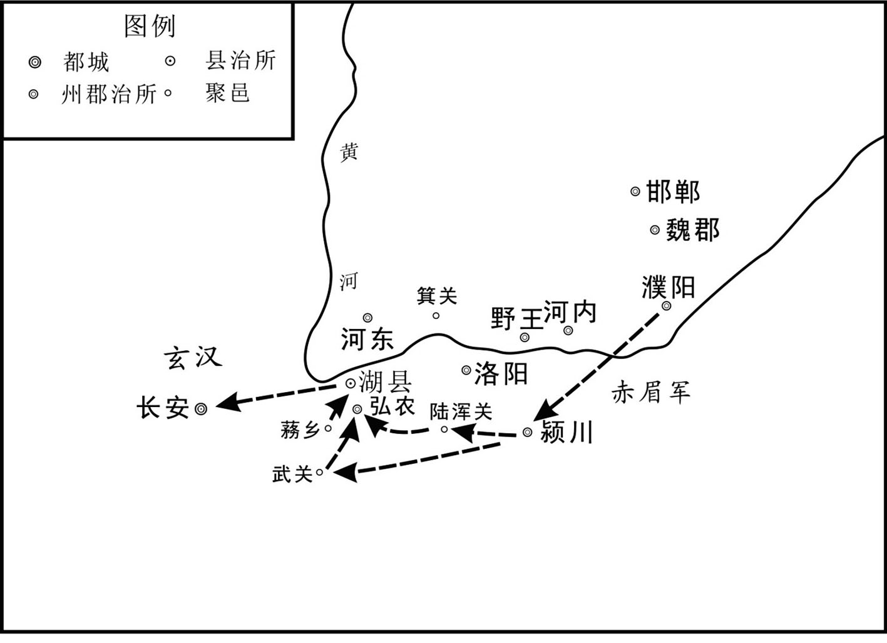 
赤眉军西进示意图

## 【注文】

[1]颍（yǐnɡ）川：郡名。秦王嬴政十七年（前230年）置。以颍水得名。治所在阳翟（今河南禹州）。辖境相当今河南登封、宝丰以东，尉氏、郾城以西，新密以南，叶县、舞阳以北地。其后治所屡有迁移，辖境渐小，最大时管辖至今驻马店地区。

[2]长安：城名。西汉国都，位于今陕西西安市区西北郊外，面积约三十六平方公里，在西汉的二百余年历史里，长安一直是全国的政治、经济和文化中心。在西周时称为“沣镐”。秦时称“内史”，至西汉初年，刘邦定都关中，置长安县，在长安县属地修筑新城，名“长安城”，意即“长治久安”，改长安城所在地区为“京兆”，意为“京畿之地”。

[3]武关：关名。位于今陕西丹凤县东武关河的北岸，与函谷关、萧关、大散关成为“秦之四塞”。武关历史悠久，关城建立在峡谷间一处较为平坦的高地上，北依高峻的少习山，南濒险要。关城周长一点五公里，城墙用土筑，略成方形。东西各开一门，以砖石包砌券洞。西门上有“三秦要塞”四字，东门有“武关”二字。关西地势较为平坦，唯出关东行，沿山腰盘曲而过，崖高谷深，狭窄难行，因此武关为古代兵家必争之地。　　陆浑关：关名。汉置，故址在今河南嵩县东北。公元24年赤眉起义军西攻长安，分兵两路，其一即取道于此。

[4]王匡（？—25年）：新莽末年荆州江夏郡新市（今湖北京山）人，绿林军首领。新莽天凤四年（17年），与王凤在绿林山起义。山中瘟疫，他带领部众到南阳，号新市兵。更始元年（23年）拥立刘玄为更始帝，王匡为定国上公。新朝灭亡后，更始帝封他为比阳王。被更始帝猜忌，他投靠赤眉军，后转投刘秀，半路打算逃跑，东汉将领宗广把他处死。　　成丹（？—25年）：新莽末年绿林起义军将领。王莽政权被推翻后，刘玄封他为水衡大将军、襄邑王。更始三年刘玄令比阳王王匡、襄邑王成丹和抗威将军刘均等部十多万大军东渡黄河，增援安邑。成丹大败，逃回长安。后被刘玄猜忌、诱杀。　　刘均（生卒年不详）：新莽末年绿林起义军将领。王莽政权被推翻后，刘玄封他为抗威将军。更始三年刘玄令他和比阳王王匡、襄邑王成丹等部十多万大军东渡黄河，增援安邑。大败而归。　　河东：郡名。代指山西。因黄河流经山西省的西南境，则山西在黄河以东，故这块地方古称河东。秦汉时指河东郡地，在今山西运城、临汾一带。　　弘农：郡名。汉武帝元鼎四年（前113年）设立，弘农郡是汉朝一个郡置，其范围历代有一定变化，主要包括今天河南西部的三门峡市、南阳市西部，以及陕西东南部的商洛市。由于其地处长安、洛阳之间的黄河南岸，一直是历代军事政治要地。

## 【译文】

淮阳王刘玄更始二年（24年）的冬季，赤眉军首领樊崇等率军进入颍川，把部众分为两部分：樊崇、逄安率领一部，徐宣、谢禄、杨音率领另一部。赤眉军虽然数次打胜仗，但已精疲力尽，士兵厌战，都日夜哭泣，想要回东方老家。樊崇等商议，担心部众回到东方必然一哄而散，不如向西攻击长安。于是，樊崇、逄安从武关，徐宣等从陆浑关，分两路一同向长安进军。刘玄命王匡、成丹和抗威将军刘均等人，分别驻防河东、弘农，防御赤眉军。

## 【原文】

**萧王度赤眉必破长安，乃拜邓禹为前将军，中分麾下精兵二万人，遣西入关[1]。**

## 【注文】

[1]萧王：即刘秀（前5—57年）。东汉王朝开国皇帝。新莽末年，海内分崩，天下大乱，身为一介布衣却有前朝血统的刘秀在家乡乘势起兵。更始皇帝封刘秀为萧王。公元25年，刘秀与更始政权公开决裂，于河北登基称帝，为表刘氏重兴之意，仍以“汉”为其国号，史称“东汉”。经过长达十二年之久的统一战争，刘秀先后平灭了关东、陇右、西蜀等地的割据政权，结束了自新莽末年以来长达近二十年的军阀混战与割据局面。　　度（duó）：估计。　　邓禹（2—58年）：字仲华，汉族，南阳新野（今河南新野）人，东汉开国名将，“云台二十八将”之首。　　前将军：官名。战国初设。秦因之。汉不常置。金印紫绶，位次于上卿。职务或典京师兵卫，或屯兵边境。　　麾下：指将帅的部下。麾下的“麾”，旌旗之属，是将帅用以指挥的旗帜。　　关：关名。古代特指函谷关。位于今河南灵宝市北十五公里处的王垛村，距三门峡市约七十五公里，地处“长安古道”，紧靠黄河岸边。因关在峡谷中，深险如函而得名。是中国历史上建置最早的雄关要塞之一，素有“一夫当关，万夫莫开”之称。

## 【译文】

萧王刘秀估计赤眉军肯定会攻破长安城，于是任命邓禹当前将军，分出麾下精兵二万人，派他向西进入函谷关待命。

## 【原文】

**汉光武建武元年春正月，赤眉二部俱会弘农[1]。更始遣讨难将军苏茂拒之，茂军大败[2]。赤眉众遂大集，乃分万人为一营，凡三十营。三月，更始遣丞相松与赤眉战于蓩乡，松等大败，死者三万余人[3]。赤眉遂转北至湖[4]。**

## 【注文】

[1]建武：汉光武帝刘秀的第一个年号，也是东汉的第一个年号。公元25年至公元56年，共计三十二年。

[2]苏茂（？—26年）：东汉初将领。初为玄汉大将，奉令攻东汉，被东汉河内太守寇恂击败，退回洛阳。洛阳降东汉，苏茂不服，东降梁王刘永，受封王爵，对抗东汉皇帝刘秀。东汉大将盖延伐梁，刘永被杀。苏茂奉刘永之子刘纡继位，皇帝刘秀亲征刘纡，刘纡被杀。苏茂投奔齐王张步，东汉建威将军耿弇大破张步，步斩茂，降东汉。

[3]松：即李松（生卒年不详），新莽末年绿林军将领。受命攻武关，三辅震动。复攻京师仓、华阴等地，屡破王莽军，率先攻入长安，迎更始迁都。说更始封诸功臣为王，任丞相。后从更始击败王匡等。赤眉攻长安，李松出战被擒。赤眉以其为质，令其弟李况开门纳其军。　　蓩（mǎo）乡：乡名。在今河南灵宝县境内。

[4]湖：县名。即湖城县，秦置县，汉代因之，在今河南灵宝县境内。

## 【译文】

汉光武帝刘秀建武元年的春季正月间，赤眉军的两部在弘农会师。更始皇帝刘玄派遣讨难将军苏茂抵挡，苏茂军队大败。于是赤眉军大规模集结，分一万人为一营，共计三十营。三月，刘玄派遣丞相李松与赤眉军在蓩乡展开大会战，李松等大败，战死三万余人。赤眉军于是向北推进到湖城一线。

## 【原文】

**六月，张卬、王匡叛更始，入长安[1]。**

## 【注文】

[1]张卬（生卒年不详）：新莽末年绿林起义军将领。王莽政权被推翻后，刘玄封他为大将军。后被刘玄猜忌，于建武元年六月和另一个绿林起义军将领王匡背叛更始帝刘玄，并带领赤眉军进入长安。

## 【译文】

汉光武帝建武元年六月，张卬、王匡背叛更始帝刘玄，进入长安。

## 【原文】

**赤眉进至华阴，军中有齐巫，常鼓舞祠城阳景王[1]。巫狂言：“景王大怒曰：‘当为县官，何故为贼！’[2]”有笑巫者辄病，军中惊动。方望弟阳说樊崇等曰：“今将军拥百万之众，西向帝城而无称号，名为群贼，不可以久[3]。不如立宗室，挟义诛伐，以此号令，谁敢不从！”崇等以为然，而巫言益甚。前至郑，乃相与议曰：“今迫近长安，而鬼神若此，当求刘氏共尊立之[4]。”**

## 【注文】

[1]华阴：县名。春秋晋置阴晋邑。战国以魏长城为界，东属魏，西属秦。秦惠文王六年（前332年）魏纳阴晋于秦，阴晋改名宁秦，秦置县，属内史。汉高祖八年（前199年）以地处华山之北更名华阴县，属京兆尹。王莽始建国改名华坛县，东汉复名华阴县，属弘农郡。今陕西华阴市。　　城阳景王：即刘章（？—前176年），刘肥之子，吕后时期受封朱虚侯，并被迫娶吕氏一族吕禄的女儿。公元前180年七月，吕后患病，刘章及其弟刘兴居被安排入宫，与周勃、陈平当内应。吕后驾崩后，周勃掌握北军，刘章率千人入未央宫，杀丞相吕产，后因为平定吕后一族有功，受封城阳王，谥号景。

[2]县官：特指朝廷，西汉时常用以称政府或皇帝。《史记·绛侯世家》司马贞索隐：“县官谓天子也。所以谓国家为县官者，《夏官》王畿内县即国都也。王者官天下，故曰县官也。”

[3]方望（？—25年）：东汉平陵（今陕西咸阳市西北）人。隗嚣起事，请为军师。公元24年，隗嚣应汉更始帝刘玄征召，方望旋即辞官而走，与安陵人弓林聚众数千，立刘婴为天子，被李松、苏茂统兵击破。　　方阳（生卒年不详）：东汉平陵人。新莽末年农民起义领袖、赤眉军首领樊崇的部将。当樊崇领导的赤眉军发展到百万之众进至华阴时，他向樊崇建议拥立刘姓宗族后人做皇帝，以凭借正义诛伐无道。樊崇接受了方阳的建议，用抓阄的方式选择了西汉城阳王刘章的后代、十五岁的牧童刘盆子为帝。

[4]郑：县名。即郑县，秦武公十一年（前687年）设立，故址在今陕西华县华州镇附近。

## 【译文】

赤眉军进抵华阴县，军中有一位齐地的巫师，常常击鼓舞蹈以祭祀西汉城阳景王刘章。巫师口出狂言：“景王大怒说：‘应当做天子的，为什么要当盗贼\!’”有嘲笑巫师的人，都患了病，为此全军震惊。方望的弟弟方阳劝说樊崇等人说：“现在将军您坐拥有百万大军，向西面对帝王都城，却没有称号，被人称作一群盗贼，不能长期这样下去。不如拥立一位刘姓宗室，挟天子名义来诛杀讨伐，以此号令天下，谁敢不服从\!”樊崇等认为他说得很对，而巫师的狂言也越来越厉害。军队向前抵达郑县，于是共同商议说：“现在已经逼近长安了，鬼神的旨意是这样，我们应该寻求一位刘姓宗室，共同尊立他为皇帝。”

## 【原文】

**先是，赤眉过式，掠故式侯萌之子恭、茂、盆子三人自随[1]。恭少习《尚书》，随樊崇等降更始于洛阳，复封式侯，为侍中，在长安。茂与盆子留军中，属右校卒史刘侠卿，主牧牛。及崇等欲立帝，求军中景王后，得七十余人，唯茂、盆子及前西安侯孝最为近属。崇等曰：“闻古者天子将兵称上将军。[2]”乃书札为符曰“上将军”，又以两空札置笥中，于郑北设坛场，祠城阳景王，诸三老、从事皆大会，列盆子等三人居中立，以年次探札[3]。盆子最幼，后探，得符，诸将皆称臣，拜。盆子时年十五，被发徒跣，敝衣赭汗，见众拜，恐畏欲啼[4]。茂谓曰：“善藏符！”盆子即啮折，弃之[5]。以徐宣为丞相，樊崇为御史大夫，逄安为左大司马，谢禄为右大司马，其余皆列卿、将军。盆子虽立，犹朝夕拜刘侠卿，时欲出从牧儿戏，侠卿怒止之，崇等亦不复候视也。**

## 【注文】

[1]式：县名。即式县，在今山东省。　　式侯萌（生卒年不详）：即刘萌。为汉高祖刘邦之子齐王刘肥的儿子城阳景王刘章的第七代孙。是第三任式侯。　　恭：即刘恭（生卒年不详），刘盆子之兄。通习《尚书》。被赤眉军掠以随军，随樊崇等降更始帝于洛阳，后樊崇等复攻更始，恭奉更始命请降，以自杀逼赤眉军全活更始；知赤眉军必败，教刘盆子归还玺绶，皆不成。归降刘秀后为更始报仇，杀谢禄，自系狱，被赦。　　盆子：即刘盆子（10—？），新莽末泰山式县（今山东泰安市东）人。西汉城阳景王刘章之后。初在赤眉军中牧牛，号曰“牛吏”。建武元年，被义军将领选立为帝，时年十五，建元建世。赤眉军入长安后，因惶恐惧祸，数辞帝位，不果。后因饥荒引军退出长安东归，为刘秀所部包围。与丞相徐宣等三十余人投降，上所得传国玺绶，为赵王郎中。后赐荥阳均输官地，食其税终身。

[2]上将军：官名。中国古代武将的官名。战国时设立，秦因之，汉不常置，金印紫绶，位次于上卿，职掌为典京师兵卫或屯兵边境。战国时国君有时亲自带兵也称上将军。

[3]札（zhá）：古代用来写字的小木片。　　笥（sì）：“司”意为“专职”。“竹”与“司”联合起来表示“有专门用途的竹制容器”。

[4]被（pī）发徒跣（xiǎn）：徒跣，赤脚步行。披散着头发，赤着脚走路。　　赭（zhě）汗：面红流汗。

[5]啮（niè）折：意即咬断。

## 【译文】

早先，赤眉军经过式县的时候，劫持了已故原式侯刘萌的儿子刘恭、刘茂、刘盆子，让三人随军。刘恭幼时学习《尚书》，后来跟从樊崇等在洛阳投降更始皇帝刘玄，重新封为式侯，担任侍中，后到长安。刘茂和刘盆子留在军中，归属右校卒史刘侠卿管辖，负责放牛。等到樊崇等想要拥立皇帝时，在军中搜寻景王刘章的后代，共找到七十余人，但其中只有刘茂、刘盆子以及前西安侯刘孝血统与景王刘章最为亲近。樊崇说：“听说古时候，天子亲自领兵，称为上将军。”于是用一片木简做符，上写“上将军”三个字，又把两片未写字的木简也放在竹筒中。在郑县北面修筑坛场，祭祀城阳景王刘章，各位三老、从事全都聚会于此。请刘盆子等三人居台中排列站立，按照长幼顺序抽签。刘盆子年纪最小，最后抽，抽中了“上将军”符。将领们全都向刘盆子称臣叩拜。刘盆子当时十五岁，披散着头发，光着双脚，穿着破衣服，红着脸，浑身冒汗。他见众将跪拜，惊恐得要哭。刘茂对他说：“把你的符藏好\!”刘盆子立即把木简用嘴咬断，扔掉。他任命徐宣为丞相，樊崇为御史大夫，逄安为左大司马，谢禄为右大司马，其余的全被任命为列卿、将军。刘盆子虽被立为皇帝，但每天早晚还要叩拜刘侠卿。他时常想到外面去和牧童们嬉戏，刘侠卿愤怒地制止他。樊崇等人也不再来问候探视他。

## 【原文】

**秋八月，赤眉至高陵，张卬等降之[1]。九月，赤眉入长安，更始单骑走，从厨城门出[2]。式侯恭以赤眉立其弟，自系诏狱。闻更始败走，乃出见定陶王祉，祉为之除械，相与从更始于渭滨[3]。右辅都尉严本，恐失更始为赤眉所诛，即将更始至高陵，本将兵宿卫，其实围之[4]。更始将相皆降赤眉，独丞相曹竟不降，手剑格死[5]。**

## 【注文】

[1]高陵：县名。位于今陕西西安市境内，地处关中平原腹地。秦孝公十二年（前350年）置县。新莽天凤二年（15年）改名千春，更始元年（23年）复名高陵。

[2]厨城门：汉长安城西北角上的一个门。

[3]定陶王祉：即刘祉（生卒年不详）。新莽末南阳蔡阳（今湖北枣阳市西南）人，原名终，字巨伯。光武帝刘秀族兄。因父舂陵侯敞免官夺爵，并废锢不得为吏，兄弟相率随刘秀起兵。后为更始政权太常将军，封舂陵侯，从西入关，封定陶王。更始败，亡奔洛阳，归刘秀，封城阳王。后以病封上印绶，旋卒。　　渭（wèi）：渭河，水名，源出甘肃渭源县鸟鼠山，流经陕西与泾河、北洛河会合，至潼关县入黄河，长八百一十公里。流域为关中平原。

[4]右辅都尉：官名。汉置，俸比二千石，位次将军，掌全郡兵马及治安稽查。右辅都尉即右扶风都尉，也就是三辅都尉之一。汉景帝时改郡尉为都尉，汉武帝又置三辅都尉各一人。东汉因三辅有陵园，乃复置右扶风都尉。

[5]曹竟（生卒年不详）：字子期，西汉末山阳（郡治今山东金乡县西北）人。儒生出身，王莽执政时，去官不仕。更始政权建立，征以为丞相，封侯，不受爵。赤眉军入长安，令其降，不肯，格斗死。

## 【译文】

秋季八月间，赤眉军行到高陵，张卬等人投降了赤眉。九月，赤眉进入长安，刘玄独自骑马从厨城门逃出长安。式侯刘恭因为赤眉军立其弟刘盆子为帝，就自带刑具把自己关在诏狱中。听说更始帝刘玄败逃，才出来见定陶王刘祉，刘祉给他除掉了身上的刑具，跟他一起追随刘玄，到了渭水河边。右辅都尉严本恐怕刘玄逃走自己被赤眉诛杀，就把刘玄劫持到高陵，严本自己领兵宿卫，其实是包围看守他。更始帝刘玄的将相都投降了赤眉，只有丞相曹竟不投降，手持宝剑格斗被杀。

## 【原文】

**冬十月，赤眉下书曰：“圣公降者，封为长沙王。过二十日，勿受。[1]”更始遣刘恭请降，赤眉使其将谢禄往受之[2]。更始随禄，肉袒，上玺绶于盆子[3]。赤眉坐更始，置庭中，将杀之。刘恭、谢禄为请，不能得，遂引更始出。刘恭追呼曰：“臣诚力极，请得先死。”拔剑欲自刎，樊崇等遽共救止之[4]。乃赦更始，封为畏威侯。刘恭复为固请，竟得封长沙王。更始常依谢禄居，刘恭亦拥护之。**

## 【注文】

[1]圣公：即更始帝刘玄，东汉人，刘秀堂兄。号圣公。

[2]谢禄（？—27年）：新莽末东海（治今山东郯城县北）人，字子奇。新莽天凤五年（18年），与徐宣等响应樊崇起义，合数万人。更始二年（24年），与宣等率所部由陆浑关（今河南嵩县东北）进兵关中。旋与樊崇等会师弘农（今河南灵宝市北），进至华阴，拥立刘盆子为帝，任右大司马。赤眉军攻入长安，奉命受更始请降。后令部下缢杀更始。光武帝建武三年（27年），与樊崇、刘盆子等归降光武帝。旋为刘盆子之兄刘恭所杀。

[3]肉袒（tǎn）：脱去上衣，露出一部分上身，是古代请罪的一种方式。袒即脱掉上衣。

[4]遽（jù）：急忙、仓皇。

## 【译文】

冬季十月里，赤眉军下诏书说：“圣公刘玄如果投降，可封为长沙王。超过二十天，就不再接受投降。”刘玄便派刘恭去请降，赤眉军派将领谢禄去受降。刘玄跟随着谢禄，脱去上衣，把皇帝的玉玺绶带献给刘盆子。赤眉将领们让刘玄坐在大厅里，准备杀死他。刘恭、谢禄替他求情，没得到允许，于是把刘玄拉出去行刑。刘恭追上去大喊：“我已经尽了最大的努力，请允许我死在陛下之前吧。”说着拔出剑想要自刎，樊崇等急忙阻止他。于是才赦免了刘玄，封为畏威侯。刘恭又坚决请求履行承诺，最终还是得到了长沙王的爵位。刘玄起居常依靠谢禄，刘恭也拥戴保护他。

## 【原文】

**刘盆子居长乐宫，三辅郡县、营长遣使贡献，兵士辄剽夺之，又数暴掠吏民，由是皆复固守[1]。百姓不知所归，闻邓禹乘胜独克而师行有纪，皆望风相携负以迎军，降者日以千数，众号百万[2]。禹所止，辄停车拄节以劳来之，父老、童穉，垂发、戴白，满其车下，莫不感悦，于是名震关西[3]。**

## 【注文】

[1]长乐宫：宫殿名。汉高祖刘邦五年（前202年）九月至七年（前200年）二月，由丞相萧何主持在秦兴乐宫基础上营修而成，是西汉规模最大的宫殿建筑群。遗址在今陕西西安市西北郊汉长安故城东南隅。周围十公里，内有鸿台、临华殿、温室殿、信宫、长秋殿、永寿殿、永宁殿、钟室等建筑。汉初，高祖在此听朝。自惠帝至平帝朝移至未央宫，长乐宫改为太后居处。吕后捕斩韩信于长乐宫钟室，即此。新莽时改名为常乐室。　　三辅：即西汉时于京畿之地所设京兆尹、左冯翊、右扶风的合称。治所皆在长安城中。辖境相当今陕西中部。后世政区划分虽时有变动，但直到唐代，习惯上仍称这一地区为三辅。　　剽（piāo）夺：即抢劫，掠夺，剽掠。

[2]师行有纪：军队行进纪律严明，不骚扰百姓。

[3]童穉（zhì）：穉同“稚”，即儿童。　　垂发：即垂髫。《后汉书·吕强传》：“垂发服戎，功成皓首。”李贤注：“垂发，谓童子也。”　　戴白：头生白发，形容年老。借以指老人。

## 【译文】

刘盆子住在长乐宫中，三辅郡县和各营寨首领派使节向长安进贡，赤眉士兵就在途中把贡品抢走，又多次凶暴地掠夺官民财物，因此官民又都回到各自的营寨坚守。百姓们不知应归附谁，听说东汉大将邓禹的军队乘胜向长安进军，而且军纪严明，便纷纷扶老携幼迎接东汉军队，每天归降的人以千来计算，部众号称百万。邓禹每到一地都停车，手持符节慰劳归服的民众，父老、孩童围满他的车下，没有不感到喜悦的，于是邓禹的威名震动关西。

## 【原文】

**诸将豪桀皆劝禹径攻长安[1]。禹曰：“不然。今吾众虽多，能战者少，前无可仰之积，后无转馈之资。赤眉新拔长安，财谷充实，锋锐未可当也。夫盗贼群居无终日之计，财谷虽多，变故万端，宁能坚守者也！上郡、北地、安定三郡，土广人稀，饶谷多畜，吾且休兵北道，就粮养士，以观其敝，乃可图也。[2]”于是引军北至栒邑[3]。所到，诸营保、郡邑皆开门归附。**

## 【注文】

[1]豪桀：即豪杰。桀通“杰”。

[2]上郡：郡名。秦置。治肤施，在今陕西榆林市东南鱼河堡。辖区相当于今陕西北部及内蒙古鄂尔多斯高原东南部等地。东汉建安二十年（215年）废除。　　北地：郡名。秦置。治所在义渠（今甘肃宁县西北）。西汉移治马岭（今甘肃庆阳市西北）。东汉移治富平（今宁夏吴忠市西南）。辖境相当于今甘肃东南部和宁夏南部一带。　　安定：郡名。西汉元鼎三年（前114年）置，治所在平高县（今宁夏固原），辖今宁夏南部及甘肃东部地区。

[3]栒（xún）邑：县名。秦置。汉因之，属右扶风。在今陕西旬邑县东北。

## 【译文】

各位将领豪杰都劝邓禹直接攻打长安。邓禹说：“不能这样做。现在我们的兵众虽然多。但是能作战的人很少，当前没有可依赖的粮草，后面没有可转运供应我们的物资。赤眉军刚攻下长安，财物粮草充实，锐不可当。这么多盗贼们聚集在一起，没有长久的计划，财物粮草虽多，但内部变化多端，岂能长久地坚守！上郡、北地、安定三郡，地广人稀，粮草充足，家畜繁多，我们暂且向北去休整军队，到粮草充足地区养兵，顺便来观察赤眉军的动向，等到他们疲惫之时，再想办法消灭他们。”于是邓禹带兵向北到了栒邑县。所到之处，各营保、郡邑都开门迎接归附。

## 【原文】

**三辅苦赤眉暴虐，皆怜更始，欲盗出之[1]。张卬等深以为虑，使谢禄缢杀之。刘恭夜往收藏其尸，帝诏邓禹葬之于霸陵[2]。**

## 【注文】

[1]暴虐（nüè）：凶恶残暴。

[2]霸陵：汉文帝陵寝，有时写作灞陵。灞，即灞河。因霸陵靠近灞河，因此得名。位于陕西西安市东郊白鹿原东北角，即今霸桥区毛西村西。

## 【译文】

三辅地区苦于赤眉军的暴虐，都怜悯更始帝刘玄，想把刘玄救出来。张卬等很担心这事，就命谢禄把刘玄勒死了。刘恭乘夜收藏了刘玄的尸体，刘秀知道后命邓禹把刘玄葬在了霸陵。

## 【原文】

**帝以关中未定，而邓禹久不进兵，赐书责之曰：“司徒，尧也；亡贼，桀也。长安吏民遑遑无所依归，宜以时进讨，镇慰西京，系百姓之心。[1]”禹犹执前意，别攻上郡诸县，更征兵引谷，归至大要[2]。积弩将军冯愔、车骑将军宗歆守栒邑，二人争权相攻，愔遂杀歆，因反击禹，禹遣使以闻[3]。帝问使人：“愔所亲爱为谁？”对曰：“护军黄防。[4]”帝度愔、防不能久和，势必相忤，因报禹曰：“缚冯愔者，必黄防也。”乃遣尚书宗广持节往降之[5]。后月余，防果执愔，将其众归罪。更始诸将王匡、胡殷、成丹等皆诣广降。**

## 【注文】

[1]关中：古地域名。所指范围不一。秦都咸阳（今陕西咸阳市东北），汉都长安（今陕西西安市西北），因称函谷关以西为关中。或泛指函谷关以西战国末秦故地（有时包括秦岭以南的汉中、巴蜀，有时兼有陕北、陇西）。或指居于众关之中的地域。今指陕西渭河流域一带。《史记·项羽本纪》记载：关中阻山河四塞，地肥饶，可都以霸。所言关中指东函谷、南武关、西散关、北萧关包围的地域。　　赐书：敬辞，即皇帝赐给书信。　　尧：传说中的五帝之一。名放勋，帝喾之子，母庆都。号陶唐氏，或简称唐。　　桀：夏朝末代帝王。姒姓，名履癸，帝发之子。古代暴君的典型。　　遑（huánɡ）遑：同“惶惶”，惊恐，惊慌。　　西京：东汉迁都洛阳后，称西汉旧都长安为西京，又引申称东汉为东京，西汉为西京。

[2]大要：县名。西汉置，属北地郡。治所在今甘肃宁县东南。东汉废。

[3]积弩将军：官名。古代杂号将军之一，一般掌征伐，领弩射之士。　　车骑将军：官名。西汉初将车骑士，故名。后遂为高级武官称号，位次大将军，且文官辅政者亦加此衔。

[4]护军：官名。护即督统之意。秦代设护军都尉，调节各将军之间的关系。汉因之，更名司寇、护军等，或设中尉掌之。均为临时性设置。

[5]尚书：官名。战国时始置，或称掌书，尚即执掌之意。秦时为少府属官，掌管文书章奏，职位很低。汉武帝提高皇权，因尚书在皇帝左右办事，权势渐重，但仍隶少府。汉成帝时设尚书五人，开始分曹治事。东汉时正式成为协助皇帝处理政务的官员，从此三公权力大为削弱。　　持节：君主授予臣下权力的方式之一。在汉代，节代表皇帝的特殊命令，如奉命出使、节制军事，往往有持节之制。

## 【译文】

刘秀因为关中尚未平定，而邓禹很长时间不肯发兵进攻长安，于是写信责备邓禹说：“大司徒，你是尧；那些亡命的盗贼，是桀。长安官民惊恐不安，没有依靠和归属，应抓紧时间征讨，镇守安抚西京（长安），维系百姓的心。”邓禹仍坚持以前的主张，放弃长安，另外攻打上郡各县，又征集一些新兵，囤积一些粮食，回到大要县。积弩将军冯愔（yīn）、车骑将军宗歆共守栒邑县，二人为争夺权力互相攻击，冯愔就杀死了宗歆，井趁机反过来攻打邓禹。邓禹派使者向刘秀报告。刘秀问使者：“冯愔最亲近的将领是谁？”回答说：“护军黄防。”刘秀估计冯愔与黄防不能长久和睦相处，势必互相攻击，因而回答邓禹说：“逮捕冯愔的，一定是黄防。”于是派遣尚书宗广拿着符节去招降。一个多月后，黄防果然拘捕了冯愔，率领众人回来请罪。更始帝刘玄的将领王匡、胡殷、成丹等都到宗广那里去投降了。

## 【原文】

**腊日，赤眉设乐大会，酒未行，群臣更相辩斗，而兵众遂各逾宫，斩关入，掠酒肉，互相杀伤[1]。卫尉诸葛穉闻之，勒兵入，格杀百余人，乃定[2]。刘盆子惶恐，日夜啼泣，从官皆怜之[3]。**

## 【注文】

[1]腊日：古代举行腊祭的日子。腊，是年终祭祀众神，报谢丰收的祭名。古人于岁终祭祀百神及祖先，故称腊祭之日为“腊日”。据载，古时以每年十二月初八为腊日，后演化为节日风俗。

[2]卫尉：官名。秦置，汉为九卿之一，景帝初更名中大夫令，复称卫尉，掌宫门卫屯兵。西汉时主南军，守卫宫门和宫内。因西汉时皇帝居未央宫，故有时称未央卫尉，皇后居长乐宫设长乐卫尉。秩二千石，其副职为丞。　　诸葛穉（zhì）（生卒年不详）：新莽末年赤眉起义军将领。赤眉军打进长安，拥立刘盆子为帝后，被封为卫尉。后腊日赤眉军内讧，就是诸葛穉派兵平息的。

[3]从官：官名。帝王侍从官之统称，后也通称随侍帝王左右的宦官、虎贲、羽林、太官等官。

## 【译文】

年终腊祭日那天，赤眉大设酒宴奏乐聚会，还没开始喝酒，文武群臣就相互争斗起来，兵士们都从墙上跳进皇宫，砍开宫门进去，抢夺酒肉，互相残杀。卫尉诸葛穉听说这事，率兵入内，杀死一百多人，才算平定了骚乱。刘盆子很是惊慌，日夜哭泣，左右侍从官都怜悯他。

## 【原文】

**二年春正月，刘恭知赤眉必败，密教弟盆子归玺绶，习为辞让之言[1]。及正旦大会，恭先曰：“诸君共立恭弟为帝，德诚深厚。立且一年，殽乱日甚，诚不足以相成，恐死而无益，愿得退为庶人，更求贤知，唯诸君省察！[2]”樊崇等谢曰：“此皆崇等罪也。”恭复固请。或曰：“此宁式侯事邪！”恭惶恐起去。盆子乃下床解玺绶，叩头曰：“今设置县官而为贼如故，四方怨恨，不复信向，此皆立非其人所致，愿乞骸骨，避贤圣路。必欲杀盆子以塞责者，无所离死！[3]”因涕泣嘘唏。崇等及会者数百人莫不哀怜之，乃皆避席顿首曰：“臣无状，负陛下，请自今已后不敢复放纵。[4]”因共抱持盆子，带以玺绶。盆子号呼，不得已。既罢出，各闭营自守。三辅翕然，称天子聪明，百姓争还长安，市里且满[5]。后二十余日，复出，大掠如故。**

## 【注文】

[1]玺绶：玺即印，绶为系印的丝带，因玺为秦始皇之印的专用名，故玺绶便成了天子印玺的专用名词。

[2]正旦：即正月初一，亦称元旦、正日、元正、新正、新春等。是中国古今最隆重的传统节日。古时正旦，宫廷里要举行诸多的庆典活动，因为这是一岁之首。　　殽（xiáo，又读yáo）乱：混淆，错乱。

[3]乞骸骨：古代官员申请退休的习惯用语。意为向皇帝乞回骸骨，归葬故乡。也为大臣引咎辞职的一种方式。或称“乞骸”、“赐骸骨”。

[4]无状：指没有功劳，没有成绩。没有品行，没有礼节。

[5]翕（xī）然：安宁、和顺的样子。　　市里：市坊里巷。

## 【译文】

汉光武帝建武二年（26年）的春季正月间，刘恭知道赤眉军一定会败亡，就秘密教他的弟弟刘盆子归还皇帝玉玺绶带，并教他练习辞让时说的话。等到正月初一群臣大会之时，刘恭首先说：“各位共同拥立我弟弟为皇帝，恩德深厚。盆子即位将近一年，政局混乱一天比一天严重，实在是不能成就大业，恐怕他死了对国家也不会有好处，他希望退位当一个普通百姓，请另选贤能的人做皇帝吧，请各位将军考虑！”樊崇等人道歉说：“这都是我的罪过。”刘恭又坚持请求。有人说：“这难道是你式侯的事吗\!”刘恭惊慌起身离去。刘盆子就从宝座上下来，解下玉玺绶带，叩头说：“现在已拥立我做了皇帝，但大家仍然像过去一样当盗贼，四方百姓怨恨，不再相信归附我们，这都是所立的皇帝不恰当所造成的，希望让我辞去皇位，给圣贤让路。如一定要来杀死盆子才能抵消罪责的话，我也不逃避一死了！”说着就痛哭流涕。樊崇等人及在会的几百人没有不怜悯刘盆子的，于是都离席叩头说：“我们不好，对不起陛下，请允许我们从今起以后不敢再放纵了。”于是一起把刘盆子抱起，把玉玺绶带给他挂上。刘盆子号啕大哭，但也无可奈何。群臣告辞后，各自紧闭营门自守。三辅地区安定下来，人们称赞天子聪明，百姓争相回到长安，里巷充满了来往市民。但二十多天后，赤眉官兵又出来大肆抢掠，像以前一样。

## 【原文】

**长安城中粮尽，赤眉收载珍宝，大纵火烧宫室、市里，恣行杀掠，长安城中无复人行[1]。乃引兵而西，众号百万，自南山转掠城邑，遂入安定、北地[2]。邓禹引兵南至长安，军昆明池，谒祠高庙，收十一帝神主，送诣洛阳[3]。因巡行园陵，为置吏士奉守焉。**

## 【注文】

[1]恣（zì）行：任意而行，横行。

[2]南山：山名。又称“终南山”、“中南山”、“周南山”。即今陕西秦岭山脉。在今陕西西安市南。

[3]昆明池：县名。位于今陕西长安县西丰水与潏水之间，即现在的斗门镇东南洼地。　　谒（yè）：拜见。　　高庙：即汉高祖刘邦的祀庙，位于今陕西西安市城北墙约7.5公里处。　　神主：死者的牌位，上写死者名字，用栗木制作，故亦称“木主”。

## 【译文】

长安城中的粮食用尽了，赤眉将领们就装载了他们搜抢来的金银财宝，纵火烧毁宫室、里巷民房，任意杀人抢掠，长安城中没人敢在街上行走。赤眉军带兵向西行进，号称百万大军。从南山转移，途经城市就大肆抢劫，最后进入安定（宁夏同原）、北地（甘肃环县）。邓禹带兵向南到达长安，驻扎在昆明池，拜谒祭祀汉高帝刘邦的陵庙，收起西汉十一位皇帝的牌位，送达洛阳。而且派兵巡视皇帝的陵园，安排官员守卫。

## 【原文】

**九月，赤眉引兵欲西上陇，隗嚣遣将军杨广迎击，破之[1]。又追败之于乌氏、泾阳间[2]。赤眉至阳城番须中，逢大雪，坑谷皆满，士多冻死[3]。乃复还，发掘诸陵，取其宝货。凡有玉匣殓者，率皆如生，贼遂污辱吕后尸[4]。邓禹遣兵击之于郁夷，反为所败，禹乃出之云阳[5]。赤眉复入长安。延岑屯杜陵，赤眉将逄安击之[6]。邓禹以安精兵在外，引兵袭长安，会谢禄救至，禹兵败走。延岑击逄安，大破之，死者十余万人。**

## 【注文】

[1]陇：县名。即陇县，西汉置，治所在今甘肃张家川回族自治县。　　隗嚣（？—33年）：字季孟，天水成纪（今甘肃秦安）人。出身陇右大族，青年时代在州郡为官，以知书通经而闻名陇上。王莽的国师刘歆闻其名，举为国士。刘歆叛逆后，隗嚣归故里。刘玄更始政权建立后，隗嚣趁机占领平襄。因隗嚣“素有名，好经书”，推为上将军。成了割据一方的势力。更始二年（24年），隗嚣归顺更始，封为右将军。这年冬天，隗崔、隗义合谋反叛，隗嚣告密，刘玄感其大义灭亲，封为御史大夫。汉光武帝刘秀即位后，隗嚣劝刘玄东归刘秀，刘玄不允。隗嚣欲挟持东归未遂，逃回天水，自称西州大将军，建武九年（33年），病故。　　杨广（？—32年）：西汉上邽（今甘肃天水）人。刘玄始立，杨广跟随隗嚣等一道起兵应汉，被封为右将军。受隗嚣派遣，击溃赤眉军。汉光武帝建武八年（32年）御驾亲征伐隗嚣，包围上邽一个多月后，杨广去世。

[2]乌氏：县名。西周故地，后为乌氏戎族居地。秦惠文王取之置乌氏县，辖有今宁夏固原县南部及泾源县、甘肃平凉市部分地区，治地不详。境内有乌水（今颉河）、都卢山（今六盘山）。秦属北地郡。西汉改属安定郡。东汉更名乌枝。新莽曾称乌亭县。　　泾阳：县名。秦置，治今甘肃平凉市西北，因在泾水之阳而得名，属安定郡。

[3]阳城：县名。秦置，治所在今河南登封县东南。　　番须：县名。秦置，位于今陕西陇县西北。

[4]玉匣：即“玉衣”。文献中又称“玉柙”。是汉代皇帝和高级贵族专用的特殊葬服，用玉片制衣。　　吕后（前241—前180年）：汉高祖刘邦的皇后，姓吕名雉，秦始皇嬴政的仲父吕不韦的族人。高祖死后，被尊为皇太后，是中国历史上有记载的第一位皇后和皇太后。又称为汉高后、吕后、吕太后。吕雉也是封建王朝第一个临朝称制的女子，掌握汉朝政权长达十六年。

[5]郁夷：县名。西汉置，属右扶风。因“周道郁夷”而得名。王莽改曰郁平。位于今陕西宝鸡市区东之千水下游。　　云阳：县名，战国秦置。大约位于今陕西淳化县西北地区。

[6]杜陵：西汉宣帝刘询的陵墓。原为秦代设置的杜县，位于今陕西西安市东南。

## 【译文】

九月间，赤眉军带兵准备向西行去陇县，隗嚣派遣将军杨广迎击，大破赤眉军。又追击到乌氏县与泾阳县之间，再次打败赤眉军。赤眉军逃到阳城、番须地区，遇到大雪，山谷都被雪填满了，士兵冻死很多。于是又带兵返回，挖掘西汉皇帝的陵墓，掠取墓中的金银财宝。凡是穿金缕玉衣的尸体，大都像活着一样，赤眉军于是侮辱了刘邦的皇后吕雉的尸体。邓禹派兵在郁夷袭击赤眉军，反被赤眉所败，邓禹就举兵离开长安向云阳进军。赤眉又回到了长安。汉中农民军将领延岑驻扎在杜陵，赤眉将领逄安带兵攻打他。邓禹因为逄安带精兵在外，于是率军袭击长安，正巧赤眉将领谢禄救兵来到，邓禹军队战败逃走。延岑又攻打逄安，大破赤眉军，打死赤眉军十多万人。

## 【原文】

**廖湛将赤眉十八万攻汉中王嘉，嘉与战于谷口，大破之[1]。嘉手杀湛，遂到云阳就谷。嘉妻兄新野来歙，帝之姑子也，帝令邓禹招嘉，嘉因歙诣禹降[2]。**

## 【注文】

[1]廖湛（？—26年）：新莽末年绿林起义军将领。平林（今湖北随县柳林古城畈村）人。新朝王莽地皇三年（22年）与陈牧等在平林起兵，称“平林兵”，后合于绿林军。王莽政权被推翻后，刘玄封他为穰王。后遭刘玄疑忌，几为所杀，乃率兵归赤眉军。建武二年（26年），率领赤眉军十八万人进攻刘玄所封的汉中王刘嘉，失败被害。　　汉中：郡名。即现在的陕西汉中市。战国楚怀王置，因在汉水中游而得名。后秦惠王又置，移治南郑（今陕西汉中市东）。西汉移治西城（今陕西安康市西北），东汉复还旧治。　　嘉：即刘嘉（生卒年不详）。新莽末南阳蔡阳（今湖北枣阳市西南）人，字孝孙。东汉光武帝刘秀族兄。初从刘玄（即更始帝）起兵，为偏将军。及破宛城，封兴德侯，迁大将军。更始帝都长安，封汉中王、扶威大将军，拥众数十万。建武二年，归附光武帝。次年至洛阳，拜千乘太守，后封顺阳侯。　　谷口：县名。即瓠口。战国秦邑。在今陕西礼泉县东北。因地当泾水出山谷口，故名。

[2]新野：县名。西汉置，治所在今河南新野县。东汉末刘备投奔刘表，曾屯兵于此。　　来歙（xī）（？—35年）：字君叔，南阳新野（今河南新野县南）人，东汉名将、战略家。来歙的六世祖来汉，才力过人，汉武帝时，曾以光禄大夫身份辅助楼船将军杨仆击破南越、朝鲜。来歙的父亲来仲，汉哀帝年间任谏议大夫，他娶刘秀的祖姑，生了来歙。因为有亲戚关系，刘秀对他颇为亲近敬爱。在长安时，往来密切。建武五年（29年），奉命持节送马援回西州，并带去光武帝给隗嚣的亲笔信。后来又去说服隗嚣，隗嚣便派子恂随来歙到汉朝做人质，以示诚意。刘秀任命他为中郎将。

## 【译文】

廖湛率赤眉军十八万人去攻打汉中王刘嘉，刘嘉与他在谷口交战，大破赤眉军。刘嘉亲手杀死廖湛，于是到云阳屯驻筹备军用粮草。刘嘉妻子的哥哥新野人来歙，是光武帝刘秀姑姑的儿子。光武帝命邓禹招降刘嘉，刘嘉通过来歙带领军队到邓禹的军营归降。

## 【原文】

**邓禹自冯愔叛后，威名稍损，又乏粮食，战数不利，归附者日益离散。赤眉、延岑暴乱三辅，郡县大姓各拥兵众，禹不能定。帝乃遣偏将军冯异代禹讨之，车驾送至河南，敕异曰：“三辅遭王莽、更始之乱，重以赤眉、延岑之丑，元元涂炭，无所依诉。将军今奉辞讨诸不轨，营堡降者，遣其渠帅诣京师，散其小民，令就农桑，坏其营壁，无使复聚。征伐非必略地屠城，要在平定安集之耳。诸将非不健斗，然好虏掠。卿本能御吏士，念自修敕，无为郡县所苦！[1]”异顿首受命，引而西，所至布威信，群盗多降。**

## 【注文】

[1]偏将军：官名。西汉置。为主将之下副将、小将。新莽时曾普赐诸郡卒正、连帅、大尹此号。东汉、三国时为杂号将军中地位较低者，仅高于裨将军。　　冯异（？—34年）：字公孙，汉族，颍川父城（今河南宝丰县东）人。东汉开国名将，“云台二十八将”之一。在刘秀统一天下的过程中，任征西大将军，为刘秀平定关中立有大功。建武十年（34年），在对陇右的作战中病故。　　车驾：古代特指皇帝出行时所乘专车。因此也用作皇帝的代称。　　河南：指今黄河以南地区。　　敕（chì）：古代帝王的诏书、命令称“敕”。　　元元：黎民，百姓。　　修敕：整治，管理。

## 【译文】

邓禹自从冯愔叛变事件之后，威望稍有降低，又缺少粮草，与赤眉交战还多次失败，归附他的人离去的逐渐增多。赤眉军和汉中延岑的军队在三辅地区横行暴虐，郡县的大户人家都各自集结兵众自保，邓禹无法平定。刘秀就派偏将军冯异代替邓禹去征讨，刘秀亲自送冯异到河南，告诫冯异说：“三辅地区，历遭王莽、更始之乱，加上赤眉和延岑军队的掠夺，百姓处在灾难之中，没有地方诉苦。将军今奉命讨伐那些叛逆，营寨有投降的人，就把投降的首领送到京师，解散小民，让他们去从事农桑，毁掉他们的营寨堡垒，使他们不能再聚集。征伐不一定要夺取土地毁灭城池，重要的是平定安抚百姓。各位将领不是不善于战斗，只是好掳掠。你本来就很会管理官兵，更要很好整治自己的军队，不要让郡县百姓受苦\!”冯异叩头接受使命，带兵向西，所到之地必树立威信，很多农民军归降。

## 【原文】

**臣光曰：昔周人颂武王之德曰：“铺时绎思，我徂惟求定。[1]”言王者之兵，志在布陈威德安民而已。观光武之所以取关中，用是道也，岂不美哉[2]。**

## 【注文】

[1]武王（前1087—前1043年）：即武王姬发，西周王朝开国君主，周文王次子。因其兄伯邑考被商纣王所杀，故得以继位。他继承父亲遗志，于公元前11世纪消灭商朝，夺取全国政权，建立了西周王朝，表现出卓越的军事、政治才能，成为了中国历史上的一代明君。死后谥号武，史称周武王。　　绎（yì）思：即寻绎追念。　　徂（cú）：努力行走，克服路途障碍前进。引申为行军。

[2]光武：光武是汉光武帝刘秀死后的谥号，后人常用“光武”来指代刘秀。

## 【译文】

史臣司马光评论说：从前周朝人歌颂武王的功德说：“布施文王的恩德而继续发扬，我带兵行军讨伐纣王只为求天下安定。”这是说君王的军事行动，目的只在于传播恩德安定百姓而已。现在看来光武帝刘秀所以能夺取关中，选取的就是这条路，这岂不是件美事。

## 【原文】

**又诏征邓禹还，曰：“慎毋与穷寇争锋。赤眉无谷，自当来东。吾以饱待饥，以逸待劳，折箠笞之，非诸将忧也。无得复妄进兵。[1]”**

## 【注文】

[1]诏征：皇帝颁发诏书征召，即诏令征调。　　毋（wú）：不要，表示劝阻。　　穷寇：穷途末路的贼盗，泛指处于绝境的敌人。　　折箠（chuí）笞（chī）之：箠同“棰”，树枝。折下树枝就可以抽打他们，形容很容易打败。

## 【译文】

刘秀又下诏征召邓禹回京师洛阳，说：“要慎重，千万不要与走投无路的敌人争战。赤眉军已无粮草，自然要向东撤。我们以饱食的军队等待饥饿的赤眉军，以休整后的战士等待疲惫的赤眉军，只要折下树枝就可以抽打他们，各位将军不用担忧。不许再随便出兵。”

## 【原文】

**三辅大饥，人相食，城郭皆空，白骨蔽野，遗民往往聚为营保，各坚壁清野[1]。赤眉虏掠无所得，乃引而东归，众尚二十余万，随道复散。帝遣破奸将军侯进等屯新安，建威大将军耿弇等屯宜阳，以要其还路[2]。敕诸将曰：“贼若东走，可引宜阳兵会新安。贼若南走，可引新安兵会宜阳。”冯异与赤眉遇于华阴，相拒六十余日，战数十合，降其将卒五千余人。**

## 【注文】

[1]坚壁清野：坚壁，指加固营垒；清野，将四野的财物，主要是已成熟的粮食作物，清理收藏起来。坚壁清野即加固防御工事，把四野的居民和物资全部转移，叫敌人既打不进来，又抢不到一点东西，因而站不住脚。这是对付优势之敌的一种作战方法。

[2]破奸将军：官名。杂号将军名，东汉置，掌征伐。　　侯进（生卒年不详）：西汉末东汉初人，官封破奸将军、积射将军。为东汉初名将。　　新安：县名。秦时置县，取新治安宁之意。属弘农郡，汉代因之。位于河南洛阳市西部，东接洛阳、孟津，西邻渑池，南交宜阳，北界黄河，与济源市和山西垣曲县隔黄河相望。　　建威大将军：官名。杂号将军名，统兵将领。东汉置，凡将军皆掌征伐。东汉初，刘秀曾任命耿弇为建威大将军，率兵东征平齐。败张步，下城阳、琅玡等十二郡。　　耿弇（yǎn）（3—58年）：东汉开国功臣。扶风茂陵（今陕西兴平市东北）人，字伯昭。耿况之子。新莽败亡后，劝父归附刘秀，与景丹等率上谷、渔阳突骑击斩王郎大将、卿校以下四百余级，斩首三万级。以此任偏将军。旋击平王郎，定河北。建议刘秀北发幽州兵，据河北以夺取天下。遂拜大将军，与吴汉调发幽州十郡兵镇压铜马、高湖等部农民军。刘秀称帝后，任建威大将军，封好畤侯。后破彭宠，讨张步，取齐地城阳、琅邪等十二郡。复随诸将西击隗嚣，屡建战功。十年之间，平郡四十六，屠城三百。光武帝建武十三年（37年）封还大将军印绶，以列侯奉朝请。明帝时图画功臣，列为“云台二十八将”之一。　　宜阳：县名。位于今河南西部，洛河中游。夏、商属豫州雒西地。春秋属晋。战国为韩宜阳邑。韩景侯由宜阳迁都阳翟之后，在宜阳建县。秦灭东周，设三川郡，其辖境大致为灵宝以东，中牟以西，黄河以南及北汝河上游地区，宜阳属之。西汉承秦制仍设郡、县两级，改三川郡为河南郡，隶属不变。汉武帝刘彻为加强对郡国的控制，分全国为十三州，其中京师地方称司隶校尉州，宜阳属之。汉武帝元鼎四年（前113年），割河南、南阳二郡西境，置弘农郡，郡治灵宝，辖十一县，宜阳属之。东汉实行州、郡、县三级，宜阳属司隶校尉州弘农郡。

## 【译文】

三辅地区发生了大饥荒，出现了人吃人的现象，城郭全空无人，尸骨遍野，幸存的人民往往聚在一起修筑营垒保卫自己，各自加固营垒，清理野外。赤眉军抢不到东西，就带兵向东撤退，还剩二十多万人，沿途又逃散了许多。刘秀派破奸将军侯进等驻扎在新安，建威大将军耿弇等驻扎在宜阳，来堵截赤眉军的退路。刘秀敕命众将说：“贼军如果向东逃，可以带宜阳的军队到新安会师。贼军如果向南跑，可以带新安兵到宜阳会师。”冯异的军队与赤眉军在华阴相遇，互相对抗了六十多天，交战几十回合，赤眉军投降的官兵有五千多人。

## 【原文】

**三年春正月甲子，以冯异为征西大将军[1]。邓禹惭于受任无功，数以饥卒徼赤眉战，辄不利，乃率车骑将军邓弘等自河北度至湖，要冯异共攻赤眉[2]。异曰：“异与贼相拒数十日，虽虏获雄将，余众尚多，可稍以恩信倾诱，难卒用兵破也。上今使诸将屯渑池，要其东，而异击其西，一举取之，此万成计也[3]。”禹、弘不从，弘遂大战移日[4]。赤眉阳败，弃辎重走，车皆载土，以豆覆其上，兵士饥，争取之。赤眉引还，击弘，弘军溃乱。异与禹合兵救之，赤眉小却。异以士卒饥倦，可且休；禹不听，复战，大为所败，死伤者三千余人，禹以二十四骑脱归宜阳。异弃马步走，上回溪阪，与麾下数人归营，收其散卒，复坚壁自守[5]。**

## 【注文】

[1]征西大将军：官名。杂号将军名，东汉置，凡将军皆掌征伐。东汉光武帝建武三年（27年），以冯异为此职，统领兵马。

[2]邓弘（生卒年不详）：字叔纪，南阳新野（今河南新野）人。东汉经学家，少治欧阳《尚书》，授帝禁中，诸儒多归附。　　河北：县名。西汉置，治今山西芮城县西。因县在河之北，故名。属河东郡。后泛指今黄河以北地区。　　湖：县名。西汉初置胡县，汉武帝建元元年（前140年）改作湖县，治今河南灵宝市西北文乡西。

[3]渑（miǎn）池：城名。一作黾池，因南有黾池得名。在今河南渑池县西。

[4]移日：日影移动，指很长一段时间。

[5]回溪阪：县名。一作回溪。俗名回坑。位于今河南陕县东南雁岭关东南。

## 【译文】

东汉光武帝建武三年（27年）春季里正月的甲子（初六日），刘秀任命冯异为征西大将军。邓禹对自己身受重任而没有战功很惭愧，多次带领饥饿的部卒拦截赤眉军交战，每次都被击败，于是率车骑将军邓弘等人从河北县行军到湖县，邀冯异共同攻打赤眉军。冯异说：“我与赤眉军对抗几十天了，虽然俘虏了他们的将领，但他们剩下的人还很多，可以逐渐用恩德信誉来引诱他们，但很难一下子用兵击败他们。皇帝（刘秀）现在命将领们驻扎在渑池，阻截他们向东的要道。而命我攻击他们的西部，这样两面夹击，一举消灭他们，这是万无一失的计策。”邓禹、邓弘听不进去，邓弘又与赤眉军交战了很长时间。赤眉军假装战败，扔下军用物资、粮食逃走，军车全装上土，用豆子覆盖在表面，邓弘的士兵饥饿，都争着去抢夺。赤眉军乘机返回攻打邓弘军队，邓弘的军队溃败。冯异与邓禹联合来救援，赤眉军才稍向后退却。冯异认为士卒饥饿疲乏，应暂且休息停战；邓禹不听，又与赤眉军交战，被赤眉军打得大败，死伤三千多人，邓禹带领二十四个骑兵逃回宜阳。冯异丢下战马步行逃走，到达回溪阪，与几个部下一起回营，收集了离散的兵士，又重新加固营垒坚守。

## 【原文】

**闰月，冯异与赤眉约期会战，使壮士变服与赤眉同，伏于道侧。旦日，赤眉使万人攻异前部[1]。异少出兵以救之，贼见势弱，遂悉众攻异。异乃纵兵大战。日昃，贼气衰，伏兵卒起，衣服相乱，赤眉不复识别，众遂惊溃[2]；追击，大破之于崤底，降男女八万人[3]。帝降玺书劳异曰：“始虽垂翅回溪，终能奋翼渑池，可谓失之东隅，收之桑榆。方论功赏，以答大勋。[4]”**

## 【注文】

[1]旦日：明天，即第二天。

[2]日昃（zè）：亦作“日仄”、“日侧”。太阳偏西，约未时，即下午二时前后。

[3]崤（xiáo）底：关名。在崤山山谷之底。古代曾设崤底关。在今河南洛宁县西北崤山。

[4]失之东隅，收之桑榆：东隅，指日出处；桑榆，指日落时所照处。比喻开头虽然失败，最终一定成功。

## 【译文】

闰正月，冯异与赤眉军约定日期会战，他挑选精壮的士兵改穿与赤眉相同的服装，在道边埋伏。第二天，赤眉派一万人攻击冯异的前部。冯异只派少数士兵救援，赤眉见冯异部队的气势很弱，于是全军攻打冯异部队。冯异这时才命令全军出动大战赤眉。太阳偏西时，赤眉的士气衰竭，冯异令埋伏的士兵出战，因为与赤眉都穿着同样的衣服又混在一起，赤眉兵众无法分清敌我，于是惊恐溃散；冯异带兵追击，在崤底关大破赤眉军，归降的男女有八万人之多。光武帝下诏慰劳冯异说：“你虽然开始时在回溪阪垂下翅膀，但终于在渑池又奋起双翼，可以说早上失去的东西，晚上又收回来了。朝廷正在讨论你们的功劳及奖赏，来回报你所建立的功勋。”

## 【原文】

**赤眉余众东向宜阳。甲辰，帝亲勒六军，严陈以待之。赤眉忽遇大军，惊震不知所谓，乃遣刘恭乞降，曰：“盆子将百万众降陛下，何以待之？”帝曰：“待汝以不死耳。”丙午，盆子及丞相徐宣以下三十余人肉袒降，上所得传国玺绶。积兵甲宜阳城西，与熊耳山齐[1]。赤眉众尚十余万人，帝令县厨皆赐食。明旦，大陈兵马临洛水，令盆子君臣列而观之[2]。帝谓樊崇等曰：“得无悔降乎？朕今遣卿归营，勒兵鸣鼓相攻，决其胜负，不欲强相服也。”徐宣等叩头曰：“臣等出长安东都门，君臣计议，归命圣德。百姓可与乐成，难与图始，故不告众耳。今日得降，犹去虎口归慈母，诚欢诚喜，无所恨也。”帝曰：“卿所谓铁中铮铮，佣中佼佼者也。[3]”戊申，还自宜阳。帝令樊崇等各与妻子居洛阳，赐之田宅。其后樊崇、逄安反，诛。杨音、徐宣卒于乡里。帝怜盆子，以为赵王郎中，后病失明，赐荥阳均输官地，使食其税终身[4]。刘恭为更始报仇，杀谢碌，自系狱，帝赦不诛。**

## 【注文】

[1]严陈：陈通“阵”。摆下严整阵势以待敌。　　熊耳山：山名。河南八大山脉之一。以两峰状若熊耳而得名，位于河南西部，洛河与伊河之间，属秦岭东段支脉之一，海拔一千五百米至两千米，相对高度五百米至一千二百米，长约一百五十公里。

[2]洛水：即河南洛河，发源于陕西华山南麓，向东流入河南，经卢氏、洛宁、宜阳而达洛阳，东贯偃师、巩县入黄河。洛阳因位于洛河之北而得名。

[3]铁中铮铮：在金属中一敲当当响的材料。比喻才能出众的人物。铮铮，金属器皿相撞的声音。　　佣中佼佼：即“庸中佼佼”，指在普通人之中才能出众的人。佼，美好。

[4]郎中：官名。始于春秋。郎本“廊”字，因任职于宫殿廊庑之中，故称郎中。职务是近侍左右，执兵宿卫。秦及汉初，有中郎、郎中、外郎之分。汉武帝时，郎中有车郎、户郎、骑郎，分掌车、户、骑，秩比三百石，长官称车郎将、户郎将、骑郎将，秩比千石，都是郎中令（后改光禄勋）的属官。　　荥（xínɡ）阳：县名。即今河南郑州荥阳市。战国韩荥阳邑，秦置县。故城在今荥阳市东北。有虎牢关、鸿沟等古迹。　　均输官：官名。西汉置，掌均输。均输指各地应纳输于朝廷的，皆令纳其地出产多的，按当时当地价格交钱，朝廷在合宜的地方收买。因为各地贡输其物，运输艰难，或运费高于物价。以价代物，便于远方贡输，故曰均输。掌此事之官，谓均输官。

## 【译文】

赤眉军残余部队向东边的宜阳退去。甲辰（十七日），光武帝亲自率领六军，摆好阵势等待赤眉残军。赤眉突然遇到大部队，震惊得不知怎么办，于是派刘恭向光武帝请求投降，说：“刘盆子率百万兵众投降陛下，您怎样对待他？”光武帝说：“饶你们不死罢了。”丙午（二十日），刘盆子及丞相徐宣以下三十多人脱去上衣裸露肢体到东汉军营投降，献出他们得到的传国玉玺绶带。赤眉军的兵器铠甲堆积在宜阳城西，与熊耳山一样高。赤眉军尚有兵众十多万人，光武帝命令宜阳县的厨房都供给饮食。第二天，光武帝在洛水陈列兵马，命刘盆子君臣列队在旁边观看。光武帝对樊崇等人说：“该不会后悔投降了吧？我今天送你们回军营，我们再重新统率军队，击鼓再交战，一决胜负。我不想让你们勉强归附。”徐宣等人叩头说：“我们一出长安东都门，君臣就一起商议，要把生命交给陛下您。百姓可以与他们共同享受成果，难以与他们谋划开始的事情，因此才没有事先告诉大家罢了。今天能够投降，如同离开虎口投入慈母怀抱。实在欢喜，没有什么怨恨的！”光武帝说：“你是所说的铁之中的钢利部分，凡人中的佼佼者。”戊申（二十二日），刘秀从宜阳回京师。光武帝命樊崇等人各与妻子儿女住在洛阳，赏给他们田地住宅。后来樊崇、逄安造反被诛杀。杨音、徐宣在故乡逝世。光武帝怜悯刘盆子，任命他当叔父赵王刘良的郎中，后来刘盆子得病双目失明，赏他荥阳均输官地，让他终身享用租税。刘恭为替刘玄报仇，杀死了谢禄，自己到监狱自首，光武帝赦免不杀。

# 光武平渔阳

## 【内容提要】

本篇简要记载了渔阳郡太守彭宠起兵反叛光武帝刘秀的前因后果，光武帝的应对策略，以及彭宠最后被家奴子密戕害的历史过程。并在最后附上了唐代文学家权德舆的评论。

最初，彭宠帮助刘秀讨伐王郎，征调勇武善战的突击骑，还帮助刘秀部转运粮草、追击铜马军。但是如此大功却未得刘秀应有的赞扬和报答，相反由彭宠派遣援助刘秀的彭宠部将吴汉、王梁，都当了三公。感到失望的彭宠也只是发牢骚说：“陛下忘我邪”，并没有起谋反之念。但后来幽州牧朱浮盛气凌人，与彭宠意见相左，就向刘秀密奏，诬陷彭宠造反，而光武帝刘秀这时也偏听偏信，对彭宠进行威胁。最后由于刘秀对彭宠不放心，征召彭宠离开渔阳。彭宠要求与诬陷他的朱浮同时到洛阳对质，竟然被刘秀拒绝，这才使矛盾激化，最终导致彭宠谋反。

虽然彭宠叛乱是逼不得已，但他却没有看清历史的潮流，认为自己控制着大郡渔阳，兵强马壮，只要联合上谷郡的耿况打垮朱浮，就可以割据幽州。但当时的形势是虽然全国有很多地方尚未归属刘秀，但人心思治，百姓向往统一。刘秀是汉朝后裔，统一天下是大势所趋。彭宠错估了形势，结果事与愿违，耿况不仅拒绝与他联合，反而父子协力支持刘秀，发兵攻打彭宠。彭宠的军队虽然攻占了一部分城县，但仍不足以与刘秀势力抗衡，最后竟惨死在自己的奴仆手中。何其悲哉！

本篇最后刘秀封子密为“不义侯”，其实也反映出他矛盾的心理状态，子密替他出手诛杀了彭宠，省去了国家动用部队劳民伤财，应该封赏。另一方面子密趁彭宠熟睡，将其君主戕害，确实不义，因此才有了“不义侯”这个称号。而唐人权德舆却认为彭宠谋反和子密杀君都是大逆不道的行为。

## 【原文】

**淮阳王更始元年，宛人彭宠、吴汉亡命在渔阳，乡人韩鸿为更始使，徇北州，承制拜宠偏将军，行渔阳太守事，以汉为安乐令[1]。**

## 【注文】

[1]彭宠（？—29年）：新莽末南阳宛（今河南南阳）人，字伯通。少为郡吏，地皇中为大司空士。更始政权建立后任偏将军，行渔阳太守事。旋附萧王刘秀，封建忠侯，赐号大将军。助刘秀击邯郸王郎，转运粮食，前后不绝。后以功高赏薄，心怀怨望，又与幽州牧朱浮不和，于光武帝建武二年（26年）发兵反。次年，与匈奴联结，攻拔蓟城，自立为燕王。五年，为其苍头子密所杀。　　吴汉（？—44年）：字子颜，汉族，南阳宛（今河南南阳）人，东汉中兴名将，“云台二十八将”位居第二。任偏将军、大将军，刘秀称帝后，升任大司马，封广成侯。　　渔阳：郡名。战国燕置。秦、汉治渔阳县（今北京密云区西南）。西汉辖境相当于今河北滦河上游以南，蓟运河以西，天津海河以北，北京怀柔、通州区以东地区。　　徇（xùn）：巡行。　　太守：官名。战国时为郡守尊称。西汉景帝中元二年（前148年）改郡守置，为郡的最高行政长官，掌民政、司法、军事、财赋等，得自辟僚属，秩二千石。新莽改称大尹。东汉复置。　　安乐：县名。西汉置，治所在今北京顺义区西北，北魏废。

## 【译文】

淮阳王刘玄更始元年，宛城人彭宠、吴汉逃亡到渔阳，同乡人韩鸿担任更始皇帝刘玄的使节，到北方郡县巡行，秉承皇帝旨意封彭宠为偏将军，代理渔阳太守职务，任命吴汉为安乐县令。

## 【原文】

**二年，邯郸王郎遣将徇渔阳、上谷，上谷太守耿况约宠俱归大司马秀[1]。事见《光武中兴》。**

## 【注文】

[1]王郎（？—24年）：本名王昌，赵国邯郸（今属河北）人，新莽末年群雄之一，割据河北。起初以卜相为业，后来诈称自己是汉成帝之子刘子舆，以图大事。公元23年，汉宗室刘林和大豪李育等拥立他为汉帝，都邯郸，史称这一政权为赵汉，以区别于汉延宗更始帝刘玄的玄汉、汉昌宗建世帝刘盆子的赤眉汉。公元24年农历五月，刘秀破邯郸，王郎兵败出逃，途中被杀。自公元23年十二月登基为汉帝，至公元24年五月政权覆亡，共在位两年。　　上谷：郡名。战国燕置。秦治沮阳县（今河北怀来县东南大古城）。西汉辖境相当于今河北张北、万全等县和小五台山以东，沽源、赤城等县和北京延庆区以西，内蒙古太仆寺旗和河北康保县南古长城以南，及内长城和北京昌平区以北地区。东汉北部辖境南缩至今外长城，东南部减缩至今延庆区东军都山。属幽州。　　耿况（？—22年）：东汉初扶风茂陵（今陕西兴平市东北）人，字侠游。曾任新莽朔调连率（上谷太守），后归附刘秀。与渔阳太守彭宠各发突骑、步兵合师击斩王郎大将、卿校以下四百余人，斩首三万级，助刘秀定河北。任大将军，封兴义侯。刘秀称帝后，进封隃糜侯，率兵击彭宠之叛，战功卓著。子舒、弇等兄弟六人皆拜将，封侯三人。　　大司马：官名。《周礼·夏官》之长为大司马，掌邦政。汉武帝元狩四年（前119年）废太尉，置大司马以冠将军之号，无印绶、官属。宣帝时霍光以大司马大将军的身份辅政，实际上即是在内朝（宫廷中）掌握全部政务，丞相只在名义上办理例行之事而已。成帝时以王根为大司马，置印绶、官属，与丞相、御史大夫并为三公。哀帝时改丞相为大司徒，而大司马仍居其上。大司马、大司徒、大司空变为共同负责的政务长官，职务上没有大的区别。东汉时改大司马为太尉，有时仍称大司马，与司徒、司空合称三公。

## 【译文】

淮阳王刘玄更始二年（24年），邯郸人王郎派遣将领巡行渔阳、上谷两郡，上谷太守耿况约彭宠一同归附大司马刘秀。事见《光武中兴》。

## 【原文】

**汉光武建武二年[1]。帝之讨王郎也，彭宠发突骑以助军，转粮食，前后不绝[2]。及帝追铜马至蓟，宠自负其功，意望甚高，帝接之不能满，以此怀不平[3]。及即位，吴汉、王梁，宠之所遣，并为三公，而宠独无所加，愈怏怏不得志，叹曰：“如此，我当为王；但尔者，陛下忘我邪！[4]”**

## 【注文】

[1]建武：光武帝年号。公元25年至公元55年，凡三十一年。

[2]突骑：兵种名。汉代专指精锐骁勇的骑兵。两汉之际，渔阳、上谷等诸郡突骑尤为天下劲旅，成为刘秀建立东汉政权的基本力量。东汉初罢骑士，然诸边郡仍置，幽州又有乌桓突骑，公孙瓒为辽东属国长史时，曾督领之。

[3]铜马：即铜马起义军。是新莽末年活动于河北地区的一支农民起义军。同时在这一地区活动的尚有大肜、高湖、重连、五校等数十支农民起义军。他们或以山川土地为名，或以军营强盛为号，众上百万。铜马是其中最大的一支，首领为东山荒秃、上淮况等。河北地区的农民起义军活动分散，没有形成统一力量，后被东汉王朝分化瓦解，各个击破。公元24年，铜马兵败投降刘秀，有数十万众被收编。关中时称刘秀为“铜马帝”。铜马等部余众后拥立孙登为帝，不久失败。　　蓟：县名。在今北京城西南。西周至战国为燕国都城。秦置县，至汉，为广阳郡（或国）治所。

[4]王梁（？—38年）：字君严，渔阳要阳（今河北滦平市西北）人。东汉“云台二十八将”之一。早年为郡吏，太守彭宠以王梁守狐奴令，拜偏将军。占领邯郸后，赐关内侯。在魏郡、清河、东郡击败五校农民军。历任大司空、济南太守，封武强侯。建武十三年，封阜成侯。建武十四年，卒于官。　　怏怏：指因不服气而闷闷不乐。

## 【译文】

汉光武帝刘秀建武二年（26年）。刘秀讨伐王郎时，彭宠征调勇武善战的突击骑兵援助光武帝部队，转运粮草的车辆前后不绝。等到刘秀部队追击铜马军到蓟城，彭宠自恃功劳大，认为一定会得到厚待，但刘秀对他的接待却未能使他满意，因此心怀不平。后来刘秀即位当了皇帝，吴汉、王梁都是彭宠的部将，由彭宠派遣援助刘秀的，结果都当了三公，而唯独没给彭宠加官，彭宠更加觉得不满意不得志，叹息地说：“如果他们都能当三公，我就应当封王了；但现在这样，是陛下忘了我呀！”

## 【原文】

**是时北州破散，而渔阳差完，有旧铁官，宠转以贸谷，积珍宝，益富强[1]。幽州牧朱浮，年少有俊才，欲厉风迹，收士心，辟召州中名宿及王莽时故吏二千石，皆引置幕府，多发诸郡仓谷禀赡其妻子[2]。宠以为天下未定，师旅方起，不宜多置官属以损军实，不从其令。浮性矜急自多，宠亦很强，嫌怨转积[3]。浮数谮构之，密奏宠多聚兵谷，意计难量[4]。上辄漏泄令宠闻，以胁恐之。至是，有诏征宠，宠上疏，愿与浮俱征[5]。帝不许，宠益以自疑。其妻素刚，不堪抑屈，固劝无受征，曰：“天下未定，四方各自为雄，渔阳大郡，兵马最精，何故为人所奏而弃此去乎！”宠又与所亲信吏计议，皆怀怨于浮，莫有劝行者。帝遣宠从弟子后兰卿喻之[6]。宠因留子后兰卿，遂发兵反，拜署将帅，自将二万余人攻朱浮于蓟。又以与耿况俱有重功，而恩赏并薄，数遣使要诱况。况不受，斩其使。**

## 【注文】

[1]铁官：官署名。秦始置。汉武帝时实行盐铁官营，在弘农宜阳县（今属河南）、河东安邑县（今山西夏县、安邑）、沛郡沛县（今属安徽）、辽东平郭县（今辽宁盖县）、蜀郡临邛县（今四川邛崃）等四十九处（一说四十八处）产铁地方置铁官，主管矿山采掘、钢铁冶炼和铁器铸作及运销。不产铁的地方设小铁官，仅掌鼓铸旧铁和销售铁器。设有铁官长等官。西汉隶大司农，东汉隶郡县。

[2]幽州：州名。古九州之一。在今北京、河北北部及辽宁一带。汉武帝置十三州刺史部之一。东汉治所在蓟县（今北京西南）。辖境相当于今北京市、河北北部、辽宁大部、天津市海河以北及朝鲜大同江流域。　　牧：官名。州牧。即一州之长。　　朱浮（？—66年）：东汉沛国萧人（今安徽萧县西北），字叔元。初从刘秀为大司马主簿，改任偏将军，从定河北。后拜大将军领幽州牧，都蓟城。汉光武帝建武二年（26年）封舞阳侯，食邑三县。不久为渔阳太守彭宠所攻，汲郡太守张丰也起兵反汉，朱浮兵败弃城。尚书令侯霸奏朱浮“败乱幽州，构成宠罪，徒劳军师，不能死节，罪当伏诛”。刘秀念其有才有功不忍加罪，降为执金吾，掌管京师治安，改封父城侯。建武二十年（44年）官至大司空，后因事免。明帝时被赐死。　　风迹：风气，节操。　　辟召：官制用语，即征聘。汉朝公府州郡的长官可以自行征聘任用官吏。　　二千石（dàn）：官秩等级，因为所得俸禄以米谷为准，大量米谷又以“石”为单位，所以以“石”称之。汉代二千石为中央政府机构的太子太傅、太子少傅、将作大匠、詹事、内史等列卿，以及州郡牧守和王国相一级的官员。如文中的傅、相、中尉等都是二千石的官员。　　幕府：将帅的府署。军旅无固定之处，所以以帐幕为其府署，故称幕府。

[3]矜急（jīnjí）：高傲急躁。　　自多：自满，自以为高人一等。

[4]谮构（zènɡòu）：亦作“潜构”。谗间诬陷。

[5]有诏：皇上下诏。　　征：征召。　　上疏：臣下向皇帝进呈奏章。

[6]从弟：即堂弟。　　子后兰卿（生卒年不详）：新莽东汉初时期人，彭宠的堂弟。

## 【译文】

当时，北方各郡都残破、散落不堪，但渔阳郡却还较为完整，这里有西汉时设置的铁官，彭宠用来交易粮谷、囤积珍宝，逐渐富强起来。幽州牧守朱浮年轻而才华出众，想严格风俗教化，笼络士人之心，征召州中素有名望的人和王莽时享受二千石俸禄的官员，把他们都安置在幕府中，命令各郡多多调拨粮谷给他们赡养妻子儿女。彭宠认为国家尚未安定，战争刚起，不应多设官属来消耗军粮和物资，所以不接受朱浮的命令。朱浮性情高傲急躁，自以为高人一等，彭宠也很倔强，二人嫌隙怨恨越积越深。朱浮多次诬陷他，向朝廷密奏彭宠集结许多部队，囤积大量粮草，其意难料。刘秀故意泄露朱浮的奏报让彭宠听到，来威胁恐吓他。最后，刘秀下诏书征召彭宠，彭宠上奏疏，请求与朱浮同时到京城。刘秀不允许，彭宠私下更起疑心。他的妻子性情刚强，不堪忍受屈辱，坚决劝丈夫不接受征召，说：“天下还未安定，四方各自称雄。渔阳是个大郡，兵马精壮，为什么因为别人的诬陷而抛弃渔阳的一切离开呢\!”彭宠又跟他亲近的官员商量，都怨恨朱浮，没有劝他去京城的。刘秀派彭宠的堂弟子后兰卿劝导他。彭宠便留下了子后兰卿，随之发兵叛变，设立官署、任命将帅，自己率领二万多人到蓟城攻打朱浮。彭宠又因跟耿况都有大功，而刘秀给他们的封赏同样微薄，多次派遣使者诱使耿况叛变。耿况拒绝，还斩杀了彭宠的使者。

## 【原文】

**八月，帝遣游击将军邓隆助朱浮讨彭宠[1]。隆军潞南，浮军雍奴，遣吏奏状[2]。帝读檄，怒，谓使吏曰：“营相去百里，其势岂可得相及！比若还，北军必败矣。[3]”彭宠果遣轻兵击隆军，大破之。浮远，遂不能救。**

## 【注文】

[1]游击将军：官名。汉置游击将军。为杂号将军。统兵专征，后代也有沿置。西汉高祖以陈豨任之，东汉邓隆任之。　　邓隆（生卒年不详）：东汉初人。刘秀称帝后，封游击将军，率兵驻扎潞城南，助朱浮击彭宠之叛，因与朱浮军营距离过远，没法相互救援而被彭宠派轻骑兵打败。

[2]潞南：潞即潞水，即今山西的浊漳河。潞南即浊漳河的南岸。　　雍奴：县名。西汉置。兴建城池，为县治所，属渔阳郡，在今天津宝坻区南五公里处，潮白河岸，当地称作秦城。

[3]檄（xí）：中国古代官府往来文书的下行文种名称之一。原是文书载体名称，指比较长的竹木简，用于书写比较重要的文书。以后用檄书写的文书也称为檄。

## 【译文】

东汉光武帝建武二年（26年）八月，光武帝刘秀派遣游击将军邓隆帮助朱浮讨伐彭宠。邓隆的军队驻扎在潞城南，朱浮军队驻扎在雍奴，派官员向皇帝奏报军情。刘秀读完军情檄文，大怒，对使官说：“两个军营营垒相距百里之遥，这种形势怎么互相支援！等你回去，驻在北面潞城的军队一定战败了。”彭宠果然派轻骑兵攻击邓隆的军队，大破邓隆军队。朱浮军营离邓隆军营太远，所以来不及相救。

## 【原文】

**三年三月，涿郡太守张丰反，自称“无上大将军”，与彭宠连兵[1]。朱浮以帝不自征彭宠，上疏求救。诏报曰：“往年赤眉跋扈长安，吾策其无谷必东，果来归附。今度此反虏，势无久全，其中必有内相斩者。今军资未充，故须后麦耳。”浮城中粮尽，人相食，会耿况遣骑来救，浮乃得脱身走，蓟城遂降于彭宠。宠自称燕王，攻拔右北平、上谷数县，赂遗匈奴，借兵为助[2]。又南结张步及富平、获索诸贼，皆与交通[3]。**

## 【注文】

[1]涿郡：郡名。西汉高帝置。治所在涿县（今河北涿州）。取涿水以为名。汉成帝末辖境相当于今北京房山以南，河北易县、清苑以东，安平、河间以北，霸州、任丘以西地区。　　张丰（生卒年不详）：新莽末东汉初人。东汉时涿郡太守。自称“无上大将军”，与彭宠联合叛乱。　　无上大将军：将军名号。东汉时涿郡太守张丰自称。

[2]右北平：郡名。战国燕置，秦时治所在无终县（今天津蓟县）。辖境相当于今辽宁建昌、建平县以西、内蒙古赤峰市以南、河北围场、隆化县及天津蓟县以东地区。西汉移治平刚县（今辽宁凌源市西南），东汉徙治土垠县（今河北唐山市丰润区东南）。　　匈奴：中国古代北方民族名。匈奴人以游牧为生，逐水草迁徙，但在某些地点也建有城堡，并有少量的农业生产。匈奴各部经济发展不平衡，有些部落已开始使用铁器。战国时活动于燕、赵、秦以北地区。汉初以来，匈奴族的领袖冒顿单于以其三十余万精锐骑兵，东败东胡，北服丁零，西逐大月氏。匈奴的统治区域起自朝鲜边界，横跨蒙古高原，与氐羌相接，向南则延伸到河套以至于今晋北、陕北一带。冒顿把这一广大地区分为中、左、右三部。中部由冒顿自辖，与汉的代郡（今河北蔚县境）、云中郡（今内蒙古托克托境）相对。左部居东方，与汉的上谷郡（今河北怀来境）相对。右部居西方，与汉的上郡（今陕西榆林境）相对，由左右屠耆王（左右贤王）分领。白登之围以后，西汉与匈奴和亲，通关市，厚馈赠，但仍无法遏止匈奴对汉边境的侵扰。武帝元光二年（前133年）马邑之谋后，汉亦三次大规模北伐匈奴，匈奴的力量大为削弱，主力向西北迁徙，漠南不再有单于的王庭，后来匈奴统治集团内讧，五单于争立。宣帝五凤元年（前57年）分裂为东西两部。东部呼韩邪单于于甘露三年（前51年）降汉，觐见汉宣帝。西部郅支单于西迁至康居住地，役使近旁乌孙、呼揭、丁零诸小国，元帝建昭三年（前36年）被汉将陈汤等击杀于楚河上。郅支即灭，呼韩邪于竟宁元年（前33年）再次朝汉。元帝以后宫良家子王嫱（昭君）嫁呼韩邪，号“宁胡阏氏”。从此匈奴不断朝汉，结束了百余年来汉同匈奴的战争局面。

[3]张步（？—32年）：汉初割据者之一。字文公，琅邪不其（今山东青岛）人。王莽末聚众数千起兵，自称五威将军。刘永封他为辅汉将军、忠节侯、齐王，后割据齐地十二郡。建武五年（29年），刘秀派建威大将军耿弇来讨，步率军攻弇所据之临淄，大败，退保平寿（今山东潍坊）。另一割据将领苏茂率万余人来援，他在刘秀招诱下杀苏茂而投降，封安丘侯。建武八年潜逃，欲乘船入海东山再起，被琅邪太守陈俊追杀。　　富平：西汉末东汉初一支北方农民起义军的称号。　　获索：西汉末东汉初一支北方农民起义军的称号。　　交通：交往、结交。

## 【译文】

东汉光武帝建武三年（27年）三月间，涿郡太守张丰造反，自称“无上大将军”，与彭宠军队联合起来。朱浮因为光武帝没有亲自征讨彭宠，上奏章求救。刘秀下诏答复说：“去年赤眉军在长安飞扬跋扈，我推测他们粮食用完了一定会向东撤退，后来果然来归附朝廷。现在估计这些叛逆者，也势必不能长久保全自己，内部一定会出现互相斩杀的情况。现在军资不充足，必须等待下季的麦子成熟了才可行动。”朱浮城中的粮食用尽了，甚至出现了人吃人的现象，正巧耿况派遣骑兵来援救，朱浮才得以脱身逃走，蓟城于是投降了彭宠。彭宠自称燕王，攻取了右北平、上谷郡所属的几个县，用重金贿赂匈奴，向匈奴借兵相助。又向南结交张步、富平、获索等多路农民军，都与他们建立了交往。

## 【原文】

**四年五月，上将亲征彭宠，伏湛谏曰：“今兖、豫、青、冀，中国之都，而寇贼从横，未及从化[1]。渔阳边外荒耗，岂足先图。陛下舍近务远，弃易求难，诚臣之所惑也。”上乃还。**

## 【注文】

[1]伏湛（生卒年不详）：东汉初琅邪东武（今山东诸城）人，字惠公。父理，为当世名儒。少传父业，教授数百人。曾任绣衣执法。后为更始政权平原太守。刘秀称帝后，以名儒征拜尚书，奉诏典定旧制。旋迁司直，行大司徒事。光武帝出征时，常居洛阳总领百官。建武三年（27年）为大司徒，封阳都侯。后因过策免，徙封不其侯，遣就国。病卒。　　兖：州名。古九州之一。自汉至清，皆为行政区域，而所辖区域屡有变迁。今为市，在山东省。　　豫：州名。古九州之一。今河南省之简称。以古为豫州之地而名。　　青：州名。古九州之一。《尚书·禹贡》：“海、岱惟青州。”《周礼·职方》：“正东曰青州。”海指渤海，岱即今山东泰山。古青州即今渤海至泰山之间的山东北部地区。　　冀：州名。古九州之一。《尚书·禹贡》中的冀州，西、南、东三面都以当时黄河与雍、豫、兖、青等州为界，指今山西和陕西间黄河以东、河南和山西间黄河以北及山东西部、河北东南部等地。　　中国：古时“中国”指华夏族、汉族地区。因为华夏族、汉族多建都于黄河南、北，故称其地为“中国”，与“中土”、“中原”、“中州”、“中夏”、“中华”含义相同。初时本指今河南及其附近地区，后来华夏族、汉族活动范围扩大，黄河中下游一带，也被称为“中国”。　　从化：顺从归化。

## 【译文】

东汉光武帝建武四年（28年）五月，光武帝亲自率兵征讨彭宠，伏湛劝谏说：“现在兖州、豫州、青州、冀州，都是国家内地的城邑，而盗匪贼横行，还没能使他们顺从归化。而渔阳是边疆荒凉地区，怎么值得首先平定那里呢？陛下舍近求远，放弃容易的事而去找困难的事做，实在让臣下感到困惑。”刘秀听后就带兵返回了。

## 【原文】

**帝遣建义大将军朱祜、建威大将军耿弇、征虏将军祭遵、骁骑将军刘喜讨张丰于涿郡[1]。祭遵先至，急攻丰，禽之。初，丰好方术，有道士言丰当为天子，以五彩囊裹石系丰肘，云“石中有玉玺”[2]。丰信之，遂反。既执，当斩，犹曰“肘石有玉玺”。傍人为椎破之，丰乃知被诈，仰天叹曰：“当死无恨！[3]”**

## 【注文】

[1]建义大将军：官名。杂号将军，东汉置，凡将军皆掌征伐。　　朱祜（？—48年）：即朱祐，东汉武将，字仲先，南阳郡宛（今河南南阳）人，汉光武帝功臣，“云台二十八将”第八位。因汉安帝名刘祜，史书为避汉安帝讳把他的名字写作朱福或朱祐。　　征虏将军：官名。杂号将军，东汉置，凡将军皆掌征伐。　　祭遵（？—33年）：字弟孙，颍川颍阳（今河南许昌西）人。初从刘秀转战河北为军市令，后迁刺奸将军，打败割据渔阳的彭宠。建武二年（26年）任征虏将军，封颍阳侯。建武九年（33年）进攻隗嚣时，死于军中，“云台二十八将”之一。　　骁骑将军：官名。西汉置，东汉沿之，为杂号将军，统兵出征，事讫即罢。

[2]方术：先秦时本指道术。后来泛指中国古代方士所从事的法术方技。包括天文、医药、占卜、星相、相术（观人形貌以预言吉凶）、遁甲（一种预言术）、堪舆（风水）、神仙术、除祓、养生、炼丹、房中术等。战国时道家理论及修养实践亦称方术。　　玉玺：皇帝的玉印。秦朝以前称印为玺或鈢、鉨，以金、玉、银、铜制成，尊卑通用。秦始皇统一六国后，唯天子印用玉制，称玉玺。汉代皇后、皇太后、诸侯王及边疆少数民族首领的印，均可称玺，只是用金铸而不用玉制。后来，只有皇帝、皇后及皇太后等的印可称玺，其他贵族官僚的印称为章、印、信。玺就被用来作为与皇帝有关事物的称谓。

[3]傍（pánɡ）人：傍同“旁”。即旁边的人。

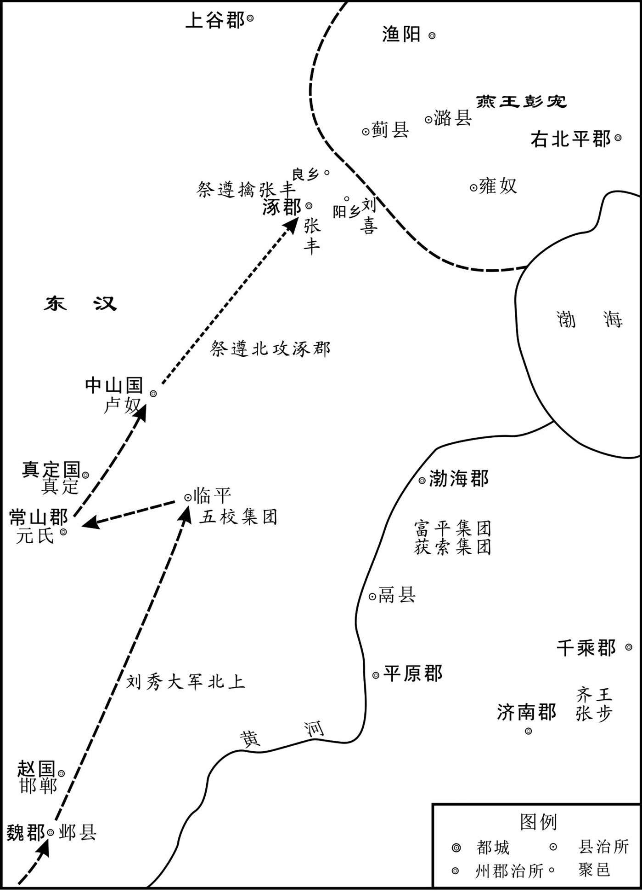 
光武帝平渔阳前河北形势示意图

## 【译文】

光武帝派遣建义大将军朱祜、建威大将军耿弇、征虏将军祭遵、骁骑将军刘喜在涿郡（今河北涿州）讨伐张丰。祭遵带兵先到，猛烈攻击，活捉张丰。当初，张丰喜好道术，有一位道士说他应当做皇帝，并用五彩口袋包着一块石头绑在张丰的胳膊肘上，说：“石头里有玉玺。”张丰相信了道士的话，于是叛变了。被活捉后，被判斩首，他还在说“我胳膊上的石头里有玉玺”。旁边的人用铁锥砸破石头，张丰才知道被骗了，仰天长叹说：“我是该死，死而无恨。”

## 【原文】

**上诏耿弇进击彭宠。弇以父况与宠同功，又兄弟无在京师者，不敢独进，求诣洛阳[1]。诏报曰：“将军举宗为国，功效尤著，何嫌何疑，而欲求征？[2]”况闻之，更遣弇弟国入侍[3]。时祭遵屯良乡，刘喜屯阳乡，彭宠引匈奴兵欲击之[4]。耿况使其子舒袭破匈奴兵，斩两王，宠乃退走[5]。**

## 【注文】

[1]诣（yì）：到，旧时特指到尊长那里去。

[2]诏：又称诏令、诏书。古代皇帝不经过任何机关而直接发布的命令，它是古代法律形式之一，始于秦代。古时皇帝对下级的告诫也称诏。

[3]国：即耿国（？—58年）。东汉扶风茂陵（今陕西兴平市东北）人，字叔虑。耿弇弟。建武四年（28年）为黄门侍郎。后历任射声校尉、驸马都尉、五官中郎将。奏请承认匈奴奥鞬日逐王比为呼韩邪单于，许其捍御乌桓、鲜卑与北匈奴。光武帝从其议，北边由是安宁。后为大司农。建言置度辽将军、左右校尉，以防边民逃亡。建武二十七年（51年），代冯勤出任大司马（旋改名太尉）。永平元年（58年）卒。后明帝追思耿国之言，设置度辽将军、左右校尉屯驻五原。

[4]良乡：县名。位于今北京房山区东北部。汉高祖刘邦设立涿郡，管辖涿（今河北涿州），领二十九县，其中良乡县、西乡县和阳乡县北部在今北京房山区境。　　阳乡：县名。属于涿郡，位于今河北涿州市境内。靠近北京房山区东北部。

[5]舒：即耿舒（？—58年）。东汉将领。扶风茂陵（今陕西兴平市东北）人，耿弇弟。光武初为复胡将军。击彭宠有功，封牟平侯。建武二十四年（48年），随马援率四万余人远征武陵五溪蛮夷。建武二十五年，马援病死军中，耿舒代替马援监督诸军。官至建威大将军。

## 【译文】

刘秀下诏命耿弇进击彭宠。耿弇因为老父耿况与彭宠的功劳相同，又因兄弟没有留在京师的，因此不敢独自进军，要求回到洛阳。刘秀下诏回答说：“你全家族为国效力，功劳显著，有什么嫌疑，而要求回京城呢？”耿况听说后，就派遣耿弇弟弟耿国到洛阳宫廷去侍奉刘秀。此时祭遵屯驻在良乡，刘喜屯驻在阳乡，彭宠带领匈奴的军队想去袭击他们。耿况让他的儿子耿舒带兵击破了匈奴兵，杀死了两个匈奴亲王，彭宠才退兵逃走。

## 【原文】

**五年二月，彭宠妻数为恶梦，又多见怪变，卜筮、望气者皆言：“兵当从中起。[1]”宠以子后兰卿质汉归，不信之，使将兵居外，无亲于中。宠斋在便室，苍头子密等三人因宠卧寐，共缚著床，告外吏云：“大王斋禁，皆使吏休。[2]”伪称宠命，收缚奴婢，各置一处。又以宠命呼其妻，妻入，惊曰：“奴反！”奴乃捽其头，击其颊[3]。宠急呼曰：“趣为诸将军办装！[4]”于是两奴将妻入取宝物，留一奴守宠。宠谓守奴曰：“若小儿，吾素所爱也，今为子密听迫劫耳。解我缚，当以女珠妻汝，家中财物，皆以与若。”小奴意欲解之，视户外，见子密听其语，遂不敢解。于是收金玉衣物，至宠所装之，被马六匹，使妻缝两缣囊[5]。昏夜后，解宠手，令作记告城门将军云：“今遣子密等至子后兰卿所，速开门出，勿稽留之[6]。”书成，斩宠及妻头置囊中，便持记驰出城，因以诣阙。明旦，阁门不开，官属逾墙而入，见宠尸，惊怖[7]。其尚书韩立等共立宠子午为王，国师韩利斩午首诣祭遵降，夷其家族。帝封子密为不义侯[8]。**

## 【注文】

[1]卜筮（shì）：指用龟甲、筮草等工具预测某些事项，不同的时代使用的方法有不同，历代也有创新，比如据传东方朔的《灵棋经》就是用特制的棋子和特殊的口诀来预测。是利用一些无生命的自然物呈现出来的形状来预卜吉凶。　　望气者：古代一种掌握占候术的方士，靠望云气以测吉凶征兆。

[2]便室：别室，休息宴游的地方。　　苍头：亦作“仓头”。汉以后私家所属奴的一种称谓。汉时奴仆以深青色巾包头，故称苍头。　　子密：东汉初渔阳郡彭宠的一名家仆，趁彭宠熟睡，将其绑缚斩杀，献其头于光武帝刘秀，受封不义侯。　　卧寐（mèi）：躺在床上睡觉。

[3]伪称：假传命令。　　捽（zuó）：方言，揪、抓的意思。

[4]趣（cù）：古同“促”，催促，急促。

[5]被：古同“备”，准备。　　缣（jiān）囊：细绢制成的袋子。

[6]昏夜：黑夜，晚上。　　作记：指书写命令。　　城门将军：官名。负责城门守卫工作的军官。　　稽（jī）留：停留，迁延。

[7]明旦：明天天亮。　　阁门：这里指宫门。　　逾（yú）：越过，翻越。

[8]韩立（生卒年不详）：东汉初渔阳郡彭宠自立为燕王后的尚书。　　午：即彭午（？—29年）。东汉初年燕王彭宠的儿子。彭宠本来是汉光武帝刘秀的功臣，因为他觉得刘秀对他的封赐太低，起兵反刘秀。建武五年（29年）彭宠被家奴苍头子密杀害。尚书韩立拥立彭午为王，国师韩利将彭午斩首，向征虏将军祭遵投降。　　国师：官名。王莽新朝始置。主管官吏的选拔、考核，位居上公，与太师、太傅、国将并称“四辅”，也作太师的别称。　　韩利（生卒年不详）：东汉初渔阳郡彭宠自立为燕王后的国师。　　不义侯：刘秀给彭宠的奴仆子密的封号。

## 【译文】

东汉兴武帝建武五年（29年）二月，彭宠的妻子多次做噩梦，又常看到很多怪异的现象，占卜算卦的人和望气的人都说：“兵乱要从内部发生。”彭宠因为堂弟子后兰卿曾在长安做人质，后来返回，因此不信任他，就命他带兵驻扎城外，城中就没有亲信了。彭宠在便室斋戒，奴仆子密等三人趁彭宠睡觉之机，把他绑在床上，告诉外面的官员说：“大王正在斋戒，让官员们都休息吧。”又假传彭宠命令，把奴仆、婢女都捆绑起来，分别囚禁。又假传彭宠的命令叫他的妻子进来，彭宠之妻一进别室，大惊说：“奴仆反了！”子密等人就揪住她的头，打她的面颊。彭宠急忙呼叫：“赶快给几位将军准备行装！”于是两个奴仆押着彭宠的妻子到后堂去取金银财宝，留下一个小奴仆看守彭宠。彭宠对小奴仆说：“你这个孩子，我平日很爱护你，今天你是被子密威胁来劫持我的。你给我解开绳索，我把女儿彭珠许配给你为妻，我家中的财物全都给你。”小奴仆正想去解开绳索，向门外探视一下，看见子密在听他们讲话，于是没敢解开绳索。子密等人搜取了宫中财宝衣物，又回到绑缚彭宠的别室，把东西装好，准备了六匹马，命令彭宠妻子缝两个细绢口袋。入夜后，解开彭宠的手，让他给城门将军写亲笔命令：“今派子密等人到子后兰卿那里，速开城门让他们出去，不得拖延。”写完后，斩下了彭宠和他妻子的头装入袋中，便拿着彭宠写的命令飞驰出城，带着人头向东汉京师洛阳奔去。第二天早上，宫门没开。官属们跳墙进去，发现了彭宠的尸体，非常惊恐。彭宠的尚书韩立等人共同拥立彭宠的儿子彭午为燕王，国师韩利斩下彭午的头到祭遵处投降，并把彭宠整个家族都杀了。光武帝刘秀封子密为不义侯。

## 【原文】

**权德舆议曰：伯通之判命，子密之戕君，同归于乱，罪不相蔽，宜各致于法，昭示王度[1]；反乃爵于五等，又以“不义”为名。且举以不义，莫可侯也，此而可侯，汉爵为不足劝矣[2]。《春秋》书齐豹盗、三叛人名之义，无乃异于是乎！[3]**

## 【注文】

[1]权德舆（759—818年）：唐宪宗朝宰相，文学家。字载之。天水略阳（今甘肃秦安）人。幼聪慧，十五岁为文已数百。初为河南黜陟使韩洄从事，迁监察御史。唐贞元八年（792年）召为太常博士，改左补阙，迁起居舍人，知制诰，进中书舍人。唐元和五年（810年）拜礼部尚书，同中书门下平章事，后出为东都留守，历刑部尚书、山南西道节度使。卒谥文，后称权文公。　　伯通：即彭宠，彭宠字伯通。　　戕（qiānɡ）：残杀、杀害的意思。　　王度：度，法制也。王度即王法。

[2]爵于五等：周代分封诸侯依次尊卑的五个爵称，即公、侯、伯、子、男。《礼记·王制》：“王者之制禄爵，公、侯、伯、子、男，凡五等。天子之田方千里，公侯田方百里，伯七十里，子男五十里。”

[3]《春秋》：鲁国编年史。儒家五经之一。相传为孔子依据鲁国史官所编《春秋》加以整理修订而成。是后代编年史的滥觞。《春秋》内容十分概略，记载了自鲁隐公元年（前722年）到鲁哀公十四年（前481年）共二百四十二年的历史。《春秋》文字简短，相传有褒贬之意，后世人称之为“春秋笔法”，将其看作一本微言大义的思想书，是定名分、制法度的范本。作为史书，它虽然尚不能把事件演变过程和人物的活动情况充分反映，但在当时条件下实为一最合时代的形式。它严谨的书法，简练的语言，为后代历史散文提供了可贵借鉴。后来古代史书也通称《春秋》。　　齐豹（生卒年不详）：春秋卫灵公时司寇，正卿。齐恶之子。卫灵公十三年（前522年），因受公孟絷（灵公庶兄）轻慢，并被夺司寇职和食邑鄄（今山东鄄城县西北），故与大夫北宫喜等乘机叛乱，杀公孟絷。灵公出奔死鸟（在山东境，今地不详），不久，北宫喜又杀齐豹。孔子论其事云：“齐豹之盗，而孟絷之贼。”

## 【译文】

权德舆评论说：彭宠叛变，子密杀君，同样都是叛乱。罪恶不能相互遮盖的，应分别依法处理，使王法昭示天下；现在反而封子密为五等爵，但却用“不义”为称号。如果他的举动不义，就没有必要封侯，如果这样行为可封侯，那么东汉的爵位也就失去劝勉的作用了。《春秋》直书齐豹为强盗，又记载了三个叛徒的姓名，它的意见恐怕与此事不同吧！

# 光武平齐

## 【内容提要】

本篇主要记述了东汉光武帝刘秀在消灭了赤眉等农民起义军，基本上稳定东汉王朝的政权之后，对刘永等齐地割据势力的平叛，并详细记述了刘秀带领下的东汉大将消灭以刘永为首的东方割据势力的全过程。

刘永最初被更始皇帝刘玄封为梁王，占据着兖州、豫州、青州、徐州一带，地跨今山东西部、河南东部、江苏与安徽北部，以及河北南部。而刘秀建立东汉政权后，刘永在睢阳称帝，封山东的张步、苏茂、董宪等人为大将军。刘秀对此割据势力采取了军事打击和政治分化并行的策略。首先，刘秀派遣虎牙大将军盖延率军攻击刘永，攻克了睢阳，刘永被其部下杀死。在此期间，刘秀又派遣伏隆到青、徐二州进行招降，因其不肯破例封张步为王，张步被刘永拉拢封为齐王，从而使战争变得艰难。此后，刘秀不得不以两路大军与张步、苏茂、董宪等周旋，其手下将领如耿弇等人显示出高超的军事才能。在深入敌境、粮草不济的情况下，能够攻敌不备，以逸待劳，以实击虚，屡屡得胜。刘秀又在张步、苏茂穷途之时实行招降政策，最终张步斩杀苏茂率众投降，结束战争。而后耿弇又快速降服五校余部，吴汉攻克朐县杀死董宪，东方的割据势力最终全部被消灭。

刘秀即位后的一系列平叛举措，为东汉王朝的统一和发展奠定了良好的基础，在此期间，涌现了许多优秀的战将，立下了赫赫战功。

## 【原文】

**淮阳王更始元年冬十月，故梁王立之子永诣洛阳，更始封为梁王，都睢阳[1]。**

## 【注文】

[1]睢（suī）阳：县名。在今河南商丘市南。秦置，以在睢水之阳得名。治所在今商丘市睢阳区南。西汉高祖五年（前202年）改为梁国治。

## 【译文】

淮阳王刘玄更始元年（23年）冬天的十月，西汉时梁王刘立的儿子刘永来到洛阳，刘玄封他为梁王，其王国建都在睢阳。

## 【原文】

**二年冬，梁王永据国起兵，招诸郡豪桀[1]。沛人周建等并署为将帅，攻下济阴、山阳、沛、楚、淮阳、汝南，凡得二十八城[2]。又遣使拜西防贼帅山阳佼强为横行将军，东海贼帅董宪为翼汉大将军，琅邪贼帅张步为辅汉大将军，督青、徐二州，与之连兵，遂专据东方[3]。**

## 【注文】

[1]梁王永：即刘永（？—公元27年），豫州梁郡睢阳（今河南商丘市南）人。西汉梁王刘立之子、汉文帝刘恒八世孙，刘梁的建立者，25年至27年在皇帝位。他是中国新莽末期的割据者、东汉初期的杰出武将兼政治家。其弟刘防、刘少公都是当时著名的武将。　　豪桀（jié）：同“豪杰”。才能出众的人。

[2]沛：县名。因古有“沛泽”而得名。沛县为汉高祖刘邦的故乡和发迹之地，春秋战国时，沛地属宋国。春秋末，齐、楚、魏灭宋，楚得沛地，设县。秦灭六国后，建沛县，属泗水郡。西汉拆分秦泗水郡，建沛郡，辖沛县，时沛县为高祖汤沐邑。今属江苏徐州。　　济阴：县名。今山东定陶县。　　山阳：县名。今山东金乡县。　　楚：县名。今江苏徐州市。　　淮阳：县名。今河南周口淮阳县。　　汝南：郡名。高祖四年（前203年）置，治所在上蔡（今河南上蔡县西南），辖境相当于今河南汝南、淮阳等县及安徽阜阳等县一带。北宋时无此县名。

[3]西防：县名。本春秋时宋防邑地。西汉置县，属山阳郡。治所在今山东成武县。　　董宪（？—30年）：东汉武将，徐州东海郡人。后依附于梁王刘永、刘纡父子。　　琅邪（yá）：郡名。春秋时期的齐国有琅邪邑，在今山东青岛市黄岛区琅邪台西北。秦朝统一六国后，地方实行郡县制，琅邪为三十六郡之一，并置琅邪县，治所均在琅邪，郡境为山东半岛东南部。西汉时期治东武（今山东诸城），并增琅邪国、柜县和祝兹侯国治于境内，下辖五十一县，包括今山东半岛东南部的海阳、即墨、崂山、胶州、胶南、沂水、莒南、日照、五莲、赣榆（今江苏赣榆）及青岛等地。东汉朝时期琅邪国改治到开阳（今山东临沂）。　　张步（？—32年）：字文公，东汉琅邪不其县（今山东青岛）人。初随新莽起事，自号五威将军，后被光武帝刘秀封为安丘侯。建武三年（27年）称齐王，据郡十二。建武八年（32年）为琅邪太守陈俊所杀。

## 【译文】

淮阳王刘玄更始二年（24年）冬天，梁王刘永在其封地起兵叛变，招揽了各郡的英雄豪杰。沛县人周建等都被封为将帅，梁王军队攻下了济阴、山阳、沛、楚、淮阳、汝南，一共占领了二十八座城池。刘永又派遣使者封西防农民军将领山阳人佼强为横行将军，封东海农民军将领董宪为翼汉大将军，封琅邪农民军将领张步为辅汉大将军，统领青州、徐州二地，与他们的军队相联合，于是梁王就独自占据了东方之地。

## 【原文】

**汉光武建武元年十一月，梁王永称帝于睢阳[1]。**

## 【注文】

[1]汉光武：东汉光武帝刘秀（前6—公元57年）的谥号，后人以此代指刘秀。

## 【译文】

汉光武帝刘秀建武元年（25年）十一月，梁王永在睢阳称帝。

## 【原文】

**初，更始以王闳为琅邪太守，张步据郡拒之[1]。闳谕降，得赣榆等六县[2]。收兵与步战，不胜。既受刘永官号，治兵于剧，遣将徇泰山、东莱、城阳、胶东、北海、济南、齐郡，皆下之[3]。闳力不敌，乃诣步相见[4]。步大陈兵而见之，怒曰：“步有何罪，君前见攻之甚？[5]”闳按剑曰：“太守奉朝命，而文公拥兵相距[6]。闳攻贼耳，何谓甚邪！”步起跪谢，与之宴饮，待为上宾，令闳关掌郡事[7]。**

## 【注文】

[1]更始：更始帝刘玄年号，这里指代刘玄。　　王闳（生卒年不详）：西汉末魏郡元城（今河北大名县东）人。王莽叔父平阿侯王谭之子，为琅邪名士。哀帝时为中常侍，因曾斥责董贤还玺绶，声名大振。王莽篡汉，出为东郡太守。后任琅邪太守，建武五年（29年）与张步同降光武。

[2]赣榆：县名。秦置县，汉代因之，后改名怀仁县。在今江苏赣榆县。

[3]剧：县名。在今山东昌乐县。　　泰山：郡名。在今山东泰安市。　　东莱：郡名。在今山东莱州市。　　城阳：郡名。在今山东莒县。　　胶东：郡名。在今山东平度县。　　北海：郡名。在今山东乐昌县境内。　　济南：郡名。在今山东济南市。　　齐郡：郡名。在今山东淄博市。齐郡又名齐国，秦始皇二十六年（前221年）灭齐国，于其故地分置齐郡、琅邪郡。汉初刘邦封韩信为齐王，都临淄，为汉初异姓诸王之一。前202年，徙韩信为楚王，把齐郡分为临淄、济北、胶东、琅邪四郡。

[4]诣：到。

[5]陈兵：陈列军队。

[6]文公：指张步。

[7]跪谢：跪着道歉。　　关掌：掌管。

## 【译文】

当初，刘玄任命王闳为琅邪郡太守，而张步据守在琅邪郡进行抵抗。王闳传圣谕招降，得到了赣榆等六个县。王闳集结兵力与张步交战，没有取胜。张步已经接受了刘永封给的官位，便在剧县训练军队，并派遣将领攻占泰山、东莱、城阳、胶东、北海、济南、齐郡等地，都取得了胜利。王闳的军队无力抵抗，于是去见张步。张步陈列军队见了王闳，并发怒说：“我有何罪，以至于你之前如此过分地攻打我们？”王闳以手按剑说：“我奉朝廷命令到此地担任郡守之职，而你却拥兵抗拒。我只是在攻打贼兵而已，哪里说得上是过分呢？”听罢，张步起身行跪拜礼谢罪，之后与王闳一起欢宴，待他为上等宾客，并让他掌管郡中事务。

## 【原文】

**二年夏四月，虎牙大将军盖延督驸马都尉马武等四将军击刘永，破之，遂围永于睢阳[1]。故更始将苏茂反，杀淮阳太守潘蹇，据广乐而臣于永，永以茂为大司马、淮阳王[2]。**

## 【注文】

[1]盖延（？—39年）：字巨卿，渔阳要阳（今河北滦平市西北）人。盖延力大能挽硬弓，以勇力闻名边疆。原为彭宠部下，后与吴汉共投刘秀，久经战阵，参与消灭王郎、刘永、董宪、苏茂、周建、庞萌、隗嚣、公孙述等割据势力，协助刘秀建立东汉，是东汉中兴名将，“云台二十八将”之一，为虎牙大将军，封安平侯。　　督：监督、监管。　　驸马都尉：官名。汉代始置。汉武帝时置驸马都尉，驸，即副。驸马都尉，掌副车之马。皇帝出行时自己乘坐的车驾为正车，而其他随行的马车均为副车。正车由奉车都尉掌管，副车由驸马都尉掌管。到三国时期，魏国的何晏，以帝婿的身份授官驸马都尉，以后又有晋代杜预娶晋宣帝司马懿之女安陆公主，王济娶晋武帝司马炎之女常山公主，都授驸马都尉。　　马武（？—61年）：字子张，南阳湖阳（今河南唐河县南）人，少年时为避仇家，客居江夏。后入绿林军，为新市兵将领。更始二年（24年）归顺刘秀，随其南征北战、平定四方。协助刘秀建立东汉，是东汉中兴名将，“云台二十八将”之一。为捕虏将军，封杨虚侯。

[2]故：原来。　　潘蹇（jiǎn）（生卒年不详）：西汉末年的淮阳太守，后在更始王朝的将领苏茂谋反叛变时，被杀死。　　广乐：县名。在今河南虞城县。

## 【译文】

东汉光武帝建武二年（26年）夏季四月，虎牙大将军盖延统领驸马都尉马武等四位将军攻打刘永，击破刘军并将刘永围困在睢阳。之前的刘玄更始王朝的将领苏茂谋反叛变，杀死淮阳太守潘蹇，占领了广乐并向刘永称臣。刘永任命其为大司马，封为淮阳王。

## 【原文】

**秋八月，盖延围睢阳数月，克之[1]。刘永走至虞，虞人反，杀其母、妻，永与麾下数十人奔谯[2]。苏茂、佼强、周建合军三万余人救永，延与战于沛西，大破之[3]。永、强、建走保湖陵，茂奔还广乐，延遂定沛、楚、临淮[4]。**

## 【注文】

[1]克：攻克。

[2]走：逃跑。　　谯（qiáo）：县名。今安徽亳州市。古焦国。春秋时期，为陈国焦邑。楚成王三十六年（前636年），楚伐陈，为楚谯邑，后置谯县，秦属砀郡。故址在今亳州市区。汉武帝元朔中，谯县改属沛郡。王莽篡汉，改谯县为延成亭。东汉初，复旧名。光武帝刘秀迁豫州治于谯县。

[3]合军：联合士兵。

[4]湖陵：县名。今山东鱼台县。战国时，楚置县。秦复置，属泗水郡。秦二世胡亥二年（前208年）十月，沛公攻湖陵。西汉，湖陵属兖州刺史部山阳郡。新改称湖陆县。东汉永平二年（59年），增封湖陵等五县为东平国的食邑县。东汉元和元年（84年）封东平王刘苍的儿子为湖陵侯，随即改称湖陆县。　　临淮：郡名。西汉置，治所在徐县（今江苏泗洪县南）。

## 【译文】

秋季八月，盖延围困睢阳数月之后，将之攻克。刘永逃跑到虞县，虞县人叛变，杀死了他的母亲和妻子。刘永与几十个部下逃奔到谯县。苏茂、佼强、周建联合三万多兵众援救刘永，盖延和他们在沛县西郊展开了战斗，并打败了这些援军。刘永、佼强、周建逃到湖陵守城，苏茂逃奔回到广乐，于是盖延便平定了沛郡、楚郡、临淮郡。

## 【原文】

**帝使太中大夫伏隆持节使青、徐二州，招降郡国[1]。青、徐群盗闻刘永破败，皆惶怖请降[2]。张步遣其掾孙昱随隆诣阙上书，献鳆鱼[3]。隆，湛之子也[4]。**

## 【注文】

[1]太中大夫：官名。秦制郎中令属官有太中大夫，与中大夫、谏大夫共同参与议论政事，其地位高于中大夫。两汉沿置，属光禄勋。　　伏隆（？—29年）：伏湛子，字伯文，琅邪东武（今山东诸城）人。少以节操立名，任琅邪郡督邮。时张步兄弟各自拥有强大的军队，占据齐地，朝廷拜任伏隆为太中大夫，带符节出使青徐二州，招降郡国。转拜光禄大夫。后张步反汉，为张步所杀。

[2]惶怖：惶恐，害怕。

[3]掾（yuàn）：官名。原意为佐助，后为副官佐或官署属员的通称。　　鳆（fù）鱼：又名鲍鱼，肉质细腻，味道鲜美，营养丰富。

[4]湛（zhàn）：即伏湛（？—37年），伏隆之父。字惠公，琅邪东武（今山东诸城）人。西汉经学家伏胜（伏生）之后，东汉官员。伏湛生性孝顺友爱，少时继父业，教授数百人。汉成帝时，因父功绩任博士弟子。至王莽时任绣衣执法、后队属正。更始帝刘玄即位，任其为平原太守。光武帝即位，任其尚书，主管典定旧有制度。建武三年（27年），任大司徒，封阳都侯。后改封不其侯。

## 【译文】

光武帝刘秀派太中大夫伏隆拿着符节出使青州、徐州二地，去招降各郡国。青州、徐州的农民军听说刘永打了败仗，都非常惶恐不安，纷纷请求投降。张步派遣他的副官孙昱跟随伏隆到京城上书，并献上鳆鱼。伏隆，是伏湛的儿子。

## 【原文】

**冬十一月，帝以伏隆为光禄大夫，复使于张步，拜步东莱太守，并与新除青州牧、守、都尉俱东。诏隆辄拜令、长以下[1]。**

## 【注文】

[1]光禄（lù）大夫：官名。原为中大夫，属郎中令。西汉太初元年（前104年）郎中令更名为光禄勋，遂改为光禄大夫。　　守：官名。指太守，为一州最高行政长官。　　都尉：官名。战国始置。职位次于将军的武官，掌管地方军队。秦置郡守、郡丞、郡尉，郡尉掌管全郡兵马，维持地方治安，秩比二千石。西汉中元二年（前148年），改郡守为太守、郡尉为都尉。东汉建武六年（30年）废都尉，太守兼其职。另外还有东部都尉、西部都尉、关都尉、属国都尉，皆为地方武官。　　令：官名。指县令。　　长：官名。指县长，根据县的级别大小，大的设令，小的设长。

## 【译文】

冬季十一月，光武帝刘秀封伏隆为光禄大夫，又派其出使到张步军中，封张步为东莱郡的太守，并使伏隆与新任命的青州牧正、太守、都尉一起向东出发。刘秀下诏授权伏隆可以任命县令、县长以下的官员。

## 【原文】

**三年二月，刘永立董宪为海西王。永闻伏隆至剧，亦遣使立张步为齐王[1]。步贪王爵，犹豫未决。隆晓譬曰：“高祖与天下约，非刘氏不王。今可得为十万户侯耳[2]。”步欲留隆，与共守二州。隆不听，求得反命，步遂执隆而受永封。隆遣间使上书曰：“臣隆奉使无状，受执凶逆，虽在困厄，授命不顾[3]。又吏民知步反畔，心不附之，愿以时进兵，无以臣隆为念[4]。臣隆得生到阙廷，受诛有司，此其大愿。若令没身寇手，以父母、昆弟长累陛下[5]。陛下与皇后、太子永享万国，与天无极！”帝得隆奏，召其父湛，流涕示之曰：“恨不且许而遽求还也[6]！”其后步遂杀之。帝方北忧渔阳，南事梁、楚，故张步得专集齐地，据郡十二焉。**

## 【注文】

[1]闻：听说。

[2]晓譬（pì）：晓喻，开导。

[3]间使：担任见机行事任务的使者。　　困厄（è）：困顿之境。

[4]畔：同“叛”，叛变。

[5]昆弟：兄弟。

[6]遽：疾速。

## 【译文】

东汉光武帝建武三年（27年）二月，刘永封董宪为海西王。刘永听说伏隆到了剧县，也派使者去张步军中封其为齐王。张步贪图王号爵位，便犹豫着没有做出决定。伏隆开导他说：“汉高祖曾与天下约定，不是刘姓皇族不能封王爵。而你现在就可以成为十万户的侯爵。”张步想留下伏隆，与他共同坚守青徐二州。伏隆不答应，恳求回到京城复命，张步就扣押了伏隆，接受了刘永的王爵。伏隆秘密派遣间使，向刘秀上书说：“臣子伏隆我奉命出使没有成功，被叛逆者囚禁，即使我身在困顿险恶之中，也会毫无顾念地献出自己的生命。而且这里的官民知道张步叛变了东汉朝廷，内心不愿归附于他。希望陛下能及时出兵攻打张步，不要考虑我的安危。我能够活着回到朝廷，被官吏责罚，便是我最大的愿望。如果我死在盗寇的手下，那么我的父母兄弟就长期劳累陛下照颐了。祝陛下与皇后、太子永远享受万国的拥戴，与上天一样长寿无极！”光武帝得到伏隆的奏书，召见他的父亲伏湛，流着眼泪把奏书拿给他看，说：“我很遗憾不能暂且答应张步的要求而使伏隆迅速返回啊！”后来张步就杀死了伏隆。光武皇帝刘秀当时正在忧虑北方的渔阳，南方又要对付梁国、楚国。因此张步得以独霸齐地，在那里占据十二个郡。

## 【原文】

**夏四月，吴汉率骠骑大将军杜茂等七将军围苏茂于广乐，周建招集得十余万人救之[1]。汉迎与之战，不利，堕马伤膝，还营，建等遂连兵入城[2]。诸将谓汉曰：“大敌在前，而公伤卧，众心惧矣！”汉乃勃然裹创而起，椎牛飨士，慰勉之，士气自倍[3]。旦日，苏茂、周建出兵围汉，汉奋击，大破之，茂走还湖陵。睢阳人反城迎刘永，盖延率诸将围之[4]。吴汉留杜茂、陈俊守广乐，自将兵助延围睢阳[5]。**

## 【注文】

[1]骠骑大将军：官名。西汉时设，将军名号。汉武帝元狩二年（前121年）始用霍去病为骠骑将军，秩与大将军同，地位仅次于大将军。　　杜茂（？—43年）：字诸公，南郡冠军县（今河南邓州市西北）人。东汉中兴名将，“云台二十八将”之一。在刘秀平定河北时投奔，被任命为中坚将军。刘秀即位后，拜大将军，封乐乡侯。先后与王梁剿灭五校；为骠骑大将军，攻打沛郡，攻克芒；击破刘永的残党佼强；与郭凉攻打卢芳、匈奴联军。后被增加食邑，封脩侯。建武十五年（39年），因为放纵部下杀人而被免官，减食邑，改封参蘧乡侯。

[2]连兵：联合兵力、集结军队。

[3]创：伤口。　　椎（chuí）：用椎敲打。　　飨（xiǎng）：犒劳。

[4]反：同“返”，交还。

[5]陈俊（？—52年）：字子昭，南阳郡西鄂（今河南南阳市北）人。东汉中兴名将，“云台二十八将”之一。一开始跟随刘嘉，官拜长史。后来跟贾复一起经刘嘉推荐投奔刘秀。作战勇猛，在河北比较闻名。后来参与山东作战，跟吴汉一同作战，平定山东后留陈俊坐镇，封祝阿侯。后来一直在山东任职，直到建武二十三年（47年）老死任所。有子陈浮，封薪春侯。

## 【译文】

夏季四月，吴汉率领骠骑大将军杜茂等七位将军在广乐围攻苏茂，而周建则招集了十多万人去营救苏茂。吴汉出来迎战周建，没有取胜，从马上摔了下来伤了膝盖，回到营中。于是周建等人便联合兵众进入广乐城。诸位将领们对吴汉说：“大敌当前，而您受伤躺在床上，大家很惶恐啊！”听到这些话，吴汉突然就包好伤口，一跃而起，命用椎子杀牛宰羊犒劳将士，并勉励他们，于是军中士气自然倍增。第二天，苏茂、周建出兵围攻吴汉，吴汉带兵奋力还击，大破苏、周的军队，苏茂便逃回了湖陵。此时睢阳人献城投降，迎接刘永回来，而东汉大将盖延则率将领们围攻睢阳。吴汉留下杜茂、陈俊驻守广乐，自己则带兵援助盖延围攻睢阳。

## 【原文】

**秋七月，盖延围睢阳百日，刘永、苏茂、周建突出，将走酂，延追击之急，永将庆吾斩永首降[1]。苏茂、周建奔垂惠，共立永子纡为梁王。佼强奔保西防[2]。**

## 【注文】

[1]突出：突围而出。　　酂（cuó）：县名。在今河南永城市。秦置，属砀郡，汉属沛郡，地处今永城酂城一带。萧何封酂侯，即此邑也。

[2]垂惠：县名。又名垂惠聚，始建于春秋，位于今安徽蒙城县双锁山东北红城村一带。建武四年（28年），刘永部将苏茂、周建被刘秀军打败，逃至垂惠。次年，刘秀派王霸和马武率军攻打垂惠，围困半年，后用火攻之，城土皆烧为红色，因此后人改名为红城子。　　纡（yū）：即刘纡（？—29年），更始帝刘玄政权梁王刘永之子。新末、东汉初期政治人物。豫州梁郡睢阳县（今河南商丘市）人。父亲是更始帝刘玄政权的梁王刘永。叔父刘防、刘少公。其父刘永在更始政权灭亡后自称天子，将中国东部地域收归手中。建武三年（27年）春，刘永的湖陵城（山阳郡）被攻陷，逃走时，刘永部将庆吾杀刘永，将刘永首级献给光武帝。刘纡被刘永属下苏茂、周建在垂惠拥立为刘永的后继者，称梁王。之后，刘纡属下诸将在吴汉率汉军猛攻下接连败退。建武五年（29年），郯城（东海郡）失陷，刘纡在逃跑的路上，被部下兵士高扈杀死。

## 【译文】

秋季七月，盖延已经围攻睢阳一百天了，刘永、苏茂、周建突围而出，将要逃到酂县（今河南永城）；盖延急速追击，刘永的将领庆吾便砍下刘永的头向盖延请降。苏茂、周建逃奔到垂惠（今安徽蒙城），共同拥立刘永的儿子刘纡为梁王。刘永的另一将领佼强则逃到西防据守。

## 【原文】

**四年秋七月丁亥，上幸谯，遣捕虏将军马武、骑都尉王霸围刘纡、周建于垂惠[1]。**

## 【注文】

[1]捕虏（lǔ）将军：官名。杂号将军之一，掌管统兵征战，职位较高。　　骑都尉：官名。汉武帝始置，属光禄勋，掌监羽林骑。　　王霸（？—59年）：字元伯，颍川颍阳（今河南许昌）人。东汉中兴名将，“云台二十八将”之一。生性喜欢法律，父亲担任郡决曹掾，王霸年轻时也做监狱官。汉兵起事，光武路过颍阳，王霸带门客见光武，于是追随光武作战。在打败王寻、王邑于昆阳后，回家休息。建武十三年（37年），光武帝改封王霸为向侯，命王霸率领六千多弛刑徒和杜茂一起修治飞狐道，堆石布土，筑起亭障。屡屡与匈奴、乌桓作战，比较了解边疆事务。曾数次上书，提出应与匈奴和亲交好，还曾提出可以从温水漕运，以节省陆地转输之劳，都被朝廷采纳实行。后来南单于、乌桓归降汉朝，北部边疆无事。王霸镇守上谷二十多年。建武三十年（54年），朝廷封王霸为淮陵侯。

## 【译文】

东汉光武帝建武四年（28年）秋季七月丁亥（初八日），光武帝刘秀幸临到谯（今安徽亳州），派遣捕虏将军马武、骑都尉王霸到垂惠（今安徽蒙城）围攻刘纡和周建。

## 【原文】

**董宪将贲休以兰陵降，宪闻之，自郯围之[1]。盖延及平狄将军山阳庞萌在楚，请往救之[2]。帝敕曰：“可直往捣郯，则兰陵自解。”延等以贲休城危，遂先赴之。宪逆战而阳败退，延等因拔围入城[3]。明日，宪大出兵合围，延等惧，遽出突走，因往攻郯[4]。帝让之曰：“间欲先赴郯者，以其不意故耳。今既奔走，贼计已立，围岂可解乎[5]！”延等至郯，果不能克，而董宪遂拔兰陵，杀贲休。**

## 【注文】

[1]贲（bēn）休（生卒年不详）：东汉初光武帝刘秀时，董宪帐下大将。盖延围攻睢阳，贲休献出兰陵投降东汉；董宪听到消息，从郯城发兵围攻兰陵，并夺取了兰陵，杀死了贲休。　　兰陵：县名。在今山东临沂苍山县境内。夏、商、西周奴隶制时代，兰陵为缯国属地，名为次室邑。春秋时为鲁国所辖。鲁国大夫季文子设置次室亭。楚越争霸时，今县域东部南部直到开阳（今临沂）、莒国（今莒县）一带成为楚国新开辟的东北边疆。楚国取得缯地后，将政治统治中心南移至原鲁邑次室。前319年，屈原任楚怀王左徒时，主管内政外交，两次出使齐国路过此地，因屈原极爱兰花（在他不朽之作《离骚》中，多处出现咏兰的佳句），遂将原鲁国次室邑更名为兰陵邑，初置兰陵县，喻为楚国的“王道乐土”。战国时期著名唯物主义思想家荀子（前313—前238年）曾两任兰陵县令。秦朝实行郡县制，兰陵县属东海郡所辖。秦、汉、三国时期，今县境设有兰陵、襄贲、缯三县，兰陵县地域最大，人口最多。　　郯（tán）：县名。在今山东临沂郯城。原为古郯国地。秦始皇二十六年（前221年）置县，属郯郡。治所旧址在今郯城县郯城镇郯城北关。汉高祖刘邦五年（前202年）为东海郡治。东汉为徐州和东海郡治。

[2]平狄将军：官名。古代武官职名，杂号将军之一，掌管统兵征战。　　庞萌（？—30年）：山阳（今山东金乡）人，东汉初年将领。初亡命于下江军队中。更始元年（23年），刘玄称帝，任庞萌为冀州牧，隶属尚书令谢躬，共同击败王郎。谢躬失败，庞萌便归降光武帝刘秀。建武元年（25年），光武帝任命庞萌为侍中。庞萌谦逊和顺，很受光武帝信赖宠爱，拜任平狄将军，与盖延共击董宪，因光武帝只下诏给盖延而没给庞萌，庞萌心生疑惑，于是反叛。光武帝大怒，亲讨庞萌。吴汉等围攻董宪和庞萌所在的朐城，董宪和庞萌便率数十名骑兵连夜离开，吴汉的校尉韩湛在方与追上并杀死董宪，方与人黔陵也杀死了庞萌，将他们传首洛阳。

[3]阳：同“佯”，佯装，假装。　　拔：攻破。

[4]合围：四面围困。

[5]让：责备。　　间：秘密地。

## 【译文】

董宪的将领贲休献出兰陵投降东汉；董宪听到消息，从郯城发兵围攻兰陵。盖延和平狄将军、山阳人庞萌正在楚国，上疏请求去援救贲休。光武帝刘秀告诫盖延说：“你们可以直接攻打郯县，这样兰陵便会自动解除围困。”盖延等人认为贲休所在的兰陵城情势危急，于是便先到了兰陵。董宪出来迎战，假装战败后退，盖延等人因此破围进入兰陵城。第二天，董宪出动大军四面围困，盖延等人害怕，便急速突围逃走，去攻打郯县。光武帝责备盖延等人说：“我命你先秘密地攻打郯县的原因，就是出其不意的缘故。如今既已战败逃奔，敌人的计谋已定，哪里还能解除围困呢？”盖延等人到了郯县，果然不能将城池攻克。董宪于是夺取了兰陵，杀死了贲休。

## 【原文】

**五年二月，苏茂将五校兵救周建于垂惠[1]。马武为茂、建所败，奔过王霸营，大呼求救。霸曰：“贼兵盛出，必两败，努力而已。”乃闭营坚壁[2]。军吏皆争之，霸曰：“茂兵精锐，其众又多，吾吏士心恐，而捕虏与吾相恃，两军不一，此败道也。今闭营固守，示不相援，贼必乘胜轻进，捕虏无救，其战自倍[3]。如此，茂众疲劳，吾承其敝，乃可克也[4]。”茂、建果悉出攻武，合战良久，霸军中壮士数十人断发请战，霸乃开营后，出精骑袭其背。茂、建前后受敌，惊乱败走，霸、武各归营。茂、建复聚兵挑战，霸坚卧不出。方飨士作倡乐，茂雨射营中，中霸前酒樽，霸安坐不动[5]。军吏皆曰：“茂前日已破，今易击也。”霸曰：“不然。苏茂客兵远来，粮食不足，故数挑战，以徼一时之胜[6]。今闭营休士，所谓‘不战而屈人兵’者也[7]。”茂、建既不得战，乃引还营。其夜，周建兄子诵反，闭城拒之[8]。建于道死，茂奔下邳与董宪合，刘纡奔佼强[9]。**

## 【注文】

[1]五校：校是古代军队的一种编制单位，亦称军营。五校指屯骑、步兵、越骑、长水、射声五校尉，均为汉武帝置。

[2]坚壁：加固城墙和堡垒。

[3]争：争执，争议。　　相恃：相互依靠。　　固守：坚守。

[4]敝：凋敝，劳累。

[5]飨（xiǎng）士：以酒食款待士兵；犒劳士卒。　　倡乐：唱歌取乐。　　安：安然。

[6]徼（jiǎo）：求得，取得。

[7]休士：休整军队。

[8]兄子：兄长的儿子。　　诵：即周诵（生卒年不详），周建兄长之子。

[9]下邳（pī）：县名。在今江苏睢宁县。前221年秦统一六国，于邳置县，下邳县治所在今江苏邳州市之下邳故城。属东海郡（治郯县，在今山东郯城县西南）。汉高祖刘邦五年（前202年），封韩信为楚王治下邳。次年废除韩信王号，封刘交为楚王，治彭城（今江苏徐州），下邳县隶属楚。汉武帝元狩六年（前117年），置临淮郡，下邳属临淮。王莽始建国元年（9年），改下邳为润俭。东汉建武五年（29年），吴汉拔郯城，置下邳郡。旋改下邳郡为临淮郡，下邳为郡治所。

## 【译文】

东汉光武帝建武五年（29年）二月，苏茂率五个军营的士兵去垂惠（今安徽蒙城）援救周建。马武被苏茂、周建击败，在逃跑途中经过王霸的大营，大喊求救。王霸说：“敌人兵多气盛，我们出兵的话必定两败俱伤，你们尽量努力吧！”王霸于是关闭营门加固城墙和堡垒。士兵和军吏对此都多有争议，王霸说：“苏茂所带都是精锐之师，而且士兵又多，我们的士兵心里多有惶恐，而捕虏将军马武与我们互相依赖，两军行动不一致，如此定会失败。现在我们关闭营门坚守，表明不去援救马武。敌军一定轻敌乘胜追击。马武的士兵们见无人援助，斗志自会倍增。这样，苏茂的士兵就会打得十分疲劳，我们乘敌人疲劳之时出兵，才能取胜。”苏茂、周建果然全军出动攻击马武，交战了很长时间，王霸军中有数十名战士割断头发请求出战，于是王霸打开营垒后门，派精锐骑兵从敌军背后袭击。苏茂、周建前后受敌，惊慌失措战败逃跑，王霸、马武各自带兵回营。苏茂、周建又聚集兵众挑战，王霸坚守不出战。当时王霸正在大宴部下，饮酒作乐，苏茂向王霸营中射箭，箭如雨下，射中王霸面前的酒樽，王霸却安坐不动。官兵都说：“苏茂前天已战败，现在很容易击败他。”王霸说：“不是这样。苏茂是来自远方的军队，粮食不足，因此多次挑战，希望能侥幸取得一时的胜利。我们现在关闭营门，休整军队，这就是所说的‘不用战斗就可以使敌军屈服’的道理。”苏茂、周建既然不能与王霸交战，就带兵回营了。当天夜里，周建兄长的儿子周诵叛变，关闭城门不准他们入城。周建在逃跑的途中死去，而苏茂则逃奔到下邳（今江苏睢宁）与董宪会合，刘纡逃到佼强那里。

## 【原文】

**上诏耿弇进讨张步[1]。**

## 【注文】

[1]进讨：进攻讨伐。

## 【译文】

光武帝刘秀下诏命耿弇进军讨伐张步。

## 【原文】

**平敌将军庞萌，为人逊顺，帝信爱之，常称曰：“可以托六尺之孤，寄百里之命者，庞萌是也[1]。”使与盖延共击董宪。时诏书独下延而不及萌，萌以为延谮己，自疑，遂反袭延军，破之[2]。与董宪连和，自号东平王，屯桃乡之北[3]。帝闻之，大怒，自将讨萌，与诸将书曰：“吾常以庞萌为社稷之臣，将军得无笑其言乎？老贼当族，其各厉兵马，会睢阳[4]。”**

## 【注文】

[1]平敌将军：官名。即平荻将军。杂号将军之一，掌管统兵征战。　　信：信任。

[2]谮（zèn）：诬陷，中伤。

[3]屯：驻扎。　　桃乡：县名。在今山东济宁境内。春秋时期为鲁国桃邑，西汉为桃乡侯国，后置县，属泰山郡。东汉废。

[4]自：亲自。　　族：灭族。　　厉：磨砺，使锋利。

## 【译文】

东汉平敌将军庞萌，为人谦虚和顺，光武帝刘秀非常信任和亲近他，经常称赞他说：“可以辅助幼主，镇守一方的，是庞萌。”刘秀派他与盖延共同去攻打董宪。由于当时只把诏书颁给了盖延而没颁给庞萌，庞萌便以为盖延在刘秀面前诬陷了自己，心里产生疑虑，于是反过来袭击盖延的军队，大败盖延。随后，庞萌又与董宪联合，自称东平王，驻扎在桃乡（今山东济宁）的北边。刘秀听到这个消息后非常生气，亲自率军讨伐庞萌，写信给各个将领说：“以前我常常以为庞萌是社稷之臣，将军们该不会嘲笑我说的话吧？这个老贼应当灭族，你们各自操练军队，到睢阳会师吧。”

## 【原文】

**庞萌攻破彭城，将杀楚郡太守孙萌，郡吏刘平伏太守身上，号泣请代其死，身被七创，庞萌义而舍之[1]。太守已绝复苏，渴求饮，平倾创血以饮之[2]。**

## 【注文】

[1]彭城：县名。在今江苏徐州市。尧封彭祖于彭城，为大彭氏国，徐州称彭城自此始。春秋战国时，彭城属宋，后归楚。秦统一六国，改彭城邑为彭城县，属泗水郡。秦末反秦战争中，项梁、项羽等义军将领拥立的楚怀王心曾都彭城。西汉为楚国都，东汉为彭城郡治。　　孙萌（生卒年不详）：东汉末楚郡太守。　　刘平（生卒年不详）：字公子，楚郡彭城（今江苏徐州）人。　　舍：舍弃。

[2]饮（yìn）：使喝水。

## 【译文】

庞萌攻陷彭城之后，想要杀楚郡的太守孙萌，郡中的吏官刘平趴在太守身上，大声号哭着请求代替太守去死，刘平身上有七处创伤，庞萌见他如此仁义便免了太守一死。太守此时气绝后又苏醒过来，口渴想要喝水，刘平倾尽自己伤口中的血给他喝。

## 【原文】

**六月，董宪与刘纡、苏茂、佼强去下邳，还兰陵，使茂、强助庞萌围桃城[1]。帝时幸蒙，闻之，乃留辎重，自将轻兵晨夜驰赴[2]。至亢父，或言“百官疲倦，可且止宿”，上不听[3]。复行十里，宿任城，去桃城六十里[4]。旦日，诸将请进，庞萌等亦勒兵挑战[5]。帝令诸将不得出，休士养锐以挫其锋[6]。时吴汉等在东郡，驰使召之[7]。萌等惊曰：“数百里晨夜行，以为至当战，而坚坐任城，致人城下，真不可往也。”乃悉兵攻桃城。城中闻车驾至，众心益固。萌等攻二十余日，众疲困，不能下。吴汉、王常、盖延、王梁、马武、王霸等皆至，帝乃率众军进救桃城，亲自搏战，大破之。庞萌、苏茂、佼强夜走从董宪。**

## 【注文】

[1]还：回到。　　桃城：县名。即桃乡。在今山东济宁境内。

[2]蒙：县名。在今山东济宁境内。　　辎重：行军时由运输部队携带的军械、粮草、被服等物资。　　驰：奔驰。

[3]亢（kàng）父：县名。在今山东济宁城南二十五公里。秦置县。

[4]任城：县名。在今山东济宁市任城区。西汉置任城县，故址在今微山县夏镇西北、南阳湖东岸、泗水入湖处南的鲁桥镇仲浅村，属东平国。东汉元和元年（84年）为任城国都。

[5]勒（lè）兵：陈兵。

[6]挫：挫伤，摧毁。

[7]东郡：郡名。秦王嬴政五年（前242年）置郡，治濮阳。汉代因之。约当今河南东北部和山东西部部分地区。

## 【译文】

这一年的六月，董宪与刘纡、苏茂、佼强离开下邳，回到兰陵，派苏茂、佼强帮助庞萌去围攻桃城。光武帝刘秀此时到了蒙县，听说此消息后，就留下军用物资、粮食，亲自率轻装部队日夜飞驰赶去援救。到了亢父，有人说“官员们都疲劳了，可以暂且住下休息”，刘秀不听，又走了十里路，到任城住宿，此地距离桃城六十里。第二天，将领们要求进军，庞萌也率军前来挑战。刘秀命将领们不得出去战斗，让士兵们养精蓄锐，好挫败敌人的锋芒。当时吴汉在东郡，刘秀派使者急速把他召来。庞萌等人非常吃惊地说：“刘秀带兵日夜不停地走了几百里，原以为他们一到达任城就会交战，然而此刻他们却安坐任城，招别人到城下，我们实在不能到任城去啊。”于是庞萌带领全军攻打桃城。桃城城中听说皇帝来了，军心更加稳定。庞萌等人攻打了二十多天，军队疲劳不堪，也没有攻下桃城。吴汉、王常、盖延、王梁、马武、王霸等大军都已到达任城，刘秀才率领众军援救桃城，亲自战斗，大破庞萌的军队。庞萌、苏茂、佼强连夜逃走去投奔董宪。

## 【原文】

**秋七月丁丑，帝幸沛，进幸湖陵。董宪与刘纡悉其兵数万人屯昌虑[1]。宪招诱五校余贼，与之拒守建阳[2]。帝至蕃[3]，去宪所百余里。诸将请进，帝不听，知五校乏食当退，敕各坚壁以待其敝。顷之，五校果引去[4]。帝乃亲临，四面攻宪。三日，大破之，佼强将其众降，苏茂奔张步，宪及庞萌走保郯。八月己酉，帝幸郯，留吴汉攻之，车驾转徇彭城、下邳[5]。吴汉拔郯，董宪、庞萌走保朐[6]。刘纡不知所归，其军士高扈斩之以降。吴汉进围朐。**

## 【注文】

[1]昌虑：县名。汉代至北魏古县名，在今山东滕州市羊庄镇土城村。为西汉在原邾国滥邑之地所设县。汉宣帝刘询甘露四年（前50年）封鲁孝王子刘弘为昌虑侯，传位至孙刘盖，三世国除，改县，属泰山郡。汉献帝刘协建安三年（198年），分东海郡，于昌虑县置昌虑郡，不久郡废，仍属东海郡。

[2]建阳：县名。在今山东枣庄市西南。东汉废。

[3]蕃（fān）：县名。在今山东滕州市。西汉初，改滕县为蕃县，治所在今山东滕州市西北处，隶属豫州鲁郡。东汉因之。

[4]果：果然。

[5]徇：转道。

[6]朐（qú）：县名。在今江苏东海县南。秦置，治今江苏连云港市西南锦屏山侧，属东海郡。《史记·秦始皇本纪》：秦始皇嬴政三十五年（前212年），“立石东海上朐界中，以为秦东门”，即此。

## 【译文】

这年秋天的七月丁丑（初四日），光武帝刘秀来到沛县，接着又到达湖陵。董宪与刘纡率领全部兵马几万人屯驻在昌虑。董宪招致引诱了五校军残部，与他们一起防守建阳。刘秀带兵到了蕃县，离董宪的营垒有一百多里。将领们请求进攻，刘秀不答应，他知道五校农民军一旦缺少粮草定会撤退，于是下令各部坚守营垒以等待敌军的疲惫。过了没多久，五校军果然离开了。刘秀亲自上战场，从四面围攻董宪。经过三天，大破董宪军队。佼强率领其部下投降，苏茂去投奔张步，而董宪和庞萌逃跑，据守郯县。八月己酉（初六日），刘秀到达郯县，留下吴汉攻城，自己则转道攻取彭城和下邳。吴汉攻占了郯县，董宪、庞萌逃跑到朐县据守。刘纡不知该投奔何处，被他的军士高扈杀死，高扈向刘秀投降。吴汉进军围攻朐县。

## 【原文】

**冬十月，张步闻耿弇将至，使其大将军费邑军历下，又令兵屯祝阿，别于泰山、钟城列营数十以待之[1]。弇渡河，先击祝阿。自旦攻城，未中而拔之[2]。故开围一角，令其众得奔归钟城[3]。钟城人闻祝阿已溃，大恐惧，遂空壁亡去[4]。**

## 【注文】

[1]费邑（生卒年不详）：东汉初将领，张步反汉时的大将军，曾屯兵祝阿，与东汉耿弇军交战，后被耿弇在战场上斩杀。　　历下：县名。在今山东济南市西。春秋时属齐国，称泺邑。战国时称历下邑。秦统一中国后，属济北郡。西汉景帝四年（前153年）始设历城县，因处历山（千佛山）而得名。属青州济南郡。东汉初属青州济南郡，后属济南国。　　祝阿（ē）：县名。在今山东济南市长清区。秦始皇初年（前221年）设祝柯县。西汉置祝阿县，治所在今山东齐河县，属平原郡。东汉因之。　　钟城：县名。在今山东禹城县东南。西汉置县，在泰山以北。

[2]中：中午。

[3]故：故意。　　围：围城。

[4]空壁：守兵尽出营垒。

## 【译文】

冬季十月，张步听说耿弇将要到达，便派遣他的大将军费邑驻扎在历下，又命军队屯驻在祝阿，另外在泰山、钟城也陈列了几十个营垒，等待交锋。耿弇渡过黄河以后，先去攻打祝阿。从早晨攻城，没到中午就将之攻克了。耿弇故意打开围城的一角，让守军能够逃回钟城。钟城人听说祝阿已被击溃，十分恐惧，于是只留下一座空城便逃亡了。

## 【原文】

**费邑分遣弟敢守巨里[1]。弇进兵先胁巨里，严令军中趣修攻具，宣敕诸部“后三日当悉力攻巨里城”，阴缓生口，令得亡归，以弇期告邑[2]。邑至日，果自将精兵三万余人来救之。弇喜，谓诸将曰：“吾所以修攻具者，欲诱致之耳。野兵不击，何以城为！”即分三千人守巨里，自引精兵上冈阪，乘高合战，大破之[3]。临陈斩邑，既而收首级以示城中，城中凶惧[4]。费敢悉众亡归张步。弇复收其积聚，纵兵击诸未下者，平四十余营，遂定济南[5]。**

## 【注文】

[1]敢：即费敢（生卒年不详），费邑之弟，在费邑被耿弇斩杀后，带残兵投奔了张步。　　巨里：城名，又名巨合城，在今山东章丘市龙山镇，因汉武帝封城阳王子发为巨合侯得名。

[2]趣：同“促”，催促，督促。　　攻具：攻城的器具。　　阴：暗中，私下。　　缓：松缓。

[3]冈阪（bǎn）：崎岖不平的山坡。

[4]临陈：同“临阵”，在战场上。

[5]积聚：囤积的物资，指粮食、被服、武器等。　　纵兵：发兵。

## 【译文】

费邑派其弟弟费敢据守巨里。耿弇进兵先威胁巨里，严令军中急速修理攻城工具，并向全军各部发布“三天后全力攻打巨里城”的消息，暗中却松开俘虏的绑绳，让他们逃回巨里将攻城的期限告诉费邑。果然，费邑在三天后亲自率领三万多精兵来救巨里城。耿弇很高兴，对将领们说：“我之所以让部下修理攻城工具，就是为了引诱费邑前来。不把野战部队击败，要城池有什么用呢？”于是分兵三千守住巨里，自己则带精兵登上崎岖的山坡，占领高地与敌人交战，大破敌军。耿弇在战场上斩杀了费邑，随后把费邑的头砍下挂在城中示众，城中人十分震恐。费敢率领全部残兵去投奔张步。耿弇又收取敌军留下的粮食、物资，并派兵攻打未归附的营垒，又攻下四十多个营垒，于是便平定了济南郡。

## 【原文】

**时张步都剧，使其弟蓝将精兵二万守西安，诸郡太守合万余人守临菑，相去四十里[1]。弇进军画中，居二城之间[2]。弇视西安城小而坚，且蓝兵又精，临菑名虽大而实易攻，乃敕诸校后五日会攻西安[3]。蓝闻之，晨夜警守[4]。至期，夜半，弇敕诸将皆蓐食，会明，至临菑城[5]。护军荀梁等争之，以为“攻临菑，西安必救之，攻西安，临菑不能救，不如攻西安”。弇曰：“不然。西安闻吾欲攻之，日夜为备，方自忧，何暇救人？临菑出不意而至，必惊扰，吾攻之一日，必拔。拔临菑，即西安孤，与剧隔绝，必复亡去，所谓击一而得二者也[6]。若先攻西安，不能卒下，顿兵坚城，死伤必多[7]。纵能拔之，蓝引军还奔临菑，并兵合势，观人虚实，吾深入敌地，后无转输，旬月之间，不战而困矣[8]。”遂攻临菑，半日，拔之，入据其城。张蓝闻之，惧，遂将其众亡归剧[9]。**

## 【注文】

[1]剧：县名。故齐邑。西汉置剧县。西汉文帝十六年（前164年）至汉孺子婴居摄二年（7年）前后，一直是淄川国的都城。王莽新朝废。在今山东寿光市南部的纪台。　　西安：县名。西汉置，故治在今山东淄博市临淄区西，属齐郡。东汉时属齐国。非今陕西西安市。　　临菑（zī）：城名。亦作临甾、临淄，以城临菑水得名。故址在今山东淄博市东北旧临淄。周初封吕尚于齐，建都于此，名营丘。齐胡公迁都薄姑，周厉王时，献公又迁回。春秋、战国时均都于此。是当时经济、文化中心。秦始皇二十六年（前221年），秦推行郡县制，始置临淄县。属齐郡，治临淄。秦楚争战之际，田氏宗人儋、假、市、都、荣、广、横七人相继统治临淄。楚汉交兵，韩信破齐，斩田广，踞临淄。刘邦封韩信为齐王。西汉沿用秦制，仍置临淄县。汉高祖六年（前201年），再建诸侯王国，封子肥为齐王，衍嗣历哀王、文王、孝王、懿王、厉王等，先后皆治临淄。新朝元年（9年），王莽篡汉建国，以境内多齐王陵墓，改称齐陵县。东汉建武元年（25年）刘秀灭王莽，复称临淄，再为汉齐国都。　　去：距离。

[2]画中：城名。在今山东淄博市东北。

[3]视：看到，认为。　　会：会合。

[4]警：警戒，警惕。

[5]蓐（rù）食：早晨未起身，在床席上进餐。谓早餐时间很早。　　会明：等到天亮。

[6]孤：孤守，孤立。　　亡：逃跑。

[7]卒（cù）：同“猝”，仓促，急速。　　顿：安顿，整顿。　　坚：巩固，使坚固。

[8]纵：即使。　　转输：周转运输，补给。　　旬：十日为一旬。　　困：陷入困境。

[9]据：占领，占据。

## 【译文】

当时张步以剧县为都城，派他的弟弟张蓝率领二万精锐部队驻守西安县，而各郡太守集合了一万多人守卫临淄，两城之间距离为四十里地。耿弇向画中进军，画中位于西安和临淄之间。耿弇认为西安城虽小但十分坚固，而且张蓝的士兵比较精锐，临淄名气虽大但实际很容易攻取，于是就命将领们五日后会合兵力攻打西安。张蓝听到这个消息，日夜警戒守卫。到了那天，半夜时，耿弇便命将领们在床褥上吃饭，等到天亮时就到达临淄城。护军荀梁等人争辩，认为攻打临淄，西安的士兵一定会赶来救援，而攻打西安，临淄的士兵就不能来救助，不如攻打西安。耿弇说：“不是这样，西安的士兵听说我们要攻打他们，日夜防备，正担忧自己的安全，哪有闲暇援救别人？临淄之兵想不到我们出其不意去攻打他们，到时候他们一定非常惊恐慌乱，我们用一天时间，一定能攻破临淄。而攻下了临淄，西安就孤立了，又与剧县断绝了联系，他们一定会再次逃跑，这就是所说的攻击一地而得到二地啊。如果先攻打西安，不能迅速攻陷它，他们整顿军队巩固城墙，我们死伤一定很大。即使能攻下西安，张蓝也会率领军队回到临淄，同守军合并连成一势，查探我们的虚实。我们深入敌人内地，后面没有周转补给，不出一个月，不用打仗便会自动陷入困境。”于是耿弇便进攻临淄，仅半天时间就将之攻陷，于是大军入城将城占据。张蓝听说以后非常恐惧，于是便率领部下逃回了剧县。

## 【原文】

**弇乃令军中无得虏掠，须张步至乃取之，以激怒步[1]。步闻，大笑曰：“以尤来、大彤十余万众，吾皆即其营而破之；今大耿兵少于彼，又皆疲劳，何足惧乎！[2]”乃与三弟蓝、弘、寿及故大彤渠帅重异等兵，号二十万，至临菑大城东，将攻弇[3]。弇上书曰：“臣据临菑，深堑高垒；张步从剧县来攻，疲劳饥渴。欲进，诱而攻之；欲去，随而击之[4]。臣依营而战，精锐百倍，以逸待劳，以实击虚，旬日之间，步首可获[5]。”于是弇先出菑水上，与重异遇[6]。突骑欲纵，弇恐挫其锋，令步不敢进，故示弱以盛其气，乃引归小城，陈兵于内，使都尉刘歆、泰山太守陈俊分陈于城下[7]。步气盛，直攻弇营，与刘歆等合战。弇升王宫坏台望之，视歆等锋交，乃自引精兵以横突步陈于东城下，大破之[8]。飞矢中弇股，以佩刀截之，左右无知者[9]。至暮，罢，弇明旦复勒兵出[10]。**

## 【注文】

[1]虏掠：抢劫掠夺。

[2]即：走进、靠近。

[3]渠帅：渠通“巨”，渠帅即大帅，也称渠率、渠长、渠魁，一般用于敌军主将或地方少数民族首领。

[4]堑（qiàn）：壕沟，护城河。　　垒：军队作防守用的墙壁或工事。

[5]依：依靠、靠近。

[6]出：出兵。　　菑水：即淄水，又称淄河或淄江。在今山东中北部。因齐故城邻近淄水，由此而得名临淄。

[7]突骑（jì）：指能冲突敌阵的骑兵、骑士，为骑兵的精锐。　　纵：纵马，驱马。　　锋：先锋，带头在前的人。　　盛：强烈，盛大。

[8]横：横行，与“纵”相对。　　突：穿过，突破。

[9]股：大腿。　　截：切断。

[10]罢：停止，休战。　　勒兵：整顿军队。

## 【译文】

耿弇于是命令军中不能抢劫掠夺，必须等到张步到来时才动手掠取，以此激怒张步。张步听到这些话，大笑说：“凭尤来、大彤有十万士兵之多，我都是一靠近他们的营垒就将之攻破；现在耿弇的士兵比他们少，又都疲惫劳累不堪，有什么可怕的呢！”于是与三个弟弟张蓝、张弘、张寿以及原来大彤农民军首领重异等率兵，号称二十万大军，到临淄城东，准备攻击耿弇。耿弇向刘秀上书说：“我据守临淄，深挖战壕，高筑壁垒；张步从剧县前来进攻，疲惫不堪又饥又渴。如果他们想进攻，我就引诱他们出动，然后痛击他们；如果他们想退兵逃跑，我就跟在后面追击。我依靠营垒作战，官兵锐气百倍，以从容休整、养精蓄锐等待来攻的疲劳之敌，以我军的充实来攻打其虚弱之师，不出十天，就可以斩下张步人头。”在这个时候耿弇先出兵在临淄水岸边列阵，与农民军重异军相遇。突击骑兵准备纵马出击，耿弇恐怕挫败了重异的锐气，使张步不敢前进，因而装出懦弱害怕的样子使敌人的气势更盛，这才带兵回到小城，在城内布阵戒备，并让都尉刘歆、泰山太守陈俊分别在城下布阵。张步锐气正盛，直接攻击耿弇营垒，与刘歆等交战。耿弇登上齐王宫中残留的高台远望，看见刘歆等人正在与张步交战，于是亲自带领精兵，在东城下横行突破张步的军阵，大破张步。流箭射中了耿弇的大腿，耿弇拿佩刀截断了箭杆，左右的人都不知道他受了伤。直到晚上才收兵，第二天一早耿弇又带兵出战。

## 【原文】

**是时，帝在鲁，闻弇为步所攻，自往救之[1]。未至，陈俊谓弇曰：“剧虏兵盛，可且闭营休士，以须上来[2]。”弇曰：“乘舆且到，臣子当击牛、酾酒以待百官，反欲以贼虏遗君父邪[3]！”乃出兵大战。自旦及昏，复大破之，杀伤无数，沟堑皆满[4]。弇知步困将退，豫置左右翼为伏以待之[5]。人定时，步果引去，伏兵起纵击，追至钜昧水上，八九十里，僵尸相属，收得辎重二十余两[6]。步还剧，兄弟各分兵散去[7]。**

## 【注文】

[1]鲁：县名。即鲁县，就是现在的山东曲阜。因“鲁城中有阜，逶曲长七八里”而得名。炎帝、黄帝、少昊徙都于此。商为奄国都，周为鲁国都，前249年楚灭鲁始设鲁县。鲁国是曲阜历史上的黄金时期，是当时除周王朝首都镐京外全国文化最发达的城市。特别是春秋末年，著名思想家、教育家孔子在鲁国聚徒讲学，鲁国俨然成了全国的教育中心。鲁国文化高度发达，所以，人们至今仍用“鲁”作为山东省的简称。前223年，秦灭楚，鲁县入于秦，前221年秦统一中国，始实行郡县制，鲁入薛郡，郡治设在曲阜，隶徐州部。汉景帝三年（前154年）皇帝刘启改封皇子、淮南王刘余为鲁王，以鲁县为国都。

[2]须：等待。　　上：皇上，指光武帝刘秀。

[3]乘舆（yú）：皇帝、诸侯乘坐的车子，此为皇帝的代称。　　击：杀。　　酾（shī）酒：滤酒。　　待：接待，招待。

[4]昏：傍晚。

[5]豫：通“预”，预先。　　伏：埋伏。

[6]僵尸：僵硬的尸体。　　两（liàng）：同“辆”。

[7]散：逃散。

## 【译文】

这时光武帝在鲁，听说耿弇被张步攻击，便亲自率兵援助。刘秀迟迟未至，陈俊对耿弇说：“剧县敌人的兵力强盛；我们可以暂且关闭营门休息，等待皇帝的到来。”耿弇说：“皇帝到来时，臣子应杀牛宰羊，用美酒款待文武百官，怎么能够把盗贼留给君王来处理呢\!”于是依旧出兵作战，从早上激战到黄昏，又大破了张步的军队，杀伤敌人无数，尸体填满了沟壕。耿弇知道张步被围困后一定会撤退，就预先在左右两翼设下埋伏，等待张步。埋伏的士兵刚安排好，张步果然带兵离去。两边伏兵突起猛击，追到钜昧水上，方圆八九十里，发硬的尸体接连不断，耿弇缴获的物资等有二十多车。张步逃回剧县，其兄弟们也各自带兵逃散。

## 【原文】

**后数日，车驾至临菑，自劳军，群臣大会[1]。帝谓弇曰：“昔韩信破历下以开基，今将军攻祝阿以发迹，此皆齐之西界，功足相方[2]。而韩信袭击已降，将军独拔勍敌，其功又难于信也[3]。又田横烹郦生，及田横降，高帝诏卫尉不听为仇[4]。张步前亦杀伏隆，若步来归命，吾当诏大司徒释其怨，又事尤相类也[5]。将军前在南阳，建此大策，常以为落落难合，有志者事竟成也[6]。”帝进幸剧。**

## 【注文】

[1]后：之后，后来。　　劳：犒劳，犒赏。

[2]开基：创立基业。　　发迹：使名声显扬。　　界：境界，疆域。　　方：通“仿”，相当。

[3]勍（qíng）：强大。

[4]田横（？—前202年）：秦末群雄之一，原为齐国贵族，在陈胜吴广大泽乡起义后，田横与兄田儋、田荣也反秦自立，兄弟三人先后占据齐地为王。后汉高祖刘邦统一天下，田横不肯称臣于汉，率五百门客逃往海岛，刘邦派人招抚，田横被迫乘船赴洛，在途中距洛阳三十里地自杀。海岛五百部属闻田横死，亦全部自杀。　　郦（lì）生：指郦食（yì）其（jī）（？—前203年）。秦朝陈留县高阳乡（陈留，今河南开封市开封县东南。高阳，今河南开封杞县西南）人。秦二世时，陈胜、项梁起义，食其隐匿不出，静观时局发展。刘邦兵临陈留，访求当地豪杰，食其乃跟随刘邦，用计攻克陈留，得到大批军粮。刘邦封食其为广野君，出使各国诸侯；以其弟郦商为将，进攻秦朝。秋，兵临武关，食其劝秦将归降，不战而下武关，刘邦攻入咸阳，秦朝灭亡。郦食其以其三寸之舌游说列国，为刘邦的“统一战线”做了重大贡献，尤其是在楚汉战争后期，游说了齐国归顺，刘邦平定英布后，破例封郦疥为高梁侯。　　不听：不许。

[5]释：消除，放下。　　类：属，相似。

[6]落落难合：原指事情遥远，难以实现，后指同别人不合群。　　竟：最终。

## 【译文】

过了几天，刘秀的车马到了临淄之后，亲自犒劳军队，群臣会集。刘秀对耿弇说：“从前韩信攻破历下，开创基业，现在你攻下祝阿建功扬名，这两地都是在齐国西部边界，你们二人的功劳相当。然而韩信攻打的是已投降的敌人，你却独自战胜了强大的敌人，功业的建立又比韩信更加艰难。再有田横烹杀了郦生，等到田横投降汉高祖刘邦，高祖下诏命令卫尉不许报仇。张步之前也杀了伏隆，如果张步来归降，我一定命大司徒解除怨恨，这两件事又相类似。你先前在南阳时，曾提出平定齐国建立功业的策略，我常认为不切实际，难以实现，现在看来有志向的人最终会取得成功啊。”刘秀带兵进攻剧县。

## 【原文】

**耿弇复追张步[1]。步奔平寿，苏茂将万余人来救之[2]。茂让步曰：“以南阳兵精，延岑善战，而耿弇走之，大王奈何就攻其营？既呼茂，不能待邪[3]？”步曰：“负负，无可言者！[4]”帝遣使告步、茂，能相斩降者，封为列侯[5]。步遂斩茂，诣耿弇军门肉袒降。弇传诣行在所，而勒兵入据其城[6]。树十二郡旗鼓，令步兵各以郡人诣旗下，众尚十余万，辎重七千余两，皆罢遣归乡里[7]。张步三弟各自系所在狱，诏皆赦之，封步为安丘侯，与妻子居洛阳[8]。**

## 【注文】

[1]追：追击，追打。

[2]平寿：县名。西汉景帝置，属北海郡。在今山东潍坊市潍城区西关街道。北齐时废。

[3]让：责备。　　呼：召唤。

[4]负负：非常惭愧。

[5]列侯：爵名，秦、汉二十等爵的最高一等。

[6]行在所：古代封建帝王所居之处，也指天子巡行所到之处。

[7]树：树立。　　尚：还。　　罢遣：遣散，放遣。

[8]系：拘禁。　　赦：免除或减轻刑罚。

## 【译文】

耿弇又去追击张步。张步逃到平寿，苏茂率领一万多人来援救他。苏茂责备张步说：“凭南阳的精锐部队和英勇善战的延岑，都被耿弇打跑了。大王您为什么轻率地攻击他的营垒？既然征召我，为什么不等待我来呢？”张步说：“我非常惭愧，没有什么可说的了\!”光武帝派使者告诉张步、苏茂说，他们中能斩杀对方归降朝廷的，就封为侯爵。于是张步杀死了苏茂，到耿弇营门口，脱去上衣，袒露上身请求投降。耿弇把张步送到刘秀当时的住地（剧县），而自己整顿军队进驻平寿城。耿弇树立了十二个郡的旗帜，擂鼓示众，并命张步的官兵分别站在自己所属的郡旗之下。张步还有十多万兵众，军用物资还有七千多车，全部遣送回家乡。张步的三个弟弟，都被拘禁于所在的监狱，刘秀下诏将他们全部赦免，并封张步为安丘侯，让他与妻子儿女住在洛阳。

## 【原文】

**于是琅邪未平，上徙陈俊为琅邪太守[1]。始入境，盗贼皆散[2]。耿弇复引兵至城阳，降五校余党，齐地悉平，振旅还京师[3]。弇为将，凡所平郡四十六，屠城三百，未尝挫折焉[4]。**

## 【注文】

[1]于是：此时，这个时候。　　平：平定。

[2]始：刚刚，才。　　境：边界。

[3]城阳：县名。在今山东青岛市。秦置县。西汉属汝南郡，王莽改名新利，东汉废。　　振旅：整顿部队，操练士兵。

[4]凡：总共。　　屠：屠杀，大肆残杀。　　挫折：失利，失败。

## 【译文】

这个时候琅邪郡还没有平定，刘秀派遣陈俊去做琅邪郡太守。陈俊刚到琅邪边界，农民军都逃散了。耿弇又带兵到城阳，收降了五校农民军的残余部队，至此，齐地全部被平定，耿弇才整顿军队返回京城。耿弇自担任将领以来，总共平定了四十六个郡，攻破了三百座城池，从来没有失败过。

## 【原文】

**六年，吴汉等拔朐，斩董宪、庞萌，江淮、山东悉平[1]。诸将还京师。**

## 【注文】

[1]江淮：指江（长江）、淮（淮河）一带，广义上指江南、淮南地区，狭义上指长江、淮河之间的地区。　　山东：古代特指崤山以东地区。

## 【译文】

东汉光武帝建武六年（30年），东汉大将吴汉等人攻取了朐县，杀死了董宪、庞萌，江南、淮南一带和华山以东地区全部平定。将领们纷纷回到京城洛阳。

# 光武平陇蜀

## 【内容提要】

本篇详细叙述了刘秀争取河西五郡的窦融，并逐一铲除盘踞蜀地的公孙述和盘踞西州（今甘肃中部、东部）的隗嚣这三大割据势力并最后完成统一大业的历史过程。

张步、董宪等割据势力被消灭之后，国内大部分地区安定下来。但是，蜀地的公孙述、河西五郡的窦融和西州的隗嚣还同东汉政权抗衡，各自独占一方。刘秀于是决定集中全力予以铲除，完成统一天下的大业。

刘秀建立东汉政权后，公孙述在蜀郡称帝。隗嚣与窦融均为更始（刘玄）政权的臣属，东汉政权建立后，分别割据自立，称上将军与大将军。三个人当中，公孙述最为顽固，一意孤行，毫不妥协；隗嚣曾率兵迎击刘秀的叛将冯恬，并接受刘秀的任命，为西州大将军；窦融一开始就倾向东汉政权，通过隗嚣接受东汉建武年号。鉴于三人的政治态度不同，刘秀采取了争取窦融、隗嚣，孤立和打击公孙述的正确策略。

刘秀虽然成功地争取了窦融，授予凉州牧之职，但未能争取隗嚣，主要是因为隗嚣认不清时局，看不出天下统一是人心所向，想凭借险要的地势专制一方，不仅拒绝了刘秀的诏赐，也不理睬身边谋士的规劝，结果众叛亲离，身败名裂。刘秀始终坚持军事上打击与政治上分化瓦解相结合的策略，使隗嚣的部将牛邯起义，随之隗嚣“大将十三人、属县十六、众十余万皆降”。

对公孙述，刘秀也曾数次写信“陈以祸福，示以丹青之信”，但在消灭隗嚣之后采取了集中优势兵力予以打击的方针，甚至一度亲自率军征讨。公孙述所作所为不得人心，贤能有识之士都不肯为他效力，东汉将领又能征惯战，刘秀却能始终不忘争取民心、安定天下的宗旨。最终公孙述败亡，刘秀平定陇蜀，结束了豪强割据的局面，统一了全国。

## 【原文】

**淮阳王更始元年秋七月，成纪隗崔、隗义，上邽杨广、冀人周宗同起兵以应汉，众数千人攻平襄，杀莽镇戎大尹李育[1]。崔兄子嚣，素有名，好经书，崔等共推为上将军，崔为白虎将军，义为左将军[2]。嚣遣使聘平陵方望，以为军师[3]。望说嚣立高庙于邑东。己巳，祀高祖、太宗、世宗，嚣等皆称臣执事，杀马同盟，以兴辅刘宗[4]。移檄郡国，数莽罪恶[5]。勒兵十万，击杀雍州牧陈庆、安定大尹王向[6]。分遣诸将徇陇西、武都、金城、武威、张掖、酒泉、敦煌，皆下之。**

## 【注文】

[1]成纪：县名。治今甘肃天水秦安县。战国时设县，秦朝统一时属于陇西郡。汉武帝增置天水郡，成纪从此归天水。东汉短暂改名为汉阳。　　上邽（guī）：县名。本邽戎地，在今甘肃天水市。前688年秦武公取其地，置邽县，后改为上邽县。前221年，秦始皇置三十六郡时，上邽是陇西郡中一县。汉武帝时，置天水郡，上邽是其中一县，区划是今天水市西南。　　平襄：县名。西汉置。治所在今甘肃通渭县西北。北魏废。西汉为天水郡治所，新莽为镇戎郡治所。公元23年隗嚣起兵于此。　　莽：即王莽（前45—23年），王莽为西汉外戚王氏家族的重要成员，其人谦恭俭让，礼贤下士，在朝野素有威名。西汉末年，社会矛盾空前激化，王莽则被朝野视为能挽危局的不二人选，被看作是“周公在世”。公元8年，王莽代汉建新，建元“始建国”，宣布推行新政，史称“王莽改制”。王莽统治的末期，天下大乱，新莽地皇四年（23年），更始军攻入长安，王莽死于乱军之中。王莽在位共十五年，卒年六十九岁，而新朝也成为了中国历史上最短命的朝代之一。　　镇戎：郡名。王莽改天水郡置，治所在平襄县（今甘肃通渭县西）。后废。　　大尹：官名。春秋战国时为内官，掌出王命。王莽时改郡太守为大尹。

[2]嚣（？—33年）：即隗嚣，字季孟，天水成纪（今甘肃秦安）人。出身陇右大族，青年时代在州郡为官，以知书通经而闻名陇上。王莽的国师刘歆闻其名，举为国士。刘歆叛逆后，隗嚣归故里。刘玄更始政权建立后，隗嚣趁机占领平襄，推为上将军，成了割据一方的势力。更始二年（24年），隗嚣归顺更始，封为右将军。隗崔、隗义合谋反叛，隗嚣告密，被封为御史大夫。刘秀即位（25年）后，隗嚣劝刘玄东归刘秀，刘玄不允。隗嚣欲挟持东归未遂，逃回天水，自称西州大将军，建武九年（33年），病故。

[3]平陵：县名。位于今陕西咸阳市西北，因西汉昭帝刘弗陵的陵墓在此得名。　　方望（？—25年）：东汉平陵（今陕西咸阳市西北）人。隗嚣起事，请为军师。更始二年（24年），隗嚣应汉更始帝刘玄征召，方望旋即辞官而走，与安陵人弓林聚众数千立刘婴为天子，被李松、苏茂统兵击破。

[4]高庙：祭祀汉高祖刘邦的宗庙。　　己巳（jǐsì）：己巳为干支之一，顺序为第六个。前一位天干地支八卦方位图是戊辰，后一位是庚午。论阴阳五行，天干之己属阴之土，地支之巳属阴之火，是火生土相生。　　盟：盟誓。　　辅：辅佐。

[5]移檄：古代官方文书移和檄的并称。多用于征召、晓谕和声讨。　　数：列举。

[6]勒兵：治军，操练或指挥军队。　　雍州：州名。中国古九州之一，源于陕西宝鸡凤翔县境内的雍山、雍水，其位置相当于今陕西关中平原、陕北地区，甘肃大部，青海东北部以及宁夏部分地方。雍州地区自西周到西晋始终是京城或畿辅。汉武帝设十三州刺史部时，该地区以西属凉州，东归司隶校尉，不独立设州。东汉时汉光武帝定都洛阳，设立过雍州，但是不久取消。　　安定：县名。汉宣帝本始元年（前73年），宣帝封燕刺王之子刘贤为安定民侯，始称侯国，传延年、昱两世而嗣免，改为县。故治在今河北辛集市安古城。西汉元始二年（2年），改安定县为安民县，东汉建武年间省入邬县。　　王向（？—23年）：王莽新朝时安定大尹（太守），王莽从弟，平阿侯王谭之子，为官清廉，人所敬重。闻报隗嚣起兵攻打郡县，劫持天水大尹，占平襄，杀州牧陈庆，便亲巡属下各县，招兵买马以防不测。诸县宰钦佩王向为人，愿与朝廷一心守土保疆，二十一县皆无叛逆。后斩杀隗嚣遣使与隗军交战，誓不投降，拔剑自刎。

## 【译文】

淮阳王刘玄更始元年（23年）秋天的七月，成纪的隗崔、隗义，上邽的杨广、冀州人周宗一同起兵来响应汉室，率领数千人攻打平襄，杀了王莽的镇戎大尹李育。隗崔的侄子隗嚣，向来有名气，爱好儒家经典，隗崔等一起推举隗嚣为上将军，隗崔为白虎将军，隗义为左将军。隗嚣派遣使节去聘平陵方望，作为军师。方望说服隗嚣在邑东建高祖宗庙。己巳（二十一日），祭祀高祖、太宗、世宗，隗嚣等都自称臣下，掌管事务，杀马盟誓，同心合力辅佐刘姓皇族。向各郡、各封国传递文告，声讨王莽罪行。统率军队十万，击杀雍州牧陈庆、安定大尹王向。然后，分别派出将领，攻打陇西、武都、金城、武威、张掖、酒泉、敦煌，全部攻克。

## 【原文】

**初，茂陵公孙述为清水长，有能名，迁导江卒正，治临邛[1]。汉兵起，南阳宗成、商人王岑起兵徇汉中以应汉，杀王莽庸部牧宋遵，众合数万人[2]。述遣使迎成等，成等至成都，虏掠暴横[3]。述召郡中豪桀谓曰：“天下同苦新室，思刘氏久矣，故闻汉将军到，驰迎道路。今百姓无辜而妇子系获，此寇贼，非义兵也[4]。”乃使人诈称汉使者，假述辅汉将军、蜀郡太守兼益州牧印绶；选精兵西击成等，杀之，并其众[5]。**

## 【注文】

[1]清水：县名。西汉置，属天水郡。治所在今甘肃清水县西北十五里。“以清水在县境”为名。东汉并入陇县。　　能：能干，有才能。　　导江：县名。王莽改蜀郡置，治所即今四川成都市。　　卒正：官名。王莽改郡守为卒正。　　临邛（qióng）：县名。秦置。汉代因之。治所在今四川邛崃市。

[2]汉兵：更始帝刘玄的军队。　　庸部：地区名。王莽改西汉益州刺史部置。东汉初公孙述改为司隶，后仍为益州。地跨今四川大部，甘肃、陕西南部和云南、贵州、湖北部分地区。　　合：合计。

[3]成都：城名。战国时蜀国都城。在今四川成都市，与广都、新都号为三都。《史记》曰：“周太王逾梁山之岐山，一年成邑，二年成都，故有成都之名。”秦于此置成都县。

[4]系（xì）获：俘获，被俘获。　　义兵：正义的军队。

[5]乃：于是。　　使：命令。　　诈：假装。　　假：授予。　　印绶：旧时称印信和系印的丝带。古人印信上系有丝带，佩带在身。　　并：兼并。

## 【译文】

最初，茂陵公孙述当清水县长，以才能干练闻名于世。后调升导江郡卒正，郡府设于临邛。汉兵崛起时，南阳人宗成、商县人王岑也起兵响应，夺取汉中，杀死王莽庸部牧宋遵，集结数万人。公孙述派人迎接宗成等。宗成等到成都，劫夺抢掠，残暴蛮横。公孙述召集郡中豪杰，对他们说：“天下人不堪新朝的迫害，怀念汉朝很久了，所以听说汉朝的将军来到，奔走相告，到道路上迎接。而今人民无罪，妻子儿女却受到凌辱，这些人是强盗，而不是义军。”于是，派人假冒更始政权的使者，授予公孙述辅汉将军、蜀郡太守兼益州牧的印信。公孙述选派精兵西击宗成等，把他们杀死，兼并了他们的部队。

## 【原文】

**二年春二月，更始征隗嚣及其叔父崔、义等[1]。嚣将行，方望以为更始成败未可知，固止之[2]。嚣不听，望以书辞谢而去[3]。嚣等至长安，更始以嚣为右将军，崔、义皆即旧号[4]。**

## 【注文】

[1]更始：即更始政权。绿林军领导者王匡、王凤等人拥立刘玄为帝，恢复汉朝国号，建立更始政权，自称玄汉王朝。消灭王莽政权后统治天下两年。25年九月，赤眉军攻入长安，投降赤眉，更始政权告终。这里代指更始皇帝刘玄。　　征：征召。

[2]将：即将。　　固：坚决地。

[3]以：用。　　辞谢：告辞，推辞。

[4]右将军：官名。汉代置，为重号将军之一。与前、左、后将军并位上卿，位次大将军及骠骑、车骑、卫将军。有兵事则典掌禁兵，戍卫京师，或任征伐。设长史、司马等僚属。平时无具体职务，一般兼任他官，常加诸吏、散骑、给事中等号，成为中朝官，宿卫皇帝左右，参与朝议。如加领尚书事衔则负责实际政务。不常置。金印紫绶，三品官，地位仅次于上卿。　　即：沿袭。　　旧号：原有的称号。

## 【译文】

淮阳王刘玄更始二年（24年）春天的二月，刘玄征召隗嚣和他的叔父隗崔、隗义等人，隗嚣即将出发，方望认为更始政权成败还不知道，坚决地制止他，隗嚣不听，方望留下书信告辞离开。隗嚣等人到了长安，刘玄任命他为右将军，崔、义等人则沿袭原有的旧号。

## 【原文】

**南郑人延岑起兵据汉中，汉中王嘉击降之，有众数十万[1]。**

## 【注文】

[1]南郑：县名。战国秦置，为汉中郡治。治所在今陕西汉中市东。自东汉起基本上一直为汉中的附郭首县。　　据：占有，占据。　　王嘉（？—前2年）：西汉平陵（今陕西咸阳市西北）人，字公仲。以明经射策甲科为郎。建昭中，任光禄掾。建平中，迁御史大夫。哀帝时为丞相，封新甫侯。元寿元年（前2年），哀帝宠幸董贤，欲封董贤为侯，王嘉反对，“往古以来，贵臣未尝有此，流闻四方，皆同怨之”，王嘉说“千人所指，无病而死”。哀帝怒将王嘉下狱。狱中绝食二十余日，呕血而死。诸葛亮评：“王嘉长于遇明君，不可以事暗主。”　　之：指延岑。

## 【译文】

南郑人延岑发兵占据汉中，汉中的王嘉攻打汉中被延岑打败并招降，因此延岑有了数十万的军队。

## 【原文】

**夏四月，更始遣柱功侯李宝、益州刺史张忠将兵万余人徇蜀汉[1]；公孙述遣其弟恢击宝、忠于绵竹，大破走之[2]。述遂自立为蜀王，都成都，民夷皆附之[3]。**

## 【注文】

[1]益州：州名。汉武帝所置十三刺史部之一。东汉治所在雒，今四川广汉市北。中平年间移治绵竹（今四川德阳市东北）。兴平中又移成都，其范围包括今天的四川盆地和汉中盆地一带。　　刺史：官名。始于西汉。汉武帝元封五年（前106年）初置十三州部，设刺史，以六条问事。刺史乃监察官，其官阶在太守之下。成帝以后，或废或置。东汉末，改刺史为州牧，官阶在太守之上，成为地方军政长官。　　蜀汉：蜀郡和汉中的并称。

[2]公孙述（？—36年）：字子阳，扶风茂陵（今陕西兴平市东北）人，东汉初割据四川的势力首领。新莽时，为蜀郡太守。后起兵，据益州（今四川成都）称帝，号“成家”。聚甲数十万。建武十二年（36年）光武帝派大司马吴汉代蜀，修书劝降，公孙述不听，城破自杀，其割据益州称帝，共在位十二年。　　绵竹：县名。西汉置。治今四川德阳市北黄许镇。属广汉郡。更始二年（24年），公孙述遣弟恢击破李宝、张忠于此。　　破：打败，打垮。　　走：使逃走。　　之：指代李宝与张忠。

[3]遂：于是。　　民夷：民众。古代用于少数民族，即当地土著。　　附：依从。

## 【译文】

夏季四月，刘玄派遣柱功侯李宝、益州刺史张忠带领一万多士兵巡行蜀汉，公孙述派遣他的弟弟公孙恢在绵竹攻打他们，打垮了他们的军队，李宝、张忠兵败逃跑，公孙述于是自立为皇帝，定都成都，平民百姓和当地少数民族也纷纷依从于他。

## 【原文】

**冬，隗崔、隗义谋叛归天水，隗嚣恐并及祸，乃告之[1]。更始诛崔、义，以嚣为御史大夫[2]。**

## 【注文】

[1]谋：谋划。　　天水：郡名。西汉元鼎三年（前114年）置，治平襄（今甘肃通渭县西北）。辖境相当于今甘肃通渭、静宁、秦安、定西、清水、庄浪、甘谷、张家川等市县。东汉永平十七年（74年）移治冀县（今甘肃甘谷东南），改名汉阳郡，地处陕、甘、川三省交界，今甘肃天水。　　恐：担心。　　并：一起，连带着。　　及：至，达到。　　告：告密，告发。

[2]御史大夫：官名。秦代始置，负责监察百官，代表皇帝接受百官奏事，管理国家重要图册、典籍，代朝廷起草诏命文书等。

## 【译文】

冬天，隗崔、隗义谋划着要叛变回天水，隗嚣担心会祸及自己，于是告诉了刘玄，刘玄诛杀了隗崔和隗义，任命隗嚣为御史大夫。

## 【原文】

**汝南田戎攻陷夷陵，众数万人[1]。**

## 【注文】

[1]田戎（？—36年）：新朝末东汉初武将，豫州汝南郡西平县（今河南西平县西）人。义兄（妻兄）辛臣，义父秦丰，义兄弟延岑。以南郡夷陵为根据地的新末后汉初群雄之一，后来成为蜀地成家皇帝公孙述的部将。最初，与同乡陈义共赴夷陵聚集群盗。更始元年（23年），田戎、陈义攻陷夷陵，田戎自称扫地大将军，陈义自称黎丘大将军。田戎攻略各郡县，军势达数万人。建武十一年（35年）闰月，岑彭在荆门山迎击，任满被部下所杀，程汎被生擒，田戎败走江关。冯骏追击包围江关，建武十二年（36年）七月，江关陷落，田戎被处死。　　夷陵：县名。西汉置，属南郡，为都尉治。治所在今湖北宜昌市东南长江北岸。东汉建安十四年（209年）为宜都郡治。

## 【译文】

汝南的田戎攻陷了夷陵，军队有数万人。

## 【原文】

**汉光武建武元年春正月，蜀郡功曹李熊说公孙述宜称天子[1]。**

## 【注文】

[1]功曹：官名。汉代郡守有功曹史、县有主吏，功曹史简称功曹，主吏即为功曹。除掌人事外，得以参与一郡或县的政务。　　李熊（生卒年不详）：两汉交替之际，蜀郡功曹，公孙述的心腹。　　宜：应该。

## 【译文】

汉光武帝刘秀建武元年（25年）春正月，蜀郡功曹李熊劝说公孙述应该称天子。

## 【原文】

**夏四月，述即帝位，号成家，改元龙兴。[1]以李熊为大司徒，述弟光为大司马，恢为大司空。越嶲任贵据郡降述。[2]**

## 【注文】

[1]成家：国号。东汉建武元年（25年），导江卒正公孙述据成都（今属四川），号成家，建元龙兴。占据今川、滇、黔三省及陕南一带。十二年（36年）为东汉所灭。　　改元：指皇帝即位时或在位期间改换年号。　　龙兴：年号。东汉初公孙述政权年号，25年至36年，凡十二年。

[2]大司徒：官名。汉代本以丞相、太尉、御史大夫分掌国家行政、军事、监察三权。自武帝以后，大司马大将军之权特重，已成为事实上的宰相，因而哀帝元寿二年（前1年）改丞相为大司徒，三公序列以大司马为首，其次为大司徒、大司空。大司徒府成为行政的执行机关。东汉去“大”字，改为司徒，仍与太尉、司空合称三公，大尉常与太傅录尚书事，掌握实权，司徒府仍为政务的执行机关。　　大司空：官名。司空本是古代掌工程的官，西汉成帝绥和元年（前8年）改御史大夫为大司空，职掌如旧。哀帝建平二年（前5年）复改为御史大夫，元寿二年（前1年）复为大司空，与大司马、大司徒合称三公，共同负责国家的最高政务。东汉去“大”字，称为司空，仍与太尉、司徒合称三公。　　越嶲（xī）：郡名，汉武帝元鼎六年（前111年）开邛都国而置，治所在邛都县（今四川西昌市东南），辖境相当于今天云南丽江及绥江两县间金沙江以东、以西的祥云大姚以北和四川木里、石棉、甘洛、雷波以南地区。西汉后期隶属于益州刺史部。王莽时改越巂为集巂。　　任贵（？—43年）：两汉之际，越巂郡（今四川西昌市及其周围地区）叟族（今彝族的先民）首领。王莽改制时，为越巂郡军侯。更始二年（24年）率领部众攻杀郡守，自立为“邛穀王”，领太守事。又降于公孙述。东汉光武帝封其为“邛穀王”。建武十四年（38年）实授越巂太守。建武十九年（43年）聚兵谋叛，被杀。

## 【译文】

夏季四月，公孙述即皇帝位，国号成家，改年号为龙兴。任命李熊为大司徒，公孙述的弟弟公孙光为大司马，公孙恢为大司空。越嶲郡任贵献出郡城，投降公孙述。

## 【原文】

**六月，隗嚣走归天水[1]。**

## 【注文】

[1]走：逃，跑。

## 【译文】

六月，隗嚣逃归天水。

## 【原文】

**十二月，隗嚣归天水，复招聚其众，兴修故业，自称“西州上将军”[1]。三辅士大夫避乱者多归嚣，嚣倾身引接，为布衣交[2]。以平陵范逡为师友，前凉州刺史河南郑兴为祭酒，茂陵申屠刚、杜林为治书，马援为绥德将军，杨广、王遵、周宗及平襄行巡、阿阳王捷、长陵王元为大将军，安陵班彪之属为宾客，由此名震西州，闻于山东[3]。**

## 【注文】

[1]招聚：招集，聚集。　　兴修：动工修建。　　故业：过去的事业。

[2]三辅（fǔ）：西汉时本指治理京畿地区的三位官员，后指这三位官员管辖的地区。　　避乱：躲避战乱，这里特指躲避西汉末年、王莽新朝和东汉初战乱。　　归：归附。　　倾身：俯身。　　引接：引进，接见。　　布衣交：布衣，平民，布衣交指平等相待。

[3]范逡（生卒年不详）：新末东汉初平陵人，隗嚣的老师。　　凉州：州名。西汉武帝置，为十三刺史部之一。东汉治陇县（今甘肃张家川回族自治县）。地处河西走廊东端，是古丝绸之路上的重镇。辖境相当于今甘肃、宁夏、青海湟水流域，陕西定边、吴旗、凤县、略阳和内蒙古额济纳旗一带。　　郑兴（生卒年不详）：字少赣，河南开封人。东汉经学家。少习《公羊春秋》，后从经学博士金子严习《左氏春秋》，积精深思，通达其旨，同学皆师之。西汉末年，其门人与刘歆讲论《左传》大义，刘歆美其才，使郑兴撰《左传》条例、章句、传诂，兼校《三统历》。更始帝时，任谏议大夫，迁凉州刺史，坐免。后西归隗嚣，东汉建武六年（30年），求归葬父母，得还。侍御史杜林推荐其“执义坚固，敦悦《诗》、《书》”，征为太中大夫。后与大司马吴汉击公孙述，述死，诏留屯成都，不久，以私买奴婢，坐转莲勺令。于莲勺修明礼教，风化大行。以事免，客授经生，终于家。　　祭酒：官名。古时飨宴酹酒祭神必由尊者或老者一人举酒祭地，遂谓位尊者或年长者为祭酒。汉平帝时置六经祭酒，始正式成为官名。后置博士祭酒，为五经博士之首。　　茂陵：县名。是西汉武帝刘彻的陵墓。西汉五陵之一，汉武帝建元二年（前139年）筑茂陵，并置县，治所在今陕西兴平市东北。西晋时县废。　　申屠刚（生卒年不详）：字巨卿，扶风茂陵（今陕西兴平市东北）人，是汉文帝时丞相申屠嘉的后代。平帝时，王莽专权，朝多猜忌，申屠刚对此深恶痛绝，及举贤良方正，因对策言事，违王莽旨意，被罢归乡里。后来，王莽篡汉，申屠刚避地河西，转入巴蜀，往来二十多年。到隗嚣背汉欲附公孙述，申屠刚劝之，无效。建武七年（31年），光武诏书征申屠刚任侍御史，不久，升任尚书令。当时光武内外群臣多光武亲手提拔，而且法制严峻，无人敢于直言劝谏。唯有申屠刚多次犯颜直谏，后被贬出任平阴令，不久复征任太中大夫，因病辞职，卒于家。　　杜林（？—47年）：字伯山，扶风茂陵（今陕西兴平市东北）人。自幼好学深沉，家多藏书，又从名师学习，因此才博学多闻，当时称为通儒。王莽时，在郡中为吏。王莽败后，隗嚣听说其志节高尚，任其为持书平。后因病去职，逃还关中。光武闻之，任命为侍御史。后代王良为大司徒司直。建武十一年（35年），代郭宪为光禄勋。建武十四年（38年），群臣议欲恢复肉刑，杜林认为不可，光武从之。后任东海王太傅。又代丁恭为少府。建武二十二年（46年），复任光禄勋。不久，又代朱浮为大司空。第二年，杜林逝世，光武亲临送丧。　　治书：官名。汉置。王国西州上将军隗嚣置此官，即尚书改名，俸比六百石，掌文书期会等曹事。　　马援（前14—49年）：字文渊。扶风茂陵（今陕西兴平市东北）人。著名军事家，东汉开国功臣之一。新莽末年，天下大乱，马援初为陇右军阀隗嚣的属下，甚得隗嚣的信任。归顺光武帝后，为刘秀的统一大业立下了赫赫战功。天下统一之后，马援虽已年迈，但仍请缨东征西讨，西破羌人，南征交趾，因功封新息侯。后于讨伐五溪蛮时身染重病去世。马援是著名的伏波将军，被人尊称为“马伏波”。　　绥德将军：官名。杂号将军名，汉置，掌征伐。　　平襄（xiāng）：县名。西汉置。治所在今甘肃通渭县西北。　　长陵：县名。西汉高帝十二年（前195年）筑陵置县。徙关东豪族万户于此以奉陵邑。治今陕西咸阳市东北高帝陵。汉高帝刘邦死后葬此。初属内史，后属左冯翊。三国魏废。　　王元（前14—49年）：字游翁，东汉京兆长陵县（治今陕西咸阳市渭城区东北）人。更始三年（25年）九月投靠隗嚣，被任命为大将军。隗嚣病亡后，与周宗等拥立隗氏幼子隗纯嗣位。隗纯、周宗等皆降汉后，南下投奔公孙述，拜为将军，奉命据守河池县（治今甘肃徽县西银杏镇），大战来歙失利，率众降汉。初任上蔡县（治今河南上蔡县西南）令，调任东平国（都城治今山东东平县东）相。后以垦田不实罪被捕，死狱中。　　安陵：县名。汉惠帝筑安陵（西汉五陵之一），并置县，治今陕西咸阳市东北。初属内史，武帝太初元年（前104年）属右扶风。三国魏废。惠帝死后葬此。　　西州：州名。汉晋时泛指秦州、凉州为西州，相当于今甘肃中部和东部一带。

## 【译文】

十二月，隗嚣逃回天水，重新集结兵众，重整故业，自称“西州上将军”。三辅地区躲避战乱的士大夫，大多归附隗嚣。隗嚣全力接待，结为平民之交。任命平陵人范逡为师友，原凉州刺史河南人郑兴为祭酒，茂陵人申屠刚、杜林为治书，马援为绥德将军，杨广、王遵、周宗及平襄人行巡、阿阳人王捷、长陵人王元为大将军，安陵人班彪等为宾客，从此隗嚣名震西州，闻于山东。

## 【原文】

**初，平陵窦融累世仕宦河西，知其土俗，与更始右大司马赵萌善，因萌求往河西[1]。萌荐融于更始，以为张掖属国都尉[2]。是时，酒泉太守梁统、金城太守库钧、张掖都尉史苞、酒泉都尉竺曾、敦煌都尉辛肜，并州郡英俊，融皆与厚善[3]。及更始败，融与梁统等计议曰：“今天下扰乱，未知所归，河西斗绝在羌胡中，不同心戮力则不能自守，权钧力齐复无以相率，当推一人为大将军，共全五郡[4]。”议既定，乃推融行河西五郡大将军事[5]。以梁统为武威太守，史苞为张掖太守，竺曾为酒泉太守，辛肜为敦煌太守[6]。融居属国，领都尉如故，置从事，监察五郡[7]。**

## 【注文】

[1]窦融（前16—62年）：字周公。扶风平陵（今陕西咸阳市西北）人。新莽末曾从王匡镇压绿林、赤眉，拜波水将军。后归刘玄，为张掖属国都尉。刘玄败，被推行河西五郡大将军事，据境自保。光武帝即位，遂决策归汉，授职凉州牧，从破隗嚣，封安丰侯。后入朝，历大司空、将作大将，行卫尉事。晚年因家族子弟放纵不法而遭到责让。永平五年（62年）卒。为“云台二十八将”之一。　　累世：世世代代。　　仕宦：做官。　　河西：河西泛指黄河以西之地，汉、唐时多指甘肃、青海两省黄河以西的地区。　　土俗：当地的风俗。

[2]荐：举荐。　　于：向。　　张掖（yē）：郡名。汉元鼎六年（前111年）以原匈奴昆邪王地置郡。《汉官仪》谓取“张国臂掖，以通西域”为名。治所在得县（今甘肃张掖市西北）。辖境相当于今甘肃永昌以西、高台以东地区，为中原通往西域及漠北的交通要冲。

[3]是时：这个时候。　　酒泉：郡名。汉元狩二年（前121年）匈奴昆邪王降后置。因郡治城下有泉，泉味如酒得名。治禄福县。辖境相当于今甘肃河西走廊西部。其后分武威、酒泉地置张掖、敦煌郡，其辖境仅及今甘肃疏勒河以东、高台县以西地区。东汉后属凉州。　　金城：县名。西汉置，属金城郡。治所在今甘肃兰州市西北。　　敦煌：郡名。汉元鼎六年（前111年）置，治所在今甘肃敦煌西党河西岸。十六国时李暠在此建立西凉政权。隋大业初称瓜州，唐天宝、至德间又改为敦煌郡。唐中叶后属吐蕃，宋属西夏，县废。清复置县。为古代中西交通的门户，丝绸之路即以此为总绾。

[4]计议：商讨计划。　　扰乱：混乱。　　斗绝：孤悬。　　羌（qiāng）胡：指我国古代的羌族和匈奴族，亦用以泛称我国古代西北部的少数民族。　　同心戮力：同心协力。　　权钧力齐：齐心协力用权，不专权。　　相率：亦作“相帅”。即相互领导。

[5]既：已经。　　定：商定。　　推：推举。

[6]武威：郡名。汉元狩二年（前121年）以匈奴休屠王地置。治姑臧县（今甘肃武威）。属凉州。辖境相当于今甘肃黄河以西、武威市以东及大东河、大西河流域地区。东汉以后屡有伸缩。

[7]属国：两汉为安置归附的匈奴、羌、夷等少数民族而设的行政区划。

## 【译文】

最初，平陵人窦融世代在河西任官，了解那里的风俗，平日与更始右大司马赵萌友好，通过赵萌要求到河西任官。赵萌向刘玄推荐窦融，任命他为张掖属国的都尉。这时，酒泉郡太守梁统、金城太守库钧、张掖都尉史苞、酒泉都尉竺曾、敦煌都尉辛肜，都是州郡的杰出人才，窦融与他们都结成深厚友情。后来刘玄败亡，窦融与梁统等人商议说：“现在天下大乱，不知归向哪里，河西孤立处于羌、胡部落之中，如果不同心协力便不能自保，而大家权力相等，谁都不能领导谁，应当推举一人为大将军，共同保全五郡。”决议已定，于是推举窦融行使河西五郡大将军职权。任命梁统为武威郡太守，史苞为张掖郡太守，竺曾为酒泉郡太守，辛肜为敦煌郡太守。窦融住在属国，仍任都尉。设置从事官，监察五郡。

## 【原文】

**冯愔之反，引兵向天水，隗嚣击破之[1]。邓禹承制命嚣为西州大将军，专制凉州、朔方事[2]。**

## 【注文】

[1]冯愔（yīn）（生卒年不详）：东汉初积弩将军。关中尚未平定时，刘秀催促邓禹发兵进攻长安，冯愔与车骑将军宗歆共守栒邑县，二人为争夺权力互相攻击，冯愔就杀死了宗歆，井趁机反过来攻打邓禹。邓禹派使者向刘秀报告。刘秀用计离间冯愔与其部下黄防。后黄防果然拘捕了冯愔。后冯愔叛变时，带兵进攻天水，被隗嚣击败。

[2]邓禹（2—58年）：字仲华，汉族，南阳新野（今河南新野）人，东汉开国名将，“云台二十八将”之首。邓禹少时敏慧，一岁便能诵诗，后游学长安。时刘秀也游学于长安，邓禹虽年幼，但见刘秀后，知其非常人，遂跟随刘秀，数年后方归家。　　承制：谓秉承皇帝旨意而便宜行事。　　专制：专门掌管。　　朔（shuò）方：郡名。西汉武帝所置十三刺史部之一。辖境约当今宁夏银川市至壶口的黄河流域，北括阴山南北，南讫陕西宜川县、甘肃宁县一线。东汉建武十一年（35年）废入并州。治今内蒙古杭锦旗西北。东汉移治今内蒙古磴口北。后废。

## 【译文】

冯愔叛变时，带兵进攻天水。隗嚣击败了冯愔。邓禹代表皇帝任命隗嚣为西州大将军，掌管凉州、朔方军政大事。

## 【原文】

**二年二月，延岑复反，围南郑[1]。汉中王嘉兵败走，岑遂据汉中，进兵武都，为更始柱功侯李宝所破，岑走天水[2]。公孙述遣将侯丹取南郑。嘉收散卒，得数万人，以李宝为相，从武都南击侯丹，不利，还军河池、下辨，复与延岑连战[3]。岑引北，入散关，至陈仓；嘉追击，破之[4]。公孙述又遣将军任满从阆中下江州，东据扞关，于是尽有益州之地[5]。**

## 【注文】

[1]延岑（？—36年）：字叔牙，南阳筑阳（今湖北谷城县东北）人。新莽末年至东汉初年武将，割据群雄之一。初期主要在汉中、荆州南阳郡一带活动，后为蜀（成家）公孙述属下。光武帝天下统一事业最后抵抗的勇将。

[2]武都：县名。战国蜀邑，后为秦所并。在今甘肃西和县西南。西汉置为县。元鼎六年（前111年）于武都（今甘肃西和县西南）置郡，东汉移至下辨道（今甘肃成县西）。

[3]河池：县名。西汉置，治今甘肃徽县西北银杏。属武都郡。东汉建武十一年（35年），公孙述以王元等领军据河池拒汉，来歙等大破之，即此。　　下辨：县名。西汉武都郡有下辨道，东汉置县。故地在今甘肃成县西。

[4]引北：向北逃走。　　散关：关名。位于陕西宝鸡市西南大散岭，自古为川陕咽喉。　　陈仓：县名。秦置，因陈仓山而得名。治所在今陕西宝鸡市东。地当关中与汉中之间的交通要冲，历来为军事要地。

[5]阆（làng）中：县名。战国秦惠文王置，治所即今四川阆中县。在四川北部、嘉陵江中游。秦置县，沿称至今。由于阆山四合，阆水迂回，绕城三面，故名“阆中”。嘉陵江古称阆水。　　江州：县名。秦朝开始设置的县，秦汉三国晋时期都是巴郡的郡治，位置各代有迁移，但都在今天重庆市范围内，至隋朝改名为巴县。　　东据：向东占据。　　扞（hàn）关：关名。即瞿塘关，又作江关。春秋楚筑。在今重庆奉节县东长江北岸赤甲山上。

## 【译文】

东汉光武帝建武二年（26年）二月，延岑又叛变了，包围了南郑。汉中王刘嘉战败逃跑，延岑就占据了汉中，向武都进军，被更始帝刘玄的柱功侯李宝击败，延岑逃到天水。公孙述派遣将领侯丹攻取南郑。刘嘉集结散兵有几万人，任命李宝为宰相，从武都南面袭击侯丹，没有取胜，还军河池、下辨，又与延岑连战。延岑向北逃走，进入散关，到了陈仓；刘嘉追击延岑，大破延岑。公孙述又派遣将军任满从阆中南下到江州，向东占据扞关，于是全部占据了益州地区。

## 【原文】

**三年十一月，帝谓太中大夫来歙曰：“今西州未附，子阳称帝，道里阻远，诸将方务关东，思西州方略，未知所在，奈何[1]？”歙曰：“臣尝与隗嚣相遇长安，其人始起以汉为名，臣愿得奉威命，开以丹青之信，嚣必束手自归。即述自亡之势，不足图也[2]。”帝然之，始令歙使于嚣。嚣既有功于汉，又受邓禹爵署，其腹心议者多劝通使京师，嚣乃奉奏诣阙[3]。帝报以殊礼，言称字，用敌国之仪，所以慰藉之甚厚[4]。**

## 【注文】

[1]帝：即东汉光武帝刘秀。　　子阳：即公孙述，字子阳。　　阻远：险阻遥远。　　方务：正致力于。　　关东：指函谷关、潼关以东地区。　　方略：策略。

[2]奉威命：奉您的命令。　　丹青：比喻坚定不渝。　　信：诚意。

[3]爵署：任命。　　奉奏：拿着奏书。　　诣（yì）阙：赴朝廷。即前往皇帝所居的殿庭。

[4]报：回报。　　殊礼：特别的礼仪待遇。　　言：说话交谈。　　敌国之仪：国宾的仪式。　　所以：以此。　　慰藉：安抚关切。

## 【译文】

东汉光武帝建武三年（27年）十一月，光武帝对太中大夫来歙说：“现在西州还没有归附，公孙述自称皇帝，道路险阻遥远，将领们正致力于关东，对攻取西州的策略不知如何确定，怎么办？”来歙说：“我曾与隗嚣在长安相遇，这个人开始起兵时以复兴汉朝为名，我愿奉陛下之命，用您始终不渝的诚意来开导他，隗嚣一定束手归附。公孙述自然处于败亡境地，是不难图谋的。”光武帝认可他的意见，命来歙出使到隗嚣处。隗嚣既然对东汉朝廷有功，又接受东汉宰相邓禹的任命，他的心腹谋臣都劝他跟东汉朝廷联系，于是隗嚣拿着奏书到朝廷去。光武帝用特殊的礼仪来回报他，说话时称他的字，表示尊重，用接待地位势力与东汉相当的国宾的仪式接待他，以此来表示深切的安抚关怀。

## 【原文】

**四年二月，延岑复寇顺阳，遣邓禹将兵击破之[1]。岑奔汉中，公孙述以岑为大司马，封汝宁王。**

## 【注文】

[1]寇：侵扰。　　顺阳：县名。西汉成帝刘骜初年，封胶东顷王刘音的三子刘共为顺阳侯，始建城于此。东汉哀帝刘欣继位封孔光为博山简烈侯，改顺阳县为博山县，属南阳郡。东汉汉明帝刘庄将博山县更名为顺阳县。治今河南淅川县南，县治李官桥镇。　　将兵：率兵。

## 【译文】

东汉光武帝建武四年（28年）二月，农民军延岑又侵扰顺阳，东汉派邓禹率兵还击，大破延岑。延岑逃到汉中，公孙述任命延岑为大司马，封为汝宁王。

## 【原文】

**冬十月，隗嚣使马援往观公孙述[1]。援素与述同里闬，相善，以为既至，当握手欢如平生[2]。而述盛陈陛卫以延援入，交拜礼毕，使出就馆[3]。更为援制都布单衣、交让冠，会百官于宗庙中，立旧交之位[4]。述鸾旗旄骑，警跸就车，磬折而入，礼飨官属甚盛，欲授援以封侯大将军位[5]。宾客皆乐留，援晓之曰：“天下雄雌未定，公孙不吐哺走迎国士，与图成败，反修饰边幅，如偶人形，此子何足久稽天下士乎[6]！”因辞归，谓嚣曰：“子阳，井底蛙耳，而妄自尊大，不如专意东方[7]。”**

## 【注文】

[1]往观：前往观察，即探视。

[2]素：平素。　　里闬（hàn）：代指乡里。　　相善：要好。　　握手欢如平生：像平时那样握手言欢。

[3]盛陈：使……林立。　　陛卫：禁卫军。　　延：请。

[4]都布：一种布。　　交让冠：古冠名。公孙述送给马援的帽子名。　　会：集会。　　旧交之位：为老朋友专门设立的座位。

[5]鸾旗：天子仪仗中的旗子。上绣鸾鸟，故称。　　旄（máo）骑：装饰华丽的马匹。　　警跸：警卫骑兵。　　磬折：弯腰如磬之形，形容十分恭敬。　　礼飨（xiǎng）：以礼宴饮宾客。

[6]雌雄未定：胜负未定。　　吐哺：周公礼贤下士，求才心切，进食时多次吐出食物停下来不吃，急于迎客。后遂以“周公吐哺”等指在位者礼贤下士之典实。　　国士：有才干的人。　　与图：和……共商国是。　　修饰边幅：边幅，本指布帛的边缘，比喻人的仪表。修饰整个人的仪表。也比喻修饰表面，只注意无关大局的小节。　　偶人形：玩偶。　　稽：留住。

[7]专意：专心事奉。　　东方：指刘秀。因洛阳在蜀郡东方，故称。

## 【译文】

冬季十月，隗嚣派马援去观察公孙述的情况。马援与公孙述是同乡（茂陵人），平素要好，认为自己一到，就会与公孙述像平时那样握手言欢。但是公孙述却坐在金銮殿上，两侧禁卫军林立，才请马援进去，按宫廷礼仪，行完参见交拜礼后，让他到驿馆休息。并给马援赶制了都布单衣、交让冠，在宗庙中会集百官，在皇帝座位旁边设立旧交老友的座位，公孙述在鸾旗警卫骑兵之后，乘御驾出行，一路戒严，一片肃静，公孙述不断向左右恭迎的官员点头作答，进入宗庙。以礼宴请宾客的场面极为盛大，想封马援侯爵，任大将军职位。马援带去的宾客们都愿意留下，马援向大家解释说：“天下胜负未定，公孙述不能像周公那样一饭三吐哺，奔走欢迎有才干的人，与他们共商国是，反而只注意小节，像一个人形玩偶，这样的人，怎么能留住天下的贤能人才呢？”于是告辞回去，对隗嚣说：“公孙述不过是井底之蛙罢了，而且妄自尊大，我们不如专心事奉东方洛阳的刘秀。”

## 【原文】

**嚣乃使援奉书洛阳[1]。援初到，良久，中黄门引入[2]。帝在宣德殿南庑下，但帻，坐，迎笑，谓援曰：“卿遨游二帝间，今见卿，使人大惭[3]。”援顿首辞谢，因曰：“当今之世，非但君择臣，臣亦择君矣！臣与公孙述同县，少相善。臣前至蜀，述陛戟而后进臣。臣今远来，陛下何知非刺客奸人，而简易若是[4]？”帝复笑曰：“卿非刺客，顾说客耳[5]。”援曰：“天下反覆，盗名字者不可胜数。今见陛下恢廓大度，同符高祖，乃知帝王自有真也[6]。”**

## 【注文】

[1]奉书：拿着奏章。

[2]中黄门：官名。汉代少府所属有诸中黄门，以宦者为之。是加给某些宦者的头衔之一，以表示亲信，东汉时食俸由百石增至三百石。

[3]宣德殿：宫殿名。汉长安乐宫殿名。　　庑（wú）：走廊。　　帻（zé）：头巾。　　遨游：奔走周旋。

[4]顿首：叩头。　　择：挑选。　　戟：一种武器，这里形容严密戒备。　　简易：简单。

[5]刺客：指用武器进行暗杀的人。　　顾：只是。

[6]反覆：反复不定。　　盗名：盗取（帝王）名字，自称皇帝。　　恢廓大度：宽宏，宽阔，这里指宽宏大量。　　符：符合，与……相同。　　真：真命天子。

## 【译文】

隗嚣便派马援拿着奏章到洛阳。马援到了洛阳，很久，中黄门才引他入皇宫。光武帝在宣德殿南廊屋下，只包着头巾，坐着笑脸相迎，对马援说：“你奔走周旋在两个皇帝之间，今天见到你，使人惭愧。”马援叩头拜谢，乘机说：“当今之世，不只是国君挑选臣子，做臣子的也选择国君啊！我与公孙述是同乡，少年时友好。我前时到蜀，公孙述在金銮殿上严密戒备而后让我进去。我今天远道而来，陛下怎么知道我不是刺客奸人，竟这样简单地接见我？”光武帝又笑着说：“你不是刺客，只是说客而已。”马援说：“天下局势反复不定，盗取帝王名字的不计其数。今见陛下宽宏大量，与汉高祖刘邦相同，才知道这些帝王中自有真命天子。”

## 【原文】

**十二月，公孙述聚兵数十万人，积粮汉中[1]。又造十层楼船，多刻天下牧守印章[2]。遣将军李育、程乌将数万众，出屯陈仓，就吕鲔，将徇三辅[3]；冯异迎击，大破之，育、乌俱奔汉中。异还，击破吕鲔，营堡降者甚众。**

## 【注文】

[1]积粮：囤积粮食，指做战前准备。

[2]楼船：我国古代一种甲板建筑特别巨大的船，船高首宽，外观似楼，所以被称作“楼船”。　　牧守：州郡的长官。州官称牧，郡官称守。

[3]出屯：进驻。　　陈仓：县名。秦置，因陈仓山而得名。治所在今陕西宝鸡市东。地当关中与汉中之间的交通要冲，历来为军事要地。　　就：与……合军。

## 【译文】

十二月，公孙述聚集几十万兵众，在汉中囤积粮食。又建造有十层楼的大船，刻了许多天下名州牧、郡守的印章。派遣将军李育、程乌率领几万兵众进驻陈仓，与农民军领袖吕鲔合军，率兵攻占三辅；东汉将领冯异迎击，大破吕鲔等，李育、程乌都逃到汉中，冯异返回，击破吕鲔军队，各营堡投降的人很多。

## 【原文】

**是时，隗嚣遣兵佐异有功，遣使上状，帝报以手书曰：“慕乐德义，思相结纳[1]。昔文王三分，犹服事殷，但驽马、铅刀，不可强扶，数蒙伯乐一顾之价[2]。将军南拒公孙之兵，北御羌胡之乱，是以冯异西征，得以数千百人踯躅三辅[3]。微将军之助，则咸阳已为他人禽矣[4]！如令子阳到汉中，三辅愿因将军兵马，鼓旗相当[5]。倘肯如言，即智士计功割地之秋也！管仲曰：‘生我者父母，成我者鲍子[6]。’自今以后，手书相闻，勿用傍人间构之言[7]。”其后公孙述数遣将间出，嚣辄与冯异合势，共摧挫之[8]。述遣使以大司空、扶安王印绶授嚣，嚣斩其使，出兵击之，以故蜀兵不复北出[9]。**

## 【注文】

[1]佐：协助。　　上状：报告军情。　　手书：亲自写的信。　　慕：钦慕。　　结纳：结交。

[2]服事：事奉。　　驽马：驽马指的是行走缓慢的马，如果用于对自己的代称，则有谦虚的意味，是一个褒义词。　　铅刀：铅质软，做刀不锐，故比喻无用的人和物。这里也是自谦。　　伯乐（生卒年不详）：秦穆公时的人，姓孙名阳，字子良，又称王良。善相马。是古代春秋时期郜国（今山东成武县东南）人。由于他对马的研究非常出色，人们便忘记了他本来的名字，干脆称他为伯乐（传说中天上管理马匹的神仙）。　　一顾之价：顾：看。古之善于相马者伯乐看了马一眼，良马的身价就值千金。比喻得到贤人推荐而使人或事物身价倍增。

[3]踯（zhí）躅（zhú）：形容慢慢地走，徘徊不前，这里指艰难地立足。

[4]微：要不是。　　禽：占领。

[5]因：凭借。　　旗鼓相当：势均力敌。

[6]倘：如果。　　计功：计算功劳。　　割地：割地封爵。　　管仲（前725—前645年）：姬姓，管氏，名夷吾，字仲，谥敬，被称为管子、管夷吾、管敬仲，颍上（今属安徽）人，东周春秋时代齐国的政治家、哲学家、军事家，周穆王的后代。管仲少时丧父，老母在堂，生活贫苦，不得不过早地挑起家庭重担，为维持生计，与鲍叔牙合伙经商；后从军，到齐国，几经曲折，经鲍叔牙力荐，为齐国上卿（即丞相），有“春秋第一相”之誉，辅佐齐桓公成为春秋时期第一霸主。　　鲍子：即鲍叔牙（？—前644年）。姒姓，鲍氏，亦称鲍叔，是鲍敬叔的儿子。颍上（今属安徽）人，春秋时代齐国大夫，管仲的好友。早期管仲贫困，鲍叔牙时常接济他。后来管仲侍奉齐襄公的儿子公子纠，鲍叔牙侍奉公子纠的弟弟公子小白。齐国内乱，管仲则随公子纠出奔鲁，鲍叔牙随公子小白出奔莒，小白返国继承君位之后，公子纠被杀，管仲被囚车运送回国。鲍叔牙推荐管仲当上了宰相，被时人誉为“管鲍之交”、“鲍子遗风”。

[7]手书相闻：互相通信。　　傍人：傍同“旁”。别人。　　间构：离间，挑拨。

[8]间出：乘机出击。　　辄：就。　　合势：合力。　　摧挫：挫败。

[9]蜀兵：公孙述自称蜀王，因此军队称蜀兵。　　北出：向北出击。

## 【译文】

这时，隗嚣派兵协助冯异有功，派使者向光武帝报告军情。皇帝亲自写信回答说：“我钦慕德义，一直想与你结交。从前周文王在殷商王朝据有三分之二的土地，但仍然事奉殷商王朝，向殷商王朝称臣。但像劣马、铅刀那样的人，不能勉强扶助，我多次地蒙受你这位伯乐一顾而抬高了身价。将军在南方抵挡公孙述的军队，在北方抵御羌人、胡人的扰乱，因此冯异西征，能率领数千百人在三辅立足。如果没有你的援助，那么咸阳就会被别人占领了\!如果公孙述能到汉中来征战，那么三辅地区凭将军的兵马与公孙述军对峙，势均力敌，如能这样，那正是智士计算功劳割地封爵的时候！管仲曾说过：‘生我的是父母，使我成功的是鲍叔牙。’从今以后，我们互相通信，不要听信别人的离间。”后来公孙述多次派将领乘机出击，隗嚣与冯异合力，共同挫败他。公孙述派使者授隗嚣大司空、扶安王的印信，隗嚣斩杀了来使，并出兵攻击公孙述，因此公孙述的兵不再向北出击。

## 【原文】

**五年春正月，帝使来歙持节送马援归陇右[1]。隗嚣与援共卧起，问以东方事，曰：“前到朝廷，上引见数十，每接燕语，自夕至旦，才明勇略，非人敌也。且开心见诚，无所隐伏，阔达多大节，略与高帝同。经学博览，政事文辩，前世无比[2]。”嚣曰：“卿谓何如高帝？”援曰：“不如也。高帝无可无不可，今上好吏事，动如节度，又不喜饮酒[3]。”嚣意不悦，曰：“如卿言，反复胜邪[4]！”**

## 【注文】

[1]持节：拿着符节。　　陇（lǒng）右：郡名。即陇山之右。古人“东为左，西为右”，所谓陇右，是从地理方位指称陇山以西的地方。今天陇为甘肃的简称，陇右在很多情况下也指甘肃。秦穆公称霸西戎，今甘肃天水、甘谷、武山、岷县、陇西、临洮等地在当时纳入秦国版图，秦昭王二十七年（前280年）在以上地区设陇西郡，后为天下三十六郡之一。西晋曾设过陇西国。秦汉时陇西郡治在狄道（今甘肃临洮）。

[2]共卧起：同床而睡。　　东方：特指东汉朝廷。　　燕（yàn）语：闲谈，亲切地交谈。　　隐伏：隐藏。　　阔达：宽宏大量。　　略：大致。　　高帝：指汉高祖刘邦（前256—前195年）。沛郡丰邑中阳里（今江苏沛县）人，汉朝开国皇帝，中国历史上杰出的政治家、卓越的战略家和指挥家。　　文辩：文章的辩说。

[3]无可无不可：模棱两可，不好捉摸。　　吏事：处理政事。　　节度：分寸。

[4]反复：变化无常。　　邪（yé）：古同“耶”，疑问词。

## 【译文】

东汉光武帝建武五年（29年）春季正月，光武帝派来歙拿着符节送马援回陇右。隗嚣与马援同床而睡，询问东汉朝廷的事，马援说：“我前时到朝廷后，皇帝接见我几十次，每次接见都很随便，从晚上到天亮，无所不谈，刘秀才智聪明，勇敢有谋略，不是普通人能敌的。而且心怀坦诚，没有什么隐藏的，宽宏大量，注重大节，大致与刘邦相同。而且刘秀博览儒家经学，对政事的管理，对文章的辩说，前世君主没有比得上他的。”隗嚣说：“你说刘秀比刘邦怎么样？”马援说：“刘秀赶不上刘邦，刘邦对政事模棱两可，不易捉摸，而今刘秀喜欢处理政事，办事按规则，有分寸，不喜欢饮酒。”隗嚣不高兴地说：“像你说的，变化无常的人反倒是优秀的了！”

## 【原文】

**二月，岑彭攻拔夷陵，田戎亡入蜀，尽获其妻子、士众数万人[1]。公孙述以戎为翼江王。岑彭谋伐蜀，以夹川谷少，水险难漕，留威虏将军冯骏军江州，都尉田鸿军夷陵，领军李玄军夷道，自引兵还屯津乡，当荆州要会，喻告诸蛮夷降者，奏封其君长[2]。**

## 【注文】

[1]岑彭（？—35年）：字君然，汉族，南阳棘阳（今河南新野）人，东汉中兴名将，“云台二十八将”第六。王莽时为本县长，后归刘秀，任刺奸大将军，刘秀即位，任廷尉，行大将军事，封舞阴侯，守益州牧，为刺客所杀。

[2]漕（cáo）：可供运输的河道。　　威虏将军：官名。古代杂号将军名称。东汉始置，建武十一年（35年）以冯骏为之。三国魏、南北朝沿置。　　领军：官名。即领军将军，古代杂号将军名称。东汉始置。　　夷道：县名。在今湖北宜都市。西汉建元六年（前135年），置夷道县，治所在今湖北宜都市陆城，隶南郡。西汉末年曾更名为江南县，不久复名夷道县。东汉建安十三年（208年）夷道县属临江郡。建安十五年，刘备改临江郡为宜都郡（治今陆城），夷道为郡治。　　津乡：邑名。在今湖北江陵县。位于湖北中部偏南，地处长江中游，江汉平原西部，南临长江，北依汉水，西控巴蜀，南通湘粤，古称“七省通衢”。为荆州要会。　　要会：交通要道。　　喻告：通告。　　蛮夷：当地土著部落。　　君长：这里指部落首领。

## 【译文】

二月，东汉将领岑彭攻占了夷陵，田戎逃到蜀郡，田戎的妻子儿女、兵士几万人被岑彭俘获。公孙述任命田戎为翼江王。岑彭计划讨伐公孙述，因为夹川的粮食少，水势险恶，运输困难。留下威虏将军冯骏驻扎在江州，都尉田鸿驻扎在夷陵，领军李玄驻扎在夷道，自己带兵返回屯驻在津乡，挡住荆州的咽喉要道，通告各少数民族归降的人，已经上书请求皇帝封赏他们的部落首领。

## 【原文】

**夏四月，隗嚣问于班彪曰：“往者周亡，战国并争，数世然后定[1]。意者从横之事复起于今乎，将承运迭兴，在于一人也？[2]”彪曰：“周之废兴，与汉殊异。昔周爵五等，诸侯从政，本根既微，枝叶强大，故其末流有从横之事，势数然也[3]。汉承秦制，改立郡县，主有专己之威，臣无百年之柄[4]。至于成帝，假借外家，哀、平短祚，国嗣三绝，故王氏擅朝，能窃号位，危自上起，伤不及下，是以即位之后，天下莫不引领而叹[5]。十余年间，中外骚扰，远近俱发，假号云合，咸称刘氏，不谋同辞。方今雄桀带州域者，皆无六国世业之资，而百姓讴吟思仰，汉必复兴，已可知矣[6]。”**

## 【注文】

[1]班彪（3—54年）：字叔皮，扶风安陵（今陕西咸阳市东北）人。出身于官宦世家，从小好古敏求，与其兄班嗣游学不辍，才名渐显。西汉末年，为避战乱至天水，依附于隗嚣，欲劝说隗嚣归依汉室，作《王命论》感化之，结果未能如愿。后至河西（今河西走廊一带），为大将军窦融从事，劝窦融支持光武帝。东汉初，举茂才，任徐县令，因病免官。班彪学博才高，专力从事于史学著述。写成《后传》六十余篇，斟酌前史，纠正得失，为后世所重。其子班固修成《汉书》，史料多依班彪，实际上是他修史工作的继续。其女班昭等又补充固所未及完成者。　　往者：从前。　　数世：数年。

[2]意：看法。　　从横：即合纵连横，战国时期的外交策略。与“合纵”对应。出自“诸子百家”中的纵横家。《韩非子》说：“纵者，合众弱以攻一强也；横者，事一强以攻众弱也。”“纵”与“横”的来历，据说是因“南北向”称为“纵”，“东西向”称为“横”。秦国位于西方，六国位于其东。六国结盟为南北向的联合，故称“合纵”；六国分别与秦国结盟为东西向的联合，故称“连横”。　　承运：继承天命。　　迭兴：朝代更替。

[3]殊异：非常大的不同。　　周爵五等：即周朝的五等爵位制度。分公、侯、伯、子、男五等爵位。《周书·武帝纪上》：“初令世袭州、郡、县者改为五等爵，州封伯，郡封子，县封男。”　　本根：指周王朝。　　微：微弱。　　枝叶：指诸侯。　　末流：后期。

[4]汉承秦制：秦统一后，建立了一套以丞相为核心的中央官僚体制和在全国范围内普遍推行的郡县制。西汉建立后，承袭秦制，虽略有所改，皇权也进一步集中，但基本上没有突破秦代模式。故称“汉承秦制”。　　专己之威：独断专制的权威。　　百年之柄：永久的权力。

[5]外家：外戚。　　短祚（zuò）：在位时间短。　　国嗣：国家继承人。　　王氏擅朝：即外戚王莽篡夺汉朝建立新朝。　　引领而叹：伸长脖子叹息。

[6]中外：宫廷内外。　　假号：假借皇帝名号。　　云合：像云的开合一样频繁变化莫测。　　咸：都。　　不谋同辞：没有商量却有同样的言辞。　　方今：现在。　　雄桀：英雄豪杰。　　资：资本。　　讴吟思仰：歌颂仰慕。

## 【译文】

夏季四月，隗嚣询问班彪说：“从前周朝灭亡，战国时各国并立争夺天下，经过几代之后天下统一。你看合纵连横的事是否又在今天出现了呢？还是承继天命更替前朝，由一个人主宰呢？”班彪说：“周朝的兴亡，与汉朝不同。从前周朝施行五等爵位，诸侯王各自为政，便造成了本根（周朝）微弱，枝叶（诸侯国）强大的局面，因此到了末期出现了纵横的事，是形势造成的。汉朝继承秦朝的制度，改设郡县，君王有独断专制的权威，臣子没有永久的权力。到了成帝（刘骜）时，把皇权交给了皇亲国戚，哀帝（刘欣）、平帝（刘衎）在位时间短，三次断绝了皇帝的继承人，因此王莽得以专擅朝政，窃夺了皇位，这种危险来自上层，没有伤害百姓，因此王莽即皇帝位后，天下没有不伸长脖子而叹息的。十多年来，宫廷内外骚乱，远近暴发变乱，假借皇帝名号聚众起事的风起云涌，都声称是刘氏后代，不谋而合。现在占据州郡的英雄豪杰，都没有六国那样世代相传的事业根基，而百姓歌颂思慕汉朝，汉朝必定复兴，这已是可以预见的了。”

## 【原文】

**嚣曰：“生言周、汉之势可也，至于但见愚人习识刘氏姓号之故，而谓汉复兴，疏矣[1]！昔秦失其鹿，刘季逐而掎之，时民复知汉乎？[2]”彪乃为之著《王命论》以风切之，曰：“昔尧之禅舜曰‘天之历数在尔躬’，舜亦以命禹[3]。洎于稷、契，咸佐唐、虞，至汤武而有天下[4]。刘氏承尧之祚，尧据火德而汉绍之，有赤帝子之符，故为鬼神所福飨，天下所归往。由是言之，未见运世无本，功德不纪，而得屈起在此位者也[5]。俗见高祖兴于布衣，不达其故，至比天下于逐鹿，幸捷而得之。不知神器有命，不可以智力求也[6]。悲夫，此世所以多乱臣贼子者也。夫饥馑流隶，饥寒道路，所愿不过一金，然终转死沟壑，何则？贫穷亦有命也[7]。况乎天子之贵，四海之富，神明之祚，可得而妄虚哉！故虽遭罹阨会，窃其权柄，勇如信、布，强如梁、籍，成如王莽，然卒润镬伏质，烹醢分裂，又况尚不及数子，而欲暗奸天位者乎[8]！昔陈婴之母以婴家世贫贱，卒富贵不祥，止婴勿王。王陵之母知汉王必得天下，伏剑而死，以固勉陵。夫以匹妇之明，犹能推事理之致，探祸福之机，而全宗祀于无穷，垂策书于春秋，而况大丈夫之事乎[9]！是故，穷达有命，吉凶由人，婴母知废，陵母知兴，审此二者，帝王之分决矣。加之高祖宽明而仁恕，知人善任使，当食吐哺，纳子房之策；拔足挥洗，揖郦生之说[10]；举韩信于行陈，收陈平于亡命；英雄陈力，群策毕举，此高祖之大略所以成帝业也。若乃灵瑞符应，其事甚众，故淮阴、留侯谓之‘天授，非人力也’[11]。英雄诚知觉寤，超然远览，渊然深识，收陵、婴之明分，绝信、布之觊觎，距逐鹿之瞽说，审神器之有授，毋贪不可冀，为二母之所笑，则福祚流于子孙，天禄其永终矣[12]。”嚣不听。彪遂避地河西。窦融以为从事，甚礼重之。彪遂为融画策，使之专意事汉焉[13]。**

## 【注文】

[1]生：你，指代班彪，对对方的尊称。　　至于：表示另提一件事。　　但见：因为只见。　　愚人：愚昧的人们，这里指平民百姓。　　习识：谓逐渐形成而难以改变的认识。　　疏：疏忽，粗疏。《韩非子·五蠹》：“有疏则为强国制矣。”

[2]秦失其鹿：出自《史记·淮阴侯列传》：“秦失其鹿，天下共逐之。”鹿，喻指天下百姓。比喻失去统治地位。　　刘季：即汉高祖刘邦（前256—前195年），字季。汉朝开国皇帝。刘邦大哥刘伯，二哥刘仲，邦为老三因称刘季。　　掎（jǐ）：拖住，牵引，这里指擒住（鹿）。

[3]风切：风，通“讽”，讽喻切责，这里指以文章讽谏。　　尧（前2377—前2259年）：尧，姓伊祁，名放勋，史称唐尧，上古帝王。　　禅（shàn）：禅让，“禅”意为“在祖宗面前大力推荐”，“让”指“让出帝位”。指古代帝王让位给不同姓的人，如伊祁姓的尧让位给姚姓的舜，舜让位给姒姓的禹。这是一种“拟父子相继、兄终弟及”的王位继承制度，是对正统王位继承制的模拟，是上古政治舞台上部族政治激烈角力的结果，目的是让各大部族的代表人物有机会分享最高权力。　　舜（shùn）（生卒年不详）：中国历史中的著名人物，是中华五帝之一。名重华；生于姚墟，故姚姓，都城在蒲阪（今山西永济）。舜为四部落联盟首领，以受尧的“禅让”而称帝于天下，其国号为“有虞”，故号为“有虞氏帝舜”。　　历数：古谓帝王代天理民的顺序。《论语·尧曰》：“咨，尔舜，天之历数在尔躬。”　　尔躬：尔指你，躬本义是整个身体，尔躬即指对方，这是一种尊敬的说法。　　命：上级对下级下达指令，命令。

[4]洎（jì）：到，及。　　稷（jì）（生卒年不详）：指后稷，周的始祖。名弃，出生于稷山（今山西运城稷山县）。曾经被尧举为“农师”，被舜命为后稷。《诗经·生民》篇说：“厥初生民，时维姜嫄。生民如何，克禋克祀，以弗无子。履帝武敏歆，攸介攸止，载震载夙，载生载育，时维后稷。”　　契（xiè）（生卒年不详）：子姓，河南商丘人，帝喾之子，唐尧的异母弟，生母为简狄。为商始祖。商部族的杰出首领，尧时封司徒。　　汤武：商汤与周武王的并称。汤（？—前1588年），商朝的创建者，儒家推崇的上古圣王之一，在位三十年，其中十七年为部落首领，十三年为商朝君主。子姓，名履，今人多称商汤，原商族部落首领，与有莘氏通婚后，任贤臣伊尹和仲虺为左右相，以亳为前进据点，积极治国，消灭了夏朝；武（前1087—前1043年），西周王朝开国君主，周文王次子。因其兄伯邑考被商纣王所杀，故得以继位，在位三年。他继承父亲遗志，于公元前11世纪消灭商朝，夺取全国政权，建立了西周王朝，表现出卓越的军事、政治才能，成为中国历史上的一代明君。死后谥号武，史称周武王。

[5]火德：五德之一。以五行中的火来附会王朝历运的称火德。　　绍：连续，继承。　　赤帝子：指汉高祖刘邦。过去说汉朝崇尚火红色，以此神化刘邦斩蛇的故事，称刘邦为“赤帝子”。　　符：古代称祥瑞的征兆。　　福飨：亦作“福向”。谓神明受祭飨而赐福。　　归往：归附，向往。　　运世：谓世代的递变。　　功德：功业与德行。　　屈起：崛起。兴起，崭露头角。屈，通“崛”。

[6]至比：及至，到。　　神器：代表国家政权的实物，如玉玺、宝鼎之类。借指帝位、政权。　　命：命运，宿命，天命，是一种封建迷信的说法。　　智力：才智与勇力。

[7]饥馑：是饥荒的书面用法。灾荒之年，庄稼没有收成。　　流隶：旧说流亡他乡的微贱之民。　　道路：名词作状语，在道路上。　　转死沟壑：指弃尸于山沟水渠，这里指死在隐蔽无人知晓的地方。

[8]四海：指全国各地。　　妄虚：没有事实根据的。指一些不着边际的、不可捉摸的事物。　　遭罹：遭遇困扰。　　信：即韩信（前231—前196年），淮阴（今江苏淮安）人，西汉开国功臣，中国历史上最杰出的军事家，“汉初三杰”之一。曾先后为齐王、楚王，后贬为淮阴侯。为汉朝的天下立下赫赫功劳，但后来却遭到刘邦的疑忌，最后被安上谋反的罪名而遭处死。韩信是中国军事思想“谋战”派代表人物，被后人奉为“兵仙”、“战神”。“王侯将相”韩信一人全任。　　布：即英布（？—前196年），秦末汉初名将。汉族，六县（今安徽六安）人，因受秦律被黥，又称黥布。初属项梁，后为霸王项羽帐下五大将之一，封九江王，后叛楚归汉，封淮南王，与韩信、彭越并称汉初三大名将，前196年起兵反汉，因谋反罪被杀。　　梁：即项梁（？—前208年），汉族，下相（今江苏宿迁市西南）人。秦末著名起义军首领之一，楚国贵族后代，项燕之子。项羽的叔父。在反秦起义的战争中，因轻敌，在定陶被章邯打败，战死。　　籍：即项籍（前232—前202年），字羽，通常被称作项羽。秦末下相（今江苏宿迁市西南）人，他是中国军事思想“兵形势”的代表人物（兵家四势：兵形势、兵权谋、兵阴阳、兵技巧），是与孙武、韩信等人齐名的顶级名将之一。项羽是楚国名将项燕之孙。前209年从叔父项梁在吴中（今江苏苏州）起义，项梁阵亡后他率军渡河救赵王歇，巨鹿之战摧毁章邯的秦军主力。秦亡后称西楚霸王，实行分封制，封灭秦功臣及六国贵族为王。后与刘邦争夺天下，进行了四年的楚汉战争，公元前202年兵败垓下（今安徽灵璧县南），突围至乌江（今安徽和县长江段西）边自刎。　　润镬（huò）伏质：润镬，烹煮食物的鼎。受烹刑。　　烹醢（hǎi）分裂：古时的两种酷刑。烹醢，烹是将人煮死；醢是把人剁成肉酱。

[9]陈婴（？—前183年）：秦东阳县（今安徽天长）人，任县令史，为人诚实而谨慎。为反抗暴秦统治，东阳少年杀县令，打算立陈婴为王。婴母阻止作罢。后率众投奔项梁，共立熊心为楚怀王，陈婴任上柱国，封五县；后投靠刘邦，封堂邑侯。公元前183年去世，谥号安侯。　　王陵（？—前181年）：沛县（今江苏沛县西）人。西汉初年大臣。秦末农民战争中，聚众数千人据南阳（今河南南阳）。后归刘邦。从定天下。以功封安国侯，官至右丞相。因反对吕后封诸吕为王，罢相，改任太傅，病死。一说以宾客从刘邦起兵，并随刘邦入武关，又随入汉中。楚汉战争中，守丰，后封雍侯。汉朝建立，改封安国侯。　　事理：事物的道理。　　宗祀：谓对祖宗的祭祀。　　策书：汉朝命令中的一种。《汉书》载汉初帝命有四，首即策书。注：“策者，偏简也……以命诸侯王公；右三公以罪免，亦赐策。”君主自上而下颁布教令，以驱策臣下，当时只用木简写，所以称为策，又与册通。

[10]审：仔细思考，反复分析、推究。　　宽明：宽厚贤明；宽大清明。　　子房：即张良（前250—前190年），字子房，汉族，传为汉初城父（今安徽亳州市东南）人。汉高祖刘邦的谋臣，秦末汉初时期杰出的军事家、政治家，汉王朝的开国元勋之一，“汉初三杰”之一。以出色的智谋，协助汉高祖刘邦在楚汉之争中最终夺得天下。待大功告成之后，张良及时功成身退，避免了韩信、彭越等鸟尽弓藏的下场。张良在去世后，谥为文成侯（也称谥号文成），此后世人也尊称他为谋圣。《史记》中有专门的一篇《留侯世家》，用以记录张良的生平。　　拔足挥洗：拔出脚，泼掉洗脚水，光着脚就来接见宾客，犹快步。表示急切之情，多形容求贤若渴。　　揖（yī）：作揖，古代拱手礼。　　郦生：即郦食其。投奔刘邦时，他已经年过六旬，堪称是“书生老去，机会方来”。他献策攻下陈留，使沛公的西征军获得许多粮草和物资，解除了后顾之忧。在楚汉两军相持苦战难解难分情势被动的局面下，他建议汉王夺取荥阳，占据敖仓，获得巩固的据点和粮食补给，为日后逆转形势反败为胜奠定了基础。

[11]行陈：巡行军阵。陈，通“阵”。　　陈平（？—前178年）：阳武（今河南原阳）人，西汉王朝的开国功臣之一。秦二世胡亥元年（前209年）陈胜、吴广起义后，陈平受谗亡归项羽，随从入关破秦。刘邦还定三秦时，又间行降汉，拜为都尉，使参乘、典护军。后历任亚将、护军中尉。先后参加楚汉战争和平定异姓王侯叛乱诸役，成为汉高祖刘邦的重要谋士。刘邦困守荥阳时，陈平建议捐金数万斤，离间项羽群臣，使项羽的重要谋士范增忧愤病死。又建议刘邦伪游云梦，逮捕韩信。刘邦为匈奴困于平城（今山西大同市北部）七天七夜，后采纳陈平计策，重贿冒顿单于的阏氏，才得以解围。汉文帝时，曾任右丞相，后迁左丞相。曾先后受封户牖侯、曲逆侯（今河北顺平县东），死后谥献侯。“反间计”、“离间计”均出自其手。　　灵瑞符应：上天所显示的祥瑞。

[12]觉寤（wù）：寤觉，睡醒。　　明分：就是社会上下各成员在工作上都要各尽其职，在财物的分配上，要按职位、才智的不同而有所区别。“明分”思想出自先秦最后一位集大成的儒学大师荀子。　　觊觎：非分的希望或企图。　　瞽（gǔ）说：瞽即盲人，瞎子。瞽说即胡说。亦指不明事理的言论。　　天禄：天赐的福禄。《书·大禹谟》：“四海困穷，天禄永终。”后常指帝位。

[13]避地：谓迁地以避灾祸。犹言避世隐居。　　从事：指办事，治事。　　画策：制订计划、策略。

## 【译文】

隗嚣说：“你谈的周朝、汉朝的形势是对的，至于因为只见愚昧的人们习惯于刘姓王朝统治，因而就断定汉朝必定复兴，是不周密的。从前秦王朝失去了政权，刘邦追逐争夺而终于得到了政权，当时人民又怎么知道汉朝呢？”班彪于是为他作了《王命论》来讽劝他，说：“从前尧传位给舜时说‘天道决定帝王之位应传给你’，舜也说同样的话，命禹即位。到了后稷（周始祖）、子契（商始祖）时，都辅佐尧唐、虞舜，直到商汤、周武王时才拥有天下。刘姓继承尧的大业，尧为火德而汉朝承继火德，刘邦有赤帝子的符命，因此受到鬼神的祝福保佑，天下人归向他。因此说，从没见到在世间盛衰治乱变化中没有深厚根基，没有（积累）功勋恩德，而能崛起达到君王高位的。世俗人见高祖是从平民登上皇位的，不了解其中原因，甚至比作天下人在追逐鹿，有幸跑得快的就捉住了鹿。却不了解帝位是由天命决定的，不可以用智慧和力量去求得。可悲啊，这就是世上出现这么多乱臣贼子的原因。流亡他乡的饥民，在路上饥饿寒冷时，最大的愿望不过得到一锭黄金，然而终于辗转死在山谷中，为什么呢？因为贫穷也是天命决定的。何况是天子的尊贵，拥有四海的财富，是神明赐福，难道可以非分得到吗？因此，有的人虽经忧患而得到机会，窃取到朝廷大权，勇敢的像韩信、英布，强大的像项梁、项籍，成功的像王莽，但是最终都被烹杀、斩首、剁成肉酱、五马分尸。又何况那些小人物还赶不上这几个人，却想盗窃天子的尊位呢？从前，陈婴的老母认为陈家世代贫贱，突然富贵是不祥的预兆，劝阻陈婴当王。王陵的母亲知道汉王（刘邦）一定能得到天下，举剑自杀，来坚定、勉励王陵效忠刘邦的决心。凭一个老妇人的明智，还能够推断事理的精到之处，探知祸福的关键，而使家族得到了永久的保全，在史书上留下英名，何况大丈夫做事呢？所以，贫穷富贵自有天命决定，吉凶祸福在于人为，陈婴的母亲知道谁能灭亡，王陵的母亲知道谁能兴起，观察清楚兴废这两个问题，帝王的地位就可确定。加上高祖（刘邦）豁达英明而仁爱，了解部下使用得当。他能做到正在吃饭时，吐出口中未及下咽的食物，接受了张良的建议；正在洗脚时，见郦食其进来，立即甩去洗脚盆，作揖行礼倾听郦食其的意见；在征战行阵中提拔了韩信，在陈平逃亡之后收留任用陈平，因此英雄们尽力，谋臣的策略集中，这就是高祖的雄韬大略，是完成帝王事业的原因。至于祥瑞的预兆，吉兆的应验，这些现象有很多，因此淮阴侯（韩信）、留侯（张良）说‘陛下，是上天授予他皇位的，不是人力争来的’。英雄们如能觉悟，高瞻远瞩，深刻了解研究，像王陵、陈婴那样明确自己的本分，接受命运的安排，根除韩信、英布的野心，排斥‘逐鹿’的瞎话，考察皇位的授命都是天意，不要贪图没有希望得到的东西，不被二位母亲所耻笑，那样，幸福自然会流传给子孙，上天会赐你永久的福分、禄位。”隗嚣不听。班彪于是便离开隗嚣，躲到河西投奔窦融，窦融任命班彪为从事，以厚礼相待。班彪就替窦融出谋划策，使他专心事奉东汉朝廷。

## 【原文】

**初，窦融等闻帝威德，心欲东向，以河西隔远，未能自通[1]。乃从隗嚣受建武正朔，嚣皆假其将军印绶[2]。嚣外顺人望，内怀异心，使辩士张玄说融等曰：“更始事已成，寻复亡灭，此一姓不再兴之效也[3]。今即有所主，便相系属，一旦拘制，自令失柄，后有危败，虽悔无及[4]。方今豪桀竞逐，雌雄未决，当各据土宇，与陇、蜀合从，高可为六国，下不失尉佗[5]。”融等召豪桀议之，其中识者皆曰：“今皇帝姓名见于图书，自前世博物道术之士谷子云、夏贺良等皆言汉有再受命之符，故刘子骏改易名字，冀应共占[6]。及莽末，西门君惠谋立子骏，事觉被杀，出谓观者曰：‘谶文不误，刘秀真汝主也。’此皆近事暴著，众所共见者也[7]。况今称帝者数人，而洛阳土地最广，甲兵最强，号令最明，观符命而察人事，他姓殆未能当也。”众议或同或异[8]。**

## 【注文】

[1]东向：亦作“东乡”。面向东。古代以东为上方、尊位。指拥护君王。　　自通：直接沟通。

[2]正朔（shuò）：一年第一天开始的时候。正和朔分别为一年和一月的开始。夏历以冬至后第二个月为正月，天历以冬至所在的月份为正月，夜半为朔。从汉武帝时候和太初历直至今天的夏历，都用夏正。古时改朝换代，新王朝常重定正朔。

[3]人望：众人所属望、大家所希望的。　　异心：二心，即叛离的意图。　　辩士：以辩才出众之士。即能言善辩的人。　　张玄（生卒年不详）：字处虚，张霸之孙。汉中平二年（185年），张温将兵平叛，临行前，张玄劝其于饮宴之中诛杀佞臣，翦除中官，提拔良善，以安天下，张温不从，遂隐居鲁阳山。

[4]系属（xìshǔ）：即隶属，受之管制。　　拘制：拘禁，系缚。　　失柄：失去刀柄，即丧失统治权力。　　危败：危险败亡，危险失败。

[5]土宇：疆土，国土。　　合从（hézòng）：即“合纵”。指战国时，苏秦游说六国诸侯联合拒秦。　　六国：指战国时的齐、楚、燕、韩、赵、魏六个国家。这里指形成像战国那样六国并立的形势。　　尉佗（？—前137年）：真定（今河北石家庄市东北）人。前218年，奉秦始皇命令征岭南，略定南越后，任南海郡（治所在今广东广州）龙川（今广东龙川）令。秦二世时，尉佗受南海尉任嚣托，行南海尉事。秦亡后，出兵击并桂林郡（治所在今广西桂平县西南古城）、象郡（治所在今广西崇左），自立为南越王，实行“和辑百越”的民族平等政策，采取一系列措施发展当地经济文化。汉高祖刘邦十一年（前196年）下诏赞誉尉佗的政绩，封其为南越王，并派大夫陆贾出使招抚。尉佗接受诏封，奉汉称臣。吕后当朝，对南越实行货物禁运，尉佗三次上书，无效，遂于高后五年（前183年）愤然独立，自号“南越武帝”。汉文帝前元元年（前179年）下诏修葺尉佗先人墓（在今石家庄市郊区赵陵铺村东南），置守邑，岁时奉祀，召尉佗故乡亲属，封官厚赐，还亲书《赐尉佗书》，派陆贾持书赴南越。尉佗遂取消帝号，写了《上文帝书》，表示臣服汉室、治理南越的心迹。尉佗卒于汉武帝建元四年（前137年），治越近八十年，为开发岭南、维护多民族国家统一做出了贡献。

[6]图书：这里的“图书”指的是图谶，一种谶纬说，它和我们今天所说的图书是有区别的。　　夏贺良（生卒年不详）：汉哀帝刘欣时的黄门待诏（顾问官）。哀帝即位后经常生病，母亲丁太后也得病去世。夏贺良向汉哀帝上奏说：“汉朝的历法已经衰落，应当重新接受天命。只有马上改变年号，才可以延年益寿，生养皇子，平息灾祸。”哀帝听了夏贺良的建议，发布诏书，大赦天下，改建平二年为太初元将元年，改帝号为“陈圣刘太平皇帝”。改号后，哀帝还是照样生病。夏贺良等人想乘机干预朝政，遭到朝中大臣的反对。哀帝也因夏贺良的话没有应验，在八月间又下诏书说除大赦一项之外，全部废除。这次改号不到两个月就结束。夏贺良也因妖言惑众，被处以死刑。　　刘子骏：即刘歆（？—23年）。西汉末经古文学派的开创者，天文学家。字子骏，曾改名秀，字颖叔。沛（今江苏沛县）人。刘向之子。所著《七略》，是一部重要的古代学术史。班固《汉书·艺文志》就是以《七略》为根据撰成的。另著有天文著作《三统历谱》。曾谋诛王莽，事泄后自杀而死。

[7]西门君惠（生卒年不详）：两汉之际方仙道的代表人物之一。信仰神仙思想。信仰的神仙长生说成为后世道教最基本的信仰，其神仙方术也为后世道教所继承发展。方仙道是道教的前身，后世神仙道教即由此发展而来。王莽末年，曾阴谋拥立刘子骏，事情败露而被杀，他受刑前对观看的人说：“图谶没错，刘秀真是你们的君主。”　　谶（chèn）文：具有预示性质的图箓或文字。　　暴著：明显，昭著。

[8]甲兵：铠甲和兵械。泛指兵器。　　符命：上天预示帝王受命的符兆。　　殆：恐怕。　　或：有的人。

## 【译文】

最初，窦融等听说刘秀有威望、有美德，就有心归附，因为河西离东汉首都洛阳太远，中间隔着隗嚣地盘，不能直接联系，就随从隗嚣接受了东汉“建武”年号，隗嚣一同发给他将军印信。隗嚣表面顺从人愿，内心另有志向，派辩士张玄劝说窦融等人：“更始（刘玄）的事业已经成功了，可是不久又败亡了，这是刘姓不能再兴起的证明。现在如果承认了某人为皇帝，便隶属于他，一且受到控制，自然失去了权力，以后如他有失败，即使后悔也来不及了。当今英雄豪杰互相竞争，胜负未定，应当各自保全疆土，与天水（隗嚣）、蜀郡（公孙述）政权联合，如果成功了，往高了说可以成为战国时的六国之一，往低了说也不失为尉佗那样的王爵。”窦融等召集英雄豪杰商议，其中有见识的人都说：“东汉皇帝刘秀的名字在图谶上有记载，前朝博学多识的道术师谷子云、夏贺良等人，都说汉朝有再次复兴的预兆，因此刘子骏才改名为刘秀，希望应图谶的名字。到王莽末年，西门君惠阴谋拥立刘子骏，事情败露而被杀，他对观看行刑的人说：‘图谶没错，刘秀真是你们的君主。’这都是人人皆知的近事，大家亲眼所见的事。当今虽有数人称帝，但洛阳的土地最广，军队最强，号令最严明，上看符命的预言，下看人间之事，其他姓氏的人恐怕不能当皇帝。”大家的意见有的相同，有的不同。

## 【原文】

**融遂决策东向，遣长史刘钧等奉书诣洛阳[1]。先是，帝亦发使遗融书以招之，遇钧于道，即与俱还。帝见钧，欢甚，礼飨毕，乃遣令还，赐融玺书曰：“今益州有公孙子阳，天水有隗将军[2]。方蜀、汉相攻，权在将军，举足左右，便有轻重。以此言之，欲相厚岂有量哉！欲遂立桓、文，辅微国，当勉卒功业[3]；欲三分鼎足，连衡合从，亦宜以时定[4]。天下未并，吾与尔绝域，非相吞之国。今之议者，必有任嚣教尉佗制七郡之计[5]。王者有分土，无分民，自适己事而已。”因授融为凉州牧。玺书至河西，河西皆惊，以为天子明见万里之外[6]。**

## 【注文】

[1]决策：决定计策或办法。　　长史：官名。秦置。汉相国、丞相，东汉太尉、司徒、司空、将军府各有长史。其后，为郡府官，掌兵马。唐制，上州刺史别驾下，有长史一人，从五品。

[2]先是：在此以前。多用于追述往事之词。　　礼飨（xiǎng）：以礼宴饮宾客。　　玺书：古代以泥封加印的文书。

[3]举足左右，便有轻重：即举足轻重的典故由来，谓所处地位重要，每有举动都影响全局。　　桓：即齐桓公（前716—前643年）。春秋时齐国国君（前685—前643年在位），姜姓，吕氏，名小白。僖公三子，襄公之弟。在位时期任用管仲改革，选贤任能，加强武备，发展生产。号召“尊王攘夷”，助燕败北戎，援救邢、卫，阻止狄族进攻中原，国力强盛。联合中原各国攻楚之盟国蔡，与楚在召陵（今河南郾城县东）会盟。又安定周朝王室内乱，多次会盟诸侯，成为中原霸主。　　文：即晋文公（前697—前628年）。初为公子，谦而好学，善交贤能智士。后受迫害离开晋国，游历诸侯。漂泊十九年后终复国，杀怀公而立。文公对内，拔擢贤能：以狐偃为相、先轸为帅，赵衰（赵国先祖）、胥臣辅其政，栾枝、冀缺佐其事，郤溱、霍伯将其兵，贾佗、阳子制其礼，魏犨（魏国先祖）、荀伯御其戎。晋民各执其业，吏各司其职，晋国由此大治。对外，联秦合齐，保宋制郑，尊王攘楚。作三军六卿，勤王事于洛邑，败楚师于城濮，盟诸侯于践土，开创晋国长达百年的霸业。文治武功，昭明后世，显达千秋，与齐桓公并称“齐桓晋文”，为后世儒家、法家等学派称道。　　相厚：彼此交情深厚。　　微国：小国，衰微之国。这里是自谦之词，指微弱的东汉朝廷。　　勉卒（cù）：勉强完成。勉，勉力；卒，完成，结束。

[4]鼎足：鼎有三足，比喻三方并峙之势。　　连衡（héng）：战国时张仪游说六国共同事奉秦国称连衡，与苏秦说六国联合抗秦叫合纵相对。

[5]绝域：疆域相互隔绝。指没有相互攻伐兼并的危险，也指极远之地。　　相吞：互相吞并。　　任嚣（áo）（？—前206年）：任不齐七世孙，秦朝将领。秦始皇二十五年（前222年）首次领兵攻打岭南，但失利。后与赵佗再率军入岭南，于秦始皇三十三年（前214年）统一岭南。首任南海郡尉，并节制岭南南海、象郡、桂林三郡，故称“东南一尉”。以番禺（今广东广州）为郡治，在今仓边路附近修筑番禺城，史称“任嚣城”（广州之始）。前208年，正值中原战乱之时，任嚣突然病重，与赵佗共商割据岭南以避战乱，并委以其代理南海郡郡尉。前206年，任嚣听说秦朝灭亡，病情加重，于同年病逝，葬于番禺。

[6]分土：分封土地。　　分民：古时分封土地，其地居民随同划归受封者管辖，谓之分民。　　明见万里：形容对远方或外面的情况了解得十分清楚，见识非常高明。

## 【译文】

窦融于是决定归附东汉刘秀，派遣长史刘钧拿着奏书到洛阳。在这之前，光武帝也派使者送信给窦融，招窦融归附，使者在路上遇到刘钧，就与刘钧一起回京师。刘秀见到刘钧，特别高兴，以礼设宴招待完毕，命他回去报告，给窦融的诏书说：“现在益州有公孙述，天水有隗嚣将军。当蜀（公孙述政权）与汉（刘秀政权）相互攻击时，胜败的命运掌握在您的手中，移动一下左右脚就会影响蜀、汉的轻重。由此说来，您如果决定帮助哪一方，力量之大岂可计算！如果要想完成齐桓公、晋文公那样的霸业，辅助我这个微弱的朝廷，应当努力完成这一事业；如想实现三国鼎立，想合纵、连衡，也应及时决定。天下还没统一，我与你相距很远，不是互相吞并的对象。现在的谏议者，一定有人献出任嚣教导尉佗控制七郡的计策。王爵有分封的土地，没有分割的百姓，自己好好管理自己的事情罢了。”于是任命窦融为凉州牧。诏书传到河西，河西官员都大惊，认为光武皇帝明察万里之外。

## 【原文】

**十二月，隗嚣矜己饰智，每自比西伯，与诸将议欲称王[1]。郑兴曰：“昔文王三分天下有二，尚服事殷；武王八百诸侯不谋同会，犹还兵待时；高祖征伐累年，犹以沛公行师[2]。今令德虽明，世无宗周之祚，威略虽振，未有高祖之功，而欲举未可之事，昭速祸患，无乃不可乎！”嚣乃止[3]。后又广置职位以自尊高。郑兴曰：“夫中郎将、太中大夫、使持节官，皆王者之器，非人臣所当制也。无益于实，有损于名，非尊上之意也。”嚣病之而止[4]。**

## 【注文】

[1]矜（jīn）己：夸耀自己。　　饰智：亦作“饰知”。装作有智慧弄巧欺人。　　西伯：即商周西伯侯周文王。《孟子·离娄上》：“西伯，即文王也。纣王命为西方诸侯之长，得专征伐，故称西伯。”

[2]郑兴（生卒年不详）：字少赣，河南开封人。两汉之交时著名的儒学大师，少学《公羊春秋》，晚年又攻《左氏春秋》。自小聪颖善学，在太学时，同学都经常向他请教。天凤年间，被当时的儒学大师刘歆看重，从整理儒学经典，参与校订《三统历》。东汉言《左氏传》者多师之，与明儒贾逵并称“郑贾之说”。　　服事：五服之内所封诸侯定期朝贡，各依服数以事天子。亦泛谓尽臣道。　　同会：指与会结盟之诸侯。　　沛公：即汉高祖刘邦，因刘邦起兵于沛，以应陈涉，众立为沛公。　　行师：用兵，出兵。

[3]令德：美德。　　宗周：指周王朝。因周为所封诸侯国之宗主国，故称。　　昭速：谓明显地招引。

[4]中郎将：官名。中郎署的长官。秦置中郎，至西汉分五官、左、右三中郎署，各置中郎将以统领皇帝的侍卫，属光禄勋。平帝时又置虎贲中郎将，统虎贲郎，位比二千石。后又置羽林中郎将，统羽林军，与虎贲中郎将同级，品秩比二千石，低于诸将军。东汉以后，中郎将的名号被各割据势力广泛加于武官，不再限于禁卫统领等职，成为了一个大致介于将军和校尉之间的阶层，其职位、品秩、权力差异很大，统兵将领亦多用此名。　　使持节：官名。直接代表皇帝行使地方军政权力的官职。权力次之的又有持节、假节。节是中国古代常用的信物，因用途不同而种类繁多。封建帝王所遣使者规定持旌节，使命完成后归还。西汉旌节简称节，“以毛为之，上下相重，取象竹节”，持节者是钦差，权力极大。朝廷命将，以节为信，以指挥军队。也用于其他使命，如汲黯持节发河内仓粟以赈贫民，苏武持节出使匈奴，等等。东汉中叶以后，由于地方不宁，军事屡兴，皇帝欲增强中央的控制，遂令在地方都督诸军的将领加节。汉末三国，都督的节因所加方式不同而分为使持节、持节、假节三种。但假节与持节，假节与使持节有时也混用。孰轻孰重，难以分辨。因为都督与节使性质相同，当时都督权重，加节的权就较难体现。只有在加节而非都督的情况下，才能体现节的权威。

## 【译文】

十二月，隗嚣认为自己才能杰出，常常自比西伯侯（周文王），与将领们商量要称王。郑兴说：“从前周文王占领了天下的三分之二，尚且服事殷商王朝；周武王时，没有约会竟有八百个诸侯国会集孟津，要求讨伐殷纣王，武王还是命退兵等待时机；汉高祖连年征战，还用‘沛公’的名义指挥军队。现在你的美德虽很明显。但没有周王朝世代相承的皇位，你的威严谋略虽影响很大，但还没有汉高祖刘邦的功绩，却想做不可能做到的事，明显地要招来祸患，恐怕不行啊。”隗嚣才作罢。后来隗嚣又设置了许多官位来抬高自己地位。郑兴说：“中郎将、太中大夫、使持节官，都是帝王任用的官员，不是普通臣子应有的制度。实际上没有好处，对名誉还有损害，不是尊重皇帝的想法。”隗嚣也觉得不妥就停止了设官封爵的行动。

## 【原文】

**时关中将帅数上书言蜀可击之状，帝以书示嚣，因使击蜀以效其信[1]。嚣上书盛言三辅单弱，刘文伯在边，未宜谋蜀[2]。帝知嚣欲持两端，不愿天下统一，于是稍黜其礼，正君臣之仪[3]。帝以嚣与马援、来歙相善，数使歙、援奉使往来，劝令入朝，许以重爵。嚣连遣使深持谦辞，言无功德，须四方平定，退伏闾里。帝复遣来歙说嚣遣子入侍[4]。嚣闻刘永、彭宠皆已破灭，乃遣长子恂随歙诣阙，帝以为胡骑校尉，封镌羌侯[5]。**

## 【注文】

[1]效：表明，彰显。　　信：威信。

[2]盛言：极力申说，强力申诉。　　单弱：单薄弱小，孤单势弱。　　刘文伯：即卢芳（生卒年不详）。东汉初地方割据首领。诈自称武帝曾孙刘文伯。字君期，西汉、东汉之交安定郡三水县（今宁夏同心县东）人。在新莽取代西汉期间，天下大乱，群雄纷争。卢芳抓住当时“天下咸思汉德”的民心倾向，编造了一个自己原是汉武帝曾孙刘文伯的传奇故事。这时西汉宗室、旧臣和各种政治势力都乘机而起，相继拥兵，称雄一方，各有所谋，企图称王称帝。野心勃勃的卢芳打着“皇族”和恢复汉室的旗号，号召三水地区的少数民族属国羌、胡各部落一起举兵讨伐王莽伪政权，并割据安定地区。当时有汉宗室淮阳王刘玄率先攻占京都长安，称帝改元为更始元年（23年），封卢芳为骑都尉，命令他镇抚西陲。更始三年（25年），刘玄被打进长安城的赤眉农民军绞死，更始政权失败。在天下无主、群龙无首的混乱局面下，三水地区的番汉首领们经过会商，“以芳刘氏子孙，宜承宗庙，乃共立芳为上将、西平王”。卢芳从此由地方割据发展为争夺中央政权的首领。

[3]持：遵守不变。　　两端：指两头、两个方面。这里指东汉刘秀和窦融。　　统一：合为整体。与“分裂”相对。　　黜（chù）：降职或罢免。

[4]重爵：尊贵的爵位。　　谦辞：谦虚的言辞。　　功德：功业与德行。　　四方：天下，各处。　　平定：平息。　　退伏：退缩隐藏。　　闾（lǘ）里：里巷，平民聚居之处。

[5]破灭：破家灭身。　　阙：宫殿建筑，这里指朝廷。　　胡骑校尉：官名。汉武帝置。八校尉之一，掌屯于池阳的胡人骑兵，秩比二千石。所属有丞及司马，领兵数或与其余七校尉相近，即七百人左右。七校尉皆常置，此独不常置。东汉并入长水。

## 【译文】

这时，关中的将领们，多次上奏书说明蜀郡可以攻打的情况，光武帝把奏书给隗嚣看，并让他攻击蜀郡来表明他的诚信。隗嚣上书强调三辅兵力单弱，刘文伯（卢芳）在北边，不应考虑讨伐蜀郡。刘秀知道隗嚣有二心，动摇不定，不愿意统一天下，于是对他逐渐降低礼节，摆正君臣不同的礼仪。刘秀因为隗嚣与马援、来歙友好，多次派来歙、马援奉使命往劝隗嚣到洛阳去，答应封他尊贵的爵位。隗嚣接连派使者去洛阳，以谦卑的言辞，说自己没有功德，等天下平定后，就引退回家乡。刘秀又派遣来歙劝隗嚣派儿子到皇宫当人质。隗嚣听说刘永、彭宠都已败亡，于是派长子隗恂随同来歙到洛阳，刘秀任命隗恂为胡骑校尉，封镌羌侯。

## 【原文】

**郑兴因恂求归葬父母，嚣不听，而徙兴舍，益其秩礼[1]。兴入见曰：“今为父母未葬，乞骸骨；若以增秩徙舍，中更停留，是以亲为饵也，无礼甚矣，将军焉用之？愿留妻子独归葬，将军又何猜焉[2]？”嚣乃令与妻子俱东。马援亦将家属随恂归洛阳，以所将宾客猥多，求屯田上林苑中，帝许之[3]。**

## 【注文】

[1]归葬：指人死后将尸体运回故乡埋葬。　　徙（xǐ）：迁移。徙，迻也，即移。　　秩（zhì）礼：古代辨上下、贵贱之礼。

[2]乞骸（hái）骨：乞：求，讨。古代官吏因年老请求退职。西汉时期，太子太傅疏广年事已高上书皇帝请求与侄儿一起退休，好让一把老骨头能葬在故乡。他们的请求得到批准，离京时，公卿大夫在城外为他们饯行，因他们知足不辱，功成身退，被人们尊为“贤大夫”。　　增秩：增俸，升官。　　中更：爵位名。秦、汉二十等爵的第十三级。“更”指更卒，即轮流服役的士卒，中更与第十二级左更、第十四级右更，均以更卒之将为爵位名。其爵处左右庶长和大少上造之间，在商鞅改革前是职爵同体，是九卿中第二，地位显耀。　　饵（ěr）：引诱或用来引诱人的事物。　　猜：怀疑，猜忌。

[3]将：带领。　　猥（wěi）多：众多，繁多。《后汉书·马援传》：“援以三辅地旷土沃，而所将宾客猥多，乃上书求屯田上林苑中。”　　屯田：利用戍卒或农民、商人垦殖荒地。汉以后历代政府沿用此措施取得军饷和税粮。有军屯、民屯、商屯之分。　　上林苑：汉武帝刘彻于建元三年（前138年）在秦代的一个旧苑址上扩建而成的宫苑，规模宏伟，宫室众多，有多种功能和游乐内容。今已无存。上林苑地跨长安、咸阳、周至、户县、蓝田五县县境，纵横三百里，有霸、产、泾、渭、丰、镐、牢、橘八水出入其中。据《汉书·旧仪》载：“苑中养百兽，天子春秋射猎苑中，取兽无数。其中离宫七十所，容千骑万乘。”可见上林苑仍保存着射猎游乐的传统，但主要内容已是宫室建筑和园池。

## 【译文】

郑兴通过隗恂请求回故乡安葬父母，隗嚣不答应，却把郑兴迁到更豪华的房舍，增加他的俸禄，表示更大的尊敬。郑兴入见隗嚣说：“因为我的父母还没有安葬，才请求回乡，如果因为增加了俸禄，迁到好房舍，就改变主意留下，是用双亲作钓饵，无礼之极，将军为什么要用这种人呢？我愿把妻子儿女留在这里，独自回乡安葬父母，将军对我还有什么怀疑呢？”隗嚣便让郑兴与妻子儿女一起回归家乡。马援也带着家属随同隗恂回到洛阳，因为带的宾客实在众多，因此请求在上林苑中开垦田地，皇帝允许了。

## 【原文】

**嚣将王元以为天下成败未可知，不愿专心内事，说嚣曰：“昔更始西都，四方响应，天下喁喁，谓之太平。一旦坏败，将军几无所厝[1]。今南有子阳，北有文伯，江湖海岱，王公十数，而欲牵儒生之说，弃千乘之基，羁旅危国以求万全，此循覆车之轨者也[2]。今天水完富，士马最强，元请以一丸泥为大王东封函谷关，此万世一时也。若计不及此，且畜养士马，据隘自守，旷日持久，以待四方之变，图王不成，其敝犹足以霸[3]。要之，鱼不可脱于渊，神龙失势，与蚯蚓同。”嚣心然元计，虽遣子入质，犹负其险阨，欲专制方面[4]。**

## 【注文】

[1]王元（生卒年不详）：东汉初年将领。长陵人（今陕西咸阳市东北）。原为隗嚣部将，在隗嚣之子隗纯投降之后跟随公孙述，后投降东汉将领臧宫。　　内事：指朝廷内的事。　　西都：都城名。即长安。新朝王莽始建国四年（12年）建洛阳为东都，因称常安（新莽改长安为常安）为西都。东汉都洛阳，因称西汉旧都长安为西都。　　喁（yóng）喁：仰望期待貌。　　坏败：败坏，溃败，衰替。　　几无：没有多少，不多。　　所厝（cuò）：停放灵柩的处所。

[2]海岱：县名。今山东省渤海至泰山之间的地带。属青州。海，渤海；岱，泰山。《书·禹贡》：“海岱惟青州。”　　牵：关联，带累。　　千乘：春秋战国时，用四匹马拉的一辆兵车叫一乘，诸侯国的大小也以兵车的多少来衡量。小的称千乘，大的称万乘。　　羁（jī）旅：长久寄居他乡。　　危国：谓局势不安宁、面临危急的国家。　　万全：万无一失，绝对安全。　　循：遵守，依照沿袭。　　覆车之轨：车辙，翻车的辙迹。比喻失败的教训。

[3]完富：殷实，富庶。　　丸泥：弹丸大小的泥巴。这里指谓函谷关地势险要，易守难攻，用一粒弹丸大小的泥巴就能守住。后比喻以极少的力量就可以防守险要的关隘。　　函谷关：关名。历史上建置最早的雄关要塞之一。因关在谷中，深险如函，故称函谷关。　　隘（ài）：狭窄，狭小。　　旷日持久：旷，荒废、耽搁。指耗费时日，拖延得太久。

[4]险阨（è）：险要阻塞。亦指险要阻塞之地。　　方面：四方，四面。

## 【译文】

隗嚣的将领王元，认为天下的成败还不能预料，不愿专心从事本职事务，劝隗嚣说：“从前更始在长安定都，四方起来响应，天下众人向慕，说是太平了。而他一旦败亡，将军几乎不知到哪安身。今南方有公孙述，北方有刘文伯，中原各地有江湖山川的地方，称王称公的就有十几人，要是因为受儒家学者意见的牵制，就抛弃王侯国家的根基，寄居到危险之国来祈求万全，这是沿着翻车的轨道走呀。现在天水富饶，兵强马壮，我请求用一粒丸泥为大王替您向东封闭函谷关的通路，就是创万世大业的良机。如果计策达不到这个目的，也可以训练兵马，据险自守，这样长久拖延，等待四方变化，即使当不上王，最差也足可以在这里当霸主。重要的是，鱼不能脱离水，天上的神龙失去依托，就和地上的蚯蚓一样了。”隗嚣内心很赞成王元的计划，虽然派儿子到东汉皇宫当人质，但还想依靠险要地势，专制一方。

## 【原文】

**申屠刚谏曰：“愚闻人所归者天所与，人所畔者天所去也。本朝诚天之所福，非人力也[1]。今玺书数到，委国归信，欲与将军共同吉凶。布衣相与，尚有没身不负然诺之信，况于万乘者哉！今何畏何利，而久疑若是[2]？卒有非常之变，上负忠孝，下愧当世。夫未至豫言，固常为虚；及其已至，又无所及[3]。是以忠言至谏，希得为用，诚愿反复愚老之言。”嚣不纳，于是游士长者稍稍去之[4]。**

## 【注文】

[1]畔（pàn）：通“叛”。违背，叛离。　　人力：人的劳力，人的力量。

[2]委国：把国家政权交给别人，一切听从别人的命令。　　归信：指专信。　　吉凶：犹祸福，好运气和坏运气。

[3]非常：异乎寻常的、异常的，特殊的。　　忠孝：受忠于君国，孝于父母。　　豫言：同“预言”。预先推论。也指预先说出的关于将来要发生什么事情的话。

[4]谏（jiàn）：旧时指对君主、尊长的言行提出批评或劝告。　　希得：希通“稀”，稀少得到，难得。　　愚老：老人自谦之词。　　游士：即游说谋划之人士。　　稍稍：渐次，逐渐。

## 【译文】

申屠刚劝谏说：“我听说人心所归附的人，上天就要赏赐他，人心所背叛的人，上天就要抛弃他。东汉皇帝确实得到上天赐福。不是靠人力能得到的。今诏书多次传来，委托国事，表示诚信，想与将军同享福祸。平民互相交往，还有终身不背叛诺言的信谊，何况身为君王的人呢？现在你还怕什么，希图什么，而这样长久地犹豫不决？一旦突然有变化，对上不忠不孝，对下有愧于世人。预言没发生的事情，就常认为是虚幻；等到事情已发生，又无法赶上。因此我用忠言劝谏，希望能采纳，希望反复考虑我的意见。”隗嚣不采纳，于是宾客谋士和有见识有威望的长者渐渐离去了。

## 【原文】

**六年春正月，帝积苦兵间，以隗嚣遣子内侍，公孙述远据边垂，乃谓诸将曰：“且当置此两子于度外耳[1]。”因休诸将于洛阳，分军士于河内，数腾书陇、蜀，告示祸福[2]。**

## 【注文】

[1]积苦：长期苦于。　　内侍：在皇帝宫廷侍奉，供使唤。　　边垂：垂通“陲”，即边陲。指边境。　　度外：心意计虑之外。置度外，犹言不介意。

[2]休：使动用法，使……休，休息。　　河内：郡名。春秋战国时期，以黄河以北为河内，黄河以南为河外。古代泛指黄河以北的地区，约相当于今豫北地区。汉高祖刘邦二年（前205年）置郡，东汉因之。　　腾书：传递书信。　　祸福：灾殃与幸福。

## 【译文】

东汉光武帝建武六年（30年）春季正月，光武帝苦于争战，认为隗嚣派儿子做人质，公孙述又在偏远的边疆，就对将领们说：“不要把这两个人放在心上了。”于是命将领们在洛阳休息，派一部分官兵到河内（河南武陟），多次给隗嚣、公孙述写信，说明祸福利害。

## 【原文】

**公孙述屡移书中国，自陈符命，冀以惑众[1]。帝与述书曰：“图谶言公孙，即宣帝也[2]。代汉者姓当涂，其名高，君岂高之身邪？乃复以掌文为瑞，王莽何足效乎！君非吾贼臣乱子，仓卒时人皆欲为君事耳[3]。君日月已逝，妻子弱小，当早为定计[4]。天下神器，不可力争，宜留三思。[5]”署曰“公孙皇帝”。述不答。**

## 【注文】

[1]移书：春秋时的官吏通书函往来，称为移书。　　自陈：自己陈述。　　符命：上天预示帝王受命的符兆。　　惑众：惑乱众人。

[2]图谶（chèn）：古代宣扬迷信的预言、预兆的书籍。　　宣帝：即汉宣帝刘询（前91—前48年），本名刘病已，字次卿。他是汉武帝刘彻嫡曾孙、戾太子刘据孙。前74年先被上官太后封为阳武侯，后即立为皇帝。前64年改名刘询。少遭不幸，流落民间，察知民间疾苦，即位之后，能躬行节俭，多次下令节省开支，改革吏治，稳定社会局势。对外大破匈奴和西羌，巩固了西汉的辽阔版图。刘询为人聪明刚毅，高才好学，为政励精图治，史称“中兴”。

[3]当涂：即当涂高。汉代谶书中的隐语。指三国魏。　　掌文：手掌纹路所呈现的近乎文字的形状。古代迷信以之为瑞应。　　瑞：吉祥，好预兆。　　贼臣乱子：指心怀异志、为奸作恶的人。　　仓卒（cāngcù）：亦作“仓促”、“仓猝”。匆忙，急急忙忙。做事急急忙忙，时间不充足，侧重指没有准备。

[4]日月：时令，时光，这里指年龄。　　定计：主意，确定的计划。

[5]神器：代表国家政权的实物，如玉玺、宝鼎之类。借指帝位、政权。　　力争：以力相争。

## 【译文】

公孙述多次给刘秀写信，说他自己当皇帝是因为符命有预言，希望以此来迷惑众人。刘秀给他回信说：“图谶上说的公孙，是指宣帝（刘询）。代替汉王朝的人应姓当涂，名高。你难道是当涂高本人？你又把掌纹当成符瑞，王莽的那一套有什么可以效仿的？你不是汉朝的乱臣贼子，不过在乱世仓猝之时人人都想当皇帝罢了。你已年老，妻子儿女还小，应早作决定。天下的皇权，不能靠力争，应当三思。”信上署名，称公孙述为“公孙皇帝”。公孙述没有回信。

## 【原文】

**其骑都尉平陵荆邯说述曰：“汉高祖起于行陈之中，兵破身困者数矣，然军败复合，疮愈复战。何则？前死而成功，愈于却就于灭亡也[1]。隗嚣遭遇运会，割有雍州，兵强士附，威加山东；遇更始政乱，复失天下，众庶引领，四方瓦解，嚣不及此时推危乘胜以争天命，而退欲为西伯之事，尊师章句，宾友处士，偃武息戈，卑辞事汉，喟然自以文王复出也[2]。令汉帝释关、陇之忧，专精东伐，四分天下而有其三。发间使，召携贰，使西州豪桀咸居心于山东，则五分而有其四。若举兵天水，必至沮溃，天水既定，则九分而有其八[3]。陛下以梁州之地，内奉万乘，外给三军，百姓愁困，不堪上命，将有王氏自溃之变矣。臣之愚计，以为宜及天下之望未绝，豪桀尚可招诱，急以此时发国内精兵，令田戎据江陵，临江南之会，倚巫山之固，筑垒坚守，传檄吴、楚，长沙以南，必随风而靡[4]。令延岑出汉中，定三辅，天水、陇西拱手自服。如此，海内震摇，冀有大利。”述以问群臣，博士吴柱曰：“武王伐殷，八百诸侯不期同辞，然犹还师以待天命[5]。未闻无左右之助而欲出师千里之外者也。”邯曰：“今东帝无尺土之柄，驱乌合之众，跨马陷敌，所向辄平，不亟乘时与之分功，而坐谈武王之说，是复效隗嚣欲为西伯也[6]。”**

## 【注文】

[1]复合：重新联合或聚合。　　疮（chuāng）：伤口，外伤。也作“创”。喻指伤痛，痛苦。

[2]运会：时运际会，时势。　　雍州：州名。古九州之一。其名来自陕西凤翔县境内的雍山、雍水。雍州，一般是指现在陕西中部北部、甘肃（除去东南部）、青海的东南部和宁夏一带地方。　　庶：平民，百姓。　　瓦解：瓦片碎裂。比喻崩溃或分裂、分离。　　乘胜：趁着胜利的形势。　　偃武息戈：亦作“偃武櫜（gāo）兵”、“偃武休兵”。停息武备，不事战争。　　卑辞：亦作“卑词”。言辞谦恭。　　喟（kuì）然：感叹、叹息的样子。

[3]释：消除，消散。　　携贰：离心，有二心。　　沮溃（jǔkuì）：溃败。

[4]梁州：州名。古九州之一。《书·禹贡》：“华阳黑水惟梁州。”治所在今陕西汉中。　　万乘：指帝王，帝位。　　三军：军队的通称。　　愁困：忧愁困苦。　　不堪：忍受不了。　　江陵：县名。在今湖北中部偏南、长江沿岸。向为我国南北陆路交通要冲。　　江南：指长江以南的地区。汉以前一般指今湖北长江以南部分和湖南、江西一带。后来多指今江苏、安徽两省的南部和浙江一带。　　巫山：山名。在四川、湖北两省边境。北与大巴山相连，形如“巫”字，故名。长江穿流其中，形成三峡。　　随风而靡（mǐ）：靡，倒下。顺风倒下。比喻没有主见或不堪一击。

[5]拱手：拱手让人。极言轻易取得。　　海内：国境之内，全国。古谓我国疆土四面临海，故称。　　博士：官名。六国时有博士，秦因之，诸子、诗赋、术数、方技皆立博士。汉文帝置一经博士，武帝时置五经博士，职责是教授、课试，或奉使、议政。

[6]左右：附近，两旁；率从，侍从。　　东帝：东方的帝王。这里指东汉朝廷。　　亟（jí）：急切，迫切。

## 【译文】

骑都尉平陵人荆邯对公孙述说：“汉高祖刘邦，在军队中崛起，多次被打得军队溃败，身陷困境，然而军队败后又聚合起来，伤口好了再去战斗。为什么呢？前进成功而死，比后退灭亡好。隗嚣遇到了时运，拥有雍州的土地，兵强马壮，士人归附，威信传到山东。后来遇到更始帝（刘玄）政治混乱，再次失去了政权，人们都伸着脖子观望，天下土崩瓦解，隗嚣不在此时摆脱危险而乘胜争夺皇权，反而退却想要成就西伯侯（周文王）的事业，他尊敬师长重视儒家经典，招揽宾客隐士，收起武器停止战斗，说尽恭敬谦虚的话事奉东汉朝廷，自叹以为周文王又出世了。使得东汉皇帝（光武帝）解除了对隗嚣的忧患，专心讨伐东方群雄，东汉朝廷已占有天下四分之三土地。然后派遣密使，征召有离心未归服的人，使西州的英雄豪杰都安心向往山东，这样东汉朝廷就占有天下的五分之四了。如果向天水进攻，隗嚣一定溃败，天水如果平定了，那么东汉则占有天下的九分之八。陛下用梁州的财富，对内奉养皇帝，对外供给三军，百姓愁苦，不能完成朝廷的命令，将会在朝廷内部发生王莽那样的变乱。我的愚计，认为应乘争夺天下的希望未断绝，还可招来英雄豪杰之时，紧急出动精兵，命田戎占据江陵，控制江南会合要道，依靠巫山的险要，修筑营垒坚守，向吴（今江苏）、楚（今安徽、湖北）传递檄文，那么长沙以南地区，一定会望风归降。命延岑从汉中出发，平定三辅，那样天水、陇西就会垂手降服。这样就会使天下震动，有希望得到大利。”公孙述询问群臣，博士吴柱说：“武王讨伐殷纣王，八百个诸侯不约而同地会集孟津，都说‘纣王可以讨伐’一样的话。但武王还是命大家撤回，等待天命安排。没听说没有邻国相助，而能出师千里以外的。”荆邯说：“现在东汉皇帝没有管理一尺土地的权力，驱赶乌合之众，骑马冲锋陷阵，所向无敌，如不赶快乘机与他夺取功业，而坐谈武王伐纣的道理，是又效法隗嚣想做西伯侯呀。”

## 【原文】

**述然邯言，故悉发北军屯土及山东客兵，使延岑、田戎分出两道，与汉中诸将合兵并势[1]。蜀人及其弟光以为不宜空国千里之外，决成败于一举，固争之，述乃止。延岑、田戎亦数请兵立功，述终疑不听，唯公孙氏得任事[2]。**

## 【注文】

[1]客兵：由外地流寓于本地的人组成的军队。　　合兵：几支军队联合在一起。

[2]空国：谓无国君主政或贤臣辅政之国。　　立功：建树功绩；建立功劳。　　任事：任职理事。

## 【译文】

公孙述认为荆邯说得对，想发动所有的北方驻军和山东客兵，命延岑、田戎分两路出发，与汉中将领们合兵出击。蜀人及公孙述的弟弟公孙光认为，不应倾全国兵力到千里之外，以求一举决定成败，坚决反对这一行动，公孙述才停止行动。延岑、田戎也多次请求出兵立功，公孙述始终怀疑没允许，只有公孙氏才能当权理事。

## 【原文】

**述废铜钱，置铁钱，货币不行，百姓苦之。为政苛细，察于小事，如为清水令时而已[1]。好改易郡县官名。少尝为郎，习汉家故事，出入法驾，鸾旗旄骑[2]。又立其两子为王，食犍为、广汉各数县[3]。或谏曰：“成败未可知，戎士暴露而先王爱子，示无大志也。[4]”述不从，由此大臣皆怨。**

## 【注文】

[1]不行：不通行，不能使用。　　苛细：苛求细枝末节。　　清水：县名。位于今甘肃清水县西北、天水市东北。秦统一全国后，实行郡县制，清水县地属陇西郡上邽县、绵诸道。西汉元鼎二年（前115年）析上邽，在关陇要冲置清水县、戎邑道（治今黄门乡）与陇县，至此，始有清水县名，县治在古城（今永清镇李崖村）。元鼎三年（前114年），分陇西郡置天水郡，清水县、绵诸道均属之。西汉末年，王莽改清水为识睦。王莽始建国二年（10年），公孙述于县治以西依山筑清水西城（址今红堡镇西城村）。东汉永平十七年（74年），清水县与绵诸道、戎邑道一起并入陇县。

[2]郎：官名。谓侍郎、郎中等职。秦代置郎中令，为皇帝左右亲近的高级官员。属官执掌护卫陪从、随时建议等。西汉因秦制不变。东汉以尚书台为行政中枢。其分曹任事者为尚书郎，职权范围扩大。魏、晋、南北朝时期，尚书郎官之制，略同于汉。　　故事：先例，旧日的典章制度。　　法驾：天子车驾的一种。天子的卤簿分大驾、法驾、小驾三种，其仪卫之繁简各有不同。蔡邕曰：“天子有大驾、小驾、法驾。法驾上所乘，曰金根车，驾六马，有五时副车，皆驾四马，侍中参乘，属车三十六乘。”　　鸾（luán）旗：天子仪仗中的旗子。上绣鸾鸟，故称。　　旄（máo）骑：旄，古代用牦牛尾装饰的旗子。旄骑即有旄头旗装饰的马匹。古代皇帝仪仗中一种担任先驱的骑兵。

[3]犍（qián）为：县名。位于今川西平原西南边缘，隶属今四川乐山市。秦时属蜀郡。西汉建元六年（前135年）置犍为郡，因犍为山得名。　　广汉：郡名。在今四川成都平原腹心地带。秦朝时为雒县。雒县因雒水流经县境而得名。西汉高祖六年（前201年），置广汉郡，辖十三县。西汉元封五年（前106年）置十三州刺史，此为益州，刺史治雒。新莽时期，改益州为庸部，部牧驻雒县。东汉建武十二年（36年），复置益州和广汉郡，雒县为广汉郡属县。

[4]或：有的，有人。　　戎士：将士，兵士。　　暴露：显露，揭露。

## 【译文】

公孙述废除铜钱，改用铁钱，铜钱不能使用，百姓深受其苦。他治理政事苛刻，连小事都要查问，像担任清水县令时一样。喜欢改变郡县官名。少年时曾担任过西汉的郎官，熟悉西汉的典章制度，他自称皇帝后，出入乘法驾，仪仗队举着绣鸾鸟的大旗，枪上挂着旄牛尾的骑兵为前导。又立他的两个儿子为王，把犍为、广汉数县封给他们做食邑。有人劝他说：“事情成败还不能预料，士兵在战场上拼搏还没封赏，却先封爱子为王，表明陛下没有更大的志向。”公孙述不听，从此大臣们都怨恨他。

## 【原文】

**三月，公孙述使田戎出江关，招其故众，欲以取荆州，不克。帝力诏隗嚣，欲从天水伐蜀[1]。嚣上言：“白水险阻，栈阁败绝。述性严酷，上下相患，须其罪恶熟著而攻之，此大呼响应之势也[2]。”**

## 【注文】

[1]江关：关名。相传战国时巴、楚相争，于今重庆奉节县东长江北岸赤甲山上置关，故名。又名扞（hàn）关。后移于长江南岸，为瞿塘峡南面屏障，又名瞿塘关。　　故众：旧部。《后汉书·公孙述传》：“招其故众，因欲取荆州诸郡。”　　荆州：州名。古九州之一。在荆山、衡山之间。汉为十三刺史部之一。辖境约相当于今湘鄂二省及豫桂黔粤的一部分，汉末以后辖境渐小。

[2]白水：关名。在今四川广元青川县东北，与垭下古白水县城仅一江之隔。白水关地处古代交通线上，陆路北通秦陇，南接葭萌；水路溯白龙江而上可到甘南，下可达巴渝，乃至荆湘，是一重要军事关隘。　　险阻：险要阻塞之地。　　栈阁：栈道。　　严酷：严厉，严格。　　熟著：被人熟知，显著，凸现出来。　　响应：支持并追随。

## 【译文】

三月，公孙述派田戎从江关出发，集合他原来的队伍，准备让他们攻取荆州，没有攻克。光武帝刘秀下诏给隗嚣，想让他从天水讨伐蜀郡（公孙述）。隗嚣上书说：“白水关山路悬险，沿路栈道又都毁坏断裂了，公孙述性情严酷，上下都厌恨他，等他的罪恶明显表现出来再攻击他，那时大呼一声必会有众人响应的形势。”

## 【原文】

**帝知其终不为用，乃谋讨之。夏四月丙子，上行幸长安，谒园陵。遣耿弇、盖延等七将军从陇道伐蜀，先使中郎将来歙奉玺书赐嚣谕旨[1]。嚣复多设疑故，事久冘豫不决[2]。歙遂发愤质责嚣曰：“国家以君知臧否，晓废兴，故以手书畅意。足下推忠诚，既遣伯春委质，而反欲用佞惑之言，为族灭之计邪[3]！”因欲前刺嚣。嚣起入，部勒兵将杀歙，歙徐杖节就车而去，嚣使牛邯将兵围守之[4]。嚣将王遵谏曰：“君叔虽单车远使，而陛下之外兄也，杀之无损于汉，而随以族灭。昔宋执楚使，遂有析骸易子之祸[5]。小国犹不可辱，况于万乘之主，重以伯春之命哉！”歙为人有信义，言行不违，及往来游说，皆可案覆，西州士大夫皆信重之，多为其言，故得免而东归[6]。**

## 【注文】

[1]丙子：丙子为干支之一，顺序为第十三个。前一位是乙亥，后一位是丁丑。论阴阳五行，天干之丙属阳之火，地支之子属阳之水，是水克火相克。　　行幸：古代专指皇帝出行。

[2]冘（yóu）豫（yù）：犹豫，迟疑不定貌。

[3]发愤：激起愤慨，激于义愤。　　质责：质问，责备。　　臧否：善恶，得失。　　委质：亦作“委挚”。委身做人质。也引申为臣服、归附。　　佞惑：谄佞，媚惑。

[4]部勒：部署，约束。　　杖节：执持旄节。古代帝王授予将帅兵权或遣使四方，给旄节以为凭信。后多以谓执掌兵权或镇守一方。　　就车：登车。　　牛邯（生卒年不详）：字孺卿，狄道人。东汉名将。才气勇力俱全，雄威边陲，官护羌校尉，后擢大中大夫。及降，大司徒司直杜林、太中大夫马援并荐之，以为护羌校尉，与来歙平陇右。

[5]君叔：即来歙，字君叔。　　析骸易子：拆尸骨为炊，交换孩子而食。形容粮尽援绝，几乎到了人相食的极端困境。

[6]信义：信用和道义。　　游说：泛指劝说别人采纳其意见、主张。　　案覆：核实。

## 【译文】

光武帝知道隗嚣始终不听东汉朝廷的调遣，于是策划讨伐他。夏季四月丙子（初八日），光武帝到长安，祭拜西汉王朝的历代陵墓。派耿弇、盖延等七位将领从陇西取道讨伐蜀郡（公孙述），先派中郎将来歙拿着诏书送给隗嚣说明自己意图。隗嚣又提出许多疑难问题，长时间犹豫不决。来歙就气愤地责备他说：“皇帝认为您了解善恶得失，知道败亡兴起的道理，因此亲笔写信向您表示诚意，您已表示对皇帝忠诚，派长子伯春当人质，却反而想听信奸邪人的胡言，这是导致灭族的计策啊！”于是要上前刺杀隗嚣。隗嚣起身入内，布置官兵追杀来歙，来歙从容拿起符节上车离去，隗嚣命牛邯率兵围攻来歙。隗嚣的将领王遵劝他说：“来歙虽然自己乘车远道出使。但他是皇帝的表兄，杀了他对东汉没有什么损害，而我们随之会遭灭族之祸。从前，宋国拘捕了楚国使者，于是遭到用人骨头烧火，交换子女而食的大祸。对于小国还不能污辱，何况对皇帝，您要以伯春的性命为重啊！”来歙为人讲究信义，言行一致，来往于洛阳天水之间游说，诚实守信，都可考核查明，西州的士大夫都尊重信任他，都替他求情，因此才得免死东归洛阳。

## 【原文】

**五月，隗嚣遂发兵反，使王元据陇坻，伐木塞道[1]。诸将因与嚣战，大败，各引兵下陇，嚣追之急，马武选精骑为后拒，杀数千人，诸军乃得还[2]。**

## 【注文】

[1]陇坻（dǐ）：即陇山的关隘。也指陇山一带地方。　　塞（sè）道：堵塞要道，占据道路要冲。

[2]精骑：精锐的骑兵。　　后拒：居后以抗击敌人的部队。即负责断后的军队。

## 【译文】

五月，隗嚣举兵叛变，派王元据守陇坻关（陇山），砍伐树木堵塞战略通道。东汉将领们与隗嚣交战，大败，各自带兵向陇山下逃奔，隗嚣紧追不舍，东汉将军马武选精兵在后面拒敌，杀死几千人，几路大军才得以逃回营中。

## 【原文】

**十二月，诸将之下陇也，帝诏耿弇军漆，冯异军栒邑，祭遵军汧，吴汉等还屯长安。冯异引军未至栒邑，隗嚣乘胜使王元、行巡将二万余人下陇，分遣巡取栒邑，异即驰兵欲先据之[1]。诸将曰：“虏兵盛而乘胜，不可与争锋，宜止军便地，徐思方略。”异曰：“虏兵临境，忸忕小利，遂欲深入；若得栒邑，三辅动摇。夫攻者不足，守者有余。今先据城，以逸待劳，非所以争也[2]。”潜往，闭城，偃旗鼓。行巡不知，驰赴之。异乘其不意，卒击鼓建旗而出，巡军惊乱奔走，追击，大破之[3]。祭遵亦破王元于汧，于是北地诸豪长耿定等悉畔隗嚣降。诏异进军义渠，击破卢芳将贾览、匈奴奥鞬日逐王，北地、上都、安定皆降[4]。**

## 【注文】

[1]漆：县名。即漆县，秦置。治今陕西彬县。东汉兴平元年（194年）后为新平郡治所。十六国前秦时改名新平。　　栒邑：县名。即旬邑县，位于今陕西咸阳市东北。秦置栒邑县。属内史（秦始皇并六国后，为别于诸郡，特称京师为内史）。西汉时，属右扶风。新莽时，属京尉郡。东汉时，属司隶校尉部右扶风。　　汧（qiān）：县名。即汧县，秦宁公二年（前714年）置汧县，以境内有汧河得名，故治在今陕西陇县城关镇东南。秦统一后属内史。西晋废。　　吴汉（？—44年）：字子颜，南阳宛（今河南南阳）人，东汉中兴名将，“云台二十八将”位居第二。任偏将军、大将军，刘秀称帝后，升任大司马，封广成侯。

[2]便地：形势便利之地。　　方略：计划，权谋，策略。　　忸（niǔ）忕（tài）：惯习某事。　　以逸待劳：多指作战时采取守势，养精蓄锐，让敌人来攻，然后乘其疲劳，战而胜之。原作“以佚待劳”。

[3]驰赴：急趋，奔赴。　　建旗：树立旗帜。

[4]义渠：都城名。古义渠国之都。在今甘肃庆阳市西南。义渠为古西戎之国，或称义渠之戎。商时有存，周初义渠君曾入朝周王。春秋战国时期，他们在这里建立了强大的郡国，与秦、魏抗衡，并曾参与中原纵横争夺之战，成为当时雄踞一方的少数民族强国。后被秦灭掉，融入汉民族。　　奥鞬日逐王：匈奴官号。冒顿单于时始置。地位仅次于左贤王，简称日逐王，往往以单于的子弟任之，依次可继为单于，其号世袭，各有分地。　　上都：古代对京都的通称。此指西汉京都长安。

## 【译文】

十二月，将领们从陇山败归后，刘秀下诏命耿弇驻军漆县（今陕西彬县），冯异驻军栒邑，祭尊驻军汧县，吴汉等人回到长安屯驻。冯异带兵还未到栒邑时，隗嚣乘胜命王元、行巡率二万多人下陇山，派行巡攻取栒邑，冯异带兵急行想先占据栒邑。将领们说：“敌人士气旺盛而且是乘胜进军，不能与他们交锋，应选有利地形安营，再考虑对策。”冯异说：“敌人大军压境，是因习惯于获取小利，就想深入，如果栒邑被敌人攻取，三辅人心就会动摇。兵法说：采取攻势不足时采取守势有余。现在先占据栒邑城，以逸待劳，并不是急于与他争锋呀。”于是秘密入城，关闭城门，放倒军旗，停止敲击战鼓。行巡不知实情，带兵奔赶城下。冯异乘他没防备，突然击鼓扬旗杀出，行巡军队惊慌失措四处逃奔，冯异紧追，大破行巡军。祭遵也在汧县打败了王元军队，于是北地郡地方首领耿定等都背叛隗嚣，投降了东汉。刘秀下诏命冯异向义渠进军，击败了卢芳的将领贾览和匈奴的奥鞬日逐王，于是北地郡、上都、安定郡都归降东汉。

## 【原文】

**窦融复遣其弟友上书曰：“臣幸得托先后末属，累世二千石，臣复假历将帅，守持一隅，故遣刘钧口陈肝胆，自以底里上露，长无纤介[1]。而玺书盛称蜀、汉二主三分鼎足之权，任嚣、尉佗之谋，窃自痛伤。臣融虽无识，犹知利害之际，顺逆之分，岂可背真旧之主，事奸伪之人，废忠贞之节，为倾覆之事，弃已成之基，求无冀之利[2]。此三者，虽问狂夫，犹知去就，而臣独何以用心！谨遣弟友诣阙，口陈至诚[3]。”友至高平，会隗嚣反，道不通，乃遣司马席封间道通书。帝复遣封赐融、友书，所以尉藉之甚厚[4]。**

## 【注文】

[1]友：即窦友（生卒年不详），窦融之弟。随兄窦融平定隗嚣有功，刘秀于东汉建武八年（32年），划成纪县地置显亲侯国，封窦友为显亲侯，在显亲侯国地置显亲县。　　末属：犹支属。　　累世：历代，接连几代。　　守持：犹定见。　　一隅：指一个狭小的地区。　　肝胆：比喻真心诚意。　　底里：内心真情。　　纤介：指细小的嫌隙。

[2]痛伤：悲痛伤心。　　奸伪：指诡诈虚假的人或事。　　忠贞：忠诚坚贞。　　倾覆：颠覆，覆灭。

[3]狂夫：无知妄为的人。　　至诚：极忠诚，极真诚。

[4]高平：县名。西汉元鼎三年（前114年）置，为安定郡治，治高平城，即今宁夏固原市。因地处原上，既高且平而得名。因城池险固，又有高平第一城之称。辖今固原市全境及西吉、海原、隆德、同心县之毗邻地区。新莽曾一度更名为铺睦县。东汉复旧。　　间（jiàn）道：偏僻的小路。

## 【译文】

窦融又派他的弟弟窦友去洛阳，向皇帝上书说；“我有幸是先皇后（孝文帝的窦皇后）的亲族，几代人都担任二千石俸禄的官，又蒙皇帝授予符节历任将帅，镇守一方，因此我派刘钧口头向陛下传达我的真心诚意，自以为内心真情已显露，没有一丝隐藏。但陛下的诏书却盛赞蜀、汉二位君主鼎足三分的形势，以及任嚣、尉佗的谋略，我内心很痛苦。我窦融虽然没有见识，但还知道利害的界线、顺逆的分别，我岂能背叛真主、旧主，去事奉奸邪的人，废弃忠贞的节操，而去做颠覆国家的事，抛弃已经建成的基业，去追求没有希望得到的利益。这三个问题，即使去问一个无知的人，也应当知道去留，而我难道还能有什么别的用心！谨派我弟窦友到朝廷，口述我的诚意。”窦友到了高平，正遇隗嚣叛变，道路不通，就派司马席封从小路去洛阳送信。刘秀又命席封带亲笔信给窦融、窦友，真诚恳切地安慰他们。

## 【原文】

**融乃与隗嚣书曰：“将军亲遇厄会之际，国家不利之时，守节不回，承事本朝，融等所以欣服高义，愿从役于将军者，良为此也[1]。而忿悁之间，改节易图，委成功，造难就，百年累之，一朝毁之，岂不惜乎！殆执事者贪功建谋，以至于此[2]。当今西州地势局迫，民兵离散，易以辅人，难以自建。计若失路不反，闻道犹迷，不南合子阳，则北入文伯耳[3]。夫负虚交而易强御，恃远救而轻近敌，未见其利也。自兵起以来，城郭皆为丘墟，生民转于沟壑[4]。幸赖天运少还，而将军复重其难，是使积痾不得遂瘳，幼孤将复流离，言之可为酸鼻，庸人且犹不忍，况仁者乎！融闻为忠甚易，得宜实难。忧人太过，以德取怨，知且以言获罪也。”嚣不纳[5]。**

## 【注文】

[1]厄（è）会：众灾会合。犹言厄运。　　守节：坚守节操。　　承事：治事，受事。　　欣服：悦服。　　高义：行为高尚合于正义。

[2]忿悁：怨怒，愤恨。　　改节：改变节操。　　执事：从事工作，主管其事。

[3]局迫：狭隘，狭窄。　　离散：分离、分散。

[4]强御：强而有力，有力的保卫者。　　城郭：城墙。城指内城的墙，郭指外城的墙。

[5]积痾（kē）：宿疾，旧病。痾，“疴”的异体字。　　幼孤：年幼的孤儿。　　流离：因灾荒战乱流转离散。　　酸鼻：鼻酸。谓悲痛欲泣。

## 【译文】

窦融于是写信给隗嚣说：“在您遭到厄运的时候，在朝廷遭到王莽颠覆的时候，您能坚守节操，效忠汉朝廷，我们所以钦佩您高尚行为，愿意听从您的役使，确实因为这些。而您在怨怒之时，却改变了节操，改变了计策，丢弃了已成的功业，去创造难以成功的事业，百年来累积的成果，在一个早上就毁掉了，难道不可惜吗！恐怕是您的执事者贪功而献的计谋，以至于到这种地步。现在西州地势狭窄，行动不便，人民、士兵离散，辅助别人容易，自己建立大业就难。如果失策而走错路就不好回头，知道正道还在迷途奔走，最后不是向南投奔公孙述，就是向北投靠刘文伯而已。仗恃虚假的交情而轻视强敌，仗恃远方的援救而轻视近敌，没看出这样做有什么利益。自从起兵以来，城郭全变成了废墟，人民辗转奔走在山川沟谷中。幸而赖上天保佑稍微平息，而您又使大家陷入困境，是使旧病不能痊愈，孤儿再次流离失所，这些事谈起来就使人难过鼻酸，平庸的人都不忍心，何况仁慈的人呢\!我听说对人效忠容易，但做得合适很难。为朋友过分担忧，言语直率，这样做认为对朋友有恩，结果反而受到怨恨，我知道会因为说了这些话而获罪呀。”隗嚣不采纳。

## 【原文】

**融乃与五郡太守共砥厉兵马，上疏请师期，帝深嘉美之[1]。融即与诸郡守将兵入金城，击嚣党先零羌封何等，大破之[2]。因并河，扬威武，伺候车驾。时大兵未进，融乃引还。[3]**

## 【注文】

[1]五郡：指西汉开拓河西所置之武威、张掖、敦煌、酒泉、金城五郡，辖境相当今甘肃兰州以西以北全部、青海湟水谷地及内蒙古额济纳旗等地。　　砥（dǐ）厉：磨炼，锻炼，操练。　　师期：出师的日期。　　嘉美：称许，赞美。

[2]金城：城名。原战国西秦国都。位于今甘肃兰州市西。金城初为军事要塞。金城之名取自金城汤池、坚不可摧之意。汉昭帝始元六年（前81年），以边塞阔远，析张掖郡的令居、枝阳，天水郡的金城、榆中，陇西郡的枹罕、允吾六县置金城郡。郡治原在金城（今甘肃皋兰县西南），辖境约相当于今甘肃兰州市以西，青海省青海湖以东黄河、湟水流域和大通河下游地区。东汉末以后，辖境缩小，仅有今大通河下游以东地区。　　先零羌：古族名。汉时西羌的一支，河湟地区的羌人部落。因青海湖古称先零海（又译“鲜海”）而得名。人数众多，势力强大，半农半牧，经济发达。西汉初分布于湟水及浩门水流域。武帝开金城、令居（今甘肃永登），西逐诸羌。先零羌与封养羌、牢姐羌合兵十余万攻令居、安故（今甘肃临洮县南），围枹罕（今甘肃临夏境），被汉击败，其部落遂徙居湟水上游、青海湖周围和贵德等地。宣帝时，赵充国再击之，遂继续向西迁徙至于青海湖西盐池等地。王莽末，先零复据湟水流域，并占领金城（今甘肃兰州）。东汉初，被马援等击平，徙于陇西（治今甘肃临洮）、天水（治今陕西通渭县西北）、右扶风（治今陕西兴平市东南）等地，余部迁往塞外。魏晋南北朝时期，逐渐融合于吐谷浑、汉族之中。

[3]威武：军威，武力。　　伺候：等待，等候。　　引还：率军退回。

## 【译文】

窦融与五郡太守操练兵马，上书请求决定出师日期，光武帝深深赞美他们的行动。窦融随即与各郡守率兵攻入金城，攻击隗嚣的同盟者先零羌部落首领封何等，大破敌军。乘此机会沿着黄河，展示军威，等候东汉光武帝车驾。当时大军还未出动，窦融就带兵回营。

## 【原文】

**帝以融信效著明，益嘉之，修理融父坟墓，祠以太牢，数驰轻使，致遗四方珍羞[1]。**

## 【注文】

[1]信效：守信用并见诸行动而收到实效。　　著明：深刻而显明。　　太牢：古代祭祀，牛羊豕三牲俱备谓之太牢。　　轻使：行动迅速的使者。　　珍羞（xiū）：羞同“馐”。珍美的肴馔。

## 【译文】

刘秀因为窦融守信用效忠东汉王朝行动突出，更加厚赏他。下令整修窦融父亲的坟墓，用太牢祭祀，多次派轻装使者，把四方贡献的珍贵物品转送给窦融。

## 【原文】

**梁统犹恐众心疑惑，乃使人刺杀张玄，遂与隗嚣绝，皆解所假将军印绶[1]。**

## 【注文】

[1]梁统（生卒年不详）：字仲宁，东汉安定乌氏（今甘肃平凉市西北）人。其先祖梁益原籍山西，西汉时迁徙安定，为大臣。他在西汉末王莽篡权时，任州郡，继归更始帝刘玄，任酒泉太守，更始败后，与窦融及河西诸郡守举兵保境，任武威太守。建武五年（29年）臣服汉光武帝，被封为宣德将军和成义侯。后奉调入朝，封高山侯，拜太中大夫，参与朝政。因与一些朝臣在刑法意见上不合，出任九江太守，改封陵乡侯。卒于官。　　疑惑：疑虑不安，犹豫不定。　　刺杀：原意为刺而杀之，后特指暗杀。

## 【译文】

武威太守梁统害怕大家犹豫不定，就派人刺杀了隗嚣的使者张玄，于是众官才与隗嚣绝裂，都把隗嚣颁发的将军印信解下来扔掉。

## 【原文】

**先是，马援闻隗嚣欲贰于汉，数以书责譬之。嚣得书，增怒。及嚣发兵反，援乃上书曰：“臣与隗嚣本实交友，初遣臣东，谓臣曰：‘本欲为汉，愿足下往观之，于汝意可，即专心矣[1]。’及臣还反，报以赤心，实欲导之于善，非敢谲以非义。而嚣自挟奸心，盗憎主人，怨毒之情，遂归于臣。臣欲不言，则无以上闻，愿听诣行在所，极陈灭嚣之术[2]。”帝乃召之，援具言谋画。帝因使援将突骑五千，往来游说嚣将高峻、任禹之属，下及羌豪，为陈祸福，以离嚣支党[3]。**

## 【注文】

[1]责譬（pì）：用责备的口气晓喻对方。　　专心：用心专一，一心不二。

[2]赤心：专一的心志。　　谲（jué）：奇异，奇怪。　　奸心：坏心思，作恶之心。　　盗憎主人：比喻奸恶的人怨恨正直的人。

[3]具言：备言，详细告诉。　　谋画：谋略，打算。　　支党：党羽。

## 【译文】

当初，马援听说隗嚣对东汉有二心，便多次写信规劝责备他。隗嚣看到来信更加愤怒。等到隗嚣起兵叛变，马援就上书说：“我与隗嚣本是知友至交，开始派我来东方时，他对我说：‘本想效忠东汉王朝，请你去观察一下，如果你认为可以，我就专心一意了。’等我回去，把陛下的一片诚意告诉他，想要引导他走正路，不敢欺诈他使他走向不义。但隗嚣自怀奸心，憎恨正直的人，于是把一切怨恨都归到我身上了。我如果不说明，那么陛下就不了解，希望允许我到陛下的住地，说明我消灭隗嚣的策略。”刘秀于是召见马援，马援具体说明了计划。刘秀就派马援率五千骑兵，在隗嚣将领高峻、任禹之间，以及羌部落首领中，往来游说，向他们说明祸福利害，离间隗嚣与部属之间的关系。

## 【原文】

**援又为书与嚣将杨广，使晓劝于嚣曰：“援窃见四海已定，兆民同情，而季孟闭拒背畔，为天下表的，常惧海内切齿，思相屠裂，故遗书恋恋，以致恻隐之计。乃闻季孟归罪于援，而纳王游翁谄邪之说，因自谓函谷以西，举足可定[1]。以今而观，竟何如邪！援间至河内，过存伯春，见其奴吉从西方还，说伯春小弟仲舒望见吉，欲问伯春无他否，竟不能言，晓夕号泣，宛转尘中。又说其家悲愁之状，不可言也[2]。夫怨雠可刺不可毁，援闻之，不自知泣下也。援素知季孟孝爱，曾、闵不过。夫孝于其亲，岂不慈于其子，可有子抱三木而跳梁妄作，自同分羹之事乎？季孟平生自言所以拥兵众者，欲以保全父母之国而完坟墓也[3]。又言苟厚士大夫而已，而今所欲全者将破亡之，所欲完者将毁伤之，所欲厚者将反薄之。季孟尝折愧子阳而不受其爵，今更共陆陆欲往附之，将难为颜乎！若复责以重质，当安从得子主给是哉[4]！往时子阳独欲以王相待而春卿拒之，今者归老，更欲低头与小儿曹共槽枥而食，并肩侧身于怨家之朝乎！今国家待春卿意深，宜使牛孺卿与诸耆老大人共说季孟，若计画不从，真可引领去矣。前披舆地图，见天下郡国百有六所，奈何欲以区区二邦以当诸夏百有四乎[5]？春卿事季孟，外有君臣之义，内有朋友之道。言君臣邪，固当谏争；语朋友邪，应有切磋。岂有知其无成，而但萎腇咋舌，叉手从族乎[6]？及今成计，殊尚善也，过是，欲少味矣。且来君叔天下信士，朝廷重之，其意依依，常独为西州言。援商朝廷，尤欲立信于此，必不负约。援不得久留，愿急赐报。”广竟不答。诸将每有疑议，更请呼援，咸敬重焉[7]。**

## 【注文】

[1]杨广（？—32年）：西汉上邽（今甘肃天水）人。刘玄始立，杨广跟随隗嚣等一道起兵应汉，被封为右将军。受隗嚣派遣，击溃赤眉军。建武八年（32年），光武帝刘秀御驾亲征伐隗嚣，包围上邽一个多月之后，杨广去世。　　晓劝：晓谕劝说。　　兆民：古称天子之民，后泛指众民、百姓。　　同情：指同心志者。　　季孟：即隗嚣。字季孟。　　闭拒：闭关抵拒，紧闭城关顽强抵抗。　　背畔（pàn）：背叛。畔同“叛”。　　表的：标的，箭靶。比喻攻击目标。　　切齿：咬牙，齿相磨切。极端痛恨貌。　　屠裂：屠杀肢解。　　恋恋：顾念。　　恻隐：同情，怜悯。　　游翁：即王元。字游翁。　　谄（chǎn）邪：谄媚邪恶。

[2]伯春：即隗恂。字伯春。隗嚣子。　　吉：即隗吉（生卒年不详）。隗嚣子隗恂的侍从。　　晓夕：犹日夜。　　号泣：号啕大哭。　　宛转：谓含蓄曲折，委婉。　　悲愁：悲伤忧愁。

[3]怨雠（chóu）：仇敌。　　三木：指加在犯人颈、手、足上的械、桎、梏三种木制刑具。三木交加，也作为刑具施用。　　跳梁：跋扈，强横。　　分羹：语出《史记·项羽本记》：“当此时，彭越数反梁地，绝楚粮食。项王患之，为高俎，置太公其上，告汉王曰：‘今不急下，吾烹太公。’汉王曰：‘吾与项羽俱北面受命怀王，曰“约为兄弟”，吾翁即若翁。必欲烹而翁，则幸分我一杯羹。’”后谓从他人那里分享利益为“分我杯羹”。　　坟墓：古时称墓之封土成丘者为坟，平者为墓；对称有别，合称相通。后指埋葬死人的穴和上面的坟头。常特指祖坟。

[4]破亡：破败灭亡。　　毁伤：损坏，伤害。　　陆陆：犹碌碌。无所作为貌。　　难为：使人困窘，使人为难。

[5]归老：辞官养老。这里指年龄大了。　　儿曹：犹儿辈。　　槽枥：养马之所。　　侧身：厕身，置身。　　怨家：冤家，仇人。　　耆（qí）老：老年人。　　计画：计虑，谋划。　　引领：伸颈远望。多以形容期望殷切。

[6]谏争：谏诤。争，同“诤”。　　切磋：比喻道德学问方面相互研讨勉励。　　萎腇（něi）：软弱貌，即软弱无能的样子。　　咋舌：咬住舌头。谓因害怕而不敢说话。　　叉手：抄手。两手交笼于袖内。

[7]信士：诚实可信的人。　　依依：形容思慕怀念的心情。

## 【译文】

马援又写信给隗嚣的将领杨广，请他劝隗嚣说：“我看四海已经平定，万民一心，而隗嚣背叛朝廷，成为天下的箭靶。我常怕海内人对隗嚣有切齿之恨，而争着屠杀他，因此挂念他给他写信，表示同情并提出摆脱困境的计策。但却听说隗嚣把一切都归罪于我，而采纳了王游翁的奸计，还自称函谷关以西一抬脚就可以安定。从现在的形势看，该如何？我近来去河内（今河南武陟县西南），探望慰问被囚禁的隗恂，看见他的奴仆隗吉刚从西州回来，述说隗恂小弟隗仲舒看到隗吉，想问问哥哥魄恂是否遭到意外，竟不能开口，白天晚上号哭，辗转在尘世。又说家里悲愁的情景，无法用言语表达。对怨仇可以指责惩罚，不可以残害。我听到这些，不觉流下泪来。我一向知道隗嚣孝顺慈爱，曾参与闵子骞也不过如此。能孝顺父母的人，难道不爱自己的子女的！哪有儿子身戴刑具而父却强横胡为，还想分一杯儿子的肉汤吃的？隗嚣平时说自己所以拥有军队，是想保护父母的故乡，保全父母的坟墓，又说是为了厚待士大夫罢了。而今，所保护的故乡将要破灭，所保全的坟墓将要毁坏，所厚待的士大夫反而受到轻视。隗嚣曾凌辱公孙述而不接受他的封爵，而今却忙忙碌碌想去依靠公孙述，将会难为情吧！如果公孙述也要求派长子做人质，隗嚣到哪里去再找一个嫡长子送给人家呢？从前公孙述只想把你当王侯来对待，而你却拒绝接受，现在已年老，还想低着头跟小孩们在一个槽里抢吃，还想肩并肩侧着身子在仇家朝廷当官吗？今东汉皇帝对你情意深厚，你应请牛邯和那些前辈尊长共同规劝隗嚣，如果不听你们的话，你们真应带领大家离去了。我前时翻看地图，见天下有一百零六个郡和封国，为什么想以小小的两个郡，来对抗一百零四个郡和封国呢？你事奉隗嚣，外面是君臣关系，内里是朋友情谊。如果说是君臣，本应劝谏；如果说是朋友，应当相互商讨大事。哪有明知不成功，而只是软弱畏缩不敢说话，拱手跟他一起遭灭族之祸的？现在能有好计策，结果还会很好，过了此时，就差了。况且来君叔（来歙）是天下忠诚之士，朝廷很重用他，他对隗嚣很有情谊，常替隗嚣说话。我估计朝廷尤其愿意对此问题讲诚信，一定不会负约。我不能在此久留，希望你快些回信。”杨广终不答复。东汉将领每当有疑难问题，都请教马援，都很敬重他。

## 【原文】

**隗嚣上疏谢曰：“吏民闻大兵卒至，惊恐自救，臣嚣不能禁止。兵有大利，不敢废臣子之节，亲自追还[1]。昔虞舜事父，大杖则走，小杖则受。臣虽不敏，敢忘斯义！今臣之事在于本朝，赐死则死，加刑则刑，如更得洗心，死骨不朽。”有司以嚣言慢，请诛其子，帝不忍[2]。复使来歙至汧，赐嚣书曰：“昔柴将军云：‘陛下宽仁，诸侯虽有亡叛而后归，辄复位号，不诛也。’今若束手，复遣恂弟归阙庭者，则爵禄获全，有浩大之福矣[3]。吾年垂四十，在兵中十岁，厌浮语虚辞。即不欲，勿报。”嚣知帝审其诈，遂遣使称臣于公孙述[4]。**

## 【注文】

[1]大兵：人数多、声势大的军队。

[2]虞舜（生卒年不详）：中国上古三皇五帝中的五帝之一。姓姚名重华，字都君。生于姚墟（在今河南濮阳），都城在蒲阪（今山西永济）。舜为四部落联盟首领，以受尧的“禅让”而称帝于天下，其国号为“有虞”。　　不敏：谦词。犹不才。　　洗心：比喻洗心革面、改过自新。　　不朽：不磨灭，永存。

[3]柴将军：即柴武（？—前163年）。西汉初大将。秦末响应刘邦起义，屡立战功。参加了刘邦与项羽的垓下（今安徽灵璧县南沱河北）决战，将项羽军击溃，时韩信为前将军，孔将军率左军、费将军统右军，绛侯柴武在皇帝后。高祖二年（前205年），击齐历下（今山东济南）军，以功封棘蒲侯。前196年，韩王信叛汉降匈奴，汉使柴武击败韩王信军，斩韩王信于参合（今山西阳高县南）。前177年，济北王刘兴居反，柴武为大将军，率军十万讨伐，击溃济北军，俘济北王。柴武死后葬于今河北石家庄市栾城区东北柴武台。　　亡叛：叛逃。　　复位：恢复职位。　　束手：表示停止抵抗。　　爵禄：官爵和俸禄。

[4]浮语：不实在的话，没有根据的话。　　虚辞：浮夸不实之言。

## 【译文】

隗嚣上书向刘秀请罪说：“官民听说大军突然来到，惊恐不安，只想自救，我无法禁止。我的军队虽然取得胜利，但不敢废弃臣子的礼节，亲自追回出击的官兵。从前虞舜事奉父亲，父亲用大棍打他就逃跑，用小棍打他就接受。我虽然不机敏，难道敢忘君臣之义！现在我的事就决定于朝廷，赐我死我就死，判我刑我就服刑，如果再使我得到改过自新，尸骨也会不朽。”有司认为隗嚣言语轻慢，请求杀死隗嚣长子，刘秀不忍心。又派来歙去汧县，把亲笔信送给隗嚣，信上说：“从前柴将军说：‘陛下（刘邦）宽宏仁慈，诸侯虽然有的叛变他而后来又归降了，都恢复官位爵号，不杀头。’如果你现在不再叛变，再派隗恂的弟弟来朝廷做人质，那么你的官位俸禄都可保全，你会有大福的。我已快四十岁了，在征战中度过十年，讨厌花言巧语。如果你不同意，不必回信。”隗嚣知道刘秀看出他的欺诈手段，于是派使者去向公孙述称臣。

## 【原文】

**七年春三月，公孙述立隗嚣为朔宁王，遣兵往来，为之援势[1]。**

## 【注文】

[1]往来：交往，交际。　　援势：援助的形势。

## 【译文】

东汉光武帝建武七年（31年）的春季三月间，公孙述封隗嚣为朔宁王，派兵往来，造成援助的形势。

## 【原文】

**秋，隗嚣将步骑三万侵安定，至阴盘，冯异率诸将拒之。嚣又令别将下陇攻祭遵于汧，并无利而还[1]。**

## 【注文】

[1]步骑：步兵和骑兵。　　阴盘：县名。西汉元鼎三年（前114年）置，属安定郡，故治在今陕西长武县西北。东汉寄治新丰县（今陕西西安市临潼区东北），三国魏改名阴般县。

## 【译文】

秋季，隗嚣率领三万步兵、骑兵侵犯安定，到了阴盘（今陕西长武县西北），东汉将领冯异率军阻截。隗嚣又命其他将领下陇山，进军汧县攻击东汉将领祭尊，均没取胜而归。

## 【原文】

**帝将自征隗嚣，先戒窦融师期，会遇雨，道断，且嚣兵已退，乃止。帝令来歙以书招王遵。遵来降，拜太中大夫，封向义侯[1]。**

## 【注文】

[1]自征：即亲征，亲自征讨。　　王遵（生卒年不详）：东汉初大臣。初为隗嚣部将，后被来歙招降，拜太中大夫，封向义侯，官至太守。建武六年（30年）奉命率兵击乐浪王，以功封为列侯。

## 【译文】

光武帝刘秀亲自率兵征讨隗嚣，先通知窦融出兵日期，正好遇雨，道路不通，而隗嚣的军队已撤退，才停止行动。刘秀命来歙写信招降王遵，王遵背叛隗嚣归降东汉，封为太中大夫、向义侯。

## 【原文】

**八年春，来歙将二千余人伐山开道，从番须、回中径袭略阳，斩隗嚣守将金梁[1]。嚣大惊曰：“何其神也！”帝闻得略阳，甚喜，曰：“略阳，嚣所依阻，心腹已坏，则制其支体易矣[2]。”**

## 【注文】

[1]伐山：即山伐，谓采伐山中的竹木等。　　番须：县名。在今陕西陇县西北。　　回中：亦称“回中道”。古道路名。南起汧水河谷，北出萧关，因途经回中而得名。为关中平原与陇东高原间的交通要道。西汉元鼎四年（前113年），汉武帝自雍县（今陕西凤翔县南）经回中道，北出萧关。东汉建武八年（32年），来歙由此道攻取隗嚣割据下的略阳（今甘肃秦安县东北）。　　径袭：直接出兵袭击。谓突袭。　　略阳：西汉置略阳道，东汉改为略阳县，在今甘肃秦安县东北。

[2]依阻：凭借，仗恃。　　心腹：心脏。指要害部位。　　支体：指整个身体。亦仅指四肢。

## 【译文】

东汉光武帝建武八年（32年）春季，来歙率二千多人上山开辟道路，从番须、回中（今陕西陇县西北）直接袭击略阳（今甘肃秦安），斩杀隗嚣的守将金梁。隗嚣大惊说：“怎么如此神速！”光武帝听说攻占了略阳，特别高兴，说：“略阳，是隗嚣所依靠的险阻，他的心腹已被破坏，那么控制他的肢体就容易了。”

## 【原文】

**吴汉等诸将闻歙据略阳，争驰赴之。上以为“嚣失所恃，亡其要城，势必悉以精锐来攻，旷日久围而城不拔，士卒顿敝，乃可乘危而进”[1]。皆追汉等还。隗嚣果使王元拒陇坻，行巡守番须口，王孟塞鸡头道，牛邯军瓦亭。嚣自悉其大众数万人围略阳，公孙述遣将李育、田弇助之，斩山筑堤，激水灌城[2]。来歙与将士固死坚守，矢尽，发屋断木以为兵。嚣尽锐攻之，累月不能下[3]。**

## 【注文】

[1]所恃：所依仗的东西。恃，依仗，依赖，靠山。　　要城：重要的城池。　　精锐：精干勇敢的部队。　　旷日：耗费时日。　　顿敝：困顿破旧，形容山穷水尽的状况。

[2]鸡头道：地名。鸡头道因途经鸡头山而得名，又因途经安化峡，称安化峡道。安化峡地处大陇山与小陇山之间的峡谷中，是翻越陇山的重要通道，为历代兵家必争之地。　　瓦亭：关名。地处宁夏泾源县县城北，六盘山东麓弹筝峡北口，是历史上西北地区的重要关隘之一。这里群峰环拱，四达交驰，深谷险阻，易守难攻，曾经是“铁骑突出刀枪鸣”的古战场，有“铁瓦亭”之称，为兵家扼要之地。东汉始设邮亭，历代为驿道必经之地。　　斩山筑堤：砍掉山上的树木，筑起堤坝。　　激水灌城：用水泼城墙，使城墙结冰以抵御敌人爬墙架梯进入。

[3]坚守：坚决守卫。　　断木：截断木材或树木。　　尽锐：把所有的精锐部队派出作战。比喻派出了主力，用上了杀手锏。　　累月：多月，接连几月。

## 【译文】

东汉将领吴汉等，听说来歙已占据了略阳，都争着率军去那里。刘秀认为“隗嚣失去了所依靠的险阻，丢掉了重要城市，势必带领所有的精锐部队来进攻，历时长久围城而不能攻取，士卒必定困顿疲劳，才可以乘他危机之时进攻”。于是追吴汉等人回军。隗嚣果然命王元拒守陇坻，派行巡守番须口，派王孟堵住鸡头道（今甘肃平凉县西），派牛邯驻守瓦亭（今甘肃平凉县西南）。隗嚣亲自带领全部军马几万人围攻略阳，公孙述派将领李育、田弇支援，挖掘山上的土石筑堤，企图阻遏河水流通来淹没略阳。来歙与将士们拼死坚守，弓箭用尽了，就拆房割断房木当兵器。隗嚣出动精锐步队进攻，经过几个月没有攻下。

## 【原文】

**夏闰四月，帝自将征隗嚣。光禄勋汝南郭宪谏曰：“东方初定，车驾未可远征。”乃当车拔佩刀以断车靷[1]。帝不从，西至漆。诸将多以王师之重，不宜远入险阻，计冘豫未决。帝召马援问之[2]。援因说隗嚣将帅有土崩之势，兵进有必破之状。又于帝前聚米为山谷，指画形势，开示众军所从道径，往来分析，昭然可晓。帝曰：“虏在吾目中矣。”明旦，遂进军，至高平第一[3]。**

## 【注文】

[1]光禄勋：官名。秦汉负责守卫宫殿门户的宿卫之臣，后逐渐演变为专掌宫廷杂务之官。本名郎中令，秦已设置。西汉太初元年（前104年），改名光禄勋，为九卿之一，掌守卫宫殿门户。属官有大夫（光禄大夫、太中大夫等）、郎、谒者、期门（虎贲）、羽林等。　　郭宪（生卒年不详）：字子横，东汉汝南宋（今安徽太和）人。早年拜东海王仲子为师，经仲子推荐，受到王莽的重视。王莽篡汉后，拜郭宪为郎中，差人送去官服，要他去朝里做官。他把官服烧掉，逃到东海隐居。刘秀当了皇帝，拜他为博士。　　佩刀：佩在腰间的刀。古代男子服饰有佩刀，表示威武。　　车靷（yǐn）：引车前行的革带。

[2]王师：天子的军队，国家的军队。　　险阻：指路途险恶而有阻碍。

[3]土崩：比喻崩溃破败，无法收拾。　　聚米：东汉初，马援曾聚米为山峦模型，为光武帝刘秀陈述进攻隗嚣的方略。后因以“聚米”比喻指画形势，运筹决策。也被用作研讨战略的典故。　　指画：指点，谋划。　　道径：道路。　　昭（zhāo）然：明白貌，即明明白白的样子。

## 【译文】

夏季闰四月，光武帝亲自率兵征讨隗嚣。光禄勋汝南人郭宪劝谏说：“东方刚刚平定，陛下不要远征。”并对着车抽出佩刀砍断了车鞍绳。刘秀不听，向西到漆县。将领们认为皇帝带领的军队不应远入险阻的地区，刘秀犹豫不决，召马援问计。马援说：“隗嚣的将帅们已有土崩瓦解之势，如果进军一定击破敌人。”又在刘秀面前用米堆积成山谷，指点形势，展示众军行军路线，反复分析，清楚明白。刘秀说：“隗嚣就在我眼中了。”第二天早晨，就进军，到高平县第一城（今宁夏固原）。

## 【原文】

**窦融率五郡太守及羌虏小月氏等步骑数万，辎重五千余两，与大军会[1]。是时军旅草创，诸将朝会礼容多不肃，融先遣从事问会见仪适。帝闻而善之，以宣告百僚，乃置酒高会，待融等以殊礼[2]。**

## 【注文】

[1]羌虏：少数民族的军队。　　小月氏（zhī）：汉文帝初年，月氏的一部分人没有西迁，进入南山，与羌人杂居，称小月氏。西汉元狩二年（前121年），霍去病定西河地，小月氏出山，与汉人杂居。共有七个大种，分布在湟中及令居，称湟中月氏胡。另有数百户在张掖，称义从胡。往东南迁至今甘肃及青海一带的小月支，渐渐地与匈奴本族融入，被称为匈奴别部卢水胡。

[2]军旅：部队。　　草创：开始兴办，创建。　　礼容：礼制仪容。　　不肃：不严肃，不恭敬。　　仪适：仪式，礼节。　　百僚（liáo）：亦作“百寮”。即百官。　　殊礼：特别的礼遇。

## 【译文】

窦融率领五郡太守及羌部落军队、小月氏部落等步兵骑兵几万人，五千多辆装载军用物资的车，与刘秀大军会师。此时东汉军队刚开始建制，将领们朝见皇帝的礼仪多不严肃，窦融先派从事去询问会见的仪礼。光武帝听后很称赞，把此事向百官宣告，摆酒设宴，用特殊的厚礼招待窦融等。

## 【原文】

**遂共进军，数道上陇。使王遵以书招牛邯，下之，拜邯太中大夫。于是嚣大将十三人、属县十六、众十余万皆降[1]。嚣将妻子奔西城，从杨广，而田弇、李育保上邽。略阳围解。帝劳赐来歙，班坐绝席，在诸将之右，赐歙妻缣千匹[2]。**

## 【注文】

[1]进军：谓军队向目的地前进。　　属县：附属的城镇。

[2]劳赐：慰劳赏赐。　　绝席：与他人不同席。独坐一席，以示尊显。　　缣（jiān）：双经双纬的粗厚织物之古称。西汉以后，多用作赏赠酬谢之物，或作货币。

## 【译文】

于是全军出击，分几路上陇山，命王尊写信招降牛邯。牛邯献出瓦亭，刘秀封他为太中大夫。这时隗嚣的十三名大将、十六个属县、十多万兵众都投降了东汉朝廷。隗嚣带着妻子儿女逃到西城，投奔杨广，田弇、李育退保上邽。略阳解围。刘秀慰劳来歙，为他设专席坐在诸将的上位，赏给来歙的妻子绢一千匹。

## 【原文】

**进幸上邽，诏告隗嚣曰：“若束手自诣，父子相见，保无他也。若遂欲为黥布者，亦自任也[1]。”嚣终不降，于是诛其子恂。使吴汉、岑彭围西城，耿弇、盖延围上邽。**

## 【注文】

[1]诏告：以皇帝的名义发布告示。　　自诣：亲自去拜见。　　黥布：即英布，秦末汉初名将。六县（今安徽六安）人，因受秦律被黥，又称黥布。　　自任：自觉承担，当作自身的职责。

## 【译文】

光武皇帝进军上邽，下诏书告诉隗嚣说：“如果你能放下武器前来归附，父子可以相见，保证没有其他事故。如果一定要像黥布那样不投降，也随你便。”隗嚣始终不投降，于是处死他的儿子隗恂，命吴汉、岑彭围攻西城，耿弇、盖延围攻上邽。

## 【原文】

**以四县封窦融为安丰侯，弟友为显亲侯，及五郡太守皆封列侯，遣西还所镇。融以久专方面，惧不自安，数上书求代[1]。诏报曰：“吾与将军如左右手耳，数执谦退，何不晓人意。勉循士民，无擅离部曲[2]。”**

## 【注文】

[1]久专：长期掌控。　　自安：自安其心，自以为安定。

[2]谦退：谦让。谦虚地退出。　　人意：人的意愿、情绪、想法。　　勉循：尽力安抚。　　擅离：擅自离开自己的工作岗位，不能尽守自己的职责，开小差。

## 【译文】

刘秀将四个县给窦融作封邑，并封他为安丰侯，封窦融弟窦友为显亲侯，五郡太守也都封为侯爵，命他们回到原来镇守的地方。窦融因为长期掌控地方政权，心里很不安，多次上书请求派人代替他。皇帝回答说：“我和你像左右手一样，你多次执意要退职，多么不了解我的心意呀。请尽力安抚人民，不要擅自离开军队。”

## 【原文】

**颍川盗贼群起，寇没属县，河东守兵亦叛，京师骚动。帝闻之曰：“吾悔不用郭子横之言[1]。”秋八月，帝自上邽晨夜东驰，赐岑彭等书曰：“两城若下，便可将兵南击蜀虏。人苦不知足，既平陇，复望蜀。每一发兵，头须为白[2]。”**

## 【注文】

[1]骚动：动荡，不安宁。　　郭子横（生卒年不详）：即郭宪，字子横，东汉汝南宋（今安徽太和县北）人。早年拜东海王仲子为师，经仲子推荐，受到王莽的重视。王莽篡汉后，拜郭宪为郎中，差人送去官服，要他去朝里做官。他把官服烧掉，逃到东海隐居。刘秀当了皇帝，拜他为博士。

[2]晨夜：清晨、黑夜。形容不分昼夜或日夜兼程。　　蜀虏：蜀国的士兵。

## 【译文】

颍川郡发生了农民起义，占领了所属县，河东郡的守兵也叛变了，首都洛阳受到震动。刘秀听到后说：“我后悔没采纳郭子横的建议。”秋季八月，刘秀从上邽日夜兼程，向东奔驰，写信给岑彭等人说：“如果攻下两城，便可以率兵向南攻打蜀郡（公孙述）军队。人苦于不知满足，已经平定陇地，还希望平定蜀郡。每次决定出兵，头发胡须都累白一些。”

## 【原文】

**十一月，杨广死，隗嚣穷困，其大将王捷别在戎丘，登城呼汉军曰：“为隗王城守者，皆必死，无二心，愿诸军亟罢，请自杀以明之。”遂自刎死[1]。**

## 【注文】

[1]穷困：困难之极，处境窘迫。　　戎丘：城名。在今甘肃礼县东北。　　二心：异心，不忠实。　　亟（jí）罢：马上停止。

## 【译文】

十一月西城守将杨广逝世，隗嚣处境更加艰难，他的大将王捷另在戎丘城驻守，他登上城墙向东汉围城军队大喊：“替隗王守城的人，都誓死守城，绝无二心，希望你们赶快撤退，我用自杀来证明。”于是自刎而死。

## 【原文】

**初，帝敕吴汉曰：“诸郡甲卒但坐费粮食，若有逃亡，则沮败众心，宜悉罢之。”汉等贪并力攻嚣，遂不能遣，粮食日少，吏士疲役，逃亡者多[1]。岑彭壅谷水灌西城，城未没丈余。会王元、行巡、周宗将蜀救兵五千余人乘高卒至，鼓噪大呼曰：“百万之众方至[2]！”汉军大惊，未及成陈，元等决围殊死战，遂得入城，迎嚣归冀[3]。吴汉军食尽，乃烧辎重，引兵下陇，盖延、耿弇亦相随而退。嚣出兵尾击诸营，岑彭为后拒，诸将乃得全军东归。唯祭遵屯汧不退。吴汉等复屯长安，岑彭还津乡。于是安定、北地、天水、陇西复反为嚣[4]。**

## 【注文】

[1]甲卒：披甲的士卒。泛指士兵。　　沮败：败坏，挫败。　　疲役：疲于所役。

[2]壅（yōng）：壅阻，阻塞。　　卒至：突然来到。　　鼓噪：古代指出战时擂鼓呐喊。

[3]决围：突围。　　殊死：犹决死，拼死。　　冀：县名。前688年，秦武公置冀县。约在今甘肃甘谷县。前221年，秦王政统一中国，分天下为三十六郡，冀县属陇西郡。西汉属天水郡。王莽改冀为“冀治”。25年，光武帝复名冀县。东汉永平十七年（74年）改天水为汉阳郡，冀县为郡治。

[4]尾击：紧跟在后面追击。

## 【译文】

最初，刘秀命令吴汉说：“各郡派来的士兵，只坐着耗费粮食，如果有逃亡的，就会涣散军心，应让他们全回去。”吴汉等人想合力攻隗嚣，就没送他们走，粮食一天天少了，官兵疲惫，逃跑的人很多。岑彭堵住谷水灌进西城，水距城头还差一丈多。正赶上王元、行巡、周宗等人率领公孙述派来的五千多名救兵，从高处突然来到，击鼓大喊说：“百万大军就要来到！”东汉军队大惊，还没来得及布阵，王元等殊死战斗冲破围军行阵，进入西城，迎接隗嚣回到冀县。吴汉军队粮食用尽，就烧了军用物资，带兵下了陇山，盖延、耿弇也跟随向东撤退。隗嚣派兵尾追攻击各营，岑彭在后面抵挡，众将率军才安全东归。只有祭遵坚守汧县，没撤退。吴汉等人又驻守长安，岑彭回到津乡（今湖北江陵）。于是安定、北地、天水、陇西又被隗嚣占领。

## 【原文】

**校尉太原温序为嚣将苟宇所获，宇晓譬数四，欲降之。序大怒，叱宇等曰：“虏何敢迫胁汉将！”因以节挝杀数人[1]。宇众争欲杀之，宇止之曰：“此义士，死节，可赐以剑。”序受剑，衔须于口，顾左右曰：“既为贼所杀，无令须污土。”遂伏剑而死。从事王忠持其丧归洛阳，诏赐以冢地，拜三子为郎[2]。**

## 【注文】

[1]校尉：官名。据《史记》，秦末起义军中已有此职。汉代始建为常职，其地位略次于将军，并各随其职务冠以各种名号。掌管少数民族地区事务的长官，亦有称校尉者。　　温序（？—30年）：字次房，汉朝太原祁县（今山西祁县）人，曾任州从事。东汉建武二年（26年），温序受平定北州的骑都尉弓里戍赏识推荐，被光武帝越级提拔为御史，后因病免官。建武五年（29年），病愈后任护羌校尉。当巡视至襄武（今甘肃漳县）时，被凉州割据者隗嚣部下将领苟宇劫持，并劝其投降，共图天下。温序坚定地说：“我受国家重任，万死不辞，怎能贪生背德？”苟宇仍不死心，反复劝说。温序顿生怒火，以所持铜节击杀数人。隗嚣见奈何不得，乃给以剑，令其自裁。温序接剑后，对左右的人厉声说：“既然为贼所杀，不能让我的胡须被贼土玷污。”便“口衔胡须”，自刎而死。光武帝闻听后很感动，命令温序的部下送葬洛阳，赐城边地葬之，并给家属厚恤，任命温序的三个儿子为郎中等官。　　晓譬（pì）：晓谕，开导。　　迫胁：追赶逼迫。

[2]义士：指侠义之士。　　伏剑：以剑自刎。　　冢（zhǒng）地：墓地。

## 【译文】

东汉校尉太原人温序被隗嚣的将领苟宇俘获，苟宇多次劝他投降。温序大怒呵斥苟宇等说：“叛虏怎么敢胁迫东汉将领！”并用符节扑杀几人。苟宇的部下都争着要杀温序，苟宇阻止大家说：“他是义士，守死节，给他一把剑。”温序接过剑，把长胡须衔在口中，对左右说：“我既然被敌人杀死，不能让胡须沾上污土。”就自刎而死。从事王忠把温序的尸体运回洛阳，刘秀下诏赏赐墓地，封温序的三个儿子为郎。

## 【原文】

**九年春正月，颍阳成侯祭遵薨于军，诏冯异并将其营[1]。**

## 【注文】

[1]颍阳：县名。颍阳即颍水之北。秦时置颍阳县（治所在今河南许昌）。汉代因之。　　薨（hōng）：古代称诸侯或有爵位的官员死去。

## 【译文】

东汉光武帝建武九年（33年）春季正月，颍阳成侯祭遵在军中逝世，刘秀下诏冯异合并指挥祭遵的军队。

## 【原文】

**隗嚣病且饿，餐糗糒，恚愤而卒[1]。王元、周宗立嚣少子纯为王，总兵据冀[2]。公孙述遣将赵匡、田弇助纯，帝使冯异击之。**

## 【注文】

[1]糗（qiǔ）糒（bèi）：干粮。　　恚（huì）愤：愤怒、怨恨。

[2]纯：即隗纯（？—42年），东汉初期将领，凉州天水郡成纪县人。父陇右枭雄隗嚣。兄弟隗恂。隗嚣反汉，光武帝派吴汉、岑彭攻伐。建武九年（33年）春，隗嚣在冀城死去。隗纯在部下支持下继立，公孙述派部将田弇、赵匡也来支援。同年，光武帝派中郎将来歙在落门聚（天水郡冀县）大败隗纯，隗纯投降汉朝，陇右平定。建武十八年（42年），隗纯与宾客逃亡勾结胡族，被捕后至武威郡伏诛。

## 【译文】

隗嚣身患重病又遭饥馑，只能吃干粮充饥，于是忧愤而死。王元、周宗便拥立隗嚣的小儿子隗纯为王，统领军队据守冀县。公孙述派将领赵匡、田弇协助隗纯，光武帝派冯异攻击。

## 【原文】

**公孙述遣其翼江王田戎、大司徒任满、南郡太守程泛将数万人下江关，击破冯骏等军，遂拔巫及夷道、夷陵，因据荆门、虎牙，横江水起浮桥、关楼，立攒柱以绝水道，结营跨山以塞陆路，拒汉兵[1]。**

## 【注文】

[1]巫：县名。今重庆巫山县。秦置巫县，治今县北，汉代因之。　　荆门：城名。荆门即荆州门户，夏商荆门属荆州之域，西周分属权国、鄀国，春秋战国归属楚，汉置当阳县。荆门城的名称由荆门山得来。荆门山东接东宝山，西连花子山，地势险要，北控襄樊，南制荆沙，西扼宜昌，东望汉水，是荆襄陆路交通要冲，历代为兵家必争之地。　　虎牙：关名。在今湖北荆门，是六百余里的秦楚古道最南端的一道险要关隘。由于关口形状似老虎的獠牙得名。地势险要。　　浮桥：桥面由平底船支撑的桥。　　关楼：城上供瞭望用的小楼。　　攒（cuán）柱：密集的柱桩。

## 【译文】

公孙述派翼江王田戎、大司徒任满、南郡太守程泛等人带领几万军队出江关（在今重庆奉节），击败东汉将领冯骏等军，又攻陷了巫县及夷道（今湖北宜都）、夷陵（今湖北宜昌），于是占领了荆门城、虎牙关（在湖北宜都、宜昌），横跨长江架桥，并修建关楼，在江中立丛木来断绝水道，在山上结营来堵塞陆路，阻挡东汉军队的进攻。

## 【原文】

**夏六月，帝使来歙悉监护诸将屯长安，太中大夫马援为之副[1]。歙上书曰：“公孙述以陇西、天水为藩蔽，故得延命假息[2]。今二郡平荡，则述智计穷矣。宜益选兵马，储积资粮。今西州新破，兵人疲馑，若招以财谷，则其众可集[3]。臣知国家所给非一，用度不足，然有不得已也！”帝然之。于是，诏于汧积谷六万斛[4]。秋八月，来歙率冯异等五将军讨隗纯于天水。**

## 【注文】

[1]监护：监督，监领。

[2]藩蔽：屏障。　　延命假息：延长生命，苟延残喘。

[3]智计：计谋，智谋。　　储积资粮：储备积存钱粮。　　疲馑（jǐn）：疲乏而又饥饿。　　财谷：钱粮。

[4]斛（hú）：我国古代旧量器名，亦是容量单位，一斛本为十斗，后来改为五斗。

## 【译文】

夏季六月，刘秀命来歙监领屯驻在长安的军队将领，太中大夫马援为副手。来歙上书说：“公孙述以陇西、天水为屏障，因此得以苟延残喘。现在二郡已平定，公孙述的计谋已经穷尽。应增调兵马，储备粮草物资。现在西州刚刚被攻陷，军民疲劳饥饿，如果用财物粮食招引，那么众人可以集聚起来。我知道国家要供给的不止一处，财政困难，但这样做是万不得已呀\!”刘秀认同。于是下诏在汧县积储粮食六万斛。秋季八月，来歙率冯异等五位将军，进攻天水讨伐隗纯。

## 【原文】

**十年，夏阳节侯冯异等与赵匡、田弇战且一年，皆斩之。隗纯未下，诸将欲且还休兵，异固持不动，共攻落门，未拔。夏，异薨于军[1]。**

## 【注文】

[1]休兵：使士兵休息。即罢战，退兵休养。　　固持：顽固地坚持。　　落门：聚名。在今甘肃武山县。东汉建武十年（34年），平陇大将冯异在此去世。

## 【译文】

东汉光武帝建武十年（34年），东汉夏阳节侯冯异等与隗纯的将领赵匡、田弇交战将近一年，斩杀了赵匡、田弇。隗纯据守冀县未被攻下，将领们想暂且回营休兵，冯异坚持不离开，共同攻打冀县落门（在今甘肃武山县），没有攻下。夏季，冯异在军中逝世。

## 【原文】

**［秋八月］初，隗嚣将安定高峻拥兵据高平第一，建威大将军耿弇等围之，一岁不拔[1]。帝自将征之，寇恂谏曰：“长安道里居中，应接近便，安定、陇西必怀震惧，此从容一处，可以制四方也。今士马疲倦，方履险阻，非万乘之固也[2]。前年颍川，可为至戒。”帝不从。戊戌，进幸汧。峻犹不下，帝遣寇恂往降之。恂奉玺书至第一，峻遣军师皇甫文出谒，辞礼不屈。恂怒，将诛之。诸将谏曰：“高峻精兵万人，率多强弩，西遮陇道，连年不下，今欲降之而反戮其使，无乃不可乎[3]！”恂不应，遂斩之。遣其副归告峻曰：“军师无礼，已戮之矣。欲降，急降；不欲，固守。”峻惶恐，即日开城门降。诸将皆贺，因曰：“敢问杀其使而降其城，何也？”恂曰：“皇甫文，峻之腹心，其所取计者也。今来，辞意不屈，必无降心。全之则文得其计，杀之亡其胆，是以降耳。”诸将皆曰：“非所及也[4]。”**

## 【注文】

[1]高平：县名，为安定郡治，治高平城，即今宁夏固原市。　　第一：城名。属上党郡高平县。　　一岁不拔：一年都没有攻克。

[2]寇恂（？—36年）：字子翼，上谷昌平（今北京）人，东汉开国名将，“云台二十八将”之一。出身世家大族，原是新朝上谷功曹，后与耿弇一起投奔刘秀，被任命为偏将军、承义侯。后镇守河内，治理颍川、汝南，协助刘秀建立东汉。刘秀称帝后，寇恂任执金吾，封雍奴侯。建武十二年（36年）病逝，谥号威侯。　　震惧：震惊，惧怕。　　从容：悠闲舒缓，不慌不忙。

[3]出谒（yè）：外出拜见。　　不屈：不顺从，不屈服。　　强弩：强劲的弓，硬弓。

[4]腹心：指亲信。　　降心：投降的心意。

## 【译文】

秋八月。最初，隗嚣的将领安定郡人高峻带兵拒守高平第一城。东汉建威大将军耿弇等围攻，经过一年没有攻下。刘秀亲自率兵征讨，寇恂劝谏说：“长安位于洛阳、高平之间，对两方的照应都很近便，而安定、陇西两郡一定恐惧，陛下只要安逸地住在这里，就可以控制四方。现在兵马已疲倦，还想亲自去险要之地，这不是陛下应当做的事。前年颍川发生的起义事件，可以为至戒。”刘秀不听。戊戌（二十四日）进军汧县。高峻拒守的高平第一城，没有攻下，刘秀派寇恂去招降他。寇恂拿着皇帝诏书到第一城，高峻派军师皇甫文出来接见，他的言语态度都表示不屈服。寇恂发怒，要杀他。将领们劝寇恂说：“高峻有一万精兵，大多是强弓射手，在西面堵住了陇道，一连几年攻不下来，现在要招降他反而又杀他的使者，恐怕不应这样做吧。”寇恂不听，于是斩了皇甫文。让皇甫文的副使回营告诉高峻说：“你的军师无礼，已被杀死。你要投降，就赶快投降。不想投降，就继续坚守。”高峻听了很惶恐，当天就打开城门投降，将领们都恭贺寇恂，并问：“请问杀了他的使者，还能使他投降，是什么原因？”寇恂说：“皇甫文是高峻的亲信，高峻一切听从他的计谋。这次来会面，言语不屈服，一定没有投降的意思。我要放他回去就中了他的计策，杀死他就会使高峻胆战，因此他投降了。”众将都说：“我们都赶不上寇恂呀。”

## 【原文】

**冬十月，来歙与诸将攻破落门，周宗、行巡、苟宇、赵恢等将隗纯降，王元奔蜀。徙诸隗于京师以东[1]。后隗纯与宾客亡入胡，至武威，捕得，诛之[2]。**

## 【注文】

[1]徙（xǐ）：古代称流放的刑罚。这里指迁徙出本地。

[2]胡：泛指居住在北方和西方的少数民族。

## 【译文】

冬季十月，来歙与将领们攻下了落门。周宗、行巡、苟宇、赵恢等人等献出隗纯投降。王元逃到蜀郡去投奔公孙述。刘秀把隗氏宗族迁徙到京师洛阳以东。后来隗纯与宾客逃奔胡地，逃到武威被当地捕获，杀死。

## 【原文】

**十一年春，三月，岑彭屯津乡，数攻田戎等，不克[1]。帝遣吴汉率诛虏将军刘隆等三将，发荆州兵凡六万余人、骑五千匹，与彭会荆门[2]。彭装战船数千艘，吴汉以诸郡棹卒多费粮谷，欲罢之；彭以为蜀兵盛，不可遣，上书言状[3]。帝报彭曰：“大司马习用步骑，不晓水战，荆门之事，一由征南公为重而已[4]。”**

## 【注文】

[1]数：数次，多次。

[2]诛虏将军：官名。汉代杂号将军之一，掌征伐。　　刘隆（？—57年）：字元伯，汉族，南阳（治今河南南阳）人，汉朝安众侯的宗室，因父亲参加反王莽活动，被灭族，刘隆仅以身免。长大后参加反对王莽政权的活动，后投奔刘秀，久经战阵，协助刘秀建立东汉，是东汉中兴名将，“云台二十八将”中排名第十六。　　凡：总共。　　骑（jì）：一人一马的合称。

[3]棹（zhào）卒：操棹行船的兵士。　　言状：诉说情状。

[4]报：传达、告知。　　征南公：即征南大将军岑彭，东汉初，攻打公孙述时，光武帝刘秀封岑彭征南大将军，统领水兵战船。　　而已：罢了。

## 【译文】

东汉光武帝建武十一年（35年）春季三月，东汉将领岑彭驻军在津乡，多次攻打田戎等人，都没有取胜。刘秀派吴汉率领诛虏将军刘隆等三位将领，征调荆州部队六万多人、骑兵五千人，与岑彭在荆门会师。岑彭装备数千艘战船，吴汉认为各郡派来的水兵太多，过于消耗粮食，想打发他们回去。岑彭认为公孙述的军队士气旺盛，不能让水兵回去，便向皇帝上书说明情况。皇帝告知岑彭说：“大司马吴汉习惯用步兵骑兵作战，不熟悉水战，荆门那里的事，一概由征南公岑彭负责吧。”

## 【原文】

**闰月，岑彭令军中募攻浮桥，先登者上赏[1]。于是偏将军鲁奇应募而前，时东风狂急，鲁奇船逆流而上，直冲浮桥，而攒柱有反杷钩，奇船不得去[2]；奇等乘势殊死战，因飞炬焚之，风怒火盛，桥楼崩烧[3]。岑彭悉军顺风并进，所向无前[4]。蜀兵大乱，溺死者数千人，斩任满，生获程泛，而田戎走保江州。**

## 【注文】

[1]募：招募。　　上赏：上等的奖赏。

[2]攒（cuán）柱：亦称“曲膝锥”“七星桩”。古代水中障碍设施，以带铁锋的长木，埋设水中，敌船触则难以进退。

[3]因：借着。　　飞炬：古代守城战具。以芦苇等易燃物捆扎成把，灌以油蜡，桔槔端缚铁索缒之下，烧杀攻城之敌。

[4]悉军：全军。

## 【译文】

闰三月，岑彭命军中招募攻占浮桥的士兵，先登上桥的给予上等的奖赏。偏将军鲁奇应募去攻浮桥，这时东风大作，十分猛烈，鲁奇率军逆流而上，直冲浮桥，可是桥旁丛木柱上有许多反杷钩，钩住了船，鲁奇的船无法离开。鲁奇乘势做殊死战斗，并投掷火炬焚烧浮桥，风猛火盛，桥楼被火烧得崩塌了。岑彭率全军顺风前进，一路没有任何障碍。公孙述的军队大乱，落在水里淹死的有几千人。岑彭斩杀了公孙述的将领任满，活捉了程泛，而田戎逃回到江州固守。

## 【原文】

**彭上刘隆为南郡太守；自率辅威将军臧宫、骁骑将军刘歆长驱入江关[1]。令军中无得虏掠，所过百姓皆奉牛酒迎劳，彭复让不受；百姓大喜，争开门降[2]。诏彭守益州牧，所下郡辄行太守事[3]。彭若出界，即以太守号付后将军[4]。选官属守州中长吏[5]。**

## 【注文】

[1]上：奏请圣上。　　辅威将军：官名。汉代杂号将军之一，汉始置，掌征伐。　　臧（zāng）宫（？—58年）：字君翁，颍川郏（今属河南）人。东汉中兴名将，“云台二十八将”之一。臧宫年轻时，曾任县中亭长、游徼等职。后来，率领宾客参加下江兵（绿林军的一支），任校尉。于是，有机会追随刘秀征战。诸将都夸他勇敢。刘秀见他话语不多，做事勤勉，也很器重他，把他收纳为亲信。刘秀进兵河北，任命臧宫为偏将军。臧宫屡次陷阵破敌，立有战功。

[2]无得：不得，不准。　　迎劳：逢迎，慰劳。　　复让：再次辞让，一再推辞。

[3]行：行使，执行。

[4]出界：离开边界，出境。

[5]长吏：地位较高的县级官员，也直接代指地位较高的官吏。

## 【译文】

岑彭上奏书请求刘秀封刘隆为南郡太守，自己率领辅威将军臧宫、骁骑将军刘歆等长驱直入江关。岑彭命令军中不要抢劫掠夺，军队经过的地方，百姓都奉献牛肉美酒，迎接慰劳军队。而岑彭一再推辞不接受，百姓非常高兴，争着打开城门向他投降。刘秀下诏命岑彭暂代理益州牧，攻下某郡就兼任某郡的太守。岑彭如果离境，就把太守的职位交给后来的将军。岑彭在军中选拔人才任益州的代理官员。

## 【原文】

**彭到江州，以其城固粮多，难卒拔，留冯骏守之；自引兵乘利直指垫江，攻破平曲，收其米数十万石[1]。吴汉留夷陵，装露桡继进[2]。**

## 【注文】

[1]乘利：乘胜。　　垫江：县名。在今重庆合川区。合川古名垫江（原为亵江，取嘉、涪二江在城北鸭咀的汇合之水如衣重叠之意，《汉书·地理志》误记为垫江并沿袭至今），在巴人进入前是濮族人主要居住地。　　平曲：县名。在今重庆合川区南。　　石（dàn）：古代市制容量单位，十斗为一石。

[2]露桡（ráo）：古代的一种战船。

## 【译文】

岑彭抵达江州之后，因为江州城池坚固、粮食充足，难以迅速攻陷，于是就留下冯骏驻守在这里。而岑彭自己带兵乘胜直攻垫江（今重庆合川区），攻破平曲，得到粮米几十万石。吴汉留在夷陵，装备露桡战船继续前进。

## 【原文】

**夏，公孙述以王元为将军，使与领军环安拒河池[1]。六月，来歙与盖延等进攻元、安，大破之，遂克下辨，乘胜遂进[2]。蜀人大惧，使刺客刺歙，未殊，驰召盖延[3]。延见歙，因伏悲哀，不能仰视[4]。歙叱延曰：“虎牙何敢然[5]？今使者中刺客，无以报国，故呼巨卿，欲相属以军事，而反效儿女子涕泣乎[6]！刃虽在身，不能勒兵斩公邪[7]！”延收泪强起，受所诫。歙自书表曰：“臣夜人定后，为何人所贼伤，中臣要害[8]。臣不敢自惜，诚恨奉职不称，以为朝廷羞[9]。夫理国以得贤为本，太中大夫段襄，骨鲠可任，愿陛下裁察[10]。又臣兄弟不肖，终恐被罪，陛下哀怜，数赐教督[11]。”投笔抽刃而绝[12]。帝闻，大惊，省书揽涕；以扬武将军马成守中郎将代之[13]。**

## 【注文】

[1]拒：抗拒，抵御。

[2]遂（suī）进：顺势进击，顺利前行。

[3]未殊：未气绝，未死。

[4]仰视：抬头看。

[5]虎牙：官名。即虎牙将军，汉魏晋南北朝将军名称。西汉本始二年（前72年）始置，田顺任虎牙将军，掌征伐。这里指虎牙将军盖延。　　然：如此，这样。

[6]属：通“嘱”，嘱咐，嘱托。　　涕泣：因伤心而流泪。

[7]邪（yé）：古同疑问词“耶”，在疑问句尾做“么”或“吗”的意思。

[8]人定：夜深人静，安息之时。　　要害：身体上致命的部位。

[9]自惜：自我怜惜。

[10]骨鲠（gěng）：骨干，比喻刚直忠正之人。　　裁察：裁夺，审查。

[11]教督：教导，训诫。

[12]投笔抽刃：扔掉笔，抽出刀。

[13]揽涕：挥泪。　　扬武将军：官名。东汉始置，掌征伐，马成曾任此职。三国魏沿置，秩第四品，将军印为银质龟钮。　　马成（？—56年）：字君迁，南阳郡棘阳（今河南新野）人。原是王莽政权的县吏，投奔刘秀后，久经战阵，参与消灭王郎、刘永、李宪、隗嚣、公孙述等割据势力，协助刘秀建立东汉，是东汉中兴名将，“云台二十八将”中排名第二十二。刘秀称帝后，任扬武将军，封平舒侯，后改封全椒侯。

## 【译文】

夏季，公孙述任命王元为将军，派他与领军环安在河池（今甘肃徽县）抵御敌人。六月，来歙与盖延等人攻打王元、环安的军队，大败敌军，于是攻取了下辨（今甘肃成县），并乘胜前进。蜀郡人非常恐惧，派出刺客刺杀了来歙，来歙没有立刻死去，急忙召见盖延。盖延见来歙被刺，就伏地痛哭，不能抬头。来歙呵斥盖延说：“虎牙大将军怎可以这样？现在我被刺客刺伤，不能报效国家了，因此叫你来，想把军中大事嘱托给你，你却像小儿女一般哭泣！刀虽还插在我的身上，难道我就不能用兵杀死你吗？”盖延忍住泪勉强起来，听候嘱咐。来歙亲自书写奏章说：“我在入夜安息之时，不知被什么人所伤，刺中了我的要害。我不敢爱惜自己，实在恨自己没有尽到职责，给朝廷带来羞耻。治理国家以能够任用贤才为根本，太中大夫段襄为人正直，可以信任，希望陛下裁夺。我的兄弟们不成才，恐怕有一天会因触法被判罪，请陛下哀怜，多多教导训诫。”来歙写完后扔掉笔，抽出刀，气绝而亡。刘秀听到此消息非常震惊，边看遗下的奏章边流眼泪；并命扬武将军马成暂时任中郎将，接替来歙。

## 【原文】

**帝自将征公孙述；秋七月，次长安[1]。公孙述使其将延岑、吕鲔、王元、公孙恢悉兵拒广汉及资中，又遣将侯丹率二万余人拒黄石[2]。岑彭使臧宫将降卒五万从涪水上平曲，拒延岑，自分兵浮江下还江州，溯都江而上，袭击侯丹，大破之。因晨夜倍道兼行二千余里，径拔武阳[3]。使精骑驰击广都，去成都数十里，势若风雨，所至皆奔散[4]。初，述闻汉兵在平曲，故遣大兵逆之[5]。及彭至武阳，绕出延岑军后，蜀地震骇。述大惊，以杖击地曰：“是何神也！”**

## 【注文】

[1]征：征讨，攻打。　　次：到，抵达。

[2]广汉：县名。在今四川遂宁市船山区城东北。西汉置县，东汉时分广汉县置德阳县（德阳县故治在今遂宁市船山区龙凤镇）。蜀汉、西晋时，广汉县为东广汉郡、广汉郡治，汉世县名与郡名同者，往往加小字以别之，故广汉县亦称小广汉，又简称为小汉。　　资中：县名。今四川资中县。资中既是县又是州，一度时期还是郡。春秋时代，资州为巴国属地，西汉建元六年（前135年）设置资中县（治所在今资阳市），属益州犍为郡。　　黄石：县名。汉置县，在今重庆云阳县。

[3]涪（fú）水：即涪江，在今四川中部，源出松潘县，东南流经平武、绵阳、三台、遂宁、潼南等地，至重庆合川流入嘉陵江。　　倍道：兼程。　　武阳：县名。在今四川彭山县东，战国末秦以武阳邑置县属蜀郡。西汉太初四年（前101年）改属犍为郡。

[4]驰：疾驰。　　广都：县名。亦称都广，在今四川成都双流县东，古蜀国都，是古蜀农业文明的起源地之一。始建于前316年，与古蜀国成都、新都并称“三都”。西汉元朔二年（前127年），置广都县，属蜀郡。王莽时更名为就都亭。东汉永平元年（58年）复名广都县。

[5]逆：相反方向，这里即迎敌。

## 【译文】

刘秀亲自率军征讨公孙述；秋季七月，刘秀抵达长安。公孙述派他的将领延岑、吕鲔、王元、公孙恢带领全军在广汉（今四川遂宁）及资中（今四川资中）据守，又派遣将领侯丹带领二万多人在黄石（今重庆云阳）据守。东汉将领岑彭派臧宫率领归降的五万士兵，从涪水到平曲（今重庆合川区南），对抗延岑。岑彭自己率兵从垫江乘船过江而下回到江州，又逆水从都江而上，袭击侯丹，大破敌军。然后又乘胜日夜兼程走了两千多里路，直接攻占了武阳（今四川彭山）。岑彭又派精锐骑兵飞驰袭击广都，其地离成都有几十里，攻势如狂风暴雨，所到之地，公孙述的军队全都四处逃散。最初，公孙述听说东汉军队在平曲，因此就派遣大军去迎击，等到岑彭到了武阳，绕到公孙述的将领延岑的军队背后，蜀郡的人都极为震惊害怕。公孙述十分震惊，用手杖敲击地面说：“怎么如此神速？”

## 【原文】

**延岑盛兵于沅水[1]。臧宫众多食少，转输不至，降者皆欲散畔，郡邑复更保聚，观望成败[2]。宫欲引还，恐为所反。会帝遣谒者将兵诣岑彭，有马七百匹，宫矫制取以自益，晨夜进兵，多张旗帜，登山鼓噪，右步左骑，挟船而引，呼声动山谷[3]。岑不意汉军卒至，登山望之，大震恐[4]。宫因纵击，大破之，斩首溺死者万余人，水为之浊[5]。延岑奔成都，其众悉降，尽获其兵马珍宝。自是乘胜追北，降者以十万数。军至阳乡，王元举众降[6]。**

## 【注文】

[1]盛兵：结集重兵。　　沅水：又称沅江，是流经贵州、湖南两省的河流，属于洞庭湖水系。支流还流经重庆、湖北。

[2]散畔（pàn）：离散背叛。　　保聚：聚众守卫。

[3]矫制：矫，托也。托言受诏。制，制书。矫制即指假托君命行事。

[4]震恐：震惊恐惧，即惊恐。

[5]纵击：猛烈攻击。

[6]阳乡：地名。位于今四川绵竹市东。西汉武帝时置，属绵竹县，广汉郡。

## 【译文】

延岑集结强兵驻在沅水。东汉将领臧宫那里兵多粮少，转运的物资没到，因此归降的官兵动摇，都想背叛逃散，郡邑重新聚众守卫，观望谁胜谁败。臧宫想带领众人返回，恐怕众人叛变。正好皇帝派谒者带兵到岑彭那里，有七百匹马，臧宫就伪传诏命留下战马扩充自己的力量，于是日夜进军，多多树立旗帜，上山击鼓呐喊，右边有步兵，左边有骑兵，他在中间指挥战船一齐进军，呼声震动山谷。公孙述的将领延岑没想到汉军突然来到，登山眺望，大为震惊。臧宫乘势总攻，大破延岑军，被斩首、淹死的有一万多人，河水变得混浊。延岑逃到成都，他的兵众全部投降了，臧宫的队伍缴获了延岑军的全部兵马珍宝。臧宫继续乘胜向北追击，投降的人以十万来计算。臧宫军追至阳乡（今四川绵竹市东），王元率军投降。

## 【原文】

**帝与公孙述书，陈言祸福，示以丹青之信。述省书叹息，以示所亲[1]。太常常少、光禄勋张隆皆劝述降，述曰：“废兴，命也，岂有降天子哉！”左右莫敢复言。少、隆皆以忧死[2]。**

## 【注文】

[1]祸福：灾殃与幸福。　　丹青之信：汉魏时代一个常用的典语，引申表示必然的意思。丹青之信就是讲究诚信。丹，红色；信，确实。红黑二色是不变的颜色。比喻事情已经明了，不可改变。　　所亲：亲人，亲近的朋友。

[2]太常：官名。秦置奉常，西汉中元六年（前144年）更奉常为太常，九卿之一，掌宗庙礼仪。兼掌选试博士。属官有太乐、太祝、太宰、太史、太卜、太医六令丞和均官、都水等，并置博士及诸庙陵寝令丞为其属下。王莽时改称秩宗，东汉复称太常。历代沿置，则专为司祭祀礼乐之官。　　废兴：盛衰，兴亡。

## 【译文】

刘秀写信给公孙述，说明祸福与利害，表示决不失信。公孙述看完信叹息，把信给亲信们看。太常常少、光禄勋张隆都劝公孙述投降，公孙述说：“废、兴，是由天命决定的，自古哪有投降的天子啊！”左右人不敢再劝说。常少、张隆都因忧愁而死。

## 【原文】

**帝还自长安[1]。**

## 【注文】

[1]还（huán）：返回。　　自：从。

## 【译文】

光武帝从长安回首都洛阳。

## 【原文】

**冬十月，公孙述使刺客诈为亡奴，降岑彭，夜，刺杀彭。太中大夫监军郑兴领其营，以俟吴汉至而授之[1]。彭持军整齐，秋毫无犯。邛谷王任贵闻彭威信，数千里遣使迎降。会彭已被害，帝尽以任贵所献赐彭妻子。蜀人为立庙祠之[2]。**

## 【注文】

[1]刺客：怀挟武器进行暗杀的人。　　监军：官名。监督军队的官员。古代监军皆临时差遣，代表朝廷协理军务，督察将帅。汉武帝时置监军使者。东汉、魏晋皆有，省称监军，也称监军事。

[2]秋毫无犯：丝毫不侵犯别人的利益。多指军队纪律严明，不拿民间一针一线。　　迎降：迎接并投降对方。

## 【译文】

冬季十月，公孙述派刺客假装是逃亡的奴仆，投降岑彭，在夜里，刺杀了岑彭。太中大夫监军郑兴暂时统领岑彭的军队，等待吴汉来到再交给他。岑彭治军严谨，部队有秩序，所到之地一点也不侵害百姓。公孙述部下邛谷王任贵听说岑彭有威信，从几千里以外派使者迎降。当时岑彭已被害，刘秀把任贵所献的贡品赏给岑彭的妻子儿女。蜀郡人给岑彭建庙祭祀他。

## 【原文】

**十二月，吴汉自夷陵三万人溯江而上，伐公孙述[1]。**

## 【注文】

[1]溯（sù）江：逆江而上。溯，逆着水流的方向走。

## 【译文】

十二月，吴汉从夷陵出发，带领三万兵士逆江而上，讨伐公孙述。

## 【原文】

**十二年春正月，吴汉破公孙述将魏党、公孙永于鱼涪津，遂围武阳[1]。述遣子婿史兴救之，汉迎击，破之，因入犍为界，诸县皆城守[2]。诏汉直取广都，据其心腹。汉乃进军攻广都，拔之，遣轻骑烧成都市桥，公孙述将帅恐惧，日夜离叛[3]。述虽诛灭其家，犹不能禁。帝必欲降之，又下诏喻述曰：“勿以来歙、岑彭受害自疑，今以时自诣，则宗族完全。诏书手记，不可数得。[4]”述终无降意。**

## 【注文】

[1]鱼涪（fú）津：津渡名。在今四川夹江县。

[2]子婿：即女婿。　　迎击：对着敌人来的方向攻击。

[3]轻骑：轻装的骑兵。

[4]自诣：自己到这里来。即自首、投降的意思。　　宗族：谓同宗同族之人。　　诏书：皇帝布告天下臣民的文书。在周代，君臣上下都可以用诏字。秦王政统一六国，建立君主制的国家后，自以为“德兼三皇，功高五帝”，号称皇帝，自称曰朕。并改命为制，令为诏，从此诏书便成为皇帝布告臣民的专用文书。汉承秦制，唐、宋废止。　　手记：亲笔写的书信、日记、笔记等。

## 【译文】

东汉光武帝建武十二年（36年）春季正月，吴汉在鱼涪津击败了公孙述的将领魏党、公孙永，包围了武阳。公孙述派他的女婿史兴去援救，吴汉迎击，大破史兴，乘胜进入犍为郡界，各县都闭城自守。刘秀下诏命吴汉直接夺取广都（今四川成都市东南），占据公孙述的心脏。吴汉遂进军广都并取得了胜利，派轻骑兵烧毁成都的市桥。公孙述的将帅惊恐万分，日夜都有人叛离逃亡。公孙述虽然诛灭逃亡者的家属，也不能禁止。刘秀一定要让公孙述投降，又下诏书告诉公孙述说：“不要因为来歙、岑彭被害而怀疑，现在你及时来投降，就可保全你的宗族。诏书和亲笔信件，不可多得。”公孙述始终无投降之意。

## 【原文】

**秋七月，冯骏拔江州，获田戎。**

## 【译文】

秋季七月，东汉将领冯骏攻下江州，俘获田戎。

## 【原文】

**帝戒吴汉曰：“成都十余万众，不可轻也。但坚据广都，待其来攻，勿与争锋。若不敢来，公转营迫之，须其力疲，乃可击也。”汉乘利，遂自将步骑二万进逼成都[1]。去城十余里，阻江北营，作浮桥，使副将武威将军刘尚将万余人屯于江南，为营相去二十余里。帝闻之大惊，让汉曰：“比敕公千条万端，何意临事勃乱！既轻敌深入，又与尚别营，事有缓急，不复相及。贼若出兵缀公，以大众攻尚，尚破，公即败矣[2]。幸无他者，急引兵还广都。”诏书未到，九月，述果使其大司徒谢丰、执金吾袁吉将众十许万，分为二十余营，出攻汉，使别将将万余人劫刘尚，令不得相救。汉与大战一日，兵败，走入壁，丰因围之[3]。汉乃召诸将厉之曰：“吾与诸君逾越险阻，转战千里，遂深入敌地，至其城下。而今与刘尚二处受围，势既不接，其祸难量，欲潜师就尚于江南，并兵御之[4]。若能同心一力，人自为战，大功可立；如其不然，败必无余。成败之机，在此一举。”诸将皆曰：“诺。”于是飨士秣马，闭营三日不出，乃多树幡旗，使烟火不绝[5]。夜，衔枚引兵与刘尚合军。丰等不觉，明日，乃分兵拒水北，自将攻江南。汉悉兵迎战，自旦至晡，遂大破之，斩丰、吉。于是引还广都，留刘尚拒述，具以状上，而深自谴责[6]。帝报曰：“公还广都，甚得其宜。述必不敢略尚而击公也。若先攻尚，公从广都五十里悉步骑赴之，适当值其危困，破之必矣。”自是汉与述战于广都、成都之间，八战八克，遂军于其郭中。臧宫拔绵竹，破涪城，斩公孙恢，复攻拔繁、郫，与吴汉会于成都[7]。**

## 【注文】

[1]坚据：顽强地坚守抵御攻击。　　争锋：争胜，交兵作战。　　转营：转移军营。　　力疲：精神、力气消耗已尽。形容疲乏之极。

[2]阻江：阻断江流。　　刘尚（生卒年不详）：东汉宗室，光武帝刘秀之孙，东平宪王刘苍次子，拜武威将军，东汉元和元年（84年）封任城孝王，食任城、亢父、樊三县。立十八年薨。　　江南：指长江以南的地区。各时代的含义有所不同：汉以前一般指今湖北长江以南部分和湖南、江西一带；后来多指今江苏、安徽两省的南部和浙江省一带。　　勃乱：违背事理，举止错乱。勃，通“悖”。　　轻敌：谓藐视敌方，轻视敌人。　　缓急：指危急之事或发生变故之时。

[3]执金吾（yù）：官名。秦汉时率禁兵保卫京城和宫城的官员。本名中尉。其所属兵卒也称为北军。西汉太初元年（前104年），改名为执金吾。王莽时改名奋武，东汉时复称执金吾。西汉时执金吾担负京城内的巡察、禁暴、督奸等任务，和守卫于宫禁之内的卫尉相为表里。执金吾秩为中二千石，有两丞及候、司马、千人。属官有中垒、寺互、武库、都船四令、丞。式道、左右中候及京辅都尉，也与执金吾有相属关系。

[4]转战：连续在不同地区作战。　　敌地：敌人的领土。　　潜师：秘密出兵。

[5]同心一力：团结一致，共同努力。同“同心协力”。　　飨（xiǎng）士：以酒食款待士兵；犒劳士卒。　　秣（mò）马：喂马。　　幡（fān）旗：旗帜。

[6]衔枚：枚，古代行军时，士卒口衔用以防止喧哗的器具，形如筷子。古代行军时口中衔着枚，以防出声。　　晡（bū）：申时，即午后三时至五时。

[7]危困：危急困穷。　　涪（fú）城：县名。即涪县，汉高祖六年（前201年）设涪县（今四川绵阳市涪城区），因治地近临涪水（涪江）得名，属广汉郡。西汉初始元年（8年）王莽篡汉建立新朝，改涪县为统睦县，寓统一和睦之意，故得名，属就都郡。王莽政权灭亡后，公孙述割据四川，自立国号“成家”，统睦县属子同郡。东汉建武十三年（37年）灭成家，复置涪县，属广汉郡。　　繁：县名。位于今四川成都市北郊。前8世纪，蜀王杜宇建立繁邑。秦始皇统一中国后，置繁县。两汉因之。　　郫（pí）：县名。位于今四川成都市西北。前8世纪，蜀王杜宇在此建立国都，以郫为都邑。前316年，秦灭蜀后，在巴蜀地区实行郡县制。以郫邑作为蜀郡的属县，称郫县。两汉因之。

## 【译文】

刘秀告诫吴汉说：“成都有十几万人，不能轻敌。你只坚守广都，等待敌人来进攻，不要与他们决战。如果敌人不敢来攻，你就转移军队驻地逼迫他，等待他们精疲力尽，才能攻击。”吴汉乘胜，亲自率领二万步兵骑兵进逼成都。离城十几里，在江北扎营，修建浮桥，让副将武威将军刘尚率领一万多人驻扎在江南，两军营相距二十多里。刘秀听说大惊，责备吴汉说：“近来我告诫你的话那么详细，为什么事到临头却举止错乱！既然轻视敌人已深入敌方，又与刘尚隔江立营，如果发生紧急情况，无法相互照应。敌人如果出兵牵制你，派大批军队进攻刘尚，刘尚被打败，你也就失败了。幸而现在没有什么事发生，赶快带兵回广都。”诏书还没送到，九月，公孙述果然派大司徒谢丰、执金吾袁吉率领十万多人，分成二十几个营，攻击吴汉，派别将率一万多人攻击刘尚，使他们不能相救。吴汉与谢丰等大战一日，失败，逃入营垒，谢丰乘机包围了吴汉。吴汉召集将领们激励大家说：“我与各位越过险阻，转战千里，深入敌境，到了城下，但现在我们与刘尚二处都被围困，这种形势决定无法互相援助，其祸无法估量，我想秘密带兵到江南与刘尚会师，共同抵御敌人。如果大家能同心协力，人人都能拼死战斗，大功可成，如果不这样，必定失败。成功、失败的机会，就在此一举了。”将领们都说：“好。”于是犒劳将士喂好战马，关闭营门三天不出去，树立许多旗帜，使烟火不断。在夜间，叫士卒衔着木条，带领过江与刘尚会合。谢丰等人没有发觉。第二天，才分兵抵拒江北汉军，自己率军攻打江南。吴汉带领全军迎战，从早到晚，大破谢丰军，杀死谢丰、袁吉。于是带兵回到广都，留下刘尚抵挡公孙述，把一切情况上告刘秀，深刻谴责自己。刘秀回答说：“你回到广都，很恰当，公孙述一定不敢经过刘尚而袭击你，如果他先攻击刘尚，你从广都带领所有的步兵骑兵走五十里路去援救他，正好赶上敌人疲劳的时候，一定可以击败敌人。”从此吴汉与公孙述在广都、成都之间交战，吴汉八战八胜，终于进入成都的外城中，东汉将领臧宫攻下绵竹（今四川绵竹），攻破涪城（今四川绵阳市涪城区），杀死公孙恢，又攻取了繁县（今四川成都市北）、郫县（今四川成都市西北），与吴汉在成都会师。

## 【原文】

**公孙述困急，谓延岑曰：“事当奈何？”岑曰：“男儿当死中求生，可坐穷乎！财物易聚耳，不宜有爱。”述乃悉散金帛，募敢死士五千余人以配岑[1]。岑于市桥伪建旗帜，鸣鼓挑战，而潜遣奇兵出吴汉军后，袭击破汉，汉堕水，缘马尾得出。汉军余七日粮，阴具船，欲遁去。蜀郡太守南阳张堪闻之，驰往见汉，说述必败，不宜退师之策。汉从之，乃示弱以挑敌[2]。**

## 【注文】

[1]奈何：怎么样，怎么办。　　坐穷：穷，完结。坐穷即坐着等死，坐以待毙。　　金帛（bó）：黄金和丝绸。泛指钱物。

[2]蜀郡：郡名。在今四川成都一带。成都附近原为古蜀国所辖。秦国于前316年在成都设成都县。后陈壮反，杀蜀侯，秦又伐蜀。前277年，秦国置蜀郡，设郡守，成都为蜀郡治所。汉初承秦制，设蜀郡，辖境约当今四川岷江流域、沱江中上游、涪江中游和大渡河下游地区，但南中（今云南、贵州及四川南部一带）等地在汉朝控制范围之外。西汉高帝六年（前201年）分巴、蜀二郡置广汉郡，辖境缩小，仅有今成都市以西，松潘县以南，汉源、九龙等县以北，康定县以东地区。东汉延光元年（122年）分西南部置蜀郡属国，辖境更小。汉至南朝陈属益州。　　南阳：郡名。战国秦置，治在宛县（今河南南阳），汉代沿置。　　张堪（生卒年不详）：字君游，南阳宛县（今河南南阳）人，是南阳郡豪门大族。张堪很早就成为孤儿，他把父亲留下的数百万家产让给堂侄，到长安受业学习。刘秀登上皇位后，中郎将来歙举荐张堪，刘秀便征拜张堪担任郎中。经过三次调迁后，任谒者。刘秀派他转运积聚的布帛，并领骑兵七千，前往协助大司马吴汉征伐公孙述。在半道上又追任为蜀郡太守。张堪在蜀郡任太守前后两年，刘秀又调任他为骑都尉，后来他率领骠骑将军杜茂的部卒，在高柳击败匈奴，被任命为渔阳太守。在渔阳任职八年，匈奴不敢进犯边塞。卒于官。

## 【译文】

公孙述被困情况紧急，对延岑说：“事情该怎么办呢？”延岑说：“男人应当在死中求生，怎么可以坐着等死呢？财物容易积聚，不应吝惜。”于是公孙述就拿出所有的金银财宝，招募五千多敢死的士兵分派给延岑。延岑在成都市桥树立旗帜布疑阵，击鼓挑战，而秘密派奇袭部队绕道袭击吴汉军队背后，攻破吴汉军队。吴汉掉入水中，抓住马尾才得出水。吴汉军中只有七日粮食，就暗中备船，想撤退。蜀郡太守南阳人张堪听说，飞驰去见吴汉，说明公孙述一定会败亡，不应采取撤退的策略。吴汉听从了，就故意显示力弱来引诱敌人出击。

## 【原文】

**冬，十一月，臧宫军咸阳门，戊寅，述自将数万人攻汉，使延岑拒宫[1]。大战，岑三合三胜，自旦及日中，军士不得食，并疲[2]。汉因使护军高午、唐邯将锐卒数万击之，述兵大乱，高午奔陈刺述，洞胸堕马，左右舆入城[3]。述以兵属延岑，其夜，死，明旦，延岑以城降[4]。辛巳，吴汉夷述妻子，尽灭公孙氏，并族延岑，遂放兵大掠，焚述宫室[5]。帝闻之怒，以谴汉。又让刘尚曰：“城降三日，吏民从服，孩儿、老母，口以万数，一旦放兵纵火，闻之可为酸鼻[6]。尚宗室子孙，尝更吏职，何忍行此[7]！仰视天，俯视地，观放麑、啜羹，二者孰仁[8]？良失斩将吊民之义也\! ”**

## 【注文】

[1]述：即公孙述，字子阳，扶风茂陵（今陕西兴平市东北）人，东汉初四川割据势力首领。

[2]三合三胜：三个回合，三次胜利。即三战三胜。　　日中：日头正当中，指正午。

[3]锐卒：精锐的士兵。　　陈（zhèn）：“阵”本字，阵地，战场。　　堕（duò）马：从马上摔下来。　　舆（yú）：车中装载东西的部分，后泛指车。

[4]明旦：第二天早上。

[5]夷：杀尽，全部除去。　　族：灭族。　　宫室：古时房屋的通称，特指帝王的宫廷。

[6]让：责备。　　酸鼻：鼻子发酸，形容悲痛心酸。

[7]宗室：古代同国君或皇帝出自同一祖宗的贵族。

[8]放麑（ní）：借指仁慈的行为。《韩非子·说林上》：“孟孙猎得麑，使秦西巴持之归，其母随之而啼，秦西巴弗忍而与之。孟孙适至而求麑，答曰：‘余弗忍而与其母。’孟孙大怒，逐之；居三月，复召以为其子傅。其御曰：‘曩将罪之，今召以为子傅，何也？’孟孙曰：‘夫不忍麑，又且忍吾子乎？’”　　啜（chuò）羹：《国策·中山策》：“乐羊为魏将，攻中山。其子时在中山，中山君烹之，作羹致于乐羊。乐羊食之。”后因以“啜羹”谓心狠而不仁。　　吊民：吊，慰问。吊民即抚慰百姓。

## 【译文】

冬季的十一月，臧宫进驻成都咸阳门；十八日，公孙述亲自率领数万人攻打吴汉，命延岑抵挡臧宫。双方展开大战，延岑三战三胜，但是从早晨打到中午，官兵得不到饮食，全都感到疲劳。吴汉乘机派护军高午、唐邯率领几万精锐士卒进攻公孙述，公孙述的士兵大乱。高午冲进军阵直刺公孙述，公孙述的胸被刺穿，从马上掉下，左右亲信用车载他入城。公孙述把军队交给延岑，当夜去世。第二天，延岑开城门投降。二十一日，吴汉诛杀公孙述的妻儿，屠杀公孙氏家族，长幼不留，并将延岑灭族。然后放纵部队大肆掠夺，焚烧公孙述的宫室。刘秀听到这些之后大怒，并因此谴责吴汉。他又责备刘尚说：“成都已投降三天，官民顺服。仅仅小孩和老母的人数，就得以万来计算，一旦纵兵放火，听到的人就会心酸流泪。你是皇室子孙，又曾经当过官吏，怎么忍心做出这些事情！仰视苍天，俯视后土，你认为秦西巴释放小鹿、乐羊吃他儿子的肉羹，二者谁更有仁心？这样做实在是失去了斩杀敌将、抚慰人民的大义！”

## 【原文】

**初，述徵广汉李业为博士，业固称疾不起[1]。述羞不能致，使大鸿胪尹融奉诏命以劫业：“若起则受公侯之位，不起赐以毒酒[2]。”融譬旨曰：“方今天下分崩，孰知是非，而以区区之身试于不测之渊乎[3]！朝廷贪慕名德，旷官缺位，于今七年，四时珍御，不以忘君；宜上奉知己，下为子孙，身名俱全，不亦优乎[4]？”业乃叹曰：“古人危邦不入，乱邦不居，为此故也[5]。君子见危授命，何乃诱以高位重饵哉[6]！”融曰：“宜呼室家计之[7]。”业曰：“丈夫断之于心久矣，何妻子之为！”遂饮毒而死。述耻有杀贤之名，遣使吊祠，赙赠百匹，业子翚逃，辞不受[8]。述又聘巴郡谯玄，玄不诣；亦遣使者以毒药劫之，太守自诣玄庐劝之行，玄曰：“保志全高，死亦奚恨[9]！”遂受毒药。玄子瑛泣血叩头于太守，愿奉家钱千万以赎父死，太守为请，述许之。述又徵蜀郡王皓、王嘉，恐其不至，先系其妻子，使者谓嘉曰：“速装，妻子可全[10]。”对曰：“犬马犹识主，况于人乎！”王皓先自刎，以首付使者[11]。述怒，遂诛皓家属。王嘉闻而叹曰：“后之哉！”乃对使者伏剑而死。犍为费贻不肯仕述，漆身为癞，阳狂以避之[12]。同郡任永、冯信皆托青盲以辞徵命[13]。帝既平蜀，诏赠常少为太常，张隆为光禄勋。谯玄已卒，祠以中牢，敕所在还其家钱，而表李业之闾[14]。徵费贻、任永、冯信，会永、信病卒，独贻仕至合浦太守[15]。上以述将程乌、李育有才干，皆擢用之[16]。于是西土咸悦，莫不归心焉[17]。**

## 【注文】

[1]李业（生卒年不详）：字巨游，广汉梓潼（今属四川）人。西汉末年经学家。师事经学博士许晃，习《鲁诗》。元始中，举明经，除为郎。王莽居摄，以病去官。后公孙述在成都称帝，素闻业贤，以毒酒胁迫为经学博士。李业面对威胁利诱，毫不动摇，饮毒酒而死。汉光武帝刘秀灭公孙述统一四川后，为表彰李业的高尚节操，在梓潼建立墓阙。　　称疾：托言有病。

[2]大鸿胪（lú）：官名。西汉太初元年（前104年）改典客为大鸿胪，掌接待少数民族事务，九卿之一。后渐变为赞襄礼仪之官，王莽时改称典乐，东汉复旧。　　诏命：皇帝的文告、命令。　　劫：胁迫。　　公侯：公爵和侯爵。后泛指朝廷中的高级官员。

[3]譬旨：谓晓譬以天子旨意。　　区区：形容数量少或不重要。　　不测之渊：深渊，亦以比喻危险之地。

[4]贪慕：向往羡慕，贪恋爱慕。　　名德：名望，德行。　　珍御：供御用的珍贵食物。

[5]危邦不入，乱邦不居：要发生暴乱的地方就不要去了，已经发生暴乱的地方就不要在那里居住了。

[6]见危授命：授命，献出生命。在危急关头勇于献出自己的生命。

[7]室家：房屋，住宅，也代指家庭、夫妻、妻子等。

[8]吊祠：吊祭。　　赙（fù）赠：赠送财物给办丧事的人家。

[9]聘：请人担任职务。　　巴郡：郡名。秦惠文王更元九年（前316年）灭巴国置郡。治江州县（今重庆市嘉陵江北岸，三国蜀汉移治南岸。南朝齐改名垫江县，北周改名巴县）。辖境约当今四川阆中、南充、泸州等市以东和重庆奉节县以西，綦江、武隆等县以北地区。西汉初略大。汉高祖刘邦六年（前201年）分巴、蜀二郡置广汉郡，辖境稍小。东汉兴平元年（194年）刘璋分置永宁、固陵二郡。　　谯玄（？—35年）：字君黄，巴郡阆中（今属四川）人。西汉末东汉初年经学家。少好学，能说《易》、《春秋》。成帝时州举敦朴逊让有行义者，以对策拜议郎。公孙述称帝于蜀，胁迫谯玄出仕，数聘不应。隐居教授，与诸子勤习经书。后其子谯瑛以善说《易》，授显宗，官北宫卫士。　　奚（xī）：文言疑问代词，相当于“胡”、“何”。

[10]速装：迅速料理行装。

[11]自刎：自割其颈，即自杀。

[12]费贻（生卒年不详）：东汉犍为（今四川南安）人，光武帝刘秀建立东汉王朝后，任命他为合浦郡太守。费贻任合浦（今广西壮族自治区）太守期间，勤政有为，爱民廉洁，他把中原的农耕技术带到合浦，亲自教合浦民众耕种，修渠筑坝蓄水，并和百姓一起耕田建屋，同吃同住，得到了民众的爱戴和拥护。　　阳狂：即“佯狂”，假装疯癫。

[13]任永（生卒年不详）：字君业，僰（bó）道（在今四川宜宾市西南）人也。长历数。王莽时托青盲。公孙述时累徵，不诣。子溺井中死，见而不言。妻淫于前，面而不怪。述平，乃曰：“世适平，目即清。”妻自煞。光武徵之，以年老不诣，卒。　　冯信（生卒年不详）：字季诚，西汉郪（qī，郪县，属广汉郡，治所在今四川三台县郪江镇）人。　　青盲：病症名。指眼外观无异常而逐渐失明者。

[14]中牢：古代用作祭品的猪羊二牲。　　闾（lǘ）：节操，美好的德行。

[15]合浦：郡名。在今广西合浦县东北。西汉，南越相国吕嘉叛乱反汉，汉武帝出兵十万，兵分五路平定南越国，将原来的南越国属地设置了九个郡，直接归属汉朝，即岭南九郡。合浦郡处于九郡的中部，东部是南海郡，北部是苍梧、郁林郡，西部及西南部是交趾、九真、日南等郡，南部是儋耳、珠崖，珠崖、儋耳曾一度并入合浦郡辖地。

[16]擢（zhuó）用：提升重用。

[17]归心：心悦诚服而归附。

## 【译文】

最初，公孙述征召广汉人李业为博士，李业坚持称自己有病在身而不肯接受。公孙述因为请不到李业感到羞辱，就派大鸿胪尹融拿着诏书胁迫李业说：“如果你能就职，就封你公侯之位；如果不就职，就赏你一杯毒酒。”尹融解释说：“当今天下分崩离析，谁知道什么是是非，而用区区身体去试探深不可测的深渊？朝廷敬慕你的名望品德，给你留下官位，至今已七年。四季的山珍海味，也没有忘记送给你。你应对上事奉知己，对下为子孙着想，生命和名望都能保全，不也很好吗？”李业叹息说：“古人说危险的国家不要进去，混乱的地方不能居住，我正是因为这个缘故。君子遇到危险就会献出生命，何必用高官贵爵来引诱呢？”尹融说：“应该叫家人来一起商量。”李业说：“大丈夫早在心中有决断了，为什么要和妻子儿女商量？”于是饮毒酒而死。公孙述不愿有杀死贤才的名声，便派使者去李业家吊丧，赠送百匹绸缎。李业的儿子李翚避开，推辞不愿接受。公孙述又聘请巴郡人谯玄，谯玄不愿接受任命，公孙述也派使者用毒药逼迫他。太守亲自到谯玄家劝他动身，谯玄说：“保全高尚的气节，死有何恨\!”于是接受毒药。谯玄的儿子谯瑛，向太守叩头痛哭，愿献出千万家产来赎老父死罪。太守也替他向公孙述求情，公孙述允许了。公孙述又征召蜀郡的王皓、王嘉，怕他们不肯出任，就先逮捕了他们的妻子儿女。使者对王嘉说：“赶快整装出发，你的妻子儿女就可以保全。”王嘉回答说：“狗马还认识主人，何况我们是人呢！”王皓先自刎而死，使者用首级上报。公孙述大怒，就杀死了王皓的家属。王嘉听说后叹息道：“我死在后面了！”于是对着使者用剑自杀而死。犍为人费贻不肯在公孙述手下当官，就在全身涂满油漆成为癞病，装作疯癫来逃避做官。同郡的任永、冯信都假托自己患青肓病看不见而辞谢征召。光武帝平定蜀郡后，下诏追赠常少为太常，张隆为光禄勋。谯玄已经逝世，用中牢祭祀他。并命令当地的官府退还他家献出的赎罪钱。在李业家所住的里门，把他的事迹刻在石上来表彰他的节操。征召费贻、任永、冯信，正巧任永、冯信病逝，只有费贻官至合浦太守。刘秀认为公孙述的将领程乌、李育有才干，都予以提拔任用。于是西土人都很喜悦，百姓无不归顺。

## 【原文】

**上诏窦融与五郡太守入朝。既至，引见，赏赐恩宠，倾动京师，寻拜融冀州牧[1]。**

## 【注文】

[1]恩宠：优遇与宠爱。多用在帝王对臣下的场合。　　冀（jì）州牧：官名。冀州的最高行政长官。汉末一州的军政长官称州牧。

## 【译文】

光武帝刘秀下诏命窦融及五郡太守入朝觐见。到京都洛阳后，皇帝就召见了他们，赏赐之丰，荣宠之高，轰动了京师。接着就又封窦融为冀州牧。

## 【原文】

**十三年，春，三月，吴汉自蜀振旅而还，至宛，诏过家上冢，赐谷二万斛[1]。夏四月，至京师。**

## 【注文】

[1]振旅：谓整队班师。

## 【译文】

东汉光武帝建武十三年（37年）的春季三月，吴汉从蜀郡整顿军队回师。到达宛城的时候，刘秀下诏准许他到家乡祭扫祖坟，赐谷米二万斛。夏季的四月，吴汉到达京师。

# 楚王英之狱

## 【内容提要】

本篇主要叙述了楚王刘英一案的始末，揭露了数以千计的人涉嫌入狱，甚至蒙冤而死的情形。光武帝刘秀于公元57年去世，太子刘庄继位后称明帝。除刘庄外，刘秀还有十个王子，在各地封王，称十王。但是刘庄继位后，有四个王因谋反罪而被罢黜，其中又以楚王刘英的谋反案影响最大，波及范围最广，有数千人遭受牵连。

刘秀在削平群雄、统一中国之后，全力以赴加强中央集权，不仅防范功臣干预政治，而且要求刘氏诸王必须严格遵守法度，更不准宾客在王侯门下搬弄是非。中山王刘辅因与刺杀刘恭一案有牵连，曾被刘秀关进诏狱严加审问，王侯的宾客因与此案有牵连而被杀者达千人。

刘庄继位后，一本其父的方针，毫不放松。因此，在发现刘英制作金龟、玉鹤，图谋不轨之事后，便下令严加追究。当他知道参与制作符瑞的颜忠、王平在口供中牵涉到四个侯王之时，就更加愤怒。这使负责审判的人员惶恐不安，凡被牵涉者一律逮捕入狱，“阿附坐死、徙者以千计，而系狱者更甚”。幸而当时东汉政治尚属清明，刘庄还能听取臣下的意见，并在觉察到此案已形成冤狱后极力挽回，释放了大量的无辜者。此案对于巩固东汉王朝的统治也起了重大作用。

## 【原文】

**汉光武建武十五年，夏，四月，丁巳，封皇子辅为右翊公，英为楚公，阳为东海公，康为济南公，苍为东平公，延为淮阳公，荆为山阳公，衡为临淮公，焉为左翊公，京为琅邪公[1]。**

## 【注文】

[1]皇子辅：即刘辅（？—84年），光武帝次子。建武十七年（41年），封中山王，食封常山郡。建武二十年（44年），徙封沛王。曾与更始帝子刘鲤结客杀刘恭，被捕下狱。后遣归国。好经学，兼善图谶。著有《五经论》，当时号为《沛王通论》。遵守法度，被称为贤王。死后谥献王。　　英：即刘英（？—71年），光武帝之子，光武帝和许美人所生，楚王。建武十五年（39年），封楚公。十七年，进封楚王。年轻时喜好游侠，结交宾朋。晚年醉心黄老之学，为浮图斋戒之事。永平十三年（70年），被告发与王平、颜忠等人伪造图书，制作金龟玉鹤，谋叛朝廷，遂以大逆不道的罪名，削除其封国，贬居丹阳泾县。次年，刘英于丹阳自杀。章帝时，追谥楚厉侯。　　阳：即汉明帝刘庄（28—75年），性格刚毅严酷。父汉光武帝刘秀，母阴后。初名阳，封东海王。建武十九年（43年），立为皇太子，建武中元二年（57年）二月，即皇帝位。明帝即位后，一切遵奉光武制度。汉明帝提倡儒学，注重刑名文法，为政苛察，总揽权柄，权不借下。他严令后妃之家不得封侯与政，对贵戚功臣也多方防范。同时，他也致力消除北匈奴的威胁。永平十六年（73年），命窦固征伐北匈奴。其后，又以班超出使西域，由是西域诸国皆遣子入侍。次年，复置西域都护。此外，随着对外交往的正常发展，佛教已在西汉末年开始传入中国。明帝之世，吏治比较清明，境内安定。　　康：即刘康（？—97年），光武帝刘秀之子。母郭后。建武十五年（39年），封济南公。十七年，进爵为王。在国不循法度，交通宾客。明帝时，被人告发招纳州郡奸猾，图谋不轨，遂削五县。章帝立，复还削地。多殖货财，大修宫室，奴婢至千四百人，私田八百顷。奢侈纵恣，游乐无节。国傅何敞谏之，终不能改。卒谥安王。　　苍：即刘苍（？—83年），光武帝之子，东平宪王。建武十五年（39年），封东平公。十七年，进封东平王。自幼喜好经书，儒雅有智，深受明帝爱重。汉明帝刘庄永平初，拜骠骑将军，置长史、掾史四十人，位居三公之上。与诸臣议定南北郊祀的各种礼仪制度。明帝出狩，刘苍常奉命留守京师，侍卫皇太后。以其贤明在朝廷辅政多年，不断提出治国良策。永平五年（62年），自请还国。章帝即位，愈益敬重，朝廷每有疑问，即遣使前往咨询，多被采纳。病死后，谥宪王。著有《光武受命中兴颂》。　　延：即刘延（生卒年不详），光武帝子。建武十五年（39年），封淮阳公，十七年，进爵为王。明帝时以招纳奸猾徙封阜陵王，食封二县。章帝时又被告心怀怨望，降为阜陵侯。卒后谥质王。　　荆：即刘荆（生卒年不详），光武帝之子。母阴后。建武十五年（39年），封山阳公。十七年，进爵为王。性刻急，喜文法。光武帝死后，使人作飞书教唆东海王刘强夺嗣帝位。明帝以同母弟不忍加刑，故秘其事。后西羌反，以为天下将有变，与占星者密谋。事发，徙广陵王。复谋起兵，使巫祭祀祝诅。永平九年（66年），为有司举奏，次年自杀。谥思王。　　衡：即刘衡（？—41年），光武帝之子。母阴后。建武十五年（39年），封临淮公，旋卒。　　焉：即刘焉（？—90年），光武帝第五子。建武十五年（39年），封左冯翊公。十七年，进爵为王。三十年，徙封中山王。永平十五年（72年），坐缢杀王姬韩序削邑。卒后起冢茔，征发六州十八郡，作者万余人，为诸王莫及。　　京：即刘京（生卒年不详），光武帝之子。母阴后。建武十五年（39年），封琅邪公。十七年，进爵为王。深为明帝爱幸。赏赐殊异。性骄奢，好修宫室，穷极侈巧，殿馆璧带皆饰以金银。卒谥孝王。

## 【译文】

东汉光武帝建武十五年（39年）。夏季四月丁巳（十一日），刘秀封皇子刘辅为右翊公，刘英为楚公，刘阳为东海公，刘康为济南公，刘苍为东平公，刘延为淮阳公，刘荆为山阳公，刘衡为临淮公，刘焉为左翊公，刘京为琅邪公。

## 【原文】

**十七年冬十月，帝进郭后子右翊公辅为中山王，其余九国公皆为王[1]。**

## 【注文】

[1]郭后：即郭圣通（？—52年），真定藁城（今河北石家庄市藁城区）人，东汉王朝开国之君刘秀的第一任皇后。因郭氏其后位被废无谥号，故后世称之为“光武郭皇后”。郭皇后生东海恭王刘强、沛献王刘辅、济南安王刘康、阜陵质王刘延、中山简王刘焉。　　王：爵位名。在商代，方国君长有称王的，甲骨卜辞或记事刻辞中，有王的称谓与国族名号相连属，称“王某”或“某王”的，如同习见的“侯某”或“某侯”，“伯某”或“某伯”一样，其地位也与侯伯地位约略相等。这种作为封国君长的王，有的可能是子姓宗室贵族被封为王，有的则属于异姓封国的君长。西周时仍有一些诸侯称王。至春秋时代，称王者就仅限于与周天子分庭抗礼的徐、楚、吴、越这类蛮夷之国。汉代分封诸侯王，王是在侯之上的最高爵位。魏晋以后为封爵的第一级，地位在公之上。自汉至南北朝，王的封域称为王国，其地位相当于郡，隋唐以后无封土之实，仅食租税而已。

## 【译文】

东汉光武帝建武十七年（41年）的冬季十月，刘秀晋封郭后的儿子右翊公刘辅为中山王，其余九位皇子，都从公爵晋封为王。

## 【原文】

**二十八年。初，马援兄子婿王磐，平阿侯仁之子也[1]。王莽败，磐拥富赀为游侠，有名江、淮间[2]。后游京师，与诸贵戚友善，援谓姊子曹训曰：“王氏，废姓也，子石当屏居自守，而反游京师长者，用气自行，多所陵折，其败必也[3]。”后岁余，磐坐事死；磐子肃复出入王侯邸第[4]。时禁罔尚疏，诸王皆在京师，竞修名誉，招游士[5]。马援谓司马吕种曰：“建武之元，名为天下重开，自今以往，海内日当安耳[6]。但忧国家诸子并壮而旧防未立，若多通宾客，则大狱起矣[7]。卿曹戒慎之[8]。”至是，有上书告肃等受诛之家，为诸王宾客，虑因事生乱。会更始之子寿光侯鲤得幸于沛王，怨刘盆子，结客杀故式侯恭[9]。帝怒，沛王坐系诏狱，三日乃得出[10]。因诏郡县收捕诸王宾客，更相牵引，死者以千数；吕种亦与其祸，临命叹曰：“马将军诚神人也[11]！”**

## 【注文】

[1]王磐（pán）（？—46年）：字子石，东汉初年人。王莽从兄平阿侯仁之子。新莽败亡，拥巨资居故国，喜士好施，名扬江、淮间。东汉初，游京师。与卫尉阴兴、大司空朱浮等相善。马援观其言行，曾谓其必败。后果与司隶校尉苏邺狱事相连，死于洛阳狱中。　　平阿侯仁：西汉王谭之子王仁，为谏大夫。河平二年（前27年），元后弟王谭被封为平阿侯。永始初王仁嗣父爵平阿侯，以刚直为莽所惮。平帝初遣就国。元始三年（3年），遣使迫令自杀，谥曰剌侯。

[2]富赀（zī）：大量的钱财。　　游侠：古代行侠仗义、轻死重义，勇于急人之难，敢于反抗的人。　　江、淮：指长江、淮河。

[3]贵戚：指帝王本姓的亲族。　　姊（zǐ）子：姐姐的儿子。　　屏（píng）居：退隐，屏客独居。　　陵折：欺凌，折辱。

[4]坐事：因事获罪。　　邸（dǐ）第：达官贵族的府第。

[5]禁罔（wǎng）：谓张布如网的禁令法律。　　游士：从事游说活动者。亦称谈说之士、游说之士、言谈之士、说客、游宦者等。

[6]司马：官名。始于西周。汉魏以后，为军府之官。唐初于都督府及都护府均置司马，于诸州置治中。永徽中，治中也改称司马。府州各一人，官品自从四品下至从六品上不等，与别驾、长史并称上佐，协助处理府州公务，但职任渐轻。中期以后，边远州司马与别驾等常作为官员的贬降之职。　　海内：指国境以内，因为古人认为我国疆土四面环海。

[7]诸子：指诸皇子。　　并壮：同时长大。　　旧防：原有的规例、法制。　　宾客：汉朝对无固定职事之僚属的称号。　　大狱：重大的案件。

[8]卿曹：犹言君等，你们。　　戒慎：警惕谨慎。

[9]更始（？—25年）：即更始帝刘玄。刘玄，字圣公，南阳蔡阳（今湖北枣阳县西南）人，西汉皇族后裔。公元23年，刘玄被绿林军立为皇帝，年号更始，成为历史上著名的更始帝。更始元年，新朝灭亡，刘玄入主长安，成为了天下之主。两年后的更始三年，更始政权在赤眉军和刘秀大军的两路夹击之下，土崩瓦解，刘玄向赤眉军出降，献出传国玉玺，更始政权灭亡。不久，刘玄亦被赤眉军所杀，后刘秀大将邓禹遵刘秀之意将刘玄葬在了长安附近的霸陵。　　鲤：即刘鲤（生卒年不详），东汉初南阳蔡阳（今湖南枣阳县西南）人。更始帝刘玄少子。建武初封寿光侯，得幸于沛王刘辅。怨刘盆子害其父，遂因沛王结交刺客，杀盆子兄刘恭以报仇。　　得幸：得到宠幸。多指受到帝王的宠幸。　　刘盆子（10—？）：新莽末年赤眉农民起义军所立的皇帝。泰山式县（今山东泰安市附近）人，西汉远支皇族，城阳王刘章之后。初在起义军中牧牛，号为“牛吏”。25年被推举为帝，年号建始。起义军由长安东撤时被刘秀所部包围。随樊崇等人投降，任赵王郎中。后失明病死。　　结客：结交宾客。　　式侯：西汉至东汉宗室列侯之一，封国为式，三百户，属汉太山郡。王莽篡位，国除。24年，故式侯刘萌之子刘恭与赤眉诸将降更始帝，复封为式侯。　　恭：即刘盆子之兄刘恭（生卒年不详）。通习《尚书》，被赤眉军掠以随军，随樊崇等降更始帝于洛阳，后樊崇等复攻更始，恭奉更始命请降，以自杀逼赤眉军全活更始；知赤眉军必败，教刘盆子归还玺绶，皆不成。归降刘秀后为更始报仇，杀谢禄，自系狱，被赦。后被更始帝刘玄少子、寿光侯刘鲤集结宾客刺杀。

[10]坐系：拘囚，或因株连而遭拘囚。　　诏狱：主要是指九卿、郡守一级的二千石高官有罪，需皇帝下诏书始能系狱的案子。诏狱是由皇帝直接掌管，此监狱的罪犯都是由皇帝亲自下诏书定罪。如明代的锦衣卫就是诏狱的一种，称为“明之自创，不衷古制”。“诏狱”作为古代中国特有的“刑政”称谓，在考察皇帝诏旨与国家狱政的关系方面，有着十分重要的意义。

[11]郡县：郡和县的合称。郡和县都是地方行政单位，春秋时郡小于县，战国时郡大于县。郡的长官称郡守或郡太守，郡丞为副长官，郡尉（郡都尉）为佐，掌武事，主领地方兵卒。汉时郡守属吏有诸曹掾，分主各曹事。秦汉时县属郡，大县置令，小县置长，佐官有县丞、县尉等。　　临命：人将死之时，或临刑前。

## 【译文】

东汉光武帝建武二十八年（52年）。一开始，马援哥哥的女婿王磐是平阿侯王仁的儿子。王莽败亡之后，王磐拥有巨额财产而成为游侠，闻名于长江、淮河一带。后来王磐到了京师，与皇亲国戚往来并结为友好。马援对姐姐的儿子曹训说：“王姓，是败落的家族，王磐本应深居自保，可他反而到京师与贵戚结交，又意气用事，得罪了许多人，他一定会遭遇祸事。”过了一年多，王磐获罪被杀，他的儿子王肃却重新出入王侯府邸。当时朝廷的法令还很简略，诸侯王都居住在京师，争相博取美好的声誉，招揽宾客。马援对司马吕种说：“建武开国，重建天下，从今往后，海内就会一天天安定下来。我只是忧虑皇帝的儿子们同时长大，而旧的制度还没恢复，如果他们结交过多的宾客，那么就会兴起大狱的。你们要警惕啊！”就在这时，有人上书控告王肃等人出身受诛之家，却成为诸侯王们的宾客，恐怕他们会寻找机会，制造变乱。正巧更始皇帝刘玄的儿子寿光侯刘鲤受到沛王刘辅的宠幸，而刘鲤怨恨刘盆子，就集结宾客杀死了刘盆子的哥哥、前任式侯刘恭。光武帝大怒，沛王刘辅被牵连入狱，囚禁三日后才被释放。光武帝下诏命郡县逮捕诸王的宾客，互相牵连，诛杀的人数以千计。吕种也遭此祸，他在被处死前叹息说：“马将军真是神人啊！”

## 【原文】

**秋，八月，戊寅，东海王强、沛王辅、楚王英、济南王康、淮阳王延始就国[1]。**

## 【注文】

[1]强：即刘强（25—58年），光武皇帝之子，郭皇后所生。建武二年（26年），立母郭氏做皇后，刘强做皇太子。十七年（41年）郭皇后被废，刘强被封为东海王。皇帝认为刘强被废不是因为本身有过失，优待大封，兼食邑鲁郡，共有二十九县。刘强到了封地，几次上书让还东海，又托皇太子坚决辞让。皇帝不许可，深深地嘉许叹息，把刘强的奏章宣示给公卿过目。永平元年（58年）薨。子靖王刘政为嗣。　　就国：前往各自的封国。

## 【译文】

秋季，八月戊寅（十九日），东海王刘强、沛王刘辅、楚王刘英、济南王刘康、淮阳王刘延才前往各自的封国。

## 【原文】

**明帝永平八年，冬，十月，丙子，募死罪系囚诣度辽营，有罪亡命者，令赎罪各有差[1]。楚王英奉黄缣、白纨诣国相曰：“托在蕃辅，过恶累积，欢喜大恩，奉送缣帛，以赎愆罪[2]。”国相以闻，诏报曰：“楚王诵黄、老之微言，尚浮屠之仁慈，洁齐三月，与神为誓，何嫌何疑，当有悔吝[3]！其还赎，以助伊蒲塞、桑门之盛馔[4]。”**

## 【注文】

[1]永平：汉明帝刘庄年号，58年至75年，凡十八年。他在位期间只改元了一次。建武中元二年二月汉明帝即位沿用建武中元年号，次年改元永平。永平十八年八月汉章帝即位沿用。　　募：广泛征求。　　系（xì）囚：在押的囚犯。　　度辽营：东汉地方军之一。时郡国无常备兵，有事缓不济急。后因在各重要郡国屯兵。永平八年（65年）曾于五原曼柏（今内蒙古鄂尔多斯市东胜区东北）置度辽营。　　赎罪：谓用某种实际表现抵销罪过。

[2]黄缣（jiān）：双丝织的微带黄色的细绢。　　白纨（wán）：白色的细绢、丝织品。　　国相：官名。同相，即王国之相。汉朝采取郡国并置之制，直属朝廷的称郡，每郡置太守一人。分封给诸王的称国。王国有自己的职官，重要的有傅、相，傅管理王个人的行动，相管理王国内的民事，皆由朝廷任命。王国辖境与郡同，所辖有县及侯国，王国之相其职位与太守相等，侯国之相与县令相等。　　蕃（fān）辅：蕃，通“藩”。捍卫辅助。　　缣帛：是丝织品的统称，与今天的书画用绢大致相同。　　愆（qiān）罪：罪过，罪恶。

[3]黄、老：黄，指传说中的黄帝；老，指春秋道家学派的创始人老子。后世道家奉为始祖。黄老，也称黄老学说，古代一种思想流派。　　微言：精深微妙的言辞。　　浮屠：佛教名词。亦称浮图、佛图。旧译以为梵文Buddha（佛陀）之转音，即“佛”（佛陀）的别称。现多通用后义，如“七级浮屠”。　　悔吝（lìn）：悔恨。

[4]伊蒲塞：善士。即信奉佛教的男子。　　桑门：梵语的译音。又译作“沙门”，称僧侣。　　盛馔（zhuàn）：丰盛的饮食。馔，饭食。

## 【译文】

东汉明帝刘庄永平八年（65年），冬季的十月丙子（初四日），朝廷募集犯有死罪的囚犯前往度辽营当兵。命令因犯罪而逃亡的罪犯，可依程度不同，各分等级赎罪。楚王刘英捧着黄色细绢和白色薄绸去见国相，说：“我身居诸侯国，罪过累积得太多，我非常高兴蒙受大恩。奉上细绢薄绸，来赎我的罪过。”封国宰相把此事上报给皇帝，明帝下诏回答说：“楚王刘英诵读黄帝、老子的精微之言，崇尚佛家的仁爱慈善，沐浴更衣吃斋已有三个月了，还在神面前发誓。有什么嫌疑，值得悔恨？退还他赎罪的细绢，帮助他摆设盛宴招待佛教徒们。”

## 【原文】

**初，帝闻西域有神，其名曰“佛”，因遣使之天竺求其道，得其书及沙门以来[1]。其书大抵以虚无为宗，贵慈悲不杀。以为人死，精神不灭，随复受形；生时所行善恶，皆有报应，故所贵修练精神，以至为佛[2]。善为宏阔胜大之言，以劝诱愚俗[3]。精于其道者，号曰“沙门”。于是中国始传其术，图其形像，而王公贵人，独楚王英最先好之[4]。**

## 【注文】

[1]西域：西汉以后对玉门关以西地区的总称。始见于《汉书·西域传》。有二义，狭义专指葱岭以东而言，广义则指凡通过狭义西域所能达到的地区，包括今亚洲中西部、印度半岛、欧洲东部及非洲北部等地。西汉宣帝时设西域都护府。唐代在西域设置安西、北庭二都护府。此后各代，中原与狭义西域在政治、经济、文化上有着不可分割的联系。19世纪末建立新疆省后，西域一名渐废弃不用。　　天竺：是古代中国以及其他东亚国家对当今印度和其他印度次大陆国家的统称。在中国历史上，对印度的最早记载在《史记·大宛传》，当时称为身毒（印度河梵文Sindhu对音）。《后汉书·西域传》记载“天竺国一名身毒”。唐初统称为天竺。天竺历史上相继出现了四大帝国：孔雀帝国、笈多帝国、德里苏丹国和莫卧儿帝国。　　沙门：佛教名词。原为古印度出家者之通称，后为佛教徒之特称。

[2]大抵：大概，大都；表示总括一般的情况。　　慈悲：和善和怜悯（原来是佛教用语）。　　精神：指人的主观世界，包括意识、思想、作风和一般心理状态。　　受形：形成身体之形。　　报应：佛教用语，原指善有善报，恶有恶果，后来专指因作恶而得恶报。　　修练：今作“修炼”。修养陶冶。　　佛：佛陀的简称，本义为“觉”。佛教徒用作其创始人释迦牟尼的尊称，也指修行圆满的佛教徒。比喻慈悲的人。

[3]宏阔：宏伟辽阔。　　劝诱：循循劝说并加以诱导。动之以情，晓之以理。　　愚俗：犹世俗，亦指愚昧庸俗的人。

[4]王公贵人：指王公大臣、皇亲国戚等。后泛指达官贵人。

## 【译文】

起初，汉明帝刘庄听说西域有一种神祇，名叫“佛”，于是派使者去天竺（印度）寻求其道义。使者在西域找到了佛经，并带着佛教徒沙门回到中原。佛经总的来说是以虚无为本体，把慈悲不杀生看成是最高贵的道德。认为人死之后，精神不灭，可以投胎转生，而人活着时所做的好事和坏事，全都会有报应。因此，他们重视修炼精神，使之达到最高境界，成为“佛”。佛家善于发表广博高深的言论，来劝导愚昧的世俗凡人。精通佛家道义的人，被称为“沙门”。于是中国开始传播佛经，画出佛像。而在达官贵人之中，唯独楚王刘英最先喜好佛教。

## 【原文】

**十三年冬，十月，楚王英与方士作金龟、玉鹤，刻文字为符瑞[1]。男子燕广告“英与渔阳王平、颜忠等造作图书，有逆谋”；事下案验[2]。有司奏“英大逆不道，请诛之[3]”。帝以亲亲不忍[4]。十一月，废英，徙丹阳泾县，赐汤沐邑五百户；男女为侯、主者，食邑如故；许太后勿上玺绶，留住楚宫[5]。先是有私以英谋告司徒虞延者，延以英藩戚至亲，不然其言；及英事觉，诏书切让延[6]。**

## 【注文】

[1]方士：方术之士。古代掌握方技、求仙、炼丹、禁祝、祈祷诸术的人。这种职业的出现开始于周，至秦汉渐盛。　　符瑞：吉祥的征兆。多指帝王受命的征兆。

[2]燕广（生卒年不详）：东汉人。永平十三年（70年），告发楚王刘英与王平、颜忠等造作图书，有逆谋。英遂见废自杀。次年，得封折奸侯。　　逆谋：叛逆的阴谋。　　案验：调查罪证，查询验证。也作按验。

[3]有司：官吏和官署的泛称。古代设官分职，各有专司，故称有司。直译即有关部门主管。　　大逆不道：逆，叛逆；道，指封建道德；不道，违反封建道德。旧时统治阶级对破坏封建秩序的人所加的重大罪名。　　诛（zhū）：把罪人杀死。

[4]亲亲：中国古代伦理观念。亲爱其亲属之谓。殷周以来宗法制度之重要内容。

[5]徙（xǐ）：迁移。　　丹阳：郡名。一指西汉郡名，元狩二年改鄣郡而置。治所在今安徽宣城。一指东魏时设置，治所在秣陵（今河南沈丘）。　　泾（jīng）县：县名。西汉置，属鄣郡。治所在今安徽泾县西青弋江西岸。以泾水为名。　　汤沐邑：汉朝制度，供皇帝、皇后、公主、诸侯王、封君等私人奉养之用的封邑。　　食邑：汉初分封诸侯王，均对其封田有统治权。吴楚七国之乱以后，诸侯王唯食封国的租税，不再享有封国的统治权，如战国封君之制。魏晋南北朝时期凡有封爵者必有食邑，食封户租税若干户。隋唐以后连封户亦并无其实，称为虚封，只有加上“食实封若干户”的名号才能享受封户的租税。　　玺绶（xǐshòu）：古代印玺上所系的彩色丝带。借指印玺。　　楚宫：楚国的王宫、宫室。

[6]司徒：官名。上古时置，周代以为地官，掌管国家土地和民众。秦汉置丞相省司徒。西汉哀帝时改称丞相为大司徒。东汉时改称司徒。魏晋以后或与丞相更置，或两置。南朝宋以司徒掌治民事、郊祀、丧葬等。齐司徒府领各地州郡名数、户口簿籍。北周置司徒称大司徒卿，职仿周礼。隋以司徒、太尉、司空合称三公，并为荣衔。　　虞（yú）延（生卒年不详）：字子大，东汉陈留东昏（今河南兰考县北）人。力能扛鼎。少为亭长。建武初仕执金吾府，除细阳令。为政宽平，每至岁时伏腊，辄放囚徒归家团聚。建武二十四年（48年）迁洛阳令。时外戚阴氏客为奸盗，乃收考之，拒绝阴氏请托，获一书即加笞二百。是后外戚稍有收敛。再迁南阳太守。永平中，历位太尉、司徒。受楚王刘英狱事牵连及阴氏中伤，免官自杀。　　藩（fān）戚（qī）：称天子亲戚中封为侯王或出任一方重臣的人。　　切让：严厉责备。

## 【译文】

东汉明帝永平十三年（70年）的冬季十月，楚王刘英与方士制作金龟、玉鹤，刻上文字，用作将为天子的天赐凭证。有个叫燕广的男子，告发刘英和渔阳人王平、颜忠等编造帝王受命的预言。阴谋造反。朝廷将此案交有关部门调查证实确有其事。主管官员上奏道：“刘英大逆不道，请将他处死。”明帝因为手足之亲而不忍批准。十一月，下诏废除刘英王爵，将他迁到丹阳郡泾县，赏他汤沐邑五百户。刘英的儿子、女儿被封侯封公主的，依旧享用原有户邑。命刘英的母亲许太后不必缴还她的印玺，继续住在楚王王宫。先前，曾有人暗中把刘英的阴谋告诉司徒虞延，但虞延因为刘英是天子的手足至亲，没有听信他的话；等到刘英的事件发生。明帝下诏严厉责备虞延。

## 【原文】

**十四年夏，四月，楚王英至丹阳，自杀。诏以诸侯礼葬于泾[1]。封燕广为折奸侯。是时，穷治楚狱，遂至累年[2]。其辞语相连，自京师亲戚、诸侯、州郡豪杰及考按吏，阿附坐死、徙者以千数，而系狱者尚数千人[3]。**

## 【注文】

[1]诸侯：指封建社会中被分封于各地并隶属于天子（朝廷）的各个王侯。

[2]穷治：彻底查办。　　累年：连年。

[3]辞语：谓语言、言词，这里指供词。　　亲戚：这里指皇亲国戚。　　州郡：行政区划名。汉朝分全国为十三州，除一州属司隶校尉外，其余十二州每州置刺史一人，掌州政。每州下辖数郡，每郡置太守（也称郡守）一人，主郡政，总领郡事。每郡下辖数县。　　豪杰：即豪强。　　考按吏：审案官吏。　　阿（ē）附：罪名。凡附从首犯共同犯罪者称阿附罪。　　坐死：被判处死刑。　　系狱：逮捕入狱。

## 【译文】

东汉明帝永平十四年（71年）的夏季四月，楚王刘英抵达丹阳郡后自杀。明帝下诏，命以诸侯之礼将他葬在泾县。将燕广封为折奸侯。当时，皇帝下令彻底追查与刘英案件有关的人，一直持续了好几年。案中的供词互相牵连，从京师的皇亲国戚、诸侯、州郡的豪杰，直到审案官吏，因附从反逆而被牵连处死、贬到荒远之地的人，以千来计算，而囚禁在监狱中的尚有几千人。

## 【原文】

**初，樊鯈弟鲔，为其子赏求楚王英女，鯈闻而止之曰：“建武中，吾家并受荣宠，一宗五侯[1]。时特进一言，女可以配王，男可以尚主；但以贵宠过盛，即为祸患，故不为也[2]。且尔一子，奈何弃之于楚乎[3]！”鲔不从。及楚事觉，鯈已卒，上追念鯈谨恪，故其诸子皆得不坐[4]。英阴疏天下名士，上得其录，有吴郡太守尹兴名，乃徵兴及掾吏五百余人诣廷尉就考[5]。诸吏不胜掠治，死者大半；唯门下掾陆续、主簿梁宏、功曹史驷勋，备受五毒，肌肉消烂，终无异辞[6]。续母自吴来雒阳，作食以馈续[7]。续虽见考，辞色未尝变，而对食悲泣不自胜[8]。治狱使者问其故，续曰：“母来不得见，故悲耳[9]。”问：“何以知之？”续曰：“母截肉未尝不方，断葱以寸为度，故知之。”使者以状闻，上乃赦兴等，禁锢终身[10]。**

## 【注文】

[1]樊鯈（tiáo）（生卒年不详）：东汉学者、大臣。刘秀表弟。字长鱼。南阳湖阳（今河南唐河县南）人。初嗣父宏寿张侯，后徙封燕侯。鯈专治《公羊严氏春秋》，时称“樊侯学”，广收门徒，不参与外戚专权。明帝初，拜长水校尉，与公卿制定东汉郊祠礼仪，并订正五经，广诏名儒入京。他还以法处死明帝弟广陵王刘荆。死后谥哀侯。　　荣宠：指帝王的恩宠。

[2]特进：官名。始设于西汉末。授予列侯中有特殊地位的人，位在三公下。东汉至南北朝仅为加官，无实职。　　尚主：娶公主为妻。　　祸患：灾难，祸事。

[3]奈何：为什么。

[4]谨恪（kè）：犹谨敬，敬慎。

[5]阴：暗中。　　吴郡：郡名。东汉永建四年（129年），分原会稽郡的浙江（钱塘江）以西部分设吴郡，治所在原会稽郡的治所吴县（今江苏苏州），而会稽郡仅保留浙江以东部分，徙治山阴（今浙江绍兴）以会稽郡治吴县（今江苏苏州）。　　掾（yuàn）吏：官名。为汉朝公府、将军府、王府、郡府、县府属吏的通称。　　廷尉：中国古代最高司法机关及其长官的名称。秦始设之，汉初因之，掌刑名。据《后汉书·百官志》：“郡国决狱有疑，皆由廷尉平决。”又据《汉书·张铎之传》：“京师每遇大狱及诏狱亦诣准廷尉决判。”其官名为廷尉，官署名亦称廷尉。汉制，廷尉之下设廷尉正，有左右监、左右平，魏晋称之为廷尉三官。北齐定制，最高司法机关称大理寺，其最高长官为大理寺卿。从此，廷尉的官名、署名被取代，至清不变。

[6]掠（lüè）治：拷打讯问。　　门下掾：汉代多泛指州郡府属吏员中较亲近者，如功曹、贼曹、主簿等。　　主簿：官名。汉代中央各机构及地方郡、县官府都设有此官，以典领簿书，掌管印鉴。　　功曹：官名。汉代郡太守下有功曹史，简称功曹。主选署功劳，掌郡吏的任免赏罚，并得与闻一郡政务。在郡府属吏中职位最高，当时比作朝廷之相国。　　五毒：酷刑名。使身体及四肢五部受痛苦的残酷刑罚。　　消烂：糜烂,腐烂。　　异辞：原指措辞有所不同，后指说法不一致。

[7]雒（luò）阳：即洛阳。　　馈（kuì）：泛指赠送。

[8]辞色：说的话和说话时的神态。　　悲泣：伤心地哭泣。　　不自胜：控制不了自己。

[9]治狱使者：审理案件的官员。

[10]赦（shè）：免除和减轻刑罚。　　禁锢（gù）：中国古代免除有罪官员的官职，并终身禁止其本人或其亲属任官的刑罚。

## 【译文】

当初，樊鯈的弟弟樊鲔曾替自己儿子樊赏向楚王刘英的女儿求婚。樊鯈听说后阻止他说：“建武年间，咱们全家同受恩宠，一门之内，曾出了五个侯爵。当时只要当特进的老父说一句话，女孩可以许配亲王，男孩可娶公主。但父亲认为得到的宠信、荣耀太过分，就会成为祸患，所以不做这样的事。况且你只有一个儿子，为什么把他丢给楚国呢？”樊鲔不听劝告。等到楚王刘英谋反的事被发现，樊鯈已去世，皇帝追念樊鯈为人严谨恭敬，所以他的儿子们都没有连坐。刘英暗中将天下名士记录在册。明帝得到了这个名录，见上面有吴郡太守尹兴的名字，便召尹兴及其属官五百多人到廷尉处受审。官吏们受不了严刑拷打，大多死去。只有门下掾陆续、主簿梁宏、功曹史驷勋，虽身受五毒苦刑，肌肉溃烂，但始终不改口供。陆续的母亲从吴郡来到洛阳，做好食物送给陆续吃。陆续虽然被严刑拷打，但言语如常，脸不变色，可是面对饭菜却痛哭不止。审案官问他为什么这样，陆续说：“我老母来到这里，我们却不能相见，因此悲伤。”审案官问：“你怎么知道你母亲来了？”陆续说：“我的老母亲切肉没有不是方正形的，切葱都是一寸长。我见到食物，所以知道是母亲送来的。”审案官将此事上报，明帝便赦免尹兴等人，但是限制他们终身不准再做官。

## 【原文】

**颜忠、王平辞引隧乡侯耿建、朗陵侯臧信、濩泽侯邓鲤、曲成侯刘建[1]。建等辞未尝与忠、平相见。是时，上怒甚，吏皆惶恐，诸所连及，率一切陷入，无敢以情恕者[2]。侍御史寒朗心伤其冤，试以建等物色，独问忠、平，而二人错愕不能对[3]。朗知其诈，乃上言：“建等无奸，专为忠、平所诬；疑天下无辜，类多如此[4]。”帝曰：“即如是，忠、平何故引之[5]？”对曰：“忠、平自知所犯不道，故多有虚引，冀以自明[6]。”帝曰：“即如是，何不早奏？”对曰：“臣恐海内别有发其奸者。”帝怒曰：“吏持两端[7]！”促提下捶之[8]。左右方引去，朗曰：“愿一言而死。”帝曰：“谁与共为章[9]？”对曰：“臣独作之。”上曰：“何以不与三府议[10]？”对曰：“臣自知当必族灭，不敢多污染人[11]。”上曰：“何故族灭？”对曰：“臣考事一年，不能穷尽奸状，反为罪人讼冤，故知当族灭[12]。然臣所以言者，诚冀陛下一觉悟而已。臣见考囚在事者，咸共言妖恶大故，臣子所宜同疾，今出之不如入之，可无后责[13]。是以考一连十，考十连百。又公卿朝会，陛下问以得失，皆长跪言：‘旧制，大罪祸及九族；陛下大恩，裁止于身，天下幸甚！[14]’及其归舍，口虽不言而仰屋窃叹，莫不知其多冤，无敢牾陛下言者[15]。臣今所陈，诚死无悔。”帝意解，诏遣朗出[16]。**

## 【注文】

[1]刘建（？—61年）：东汉明帝之子。永平三年（60年），封千乘王。次年卒。谥哀王。年少无子，封国除。

[2]惶恐：惊恐，害怕。　　率（shuài）：大概，大略。　　恕（shù）：原谅，宽容。

[3]侍御史：官名。通称侍御。秦、西汉为御史大夫属官，或给事殿中，职掌举劾非法，督察郡县，或奉使外出执行指定的任务。东汉属御史中丞，秩六百石。又别置治书侍御史，为御史中丞之副。　　寒朗（生卒年不详）：东汉鲁国薛（今山东滕州市南）人，字伯奇。博通书传，以《尚书》教授。举孝廉。明帝永平中以谒者守侍御史，与三府掾属考案楚王刘英谋逆案，为隧乡侯耿建等辩冤，并奏天下多冤狱。明帝遂亲幸洛阳狱录囚徒，理出千余人。后免官，复举孝廉。章帝时，官至清河太守。　　物色：形貌与容色。　　错愕：仓促间感到惊愕。

[4]诈：欺骗，用手段诓骗。　　诬：人没有做坏事，硬说他做了坏事；把没有的事说成有。　　无辜：没有罪。　　类多如此：大概都是这样。

[5]如是：如此，这样。佛教语。印可、许可之辞。　　引：牵连，招供出。

[6]虚引：毫无事实根据而乱加攀扯。　　冀：希望。　　自明：表白自己。

[7]吏持两端：身为官吏，却左右摇摆不定。

[8]促：催，推动。　　提下捶之：拉下去责打。

[9]章：指臣下给君主的奏章。

[10]三府：汉代指太尉、司徒、司空三公府。

[11]族灭：整个家族被诛灭。　　污染：连累，牵连。

[12]考事：彻查此事，审理案件。　　穷尽奸状：彻底查清奸计阴谋的实际情况。　　讼冤：申辩冤屈。

[13]考：审问。　　疾：恨。　　出之：指判人无罪。　　入之：指判人有罪。　　可无后责：可避免事后追究。

[14]朝会：古时诸侯朝天子，春见称朝，时见称会。有一定仪式。　　陛下：臣民对皇帝的尊称。陛指宫殿台阶，陛下本意为侍立于宫殿台阶之下的侍卫。称皇帝为陛下，表示臣民不敢直接与皇帝对话。　　长跪：古代的一种礼仪。耸身而跪。古人席地而坐，两膝着地，臀部紧靠脚后跟。伸腰及股，两膝着地为跪，挺直腰板以示敬意和庄重为长跪。上古已流行。　　旧制：指向来办事的规例。　　九族：指本身以上父、祖、曾祖、高祖及以下子、孙、曾孙、玄孙，加自己共九代。另说，以父族四、母族三、妻族二为九族。　　裁：通“才”。　　幸甚：幸运得很，表示某事很有前途或希望，很可庆幸。

[15]归舍：同“归家”。　　仰屋窃叹：窃，私自。仰望屋顶，私自叹息。形容处于困境，无可奈何。　　牾（wǔ）：逆，不顺。

[16]意解：怒意消解。　　遣：派，送，打发。

## 【译文】

颜忠、王平的口供牵连到隧乡侯耿建、朗陵侯臧信、濩泽侯邓鲤、曲成侯刘建。耿建等人声称从未跟颜忠、王平见过面。当时，汉明帝十分愤怒，审案官员吓得惊慌失措，凡被牵连者，几乎一律判罪定案，没有人敢根据实情予以宽恕。侍御史寒朗怜悯耿建等人的冤枉，就单独讯问颜忠、王平，耿建等人的形貌什么样，而二人惊愕回答不出。寒朗知道其中有诈，就上书说：“耿建等人无罪，实在是被颜忠、王平诬陷，我怀疑天下许多无罪的人，遭遇大都像这样。”明帝说：“既然这样，颜忠、王平为什么要供出他们？”寒朗回答说：“颜忠、王平自知犯了大逆不道之罪，因此虚招一些无罪的人，企图以此来表白自己。”明帝说：“既然这样，你为什么不早早奏报？”寒朗回答说：“我恐怕国内还有别人能告发他们的奸谋。”明帝大怒说：“身为官吏，态度竟然左右不定！”便催人把寒朗拉下去责打。左右侍卫正要拉他下去，寒朗说：“我愿说一句话再死。”明帝问：“谁与你一起写的奏章？”回答说：“我自己一个人写的。”明帝问：“你为什么不跟三府商议？”回答说：“我自知一定会遭到灭族，因此不敢牵连别人。”明帝问：“为什么要遭灭族？”回答说：“我审案一年了，非但没有查出真相，反而替罪人喊冤，因此我知道会被灭族。但是我要上奏的原因，实是希望陛下能有一点觉悟罢了。我见审理这案件的官员，都说臣子对叛逆大罪应同仇敌忾，如今判人无罪不如判人有罪，这样可以没有后患。因此审问一人牵连出十人，审问十人牵连出百人。还有，每次公卿朝会，当陛下询问案件的情况时，他们都长跪回答说：‘依照旧制，犯叛乱大罪的应当诛灭九族，而陛下大恩大德，只诛杀罪人本身，天下太幸运了！’但等他们回到家里，口上虽不说什么，但却仰望屋顶暗自叹息，没有人不知道这里面有多冤枉，只是不敢违背陛下而直言。我今天已说出这些，死而无悔了！”明帝听后气消了，便下令将寒朗放走。

## 【原文】

**后二日，车驾自幸洛阳狱录囚徒，理出千余人[1]。时天旱，即大雨。马后亦以楚狱多滥，乘间为帝言之，帝恻然感悟，夜起彷徨，由是多所降宥[2]。**

## 【注文】

[1]幸：旧指帝王到达某地。　　洛阳狱：洛阳都城内关押审理犯人的监狱。洛阳在西汉时为河南郡治，所设之狱即称“洛阳狱”。东汉初年，光武帝刘秀曾大量裁减机构，京师监狱多被撤销。仅保留廷尉狱与洛阳狱。从史籍的记载来看，洛阳狱虽然设在当地县令官寺之内，受郡县行政长官统辖，但是与地方监狱相比，最明显的差异就是洛阳狱属于“诏狱”。

[2]滥（làn）：不加选择，不加节制。这里指滥捕滥杀。　　乘间：利用机会，趁空子。　　恻（cè）然：哀怜貌，悲伤貌。　　彷徨（pánghuáng）：徘徊，走来走去。　　降宥（jiànɡyòu）：减罪宽宥。

## 【译文】

过了两天，明帝亲自到洛阳监狱甄别囚犯，释放了一千多人。当时正天旱，立即降下了大雨。马皇后也认为楚王的案件多有滥捕滥杀，便乘此机会向明帝进言。明帝听了受感动而觉悟，夜里起来徘徊，从此对罪犯多有宽赦。

## 【原文】

**任城令汝南袁安迁楚郡太守，到郡不入府，先往案楚王英狱事，理其无明验者，条上出之[1]。府丞、掾史皆叩头争，以为“阿附反虏，法与同罪，不可[2]”。安曰：“如有不合，太守自当坐之，不以相及也。”遂分别具奏[3]。帝感悟，即报许，得出者四百余家。**

## 【注文】

[1]任城：县名。汉属东平国。东汉属任城国。在今山东济宁市东南。　　袁安（？—92年）：字邵公。东汉汝南汝阳（今河南商水县西南）人。经学世家。明帝时，为楚郡太守、河南尹，政令严明。后迁太仆、司徒、司空等。政见每与专擅朝政的外戚窦宪不同，多次弹劾窦氏兄弟。其后裔世代高官，时称“汝南袁氏”，是东汉后期数一数二的世家大族。　　楚郡：郡国名。或曰为“楚国”之误。西汉置，治所在彭城县（今江苏徐州）。　　案：考查，核对。　　条上出之：登记上报而准备释放。

[2]府丞：官名。汉代郡府之属吏。　　掾（yuàn）史：官名。分曹治事的属吏、胥吏。　　反虏：造反者，反叛者。

[3]具奏：备文上奏。

## 【译文】

任城县令汝南人袁安升任为楚郡太守。到达楚郡之后，他不到郡守府，而是先去处理楚王刘英的案件，查出缺少证据的囚犯，一律登记上报请求释放。府丞掾史都叩头力争，认为“迎合叛乱者，依法与叛乱者同罪，不能这样做”。袁安说：“如果有不合法的，我自当承担罪责，不会连累你们。”于是便与其他官员分别奏报。此时明帝已经醒悟，便批准了袁安的奏书。有四百多家因此获得了释放。

## 【原文】

**章帝建初元年，春，正月，上问司徒鲍昱：“何以消复旱灾[1]？”对曰：“陛下始践天位，虽有失得，未能致异[2]。臣前为汝南太守，典治楚事，系者千余人，恐未能尽当其罪[3]。夫大狱一起，冤者过半。又，诸徙者骨肉离分，孤魂不祀[4]。宜一切还诸徙家，蠲除禁锢，使死生获所，则和气可致[5]。”帝纳其言。**

## 【注文】

[1]章帝：即汉章帝刘炟（56—88年），东汉皇帝。75年至88年在位。明帝第五子。永平三年（60年），立为皇太子。即位后一改明帝苛察，事从宽厚。少好儒术，建初四年（79年），令诸儒于白虎观讨论《五经》异同，令班固等据以作《白虎通》。又诏曹褒定汉礼，以为百五十篇。著胎养令，以奖励人口生育。在位期间，社会民生尚称安定，生产有所发展。后世史家将其与明帝统治时期并称为“明章之治”。然外戚窦宪骄擅，帝待以宽容，遂开外戚专政之始。庙号肃宗。　　建初：东汉章帝刘炟年号，76年至84年，凡九年。建初元年，即公元76年。　　鲍昱（yù）（10—81年）：字文泉，东汉上党屯留（今山西屯留县南）人。光武帝时守高都长，以镇压太行山“剧贼”知名。官至司隶校尉。明帝时，为汝南太守，主持修治郡内陂塘，作方梁石洫，蓄水泄洪，使溉田倍增，百姓殷富。后任司徒，建言除禁锢、省刑狱。转太尉，卒于官。　　消复：消除灾祸，使恢复正常状况。

[2]天位：古人以天为至高的尊称。天位，喻指天子、帝王之位。

[3]典治：掌管治理。　　楚事：即楚王刘英谋反一案。

[4]祀（sì）：祭。

[5]蠲（juān）除：废除，免除。　　和气：祥和之气。

## 【译文】

东汉章帝建初元年（76年），春季，正月，章帝问司徒鲍昱：“怎样才可以消除旱灾？”鲍昱回答说：“陛下刚即天子位，即使有失当之处，也不会导致灾异出现。我从前曾任汝南太守，负责审理楚王的案件，在当地被囚禁的有一千多人，这些囚犯恐怕不是全都有罪。一旦有大案出现，被冤枉的人往往超过半数。此外，那些被贬逐远方的人与亲骨肉分离，死在他乡孤魂无人祭祀。我建议，应让流放者全都回到故乡，免除终身不准做官的禁令，使死了的活着的，都各得其所，这样祥和之气就可来到，旱灾也可解除。”章帝采纳了他的建议。

## 【原文】

**二年，夏，四月，戊子，诏还坐楚、淮阳事徙者四百余家[1]。**

## 【注文】

[1]坐：连坐，中国古代因他人犯罪而使与犯罪者有一定关系的人连带受刑的制度。又称相坐、随坐、从坐、缘坐。后指因为某事受牵连。

## 【译文】

东汉章帝建初二年（77年），四月戊子（二十二日），汉章帝下诏，允许受楚王案件、淮阳王案件牵连而被贬逐远方的四百多家返回故乡。

# 马后抑外家

## 【内容提要】

本篇通过大量事例，赞扬了汉明帝刘庄的皇后（马皇后）识大局、顾整体，以国家的利益为重，抑制外戚的权势，防止外戚干预朝政的美德。

马援的女儿马氏被选入太子宫，侍奉太子刘庄，并在刘庄即位后被封为贵人，后来又被立为皇后。刘庄死后，刘炟即位，尊马后为皇太后。马皇后对朝廷政事很有见解。她能客观、冷静地分析朝廷中难理的事务，对朝政有很大的影响。而且她为人也十分谨慎，为了避免重蹈西汉时代外戚专权的覆辙，她坚持外戚没有军功不能封侯，并下诏严禁马家亲戚干预郡县政务，要求他们奉公守法，崇尚节俭。对不遵守法令规章者，她能采取快速而有效的方法进行处理。后来章帝顾念舅舅们年老多病，欲封侯之，马太后仍然表示反对。因此，最终马防、马廖等人在接受封爵后也立即上书辞官回乡。

总之，马后是东汉前期很有政治远见的一位皇后，她坚持抑制外戚权势的做法也是十分难能可贵的。

## 【原文】

**汉明帝永平三年，春，二月，甲子，立贵人马氏为皇后，皇子炟为太子[1]。后，援之女也，光武时，以选入太子宫，能奉承阴后，傍接同列，礼则修备，上下安之，遂见宠异；及帝即位，为贵人[2]。时后前母姊女贾氏亦以选入，生皇子炟；帝以后无子，命养之，谓曰：“人未必当自生子，但患爱养不至耳[3]！”后于是尽心抚育，劳悴过于所生[4]。太子亦孝性淳笃，母子慈爱，始终无纤介之间[5]。后常以皇嗣未广，荐达左右，若恐不及[6]。后宫有进见者，每加慰纳；若数所宠引，辄增隆遇[7]。及有司奏立长秋宫，帝未有所言，皇太后曰：“马贵人德冠后宫，即其人也[8]。”后既正位宫闱，愈自谦肃，好读书[9]。常衣大练，裙不加缘[10]。朔望诸姬主朝请，望见后袍衣疏粗，以为绮縠，就视，乃笑[11]。后曰：“此缯特宜染色，故用之耳[12]。”群臣奏事有难平者，帝数以试后，后辄分解趣理，各得其情，然未尝以家私干政事[13]。帝由是宠敬，始终无衰焉[14]。**

## 【注文】

[1]汉明帝：即东汉皇帝刘庄（28—75年），光武帝刘秀第四子。字严，庙号显宗。光武帝建武中元二年（57年）即皇帝位，在位十八年。　　炟（dá）：即汉章帝刘炟。

[2]援：即马援（前14—49年），东汉开国功臣之一，扶风茂陵（今陕西兴平市东北）人，因功累官伏波将军，封新息侯。　　阴后：即阴丽华，东汉初年荆州南阳新野（今属河南）人，东汉王朝开国之君刘秀的第二任皇后，春秋时期的一代名相管仲的后裔，汉明帝刘庄的生母。阴丽华在历史上以美貌著称。刘秀还是一个尚未发迹的没落皇族之时，就十分仰慕阴丽华的美貌，曾感叹道：“娶妻当得阴丽华。”新莽末年，天下大乱，刘秀亦于家乡起兵。昆阳之战后，刘秀于宛城迎娶阴氏为妻。东汉王朝建立，阴丽华受封为贵人。建武十七年（41年），皇后郭圣通被废，身为贵人的阴丽华受封为皇后。阴丽华在位二十四年，死后与刘秀合葬于原陵，谥号光烈。　　傍接：广为交接、应酬。　　贵人：内命妇名。东汉光武帝始置，为皇帝之妾，位次皇后。

[3]前母：旧时用作继母的子女对父亲前妻之称谓。　　患：害怕。　　至：最、极。

[4]劳悴（cuì）：同“劳瘁”，因辛劳过度而致身体衰弱。

[5]淳笃（dǔ）：质朴厚重。　　纤介：细微。　　间（jiàn）：空隙，隔阂。

[6]荐达：推荐，推举，介绍。

[7]进见：谒见，拜见。　　慰纳：安抚招纳或接纳。　　宠引：荐引爱宠，指引荐姬妾女宠。　　隆遇：优厚的待遇。

[8]长秋宫：本为皇后所居宫名，也用来代指皇后。

[9]正位：尊位。　　谦肃：谦恭庄敬。

[10]大练：粗糙厚实的丝织物。　　缘：包住衣服边的狭长布帛。

[11]朔（shuò）望：朔日和望日，即农历的每月初一和十五日。　　朝请：汉代诸侯王列侯春秋两季朝见皇帝的制度。春曰朝，秋曰请。后来，外戚定期朝见皇帝和太后，也称朝请。　　绮縠（qǐhú）：绫绸绉纱之类，为丝织品的总称。

[12]缯（zēng）：每年只在特定时节（重复）使用的丝制品，也为丝织品的总称。

[13]平：通“评”，评议。　　趣（qù）：通“趋”，趋向。　　家私：家中私事。

[14]宠敬：宠爱，敬重。

## 【译文】

东汉明帝永平三年（60年）春季的二月甲子（十九日），立贵人马氏为皇后，皇子刘炟为太子。皇后是马援的女儿，光武帝刘秀时，被选入太子刘庄的宫中。她能侍奉顺承阴皇后，又能广为交接身边的同辈人，礼数十分周到，上下和睦，于是特别受到宠爱。等到刘庄即明帝位时，封她为贵人。当初，马后异母姐姐的女儿贾氏也被选入皇宫，生下了皇子刘炟。明帝因为皇后没有儿子，就命她抚养，对她说：“人不一定非要亲自生儿子，只怕爱心不够，抚养不周啊。”马皇后于是尽心抚养教育，操劳辛苦胜过亲生母亲对待亲生儿子。太子性情也是淳厚孝顺，母子之间仁慈相爱，自始至终亲密无间，没有一点隔阂。马皇后常常因为皇子不多，而推荐左右美女陪伴皇帝，唯恐做得不周全。后宫美女有拜见过皇帝的，她总是加以抚慰和接见。如果受到皇帝多次宠幸的，她便给以优厚的待遇。等到有关部门的官员奏请选立皇后时，明帝还没说话，皇太后就说：“马贵人的品德在后宫可排第一，正是皇后的最佳人选。”马皇后在宫中正位以后，越发谦虚谨慎，喜欢读书。她常穿粗糙厚实的丝织物，裙子不另加边。每月初一、十五日，嫔妃、公主们朝见皇后，看见她穿的衣袍简单粗糙，还以为是带精细花纹的绉纱，到跟前仔细一看便笑了。马后说：“这种丝绸最适合染色，因此才用它。”群臣向皇帝奏事时有些难以决断的，明帝便多次用这些事试验皇后之才。马后分析推理，件件得到了真实情况，然而却从未因家中私事而干涉朝政。因此明帝对她的敬重和宠爱，始终没有衰减。

## 【原文】

**十八年，八月，壬子，帝崩[1]。太子即位，年十八[2]。尊皇后曰皇太后。太后兄弟虎贲中郎廖及黄门郎防、光，终明帝世未尝改官[3]。帝以廖为卫尉，防为中郎将，光为越骑校尉[4]。廖等倾身交结，冠盖之士争赴趣之[5]。第五伦上疏曰：“臣闻《书》曰：‘臣无作威作福，其害于而家，凶于而国。’近世光烈皇后虽友爱天至，而抑损阴氏，不假以权势[6]。其后梁、窦之家互有非法，明帝即位，竟多诛之[7]。自是洛中无复权戚，书记请托，一皆断绝[8]。又谕诸外戚曰：‘苦身待士，不如为国。戴盆望天，事不两施[9]。’今之议者，复以马氏为言。窃闻卫尉廖以布三千匹、城门校尉防以钱三百万，私赡三辅衣冠，知与不知，莫不毕给[10]。又闻腊日亦遗其在洛中者钱各五千[11]。越骑校尉光，腊用羊三百头，米四百斛，肉五千斤。臣愚以为不应经义，惶恐，不敢不以闻[12]。陛下情欲厚之，亦宜所以安之。臣今言此，诚欲上忠陛下，下全后家也。”**

## 【注文】

[1]崩：封建时代称帝王死曰崩。

[2]太子：即刘炟。

[3]虎贲中郎：官名。比六百石，虎贲中郎将下属官员。虎贲者，言其如猛兽之奔。西汉平帝元始元年，改武帝所置宿卫期门为虎贲郎，以虎贲中郎将为主官，秩为比二千石。中郎将以下，依次有左右仆射、左右陛长、虎贲中郎、虎贲侍将、虎贲郎中、节从虎贲。　　廖：即马廖（？—92年），东汉伏波将军马援长子，明德马皇后长兄。字敬平。少以父任为郎。明德皇后既立，拜廖为羽林左监、虎贲中郎将。显宗崩，受遗诏典掌门禁，遂代赵熹为卫尉，肃宗甚尊重之。　　黄门郎：官名。又称黄门侍郎。秦置，汉沿设，给事于宫门之内的郎官。宫禁之门黄闼，故称黄门郎或黄门侍郎。　　防：即马防（？—98年），东汉伏波将军马援次子。字江平。永平十二年（69年），与弟光俱为黄门侍郎。肃宗即位，拜防中郎将，稍迁城门校尉。

[4]越骑校尉：官名。汉武帝置。八校尉之一，掌越骑，秩比二千石。所属有丞及司马，领兵七百人。

[5]交结：交往，结识。　　冠盖：古代官吏的帽子和车盖，借指官吏。

[6]第五伦（生卒年不详）：字伯鱼，京兆长陵（今陕西咸阳市东北）人。新朝王莽时为郡吏，又为乡啬夫。永平年间，为蜀郡太守。建武年间，为司空。元和末年辞官。享年八十余岁。　　《书》：即《尚书》。中国最古老的皇室文集，是中国第一部上古历史文件和部分追述古代事迹著作的汇编，它保存了商周特别是西周初期的一些重要史料。相传由孔子编订。　　作威作福：原意是只有君王才能独揽权威，行赏行罚。后泛指凭借职位，滥用权力。

[7]非法：违犯法律。　　竟：最终。

[8]洛中：洛阳城中。

[9]谕（yù）：告诉。　　苦身：谓劳苦躯体。　　戴盆望天：头上顶着盆子看天。比喻行为和目的相反，愿望不可能达到。　　两施：两全。

[10]窃闻：私下里听说。　　城门校尉：官名。西汉置。掌京师城门屯兵，属官有司马、城门候（每门一人，共十二人）。　　赡（shàn）：供给人财物。　　毕：完全。

[11]腊日：每年农历十二月初八，俗称腊八节（亦叫腊八）。

[12]经义：经书的旨意，即经典大义。　　闻：使……知道。

## 【译文】

东汉明帝永平十八年（75年）八月壬子（初六日），汉明帝逝世。太子刘炟即位，年十八岁。尊称马皇后为皇太后。马太后的兄弟虎贲中郎马廖，黄门郎马防、马光，在明帝在位期间从来没有改变过官职。汉章帝刘炟任命马廖为卫尉，任命马防为中郎将，任命马光为越骑校尉。马廖等兄弟热衷结交宾客，官吏士子争相趋附于马廖的家门。司空第五伦上疏说：“我听《尚书》说‘做臣子的不要滥用权势，横行霸道，这样会加祸于家，危害于国。’近世光烈皇后（阴丽华）虽然待人仁慈友好，但却抑制阴氏家族，不为他们谋求权势。后来，梁家、窦家的人都有违法的，汉明帝即位后，这些犯法的人最终大多被杀，从此洛阳城中不再有专权的皇亲国戚，用书信请托的事情，也都全部断绝了。明帝还告诫外戚说：‘辛苦结交宾客，不如全心报效国家，头戴盆子而能望天，这样做事是很难两全的。’如今人们的议论，又集中在了马家身上。我听说卫尉马廖用三千匹布，城门校尉马防用三百万钱，私自送给长安的士大夫们，无论认识的与不认识的，都没有不赠送的。又听说在年终祭祀百神之日，又赠送在洛阳的士子们每人五千钱。越骑校尉马光，曾在年终祭日用去三百头羊，四百斛米，五千斤肉。我认为这不合经书的义理，内心十分惊慌害怕，不敢不让陛下知道。如果陛下想要优待他们，也应当考虑他们的平安。我今天说的这些，实在是想对上忠于陛下，对下保全马后的家族。”

## 【原文】

**章帝建初二年，夏，四月，上欲封爵诸舅，太后不听[1]。会大旱，言事者以为不封外戚之故，有司请依旧典[2]。太后诏曰：“凡言事者，皆欲媚朕以要福耳[3]。昔王氏五侯同日俱封，黄雾四塞，不闻澍雨之应[4]。夫外戚贵盛，鲜不倾覆，故先帝防慎舅氏，不令在枢机之位，又言‘我子不当与先帝子等’，今有司奈何欲以马氏比阴氏乎[5]！且阴卫尉，天下称之，省中御者至门，出不及履，此蘧伯玉之敬也；新阳侯虽刚强，微失理，然有方略，据地谈论，一朝无双；原鹿贞侯，勇猛诚信；此三人者，天下选臣，岂可及哉[6]！马氏不及阴氏远矣。吾不才，夙夜累息，常恐亏先后之法，有毛发之罪吾不释，言之不舍昼夜，而亲属犯之不止，治丧起坟，又不时觉，是吾言之不立而耳目之塞也[7]。吾为天下母，而身服大练，食不求甘，左右但著帛布，无香薰之饰者，欲身率下也[8]。以为外亲见之，当伤心自敕；但笑言‘太后素好俭’[9]。前过濯龙门上，见外家问起居者，车如流水，马如游龙，仓头衣绿褠，领袖正白，顾视御者，不及远矣[10]。故不加谴怒，但绝岁用而已，冀以默愧其心；犹懈怠无忧国忘家之虑[11]。知臣莫若君，况亲属乎[12]？吾岂可上负先帝之旨，下亏先人之德，重袭西京败亡之祸哉！”固不许[13]。**

## 【注文】

[1]章帝：即刘炟。

[2]会：正赶上。　　故：缘故，缘由。

[3]要（yāo）：同“邀”，邀取，索求。

[4]澍（shù）雨：大雨，暴雨。

[5]鲜：很少。　　防慎：谨慎防备。　　枢机：事物运动的关键，又指朝廷的重要职位或机构。

[6]阴卫尉：即阴兴（生卒年不详），字君陵，汉光武帝阴皇后的弟弟。建武二年（26年），为黄门侍郎，率领武骑随光武征伐，平定许多地方。阴兴每次随从出入，常亲手持伞盖，遮蔽风雨，脚踩泥途，率先期门。凡光武新临之处，他必先进入清宫，很受信赖。他和同郡的张宗、上谷的鲜于裒并不相好，但知其有用，同样称其所长而推荐其任官；友人张汜、杜禽跟他很要好，但他认为二人华而不实，只给他们钱财，始终不给推荐。因此世人都赞扬他的公忠平允。　　御者：驾车之人。　　履（lǚ）：鞋子，此为穿鞋。　　蘧（qú）伯玉：即蘧瑗（生卒年不详），字伯玉，谥成子，春秋卫国人。自幼聪明过人，饱读经书，能言善辩，外宽内直，生性忠恕，虔诚坦荡。孔子曾称赞蘧伯玉是真正的君子。　　新阳侯：即阴就（生卒年不详），汉光武帝阴皇后之弟，建武九年（33年）被封新阳侯。东汉外戚，善谈论，朝臣中无人能及，但性格刚愎傲慢，在众臣中没有声誉。其子阴丰娶光武帝女郦邑公主刘绶为妻。永平二年（59年），阴丰杀死郦邑公主，被处死，阴就夫妇也因此事畏罪自杀，他的封国新阳侯国被取消。　　方略：方法与谋略。　　鹿贞侯：即阴识（？—59年），字次伯，南阳新野（今属河南）人，光烈皇后之前母兄。及刘伯升起义兵，识时游学长安，闻之，委业而归，率子弟、宗族、宾客千余人往诣伯升。伯升乃以识为校尉。更始元年（23年），迁偏将军，从攻宛，别降新野、隫阳、杜衍、冠军、湖阳。二年，更始封识阴德侯，行大将军事。建武元年（25年），光武遣使迎阴贵人于新野，并征识，以为骑都尉，更封阴乡侯。识叩头让曰：“天下初定，将帅有功者众，臣托属掖廷，仍加爵邑，不可以示天下。”帝甚美之，以为关都尉，镇函谷。十五年（39年），定封原鹿侯。及显宗立为皇太子，以识守执金吾，辅导东宫。帝每巡郡国，识常留镇守京师，委以禁兵。入虽极言正议，及与宾客语，未尝及国事。帝敬重之，常指识以敕戒贵戚，激励左右。识所用掾史皆简贤者，如虞廷、傅宽、薛又等，多至公卿校尉。显宗即位，拜为执金吾，位特进。永平二年（59年）卒，赠以本官印绶，谥曰贞侯。

[7]毛发之罪：比喻细微的罪过。　　起坟：建造坟墓。

[8]帛：丝织品的总称。　　香薰：熏香。　　率：表率。

[9]自敕：自我告诫，自我检讨。　　但：只。

[10]濯（zhuó）龙：汉代宫苑名，在洛阳西南角。　　仓头：汉代对奴仆的称呼。　　绿褠（gōu）：绿色上衣。

[11]谴怒：谴责。　　岁用：一年的费用。

[12]若：如，像。

[13]固：坚持。　　许：答应。

## 【译文】

汉章帝刘炟建初二年（77年）夏季四月，章帝想封他的舅舅们以爵位，马太后不允许。正赶上大旱，有人上书说是没封外戚官爵的缘故。有关部门的官员就奏请章帝依照汉朝旧制，对外戚封爵。马太后下诏说：“凡是提出要封外戚侯爵的人，都是想讨好我而希望得到好处的人。从前王姓家族，在一天中同时封五人为侯，出现漫天黄雾，并没听说有天降好雨的应兆。外戚权势过盛，很少有不败亡的。因此先帝谨慎地防备舅家人，不把他们安排在重要的机构中，又说‘我的儿子不应当与先帝的儿子等同对待’，今有司为什么把马氏和阴氏相比呢！况且卫尉阴兴，得到天下人的称赞，宫中的侍从来到他家门，阴兴来不及穿鞋就出来迎接，像春秋卫国贤大夫蘧伯玉一样恭敬有礼。新阳侯阴就，虽然个性刚强，略失规矩，但是胸有谋略，席地而坐发表议论，朝廷中找不出第二个人。原鹿贞侯阴识，勇猛有诚信。这三个人，是天下臣民中出类拔萃者，一般人怎能赶得上呢！马氏比阴氏差得很远啊。我没有才能，但日夜警惕，常怕违背先后订立的法则，有些微的罪过我都不能释怀。我日夜不停地告诫，而我的亲属们不停地犯法，丧葬时修高坟，又不及时觉悟，这是我说话无用而又耳目闭塞的缘故。我身为天下之母，而身穿粗丝衣服，饮食不求香甜，左右的侍从只穿布衣，没有香薰的饰品，是想以己身做表率，认为外戚看到我的行为能够自我约束。可是他们只是说‘太后一向喜欢节俭’，一笑了之。前时我从濯龙门上经过，看见到我娘家去拜访问候的人，车子如流水般长，而马队就像游龙一样，热闹非常，仆人们都穿着绿衣服，领子和袖子都是雪白的。我回头看我的车夫，穿戴比他们差得远了。我没有谴责他们，只是断了他们一年的费用罢了，希望他们能默默地感到惭愧，但他们仍然懈怠，没有担忧国家、忘记私家的观念。对臣子的了解没有超过国君的，何况他们是我的亲属呢！我怎能对上有负于先帝的旨意，对下损害祖上的德行，重蹈西京外戚败亡之祸呢？”马后坚持不答应此事。

## 【原文】

**帝省诏悲叹，复重请曰：“汉兴，舅氏之封侯，犹皇子之为王也[1]。太后诚存谦虚，奈何令臣独不加恩三舅乎[2]！且卫尉年尊，两校尉有大病，如令不讳，使臣长抱刻骨之恨[3]。宜及吉时，不可稽留[4]。”太后报曰：“吾反覆念之，思令两善，岂徒欲获谦让之名而使帝受不外施之嫌哉[5]！昔窦太后欲封王皇后之兄，丞相条侯言：‘高祖约，无军功不侯[6]。’今马氏无功于国，岂得与阴、郭中兴之后等邪[7]！常观富贵之家，禄位重叠，犹再实之木，其根必伤[8]。且人所以愿封侯者，欲上奉祭祀，下求温饱耳；今祭祀则受太官之赐，衣食则蒙御府余资，斯岂不可足，而必当得一县乎[9]！吾计之熟矣，勿有疑也[10]！夫至孝之行，安亲为上[11]。今数遭变异，谷价数倍，忧惶昼夜，不安坐卧，而欲先营外家之封，违慈母之拳拳乎[12]！吾素刚急，有匈中气，不可不顺也[13]。子之未冠，由于父母，已冠成人，则行子之志[14]。念帝，人君也；吾以未逾三年之故，自吾家族，故得专之[15]。若阴阳调和，边境清静，然后行子之志；吾但当含饴弄孙，不能复关政矣[16]。”上乃止。**

## 【注文】

[1]省：视，看到。　　重请：重新请求，再次请求。

[2]诚：果真，实在。　　恩：恩宠，恩惠。

[3]年尊：年长，年纪大。　　大病：重病。　　不讳（huì）：婉辞，指人死亡。　　恨：遗憾。

[4]稽（jī）留：停留，迁延。

[5]反覆：亦作“反复”，重复再三，翻来覆去。　　两善：两全。　　外施：对外家施恩泽。　　嫌：嫌怨。

[6]丞相：官名。中国古代皇帝的股肱，典领百官，辅佐皇帝治理国政，无所不统。　　条侯：即周亚夫（前199—前143年），西汉时期的著名将军、军事家，汉族，沛（今江苏丰县）人。他是名将绛侯周勃的次子，汉文帝时，择绛侯勃子贤者河内守亚夫，封为条侯，续绛侯后。在历史上他也是非常有名的军事家，在七国之乱中，他统率汉军，三个月平定了叛军。后死于狱中。　　约：立约。

[7]中兴：中途振兴，转衰为盛，通常指国家由衰退而复兴。

[8]常：经常，常常。　　实：果实，此做动词，结果实。

[9]太官：官名。秦有太官令、丞，属少府。两汉因之，掌皇帝膳食及燕享之事。

[10]计：考虑。　　熟：成熟。

[11]安亲：使父母安宁，孝养父母。

[12]变异：奇怪的现象。古代多用以称人们无法解释的自然现象。　　忧惶：忧愁惶恐。　　营：打算。　　拳拳：诚挚、深切的样子。

[13]刚急：刚厉褊急。　　匈：同“胸”。

[14]冠：古代贵族男子的首服。古礼，贵族男子年二十而加冠，举行“冠礼”。古代的冠，是加在发髻上的一个罩子，很小，并不覆盖整个头顶。　　由：听从。

[15]念：想，认为。

[16]含饴弄孙：嘴里含着糖，逗弄孙子玩。形容老年人的悠闲乐趣。饴，糖浆，糖稀；弄，玩耍。　　关政：参与政事。

## 【译文】

章帝看见太后的诏书后悲哀叹息，再次请求太后说：“汉朝建立以后，舅家封侯的定制，就和皇子会封王一样。太后的确是心存谦虚，但为什么让我单单不对三位舅舅加以恩宠呢？况且卫尉马廖年纪已经老了，而两校尉马防、马光，又身患重病，如果出现不幸，就会使我终身有刻骨的遗憾。因此应当选取吉时封爵，这件事不能再拖延了。”太后回答说：“我反复考虑这件事，就是想寻求两全之法，对朝廷、外戚都有好处。难道我只是想获取谦让之名，以使皇帝您蒙受不向外戚施恩的嫌怨吗？从前窦太后想封王皇后的哥哥，丞相条侯说：‘汉高祖曾约定过，无军功的人不能封侯。’如今马氏对朝廷无功，岂能与阴氏、郭氏汉朝中兴时的皇后家族相比呢？我常见富贵人家的禄位重叠，如同一年之中再次结果的树木，它的根一定会受到损伤。况且人们希望封侯的原因，是想对上以丰富的食物奉祀祖先，对下求得全家的温饱。现在皇后家祭祀的祭品由太官供给，穿的衣服由御府余资支付，这样还不满足，而一定要得到一个县吗？我已考虑成熟了，您不要再有疑问！孝顺父母最好的行动，是使父母安宁。现在不断发生灾异，粮谷的价钱已经上涨几倍，正当日夜忧愁惶恐、坐卧不安之时，您却想先封舅家的爵位，违背慈母的意愿？我向来刚厉褊急，胸中有气不能不让我顺气。儿子没成年时，由父母教养；成人以后，就可以按自己意愿办事。我想您是皇帝，但您为父亲守丧没过三年的丧期，又事关我的家族，因此才专断裁决。等到阴阳调和，边境安定无事，然后您就可以按照儿子您的意愿办事。到那时，我只含着饴糖逗着小孙子玩，不再过问政事。”章帝才停止封爵。

## 【原文】

**太后尝诏三辅：诸马婚亲有属托郡县、干乱吏治者，以法闻[1]。太夫人葬起坟微高，太后以为言，兄卫尉廖等即时减削[2]。其外亲有谦素义行者，辄假借温言，赏以财位；如有纤介，则先见严恪之色，然后加谴[3]。其美车服、不遵法度者，便绝属籍，遣归田里[4]。广平、钜鹿、乐成王，车骑朴素，无金银之饰，帝以白太后，即赐钱各五百万[5]。于是内外从化，被服如一；诸家惶恐，倍于永平时[6]。置织室，蚕于濯龙中，数往观视，以为娱乐[7]。常与帝旦夕言道政事及教授小王《论语》经书，述叙平生，雍和终日[8]。**

## 【注文】

[1]属（zhǔ）托：嘱咐。属，通“嘱”。

[2]太夫人：汉制列侯之母称太夫人，后来凡官僚豪绅的母亲不论在世与否，均称太夫人，官职在家中最大。　　即时：立即，立刻。

[3]谦素：谦恭恬淡。　　义行：忠义或节义的行迹。　　假借：凭借，借助。　　严恪（kè）：庄严，恭敬。

[4]属籍：宗室谱籍。

[5]广平：指刘羡（？—97年），孝明帝刘庄子，永平三年（60年）封广平王。羡博涉经书，有威严，与诸儒讲论于白虎殿。七年，帝以广平在北，多有边费，乃徙羡为西平王，分汝南八县为国。及帝崩，遗诏徙封为陈王，食淮阳郡，其年就国。立三十七年薨，子思王钧嗣。　　钜鹿：指刘恭（生卒年不详），孝明帝刘庄子，永平九年（66年）赐号灵寿王。十五年，封为钜鹿王。建初三年（78年），徙封江陵王，改南郡为国。元和二年（85年），三公上言江陵在京师正南，不可以封，乃徙为六安王，以庐江郡为国。肃宗崩，遗诏徙封彭城王，食楚郡，其年就国。恭敦厚威重，举动有节度，吏人敬爱之。永初六年（112年），封恭子阿奴为竹邑侯。恭立四十六年薨，子考王道嗣。　　乐成王：即刘党（58—94年），东汉明帝四子。永平四年（61年）赐号重熹王，十五年封乐成王。就国，定都乐成（今河北献县东南），史称乐成靖王。刘党为人聪慧，喜读史书，并喜校刊典籍。因与汉章帝是同一年出生的异母兄弟，自幼便与章帝很亲爱。但刘党到乐成就国后，骄奢淫逸，为非作歹，曾因杀人罪遭朝廷谴责。子东成哀王刘崇嗣。

[6]从化：遵从教化。　　被服：感化，蒙受。

[7]织室：汉代宫中掌管丝帛礼服等织造之机构。织室在未央宫，分设东、西织，织作文绣郊庙之服，有令、史，属少府。　　观视：观看，观瞻。

[8]教授：教化传授。　　雍和：融洽，和睦。

## 【译文】

太后曾下诏给三辅说：“凡是马家的姻亲，有嘱托郡县办事、干扰郡县政事的，依法处置和上报。”太后母亲安葬时，堆的坟略微高些，太后提出之后，其兄卫尉马廖等立即减削坟墓。太后听说她的亲属中有谦恭恬淡的，就用好言勉励，赏赐金钱禄位；如有一点过错，就先表现出严厉的神色，然后加以责备。对于那些车马衣服华美而不遵守法律的，就将他们从外戚宗室谱籍中除名，遣送回故乡。广平王刘羡、钜鹿王刘恭、乐成王刘党，车骑服饰朴素，没有用金银饰品，章帝将之禀告太后，太后就赏给他们每人五百万钱。于是朝廷内外都遵从这一教化，一致都谦虚朴素。皇亲国戚家族也都很惶恐不安，比汉明帝时还加倍谨慎。马太后设置织造室，在濯龙园中种桑养蚕，并多次去观看，认为这很有乐趣。她经常和皇帝早晚一起谈论朝廷政事，教小皇子们学习《论语》等经典，讲述平生经历，终日融洽和睦。

## 【原文】

**马廖虑美业难终，上疏劝成德政曰：“昔元帝罢服官，成帝御浣衣，哀帝去乐府，然而侈费不息，至于衰乱者，百姓从行不从言也[1]。夫改政移风，必有其本[2]。《传》曰：‘吴王好剑客，百姓多创瘢；楚王好细腰，宫中多饿死[3]。’长安语曰：‘城中好高结，四方高一尺；城中好广眉，四方且半额；城中好大袖，四方全匹帛[4]。’斯言如戏，有切事实[5]。前下制度未几，后稍不行；虽或吏不奉法，良由慢起京师[6]。今陛下素简所安，发自圣性，诚令斯事一竟，则四海诵德，声薰天地，神明可通，况于行令乎[7]！”太后深纳之。**

## 【注文】

[1]虑：焦虑，担心。　　美业：美好的事业。　　终：终结，持久。　　元帝：即汉元帝刘奭（前74—前33年）。汉宣帝刘询与嫡妻许平君生的儿子。地节三年（前67年）四月，刘奭被立为太子。黄龙元年（前49年）十二月，汉宣帝死后继位，在位十六年，病死，谥号为元帝，庙号高宗。　　成帝：即汉成帝刘骜（前51—前7年），前33年至前7年在位，死后谥号孝成皇帝，葬于延陵，庙号统宗。　　哀帝：即西汉哀帝刘欣（前25—前1年），前7年至前1年在位，在位七年。刘欣是汉元帝庶孙，汉成帝弟定陶恭王刘康之子。　　侈（chǐ）费：奢侈浪费。

[2]改政移风：改变风气习俗。

[3]《传》：指《左传》。汉代改称《春秋左氏传》，相传是春秋末年左丘明为解释孔子的《春秋》而作。它起自鲁隐公元年（前722年），迄于鲁悼公四年（前464年）。既是中国古代史学名著，也是文学名著。　　吴王：即夫差（？—前473年），春秋时期吴国国王。姬姓，春秋时期吴国末代国君，阖闾之子，前495—前473年在位。前494年于夫椒之战大败越国，攻破越都（今浙江绍兴），使越屈服。此后，又于艾陵之战打败齐国，全歼十万齐军。前482年，于黄池之会与中原诸侯歃血为盟。夫差执政时期，吴国极其好战，连年兴师动众，造成国力空虚。勾践不忘会稽之耻，国力逐渐恢复。趁夫差举全国之力赴黄池之会时，越军乘虚而入灭吴国，夫差自刎。　　创瘢（bān）：伤疤。　　楚王：楚国的国君。

[4]高结：高高的发髻。　　广眉：宽阔的眉毛。　　大袖：肥大的衣袖。

[5]斯言：这些话。　　切：切近，贴近。

[6]未几：没多久。　　或：有的。　　良：实在，实际上。

[7]薰：熏染。　　行令：推行法令。

## 【译文】

马廖担心马太后美好的事业难以坚持到底，于是上疏劝太后完成德政。他说：“从前汉元帝时撤销了主管宫廷服装的服官，成帝穿洗过的衣服，哀帝撤销了主管音乐的乐府，但是奢侈的风气并没有止息，最终导致西汉王朝衰弱变乱的原因，是百姓跟从你的行动而不听从你的命令呀。改变政风、民风，一定要从根本着手。《左传》上说：‘吴王喜欢剑客，许多百姓身上都有伤疤；楚王喜欢细腰，宫中美女饿死许多。’长安谚语说：‘长安城中人喜欢高发髻，各地的发髻就有一尺高；长安城中人喜欢宽眉毛，各地人的眉毛就占去半个额头；长安城中人喜欢大袖，各地人就用整匹布做袖。’这些话都是戏言，但也很切实际。前时朝廷颁布的法令行使不久，便渐渐不执行了，虽然是有的官吏没有执行法令，但实在是从京师开始怠慢的。现在陛下安于俭朴，是出自神圣的天性，如果能坚持到底，那么四海都会称颂道德，美好的声誉会传遍天地，连神那里都可以通达，何况是执行政令呢？”太后认为他说得非常正确，便接受了这个建议。

## 【原文】

**四年，夏四月，有司连据旧典，请封诸舅[1]。帝以天下丰稔，方垂无事，癸卯，遂封卫尉廖为顺阳侯，车骑将军防为颍阳侯，执金吾光为许侯[2]。太后闻之曰：“吾少壮时，但慕竹帛，志不顾命[3]。今虽已老，犹戒之在得，故日夜惕厉，思自降损，冀乘此道，不负先帝[4]。所以化导兄弟，共同斯志，欲令瞑目之日，无所复恨，何意老志复不从哉[5]！万年之日长恨矣[6]！”廖等并辞让，愿就关内侯，帝不许[7]。廖等不得已受封爵而上书辞位，帝许之[8]。五月，丙辰，防、廖、光皆以特进就第[9]。**

## 【注文】

[1]连据：接连根据，接连依据。　　封：封赏。

[2]丰稔（rěn）：丰熟，丰收。　　方垂：边陲。垂，通“陲”。

[3]竹帛：竹简和白绢。引申指书籍、史乘。　　顾命：顾惜生命。

[4]惕（tì）厉：亦作“惕励”。警惕谨慎，警惕激励。　　降损：谓谦恭自下。

[5]化导：教化开导。　　何意：没想到，不料。

[6]万年之日：指死亡的日子。

[7]辞让：辞却退让。　　关内侯：爵位名。秦汉时置，为二十等级之第十九级，位于列侯之次。有其号，无国邑。一般系对立有军功之将的奖励，封有食邑若干户，有按户数征收租税之权，可世袭。

[8]辞位：辞去官职，辞让职位。

[9]特进：官名。始设于西汉末，本非正式官名，为引见之称。授予列侯中有特殊地位的人，位在三公下。仅为加官，无实职。　　就第：免职回家。

## 【译文】

东汉章帝建初四年（79年）夏季四月，有关部门接连根据旧典，请求封章帝诸位舅父侯爵爵位。章帝因天下丰收，边疆无战争，在癸卯（十九日），封卫尉马廖为顺阳侯，车骑将军马防为颍阳侯，执金吾马光为许侯。太后听闻此事之后说：“我年轻的时候，只羡慕古人能够在史册上留名，不顾惜性命。现在虽已年老，还警惕自己不要贪得无厌，因此日夜警惕，并自我贬损，是希望能够坚持此道，不辜负先帝。因此我劝导兄弟们，共同坚守此志，想在我死去之日，没有遗憾，没想到我这一愿望却难以遂从，让我在九泉之下长怀遗憾！”马廖等人都辞却退让，愿意只任关内侯，章帝不答应。马廖等人没有办法，接受了封爵，并上书辞退官职，章帝允许了。五月丙辰（初二日），马防、马廖、马光，都以特进身份辞官回家。

# 窦氏专恣

## 【内容提要】

东汉发展至和帝刘肇时，又重蹈西汉覆辙，出现了外戚专权的局面。本篇简要记述了窦氏外戚集团控制朝政的始末和其造成的巨大危害，以及和帝刘肇依靠宦官的力量清除窦氏集团，夺回权力的过程。

窦氏外威专权，早在章帝统治时期就种下了祸根。马太后去世后，窦皇后施展阴谋，促使皇太子刘庆被废，其抚养的刘肇取而代之。随后，窦皇后又抓住把柄，打击马氏兄弟，而窦氏三兄弟分别担任了宫廷要职。窦皇后之兄窦宪倚仗后宫权势，横行无忌，甚至侵夺沁水公主的园田。章帝死后，年仅十岁的和帝刘肇即位，也给窦太后垂帘听政提供了机会。窦太后于是依靠外戚处理朝政，窦宪兄弟“皆在亲要之地”，形成了东汉政权第一次外戚专权的局面。而窦宪两次带兵征伐北匈奴，也为窦氏专权奠定了基础。

刘肇长大后想收回政权，但朝廷内外都是窦宪的党羽，唯一能够接近和依靠的便是宦官，这就导致了宦官与外戚之间的斗争，由此也形成东汉时期政治上一大特色。最终刘肇依靠宦官的力量清除了窦氏集团，夺回了权力。

## 【原文】

**汉章帝建初二年十二月，帝纳窦勋女为贵人，有宠[1]。贵人母，即东海恭王女沘阳公主也[2]。**

## 【注文】

[1]汉章帝：即刘炟（56—88年），东汉皇帝，75年至88年在位。明帝的第五子。　　窦勋（生卒年不详）：汉章帝刘炟的皇后章德皇后窦氏之父。祖父窦融，官大司徒。　　贵人：皇帝妃嫔封号之一。东汉光武帝始置，为皇帝之妾，地位仅次于皇后。

[2]东海恭王：即刘强（25—58年），东汉光武帝嫡长子，初立为太子，后改封为东海王。　　沘（bǐ）阳公主：东汉光武帝之孙女，长女为汉章帝第二任皇后，次女为汉章帝嫔妃，子窦宪，曾出征西域，大胜之。

## 【译文】

东汉章帝建初二年（77年）十二月，章帝刘炟纳窦勋的女儿入宫封为贵人，十分宠爱她。贵人的母亲就是东海恭王刘强的女儿沘阳公主。

## 【原文】

**三年三月癸巳，立贵人窦氏为皇后[1]。**

## 【注文】

[1]皇后：皇帝的正妻，简称为后。

## 【译文】

东汉章帝建初三年（78年）三月癸巳（初二日），汉章帝刘炟封贵人窦氏为皇后。

## 【原文】

**八年，皇后兄宪为侍中、虎贲中郎将，弟笃为黄门侍郎，并侍宫省，赏赐累积，喜交通宾客[1]。司空第五伦上疏曰：“臣伏见虎贲中郎将窦宪，椒房之亲，典司禁兵，出入省闼，年盛志美，卑让乐善，此诚其好士交结之方[2]。然诸出入贵戚者，类多瑕衅禁锢之人，尤少守约安贫之节，士大夫无志之徒，更相贩卖，云集其门，盖骄佚所从生也[3]。三辅论议者，至云‘以贵戚废锢，当复以贵戚浣濯之，犹解醒当以酒也’[4]。诐险趣势之徒，诚不可亲近[5]。臣愚愿陛下、中宫严敕宪等关门自守，无妄交通士大夫，防其未萌，虑于无形，令宪永保福禄，君臣交欢，无纤介之隙，此臣之所至愿也[6]。”**

## 【注文】

[1]宪：即窦宪（？—92年），字伯度，窦融之曾孙，章德皇后兄。东汉外戚、权臣、著名将领。汉族，扶风平陵（今陕西咸阳市西北）人。因深入瀚海沙漠三千里，大破北匈奴，在燕然山刻石记功而威震天下。　　侍中：官名。秦始置，为丞相之吏，以其往来东厢奏事，故谓之侍中。西汉沿置，为自侯以下至郎中的加官。　　虎贲中郎将：官名。西汉平帝时改期门为虎贲郎，置中郎将，属光禄勋。　　笃（dǔ）：即窦笃（生卒年不详），窦宪之弟，被汉章帝封为黄门侍郎，并侍宫省。　　黄门侍郎：官名。又称黄门郎，秦代初置，即给事于宫门之内的郎官，是皇帝近侍之臣，可传达诏令，汉代以降沿用此官职。　　宫省：即宫禁。指皇帝所居皇宫。亦用来称皇宫内官署。　　交通：交往，往来。

[2]伏：谦辞，拜伏。　　椒房：汉代皇后所居的宫殿以椒和泥涂壁，取温、香、多子之义，后因以椒房为后妃的代称。　　典司：主管，主持。　　省闼（tà）：宫中，禁中。又称禁闼。　　志美：志向远大。　　卑让：谦逊退让。

[3]贵戚：指君主的内外亲戚。　　瑕衅：过失，错误。　　禁锢：官制用语。禁锢，也写作“禁固”，又称“废锢”，即禁止做官。　　守约：保持简朴的品德。　　贩卖：比喻接受错误的思想、理论，然后加以宣传，使人接受。　　骄佚（yì）：骄纵放肆。　　从：通“丛”，聚集。

[4]浣（huàn）濯（zhuó）：原意洗涤，清洗。后引申为洗雪、清除、雪耻。

[5]诐（bì）险：人品卑劣，阴险狡诈。　　趣势：趋附权势。

[6]愚愿：愿望，谦辞。　　中宫：皇后居住之处，代指皇后。　　关门自守：闭门不出，洁身自好。

## 【译文】

东汉章帝建初八年（83年），皇后的哥哥窦宪担任侍中、虎贲中郎将，弟弟窦笃任黄门侍郎，二人都在宫廷服侍皇帝，赏赐的财宝堆积如山，并喜欢结交宾客。司空第五伦上疏说：“我见虎贲中郎将窦宪，是皇后的近亲，掌管着朝廷禁兵，经常出入宫廷，年轻力盛，且志向高远，待人谦逊退让，又乐于做好事，这实在是他喜欢结交士大夫的原因。然而那些出入贵戚家门的人，多是有过失而被禁止做官的人，尤其缺乏保持俭朴、甘于贫穷的节操，是士大夫中没有志向的一类人，他们相互之间宣传这种思想，像云一样集聚在窦宪的门下，这是骄奢产生的根源。三辅中喜好议论的人，甚至说‘因为受外戚牵连而被惩罚的，当然还得外戚来洗涤他们的罪过，如同解醉酒还需用酒一样’。那些阴险狡诈、趋附权势的人，实在不应该亲近。愿陛下、皇后能严格命令窦宪等人洁身自好，不要随便交结士大夫，防备还未萌发的灾害发生，思虑尚未形成的祸患出现的可能性，使窦宪等人永葆荣华富贵，君臣同欢，没有一点隔阂，这就是臣下最大的愿望。”

## 【原文】

**宪恃宫掖声势，自王、主及阴、马诸家，莫不畏惮[1]。宪以贱直请夺沁水公主园田，主逼畏不敢计[2]。后帝出过园，指以问宪，宪阴喝不得对[3]。后发觉，帝大怒，召宪切责曰：“深思前过夺主田园时，何用愈赵高指鹿为马，久念使人惊怖[4]。昔永平中，常令阴党、阴博、邓叠三人更相纠察，故诸豪戚莫敢犯法者[5]。今贵主尚见枉夺，何况小民哉[6]！国家弃宪，如孤雏腐鼠耳[7]。”宪大惧，皇后为毁服深谢，良久乃得解，使以田还主[8]。虽不绳其罪，然亦不授以重任[9]。**

## 【注文】

[1]恃：依赖，仰仗。　　宫掖：宫中旁舍，为嫔妃居住处。　　畏惮：畏惧，害怕。

[2]贱直：直，通“值”。贱值，指低价。　　沁水公主：即刘致（生卒年不详），汉明帝刘庄的第五个女儿。永平三年（60年），封第五女刘致为沁水公主，婚配东汉开国元勋邓禹之孙高密侯邓乾，并为其修建园林一座，名为沁园。汉代皇女的封号一般以所封地地名册封。　　逼畏：畏惧，害怕。

[3]阴喝：噎塞。

[4]切责：严词责令。　　久念：反复深思。

[5]邓叠（生卒年不详）：东汉大臣。从大将军窦宪出边，为步兵校尉。及窦宪兄弟贵盛，出入宪门，负执放纵。　　纠察：古代对官吏违法、失职等行为的举发检察。

[6]枉夺：侵凌夺取。

[7]孤雏腐鼠：比喻微贱不足道的人或物。

[8]毁服：自降朝服等级以表示请罪自责。　　深谢：深深地谢罪。　　解：消除、解除。

[9]绳：即绳之以法，制裁、约束、处罚。

## 【译文】

窦宪倚仗着皇后的势力，从亲王、公主到阴姓家族、马姓家族等，没有不畏惧他的。窦宪以低价强行购买沁水公主（明帝女）的园子和田产，公主畏惧他不敢计较。后来章帝出游经过园田，指着园田问窦宪，窦宪噎塞回答不上。后来发现了真相，章帝十分生气，召见窦宪并严厉谴责他说：“你想想前时经过你强夺的公主园田时，那种骄横与赵高指鹿为马有什么差别，反复深思觉得十分恐怖。从前，永平年间，先帝常常命令阴党、阴博、邓叠三人互相监督揭发，因此皇亲国戚没有敢犯法的。现在连尊贵的公主的园田你都侵凌豪夺，更别提那些卑下的人了。国家抛弃你窦宪，就像抛弃小鸡和腐烂的老鼠一样微不足道。”窦宪非常害怕，皇后也脱去朝服，穿嫔妃的服装向皇帝谢罪，很长时间章帝才消气，他命窦宪把园田还给公主。虽然没有对窦宪治罪，但章帝也没有对他委以重任。

## 【原文】

**臣光曰：人臣之罪，莫大于欺罔，是以明君疾之[1]。孝章谓窦宪何异指鹿为马，善矣[2]。然卒不能罪宪，则奸臣安所惩哉[3]！夫人主之于臣下，患在不知其奸，苟或知之而复赦之，则不若不知之为愈也[4]。何以言之？彼或为奸而上不之知，犹有所畏；既知而不能讨，彼知其不足畏也，则放纵而无所顾矣[5]。是故知善而不能用，知恶而不能去，人主之深戒也[6]。**

## 【注文】

[1]光：即司马光（1019—1086年），字君实，号迂叟，陕州夏县（今山西夏县）涑水乡人，世称涑水先生，北宋史学家、文学家。历仕仁宗、英宗、神宗、哲宗四朝，卒赠太师、温国公，谥文正。为人温良谦恭、刚正不阿；做事用功刻苦、勤奋，以“日力不足，继之以夜”自励。宋仁宗时中进士，英宗时进龙图阁直学士。宋神宗时，反对王安石施行变法。王安石变法以后，司马光离开朝廷十五年，主持编纂了中国历史上第一部编年体通史《资治通鉴》。生平著作甚多，主要有史学巨著《资治通鉴》、《温国文正司马公文集》、《稽古录》、《涑水记闻》、《潜虚》等。　　欺罔：欺骗蒙蔽。　　疾：厌恶。

[2]孝章：即章帝刘炟。　　善：良好。

[3]卒：最终。　　罪：使有罪。

[4]愈：更加。

[5]讨：讨伐。　　顾：顾忌，顾虑。

[6]去：使离开，驱逐。　　戒：警戒，防备。

## 【译文】

史臣司马光评论说：做臣子的罪过，没有比欺骗君主更大的了，因此英明的君主都厌恶这样的人。汉章帝说窦宪的行为与指鹿为马没有不同，这是不错的。可是章帝最终没有惩罚窦宪，那么奸臣哪里得到惩罚了呢？皇帝治理臣子，忧患在于不知道他的奸诈，但如果有时知道了他的奸诈而又赦免了他，那么还不如不知道。为什么这样说呢？他们如果违法而皇帝不知道，这些奸臣还会有点畏惧；但皇帝既然已知道他们违法却还不进行惩罚，他们会觉得没有什么可害怕的，那就会放纵胡作非为而无所顾忌了。所以知道臣下是贤人而不能够加以任用，是奸臣而不能将之驱逐，这是皇帝应当特别警惕的。

## 【原文】

**元和三年三月，太尉郑弘数陈侍中窦宪权势太盛，言甚苦切，宪疾之[1]。会弘奏宪党尚书张林、洛阳令杨光在官贪残[2]。书奏，吏与光故旧，因以告之，光报宪[3]。宪奏弘大臣漏泄密事，帝诘让弘[4]。夏四月丙寅，收弘印绶。弘自诣廷尉，诏敕出之，因乞骸骨归，未许。病笃，上书陈谢曰：“窦宪奸恶，贯天达地，海内疑惑，贤愚疾恶，谓‘宪何术以迷主上！近日王氏之祸，昞然可见。[5]’陛下处天子之尊，保万世之祚，而信谗佞之臣，不计存亡之机，臣虽命在晷刻，死不忘忠，愿陛下诛四凶之罪，以厌人鬼愤结之望[6]。”帝省章，遣医视弘病，比至，已薨[7]。**

## 【注文】

[1]元和：汉章帝刘炟年号，84年至87年，凡四年。　　太尉：官名。三公之一。秦以后沿置。西汉初为全国军事首脑，与丞相、御史大夫合称三公。东汉改与司徒、司空并称三公，仍为共同负责军政的最高长官。唐代三公正一品，虽名位尚存，实则仅为授予亲王大臣的荣衔，而太尉则多授予武官。　　郑弘（？—86年）：字巨君，西城都护郑吉从孙，山阴（今浙江绍兴）人。初太守第五伦见弘，问民之得失，深异之。召署郡督邮，举孝廉。后拜为驺令，政有仁惠，民稍苏息。迁淮阴太守，累迁尚书令。元和二年（85年）拜太尉。曾上书开零陵、桂阳峤道，为交趾七郡与中原地区贸易往来之道，后遂为常路。在官四年，贪残赃秽者惧。病笃，上书陈谢，并言窦宪之短，卒于官。

[2]会：恰好，正赶上。　　洛阳令：官名。掌治其县。　　贪残：贪婪残暴。

[3]故旧：故交，老友。　　报：告诉。

[4]诘（jié）让：责问，责备。

[5]笃：加重。　　术：方法，权术。　　昞（bǐng）然：鲜明貌。

[6]祚（zuò）：福祉。　　谗佞（nìng）：谗邪奸佞之人或谗邪奸佞之言。　　晷刻：片刻，很短的时间。晷为古代计时仪器，上标刻度，据日光以观察时间。　　四凶之罪：四凶即饕餮、混沌、穷奇和梼杌。一说四罪为共工、三苗、鲧和丹朱。

[7]省：看到。　　比（bǐ）：及，等到。

## 【译文】

汉章帝元和三年（86年）三月，太尉郑弘多次上书陈述侍中窦宪的权势过大。言辞非常凄怆哀伤，窦宪因此憎恨他。正巧郑弘上书奏报窦宪的党羽尚书张林、洛阳令杨光贪婪残酷。奏疏呈上之后，官吏与杨光有旧交情，就把此事告诉了杨光，杨光告诉了窦宪。窦宪奏疏禀报说郑弘身为朝廷大臣而泄露机密，章帝责备了郑弘。夏季四月丙寅（二十三日），章帝收缴了郑弘的印信。郑弘亲自到廷尉投案，等候审判，章帝下诏命赦免，郑弘借机请求辞职回乡，章帝没有答应。郑弘病加重后上书致谢说：“窦宪为人奸诈邪恶，天地间都知道，海内迷惑，贤人、愚昧的人都疾恨他，说‘窦宪用什么手段迷住了皇上，不久王氏篡权的祸患，就会清楚地看到’。陛下位居天子之尊贵，要保住万世皇权，然而相信奸邪的臣子，没有考虑到这是国家存亡的关键。我的生命虽然顷刻就会结束，但我至死都不会忘记自己的忠心，希望陛下惩罚当今四个凶人的罪恶，来平息人鬼愤恨抑郁的心情。”章帝看过奏章，派太医去给郑弘看病，等到太医到的时候，郑弘已经去世了。

## 【原文】

**章和二年春，正月，壬辰(1)，帝崩于章德前殿[1]。太子即位，年十岁，尊皇后曰皇太后[2]。三月，太后临朝，窦宪以侍中内干机密，出宣诰命[3]；弟笃为虎贲中郎将，笃弟景、瑰并为中常侍，兄弟皆在亲要之地[4]。宪客崔骃以书戒宪曰：“《传》曰‘生而富者骄，生而贵者傲’[5]。生富贵而能不骄傲者，未之有也。今宠禄初隆，百僚观行，岂可不庶几夙夜，以永终誉乎[6]！昔冯野王以外戚居位，称为贤臣；近阴卫尉克己复礼，终受多福[7]。外戚所以获讥于时，垂愆于后者，盖在满而不挹，位有余而仁不足也[8]。汉兴以后，迄于哀、平，外家二十，保族全身，四人而已[9]。《书》曰：‘鉴于有殷’，可不慎哉[10]！”**

## 【注文】

[1]章和：汉章帝刘炟的年号，也是他的最后一个年号。87年至88年，共计两年。　　崩：君主时代称帝王死。

[2]太子：即汉和帝刘肇（79—105年），88年至105年在位。建初四年（79年）出生，是汉章帝刘炟的第四子，生母为梁贵人，皇后窦氏将刘肇养为继子，建初七年（82年），汉章帝废太子刘庆，立刘肇为皇太子。章和二年（88年），汉章帝逝世，刘肇即位，是为和帝，养母窦太后执政。永元四年（92年），刘肇联合宦官将窦氏一网打尽。在位十七年，终年二十七岁。谥号孝和皇帝。庙号穆宗，葬于慎陵（今河南洛阳市西北）。

[3]干：干涉，干扰。　　诰（gào）命：又称诰书，是皇帝封赠官员的专用文书。古代以大义谕众叫诰。诰作为王命文书开始于西周。秦废不用。汉代偶一用之，不为常式。

[4]中常侍：官名。西汉时皇帝近臣，给事左右，职掌顾问应对。中常侍是仅有虚衔的加官。　　亲要：亲信显要，亦谓居亲信显要之位。

[5]客：宾客，对依附者的一种称谓。　　崔骃（yīn）（？—92年）：字亭伯，涿郡安平（今河北安平）人。自幼聪明过人，博学多才，尽通训诂百家之言。少游太学，与班固、傅毅齐名。　　戒：告诫，劝诫。　　骄：骄横，放纵。　　傲：傲慢，自大。

[6]宠禄：君王赐予的恩宠和爵禄。　　百僚：百官。　　庶几：希望。　　夙夜：早晨和晚上，泛指时时刻刻。　　终誉：终身的荣耀。

[7]冯野王：字君卿，杜陵（今陕西西安市东南）人，西汉经学家。冯奉世子，受业博士，通《诗》。少以父任太子中庶子。后任县长、令。元帝时擢陇西太守，入左冯翊，有治绩。迁大鸿胪，甚见器重。成帝时出任郡守。京兆尹王章以大司马大将军王凤专权，荐其代之。因章被诛，惧不自安，遂以病赐告归杜陵。王凤指使御史中丞劾奏私自去郡，奉诏不敬，遂免。郡国二千石病赐告不得归家自此始。后卒于家。　　外戚：亦称“外家”、“戚畹”，指帝王的母族、妻族。　　克己复礼：克制自己的私念，使自己的言行合乎礼的要求。克，克制、约束；礼，指先王之礼、周礼。

[8]愆（qiān）：罪过，过失。　　挹（yì）：通“抑”，抑制。

[9]外家：同外戚。　　保族：保全宗族。

[10]鉴于有殷：以殷商为鉴。有殷，即殷商。商代曾迁都于殷，故又称殷或殷商。

## 【译文】

东汉章帝章和二年（88年）春天，正月壬辰，章帝在章德前殿驾崩。太子刘肇即位，当时年龄只有十岁，尊称窦皇后为皇太后。三月，太后临御朝廷处理政事，窦宪以侍中身份在宫内掌管国家机要，出宫宣布太后的命令。窦宪的弟弟窦笃被任命为虎贲中郎将，窦笃的弟弟窦景、窦瑰同任中常侍，窦氏兄弟都在宫中担任亲信显要的职位。窦宪的宾客崔骃上书劝诫他说：“《左传》上说‘天生富有的人骄横，天生显贵的人傲慢’。生于富有显贵的环境而能不骄横傲慢的人，是没有的。现在您的恩宠和爵禄刚开始盛隆，百官都在观望您的所作所为，怎么能不以终日的小心谨慎来求得终身的荣耀呢？从前冯野王以外戚身份位居高官，被称为贤臣；近代阴兴克制自己的私念，使自己的言行合乎礼的要求，最终受到较多的福佑。外戚之所以受到当时人的讥讽，并留下罪名被后世谴责，都是因为权势过盛而不有所抑制，官位太高而仁义不足。从汉朝建立以后，到汉哀帝、汉平帝，有二十家外戚，能保全自身和宗族的，只有四个人罢了。《尚书》说：‘把殷王朝灭亡的教训作为借鉴。’怎么可以不谨慎呢？”

## 【原文】

**庚戌，皇太后诏：“以故太尉邓彪为太傅，赐爵关内侯，录尚书事，百官总己以听[1]。”窦宪以彪有义让，先帝所敬，而仁厚委随，故尊崇之[2]。其所施为，辄外令彪奏，内白太后，事无不从[3]。彪在位，修身而已，不能有所匡正[4]。宪性果急，睚眦之怨，莫不报复[5]。永平时，谒者韩纡考劾宪父勋狱，宪遂令客斩纡子，以首祭勋冢[6]。**

## 【注文】

[1]邓彪（？—93年）：字智伯，东汉南阳新野（今河南新野）人，太傅禹之宗也。　　太傅：官名。位列三公，正一品位，处于专制统治者的核心位置，直接参与军国大事的拟定和决策，是皇帝统治四方的高级代言人。　　录：任用，采取。　　总己：总摄己职。

[2]义让：基于大义的谦让。　　委随：随顺。

[3]施为：进行某种活动。　　奏：臣子对皇帝陈述意见。　　白：告诉，分说。

[4]匡正：纠正，改正。

[5]睚眦（yázì）：瞪眼睛，借指很小的仇恨。

[6]谒（yè）者：官名。春秋、战国始置，为国君通接宾客，掌管传达。秦汉沿置，职掌宾赞受事，秩比六百石，员额至七十人。皆以孝廉者担任，要求年未五十，仪表威严，美须大音。任满一年者可拜任县令、长史等其他官职。当迁而愿意留任者，增加其禄秩。东汉减其员为三十五人，任职满岁称给事谒者，未满岁称灌谒者。汉代谒者之长官为谒者仆射，属郎中令（光禄勋）。　　考劾：拷问、判决。

## 【译文】

庚戌（十八日），皇太后下诏：“任命前太尉邓彪为太傅，赐爵位关内侯，主管尚书事，百官各统己职，听从邓彪的命令。”窦宪认为邓彪有基于大义的谦让，受到先帝的敬重，而且其为人也忠厚顺从，因此就把他尊上高位。窦宪要有所举动的时候，就让邓彪在外面奏请，然后自己到内宫禀告太后，没有一件事不顺从他的。邓彪身居太傅之位时，只是修养自好而已，对朝廷纲纪不能有所改正。窦宪性情急躁，连别人瞪他一眼的小怨恨都无不报复。明帝永平年间，谒者韩纡曾审查过窦宪老父窦勋的案件，窦宪便命他的宾客杀死韩纡的儿子，并用其人头祭祀窦勋的坟墓。

## 【原文】

**秋七月，南单于上言请出兵共讨北匈奴，太后议欲从之[1]。会齐殇王子都乡侯畅来吊国忧，太后数召见之，窦宪惧畅分宫省之权，遣客刺杀畅于屯卫之中，而归罪于畅弟利侯刚，乃使侍御史与青州刺史杂考刚等[2]。尚书颍川韩棱以为“贼在京师，不宜舍近问远，恐为奸臣所笑[3]”。太后怒，以切责棱，棱固执其议[4]。何敞说宋由曰：“畅，宗室肺府，茅土藩臣，来吊大忧，上书须报，亲在武卫，致此残酷[5]。奉宪之吏，莫适讨捕，踪迹不显，主名不立[6]。敞备数股肱，职典贼曹，欲亲至发所，以纠其变[7]。而二府执事以为三公不与贼盗，公纵奸慝，莫以为咎[8]。敞请独奏案之[9]。”由乃许焉。二府闻敞行，皆遣主者随之。于是推举，具得事实[10]。太后怒，闭宪于内宫。宪惧诛，因自求击匈奴以赎死[11]。冬，十月，乙亥，以宪为车骑将军，伐北匈奴。**

## 【注文】

[1]单于（chányú）：汉时匈奴对其君长的称谓。匈奴最高首领。全称为“撑犁孤涂单于”。匈奴语“撑犁”意为“天”，“孤涂”意为“子”，“单于”意为“广大”。“撑犁孤涂单于”即“像天子那样广大的首领”之意。单于总揽一切军政大权，其下置左右都耆王（即左右贤王）、左右谷（lù）蠡（lí）王、左右大将、左右大都尉、左右大当户、左右骨都侯。　　上言：进呈言辞。　　议：讨论，商议。

[2]齐殇王：指东汉齐炀王刘石（生卒年不详），东汉宗室，齐哀王刘章之子。建武二十七年（51年），刘石始就国。在位二十四年卒，谥曰炀，子刘晃嗣位。　　都乡侯：东汉所封侯国名，在列侯之下，关内侯之上。　　国忧：国家的忧患，国家的危难，引申为国丧。　　屯卫：指屯兵守卫，这里指皇宫中的羽林军、禁卫军。　　杂考：会审。

[3]韩棱（41—98年）：东汉名臣，字伯师，颍川舞阳（今河南舞钢市庙街乡大韩庄）人。韩棱孝道友爱，不畏权贵，足智多谋，是东汉时期著名的政治家。

[4]固执：坚持己见，不肯改变。

[5]何敞（？—105年）：字文高，扶风平陵（今陕西咸阳市西北）人。其先家于汝阴。后迁丹阳都尉，因徙居平陵。敞父宠，建武中为千乘都尉，以病免，遂隐居不仕。　　肺府：比喻帝王的亲属或亲戚。府，通“腑”。　　茅土：指受封为王侯。　　武卫：武装卫士。

[6]适：去，往。　　主名：主犯。

[7]股肱（gōng）：大腿和胳膊，比喻帝王左右辅助得力的臣子。　　职典：主管。　　贼曹：贼众，匪类。　　发所：案件发生的地点。

[8]二府：西汉以丞相与御史合称二府。　　三公：秦汉时以丞相（大司徒）掌政务，太尉（大司马）掌军事，御史大夫（大司空）掌监察，合称三公。　　公纵：公然放纵。　　奸慝（tè）：指奸恶的人。

[9]独奏：单独奏请。　　案：同“按”，审理。古语凡官府兴除成例及狱讼论定者皆曰案。

[10]推举：推选，推荐。　　具：通“俱”，全部。

[11]惧诛：害怕被杀。　　赎死：弥补死罪。

## 【译文】

秋季七月，南单于向东汉朝廷上书，请求出兵共同讨伐北匈奴，太后召集官员讨论后，想要听从其意见。正赶上齐殇王刘石的儿子都乡侯刘畅来京师吊国丧，太后多次召见他，窦宪担心刘畅分取自己在内宫中的权势，便派遣他的宾客在皇宫禁卫军中杀死了刘畅，而且归罪于刘畅的弟弟利侯刘刚，于是窦宪便命侍御史与青州刺史共同审讯刘刚等人。颍川人尚书韩棱，认为“凶手就在京师，不应该舍近求远，而现在的做法恐怕会被奸臣嘲笑”。太后听了之后十分生气，严厉责备了韩棱，而韩棱坚持自己的意见。何敞对宋由说：“刘畅是皇室的宗亲，诸侯王国的臣子，来京师吊祭先帝，上书听候命令，身在宫廷武装禁卫军的保护下，却遭到残酷杀害。奉窦宪命令执法的官员，都没有去追捕，既找不到凶手的踪迹，又不知凶手姓名。我充数担任朝廷要职，主管抓捕罪犯，想亲自到案件发生的地方，以督查事态的进展。但司徒、司空二府的执事认为三公不应该参与地方贼盗案件，公然纵容奸恶之人，并不以此为过失。我请求单独奏请审理此案。”宋由答应了。二府听说何敞去办理此案，都派主管官员跟随他前往审查。于是经过追究、检举，得到了全部的案情事实。太后知道真相后非常生气，把窦宪禁闭在内宫中。窦宪怕被诛杀，就请求派自己去攻打匈奴来赎死罪。冬季十月乙亥（十七日），任命窦宪为车骑将军，讨伐北匈奴。

## 【原文】

**和帝永元元年，春，窦宪将征匈奴，三公、九卿诣朝堂上书谏[1]。**

## 【注文】

[1]和帝：即刘肇（79—105年），章帝第四子。章帝死后继位，年仅十岁，在位十八年。　　永元：汉和帝刘肇的第一个年号。89年至105年，汉朝使用这个年号时间共计十七年。　　谏：旧时指对君主、尊长的言行提出批评或劝告。

## 【译文】

东汉和帝永元元年（89年），春季，窦宪将要去攻打匈奴，三公、九卿都到朝堂上书劝谏。

## 【原文】

**窦宪尝使门生赍书诣尚书仆射郅寿，有所请托，寿即送诏狱，前后上书，陈宪骄恣，引王莽以诫国家；又因朝会，刺讥宪等以伐匈奴、起第宅事，厉音正色，辞旨甚切[1]。宪怒，陷寿以买公田、诽谤，下吏，当诛，何敞上疏曰：“寿机密近臣，匡救为职，若怀默不言，其罪当诛。今寿违众正议以安宗庙，岂其私邪[2]！臣所以触死瞽言，非为寿也[3]。忠臣尽节，以死为归；臣虽不知寿，度其甘心安之[4]。诚不欲圣朝行诽谤之诛，以伤晏晏之化，杜塞忠直，垂讥无穷[5]。臣敞谬与机密，言所不宜，罪名明白，当填牢狱，先寿僵仆，万死有余[6]。”书奏，寿得减死论，徙合浦，未行，自杀[7]。寿，恽之子也[8]。**

## 【注文】

[1]赍（jī）书：送信，携带信函。　　尚书仆（pú）射（yè）：官名。秦置，汉因之，为尚书令之副，佐令掌章奏文书，属少府。西汉建始四年（前29年），置尚书五人，其中一人为仆射。东汉置尚书台，主官为尚书令，尚书仆射为其副职。　　郅（zhì）寿（生卒年不详）：字伯孝，郅恽子，善文章，以廉能称，举孝廉，稍迁冀州刺史，三迁尚书令。朝廷每有疑议，常独进见。肃宗奇其智策，擢为京兆尹。郡多强豪，奸暴不禁。三辅素闻寿在冀州，皆怀震竦，各相检敕，莫敢干犯。寿虽威严，而推诚下吏，皆愿效死，莫有欺者。以公事免。复征为尚书仆射。　　引：引用。　　因：趁着。　　刺讥：即讥刺。　　厉音正色：声音严厉，面色严肃。

[2]陷：诬陷。　　诽谤：说人坏话，诋毁和破坏他人名誉。诽，背地议论；谤，公开指责。　　下吏：交付司法官吏审讯。　　怀默：保持沉默。　　正议：提出正确的主张。

[3]触死瞽（gǔ）言：冒死说无见识的话。瞽，盲人、瞎子。

[4]尽节：尽心竭力，保全节操。多指赴义捐生。　　度（duó）：推测，揣度。

[5]晏晏：温和，安和。　　杜塞：杜绝，堵塞。　　垂：留下，遗留。

[6]谬（miù）：错误地，不合情理地。　　僵仆（pū）：身体不自主地直挺倒地。

[7]死论：死罪的论断。　　合浦：县名。在今广西合浦县东北。　　未行：没有动身。

[8]恽（yùn）：即郅恽（生卒年不详），字君章，汝南西平县（今河南西平县西）人。东汉刘秀时，郅恽为皇太子教书，后任长沙太守。

## 【译文】

窦宪曾经派他的门生送信给尚书仆射郅寿，有私事请托，郅寿立即把他的门生送进了牢狱。他还屡次上书，指出窦宪骄横傲慢，并引用王莽的史事告诫朝廷。又趁着朝会的机会，讽刺讥笑窦宪等讨伐匈奴和大肆修建私宅之事，声音严厉，面色严肃，言辞十分激切。窦宪十分生气，反而诬陷郅寿私买公田、诽谤朝廷，郅寿被逮捕入狱，交给司法官吏审讯，被处以斩刑。何敞上书说：“郅寿是掌管朝廷机密的亲近臣子，纠正大臣的错误是他的职责，如果他知道臣子有错而默不作声，他犯的罪过是应当诛杀的。现在郅寿违背了各位而提出公正的意见，是为安定国家，难道是为了自己的私心吗？我所以冒死说些不合事理的话，不是为了郅寿，而是在尽忠臣的节操，把死看成为回家一般。我虽然不了解郅寿，但猜测他也是甘心如此。我实在不愿朝廷因诽谤罪而杀人，伤害谆厚的教化，堵塞忠诚之士进言的道路，留下恶名被后世永远讥讽。我参与了朝廷机密，说了些不合时宜的话，罪名是十分清楚明确的，应当被囚禁起来，在郅寿之前被杀，卧尸在地，死有余辜。”奏书呈上后，郅寿的死刑得以减免，被贬到合浦。郅寿没有动身去合浦，自杀身亡。郅寿是郅恽的儿子。

## 【原文】

**夏六月，窦宪出朔方鸡鹿塞，分遣副校尉阎盘等，破北单于于稽落山[1]。**

## 【注文】

[1]鸡鹿塞：汉代通塞北之隘口。位于今内蒙古西部磴口县（巴彦高勒）西北，狼山西南段哈隆格乃峡谷南口。　　副校尉：官名。汉置，位低于将军，与都尉官俸相同的武官，掌屯兵，主征伐。副校尉官级官俸略低于校尉。西汉时，校尉俸二千石，副校尉比二千石。东汉时校尉比二千石，副校尉千石。　　稽落山：县名。位于今蒙古国西南部。汉代匈奴地县名，东汉永元元年（89年），汉车骑将军窦宪等与南匈奴联兵大破北匈奴于此，北单于遁走。

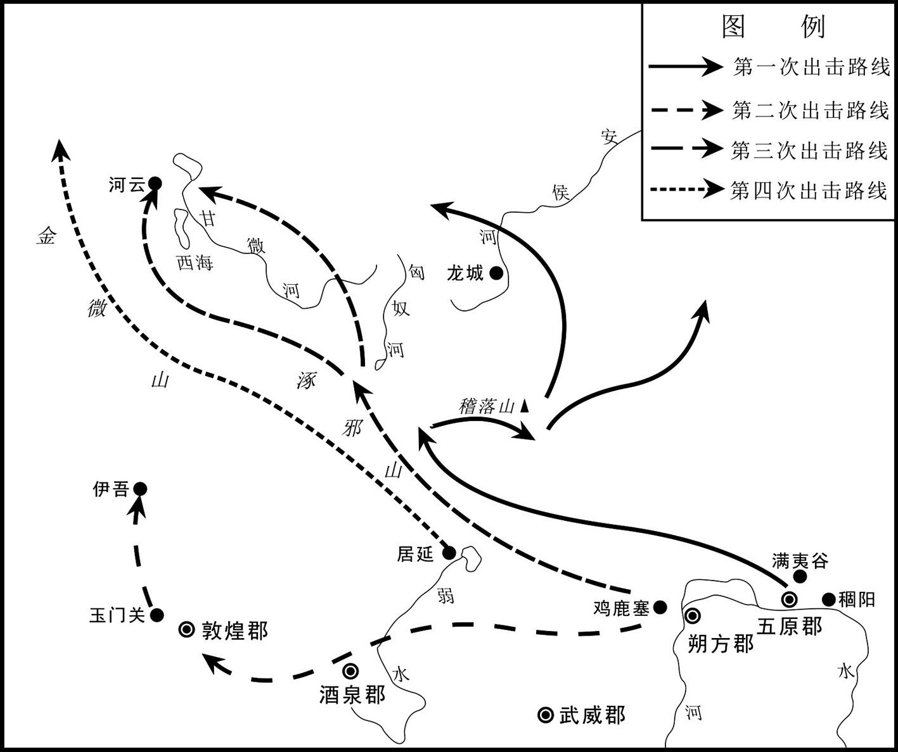 
窦宪破北匈奴之战路线示意图

## 【译文】

夏季六月，窦宪从朔方郡的鸡鹿塞隘口出发，分别派遣副校尉阎盘等将领，在稽落山大败匈奴北单于。

## 【原文】

**秋，九月，庚申，以窦宪为大将军，中郎将刘尚为车骑将军，封宪武阳侯，食邑二万户[1]。宪固辞封爵，诏许之[2]。旧，大将军位在三公下，至是，诏宪位次太傅下、三公上；长史、司马秩中二千石[3]。**

## 【注文】

[1]大将军：官名。是古代各朝经常设置的武官职名，始于战国，汉代沿置，多为高级军事指挥甚至最高军事统帅。　　食邑（yì）：古代君主赐予臣下作为世禄的封地。

[2]固辞：坚决推辞。

[3]旧：以前。　　至是：如今，到了现在。　　秩（zhì）：古代官吏的俸禄。

## 【译文】

秋季九月庚申（初七日），朝廷任命窦宪为大将军，中郎将刘尚为车骑将军，封窦宪为武阳侯，享有二万户食邑。窦宪坚决推辞封爵，太后下诏准允。按照旧例，大将军官位在三公以下，如今，太后下诏窦宪位列于太傅之下、三公之上；大将军府的长史、司马的俸禄为中二千石。

## 【原文】

**窦氏兄弟骄纵，而执金吾景尤甚，奴客缇骑强夺人财货，篡取罪人，妻略妇女；商贾闭塞，如避寇雠；又擅发缘边诸郡突骑有才力者[1]。有司莫敢举奏，袁安劾景“擅发边民，惊惑吏民；二千石不待符信而辄承景檄，当伏显诛”[2]。又奏“司隶校尉、河南尹阿附贵戚，不举劾，请免官案罪”[3]。并寝不报[4]。驸马都尉瑰，独好经书，节约自修[5]。**

## 【注文】

[1]奴客：家奴。　　缇骑（tíjì）：穿红色军服的骑士，泛称贵官的随从卫队。　　篡（cuàn）：非法夺取。　　妻略：奸污霸占。　　寇雠（chóu）：亦作“寇仇”，指盗寇、贼寇。　　擅发：擅自征发。　　缘边：指边疆、边境。　　突骑：用于冲锋陷阵的精锐骑兵。

[2]袁安（？—92年）：东汉大臣，字邵公，汝南汝阳（今河南商水县西北）人。少承家学，举孝廉，任阴平长、任城令，驭属下极严，吏人畏而爱之。后历任太仆、司空、司徒等。　　惊惑：惊惧惶惑。　　符信：通行的信物，即通行的凭证，有符有节，也叫符或信。　　承：奉行。　　檄（xí）：古代官府用以征召或声讨的文书。

[3]司隶校尉：官名。汉代监督京师和地方的监察官。始置于西汉征和四年（前89年），秩为二千石，因所领由一千二百名中郡官徒隶所组成的武装队伍而得名。武帝时为加强京城的治安而置此官，初置时能持节，表示受君令之托，有权劾奏公卿贵戚。它除监督朝中百官外，还负责督察三辅（京兆、冯翊、扶风）、三河（河东、河南、河内）、弘农七郡的京师地区，作用与刺史相同，但比刺史的地位高。　　尹（yǐn）：官名。令尹、府尹等。　　阿附：逢迎依附，迎合附和。　　案罪：犹治罪。

[4]寝：被搁置。隐下，隐瞒。

[5]独：唯独，唯有。　　节约自修：约束节制，修身自好。

## 【译文】

窦氏兄弟骄横放纵，而执金吾窦景尤为厉害，他的家奴及侍从马队的人，蛮横地抢夺人们的财货，非法夺取罪犯，奸污霸占妇女；行商的人不敢出门经商，好像躲避强盗一样。窦景还擅自征调边疆诸郡的突骑队中有才能的人，为己所用。有关部门的官员没人敢举报，袁安弹劾窦景“擅自征调边疆士兵，使边境官吏百姓惊惧惶惑，边郡太守不等拿到符信，就只凭窦景的公文调兵，当处死示众”。袁安又上奏书说：“司隶校尉、河南尹阿谀攀附地位尊贵的外戚，不举报他们的不法罪行，建议对他们免官惩处。”这些奏章呈上去后都没有答复。只有驸马都尉窦瑰，喜欢读经书，约束节制而修身自好。

## 【原文】

**尚书何敞上封事曰：“昔郑武姜之幸叔段，卫庄公之宠州吁，爱而不教，终至凶戾[1]。由是观之，爱子若此，犹饥而食之以毒，适所以害之也[2]。伏见大将军宪，始遭大忧，公卿比奏，欲令典干国事；宪深执谦退，固辞盛位，恳恳勤勤，言之深至，天下闻之，莫不悦喜[3]。今逾年无几，入礼未终，卒然中改，兄弟专朝，宪秉三军之重，笃、景总宫卫之权，而虐用百姓，奢侈僭逼，诛戮无罪，肆心自快[4]。今者论议讻讻，咸谓叔段、州吁复生于汉[5]。臣观公卿怀持两端，不肯极言者，以为宪等若有匪懈之志，则已受吉甫褒申伯之功；如宪等陷于罪辜，则自取陈平、周勃顺吕后之权，终不以宪等吉凶为忧也[6]！臣敞区区诚欲计策两安，绝其绵绵，塞其涓涓，上不欲令皇太后损文母之号、陛下有誓泉之讥，下使宪等得长保其福祐也[7]。驸马都尉瑰，比请退身，愿抑家权，可与参谋，听顺其意，诚宗庙至计，窦氏之福[8]！”时济南王康尊贵骄甚，宪乃白出敞为济南太傅[9]。康有违失，敞辄谏争，康虽不能从，然素敬重敞，无所嫌牾焉。[10]**

## 【注文】

[1]封事：即密封奏章。汉代的奏章一般都不封口，只有奏陈秘密事项，防止泄露，才用黑色口袋，贴上双重封条呈进，称为封事。　　郑武姜（生卒年不详）：郑国的武姜，即郑庄公和叔段的母亲。　　幸：喜爱。　　叔段：即共叔段（生卒年不详），春秋时期郑国人（今河南新郑）。姬姓，名段，后因奔共，故称共叔段，郑武公次子。其母武姜因生长子时难产，厌恶长子寤生，多次请求郑武公立共叔段为太子，武公未同意。郑武公死后，寤生即位为郑庄公（前744年）。前722年武姜请求把京（今河南荥阳市东南）封给共叔段，得到允许后，共叔段得以居住在京，肆意扩展私家势力。不久，共叔段命郑国西部和北部边境地区同时听自己指挥。周平王时共叔段整治城郭，积聚粮食，修补装备武器，充实步兵战车，准备袭击郑国都城，又联络都城中的武姜为内应，让其届时打开城门。郑庄公闻知共叔段起兵日期，便命令郑大夫公子吕率领二百辆战车攻打京邑城。共叔段兵败，逃奔到鄢（今河南鄢陵县北），郑庄公又率兵追击，大胜。此后，共叔段逃奔于共邑（今河南辉县）居住。　　卫庄公：即卫国第十二代君主姬扬（生卒年不详），前757年至前735年在位。卫庄公的一个姬妾生了公子州吁，因喜好武事深得庄公宠爱。大夫石碏曾劝谏庄公，让他赶快定下太子，并好好管教公子州吁，以免发生祸患，卫庄公不听，继续宠爱州吁，卫庄公死后，桓公继位，州吁与石碏的儿子石厚杀了桓公，州吁自立为君，因失掉民心众叛亲离，问计于石碏，石碏设计将二人除掉，因此还留下了传颂千古的“大义灭亲”的历史典故。　　州吁（yū）：春秋时期卫国人，卫庄公的儿子、卫桓公同父异母的弟弟。公元前719年弑兄即位（在位不足一年），系卫国十二世，第十三位国君。为春秋时期第一位弑君篡位成功的公子。后被石碏设计除掉，众大夫立桓公弟晋为君，是为宣公。　　教：管教。　　凶戾（lì）：凶残暴戾。

[2]食（sì）：喂，拿东西给人吃。

[3]大忧：大忧患，大灾祸。　　比：接连，挨着。　　典干：主管。　　深执谦退：严守谦敬退让的原则。　　深至：深挚。

[4]卒然：突然。　　中改：中途改变。　　三军：古代所说的三军是指前、中、后三军。　　僭逼（jiànbī）：越分胁迫君上。　　肆心：恣意。

[5]讻（xiōng）讻：喧争貌，议论纷纭貌。

[6]怀持：怀抱，持有。　　匪懈：不懈。　　吉甫：即尹吉甫（前852—前775年），兮氏，名甲，字伯吉父（一作甫），尹是官名。周宣王贤臣，周房陵（今湖北房县）人。官至内史，据说是《诗经》的主要采集者，军事家、诗人、哲学家，被尊称为中华诗祖。尹吉甫晚年被流放至房陵，死后葬于今房县青峰山，房县有大量尹吉甫文化遗存。他辅助过三代帝王，后周幽王听信谗言，杀了他。不久知道错杀，便给他做了一个金头厚葬。　　申伯（生卒年不详）：西周厉王至宣王时期人，出自姜戎（华夏族炎帝部落与西北民族的混血），周宣王之妻舅。西周著名政治家、军事家，谢氏始祖，南申国（在今河南南阳宛城区）国君主。　　罪辜：罪咎。　　周勃（前240—前169年）：沛（今江苏沛县）人，秦末汉初的军事家和政治家、西汉开国功臣，汉高祖封其为绛侯。秦二世胡亥元年（前209年）随刘邦起兵反秦，以军功拜为将军，赐爵武威侯。在随刘邦由汉中进取关中时，击赵贲，败章平，围章邯，屡建战功。汉高祖六年（前201年），受封绛侯。继因讨平韩信叛乱有功，升为太尉。刘邦死后，吕氏专权，周勃与陈平等合谋智夺吕禄军权，一举谋灭吕氏诸王，拥立文帝，后官至右丞相。谥号武侯。

[7]绵绵：连续不断貌。　　涓涓：细水慢流的样子。　　文母：文德之母，本指大姒，周文王之妃，后用来表示对德才兼备的后妃的称颂。　　誓泉之讥：因对母亲说过绝情誓言而受到的讥刺。

[8]参谋：参与出谋划策。

[9]济南王：指刘康（生卒年不详）。东汉光武帝刘秀子，母郭圣通。建武十五年（39年）封为济南公，十七年（41年）进爵为王，二十八年（52年）到封地就国。三十年（54年），朝廷将平原郡的祝阿、安德、朝阳、平昌、隰阴、重丘六县增加为济南国的食邑。在王位五十九年去世，谥号安王，死后其子刘错嗣位，是为济南简王。　　白：告诉。

[10]谏争：即谏诤，直言规劝，使人改正过错。　　牾（wǔ）：冲突。

## 【译文】

尚书何敞上密封奏章说：“从前郑国太后武姜喜欢小儿子共叔段，卫庄公宠爱庶子州吁，都是只宠爱而不相加管教，终于使他们做出了凶残暴戾之事。由此看来，像这样溺爱孩子，如同孩子饿了喂给他们毒药吃，恰恰是害他们。我看到大将军窦宪，在章帝驾崩国家遭大丧之时，公卿频频奏请，想让他主持朝廷大事。而窦宪谦虚退让，坚决推辞高位，态度诚恳，言辞深挚，天下人听了没有不敬佩的。现在只过一年多，为皇帝服丧还没结束，窦宪却突然改变态度，窦氏兄弟专制朝政，窦宪掌握全国军事大权，窦笃、窦景统领宫廷禁卫部队，过分地苛虐役使百姓，奢侈淫逸，并越分胁迫君上，肆意地诛杀无罪的人。现在大家议论纷纷，都说共叔段、州吁之类叛逆之事又要在汉朝出现了。我看公卿大臣左右摇摆、不肯直言，是为了这样的目的：窦宪等如果有始终忠于朝廷的志节，那么他们就会受到吉甫颂扬申伯之功那样的赞赏；而如果窦宪等犯下罪恶，那么他们就采取陈平、周勃顺从吕后意见办事，始终不为窦宪等人的吉凶担忧。我何敞，真诚地愿意献出两全其美的策略，斩断灾难的绳索，堵塞祸患的涓流，对上不使皇太后有损周代文母的美誉，不使陛下如郑庄公怨恨母亲那样发誓‘不及黄泉无相见也’而留下话柄受后人讥讽，对下使窦宪等人能永远保有所获得的福分和庇佑。驸马都尉窦瑰，曾多次请求引退，愿意抑制窦家的权势，陛下可以使他出谋划策，这实在是维护江山社稷的最佳策略，也是窦氏一族的福分。”当时济南王刘康尊贵骄傲，不可一世，窦宪就趁机告诉太后，让何敞出任济南太傅。刘康如果有错误，何敞就会劝谏他。刘康虽然不听从何敞的意见，但向来敬重何敞，二人没有什么嫌隙和冲突。

## 【原文】

**二年，六月，诏封窦宪为冠军侯，笃为郾侯，瑰为夏阳侯。宪独不受封[1]。**

## 【注文】

[1]冠军侯：侯爵名。西汉的列侯爵号，取“勇冠三军”之意，于元朔六年（前123年）分封名将霍去病。这个侯国是汉武帝专门设立的，其地来自南阳郡下属的穰县卢阳乡及宛县临菑聚。汉代以后，战功卓著的武将，也都采用了冠军为官衔。东汉时，汉光武帝一朝的贾复、汉章帝一朝的窦宪都曾被封为冠军侯。

## 【译文】

东汉和帝永元二年（90年），六月，皇太后下诏封窦宪为冠军侯，窦笃为郾侯，窦瑰为夏阳侯。只有窦宪不接受封号。

## 【原文】

**三年春，二月，窦宪遣左校尉耿夔等破北单于于金微山[1]。**

## 【注文】

[1]耿夔（kuí）（生卒年不详）：东汉名臣耿国之子，字定公，扶风茂陵（今陕西兴平市东北）人，少有气决。永元元年（89年），随车骑将军窦宪北击匈奴，转骑都尉。三年（91年），宪复出河西，以夔为大将军左校尉。将精骑八百，出居延塞，直奔北单于廷，于金微山斩阏氏、名王以下五千余级，单于与数骑脱亡，尽获其珍宝财畜，去塞五千余里而还，自汉出师所未尝至也。乃封夔粟邑侯。后复拜度辽将军。时，鲜卑攻杀云中太守成严，围乌桓校尉徐常于马城。夔与幽州刺史庞参救之，追虏出塞而还。后坐法免，卒于家。　　北单于（生卒年不详）：其名号、本名皆失载，优留单于的弟弟。章和二年（88年），鲜卑攻击北匈奴并大败之，还杀死了北匈奴优留单于，北匈奴大乱。在大乱中立其弟为单于。永元元年（89年），东汉派征西将军耿秉、车骑将军窦宪率骑兵八千，与度辽将军邓鸿及南匈奴的军队三万人，从朔方郡出发进击北匈奴，大败北匈奴。北单于奔走，北匈奴有二十余万人投降。二年（90年）春天，东汉与南匈奴兵分二路北击，在黑夜中包围北单于的帐营。北单于大为惊慌，率领精兵千余人迎战。北单于身上多处创伤，坠落马下后又再次骑上马，率轻骑兵数十人暗夜逃走。三年（91年），北单于再次被东汉耿夔打败，逃亡不知所在。　　金微山：山名。今阿尔泰山，在新疆北部和蒙古西部。

## 【译文】

东汉和帝永元三年（91年）春季，二月，窦宪派遣左校尉耿夔等人在金微山（阿尔泰山）击败北单于。

## 【原文】

**窦宪既立大功，威名益盛，以耿夔、任尚等为爪牙，邓叠、郭璜为心腹，班固、傅毅之徒典文章，刺史、守、令，多出其门，竞赋敛吏民，共为赂遗[1]。司徒袁安、司空任隗举奏诸二千石并所连及，贬秩免官四十余人，窦氏大恨；但安、隗素行高，亦未有以害之[2]。尚书仆射乐恢，刺举无所回避，宪等疾之[3]。恢上书曰：“陛下富于春秋，纂承大业，诸舅不宜干正王室，以示天下之私。方今之宜，上以义自割，下以谦自引，四舅可长保爵土之荣，皇太后永无惭负宗庙之忧，诚策之上者也[4]。”书奏，不省[5]。恢称疾乞骸骨，归长陵；宪风厉州郡，迫胁恢饮药死[6]。于是朝臣震慑，望风承旨，无敢违者[7]。袁安以天子幼弱，外戚擅权，每朝会进见及与公卿言国家事，未尝不喑呜流涕；自天子及大臣，皆恃赖之[8]。**

## 【注文】

[1]任尚（？—118年）：东汉将领。章和末，为邓训护羌府长史；永元中，大将军窦宪出屯凉州，请为司马，迁戊己校尉，代班超为西域都护，坐罪免，起为乌桓校尉。永初初，为征西校尉，封乐亭侯。　　爪牙：原指动物的尖爪和利牙，比喻为坏人效力的人，党羽和帮凶。　　郭璜（生卒年不详）：父郭况。东汉驸马。郭璜是汉光武帝第一位皇后郭圣通的侄子。光武帝建武年间，郭璜以阳安侯世子的身份娶刘秀女淯阳公主刘礼刘为妻。永元初年，郭璜任长乐少府，其子郭举为侍中，兼射声校尉。大将军窦宪谋反被诛，郭举因为是窦宪女婿谋逆，故父子俱下狱死，家属徙合浦，宗族为郎吏者，悉数免官。　　班固（32—92年）：东汉官吏、史学家、文学家，史学家班彪之子。字孟坚，扶风安陵（今陕西咸阳市东北）人。除兰台令史，迁为郎，典校秘书，潜心二十余年，修成《汉书》，当世重之，迁玄武司马，撰《白虎通德论》，征匈奴为中护军，兵败受牵连，死狱中，善辞赋，有《两都赋》等。　　傅毅（？—90年）：东汉辞赋家。字武仲，扶风茂陵（今陕西兴平市东北）人。　　赂遗（lùwèi）：以财物赠送或买通他人。

[2]任隗（？—92年）：东汉章帝、和帝时司空。字仲和，南阳宛（今河南南阳市宛城区）人，袭父先爵阿陵侯。　　贬秩：贬职，削减俸禄。　　行高：品性高洁。

[3]乐恢（生卒年不详）：字伯奇，京兆长陵（今陕西咸阳）人。好经学，师事博士焦永，号称名儒。初为郡吏，太守被诛，他不怕治罪，坚持尽丧礼。又任功曹，主持选举公道。和帝时官至尚书仆射。外戚窦宪专权，他不畏权势，屡次劾奏其党后辞官归乡，被窦宪迫害而死。　　刺举：检举奸恶，举荐有功。

[4]纂（zuǎn）承：继承。　　干正：干预。　　爵土：官爵和封地。　　惭负：惭愧，辜负。

[5]省（xǐng）：觉悟。这里指答复、回复。

[6]长陵：县名。西汉五陵县之一。汉高祖刘邦十二年（前195年）筑陵置县。治所在今陕西咸阳市东北。高帝死后葬此。三国魏废。　　风厉：疾速。　　迫胁：压迫，胁迫。

[7]震慑：使人震惊恐惧。

[8]喑（yīn）呜：悲咽。　　流涕（tì）：流泪。　　恃赖：仰仗，依赖。

## 【译文】

窦宪立下了大功之后，威名更大，让耿夔、任尚等做他的得力助手，邓叠、郭璜为其亲信，班固、傅毅这些人为他撰写文章，各州刺史、郡守、县令多数出自窦氏门下，他们都竞相搜刮官民的田赋，一同进行贪污贿赂等勾当。司徒袁安、司空任隗上奏检举二千石官员，连同受牵连被贬官免职的共有四十多人，这让窦氏非常怨恨他们。但是袁安、任隗平日德高望重，因此窦宪氏也没有加害他们。尚书仆射乐恢检举奸恶时不回避权贵，窦宪等人特别恨他。乐恢上奏书说：“陛下正是年富力强、继承大业之时，各位舅父不应干预朝廷大事，来向天下显示自己的私心。现在最应该做的，是在上位的要以正义主动割断私情，在下位的要自行谦让引退，这样四位舅父可以永葆爵位封国的荣耀，皇太后可以永无辜负宗庙的忧虑，这才是真正的上策啊。”书奏送上之后，并不见答复。乐恢称病请求退休，返回故乡长陵。窦宪迅速暗示州郡，逼迫乐恢饮毒药而死。于是朝廷臣子都感到震惊恐惧，全都望风而动，迎合窦氏的旨意办事，没有敢违抗的。袁安认为皇帝年幼，外戚专权，每次朝会进见，以及和公卿大臣谈论朝廷大事时，未曾不吞声悲泣流泪；上自天子，下到大臣，全都依赖袁安。

## 【原文】

**冬十月，诏窦宪与车驾会长安。宪至，尚书以下议欲拜之，伏称万岁。尚书韩棱正色曰：“夫上交不谄，下交不渎，礼无人臣称万岁之制[1]！”议者皆惭而止。尚书左丞王龙私奏记、上牛酒于宪，棱举奏龙，论为城旦[2]。**

## 【注文】

[1]正色：态度严肃，神态严厉。　　谄（chǎn）：奉承，巴结。　　渎（dú）：轻慢，对人不恭敬。

[2]尚书左丞：官名。汉成帝建始四年（前29年）置尚书，员五人，丞四人。汉光武帝时，减二人，始分左右丞。尚书左丞佐尚书令，总领纲纪；右丞佐仆射，掌钱谷等事，秩均四百石。　　奏记：汉制，下官言事于上级用奏记。后世亦有沿用。　　论：论断，判罚，处罚。　　城旦：秦汉时的一种刑罚名，秦服四年兵役，汉确定其刑期为五年，夜里筑长城，白天防敌寇。

## 【译文】

冬季十月，和帝下诏命窦宪到长安会面。窦宪到长安时，尚书以下官员商议要叩拜窦宪，伏身称他为万岁。尚书韩棱严肃地说：“跟上面的人交往不能谄媚，跟下面的人交往不能轻慢，按礼法没有称臣子万岁的制度！”倡议之人都感到惭愧而作罢。尚书左丞王龙私自向窦宪上书，并奉献牛、酒，韩棱举报了王龙，王龙被判处服筑长城苦役。

## 【原文】

**窦宪请遣使立北单于弟右谷蠡王于除鞬为单于，袁安上封事争之，后上竟从宪策[1]。**

## 【注文】

[1]右谷（lù）蠡（lí）王：匈奴贵族封号。左右谷蠡王各为二十四长之二，次于左右贤王，有自置的千长、百长、什长、裨小王、相、都尉、当户、且渠等。左右谷蠡王分居于匈东西部，与左右贤王合称“四角”，地位高于其余王侯。　　于除鞬：即於除鞬，北匈奴单于。为匈奴北单于之弟，为右谷蠡王。东汉和帝永元三年（91年），北单于再次被东汉耿夔打败，逃亡不知所在。于除鞬自立为北匈奴单于。四年（92年），东汉派遣将兵长史王辅出击北匈奴，于除鞬向东汉求和，东汉赐授印玺。五年（93年），东汉又派遣将兵长史王辅率千余骑兵与任尚出击，消灭了于除鞬。

## 【译文】

窦宪奏请派遣使者去立北单于的弟弟右谷蠡王于除鞬为单于，袁安上密封奏章力争不可，后来汉和帝刘肇最终还是同意了窦宪的建议。

## 【原文】

**四年，初，庐江周荣辟袁安府，安举奏窦景及争立北单于事，皆荣所具草，窦氏客太尉掾徐深恶之，胁荣曰：“子为袁公腹心之谋，排奏窦氏，窦氏悍士、刺客满城中，谨备之矣[1]！”荣曰：“荣，江淮孤生，得备宰士，纵为窦氏所害，诚所甘心[2]！”因敕妻子：“若卒遇飞祸，无得殡敛，冀以区区腐身觉悟朝廷[3]。”**

## 【注文】

[1]庐江：郡名。在今安徽合肥附近。春秋属舒国，徐人取舒后，为楚地。秦王嬴政二十四年（前223年）以楚地为郡，舒邑先属九江郡，后属衡山郡。汉为舒县，初属淮南国衡山郡。前164年，汉文帝分淮南国为淮南、衡山、庐江三国；汉武帝刘彻元朔中，庐江国改属衡山国、庐江郡；元狩二年（前121年），废江南庐江郡，以其地分属豫章和鄣郡，以江北衡山郡东部及九江郡南部置新的庐江郡，郡治舒。后王莽改庐江郡之舒县为昆乡。东汉仍为庐江郡舒县。　　周荣（生卒年不详）：字平孙。东汉肃宗时被举荐为明经，征召至司徒袁安府任事。历任郾城令、尚书令、颍州和山阴太守，政绩卓著，后以老病乞休，卒于家。　　辟（bì）：指授予官职。　　具草：起草，拟草稿。　　太尉掾（yuàn）：官名。属太尉，为一曹之长，总领曹事。汉代太尉等公府分曹办公，总领一曹事务的正职称掾，副职称属或史。　　排：排斥。　　悍士：壮士。　　谨备：小心防备。

[2]江淮：指长江、淮河之间的地区。　　孤生：孤陋之人，常用作自谦之词。　　宰士（zǎishì）：宰相的属官。

[3]敕：告诫。　　飞祸：飞来横祸。　　殡敛（bìnliǎn）：殡殓。　　觉悟：使觉醒、醒悟。

## 【译文】

东汉和帝永元四年（92年），当初庐江人周荣被征召在袁安府中任职，袁安举报窦景及反对立北单于所上的奏章，都是周荣起草的。窦氏的宾客太尉掾徐十分讨厌他，就威胁周荣说：“你是袁安的亲信谋士，上奏排斥窦家，窦家的壮士、刺客布满京城，你小心防备吧！”周荣说：“我是生在长江、淮河一带的孤陋之人，有幸能到司徒府当一名宰士，即使被窦氏谋害，我也心甘情愿！”于是告诫妻子：“如果我突然遇上飞来横祸，不要收殓安葬，我希望用我的区区遗躯来使朝廷醒悟。”

## 【原文】

**夏，四月，丙辰，窦宪还至京师。夏，六月，戊戌朔，日有食之[1]。丁鸿上疏曰：“昔诸吕握权，统嗣几移；哀、平之末，庙不血食[2]。故虽有周公之亲而无其德，不得行其势也。今大将军虽欲敕身自约，不敢僭差；然而天下远近，皆惶怖承旨[3]。刺史、二千石初除，谒辞、求通待报，虽奉符玺，受台敕，不敢便去，久者至数十日。背王室，向私门，此乃上威损，下权盛也[4]。人道悖于下，效验见于天，虽有隐谋，神照其情，垂象见戒，以告人君[5]。禁微则易，救末者难；人莫不忽于微细以致其大，恩不忍诲，义不忍割，去事之后，未然之明镜也[6]。夫天不可以不刚，不刚则三光不明；王不可以不强，不强则宰牧从横[7]。宜因大变，改政匡失，以塞天意[8]！”**

## 【注文】

[1]食：日食，在月球运行至太阳与地球之间时发生。这时对地球上的部分地区来说，月球位于太阳前方，来自太阳的部分或全部光线被挡住，因此看起来好像是太阳的一部分或全部消失了。

[2]丁鸿（？—92年）：东汉学者、名儒、大臣。字孝公，颍川定陵（今河南舞阳县北）人，以荫袭封阳陵侯。大办学堂，受明帝赏识，召拜侍中兼射声校尉。章帝召各名儒在北宫白虎观论五经，鸿论述最精，世称“殿中无双”，擢为校书。官至司徒、太尉兼卫尉。窦太后临朝，其兄弟擅权，鸿亲收其将军印绶，逼窦氏兄弟自杀。　　统嗣：谓帝统的嗣续关系。　　血食：谓受享祭品。

[3]自约：自我约束。　　僭（jiàn）差：僭越失度。

[4]谒（yè）辞：莅任前晋谒辞行。　　求通：谋求显达。　　台敕：朝廷的政令、敕旨。　　便：随便，轻易。　　私门：行私请托的门路。

[5]悖：违反。　　效验：东汉王充的认识论概念。即实效和证验。　　隐谋：阴谋。　　垂象：显示征兆。

[6]禁微：防微杜渐。　　诲：教诲。

[7]三光：指日、月、星。　　宰牧：官名。宰相与州牧的并称，泛指治民的官吏。　　从（zòng）横：从，通“纵”。纵横，竖和横互相交错。

[8]因：趁着。

## 【译文】

夏季四月丙辰（十八日），窦宪回到京城。夏季六月戊戌朔（初一日），发生了日食。丁鸿上书说：“从前吕氏专权，汉朝的皇统几乎移位；哀帝、平帝末年，皇家宗庙祭祀中断。因此即便是像周公那样的近亲，没有道德，也不能让他掌权执政。如今大将军窦宪虽然希望自我约束，不僭越等级，但是全国不分远近，都惶恐地奉迎他的旨意。新任命的刺史、二千石官员，都要去窦宪那里拜谒辞行，请求通报等候回答。虽然已经领了皇帝的印信，到尚书台接受了命令，也不敢随便离开，有的要长达几十天才会被接见。背离王室，趋向私门，这是皇帝的权威受损、臣子权势过盛的表现。在下人间的纲常有所悖反，在上就会有天象显示，即使是秘密的阴谋，神灵也会洞察内情，用天象以示告诫君王。在灾祸之初，防微杜渐是比较容易的，而酿成大祸，则难以挽救。人们无不是疏忽了微小的祸端以致酿成大祸。出于恩情不忍教诲，由于仁义不忍割爱，等到事情发生后，才明白早就有清楚的表现。天不能不刚正，天如果不刚正，那么日月星就不发亮；皇帝不能不强势，皇帝如果不强势，那么宰相牧守就要横行天下。应当趁着天象异变，改正朝廷的失误来回报天意。”

## 【原文】

**窦氏父子兄弟并为卿、校，充满朝廷，穰侯邓叠、叠弟步兵校尉磊及母元、宪女婿射声校尉郭举、举父长乐少府璜共相交结[1]。元、举并出入禁中，举得幸太后，遂共图为杀害，帝阴知其谋[2]。是时，宪兄弟专权，帝与内外臣僚莫由亲接，所与居者阉宦而已[3]。帝以朝臣上下莫不附宪，独中常侍钩盾令郑众，谨敏有心几，不事豪党，遂与众定议诛宪，以宪在外，虑其为乱，忍而未发；会宪与邓叠皆还京师[4]。时清河王庆，恩遇尤渥，常入省宿止；帝将发其谋，欲得《外戚传》，惧左右，不敢使，令庆私从千乘王求，夜，独内之；又令庆传语郑众，求索故事[5]。庚申，帝幸北宫，诏执金吾、五校尉勒兵屯卫南、北宫，闭城门，收捕郭璜、郭举、邓叠、邓磊，皆下狱死[6]。遣谒者仆射收宪大将军印绶，更封为冠军侯，与笃、景、瑰皆就国[7]。帝以太后故，不欲名诛宪，为选严能相督察之[8]。宪、笃、景到国，皆迫令自杀。**

## 【注文】

[1]卿：古代高级官名。如三公九卿。　　校（xiào）：军衔的一级，在将之下，尉之上。　　射声校尉：官名。汉武帝置。八校尉之一，掌待诏射声，秩比二千石。所属有丞及司马，领兵七百人。　　长乐少府：官名。汉代制度，太后宫官皆冠宫名。汉初有长信詹事，主管太后宫，由宦者任职。汉景帝时改为长信少府。汉平帝时又改长乐少府，位在少府正卿之上。长信或长乐少府所属官吏均系宦者。此外又设长乐卫尉、长乐太仆，总名太后三卿。太后去世，即省去不置。

[2]共图：共同策划。　　阴：暗中。

[3]莫由：无法。　　亲接：亲近接待。　　阉宦：又称太监，是指古代宫廷中替皇室服务并阉割掉外生殖器的男性。

[4]钩盾令：官名。汉少府属官有钩盾令，秩六百石，由宦者担任，典诸近池苑囿游观之处。　　郑众（？—114年）：东汉宦官，字季产，南阳（今河南鲁山县东南）人。为人谨敏，有心机。　　发：采取行动。

[5]庆：即刘庆（78—107年），东汉清河王，汉章帝刘炟第三个儿子，生母为宋贵人，汉安帝刘祜的父亲。建初四年（79年）被立为皇太子，三年后（82年）因受窦太后的诬陷，被废为清河（今山东临清县东北）王。刘庆初留居京师洛阳，至延平元年（106年）才就国。　　渥（wò）：浓，厚。　　宿止：住宿。　　千乘王：即刘伉（？—93年），汉章帝刘炟长子。建初四年（79年）封千乘贞王。和帝即位，以伉长兄，甚见尊礼。立十五年薨。子宠嗣，一名伏胡。薨于京师，皆葬洛阳。

[6]勒兵：整顿军队。　　收捕：拘捕。

[7]谒者仆射：官名。谒者的长官。秦置，汉沿置，属郎中令（汉改光禄勋），秩为比千石。　　更封：更改封号。

[8]名：说出。　　严能：严苛干练的人。　　督察：监督。

## 【译文】

窦氏父子兄弟同时担任九卿、校尉，势力布满朝廷。穰侯邓叠、邓叠的弟弟步兵校尉邓磊及母亲元、窦宪的女婿射声校尉郭举、郭举的父亲长乐少府郭璜等人互相勾结。其中邓叠母亲元、郭举都可随时出入于太后的长乐宫。郭举又得到了太后宠幸，他们共同图谋杀害皇帝，和帝暗中知道这阴谋。这时，窦宪兄弟专制朝政，和帝与朝廷内外大臣无法接近，跟他一起居住的只有宦官。和帝认为朝廷上下官员没有不依附窦宪的，只有中常侍钩盾令郑众，谨慎聪敏有心机，不事奉豪强党羽，于是和帝跟郑众定计诛杀窦宪。因为窦宪此时屯驻凉州，担心他叛乱，暂时忍耐没有动手，正巧窦宪与邓叠都回到了京城。其时清河王刘庆，特别受到和帝的恩赐亲近，经常到宫廷住宿。和帝将要采取行动，想先找到《汉书·外戚传》看看，但担心左右人泄密，不敢派他们去找，就让刘庆从千乘王刘伉那里索求。夜里，和帝将刘庆单独召入内室。和帝又命刘庆告诉郑众，让郑众搜集从前皇帝杀舅父的先例。庚申（二十三日），和帝临幸北宫，下诏命执金吾、五校尉带兵保卫南宫、北宫，关闭城门，逮捕郭璜、郭举、邓叠、邓磊等，并送到监狱立即处死。派遣谒者仆射收缴窦宪的大将军印信，改其封号为冠军侯，并与窦笃、窦景、窦瑰等各自前往自己封国。和帝因为太后的缘故，不愿正式处决窦宪，便给他选一个严苛干练的封国宰相去监督他。窦宪、窦笃、窦景到封国后，都被迫令自杀了。

## 【原文】

**初，河南尹张酺数以正法绳治窦景，及窦氏败，酺上疏曰：“方宪等宠贵，群臣阿附唯恐不及，皆言宪受顾命之托，怀伊、吕之忠，至乃复比邓夫人于文母，今严威既行，皆言当死，不复顾其前后，考折厥衷[1]。臣伏见夏阳侯瑰每存忠善，前与臣言，常有尽节之心，检敕宾客，未尝犯法[2]。臣闻王政骨肉之刑，有三宥之义，过厚不过薄[3]。今议者欲为瑰选严能相，恐其迫切，必不完免，宜裁加贷宥，以崇厚德[4]。”帝感其言，由是瑰独得全。窦氏宗族宾客以宪为官者，皆免归故郡。**

## 【注文】

[1]张酺（pú）（？—104年）：字孟侯，汝南细阳（今安徽太和）人。东汉大臣、学者。少时从祖父张充习《尚书》，又师事太常桓荣，锐意进取，毫不松懈。永平九年（66年），明帝在南宫设学，设置《五经》师傅，张酺于此教授《尚书》，又多次在御前讲授。后被任为郎，遂令入宫教授皇太子。章帝即位，提升张酺为侍中、虎贲中郎将。数月之后，出任东郡太守。　　正法：对判死罪者依法处决。　　绳治：制裁，惩办。　　伊、吕：商伊尹辅商汤，西周吕尚佐周武王，皆有大功，后因并称伊吕泛指辅弼重臣。　　邓夫人（生卒年不详）：东吴南阳王孙和的爱妃。类似褒姒、妲己之类的祸国妃嫔。

[2]检：约束，管教。

[3]三宥（yòu）：古代王、公家族之人犯法，有宽恕三次之制。

[4]贷宥：宽宥，赦免。

## 【译文】

最初，河南尹张酺曾多次依法惩罚窦景。等到窦氏家族败亡，张酺上奏说：“在窦宪受到恩宠身居显贵时，群臣奉迎依附，只怕做得不周到，都说窦宪是受先帝遗诏之托，心怀伊尹辅商汤、吕尚佐周武王的忠诚，甚至把邓夫人比作文母。如今陛下严厉行使大权以后，他们又都说窦氏应当处死，不顾前后种种，应当考虑选取折中态度。我见夏阳侯窦瑰有忠诚善良的心，他曾与我交谈，经常表露出为国尽忠的诚心。他约束管教宾客，从未违犯法律。我听说王者之政，对于亲骨肉的刑罚，有宽恕三次的规定，宁可宽厚些也不刻薄。现在有人建议想给窦瑰选一个严厉干练的封国宰相，我担心这样会使他遭到迫害，一定不能保全性命。应当对他宽大裁断，来使您的恩德更加崇高。”和帝被他的言辞所感动，因此窦瑰也得以保全性命。窦氏宗族、宾客，凡是依靠窦宪为官的，都被免官遣回故乡。

## 【原文】

**初，班固奴尝醉骂洛阳令种兢，兢因逮考窦氏宾客，收捕固，死狱中[1]。**

## 【注文】

[1]逮（dǎi）考：逮捕，拷问。

## 【译文】

最初，班固的奴仆曾因醉酒而骂洛阳令种兢，种兢逮捕窦氏宾客之时，乘机逮捕了班固，而后班固死在了监狱中。

## 【原文】

**初，窦宪纳妻，天下郡国皆有礼庆[1]。汉中郡亦当遣吏，户曹李郃谏曰：“窦将军椒房之亲，不修德礼而专权骄恣，危亡之祸，可翘足而待；愿明府一心王室，勿与交通[2]。”太守固遣之，郃不能止，请求自行，许之[3]。郃遂所在迟留以观其变，行至扶风而宪就国[4]。凡交通者皆坐免官，汉中太守独不与焉[5]。**

## 【注文】

[1]郡国：一般的郡和诸侯王的封国统称为郡国。汉初封国辖有支郡（国大于郡），后来以单郡封国（封国相当于原郡大小）。郡直属朝廷，国是诸侯王的封地，都是郡一级的行政区划，下辖县级单位，所以“郡”“国”并称。后也泛称地方行政区域。　　礼：贺礼。

[2]户曹：官署名。汉代和魏时诸郡有户曹，设掾及史，主民户。　　李郃（hé）（生卒年不详）：字孟节，汉中南郑（今陕西南郑）人。李颉子，和帝时为汉中户曹史。善书，游学京师，常赁书自给。举孝廉，累迁尚书令、司空。永宁元年（120年）免官。安帝死，复起为司徒，封涉都侯，不受。年八十余卒。　　明府：“明府君”的略称，汉人用以尊称太守。　　交通：交往通信，即来往。

[3]固：坚持。　　止：阻止。　　自行：自己前去。

[4]所在：处所。　　迟留：停留，逗留。　　扶风：县名。在今陕西宝鸡扶风县。

[5]坐：定罪，由……而获罪。

## 【译文】

当初，窦宪娶妻的时候，天下各郡国都送贺礼庆祝。汉中郡也要派遣官吏去送礼。户曹李郃劝谏说：“窦将军是皇后的亲戚，不修养美德礼仪，却专权骄横，败亡的祸患很快就会到来，希望太守一心忠于王室，不要与他交往。”太守坚持派人去送礼，李郃不能阻止，便请求让自己前去，太守同意了。李郃在途中到处停留，观察变化。走到扶风的时候，窦宪就被免职回到封国。凡是与窦宪交往的人，都被牵连免官，只有汉中太守不在其内。

* * *

(1) 据陈垣《二十史朔闰表》，章和二年正月甲午朔，无壬辰日。

# 西域归附

## 【内容提要】

本篇主要记载班超、班勇父子苦心经营西域的诸多活动和辉煌业绩。西域各国自新朝王莽天凤三年（16年）起就与中国断绝往来，并受到匈奴的控制。光武帝刘秀建立东汉政权后，因国内元气尚未恢复、百废待兴，故无余力经营西域之事。到汉明帝时期，国内的政治统治已经巩固，社会经济也得到恢复和发展，从而为东汉王朝重新打开西域门户提供了条件。当时的西域诸国，由于不堪匈奴的统治与奴役，要求归附汉朝；而招揽西域对于东汉击败北匈奴，稳定北方边境，确保河西四郡的安宁，也有至关重要的意义。因此，汉明帝永平十六年（73年），当奉车都尉窦固征伐北匈奴时，明帝又派遣班超、郭恂随同出使西域。班超先后在西域活动了三十余年，不仅重新恢复了中国与西域的往来交通，还使西域重新归附于东汉的统治之下。但是由于班超的继任者庸碌无能，又因北匈奴的进犯，西域各国在汉安帝永初元年（107年）又同中国断绝了交通。直到汉安帝延光三年（124年）之后，班超之子班勇赶走北匈奴，才使西域诸国再度归附。

东汉王朝吸取了西汉覆亡的经验，在使用武力打击北匈奴的同时，采取政治怀柔的手段招降西域各国。班超通晓军事并精于政治、富于权谋，又有非常强的应急变通能力，在首次出使西域、并且只有吏士三十六人随行的情况下，出奇制胜，快速招降了鄯善、于阗、疏勒等西域王国，打通了西域南道，恢复了中国与西域之间已中断半个多世纪的关系。在西域的数年中，班超发现并采用了两条策略来经营：第一，就是“以夷狄攻夷耿”的策略。第二，就是对西域各族为政要宽和。班超的策略获得了巨大的成功，并得以在西域经营三十余年。但其继任者任尚轻视这一经验，结果导致边境失和，西域各国叛变。东汉政府放弃西域后，北匈奴再度控制西域各国，并多次驱使西域诸国入侵甘肃西北边郡，东汉王朝不堪其苦，终于认识到“失西域，则河西不能自存”，于是派遣班超之子班勇出使西域。班勇征服西域的策略和其父基本一致，除了使用少量河西郡的汉军外，主要是发动西域各国之兵打击北匈奴，以夷制夷。但班勇虽然为汉朝立下了汗马功劳，却在西域完全归附之时被罢免官职、送入牢狱。

东汉经营西域，不仅使河西四郡的安全得到了保障，稳定了国家的边防，利于民族大统一的进一步发展，利于增强民族凝聚力，使得东汉王朝的统治得到进一步的稳固；而且促进了中国与中亚的经济、文化交流，对于亚洲古代文化艺术的发展也产生了积极的影响。

## 【原文】

**汉光武建武五年。元帝之世，莎车王延尝为侍子京师，慕乐中国[1]。及王莽之乱，匈奴略有西域，唯延不肯附属，常敕诸子：“当世奉汉家，不可负也。”延卒，子康立。康率傍国拒匈奴，拥卫故都护吏士、妻子千余口，檄书河西，问中国动静[2]。窦融乃承制立康为汉莎车建功怀德王、西域大都尉，五十五国皆属焉[3]。**

## 【注文】

[1]莎车王：西域古国的国王。莎车，一作渠沙。位于于阗之西、疏勒东南，都城在今新疆南疆莎车附近。　　侍子：古代属国之王或诸侯遣子入朝陪侍天子，学习文化，所遣之子称为侍子。　　慕乐：犹慕悦。羡慕、向往的意思。

[2]拥卫：保卫，护卫。　　都护：官名。西汉神爵二年（前60年）置西域都护，为驻守西域地区的最高长官，控制西域各国。“都”为全部，“护”为带兵监护，“都护”即为“总监护”之意。　　檄书（xíshū）：即檄文，是古代用于征召、晓谕的政府公告或声讨、揭发罪行等的文书。　　中国：指“天下的中心”，即黄河中下游的中原河洛地带，后逐渐含有王朝统治的正统性含义。

[3]属：归属，隶属。

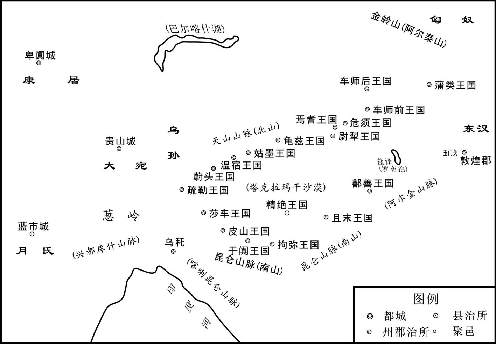 
东汉前期西域形势示意图

## 【译文】

汉光武帝刘秀建武五年（29年）。汉元帝时，莎车王延曾在京都洛阳做侍子，学习中原文化，很羡慕喜欢中国。后来王莽篡权，发生战乱，匈奴攻占了西域，只有延不肯归附。他常告诫他的儿子们说：“我们应当世代侍奉汉王朝，不能背叛。”延逝世后，他的儿子康即位。康率领邻国一起抗拒匈奴，保护新王朝设在西域的都护、官员，以及他们的妻子儿女共一千多人，并写信给河西郡，询问中国的情况。窦融秉承朝廷的旨意，封康为汉朝莎车建功怀德王、西域大都尉，于是西域五十五国都归属莎车国。

## 【原文】

**九年秋八月，莎车王康卒，弟贤立。**

## 【译文】

东汉光武帝建武九年（33年）秋季八月，莎车王康逝世了，他的弟弟贤即位。

## 【原文】

**十四年冬，莎车王贤、鄯善王安皆遣使奉献[1]。西域苦匈奴重敛，皆愿属汉，复置都护。上以中国新定，不许。**

## 【注文】

[1]鄯（shàn）善：西域古王国之一，国都扜泥城（今新疆若羌县附近）。本名楼兰国。东通敦煌，西通且末、精绝、拘弥、于阗，东北通车师，西北通焉耆，扼丝绸之路的要冲。西汉元凤四年（前77年）以前称楼兰，以后改国名为鄯善。448年，北魏灭鄯善国，共存国六百多年。　　奉献：朝奉、进贡。

## 【译文】

东汉光武帝建武十四年（38年）的冬季，莎车王贤、鄯善王安，都派使者到汉朝进献贡品。西域诸国受不了匈奴征收苛刻的赋税，都愿归附汉朝，想请求汉朝再次设置西域都护。但光武帝刘秀认为中国刚刚安定，就没答应。

## 【原文】

**十七年，莎车王贤复遣使奉献，请都护。帝赐贤西域都护印绶及车、旗、黄金、锦绣[1]。敦煌太守裴遵上言：“夷狄不可假以大权，又令诸国失望[2]。”诏书收还都护印绶，更赐贤以汉大将军印绶，其使不肯易，遵迫夺之。贤由是始恨，而犹诈称大都护，移书诸国，诸国悉服属焉。**

## 【注文】

[1]帝：即汉光武帝刘秀。

[2]敦煌：郡名。在今甘肃酒泉敦煌县西。西汉元鼎六年（前111年）将酒泉郡西部析出置敦煌郡，敦煌为盛大之意，是古代中国通往西域、中亚和欧洲的交通要道——丝绸之路上，曾经拥有繁荣的商贸活动。以“敦煌石窟”、“敦煌壁画”闻名天下，是世界遗产莫高窟和汉长城边陲玉门关、阳关的所在地。　　夷狄：古称东方部族为夷，北方部族为狄。常用以泛称除华夏族以外的各族。

## 【译文】

东汉光武帝建武十七年（41年），莎车王贤又派使者到汉朝进献贡品，请求恢复西域都护。刘秀赐给莎车王贤西域都护的印信及车、旗帜、黄金、丝绸等物。敦煌太守裴遵上书说：“对于夷狄，不能授予他们大权，这会使各国失望。”于是刘秀下诏收回都护的印信，改赐贤汉大将军印信，莎车使者不肯改换印信，裴遵强行夺回西域都护印信。贤因此怀恨在心，但还是欺骗各国，自称是大都护，并传文书给各国，于是各国都归属了莎车国。

## 【原文】

**二十一年，莎车王贤浸以骄横，欲兼并西域，数攻诸国，重求赋税，诸国愁惧[1]。车师前王、鄯善、焉耆等十八国俱遣子入侍，献其珍宝；及得见，皆流涕稽首，愿得都护[2]。帝以中国初定，北边未服，皆还其侍子，厚赏赐之。诸国闻都护不出，而侍子皆还，大忧恐，乃与敦煌太守檄，“愿留侍子以示莎车，言侍子见留，都护寻出，冀且息其兵[3]”。裴遵以状闻，帝许之。**

## 【注文】

[1]浸：逐渐。　　兼并：并吞。指土地侵并，或经济侵占。

[2]车师前王：古西域王国名。车师前王、后王，并汉时通焉。前王国一曰前部，治交河城（今新疆吐鲁番西北）。水分流绕城下，故为号。车师前国的分布地区为今吐鲁番地区，交河城在吐鲁番东南。车师原名姑师。　　焉耆（qí）：古西域王国名。焉耆的分布区较为集中，在今新疆博斯腾湖西北岸，今焉耆回族自治县为其治所。由于紧靠博斯腾湖，故多鱼。　　稽（qǐ）首：古代的一种跪拜礼，为“九拜”之一。行礼时，施礼者屈膝跪地，左手按右手（掌心向内），拱手于地，头也缓缓至于地。头至地须停留一段时间，手在膝前，头在手后。这是九拜中最隆重的拜礼，常为臣子拜见君王时所用。后来，子拜父，拜天拜神，新婚夫妇拜天地父母，拜祖拜庙，拜师，拜墓等，也都用此大礼。

[3]冀（jì）：希望。

## 【译文】

东汉光武帝建武二十一年（45年），莎车王贤渐渐骄横起来，想要兼并西域，并多次攻击各国，索取繁重的赋税，各国都很忧愁恐惧。车师前王、鄯善、焉耆等十八国都派王子到汉朝做质子，贡献珍宝。他们见到东汉皇帝时，都流着泪叩头，请求派都护前往西域。刘秀因为中国刚刚平定，北方还未归服，就让各国的质子都回去，并赏赐了他们许多财物。各国听说东汉不派都护，并且让各国派去的质子返回，都特别忧愁恐惧，于是给敦煌太守写信说：“希望能留下质子并让莎车王知道，让他以为汉朝留下了质子，很快就会派出都护。希望能让莎车因此停止征战。”裴遵把这些情况告诉了朝廷，刘秀允许了。

## 【原文】

**二十二年，西域诸国侍子久留敦煌，皆愁思亡归[1]。莎车王贤知都护不至，击破鄯善，攻杀龟兹王[2]。鄯善王安上书：“愿复遣子入侍，更请都护。都护不出，诚迫于匈奴。”帝报曰：“今使者大兵未能得出，如诸国力不从心，东西南北自在也[3]。”于是鄯善、车师复附匈奴。**

## 【注文】

[1]亡（wáng）：逃跑，逃亡。

[2]龟兹：即龟兹国，又称丘慈、邱兹、丘兹，是我国古代西域王国之一。这里拥有比莫高窟历史更加久远的石窟艺术，被现代石窟艺术家称作“第二个敦煌莫高窟”。居民擅长音乐，龟兹乐舞发源于此。唐代时为安西四镇之一。为古代西域出产铁器之地。古代居民属印欧种。回鹘人到来后，人种和语言均逐渐回鹘化。龟兹国以库车绿洲为中心，最盛时辖境相当于今新疆轮台、库车、沙雅、拜城、阿克苏、新和六县市。

[3]报：回答。　　自在：在你们自己，即自便，随你们自己。

## 【译文】

东汉光武帝建武二十二年（46年），西域各国充当质子的王子在敦煌住了很久，都愁眉不展，因思念家乡而逃归本国。莎车王贤知道汉朝不会派来都护，就出兵击败鄯善，杀死龟兹王。鄯善王安给汉朝上书说：“愿意再派王子到洛阳做人质，请朝廷再派都护。如果汉朝不派都护来，我们只能被逼屈服于匈奴。”光武帝刘秀回答说：“现在我们没有能力派出使者和军队，如果各国真的是力不从心，无法抵抗匈奴，那么东西南北，何去何从，任你们挑选吧。”于是鄯善、车师又归附了匈奴。

## 【原文】

**班固论曰：孝武之世，图制匈奴，患其兼从西国，结党南羌，乃表河曲列四郡，开玉门，通西域，以断匈奴右臂，隔绝南羌、月氏；单于失援，由是远遁，而幕南无王庭[1]。遭值文、景玄默，养民五世，财力有余，士马强盛，故能睹犀布、玳瑁则建珠厓七郡；感蒟酱、竹杖则开牂柯、越巂；闻天马、蒲陶则通大宛、安息。自是殊方异物，四面而至[2]。于是开苑囿，广宫室，盛帷帐，美服玩，设酒池、肉林以飨四夷之客，作鱼龙、角抵之戏以观视之；及赂遗赠送，万里相奉，师旅之费，不可胜计[3]。至于用度不足，乃榷酒酤，管盐铁，铸白金，造皮币，算至车船，租及六畜[4]。民力屈，财用竭，因之以凶年，寇盗并起，道路不通，直指之使始出，衣绣杖斧，断斩于郡国，然后胜之[5]。是以末年遂弃轮台之地而下哀痛之诏，岂非仁圣之所悔哉[6]！且通西域，近有龙堆，远则葱岭、身热、头痛、悬度之厄，淮南、杜钦、杨雄之论，皆以为此天地所以界别区域，绝外内也[7]。西域诸国，各有君长，兵众分弱，无所统一，虽属匈奴，不相亲附；匈奴能得其马畜、旃罽而不能统率，与之进退[8]。与汉隔绝，道里又远，得之不为益，弃之不为损，盛德在我，无取于彼[9]。故自建武以来，西域思汉威德，咸乐内属，数遣使置质于汉，愿请都护[10]。圣上远览古今，因时之宜，辞而未许；虽大禹之序西戎，周公之让白雉，太宗之却走马，义兼之矣[11]。**

## 【注文】

[1]孝武：即汉武帝刘彻（前156—前87年），前141年至前87年在位。杰出的政治家、战略家、诗人。汉武帝时期开疆拓土，击溃匈奴，东并朝鲜，南诛百越，西逾葱岭，征服大宛，奠定了中华疆域版图，首开丝绸之路，首创年号，兴太学，在各个领域均有建树，汉武盛世是中国历史上的三大盛世之一。晚年穷兵黩武，又造成了巫蛊之祸，功过参半。前87年崩于五柞（zuò）宫，享年七十岁，谥号孝武皇帝，庙号世宗，葬于茂陵。　　南羌：中国古代少数民族名。羌族在四郡之南的称南羌。汉晋时期西部的南羌成为中原王朝的边患。　　表：设立标记，标出，标明。　　河曲：河，指黄河；曲，指弯曲的地方。河曲在这里指黄河以西。　　四郡：指今甘肃的敦煌、酒泉、张掖、武威。　　玉门：关名。即玉门关。始置于汉武帝开通西域道路、设置河西四郡之时，因西域输入玉石时取道于此而得名。汉时为通往西域各地的门户，故址在今甘肃敦煌市西北小方盘城。汉武帝刘彻元鼎或元封时修筑酒泉至玉门间的长城，玉门关当随之设立。据《汉书·地理志》，玉门关与另一重要关隘阳关，均位于敦煌郡龙勒县境，皆为都尉治所，为重要的屯兵之地。当时中原与西域交通莫不取道两关，曾是汉代时期重要的军事关隘和丝路交通要道。　　月氏（zhī）：中国古代少数民族名。起源于乌拉尔山、南西伯利亚一带，居于河西走廊、祁连山的古代原始印欧人种游牧部族，亦称月支、禺知。月氏于公元前2世纪为匈奴所败，西迁伊犁河、楚河一带，后又败于乌孙，遂西击大夏，占领妫水（阿姆河）两岸，建立大月氏王国。月氏西迁伊犁河、楚河时，逐走了原居该地的塞人，迫使塞人分散，一部分南迁罽宾，一部分西侵巴克特里亚的希腊人王国，建立大夏国。后来月氏复占大夏，并南下恒河流域建立贵霜王朝。　　幕南：漠南。幕，通“漠”。古代泛指蒙古大沙漠以南地区。

[2]遭值：遭遇，遭逢。　　文：指汉文帝刘恒（前202—前157年），汉高祖中子，母薄姬。前196年刘邦镇压陈豨叛乱后，封刘恒为代王。高祖死后，吕后专权，诸吕掌握了朝廷军政大权。前180年，吕后死后，太尉周勃、丞相陈平等大臣把诸吕一网打尽，迎立代王刘恒入京为帝，是为汉文帝。文帝以俭约节欲自持，是个谦逊克己的君主。他好黄老之学，在位二十三年，对稳定汉初封建统治秩序，恢复发展经济，起了重要作用。文帝与其子景帝的两代统治，历来被视为盛世，史称“文景之治”。庙号太宗，谥号孝文皇帝，葬于霸陵。　　景：即汉景帝刘启（前288—前141年），汉文帝刘恒的长子，母亲是汉文帝皇后窦氏（即窦太后），生于代地中都（今山西平遥县西南）。前157年至前141年在位，在位十六年，享年四十八岁，谥孝景皇帝，无庙号。刘启在位期间，削诸侯封地，平七国之乱，巩固中央集权，勤俭治国，发展生产，他统治时期与其父汉文帝统治时期合称为“文景之治”。　　玄默：清静无为。　　犀布：犀象。布，“象”字之讹。犀角和象牙。　　玳瑁（dàimào）：指玳瑁的甲壳，亦指用其甲壳制成的装饰品。　　珠厓：县名。今作“珠崖”。在海南琼山县东南。　　蒟酱（jǔjiàng）：一名槟榔药，为胡椒科植物萎叶藤。收载于《唐本草》，孟洗《食疗本草》名“土草拨”。其苗叶名扶留藤。结实状如桑葚，长二至三寸，食之辛香。　　竹杖：竹制的手杖。　　牂柯（Zāngkē）：郡名。在今贵州黄平县。先秦时期为且兰国，西汉元鼎六年（前111年）平且兰，置牂柯郡，领十七县。　　越巂（xī）：郡名。西汉元鼎六年（前111年）置。治所在邛都（今四川西昌市东南）。辖境相当今云南丽江及绥江两县间金沙江以东、以西的祥云、大姚以北和四川木里、石棉、甘洛、雷波以南地区。南朝齐废。隋大业及唐天宝、至德时又曾改巂州为越巂郡。　　天马：骏马名。　　蒲陶：植物名。即葡萄。　　大宛（yuān）：古代中亚国名。中国汉代时，泛指在中亚费尔干纳区域居住大宛附近的国家和居民，大宛国大概在今费尔干纳盆地，畜牧业发达，盛产名马。　　安息：古代中亚国名。又作“帕提亚”，伊朗高原古代国家，中国史籍称安息、安息国；224年被阿尔达希尔波斯萨珊王国代替。其疆域最大时北至里海，南至波斯湾，东接大夏、古印度，西至幼发拉底河，即今伊朗、伊拉克、亚美尼亚全境，土耳其、格鲁吉亚、阿塞拜疆、土库曼斯坦、塔吉克斯坦和阿富汗的部分。作为国家存在的时间约为前248年至224年，《汉书》称为番兜，《后汉书》称为和椟。

[3]苑囿（yòu）：古代畜养禽兽供帝王玩乐的园林。　　盛（shèng）：丰富，华美。　　酒池、肉林：出自司马迁的《史记·殷本纪》，原指荒淫腐化、极端奢侈的生活，后也形容酒肉极多。　　四夷：在中国中心主义的天下观中，东夷和北狄、西戎、南蛮并称四夷。　　鱼龙：指古代百戏杂耍中能变化为鱼和龙的猞猁模型。亦为该项百戏杂耍名。　　角抵（juédǐ）：一种类似现在摔跤、拳斗一类的角力游戏。它们主要是通过力量型的较量，用非常简单的人体相搏的方式来决出胜负。

[4]用度：费用，开支。　　榷（què）：专卖。　　管：负责，经理。　　六畜：名词，或称“六扰（驯服）”、“六牲”，是六种家畜的合称，即：马、牛、羊、猪、狗、鸡。

[5]民力：民众的人力、物力、财力。　　凶年：荒年。　　寇盗：盗贼。　　衣绣：穿锦绣衣裳，谓显贵。　　杖斧：代表皇帝权力的斧钺。　　郡国：东汉制度，郡、王国、属国同为一级地方行政区划。王国承西汉之制，为皇子封地，由相治理，相之地位同郡太守。诸侯王不治民，唯衣食税租而已。属国初置于西汉元狩二年（前121年），是边郡管辖下的一种特殊行政区，专为安置少数民族而设。至东汉安帝时，遂以属国为相当郡一级的行政区划，由某些边郡分离远县置之，领域比郡为小，冠以本郡名，如蜀郡属国乃分蜀郡西部四县而置。其行政长官为都尉，“治民比郡”。

[6]轮台：西域古王国名。在今新疆轮台县东南。地处西域中部，为丝绸之路北道要冲，汉代是西域三十六国中的城邦之一。轮台国于西汉太初三年（前102年）被李广利所灭，西汉本始二年（前72年）复国为乌垒国。西汉神爵二年（前60年），境内设西域都护府，历时七十二载，统领西域诸国。

[7]龙堆：白龙堆的略称。古西域沙丘名。　　葱岭：帕米尔高原，中国古代称葱岭，是自汉武帝以来开辟的丝绸之路之必经之地。帕米尔高原位于中亚东南部、中国的西端，地跨塔吉克斯坦、中国和阿富汗。目前除东部倾斜坡仍为中国所管辖外，大部分属于塔吉克斯坦，只有瓦罕帕米尔属于阿富汗。　　淮南：即淮南王刘安（前179—前122年），西汉皇族，淮南王。汉高祖刘邦之孙，淮南厉王刘长之子。刘安是豆腐的创始人，著有《淮南子》。后来企图起兵反叛汉王朝但失败，被逼迫自杀。　　杜钦（生卒年不详）：字子夏，少好经书，家富而目偏盲，不好为吏。　　杨雄（生卒年不详）：一作扬雄。字子云，蜀郡（今四川成都）人，是继司马相如之后，西汉最著名的辞赋家，汉成帝时曾任给事黄门郎。王莽当政时，校书天禄阁，官为大夫。杨雄早期曾以《长扬赋》、《甘泉赋》、《羽猎赋》等佳作闻名于世，与司马相如齐名。后来他又放弃辞赋之体，转而研究哲学、语言学，并仿《论语》作《法言》，仿《易经》作《太玄》，又著有《方言》，记述西汉时期各地方言，成为汉代一大著述家。

[8]旃罽（zhānjì）：毡、毯一类毛织品。

[9]盛德：品德高尚，高尚的品德。

[10]置质：派遣人质作担保，以示信守盟约或臣服。

[11]大禹之序西戎：指大禹治水对西戎有恩，故西戎各国按次序进贡。　　周公之让白雉：周成王时，周公摄政行相国事办理政，天下太平，百姓安乐，周边邻国纷纷来朝贡。交趾国向周公赠献珍禽白雉，周公很谦逊地拒绝了。　　太宗之却走马：汉文帝在位的时候，一次，有人向他进献一匹可以日行千里、飞驰如电的千里马，汉文帝看到这样漂亮的千里马，十分喜爱。但是他说：“我在出行的时候，有仪仗队的旗子在前面引导，后边又跟着负责保卫的武士车队。即使是出去巡视的时候，也不过一天走五十里就停下来；出征行军，一天也不过走三十里就停下来休息了。我骑着这样的千里马，独自一人跑在前面，将要往哪儿跑呢？”于是下诏令，拒绝接受这匹宝贵的千里马。

## 【译文】

班固评论说：西汉孝武帝时代，打算制服匈奴，担心匈奴吞并西域各国，同南羌各部落结成联盟，于是在黄河以西设立武威、张掖、酒泉、敦煌四郡，打开玉门关，打通通往西域的道路，以此切断匈奴右臂，隔绝匈奴与南羌、月氏的交通。单于失去了援助，故而逃向远方，在沙漠之南就没有匈奴王庭了。汉朝在文帝、景帝时，长期宁静，让百姓休养生息。历经五朝，国家财力雄厚，兵强马壮。所以看见南方的犀布、玳瑁，就设置了珠崖等七郡；被蒟酱、竹杖所动，就设置牂柯、越巂两郡；听说有天马、葡萄，就派使者与大宛、安息交往。从此各国的奇异物品，就从各地传入中国。于是朝廷开辟园林，扩建宫室，帷帐豪华，服饰艳丽，玩物精致。建立酒池、肉林来招待各国的使节宾客，演出鱼龙、角抵戏来观赏。加上贿赂馈赠，万里相送，所耗军事费用，无法计算。以至于造成国库开支不足，只好实行酒专卖，盐铁专卖，铸白金币，造鹿皮币，连坐车乘船、饲养六畜也要征收租税，使得人民无力负担重赋，国家的财源枯竭。接着又发生灾害，盗贼蜂起，交通阻塞。于是朝廷直接派官员到地方处理民间事务，他们穿着华丽的服装，手拿代表皇帝权力的斧钺，到各郡国审理、诛杀罪犯，然后才把民众暴动压下去。因此汉武帝在末年，决心放弃在新疆轮台屯田，颁下追悔往事自责的诏书。这难道不是仁慈圣明的君主有所悔悟吗？况且通往西域，近处有龙堆，远处有葱岭、身热、头痛、悬度等险要地区，按照淮南王刘安、杜钦、杨雄的看法，都认为这是天地用来划分疆界、区域，隔绝内外的地方。西域各国，各有君王，兵众分散力弱，没有统一，虽然归属匈奴，却并不心悦诚服。匈奴虽然能得到西域的马匹牲畜、毛织品，但不能统率他们的军队，共同作战。西域各国与汉朝隔绝，又路途遥远，得到它，对汉朝没有好处；扔掉它，对汉朝没有损失。汉朝对西域有恩德，却没有向它索取什么，因此自从光武帝刘秀以来，西域各国思念汉朝的恩惠，都愿意归属汉朝，多次派使者送王子到汉朝做人质，请求派都护去西域。陛下观览古今历史，认为时机不合适，拒绝了请求。从前，虽然有大禹的善待西戎部落，周公的退回白野鸡，汉文帝的不接受千里马的故事，而陛下坚持己意，是包含了上述所有的意义的。

## 【原文】

**明帝永平三年，冬十月，莎车王贤以兵威逼夺于阗、大宛、妫塞王国，使其将守之[1]。于阗人杀其将君德，立大人休莫霸为王，贤率诸国兵数万击之，大为休莫霸所败，脱身走还[2]。休莫霸进围莎车，中流矢死，于阗人复立其兄子广德为王，广德使其弟仁攻贤[3]。广德父先拘在莎车，贤乃归其父，以女妻之，与之和亲[4]。**

## 【注文】

[1]明帝：即汉明帝刘庄（28—75年），性格刚毅严酷。父刘秀，母阴丽华。初名阳，封东海王。建武十九年（43年），立为皇太子，建武中元二年（57年）二月，即皇帝位。明帝即位后，一切遵奉光武制度。汉明帝提倡儒学，注重刑名文法，为政苛察，总揽权柄，权不借下。他严令后妃之家不得封侯与政，对贵戚功臣也多方防范。同时，他也致力消除北匈奴的威胁。永平十六年（73年），命窦固征伐北匈奴。其后，又以班超出使西域，由是西域诸国皆遣子入侍。次年，复置西域都护。此外，随着对外交往的正常发展，佛教已在西汉末年开始传入中国。明帝之世，吏治比较清明，境内安定。　　于阗（tián）：又作于寘，古代西域王国，汉、魏、晋均称为于阗，唐代安西四镇之一。地处塔里木盆地南沿，东通且末、鄯善，西通莎车、疏勒，盛时领地包括今和田、皮山、墨玉、洛浦、策勒、于田、民丰等县市，都西域（今新疆和田县南）。　　妫（guī）塞：指妫水流域塞人所建小王国。

[2]大人：指在高位者。

[3]流矢（shǐ）：乱飞的或无端飞来的箭。

[4]和亲：指两个不同民族或同一种族的两个不同政权的首领之间出于“为我所用”的目的所进行的联姻。尽管双方和亲的最初动机不全一致，但总的来看，都是为了避战言和，保持长久的和好。

## 【译文】

汉明帝刘庄永平三年（60年）的冬季十月，莎车王贤用重兵威胁逼迫，夺取了于阗、大宛、妫塞王国，并派将领驻守那里。于阗人杀死了莎车将领君德，拥立首领休莫霸为王，于是贤率领西域各国几万联军攻击于阗，却被休莫霸打得大败，贤仅得脱身逃归。休莫霸进军包围了莎车，身中流箭而死，于阗人又拥立他哥哥的儿子广德为王，广德派弟弟仁攻打贤。广德的父亲原先被拘留在莎车，贤抵挡不住于阗人，就放回广德的父亲，并把女儿嫁给广德，跟于阗建立了和亲关系。

## 【原文】

**四年冬十月，于阗王广德将诸国兵三万人攻莎车，诱莎车王贤，杀之，并其国[1]。匈奴发诸国兵围于阗，广德请降。匈奴立贤质子不居徵为莎车王，广德又攻杀之，更立其弟齐黎为莎车王[2]。**

## 【注文】

[1]并：兼并，吞并。

[2]质子：古代派往敌方或他国去的人质。多为王子或世子等出身贵族的人。　　不居徵（生卒年不详）：汉莎车王。贤之子。据《后汉书·西域传》，永平五年（62年），于阗王广德杀贤，匈奴又派兵将不居徵立为王。结果，又为广德所杀。　　齐黎（生卒年不详）：汉莎车王。据《后汉书·西域传》，于阗王广德杀不居徵后，匈奴又立其弟齐黎为莎车王。元和三年（86年），班超发诸国兵破莎车，遂降汉。

## 【译文】

东汉明帝永平四年（61年）的冬季十月，于阗王广德率西域各国联军三万人攻击莎车，把莎车王贤引诱出来，将他杀死，吞并了莎车国。匈奴征调各国军队包围了于阗，广德抵挡不住，请求投降。匈奴便立贤在匈奴做人质的儿子不居徵为莎车王，广德又杀死了不居徵，改立不居徵的弟弟齐黎为莎车王。

## 【原文】

**十六年，奉车都尉窦固之伐北匈奴也，使假司马班超与从事郭恂俱使西域[1]。超行到鄯善，鄯善王广奉超礼敬甚备，后忽更疏懈[2]。超谓其官属曰：“宁觉广礼意薄乎？”官属曰：“胡人不能常久，无他故也。”超曰：“此必有北虏使来，狐疑未知所从故也[3]。明者睹未萌，况已著邪[4]。”乃召侍胡，诈之曰：“匈奴使来数日，今安在乎[5]？”侍胡惶恐曰：“到已三日，去此三十里。”超乃闭侍胡，悉会其吏士三十六人，与共饮，酒酣，因激怒之曰：“卿曹与我俱在绝域，今虏使到裁数日，而王广礼敬即废，如令鄯善收吾属送匈奴，骸骨长为豺狼食矣，为之奈何[6]？”官属皆曰：“今在危亡之地，死生从司马。”超曰：“不入虎穴，不得虎子。当今之计，独有因夜以火攻虏，使彼不知我多少，必大震怖，可殄尽也[7]。灭此虏，即鄯善破胆，功成事立矣[8]。”众曰：“当与从事议之。”超怒曰：“吉凶决于今日，从事文俗吏，闻此必恐而谋泄，死无所名，非壮士也。”众曰：“善。”初夜，超遂将吏士往奔虏营[9]。会天大风，超令十人持鼓藏虏舍后，约曰：“见火然，皆当鸣鼓大呼[10]。余人悉持兵弩，夹门而伏[11]。”超乃顺风纵火，前后鼓噪，虏众惊乱，超手格杀三人，吏兵斩其使及从士三十余级，余众百许人悉烧死[12]。明日乃还，告郭恂，恂大惊，既而色动，超知其意，举手曰：“掾虽不行，班超何心独擅之乎[13]！”恂乃悦。超于是召鄯善王广，以虏使首示之，一国震怖。超告以汉威德，自今以后，勿复与北虏通[14]。广叩头，“愿属汉，无二心”，遂纳子为质。还白窦固，固大喜，具上超功效，并求更选使使西域[15]。帝曰：“吏如班超，何故不遣，而更选乎[16]？今以超为军司马，令遂前功[17]。”**

## 【注文】

[1]奉车都尉：官名。掌管皇帝乘舆之事。西汉元鼎二年（前115年）置，秩比二千石，掌御乘舆车。东汉属光禄勋，奉朝请（奉朝会请召），无员额。宋废。　　窦固（？—88年）：字孟孙，扶风平陵（今陕西咸阳市西北）人。东汉大将，窦融之侄。窦固年少时因娶公主而被任命为黄门侍郎。窦固好读书，喜兵法，贵显后用事。　　北匈奴：东汉初，匈奴分为南北两支。南下附汉的为南匈奴，留在漠北的为北匈奴。和帝（刘肇）时，北匈奴被东汉和南匈奴击败，一部分西迁，其余留居鄂尔浑河流域，后被鲜卑所并。　　假司马：官名。汉官名凡加“假”者，均副贰之意。假司马即司马的副贰。　　班超（32—102年）：字仲升，汉族，汉扶风安陵（今陕西咸阳市东北）人。是东汉著名的军事家和外交家。班超是著名史学家班彪的幼子，其长兄班固、妹妹班昭也是著名的史学家。班超为人有大志，不修细节，但内心孝敬恭谨，审察事理。他曾出使西域，以三十六骑平西域，是以夷制夷政策的鼻祖，为平定西域，促进民族融合，做出了巨大贡献。　　从事：官名。即从吏史，亦称从事掾，汉刺史的佐吏。汉武帝初设刺史时，刺史于秋季查察郡国。郡国遣吏至界上迎接，“自言受命移郡国，与刺史从事”，后因而以“从事”为刺史属吏之称，分为别驾从事史、治中从事史等。又有部郡国从事史，大致刺史辖几郡，即设几人。每人主管一郡（国）的文书，察举非法，汉末刺史权重，从事名目更多，文有文学从事、劝学从事等，武有武猛从事、都督从事等，均由刺史自行辟任。

[2]疏懈（shūxiè）：疏忽松懈。

[3]北虏：即北匈奴。　　狐疑：疑虑，猜测。

[4]萌：发芽，开始发生。　　邪（yé）：古同“耶”，疑问词。

[5]侍胡：指接待、伺候汉使的胡人。

[6]卿曹：犹言君等、你们。　　裁：通“才”。

[7]震怖：惊恐或使惊恐。　　殄（tiǎn）：尽，绝。

[8]破胆：吓破了胆。形容惊怖之至。

[9]将：率领，带领。　　虏营：匈奴的营地。

[10]然：通“燃”。

[11]夹门而伏：在营帐门前两边埋伏。

[12]纵火：指的是蓄意造成的火灾事件。　　鼓噪：鸣鼓喧哗。

[13]色动：脸色改变。　　独擅（shàn）：独自据有，独揽。

[14]通：交往。

[15]功效：即功绩。

[16]遣：派遣。　　更选：改选。

[17]军司马：官名。汉设军司马，为大将军属官。大将军营（即大将军直属部队）分五部，每部校尉一人，秩比二千石；军司马一人，秩比千石。不置校尉之部，单设军司马一人。其余将军领兵征伐时，所属也有司马等官领兵。　　遂：完成。

## 【译文】

东汉明帝永平十六年（73年）。奉车都尉窦固讨伐北匈奴时，派假司马班超与从事郭恂一起出使西域。班超到了鄯善，鄯善王广对班超用贵宾礼仪接待，十分周到。但不久就突然改变了态度，疏远怠慢班超等人。班超对他的部下说：“你们可曾察觉出广待我们的礼仪冷淡了吗？”部下说：“胡人行事无常性，应当没有别的原因。”班超说：“这一定是因为有北匈奴的使者来到，而鄯善王犹豫不知归附谁的缘故。明智的人在事情没发生时就会看到迹象，更何况已经很明显了。”于是他招来鄯善派来的侍胡，假装已知实情，说：“匈奴的使者来几天了，如今住在哪里？”侍胡惊慌地说：“已来到三天了，离此地三十里。”班超就把侍胡禁闭起来，把自己带来的三十六个官员全叫来，与他们一起饮酒。饮到最酣畅时，就借酒激怒大家说：“你们与我都在离汉朝极远的地方，现在北匈奴的使者才来到几日，鄯善王广对我们就失去了礼敬。如果让鄯善王把我们逮捕送交匈奴，那我们的尸骨就会被豺狼吞食，我们应该怎么办？”官员都说：“现在我们身处危亡境地，愿跟司马您同生共死！”班超说：“不进入老虎洞穴，就不会得到老虎仔。现在的计策，只有乘夜用火攻匈奴使者，对方不知我们有多少人，一定非常恐怖，这样可以消灭他们。消灭了这些匈奴使者，鄯善就会吓破胆，我们的事情就会办成，也可以建立大功。”众人说：“应当跟从事商量一下。”班超发怒说：“胜败决定于今天，从事是平庸安于习俗的官吏，听到我们的计谋一定会因恐惧而泄密。人死了不留英名，不是英雄。”大家说：“好吧。”天刚黑，班超就率领官兵奔向北匈奴使者住的营帐。正赶上刮大风，班超命十个人拿着鼓躲在匈奴使者营帐后边，约定说：“看见火光，就擂鼓大喊。其余的人手拿刀剑、弓箭，在营帐门前两边埋伏。”于是班超就顺风点火，前后鼓声齐鸣，喊声震天，匈奴使者惊慌失措。班超亲手格杀三人，手下的官兵杀死匈奴使者及随从三十多人，其余的一百多人全被烧死。天亮时，班超等人才回到驻地，告诉郭恂经过情况，郭恂大惊，接着就改变了脸色，班超知道他的意思，举手声称：“你虽然没去战斗，可班超怎有心独居战功呢。”郭恂听后才高兴。班超于是叫来鄯善王广，拿出匈奴使者的人头给他看，鄯善全国震恐。班超将汉朝的威望德政告诉鄯善王，让他从今以后，不要再跟北匈奴交往。广叩头说：“愿归属汉朝，不再有二心。”于是把自己的儿子送到汉朝做人质。班超回来，向窦固禀告，窦固大喜，向皇帝报告班超的功绩，并请求再选派使者出使西域。明帝说：“像班超这样有才能的官员，为什么不再派遣，却另去选拔他人？现在任命班超为军司马，命他继续完成前功。”

## 【原文】

**固复使超使于阗，欲益其兵；超愿但将本所从三十六人，曰：“于阗国大而远，今将数百人，无益于强；如有不虞，多益为累耳[1]。”是时于阗王广德雄张南道，而匈奴遣使监护其国[2]。超既至于阗，广德礼意甚疏[3]。且其俗信巫，巫言：“神怒，何故欲向汉？汉使有马，急求取以祠我[4]。”广德乃遣国相私来比就超请马。超密知其状，报许之，而令巫自来取马。有顷，巫至，超即斩其首；收私来比，鞭笞数百[5]。以巫首送广德，因责让之[6]。广德素闻超在鄯善诛灭虏使，大惶恐，即杀匈奴使者而降[7]。超重赐其王以下，因镇抚焉[8]。于是诸国皆遣子入侍，西域与汉绝六十五载，至是乃复通焉[9]。超，彪之子也[10]。**

## 【注文】

[1]益：增加。　　不虞（yú）：虞，预料。不虞即指出乎意料的事，或无法预料到的变故。　　累（léi）：累赘。

[2]雄张南道：在西域南道称雄称霸。　　监护：监视保护。

[3]既：刚刚，已经。　　礼意：恭谨接待，表示敬意。

[4]巫：本义是古代称能以舞降神的人，中国古代医师也称巫。　　（guā）马：黑嘴的黄马。　　祠（sì）：祭祀。

[5]收：收押。　　鞭笞（chī）：用鞭子抽打。

[6]责让：斥责，谴责。

[7]诛灭：诛杀，消灭。　　即：立刻。

[8]以：以及。　　下：下属。　　镇抚：安抚。

[9]复通：恢复交往。

[10]彪：即班彪（3—54年），东汉史学家、文学家。字叔皮。扶风安陵（今陕西咸阳市东北）人。《汉书》作者班固的父亲。家世儒学，造诣颇深。西汉末年，群雄并起，隗嚣在天水拥兵割据，他避难相随，后至河西，为大将军窦融“画策事汉”。经窦融推荐，被汉光武帝征召，任徐县令。不久因病免官，专心史籍。晚年任望都长。

## 【译文】

窦固又派班超出使于阗，想给他增派随同的士兵，但是班超只愿带原本跟随他的三十六人。他说：“于阗是大国，而且离汉朝路途遥远。现在我即使率领几百人同去，到了于阗国也不会变强；如果发生意外的事，人多了反倒是累赘。”这时候，于阗王广德，在西域南道称雄称霸。但匈奴仍派使者驻守监护于阗国。班超到了于阗，广德用简略的礼节接待班超。而且于阗的风俗是相信巫术，巫师说：“天神发怒了，责问你们为什么要归附汉朝？汉朝使者有黄身黑嘴的马，赶快取来祭祀我。”于是广德就派国相私来比到班超那里索求马。班超秘密探知了此情况，回答说可以，但要让巫师自己来取马。不久，巫师到来，班超立即斩下巫师的头，收押了私来比，并打了他几百鞭。班超把巫师的头交给广德，并责备了他。广德早就听说过班超在鄯善杀死匈奴使者的事情，十分恐慌，就立即杀死匈奴使者，归降汉朝。班超重重地赏赐了于阗王广德以及他的下属官员，并留在于阗进行安抚。于是各国都派王子到汉朝做人质，西域与汉朝断绝了六十五年的关系，至此恢复。班超是班彪的儿子。

## 【原文】

**十七年。初，龟兹王建为匈奴所立，倚恃虏威，据有北道，攻杀疏勒王，立其臣兜题为疏勒王[1]。班超从间道至疏勒，去兜题所居槃橐城九十里，逆遣吏田虑先往降之，敕虑曰：“兜题本非疏勒种，国人必不用命；若不即降，便可执之[2]。”虑即到，兜题见虑轻弱，殊无降意[3]。虑因其无备，遂前劫缚兜题，左右出其不意，皆惊惧奔走[4]。虑驰报超，超即赴之，悉召疏勒将吏，说以龟兹无道之状，因立其故王兄子忠为王，国人大悦[5]。超问忠及官属：“当杀兜题邪，生遣之邪[6]？”咸曰：“当杀之。”超曰：“杀之无益于事，当令龟兹知汉威德[7]。”遂解遣之。**

## 【注文】

[1]倚恃（yǐshì）：依靠仗恃。　　北道：指西域北道。　　疏勒：中国古代西域王国名，都疏勒城（今新疆喀什）。又称沙勒、粟特。古代居民属印欧种，似操印欧语系东伊朗语支的某种语言，自9、10世纪，人种和语言逐渐回鹘化。位于今新疆西南部，喀什地区西北部，地处塔里木盆地西缘喀什噶尔绿洲中部，西面是帕米尔高原。

[2]间（jiàn）道：偏僻的小路。　　去：距离。　　槃橐（tuó）城：城名。又作“艾斯克萨”城。位于今新疆喀什市东南郊的吐曼河岸边，是西域三十六国之一的疏勒国宫城，公元73年成了班超经营西域的大本营。班超立足疏勒，荡平匈奴势力，完成了统一西域的宏伟大业。　　逆遣：事先派遣。　　用命：效忠，听命。

[3]轻弱：谓力量弱小。

[4]劫缚：犹绑架。用武力把人劫走。　　出其不意：趁对方没有意料到就采取行动。后也泛指出乎别人的意料。

[5]将吏：泛指文武官员。　　无道：指社会政治纷乱、黑暗。

[6]生遣：活着放走。

[7]威德：指威势和德政，刑罚和恩赏。

## 【译文】

东汉明帝永平十七年（74年）。一开始，龟兹王建是匈奴拥立的，他依靠匈奴的威势，称霸北道，进攻并杀死了疏勒王，立他的臣子兜题为疏勒王。班超从偏僻的小路到了疏勒，在离兜题所住的槃橐城尚有九十里处住下。他先派官吏田虑去招降兜题，并命令田虑说：“兜题本来不是疏勒的后代。国内人一定不听从他的命令。如果他不立即投降，就马上逮捕他。”田虑到了槃橐城，兜题见田虑人少力弱，毫无投降之意。田虑趁他没有防备，突然上前把兜题绑起来，兜题左右的人没有料到会出此事，都惊恐逃奔。田虑飞驰向班超报告，班超马上奔赴槃橐城，召集疏勒的全体文武官员，列举龟兹王建的昏庸无道和暴虐行为，说服他们反抗龟兹，并立原疏勒王哥哥的儿子忠为王，国内人很高兴。班超问忠及其官员：“是应当杀死兜题呢，还是活着放他回龟兹呢？”都说：“应当杀死他。”班超说：“杀死他对我们没有什么好处，应当让龟兹知道汉朝的威严德政。”于是遣送兜题回国。

## 【原文】

**冬，十一月，遣奉车都尉窦固、驸马都尉耿秉、骑都尉刘张出敦煌昆仑塞，击西域，秉、张皆去符、传以属固[1]。合兵万四千骑，击破白山虏于蒲类海上，遂进击车师[2]。车师前王，即后王之子也，其廷相去五百余里[3]。固以后王道远，山谷深，士卒寒苦，欲攻前王；秉以为先赴后王，并力根本，则前王自服[4]。固计未决，秉奋身而起曰：“请行前[5]。”乃上马引兵北入，众军不得已，并进，斩首数千级[6]。后王安得震怖，走出门迎秉，脱帽，抱马足降，秉将以诣固，其前王亦归命，遂定车师而还[7]。**

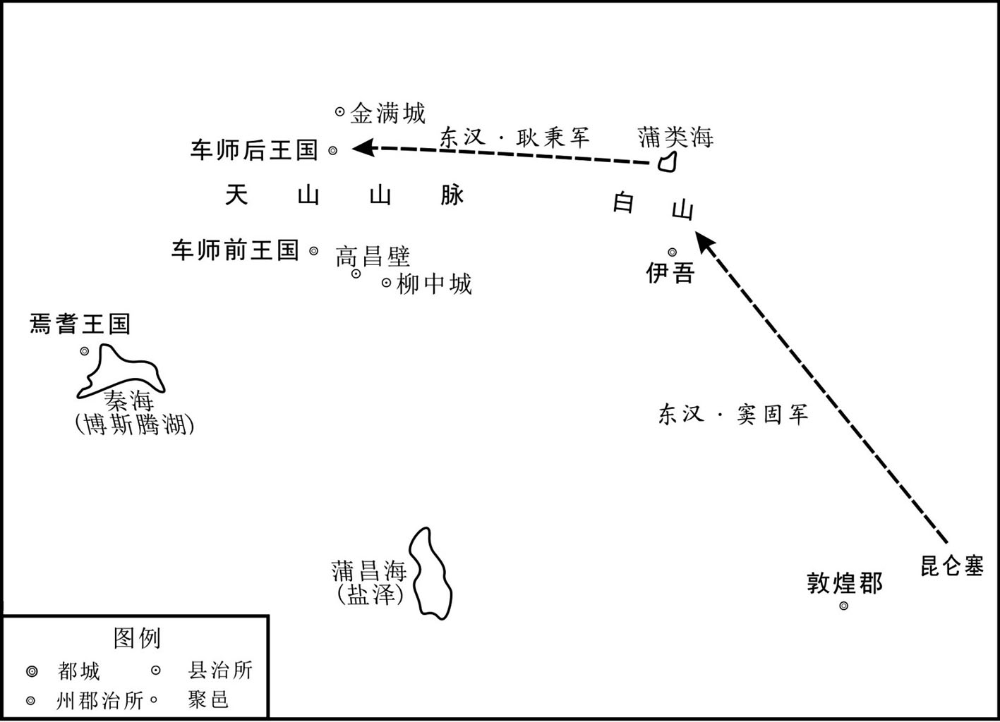 
窦固西域作战示意图

## 【注文】

[1]耿秉（？—91年）：字伯初，扶风茂陵（今陕西兴平市东北）人，东汉名将。耿秉是名将耿弇之侄，身体强壮，腰带八围。而且博通书记，后凭借其父耿国当了官，并多次上书谈论兵事。　　昆仑塞：古障塞名。一名昆仑障。西汉置。在今甘肃安西县南。为宜禾都尉治所。昆仑，山名。即昆仑山，又称昆仑虚、昆仑丘或玉山。地理概念上的昆仑山，西起帕米尔高原东部，横贯新疆、西藏间，伸延至青海境内，全长约2500公里，平均海拔5500—6000米。古代神话的西方昆仑，是汉以前地理上的昆仑一名与传说中昆仑的结合。　　符：古代朝廷传达命令或征调兵将用的凭证。

[2]白山：山名。即天山。是中亚东部地区（主要在中国新疆）的一条大山脉，横贯中国新疆的中部，西端伸入哈萨克斯坦。古名白山，又名雪山，冬夏有雪，故名。匈奴谓之天山，唐时又名折罗漫山，长约2500公里，宽250米—300公里，平均海拔约5000米。　　蒲类海：古湖泊名。即今新疆东部巴里坤湖。因西汉时期匈奴部落建有蒲类国而得名。

[3]廷：封建时代君主受朝问政的地方，这里指王廷。

[4]道远：路途遥远。　　并力根本：集中力量进攻根基之所在。

[5]请：请允许我。　　行前：行于前列，这里指打前锋。

[6]引兵北入：率领所属部队向北挺进。

[7]帽：这里指王冠。　　诣：到，旧时特指到尊长那里去。　　归命：归顺，投诚。

## 【译文】

冬季十一月，东汉朝廷派奉车都尉窦固、驸马都尉耿秉、骑都尉刘张等，率军从敦煌郡昆仑塞出发，进攻西域，耿秉、刘张等都把兵符、符信交给了窦固。汉军部队集合在一起有一万四千骑兵，在蒲类海击败了匈奴屯驻在天山的军队，于是向车师国进攻。车师前王，是车师后王之子，前后两王庭之间相距五百多里。窦固认为后王庭路途遥远，山谷深险，士兵行军寒冷辛苦，因而想攻打前王庭。耿秉则认为应先去攻打后王庭，集中力量攻陷车师的主要根据地，那么前王自然会归服。窦固还没决定采用哪个计策，耿秉猛然站起来说：“请让我打先锋。”于是跳上战马举兵向北进军，众军不得已，与他一同进军，斩杀几千人。后王安得震惊，走出门迎接耿秉，摘下王冠，抱住马足请求投降。耿秉便带后王到窦固那里，前王也听命投降，于是就平定了车师回营。

## 【原文】

**十八年，春，二月，诏窦固等罢兵还京师[1]。**

## 【注文】

[1]罢兵：停战。　　京师：帝王的都城，这里指东汉都城洛阳。

## 【译文】

东汉明帝永平十八年（75年），春季，二月，明帝下诏命窦固等停止征战，返回京城洛阳。

## 【原文】

**十一月，焉耆、龟兹攻没都护陈睦[1]。**

## 【注文】

[1]攻没：即攻陷。　　陈睦（？—75年）：东汉王朝设在西域的西域都护，75年冬，因汉明帝下诏命窦固大军返回京城洛阳，焉耆、龟兹兵攻陷西域都护驻地而战死。

## 【译文】

十一月，焉耆、龟兹攻陷汉朝设在西域的都护驻地，陈睦战死。

## 【原文】

**章帝建初元年三月，诏征还班超[1]。超将发还，疏勒举国忧恐；其都尉黎弇曰：“汉使弃我，我必复为龟兹所灭耳，诚不忍见汉使去[2]。”因以刀自刭[3]。超还至于阗，王侯以下皆号泣曰：“依汉使如父母，诚不可去[4]！”互抱超马脚不得行。超亦欲遂其本志，乃更还疏勒[5]。疏勒两城已降龟兹，而与尉头连兵[6]。超捕斩反者，击破尉头，杀六百余人，疏勒复安[7]。**

## 【注文】

[1]章帝（56—88年）：即汉章帝。肃宗孝章皇帝刘炟，汉明帝刘庄第五子，母贾贵人。公元75—88年在位，历十三年。庙号肃宗，死后谥号孝章皇帝。　　征还：召回。

[2]发还：出发回国。　　都尉：官名。战国始置。职位次于将军的武官。

[3]自刭（jǐng）：自刎的另一种说法。

[4]还至：在归途中经过某地。

[5]更还：更改路线回到某地。

[6]尉头：古西域国名。汉时治尉头谷，在今新疆阿合奇县以东，以游牧为主，兼营农业。《汉书·尉头国传》载：“尉头国王治尉头谷。去长安八千六百五十里，户三百，口二千三百，胜兵八百人。左右都尉各一人，左右骑君各一人。东至都护治所千四百一十一里，南与疏勒接，山道不通。田畜水草、衣服类乌孙。”尉头民是西域北道十二国中的游牧民族。与乌孙、匈奴有近亲关系。由于是游牧民族，故王治也无定处。　　连兵：联结兵力。

[7]捕斩：逮捕斩杀。　　击破：打垮。使敌方的元气受到重大损伤，一时难以恢复。

## 【译文】

东汉章帝刘炟建初元年（76年）三月，皇帝下诏征召班超回国。班超将要出发回国时，疏勒全国忧恐；疏勒国的都尉黎弇说：“汉朝的使者抛弃了我们，我们一定会再次被龟兹灭亡的，实在不忍心看汉朝使者离去。”于是用刀自刎而死。班超启程回国，中途经过于阗，王侯以下的官员都哭号着说：“我们依赖汉朝的使者，就像依赖父母一样，你们实在不能走啊。”他们相互抱住班超的马脚，使他无法前行。班超也想完成他原来的志向，于是更改路线回到疏勒。但这时疏勒已有两座城池归降了龟兹，并与尉头国连兵背叛汉朝。班超率吏士逮捕斩杀叛变者，击败了尉头国，斩杀六百多人，疏勒又安定了。

## 【原文】

**三年，闰四月，西域假司马班超率疏勒、康居、于阗、拘弥兵一万人攻姑墨石城，破之，斩首七百级[1]。**

## 【注文】

[1]康居（qú）：古西域国名。在安息东北方、大月氏北方的国家是康居。东界乌孙，西达奄蔡，南接大月氏，东南临大宛，约在今巴尔喀什湖和咸海之间，王都卑阗城。北部是游牧区，南部是农业区。南部城市较多，有五小王分治。康居与大月氏同是突厥系的游牧民族。自锡尔河下游，至吉尔吉斯平原，是康居疆域的中心地带。　　拘弥：古代西域诸城国之一。都宁弥城（今新疆于田县克里雅河以东）。　　姑墨：古西域国名。治南城（今新疆阿克苏市东）。居民以农业为主，兼营牧业。产铜铁。汉代先后属西域都护和西域长史。三国时属魏，附于龟兹。南北朝时作姑默。唐称跋禄迦，亦名亟墨，于其地设姑墨州，属龟兹都督府。

## 【译文】

东汉章帝建初三年（78年），闰四月，西域假司马班超率领疏勒、康居、于阗、拘弥等国一万士兵攻陷姑墨国的石城，斩杀七百多人。

## 【原文】

**五年，夏五月，班超欲遂平西域，上疏请兵曰：“臣窃见先帝欲开西域，故北击匈奴，西使外国，鄯善、于阗即时向化，今拘弥、莎车、疏勒、月氏、乌孙、康居复愿归附，欲共并力，破灭龟兹，平通汉道[1]。若得龟兹，则西域未服者百分之一耳。前世议者皆曰：‘取三十六国，号为断匈奴右臂[2]。’今西域诸国，自日之所入，莫不向化，大小欣欣，贡奉不绝，唯焉耆、龟兹独未服从[3]。臣前与官属三十六人奉使绝域，备遭艰厄，自孤守疏勒，于今五载，胡夷情数，臣颇识之，问其城郭小大，皆言倚汉与依天等[4]。以是效之，则葱领可通，龟兹可伐[5]。今宜拜龟兹侍子白霸为其国王，以步骑数百送之，与诸国连兵，岁月之间，龟兹可禽[6]。以夷狄攻夷狄，计之善者也！臣见莎车、疏勒田地肥广，草牧饶衍，不比敦煌、鄯善间也，兵可不费中国而粮食自足[7]。且姑墨、温宿二王，特为龟兹所置，既非其种，更相厌苦，其势必有降者；若二国来降，则龟兹自破[8]。愿下臣章，参考行事，诚有万分，死复何恨[9]！臣超区区特蒙神灵，窃冀未便僵仆，目见西域平定，陛下举万年之觞，荐勋祖庙，布大喜于天下[10]。”书奏，帝知其功可成，议欲给兵。平陵徐干上疏，愿奋身佐超，帝以干为假司马，将弛刑及义从千人就超[11]。**

## 【注文】

[1]向化：归服。　　乌孙：中国古代西北民族和国家的名称。始见于汉朝初年，其族源为商周时期的昆夷、绲戎。学者们大多认为乌孙人的语言属阿尔泰语系突厥语族。汉朝初年，其族游牧于河西走廊的西部，与河西走廊东部的月氏为邻。公元前177年，为月氏攻破，昆莫（王）猎骄靡与部众大多逃奔匈奴。昆莫长大后，为匈奴单于领兵打仗，多立战功，因此得以统领本族部众，为匈奴驻守西部边境。公元前140年左右，昆莫率众西逐大月氏，占有其地（伊犁河流域），重建国家，首都为赤谷城。匈奴愤其离去，曾经发兵西讨，未能取胜。张骞出使其国后，始与汉朝结盟，汉武帝先后嫁细君公主和解忧公主为昆莫之妻，曾与汉朝东西夹击，大败匈奴。又曾协助汉朝经营西域。西汉神爵二年（前60年），汉朝设置西域都护府后，乌孙属于西域都护府所管辖。东汉时期，又曾协助班超和班勇安定西域。公元5世纪前期，柔然汗国强盛，乌孙为柔然击败，南迁于葱岭内外（今帕米尔高原一带）。此后乌孙渐与中亚各族融合。现代哈萨克、柯尔克孜等族都有玉逊部落，有人以为即是乌孙的后裔。　　并力：共同出力。

[2]取：获得，征服。　　号：号称。　　右臂：人大多习惯于用右手做事，因用“右臂”比喻事物的要害部分。

[3]日之所入：太阳落下的地方，即极西之地。　　欣欣：形容高兴的样子。　　贡奉：向朝廷贡献物品。

[4]艰厄（è）：艰难困苦。　　胡夷：远古东方部落称为夷，后统一用来借指史前中国生活于今山东、淮河地区，活动在今泰山周围的被称为夷的众多部落；而古代泛称西、北方的各族为胡。胡夷，偏指胡族，胡夷并称亦泛指外族或外族人。　　情数：情况。　　识（zhì）：熟悉。　　城郭：内城的城墙与外城的城墙，泛指城墙、城邑。

[5]效：验证，证明。　　葱领：即葱岭，领通“岭”。帕米尔高原，中国古代称葱岭，是自汉武帝以来开辟的丝绸之路之必经之地。帕米尔高原位于中亚东南部、中国的西端，地跨塔吉克斯坦、中国和阿富汗。目前除东部倾斜坡仍为中国所管辖外，大部分属于塔吉克斯坦，只有瓦罕帕米尔属于阿富汗。

[6]拜：任命官员。战国时期，国君任命官员称为拜。汉代称正式任命官员为拜或除。“拜”含有尊重之意，一般属于初任。后世多指高级官员的任命，如拜相。　　白霸：东汉时龟兹王。原为汉朝侍子。永元三年（91年），和帝纳西域都护班超策，为达以夷制夷之计，封其为龟兹王，遣司马姚光送归国。班超及姚光共胁龟兹，废其王尤利多而立之。见于记载的龟兹白姓，即始于霸。　　岁月之间：指一年半载。　　禽（qín）：古通“擒”。

[7]饶衍（yǎn）：富饶充足。　　费：耗费，消耗。

[8]温宿：古代西域游牧部落名和国名。治温宿城（今新疆乌什）。居民主要从事畜牧业，并多到邻近国家耕种土地。初被匈奴置僮仆都尉所役属，神爵二年（前60年）设西域都护府进行管辖。　　置：设立官职。　　厌苦：厌烦以为苦事。　　降：投降，归顺。

[9]章：奏章。　　诚：果真。　　万分：万分之一。

[10]区区：少，不重要。　　窃：私下，谦称自己。　　僵仆：僵直地倒下，也指死亡。　　觞（shāng）：古代酒器。　　勋：功，功劳。本为奖励作战有功的将士，授其勋级。后成为制度。　　祖庙：祭祀先祖的祠庙。　　布：宣告，陈述。

[11]平陵：县名。汉昭帝刘弗陵的陵县。　　徐干（生卒年不详）：也叫徐单。东汉名将，西域长史，京兆平陵（今陕西咸阳）人。自幼练习武术，慷慨勇猛。在得知班超奉旨西征时，徐单主动上奏，请求协助班超平定西域。于是，朝廷任命徐单为假司马，率领缓刑的犯人和志愿的将士一千人，跟随班超，打败了番辰，斩杀千余人。后朝廷又提升徐单为军司马，同班超一起攻破乌孙。从此，西域五十余国都纳入汉朝属国的版图之中。徐单英勇善战，立功无数，永元三年（91年），被任为西域长史，成为西域都护班超的副手，班超东驻龟兹国的它乾城，他则西驻疏勒国都城，互为犄角。可能老死于西域。　　将：率领。　　弛刑：解除枷锁，代指免刑。　　义从：汉代军名。初指募兵之一种。意谓自愿从军者。后多指少数民族武装组成的军队。东汉章和二年（88年），邓训为护羌校尉，抚养湟中月氏胡之少年勇者数百人，以为义从。自此，湟中地区羌、胡等部有号义从胡者，为护羌校尉所领重要武装，以勇健善战著称。东汉末亦以骁勇部队为义从。

## 【译文】

东汉章帝建初五年（80年），夏季五月，班超想完成平定西域的事业，于是上疏请求朝廷出兵，他写道：“我见先帝（汉明帝刘庄）想打开通往西域的大门，故而向北攻击匈奴、向西派使者出使各国，鄯善国、于阗国立即就归附了汉朝。而今拘弥、莎车、疏勒、月氏、乌孙、康居等国也愿再度归附汉朝，并准备共同合力消灭龟兹，铲除通往汉朝道路上的阻碍。如果可以攻下龟兹，那么西域诸国没归服的只剩下百分之一了。前代的议者都说：‘征服三十六国，就可以号称切断了匈奴的右臂。’如今西域各国，从极西边算起，无不仰慕中国德政，大小国家都很愉快，向汉朝进贡物品从未断绝，唯独焉耆、龟兹国没有服从我们。我先前与所率领的三十六人奉命出使到极远的地方，备遭艰险困苦，自从孤独地驻守在疏勒，至今已五年了。对于西域各国的情况，我都很了解，询问那里的大小城郭之国，都说依靠汉朝与依靠上天一样。由此验证，葱岭可以打通，龟兹可以讨伐。现在应封龟兹在汉朝做人质的王子白霸为龟兹国王，并派遣几百步兵骑兵护送他回国，让他与西域各国联合兵力，一年半载之间，龟兹王就会被擒。用夷狄攻打夷狄，是上好的计策。我看到莎车国、疏勒国土地肥沃广大，草木繁盛，畜牧发达，不像敦煌、鄯善那里土地闲置无用。他们可以不用中国的武器，粮食也可以自给自足。况且姑墨、温宿二王，只不过是龟兹派去的，他们与本国人既非同一种族，又互相厌恶敌对，这种形势决定了必有投降的。如二国来投降，那么龟兹就会不攻自破。请把我的奏章下交官员讨论，参考办事，如果有万分之一的可取之处，我死了也没有遗憾了。我班超不过是朝廷小小的官员，蒙受神灵的保佑，希望我不要立即死去，愿目睹西域平定，陛下举杯祝福万年太平，向皇帝宗庙祭祀、报告功勋，向天下宣布重大喜讯。”奏书呈上，皇帝知道班超的大功可以告成，便商议要给他派兵。平陵人徐干上疏，表示愿意奋不顾身辅佐班超。于是汉章帝任命徐干为假司马，率领免刑囚徒及自愿从军的一千人，到西域听候班超的指挥。

## 【原文】

**先是，莎车以为汉兵不出，遂降于龟兹，而疏勒都尉番辰亦叛[1]。会徐干适至，超遂与干击番辰，大破之，斩首千余级[2]。欲进攻龟兹，以乌孙兵强，宜因其力，乃上言：“乌孙大国。控弦十万，故武帝妻以公主，至孝宣帝卒得其用，今可遣使招慰，与共合力[3]。”帝纳之。**

## 【注文】

[1]先是：在此之前。

[2]会：适逢。　　适：恰好。

[3]控弦：拉弓。引申为士兵的代称。　　妻以公主：以公主妻之，把公主嫁给了他。　　孝宣帝：即汉宣帝刘询（前91—前48年），本名刘病已，字次卿。汉武帝刘彻嫡曾孙。即位之后，躬行节俭，改革吏治，稳定社会局势。对外大破匈奴和西羌，为政励精图治，史称中兴。　　招慰：招抚。　　合力：共同出力。

## 【译文】

在此之前，莎车国以为汉朝不能出兵了，于是投降了龟兹，而疏勒的都尉番辰也起兵叛变。恰好徐干带兵赶到，班超就与徐干合兵攻打番辰。他们大破番辰，斩杀了一千多人。班超想进攻龟兹，他认为乌孙兵力强盛，可以借助他们的兵力。于是上书说：“乌孙是大国。他们控有十万大军，故而汉武帝把公主嫁给乌孙国王。到了孝宣帝时终于得到乌孙的协助大破匈奴。现在可以派遣使者去安抚慰问，使乌孙与我们齐心协力。”章帝采纳了他的建议。

## 【原文】

**八年，冬，十二月，帝拜班超为将兵长史，以徐干为军司马，别遣卫侯李邑护送乌孙使者[1]。邑到于阗，值龟兹攻疏勒，恐惧不敢前，因上书陈西域之功不可成，又盛毁超：“拥爱妻，抱爱子，安乐外国，无内顾心[2]。”超闻之叹曰：“身非曾参而有三至之谗，恐见疑于当时矣[3]！”遂去其妻。帝知超忠，乃切责邑曰：“纵超拥爱妻抱爱子，思归之士千余人，何能尽与超同心乎？”令邑诣超受节度[4]。**

## 【注文】

[1]将兵长史：官名。西汉时边郡置长史一人治兵马，丞一人治民。东汉建武十四年（38年）罢边郡太守丞，以长史领丞之职。然边郡军务甚繁，另于长史之外置将兵长史以专掌军事。故东汉边郡虽省郡丞，事实上仍与西汉制度相同，只是改丞为长史，改长史为将兵长史而已。

[2]盛（shèng）：副词，用于动词前，表示动作的程度之甚与范围之广，相当于“一味地”、“大”、“很多”。　　毁：诋毁。　　安乐：享受安乐。　　内顾：思念中原，关心国家。

[3]曾参（生卒年不详）：即曾子，姓曾，名参，字子舆，春秋鲁国南武城（今山东费县）人。与其父曾皙同为孔子弟子。禀赋迟钝而学有建树，在孔门中以孝著称。曾参传授儒家学说较著，被后世尊为“宗圣”。《史记》卷六七有小传，其言行散见于《论语》和《礼记》。　　三至之谗（chán）：谗，说别人的坏话。指谣言再三传播，听者就信以为真。

[4]诣：前往。　　节度：调度，指挥。

## 【译文】

东汉章帝建初八年（83年）的冬季十二月，章帝任命班超为将兵长史，封徐干为军司马，另外派遣卫侯李邑护送乌孙使者回国。李邑到达于阗时，正赶上龟兹攻打疏勒，他十分恐惧不敢继续前进，于是上书声称平定西域的大功不能告成，又极力毁谤班超，说他：“拥爱妻，抱爱子，贪图在国外安乐的生活，而不关心国家。”班超听了叹息说：“我虽不是曾参，却和他一样遭遇了多次的谗言，恐怕要被当世之人怀疑啊。”于是离开了他的妻子。章帝知道班超的忠诚，就严厉斥责李邑说：“即使班超拥爱妻、抱爱子，但是想回家的战士还有一千多人，怎能都跟班超同心协力呢？”就命李邑到班超那里听候调遣。

## 【原文】

**元和元年十二月，帝复遣假司马和恭等将兵八百人诣班超[1]。超因发疏勒、于阗兵击莎车。莎车以赂诱疏勒王忠，忠遂反，从之，西保乌即城[2]。超乃更立其府丞成大为疏勒王，悉发其不反者以攻忠，使人说康居主执忠以归其国，乌即城遂降[3]。**

## 【注文】

[1]和恭（生卒年不详）：东汉假司马。章帝元和元年（84年），遣和恭等四人，率兵八百归班超指挥。超因发疏勒、于阗兵击莎车。

[2]赂（lù）：赠送的财物，亦泛指财物。　　保：保卫，守护。　　乌即城：城名。在今新疆疏附县境内。

[3]府丞：郡丞的别称。　　说（shuì）：用话劝说别人，使他听从自己的意见。

## 【译文】

东汉章帝元和元年（84年）的十二月，章帝又派假司马和恭等率领八百援兵到班超那里。班超于是征调疏勒、于阗兵攻打莎车国。莎车王用财宝引诱疏勒王忠，忠就背叛了汉朝，跟从莎车向西保卫乌即城。班超改立疏勒的府丞成大为疏勒王，征发所有没叛变的士兵去进攻忠，又派人说服康居王逮捕忠并带回国，于是乌即城投降。

## 【原文】

**三年九月，疏勒王忠从康居王借兵，还据损中，遣使诈降于班超；超知其奸而伪许之[1]。忠从轻骑诣超，超斩之，因击破其众，南道遂通[2]。**

## 【注文】

[1]损中：城名。亦作“桢中”、“顿中”。东汉属西域疏勒国，在今新疆疏勒县或疏附县境。　　诈降：为达目的假装投降。

[2]轻骑：轻装的骑兵。　　南道：指西域南道。

## 【译文】

东汉章帝元和三年（86年）九月，疏勒王忠向康居王借兵，返回损中城据守，派使者向班超诈降。班超看穿了他的诡计，假装应允。于是忠带领轻装骑兵到班超那里去，班超将其斩杀，又乘机击败了他的兵众，于是西域南道自此畅通。

## 【原文】

**章和元年，班超发于阗诸国兵共二万五千人击莎车，龟兹王发温宿、姑墨、尉头兵合五万人救之[1]。超召将、校及于阗王议曰：“今兵少不敌，其计莫若各散去；于阗从是而东，长史亦于此西归，可须夜鼓声而发[2]。”阴缓所得生口[3]。龟兹王闻之，大喜，自以万骑于西界遮超，温宿王将八千骑于东界徼于阗[4]。超知二虏已出，密召诸部勒兵，驰赴莎车营[5]。胡大惊乱，奔走，追斩五千余级；莎车遂降，龟兹等因各退散[6]。自是威震西域[7]。**

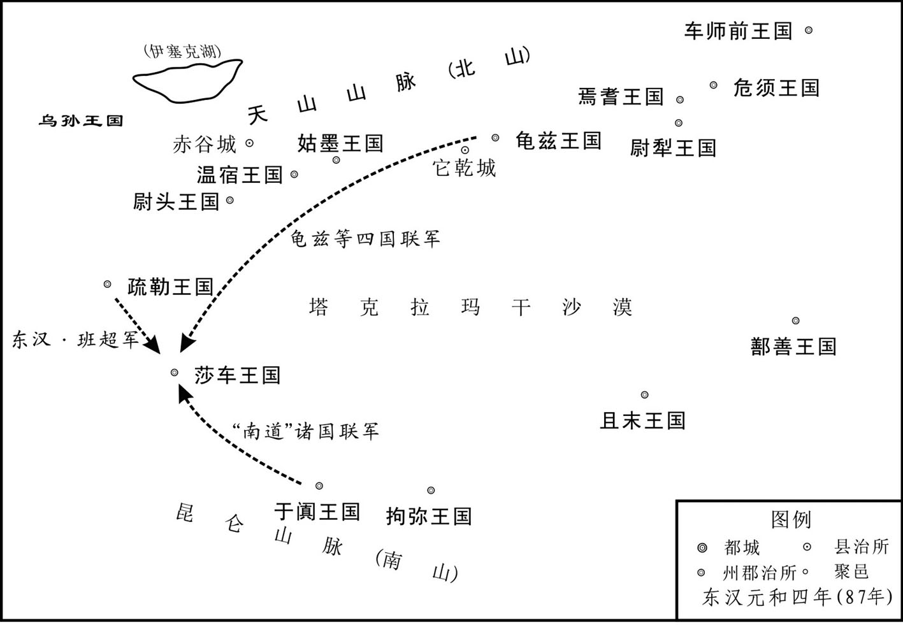 
班超击莎车示意图

## 【注文】

[1]发：征发，征调。

[2]将、校：指将军和校尉。　　莫若：莫如，不如。　　须：等待，停留。

[3]阴：假装。　　缓：放宽。　　生口：本指俘虏，后因多以俘虏为奴隶，即为其名称。

[4]遮：拦挡，阻拦。　　徼（yāo）：遮拦，截击。

[5]二虏（lǔ）：虏，中国古代对北方外族的贬称。二虏，在这里指龟兹、温宿两国的军队。

[6]胡：中国古代称北边的或西域的民族，这里指莎车人。　　退散：撤退散去。

[7]威震：威名或威势使人震动。

## 【译文】

汉章帝刘炟章和元年（87年），班超征调于阗等国共二万五千士兵进攻莎车国。龟兹王则调动温宿、姑墨、尉头三国兵力共计五万人前往莎车国救援。班超召集部下的将、校以及于阗王商议说：“现在我们的兵少抵挡不住敌人，不如各自散去。于阗军从此向东去，长史也由此向西归，可以等待半夜鼓声响起时一齐发兵。”于是故意放松戒备，让俘虏逃走。龟兹王听到消息后大喜，亲自带领一万骑兵在西边拦阻班超，温宿王则率八千骑兵到东面截击于阗军。班超听说龟兹、温宿两国的军队已出发了，就秘密集结部队备战，飞驰赶赴莎车军营。莎车军惊慌失措，四处奔逃，班超率军追击斩杀五千多人；莎车国于是投降，龟兹等国只好各自撤退。从此，班超的威名震动西域。

## 【原文】

**和帝永元二年，夏，五月，月氏求尚公主，班超拒还其使，由是怨恨，遣其副王谢将兵七万攻超[1]。超众少，皆大恐。超譬军士曰：“月氏兵虽多，然数千里逾葱领来，非有运输，何足忧邪[2]！但当收谷坚守，彼饥穷自降，不过数十日决矣[3]！”谢遂前攻超，不下，又钞掠，无所得[4]。超度其粮将尽，必从龟兹求食，乃遣兵数百于东界要之[5]。谢果遣骑赍金银珠玉以赂龟兹，起伏兵遮击，尽杀之，持其使首以示谢[6]。谢大惊，即遣使请罪，愿得生归，超纵遣之。月氏由是大震，岁奉贡献。**

## 【注文】

[1]尚：即仰攀婚姻，娶或嫁（地位、名声高的人）。　　怨恨：怨怒和仇恨。　　副：副将。

[2]譬（pì）：晓谕，解释。　　运输：运用各种运输方式输送人员和物资的活动。

[3]收谷：收藏粮食。　　坚守：坚决地守卫。　　饥穷：饥饿困穷。　　决：决定最后胜败。

[4]钞掠（chāolüě）：即抄掠，劫掠。钞通“抄”。

[5]要（yāo）：古同“邀”，中途拦截。

[6]赍（jī）：携带。　　遮击：拦击，截击。

## 【译文】

汉和帝刘肇永元二年（90年）的夏季五月。月氏王请求娶汉朝公主，班超拒绝并扣留了月氏的使臣，月氏王因此怀恨在心，派遣副将王谢率领七万士兵攻打班超。班超部下人很少，众人十分恐惧。班超告诉士兵们说：“月氏的兵虽然多，但他们从数千里以外翻过葱岭而来，没有运输补给，有什么值得担忧的呢！我们只要把粮食收割干净，坚守城堡，而敌方饥饿困顿，自然会投降，不过数十天便可见分晓。”谢带兵攻打班超，没攻下；又进行抢掠，也没有收获。班超估计敌人的粮食快用尽了，一定向龟兹国借粮，于是派几百个士兵在东边路上拦截。谢果然派骑兵带着金银珠玉去贿赂龟兹。班超埋伏的军队在半路突袭拦击，把他们全部消灭了，又杀死了使者并派人拿使者的人头给谢看。谢大惊，立即派使者向班超请罪，希望放他们一条生路。班超便把他们放回去了。月氏因此震惊，每年向汉朝进贡。

## 【原文】

**三年，冬，十月，龟兹、姑墨、温宿诸国皆降。十二月，复置西域都护、骑都尉、戊己校尉官[1]。以班超为都护，徐干为长史。拜龟兹侍子白霸为龟兹王，遣司马姚光送之[2]。超与光共胁龟兹，废其王尤利多而立白霸，使光将尤利多还诣京师[3]。超居龟兹它乾城，徐干屯疏勒，唯焉耆、危须、尉犁以前没都护，犹怀二心，其余悉定[4]。**

## 【注文】

[1]戊己校尉：官名。西汉初元元年（前48年）置，为驻车师屯田的长官。戊己之意，一说谓甲乙丙丁庚辛壬癸都有相应的方位，戊与己则无。戊己校尉驻地常有移动，故名。时有戊校尉，又有己校尉。另说谓戊与己位在四方之中，汉所置校尉在西域各国之中，故名。

[2]姚光（生卒年不详）：东汉大臣。任司马、玄菟太守。其于政失人和，安帝时为怨者诈作玺书谴责，被庞奋收斩。

[3]胁（xié）：逼迫恐吓。　　尤利多（生卒年不详）：东汉初期的龟兹王。为龟兹王建之子。其父曾与焉耆王广合兵攻杀东汉的西域都护陈睦，死后由他继位，与东汉为敌。永元元年（89年），班超大败龟兹，废除尤利多，派兵押送东汉首都洛阳，另立其弟白霸为王。

[4]它乾城：都城名。东汉龟兹国都城，为西域都护府治所。故址在今新疆新和县西南大望库木旧城。　　屯（tún）：驻军防守。　　危须：古西域国名。西汉宣帝至平帝之世西域都护诸属国之一。据《汉书·西域传》记载，王治危须城（今新疆焉耆县东），西至焉耆百里，危须以农业田耕为主，过着定居生活，属于“城邦之国”。神爵二年（前60年），西汉设置西域都护管辖危须等西域诸国。　　尉犁：西域古国名。王治尉犁城（今新疆焉耆县西南）。居民从事农牧业。属西域都护。三国时附属焉耆。　　没（mò）：杀害，斩杀。　　二心：不忠诚，有异心。

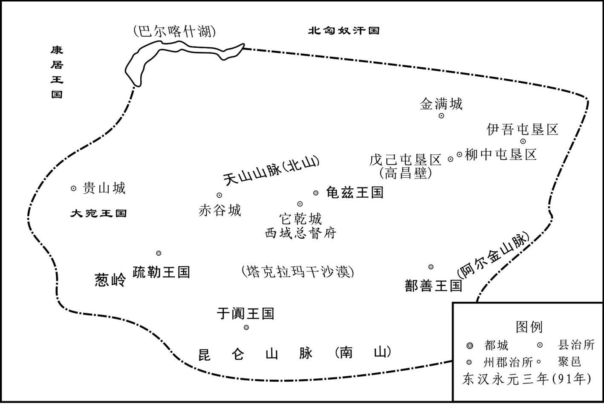 
东汉西域都护府示意图

## 【译文】

东汉和帝永元三年（91年）的冬季十月，龟兹、姑墨、温宿诸国都投降了汉朝。十二月，朝廷又在西域设置都护、骑都尉、戊己校尉官。任命班超为都护，徐干为长史，封龟兹在汉朝做人质的王子白霸为龟兹王并派司马姚光送白霸回国。班超与姚光共同逼迫龟兹，废掉了龟兹王尤利多，而改立白霸为龟兹王，并让姚光带着尤利多返回京城。班超的西域都护府设在龟兹的它乾城，徐干则驻扎在疏勒。只有焉耆、危须、尉犁等国，因以前斩杀过汉朝派去的都护，所以仍怀有二心，其余西域各国都已平定。

## 【原文】

**六年，秋，七月，西域都护班超发龟兹、鄯善等八国兵合七万余人讨焉耆，到其城下，诱焉耆王广、尉犁王泛等于陈睦故城，斩之，传首京师；因纵兵钞掠，斩首五千余级，获生口万五千人，更立焉耆左侯元孟为焉耆王[1]。超留焉耆半岁，慰抚之。于是西域五十余国悉纳质内属，至于海滨，四万里外，皆重译贡献[2]。**

## 【注文】

[1]发：征伐，调用。　　讨：征伐，发动攻击。　　陈睦故城：指已故的西域都护陈睦驻扎过的故城。　　因：乘机，借机。　　元孟（生卒年不详）：东汉初期的焉耆国王。原为焉耆王族，早年曾在京城洛阳充当侍子（充当人质的王子），焉耆王广执政时，官为左侯。永元六年（94年），西域都护班超率兵征讨焉耆，焉耆王广曾经攻杀西域都护陈睦，惧罪逃入天山。他派人向班超密报情况，班超扬言代表朝廷，赏赐西域各国，焉耆王广等下山迎接，为班超擒杀，即改立他为焉耆王。班超东归后，西域混乱，北匈奴重新控制西域，他又归附北匈奴，并曾派兵随北匈奴侵扰河西走廊。班超之子班勇为西域长史，经营西域，其余各国都归顺东汉，只有他不肯。永建二年（127年），班勇与敦煌太守张朗分兵征伐焉耆，他与张朗交锋，战败后归降东汉。

[2]纳质：汉代周边少数民族首领或邻国国君为取得汉王朝信任和保护，常将子弟送至京师长安或洛阳作为人质，是汉王朝控制周边少数民族和邻国的一种手段。质即质子。　　内属：汉时边远部族归附降属汉王朝，称臣为民叫内属。　　重译：数次翻译。

## 【译文】

东汉和帝永元六年（94年）的秋季七月，西域都护班超征调龟兹、鄯善等八国共七万多大军讨伐焉耆。大军行到焉耆城下，引诱焉耆王广、尉犁王泛等到已故西域都护陈睦驻扎过的故城，然后斩杀二人，并把二人的头传送到京师洛阳。班超乘机纵兵抢掠，斩杀五千多人，俘虏一万五千人，改立焉耆左侯元孟为焉耆王。班超留驻在焉耆半年，进行安抚。于是西域五十多国全都派遣人质到汉朝，归附汉朝，远至四万里以外的海滨国家，都经过数次翻译，来汉朝进贡。

## 【原文】

**九年，十二月，西域都护定远侯班超遣掾甘英使大秦、条支，穷西海，皆前世所不至，莫不备其风土，传其珍怪焉[1]。**

## 【注文】

[1]掾（yuàn）：官名。原为佐助的意思，后为副官佐或官署属员的通称。　　甘英（生卒年不详）：字崇兰，东汉著名使者。原为班超的部将，随班超转战于西域，屡立战功。永元九年（97年），奉命出使大秦（罗马帝国），因此西逾葱岭（帕米尔高原），经过安息（今伊朗），到达条支（今伊拉克）的西海（波斯湾），因当地船工劝阻而返。他是古代中国西行最远的一名使者。　　大秦：又名“犁靬”、“海西”。中国古代史书对罗马帝国的称呼。据《后汉书》载，大秦土地肥沃，物产丰富，商业发达，出产金银、夜光璧、明月珠、骇鸡犀、珊瑚、琥珀、玻璃、青碧、毛织品以及各色香料。永元九年（97年），西域都护班超派甘英出使大秦，行抵安息西境临海而回。延熹九年（166年），大秦皇帝安敦遣使至中国赠象牙、犀角、玳瑁，建立了友好关系。两汉时，大秦主要通过安息商人同汉朝进行贸易往来，获取中国的丝绸和生丝，丝价相当于黄金的价格。大秦是丝绸之路西行的终点，在古代中亚交通和贸易往来方面占有重要的地位。395年罗马帝国分裂后，大秦成为对东罗马帝国的称谓。　　条支：古国名和县名。一般以为指称塞琉古王国，条支即其都城安条克（今土耳其安塔基亚）的缩译。为阿历山大部将塞琉古于前312年所建。中心为叙利亚，故亦称叙利亚王国。强盛时占有今叙利亚、小亚细亚、两河流域和印度河以西。约前250年大夏和安息相继独立后，领土日削，到前2世纪末，仅领有叙利亚、腓尼基和小亚细亚一部分。前64年叙利亚为罗马帝国占领，国灭。西汉时的条支指今叙利亚，东汉与魏晋时指今伊拉克。波斯萨珊王朝（226—651年）兴起后占有条支故地，故《魏书·西域传》称其为古条支国。很早即与中国有外交、贸易往来。张骞通西域后，汉武帝即遣使至其国。永元六年（94年）班超平定西域、复开通南北道后，条支遣使重译贡献。九年西域都护班超遣甘英使大秦，曾抵其地。　　西海：古代指称中国西部或以西海域。指今咸海或里海。也指今红海、阿拉伯海及印度洋西北部。或指今地中海及今波斯湾等海域。　　备：完备，全面。　　珍怪：珍贵怪异的物品。

## 【译文】

东汉和帝永元九年（97年）的十二月，西域都护、定远侯班超派遣属官甘英出使大秦帝国和条支王国。甘英走遍了西海一带，沿途所经，都是前人没去过的地方。他每到一地都详细地了解风土人情，收集其地珍奇的物品。

## 【原文】

**十四年，秋，七月，班超久在绝域，年老思土，上书乞归曰：“臣不敢望到酒泉郡，但愿生入玉门关[1]。谨遣子勇随安息献物入塞，及臣生在，令勇目见中土[2]。”朝廷久之未报，超妹曹大家上书曰：“蛮夷之性，悖逆侮老；而超旦暮入地，久不见代，恐开奸宄之源，生逆乱之心[3]。而卿大夫咸怀一切，莫肯远虑，如有卒暴，超之气力不能从心，便为上损国家累世之功，下弃忠臣竭力之用，诚可痛也[4]！故超万里归诚，自陈苦急，延颈逾望，三年于今，未蒙省录[5]。妾窃闻古者十五受兵，六十还之，亦有休息，不任职也[6]。故妾敢触死为超求哀，丐超余年，一得生还，复见阙庭，使国家无劳远之虑，西域无仓卒之忧，超得长蒙文王葬骨之恩，子方哀老之惠[7]。”帝感其言，乃征超还。八月，超至洛阳，拜为射声校尉。九月，卒。**

## 【注文】

[1]乞归：请求辞职归乡。　　酒泉郡：郡名。西汉元狩二年（前121年）设置，治所为禄福（今甘肃酒泉），辖区包括今甘肃高台以西，至敦煌西境。原为匈奴浑邪王故地，北接匈奴，南邻西羌，西通西域，地势十分重要。汉朝驻以重兵，移民实边，对开辟西域和巩固边防都起过重要作用。元鼎六年（前111年），分酒泉郡西边为敦煌郡，西部辖境限至今甘肃玉门市西。

[2]谨（jǐn）：慎重，小心。　　班勇（？—127年）：东汉名将，西域长史。字宣僚，扶风安陵（今陕西咸阳市东北）人，东汉军事家、外交家、西域都护班超的次子。永初元年（107年），西域大乱，朝廷派他与兄长班雄领兵西出敦煌，迎取西域都护和戊己校尉部分将士东归。元初六年（119年），敦煌太守曹宗请求出兵西域，邓太后召集大臣商量，他力排众议，主张经营西域。延光二年（123年），他被任命为西域长史，驻屯于柳中城（今新疆鄯善县鲁克沁），先后击走北匈奴伊蠡王，攻破车师后部，大败北匈奴呼衍王，促使龟兹王归附于东汉，重新安定了西域。永建二年（127年），奉命与敦煌太守张植分兵征讨焉耆，因为后到，论罪下狱，后得赦免为平民，死于家中。他在西域期间，调查和收集西域各国的政治经济情况，写了《西域记》一书，为《后汉书·西域传》的编者提供了大量素材。　　生在：活着，在人世。

[3]曹大家（gū）：即班昭（生卒年不详），东汉史学家。名姬，字惠班，扶风安陵（今陕西咸阳市东北）人。以其夫为曹世叔，被称为曹大家。史学家班彪之女，班固之妹。班固死时，所撰《汉书》的八表及《天文志》未完。她奉命与马续共同续撰。《汉书》初出，读者多不通晓，她又教授马融等诵读。和帝时，常出入宫廷担任皇后和妃嫔的教师。著有《女诫》、《东征赋》等。其伦理思想深受其兄班固的影响，维护尊卑贵贱的宗法等级制的封建道德。她所著《女诫》一书，分《卑弱》、《夫妇》、《敬慎》、《妇行》、《专心》、《曲从》、《叔妹》七篇，系统阐述中国封建社会妇女“三从四德”的道德标准，影响十分深远。在清代，曾与唐宋若莘所著的《女论语》、明成祖皇后徐氏所著的《内训》及清王相母刘氏所著的《女范捷录》等编为《女四书》，作为封建社会的女子教育课本。　　悖（bèi）逆：违逆，忤逆；违背正道。　　侮老：欺侮老人。　　旦暮入地：指随时可能死去。　　奸宄（guǐ）：同“奸轨”。泛指为非作歹之事。

[4]卿大夫：西周、春秋时天子、诸侯所分封的臣属。分为卿、大夫。一般卿的地位较大夫为高。他们都有较高的政治、经济地位，而且可以世袭。后来，卿大夫逐渐成为官僚士大夫阶层的代名词。　　咸怀一切：只顾眼前。　　卒暴：急促，紧迫。　　弃：毁弃，抛弃。

[5]归诚：付与诚心，表示忠诚。　　延颈：伸长脖子，表示殷切盼望。　　逾望：遥望，远望。　　省录：省察。

[6]受兵：当兵，从军。　　任职：担任职务。

[7]触死：触犯死罪。　　求哀：请求哀怜。　　丐（gài）：给与，施与。　　阙庭：京都城阙和皇家宫廷。　　劳远之虑：苦于边事的忧虑。　　仓卒之忧：猝然发生变故的忧虑。　　文王葬骨：古代典故。周文王派人整修池塘，挖出了一具死人的尸骨。事报告了周文王，请求将其弃之荒野。周文王摇头说：“重新安葬它。”官吏说：“这可是一具没有主人的尸骨啊\!”周文王严肃地说：“拥有天下的人是天下之主。现在我难道不是它的主人吗？”官吏语塞，于是周文王下令用衣冠将这具尸骨改葬在别的地方。天下人听到这件事后都说：“周文王真是贤明啊：连死人的尸骨都受到了他的恩泽，更何况是活着的人呢？”　　子方哀老：古代典故。田子方看见一匹老马站在道旁，不禁叹息着牵挂在心中的事，便询问赶车的人说：“这是什么马呀？”赶车的人回答说：“这是旧尊老家所养的一匹马，由于老弱不再使用了，便牵出来想把它卖掉。”田子方说：“年少的时候贪用它的力气，年老的时候就把它抛弃，仁义之人不能这么做。”说着便用五匹帛赎买了这匹马。老臣罢武听说之后，便知道有所归向了。

## 【译文】

东汉和帝永元十四年（102年），秋季，七月，班超久在遥远的边域，因年老思念故土，便向皇帝上书请求回国。他说：“我不敢企望回到酒泉郡，只愿能活着进入玉门关。现在派遣我的儿子班勇，随同安息国献贡物的使者入塞，趁我还活着的时候，让班勇能亲眼见到中国的风土。”奏书送上朝廷后很长时间都没有答复。班超妹妹曹大家上书说：“蛮夷本性叛逆、欺侮老人。而班超已经年迈，随时可能故世，却久久无人替代。我担心这样下去恐怕要打开违法作乱的源头，使蛮夷产生叛乱的想法。但是卿大臣们都只顾眼前的安定局面，而不肯为国家做长远的考虑。如果猝然生变，班超年事已高，力不从心，将对上损害了国家累世建立的功业，对下毁弃了忠臣竭力经营的成果，实在让人痛心！因此，班超在万里之外表示忠诚，自己向朝廷陈述艰苦、急迫的情况，伸长脖子遥望，至今已三年了，却一直没能得到审查采纳。我听说，古人十五岁当兵，六十岁退伍，也有休息、不担任职务的日子。所以我胆敢冒死罪替班超请求哀怜，请让他能够活着回来，再到朝廷拜见皇帝，使国家永无劳苦于边事的顾虑，使西域没有猝然的变故，而班超也能蒙受周文王葬骨的恩惠以及田子方哀怜老马的仁慈。”皇帝为班昭的奏书所感动，于是征召班超回国。当年八月，班超到了洛阳，皇帝封他为射声校尉。九月，班超去世。

## 【原文】

**超之被征，以戊己校尉任尚代为都护，尚谓超曰：“君侯在外国三十余年，而小人猥承君后，任重虑浅，宜有以诲之[1]！”超曰：“年老失智。君数当大位，岂班超所能及哉！必不得已，愿进愚言：塞外吏士，本非孝子顺孙，皆以罪过徙补边屯，而蛮夷怀鸟兽之心，难养易败[2]。今君性严急，水清无大鱼，察政不得下和，宜荡佚简易，宽小过，总大纲而已[3]。”超去后，尚私谓所亲曰：“我以班君当有奇策，今所言，平平耳[4]。”尚后竟失边和，如超所言[5]。**

## 【注文】

[1]任尚（？—118年）：东汉将领。初为西域戊己校尉，代班超为都护。安帝时，任征西校尉，率军镇压羌人起义，在平襄（今甘肃通渭县西北）大败。后又任中郎将、护羌校尉，与邓遵（邓太后弟）、马贤等镇压汉羌联合起义，杀起义军首领杜季贡和零昌。元初五年（118年），因和邓尊争功，被邓太后所杀。　　猥（wěi）：谦辞，犹言辱。　　诲（huì）：教导，明示。

[2]吏士：泛指官府属吏。　　边屯（tún）：指戍边屯田。　　鸟兽之心：比喻恶念。　　难养易败：难于扶植，容易叛离。

[3]严急：严厉躁急，严厉急迫。　　察政：苛察的政策。　　荡佚（yì）：放荡纵逸，不拘世俗。

[4]平平：不好不坏，很一般。

[5]边和：边境的和平。

## 【译文】

班超被征召回洛阳，命戊己校尉任尚继任西域都护。任尚对班超说：“您在外国三十多年，现在由我继承您的事业，责任重大，但我自己的智谋又短浅，希望您能指教指教我！”班超说：“我已经年老，智力衰退了，而您多次担任高官，哪里是我能赶得上的！如果一定要我提建议的话，我愿谈谈我愚蠢的见解：塞外的官吏士兵，本来就不是孝子贤孙，都是因为犯了罪过而被贬逐到边疆，补充边防军的。而西域各国，心如鸟兽，难于教育扶植却容易背叛脱离。如今您的性情严厉急切，但是水清没有大鱼，明察秋毫的政治不得人心，应放宽尺度简单办事，宽恕小的过错，只总掌大纲罢了。”班超走后，任尚私下对自己的亲信说：“我以为班超会有神奇的策略，但他今天说的这番话，只不过是很一般的方法罢了。”任尚后来竟搞得西域边疆失去了和平安定，正如班超的预言。

## 【原文】

**殇帝延平元年，九月，诏以北地梁慬为西域副校尉[1]。慬行至河西，会西域诸国反，攻都护任尚于疏勒；尚上书求救，诏慬将河西四郡羌、胡五千骑驰赴之[2]。慬未至而尚已得解，诏征尚还，以骑都尉段禧为都护，西域长史赵博为骑都尉[3]。禧、博守它乾城，城小，梁慬以为不可固，乃谲说龟兹王白霸，欲入共保其城；白霸许之，吏民固谏，白霸不听[4]。慬既入，遣将急迎段禧、赵博，合军八九千人。龟兹吏民并叛其王，而与温宿、姑墨数万兵反，共围城，慬等出战，大破之。连兵数月，胡众败走，乘胜追击，凡斩首万余级，获生口数千人，龟兹乃定[5]。**

## 【注文】

[1]殇帝：即汉殇帝刘隆（105—106年）。汉和帝次子，养于民间，106年在位，登基时出生刚满百天，是继位年龄最小的皇帝，不久夭折，谥号孝殇皇帝。前任皇帝为和帝，后任皇帝为安帝。　　延平：是汉殇帝刘隆的年号，即106年。汉朝使用这个年号时间共计一年。元年八月汉安帝即位沿用。　　北地：郡名。战国秦始置，秦统一六国，北地郡为三十六郡之一。西汉元鼎三年（前114年）分其西部另置安定郡，并将郡治迁马岭（今甘肃庆阳市西北），东汉复称北地郡，郡治移富平县（今宁夏灵武县西南），东汉末废。　　梁慬（jǐn）（生卒年不详）：东汉名将，曾任西域副校尉。字伯威，北地弋居（今甘肃宁县南）人。父讽，历州宰。永元元年（89年），车骑将军窦宪出征匈奴，除讽为军司马，令先赍金帛使北单于，宣国威德，其归附者万余人。后坐失宪意，髡输武威，武威太守承旨杀之。窦氏既灭，和帝知其为宪所诬，征慬，除为郎中。

[2]河西：地区名。春秋、战国时指今山西、陕西二省间黄河南段以西地。　　河西四郡：西汉武帝时设置。元狩二年（前121年）匈奴昆邪王杀休屠王降汉，以其故地置酒泉、武威两郡。元鼎六年（前111年）又置张掖、敦煌两郡。因地处黄河上游以西，故称河西四郡。河西四郡的设立，沟通了内地与西域的直接联系。　　羌：古族名。主要分布在今甘、青、川一带。最早见于甲骨卜辞、先秦典籍。秦汉时，部落众多，有先零、广汉、武都、越嶲等部。魏、晋、南北朝、唐、宋间，又有白兰、党项等部。以游牧为主，与汉人杂居部分渐营农业。汉、魏、晋、唐、宋中，不断反叛起事，东汉后期的羌人起义，曾给东汉统治者以沉重打击。东晋至北宋间，烧当、党项部先后建立后秦、西夏等政权。其后，渐与汉族及其他民族融合。

[3]段禧（生卒年不详）：东汉将领。不知家世和籍贯，永元末年任骑都尉。延平元年（106年），代替任尚西域都护，驻守它乾城。西域局势动荡不安，它乾城小墙低，不易坚守，因与副校尉梁慬移驻龟兹国都城，与龟兹王白霸共守。龟兹贵族与温宿、姑墨联兵数万，围攻段禧，段禧率兵苦战数月，终于获胜。永初元年（107年），因西域屡有变乱，屯田费用很高，决定撤销西域都护和戊己校尉，派骑都尉王弘率领关中精兵迎取西域都护府、戊己校尉营的将士东归。段禧回朝后，销声匿迹，不知所终。　　赵博（生卒年不详）：东汉前期的西域长史，不知其籍贯和早期履历。永元元年（89年），他任职为车骑将军窦宪营中的司马，随从窦宪出征北匈奴。次年，又与名将耿夔一起，率军奔袭北匈奴单于，在金微山（阿尔泰山）取得胜利，活捉北匈奴单于的母亲及首领、部众五千人。永元十五年（103年），他被任命为西域长史，与骑都尉段禧一起出关，辅助西域都护任尚镇守西域。延平元年（106年），因为任尚对西域各国过于严酷，西域各国联兵围攻任尚于疏勒，任尚上书朝廷求救，朝廷以梁慬为西域副校尉，领兵出关，西域各国听到消息，解围而去。朝廷因此召回任尚，改以段禧为西域都护。他与段禧、梁慬共守龟兹它乾城，后又转守龟兹国都城，击败并平定周围的温宿、姑墨等国。不久，车师、焉耆等国又受北匈奴诱惑，反对东汉，东方的道路被北匈奴阻断，与朝廷音信隔绝。永初元年（107年），东汉放弃西域，派骑都尉王弘率领关中将士前来迎取赵博、段禧、梁慬的西域都护府和戊己校尉营将士返回内地。事后他被任命为汉阳太守。

[4]谲说（juéshuì）：心怀诡诈地劝说。　　固谏（jiàn）：极力劝谏。

[5]连兵：交战。　　乘胜追击：在敌人溃败逃窜时继续追击，以求全胜。比喻乘着胜利的气势追歼残敌。

## 【译文】

东汉殇帝延平元年（106年）的九月，朝廷下诏任命北地人梁慬为西域副校尉。梁慬到达河西的时候，正遇上西域各国叛乱，在疏勒攻击西域都护任尚。任尚上书请求朝廷援救，朝廷便命梁慬率领河西四郡——敦煌、武威、酒泉、张掖的羌、胡骑兵五千人飞驰去援助。粱慬还未赶到，任尚已解围。朝廷下诏征召任尚回国，任命骑都尉段禧为都护，西域长史赵博为骑都尉。段禧、赵博驻守在它乾城，城很小，梁慬认为不坚固，于是用诈术游说龟兹王白霸，声称愿入龟兹城与白霸共同守城，白霸同意了梁慬的建议。龟兹的官民极力劝谏，但白霸不听。梁慬进入龟兹城后，便速派将领迎接段禧、赵博，汉军汇合为八九千人的大军。龟兹的官民一同背叛了他们的国王，而与温宿、姑墨两国一起，联合了数万兵众反叛，围攻龟兹城，梁慬等出兵迎战，大破联军。战争持续了几个月，联军败逃。梁慬等乘胜追击，共斩杀敌人一万多，俘获几千人，龟兹局势才安定下来。

## 【原文】

**安帝永初元年，五月，西域都护段禧等虽保龟兹，而道路隔塞，檄书不通[1]。公卿议者以为“西域阻远，数有背叛，吏士屯田，其费无已[2]”。六月，壬戌，罢西域都护，遣骑都尉王弘发关中兵迎禧及梁慬、赵博，伊吾卢、柳中屯田吏士而还[3]。**

## 【注文】

[1]安帝：即东汉孝安皇帝刘祜（94—125年），106年至125年在位，在位十九年，享年三十二岁，葬于恭陵。谥号孝安皇帝，庙号恭宗。　　永初：汉安帝刘祜的第一个年号。107年至113年，凡七年。永初元年即公元107年。　　隔塞（sāi）：隔绝，阻塞。

[2]公卿（qīng）：古代三公九卿的总称。周秦以来，三公辅佐君主，统领九卿综理政务。东汉以降，三公九卿的名称虽多变化，地位也下降不等，但仍不失为高官显职。因此，后世则用以泛指朝廷重臣。　　阻远：艰难遥远。　　其费无已：它所消耗的费用没有止境。

[3]伊吾卢：县名。后又称伊吾，在今新疆哈密市周围。东汉初年，大将窦固率兵西击北匈奴，取得此地，驻兵屯田，为抗击北匈奴呼衍王的前哨之地。西晋设宜禾县，因鲜卑后部强大，占领其地，宜禾县内迁至晋吕郡北（今甘肃安西县北境）。隋筑伊吾新城，唐设伊州。安史之乱后，其地属回鹘，元明时期，改称为哈密力。　　柳中：县名。今新疆鄯善县西南鲁克沁。西汉属车师前部地。东汉时为西域长史、戊己校尉治所。

## 【译文】

东汉安帝永初元年（107年），五月，西域都护段禧等虽然保住了龟兹，但通往中原的道路已被阻塞，连公文都无法递送。朝廷中的公卿议者认为：“去西域路远险阻多，又常发生叛乱；官兵在那里屯戍垦田，消耗的经费没有止境。”六月壬戌（二十二日），朝廷撤销了西域都护，派遣骑都尉王弘率领关中兵去迎接段禧及梁慬、赵博，命伊吾卢和柳中的屯田官兵返回汉朝。

## 【原文】

**元初六年。初，西域诸国既绝于汉，北匈奴复以兵威役属之，与共为边寇[1]。敦煌太守曹宗患之，乃上遣行长史索班将千余人屯伊吾以招抚之[2]。于是车师前王及鄯善王复来降。**

## 【注文】

[1]绝于汉：与汉朝断绝关系。　　役属（shǔ）：谓使隶属于己而役使之。　　边寇：侵犯边疆的敌寇。

[2]行长史：官名。即代行长史。长史，丞相、太尉、御史大夫皆置，为事务长官；将军也置为幕僚之长。　　索班（生卒年不详）：东汉西域长史。永初元年（107年），朝廷以西域险远，难相应赴，诏罢都护，西域复属匈奴。敦煌太守患其暴害，于六年遣索班率千余人屯伊吾以招抚之，于是车师前王及鄯善王降。数月，北匈奴复率车师后部王共攻没索班，击走其前部王。　　招抚：招安，使归附。

## 【译文】

东汉安帝元初六年（119年）。起初，西域各国与汉朝断绝关系之后，北匈奴重新以武力威逼各国归属自己，听从驱遣，并同各国一起侵犯汉朝边境。敦煌太守曹宗很担忧，于是上奏请示朝廷，派遣代理长史索班率领一千余人驻扎伊吾，对西域各国进行招安。于是车师前王以及鄯善王再度前来归降。

## 【原文】

**永宁元年，春，三月，北匈奴率车师后王军就共杀后部司马及敦煌长史索班等，遂击走其前王，略有北道[1]。鄯善逼急，求救于曹宗，宗因此请出兵五千人击匈奴，以报索班之耻，因复取西域；公卿多以为宜闭玉门关，绝西域[2]。太后闻军司马班勇有父风，召诣朝堂问之[3]。勇上议曰：“昔孝武皇帝患匈奴强盛，于是开通西域，论者以为夺匈奴府藏，断其右臂[4]。光武中兴，未遑外事，故匈奴负强，驱率诸国；及至永平，再攻敦煌，河西诸郡，城门昼闭[5]。孝明皇帝深惟庙策，乃命虎臣出征西域，故匈奴远遁，边境得安；及至永元，莫不内属[6]。会间者羌乱，西域复绝，北虏遂遣责诸国，备其逋租，高其价直，严以期会，鄯善、车师皆怀愤怨，思乐事汉，其路无从；前所以时有叛者，皆由牧养失宜，还为其害故也[7]。今曹宗徒耻于前负，欲报雪匈奴，而不寻出兵故事，未度当时之宜也[8]。夫要功荒外，万无一成，若兵连祸结，悔无所及[9]。况今府藏未充，师无后继，是示弱于远夷，暴短于海内，臣愚以为不可许也[10]。旧敦煌郡有营兵三百人，今宜复之，复置护西域副校尉，居于敦煌，如永元故事，又宜遣西域长史将五百人屯楼兰，西当焉耆、龟兹径路，南强鄯善、于阗心胆，北捍匈奴，东近敦煌，如此诚便[11]。”**

## 【注文】

[1]永宁：汉安帝刘祜年号，120年至121年，凡二年。　　后部司马：官名。东汉置，为率兵在车师后部驻屯之统兵官，隶戊己校尉。　　略（lüè）有：据有，拥有。

[2]逼急：形势紧迫危急。　　复取西域：再次收回西域。

[3]朝堂：汉代正朝左右百官治事的地方。国家有大事，皆于朝堂会议。

[4]孝武皇帝：即汉武帝刘彻（前156—前87年）。　　府藏（cáng）：旧时国家储存文书、财物之所。亦指贮藏的财物。

[5]光武中兴：前25年，刘秀称帝，重建汉政权，定都洛阳，史称东汉，刘秀即光武帝。以后又经过十二年，削平群雄，完成统一事业。刘秀统治时期，注意整顿吏治，发展生产，加强集权，社会秩序相对稳定，史称“光武中兴”。　　遑（huáng）：闲暇。　　驱率诸国：驱使统率西域诸国。　　昼（zhòu）：白天。

[6]孝明皇帝：即汉明帝刘庄（28—75年）。　　深惟：深思，深入考虑。　　庙策：指朝廷的谋略。　　远遁（dùn）：逃往远处。　　内属：谓归附朝廷为属国或属地。

[7]北虏（lǔ）：古代对北方匈奴等少数民族的蔑称。　　遣责：派遣督责。　　逋（bū）租：犹欠租。　　价直：同“价值”。　　期会：定下期限会集，也指期限。　　牧养：管理，教养。　　还为其害：并加以迫害。

[8]报雪：报仇雪恨。　　故事：先例，旧日的典章制度。

[9]荒外：八荒之外，指荒远的地区。　　兵连祸结：兵，战争；连，接连；结，相联。战争接连不断，带来了无穷的灾祸。

[10]远夷：指远方的少数民族。

[11]营兵：兵卒泛称。古代各军各营兵卒皆可名之。如三国吴无难督，督无难营兵。魏至东晋，屯骑、步兵、越骑、长水、射声等校尉犹领营兵。　　径路：道路，通路。　　心胆：比喻意志和胆量。

## 【译文】

东汉安帝永宁元年（120年）的春季三月，北匈奴率领车师后王军就，一同杀死了后部司马及敦煌长史索班等人，乘胜赶走了车师前王，控制了西域北道。鄯善国形势危急，就向曹宗请求救援。曹宗为此向朝廷请求出兵五千人去攻打匈奴，为索班雪耻，并可乘机重新收回西域。朝中的公卿大夫大多认为应当关闭玉门关，断绝与西域的往来。皇太后听说军司马班勇有其父班超的风范，就召班勇到朝廷来询问。班勇建议道：“从前孝武皇帝担忧匈奴强大，于是打开了通往西域的道路，派使者出使西域。评论者认为，这是夺取了匈奴的宝藏，砍断了匈奴的右臂。光武皇帝使汉朝中兴，还没来得及考虑外部事务，因此匈奴便借此机会壮大国力，驱使统率各国。等到永平年间，匈奴再次攻打敦煌，河西各郡的城门白天都关闭着。孝明皇帝深思熟虑，制定出大策，命令虎将出征西域，匈奴因此远遁，边境才得到安定；等到了永元年间，异族没有不归属汉朝的。但不久前又遇上了羌族的叛乱，西域又与汉朝断绝了往来。于是北匈奴派使者去谴责各国，索要各国归属汉朝期间欠交匈奴的贡品，并抬高物价，严格规定缴纳期限。鄯善、车师国都心怀愤怨，愿意归属汉朝，只是无法找到途径。之前西域之所以时常发生叛乱，都是因为汉朝官员治理不当，西域各国反被他们迫害的缘故。现在曹宗这些人，因前时战败而感到羞耻，只想报匈奴杀害索班之仇，而却不研究以前战斗的经验教训，也不衡量当前战略的利弊。在荒远的地方建立功业，不容易成功，如果导致战争不停，灾祸接踵而来，那倒是后悔也来不及了。更何况现在国库并不充实，军队没有后援力量，出击匈奴是向远方的异族显示我们的弱点，向天下暴露我们的短处，我愚昧地认为不能批准曹宗的请求。从前敦煌郡有三百人屯驻营垒，现在应恢复，并且重新设置护西域副校尉，驻扎敦煌，就像永元年间那样。此外还应派西域长史率领五百人驻扎楼兰，向西可挡住焉耆、龟兹的道路，向南可增强鄯善、于阗的胆量，向北可抵御匈奴，向东可捍卫敦煌，我确信这是上策。”

## 【原文】

**尚书复问勇：“利害云何[1]？”勇对曰：“昔永平之末，始通西域，初遣中郎将居敦煌，后置副校尉于车师，既为胡虏节度，又禁汉人不得有所侵扰，故外夷归心，匈奴畏威[2]。今鄯善王尤还，汉人外孙，若匈奴得志，则尤还必死[3]。此等虽同鸟兽，亦知避害，若出屯楼兰，足以招附其心，愚以为便[4]。”长乐卫尉镡显、廷尉綦毋参、司隶校尉崔据难曰：“朝廷前所以弃西域者，以其无益于中国而费难供也[5]。今车师已属匈奴，鄯善不可保信，一旦反覆，班将能保北虏不为边害乎[6]？”勇对曰：“今中国置州牧者，以禁郡县奸猾盗贼也[7]。若州牧能保盗贼不起者，臣亦愿以要斩保匈奴之不为边害也[8]。今通西域则虏势必弱，虏势弱则为患微矣；孰与归其府藏，续其断臂哉[9]！今置校尉以捍抚西域，设长史以招怀诸国；若弃而不立，则西域望绝，望绝之后，屈就北虏，缘边之郡将受困害，恐河西域门必须复有昼闭之儆矣[10]！今不廓开朝廷之德而拘屯戍之费，若此，北虏遂炽，岂安边久长之策哉[11]！”**

## 【注文】

[1]利害：利益和损害，利弊。

[2]节度：官名。三国孙权初置节度官，使掌管军粮。到唐景云二年（711年），以贺拔延嗣为凉州都督，充河西节度使。自此以后，节度使才成为节制一方的领兵官。　　侵扰：侵犯骚扰，干扰，扰乱。

[3]尤还（生卒年不详）：东汉前期的鄯善国王。为鄯善王广与东汉宫女之子。其父死后继位。北匈奴重返西域，他被迫归附于北匈奴。延光二年（123年），班超之子班勇屯田于柳中（今新疆鄯善县鲁克沁），开始经营西域。次年正月，班勇来到楼兰城，他亲至楼兰，向班勇表示归附东汉，受到在所颁赐的印章上系以三绶的优待。延光四年（125年），他派兵随从班超北征车师后王国、匈奴强部呼衍王，大获胜利。此后一直忠诚于东汉。

[4]避害：躲避祸害。　　招附：招之使依附。

[5]长乐卫尉：官名。西汉军事职官。西汉都城长安有未央、长乐、建章三大宫。刘邦为帝时居住长乐宫，以后的皇帝移居未央宫，长乐成为太后的寝宫。太后的长乐宫中，仿中央诸卿，设有长乐卫尉、长乐太仆、司马和户将等官。长乐卫尉秩二千石，掌领卫士，守卫宫殿、门户。所属有长乐司马、长乐户将等。　　镡（xín）显（生卒年不详）：字子诵，郪县（属广汉郡，治所在今四川三台县郪江镇）人，东汉官吏，事见《华阳国志》。　　司隶校尉：官名。汉代监督京师和地方的监察官。　　崔据（生卒年不详）：东汉大臣。汉安帝时以司隶校尉事西域。

[6]保信：确保守信。　　反覆：动荡，动乱。　　边害：犹边患。

[7]州牧：官名。汉武帝初置刺史十三人，成帝更为牧，俸二千石，各掌一州。初为监察官员，后为州的军政长官。　　奸猾：亦作“奸滑”，奸诈狡猾。　　盗贼：指偷窃和劫夺财物的行为。

[8]要斩：即“腰斩”。用斧钺刑具斩铡犯人的腰部，使手、足分离的刑罚。古时斩人多为腰斩。秦汉时盛行，魏晋、北魏沿用不变。南朝无腰斩，北朝之北齐、北周亦无此刑。以后各朝虽有腰斩之刑，但都间或行之，并非常法，不在正式五刑之列，凡称斩者，皆为断头。

[9]孰与……哉：这与……能相比吗？

[10]捍抚：捍卫保护。　　招怀：招揽怀柔。　　缘边：沿边，指边境。　　儆（jǐng）：古同“警”，警报。

[11]廓（kuò）开：阐扬，阐明。　　屯戍（shù）：驻防。　　炽（chì）：热烈旺盛，这里指气焰嚣张。　　安边：安定边境。

## 【译文】

尚书又问班勇：“这个策略厉害如何？”班勇回答说：“从前，在永平末年的时候，刚刚恢复与西域的往来，一开始是派遣中郎将驻守敦煌，后来在车师设置副校尉，既调节西域各国的事情，又可阻止汉人，不得对外夷侵扰。故而外夷诚心归附，匈奴也惧怕汉朝的威望。现在的鄯善王尤还，是汉人的外孙，如果匈奴得逞，那么尤还一定会被杀死。这些人虽然像鸟兽一样，但也知道逃避灾害，如果派兵屯驻楼兰，就可以招抚他们，使他们归附汉朝，我认为这样做是有利的。”长乐卫尉镡显、廷尉綦毋参、司隶校尉崔据责难道：“朝廷先前所以放弃西域，是因为对汉朝没有利益，而费用多难以供给。现在车师已经归属匈奴，鄯善不能保证讲信用，一旦有反复，班将军能保证北匈奴不侵犯边境吗？”班勇回答说：“现在汉朝设置州牧，是为了禁止郡县的奸邪盗贼作乱。如果州牧能保证盗贼不作乱，我也愿用腰斩保证匈奴不侵犯边境。现在我们若是进驻西域，那么匈奴的威势就一定会减弱；匈奴的威势减弱，其危害就会消弱。这与把宝藏还给匈奴，并为他接好臂膀能相比吗？如今设置校尉来镇守抚慰西域，设立长史来招抚怀柔西域各国。如果放弃西域而不设立校尉、长史，那么西域就会对汉朝绝望，绝望之后，就会屈从北匈奴，汉朝的沿边各郡就将要受到侵害，恐怕河西郡县的城门会再次出现白天关闭戒备的警报了！现在不推广朝廷的恩德，而吝惜于屯驻垦荒的经费，像这样做，北匈奴的气焰会更嚣张，这难道是安定边疆的长远策略吗！”

## 【原文】

**太尉属毛轸难曰：“今若置校尉，则西域骆驿遣使，求索无厌，与之则费难供，不与则失其心，一旦为匈奴所迫，当复求救，则为役大矣[1]。”勇对曰：“今设以西域归匈奴，而使其恩德大汉，不为钞盗，则可矣。如其不然，则因西域租入之饶，兵马之众，以扰动缘边，是为富仇雠之财，增暴夷之势也[2]。置校尉者，宣威布德，以系诸国内向之心而疑匈奴觊觎之情，而无费财耗国之虑也[3]。且西域之人，无他求索，其来入者不过禀食而已；今若拒绝，势归北属夷虏，并力以寇并、凉，则中国之费不止十亿[4]。置之诚便。”**

## 【注文】

[1]难（nàn）：诘责，驳诘。　　骆（luò）驿（yì）：骆，通“络”；驿，古同“绎”。骆驿，指连续不断。　　求索无厌：形容贪欲没有满足的时候。　　为役（yì）大矣：役，战事。为他们出兵的费用就更大了。

[2]租入：租税。　　仇雠（chóu）：雠，仇的异形体，与仇同义，仇恨，仇怨。仇雠，指仇敌。

[3]费财耗国：花费钱财消耗国力。

[4]禀（bǐng）食：谓官家给食。　　寇（kòu）：侵略者来侵犯。　　并：州名。即并州，西汉元封五年（前106年）置，为十三刺史部之一。辖境相当今山西大部及内蒙古、河北的一部。东汉治所在太原郡（今山西太原市西南晋源镇），辖境扩大，包有今陕西北部及河套地区。三国后渐小。　　凉：州名。西汉元封五年（前106年）置，为十三州刺史部之一。东汉时治所在陇县（今甘肃张家川回族自治县）。辖境相当今甘肃、宁夏，青海湟水流域，陕西定边、吴旗、凤县、略阳和内蒙古额济纳旗一带。

## 【译文】

太尉掾属毛轸（zhěn）诘难道：“现在若是设置了校尉，那么西域各国就会不断派遣使者来汉朝，所求赏赐，不知满足。如果答应给他们吧，那么费用太多难以供应；若是不给他们，就失去民心。而且一旦他们受到匈奴的迫害，又要向汉朝求救，这样为他们出兵的费用就会更大了。”班勇回答说：“假设我们现在把西域交给匈奴，能使匈奴感激汉朝的恩德，从此不再掠夺侵扰，就可以这样做。如果不是这样，匈奴会因得到西域大量的租税、众多的马匹，而增强自己的力量，来侵扰我朝的边疆。这是替仇敌增加财富，使残暴的外族增长威势。设置校尉，是为了宣扬推广汉朝的威力，广施恩德，以此来拴缚各国归附中国的心，动摇匈奴非分希图的野心，而不会带来耗费国家财产的忧虑。况且西域的人，对中国没有其他的索求，使者来到汉朝，不过供给他们一些膳食而已。现在如果拒绝来使，他们势必要属北匈奴。如果他们合力攻击掠夺并州、凉州，那么国家支出的费用将不止十亿。所以，我认为设置校尉是有利的。”

## 【原文】

**于是从勇议，复敦煌郡营兵三百人，置西域副校尉居敦煌，虽复羁縻西域，然亦未能出屯[1]。其后匈奴果数与车师共入寇钞，河西大被其害[2]。**

## 【注文】

[1]西域副校尉：官名。西域都护之副职。汉朝中央政府直接任命，级别与都护相同，秩比二千石。主管军事。东汉后期，西域副校尉常驻敦煌。　　羁縻（jīmí）：束缚，控制。　　出屯：出境屯驻，即越出边境驻扎。

[2]寇钞：亦作“寇抄”，劫掠。　　被（bèi）：遭遇，遭受。

## 【译文】

于是朝廷接受了班勇的建议，恢复了敦煌郡的三百营兵，并设置西域副校尉驻守敦煌。汉朝虽然维系了与西域各国的关系，但也未能像班勇说的那样屯驻楼兰。后来北匈奴果然多次联合车师国共同侵掠内地，河西地区受到严重伤害。

## 【原文】

**延光二年，北匈奴连与车师入寇河西，议者欲复闭玉门、阳关以绝其患[1]。敦煌太守张珰上书曰：“臣在京师，亦以为西域宜弃，今亲践其土地，乃知弃西域则河西不能自存[2]。谨陈西域三策：北虏呼衍王常展转蒲类、秦海之间，专制西域，共为寇钞[3]。今以酒泉属国吏士二千余人集昆仑塞，先击呼衍王，绝其根本，因发鄯善兵五千人胁车师后部，此上计也[4]。若不能出兵，可置军司马，将士五百人，四郡供其犁牛、谷食，出据柳中，此中计也[5]。如又不能，则宜弃交河城，收鄯善等悉使入塞，此下计也[6]。”朝廷下其议。陈忠上疏曰：“西域内附日久，区区东望扣关者数矣，此其不乐匈奴、慕汉之效也[7]。今北虏已破车师，势必南攻鄯善，弃而不救，则诸国从矣。若然，则虏财贿益增，胆势益殖，威临南羌，与之交通，如此，河西四郡危矣[8]。河西既危，不可不救，则百倍之役兴，不訾之费发矣[9]。议者但念西域绝远，恤之烦费，不见孝武苦心勤劳之意也[10]。方今敦煌孤危，远来告急，复不辅助，内无以慰劳吏民，外无以威示百蛮，蹙国减土，非良计也[11]。臣以为敦煌宜置校尉，按旧增四郡屯兵，以西抚诸国。”帝纳之，于是复以班勇为西域长史，将兵五百人出屯柳中。**

## 【注文】

[1]延光：汉安帝刘祜的第五个年号，122年至125年，汉朝使用这个年号时间共计四年。建光二年（122年）三月改元为延光元年。延光四年（125年）三月北乡侯刘懿即位沿用；同年十一月汉顺帝即位沿用。　　入寇：入侵。　　阳关：关名。西汉初置。因居玉门关之南，故名。故址在今甘肃敦煌市西南古董滩一带。与玉门关同为中原王朝扼守西域的军事要塞，又是通向西域的门户并为南道起点。中唐以后因中西陆路交通衰落而逐渐废圮。

[2]张珰（生卒年不详）：东汉安帝时人。曾任敦煌太守。永初元年（107年），西域诸国反叛，朝廷因罢西域都护，北匈奴再度控制西域，不断骚扰敦煌。延光二年（123年），他上书朝廷，提出上策是将酒泉属国的吏士二千余人集结在敦煌境内，出击北匈奴呼衍王，再征发鄯善王兵五千人威慑依附北匈奴的车师后部；中策是设置军司马，率五百人出据柳中城，由河西四郡供应其犁牛和粮食；下策是放弃交河城（在今新疆吐鲁番），将鄯善等依附汉廷的小国迁徙入关。经过廷议，朝廷决定任命班勇为西域长史，率五百人出屯柳中城。

[3]呼衍（yǎn）王（生卒年不详）：北匈奴在西域的大王，所统部众游牧于蒲类海周围（今新疆巴里坤湖一带）。永建元年（126年），为东汉大将班勇击败，北逃枯梧河（今新疆北部的乌伦古河），部众二万人归降于班勇，势力大衰。后又返回故地。东汉中期，单于部众日益减少，呼衍王势力日益强大，始终与东汉政府为敌，经常侵扰河西四郡，并且辗转往来于蒲类海、秦海（今新疆博湖县的博斯腾湖）之间，专制西域。永和二年（137年），敦煌太守裴岑曾率兵三千，大败呼衍王于蒲类海，事见《裴岑纪功碑》。元嘉元年（151年），呼衍王曾率众三千，攻杀东汉在伊吾（今新疆哈密）的屯田将士毛恺等人。此后不见于历史记载，当为鲜卑檀石槐驱逐而西迁。　　秦海：古西域湖名。《后汉书·西域传》载：敦煌太守张珰上书中所谓“北虏呼衍王常展转蒲类、秦海之间”，即此。有敦薨之水注入。清作博斯腾淖尔。今名博斯腾湖，又名巴格拉什湖。在新疆和硕、焉耆县南。面积一千零十九平方公里。开都河自西北注入，湖水从西南流出为孔雀河。

[4]属国：汉时为安置归附的匈奴、羌、夷等少数民族而设，其地域范围是划定的，其“本国之俗”却保持不变。属国也指内属汉朝少数民族部族或部落，如属国卢水胡、属国湟中月氏诸胡、属国诸胡，或指属国都尉官。属国的设置始于战国，称属邦，汉避刘邦讳而改称属国。从汉元狩二年（前121年）到汉末为止，北、西、东三边诸郡：定安、天水、上郡、西河、五原、金城、北地、犍为、广汉、蜀郡、张掖、居延、辽东，都有属国的设置，大者领有五六城，小者一二城。大郡割边远县置属国，如割广汉北部都尉所治为广汉属国，割蜀郡西部都尉所治为蜀郡属国，割犍为南部都尉所治为犍为属国，割辽东西部都尉所治为辽东属国。小郡则属国置于本郡之内，不另标名称，如龟兹属国只作为上郡的一个县而存在。属国设有都尉、丞、候、千人等官，下有九译令，又有属国长史、属国且渠。属国官掌属国兵，称属国骑或属国胡骑，又称属国玄军。张掖属国有精兵万骑。　　根本：事物的本源或最重要部分。

[5]犁牛：耕牛。　　柳中：县名。故址在今新疆鄯善县西南鲁克沁。城当西域古代交通孔道，地肥美，宜屯田。东汉延光中班勇为西域长史驻此。

[6]交河城：城名。故址在今新疆吐鲁番市西北。自西汉至后魏，为车师前王国国都。450年后被高昌所并。后置交河郡于此。

[7]陈忠（？—125年）：字伯始。陈宠之子。汉安帝刘祜间为廷尉属官，后经司徒刘恺荐任尚书。承父志，修改当朝法律，删除比《甫刑》苛刻的条文，整理成二十三条，题为《决事比》，奏准施行，清除论罪无据的弊端。又奏准废除蚕室刑，解除贪官污吏三代不得为官的禁令，从轻判处误伤人命的精神失常者，允许母子兄弟之间代服死刑并赦其死罪。安帝亲理朝政后，数次举荐隐逸及直道之士，并劝其“广直言之路”，均被接受。转任仆射，不久，任尚书令。延光三年（124年）任司隶校尉，遭宠臣、外戚、幕僚等弹劾，次年改任江夏太守，未及成行，留任尚书令。卒于任上。　　内附：归附朝廷。　　扣关：敲击关门或城关而有所求。

[8]财贿：财货，财物。　　殖（zhí）：孳生。

[9]不訾（zī）：亦作“不赀”。不可比量，不可计数。

[10]恤（xù）：对别人表同情，怜悯。

[11]孤危：孤立而危急。　　辅助：从旁帮助。　　慰劳：慰问犒劳。　　百蛮：中国古代对于各少数民族的称呼。有民族歧视之意。泛指各少数民族，尤指南方各少数民族。　　蹙（cù）国：丧失国土。

## 【译文】

东汉安帝延光二年（123年），北匈奴接连与车师国侵掠河西地区，议者提议再关闭玉门关和阳关，以杜绝北匈奴的侵害。敦煌太守张珰上书说：“我在京城时，也认为应当放弃西域，现在亲自踏上西域的土地，才知道如果舍弃西域，那么河西地区就不能单独存在。我谨呈上有关西域的上中下三策：北匈奴呼衍王经常来往于蒲类海和秦海之间，控制西域各国，带领西域国家共同侵略汉朝。现在应派遣酒泉属国的二千多名官兵聚集在昆仑塞，先攻击呼衍王，除去祸乱的根源，乘机发动鄯善的五千兵众威胁车师后国，这是上策。如果不能出动大军，可设置军司马，率领五百将士，由河西四郡武威、酒泉、张掖、敦煌供给耕牛、粮食，出塞屯驻柳中，这是中策。如果这样也做不到，那么就舍弃交河城，把鄯善等与汉朝友好国家的人民全部迁入塞内，这是下策。”朝廷让群臣讨论张珰的建议。陈忠上奏书说：“西域各国归心汉朝已久，有不少国家热诚地向往东方，到边关探寻请求，这是他们不愿受匈奴控制、仰慕汉朝的证明。现在北匈奴已攻陷了车师国，势必向南进攻鄯善。如果汉朝放弃了他们而不去援救，西域各国就要归附北匈奴了。若是如此，北匈奴的财物就会增多，胆量就会增大，将威胁南羌地区，与各羌族相互勾结，这样河西四郡就陷入了危险的境地。河西四郡既然危险，朝廷不能不救援，那么就要征发百倍的人力物力，军事开支将无法计算。议者只考虑西域离京师太遥远，担心费用太多，却没考虑到孝武帝当初苦心经营的用意。现在敦煌处在孤立危急的境地，远道来求救，朝廷若再不帮助，对内无法慰劳官民，对外无法向各族显示汉朝的威望，将会缩减自己的国土，这不是好计策。我认为敦煌应设置校尉，按旧制增加河西四郡的驻军，来镇抚西域各国。”安帝采纳了他的意见，于是又任命班勇为西域长史，率五百人出塞，屯驻柳中。

## 【原文】

**三年，春，正月，班勇至楼兰，以鄯善归附，特加三绶，而龟兹王白英犹自疑未下。勇开以恩信，白英乃率姑墨、温宿，自缚诣勇，因发其兵步骑万余人到车师前王庭，击走匈奴伊蠡王于伊和谷，收得前部五千余人，于是前部始复开通。还，屯田柳中[1]。**

## 【注文】

[1]楼兰：城名。鄯善国都，在今新疆若羌县附近。东通敦煌，西通且末、精绝、拘弥、于阗，东北通车师，西北通焉耆，扼丝绸之路的要冲。　　绶（shòu）：一种丝质带子，古代常用来拴在印纽上，后用来拴勋章。　　白英（生卒年不详）：东汉前期的龟兹国王。应是白震之子，其父死后继位。延光二年（123年），班超之子班勇被任为西域长史，屯田柳中（今新疆鄯善县鲁克沁），他率领姑墨王、温宿王归附于东汉，派兵一万余，协助班超去伊和谷击走匈奴伊蠡王及其部众。后又派兵随班勇大败匈奴的呼衍王。　　恩信：指恩德信义。　　缚（fù）：捆绑。　　伊蠡王：北匈奴的偏裨小王。班超东归后，西域大乱，又为北匈奴所统治，单于曾派伊蠡王率兵镇守车师前部通往塔里木盆地诸国的要冲伊和谷（交河城旁的山谷）。延光三年（124年），班勇由柳中城（今新疆鄯善县鲁克沁）率兵进击，伊蠡王大败，逃回北匈奴本部。　　伊和谷：地名。车师前部通往塔里木盆地诸国的要冲，交河城旁的山谷。在今新疆吐鲁番市西北、乌鲁木齐县东南。

## 【译文】

东汉安帝延光三年（124年），春季，正月，班勇抵达楼兰。因为鄯善王诚心归附，汉朝特加赏鄯善王三条绶带的印信。然而龟兹王白英仍然犹豫不决，班勇用恩德和信义开导他，白英这才率领姑墨、温宿两国的国王，自己绑缚双臂到班勇那里归降。班勇乘机征调龟兹等国一万多步兵、骑兵，到车师前王国王庭，在伊和谷打跑了匈奴的伊蠡王，收容了车师前王国军队五千余人。于是车师前王国开始重新与汉朝建立联系。班勇带兵回营，仍在柳中屯驻垦荒。

## 【原文】

**四年，秋，七月，西域长史班勇发敦煌、张掖、酒泉六千骑及鄯善、疏勒、车师前部兵击后部王军就，大破之，获首虏八千余人，生得军就及匈奴持节使者，将至索班没处斩之，传首京师[1]。**

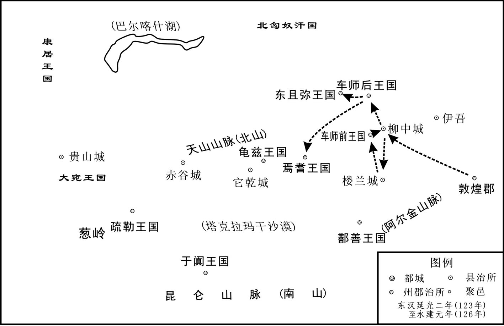 
班勇平西域示意图

## 【注文】

[1]首虏（lǔ）：首级和俘虏。　　生得：生获，活捉。　　持节使：古代处理外国事务官员，多持帝王手谕而行，故命为持节使。汉武帝任张骞为持节使，出使西域。

## 【译文】

东汉安帝延光四年（125年），秋季，七月，西域长史班勇征调敦煌、张掖、酒泉等郡的六千骑兵和鄯善、疏勒、车师前王国的军队，去攻击车师后王国国王军就，大捷，斩首八千余人，活捉了军就和匈奴持节使者，将其押到索班被害之地斩杀，把人头传送到京师洛阳。

## 【原文】

**顺帝永建元年，冬，十月，班勇更立车师后部故王子加特奴为王[1]。勇又使别校诛斩东且弥王，亦更立其种人为王；于是车师六国悉平[2]。勇遂发诸国兵击匈奴，呼衍王亡走，其众二万余人皆降。生得单于从兄，勇使加特奴手斩之，以结车师、匈奴之隙[3]。北单于自将万余骑入后部，至金且谷；勇使假司马曹俊救之，单于引去，俊追斩其贵人骨都侯[4]。于是呼衍王遂徙居枯梧河上，是后车师无复虏迹[5]。**

## 【注文】

[1]顺帝：即刘保（115—144年），汉安帝刘祜之子，母宫人李氏，125年至144年在位。144年去世，时年三十岁，死后庙号敬宗，谥号孝顺皇帝，葬于宪陵。　　永建：汉顺帝刘保的第一个年号，126年至132年，共计七年。永建七年三月改元为阳嘉元年。　　加特奴（生卒年不详）：东汉前期的车师后王国国王。永建元年（126年），班勇率领他及其弟八滑进击匈奴强部呼衍王，取得胜利，班勇因此上奏朝廷，册封他为国王，其弟八滑为后部亲汉侯。阳嘉三年（134年），他率兵一千五百人，协助戊己校尉、后部司马袭击北匈奴于阊吾陆谷（今新疆巴里坤县境）。大获全胜，俘虏了北匈奴单于的母亲及妇女数百人，牛羊十余万头，车一千辆。次年，北匈奴呼衍王派兵侵袭车师后王国，东汉集中玉门关、伊吾（今新疆哈密）及西域各国的骑兵六千三百名，救援车师后国，东汉军队战败。同年秋天，北匈奴攻破车师后国。

[2]诛斩：诛杀，斩杀。　　东且弥：古西域国名。王治天山东兑虚谷，在今新疆阜康市一带。汉时属西域都护。西汉以后，并于车师后部。　　种人：同一部族的人。

[3]从兄：旧时对堂兄之称谓。　　隙：感情上的裂痕，矛盾。

[4]北单于（生卒年不详）：北匈奴优留单于异母兄，为右贤王。章和元年（87年），优留单于为鲜卑所杀。二年正月，他被骨都侯拥立为单于。永元元年（89年），在稽落山（今蒙古国戈壁阿尔泰山脉），为汉将窦宪、耿秉与南单于联军所破。二年，汉兵与南匈奴共出鸡鹿塞（今内蒙古杭锦后旗西）进攻北匈奴，他率精兵千余人迎战，受伤逃走。三年，复为汉右校尉耿夔大破于金微山（今新疆阿尔泰山），遂率领残部远走乌孙。后转徙康居。　　金且谷：县名。《后汉书·班勇传》载金且谷位于东汉西域，当在今新疆阜康市天山之博格达山中。　　引去：离去，引退。　　都侯：官名。东汉左、右都侯省称。掌管剑戟士巡守宫中及缉捕，属卫尉。

[5]徙居：迁居。　　枯梧河：水名。即今新疆北部的乌伦古河。

## 【译文】

汉顺帝刘保永建元年（126年）的冬季十月，班勇改立车师后王国前任国王之子加特奴为王。班勇又命部将斩杀东且弥王，并改立本族人为王。于是，车师等西域六国都归附汉朝。班勇于是征发西域各国的军队进击匈奴，呼衍王逃走，其部众二万多匈奴兵全都投降。单于的堂兄被活捉，班勇让加特奴亲手将其斩杀，使车师、匈奴之间产生了矛盾隔阂。于是北匈奴单于亲自率一万多骑兵攻打车师后王国，大军到达了金且谷。班勇派假司马曹俊去援救车师，单于撤退，曹俊带兵追击，斩杀了匈奴的贵人骨都侯。于是呼衍王就迁居枯梧河上游地区，此后车师国再无匈奴的足迹。

## 【原文】

**二年六月，西域城郭诸国皆服于汉，唯焉耆王元孟未降，班勇奏请攻之[1]。于是遣敦煌太守张朗将河西四郡兵三千人配勇，因发诸国兵四万余人分为两道击之，勇从南道，朗从北道，约期俱至焉耆[2]。而朗先有罪，欲徼功自赎，遂先期至爵离关，遣司马将兵前战，获首虏二千余人，元孟惧诛，逆遣使乞降[3]。张朗径入焉耆，受降而还。朗得免诛，勇以后期，徵下狱，免[4]。**

## 【注文】

[1]奏请：臣下上书皇帝请求裁决的文体。始于汉。据《汉书·彭越传》载：“廷尉奏请，遂夷越宗族。”当时，凡逮捕刑讯、斩首大臣，均需经过皇帝批准，由此形成为一种“上请”制度，唐代，正式将这一制度纳入刑法典中。

[2]张朗（生卒年不详）：东汉顺帝时敦煌太守。永建二年（127年），率河西四郡兵三千人出关与班勇会师，征讨焉耆。大军分两路前行，朗从北道，勇从南道。约定两路大军会师的时间。朗军先至，派司马率军攻击焉耆军队，斩首俘虏二千余人，焉耆王被迫投降，遣子入朝贡献方物。

[3]徼（jiǎo）功：犹求功。　　赎（shú）：用行动抵销、弥补罪过。　　爵离关：关名。在今新疆焉耆县东北。　　乞降（qǐxiáng）：请求投降。

[4]后期：延误期限。

## 【译文】

东汉顺帝永建二年（127年）六月，西域所有的城邦国家都已归附汉朝，只有焉耆王元孟没投降。班勇上奏请求攻打焉耆。顺帝派遣敦煌太守张朗率河西四郡三千士兵，配合班勇。班勇征调西域各国四万多士兵，分两路向焉耆进击。班勇从南路，张朗从北路，约定日期一起到焉耆会师。张朗因先前有罪，急于立功赎罪，于是提前到爵离关，并派司马率兵提前进攻，斩杀俘获二千多人，元孟害怕被杀，于是派使者请求投降。张朗便直接进入焉耆，接受投降而还。结果张朗因功免于惩处，而班勇因迟到而被征召回京都洛阳，下狱，免官。

# 附录：

## 东汉皇帝世系表

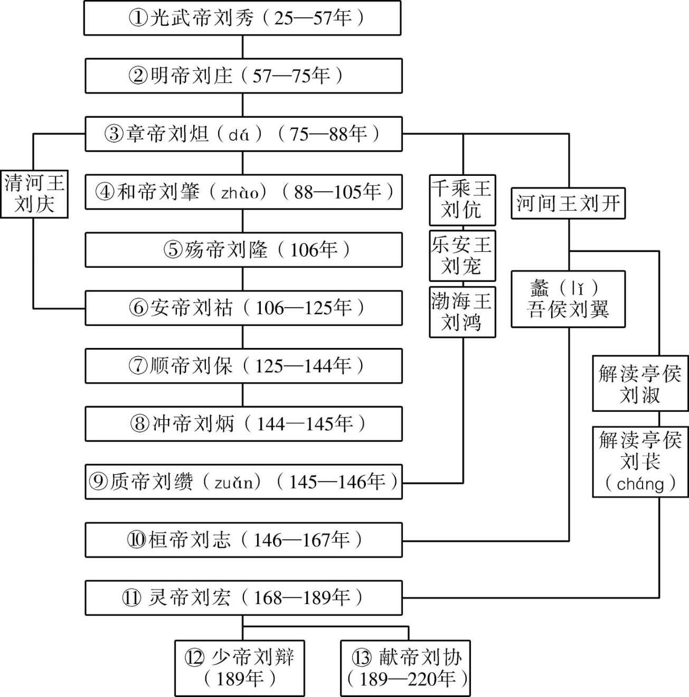 

## 窦氏世系表

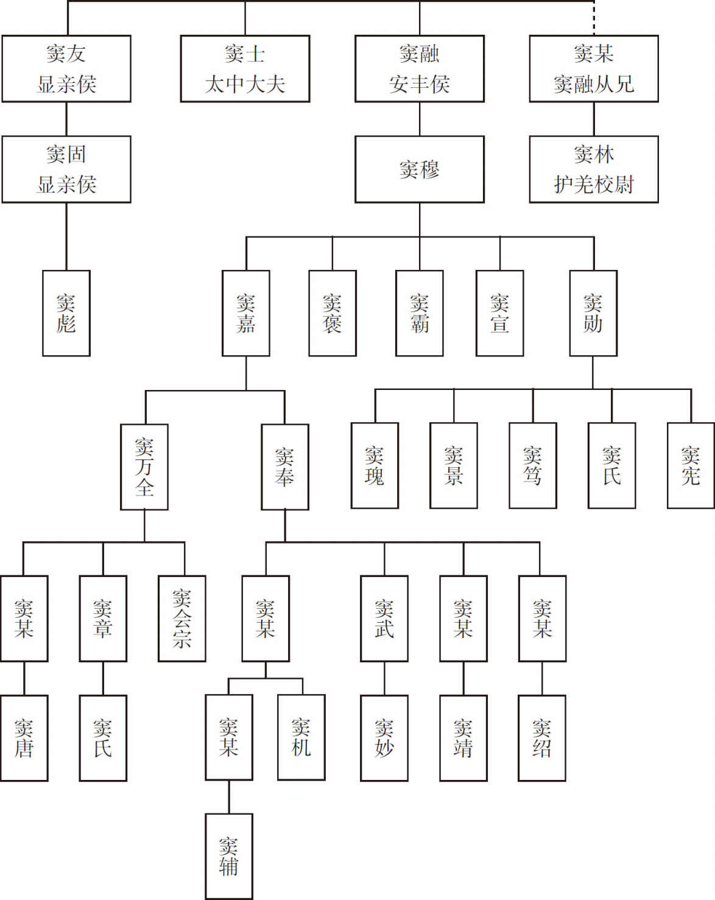

