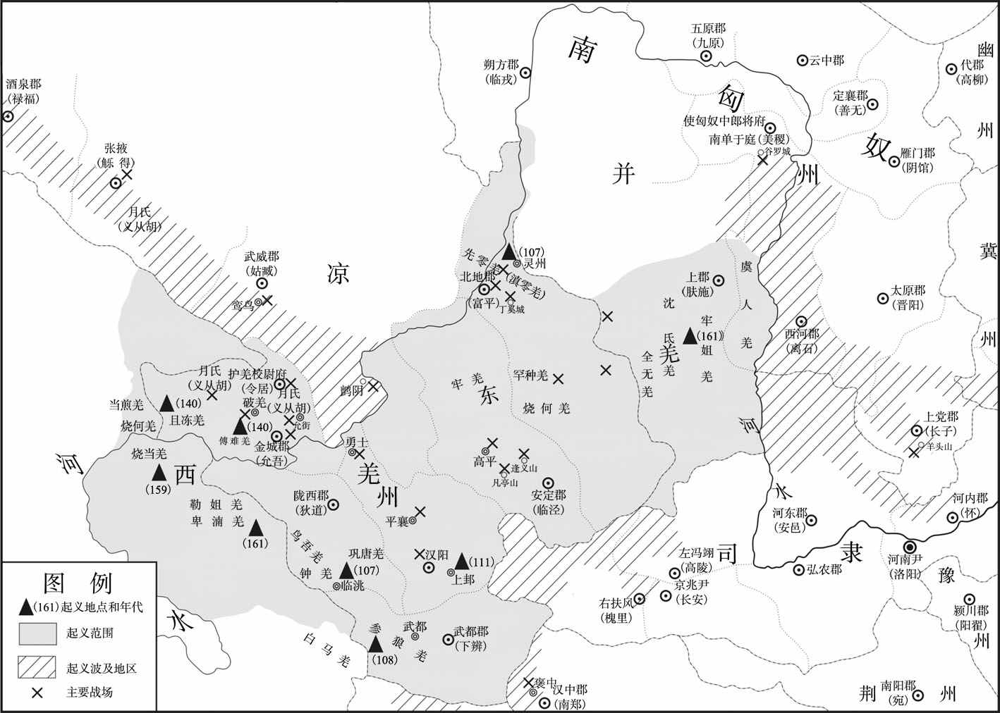
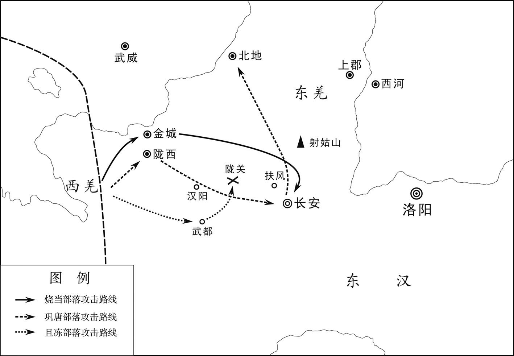
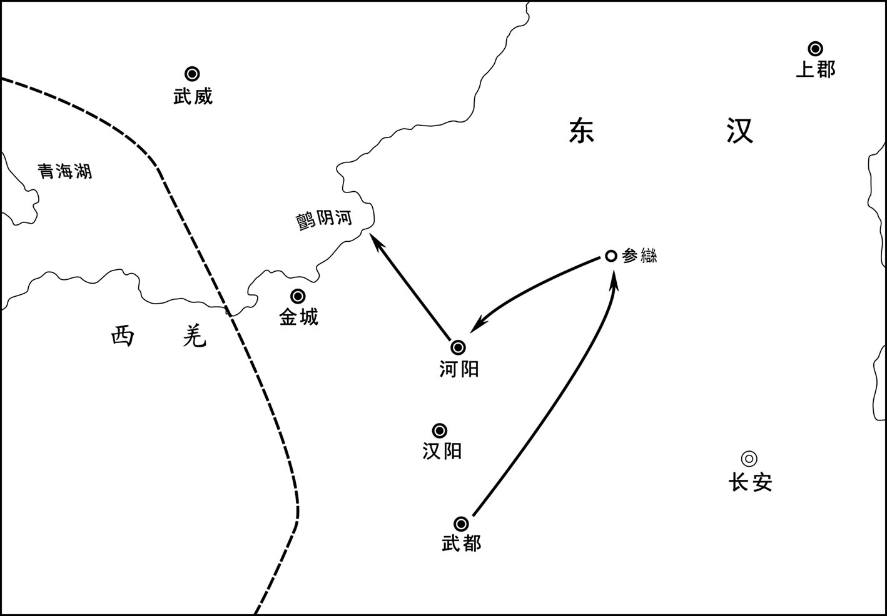
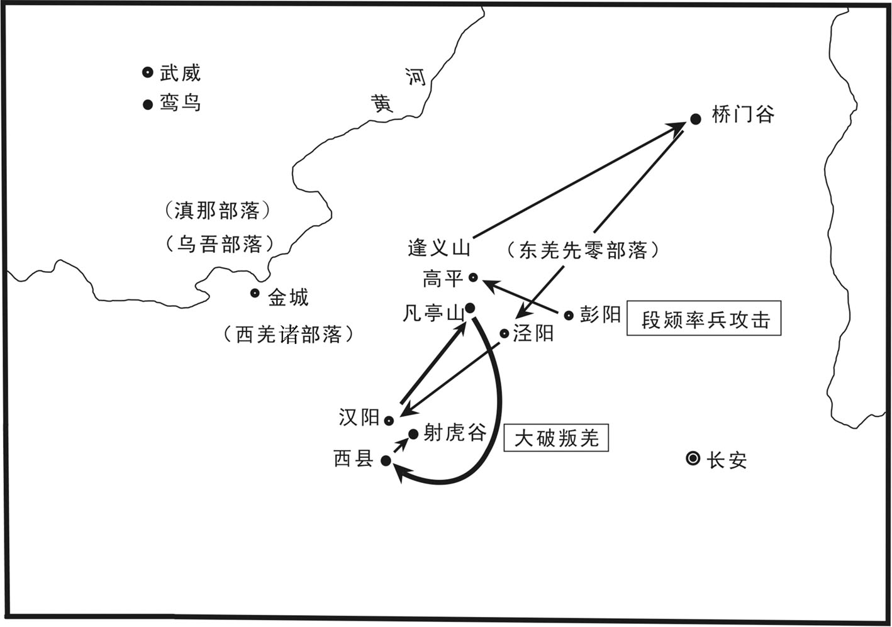
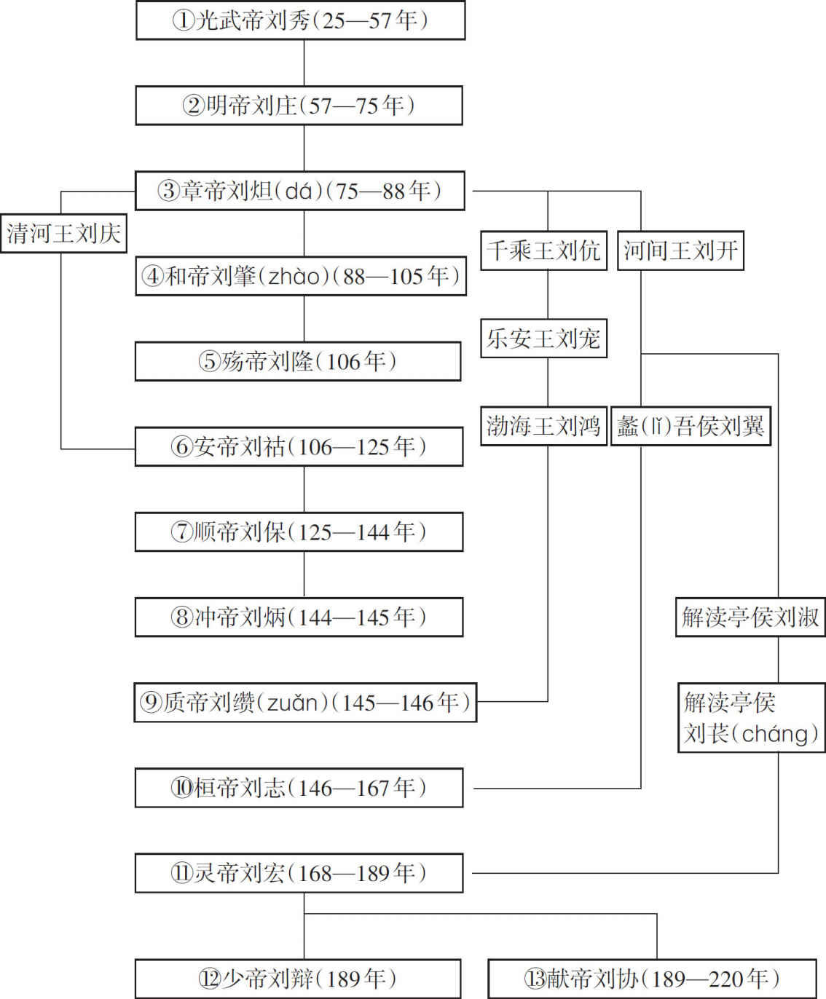

# 目录

两匈奴叛服

诸羌叛服

鲜卑寇边

嬖幸废立

梁氏之变

附录： 
东汉皇帝世系表

返回总目录

# 两匈奴叛服

## 【内容提要】

本篇叙述了南北匈奴与东汉王朝之间所进行的战争及其归附的过程。

东汉光武帝建武二十三年（47年），在单于继承问题上，前单于的长子比与蒲奴单于发生矛盾，第二年，匈奴八部共立比为呼韩邪单于，与蒲奴单于分庭抗礼，从此匈奴分裂为南、北两部。其后呼韩邪单于比率领四万余人南下，对汉朝称臣归附，被安置在云中、西河等郡，是为南匈奴。在经济上，汉朝给予南匈奴大力接济，包括粮食、牛羊、丝绸、兵器等。南匈奴与东汉王朝长期处于和平友好的状态，成为汉朝的藩属屏障，共同防御北匈奴入侵，使边界得以安宁。

而留居漠北的北匈奴，连年遭受严重的天灾，又受到南匈奴、乌桓、鲜卑的攻击，社会经济极度凋敝，力量大为削弱，多次遣使向东汉请求和亲。其缘由：一是怕东汉北伐；二是想挑拨、破坏东汉与南匈奴的关系；三是想抬高自己在西域的声望；四是想通过和亲、互市换取所需的物资。但东汉王朝不答应和亲，仅同意双方互市与互遣使节。从东汉明帝永平八年（65年）至十五年（72年），北匈奴不断入侵汉朝的渔阳至河西走廊北部边塞，随着政治稳定和经济发展，东汉在南匈奴的支持下，开始了征伐北匈奴的战争。

东汉永平十六年（73年）春季，东汉派祭肜（róng）、窦固、耿秉等四路大军出击，占据伊吾卢城。同年，派班超打通西域南路的鄯善国。十八年（75年）至十九年（76年）之间，东汉和匈奴对西域展开了一场大规模的争夺战。窦固、耿恭击败呼衍王和左谷（lù）蠡（lǐ）王，占领车师，争夺金城，因东汉明帝刘庄去世与中原大旱，人民负担过重，暂时罢兵。东汉章帝元和二年（85年），先后有七十三批北匈奴人南下附汉，北匈奴力量更为削弱。此后，南匈奴、鲜卑不断进攻北匈奴，加以漠北发生蝗灾，人民饥馑，北匈奴内部冲突不断，汉朝趁此时机，联合南匈奴夹击北匈奴。

东汉永元元年（89年）夏季六月，窦宪、耿秉率军与南匈奴军队在涿邪山会合，与北单于大战于稽落山。北单于大败逃走，汉军追击，俘杀一万三千余人，北匈奴先后有二十余万人归附。窦宪、耿秉登上燕然山，刻石记功而还。次年汉军再次出击北匈奴，北单于受伤逃走。三年汉军又出击金微山，大败北匈奴。北单于率领残部西逃，被迫西迁。

东汉永元六年（94年），南匈奴单于师子即位，新降的北匈奴部众不服，十五部二十几万人叛变，胁迫立前单于屯屠何之子逢侯为单于，匈奴再次分裂，东汉派遣大军以及乌桓、鲜卑兵共四万人大败逢侯，逢侯遂率众出塞。

依附汉朝的南匈奴人，被安置在河套地区，借着汉朝的军力多次大败北匈奴，接纳大量降众，势力大增。但因部族成分复杂，难以驾驭控制，内部非常不稳，时有叛乱，多位南单于被杀。而汉朝对南匈奴的管理越加严厉，东汉中期以后，南单于被汉朝官员拘捕、更换、逼死甚至杀害的事件一再发生。

南北匈奴与东汉王朝时战时和，对双方都产生了重大影响。匈奴的内附，促进了其与中原地区的交往，为以后的民族融合奠定了基础。

## 【原文】

**汉光武建武二十三年[1]。初，匈奴单于舆弟右谷蠡王知牙师以次当为左贤王，左贤王次即当为单于[2]。单于欲传其子，遂杀知牙师。乌珠留单于有子曰比，为右薁鞬日逐王，领南边八部[3]。比见知牙师死，出怨言曰：“以兄弟言之，右谷蠡王次当立；以子言之，我［前］单于长子，我当立。”遂内怀猜惧，庭会稀阔[4]。单于疑之，乃遣两骨都侯监领比所部兵[5]。及单于蒲奴立，比益恨望，密遣汉人郭衡奉匈奴地图诣西河太守求内附[6]。两骨都侯颇觉其意，会五月龙祠，劝单于诛比[7]。比弟渐将王在单于帐下，闻之，驰以报比[8]。比遂聚八部兵四五万人，待两骨都侯还，欲杀之。骨都侯且到，知其谋，亡去。单于遣万骑击之，见比众盛，不敢进而还。**

## 【注文】

[1]光武：即东汉光武帝刘秀（前6—57年）。字文叔，南阳蔡阳（今湖北枣阳）人。王莽末年，绿林、赤眉起义爆发，他起兵响应，在战争中不断扩大势力。建武元年（25年）称帝，建立东汉政权。之后削平地方割据势力，统一全国，加强中央集权，发展生产。谥号光武。　　建武二十三年：即公元47年。建武为东汉光武帝刘秀的第一个年号，自公元25年至55年，共三十一年。

[2]匈奴：我国古代北方民族。战国时游牧在燕、赵、秦以北。东汉时分裂为南北两部，北匈奴在1世纪末为东汉所败，西迁。南匈奴附汉，东晋时曾先后建立汉国和前赵国。　　单于：匈奴最高统治者的称号。全称为“撑犁孤涂单于”。匈奴语“撑犁”是“天”，“孤涂”是“子”，“单于”是“广大”之意。通常简称“单于”。　　舆（？—46年）：即呼都而尸道皋（gāo）若鞮（dī）单于，东汉初年匈奴单于，乌累若鞮单于之弟。本为左贤王，新莽天凤五年（18年）继立。初与内地保持友好，派遣大且（jū）渠等人到长安奉献贡物。东汉建武二年（26年），接受汉朝所授旧制玺绶。后与彭宠联兵，侵犯渔阳（今北京密云），又扶立三水（今宁夏同心）卢芳为帝，共侵北边。二十年（44年）至上党（今山西长治）、扶风（今陕西宝鸡）、天水（今甘肃东南部），次年又入侵上谷（今河北张家口）、中山（今河北定州），杀掠甚众，汉朝边郡岁无宁日。二十二年（46年）死，其子左贤王乌达鞮侯为单于，又卒，弟左贤王蒲奴立为单于。　　右谷（lù）蠡（lǐ）王：匈奴王号。位次左、右贤王和左谷蠡王，而高于左、右日逐王，左、右温禺鞮王，左、右渐将王等，有自己的部土，掌本部兵马人民等事，属官有骨都侯、尸逐骨都侯、日逐、且渠、当户等。　　知牙师（生卒年不详）：即伊屠知牙师，汉代匈奴呼韩邪单于与王昭君所生之子，被封为右日逐王，后晋封为右谷蠡王。新莽天凤五年（18年），其异母兄呼都而尸道皋若鞮单于被立之后，按次序知牙师当为左贤王（即单于储副，依次承嗣单于之位），因单于想传位给自己的儿子，于是知牙师被杀。　　左贤王：匈奴官名。即左屠耆（qí）王，“屠耆”为匈奴语“贤”，汉人因称左屠耆王为左贤王，为单于手下的最高官职。匈奴尚左，故常以太子担任此职。一般统率万余骑，居单于东方，最为大国。下各置千长、百长、什长、裨小王、相、都尉、当户、且渠等官属，以管理辖地军政事务。

[3]乌珠留单于（？—13年）：匈奴单于，即乌珠留若鞮单于，呼韩邪单于之孙。西汉成帝绥和元年（前8年）继位，与汉朝关系密切。公元前1年，入朝觐见汉哀帝。王莽篡位后，用欺诈手段换取西汉所赐“匈奴单于玺”，改颁“新匈奴单于章”。他受骗上当后，怨恨新朝，屡扰边境。　　比（？—55年）：即挛（luán）鞮（dī）氏，东汉时匈奴首领，乌珠留若鞮单于之子。原任右薁（yù）鞬（jiàn）日逐王，主南边八部及乌桓事，蒲奴立为单于后，他因为自己是前单于长子而不得立，因此心怀怨恨，建武二十四年（48年）率部南投东汉，被拥立为南匈奴的单于，是为呼韩邪单于。部众被安置在河套五原，后又迁居到西河美稷（今山西汾阳地区）。他统领的南匈奴与东汉长期处于和平友好的状态。公元55年去世。　　日逐王：匈奴官名。有时又称薁鞬日逐王，位次谷蠡王。分为左、右，由单于子弟充任，居单于王庭东、西两方，各有分地，随水草移徙。下各置千长、百长、什长、裨小王等属官，管理辖地军政，常兼外族事务。西边日逐王置僮仆都尉，使领西域。

[4]庭会：朝会，朝谒。　　稀阔：稀疏。

[5]骨都侯：匈奴官名。冒（mò）顿（dú）单于时设置，为单于的亲近大臣，但由兰氏、呼衍氏等异姓贵族担任，辅佐单于治理国家。有左、右二人，右骨都侯主管匈奴右部政事，经常出入西域各国。　　监领：统领。

[6]蒲奴（生卒年不详）：东汉初年匈奴单于，呼都而尸道皋若鞮单于之弟，建武二十二年（46年）继其侄乌达鞮侯为单于。二十四年（48年）右薁鞬日逐王比率部南下归汉，自立为单于。此后匈奴分裂为南、北两部，史称蒲奴为北单于。因南单于在东汉王朝扶持下数次进攻北匈奴，遂于二十七年（51年）后连年遣使至汉朝通好，请求和亲。东汉王朝仅以玺书报答，赐以彩缯，但不遣使者。　　恨望：埋怨，怨恨。　　西河：郡名。汉武帝元朔四年（前125年）分上郡北部而置西河郡，治所在平定县（今内蒙古鄂尔多斯东南），属朔方刺史部。东汉移治离石（今山西离石）。辖地在今陕西、山西两省之间的黄河沿岸一带地区，并拥有今内蒙古鄂尔多斯市东部及晋西等地。　　内附：归附朝廷。

[7]龙祠：古代匈奴大会诸部酋长祭天神、议国事，以走马斗橐（tuó）驼为乐，谓之龙祠。匈奴岁有三龙祠，常于正月、五月、九月戊日举行。南单于内附之后，兼祠汉帝。

[8]渐将王：匈奴贵族封号。分为左、右，二十四长之二。位于左、右贤王，左、右谷蠡王，左、右日逐王，左、右温禺鞮王之下，与左、右日逐王，左、右温禺鞮王号为“六角”，受其号者均与单于同姓。

## 【译文】

东汉光武帝刘秀建武二十三年（47年）。起初，匈奴单于舆的弟弟右谷蠡王知牙师，依照顺序当为左贤王，而左贤王即王储，依照顺序当为单于。但单于舆打算将其王位传给自己的儿子，于是就杀死知牙师。舆的前任、乌珠留单于的儿子名叫比，为右薁（yù）鞬（jiàn）日逐王，统率南边八大部落。比见知牙师被诛，口出怨言说：“如果以兄弟次序来说，右谷蠡王应当继位；若论传子，则我是前单于长子，我应当继位。”于是心怀猜忌恐惧，也很少到单于王庭朝会拜谒。单于对他产生怀疑，就派遣两名骨都侯去监督统领比部下的兵马。等到单于蒲奴继位，比愈发怨恨，秘密派遣汉人郭衡手捧匈奴地图，去拜见西河太守，请求归附朝廷。两名骨都侯对比的意图颇有觉察，正赶上五月龙祠，他们便劝告单于诛杀比。比的弟弟渐将王在单于帐下，闻知此讯，便飞马向比通报。于是比召集八部兵马四五万人，等待两位骨都侯归来，要杀死他们。两位骨都侯在即将到达时，发觉了比的图谋，便逃走了。单于派出万名骑兵去攻打比，因为见到比的军容强大，未敢进兵就撤回了。

## 【原文】

**二十四年春正月，匈奴八部大人共议立日逐王比为呼韩邪单于，款五原塞，愿永为藩蔽，扞御北虏[1]。事下公卿，议者皆以为“天下初定，中国空虚，夷狄情伪难知，不可许[2]”。五官中郎将[3]耿国独以为“宜如孝宣故事[4]，受之，令东扞鲜卑，北拒匈奴，率厉四夷，完复边郡”。帝从之。**

## 【注文】

[1]大人：少数民族首领称号。汉魏南北朝时的匈奴、乌桓、鲜卑及稍后的契丹等少数民族首领皆有此称，多由推举产生，任期有一定限制。　　五原塞：两汉五原郡边塞的统称，今内蒙古大青山西端、乌拉山南麓及阴山南坡的秦汉长城障塞。　　藩蔽：屏障。　　扞（hàn）御：防御，抵抗。扞，即捍。　　北虏：古代对北方少数民族的侮辱性称呼。

[2]夷狄：古时常指东、西、南方少数民族为“东夷”“西南夷”，称北方的少数民族为“北狄”，合称“夷狄”，泛指中原四周的少数民族。

[3]五官中郎将：中郎将，官名，秦朝设置，隶属郎中令。《后汉书·百官志二》记载，五官中郎将秩比二千石，所属有五官中郎、侍郎和郎中，掌管持戟（jǐ）值班，宿卫诸殿门，出充车骑。东汉建安十六年（211年），曹丕为五官中郎将，权力扩大，位在诸臣之上。　　耿国（？—58年）：东汉大臣。字叔虑，扶风茂陵（今陕西兴平）人，谋臣烈侯耿况之子，建威大将军耿弇（yǎn）之弟。东汉建武四年（28年）入侍皇帝，拜为黄门侍郎，有谋略，深得光武帝刘秀器重，迁射声校尉。建武七年（31年）拜驸马都尉，历任顿丘、阳翟、上蔡县令，政声颇佳，征为五官中郎将。屡次上奏对外之策，光武帝从其谋，册立匈奴薁鞬日逐王比为南单于（即呼韩邪单于），统治南匈奴。此后乌桓、鲜卑不敢侵边，北匈奴也受到捍御牵制。建武二十七年（51年），代冯勤出任大司马，东汉永平元年（58年）卒。

[4]孝宣故事：西汉宣帝时期，匈奴内部发生分裂，形成南、北匈奴。甘露二年（前52年）呼韩邪单于率众降汉。次年，呼韩邪单于到长安谒见汉宣帝。汉朝待以客礼，使其“位在诸侯王上”，并送所部至光禄塞（今包头西北）下驻牧。在汉朝支持下，西汉元帝永光元年（前43年）呼韩邪北归，恢复对匈奴全境的统治。从此，西汉与匈奴长达半个世纪的和好局面形成。　　故事：先例，旧日的典章制度。　　鲜卑：古族名。秦汉时游牧于今西拉木伦河与洮儿河之间，北匈奴西迁后进入匈奴故地，势力逐渐强盛起来。东汉桓帝时，首领檀石槐建庭立制，组成军事行政联合体，后瓦解。晋时分为数部，以慕容、拓跋二部最为强盛。魏晋南北朝时，慕容、拓跋、乞伏、宇文等部先后建立过政权。内迁的鲜卑人多转营农业，渐与汉族及其他民族融合。　　率厉：率领督促。

## 【译文】

东汉光武帝建武二十四年（48年）春季正月，匈奴八大部落首领共同议定，拥立日逐王比为呼韩邪单于，派使者去五原塞，表示希望永远做汉王朝的藩属屏障，抵御北方敌人。光武帝将此事交付公卿商议。参议此事的大臣都认为：“天下刚刚安定，中原空虚，而夷狄的意图真假难辨，不可应许。”唯独五官中郎将耿国认为：“应当依照孝宣皇帝的先例，接受归附，命他们在东面抵御鲜卑，在北面抗拒匈奴，做四方民族的表率，修复沿边诸郡。”光武帝听从了耿国的意见。

## 【原文】

**冬十月，匈奴日逐王比自立为南单于，遣使诣阙奉藩称臣[1]。上以问朗陵侯臧宫，宫曰：“匈奴饥疫分争，臣愿得五千骑以立功[2]。”帝笑曰：“常胜之家，难与虑敌，吾方自思之。”**

## 【注文】

[1]诣（yì）阙（quē）：前往朝廷。　　奉藩：归顺。

[2]臧宫（？—58年）：东汉初年将领。字君翁，颍川郏（jiá）县（今河南郏县）人。王莽末年，其率宾客加入绿林起义军的下江兵，为校尉。后跟从刘秀，为偏将军。东汉建立，任侍中、骑都尉，参与镇压绿林、赤眉义军，作战勇猛，以功拜辅威将军。建武十一年（35年），率军攻蜀，大破蜀将延岑，与大司马吴汉并灭公孙述。后封郎陵侯，官至左中郎将。臧宫为人质朴谨慎，为光武帝刘秀信任重用。死后谥“愍（mǐn）侯”。

## 【译文】

东汉光武帝建武二十四年（48年）冬季十月，匈奴日逐王比自立为南单于，派遣使节到汉廷，表示愿做藩国，自称臣属。光武帝询问朗陵侯臧宫的意见，臧宫说：“匈奴发生了饥荒瘟疫和分裂斗争，我愿率领五千骑兵，去立战功。”光武帝笑道：“和常胜将军难以商议敌情，我要自己考虑此事。”

## 【原文】

**二十五年春正月，南单于遣其弟左贤王莫将兵万余人击北单于弟薁鞬左贤王，生获之[1]。北单于震怖，却地千余里，北部薁鞬骨都侯与右骨都侯率众三万余人归南单于。三月，南单于复遣使诣阙贡献，求使者监护，遣侍子，修旧约[2]。**

## 【注文】

[1]莫：即东汉时期南匈奴丘浮尤鞮单于（？—57年），名莫，呼韩邪单于比之弟。原任南匈奴左贤王，东汉建武二十五年（49年），率兵万余人大破北匈奴单于之弟薁鞬左贤王，将他生擒，又破北单于帐下，兼并其众，迫使北单于却地千里。东汉建武中元元年（56年）其兄死，嗣立为单于。汉廷遣使授以玺绶，赐以衣冠及缯彩等。次年病卒，在位两年。

[2]贡献：即贡纳，进贡、进奉。古代臣属向君主的进贡，名曰贡献，其实带有某种强制性。　　侍子：古代诸侯或属国之王遣子入侍天子之称。汉代周边诸少数民族与汉通好时，其首领亦多遣子入侍汉朝皇帝。侍子在中原学习汉族文化，对沟通汉朝与各族的友好交往有积极作用。

## 【译文】

东汉光武帝建武二十五年（49年）春季正月，南单于派他的弟弟左贤王莫率兵一万余人，进攻北单于的弟弟薁鞬左贤王，将他生擒。北单于非常震惊害怕，向后撤退一千余里。北匈奴所属的薁鞬骨都侯和右骨都侯率领三万余人归附南单于。三月，南单于再度派遣使者，到汉廷进贡财物，请求汉朝派遣使者进行监护，并送王子到汉朝做人质，重修旧日和约。

## 【原文】

**二十六年春正月，诏遣中郎将段郴、副校尉王郁使南匈奴，立其庭，去五原西部塞八十里[1]。使者令单于伏拜受诏，单于顾望有顷，乃伏称臣[2]。拜讫，令译晓使者曰：“单于新立，诚惭于左右，愿使者众中无相屈折也。”诏听南单于入居云中，始置使匈奴中郎将，将兵卫护之[3]。**

## 【注文】

[1]中郎将：官名。始设于秦，西汉沿置，分五官、左、右三署，各置中郎将以统率皇帝的侍卫，后称光禄勋。平帝时又置虎贲中郎将，统率虎贲郎。东汉增设东、西、南、北中郎将，又有杂号中郎将。因事置名，如使匈奴、平越、司金、武卫中郎将等。汉末军阀割据，自相署置，中郎将名号尤多。　　副校尉：官名。汉代设置，地位低于将军，是与都尉官俸相同的武官，掌屯兵，主征伐。副校尉官级、官俸略低于校尉。西汉时，校尉俸二千石，副校尉比二千石。东汉时校尉比二千石，副校尉千石。　　五原：郡名。原为秦九原郡，西汉元朔二年（前127年）改置，治所在九原（今内蒙古包头），辖境相当于今内蒙古后套以东、阴山以南、包头以西和达拉特、准格尔旗等地。东汉初匈奴南单于分部众驻屯于此，汉朝末年废弃。

[2]伏拜：伏身而拜。　　有顷：不久，一会儿。

[3]云中：郡名。秦朝设置，治所在今内蒙古托克托东北，东汉末年移治今山西原平西南，辖境相当于今内蒙古土默特右旗以东、大青山以南、卓资县以西、黄河南岸及长城以北一带。西汉时辖境缩小，东汉末废。　　使匈奴中郎将：官名。西汉设置，掌出使匈奴。汉武帝与匈奴来往，常以中郎将为使臣，是临时性的，后成为定制。东汉与南匈奴来往增多，便正式设置使匈奴中郎将，但仍有“匈奴中郎将”之称。

## 【译文】

东汉光武帝建武二十六年（50年）春季正月，光武帝刘秀下诏，派中郎将段郴（chēn）、副校尉王郁出使南匈奴，为南匈奴建立王庭，距离五原西部塞八十里。汉朝使者令单于伏地跪拜，接受诏书。单于左右环顾，犹豫了一会儿，才伏地跪拜自称臣属。跪拜完毕后，命译者告诉汉朝使者，说：“单于新近即位，在左右群臣面前，跪拜受诏实在惭愧，希望使者不要在大庭广众之下，使单于屈节折服。”光武帝下诏，同意南单于进入云中郡居住。汉朝自此设置出使匈奴的中郎将，率领军队护卫南匈奴。

## 【原文】

**夏，南单于所获北虏薁鞬左贤王将其众及南部骨都侯合三万余人畔归，去北庭三百余里，自立为单于[1]。月余，日更相攻击，五骨都侯皆死，左贤王自杀，诸骨都侯子各拥兵自守。**

## 【注文】

[1]北庭：泛指北匈奴居住的地方，北庭的原义是北匈奴的王庭，后转为对北匈奴居住地的泛称。

## 【译文】

东汉光武帝建武二十六年（50年）夏季，南单于所俘虏的北匈奴薁（yù）鞬（jiàn）左贤王带领旧部，以及南匈奴的五位骨都侯，共计三万多人叛变北逃，在距离北匈奴王庭三百余里的地方，自立为单于。一个多月以后发生内讧，每天互相攻击，五位骨都侯都死了，左贤王自杀，诸位骨都侯的儿子各自拥兵独立。

## 【原文】

**秋，南单于遣子入侍，诏赐单于冠带、玺绶、车马、金帛、甲兵、什器，又转河东米糒二万五千斛，牛羊三万六千头以赡给之[1]。令中郎将将弛刑五十人，随单于所处，参辞讼，察动静[2]。单于岁尽辄遣奉奏，送侍子入朝，汉遣谒者送前侍子还单于庭，赐单于及阏氏、左右贤王以下缯彩合万匹，岁以为常[3]。于是云中、五原、朔方、北地、定襄、雁门、上谷、代八郡民归于本土[4]。遣谒者分将弛刑，补治城郭，发遣边民在中国者布还诸县，皆赐以装钱，转给粮食[5]。时城郭丘墟，扫地更为，上乃悔前徙之[6]。**

## 【注文】

[1]冠带：帽子和腰带。古代把戴帽子、束腰带作为文明的标志。　　玺绶：古代印玺上所系彩色组绶，称为玺绶，又用来代指玉玺。　　甲兵：古代军事装备，即铠甲和兵器。　　什器：日用杂物。　　河东：地区名。战国、秦、汉时指今山西西南部，唐以后泛指今山西全省，因黄河自北而南流经本区西界，故有河东之称。　　米糒（bèi）：米粮。糒，干粮。　　斛（hú）：中国古代量器名，也是容量单位，一斛本为十斗，后来改为五斗。

[2]弛刑：免戴枷锁从事劳役的徒刑。　　辞讼：也作“词讼”。争讼，诉讼。

[3]谒者：官名。春秋战国时期有谒者，为国君传达情报。秦、汉沿置。汉代郎中令属官有谒者，又少府属官有中书谒者令。谒者掌宾赞受事，共约七十人，秩比六百石，其长官称“谒者仆射”。东汉谒者为外台，与尚书中台、御史宪台合称“三台”。南北朝时沿置此官，掌引见臣下，传达使命。　　阏（yān）氏（zhī）：汉时匈奴国君单于的正妻称阏氏，相当于汉族的皇后。　　缯（zēng）彩：五彩的缯帛。缯，古代对丝织品的总称。

[4]朔方：古郡名。西汉元朔二年（前127）置，治所在朔方（今内蒙古杭锦旗北），东汉移治临戎县（今内蒙古磴口），东汉末年废。辖境相当于今内蒙古自治区河套西北部及后套地区。　　北地：郡名。秦朝设置，治所在义渠（今甘肃庆阳），辖当今甘肃东部、宁夏大部、陕西西北部及内蒙古乌海、鄂托克旗等地。西汉移治马岭（今庆城西北），东汉移治富平（今宁夏吴忠），东汉末地入羌胡，寄治冯翊郡界。　　定襄：郡名。西汉设置，治所在成乐（今内蒙古和林格尔西北土城子），东汉移治善无（今山西右玉南）。　　雁门：郡名。战国赵置，秦、西汉治所在善无（今山西右玉南），东汉移治阴馆（今山西朔州）。　　上谷：郡名。战国燕国设置，在今河北张家口宣化，因建在大山谷上边而得名。所辖范围包括今河北怀来、宣化、涿鹿、赤城、沽源以及北京延庆等地。秦汉时期沿置，治所在沮阳（今河北怀来），三国魏时郡治曾移至居庸。　　代郡：郡名。战国赵置，秦、西汉治所在代县（今河北蔚县），西汉辖境相当今河北怀安、涞源以西，山西阳高、浑源以东的内外长城间地，及长城外的东洋河流域。东汉移治高柳（今山西阳高），十六国后燕建兴三年（388年）废。

[5]城郭：城指内城的墙，郭指外城的墙，城郭为内城与外城的统称，泛指城邑。　　边民：泛指居住在边远地区的民户。　　中国：本与四夷相对，指华夏族所建之国，以为居天下之中，故称中国，后指中原地带。中国与“中州”“中原”“中华”“中夏”含义相近。

[6]丘墟：废墟，荒地。

## 【译文】

东汉光武帝建武二十六年（50年）秋季，南单于派遣儿子到汉朝做侍子。光武帝下诏，赐给南单于冠帽腰带、印玺绶带、车马、金帛、铠甲兵器及日用什物。又从河东郡调粮二万五千斛、牛羊三万六千头救济南匈奴。命令中郎将率领刑徒五十人，跟随南单于，参与处理诉讼案件，并伺察动静。到年底南单于便派使者呈送奏书，护送新任侍子到汉廷。汉朝则派谒者将前任侍子送回单于王庭，并赐给单于及其阏氏、左右贤王以下官员五彩的缯帛，合计一万匹，每年如此，成为常例。于是云中、五原、朔方、北地、定襄、雁门、上谷、代郡等八郡的流亡居民回到本土。汉朝派出谒者，分别带领刑徒修补整治城墙，并遣送内迁中原的边地居民回到各县，对返归的人全都赏赐治装费，调粮供应。此时沿边城郭已成为废墟，需要清除瓦砾，重新建设，于是光武帝刘秀对先前的迁民之举，感到后悔。

## 【原文】

**冬，南匈奴五骨都侯子复将其众三千人归南部，北单于使骑追击，悉获其众。南单于遣兵拒之，逆战，不利，于是复诏单于徙居西河美稷，因使段郴、王郁留西河拥护之，令西河长史岁将骑二千，弛刑五百人，助中郎将卫护单于[1]。冬屯夏罢，自后以为常。南单于既居西河，亦列置诸部王，助汉扞戍北地、朔方、五原、云中、定襄、雁门、代郡，皆领部众，为郡县侦逻耳目[2]。北单于惶恐，颇还所略汉民以示善意，钞兵每到南部下，还过亭候，辄谢曰：“自击亡虏薁鞬日逐耳，非敢犯汉民也[3]。”**

## 【注文】

[1]美稷：县名。西汉设置，治今内蒙古准格尔旗西北，曾为西河郡属国都尉驻地，东汉时曾为南单于王庭所在，后废。　　长史：官名。初为秦置，西汉初年丞相、太尉、御史大夫属官均有长史。东汉太尉、司徒、司空府沿置不改，秩千石，为众吏之长，职无不监，号为三公辅佐。魏晋南北朝时诸公府、将军府及诸王府沿置长史，主持府务。其中司徒府自西晋起设左、右长史，除府务外，掌全国民政户籍、官吏选举考课等事务。

[2]扞（hàn）戍：守卫。扞，即捍。　　侦逻：亦作“侦罗”，侦查巡逻。

[3]亭候：亦作“亭堠”。古代边境上用来监视敌情的岗亭。　　亡虏：逃亡的罪人。

## 【译文】

东汉光武帝建武二十六年（50年）冬季，南匈奴五位骨都侯之子，率领部众三千人回归南匈奴，北匈奴单于派骑兵追击，把他们全部俘获。南匈奴单于发兵抵抗北匈奴，迎战失利。于是光武帝再次下诏，让南单于移居西河郡美稷县，命令段郴、王郁留驻西河护卫。又命令西河长史每年带领二千骑兵、五百刑徒协助中郎将护卫南单于，冬天屯驻，夏天撤走，从此成为常例。南单于已经移居西河郡，也设立了诸部各王，协助汉朝戍守北地、朔方、五原、云中、定襄、雁门、代郡，他们全都率领部众，为郡县巡逻侦察，成为朝廷耳目。北单于十分惊恐，送回不少掠走的汉朝居民，以表示善意，每当突袭部队南下出击南匈奴，经过汉朝的边塞亭候，就致歉说：“我们只是自行讨伐叛逃的薁鞬日逐王而已，并不敢侵犯汉朝的居民。”

## 【原文】

**二十七年五月，北匈奴遣使诣武威求和亲，帝召公卿廷议，不决[1]。皇太子言曰：“南单于新附，北虏惧于见伐，故倾耳而听，争欲归义耳[2]。今未能出兵而反交通北虏，臣恐南单于将有二心，北虏降者且不复来矣[3]。”帝然之，告武威太守，勿受其使。**

## 【注文】

[1]武威：郡名。西汉设置，治所在今甘肃民勤东北，东汉移治姑臧（今甘肃武威），十六国时前凉、后凉、南凉、北凉皆建都于此，汉唐时期为通往西域的要道。　　廷议：古代称朝廷上议论国政为“廷议”。

[2]皇太子：即刘庄（28—75年），字严，光武帝刘秀第四子，其母为光烈皇后阴丽华，于东汉建武中元二年（57年）即位，是为汉明帝，庙号显宗。汉明帝一切遵奉光武制度，政治安宁，经济得以继续发展。明帝本身为儒生，曾从桓荣受《尚书》，后来更加热心倡导儒学。为政注重刑名文法，待下严厉苛刻，总揽大权，严令后妃之家不得封侯干政，对功臣、外戚也多加防范。在对外关系上，击破乌桓和北匈奴，又派人勾通了与西域的联系，重设西域都护。还派遣使者赴天竺，求得佛书及僧侣，在洛阳建立中国第一座佛教庙宇，即白马寺。　　归义：归附正义，犹言归顺。

[3]交通：交往，勾结。

## 【译文】

东汉光武帝建武二十七年（51年）五月，北匈奴派遣使者到武威郡请求和亲。光武帝刘秀召集公卿廷议，决定不下。皇太子刘庄说：“南单于新近归附，北匈奴害怕遭到讨伐，所以倾耳听命，争着要归顺汉朝。如今未能为南匈奴出兵，却反与北匈奴交往，我担心南单于将会产生二心，而想要投降的北匈奴也不会再来。”光武帝赞同这一见解，告诉武威太守，不要接待北匈奴使者。

## 【原文】

**郎陵侯臧宫、扬虚侯马武上书曰：“匈奴贪利，无有礼信，穷则稽首，安则侵盗[1]。虏今人畜疫死，旱蝗赤地，疲困之力，不当中国一郡，万里死命，县在陛下[2]。福不再来，时或易失，岂宜固守文德而堕武事乎！今命将临塞，厚县购赏，逾告高句骊、乌桓、鲜卑攻其左，发河西四郡、天水、陇西羌胡击其右，如此，北虏之灭，不过数年[3]。臣恐陛下仁恩不忍，谋臣狐疑，令万世刻石之功不立于圣世[4]。”诏报曰：“《黄石公记》曰：‘柔能制刚，弱能制强，舍近谋远者劳而无功，舍远谋近者逸而有终[5]。故曰务广地者荒，务广德者强，有其有者安，贪人有者残。残灭之政，虽成必败。’今国无善政，灾变不息，百姓惊惶，人不自保，而复欲远事边外乎！孔子曰：‘吾恐季孙之忧不在颛臾[6]。’且北狄尚强，而屯田警备，传闻之事，恒多失实[7]。诚能举天下之半以灭大寇，岂非至愿。苟非其时，不如息民[8]。”自是诸将莫敢复言兵事者。**

## 【注文】

[1]马武（？—61年）：东汉初年将领。字子张，南阳湖阳（今河南唐河）人，王莽末年参加绿林起义军。后归顺刘秀，从其镇压尤来、五幡等农民军。东汉建立，为侍中、骑都尉。马武与虎牙将军盖延等击败刘永、庞萌等割据势力，与建威大将军耿弇（yǎn）西击隗（wěi）嚣（xiāo），封扬虚侯。曾率兵镇压武陵少数民族反抗，明帝初年拜捕虏将军，与窦固等镇压羌人等少数民族反抗。　　稽（qǐ）首：古代的拜礼，为九拜中最隆重的一种，常为臣子拜见君父时所用。行礼时，双膝着地，叩头至地，并且要让头在地上停留一段时间，以示恭敬。

[2]赤地：遭受旱灾、虫灾后庄稼无收、草木不生的地面。　　县（xuán）：通“悬”，悬挂。

[3]高句骊：高句丽的别称。古代东北和朝鲜民族。　　乌桓：亦称“乌丸”，古族名，东胡别支。秦末汉初，东胡被匈奴冒顿单于击败，部分迁乌桓山（今内蒙古阿鲁科尔沁旗以北），因以得名。西汉初乌桓依附匈奴，武帝后附汉。汉、魏时曾设置护乌桓校尉。东汉建安十二年（207年）曹操击破乌桓，部分迁入中原，部分留居东北，后渐与各地汉族及其他族融合。　　河西四郡：西汉武帝时设置，西汉元狩二年（前121年）匈奴昆邪王杀休屠王降汉，汉朝以其故地而设置酒泉、武威两郡。西汉元鼎六年（前111年）又置张掖、敦煌两郡。因地处黄河上游以西，故称河西四郡。河西四郡的设立，沟通了内地与西域的直接联系。　　天水：陇右重镇，在今甘肃东部，西汉元鼎三年（前114年），分陇西郡而置天水郡，始有天水之名。东汉改为汉阳郡，魏仍改天水郡，西晋移治上邽（今甘肃天水）。　　陇西：郡名。因在甘肃陇山以西而得名。　　羌胡：指古代的羌族和匈奴族，亦用以泛指我国古代西北的少数民族。

[4]狐疑：狐性多疑，也比喻人之多疑或遇事犹豫不决。　　刻石：镌刻在石上的文字，一般用以称颂帝王功德。

[5]《黄石公记》：兵书。三卷，旧题汉隐士黄石公撰。

[6]孔子（前511—前479年）：名丘，字仲尼，春秋时鲁国昌平乡陬邑（今山东曲阜）人，其先为宋国贵族，至孔子时家道已经衰落。孔子年轻时，曾经做过委吏、乘田等小官。中年以后，主要是整理诗书礼乐，授徒讲学，一度任鲁国中都宰，后升为司寇。因不满季桓子的所作所为，遂周游卫、曹、宋、郑、陈、蔡、楚等国，共历十三年，皆不被重用，最后仍回到鲁国。相传他曾经整理过《诗》《书》等文献，并把鲁国史官所记《春秋》加以删修，成为我国第一部编年体的历史著作。现存《论语》一书，主要是孔子的弟子以及再传弟子所记的孔子言论。　　季孙：泛指春秋鲁桓公的儿子季友在鲁国世代执掌大权的后裔，又称季孙氏、季氏。　　颛（zhuān）臾（yú）：周代东夷小国，春秋时为鲁国附庸，风姓，在今山东平邑东南三十里固城。

[7]屯田：古代政府为取得军队粮食供给、国家税粮，或为安置流民，恢复农业经济，用一定组织形式，利用士兵、农民劳力垦种属于国家的荒地和无主土地，称为屯田。　　警备：警戒、防备。

[8]息民：使人民得到休养生息。

## 【译文】

郎陵侯臧宫、扬虚侯马武上书说：“匈奴贪图利益，没有礼仪诚信，走投无路时就向汉朝叩头请降，太平安定时则侵边掳掠。如今匈奴遇到瘟疫，人马牲畜病死，旱灾蝗灾造成赤地千里，他们疲乏困顿不堪，实力抵不过中原的一个郡。万里之外垂死的性命，悬在陛下之手。福运不会再来，时机或许容易失去，岂能固守文德教化而放弃武力征伐！如今应当命令将领进驻边塞，悬以重赏，命高句丽、乌桓、鲜卑从左侧进攻匈奴，征发河西四郡、天水、陇西的羌人、胡人进攻右翼。如果这样，北匈奴的灭亡，不过数年。我们担心陛下仁慈厚恩，不忍出击，而谋臣们又犹豫不决，使本来可以刻石流传万代的功业，不能在圣世建立！”光武帝下诏回复说：“《黄石公记》上说：‘柔能克刚，弱能胜强。舍弃近政而图谋远方，则劳而无功；舍弃远方而谋划近政，轻松而有始有终。所以一心扩充地盘，就会荒废政事；一心推广恩德就会壮大强盛。珍惜自己拥有的东西就会安宁，贪图别人的东西就会损害自己的利益。残己灭己之政，即便一时成功，也终将失败。’如今国家没有为民造福的善政，灾祸动乱不断发生，百姓惊慌不安，不能保全自己，难道还要再去经营遥远的塞外吗？孔子说：‘我恐怕季孙氏的忧患，不在东夷小国的颛臾，而在内部。’况且北匈奴实力仍然强盛，而我们在边境屯兵垦田、戒备敌人的情形，多有传闻夸大、情形不实之处。果真能以一半的国力，来消灭大敌，岂不是我朝最大的愿望！但如果时机未到，不如让人民休息。”从此，诸位将领不敢再建议用兵。

## 【原文】

**二十八年秋八月，北匈奴遣使贡马及裘，更乞和亲，并请音乐，又求率西域诸国胡客俱献见[1]。帝下三府议酬答之宜，司徒掾班彪曰：“臣闻孝宣皇帝敕边守尉曰：‘匈奴大国，多变诈，交接得其情则却敌折冲，应对入其数则反为轻欺[2]。’今北匈奴见南单于来附，惧谋其国，故数乞和亲，又远驱牛马与汉合市，重遣名王，多所贡献，斯皆外示富强以相欺诞也[3]。臣见其献益重，知其国益虚，归亲愈数，为惧愈多。然今既未获助南，则亦不宜绝北，羁縻之义，礼无不答[4]。谓可颇加赏赐，略与所献相当。报答之辞，令必有适。今立稿草并上曰：‘单于不忘汉恩，追念先祖旧约，欲修和亲，以辅身安国，计议甚高，为单于嘉之。往者匈奴数有乖乱，呼韩邪、郅支自相仇隙，并蒙孝宣皇帝垂恩救护，故各遣侍子称藩保塞[5]。其后郅支忿戾，自绝皇泽，而呼韩附亲，忠孝弥著[6]。及汉灭郅支，遂保国传嗣，子孙相继。今南单于携众向南，款塞归命，自以呼韩嫡长，次第当立，而侵夺失职，猜疑相背，数请兵将，归扫北庭，策谋纷纭，无所不至[7]。惟念斯言不可独听，又以北单于比年贡献，欲修和亲，故拒而未许，将以成单于忠孝之义[7]。汉秉威信，总率万国，日月所照，皆为臣妾，殊俗百蛮，义无亲疏，服顺者褒赏，畔逆者诛罚，善恶之效，呼韩、郅支是也[8]。今单于欲修和亲，款诚已达，何嫌而欲率西域诸国俱来献见？西域国属匈奴与属汉何异？单于数连兵乱，国内虚耗，贡物裁以通礼，何必献马裘[9]？今赍杂缯五百匹，弓鞮韥丸一、矢四发遗单于，又赐献马左骨都侯、右谷蠡王杂缯各四百匹，斩马剑各一[10]。单于前言“先帝时所赐呼韩邪竽、瑟、空侯皆败，愿复裁赐[11]”。念单于国尚未安，方厉武节，以战攻为务，竽、瑟之用，不如良弓、利剑，故未以赍。朕不爱小物，于单于便宜，所欲遣驿以闻。’”帝悉纳从之。**

## 【注文】

[1]和亲：指汉族中原朝廷和少数民族统治集团之间，以及各少数民族统治集团之间，具有一定政治目的的结亲和好。　　西域：西汉以后对玉门关、阳关以西地区的总称。狭义专指葱岭以东而言；广义则指凡通过狭义西域所能达到的地区，包括今亚洲中、西部，印度半岛，欧洲东部及非洲北部等地。

[2]三府：官署名。东汉太尉、司徒、司空三个官署称三府。　　司徒掾（yuàn）：官名。司徒府属官。东汉置有掾属三十一人，掾秩比三百石。掾，古代属官名。　　班彪（3—54年）：东汉史学家。字叔皮，扶风安陵（今陕西咸阳）人，性情沉毅好古。西汉末年班彪追随隗嚣避难至天水，后至河西，为大将军窦融划策事汉，为汉光武帝征召，任为徐县令，不久因病免官，后专心致力于史籍。他以《史记》所记史实止于汉武帝太初年间，于是收集史料，作《后传》六十五篇。其子班固、其女班昭及马续先后续写成《汉书》。　　守尉：官名合称，即郡守和郡尉。郡守又称郡太守，掌治其郡；尉为守的佐官，掌郡兵和治安。　　变诈：机变诡诈。　　折冲：使敌人战车后撤，即击退敌军。冲，战车的一种。

[3]合市：内地商人与边境少数民族进行的贸易。因汉代政府加以严格控制，仅在指定的时间和地点，准许双方会合贸易，故名。　　欺诞：虚夸欺骗。

[4]羁（jī）縻（mí）：用怀柔的手段笼络控制。

[5]乖乱：指变乱或动乱。　　呼韩邪（？—前31年）：匈奴第十四位大单于，本名稽侯珊，汉宣帝神爵四年（前58年）立为单于。后与其兄郅（zhì）支单于据地对抗，争夺统治权，为郅支所败。西汉甘露二年（前52年）归附西汉，愿为汉朝守阴山。西汉建昭三年（前36年），汉将陈汤击杀郅支，呼韩邪复得匈奴全境。竟宁元年（前33年），亲赴长安请求娶汉女为妻，元帝把宫女王昭君嫁给他。此后六七十年间，包括呼和浩特在内的塞北地区，“边城晏闭，牛马布野，三世无犬吠之警，黎庶亡干戈之役”。　　郅支（？—前36年）：匈奴单于，本名呼屠吾斯，原为左贤王。西汉宣帝时匈奴内乱，他先后攻杀闰振、伊利目单于，驱逐其弟呼韩邪，西汉五凤二年（前56年）自立为单于。因得不到汉朝支持而势力衰弱，于是率部西迁，征服乌揭、坚昆、丁零，并与康居结盟，企图控制西域。西汉建昭三年（前36年），汉朝西域都护甘延寿、副校尉陈汤发兵康居，将其诛杀。

[6]忿戾：蛮横无理，动辄发怒。

[7]嫡长：正妻所生的长子。也叫嫡长子。

[8]百蛮：古代对南方各少数民族的总称，后泛指各少数民族。

[9]款诚：犹款曲。真诚的心意。

[10]赍（jī）：把东西送给别人。　　缯（zēng）：古代对丝织品的总称。　　鞮（dī）：用兽皮制的鞋。　　韥（dú）：古同“韣”，弓袋。　　斩马剑：汉代宝剑名。因极其锋利可以斩马，故名。因由尚方令铸造，故又称尚方剑。

[11]竽：中国古代吹奏乐器，与笙为同类乐器，区别仅在于笙体小、簧少，竽体大、簧多。　　瑟：拨弦乐器，春秋时已经流行，形状似琴，但无徽位，通常为二十五弦，每弦有一柱。　　空侯：同“箜篌”，古代拨弦乐器，弦数因乐器大小而不同，最少的五根弦，最多的二十五根弦。　　裁赐：酌量赐予。

## 【译文】

东汉光武帝建武二十八年（52年）秋季八月，北匈奴派遣使节，进贡马匹与皮裘，再次请求和亲，并请求传授汉家音乐，还要求率领西域各国商人一同进贡朝见。光武帝命令太尉、司徒、司空三府商讨酬谢答复事宜。司徒掾班彪说：“我听说，孝宣皇帝曾敕谕守边的郡守和郡尉说：‘匈奴是大国，多变狡诈，同他交往，如果能够投合他的性情，那么他可以为我朝击退敌人；如果应接答复落入他的圈套，那么反而被他们轻视欺侮。’现在北单于见南单于前来归附，害怕我们谋算他的国家，因此屡次请求和亲，并从远方赶着牛马同汉朝进行贸易，还多次派遣地位显赫的藩王前来，进献大量贡物。这些都是对外显示富强来虚夸欺骗我们。为臣见北匈奴的贡品越贵重，知道他的国力越空虚，见他请求归顺和亲的次数越多，知道他的恐惧越大。然而如今我们既然未能帮助南匈奴，那么也不宜与北匈奴绝交。依据羁縻原则，外族致礼无不酬答。建议朝廷可以多给他们赏赐，大致与他们的贡品相等，而回复辞令，必须恰当。今天为臣拟好草稿一并呈上，说：‘单于不忘汉朝恩德，追念先祖订立的旧约，想同汉朝修好和亲，以求安身保国，计策谋议十分高明，对单于的做法表示赞赏。以往匈奴多次发生内乱，呼韩邪、郅支两单于自相嫌怨敌视，但他们一同蒙受孝宣皇帝的恩典救护，所以分别派遣王子到汉朝做人质，自称藩属，保卫汉朝边塞。后来郅支心怀怨恨乖戾，自己断绝汉朝的皇恩。而呼韩邪却亲附汉朝，忠孝之意愈发显明。等到汉朝消灭郅支，于是呼韩邪得以保国传位，子孙相继为单于。如今南单于带领部众南来，叩击塞门请求归附，自认为是呼韩邪嫡长之子，应当依照顺序，立为单于，因为有人侵夺而失去王位，又遭到猜忌而被迫出走，屡次请求汉朝出兵，以帮助他返回故土，扫荡北匈奴王庭，为此使用种种计谋，穷思竭虑，无所不至。只是我朝认为，他的话不可偏听偏信，又因为北单于连年进贡，想建立亲善关系，因此拒绝南单于的请求，目的是要成全北单于的忠孝之心。汉朝凭着威望和信义，统率天下万国，凡是日月所照之处，都是汉朝的臣属。虽说是不同风俗的各民族，但汉朝在道义上不分亲疏，对归顺者进行褒奖赏赐，对叛逆者诛杀讨伐。奖善惩恶的效验，在呼韩邪、郅支二人身上得到体现。如今单于想修好和亲，诚意已经表达，还有什么嫌疑顾虑，要带领西域各国，一同前来进贡朝见呢？西域各国臣属匈奴与臣属汉朝，有何不同？北匈奴连年遭受战乱，国内财力枯竭，进贡只是交往的通常礼节，何必进献马匹和皮裘呢？现今赏赐单于各色丝绸五百匹，装弓箭的皮套一副、箭四支，并赏赐前来献马的左骨都侯、右谷蠡王每人杂色丝绸四百匹，斩马剑各一把。单于先前曾说“汉朝先帝赐给呼韩邪单于的竽、瑟和空侯全都坏了，希望能再度赏赐”。我朝念及单于的国家尚未安定，正推崇武功，以攻战为主要目的，竽、瑟的用途，不及良弓、利剑，因此没有相赠。朕不爱惜小物件，但这些东西对单于来说方便有益。如有所需，可派遣信使告知。’”光武帝对他的建议，全部采纳。

## 【原文】

**中元元年十一月，南单于比死，弟左贤王莫立，为丘浮尤鞮单于，帝遣使赍玺书拜授玺绶，赐以衣冠及缯彩，是后遂以为常[1]。**

## 【注文】

[1]中元：一作建武中元，东汉光武帝刘秀年号，自公元56年至57年，共两年。东汉中元元年即公元56年。　　玺书：官制用语。玺即印，书指文书、文件、信件。玺书即以印加封的文书信件。秦始皇以玺为皇帝之印的专称，故玺书便成为皇帝诏书的代称。

## 【译文】

东汉光武帝中元元年（56年）十一月，南匈奴单于比去世，其弟左贤王莫继位，是为丘浮尤鞮单于。光武帝派遣使者带着玺书会见单于，举行拜授玺绶的仪式，并赏赐单于官服官帽和五彩丝绸。此后便成为常例。

## 【原文】

**二年，南单于莫死，弟汗立，为伊伐于虑鞮单于[1]。**

## 【注文】

[1]汗：即伊伐于虑鞮单于（？—59年），东汉时期南匈奴单于，丘浮尤鞮单于莫之弟。东汉光武帝中元二年（57年）嗣立。

## 【译文】

东汉光武帝中元二年（57年），南匈奴单于莫去世，其弟汗继位，是为伊伐于虑鞮单于。

## 【原文】

**明帝永平二年，南单于汗死，单于比之子适立，为醯僮尸逐侯鞮单于[1]。**

## 【注文】

[1]永平：东汉明帝年号，自公元58年至75年，共十八年，东汉永平二年即公元59年。　　适：醯（xī）僮（tóng）尸逐侯鞮单于（生卒年不详），名适，单于比之子，著名的南匈奴单于，在位时间自公元59年至63年。

## 【译文】

东汉明帝永平二年（59年），南匈奴单于汗去世，前单于比的儿子适继位，是为醯僮尸逐侯鞮单于。

## 【原文】

**五年十一月，北匈奴寇五原，十二月寇云中，南单于击却之[1]。**

## 【注文】

[1]寇：入侵，骚扰。　　却：使退却。

## 【译文】

东汉明帝永平五年（62年）十一月，北匈奴侵犯五原郡，十二月，侵犯云中郡，被南匈奴单于击退。

## 【原文】

**六年，南单于适死，单于莫之子苏立，为丘除车林鞮单于[1]。数月，复死，单于适之弟长立，为湖邪尸逐侯鞮单于[2]。**

## 【注文】

[1]苏：丘除车林鞮单于（？—63年），东汉时期南匈奴单于，名苏，丘浮尤鞮单于莫之子。永平六年（63年），醯僮尸逐侯鞮单于适死后，继立为单于，数月后去世。

[2]长：湖邪尸逐侯鞮单于（？—85年），东汉时期南匈奴单于，名长，醯僮尸逐侯鞮单于之弟，东汉明帝永平六年（63年）嗣位。他仰慕汉文化，于东汉永平九年（66年）派遣伊秩訾（zī）王大车且渠到汉朝入学。东汉永平十六年（73年），遣左贤王信与卢水羌胡、乌桓、鲜卑等随汉将祭彤征伐北匈奴皋林温禺犊王于涿邪山（今蒙古国境内满达勒戈壁以南）。东汉章帝建初元年（76年），复遣轻骑会同汉朝缘边郡兵及乌桓兵出塞，再次出击皋林温禺犊王于涿邪山，斩虏甚众。由于南匈奴与丁零、鲜卑、西域从四面攻击北匈奴，北匈奴不能自立，远遁而去。东汉章帝元和二年（85年）卒，在位二十三年。

## 【译文】

东汉明帝永平六年（63年），南匈奴单于适去世，前单于莫的儿子苏继位，是为丘除车林鞮单于。数月后，苏又去世，单于适的弟弟长继位，是为湖邪尸逐侯鞮单于。

## 【原文】

**七年，北匈奴犹盛，数寇边，遣使求合市[1]。上冀其交通，不复为寇，许之。**

## 【注文】

[1]寇边：（敌人）侵犯边境。

## 【译文】

东汉明帝永平七年（64年），北匈奴的势力依然强盛，屡次侵犯边境，又派使者请求与汉朝进行合市贸易。东汉明帝刘庄希望通过交往沟通，使北匈奴不再入侵，便答应了这一要求。

## 【原文】

**八年三月，越骑司马郑众使北匈奴，单于欲令众拜，众不为屈[1]。单于围守，闭之不与水火。众拔刀自誓，单于恐而止，乃更发使，随众还京师。**

## 【注文】

[1]越骑司马：官名。两汉皆置，掌领越骑宿卫兵，西汉时俸六百石，东汉时俸千石。属越骑校尉。　　郑众（？—83年）：东汉经学家。字仲师，河南开封（今河南开封）人，著名学者郑兴之子。郑众传其父《左传》之学，作《春秋难记条例》，兼通《易》《诗》，通晓《三统历》。东汉永平八年（65年），明帝派郑众持国书出使匈奴，他气节高尚，威武不屈。其后任军司马，与虎贲中郎将马廖出击车师，至敦煌拜为中郎将，使护西域，后升任武威太守，不久又任左冯翊长官。东汉建初六年（81年）为大司农，任职以公正廉洁著称，其后受诏作《春秋删》十九篇。建初八年（83年），卒于大司农之职。

## 【译文】

东汉明帝永平八年（65年）三月，越骑司马郑众出使北匈奴，单于想让郑众叩拜，郑众没有屈从。单于派人包围看守，把他关押起来，断绝水火供应。郑众拔出佩刀自己发誓，绝不屈服。单于恐惧，这才罢休，于是重新派遣使者，跟随郑众回到都城洛阳。

## 【原文】

**初，大司农耿国上言：“宜置度辽将军屯五原，以防南匈奴逃亡[1]。”朝廷不从。南匈奴须卜骨都侯等知汉与北虏交使，内怀嫌怨，欲畔，密使人诣北虏，令遣兵迎之[2]。郑众出塞，疑有异，伺候，果得须卜使人，乃上言“宜更置大将，以防二虏交通”。由是始置度辽营，以中郎将吴棠行度辽将军事，将黎阳虎牙营士屯五原曼柏[3]。**

## 【注文】

[1]大司农：官名。汉时主管全国财政经济。秦时为治粟内史，汉景帝时更名为大农令，汉武帝太初元年（前104年）改为大司农。大司农主管财政，收取租税赋敛以充国库，凡朝廷开支、俸禄、军费、工程造作等都由大司农支出，并兼管一些农业和手工业、煮盐、冶铁等。汉武帝时平准均输亦归大司农。大司农秩为中二千石，下面有两丞。　　度辽将军：将军名号。汉代设置，凡将军皆掌征伐，而度辽将军则专掌护卫南单于。东汉明帝以后常置，三国魏沿置，秩正三品。

[2]须卜骨都侯：即须卜骨都侯单于（？—189年），为南匈奴单于之一，原任南匈奴骨都侯，为异姓大臣。东汉中平五年（188年），匈奴国人有十万人反叛，攻杀羌渠单于。国人担心会招致报复，不承认于夫罗为新单于，另外拥立须卜骨都侯为单于。次年，须卜骨都侯去世，匈奴南庭再次虚位，由老王主持国事。

[3]度辽营：东汉西北边防主要屯兵。东汉永平八年（65年）初置，防止南北匈奴往来勾结，以度辽将军主管此事。后遂为常制，驻屯五原曼柏。兵源多来自应募罪囚，或征发郡国兵屯守。　　行（xíng）：代行其职。官缺未补，由他官代理，高级官员兼行其职，或由低级官员代行其职，称“行”。　　黎阳：县名，西汉设置。黎山在其南，河水经其东，县取山之名，取水之阳以为名。故城在今河南浚县东。　　曼柏：古县名。西汉设置，在今内蒙古达拉特旗，东汉末年废。

## 【译文】

先前，大司农耿国曾上书说：“应当设置度辽将军屯兵五原郡，以防备南匈奴逃亡。”朝廷没有采纳。南匈奴须卜骨都侯等人听说汉朝同北匈奴互通使者，心怀怨恨，打算反叛，于是秘密派人前往北匈奴，要北匈奴派兵接应。郑众出塞时，怀疑情况有异，便伺察等候，果然抓到须卜的信使。郑众便上书说“应当重新在边境设置大将，以防备南、北匈奴互相联络勾结”。从此，汉朝设置度辽营，以中郎将吴棠代理度辽将军之职，率领黎阳虎牙营的士兵，屯驻在五原郡曼柏县。

## 【原文】

**北匈奴虽遣使入贡，而寇钞不息，边城昼闭[1]。帝议遣使报其使者，郑众上疏谏曰：“臣闻北单于所以要致汉使者，欲以离南单于之众，坚三十六国之心也。又当扬汉和亲，夸示邻敌，令西域欲归化者局足狐疑，怀土之人绝望中国耳[2]。汉使既到，便偃蹇自信，若复遣之，虏必自谓得谋，其群臣驳议者不敢复言[3]。如是南庭动摇，乌桓有离心矣。南单于久居汉地，具知形势，万分离析，旋为边害。今幸有度辽之众扬威北垂，虽勿报答，不敢为患[4]。”帝不从，复遣众往。众因上言：“臣前奉使不为匈奴拜，单于恚恨，遣兵围臣[5]。今复衔命，必见陵折[6]。臣诚不忍持大汉节对毡裘独拜[7]。如令匈奴遂能服臣，将有损大汉之强[8]。”帝不听，众不得已，既行，在路连上书固争之。诏切责众，追还，系廷尉，会赦，归家[9]。其后帝见匈奴来者，闻众与单于争礼之状，乃复召众为军司马[10]。**

## 【注文】

[1]寇钞：亦作“寇抄”，侵扰掠夺。　　边城：靠近边界的城市。

[2]夸示：夸耀、吹嘘并显示。　　归化：谓归服于教化。　　局足：局，屈曲不舒展。缩手缩脚。

[3]偃（yǎn）蹇（jiǎn）：骄横，傲慢，盛气凌人。　　驳议：秦汉时，官僚对某些重大政事有不同意见时向皇帝上疏陈述，称为“驳议”。

[4]北垂：北方边陲之地。

[5]恚（huì）恨：怨恨。

[6]衔命：受命，奉命。　　陵折：欺压人，折辱人。

[7]毡裘：或作“旃裘”。用兽毛皮等制成的衣服，我国古代北方少数民族所穿。用以代指北方少数民族或其君长。

[8]如令：假使。

[9]切责：严词谴责。　　廷尉：我国古代最高司法机关及其长官的名称，其官名为廷尉，官署名也称廷尉。秦朝始设，汉初沿袭，掌管刑狱。汉制，廷尉之下设廷尉正，还有左右监、左右平，魏晋称之为廷尉三官。　　会赦：适逢朝廷下达赦令之事为“会赦”。国家颁布大赦令时，对罪犯要减罪或免罪，但历代均有例外。

[10]军司马：官名。汉代设置，位在部校尉、校尉、将兵长史之下，掌管领兵。大将军辖营五部，每部置部校尉一人，俸比二千石，军司马一人，俸比千石。校尉不设校尉之部，只设军司马一人，西域都护也设军司马。

## 【译文】

北匈奴虽然派使者入朝进贡，但仍对汉朝边境侵扰掠夺不断，致使边疆城镇白天也得关闭城门。明帝同群臣商议，打算派遣使者回报匈奴来使。郑众上书劝谏说：“我听说北匈奴单于之所以要挟汉朝派出使者，目的是想离散南匈奴单于的部众，坚定西域三十六国效忠北匈奴之心，还将宣扬同汉朝的和解通好，向邻近敌国夸耀，使那些打算归顺汉朝的西域国家畏缩狐疑，使怀念故土的人对中原王朝绝望。汉朝使者一到北匈奴，单于便傲慢自负，盛气凌人。如果再派使者，一定自以为计谋得逞，而北匈奴群臣中反对与汉为敌的也不敢再说话。这样，南匈奴王庭便会发生动摇，乌桓也将与我朝离心离德。南匈奴单于长期居住在中国内地，对我方情况与地形一一知晓，很难同汉朝分离，一旦离析即刻成为边境的祸患。如今，幸有度辽营的大军在北疆扬威镇守，即便不派使者回报，他们也不敢作乱。”明帝不听从郑众的劝谏，再次派他为使前往北匈奴。郑众上书说：“为臣前次奉命出使北匈奴，因为不肯叩拜，单于心生怨恨，曾派兵围困我们。如今再次奉命前往，定会遭到凌辱，我实在不忍心手持大汉符节，对单于跪拜。如果匈奴能让我屈服，则将有损于大汉的国威。”明帝不听郑众的劝谏，郑众不得已而动身。出发后，在路上接连上书力争。明帝下诏严厉责备郑众，将他追回，囚禁在廷尉监狱，适逢朝廷大赦而得以返回家乡。后来，明帝会见北匈奴的来客，听到郑众与单于因礼仪相争的情况，才再次征召郑众，任命他为军司马。

## 【原文】

**十五年夏四月，谒者仆射耿秉数上言请击匈奴，上以显亲侯窦固尝从其世父融在河西，明习边事，乃使秉、固与太仆祭肜、虎贲中郎将马廖、下博侯刘张、好畤侯耿忠等共议之[1]。耿秉曰：“昔者匈奴援引弓之类，并左衽之属，故不可得而制[2]。孝武既得河西四郡及居延、朔方，虏失其肥饶畜兵之地，羌胡分离，唯有西域俄复内属，故呼韩邪单于请事款塞，其势易乘也[3]。今有南单于，形势相似。然西域尚未内属，北虏未有衅作。臣愚以为当先击白山，得伊吾，破车师，通使乌孙诸国以断其右臂；伊吾亦有匈奴南呼衍一部，破此，复为折其左角，然后匈奴可击也[4]。”上善其言。议者或以为“今兵出白山，匈奴必并兵相助，又当分其东以离其众”。上从之。十二月，以秉为驸马都尉，固为奉车都尉，以骑都尉秦彭为秉副，耿忠为固副，皆置从事、司马，出屯凉州[5]。秉，国之子；忠，弇之子；廖，援之子也[6]。**

## 【注文】

[1]谒（yè）者仆射（yè）：官名。秦、西汉隶属郎中令（汉改称光禄勋），统领诸谒者，职掌朝会司仪，传达策书，皇帝出行时在前奉引。东汉为谒者台长官，名义上隶属光禄勋，侍从皇帝左右，关通内外，职权颇重，秩比千石。三国沿置，魏国五品。西晋武帝罢省，东晋省置无常。　　耿秉（？—91年）：东汉大臣。字伯初，扶风茂陵（今陕西兴平）人，喜好兵法，善抚将士，以平灭匈奴为己任。历拜驸马都尉、征西将军、度辽将军，封美阳侯。东汉永平十六年（73年）与窦固击走北匈奴，十七年（74年），与窦固率军出兵西域，平定车师（今新疆吐鲁番至吉木萨尔一带）等地。东汉章和二年（88年）为征西将军，随车骑将军窦宪打败北匈奴。耿秉戍边多年，卓有成效。东汉永元三年（91年）夏卒，谥号桓侯。　　窦固（？—88年）：东汉将领，字孟孙，扶风平陵（今陕西咸阳）人，博览群书，喜读兵法，少时娶光武帝之女涅阳公主，为黄门侍郎。东汉建武中元元年（56年），袭父窦友爵为显亲侯。明帝时为奉车都尉，与诸将率军击北匈奴呼衍王，追至蒲类海（今新疆巴里坤湖），取得了东汉对匈奴作战的第一次重大军事胜利。后又出玉门，消灭北匈奴在车师一带的势力。在边数年，羌胡服其恩信。章帝时为光禄勋、卫尉。东汉章和二年（88年）卒，谥文侯。　　世父：古代称伯父。　　融：即窦融（前16—62年），东汉初年将领。字周公，扶风平陵（今陕西咸阳）人，累世为河西官吏。新莽末年为波水将军，投降刘玄，出任张掖属国都尉。刘玄失败后，他联合酒泉、敦煌等五郡，割据河西，称行河西五郡大将军事。后归降刘秀，授凉州牧，攻灭隗嚣，封安丰侯。复拜冀州牧，又迁大司空，行卫尉事。东汉前期，窦氏一公、两侯、三尚公主，府第相望于京邑，奴婢以千数，是当世盛族。　　明习：通晓，熟习。　　太仆：官名。西周置此官，秦汉沿置，为九卿之一，主管皇帝车辆、马匹。皇帝出行，太仆总管车驾，亲自为皇帝御车。太仆因和皇帝关系密切而成为亲近之臣，在诸卿中属于显要职务，所以太仆常常可以升擢为三公。太仆秩为中二千石，有两丞。属官有大厩、未央、家马三令等。太仆还兼管官府的畜牧业。　　祭肜（róng）（？—73年）：东汉大臣。字次孙，颍川颍阳（今河南许昌西）人，祭遵从弟。东汉初年，任黄门侍郎、偃师长、襄贲（bēn）令，常在光武帝刘秀左右侍从。东汉建武十七年（41年），出任辽东太守，整顿边防，争取鲜卑大都护偏何等合击匈奴和赤山乌桓。东汉建武二十一年（45年），鲜卑万余骑进攻辽东，祭肜率军迎击，大获全胜。明帝时，征为太仆。东汉永平十六年（73年）奉命与南单于左贤王信攻伐北匈奴，为信所欺诈，无功而还，被罢职入狱，出狱数日呕血而死。　　虎贲（bēn）中郎将：官名。西汉平帝时改期门仆射为虎贲郎，设置中郎将，隶属光禄勋。东汉沿置，主管虎贲郎宿卫，秩比二千石。属官有左右仆射、左右陛长、虎贲中郎、虎贲侍郎、节从虎贲。三国时魏、蜀沿置，晋叫武贲中郎将。　　马廖（？—92年）：东汉大臣。字敬平，扶风茂陵（今陕西兴平）人，伏波将军马援长子。以父荫拜为郎官，因妹立为明帝皇后，拜羽林左监、虎贲中郎将。明帝死，受遗诏典掌禁门，为卫尉。朝廷每有大事，章帝常亲自向他咨询。东汉建初四年（79年）封顺阳侯，以特进就第。八年（83年），以教子不严诏遣归国，后复召还京师。马廖处世谨慎，不慕权势，常辞让不受赐赏，为人称颂。　　耿忠（生卒年不详）：东汉将领。扶风茂陵（今陕西兴平）人，耿弇（yǎn）之子。官至建威大将军，封好畤侯。东汉永平元年（58年）父死袭爵，十六年（73年），与窦固率兵出酒泉塞，出击北匈奴于天山，追呼衍王至蒲类海（今新疆巴里坤湖），取伊吾卢（今新疆哈密）地，置宜禾都尉，留吏士屯田伊吾卢城。

[2]左衽：衽，衣襟。我国古代某些少数民族上衣袍衫的衣领形式，以衣襟向左掩覆为左衽，与中原一带人民的服装相反。当时中原地区的人因以左衽为受异族统治的代辞。

[3]居延：古县名。西汉设置，治所在今内蒙古额济纳旗东南，北魏废。

[4]白山：古山名，又名折罗漫山，即今新疆中部的天山。　　伊吾：西域地名，又称伊吾卢。东汉永平十六年（73年）置宜禾都尉，屯田伊吾。汉代旧城约在今新疆哈密西四堡。　　车师：古西域国名。原名姑师，汉宣帝时击破姑师后，改名车师，并分车师前、后两部，即车师前国和车师后国。西汉神爵二年（前60年），开始属西域都护。东汉初年附属匈奴，东汉永平十六年（73年）始复内属，后又降匈奴。东汉和帝永元二年（90年），窦宪破北匈奴，车师前、后王各遣子奉贡入侍，并赐印绶金帛。　　乌孙：古族名。西汉时人口达63万，成为西域大国，都城在赤谷城（今吉尔吉斯斯坦伊塞克湖东南伊什提克一带）。曾与汉朝和亲共拒匈奴，西汉神爵二年（前60年）后属西域都护府，公元5世纪时西徙葱岭。　　南呼衍：为匈奴西域部落之一。汉代时活动于伊吾（今新疆哈密）一带，被汉军击破。

[5]驸马都尉：官名。汉武帝时始设，驸即“副”字之意，为陪奉皇帝乘车的近臣。魏晋以后，公主的夫婿大多授予驸马都尉衔，遂渐演变为一种称号，而不是实职。　　奉车都尉：官名。武帝初置，俸比二千石，掌御乘舆车，出则陪乘，入则侍从，为皇帝的亲信。东汉属光禄勋，晋以后，奉车都尉皆奉朝请，南朝时属集书省。　　骑都尉：官名。秦末汉初为统领骑兵的武职，无固定职掌，不统兵时为侍卫武官。东汉名义上隶属光禄勋，秩比二千石。魏晋时期与奉车都尉、驸马都尉并号“三都尉”，为亲近侍从武官，多用做皇族、外戚的加官，六品。　　秦彭（？—88年）：东汉大臣。字伯平，扶风茂陵（今陕西兴平）人，世代为官。因妹为明帝贵人，擢开阳城门候。东汉永平十五年（72年）为骑都尉，随耿秉出征北匈奴。东汉建初元年（76年）正月，秦彭会合柳中的军队进攻车师国，攻占交河城（今新疆吐鲁番西北），击退北匈奴军队，因功迁升山阳太守。重礼义教化，推广种稻数千顷，并分别等级，各立文簿管理，杜绝奸吏作弊。章帝以其所立条式，班于郡国。　　从事：官名。汉以后三公及州郡长官的佐吏称从事，如从事史、别驾从事、治中从事等。郡国从事每郡一人，主管文书。汉魏间增设祭酒文学从事员，晋设武猛从事员，都由州郡长官自行任免。　　司马：官名。汉制，置大司马，作为大将军的加号，大将军营五部，部各置军司马一人。魏晋以后，刺史多带将军开府，置府僚，司马遂为军府之官。在将军之下，综理一府之事，参与军事计划。　　凉州：州、卫、府名。中国古代行政区划，西汉武帝所置十三刺史部之一，东汉治陇县（今甘肃张家川）。辖境相当今甘肃、宁夏、青海湟水流域，陕西定边、吴旗、凤县、略阳和内蒙古额济纳旗一带。东汉建安十八年（213年）并入雍州。三国魏文帝曹丕复置，移治姑臧（今甘肃武威）。魏晋以后辖境缩小，只限于今甘肃黄河以西大部地区。

[6]弇（yǎn）：即耿弇（3—58年），东汉初年将领。字伯昭，扶风茂陵（今陕西兴平）人，云台二十八将之一，父为耿况。新莽时，为朔调连率（上谷太守）。更始帝时，率上谷郡兵归刘秀，任大将军，平定王郎割据势力，镇压铜马、赤眉等农民军。刘秀即位后，他为建威大将军，封好畤侯，击败齐地割据势力张步，攻占城阳、琅邪等十二郡。　　援：即马援（前14—49年），东汉将领。字文渊，扶风茂陵（今陕西兴平）人，少有大志，为郡督邮。王莽时为新城大尹（汉中太守），后依附隗嚣，继归刘秀，参加平定隗嚣割据的战争。后任陇西太守、伏波将军，击败先零羌反叛，镇压交趾起义，封新息侯。后镇压武陵五溪蛮，病死于军中。

## 【译文】

东汉明帝永平十五年（72年）夏季四月，谒者仆射耿秉屡次上书请求攻打北匈奴。明帝因为显亲侯窦固曾在河西跟随伯父窦融，熟悉边疆事务，便让耿秉、窦固和太仆祭肜、虎贲中郎将马廖、下博侯刘张、好畤侯耿忠等人共同会商。耿秉说：“从前匈奴有骑射部落的援助，还吞并其他依附的蛮族，因此我朝不能将其制服。孝武皇帝（刘彻）得到武威、酒泉、张掖、敦煌等河西四郡及居延、朔方以后，匈奴便失去了肥沃富饶的养兵之地，羌族与匈奴联系断绝，只剩西域亲附，而不久也内附汉朝。因此呼韩邪单于到边塞请求归附，此乃大势所趋。如今的南匈奴单于，情形与呼韩邪相似。但西域尚未依附汉朝，而北匈奴也没有挑衅作乱。我认为应当先进攻白山，夺取伊吾，打败车师，派使者联合乌孙各国，以切断匈奴的右臂；伊吾还有匈奴南呼衍一部，若将其打败，便又折断匈奴的左角，此后可以对匈奴发动进攻。”明帝对他的建言表示赞许。会商大臣有人认为“如今出兵白山，匈奴必然集中部队救援，应当在东方分散匈奴兵力”。明帝同意这一建议。十二月，任命耿秉为驸马都尉，窦固为奉车都尉，骑都尉秦彭作为耿秉的副手，耿忠为窦固的副手，全都设置从事、司马等属官，出京屯驻凉州。耿秉是耿国之子，耿忠是耿弇之子，马廖是马援之子。

## 【原文】

**十六年春二月，遣肜与度辽将军吴棠将河东、西河羌胡及南单于兵万一千骑出高阙塞，窦固、耿忠率酒泉、敦煌、张掖甲卒及卢水羌胡万二千骑出酒泉塞，耿秉、秦彭率武威、陇西、天水募士及羌胡万骑出张掖居延塞，骑都尉来苗、护乌桓校尉文穆将太原、雁门、代郡、上谷、渔阳、右北平、定襄郡兵及乌桓、鲜卑万一千骑出平城塞，伐北匈奴[1]。窦固、耿忠至天山，击呼衍王，斩首千余级，追至蒲类海，取伊吾卢地，置宜禾都尉，留吏士屯田伊吾卢城[2]。耿秉、秦彭击匈林王，绝幕六百余里，至三木楼山而还[3]。来苗、文穆至匈河水上，虏皆奔走，无所获[4]。祭肜与南匈奴左贤王信不相得，出高阙塞九百余里，得小山，信妄言以为涿邪山，不见虏而还[5]。肜与吴棠坐逗留、畏懦，下狱，免[6]。肜自恨无功，出狱数日，欧血死。临终谓其子曰：“吾蒙国厚恩，奉使不称，身死诚惭恨，义不可以无功受赏。死后，若悉簿上所得物，身自诣兵屯，效死前行，以副吾心。”既卒，其子逢上疏，具陈遗言。帝雅重肜，方更任用，闻之大惊，嗟叹良久[7]。**

## 【注文】

[1]高阙塞：关隘名。在今内蒙古杭锦后旗东北，战国时属赵国，赵武灵王所筑长城即止于此。故址在乌拉山与狼山之间，其山中断，两峰俱峻，土俗名为高阙。北魏时设置戍所于此，隶属沃野镇。　　酒泉：古郡名。治所在今甘肃酒泉，位于河西走廊的中段。酒泉古为西戍地，秦汉之际为匈奴占据，汉武帝得河西地区后，于西汉元狩二年（前121年）首设酒泉郡。东汉仍设酒泉郡，但城池为地震所坏。东晋永和二年（346年）重建酒泉城。　　敦煌：古郡名。治所在今甘肃敦煌西，汉朝时置县。公元前111年分酒泉郡而在此设敦煌郡。敦煌位于河西走廊西北尽头，南锁阳关，北控玉门关，是当时中原通往西域的重要门户，丝绸之路的重要驿站，也是历史上著名的边防重镇。　　张掖：古郡名。故址在今甘肃张掖西北。汉以前为月氏国所有，汉代置县。公元111年分武威郡而置张掖郡，晋时改名永平县。张掖为通往西域和漠北的交通冲要，历代为重兵戍守之地。　　甲卒：披甲的步兵，汉代为步兵泛称，为郡国主要兵种，由郡尉典领。遇有战事，则随从征伐。东汉建武八年（32年），光武帝刘秀以诸郡甲卒坐费粮食，下诏罢省，但西北诸郡仍有甲卒。　　卢水：古地名，待考。　　居延塞：古边塞名。位于今内蒙古额济纳旗北境，西汉太初三年（前102年），强弩都尉路博德始筑塞于居延泽（今居延海），为北方屏障和军事要冲，故又称遮虏障。　　来苗（生卒年不详）：汉明帝时曾任骑都尉，东汉永平十六年（73年），率军与护乌桓校尉文穆出击北匈奴，追击到匈水河上，匈奴逃散，无所斩获。　　护乌桓校尉：官名，简称乌桓校尉。西汉武帝时霍去病打败奴役乌桓的匈奴贵族后，迁乌桓人于上谷、渔阳、右北平、辽东等郡，于是设置护乌桓校尉，秩比二千石，专门负责有关乌桓的事务，其下属官员有长史、司马等。东汉、魏、晋沿置。　　文穆（生卒年不详）：汉明帝时曾任护乌桓校尉，东汉永平十六年（73年），率军与骑都尉来苗出击北匈奴，追击到匈水河上，匈奴逃散，无所斩获。　　太原：郡、国名。战国时秦庄襄王三年（前247年）在此设郡，治所晋阳（今山西太原西南）。汉文帝曾改郡为国，不久又复为郡。晋时为国，南北朝北魏再改为郡。　　上谷：古郡名。战国燕国设置，在今河北宣化，因建在大山谷上边而得名。所辖范围包括今河北怀来、宣化、涿鹿、赤城、沽源以及北京延庆等地。秦汉时期沿置，治所在沮阳（今北京怀来），三国曹魏时郡治曾移至居庸（今北京延庆）。　　渔阳：古郡名。战国燕置，秦汉沿置，治所在渔阳（今北京密云西南），以在渔水之阳得名。　　右北平：古郡名。战国燕置，秦时治所在无终（今天津蓟县），辖境当今辽宁建昌、建平以西、内蒙古赤峰以南、河北围场、隆化及天津蓟县以东地区。西汉移治平刚（今内蒙古宁城西南），东汉徙土垠县（今河北丰润东南），西晋改为北平郡。　　平成塞：今山西大同。

[2]天山：西域山名。汉代天山即今天山东段，在新疆东部伊吾西至吐鲁番以北一带。此外尚有祁连山、北山、折罗漫山、贪汗山、白山等异名，主要是随地而异，故有多种称谓，古今亦然。　　呼衍王：北匈奴在西域的大王，所统部众游牧于蒲类海周围（今新疆巴里坤湖一带）。东汉中期，单于部众日益减少，呼衍王势力日益强大，始终与东汉政府为敌，经常侵扰河西四郡，并且辗转往来于蒲类海、秦海（今新疆博斯腾湖）之间，专制西域，和东汉军队发生多次大规模战争。　　蒲类海：西域湖泊名，即今新疆巴里坤湖，因为西汉时期匈奴部落建有蒲类国而得名。湖周水草丰美，为今巴里坤草原，宜于畜牧。西汉为匈奴右部牧地，东汉归北匈奴呼衍王统治，窦固、班超、班勇、裴岑等东汉名将都曾率兵在此击败北匈奴呼衍王。　　宜禾都尉：官名。东汉永平十六年（73年），汉朝北伐匈奴，攻取伊吾卢地（今新疆哈密附近），驻兵屯田，置宜禾都尉，掌管屯田事务，以防御匈奴，保障汉朝通往西域的北道畅通。东汉建初二年（77年），罢伊吾卢屯兵，此官即废。

[3]绝幕：绝，横渡；幕，沙幕。　　三木楼山：山名。在今蒙古国境内，东汉永平十六年（73年），耿秉、秦彭北击匈奴至此。

[4]匈河：亦作匈奴水，今蒙古国西南拜达里格河。

[5]相得：互相投合，相处得好。　　涿邪山：古山名。一作“涿涂山”。在古代高阙塞北千余里，今蒙古国境内满达勒戈壁以南一带。

[6]逗留：沿途停顿，停滞不前。　　畏懦：亦作“畏怯”，临战而胆怯懦弱。汉代军法规定的罪名，犯者处以死刑。

[7]雅重：素来器重。　　嗟叹：感慨叹息。　　良久：好久，很久。

## 【译文】

东汉明帝永平十六年（73年）春季二月，朝廷派遣祭肜与度辽将军吴棠率领河东、西河的羌胡部队和南单于的部队，共一万一千骑兵，出击高阙塞；窦固、耿忠率领酒泉、敦煌、张掖三郡披甲的步兵和卢水羌胡部队，共一万二千骑兵，出击酒泉塞；耿秉、秦彭率领武威、陇西、天水三郡募士和羌胡军，共一万骑兵，出击张掖居延塞；骑都尉来苗、护乌桓校尉文穆率领太原、雁门、代郡、上谷、渔阳、右北平、定襄七郡郡兵和乌桓、鲜卑军，共一万一千骑兵，出击平城塞，共同讨伐北匈奴。窦固、耿忠抵达天山，进攻北匈奴呼衍王，斩杀一千余人。又追击到蒲类海，夺取伊吾卢地区，设置宜禾都尉，留下将士在伊吾卢城开荒屯垦。耿秉、秦彭进攻北匈奴匈林王，横越沙漠六百里，到达三木楼山后班师。来苗、文穆抵达匈河水畔，北匈奴部众全都四散逃跑，没有斩获。祭肜与南匈奴左贤王信不合，出兵高阙塞九百余里，占领一座小山，信便谎称此山是涿邪山，没有找到敌人就班师回来。祭肜和吴棠被控告临阵逗留、畏缩不前而入狱，免去官职。祭肜自恨没有建立功勋，出狱几天后吐血而死。临终时对儿子说：“我蒙受朝廷厚恩，没有完成使命，身死而心怀惭愧怨恨，按道义不应无功而接受赏赐。我死后，你将我所得的赏赐之物，全部登记上缴，自己到兵营投军，在阵前效死，以称我心。”祭肜死后，其子祭逢上疏朝廷，一一陈述父亲遗言。明帝一向器重祭肜，正要重新任用，听到他的遗言后，大为震惊，叹息许久。

## 【原文】

**是岁，北匈奴大入云中，云中太守廉范拒之[1]。吏以众少，欲移书傍郡求救，范不许[2]。会日暮，范令军士各交缚两炬，三头爇火，营中星列[3]。虏谓汉兵救至，大惊，待旦将退[4]。范令军中蓐食，晨往赴之，斩首数百级，虏自相辚藉，死者千余人，由此不敢复向云中[5]。**

## 【注文】

[1]廉范（生卒年不详）：东汉大臣。京兆杜陵（今陕西西安）人，字叔度，春秋战国著名将领廉颇的后代。廉范到洛阳师从博士薛汉。明帝时，薛汉因牵连楚王谋反而被杀，其门生均远避，唯独廉范前往收殓薛汉尸体，因此以侠义显名。后举茂才，任云中太守，他智勇相济，以少胜多，使匈奴不敢犯境。后历武威、武都二郡太守，随俗化导，各得治宜。章帝时，迁蜀郡太守，颇有政绩。在蜀数年，坐法免归乡里。后卒于家。

[2]移书：旧时公文文体之一，通用于不相统属的官署之间，春秋时称为遗书，后来称作贻书和移书，魏晋以后单称为移。　　傍：通“旁”，旁边。

[3]爇（ruò）：烧。

[4]待旦：等待天明。

[5]蓐（rù）食：刚起就在床褥上吃饭，指早饭时间很早。　　辚（lín）藉（jiè）：碾轧，践踏。

## 【译文】

这年，北匈奴大举进攻云中郡。云中太守廉范进行抵抗。属吏因郡兵少，想写信给邻郡请求救援，廉范不许。此时天已黄昏，廉范命令军士各自将两支火把交叉捆绑，点燃三端，在军营中排开，状如繁星。匈奴兵以为汉朝援军已到，大为震惊，打算等到天亮时撤走。廉范命令部队早早进餐，清晨出击，斩杀数百人。而匈奴军自相践踏，死者一千余人。从此北匈奴不敢再侵扰云中郡。

## 【原文】

**十七年冬十一月，奉车都尉窦固定车师而还，奏复置西域都护及戊己校尉[1]。以陈睦为都护；司马耿恭为戊校尉，屯后王部金蒲城，谒者关宠为己校尉，屯前王部柳中城，屯各置数百人[2]。**

## 【注文】

[1]西域都护：官名。西汉神爵二年（前60年）设置，治所在乌垒城（今新疆轮台小野云沟附近），管辖西域三十六国（后增至五十国），为汉代管辖西域地区的最高行政长官。新莽天凤三年（16年）后西域不通，都护亦废。东汉时沿置，初设于东汉永平十七年（74年），复设于东汉永元三年（91年），移治龟兹它乾城（今新疆新和西南大望库木旧城），东汉安帝永初元年（107年）后不复置。西域都护的设置，对发展西域地区的生产，保护东西商路的畅通，起了积极的作用。　　戊己校尉：官名。西汉初元元年（前48年）屯田车师，设置戊己校尉，秩六百石，掌管屯田事务。其属官有丞、司马各一人，候五人。东汉时置废不常。魏黄初三年（222年）西域内附，复置戊己校尉，秩第四品，治所在高昌（今新疆吐鲁番市东哈拉和卓堡西南）。晋时亦置此官。

[2]陈睦：东汉将领。东汉永平十六年（73年），汉朝遣军北征北匈奴，取伊吾卢（今新疆哈密）地，置宜禾都尉，统一西域。第二年（74年），东汉朝廷复设西域都护，陈睦即被任命为西域都护，十八年（75年），为焉耆、龟兹攻灭。　　耿恭（生卒年不详）：东汉将领。字伯宗，扶风茂陵（今陕西兴平）人，慷慨多大略，具有将帅之才。东汉永平十七年（74年），为戊校尉，进攻匈奴，引兵疏勒城（今新疆喀什）。匈奴数万围攻，断绝涧水，耿恭在城中穿井十五丈引水。后匈奴增兵再围，耿恭食尽穷困，煮弩铠而食其筋革，与士卒同生死，皆无二心，直至救兵到来而得以生还。以功拜骑都尉，迁长水校尉。后因上书言宜用窦固代替马防，镇守凉州，忤怒贵戚马防，被谗下狱。免官归郡，卒于家。　　戊校尉：官名，汉代设置，掌西域屯田事。　　金蒲城：即东汉西域车师后部治所务涂谷，在今新疆吉木萨尔南。　　关宠（？—75年）：东汉戍将，初为谒者，东汉永平十六年（73年），明帝遣将率兵北征匈奴，取伊吾卢地，迫使前、后车师投降，统一西域。第二年（74年）被任命为己校尉，屯驻柳中城（今新疆鄯善西南的鲁克沁）。十八年（75年），明帝驾崩，北匈奴反扑西域，被围于柳中城，战殁。　　己校尉：官名，西汉初元元年（前48年）置，掌管屯兵，抚护西域诸国。属官有丞、司马、候。　　柳中城：城名。在今新疆鄯善西南鲁克沁，当古代丝绸之路北道要冲，土地肥美。

## 【译文】

东汉明帝永平十七年（74年）冬季十一月，奉车都尉窦固平定车师后大军回还，上书建议重新设置西域都护及戊己校尉。朝廷任命陈睦为西域都护，司马耿恭为戊校尉，屯驻后车师金蒲城，谒者关宠为己校尉，屯驻前车师柳中城，各自设置驻军数百人。

## 【原文】

**十八年春二月，北单于遣左鹿蠡王率二万骑击车师，耿恭遣司马将兵三百人救之，皆为所没，匈奴遂破杀车师后王安得而攻金蒲城[1]。恭以毒药傅矢[2]，语匈奴曰：“汉家箭神，其中疮者必有异。”虏中矢者，视创皆沸，大惊。会天暴风雨，随雨击之，杀伤甚众。匈奴震怖，相谓曰：“汉兵神，真可畏也！”遂解去。**

## 【注文】

[1]左鹿蠡（lǐ）王：匈奴王号。北匈奴降者阿佟（tóng）曾为此王。

[2]傅：涂抹。

## 【译文】

东汉明帝永平十八年（75年）春季二月，北匈奴单于派左鹿蠡王率领两万骑兵进攻车师。耿恭派遣司马领兵三百人前去救援，全军覆没。于是匈奴打败车师后王安得，将他杀死，继而攻打金蒲城。耿恭把毒药涂在箭上，对匈奴人说：“这是汉朝神箭，中箭者的疮口必出怪事。”中箭的匈奴人一看伤口，全都如水一般沸腾，大为惊慌。正巧天降狂风暴雨，汉军乘雨出击，杀伤众多。匈奴人十分震恐，互相说道：“汉军有神力，真可怕啊！”于是解围撤退。

## 【原文】

**十一月，北匈奴围关宠于柳中城。会中国有大丧，救兵不至，车师复叛，与匈奴共攻耿恭[1]。恭率厉士众御之，数月，食尽穷困，乃煮铠弩，食其筋革[2]。恭与士卒推诚同死生，故皆无二心，而稍稍死亡，余数十人[3]。单于知恭已困，欲必降之，遣使招恭曰：“若降者，当封为白屋王，妻以女子。”恭诱其使上城，手击杀之，炙诸城上。单于大怒，更益兵围恭，不能下[4]。关宠上书求救，诏公卿会议[5]。司空伦以为“不宜救[6]”。司徒鲍昱曰：“今使人于危难之地，急而弃之，外则纵蛮夷之暴，内则伤死难之臣，诚令权时，后无边事可也，匈奴如复犯塞为寇，陛下将何以使将[7]？又二部兵人裁各数十，匈奴围之，历旬不下，是其寡弱力尽之效也。可令敦煌、酒泉太守，各将精骑二千，多其幡帜，倍道兼行，以赴其急[8]。匈奴疲极之兵，必不敢当，四十日间，足还入塞。”帝然之，乃遣征西将军耿秉屯酒泉，行太守事，遣酒泉太守段彭与谒者王蒙、皇甫援发张掖、酒泉、敦煌三郡及鄯善兵合七千余人以救之[9]。**

## 【注文】

[1]大丧：古代称帝王、皇后及其嫡长子的丧礼为大丧。

[2]率厉：率领督促。

[3]推诚：用真心实意对待。　　稍稍：一点一点地，清晰。

[4]炙：烤。　　益兵：增加兵力。

[5]会议：会聚在一起讨论。

[6]司空：官名。西周始设，主管土建工程。西汉成帝时改御史大夫为大司空，与大司马、大司徒并称三公，参议政事。东汉光武帝改称司空，较之西汉时所主管的事务范围更广，除参议朝政大事，又掌治水利和土木营建。后世司空用作工部尚书的别称。　　伦：即第五伦（生卒年不详），东汉大臣。字伯鱼，京兆长陵（今陕西咸阳）人。初为淮阳国医工长，受到光武帝的赏识，后历任会稽、蜀郡太守。在会稽时查禁巫祝，裁遣富吏。章帝时，任司空，以正直廉洁著称，曾一再上书，要求抑制外戚骄奢擅权。　　司徒：官名。相传商代即置，周代以为地官，掌管国家土地和人口。秦汉设置丞相，罢省司徒。魏晋以后或与丞相更置，或两置，多无实权。

[7]鲍昱（yù）（？—81年）：东汉大臣。字文泉，上党屯留（今山西长治屯留）人。东汉初年曾镇压太行山农民起义，历任沘（bǐ）阳长，施行仁政，境内清静。东汉建武中元元年（56年），迁拜司隶校尉，在职奉法守正，有其父之风。后为汝南太守，境内陂（bēi）池虽多，但常决坏，每年需费钱三千万修理，他作方梁石洫（xù，石水门），结果塘水饶足，溉田颇多，人以殷富。东汉永平十七年（74年）拜司徒，灾荒年间，他建议章帝蠲（juān）除禁锢，宽政减刑，被朝廷采纳。终官太尉，时年七十余岁。

[8]幡（fān）帜：旗帜。　　倍道：兼程而行，急行军，一日走两日的路程。　　兼行：加倍赶路。

[9]征西将军：将军名号。东汉永元年间设置。为统兵将领，掌征伐背叛，抵御入侵。东汉建安年间曹操列为四征将军之一，地位提高，秩二千石。三国魏文帝曹丕时多授予都督雍、凉二州诸军事者，驻长安，秩三品，若为持节都督，则进为二品。　　鄯善：西域国名。本名楼兰，汉昭帝元凤四年（前77年）改名，王治扜泥城（今新疆若羌）。辖境相当今新疆罗布泊及孔雀河下游至阿尔金山山脉北麓之地。东汉初年臣属北匈奴，永平十六年（73年），假司马班超奉使西域，到达鄯善，杀死北匈奴使者，鄯善震怖，其王广遂归附于汉朝，纳子为质。当时与于阗并称为丝绸之路南道的两大强国。

## 【译文】

东汉明帝永平十八年（75年）十一月，北匈奴军队把关宠包围在柳中城。正赶上明帝驾崩的国丧，汉朝没有派兵救援。于是车师再度反叛，同匈奴一起进攻耿恭。耿恭率领指挥兵众进行抵抗。数月后，汉军粮食耗尽，陷入窘困，于是用水煮铠甲弓弩，吃上面的兽筋和皮革。耿恭和士卒推诚相见，同生共死，所以众人全无二心，但士卒日渐死去，只剩下数十人。北单于知道耿恭已经身陷绝境，定要让他投降，派使者去招抚耿恭说：“如果投降，单于就封你做白屋王，把女子嫁你为妻。”耿恭引诱使者登城，亲手将他杀死，在城上用火炙烤。单于大怒，更增派援兵围困耿恭，仍不能破城。关宠上书请求救兵，章帝下诏命公卿会商。司空第五伦认为不应救援。司徒鲍昱说：“如今派人前往危险艰难之地，发生紧急情况就将他们抛弃，这是对外纵容蛮夷的暴行，对内伤害为国死难的忠臣。果真要权衡时势，以后边境太平无事则可，如果匈奴再度侵犯边塞，陛下将如何役使将领？此外，耿恭、关宠两校尉各自仅有数十人，匈奴围困他们，历经数十天不能攻克，这是匈奴兵弱力竭的表现。朝廷可命令敦煌、酒泉两郡太守，各率精锐骑兵二千人，多张旗帜，以加倍速度日夜兼程，去解救危难。北匈奴兵疲惫已极，一定不敢抵挡。四十天之内，足以凯旋。”章帝表示同意。于是派征西将军耿秉屯驻酒泉，代理太守职务；派酒泉太守段彭与谒者王蒙、皇甫援征发张掖、酒泉、敦煌三郡郡兵及鄯善兵马共七千余人，前往救援。

## 【原文】

**章帝建初元年春正月，诏兖、豫、徐三州禀赡饥民[1]。上问：“何以消复旱灾[2]？”校书郎杨终上疏曰：“间者北征匈奴，西开三十六国，百姓频年服役，转输烦费；愁困之民足以感动天地，陛下宜留念省察[3]。”帝下其章，第五伦亦同终议。牟融、鲍昱皆以为“孝子无改父之道[4]。征伐匈奴，屯戍西域，先帝所建，不宜回异[5]”。终复上书曰：“秦筑长城，功役繁兴，胡亥不革，卒亡四海[6]。故孝元弃珠厓之郡，光武绝西域之国，不以介鳞易我衣裳[7]。鲁文公毁泉台，《春秋》讥之曰‘先祖为之，而己毁之，不如勿居而已’，以其无妨害于民也[8]。襄公作三军，昭公舍之，君子大其复古，以为不舍则有害于民也[9]。今伊吾之役，楼兰之屯，兵久而未还，非天意也。”帝从之。**

## 【注文】

[1]建初：东汉章帝刘炟（dá）的第一个年号，自公元76年至84年，共九年。　　兖（yǎn）：即兖州，州名。中国古代行政区划，西汉武帝所置十三刺史部之一。汉魏时治所与辖区屡变，东汉时治所在昌邑（今山东巨野），曹魏初治昌邑，后移治廪丘（今山东郓城）。辖区在今山东西部及河南东部。　　豫：即豫州，州名。中国古代行政区划，西汉武帝所置十三刺史部之一。东汉时治所在谯（今安徽亳州），曹魏时治所在安城（今河南正阳）。以后治所屡变，辖境相当于今河南大部，安徽、江苏、山东的一部分。　　徐：即徐州，州名。中国古代行政区划，西汉武帝所置十三刺史部之一。辖境相当于今山东东南部和江苏长江以北地区，东汉时治所在郯（今山东郯城）。　　禀赡：谓以公粮赈济百姓。

[2]消复：谓消除灾变，恢复正常。

[3]校书郎：官名。兰台与东观都是汉代的藏书之室，也是著述之所，常命文士雠校于其中，其时有校书之职，而并未成为正式官名，以郎担任谓之校书郎，以郎中担任则称校书郎中，通儒则多以他官入值东观校书。三国魏始于秘书省置校书郎，掌校勘书籍，订正讹误，蜀、吴无考。晋与南朝往往以他官兼任。　　杨终（生卒年不详）：东汉蜀郡成都人，字子山，少为郡小吏，后至京师洛阳受学《春秋》。明帝时拜校书郎，曾上书建议停止对匈奴的战争，撤销在西域楼兰的屯田，以省国用，被章帝采纳。东汉建初四年（79年），再次上书，以章句之儒各持异说为由，建议统一对儒家经典的解释。章帝于是下诏诸儒在白虎观考论五经同异，后杨终受诏删《太史公书》为十余万言。著有《春秋外传》十二篇，《改定章句》十五万言，今佚。　　间者：近来，前不久。　　频年：连年，多年。　　省察：自我反省检查。

[4]牟融（？—79年）：东汉大臣。字子优，北海安丘（今山东安丘）人。少年博学，教授门徒数百人，闻名州里。以茂才为丰令，在职三年，县无狱讼，为州郡第一。司徒范迁以其“忠正公方”举荐他，先后任司隶校尉、大鸿胪、大司农等职。每次朝会，以经明才高，善议论，朝廷钦服其才能，皇帝以为才堪宰相，东汉永平十二年（69年）代伏恭为司空。章帝即位，以其先朝名臣，代赵憙为太尉，并与赵憙参录尚书事。建初四年（79年）卒，章帝亲临吊丧。

[5]屯戍：屯兵防守。　　先帝：称已故的上一代皇帝。　　回异：违反，改变。

[6]长城：我国古代一项极为重要的军事工程，也是世界著名的七大建筑之一。早在春秋战国时期，地处北方的秦、赵、燕等诸侯国为了防御北方邻国和游牧民族的侵扰，便在各自地势险要的地段开始修筑长城。秦始皇在统一六国以后，为防御匈奴各国的袭扰，开始在原秦、赵、燕三国长城的基础之上大规模修筑长城。西起陇西郡的临洮（今甘肃岷县），东至辽东，长达一万多里。秦始皇还下令在长城沿线设十二个郡，采取移民开荒的办法，既保证了军需的供应，又保障了防御的效果。　　功役：从事营造建筑的徭役。　　胡亥（前230—前207年）：即秦二世，秦朝第二代皇帝，秦始皇次子，公元前210年至前207年在位。秦始皇死后，赵高、李斯矫诏杀死公子扶苏，立他为帝。在位时，赵高专权，大修阿房宫和驰道，赋税徭役极为繁重。不久，即爆发陈胜、吴广领导的农民大起义，后赵高逼其自杀。　　四海：指全国各处。

[7]孝元：即西汉元帝刘奭（shì）（前75—前33年），汉宣帝之子，公元前49年至前33年在位。喜欢儒家学说，擅长书法，多才多艺，能鼓琴瑟吹洞箫。在位期间，重用儒生，先后任用名儒贡禹、薛广德、韦贤、匡衡等为丞相，宦官弘恭、石显任中书令。但他治国无方，限制豪强不力，兼以天灾流行，土地兼并日益严重，人民生活困穷，西汉国力转衰。　　珠厓：古郡名。亦称“朱崖”。西汉元封元年置，因崖边出珍珠得名。治瞫都（今海南海口琼山东南）。　　介鳞：甲虫与鳞虫，比喻远夷，是旧时对外族的蔑称。　　衣裳：古代对衣服的总称，着于上者称衣，穿于下者称裳。

[8]鲁文公（？—前609年）：名兴，釐（xī）公子，公元前626年即位，在位十八年。由公子遂任卿执政，鲁国从此出现大夫专政局面。其间齐国曾两次伐鲁，于是鲁文公对外附晋抗齐。公元前616年，以兵击败狄人于鹹（xián），擒杀其首领长翟乔如。与此同时，晋人擒杀其二弟棼如，卫人亦擒杀其三弟简如，此后长狄遂灭亡。　　泉台：台名。春秋时鲁庄公所筑，在泉宫中。一名郎台。　　《春秋》：儒家经典之一，编年体史书，相传是孔子依据鲁国史官所编《春秋》加以整理修订而成。《春秋》文字简练，相传有褒贬之意，后世人称之为“春秋笔法”，历代将《春秋》看做一本包含孔子微言大义的思想书，是定名分、制法度的范本。

[9]襄公（前575—前542年）：春秋时鲁国国君，姬姓，名午，成公之子。公元前572年至前542年在位。即位时仅三岁，实为季武子掌政。襄公十一年（前562年），季武子建立三军，三桓各掌一军，公室被瓜分，襄公成为虚君。在位期间，鲁、齐常发生冲突。　　三军：周制天子六军、大国三军、次国二军、小国一军，每军为一万二千五百人。又春秋时大国多设三军，晋有上军、中军、下军；楚设中军、左军、右军；齐、鲁、吴也置上、中、下三军。三军之中以中军将作为统帅。　　昭公（前560—前510年）：春秋时鲁国国君，姬姓，名裯，襄公之子。襄公死后，季武子立裯为君。在位时三桓日益强盛，而以季孙氏为最强，昭公心怀不满。公元前517年，昭公联合郈（hòu）氏、臧氏攻打季孙氏。孟孙氏、叔孙氏帮助季孙氏反攻，昭公兵败出逃，此后依附于齐、晋。公元前510年死于晋国，而国内仍奉其为君，不另立他人。

## 【译文】

东汉章帝建初元年（76年）春季正月，章帝诏令兖州、豫州、徐州三州开仓赈济饥民。章帝问大臣，说：“怎样才能消除旱灾？”校书郎杨终上疏说：“近年北伐匈奴，在西域开通三十六国，致使百姓连年服役，转运繁巨而费用浩大。忧愁困苦之民足以感天动地，陛下应留意省察\!”章帝将其奏章交群臣讨论。第五伦与杨终的意见一致，而牟融、鲍昱都认为：“孝子无改父之道。征伐匈奴、屯驻西域，都是先帝的创见与决策，不应有所变化。”杨终再度上疏说：“秦始皇修长城，工程浩大，徭役频兴，胡亥不改前代政策，终于失去天下。因此，汉元帝放弃珠厓郡，光武帝拒绝西域各国归附，不能因为远夷蛮族改变我中华衣冠。春秋时鲁文公拆毁泉台，《春秋》一书讥讽说：‘祖先造台而子孙拆毁，不如留着不去居住。’这是由于泉台不妨害人民。鲁襄公曾建立三军，而鲁昭公舍弃，君子却赞扬他的复古之举，认为如果不裁撤就会妨害人民。如今因伊吾之战与楼兰屯田，士卒久不还乡，这不合上天之意。”章帝接受了他的意见。

## 【原文】

**酒泉太守段彭等兵会柳中，击车师，攻交河城，斩首三千八百级，获生口三千余人[1]。北匈奴惊走，车师复降。会关宠已殁，谒者王蒙等欲引兵还。耿恭军吏范羌，时在军中，固请迎恭[2]。诸将不敢前，乃分兵二千人与羌，从山北迎恭，遇大雪丈余，军仅能至。城中夜闻兵马声，以为虏来，大惊。羌遥呼曰：“我范羌也，汉遣军迎校尉耳[3]。”城中皆称万岁。开门，共相持涕泣[4]。明日，遂相随俱归。虏兵追之，且战且行。吏士素饥困，发疏勒时，尚有二十六人，随路死没，三月至玉门，唯余十三人，衣履穿决，形容枯槁[5]。中郎将郑众为恭已下洗沐，易衣冠，上疏奏：“恭以单兵守孤城，当匈奴数万之众，连月逾年，心力困尽，凿山为井，煮弩为粮，前后杀伤丑虏数百千计，卒全忠勇，不为大汉耻[6]。宜蒙显爵，以厉将帅。”恭至洛阳，拜骑都尉。**

## 【注文】

[1]交河城：城名。故址位于今新疆吐鲁番西的雅尔湖乡，城垣坐落在两条小河交叉环抱的危岩之上，故名。西汉后为车师前王庭，晋时属高昌郡。高昌国麴氏王朝在此城置交河郡。　　生口：本指俘虏。汉代统治者和匈奴奴隶主贵族多以俘虏充做奴隶，故生口也用作奴隶的称呼。

[2]军吏：汉代军中官属泛称，非统兵官。　　固请：坚决请求。

[3]校尉：官名。汉时军职之称，略低于将军。汉武帝为了加强对长安的防护，置中垒、屯骑、步兵、越骑、长水、胡骑、射声、虎贲八校尉，统领京师屯兵，为精劲之旅，任位校尉者多为皇帝亲信。东汉有屯骑、步兵、越骑、长水、射声五校尉，所领兵称“五营”“五校”。其校尉多由宗室担任，除戍守京师外，也兼任宿卫宫廷的任务。魏晋以后沿设。东汉灵帝时设上、中、下军、典军、助军左右校尉及左、右校尉，号称西园八校尉，两汉校尉也常率兵出战，参与边境战争。另外汉代在少数民族地区设戍己校尉、护乌桓校尉等，是掌管该地区事务的长官，后代也有类似的做法。

[4]相持：互相抱头扶肩。

[5]疏勒：西域城国名，在今新疆喀什一带，位处塔里木盆地南北两道西端的汇合点。居民以务农为主，地产铜铁，有文字，两汉时先后隶属西域都护和西域长史。三国时属魏，晋册封其王，南北朝时属北魏。　　玉门：古关名。西汉武帝时置，以西域输入玉石取道于此而得名。汉代玉门关故址在今甘肃敦煌西北小方盘城。西晋以后，关址东移至今瓜州双塔堡一带，与阳关同为中原王朝扼守西域的军事要塞，又为丝绸之路中段起点。　　形容：形体和容貌。　　枯槁：憔悴不堪的样子。

[6]洗沐：即休沐，休息沐浴，指官员的例假。汉朝规定，中朝官每五日归家休沐，三署诸郎、太子舍人与此同。　　丑虏：对敌人的蔑称。

## 【译文】

酒泉太守段彭等人率军在柳中汇集，进击车师，攻打交河城，斩杀三千八百人，俘获三千余人。北匈奴惊慌而逃，车师再度投降。此时关宠已经去世，谒者王蒙等人打算引兵东归。耿恭的军吏范羌当时在王蒙军中，坚持请求营救耿恭。将领们不敢前往，便分给范羌两千兵马。范羌经由山北之路迎接耿恭，途中遇到一丈多深的积雪。大军精疲力尽，仅能勉强到达。在夜间城中的耿恭等人听到兵马之声，以为匈奴兵来了，大为震惊。范羌从远处喊道：“我是范羌，汉朝派军队迎接校尉来了！”城中之人高呼万岁。于是打开城门，大家相互拥抱痛哭。第二天，他们随同救兵一道返回。北匈奴派兵追击，汉军边战边走。官兵饥饿已久，从疏勒城出发时，还有二十六人，沿途不断死亡，东汉章帝建初元年（76年）三月抵达玉门时，只剩下十三人。这十三人衣裳褴褛，鞋子穿破出洞，面容憔悴，形销骨立。中郎将郑众为耿恭及其部属安排洗浴，更换衣帽，并上疏说：“耿恭以微弱兵力固守孤城，抵抗匈奴数万大军，经年累月，耗尽全部心力，凿山打井，煮食弓弩，先后杀伤敌人数以千计，忠勇俱全，未使汉朝蒙羞。应当赐给显耀的官爵，以激励将帅。”耿恭到达洛阳后，被任命为骑都尉。

## 【原文】

**冬十一月，北匈奴皋林温禹犊王将众还居涿邪山，南单于与边郡及乌桓共击破之[1]。是岁南部大饥，诏禀给之。**

## 【注文】

[1]涿邪山：又名涿涂山，约在今蒙古国境内满达勒戈壁以南一带。

## 【译文】

东汉章帝建初元年（76年）冬季十一月，北匈奴皋林温禹犊王率领部众返回涿邪山居住，南匈奴单于和汉朝边境郡兵及乌桓部落一同出击，将北匈奴打败。这一年，南匈奴发生饥荒，章帝下诏为南匈奴部众供应粮食。

## 【原文】

**二年春三月甲辰，罢伊吾卢屯兵[1]，匈奴复遣兵守其地。**

## 【注文】

[1] 伊吾卢：简称伊吾，在今新疆哈密西北四堡，为匈奴呼衍王庭。

## 【译文】

东汉章帝建初二年（77年）春季三月甲辰（初八日），汉朝撤销在西域伊吾卢城的屯田兵。于是北匈奴再度派兵占领该地。

## 【原文】

**八年夏六月，北匈奴三木楼訾大人稽留斯等率三万余人款五原塞降[1]。**

## 【注文】

[1]三木楼訾（zī）：我国古代北匈奴的一部。　　稽留斯（生卒年不详）：东汉时北匈奴大人。东汉明帝永平十六年（73年），匈奴句林王为汉军所击北徙后，率部进驻三木楼山（约在今蒙古国境内），故称三木楼訾大人。东汉章帝建初八年（83年），率众三万余人至五原塞，投降汉朝。　　款：敲打，叩。

## 【译文】

东汉章帝建初八年（83年）夏季六月，北匈奴三木楼訾大人稽留斯等人，率三万余人到五原塞归降。

## 【原文】

**元和元年十二月，武威太守孟云上言：“北匈奴复愿与吏民合市[1]。”诏许之。北匈奴大且渠伊莫訾王等驱牛马万余头来与汉交易，南单于遣轻骑出上郡钞之，大获而还[2]。**

## 【注文】

[1]元和：东汉章帝刘炟（dá）年号，自公元84年至87年，共四年。　　孟云（生卒年不详）：东汉大臣，汉章帝时任武威太守，典边事。主张以怀柔典边，不为朝廷采纳。

[2]上郡：战国魏文侯置，秦时治所在肤施县（今陕西榆林），辖境相当于今陕西北部及内蒙古乌审旗一带。东汉建安二十年（215年）废。

## 【译文】

东汉章帝元和元年（84年）十二月，武威太守孟云上书说：“北匈奴又希望同汉朝吏民合市贸易。”章帝下诏批准。北匈奴大且渠伊莫訾王等人，驱赶牛马一万余头前来，准备同汉朝交易。南匈奴单于却派遣轻装骑兵从上郡出发袭击他们，夺回大批牲畜。

## 【原文】

**二年春正月，北匈奴大人车利涿兵等亡来入塞，凡七十三辈[1]。时北虏衰耗，党众离畔，南部攻其前，丁零寇其后，鲜卑击其左，西域侵其右，不复自立，乃远引而去[2]。**

## 【注文】

[1]辈：批。

[2]衰耗：衰弱耗损。　　丁零：古代北方民族名。远古时期已出现，亦称“丁灵”，游牧于大兴安岭以北。汉代分布于贝加尔湖以南地区。西汉初年，成为匈奴属部。东汉末年，鲜卑强盛，丁零成为其属部，后独立自主。4世纪末5世纪初，自称“敕勒”，因所乘车辆的车轮高大，被称为“高车”，南朝人仍称之为“丁零”。后为柔然征服，成为其属部。从此以高车的族名活跃于北方，丁零的族名则逐渐消失。

## 【译文】

东汉章帝元和二年（85年）春季正月，北匈奴首领车利涿兵等叛逃，投奔汉朝边塞，前后共有七十三批。当时北匈奴力量衰弱耗损，各部落纷纷离散反叛，南匈奴进攻北匈奴的南部地区，丁零进攻北部地区，鲜卑进攻东部地区，西域各国进攻西部地区。北匈奴四面受敌，不能再独立自保，便离开故地向远方迁移。

## 【原文】

**南单于长死，单于汗之子宣立，为伊屠于闾鞮单于[1]。**

## 【注文】

[1]长（？—85年）：即东汉时南匈奴胡邪尸逐侯鞮单于，名长，呼韩邪单于比之子。东汉永平六年（63年）丘除车林鞮单于死后，继立为单于。八年（65年），其须卜骨都侯密与北匈奴交通，背叛汉朝，汉廷因置度辽营，监护南匈奴。于是他两次发骑兵随东汉诸将出击北匈奴。即位二十三年死。　　宣：即东汉时期南匈奴伊屠于闾鞮单于（？—88年），名宣，伊伐于虑鞮单于之子。东汉元和二年（85年）胡邪尸逐侯鞮单于死后，继立为单于。与东汉王朝通好，数度出击北匈奴。立三年而死。

## 【译文】

南匈奴单于长去世，前单于汗之子宣继位，此即伊屠于闾鞮单于。

## 【原文】

**冬，南单于遣兵与北虏温禹犊王战于涿邪山，斩获而还[1]。武威太守孟云上言：“北虏以前既和亲，而南部复往抄掠，北单于谓汉欺之，谋欲犯塞，谓宜还南所掠生口以慰安其意[2]。”诏百官议于朝堂。太尉郑弘、司空第五伦等以为“不可许[3]”。司徒桓虞及太仆袁安等以为“当与之[4]”。弘因大言激厉虞曰：“诸言当还生口者，皆为不忠[5]。”虞廷叱之，伦及大鸿胪韦彪各作色变容[6]。司隶校尉举奏弘等，弘等皆上印绶谢[7]。诏报曰：“久议沈滞，各有所志，盖事以议从，策由众定，訚訚衎衎，得礼之容，寝嘿抑心，更非朝廷之福[8]。君何尤而深谢！其各冠履。”帝乃下诏曰：“江海所以能长百川者，以其下之也。少加屈下，尚何足病！况今与匈奴君臣分定，辞顺约明，贡献累至，岂宜违信，自受其曲。其敕度辽及领中郎将庞奋倍雇南部所得生口以还北虏。其南部斩首、护生，计功、受赏如常科[9]。”**

## 【注文】

[1]斩获：指在战争中斩首与俘获。

[2]抄掠：抢劫，夺取。

[3]太尉：官名。三公之一，秦以后沿置。西汉初为全国军事首脑，与丞相、御史大夫合称三公；东汉改与司徒、司空并称三公，仍为共同负责军政的最高长官。　　郑弘（？—87年）：东汉大臣。字巨君，会稽山阴（今浙江绍兴）人，少为乡啬（sè）夫，太守召署督邮，举孝廉。曾为受业师焦贶（kuàng）讼罪，明帝赦免焦贶家属，因此知名。章帝时曾官尚书令，建议提高台省官员俸禄，被采纳。拜大司农，开置零陵、桂阳峤（jiào）道，所省海运费用以亿计。后官至太尉。

[4]桓虞（生卒年不详）：东汉章帝时司徒。字仲春，冯翊（今陕西大荔）人，先为尚书仆射，据法断事，周密平正。后迁南阳太守，东汉建初四年（79年）为司徒，东汉章和元年（87年）免官。　　袁安（？—92年）：东汉大臣。字邵（shào）公，汝南汝阳（今河南商水）人，少传家学，习《孟氏易》，曾举孝廉，除郡县长吏。东汉永平十三年（70年）诏任楚郡太守，审理楚王刘英谋叛案。袁安审明并释放无辜者四百余家，名重朝廷，后历任太仆、司空、司徒。和帝幼年即位，窦太后临朝，其兄车骑将军窦宪兄弟专权跋扈，贿赂公行，袁安不避权贵，多次弹劾。其后代子孙世任大官僚，形成东汉著名的世家大族——汝南袁氏。

[5]激厉：勉励；刺激使奋发。

[6]大鸿胪：官名。汉武帝太初元年（前104年）设置，为九卿之一，主管边疆各族事宜，掌诸王、列侯与内附边疆各族首领的封拜、朝见、迎送、接待之礼。当举行郊祭时，大鸿胪承担赞礼任务，以大声传告，即所谓“鸿声胪传之”，这便是大鸿胪一名之意。其属官有丞、主客、鸿胪文学、行人等。　　韦彪（？—89年）：东汉大臣。字孟达，扶风平陵（今陕西咸阳）人，其高祖韦贤，汉宣帝时为丞相。韦彪孝行纯正，好学博闻，被时人誉为儒者之宗。建武末年举为孝廉，任为郎中。永平六年（63年），明帝召他任为谒者，三次升迁，任魏郡太守。后任左中郎将、长乐卫尉、奉车都尉。东汉建初七年（82年），韦彪与章帝一同西行巡狩，归来后升任大鸿胪。韦彪虽出身高贵，但建议选拔人才应以才能品行为先，不能单凭出身门第。东汉永元元年（89年），卒。　　作色：神情严肃或发怒。

[7]司隶校尉：官名。是西汉征和四年（前89年），承袭周朝司隶而设置的监察官。开始负责特别重大案件的纠察、缉捕工作，后来主要掌管监察、检举京师及附近各郡官民的犯法行为。司隶校尉权力很大，除三公以外均可弹劾。东汉时司隶校尉渐变为郡以上的督察官，督察七郡。魏晋且以司隶校尉所统为一州，称司州，后称司州牧。

[8]沈滞：沈同“沉”。凝滞，不流畅。　　訚（yín）訚衎（kàn）衎：和悦而中正之貌。訚，态度好。衎，刚直。

[9]护生：俘获敌人。

## 【译文】

东汉章帝元和二年（85年）冬季，南匈奴单于发兵，同北匈奴温禹犊王在涿邪山交战。南匈奴斩杀并俘获北匈奴的人畜而回。武威太守孟云上书说：“北匈奴以为先前已同汉朝和解亲善，而南匈奴现在又前去抢掠，北单于会说汉朝在欺负他，因而打算进犯边塞。应当让南匈奴归还抢来的俘虏和牲畜，以安抚北匈奴。”章帝诏命群臣在朝堂会商。太尉郑弘、司空第五伦认为不应归还，司徒桓虞和太仆袁安等人则认为应当归还。郑弘大声激怒桓虞说：“凡是声称应当归还俘虏和牲畜的，都是不忠之臣！”桓虞当即在朝堂呵斥郑弘，第五伦和大鸿胪韦彪全都愤怒得变了脸色。于是司隶校尉劾奏郑弘等人，郑弘等人全都上交印绶谢罪。章帝下诏答复说：“问题反复讨论，迟迟不决，群臣意见各不相同。因为国事需要集思广益，计策需要众人商定，所以和悦中正，才符合朝廷之礼，缄默不语压抑情志，更不是朝廷之福。你们有何过失要谢罪？请各自戴上官帽，穿好鞋子。”章帝于是下诏说：“江海之所以能为百川之长，是因为它地势低下，谦卑自处。大汉略受委屈，有何危害？何况如今汉朝与匈奴之间，君臣名分已定，北匈奴言辞恭顺而约定明晰，进献财物接连不断，怎能违背信义，自己陷于理亏的境地？敕令度辽将军兼中郎将庞奋，以加倍之价赎买南匈奴所掠俘虏和牲畜，归还给北匈奴。而南匈奴的杀敌擒虏，应当一如惯例论功行赏。”

## 【原文】

**章和元年冬十月，北匈奴大乱，屈兰储等五十八部，口二十八万，诣云中、五原、朔方、北地降[1]。**

## 【注文】

[1]章和：东汉章帝年号，自公元87年至88年，共两年。

## 【译文】

东汉章帝章和元年（87年）冬季十月，北匈奴发生大动乱，屈兰储等五十八部，人口二十八万，到云中、五原、朔方、北地归降。

## 【原文】

**二年三月，南单于宣死，单于长之弟屯屠何立，为休兰尸逐侯鞮单于[1]。**

## 【注文】

[1]休兰尸逐侯鞮单于：即屯屠何（？—93年），东汉时期南匈奴单于，挛鞮氏（又作虚连题氏），东汉章和二年（88年）继承单于之位。两度上书汉朝，请求汉朝乘北匈奴内乱、饥馑之机发兵讨灭。次年（89年），率三万骑会同汉将窦宪、耿秉等出塞，在稽落山大破北匈奴。东汉永元二年（90年），再次上书求破北匈奴，和帝遂派遣师子率左右部八千骑兵夜围北单于，打败北匈奴，北单于仅以身免，由此南匈奴势力日益强盛。东汉永元五年（93年）卒，在位六年。

## 【译文】

东汉章帝章和二年（88年）三月，南匈奴单于宣去世，前单于长的弟弟屯屠何继位，此即休兰尸逐侯鞮单于。

## 【原文】

**五月，北匈奴饥乱，降南部者岁数千人。**

## 【译文】

五月，北匈奴发生饥荒内乱，每年有数千人向南匈奴投降。

## 【原文】

**秋七月，南单于上言：“宜及北虏分争，出兵讨伐，破北成南，并为一国，令汉家长无北念。臣等生长汉地，开口仰食，岁时赏赐，动辄亿万，虽垂拱安枕，惭无报效之义[1]。愿发国中及诸部故胡新降精兵，分道并出，期十二月同会虏地。臣兵众单少，不足以防内外，愿遣执金吾耿秉、度辽将军邓鸿及西河、云中、五原、朔方、上郡太守并力而北，冀因圣帝威神，一举平定[2]。臣国成败，要在今年，已敕诸部严兵马，唯裁哀省察。”太后以示耿秉。秉上言：“昔武帝殚极天下，欲臣虏匈奴，未遇天时，事遂无成[3]。今幸遭天授，北虏分争，以夷伐夷，国家之利，宜可听许。”秉因自陈受恩，分当出命效用。太后议欲从之。尚书宋意上书曰：“夫戎狄简贱礼义，无有上下，强者为雄，弱即屈服[4]。自汉兴以来，征伐数矣，其所克获，曾不补害。光武皇帝躬服金革之难，深昭天地之明，故因其来降，羁靡畜养，边民得生，劳役休息，于兹四十余年矣[5]。今鲜卑奉顺，斩获万数，中国坐享大功，而百姓不知其劳，汉兴功烈，于斯为盛[6]。所以然者，夷虏相攻，无损汉兵者也。臣察鲜卑侵伐匈奴，正是利其抄掠，及归功圣朝，实由贪得重赏。今若听南虏还都北庭，则不得不禁制鲜卑。鲜卑外失暴掠之愿，内无功劳之赏，豺狼贪婪，必为边患。今北虏西遁，请求和亲，宜因其归附，以为外捍，巍巍之业，无以过此[7]。若引兵费赋以顺南虏，则坐失上略，去安即危矣。诚不可许。”会窦宪遣客刺杀齐殇王子都乡侯畅，太后怒[8]。宪惧诛，自求击匈奴以赎死。事见《窦氏专恣》。**

## 【注文】

[1]动辄：动不动就，经常。　　垂拱：垂衣拱手，形容悠闲自得，不费力气。　　报效：为报答恩情而尽力。

[2]执金吾：官名。秦朝设置中尉，以巡察京城，维持治安，西汉太初元年（前104年）更名为执金吾。金吾为两端涂金的铜棒，官执此以示权威，西汉时执金吾担负宫门外及京城内的巡察、禁暴、督奸等任务，与守卫官厅内的卫尉相表里，属官有中垒、寺互、武库、都船四令丞。王莽改执金吾为奋武。东汉仍称执金吾，俸中二千石，每月三绕行宫外，并掌兵器等。其后三国沿置。　　邓鸿（生卒年不详）：东汉大臣。南阳新野（今河南新野）人，邓禹少子。好筹策，曾以小侯入议边事，得明帝赏识，拜将兵长史，率部屯边。章帝时迁度辽将军。永元中，随大将军窦宪出击北匈奴有功，征行车骑将军。不久以罪下狱而死。

[3]殚极：穷尽。

[4]尚书：官名。秦代由少府遣吏四人在宫中主收发文书，称为尚书，汉承秦制。但汉武帝建立中朝后，因尚书在皇帝左右办事，出入禁中，传递掌管文书章奏，地位逐渐重要。成帝时置尚书五人，开始分曹办事。东汉时尚书台总领纲纪，无所不统。魏晋时尚书事务更加繁杂。　　宋意（？—90年）：东汉大臣。字伯志，宋均之侄。明帝时举孝廉，以应对合旨，擢为阿阳侯相，建初年间拜为尚书。明帝叔父济南、中山二王每岁数次入朝，稽留不归，宋意上书切谏，明帝立遣二王就藩。东汉章和二年（88年），鲜卑击败北匈奴，已经附汉的南匈奴请求乘机北伐，宋意分析利害，以为不应乘人之危，为窦太后接受，不久迁司隶校尉。永元初年，大将军窦宪恃窦太后之势，树党结援，行动不轨，宋意不避强暴，敢于弹劾，人皆服其正直。　　戎狄：我国古代西北少数民族的泛称。戎，我国古代称西方的民族。狄，我国古代称北方的民族。

[5]羁（jī）縻（mí）：羁，马笼头；縻，系住。我国古代中央王朝对待少数民族的传统笼络政策，一方面要“羁”，用军事手段和政治压力加以控制；另一方面用“縻”，以经济和物质的利益给予抚慰。

[6]坐享：自己不出力而享受好处。　　功烈：功劳，业绩。

[7]捍（hàn）：自卫，保护。　　巍巍：高大雄伟的样子。

[8]窦宪（？—92年）：东汉权臣。字伯度，扶风平陵（今陕西咸阳）人，和帝母窦太后之兄。和帝年幼即位，太后临朝，他为侍中，操纵朝政。后因罪自请伐匈奴以赎罪，出塞三千里，大败匈奴。回朝后任大将军，封武阳侯。窦宪专断朝政，横暴京师。东汉永元四年（92年），和帝与宦官郑众谋诛窦宪，他被迫自杀。　　畅：即刘畅（？—98年），东汉明帝之子，母阴贵人。东汉永平十五年（72年），封汝南王。因母有宠，尤被爱幸，国土租入倍于诸王。东汉建初四年（79年），徙封梁王，骄贵不遵法度，数使从官卞忌卜筮祠祭，伪称神言其当为天子。东汉永元五年（93年），为有司劾奏，削二县。后数次上书谢罪，得以自全。卒谥节王。

## 【译文】

东汉章帝章和二年（88年）秋季七月，南匈奴单于上书朝廷：“应当及早趁北匈奴内乱纷争，出兵讨伐，打败北匈奴，成全南匈奴，让南北匈奴合并为一国，使汉朝长久没有北方边患之忧。为臣长期生活在汉朝土地上，仰仗汉朝吃饭。每年给我们的赏赐，动不动达亿万之巨。我们虽然垂手而得高枕无忧，却因不能报效朝廷而感到惭愧。我愿征调匈奴各部旧有和新投降的精兵，分路同时出击，约定十二月在北匈奴会师。我部力量单薄，不足以内外防御，希望汉朝派遣执金吾耿秉、度辽将军邓鸿及西河、云中、五原、朔方、上郡太守，合力北征。希望凭着圣上的神威，一举平定北方。我匈奴国的成败，关键在于今年。我已命令各部厉兵秣马，准备作战。请陛下审察裁决。”窦太后把南单于的奏书给耿秉看，耿秉进言说：“往昔汉武帝穷尽天下财力，想使匈奴臣服，但天时未到，于是功业未成。如今遇到天赐良机，北匈奴内部分裂争斗，利用外夷讨伐外夷，对我朝廷有利，应当答应南匈奴的请求。”于是耿秉表示身受皇恩，应该出征效命。窦太后打算听从他的意见。尚书宋意上书说：“戎狄之人轻视礼义，没有君臣上下之分。强者称雄，弱者屈服。自从汉朝建立以来，数次讨伐他们，但所得的胜利和收获，不能补偿给国家带来的损失。光武帝亲身经历战乱的艰难，显示天地间无与伦比的英明，乘匈奴人前来归降，对他们采取羁縻豢养的政策，于是边疆之民获得生机，劳役停止，与民休息，至今已经四十余年了。如今鲜卑顺服汉朝，斩杀及俘虏北匈奴数万人，汉朝坐观成败，安享巨大的功业，而百姓并不感到辛劳，这是汉朝建立以来最盛大的一项功业。之所以如此，是因为异族之间相互攻伐，而汉军全无损失。我觉察到鲜卑侵犯攻伐北匈奴，是由于抢掠对他们有利；等到把战功归于汉朝，实际上是贪图得到重赏。如今若同意南匈奴回到北匈奴王庭建都，那我朝就不得不制衡鲜卑。鲜卑对外不能实现抢掠的愿望，对内不能因功而得到赏赐，以其豺狼般的贪婪本性，必将成为边疆的祸患。现在北匈奴已经向西逃遁，请求与汉朝通好，应当趁他们归顺依附的机会，使之成为外围防御力量。巍巍功业，莫过于此。如果征调军队，消耗国赋，以听从南匈奴的意愿，那就是白白丢掉上策，放弃安全而走向危险境地。对南匈奴的请求，实在不可应许。”适逢窦宪派刺客杀死齐疡王之子都乡侯刘畅，太后大怒。窦宪害怕被杀，就自请攻打匈奴，以赎死罪。事见《窦氏专恣》。

## 【原文】

**冬十月乙亥，以宪为车骑将军伐北匈奴，以执金吾耿秉为副，发北军五校、黎阳、雍营、缘边十二郡骑士及羌胡兵出塞[1]。**

## 【注文】

[1]车骑将军：官名。西汉开始设置，位次上卿，金印紫绶。后遂为高级武官称号，位次大将军，且文官辅政者亦加此衔。东汉权势尤重，魏晋南北朝多沿置。　　北军五校：东汉北军五营禁兵统兵主官的合称，亦用于指代五营禁兵。西汉本有北军八校，东汉精兵减官，只编组五校，保留屯骑、越骑、步兵、长水、射声五营。并将原胡骑营并入长水，虎贲营并入射声。五营校尉秩比二千石，官显职闲，多以皇族心腹充任，而以秩六百石的北军中候一人，监五营禁兵。每校尉下属有司马一人，秩千石。五校尉的设置，一直延续到两晋南北朝。　　雍营：军营名。东汉时在雍县（今陕西凤翔南）设立的兵营，即扶风都尉的驻地。三辅（京兆、左冯翊、右扶风）有陵园，为防止羌人入侵，破坏陵园，故在此驻军。

## 【译文】

东汉章帝章和二年（88年）冬季十月乙亥日（十七日），任命窦宪为车骑将军，讨伐北匈奴。任命执金吾耿秉为其副手，征调北军五校兵，黎阳营、雍营与边疆十二郡的骑兵以及羌胡部队，出塞征战。

## 【原文】

**和帝永元元年春，窦宪将征匈奴，三公、九卿诣朝堂上书谏，以为“匈奴不犯边塞，而无故劳师远涉，损费国用，徼功万里，非社稷之计”[1]。书连上辄寝，宋由惧，遂不敢复署议，而诸卿稍自引止[2]。唯袁安、任隗守正不移，至免冠朝堂固争，前后且十上，众皆为之危惧，安、隗正色自若[3]。侍御史鲁恭上疏曰：“国家新遭大忧，陛下方在谅阴，百姓阙然，三时不闻警跸之音，莫不怀思皇皇，若有求而不得[4]。今乃以盛春之月，兴发军役，扰动天下，以事戎夷，诚非所以垂恩中国，改元正时，由内及外也[5]。万民者，天之所生。天爱其所生，犹父母爱其子，一物有不得其所者，则天气为之舛错，况于人乎[6]？故爱民者必有天报。夫戎狄者，四方之异气也，与鸟兽无别，若杂居中国则错乱天气，汙辱善人，是以圣王之制，羁縻不绝而已。今匈奴为鲜卑所破，远藏于史侯河西，去塞数千里，而欲乘其虚耗，利其微弱，是非义之所出也[7]。今始征发，而大司农调度不足，上下相迫，民间之急，亦已甚矣。群僚百姓咸曰不可，陛下独奈何以一人之计，弃万人之命，不恤其言乎！上观天心，下察人志，足以知事之得失。臣恐中国不为中国，岂徒匈奴而已哉！”尚书令韩稜、骑都尉朱晖、议郎京兆乐恢皆上疏谏，太后不听[8]。**

## 【注文】

[1]和帝：即汉和帝刘肇（79—105年）。公元88年至105年在位，章帝之子。十岁即位，窦太后临朝称制，后兄窦宪等专政。东汉永元四年（92年），和帝与宦官郑众定计捕杀窦氏及其党羽，亲理朝政，但宦官开始参与朝政。和帝屡派兵征伐匈奴、羌及西域诸国，派班超平定西域，西使大秦（罗马帝国），并发布减免灾区租赋之诏。和帝在位期间，东汉政权日益腐败，外戚、宦官交替专政，东汉王朝逐渐衰落。　　永元：东汉和帝年号，自公元89年至105年，共十七年。　　三公：西汉时以丞相、太尉、御史大夫合称三公；东汉时以太尉、司徒、司空为三公，也称三司。三公为共同负责军政的最高长官，魏晋、南朝及北魏、北齐、隋多沿此称。　　九卿：九卿指古代中央政府中的九位高级官员。周朝以少师、少傅、少保、冢（zhǒng）宰、司徒、宗伯、司马、司寇、司空为九卿；秦朝以奉常、郎中令、卫尉、太仆、廷尉、典客、宗正、治粟内史、少府为九卿。汉朝改奉常为太常，改郎中令为光禄勋，改典客为大鸿胪，改治粟内史为大司农。其后历代沿置，也称九寺。　　朝堂：汉代正朝左右百官治事的地方，国家有大事，皆于朝堂会议。　　徼（yāo）功：徼，同“邀”。求取战功。　　社稷（jì）：社，古指土地之神；稷，五谷之神。社稷即古代帝王、诸候所祭的土神和谷神。旧时以社稷为国家政权的标志，象征国家。

[2]寝：休息，停止。　　宋由（？—92年）：字叔路，长安（今陕西西安）人，大司空宋弘之侄。历官任大司农，东汉章帝元和三年（86年），迁太尉。东汉永元四年（92年），外戚窦宪被诛灭，他因依附窦宪和宦官而被免官，并被强令回归本郡，不久自杀。

[3]任隗（wěi）（？—92年）：东汉大臣。字仲和，南阳宛（今河南南阳）人，父任光为信都（今河北衡水冀州区）太守。任隗少好黄老，清静寡欲，常以俸禄赈恤宗族。明帝时擢（zhuó）奉朝请，迁羽林左监、虎贲中郎将，再迁长水校尉。章帝即位，屡称其美德善行，拜将作大匠，迁太仆、光禄勋，任职多有美名。东汉章和元年（87年），拜司空，为官持重清正，能鲠（gěng）言直议。

[4]侍御史：简称“御史”“侍御”。官名。汉沿秦制，设侍御史十五人，其位在御史大夫之下，掌管收纳章奏，纠举百官，出监郡国，收捕有罪官吏，平时给事殿中，秩六百石。晋以后，除侍御史外，又有治书侍御史、殿中侍御史等名。　　鲁恭（32—112年）：东汉大臣，东汉经学家。字仲康，扶风平陵（陕西咸阳）人，少学鲁诗，为诸儒所称颂。章帝召诸儒在白虎观讲论五经，鲁恭以明经参与会议。后拜中牟令，有政绩。后为侍御史，继拜博士，迁为侍中、乐安相，官至司徒。东汉永初六年（112年），卒于家。鲁恭性情谦退，奏议依据儒家经书，对朝政有补益。　　谅阴：亦作“谅誾”，旧指天子、诸侯居丧，后世沿用为典。　　阙然：若有所失的样子。　　警跸（bì）：军事术语，古代帝王出入时，于所经道路巡防护卫之事为警跸。出为警，入为跸。　　皇皇：心不安的样子。

[5]兴发：指征调人力物料等。　　戎夷：古时边域的少数民族，西方者称戎，东方者称夷。　　改元：改变年号。古代新君即位的第二年，改用新的年号，称为改元。一君在位而多次改用新年号，亦称改元。

[6]舛（chuǎn）错：谬误，错乱。

[7]史侯河：亦作安侯河，即今蒙古国境内的鄂尔浑河。

[8]尚书令：官名。秦朝始置尚书令，汉朝沿置，本为少府属官，掌收发文书，汉武帝后职权渐重，到东汉政务皆归尚书，尚书令成为总揽政令的长官。魏晋以后，尚书令成为实际的宰相。　　韩稜（léng）（？—98年）：东汉大臣。字伯师，颍川舞阳（今河南舞阳）人，世为乡里著姓。初为郡功曹，太守生病，暗中代为处理政事，为怨者所告，遂遭禁锢。明帝特诏赦免，由是征辟，五迁为尚书令，以才能著称。章帝特赐“龙渊剑”，以示优宠。和帝时，曾告发外戚窦宪刺杀齐殇王子之事。后朝臣欲拜窦宪称万岁，韩稜上奏，按照礼制无人臣称万岁之制，此事作罢。及窦氏失败，他负责审理其事，深究党羽，数月不休息。后迁南阳太守，为政严平。数年后入为太仆，东汉永元九年（97年），代张奋为司空，第二年（98年）卒。　　朱晖（huī）（生卒年不详）：东汉大臣。字文季，南阳宛（今河南南阳）人，出身官宦世家。光武帝时受业于太学，为诸儒所推崇。章帝时迁官尚书仆射、尚书令，敢于谏争，反对榷盐及均输法。为人刚直重义，遭遇荒年，尽散家财以济乡族。友人有难，常慷慨相助。　　议郎：官名。西汉设置，掌顾问应对，属光禄勋。议郎在诸郎中地位最高，不属诸郎署，不入直宿卫，其性质与大夫相似，只是品秩低于大夫。东汉时议郎的地位提高，也得参与朝政。　　京兆：汉代京畿的行政区划名，为三辅之一。即今陕西秦岭以北、西安以东、渭河以南，治所长安，在今陕西西安西北。京兆相当于郡，因地属畿辅，故不称郡。其长官亦称京兆尹。相当于郡太守。　　乐恢（生卒年不详）：东汉经学家。字伯奇，京兆长陵（今陕西咸阳）人。少年即因救父而闻名。年长好经学，师事博士焦永，闭户诵习，不交人物。后征拜议郎，因上疏引《春秋》谏政，得罪外戚窦宪，受窦宪威逼，饮药自杀。

## 【译文】

东汉和帝永元元年（89年）春季，窦宪将要出征讨伐匈奴。三公九卿到朝堂上书劝谏，认为“匈奴并未侵犯边塞，而我军无缘无故劳师远征，消耗国家资财，求取万里以外的战功，这不是为国家着想的上计”。奏书接连上呈，却都被搁置。宋由感到恐惧，不敢再上奏章讨论，而九卿也逐渐停止劝谏。唯独司徒袁安、司空任隗严守正道，坚定不移，甚至脱去官帽在朝堂坚持力争，前后上书将近十次。众人都为他们深感危险和恐惧，但袁安、任隗两人却神情镇定自若，举止如常。侍御史鲁恭上书说：“朝廷新近有大忧，陛下正在服丧，百姓感到若有所失，一时半会听不到皇上出入时巡防护卫的警报之音，就无不惴惴不安地思念，如同有所求而不能得。如今却在盛春之月征发兵役，为远征匈奴而扰乱全国，这实在不合恩待中原百姓、改年号而正岁时、由内及外处理政务的原则。万民百姓乃是上天所生。上天爱他所生的万物，犹如父母爱子女。天下万物中只要有一物未得适宜的安顿，那么天地气象就会因此发生错乱，何况对于人事呢？因此，爱民者上天必有回报。戎狄异族如同四方的异气，与鸟兽没有分别，如果让他们杂居中原内地，就会扰乱天象，玷污良善之民。因此圣明君王的做法，只是对他们采取笼络约束的政策，不使他们断绝。如今北匈奴被鲜卑打败，远远躲藏到史侯河以西，距离汉朝边塞数千里，而我们却想乘他们空虚消耗之机，利用他们的衰弱进攻他们，这并非仁义之举。现今刚刚开始征发，而大司农调度的物资已经不能满足，官民上下交互逼迫，人民困苦危急，已经难以忍受。群臣和百姓都说此事不可行，陛下怎能只为窦宪一人打算，而毁弃万民的身家性命，不体恤他们的呼声呢？对上观察天意，对下抚察民心，就足以明白事情的利害得失。为臣担心中国将不再被视为中国，难道只是匈奴有这样的想法吗？”尚书令韩稜、骑都尉朱晖、议郎京兆人乐恢都上书劝谏，但太后不听。

## 【原文】

**又诏使者为宪弟笃、景并起邸第，劳役百姓[1]。侍御史何敞上疏曰：“臣闻匈奴之为桀逆久矣，平城之围，慢书之耻，此二辱者，臣子所谓捐躯而必死，高祖、吕后忍怒还忿，舍而不诛[2]。今匈奴无逆节之罪，汉朝无可惭之耻，而盛春东作，兴动大役，元元怨恨，咸怀不悦[3]。又猥复为卫尉笃、奉车都尉景缮修馆第，弥街绝里[4]。笃、景亲近贵臣，当为百僚表仪[5]。今众军在道，朝廷焦唇，百姓愁苦，县官无用，而遽起大第，崇饰玩好，非所以垂令德示无穷也[6]。宜且罢工匠，专忧北边，恤民之困。”书奏，不省。**

## 【注文】

[1]笃：即窦笃（？—92年），东汉外戚。扶风平陵（今陕西咸阳）人，因姊为章帝皇后，得任黄门侍郎。和帝时迁卫尉，封郾（yǎn）侯。与其兄大将军窦宪专断朝政，恃势骄纵，侵暴京师。东汉永元四年（92年），和帝与宦官郑众定议诛除窦氏，被迫自杀。　　景：即窦景（？—92年），东汉外戚。扶风平陵（今陕西咸阳）人，因姊为章帝皇后，得任中常侍。和帝时窦太后临朝，迁侍中、执金吾，封汝阳侯，与兄大将军窦宪共秉朝政，父子兄弟充斥朝廷，权重位尊，乃恃势骄纵，有司不敢举奏。东汉永元四年（92年），和帝与宦官郑众共谋诛除窦氏，被迫自杀。　　邸第：官僚、贵族的住宅。

[2]何敞（？—105年）：东汉水利家。字文高，扶风平陵（今陕西咸阳）人。和帝时，任侍御史、尚书。曾屡次上书斥责外戚窦宪等贪暴专横。后任汝南太守，执法严正，曾领导当地人民修治鲖阳旧渠，垦田增加三万余顷，使农业增产、民得其利。　　平城：古县名。秦时置县，治今山西大同西北，因公元前220年，汉高祖刘邦亲自率军迎击匈奴，被围于此而出名。　　慢书之耻：慢书即侮辱性的书简。惠帝时，匈奴冒顿单于写信给吕后，提出愿与吕后结亲，措词傲慢不恭。吕后大怒，欲发兵攻打匈奴，被季布劝住，再次与冒顿和亲为好。　　高祖：即刘邦（前256或前247—前195年），字季，沛县（今属江苏）人。初为泗水亭长，秦末响应陈胜起义，后与项羽共同讨伐秦朝。刘邦攻占咸阳，推翻秦朝后，项羽入关，封刘邦为汉王。不久，楚汉相争，刘邦消灭项羽，建立汉朝。　　吕后（前241—前180年）：汉高祖刘邦的皇后，是中国第一个临朝称制的皇后，姓吕名雉（zhì）。吕后曾帮助刘邦翦除韩信、彭越等异姓诸侯王，其子汉惠帝继位后，吕后掌握实权，惠帝死后临朝称制，掌权前后计十六年。吕后分封诸吕为王侯，控制南北军，吕后死后诸吕阴谋作乱，被太尉周勃等人平定。

[3]元元：平民，百姓。

[4]卫尉：官名。秦朝设置，汉代为九卿之一，掌宫门卫屯兵。西汉时主南军，守卫宫门和宫内。因西汉时皇帝居未央宫，故又称未央卫尉，皇后居长乐宫设长乐卫尉。魏晋南北朝时多沿置，北齐称卫尉寺。　　猥（wěi）复：繁复，重复。　　缮修：修整，修建。

[5]表仪：标准，准则。

[6]县官：称朝廷，亦称皇帝。　　崇饰：粉饰。　　令德：美德。

## 【译文】

太后又下诏命令使者同时为窦宪之弟窦笃、窦景兴建宅第，役使百姓服劳役。侍御史何敞上书说：“为臣听说匈奴凶暴叛逆由来已久。汉高祖刘邦在平城被围，吕后收到冒（mò）顿（dú）单于傲慢的书信，为了这两次受辱，臣子一定要捐躯战死以雪耻，但高祖和吕后却忍怒含忿，放过匈奴而未加惩处。如今北匈奴没有叛逆之罪，汉朝没有值得羞惭的耻辱，而时值盛春时节，农民正忙春耕，朝廷却大规模征发兵役，会使百姓产生怨恨，心怀不满。又重为卫尉窦笃、奉车都尉窦景修缮宅第，屋宇占满整个街巷。窦笃、窦景是陛下的亲近贵臣，应当成为百官的表率。现在远征大军已在路上，朝廷焦灼不安，百姓愁苦，朝廷财政空虚，而此时骤然兴建官邸巨宅，崇尚豪华装饰与好玩之物，这并非发扬美德、使后世永远仿效的做法。应当暂且停工，专心考虑北方边疆的战事，体恤小民的困苦。”奏书呈上，没有回音。

## 【原文】

**夏六月，窦宪、耿秉出朔方鸡鹿塞，南单于出满夷谷，度辽将军邓鸿出稒阳塞，皆会涿邪山[1]。宪分遣副校尉阎盘、司马耿夔、耿谭将南匈奴精骑万余，与北单于战于稽落山，大破之，单于遁走[2]。追击诸部，遂临私渠比鞮海，斩名王已下万三千级，获生口甚众，杂畜百余万头，诸裨小王率众降者，前后八十一部二十余万人[3]。宪、秉出塞三千余里，登燕然山，命中护军班固刻石勒功，纪汉威德而还[4]。遣军司马吴氾、梁讽奉金帛遗北单于。时虏中乖乱。氾、讽及单于于西海上，宣国威信，以诏致赐，单于稽首拜受[5]。讽因说令修呼韩邪故事，单于喜悦，即将其众与讽俱还[6]。到私渠海，闻汉军已入塞，乃遣弟右温禺鞮王奉贡入侍，随讽诣阙[7]。宪以单于不自身到，奏还其侍弟。**

## 【注文】

[1]鸡鹿塞：汉代通塞北的隘口，位于今内蒙古西部磴口（巴彦高勒）西北，狼山西南段哈隆格乃峡谷南口。峡谷贯通阳山（今狼山）南北，谷底平坦。北依汉长城，东邻屠申泽，为汉代西北部门户，扼控穿越阳山的交通咽喉。西汉置塞，塞城临崖建筑，以石砌成，呈正方形，屹立于峡口西侧。　　满夷谷：地名。又作“蒲夷谷”。在今内蒙古鄂尔多斯北。　　稒（gù）阳塞：汉魏时代，称途经稒阳城往来于阴山南北的边塞为稒阳塞，在今内蒙古包头北昆都仑河沿岸。

[2]副校尉：官名。汉代设置，位低于将军，掌屯兵，主征伐。副校尉官级官俸略低于校尉。西汉时，校尉俸禄二千石，副校尉比二千石。东汉时校尉比二千石，副校尉千石。　　耿夔（kuí）（生卒年不详）：东汉将领。字定公，扶风茂陵（今陕西兴平）人，耿国之子，耿秉之弟，少有胆决。东汉永元初年，屡次跟从大将军窦宪出击北匈奴。东汉永元三年（91年），以大将军左校尉之职，领兵出居延塞（今内蒙古额济纳旗东北），率领精骑八百，在金微山（今阿尔泰山）斩匈奴阏氏、名王以下五千余首级，因功封粟邑侯。次年（92年）窦宪伏诛，以窦氏私党免官夺爵，复为长水校尉。因熟悉边事，历任五原、辽东、云中太守及度辽将军，抵御南匈奴、鲜卑等侵扰，数有战功。后坐罪免官，卒于家。　　稽落山：汉代匈奴地区山名，在今蒙古国西南部。

[3]私渠比鞮海：亦名私渠海，在今蒙古国境内。　　裨（pí）小王：官名。西汉时期匈奴设置，裨小王即小王，为二十四长属下。

[4]燕然山：匈奴地区山名。又称于都斤山、乌德鞬山，今蒙古国杭爱山。　　中护军：官名。东汉始设，为大将军幕府属官。魏晋至南北朝时与中领军同为重要军事长官，掌管中央军队，主管军职官员的选用。

[5]西海：确切地址不详。后世称此名者很多，西汉末指青海为西海。

[6]故事：旧日的典章制度或行事制度；成例。

[7]右温禺鞮（dī）王：匈奴王号名。位次于左右贤王、左右谷蠡王、左右日逐王，而高于左右渐将王等，有部众领土，掌领本部兵马人众，属官有骨都侯、左右日逐骨都侯、日逐、且渠、当户、千长等。

## 【译文】

东汉和帝永元元年（89年）夏季六月，窦宪、耿秉从朔方鸡鹿塞出发，南匈奴单于从满夷谷出发，度辽将军邓鸿从稒阳塞出发。大军在涿邪山（今蒙古国境内）会师。窦宪分别派遣副校尉阎盘、司马耿夔、耿谭率领南匈奴一万余名精锐骑兵，同北匈奴单于在稽落山会战，大败北匈奴军队，单于逃走。汉军追击北匈奴各部，于是到达私渠比鞮海，总共斩杀名王以下一万三千人，擒获俘虏甚多，还有各种牲畜百余万头。诸多副王、小王率众前来投降，先后有八十一部二十余万人。窦宪、耿秉出塞三千余里，登上燕然山，命令中护军班固刻石建立功勋碑，记录汉朝的国威恩德，然后班师回朝。窦宪派军司马吴氾（fàn）、梁讽带上金帛财物送给北单于。当时北匈奴内部大乱，吴、梁二人在西海之畔与单于会见，向他宣布汉朝国威信义，并以皇帝诏命进行赏赐，单于叩首接受。于是梁讽劝说单于效法呼韩邪单于之例，做汉朝藩属，单于欣然同意，立即率领部众与梁讽一道南归。抵达私渠海时，听说汉军已经入塞，单于便派其弟右温禺鞮王带着贡物去汉朝做质子，随梁讽一同入京朝见。窦宪因北匈奴单于没有亲自前来，便奏报窦太后，把单于派来充当人质的弟弟送回去。

## 【原文】

**二年夏五月，窦宪遣副校尉阎砻将二千余骑掩击北匈奴之守伊吾者，复取其地。**

## 【译文】

东汉和帝永元二年（90年）夏季五月，窦宪派副校尉阎砻（lóng）率领骑兵二千余人，袭击北匈奴驻守伊吾的军队，重新占领该地。

## 【原文】

**秋七月，北单于以汉还其侍弟，九月，复遣使款塞称臣，欲入朝见。冬十月，窦宪遣班固、梁讽迎之。会南单于复上书求灭北庭，于是遣左谷蠡王师子等将左右部八千骑出鸡鹿塞，中郎将耿谭遣从事将护之，袭击北单于[1]。夜至，围之，北单于被创，仅而得免，获阏氏及男女五人，斩首八千级，生虏数千口。班固至私渠海而还。是时，南部党众益盛，领户三万四千，胜兵五万。**

## 【注文】

[1]师子（？—98年）：东汉时南匈奴单于。醯（xī）僮尸逐侯鞮（dī）单于之子，原为左谷（lù）蠡（lǐ）王。东汉永元六年（94年）单于安国死后，得立为单于，是为亭独尸逐侯鞮单于。是时北匈奴降众十五部二十余万人反汉，立前单于屯屠何之子薁（yù）鞬（jiàn）日逐王逢侯为单于，欲渡漠北。他配合东汉将领，连年率部出击，杀掠甚众。即位四年死。

## 【译文】

东汉和帝永元二年（90年）秋季七月，北匈奴单于因汉朝送回他派去作质子的弟弟，九月，再次派遣使者叩塞称臣，并请求入京朝见。冬季十月，窦宪派班固、梁讽前往迎接。适逢南单于再度上书请求消灭北匈奴王庭，听到这一消息，汉朝于是派南匈奴左谷蠡王师子等人，率领左、右两部八千骑兵出鸡鹿塞，中郎将耿谭派遣从事进行护卫，袭击北匈奴单于。大军夜间到达，围攻北匈奴。北单于受伤，仅得活命。俘虏北匈奴王后阏氏及其子女五人，斩首八千人，生擒数千人。班固等人抵达私渠海后返回。此时，南匈奴势力日益强盛，拥有人口三万四千户，军队达五万人。

## 【原文】

**三年春正月，窦宪以北匈奴微弱，欲遂灭之。二月，遣左校尉耿夔、司马任尚出居延塞，围北单于于金微山，大破之，获其母阏氏，［斩］名王已下五千余级，北单于逃走，不知所在[1]。出塞五千余里而还，自汉出师所未尝至也。封夔为粟邑侯。**

## 【注文】

[1]左校尉：官名。汉朝时校尉属大将军，掌领兵。东汉灵帝时置西园八校尉，其中就有左校尉，掌宿卫禁军。　　任尚（？—118年）：东汉将领。初为西域戊己校尉，代班超为都护。安帝时，任征西校尉，率军镇压羌人起义，在平襄（今甘肃通渭西北）大败。后又任中郎将、护羌校尉，与邓遵（邓太后弟）、马贤等镇压汉羌联合起义，杀死义军首领杜季贡和零昌。东汉元初五年（118年），因和邓遵争功，被邓太后所杀。　　金微山：又称金山，即今新疆东北部与蒙古国交界处的阿尔泰山。

## 【译文】

东汉和帝永元三年（91年）春季正月，窦宪因北匈奴力量微弱，想趁势把他消灭。二月，他派遣左校尉耿夔、司马任尚出居延塞，在金微山将北匈奴单于包围。汉军大败北匈奴，俘虏北单于之母阏氏，斩杀大部落名王以下五千余人。北匈奴单于逃走，不知去向。汉军出塞五千余里后班师，其出师距离之远，是自汉朝出兵匈奴以来未曾有过的。朝廷封耿夔为粟邑侯。

## 【原文】

**初，北单于既亡，其弟右谷蠡王於除鞬自立为单于，将众数千人止蒲类海，遣使款塞。窦宪请遣使立於除鞬为单于，置中郎将领护，如南单于故事[1]。事下公卿议，宋由等以为“可许”。袁安、任隗奏以为“光武招怀南虏，非谓可永安内地，正以权时之算，可得扞御北狄故也。今朔漠既定，宜令南单于反其北庭，并领降众，无缘复更立於除鞬，以增国费[2]”。事奏，未以时定。安惧宪计遂行，乃独上封事曰：“南单于屯先父举众归德，自蒙恩以来四十余年，三帝积累以遗陛下，陛下深宜遵述先志，成就其业[3]。况屯首唱大谋，空尽北虏，辍而弗图，更立新降，以一朝之计，违三世之规，失信于所养，建立于无功。《论语》曰‘言忠信，行笃敬，虽蛮貊行焉[4]’。今若失信于一屯，则百蛮不敢复保誓矣，又乌桓、鲜卑新杀北单于，凡人之情，咸畏仇雠，今立其弟，则二虏怀怨。且汉故事，供给南单于，费直岁一亿九十余万，西域岁七千四百八十万。今北庭弥远，其费过倍，是乃空尽天下而非建策之要也[5]。”诏下其议，安又与宪更相难折。宪险急负势，言辞骄讦，至诋毁安，称光武诛韩歆、戴涉故事，安终不移，然上竟从宪策[6]。**

## 【注文】

[1]於除鞬（？—93年）：北匈奴单于，原为右谷蠡王。东汉永元四年（92年），汉和帝以耿夔为使者，授予於除鞬匈奴单于的玺绶，并派中郎将任尚屯驻伊吾（今新疆哈密），监护於除鞬及其部众。次年，得知其兄返回故地的消息，於除鞬悄然东逃，叛离东汉。朝廷派将兵长史王辅与任尚共同追击，於除鞬被杀，部众被消灭。

[2]招怀：招抚怀柔。怀柔，用温和的政治手段笼络其他的民族或国家，使归附自己。　　朔漠：北方沙漠地区。

[3]封事：密封的章奏，也称封章。古代凡奏章皆开封，但凡奏陈机密事项，则用皂囊重封以进，以防泄漏，称为封事，与后世的密奏、密呈性质相同。　　屯：即屯屠何。　　先父：对人称自己已去世的父亲，也可称先严、先君或先尊。

[4]《论语》：“论”是按一定的次序排列言语的意思，“语”指孔子的言论。儒家的经典著作之一，共20篇，是孔子弟子及再传弟子记录关于孔子言行的著作，是研究孔子思想的主要资料。　　笃敬：诚实谨慎，笃厚敬肃。　　蛮貊（mò）：蔑称少数民族。蛮，南方民族；貊，东北方民族。

[5]建策：出谋献策，制定策略。

[6]讦（jié）：揭发别人的阴私，攻击别人的过失。　　韩歆（xīn）（生卒年不详）：东汉大臣，经学家。字翁君，南阳（今河南南阳）人。东汉初因战功封扶阳侯。东汉建武年间，韩歆为尚书令，上疏议立《费氏易》《左氏春秋》博士，因此曾与范升辩难，至日中乃罢，结果不得立。韩歆好直言无隐，得罪光武帝，被逼自杀。但韩歆素有重名，死非其罪，众人不服，光武帝于是追赐钱谷，以礼安葬韩歆。　　戴涉（？—44年）：东汉光武帝时大司徒。字叔平，冀州清河（今山东临清）人，东汉初封为关内侯，后为上党（今山西长子西南）太守。东汉建武十五年（39年），拜为大司徒。建武十九年（43年），定宗庙之礼，奉皇统之宗，戴涉的建议被刘秀采纳。建武二十年（44年），因为所荐举做官的人盗取黄金，戴涉下狱，后死于狱中。

## 【译文】

起初，北匈奴单于逃走以后，其弟右谷蠡王於除鞬便自称单于，率领数千部众驻扎在蒲类海一带，派使者到汉朝边塞请求归附。窦宪建议派使者将於除鞬立为单于，设置中郎将进行监督保护，如同对待南匈奴单于的先例。此事交付公卿进行商议，宋由等人认为可以。袁安、任隗上奏表示反对，认为“光武皇帝招抚怀柔南匈奴，并不是说他们可以永远安居在内地，而只是一种权宜之计，为的是能利用他们去抵御北匈奴。如今北方大漠已经平定，应当命令南匈奴单于返回北匈奴王庭，统领归降的部众。没有理由再另封於除鞬为单于，来增加国家的经费负担”。两种意见奏报之后，一时决定不下。袁安担心窦宪之计会被批准实行，便独自呈递密封的奏章，说：“南匈奴单于屯屠何的先父曾率领部众归降，蒙受汉朝恩德已四十余年，历经三位皇帝的经营积累而传到陛下，陛下应当深切遵守先帝遗愿，成就他们未完成的事业。况且屯屠何首倡征伐北匈奴，北匈奴消灭以后，我们停下来不再进取，却要另立新降服的北单于，为一时之计而违背三世以来的规则，失信于朝廷所养护的南单于，而去扶植无功的北单于。《论语》中说‘言辞忠诚而守信，行为敦厚而恭敬，即使在荒蛮之地也能通行无阻’。如今失信于一屯屠何，那么百蛮各族不敢再保证承诺的实现了。再说，乌桓、鲜卑新近斩杀了北单于，凡是人之常情，都惧怕仇人报复，现在扶植北单于的弟弟，那么乌桓、鲜卑就会心怀怨恨。况且依照汉朝旧制，每年供给南匈奴单于的费用，达一亿九十余万；供给西域的费用，每年七千四百八十万；如今北匈奴距离更远，费用超过一倍，这将耗尽天下之财，并非建设性策略的必要之处。”和帝下诏将此奏章交付群臣讨论，袁安又与窦宪进一步争执，互相诘难。窦宪性情阴险急躁，仗势凌人，言辞骄横，甚至诋毁袁安，以光武帝刘秀诛杀韩歆、戴涉的旧事相威胁，但袁安始终不动摇。然而和帝竟然听从窦宪之策。

## 【原文】

**四年春正月，遣大将军左校尉耿夔授於除鞬印绶，使中郎将任尚持节卫护屯伊吾，如南单于故事[1]。**

## 【注文】

[1]持节：节，旄节，也叫符节，以竹为竿，上缀以旄牛尾，是使者所持的信物（即凭证）。君主授予臣下权力的方式之一。在汉代，节代表皇帝的特殊命令，如奉命出使、节制军事，往往有持节之制。至三国魏，则有持节都督之制，使持节为上，持节次之，假节为下。使持节可杀二千石以下官员，持节可杀无官位之人，若在军事时期则与使持节相同，假节唯在军事时期可杀违犯军令者。

## 【译文】

东汉和帝永元四年（92年）春季正月，朝廷派遣大将军左校尉耿夔授予北匈奴於除鞬印玺绶带，命中郎将任尚持节护卫，屯驻伊吾（今新疆哈密），一如南匈奴单于的先例。

## 【原文】

**五年。初，窦宪既立於除鞬为北单于，欲辅归北庭，会宪诛而止。於除鞬自畔还北，诏遣将兵长史王辅以千余骑与任尚共追讨，斩之，破灭其众[1]。**

## 【注文】

[1]将兵长史：官名。西汉时边郡设置长史一人，治兵马；丞一人，治民。东汉建武十四年（38年）罢边郡太守丞，以长史领丞之职。然而边郡军务甚繁，另于长史之外设置将兵长史以专掌军事。故东汉边郡虽省郡丞，事实上仍与西汉制度相同，只是改丞为长史，改长史为将兵长史而已。

## 【译文】

东汉和帝永元五年（93年）。当初，窦宪既已立於除鞬为北匈奴单于，想要护送他返回匈奴王庭，赶上窦宪伏诛而作罢。后来於除鞬部众自行叛离返回北方，和帝于是下诏派将兵长史王辅率领一千余骑兵，同中郎将任尚共同追击讨伐，斩杀於除鞬，消灭了其部众。

## 【原文】

**十一月，单于屯屠何死，单于宣弟安国立。安国初为左贤王无称誉[1]。及为单于，单于适之子左谷蠡王师子以次转为左贤王。师子素勇黠多知，前单于宣及屯屠何皆爱其气决，数遣将兵出塞，掩击北庭，还，受赏赐，天子亦加殊异；由是国中尽敬师子而不附安国。安国欲杀之。诸新降胡，初在塞外数为师子所驱掠，多怨之。安国因是委计降者，与同谋议。师子觉其谋，乃别居五原界。每龙庭会议，师子辄称病不往[2]。度辽将军皇甫稜知之，亦拥护不遣，单于怀愤益甚。**

## 【注文】

[1]称誉：称赞；好的名声。

[2]龙庭：又称“龙廷”。古代匈奴祭祀天地鬼神的处所。借指匈奴和其他边塞少数民族国家。

## 【译文】

东汉和帝永元五年（93年）十一月，匈奴单于屯屠何去世，前单于宣的弟弟安国继位。安国当初为左贤王时并无声誉。等他即位做了单于，前单于适的儿子左谷蠡王师子按次序转升为左贤王。师子一向勇猛骁悍而足智多谋，前单于宣和屯屠何都喜爱他的勇气和果敢，屡次派他领兵出塞，去袭击北匈奴，班师后受到赏赐，汉朝天子也对他特别看待。因此，匈奴国中都敬服师子而不依附安国。于是安国想杀死师子。而那些新投降的北匈奴人，当初在塞外曾屡次被师子袭击掳掠，多怨恨他。安国便将自己的计谋寄托在投降者的身上，和他们一同策划。师子察觉了他们的阴谋，就另外驻扎到了五原郡界。每逢匈奴举行龙庭会议，师子就称病而不肯前往。度辽将军皇甫稜知悉这一内情，也支持保护师子而不派他前往龙庭。安国单于愈发心怀怨恨。

## 【原文】

**六年春正月，皇甫稜免，以执金吾朱徽行度辽将军。时单于与中郎将杜崇不相平，乃上书告崇。崇讽西河太守令断单于章，单于无由自闻[1]。崇因与朱徽上言：“南单于安国疏远故胡，亲近新降，欲杀左贤王师子及左台且渠刘利等。又右部降者谋共迫胁安国起兵背畔，请西河、上郡、安定为之儆备[2]。”帝下公卿议，皆以为“蛮夷反覆，虽难测知，然大兵聚会，必未敢动摇。今宜遣有方略使者之单于庭，与杜崇、朱徽及西河太守并力观其动静，如无他变，可令崇等就安国会其左右大臣，责其部众横暴为边害者，共平罪诛[3]。若不从命，令为权时方略，事毕之后，裁行赏赐，亦足以威示百蛮”。帝从之。于是徽、崇遂发兵造其庭，安国夜闻汉军至，大惊，弃帐而去，因举兵欲诛师子。师子先知，乃悉将庐落入曼柏城[4]。安国追到城下，门闭，不得入。朱徽遣吏晓譬和之，安国不听[5]。城既不下，乃引兵屯五原。崇、徽因发诸郡骑追赴之急，众皆大恐，安国舅骨都侯喜为等虑并被诛，乃格杀安国，立师子为亭独尸逐侯鞮单于。**

## 【注文】

[1]讽：用含蓄的话劝告。

[2]安定：郡名。西汉元鼎三年（前114年）置，治所在平高县（今宁夏固原），辖今宁夏南部及甘肃东部地区。东汉时移治临泾县（今甘肃镇原东南），西晋又移治安定（今甘肃泾川北）。　　儆备：警戒，防备。

[3]方略：通盘的计划和策略。　　并力：合力，协力。

[4]庐落：庐帐，毡帐。　　曼柏城：古县名，即曼柏县城。在今内蒙古达拉特旗东南。

[5]晓譬：晓谕，开导。

## 【译文】

东汉和帝永元六年（94年）春季正月，皇甫稜被免官，朝廷命执金吾朱徽代理度辽将军之职。当时南匈奴单于与中郎将杜崇不和，便上书控告杜崇。杜崇暗示西河太守让他截留南匈奴单于的奏章，使单于无法自己向朝廷申诉。杜崇却乘机与朱徽一同上书说：“南单于安国，疏远匈奴旧部，亲近新降之人，想要杀害左贤王师子和左台且渠刘利等人。再者，匈奴右部的投降者正在策划共同胁迫安国起兵反叛，请西河、上郡、安定三郡为此加强警戒。”和帝将此奏书交付公卿讨论。众人都认为“匈奴反复无常，尽管难以预料，但汉朝大兵集结，他们必定不敢有大的举动。如今应派遣有谋略的使者前往单于王庭，与杜崇、朱徽及西河太守并力合作，观察匈奴的动静，如果没有其他变故，可命令杜崇等人到安国那里，召集左右大臣，责让那些横行凶暴、侵害边疆的部众，共同评议，论罪诛杀。倘若安国不听从命令，则命令使者随机应变，采取权宜之计，等事情完毕之后，再酌情进行赏赐，也足以向百蛮各族显示汉朝国威”。和帝听从了他们的意见。于是朱徽、杜崇便率军来到匈奴王庭。安国夜里听说汉军到达，大为震惊，丢弃庐帐而逃，随即调集军队，要诛杀师子。师子事先得到消息，便率领全体部众将营地转移进曼柏城。安国追到城下，城门已经关闭，不能进入。朱徽派遣官吏晓谕调和，安国不肯接受。城既然不能攻克，安国便率兵驻扎五原。于是杜崇、朱徽调发各郡骑兵急速追击，匈奴部众全都大为恐慌。安国的舅父骨都侯喜为等人担心一并被诛，便将安国杀死，拥立师子为亭独尸逐侯鞮单于。

## 【原文】

**（夏五月）［秋七月］南单于师子立，降胡五六百人夜袭师子，安集掾王恬将卫护士与战，破之[1]。于是降胡遂相惊动，十五部二十余万人皆反，胁立前单于屯屠何子薁鞬日逐王逢侯为单于，遂杀略吏民，燔烧邮亭、庐帐，将车重向朔方，欲度幕北[2]。九月癸丑(1)，以光禄勋邓鸿行车骑将军事，与越骑校尉冯柱、行度辽将军朱徽将左右羽林、北军五校士及郡国迹射、缘边兵，乌桓校尉任尚将乌桓、鲜卑，合四万人讨之[3]。时南单于及中郎将杜崇屯牧师城，逢侯将万余骑攻围之[4]。**

## 【注文】

[1]安集掾（yuàn）：官名。东汉光武帝曾设置安集掾，以安抚召集未降之民，使匈奴中郎将设置此官则为安抚匈奴。

[2]逢侯（生卒年不详）：北匈奴末代单于，挛鞮氏，南单于屯屠何之子。东汉永元六年（94年），南单于师子新立，降胡十五部二十余万人反叛，立逢侯为单于。率众出塞，分为二部，自领右部，左部不久附汉，右部款塞者也络绎不绝。十六年（104年），遣使朝汉称臣，请求和亲，和帝以其礼物不备而拒绝。东汉元兴元年（105年），复遣使至敦煌贡献，辞以族贫，未能备礼，汉朝也不答复。东汉元初四年（117年），为鲜卑所破，部众分散。五年（118年）春，将百余骑归汉，汉朝将其安置在颍川郡。其后北单于世系不明。　　杀略：亦作“杀掠”，杀戮，掳掠。　　燔（fán）烧：焚烧。　　邮亭：秦汉时期传递文书的机构，设在沿途，有馆舍供信使、官吏和行旅歇宿，后世称邮馆或驿站。　　庐帐：帐幕，毡帐。　　车重：运辎重的车。

[3]越骑校尉：官名。西汉武帝所置京师屯兵八校尉之一，属北军，统领越骑；东汉为北军五营校尉之一；魏晋南朝沿置，为中领军所属禁卫军官之一，其职任已轻。

[4]牧师城：即汉西河郡牧苑，在今山西境内。

## 【译文】

东汉和帝永元六年（94年）秋季七月，南匈奴单于师子即位，有五六百投降的北匈奴人乘夜袭击师子。安集掾王恬率领卫护士迎战，将他们击败。于是投降的北匈奴人互相惊扰鼓动，十五个部落二十余万人全部叛变。他们胁迫前单于屯屠何之子薁鞬日逐王逢侯为单于，于是屠杀抢劫官吏百姓，焚烧邮亭和庐帐，带着辎重车辆前往朔方，打算穿越大漠北去。九月癸丑日，汉和帝命光禄勋邓鸿代理车骑将军之职，同越骑校尉冯柱、代理度辽将军朱徽率领左右羽林军、北军五校士及各郡国的弓箭手、边郡士兵，乌桓校尉任尚率领乌桓、鲜卑军，共计四万人进行讨伐。当时，南匈奴单于和中郎将杜崇驻扎在牧师城，逢侯率领万余骑兵围攻他们。

## 【原文】

**冬十一月，邓鸿等至美稷，逢侯乃解围去，向蒲夷谷[1]。南单于遣子将万骑及杜崇所领四千骑，与邓鸿等追击逢侯于大城塞，斩首四千余级[2]。任尚率鲜卑乌桓要击逢侯于满夷谷，复大破之。前后凡斩万七千余级。逢侯遂率众出塞，汉兵不能追而还。**

## 【注文】

[1]蒲夷谷：又称“满夷谷”，今内蒙古鄂尔多斯北。

[2]大城塞：东汉朔方郡大城县西北的边塞，在今内蒙古杭锦旗东南古城梁。

## 【译文】

东汉和帝永元六年（94年）冬季十一月，邓鸿等人到达美稷，逢侯这才解围而去，向蒲夷谷行进。南单于派他的儿子率领一万名骑兵及杜崇所率领的四千骑兵，会同邓鸿的部队，在大城塞追上逢侯，斩杀四千余人。任尚则率领鲜卑、乌桓兵在蒲夷谷进行截击，再次大败叛军。先后共斩杀一万七千余人。于是逢侯率领部众逃出塞外，汉朝军队因无法追击而返回。

## 【原文】

**八年五月，南匈奴右温禺犊王乌居战畔出塞[1]。秋七月，度辽将军庞奋、越骑校尉冯柱追击破之，徙其余众及诸降胡二万余人于安定、北地。**

## 【注文】

[1]乌居战（？—96年）：东汉时南匈奴将领，封右温禺犊王。因参与前单于安国之谋，乌居战欲杀师子，及安国死，师子立为亭独尸逐侯鞮单于，恐被拷问，于东汉永元八年（96年）五月，率数千人叛逃出塞。七月，为度辽将军庞奋及越骑校尉冯柱追杀，余众被徙往安定、北地。

## 【译文】

东汉和帝永元八年（96年）五月，南匈奴右温禺犊王乌居战反叛出塞。秋季七月，度辽将军庞奋、越骑校尉冯柱出兵追击，打败乌居战，将他的残余部众及归降的匈奴部落二万余人迁徙到安定、北地二郡。

## 【原文】

**十年，南单于师子死，单于长之子檀立，为万氏尸逐鞮单于[1]。**

## 【注文】

[1]檀（？—124年）：即东汉时南匈奴万氏尸逐鞮单于，胡邪尸逐侯鞮单于之子。东汉永元十年（98年）亭独尸逐侯鞮单于死后，继承单于之位。连年兴兵出击北匈奴，北单于困迫，遣使向东汉王朝贡献，请求和亲。东汉永初三年（109年），趁关东水涝，起兵反汉。次年（110年），为西域校尉行度辽将军梁慬与辽东太守耿夔所破，遣使乞降，归还所抄掠及转卖匈奴的汉民男女合万余人，东汉王朝待之如初。在位二十七年死。

## 【译文】

东汉和帝永元十年（98年），南匈奴单于师子去世，前单于长的儿子檀继位，此即万氏尸逐鞮单于。

## 【原文】

**十六年十一月，北匈奴遣使称臣贡献，愿和亲，修呼韩邪故约。帝以其旧礼不备，未许，而厚加赏赐，不答其使。**

## 【译文】

东汉和帝永元十六年（104年）十一月，北匈奴派遣使者到汉朝称臣进贡，愿意亲善通好，重新修订呼韩邪单于时的旧约。和帝认为北匈奴不具备旧时呼韩邪单于的礼数，没有准许，只给厚重的赏赐，不答应匈奴使者的要求。

## 【原文】

**元兴元年冬十二月，北匈奴重遣使诣敦煌贡献，辞以国贫，未能备礼，愿请大使，当遣子入侍[1]。太后亦不答其使，加赐而已。**

## 【注文】

[1]元兴：东汉和帝年号，即公元105年。　　大使：官名。代表帝王的特派使臣。

## 【译文】

东汉和帝元兴元年（105年）冬季十二月，北匈奴再次派遣使者到敦煌进贡，解释说由于国家贫穷，不能礼数周全，希望汉朝特派使者前来，北匈奴将派王子到汉朝充当人质。邓太后也没有答应使者的请求，只给予赏赐而已。

## 【原文】

**安帝永初三年六月，汉人韩琮随匈奴南单于入朝，既还，说南单于云：“关东水潦，人民饥饿死尽，可击也[1]。”单于信其言，遂反。**

## 【注文】

[1]安帝：即东汉安帝刘祜（94—125年），公元106年至125年在位，章帝之孙，清河孝王刘庆之子。即位时年十三，邓太后临朝，太后之兄邓骘执政。东汉建光元年（121年）邓太后死后亲政，与宦官李闰等合谋诛灭邓骘宗族，自此宠信宦官。庙号恭宗。　　永初：东汉安帝年号，自公元107年至113年，共七年。　　关东：秦、汉、唐等王朝定都今陕西，因称函谷关或潼关以东地区为“关东”。　　水潦（lǎo）：大雨。雨水盛大曰潦。

## 【译文】

东汉安帝永初三年（109年）六月，汉人韩琮（cóng）随同南匈奴单于进京朝见。回去以后，他向南匈奴单于建议：“函谷关以东地区发生水灾，人民因为饥饿几乎死尽，我们可以趁机进攻汉朝。”单于听信他的话，于是反叛。

## 【原文】

**九月，南单于围中郎将耿种于美稷[1]。**

## 【注文】

[1]美稷：古县名，西汉置，治今内蒙古准格尔旗西北。东汉建武中南匈奴单于居此，为使匈奴中郎将治所。

## 【译文】

东汉安帝永初三年（109年）九月，南匈奴单于在美稷包围中郎将耿种。

## 【原文】

**冬十一月，以大司农陈国何熙行车骑将军事，中郎将庞雄为副，将五营及边郡兵二万余人，又诏辽东太守耿夔率鲜卑及诸郡兵共击之[1]。以梁慬行度辽将军事[2]。雄、夔击南匈奴薁鞬日逐王，破之。**

## 【注文】

[1]陈国：即陈郡，或为潍阳国、潍阳郡。秦始置陈郡，汉高帝十一年（前196年）置潍阳国。东汉章和二年（88年）改淮阳国而置，治所在陈县（今河南淮阳）。辖境相当今河南周口及淮阳、西华、太康、柘城、鹿邑等县。东汉建安初年国除为陈郡，三国魏黄初六年（225年）封曹植于此，复为陈国。次年（226年）又改为陈郡。　　何熙（生卒年不详）：东汉大臣。字孟孙，陈国（今河南淮阳）人，体貌魁梧，善为威容。初举孝廉为谒者，后拜殿中，历位大司农。东汉永初年间南单于与乌桓一起造反，以行车骑将军事进行征讨，暴疾而卒。　　庞雄（生卒年不详）：东汉名将。巴郡（今重庆）人。初为蜀郡将领，汉安帝永初年间为中郎将，曾与梁慬、耿夔统兵西伐，大破匈奴单于，封都亭侯。后曾多次率军作战，有战功，官至大鸿胪。　　辽东：郡、国名。战国燕置郡，秦汉时治所在襄平（今辽宁辽阳），西晋改为国。北齐废。又，东汉安帝时分辽东、辽西两郡，置辽东属国都尉，治所在昌黎（今辽宁锦州），三国魏改为昌黎郡。

[2]梁慬（qín）（？—112年）：东汉将领。北地弋居（今甘肃庆阳）人，字伯威，和帝时任郎中，后为车骑将军邓鸿司马。东汉延平元年（106年），拜西域副校尉，平定龟兹。安帝时，节度诸军镇压众羌，复击破南匈奴与乌桓，拜度辽将军。后因专擅下狱，不久获释。征拜谒者，率兵镇压羌人及关中农民起义，途中病卒。

## 【译文】

东汉安帝永初三年（109年）冬季十一月，汉朝任命大司农陈国人何熙代理车骑将军之职，以中郎将庞雄为副手，统领五营兵及边郡兵共二万余人；又下诏命令辽东太守耿夔率领鲜卑兵及诸郡兵，共同出击。朝廷任命梁慬代理度辽将军之职。庞雄、耿夔进攻南匈奴薁（yù）鞬（jiàn）日逐王，打败南匈奴。

## 【原文】

**四年春正月，南单于围耿种数月，梁慬、耿夔击斩其别将于属国故城，单于自将迎战，慬等复破之，单于遂引还虎泽[1]。**

## 【注文】

[1]别将：官名。秦、汉泛指率领部分兵力与主力分道而进的次要将领。　　虎泽：地名。

## 【译文】

东汉安帝永初四年（110年）春季正月，南匈奴包围耿种已达数月，梁慬、耿夔在属国都尉的治所旧城与南匈奴别将交锋，将其斩杀。单于亲自率兵迎战，被梁慬等再次打败。单于于是率军退回虎泽。

## 【原文】

**二月，南匈奴寇常山[1]。**

## 【注文】

[1]常山：本名恒山。西汉避文帝刘恒讳、北宋避真宗赵恒讳而改。为五岳中的北岳，在今河北曲阳西北。

## 【译文】

东汉安帝永初四年（110年）二月，南匈奴军进攻常山。

## 【原文】

**三月，何熙军到五原曼柏，暴疾，不能进，遣庞雄与梁慬、耿种将步骑万六千人攻虎泽，连营稍前。单于见诸军并进，大恐怖，顾让韩琮曰：“汝言汉人死尽，今是何等人也？”乃遣使乞降，许之。单于脱帽徒跣，对庞雄等拜陈，道死罪[1]。于是赦之，待遇如初。乃还所钞汉民男女及羌所略转卖入匈奴中者，合万余人。会熙卒，即拜梁慬度辽将军。庞雄还，为大鸿胪。**

## 【注文】

[1]徒跣（xiǎn）：赤足，光着脚。

## 【译文】

东汉安帝永初四年（110年）三月，何熙率军到达五原曼柏，突然身患疾病，不能继续前进。于是派庞雄与梁慬、耿种率领步骑兵一万六千人进攻虎泽。汉朝军队连营行动，逐渐向前推进。南匈奴单于见汉朝兵马一并进军，大为惊恐，回头责备韩琮道：“你说汉人已经死光，今天来的都是什么人呢？”于是派使者乞求投降，得到准许。南匈奴单于脱掉帽子，赤着双足，向庞雄等人下拜，说自己犯了死罪。于是朝廷赦免了他，待遇和当初一样。单于则送还所掳掠的男女汉民以及被羌人劫走后转卖到匈奴中的汉民，共计一万余人。适逢何熙病故，朝廷则任命梁慬为度辽将军。庞雄回到京城，被任命为大鸿胪。

## 【原文】

**延光二年，鲜卑其至鞬自将万余骑攻南匈奴于曼柏，薁鞬日逐王战死，杀千余人[1]。**

## 【注文】

[1]延光：东汉安帝年号，公元122年至125年，凡四年。　　其至鞬（生卒年不详）：东汉时鲜卑首领，为辽西鲜卑大人。在度辽将军邓遵击败鲜卑的次年（120年），与乌伦率众附汉。东汉建光元年（121年）秋复叛，历攻云中、马城、雁门、定襄、太原及南匈奴驻地曼柏（今内蒙古达拉特旗东南）、高柳（今山西阳高），杀左薁鞬日逐王、渐将王。东汉永建二年（127年）为汉与南匈奴合兵所败。然至阳嘉年间，仍然屡扰汉边。其至鞬死后，鲜卑对汉朝边境的劫掠开始缓和。

## 【译文】

东汉安帝延光二年（123年），鲜卑首领其至鞬亲率骑兵一万余人，在曼柏向南匈奴发动进攻。南匈奴薁鞬日逐王战死，一千余人被杀。

## 【原文】

**三年夏四月，南单于檀死，弟拔立，为乌稽侯尸逐鞮单于[1]。**

## 【注文】

[1]乌稽侯尸逐鞮单于（？—128年）：东汉时南匈奴单于，名拔，万氏尸逐侯鞮单于之弟。东汉延光三年（124年）得立为单于，与汉朝继续通好。因鲜卑屡犯南部，乃上书请求修复朔方以西障塞，顺帝采纳这一建议，遣黎阳营兵驻屯中山北界，增兵塞下。立四年死。

## 【译文】

东汉安帝延光三年（124年）夏季四月，南匈奴单于檀去世，他的弟弟拔继位，此即乌稽侯尸逐鞮单于。

## 【原文】

**顺帝永建元年〔冬十月〕，朔方以西障塞多坏，鲜卑因此数侵南匈奴[1]。单于忧恐，上书乞修复障塞。庚寅，诏黎阳营兵出屯中山北界，令缘边郡增置步兵，列屯塞下，教习战射[2]。**

## 【注文】

[1]顺帝：即东汉皇帝刘保（115—144年），公元125年至144年在位，安帝之子。东汉永宁元年（120年）立为太子，延光三年（124年）废为济阴王，次年（125年）安帝死，宦官江京等立北乡侯刘懿为少帝，不久死去。宦官孙程等杀江京迎立刘保为帝。孙程等十九名宦官被封侯。外戚梁商、梁冀相继为大将军，朝政操于宦官、外戚之手。　　永建：东汉顺帝年号，自公元126年至132年，共七年。

[2] 中山：郡、国名。西汉高帝建中山郡，治卢奴（今河北定州）。西汉景帝三年（前154年），改为国，北魏复为郡，后燕燕元三年（386年），燕王慕容垂称帝，定都于此。

## 【译文】

东汉顺帝永建元年（126年）冬季十月，朔方郡以西的障塞多已损坏，鲜卑因此不断侵犯南匈奴。单于忧愁恐惧，上书汉朝廷，请求修复障塞。庚寅（十二日），顺帝下诏征调黎阳营兵到中山北界驻防，令沿边各郡增设步兵，分别驻扎在各边塞，教练作战骑射。

## 【原文】

**三年冬十二月，南单于拔死，弟休利立，为去特若尸逐就单于[1]。**

## 【注文】

[1]去特若尸逐就单于（生卒年不详）：东汉时南匈奴单于，名休利，乌稽侯尸逐鞮单于之弟。东汉顺帝永建三年（128年）得立为单于。顺帝永和五年（140年）左部句龙王吾斯、车纽等叛汉，顺帝遣使问罪。因本不豫谋，乃诣汉使谢罪。后为汉中郎将陈龟逼迫，于是自杀。

## 【译文】

东汉顺帝永建三年冬季（128年）十二月，南单于拔去世，其弟休利继位，即为去特若尸逐就单于。

## 【原文】

**永和五年春二月，南匈奴句龙王吾斯、车纽等反，寇西河，招诱右贤王合兵围美稷，杀朔方、代郡长吏[1]。夏五月，度辽将军马续与中郎将梁并等发边兵及羌胡合二万余人掩击，破之[2]。吾斯等复更屯聚，攻没城邑。天子遣使责让单于，单于本不预谋，乃脱帽避帐，诣并谢罪[3]。并以病征，五原太守陈龟代为中郎将[4]。龟以单于不能制下，逼迫单于及其弟左贤王皆令自杀。龟又欲徙单于近亲于内郡，而降者遂更狐疑。龟坐下狱，免。**

## 【注文】

[1]吾斯、车纽：东汉时南匈奴王，原封左部句龙王。东汉永和五年（140年），吾斯与车纽举兵反汉，率三千骑兵进攻西河，招诱右贤王，合兵七八千，包围美稷（今内蒙古准格尔旗西北），杀朔方、代郡长吏。五月，为度辽将军马续及乌桓、鲜卑、羌胡兵所败。九月，车纽被立为单于，继东引乌桓，西收羌戎诸胡数万人，攻破京兆虎牙营，杀上郡都尉及军司马，掠夺并、凉、幽、冀四州。十一月，为使匈奴中郎将张耽败于马邑（治今山西朔州），车纽归降。吾斯继率所部攻扰汉边，东汉汉安元年（142年），复与薁鞬台耆、且渠伯德等掠并州。二年（143年），被使匈奴中郎将马寔遣人刺杀。

[2]马续（生卒年不详）：东汉大臣。字季则，扶风茂陵（今陕西兴平）人，将作大匠马严之子，马融之兄。马续好读书，博览群籍，精通《九章算术》。和帝时，奉命与班昭补作班固尚未完成的《汉书·天文志》。东汉元初六年（119年），以中郎将身份与度辽将军邓遵在马城塞大破鲜卑。东汉永建五年（130年），任张掖太守，代替韩皓为护羌校尉。东汉永和元年（136年）升任度辽将军。马续戍守边关多年，深晓兵要，以恩信招降一万三千口，边郡得以安宁。

[3]预谋：《后汉书》卷八十九作“豫谋”。豫，参与。

[4]陈龟（生卒年不详）：汉代将领。字叔珍，上党泫（xuàn）氏（今山西高平）人。世代为边将，少有志气。顺帝时举孝廉，累迁五原太守、匈奴中郎将、京兆尹。桓帝时为度辽将军，鲜卑不敢近边。在任抑制豪强，平理冤狱。因梁冀诬陷免官，曾上书请诛梁冀，桓帝没有采纳。因惧怕为梁冀所害，绝食而死。

## 【译文】

东汉顺帝永和五年（140年）春季二月，南匈奴句龙王吾斯、车纽等人反叛，攻打西河郡，并引诱右贤王合兵包围美稷，杀害朔方、代郡的地方官吏。夏季五月，度辽将军马续和护匈奴中郎将梁并等人征发边防兵及羌胡军队，共二万余人，袭击南匈奴，将其击败。吾斯等人重新聚集兵马，攻陷城邑。顺帝派使者严辞责备南单于。单于休利本未参与吾斯等人的反叛阴谋，于是摘下帽子，离开营帐，亲自到梁并那里去认罪。此时梁并因病被朝廷召回，以五原太守陈龟接替护匈奴中郎将。陈龟认为单于不能控制部下，于是逼迫单于及其弟左贤王一道自杀。陈龟还打算将单于的近亲都迁到内地各郡，因而南匈奴降附部众更加狐疑不安。结果，陈龟因犯罪下狱，被免官。

## 【原文】

**大将军商上表曰：“匈奴寇畔，自知罪极，穷鸟困兽，皆知救死，况种类繁炽，不可单尽[1]。今转运日增，三军疲苦，虚内给外，非中国之利。度辽将军马续素有谋谟，且典边日久，深晓兵要，每得续书，与臣策合[2]。宜令续深沟高壁，以恩信招降，宣示购赏，明为期约[3]。如此，则丑类可服，国家无事矣。”帝从之，乃诏续招降畔虏。商又移书续等曰：“中国安宁，忘战日久，良骑野合，交锋接矢，决胜当时，戎狄之所长而中国之所短也。强弩乘城，坚营固守，以待其衰，中国之所长而戎狄之所短也。宜务先所长以观其变，设购开赏，宣示反悔，勿贪小功以乱大谋。”于是右贤王部抑鞮等万三千口皆诣续降。**

## 【注文】

[1]商：即梁商（？—141年），东汉外戚、权臣。安定乌氏（今甘肃平凉）人，字伯夏，梁竦之孙，梁雍之子。少以外戚拜郎中，迁黄门侍郎，东汉永建元年（126年）嗣爵为乘氏侯。东汉阳嘉元年（132年），其女被立为皇后，其妹为贵人，遂加位特进，任执金吾。四年（135年），拜大将军，备受宠信。曾辟名儒周举等为从事中郎，以笼络人心。又遣子梁冀等与掌权宦官曹节等结交。后几为宦官所害，病卒。　　繁炽：繁盛。　　单尽：竭尽。单，通“殚”。

[2]谋谟（mó）：谋划，谋略。

[3]期约：约期，约会。

## 【译文】

大将军梁商上书说：“匈奴背叛，四处劫掠，自知罪大恶极，穷厄的小鸟和困斗的野兽都知道救死，何况匈奴种族繁盛，不可能消灭净尽。如今粮草的转运日益增加，军队疲劳困苦，虚空内地补给边疆，并非中国之福。度辽将军马续素有谋略，并且主管边防已经很久，深晓用兵的要道。每次接到马续的书信，其谋略总是与为臣相合。应命马续深挖壕沟，高筑壁垒，用恩惠信义招抚匈奴让其归降，公布悬赏条例，明确规定期限。这样，匈奴就可以归附，国家就可以安然无事了。”顺帝采纳这一建议，于是下诏命马续招降反叛的匈奴。梁商又给马续等人写信说：“中国境内安宁，久已忘掉战争。骑马野战，刀箭相交，立马一决胜负，这是匈奴的长处却是中国的短处。可是，利用强弩登城守卫、深沟坚壁固守营垒，等待敌人气势衰竭，这是中国的长处却是匈奴的短处。应该先发挥我们的长处，观察敌人的变化，设立奖赏，宣布朝廷的招降之意，引诱匈奴部众反悔归顺，不要贪图小功而扰乱大谋。”于是右贤王的部下抑鞮等一万三千人，都向马续投降。

## 【原文】

**九月，匈奴句龙王吾斯等立车纽为单于，东引乌桓，西收羌胡等数万人，攻破京兆虎牙营，杀上郡都尉及军司马，遂寇掠并、凉、幽、冀四州[1]。乃徙西河治离石，上郡治夏阳，朔方治五原[2]。**

## 【注文】

[1]并：即并州。中国古代行政区划，西汉武帝所设十三刺史部之一，辖境相当今山西大部及内蒙古、河北的一部。东汉治所在晋阳（今山西太原西南），辖境扩大，包有今陕西北部及河套地区。三国后逐渐缩小。　　幽：即幽州。中国古代行政区划，汉武帝所置十三州刺史部之一，东汉治所在蓟县（今北京西南），辖境相当今北京、河北北部、山西小部、辽宁大部、天津海河以北及朝鲜大同江流域。魏、晋后缩小。　　冀：即冀州。中国古代行政区划，西汉武帝所置十三刺史部之一。辖境相当今河北中南部、山东西端及河南北端。东汉治所在高邑（今河北柏乡北），后又移治邺县（今河北临漳西南），三国魏、晋移治信都（今河北冀州），辖境缩小。

[2]离石：古县名。西汉设置，治所即今山西吕梁离石。东汉末废，三国魏黄初三年（222年）复置，西晋永兴初废。　　夏阳：古邑名。其地在今陕西韩城，本春秋梁国，战国为魏少梁地，入秦后更名夏阳。

## 【译文】

东汉顺帝永和五年（140年）九月，南匈奴句龙王吾斯等人拥立车纽为单于，向东和乌桓勾结，在西方收纳羌胡各族约数万人，攻破京兆虎牙营，杀死上郡都尉和军司马，于是劫掠并州、凉州、幽州和冀州。东汉朝廷便将西河郡治所迁往离石，上郡治所迁往夏阳，朔方郡治所迁往五原。

## 【原文】

**十二月，遣使匈奴中郎将张耽将幽州、乌桓诸郡营兵击车纽等，战于马邑，斩首三千级，获生口甚众[1]。车纽乞降，而吾斯犹率其部曲与乌桓寇钞[2]。**

## 【注文】

[1]张耽（生卒年不详）：东汉将领。以使匈奴中郎将典边，东汉永和六年（141年）大破乌桓、羌胡于天山。　　马邑：古县、郡名。秦朝置县，治所在今山西朔州，西晋废。

[2]部曲：两汉军队建制。汉制，大将军营下置五部，部有校尉一人；部下置曲，曲有军侯一人；曲下置屯，屯有屯长一人。在两汉军队建制的影响下，部曲连称，成为军队或士兵的别名。汉末战乱，地主纷纷建立私人武装，终魏晋南北朝世不衰，被称作“家兵”或“部曲”。　　寇钞：亦作“寇抄”，侵扰掠夺。

## 【译文】

东汉顺帝永和五年（140年）十二月，朝廷派遣使匈奴中郎将张耽率领幽州、乌桓部众及各郡营兵，攻击车纽等人，在马邑会战，斩杀匈奴兵三千人，抓获很多俘虏。车纽请求投降，而吾斯仍然率领他的部众与乌桓汇合，继续劫掠。

## 【原文】

**汉安元年秋八月，南匈奴句龙吾斯与薁鞬台耆等复反，寇掠并部[1]。**

## 【注文】

[1]汉安：东汉顺帝年号，自公元142年至144年，共三年。

## 【译文】

东汉顺帝汉安元年（142年）秋季八月，南匈奴句龙王吾斯和薁鞬台耆（qí）等再次反叛，攻打劫掠并州。

## 【原文】

**二年六月丙寅，立南匈奴守义王兜楼储为呼兰若尸逐就单于[1]。时兜楼储在京师，上亲临轩授玺绶，引上殿，赐车马、器服、金帛甚厚[2]。诏太常、大鸿胪与诸国侍子于广阳城门外祖会飨，赐作乐、角抵、百戏[3]。**

## 【注文】

[1]呼兰若尸逐就单于（？—147年）：东汉时南匈奴单于，挛鞮氏，名兜楼储，原任南匈奴守义王。初居京师，东汉汉安二年（143年），被汉朝立为单于，自东汉永和五年（140年）陈龟逼杀休利，南庭虚位三年，至是复立单于。东汉建和元年（147年）卒，在位五年。

[2]临轩：皇帝不坐正殿而至殿前平台上接见臣属。殿前堂陛之间，近檐之处两边有槛楯，如古代车舆上的轩，故亦称轩。封建王朝每遇重大政事或举行盛大典礼，皇帝就通常临轩，因为这样要比坐正殿视野开阔，也更显示礼典的隆重和庄严。

[3]角（jué）抵：亦作“觳抵”。古代技艺表演，类似摔跤、相扑，先秦时已产生。汉代成为百戏之一种，并开始扮演故事。　　百戏：又名散乐，是杂技、歌舞及民间各种新的音乐技艺的总称。秦代时已有，又称“角抵戏”，在汉宫廷和贵戚之家颇为流行。

## 【译文】

东汉顺帝汉安二年（143年）六月丙寅（二十五日），朝廷封南匈奴守义王兜楼储为呼兰若尸逐就单于。当时兜楼储正在京师洛阳，顺帝亲自临轩主持仪式，颁授单于印玺绶带，引导单于上殿，赏赐车马、器物、衣服、金银布帛，甚为丰厚。又下诏命太常、大鸿胪以及各国派到中国充当人质的王子，在广阳门外祭祀路神，设宴给兜楼储饯行，赏赐乐舞、摔跤和杂技等表演节目。

## 【原文】

**十一月，使匈奴中郎将扶风马寔遣人刺杀句龙吾斯[1]。**

## 【注文】

[1]扶风：古郡名。即右扶风，汉代三辅之一。西汉太初元年（前104年）改主爵都尉而置，治所在长安（今陕西西安）。东汉移治槐里县（今陕西兴平东南），三国魏更名扶风郡。

## 【译文】

东汉顺帝汉安二年（143年）十一月，使匈奴中郎将扶风人马寔派人刺杀了句龙王吾斯。

## 【原文】

**建康元年夏四月，使匈奴中郎将马寔击南匈奴左部，破之[1]。**

## 【注文】

[1]建康：东汉顺帝年号，即公元144年。

## 【译文】

东汉顺帝建康元年（144年）夏季四月，使匈奴中郎将马寔进攻南匈奴左部，将其击破。

## 【原文】

**桓帝建和元年，南单于兜楼储死，伊陵尸逐就单于车儿立[1]。**

## 【注文】

[1]桓帝：即东汉皇帝刘志（132—167年），公元146年至167年在位，章帝曾孙。初袭父爵为蠡吾侯。东汉本初元年（146年）被迎立为帝，当时十五岁。在位期间，梁太后临朝，梁冀专权，朝政昏乱，民不聊生，各族人民反抗斗争蜂起。延熹二年（159年），桓帝与宦官单超等合谋诛灭梁氏，封单超等为县侯，自此太后之权归于宦官，政治更趋黑暗。桓帝大肆聚敛挥霍，公然卖官鬻爵，大造宫室，广选宫女五六千人，整日沉溺于酒色歌舞之中，荒淫腐朽之极。死后谥桓帝，庙号威宗。　　建和：东汉桓帝年号，自公元147年至149年，共三年。　　伊陵尸逐就单于：东汉时南匈奴单于，挛鞮氏，名车儿。东汉建和元年（147年）被立为单于。东汉永寿元年（155年），属下且渠伯德等叛汉，为安定属国都尉张奂所平。东汉延熹元年（158年），南匈奴诸部叛汉，勾结乌桓、鲜卑侵扰缘边九郡，复为张奂所败，诸部悉降。因无能统理政事和制下，被张奂拘禁，后遵汉帝诏命被释。延熹九年（166年），以张奂内迁大司农，受鲜卑所诱，与鲜卑、乌桓同叛，扰掠汉朝缘边九郡，闻汉复启用张奂为护匈奴中郎将来讨，于十二月率众归附。

## 【译文】

东汉桓帝建和元年（147年），南匈奴单于兜楼储去世，车儿继位，号为伊陵尸逐就单于。

## 【原文】

**元嘉元年夏四月，北匈奴呼衍王寇伊吾，败伊吾司马毛恺，攻伊吾屯城[1]。诏敦煌太守马达将兵救之，至蒲类海，呼衍王引去[2]。**

## 【注文】

[1]元嘉：东汉桓帝年号，自公元151年至153年，共三年。　　毛恺（？—151年）：东汉伊吾司马。东汉元嘉元年（151年），北匈奴呼衍王进攻伊吾屯城，毛恺派遣吏兵五百人，在蒲类海东与呼衍王交战，全军覆没。

[2]马达（生卒年不详）：东汉桓帝时人，曾任敦煌太守。东汉元嘉元年（151年），北匈奴围攻伊吾屯城，汉顺帝命其率敦煌、酒泉、张掖属国吏士四千余人前往救援，呼衍王闻讯解围而去。

## 【译文】

东汉恒帝元嘉元年（151年）夏季四月，北匈奴呼衍王攻打伊吾，击败伊吾司马毛恺，又乘胜进攻伊吾屯城。朝廷下诏命敦煌太守马达率军援救，当援军到达蒲类海时，呼衍王率兵退去。

## 【原文】

**永寿元年秋，南匈奴左薁鞬台耆、且渠伯德等反，寇美稷，东羌复举种应之[1]。安定属国都尉敦煌张奂初到职，壁中唯有二百许人，闻之，即勒兵而出；军吏以为力不敌，叩头争止之[2]。奂不听，遂进屯长城，收集兵士，遣将王卫招诱东羌，因据龟兹县，使南匈奴不得交通[3]。东羌诸豪遂相率与奂共击薁鞬等，破之，伯德惶恐，将其众降，郡界以宁。**

## 【注文】

[1]永寿：东汉桓帝年号，自公元155年至158年，共四年。　　且（jū）渠：匈奴官名。亦作“沮渠”。秦汉时，匈奴自左、右贤王之下分二十四部，部各置官属。且渠与日逐、当户等诸官号各以权力优劣、部众多寡为高下次第。有大且渠与且渠之分，大且渠为高官，有左、右之别。且渠则与都尉、当户等为诸王、大臣官属。　　举种：举众，全体。

[2]张奂（104—181年）：东汉大臣。字然明，敦煌酒泉（今甘肃酒泉）人。东汉永寿元年（155年）任安定（今甘肃镇原）属国都尉，后接替皇甫规的职务，任度辽将军，又任武威太守。东汉延熹九年（166年），入朝任大司农，后拜为护匈奴中郎将。在朝廷宦官与外戚斗争中，受宦官所骗，围杀大将军窦武和太傅陈蕃，迁为少府，以功封侯。后拒受封爵，遂闭居不出，著书立说，有《尚书记难》三十余万言。　　壁：军营的围墙，借指军营。　　勒兵：陈兵。

[3]龟（qiū）兹（cí）：汉代西域国名，在今新疆库车一带。

## 【译文】

东汉恒帝永寿元年（155年）秋季，南匈奴左薁鞬台耆、且渠伯德等人起兵反叛，攻打美稷，东羌各部又起来响应。安定属国都尉敦煌人张奂刚刚到任，军营中只有二百余人，得到消息后，立即列队出击。军吏们认为我方力量无法抵挡敌方，跪下叩头争相劝阻。但张奂不听，于是进兵屯守长城要塞，征集兵士，派部将王卫招诱东羌各部降服，因而得以进占龟兹县，使南匈奴和东羌之间不能来往勾结，于是东羌各部的豪帅相继和张奂共同进击左薁鞬等人，将其打败。且渠伯德感到非常惶恐，率领部众投降，郡境之内得以安宁。

## 【原文】

**延熹元年十二月，南匈奴诸部并叛，与乌桓、鲜卑寇缘边九郡[1]。帝以京兆尹陈龟为度辽将军。龟临行上疏曰：“臣闻三辰不轨，擢士为相；蛮夷不恭，拔卒为将[2]。臣无文武之才，而忝鹰扬之任，虽殁躯体，无所云补[3]。今西州边鄙，土地塉埆，民数更寇虏，室家残破，虽含生气，实同枯朽[4]。往岁并州水雨，灾螟互生，稼穑荒耗，租更空阙[5]。陛下以百姓为子，焉可不垂抚循之恩哉[6]！古公、西伯天下归仁，岂复舆金辇宝以为民惠乎[7]？陛下继中兴之统，承光武之业，临朝听政而未留圣意。且牧守不良，或出中官，惧逆上旨，取过目前[8]。呼嗟之声，招致灾害，胡虏凶悍，因衰缘隙，而令仓库单于豺狼之口，功业无铢两之效，皆由将帅不忠，聚奸所致[9]。前凉州刺史祝良，初除到州，多所纠罚，太守令长，贬黜将半，政未逾时，功效卓然，实应赏异，以劝功能[10]。改任牧守，去斥奸残。又宜更选匈奴、乌桓、护羌中郎将、校尉，简练文武，授之法令[11]。除并、凉二州今年租更，宽赦罪隶，扫除更始，则善吏知奉公之祐，恶者觉营私之祸，胡马可不窥长城，塞下无候望之患矣[12]。”帝乃更选幽、并刺史，自营、郡太守、都尉以下，多所革易。下诏“为陈将军除并、凉一年租赋，以赐吏民[13]”。龟到职，州郡重足震栗，省息经用，岁以亿计[14]。诏拜安定属国都尉张奂为北中郎将，以讨匈奴、乌桓等。匈奴、乌桓烧度辽将军门，引屯赤阬，烟火相望，兵众大恐，各欲亡去。奂安坐帷中，与弟子讲诵自若，军士稍安。乃潜诱乌桓，阴与和通，遂使斩匈奴屠各渠帅，袭破其众，诸胡悉降[15]。奂以南单于车儿不能统理国事，乃拘之，奏立左谷蠡王为单于。诏曰：“《春秋》大居正。车儿一心向化，何罪而黜？其遣还庭[16]。”**

## 【注文】

[1]延熹：东汉桓帝年号，自公元158年至167年，共十年。

[2]三辰：指日、月、星。　　擢（zhuó）：提拔，提升。

[3]忝（tiǎn）：辱，有愧于，常用作谦辞。　　鹰扬：鹰展翅高飞，指人威武或大展雄才。　　殁（mò）：死。

[4]西州：汉、晋时泛指凉州为西州，相当今甘肃中部和西北部一带。　　边鄙：边远偏僻的地方。西周后期的国、都、邑、鄙为城邑的种类，国初指天子和封国国君居住之地，后专指天子居住之地。都系专指封国国君所居城邑。邑系国、都以外的城邑。鄙为边远小邑，由于鄙距国与都较远，往往称为边鄙，视为边远之邑或“界上邑”。　　塉（jí）埆（què）：亦作“塉确”。土地贫瘠而多石。

[5]螟（míng）：螟蛾的幼虫，有许多种，危害农作物。　　稼穑（sè）：农事的总称。春耕为稼，秋收为穑，即播种与收获，泛指农业劳动。

[6]抚循：抚恤安抚。

[7]古公：即古公亶（dǎn）父，上古周族领袖，周文王祖父。周族自公刘时迁居至豳（bīn，今陕西旬邑），开垦田畴，发展农业生产。后受戎狄侵扰，古公率领族人迁居岐山下的周原（今陕西岐山），营建城郭，设置官吏，改掉戎狄风俗，使周族强盛起来。周武王姬发时尊其为太王。　　西伯：爵位，商朝设置，为西方诸侯之长，因周文王姬昌曾任此职，后世则以“西伯”指文王。周文王是商末周族领袖，他礼贤下士，尊老敬少，士多归之。在位期间，内政和睦，国势强盛，并对外进行征伐，迁都丰邑（今陕西西安）。　　舆金辇宝：用车载运金银财宝。舆，古代车上可以载人载物的部分，用作动词指用车装载。

[8]牧守：州郡长官。州官称牧，郡官称守。　　中官：指宦官。汉朝以阉人给事于宫中，故名。

[9]单：dān，通“殚”。尽；竭尽。　　铢两：铢、两都是极小的重量单位，比喻轻微的分量。

[10]祝良（生卒年不详）：东汉官吏。字邵卿，临湘（今湖南长沙）人。顺帝时为洛阳令，以公正廉洁著称于时，盗贼匿迹，贵戚豪猾也有所收敛。东汉永和二年（137年），日南郡象林县（今越南中部）徼外“蛮夷”区怜等起兵围攻象林县，与交趾、九真哗变兵士联合攻打交趾，屡败官兵。因大将军李固力荐，祝良受任为九真太守，单枪匹马至区怜等军营，晓以祸福，招以威信，迅速平息了事变。　　贬黜：降低官职，黜退。

[11]护羌中郎将：官名。汉晋时期设此官，主护西羌，或领刺史，或持节出任。

[12]租更：租税、更役。　　罪隶：中国古代因受犯罪株连而被没入官府的奴隶及被罚服劳役的刑徒。　　更始：除旧布新，重新开始。　　候望：伺望，观察。

[13]租赋：田赋，赋税。

[14]重足：迭足而立，不敢前进，形容非常恐惧的样子。　　震栗：亦作“震慄”。惊惧，战栗。

[15]屠各：又称“休屠”“休屠各”，俗称“屠各胡”。为南匈奴各部落中最高贵的部落。应是西汉武帝元狩二年（前121年）匈奴昆邪王率领本部及休屠王所属部众投归汉朝，被安置在长城内外的休屠部后裔，游牧于今山西、陕西的北部。　　渠帅：也称渠率，一般用于敌军主将或地方少数民族首领。

[16]大居正：以恪守正道为贵。大，尊尚之意。　　向化：仰慕德化，这里是归顺的意思。

## 【译文】

东汉桓帝延熹元年（158年）十二月，南匈奴各部同时反叛，与乌桓、鲜卑等联合侵犯沿边九郡。桓帝任命京兆尹陈龟为度辽将军。陈龟临行前上书说：“我听说日、月、星三辰不沿着轨道运行时，应该选拔士人为相，蛮夷不恭顺朝廷，应该选拔士卒为将。我没有文武全才，却担当大军统帅的重任，即使战败身死，也难以补救给朝廷造成的损失。如今西方州郡边境地区，土地贫瘠多石，人民不断受到外族的侵犯掳掠，家家户户残破不堪，虽然还有一丝生机，但实际上如同枯干的朽骨。往年并州下大雨，同时发生水灾和虫灾，作物荒废，租税和更赋虚悬。陛下以百姓为子女，怎能不垂恩尽心抚养？天下之人都归服于古公亶父、西伯姬昌的仁德，哪里还需要用车辆载着金银财宝，向人民施行恩惠？陛下继承中兴的皇统，接续光武皇帝的帝业，临朝处理政务，然而圣上却没有特别留意边政。并且州牧和太守都不贤良，有的出自宦官的推荐，他们畏惧冒犯圣上的旨意，就只求得过且过。人民呼号和嗟叹的声音，招来更大的灾害。外族凶猛强悍，趁着朝廷政治的衰败而起兵作乱。致使仓库的粮食，全被豺狼吃光；朝廷屡次出兵讨伐，却收不到丝毫的功效，这都是将帅不忠、贪官聚敛所造成的。前任凉州刺史祝良，初次到州上任后，对贪官污吏多有举发和惩处，太守和县令、县长，受到贬官和撤职处分的将近半数，任职不到一年，功绩和效果卓著，实在应该给他特别的奖赏，以勉励有功绩和有才能的官员。还应更换州牧和太守，罢免奸佞贪残的官吏。应该重选使匈奴中郎将、乌桓校尉、护羌中郎将和校尉，挑选具备文武全才的官员，授予他们行使法令的权力。免除并州、凉州今年应该缴纳的田租和更赋，宽大和赦免罪犯，给他们改过自新的机会。这样，好的官吏知道奉公守法的福佑，恶吏知道营私舞弊的祸害，外族将不会窥伺长城，边塞没有候望侦查的忧患。”于是，桓帝重新任命幽州、并州刺史，自各营将领、各州太守以及都尉以下的官吏，也多有更换。并且下诏“为满足陈将军的请求，免除并州、凉州一年的田租和更赋，以示朝廷对官吏和小民的恩赐”。陈龟到职以后，所在州郡的官吏，都大为震恐，节省下来的经费，每年以亿计算。桓帝下诏，任命安定属国都尉张奂为北中郎将，率军讨伐匈奴、乌桓等。匈奴、乌桓火烧度辽将军府的大门，又前往赤阬据守，烟火可以接连相望。汉朝士兵大为惊恐，纷纷准备逃亡。可是，张奂仍然安坐帐中，照样与他的门生弟子讲解朗诵经书，神情自若，军中的士卒才稍稍安定下来。于是，张奂秘密派使者劝说乌桓，暗中和他们通气和好。于是派乌桓斩杀匈奴屠各的首领，袭击大破匈奴部众，匈奴人全部投降。张奂认为南匈奴单于车儿没有能力统御和治理匈奴国之事，于是将他软禁，奏请朝廷改立左谷蠡王为单于。桓帝下诏说：“《春秋》主张恪守正道，车儿一心归向朝廷，他有什么罪过要罢黜他？把他送回王庭！”

* * *

(1) 据陈垣《二十史朔闰表》，永元六年九月乙卯朔，无癸丑日。

# 诸羌叛服

## 【内容提要】

本篇叙述了东汉时期羌族不堪忍受东汉官府压迫而不断起兵反叛以及东汉屡次派兵镇压的过程。

自从王莽末年以来，羌族各部不断内迁至金城、凉州等地，与当地汉族杂居相处，多次与官府发生冲突。为加强对羌族事务的管理，光武帝设置护羌校尉。东汉建武十一年（35年），汉将来歙、马援等击败先零羌，并迁其降众于天水、陇西、扶风三郡。对于朝臣放弃金城的论调，马援坚决反对。在朝廷支持下，马援在金城设长吏，修城郭，缮坞候，开沟洫，鼓励人民耕牧，郡中安居乐业。对于塞外氐族、羌族，马援实行招抚政策。

东汉中元二年（57年）秋季，烧当羌首领滇吾率军入侵陇西，后被马武打败。东汉建初二年（77年）夏季，滇吾之子迷吾反叛出塞，在荔谷大败金城太守郝崇，诸羌及属国卢水胡纷起响应。后迷吾与封养羌首领布桥合攻陇西、汉阳，被车骑将军马防、长水校尉耿恭打败后归降。东汉元和三年（86年），迷吾复与其弟号吾反叛，战败后退居归义城。东汉章和元年（87年），护羌校尉傅育率领兵来攻，迷吾设伏袭杀傅育，进入金城塞，不久在木乘谷被张纡部将司马防打败后归降。张纡假装约请迷吾赴宴，以毒酒杀之。

迷吾死后，其子迷唐与烧何、当煎、当阗等部落结盟，据守大、小榆谷进行反叛。东汉章和二年（88年），迷唐进攻陇西郡，护羌校尉邓训保护受到迷唐攻击的月氏胡民众，招降羌众，打败迷唐。后邓训兴置屯田，改变当地落后习俗，颇得各族爱戴。东汉永元四年（92年），迷唐再次进攻金城。次年（93年），护羌校尉贯友追击于赐支河曲，后烧当羌衰弱，远依发羌。

东汉永初元年（107年），西羌各部起兵反叛。东汉建光元年（121年），烧当羌首领麻奴与当煎、烧何等各羌联合，在金城、湟中等地进攻护羌校尉马贤，大败武威、张掖郡援兵。次年（122年）遭马贤追击，率部逃出塞外。冬季，麻奴部众由于孤弱饥困，投降汉阳太守耿种。永初四年（110年），庞参、邓骘建议朝廷，放弃凉州集中力量对付北方边患，虞诩向太尉张禹陈说利害，说服朝廷坚守凉州，并建议朝廷征辟凉州官吏豪族子弟进入中央各府为官，寓控制于褒奖之中，得到朝廷采纳。

东汉永初五年（111年），先零羌进攻河东郡，朝廷下令将陇西、安定、北地郡治连同民众内迁，激起杜琦、杜季贡、王信起义。不久，杜琦被刺死，王信战死，杜季贡率兵投羌人首领滇零。后滇零之子零昌任命杜季贡为将军。东汉永初七年（113年）秋，骑都尉马贤镇压先零羌，翌年（114年）与先零羌号多、零昌战于枪罕，大破羌军。东汉元初二年（115年），杜季贡击败护羌校尉庞参，东汉元初四年（117年）被任尚派遣刺客刺杀。冬季，马贤与护羌校尉任尚出击先零羌狼莫，追至北地，战于富平河上，大破羌军。东汉永和五年（140年），马贤以征西将军率兵镇压西羌，次年（114年）与且冻羌战于射姑山，兵败而死。

羌族各部不断反叛，东汉政府屡次派兵镇压，羌人往往叛而归附，归附后又起兵反叛。在对待羌人之叛的问题上，皇甫规、张奂主张招抚，而段颎主张残酷镇压。东汉延熹二年（159年），段颎任为护羌校尉，适逢羌兵进犯陇西、金城，他率兵追杀至黄河以南的罗亭，大破羌兵，首战告捷。自此，段颎常年征战于西北边陲。东汉延熹四年（161年），因地方官贪残，羌人起兵，朝廷为之忧虑，三公并举皇甫规为中郎将，持节监督关西兵，前往讨伐叛羌。皇甫规认为“力求猛敌，不如清平”，他击败零吾，先后招降先零等羌十余万人。第二年（162年），皇甫规出兵击讨陇右，于是东羌遣使乞降，凉州之路复通。但皇甫规不贿赂宦官，本应封侯却被免官回家。东汉建宁元年（168年），段颎拜破羌大将军。次年（169年），率兵在射虎谷围困羌兵，全歼一万九千余人，至此东羌全部平定。段颎多次征讨叛羌，大小凡一百八十战，共斩三万八千余人，妄图使羌族“绝其本根，不使能殖”。

羌族的不断反叛，严重威胁着东汉王朝的西部边疆，虽然屡次被平定，但始终为隐患，耗费大量人力物力。

 
东汉时期（107—169年）诸羌起义示意图

## 【原文】

**汉光武建武九年，诸羌自王莽末入居塞内，金城属县多为所有[1]。隗嚣不能讨，因就慰纳，发其众与汉相拒[2]。司徒掾班彪上言：“今凉州部皆有降羌，羌胡披发左衽，而与汉人杂处，习俗既异，言语不通，数为小吏黠人所见侵夺，穷恚无聊，故致反叛[3]。夫蛮夷寇乱，皆为此也。旧制益州部置蛮夷骑都尉，幽州部置领乌桓校尉，凉州置护羌校尉，皆持节领护，治其怨结，岁时巡行，问所疾苦[4]。又数遣使译，通导动静，使塞外羌夷为吏耳目，州郡因此可得警备[5]。今宜复如旧，以明威防。”帝从之，以牛邯为护羌校尉[6]。**

## 【注文】

[1]光武：即东汉光武帝刘秀（前5—57年），字文叔，南阳蔡阳（湖北枣阳西南）人。王莽末年，绿林、赤眉起义爆发，他起兵响应，在战争中不断扩大势力。东汉建武元年（25年）称帝，建立东汉政权。之后削平地方割据势力，统一全国，加强中央集权，发展生产。谥号光武。　　建武九年：即公元33年。建武为东汉光武帝刘秀的第一个年号，自公元25年至56年，共三十二年。　　羌：古族名。主要分布在今甘、青、川一带。秦汉时部落众多，有先零、广汉、武都、越嶲等部。魏、晋、南北朝、隋、唐、宋间，又有白兰、党项等部。以游牧为主，与汉人杂居部分渐营农业。汉、魏至唐、宋时期，诸羌不断反抗中原王朝的统治，东汉后期的羌人起义，曾给东汉统治者以沉重打击。东晋至北宋间，烧当、党项部先后建立后秦、西夏等政权。其后，渐与汉族及其他民族融合。　　王莽（前45—23年）：新朝建立者，字巨君，汉元帝孝元皇后王政君之侄。西汉末年，王莽以外戚掌握政权，称帝前曾受封为新都侯、安汉公等。西汉元寿二年（前1年）哀帝死，平帝继位，王莽为大司马，掌握了汉政权。西汉元始五年（5年）平帝死，孺子婴立，王莽继续辅政，先后称假皇帝和摄皇帝。西汉初始元年（8年）王莽自立为帝，改国号为新。在位期间托古改制，实行土地国有，禁止奴婢买卖，推行五均六筦，多次改变币制。又法令苛细，吏治腐败，致使社会矛盾激化，导致了农民大起义的爆发。更始元年（23年），新朝为农民起义军推翻，他在长安被杀。　　金城：古郡名。西汉置，治所在允吾（今甘肃永靖西北）。十六国前凉时迁治所到金城（今甘肃兰州西北）。

[2]隗（wěi）嚣（xiāo）（？—33年）：东汉初割据者。字季孟，天水成纪（今甘肃秦安）人。新莽末年，被当地豪强拥立，据有天水、武都、金城（均在今甘肃）等郡。一度依附刘玄，自称西州上将军。东汉建武九年（33年），因屡次为汉军所败，忧忿而死。其子隗纯降汉。

[3]司徒掾（yuàn）：官名。司徒府属官，东汉置有掾属三十一人，秩比三百石。　　班彪（3—54年）：东汉史学家，字叔皮，扶风安陵（今陕西咸阳东北）人，性情沉重好古。西汉末年班彪追随隗嚣避难至天水，后至河西为大将军窦融策划事汉。后为光武帝征召，任为徐县令，不久因病免官，专心致力于史籍。他以《史记》所记止于汉武帝太初年间，于是收集史料，作《后传》六十余篇。其子班固、其女班昭先后续写成《汉书》。　　凉州：州名。中国古代行政区划，西汉武帝所置十三刺史部之一，东汉治陇县（今甘肃张家川）。辖境相当今甘肃、宁夏、青海湟水流域，陕西定边、吴旗、凤县、略阳和内蒙古额济纳旗一带。东汉建安十八年（213年）并入雍州。三国魏文帝复置，移治姑臧（今甘肃武威），魏、晋以后辖境缩小，只限于今甘肃黄河以西地区。　　披发左衽（rèn）：我国古代边疆地区少数民族的发式服饰。披发通常行于寒冷地区游牧民族，其式发不挽髻、扎辫或剃削，而披散于脑后。衽为衣襟，左衽即其衣襟左掩，与华夏族及其后裔汉族挽髻右衽之制相异。　　穷恚（huì）：窘困怨愤。　　无聊：生活穷困，无以为生。

[4]益州：古州名。中国古代行政区划，汉武帝所置十三州刺史部之一，东汉治所在雒县（今四川广汉），后移治绵竹（今四川德阳），又移治成都（今四川成都）。辖境相当于今四川盆地和汉中盆地一带，东汉以后辖境缩小。　　骑都尉：官名。汉武帝时初置，本监羽林骑，东汉名义上隶属光禄勋，秩比二千石。晋时期与奉车都尉、驸马都尉并号“三都尉”，掌侍从、顾问。　　幽州：州名。中国古代行政区划，西汉武帝所置十三刺史部之一，东汉治所在蓟县（今北京西南），辖境相当今北京、河北北部、辽宁大部、天津海河以北及朝鲜大同江流域。　　领乌桓校尉：又称护乌桓校尉，西汉武帝时霍去病打败奴役乌桓的匈奴贵族后，迁乌桓人于上谷、渔阳、右北平、辽东等郡，于是设置护乌桓校尉，秩比二千石，专门负责有关乌桓的事务，其下属官员有长史、司马等。东汉、魏晋沿置。　　护羌校尉：官名。西汉时设置，专管西羌事务，治所多设于武威（今甘肃民勤）。东汉时继续设置，晋惠帝时改为凉州刺史。　　持节：古代君主授予臣下权力的方式之一。汉代，节代表皇帝的特殊命令，有持节之制。曹魏有持节都督之制。节：旄节，也叫符节，以竹为竿，上缀以旄牛尾，是使者所持的信物（即凭证）。

[5]使译：官名，即译使，汉代设置，掌管翻译。

[6]牛邯（生卒年不详）：东汉初将领。字孺卿，狄道（今甘肃临洮）人。原事隗嚣，为将军。汉光武帝建武八年（32年）归汉，拜太中大夫。九年（33年），任护羌校尉。

## 【译文】

东汉光武帝建武九年（33年），诸羌各部落自王莽末年迁徙到塞内居住，金城郡所属各县多被占据。隗嚣无力征讨，便就势慰问接纳他们，调发其部众和汉朝相对抗。司徒掾班彪上书说：“现在凉州各地都有归降的羌人。羌族人披散着头发，衣服向左边开襟，却和汉人混杂在一起相处，风俗习惯既然不同，语言也无法沟通，经常被小官吏、奸滑之人侵害掠夺，陷入穷困而愤怒，生活也无所依赖，因此致使他们反叛。蛮夷各族发生的叛乱，都是因为这个缘故。按照旧制，益州地区设置蛮夷骑都尉，幽州地区设置领乌桓校尉，凉州地区设置护羌校尉。都持朝廷符节统辖守护他们，处理各种纷争怨恨，每年定时巡行各地，询问民间疾苦。并多次派出译使，疏通各种关系，了解各族动静，让边塞之外的羌人夷人充当汉朝官吏的耳目，州郡因此可得以事先有所戒备。现在应恢复昔日的制度，以示威严，加强防备。”光武帝接受这一建议，任命牛邯为护羌校尉。

## 【原文】

**十年冬十月，先零羌与诸种寇金城、陇西，来歙率盖延等进击，大破之，斩首虏数千人[1]。于是开仓廪以赈饥乏，陇右遂安，而凉州流通焉[2]。**

## 【注文】

[1]先零羌：古代羌族之一，西汉时游牧在今青海河湟地区，后因攻汉兵败，迁至青海湖一带，因青海湖古称先零海（又译“鲜海”）而得名。其后，不断侵扰金城（兰州）、陇西（临洮）等地，东汉初年为陇西太守马援击败，归服后，被徙于今陕西兴平等地，遂与当地民族逐渐融合。　　陇西：郡名。战国秦置，因在甘肃陇山之西而得名，治所在狄道（今甘肃临洮）。三国魏移治襄武（今甘肃陇西南）。　　来歙（xī）（？—35年）：东汉初年将领。字君叔，南阳新野（今河南新野）人。初事刘玄为吏，后归刘秀，任太中大夫，曾说服隗嚣归汉。后隗嚣谋叛，他以精兵袭破其众，尽取陇右。东汉建武十一年（35年），率军入蜀攻公孙述，被刺客刺死。　　盖延（？—39年）：东汉中兴时重要将领。字巨卿，渔阳要阳（今北京平谷）人。初以勇武闻名，征为渔阳郡列掾，升营尉。后附刘秀，封偏将军，加建功侯。随刘秀四面征讨，立功颇多。刘秀即皇帝位，封其为虎牙将军、安平侯。随后受命击败刘永，攻下沛、楚、睢阳等二十余县。东汉建武十一年（35年），盖延奉命与中郎将来歙率军出击陇西，由北路入蜀进袭公孙述，于河池大破蜀军。来歙遇刺身亡，盖延督军再进。后盖延患病，仍还关中，拜为左冯翊，兼领将军，增封食邑万户。东汉建武十五年（39年），因病死于任所。

[2]仓廪：储藏米谷的仓库。　　陇右：古地区名。泛指陇山以西地区，古代以西为右，故名。相当今甘肃六盘山以西，黄河以东一带。

## 【译文】

东汉光武帝建武十年（34年）冬季十月，先零羌和其他羌人部落侵犯金城、陇西。来歙率领盖延等人出击，大败羌人，斩杀数千人，然后打开粮仓来赈济饥民。陇右于是安定下来，通往凉州的道路被打通了。

## 【原文】

**十一年夏，先零羌寇临洮，来歙荐马援为陇西太守，击先零，大破之[1]。**

## 【注文】

[1]临洮：古县名。秦朝设置，治今甘肃岷县，以临洮水而得名。东汉、西晋属陇西郡。秦筑长城西起于此。　　马援（前14—49年）：东汉将领。字文渊，扶风茂陵（今陕西兴平东北）人。少有大志，为郡督邮。王莽时为新城大尹（汉中太守），后依附隗嚣，继归刘秀，参加平定隗嚣割据的战争。后任陇西太守、伏波将军，击败先零羌，镇压交趾起义，封新息侯。后镇压武陵“五溪蛮”，病死于军中，时年六十三岁。　　太守：官名。战国时郡的长官称“守”，尊称为太守，汉初改称郡守，西汉中元二年（前148年）更名太守，太守始为正式官称。

## 【译文】

东汉光武帝建武十一年（35年）夏季，先零羌侵犯临洮。来歙举荐马援为陇西太守。马援率军出击，大败先零羌。

## 【原文】

**冬十月，先零诸种羌数万人屯聚寇钞，拒浩亹隘[1]。马援深入讨击，大破之，徙降羌置天水、陇西、扶风[2]。是时，朝臣以金城破羌之西，涂远多寇，议欲弃之[3]。马援上言：“破羌以西，城多完牢，易可依固，其田土肥壤，灌溉流通。如令羌在（隍）［湟］中，则为害不休，不可弃也[4]。”帝从之。民归者三千余口，援为置长吏，缮城郭，起坞候，开沟洫，劝以耕牧，郡中乐业[5]。又招抚塞外氐、羌，皆来降附，援奏复其侯王君长，帝悉从之[6]。**

## 【注文】

[1]寇钞：侵扰掠夺。　　浩亹（mén）隘：关隘名。在今甘肃永登西南。

[2]天水：古郡名。陇右重镇。在今甘肃东部，西汉元鼎三年（前114年），分陇西郡而置天水郡，始有天水之名。东汉改为汉阳郡，三国魏仍改为天水郡。　　扶风：古郡名。汉代三辅之一。西汉太初元年（前104年）改主爵都尉而设置，治所在长安（今陕西西安西北）。三国魏更名古扶风，移治槐里（今陕西兴平）。

[3]破羌：古县名。西汉神爵二年（前60年），赵充国击破湟水西羌后设置，治今青海海东，西晋废。为青海丝绸之路上的要地之一。涂：同“途”。

[4]湟中：古地区名，指今青海湟水两岸地区。水土肥美，汉代为羌、汉、月氏胡等各族杂居之地。西汉武帝开河西四郡，隔绝羌与匈奴相通之路，斥逐诸羌，使他们不得居于湟中之地，即此。

[5]长（zhǎng）吏：汉朝时作为六百石以上官员的通称，县丞、县尉等地位较高的县级官员亦可与县令、县长等并称为长吏。魏晋以后多指郡守与县令、县长。　　缮（shàn）：修补，整治。　　城郭：城指内城的墙，郭指外城的墙，城郭为内城与外城的统称，泛指城邑。　　坞（wù）候：指坞壁。坞：小障蔽物，防卫用的小堡。　　沟洫（xù）：我国古代农业灌溉系统的概称，起源于西周井田制下的灌溉系统。一般而言，沟的断面较大，相当于支渠级的渠道；洫是分布田间的毛渠。

[6]氐：古代族名。商周时活动于今陕西、甘肃、四川等省交界地区，两晋十六国间，曾建立仇池、前秦、后凉等政权。至隋，多渐融合于汉族。

## 【译文】

东汉光武帝建武十一年（35年）冬季十月，先零羌和其他羌人部落共计数万人，屯聚起来，进行侵扰掠夺，在浩亹隘据守。马援深入其地进行讨伐，大败羌人。把投降的羌人迁徙安置在天水、陇西、扶风。这时，朝臣们认为，金城郡破羌县以西，距离中原路途遥远，盗贼又多，朝议主张放弃。马援上书说：“破羌县以西，城池大多完好坚固，易于依靠固守，那里土地肥沃，灌溉方便。如果让羌人占据湟中地区，就会为害不止，不可以放弃。”光武帝同意这一建议。老百姓回归的有三千余人。马援为他们设置官吏，修缮城郭，筑起坞堡亭候，开挖沟渠，鼓励百姓耕田放牧，郡中人民安居乐业。马援又招抚塞外的氐人、羌人，使他们都来归附。马援上奏朝廷，请求恢复他们侯王君长的称号，光武帝全都赞同。

## 【原文】

**十二年，参狼羌与诸种寇武都，陇西太守马援击破之，降者万余人[1]。于是陇右清静。**

## 【注文】

[1]参狼羌：族名，古羌人的一支。秦汉时分布于武都郡塞内外，又称武都羌。汉武帝开武都郡，迫使部落外迁。东汉时多次参加羌人起义，失败后部分迁至广汉郡及广汉属国，大部仍居故地。东汉末年，有胜兵数千人。　　武都：古郡名。西汉元鼎六年（前111年）置武都郡，治所武都（今甘肃西和西南），东汉移至下辨道（今甘肃成县西），北魏移置石门（今甘肃陇南），北周改名永都。

## 【译文】

东汉光武帝建武十二年（36年），参狼羌和其他羌人部落侵犯武都。陇西太守马援击败羌军，一万余人投降。于是陇右一带平安无事。

## 【原文】

**中元二年[1]。初，烧当羌豪滇良击破先零，夺居其地[2]。滇良卒，子滇吾立，附落转盛[3]。秋，滇吾与弟滇岸率众寇陇西，败太守刘盱于允街，于是守塞诸羌皆叛[4]。诏谒者张鸿领诸郡兵击之，战于允吾，鸿军败没[5]。冬十一月，复遣中郎将窦固监捕虏将军马武等二将军四万人讨之[6]。**

## 【注文】

[1]中元：一作建武中元，东汉光武帝刘秀年号，自公元56年至57年，共两年。

[2]烧当羌：古族名，汉代羌人的分支。其祖为无弋爰剑，后因首领烧当雄健著名，故以此为部落称号。初居黄河北大允谷（今青海湟水以南至贵德一带），以游牧为业，东汉初扩展到大、小榆谷（今青海贵德东），逐渐成为羌中的强大部落。和帝时附汉，内徙陇西、汉阳、安定等地，后逐渐与汉族融合。　　滇良：汉代烧当羌首领，西羌人烧当的玄孙，世居黄河北大允谷，因屡遭先零羌侵扰，部落贫弱。东汉初年，乘汉军击败先零羌，会集各部羌胡，从大榆谷进入，击败先零余部，夺取大榆谷地，利用当地优越的自然条件，率领部人从事农牧业生产，使烧当羌日趋强盛。

[3]滇吾：东汉烧当羌首领，滇良之子。起初帮助其父击败先零羌，占据大榆谷，部落强盛。东汉中元二年（57年）与弟滇岸劫掠汉朝陇西塞。次年，汉将窦固、马援败之于西邯（今青海化隆一带），后降附汉朝，徙居内郡。　　附落：附属的部落。

[4]滇岸：东汉时烧当羌首领之一，滇良之子，滇吾之弟。当时其部势盛，雄于诸羌。东汉中元二年（57年），随滇吾率步骑五千进攻陇西（治今甘肃临洮）诸塞，败陇西太守刘盱于允街（今甘肃永登），继败谒者张鸿于允吾（今甘肃永靖西北）、唐谷（湟水西），击杀张鸿。东汉永平元年（58年），为中郎将窦固所败，遂向护羌校尉窦林投降。汉朝封其为归义侯，加号大都尉。　　允街：县名。西汉设置，属于金城郡，治今甘肃永登南庄浪河西岸。北魏末废。

[5]谒者：官名。春秋战国时期有谒者，为国君传送情报。秦、汉沿置，汉代郎中令属官有谒者，又少府属官有中书谒者令。谒者掌宾赞司仪之事，共约七十人，秩比六百石，其长官称“谒者仆射”。东汉谒者为外台，与尚书中台、御史宪台合称“三台”。南北朝时沿置此官，掌引见臣下，传达使命。　　允吾：县名。读作“沿牙”。西汉设置，为金城郡治，治所在今甘肃永靖西北湟水南岸。三国魏废。

[6]中郎将：官名。始于秦，西汉沿置，分五官、左、右三中郎署，各置中郎将统率，位次将军，隶属郎中令（后称光禄勋）。平帝时又置虎贲中郎将，统虎贲郎。东汉增设东、西、南、北中郎将，又有杂号中郎将。因事置名，如使匈奴、平越、司金、武卫中郎将等。汉末军阀割据，自相署置，中郎将名号尤多。　　窦固（？—88年）：东汉将领，字孟孙，扶风平陵（今陕西咸阳西北）人，博览群书，喜读兵法，少时娶光武帝之女涅阳公主，为黄门侍郎。东汉建武中元初年，袭父窦友爵为显亲侯。明帝时为奉车都尉，与诸将率军出击北匈奴呼衍王，追至蒲类海（今新疆巴里坤湖），取得了东汉对匈奴作战的第一次重大军事胜利。后又出玉门，消灭北匈奴在车师一带的势力。在边数年，羌胡服其恩信。章帝时为光禄勋、卫尉。东汉章和二年（88年）卒，谥文侯。　　捕虏将军：武官名。东汉设置，掌管征伐，三国魏沿置，秩第五品。　　马武（？—61年）：东汉初将领。字子张，南阳湖阳（今河南唐河）人，王莽末年参加绿林军。后归刘秀，从其镇压尤来、五幡等农民军。东汉建立，为侍中、骑都尉。马武与虎牙将军盖延等击败刘永、庞萌等割据势力，与建威大将军耿弇（yǎn）西击隗嚣，封杨虚侯。曾率兵镇压武陵少数民族反抗，明帝初拜捕虏将军，与窦固等镇压羌人反抗。

## 【译文】

东汉光武帝中元二年（57年）。起初，烧当羌部落首领滇良打败先零羌，夺取他的领地。滇良死后，其子滇吾继位，附属的部落日益强盛。秋季，滇吾与其弟滇岸率领部众入侵陇西郡，在允街打败陇西太守刘盱（xū）。于是，原为汉朝守卫边塞的羌人全部发生叛乱。朝廷下诏命令谒者张鸿率领各郡郡兵讨伐羌人。双方在允吾交战，张鸿被打败，全军覆没。冬季十一月，朝廷又派中郎将窦固监督捕虏将军马武等两名将军，率领四万兵众讨伐羌人。

## 【原文】

**明帝永平元年秋七月，马武等击烧当羌，大破之，余皆降散[1]。**

## 【注文】

[1]明帝：即汉明帝刘庄（28—75年），光武帝刘秀第四子，东汉建武十九年（43年）立为皇太子。公元57年即位，年号永平，公元57年至75年在位。在位期间社会安定，徭役较轻，户口增加；重视农业，开凿汴渠；派遣将领窦固、耿秉出击北匈奴，并经营西域，设置西域都护、戊己校尉。死后谥为明帝，庙号显宗。　　永平：东汉明帝年号，自公元58年至75年，共十八年。永平元年即公元58年。

## 【译文】

东汉明帝永平元年（58年）秋季七月，马武等人攻打烧当羌，将他们打败，一同叛乱的其他羌人部落全部投降或逃散。

## 【原文】

**孝章帝建初二年[1]。初，安夷县吏略妻卑湳种羌人妇，吏为其夫所杀，安夷长宗延追之出塞[2]。种人恐见诛，遂共杀延而与勒姐、吾良二种相结为寇[3]。于是烧当羌豪滇吾之子迷吾率诸种俱反，败金城太守郝崇[4]。诏以武威太守北地傅育为护羌校尉，自安夷徙居临羌[5]。迷吾又与封养种豪布桥等五万余人共寇陇西、汉阳[6]。秋八月，遣行车骑将军马防、长水校尉耿恭将北军五校兵及诸郡射士三万人击之[7]。马防等军到冀，布桥等围南部都尉于临洮，防进击，破之，斩首虏四千余人，遂解临洮围，其众皆降，唯布桥等二万余人屯望曲谷不下[8]。**

## 【注文】

[1]孝章帝：指东汉章帝刘炟（dá）（57—88年），汉明帝第五子。公元75年至88年在位，共十四年。在位期间，宽厚行政，减轻赋税，提倡儒术，改革历法，使国家兴盛、人民安居乐业。但是在位后期逐渐昏庸腐败。　　建初：东汉章帝年号，自公元76年至84年，共九年。

[2]安夷：古县名。西汉宣帝神爵二年（前60年）置，隶属金城郡，辖地约当今青海平安及互助、湟中部分地区。东汉末改隶西平郡，魏、西晋十六国时期因之。北魏时地属吐谷浑（中国古代西北民族所建之政权），县废。　　卑湳（nǎn）羌：族名，古代羌人的一支。世代居住在黄河北岸大允古（今青海共和盆地）。初与先零羌并称强大，数侵烧当羌。后为烧当羌所败，势力削弱。东汉建初元年（76年），因安夷县吏掠其妇为妻，起而反抗，陇西太守孙纯派遣从事李睦与金城兵联合镇压，伤亡惨重。后南迁至岷江上游。

[3]勒姐：即勒姐羌，汉时西羌的一支。原居青海西宁东南平安县湟水支流，后因该水名为勒姐溪，故称。东汉永初元年（107年）与当煎羌首先发动起义，势力强大。永和年间又参加羌民起义，与护羌校尉段颎等战斗数年。失败后仍居金城、陇西边塞。　　吾良：即吾良羌，为羌人的一支。居住在金城郡（治今甘肃永靖）境内，与卑湳、勒姐为邻。汉代时期曾与汉军有战事。

[4]迷吾（？—87年）：东汉时烧当羌首领。滇吾之子，东汉永平二年（59年）随父降汉，迁居塞内，与汉朝关系相对安宁。东汉建初二年（77年）夏反叛出塞，在荔谷大败金城太守郝崇，诸羌及属国卢水胡纷起响应。后与封养羌首领布桥等五万余众合攻陇西、汉阳（今甘肃甘谷），为车骑将军马防、长水校尉耿恭所败，归降。东汉元和三年（86年），复与其弟号吾反叛，战败退居归义城。东汉章和元年（87年），闻护羌校尉傅育率领兵来攻，设伏袭杀傅育，与诸羌步骑进入金城塞。不久为张纡部将司马防败于木乘谷（今青海湟源），归降。张纡假装约请迷吾赴宴，以毒酒杀之。

[5]武威：古郡名。西汉设置，治所在今甘肃民勤东北，东汉移治姑臧（今甘肃武威），十六国时前凉、后凉、南凉、北凉皆建都于此，汉唐时期为通往西域的要道。　　北地：古郡名。战国秦设置，治所在义渠（今甘肃庆阳西南）。西汉移治马岭（今庆城西北马岭镇），东汉移治富平（今宁夏吴忠西南），东汉末年地入羌胡，永和年间寄治冯翊郡界。辖今宁夏贺兰山、青铜峡，山水河以东及甘肃环江、马莲河流域。　　傅育（生卒年不详）：东汉将领，北地（今宁夏吴忠西南）人。东汉明帝初任临羌（今青海湟源东南）长，与捕虏将军马武出击烧当羌滇吾，功冠诸军。后任武威太守，威声闻于匈奴，迁护羌校尉。东汉章和元年（87年），他率兵进攻烧当羌，至三兜谷驻军，因疏于防备遭迷吾夜袭，兵败战死。　　临羌：古县名。西汉设置，治今青海湟源境内。北魏时废。为丝绸之路青海路上一个重要的军事据点与商品集散地。

[6]封养：即封养羌，古族名，羌人先零部的一支。汉时主要分布在今甘肃临洮、皋兰等地。东汉建初二年（77年），与烧当羌共攻陇西、汉阳诸城，失败后遭屠杀，部众所剩无几。　　布桥（生卒年不详）：东汉时封养羌首领。建初二年（77年），与烧当羌迷吾合兵五万余攻陇西、汉阳诸地。后为车骑将军马防、长水校尉耿恭所败，布桥率领二万余人坚守望曲谷。次年（78年）春复败，率余部万余归降。　　汉阳：古郡名。东汉永平十七年（74年）以天水郡改名而置汉阳郡，治所在冀县（今甘肃甘谷东），三国魏仍改名天水郡。

[7]行：代行其职。官缺未补，由他官代理，高级官员兼行其职，或由低级官员代行其职，皆称“行”。　　车骑将军：官名。西汉开始设置，位次上卿，金印紫绶。后遂为高级武官称号，位次大将军，且文官辅政者亦加此衔。东汉权势尤重，魏晋南北朝多沿置。　　马防（？—98年）：东汉将领。字江平，扶风茂陵（今陕西兴平东北）人，马援之子，初与弟并为黄门侍郎。东汉章帝即位，拜马防为中郎将，稍迁城门校尉。东汉建初二年（77年），金城、陇西羌部反叛，拜马防行车骑将军事，率三万军前往出击，回师后拜车骑将军，封颍阳侯。后拜光禄勋，数言政事，多被采用。其后有司劾奏马防兄弟奢侈昏乱，遂悉免官回归封国。　　长水校尉：官名。汉武帝置京师屯兵八校尉，长水校尉为其中之一，掌管长水胡骑和宣曲胡骑。东汉和三国皆沿用此名。　　耿恭（生卒年不详）：东汉将领。字伯宗，扶风茂陵（今陕西兴平东北）人，慷慨多大略，具有将帅之才。东汉永平十七年（74年），为戊校尉，进攻匈奴。次年（75年），引兵疏勒城，匈奴数万围攻，断绝涧水，耿恭在城中穿井十五丈引水。后匈奴增兵再围，耿恭食尽穷困，煮弩铠而食其筋革，与士卒同生死，皆无二心，直至救兵到来而得以生还。以功拜骑都尉，迁长水校尉。后因上书言宜用窦固代替马防，镇守凉州，触怒贵戚马防，被谗下狱。免官归郡，卒于家。　　北军五校：东汉北军五营禁兵统兵主官的合称，亦用于指代五营禁兵。西汉本有北军八校，东汉精兵减官，只编组五校，保留屯骑、越骑、步兵、长水、射声五营。五营校尉秩比二千石，官显职闲，多以皇族心腹充任，而以秩六百石的北军中候一人，监五营禁兵。每校尉下属有司马一人，秩千石。五校尉的设置，一直延续到魏晋南北朝。

[8]南部都尉：官名，汉朝每郡都置都尉，有的分南北，有的分东西，有的有中部都尉，为掌管地方驻军的武官，主管地方治安，或防御外族侵略，俸比二千石。　　望曲谷：地名。在今甘肃定西临洮西南。

## 【译文】

东汉章帝建初二年（77年）。起初，安夷的县吏强抢卑湳羌人部落的妇女为妻，那个县吏被妇女的丈夫杀死。安夷县长宗延追捕凶手，直至塞外。该部落的羌人害怕受到诛杀，于是一同杀掉宗延，而与勒姐羌、吾良羌两个部落联合，起兵叛变。因此烧当羌人首领滇吾之子迷吾便率领各部落一同造反，打败金城太守郝崇。章帝下诏，任命武威太守北地人傅育为护羌校尉，由安夷迁往临羌。迷吾又和封养羌部落首领布桥等集结五万余人，一同进攻陇西、汉阳二郡。秋季八月，朝廷派代理车骑将军马防和长水校尉耿恭，率领北军五校兵以及各郡的弓弩射手共三万人讨伐羌人。马防等人的部队到达冀县时，布桥率军在临洮围攻南部都尉。马防发动进攻，打败布桥，斩杀俘虏四千余人，于是临洮解围，布桥的部众全部投降，只剩下布桥等二万余人，驻防在望曲谷，未被攻克。

## 【原文】

**三年春正月，马防击布桥，大破之，布桥将种人万余降。诏征防还，留耿恭击诸未服者，斩首虏千余人，勒姐、烧何等十三种数万人皆诣恭降[1]。恭尝以言事忤马防，监营谒者承旨奏恭不忧军事，坐征下狱，免官[2]。**

## 【注文】

[1]烧何：即烧何羌，古族名。古代羌人的一支，汉代时主要居于河西张掖南山，曾与烧当羌联合反抗东汉王朝，失败后移徙汉阳、安定、陇西等郡。

[2]忤（wǔ）：触犯。　　监营谒者：官名。东汉设置，掌奉旨外出监督常备营兵的谒者。

## 【译文】

东汉章帝建初三年（78年）春季正月，马防进攻布桥，布桥大败，率领部众一万余人投降。章帝下诏，命令马防回朝，留下耿恭讨伐那些尚未归顺的部落，斩杀了一千余人，勒姐、烧何等十三个部落共数万羌人，全部向耿恭投降。耿恭曾因上书奏事触犯马防，监营谒者便秉承马防之意，奏劾耿恭不忧心军事。耿恭因罪被召回，逮捕入狱，免去官职。

## 【原文】

**元和三年秋八月，烧当羌迷吾复与弟号吾及诸种反[1]。号吾先轻入，寇陇西界，督烽掾李章追之，生得号吾，将诣郡[2]。号吾曰：“独杀我，无损于羌。诚得生归，必悉罢兵，不复犯塞。”陇西太守张纡放遣之，羌即为解散，各归故地。迷吾退居河北归义城[3]。**

## 【注文】

[1]元和：东汉章帝年号，自公元84年至87年，共四年。　　号吾：东汉时烧当羌首领之一，滇吾之子，迷吾之弟。元和三年（86年），与兄迷吾举兵反汉。秋季进入陇西（治今甘肃临洮）界，被督烽掾李章俘获，被释放后率众降汉。

[2]督烽掾（yuàn）：官名。汉代设置，为郡都尉或校尉属官，掌烽火报警。汉朝在边境设置烽火台，发现敌军，则在台上用狼粪点火，冒起浓烟，以报有敌人。

[3]河北：地区名。泛指今黄河以北地区。　　归义城：东汉废归义县为城，在今青海贵德。

## 【译文】

东汉章帝元和三年（86年）秋季八月，烧当羌部落首领迷吾又与其弟号吾联合其他部落造反。号吾率先轻装入侵，进犯陇西边界。督烽掾李章进行追击，将号吾生擒，将要送到郡府。号吾说：“唯独杀我一人，羌人并无损失，如果放我活着回去，我一定使羌人全部撤兵，不再侵犯边塞。”陇西太守张纡便将号吾放走，羌军果然随即解散，各自返回故地。迷吾退到黄河以北的归义城。

## 【原文】

**章和元年春正月，护羌校尉傅育欲伐烧当羌，为其新降，不欲出兵，乃募人斗诸羌胡[1]。羌胡不肯，遂复叛出塞，更依迷吾[2]。育请发诸郡兵数万人共击羌。未及会，三月，育独进军。迷吾闻之，徙庐落去[3]。育遣精骑三千穷追之，夜，至三兜谷，不设备，迷吾袭击，大破之，杀育及吏士八百八十人[4]。及诸郡兵到，羌遂引去。诏以陇西太守张纡为校尉，将万人屯临羌。**

## 【注文】

[1]章和：东汉章帝年号，自公元87年至88年，共两年。

[2]羌胡：指古代的羌族和匈奴族，亦用以泛指我国古代西北的少数民族。

[3]庐落：房屋，房舍，犹指庐帐。

[4]三兜谷：地名。在今甘肃西和境内。

## 【译文】

东汉章帝章和元年（87年）春季正月，护羌校尉傅育想要讨伐烧当羌部落，但这一部落新近投降，他不打算出兵攻打，而是募人挑拨羌、胡互相争斗。羌人和胡人不肯相斗，于是再次反叛出塞，重新依附迷吾。傅育请求征调各郡郡兵数万人，共同进攻羌人。还没等各郡郡兵集结，三月，傅育率部单独出击。迷吾得到消息后，便和部众带着庐帐撤离。傅育派遣三千精锐骑兵穷追不舍，夜里抵达三兜谷，没有进行戒备。迷吾乘机发动袭击，大败汉朝军队，杀死傅育及其部下将士八百八十人。等到各郡郡兵赶到，迷吾便率军离去。朝廷于是下诏任命陇西太守张纡为护羌校尉，率领军队万人屯驻临羌。

## 【原文】

**秋七月，羌豪迷吾复与诸种寇金城塞，张纡遣从事河内司马防与战于木乘谷，迷吾兵败走，因译使欲降，纡纳之[1]。迷吾将人众诣临羌，纡设兵大会，施毒酒中，伏兵杀其酋豪八百余人，斩迷吾头以祭傅育冢，复放兵击其余众，斩获数千人。迷吾子迷唐与诸种解仇，结婚交质，据大小榆谷以叛，种众炽盛，张纡不能制[2]。**

## 【注文】

[1]从事：官名。汉以后三公及州郡长官皆自辟僚属，多称从事或从事史，如别驾从事、治中从事、从事中郎、功曹从事等。郡国从事每郡一人，主管文书。汉魏间增设从事祭酒；晋设武猛从事，都由州郡长官自行任免。　　河内：地区名。春秋、战国时以黄河以北为河内，黄河以南为河外，或以今河南黄河以北地区为河内。秦在此地设郡，治所在怀县（今河南武陟），辖境相当于今河南黄河以北，京汉铁路以西地区，以地狭人众、农商业发达著称。西晋时移治野王（今河南沁阳），辖境渐小。隋时废郡，曾在今沁阳一带设河内县。　　木乘谷：地名。在今青海湟源西北。

[2]迷唐（生卒年不详）：东汉烧当羌部首领，迷吾之子。东汉章和元年（87年），以迷吾被护羌校尉张纡毒死，遂与烧何、当煎、当阗（tián）等部落结盟，进攻汉朝陇西塞，战败后退居大、小榆谷。东汉永元四年（92年），复攻金城。次年（93年），护羌校尉贯友追击于赐支河曲。后部落衰弱，远依发羌。　　交质：古代国家或侯王相互以人为质，作为守信的保证。　　大小榆谷：又称二榆，为大、小二榆谷的合称。在今青海贵德东河曲一带，东汉时为羌族居地。

## 【译文】

东汉章帝章和元年（87年）秋季七月，羌人首领迷吾再次联合其他羌人部落进攻金城塞。张纡派从事河内人司马防在木乘谷迎战。迷吾战败退走，于是通过译使请求投降，张纡接受了归降。迷吾率领部众到临羌归附。张纡设下伏兵，大张筵席招待，在酒中放上毒药，伏兵杀死羌军首领八百余人，并斩下迷吾的头来祭奠傅育的坟冢，还发兵进攻迷吾的余部，斩杀俘获数千人。迷吾之子迷唐与其他部落解除仇怨，互相通婚，交换人质，据守大小榆谷反叛。这些部落人数众多，气焰炽盛，张纡无法控制。

## 【原文】

**二年冬十月，公卿举故张掖太守邓训代张纡为护羌校尉[1]。迷唐率兵万骑来至塞下，未敢攻训，先欲胁小月氏胡，训拥卫小月氏胡，令不得战[2]。议者咸以“羌胡相攻，县官之利，不宜禁护[3]”。训曰：“张纡失信，众羌大动，凉州吏民命县丝发[4]。原诸胡所以难得意者，皆恩信不厚耳。今因其迫急，以德怀之，庶能有用。”遂令开城及所居园门，悉驱群胡妻子内之，严兵守卫。羌掠无所得，又不敢逼诸胡，因即解去。由是湟中诸胡皆言“汉家常欲斗我曹，今邓使君待我以恩信，开门内我妻子，乃是得父母也[5]”。咸欢喜叩头曰：“唯使君所命。”训遂抚养教谕，小大莫不感悦。于是赏赂诸羌种，使相招诱，迷唐叔父号吾将其种人八百户来降。训因发湟中秦、胡、羌兵四千人出塞，掩击迷唐于写谷，破之，迷唐乃去大小榆，居颇岩谷，众悉离散[6]。**

## 【注文】

[1]张掖：古郡、县名。西汉元鼎六年（前111年）置郡。治得（今甘肃张掖西北）。汉以前为月（ròu）氏（zhī）国所有，西汉置县。西晋时改名永平县。张掖为通往西域和漠北的交通冲要，历代为重兵戍守之地。　　邓训（40—92年）：字平叔，东汉南阳新野（河南新野）人，邓禹之子。东汉章和二年（88年）为护羌校尉，利用羌族和月氏胡的矛盾，镇压羌族起义。后兴置屯田，注意用汉文化改变当地少数民族的落后习俗，颇得少数民族爱戴。

[2]小月氏：汉代河西地区民族，原为月氏的一部分。月氏受到匈奴的进攻向西远走之后，一些月氏人留居于南山（今祁连山），称“小月氏”，在汉代约有万余人，与匈奴、羌人融合在一起。西北著名的卢水胡人、狼何羌等部族，都有小月氏血统。

[3]县官：称朝廷，亦称皇帝。

[4]命县（xuán）丝发：比喻生命垂危。“县”，通“悬”。

[5]我曹：我辈，我们。　　使君：汉时称刺史为使君，汉以后对州郡长官尊称为使君。

[6]写谷：在今青海湟源西北。

## 【译文】

东汉章帝章和二年（88年）冬季十月，公卿推举前张掖太守邓训接替张纡任护羌校尉。迷唐率领骑兵一万逼近边塞，但不敢进攻邓训，而要先胁迫小月氏胡部落臣服。邓训保护小月氏胡，不让迷唐与之交战。朝议此事的官员一致认为，羌人和胡人互相攻击，对汉朝有利，不应制止和庇护。邓训说：“张纡失信羌人，致使羌人各部落群起反叛，凉州官民的性命就像悬在发丝上一样危险。推求胡人之所以对汉朝不满意的原因，都是因为朝廷恩德信义不厚罢了。现在乘小月氏胡危急受迫之机，以恩德相待，或许将来能为我所用。”于是下令打开城门及所居住的府园大门，将胡人的妻子儿女全部接纳入内，派兵严密守卫。羌兵劫掠没有收获，又不敢对诸胡部落进行逼迫，于是撤退离去。因此湟中地区的胡人部族都说：“汉朝官吏总是要我们相斗，如今邓使君却用恩德信义对待我们，开门收容我们的妻子儿女，我们如同得到父母的庇护呀！”他们全都欢喜叩头说：“一切听从使君的命令！”邓训于是进行安抚教化，众胡人无不心悦诚服。于是邓训又悬赏招降羌族各部，让已降的羌人引诱其他羌人前来归顺，于是迷唐的叔父号吾率领本部羌人八百户前来投降。邓训因此征调湟中地区的汉人、胡人、羌人军队四千人出塞，在写谷袭击迷唐，将他打败。迷唐于是撤离大小榆谷，移居颇岩谷，部众全部离散。

## 【原文】

**和帝永元元年春，迷唐欲复归故地，邓训发湟中六千人，令长史任尚将之，缝革为船，置于箅上以度河，掩击迷唐，大破之，斩首前后一千八百余级，获生口二千人，马牛羊三万余头，一种殆尽[1]。迷唐收其余众西徙千余里，诸附落小种皆畔之。烧当豪帅东号稽颡归死，余皆款塞纳质[2]。于是训绥接归附，威信大行，遂罢屯兵，各令归郡，唯置弛刑徒二千余人，分以屯田、修理坞壁而已[3]。**

## 【注文】

[1]和帝：即汉和帝刘肇（79—105年）。公元88年至105年在位，章帝之子。十岁即位，窦太后临朝称制，太后之兄窦宪等专政。永元四年（92年），和帝与宦官郑众定计捕杀窦氏及其党羽，亲理朝政，但宦官开始参与朝政。和帝屡派兵征伐匈奴、羌及西域诸国，派班超平定西域，西使大秦（罗马帝国），并发布减免灾区租赋之诏。和帝在位期间，东汉政权日益腐败，外戚、宦官交替专政，东汉王朝逐渐衰落。　　永元：东汉和帝年号，自公元89年至105年，共十七年。　　长（zhǎng）史：官名。初为秦置，西汉初年丞相、太尉、御史大夫府各设长史，秩千石，为众吏之长，职无不监，号为三公辅佐。东汉太尉、司徒、司空府沿置不改。魏晋南北朝时诸公府、将军府及诸王府沿置长史，主持府务。其中司徒府自西晋起设左、右长史，除府务外，掌全国民政户籍、官吏选举考课等事务。　　任尚（？—118年）：东汉将领。初为西域戊己校尉，代班超为都护。安帝时，任征西校尉，率军镇压羌人起义，在平襄（今甘肃通渭西北）大败。后又任中郎将、护羌校尉，与邓遵（邓太后弟）、马贤等镇压汉羌联合起义，杀起义军首领杜季贡和零昌。东汉安帝元初五年（118年），因和邓遵争功，被邓太后所杀。　　箅（bì）：有空隙而能起间隔作用的片状器具的总称。

[2]东号：东汉时烧当羌首领，东吾之子。永元初年，其父死后继承首领之位，将部落徙居安定（今甘肃镇原东南）。永元末年死，其子麻奴继立。　　稽（qǐ）颡（sǎng）：古代的一种跪拜礼，屈膝下拜，以额触地，表示极度虔诚。　　款塞：叩击边门，指外族归顺和好。　　纳质：质即质子。汉代周边少数民族首领或邻国国君为取得汉王朝信任和保护，常将子弟送至京师长安或洛阳作为人质，是汉王朝控制周边少数民族和邻国的一种手段。

[3]绥接：抚慰交往。　　弛刑徒：汉代刑徒的一种，简称为弛刑、免刑。弛刑即解除钳、（dì，古代脚镣类刑具）等刑具，刑徒逢赦或以戍边赎罪，均可改为弛刑。弛刑徒除被迫从事各种劳役外，多被迫从军、戍边。　　坞（wù）壁：我国古代兵垒种类之一，亦称坞堡、堡壁，是一种地方武装所建立的防御工程。三国两晋南北朝时期，豪强地主和流民以宗法血缘及乡里等为单位屯聚自卫，仿效城池构筑营垒，抵抗敌对力量的烧杀掠夺。坞壁依险而建，设有较薄的坞墙、坞门楼台，具有较好的防御功能。

## 【译文】

东汉和帝永元元年（89年）春季，迷唐打算重新回到故地。邓训征调湟中士兵六千人，命长史任尚率领，将皮革缝成小船，放在竹筏上来渡河，袭击迷唐，将他打败，先后斩杀一千八百余人，俘虏二千人，缴获马牛羊三万余头，整个部落几乎全部被消灭。迷唐收集残余部众，向西迁移了一千余里，原来依附他的小部落全部叛变。烧当部落首领东号前来归降，叩头请死，其余的都将人质送到边塞表示归附。于是邓训安抚接纳归顺的羌人，他的威望和信誉广为传播。由于边境安宁而撤销驻军，命士兵各回本郡，只留下免刑囚徒二千余人，分别从事开荒垦田和修缮堡垒亭障的劳动。

## 【原文】

**四年冬十月，护羌校尉邓训卒，吏民、羌胡旦夕临者日数千人，羌胡或以刀自割，又刺杀其犬马牛羊，曰：“邓使君已死，我曹亦俱死耳。”前乌桓吏士皆奔走道路，至空城郭。吏执不听，以状白校尉徐傿，傿叹息曰：“此为义也！”乃释之。遂家家为训立祠，每有疾病，辄请祷求福。**

## 【译文】

东汉和帝永元四年（92年）冬季十月，护羌校尉邓训去世。官吏、百姓、羌人和胡人从早到晚前往哀悼的，每天有数千人。有的羌人或胡人甚至以刀自刺，并杀死自己的狗马牛羊，说：“邓使君已死，我们也一起死吧！”先前担任护乌桓校尉时的士兵官吏，全都上路奔丧，城郭因此为之一空。有关官员用逮捕方式进行阻拦，人们也不理会。官员将这一情况报告护乌桓校尉徐傿（yān），徐傿叹息说：“这是合情合理的呀！”于是下令释放被捕者。因此当地家家户户为邓训立祠进行供奉，每当有人生病，人们就向邓训祭告祈福。

## 【原文】

**蜀郡太守聂尚代训为护羌校尉，欲以恩怀诸羌，乃遣译使招呼迷唐，使还居大小榆谷[1]。迷唐既还，遣祖母卑缺诣尚，尚自送至塞下，为设祖道，令译田汜等五人护送至庐落[2]。迷唐遂反，与诸种共生屠裂汜等，以血盟诅，复寇金城塞，尚坐免[3]。**

## 【注文】

[1]蜀郡：古郡名。战国秦置，治所在成都（今四川成都）。

[2]祖道：古人于出行前祭祀路神，称祖道。后也指饯行。

[3]屠裂：宰割，割裂、肢解。　　盟诅：天子与诸侯或诸侯相互间为达成某种协议，而杀牲歃（shà）血告誓于神明，并祈神加殃于违约者之礼。　　坐免：因罪免官。

## 【译文】

蜀郡太守聂尚接替邓训担任护羌校尉。他打算对羌人各部落实行怀柔政策，便派译使招抚迷唐，让他返回大、小榆谷居住。迷唐回到大、小榆谷以后，派他的祖母卑缺前来拜见聂尚。聂尚亲自将卑缺送到边塞之外，为她祭祀路神饯（jiàn）行，派译使田汜（sì）等五人护送她回到羌人驻地。但迷唐又一次反叛，会同各部落一道割裂、肢解田汜等人，用鲜血盟誓，再度侵犯金城塞。聂尚因此获罪而被免官。

## 【原文】

**五年（十一月），护羌校尉贯友遣译使构离诸羌，诱以财货，由是解散。乃遣兵出塞，攻迷唐于大小榆谷，获首虏八百余人，收麦数万斛，遂夹逢留大河筑城坞，作大航，造河桥，欲度兵击迷唐[1]。迷唐率部落远徙，依赐支河曲[2]。**

## 【注文】

[1]构离：离间。　　斛（hú）：旧量器，方形，口小，底大，容量本为十斗，后改五斗。　　逢留大河：指今青海东南贵德地区的黄河。　　大航：大船。

[2]赐支河：水名。指今青海海南藏族自治州境内的黄河。又名赐支河曲，为羌族散居地，“赐支”可能是古代羌人对黄河的称呼。

## 【译文】

东汉和帝永元五年（93年）十一月，护羌校尉贯友派译使离间羌人诸部落，并用财物进行引诱，羌人联盟因此瓦解。于是贯友派兵出塞，在大小榆谷对迷唐展开进攻，斩杀及俘虏八百余人，缴获小麦数万斛。又在逢留大河两岸修筑城堡船坞，制造大船，兴建河桥，打算派兵渡河去追击迷唐。迷唐率领部落向远方迁徙，到达赐支河曲。

## 【原文】

**八年十二月，护羌校尉贯友卒，以汉阳太守史充代。充至，遂发湟中羌胡出塞击迷唐。迷唐迎败充兵，杀数百人。充坐征，以代郡太守吴祉代之。**

## 【译文】

东汉和帝永元八年（96年）十二月，护羌校尉贯友去世，朝廷以汉阳太守史充接替贯友之职。史充到任后，便征发湟中的羌胡部队出塞攻打迷唐。迷唐迎战，打败史充的部队，杀死数百人。史充因此获罪被召回京城，朝廷命代郡太守吴祉接替史充之职。

## 【原文】

**九年闰八月，烧当羌迷唐率众八千人寇陇西，胁塞内诸种羌合步骑三万人，击破陇西兵，杀大夏长[1]。诏遣行征西将军刘尚、越骑校尉赵世副之，将汉兵、羌胡共三万人讨之[2]。尚屯狄道，世屯枹罕[3]。尚遣司马寇盱监诸郡兵，四面并会。迷唐惧，弃老弱奔入临洮南，尚等追至高山，大破之，斩虏千余人。迷唐引去，汉兵死伤亦多，不能复追，乃还。**

## 【注文】

[1]大夏：古县名。西汉设置，治今甘肃广河西北，西晋废。

[2]征西将军：四征将军之一，为重要将军名号。汉代开始设置征西将军，三国以后以四征将军征讨四方。征西将军不常置，掌征伐背叛，抵御入侵。　　刘尚（？—102年）：东汉宗室，光武帝刘秀之子。拜武威将军，东汉元和元年（84年）封任城孝王，食邑为任城、亢父、樊三县。立十八年薨。　　越骑校尉：官名。西汉武帝所置京师屯兵八校尉之一，属北军，统领越骑；东汉为北军五营校尉之一；魏晋南朝沿置，为中领军所属禁卫军官之一，其职任已轻。

[3]狄道：地名。位于今甘肃临洮境内，春秋时为戎狄所居。战国时秦献公灭戎狄，设官管理。昭王时设陇西郡，管辖其地。汉朝沿袭，为陇西郡治所，晋朝改为武始县。　　枹（fú）罕：古县名。秦置，治所在今甘肃临夏。元废。

## 【译文】

东汉和帝永元九年（97年）闰八月，烧当羌首领迷唐率领部众八千人侵犯陇西郡，并裹胁塞内各族羌人部落，共计步兵、骑兵三万人，打败陇西郡兵，杀死大夏县长。和帝下诏，派遣代行征西将军刘尚，以越骑校尉赵世为副手，率领汉兵和羌胡兵共三万人，进行讨伐。刘尚驻扎在狄道，赵世驻扎在枹罕。刘尚派司马寇盱监督各郡郡兵，从四面一同会合。迷唐感到恐惧，抛弃部落中的老弱人等逃到临洮以南。刘尚等人追击到高山，大败迷唐军队，斩杀、俘获一千余人。迷唐退走。汉军也有大量死伤，不能再继续追赶，于是回师。

## 【原文】

**十年冬十月，行征西将军刘尚、越骑校尉赵世坐畏懦征，下狱，免[1]。谒者王信领尚营，屯枹罕，谒者耿谭领世营，屯白石。谭乃设购赏，诸种颇来内附。迷唐恐，乃请降；信、谭遂受降，罢兵。十二月，迷唐等率种人诣阙贡献[2]。**

## 【注文】

[1]畏懦：临战而胆怯懦弱，汉代军法规定的罪名，犯者处以死刑。

[2]诣阙：赶赴朝廷。　　贡献：古代王朝或皇朝在赋外获取财物的一种方式。

## 【译文】

东汉和帝永元十年（98年）冬季十月，代行征西将军刘尚、越骑校尉赵世被指控畏惧敌人、怯懦无能，被召回京城下狱，免去官职。谒者王信率领刘尚的部队，驻扎在枹罕；谒者耿谭率领赵世的部队，驻扎在白石。耿谭于是悬赏招降，不少部落的羌人前来依附。迷唐感到恐惧，就前来请求归降。于是王信、耿谭接受归降而罢兵。十二月，迷唐等人率领族人到京城朝见进贡。

## 【原文】

**十二年秋九月，烧当羌豪迷唐既入朝，其余种人不满二千，饥窘不立，入居金城。帝令迷唐将其种人还大小榆谷。迷唐以汉作河桥，兵来无常，故地不可复居，辞以种人饥饿，不肯远出。护羌校尉吴祉等多赐迷唐金帛，令籴谷市畜，促使出塞，种人更怀猜惊[1]。是岁，迷唐复叛，胁将湟中诸胡寇钞而去。王信、耿谭、吴祉皆坐征。**

## 【注文】

[1]籴（dí）：买进粮食。

## 【译文】

东汉和帝永元十二年（100年）秋季九月，烧当羌部落首领迷唐到京城洛阳朝见以后，他的残部已不足两千人，饥饿穷困无法生存，全部迁入金城居住。和帝命令迷唐率领部众返回大小榆谷。而迷唐认为，汉朝修筑了河桥，军队来往无常，而旧地已不能再去居住，推辞说部众饥饿，不肯远行。护羌校尉吴祉等人赐给迷唐很多金帛，命他购买谷物牲畜，催促他早日出塞，但羌人却更加猜疑惊恐。这年迷唐再度叛乱，裹胁湟中地区各族胡人部落，攻杀抢掠而去。王信、耿谭、吴祉三人全都因此获罪被征召入京。

## 【原文】

**十三年秋八月，迷唐复还赐支河曲，将兵向塞。护羌校尉周鲔与金城太守侯霸及诸郡兵、属国羌胡合三万人，出塞至允川[1]。侯霸击破迷唐，种人瓦解，降者六千余口，分徙汉阳、安定、陇西[2]。迷唐遂弱，远逾赐支河首，依发羌居[3]。久之，病死，其子来降，户不满数十。**

## 【注文】

[1]允川：古地区名。相当于今青海贵德西北、青海湖东南的黄河以北地区。

[2]安定：古郡名。西汉元鼎三年（前114年）设置，治所在高平（今宁夏固原），辖今宁夏南部及甘肃东部地区。东汉时移治临泾（今甘肃镇原）。十六国时又移治安定（今甘肃泾川）。

[3]发羌：古族名。西羌的一支，居住在今青海西部、西藏北部地区，与唐旄同为吐蕃建国前青藏高原上的大部落，和汉族绝少往来，迷唐、烧当等部分羌人常归属之，是藏族先民的一支。

## 【译文】

东汉和帝永元十三年（101年）秋季八月，迷唐又回到赐支河曲，率兵接近汉朝边塞。护羌校尉周鲔和金城太守侯霸，率领各郡郡兵、附属国的羌胡兵共三万人，出塞到达允川。侯霸打败迷唐，羌人部落瓦解，六千余人投降，将他们分别迁到汉阳、安定和陇西。从此迷唐势力衰弱，他越过赐支河源头远逃，投靠发羌部落居住。多年以后，迷唐病死。其子前来归降，部众已不足数十户。

## 【原文】

**十四年春，安定降羌烧何种反，郡兵击灭之。时西海及大小榆谷左右无复羌寇，隃糜相曹凤上言：“自建武以来，西羌犯法者常从烧当种起，所以然者，以其居大小榆谷，土地肥美，有西海鱼盐之利，阻大河以为固[1]。又近塞内，诸种易以为非，难以攻伐，故能强大，常雄诸种，恃其拳勇，招诱羌胡。今者衰困，党援坏沮，亡逃栖窜，远依发羌。臣愚以为宜及此时，建复西海郡县，规固二榆，广设屯田，隔塞羌胡交关之路，遏绝狂狡窥欲之源[2]。又殖谷富边，省委输之役，国家可以无西方之忧。”上从之，缮修故西海郡，徙金城西部都尉以戍之，拜凤为金城西部都尉，屯龙耆[3]。后增广屯田，列屯夹河，合三十四部。其功垂立，会永初中诸羌叛，乃罢。**

## 【注文】

[1]隃（yú）糜（mí）：古县名。汉代设置，故地在今陕西千阳东。因隃麋泽而得名，是汉代著名的制墨地。东汉为侯国，西晋并入汧（qiān）县。　　曹凤（生卒年不详）：字仲理，举孝廉，曾任张掖属国都尉丞、右扶风隃糜相、金城西部都尉、北地太守等职，曾建议朝廷恢复西海郡县，控制大小榆谷，广设屯田，为朝廷所采纳。在职期间，政治风化优异。　　西羌：古代羌族之一。东汉时因其居地在今甘肃临洮、甘谷东南及兰州以西，与东徙诸羌相对偏西，故名。　　西海：湖名。即今青海东部的青海湖。

[2]交关：结交，交通。

[3]金城西部都尉：官名。汉代设置，掌领兵守护边疆，防御外敌入侵，维护地方治安。　　龙耆（qí）：城名。在今青海民和，又名龙夷城。

## 【译文】

东汉和帝永元十四年（102年）春季，安定郡原已归顺的羌人烧何部落造反，被郡兵剿平。当时西海及大小榆谷一带，不再有羌人叛乱。隃糜国相曹凤上书说：“自从光武帝建武年间以来，西羌部落犯法作乱的常由烧当部落发起。之所以如此，是因为他们所居住的大小榆谷，土地肥沃，有西海的渔业、盐业收益，以宽广的黄河作为固守的屏障。再者，他们靠近边塞，各部落易于为非作乱，而汉朝难以进行讨伐，所以他们能够强大起来，经常称雄的各部落，倚仗自己的武力和骁勇，招引羌胡部落。如今烧当羌衰落困窘，同党的援助断绝，他们仓惶逃亡，到远方投靠发羌部落。我认为应当乘此时机，重建恢复西海郡县，规划控制大小榆谷，广设屯田，切断边塞内外羌人、胡人的交往通道，遏制切断狂妄狡猾之徒的窥视之源。同时广种粮食，使边疆富庶，减少内地向边塞运输粮食的差役。这样，国家就可以没有西方边患的忧虑。”和帝听从了他的建议，下令修缮原西海郡城，命金城西部都尉迁往该地戍守，任命曹凤为金城西部都尉，驻扎在龙耆。随后扩大屯田面积，在黄河两岸设立屯兵垦田，共计三十四部。这一功业即将告成，恰逢永初年间羌人各部叛乱，于是废止。

## 【原文】

**安帝永初元年[1]［夏六月］。初，烧当羌豪东号之子麻奴随父来降，居于安定[2]。时诸降羌布在郡县，皆为吏民豪右所徭役，积以愁怨[3]。及骑都尉王弘西迎西域都护段禧，发金城、陇西、汉阳羌数百千骑与俱，郡县迫促发遣[4]。群羌惧远屯不还，行到酒泉，多有散叛，诸郡各发兵邀遮，或覆其庐落[5]。于是勒姐、当煎大豪东岸等愈惊，遂同时奔溃[6]。麻奴兄弟因此与种人俱西出塞，先零别种滇零与钟羌诸种大为寇掠，断陇道[7]。时羌归附既久，无复器甲，或持竹竿、木枝以代戈矛，或负板案以为楯，或执铜镜以象兵，郡县畏懦不能制[8]。丁卯，赦除诸羌相连结谋叛逆者罪。**

## 【注文】

[1]安帝：即东汉安帝刘祜（hù）（94—125年），公元106年至125年在位，章帝之孙，清河孝王刘庆之子。即位时，年十三，邓太后临朝，太后之兄邓骘（zhì）执政。东汉建光元年（121年）邓太后死后亲政，与宦官李闰等合谋诛灭邓骘宗族，自此宠信宦官。庙号恭宗。　　永初：东汉安帝年号，自公元107年至113年，共七年。

[2]麻奴（？—124年）：东汉时烧当羌首领，东吾之孙，东号之子。初随父降汉，徙居安定（今宁夏固原）。东汉永初元年（107年），西羌起义爆发后，率部西迁安定郡西塞。东汉安帝建光元年（121年），与当煎、烧何羌联合，在金城、湟中等地进攻护羌校尉马贤，打败武威、张掖郡援兵于令居（今甘肃永登），退居湟中。延光元年（122年），遭马贤等追击，率部逃出塞外。冬季，部众孤弱饥困，投降汉阳太守耿种。

[3]豪右：古代以右为尊，有钱有势的人都住在闾（里巷）的右边，所以称为豪右。

[4]西域都护：官名。西汉神爵二年（前60年）设置，治所在乌垒城（今新疆轮台东小野云沟附近），辖西域三十六国（后增至五十国），为汉代管辖西域地区的最高行政长官。新莽天凤三年（16年）后西域不通，都护亦废。东汉时沿置，初设于东汉永平十七年（74年），复设于东汉永元三年（91年），治所在龟兹（今新疆库车），东汉永初元年（107年）后不复置。西域都护的设制，对发展西域地区的生产，保护东西商路的畅通，起了积极的作用。　　段禧（？—109年）：不知家世和籍贯，东汉永元末年任职为骑都尉。东汉延平元年（106年），代替任尚，任职西域都护，驻守它乾城，后移驻龟兹国都城，与龟兹王白霸共守。龟兹贵族与温宿、姑墨联兵数万，围攻段禧，段禧率兵苦战数月，终于获胜。东汉永初元年（107年），因西域屡有变乱，屯田费用很高，决定撤销西域都护和戊己校尉，派骑都尉王弘率领关中精兵迎取西域都护府、戊己校尉营的将士东归。东汉永初三年（109年）卒。

[5]酒泉：古郡、县名。治所在今甘肃酒泉，位于河西走廊的中段。酒泉古为西戍地，秦汉之际为匈奴占据，汉武帝得河西地区后，于西汉元狩二年（前121年）首设酒泉郡。　　邀遮：阻截围挡。

[6]当煎羌：古族名。古代西羌的一支，西汉时分布于湟水流域，东汉初年被马援击败后，与先零羌一部内迁。东汉永初元年（107年）在金城、陇西首先发动西羌大起义，曾攻占破羌县（今青海乐都东）。元初至延熹年间，屡扰汉武都、汉中和金城，至东汉永康元年（167年）为段颎击败。

[7]滇零：古族名。为羌人的一支，为先零羌的别部之一。有人认为即先零羌。原居于青海赐支河曲地区。东汉初年，一部分迁到陇西郡，曾断陇山通道。亦在北地郡活动。曾建立滇零政权，势力强大，因东汉利用羌人刺杀其首领，势力稍衰。　　钟羌：古族称，古代羌人的一支。东汉时居牧于大、小榆谷（今青海贵德），为羌人诸部中较强势力的之一。曾多次参与烧当羌等羌反抗汉王朝的起义。东汉永建元年（126年），汉朝护羌校尉马贤率兵将其击败，其势渐衰。

[8]楯（dùn）：同“盾”，盾牌。

## 【译文】

东汉安帝永初元年（107年）夏六月。起初，烧当羌部落首领东号之子麻奴跟随父亲前来归降，居住在安定郡。当时归降的羌人诸部分散于各郡县，全都遭受汉人官吏和豪强地主的役使，悲愁怨恨日益加深。等到骑都尉王弘西行迎接西域都护段禧，征调金城、陇西、汉阳的羌人数百人至千人充当骑兵，一同前往，于是郡县官吏紧急征发调遣。羌人担心被派到远方屯戍，不能再返回家乡，行进到酒泉时，已有不少人逃散叛离。诸郡各自派兵进行拦截，有些郡兵捣毁了羌人房屋庐帐，勒姐、当煎部落的首领东岸等人愈发惊恐，于是一同大举逃亡。麻奴兄弟因此与本族人一起西行出塞。先零的一部滇零羌与钟羌各部则大肆抢掠，切断陇道。这时羌人归附汉朝已久，不再拥有兵器铠甲，他们有的手持竹竿、树枝代替金戈长矛，有的背着木板桌案当作盾牌，有的拿着铜镜伪装兵器。郡县官吏畏惧怯懦，不能制止。六月丁卯（二十七日），朝廷赦免羌人各部互相勾结进行谋反叛逆者的罪行。

## 【原文】

**十二月，诏车骑将军邓骘、征西校尉任尚将五营及诸郡兵五万人屯汉阳，以备羌[1]。**

## 【注文】

[1]邓骘（zhì）（？—121年）：东汉外戚，权臣。字昭伯，南阳新野（今河南新野）人，太傅邓禹之孙，和帝邓皇后之兄。少为大将军窦宪府属官。妹立为皇后，迁虎贲中郎将、车骑将军，仪同三司。东汉延平元年（106年）和帝死，安帝即位，太后临朝。东汉永初元年（107年），封邓骘为上蔡侯。与征西校尉任尚等镇压西州羌人起义，拜为大将军，专断朝政。东汉建光元年（121年）太后死，安帝与其乳母王圣、宦官李闰等合谋诛灭邓氏。邓骘被抄没赀财田宅，徙封罗侯，与子邓凤绝食而死。　　征西校尉：官名。汉代设置，校尉是仅低于将军的武官，掌领兵屯卫或征伐，俸比二千石，下有司马等官。

## 【译文】

东汉安帝永初元年（107年）十二月，朝廷诏令车骑将军邓骘和征西校尉任尚，率领五营兵及各郡郡兵共五万人进驻汉阳，以防备羌人进攻。

## 【原文】

**二年春正月，邓骘至汉阳，诸郡兵未至，钟羌数千人击败骘军于冀西，杀千余人[1]。梁慬还至敦煌，逆诏慬留为诸军援。慬至张掖，破诸羌万余人，其能脱者十二三[2]。进至姑臧，羌大豪三百余人诣慬降，并慰譬，遣还故地[3]。**

## 【注文】

[1]冀西：指东汉冀县（今甘肃甘谷东）之西。

[2]敦煌：古郡、县名。治所在今甘肃敦煌西，汉初时置县。西汉元鼎六年（前111年）分酒泉郡而在此设敦煌郡。敦煌位于河西走廊西北尽头，西界置有阳关、玉门关，是为当时中原通往西域的重要门户、丝绸之路的重要驿站，也是历史上著名的边防重镇。　　逆：迎接；接到。

[3]姑臧（zāng）：古县名。西汉元狩二年（前121年），骠骑将军霍去病破匈奴，取匈奴休屠王故地，建武威郡，姑臧为其十属县之一，治今甘肃武威。东汉为武威郡治所，晋代为凉州治所。　　慰譬：抚慰晓喻。

## 【译文】

东汉安帝永初二年（108年）春季正月，邓骘抵达汉阳。各郡郡兵还没有到达，钟羌部落数千人在冀县以西打败邓骘军，杀死一千余人。当时梁慬（qín）刚从西域回国，到达敦煌时接到诏书，让他留下担任各军后援。梁慬到达张掖，打败各部羌军一万余人，逃脱者仅有十分之二三。梁慬大军进至姑臧，羌族首领三百余人向他投降。梁慬对他们安抚劝导，遣送他们返回故地。

## 【原文】

**冬，邓骘使任尚及从事中郎河内司马钧率诸郡兵与滇零等数万人战于平襄，尚军大败，死者八千余人[1]。羌众遂大盛，朝廷不能制。湟中诸县，粟石万钱，百姓死亡，不可胜数，而转运难剧。故左校令河南庞参先坐法输作若卢，使其子俊上书曰：“方今西州流民扰动，而征发不绝，水潦不休，地力不复，重之以大军，疲之以远戍，农功消于转运，资财竭于征发，田畴不得垦辟，禾稼不得收入，搏手困穷，无望来秋，百姓力（出）［屈］不复堪命[2]。臣愚以为万里运粮，远就羌戎，不若总兵养众，以待其疲。车骑将军骘宜且振旅，留征西校尉任尚，使督凉州士民转居三辅，休徭役以助其时，止烦赋以益其财，令男得耕种，女得织纴，然后畜精锐，乘懈沮，出其不意，攻其不备，则边民之仇报，奔北之耻雪矣[3]。”书奏，会樊准上疏荐参，太后即擢参于徒中，召拜谒者，使西督三辅诸军屯[4]。十一月辛酉，诏邓骘还师，留任尚屯汉阳为诸军节度[5]。遣使迎拜骘为大将军。**

## 【注文】

[1]司马钧（？—115年）：字叔平，东汉安帝时征西将军，司马懿的高祖。东汉元初二年（115年），司马钧任左冯翊征讨先零羌，与同僚右扶风仲光发生矛盾。后仲光率兵深入被敌人伏击，司马钧负气没有出兵营救，致使仲光兵败战死，司马钧因此入狱，并在狱中自杀。　　从事中郎：官名。西汉末置，为将军府之属官，职责为佐将军，主谋议。　　平襄：古县名。西汉设置，治今甘肃通渭西北。西汉为天水郡治所，新莽为镇戎郡治所。北魏废。

[2]左校令：官名。西汉将作大匠的属官中有左、右校令及丞，成帝时省。东汉安帝时于将作大匠下仅设左、右校令、丞各一人，管理诸匠作工徒。掌管兴建、修理宫室。　　河南：古地区名。因处黄河以南而得名，所指地区历代不一，秦、汉时称今内蒙古河套以南为河南。　　庞参（？—136年）：东汉将领。字仲达，河南缑（gōu）氏（今河南偃师东南）人。东汉元初元年（114年），由汉阳太守迁护羌校尉，采取招抚政策。二年（115年），烧当羌首领号多率七千余人投降。同年秋，率领“湟中义从胡”与征西将军司马钧进攻先零羌，期会于北地（今陕西泾阳），途中为杜季贡等羌汉联军击败。　　坐法：犹“坐罪”，因犯法而获罪。　　若卢：汉时对监狱的称谓。　　水潦（lǎo）：大雨，雨水盛大曰潦。　　田畴（chóu）：田野，田地。　　搏手：两手相拍。表示愤怒或无计可施。

[3]三辅：西汉时在京畿（jī）之地所设京兆尹、左冯翊（yì）、右扶风的合称，治所皆在长安城中，辖境相当今陕西中部。后世政区划分虽时有变动，但直到唐代，习惯上仍称这一地区为“三辅”。　　织纴（rèn）：织布帛，亦指织布帛者。　　懈沮：懈怠，沮丧。　　奔北：败北。

[4]樊准（？—118年）：东汉经学家。字幼陵，南阳湖阳（今属河南唐河）人。和帝时，拜郎中，补尚书郎，再迁御史中丞、钜鹿太守、河内太守，至光禄勋。曾上疏指斥“博士倚席不讲，儒者竞论浮丽”，建言“宠进儒雅”，由此朝廷屡有方正、敦朴、仁贤之举。

[5]节度：节制约束。

## 【译文】

东汉安帝永初二年（108年）冬季，邓骘命令任尚及从事中郎河内人司马钧率领各郡郡兵，在平襄同滇零等部数万羌军交战。任尚军大败，八千余人战死。羌军于是声势大振，实力强盛，朝廷不能控制。当时湟中地区各县的谷价，每石粟米高达一万钱，饿死和逃亡的百姓数不胜数，但粮食运输艰难繁重。原左校令河南人庞参因先前犯法被送入监狱，令其子庞俊上书说：“目前西州流民动荡不宁，但朝廷征发仍未断绝，水灾没有休止，土地种植不能恢复，再加上大军出动，人民因戍守远方而疲劳不堪，劳力被消耗于军粮运输，百姓资财因朝廷征发而枯竭，田地得不到开垦，庄稼没有收获，面对贫穷的困境束手无策。对明年秋天的收成没有指望，百姓力量已经用尽，不能再承受负担。我认为与其万里之外运粮到遥远的羌人地区充作军粮，还不如集合部队，休养生息，等待敌人衰疲。车骑将军邓骘应当整军回师，留下征西校尉任尚，命他负责督促凉州士民迁居到三辅地区。停止征发徭役，使百姓不误农时，停止征收繁重的赋税，以增加百姓的资财。使男子能够耕田，女子能够纺织，然后养精蓄锐，乘敌人松懈沮丧之机，出其不意，攻其不备，那么边疆人民的仇可报，往昔败北的耻辱也可以洗雪了。”奏书呈上，恰好樊准正上书保荐庞参，邓太后立即召见身处刑徒之中的庞参，下诏拜他为谒者，命他西上三辅，监督各部队的屯田。十一月辛酉（二十九日），邓太后下诏命邓骘回师，留下任尚驻扎汉阳，负责各军的调度。邓太后派使者迎接邓骘，任命他为大将军。

## 【原文】

**滇零自称“天子”，于北地招集武都参狼、上郡、西河诸杂种羌，断陇道，寇钞三辅，南入益州，杀汉中太守董炳[1]。梁慬受诏当屯金城，闻羌寇三辅，即引兵赴击，转战武功、美阳间，连破走之，羌稍退散[2]。**

## 【注文】

[1]参狼：即参狼羌，古族名。羌人的一支，汉代时主要分布在今甘肃南部武都地区的白龙江一带。白龙江古称羌水，上源有“参狼谷”，故名。西汉元鼎六年（前111年）置武都郡，其地的参狼羌故又称“武都羌”。其民刚勇，种植麻田。多次反抗汉王朝，最终失败，部分远徙酒泉、敦煌等地。　　上郡：战国魏文侯设置，秦代治所在肤施（今陕西榆林东南），西汉时辖境相当于今陕西北部及内蒙古乌审旗等地。东汉建安二十年（215年）废。　　西河：古郡名。治所在平定，即今内蒙古准格尔西南。　　汉中：古郡名。战国楚地，秦惠王置汉中郡，因汉水为名。治所在南郑，即今陕西汉中东。西汉初为汉国，后仍为汉中郡。

[2]美阳：古县名。战国秦孝公置，汉代沿袭，故城在今陕西武功西北。

## 【译文】

滇零羌首领自称“天子”，在北地召集武都的参狼羌以及散布在上郡、西河的其他支派的羌人，切断陇道，进攻抢掠三辅地区，并南下进入益州，杀死汉中太守董炳。梁慬接受诏命，驻守金城，听说羌军进攻三辅地区，立即率兵赶来迎战。他转战于武功、美阳一带，接连击破敌军，将他们赶跑。羌人逐渐撤退离散。

## 【原文】

**十二月，广汉塞外参狼羌降[1]。**

## 【注文】

[1]广汉：古郡名。西汉高帝六年（前201年）分巴、蜀二郡而置，治所乘乡（一作绳乡），在今四川金堂东。东汉移治涪（fú）县，在今四川绵阳东，又治雒（luò）县，即今四川广汉北。

## 【译文】

东汉安帝永初二年（108年）十二月，广汉郡塞外的参狼羌归降。

## 【原文】

**三年春正月，遣骑都尉任仁督诸郡屯兵救三辅[1]。仁战数不利，当煎、勒姐羌攻没破羌县，钟羌攻没临洮县，执陇西南部都尉[2]。**

## 【注文】

[1]任仁：东汉大臣。东汉永初三年（109年）官至骑都尉，次年（110年）因与羌作战数度失利，且管教士兵不严，下狱而死。

[2]陇西南部都尉：官名，西汉元朔四年（前125年）初设置，驻狄道（今甘肃临洮），俸比二千石，掌统率驻军，维持地方治安。

## 【译文】

东汉安帝永初三年（109年）春季正月，朝廷派遣骑都尉任仁率领各郡驻军救援三辅。任仁屡战屡败，当煎羌、勒姐羌攻陷破羌县，钟羌攻陷临洮，俘虏了陇西南部都尉。

## 【原文】

**四年二月，滇零遣兵寇褒中，汉中太守郑勤移屯褒中[1]。任尚军久出无功，民废农桑，乃诏尚将吏兵还屯长安，罢遣南阳、颍川、汝南吏士[2]。**

## 【注文】

[1]褒中：古县名。古代褒国之地，秦朝置褒县，汉朝改褒中县，隶属汉中郡，治所在今陕西汉中西北的褒城以东一带。

[2]长安：战国秦长安君封邑，在今陕西西安西北，西汉在此置长安县。西汉、隋、唐皆建都于长安，故唐以后常通称国都为长安。　　南阳：古郡名。治所在宛县（今河南南阳），辖境相当于今河南熊耳山以南的叶县、内山和湖北大洪山以北的广水、郧县间地区。　　颍川：古郡名。秦朝置郡，汉朝沿置，治所在阳翟，即今河南禹州一带。　　汝南：古郡名。东汉、三国时治所在平舆（今河南平舆）。

## 【译文】

东汉安帝永初四年（110年）二月，滇零羌派兵进攻褒中，汉中太守郑勤移驻褒中抵抗。任尚大军出征已久而没有战功，百姓因此废弃农桑各业。于是朝廷下诏命任尚率领官吏和士兵回到长安驻守，让南阳、颍川、汝南官兵复员，返归本郡。

## 【原文】

**乙丑，初置京兆虎牙都尉于长安，扶风都尉于雍，如西京三辅都尉故事[1]。**

## 【注文】

[1]京兆虎牙都尉：武官名。东汉永初四年（110年）依西汉三辅都尉例置，居长安，领兵护卫园陵。与扶风都尉并称二营。　　扶风都尉：官名。东汉武帝设置，为三辅都尉之一。掌领兵驻守防备盗贼，主地方治安，秩比二千石；后罢。东汉安帝时复置扶风都尉，掌护陵园。　　雍：地名。春秋时秦国都城，在今陕西宝鸡凤翔。　　西京：东汉迁都洛阳后，称西汉旧都长安为西京，又引申为称东汉为东京，西汉为西京。　　三辅都尉：官名。西汉时三辅地区的三位都尉官的合称。汉武帝设置，即京辅都尉、左辅都尉、右辅都尉，掌查问出入人员。　　故事：旧日的典章制度或行事制度；成例。

## 【译文】

东汉安帝永初四年（110年）二月乙丑（初十日），朝廷首次在长安设置京兆虎牙都尉，在雍县设置扶风都尉，如同西汉在三辅地区设置都尉的旧制。

## 【原文】

**谒者庞参说邓骘“徙边郡不能自存者入居三辅”，骘然之，欲弃凉州，并力北边。乃会公卿集议，骘曰：“譬若衣败坏，一以相补，犹有所完，若不如此，将两无所保。”公卿皆以为然。郎中陈国虞诩言于太尉张禹曰：“若大将军之策，不可者三：先帝开拓土宇，劬劳后定，而今惮小费，举而弃之，此不可一也[1]。凉州既弃，即以三辅为塞，则园陵单外，此不可二也[2]。喭曰‘关西出将，关东出相[3]’。烈士武臣，多出凉州，土风壮猛，便习兵事[4]。今羌胡所以不敢入据三辅为心腹之害者，以凉州在后故也。凉州士民所以推锋执锐，蒙矢石于行陈，父死于前，子战于后，无反顾之心者，为臣属于汉故也[5]。今推而捐之，割而弃之，民庶安土重迁，必引领而怨曰：‘中国弃我于夷狄[6]！’虽赴义从善之人，不能无恨。如卒然起谋，因天下之饥敝，乘海内之虚弱，豪雄相聚，量材立帅，驱氐、羌以为前锋，席卷而东，虽贲、育为卒，太公为将，犹恐不足当御[7]。如此，则函谷以西，园陵、旧京非复汉有，此不可三也[8]。议者喻以补衣犹有所完，诩恐其疽食侵淫而无限极也[9]。”禹曰：“吾意不及此，微子之言，几败国事[10]。”诩因说禹“收罗凉士雄桀，引其牧守子弟于朝，令诸府各辟数人，外以劝厉答其功勤，内以拘致防其邪计[11]”。禹善其言，更集四府，皆从诩议[12]。于是辟西州豪桀为掾属，拜牧守长吏子弟为郎，以安慰之[13]。**

## 【注文】

[1]郎中：官名。战国时为郎官通称。侍从君主左右，参与谋议，执兵宿卫。秦、西汉沿置，守卫宫殿门户，出充车骑扈从，属光禄勋。分为车郎、户郎、骑郎诸职。其后则五官、左、右三中郎将署与虎贲中郎将署均置郎中。东汉转为尚书台的属官，初任称郎中，一年后称尚书郎，主管曹司事务。　　陈国：郡国名。东汉章和二年（88年）改淮阳国而置，治所在陈县（今河南淮阳），辖境相当今河南周口及淮阳、商水、西华、太康、柘城、鹿邑等县。东汉建安初年国除为陈郡。三国魏文帝黄初六年（225年）封曹植于此，复为陈国。次年（226年）又改为陈郡。　　虞诩（xǔ）（生卒年不详）：东汉大臣、将领。字升卿，陈国武平（今河南鹿邑西北）人，为人耿直，有大略，通兵法。初为太尉府郎中，后为朝歌长，继任武都太守，镇压羌人起义，战功卓著。顺帝时，为司隶校尉，劾罢中常侍张防。后官至尚书令。　　太尉：官名。三公之一，战国秦始设，以后历代沿置。西汉初为全国军事首脑，与丞相、御史大夫合称三公；东汉改与司徒、司空并称三公，仍为共同负责军政的最高长官。　　张禹（？—113年）：东汉赵国襄国（今河北邢台）人，字伯达，大司马张况之孙，为人忠厚节俭。明帝时举孝廉，章帝建初中，拜扬州刺史，巡行郡邑，无处不到，亲录囚徒，秉公办案。东汉元和二年（85年），转兖州刺史，为政清平。后迁下邳相，因徐县蒲阳坡多良田，乃开水门，通引灌溉，得熟田千余顷，劝课吏民耕种。邻郡贫者归之千余户，室庐相属，其下成市。和帝时入为大司农，拜太尉。东汉延平元年（106年）迁太傅，录尚书事。每朝见，与三公绝席，以示优宠。建言将广成、上林苑囿空地假贫民，邓太后采纳这一建议。东汉永初元年（107年），以定策功封安乡侯，更拜太尉。后策免，卒于家。　　先帝：称已故的上一代皇帝。　　土宇：疆土，封疆。　　劬（qú）劳：劳苦、苦累。　　惮（dàn）：怕，畏惧。

[2]园陵：帝王的墓园与陵墓。　　单外：孤露于外。

[3]关西：地区名。即关右，古人以西为右。汉、唐时，泛指函谷关或潼关以西的地区。　　关东：地区名。秦、汉、唐等定都在长安的王朝，称函谷关或潼关以东地区为关东，又称关外。

[4]烈士：刚烈之士。古代泛指有志功业或重义轻生之人。

[5]矢石：古代当作武器用的箭和石头。　　行陈：巡行军阵。陈，通“阵”。

[6]民庶：民众。　　安土重（zhòng）迁：住惯了本乡本土，不肯轻易迁移。土：乡土。重：难，不轻易。　　引领：伸长脖子（远望），形容迫切地盼望。　　中国：指华夏族、汉族活动及其文化影响所及的地区，以其在四夷之中，故称为中国，与四夷对称。　　夷狄：古时常指东、西、南方少数民族为“东夷”“西南夷”，称北方的少数民族称为“北狄”，合称“夷狄”，以泛指中原四方的少数民族。

[7]卒（cù）然：突然，忽然。卒，同“猝”。　　贲（bēn）、育：孟贲与夏育的合称，皆为古代猛士。孟贲为战国猛士，夏育为周时勇士。　　太公：即西周名臣姜尚，字子牙，他曾辅佐周文王、武王征服诸邦，灭掉殷商，建立周朝。相传姜尚写过《太公兵法》，其中有六韬、三略等。

[8]函谷：即函谷关，古函谷关在今河南灵宝东北，战国秦置，因谷中深险如函而得名。新函谷关在今河南新安东。西汉元鼎三年（前114年）移此，去故关三百里。

[9]疽（jū）食：恶疮蔓延而腐蚀肌肉，比喻祸患蔓延。　　侵淫：形容不好的事物渐渐渗入、扩大、侵夺。

[10]微：如果没有，如果不是。

[11]牧守：州郡长官。州官称牧，郡官称守。

[12]四府：东汉以中央最高的太傅府（或大将军府）、太尉府、司徒府、司空府为四府，四府均有官属。

[13]掾（yuàn）属：属官统称，汉代泛指公府及郡县官府属吏。汉朝三公府、将军府分曹办公，掌管一曹事务的正长官称掾，副长官称属，如各曹掾史及其下属吏。三国、晋、南北朝沿置。　　郎：官名。郎官泛称。战国至秦汉间君主侍从官的统称。战国时齐国与三晋（韩、赵、魏）都设郎中，为君主近侍。秦汉沿置，有议郎、中郎、侍郎、郎中、外郎之别，隶属于光禄勋，无固定员额。两汉的长吏令相多出自台郎，在当时是入仕的一条重要门径。

## 【译文】

谒者庞参劝邓骘“将边疆各郡因贫困而无法生存的人迁徙到三辅居住”，邓骘认为很对，打算放弃凉州，集中力量对付北方的边患。于是朝廷召集公卿进行商议，邓骘说：“这好比衣服破败，以其中一件去补其他，还能有一件完整，不然的话，两件全都不能保全了。”公卿都认为很对。郎中陈国人虞诩对太尉张禹说：“大将军邓骘的计策不可行，理由有三点：先帝开疆扩土，历尽辛劳之后才平定天下，而现在却害怕消耗经费，便全部丢弃，这是不可行的第一点。凉州丢弃以后，即以三辅为边塞，皇家祖陵墓园便孤露在外，这是不可行的第二点。俗话说‘函谷关以西出将领，函谷关以东出宰相’。猛士和武将多数出自凉州，当地民风雄壮勇武，惯于从军作战。如今羌胡部族所以不敢占据三辅，而在我朝心腹之地作乱的缘故，就因为凉州在他们的背后。而凉州士民之所以手执兵器，冒着流矢飞石冲锋陷阵，父亲死在前面，儿子继续作战，而并无反顾之心的缘故，是由于他们归属于汉朝。如今将凉州拱手相让，割断抛弃，而人民安于乡土而不愿迁徙，必然引颈哀叹：‘中国将我们丢弃给夷狄！’虽然是忠义善良之人，也不能不怨恨朝廷。假如突然有人起事，乘天下饥馑和国力虚弱之机，群雄聚会，依据才能推选统帅，驱使氐人、羌人做前锋，席卷东来，即使以古代勇士孟贲与夏育作士兵，姜太公做大将，恐怕仍然难以抵挡。果真如此，那么函谷关以西，历代帝王陵园和旧京长安将不再归汉朝所有，这是不可行的第三点。倡议者用修补破衣做比喻，认为还可以有一件完好，而我担心局势正如恶疮溃烂，而没有止境呀！”张禹说：“我没有考虑到这些，如果没有你这番话，几乎要败坏国家大事！”于是虞诩游说张禹“收揽网罗凉州当地的英雄豪杰，将州郡长官的子弟带到朝廷来，命中央各府分别任用数人，表面上是一种奖励劝勉，以回报他们父兄的功勋勤劳，而实质上是将他们控制起来，做为人质，以防叛变”。张禹赞赏他的意见，再次召集大将军、太尉、司徒、司空等四府进行商议，众人一致同意虞诩的意见。于是征辟凉州地区的豪杰人士到中央各府担任掾属，并将当地刺史、太守和其他高级官员的子弟任命为郎，进行安抚。

## 【原文】

**三月，先零羌复攻褒中，郑勤欲击之，主簿段崇谏，以为“虏乘胜，锋不可当，宜坚守待之[1]”。勤不从，出战，大败，死者三千余人。段崇及门下史王宗、原展以身捍刃，与勤俱死[2]。**

## 【注文】

[1]主簿：官名。汉代始于中央及郡县官署设置此官，以典领文书，办理事务。魏晋以后，渐为统兵大臣重要僚属，参与机要，总领府事，职权甚重。

[2]门下史：官名。更始帝刘玄更始元年（23年），光武帝刘秀当时为太常偏将军，曾以祭遵为门下史，掌门下事，从征河北。门下史一般为郡县佐官，辅助门下掾掌管门下省众事。晋朝无门下掾，只置门下史，总掌门下省职事。　　捍：自卫，保护。

## 【译文】

东汉安帝永初四年（110年）三月，先零羌再次进攻褒中，汉中太守郑勤准备回击，主簿段崇进行劝阻，认为“敌人乘胜而来，锐不可当，我们应当坚守城池，等待时机”。郑勤不听，出城迎战，汉军大败，战死三千余人。段崇及门下史王宗、原展用身躯抵挡刀刃，保护郑勤，与郑勤一道战死。

## 【原文】

**秋七月，骑都尉任仁与羌战，累败，而兵士放纵，槛车征诣廷尉，死[1]。护羌校尉段禧卒，复以前校尉侯霸代之，移居张掖。**

## 【注文】

[1]槛车：又名“囚车”，古代押解罪犯用的四周有栏板的车子。　　廷尉：我国古代最高司法机关及其长官的称呼，其官名为廷尉，官署亦称为廷尉。秦朝开始设置，汉朝沿袭，掌管刑名。汉制，廷尉之下设廷尉正，有左右廷尉监、左右廷尉平，魏晋称为廷尉三官。

## 【译文】

东汉安帝永初四年（110年）秋季七月，骑都尉任仁与羌军交战，接连失败，而士兵放纵不守纪律。朝廷于是下令将任仁用囚车押送回京，交付廷尉后处死。护羌校尉段禧去世，朝廷再度委任前护羌校尉侯霸接替此职，并将校尉府迁到张掖。

## 【原文】

**五年春正月，先零羌寇河东，至河内，百姓相惊，多南奔度河[1]。使北军中候朱宠将五营士屯孟津[2]。诏魏郡、赵国、常山、中山缮作坞候六百一十六所[3]。羌既转盛，而缘边二千石、令、长多内郡人，并无守战意，皆争上徙郡县以避寇难[4]。三月，诏陇西徙襄武，安定徙美阳，北地徙池阳，上郡徙衙[5]。百姓恋土，不乐去旧，遂乃刈其禾稼，发彻室屋，夷营壁，破积聚[6]。时连旱蝗饥荒，而驱蹙劫掠，流离分散，随道死亡，或弃捐老弱，或为人仆妾，丧其大半[7]。复以任尚为侍御史，击羌于上党羊头山，破之；乃罢孟津屯[8]。**

## 【注文】

[1]河东：古地区名。战国、秦、汉时指今山西西南部，唐以后泛指今山西全省，因黄河自北而南流经本区西界，故有河东之称。　　河内：古郡名。秦置，治怀县（今河南武陟）。辖境相当今河南黄河以北、京汉铁路以西地区。

[2]北军中候：官名。东汉始设，为禁卫军的监察官，掌监北军五营，实为京城禁卫军长官。　　朱宠（生卒年不详）：字仲威，京兆杜陵（今陕西西安东南）人。初为大将军邓骘属吏，后迁颍川太守，理政有绩，东汉建光元年（121年），任大司农。安帝亲政，铲除邓骘及其宗族势力，朱宠上疏极言邓氏兄弟忠孝，被免官。顺帝即位，擢朱宠为太尉，录尚书事。东汉永建二年（127年），因日食免官。　　孟津：黄河古渡口名，亦称“盟津”，又名“富平津”。在今河南孟津东，孟州西南。历代为兵家必争之地，相传周武王伐纣，在此盟会诸侯并渡河，故名“盟津”。东晋杜预曾在此造桥。

[3]魏郡：古郡名。西汉高帝十二年（前195年）置，一说西汉景帝五年（前152年）置。治所在邺县（今河北临漳），辖境相当今河北大名、磁县、涉县、武安、临漳、肥乡、魏县、丘县、成安、广平、馆陶，河南滑县、浚县、内黄及山东冠县等地。东汉后辖境屡有变迁。　　赵国：汉高帝四年（前203年）改邯郸郡而设置赵国，治所在邯郸县（今河北邯郸西南）。西汉景帝三年（前154年）改为邯郸郡，五年（前152年）复为赵国。东汉建安十八年（213年）改为郡。三国魏太和中复为国，移治房子（今河北高邑西南）。西晋末复为郡。　　常山：本名恒山。西汉避文帝刘恒讳、北宋避真宗赵恒讳改。为五岳中的北岳，在今河北曲阳西北。　　中山：郡、国名。西汉景帝三年（前154年），置为国，西汉宣帝五凤三年（前55年）改为郡。治卢奴（今河北定州）。后燕燕王慕容垂称帝，定都于此。

[4]二千石：汉代郡守的别称。汉朝官秩以俸禄粟的数量来区分品级的差别，郡守和诸王府相皆秩二千石，遂以为称，后专以二千石代称郡守。

[5]襄武：古县名。西汉设置，属陇西郡，治今甘肃陇西东南。三国魏移郡治于此。　　池阳：古县名。西汉惠帝四年（前191年）置池阳县，因在池水之阳而得名。故城在今陕西泾阳西北，俗名“迎冬城”。　　衙：即衙县，西汉设置，属左冯翊，治所在今陕西白水东北。东汉永初五年（111年）曾迁徙上郡郡治于此。西晋废。

[6]刈（yì）：割（草或谷类）。

[7]仆妾：奴仆婢妾。　　蹙（cù）：紧迫。

[8]侍御史：官名。西汉为御史大夫属官，设侍御史十五人，其位在御史大夫之下，掌管受纳章奏，纠举百官，出监郡国，收捕有罪官吏，平时给事殿中，秩六百石。晋以后，除侍御史外，又有治书侍御史、殿中侍御史等名。　　上党：古郡名。秦朝设置，治所长子（今山西长治）。东汉末移治壶关（今山西长治），其后治所屡次迁移，隋初废。其地势甚高，古有与天为党之说，故名。　　羊头山：山名。在今山西晋城高平。

## 【译文】

东汉安帝永初五年（111年）春季正月，先零羌攻打河东郡，到达河内郡。百姓惊慌不安，很多人南逃渡过黄河。朝廷令北军中候朱宠率领五营兵驻防在孟津，诏令魏郡、赵国、常山、中山等地修建坞垒，共六百一十六座。羌人势力转而强盛，但沿边郡县二千石官员、县令和县长多数是内地人，并没有守土抗战的决心，全都争着上书请求将郡县治所内迁，以躲避兵灾祸难。三月，朝廷下诏将陇西郡府迁到襄武，安定郡府迁到美阳，北地郡府迁到池阳，上郡府治迁到衙县。百姓留恋乡土，不愿离开，于是官府下令割去庄稼，拆除房屋，铲平营垒，毁坏积聚的财物。当时接连发生旱灾、蝗灾和饥荒，加上官军驱赶劫掠，百姓流离四散，沿路死亡，有的抛弃老弱之人，有的沦为他人的奴仆，人口损失超过半数。朝廷再次任命任尚为侍御史，在上党羊头山攻击羌军，将他们打败。于是朝廷撤销了在孟津的驻兵。

## 【原文】

**秋九月，汉阳人杜琦及弟季贡、同郡王信等与羌通谋，聚众据上邽城[1]。**

## 【注文】

[1]杜琦（？—111年）：东汉汉羌联合起义首领，汉阳（治今甘肃甘谷东）人。汉安帝初年羌人起义，遍及陇右诸郡。东汉永初五年（111年），朝廷下诏令金城、陇西、安定、上郡、北地等郡吏民内迁。百姓恋土不愿迁，官军割掉禾稼、拆毁房屋，造成百姓流离失所。同年秋，杜琦与其弟杜季贡、王信等遂联合羌人，聚众起义，占领上邽（今甘肃天水西南），称安汉将军。不久，杜琦为汉阳太守赵博所遣刺客杜习刺杀。　　季贡（？—117年）：即杜季贡，汉阳（治今甘肃甘谷东）人，杜琦之弟。东汉永初五年（111年）秋，杜季贡与其兄杜琦及王信等联合羌人，聚众起义，占领上邽（今甘肃天水西南）。不久，杜琦被刺死，杜季贡与王信等转据樗（chū）泉营。侍御史唐喜率领各郡兵镇压，王信战死，杜季贡率兵投羌人首领滇零。后滇零死，其子零昌代立，杜季贡被任为将军，屯兵丁奚城（今宁夏灵武南）。东汉元初二年（115年）击败校尉庞参大军。征西将军司马钧率领郡兵进攻丁奚城，杜季贡设伏斩杀仲光、杜恢、盛包、耿溥、皇甫旗等人。后被中郎将任尚的轻骑兵打败，丁奚城失守。东汉元初四年（117年）被任尚遣刺客刺杀。　　上邽（guī）：即秦朝所设的邽县，汉朝沿置。因与下邽（在陕西）有别，故名上邽。西汉属陇西郡，东汉属汉阳郡，即今天水。

## 【译文】

东汉安帝永初五年（111年）秋季九月，汉阳人杜琦及其弟杜季贡，与同郡人王信等人勾结羌人，聚众占领上邽城。

## 【原文】

**六年六月，侍御史唐喜讨汉阳贼王信，破斩之。杜季贡亡，从滇零。是岁，滇零死，子零昌立，年尚少，同种狼莫为其计策，以季贡为将军，别居丁奚城[1]。**

## 【注文】

[1]零昌：（？—118年）东汉先零羌别部首领，滇零之子。东汉永初元年（107年）西羌大起义，其父于北地自称天子。六年（112年）父死，零昌继立，以狼莫为谋主。东汉元初三年（116年），在灵州（今宁夏灵武）为度辽将军邓遵所破，又在北地（治今宁夏吴忠）被中郎将任尚击败。次年被任尚遣人刺死。　　狼莫：东汉先零羌别部首领。东汉永初六年（112年），滇零子零昌继立，年尚幼小，以其为谋主。东汉元初四年（117年），零昌死，中郎将任尚派兵到北地进攻狼莫，双方相持六十余日，狼莫败逃。五年（118年），度辽将军邓遵派上郡全无种羌雕何将其击杀。　　丁奚城：城名。在今宁夏灵武东南。

## 【译文】

东汉安帝永初六年（112年）六月，侍御史唐喜讨伐汉阳叛匪王信，打败叛军，斩杀王信。杜季贡逃走，投奔羌族首领滇零。这年滇零去世，其子零昌继位。零昌年龄还小，同一部族的狼莫为他出谋划策，任命杜季贡为将军，分兵驻扎在丁奚城。

## 【原文】

**七年秋，护羌校尉侯霸、骑都尉马贤击先零别部牢羌于安定，获首虏千人[1]。**

## 【注文】

[1]马贤（？—141年）：东汉将领。东汉永初七年（113年）秋以骑都尉镇压先零羌，翌年与先零羌号多、零昌战于枹罕（今甘肃临夏），破之。东汉元初四年（117年）冬与护羌校尉任尚击先零羌狼莫，追至北地，战于富平河上，大破之，杀五千余人。东汉永和五年（140年），以征西将军率兵镇压西羌。次年与且冻羌战于射姑山，兵败战死。　　牢羌：古族名。为羌人的一支，滇零羌别部之一。原居于青海赐支河曲附近地区，与滇零相邻，或者混居。以后随滇零迁到安定、北地等地。汉代与汉军时有战事。

## 【译文】

东汉安帝永初七年（113年）秋季，护羌校尉侯霸、骑都尉马贤在安定郡进攻先零羌的分支牢羌，斩首俘获一千人。

## 【原文】

**元初元年三月，诏遣兵屯河内通谷冲要三十三所，皆作坞壁，设鸣鼓，以备羌寇[1]。**

## 【注文】

[1]元初：东汉安帝刘祜年号，自公元114年至120年，共七年。

## 【译文】

东汉安帝元初元年（114年）三月，朝廷下诏派兵驻守河内关隘要冲三十三处，各处全都修筑坞壁，设置传警的鸣鼓，以防备羌人进攻。

## 【原文】

**五月，先零羌寇雍城[1]。**

## 【注文】

[1]雍城：春秋时秦都，在今陕西凤翔南。

## 【译文】

东汉安帝元初元年（114年）五月，先零羌进攻雍城。

## 【原文】

**九月，羌豪号多与诸种钞掠武都、汉中，巴郡板楯蛮救之，汉中五官掾程信率郡兵与蛮共击破之[1]。号多走还，断陇道，与零昌合，侯霸、马贤与战于枹罕，破之。**

## 【注文】

[1]号多（生卒年不详）：东汉时期羌族起义军首领。东汉元初元年（114年）九月，攻打武都、汉中、巴郡等地，遭到汉中郡五官掾程信所率郡兵的阻击，兵败退还断陇道，与零昌汇合。在枹（fú）罕（今甘肃临夏）与骑都尉马贤、侯霸部交战失败。次年（115年）春，受护羌校尉庞参招诱，率部归降，朝廷赐予侯爵印信，让他返回原地。　　巴郡：古郡名。战国秦置，治所在江州（今重庆北），辖境当于今四川旺苍、西充，重庆永川、綦江以东地区。东汉兴平元年（194年）改永宁郡，东汉建安六年（201年）复为巴郡。　　板楯蛮：古族名。分布在今四川东北部，为古代巴人的一支，俗喜歌舞，劲勇善战，号为神兵。相传秦昭襄王时，族人曾为秦国射杀为患的白虎，受秦王嘉奖。汉初曾助刘邦平定关中，以功免其租赋。东汉时，数次起兵反抗朝廷的统治。　　五官掾：官名。汉代设置，为郡国属吏，掌功曹及诸曹事，位次功曹，兼主祭祀。晋朝沿置，除郡、国外，凡诸卿、领军、护军、太子太傅、少傅等也设置此职。

## 【译文】

东汉安帝元初元年（114年）九月，羌人首领号多与诸部落在武都、汉中二郡抢掠，巴郡的板楯蛮前往救援。汉中郡五官掾程信率领郡兵与蛮人一同作战，大败羌军。号多逃走，切断陇道，与零昌汇合。侯霸、马贤同羌军在枹罕交战，大败羌军。

## 【原文】

**冬十月，凉州刺史皮杨击羌于狄道，大败，死者八百余人。**

## 【译文】

东汉安帝元初元年（114年）冬季十月，凉州刺史皮杨在狄道与羌军交战，皮杨大败，八百多人战死。

## 【原文】

**二年春，护羌校尉庞参以恩信招诱诸羌，号多等率众降。参遣诣阙，赐号多侯印，遣之。参始还治令居，通河西道[1]。**

## 【注文】

[1]令居：县名。西汉武帝设置，治今甘肃永登西北，后移治今甘肃古浪西。东汉元初二年（115年）护羌校尉庞参复迁旧治，西晋废。

## 【译文】

东汉安帝元初二年（115年）春季，护羌校尉庞参用恩德信义招抚引诱各部羌人，号多等人率领部众归降。庞参派他们前往京城朝见，朝廷赐予号多侯爵印信，让他返回。庞参从此将护羌校尉府迁回令居，打通河西走廊与内地之间的通道。

## 【原文】

**零昌分兵寇益州，遣中郎将尹就讨之。**

## 【译文】

零昌分兵攻打益州，朝廷派中郎将尹就进行讨伐。

## 【原文】

**秋九月，尹就击羌党吕叔都等，蜀人陈省、罗横应募刺杀叔都，皆封侯，赐钱。**

## 【译文】

东汉安帝元初二年（115年）秋季九月，尹就讨伐与羌军勾结的吕叔都等人，蜀郡人陈省、罗横应募刺杀了吕叔都，二人被封为侯爵并赏赐钱财。

## 【原文】

**诏屯骑校尉班雄屯三辅[1]。雄，超之子也[2]。以左冯翊司马钧行征西将军，督关中诸郡兵八千余人；庞参将羌胡兵七千余人，与钧分道并击零昌[3]。参兵至勇士东，为杜季贡所败，引退[4]。钧等独进，攻拔丁奚城，杜季贡率众伪逃。钧令右扶风仲光等收羌禾稼，光等违钧节度，散兵深入，羌乃设伏要击之，钧在城中，怒而不救[5]。**

## 【注文】

[1]屯骑校尉：官名。西汉武帝时始置，为北军八校尉之一。秩二千石，掌统骑士。东汉初改为骁骑，东汉建武十五年（39年）复旧。为北军五营校尉之一，秩比二千石。掌宿卫兵。魏晋南北朝沿置，为中领军属下的禁卫军军官。　　班雄（生卒年不详）：东汉扶风平陵（今陕西咸阳）人，班超之子，累迁屯骑校尉。羌族进攻三辅，朝廷下诏令班雄率领五营兵屯驻长安，拜京兆尹。

[2]超：即班超（32—102年），东汉名将。字仲升，扶风平陵（今陕西咸阳）人，班彪少子，少有大志。东汉永平十六年（73年），先从窦固出击北匈奴，后奉命率吏士三十六人出使西域。他攻杀匈奴派驻鄯善、于阗的使者，又废除亲附匈奴的疏勒王，巩固汉朝在西域的统治。从东汉章和元年（87年）到东汉永元六年（94年），陆续平定莎车、龟兹、焉耆等国，击退月氏的入侵，保护西域“丝绸之路”的畅通。东汉永元三年（91年）任西域都护，后被封为定远侯。从此西域各国归附汉朝。他在西域达三十一年，所遣使者甘英，曾远行至条支的西海（今波斯湾）。东汉永元十四年（102年），年老乞归，病死洛阳。

[3]左冯翊：古代官名兼行政区名。秦以内史掌治京师，汉武帝时分置左右内史。西汉太初元年（前104年）改左内史而置。职掌相当于郡太守，辖区相当于一郡，因地属畿辅，故不称郡，为三辅之一。治所在长安（今陕西西安），辖境相当今陕西渭河以北、泾河以东及洛河中下游地区。东汉移治高陵（今陕西西安高陵西南），三国魏去“左”字，改辖区为冯翊郡。　　关中：古地区名。秦代建都咸阳，汉代建都长安，因此称函谷关以西为“关中”。

[4]勇士：即勇士县。西汉设置，隶属天水郡，治所在今甘肃定西。东汉永平十七年（74年）改属汉阳郡。西晋废。

[5]节度：调度，指挥。　　要击：半路截击。要，同“腰”。

## 【译文】

朝廷下诏令屯骑校尉班雄在三辅驻防。班雄是班超之子。以左冯翊司马钧代行征西将军，都督关中诸郡兵八千人，庞参率领羌胡兵七千余人，与司马钧分路进军，一同攻打零昌。庞参军到达勇士县以东，被杜季贡击败，大军撤退。司马钧孤军挺进，攻克丁奚城，杜季贡带领兵众假装逃跑。司马钧命右扶风人仲光率兵收割羌人的庄稼，仲光等违背司马钧的调度，分散兵力，深入敌区。羌人于是设下埋伏，进行拦腰袭击。司马钧在城中得到消息，大为震怒，不肯救援。

## 【原文】

**冬十月乙未，光等兵败，并没，死者三千余人，钧乃遁还。庞参既失期，称病引还。皆坐征，下狱，钧自杀。时度辽将军梁慬亦坐事抵罪。校书郎中扶风马融上书称参、慬智能，宜宥过责效[1]。诏赦参等，以马贤代参领护羌校尉。复以任尚为中郎将，代班雄屯三辅。**

## 【注文】

[1]校书郎中：官名。东汉时于东观设置，掌典校秘书。　　马融（79—166年）：东汉著名文学家，经学家。字季长，扶风茂陵（今陕西兴平）人。博通经籍，拜校书郎中。因上书触怒邓太后，被禁锢六年，安帝亲政后，召还郎署，封为议郎，不久改任武都太守。桓帝时，为南郡太守。继因触怒大将军梁冀，被免官。其才高博洽，曾遍注儒家古文经典，为世通儒，教授弟子，常有千数，卢植、郑玄均列其门。马融生性奢侈，常坐高堂，施绛纱帐，前授生徒，后列女乐。对魏晋玄学家冲破礼教束缚有一定影响。　　宥（yòu）：宽容，饶恕，原谅。

## 【译文】

东汉安帝元初二年（115年）冬季十月乙未（十三日），仲光等人战败，全军覆没，三千余人战死，于是司马钧逃归内地。庞参既已未能按期到达预定地点，便声称患病，撤退返回。司马钧和庞参都因罪征调回京城，逮捕下狱，司马钧自杀。当时度辽将军梁慬也因事判罪。校书郎中扶风人马融上书说，庞参、梁慬机智而有才干，应当宽其过失，以观后效。于是朝廷下令赦免庞参、梁慬，任命马贤接替庞参，兼任护羌校尉，再次任命任尚为中郎将，接替班雄驻防三辅。

## 【原文】

**怀令虞诩说尚曰：“兵法‘弱不攻强，走不逐飞’，自然之势也。今虏皆马骑，日行数百里，来如风雨，去如绝弦，以步追之，势不相及，所以虽屯兵二十余万，旷日而无功也。为使君计，莫如罢诸郡兵，各令出钱数千，二十人共市一马，以万骑之众，逐数千之虏，追尾掩截，其道自穷，便民利事，大功立矣。”尚即上言，用其计，遣轻骑击杜季贡于丁奚城，破之。**

## 【译文】

怀县县令虞诩劝说任尚道：“兵法有言，势弱的不去进攻强大的，跑的不去追飞的，这是自然之势。如今羌兵全都骑马，每天可行数百里，来时如同急风骤雨，去时像离弦的飞箭，而我军用步兵追赶，势必追不上，所以尽管驻防兵力二十余万，旷日持久，却没有战功。我为使君想了个计谋，不如让各郡郡兵复员，命他们每人出钱数千，二十人合买一匹马，这样可用一万骑兵去驱逐数千敌寇，尾追截击，羌人自然走投无路。既方便百姓，也有利于战事，大功便可以建立！”于是任尚根据虞诩的建议上书，被朝廷采纳，使派轻骑兵在丁奚城打败杜季贡。

## 【原文】

**太后闻虞诩有将帅之略，以为武都太守。羌众数千遮诩于陈仓崤谷，诩即停军不进，而宣言上书请兵，须到当发[1]。羌闻之，乃分钞傍县。诩因其兵散，日夜进道，兼行百余里，令吏士各作两灶，日增倍之，羌不敢逼。或问曰：“孙膑减灶，而君增之[2]。兵法日行不过三十里，以戒不虞，而今日且二百里[3]。何也？”诩曰：“虏众多，吾兵少，徐行则易为所及，速进则彼所不测。虏见吾灶日增，必谓郡兵来迎，众多行速，必惮追我。孙膑见弱，吾今示强，势有不同故也。”既到郡，兵不满三千，而羌众万余，攻围赤亭数十日[4]。诩乃令军中强弩勿发，而潜发小弩[5]。羌以为矢力弱，不能至，并兵急攻。诩于是使二十强弩共射一人，发无不中，羌大震，退。诩因出城奋击，多所伤杀。明日，悉陈其兵众，令从东郭门出，北郭门入，贸易衣服，回转数周，羌不知其数，更相恐动[6]。诩计贼当退，乃潜遣五百余人于浅水设伏，候其走路；虏果大奔，因掩击，大破之，斩获甚众，贼由是败散。诩乃占相地势，筑营壁百八十所，招还流亡，假赈贫民，开通水运。诩始到郡，谷石千，盐石八千，见户万三千；视事三年，米石八十，盐石四百，民增至四万余户，人足家给，一郡遂安[7]。**

## 【注文】

[1]遮：拦截。　　陈仓：县名。秦朝设置，因陈仓山而得名，治所在今陕西宝鸡东。地当关中与汉中之间的交通要冲，历来为军事要地。西晋末废，西魏大统年间移治苑川，复名陈仓。　　崤（xiáo）谷：即散关，唐以后又称大散关。在今陕西宝鸡西南大散岭上，地处秦岭南北交通要道，历代兵家必争之地。　　宣言：宣布，宣告，发表或散布某些言论。

[2]孙膑（生卒年不详）：战国时兵家。孙武的后代，齐国阿（今山东阳谷东北）人。与庞涓同向鬼谷子学习兵法，后庞涓为魏惠王将军，嫉妒其才能，将其骗至魏国，处以膑刑（去膝盖骨），故称孙膑。齐国使者将孙膑秘密载回齐国，齐威王任命他为军师。齐魏交战，孙膑设计在桂陵和马陵包围庞涓，魏军大败。著有《孙膑兵法》。

[3]不虞：意料不到，没有料到的。

[4]赤亭：在今甘肃成县西北。

[5]弩（nǔ）：一种用机械力量射箭的弓，泛指弓。

[6]贸易：变易；改变。

[7]视事：就职治事，办理公务。

## 【译文】

邓太后听说虞诩（xǔ）有将帅的韬略，任命他为武都太守。数千羌人在陈仓崤谷拦截虞诩。虞诩得知后，立即下令部队停止前进，宣称上书请求援兵，等援兵到后再出发。羌人听说以后，便分头前往邻县劫掠。虞诩乘羌军兵力分散之机，日夜兼程行进了一百余里，让官兵每人各做两灶，以后每日增加一倍。于是羌军不敢逼近。有人问虞诩：“以前孙膑使用减灶之计，而您却加灶；兵法说每日行军不超过三十里，以防备不测，而您如今却每天行军将近二百里，这是什么道理？”虞诩说：“敌军兵多，我军兵少，走慢了容易被追上，走快了对方就不能测知我军的底细。敌军见我军灶数日益增多，一定以为郡兵已来接应。我军人数既多，行动又快，敌军必然不敢追击。孙膑有意向敌人示弱，我现在有意向敌人示强，这是由于形势不同的缘故。”虞诩到达郡府以后，士兵不足三千，而羌人有一万余人，围攻赤亭达数十日。虞诩下令军中不许使用强弩，只许暗中使用小弩。羌人误认为汉军弓弩力量微弱，射不到自己，便集中兵力猛烈进攻。于是虞诩命令每二十支强弩集中射一个敌人，无不射中。羌人大为震恐，纷纷退下。虞诩乘胜出城奋力作战，杀伤敌人众多。第二天，他集合全部兵众，命令他们先从东门出城，再从北门入城，然后改换服装，往复循环多次。羌人不知城中有多少士兵，于是更加惊恐不安。虞诩估计羌军将要撤走，便秘密派遣五百余人在河道水浅处设下埋伏，守住羌人的逃路。羌人果然大举奔逃，汉军乘机突袭，大败羌军，杀敌擒虏数量极多。羌军从此溃败离散。于是虞诩查看研究地形，修建营垒一百八十处，并召回流亡的百姓，赈济贫民，开通水路运输。虞诩刚到任时，谷价每石一千钱，盐价每石八千钱，仅存户口一万三千户；而在任三年之后，米价每石八十钱，盐价每石四百钱，居民增加到四万多户。人人富足，家家丰裕，从此一郡平安。

## 【原文】

**三年夏五月癸酉，度辽将军邓遵率南单于击零昌于灵州，斩首八百余级[1]。**

## 【注文】

[1]邓遵（？—121年）：东汉大臣。以度辽将军典边，东汉元初六年（119年）击破鲜卑进犯。东汉建光元年（121年），为安帝乳母王圣与中黄门李闰等所谮，自杀。　　灵州：古县名。西汉惠帝四年（前191年）设置灵洲县，属北地郡，故址在今宁夏灵武北。东汉为灵州。

## 【译文】

东汉安帝元初三年（116年）夏季五月癸酉（二十五日），度辽将军邓遵率领南匈奴单于，在灵州进攻零昌，斩杀八百余人。

## 【原文】

**六月，中郎将任尚遣兵击破先零羌于丁奚城。**

## 【译文】

东汉安帝元初三年（116年）六月，中郎将任尚派兵在丁奚城打败羌人先零部落。

## 【原文】

**九月，筑冯翊北界候坞五百所以备羌。**

## 【译文】

东汉安帝元初三年（116年）九月，在冯翊北部边界修筑候坞五百处，防备羌人进攻。

## 【原文】

**十二月丁巳，任尚遣兵击零昌于北地，杀其妻子，烧其庐落，斩首七百余级。**

## 【译文】

东汉安帝元初三年（116年）十二月丁巳（十二日），任尚派兵在北地进攻零昌，杀死零昌的妻子儿女，焚烧他们的庐帐，斩首七百余人。

## 【原文】

**四年春二月，任尚遣当阗种羌榆鬼等刺杀杜季贡，封榆鬼为破羌侯[1]。**

## 【注文】

[1]当阗（tián）羌：西羌的一支。居住在湟水流域。东汉章和元年（87年），与烧当、当煎等羌解仇交质结盟，因护羌校尉张纡毒杀烧当羌首领迷吾，起兵支援迷吾之子迷唐讨伐复仇。东汉永初元年（107年），西羌大起义爆发，当阗羌积极参加。东汉元初四年（117年），中郎将任尚诱骗其部落榆鬼等五人刺杀杜季贡，封榆鬼为破羌侯。

## 【译文】

东汉安帝元初四年（117年）春季二月，任尚派遣羌人当阗部的榆鬼等人刺杀了杜季贡。朝廷封榆鬼为破羌侯。

## 【原文】

**六月，尹就坐不能定益州征，抵罪。以益州刺史张乔领其军屯，招诱叛羌，稍稍降散[1]。**

## 【注文】

[1]张乔（生卒年不详）：东汉大臣。东汉永和年间历任交趾刺史、执金吾，代行车骑将军之职，率兵屯驻三辅地区。

## 【译文】

东汉安帝元初四年（117年）六月，中郎将尹就因未能平定益州，被召回京城问罪。朝廷命益州刺史张乔接管尹就的部队。张乔招抚引诱羌人投降，羌军逐渐瓦解。

## 【原文】

**九月，护羌校尉任尚复募效功种羌号封刺杀零昌，封号封为羌王。**

## 【译文】

东汉安帝元初四年（117年）九月，护羌校尉任尚又收买效功羌的号封，刺死零昌。朝廷封号封为羌王。

## 【原文】

**冬十二月甲子，任尚与骑都尉马贤共击先零羌狼莫，追至北地，相持六十余日，战于富平河上，大破之，斩首五千级，狼莫逃去[1]。于是西河虔人种羌万人诣邓遵降，陇右平[2]。**

## 【注文】

[1]富平：古县名。秦朝设置，治所在今宁夏吴忠西南。东汉永和六年（141年）移治今陕西富平西南。

[2]虔人种羌：古代北方部落，为东羌人的一支。原居地不明，东汉时迁入西河郡。与汉朝时战时和，曾数次降汉，其中部分民众迁入关中的冯翊郡，十六国时称钳耳氏，后改为王氏。

## 【译文】

东汉安帝元初四年（117年）冬季十二月甲子（二十五日），任尚与骑都尉马贤一同进攻先零羌首领狼莫，追击到北地。双方相持六十多天，在富平县黄河之畔交战，汉军大败羌军，斩杀五千人，狼莫逃走。于是西河郡的虔人羌一万人前往度辽将军邓遵处归降，陇右地区平定。

## 【原文】

**五年冬十月，邓遵募上郡全无种羌雕何刺杀狼莫，封雕何为羌侯[1]。自羌叛十余年间，军旅之费，凡用二百四十余亿，府帑空竭，边民及内郡死者不可胜数，并、凉二州遂至虚耗[2]。及零昌、狼莫死，诸羌瓦解，三辅、益州无复寇警。诏封邓遵为武阳侯，邑三千户。遵以太后从弟故，爵封优大[3]。**

## 【注文】

[1]全无种羌：族名，为羌人的一支。东汉时内有一部活动于上郡地区，东汉元初五年（118年），该部雕何受邓遵利诱，刺杀滇零首领狼莫，受封为羌侯。

[2]府帑（tǎng）：官家的财库。

[3]从弟：旧时对堂弟的称谓。

## 【译文】

东汉安帝元初五年（118年）冬季十月，度辽将军邓遵收买上郡全无羌的雕何刺杀狼莫，朝廷封雕何为羌侯。自从羌人反叛的十余年间，军费开支共计二百四十多亿，国库枯竭，边疆及内地百姓的死亡多得无法计算，并州、凉州因此而财政枯竭。及至零昌、狼莫死后，羌人各部瓦解，三辅和益州不再有战争警报。朝廷封邓遵为武阳侯，享有三千户食邑。因为邓遵是邓太后的堂弟，所以封赐优厚。

## 【原文】

**永宁元年春三月，沈氐羌寇张掖[1]。夏六月，护羌校尉马贤将万人讨沈氐羌于张掖，破之，斩首千八百级，获生口千余人，余虏悉降[2]。时当煎种大豪饥五等，以贤兵在张掖，乃乘虚寇金城，贤还军追之出塞，斩首数千级而还。烧当、烧何种闻贤军还，复寇张掖，杀长吏。**

## 【注文】

[1]永宁：东汉安帝年号，自公元120年至121年，共两年。　　沈氐（dī）羌：古代西北部落，为东羌人的一支。原居地不明，东汉时迁到上郡、西河等地，汉代与汉军时有战事。

[2]生口：对俘虏与奴隶的一种称谓。古时原指俘虏，后以俘虏为奴隶，即用做奴隶的称呼。

## 【译文】

东汉安帝永宁元年（120年）春季三月，沈氐羌攻打张掖。夏季六月，护羌校尉马贤率领一万兵马，在张掖讨伐沈氐羌，打败羌军，斩杀一千八百人，俘虏一千余人，其余的全部投降。当时，当煎羌首领饥五等人，因马贤的部队在张掖，于是乘虚而入攻打金城。马贤率军返回，追击当煎人直到塞外，斩杀数千人后班师。烧当、烧何二部听说马贤大军返回金城，又再次进攻张掖，杀害官吏。

## 【原文】

**初，当煎种饥五同种大豪卢怱、忍良等千余户别留允街，而首施两端[1]。**

## 【注文】

[1]允街：古县名。西汉设置，治所在今甘肃兰州西湟水北岸，北魏废。　　首施两端：形容犹豫不决，动摇不定。

## 【译文】

当初，与当煎羌首领饥五同族的卢怱、忍良等一千余户另外居住在允街，对汉朝摇摆不定。

## 【原文】

**建光元年春，护羌校尉马贤召卢怱斩之，因放兵击其种人，获首虏二千余，忍良等皆亡出塞[1]。**

## 【注文】

[1]建光：东汉安帝年号，自公元121年至122年，共两年。

## 【译文】

东汉安帝建光元年（121年）春季，护羌校尉马贤征召卢怱，将他斩杀，趁机发兵攻击卢怱的部众，斩杀两千余人，忍良等人全部逃亡出塞。

## 【原文】

**秋七月，烧当羌忍良等以麻奴兄弟本烧当世嫡，而校尉马贤抚恤不至，常有怨心，遂相结，共胁将诸种寇湟中，攻金城诸县。八月，贤将先零种击之，战于牧苑，不利[1]。麻奴等又败武威、张掖郡兵于令居，因胁将先零沈氐诸种四千余户，缘山西走，寇武威。贤追到鸾鸟，招引之，诸种降者数千，麻奴南还湟中[2]。**

## 【注文】

[1]牧苑：即牧师苑，秦汉官府经营的牧场。秦汉时期发展官营养马业，在河西六郡广建牧师苑，以养马为主，也兼牧牛羊。西汉盛时牧师苑达三十六所，牧师苑由太仆总管，以郎官为苑监。东汉时逐渐衰落。

[2]鸾鸟：即鸾鸟县，西汉设置，属武威郡，治所即今甘肃武威南古城。西晋废。

## 【译文】

东汉安帝建光元年（121年）秋季七月，烧当羌的忍良等人，认为麻奴兄弟本是烧当首领的嫡系子孙，但护羌校尉马贤却没有给予适当抚恤，因而常怀怨恨之心，于是互相勾结，一同裹胁其他部落进犯湟中地区，攻打金城郡各县。八月，马贤率先零羌部落攻打烧当羌，在牧苑交战，未能取胜。麻奴等人又在令居打败武威、张掖的郡兵，于是裹胁先零羌沈氐羌四千余户，沿山向西而行，进攻武威。马贤追到鸾鸟县，采用招抚的手段引诱，各部落归降的有数千户。麻奴向南返回湟中地区。

## 【原文】

**延光元年春三月，护羌校尉马贤追击麻奴到湟中，破之，种众散遁[1]。**

## 【注文】

[1]延光：东汉安帝年号，公元122年至125年，共四年。

## 【译文】

东汉安帝延光元年（122年）春季三月，护羌校尉马贤追击麻奴到湟中地区，打败羌军，麻奴的部众纷纷逃散。

## 【原文】

**十一月，烧当羌麻奴饥困，将种众诣汉阳太守耿种降。**

## 【译文】

东汉安帝延光元年（122年）十一月，烧当羌首领麻奴饥饿困窘，率领部众向汉阳太守耿种投降。

## 【原文】

**三年九月，烧当羌麻奴死，弟犀苦立。**

## 【译文】

东汉安帝延光三年（124年）九月，烧当羌首领麻奴去世，他的弟弟犀苦继位。

## 【原文】

**顺帝永建元年二月，陇西钟羌反，校尉马贤击之，战于临洮，斩首千余级，羌众皆降[1]。由是凉州复安。**

## 【注文】

[1]顺帝：即东汉皇帝刘保（115—144年），公元125年至144年在位，安帝之子。东汉永宁元年（120年）立为太子，东汉延光三年（124年）被废为济阴王。次年（125年），安帝死，宦官江京等立北乡侯刘懿为少帝，不久去世。宦官孙程等杀江京迎立刘保，是为顺帝。顺帝封孙程等十九名宦官为侯。外戚梁商、梁冀相继掌权。在位期间，自然灾害频仍，政权操于宦官、外戚之手，朝政昏暗。　　永建：东汉顺帝年号，自公元126年至132年，共七年。

## 【译文】

东汉顺帝永建元年（126年）二月，陇西钟羌反叛，护羌校尉马贤率军进击，在临洮会战，斩杀一千余人，其余羌众全部投降，从此凉州重新安定。

## 【原文】

**六年秋九月，护羌校尉韩皓转湟中屯田置两河间，以逼群羌。皓坐事征，以张掖太守马续代为校尉，两河间羌以屯田近之，恐必见图，乃解仇、诅盟，各自儆备[1]。续上移屯田还湟中，羌意乃安。**

## 【注文】

[1]马续（生卒年不详）：字季则，东汉扶风茂陵（今陕西兴平）人，将作大匠马严之子，马融之兄。马续好读书，博览群籍，精通《九章算术》。和帝时，奉命与班昭补作班固尚未完成的《汉书·天文志》。东汉元初六年（119年），以中郎将身份与度辽将军邓遵在马城塞大破鲜卑。东汉永建五年（130年），任张掖太守，代替韩皓为护羌校尉。东汉永和元年（136年）升任度辽将军。马续戍守边关多年，深晓兵要，以恩信招降一万三千口，边郡得以安宁。　　诅盟：盟誓，誓约。　　儆备：警戒，防备。

## 【译文】

东汉顺帝永建六年（131年）秋季九月，护羌校尉韩皓将湟中地区的屯田转移到两河即赐支河和逢留河之间，以逼近西羌诸部落。此时韩皓因事获罪，被调回京师洛阳，由张掖太守马续接任护羌校尉。两河之间的羌人部落认为屯田逼近他们，害怕受到攻击，于是各部落互相解除仇恨，订立盟约，各自加强戒备。马续上奏朝廷，将屯田仍然迁回到湟中，羌人这才安心。

## 【原文】

**阳嘉三年秋七月，钟羌良封等复寇陇西、汉阳[1]。诏拜前校尉马贤为谒者，镇抚诸种。冬十月，护羌校尉马续遣兵击良封，破之。**

## 【注文】

[1]阳嘉：东汉顺帝年号，自公元132年至135年，共四年。　　良封：（？—135年），东汉羌人钟羌部落首领。

## 【译文】

东汉顺帝阳嘉三年（134年）秋季七月，钟羌首领良封等人再次进犯陇西和汉阳。朝廷下诏任命前护羌校尉马贤为谒者，镇压和安抚羌族各部。冬季十月，护羌校尉马续派兵进击良封，将其击破。

## 【原文】

**四年二月，谒者马贤击钟羌，大破之。**

## 【译文】

东汉顺帝阳嘉四年（135年）二月，谒者马贤进击钟羌，将其打败。

## 【原文】

**永和三年冬十月，烧当羌那离等三千余骑寇金城，校尉马贤击破之[1]。**

## 【注文】

[1]永和：东汉顺帝年号，自公元136年至141年，共六年。　　那离（？—139年）：烧当羌首领。东汉永和三年（138年），那离等率兵入侵金城，被护羌校尉马贤击败。第二年（139年）马贤率军讨伐烧当羌，将那离斩首，斩杀和俘虏烧当羌一千二百余人。十六国时期的后秦就是烧当羌的后裔。

## 【译文】

东汉顺帝永和三年（138年）冬季十月，烧当羌首领那离等人率领三千余名骑兵，侵犯金城郡，护羌校尉马贤将其击破。

## 【原文】

**四年三月，烧当羌那离等复反。夏四月癸卯，护羌都尉马贤讨斩之，获首虏千二百余级。**

## 【译文】

东汉顺帝永和四年（139年）三月，烧当羌首领那离等人再次反叛。夏季四月癸卯（初八日），护羌校尉马贤率军进行讨伐，将那离斩首，并斩杀和俘虏一千二百余人。

## 【原文】

**五年。初，那离等既平，朝廷以来机为并州刺史，刘秉为凉州刺史。机等天性虐刻，多所扰发，且冻、傅难种羌遂反，攻金城，与杂种羌胡大寇三辅，杀害长吏[1]。机、秉并坐征。于是拜马贤为征西将军，以骑都尉耿叔为副，将左右羽林、五校士及诸州郡兵十万人，屯汉阳[2]。九月，令扶风、汉阳筑陇道坞三百所，置屯兵。**

## 【注文】

[1]虐刻：暴虐，苛刻。　　且冻：古代西北部落，为羌人的一支。居住在金城郡境内，以后迁到武都。曾与汉朝有战事。

[2]羽林：汉武帝所创立的皇帝宿卫部队。汉武帝太初元年（前104年）设，当时共有七百人，选自三辅及陇西、天水、安定、北地、上郡、西河六郡的“良家子”宿卫建章宫，称“建章营骑”。后改名“羽林骑”，取其“如羽之疾，如林之多”之意，属光禄勋，长官有羽林中郎及羽林郎。东汉以后，历代禁卫军常有羽林之名。　　五校士：即五校兵，五校尉所掌管的宿卫兵称士。

## 【译文】

东汉顺帝永和五年（140年）。当初，烧当羌首领那离等人反叛被平定后，朝廷任命来机为并州刺史，刘秉为凉州刺史。来机等人天性暴虐刻薄，他们多方侵扰，大量征调，于是且冻羌、傅难羌反叛，攻打金城，又与其他羌胡部落联合，大举侵犯三辅地区，杀害地方官吏。来机、刘秉因罪被调回京。于是任命马贤为征西将军，骑都尉耿叔为副手，率领左、右羽林和五校士以及各郡郡兵共十万人，屯驻汉阳。九月，命扶风、汉阳修筑陇道坞壁三百座，每座坞壁都派兵把守。

 
西羌攻击三辅地区示意图

## 【原文】

**且冻羌寇武都，烧陇关[1]。**

## 【注文】

[1]陇关：古关名。即大震关。汉初置，在今甘肃清水境内，因陇山（六盘山南段别称）而得名，此关主要防守西狄入侵。

## 【译文】

且冻羌攻打武都，焚烧陇关。

## 【原文】

**初，上命马贤讨西羌，大将军商以为贤老，不如太中大夫宋汉，帝不从[1]。汉，由之子也[2]。贤到军，稽留不进[3]。武都太守马融上疏曰：“今杂种诸羌转相钞盗，宜及其未并，亟遣深入，破其支党，而马贤等处处留滞。羌胡百里望尘，千里听声，今逃匿避回，漏出其后，则必侵寇三辅，为民大害。臣愿请贤所不可，用关东兵五千，裁假部队之号，尽力率厉，埋根、行首以先吏士，三旬之中，必克破之[4]。臣又闻吴起为将，暑不张盖，寒不披裘[5]。今贤野次垂幕，珍肴杂遝，儿子侍妾，事与古反[6]。臣惧贤等专守一城，言攻于西而羌出于东，且其将士将不堪命，必有高克溃叛之变也[7]。”安定人皇甫规亦见贤不恤军事，审其必败，上书言状[8]。朝廷皆不从。**

## 【注文】

[1]大将军：官名。战国、秦、汉皆置，为将军的最高称号，非常设，遇有战事，临时委任负责统兵征战。东汉初多在大将军之上加以称号，如骠骑大将军等。从三国到南北朝，执政大臣多兼大将军之衔。　　商：即梁商（？—141年），东汉安定乌氏（今甘肃平凉）人，字伯夏，梁竦之孙，梁雍之子。少以外戚拜郎中，迁黄门侍郎，东汉永建元年（126年）嗣爵为乘氏侯。东汉阳嘉元年（132年），其女、妹被立为皇后、贵人，遂加位特进，任执金吾。四年（135年），拜大将军，备受宠信。曾辟名儒周举等为从事中郎，以笼络人心。又遣子梁冀等与掌权宦官曹节等结交。后几为宦官所害，病卒。　　太中大夫：官名。秦制，郎中令属官有太中大夫，与中大夫、谏大夫共同参与议论政事，其地位高于中大夫。两汉沿置，属光禄勋。西汉无固定员额，秩比一千石，东汉定员二十人，秩千石。魏晋以后无固定员额，无具体职事，禄赐与卿同。　　宋汉（生卒年不详）：字仲和，宋弘族孙。以经行著名，举茂才，四迁西河太守。汉顺帝时又历官东平相、度辽将军、太仆、太中大夫等职。为政威恩并施，以名节著称。

[2]由：即宋由（？—92年），东汉章帝、和帝时太尉，字叔路，长安人，大司空宋弘之侄，历官任大司农。东汉元和三年（86年），迁太尉。东汉永元四年（92年），外戚窦宪被诛灭，他因依附窦宪和宦官被免官，并被强令回归本郡，不久自杀。

[3]稽留：停留，羁留。

[4]漏：渗透。　　埋根：植根于土，比喻作战时坚守不退。　　行首：军队前面的行列。

[5]吴起（？—前381年）：战国初年政治家，军事家。卫国左氏（今山东菏泽定陶）人。魏文侯时，攻打秦国，夺五十城，官拜西河守，以抗秦、韩。魏文侯死，遭陷亡走楚国，楚悼王任其为令尹（相），辅助变法，促进了楚国的富强。悼王死后，旧贵族趁其吊丧时，将其射死。著有《吴起兵法》，已佚。

[6]野次：野外临时住宿的地方。　　杂遝（tà）：众多杂乱的样子。

[7]高克：春秋时期郑文公的大臣。郑文公素来憎恶高克，就以御狄为名，叫他领兵驻扎于黄河边，长期不予调回。其后军队溃散，高克逃亡到陈国。

[8]皇甫规（104—174年）：东汉后期将领。字威明，安定朝那（今甘肃平凉灵台）人。东汉延熹三年（160年）拜泰山太守，采用剿抚兼施手段，镇压当地叔孙无忌起义。翌年（161年），任中郎将，善于治理地方。曾持节监关西军事，击败零吾、先零诸羌。后任议郎、度辽将军、弘农太守、护羌校尉等职。

## 【译文】

当初，顺帝命马贤率军讨伐西羌，大将军梁商认为马贤年纪已老，不如任命太中大夫宋汉，顺帝没有听从。宋汉是宋由的儿子。马贤到军中以后，一直停留不肯进击。武都太守马融上疏说：“如今西羌诸部互相攻击抢掠，应该趁他们还没有抱成团，就派兵深入叛军，击破各个支党，可是马贤等人处处逗留拖延。羌胡各族在百里以外，即可望见他们扬起的尘土；在千里以外，即可听到他们行军的声音。现在他们躲开汉军的锋芒，回避正面交战，渗透到汉军背后，一定会侵犯进攻三辅地区，给人民带来很大的祸害。我请求把马贤认为不能做的事情交给我，用关东军队五千人，仅借部队的称号，尽力激励他们，誓不后退，身先士卒，在三十天之内，必然可以打败叛羌。我听说吴起为将，暑天不张开伞盖，冬天不穿皮衣，而今马贤在野外垂挂帐幕，珍味佳肴众多杂陈，儿子、侍妾侍奉左右，事事和古代名将相反。我担心马贤等人专守一城，声称攻打西方而羌人却出现在东方，使其部下将士不堪奔命，必将发生战国时期郑国高克溃败叛逃的变故。”与此同时，安定人皇甫规也发现马贤不忧心军事，估计他一定会失败，于是上书汇报情况。朝廷都没有采纳。

## 【原文】

**六年春正月丙子，征西将军马贤与且冻羌战于射姑山，贤军败，贤及二子皆没，东西羌遂大合[1]。闰月，巩唐羌寇陇西，遂及三辅，烧园陵，杀掠吏民[2]。**

## 【注文】

[1]射姑山：在今甘肃庆阳北。

[2]巩唐羌：古族名，汉时西羌的一支。东汉永和年间参加羌民起义，攻陇西、关中。旋为武威太守赵冲击败，部落散亡，后渐与汉族融合。

## 【译文】

东汉顺帝永和六年（141年）春季正月丙子（二十一日），征西将军马贤和且冻羌在射姑山会战，马贤的军队大败，马贤和他的两个儿子全都阵亡，于是东羌和西羌大规模汇合。闰月，巩唐羌攻打陇西，兵锋到达三辅地区，焚烧皇帝陵园，屠杀劫掠官吏和人民。

## 【原文】

**三月，武都太守赵冲追击巩唐羌，斩首四百余级，降二千余人[1]。诏冲督河西四郡兵为节度。**

## 【注文】

[1]赵冲（？—144年）：东汉将领，顺帝时任武威太守。永和末年，东西羌汇合进攻陇西，劫掠关中，赵冲率兵攻击罕种羌，取得胜利，朝廷下诏令赵冲都督河西四郡。东汉汉安元年（142年），为护羌校尉，招附众羌。东汉建康元年（144年），追击叛羌到建威鹯（zhān）阴河，遇伏战死。

## 【译文】

东汉顺帝永和六年（141年）三月，武都太守赵冲追击巩唐羌，斩杀四百余人，招降二千余人。顺帝下诏命赵冲督率河西四郡郡兵，负责节制调度。

## 【原文】

**安定上计掾皇甫规上疏曰：“臣比年以来，数陈便宜，羌戎未动，策其将反，马贤始出，知其必败，误中之言，在可考校[1]。臣每惟贤等拥众四年，未有成功，县师之费，且百亿计，出于平民，回入奸吏，故江湖之人，群为盗贼，青、徐荒饥，襁负流散[2]。夫羌戎溃叛，不由承平，皆因边将失于绥御，乘常守安则加侵暴，苟竞小利则致大害，微胜则虚张首级，军败则隐匿不言[3]。军士劳怨，困于猾吏，进不得快战以徼功，退不得温饱以全命，饿死沟渠，暴骨中原，徒见王师之出，不闻振旅之声[4]。酋豪泣血，惊惧生变，是以安不能久，叛则经年，臣所以搏手叩心而增叹者也[5]。愿假臣两营、二郡，屯列坐食之兵五千，出其不意，与赵冲共相首尾[6]。土地山谷，臣所晓习，兵势巧便，臣已更之，可不烦方寸之印，尺帛之赐，高可以涤患，下可以纳降。若谓臣年少、官轻，不足用者，凡诸败将，非官爵之不高，年齿之不迈。臣不胜至诚，没死自陈。”帝不能用。**

## 【注文】

[1]上计掾（yuàn）：官名，亦称上计掾史。东汉、三国和南朝宋、齐及十六国前燕等均置，为县（道）、郡国派赴上级机关或京师呈递计簿的属吏。　　比年：近年。　　考校：考查校对。

[2]县（xuán）师：远征的孤军。县，通“悬”。　　青：即青州，古州名。中国古代行政区划，西汉武帝时所置十三刺史部之一。辖境相当于今山东德州、平原、高唐以东，河北吴桥及山东马颊河以南，济南、临朐、安丘、即墨、莱阳等市县以北地。东汉治临菑（今山东淄博）。魏、晋西北部略有缩小，而南部则扩展至今山东莒南、日照等市县地。　　徐：即徐州，古州名。中国古代行政区划，西汉武帝所置十三刺史部之一，辖境相当今山东东南部和江苏长江以北地区。　　襁（qiǎng）负：用布幅把婴儿兜负在背上。

[3]承平：相承平安，太平。　　绥（suí）御：安定抵御。

[4]徼（jiǎo）功：求取战功。　　王师：古代帝王军队的统称。

[5]经年：整年，长年。

[6]坐食：谓不劳而食。

## 【译文】

安定上计掾皇甫规上疏说：“我近年以来，曾多次向陛下提出建议。当羌人尚未发动反叛时，我预计他们将要反叛；马贤刚刚出发时，我知道他必然失败，我这些侥幸说中的话，都有据可以核查。我每每想到，马贤等人统军四年，没有取得战功，出兵远征的军费已将近一百亿，这些经费出自平民百姓，却都流入贪官污吏之手，因此江湖之人群起而为盗贼，青州和徐州一带发生饥荒，百姓背负小孩四散逃亡。羌人之所以反叛，并非由于天下太平而引起，全都是由于守边将帅不懂安抚治理之道，对平常安分守己的羌人，则加以虐待，如果再贪图小利，最终会招致反叛的大祸。获得微小的胜利，则向朝廷虚报斩杀人数；打了败仗，便隐瞒不上报。战士辛苦抱怨，受制于奸猾的官吏，进不能速战以立功，退不得温饱以保全性命，他们饿死在沟渠里，暴尸于原野之中。只看见朝廷的军队出塞御敌，却听不到他们凯旋的消息。羌人首领极其悲痛，泪如血涌，非常惧怕发生意外变故，所以，安定不能保持长久，一旦起兵反叛，就要经年累月。我之所以搓手捶胸，叹息不已，就是这个原因。我请求陛下，将扶风雍营和京兆虎牙营两营以及安定、陇西两郡驻屯的不劳而食的五千士兵借拨给我，我要出其不意对羌人发动攻击，和赵冲前后呼应。羌人地区的土地、山谷等地理形势，我素来很熟悉，用兵布阵的机巧便利，我也已有经验。不烦劳朝廷颁发一寸见方的印信，也用不着赏赐一尺布帛，最好的结果是铲除祸患，最低限度也可以降服羌人。如果认为我年轻，官位轻，不足胜任，可那些战败的将帅，并非官爵不高、年龄不大。我以万分至诚，冒死向陛下陈述自己的见解。”顺帝未能采纳。

## 【原文】

**巩唐羌寇北地，北地太守贾福与赵冲击之，不利。**

## 【译文】

巩唐羌人攻打北地郡，北地太守贾福和赵冲率军一道迎战，失利。

## 【原文】

**秋九月，诸羌寇武威。**

## 【译文】

东汉顺帝永和六年（141年）秋季九月，诸羌部落攻打武威郡。

## 【原文】

**冬十月癸丑，以羌寇充斥，凉部震恐，复徙安定居扶风，北地居冯翊。**

## 【译文】

东汉顺帝永和六年（141年）冬季十月癸丑（初二日），因处处有羌人劫掠，凉州震动惊恐，又把安定太守府迁到右扶风，把北地太守府迁到左冯翊。

## 【原文】

**十一月庚子，以执金吾张乔行车骑将军事，将兵万五千人屯三辅[1]。**

## 【注文】

[1]执金吾：官名。秦朝设置中尉，以巡察京城，维持治安，西汉太初元年（前104年）更名为执金吾。西汉时执金吾担负宫门外及京城内的巡察、禁暴、督奸等任务，与守卫官厅内的卫尉相表里。王莽改执金吾为奋武。东汉仍称执金吾，俸中二千石，每月三绕行宫外，并掌兵器等。其后三国沿置，北魏初复置，不久即罢。

## 【译文】

东汉顺帝永和六年（141年）十一月庚子（二十日），朝廷以执金吾张乔代行车骑将军之职，率军一万五千人，驻守三辅。

## 【原文】

**汉安元年冬十月，罕羌邑落五千余户诣赵冲降，唯烧何种据参未下[1]。甲戌，罢张乔军屯。**

## 【注文】

[1]汉安：东汉顺帝年号，自公元142年至144年，共三年。　　罕羌：族名。羌人的一支，多与羌连称。活动范围西起青海湖，东及现在的甘肃临夏。东汉永和六年(141年)，进攻北地太守贾福、武威太守赵冲。后为赵冲招抚，五千余户投降，移居陕西关中各地。　　参（luán）：西汉属安定郡，东汉改属北地郡，约为今甘肃庆阳、华池、环县及陕西吴旗县地。

## 【译文】

东汉汉安元年（142年）冬季十月，罕羌部落五千余户，向赵冲投降，唯有烧何羌，仍据守参，不肯归附。甲戌（二十九日），朝廷撤销张乔的军事屯防。

## 【原文】

**二年夏四月庚戌，护羌校尉赵冲与汉阳太守张贡击烧当羌于参，破之。冬闰十月，赵冲击烧当羌于阿阳[1]，破之。**

## 【注文】

[1]阿阳：古县名。西汉置，属天水郡。东汉属汉阳郡。故址在今甘肃天水、平凉一带。

## 【译文】

东汉顺帝汉安二年（143年）夏季四月庚戌（初八日），护羌校尉赵冲和汉阳太守张贡，在参攻击烧当羌，将其击破。冬季闰十月，赵冲在阿阳进攻烧当羌，将其击败。

## 【原文】

**建康元年春，护羌从事马玄为诸羌所诱，将羌众亡出塞，领护羌校尉卫琚追击玄等，斩首八百余级[1]。赵冲复追叛羌到建威鹯阴河，军度竟，所将降胡六百余人叛走，冲将数百人追之，遇羌伏兵，与战而殁[2]。冲虽死，而前后多所斩获，羌由是衰耗。诏封冲子为义阳亭侯[3]。**

## 【注文】

[1]建康：东汉顺帝年号，即公元144年。　　护羌从事：官名。汉代设置，为护羌校尉属官，掌文书。

[2]鹯（zhān）阴河：指今甘肃景泰、靖远二县之间黄河河段，汉魏时为鹯阴县所辖，因以为名。　　殁（mò）：死。

[3]亭侯：爵位名。东汉始分侯为县侯、乡侯、亭侯三级，食邑为亭者称为亭侯，为侯爵中最低的一级。魏晋与南朝宋沿置。

## 【译文】

东汉顺帝建康元年春季（144年），护羌从事马玄，因受羌人的引诱，率领羌人逃出塞外。兼任护羌校尉卫琚（jū）追击马玄等人，斩杀八百余人。赵冲又追击叛羌，到达建威鹯（zhān）阴河，军队渡河完毕，他所率领的六百余名归降的胡人叛逃。赵冲率领数百人前往追击，途中遭到叛羌的伏击，在与叛羌的战斗中阵亡。赵冲虽然战死，但前后所斩杀和俘虏的叛羌甚多。于是，羌人的势力衰退下去。朝廷下诏封赵冲之子为义阳亭侯。

 
赵冲追击羌人示意图

## 【原文】

**冲帝永嘉元年[1]。西羌叛乱积年，费用八十余亿，诸将多断盗牢禀，私自润入，皆以珍宝货赂左右[2]。上下放纵，不恤军事，士卒不得其死者，白骨相望于野。左冯翊梁并以恩信招诱叛羌，离湳、狐奴等五万余户皆诣并降，陇右复平[3]。**

## 【注文】

[1]冲帝：即东汉冲帝刘炳（143—145年）。公元144年至145年在位，顺帝之子。建康元年（144年）即位，年仅二岁。梁太后临朝，大将军梁冀专权。永嘉元年（145年）病死，在位六个月。　　永嘉：东汉冲帝年号，即公元145年。

[2]牢禀：古代指军粮。　　货赂：以财货贿赂。

[3]离湳（nǎn）、狐奴：古代西北部落，为羌人的分支。东汉时活动于今甘肃西部地区，于永嘉元年（145年）在汉朝官吏的利诱下降汉。或为羌人中首领之名，以称其部落。

## 【译文】

东汉冲帝永嘉元年（145年），西羌诸部连年反叛，朝廷军费支出高达八十多亿，将领们大多盗取军资中饱私囊，又都用珍宝贿赂左右。上下放纵不法，不忧心军事，士卒不应死而死的，白骨堆积相望于旷野。左冯翊梁并用恩惠和信义招引叛变的羌人，于是，离湳、狐奴等五万余户向梁并投降，陇右恢复安宁。

## 【原文】

**桓帝延熹二年十二月，烧当、烧何、当煎、勒姐等八种羌寇陇西、金城塞，护羌校尉段颎击破之，追至罗亭，斩其酋豪以下二千级，获生口万余人[1]。**

## 【注文】

[1]桓帝：即东汉皇帝刘志（132—167年），公元146年至167年在位，章帝曾孙。初袭父爵为蠡吾侯。东汉本初元年（146年）被迎立为帝，当时十五岁。在位期间，梁太后临朝，梁冀专权，朝政昏乱，民不聊生，各族人民反抗斗争蜂起。东汉延熹二年（159年）桓帝与宦官单超等合谋诛灭梁氏，封单超等为县侯。桓帝大肆聚敛挥霍，公然卖官鬻爵，大造宫室，广选宫女五六千人，整日沉溺于酒色歌舞之中，荒淫腐朽之极。死后谥桓帝，庙号威宗。　　延熹：东汉桓帝年号，自公元158年至167年，共十年。　　段颎（jiǒng）（？—179年）：东汉将领。字纪明，武威姑臧（今甘肃武威）人，少习弓马，崇尚游侠。初举孝廉，为宪陵园丞、阳陵令，后迁辽东属国都尉。以出击鲜卑有功，征为议郎。桓帝时为中郎将，镇压东郭窦、公孙举起义有功，封列侯。后迁护羌校尉，残酷镇压羌人起义。段颎原为宦官王甫党羽，王甫被诛，他亦下狱自杀。　　罗亭：亭名。在今青海贵德境内。

## 【译文】

东汉桓帝延熹二年（159年）十二月，烧当、烧何、当煎、勒姐等八个羌族部落，侵犯陇西、金城塞，护羌校尉段颎将其击破，并追到罗亭，斩杀酋长、豪帅及以下二千余人，俘虏一万余人。

## 【原文】

**三年闰正月，西羌余众复与烧何大豪寇张掖，晨，薄校尉段颎军[1]。颎下马大战，至日中。刀折矢尽，虏亦引退。颎追之，且斗且行，昼夜相攻，割肉食雪，四十余日，遂至积石山，出塞二千余里，斩烧何大帅，降其余众而还[2]。**

## 【注文】

[1]薄（bó）：迫近。

[2]积石山：山名。即今青海东南部积石山脉。

## 【译文】

东汉桓帝延熹三年（160年）闰正月，西羌残余部众再度与烧何羌的大豪帅联合攻打张掖郡。早晨，逼近护羌校尉段颎的军营。段颎下马大战，一直交战到中午，刀刃折断，箭已射尽，诸羌部众也向后退却。段颎率军追击，一边战斗，一边前进，昼夜不停地进行攻击，饥饿时吃战马的肉，口渴时就喝雪水，历时四十余天，终于抵达积石山。段颎追出塞外二千余里，斩杀烧何羌的大豪帅，接受残余部众的投降，班师而还。

## 【原文】

**冬十一月，勒姐、零吾种羌围允街，段颎击破之[1]。**

## 【注文】

[1]零吾羌：古代西北部落，东汉时期活动于今甘肃东部和陕西关中一带，多次起兵进攻汉朝。

## 【译文】

冬季十一月，勒姐、零吾羌人包围允街，段颎将其击破。

## 【原文】

**四年六月，零吾羌与先零诸种反，寇三辅。冬，先零、沈氐羌与诸种羌寇并、凉二州，校尉段颎将湟中义从讨之[1]。凉州刺史郭闳贪共其功，稽固颎军，使不得进，义从役久恋乡旧，皆悉叛归[2]。郭闳归罪于颎，颎坐征，下狱，输作左校，以济南相胡闳代为校尉[3]。胡闳无威略，羌遂陆梁，覆没营坞，转相招结，唐突诸郡，寇患转盛[4]。泰山太守皇甫规上疏曰：“今猾贼就灭，泰山略平，复闻群羌并皆反逆[5]。臣生长邠、岐，年五十有九，昔为郡吏，再更叛羌，豫筹其事，有误中之言[6]。臣素有痼疾，恐犬马齿穷，不报大恩[7]。愿乞冗官，备单车一介之使，劳来三辅，宣国威泽，以所习地形、兵势佐助诸军[8]。臣穷居孤危之中，坐观郡将已数十年矣，自鸟鼠至于东岱，其病一也[9]。力求猛敌，不如清平；勤明孙、吴，未若奉法[10]。前变未远，臣诚戚之[11]。是以越职尽其区区[12]。”诏以规为中郎将，持节监关西兵，讨零吾等。十一月，规击羌，破之，斩首八百级。先零诸种羌慕规威信，相劝降者十余万。**

## 【注文】

[1]并（bīng）：即并州，古州名。中国古代行政区划，西汉武帝所置十三刺史部之一，辖境相当今山西大部及内蒙古、河北的一部。东汉治所在晋阳（今山西太原西南），辖境扩大，包括今山西大部、陕西北部及内蒙古狼山、阴山以南地区。三国后逐渐缩小。　　义从：指自愿从军入伍者。

[2]稽固：亦作“稽故”。使对方滞留，阻留。

[3]左校：官署名。秦朝设置，汉朝沿袭，其长官称令，俸六百石，属将作大匠。掌左工徒，汉代官吏犯法，常输作于此。晋以后历代也多设置此一官署，至宋朝废。　　济南相：官名。济南国的相。汉文帝十六年（前164年），改济南郡为济南国，在今山东济南东。相，王国的最高行政长官。

[4]陆梁：跳跃的样子，猖獗的样子。　　唐突：横冲直撞，乱闯。

[5]泰山：即泰山郡，西汉元狩元年（前122年）分济南郡置，治所在博县（今山东泰安东南）。因境内泰山得名，后移治奉高（今泰安东部）。辖境相当今山东济南、淄博以南，肥城以东，宁阳、平邑以北，沂源、蒙阴以西地区。东汉以后辖境缩小。

[6]邠（bīn）：地名。同“豳（bīn）”，周族的先祖公刘从邰迁居于邠，故地在今陕西彬县。　　岐：在今陕西岐山东北，周族首领古公亶（dǎn）父受戎狄威逼，率众自豳迁此，在今陕西岐山东北。

[7]痼（gù）疾：经久难治的病。

[8]劳来：勉励，慰劳。

[9]鸟鼠：即鸟鼠山，一名鸟鼠同穴山、青雀山，在今甘肃渭源西南。　　东岱：即今山东泰安北泰山。

[10]孙、吴：即孙子和吴起。孙子（生卒年不详），名武，字长卿，春秋时代齐国人，著名军事家。曾以所著兵法十三篇进呈吴王阖（hé）闾（lǘ），被任为将，率领吴军大败楚兵，攻占楚国首都。后来，吴军重创齐军，并由吴国取代了晋国的霸主地位，孙武都起了重要作用。著作有《孙子兵法》，为我国最早和最杰出的军事著作。

[11]戚：忧伤。

[12]区区：（数量）少，不重要。

## 【译文】

东汉桓帝延熹四年（161年）六月，零吾羌和先零羌反叛，攻打三辅地区。冬季，先零羌、沈氐羌和其他部落攻打并州、凉州，护羌校尉段颎率领湟中志愿从军的胡人部队前往讨伐。凉州刺史郭闳贪图分享段颎的功劳，故意拖住段颎的军队，使段颎无法前进。志愿从军的胡人因为服役时间太久，思念故乡，全都起来反叛，逃归家乡。郭闳把罪过推到段颎头上，段颎因罪被征回京，投入监狱，送往左校营做苦役。朝廷任命济南相胡闳接任护羌校尉。胡闳既无威信，又无谋略，于是各族羌人气焰嚣张，不断攻陷军营和坞堡，辗转招聚集结，在各郡之间横冲直撞，边患变得严重起来。泰山太守皇甫规上疏说：“现在，奸猾的盗贼已经剿灭，泰山郡恢复太平，又听说羌人一并反叛。我生长在邠州、岐山一带，今年五十九岁，过去曾任郡吏，经历过两次羌人叛乱，我曾事先筹划平叛之事，曾有不幸而言中的情形。我一向身患顽疾，恐怕自己如同犬马那样，牙齿掉尽身体老死，而不能报答皇上的大恩，希望陛下让我做一个冗官，给我准备一辆马车，作为朝廷使者慰劳三辅地区，宣扬朝廷的声威和恩德，以我所熟知的地理形势、用兵谋略帮助各军。我处于孤单危险之境，坐观各州郡形势已达数十年，从鸟鼠山到泰山，弊病全都一样。与其力求猛将攻敌，不如政治清平；与其精通孙吴兵书，不如郡守奉公守法。前次羌人反叛距今不久，我的确为此而忧虑，所以我越职上疏，尽量陈述我的微薄意见。”于是桓帝下诏，任命皇甫规为中郎将，命他持节督查函谷关以西的军队，讨伐零吾叛羌。十一月，皇甫规出击羌军，将其打败，斩杀八百人。先零羌敬慕皇甫规的威信，他们互相规劝投降的有十余万人。

## 【原文】

**五年三月，沈氐羌寇张掖、酒泉。皇甫规发先零诸种羌共讨陇右，而道路隔绝，军中大疫，死者十三四。规亲入庵庐，巡视将士，三军感悦[1]。东羌遂遣使乞降，凉州复通。先是，安定太守孙俊受取狼藉，属国都尉李翕、督军御史张禀多杀降羌，凉州刺史郭闳、汉阳太守赵熹并老弱不任职，而皆倚恃权贵，不遵法度[2]。规到，悉条奏其罪，或免或诛，羌人闻之，翕然反善，沈氐大豪滇昌、饥恬等十余万口，复诣规降[3]。**

## 【注文】

[1]庵庐：行军中的营幕。　　感悦：感动欣喜。

[2]受取：接受，领取。　　狼藉：指人行为有失检点，名声不佳。　　督军御史：官名。为督察军队的监察官。东汉建武初年，因四方用兵频繁，为加强对军队的控制，而设置督军御史，事毕即罢。为后世督军、监军的开端。

[3]翕（xī）然：协调，一致的样子。

## 【译文】

东汉桓帝延熹五年（162年）三月，沈氐羌攻打张掖、酒泉，皇甫规征发先零羌共同前往陇右讨伐。然而，道路断绝，军中又流行瘟疫，死亡人数达十分之三四。皇甫规亲自到各军营，巡视和安抚将士，三军都感动，心悦诚服。东羌于是派人前来请求投降，前往凉州的道路重新畅通。此前，安定郡太守孙俊贪得无厌，声名狼藉；属国都尉李翕、督军御史张禀滥杀归降羌人，凉州刺史郭闳、汉阳太守赵熹又都年老体弱，不能胜任，可是他们全部倚仗权贵势力，不遵守法令制度。皇甫规到职后，一一列举他们的罪状上奏，这些人有的被免官，有的被诛杀。羌人听到消息后，都一致与汉朝亲善。沈氐羌大豪帅滇昌、饥恬等人率领十余万人，再度向皇甫规投降。

## 【原文】

**十一月，滇那羌寇武威、张掖、酒泉[1]。**

## 【注文】

[1]滇那羌：古代西北部落，为羌人的一支。汉代时活动于今甘肃西部河西走廊一带。曾进攻汉朝的武威、张掖、酒泉等郡，其居地当在此一带。

## 【译文】

东汉桓帝延熹五年（162年）十一月，滇那羌攻打武威、张掖、酒泉。

## 【原文】

**皇甫规持节为将，还督乡里，既无他私惠，而多所举奏，又恶绝宦官，不与交通[1]。于是中外并怨，遂共诬规货赂群羌，令其文降。帝玺书诮让相属[2]。规上疏自讼曰：“四年之秋，戎丑蠢戾，旧都惧骇，朝廷西顾[3]。臣振国威灵，羌戎稽首，所省之费，一亿以上[4]。以为忠臣之义不敢告劳，故耻以片言自及微效，然比方先事，庶免罪悔。前践州界，先奏孙儁、李翕、张禀，旋师南征，又上郭闳、赵熹，陈其过恶，执据大辟[5]。凡此五臣，支党半国，其余墨绶下至小吏，所连及者复有百余[6]。吏托报将之怨，子思复父之耻，载贽驰车，怀粮步走，交构豪门，竞流谤讟，云臣私报诸羌，讎以钱货[7]。若臣以私财，则家无担石；如物出于官，则文簿易考[8]。就臣愚惑，信如言者，前世尚遗匈奴以宫姬，镇乌孙以公主；今臣但费千万以怀叛羌，则良臣之才略，兵家之所贵，将有何罪负义违理乎[9]？自永初以来，将出不少，覆军有五，动资巨亿，有旋车完封，写之权门，而名成功立，厚加爵封[10]。今臣还督本土，纠举诸郡，绝交离亲，戮辱旧故，众谤阴害，固其宜也。”帝乃征规还，拜议郎，论功当封，而中常侍徐璜、左悺欲从求货，数遣宾客就问功状，规终不答[11]。璜等忿怒，陷以前事，下之于吏。官属欲赋敛请谢，规誓而不听，遂以余寇不绝，坐系廷尉，论输左校[12]。诸公及太学生张凤等三百余人诣阙讼之，会赦，归家[13]。**

## 【注文】

[1]交通：交往、往来。

[2]玺书：官制用语。玺即印，书指文书、文件、信件。玺书即以印加封的文书信件。秦始皇以玺为皇帝之印的专称，故玺书便成为皇帝诏书的代称。　　诮（qiào）让：责备，谴责。

[3]蠢戾：骚乱，悖乱妄动。

[4]稽首：古代的拜礼，为九拜中最隆重的一种，常为臣子拜见君父时所用。行礼时，双膝着地，叩头至地，并且要让头在地上停留一段时间，以示恭敬。此处指投降归顺。

[5]儁：“俊”的异体字。　　大辟：古代五刑之一，隋以前死刑的通称。隋唐以前，凡是剥夺罪犯生命的刑罚，如斩首、弃市、枭首、火焚、腰斩、磔（zhé）、绞等都属于大辟。隋唐以后定死刑为绞、斩两种，不再用“大辟”刑名。

[6]支党：余党，党徒。　　墨绶（shòu）：系官印的黑色丝带，汉代用作中级官吏的代称。西汉官秩比六百石以上至千石的大县令、郡丞、长史、都尉丞等皆授铜印墨绶，故名墨绶长吏。东汉常指县令、县长之属，后世作为县官的代称。

[7]贽（zhì）：古人初次晋见尊者所送的礼物。　　交构：交互构陷致祸。　　谤讟（dú）：毁谤，非议。　　讎：同“酬”，报酬，酬酢。

[8]担石（dàn）：百斤为担，又称石，一担之量，比喻微少。　　文簿：公文，簿籍。

[9]乌孙：我国西北古代民族名兼国名，汉代为西域大国，建都赤谷城（今新疆温宿北天山中，一说在伊塞克湖东南），最高首领为昆弥。公元前119年，张骞出使乌孙，汉武帝两次以宗室女为公主嫁乌孙王。

[10]永初：东汉安帝刘祜年号，自公元107年至113年，共七年。　　覆军：消灭敌军，也指全军覆没。

[11]议郎：官名。西汉设置，掌顾问应对，参与议政，指陈得失，属光禄勋。议郎在诸郎中地位最高，不属诸郎署，不入直宿卫，其性质与大夫相似，只是品秩低于大夫。东汉时议郎的地位提高，也得参预朝政。　　中常侍：官名。秦始设置，西汉沿置，出入宫廷，侍从皇帝，通常为列侯至郎中的加官。东汉以宦官充任，隶属少府，秩千石，员额不限。中常侍侍从皇帝，以备顾问应对，传达诏命和掌理文书。东汉末有所谓十常侍，权力极大。魏晋以后，中常侍与散骑合并，称散骑常侍，改为正规官，不再是宦官的专职。　　徐璜（huáng）（？—164年）：东汉宦官。下邳良城（今江苏邳州）人，桓帝初年为中常侍。东汉延熹二年（159年），奉桓帝之命与单超等五宦官诛杀外戚梁冀，因功封武原侯，食邑一万五千户，与单超等并称“五侯”。此后开始专权，恃宠骄横，被称为“徐卧虎”。　　左悺（guàn）（？—165年）：东汉宦官，河南平阴（今河南孟津）人，桓帝初年为小黄门。权臣梁冀专擅朝政，桓帝愤愤不平，东汉延熹二年（159年），桓帝与单超、左悺等定计诛杀梁冀，以功封上蔡侯，赐一万三千户，自此权归于宦官。左悺骄奢淫逸，大兴土木，营建宅第，抢掠良人美女为姬妾，服饰华丽，甚至犬马也饰以金银。兄弟子侄亲戚皆为官州郡，欺压百姓，无恶不作。东汉延熹八年（165年），为司隶校尉韩演告发，畏罪自杀。　　宾客：汉朝对无固定职事的僚属的称号。

[12]坐系：拘囚，或因株连而遭拘囚。

[13]太学生：在太学学习儒家经典的学生，亦称博士弟子。历朝员额不等，东汉后期达到三万余人。在学期间，不服徭役，不纳赋税，而且由国家供给廪食，考试合格者被任用为官吏。　　会赦：逢赦。我国古代因战胜、改元、得祥瑞、立太子等原因而赦免罪人，逢赦者皆可免罪，赦免有大赦、特赦、曲赦、德音等。赦免的对象及范围，一般均由赦书指定。赦可以放免，可以减等，其不应赦免者亦特别指出。

## 【译文】

皇甫规持节担任将领，回到故乡，督率军政，他没有树立私人恩惠，反而不断奏劾贪官污吏，对宦官又深恶痛绝，不跟他们结交往来。于是朝廷内外对他都有怨言，于是众人共同诬陷皇甫规用货财贿赂诸部叛羌，命他们以和平方式投降。因此，桓帝谴责他的诏书相继而来。皇甫规上疏为自己辩解说：“延熹四年（161年）秋季，西羌诸部发生骚乱，背叛朝廷，旧都长安恐惧惊骇，朝廷有西顾之忧。我重振国家的声威，诸部叛羌都叩头请降，所节省的经费达一亿以上。我认为这是忠臣应尽的义务，不敢向朝廷自称有功，所以，耻于片言谈及自己的微薄功劳，然而比起先前那些败军之将，我也可以免除罪过与追悔。当初我一进入凉州境内，先奏劾孙儁、李翕、张禀，随即率军南征，又奏劾郭闳、赵熹，列举他们的罪状，依据这些罪状将他们处死。这五位臣子党羽遍布半个朝廷，其余墨绶官员，下至小吏，所牵连的人有一百余名。属吏借口要为长官报仇，儿子一心想为父亲雪耻，他们载着礼物驾车奔驰，有的带着口粮徒步前往，交结有权势的豪门，竞相散布谣言诽谤，说我私下贿赂叛羌，用财物收买他们。假如说我用的是私财，那我家清贫，没有一石以上的存粮；假如说我用的是官家财物，那么有官府的文书簿册，很容易考查。特别让我疑惑的是，即使所说是真，则前朝把宫女赏赐给匈奴单于，将公主嫁到乌孙国；而今，我不过花费一千万钱，却收到怀柔和安抚叛羌的效果，这是良臣的才干，是兵家所推崇的谋略，又有什么罪过而背义违理吗？自从永初年间以来，朝廷派出的将帅不少，其中全军覆没的就有五位，动用资财多达万万。有人在班师之日，将朝廷调拨的军资，连封条都没打开，就原封不动运送回京，直接送进权贵之门，他们却功成名就，加官晋爵，得到丰厚的赏赐。而今我返回故乡，纠察、弹劾各郡官吏，断绝和朋友、亲戚往来，杀戮侮辱老友故吏，于是招来众多的诽谤、暗害，确实在情理之中。”于是桓帝把皇甫规征召回京，任命他为议郎，论列功勋应该加封侯爵，而中常侍徐璜、左悺却想从中勒索财物，多次派遣门客向皇甫规询问立功的情况，但皇甫规始终不以财物酬答。于是徐璜等人恼羞成怒，重提前事进行诬陷，将皇甫规交付有司审问。皇甫规的部属打算聚敛钱财，送给徐璜等人，向他们道歉，但皇甫规誓不听从，于是就被以余寇没有肃清为名，关押到廷尉大狱，处以到左校服苦役的刑罚。三公以及太学生张凤等三百余人，上朝为皇甫规诉冤，正遇到朝廷颁布赦令，皇甫规才回到家乡。

## 【原文】

**六年十二月，诏征皇甫规为度辽将军。规上书荐张奂才略兼优，宜正元帅，以从众望[1]。［若犹谓愚臣］宜充举事［者，愿乞冗官，以为奂副］。朝廷从之，以奂代规为度辽将军，以规为使匈奴中郎将[2]。**

## 【注文】

[1]张奂（104—181年）：东汉大臣。字然明，东汉敦煌酒泉（今甘肃玉门）人。东汉永寿元年（155年），任安定属国都尉，正身洁己，不受私贿。后接替皇甫规的职务，任度辽将军，数年之间，幽州、并州清静，郡界安宁。又任武威太守，政绩卓著。东汉延熹九年（166年），入朝任大司农，后拜为护匈奴中郎将。在朝廷宦官与外戚斗争中，受骗围杀大将军窦武和太傅陈蕃，迁为少府，以功封侯。后拒受封爵，遂闭居不出，著书立说，有《尚书记难》三十余万言。　　元帅：古时称全军的主帅。

[2]使匈奴中郎将：官名。汉朝设置，主要职责为监护南匈奴单于，并参与司法事务，协助南匈奴防御北匈奴的入侵。员额一人，拥节比二千石，设官府，置从事二人，有事随事增之，主要有副中郎将、副校尉、司马、从事、掾史等，东汉末罢。

## 【译文】

东汉桓帝延熹六年（163年）十二月，桓帝下诏任命皇甫规为度辽将军。皇甫规上书向朝廷推荐张奂，说他才能、谋略都很优秀，应该担任大军统帅，以顺从众人之望。如果认为我还适合担任军职，就请让我当一冗官，做张奂的副手。朝廷采纳皇甫规的建议，任命张奂接替皇甫规担任度辽将军，任命皇甫规为使匈奴中郎将。

## 【原文】

**西州吏民守阙为前护羌校尉段颎讼冤者甚众，会滇那等诸种羌益炽，凉州几亡，乃复以颎为护羌校尉[1]。**

## 【注文】

[1]西州：泛指西部州郡。

## 【译文】

西部州郡的官吏和百姓，守在宫门为前任护羌校尉段颎诉冤的人很多，正赶上滇那羌势力日益强盛，凉州几乎失陷，于是朝廷重新任命段颎为护羌校尉。

## 【原文】

**七年冬十月，护羌校尉段颎击当煎羌，破之。**

## 【译文】

东汉桓帝延熹七年（164年）冬季十月，护羌校尉段颎率军进击当煎羌，将其击破。

## 【原文】

**八年春正月，护羌校尉段颎击罕姐羌，破之。**

## 【译文】

东汉桓帝延熹八年（165年）春季正月，护羌校尉段颎率军进击罕姐羌，将其击破。

## 【原文】

**闰五月，段颎击破西羌，进兵穷追，展转山谷间，自春及秋，无日不战，虏遂败散，凡斩首二万三千级，获生口数万人，降者万余落。封颎都乡侯。**

## 【译文】

东汉桓帝延熹八年（165年）闰五月，段颎率军击破西羌，乘胜进兵穷追，转战山谷之间，从春季直到秋季，没有一天不战斗，叛羌终于溃败逃散，共计斩首二万三千人，俘虏数万人，投降的有一万多部落。朝廷封段颎为都乡侯。

## 【原文】

**九年秋七月，鲜卑诱引东羌与共盟诅，于是上郡沈氐、安定先零诸种共寇武威、张掖，缘边大被其毒[1]。诏复以张奂为护匈奴中郎将，以九卿秩督幽、并、凉三州。**

## 【注文】

[1]鲜卑：古族名。东胡之一支。秦汉时游牧于今西拉木伦河与洮儿河之间。附于匈奴。东汉时进入匈奴故地，势力逐渐强盛起来。汉桓帝时，首领檀石槐建庭立制，组成军事行政联合体，后瓦解。晋时分为数部，以慕容、拓跋二部最为强盛。魏晋南北朝时，慕容、拓跋、乞伏、宇文等部先后建立过政权。内迁的鲜卑人多转营农业，渐与中原民族融合。

## 【译文】

东汉桓帝延熹九年（166年）秋季七月，鲜卑引诱东羌与他们共同盟誓，于是上郡的沈氐羌、安定的先零羌联合攻打武威、张掖，沿边郡县深受其害。桓帝下诏，重新任命张奂为护匈奴中郎将，以九卿品秩督查幽州、并州和凉州。

## 【原文】

**永康元年春正月，东羌先零围祋祤，掠云阳[1]。当煎诸种复反，段颎击之于鸾鸟，大破之，西羌遂定。**

## 【注文】

[1]永康：东汉桓帝年号，永康元年即公元167年。汉朝使用此年号仅六个月。　　祋（duì）祤（yǔ）：古县名。西汉前元二年（前155年）设置，在今陕西铜川耀州，东汉初省，东汉永元九年（97年）恢复。曹魏时废。为关中北上大道所经之地。　　云阳：战国时期秦国设云阳邑（相当于县），治在今陕西淳化。秦统一后，划咸阳京畿之地为内史，云阳县为其属，西汉为左内史辖，后属左冯翊，东汉属左冯翊。三国时罢云阳县而设抚夷护军，改属雍州。

## 【译文】

东汉桓帝永康元年（167年）春季正月，东羌、先零羌包围祋祤县，劫掠云阳。当煎羌再度起兵反叛，段颎率军在鸾鸟县截击，大破叛羌，西羌被平定。

## 【原文】

**夏四月，先零羌寇三辅，攻没两营，杀千余人。**

## 【译文】

东汉桓帝永康元年（167年）夏季四月，先零羌大举进犯三辅地区，攻灭京兆虎牙营和扶风雍营，一千余人被害。

## 【原文】

**冬十月，先零羌寇三辅，张奂遣司马尹端、董卓拒击，大破之，斩其酋豪，首虏万余人，三州清定[1]。**

## 【注文】

[1]董卓（？—192年）：东汉末年权臣，西凉军阀。字仲颖，陇西临洮（今甘肃定西岷县）人。他早年驻守西部边塞，刚猛有谋，广交豪帅，平定边疆民族叛乱。汉桓帝末年为羽林郎，后为军司马，因战功拜郎中、戊己校尉，后迁并州刺史、河东太守。讨伐黄巾军，被击败。汉灵帝时任并州牧。东汉中平六年（189年）何进谋诛宦官，召他入京。董卓进入洛阳后，废少帝刘辩，立献帝刘协，掌控朝中大权，大肆屠杀公卿，残害百姓，焚烧洛阳，迁都长安，自为太师，招致群雄联合讨伐。东汉初平三年（192年）为王允、吕布所杀。

## 【译文】

东汉桓帝永康元年（167年）冬季十月，先零羌攻打三辅地区，张奂派遣司马尹端、董卓率军阻击，大败羌军，斩杀酋长、豪帅等，俘虏共一万余人。幽州、并州、凉州全部肃清平定。

## 【原文】

**灵帝建宁元年[1]。初，护羌校尉段颎既定西羌，而东羌先零等种犹未服，度辽将军皇甫规、中郎将张奂招之连年，既降又叛[2]。桓帝诏问颎曰：“先零东羌，造恶反逆，而皇甫规、张奂各拥强众，不时辑定，欲令颎移兵东讨，未识其宜，可参思术略[3]。”颎上言曰：“臣伏见先零东羌虽数叛逆，而降于皇甫规者已二万许落，善恶既分，余寇无几。今张奂踌躇久不进者，当虑外离内合，兵往必惊。且自冬践春，屯结不散，人畜疲羸，有自亡之势，欲更招降，坐制强敌耳[4]。臣以为狼子野心，难以恩纳，势穷虽服，兵去复动，唯当长矛挟胁，白刃加颈耳。计东种所余三万余落，近居塞内，路无险折，非有燕、齐、秦、赵纵横之势，而久乱并、凉，累侵三辅，西河、上郡，已各内徙，安定、北地，复至单危。自云中、五原西至汉阳二千余里，匈奴诸羌，并擅其地，是为痈疽伏疾，留滞胁下，如不加诛，转就滋大[5]。若以骑五千，步万人，车三千两，三冬二夏，足以破定，无虑用费为钱五十四亿，如此则可令群羌破尽，匈奴长服，内徙郡县，得反本土[6]。伏计永初中诸羌反叛，十有四年，用二百四十亿。永和之末，复经七年，用八十余亿。费耗若此，犹不诛尽，余孽复起，于兹作害。今不暂疲民，则永宁无期。臣庶竭驽劣，伏待节度。”帝许之，悉听如所上。颎于是将兵万余人，赍十五日粮，从彭阳直指高平，与先零诸种战于逢义山[7]。虏兵盛，颎众皆恐。颎乃令军中长镞利刃，长矛三重，挟以强弩，列轻骑为左右翼，谓将士曰：“今去家数千里，进则事成，走必尽死，努力共功名[8]。”因大呼，众皆应声腾赴。［颎］驰骑于傍，突而击之，虏众大溃，斩首八千余级。太后赐诏书褒美曰：“须东羌尽定，当并录功勤[9]。今且赐颎钱二十万，以家一人为郎中。”敕中藏府调金钱彩物，增助军费，拜颎破羌将军[10]。**

## 【注文】

[1]灵帝：即东汉皇帝刘宏（157—189年），公元168年为窦太后迎立为帝，在位期间是东汉宦官专权的顶峰期。政治昏暗，土地兼并激烈，贪官污吏横行。汉灵帝性喜聚敛，在西园标价卖官，巧立名目，增加赋役，导致黄巾大起义。　　建宁：东汉灵帝年号，自公元168年至172年，共五年。

[2]东羌：古族名。东汉时西羌内徙的一支，分布在今甘肃庆阳、泾川及陕西绥德东南一带定居，因与西羌部落相比，居地方位偏东，故名。

[3]辑定：安抚，平定。

[4]疲羸（léi）：疲劳困乏。

[5]云中：古郡名。秦朝设置，治所在云中（今内蒙古托克托东北）。辖境相当于今内蒙古土默特右旗以东，大青山以南，卓资以西，黄河南岸及长城以北一带。西汉辖境缩小，东汉末废。　　五原：古郡名。西汉元朔初年置五原郡，治所在九原（今内蒙古包头西北）。东汉初期匈奴南单于分部众屯此，东汉末废。　　痈（yōng）疽（jū）：毒疮，多而广的叫痈，深的叫疽。

[6]无虑：大约。

[7]赍（jī）：怀抱着，带着。　　彭阳：古县名。西汉设置，隶属安定郡，治所在今甘肃镇原东南。　　高平：古县名。西汉设置，治今宁夏固原，三国魏废，十六国时复置。西汉为安定郡治所，前赵属朔州。乃关陇通道的重镇，丝绸之路东段的要道。号称“第一城”。　　逢义山：在今宁夏固原西北。

[8]镞（zú）：箭头。

[9]太后：窦太后窦妙（？—172年），东汉桓帝皇后，扶风平陵（今陕西咸阳西北）人。灵帝时，临朝执政，任其父窦武为大将军。建宁元年（168年），因窦武谋诛宦官未成自杀，被迫归政。

[10]中藏（cáng）府：官署名。东汉设置，掌宫中币帛金银及诸货物，以中藏府令为长官，隶属少府。三国魏、吴皆沿置。　　彩物：彩色的丝织品。　　破羌将军：官名。西汉神爵元年（前61年）设置，掌管征讨西北地区叛乱的羌族，拜酒泉太守辛武贤担任，后省。东汉建安年中曹操复置，以张绣担任。

## 【译文】

东汉灵帝建宁元年（168年）。起初，护羌校尉段颎既已平定西羌，然而，东羌、先零羌尚未归服。度辽将军皇甫规、中郎将张奂，连年不断进行招抚，羌人既已归降后，又不断反叛。桓帝下诏询问段颎说：“先零羌、东羌作恶反叛，然而皇甫规、张奂各自拥有强兵，不能及时平定诸羌，朝廷想命令段颎率军到东方讨伐，不知是否恰当，可参与考虑一下战略。”段颎上书说：“我认为先零、东羌诸部，虽然数度反叛，但向皇甫规投降的已有二万余大小部落，善恶已经分明，残余的叛羌所剩无几。而今张奂之所以徘徊踌躇，久不进兵，应当是顾虑降羌表面与叛羌分离，而内心与叛羌相通，大军一动，他们必然惊慌。并且从冬到春，叛羌屯聚集结不散，战士和马匹都十分疲惫，有自行灭亡的趋势，想再次招降他们，坐等不动便可以制服强敌。我认为叛羌狼子野心，很难用恩德感化。势穷力屈之时他们虽然可以归服，一旦朝廷军队撤退，又会蠢蠢欲动。唯应当用武力对付。东羌诸部共计只剩三万多个部落，全都居住在边塞附近，道路并无险阻，不具备战国时期燕、齐、秦、赵等国纵横对抗的形势，可是他们长期扰乱并州、凉州，屡次侵犯三辅地区，迫使西河、上郡府治都已内迁，安定、北地又陷于孤单危急之中。自云中、五原西到汉阳二千余里，土地全被匈奴、羌人据有。这是两胁之下生长毒疮暗疾，如果不把他们消灭，势力将会滋生蔓延，成长壮大。倘若以骑兵五千、步兵一万、战车三千辆，历经三冬两夏的时间，足可以击破平定，约计用钱五十四亿。这样，就可以使东羌各部尽破，匈奴长期归服，迁徙内地的郡县官府得以迁回故地。据我计算，自永初年间起羌人诸部起兵反叛，历时十四年，用费二百四十亿。永和末年羌人反叛，又历时七年，用费八十余亿。消耗如此庞大，叛羌尚且不能诛杀灭尽，以致残余羌众重新再次反叛，贻害至今。而今若不暂时使人民劳累，则永无宁日。我愿竭尽低劣之能，等待陛下节制调度。”桓帝完全采纳段颎上述计划。于是，段颎率军一万余人，携带十五日粮食，从彭阳直指高平，在逢义山与先零羌决战，羌军强大，段颎部众都很恐惧。段颎便下令军中使用长箭和锋利的大刀，前面排列三重举着长矛的步兵，挟带着强劲有力的弓弩，左右两翼排列着轻装骑兵作为掩护。他激励将士说：“现在，我们远离家乡数千里，向前进则功业建成，逃走必定全死，大家共同努力争取功名！”于是段颎大声呐喊，全军随声呐喊，腾身跃起奔赴战场，段颎飞驰到羌军大营旁，突然发动攻击，先零羌大军崩溃，羌众八千余人被斩杀。窦太后下诏褒奖说：“等到东羌全部平定，再合并论功行赏。现在暂时赏赐段颎二十万钱，任命段颎家中的一人为郎中。”并且命令中藏府调拨金钱彩帛，增助为军费，拜段颎为破羌将军。

## 【原文】

**六月，段颎将轻兵追羌，出桥门，晨夜兼行，与战于奢延泽、落川、令鲜水上，连破之，又战于灵武谷，羌遂大败[1]。秋七月，颎至泾阳，余寇四十落，悉散入汉阳山谷间[2]。**

## 【注文】

[1]桥门：地名。在今陕西子长西北。　　奢延泽：湖名。在今陕西靖边西北附近，汉代有奢延县，泽以此为名，已干涸。　　落川：水名。在今陕北，确址待考。　　令鲜水：水名。当在今内蒙古鄂托克前旗或陕西定边一带。　　灵武谷：谷道名。在今宁夏银川西南贺兰山东麓。

[2]泾阳：古县名。汉代泾阳县故址在今甘肃平凉西泾水北岸，水北称阳，故名泾阳。东汉时县废。

## 【译文】

东汉灵帝建宁元年（168年）六月，段颎率领轻骑兵追击残余羌众，出桥门，日夜兼程，先后在奢延泽、落川、令鲜水等地交战，接连取得胜利。尔后又追到灵武谷，大败羌众。秋季七月，段颎率军追击到泾阳，残余羌众只剩下四十多个部落，全都逃进汉阳的山谷里。

## 【原文】

**护匈奴中郎将张奂上言：“东羌虽破，余种难尽，段颎性轻果，虑负败难常，宜且以恩降，可无后悔[1]。”诏书下颎，颎复上言：“臣本知东羌虽众，而软弱易制，所以比陈愚虑，思为永宁之算。而中郎将张奂说虏强难破，宜用招降。圣朝明监，信纳瞽言，故臣谋得行，奂计不用[2]。事势相反，遂怀猜恨，信叛羌之诉，饰润辞意，云臣兵累见折衄，又言羌一气所生，不可诛尽，山谷广大，不可空静，血流汙野，伤和致灾[3]。臣伏念周、秦之际，戎狄为害，中兴以来，羌寇最盛，诛之不尽，虽降复叛。今先零杂种，累以反覆，攻没县邑，剽掠人物，发冢露尸，祸及生死，上天震怒，假手行诛[4]。昔邢为无道，卫国伐之，师兴而雨[5]。臣动兵涉夏，连获甘澍，岁时丰稔，人无疵疫[6]。上占天心，不为灾伤，下察人事，众和师克。自桥门以西，落川以东，故宫县邑，更相通属，非为深险绝域之地，车骑安行，无应折衄。案奂为汉吏，身当武职，驻军二年，不能平寇，虚欲修文戢戈，招降犷敌，诞辞空说，僭而无征[7]。何以言之？昔先零作寇，赵充国徙令居内，煎当乱边，马援迁之三辅，始服终叛，至今为鲠，故远识之士以为深忧[8]。今傍郡户口单少，数为羌所创毒，而欲令降徒与之杂居，是犹种枳棘于良田，养虺蛇于室内也[9]。故臣奉大汉之威，建长久之策，欲绝其本根，不使能殖。本规三岁之费，用五十四亿，今适期年，所耗未半，而余寇残烬，将向殄灭[10]。臣每奉诏书，军不内御，愿卒斯言，一以任臣，临时量宜，不失权便。”**

## 【注文】

[1]护匈奴中郎将：官名。也称使匈奴中郎将，汉朝设此官，专门负责南匈奴事务，保护南匈奴。因以军事为主，故多以有威望的大将担任。魏晋也设此官，掌护南匈奴。

[2]瞽（gǔ）言：本指盲者无知的言论，常用以谦称自己的言论。

[3]折衄（nǜ）：挫折，失败。衄，战败。

[4]剽（piāo）掠：劫夺，掠夺财物。　　假手：利用他人为自己做事。

[5]邢：古国名。故地在今河北邢台，周公之子封于此，春秋时为卫国所灭。　　卫国：西周分封的诸侯国，姬姓。公元前11世纪周公平定武庚叛乱后，以原商都周围地区封给周武王之弟康叔，建立卫国，建都朝歌（今河南淇县）。进入春秋后日见衰落，公元前660年，卫国被狄人攻破，卫文公依靠齐桓公帮助，迁往楚丘（今河南浚县东）。战国时期，卫国依附于列强之间，先后成为魏、秦的附庸。公元前209年，卫国灭亡。

[6]澍（shù）：及时的雨。　　丰稔（rěn）：犹丰熟。　　疵（cī）疫：灾害疫病。

[7]戢（jí）戈：息兵。戢，收敛。　　犷（guǎng）敌：强敌。　　诞辞：虚诞的言辞。　　僭（jiàn）：超越本分。

[8]赵充国（前137—前52年）：西汉时期的名将。字翁孙，陇西上邽（今甘肃天水西南）人。幼读兵法，擅长骑射。公元前99年，随大将李广利北征匈奴，与右贤王大战于天山，因功升为中郎将。后因镇压氐族有功，提拔为水衡都尉兼后将军。因帮助霍光拥立汉宣帝，被封为营平侯。后以七十高龄平定先零羌、煎巩羌的骚乱，在湟中屯田守边，对当地的社会安定和经济发展起了积极作用。　　鲠（gěng）：鱼骨。

[9]枳（zhǐ）棘（jí）：枳木和棘木，两种多刺的树。　　虺（huī）蛇：毒蛇。

[10]殄（tiǎn）灭：消灭，灭绝。

## 【译文】

护匈奴中郎将张奂向朝廷上书说：“东羌虽然被击破，但是残余羌民难以灭尽，段颎性情轻率果敢，应该考虑到东羌的失败难以经常保持。最好以恩德招降，就可以永不后悔。”朝廷下诏将张奂之议转告段颎，段颎再次上书说：“我原本知道东羌人数虽多，然而力量软弱容易制服。所以才不断向朝廷陈述我的愚见，想作永远安宁的打算。可是中郎将张奂总说羌人力量强大，难以击破，应采用招降之策。圣朝明察，采纳我的意见，因此我的谋略得以施行，而张奂之计不被采用。只因事态发展与张奂所预料的恰恰相反，张奂便心怀猜疑怨恨，听信叛羌的申诉，润饰言辞文意，指责我的部队屡次受到挫折，又宣称羌人是上天一气所生，不能诛杀灭尽，山谷广大，不能空寂无人居住。流血污染原野，有伤天和招致天灾。我思虑周朝、秦朝之际，西戎、北狄为害，汉朝中兴以来，羌人寇边最为厉害，诛杀不尽，虽然归降不久又起兵反叛。而今先零羌反复无常，多次攻陷县邑，抢夺人口财物，掘墓暴尸，灾祸遍及生人和死者。于是上天盛怒，才假借汉军之手，对他们进行诛杀。往昔春秋时期邢国暴虐无道，卫国进行讨伐，大军出动之日上天降雨。我率军征战经过夏天，连获时雨，庄稼丰收，人民也没有瘟疫疾病。对上占测天心，不降灾异伤害；对下体察人事，众心和睦才能出师获胜。从桥门以西，落川以东，旧时宫殿和州县城邑互相连接，并非偏僻险峻的绝域地带，车辆马匹都能平安行驶，不应遭到毁损。张奂身为汉朝官吏，担任武职，到任二年，仍不能扫平敌寇，空想兴文息武，招降凶悍的敌人，这纯属虚诞空谈之说，不合身份而且没有证据。为何这么说呢？过去先零羌侵犯边塞，赵充国让他们迁居塞内；煎当羌扰乱边塞，马援把他们迁移到三辅地区。他们开始降服而后又起兵反叛，至今仍为祸害，所以凡有远见卓识的人士，都深感忧虑。而今沿边各郡汉族户口稀少，常常遭受羌人的祸害。如果再让大批降羌和汉人杂居相处，这就犹如把荆棘种到良田，把毒蛇豢养在室内一样。所以我奉行大汉朝廷的威名，建立长久安宁之策，打算从根本铲除祸患，使它不能再度繁殖。本来规划三年的经费，支用五十四亿，迄今整整一载，耗费不到一半，然而残余叛羌犹如灰烬，濒临灭绝。我每次拜读诏书，对军事行动朝内并不干预。但愿自始至终坚守诺言，一心任用我，临事应变，不失权宜之变。”

## 【原文】

**二年五月，诏遣谒者冯禅说降汉阳散羌。段颎以春农，百姓布野，羌虽暂降，而县官无廪，必当复为盗贼，不如乘虚放兵，势必殄灭。颎于是自进营，去羌所屯凡亭山四五十里，遣骑司马田晏、假司马夏育将五千人先进，击破之[1]。羌众溃东奔，复聚射虎谷，分兵守谷上下门[2]。颎规一举灭之，不欲复令散走。秋七月，颎遣千人于西县结木为栅，广二十步，长四十里，遮之[3]。分遣晏、育等将七千人，衔枚夜上西山，结营穿堑，去虏一里许，又遣司马张恺等将三千人上东山，虏乃觉之[4]。颎因与恺等挟东西山，纵兵奋击，破之，追至谷上下门，穷山深谷之中，处处破之，斩其渠帅以下万九千级[5]。冯禅等所招降四千人，分置安定、汉阳、陇西三郡。于是东羌悉平。颎凡百八十战，斩三万八千余级，获杂畜四十二万七千余头，费用四十四亿，军士死者四百余人。更封新丰县侯，邑万户[6]。**

## 【注文】

[1]凡亭山：山名。确切地址不详。　　骑司马：官名。汉朝设置，掌领骑兵征伐与屯守。　　田晏（生卒年不详）：东汉桓帝、灵帝时期将领。原为护羌校尉段颎部下司马，与羌人作战屡有功劳，后升任护羌校尉，防御羌人。东汉熹平六年（177年）因他事获罪，正逢鲜卑骚扰北方，田晏贿赂中常侍王甫，怂恿汉灵帝对鲜卑宣战。田晏遂转任破鲜卑中郎将，与乌桓校尉夏育、匈奴中郎将臧旻，连同南匈奴单于分兵三路讨伐鲜卑，结果大败而归，田晏削爵为庶人。　　假司马：官名。汉代设置，又称军假司马，为司马之副，在正式任命为司马之前，代理试用期间称假司马。　　夏育（生卒年不详）：东汉将领。灵帝时，历任护羌校尉、北地太守。东汉建宁二年（169年），随段颎等镇压羌人起义。熹平六年（177年），又与田晏、臧旻进击鲜卑，为鲜卑所大败，下狱后贬为庶人。

[2]射虎谷：山谷名。在今甘肃天水西。

[3]西县：古县名。秦置，治所在今甘肃天水西南，西汉属陇西郡，东汉属汉阴郡。晋废。

[4]枚：古代行军时防止士卒喧哗的用具。状如箸，衔在口中。　　堑（qiàn）：防御用的壕沟，护城河。

[5]渠帅：“渠”通“巨”，渠帅即大帅，也称渠率、渠长、渠魁，一般指敌军主将或地方少数民族首领。

[6]新丰：关中古城镇。故址在今陕西西安临潼东北，汉高祖刘邦因其父思恋故土生活，仿其故乡沛县丰邑（今江苏丰县）格局风貌，在长安附近新建一城，所以称“新丰”。东汉为京兆尹十城之一。　　县侯：爵位名。西汉时期列侯均以县为食邑，至东汉，列侯分为县侯、乡侯与亭侯三级，功大者以县为食邑，称为县侯。

## 【译文】

东汉灵帝建宁二年（169年）五月，朝廷下诏派遣谒者冯禅前往汉阳，说服零散羌众投降。段颎认为，春天是农耕季节，百姓布满田野，羌众即使暂时投降，地方官府也无力供养他们，必定会再次起兵为盗，不如趁他们防守空虚，纵兵出击，一定能将他们灭绝。于是段颎亲自率军出征，在距离羌军所驻守的凡亭山四五十里之处，派骑司马田晏、假司马夏育率领五千人做先锋，击破羌军。羌众溃散向东狂奔，重新聚集在射虎谷，分兵把守射虎谷的上下门。段颎计划一举歼灭羌众，不想让他们再度散逃。秋季七月，段颎派一千余人在西县用木桩结成栅栏，纵深二十步，长达四十里，遮挡道路，分别派遣田晏、夏育率领士兵七千人，口中衔枚不许出声，乘夜登上西山，安营扎寨挖掘壕沟，在距离羌众屯聚一里左右的地方；又派司马张恺等人率领三千人登上东山，这时被羌众发觉。段颎因而和张恺由东山和西山纵兵夹击，大破羌众，追到射虎谷的上下门，在穷山深谷之中处处将其击败，斩杀叛羌大帅以下共一万九千余人。冯禅所招降的四千人，分别安置在安定、汉阳、陇西三郡。于是，东羌诸部全被平定。段颎先后共经历一百八十次战役，斩杀三万八千余人，俘获各种家畜四十二万七千余头，用费四十四亿，军吏和士兵死亡四百余人。朝廷改封段颎为新丰县侯，食邑万户。

 
段颎平定诸羌示意图

## 【原文】

**臣光曰：《书》称“天地，万物父母[1]。惟人万物之灵，亶聪明，作元后，元后作民父母[2]”。夫蛮夷戎狄，气类虽殊，其就利避害，乐生恶死，亦与人同耳[3]。御之得其道则附顺服从，失其道则离叛侵扰，固其宜也。是以先王之政，叛则讨之，服则怀之，处之四裔，不使乱礼义之邦而已[4]。若乃视之如草木禽兽，不分臧否，不辨去来，悉艾杀之，岂作民父母之意哉[5]！且夫羌之所以叛者，为郡县所侵冤故也。叛而不即诛者，将帅非其人故也。苟使良将驱而出之塞外，择良吏而牧之，则疆场之臣也，岂得专以多杀为快邪？夫御之不得其道，虽华夏之民亦将蜂起而为寇，又可尽诛邪？然则段纪明之为将，虽克捷有功，君子所不与也[6]。**

## 【注文】

[1]光：即司马光（1019—1086年），北宋政治家、史学家。字君实，陕州夏县（今山西夏县）人。二十岁中进士，仕仁宗、英宗、神宗、哲宗四朝，历任大理评事、天章阁待制兼侍讲、翰林学士、御史中丞、尚书左仆射等职。在政治上反对王安石变法，编纂了史学巨著《资治通鉴》。在《资治通鉴》中，以“臣光曰”的方式来总结历史经验，发表自己对历史的认识。

[2]亶（dǎn）：实在，诚然，信然。　　元后：古称天子为元后。

[3]蛮夷戎狄：古代称东方少数民族为夷、南方为蛮、西方为戎、北方为狄。“蛮夷戎狄”即对少数民族的统称。　　气类：气质类型。

[4]先王：指古代君王。　　四裔：四方荒远的地方。

[5]臧（zāng）否（pǐ）：褒贬、评定好坏。　　艾（yì）：通“刈”，割（草、谷类）。

[6]段纪明：即段颎，字纪明。

## 【译文】

史臣司马光评论说：《尚书》称“天地是万物的父母。而人是万物之灵，其中确实聪明的作为天子，天子是人民的父母”。蛮夷戎狄各族，气质类型虽然与我们不同，但趋利避害、乐生恶死，也与我们相同。治理得法则归顺服从，治理不得法则背叛侵扰，本来就自在道理之中。所以，从前先王为政，反叛则进行讨伐，归服就进行安抚，把夷狄安置在四方极远的地方，是为了不使他们扰乱中原的礼义之邦而已。如果把夷狄当作草木禽兽，不分善与恶，不辨背叛和归服，全像割草似的一律诛杀，岂是天子做人父母的本意？况且羌族之所以反叛，是由于不堪忍受郡县官吏的侵扰，而心中衔冤之故。而对于叛乱者不能及时诛杀，原因是将帅不合格。假如让良将把他们逐到塞外，再选择优秀官吏进行治理，那么驰骋疆场之臣，岂能有机会以大肆杀戮为乐事？如果治理不得法，即使是华夏之民也会蜂拥而起，成为寇盗，又怎能把他们斩尽杀绝呢？所以段颎作为将领，虽然克敌有功，但正人君子对他并不赞赏。

# 鲜卑寇边

## 【内容提要】

本篇叙述了东汉时期鲜卑族的壮大及其对东汉王朝的边疆侵扰及双方战争的过程。

东汉永寿二年（156年），鲜卑族首领檀石槐在弹汗山建立王庭，逐步收编鲜卑各部，占据匈奴旧地，鲜卑族自此强盛。桓帝时檀石槐南掠汉边，东汉朝廷曾派段颎、张奂领兵进攻鲜卑，打败檀石槐。东汉延熹九年（166年）十二月，朝廷打算封檀石槐为王，与他和亲，檀石槐不肯接受，他将占领地区分为东、中、西三部，设置大人进行统治。

多年以来，鲜卑侵犯汉朝的幽州、并州，东汉熹平六年（177年）夏季四月，鲜卑侵犯汉朝东、西、北三边，灵帝准备派田晏等人征讨，蔡邕认为，鲜卑势力强大，汉朝内地局势不稳，各地反抗不断，加上对羌族用兵，虚耗中原王朝的财力、人力，因此主张放弃征边。灵帝不听，八月，派遣夏育、田晏、臧旻各领万名骑兵出击鲜卑，结果大败而归。

十二月，辽西太守赵苞赴任，鲜卑人劫持他的母亲、妻子做人质，以进攻辽西。他坚决率军迎战，大败鲜卑军队，结果母亲、妻子均被害，灵帝封他为鄃（shū）侯。赵苞葬母事毕，呕血而死。东汉光和四年（181年）檀石槐病死，其子和连代立，后来在进攻北地时被射死，和连之兄的儿子魁头被立为首领，后和连之子骞曼逐渐长大，与魁头争国，鲜卑部众逐渐离散。

鲜卑的侵扰，对东汉王朝北部边疆造成严重威胁，东汉疲于应付；而鲜卑内部不断内讧，削弱了实力，无力大规模入侵中原，逐渐与其他民族融合，成为华夏民族的一部分。

## 【原文】

**汉桓帝永寿二年[1]。初，鲜卑檀石槐勇健有智略，部落畏服，乃施法禁，平曲直，无敢犯者，遂推以为大人[2]。檀石槐立庭于弹汗山歠仇水上，去高柳北三百余里，兵马甚盛，东西部大人皆归焉[3]。因南抄缘边，北拒丁零，东却夫馀，西击乌孙，尽据匈奴故地，东西万四千余里[4]。**

## 【注文】

[1]永寿：东汉桓帝年号，自公元155年至158年，共四年。

[2]檀石槐（？—181年）：东汉时鲜卑族首领。勇健有智略，被推为大人。不久立庭于弹汗山，逐步收编鲜卑各部，占据匈奴旧地，鲜卑族自此强盛。他任用汉人为参谋，从汉地输入良铁，制作兵器、工具，经济发展。东汉桓帝时，檀石槐南掠汉边，灵帝曾派夏育、田晏、臧旻各领万名骑兵出击鲜卑，汉军大败而归。檀石槐卒后，其子和连代立，自此开始部落首领世袭制。　　大人：古代乌桓、鲜卑等民族部落首领的名号。每部大人统领数百乃至数千邑落。原为推举产生，后渐变为世袭，拥兵自重。

[3]弹汗山：汉代鲜卑地区山名。又作弹汙山，在今河北尚义南大青山。　　歠（chuò）仇水：水名。即今内蒙古兴和境内后河和河北尚义境内东洋河。　　高柳：古县名。西汉设置，治所在今山西阳高，东汉末废。西汉代郡西部都尉、东汉代郡皆治于此，为军事要地。

[4]丁零：古族名。远古时期已出现，亦称做“丁灵”，汉代分布于贝加尔湖周围。西汉初年，成为匈奴属部。东汉末年，鲜卑强盛，丁零成为其属部，后独立自主。四世纪末五世纪初，自称“敕勒”，因所乘车辆的车轮高大，又被称为“高车”。南朝人仍称之为“丁零”。后被柔然征服，成为其属部。从此以高车的族名活跃于北方，丁零的族名则逐渐消失。　　夫（fú）馀：古族名。也作“扶馀”，我国古代东北少数民族。其地南与高句丽、东与挹（yì）娄、西与鲜卑相接，北有弱水，即今松花江流域。地宜五谷，以农业为主，盛产貂皮、良马。东汉初年臣属汉王朝，属玄菟（tù）郡管辖，献帝时其王求属辽东。　　乌孙：我国西北古代民族名兼国名。汉代为西域大国，建都赤谷城（今伊塞克湖东南），最高首领为昆弥。公元前119年，张骞出使乌孙，汉武帝两次以宗室女为公主嫁给乌孙王。南北朝时迁至葱岭北，逐渐与邻族融合。近代哈萨克族中有乌孙遗裔。　　匈奴：我国古代北方民族。战国时游牧在燕、赵、秦以北。东汉时分裂为南北两部，北匈奴在一世纪末为汉朝所败，西迁。南匈奴附汉，东晋时曾先后建立汉国和前赵国。

## 【译文】

东汉桓帝永寿二年（156年）。起初，鲜卑人檀石槐勇敢健壮，又有谋略，部落的人都很敬畏和佩服他。檀石槐制定法律禁令，审理诉讼，无人敢于违犯，于是被推举为部落首领。檀石槐在弹汗山歠（chuò）仇水畔建立王庭，距离高柳以北三百余里，兵马非常强盛；东部、西部首领都归附他。于是鲜卑人在南方劫掠汉朝沿边各郡，在北方抗拒丁零，在东方击退夫馀，在西方进击乌孙，完全占领匈奴的故土，东西广达一万四千余里。

## 【原文】

**秋七月，檀石槐寇云中[1]。以故乌桓校尉李膺为度辽将军[2]。膺到边，羌胡皆望风畏服，先所掠男女，悉诣塞下送还之[3]。**

## 【注文】

[1]寇：侵略者来进犯。　　云中：古郡、县名。秦朝设置，治所在云中（今内蒙古托克托东北）。辖境相当于今内蒙古土默特右旗以东，大青山以南，卓资以西，黄河南岸及长城以北一带。西汉辖境缩小，东汉末年废。

[2]乌桓校尉：官名。又称护乌桓校尉，西汉武帝时霍去病打败奴役乌桓的匈奴贵族后，迁乌桓人于上谷、渔阳、右北平、辽东、辽西等郡，于是设置护乌桓校尉，秩比二千石，专门负责有关乌桓的事务，其下属官员有长史、司马等。东汉、魏晋沿置。　　李膺（yīnɡ）（110—169年）：东汉颍川襄城（今河南襄城）人，字元礼。桓帝时为司隶校尉，与太学生首领郭泰等人结交，反对宦官专权，太学生称“天下模楷李元礼”。东汉延熹九年（166年），宦官认为他结党诽谤朝廷，逮他入狱，出狱后禁锢终生。灵帝刘宏即位，窦武专权，他又被起用为长乐少府，与陈蕃等人谋诛宦官失败，死在狱中。　　度辽将军：将军名号，汉代设置。凡将军皆掌征伐，而度辽将军则专掌护卫南单于。东汉明帝刘庄以后常置，三国魏沿置，秩正三品。北齐亦置度辽将军，用以褒赏勋庸，秩从六品上。

[3]羌胡：指古代的羌族和匈奴族，亦用以泛指我国古代西北的少数民族。

## 【译文】

东汉桓帝永寿二年（156年）秋季七月，檀石槐攻打云中郡，朝廷任命前任乌桓校尉李膺为度辽将军。李膺到边疆后，羌人和胡人都望风敬畏归服，把先前掠夺的男女俘虏，全部送到塞下归还。

## 【原文】

**初，鲜卑寇辽东，属国都尉武威段颎率所领驰赴之[1]。既而恐贼惊去，乃使译骑诈赍玺书诏颎，颎于道伪退，潜于还路设伏[2]。虏以为信然，乃入追颎，颎因大纵兵，悉斩获之。**

## 【注文】

[1]辽东：地区名。别称“辽左”，其地相当今辽河以东地区。　　属国都尉：官名。两汉时皆于边郡设置此官，主管少数民族事务，并渐次分县治民，职如太守。　　武威：古郡名。西汉设置，治所在今甘肃民勤东北，东汉移治姑臧（今甘肃武威），十六国时前凉、后凉、南凉、北凉皆建都于此，汉唐时期为通往西域的要道。　　段颎（jiǒng）（？—179年）：东汉将领。字纪明，武威姑臧（今甘肃武威）人，少习弓马，崇尚游侠。初举孝廉，为宪陵园丞、阳陵令，后迁辽东属国都尉。以出击鲜卑有功，征为议郎。桓帝时为中郎将，镇压东郭窦、公孙举起义有功，封列侯。后迁护羌校尉，残酷镇压羌人起义。段颎原为宦官王甫党羽，王甫被诛，他亦下狱自杀。

[2]赍（jī）：怀抱着，带着。　　玺书：官制用语。玺即印，书指文书、文件、信件。玺书即以印加封的文书信件。秦始皇以玺为皇帝之印的专称，故玺书便成为皇帝诏书的代称。

## 【译文】

起初，鲜卑侵扰辽东，属国都尉武威人段颎率领所辖军队疾驰迎战。随后担心鲜卑人惊恐逃走，于是派译骑假装送来皇帝诏书，征召段颎回京。段颎在行军路上假装向后撤退，后又暗中返回原路，设下埋伏。鲜卑人信以为真，于是入境追击段颎，段颎因而纵兵大战，将鲜卑军全部斩杀、俘虏。

## 【原文】

**延熹二年春二月，鲜卑寇雁门[1]。六月，鲜卑寇辽东。**

## 【注文】

[1]延熹：东汉桓帝年号，自公元158年至167年，共十年。　　雁门：古郡名。战国赵置，秦、西汉治所在善无（今山西右玉南），东汉移治阴馆（今山西朔州），三国魏移治广武（今山西代县），隋初废。

## 【译文】

东汉桓帝延熹二年（159年）春季二月，鲜卑侵扰雁门郡，六月，鲜卑进犯辽东郡。

## 【原文】

**六年夏五月，鲜卑寇辽东属国。**

## 【译文】

东汉桓帝延熹六年（163年）夏季五月，鲜卑侵扰辽东属国。

## 【原文】

**十二月，诏征皇甫规为度辽将军，规上书荐张奂，朝廷从之，以奂代规为度辽将军[1]。**

## 【注文】

[1]皇甫规（104—174年）：东汉后期将领，字威明，安定朝那（今甘肃灵台）人。汉桓帝时拜泰山太守，采用剿抚兼施手段，镇压当地叔孙无忌起义。东汉延熹四年（161年），任中郎将，善于治理地方。持节监关西军事，击败零吾、先零诸羌。后任议郎、度辽将军、弘农太守、护羌校尉等职。

## 【译文】

东汉桓帝延熹六年（163年）十二月，朝廷下诏任命皇甫规为度辽将军。皇甫规上书举荐张奂，朝廷采纳他的建议，任命张奂接替皇甫规担任度辽将军。

## 【原文】

**九年春三月，诏征张奂为大司农，复以皇甫规代为度辽将军[1]。五月，鲜卑闻张奂去，招结南匈奴及乌桓同叛[2]。**

## 【注文】

[1]大司农：官名。汉时全国财政经济的主管官。秦时为治粟内史，汉景帝时更名为大农令，西汉太初元年（前104年）改为大司农。大司农主管财政，收取租税赋敛以充国库，凡朝廷开支、俸禄、军费、工程营建等皆由大司农支出，并兼管一些农业和手工业、煮盐、冶铁等，汉武帝时平准均输亦归大司农。大司农秩中二千石、下面有两丞。

[2]乌桓：中国古代北方民族。东胡别支，秦末东胡被匈奴冒（mò）顿（dú）单于击败，部分迁乌桓山（今内蒙古阿鲁科尔沁旗以北），因以得名。西汉初年乌桓依附匈奴，武帝后附汉。汉、魏时曾设置护乌桓校尉。东汉建安十二年（207年）曹操击破乌桓，部分进入中原，部分留居东北，后渐与汉族及其他民族融合。

## 【译文】

东汉桓帝延熹九年（166年）春季三月，朝廷下诏征召张奂，任命他为大司农，重新任命皇甫规接替张奂担任度辽将军。五月，鲜卑听说张奂被调回京，于是召集南匈奴和乌桓一同起兵反叛。

## 【原文】

**六月，南匈奴、乌桓、鲜卑数道入塞，寇掠缘边九郡。冬十二月，匈奴乌桓闻张奂至，皆相率还降，共二十万口。奂但诛其首恶，余皆慰纳之，唯鲜卑出塞去。朝廷患檀石槐不能制，遣使持印绶封为王，欲与和亲[1]。檀石槐不肯受，而寇抄滋甚。自分其地为三部：从右北平以东至辽东，接夫馀、濊貊二十余邑为东部，从右北平以西至上谷十余邑为中部，从上谷以西至敦煌、乌孙二十余邑为西部，各置大人领之[2]。**

## 【注文】

[1]印绶：旧时称官府的图章和系图章的丝带。

[2]右北平：古郡名。战国燕置，秦时治所在无终（今天津蓟县），辖境当今辽宁大凌河上游地区、内蒙古宁城、河北承德及天津蓟县以东地区（长城南的滦河流域及其以东除外）。西汉移治平刚（今内蒙古宁城西南），东汉徙治土垠县（今河北丰润），西晋改为北平郡。　　濊（wèi）貊（mò）：古族名。我国古代北方少数民族，依濊水而居，故名。濊水，在今辽宁凤城以东。　　上谷：古郡名。战国燕国设置，因建在大山谷上边而得名。所辖范围包括今河北张家口、小五台山以东，赤城、北京延庆以西，及内长城和北京昌平以北。秦汉时期沿置，治所在沮阳（今河北怀来），三国曹魏时郡治曾移至居庸（今北京延庆）。　　敦煌：古郡名。治所在今甘肃敦煌西，汉朝时置县。公元前111年分酒泉郡而在此设敦煌郡，隋时曾改为瓜州，唐时再改为敦煌郡。敦煌位于河西走廊西北尽头，西界置有阳关、玉门关，是为当时中原通往西域的重要门户，丝绸之路的重要驿站，也是历史上著名的边防重镇。

## 【译文】

东汉桓帝延熹九年（166年）六月，南匈奴、乌桓、鲜卑数路兵马，进攻边塞，劫掠沿边九郡。冬季十二月，匈奴、乌桓听说张奂回任，都相继归附投降，共计二十万口。张奂仅诛杀反叛的首恶之徒，对其余众人都进行安慰接纳。唯有鲜卑部落出塞而去。朝廷忧虑檀石槐不能控制，于是派遣使节带着印玺绶带封他为王，要跟他和亲。檀石槐不肯接受，反而对缘边要塞的侵犯劫掠更为严重。他将自己领地分为三部：从右北平以东直至辽东，连接夫馀、濊貊等二十余个城邑，为东部；从右北平以西直至上谷等十余个城邑，为中部；从上谷郡以西直至敦煌、乌孙等二十余个城邑，为西部，每部设置一名首领，负责统领。

## 【原文】

**灵帝建宁元年冬十二月，鲜卑及濊貊寇幽、并二州[1]。**

## 【注文】

[1]灵帝：即东汉皇帝刘宏（157—189年），公元168年为窦太后迎立为帝，在位期间是东汉宦官专权的顶峰期。政治昏暗，土地兼并激烈，贪官污吏横行。汉灵帝性喜聚敛，在西园标价卖官，巧立名目，增加赋役，导致黄巾大起义。　　建宁：东汉灵帝年号，自公元168年至172年，共五年。　　幽州：古州名。中国古代行政区划，西汉武帝所置十三刺史部之一，东汉治所在蓟县（今北京西南），辖境相当今北京、河北北部、山西小部、辽宁大部、天津海河以北及朝鲜大同江流域。　　并州：古州名。中国古代行政区划，西汉武帝所置十三刺史部之一，辖境相当今山西大部及内蒙古、河北的一部。东汉治所在晋阳（今山西太原西南），辖境扩大，包有今陕西北部及河套地区。三国后逐渐缩小。

## 【译文】

东汉灵帝建宁元年（168年）冬季十二月，鲜卑和濊貊侵犯幽、并二州。

## 【原文】

**二年冬十一月，鲜卑寇并州。**

## 【译文】

东汉灵帝建宁二年（169年）冬季十一月，鲜卑侵犯并州。

## 【原文】

**四年冬十月，鲜卑寇并州。**

## 【译文】

东汉灵帝建宁四年（171年）冬季十月，鲜卑侵犯并州。

## 【原文】

**熹平元年冬十二月，鲜卑寇并州[1]。**

## 【注文】

[1]熹平：东汉灵帝年号，自公元172年至178年，共七年。

## 【译文】

东汉灵帝熹平元年（172年）冬季十二月，鲜卑侵犯并州。

## 【原文】

**二年［冬十二月］，鲜卑寇幽、并二州。**

## 【译文】

东汉灵帝熹平二年（173年）冬季十二月，鲜卑侵犯幽、并二州。

## 【原文】

**三年冬十二月，鲜卑入北地，太守夏育率屠各追击，破之[1]。迁育为乌桓校尉。鲜卑又寇并州。**

## 【注文】

[1]北地：古郡名。战国秦设置，治所在义渠（今甘肃庆阳西南），辖境相当于今宁夏贺兰山、青铜峡、山水河以东及甘肃环江、马莲河流域。西汉移治马岭（今庆城西北），东汉移治富平（今宁夏吴忠西南），东汉末年地入羌胡，寄治冯翊郡界。　　太守：官名。战国时郡的长官称“守”，尊称为太守。汉初改称郡守，西汉景帝中元二年（前148年）更名太守，太守始为正式官称。　　夏育（生卒年不详）：东汉将领。灵帝时，历任护羌校尉、北地太守。东汉建宁二年（169年），随段颎等镇压羌人起义。东汉熹平六年（177年），又与田晏、臧旻进击鲜卑，为鲜卑所大败，下狱后贬为庶人。　　屠各：南匈奴的一支，又名休屠各。西汉时分布于西北塞外，东汉时内迁，魏晋南北朝时散居于太行山东麓、凉州、并州、秦陇及渭水北岸。其中并州屠各最强大，十六国时期建立汉国（后称前赵），后与汉族融合。

## 【译文】

东汉灵帝熹平三年（174年）冬季十二月，鲜卑攻入北地郡，太守夏育率领匈奴屠各兵前往追击，将其击破。朝廷任命夏育为乌桓校尉。鲜卑又侵犯并州。

## 【原文】

**四年五月，鲜卑寇幽州。**

## 【译文】

东汉灵帝熹平四年（175年）五月，鲜卑侵犯幽州。

## 【原文】

**五年，鲜卑寇幽州。**

## 【译文】

东汉灵帝熹平五年（176年），鲜卑侵犯幽州。

## 【原文】

**六年夏四月，鲜卑寇三边。秋七月，护乌桓校尉夏育上言：“鲜卑寇边，自春以来三十余发，请征幽州诸郡兵出塞击之，一冬二春，必能禽灭。[1]”先是，护羌校尉田晏坐事论刑，被原，欲立功自效，乃请中常侍王甫求得为将[2]。甫因此议遣兵与育并力讨贼，帝乃拜晏为破鲜卑中郎将[3]。大臣多有不同，乃召百官议于朝堂[4]。蔡邕议曰：“征讨殊类，所由尚矣[5]。然而时有同异，势有可否，故谋有得失，事有成败，不可齐也。夫以世宗神武，将帅良猛，财赋充实，所括广远，数十年间，官民俱匮，犹有悔焉；况今人财并乏，事劣昔时乎[6]！自匈奴遁逃，鲜卑强盛，据其故地，称兵十万，才力劲健，意智益生。加以关塞不严，禁网多漏，精金良铁，皆为贼有，汉人逋逃为之谋主，兵利马疾，过于匈奴[7]。昔段颎良将，习兵善战，有事西羌，犹十余年。今育、晏才策未必过颎，鲜卑种众不弱曩时，而虚计二载，自许有成，若祸结兵连，岂得中休，当复征发众人，转运无已，是为耗竭诸夏，并力蛮夷[8]。夫边垂之患，手足之疥搔，中国之困，胸背之瘭疽，方今郡县盗贼尚不能禁，况此丑虏而可伏乎[9]？昔高祖忍平城之耻，吕后弃慢书之诟，方之于今，何者为甚[10]？天设山河，秦筑长城，汉起塞垣，所以别内外异殊俗也[11]。苟无蹙国内侮之患则可矣，岂与虫蚁之虏校往来之数哉[12]！虽或破之，岂可殄尽，而方令本朝为之旰食乎[13]？昔淮南王安谏伐越曰：‘如使越人蒙死以逆执事，厮舆之卒有一不备而归者，虽得越王之首，犹为大汉羞之[14]。’而欲以齐民易丑虏，皇威辱外夷，就如其言，犹已危矣，况乎得失不可量邪？”帝不从。八月，遣夏育出高柳，田晏出云中，匈奴中郎将臧旻率南单于出雁门，各将万骑，三道出塞二千余里[15]。檀石槐命三部大人各帅众逆战，育等大败，丧其节、传、辎重，各将数十骑奔还，死者什七八[16]。三将槛车征下狱，赎为庶人[17]。**

## 【注文】

[1]禽灭：禽通“擒”。擒拿消灭。

[2]田晏（生卒年不详）：东汉桓帝、灵帝时期将领。原为护羌校尉段颎部下司马，与羌人作战屡有功劳，后升任护羌校尉，防御羌人。东汉熹平六年（177年）因他事获罪，正逢鲜卑骚扰北方，田晏贿赂中常侍王甫，怂恿汉灵帝对鲜卑宣战。田晏于是转任破鲜卑中郎将，与乌桓校尉夏育、匈奴中郎将臧旻，连同南匈奴单于兵分三路讨伐鲜卑，结果大败而归，被削爵为庶人。　　坐事：因事获罪。　　原：原谅，宽恕。　　中常侍：官名。秦始设置，西汉沿置，出入宫廷，侍从皇帝，通常为列侯至郎中的加官。东汉安帝以宦官充任，隶属少府，秩千石，员额不限。中常侍侍从皇帝，备顾问应对，传达诏命和掌理文书。东汉末有所谓十常侍，权力极大。魏晋以后，中常侍与散骑合并，称散骑常侍，改为正规官，不再是宦官的专职。　　王甫（？—179年）：东汉宦官。灵帝初年为长乐食监，受中常侍曹节等矫诏为黄门令，将兵诛杀大将军窦武等人，因而迁中常侍。后与曹节诬奏勃海王刘悝谋反，封冠军侯。由此操纵朝政，父兄子弟皆为公卿列校、牧守令长，布满天下。东汉光和二年（179年），与养子永乐少府王萌、沛相王吉并为司隶校尉阳球收捕，磔（zhé，古代酷刑，分裂肢体）尸于城门。

[3]破鲜卑中郎将：官名。汉代设置，地位低于将军，同于校尉，俸比二千石，掌屯卫兵，主征伐。

[4]朝堂：汉代正朝左右百官治事的地方，国家有大事，皆于朝堂会议。亦泛指朝廷。

[5]蔡邕（yōng）（132—192年）：东汉文学家、书法家。字伯喈（jiē），陈留圉（yǔ）县（今河南杞县）人，生性至孝，年少博学，精于辞章、数术、天文、音律。灵帝时召拜郎中，校书于东观，迁议郎，曾因弹劾宦官流放朔方。献帝时董卓强迫他出仕为侍御史，官至左中郎将。董卓被诛后，为王允所捕，死于狱中。著有《蔡中郎集》。　　尚：久远。

[6]世宗：指汉武帝刘彻，庙号世宗。　　匮（kuì）：缺乏。

[7]逋（bū）逃：逃亡的罪人。

[8]曩（nǎng）时：从前，过去。

[9]疥（jiè）搔（sāo）：疥疮。　　中国：指华夏族、汉族活动及其文化影响所及的地区，以其在四夷之中，故称为中国，与四夷对称。　　瘭（biāo）疽（jū）：指体表的一种急性化脓性感染，随处可生，尤多见于指端腹面，故与今称的瘭疽略有差异。多因外伤感毒，脏腑火毒凝结所致。　　丑虏：对敌人的蔑称。

[10]高祖（前256或前247—前195年）：即刘邦，字季，沛县（今属江苏）人。秦末为泗水亭长，后响应陈胜起义，与项羽共同讨伐秦朝。刘邦攻占咸阳，推翻秦朝。项羽入关，封刘邦为汉王。不久，楚汉相争，刘邦消灭项羽，建立汉朝。　　平城之耻：西汉初年，匈奴冒（mò）顿（dú）单于不断攻扰汉朝北部郡县，公元前200年，匈奴兵围攻晋阳（今山西太原西南），汉高祖亲率大军迎战。由于中计冒进，高祖及其先头部队被包围在平城白登山（今山西大同东北）达七天七夜。后采用陈平之计，重赂冒顿的阏氏（皇后），始得突围。　　吕后（前241—前180年）：汉高祖刘邦皇后，是中国第一个临朝称制的皇后。吕后名雉（zhì），曾帮助刘邦剪除韩信、彭越等异姓诸侯王，其子汉惠帝继位后，吕后掌握实权，惠帝死后临朝，掌权前后计十六年。吕后分封诸吕为王侯，控制南北军。吕后死后诸吕阴谋作乱，被太尉周勃等人平定。

[11]长城：古代防御工事，起始于春秋时楚国。战国时，秦、赵、燕三国为阻止匈奴南下，分别修筑长城。秦始皇统一六国后，将三国长城连贯为一，西起临洮（今甘肃岷县），东达辽东，史称万里长城，至今残迹犹存。　　塞垣（yuán）：指汉代为抵御鲜卑所设的边塞城墙。

[12]蹙（cù）国：失去国土。

[13]殄（tiǎn）：尽，绝。　　旰（gàn）食：晩食。指事务繁忙不能按时吃饭，泛指勤于政事。

[14]淮南王安：指刘安（前179—前122年）。西汉沛郡丰县（今江苏丰县）人，汉高祖刘邦之孙，袭父爵为淮南王。刘安好读书，喜鼓琴，善为文辞，才思敏捷。后因谋反事泄而自杀，受株连者达千人。他招致宾客方术之士数千人，编撰《淮南子》一书。　　越：指越族，我国南方地区古老的少数民族，秦汉以前即已散布在长江中下游以南。部落众多，故有百越、百粤之称。秦朝统一南方后，在长期的发展中，越族一部分逐渐与汉人融合，一部分与今壮、黎、傣等族有密切的渊源。　　执事：百官、各部门的专职官吏。　　厮舆：打柴、驾车之人，指执贱役者。

[15]匈奴中郎将：官名。西汉设置，掌出使匈奴。汉武帝与匈奴来往，常以中郎将为使臣，是临时性的，后成为定制。东汉与南匈奴来往增多，便正式设置使匈奴中郎将，但仍有“匈奴中郎将”之称。　　臧（zānɡ）旻（mín）（生卒年不详）：东汉将领，广陵射阳（今江苏宝应）人。灵帝时，为扬州刺史。后任使匈奴中郎将，熟悉西域诸国的风土人情。东汉熹平六年（177年），从段颎参加对鲜卑的战争，为鲜卑所败。

[16]传：符传，兵符。　　辎（zī）重：行军时携载的物资，常指军用物资。

[17]槛车：押送犯人的囚车。

## 【译文】

东汉灵帝熹平六年（177年）夏季四月，鲜卑侵犯东、西、北三边。秋季七月，护乌桓校尉夏育上书说：“鲜卑侵犯边界，自春季以来，已经发动三十余次进攻。请求征调幽州各郡的郡兵出塞进行反击，经过一个冬季、两个春季，必定能将他们擒获歼灭。”先前，护羌校尉田晏因事犯罪判刑，受到宽恕，打算立功报效朝廷，于是请托中常侍王甫，求朝廷任命他为将，率军出击。因此，王甫极力主张派兵，令田晏与夏育合力进军，讨伐鲜卑。灵帝便任命田晏为破鲜卑中郎将。但大臣多半意见不同，于是召集文武百官在朝堂上商议。蔡邕发表议论说：“征讨外族，由来久远。然而时机有同有异，形势有可有否，因此谋略有得有失，事情有成有败，不能等量齐观。以汉武帝的神明威武，将帅优良勇猛，财物军赋充实，开疆拓土广阔辽远，然而不过数十年，官家和百姓都陷于困乏，尚且深感后悔，何况今天人才、财赋两缺，和昔日相比，国力处于劣势！自从匈奴远逃之后，鲜卑日益强盛，占据匈奴的故地，号称拥有十万大军，实力强大，士卒精锐矫健，智谋日益增加。加上边关要塞把守不严，法网禁令多有疏漏，各种精炼金属和优良铁器，都为敌人所拥有，汉人中的逃犯成为他们的谋主，兵器锐利，战马迅疾，都已超过匈奴。过去段颎为一代良将，熟悉军旅，骁勇善战，然而对西羌的战事，仍持续了十余年。而今夏育、田晏的才能和谋略，未必超过段颎，而鲜卑的实力却不弱于以前，竟然凭空提出两年的灭敌计划，自认为可以成功，倘若兵连祸结，岂能中途停止？那就不得不继续征兵增援，粮食转运就无休无止，这就是虚耗华夏的财力，全力对付蛮夷各族。边疆的祸患，不过是生在手脚上的疥癣，中华的困顿，才是生在胸背上的毒疮。而今中原郡县的盗贼尚且无法禁止，何况是降服外族呢？过去汉高祖刘邦忍受平城被困的羞耻，吕后忍受匈奴单于傲慢书信的侮辱，和今天相比哪个更为严重？上天设置山河，秦王朝修筑长城，汉王朝建立关塞亭障，意在隔离内地和边疆，使不同风俗习惯的民族分开。如果没有失去国土遭受内侮的忧患就可以了，岂能和那些如同虫蚁的蛮虏计较长短！即使打败他们，又岂能把他们消灭干净，才使朝廷高枕无忧？往昔淮南王刘安劝阻讨伐百越时说：‘如果百越冒死与朝廷对抗，即使贱奴中有一人受到伤害，就算砍下越王的人头，还会使大汉王朝感到羞耻。’而竟然想以内地编户齐民的生命，来换取边疆外族的人头，让皇帝的威严受辱于外族，即便如夏育、田晏所说，尚且还有危机，更何况得失成败不可预料呢？”灵帝不听。八月，派遣夏育从高柳出兵，田晏从云中出兵，匈奴中郎将臧旻率领南匈奴从雁门出兵，各率骑兵一万余人，分三路出塞二千余里。檀石槐命令东、中、西三部首领各率领部众迎战。夏育等人大败，甚至连符节、符传和辎重全都丧失，各自率领数十名骑兵逃回，士卒战死十分之七八。夏育、田晏、臧旻三将被装入囚车，押送回京关进监狱，后纳钱赎罪，被贬为平民。

## 【原文】

**十二月，辽西太守甘陵赵苞到官，遣使迎母及妻子，垂当到郡，道经柳城，值鲜卑万余人入塞寇钞，苞母及妻子遂为所劫质，载以击郡[1]。苞率骑二万与贼对陈，贼出母以示苞。苞悲号，谓母曰：“为子无状，欲以微禄奉养朝夕，不图为母作祸。昔为母子，今为王臣，义不得顾私恩，毁忠节，唯当万死，无以塞罪。”母遥谓曰：“威豪，人各有命，何得相顾以亏忠义，尔其勉之！”苞即时进战，贼悉摧破，其母妻皆为所害。苞自上归葬，帝遣使吊慰，封鄃侯。苞葬讫，谓乡人曰：“食禄而避难，非忠也。杀母以全义，非孝也。如是，有何面目立于天下！”遂欧血而死[2]。**

## 【注文】

[1]辽西：古郡名。战国燕将秦开破东胡后所置。秦汉治所在阳乐（今辽宁义县）。辖境相当于今河北迁西、乐亭以东，长城以南，辽宁松岭山以东、大凌河下游以西地区。因地处辽水以西，故名。　　甘陵：古国名。西汉高帝置清河郡，后改为国。西汉元帝改为郡，辖今河北清河及枣强、南宫各一部分，山东临清、夏津、武城及高唐、平原各一部分。东汉建和二年（148年）改清河国为甘陵国，治所在今山东临清东北。东汉建安十一年（206年）国除，改置甘陵郡。　　赵苞（？—177年）：东汉将领。字威豪，甘陵东武城（今山东武城）人。初仕州郡，举孝廉，迁广陵令、辽西太守。从兄赵忠为“十常侍”之一，他深以为耻，不与交往。后鲜卑劫其母亲、妻子做人质，以进攻辽西。他仍率军迎战，结果母亲、妻子均被害，灵帝封他为鄃（shū）侯。葬母事毕，吐血而死。　　柳城：古县名。故址在今辽宁朝阳，西汉时为辽西郡柳城县治所在，故名。东汉时，先后为乌桓、鲜卑族所据。　　寇钞：也作“寇抄”，侵扰掠夺。

[2]欧血：吐血。

## 【译文】

东汉灵帝熹平六年（177年）十二月，辽西太守甘陵人赵苞到任之后，派人迎接母亲和妻子，在将到辽西郡城之时，路过柳城，正遇鲜卑一万余人侵入边塞劫掠，赵苞的母亲妻子于是被劫为人质，用车载着她们前来攻打郡城。赵苞率领骑兵二万人列阵迎战，鲜卑在阵前推出老母给赵苞看。赵苞悲痛哭号，对母亲说：“儿子的罪恶实在无以名状，本来打算用微薄的俸禄早晚侍奉供养您，想不到给您招来大祸。往昔我为人子，而今我为朝臣，坚持大义不能顾及私情，自毁忠节，只有拼死一战，否则无法来弥补我的罪过。”母亲远望着儿子嘱咐说：“威豪，人生死有命，怎能顾及私情而亏损忠义？你尽力去做吧。”赵苞立即下令出击，鲜卑全被摧毁攻破，可是他的母亲和妻子因此被害。赵苞上奏朝廷，请求护送母亲、妻子的棺椁回乡安葬。灵帝派遣使节前往吊丧慰问，封赵苞为鄃（shū）侯。赵苞将母亲、妻子安葬已毕，对乡人说：“吃朝廷的俸禄而逃避灾难，并非忠臣；杀害母亲而保全忠义，不是孝子。如此，我还有何面目活在人世？”于是吐血而死。

## 【原文】

**光和元年十一月，鲜卑寇酒泉[1]。种众日多，缘边莫不被毒。**

## 【注文】

[1]光和：东汉灵帝年号，自公元178年至184年，共七年。　　酒泉：古郡县名。治所在今甘肃酒泉，位于河西走廊的中段。酒泉古为西戎地，秦汉之际为匈奴占据，汉武帝得河西地区后，于西汉元狩二年（前121年）首设酒泉郡。东汉仍设酒泉郡，但城池为地震所坏。东晋永和二年（346年）重建酒泉城。

## 【译文】

东汉灵帝光和元年（178年）十一月，鲜卑侵犯酒泉，出动兵力日益增多，沿边郡县深受他们的荼毒。

## 【原文】

**二年十二月，鲜卑寇幽、并二州。**

## 【译文】

东汉灵帝光和二年（179年）十二月，鲜卑侵犯幽、并二州。

## 【原文】

**三年冬，鲜卑寇幽、并二州。**

## 【译文】

东汉灵帝光和三年（180年）冬季，鲜卑侵犯幽州、并州。

## 【原文】

**四年冬十月，鲜卑寇幽、并二州。檀石槐死，子和连代立[1]。和连才力不及父而贪淫，后出攻北地，北地［人］射杀之。其子骞曼尚幼，兄子魁头立。后骞曼长大，与魁头争国，众遂离散。**

## 【注文】

[1]和连（生卒年不详）：东汉时鲜卑首领，檀石槐之子。汉灵帝光和年间，其父死而代立。和连才力不及其父，因贪淫并断法不平，部众多有叛离。后出攻北地，被射死。

## 【译文】

东汉灵帝光和四年（181年）冬季十月，鲜卑侵犯幽州与并州。首领檀石槐去世，其子和连继位。和连的才干能力不如其父，而且贪财好色，后来进攻北地时，被人射死。由于其子骞（qiān）曼年龄尚小，便由他哥哥之子魁头担任首领。后来骞曼长大，与魁头争夺首领之位，致使部众离散。

# 嬖幸废立

## 【内容提要】

本篇记述了东汉殇帝、安帝、北乡侯、顺帝的继位过程以及宦官与朝臣、外戚的权力斗争。

汉和帝刘肇（zhào）在位时，把众皇子秘密送到民间抚养，群臣无人知晓，没有立太子。东汉元兴元年（105年）十二月和帝去世，皇后邓绥（suí）为便于掌权，立出生百余日的幼子刘隆为皇帝，是为殇（shānɡ）帝，邓绥被尊奉为皇太后，临朝处理政务。东汉延平元年（106年）八月，刘隆夭折，邓太后与其兄弟邓骘（zhì）、邓悝（kuī）等人迎立刘祜（hù）继位，是为安帝，邓太后仍临朝称制，邓骘、邓悝、邓弘、邓阊（chāng）等外戚都被封为列侯，掌握大权。外戚邓氏独掌大权，引起一些朝臣的不满，周章密谋诛杀邓骘兄弟及宦官郑众等人，迎立刘胜为皇帝，但事情泄露，周章自杀。

东汉建光元年（121年）三月，邓太后去世，安帝开始亲政。安帝乳母王圣及中黄门李闰、江京等人趁机诬告邓悝、邓弘、邓阊向尚书邓访索要废立故事，阴谋改立平原王刘翼为帝。安帝大怒，将邓氏家族一干人等废为平民。邓骘因为没有参与谋划，降为罗侯，遣回封国，在途中与其子邓凤一起绝食而死。邓氏宗族免官的免官，自杀的自杀。邓氏家族遭祸后，大司农宋宠上书为他们鸣冤，后来安帝把邓骘等人安葬在北芒山，被流放的堂兄弟得以返回京师。

安帝亲政以后，任命耿贵人之兄耿宝为羽林左军车骑。阎皇后的兄弟阎显、阎景、阎耀都担任要职，统领禁军，从此，安帝宠臣开始掌权。李闰、江京、樊丰、安帝乳母王圣及其女伯荣开始在朝中作威作福。司徒杨震、尚书翟（zhái）酺（pú）、尚书仆（pú）射（yè）陈忠等人上书揭露他们的罪行，特别是杨震屡次进谏，但安帝不予理睬。安帝的宠臣耿宝、李闰及外戚阎显等人想让杨震征召他们的亲信为属官，被杨震拒绝，引起他们的愤恨，但鉴于杨震名声大，不敢加害。王圣、樊丰、周广、谢恽（yùn）等人依仗安帝宠信，骄横奢侈，大兴土木，修建府第，引起杨震等大臣和百姓的不满。河间男子赵腾上书指陈朝政得失，被安帝逮捕处死，杨震进行营救没有成功，反遭耿宝、樊丰等人的陷害，被免去太尉之职，遣归原籍。杨震饮药而死。江京、樊丰、阎太后等人，诬陷太子和东宫官员，致使太子刘保被废黜。太仆来历、太常桓焉、廷尉张皓、尚书令陈忠等人上书劝谏安帝，不要废黜太子，安帝大怒，将他们罢官流放。东汉延光四年（125年）三月，安帝在南巡途中去世。

安帝去世后，阎皇后与阎显兄弟、江京、樊丰等人秘不发丧，迎立济北惠王刘寿之子北乡侯刘懿（yì）来继承帝位。四月，阎显嫉妒大将军耿宝位高权重，指使有司弹劾他与中常侍樊丰、虎贲（bēn）中郎将谢恽、侍中周广、野王君王圣等人结党营私，大逆不道，结果樊丰、谢恽、周广被逮处死，耿宝贬为亭侯，遣回封国，在路上自杀。王圣母子流放到雁门。外戚阎氏家族开始掌权，阎氏兄弟都身处要职，任意作威作福。

东汉延光四年（125年）十月，刘懿病重，中常侍孙程、谒者长兴渠等人密谋迎立济阴王刘保为帝。辛亥日，刘懿病死，阎显及阎太后准备秘不发丧，派兵把守宫门，另立新君。十一月孙程、王康等人斩杀江京、刘安、陈达等人，挟持李闰参与诛杀阎氏兄弟，迎立济阴王刘保为汉顺帝。阎显、阎景等人被杀，阎太后被软禁，外戚阎氏势力被清除。顺帝即位后，封孙程等十九人为侯，赏赐丰厚，并为杨震等人平反。

宦官与外戚交替专权，相互倾轧，残害忠良，政治腐败，经济凋敝，加剧了社会矛盾，加速了东汉王朝的灭亡。

## 【原文】

**汉和帝元兴元年冬十二月辛未，帝崩于章德前殿[1]。初，帝失皇子，前后十数，后生者辄隐秘养于民间，群臣无知者。及帝崩，邓皇后乃收皇子于民间[2]。长子胜，有痼疾[3]。少子隆，生始百余日，迎立以为皇太子[4]。是夜，即皇帝位。尊皇后曰皇太后，太后临朝[5]。**

## 【注文】

[1]汉和帝（79—105年）：即刘肇（zhào），公元88年至105年在位，章帝之子。十岁即位，窦太后临朝称制，太后之兄窦宪等专政。东汉永元四年（92年），和帝与宦官郑众定计捕杀窦氏及其党羽，亲理朝政，从此宦官开始参预朝政。和帝屡次派兵征伐匈奴、羌人及西域诸国，派班超平定西域，西使大秦（罗马帝国），并发布减免灾区租赋之诏。和帝在位期间，东汉政权日益腐败，外戚、宦官交替专政，东汉王朝逐渐衰落。　　元兴元年：即公元105年。元兴是东汉和帝年号，共一年。

[2]邓皇后（81—121年）：即邓绥（suí），东汉和帝皇后。南阳新野（今河南新野）人。东汉永元七年（95年）入宫，八年（96年）为贵人，十四年（102年）立为皇后。和帝去世，她先后迎立殇帝、安帝，临朝执政。她兼用外戚、宦官，尊礼三公，表彰儒学，执掌政权二十年。东汉永宁二年（121年）去世。同年，安帝与宦官合谋诛灭邓氏宗族。

[3]胜：即刘胜（生卒年不详）。汉和帝刘肇之子，东汉延平元年（106年）封为平原王，卒后谥怀王。　　痼疾：经久难治的病。

[4]隆：即汉殇帝刘隆（105—106年），汉和帝少子，东汉元兴元年（105年）十二月，殇帝不足一岁即帝位，邓太后临朝执政。在位仅八个多月，即夭亡。

[5]临朝：到朝廷上处理政事。

## 【译文】

东汉和帝元兴元年（105年）冬季十二月辛未（二十二日），和帝在章德前殿去世。当初，和帝之子前后有十余人夭折，后来出生的皇子就秘密送到民间抚养，群臣无人知晓。和帝去世以后，皇后邓绥才把皇子从民间接回。长子刘胜，患有久治不愈的疾病。幼子刘隆，才出生百余日就被接进宫中，立为皇太子。当夜，刘隆即皇帝位，尊邓皇后为皇太后，临朝处理政务。

## 【原文】

**殇帝延平元年三月丙戌，清河王庆、济北王寿、河间王开、常山王章始就国，太后特加庆以殊礼[1]。庆子祜年十三，太后以帝幼弱，远虑不虞，留祜与嫡母耿姬居清河邸[2]。耿姬，况之曾孙也[3]。祜母，犍为左姬也[4]。**

## 【注文】

[1]延平：东汉殇帝刘隆年号，即公元106年。　　庆：即刘庆（78—106年）。东汉章帝之子，母宋贵人。初被立为皇太子，后以其母宠衰，废为清河王。曾帮助汉和帝铲除外戚窦氏，受到信任。其子刘祜后来即位为安帝。二十九岁卒，谥号孝王。　　寿：即刘寿（生卒年不详）。东汉宗室，章帝之子，母申贵人。东汉永元二年（90年）封济北王，分泰山郡为国。刘寿得留京师，恩宠有加。和帝死后才回归封国。卒谥惠王。　　开：即刘开（生卒年不详）。东汉章帝之子，母申贵人。东汉永元二年（90年），封河间王。东汉延平元年（106年）回归封国。刘开遵奉法度，卒谥孝王。

[2]祜（hù）：即刘祜（94—125年），东汉安帝，殇帝堂兄，其父为清河孝王刘庆。东汉延平元年（106年）八月即位，时年十三岁。由邓太后临朝执政，太后之兄邓骘（zhì）辅政。邓太后并用外戚、宦官。东汉建光元年（121年），邓太后卒，安帝与宦官李闰等合谋，诛杀邓氏。李闰、江京等人掌握大权，而阎皇后的兄弟阎显及帝舅耿宝，并为卿校，典掌禁兵，出现宦官、外戚把持朝政的局面。东汉延光四年（125年）三月，安帝死于南巡途中。　　不虞：意料不到，意料不到的事情。　　姬：帝王之妾。

[3]况：即耿况（？—36年）。东汉将领，扶风茂陵（今陕西兴平）人，字侠游，耿弇（yǎn）之父。初以明经为郎，曾向安丘先生学习《老子》。王莽时，为朔调连率（上谷太守）。更始时，率上谷郡兵归服光武帝刘秀，加封大将军、兴义侯，仍据上谷，后进封隃（yú）麋（mí）侯。因击破彭宠有功，光武帝特遣光禄大夫持节迎入京师，赐甲第。卒谥烈侯。

[4]犍（qián）为（wéi）：古郡名。西汉建元六年（前135年）设置，治所先在鄨（biē）县（今贵州遵义），其后又移治僰（bó）道（今四川宜宾），东汉移治武阳（今四川彭山），辖境相当今四川简阳和新津以南，重庆大足、四川合江、贵州绥阳以西，岷江下游、大渡河下游和金沙江下游以东，云南会泽、贵州水城以北地区。

## 【译文】

东汉殇帝延平元年（106年）三月丙戌（初九日），清河王刘庆、济北王刘寿、河间王刘开、常山王刘章开始回归封国。邓太后对清河王刘庆特别优待。刘庆之子刘祜十三岁，邓太后因为皇帝年幼体弱，担心发生意外，就留下刘祜与其嫡母耿姬住在清河王在京城的官邸。耿姬是耿况的曾孙女，刘祜的生母是犍为人左姬。

## 【原文】

**八月辛卯(1)，帝崩。太后与兄车骑将军骘、虎贲中郎将悝等定策禁中，其夜，使骘持节，以王青盖车迎清河王子祜，斋于殿中[1]。皇太后御崇德殿，百官皆吉服陪位，引拜祜为长安侯[2]。乃下诏，以祜为孝和皇帝嗣。又作策命[3]。有司读策毕，太尉奉上玺绶，即皇帝位[4]。太后犹临朝。**

## 【注文】

[1]车骑将军：官名。西汉开始设置，位次上卿，金印紫绶。后为高级武官称号，位在大将军之下，且文官辅政者也加此衔。东汉权势尤重，魏晋南北朝多沿置。　　骘（zhì）：即邓骘（？—121年），东汉权臣。字昭伯，南阳新野（今河南新野）人，太傅邓禹之孙，和帝邓皇后之兄。少为大将军窦宪府属官。妹立为皇后，迁虎贲中郎将、车骑将军，仪同三司。东汉延平元年（106年）和帝去世，安帝即位，邓太后临朝，封邓骘为上蔡侯。东汉永初元年（107年）与征西校尉任尚等镇压西州羌人起义，拜为大将军，专断朝政。东汉建光元年（121年）太后去世，安帝与其乳母王圣、宦官李闰等人合谋诛灭邓氏，邓骘被抄没资财田宅，徙封罗侯，与其子邓凤绝食而死。　　虎贲（bēn）中郎将：官名。西汉平帝时改期门为虎贲郎，设中郎将，隶属光禄勋。东汉沿置，主管虎贲郎宿卫，秩比二千石。属官有左右仆射、左右陛长、虎贲中郎、虎贲侍郎、节从虎贲。　　悝（kuī）：即邓悝（？—118年），东汉权臣。南阳新野（今河南新野）人，和帝皇后之弟，以此得任黄门侍郎、虎贲中郎将，其兄邓骘及诸弟并居显位。安帝即位，迁城门校尉，封叶侯，东汉元初五年（118年）卒。及邓太后去世，安帝乳母王圣、宦官李闰等诬其生前谋逆，其子废为庶人。　　禁中：“禁”常作为帝王宫殿的代称，故“禁中”即指宫中。　　持节：君主授予臣下权力的方式之一。节，旄节，也叫符节，以竹为竿，上缀以牛尾，是使者所持的信物（即凭证）。汉代，节代表皇帝的特殊命令，如奉命出使、节制军队，往往有持节之制。至三国魏国，则有持节都督之制，使持节为上，持节次之，假节为下，使持节能杀二千石以下之人，持节杀无官位之人，假节唯在军事时期能杀犯军令者。　　王青盖车：汉代皇太子、皇子所乘安车，朱轮青盖，装饰华丽，皇子为王，赐乘此车，故名。

[2]崇德殿：东汉都城洛阳南宫殿名，在今河南洛阳东北汉魏洛阳故城。　　吉服：古代祭祀、婚礼、冠礼等隆重场合所穿的衣服，特指祭祀之服。除先秦时庶人的吉服是上下相连的深衣外，历代均用上衣下裳的形制。　　陪位：在旁陪同。

[3]策命：用简策命官授爵。亦指书于简策的辞命。

[4]太尉：官名。战国始置，秦、汉代沿置。西汉初年为全国军事首脑，与丞相、御史大夫合称三公；东汉改大司马置，与司徒、司空并称三公，仍为共同负责军政的最高长官。

## 【译文】

东汉殇帝延平元年（106年）八月辛亥（初六日），殇帝病死。邓太后与其兄车骑将军邓骘、虎贲中郎将邓悝等人在宫中商议帝位继承人。当夜，派邓骘手持符节，用皇子才能坐的青盖车迎接清河王刘庆之子刘祜入宫，在殿中斋戒。皇太后到崇德殿，文武百官都穿着吉服陪同，引导刘祜上殿，封他为长安侯。邓太后于是下诏，令刘祜作为和帝子嗣，又撰写册立诏命。有司读完诏令，太尉献上皇帝印绶，刘祜即皇帝位，邓太后仍临朝处理政事。

## 【原文】

**十二月甲子，清河王庆薨。**

## 【译文】

东汉殇帝延平元年（106年）十二月甲子（二十一日），清河王刘庆去世。

## 【原文】

**安帝永初元年[1]。自和帝之丧，邓骘兄弟常居禁中，骘不欲久在内，连求还第，太后许之。夏四月，封太傅张禹、太尉徐防、司空尹勤、车骑将军邓骘、城门校尉邓悝、虎贲中郎将邓弘、黄门郎邓阊皆为列侯，食邑各万户[2]。骘以定策功，增三千户。骘及诸弟辞让不获，遂逃避使者，间关诣阙，上疏自陈，至于五六，乃许之[3]。**

## 【注文】

[1]永初：东汉安帝刘祜年号，自公元107年至113年，共七年。

[2]太傅：官名。始设于西周，为三公之一，位在太师之下，为辅弼国君的官。春秋、战国沿置，西汉平帝时与太师、太保、少傅合称四辅，无实际职司。东汉以授元老重臣，居百官之首，秩万石。　　张禹（？—113年）：东汉大臣。赵国襄国（今河北邢台）人，字伯达，大司马张况之孙，为人忠厚节俭。汉明帝时举孝廉，章帝建初中，拜扬州刺史，巡行郡邑，无处不到，亲审囚徒，秉公办案。东汉元和二年（85年），转为兖州刺史，为政清平。后迁下邳相，因徐县蒲阳坡多良田，就开水门，通引灌溉，得良田千余顷，劝课吏民耕种。和帝时，入为大司农，拜太尉。东汉延平元年（106年）迁太傅，录尚书事。建议将广成、上林苑囿空地分给贫民耕种，邓太后采纳了这一建议。东汉永初元年（107年），以定策之功封安乡侯，更拜太尉。后卒于家。　　徐防（生卒年不详）：东汉大臣。字谒卿，沛国铚（zhì）县（今安徽濉溪）人。少习家学，永平年间举孝廉，任为郎。汉明帝以其体貌严正，特补为尚书郎，职典机要。汉和帝时，迁司隶校尉，出为魏郡太守。东汉永元十年（98年），迁少府，转大司农，勤晓政事，有政绩。东汉永元十四年（102年），拜司空，十六年（104年）又拜为司徒。东汉延平元年（106年），迁太尉，与太傅张禹参录尚书事。安帝即位，封龙乡侯。是年，因地震、暴雨、灾异频繁、流民迁移等缘由，被免官。三公以灾异免职，自徐防开始。　　司空：官名。相传商代已置，是主管土建工程的辅政大臣。西汉成帝时改御史大夫为大司空，与大司马、大司徒并称三公，参议政事。东汉光武帝刘秀改称司空，与太尉、司徒并为三公，较之西汉时所主管的事务范围更广，除参议朝政大事，又掌治水利和土木营建。后世司空用作工部尚书的别称。　　尹勤（生卒年不详）：东汉大臣。字叔梁，南阳人，笃信好学，闭门读书，以至家门之外长满荆棘，时人敬重其志节。后历任官职，和帝时为司空。后因定策立刘祜为帝，以功封福亭侯。　　城门校尉：官名。汉朝设此官，掌管京师城门屯兵，官秩二千石，下有司马一人，城门候十二人。　　邓弘（？—115年）：东汉大臣。字叔纪，南阳新野（今河南新野）人。姊为和帝皇后。少治欧阳尚书，曾教授和帝。历任黄门侍郎、侍中，与兄邓骘、邓悝等并居显位。安帝即位，迁为虎贲中郎将，封西平侯。　　黄门郎：官名。秦及西汉郎官给事于黄闼（tà）（宫禁门）之内者，称黄门郎或黄门侍郎。东汉时将黄门侍郎与别有的给事黄门一职，合并为给事黄门侍郎。其职为侍从皇帝、传达诏令，出则陪乘，多以外戚、重臣为之。魏晋并为侍卫之官。　　邓阊（chāng）（？—118年）：东汉大臣。南阳新野（今河南新野）人。姊为和帝皇后，以此得任黄门侍郎、侍中，与兄邓骘等并居显位，执掌朝政。东汉永初元年（107年），封西华侯。东汉元初五年（118年）卒。邓太后去世，安帝乳母王圣、宦官李闰等诬其生前谋逆，其子被废为庶人。　　列侯：爵位名。战国时秦、楚始置。秦称彻侯。西汉沿置，因避武帝名讳，改称通侯、列侯。为王以下的最高爵位，初时封国的行政权并归其执掌，景帝以后，唯食租税而已。　　食邑：即采邑，中国古代诸侯封赐所属卿、大夫作为世禄的田邑（包括土地上的劳动者在内）。因中国古代之卿、大夫世代以采邑为食禄，故称为食邑。

[3]间关：历尽道路艰难曲折。　　诣阙：前往皇帝所居的殿庭。阙，宫殿前红色的双柱，借指皇宫、朝廷。

## 【译文】

东汉安帝永初元年（107年）。自从和帝去世以后，邓骘兄弟经常住在皇宫。邓骘不愿长期住在宫内，一再请求回归府第，邓太后允许了。夏季四月，封太傅张禹、太尉徐防、司空尹勤、车骑将军邓骘、城门校尉邓悝、虎贲中郎将邓弘、黄门郎邓阊都为列侯，每人食邑一万户。邓骘因为参与商定册立皇帝有功，增加三千户食邑。邓骘及其弟兄们推辞不受，但没被批准，于是他们避开前来宣旨的使者，历尽道路的艰难曲折，到皇宫上书陈述自己的请求，经过五六次，才得到允许。

## 【原文】

**初，太后以平原王胜有痼疾，而贪殇帝孩抱，养为己子，故立焉[1]。及殇帝崩，群臣以胜疾非痼，意咸归之。太后以前不立胜，恐后为怨，乃迎帝而立之。周章以众心不附，密谋闭宫门，诛邓骘兄弟及郑众、蔡伦，劫尚书，废太后于南宫，封帝为远国王而立平原王[2]。事觉，冬十一月丁亥，章自杀。**

## 【注文】

[1]孩抱：人的婴幼时期，幼儿。

[2]周章（？—107年）：东汉大臣。字次叔，南阳随（今湖北随州）人。和帝时为郡功曹，曾谏阻太守阿附外戚窦宪，因此受到器重，得举孝廉，历任五官中郎将、光禄勋、太常。东汉永初元年（107年）为司空，因中常侍郑众、蔡伦等干预朝政，多次直言劝谏。后图谋诛杀车骑将军邓骘兄弟及郑众等人，并废安帝及邓太后，立平原王刘胜为帝，事败自杀。家无余财。　　郑众（？—114年）：东汉宦官。字季产，南阳犨（chōu）县（今河南鲁山）人，为人灵敏有心机。章帝时，为小黄门，迁中常侍。和帝时，窦太后与其兄窦宪专断朝政，他首谋诛灭外戚窦氏，以功迁大长秋。后封鄛（cháo）乡侯。和帝常与他议论朝政，宦官参政，便由此开始。　　蔡伦（？—121年）：东汉宦官。字敬仲，东汉桂阳（今湖南郴州）人，入宫为宦官，后升黄门侍郎、中常侍，参与军机，加位尚方令。曾监制秘剑及诸器械，精工坚密，为后世法。又组织工匠改进西汉麻纸，以树皮、麻头、破布和渔网造纸，造纸术遂推行各地。　　南宫：东汉都城洛阳城中的皇宫，分为南、北两宫，每宫都有四个宫门：南门称朱雀门、东门称苍龙门、西门称白虎门、北门称玄武门，两宫门名相同。南宫位于城中央，与北宫对峙，十分壮观。南宫与北宫之间，有一条铜驼街相通。南宫在东汉末年被董卓焚毁。

## 【译文】

当初，邓太后因为平原王刘胜有久治不愈的疾病，贪图殇帝是个怀抱中的婴儿，就把他作为养子，立为皇帝。等殇帝夭折后，群臣认为刘胜的病不是不可治愈，内心都归附他。邓太后因为以前没有立刘胜为帝，恐怕他怨恨自己，就迎立刘祜为皇帝。周章因为群臣不归附邓氏，密谋关闭宫门，诛杀邓骘兄弟及郑众、蔡伦，劫持尚书，撰写诏书，在南宫废黜邓太后，封刘祜为边远封国的王，立平原王刘胜为皇帝。事情泄露，冬季十一月丁亥（十九日），周章自杀。

## 【原文】

**三年春正月庚子，皇帝加元服，赦天下[1]。**

## 【注文】

[1]元服：指冠。古称行冠礼为加元服。　　赦天下：我国古代封建帝王以施恩为名，常常赦免犯人。如在皇帝登基、更换年号、立皇后、立太子等情况下，常颁布赦令，通常会赦免一批罪犯，这种行为叫大赦天下。

## 【译文】

东汉安帝永初三年（109年）春季正月庚子（初九日），安帝举行成年加冠礼，大赦天下。

## 【原文】

**元初二年十二月，邓弘卒，封西平侯[1]。诏封弘子广德为西平侯，封广德弟甫德为都乡侯。**

## 【注文】

[1]元初：东汉安帝刘祜年号，自公元114年至120年，共七年。

## 【译文】

东汉安帝元初二年（115年）十二月，邓弘去世，封为西平侯。朝廷下诏封邓弘之子邓广德为西平侯，封邓广德之弟邓甫德为都乡侯。

## 【原文】

**五年，太后弟悝、阊皆卒，封悝子广宗为叶侯，阊子忠为西华侯。**

## 【译文】

东汉安帝元初五年（118年），邓太后之弟邓悝、邓阊都去世了，朝廷封邓悝之子邓广宗为叶侯，邓阊之子邓忠为西华侯。

## 【原文】

**建光元年春二月，皇太后寝疾[1]。癸亥，赦天下。三月癸巳，皇太后邓氏崩。四月，尊帝嫡母耿姬为甘陵大贵人[2]。**

## 【注文】

[1]建光：东汉安帝年号，自公元121年至122年，共两年。　　寝疾：卧病，病倒。

[2]嫡母：古代妾所生的子女称父亲的正妻为嫡母。　　甘陵：古郡、国名。秦朝置厝（cuò）县（今河北南宫）。西汉沿置，属清河郡。东汉安帝因其嫡母孝德皇后葬于厝县，陵名甘陵，于是将厝县改为甘陵，并移治于甘陵。东汉建和二年（148年）改为甘陵国。辖地相当于今山东临清、高唐、武城，河北临西、清河等地。　　大贵人：死后追加的尊号。东汉光武帝刘秀初年置贵人，地位仅次于皇后。大贵人是对帝妃或王妃死后追加的尊号。

## 【译文】

东汉安帝建光元年（121年）春季二月，皇太后卧病不起。癸亥（十二日），大赦天下。三月癸巳（十三日），皇太后邓绥去世。四月，安帝尊奉嫡母耿姬为甘陵大贵人。

## 【原文】

**帝少号聪明，故邓太后立之。及长，多不德，稍不可太后意，帝乳母王圣知之[1]。太后征济北、河间王子诣京师[2]。河间王子翼，美容仪，太后奇之，以为平原怀王后，留京师[3]。王圣见太后久不归政，虑有废置，常与中黄门李闰、江京候伺左右，共毁短太后于帝，帝每怀忿惧[4]。及太后崩，宫人先有受罚者怀怨恚，因诬告太后兄弟悝、弘、阊先从尚书邓访取废帝故事，谋立平原王[5]。帝闻，追怒，令有司奏悝等大逆无道，遂废西平侯广宗、叶侯广德、西华侯忠、阳安侯珍、都乡侯甫德皆为庶人，邓骘以不与谋，但免特进，遣就国；宗族免官归故郡，没入骘等赀财、田宅，徙邓访及家属于远郡[6]。郡县逼迫，广宗及忠皆自杀。又徙封骘为罗侯。五月庚辰，骘与子凤并不食而死。骘从弟河南尹豹、度辽将军舞阳侯遵、将作大匠畅皆自杀，唯广德兄弟以母与阎后同产，得留京师[7]。复以耿夔为度辽将军，征乐安侯邓康为太仆[8]。丙申，贬平原王翼为都乡侯，遣归河间[9]。翼谢绝宾客，闭门自守，由是得免。**

## 【注文】

[1]王圣（生卒年不详）：东汉安帝乳母。东汉建光元年（121年）安帝亲政，她参与诛灭外戚邓氏，封野王君。后与宦官江京、樊丰等干预朝政，合谋废黜皇太子刘保为济阴王。安帝死后，外戚阎显执政，王圣被流放到雁门。

[2]济北：古王国名。东汉永元二年（90年）和帝封其弟刘寿为济北王，分泰山郡西部之地而置济北国，仍都卢县（今山东济南长清）。辖地相当于今山东济南、聊城、泰安一带。东汉建安十一年（206年），改国为郡。

[3]翼：即刘翼（生卒年不详）。东汉宗室，河间孝王刘开之子，桓帝生父。东汉永宁元年（120年），封平原王。邓太后去世，中常侍江京等人诬告他与外戚邓骘图谋不轨，被贬为都乡侯，遣归河间。顺帝时，其父上书分给他蠡吾县，故得封为蠡吾侯。刘翼死后长子刘志即位，是为桓帝，追尊他为孝崇皇。

[4]中黄门：官名。西汉设置，掌皇宫黄门以内诸伺应杂务，持兵器宿卫宫殿，为宦官中地位较低者。名义上隶属于少府，无员额。东汉沿置，位在小黄门之下。初秩比百石，后增为比三百石。魏、西晋沿置，皆七品。　　李闰（生卒年不详）：东汉宦官。邓太后临朝时为小黄门，安帝亲政后迁中常侍，封雍乡侯。安帝去世，与孙程、王康等在西钟下迎立济阴王刘保为帝。　　江京（生卒年不详）：东汉宦官。原为小黄门，以谗佞进身。他迎立安帝，以功封都乡侯，迁中常侍。又兼大长秋，煽动内外，竞为侈虐，孙程等迎立顺帝时被杀。

[5]怨恚（huì）：怨恨。　　故事：先例，旧日的典章制度。

[6]特进：官名。西汉末年始置，有功德的诸侯，赐位特进。东汉沿置，位在三公下，可以自辟僚属。魏晋南北朝沿袭，为加官，无实职。　　赀（zī）财：钱财，财物。赀，同“资”。

[7]从弟：堂弟。　　河南尹：官名。东汉称以洛阳为中心的京都地区为河南尹，其最高行政长官亦称“河南尹”。　　豹：即邓豹（生卒年不详），邓骘堂弟，曾任河南尹。东汉建光元年（121年），为乳母王圣与中黄门李闰等所诬陷，自杀。　　遵：即邓遵（？—121年），东汉大臣。以度辽将军典边，东汉元初六年（119年）击退鲜卑进犯。东汉建光元年（121年），为安帝乳母王圣与中黄门李闰所诬陷，自杀。　　将（jiānɡ）作大匠：官名。秦及汉初有将作少府，掌管修治宫室。汉景帝改为将作大将，职掌宫室、宗庙、陵寝及其他土木营建。东汉及魏晋南北朝沿置，南朝梁陈改称大匠卿。　　畅：即邓畅（？—121年），曾任将作大匠。东汉建光元年（121年），被安帝乳母王圣与中黄门李闰等人诬陷，自杀。　　阎后（？—126年）：东汉安帝皇后，河南荥阳（今河南荥阳）人。东汉元初元年（114年）入宫为贵人，次年（115年）立为皇后。其兄阎显等把持朝政，与宦官江京、樊丰谮废皇太子刘保为济阴王。东汉延光四年（125年）安帝去世，与阎显等迎立北乡侯刘懿（yì）为少帝，以皇太后临朝，诛杀大将军耿宝及其党羽，阎氏兄弟皆居权要。不久少帝去世，中黄门孙程等拥立济阴王为顺帝，阎显等皆伏诛。阎后被迁于离宫，次年（126年）卒。

[8]耿夔（kuí）（生卒年不详）：东汉将领。字定公，扶风茂陵（今陕西兴平）人。东汉永元初年，屡次随从大将军窦宪出击北匈奴。东汉永元三年（91年），以大将军左校尉出居延塞，率领精骑八百，在金微山斩匈奴阏氏、名王以下五千余级，因功封粟邑侯。次年（92年）窦宪伏诛，以窦氏私党免官夺爵，复为长水校尉。以熟悉边事，历任五原、辽东太守及度辽将军，抵御南匈奴、鲜卑等侵扰，数有战功。后坐罪免官，卒于家。　　邓康（生卒年不详）：东汉大臣。新野（今河南新野）人，邓禹之孙。袭其父邓珍爵夷安侯，为越骑校尉。以邓太后久临朝政，宗门盛满，数次建言崇公室，损私权，因此得罪太后，被免官归国。安帝时征为侍中，及顺帝立，为太仆。为人方正，名重朝廷。后以病免，卒谥义侯。　　太仆：官名。西周置。秦汉沿置，为九卿之一，主管皇帝车辆、马匹。皇帝出行，太仆总管车驾，亲自为皇帝御车。太仆因和皇帝关系密切而成为亲近之臣，在诸卿中属于显要职务，所以太仆常常可以升擢为三公。太仆秩为中二千石，有两丞。属官有大厩、未央、家马三令等。太仆还兼管官府的畜牧业。

[9]河间：古郡、国名。汉高祖刘邦时置郡，汉文帝改国，其后或为郡，或为国。治所在乐城（今河北献县）。东汉初并入信都，永元初复置国。东汉时辖地相当于今河北雄县及大清河以南，南运河以西，高阳、肃宁以东，泊头、阜城以北地区。

## 【译文】

安帝年幼之时号称聪明，所以邓太后立他为帝。但长大以后，有很多不好的品德，逐渐不合邓太后心意，安帝乳母王圣知道这一情况。邓太后征召济北王、河间王的儿子来京城。河间王之子刘翼相貌英俊，邓太后认为他不同寻常，让他作为平原王刘隆的后嗣，留在京城。王圣见邓太后长期不把权力交给安帝，担心安帝被废，另立他人，经常与中黄门李闰、江京伺候在安帝身边，在安帝面前诋毁邓太后，安帝常常心怀怨恨和恐惧。等到邓太后去世后，以前受过太后惩罚而心怀愤恨的宫人，诬告邓太后的兄弟邓悝、邓弘、邓阊以前向尚书邓访索要废帝先例的档案，阴谋改立平原王刘翼为帝。安帝闻听后，回想往事，十分恼怒，命令有司弹劾邓悝等人大逆不道，于是把西平侯邓广宗、叶侯邓广德、西华侯邓忠、阳安侯邓珍、都乡侯邓甫德废为平民。邓骘因为没有参与谋划，只免除特进，遣回封国。邓氏宗族全都被免官，返回本郡。没收邓骘等人的财产、田园和房产。把邓访及其家属流放到边远郡县。由于郡县官员的逼迫，邓广宗和邓忠都自杀。又把邓骘改封为罗侯。东汉建光元年（121年）五月庚辰（初一日），邓骘及其子邓凤一起绝食而死。邓骘堂弟河南尹邓豹、度辽将军舞阳侯邓遵、将作大匠邓畅都自杀，只有邓广德兄弟因为母亲与阎皇后是同胞姐妹，得以留在京师。又任命耿夔为度辽将军，征乐安侯邓康为太仆。丙申（十七日），贬平原王刘翼为都乡侯，送回河间。刘翼谢绝宾客，闭门不出，因此得以免除灾难。

## 【原文】

**大司农京兆宋宠痛骘无罪遇祸，乃肉袒舆榇上疏曰：“伏惟和熹皇后圣善之德，为汉文母，兄弟忠孝，同心忧国，宗庙有主，王室是赖，功成身退，让国逊位，历世外戚，无与为比[1]。当享积善履谦之祐，而横为宫人单辞所陷，利口倾险，反乱国家，罪无申证，狱不讯鞫，遂令骘等罹此酷滥，一门七人，并不以命，尸骸流离，冤魂不反，逆天感人，率土丧气[2]。宜收还冢次，宠树遗孤，奉承血祀，以谢亡灵。”众庶多为骘称枉者，帝意颇悟，乃谴让州郡，还葬骘等于北芒，诸从昆弟皆得归京师[3]。**

## 【注文】

[1]大司农：官名。秦时为治粟内史，汉景帝时更名为大农令，西汉太初元年（前104年）改为大司农。大司农主管财政，收取租税赋敛以充国库，凡朝廷开支、俸禄、军费、工程造作等皆由大司农支出，并兼管一些农业和手工业、煮盐、冶铁等，汉武帝时平准均输亦归大司农。大司农秩为中二千石，下面有两丞。　　京兆：汉代京畿的行政区划名，为三辅之一。治所长安，在今西安西北。京兆相当于郡，因地属畿辅，故不称郡。其长官亦称京兆尹。相当于郡太守。　　肉袒（tǎn）：古代祭祀或向人谢罪时的一种方式，脱去衣服露出上身，表示恭敬或诚心。　　舆榇（chèn）：随车带着棺材，表示决死一拼，或有罪当死、就死之意。榇，空棺。　　文母：文德之母。对皇后或皇太后的敬称。　　功成身退：一旦国家政权建立，就主动辞官返乡，比喻封建社会君主的用人之道。现也指不居功自傲，洁身自好。　　逊位：帝王让出帝位。

[2]祐（yòu）：指天、神等的佑助。　　讯鞫（jū）：亦作“讯鞠”。审问，审讯。　　罹（lí）：遭受苦难或不幸。

[3]北芒：山名。又名邙（mánɡ）山，横卧于洛阳北侧，是洛阳北面的天然屏障，军事上的战略要地，又是古代帝王理想的墓葬地。

## 【译文】

大司农京兆人宋宠痛心邓骘无罪而遭到祸患，就赤裸上身，抬着棺材，上书说：“念及和熹邓皇后明达贤良，是汉朝的文母。她的兄弟们都很忠孝，共同忧心国事，是国家的依靠。大功告成之后就引身而退，辞让封国和爵位，历代外戚都不能与他们相比，应当享受到由于积善和谦让而得到的庇佑，但却被宫人的片面之辞而诬陷，能言善辩、心地险恶的人扰乱了国家，定罪没有明确的证据，案件也没有经过审讯，就使邓骘等人遭到这样残酷刑罚的迫害，一家七口死于非命，尸骨分散各地，冤魂不能返回故乡，违背天意，震撼人心，使全国颓废沮丧。应该收集他们的尸骨归葬祖坟，保护他们的孤儿，让邓氏宗族得到祭祀，血脉得以延续，以告慰亡灵。”很多民众都为邓骘鸣冤，安帝也颇有醒悟，就责令邓氏的州郡长官，把邓骘等人安葬在北芒山，邓骘的诸位堂兄弟都得以返回京师。

## 【原文】

**帝以耿贵人兄牟平侯宝监羽林左军车骑。封宋杨四子皆为列侯，宋氏为卿、校、侍中、大夫、谒者、郎吏十余人[1]。阎皇后兄弟显、景、耀并为卿、校，典禁兵[2]。于是内宠始盛。**

## 【注文】

[1]宝：即耿宝（？—125年），东汉大臣。右扶风茂陵（今陕西兴平）人，字君达，袭封牟平侯，其妹为安帝生母。安帝立，以元舅耿宝监羽林左军车骑，历任大鸿胪、大将军。附侍内官，与中常侍樊丰、皇后兄阎显阿党专权，陷害太子刘保，使其被贬为济阴王，排陷太尉杨震。安帝去世，为阎太后所忌，削其爵位，贬为亭侯，被迫自杀。　　羽林：汉武帝所创立的皇帝宿卫部队。西汉太初元年（前104年）设，当时共有七百人，选自三辅及陇西、天水、安定、北地、上郡、西河六郡的“良家子”，宿卫建章宫，称“建章营骑”。后改名为“羽林骑”，取其“如羽之疾，如林之多”之意，归郎中令（后属光禄勋）掌管。东汉以后，历代禁卫军常有羽林之名。　　卿：官名及爵位之称。西周、战国时天子、诸侯所属的执掌军政的高级长官皆称卿，有上卿、列卿等。战国时也作为爵位的称谓，分上、中、下三级。秦汉有九卿，北魏在正卿之下还置有少卿。　　侍中：入侍于天子的一种近臣。“中”指宫廷之内，凡侍中皆可出入禁廷，接近皇帝。汉武帝后侍中参预朝政，外戚辅政也加侍中衔。　　大（dà）夫：古代官职，位于卿之下，士之上。　　谒者：官名。春秋、战国时期有谒者，为国君传达情报。秦、汉沿置。汉代郎中令属官有谒者，又少府属官有中书谒者令（后改称中谒者令），郎中令所属谒者掌宾赞司仪事，共约七十人，秩比六百石，其长官称“谒者仆射”。东汉谒者为外台，与尚书中台、御史宪台合称“三台”。　　郎吏：指郎中、员外郎等官吏。战国至秦即有，为君王侍从近官。西汉属郎中令，后改隶光禄勋。

[2]显：即阎显（？—125年），东汉外戚。河南荥阳（今河南荥阳）人。以妹为安帝皇后，袭北宜春侯，为卿校，掌管禁兵。安帝去世，太后临朝，阎显为车骑将军、仪同三司，协助阎太后迎立北乡侯刘懿为帝，专断朝政。贬大将军耿宝为则亭侯，迫其自杀。阎显及兄弟都身居要职，作威作福。北乡侯死后，宦官孙程等十九人拥立济阴王为帝（即顺帝），阎显及党羽皆被杀。　　景、耀：即阎景和阎耀，东汉外戚。阎太后专权，阎景和阎耀被封为卿、校，权力盛于一时。东汉延光四年（125年），孙程等拥立顺帝即位，阎景和阎耀等被杀。

## 【译文】

安帝任命耿贵人的哥哥牟平侯耿宝为羽林左军车骑。封宋杨的四个儿子为列侯，宋氏家族中为卿、校、侍中、大夫、谒者、郎吏的有十几人。阎皇后的兄弟阎显、阎景、阎耀都为九卿、校尉，统领禁军。从此，安帝宠爱的内臣开始掌权。

## 【原文】

**帝以江京尝迎帝于邸，以为京功，封都乡侯，封李闰为雍乡侯，闰、京并迁中常侍[1]。京兼大长秋，与中常侍樊丰、黄门令刘安、钩盾令陈达及王圣、圣女伯荣扇动内外，竞为侈虐[2]。伯荣出入宫掖，传通奸赂[3]。司徒杨震上疏曰：“臣闻政以得贤为本，治以去秽为务，是以唐、虞俊乂在官，四凶流放，天下咸服，以致雍熙[4]。方今九德未事，嬖幸充庭[5]。阿母王圣，出自贱微，得遭千载，奉养圣躬，虽有推燥居湿之勤，前后赏惠，过报劳苦，而无厌之心，不知纪极，外交属托，扰乱天下，损辱清朝，尘点日月[6]。夫女子小人，近之喜，远之怨，实为难养。宜速出阿母，令居外舍，断绝伯荣，莫使往来，令恩德两隆，上下俱美。”奏御，帝以示阿母等，内幸皆怀忿恚[7]。**

## 【注文】

[1]中常侍：官名。秦始设置，西汉沿置，出入宫廷，侍从皇帝，通常为列侯至郎中的加官。东汉安帝以宦官充任，隶属少府，秩千石，员额不限。侍从皇帝，以备顾问应对，传达诏命和掌理文书。东汉末有所谓十常侍，权力极大。魏晋以后，中常侍与散骑合并，称散骑常侍，改为正规官，不再是宦官的专职。

[2]大长秋：官名。秦朝称将行，汉景帝中元六年（前144年）改名为大长秋，为皇后近侍，多由宦官充任，也用士人。长秋本为汉代皇后所居宫名，其官署称长秋寺。汉又有中长秋，属詹事。西汉鸿嘉三年（前18年）省詹事，并属大长秋。　　樊丰（？—125年）：东汉宦官。安帝时为中常侍，东汉建光元年（121年）安帝亲政后，与宦官江京、帝乳母王圣等受宠，贪侈枉法，干预朝政，合谋诬陷太子刘保，使其被贬为济阴王。又诈作诏书，修建宅第苑囿。太尉杨震上疏告发，反遭诬陷，被逼令自杀。东汉延光四年（125年）安帝死后，为外戚阎显所杀。　　黄门令：官名。西汉设置，掌皇宫中车马、倡优、鼓吹等事务，由宦官充任，隶属少府。东汉沿置，主宫中宦官，秩六百石。魏晋时改隶光禄勋。南朝梁、陈及北魏亦置。　　钩盾令：官名。西汉隶少府，秩六百石，由宦臣充任，官署设在未央宫中，掌管京城附近皇家苑囿。东汉名义上仍隶少府，管理京城内外园苑中离宫池观，郑众、蔡伦等皆以中常侍兼任，属官很多，灵帝时或任用士人。三国魏沿置，七品，西晋改隶大鸿胪，属官稍减。东晋、南朝大鸿胪不常置。　　伯荣：安帝乳母王圣的女儿。安帝亲政后，她出入宫廷，作威作福，安帝死后被贬斥，不知所终。

[3]宫掖（yè）：宫廷，皇宫。掖：掖廷，宫中的旁舍，为妃嫔居住的地方。

[4]司徒：官名。相传商代时置，周代以为地官，掌管国家土地和民众。秦汉设置丞相，罢省司徒。西汉哀帝时改丞相为大司徒，东汉时改称司徒。魏晋以后或与丞相更置，或两置。　　杨震（？—124年）：东汉名臣。字伯起，弘农华阴（今陕西华阴）人。博览经籍，有“关西孔子”之称。年五十始仕州郡，初为大将军邓骘所辟，举茂才，历任荆州刺史，东莱、涿郡太守，太仆，太常。东汉永宁元年（120年）为司徒，东汉延光二年（123年）为太尉。屡次劾奏安帝乳母王圣及中常侍樊丰等弄权朝中，贪奢骄横。又触犯外戚耿宝、阎显。东汉延光三年（124年）被樊丰陷害，免归本郡。痛感官居重位而不能禁奸佞，愤而饮鸩自杀。顺帝即位，樊丰等被诛，朝廷下诏以礼改葬。　　唐、虞：唐尧与虞舜的合称。亦指尧与舜的时代。传说尧、舜皆以揖让而有天下，他们的时世是太平盛世。后以“唐虞”喻指圣明的君主，亦以歌咏盛世。　　俊（yì）：才德出众的人。，才德出众。　　四凶：古代传说中舜所流放的四个凶恶的部族首领，即帝鸿氏的苗裔浑敦、少昊氏的苗裔穷奇、颛（zhuān）顼（xū）氏的苗裔梼（táo）杌（wù）、缙云氏的苗裔饕（tāo）餮（tiè）。一说浑敦即驩（huān）兜（dōu），穷奇即共工，梼杌即鲧，饕餮即三苗。后借指逆臣、叛臣等。　　雍熙：指社会安宁，上下同乐。

[5]九德：传说古代舜时皋（gāo）陶提出的贤人所具备的九种道德规范，即宽而栗，柔而立，愿而恭，乱而敬，扰而毅，直而温，简而廉，刚而塞，强而义。　　嬖（bì）幸：宠爱，宠幸。

[6]推燥居湿：把干燥的地方让给孩子，自己睡在孩子便溺后的湿处。形容养儿育女的辛劳。　　纪极：终极，限度。

[7]奏御：向帝王上奏。　　忿恚（huì）：愤怒，怨恨，使恼怒。

## 【译文】

安帝因为江京曾经到官邸去迎接他入宫即位，认为江京有功，封他为都乡侯。封李闰为雍乡侯。李闰、江京都升为中常侍。江京兼任大长秋，与中常侍樊丰、黄门令刘安、钩盾令陈达、乳母王圣及其女伯荣在朝廷内外活动，一个比一个奢侈、暴虐。伯荣出入皇宫，干串通奸邪和贿赂的勾当。司徒杨震上书说：“我听说掌握政权以得到贤臣为根本，治理国家以铲除奸邪为要务。因此，唐尧虞舜时代，贤德之士任官，像‘四凶’那样的邪恶之人就被流放，天下之人都敬服，全国和睦昌盛。现在具有‘九德’之人没有担任官职，而嬖幸奸邪之人却充满朝廷。乳母王圣出身卑微，遇到千载难逢的机会，得以奉养陛下，虽然有精心侍奉的抚育之劳，但朝廷先后对她的赏赐和恩惠，已经超过对她辛苦抚养应有的报答，但是她贪得无厌，不知限度，与宫外官员勾结，接受请托贿赂，扰乱国家，损害朝廷的清明，玷污陛下的圣明。女子和小人，亲近他们就高兴，疏远他们就怨恨，实在难以豢养。应该迅速让乳母王圣出宫，居住在外面宫舍，断绝与伯荣的联系，不许她往来皇宫；让皇恩和圣德同时发扬，上下两全其美。”奏疏呈送上去，安帝让奶娘王圣等人看，宫内受宠的人都很愤恨。

## 【原文】

**而伯荣骄淫尤甚，通于故朝阳侯刘护从兄环，环遂以为妻，官至侍中，得袭护爵[1]。震上疏曰：“经制，父死子继，兄亡弟及，以防篡也[2]。伏见诏书封故朝阳侯刘护再从兄环袭护爵为侯，护同产弟威今犹见在[3]。臣闻天子专封，封有功；诸侯事爵，爵有德。今环无他功行，但以配阿母女，一时之间，既位侍中，又至封侯，不稽旧制，不合经义，行人喧哗，百姓不安[4]。陛下宜鉴镜既往，顺帝之则。”尚书广陵翟酺上疏曰：“昔窦、邓之宠，倾动四方，兼官重绂，盈金积货，至使议弄神器，改更社稷，岂不以势尊威广以致斯患乎[5]？及其破坏，头颡堕地，愿为孤豚，岂可得哉[6]！夫致贵无渐，失必暴；受爵非道，殃必疾。今外戚宠幸，功均造化，汉元以来，未有等比。陛下诚仁恩周洽，以亲九族，然禄去公室，政移私门，覆车重寻，宁无摧折，此最安危之极戒，社稷之深计也[7]。昔文帝爱百金于露台，饰帷帐于皂囊，或有讥其俭者，上曰：‘朕为天下守财耳，岂得妄用之哉[8]！’今自初政已来，日月未久，费用赏赐，已不可算。敛天下之财，积无功之家，帑藏单尽，民物彫伤，卒有不虞，复当重赋，百姓怨叛既生，危乱可待也[9]。愿陛下勉求忠贞之臣，诛远佞谄之党，割情欲之欢，罢宴私之好，心存亡国所以失之，鉴观兴王所以得之，庶灾害可息，丰年可招矣[10]。”书奏，皆不省。**

## 【注文】

[1]从兄：旧时对堂兄的称谓。　　环：即刘环（生卒年不详）。因与安帝乳母王圣的女儿伯荣通奸，娶她为妻，安帝时官至侍中，后不知所终。

[2]经制：治国的制度。

[3]威：即刘威（生卒年不详），为汉安帝时朝阳侯刘护的同产胞弟。

[4]不稽：无可查考。

[5]广陵：古郡、国名。西汉元狩二年（前121年）改江都国置，六年（前117年），分广陵郡部分地置广陵国。治所在广陵（今江苏扬州）。东汉建武中改为郡。辖地相当于江苏、安徽交界的洪泽湖东部和南京六合以东，泗阳、宝应、灌南等地以南，串场河以西，长江以北地区。　　翟（zhái）酺（pú）（生卒年不详）：东汉经学家。字子超，广汉雒（今四川广汉）人。四世传习《诗经》，精于图纬、天文、历算。被征拜议郎，迁侍中。安帝时，应试补尚书，见外戚阎显等专权用事，上疏进谏。东汉延光三年（124年），出为酒泉太守，迁京兆尹。顺帝即位，拜光禄大夫，迁将作大匠。上言修缮太学，开拓房室，均被采用。学者在学宫为他立碑刻铭。后屡遭权贵诬陷，卒于家。著有《援神》、《钩命解诂》十二篇。　　兼官重（chóng）绂（fú）：并列占据许多显贵官职。多指官吏玩弄权势。绂：同“黻”，古代系印纽的丝绳，亦指官印。　　神器：象征国家权力的器物，如玉玺、钟鼎等，借指皇位、政权。　　社稷（jì）：社，指土地之神；稷，指五谷之神。社稷即古代帝王、诸侯所祭的土神和谷神。旧时以社稷为国家政权的标志，象征国家。

[6]头颡（sǎng）：脑袋。　　孤豚（tún）：指小猪。

[7]周洽：周遍，普及。　　九族：指同姓亲族，即从自己算起，上有父、祖、曾祖、高祖，下有子、孙、曾孙、玄孙。也有人认为这是直系亲，还有旁系异姓亲属也在九族之内，即以父族四、母族三、妻族二为九族。　　私门：古代指入仕或升迁通过非正当的途径，即行私请托的门路。后指权势之家，权贵者。

[8]文帝：即西汉文帝刘恒（前202—前157年），汉高祖刘邦之子。公元前180年至前157年在位，谥号孝文皇帝。初封为代王，吕后死后，被立为帝。汉文帝推崇黄老思想，实行“与民休息”政策，轻徭薄赋，省去苛刑，社会生产稳定发展。与其子景帝统治时期合称“文景之治”。汉文帝统治期间，由于国力所限，对匈奴并未采取大规模军事进攻，而是继续采取“和亲”政策，但也采取了有效的防御措施。　　露台：西汉文帝时筑，故址在今陕西西安临潼东南骊山。　　帷帐：用布围张起来作为遮蔽的帐幕。帷，四周相围无顶篷帐；帐，有顶的篷帐。　　皂囊：东汉大臣封奏秘密章表所用之囊。因用皂色帛为之，以封呈奏疏，故名。

[9]帑（tǎng）藏（cánɡ）：国库。

[10]佞（nìnɡ）谄（chǎn）：谄媚奉承。

## 【译文】

伯荣尤其骄侈淫逸，与从前的朝阳侯刘护的堂兄刘环通奸，刘环就娶她为妻，于是官至侍中，得以继承刘护的爵位。杨震上疏说：“按照正规制度规定，父亲去世，儿子继承爵位；兄长去世，弟弟继承爵位，这是为了防止篡逆。我看到诏书，让已经去世的朝阳侯刘护的远房堂兄刘环继承刘护的爵位，而刘护的亲弟弟刘威，如今还在世。我听说天子有权分封，但要封有功的人；诸侯有权封赏爵位，但要封赏有德行的人。现在刘环没有什么功劳和德行，只是因为娶了皇帝的乳母王圣之女，很快就位居侍中，又封侯爵，无章可查，也不合经义，使路上的行人都议论纷纷，百姓感到不安。陛下应该以往事为鉴戒，遵循帝王应守的准则。”尚书广陵人翟酺上疏说：“过去窦氏、邓氏受到的宠幸震动四方，他们身兼数职，家中堆满金银财物，甚至玩弄帝王的权威，废立天子，这难道不是因为他们的地位太尊，权威太大才导致的祸患吗？等他们败亡的时候，人头落地，这时即使宁愿做一头猪，还能做到吗？尊贵的地位不是慢慢得到，一定会突然失去；封爵不是通过正道，祸患一定很快就来临。现在外戚得到宠幸，功勋与天地相等，自汉初以来没有能和他们相比的。陛下您实在是仁爱恩宠备至，亲睦九族，但授官封爵不在朝堂公室，政权转移到权贵私门手中，重蹈前人覆辙，怎能不受到挫折！这是关系社稷安危的鉴戒极限，国家最为深远的大计。过去汉文帝不舍得花费百金来修建露台，用包裹奏章的黑色布袋来做成帷帐，有人讽刺他过于节俭。文帝说：‘我只是为国家守财，怎么能随便滥用呢！’如今自从陛下亲政以来，时间不长，但赏赐的费用已经无法计算。聚敛天下的财物，堆积在没有功劳的人家，使国库空虚，百姓财物耗损，一旦突然发生变故，又要加重赋税，百姓产生怨恨反叛之心，危险和动乱就要到来了。希望陛下任用忠贞之臣，诛杀疏远奸佞之人，割舍情欲的欢爱，放弃宴饮和对亲信的私恩，内心永存亡国之君所以失去政权的教训，借鉴观察中兴之主所以取得政权的原因，这样灾害就可停止，丰年就可到来。”奏章呈上，安帝不予理睬。

## 【原文】

**延光元年，京师及郡国二十七雨水[1]。帝数遣黄门常侍及中使伯荣往来甘陵，尚书仆射陈忠上疏曰：“今天心未得，隔并屡臻，青、冀之域淫雨漏河，徐、岱之滨海水盆溢，兖、豫蝗蝝滋生，荆、扬稻收俭薄，并、凉二州羌戎叛戾，加以百姓不足，府帑虚匮[2]。陛下以不得亲奉孝德皇园庙，比遣中使致敬甘陵，朱轩骈马，相望道路，可谓孝至矣[3]。然臣窃闻使者所过，威权翕赫，震动郡县，王、侯、二千石至为伯荣独拜车下[4]。发民修道，缮理亭传，多设储偫，征役无度，老弱相随，动有万计，赂遗仆从，人数百匹，顿踣呼嗟，莫不叩心[5]。河间托叔父之属，清河有陵庙之尊，及剖符大臣皆猥为伯荣屈节车下，陛下不问，必以为陛下欲其然也[6]。伯荣之威重于陛下，陛下之柄在于臣妾，水灾之发，必起于此。昔韩嫣托副车之乘，受驰视之使，江都误为一拜，而嫣受欧刀之诛[7]。臣愿明主严天元之尊，正乾刚之位，不宜复令女使干错万机[8]。重察左右，得无石显泄漏之奸[9]？尚书纳言，得无赵昌谮崇之诈[10]？公卿大臣，得无朱博阿傅之援[11]？外属近戚，得无王凤害商之谋[12]？若国政一由帝命，王事每决于己，则下不得逼上，臣不得干君，常雨大水必当霁止，四方众异不能为害[13]。”书奏，不省。**

## 【注文】

[1]延光：东汉安帝年号，公元122年至125年，共四年。

[2]黄门常侍：指黄门诸宦官，汉朝设置，掌侍从。　　中使：皇宫中派出的使者，多指宦官。以其出自宫中，故称中使。　　甘陵：东汉安帝父母之陵，在今河北邢台清河南。　　尚书仆射（yè）：官名。秦朝始置，汉代及魏晋南北朝沿置，为尚书省次官，辅佐尚书令处理朝政，兼纠弹百官，权任甚重。多分置左、右，如仅置一人，则称尚书仆射。　　陈忠（？—125年）：东汉大臣。字伯始，沛国洨（今安徽蚌埠固镇）人，陈宠之子。永初年间为廷尉属官，后任尚书，修改法律，删除苛刻条文，整理为《决事比》，奏准施行。安帝亲政后，数次举荐隐逸及直道之士。后转任仆射，迁尚书令。东汉延光三年（124年）任司隶校尉，遭宠臣、外戚、幕僚等人弹劾，次年（125年）改任江夏太守，未及成行，留任尚书令。卒于任上。　　隔并屡臻（zhēn）：隔并，谓阴阳失调而生成水旱灾害。臻，至。　　青：即青州，古州名。中国古代行政区划，西汉武帝所划十三刺史部之一。辖境相当于今山东德州、齐河以东，马颊河以南，济南、临朐、莱阳、栖霞、乳山等市县以北、以东和河北吴桥之地，东汉时治所在临菑（今山东淄博临淄北）。　　冀：即冀州，古州名。中国古代行政区划，西汉时武帝所置十三刺史部之一，东汉时治所在高邑（今河北柏乡），后移治邺县（今河北临漳西南）。辖境相当于现在的河北中南部、山东西端、河南北端。　　徐：即徐州，古州名。中国古代行政区划，西汉武帝所置十三刺史部之一，辖境相当于今山东东南部和江苏长江以北地区，东汉时治所在郯（tán）（今山东郯城）。　　岱：泰山的别称，在今山东省中部，绵延起伏于济南、泰安之间。　　兖（yǎn）：即兖州，古州名。中国古代行政区划，西汉武帝所置十三刺史部之一，汉魏时治所与辖区屡变，东汉时治所在昌邑（今山东巨野南），曹魏初治昌邑，后移治廪丘（今山东郓城），辖区在今山东西南部及河南东部。　　豫：即豫州，州名。中国古代行政区划，西汉武帝所置十三刺史部之一。东汉时治所在谯县（今安徽亳州），曹魏时治所在安城（今河南汝南东南）。以后治所屡变，辖境相当于今河南大部，安徽、江苏、山东的一部分。　　蝗蝝（yuán）：蝗的幼虫。　　荆：即荆州，古州名。中国古代行政区划，西汉武帝所置十三刺史部之一。西汉时辖境相当于今湖北、湖南两省及河南、贵州、广东、广西的一部分。东汉荆州治所在汉寿（今湖南常德东北），辖境西北扩大至今陕西山阳。三国时魏国、吴国分别设置荆州。魏国的荆州治所在新野（今河南新野），辖地是东汉荆州北部，相当于今湖北北半省大部、陕西秦岭以南的东部、河南西南部和南部的一小部。吴国的荆州治江陵（今湖北荆州），辖地是东汉荆州的南部，相当于今湖南全省、湖北南半省，重庆、江西两省市小部，贵州东部、广东北部和广西东北部。　　扬：即扬州，古州名。中国古代行政区划，西汉武帝所置十三刺史部之一，辖境相当今安徽淮河和江苏长江以南及江西、浙江、福建三省，湖北武穴和英山、黄梅，河南固始、商城等县市地。东汉时治所在历阳县（今安徽和县），末年移治寿春县（今安徽寿县）、合肥（今安徽合肥西北）。三国魏、吴各置扬州，魏治在寿春，吴治建业（今江苏南京）。　　并：即并州，古州名。中国古代行政区划，西汉武帝所置十三刺史部之一，辖境相当今山西大部及内蒙古、河北的一部。东汉治所在晋阳（今山西太原西南），辖境扩大，包有今陕西北部及河套地区。三国后逐渐缩小。　　凉：即凉州，古州名。中国古代行政区划，西汉武帝所置十三刺史部之一，东汉治陇县（今甘肃张家川）。辖境相当今甘肃、宁夏，青海湟水流域，陕西定边、吴起、凤县、略阳和内蒙古额济纳旗一带。东汉建安十八年（213年）并入雍州。三国魏文帝复置，移治姑臧（今甘肃武威），魏晋以后辖境缩小，只限于今甘肃黄河以西大部。　　叛戾：背叛，叛逆。

[3]朱轩：高官显贵所乘的涂红漆的车子。　　骈（pián）马：指二马并驾的车。

[4]翕（xī）赫（hè）：盛大。　　二千石：汉代郡守的别称，汉朝官秩以俸禄粟的数量来区分品级的差别，郡守和诸王府相皆秩二千石，遂以为称，后又专以二千石代称郡守。

[5]缮（shàn）理：修理，修缮。　　亭传：古代供旅客和传递公文的人途中歇宿的处所。　　储偫（zhì）：储备，特指存储物资以备需用。　　顿踣（bó）：跌倒。

[6]清河：古郡、国名，汉高帝置郡，后屡改为国，西汉元帝永光年间为郡，治所在清阳（今河北邢台清河）。辖地相当于今河北邢台清河及衡水枣强、邢台南宫各一部分，山东临清、夏津、武城及高唐、平原各一部分地。东汉桓帝时改为国，移治甘陵（今山东临清）。　　陵庙：帝王的陵墓宗庙。　　剖符：又叫“剖竹”，古代帝王分封以竹符为信，一剖为二，君臣各执一半。后泛指任命外官。　　猥（wěi）：苟且。　　屈节：丧失气节。

[7]韩嫣（yān）（生卒年不详）：西汉官吏。字王孙，弓高侯韩（tuí）当之孙。少时和武帝同学相爱。武帝即位，颇受宠幸。他聪慧，善骑射，官至上大夫，所得赏赐无数，常与武帝共卧起。武帝入猎上林苑，他先乘副车至苑视兽，江都王以为天子，伏谒道旁，由此触怒太后，后被太后赐死。　　副车：即属车，皇帝车驾从车。　　江都：即江都易王刘非（生卒年不详），汉景帝之子。公元前155年立为汝南王，次年（前154年）吴楚七国叛乱，他年十五，有勇力，上书自请击吴，被任为将军，吴国被攻破，刘非徙为江都王，治故吴王所属之地。武帝元光中，匈奴入边，又上书愿击匈奴，不许。为人好气力，喜欢招徕四方豪杰。在位二十七年死。　　欧刀：古代良匠欧冶子所做之剑，后泛指良剑或行刑所用之刀。

[8]天元：指周代历法。周历，以农历十一月为正月。后世以为周历得天之正道，故称为天元。　　乾刚：比喻君主的威权。

[9]石显（？—前32年）：西汉官吏。字君房，济南（今山东章丘）人。少年时因犯法被处以腐刑，为中黄门，选为中尚书，宣帝时任中书仆射。元帝以他长期掌握中枢机要，熟悉法令，在朝廷中没有党羽，遂委以朝政。西汉初元二年（前47年），与中书令弘恭一道诬陷前将军萧望之，逼迫他自杀。又与中书仆射牢梁、少府五鹿人充宗结党营私，前后得赏赐及赂遗达一万万。成帝初年迁长信中太仆。后为丞相御史劾奏，免官归故郡，忧懑不食，于途中病死。

[10]尚书：官名。由秦少府派遣吏四人在殿中主发书者为尚书，汉承秦制。但汉武帝建立中朝后，因尚书在皇帝左右办事，出入禁中，传递掌管文书章奏，地位逐渐重要。成帝时置尚书五人，开始分曹办事。东汉时尚书台总领纲纪，无所不统。魏晋时尚书事务更加繁杂。　　纳言：官名。负责对上转递进言，对下传达王命。　　赵昌（生卒年不详）：东汉官吏。曾依附哀帝宠臣董贤，陷害郑崇，其他事迹不详。　　崇：即郑崇，字子游，平陵（今陕西咸阳）人。少为郡文学史，被荐为丞相大车属。哀帝时任尚书仆射，因上书谏封傅太后堂弟傅商及宠臣董贤事忤旨，被赵昌陷害，下狱而死。

[11]朱博（生卒年不详）：西汉官吏，字子元，杜陵（今陕西西安）人。少为亭长，仗义而广交朋友。曾任栎（yuè）阳令，后迁冀州刺史，转并州刺史，再迁琅邪太守、左冯翊。为人多智，有权谋，以武吏出身，不习文法，治郡多用权术，敢于诛杀，使下吏不敢相欺。后为廷尉，升后将军、京兆尹、大司空，转御史大夫，代孔光为丞相，封阳乡侯。因与傅晏相结阿附傅太后，为彭宣劾奏，下狱自杀。　　傅：即傅晏（生卒年不详），西汉大臣。河内温（今河南温县）人。哀帝祖母傅太后从父弟，女儿为哀帝皇后，封孔乡侯。以外戚宠幸，任大司马卫将军。谄附傅太后，与朱博结交，承意奏免丞相孔光、大司马傅喜与大司空师丹。其事为彭宣等劾奏，被削减爵户。

[12]王凤（？—前22年）：西汉外戚。字孝卿，东平陵（山东济南章丘）人，元帝皇后王政君之兄。初任卫尉，封阳平侯。成帝继位后，他独揽朝政，结党营私，以外戚为大司马大将军领尚书事。其弟五人同日封侯，世谓“五侯”。王氏专权始于此。　　商：即王商（？—前25年），西汉权臣。字子威，涿郡蠡吾（今河北博野）人。少为太子中庶子，嗣父爵为侯，迁诸曹侍中中郎将。元帝时，官至右将军、光禄大夫，以外戚重臣辅政，护佑太子甚力。成帝即位，徙左将军，颇见信重。西汉建始四年（前29年）为丞相，与大司马大将军王凤不和。西汉河平四年（前25年），王凤使人劾奏其闺门不修，执左道以乱政。成帝不得已，诏使者收其印绶，免相三日，王凤发病呕血而死。

[13]霁（jì）止：雨雪停止，天气放晴。

## 【译文】

东汉安帝延光元年（122年），京师和二十七个郡国大雨成灾，安帝多次派遣黄门常侍及中使伯荣往来于洛阳和甘陵之间。尚书仆射陈忠上疏说：“现在天意不合，水旱灾害接连不断。青州、冀州地区大雨连绵，河堤溃漏；徐州、泰山一带海水倒灌；兖州、豫州地区蝗虫滋生；荆州、扬州稻子歉收；并州、凉州羌人反叛，加上百姓衣食不足，国库空虚。陛下因为不能亲自祀奉孝德皇帝的园陵，就接连不断派中使到甘陵祭祀，使者乘坐两马驾驶的朱色车辆，往来于道路，前后相望，可以说尽了最大的孝心。但我听说中使在经过的地方，盛气凌人，权势显赫，郡县震动，王、侯和二千石的官员甚至只到伯荣的车前下拜。征发民众修路，修缮驿站，储备很多物资，征发徭役没有限度，老弱之人也相随服役，动辄就数以万计。贿赂仆从的绢帛，每人数百匹。百姓倒地呼号哀叹，无不捶胸哀痛。河间王刘开是陛下的叔父，清河王国内有陛下父母的陵墓，可是那里的官员都在伯荣车下屈节，陛下不过问，人们一定会认为陛下希望他们这样做。伯荣的威风超过了陛下，陛下的权力掌握在臣仆婢妾手中，水灾的发生，一定是由于这个原因。从前韩嫣乘坐武帝的副车，接受驱驰巡查的使命，江都王刘非误以为是皇帝驾临而下拜，韩嫣因此被诛杀。我希望您加强皇帝的尊严，端正君主的权威，不应该再让女人干扰朝政。慎重考察左右臣子，有没有像石显诬陷陈咸泄露机密的奸邪？尚书、纳言中，有没有像赵昌陷害郑崇私通那样的欺诈？公卿大臣中，有没有像朱博依附傅皇后家族而获得援助那样的事情？外戚皇族中，有没有像王凤谋害王商那样的阴谋？如果国家由皇帝一人发号施令，大事由皇帝一人裁决，那么在下位的就不能威逼在上位的，臣子就不能干涉君主，连绵不断的大雨和水灾就会停止，四方的各种灾异也不能造成伤害。”奏章呈上，安帝不予理睬。

## 【原文】

**二年夏四月戊子，爵乳母王圣为野王君[1]。**

## 【注文】

[1]野王君：东汉安帝乳母王圣的封号。

## 【译文】

东汉安帝延光二年（123年）夏季四月戊子（二十日），安帝封乳母王圣为野王君。

## 【原文】

**冬十月甲戌，以司徒杨震为太尉，光禄勋东莱刘熹为司徒[1]。大鸿胪耿宝自候震，荐中常侍李闰兄于震，曰：“李常侍国家所重，欲令公辟其兄，宝唯传上意耳[2]。”震曰：“如朝廷欲令三府辟召，故宜有尚书敕[3]。”宝大恨而去。执金吾阎显亦荐所亲于震，震又不从[4]。司空刘授闻之，即辟此二人，由是震益见怨[5]。时诏遣使者大为王圣修第。中常侍樊丰及侍中周广、谢恽等更相扇动，倾摇朝廷[6]。震上疏曰：“臣伏念方今灾害滋甚，百姓空虚，三边震扰，帑藏匮乏，殆非社稷安宁之时[7]。诏书为阿母兴起第舍，合两为一，连里竟街，雕修缮饰，穷极巧伎，攻山采石，转相迫促，为费巨亿[8]。周广、谢恽兄弟，与国无肺腑枝叶之属，依倚近幸奸佞之人，与之分威共权，属托州郡，倾动大臣，宰司辟召，承望旨意，招来海内贪汙之人，受其货赂，至有赃锢弃世之徒，复得显用；白黑溷淆，清浊同源，天下哗，为朝结讥[9]。臣闻师言，上之所取，财尽则怨，力尽则叛，怨叛之人，不可复使，惟陛下度之。”上不听。**

## 【注文】

[1]光禄勋：官名。西汉太初元年（前104年）改郎中令为光禄勋，九卿之一，掌守卫宫殿门户，领宿卫侍从之士。东汉、魏晋沿置，以后废置不常。　　东莱：春秋战国时指今山东半岛的龙口、莱阳等市以东地区。　　刘熹（生卒年不详）：东汉大臣。字季明，青州长广（今山东莱阳）人，东汉延光二年（123年）为司徒。安帝卒，阎皇后与其兄阎显、宦官江京等，共立北乡侯刘懿为少帝。刘熹迁太尉，参录尚书事。半年后，少帝去世，宦官孙程杀江京等，立太子刘保为帝，是为顺帝。他以阿党谋逆罪与冯石同时免相。

[2]大鸿胪：官名。汉武帝时改典客置，为九卿之一，原掌接待少数民族等事，职位较高，秩中二千石，后渐变为赞襄礼仪之官。新莽时改为典乐。东汉时属官仅置太行令、丞。　　国家：指皇帝。　　辟（bì）：汉代擢用人才的一种制度，辟指公卿或州郡征调某人为掾属，汉时也称为召或辟召、辟除。

[3]三府：官署名。汉朝太尉、司徒、司空三官署称三府。　　敕（chì）：诫敕，告诫。汉朝时，天子告诫臣下，官长告谕僚属，尊长告谕子孙，均可称敕。南北朝以后，始专指皇帝的诏命。

[4]执金吾：官名。秦朝设置中尉，以巡察京城，维持治安，汉武帝太初元年更名为执金吾。金吾为两端涂金的铜棒，官执此以示权威，西汉时执金吾担负宫门外及京城内的巡察、禁暴、督奸等任务，与守卫官厅内的卫尉相表里，属官有中垒、寺互、武库、都船四令丞。王莽改执金吾为奋武。东汉仍称执金吾，俸中二千石，每月三绕行宫外，并掌兵器等。其后三国沿置，北魏初复置，不久即罢。

[5]刘授（生卒年不详）：东汉大臣。字孟春，彭城武原（今江苏徐州邳州）人，历任至宗正。东汉延光元年（122年），代陈褒为司空。在位时，与外戚阎显、宦官江京等相勾结，谋立少帝。少帝卒，宦官孙程、王康等诛杀江京、阎显，刘授因阿附江京、党附谋逆、举荐非人罪而罢官。

[6]周广、谢恽（yùn）：东汉大臣。安帝时，二人位至中常侍，依倚近幸奸佞之人，倾摇朝廷。顺帝即位，被诛。

[7]三边：指汉代幽、并、凉三州，后泛指边疆。

[8]连里竟街：并列连接着整条街坊，形容建筑规模宏大。

[9]宰司：宰相的别称。　　（huān）哗：喧哗，喧闹。

## 【译文】

东汉安帝延光二年（123年）冬季十月甲戌（初九日），任命司徒杨震为太尉，光禄勋东莱人刘熹为司徒。大鸿胪耿宝亲自去拜见杨震，向杨震推荐中常侍李闰的哥哥，说：“李常侍受到圣上的器重，想让您征召他的哥哥为官，我只是传达圣上的旨意。”杨震说：“如果圣上想让三府征召，应该由尚书传达敕令。”耿宝十分恼怒地离开。执金吾阎显也向杨震推荐自己的亲信，杨震又没答应。司空刘授听说后，立即征召这两个人。因此杨震更加被人怨恨。这时安帝下诏，派遣使者为王圣大兴土木修建府第，中常侍樊丰及侍中周广、谢恽等相互煽动，扰乱朝廷。杨震上书说：“我认为现在灾害严重，百姓贫困，东、西、北三面边境动荡不安，国库空虚，恐怕不是国家安宁的时候。但陛下却下诏为乳母兴建府第，将两个里巷连在一起，占据街道，雕刻装饰，工艺极为精巧，凿山采石，官民互相抵触，耗费亿万资财。周广、谢恽兄弟与皇室没有亲属关系，却依靠陛下身边受宠的奸邪之臣，与他们一起作威作福，窃取权力，向州郡请托，势倾大臣，宰相征召官员，也要按照他们的意旨办事，招徕全国贪赃枉法之人，收受贿赂，甚至有些因贪污受贿而被禁止做官的人，也能得到显赫的官位。黑白混淆、清浊不分，天下人议论纷纷，讥讽朝廷。我听先师说，朝廷索取百姓的财物，百姓的财富耗尽了就会怨恨，力量耗尽时就会反叛，怨恨和反叛的人就不能再被役使了，请陛下考虑！”安帝没有采纳。

## 【原文】

**十二月戊辰，京师及郡国三地震。**

## 【译文】

东汉安帝延光二年（123年）十二月戊辰（初四日），京师洛阳及三个郡国发生地震。

## 【原文】

**三年。初，樊丰、周广、谢恽等见杨震连谏不从，无所顾忌，遂诈作诏书，调发司农钱谷、大匠见徒材木，各起冢舍、园池、庐观，役费无数[1]。震复上疏曰：“臣备台辅，不能调和阴阳，去年十二月四日京师地动，其日戊辰，三者皆土，位在中宫，此中臣、近官持权用事之象也[2]。臣伏惟陛下以边境未宁，躬自菲薄，宫殿垣屋倾倚，枝拄而已[3]。而亲近幸臣，未崇断金，骄溢逾法，多请徒士，盛修第舍，卖弄威福，道路哗，地动之变，殆为此发[4]。又冬无宿雪，春节未雨，百僚焦心，而缮修不止，诚致旱之征也。唯陛下奋乾刚之德，弃骄奢之臣，以承皇天之戒。”震前后所言转切，帝既不平之，而樊丰等皆侧目愤怨，以其名儒，未敢加害。会河间男子赵腾上书，指陈得失，帝发怒，遂收考诏狱，结以罔上不道。震上疏救之曰：“臣闻殷、周哲王，小人怨詈，则还自敬德[5]。今赵腾所坐，激讦谤语，为罪与手刃犯法有差，乞为亏除，全腾之命，以诱刍荛舆人之言[6]。”帝不听，腾竟伏尸都市。及帝东巡，樊丰等因乘舆在外，竞修第宅，太尉部掾高舒召大匠令史考校之，得丰等所诈下诏书，具奏，须行还上之[7]。丰等惶怖。会太史言星变逆行，遂共谮震云：“自赵腾死后，深用怨怼，且邓氏故吏有恚恨之心[8]。”壬戌，车驾还京师，便时太学，夜遣使者策收震太尉印绶[9]。震于是柴门，绝宾客。丰等复恶之，令大鸿胪耿宝奏“震大臣，不服罪，怀恚望”。有诏，遣归本郡。震行至城西（几）［夕］阳亭，乃慷慨谓其诸子、门人曰：“死者，士之常分[10]。吾蒙恩居上司，疾奸臣狡猾而不能诛，恶嬖女倾乱而不能禁，何面目复见日月[11]？身死之日，以杂木为棺，布单被，裁足盖形，勿归冢次，勿设祭祀。”因饮鸩而卒[12]。弘农太守移良承樊丰等旨，遣吏于陕县留停震丧，露棺道侧，谪震诸子代邮行书，道路皆为陨涕[13]。**

## 【注文】

[1]大匠：“将作大匠”“将作监”的别称。　　见徒：现被拘禁执役的囚犯。　　冢舍：墓旁守丧人的住所。　　庐观：泛指楼阁亭台。

[2]台辅：指三公宰相之位。　　中宫：汉朝皇后所居宫殿称中宫，后遂以此作为皇后代称。　　中臣：宦官，近侍。

[3]躬自菲（fěi）薄：指亲身实行俭约。菲薄：微薄。　　垣（yuán）屋：围墙和房屋。　　枝拄：支撑，支持。

[4]幸臣：宠臣。幸，宠幸。　　断金：截断金、铁，比喻同心协力。

[5]怨詈（lì）：怨恨咒骂。

[6]激讦（jié）：以直言揭发别人缺失或阴私。　　刍（chú）荛（ráo）：指割草打柴的人，泛指百姓。　　舆人：制作车舆的工匠。

[7]部掾（yuàn）：凡指郡府所属诸曹掾。　　大匠令史：官名。即将作大匠属下的令史，汉代设置，掌管上章表报书记等。

[8]太史：官名。太史令的省称。秦朝始置太史令，西汉沿置，掌起草文书、编写史书和天文历法、祭祀等，并掌管典籍书册。俸禄六百石。到魏晋时期，编写史书的任务已由别的官员担任，太史仅掌管推算历法。　　怨怼（duì）：怨恨。

[9]太学：古代设在京师的全国最高学府。其名始于西周。西汉太学始创于汉武帝时，设五经博士，传授儒学，为统治阶级培养人才。魏晋时或设太学，或设国子学（国子监），或两者都设。

[10]夕阳亭：故址在今洛阳西，汉、晋时称夕阳亭，唐时改称河亭，汉晋时期为饯别之所，诗文中常用作洛阳的标志。

[11]嬖（bì）女：受宠爱的姬妾。

[12] 鸩（zhèn）：毒酒。

[13]弘农：古郡、县名。西汉元鼎三年（前114年）置弘农县，治所在今河南灵宝北。西汉元鼎四年（前113年）置郡。辖地相当于今河南黄河以南，宜阳以西的洛、伊、浙川等流域和陕西洛河、社川河上游、丹江流域。东汉灵帝时改为恒农郡，三国魏复旧名。东汉以后辖境逐步缩小。　　陕县：县名。秦朝设置，明入陕州，治所在今河南三门峡西陕县老城。西汉属弘农郡，东汉属恒农郡，西晋属弘农郡。　　陨（yǔn）涕：落泪。

## 【译文】

东汉安帝延光三年（124年）。当初，樊丰、周广、谢恽等人见杨震接连上书劝谏，安帝不听，就无所顾忌，伪造诏书，征调司农的钱谷、大匠的囚徒和木材，修建陵园、池塘、亭台楼阁，耗费无数的劳役钱财。杨震又上书说：“我位居三公，身为宰辅，不能调和阴阳，去年十二月四日京城发生地震，这天是‘戊辰’日，戊干、辰支、地震都属于‘土’，地震的位置在皇宫中，这是宦官、近臣掌权的迹象。我想陛下因为边境还未安定，亲自厉行节俭，宫殿的墙垣倾斜了，用支柱撑起就行了。但是那些亲近的宠臣，不尊崇陛下，不与您同心协力，却更加骄横奢侈，不守法度，大量征发劳役，修建府第，作威作福，致使怨声载道，地震恐怕就是因为这个原因。再有，冬天没有积雪，春天没有下雨，百官焦急万分，但是陛下的近臣们还不停地修缮府第，这是导致旱灾的征兆。希望陛下振奋皇帝的威德，抛弃骄横奢侈的奸臣，来接受上天的警告！”杨震前后的上书言辞逐渐激烈，安帝已经很不满意了，而樊丰等人都侧目而视，十分愤怒，因为杨震是著名的儒者，不敢加害他。正巧河间男子赵腾上书陈述朝政的得失，安帝大怒，将赵腾逮捕，囚禁拷问，以欺君、大逆不道定罪。杨震上书营救赵腾，说：“我听说商代、周代的圣明君主，听到小人的抱怨和谩骂，就反省自己，修养德行。现在赵腾获罪的原因是用激烈的言辞诽谤朝政，他的罪行与持刀杀人犯不同，请陛下赦免他，保全他的性命，来劝诱普通民众向朝廷进言。”安帝不听。赵腾最终被杀，抛尸街头。等到安帝去东巡的时候，樊丰等人趁皇帝在外，争相修建宅第，太尉部掾高舒召来大匠令史核查，得到樊丰等人伪造的诏书，写好诏书，等到安帝回来后上奏，樊丰等人十分恐惧。正好这时太史说星象变化出现逆行，就一起诬陷杨震说：“自从赵腾死后，他十分不满，而且他以前是邓氏的属官，怨恨陛下惩处邓氏。”壬戌（二十九日），安帝回到京师，暂时在太学休息，当夜，派使者拿着策命去收回杨震的太尉印绶。杨震于是闭门不出，不再会见宾客。樊丰等人还是很憎恨他，让大鸿胪耿宝上奏说“杨震身为大臣，不认罪，还心怀怨恨”。安帝下诏，让杨震回归本郡。杨震走到洛阳城西面的夕阳亭，慷慨激昂地对他的儿子、门人们说：“死亡，是士人的正常本分。我蒙受皇恩，身居高位，痛恨狡猾的奸臣，但不能杀了他们；痛恨受宠的女人扰乱朝政，却不能制止，还有什么脸面再见到日月！我死之后，用杂木做棺材，用布单盖上，能够遮住身体就行了，不要归葬祖坟，不要祭祀！”于是服毒而死。弘农太守移良遵照樊丰等人的旨意，派属官在陕县留住杨震的灵车，棺材在道路旁边露天停放，又把杨震的儿子们贬为驿站传送文书的小吏。道路上的行人都为他们流泪。

## 【原文】

**太仆征羌侯来历曰：“耿宝托元舅之亲，荣宠过厚，不念报国恩，而倾侧奸臣，伤害忠良，其天祸亦将至矣[1]。”历，歙之曾孙也[2]。**

## 【注文】

[1]来历（？—133年）：东汉大臣。字伯珍，南阳新野（今河南南阳新野）人。曾祖来歙，母为武安公主。历任侍中、射声校尉、执金吾、太仆等职。来历秉性耿直，当时王圣等构谗太子及东宫官属，安帝召公卿会议废立，来历与桓焉等坚持太子不宜废黜，安帝不听，废太子为济阴王。来历邀集大臣到鸿都门，证明太子无过。安帝派中常侍奉诏威胁，大臣各自散去，唯独来历不屈，连日守着宫门不肯离去。安帝大怒，免其官职，来历杜门不出。安帝死后，任将作大匠、卫尉、大鸿胪，东汉阳嘉二年（133年）卒。　　元舅：长舅，大舅。

[2]歙：即来歙（xī）（？—35年）：东汉初年名将。字君叔，南阳新野（今河南南阳新野）人，初事刘玄，后附刘秀，拜太中大夫。因劝说隗（kuí）嚣归汉，升任中郎将。东汉建武八年（32年）春，隗嚣谋反，他率兵出其不意，攻取要害略阳。汉光武帝刘秀乘机发兵，大败隗嚣。不久，他上书献策，并统率西征大军，平定陇西。十一年（35年），奉命由北路伐蜀，大败蜀将王元，在追击途中受伤而死。光武帝闻报大哭，追封征羌侯，谥曰节侯。

## 【译文】

太仆征羌侯来历说：“耿宝凭着是皇帝舅父的亲戚关系，荣耀和恩宠太过丰厚，但不想着报效皇恩，却与奸臣为伍，残害忠良，上天降给他的灾祸将要来临了。”来历是来歙的曾孙。

## 【原文】

**秋八月辛巳，以大鸿胪耿宝为大将军。**

## 【译文】

东汉安帝延光三年（124年）秋八月辛巳（二十日），任命大鸿胪耿宝为大将军。

## 【原文】

**王圣、江京、樊丰等谮太子乳母王男、厨监邴吉等，杀之，家属徙比景[1]。太子思男、吉，数为叹息。京、丰惧有后害，乃与阎后妄造虚无，构谗太子及东宫官属[2]。帝怒，召公卿以下议废太子。耿宝等承旨，皆以为当废。太仆来历与太常桓焉、廷尉犍为张皓议曰：“经说，年未满十五，过恶不在其身[3]。且男、吉之谋，皇太子容有不知。宜选忠良保傅，辅以礼义，废置事重，此诚圣恩所宜宿留[4]。”帝不从。焉，郁之子也[5]。张皓退，复上书曰：“昔贼臣江充造构谗逆，倾覆戾园，孝武久乃觉寤，虽追前失，悔之何及[6]。今皇太子方十岁，未习保傅之教，可遽责乎？”书奏，不省。**

## 【注文】

[1]厨监：官名。汉朝设置，为太子官，主饮食。　　比景：古县名，西汉设置，治所在今越南平治天省宋河下游高牢下村。

[2]东宫：封建时代太子的宫室，也借指太子。

[3]太常：官名。秦朝置奉常，汉景帝时改称太常，掌宗庙礼仪，兼选试博士。王莽改太常为秩宗，东汉复称太常。历代沿置，均掌礼仪祭祀等事，为九卿之一。　　桓焉（？—143年）：东汉大臣。字叔元，沛郡龙亢（今安徽怀远）人，桓郁之子。初为汉安帝和汉顺帝授经，汉安帝永初年间任侍中步兵校尉。汉安帝永宁中为太子少傅，旋迁太傅。逾年拜光禄大夫，迁太常。汉顺帝即位，与朱宠并录尚书事，后复任光禄大夫。东汉阳嘉二年（133年）任大鸿胪、太常，东汉永和五年（140年）官至太尉。弟子有黄琼、杨赐等数百人。　　廷尉：我国古代最高司法机关及其长官的名称，其官名为廷尉，官署名也称廷尉。秦始设之，汉初因之，掌管刑名。汉制，廷尉之下设廷尉正，有左右监、左右平，魏晋称之为廷尉三官。

[4]保傅：负责辅佐教导的官，如太保、太傅、少保、少傅，为保官和傅官的统称。　　宿留：存留，停留。

[5]郁：即桓郁（？—93年）：东汉大臣、经学家。字仲恩，沛郡龙亢（今安徽怀远）人。桓荣次子，少承父荫授议郎，好学深思，承袭父业，研习《尚书》，教授门徒数百人。父卒后承袭爵位，常被汉明帝刘庄邀入内廷，问及经学与政事。稍后迁侍中，为长乐少府，官至太常。曾教授太子刘炟，升越骑校尉，东汉建初二年（77年）迁屯骑校尉。和帝即位，为侍讲尚书，封侍中奉车都尉。东汉永元四年（92年）代为太常。后其子桓焉、桓典世传家学，声名显赫，使《尚书》桓氏学盛冠东汉。

[6]江充（？—前91年）：西汉大臣。字次倩，本名齐，邯郸（今河北邯郸）人。父兄被杀后，他就逃亡入关，改名充。江充容貌雄壮，汉武帝见到后任命他为谒者，后拜为直指绣衣使者，督察三辅地区的盗贼。江充执法不阿，卫太子家使乘车马行驰道中，也遭惩治，于是和太子产生矛盾。汉武帝认为他办事忠诚可靠，提升他为水衡都尉。后武帝年高，江充担心太子即位后对己不利，就诬陷太子谋害汉武帝。太子惊惧，捕杀江充。武帝以为太子谋反，派兵征讨，太子战败被杀。后武帝了解到是江充诬陷太子，就诛灭江充三族。　　戾园：戾太子的陵园，也借指戾太子（前128—前91年）。戾太子也叫卫太子，是汉武帝之子刘据，西汉元狩元年（前122年）立为太子。武帝末年，巫蛊之祸起，他被江充所诬陷，举兵诛讨江充，与丞相刘屈氂（máo）等战于长安，兵败逃亡。不久自杀。　　孝武：即西汉第六代皇帝汉武帝刘彻（前156—前87年），汉景帝之子。16岁即皇帝位，自公元前141年至公元前87年在位，共五十四年。汉武帝排斥黄老，独尊儒术。实行盐铁官营，又设平准、均输官员，统管贸易和运输。兴修水利，发展生产。派张骞两次出使西域，发展与西域各国的关系。又派唐蒙至夜郎，在西南先后建立七郡。派卫青、霍去病多次击败匈奴，设置河西四郡。派李广利征服大宛，使西域各国归附于西汉，为此后汉昭帝、宣帝经营西域奠定了基础。　　觉寤（wù）：觉醒，明白。

## 【译文】

王圣、江京、樊丰等人诬陷太子的乳母王男、厨监邴吉等人，将他们杀死，家属流放到比景。太子刘保思念王男、邴吉，经常叹息。江京、樊丰害怕有后患，就和阎太后捏造罪名，诬陷太子和东宫的官员。安帝大怒，召集公卿以下的官员，商议废黜太子。耿宝等人秉承旨意，都认为应该废黜太子。太仆来历与太常桓焉、廷尉犍为人张皓说：“经典上说，年龄不到十五的人，过错和罪恶不在于他自己；况且，王男、邴吉的阴谋，太子也许不知道；应该挑选忠良之人做太子的保傅，用礼仪来教导太子。废黜太子之事重大，这实在是陛下圣恩所应包容的。”安帝不听。桓焉是桓郁之子。张皓回去以后，又上书说：“过去奸臣江充捏造证据，陷害太子刘据，太子遭祸自杀，武帝很久以后才醒悟，虽然设法弥补以前的过失，但后悔已来不及。现在皇太子才十岁，还没有受过保傅的教导，怎么能贸然惩罚呢！”奏章呈上以后，安帝没有理睬。

## 【原文】

**九月丁酉，废皇太子保为济阴王，居于德阳殿西钟下[1]。来历乃要结光禄勋祋讽、宗正刘玮、将作大匠薛皓、侍中闾丘弘、陈光、赵代、施延、太中大夫九江朱伥等十余人，俱诣鸿都门证太子无过[2]。帝与左右患之，乃使中常侍奉诏胁群臣曰：“父子一体，天性自然，以义割恩，为天下也。历、讽等不识大典，而与群小共为哗，外见忠直而内希后福，饰邪违义，岂事君之礼！朝廷广开言事之路，故且一切假贷，若怀迷不反，当显明刑书[3]。”谏者莫不失色。薛皓先顿首曰：“固宜如明诏[4]。”历怫然，廷诘皓曰：“属通谏何言，而今复背之[5]？大臣乘朝车，处国事，固得辗转若此乎！”乃各稍自引起，历独守阙，连日不肯去。帝大怒，尚书令陈忠与诸尚书遂共劾奏历等，帝乃免历兄弟官，削国租，黜历母武安公主不得会见[6]。**

## 【注文】

[1]德阳殿：东汉洛阳北宫的正殿。在今河南洛阳东北汉魏故城内。

[2]要结：交结，勾结。　　光禄勋：官名。秦汉时负责守卫宫殿门户的宿卫之臣，后来逐渐演变为专司宫廷杂务之官。秦称郎中令，汉武帝改称光禄勋。　　宗正：官名。掌管王室亲族的事务。　　施延（生卒年不详）：东汉大臣。字君子，沛国蕲县（今安徽宿州埆桥）人，年少聪慧好学，通晓“五经”、天文。和帝时任侍中等职，当时和帝要废太子刘保，施延与太仆来历多次上书，认为太子无辜，不宜废弃。刘保即位，是为顺帝，施延因功升为大鸿胪。东汉阳嘉二年（133年），为太尉。东汉阳嘉四年（135年），因主持选举时受贿徇私，被罢相免官。死时年七十六岁。　　太中大夫：官名。秦制，郎中令属官有太中大夫，与中大夫、谏大夫共同参与议论政事，其地位高于中大夫。两汉沿置，属光禄勋。西汉无固定员额，秩比一千石；东汉定员二十人，秩千石。魏晋以后无固定员额，无具体职事，禄赐与卿同。　　九江：古郡名。秦朝设置，治所在寿春（今安徽淮南寿县），因境内有九江而得名。辖地相当于今安徽、河南淮河以南，湖北黄冈以东和江西全省。汉初改为淮南国，汉武帝元狩初年复改九江郡，辖境缩小到今安徽淮河以南、瓦埠湖流域以东、巢湖以北地区。东汉治所在阴陵（今安徽定远）。　　朱伥（chāng）（生卒年不详）：东汉大臣。字孙卿，九江寿春（今安徽淮南寿县）人。历任少府，太常等职。东汉永建元年（126年）为司徒，孙程等拥立顺帝后在殿上争功，顺帝大怒，将他们一律贬谪远地，朱伥上书顺帝，谏阻此事。东汉永建二年（127年），以日食免官，时年八十多岁。　　鸿都门：即鸿都门学，东汉光和元年（178年）设在洛阳鸿都门的学校。

[3]假贷：宽宥罪责。

[4]顿首：古代的一种拜礼，为九拜之一。行礼时，双膝着地，叩头至地，立即举起，头在地上停顿的时间极短，故称顿首。顿首可用于下对上或平辈之间行礼，也常用于书信的开头或末尾。　　明诏：圣明的诏书。

[5]怫（fú）然：愤怒的样子。

[6]尚书令：官名。秦朝始置尚书令，汉朝沿置，本为少府署官，掌章奏文书，汉武帝后职权渐重，到东汉政务皆归尚书，尚书令成为总揽政令的长官。魏晋以后，尚书令成为实际的宰相。

## 【译文】

东汉安帝延光三年（124年）九月丁酉（初七日），把皇太子刘保废为济阴王，移居德阳殿西侧钟楼下。来历于是就邀请光禄勋祋讽、宗正刘玮、将作大匠薛皓，侍中闾丘弘、陈光、赵代、施延，太中大夫九江朱伥等十多人，到鸿都门进谏，说太子没有过错。安帝和身边左右亲信感到不安，就让中常侍拿着诏书威胁群臣说：“父亲爱护儿子，同心一体，是人的天然本性；为了大义割舍父子恩情，是为了天下。来历、祋讽等人不识国家法令，和小人们一起喧闹，表面上看似忠诚正直，内心却是谋求以后的好处，掩饰邪恶，违背大义，这难道是侍奉君主的礼仪吗！朝廷广开言路，所以暂且全部宽恕，不予追究，如果执迷不返，就要显示刑罚的威严了。”劝谏的人都大惊失色，薛皓首先叩头说：“应该遵奉诏书。”来历十分愤怒，当庭质问薛皓说：“来进谏的时候是怎么说的，现在又要背叛了吗？大臣乘坐朝廷车辆，处理国家政事，怎么能这样反复无常！”于是进谏的人逐渐离开，只有来历独自一人连续几天守在鸿都门，不愿离开。安帝大怒，尚书令陈忠和诸位尚书一起上奏弹劾来历等人。安帝于是罢免来历兄弟的官职，消减封国的赋税收入，贬黜来历的母亲武安公主，不准她进宫觐见。

## 【原文】

**是岁，京师及诸郡国二十三地震，三十六大水、雨雹。**

## 【译文】

这年，京师洛阳及二十三个郡国发生地震，三十六个郡国发生水灾和冰雹灾害。

## 【原文】

**四年春二月甲辰，车驾南巡[1]。三月庚申，帝至宛，不豫[2]。乙丑，帝发自宛。丁卯，至叶，崩于乘舆[3]。年三十二。**

## 【注文】

[1]车驾：古代特指皇帝出行时所乘专车，因此也用作皇帝的代称。

[2]宛：古县名。今河南南阳宛城，初为楚国宛郡治所。战国时一直是楚国冶炼铜铁、制造武器的中心城市之一。秦设南阳郡后，宛县仍是郡治，名称亦沿用未改，历经汉魏六朝。至隋初始改县名为南阳县。　　不豫：指君王有病。豫，安乐，娱乐。

[3]叶：即叶县，西汉设置，属南阳郡，治所在今河南叶县南。西晋属南阳国，东晋属南阳郡。　　乘舆：皇帝、诸侯乘坐的车子。

## 【译文】

东汉安帝延光四年（125年）春季二月甲辰（十七日），安帝去南方巡视。三月庚申（初三日），安帝到达宛城，身体不适。乙丑（初八日），安帝从宛城出发。丁卯（初十日），到达叶县，安帝在车舆中去世。当年三十二岁。

## 【原文】

**皇后与阎显兄弟、江京、樊丰等谋曰：“今晏驾道次，济阴王在内，邂逅公卿立之，还为大害[1]。”乃伪云帝疾甚，徙御卧车，所在上食、问起居如故[2]。驱驰行四日，庚午，还宫。辛未，遣司徒刘熹诣郊庙、社稷，告天请命，其夕乃发丧[3]。尊皇后曰皇太后，太后临朝。以显为车骑将军、仪同三司[4]。太后欲久专国政，贪立幼年，与显等定策禁中，迎济北惠王子北乡侯懿为嗣[5]。济阴王以废黜，不得上殿亲临梓宫，悲号不食，内外群僚莫不哀之[6]。乙酉，北乡侯即皇帝位。**

## 【注文】

[1]晏驾：宫中车驾晚出，为帝王去世的讳辞。　　邂（xiè）逅（hòu）：指不期而遇或者一旦、偶然。

[2]卧车：古代一种可以伏卧的乘车。

[3]郊庙：帝王祭祀天地和祖先，郊指于南北郊祭祀天地，庙指祭祀先祖。

[4]仪同三司：官名。仪制与三公相同之义，始置于东汉，原意为不是三公而给以与三公同等的待遇。魏、晋以后，将军开府者称开府仪同三司。

[5]懿（yì）：即东汉少帝北乡侯刘懿（？—125年），济北惠王刘寿之子。汉安帝去世后，阎太后为了把持国政，在阎显支持下，迎立刘懿为帝，阎显兄弟把持朝政，作威作福。但刘懿即位后八个月就因病去世，之后宦官孙程等人合谋诛杀阎显兄弟和江京，并迎立济阴王刘保为帝，是为汉顺帝。

[6]梓宫：皇帝所用的棺椁，以梓木制作，故名。太皇太后、皇太后亦得使用。汉代或赐重臣以示殊宠。

## 【译文】

阎皇后与阎显兄弟、江京、樊丰等人密谋说：“现在皇帝在途中死去，济阴王刘保还在京师，如果公卿大臣们一旦拥护他继位，还会带来大祸。”于是谎称皇帝病重，把尸体抬上卧车，所到之处，供应饮食、问候起居，和平常一样。车驾急行四天。三月庚午（十三日），回到皇宫。辛未（十四日），派遣司徒刘熹到郊庙、社稷，祷告天地。当天晚上才发丧。尊称皇后为皇太后。阎太后临朝主政。任命阎显为车骑将军、仪同三司。阎太后想长时间执掌政权，要立一个年幼的皇帝，就与阎显在宫中密谋策划，迎接济北惠王刘寿的儿子北乡侯刘懿来继承帝位。济阴王刘保因为已经被废黜，不能上殿在棺材前哀悼父亲，悲痛哭号，不进饮食，朝廷内外群臣也都哀痛不已。乙酉（二十八日），北乡侯刘懿继承皇位。

## 【原文】

**夏四月，阎显忌大将军耿宝位尊权重，威行前朝，乃风有司奏宝及其党与中常侍樊丰、虎贲中郎将谢恽、侍中周广、野王君王圣、圣女永等更相阿党，互作威福，皆大不道。辛卯，丰、恽、广皆下狱死，家属徙比景。贬宝及弟子林虑侯承皆为亭侯，遣就国，宝于道自杀[1]。王圣母子徙雁门[2]。于是以阎景为卫尉，耀为城门校尉，宴为执金吾，兄弟并处权要，威福自由[3]。**

## 【注文】

[1]林虑：古县名。东汉殇帝时改隆虑县而置，治所在今河南林州，明洪武初废。　　亭侯：爵位名。东汉始分侯为县侯、乡侯、亭侯三级，食邑为亭者称为亭侯，为侯爵中最低的一级。魏晋与南朝宋沿置。

[2]雁门：郡名。战国赵置，秦、西汉治所在善无（今山西朔州右玉），东汉移治阴馆（今山西忻州代县）。辖境相当于今山西忻州的河曲、五寨、宁武、雁门关以北，恒山以西，和内蒙古黄旗海、岱海以南地区。

[3]卫尉：官名。秦代始置，汉朝沿置，为九卿之一，掌守卫宫门，主南军，汉景帝时改名中大夫令，不久恢复旧称。属官有公车司马、卫士、旅贲三令、丞及诸屯卫侯司马等。魏晋南北朝多沿置。

## 【译文】

东汉安帝延光四年（125年）夏季四月，阎显嫉妒大将军耿宝位高权重，安帝在位时威望盛行，就指使有司上奏耿宝和他的党羽中常侍樊丰、虎贲中郎将谢恽、侍中周广、野王君王圣、圣女永等人，结党营私，作威作福，大逆不道。辛卯（初五日），樊丰、谢恽、周广被逮入狱，都被处死，家属流放到比景。耿宝及其侄子林虑侯耿承都被贬为亭侯，遣送回封国，耿宝在路上自杀。王圣母子流放到雁门。于是任命阎景为卫尉，阎耀为城门校尉，阎宴为执金吾，阎氏兄弟都身处要职，掌握大权，任意作威作福。

## 【原文】

**冬十月，北乡侯病笃，中常侍孙程谓济阴王谒者长兴渠曰：“王以嫡统，本无失德，先帝用谗，遂至废黜[1]。若北乡侯不起，相与共断江京、阎显，事无不成者。”渠然之。又中黄门南阳王康，先为太子府史，及长乐太官丞京兆王国等，并附同于程[2]。江京谓阎显曰：“北乡侯病不解，国嗣宜以时定，何不早征诸王子，简所置乎？”显以为然。辛亥，北乡侯薨，显白太后，秘不发丧，而更征诸王子，闭宫门，屯兵自守[3]。**

## 【注文】

[1]孙程（？—132年）：东汉宦官。字稚卿，涿郡新城（今河北保定徐水）人。安帝时为中黄门，给事长乐宫。东汉延光四年（125年），与宦官王康等十八人拥立济阴王刘保为顺帝，诛灭外戚阎显及宦官江京等人。以功封浮阳侯，拜骑都尉。东汉永建元年（126年），孙程为司隶校尉虞诩的罪行辩护，被免去官职，改封宜城侯。三年（129年），诏还京师，官复原职。东汉阳嘉元年（132年），孙程病重，拜奉车将军，位居特进。不久病逝，追赠车骑将军，谥刚侯。

[2]南阳：古郡名。秦昭王三十五年（前272年）置。治所在宛（今河南南阳宛城）。汉时辖境相当今河南熊耳山以南叶县、内乡之间和湖北大洪山以北应山、郧县之间大部分地区。其后逐渐缩小。　　王康（生卒年不详）：东汉大臣。南阳人，为太子府史。安帝废皇太子刘保为济阴王，王康心中不平。北乡侯卒后，王康与孙程等人密谋迎立济阴王刘保为帝，以定策之功封华容侯。　　太子府史：官名。秦汉时置，掌管太子府物品管理。　　长乐太官丞：官名。汉朝设置，为长乐少府属官，掌皇太后饮食事务，由宦官充任，无皇太后则省。

[3]薨（hōng）：古代对诸侯死亡的讳称，“薨”的本义为“坏声也”，先秦时期凡诸侯死皆曰薨。

## 【译文】

东汉安帝延光四年（125年）冬季十月，北乡侯病重，中常侍孙程对济阴王谒者长兴渠说：“济阴王是皇帝的嫡子，本来没有过错，先帝听信谗言，就到了废黜的地步。如果北乡侯病死，我们联合起来除掉江京、阎显，事情一定能成功。”兴渠认为很对。另外，中黄门南阳人王康，以前是太子府史，以及长乐太官丞京兆人王国等人都附和赞同孙程的意见。江京对阎显说：“北乡侯的病不见好转，国家的继承人应该及时确定，为何不及早征召诸王之子，从中挑选继承人呢？”阎显认为江京说得很对。辛亥（二十七日），北乡侯去世，阎显禀告阎太后，应该秘不发丧，征召诸王之子入宫，关闭宫门，派兵把守。

## 【原文】

**十一月乙卯，孙程、王康、王国与中黄门黄龙、彭恺、孟叔、李建、王成、张贤、史汎、马国、王道、李元、杨佗、陈予、赵封、李刚、魏猛、苗光等聚谋于西钟下，皆截单衣为誓[1]。丁巳，京师及郡国十六地震。是夜，程等共会崇德殿上，因入章台门[2]。时江京、刘安及李闰、陈达等俱坐省门下，程与王康共就斩京、安、达[3]。以李闰权势积为省内所服，欲引为主，因举刀胁闰曰：“今当立济阴王，无得摇动。”闰曰：“诺。”于是扶闰起，俱于西钟下迎济阴王即皇帝位，时年十二。召尚书令、仆射以下从辇幸南宫，程等留守省门，遮捍内外[4]。帝登云台，召公卿、百僚，使虎贲、羽林士屯南、北宫诸门[5]。**

## 【注文】

[1]黄龙、彭恺、孟叔、李建、王成、张贤、史汎、马国、王道、李元、杨佗、陈予、赵封、李刚、魏猛、苗光：东汉安帝时宦官，因诛杀阎显等阎氏外戚，顺帝刘保即位，封侯。汎，“泛”的异体字。

[2]章台门：东汉皇宫宫门，具体位置不详。

[3]省：汉代称宫禁之地为省，因皇帝多在宫禁之中处理政事，所以“总群臣而听政”的处所也称省。

[4]仆射：汉代不同机构中常见的一种官号。起于秦代，凡侍中、尚书、博士、谒者、郎等，都有仆射，以所领职事做称号，指其中的首长。汉代人说仆射有主射之意，本属武官之号，后发展而成为某种职官的长官之义。　　遮捍：防护，保卫。

[5]云台：在今河南洛阳东北汉魏故城中，汉朝筑于南宫，以其高起于云，故称云台。

## 【译文】

东汉安帝延光四年（125年）十一月乙卯（初二日），孙程、王康、王国与中黄门黄龙、彭恺、孟叔、李建、王成、张贤、史汎（fàn）、马国、王道、李元、杨佗、陈予、赵封、李刚、魏猛、苗光等人在西钟楼下聚集，秘密谋划，都截断衣服发誓。丁巳（初四日），京师洛阳和十六个郡国发生地震。当夜，孙程等人聚集在崇德殿上，然后进入章台门。当时，江京、刘安及李闰、陈达等人都坐在宫门下，孙程和王康一起斩杀江京、刘安和陈达。因为李闰权势较重，长期受到宫内宦官的信服，想让他作为谋主，就举刀威胁说：“现在必须拥立济阴王为帝，不能动摇！”李闰说：“是。”于是扶起李闰，一起到西钟楼下迎接济阴王刘保为皇帝。当时刘保才十二岁。皇帝召集尚书令、仆射以下的官员随从车驾到南宫，孙程等人留守宫门，断绝内外联系。皇帝登上云台，召集公卿百官，派虎贲、羽林士兵驻守在南宫、北宫各门。

## 【原文】

**阎显时在禁中，忧迫不知所为。小黄门樊登劝显以太后诏召越骑校尉冯诗、虎贲中郎将阎崇将兵屯平朔门以御程等，显诱诗入省谓曰：“济阴王立，非皇太后意，玺绶在此[1]。苟尽力效功，封侯可得。”太后使授之印曰：“能得济阴王者封万户侯，得李闰者五千户侯[2]。”诗等皆许诺，辞以“卒被召，所将众少”。显使与登迎吏士于左掖门外，诗因格杀登，归营屯守[3]。**

## 【注文】

[1]小黄门：官名。东汉少府的属官有小黄门，以宦官充任，员额无限，秩六百石。　　越骑校尉：官名。西汉武帝所置京师屯兵八校尉之一，属北军，统领越骑；东汉为北军五营校尉之一；魏晋南朝沿置，为中领军所属禁卫军官之一，其职任已轻。　　阎崇：阎太后之弟。安帝死后，与兄阎显等掌权，后被孙程等人诛杀。　　平朔门：东汉皇宫的一个门，具体位置不详。

[2]万户侯：食邑万户的侯爵，先秦及汉代均有此制，多用于封赏军功卓著的人。

[3]格杀：击杀。格，打击，抗拒。

## 【译文】

阎显当时正在宫中，听说孙程等人拥立济阴王为帝，惊慌忧愁，不知所措。小黄门樊登劝阎显让太后下诏，召越骑校尉冯诗、虎贲中郎将阎崇率兵驻守平朔门，来抵御孙程等人。阎显引诱冯诗进入皇宫，对他说：“济阴王继承帝位，不是皇太后的旨意，皇帝的玉玺在这里。你如果尽力效劳，可得以封侯。”阎太后派人送给冯诗印信说：“能捉住济阴王的封为万户侯，擒获李闰的封五千户侯。”冯诗等人都满口答应，但借口“突然被征召，带来的士兵太少”。阎显派冯诗与樊登到左掖门外去迎接增援的将士，冯诗趁机杀死樊登，回到军营驻守。

## 【原文】

**显弟卫尉景遽从省中还外府，收兵至盛德门[1]。孙程传召诸尚书使收景。尚书郭镇时卧病，闻之，即率直宿羽林出南止车门，逢景从吏士拔白刃呼曰：“无干兵[2]！”镇即下车持节诏之，景曰：“何等诏？”因斫镇，不中。镇引剑击景堕车，左右以戟叉其胸，遂禽之，送廷尉狱，即夜死[3]。**

## 【注文】

[1]景：即阎景（生卒年不详），阎显之弟，安帝去世后与兄阎显等专权，孙程等人谋立刘保为皇帝，是为顺帝，让郭镇拘捕阎氏兄弟及其党羽，阎景率兵抵抗，被杀。　　外府：指卫尉府。　　盛德门：东汉皇宫的宫门，具体位置不详。

[2]郭镇（？—129年）：东汉大臣。字桓钟，郭躬之侄。东汉延光年间为尚书，宦官孙程拥立济阴王，郭镇率领羽林卫士击杀卫尉阎景，立下大功，被封为定颍侯，食邑二千户。旋拜河南尹，转任廷尉，后被免职。　　止车门：汉代未央宫宫门名。为未央宫东宫门，在东阙内。此门因诸侯王来朝至此止车而名。

[3]戟（jǐ）：武器之一。是以矛为主体，在矛的基础上结合戈的优点而创制的武器。创始于殷商时期，秦汉战马或步战中，戟仍是重要武器。到了两晋南北朝时，戟在战场上的作用逐渐消失，而在民间却逐渐成了演练的器械。　　即夜：当天夜里。

## 【译文】

阎显之弟卫尉阎景急忙从宫中返回府第，集合军队到达盛德门。孙程传达诏书命令尚书逮捕阎景。尚书郭镇当时正卧病在床，听到命令，立即率领值班的羽林军从南止车门出来，正遇到阎景的将士拔刀大呼：“不要挡路！”郭镇立刻下车持节宣读诏书，阎景说：“什么诏书？”说着举刀就砍郭镇，没有砍中。郭镇拔出宝剑把阎景砍下车，左右士兵用戟叉住阎景的胸部，将他捉住，送交廷尉监狱，当夜就被处死。

## 【原文】

**戊午，遣使者入省，夺得玺绶。帝乃幸嘉德殿，遣侍御史持节收阎显及其弟城门校尉耀、执金吾晏，并下狱，诛，家属皆徙比景[1]。迁太后于离宫[2]。己未，开门，罢屯兵。壬戌，诏司隶校尉：“惟阎显、江京近亲当伏辜诛，其余务崇宽贷[3]。”封孙程等皆为列侯，程食邑万户，王康、王国食九千户，黄龙食五千户，彭恺、孟叔、李建食四千二百户，王成、张贤、史汎、马国、王道、李元、杨佗、陈予、赵封、李刚食四千户，魏猛食二千户，苗光食千户，是为十九侯，加赐车马、金银、钱帛各有差[4]。李闰以先不豫谋，故不封。擢孙程为骑都尉[5]。初，程等入章台门，苗光独不入。诏书录功臣，令王康疏名，康诈疏光入章台门。光未受符策，心不自安，诣黄门令自告[6]。有司奏康、光欺诈主上，诏书勿问。以将作大匠来历为卫尉。祋讽、刘玮、闾丘弘等先卒，皆拜其子为郎。朱伥、施延、陈光、赵代皆见拔用，后至公卿。征王男、邴吉家属还京师，厚加赏赐。帝之见废也，监太子家小黄门籍建、傅高梵、长秋长赵熹、丞良贺、药长夏珍皆坐徙朔方[7]。帝即位，并擢为中常侍。**

## 【注文】

[1]嘉德殿：东汉都城洛阳（今河南洛阳白马寺东）南宫宫殿之一。　　侍御史：官名。汉沿秦制，设侍御史十五人，其位在御史大夫之下，掌管收纳章奏，纠举百官，出监郡国，收捕有罪官吏，平时给事殿中，秩六百石。晋以后，除侍御史外，又有治书侍御史、殿中侍御史等名。

[2]离宫：古代以离宫六星为天子别居，故以离宫借指帝王在京师以外、供出巡临时休息居住的宫室。

[3]司隶校尉：官名。是西汉征和四年（前89年），承袭周朝司隶而设置的监察官。开始负责特别重大案件的纠察、缉捕工作，后来主要掌管监察、检举京师及附近各郡官民的犯法行为。司隶校尉权力很大，除三公以外均可弹劾。东汉时司隶校尉渐变为郡以上的督察官，督察七郡。魏晋且以司隶校尉所统为一州，称司州，后称司州牧。

[4]十九侯：东汉宦官孙程等十九人，因于东汉延光四年（125年）诛灭外戚阎氏、掌权宦官江京等人，拥立顺帝有功，同日封侯，史称十九侯。

[5]骑都尉：官名。秦末汉初为统领骑兵的武职，无固定职掌，不统兵时为侍卫武官。东汉名义上隶属光禄勋，秩比二千石。魏晋时期与奉车都尉、驸马都尉并号“三都尉”，为亲近侍从武官，多用做皇族、外戚的加官，六品。

[6]符策：符契和典册，也作符册。

[7]药长：官名。东汉设置，为太子属官，掌医药。其后三国魏等沿置。

## 【译文】

东汉安帝延光四年（125年）十一月戊午（初五日），派遣使者入宫，夺得皇帝的印玺。顺帝到嘉德殿，派遣侍御史持符节逮捕阎显和其弟城门校尉阎耀、执金吾阎晏，下狱处死，家属都流放到比景。把阎太后迁到离宫。己未（初六日），打开宫门，撤走驻兵。壬戌（初九日），下诏给司隶校尉：“只有阎显、江京的亲信应该被诛杀，其余的人都要从宽处理。”孙程等人都被封为列侯，孙程食邑万户，王康、王国食邑九千户，黄龙食邑五千户，彭恺、孟叔、李建食邑四千二百户，王成、张贤、史汎、马国、王道、李元、杨佗、陈予、赵封、李刚食邑四千户，魏猛食邑二千户，苗光食邑千户，这就是十九侯，又按等级赐给他们车马、金银和钱帛。李闰因为开始没有参与谋划，所以没有加封。提升孙程为骑都尉。当初，孙程等人进入章台门，只有苗光不进。顺帝下诏记录功臣，命王康上报名单，王康谎报苗光进入了章台门。苗光没有得到封爵的文书，心中不安，就到黄门令那里自首。有司上奏王康、苗光欺蒙皇上，顺帝下诏不要追究。任命将作大匠来历为卫尉。祋讽、刘玮、闾丘弘等人已经死去，就把他们的儿子都任命为郎官。朱伥、施延、陈光、赵代都得到提拔，后来官至公卿。征召王男、邴吉的家属返还京师洛阳，给予丰厚的赏赐。以前顺帝被废黜的时候，监太子家小黄门籍建、傅高梵、长秋长赵熹、丞良贺、药长夏珍都受牵连，被流放到朔方郡。顺帝即位，把他们全都升为中常侍。

## 【原文】

**初，阎显辟崔骃之子瑗为吏，瑗以北乡侯立不以正，知显将败，欲说令废立，而显日沉醉，不能得见[1]。乃谓长史陈禅曰：“中常侍江京等惑蛊先帝，废黜正统，扶立疏孽[2]。少帝即位，发病庙中，周勃之征，于斯复见[3]。今欲与君共求见说将军，白太后，收京等，废少帝，引立济阴王，必上当天心，下合人望，伊、霍之功不下席而立，则将军兄弟传祚于无穷[4]。若拒违天意，久旷神器，则将以无罪并辜元恶[5]。此所谓祸福之会，分功之时也。”禅犹豫，未敢从。会显败，瑗坐被斥，门生苏祇欲上书言状，瑗遽止之[6]。时陈禅为司隶校尉，召瑗谓曰：“弟听祈上书，禅请为之证。”瑗曰：“此譬犹儿妾屏语耳，愿使君勿复出口[7]。”遂辞归，不复应州郡命。**

## 【注文】

[1]崔骃（？—92年）：东汉文学家。字亭伯，涿郡安平（今河北衡水安平）人，博学有才，擅长属文，少游太学，与班固、傅毅齐名。东汉元和年中窦宪为车骑将军，召崔骃为掾，窦宪擅权骄恣，崔骃屡谏不听，出为长岑长，崔骃不赴任而归乡。　　瑷（yuàn）：即崔瑷（77—142年），东汉书法家。字子玉，崔骃之子，官至济北相。少时好学，能传父业，并师杜度，工章草，点画精微，神变无碍，后人称为“草贤”。

[2]长史：官名。初为秦置，西汉初年丞相、太尉、御史大夫府及大将军、车骑将军等主要将军幕府各设长史，秩千石，为众吏之长，职无不监，号为三公辅佐。东汉太尉、司徒、司空府、将军府及诸王府沿置不改。魏晋南北朝时诸公府、将军府及诸王府沿置长史，主持府务。其中司徒府自西晋起设左、右长史，除府务外，还掌全国民政户籍、官吏选举考课等事务。　　陈禅（？—127年）：东汉大臣。字纪山，巴郡安汉（今四川南充）人。初仕郡功曹，考核廉洁，州辟治中从事，后历为汉中太守、辽东太守。及邓骘诛废，陈禅因为其故吏而被罢免，复为车骑将军阎显长史。顺帝即位，迁司隶校尉。次年卒于官。　　惑蛊（ɡǔ）：迷惑，蛊惑。

[3]周勃（？—前169年）：汉初大臣。沛县（今江苏徐州沛县）人。少年时以织薄曲为生，常为人吹箫办丧事。周勃随从汉高祖刘邦起义，累有战功，拜为将军，汉朝建立时封为绛侯。后从汉高祖刘邦平定韩信，击灭陈豨（xī）与卢绾（wǎn）。汉惠帝时为太尉。吕后死，周勃与陈平共谋诛灭诸吕，拥立汉文帝。文帝即位，周勃为右丞相，后免相就国，死后谥武侯。

[4]伊、霍：即伊尹与霍光。伊尹（生卒年不详），是商初政治家、大臣。商汤时期伊尹辅以国政，帮助商汤攻灭夏桀。汤死后，辅佐卜丙、仲壬二王。仲壬死后，商汤之孙太甲即位，因太甲破坏汤法，被伊尹放逐，三年后太甲悔过，伊尹又接回太甲复位。伊尹卒于沃丁之时。霍即霍光（？—前68年），西汉河东平阳（今山西临汾）人，字子孟，霍去病异母弟。汉武帝时，为奉车都尉、光禄大夫。受命辅佐汉昭帝，为大司马大将军，封博陆侯。昭帝死，迎立昌邑王刘贺为帝，刘贺淫乱，不久霍光即废刘贺而立宣帝。霍光专制国政二十年，百姓充实，较有政绩。　　传祚（zuò）：指古代帝王皇位的传继。祚，通“阼”，因古代帝王登阼阶以主持祭祀，故以“阼”指帝位。

[5]元恶：首恶，大的奸臣恶人。

[6]遽（jù）：于是，就。

[7]屏语：避开他人而谈话。　　使君：汉时称刺史为使君，汉以后对州郡长官尊称为使君。

## 【译文】

当初，阎显征辟崔骃之子崔瑗为属官，崔瑗认为北乡侯不是皇帝的嫡子而被立为皇帝，知道阎显将会失败，想劝说阎显，让他废黜北乡侯，改立济阴王，但是阎显终日沉醉，无法见面，于是就对长史陈禅说：“中常侍江京等人迷惑先帝，废黜正统的太子，改立旁支皇族。西汉初年少帝在宫中生病，周勃罢黜少帝的事情，此时又出现了。现在我想和你一起去见阎显，劝说他禀告太后，逮捕江京等人，废黜少帝刘懿，改立济阴王刘保，一定会上应天意，下得民心，伊尹、霍光那样的功劳唾手可得，那么阎氏兄弟的爵位也可以世代相传。如果违背天意，使皇位长久空缺，那么我们虽然无罪，但也要受到与首恶一样的惩罚。这正是祸福交替、分取功劳的机会。”陈禅犹豫不决，不敢听从崔瑗的建议。等到阎显失败以后，崔瑗因为是阎显的属官而受牵连，被免官，门生苏祇想上书说明以前的事情，崔瑗急忙制止。当时陈禅为司隶校尉，召来崔瑗说：“你只管让苏祇上书，我愿意为你做证。”崔瑗说：“这就同小儿、女人私下说话一样，希望您不要再提此事。”于是告辞还乡，不再接受州郡的征聘。

## 【原文】

**十二月，杨震门生虞放、陈翼诣阙追讼震事[1]。诏除震二子为郎，赠钱百万，以礼改葬于华阴潼亭，远近毕至[2]。有大鸟高丈余集震丧前，郡以状上。帝感震忠直，诏复以中牢具祠之[3]。**

## 【注文】

[1]虞放（生卒年不详）：东汉大臣。字子仲，陈留东昏（今河南兰考北）人。少为太尉杨震门徒，杨震被谗自杀，及顺帝即位，虞放赶赴朝廷为杨震讼冤，由此知名。桓帝时任尚书，议诛大将军梁冀，封都亭侯，后任司空。虞放疾恶宦官，遂被陷害，以党争被杀。　　陈翼（生卒年不详）：杨震门生，顺帝即位后，曾与虞放一起赶赴京师为杨震诉冤，其余事迹不详。

[2]华（huà）阴：古邑名，又作阴晋。战国魏邑，因位于华山之阴而得名，在今陕西华阴东南。后入秦改为宁秦，西汉改为华阴县。　　潼（tónɡ）亭：亭名。在今陕西潼关东北黄河南岸潼关西大道之北。

[3]中牢：古代祭祀用的猪、羊二牲。

## 【译文】

东汉安帝延光四年（125年）十二月，杨震的门生虞放、陈翼到朝堂为杨震鸣冤。顺帝下诏任命杨震的两个儿子为郎官，赏钱百万，用三公的礼仪将杨震改葬在华阴潼亭，远近的人都来参加葬礼。又有一丈多高的大鸟落在杨震的灵前，郡府将此事上奏朝廷。顺帝感念杨震的忠诚正直，下诏再用中牢祭祀杨震。

## 【原文】

**议郎陈禅以为“阎太后与帝无母子恩，宜徙别馆，绝朝见[1]”。群臣议者咸以为宜。司徒掾汝南周举谓李郃曰：“昔瞽瞍常欲杀舜，舜事之逾谨[2]。郑武姜谋杀庄公，庄公誓之黄泉；秦始皇怨母失行，久而隔绝；后感颍考叔、茅焦之言，复修子道，书传美之[3]。今诸阎新诛，太后幽在离宫，若悲愁生疾，一旦不虞，主上将何以令于天下？如从禅议，后世归咎明公[4]。宜密表朝廷，令奉太后，率群臣朝觐如旧，以厌天心，以答人望[5]。”郃即上疏陈之。**

## 【注文】

[1]议郎：官名。西汉设置，掌顾问应对，参与议政，指陈得失，属光禄勋。议郎在诸郎中地位最高，不属诸郎署，不入直宿卫，官秩比中郎、侍郎、郎中等略高。东汉时议郎的地位提高，也得参预朝政。　　朝见：臣子上朝进见君主。

[2]司徒掾：官名。司徒府属官，东汉置有掾属三十一人，秩比三百石。　　汝南：郡名。西汉高祖四年（前203年）置，治平舆（今河南平舆北）。辖境相当于今河南颍河、淮河间，京广铁路线西侧以东及安徽茨河、西淝河以西，淮河以北地区。其后治所屡迁，辖境渐小。　　周举（？—149年）：字宣光，汝南汝阳（今河南驻马店）人，博学多闻，受到诸儒推崇，当时称为“《五经》纵横周宣光”。初辟司徒府，顺帝时历官并州刺史、冀州刺史等，征拜尚书。深受大将军梁商器重，曾上表推荐为从事中郎。又与杜乔等八人奉使巡行风俗，号称“八俊”。桓帝时官至光禄大夫。　　李郃（生卒年不详）：东汉大臣。字孟节，汉中南郑（今陕西汉中）人，李固之父，通五经，有方术。和帝时为汉中户曹史，以劝谏郡守勿与大将军窦宪结交而知名。后举孝廉，累迁尚书令、司空。东汉永宁元年（120年），因承办大将军邓骘请托之事而坐免。安帝去世，复为司徒。以与谋立顺帝之功封涉都侯，不受，年八十余岁而卒。　　瞽（ɡǔ）瞍（sǒu）：指虞舜的父亲。瞽、瞍都是瞎子的意思，相传虞舜的父亲有眼而不分善恶，因而叫他“瞽瞍”。　　舜：传说中五帝之一，名重华，姚姓，一作妫姓，号有虞氏，系颛顼的苗裔。四岳荐舜于尧，尧用舜二十年，后让位于舜。舜谋于四岳，以禹平水土，以弃掌农事，以契理民政，以皋陶司刑狱。各得其宜，唯禹功大，乃禅位于禹，卒于苍梧。

[3]庄公：即郑庄公，春秋时郑国国君，姬姓，名寤生。公元前743年至前701年在位。其母武姜因他出生时难产而不喜欢他，偏爱其弟叔段，曾向郑武公请立叔段为君，武公不听。武公死，庄公即位，武姜又为叔段请封于京（今河南荥阳一带）。庄公知道武姜与叔段谋夺王位，却佯为不知，暗中安排布置。待叔段伐郑时，庄公一举击败叔段，并将武姜软禁在城颍（今河南襄城东北），发誓：“不至黄泉，毋相见也。”一年后庄公后悔，依颍考叔之计，掘地道至黄泉，与母相见。　　秦始皇（前259—前210年）：即嬴政，秦王朝的建立者，公元前247至前210年在位。秦始皇先后兼并了韩、赵、魏、楚、燕、齐六国，建立了历史上第一个统一的中央集权的封建国家。自称始皇帝，独揽政治、经济和军事大权；推行郡县制，分全国为三十六郡；统一法律、度量衡、车轨、货币和文字；筑长城、修驰道；发展交通业和农业。同时焚书坑儒，挥霍无度，广造宫殿，大修陵墓。去世后不久即爆发大规模的农民起义。　　颍考叔（生卒年不详）：春秋初期郑国大夫。官至颍谷（今河南登封）封人（掌管封疆的官吏），郑庄公因恨其母支持其弟叔段的叛乱，曾发誓与其母“不及黄泉无相见”，但不久又有所悔悟。他献计“掘地及泉，隧而相见”，使庄公与母团聚如初。庄公三十二年（前712年），颍考叔从军伐许，战前和子都因争兵车发生矛盾。开战后，他持旗先攀许城，被子都从城下射死。　　茅焦（生卒年不详）：战国末年游士，齐沧州人。秦王嬴政平定嫪（lào）毐（ǎi）叛乱后，囚禁太后于故都雍城的阳宫，并接连杀死二十七位替太后说情的进谏者。在这种情况下，他冒死进谏，愿满二十八宿之数。结果说服嬴政，迎太后回归咸阳。他亦被立为仲父，爵之上卿。

[4]明公：旧时对有名望有地位的男子的尊称。

[5]朝觐（jìn）：谓臣子朝见君主。

## 【译文】

议郎陈禅认为：“阎太后与顺帝没有母子的恩情，应该迁到另外馆舍居住，不再朝见。”群臣都很赞同。司徒掾汝南人周举对李郃说：“从前，瞽瞍多次想谋杀儿子舜，但舜侍奉父亲更加恭顺；郑国的武姜谋杀儿子庄公，庄公发誓不到黄泉不相见；秦始皇怨恨母亲淫乱，长久不与她见面，后来他们分别被颍考叔、茅焦的劝谏所感化，重修母子关系，史书称赞他们。现在阎氏家族刚刚被诛杀，太后幽闭在离宫，如果悲痛忧愁生病，一旦死去，皇帝还何以号令天下？如果采纳陈禅的建议，后世将归罪于您。应该秘密上奏皇帝，请求奉养阎太后，像过去一样率领群臣朝见太后，来满足天意，顺从人们的愿望！”李郃立即向皇帝上书劝谏。

## 【原文】

**顺帝永建元年春正月，帝朝太后于东宫[1]。辛未，皇太后阎氏崩。**

## 【注文】

[1]永建：东汉顺帝年号，自公元126年至132年，共七年。

## 【译文】

东汉顺帝永建元年（126年）春季正月，顺帝在东宫朝见阎太后。辛未（十九日），皇太后阎氏去世。

## 【原文】

**八月，浮阳侯孙程等怀表上殿争功，帝怒。有司劾奏“程等干乱悖逆，王国等皆与程党，久留京都，益其骄恣[1]”。帝乃免程等官，悉徙封远县，因遣十九侯就国，敕洛阳令促期发遣。司徒掾周举说朱伥曰：“朝廷在西钟下时，非孙程等岂立[2]。今忘其大德，录其小过，如道路夭折，帝有杀功臣之讥。及今未去，宜急表之。”伥曰：“今诏指方怒，吾独表此，必致罪谴。”举曰：“明公年过八十，位为台辅，不于今时竭忠报国，惜身安宠，欲以何求？禄位虽全，必陷佞邪之讥。谏而获罪，犹有忠贞之名。若举言不足采，请从此辞。”伥乃表谏，帝果从之。程徙封宜城侯，到国，怨恨恚怼，封还印绶、符策，亡归京师，往来山中[3]。诏书追求，复故爵土，赐车马、衣物，遣还国。**

## 【注文】

[1]悖（bèi）逆：违背正道。

[2]朝廷：借指帝王。

[3]恚（huì）怼（duì）：怨恨。　　符策：亦作“符册”，符契简策。

## 【译文】

东汉顺帝永建元年（126年）八月，浮阳侯孙程等人带着奏章上殿争功，顺帝大怒。有司上表弹劾：“孙程等人扰乱朝政，大逆不道，王国等人都是孙程的同党，如果久留京师，就会更加骄横放纵。”顺帝于是罢免孙程等人的官职，把他们全部改封到边远地区，并让十九侯前往他们的封国，敕令洛阳令催促他们限期动身。司徒掾周举劝朱伥说：“皇帝在西钟楼下的时候，如果不是孙程等人，怎能够继承帝位。现在忘记他们的大恩大德，却计较他们微小的过失，如果他们在去封国的路上去世，顺帝就会受到杀戮功臣的非议。趁现在孙程等人还没离开京师，应该赶紧上表劝阻。”朱伥说：“如今皇帝正在发怒，我独自上表劝说，一定会遭到怪罪谴责。”周举说：“明公您已经年过八十，居三公宰相之位，不在此时尽忠报国，却爱惜自己，安于荣宠，您想要得到什么？如果不上书劝谏，俸禄和官位虽然能够保全，但一定会被人指责为奸佞之徒。如果因为劝谏而获罪，还可以留下忠贞的美名。如果我的话不值得采纳，我请求从此告别。”朱伥于是上表劝谏，顺帝果然采纳了。孙程改封为宜城侯，到封国以后，怨恨不满，把印绶和符策送还朝廷，逃回京师，躲在山中。顺帝下诏寻找孙程，找到后恢复了他以前的爵位、食邑，赏赐给他车马、衣服，把他送回封国。

## 【原文】

**三年冬十二月，帝悉召孙程等还京师。**

## 【译文】

东汉顺帝永建三年（128年）冬季十二月，顺帝把孙程等人全部召回京师洛阳。

* * *

(1) 据陈垣《二十史朔闰表》，延平元年八月丙午朔，无辛卯日。据《后汉书·殇帝纪》，殇帝崩于八月辛亥，辛亥为初六日，《资治通鉴》《通鉴纪事本末》皆误。

# 梁氏之变

## 【内容提要】

本篇记述了东汉外戚梁氏家族的兴衰及和帝至桓帝年间宦官与朝臣、外戚的斗争。

东汉章帝纳梁竦二女为贵人，生子刘肇，被立为太子，但被窦太后陷害，梁竦死于狱中，梁贵人姐妹忧愁而死。和帝刘肇即位后为梁氏平反，梁棠、梁雍被封为侯，梁氏家族从此兴盛。顺帝时梁商之女被封为贵人，东汉阳嘉元年（132年）被立为皇后，赐梁商特进之位，任命为执金吾，封其子梁冀为襄邑侯。外戚梁氏权势日益膨胀，引起部分朝臣的不满，李固等人劝谏顺帝，不被采纳。梁商为了巩固自己的地位，让儿子梁冀、梁不疑与受顺帝宠爱的宦官曹节等人交结，但却遭到宦官张逵等人的忌恨，被陷害，几乎被杀。东汉永和六年（141年），梁商去世，遗言不要厚葬，但顺帝赐予东园秘器、金缕玉衣等。

梁商去世后，顺帝让梁冀继任大将军。梁冀嗜酒残暴，把持朝政，纵情享乐，亲戚、宾客横行内外，多为不法。李固、杜乔、吴雄等人多次劝谏顺帝，弹劾梁冀，但顺帝不听。梁冀对此十分愤恨。广陵人张婴率众反叛，地方官员镇压失败，梁冀痛恨张纲，任命他为广陵太守，去平定叛乱。张纲到广陵后，劝降张婴，应当封赏，但因梁冀加以阻挠，不得封赏。

东汉建康元年（144年），顺帝去世，两岁的冲帝刘炳继位，梁太后临朝听政，梁冀辅政。这年九月，京师洛阳及太原、雁门地震，皇甫规上书指责外戚梁冀等人专权，任用小人，贪赃枉法，遭到梁冀忌恨，罢官归家。东汉永嘉元年（145年）正月，冲帝去世，李固建议立年长的皇子为帝，不被采纳。梁太后与梁冀立八岁的刘缵为帝，是为质帝。梁太后把大权交给公卿辅政大臣，李固的很多建议被采纳，不用作恶多端的宦官，政治清明，但却遭到梁冀的痛恨。质帝年幼聪明，不满梁冀的专权，曾看着梁冀说：“这是跋扈将军。”因此梁冀就把质帝毒死，李固对质帝的死提出质疑，梁冀非常痛恨他。

在帝位继承问题上，李固、赵戒等大臣与梁冀发生矛盾。李固等人想立刘蒜，但宦官曹腾等人憎恨刘蒜。梁冀想立刘志，曹腾等人附和，李固反对，被免职。刘志被立为皇帝，是为汉桓帝。桓帝年仅十五岁，梁冀把持朝政，排挤贤臣。东汉建和元年（147年）七月，桓帝大肆封侯，外戚梁冀、梁不疑、梁蒙、梁胤以及大臣胡广、赵戒、袁汤，中常侍刘广等人皆为列侯。杜乔劝谏不要滥封官爵，桓帝不听。八月，立梁皇后；九月，罢免杜乔；十月，宦官唐衡、左悺等在桓帝面前诬陷杜乔；十一月，妖人刘文、刘鲔合谋立刘蒜为帝，事情败露后刘蒜被贬自杀。梁冀趁机诬陷李固、杜乔，二人下狱而死。

东汉和平元年（150年）正月，梁太后下诏归政桓帝，二月病死。三月，桓帝对大将军梁冀大肆晋封官爵、食邑以及各种特权。梁冀及其妻族孙氏宗族独揽大权，骄横奢侈，贪赃枉法，鱼肉百姓，人们怨声载道。梁冀的故吏朱穆劝谏，不听。梁冀不但与忠直的朝臣有矛盾，也忌恨弟弟梁不疑，将其免官。此时，出现地震、日食，天灾人祸接连不断，太史令陈授认为是梁冀专权所致，被梁冀诬陷，下狱而死。

东汉延熹元年（158年）京兆尹陈龟上疏揭发梁冀，被迫自杀。三年（160年）七月，梁皇后去世。桓帝与宦官单超、左悺、徐璜等合谋，诛杀梁冀及其党羽。梁氏、孙氏中外宗亲不分长少，全都斩首弃市，公卿、列校、刺史、二千石官员受牵连被处死的有几十人。梁冀的故吏、宾客被免黜的三百多人，朝廷为之一空，而百姓莫不称庆。朝廷没收梁冀的财产，得三十多万万入国库，此年全国减租一半，梁氏的园林分给贫民耕种。

外戚梁冀二十多年的专权统治结束，但此后单超、左悺、徐璜、具瑗等宦官开始干政，出现了宦官专权的局面，东汉王朝的统治更加衰微。

## 【原文】

**汉章帝建初七年[1]。初，明德太后为帝纳扶风宋杨二女为贵人，大贵人生太子庆[2]。梁松弟竦有二女亦为贵人，小贵人生皇子肇[3]。窦皇后无子，养肇为子[4]。宋贵人有宠于马太后，太后崩，窦皇后宠盛，与母泚阳公主谋陷宋氏，外令兄弟求其纤过，内使御者侦伺得失[5]。宋贵人病，思生兔，令家求之，因诬言欲为厌胜之术，由是太子出居承禄观[6]。夏六月甲寅，诏曰：“皇太子有失惑无常之性，不可以奉宗庙[7]。大义灭亲，况降退乎！令废庆为清河王。皇子肇，保育皇后，承训怀衽，今以肇为皇太子[8]。”遂出宋贵人姊妹置丙舍，使小黄门蔡伦案之，二贵人皆饮药自杀[9]。父议郎杨免归本郡[10]。庆时虽幼，亦知避嫌畏祸，言不敢及宋氏。帝更怜之，敕皇后令衣服与太子齐等，太子亦亲爱庆，入则共室，出则同舆。**

## 【注文】

[1]汉章帝（57—88年）：东汉皇帝刘炟（dá），明帝第五子。公元75年至88年在位，共十四年。在位期间，宽厚行政，减轻赋税，提倡儒术，改革历法，使国家兴盛，人民安居乐业。但后期逐渐昏庸腐败。　　建初：东汉章帝年号，自公元76年至84年，共九年。

[2]明德太后：即汉明帝皇后马皇后（？—79年），东汉名将马援之女，东汉永平三年（60年）被册立为皇后，十八年（75年）明帝去世，太子刘炟即位，是为章帝，马皇后被尊为皇太后。因皇帝年幼而临朝称制，处理军国大事。马太后生活简朴，深明大义，坚决不给马氏外戚宗族的兄弟子侄封侯。东汉建初四年（79年）病逝于长乐宫，谥号“明德皇太后”，与汉明帝合葬于显节陵。　　扶风：即右扶风，汉代三辅之一。西汉武帝太初元年（前104年）改主爵都尉而置，治所在长安（今陕西西安）。东汉移治槐里（今陕西兴平），三国魏更名扶风郡。　　贵人：古代妃嫔称号。东汉光武帝刘秀始置，为皇帝之妾，位次皇后。　　庆：即刘庆（78—107年），东汉章帝之子，母宋贵人。东汉建初四年（79年），立为皇太子。七年（82年），遭窦皇后陷害，被废为清河王，母饮药自杀。曾帮助汉和帝铲除外戚窦氏，受到信任。其子刘祜后来继承帝位，为安帝。刘庆二十九岁卒，谥号孝王。

[3]梁松（？—61年）：东汉大臣。字伯孙，安定乌氏（zhī）（今甘肃平凉）人。梁统之子。少为郎，娶光武帝之女舞阳公主，迁虎贲中郎将。博通经书，常与诸儒议论修明堂、辟雍、郊祀、封禅礼仪，深受宠幸。光武帝死后，受遗诏辅政。明帝即位，迁太仆。后因私自请托郡县而被免官。东汉永平四年（61年），以飞书诽谤朝廷获罪，死于狱中。　　竦：即梁竦（？—83年），字叔敬，梁统之子。少学《易经》，弱冠即能教授生徒。东汉永平年间，因其兄梁松犯法，被流放到九真。后返回故乡，闭门不出，以读书著述为娱，作《七序》数篇。章帝时，其两女都被皇帝纳为贵人，小贵人生汉和帝刘肇。但为窦太后所忌，两贵人被杀，梁竦也被捕入狱，死于狱中。东汉永元九年（97年），窦太后去世，被追封为褒亲愍侯。　　肇（zhào）：即汉和帝刘肇（79—105年）。公元88年至105年在位，章帝之子。十岁即位，窦太后临朝称制，太后之兄窦宪等专政。东汉永元四年（92年），和帝与宦官郑众定计捕杀窦氏及其党羽，亲理朝政，但宦官开始参与朝政。和帝屡次派兵征伐匈奴、羌人及西域诸国，派班超平定西域，西使大秦（罗马帝国），并发布减免灾区租、赋之诏。和帝在位期间，东汉政权日益腐败，外戚、宦官交替专政，东汉王朝逐渐衰落。

[4]窦皇后（？—97年）：东汉章帝皇后。扶风平陵（今陕西咸阳）人，窦融曾孙女。东汉建初二年（77年），选入长乐宫。次年（78年）立为皇后，专宠后宫，但是无子。妒恨宋贵人、梁贵人生子，并进行诬害。汉和帝即位，尊为皇太后，临朝听政。其兄弟窦宪、窦笃、窦景并擅威权，横行不法。东汉永元四年（92年），和帝与宦官郑众合谋诛除窦氏，被迫归政，窦太后忧惧而死。

[5]侦伺：侦察，观察。

[6]厌胜：又作“压胜”。古代民间流行的一种辟邪祈吉的巫术，认为诅咒、书符等方式可以产生魔力，厌服人或物，使自己制胜。

[7]宗庙：古代帝王、诸侯祭祀祖宗的庙宇。

[8]怀衽（rèn）：怀抱。

[9]丙舍：古代正室两边的房屋，以甲乙丙丁排列，丙等称丙舍。　　小黄门：官名。东汉少府的属官有小黄门，以宦者充任，员额无限，秩六百石。　　蔡伦（？—121年）：东汉宦官。字敬仲，东汉桂阳（今湖南郴州）人，入宫为宦官，后升中常侍，参与军机，加位尚方令。曾监制秘剑及诸器械，精工坚密，为后世法。又组织工匠改进西汉麻纸，以树皮、麻头、破布、旧渔网等造纸，造纸术遂推行各地。

[10]议郎：官名。西汉设置，掌顾问应对，参与议政，指陈得失，属光禄勋。议郎在诸郎中地位最高，不属诸郎署，不入直宿卫，官秩比中郎、侍郎、郎中等略高。东汉时议郎的地位提高，也得参与朝政。

## 【译文】

东汉章帝建初七年（82年）。当初，明德太后（马太后）给章帝纳扶风人宋杨的两个女儿做贵人，大贵人生了太子刘庆。梁松的弟弟梁竦有两个女儿，也是章帝的贵人。小贵人生了皇子刘肇。窦皇后没有生子，就抚养了刘肇为子。宋贵人受到马太后的宠爱。马太后去世后，窦皇后更加受到章帝的宠幸，与母亲泚（zǐ）阳公主谋划陷害宋氏姐妹，让她的兄弟在外面搜集宋家任何细微的过错，在宫内让侍者窥探宋氏姐妹的过失。宋贵人生病，想吃鲜兔肉，就让娘家人去寻找，窦皇后就诬告宋氏姐妹想要用兔子作厌胜之术，因此章帝让太子出宫，移居承禄观。夏季六月甲寅（十八日），章帝下诏说：“皇太子有精神恍惚、喜怒无常的毛病，不能奉祀宗庙。为了大义可以灭亲，何况是贬降呢！现在把刘庆废为清河王。皇子刘肇由皇后抚养，在怀抱中就受到教诲，现在立刘肇为皇太子。”于是就把宋贵人姐妹迁置丙舍，命令小黄门蔡伦进行审讯，两位贵人都服毒自杀了。父亲议郎宋杨被免官，回归本郡。当时刘庆年龄虽小，但也知道躲避嫌疑，畏惧灾祸，说话不敢提到母亲宋氏。章帝又怜爱他，命令皇后让刘庆穿的衣服与太子刘肇一样。太子刘肇对刘庆也很亲近，进宫就住在一室，出宫就乘同一辆车。

## 【原文】

**八年。太子肇之立也，梁氏私相庆，诸窦闻而恶之。皇后欲专名外家，忌梁贵人姊妹，数谮之于帝，渐致疏嫌。是岁，窦氏作飞书，陷梁竦以恶逆，竦遂死狱中，家属徙九真[1]。贵人姊妹以忧死。辞语连及梁松妻舞阴公主，坐徙新城。**

## 【注文】

[1]飞书：又称飞章，古代称匿名信为飞书。　　九真：古郡名。公元前三世纪末南越王赵佗所置，公元前111年入汉。两汉时辖境约包括今越南的清化、义安二省，西汉时郡治在胥浦（今越南清化）。其后辖境范围渐小。

## 【译文】

东汉章帝建初八年（83年）。刘肇被立为皇太子，梁氏家族私下相互庆贺，窦氏家族听说后很不满。窦皇后想使窦家成为刘肇唯一的外家，嫉妒梁贵人姐妹，多次在章帝面前说她们的坏话，逐渐使她们被章帝疏远嫌弃。这一年，窦氏写匿名信，诬告梁竦叛逆，梁竦死在狱中，家属被流放到九真。梁贵人姐妹忧愁而死。梁竦的供词牵连到梁松的妻子舞阴公主，舞阴公主因此被流放到新城。

## 【原文】

**和帝永元九年闰八月辛巳，皇太后窦氏崩[1]。初，梁贵人既死，宫省事秘，莫有知帝为梁氏出者[2]。舞阴公主子梁扈遣从兄檀奏记三府，以为“汉家旧典，崇贵母氏，而梁贵人亲育圣躬，不蒙尊号，求得申议”[3]。太尉张酺言状，帝感恸良久，曰：“于君意若何[4]？”酺请追上尊号，存录诸舅，帝从之。会贵人姊南阳樊调妻嫕上书自讼曰：“妾父竦冤死牢狱，骸骨不掩[5]。母氏年踰七十，及弟棠等远在绝域，不知死生。愿乞收竦朽骨，使母弟得归本郡。”帝引见嫕，乃知贵人枉殁之状。三公上奏：“请依光武黜吕太后故事，贬窦太后尊号，不宜合葬先帝[6]。”百官亦多上言者。帝手诏曰：“窦氏虽不遵法度，而太后常自减损。朕奉事十年，深惟大义[7]。礼，臣子无贬尊上之文，恩不忍离，义不忍亏。案前世上官太后亦无降黜，其勿复议。”丙申，葬章德皇后。**

## 【注文】

[1]永元：东汉和帝年号，自公元89年至105年，共十七年。

[2]宫省：即宫禁，指皇帝所居皇宫，也指皇宫内官署。

[3]梁扈（hù）（生卒年不详）：东汉外戚。安定乌氏（zhī）（今甘肃平凉）人。东汉永元九年（97年），为和帝生母梁贵人被窦皇后谋害之事申冤，梁贵人被追尊为恭怀皇后，因此被任为黄门侍郎，历任卿、校尉，官至长乐少府。　　三府：官署名。汉朝太尉、司徒、司空三官署称三府。

[4]太尉：官名。秦朝始置，汉代沿置，为全国军事首脑，与丞相、御史大夫合称三公；东汉改与司徒、司空并称三公，仍为共同负责军政的最高长官。　　张酺（pú）（？—104年）：东汉大臣。字孟侯，汝南细阳（今安徽阜阳太和）人。少从祖父张礼学《尚书》，为经学家。明帝时教授《尚书》为郎，入宫授皇太子。章帝即位，待以师长之礼，擢为侍中、虎贲中郎将，出为东郡太守，在郡擢用义勇，打击豪强。和帝初，迁魏郡太守、河南尹。当时外戚窦氏横行，张酺收捕窦景家人、缇骑以正其罪。后历任太仆、太尉、光禄勋、司徒。卒于官。　　感恸（tòng）：感伤哀痛。

[5]南阳：古郡名。秦昭王三十五年（前272年）置。治所在宛县（今河南南阳宛城）。汉时辖境相当今河南熊耳山以南叶县、内乡之间和湖北大洪山以北广水应山、十堰郧阳之间地区。其后渐缩小。　　嫕（yì）（生卒年不详）：即梁嫕，安定乌氏（zhī）（今甘肃平凉）人。外戚梁竦长女，嫁南阳人樊调为妻。东汉永元九年（97年），上书申诉和帝生母梁贵人被窦太后谋害之事，和帝遂追尊梁贵人为恭怀皇后。梁嫕加封梁夫人，赏赐丰厚。

[6]三公：西汉时以丞相、太尉、御史大夫合称三公；东汉时以太尉、司徒、司空为三公，也称三司。三公为共同负责军政的最高长官，魏晋南朝及北魏、北齐、隋多沿此称。　　光武：即东汉光武帝刘秀（前5—57年），字文叔，南阳蔡阳（湖北枣阳）人。王莽末年，绿林、赤眉起义爆发，他起兵响应，在战争中不断扩大势力。东汉建武元年（25年）称帝，建立东汉政权。之后削平地方割据势力，统一全国，加强中央集权，发展生产。谥号光武。　　故事：先例，旧日的典章制度。　　先帝：指当朝帝王已死的父亲。

[7]手诏：又称手敕、手札御书、御札等。原为君主给臣下的私人信札、劝勉、慰谕等，后渐用于政事。和一般诏书不同，手诏多不经草拟及颁宣常制，而直接下达给受诏者，所言多为机密重要之事，行文亦较随便。

## 【译文】

东汉和帝永元九年（97年）闰八月辛巳（十四日），皇太后窦氏去世。当初，梁贵人死后，宫中保守秘密，没有人知道和帝是梁贵人所生。舞阴公主之子梁扈派其堂兄梁檀向三府上书，认为“汉朝旧制，尊崇生母。但梁贵人生育皇上，却没有得尊封号，请求为她昭雪”。太尉张酺向和帝报告了梁氏被废黜死去的实情，和帝悲痛很长时间，问道：“你认为应该怎么办？”张酺请求追封梁贵人尊号，录用各位舅父。和帝采纳了张酺的建议。正在这时，梁贵人的姐姐、南阳人樊调的妻子梁嫕（yì）上书申诉：“我父亲梁竦冤死在狱中，尸骨没有安葬；母亲年过七十，与弟弟梁堂等人被流放到极远的地区，不知死活。希望允许我安葬父亲梁竦的尸骨，让母亲和弟弟回归故里。”和帝召见梁嫕，才知道梁贵人冤死的情况。三公上书说：“请依照光武帝罢黜太后的先例，贬去窦太后的尊号，不应该让她与先帝合葬。”文武百官也有很多人上书言及此事。和帝下手诏说：“窦氏家族虽然不遵守法度，但是窦太后经常自我减损。我侍奉她十年，深思母子大义，按照礼制，臣下、儿子没有贬斥帝王、父母的道理，从恩情上来说，不忍把窦太后与先帝的坟墓分开，从仁义上说，不忍做有损窦太后的事情。考察以前的事情，上官太后也没有被贬黜，不要再议论这件事了。”丙申（二十九日），安葬章德皇后（即窦太后）。

## 【原文】

**九月甲子，追尊梁贵人为皇太后，谥曰恭怀，追服丧制。冬十月乙酉，改葬梁太后及其姊大贵人于西陵，擢樊调为羽林左监[1]。追封谥皇太后父竦为褒亲愍侯，遣使迎其丧，葬于恭怀皇后陵傍。征还竦妻子，封子棠为乐平侯，棠弟雍为乘氏侯，雍弟翟为单父侯，位皆特进，赏赐以巨万计，宠遇光于当世，梁氏自此盛矣[2]。**

## 【注文】

[1]羽林左监：官名。汉代设置，秩六百石，隶属羽林中郎将，主管羽林左骑，有丞一人。职责是宿卫宫禁，护从皇帝。

[2]特进：官名。西汉末期始置，有功德的诸侯，赐位特进，位在三公下，可以自辟僚属。魏晋南北朝沿袭，为加官，无实职。

## 【译文】

东汉和帝永元九年（97年）九月甲子（二十八日），追封梁贵人为皇太后，谥号“恭怀”，追补服丧礼制。冬季十月乙酉（十九日），把梁太后和她的姐姐梁大贵人改葬在西陵，提升樊调为羽林左监。追封皇太后之父梁竦为褒亲愍侯，派使者迎接他的灵柩，安葬在梁太后墓旁。召回梁竦的妻子，封其子梁棠为乐平侯，封梁棠之弟梁雍为乘氏侯，封梁雍之弟梁翟为单父侯，全都位居特进。赏赐他们的财物数以万计，在当时受到很高恩宠和优待。梁氏家族从此兴盛起来。

## 【原文】

**顺帝永建六年秋九月，帝欲立皇后，而贵人有宠者四人，莫知所建，议欲探筹，以神定选[1]。尚书仆射南郡胡广与尚书冯翊郭虔、史敞上疏谏曰：“窃见诏书，以立后事大，谦不自专，欲假之筹策，决疑灵神，篇籍所记，祖宗典故，未尝有也[2]。恃神任筮，既不必当贤，就值其人，犹非德选。夫岐嶷形于自然，俔天必有异表，宜参良家，简求有德，德同以年，年钧以貌，稽之典经，断之圣虑[3]。”帝从之。恭怀皇后弟子乘氏侯商之女，选入掖庭为贵人，常特被引御，从容辞曰：“夫阳以博施为德，阴以不专为义[4]。《螽斯》则百福之所由兴也[5]。愿陛下思云雨之均泽，小妾得免于罪[6]。”帝由是贤之。**

## 【注文】

[1]顺帝：即东汉皇帝刘保（115—144年），公元125年至144年在位，安帝之子。东汉永宁元年（120年）立为太子，东汉延光三年（124年）废为济阴王。次年（125年），安帝死，宦官江京等立北乡侯刘懿为少帝，不久去世。宦官孙程等杀江京迎立刘保为帝，是为顺帝。顺帝封孙程等十九名宦官为侯。外戚梁商、梁冀相继掌权。在位期间，自然灾害频仍，朝政操于宦官、外戚之手，朝政昏暗。　　永建：东汉顺帝年号，自公元126年至132年，共七年。　　探筹：犹抽签。

[2]尚书仆射：官名。秦朝始置，汉代及魏晋南北朝沿置，为尚书省次官，辅佐尚书令处理朝政，兼纠弹百官，权任甚重。多分置左、右，如仅置一人，则称尚书仆射。　　南郡：古郡名。战国秦国设置，治所在郢（今湖北荆州市荆州区纪南城），后移江陵（今湖北荆州市荆州区）。西汉高帝元年（前206年），改为临江郡。五年复旧。管辖包括今湖北粉青河及襄樊以南，汉水西南，荆门、洪湖以西，长江和清江流域以北，西至重庆巫山。后渐缩小。三国吴移治公安城（今湖北公安），西晋移治江陵。　　胡广（91—172年）：东汉大臣。字伯始，南郡华容（今湖北潜江）人。安帝时举孝廉，拜尚书郎，迁尚书仆射，典掌枢机十年。东汉汉安元年（142年），拜司徒。东汉建和元年（147年），因拥桓帝立有功，为太尉，兼领尚书事，封安乐乡侯。东汉延熹二年（159年），因梁冀被诛，受牵连被罢官削爵，废为庶民，不久复任太中大夫、太常。灵帝时为录尚书事，任太傅。胡广为人谨慎小心，宽厚温和，精通典章律令，对朝政多有补益。　　冯（pínɡ）翊（yì）：古郡名。三国魏改左冯翊为冯翊郡，治所在临晋（今陕西大荔），辖境相当于今陕西韩城、黄龙以南，白水、蒲城以东和渭河以北地区。　　郭虔（生卒年不详）：东汉大臣。字君贤，池阳（今陕西泾阳）人，安帝时历任尚书、光禄勋等职。东汉永和二年（137年）为司空，六年（141年）被免职。　　史敞（生卒年不详）：东汉大臣。陈留考城（今河南兰考考城）人，汉顺帝时以谄媚善辩为尚书、京兆尹。

[3]岐（qí）嶷（yí）：形容幼年聪慧。　　俔（qiàn）天：借指皇后、公主。　　稽：考核。

[4]乘氏侯商：即梁商（？—141年），东汉外戚。字伯夏，安定乌氏（zhī）（今甘肃平凉）人，梁竦之孙。少以外戚拜郎中，迁黄门侍郎，东汉永建元年（126年）袭父爵为乘氏侯。东汉永建三年（128年），因其女与妹入宫，升任侍中、屯骑校尉。东汉阳嘉元年（132年），女及妹被立为皇后、贵人，遂加位特进，任执金吾。后拜大将军，备受宠信。身为外戚，权势虽重，但谦让谨慎，招纳贤才，征辟李固、周举等为从事中郎，以笼络人心。与掌权宦官曹节等结交，曾被中常侍张逵等陷害。后病卒。　　掖庭：宫中旁侧的房室，为妃嫔所住之处。

[5]阳、阴：借指皇帝、嫔妃。　　《螽（zhōnɡ）斯》：即《诗经·螽斯》篇，诗言子孙多，而以螽斯起兴。后人以为这是赞扬后妃之德，不妒忌而能多子多孙。

[6]云雨：比喻男女欢合。

## 【译文】

东汉顺帝永建六年（131年）秋季九月，顺帝想立皇后，但受宠的贵人有四个，不知道立哪一个好。商议用抽签的方法，由神灵来决定人选。尚书仆射南郡人胡广与尚书冯翊人郭虔、史敞上疏劝谏说：“我们看到诏书，由于立皇后事情重大，陛下谦逊不愿自己决定，想用抽签的方法，由神灵来决定，但历代记载以及祖宗先例，都没有这样做的。依靠神灵，利用占卜来选皇后，选出的人未必贤良；即使贤良，也不是根据道德品行来选定。聪明智慧表现在外表，皇后一定有不同寻常的相貌，应该选良家之子，寻求有德行的人，德行相同的看年龄，年龄相同的看容貌，用经典考核，最后由陛下决定。”顺帝采纳了这一建议。恭怀皇后的弟弟乘氏侯梁商的女儿，被选入皇宫，封为贵人，常常被特意召唤侍奉顺帝，但她委婉推辞说：“皇上应以广泛施舍为美德，嫔妃应该以不求专宠为要义。《螽斯》所称颂的后妃不妒忌而子孙繁盛，就是这个原因。希望陛下的云雨之恩让大家都分享，我得以免除祸患。”顺帝因此认为她很贤淑。

## 【原文】

**阳嘉元年春正月乙巳，立贵人梁氏为皇后[1]。夏四月，梁商加位特进；顷之，拜执金吾[2]。**

## 【注文】

[1]阳嘉：东汉顺帝年号，自公元132年至135年，共四年。

[2]执金吾：官名。秦朝设置中尉，以巡察京城，维持治安，汉武帝太初元年更名为执金吾。金吾为两端涂金的铜棒，官执此以示权威，西汉时执金吾担负宫门外及京城内的巡察、禁暴、督奸等任务，与守卫官厅内的卫尉相表里，属官有中垒、寺互、武库、都船四令丞。王莽改执金吾为奋武。东汉仍称执金吾，俸中二千石，每月三绕行宫外，并掌兵器等。其后三国沿置，北魏初复置，不久即罢。

## 【译文】

东汉顺帝阳嘉元年（132年）春季正月乙巳（二十八日），顺帝立贵人梁氏为皇后。夏季四月，赐予梁商特进之位。不久，又被任命为执金吾。

## 【原文】

**二年三月，封执金吾梁商子冀为襄邑侯[1]。尚书令左雄谏曰：“臣闻人君莫不好忠正而恶谗谀，然而历世之患，莫不以忠正得罪[2]。谗谀蒙幸者，盖听忠难从谀易也。夫刑罪，人情之所甚恶，贵宠，人情之所甚欲，是以时俗为忠者少而习谀者多，故令人主数闻其美，稀知其过，迷而不悟，以至于危亡。梁冀之封，事非机急，宜过灾戹之运，然后平议可否。[3]”于是冀父商让还冀封，书十余上，帝乃从之。**

## 【注文】

[1]冀：即梁冀（生卒年不详），东汉外戚、权臣。字伯卓，安定乌氏（zhī）（今甘肃平凉）人。两妹为顺帝、桓帝皇后。初以外戚为黄门侍郎，转河南尹。父梁商死后为大将军。顺帝死后，梁太后临朝执政，梁冀掌握实权，势倾朝野，百官不敢违令。先后立冲、质、桓三帝，独掌朝政二十余年。执政期间，骄奢横暴，结党营私，排斥异己，迫害忠良，穷奢极欲，引起朝野极大愤恨。其妹妹梁太后、梁皇后死后，桓帝与单超等宦官设计诛灭梁氏，梁冀自杀。

[2]尚书令：官名。秦朝始置尚书令，汉朝沿置，本为少府署官，掌章奏文书，汉武帝后职权渐重，到东汉政务皆归尚书，尚书令成为总揽政令的长官。　　左雄（？—138年）：东汉大臣、政论家。字伯豪，南郡涅阳（今河南南阳镇平）人。初举孝廉，任冀州刺史、议郎。后被虞诩（xǔ）举荐，为尚书令，迁司隶校尉。左雄为政清廉，屡次上疏言政，严惩奸猾刁吏，无所畏忌。　　谗谀（yú）：指奉承逢迎上司、谗害忠良的小人。谗，说别人的坏话；谀，谄媚，用不实之词奉承人。

[3]灾戹（è）：灾厄。

## 【译文】

东汉顺帝阳嘉二年（133年）三月，朝廷封执金吾梁商之子梁冀为襄邑侯。尚书令左雄进谏说：“我听说皇帝没有不喜欢忠诚正直而厌恶阿谀奉承的，然而历代祸患，忠诚正直之人无不获罪。而阿谀奉承之人受宠，大概是因为听忠言难而听献媚之言易的原因吧。受到惩罚是人所厌恶的，得到尊贵宠幸是人非常向往的，因此忠诚正直的人少而阿谀奉承的人多，所以如果让皇帝经常听到赞美他的话，他就很难知道自己的过错，执迷不悟，以至走到危险灭亡的地步。封赏梁冀不是很紧急的事情，应该等到国家度过这一灾难时期，然后再讨论是否可行。”于是梁冀之父梁商辞让梁冀的封爵，前后上书十多次，顺帝才同意。

## 【原文】

**夏六月丁丑，帝引公卿所举敦朴之士，问以当世之敝，为政所宜。李固对曰：“夫妃后之家，所以少完全者，岂天性当然，但以爵位尊显，颛总权柄，天道恶盈，不知自损，故至颠仆[1]。先帝宠遇阎氏，位号太疾，故其受祸曾不旋时[2]。《老子》曰‘其进锐者其退速也[3]’。今梁氏戚为椒房，礼所不臣，尊以高爵，尚可然也，而子弟群从，荣显兼加，永平、建初故事，殆不如此[4]。宜令步兵校尉冀及诸侍中还居黄门之官，使权去外戚，政归国家，岂不休乎[5]！”**

## 【注文】

[1]李固（94—147年）：东汉名臣。字子坚，汉中南郑（今陕西南郑）人，司徒李郃之子。幼而好学，博览典籍，结交英贤。东汉阳嘉二年（133年），为议郎，为大将军梁商从事中郎，他直陈外戚、宦官专权之弊，朝廷肃然。东汉永和年间，任荆州刺史、泰山太守、将作大匠、大司农。冲帝即位后，任太尉，与大将军梁冀参录尚书事。冲帝死，李固议立清河王，但梁冀不从，另立质帝。不久梁冀毒死质帝，想立蠡吾侯为帝。李固再次请立清河王，为梁冀所忌，被免职。后被梁冀诬陷，被杀。　　颛（zhuān）：同“专”。　　颠仆：跌倒。比喻失败，困顿。

[2]旋时：很短时间，顷刻之间。

[3]《老子》：书名。又称《道德经》，道家学派的主要著作，旧题春秋末期老子作，现在一般认为编定于战国中期，其中有老子本人思想。提出了以道为核心的思想体系，具有丰富的朴素辩证法思想。道教产生之后，成为尊奉的经典。

[4]椒房：也称“椒屋”“椒殿”，后妃的代称。汉代皇后所居的宫殿以椒和泥涂壁，取温、香、多子之义，故称椒房。　　群从：指族中兄弟子侄辈。　　永平、建初故事：永平为东汉明帝年号，建初为东汉章帝的年号，此间外戚窦宪专权，遂开东汉外戚专权之始。

[5]步兵校尉：官名。西汉武帝所置京师屯兵八校尉之一，属北军，统领上林苑门屯兵。东汉为北军五校尉之一，魏晋南朝沿置，为中领军所属禁卫军官之一，其职任已轻。　　黄门：黄门侍郎、给事黄门侍郎等官的通称，掌管侍从皇帝，传达诏命等事，权力很大。东汉时多用宦官充任，故又称宦官为“黄门”。　　国家：指皇帝或公家。　　休：快乐，美好，吉庆。

## 【译文】

东汉顺帝阳嘉二年（133年）夏季六月丁丑（初八日），顺帝召见公卿举荐的敦厚朴实之士，询问当代朝廷的弊病及应该如何治理。李固回答说：“皇后、妃妾的家族很少能够保全，难道天性如此吗？只不过是因为爵位尊崇，独揽大权，天道厌满恶盈，而他们不知道收敛，所以导致败亡。先帝宠爱阎氏，赐给官位封号太快，所以他们很快就遭到灾难。《老子》说‘前进得快的，后退也一定快’。现在梁氏的女儿为皇后，按照制度，天子不能把妻子的父母当做臣属，分给他们高官厚禄就可以了。但是梁氏子弟得到的荣华显贵都超过常人，明帝永平年间和章帝建初年间的外戚恐怕也没到这程度。应该让步兵校尉梁冀及梁氏担任侍中的人，退居黄门之职，使外戚远离权力，政权归还陛下，这难道不是很好的事吗？”

## 【原文】

**四年夏四月戊寅，以执金吾梁商为大将军[1]。商称疾不起且一年，帝使太常桓焉奉策就第即拜，商乃诣阙受命[2]。商少通经传，谦恭好士，辟汉阳巨览、上党陈龟为掾属，李固为从事中郎，杨伦为长史[3]。李固以商柔和自守，不能有所整裁，乃奏记于商曰：“数年以来，灾怪屡见[4]。孔子曰：‘智者见变思形，愚者睹怪讳名[5]。’天道无亲，可为祗畏。诚令王纲一整，道行忠立，明公踵伯成之高，全不朽之誉，岂与此外戚凡辈耽荣好位者同日而论哉[6]！”商不能用。**

## 【注文】

[1]大将军：官名。始于战国，秦、汉代沿置，为将军的最高称号，职掌统兵征战。有时在大将军之上加以称号，如骠骑大将军等，从三国到南北朝，执政大臣多兼大将军之衔。

[2]太常：官名。秦朝置奉常，汉景帝时改称太常，掌宗庙礼仪，兼选试博士。王莽改太常为秩宗，东汉复称太常。历代沿置，均掌礼仪祭祀等事，为九卿之一。　　桓焉（？—143年）：东汉大臣。字叔元，沛郡龙亢（今安徽蚌埠怀远）人，桓郁之子。初为安帝和顺帝授经，东汉永初年间任侍中步兵校尉。永宁中为太子少傅，不久迁太傅。逾年拜光禄大夫，迁太常。汉顺帝即位，与朱宠并录尚书事，后复任光禄大夫。汉顺帝阳嘉二年（133年）任大鸿胪、太常，东汉永和五年（140年）官至太尉。弟子有黄琼、杨赐等数百人。　　诣阙：前往皇帝所居的殿庭。

[3]汉阳：古郡名。东汉永平十七年（74年）改天水郡而置，治所在冀县（今甘肃天水甘谷）。辖境相当于今甘肃定西、陇西、礼县以东，静宁、庄浪以西，黄河以南，嶓冢山以北地区。三国魏仍改名天水郡。　　上党：古郡名。秦朝设置，治所壶关（今山西长治北）。辖境当于今山西和顺、榆社以南，沁水流域以东地区。西汉移治长子（今山西长治长子），其后治所屡次迁移，隋朝初废。因其地势甚高，古有与天为党之说，故名。　　陈龟（生卒年不详）：汉代将领。字叔珍，上党泫（xuàn）氏（zhī）（今山西高平）人。世代为边将，少有志气。顺帝时举孝廉，累迁五原太守、匈奴中郎将、京兆尹。桓帝时为度辽将军，鲜卑不敢近边。在任抑制豪强，平理冤狱。因梁冀诬陷免官，上书请诛梁冀，桓帝没有采纳。因为惧怕被梁冀所害，绝食而死。　　掾属：属官统称，汉代泛指公府及郡县官府属吏。汉朝三公府、将军府分曹办公，掌管一曹事务的正长官称掾，副长官称属。三国、晋、南北朝沿置。　　从事中郎：官名。东汉大将军、车骑将军僚属，参与谋议。三国、魏晋南北朝沿置。职掌各异，或主管人事，或掌诸曹事务，或掌机密，或参谋议。　　杨伦（生卒年不详）：东汉大臣，经学家。字仲理，陈留东昏（今河南兰考）人。少为诸生，师事司徒丁鸿学习《古文尚书》，为郡文学掾。后辞职讲经学于大泽中，弟子千余人。安帝时为经学博士，清河王刘庆傅。顺帝时拜太中大夫，为梁商长史，不合而去，出为常山王傅。后闭门教授，不问世事。卒于家。　　长史：官名。战国秦设置，掌顾问参谋，秦汉沿用。西汉时丞相、太尉、御史大夫及大将军、车骑将军等官员的幕府都设此官，为众吏之长，秩千石。其职责是辅佐丞相、将军处理日常事务，并参与国政，或奉诏过问地方事务。东汉太尉、司徒、司空府及诸主要将军府皆沿置不改。长史有文职和武职，文职掌参谋、文书，武职掌领军作战。

[4]奏记：奏议的一种。汉魏时期官员、百姓向上级长官提交的进言书，后世少见沿用。与奏疏有别，奏疏多用于在职官员向君王进言，奏记则下属官员、百姓都可采用，受谏对象也不限于皇上。

[5]孔子（前551—前479年）：春秋末期的思想家、教育家，儒家学派的创始人。名丘，字仲尼，春秋时鲁国昌平乡陬邑（今山东曲阜东南）人。其先为宋国贵族。孔子年轻时，曾经做过委吏（司会计）、乘田（管畜牧）等小官。中年以后，主要是整理诗书礼乐，授徒讲学，一度任鲁国中都宰，后升为司寇。因不满季桓子的所作所为，于是周游卫、宋、齐、陈、蔡、楚等国，共历十四年，都不被重用，最后仍回到鲁国。相传他曾经整理过《诗》《书》等文献，并把鲁国史官所记《春秋》加以删修，成为我国第一部编年体的历史著作。现存《论语》一书，主要是弟子以及再传弟子所记孔子的言论。

[6]王纲：国家的纲纪。　　明公：旧时对有名望有地位的男子的尊称。　　伯成：即伯成子高，唐尧时人。相传尧治天下，他立为诸侯，尧授舜﹑舜授禹时，他认为“德自此衰，刑自此立，后世之乱自此始”，于是隐居耕种。

## 【译文】

东汉顺帝阳嘉四年（135年）夏季四月戊寅（十九日），朝廷任命执金吾梁商为大将军。梁商称病不能起床将近一年，顺帝派太常桓焉拿着任命的策书到梁商家里去授官，梁商只好到皇宫去接受任命。梁商自幼通晓儒家经传，谦虚谨慎，喜欢人才，征召汉阳人巨览、上党人陈龟为属官，李固为从事中郎，杨伦为长史。李固因为梁商性情温和柔顺，谦逊自守，但对朝政不能有所整顿裁革，就向梁商陈述自己的意见说：“数年以来，灾异不断出现。孔子说：‘聪明的人见到灾异就会思考它形成的原因；愚蠢的人见到灾异却忌讳谈论它。’上天是公正的，不偏袒亲私，所以让人敬畏。如果能够整顿朝纲，推行正道，选立忠良，您就能建立像伯成那样的伟业，成全不朽的声誉，怎么能与那些沉湎于荣华富贵、只追求个人高官厚禄的人相提并论呢！”梁商没有采纳。

## 【原文】

**永和元年，以执金吾梁冀为河南尹[1]。冀性嗜酒，逸游自恣，居职多纵暴非法[2]。父商所亲客雒阳令吕放以告商，商以让冀。冀遣人于道刺杀放，而恐商知之，乃推疑放之怨仇，请以放弟禹为雒阳令，使捕之，尽灭其宗亲、宾客百余人[3]。**

## 【注文】

[1]永和：东汉顺帝年号，自公元136年至141年，共六年。永和元年即公元136年。　　河南尹：官名。东汉置，为京都洛阳所在郡的长官，秩二千石，掌京都，典兵禁。

[2]逸游自恣：安闲玩乐随心所欲。

[3]雒阳：雒通“洛”，即洛阳。

## 【译文】

东汉顺帝永和元年（136年），朝廷任命执金吾梁冀为河南尹。梁冀性喜嗜酒，纵情游乐，为所欲为，在职期间，有很多暴虐不法的行为。其父梁商所亲近的门客洛阳令吕放将这些事告诉梁商，梁商因此责备梁冀。梁冀就派人在路上刺杀了吕放，但恐怕梁商知道，就把嫌疑推到吕放仇人身上，请求任命吕放之弟吕禹为洛阳令，让他去逮捕吕放的仇人。吕禹就把吕放仇人的宗族、亲戚及门客等一百多人全部诛杀。

## 【原文】

**三年十二月，大将军商以小黄门南阳曹节等用事于中，遣子冀、不疑与为交友，而宦官忌其宠，反欲陷之[1]。中常侍张逵、蘧政、杨定等与左右连谋，共谮商及中常侍曹腾、孟贲，云“欲征诸王子，图议废立，请收商等案罪”[2]。帝曰：“大将军父子我所亲，腾、贲我所爱，必无是，但汝曹共妒之耳[3]。”逵等知言不用，惧迫，遂出，矫诏收缚腾、贲于省中[4]。帝闻，震怒，敕宦者李歙急呼腾、贲释之，收逵等下狱[5]。**

## 【注文】

[1]曹节（？—181年）：东汉宦官。字汉丰，南阳新野（今河南南阳新野）人。顺帝初年，由西园骑升任小黄门，桓帝时升任中常侍、奉车都尉。东汉建宁元年（168年），因拥立灵帝有功，封长安乡侯。后与宦官王甫等矫诏诛外戚窦武、太仆陈蕃等，升任长乐卫尉，封育阳侯，开始把持朝政。后拜车骑将军，任中常侍、大长秋。东汉熹平元年（172年），借口宦官被诬，大捕党人。诬陷渤海王刘悝（kuī）谋反，将其诛杀。曹节父兄子弟遍布朝野，无恶不作。东汉光和初年，曹节兼任尚书令，东汉光和四年（181年）卒，追赠车骑将军。　　不疑：即梁不疑（生卒年不详），安定乌氏（zhī）（今甘肃平凉）人，梁冀之弟。初为侍中，东汉永和六年（141年），为河南尹，东汉建和元年（147年）封颍（yǐnɡ）阳侯。好经书，喜欢结交士人，为梁冀所嫉恨，转为光禄勋。后辞官居家自守，梁冀暗中使人监视，禁止他与宾客交通，先梁冀而死。

[2]中常侍：官名。秦朝始置，西汉沿置，出入宫廷，侍从皇帝，通常为列侯至郎中的加官。东汉安帝时以宦官充任，隶属少府，秩千石，员额不限。中常侍侍从皇帝，以备顾问应对，传达诏命和掌理文书。东汉末年有所谓十常侍，权力极大。魏晋以后，中常侍与散骑合并，称散骑常侍，改为正规官，不再是宦官的专职。

[3]汝曹：你们，多用于长辈称呼晚辈。

[4]矫诏：假托或假传的皇帝诏书，或者篡改皇帝的诏令。　　省中：皇宫之内。据蔡邕《独断》认为，本为禁中，因避汉元帝皇后之父王禁名讳，故改称省中。

[5]敕（chì）：通“饬”，原泛指上级对下级的警告、告诫和勉励，自汉代开始作为皇帝命令的一种形式。

## 【译文】

东汉顺帝永和三年（138年）十二月，大将军梁商因为小黄门南阳人曹节等人在宫中当权，就派儿子梁冀、梁不疑与他交结。但宦官们忌恨他们受宠，反而想陷害他们。中常侍张逵、蘧（qú）政、杨定等人与左右亲信合谋，一起诬告梁商及中常侍曹腾、孟贲，说“他们想征召各诸侯王的儿子来京师，图谋废黜陛下，另立新君，请逮捕梁商等人审查定罪”。顺帝说：“大将军父子是我亲近的人，曹胜、孟贲是我宠爱的人，一定没有此事，只是你们忌妒他们罢了。”张逵等人知道建议不被采纳，就恐惧退下，假传圣旨在宫中逮捕了曹腾、孟贲。顺帝知道后十分恼怒，命令宦官李歙赶快传令释放曹腾、孟贲，并逮捕张逵等人下狱。

## 【原文】

**四年春正月庚辰，逵等伏诛。二月，帝以商少子虎贲中郎将不疑为步兵校尉[1]。商上书辞曰：“不疑童孺，猥处成人之位。昔晏平仲辞鄁殿以守其富，公仪休不受鱼飧以定其位，臣虽不才，亦愿固福禄于圣世[2]。”上乃以不疑为侍中、奉车都尉[3]。**

## 【注文】

[1]虎贲（bēn）中郎将：官名。西汉平帝时改期门为虎贲郎，由中郎将率领，隶属光禄勋。东汉沿置，主管虎贲郎宿卫，秩比二千石。属官有左右仆射、左右陛长、虎贲中郎、虎贲侍郎、节从虎贲。三国时魏、蜀沿置，晋叫武贲中郎将。南朝宋以后改隶中领军，为禁卫军将领之一。

[2]晏平仲：即晏婴（？—前500年），春秋时期齐国的思想家、政治家。字平仲，夷维（今山东高密）人，他历官齐灵公、庄公、景公三世，共五十六年。崔杼弑庄公，晏婴不畏权势，冒险进入崔杼家，伏在庄公尸上哭悼。其为政崇尚节俭，齐景公喜好营治宫室，奢靡侈费，厚赋重利，晏婴竭力劝谏。身为齐国相，晏婴食不重肉，妾不衣帛。曾多次出使他国，维护齐国的尊严和国家利益。　　公仪休（生卒年不详）：春秋时鲁国人，任博士，有贤德。穆公时任鲁相，荐孔伋（jí）、泄柳等辅佐国政。在职期间奉法循理，廉洁自守。其人嗜鱼，但拒不受鱼，不想因受鱼而枉法免相。其家织布好，但他认为“食禄者不得与下民争利”，因此焚毁自家织机，驱逐织妇，因此而闻名于世。　　飧（sūn）：晚饭，亦泛指熟食，饭食。

[3]侍中：官名。入侍于天子的一种近臣。“中”指宫廷之内，凡侍中皆可出入禁廷，接近皇帝。汉武帝后侍中参与朝政，外戚进行辅政也加侍中衔。　　奉车都尉：官名。武帝初置，俸比二千石，掌御乘舆车，出则陪乘，入则侍从，为皇帝的亲信。东汉属光禄勋，晋以后，奉车都尉皆奉朝请，南朝时属集书省。

## 【译文】

东汉顺帝永和四年（139年）春季正月庚辰（十三日），张逵等人被处死。二月，顺帝任命梁商的小儿子虎贲中郎将梁不疑为步兵校尉。梁商上书推辞说：“不疑是个孩子，不能担任成人的官职。过去，晏婴辞让鄁（bèi）殿的土地，是为了保护自己的财富，公仪休不接受别人馈送的鱼，是为了稳固自己的官位。我虽然没有才能，也希望在盛世固守我的财富和地位。”顺帝就改任梁不疑为侍中、奉车都尉。

## 【原文】

**六年春三月上巳，大将军商大会宾客，宴于雒水，酒阑，继以薤露之歌[1]。从事中郎周举闻之，叹曰：“此所谓哀乐失时，非其所也，殃将及乎[2]！”**

## 【注文】

[1]上巳（sì）：节日名。古代以农历三月上旬巳日为“上巳”，魏晋以后“上巳”之日是三月初三。每逢此日，女巫去河边举行消灾除邪的仪式，用浸泡了香草的水沐浴，洗除积秽，祓（fú）除疾病和不祥，称为“祓禊（xì）”。西汉时，京城长安吏民走出家门，去灞水或浐河边祓除不祥。东汉此风相沿不衰。魏晋以降，固定在三月三临水宴饮，成为一时风尚。　　雒水：水名。即洛水，今河南洛河，黄河支流。　　酒阑：饮酒术语。指饮酒过半的时候。　　薤（xiè）露：乐府歌曲名，《相和曲》之一，与《蒿里》同为挽歌，前者用于王公贵人出殡，后者用于士大夫和平民出殡。薤露意指人命短促，如薤叶上的露水，瞬间即干。

[2]周举（105—149年）：东汉大臣。字宣光，汝南汝阳（今河南驻马店）人，博学多闻，受到诸儒推崇，当时称为“《五经》纵横周宣光”。初辟司徒府，顺帝时历官并州刺史、冀州刺史等，深受大将军梁商器重。又与杜乔等八人奉使巡行风俗，号称“八俊”。桓帝时官至光禄大夫。

## 【译文】

东汉顺帝永和六年（141年）春季三月上巳（癸巳，初九日），大将军梁商在洛水边大摆筵席，宴请宾客，宴饮过半的时候，又唱起《薤露》之歌。从事中郎周举听说以后，叹息道：“这就是所说的哀乐不合时宜，宴席上不应该唱这种挽歌，是祸殃将要降临了吧！”

## 【原文】

**秋八月，乘氏忠侯梁商病笃，敕子冀等曰：“吾生无以补益朝廷，死何可耗费帑藏[1]？衣衾、饭含、玉匣、珠贝之属，何益朽骨[2]？百僚劳扰，纷华道路，只增尘垢耳。宜皆辞之。”丙辰，薨，帝亲临丧。诸子欲从其诲，朝廷不听，赐以东园秘器、银镂、黄肠、玉匣[3]。及葬，赐轻车、介士，中宫亲送[4]。帝幸宣阳亭，瞻望车骑[5]。壬戌，以河南尹乘氏侯梁冀为大将军，冀弟侍中不疑为河南尹。**

## 【注文】

[1]病笃：病势很重。　　帑（tǎng）藏（zàng）：国库。

[2]衣衾（qīn）：衣服和被子。　　饭含：中国丧葬器物之一，又称“含口”，是古代“含玉”习俗的遗留。饭是放入死者口中的米；含是放入死者口中的珠玉。　　玉匣：即“玉衣”，文献中又称“玉柙”，是汉代皇帝和高级贵族专用的特殊葬服，用玉片制成。

[3]东园秘器：棺木。汉代掌管王公贵族墓内器物制作的官署称东园，故称棺木为东园秘器。汉代皇室成员及权臣死后，朝廷多赐以东园秘器安葬，魏晋时代亦承袭此制。　　黄肠：古代葬制。帝王之墓，棺椁四周垒以柏木黄心，称黄肠题凑，后世用以代指帝王坟墓。

[4]轻车：秦汉的地方兵种之一，即驾车作战的士兵。轻车虽是一个独立的兵种，但在实战中很少单独使用车兵，都是与骑兵或步兵相配合作战，汉武帝以后往往作为仪仗队之用。　　介士：即甲士、武士，犹言介胄（zhòu）之士。　　中宫：汉朝皇后所居宫殿称中宫，后遂以此作为皇后代称。

[5]宣阳亭：汉晋洛阳城正南东起第四门为宣阳门，宣阳亭即此城门外亭名，在今河南洛阳东北汉魏洛阳故城。

## 【译文】

东汉顺帝永和六年（141年）秋季八月，乘氏忠侯梁商病重，告诫其子梁冀等人说：“我活着的时候，辅助朝廷没什么贡献，死后怎能浪费国库钱财？衣被、饭含、金缕玉衣、珠宝之类的东西，对于朽骨有何益处？烦劳文武百官，送葬路上弄得繁华富丽，只是增加尘土和污垢罢了，应该全都拒绝。”丙辰（初四日），梁商去世，顺帝亲自去吊唁。梁商的儿子们想遵从父亲的教诲，但朝廷不许，赐给他东园制作的葬具一副，棺用白银雕花，用黄心柏木做椁，还有金缕玉衣。等到安葬时，又派兵车、武士护送，皇后亲自护送灵柩。顺帝亲自到宣阳亭，遥望丧葬的车队。壬戌（初十日），任命河南尹、乘氏侯梁冀为大将军，梁冀之弟侍中梁不疑为河南尹。

## 【原文】

**臣光曰：成帝不能选任贤俊，委政舅家，可谓暗矣；犹知王立之不材，弃而不用[1]。顺帝援大柄授之后族，梁冀顽嚣凶暴，著于平昔，而使之继父之位，终于悖逆，荡覆汉室；校于成帝，暗又甚焉[2]。**

## 【注文】

[1]光：即司马光（1019—1086年），北宋政治家、史学家。字君实，陕州夏县（山西运城夏县）人。二十岁成进士，仕仁宗、英宗、神宗、哲宗四朝，历任大理评事、天章阁待制兼侍讲、翰林学士、御史中丞、尚书左仆射等职。在政治上反对王安石变法，编纂了史学巨著《资治通鉴》。在《资治通鉴》中，以“臣光曰”的方式来总结历史经验，发表自己对历史的认识。　　成帝：即西汉皇帝刘骜（áo）（前51—前7年）。汉元帝长子，公元前32年至公元前7年在位。当时外戚王氏专权，社会矛盾更加激化，反抗斗争不断发生。他本人沉湎酒色，宠幸阳阿公主家歌者赵飞燕，并以她为皇后，以其妹为婕妤，贵倾后宫。又始定长安南、北郊之礼，合祭天地，罢废不合礼的祠庙。及其晚年，却都一一恢复。卒后葬延陵，谥成。　　王立（？—3年）：西汉外戚。字子叔，魏郡元城（今河北邯郸大名）人。元帝王皇后之弟。汉成帝时受宠，被封为红阳侯，位居特进，领城门兵。骄奢横暴，藏匿亡命之徒，宾客为群盗，官府不能制止。后被丞相司直孙宝弹劾，被免职。哀帝时召还京师。平帝即位，遭其侄王莽忌恨，被迫自杀。

[2]顽嚣：愚蠢，固执，愚顽。

## 【译文】

史臣司马光评论说：汉成帝不能选贤任能，把大权交给舅父家族，可以说是昏庸愚昧。但他还知道王立没有才能，摈弃不用。顺帝把大权交给皇后家族，梁冀愚蠢固执，凶狠暴虐，平时已很明显，但却让他继承父亲梁商的官职，终于犯上作乱，颠覆汉室，和成帝相比，更为昏庸。

## 【原文】

**十一月，荆州盗贼起，弥年不定，以大将军从事中郎李固为荆州刺史[1]。固到，遣吏劳问境内，赦寇盗前衅，与之更始。于是贼帅夏密等率其魁党六百余人自缚归首，固皆原之，遣还，使自相招集，开示威法。半岁间，余类悉降，州内清平。奏南阳太守高赐等赃秽[2]。赐等重赂大将军梁冀，冀为之千里移檄，而固持之愈急，冀遂徙固为泰山太守[3]。时泰山盗贼屯聚历年，郡兵常千人追讨不能制。固到，悉罢遣归农，但选留任战者百余人，以恩信招诱之。未满岁，贼皆弭散[4]。**

## 【注文】

[1]荆州：州名。中国古代行政区划，西汉武帝所置十三刺史部之一。西汉时辖境相当于今湖北、湖南两省及河南、贵州、广东、广西的一部分。东汉荆州治所在汉寿（今湖南常德东北），辖境西北扩大至今陕西山阳。三国时魏国、吴国分别设置荆州。　　弥年：终年，整年。　　刺史：官名。汉武帝时期，将全国划分为十三刺史部，各部任命刺史一人，监察地方官员和强宗豪右，岁终至京师向御史中丞禀报。东汉末年，为镇压黄巾起义，改刺史为州牧，位居郡守上，掌握一州军政大权，成为一级地方行政长官。

[2]赃秽：贪赃受贿等污浊行为。

[3]移檄（xí）：移文与檄文的合称。移文是古代公牍文的一体，是不相统属的官府之间的往来书信。移文多用于晓喻和责备，与檄文有些类似。檄文，原是古代的一种军事文告，是在从事征伐时的一种声讨性文字，也用于征召、罪责臣民、部曲。因移文和檄文有相似之处，便相提并论。　　泰山：即泰山郡。西汉元狩元年（前122年）分济南郡而置，治所在博县（今山东泰安东南），因境内泰山得名，后移治奉高县（今泰安东），辖境相当今山东济南长清、莱芜以南，肥城以东，宁阳、平邑以北，沂源、蒙阴以西地区。东汉以后辖境缩小。　　太守：官名。州郡最高行政长官。战国时为郡守的尊称，西汉景帝时改郡守为太守，掌管郡内军政诸事，秩二千石。魏、晋、南朝官五品，其权力渐为刺史、州牧所侵。后代沿置，职权、品秩各有不同。

[4]弭（mǐ）散：分散，逃散。

## 【译文】

东汉顺帝永和六年（141年）十一月，荆州发生民众变乱，长年不能平定，朝廷就任命大将军从事中郎李固为荆州刺史。李固到了荆州以后，派遣官吏到各地进行慰问，赦免他们以前的罪行，给他们重新改过之机。于是，民变首领夏密等人率领手下头目党羽六百多人，把自己捆绑起来前来自首。李固都赦免了他们，遣送他们回原籍，让他们各自召集部属宣扬朝廷的声威和法令。半年之间，其余的人都投降了，荆州境内恢复太平。李固上书弹劾南阳太守高赐等人贪赃枉法。高赐用重金贿赂大将军梁冀，梁冀就发出日行千里的紧急文书去求情，而李固却追查得更为紧急。梁冀于是就把李固调任泰山太守。当时，泰山郡的盗贼已经聚集多年，郡府经常派出千余人进行追剿，但也无法平定。李固到任以后，把郡府士兵全都解散，回家务农，只留下善战的人百余名，用恩德和信义招降叛乱的民众。不到一年，叛乱民众全部解散。

## 【原文】

**汉安元年秋八月丁卯，遣侍中河内杜乔、周举，守光禄大夫周栩、冯羡、魏邵、栾巴、张纲、郭遵、刘班分行州郡，表贤良，显忠勤，其贪污有罪者刺史、二千石驿马上之，墨绶以下便辄收举[1]。乔等受命之部，张纲独埋其车轮于雒阳都亭，曰：“豺狼当路，安问狐狸[2]！”遂劾奏“大将军冀、河南尹不疑，以外戚蒙恩，居阿衡之任，而专肆贪叨，纵恣无极，多树谄谀，以害忠良，诚天威所不赦，大辟所宜加也[3]。谨条其无君之心十五事，斯皆臣子所切齿者也”。书御，京师震竦[4]。时皇后宠方盛，诸梁姻族满朝，帝虽知纲言直，不能用也。杜乔至兖州，表奏泰山太守李固政为天下第一，上征固为将作大匠[5]。八使所劾奏，多梁冀及宦者亲党，互为请救，事皆寝遏[6]。侍御史河南种暠疾之，复行案举[7]。廷尉吴雄、将作大匠李固亦上言：“八使所纠，宜急诛罚[8]。”帝乃更下八使奏章，令考正其罪[9]。**

## 【注文】

[1]汉安：东汉顺帝年号，自公元142年至144年，共三年。　　河内：古地区名。春秋、战国时以黄河以北为河内，黄河以南为河外，或以今河南黄河以北地区为河内。秦在此地设郡，治所在怀县（今河南焦作武陟），辖境相当于今河南黄河以北，京汉铁路以西地区，以地狭人众、农商业发达著称。西晋时移治野王（今河南焦作沁阳），辖境渐小。　　杜乔（？—147年）：东汉大臣。字叔荣，河内林虑（今河南林州）人。出生于官宦之家。初为杨震属吏，后任南郡太守、东海相、侍中、太子太傅、大司农、大鸿胪、太尉。汉顺帝、桓帝时，外戚梁冀专权，杜乔弹劾梁冀及其党羽，遭到忌恨。桓帝时为梁冀诬陷，下狱而死。　　守光禄大夫：官名，东汉设置，即试用光禄大夫。光禄大夫，战国时置中大夫，西汉武帝时改称而置，属光禄勋，在大夫中地位最为显贵。掌顾问应对，无常事，唯诏令所使。东汉渐成闲散之职，多出充拜赠及诸国嗣之丧掌吊事。　　栾（luán）巴（生卒年不详）：东汉大臣。字叔元，魏郡内黄（今河南安阳内黄）人，一说蜀郡（今四川成都）人。顺帝时，为黄门令，迁桂杨太守，在郡兴建学校。后任议郎，迁豫章太守、沛相。灵帝即位，“党锢之祸”起，上书为陈蕃、窦武辩冤，下狱自杀。　　张纲（108—143年）：东汉大臣。字文纪，犍为武阳（今四川眉山彭山）人。顺帝时，任侍御史，曾上书反对宦官专权。东汉汉安元年（142年），与杜乔、周举等八人奉命分巡州郡。奏劾大将军梁冀及其弟河南尹梁不疑肆意贪纵、遍树亲党等十五罪，要求依法处置。任广陵太守时，曾诱降张婴起义军。　　二千石（dàn）：汉代郡守的别称，汉朝官秩以俸禄粟的数量来区分品级的差别，郡守和诸王府相皆秩二千石，遂以为称，后又专以二千石代称郡守。　　墨绶（shòu）：系官印的黑色丝带，汉代也用做中级官吏的代称。西汉官秩比六百石以上至千石的大县令、郡丞、长史、都尉丞等皆授铜印墨绶，故名墨绶长吏。东汉常指县令、县长之属，后世因以作为县官的代称。

[2]都亭：古代城郭附近的亭舍，汉代都城、郡城、县城均有都亭。东汉时，洛阳都亭常驻屯重兵。

[3]阿（ē）衡：阿衡为商代官名，相当于后世的宰相。伊尹曾为阿衡，辅佐商汤。　　贪叨：贪婪。　　大辟（bì）：古代五刑之一，隋以前死刑的通称。隋唐以前，凡是剥夺罪犯生命的刑罚，如斩首、弃市、枭首、火焚、腰斩、磔（zhé，撕裂肢体）、绞等都属于大辟。隋唐以后定死刑为绞、斩两种，不再用“大辟”刑名。

[4]震竦（sǒng）：震惊，惊惧。

[5]兖（yǎn）州：州名。中国古代行政区划，西汉武帝所置十三刺史部之一。汉魏时治所与辖区屡变，东汉时治所在昌邑（今山东巨野南），辖区在今山东西南部及河南东部。

[6]寝遏：遏阻使止息。

[7]侍御史：官名。汉沿秦制，设侍御史十五人，其位在御史大夫之下，掌管收纳章奏，纠举百官，出监郡国，收捕有罪官吏，平时给事殿中，秩六百石。晋以后，除侍御史外，又有治书侍御史、殿中侍御史等名。　　河南：古代地区名，指黄河以南地，即今河南洛阳一带。　　种暠（hào）（生卒年不详）：东汉大臣。字景伯，洛阳（今河南洛阳）人。初为县门下吏，迁主簿，举孝廉。顺帝末为侍御史，劾奏大将军梁冀及宦官宗亲党羽。出为益州刺史，招抚白狼、槃木、邛（qióng）、僰（bó）诸族。以镇压巴郡服直起义不力，免官。桓帝时，历任汉阳、辽东、南郡太守，度辽将军等职，所在安抚百姓，禁止侵掠羌胡，由是羌胡、龟兹、莎车、乌孙等皆来修好，边境晏然。入为大司农，东汉延熹四年（161年）迁司徒，卒于官。

[8]廷尉：我国古代最高司法机关及其长官的名称，其官名为廷尉，官署名亦称廷尉。秦朝始设，汉初因之，掌管刑名。汉制，廷尉之下设廷尉正，有左右监、左右平，魏晋称之为廷尉三官。　　吴雄（生卒年不详）：东汉大臣。字季高，河南人。顺帝时为廷尉、司徒，精通律令，断案公平。

[9]考正：考查，订正。

## 【译文】

东汉顺帝汉安元年（142年）秋季八月丁卯（二十一日），朝廷派遣侍中河内人杜乔、周举，守光禄大夫周栩、冯羡、魏邵、栾巴、张纲、郭遵、刘班分别巡视各州郡，举荐有德行才能之人，表扬忠于职守的官员；对于贪污有罪的刺史及二千石的官员，用驿站的马快速上奏朝廷，县长、县令及县级以下官员，可以直接逮捕法办。杜乔等人接到命令后到各郡去巡视。只有张纲把他的车轮埋在洛阳的都亭，说：“豺狼当道，还追查什么狐狸？”于是上奏章弹劾，“大将军梁冀、河南尹梁不疑，身为外戚，蒙受皇恩，身居要职，却专横贪婪，恣意放纵，大量培植谄媚的小人，来陷害忠良，实在是朝廷威严所不能赦免，应该处以死刑。我郑重罗列他们目无皇上的十五件事，这些都是做臣子所切齿痛恨的事”。奏章呈上以后，京师洛阳为之震惊。当时梁皇后受宠幸，梁氏宗族亲戚布满朝廷，顺帝虽然知道张纲说得对，但不采纳。杜乔到达兖州后，上奏朝廷，表彰泰山太守李固的政绩为天下第一，顺帝征召李固为将作大匠。八位使者所弹劾举发的，多数是梁冀及宦官的亲戚和同党，他们互相请托包庇，致使弹劾、惩罚的事情被搁置。侍御史河南人种暠对此特别气愤，再次进行弹劾检举。廷尉吴雄、将作大匠李固也上书说：“八位使者所检举的地方官员，应当赶快进行处罚。”顺帝才把八位使者的奏章交给有关官员，下令审查他们的罪行。

## 【原文】

**梁冀恨张纲，思有以中伤之。时广陵贼张婴寇乱扬、徐间，积十余年，二千石不能制，冀乃以纲为广陵太守[1]。前太守率多求兵马，纲独请单车之职[2]。既到，径诣婴垒门，婴大惊，遽走闭垒。纲于门外罢遣吏兵，独留所亲者十余人，以书喻婴，请与相见。婴见纲至诚，乃出拜谒[3]。纲延置上坐，譬之曰：“前后二千石多肆贪暴，故致公等怀愤相聚。二千石信有罪矣，然为之者又非义也。今主上仁圣，欲以文德服叛，故遣太守来，思以爵禄相荣，不愿以刑罚相加，今诚转祸为福之时也。若闻义不服，天子赫然震怒，荆、扬、兖、豫大兵云合，身首横分，血嗣俱绝[4]。二者利害，公其深计之。”婴闻泣下曰：“荒裔愚民，不能自通朝廷，不堪侵枉，遂复相聚偷生，若鱼游釜中，知其不可久，且以喘息须臾间耳[5]。今闻明府之言，乃婴等更生之辰也[6]。”乃辞还营。明日，将所部万余人，与妻子面缚归降。纲单车入婴垒，大会，置酒为乐，散遣部众，任从所之；亲为卜居宅，相田畴，子弟欲为吏者，皆引召之[7]。人情悦服，南州晏然[8]。朝廷论功当封，梁冀遏之。在郡一岁，卒。**

## 【注文】

[1]广陵：古县、郡、国名。春秋末年吴王夫差在今扬州西北郊蜀岗一带筑邗（hán）城，后楚怀王在邗城基础上“城广陵”。秦朝设广陵县，属九江郡，西汉置广陵国，治所在广陵（今江苏扬州），东汉时改国为郡，三国魏曾移郡治至淮阴（今江苏淮安淮阴），东晋后还治广陵县。　　张婴（生卒年不详）：东汉广陵（今江苏扬州）人，顺帝末年聚众数万人起义，杀刺史及郡守，转战徐、扬之间十余年，屡败官军。东汉汉安元年（142年），为广陵太守张纲诱降。张纲死后再次率众起义，占据广陵，为中郎将滕抚所败。　　扬：即扬州，古州名。中国古代行政区划，西汉武帝所置十三刺史部之一，辖境相当今安徽淮河和江苏长江以南及江西、浙江、福建三省，湖北英山、黄梅、武穴，河南信阳固始、商城等县市地。东汉时治所在历阳（今安徽和县），末年移治寿春（今安徽寿县）、合肥（今安徽合肥西北）。三国魏、吴各置扬州，魏治在寿春，吴治建业（今南京）。　　徐：即徐州，古州名。中国古代行政区划，西汉武帝所置十三刺史部之一，辖境相当今江苏长江以北和山东东南部地区。东汉治郯（今山东郯城），三国魏移治彭城（今江苏徐州）。

[2]单车之职：即单车刺史，为刺史的等级之一，是不加将军名号的刺史。魏晋南北朝制度，凡庶姓为刺史又没加将军号者称单车刺史。三国魏国或置牧或置刺史，刺史加将军号领兵的为四品，不领兵的称单车刺史，五品，仅为州的行政长官。蜀、吴也置。

[3]拜谒（yè）：拜访，谒见，拜见。

[4]赫（hè）然：形容令人惊讶或引人注目的事物突然出现。　　豫：即豫州，古州名。中国古代行政区划，西汉武帝所设十三刺史部之一，辖境约当今淮河以北，南、北汝河流域以东的豫东、皖北和江苏丰、沛二县之地。东汉治所在谯县（今安徽亳州），三国魏移治安城（今河南汝南），西晋移治陈县（今河南淮阳）。　　云合：像云一样从四处迅速聚集在一起。　　血嗣：有血缘关系的后代，指子孙。

[5]荒裔（yì）：偏僻，荒远的地方。　　须臾（yú）：极短的时间，片刻。

[6]明府：汉、魏以来对郡守、牧尹的尊称，又称明府君。

[7]田畴：田野，田地。

[8]晏然：安定貌，安宁貌。

## 【译文】

梁冀痛恨张纲，总是想用办法中伤张纲。当时广陵的盗贼首领张婴，侵扰扬州和徐州一带，已有十余年，而二千石的郡守无法将其制服。于是，梁冀任命张纲为广陵太守。以前的新任太守都要求多派兵马，唯独张纲请求担任不加将军称号不领兵的单车刺史。到任以后，张纲直接前往张婴营垒，张婴大惊，急忙逃走紧闭营门。张纲在门外把随行官员和士兵打发回去，只留下十几个亲信，写信晓谕张婴，请求同他见面。张婴见张纲如此诚恳，就出门拜见张纲。张纲邀请张婴坐在上席，劝告说：“过去历任太守大多贪婪残暴，使得你们心怀怨恨，聚众起兵。各位太守的确有罪，然而你们的所作所为也不合大义。而今皇上仁慈圣明，打算用文德教育感化叛乱者，所以派我来到这里，想把爵位官职荣赐给你们，而不愿对你们施加刑罚。今天的确是转祸为福的好时机。假如闻听道义还不归附朝廷，皇上赫然大怒，荆州、扬州、兖州、豫州的大军云集汇合，你们将身首异处，血脉子嗣灭绝。二者之间的利害，你们好好考虑考虑。”张婴听后流着眼泪说：“我们这些荒蛮地区的愚民，不能把自己的情况通报朝廷，又不堪忍受侵害冤屈，才聚集在一起苟且偷生，犹如釜中的游鱼，知道这样不能长久，只是在短时间内苟延残喘而已。今天听到明府君之言，正是张婴等人重获新生之时。”张婴于是辞别张纲，返回营地。第二天，张婴率领所部一万余人，与妻儿面对面捆绑在一起投降。张纲单独乘一辆车子，进入张婴的营垒，大摆宴席，饮酒作乐，然后遣散张婴的部下，听任他们随便上哪儿去。张纲又亲自为他们占卜房宅，选看耕地；想当胥吏的子弟，都加以推荐任用。人们心悦诚服，南方各州恢复了安定宁静。朝廷论列张纲之功，应当封他为侯，但梁冀加以阻挠。张纲在广陵任职一年后，去世。

## 【原文】

**建康元年秋八月庚午，帝崩于玉堂前殿[1]。太子即皇帝位，年二岁。尊皇后曰皇太后，太后临朝。**

## 【注文】

[1]建康：东汉顺帝年号，即公元144年。　　玉堂：汉代洛阳宫殿名。南宫有玉堂前后殿。

## 【译文】

东汉顺帝建康元年（144年）秋季八月庚午（初六日），顺帝在玉堂前殿去世。太子即位，当时两岁。尊奉皇后为皇太后，临朝主持政事。

## 【原文】

**九月丙午，京师及太原、雁门地震[1]。庚戌，诏举贤良方正之士，策问之[2]。皇甫规对曰：“伏惟孝顺皇帝初勤王政，纪纲四方，几以获安[3]。后遭奸伪，威分近习，受赂卖爵，宾客交错，天下扰扰，从乱如归，官民并竭，上下穷虚[4]。陛下体兼乾坤，聪哲纯茂，摄政之初，拔用忠贞，其余维纲，多所改正，远近翕然望见太平，而灾异不息，寇贼纵横，殆以奸臣权重之所致也[5]。其常侍尤无状者，宜亟黜遣，披扫凶党，收入财贿，以塞痛怨，以答天诫。大将军冀、河南尹不疑，亦宜增修谦节，辅以儒术，省去游娱不急之务，割减庐第无益之饰[6]。夫君者舟也，民者水也，群臣，乘舟者也，将军兄弟，操檝者也[7]。若能平志毕力，以度元元，所谓福也；如其怠弛，将沦波涛，可不慎乎[8]！夫德不称禄，犹凿墉之趾以益其高，岂量力审功，安固之道哉[9]？凡诸宿猾、酒徒、戏客，皆宜贬斥，以惩不轨；令冀等深思得贤之福，失人之累。”梁冀忿之，以规为下第，拜郎中[10]。托疾免归，州郡承冀旨，几陷死者再三，遂沈废于家，积十余年[11]。**

## 【注文】

[1]太原：古郡、国名。战国时秦庄襄王三年（前247年）在此设郡，治所在晋阳（今山西太原西南）。汉文帝曾改郡为国，不久又复为郡。晋时为国，南北朝北魏再改为郡。　　雁门：古郡名。战国赵置，秦、西汉治所在善无（今山西右玉南），东汉移治阴馆（今山西朔州），三国魏移治广武（今山西代县西）。

[2]贤良方正：汉代选拔官吏的科目之一。汉文帝为了询访政治得失，始诏选荐贤良方正能直言极谏者，中选者则授予官职。武帝时，又下诏令在各郡国吏民中荐举贤良或贤良文学，选中者授予官职，是皇帝无定期的考选官吏的制科。东汉诏举贤良方正，每于发生天灾时举行，且分贤良、方正为两科，因为贤良取其忠言嘉谟足以佐阙，崇论宏议足以匡时，故由皇帝亲自策试，然多为虚应故事，循尚浮言。三国魏时亦偶有诏举贤良之事。

[3]皇甫规（104—174年）：东汉后期将领。字威明，安定朝那（今甘肃平凉灵台）人。东汉延熹三年（160年）拜泰山太守，采用剿抚兼施手段，镇压当地叔孙无忌起义。翌年，任中郎将，善于治理地方。持节监关西军事，击败零吾、先零诸羌。后任议郎、度辽将军、弘农太守、护羌校尉等职，他采用招抚之策平定羌人反叛，对边疆安宁立下大功。

[4]扰扰：形容十分纷乱的样子。

[5]聪哲：聪颖，明智。　　摄政：摄，暂且代行之意。封建时代，代君主听政曰摄政。　　翕（xī）然：一致貌，一致的样子。

[6]庐第：宅第。

[7]檝（jí）：同“楫”，船桨，借指船。

[8]元元：平民，百姓。

[9]墉（yōng）：城墙，高墙。　　趾：通“址”，建筑物的基础。

[10]郎中：官名。战国时齐与三晋（韩、赵、魏）都设郎中，为侍卫之官。秦汉沿置，属光禄勋。初时郎中分为车郎、户郎、骑郎诸职，分别为皇帝的车骑侍从和守卫门户。其后则五官、左、右三中郎将署与虎贲中郎将署均置郎中。东汉转为尚书台的属官，初任称郎中，一年后称尚书郎，主管曹司事务。

[11]沈废：亦作“沉废”，谓埋没在下层，不被起用。

## 【译文】

东汉顺帝建康元年（144年）九月丙午（十二日），京师洛阳及太原、雁门发生地震。庚戌（十六日），朝廷下诏命公卿举荐贤良方正之士，以政事进行对策。皇甫规对答说：“我认为，顺帝即位初期，勤勉于国家政事，建立纲常秩序，天下几乎获得安宁。后来遭到奸臣包围，把威权分给宠信近臣，他们收受贿赂，出卖官爵，门客策士来往勾结，使得天下纷扰大乱，人们随从叛乱就像回家一样，官府和士民都陷于穷竭，举国上下空虚困乏。太后以慈母之身，君临天下，聪慧睿智，纯良美好，刚刚摄政之始，选拔忠贞之士，其他纲纪法度，也多有改正，远近和睦太平盛世可望。然而灾难不止，盗贼横行，这大概是因为奸臣权力太大所引起。常侍之中尤其表现不好的，应该立即罢免遣散，驱除扫清作恶的同党，没收他们所接受的贿赂，以此杜绝民众的痛苦怨恨，答复上天给予的警戒。大将军梁冀、河南尹梁不疑，也应当增修谦让的节操，以儒术来辅佐皇上，省去游玩娱乐等不急之务，削减宅第无用的装饰。君王是船，民众是水，群臣是船上的乘客，大将军兄弟是划桨之人。如果心志平和，全力以赴，普度众生，这就是福祉；如果松懈怠慢，势必沉沦于波涛，怎能不慎重！如果德行与俸禄不相称，就如同挖城墙的地基以增加其高度，这难道是根据能力来判定功劳大小、稳固安定的做法吗？凡是奸猾酒色犬马之徒，全部应该贬抑斥退，以此惩戒不法之徒。应让梁冀等人深思求得贤人之福，失去贤人的麻烦。”梁冀非常愤怒，把皇甫规的对策列为下等，仅授予郎中。又借口皇甫规有病，将他免职遣送回乡。州郡的官员承奉梁冀之意，多次陷害皇甫规，好几次几乎将其致死。皇甫规终于埋没在家，不被起用，达十余年之久。

## 【原文】

**冲帝永嘉元年春正月戊戌，帝崩于玉堂前殿[1]。梁太后以扬、徐盗贼方盛，欲须所征诸王侯到乃发丧[2]。太尉李固曰：“帝虽幼少，犹天下之父[3]。今日崩亡，人神感动，岂有人子反共掩匿乎[4]！昔秦皇沙丘之谋，及近日北乡之事，皆秘不发丧，此天下大忌，不可之甚者也[5]。”太后从之，即暮发丧。**

## 【注文】

[1]冲帝：即东汉皇帝刘炳（143—145年）。公元144年至145年在位，顺帝之子。建康元年（144年）即位，年仅两岁。梁太后临朝，大将军梁冀专权。永嘉元年（145年）病死，在位六个月。　　永嘉：东汉冲帝年号，即公元145年。

[2]梁太后（106—150年）：即顺烈皇后梁妠（nà），汉顺帝皇后。安定乌氏（zhī）（今甘肃平凉）人。大将军梁商之女。东汉永建三年（128年），梁妠选入宫中，不久封为贵人，东汉阳嘉元年（132年），册立为皇后，由于少喜读史，知道历朝治国的得失，不敢骄横自专。顺帝死后被尊为太后，先后迎立冲、质、桓三帝，临朝执政，实权由其兄梁冀掌握。梁氏一门先后有七侯、三皇后、六贵人、两大将军，专断朝政近二十年。梁太后死后，桓帝与宦官单超合谋，诛灭梁氏。　　须：等待。

[3]太尉：官名。三公之一，秦以后沿置。西汉初为全国军事首脑，与丞相、御史大夫合称三公；东汉改与司徒、司空并称三公，仍为共同负责军政的最高长官。

[4]掩匿：遮掩，隐瞒。

[5]秦皇：即秦始皇（前259—前210年）：即嬴政，秦王朝的建立者，公元前247至前210年在位。秦始皇先后兼并了韩、赵、魏、楚、燕、齐六国，建立了历史上第一个统一的中央集权的封建国家。自称始皇帝，独揽政治、经济和军事大权；推行郡县制，分全国为三十六郡；统一法律、度量衡、车轨、货币和文字；筑长城、修驰道；发展交通业和农业。同时焚书坑儒，挥霍无度，广造宫殿，大修陵墓。后因赋税、徭役繁重而导致陈胜吴广起义。　　沙丘之谋：秦始皇三十七年（前210年），在东巡途中，秦始皇病死在赵地的沙丘平台（今河北邢台广宗），赵高与李斯合谋篡改传位诏书，废太子扶苏，改立胡亥为帝，是为秦二世。

## 【译文】

东汉冲帝永嘉元年（145年）春季正月戊戌（初六日），冲帝在玉堂前殿去世。梁太后因为扬州、徐州一带盗贼正盛，打算等征召的各王侯抵达洛阳后，再宣布发丧。太尉李固说：“皇帝年龄虽小，仍然是全国的君父。今日去世，人与神都感伤震惊，哪有做子女的反而共同隐匿君父去世的道理！往昔秦始皇死后的沙丘之谋，以及近日迎立北乡侯之事，都是秘不发丧所致，这是天下最大的禁忌，绝对不可以这样做。”梁太后接受了建议，当晚就宣布发丧。

## 【原文】

**征清河王蒜渤海孝王鸿之子缵皆至京师[1]。蒜父曰清河恭王延平，延平及鸿皆乐安夷王宠之子，千乘贞王伉之孙也[2]。清河王为人严重，动止有法度，公卿皆归心焉。李固谓大将军冀曰：“今当立帝，宜择长年，高明有德，任亲政事者。愿将军审详大计，察周、霍之立文、宣，戒邓、阎之利幼弱[3]。”冀不从，与太后定策禁中。丙辰，冀持节以王青盖车迎缵入南宫，丁巳，封为建平侯，其日即皇帝位，年八岁[4]。蒜罢归国。**

## 【注文】

[1]蒜：东汉宗室刘蒜（生卒年不详），清河恭王刘延平之子，嗣父爵。冲帝夭折后，被征至京师，议立为帝。及梁太后与其弟梁冀定立质帝，遂被遣归。质帝被鸩杀，大臣李固等复议立其为嗣，宦官则与梁冀合谋拥立桓帝。东汉建和元年（147年），甘陵人刘文与南郡人刘鲔称清河王当统御天下，事发，遂被贬为尉氏侯，流徙桂阳，不久自杀。　　鸿：即刘鸿（？—147年），千乘贞王刘伉之孙。东汉延光四年（125年）安帝去世，刘鸿回归乐安封国。后其子刘缵即位为质帝，梁太后下诏，以乐安国土卑湿，租赋鲜薄，改封刘鸿为勃海王。立二十六年后去世，是为孝王。刘鸿无子，太后立桓帝之弟蠡吾侯刘悝（kuī）为勃海王，供奉刘鸿之祀。　　缵：即东汉质帝刘缵（138—146年），章帝玄孙。冲帝去世，梁太后与梁冀密谋迎刘缵于宫中，封为建平侯，当日即帝位，时年仅八岁。即位后，政权完全掌握在梁太后和梁冀之手。质帝年少而聪慧，对梁冀操纵政权不满，一次朝会上对梁冀说：“此跋扈将军也！”梁冀深恶质帝，以毒饼进献，质帝食后而死。

[2]伉：即刘伉（生卒年不详），东汉章帝之子，东汉建初四年（79年）封千乘王。和帝即位，以其长兄，甚见尊礼，卒谥贞王。

[3]周：即周勃（？—前169年），汉初大臣。沛县（今江苏徐州沛县）人。少年时以织薄曲为生，常为人吹箫办丧事。周勃随从刘邦起义，累有战功，拜为将军，汉朝建立封为绛侯。后跟从汉高祖刘邦平定韩信，击灭陈豨（xī）与卢绾（wǎn）。汉惠帝时为太尉。吕后死，周勃与陈平共谋诛灭诸吕，拥立汉文帝。文帝即位，周勃为右丞相，后免相就国，死谥武侯。　　霍：即霍光（？—前68年），西汉河东平阳（今山西临汾）人，字子孟，霍去病异母弟。汉武帝时，为奉车都尉、光禄大夫。受命辅佐汉昭帝，为大司马大将军，封博陆侯。昭帝去世，迎立昌邑王刘贺为帝，刘贺淫乱，不久霍光即废刘贺而立宣帝。霍光专制国政二十年，百姓充实，较有政绩。　　文：即汉文帝刘恒（前202—前157年）。汉高祖刘邦庶子，公元前180年至前157年在位，谥号孝文皇帝。初封为代王，吕后死后，被立为帝。汉文帝推崇黄老思想，实行“与民休息”政策，轻徭薄赋，省去苛刑，社会生产稳定发展。与其子景帝统治时期，合称“文景之治”。文帝统治期间，由于国力所限，对匈奴并未采取大规模军事进攻，而是继续采取“和亲”政策，但也采纳了有效的防御措施。　　宣：即西汉宣帝刘询（前91—前49年），戾太子刘据之孙。汉昭帝死，他继昌邑王刘贺之后，为霍光所立。在位期间，灾疫屡兴，流民日增，但能注意减轻人民负担，并重视吏治。认为治国之道应以“霸道”“王道”杂用，反对专任儒术。西汉本始二年（前72年）曾联合乌孙出击匈奴，后趁匈奴内部分裂之机，与呼韩邪单于建立友好关系，使边境逐步宁息。西汉神爵元年（前61年）出击西羌，后任用将军赵充国实行屯田，加强边防，羌人归顺，统治时期，史称“中兴”。

[4]持节：节，符节。古代君主授予臣下权力的方式之一。汉代，节代表皇帝的特殊命令，有持节之制。曹魏有持节都督之制。　　王青盖车：汉代皇太子、皇子所乘安车，朱轮青盖，装饰华丽，皇子为王，赐乘此车，故名。

## 【译文】

太后所征召的清河王刘蒜与渤海孝王刘鸿之子刘缵，都到了京师洛阳。刘蒜之父是清河恭王刘延平，刘延平和刘鸿都是乐安夷王刘宠之子、千乘贞王刘伉之孙。清河王刘蒜为人严肃庄重，举止规矩有法度，公卿都诚心归附。李固对大将军梁冀说：“如今册立皇帝，应该选择年纪较长、高尚明达、富有德行、能够亲自处理政事的人。希望大将军仔细考虑国家大事，体察周勃拥立文帝、霍光拥立宣帝的用心；戒除邓氏、阎氏家族选立幼弱君主的弊端。”梁冀不听，与梁太后在宫中商定谋立皇帝之计。东汉永嘉元年（145年）正月丙辰（二十四日），梁冀手执符节，用皇太子乘坐的朱轮青盖车，迎接刘缵进入南宫。丁巳（二十五日），封刘缵为建平侯，当天即位为皇帝，年仅八岁。刘蒜被遣回封国。

## 【原文】

**太后委政宰辅，李固所言，太后多从之[1]。黄门宦官为恶者一皆斥遣，天下咸望治平，而梁冀深忌疾之。**

## 【注文】

[1]宰辅：皇帝的辅政大臣，一般指宰相。因宰相位居百官之上，为天子的元辅，故称。

## 【译文】

梁太后把国政交给辅政大臣。李固所提出的建议，梁太后大都采纳。为非作歹的宦官、黄门，一律贬斥遣退，天下之人都期望政治清明，而梁冀却对此深恶痛绝。

## 【原文】

**初，顺帝时所除官多不以次，及固在事，奏免百余人。此等既怨，又希望冀旨，遂共作飞章诬奏固曰：“太尉李固，由公假私，依正行邪，离间近戚，自隆支党[1]。大行在殡，路人掩涕，固独胡粉饰貌，搔头弄姿，槃旋偃仰，从容治步，曾无惨怛伤悴之心[2]。山陵未成，违矫旧政，善则称己，过则归君，斥逐近臣，不得侍送[3]。作威作福，莫固之甚矣。夫子罪莫大于累父，臣恶莫深于毁君，固之过衅，事合诛辟[4]。”书奏，冀以白太后，使下其书，太后不听。**

## 【注文】

[1]飞章：匿名诬告文书，义同“飞书”。

[2]大行：皇帝皇后死后，未定谥号前的别称。　　胡粉：一名铅华。古代贵族的一种化妆品。　　槃旋：槃同“盘”。徘徊，逗留。　　偃仰：俯仰，比喻随俗应付。　　惨怛（dá）：悲痛，忧伤。　　伤悴（cuì）：忧伤，悲痛。

[3]山陵：本指山岳高原，又用作帝王陵墓的称号。

[4]诛辟（bì）：诛杀。

## 【译文】

当初，顺帝时代任命官员，大都不依据资历次序，等到李固当政，奏准罢免一百多人。这些官员既心怀怨恨，又想迎合梁冀的旨意，于是共同写匿名诬告文书，向朝廷奏劾说：“太尉李固，假公济私，表面上依照正道办事，实际上从事邪恶的勾当，挑拨离间皇亲国戚与陛下的关系，大力发展自己的党羽。先帝殡丧期间，路上行人都掩面哭泣，唯独李固在脸上涂抹铅粉，搔首弄姿，周旋应付，走路不慌不忙，毫无凄惨悲伤之意。先帝陵园还没有建成，就违反朝廷旧制，善政就归功于自己，有过失就推给君主；排斥驱逐先帝身边的大臣，使他们不能侍奉送葬。作威作福的大臣，没有谁能超过李固。儿子的罪过，没有什么能比连累父母更大，臣子的过错，没有什么能比损毁君主更重。李固的罪过，理应诛杀。”奏章呈递后，梁冀报告梁太后，让她把奏章交付有司处理，梁太后没有听从他的意见。

## 【原文】

**冬十一月，永昌太守刘君世，铸黄金为文蛇以献大将军冀，益州刺史种暠纠发逮捕，驰传上言[1]。冀由是恨暠。会巴郡人服直聚党数百人，自称“天王”，暠与太守应承讨捕不克，吏民多被伤害；冀因此陷之，传逮暠、承[2]。李固上疏曰：“臣伏闻讨捕所伤，本非暠、承之意，实由县吏惧法畏罪，迫逐深苦，致此不详。比盗贼群起，处处未绝。暠、承以首举大奸而相随受罪，臣恐沮伤州县纠发之意，更共饰匿，莫复尽心[3]。”太后省奏，乃赦暠、承罪，免官而已。金蛇输司农，冀从大司农杜乔借观之，乔不肯与[4]。冀小女死，令公卿会丧，乔独不往。冀由是衔之。**

## 【注文】

[1]益州：古州名。中国古代行政区划，汉武帝所置十三州刺史部之一，治所在雒县（今四川广汉），后移治绵竹（今四川德阳），又移治成都（今四川成都）。辖境相当于今四川折多山与云南怒山、哀牢山以东，甘肃陇南市、两当与陕西秦岭以南，湖北郧县、保康西北，贵州除东边以外地区。东汉以后辖境缩小。　　驰传：秦汉时驿站的一种由四匹快马拉的传车。

[2]巴郡：古郡名。战国秦设置，治所在江州（今重庆北）。西汉仍治江州县，辖境约当今四川旺苍、西充，重庆永川、綦江等以东地区。东汉兴平元年（194年），刘璋分为永宁、固陵、巴郡三郡，至东汉建安六年（201年）又改巴郡为巴西，改永宁为巴郡。

[3]纠发：督察，举发。

[4]司农：官名，汉武帝改大农令为大司农，掌钱谷、仓储、盐铁、均输等。其后，历代沿置。

## 【译文】

东汉冲帝永嘉元年（145年）冬季十一月，永昌太守刘君世，用黄金铸成一条有纹饰的金蛇，献给大将军梁冀。益州刺史种暠（hào）予以检举揭发，逮捕了刘君世，并派人飞马上奏朝廷，梁冀因此憎恨种暠。适逢巴郡人服直聚集党徒数百人，自称“天王”，种暠和巴郡太守应承进行讨伐缉捕，没有取胜，官员和民众都大受其害。梁冀借机进行陷害，传令逮捕种暠和应承。李固上书说：“我听说这次讨伐缉捕所造成的伤害，并非种暠和应承的本意，实际是由于州县官吏犯法而惧怕治罪，于是强迫驱使民众作战，才致使这种不祥之事发生。往昔盗贼接连不断聚众起兵，到处不绝。种暠和应承因首先举发大奸大恶而接连受到惩罚，我担心这将伤害州县官员举发奸恶的忠心，一同掩饰隐瞒真实情况，没人再肯尽心报效朝廷。”梁太后看了奏章，就赦免了种暠、应承的死罪，仅仅免去二人的官职。金蛇上缴司农。梁冀向大司农杜乔借来看，杜乔不肯给他。加上梁冀的小女儿去世，梁冀命公卿都去吊丧，唯独杜乔不去，梁冀因此对杜乔怀恨在心。

## 【原文】

**质帝本初元年[1]。帝少而聪慧，尝因朝会，目梁冀曰：“此跋扈将军也[2]。”冀闻，深恶之。闰六月甲申，冀使左右置毒于煮饼以进之。帝苦烦甚，使促召太尉李固，固入前问帝得患所由，帝尚能言，曰：“食煮饼，今腹中闷，得水尚可活。”时冀亦在侧曰：“恐吐，不可饮水。”语未绝而崩。固伏尸号哭，推举侍医，冀虑其事泄，大恶之[3]。**

## 【注文】

[1]本初：东汉质帝年号，即公元146年。

[2]朝会：古代诸侯朝见天子称“朝会”。春见曰朝，秋见曰会。　　跋（bá）扈（hù）：专横暴戾。

[3]侍医：侍候帝王的医生，始设于秦代，相当于后世的御医。

## 【译文】

东汉质帝本初元年（146年）。质帝从小就聪明有智慧，曾在一次朝会时，看着梁冀说：“这就是跋扈将军。”梁冀听了这话，对质帝深恶痛绝。闰六月甲申（初一日），梁冀命令质帝身边的侍从，在汤饼中下毒，送给质帝吃。质帝吃了以后，感到非常口苦烦躁，下令紧急召见太尉李固。李固进宫，走到质帝面前，询问得病缘由。此时质帝还能言语，他说：“我吃了汤饼，现在觉得腹中很闷，给我喝些水还能活。”当时梁冀也在身边，说：“喝水恐怕会吐，不能喝水。”话没说完，质帝就已死了。李固趴在质帝尸体上，号啕大哭，之后又追究侍奉质帝的御医。梁冀担心此事真相泄露，对李固非常厌恶。

## 【原文】

**将议立嗣，固与司徒胡广、司空赵戒先与冀书曰：“天下不幸，频年之间，国祚三绝[1]。今当立帝，天下重器[2]，诚知太后垂心，将军劳虑，详择其人，务存圣明[3]。然愚情眷眷，窃独有怀[4]。远寻先世废立旧仪，近见国家践阼前事，未尝不询访公卿，广求群议，令上应天心，下合众望[5]。传曰‘以天下与人易，为天下得人难’。昔昌邑之立，昏乱日滋，霍光忧愧发愤，悔之折骨[6]。自非博陆忠勇，延年奋发，大汉之祀，几将倾矣[7]。至忧至重，可不熟虑！悠悠万事，唯此为大，国之兴衰，在此一举。”冀得书，乃召三公、中二千石、列侯，大议所立[8]。固、广、戒及大鸿胪杜乔皆以为清河王蒜明德著闻，又属最尊亲，宜立为嗣[9]。朝臣莫不归心，而中常侍曹腾尝谒蒜，蒜不为礼，宦者由此恶之[10]。**

## 【注文】

[1]司徒：官名。相传商代即置，周代以为地官，掌管国家土地和民众。秦汉设置丞相，罢省司徒。西汉哀帝时改丞相称为大司徒，东汉时改称司徒。魏晋以后或与丞相更置，或两置。　　司空：官名。相传商代始设，主管土建工程。西汉成帝时改御史大夫为大司空，与大司马、大司徒并称三公，参议政事。东汉光武帝刘秀改称司空，较之西汉时所主管的事务范围更广，除参议朝政大事，又掌治水利和土木营建。后世司空用做工部尚书的别称。　　赵戒（？—154年）：东汉顺帝、冲帝、质帝时司空，桓帝时司徒。字志伯，蜀郡成都（今四川成都）人。曾任刺史、太守、尚书令、太仆等职。东汉永和六年（141年），继郭虔为司空。当时大将军梁冀专权朝政，纵恣不法，毒死质帝。在立嗣问题上，赵戒与太尉李固、司徒胡广、大鸿胪杜乔主张立清河王刘蒜，不合梁冀之意，最后他摄于梁冀威势而屈从，结果立刘志为桓帝，以胡广为太尉，以赵戒为司徒，参录尚书事，梁太后临朝。梁冀得太后支持，一年后又诬杀李固，李固临死前痛斥赵戒与胡广为“曲从”献媚小人。东汉永兴元年（153年），赵戒被免官。　　国祚（zuò）：国运，皇位。祚，与“福”同义，用于专指帝王的宝座，“国祚”则引申为王朝维持的时间。

[2]重器：宝器，用来象征国家政权。

[3]垂心：关心，留意。

[4]眷（juàn）眷：依依不舍的样子。

[5]践阼（zuò）：古时庙、寝堂前有二阶，主阶在东，称阼阶，阼阶之上为主位。因此，古代以践阼称新君登极即位。

[6]昌邑：即昌邑王刘贺（？—前59年），汉武帝的孙子。因昭帝无子，死后立刘贺为帝。后因其淫乱无道，大将军霍光奏明太后将其废黜，迎立武帝曾孙刘询为宣帝。

[7]博陆：指霍光，汉武帝曾封霍光为博陆侯。　　延年：即田延年（？—前72年），字子宾，西汉阳陵（今陕西高陵西南）人。昭帝时，任大将军霍光长史，出为河东太守，诛除豪强，郡内以治。不久入为大司农。昭帝死后，昌邑王刘贺嗣位，荒淫昏乱，霍光想将其废黜，群臣不敢表态，田延年按剑怒斥，即日议决。宣帝即位，他以决疑定策之功封阳成侯。后因人告发其在官贪污，自杀。

[8]中二千石：秩俸等级。汉朝设置，九卿及三辅长官等皆秩中二千石，故亦以此来作为九卿的代称。个别官员治绩优异，可经皇帝特许升到此等级。　　列侯：爵名，为秦汉二十级爵的第二十级。原名彻侯，后避汉武帝刘彻讳，改为列侯，又名通侯，金印紫绶，用来奖赏有功之臣。封邑大小视户数多少而定，大者户以万计，小者户以百计。其地方行政由侯相所掌，列侯本人不预闻。

[9]大鸿胪：官名。汉武帝改典客而置，原掌接待少数民族等事，为九卿之一，职位较高，秩中二千石，后渐变为赞襄礼仪之官。新莽时改为典乐。东汉时属官仅置太行令、丞。

[10]曹腾（生卒年不详）：东汉末年宦官。字季兴，沛国谯县（今安徽亳县）人。汉安帝时为黄门从官，汉顺帝时任小黄门、中常侍。汉质帝被杀后，因策划迎立桓帝有功，被封为费亭侯，升为大长秋。曹腾用事宫中三十多年，历侍四帝，能推荐贤人，以谨慎著称。死后由养子曹嵩继承爵位。魏明帝曹叡（ruì）太和三年（229年），被追尊为高皇。

## 【译文】

朝廷将要议立新帝，李固与司徒胡广、司空赵戒事先写信给梁冀，说：“天下不幸，连着几年之间，皇位三次中断。现今又要迎立新帝，帝位乃是天下宝器，我们诚然深知皇太后留心、将军劳苦思虑此事，审慎选择人选，务求圣明的君主。然而，我们的愚情依恋不舍，私下独有感触。远求前代废立皇帝的典章旧制，近见皇帝登基的前车之鉴，未尝不是询访公卿，广求众议，以便上应天帝之心，下合士民的愿望。经传上说‘把天下给别人容易，为天下得到圣德君主困难’。过去昌邑王刘贺即位之后，昏庸淫乱日甚一日，霍光忧愁愤恨，悔入骨髓。如果不是霍光的忠贞智勇，田延年的发奋有为，大汉的江山社稷，几乎倾危。此事最令人忧虑，也最为重大，不可不深思熟虑：世间悠悠万千大事，只有立帝一事最为重大，国家的兴亡盛衰，在此一举。”梁冀接到书信，就召集三公、九卿、列侯，共同讨论立帝之事。李固、胡广、赵戒以及大鸿胪杜乔，都认为清河王刘蒜既以德行完美著称于世，又是皇家血统最为亲近尊贵，应该立为皇嗣。朝廷大臣无不衷心归附。但中常侍曹腾曾去谒见刘蒜，刘蒜不肯礼遇曹腾，宦官们因此憎恨刘蒜。

## 【原文】

**初，平原王翼既贬归河间，其父请分蠡吾县以侯之，顺帝许之[1]。翼卒，子志嗣，梁太后欲以女弟妻志，征到夏门亭，会帝崩，梁冀欲立志[2]。众论既异，愤愤不得意，而未有以相夺。曹腾等闻之，夜往说冀曰：“将军累世有椒房之亲，秉摄万机，宾客纵横，多有过差[3]。清河王严明，若果立，则将军受祸不久矣，不如立蠡吾侯，富贵可长保也。”冀然其言。明日，重会公卿，冀意气凶凶，言辞激切，自胡广、赵戒以下莫不慑惮，皆曰：“惟大将军令[4]。”独李固、杜乔坚守本议。冀厉声曰：“罢会。”固犹望众心可立，复以书劝冀，冀愈激怒。丁亥，冀说太后，先策免固[5]。戊子，以司徒胡广为太尉，司空赵戒为司徒，与大将军冀参录尚书事；太仆袁汤为司空[6]。汤，安之孙也[7]。庚寅，使大将军冀持节，以王青盖车迎蠡吾侯志入南宫，其日即皇帝位，时年十五。太后犹临朝政。**

## 【注文】

[1]翼：即刘翼（生卒年不详），东汉宗室，河间孝王刘开之子，桓帝生父。东汉永宁元年（120年），封平原王。邓太后去世，中常侍江京等人诬其与外戚邓骘（zhì）图谋不轨，贬为都乡侯，遣归河间。顺帝时，其父上书分给他蠡吾县，故得封为蠡吾侯。死后，长子刘志立为桓帝，被追尊为孝崇皇。　　河间：古郡、国名。汉高帝刘邦置郡，汉文帝时改为国，治所在乐城（今河北沧州献县），辖境相当于今河北沧州的献县、泊头、东光，衡水的阜城、武强等地。　　蠡吾县：西汉设置，属涿郡，治所在今河北博野西南，东汉属中山国，北齐废，并入博野县。

[2]志：即东汉桓帝刘志（132—167年），公元146年至167年在位，章帝曾孙。初袭爵为侯，质帝去世，梁太后与其兄梁冀定策，迎他入南宫即位，由梁太后临朝，外戚梁冀掌握朝政。东汉延熹二年（159年），诛杀梁冀，由宦官单超等掌握朝政，流毒海内。东汉延熹九年（166年），世家豪族与太学生联合反对宦官，他下令逮捕李膺（yīnɡ）等二百余人，后称“党锢（ɡù）之祸”。　　女弟：旧时对“妹妹”的别称。　　夏门亭：东汉都城洛阳十二门外皆有一亭，此为北面西头夏门外的万寿亭，在今河南洛阳东北汉魏洛阳故城。

[3]累世：接连几世，数世。

[4]慑（shè）惮（dàn）：畏惧。

[5]策免：或称做册免。策即策书，汉代三公违法或得咎于皇帝，皇帝常以策书罢免之，故名。东汉前期，遇有灾变，唯策免太尉。

[6]参录尚书事：参，参与。录，总领。尚书，官名，战国时始置，秦为少府属官，为管理文书的小吏，汉代其地位渐高，东汉时正式成为协助皇帝处理政务、执掌朝政的官吏，其权重于三公。自安帝、顺帝后，大将军及三公秉政的都加录尚书事。后来诸帝的外戚专政，三公仅得参与，故称参录尚书事。　　太仆：官名。春秋时已有此官，秦汉沿置，为九卿之一，主管皇帝车辆、马匹。皇帝出行，太仆总管车驾，亲自为皇帝御车。太仆因和皇帝关系密切而成为亲近之臣，在诸卿中属于显要职务，所以太仆常常可以擢升为三公。太仆秩为中二千石，有两丞。属官有大厩、未央、家马三令等。太仆还兼管官府的畜牧业。　　袁汤（67—153年）：东汉桓帝时司空、司徒、太尉。字仲河，汝南汝阳（今河南商水）人，司徒袁安之孙，少传家学《孟氏易》。东汉顺帝时曾任尚书令，桓帝初为司空，以定策立桓帝之功，封安国亭侯。东汉建和元年（147年）拜相，迁司徒。建和三年，改任太尉，东汉永兴元年（153年），因灾异免官。卒年八十六岁。

[7]安：即袁安（？—92年），东汉大臣。字劭公，汝南汝阳（今河南商水）人，少传家业，习《孟氏易》，曾举孝廉，除郡县长吏。东汉永平十三年（70年）诏任楚郡太守，审理楚王刘英谋叛案，袁安审明并释放无辜者四百余家，名重朝廷，后历任太仆、司空、司徒。和帝幼年即位，窦太后临朝，其兄车骑将军窦宪兄弟专权跋扈，贿赂公行，袁安不避权贵，多次弹劾。其后代子孙世任大官僚，形成东汉著名的世家大族——汝南袁氏。

## 【译文】

起初，平原王刘翼被贬回河间以后，其父河间王刘开请求分蠡吾县给刘翼，同时请封刘翼为侯，顺帝同意了。刘翼死后，其子刘志继承侯爵。梁太后想把自己的妹妹嫁给刘志为妻，就征召刘志来京都洛阳，刚抵达夏门亭，就赶上质帝去世。梁冀想拥立刘志为帝，但众臣的意见都与自己不同，心里愤愤不满，但又无法强迫大家。曹腾等人听到这一情况，夜里前往梁冀那里游说：“将军几代都是皇亲国戚，又执掌国家大权，宾客遍布天下，难免有些差错。清河王严厉明察，假如真立为帝，那么将军遭受祸难为期不远，不如拥立蠡吾侯刘志，可以长久保全富贵。”梁冀认为曹腾说得很对。第二天，重新召集公卿进行商议，梁冀在会上气势汹汹，言辞激烈，自胡广、赵戒以下的大臣无不感到震慑畏惧，都说：“我们听从大将军的命令。”只有李固和杜乔仍坚持原来的主张。梁冀厉声说：“散会！”李固仍然希望拥立众心归附的刘蒜，再次写信劝说梁冀，梁冀更加怒不可遏。丁亥（初四日），梁冀劝说梁太后，先行策免李固。戊子（初五日），任命司徒胡广为太尉，司空赵戒为司徒，与大将军梁冀一起参录尚书事，任命太仆袁汤为司空。袁汤是袁安的孙子。庚寅（初七日），梁太后派大将军梁冀，手执符节，用皇太子乘坐的朱轮青盖车，迎接蠡吾侯刘志进入南宫，当天即位做了皇帝，年仅十五岁。梁太后仍然临朝主持政务。

## 【原文】

**秋七月，大将军掾朱穆奏记劝戒梁冀曰：“明年丁亥之岁，刑德合于乾位，《易经》龙战之会，阳道将胜，阴道将负[1]。愿将军专心公朝，割除私欲，广求贤能，斥远佞恶，为皇帝置师傅，得小心忠笃敦礼之士，将军与之俱入，参劝讲授，师贤法古，此犹倚南山、坐平原也，谁能倾之[2]？议郎大夫之位，本以式序儒术高行之士，今多非其人，九卿之中亦有乖其任者，惟将军察焉[3]。”又荐种暠、栾巴等，冀不能用。穆，晖之孙也[4]。**

## 【注文】

[1]大将军掾（yuàn）：指大将军的属员，东汉时置二十九员。　　朱穆（100—163年）：东汉南阳宛（今河南南阳）人，字公叔，为朱晖之孙。顺帝末年，辟大将军梁冀府，使典兵事。桓帝即位，被任命为侍御史，屡次进谏梁冀求贤斥佞，戒侈禁暴，而梁冀不听。东汉永兴元年（153年），擢为冀州刺史，不与宦官结交，奏劾诸郡不法官吏，至有自杀者。不久，因忤宦官赵忠，被征诣廷尉，输作左校。太学生刘陶等数千人诣阙上书，讼其冤状，桓帝览后赦免。数年后被征任尚书，多次劝桓帝铲除宦官，但桓帝不从。朱穆本性情刚正，因不被重用，愤懑忧郁，背发疽而卒。为官数十年，布衣蔬食，家无余财。　　《易经》：经的部分形成于西周初年，是流传至今最古老的一部占筮书，蕴含丰富的哲学思想，西汉列为儒家经典之首。　　龙战之会：《易·坤卦》上六“龙战于野，阴疑于阳”句，后以为阳道将胜阴道。

[2]公朝：古代官吏在朝廷的治事之所，借指朝廷。　　忠笃（dǔ）：忠厚笃实。　　敦礼：尊崇礼教。

[3]式序：谓按次第论功序位。　　九卿：九卿指古代中央政府中的九位高级官员。周朝以少师、少傅、少保、冢宰、司徒、宗伯、司马、司寇、司空为九卿；秦朝以奉常、郎中令、卫尉、太仆、廷尉、典客、宗正、治粟内史、少府为九卿。汉朝改奉常为太常，改郎中令为光禄勋，改典客为大鸿胪，改治粟内史为大司农。其后历代沿置，也称九寺。

[4]晖（huī）：即朱晖（生卒年不详），字文季，南阳宛（今河南南阳）人，出身官宦世家。光武帝时受业于太学，为诸儒所推崇。章帝时迁官尚书仆射、尚书令，敢于谏争，反对榷盐及均输法。为人刚直重义，遭遇荒年，尽散家财以济乡族。友人有难，常慷慨相助。

## 【译文】

东汉质帝本初元年（146年）秋季七月，大将军掾朱穆上书规劝梁冀说：“明年是丁亥年，刑罚和恩德会合于乾位，也就是《易经》所说的龙战之会，阳道将要胜利，阴道将要失败。希望将军一心为朝政着想，割舍私欲，广泛征求贤能之士，斥退疏远奸佞邪恶之辈。为皇帝选置师傅，求得小心谨慎、忠厚笃实、敦睦礼仪之士，将军您与他一道进宫，劝勉皇上，讲授经典，让皇上效法古圣先贤。这就像背靠南山、稳坐平原一样安全，还有谁能颠覆您？议郎、大夫之职，原本应该按次第论功序位，任用精通儒术、德行高尚的士人，现今任职的多数并非这样的人。九卿之中也有不称职的，请将军留心考察。”又向梁冀推荐种暠（hào）、栾巴等人，梁冀不任用他们。朱穆是朱晖的孙子。

## 【原文】

**桓帝建和元年六月，太尉胡广罢，光禄勋杜乔为太尉[1]。自李固之废，内外丧气，群臣侧足而立，唯乔正色无所回桡，由是朝野皆倚望焉[2]。**

## 【注文】

[1]建和：东汉桓帝年号，自公元147年至149年，共三年。　　光禄勋：官名。西汉武帝太初元年（前104年）改郎中令为光禄勋，九卿之一，掌守卫宫殿门户，领宿卫侍从之士。东汉、魏晋沿置，以后废置不常。

[2]侧足：形容因畏惧而不敢正立。　　回桡（ráo）：犹回挠。屈服。　　倚望：倚重，期望。

## 【译文】

东汉桓帝建和元年（147年）六月，太尉胡广被免职，以光禄勋杜乔为太尉。自从李固被罢免之后，朝廷内外灰心丧气，群臣害怕梁冀，不敢正立，只有杜乔一身正气，不向奸佞屈服，因此，朝野都寄希望于杜乔。

## 【原文】

**秋七月，诏以定策功，益封梁冀万三千户，封冀弟不疑为颍阳侯，蒙为西平侯，冀子胤为襄邑侯，胡广为安乐侯，赵戒为厨亭侯，袁汤为安国侯[1]。又封中常侍刘广等皆为列侯。杜乔谏曰：“古之明君，皆以用贤、赏罚为务。失国之主，其朝岂无贞干之臣，典诰之篇哉[2]？患得贤不用其谋，韬书不施其教，闻善不信其义，听谗不审其理也。陛下自藩臣即位，天人属心，不急忠贤之礼，而先左右之封，梁氏一门，宦者微孽，并带无功之绂，裂劳臣之土，其为乖滥，胡可胜言[3]！夫有功不赏，为善失其望，奸回不诘，为恶肆其凶，故陈资斧而人靡畏，班爵位而物无劝[4]。苟遂斯道，岂伊伤政为乱而已，丧身亡国，可不慎哉！”书奏，不省。**

## 【注文】

[1]胤（yìn）：梁胤（？—159年），东汉安定乌氏（今甘肃平凉）人，一名胡狗，梁冀之子。桓帝初，倚势得封襄邑侯，任河南尹，时年十六岁。梁胤容貌丑陋，不胜冠带，百姓都嗤笑他。梁冀败亡，伏诛。

[2]贞干：忠贞干练，贤能。　　典诰（gào）：指典章诏诰等。

[3]微孽（niè）：庶孽贱子。　　绂（fú）：古代系印纽的丝绳，亦指官印。　　乖滥：错杂不当。

[4]诘（jié）：谴责，问罪。　　资斧：本义为利斧，引申为诛戮、征伐。后也通称旅费、盘缠。

## 【译文】

东汉桓帝建和元年（147年）秋季七月，桓帝下诏，因拥立皇帝有功，加封梁冀食邑一万三千户，封梁冀之弟梁不疑为颍（yǐnɡ）阳侯，梁蒙为西平侯，封梁冀之子梁胤为襄邑侯，封胡广为安乐侯，封赵戒为厨亭侯，封袁汤为安国侯。又封中常侍刘广等人为列侯。杜乔上书劝谏说：“自古以来的圣明君主，都把任用贤能、赏功罚罪作为要务。亡国之君，他的朝廷怎么会没有忠贞干练的大臣和记载典章诏令的书页？令人忧患的是，虽有贤臣而不采纳他们的谋略，虽有典章诏令而不遵循其中的教导，听到善言却不信其义，听到谗言却不审查其中的原委。陛下由诸侯王登基，天意人心一并归附，可是不先去敬重忠贤之士，反而先封身边的宠臣。梁氏一门和庶孽贱子的宦官之辈，都佩带无功的官印绶带，分得属于功臣的封地，其中的乖离冗滥，哪里能用言语来形容！有功而得不到赏赐，就会使为善的人感到失望；奸邪而不受到查办，就会使为恶之人肆意逞凶。所以，即使把利斧陈列在面前，也不能使人恐惧，将官爵排列在面前，也不能惩劝人心。如果采取这种办法治国，岂止是伤害政事，造成混乱，甚至要丧身亡国，怎么能不慎重！”奏章呈递上去，桓帝没有省悟。

## 【原文】

**八月乙未，立皇后梁氏。梁冀欲以厚礼迎之，杜乔据执旧典，不听。冀属乔举氾宫为尚书，乔以宫为赃罪，不用[1]。由是日忤于冀[2]。**

## 【注文】

[1]属（zhǔ）：古同“嘱”，嘱咐，托付。

[2]忤（wǔ）：逆，不顺从。

## 【译文】

东汉桓帝建和元年（147年）八月乙未（十八日），桓帝册封梁氏为皇后。梁冀打算厚礼迎接，而杜乔根据旧有规章制度，不予同意。梁冀嘱托杜乔举荐氾（fàn）宫担任尚书，杜乔因为氾宫犯过贪污罪，不肯任用。因此梁冀对杜乔更加反感。

## 【原文】

**九月丁卯，京师地震，乔以灾异策免[1]。**

## 【注文】

[1]灾异：灾，天灾；异，怪异之事。儒家神学以为，灾异是上天施行谴告的手段。

## 【译文】

东汉桓帝建和元年（147年）九月丁卯（二十一日），京师洛阳发生地震，杜乔因为这次灾异，被桓帝以策书免职。

## 【原文】

**冬十月，以司徒赵戒为太尉，司空袁汤为司徒，前太尉胡广为司空。**

## 【译文】

东汉桓帝建和元年（147年）冬季十月，朝廷任命司徒赵戒为太尉，司空袁汤为司徒，前太尉胡广为司空。

## 【原文】

**宦者唐衡、左悺等共谮杜乔于帝曰：“陛下前当即位，乔与李固抗议，以为不堪奉汉宗祀[1]。”帝亦怨之。**

## 【注文】

[1]唐衡（？—164年）：东汉颍川郾（yǎn）县（今河南漯河）人，桓帝初年为小黄门史。东汉延熹二年（159年），奉桓帝命与单超、左悺等五宦官共诛专擅朝政的外戚梁冀，遂迁中常侍，封汝阳侯，与单超等并称“五侯”。是后权归宦官，皆恃权骄纵。兄弟姻戚宰州临郡，宗族宾客残害天下，民不堪命，时人呼之为“唐雨堕”，以讽刺其为所欲为。卒赠车骑将军。　　左悺（guàn）（？—165年）：东汉宦官，河南平阴（今河南洛阳孟津）人，桓帝初年为小黄门。权臣梁冀专擅朝政，桓帝愤愤不平，东汉延熹二年（159年），桓帝与单超、左悺等定计诛杀梁冀，以功封上蔡侯，赐一万三千户，自此权归于宦官。左悺骄奢淫逸，大兴土木，营建宅第，抢掠良人美女为姬妾，服饰华丽，甚至犬马也饰以金银。兄弟子侄亲戚皆为官州郡，欺压百姓，无恶不作。东汉延熹八年（165年），为司隶校尉韩演告发，畏罪自杀。　　宗祀：古代在宗庙中的祭祀。

## 【译文】

宦官唐衡、左悺等人，一同在桓帝面前诬陷杜乔说：“陛下在即位之前，杜乔和李固表示反对，认为您没有能力供奉汉朝皇家庙祭。”桓帝因此怨恨杜乔和李固。

## 【原文】

**十一月，清河刘文与南郡妖贼刘鲔交通，妄言清河王当统天下，欲共立蒜[1]。事觉，文等遂劫清河相谢暠曰：“当立王为天子，以暠为公[2]。”暠骂之，文刺杀暠。于是捕文、鲔诛之。有司劾奏蒜，坐贬爵为尉氏侯，徙桂阳，自杀[3]。**

## 【注文】

[1]清河：汉郡、国名，汉高祖刘邦设置，东汉建和二年（148年）改为甘陵，隋开皇初改置清河县，即今河北清河。　　刘鲔（wěi）：东汉妖贼。魏郡（治今河北邯郸临漳）人，与刘文谋立刘蒜为天子，事发下狱。　　交通：交往、勾结。

[2]相：诸侯王的郡国长官，汉朝置诸侯王，掌治其国，国内置相，统辖众官，其职位相当郡太守或县令。

[3]桂阳：古郡名。汉代设置，治所在郴县（今湖南郴州），隋时废，唐时又改郴州为桂阳郡。

## 【译文】

东汉桓帝建和元年（147年）十一月，清河人刘文和南郡妖贼刘鲔相勾结，妄言清河王刘蒜应当统御天下，打算一同拥立刘蒜为皇帝。此事被人发觉，刘文等人便劫持清河相谢暠（hào），说：“应当立清河王为天子，任命你为公卿。”谢暠破口大骂，刘文便刺杀了谢暠。于是朝廷逮捕刘文、刘鲔，将其诛杀。有关官员弹劾刘蒜，刘蒜被贬为尉氏侯，流放桂阳。刘蒜自杀。

## 【原文】

**梁冀因诬李固、杜乔，云“与文、鲔等交通，请逮按罪”。太后素知乔忠，不许。冀遂收固下狱。门生渤海王调贯械上书，证固之枉，河内赵承等数十人亦要锧诣阙通诉，太后诏赦之[1]。及出狱，京师市里皆称万岁。冀闻之，大惊，畏固名德终为己害，乃更据奏前事。大将军长史吴祐伤固之枉，与冀争之。冀怒，不从。从事中郎马融主为冀作章表，融时在坐，祐谓融曰：“李公之罪，成于卿手，李公若诛，卿何面目视天下人[2]！”冀怒起入室，祐亦径去，固遂死于狱中。临命，与胡广、赵戒书曰：“固受国厚恩，是以竭其股肱，不顾死亡，志欲扶持王室，比隆文、宣[3]。何图一朝梁氏迷谬，公等曲从，以吉为凶，成事为败乎！汉家衰微，从此始矣。公等受主厚禄，颠而不扶，倾覆大事，后之良史，岂有所私？固身已矣，于义得矣，夫复何言。”广、戒得书悲惭，皆长叹流涕而已。**

## 【注文】

[1]渤海：古郡名。西汉文帝前元十四年（前166年），分河间国为河间、渤海、广川三郡，渤海郡治所在浮阳，今河北沧州沧县。东汉治所移至南皮，在今河北沧州南皮东北。　　（fū）锧（zhì）：古代腰斩时所用刑具。，如今铡刀；锧，腰斩时所用铡刀座。　　通诉：申诉。

[2]马融（79—166年）：东汉著名文学家、经学家，扶风茂陵（今陕西兴平东北）人，字季长，博通经籍，拜校书郎中。因上书触怒邓太后，被禁锢六年，安帝亲政后，召还郎署，封为议郎，旋改任武都太守。桓帝时，为南郡太守。继因忤怒大将军梁冀，被免官。其才高博洽，曾遍注儒家古文经典，为世通儒，教授弟子，常有千数，卢植、郑玄均列其门。马融生性奢侈，常坐高堂，施绛纱帐，前授生徒，后列女乐，对魏晋玄学家冲破礼教束缚有一定影响。

[3]临命：人将死之时。　　股肱（gōng）：比喻帝王左右辅佐得力的臣子。

## 【译文】

梁冀于是诬陷李固和杜乔，说他俩“与刘文、刘鲔相互勾结往来，请将他们逮捕治罪”。梁太后向来了解杜乔的忠诚，不同意此事。梁冀于是将李固逮捕下狱。李固的门生渤海人王调，身戴刑具向朝廷上书，证明李固的冤枉。河内人赵承等数十人，腰上系着腰斩时所用的刑具，一起上朝去申诉，梁太后下诏赦免李固。等李固出狱之时，京师洛阳的街市里巷到处欢呼万岁。梁冀听到这一消息，大为惊恐，惧怕李固的名声和德行最终会成为自己的祸害，于是再次根据前事举发李固。大将军长史吴祐对李固被冤枉，十分伤感，与梁冀争辩。梁冀大怒，不肯接受。从事中郎马融负责给梁冀起草章表，当时马融在座，吴祐对马融说：“李固的罪状，由你一手罗织，李固如果被杀，你有何面目去见天下人！”梁冀怒气冲冲地起身进入内室，吴祐也径直离去，李固于是死于狱中。临终之前，李固写信给胡广和赵戒，说：“我李固蒙受朝廷厚恩，所以才竭力辅佐，不顾个人安危，志向是扶持匡正朝廷，使本朝功业可与文帝、宣帝时代相比及。想不到满朝梁姓之臣迷恋谬误，而你等曲意顺从，使吉祥化为凶险，使成功转为失败。汉朝衰弱从此开始。你等享受皇上丰厚的俸禄，看到社稷将要倒塌却不去扶持。对于倾覆朝廷的大事，后世良史怎么会偏私阿曲？我的生命虽然完结，但已经得到仁义，还有什么可说！”胡广、赵戒看到李固的书信悲痛惭愧，都长叹流泪。

## 【原文】

**冀使人胁杜乔曰：“早从宜，妻子可得全。”乔不肯。明日，冀遣骑至其门，不闻哭者，遂白太后收系之，亦死狱中[1]。**

## 【注文】

[1]收系：收捕拘禁。

## 【译文】

梁冀派人威胁杜乔说：“你早点采取适宜的做法，那样你的妻子儿女还可以活命。”杜乔不肯。第二天，梁冀派骑兵来到杜乔家门，没有听到哭声，于是报告梁太后，将杜乔逮捕下狱。杜乔也死在狱中。

## 【原文】

**冀暴固、乔尸于城北四衢，令有敢临者加其罪[1]。固弟子汝南郭亮尚未冠，左提章钺，右秉锧，诣阙上书，乞收固尸，不报[2]。与南阳董班俱往临哭，守丧不去[3]。夏门亭长呵之曰：“卿曹何等腐生，公犯诏书，欲干试有司乎？”亮曰：“义之所动，岂知性命，何为以死相惧邪！”太后闻之，皆赦不诛。杜乔故掾陈留杨匡，号泣星行到雒阳，著故赤帻，托为夏门亭吏，守护尸丧，积十二日[4]。都官从事执之以闻，太后赦之，匡因诣阙上书，并乞李、杜二公骸骨，使得归葬，太后许之[5]。匡送乔丧还家，葬讫，行服，遂与郭亮、董班皆隐匿，终身不仕[6]。梁冀出吴祐为河间相，祐自免归，卒于家。**

## 【注文】

[1]衢（qú）：大路，四通八达的道路。

[2]汝南：古郡名，汉代设置，治平與县（今河南驻马店平與北），东晋移治悬瓠城（今河南汝南）。　　钺（yuè）：古代兵器，青铜制，像斧但比斧大，圆刃可砍劈，又有玉石制的，供礼仪、殡葬用。

[3]董班（生卒年不详）：东汉义士，字季，宛（今河南南阳）人。桓帝时李固为梁冀所害，暴尸街衢，董班前往哭临，守尸不肯离去。太后怜悯他允许敛尸归葬，董班因此驰名远近。三公并辟，不就，逃遁隐匿，不知所终。

[4]陈留：春秋时郑地，为陈所侵，故称陈留。秦设立陈留县，属三川郡，治所在今开封陈留镇。汉武帝元狩年中分河南郡而置陈留郡，相当于今河南东至商丘的民权、宁陵，西至开封的祥符区、尉氏，北至新乡延津、长垣，南至开封杞县、商丘睢县之间的地区。其后，郡治屡有变更，但均未出今开封市境。隋初废。　　星行：犹言早夜急行，或谓连夜急行。　　雒阳：即洛阳。　　赤帻（zé）：赤色头巾，古代武士所服。

[5]都官从事：官名。东汉、魏晋为司隶校尉属官，由其自辟选拔。秩仅百石，而权势颇重，掌管监察举劾百官。东晋、南朝罢黜司隶校尉，都官从事遂省。

[6]讫（qì）：完结，终了。　　行服：大殓以后正式守孝。

## 【译文】

梁冀将李固、杜乔暴尸于洛阳城北四通八达的街衢（qú），并且下令：有敢来吊丧的治罪。李固的弟子汝南人郭亮还不到弱冠之年，左手拿着奏章和斧钺，右手拿着腰斩时所用的刑具，到宫门上书，请求为李固收殓尸体，没有得到答复。郭亮与南阳人董班一起到暴尸现场哭吊，守着尸体不走。夏门亭长呵斥他们说：“你们是何等迂腐的书呆子，公然冒犯皇帝的诏书，打算试试官府的厉害吗？”郭亮说：“我们深为李固、杜乔的仁义所感动，哪里还顾惜自己的生命，为何要用死来吓唬我们？”梁太后听说这一情况，赦免郭亮、董班二人而不杀。杜乔故旧掾属陈留人杨匡，悲号哭泣，日夜赶路来到洛阳。他戴上原先做掾属时的红色头巾，冒充夏门亭的小吏，守护尸体，达十二日之久。都官从事逮捕杨匡报告朝廷，梁太后也将他赦免。杨匡于是到宫门上书，乞求将李固、杜乔二人的尸骸，归葬故里，梁太后批准了。杨匡护送杜乔灵枢回乡，等到安葬完毕，又正式为他服丧，之后和郭亮、董班都隐匿起来，终身不出仕做官。梁冀让吴祐出任河间相，吴祐自己辞职回乡，后来在家乡去世。

## 【原文】

**冀以刘鲔之乱，思朱穆之言，于是请种暠为从事中郎，荐栾巴为议郎，举穆高第，为侍御史。**

## 【译文】

梁冀因刘鲔（wěi）谋反，想起以往朱穆的建议，于是请求任命种暠（hào）为从事中郎，举荐栾巴为议郎，考绩时将朱穆列为高等，提升为侍御史。

## 【原文】

**二年春三月戊辰，帝从皇太后幸大将军冀府[1]。**

## 【注文】

[1]幸：旧指帝王到达某地，驾幸，巡幸。

## 【译文】

东汉桓帝建和二年（148年）春季三月戊辰（二十四日），桓帝随梁太后到大将军梁冀的宅第。

## 【原文】

**和平元年春正月乙丑，太后诏归政于帝，始罢称制[1]。二月甲寅，太后梁氏崩。**

## 【注文】

[1]和平：东汉桓帝年号，即公元150年，共一年。　　称制：官制用语，天子行使职权叫称制，代行天子职权，也叫称制。

## 【译文】

东汉桓帝和平元年（150年）春季正月乙丑（初二日），梁太后下诏，归政于桓帝，不再代行天子职权。二月甲寅（二十二日），梁太后去世。

## 【原文】

**三月甲午(1)，葬顺烈皇后。增封大将军冀万户，并前合三万户。封冀妻孙寿为襄城君，兼食阳翟租，岁入五千万，加赐赤绂，比长公主[1]。寿善为妖态以蛊惑冀，冀甚宠惮之[2]。冀爱监奴秦宫，官至太仓令，得出入寿所，威权大震，刺史、二千石皆谒辞之[3]。冀与寿对街为宅，殚极土木，互相夸竞，金玉珍怪，充积藏室[4]。又广开园圃，采土筑山，十里九坂，深林绝涧，有若自然，奇禽驯兽飞走其间[5]。冀、寿共乘辇车，游观第内，多从倡伎，酣讴竟路，或连日继夜以骋娱恣[6]。客到门不得通，皆请谢门者，门者累千金。又多拓林苑，周遍近县，起兔苑于河南城西，经亘数十里，移檄所在调发生兔，刻其毛以为识，人有犯者，罪至死刑[7]。尝有西域贾胡不知禁忌，误杀一兔，转相告言，坐死者十余人[8]。又起别第于城西，以纳奸亡。或取良人悉为奴婢，至数千口，名曰“自卖人”[9]。冀用寿言，多斥夺诸梁在位者，外以示谦让，而实崇孙氏[10]。孙氏宗、亲，冒名为侍中、卿、校、郡守、长吏者十余人，皆食饕凶淫，各遣私客籍属县富人，被以他罪，闭狱掠拷，使出钱自赎，赀物少者至于死徙[11]。扶风人士孙奋，居富而性吝，冀以马乘遗之，从贷钱五千万，奋以三千万与之。冀大怒，乃告郡县，认奋母为其守藏婢，云盗白珠十斛，紫金千斤以叛，遂收考奋，兄弟死于狱中，悉没赀财亿七千余万[12]。冀又遣客周流四方，远至塞外，广求异物，而使人复乘势横暴，妻略妇女，殴击吏卒，所在怨毒[13]。**

## 【注文】

[1]孙寿（？—159年）：东汉外戚权臣梁冀的妻子。有美色，善做妖态，能为愁眉、啼妆、堕（duò）马髻（jì）、折腰步、龋（qǔ）齿笑诸态。东汉延熹二年（159年），梁冀被逮，与孙寿即日自杀。　　阳翟（dí）：都邑名。故址在今河南禹州，为战国时韩国属地，秦时置县，为颍川郡治所。东魏时为阳翟郡治所。　　赤绂（fú）：一作“赤芾”，古代诸侯的卿大夫所佩的蔽膝。　　长公主：皇帝的姊妹称长公主，公主受宠爱者，也可加封号为长公主。

[2]蛊（gǔ）惑：迷惑，诱惑。　　宠惮（dàn）：既宠爱又惧怕。

[3]监奴：汉代称主管家务的奴仆为监奴，其地位比普通的家奴高，常获主子信任，有的甚至被视为心腹，他们不仅负责监管家务，甚至还出谋献策，为主人效劳。　　秦宫（生卒年不详）：东汉大将军梁冀的嬖奴，秦宫年少而兼有龙阳、文信之资，梁冀与其妻孙寿争相宠爱他。　　太仓令：官名。秦于治粟内史下设太仓令，管理粮、物仓库。汉朝沿置，为大司农的属官，职掌京师谷仓。

[4]殚（dān）极：穷尽。

[5]园圃（pǔ）：种树的地方叫园，种菜的地方叫圃。　　坂（bǎn）：山坡，斜坡。

[6]辇（niǎn）车：君后五辂（lù）之一，只上漆而无其他装饰，以人挽而行，是君后在宫中游宴时所乘。　　游观：游览观赏。　　倡伎（jì）：古称以歌舞杂戏娱人的男女艺人。　　酣（hān）讴（ōu）：尽兴高歌。　　娱恣：纵情娱乐。

[7]林苑：旧时供统治者打猎玩乐的园林。　　经亘（gèn）：绵亘不断，连绵不绝。

[8]西域：西汉以后对玉门关、阳关以西地区的总称，狭义专指葱岭以东而言；广义则指凡通过狭义西域所能达到的地区，包括今亚洲中、西部，印度半岛，欧洲东部及非洲北部等地。　　贾（ɡǔ）胡：经商的胡人。

[9]良人：古代指普通百姓，以区别于奴、婢。　　奴婢：指丧失自由，被人奴役的男女，通常称男性为奴，女性为婢。魏晋南北朝时，奴婢主要来源于战俘，其次是被掠卖为奴者，亦有犯罪没为奴者。奴婢子孙世代为奴，非经放免不得改变贱民身份，变为良人。

[10]斥夺：夺取，剥夺。

[11]饕（tāo）：传说中的一种凶恶贪食的野兽，喻凶恶贪婪的人。　　掠拷：笞击拷问。　　赀（zī）物：资财物品。赀，通“资”。

[12]斛（hú）：中国旧量器名，亦是容量单位，一斛本为十斗，后来改为五斗。　　收考：抓起来拷打讯问。

[13]妻略：掳掠奸污。

## 【译文】

东汉桓帝和平元年（150年）三月甲午日，安葬梁太后，谥号“顺烈”。桓帝增封大将军梁冀食邑一万户，连同以前所封合计三万户。封梁冀的妻子孙寿为襄城君，兼收阳翟的租赋，每年收入五千万钱，加赐赤绂（fú）蔽膝，与长公主相同。孙寿善于做出各种妖媚的姿态来迷惑梁冀，梁冀对她十分宠爱，又非常畏惧。梁冀宠爱监奴秦宫，让他官至太仓令，可以出入孙寿的住所，权威大为震撼，刺史和二千石官员上任之前，都要谒见秦宫，向他辞行。梁冀和孙寿在街道两旁相对兴建住宅，土木工程穷极奢华，互相竞争夸耀。金银财宝奇珍异物，堆满府库。又拓展园林，采土兴建假山，十里大道九里山坡，林木幽深，山涧流水，宛如天然生成。各种珍禽在园林中飞翔，许多驯养的异兽在园林里奔跑。梁冀和孙寿同乘一辆辇车，游览府第之内的园林，后面跟着许多歌舞艺人，一路欢唱，有时夜以继日地纵情娱乐。客人到门下求见，无人通报，客人全都贿赂看门人，看门人因此积累竟达千金之多。梁冀又在洛阳四周郊县，开拓多处园林。在洛阳城西建起一处兔苑，占地纵横数十里。梁冀向兔苑所在州县发出文书命令，向民众征调活兔，每只兔子在兔毛上做上标识，如果有人敢猎取苑兔，要判处死刑。曾有西域胡商不知这一禁令，误杀一只苑兔，人们相互指控，获罪致死的竟有十多人。梁冀又在洛阳城西兴建一座别墅，专门收容奸邪的逃犯。有时还劫掠平民当作奴婢，以至奴婢多达数千人，被称为“自卖人”。梁冀还采纳孙寿的建议，罢免很多梁氏家族成员的官职，表面显示梁冀谦让，实际上抬高孙氏家族。孙氏的同宗亲属，假冒他人姓名而担任侍中、卿、校、郡守、长吏的有十多人，全都贪得无厌、穷凶极恶。他们各自派出私人门客，调查登记所辖各县的富人，随便加上个罪名，逮捕关押，严刑拷打，让他们出钱赎罪，家财少的甚至被打死，或者流放。扶风人士孙奋，有钱而吝啬，梁冀先送给士孙奋一乘车马，就向他借贷五千万钱，士孙奋只给了三千万钱。梁冀大怒，便派人到郡县控告，硬说士孙奋的母亲是梁冀家看管府库的婢女，说她偷盗了十斛白珍珠、一千斤紫金以后叛逃。于是官府逮捕了士孙奋兄弟，二人死于狱中，没收他们的全部家产，共计一亿七千多万钱。梁冀又派门客周游四方，甚至远到边塞之外，广泛寻求珍奇物品，而这些人又倚仗梁冀的权势，横征暴敛，奸污霸占平民妻女，殴打地方官员和士卒，他们每到一地都激起人们的怨恨。

## 【原文】

**侍御史朱穆自以冀故吏，奏记谏曰：“明将军地有申伯之尊，位为群公之首，一日行善，天下归仁，终朝为恶，四海倾覆[1]。顷者官民俱匮，加以水虫为害，京师诸官，费用增多，诏书发调，或至十倍，各言官无见财，皆当出民，搒掠割剥，强令充足[2]。公赋既重，私敛又深，牧守长吏，多非德选，贪聚无厌，遇民如虏，或绝命于棰楚之下，或自贼于迫切之求[3]。又掠夺百姓，皆托之尊府，遂令将军结怨天下，吏民酸毒，道路叹嗟[4]。昔永和之末，纲纪少弛，颇失人望，四五岁耳，而财空户散，下有离心，马勉之徒，乘敝而起，荆、扬之间，几成大患。幸赖顺烈皇后初政清静，内外同力，仅乃讨定[5]。今百姓戚戚，困于永和，内非仁爱之心可得容忍，外非守国之计所宜久安也[6]。夫将相大臣，均体元首，共舆而驰，同舟而济，舆倾舟覆，患实共之。岂可以去明即昧，履危自安，主孤时困，而莫之恤乎！宜时易宰守非其人者，减省第宅园池之费，拒绝郡国诸所奉送，内以自明，外解人惑，使挟奸之吏无所依托，司察之臣得尽耳目[7]。宪度既张，远迩清一，则将军身尊事显，德燿无穷矣[8]。”冀不纳。冀虽专朝纵横，而犹交结左右宦官，任其子弟、宾客以为州郡要职，欲以自固恩宠。穆又奏记极谏，冀终不悟，报书云：“如此，仆亦无一可邪[9]？”然素重穆，亦不甚罪也。**

## 【注文】

[1]申伯：西周宣王的卿士和妻父，辅佐宣王有大功，封为申侯，申伯对巩固周朝南疆起重要作用。后将其封地由原封地申，东迁至谢，使其疆域扩大。

[2]发调：征发兵役和调集军用物资。魏晋南北朝时征集非兵户各类人充兵役，一般称作发，如发民丁、发丁防、发奴为兵等。征集军粮、军绢、军马等军用物资一般称作调。　　搒（péng）掠：笞击，拷打。

[3]棰（chuí）楚：用棍杖打犯人叫棰楚。棰，打人的工具。楚，荆杖。

[4]酸毒：悲痛，怨恨。　　叹嗟（jiē）：嗟叹，叹息。

[5]顺烈皇后：汉顺帝刘保的皇后梁妠（nà），后被尊为梁太后。

[6]戚戚：忧惧貌，忧伤貌。

[7]挟奸：心怀奸诈。

[8]燿（yào）：同“耀”。

[9]报书：判决或裁决文书。　　仆：旧时男子谦称自己。

## 【译文】

侍御史朱穆，自以为是梁冀的故旧部属，向梁冀上书进谏，说：“贤明将军您的地位，和西周申伯一样尊贵，位居三公群臣之首，只要一天行善，天下便归于仁政；只要一天作恶，四海便沸腾倾覆。近来官府和民间都非常困乏，加上水灾和虫灾的危害，中央各官府的费用增多，皇帝下诏征调的款项，甚至达到以前的十倍，都说官家库府没有现钱，应当由民众出钱，于是，用拷打剥夺强迫凑足数目。国家征收的赋税已经很重，官吏私人聚敛更为厉害。州郡的地方长官，大多不是依据德行选拔，贪婪聚敛不知满足，对待民众就像对待盗贼一样，老百姓有的在棒打棍击之下丧命，有的在逼迫追索之下自杀。这些掠夺百姓的行为，都托名于梁府，于是使天下人都与将军结下怨仇，官吏和百姓都十分痛恨，怨声载道。从前顺帝永和末年，朝廷法度稍稍松弛，就使百姓十分失望，不过四五年间，便弄得国库空虚，民户流散，百姓离心离德，于是马勉之徒趁国势衰败而起兵叛乱，在荆州、扬州之间，几乎酿成大祸。幸好倚仗顺烈皇后（即梁太后）当初主持朝政，清静无为，朝廷内外齐心合力，才勉强讨平盗贼。如今百姓愁苦，比永和末年还要严重，对内没有宽容仁爱之心，对外没有治国守土之计，国家很难长治久安。将军宰相等朝廷大臣，与国君同为一体，同坐一辆车奔驰，共乘一条船渡河，车翻船沉，祸患实际上要共同承担。怎么可以弃明投暗，走在危险的路上却自以为平安，在君主孤单时局艰难之际而不去体恤呢？应该及时撤换不称职的州郡长官，减省兴建宅第园林的费用，拒绝接受各郡各封国所奉送的礼物，对内表明自己的心志，对外解除民众的疑惑，使心怀奸诈的官吏无所依靠，负责监察的官吏能够尽到耳目之用。法纪纲宪一旦得以伸张，远近上下将清平划一，那么将军的地位就更为尊贵，功业更为显赫，恩德光辉将永照千秋。”梁冀没有采纳。梁冀虽然专断朝政，专横跋扈，然而仍然结交皇帝身边的宦官，任命他们的子弟、门客担任州郡要职，想以此稳固皇帝的恩宠。朱穆又上书极力劝谏，梁冀始终不省悟，他给朱穆回信说：“照你这么说，我连一点做对的地方也没有吗？”然而梁冀一向看重朱穆，所以也不甚怪罪他。

## 【原文】

**冀遣书诣乐安太守陈蕃，有所请托，不得通[1]。使者诈称他客求谒蕃，蕃怒，笞杀之[2]。坐左转修武令[3]。时皇子有疾，下郡县市珍药，而冀遣客赍书诣京兆，并货牛黄，京兆尹南阳延笃发书收客，曰：“大将军椒房外家，而皇子有疾，必应陈进医方，岂当使客千里求利乎[4]？”遂杀之。冀惭而不得言。有司承旨求其事，笃以病免。**

## 【注文】

[1]乐安：古郡、国名。东汉本初元年（146年）改乐安国为郡。治所在临济（今山东高青），三国魏移治高苑（今山东博兴）。西晋初年改为国，元康中复为郡。辖境相当于今山东滨州东部、淄博西北部、东营南部及寿光等地。　　陈蕃（fán）（？—168年）：东汉大臣。字仲举，东汉汝南平舆（今河南驻马店平舆）人。少年时就有扫除天下污秽之志。举孝廉，任郎中，后历任乐安太守、尚书令、太尉、太傅等。桓帝时，谢绝大将军梁冀请托，多次上疏痛陈时弊。主张出后宫采女，反对滥封官爵，与李膺（yīnɡ）一道反对党禁及宦官专权，为遭宦官陷害的李膺等申辩，因此被诬陷免官，但为太学生所敬重，被称为“不畏强御陈仲举”。灵帝即位，窦太后临朝，以陈蕃为太傅，与太后之父窦武共辅朝政，征用名贤，士多归心。东汉建宁元年（168年）与窦武共谋诛除宦官曹节、王甫等人，事泄后率官属及太学生八十余人冲入宫门，被捕下狱而死，宗族、故吏、门生全部免官禁锢，宦官随即掀起第二次党锢之祸。

[2]笞（chī）：用鞭杖或竹板打。

[3]左转：官制用语。指官员被降职，古时尊右，以左为下，故以此作为降职的代称，其义与“左迁”相同。

[4]赍（jī）书：送信、携带信函。赍，携带。　　京兆：汉代京畿的行政区划名，为三辅之一。西汉武帝太初元年（前104年）改右内史置京兆尹，治所长安（今陕西西安西北），管辖今陕西秦岭以北、西安以东、渭河以南地区。京兆相当于郡，因地属畿辅，故不称郡。其长官也称京兆尹。相当于郡太守。　　牛黄：病牛的胆汁凝结成的黄色固体，是珍贵药材。　　延笃（？—167年）：东汉大臣。字叔坚，南阳犨（chōu）（今河南鲁山）人，少从唐溪典、马融受业，博通百家之言，以文章著名于京师。举孝廉，为平原侯相。汉桓帝时以博士征召，拜议郎，后迁侍中、左冯翊（yì），再迁京兆尹。延笃为政宽仁，体恤百姓。因事忤逆梁冀，免官归家，教授生徒。党锢祸起后遭禁锢，郁郁而卒。

## 【译文】

梁冀写信给乐安太守陈蕃（fán），有私事请他办理，但陈蕃不见送信的使者。使者就冒充其他客人求见，陈蕃大怒，用竹板将他打死。陈蕃因此被贬为修武县令。当时，皇子有病，到郡县购买珍贵的药材，而梁冀派遣门客带着他的书信到京兆，要求同时购买牛黄。京兆尹南阳人延笃看完书信后，就逮捕了梁冀的门客，说：“大将军是皇亲国戚，皇子生病，一定会进献医方，怎么会派门客到千里之外谋求私利呢？”于是杀死了门客。梁冀感到羞愧，无话可说。有司逢迎梁冀，追查此事，以延笃有病为借口，将他免职。

## 【原文】

**元嘉元年春正月朔，群臣朝贺，大将军冀带剑入省[1]。尚书蜀郡张陵呵叱令出，敕羽林、虎贲夺剑[2]。冀跪谢，陵不应，即劾奏冀，请廷尉论罪。有诏“以一岁俸赎”，百僚肃然。河南尹不疑尝举陵孝廉，乃谓陵曰：“昔举君，适所以自罚也[3]。”陵曰：“明府不以陵不肖，误见擢序，今申公宪以报私恩[4]。”不疑有愧色。**

## 【注文】

[1]元嘉：东汉桓帝的年号，自公元151年至153年，共三年。元嘉元年即公元151年。　　朝贺：诸侯百官每年岁首朝见拜贺皇帝的仪式。秦始皇统一六国后，以十月为岁首，规定十月朔日（初一）举行朝贺仪式。汉代沿袭，从西汉太初元年（前104年）开始，朝贺改在正月朔日举行。后代也有此制，礼仪日程略有变化。

[2]蜀郡：古郡名。战国秦置，治所在成都（今四川成都）。辖境相当于今四川松潘以南，北川、彭州市、洪雅以西，峨边、石棉以北，邛崃山、大渡河以东，以及大渡河与雅砻江之间康定以南、冕宁以北地区。东汉建武元年（25年）改为成都尹，十二年（37年）复改为蜀郡。西晋太康十年（289年）改置成都国，后复改为蜀郡。　　张陵（生卒年不详）：字处冲，蜀郡成都（今四川成都）人，张霸之孙，官至尚书。桓帝时曾呵斥权臣大将军梁冀带剑入省，百官为之肃然。　　羽林：皇帝禁卫军名。汉武帝时开始设置，选陇西、天水、安定、北地、上郡、西河等六郡良家子宿卫建章宫，称建章营骑，后改称羽林骑，为皇帝的护卫亲兵。汉以后历代禁卫军常以羽林为名。　　虎贲（bēn）：汉代皇帝的禁卫侍从，主宫殿宿卫、侍从。

[3]举孝廉：自汉武帝刘彻时开始实行的一种重要的察举选官制度。西汉元光元年（前134年）初，经董仲舒奏请，武帝令郡国选拔孝敬父母、办事廉正者为官，被举者往往任命为郎，东汉尤以举孝廉为盛。魏晋南北朝仍存此制，隋代废。

[4]明府：汉、魏以来对郡守、牧尹的尊称。　　擢（zhuó）：提拔，提升。　　公宪：国法。

## 【译文】

东汉桓帝元嘉元年（151年）春季正月朔日（初一），群臣举行朝贺仪式，大将军梁冀佩带宝剑进入宫中。尚书蜀郡人张陵大声斥责梁冀，让他出去，并命令羽林和虎贲武士夺下他的佩剑。梁冀下跪谢罪，张陵不答应，立即弹劾梁冀，请求交给廷尉治罪。桓帝下诏，罚梁冀用一年的俸禄来赎罪，文武百官都对张陵肃然起敬。河南尹梁不疑曾经举荐张陵为孝廉，就对张陵说：“我过去举荐你，正好是让你来惩罚我们呀！”张陵说：“您不认为我没有才能品行，承蒙您错误提拔，现在我正是用伸张国法，来报答您的私恩。”梁不疑听后，面有愧色。

## 【原文】

**梁不疑好经书，喜待士，梁冀疾之，转不疑为光禄勋[1]。以其子胤为河南尹。胤年十六，容貌甚陋，不胜冠带，道路见者莫不蚩笑[2]。不疑自耻兄弟有隙，遂让位归第，与弟蒙闭门自守。冀不欲令与宾客交通，阴使人变服至门记往来者[3]。南郡太守马融、江夏太守田明初除，过谒不疑，冀讽有司奏融在郡贪浊，及以他事陷明，皆髡笞徙朔方[4]。融自刺不殊，明遂死于路[5]。**

## 【注文】

[1]转：调任品秩相同的其他官。

[2]冠带：帽子和腰带，指官服。　　蚩（chī）笑：讥笑，嘲笑。蚩，通“嗤”。

[3]交通：勾结、交往。

[4]江夏：古郡名。西汉高祖刘邦六年（前201年）置，一说西汉武帝元狩二年（前121年）置，治所在西陵县（今湖北武汉新洲区），辖境相当于今湖北钟祥、潜江、仙桃、嘉鱼、赤壁、崇阳等市县以东，信阳以东，淮河以南，河南光山、新县以西地区。三国魏、吴都各自设置江夏郡。西晋武帝太康元年（280年）改为武昌郡。　　初除：初次任命。　　讽：暗示。　　髡（kūn）笞（chī）：古代刑罚，剃去须发，鞭打身体。　　朔方：古郡名。西汉武帝元朔二年（前127年）置，治所在朔方县（今内蒙古杭锦旗北），东汉移治临戎县（今内蒙古磴口北），东汉末年废。辖境相当于今内蒙古河套西北部及后套地区。

[5]不殊：自杀未遂。

## 【译文】

梁不疑喜欢儒家经典著作，乐于接待士人，梁冀对此非常厌恶，调他担任光禄勋，任命他的儿子梁胤为河南尹。梁胤十六岁，相貌很丑陋，穿上官服更难看，路上的人看到他没有不嘲笑的。梁不疑对兄弟间有嫌隙感到羞耻，就辞官回家，与弟弟梁蒙闭门不出。梁冀不愿梁不疑与宾客交往，暗中派人乔装到梁不疑家门口，记录来往人的姓名。南郡太守马融、江夏太守田明，刚刚上任时，去拜见梁不疑，梁冀就授意有司弹劾马融在郡里贪污，又用其他的事情诬陷田明，他们都受到髡刑和笞刑，流放到朔方郡。马融自杀未遂，田明死在途中。

## 【原文】

**夏四月己丑，上微行幸河南尹梁胤府舍[1]。是日大风拔树，昼昏。尚书杨秉上疏曰：“臣闻天不言语，以灾异谴告王者[2]。至尊出入有常，警跸而行，静室而止，自非郊庙之事，则銮旗不驾[3]。故诸侯入诸臣之家，《春秋》尚列其诫[4]。况于以先王法服而私出槃游，降乱尊卑，等威无序，侍卫守空宫，玺绂委女妾[5]。设有非常之变，任章之谋，上负先帝，下悔靡及[6]。”帝不纳。秉，震之子也。**

## 【注文】

[1]微行：帝王或大官僚隐蔽自己的身份，改装出行。

[2]杨秉（92—165年）：东汉弘农华（huà）阴（今陕西华阴东）人，字叔节，东汉名儒太尉杨震之子。少传父业，精通经学，常隐居教授。四十多岁开始应辟，拜侍御史，出为豫、荆、徐、兖四州刺史，迁任城相，为官以淳白廉洁见称。桓帝时拜太中大夫，累官至太尉。当时宦官气焰方炽，守令多非其人，杨秉条奏牧守以下五十余人，或死或免，天下肃然。又参劾中常侍侯览等奸宦权臣，以直谏无隐闻名天下。

[3]至尊：至高无上的地位，古时多指皇位，因此用为皇帝的代称。　　警跸（bì）：古代帝王出入时，于所经道路侍卫警戒，清道止行。出为警，入为跸。　　郊庙：帝王祭祀天地和祖先，郊指于南北郊祭祀天地，庙指祭祀先祖。　　銮（luán）旗：天子卤簿属车上竖立的旗，赤色，编以羽毛，上绣鸾鸟。

[4]《春秋》：儒家经典之一。我国古代最早的一部编年体史书。相传为孔子据鲁国史官所编《春秋》加以整理修订而成。书中记载自鲁隐公元年（前722年）到鲁哀公十四年（前481年）共二百四十二年的史实。此书文辞极短，每篇至多四十余字，最少仅一字。相传寓有圣人孔子的褒贬之意，后世称为“春秋笔法”。

[5]法服：古代礼法规定的上至天子、文武百官，下至庶民百姓应着的标准服饰，即“礼服”，也称“正服”，与“常服”相对，如冕服、朝服等。　　槃（pán）游：同“盘游”，游乐。　　玺（xǐ）绂（fú）：玺绶，系玺印的丝带。

[6]任章（生卒年不详）：战国初人，魏桓子家臣。晋出公二十年（前455年），知伯恃强向魏桓子索地，桓子不予。任章说服魏桓子满足知伯的土地要求，以使知伯骄横，来加速知伯的灭亡。　　靡（mí）及：赶不上，来不及。

## 【译文】

东汉桓帝元嘉元年（151年）夏季四月己丑（初三日），桓帝改装出行，来到河南尹梁胤府中。这一日突然刮起大风，大树被拔起，白天一片昏暗。尚书杨秉上疏说：“我听说上天不言语，但用灾异来谴责告诫君王。身为至尊的帝王，出入皇宫都有常规。左右有专人侍从、巡防护卫方才出行，必须彻底清查住处才能停留住宿。除非祭祀天地和祖先，君王从不离开皇宫。所以诸侯国君到臣属之家，《春秋》尚且列为戒鉴，更何况穿着先王规定的礼服，私自外出游荡？尊贵和卑贱混乱不分，威仪等级失去秩序，侍卫守护着没有君王的皇宫，君王的玺印交给女官保管，万一发生非同寻常的变故，出现任章一类的谋反事件，上则辜负先帝的期望，下则追悔莫及。”桓帝不予采纳。杨秉是杨震之子。

## 【原文】

**十一月辛巳，京师地震，诏百官举独行之士[1]。涿郡举崔寔，诣公车，称病，不对策，退而论世事，名曰《政论》[2]。其辞曰：“凡天下所以不治者，常由人主承平日久，俗渐敝而不悟，政浸衰而不改，习乱安危，怢不自睹[3]。或荒耽耆欲，不恤万机，或耳蔽箴诲，厌伪忽真，或犹豫岐路，莫适所从，或见信之佐，括囊守禄，或疏远之臣，言以贱废，是以王纲纵弛于上，智士郁伊于下[4]。悲夫！自汉兴以来，三百五十余岁矣。政令垢翫，上下怠懈，百姓嚣然，咸复思中兴之救矣[5]。且济时拯世之术，在于补决坏，枝拄邪倾，随形裁割，要措斯世于安宁之域而已[6]。故圣人执权，遭时定制，步骤之差，各有云设，不强人以不能，背急切而慕所闻也。盖孔子对叶公以来远，哀公以临人，景公以节礼，非其不同，所急异务也[7]。俗人拘文牵古，不达权制，奇伟所闻，简忽所见，乌可与论国家之大事哉！故言事者虽合圣听，辄见掎夺[8]。何者？其顽士暗于时权，安习所见，不知乐成，况可虑始，苟云率由旧章而已。其达者或矜名妒能，耻策非己，舞笔奋辞以破其义，寡不胜众，遂见摈弃，虽稷、契复存，犹将困焉，斯贤智之论所以常愤郁而不伸者也[9]。凡为天下者，自非上德，严之则治，宽之则乱。何以明其然也？近孝宣皇帝明于君人之道，审于为政之理，故严刑峻法，破奸轨之胆，海内清肃，天下密如，算计见效，优于孝文[10]。及元帝即位，多行宽政，卒以堕损，威权始夺，遂为汉室基祸之主[11]。政道得失，于斯可鉴。昔孔子作《春秋》，褒齐桓，懿晋文，叹管仲之功[12]。夫岂不美文、武之道哉[13]？诚达权救敝之理也。故圣人能与世推移，而俗士苦不知变，以为结绳之约，可复治乱秦之绪，干戚之舞，足以解平城之围[14]。夫熊经鸟伸，虽延历之术，非伤寒之理[15]。呼吸吐纳，虽度纪之道，非续骨之膏[16]。盖为国之法，有似治身，平则致养，疾则攻焉。夫刑罚者，治乱之药石也；德教者，兴平之粱肉也[17]。夫以德教除残，是以粱肉治疾也；以刑罚治平，是以药石供养也。方今承百王之敝，值戹运之会，自数世以来，政多恩贷，驭委其辔，马骀其衔，四牡横奔，皇路险倾，方将拑勒鞬辀以救之，岂暇鸣和銮请节奏哉[18]！昔文帝虽除肉刑，当斩右趾者弃市，笞者往往至死[19]。是文帝以严致平，非以宽致平也。”寔，瑗之子也[20]。山阳仲长统当见其书，叹曰：“凡为人主，宜写一通，置之坐侧[21]。”**

## 【注文】

[1]独行：独特的操守。

[2]涿郡：古郡名。西汉元狩六年（前117年）分广阳郡西南地置，治所在涿县（今河北涿州），汉成帝末年辖境相当今北京房山以南，河北易县、清苑以东，安平、河间以北，霸州、任丘以西地区。三国魏黄初七年（226年）改名范阳郡。　　崔寔（shí）（？—170年）：东汉著名政论家、农学家。字子真，涿郡安平（今河北安平）人，崔瑗（yuàn）之子，崔骃（yīn）之孙，少沉静，好典籍。累官议郎、五原太守、尚书等。明于政体，作《政论》以指切时弊。重视农业生产，著《四民月令》，记载农作物种植方法，北魏贾思勰（xié）《齐民要术》多所引述。　　公车：汉代官署名，因系公车（官车）所在地而得名。公车为上书言事者及应举荐者待诏之所，并主管以公车接送应举之士。后世常用此典表示举荐入京。　　对策：古时应荐举、科举的人回答皇帝有关政治、经义的策问。

[3]承平：相承平安，太平。　　怢（tū）：忽视，不在意。

[4]荒耽（dān）：沉溺。　　耆（shì）欲：嗜欲。耆，古同“嗜”，爱好。　　箴（zhēn）诲：规劝教导。　　郁伊：忧闷不畅的样子。

[5]垢翫（wán）：奢靡败坏。　　嚣然：忧愁的样子。

[6]（zhàn）：同“绽”，缝补。　　枝拄（zhǔ）：支撑，支持。

[7]叶（shè）公（生卒年不详）：春秋时楚国大夫，名叫沈诸梁，字子高。封于叶（今河南叶县南），故称叶公。鲁哀公十六年（前479年）进谏令尹子西不要召回白公胜，子西不从。不久白公胜起兵杀子西，劫持惠王，控制都城。叶公自边境发兵赶回往救，击败白公胜，迎立惠王复位，自此身兼令尹、司马二事。孔子周游列国至叶时，叶公曾问政于孔子，孔子说：“近者悦，远者来。”　　哀公（？—前468年）：春秋末鲁国国君。名为姬蒋，一作姬将，公元前494年至公元前468在位。当时季孙斯、季孙肥先后任卿专政，哀公十五年（前480年）鲁国连年发生蝗灾、旱灾、饥荒，民不聊生，盗风四起，哀公曾多次向孔子及其弟子问政。十六年（前479年）孔子病故，哀公吊唁并撰写诔（lěi）辞悼念。　　景公（？—前490年）：春秋时齐国国君，公元前547年至公元前490年在位，名杵（chǔ）臼（jiù），齐灵公之子。崔杼（zhù）杀死庄公后立他为君，初以崔杼为右相、庆封为左相，后以晏婴为正卿。在位期间，好治宫室，聚狗马，奢侈无度，社会矛盾日益尖锐，连他自己也觉得岌岌可危，曾哀叹道：“这壮丽的宫室，将归谁所有呀？”

[8]掎（jǐ）夺：指摘摈弃。

[9]矜名：崇尚名声。　　稷（jì）：即后稷。我国古史传说中周族的始祖，名弃，相传为有邰氏女姜嫄（yuán）履大人迹而生。自幼善种禾、麻、菽（shū）、麦等各种粮食作物，在尧舜时代担任农官，教民耕稼。继烈山氏之子柱以后，在商代以来被奉祀为农神。　　契（xiè）：神话传说中商的始祖，父为帝喾（kù），母为简狄。曾助大禹治水有功，被舜任为司徒，掌管教化。

[10]孝宣皇帝：即汉宣帝刘询。　　奸轨：即“奸宄（ɡuǐ）”，违法作乱，也指违法作乱的人。　　孝文：指汉文帝刘恒。

[11]元帝：即西汉元帝刘奭（shì）（前75—前33年），汉宣帝之子，公元前49年至前33年在位。喜欢儒家学说，擅长书法，多才多艺，能鼓琴瑟吹洞箫。在位期间，重用儒生，先后任名儒贡禹、薛广德、韦贤、匡衡等为丞相，宦官弘恭、石显任中书令，朝政混乱。他治国无方，限制豪强不力，兼以天灾流行，土地兼并日益严重，人民生活困穷，西汉国力转衰。

[12]齐桓：指齐桓公小白（？—前643年），春秋时齐国国君，公元前685年至公元前643年在位。他任用管仲为相，九合诸侯，一匡天下，是春秋五霸之一。　　晋文：即晋文公（前697或前671—前628年）重耳，春秋时期五霸之一，他以“尊王”相号召，联合诸国，平定周王室内乱，在诸侯间很有声望。公元前632年，在城濮（今山东鄄城）大败楚军，不久在践土（今河南原阳）会盟诸侯，并被周天子策命为“侯伯”，从此称霸中原。　　管仲（？—前645年）：名夷吾，春秋初期杰出政治家，颍上（颍水之滨）人。少时与鲍叔牙友善。齐桓公即位，任命鲍叔牙为宰相，鲍叔牙坚辞不就，推荐管仲为相。管仲对政治、经济、军事、官制均有改革，注意选拔人才，治理国家，从此齐国大振。后帮助齐桓公以“尊王攘夷”相号召，使其成为春秋时第一个霸主。

[13]文：即周文王姬昌（生卒年不详），商时任西伯，为西方诸侯之长。周文王曾被商纣王囚在羑（yǒu）里（今河南汤阴北）。周文王是商末周族领袖，他礼贤下士，尊老敬少，士多归之。在位期间，内政和睦，国势强盛，并对外进行征伐，迁都丰邑（今陕西西安长安区沣河以西）。　　武：指周武王姬发（？—前1043年），西周王朝的建立者。文王之子，他继承父志，联合庸、蜀、卢等族，兴师伐纣，在牧野（今河南淇县）之战中，大败商军，灭商建立西周，定都于镐京（今陕西西安长安区沣河以东）。在位期间，曾大封诸侯于天下，以巩固周朝统治。

[14]结绳：文字产生之前人们用来记数记事和传递信息的方法，其特点就是在绳子上打结来帮助记忆。　　干戚之舞：干，盾。戚，大斧。古代舞乐分文、武两种，文舞执羽旌，武舞执干戚。　　平城之围：西汉初年，匈奴冒（mò）顿（dū）单于不断攻扰汉朝北部郡县，公元前200年，匈奴兵围攻晋阳（今山西太原西南），汉高祖刘邦亲率大军迎战。由于中计冒进，高祖及其先头部队被包围在平城白登山（今山西大同东北）达七天七夜。后采用陈平之计，重赂冒顿的阏（yān）氏（zhī）（皇后），始得突围。

[15]熊经鸟伸：经，悬吊；伸，亦作“申”。形容动作如熊吊颈，如鸟舒展，是古代一种类似健身操的导引养生之法。　　伤寒：病名。广义伤寒为多种外感热病的总称；狭义伤寒为外受寒邪，感而即发的病变。

[16]吐纳：道家的养生术之一，原指吐出故气纳进新气，或吸入精气排除粗气。　　度纪：益寿延年。　　续骨：接骨，使骨连接。

[17]药石：古时指治病的药物和石针，泛指药物。　　粱肉：以粱为饭，以肉为肴，指精美的膳食。

[18]戹（è）运：不幸的遭遇，亦指遭遇不幸。　　恩贷：施恩宽宥，多用于帝王。　　辔（pèi）：驾驭牲口的嚼子和缰绳。　　骀（tái）：马衔脱落。　　四牡：四匹公马。　　拑（qián）勒：将衔勒放入马口，比喻严加约束。　　鞬（jiān）辀（zhōu）：谓束住车辕，使车子停止前进。

[19]弃市：古代死刑之一。在闹市对犯人执行死刑、陈尸街头示众，以示为大众所遗弃的刑罚。秦汉以前已有弃市之刑，秦汉到南朝列为死刑的常用刑。后来斩刑的执行也多用弃市的方式。

[20]瑷（yuàn）：即崔瑷（生卒年不详），东汉书法家。字子玉，崔骃（yīn）之子，涿郡（今河北涿州）人，官至济北相。少时好学，能传父业，并师杜操，工章草，点画精微，神变无碍，后人称为“草贤”。

[21]山阳：县名。战国魏邑，汉代置县，以在太行山之阳而得名。治所在今河南焦作东，北齐废，曹丕以汉献帝为山阳公，即此。　　仲长统（180—220年）：东汉末年思想家。字公理，山阳高平（今山东邹城西南）人，博学多才，敢于讽刺时政。官至尚书郎，曾参与丞相曹操主持的军务。提出人事为本，天道为末的论点，反对当时流行的神权政治理论，主张恢复三公体制，恢复西汉丞相执政制度。

## 【译文】

东汉桓帝元嘉元年（151年）十一月辛巳（二十八日），京师洛阳发生地震。桓帝下诏，命文武百官举荐节操高尚、特立独行之士。涿郡太守举荐崔寔。崔寔抵达负责征召事宜的公车署，声称有病，不参加对策。退而撰文评论政事，名为《政论》。文章说：“天下凡是无法治理的，通常由于国君承继太平盛世历时太久，风俗逐渐败坏却不省悟，政令逐渐衰弱却不改进，对动乱习以为常，对危机安之若素，对一切坏事都视而不见。有的荒淫奢侈，不理朝政；有的不听规劝，爱听假话不听真话；有的在歧路上犹豫不决，不知所从；有的亲近大臣缄口不言，只求保住禄位；有的疏远大臣，所提意见由于地位卑微，而不被采用。结果在上朝廷纲纪遭到破坏，在下才智之士感到抑郁，真是可悲！自汉朝兴起，迄今已经三百五十多年，政令混乱败坏，上下松懈怠惰，百姓忧愁，都希望再次获得中兴，拯救目前的危机。而拯救时世的方法，在于把裂缝补好，把倾斜的支柱撑好，根据实际情况斟酌处置，关键要使世间达到安宁的境地而已。所以，圣人执掌政权，根据当时情况确定相应的制度，虽然进行程序会有差异，机构设置也各不相同，但都不会强迫别人去做无法做到的事情，也不会避开急需处理的事情，而去羡慕所传闻的理想境界。孔子回答叶公，治理国家在于使近人悦服，远人慕化而来；回答鲁哀公，治理国家在于选拔人才；回答齐景公，治理国家在节俭。并非孔子的主张不定，而是当务之急不同。一般人只会拘泥于成法与旧制，不懂得根据实际情况，制订临时措施，夸大闻听的古人古事，轻视疏忽眼前所见的现实，怎么可以和这种人讨论国家大事！所以臣属上书奏事，即使君王接受，也还是被指摘摒弃。为什么呢？顽劣之辈不懂审时度势，安于自己所熟悉所习惯的事，不知共同享受成功，何况谋划事业的开创？只是苟且按旧制办事而已。有的人虽然见识通达，但居名自负，嫉贤妒能，因为计策并非自己提出而感到羞耻，于是舞文弄墨慷慨陈词，去诋毁别人提出的计策。因为寡不敌众，再好的计策也终遭摒弃，即使后稷、商契复活，仍将束手无策。这就是贤明睿智之论经常化作悲愤抑郁而不得实施的原因。凡是治理天下的国君，假如并非至善美德，措施严厉就使天下得以治理，为政宽纵就会使国家混乱。何以证明此言正确呢？近代汉宣帝明晓统治人民之道，精审治国之理，所以采用严刑峻法，使为非作歹之人闻风丧胆，结果海内清平，天下安定。总结他的政绩，高于汉文帝。等到元帝即位，在很多方面宽大为政，于是造成朝政败坏，皇帝权威开始丧失，终于成为为汉朝埋下祸根的君主。为政之道的得与失，由此可以明鉴。往昔孔子作《春秋》，褒奖齐桓公，赞美晋文公，感叹管仲的功劳，怎么不赞美周文王、周武王的为政之道呢？实在是为了纠正时下弊病，通晓权宜而随机应变。所以圣人能够随着时代推移，而一般人却不知权变，认为上古结绳记事的简约，可以治理纷乱的秦朝，认为古代修文偃武的干戚乐舞，完全能够解除使汉高祖刘邦受困的平城之围。像熊那样攀援树木，像鸟一样伸展手足，虽是延年的方法，却并非治疗伤寒病的道理。吸进清气，吐出浊气，虽是益寿的道理，却不是连接断骨的膏药。治国的方法，和养生类似，平时要进行调养，有病则用药物治疗。刑罚是治理乱世的药物；德教，是保持太平盛世的美食佳肴。用德教去铲除残暴，就好比用美食佳肴去治疗疾病；用刑罚去治理太平盛世，就好比用药物去保养身体。现在的时代承继了历代遗留的弊端，又逢时局艰难之际，最近几世以来，朝政大多施恩宽宥，如同驾驭马车而扔掉缰绳，马脱掉嚼子和缰绳，四匹公马横冲直撞，而道路又非常险峻狭隘，应该紧急勒马刹车进行拯救，怎么还有闲暇拉响车上的铃铛，请马匹均匀而有规律地往前走呢？过去汉文帝虽然废除了残害肢体的肉刑，但把应该砍掉右脚趾的改为枭首示众，受笞刑的人也往往鞭打至死，因此汉文帝用严刑峻法使天下太平，而不是用宽厚的德教使天下太平。”崔寔是崔瑗之子。山阳人仲长统曾见过这篇文章，感叹说：“凡是做君主的，都应该把它抄下来，作为座右铭。”

## 【原文】

**臣光曰：汉家之法已严矣，而崔寔犹病其宽，何哉？盖衰世之君率多柔懦，凡愚之佐唯知姑息，是以权幸之臣有罪不坐，豪猾之民犯法不诛，仁恩所施，止于目前；奸宄得志，纪纲不立[1]。故崔寔之论，以矫一时之枉，非百世之通义也。孔子曰：“政宽则民慢，慢则纠之以猛；猛则民残，残则施之以宽。宽以济猛，猛以济宽，政是以和。”斯不易之常道矣。**

## 【注文】

[1]奸宄（guǐ）：指违法作乱的人。

## 【译文】

史臣司马光评论说：汉朝的刑法已经够严厉了，而崔寔仍担心它太过宽大，这是为什么呢？因为衰世的君主大都懦弱，平庸愚昧的辅佐大臣只知姑息。因此对有权势的宠臣有罪而不予惩罚，豪强和不法之民虽犯法而不加诛杀，施加仁爱恩惠仅限于眼前之人，奸诈不法之徒一旦得势，法度纲纪就无法建立。所以崔寔的政论，只能用来纠正一时的错误，不能用做百代不易的法则。孔子说：“为政太宽大民众就会怠慢，民众怠慢就要用刚猛的刑法来纠正；为政太刚猛严厉，民众就受会到伤害，民众受到伤害就要改用宽松的手段。以宽松来补救严厉，用严厉来补救宽松，政事因此而和谐。”这才是永世不变的法则。

## 【原文】

**闰月，帝欲褒崇梁冀，使中朝二千石以上会议其礼[1]。特进胡广、太常羊溥、司隶校尉祝恬、太中大夫边韶等咸称：“冀之勋德宜比周公，锡之山川、土田、附庸[2]。”黄琼独曰：“冀前以亲迎之劳，增邑万三千户，又其子胤亦加封赏[3]。今诸侯以户邑为制，不以里数为限，冀可比邓禹，合食四县[4]。”朝廷从之。于是有司奏：“冀入朝不趋，剑履上殿，谒赞不名，礼仪比萧何；悉以定陶、阳成余户增封为四县，比邓禹；赏赐金钱、奴婢、彩帛、车马、衣服、甲第，比霍光，以殊元勋[5]。每朝会，与三公绝席[6]。十日一入，平尚书事[7]。宣布天下，为万世法。”冀犹以所奏礼薄，意不悦。**

## 【注文】

[1]中朝：中朝又称内朝。丞相率百官治政之处在外，故称外朝，天子视政之廷在外朝和燕朝中间，故称中朝。汉武帝始以左右亲信议事于内廷，故中朝又称内朝。因此，参与中朝议事的大司马、前后左右将军、侍中、常侍、给事中、尚书等被称为中朝官，或内朝官。昭帝、宣帝以后，担任大司马和将军的外戚重臣多领尚书事。东汉初年曾裁并中朝官，专任尚书。其后，外戚和宦官轮流控制朝政，尚书台便成了他们手中的工具。

[2]司隶校尉：官名。是西汉征和四年（前89年）承袭周朝司隶而设置的监察官。开始是负责特别重大案件的纠察、缉捕工作，后来主要掌管监察、检举京师及附近各郡官民的犯法行为。司隶校尉权力很大，除三公以外均可弹劾。东汉时司隶校尉渐变为郡以上的督察官，督察七郡。魏晋且以司隶校尉所统为一州，称司州，后称司州牧。　　祝恬（？—160年）：东汉桓帝时司徒。字伯休，中山卢奴（今河北定州）人，历迁司隶校尉、光禄大夫等职，为人持重谨慎，因政绩而为同僚称道。东汉延熹二年（159年），“跋扈将军”梁冀被诛，祝恬任为司徒，翌年病死任上。　　太中大夫：官名。秦制，郎中令属官有太中大夫，与中大夫、谏大夫共同参与议论政事，其地位高于中大夫。两汉沿置，属光禄勋。西汉无固定员额，秩比一千石，东汉定员二十人，秩千石。魏晋以后无固定员额，无具体职事，禄赐与卿同。　　边韶（生卒年不详）：东汉大臣。字孝先，陈留浚义（今开封）人。以文章知名，教授生徒数百人，才思敏捷，善于应对。桓帝时为临颍（yǐnɡ）侯相，征拜太中大夫，获准在东观（皇家图书馆）写作。迁北地太守，入朝拜尚书令，后出为陈相。　　周公：西周最重要的政治家、思想家。周文王之子，名姬旦。曾帮助其兄周武王姬发伐纣灭商，周武王死后，由于成王年幼，周公曾摄政当国，平定管叔、蔡叔发起的内乱，为西周的巩固和发展立下大功。周公制礼作乐，建立一整套西周的典章制度。　　锡：赏赐。

[3]黄琼（86—164年）：东汉大臣。江夏安陆（今湖北安陆）人，字世英，顺帝永建中，征为议郎。后历任尚书仆射、尚书令、魏郡太守、太常等职，东汉元嘉元年（151年）迁司空。曾上书建议孝廉之选增设孝悌及能从政者四科，得到采纳。后桓帝诏议褒崇大将军梁冀之礼，特进胡广等人多阿谀称颂，以为宜比周公，黄琼独持异议，以此忤逆梁冀。东汉永兴元年（153年），迁司徒，转太尉。梁冀伏诛后，封邟（kàng）乡侯，举奏州郡贪官至死徙者十余人。后以宦官专权，遂称病不起，卒赠车骑将军。

[4]户邑：户口与县邑，汉代开始以户口或县邑为封建单位。　　邓禹（2—58年）：东汉军事将领。字仲华，南阳新野（今河南新野）人，少游学京师，结识刘秀，甚被倚重。刘玄称帝后，劝刘秀起兵于河北，镇压铜马等部农民军，拜为前将军。东汉建武元年（25年），率军进入河东，镇压王匡、成丹等部绿林军。光武帝刘秀即位，拜为大司徒，封酂侯。二年（26年），改封梁侯。后出任右将军，率军击败延岑。十三年（37年），刘秀统一全国，封为高密侯，食高密等四县。后罢左右将军职，以特进奉朝请。东汉建武中元元年（56年），复行司徒事。明帝即位，任太傅，为云台二十八将之首。死后谥“元侯”。

[5]入朝不趋：谓入朝不急步而行。古代臣子入朝必须趋步以示恭敬，入朝不趋是皇帝对大臣的一种殊遇。　　剑履上殿：古代得到帝王特许的大臣，可以佩着剑穿着鞋上朝，被视为极大的优遇。剑，佩剑。履，鞋子。　　谒赞不名：臣子朝拜帝王时，赞礼官不直呼其姓名，只称官职。这是皇帝给予大臣的一种特殊礼遇。　　萧何（？—前193年）：西汉丞相，沛县（今江苏沛县）人。曾为沛县吏，与汉高祖刘邦一同起兵。高祖为汉王，以其为丞相。楚汉相争时，荐举韩信为大将，自己留守关中。掌握兵饷粮秣，使军中给养充裕。高祖即位后，论功行赏，萧何列为第一，封为酂（zàn）侯。后帮助刘邦、吕后剪除韩信、英布等异姓王。汉朝典制法律多由其所制定，所作《九章律》，今佚。　　定陶：县名。秦朝设置，汉代、三国沿置。治所在今山东定陶。　　甲第：豪门贵族的住宅。

[6]绝席：独坐一席，不与人同，古代唯有尊者才有此资格。汉制，唯御史大夫、尚书令、司隶校尉有专席，称三独坐。

[7]平尚书事：名义职衔。加此者得参与评议论决尚书政事，为机密要职。西汉多加予中朝官，地位略低于领尚书事，可同时加予数人。武帝时以左右曹、诸吏分平尚书奏事。东汉多以大臣录尚书事，加此者极少。三国皆置，蜀位次于录尚书事，吴则无高下之分。魏晋以散骑常侍、散骑侍郎与侍中、黄门侍郎共平尚书奏事。

## 【译文】

东汉桓帝元嘉元年（151年）闰十二月，桓帝打算褒奖尊崇梁冀，命令朝廷中二千石以上的官员，集会讨论有关礼节。特进胡广、太常羊溥、司隶校尉祝恬、太中大夫边韶等人都声称：“梁冀的功德，可以与周公相比，赏赐给他山川、土地和附属小封国。”唯独黄琼提出异议，说：“梁冀上一次因有亲自迎立皇帝的功劳，增加食邑一万三千多户，另外，其子梁胤（yìn）也加以封赏。如今诸侯封国都以食邑的户数与县数为标准，而不限定里数。梁冀可以比照功臣邓禹，享受四县的食邑。”桓帝采纳。于是有关官员又建议：“梁冀入朝可以不急步而行，上殿可以不解剑、不脱鞋，朝拜帝王时，赞礼官只称官职，不直呼其姓名，礼仪比照萧何；把定陶、阳成尚未分封的户数，封给梁冀，连同以前所封的户数，增封为四县，食邑比照邓禹；金钱、奴婢、绸缎、车马、衣服、住宅的赏赐，比照霍光，以此显示梁冀元勋之功。每次朝见皇帝，梁冀不与三公同席，为他另设专席。每隔十天入朝一次，平尚书事。上述殊荣布告全国，让万世效法。”可是梁冀还认为所奏礼仪太轻，心里不高兴。

## 【原文】

**永寿二年冬十二月，封梁不疑子马为颍阴侯，梁胤子桃为城父侯[1]。**

## 【注文】

[1]永寿：东汉桓帝年号，自公元155年至158年，共四年。

## 【译文】

东汉桓帝永寿二年（156年）冬季十二月，封梁不疑之子梁马为颍（yǐnɡ）阴侯，封梁胤之子梁桃为城父侯。

## 【原文】

**延熹元年夏五月甲戌晦，日有食之[1]。太史令陈授因小黄门徐璜陈“日食之变咎在大将军冀[2]”。冀闻之，讽雒阳收考授，死于狱。帝由是怒冀[3]。**

## 【注文】

[1]晦（huì）：农历每月的末一天，朔日的前一天。

[2]太史令：官名。相传夏朝置，秦朝为奉常属官，西汉沿置，掌编写史书和天文历法，俸禄六百石。东汉太史令只掌天文历法，到魏晋时期，编写史书的任务已由别的官员担任，太史令只管占候。　　徐璜（huáng）（？—164年）：东汉宦官。下邳良城（今江苏邳州）人。桓帝初年为中常侍。东汉延熹二年（159年），奉桓帝之命与单超等五宦官诛杀外戚梁冀，因功封武原侯，食邑一万五千户，与单超等并称“五侯”。此后开始专权，恃宠骄横，被称为“徐卧虎”。

[3]雒阳：即洛阳。

## 【译文】

东汉桓帝延熹元年（158年）夏季五月甲戌（二十九日），出现了日食。太史令陈授通过小黄门徐璜上奏，说“出现日食的灾异，过错在大将军梁冀”。梁冀听后，就授意洛阳令逮捕拷问陈授，陈授死在狱中。桓帝从此开始恼怒梁冀。

## 【原文】

**冬十二月，以京兆尹陈龟为度辽将军[1]。大将军冀与陈龟素有隙，谮其沮毁国威，挑取功誉，不为胡虏所畏，坐征还，以种暠为度辽将军[2]。龟遂乞骸骨，归田里，复征为尚书[3]。冀暴虐日甚，龟上疏言其罪状，请诛之，帝不省。龟自知必为冀所害，不食七日而死。**

## 【注文】

[1]度辽将军：将军名号。汉代设置，凡将军皆掌征伐，而度辽将军则专掌护卫南单于。三国魏沿置，秩正三品。

[2]沮毁：诋毁。

[3]乞骸骨：古代官员申请退休的习惯用语，意为向皇帝乞回骸骨，归葬故乡，有时也为大臣引咎辞职的一种方式。

## 【译文】

东汉桓帝延熹元年（158年）冬季十二月，朝廷任命京兆尹陈龟为度辽将军。大将军梁冀与陈龟素来有嫌隙，就诬陷陈龟败坏国威，牟取个人功劳和名誉，不被少数民族所敬畏，因此陈龟被召回京师洛阳，任命种暠（hào）为度辽将军。陈龟于是请求辞官，返回故乡，后来又被任命为尚书。梁冀的暴虐日甚一日，陈龟上书揭发梁冀的罪状，请求将他诛杀，桓帝不理会。陈龟知道自己一定会被梁冀害死，就绝食七日而死。

## 【原文】

**二年六月，梁皇后恃姊、兄荫势，恣极奢靡，兼倍前世，专宠妒忌，六宫莫得进见[1]。及太后崩，恩宠浸衰[2]。后既无子，每宫人孕育，鲜得全者。帝虽迫畏梁冀，不敢谴怒，然进御转稀，后益忧恚[3]。秋七月丙午，皇后梁氏崩。乙丑，葬懿献皇后于懿陵。**

## 【注文】

[1]六宫：古代帝王后妃的寝宫，正寝一，燕寝五，合为六宫，后世泛称后妃及其所居之地为六宫。

[2]浸：逐渐。

[3]忧恚（huì）：忧愁愤恨。

## 【译文】

东汉桓帝延熹二年（159年）六月，梁皇后倚仗姐姐梁太后和哥哥梁冀的权势，穷极奢华，超过前代数倍，独占桓帝的宠爱，嫉妒成性，六宫其他嫔妃都不能进见桓帝。等到梁太后去世，桓帝对她的宠爱逐渐衰退。梁皇后没有儿子，每当其他嫔妃怀孕，很少有人能够保全。桓帝虽然畏惧梁冀，不敢谴责和发怒，但让她陪侍的次数转而稀少，梁皇后更加忧愁愤恨。秋季七月丙午（初八日），梁皇后去世，乙丑（二十七日）把她安葬在懿陵，谥号“懿献”。

## 【原文】

**梁冀一门，前后七侯，三皇后，六贵人，二大将军，夫人、女食邑称君者七人，尚公主者三人，其余卿、将、尹、校五十七人[1]。冀专擅威柄，凶恣日积，宫卫近侍，并树所亲，禁省起居，纤微必知[2]。其四方调发，岁时贡献，皆先输上第于冀，乘舆乃其次焉[3]。吏民赍货求官、请罪者，道路相望。百官迁召，皆先到冀门，笺檄谢恩，然后敢诣尚书[4]。下邳吴树为宛令，之官辞冀，冀宾客布在县界，以情托树[5]。树曰：“小人奸蠧，比屋可诛[6]。明将军处上将之位，宜崇贤善，以补朝阙[7]。自侍坐以来，未闻称一长者，而多托非人，诚非敢闻。”冀嘿然不悦[8]。树到县，遂诛杀冀客为人害者数十人。树后为荆州刺史，辞冀，冀鸩之，出，死车上。辽东太守侯猛初拜，不谒冀，冀托以他事腰斩之[9]。郎中汝南袁著，年十九，诣阙上书曰：“夫四时之运，功成则退，高爵厚宠，鲜不致灾[10]。今大将军位极功成，可为至戒，宜遵县车之礼，高枕颐神[11]。传曰‘木实繁者披枝害心’，若不抑损盛权，将无以全其身矣。”冀闻而密遣掩捕，著乃变易姓名，托病伪死，结蒲为人，市棺殡送。冀知其诈，求得，笞杀之。太原郝絜、胡武，好危言高论，与著友善[12]。絜、武尝连名奏记三府，荐海内高士，而不诣冀。冀追怒之，敕中都官移檄禽捕，遂诛武家，死者六十余人[13]。絜初逃亡，知不得免，因舆榇奏书冀门，书入，仰药而死，家乃得全[14]。安帝嫡母耿贵人薨，冀从贵人从子林虑侯承求贵人珍玩，不能得，冀怒，并族其家十余人[15]。涿郡崔琦以文章为冀所善，琦作《外戚箴》《白鹄赋》以风，冀怒[16]。琦曰：“昔管仲相齐，乐闻讥谏之言，萧何佐汉，乃设书过之吏。今将军累世台辅，任齐伊、周，而德政未闻，黎元涂炭，不能结纳贞良以救祸败，反欲钳塞士口，杜蔽主听，将使玄黄改色，马鹿易形乎[17]？”冀无以对，因遣琦归。琦惧而亡匿，冀捕得，杀之。**

## 【注文】

[1]尹：官名。商代、西周时为辅弼之官，春秋时楚国长官多称尹。汉代始以都城行政长官为尹，有京兆尹、河南尹。后代往往沿称。

[2]禁省：又作禁中、省中、禁闼、禁内，古代帝王宫殿的借称。秦汉时，皇帝宫中称禁中，即宫中门户有禁，非侍卫及通籍之臣不得入内，到汉元帝王皇后时，其父名王禁，为避讳改称省中。省中，即省察之意，至东汉时始合称宫中为禁省。　　纤微：细微，极小。

[3]贡献：即贡纳，进贡、进奉。臣下向君主的进贡，名曰贡献，其实带有某种强制性。　　乘舆：皇帝、诸侯乘坐的车子。也用做皇帝的代称。

[4]笺（jiān）檄（xí）：犹笺记，给上级官员的书札。

[5]下邳（pī）：古县名。秦朝设置，治所在今江苏睢宁北。南朝梁改名归政，东魏复故名。金移治今睢宁西北古邳镇，明初废，并入邳州。　　吴树（生卒年不详）：东汉下邳（今江苏睢宁）人。东汉元嘉初年为宛令，拒绝大将军梁冀请托，诛杀梁冀宾客数十人。后迁荆州刺史，临行辞别时被梁冀鸩（zhèn）杀。

[6]蠧（dù）：蠹虫。　　比屋可诛：比屋，一屋挨一屋，家家；诛，杀戮。家家都可杀戮，世风日下，恶人众多。

[7]朝阙：宫阙，借指朝廷。

[8]嘿（mò）然：沉默无言的样子。

[9]辽东太守：辽东郡的最高军政长官。　　辽东：古郡名。战国燕置，秦汉时治所在襄平（今辽宁辽阳）。因地处辽水以东，故名。辖今辽宁大凌河以东地区。　　腰斩：刑罚名。即将犯罪当死之人，拦腰切断处死。

[10]袁著（生卒年不详）：东汉义士。汝南（今河南驻马店平舆县）人。桓帝时为郎中，因痛恨外戚梁冀凶恶放纵，专权跋扈，到朝廷上书，被梁冀迫害，变姓易名，逃亡藏匿。后被梁冀抓获，受鞭笞而死。

[11]县（xuán）车：即悬车。高官致仕告老，天子赐安车驷马，告老官员将车悬起传其子孙，以示荣耀，代指辞官致仕，也指致仕告老之年，一般指七十岁。

[12]危言高论：正直、深刻而不同凡响的言论。

[13]中都官：汉代称京师的诸官府及官员为中都官。

[14]舆榇（chèn）：随车带着棺材，表示决死一拼，或有罪当死、就死之意。　　奏书：文书名。始于汉，为诸侯王国臣下向王公陈述意见的文书。

[15]嫡母：又称“君母”“民母”，古代妾的子女称父之正妻为嫡母。

[16]崔琦（生卒年不详）：东汉文学家。字子玮，涿郡安平（河北深州）人。早年游学京师，以文章称，举孝廉为郎，与河南尹梁冀交好。屡以古今成败的经验教训劝诫梁冀，不被采纳，于是作《外戚箴》《白鹄赋》，意作讽谏。后被梁冀害死。

[17]台辅：指三公宰相之位。　　伊：即伊尹，为商初政治家、大臣。商汤时期伊尹辅以国政，帮助商汤攻灭夏桀。汤死后，辅佐卜丙、仲壬二王。仲壬死后，商汤之孙太甲即位，因太甲破坏汤法，被伊尹放逐，三年后太甲悔过，伊尹又接回太甲复位。伊尹卒于沃丁之时。　　黎元：黎民，百姓。　　涂炭：烂泥和炭火，比喻极困苦的境遇。

## 【译文】

梁冀一家，前后有七侯，三皇后，六贵人，二大将军，夫人、女儿享有食邑而称君的有七人，娶公主为妻的有三人，其余担任卿、将、尹、校的有五十七人。梁冀专权独断，日益凶残暴虐。在宫廷的侍卫近臣当中，大力树立他的亲信，对于皇宫内的日常起居，他了如指掌。四方征调的物品，各地按时向朝廷进献的贡品，都要先把最上等的送给梁冀，然后将次一等的送给皇帝。官吏士民带着财物到梁冀家求官的，请求免罪的，在道路上接连相望。文武百官的升迁和征召，都要先到梁冀之门，呈送书札谢恩，然后才敢去尚书台。下邳人吴树为宛县令，上任之前去向梁冀辞行。梁冀的宾客遍布宛县，梁冀嘱托吴树照顾他们。吴树说：“这些小人是奸邪的蛀虫，应该一家挨着一家地诛杀。贤明的大将军您处于上将之位，应该尊崇贤能善良之人，让他们到朝廷为官。但自从侍奉您以来，没有听见您称赞一位长者，而多是托付照顾不好的人，我实在不敢听。”梁冀沉默不语，很不高兴。吴树到了宛县，于是就诛杀了数十个祸害地方的梁冀宾客。吴树后来出任荆州刺史，向梁冀辞行，梁冀给他喝了毒酒，吴树出来，就死在了车上。辽东太守侯猛刚被任命时，没有拜谒梁冀，梁冀就假托其他事情把他腰斩了。郎中汝南人袁著，刚十九岁，到宫门上书说：“就如春夏秋冬四时的运转，事功达成就应该隐身而退，过高的官爵，过重的恩宠，不招致灾祸的很少。现在大将军您已经位极人臣，功成名就，应该特别警惕，您应辞官归家，高枕无忧去颐养精神。传说‘树木的果实太多，就会折断树枝，伤害树心’。如果不限制、减少过盛的权力，恐怕无法保全性命。”梁冀听说后就秘密派人搜捕，袁著于是更名改姓，装病假死，用蒲草扎成死人，买了棺材安葬。梁冀知道其中有诈，把他抓来，用鞭子打死。太原郝絜（xié）、胡武喜欢直言，高谈阔论，与袁著友善。郝絜、胡武曾经联名上书三府，推荐天下品行高洁的隐士，而没有把奏书送给梁冀。梁冀对此事十分恼怒，命令中都官下令通缉搜捕郝絜、胡武，于是诛灭胡武全家，杀死六十多人。郝絜最初逃亡，后来知道无法逃脱，就带着棺材和奏章到梁冀门前，送上奏章，喝药而死，家人才得以保全。安帝的嫡母耿贵人去世，梁冀向耿贵人的侄子林虑侯耿承索要耿贵人的珍宝玩物，没有得到，梁冀大怒，杀了耿承全家十多人。涿郡人崔琦因为文章写得好，得到梁冀的喜爱。崔琦作《外戚箴》《白鹄赋》来劝谏梁冀，梁冀十分恼怒。崔琦说：“过去管仲在齐国为相，喜欢听劝谏的话；萧何辅佐汉朝，设置记录自己过失的官吏。现在将军两代位居辅政，责任与伊尹、周公相同，但没听说您推行德政，而民不聊生，灾难深重，将军您不但不能结交忠良之臣来挽救危机，反而想堵塞士人之口，蒙蔽皇帝的耳目，要使天地玄黄颜色颠倒，鹿和马换形吗？”梁冀无言以对，便把崔琦遣送回乡。崔琦因害怕而逃亡躲避，梁冀把他抓住，处死。

## 【原文】

**冀秉政几二十年，威行内外，天子拱手，不得有所亲与[1]。帝既不平之，及陈授死，帝愈怒。和熹皇后从兄子郎中邓香妻宣，生女猛，香卒，宣更适梁纪。纪，孙寿之舅也。寿以猛色美，引入掖庭为贵人，冀欲认猛为其女，易猛姓为梁。冀恐猛姊婿议郎邴尊沮败宣意，遣客刺杀之。又欲杀宣，宣家与中常侍袁赦相比，冀客登赦屋，欲入宣家，赦觉之，鸣鼓会众以告宣。宣驰入白帝，帝大怒，因如厕，独呼小黄门史唐衡，问：“左右与外舍不相得者谁乎[2]？”衡对：“中常侍单超、小黄门史左悺与梁不疑有隙[3]。中常侍徐璜、黄门令具瑗尝私忿疾外合放横，口不敢道[4]。”于是帝呼超、悺入室，谓曰：“梁将军兄弟专朝，迫胁外内，公卿以下，从其风旨[5]。今欲诛之，于常侍意如何？”超等对曰：“诚国奸贼，当诛日久。臣等弱劣，未知圣意何如耳。”帝曰：“审然者，常侍密图之[6]。”对曰：“图之不难，但恐陛下腹中狐疑[7]。”帝曰：“奸臣胁国，当伏其罪，何疑乎！”于是更召璜、瑗等五人共定其议，帝齧超臂出血为盟[8]。超等曰：“陛下今计已决，勿复更言，恐为人所疑。”**

## 【注文】

[1]拱手：束手，无能为力，比喻束手无策。

[2]外舍：外戚，外家。

[3]单超（？—160年）：东汉宦官。河南（河南洛阳）人，桓帝时中常侍。东汉延熹二年（159年），与宦官左悺（ɡuàn）、唐衡等五人诛灭外戚梁冀，因功封新丰侯，食邑二万户。此后，单超等宦官专权，朝政日乱。延熹三年（160年）卒。

[4]具瑗（yuàn）（？—165年）：东汉宦官。魏郡元城（今河北大名东）人，桓帝初为中常侍。东汉延熹二年（159年），奉命与单超等五宦官诛灭外戚梁冀，因功封东武阳侯，食邑一万五千户。与单超等恃宠骄横，党羽遍布州郡。兴建宅第，穷极奢侈，掠取良人以为姬妾奴仆，收纳养子以传国袭封。后坐其兄赃罪，被贬为都乡侯，卒于家。

[5]风旨：神色，意旨。

[6]审然：明白无误。

[7]狐疑：传说狐性多疑，所以多疑叫狐疑。

[8]齧（niè）：咬。

## 【译文】

梁冀掌握朝政将近二十年，权威震动朝廷内外，皇帝只好拱手让权，不能亲自参与处理政事。桓帝对此愤愤不平，等陈授死后，就更加愤怒。和熹皇后堂兄之子郎中邓香的妻子宣，生女儿邓猛。邓香死后，宣改嫁梁纪。梁纪是孙寿的舅舅。孙寿因为邓猛容貌美丽，把她送进皇宫充当贵人。梁冀想认邓猛为女儿，把她改姓为梁。梁冀恐怕邓猛的姐夫议郎邴尊从中破坏，使宣改变主意，就派刺客暗杀了邴尊。梁冀又想暗杀宣。宣家与中常侍袁赦家相邻，梁冀的刺客登上袁赦家的屋顶，正要进入宣家，被袁赦发觉，就敲鼓召集众人告诉宣家。宣急忙奔入皇宫，报告桓帝，桓帝十分恼怒，趁上厕所的机会，单独叫来小黄门史唐衡，问道：“我身边的左右侍从与外戚梁家不合的有谁？”唐衡回答说：“中常侍单超、小黄门史左悺与梁不疑有仇。中常侍徐璜、黄门令具瑗曾经私下里痛恨外戚家人骄横，但不敢说。”于是桓帝把单超、左悺叫进内室，对他们说：“梁将军兄弟独揽朝政，胁迫朝廷内外，公卿以下的官员，都按照他们的旨意办事。现在我想诛杀梁氏，各位常侍意下如何？”单超等人回答说：“梁冀等人实在是国家的奸贼，早就应该诛杀，只是我们力量微弱，不知道陛下是怎么想的？”桓帝说：“确实这样，各位常侍就秘密筹划吧。”单超等人回答说：“筹划并不难，只是怕陛下犹豫不决。”桓帝说：“奸臣威胁国家，应当治罪，我还犹豫什么！”于是再召来徐璜、具瑗等五人共同商议计策，桓帝把单超的手臂咬出血，作为盟誓。单超等人说：“陛下既然决心已定，就不要再谈此事，以免引起别人的怀疑。”

## 【原文】

**冀心疑超等，八月丁丑，使中黄门张恽入省宿，以防其变[1]。具瑗敕吏收恽，以“辄从外入，欲图不轨”。帝御前殿，召诸尚书入，发其事，使尚书令尹勋持节勒丞、郎以下皆操兵守省，敛诸符节送省中，使具瑗将左右厩驺、虎贲、羽林、都候剑戟士合千余人，与司隶校尉张彪共围冀第，使光禄勋袁盱持节收冀大将军印绶，徙封比景都乡侯[2]。冀及妻寿即日皆自杀。不疑、蒙先卒。悉收梁氏、孙氏中外宗、亲送诏狱，无长少皆弃市，他所连及公卿、列校、刺史、二千石死者数十人[3]。太尉胡广、司徒韩、司空孙朗皆坐阿附梁冀，不卫宫，止长寿亭，减死一等，免为庶人[4]。故吏、宾客免黜者三百余人。朝廷为空。是时事猝从中发，使者交驰，公卿失其度，官府市里鼎沸，数日乃定，百姓莫不称庆。收冀财货，县官斥卖，合三十余万万，以充王府用，减天下租税之半。散其苑囿，以业穷民[5]。**

## 【注文】

[1]中黄门：官名。西汉设置，掌皇宫黄门以内诸伺应杂务，持兵器宿卫宫殿，为宦官中地位较低者。名义上隶属于少府，无员额。东汉沿置，位小黄门下。初秩比百石，后增为比三百石。魏、西晋沿置，皆七品。

[2]尹勋（生卒年不详）：东汉大臣。字伯元，河南巩（今河南巩义）人。出身官宦世家，少好学通经，与诸多名士交往。举孝廉，任邯郸令。桓帝时升尚书令，参与桓帝诛大将军梁冀，封都乡侯，迁汝南太守，拜将作大匠，转大司农。灵帝即位，陈蕃（fán）、窦武等谋诛宦官王甫、曹节，因事泄被害，祸及尹勋，逮捕下狱，自杀。　　符节：古代朝廷派遣使者、传达命令或征调兵将时用做凭证的东西。用竹、木、玉、铜等制成，刻上文字，分成两半，一半存放朝廷，一半交给外任的官员或出征的将帅。　　（ɡé）：小门。　　厩（jiù）驺（zōu）：掌马的骑士。　　都候：官名。东汉设置，属卫尉，掌管戟剑士，巡逻宫禁，逮捕天子所要逮捕的人。　　袁盱（xū）（生卒年不详）：东汉大臣。汝南汝阳（今河南商水西）人，出身士族，名臣袁敞之子，累官至光禄勋。大将军梁冀专权，袁盱正身自守，不相阿附。后桓帝使袁盱持节收回梁冀印绶。

[3]诏狱：关押钦犯的监狱。　　列校：东汉时守卫京师的屯卫兵分做五营，称北军五校，每校首领称校尉，如北军诸营校尉、城门校尉等诸校尉等，秩比二千石，位次九卿，统称列校。

[4]韩（yǎn）（生卒年不详）：东汉大臣。颍川舞阳（今河南舞钢）人。顺帝时，任丹阳太守，后迁太常。东汉永寿元年（155年）为司空，东汉永寿三年（157年）改任司徒。东汉延熹二年（159年），权臣梁冀被诛，以阿附梁冀被罢相下狱，出狱后贬为庶人，不久起用为司隶校尉。　　孙朗（生卒年不详）：东汉大臣。字代平，北海（今山东昌乐）人。东汉永寿三年（157年）为司空。外戚梁冀专权，孙朗为其党羽。东汉延熹二年（159年）桓帝诛杀梁冀，孙朗以其党羽论罪下狱。出狱后罢归乡里，卒于家。

[5]苑囿：古代帝王蓄养禽兽、种植草木和田猎的地方，有遮护的叫囿，无遮护的叫苑。

## 【译文】

梁冀心里怀疑单超等人，东汉延熹二年（159年）八月丁丑（初十日），派中黄门张恽（yùn）进宫住宿，以防止事变发生。具瑗（yuàn）命令属吏逮捕张恽，罪名是“擅自从外面入宫，想要图谋不轨”。桓帝临御前殿，召集诸位尚书入宫，向他们通报此事，命令尚书令尹勋手持符节，统领丞、郎以下的官吏都拿起武器守卫宫门，把所有的符节收集起来送入皇宫。派具瑗率领左右掌马的骑士、虎贲武士、羽林卫士和都候剑戟士一千多人，与司隶校尉张彪一起率兵包围了梁冀的府第。派遣光禄勋袁盱手持符节，收缴了梁冀的大将军印玺绶带，把他贬为比景都乡侯。梁冀和他的妻子孙寿当天都自杀了。梁不疑、梁蒙之前已经去世。梁氏和孙氏的全部宗族和亲戚被逮入狱，无论老少全都处死，暴尸街头。其他受牵连的公卿、列校、刺史、二千石官员被处死的有几十人。太尉胡广、司徒韩、司空孙朗全都因为阿谀奉承梁冀，不守卫皇宫，却在长寿亭观望，被判处死罪，减轻一等处罚，免除官职，贬为平民。梁冀的部属和宾客被免职的有三百多人，朝廷因此一空。当时，政变突然从宫中发生，使者往来奔驰，公卿大臣失去常态，官府和里巷一片沸腾，几天之后才安定下来，老百姓无不庆贺。朝廷没收了梁冀的财产，由官府变卖，共有三十多万万，用来充当官府的费用，当年减免了全国租税的一半，把梁冀的园林分给贫民耕种。

* * *

(1) 据陈垣《二十史朔闰表》，和平元年三月癸亥朔，无甲午日。

# 附录：

## 东汉皇帝世系表

