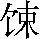
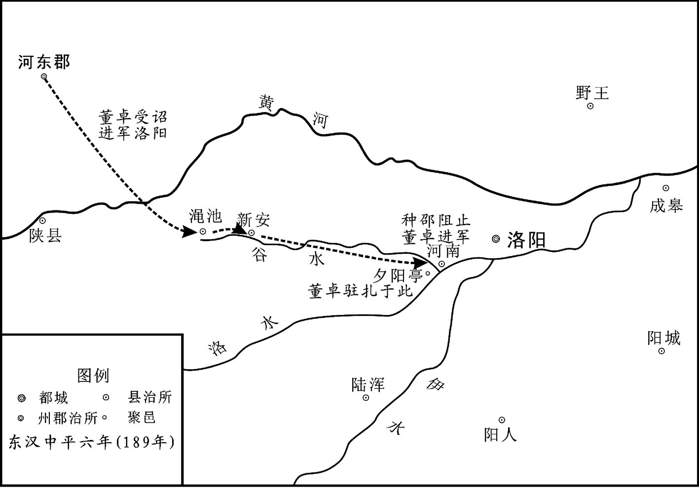
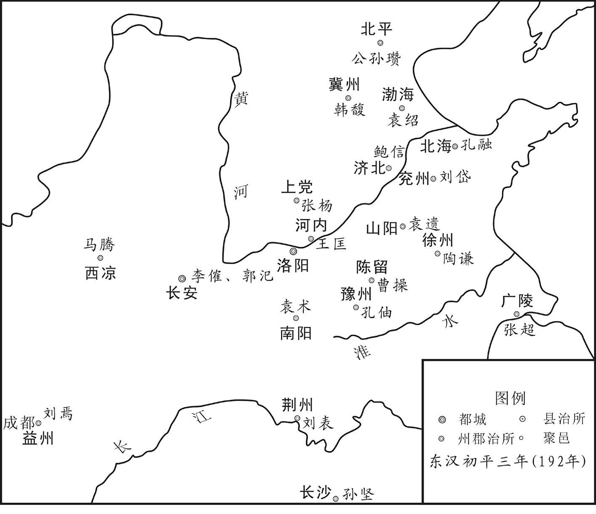
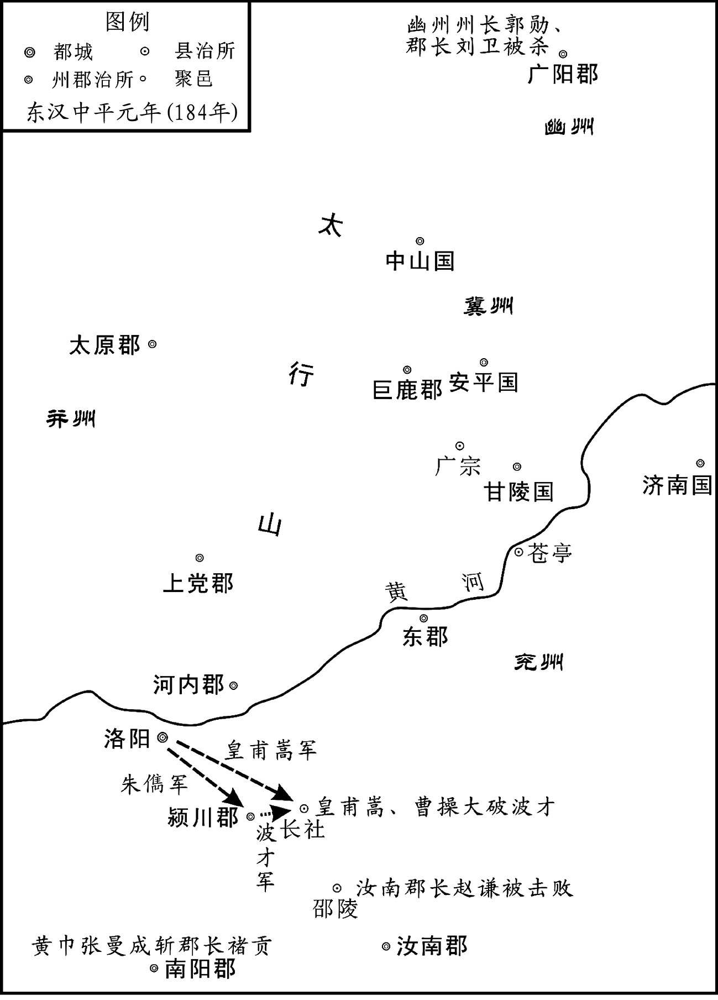
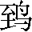
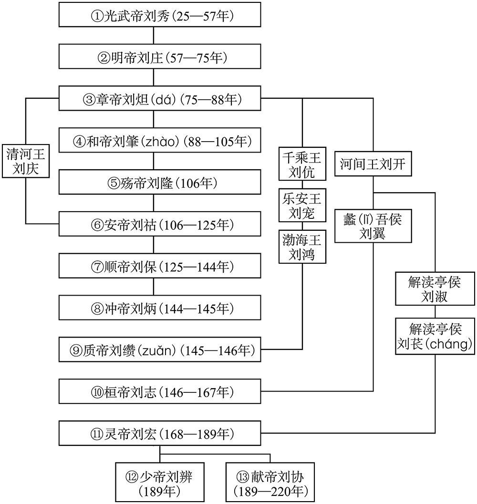
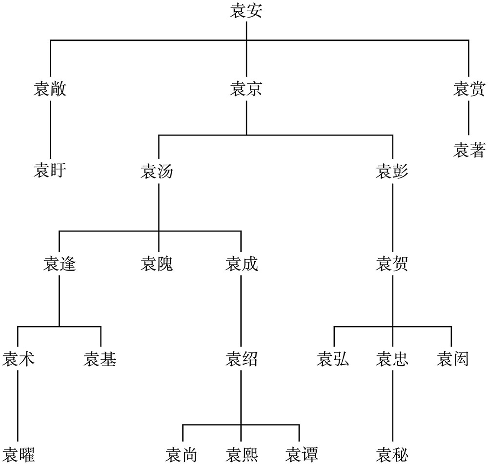

# 目录

宦官亡汉　党锢之祸　董卓之乱

黄巾之乱

韩马之叛

袁绍讨公孙瓒

附录： 
东汉皇帝世系表

袁氏家族世系表

返回总目录

# 宦官亡汉 党锢之祸　董卓之乱 

## 【内容提要】

本篇叙述了东汉政权最后灭亡的经过，涉及许多重大事件，主要有党锢（gù）之祸、黄巾起义、袁绍诛灭宦官以及董卓之乱等。

汉桓帝延熹二年（159年）梁氏外戚集团被消灭后，东汉政权转入宦官手中，形成宦官独霸政权的局面。宦官比外戚更加贪婪、凶残，他们把持朝廷内外的重要官职，欺压百姓，迫害政敌，贪赃枉法，穷奢极欲。宦官的黑暗统治，引起人民的普遍不满和愤恨，激起了反抗斗争。

宦官把持政权，迫使在朝的中下级官吏与在野的名士，以及儒生、太学生等几股力量联合起来，结成了以李膺（yīng）、陈蕃（fán）、范滂（pāng）等人为核心领导者的士人集团，然而宦官集团是不会甘心退出政治舞台的，因此先后制造了东汉历史上两次有名的“党锢之祸”。

士大夫的势力被摧毁后，东汉政权并未得到稳定，统治阶级内部外戚与宦官的斗争仍在进行。汉灵帝之死，何太后临朝，大将军何进辅政，使形势迅速朝着有利于外戚的方面发展。

然而何氏外戚集团在宦官的收买贿赂下，内部出现分歧，使得何进难以决断。何进觉得势单力孤，而求助于中军校尉袁绍等人，袁绍又给何进出谋，征召地方豪强董卓等人进军京都协助诛灭宦官。

宦官集团被消灭后，大权又旁落到董卓之手。由于董卓废少帝刘辨，立陈留王为帝，挟天子以令诸侯，从而导致宗室、豪强以讨伐董卓为名，纷纷起兵，乘机争雄。董卓被刺死后，其势力并未消灭。董卓的部将李傕（jué）、郭汜（sì）、樊稠（chóu）继续控制朝政。相互之间争夺权势，干戈相向，以至关中残破，人口锐减。至此，汉献帝虽然仍在其位，但东汉政权已分崩离析，东汉王朝实际已经灭亡了。外戚与宦官的黑暗统治，终于断送了东汉政权。

## 【原文】

**汉和帝永元四年，窦宪兄弟专权，帝以朝臣上下莫不附宪，独中常侍钩盾令郑众不事豪党，遂与定议诛宪[1]。事见《窦氏专恣》。**

## 【注文】

[1]汉和帝（79—105年）：东汉皇帝，名刘肇（zhào）。公元88年至105年在位，汉章帝子。即位时十岁，窦（dòu）太后临朝，后兄窦宪等专政。东汉永元四年（92年），与宦官郑众定计捕杀窦氏及其党羽后亲政。屡派兵征伐匈奴、羌及西域诸国，并发布减免灾区租、赋之诏。在位期间，西域都护班超曾派人西使大秦（罗马帝国），至西海（波斯湾）被阻而还，为汉使所达最西之地。　　永元：东汉和帝刘肇的第一个年号。元年是公元89年，末年是公元105年，汉朝使用这个年号时间共记十七年。　　窦宪（？—92年）：东汉扶风平陵（今陕西咸阳西北）人，字伯度。因妹为章帝皇后，得任侍中、虎贲（bēn）中郎将，宠贵日盛，至倚势强夺明帝女沁（qìn）水公主园田。和帝时窦太后临朝，与弟笃、景、瓌（guī）并居要职，内执机密，外宣诏命。曾遣客刺杀都乡侯刘畅，事发，自求击匈奴以赎死。永元元年（89年），因南匈奴单于请兵北伐，遂任车骑将军，与执金吾（yù）耿秉率大军出塞，大破北匈奴于稽落山（今蒙古国达兰扎达加德西北），临私渠比鞮（dī）海，出塞三千余里，至燕然山（今蒙古国境内杭爱山），刻石纪功。北匈奴八十一部二十余万人先后归降。迁大将军，位在三公之上。第二年（90年）复遣将破北匈奴于金微山（今新疆西北部阿尔泰山）。与诸弟皆恃权骄纵，横行京师。地方刺史、守令多出其门，朝臣皆望风承旨。永元四年（92年）和帝及宦官郑众等合谋诛除窦氏，他被迫自杀。　　中常侍：官名。西汉元帝时置，为加官，诸侯、将军、卿大夫、尚书、郎中等官员，凡加常侍者，即可出入禁中，常侍皇帝左右。无定员，可多至数十人，任用士人。东汉改为专职，侍从皇帝左右，顾问应对，赞导宫中诸事。初秩千石（shí），后增为比二千石。名义上隶于少府，实则直属皇帝。明帝时定员四人，杂用士人与宦官。和帝时增为十人，并兼领卿署之职。安帝时和熹太后以女主称制，不接公卿，遂成为宦官专职。东汉后期任此职者结党营私，把持朝政，权倾人主。　　钩盾令：官名。西汉隶少府，秩六百石。由宦臣充任，官署设在未央宫中，掌管京城附近皇家苑囿，属官有五丞两尉。甘泉、上林等大苑囿别置专官管理，不属钩盾。东汉名义上仍隶少府，管理京城内外园苑中离宫池观，职任颇大，郑众、蔡伦等皆以中常侍兼任，属官更多，有永安丞、苑中丞、果丞、鸿池丞、南园丞、濯（zhuó）龙监、直里监等。灵帝时或任用士人。　　郑众（？—114年）：东汉南阳犨（chōu）县（今河南鲁山东南）人，字季产。章帝时为小黄门，迁中常侍。和帝时加位钩盾令。不附权威，深得宠信。永元四年（92年），参与谋诛窦宪等人，以功迁大长秋。由是常与议政事，永元十四年（102年）封鄛（cháo）乡侯，宦官弄权干政自此起。

## 【译文】

东汉和帝永元四年（92年），窦宪兄弟独揽大权，和帝认为朝廷中上下的大小官员没有不依附窦宪的，只有中常侍钩盾令郑众不侍奉窦氏集团，于是便与他密谋决定诛杀窦宪。事可参见《窦氏专恣（zì）》。

## 【原文】

**郑众迁大长秋[1]。帝策勋班赏[2]，众每辞多受少，帝由是贤之，常与之议论，宦官用权自此始矣[3]。**

## 【注文】

[1]大长（cháng）秋：官名。秦称将行。汉景帝时改称大长秋，宣达皇后旨意，管理宫中事宜，为皇后的近侍，多由宦官充任。长秋本为汉代皇后所居宫名，其官署称长秋寺。

[2]策：古代帝王对臣下封土、授爵或免官。　　班：本意指瑞玉，引申为赐予或分给。

[3]宦（huàn）官：指阉割后失去男性功能在宫中侍奉皇帝及其家族成员之人。亦称寺人、阉人、阉宦、宦者、中官、内官、内臣、内侍或内监等。其内部等级森严。宦官本为内廷执役的奴仆，明令不得干预外政，但因其接近皇室，历史上常造成宦官专权的局面，东汉即是如此。

## 【译文】

郑众升任大长秋。和帝依据其所立特殊功劳赐勋颁赏他，郑众总是推辞多而接受少，和帝因此认为郑众是位贤臣，常常与他一起讨论朝政大事，宦官专权自此开始。

## 【原文】

**十四年，初封大长秋郑众为鄛乡侯[1]。**

## 【注文】

[1]鄛（cháo）乡：古地名，在今河南南阳南部。　　侯：古爵位名。周朝五等爵的第二等。秦汉实行二十等爵制，最高一级为彻侯，第二级为关内侯，以封同姓或外戚、功臣。彻侯后来避汉武帝刘彻讳改为通侯，又改为列侯。东汉时期，列侯分县侯、乡侯、亭侯三级。

## 【译文】

汉和帝永元十四年（102年），封大长秋郑众为鄛乡侯。

## 【原文】

**安帝永初元年秋九月庚午，太尉徐防以灾异、寇贼策免[1]。辛未，司空尹勤以水雨漂流策免[2]。**

## 【注文】

[1]安帝：即汉安帝刘祜（hù）（94—125年），东汉第六位皇帝（106—125年在位），在位十九年，享年三十二岁，葬于恭陵。谥号孝安皇帝，庙号恭宗。　　永初：汉安帝刘祜的第一个年号，从公元107年到公元113年。　　太尉：官名。秦、西汉为全国性军政长官，与丞相、御史大夫并列，秩万石。汉武帝建元二年（前139年）省。元狩四年（前119年），置大司马，实为太尉改名。东汉改大司马置，列三公之首，与司徒、司空共同行使宰相职权，秩万石。　　徐防（生卒年不详）：东汉沛（pèi）国铚（zhì）（今安徽濉溪）人，字谒（yè）卿。世习《易》学。明帝永平中举孝廉。特补尚书郎，职典枢机。后历任司隶校尉、魏郡太守、少府、大司农、司空、司徒。曾以太学试博士弟子皆重意说，不修家法，乃上疏建议，凡博士及甲乙策试，宜从经典章句，出五十难题以试之，解释多者为上，引文明者为高，后遂施行。东汉殇帝延平元年（106年），迁太尉，参录尚书事。安帝即位，以定策封龙乡侯。不久因灾异及羌乱策免。三公以灾异策免自此始。　　灾异：东汉安帝永初元年（107年）三月有日食，十八个郡国发生地震。汉代认为宰相的职责是调和阴阳、辅佐皇帝，地震、日食都是阴阳不调的表现，是宰相失责，所以要免官。这是东汉第一次因为灾异罢免三公。　　寇贼：指的是东汉永初元年（107年）河西走廊一带的羌人包括烧当羌、滇零、锺羌，反抗东汉政府造反之事。　　策免：帝王以策书免官。

[2]司空：官名。东汉光武帝建武二十七年（51年），改大司空为司空，与太尉、司徒并为三公，分掌宰相职能，秩万石。掌水土工程，名义上分部宗正、少府、大司农三卿，并参议大政，实际上权归尚书，三公上下行文，受成而已。历代沿置，名列三公之末。　　水雨漂流：指大水冲毁百姓房屋等家产。

## 【译文】

东汉安帝永初元年（107年）秋季九月庚午（初一日）这天，太尉徐防因为灾异现象和羌人作乱被免官。辛未（初二日）这天，司空因为大雨水灾，被免除官职。

## 【原文】

**仲长统《昌言》曰：光武皇帝愠数世之失权，忿强臣之窃命，矫枉过直，政不任下，虽置三公，事归台阁[1]。自此以来，三公之职，备员而已；然政有不治，犹加谴责。而权移外戚之家，宠被近习之竖，亲其党类，用其私人，内充京师，外布列郡，颠倒贤愚，贸易选举，疲驽守境，贪残牧民，挠扰百姓，忿怒四夷，招致乖叛，乱离斯瘼，怨气并作，阴阳失和，三光亏缺，怪异数至，虫螟食稼，水旱为灾[2]。此皆戚宦之臣所致然也，反以策让三公，至于死、免，乃足为叫呼苍天，号咷泣血者矣[3]。昔文帝之于邓通，可谓至爱，而犹展申屠嘉之志[4]。夫见任如此，则何患于左右小臣哉！至如近世，外戚宦竖，请托不行，意气不满，立能陷人于不测之祸，恶可得弹正者哉[5]！**

## 【注文】

[1]仲长统（179—220年）：东汉山阳高平（今山东微山西北）人，字公理。少好学，博览群书，擅长文辞。年二十余游学青、徐、并、冀各州。不拘小节，时人或称之为狂生。州郡辟（bì）召，多称病不就。到汉献帝时，尚书令荀彧（yù）闻其名，举为尚书郎，后参丞相曹操军事，著有《昌言》十余万言，对战国以来社会治乱及当时豪强地主之骄奢淫逸多有论述，并流露出反“天命”的思想。《后汉书·仲长统传》录有《昌言》的《理乱篇》《损益篇》和《法诫篇》。　　《昌言》：书名。全名为《仲长子昌言》。东汉末仲长统著。据《后汉书》本传说：“凡三十四篇，十余万言。”后大部分佚失，所存仅十分之一二。保存在《后汉书》和《群书治要》中，另有清代严可均辑本二卷。内容主要提出“人事为本，天道为末”的论点，暴露当时社会的黑暗现实，批判汉初以来的神学传统思想。　　光武皇帝：即汉光武帝刘秀（前6—57年）。东汉创建者。25年至57年在位。汉高祖九世孙。南阳蔡阳（今湖北枣阳西北）人，字文叔。早年与兄刘（yǎn）等率宾客起兵加入绿林起义军。刘玄称帝后，授为太常偏将军。西汉更始元年（23年）与王凤所率起义军配合，取得昆阳之战胜利，歼灭王莽军主力。刘因争权被杀后，乃隐忍伪装，言笑如常，以此取得更始帝及诸大将信任。不久被派往河北，以恢复汉家制度为号召，取得当地部分官吏豪强的支持，镇压并收编铜马等起义军，势力大增。被封为萧王后，即拒绝更始召命。东汉建武元年（25年）在鄗（hào）（今河北柏乡北）称帝。后镇压赤眉起义军，削平各地割据势力，统一全国，建都洛阳。即位之初，采取休养生息政策，减免赋税、徭役，裁省吏员；多次下诏释放及禁止残害奴婢，使大批奴婢免为庶民；提倡兴修水利，发展农业生产，实行度田，检核垦田和户口，不久因遭到强烈反抗而失败；又加强中央集权，削弱三公职权，全国政务皆通过尚书台而总揽于皇帝；妥善安置功臣，赐其高爵厚禄而不使干预政事，禁止外戚、宦官干政；裁并四百余县，取消内郡地方兵，裁撤郡都尉，削弱地方兵权，扩大中央直接统辖的军队。统治期间，社会生产发展，专制主义中央集权得到加强，史称“光武中兴”。　　愠（yùn）：怒、怨恨。　　数世之失权：指西汉末年皇权被外戚王氏掌握。　　强臣之窃命：指王莽窃取西汉王朝，建立新朝。　　三公：周代三公有两说：一说司马、司徒、司空为三公，一说太师、太傅、太保为三公。西汉时以丞相（大司徒）、太尉（大司马）、御史大夫（大司空）合称三公。东汉时以太尉、司徒、司空合称三公。又称三司。为共同负责国家军政的最高长官。　　台阁：东汉至隋唐对尚书台（省）的别称。

[2]权移外戚之家：指的是东汉中期以后，因为皇帝即位时幼小，皇权为几大外戚家族轮流掌握。　　近习之竖：主要指东汉中期以后掌权的宦官。近习：亲近。竖：旧称未成年的童仆，小臣。　　疲驽（nú）：衰老的劣等马。常用以自谦﹐言愚钝无能。此处比喻不才之吏。　　瘼（mò）：病。　　三光：日、月、星为三光。　　螟（míng）：螟蛾的幼虫，有许多种，如“三化螟”“玉米螟”等，危害农作物。

[3]咷（táo）：号哭、大哭。

[4]文帝：即汉文帝刘恒（前202—前157年）。西汉皇帝。公元前180至前157年在位。高祖之子。汉高祖刘邦十一年（前196年）立为代王。西汉高后八年（前180年），吕后死后，周勃等平定诸吕之乱，他以代王入为皇帝。执行“与民休息”的政策，减轻地税、赋役和刑狱，使农业生产有所恢复发展。又削弱诸侯的势力，以巩固中央集权。旧史家把他同景帝统治时期并举，称为“文景之治”。　　邓通（生卒年不详）：西汉蜀郡南安（今四川乐山）人。初为黄头郎，深得文帝宠幸，官至上大夫，赏赐财物无数。又赐以严道铜山，许其自铸钱，以此邓氏钱遍天下。文帝病痈时，亲为嗽吮患处。文帝使太子（即景帝）为之，太子面有难色，邓通从此为太子所怨。及景帝立，即被免官家居。后为人告发私出徼外铸钱，家产尽没入官。遂寄食人家，穷困而死。　　申屠嘉（？—前155年）：西汉梁国（治今河南商丘睢阳区）人。初跟从高祖击项羽、英布，为都尉。惠帝时为淮阳守。西汉文帝元年（前179年）封关内侯。后迁御史大夫、丞相，封故安侯。为人廉直，不受私谒（yè）。文帝宠臣邓通入朝失礼怠慢，欲依法论斩，文帝急遣使者说情，乃罢。景帝时晁错贵幸用事，数变更法令，他因恶之。后以晁错穿宗庙垣为门事，奏请诛之，景帝不从，气愤呕血而死。

[5]恶：古同“乌”，疑问词，哪，何。

## 【译文】

仲长统在《昌言》中评论说：光武皇帝因汉王朝数世皇权旁落而恼怒，对强悍的大臣窃取皇权深为愤恨，因此他纠正以前的过失，却过了头，致使权力不交给臣下，虽然设置了太尉、司徒、司空三公，但政事却由尚书台掌管。从此以后，三公的职责，只是充数而已。然而，当国家治理出现问题的时候，却对三公加以谴责。而朝政大权却转移到皇后家族手中，皇帝宠信身边的宦官，这些人亲近自己的同类党羽，任用自己人，在内充斥京师，在外遍布各郡，贤能愚劣被颠倒，以私人交易来选拔人才，使无能无才的人守卫边境，贪婪残暴的人统治人民，他们骚扰百姓，激怒了四方各族，终于导致了反叛，混乱给国家和人民带来忧患与疾苦，各地怨恨之气同时兴起，阴阳失和，日、月、星出现缺损，怪异现象不断出现，害虫吞食庄稼，水旱成灾。这种情况的出现都是外戚宦官专权所造成的，朝廷反而颁布策书责备三公，甚至将三公处死、免官，这足以使人为此叫呼苍天，号哭泣血。从前汉文帝对邓通，可以说是宠爱有加，而申屠嘉仍然可以实现自己的宏图大志，对邓通实施了惩罚。官员受到如此的信任，对皇帝左右的小臣还有什么可顾忌的呢！可是到了近代，外戚宦官私人嘱托的事，如果办不成，他们就心怀不满，立刻使你陷入意外的灾祸之中，哪里还敢弹劾纠正他们呢！

## 【原文】

**大长秋郑众、中常侍蔡伦等皆乘势豫政[1]。周章数进直言，太后不能用[2]。**

## 【注文】

[1]蔡伦（约62—121年）：东汉桂阳（今湖南郴州）人，字敬仲。宦官。少好学。明帝后期入宫，章帝时为小黄门，和帝即位转为中常侍，参与政事，加位尚方令。汉安帝元初元年（114年）封龙亭侯，后为长乐太仆。历经明、章、和、安四帝，服事宫廷四十余年。及邓太后死，安帝亲政，以窦后诬陷安帝祖母宋贵人之往事被牵连，遂自杀。有巧思，监作御用器物，精工坚密。曾改进西汉以来用丝麻纤维造纸的技术，以树皮、麻头、破布、旧渔网为原料造纸，使造纸质量提高，原料易得。汉和帝元兴元年（105年）奏报朝廷，时称“蔡侯纸”，后世遂以蔡伦作为造纸术的发明人。　　豫：同“预”，干预。

[2]周章（？—107年）：东汉南阳随（今湖北随州）人，字次叔。和帝时为郡功曹。曾谏阻太守阿附外戚窦宪，以此受器重，得举孝廉。历任五官中郎将、光禄勋、太常。安帝永初元年（107年）为司空。因中常侍郑众、蔡伦等干预朝政，数进直言。后图谋诛车骑将军邓骘（zhì）兄弟及郑众等，并废安帝及邓太后，立平原王刘胜为帝，事败自杀。

## 【译文】

大长秋郑众与中常侍蔡伦等人依靠权势干预朝政。周章曾多次直言劝谏，但邓太后都不采纳。

## 【原文】

**建光元年，帝以江京尝迎帝于邸，封为都乡侯，李闰为雍乡侯[1]。闰、京与中常侍樊丰、黄门令刘安、钩盾令陈达等扇动内外，竞为侈虐[2]。司徒杨震上疏，不省[3]。**

## 【注文】

[1]建光：汉安帝刘祜（hù）的第四个年号，自建光元年（121年）七月到建光二年（122年）三月，建光二年三月改元为延光元年。　　江京（？—125年）：东汉人。初为小黄门，善谗谄，以迎立安帝封都乡侯，迁中常侍，兼大长秋。后任长乐太仆。与安帝乳母王圣，外戚耿宝、阎显等结为私党，干乱朝政，合谋废皇太子刘保为济阴王，枉杀太尉杨震。安帝死，又与阎显等定策立北乡侯刘懿（yì）为帝（即少帝）。少帝病死，与宦官孙程等十九人拥立刘保为顺帝。后被杀。　　邸（dǐ）：古时为朝见天子在京城设置的住宅称为邸，也指王侯府第。这里指王侯府第。　　都乡：西汉属于常山郡，东汉属于常山国，在今河北省石家庄市附近。　　雍乡：东汉属于陈留郡，在今河南开封附近。

[2]樊丰（？—125年）：东汉人，宦官。安帝时为中常侍。东汉建光元年（121年）安帝亲政后，与宦官江京、帝乳母王圣等用事朝中，贪侈枉法，干乱朝政，合谋废皇太子刘保为济阴王。又乘安帝出巡，诈作诏书，调发钱谷、木材，大起宅第苑囿。太尉杨震上疏告发，反遭诬陷，被逼令自杀。东汉延光四年（125年）安帝死后，为外戚阎显所杀。　　黄门令：官名。西汉少府属官。掌宫中乘舆狗马倡优鼓吹等事。职任亲近，由宦官充任。有技艺才能者常在其署待诏。东汉名义上隶少府，主宫中诸宦者，秩六百石。中叶以后多以中常侍兼任，或典禁军，或持节收捕大臣，权势尤盛。　　侈虐：恣（zì）肆暴虐。

[3]司徒：官名。三公之一。东汉光武帝建武二十七年（51年），改大司徒为司徒，与太尉、司空并为三公，分掌宰相职能，秩万石。本职掌民政，年终考课州郡长官，名义上分部太仆、大鸿胪（lú）、廷尉三卿，并参议大政，实际上权归尚书，三公上下行文，受成而已。东汉末罢，改置丞相。　　杨震（？—124年）：东汉弘农华阴（今陕西华阴东南）人，字伯起。博览经籍。有“关西孔子杨伯起”之称。年五十始仕州郡，初为大将军邓骘（zhì）所辟（bì），举茂才，历任荆州刺史，东莱、涿（zhuō）郡太守，太仆、太常。安帝永宁元年（120年）为司徒，延光二年（123年）为太尉。屡次劾奏帝乳母王圣及中常侍樊丰等弄权朝中，贪奢骄横。又触犯外戚耿宝、阎显。延光三年（124年）为樊丰所诬，免归本郡。以居重位不能禁奸佞（nìng），愤而饮鸩（zhèn）自杀。虽历居高位，而子孙常蔬食步行。亲旧有人劝他置产业以贻子孙，他说：“使后世称为清白吏子孙，以此遗之，不亦厚乎！”顺帝即位，樊丰等诛死，朝廷咸称其忠，乃下诏以礼改葬。子杨秉、孙杨赐、曾孙杨彪皆位至太尉，弘农杨氏为东汉有名的世家大族。

## 【译文】

东汉安帝建光元年（121年），汉安帝因当年江京曾到清河邸迎接自己入宫即皇位，便封他为都乡侯，李闰被封为雍乡侯。李闰、江京与中常侍樊丰、黄门令刘安、钩盾令陈达等人嚣张于朝廷内外，竞相奢侈暴虐。司徒杨震上疏，皇帝不予理睬。

## 【原文】

**延光二年，中常侍樊丰等更相扇动，倾摇朝廷[1]。杨震上疏，不听。**

## 【注文】

[1]延光：东汉皇帝汉安帝刘祜的第五个年号，122年至125年。汉朝使用这个年号时间共计四年。建光二年三月改元为延光元年。延光四年三月北乡侯刘懿（yì）即位沿用，同年十一月汉顺帝即位沿用。　　倾摇：动摇。

## 【译文】

东汉安帝延光二年（123年），中常侍樊（fán）丰等人更加相互煽动怂恿，动摇朝廷。杨震继续上疏，皇帝不听。

## 【原文】

**三年，樊丰等见杨震连谏不从，无所顾忌。震复上疏，丰等惶怖，遂共谮震，收震太尉印绶，遣归本郡，震饮鸩而卒[1]。**

## 【注文】

[1]惶怖：恐惧。　　谮（zèn）：说别人坏话，诬陷，中伤。　　鸩（zhèn）：传说中的一种毒鸟，把它的羽毛泡在酒里，喝了可以毒死人。这里指用鸩的羽毛泡成的毒酒。

## 【译文】

东汉安帝延光三年（124年），樊丰等人见到杨震连续上疏劝谏，皇帝均不采纳，更加有恃无恐，无所顾忌。杨震再次上疏，樊丰等人惶恐不安，于是共同诬陷杨震，收回杨震的太尉印信，将他遣送回弘农郡，杨震服毒酒而死。

## 【原文】

**秋八月，江京、樊丰等废太子保为济阴王[1]。**

## 【注文】

[1]太子保：即汉顺帝刘保（115—144年）。公元125年至144年在位。安帝子。汉安帝永宁元年（120年）立为太子。延光三年（124年）废为济阴王。次年（125年），安帝死，宦官江京等立北乡侯刘懿（yì）为少帝，少帝不久去世。宦官孙程等杀江京迎立其为帝。孙程等十九名宦官封侯。外戚梁商、梁冀（jì）相继为大将军，朝政操于宦官、外戚之手。　　济阴：济阴郡。汉朝郡名。西汉景帝中元六年（前144年）从梁国分出，始为国，第二年为郡，治所在定陶（今山东菏泽定陶西北），辖区南至山东定陶、北至河南濮阳范县濮（pú）城镇。东汉，初为定陶国，不久，改为济阴郡。东汉永平十五年（72年），刘长被封为济阴王，立十二年，元和元年卒，因无后，国除，复为济阴郡。东汉延光三年（124年），汉安帝太子刘保被废为济阴王，延光四年（125年）刘保即皇帝位，济阴复为郡。汉献帝建安十七年（212年），济阴复为国。

## 【译文】

东汉安帝延光三年（124年）秋季八月，江京、樊丰等将太子刘保废黜（chù），改封为济阴王。

## 【原文】

**四年［春三月］，北乡侯即位[1]，有司奏樊丰等互作威福，皆下狱死。**

## 【注文】

[1]北乡：侯国名，属于齐郡，在今山东济南附近。

## 【译文】

东汉安帝延光四年（125年）春季三月，北乡侯即皇帝位，有关部门上奏樊丰等人互相勾结，作威作福，樊丰等人都被下狱处死。

## 【原文】

**冬十月，中常侍孙程等迎济阴王即皇帝位[1]。五事并见《嬖幸废立》。**

## 【注文】

[1]孙程（？—132年）：东汉涿（zhuō）郡新城（今河北保定徐水）人，字稚卿。安帝时为中黄门。后与中黄门王康等十八人拥立顺帝，诛外戚阎氏、宦官江京等。以此封浮阳侯，任骑都尉，王康等亦同日封侯，时称“十九侯”。后以过免官，徙封宜城侯。东汉阳嘉元年（132年），拜奉车都尉，位特进，后养子孙寿袭封，开宦官以养子袭爵之始。

## 【译文】

东汉安帝延光四年（125年）冬季十月，中常侍孙程等人迎接济阴王刘保即皇帝位。五事都参见《嬖幸废立》。

## 【原文】

**顺帝阳嘉二年夏六月丁丑，洛阳宣德亭地拆，长八十五丈[1]。帝引公卿所举敦朴之士，使之对策及特问以当世之敝，为政所宜。李固对曰：“诏书所以禁侍中、尚书、中臣子弟不得为吏、察孝廉者，以其秉威权容请托故也[2]。而中常侍在日月之侧，声势振天下，子弟禄任，曾无限极，虽外托谦默，不干州郡，而谄伪之徒，望风进举。今可为设常禁，同之中臣。昔馆陶公主为子求郎，明帝不许，赐钱千万[3]。所以轻厚赐，重薄位者，为官人失才，害及百姓也。窃闻长水司马武宣、开阳城门候羊迪等，无他功德，初拜便真，此虽小失，而渐坏旧章。先圣法度，所宜坚守，故政教一跌，百年不复，《诗》云‘上帝板板，下民卒瘅’，刺周王变祖法度，故使下民将尽病也[4]。今陛下之有尚书，犹天之有北斗也。斗为天喉舌，尚书亦为陛下喉舌。斗斟酌元气，运平四时；尚书出纳王命，赋政四海，权尊势重，责之所归，若不平心，灾眚必至，诚宜审择其人，以毗圣政[5]。今与陛下共天下者，外则公卿、尚书，内则常侍、黄门，譬犹一门之内，一家之事，安则共其福庆，危则通其祸败。刺史、二千石外统职事，内受法则[6]。夫表曲者景必邪，源清者流必洁，犹叩树本，百枝皆动也。由此言之，本朝号令，岂可蹉跌！天下之纪纲，当今之急务也。夫人君之有政，犹水之有堤防；堤防完全，虽遭雨水霖潦不能为变；政教一立，暂遭凶年不足为忧。诚令堤防穿漏，万夫同力不能复救，政教一坏，贤智驰骛不能复还。今堤防虽坚，渐有孔穴。譬之一人之身，本朝者，心腹也，州郡者，四支也[7]。心腹痛则四支不举，故臣之所忧在腹心之疾，非四支之患也。苟坚堤防，务政教，先安心腹，整理本朝，虽有寇贼、水旱之变，不足介意也。诚令堤防坏漏，心腹有疾，虽无水旱之灾，天下固可以忧矣。又宜罢退宦官，去其权重，裁置常侍二人，方直有德者省事左右；小黄门五人，才智闲雅者给事殿中。如此，则论者厌塞，升平可致也。”上览众对，以李固为第一。诸常侍叩头谢罪，朝廷肃然。以固为议郎，宦者疾之，诈为飞章以陷其罪[8]。事从中下，大司农南那黄尚等请之于梁商，仆射黄琼复救明其事，久乃得释，出为洛令，固弃官归汉中[9]。**

## 【注文】

[1]阳嘉：东汉皇帝汉顺帝刘保的第二个年号。132年至135年，汉朝使用这个年号时间共记四年。　　洛阳：都城名。中国古都之一。三国前作雒阳，三国魏改洛阳。后也有通用。周成王时周公营雒邑，为成周城所在。战国改称雒阳，以在雒水（今河南洛河）北得名。秦置县，为三川郡治所。

[2]李固（94—147年）：东汉汉中南郑（今陕西汉中）人，字子坚。少显名京师。初为议郎，大将军梁商请为从事中郎。曾上书力陈宦官、外戚擅权之弊，又规劝梁商整肃朝纲，不纳。顺帝永和年间，任荆州刺史、泰山太守，招抚境内起义农民。后历任将作大匠、大司农。冲帝即位，任太尉，与大将军梁冀共参录尚书事。冲帝死，力主立年长之清河王刘蒜，与冀梁相忤（wǔ）。质帝被梁冀鸩（zhèn）死，又请立刘蒜，以此黜（chù）免。桓帝建和元年（147年），刘文、刘鲔（wěi）等谋立刘蒜为天子事发，他被梁冀诬为与刘文等共为妖言，遂下狱死。　　侍中：古代职官名。秦始置，两汉沿置，为正规官职外的加官之一。因侍从皇帝左右，出入宫廷，与闻朝政，逐渐变为亲信贵重之职。晋以后，曾相当于宰相。隋因避讳改称纳言，又称侍内。唐复称侍中，为门下省长官，乃宰相之职。五代北宋主要作为高级官员的阶官使用，南宋废止。　　尚书：战国时亦作“掌书”，齐国、秦国均置。秦代属少府，秩六百石，为低级官员，在殿中主发布文书。秦及汉初与尚冠、尚衣、尚食、尚浴、尚席称“六尚”。武帝时，选拔尚书、侍中组成“中朝”（或称内朝），成为实际上的中央决策机关，因系近臣，地位渐高。和御史、史书令史等都是由太史选拔。在汉宣帝时期权势就已经很高。魏晋以后，随着尚书省地位提高，六曹尚书与左右仆射（yè）号称“八座”。隋唐时期，尚书正三品，地位很高。　　中臣：即中朝官。是汉武帝时为加强皇权，选用一些亲信侍从如尚书、常侍等组成宫中的决策班子，称为“中朝”或“内朝”。包括大司马、左右前后将军、侍中、常侍、散骑诸吏等官员。　　孝廉：孝廉是孝顺父母、办事廉正的意思。始于汉武帝元光元年（前134年），汉武帝采纳董仲舒建议，下诏郡国每年察举孝者﹑廉者各一人，这种察举就通称为举孝廉，是察举制常科中最主要、最重要的科目。汉代“名公巨卿多出之”，是汉代政府官员的重要来源。汉顺帝阳嘉元年（132年），根据尚书令左雄的建议，规定应孝廉举者必须年满四十岁；同时又制定了“诸生试家法、文吏课笺奏”这一重要制度。从此以后，孝廉科因而也由一种地方长官的推荐制度开始向中央考试制度过渡。东汉后期，举孝廉多为豪族垄断，出现“举秀才，不知书；举孝廉，父别居”的情况。

[3]馆陶公主（生卒年不详）：即窦嫖、馆陶长公主。号窦太主，汉文帝之女，汉武帝姑母。武帝得以胶东王立为皇太子，很得她的帮助。开始是堂邑侯陈午的妻子。陈午死后寡居。年五十余，嬖（bì）幸董偃（yǎn），穷极奢侈。　　明帝（28—75年）：即汉明帝刘庄。东汉皇帝。公元57年至75年在位。原名阳。光武帝第四子。汉光武帝建武十五年（39年）封东海公。十七年（41年），晋爵为王。十九年（43年），立为皇太子。汉光武帝中元二年（57年）即位。遵奉光武制度，整顿吏治，严明法令。禁止外戚封侯预政，皇子之封亦减旧制。提倡儒术，亲临辟（bì）雍，行养老礼，尊事三老五更，又为外戚樊、郭、阴、马子弟立四姓小侯之学。数发兵进击北匈奴，遣班超经营西域，西域诸国皆遣子入侍。又派郎中蔡愔（yīn）出使天竺（zhú）求佛法。性偏察，公卿数被谴责，近臣尚书以下至受捶（chuí）扑。在位期间，省减租徭，修治汴（biàn）河，民生比较安定。史载东汉永平末，连年丰收，百姓殷富。后世史家将其与章帝统治时期并称为“明章之治”。庙号显宗。

[4]《诗》：即《诗经》。中国最早的诗歌总集。儒家列为经典之一，故称《诗经》。编成于春秋时代，流传至今的有三百零五篇，分《风》《雅》《颂》三部分。所收作品上起周初，下至春秋中叶，大部分是今陕西、甘肃、山东、山西、河南等地民歌，小部分是贵族作品。《史记》《汉书》等书认为曾经孔子删定。书中：风，包括《周南》《召南》《邶风》《鄘风》《卫风》《郑风》《齐风》《魏风》《唐风》《秦风》《陈风》《桧风》《曹风》《豳（bīn）风》十五国风，共计一百六十篇。　　瘅（dàn）：因劳累造成的病。

[5]斟酌：执掌。　　灾眚（shěng）：灾祸。　　毗（pí）：通“弼”，辅助。

[6]刺史：官名。汉武帝元封五年（前106年）始置，分全国为十三部（州），各置刺史一人，秩六百石。无治所，奉诏巡行诸郡，以六条问事，省察治政，断理冤狱。所察对象主要是二千石长吏，其次为强宗豪右，诸侯王亦在督察之列。成帝绥（suí）和元年（前8年）更名州牧，秩二千石。哀帝建平二年（前5年）复旧制，元寿二年（前1年）又改名州牧。东汉光武帝建武十一年（35年）省。十八年（42年）仍置，秩六百石。西汉刺史常以八月巡视所部郡国，岁尽诣京都奏事。东汉不令自诣，属吏有从事史、假佐，员职略与司隶校尉同，有固定治所，实际上成为比郡守高一级的地方行政长官，权力增大，除监察权外，又有选举、劾奏之权，有权干预地方行政，又常拥有领兵之权。汉灵帝中平五年（188年），太常刘焉以刺史威轻，建议改置州牧，遂选群臣以居其任。　　二千石（shí）：官秩等级，因所得俸禄以米谷为准，故以“石”称之。汉代二千石为中央政府机构的太子太傅、太子少傅、将作大匠、詹事、水衡都尉、内史等列卿，以及州郡牧守、诸侯王国相一级官员。月俸谷一百二十斛，一年得谷一千四百四十斛。另有中二千石、比二千石、真二千石。

[7]四支：即四肢。

[8]议郎：官名。西汉置，隶光禄勋。为高级郎官，不入值宿卫，职掌顾问应对，参与议政，指陈得失，为皇帝近臣。秩比六百石。东汉更为显要，常选任耆（qí）儒名士、高级官吏，除议政外，亦或给事宫中近署。

[9]大司农：官名。西汉武帝太初元年（前104年）改大农令设。简称大农。秩中二千石，列位九卿。掌管全国租赋收入和国家财政开支，凡百官俸禄、军费、各级政府机构经费等皆由其支付，兼理各地仓储、水利和官府农业、手工业、商业的经营，调运货物，管制物价等。有丞二员、部丞若干员。属官有太仓、均输、平准、都内、籍田五令丞，斡官、铁市两长丞。郡国诸仓、农监、都水六十五官长、丞皆属之，边郡的农都尉等屯田官员亦归其统属。新莽时先后改名羲和、纳言。东汉后机构减少，置丞、部丞各一员，属官有太仓、平准、导官三令丞，余皆罢省。地方都水、盐铁等官划归郡县主管。原属少府管理的帝室财政开支则并归大司农。　　梁商（？—141年）：东汉安定乌氏（今宁夏固原东南）人，字伯夏。少以外戚拜郎中，迁黄门侍郎。顺帝永建元年（126年）继承爵位为乘氏侯。阳嘉元年（132年），其女及妹被立为皇后、贵人，遂加位特进，任执金吾（yù）。四年（135年），拜大将军，备受宠信。曾辟（bì）名儒周举等为从事中郎，以笼络人心。又遣子梁冀等与掌权宦官曹节等结交。后几为宦官所害。病卒。　　仆射（yè）：官名。秦始置，汉以后因之。汉成帝建始四年（前29年），初置尚书五人，一人为仆射，位仅次尚书令，职权渐重。汉献帝建安四年（199年），置左右仆射。　　黄琼（86—164年）：字世英。江夏安陆（今湖北安陆）人。东汉时期名臣、魏郡太守黄香之子。因父亲关系任太子舍人，五府共同征辟，都不应。永建年间，被征拜为议郎，迁尚书仆射，进位尚书令。后又出任魏郡太守、太常、司空、太仆、司徒、太尉、司空等职。　　洛令：官名。洛阳县令。　　汉中：古郡名。治所在南郑（今陕西汉中汉台区）。秦置，汉沿用。辖境相当于今陕西秦岭以南，留坝、勉县以东，乾佑河流域以西及湖北部分地区，粉青河、珍珠岭以北地。

## 【译文】

东汉顺帝阳嘉二年（133年）夏季六月丁丑（初八日），京师洛阳宣德亭发生地裂，长达八十五丈。皇帝召集三公九卿推举敦厚朴实之士，让他们提出对策，尤其要提出当代的弊病及如何纠正的措施。李固回答说：“陛下的诏书之所以禁止侍中、尚书、中朝大臣的子弟不得为吏，不参加孝廉的推举，是因为他们把持权柄和威势，容易私下请托的缘故。而中常侍在皇帝皇后身边，声威和气势振天下，他们的子弟任官享受俸禄是没有限度的，虽然中常侍表面上谦虚沉默，不干预州郡的事情，但是谄媚虚伪的人，一有消息就会举荐。所以，从现在起就要为他们常设禁令，和宫中大臣们一样。从前馆陶公主为他儿子请求任郎官的职务，明帝没有允许，只赏赐她千万钱。明帝之所以以巨额赏赐为轻，却以小小的官位为重，是因为若任命的官吏没有才能，会危害百姓。我听说长水司马武宣、开阳城门候羊迪等，没有什么功劳和品德，任命后，没有经过一年的试守，便直接担任实职，这虽是小小的过失，但却逐渐破坏了过去的规章制度。先朝圣王制定的法律制度，应该继续坚守，政治或教化一旦出现问题，一百年都难恢复，《诗经》说‘上帝乖戾无情，下民就只有劳累痛苦而已’，是用以讽刺周王改变先祖的法令制度，使百姓深受其害。如今陛下有尚书，犹如天上有北斗星。北斗星是上天的喉舌，尚书也是陛下的喉舌。北斗星执掌元气，使四时正常运行；尚书传达皇帝的诏命，使政令颁布于天下，权尊势重，责任巨大，如果不能公平正直，灾祸必定会降临，因此要审慎地挑选贤能人才，使尚书能辅佐君王治理天下。而今，与陛下共同掌管天下的，在外则有公卿大臣、尚书，在内则有常侍、黄门，如同一个门内一家的事，平安时大家共同享受福禄，危难时则大家共同承受灾祸。刺史、二千石官员，在外统管朝廷之事，在内受朝廷法律的约束。标杆弯曲，测出的日影一定会歪斜，水的源头清澈，水流必然也会清洁，如同敲击树根，整个树的枝叶都会摆动。由此说来，朝廷的号令，怎么可以失误呢！天下的法令制度，是当今最紧急的政务。国君有政令，犹如河流有堤防；堤防完整，即使遭受连绵大雨也不能成为灾害；政治与教化一经确立，即使遇有灾年也不足以忧愁。如果使堤防穿洞，虽有万人同心协力也不能再挽救，政治和教化一旦被破坏，就是让贤能智者四处奔走努力，也不能再恢复了。现在堤防虽然坚固，但渐渐有了洞穴。如同一个人的身体，朝廷是心腹，州郡则是四肢。心腹疼痛则四肢不能举起，所以臣所忧虑的是心腹的疾病，不是四肢的毛病。如能使堤防巩固，致力于政治教化，先安定心腹，整理本朝，即使有盗匪寇贼、水灾旱灾发生，也不必挂在心上。如果堤防破漏了，心腹有了疾病，即使没有水旱之灾，天下也会让人担忧的。再有，应该罢黜（chù）宦官，削减他们的权力，裁置常侍二人，让有德行的人侍奉在皇帝左右；让有才智、娴（xián）静高雅的小黄门五人，在宫廷内供职。如此，批评就会停止，天下太平就会实现。”顺帝看过大家的对策，将李固排在第一位。各位常侍都叩头谢罪，朝廷法纪严肃。皇帝任命李固为议郎，但宦者都痛恨李固，捏造他的罪状，写匿名黑信陷害他。于是皇帝下令查办李固，大司农南郡人黄尚等请求梁商查清事实，仆射黄琼又上书说明事实真相。过了很久，李固才被释放，调离朝廷，去任洛阳县令。李固却辞职，回到汉中。

## 【原文】

**四年春二月，初听中官得以养子袭爵。初，帝之复位，宦官之力也，由是有宠，参与政事。御史张纲上书曰：“窃寻文、明二帝，德化尤盛，中官常侍，不过两人，近幸赏赐，裁满数金，惜费重民，故家给人足[1]。而顷者以来，无功小人，皆有官爵，非爱民重器，承天顺道者也。”书奏，不省。**

## 【注文】

[1]御史：官名。西周为侍从属吏，同“御事”。春秋战国置为史官，本职掌记录国事、君王言行，接受、保管文书等；因侍从君主左右，为亲近之职，常执行临时性差遣。秦、韩等国常奉遣监察郡、县、军队。秦或奉使出外调查审理重大案件，收捕罪犯。秦代置御史大夫为其长官，御史监郡成为定制，亦称“监御史”“郡监”。西汉置四十五员，为御史大夫属官，其中三十员留御史府（御史大夫官署），由御史丞统领，监察考课百官政务，亦或受遣出使，执行专项监察任务；十五员入侍殿中，由御史中丞统领，称“侍御史”，职权尤重，依其职务、差遣之不同，又有符玺（xǐ）御史、治书御史、绣衣直指御史、监军御史等名目。西汉前期犹以御史监郡。武帝时改置诸州刺史。新莽改名“执法”。东汉罢御史府，置御史台，以御史中丞为长官，设侍御史十五员。两汉侍御史皆可简称御史，西汉御史府、御史大夫亦或简称御史。　　张纲（108—143年）：东汉犍为武阳（今四川眉山彭山东）人，字文纪。顺帝时为侍御史，上书抨击宦官专权。汉顺帝汉安元年（142年），与杜乔、周举等人为使者循察州郡。行前埋车轮于洛阳都亭，以为“豺狼当路，安问狐狸”。不久参奏当权外戚大将军梁冀、冀子河南尹梁不疑，京师为之震动。后任广陵太守，诱降张婴农民起义军。卒于任。

## 【译文】

东汉顺帝阳嘉四年（135年）春季二月，顺帝首次允许宦官以养子继承爵位。最初，顺帝能够恢复帝位，是依靠宦官的力量，因此宦官受到皇帝的宠爱，参与朝廷中的政事。御史张纲上书说：“据我研究文帝和明帝，对德行教化都很重视，宫中的中常侍，也不过两人，对亲信的赏赐，也只是黄金数斤。珍惜钱财，重视百姓，因此，天下家家富足。但是，近几年以来，无功的小人都封有官爵，这不是爱民、重视人才、顺承天命的做法。”奏书呈上之后，顺帝不理。

## 【原文】

**永和元年十二月，以前司空王龚为太尉[1]。龚疾宦官专权，上书极言其状。诸黄门使客诬奏龚罪，上命龚亟自实。李固奏记于梁商曰：“王公以坚贞之操，横为谗佞所构，众人闻知，莫不叹栗。夫三公尊重，无诣理诉冤之义，纤微感概，辄引分决，是以旧典不有大罪，不至重问[2]。王公卒有他变，则朝廷获害贤之名，群臣无救护之节矣。语曰‘善人在患，饥不及餐’，斯其时也。”商即言之于帝，事乃得释。**

## 【注文】

[1]永和：汉顺帝刘保的第三个年号。136年至141年。　　王龚（生卒年不详）：字伯宗，东汉山阳高平（今山东微山）人。世为豪族。初举孝廉，稍迁青州刺史，劾奏贪浊二千石数人，安帝嘉之，征拜尚书。先擢为司隶校尉，后迁汝南太守。汉顺帝永建元年（126年），征为太仆，转太常。四年（129年），迁司空，以地震策免。汉顺帝永和元年（136年），拜太尉。在位恭慎，政崇温和，深疾宦官专权，志在匡正，好才爱士，引进郡人黄宪、陈蕃（fán）等。

[2]感概：谓情感愤激而有节概。　　引分：引决；自杀。

## 【译文】

东汉顺帝永和元年（136年）十二月，任命前任司空王龚为太尉。王龚痛恨宦官专权，于是上书极力揭发他们的罪状。各黄门宦官都指使门客，上奏朝廷诬陷王龚有罪，顺帝命王龚及早向有关部门说明自己的真实情况。李固向梁商上书说：“王龚具有坚贞的节操，却横遭谗佞（nìng）小人的陷害，众人听了这个消息，没有不为之叹息惊惧的。身居三公尊严的地位，从来没有自己向有关部门申辩诉冤的道理，即使稍有不满，也只是自杀，因此以旧的规章制度，不犯有大罪，是不审讯三公的。如果王龚突然发生意外，朝廷将会落个谋害贤能的罪名，群臣就没有营救和保护忠臣的气节了。俗语说‘善良的人在患难之中，我们即使再饥饿也顾不上吃饭’，这正是救人的时机。”梁商立即向顺帝进言，事情才算平息。

## 【原文】

**二年冬十月丁卯(1)，京师地震。太尉王龚以中常侍张昉等专弄国权，欲奏诛之，宗亲有以杨震行事谏之者，龚乃止[1]。**

## 【注文】

[1]杨震（？—124年）：字伯起，弘农华阴（今陕西华阴）人。东汉时期名臣，从其父杨宝研习《欧阳尚书》，师从于太常桓郁。他通晓典籍，博览群书，有“关西孔子杨伯起”之称。杨震不应州郡礼命数十年，至五十岁时才开始步入仕途。被大将军邓骘（zhì）征辟，又举茂才，历荆州刺史、东莱太守。东汉元初四年（117年），入朝为太仆，迁太常。东汉永宁元年（120年），升为司徒。东汉延光二年（123年），代为太尉。任内因不屈权贵，又屡次上疏直言时政之弊，为中常侍樊丰等忌恨。东汉延光三年（124年），被免送回乡，途中自杀。

## 【译文】

东汉顺帝永和二年（137年）冬季十月丁卯日，京师洛阳发生地震。太尉王龚因中常侍张昉（fǎng）等专擅朝政大权，打算上奏请求皇上诛杀他们，因王龚的宗族和亲戚以杨震直谏受害进行劝阻，王龚这才作罢。

## 【原文】

**三年，梁商以曹节等用事，遣子冀、不疑与交友[1]。**

## 【注文】

[1]曹节（？—181年）：东汉南阳新野（今属河南）人，字汉丰。顺帝初为小黄门。桓帝时迁中常侍、奉车都尉。灵帝即位，以定策功封长安乡侯。与宦官王甫等矫诏发兵杀大将军窦武及太傅陈蕃（fán）等人。遂用事朝中，迁长乐卫尉，封育阳侯。次年位特进，秩中二千石，转大长秋。汉灵帝熹平元年（172年），借口有人书朱雀阙（què）抨击宦官，唆使灵帝大捕党人。又与王甫诬奏桓帝弟勃海王刘悝（kuī）谋反，因而杀之。其父兄子弟皆为公卿列校、牧守令长。后领尚书令，卒赠车骑将军。　　冀（？—159年）：即梁冀。东汉安定乌氏（今宁夏固原东南）人，字伯卓。其妹为顺帝皇后。初以贵戚为黄门侍郎，拜河南尹。顺帝永和六年（141年），继父梁商为大将军。顺帝死，梁太后临朝，乃操权柄，百僚莫敢违令。先后立冲、质、桓三帝，专断朝政近二十年。质帝称其为“跋（bá）扈（hù）将军”，即被鸩（zhèn）死。太尉李固、杜乔主张立年长者为帝，忤（wǔ）其意旨，均被诬害。与妻孙寿皆穷极奢侈。拓建林苑，制同王家，方圆近千里。掠民数千为奴婢，称“自卖人”。及其妹死，桓帝与中常侍单（shàn）超等共谋诛灭梁氏。汉桓帝延熹二年（159年）收缴大将军印绶。与妻被迫自杀，牵连处死及免职者数百人。其家产没收变卖合三十余万万，当东汉政府一年租税收入之半。　　不疑：即梁不疑（生卒年不详）。东汉安定乌氏（今宁夏固原东南）人。梁冀之弟。初为侍中，顺帝永和六年（141年），为河南尹。桓帝建和元年（147年）封颍（yǐng）阳侯。好经书，喜结交士人。为冀所嫉，转为光禄勋。后辞官居家自守。梁冀暗中派人监视，禁止其与宾客交往联系。先于梁冀而死。

## 【译文】

东汉顺帝永和三年（138年），梁商以宦官曹节在宫中受宠，便命儿子梁冀、梁不疑与他交友。

## 【原文】

**桓帝建和元年秋七月，诏封中常侍刘广等皆为列侯，杜乔谏之，书奏，不省[1]。**

## 【注文】

[1]桓帝：即汉桓帝刘志（132—167年）。东汉皇帝。公元146年至167年在位。章帝曾孙。初袭父爵为蠡（lǐ）吾侯。汉质帝本初元年（146年）被梁太后及其兄大将军梁冀迎立为帝，时年十五。在位期间，梁太后临朝，梁冀专权，朝政昏乱，民不聊生。各族人民反抗斗争蜂起。汉桓帝延熹二年（159年）与宦官单（shàn）超等合谋诛灭梁氏，封单超等为县侯，自后权归宦官，政治更趋黑暗。大臣陈蕃（fán）、李膺（yīng）等联合太学生，反对宦官干政，被宦官诬指共为部党，下诏逮捕党人，禁锢（gù）终身，史称“党锢”。　　建和：是汉桓帝刘志的第一个年号，从147年至149年。　　杜乔（？—147年）：东汉河内林虑（今河南林州）人，字叔荣。初举孝廉，辟（pì）司徒杨震府。后任南郡太守、东海相，入拜侍中。顺帝汉安元年（142年）为光禄大夫，奉使按察兖（yǎn）州，表奏泰山太守李固为政第一，举劾大将军梁冀季父及党羽为官者赃罪千万以上。后历任太子太傅、大司农、大鸿胪（lú）等职。质帝被梁冀鸩（zhèn）杀后，与李固力主立年长之清河王刘蒜为帝，以此忤（wǔ）于梁冀。桓帝建和元年（147年），代胡广为太尉。旋以清河刘文等人谋立刘蒜为天子事，为梁冀诬陷，下狱死。

## 【译文】

东汉桓帝建和元年（147年）秋季七月，下诏封中常侍刘广等人均为列侯，杜乔上书进谏，奏书呈上后，桓帝没有理睬。

## 【原文】

**宦者唐衡、左悺等共谮杜乔与李固，以帝不堪奉汉祀，帝怨之[1]。后梁冀诬李固、杜乔与妖贼刘文等交通，皆收系死狱中[2]。三事并见《梁氏之变》。**

## 【注文】

[1]唐衡（？—164年）：东汉颍（yǐng）川郾（yǎn）（今河南漯河郾城南）人。桓帝初为小黄门史。汉桓帝延熹二年（159年），奉桓帝命与单超、左悺（guàn）等五宦官共诛专擅朝政的外戚梁冀。遂迁中常侍，封汝阳侯，与单超等并称“五侯”。此后权归宦官，皆恃权骄纵。兄弟姻戚宰州临郡，宗族宾客残害天下，民不堪命。时人呼之为“唐雨堕（duò）”，以刺其为所欲为。卒赠车骑将军。　　左悺（guàn）（？—167年）：东汉河南平阴（今河南孟津）人。桓帝初，为小黄门史。延熹二年（159年），奉命与单超等五宦官诛除外戚梁冀，以此迁中常侍，封上蔡侯，为五侯之一。与单超等恃宠骄横，兄弟姻戚遍任州郡长官。又竞起宅第，穷极奢丽，掠取良人以为姬妾奴仆，收纳养子以传国袭封。百姓称之为“左回天”。后被司隶校尉韩劾奏，畏罪自杀。

[2]交通：交接；往还。

## 【译文】

宦官唐衡、左悺（guàn）等一起向桓帝诬陷杜乔和李固，诬陷他们说桓帝不能胜任汉朝的皇帝，桓帝因此怨恨他们。后来梁冀又诬陷李固和杜乔与妖贼刘文等相勾结，全被收捕，死在狱中。三事都参见《梁氏之变》。

## 【原文】

**永兴元年秋七月，郡国三十二蝗，河水溢[1]。百姓饥穷流冗者数十万户，冀州尤甚[2]。诏以侍御史朱穆为冀州刺史[3]。冀部令长闻穆济河，解印绶去者四十余人。及到，奏劾诸郡贪污者，有至自杀，或死狱中。宦者赵忠丧父，归葬安平，僭为玉匣[4]。穆下郡案验，吏畏其严，遂发墓剖棺，陈尸出之。帝闻，大怒，征穆诣廷尉，输作左校[5]。太学书生颍川刘陶等数千人诣阙上书讼穆曰：“伏见弛刑徒朱穆，处公忧国，拜州之日，志清奸恶[6]。诚以常侍贵宠，父兄子弟布在州郡，竞为虎狼，噬食小民，故穆张理天纲，补缀漏目，罗取残祸，以塞天意。由是内官咸共恚疾，谤讟烦兴，谗隙仍作，极其刑谪，输作左校[7]。天下有识，皆以穆同勤禹、稷而被共、鲧之戾，若死者有知，则唐帝怒于崇山，重华忿于苍墓矣[8]。当今中官近习，窃持国柄，手握王爵，口含天宪，运赏则使饿隶富于季孙，呼噏则令伊、颜化为桀、跖[9]。而穆独亢然不顾身害，非恶荣而好辱，恶生而好死也，徒感王纲之不摄，惧天纲之久失，故竭心怀忧，为上深计。臣愿黥首系趾，代穆校作。[10]”帝览其奏，乃赦之。**

## 【注文】

[1]永兴：东汉皇帝汉桓帝刘志的第四个年号，153年到154年，汉朝使用这个年号时间共2年。

[2]流冗：流离失所。

[3]侍御史：官名。简称御史、侍御。西汉为御史大夫属官，由御史中丞统领，入侍禁中兰台，给事殿中，故名。员十五人，秩六百石，掌受公卿奏事，举劾按章，监察文武官员，分令、印、供、尉马、乘五曹，监领律令、刻印、斋祀、厩（jiù）马、护驾等事宜，或供临时差遣，出监郡国，持节典护大臣丧事，收捕、审讯有罪官吏等。其专掌皇帝玺（xǐ）印者，称符玺御史。又有治书侍御史，选明习法律者充任，复核疑案，平决刑狱。新莽时改侍御史名执法。东汉复旧，为御史台属官，于纠弹本职之外，常奉命出使州郡，巡行风俗，督察军旅，职权颇重。　　朱穆（100—163年）：东汉南阳宛（yuān）（今河南南阳）人，字公叔。好学勤思。初举孝廉。顺帝末，辟大将军梁冀府，使典兵事，甚见亲任。桓帝即位，举高第为侍御史。屡谏梁冀求贤能，斥佞（nìng）恶，戒侈暴，而冀不听。汉桓帝永兴元年（153年），擢冀州刺史，不与宦官结交，整肃法令，该部令长闻风畏惧，解印绶去者四十余人。举劾权贵，或至死狱中。又案验宦官赵忠葬父僭（jiàn）制，至剖棺陈尸，以此触怒桓帝，被输作左校。太学生刘陶等数千人诣阙上书讼之，得获赦免。后征拜尚书，志除宦官，故数为中官称诏诋毁。终以愤懑发疽（jū）而卒。禄仕数十年，蔬食布衣。曾与延笃、边韶共著作东观，著文凡二十篇，其中《崇厚论》《绝交论》为矫正世弊之作。

[4]赵忠（？—189年）：东汉冀州安平（今河北衡水安平）人，桓帝时为小黄门，因参与诛外戚梁冀封都乡侯。延熹（xī）八年（165年）贬为关内侯。灵帝时任中常侍、大长秋。与中常侍张让、曹节等并称“十常侍”。封侯贵宠，权势炽盛，父兄子弟遍布州郡，残害百姓。又劝灵帝聚敛财货，增天下田亩税十钱以修宫室，公开设价鬻（yù）卖官职。灵帝常谓“张常侍是我公，赵常侍是我母”。后迁车骑将军，旋罢。灵帝死，与张让、段珪（guī）等杀谋除宦官的大将军何进，旋即为袁绍捕杀。　　安平：地名。位于冀中平原，因地势平坦安居乐业而得名。春秋时，境域属鲜虞国。战国时，县境初属中山国，后归赵国。秦时属巨鹿郡。西汉始置安平县，并于县治西南二十五里处角邱置谷邱县，均属涿（zhuō）郡。新莽时，安平称广望亭。东汉初，复安平县原名，并废谷邱县。建初四年（79年）隶乐成国。延熹元年（158年），安平初属安平国，后隶博陵郡，郡治安平城。统安平、安国、南深泽、饶阳四县。　　玉匣：即金缕玉衣，也称“玉柙”，是汉代皇帝和高级贵族死后穿用的殓服，外观与人体形状相同。玉衣是穿戴者身份等级的象征，皇帝及部分近臣的玉衣以金线缕结，称为“金缕玉衣”，其他贵族则使用银线、铜线编造，称为“银缕玉衣”“铜缕玉衣”。

[5]廷尉：官名。秦朝开始设置，属九卿之一，职掌刑狱。是秦汉时期主管司法的最高官吏。　　输作左校：左校是将作大匠的下属机构，主要负责京师工程劳作，输作左校就是服劳役刑。

[6]太学生：在太学读书之生员。太学为学校名。周始置，为王公贵族子弟学府，即大学，高于小学一级。八岁入小学，十五岁入大学，束发受教，学习成年人各种礼仪。西汉置为最高学府。汉武帝用董仲舒建议，传授儒家经典，以造就官僚人才。用博士为师。东汉沿置，顺帝时有学舍二百四十房，一千八百五十室。质帝时在学太学生达三万。　　颍（yǐng）川：古郡名。治所在阳翟（今河南禹州），黄帝生于此，夏禹建都于此。是中华民族的发祥地。秦王嬴政十七年（前230年）置。以颍水得名。西汉汉高祖刘邦五年，封韩王信到此，故改称韩国。次年，韩王信转封太原郡，恢复颍川郡之名，仍治阳翟，统县二十，汉武帝后属豫州刺史部。东汉沿置，辖区大体相仿，领十七县。东汉末年三国初期，曹操迁汉献帝到郡内许县，这里成为东汉名义上的首都，也称许都。曹丕（pī）代汉后，改许为许昌，成为颍川郡郡治，而原治所阳翟及西北部地区被划归河南尹（治所在曹魏都城雒阳）。东汉以后辖境、治所屡有变化。　　刘陶（？—185年）：东汉颍川颍阴（今河南许昌）人，一名伟，字子奇。少受业洛阳太学。曾与太学生数千人前往朝廷为冀州刺史朱穆辩诬。后举孝廉，历任侍御史、尚书令、京兆尹、谏议大夫等职。桓帝初，屡上书切陈时弊，抨击大将军梁冀专权。黄巾起义前后，又指陈天下大乱罪在宦官。遂为宦官诬害，被捕下狱死。著《中文尚书》等数十万言，今佚。　　阙：皇宫门前两边供瞭望的楼，常代指朝廷或京城。

[7]噬（shì）：咬，吞。　　恚（huì）：恨、怒。　　讟（dú）：诽谤、怨言。　　谪（zhé）：贬官。

[8]禹（生卒年不详）：又称崇禹、戎禹、伯禹、大禹。一说名文命，号高密，姒姓，鲧（gǔn）之子。奉舜命继鲧治理洪水，以疏导方法平水治土，发展农业，在外十三年，终于成功。因功大，继舜位，为夏朝第一代王。建都之地有阳城（今河南登封告城镇）、阳翟（dí）（今河南禹州）、安邑（今山西夏县北）、平阳（今山西临汾西南）诸说。曾“会诸侯于涂山（今地有安徽当涂、河南登封三涂山、浙江绍兴西北三说），执玉帛者万国”（《左传·哀公七年》）。传又东巡狩，至会稽（kuài jī）之山（今浙江中部绍兴、嵊州一带），大会诸侯，诛违命后至的防风氏，死后葬于会稽。　　鲧（gǔn）（生卒年不详）：又作鮌（gǔn）。相传为夏禹之父。居于崇（今河南嵩山一带），称有崇氏，又称崇伯。尧（yáo）时洪水泛滥，受四岳推荐治水，用筑堤堵水之法，九年不成，被舜杀死于羽山（今江苏赣榆西南）。　　唐帝（生卒年不详）：姓伊祁，名放勋，史称唐尧。相传出生于农历二月初二，在唐地伊祁山诞生，随其母在庆都山一带度过幼年生活。15岁时在唐县封山下受封为唐侯。20岁时，其兄帝挚（zhì）为形势所迫让位于他，成为中国原始社会末期的部落联盟长。他践帝位后，复封其兄挚于唐地为唐侯，他也在唐县伏城一带建第一个都城，以后因水患逐渐西迁山西，定都平阳。相传唐尧在帝位70年，90岁禅让于舜，118岁时去世，葬于崇山。　　重华（生卒年不详）：即舜帝，是中国传说历史中的人物，是五帝之一，生于姚墟，故姚姓，冀州人，都城在蒲阪（bǎn）（今山西永济）。舜为四部落联盟首领，以受尧的“禅让”而称帝于天下，其国号为“有虞”，死后葬在苍梧。帝舜、大舜、虞帝舜、舜帝皆虞舜之帝王号，故后世以舜简称之。

[9]噏（xī）：同“吸”。　　伊：即伊尹（生卒年不详）：商初大臣。名挚，又称伊挚，殷墟甲骨文中或简称伊。相传曾为有莘（shēn）氏媵（yìng）臣，入商辅佐成汤，伐桀（jié）灭夏，建立商朝，称为阿衡或保衡。汤死后，其子太丁未立而卒，他先后辅立太丁弟外丙、中壬。中壬死后，复辅立太丁子太甲。太甲即位，不遵汤法，乃放之于桐，摄政。太甲居桐三年，悔过，遂迎归，还以国政，复为相辅，至沃丁时卒。一说他放太甲于桐后自立，后太甲自桐潜出，杀之。　　颜：即颜回（前521—前481年），字子渊，春秋末期鲁国曲阜（fù）（今属山东）人。十四岁拜孔子为师，此后终生师事之，是孔子最得意的门生。在孔门诸弟子中，孔子对他称赞最多，不仅赞其“好学”，而且还以“仁人”相许。历代文人学士对他也无不推尊有加，宋明儒者更好“寻孔、颜乐处”。自汉高帝以颜回配享孔子、祀以太牢，三国魏正始年间将此举定为制度以来，历代帝王封赠有加，无不尊奉颜子，被称为“亚圣”（后来亚圣名号为孟子取代）。　　桀（jié）（生卒年不详）：又称癸、履癸。夏代最后一王。帝发之子。相传有才力，性情暴虐，嗜酒好声色。即位后都于斟（今河南巩义西南，一说山东潍坊东北）。伐有施氏（今山东滕州），得美女妺（mò）喜，宠之。竭百姓之财，建倾宫，修瑶台。民不堪其苦，常指太阳而咒：“时日曷（hé）丧，予及汝偕亡。”（《书·汤誓》）会诸侯于有仍（今山东济宁南），有缗（mín）氏（今山东金乡）叛，随即攻灭之。以后诸侯叛者更多。大臣关龙逢、太史终古劝谏。他杀关龙逢，终古奔商。商汤乘机伐夏，战于鸣条（今河南封丘东，一说今山西夏县西）。他败走，被放逐于南巢（今安徽巢湖市西南）而死，夏朝灭亡。　　跖（zhí）（生卒年不详）：相传春秋战国之际人。名跖，或作蹠。旧时被诬称为“盗跖”。一般认为《庄子》载跖与孔子问答属寓言性质，不可信。但以跖为领袖的起义，春秋战国之际确曾发生过。

[10]黥（qíng）首：古刑法。于额上刺字。　　校（xiào）作：在左校服劳役。汉代对轻罪犯的惩罚方式之一。

## 【译文】

东汉桓帝永兴元年（153年）秋季七月，有三十二个郡国发生蝗虫灾，黄河四溢泛滥。百姓饥寒交迫，穷困不堪，四处流散的百姓有几十万户，冀州地区尤为严重。桓帝下诏任命侍御史朱穆为冀州刺史。冀州所属的各县令和县长，得知朱穆已过了黄河，便解下官印绶带自动离职的有四十多人。朱穆到冀州任职后，就向朝廷上奏弹劾各郡的贪官污吏，这些官吏有的自杀，有的死在狱中。宦官赵忠的父亲死了，运回安平安葬，赵忠超越其父的身份，为他穿上只有皇帝或王侯才允许穿的金缕玉衣。朱穆下令郡太守查验，郡里官吏惧怕他的严厉，于是挖墓开棺，将尸体抬出来进行检查。桓帝听说后，大怒，征召朱穆到廷尉说明情况，于是，他被贬到左校做苦役。太学书生、颍川人刘陶等数千人前往朝廷上书，为朱穆申辩冤屈说：“我们看见解去刑具的朱穆，秉公办事，忧国忧民，自他被任命州刺史的那天，就立志清除奸佞与邪恶。的确中常侍地位尊贵，受皇帝的宠信，他们父兄子弟遍布在各州郡，竞相如虎狼一般，吞食百姓，所以朱穆伸张天纲理法，修补连缀法制破漏之处，惩罚残暴和作恶多端的人，回报上天。所以宦官都痛恨他，诽谤谗言四起，非议不断，使他遭受严刑的惩罚，并被送到左校罚做劳役。天下有识之士，都认为朱穆像大禹、后稷一样勤于做事，但是，却同共工和鲧一样，遭受处罚，假如死了的人有知觉，则唐尧帝也将会在崇山坟墓中发怒，虞舜帝也会在苍梧墓中愤恨。当今，宦官和其亲信窃取把持着国家的政权，手中握有任免王爵的大权，他们说的话就等于朝廷的王法，他们行赏时即使是饥饿的奴隶也会变得比富豪季孙氏还富有，说话间就可使伊尹、颜渊变成夏桀、盗跖。而朱穆却昂首不屈，奋不顾身，并不是他憎恶荣誉而好羞辱，厌恶生命而喜好死亡，只是感叹朝廷的纪纲不振，担心国家法令长久丧失，所以竭尽忠诚，关心国家，为皇上深谋远虑。我们愿意接受黥刑在脸上刺字，脚戴铁镣，替朱穆到左校做苦役。”桓帝看过他们的奏章后，便下令赦免了朱穆。

## 【原文】

**永寿元年春二月，司隶、冀州饥，人相食[1]。太学生刘陶上疏陈事曰：“夫天之与帝，帝之与民，犹头之与足，相须而行也。陛下目不视鸣条之事，耳不闻檀车之声，天灾不有通于肌肤，震食不即损于圣体，故蔑三光之谬，轻上天之怒[2]。伏念高祖之起，始自布衣，合散扶伤，克成帝业，勤亦至矣，流福遗祚，至于陛下[3]。陛下既不能增明烈考之轨，而忽高祖之勤，妄假利器，委授国柄，使群丑刑隶，芟刈小民，虎豹窟于麑场，豺狼乳于春囿，货殖者为穷冤之魂，贫馁者作饥寒之鬼，死者悲于窀穸，生者戚于朝野，是愚臣所为咨嗟长怀叹息者也[4]。且秦之将亡，正谏者诛，谀进者赏，嘉言结于忠舌，国命出于谗口，擅阎乐于咸阳，授赵高以车府，权去己而不知，威离身而不顾[5]。古今一揆，成败同势，愿陛下远览强秦之倾，近察哀、平之变，得失昭然，祸福可见。臣又闻危非仁不扶，乱非智不救。窃见故冀州刺史南阳朱穆、前乌桓校尉臣同郡李膺，皆履正清平，贞高绝俗，斯实中兴之良佐，国家之柱臣也，宜还本朝，夹辅王室[6]。臣敢吐不时之义于讳言之朝，犹冰霜见日，必至消灭。臣始悲天下之可悲，今天下亦悲臣之愚惑也。”书奏，不省。**

## 【注文】

[1]永寿：东汉桓帝刘志的第五个年号，155年至158年，汉朝使用这个年号时间共四年。永寿四年六月改元延熹（xī）元年。　　司隶：古代官名。即司隶校尉的简称。西汉武帝征和四年（前89年）置，掌京畿（jī）七郡捕督奸猾，察举百官以下犯法者。东汉并为司隶州行政长官，治河南洛阳。辖境相当于今陕西秦岭以北，陇县、彬县、黄陵、洛川、宜川以南，山西永和、汾西以南，霍州、沁水、阳城以西和河南安阳、新乡、中牟以西，新郑、汝阳、西峡以北地区。东汉光武帝建武十一年（35年），降司隶校尉部为十三部之一，成为一级行政区，治所在雒阳县（今河南洛阳市东北）。

[2]鸣条之事：指伊尹相汤伐桀（jié），与桀战于鸣条之野的史实。借以指征战之事。　　檀（tán）车：古代车子多用檀木为之，故称。常用以指役车、兵车。　　三光之谬：古代把日、月、星合称三光。三光之谬指日月星辰之间的差距，借以指天文天象。

[3]高祖：即汉高祖刘邦（前256—前195年）。西汉王朝的建立者。公元前202年至前195年在位。字季，沛（pèi）县（今属江苏）人。曾任泗水亭长。秦二世元年（前209年）陈胜起义，他起兵响应，称沛公。初属项梁，后与项羽领导的起义军同为反秦主力。前206年，率军攻占咸阳，推翻秦朝统治，宣布临时律令，并废除秦的严刑苛法。同年，被封为汉王，占有巴蜀、汉中之地。不久，即与项羽展开长达五年的“楚汉战争”。公元前202年，战胜项羽，即皇帝位，建立汉朝。在位期间，继承秦制，实行中央集权制度。先后消灭韩信、彭越、英布等异姓诸侯王；迁六国旧贵族和地方豪强到关中，以加强控制；实行重本抑末政策，打击商贾；以秦律为根据，制定《汉律》九章。死后由子刘盈（即惠帝）即位。

[4]芟（shān）：割草。　　刈（yì）：割。　　麑（ní）：小鹿。　　窀（zhūn）穸（xī）：墓穴。　　咨（zī）嗟（jiē）：叹息。

[5]秦：朝代名。中国历史上第一个统一的多民族的封建专制主义中央集权国家。公元前221年，秦王政统一六国，建立秦朝，定都咸阳（今陕西咸阳东北）。秦王政改称始皇帝，采取一系列措施巩固统一和加强封建中央集权。派兵北逐匈奴，南平百越。疆域东、南至海，西至今甘肃、四川，西南至今云南、广西，北至阴山，东北迤至辽东。统一之初，全国分为三十六郡，后陆续增至四十余郡。秦朝赋役繁重，刑法严酷。秦二世胡亥即位后，社会矛盾进一步激化。二世元年（前209）七月，陈胜、吴广领导农民起义。全国各地响应，反秦武装风起云涌。二世三年（前207年），赵高胁迫胡亥自杀，立公子婴为秦王。次年十月，刘邦率起义军进抵灞（bà）上，子婴投降，秦朝灭亡。共历三主，统治十五年。　　阎（yán）乐（生卒年不详）：秦赵高女婿。曾任咸阳（今陕西咸阳东北二十里）令。秦二世三年（前207年），二世派人追查盗贼事。赵高恐惧，私下与他的女婿阎乐、弟弟赵成谋划说：“皇上不听规劝，如今事态紧急，想要嫁祸于我们的家族。我想要更换天子，改立子婴。子婴仁爱，谦谨下士，百姓都拥护他。”于是让郎中令做内应，谎称有大盗，命令阎乐调兵遣将，并让他带领一千人到望夷宫殿门，先斩了卫令，然后逼近二世住地，数落二世说：“你骄横放纵，暴虐诛杀，全国都背叛了你，你自己拿主意。”二世在阎乐逼迫下自杀。　　赵高（？—前207年）：秦人。先世为赵国贵族，因父母有罪，没入秦宫，兄弟数人皆生于隐宫。后为宦者，任贱役。以通于狱法，举为中车府令，私自授公子胡亥决狱。曾犯罪被蒙毅据法判以死刑，秦王政（即秦始皇）赦之。后兼行符玺（xǐ）令事。前210年，随始皇帝东巡。始皇死于沙丘后，他唆（suō）使胡亥与丞相李斯通谋，诈为受诏立胡亥为太子，迫令始皇长子扶苏自杀。胡亥旋即位称二世皇帝。高自任郎中令，居中用事，教二世更为法律，诛戮宗室大臣。二世元年（前209年）陈胜、吴广起义后，为进一步擅权，又诬害丞相李斯等人，自为中丞相，封武安侯。阴谋作乱，恐群臣不听，乃于朝会时指鹿为马，凡不阿从者皆借故诛除之。二世三年（前207年），刘邦率起义军攻入武关，他以此为二世指责，遂乘二世斋于望夷宫时，指使其婿阎乐率兵围宫，逼令二世自杀，更立公子婴。旋为子婴所命宦者韩谈诛杀，夷三族。作有《爰（yuán）历篇》。今佚。

[6]李膺（yīng）（110—169年）：字元礼。颍（yǐng）川襄城（今河南襄城）人。东汉著名学者，政治家，党锢（gù）之祸的受害者。初举孝廉。历任青州刺史，渔阳、蜀郡太守，转护乌桓校尉。汉桓帝永寿二年（156年）征为度辽将军，后为河南尹，与太学生郭泰等交游，反对宦官专权，纠发奸佞（nìng），以此声名日高。士人以与之结交为荣，称为“登龙门”，又有“天下楷模李元礼”之誉。再迁司隶校尉，捕杀中常侍张让之弟野王令张朔，宦官因之不敢复出宫省。汉桓帝延熹（xī）九年（166年），被宦官诬为结党诽谤朝政，逮捕入狱，释免后禁锢终身。灵帝初，大将军窦武引以为长乐少府。不久因窦武等谋杀宦官事败，复被免官。次年党锢再起，下狱拷打致死，妻子徙边，父兄、门生、故吏并遭禁锢。　　乌桓（huán）校尉：官名。汉置，为“护乌桓校尉”的省称，秩比二千石，掌护乌桓胡，兼护鲜卑。属官有长史、司马各一人，俸皆六百石。

## 【译文】

东汉桓帝永寿元年（155年）春季二月，司隶、冀州发生饥荒，出现了人相食的现象。太学生刘陶上疏陈述事情时说：“上天和皇帝、皇帝与人民之间，犹如头和脚一样，必须相互依赖才行。陛下眼睛没有看到过鸣条战争，耳朵没有听见过战车的声音，天灾没有伤及陛下的肌肤，地震与日食没有损伤到陛下的身体，所以轻视日、月、星三光的变异，也不顾及上天的发怒。回想起汉高祖刘邦当初起事时，原来只是一个平民，聚集分散的人，救死扶伤，才完成了帝王的大业，他艰苦勤劳达到了极点，将福禄与帝位相传下来，一代接一代，一直传到陛下。陛下既不能为祖先增添光彩，却又忽略了高祖的勤劳，随便把国家赏罚和兵权给了别人，致使那些丑陋的宦官随意使人变为奴隶，宰割百姓，如同虎豹在幼鹿场内挖洞穴，豺狼在春天的林园中生下幼崽，富豪因严刑酷法成为冤魂，贫者因饥寒成为冻死鬼，死者在黑夜的墓中悲鸣，生者无论在朝廷，还是在野，无不悲愁，这就是我所以长怀叹息的原因。而且秦朝将要灭亡时，直言劝谏的人遭到诛杀，阿谀奉承的人受赏赐，劝谏的忠言被堵塞，国家政令出于奸邪人之口，阎乐在咸阳横行，封赵高为中车府令，失去权力自己却不知，失去威严而不顾。古今的道理都一样，成功与失败形势都是相同，希望陛下远看强大秦国的灭亡，近察哀帝和平帝时期的政变，得失祸福就会看得非常清楚。我还听说，危难的时候，没有怀仁爱之心的人是不能扶正的，混乱的局面，没有有智慧的人是不能拯救的。我认为前冀州刺史、南阳人朱穆，前乌桓校尉、我的同郡人李膺，都是行正道，清正廉洁的人，忠贞高尚，超脱世俗，他们实在是中兴朝廷的优良助手，国家的栋梁之材，应该将他们召回朝廷，辅佐王室。我敢在忌讳讲实话的王朝，说出不合时宜的真话，真如同冰霜见到太阳，一定会被消灭。我开始哀叹天下的可悲，如今，天下人又会为我的愚昧困惑而悲伤。”奏书呈上，桓帝不理。

## 【原文】

**延熹二年（夏六月）［秋七月］，帝召小黄门史唐衡、中常侍单超、小黄门史左悺、中常侍徐璜、黄门令具瑗等五人共定议诛梁翼[1]。事见《梁氏之变》。**

## 【注文】

[1]延熹（xī）：汉桓帝刘志的第六个年号，自公元158年至公元167年。延熹十年六月改元永康元年。　　单超（？—160年）：东汉河南（治今河南洛阳东北）人。宦官。桓帝初为中常侍，延熹二年（159年）奉命与宦官徐璜、具瑗、左悺、唐衡合谋诛除外戚梁冀，以此封新丰侯，食邑二万户。徐璜等亦同日封侯，时称“五侯”。恃宠骄纵，多行不法，时人称为“一将军死，五将军出”。朝政由是尽归宦官。后封车骑将军，不久去世。　　左悺（guàn）（？—165年）：东汉河南平阴（今河南孟津东北）人。桓帝初，为小黄门史。汉桓帝延熹二年（159年），奉命与单超等五宦官诛除外戚梁冀，以此迁中常侍，封上蔡侯，为五侯之一。与单超等恃宠骄横，兄弟姻戚遍任州郡长官。又竞起宅第，穷极奢丽，掠取良人以为姬妾奴仆，收纳养子以传国袭封。百姓称之为“左回天”。后被司隶校尉韩劾奏，畏罪自杀。　　徐璜（？—164年）：东汉下邳良城（今江苏邳州东）人。桓帝初年为中常侍。汉桓帝刘志延熹二年，奉桓帝命与单超等五宦官共诛专擅朝政之外戚梁冀。遂封武原侯，与单超等并称“五侯”。自后权归宦官，皆恃权骄纵，兄弟姻戚宰州临郡，宗族宾客虐害百姓。因凶横残暴，有“徐卧虎”之称。　　具瑗（yuàn）（？—165年）：东汉魏郡元城（今河北大名东）人。宦官。桓帝初为中常侍。汉桓帝延熹二年（159年），奉命与单超等五宦官诛除外戚梁冀，以此封东武阳侯，为“五侯”之一，与单超等恃宠骄恣（zì），姻戚党羽并列州郡。刻剥百姓，形同盗贼。又竞起第宅，穷极奢侈，掠取良人以为姬妾奴仆，收纳养子以传国袭封。时人称之为“具独坐”，以刺其权，富贵无人可比。后坐其兄赃罪，被贬为都乡侯。不久去世。

## 【译文】

东汉桓帝延熹二年（159年）秋季七月，桓帝召见小黄门史唐衡、中常侍单超、小黄门史左悺、中常侍徐璜、黄门令具瑗等五人，共同商议决定杀掉梁翼。其事见《梁氏之变》。

## 【原文】

**八月，诏赏诛梁翼之功，封单超、徐璜、具瑗、左悺、唐衡皆为县侯，超食二万户，璜等各万余户，世谓之“五侯”。仍以悺、衡为中常侍。又尚书令尹勋等七人皆为亭侯[1]。**

## 【注文】

[1]亭侯：爵位名。秦、两汉、魏、晋置，以二十等爵赏有功者，其最高级叫彻侯。后因避汉武帝讳，改为通侯。后又改列侯。《后汉书·百官志五》：“列侯……功大者食县，小者食乡、亭。”在列侯中食禄于县者、亭者，称为县侯、亭侯。亭侯始于建安初年封曹操为费亭侯。　　尹勋（生卒年不详）：字伯元，河南巩县（今河南巩义西南）人。出身世家大族，伯父尹睦为司徒，哥哥尹颂为太尉。尹勋通过举孝廉入仕，迁尚书令。汉桓帝诛杀梁冀时，参与谋议，封都乡侯。大将军窦武欲大诛宦官，引刘瑜与勋共谋，事败，均入狱。尹勋自杀于狱中。与郭泰﹑宗慈﹑巴肃﹑夏馥﹑范滂﹑蔡衍﹑羊陟（zhì）等东汉名士并称“八顾”。

## 【译文】

东汉桓帝延熹二年（159年）八月，桓帝下诏赏赐诛杀梁翼的功臣，并封单超、徐璜、具瑗、左悺、唐衡等为县侯，单超食邑二万户，徐璜等人食邑各一万多户，当世称他们为“五侯”。命左悺、唐衡为中常侍。又封尚书令尹勋等七人为亭侯。

## 【原文】

**帝既诛梁冀，故旧恩私，多受封爵。追赠皇后父邓香为车骑将军，封安阳侯[1]。更封后母宣为昆阳君，兄子康、秉皆为列侯，宗族皆列校、郎将，赏赐以巨万计。中常侍侯览上缣五千匹，帝赐爵关内侯，又托以与议诛冀，进封高乡侯[2]。又封小黄门刘普、赵忠等八人为乡侯。自是权势专归宦官矣。五侯尤贪纵，倾动内外。**

## 【注文】

[1]车骑（jì）将军：高级将军名。汉制，位次大将军，且文官辅政者亦加此衔。东汉权势尤重。《后汉书·百官志》将军条本注：“比公者四：第一大将军、次骠骑将军、次车骑将军、次卫将军。”东汉末年宦官亦加赠车骑将军。汉灵帝中平元年（184年）镇压黄巾起义，拜皇甫嵩、朱儁（jùn）为左右车骑将军。旋去左右之号。

[2]侯览（？—172年）：东汉宦官，山阳防东（今山东单县东北）人。延熹（xī）年间赐爵为关内侯。因诛梁冀有功，进封高乡侯，后迁为长乐太仆。任官期间，专横跋扈，贪婪放纵，大肆抢掠官民财物。为了报复私仇，侯览又诬陷张俭、李膺（yīng）、杜密等为党人，造成了历史上有名的党锢（gù）之祸。后来侯览被举奏专权骄奢，印绶亦被缴收，随后自杀身亡。　　关内侯：爵位名。秦汉二十等爵位中第十九等，仅次于彻侯（即列侯，亦称通侯）。有其号，但无封国。按规定的食封户数，享受应得之租税。居于京邑关中之地，故名。一般是对立有军功将领的奖励。　　缣（jiān）：细绢。

## 【译文】

桓帝杀了梁冀后，凡是与他有旧交老友私情的，多数都被封爵。追赠皇后的父亲邓香为车骑将军，封为安阳侯。改封皇后的母亲宣为昆阳君，哥哥的儿子邓康、邓秉都被封为列侯，邓氏宗族的人都被任命为列校、郎将，赏赐的数额以万计算。中常侍侯览进献细绢五千匹，汉桓帝赐他关内侯的爵位，又借口他曾参与议定诛杀梁冀之谋，封为高乡侯。又封小黄门刘普、赵忠等八人为乡侯。自此东汉朝廷的大权全都归于宦官掌握。而五侯尤为贪婪放纵，权势震动朝廷内外。

## 【原文】

**时灾异数见，白马令甘陵李云露布上书，移副三府曰：“梁冀虽持权专擅，虐流天下，今以罪行诛，犹召家臣缢杀之耳，而猥封谋臣万户以上，高祖闻之，得无见非！西北列将，得无解体？孔子曰：‘帝者，谛也[1]。’今官位错乱，小人谄进，财货公行，政化日损，尺一拜用，不经御省，是帝欲不谛乎！”帝得奏，震怒，下有司逮云，诏尚书都护剑戟送黄门北寺狱，使中常侍管霸与御史廷尉杂考之[2]。时弘农五官掾杜众伤云以忠谏获罪，上书愿与云同日死[3]。帝愈怒，遂并下廷尉。大鸿胪陈蕃上疏曰：“李云所言，虽不识禁忌，干上逆旨，其意归于忠国而已[4]。昔高祖忍周昌不讳之谏，成帝赦朱云腰领之诛[5]。今日杀云，臣恐剖心之讥，复议于世矣。”太常杨秉、洛阳市长沐茂、郎中上官资并上疏请云[6]。帝恚甚，有司奏以为大不敬，诏切责蕃、秉，免归田里，茂、资贬秩二等。时帝在濯龙池，管霸奏云等事，霸跪言曰：“李云野泽愚儒，杜众郡中小吏，出于狂戆，不足加罪[7]。”帝谓霸曰：“‘帝欲不谛’，是何等语，而常侍欲原之邪！”顾使小黄门可其奏，云、众皆死狱中。于是嬖宠益横。太尉琼自度力不能制，乃称疾不起，上疏曰：“陛下即位以来，未有胜政，诸梁秉权，竖宦充朝，李固、杜乔既以忠言横见残灭，而李云、杜众复以直道继踵受诛，海内伤惧，益以怨结，朝野之人，以忠为讳。尚书周永，素事梁冀，假其威势，见冀将衰，乃阳毁示忠，遂因奸计，亦取封侯。又黄门挟邪，群辈相党，自冀兴盛，腹背相亲，朝夕图谋，共构奸轨。临冀当诛，无可设巧，复记其恶，以要爵赏。陛下不加清征，审别真伪，复与忠臣并时显封，使朱紫共色，粉墨杂糅，所谓抵金玉于沙砾，碎珪璧于泥涂，四方闻之，莫不愤叹。臣世荷国恩，身轻位重，敢以垂绝之日，陈不讳之言。”书奏，不纳。**

## 【注文】

[1]白马：即白马县。春秋卫曹邑，秦置县，汉朝沿置。治今河南滑县旧滑县城东。东汉建安五年（200年），关羽斩袁绍将颜良，解白马之围，即此。秦属东郡，东汉末为东郡治。　　甘陵：公元107年，东汉安帝因孝德皇后葬于厝（cuò）县，故改厝县为甘陵县，故城在今河北清河县西北。并移清河国都于甘陵。魏为清河郡治所，晋咸宁三年（277年），复称清河国，改甘陵县为清河县，移治今清河县辛集乡洪河村南。仍为清河国都。　　李云（？—159年）：东汉甘陵（治今山东临清东北）人，字行祖。初举孝廉，再迁白马令。汉桓帝延熹二年（159年），因不满中常侍单（shàn）超等五人并封列侯，专权虐民，乃露布上书，指陈朝中官位错乱，小人谄进，财货公行，政化日损，至有“帝欲不谛”之语。桓帝震怒，遂下狱死。　　谛（dì）：谛视，字从言，从帝，帝亦声。“帝”意为“原初的”“原本的”。“言”指“问话”。“言”与“帝”联合起来表示“追根刨底地审问”。

[2]黄门北寺狱：后汉狱名。《后汉书·党锢传·李膺》：“帝愈怒，遂下膺等于黄门北寺狱。”后以“黄门北寺狱”为冤狱的泛指。

[3]弘农：即弘农郡。西汉元鼎四年（前113年）置。取弘大农桑为名。治弘农县（北魏改为恒农县。今河南灵宝市北）。辖境相当今河南黄河以南，宜阳以西的洛伊、淅川等流域和陕西洛河、社川河上游、丹江流域。　　掾：掾（yuàn）属，僚佐。

[4]大鸿胪（lú）：官名。汉武帝时改典客为大鸿胪，原掌有关接待少数民族等事，为九卿之一。后渐变为赞襄礼仪之官。王莽时改为典乐。　　陈蕃（fán）（？—168年）：东汉汝南平舆（今河南平舆北）人，字仲举。初仕郡职，举孝廉，太尉李固荐为议郎，历任乐安、豫章太守，尚书令，大鸿胪，光禄勋，太尉等职。桓帝时，谢绝大将军梁冀请托，不与交往。数上疏痛陈时弊。主张出后宫采女，反对滥封官爵，抨击宦官，为遭宦官陷害的李膺（yīng）等申辩，以此被诬陷免官。时人誉之“不畏强御陈仲举”，与窦武、刘淑并称“三君”，被太学生目为一世之宗。灵帝初立，为太傅，录尚书事，与大将军窦武谋诛宦官。事泄，窦武被杀。遂率官属及太学生攻入宫门，兵败遇害。时年七十余。家属徙边，宗族门生故吏皆遭斥免禁锢（gù）。

[5]周昌（？—前192年）：秦末泗水沛（pèi）（今属江苏）人。初为泗水卒史。后与从兄周苛随刘邦起兵，为职志，从入关破秦。拜中尉，迁御史大夫。汉高祖六年（前201年）封汾阴侯。为人倔强，敢直言。高祖欲废太子，赖其力争而罢。后高祖为保全戚姬及子赵王如意，徙之为赵相。高祖死，吕后鸩（zhèn）杀赵王。乃称病不朝，三岁而卒。　　成帝：即汉成帝刘骜（áo）（前51—前7年）。西汉皇帝。公元前33—前7年在位。字太孙。元帝子，母王皇后。即位后以母舅王凤为大司马大将军领尚书事，总揽朝政。王氏诸舅皆为列侯。耽于酒色，赵飞燕、赵合德姊妹专宠后宫。营建昌陵，费以巨亿，以至天下匮竭，百姓流离，饿死于道路者数以百万计。各地人民反抗斗争此起彼伏，西汉王朝迅速衰落。　　朱云（生卒年不详）：字游，原居鲁地，后移居平陵（今陕西咸阳西北），少好任侠，年四十，学《易》《论语》。西汉元帝时，与少府五鹿充宗辩论易学，获胜，遂授博士，迁任杜陵令，后为槐里令。为人狂直，多次上书抨击朝廷大臣。西汉成帝时，朱云进谏攻击丞相张禹为佞臣，帝怒，欲斩之，他死抱殿槛，结果殿槛被折断。后以左将军辛庆忌死争，遂获赦，皇帝亦下令不换断槛，留下“折槛”的典故，但朱云自此不复仕，晚年教授生徒，年七十余卒于家。

[6]杨秉（92—165年）：杨震次子，东汉中期名臣。年轻时研习家业，博通书传，隐居教授。四十多岁时，才接受司空征辟，任侍御史，历任豫、荆、徐、兖四州刺史，后任任城相，以廉洁著称。汉桓帝即位后，被拜为太中大夫、左中郎将，又任侍中、尚书、光禄大夫等职。当时大将军梁冀掌权，杨秉称病不理事。东汉延熹二年（159年）梁冀被诛杀，杨秉出任太仆，又迁任太常。后因直言救白马县令李云而被罚至左校劳作，后得赦免，被泰山太守皇甫规举荐。经朝廷公车两次征召入朝，任太常。　　市长：古官名。掌管市场。战国时已置，称市吏。汉代于长安置东西市令，属于京兆尹，于都邑置市长。　　郎中：古官名。始于战国。秦汉沿置。掌管门户、车骑等事；内充侍卫，外从作战。东汉尚书台置三十六郎，亦称郎中，秩四百石。协助诸曹尚书处理政务，其初上台者称守尚书郎中（一说初上台称守尚书郎，满岁称尚书郎中）。秩位虽轻，职显权重。

[7]管霸（？—168年）：东汉宦官。桓帝时为中常侍，与中常侍苏康等专制省内，排陷忠良。桓帝死，为外戚窦武与太傅陈蕃（fán）等所杀。

## 【译文】

当时多次出现灾异现象，白马县县令、甘陵人李云，把不封口的文书上奏皇上，并把副本交给三府（太尉、司徒、司空），说：“梁冀虽然把持朝政大权，独断专行，残害天下，现在已论罪处死，如同叫来一个家奴将他诛杀罢了，然而却对参与谋划的人随便就封赏万户以上的食邑，如果高祖在墓中知道了，他能不怪罪吗？西北边疆的列将听说此事，能不军心涣散吗？孔子说：‘皇帝，就是要仔细观察事物审视处理事情的人。’今官位错乱，小人依靠谄媚获取晋升，公开实施贿赂，政治教化日益败坏，封官爵的诏书，不经皇上过目，是皇帝真的不想观察审视处理事务吗？”桓帝看到奏书后，大怒，令有关部门逮捕李云，命尚书都护持剑戟押送他到黄门北寺监狱，由中常侍管霸与御史廷尉轮流审问。当时弘农郡五官掾（yuàn）杜众，因李云忠心劝谏获罪受罚而感到痛心，上书表示愿意与李云同日死去。桓帝越加生气，于是下令由廷尉处理。大鸿胪（lú）陈蕃上书说：“李云所说的话，虽然不知道禁忌，冒犯了皇上，违背圣上的旨意，但他的本意是忠于国家而已。当年汉高祖容忍周昌不避讳的劝谏，汉成帝赦免朱云腰斩之罪。今天如果诛杀李云，我担心会像商纣（zhòu）王对劝谏他的比干实行剖心酷刑，会再次受到谴责。”太常杨秉、洛阳市长沐茂、郎中上官资等，共同上书请求赦免李云。桓帝非常气愤，有关官吏上奏认为他们犯了大不敬罪，桓帝下诏书严厉斥责陈蕃、杨秉，将他们免职，遣送回故乡，沐茂、上官资被贬，降官秩二级。当时，桓帝正在濯（zhuó）龙池，管霸上奏有关李云等人被判死刑的事，他跪着向皇帝说：“李云是个荒野草泽中的愚昧儒生，杜众是郡中的小官，他们的言行狂妄戆（zhuàng）直，不足以加罪。”桓帝对管霸说：“‘皇帝不想仔细观察事物审视处理事情’，这是什么话，而你想原谅他吗？”于是，便命令小黄门批准判处李云死刑，李云、杜众都死在狱中。于是皇帝身边的宠臣、宦官越加骄纵蛮横。太尉黄琼自知无力制约他们，便称病，卧床不起，上书说：“陛下即位以来，政绩没有胜过前朝，梁氏家族掌握大权，宦官充斥朝廷，李固、杜乔因为进忠言却惨遭诛杀，而李云、杜众又因直言劝谏而相继被杀害，天下的人悲伤恐惧，更加怨恨，朝廷内外的官吏，都忌讳对朝廷忠诚。尚书周永，一向侍奉梁冀，借助梁氏的威势，见到梁冀将要败亡，就表面上揭发梁冀的短处向皇帝表忠心，于是奸计得逞，也被封了侯。再有，宫廷内黄门的宦官，心怀奸邪，结为群党，自从梁冀权势兴盛以来，他们与梁冀亲如腹背，朝夕相处，图谋不轨。当梁冀被诛杀时，走投无路了，又揭发他的罪责，以此讨取奖赏能加官晋爵。陛下不加以澄清，辨别真伪，又让他们与忠臣一起得到封赏，致使红紫不分，黑白混淆，这正是把黄金扔在沙石中，将美玉打碎放进泥泞里，天下的人听说后，没有不愤恨叹息的。我世代受到国家的恩宠，虽身份卑微，但官位尊贵重要，所以敢在临死之日，向陛下直言不讳。”奏书呈上去，桓帝不采纳。

## 【原文】

**冬十月，中常侍单超疾病。壬寅(2)，以超为车骑将军。**

## 【译文】

东汉桓帝延熹二年（159年）冬季十月，中常侍单（shàn）超患病。壬寅日，单超被任命为车骑将军。

## 【原文】

**是时，封赏逾制，内宠猥盛[1]。陈蕃上疏曰：“夫诸侯上象四七，藩屏上国，高祖之约，非功臣不侯。而闻追录河南尹邓万世父遵之微功，更爵尚书令黄隽先人之绝封，近习以非义授邑，左右以无功传赏，至乃一门之内，侯者数人，故纬象失度，阴阳谬序[2]。臣知封事已行，言之无及，诚欲陛下从是而止。又采女数千，食肉衣绮，脂油粉黛，不可赀计。鄙谚言‘盗不过五女门’，以女贫家也，今后宫之女，岂不贫国乎！”帝颇采其言，为出宫女五百余人，但赐隽爵关内侯，而封万世南乡侯。**

## 【注文】

[1]猥（wěi）盛：杂乱，众多。

[2]河南尹：古官名。光武帝建武十五年（39年）置。为京都雒阳所在河南郡长官，设一员，秩二千石。有丞一员，为其副贰。主掌京都事务，具体职责为春季劝农桑；秋冬季案讯囚徒，平其罪法；年底遣吏上计；平时还有举孝廉，典禁兵的职责。　　遵：即邓遵（生卒年不详）。东汉大臣。以度辽将军典边。汉安帝元初六年（119年）击破鲜卑进犯。汉安帝建光元年（121年），为乳母王圣与中黄门李闰等所谮（zèn），自杀。

## 【译文】

当时，封爵赏赐超逾了制度，皇宫内朝受宠的人越来越多。陈蕃上书说：“诸侯王像天上二十八星宿，如同屏障一样护卫着皇帝，汉高祖刘邦曾经约定，无功之臣是不封侯的。不过，我听说河南尹邓万世的父亲邓遵只是微小的功劳也要追记，还封尚书令黄隽（jùn）先人已经断绝的爵位，近来对亲近的人没有按正常的制度授予食邑，皇帝身边的人无功而受到奖赏，甚至一家之内，有数人被封为侯爵，所以星象失去常态，阴阳秩序颠倒。我知道封爵的事已经实施，再说也来不及了，但希望陛下到此为止。现在宫中又选美女数千人，她们吃好肉，穿绸缎，涂脂抹粉，费用无法计算。民间有谚语说‘盗贼不去有五女的家门’，因家中有五女必定很穷，如今后宫那么多的美女，难道不是要使国家贫穷吗？”桓帝采纳了陈蕃的建议，释放五百多宫女，只赐黄隽关内侯的爵位，而封邓万世为南乡侯。

## 【原文】

**帝从容问侍中陈留爰延：“朕何如主也？”对曰：“陛下为汉中主[1]。”帝曰：“何以言之？”对曰：“尚书令陈蕃任事则治，中常侍黄门与政则乱，是以知陛下可与为善，可与为非。”帝曰：“昔朱云廷折栏槛，今侍中面称朕违，敬闻阙矣。”拜五官中郎将[2]。**

## 【注文】

[1]陈留：汉郡名。因为是陈国故地，故曰陈留。汉武帝元狩元年（前122年）置陈留郡，属兖（yǎn）州，辖十七县，辖境相当于今河南民权、宁陵以西，开封、尉氏以东，延津、长垣以南，杞县、睢（suī）县以北之地。西汉曾改济阳国，东汉末年改陈留国，汉献帝即位前就是陈留王。　　爰（yuán）延（生卒年不详）：东汉陈留外黄（今河南民权西北）人，字季平。桓帝时为博士，迁侍中。后历任五官中郎将、魏郡太守、大鸿胪（lú）等职，曾借灾异上封事谏劝灵帝“除左右之权，寤宦官之敝”。因病免归，旋卒。

[2]五官中郎将：古官名。秦置，西汉隶光禄勋，主中郎，秩比二千石。东汉时，部分侍郎、郎中亦归其统率。职掌宿卫殿门，出充车骑。东汉初年或参与战事。又协助光禄勋典领郎官选举，有大臣丧事，则奉命持节策赠印绶或东园秘器。东汉末，曹操以曹丕（pī）为之，置官属，为丞相副贰，位在魏国诸臣上，僚属有长史、司马、文学、功曹，地位尊崇。

## 【译文】

桓帝曾经从容地问侍中陈留人爰延：“朕是一个什么样的皇帝？”爰延回答说：“陛下属汉朝中等皇帝。”桓帝说：“这样说的根据是什么？”回答说：“尚书令陈蕃（fán）任职时，国家得到治理，中常侍黄门参与政事，国家就混乱，由此可知，可以辅佐陛下做好事，也可以辅佐陛下做坏事。”桓帝说：“过去朱云曾在朝廷折断栏杆劝谏成帝，如今你当面说出我的过失，我知道自己的缺点了。”于是，任命爰延为五官中郎将。

## 【原文】

**三年春正月丙午，新丰侯单超卒，赐东园秘器，棺中玉具[1]。及葬，发五营骑士、将作大匠起冢茔[2]。其后四侯转横，天下为之语曰：“左回天，具独坐，徐卧虎，唐雨堕。[3]”皆竞起第宅，以华侈相尚，其仆从皆乘牛车而从列骑，兄弟姻戚，宰州临郡，辜较百姓，与盗无异，虐遍天下，民不堪命，故多为盗贼焉。**

## 【注文】

[1]东园秘器：古代皇室、显宦死后用的棺梓（zǐ）之类葬具。东园，官署名，属少府。棺梓之类属凶器，故称之为秘。《汉书·佞幸传》颜师古注引《汉旧仪》云：“东园秘器作棺梓，素木长二丈，崇广四尺。”由官府负责制作。

[2]将作大匠：古代官名。西汉景帝中元六年（前144年）由将作少府改名。亦简称将作、大匠。秩二千石，或以功劳增秩中二千石。掌领徒隶修建宫室、宗庙、陵寝及其他土木工程，植树于道旁。设两丞，左、右中候，属官有石库、东园主章（木工）、左右前后中校共七令、丞，主章长、丞。汉成帝阳朔三年（前22年）罢左、右中候，又省左、右、前、后、中五校丞，但置令。新莽改名都匠。东汉复旧，然初不置专官，常以谒（yè）者兼领其事，至章帝始真授。设丞一员，属官减省，唯置左、右校令、丞。

[3]四侯：即指左悺（guàn）、具瑗（yuàn）、徐璜（huáng）、唐衡四人。　　辜（gū）较（jiào）：搜刮聚敛。指对财利的把持。

## 【译文】

东汉桓帝延熹三年（160年）春季正月丙午（十一日），新丰侯单（shàn）超去世，桓帝赏赐他棺材和玉衣。到埋葬时，调用五营的骑士，由将作大匠建造坟墓。其后，四侯越来越专横跋扈，天下的人说他们：“左悺势可回天，具瑗唯我独尊，徐璜势如卧虎，唐衡如暴雨坠落。”他们竞相兴建家宅，相互比豪华奢侈，他们的仆人都乘坐牛车，并有骑士跟随，他们的兄弟和姻戚，都主宰着州郡的大权，侵夺百姓的财产，与强盗没有什么区别，暴虐遍及天下，民不聊生，所以很多人去当盗贼。

## 【原文】

**中常侍侯览、小黄门段珪，皆有田业近济北界，仆从宾客，劫掠行旅[1]。济北相滕延一切收捕，杀数十人，陈尸路衢，览、珪以事诉帝，延坐征诣廷尉，免[2]。**

## 【注文】

[1]段珪（guī）（生卒年不详）：东汉后期大臣。济阴（今山东定陶西北）人。原为小黄门，东汉灵帝年间官至中常侍，封侯贵宠。　　济北：郡、国名，因在济水之北，故名。秦置，郡治博阳（今山东泰安东南），辖八县。辖境相当今山东省德州、平原以东，南起今山东肥城、平阴，东自山东惠民、商河、临邑、齐河和马颊河及河北吴桥。

[2]相：指诸侯国丞相。汉初分封诸侯，诸侯国官僚机构与中央等同，诸侯国丞相相当于汉丞相，后来王国官员地位下降。七国之乱以后，诸侯王失去治民权，国相成为实际上的最高行政长官。　　滕延（生卒年不详）：字伯行，东汉时北海人，后来曾任京兆尹，有政绩，世人称之为长者。官至济北相。因处死中常侍侯览、小黄门段珪的仆从宾客数十人，把尸体堆放在交通要道，引侯览、段珪大怒，他们将此事报告桓帝，滕延被处以滥杀无辜之罪，送到廷尉审理，被免去官职。　　路衢（qú）：四通八达的道路，交通要道。

## 【译文】

中常侍侯览、小黄门段珪，都在济北边界地区有田产，他们的仆人与宾客，依仗其权势抢夺来往的行人。济北丞相滕延将他们一律逮捕，杀了数十人，将尸体放在路口示众，侯览、段珪把该事告诉了桓帝，于是，滕延被征召到京师，送往廷尉审理，免职。

## 【原文】

**左悺兄胜为河东太守，皮氏长京兆赵岐耻之，即日弃官西归[1]。唐衡兄玹为京兆尹，素与岐有隙，收岐家属宗亲，陷以重法，尽杀之[2]。岐逃难四方，靡所不历，自匿姓名，卖饼北海市中[3]。安丘孙嵩见而异之，载与俱归，藏于复壁中。及诸唐死，遇赦，乃敢出。**

## 【注文】

[1]河东：古郡名。因黄河流经此处由北向南流向，这地区在黄河以东而得名。战国魏置，后属秦，治安邑，在今山西夏县西北，北魏移治蒲坂，在今山西省永济西南。是秦汉时期政治核心区域。　　太守：古代官名。秦汉时为地方郡县的最高行政长官。春秋战国时，各诸侯国在边地置郡，防守边郡，其长官称守，尊称为太守。秦始皇统一六国后，推行郡县制，每郡设郡守，负责治理全郡，权力甚大，除县令由朝廷任命以外，其余郡内属吏都由郡守从本郡辟（bì）举，治郡方略，朝廷也不干涉。汉景帝中元二年（前148年）更名太守。其职权类似秦代郡守，上与天子剖符（虎符、竹使符，各执其半），下得刑赏和任命除县令以外的郡吏。太守的任务在劝农桑，平狱讼，督赋税，选孝廉，典兵禁，备盗贼。每年年终上报朝廷，以考核太守政绩的优劣。秩二千石，与九卿地位相同。　　皮氏：古县名。秦置，治所在今山西河津西。秦汉属河东郡。　　长：县长。秦汉县万户以上，长官称县令，万户以下称县长。皮氏户口在万户以下，长官称县长。　　赵岐（qí）（约108—201年）：东汉京兆长陵（今陕西咸阳东北）人，字邠（bīn）卿。又名嘉，字台卿。初仕州郡。后辟司空掾（yuàn），历任皮氏长、京兆尹功曹等职。曾贬议中常侍唐衡之兄唐玹（xuán）。及玹为京兆尹，惧祸及，遂逃难四方，曾卖饼北海市中。唐衡兄弟死后，三府并辟，擢拜并州刺史。坐党事免。灵帝时复遭党锢十余岁。献帝时任议郎、太仆、太常等职。精研经学，著有《孟子章句》《三辅决录》等。《孟子章句》今存，收入《十三经注疏》中。

[2]京兆尹：古代官名。在汉代亦为政区名。西汉武帝太初元年（前104年）改右内史置。分原右内史东半部为其辖区。职掌相当于郡太守。因地属畿（jī）辅，故不称郡。为三辅之一。治长安（今西安市西北）。辖境约当今陕西秦岭以北、西安以东、渭河以南地区。

[3]北海：即北海国。东汉改北海郡置，治剧县（今山东昌乐县西）。辖境约当今山东省昌乐县及淄博市临淄以东，安丘、诸城、高密等市以北，莱阳市以西和平度、昌邑二市以南地区。

## 【译文】

左悺（guàn）的哥哥左胜为河东太守，皮氏县长、京兆人赵岐（qí）耻于做他的下属，当天就辞官西归故乡。唐衡的哥哥唐玹（xuán）任京兆尹，平日与赵岐有怨恨，于是诬陷赵岐的家属宗亲，说他们犯了大罪，把他们全都诛杀。赵岐四处逃难，隐瞒姓名，在北海国街市中卖饼为生。安丘县人孙嵩见他与众不同，便用车把他拉回家，藏在墙壁的夹层中。到唐衡兄弟都死了，遇到朝廷大赦，才敢出来。

## 【原文】

**六年十二月，以卫尉周景为司空。景，荣之孙也[1]。时宦官方炽，景与太尉杨秉上言：“内外吏职，多非其人[2]。旧典，中臣子弟，不得居位秉势；而今枝叶宾客，布列职署，或年少庸人，典据守宰，上下忿患，四方愁毒。可遵用旧章，退贪残，塞灾谤。请下司隶校尉、中二千石、城门五营校尉、北军中候，各实核所部；应当斥罢，自以状言三府，廉察有遗漏，续上[3]。”帝从之。于是秉条奏牧守青州刺史羊亮等五十余人，或死或免，天下莫不肃然[4]。**

## 【注文】

[1]卫尉：官名。战国秦始置，掌宫廷警卫。西汉沿置，秩中二千石，列位九卿。景帝曾改名中大夫令，西汉武帝后元元年（前143年）复故。掌皇帝所居未央宫禁卫，主管宫门屯驻卫士，专司昼夜巡警和检查出入者之门籍。亦称未央卫尉。有丞一员。属官有公车司马、卫士、旅贲（bēn）三令丞，诸屯卫候、司马二十二官等。京城外建章、甘泉等行宫亦或置，冠宫名，置属官。新莽改名大卫。东汉复旧名，置一员，总领南、北宫卫士令丞，又辖左右都候、诸宫掖门司马。　　周景（？—168年）：字仲飨（xiǎng）。庐江舒县（今安徽庐江西南）人。东汉名臣，周瑜的堂祖父。曾与杨秉一同奏免贪官污吏五十余人，官至太尉。东汉建宁元年（168）去世。后因拥立灵帝功劳，追封安阳乡侯。周景的著作有一篇《与尚书边韶议奏杨秉韦著》收录于《全后汉文》。

[2]炽（chì）：热烈燃烧。比喻宦官权力正处于鼎盛期。

[3]中二千石：汉代官吏秩禄等级，中是满的意思，中二千石即实得二千石，月俸一百八十斛，一岁凡得二千一百六十斛。其地位在真二千石、二千石、比二千石之上。凡太常、光禄勋、卫尉、太仆、廷尉、大鸿胪（lú）宗正、大司农、少府、执金吾（yù）等到九卿和京兆尹、左冯翊（píng yì）、右扶风三辅长官，秩皆中二千石。　　校（xiào）尉：秦官。军职名。汉代始建为常职，其地位略次于将军，并各随其职务冠以各种名号。掌管少数民族地区事务的长官，亦有称校尉者。　　北军：汉朝常备军的精锐和主力。初由中尉统率，因驻守长安城北，故称。汉武帝时，扩大北军，改北军中垒为中垒校尉。又增设屯骑、步兵、越骑、长水、胡骑、射声、虎贲等七校尉，分别驻守长安城中及附近各地，并随军出战，中尉也改称执金吾（yù），不再统率北军。东汉时，省去中垒，并胡骑入长水，虎贲入射声，置北军中候以监五营，称为北军五校。　　北军中候：古官名。俸六百石，为东汉禁卫军的监察官，东汉始置，掌监北军五营，实为京城禁卫军长官。　　三府：指太尉府、司徒府、司空府，汉代丞相开府治事，故称三府或三司。

[4]青州：古州名。西汉武帝时所置十三刺史部之一。辖境相当于今山东德州、齐河以东，马颊河以南，济南、临朐、安丘、高密、莱阳、栖霞、乳山等市县以北、以东和河北吴桥地。东汉辖郡、国十一，县六十五。治所临菑，故城址在今山东淄博市临淄北。

## 【译文】

东汉桓帝延熹（xī）六年（163年）十二月，卫尉周景被任命为司空。周景是周荣的孙子。这时，宦官势力正强盛，周景与太尉杨秉上书说：“朝廷内外的官吏，多数都不称职。按旧制度的规定，宦官的子弟，是不能担任官职、执掌大权的；如今宦官的亲戚与宾客布满朝廷内外的各个官署，有的年纪轻却平庸无能，占据着郡太守、县令的要职，上下愤恨，四方愁苦。应遵照旧的规章，罢黜（chù）贪婪残暴之人，以断绝灾害非议的发生。请陛下命令司隶校尉、中二千石、城门五营校尉、北军中候等官员，各自核查部属；应该罢斥的，自己主动将情况报告给三府，三府检查有遗漏的，要继续上报。”桓帝听取了建议。于是，杨秉分条上奏弹劾牧守青州刺史羊亮等五十多人，他们有的被处死，有的被免职，天下没有人不肃然起敬的。

## 【原文】

**尚书朱穆疾宦官恣横，上疏曰：“按汉故事，中常侍参选士人，建武以后乃悉用宦者。自延平以来，浸益贵盛，假貂珰之饰，处常伯之任，天朝政事，一更其手；权倾海内，宠贵无极，子弟亲戚，并荷荣任，放滥骄溢，莫能禁御，穷破天下，空竭小民[1]。愚臣以为可悉罢省，遵复往初，更选海内清淳之士明达国体者，以补其处，即兆庶黎萌，蒙被圣化矣[2]。”帝不纳。后穆因进见，复口陈曰：“臣闻汉家旧典，置侍中、中常侍各一人，省尚书事，黄门侍郎一人，传发书奏，皆用姓族[3]。自和熹太后以女主称制，不接公卿，乃以阉人为常侍，小黄门通命两宫[4]。自此以来，权倾人主，穷困天下。宜皆罢遣，博选耆儒宿德与参政事[5]。”帝怒，不应。穆伏不肯起，左右传出，良久，乃趋而去。自此中官数因事，称诏诋毁之。穆素刚，不得意，居无几，愤懑发疽卒。**

## 【注文】

[1]恣（zì）横：放纵专横。　　建武：东汉光武帝刘秀第一个年号，始于公元25年，终于公元56年，共计三十二年。　　延平：东汉殇帝刘隆的年号。元年八月汉安帝即位沿用。　　貂珰（dāng）：貂尾和金、银珰，古代侍中、常侍的冠饰。《汉官仪》卷上载：“中常侍，秦官也。汉兴，或用士人，银珰左貂。光武已后，专任宦者，右貂金珰。”　　常伯：常伯即是“牧”，西周时指畿（jī）内地方官。汉人多以侍中比常伯。

[2]兆庶：即兆民、百姓。　　黎萌：亦作“黎氓”。即黎民、百姓。

[3]省尚书事：古官名。东汉时期参与审核评议军国政务的一种职衔，负责尚书传达诏书及掌管文书之事。　　黄门侍郎：古官名。秦、西汉为郎官加“给事黄门”省称，亦称黄门郎。为中朝官员，给事于宫门之内，侍从皇帝，顾问应对，出则陪乘。与皇帝关系密切，多以重臣、外戚子弟、公主婿为之。东汉与给事黄门合为一官，遂成为“给事黄门侍郎”省称。　　姓族：大族，望族。

[4]和熹太后（81—121年）：即邓皇后，讳邓绥（suí），为东汉和帝之皇后、东汉女政治家，南阳新野人（今河南新野），是汉光武帝时太傅邓禹的孙女，邓禹为南阳豪族，随光武帝起事，为东汉初的大功臣；其父邓训，曾为护羌校尉，抚边有功。邓绥是中国历史上第一个垂帘听政的皇后。邓绥六岁读史书，十二岁通《诗经》《论语》，专志典籍，不问居家之事，家人号曰“诸生”，其才能为诸兄弟所不及。其父邓训（时任护羌校尉）有疑难之事也常询问邓绥。东汉永宁二年（121年），她抱病下诏，大赦天下，是年三月驾崩，谥号“和熹皇后”，与汉和帝刘肇（zhào）合葬于顺陵。

[5]耆（qí）儒宿德：德高、素有威望的儒士。

## 【译文】

尚书朱穆痛恨宦官的残暴专横，上疏说：“按汉朝旧的制度，中常侍也可从士人中选拔，自光武帝建武年间之后，才全部用宦官充任。从殇帝延平以来，宦官的地位越来越尊贵，他们帽子上带有金珰（dāng）貂尾的装饰，身居侍中之任，朝中的政事，都一律通过他们处理，其权势可以倾覆全国，所受的宠信与尊贵无与伦比，他们的子弟和亲戚，都担负着荣耀的官职而肆意放纵骄横，没人能禁止，使得国库穷困，百姓家财枯竭贫乏。我认为可以把他们全都罢黜（chù），恢复遵循以前的制度，重新选拔天下清廉淳朴又明白通达国家制度的人士，来补任空位，这样使平民百姓受到圣人的教化。”桓帝没有采纳。后来朱穆因有事进见皇上，又口头陈述说：“我听说汉朝的旧制度，设置侍中、中常侍各一人，负责尚书传达诏书及掌管文书之事，设黄门侍郎一人，负责传递发付臣下的奏章，全都由有声望的大族人士担任。自从和熹（xī）太后以女主的地位行使权力，不与公卿大臣接触，才由宦官任常侍，小黄门在皇帝宫与太后宫之间传达命令。自此以后，宦官的权力倾覆皇帝，使天下穷困不堪。应该把他们全部罢免遣回，广泛选拔年长博学而德高望重的儒士参与政事。”皇帝大怒，不理睬。朱穆跪伏在地上不肯起来，直到左右的人喊他出去，过了很久，他才快步离去。自此之后，宦官数次就事谎称是皇帝的诏命诋（dǐ）毁诬陷朱穆。朱穆一向性格刚正，为官不顺心如意，没过多久，因愤恨而生毒疮死去。

## 【原文】

**七年十二月，中常侍汝阳侯唐衡、武原侯徐璜皆卒。**

## 【译文】

东汉桓帝刘志延熹七年（164年）十二月，中常侍汝阳侯唐衡、武原侯徐璜（huáng）二人全都去世。

## 【原文】

**八年春，中常侍侯览（兄）［弟］参为益州刺史，残暴贪婪，累赃亿计[1]。太尉杨秉奏槛车征参，参于道自杀[2]。阅其车重三百余两，皆金银锦帛。秉因奏曰：“臣案旧典，宦官本在给使省闼，司昏守夜，而今猥受过宠，执政操权，附会者因公褒举，违忤者求事中伤，居法王公，富拟国家，饮食极肴膳，仆妾盈纨素[3]。中常侍侯览弟参，贪残元恶，自取祸灭。览顾知衅重，必有自疑之意，臣愚以为不宜复见亲近。昔懿公刑邴歜之父，夺阎职之妻，而使二人参乘，卒有竹中之难[4]。览宜急屏斥，投畀有虎，若斯之人，非恩所宥，请免官送归本郡。[5]”书奏，尚书召对秉掾属，诘之曰：“设官分职，各有司存，三公统外，御史察内[6]。今越奏近官，经典、汉制，何所依据？其开公具对。”秉使对曰：“《春秋传》曰‘除君之恶，唯力是视’。邓通懈慢，申屠嘉召通诘责，文帝从而请之[7]。汉世故事，三公之职，无所不统。”尚书不能诘，帝不得已，竟免览官。司隶校尉韩因奏左悺罪恶，及其兄太仆南乡侯称请托州郡，聚敛为奸，宾客放纵，侵犯吏民[8]。悺、称皆自杀。又奏中常侍具瑗兄沛相恭赃罪，征诣廷尉[9]。瑗诣狱谢，上还东武侯印绶，诏贬为都乡侯。超及璜、衡袭封者并降为乡侯，子弟分封者悉夺爵土。刘普等贬为关内侯，尹勋等亦皆夺爵。**

## 【注文】

[1]益州：古州名。西汉武帝设置的十三刺史部之一。察郡八。有今四川、贵州、云南三省大部，湖北省西北部和甘肃省小部。东汉初治雒县（今四川广汉），中平中移治绵竹县（今四川德阳北），兴平中又移治成都县（今四川成都）。东汉时北部武都郡地分属凉州，辖境缩小；南部因哀牢夷内属，增置永昌郡，辖境扩大。　　亿：十万为亿。

[2]槛（jiàn）车：囚车，用栅栏封闭的车，用于囚禁犯人或装载猛兽。

[3]省闼（tà）：又称禁闼。即宫中、禁中。古代中央政府诸省设于禁中，后当作中央政府的代称。　　纨（wán）素：精致洁白的细绢，洁白的绸子。

[4]懿（yì）公（？—前609年）：即齐懿公。春秋时齐国国君。公元前612年至前609年在位。名商人，齐桓公之子。桓公死后，子孝公、昭公相继立，他为争取支持，交结贤士、附爱百姓。昭公死，乃杀昭公之子舍自立。为公子时，曾与邴歜（bǐng chù）（一作丙戎）之父争猎地不胜，即位后，掘邴歜父尸而断其足，终为邴歜、阎职（一作庸职）谋杀。　　邴（bǐng）歜（chù）：春秋时期齐国人。由于其父邴原之尸被齐懿公砍去双足，因此与阎职（雍职）将齐懿公杀害。　　阎职：春秋时期齐国人。由于他的妻子被齐懿公抢走霸占，因此与邴歜（丙戎）将齐懿公杀害。

[5]投畀（bì）有虎：指把人投给豹虎咬食。形容心肠狠毒残忍。　　宥（yòu）：宽容，饶恕，原谅。

[6]诘（jié）：追问。

[7]《春秋传》：书名。即《春秋左传》，又名《左传》，是我国现存最早的编年体史书，我国第一部较为完备的编年体史书。相传为春秋末年的左丘明为解释孔子的《春秋》而作。近人认为成书时间当在战国初年。春秋时期，各诸侯国有史官记录其派驻国的史事，还有称为瞽（gǔ）蒙的盲史官讲述历史，左丘明便是一位盲史官。后人根据左丘明的讲史记录和其他史官留下的各种材料整理成《左传》。记事起于鲁隐公元年（公元前722年），止于鲁哀公二十七年（前468年），并叙及鲁悼公四年（公元前454年）之事。是学习、研究先秦历史、文学、哲学和语言必读的典籍。　　懈（xiè）：不紧张。

[8]太仆：官名。始置于西周。秦、汉沿袭，为九卿之一。掌皇帝的舆马和传达王命。王莽一度更名为太御，东汉复原名。后太仆更重要的职掌是兼管官府的畜牧业。

[9]沛（pèi）：古地名。因古有“沛泽”而得名。沛县为汉高祖刘邦的故乡和发迹之地，属泗水郡。西汉拆分秦泗水郡，建沛郡。汉光武帝建武二十年（44年），封其子刘辅为沛王，建立沛王国。其后，沛王国的王位传八世，直到220年，东汉灭亡，沛王国才被撤除。沛王国治相县（今安徽濉溪西北）。

## 【译文】

东汉桓帝刘志延熹八年（165年）春季，中常侍侯览的弟弟侯参任益州刺史，残暴贪婪，所得的赃款数以十万计算。太尉杨秉奏请用囚车将侯参拉回京师，侯参在途中自杀。查看他携带物资的车有三百多辆，装的全是金银和绸缎，因此杨秉上奏说：“我查阅朝廷旧的典章制度，宦官本是在宫内供人差遣，负责守夜，可如今却受过分的宠爱，执掌朝廷大权，凡是依附他们的人，在朝廷举荐人才时就推荐任官，若是违背了他们的意愿，便找借口对其进行中伤，宦官的居所效法王公，家中的财富可与帝王相比，饮食佳肴（yáo）珍膳（shàn），极尽丰盛，奴仆妻妾都穿洁白精致的细绢。中常侍侯览的弟弟侯参，是贪婪残暴的首恶，自取灾祸而灭亡。侯览知道他的罪恶深重，必然会怀疑不安，我认为不适合再把他放在陛下左右。从前，齐懿公给邴歜的父亲加刑，又夺走了阎职的妻子，却还让他们两人陪同乘车，结果两人将齐懿公杀了，把他的尸体扔到竹林中。对侯览这样的人应赶快斥退，投进豺狼虎群中去，像这样的人，是不能施恩宽恕的，请免去他的官职，送归本郡。”奏书呈上，尚书召来杨秉的属员，谴责说：“朝廷设立官职，各自有分工和职权范围，三公掌管对外的事务，御史监察宫内的事。现在杨秉身居三公之位，超越了他的职权范围，弹劾朝廷内的宦官，历代的典章、汉朝的制度都在，根据是什么？请公开作具体回答。”杨秉派去的属官回答说：“《春秋左传》说‘为君除去身边的邪恶，要尽力才是’。邓通懈怠傲慢无礼，申屠嘉将他召来问责，汉文帝为他向申屠嘉讲情。汉朝以前的制度，三公的职责，没有不可过问的事。”尚书不能回答，文帝不得已，终于免了侯览的官职。司隶校尉韩（yǎn）就弹劾左悺（guàn）的罪恶，他及兄太仆南乡侯左称，向州郡请托，聚敛钱财，作奸犯科，宾客放纵，侵犯官吏百姓。左悺、左称都自杀身亡。韩又上奏弹劾中常侍具瑗（yuàn）的哥哥、沛（pèi）国宰相具恭贪赃枉法的罪状，桓帝征召具恭回京师，交给廷尉处理。具瑗也主动到监狱认罪，并交还东武侯的印信，桓帝下诏贬具瑗为都乡侯。单（shàn）超和徐璜（huáng）、唐衡的继承人都被降为乡侯，已经分封的子弟都被夺去官爵，并取消了食邑。刘普等人被贬为关内侯，尹勋等人也被夺去官爵。

## 【原文】

**三月，宛陵大姓羊元群罢北海郡，赃污狼藉，郡舍溷轩有奇巧，亦载之以归[1]。河南尹李膺表按其罪，元群行赂宦官，膺竟反坐[2]。单超弟迁为山阳太守，以罪系狱，廷尉冯绲考致其死，中官相党，共飞章诬绲以罪[3]。中常侍苏康、管霸，固天下良田美业，州郡不敢诘，大司农刘祐移书所在，依科品没入之[4]。帝大怒，与膺、绲俱输作左校[5]。**

## 【注文】

[1]宛陵：古县名。即宛陵县。西汉置。治今安徽宣城，为丹阳郡治。有铜官。两晋为宣城郡治，南朝梁、陈并为南豫州治。隋大业初改为宣城县。　　溷（hùn）：厕所；猪圈。

[2]反坐：对诬告者处以刑罚。诬告他人犯罪者，即将被诬告某罪应受的刑罚反加诸诬告者。秦律、汉律都规定有诬告反坐的原则。历代封建法律也都规定了这项原则。

[3]山阳：东汉郡名。西汉景帝中元六年（前144年）分梁国置，立梁孝王子定为山阳王。治所在昌邑县（今山东巨野南）。西汉武帝建元五年（前136年）国除，改为山阳郡。西汉宣帝竟宁元年（前33年）复为山阳国。此后又数次改国为郡。　　冯绲（gǔn）（生卒年不详）：东汉巴郡宕渠（今四川渠县东北）人，字鸿卿。初举孝廉，累迁广汉属国都尉，征入为御史中丞。顺帝末，持节督扬州诸郡军事。冲帝、质帝时，与中郎将滕抚等人镇压徐、扬地区马勉、徐凤、张婴等人领导的农民起义。后历任陇西、辽东太守，京兆尹、司隶校尉、廷尉、太常等职。汉桓帝延熹五年（162年），拜车骑将军，镇压荆州“武陵蛮”起义。后为宦官诬陷策免。旋任将作大匠，转河南尹，复为廷尉。坐以考案中常侍单（shàn）超弟山阳太守单迁致死，输作左校。后得赦免，拜屯骑校尉，复为廷尉。卒于官。　　飞章：报告急变或急事的奏章。

[4]刘祐（yòu）（？—168年）：东汉中山安国（今河北博野东南）人，字伯祖。初举孝廉。桓帝时，历任扬州刺史、河东太守、尚书令、河南尹、司隶校尉等职，政尚威严，权贵子弟屏气。拜宗正，三转大司农，深恶宦官专权，移书所在郡县依法没收中常侍苏康、管霸所占良田美业。以此触怒桓帝，罚在左校做劳役。后得赦免。灵帝初，复为河南尹，窦武等谋诛宦官事败，受牵连罢归，卒于家。

[5]输作：因犯罪罚做劳役。　　左校：即左校署。官署名。汉将作大匠属官有校令、右校令。

## 【译文】

东汉桓帝延熹八年（165年）三月，宛陵县世家大族羊元群被罢免北海郡的职位，他贪赃枉法，声名狼藉，郡府馆舍厕所中装着的奇巧设备，也被他运回家中。河南尹李膺上表朝廷检举他的罪行，羊元群向宦官行贿，李膺反被指控有罪。单（shàn）超的弟弟晋升为山阳太守，因犯法有罪被囚禁在狱中，被廷尉冯绲拷打致死，宦官相互结党，共同写信诬陷冯绲有罪。中常侍苏康、管霸，占有天下良田美业，州郡官府不敢责问，大司农刘祐向当地州郡写信，命按法令给予没收。桓帝大怒，下令将刘祐与李膺、冯绲一起罚去做苦工。

## 【原文】

**夏五月丙戌，太尉杨秉薨。秉为人清白寡欲，尝称“我有三不惑，酒、色、财也”。秉既没，所举贤良广陵刘瑜乃至京师上书言：“中官不当比肩裂土，竞立胤嗣，继体传爵[1]。又嬖女充积，冗食空宫，伤生费国。又第舍增多，穷极奇巧，掘山攻石，促以严刑[2]。州郡官府，各自考事，奸情赇路，皆为吏饵[3]。民愁郁结，起入贼党，官辄兴兵，诛讨其罪，贫困之民，或有卖其首级以要酬赏，父兄相代残身，妻孥相视分裂。又陛下好微行近习之家，私幸宦者之舍，宾客市买，熏灼道路，因此暴纵，无所不容。惟陛下开广谏道，博观前古，远佞邪之人，放郑、卫之声，则政致和平，德感祥风矣[4]。”诏特召瑜问灾咎之征，执政者欲令瑜依违其辞，乃更策以他事，瑜复悉心对八千余言，有切于前。拜为议郎。**

## 【注文】

[1]广陵：古郡、国名。汉广陵国，东汉改广陵郡。治所广陵，在今江苏扬州北。　　刘瑜（生卒年不详）：字季节，广陵（今江苏扬州）人。出身宗室。少好经学，尤精通图谶（chèn）、天文、历算。汉桓帝延熹末举贤良方正，至京师上书批评朝政，拜议郎。灵帝初，为侍中，与大将军窦武谋诛宦官，事泄被诛。　　胤（yìn）嗣（sì）：后嗣，后代。

[2]嬖（bì）女：受宠幸的妇女。　　冗（rǒng）食：指尸位素餐的多余官员。冗：闲散的，多余的。

[3]赇（qiú）：贿赂。　　饵（ěr）：钓鱼用的鱼食，引申为引诱。

[4]郑、卫之声：指春秋战国时郑、卫等国的民间音乐。因儒家认为其音淫靡，不同于雅乐，故斥之为淫声。郑、卫，指春秋时的郑国和卫国。

## 【译文】

东汉桓帝延熹八年（165年）夏季五月丙戌（二十二日），太尉杨秉去世。杨秉为人清白，没什么欲望，曾说“我不被美酒、女色、钱财三者所迷惑”。杨秉死后，他所推举的贤良、广陵人刘瑜便到京师洛阳上书说：“宦官不应当像官员一样分封土地，竞相选立后嗣，继承爵位。美女充斥，在空宫内不劳而食，不仅伤害民生，也浪费国家钱财。宅第豪舍增多，其工艺极尽巧妙，开山挖石，用严刑峻法逼迫百姓去建造。州郡官府各自审查案件，奸诈作恶的人贿赂的财物，都落入官吏的手里。百姓愁苦郁闷不堪，被逼只好加入贼党，官府就兴兵讨伐他们的罪行，贫困的人民，甚至为了到官府领取酬赏而出卖自己，父子兄弟之间相互替代杀身，妻子和儿女见到自己亲人相继死去。陛下又喜欢微服出行到亲信臣子的家中，私自到宦者的住宅，于是他们指使宾客到街市上购买物品，一路上被弄得乌烟瘴气，趁机暴虐放纵，坏事干尽。希望陛下广开言路，学习古代圣贤的经验和教训，远离奸佞（nìng）邪恶的人，不听郑国、卫国淫荡的音乐，则政治就会和平，恩德普及天下，祥风会从四面八方吹来。”桓帝下诏征召刘瑜询问灾异的征兆，执政的官员想让刘瑜含糊其辞回答桓帝，于是改变话题谈其他的事情，但刘瑜都尽心作了回答，共有八千余言，言词比以前的奏书更激烈。桓帝封刘瑜为议郎。

## 【原文】

**十一月，太尉陈蕃数言李膺、冯绲、刘祐之枉，请加原宥，升之爵任，言及反覆，诚辞恳切，以至流涕。帝不听。应奉上疏曰：“夫忠贤武将，国之心膂[1]。窃见左校弛刑徒冯绲、刘祐、李膺等，诛举邪臣，肆之以法，陛下既不听察，而猥受谮诉，遂令忠臣同愆元恶，自春迄冬，不蒙降恕，遐迩观听，为之叹息[2]。夫立政之要，记功忘失，是以武帝舍安国于徒中，宣帝征张敞于亡命[3]。绲前讨蛮荆，均吉甫之功；祐数临督司，有不吐茹之节；膺著威幽、并，遗爱度辽[4]。今三垂蠢动，王旅未振，乞原膺等，以备不虞。”书奏，乃悉免其刑。久之，李膺复拜司隶校尉。时小黄门张让弟朔为野王令，贪残无道，畏膺威严，逃还京师，匿于兄家合柱中。膺知其状，率吏卒破柱取朔，付洛阳狱，受辞毕，即杀之。让诉冤于帝，帝召膺诘以不先请便加诛之意。对曰：“昔仲尼为鲁司寇，七日而诛少正卯[5]。今臣到官已积一旬，私惧以稽留为愆，不意获速疾之罪。诚自知衅责，死不旋踵，特乞留五日，克殄元恶，退就鼎镬，始生之愿也。[6]”帝无复言，顾谓让曰：“此汝弟之罪，司隶何愆？”乃遣出。自此，诸黄门常侍皆鞠躬屏气，休沐不敢出宫省。帝怪问其故，并叩头泣曰：“畏李校尉。[7]”时朝廷日乱，纲纪颓弛，而膺独持风裁，以声名自高，士有被其容接者，名为“登龙门”云。**

## 【注文】

[1]心膂（lǚ）：心与脊椎骨。比喻主要的辅佐人员。也用以喻亲信得力之人。

[2]弛刑徒：即解除枷锁的刑徒。　　愆（qiān）：即罪过，过失。　　遐迩：亦作“遐尔”。即远近。

[3]武帝（前156—前87年）：即汉武帝刘彻。西汉皇帝。公元前141年至前87年在位。景帝子。初封胶东王，七岁立为皇太子。汉景帝后元三年（前141年）正月继位。开拓汉朝最大版图，在各个领域均有建树。晚年穷兵黩武，又造成了巫蛊之祸，西汉征和四年（前89年）下罪己诏。公元前87年崩于五柞（zhà）宫，享年七十岁，谥号孝武皇帝，庙号世宗，葬于茂陵。　　安国：即韩安国（？—前127年），西汉梁国睢（suī）阳（今河南商丘睢阳）人。字长孺。初事梁孝王，为中大夫。吴楚七国反时，阻击吴兵有功，以此显名，为梁内史。孝王与公孙诡、羊胜使人刺杀汉大臣袁盎事发，乃力劝孝王勿庇护公孙诡、羊胜，使孝王得以自全。武帝初，历任北地都尉、大司农。建元六年（前135年），任御史大夫。时雁门马邑豪绅聂翁壹因大行王恢奏请诱击匈奴，他以匈奴难制，力主和亲。不久奉命为护军将军，统率诸将伏兵马邑。匈奴单于觉察归去，汉兵乃罢。性虽贪财嗜利，然能荐举贤于己者，以此为士人所称慕。丞相田蚡死，一度以御史大夫行丞相事。不久病免。后历任中尉、卫尉、材官将军，以将屯失亡多，为武帝所责，忧郁病死。　　宣帝：即汉宣帝刘询（前91—前49年），本名刘病已，字次卿，西汉第十位皇帝。汉武帝曾孙，戾太子刘据长孙，史皇孙刘进长子，母为王翁须。汉昭帝驾崩，由于无嗣，大司马霍光拥立的昌邑王刘贺在即位的二十七天就被权臣霍光提请其外孙女上官皇太后废掉。在确立继任人选时，时任光禄大夫的邴（bǐng）吉此时向霍光推荐刘病已，承嗣汉昭帝，改元本始。隔年改名刘询。少遭不幸，流落民间，察知民间疾苦，即位之后，能躬行节俭，多次下令节省开支，改革吏治，稳定社会局势。对外大破匈奴和西羌，巩固了西汉的版图。刘询为人聪明刚毅，为政励精图治，史称“中兴”。西汉黄龙元年（前49年）去世，享年四十三岁，谥号孝宣皇帝，庙号中宗，葬杜陵。　　张敞（？—前49年）：西汉河东平阳（今山西临汾西南）人，字子高。其家先徙茂陵（今陕西兴平东北），后徙杜陵（今陕西西安长安区西南）。昭帝时，为太仆丞。因切谏昌邑王显名。宣帝擢为豫州刺史，旋征为太中大夫，平尚书事。后历任山阳太守、胶东相、守京兆尹。整顿京师治安，颇有成效。朝廷每议大事应奏得体，多为宣帝采纳。尝为妻画眉，时人非之，以此不得大位。后以光禄勋杨恽（yùn）获罪被杀事牵连，被劾奏当免。掾（yuàn）属讥之为“五日京兆”，不肯听命，他愤而将其诛杀，以此免为庶人。后复起任冀州刺史、守太原太守等职。

[4]荆：即荆州。古九州之一。汉武帝所置十三州刺史部之一。有今湖北、湖南两省及河南、贵州、广东、广西四省的各一部。东汉荆州治汉寿（今湖南常德东北），辖境西北扩大至今陕西山阳。　　幽：即幽州。古九州之一。西汉十三刺史部之一。察郡国十，南有今河北中部至于山东马颊河，北抵内蒙古赤峰市、敖汉旗，西起河北万全、涿（zhuō）鹿、易县，东有辽宁大部、吉林一部及朝鲜半岛北部大部。东汉魏晋州，治蓟县（今北京城西南隅）。东汉辖境西扩展至今山西阳高，南略同战国燕国南界，北至今河北承德、辽宁建昌以北于鲜卑乌桓，东至辽宁宽甸、抚顺以东、鸭绿江两岸于高句丽。西晋分今辽宁、朝鲜境内五郡国别置平州，幽州但有今北京、天津、河北境内七郡国。　　并（bīng）：即并州。古九州之一。西汉元封五年（前106年）所置十三刺史部之一。领太原、上党、云中、定襄、雁门、代等六郡。辖境相当于今山西大部及河北、内蒙古一部。东汉治晋阳县（隋改太原县，今山西太原市西南古城营）。辖境扩大，增领西河、五原、朔方、上郡四郡，而少领代郡，相当今山西大部、陕西北部及内蒙古狼山、阴山以南地区。东汉末辖境缩小。东汉建安十八年（213年）并入冀州。

[5]仲尼（前551—前479年）：即孔子。春秋末期伟大的思想家和教育家，儒家学派的创始人。名丘，字仲尼。鲁国昌平乡陬（zōu）邑（今山东曲阜东南）人。其远祖是宋国贵族。父名纥（hé），字叔，又称叔梁纥。母颜氏。早年丧父，家境衰落，曾做过“委吏”（管理仓廪）与“乘田”（管放牧牛羊）。“三十而立”，开始授徒讲学。鲁定公九年（前501年）见用于鲁，任中都宰，“行之一年，四方则之”，遂由中都宰升为司空，再行为大司寇。孔子任于鲁，齐人恐惧，以女乐馈于当政之君鲁定公，欲以怠堕鲁国之政，果然奏效，孔子感到政治抱负难以施展，便带领弟子开始了十四年之久的周游列国的生活。晚年致力于古代文化典籍的整理，“删诗书，定礼乐，修春秋，序易传”。　　司寇：官名。商代始置。西周、春秋沿置。王室为卿爵，诸侯国或卿爵、或大夫爵，为国君重要辅佐大臣之一。春秋鲁、宋等国又设大司寇、少司寇，郑国有野司寇。战国时或称邦司寇。主刑狱诘盗，督造兵器。西汉哀帝元寿元年（前2年）更名护军都尉为司寇，职掌迥异。　　少正卯（？—前498年）：春秋末鲁国人，少正氏，名卯。一说少正为官名。相传在鲁聚徒讲学，与孔子思想不合，使得“孔子之门三盈三虚”（《论衡·讲瑞》）。鲁定公十二年（前498年），孔子任鲁大司寇，“闻国政三月”，诛之。近人多以为孔子诛少正卯一事不足信。

[6]旋踵（zhǒng）：调转脚跟，比喻时间很快。　　克殄（tiǎn）：即歼灭，消灭敌人。　　退就鼎镬（huò）：鼎和镬是古代两种烹饪器。这里指古代的酷刑。用鼎镬烹人。退就鼎镬即指接受刑罚，慷慨赴死。

[7]休沐：汉代官员五日一休，称为休沐。

## 【译文】

东汉桓帝延熹八年（165年）十一月，太尉陈蕃（fán）多次向桓帝陈述李膺（yīng）、冯绲（gǔn）、刘祐（yòu）所受的冤枉，请求原谅他们，让他们能官复原职。多次请求，言辞诚恳，直至流泪，但桓帝不听。应奉上书说：“忠诚的贤臣武将，是国家的心腹骨干。我见左校营弛刑徒冯绲、刘祐、李膺等人，诛杀检举邪恶奸臣，以国家法律制裁他们。陛下不听调查的情况，却听信别人的谗言，于是，使忠臣与奸恶之人一同受到惩罚，自春到冬，依然得不到宽恕，远近的人听到此事，无不为之叹息。处理政事最重要的，是要记住功劳而忘记过失，因此，汉武帝从囚徒中挑选韩安国，汉宣帝征召正在逃亡中的张敞回京师任职。冯绲以前讨伐过荆州的蛮夷，与吉甫有同等的功劳；刘祐多次亲自督察司法部门惩处邪恶之徒，有不畏强暴不欺辱软弱的气节；李膺声威震动幽州与并州，为那里留下仁爱。现在，边疆三方都有战事，而朝廷军队又不振奋，乞求原谅李膺等人，以备发生意想不到的事。”奏书呈上，桓帝才下令免除三人的罪刑。过了很久，李膺才被任命为司隶校尉。当时小黄门张让的弟弟张朔任野王县县令，贪婪残暴，没有德政，他畏惧李膺的威严，逃回京师，藏在他哥哥家中的合柱内。李膺知道这个情况后，率领吏卒破开合柱逮捕了张朔，交到洛阳监狱，审讯完毕，就将他杀了。张让向桓帝诉冤，桓帝召见李膺责问为什么不事先请示就诛杀了他。李膺回答说：“从前孔子在鲁国担任大司寇，七天便把少正卯杀了。现在我已到任十天，担心因拖延办案而获罪，没想到因案件处理得太快被治罪。我自知罪责严重，很快就会被判死罪，特地向陛下请求留任我五天，将首恶分子歼灭，然后再接受烹刑，这是我终生的愿望。”桓帝没再说话，回过头对张让说：“这都是你弟弟的罪，司隶校尉有什么过错？”于是命令李膺退出。自此之后，所有的黄门常侍都恭敬谨慎，屏息吞声，即使是休假也不敢出宫。桓帝觉得奇怪，问其原因，大家一起叩头哭泣着说：“因为害怕李司隶校尉。”当时，朝廷日益混乱，法纪纲常都遭破坏，而李膺独自依法行事，所以声望一天比一天提高，凡是读书的士人，被李膺容纳接待的，都被称为“登龙门”。

## 【原文】

**九年。初，帝为蠡吾侯，受学于甘陵周福，及即位，擢福为尚书[1]。时同郡河南尹房植有名当朝，乡人为之谣曰：“天下规矩房伯武，因师获印周仲进[2]。”二家宾客，互相讥揣，遂各树朋徒，渐成尤隙[3]。由是甘陵有南北部，党人之议自此始矣。**

## 【注文】

[1]蠡（lǐ）吾：古县名。西汉置。治今河北博野西南。北齐并入博野县。东汉桓帝父刘翼曾封蠡吾侯于此。　　周福（生卒年不详）：东汉大臣。字仲进。今临清人。桓帝刘志为蠡吾侯时，曾就学于周福。桓帝即位，擢周福为尚书。　　擢（zhuó）：亦作“褒擢”，即擢升。

[2]房植（生卒年不详）：字伯武，甘陵（后甘陵郡改为清河郡）人。以经学知名，遵守礼法，有名当朝，时人赞曰：“天下规矩房伯武。”东汉末年士人精神领袖。历任朝右公、河南尹、少府，桓帝朝官至司空。

[3]讥揣（chuāi）：谓猜度他人并加以讥评。

## 【译文】

东汉桓帝延熹九年（166年）。最初，桓帝任蠡吾侯的时候，曾跟甘陵国人周福读书，到他即位为皇帝后，提拔周福为尚书。当时，与周福同郡的河南尹房植，在朝中很有名望，乡里人为他们编歌谣说：“天下规矩守法的是房植，因当皇帝的老师而得官印的是周福。”两家的宾客，互相讥讽攻击，于是各树自己的朋党和门徒，逐渐结成仇怨。由此甘陵国的知识分子分南北部，朋党之间的争议也自此开始。

## 【原文】

**汝南太守宗资以范滂为功曹，南阳太守成瑨以岑晊为功曹，皆委心听任，使之褒善纠违，肃清朝府[1]。滂尤刚劲，疾恶如仇。滂甥李颂素无行，中常侍唐衡以属资，资用为吏，滂寝而不召。资迁怒，捶书佐朱零，零仰曰：“范滂清裁，今日宁受笞而死，滂不可违。”资乃止。郡中中人以下，莫不怨之。于是二郡为谣曰：“汝南太守范孟博，南阳宗资主画诺[2]。南阳太守岑公孝，弘农成瑨但坐啸。”**

## 【注文】

[1]汝南：郡名。即汝南郡。刘邦称帝前汉王四年（前203年）置。治平舆县（今属河南）。辖境相当于今河南颍（yǐng）河、淮河之间，京广铁路西侧一线以东，安徽茨（cí）河、西肥河以西，淮河以北地区。东汉以后治所屡迁，辖境渐小。东汉、魏、晋属豫州。　　范滂（pāng）（137—169年）：东汉汝南征羌（今河南漯河郾城）人，字孟博。曾任清诏使、光禄勋主事等职。按察郡县不法官吏，举劾刺史、二千石权豪之党，为时人所重。见时政腐败，弃官而去。汝南太守宗资闻名署为功曹，委以政事。在职严整疾恶，抑制宦官。桓帝延熹九年（166年），被诬为钩党，下狱。及释免南归，汝南、南阳士大夫往迎者车数千辆。灵帝建宁二年（169年），党锢（gù）之狱再兴，遂自往投案，不久死于狱中。　　功曹：官署名。西汉始设，为地方官府职事机构。职掌选举，兼参诸曹事务。主其事者，司隶校尉府称功曹从事，州府称治中从事，郡称功曹，县称功曹掾（yuàn）。　　南阳：即南阳郡。战国秦昭襄王三十五年（前272年）置。治宛（yuān）县（今河南南阳市宛城）。汉辖境相当于今河南熊耳山以南叶县、内乡县间和湖北大洪山以北广水、十堰市郧阳区间地。其后渐小。　　成瑨（jìn）（生卒年不详）：东汉弘农（治今河南灵宝北）人，字幼平。以经术有名当世，举孝廉，拜郎中。桓帝时为南阳太守，除名士岑晊为功曹。后使晊捕杀赂遗中官之富贾张汎（fàn），并及其宗族、宾客二百余人，以此触怒桓帝，不久下狱死。　　岑晊（cén zhì）（生卒年不详）：字公孝，东汉南阳棘阳（今河南南阳南）人，曾受业太学，与郭泰等相交游。南阳太守成瑨闻名署为功曹，委以郡政。在郡捕杀交结宦官、横行乡里之富贾张汎，并及其宗族宾客二百余人。以此触怒桓帝，被迫亡匿于齐鲁之间。后遇赦，州府辟（bì）举不就。党锢之狱起，又逃亡。

[2]画诺：旧时主管官员在文书上签字，表示同意照办。

## 【译文】

汝南太守宗资任命范滂为功曹，南阳太守成瑨任命岑晊为功曹，都非常信任他们，派他们去褒奖善良，纠正邪恶，整顿肃清朝廷的吏治。范滂非常刚毅强劲，疾恶如仇。范滂的外甥李颂平日没有德行，中常侍唐衡将他托付给宗资，宗资任命李颂为官吏，范滂把此事搁置一旁不予召见。宗资大怒，便捶（chuí）打文书朱零，朱零仰头说：“这是范滂刚正的决断，今天宁愿让你打死我，范滂的决定也不能违背。”宗资才作罢。郡中中级以下的官员，没有不怨恨的。于是二郡的人编歌谣说：“汝南郡的太守是范滂，南阳郡人宗资只管在文书上签字。南阳郡太守是岑晊，弘农郡成瑨只管闲坐着吟啸。”

## 【原文】

**太学诸生三万余人，郭泰及颍川贾彪为其冠，与李膺、陈蕃、王畅更相褒重[1]。学中语曰：“天下模楷李元礼，不畏强御陈仲举，天下俊秀王叔茂。”于是中外承风，竞以臧否相尚，自公卿以下，莫不畏其贬议，屣履到门[2]。**

## 【注文】

[1]郭泰（128—169年）：东汉名士，学者。字林宗，太原介休（今属山西）人。身长八尺，相貌魁伟，绣衣博带，周游列国。与李膺等交游，名重洛阳，太学生推为领袖。第一次党锢事起，被士子誉为“八顾”之一，言能以德行导人。官府召辟，皆不就。他虽褒贬人物，不危言骇论，故不在禁锢之列。后闭门教授，弟子千人。及卒，蔡邕为撰碑文。　　贾彪（生卒年不详）：东汉名士，学者。字伟节，颍川定陵（今河南舞阳北）人。初与郭泰同为太学生首领，联合李膺、陈蕃等，评论朝廷，褒贬人物。曾为新息长。后因“党锢之祸”被禁，死于家。　　王畅（？—169年）：东汉名士，学者。字叔茂。东汉司空。山阳郡高平县（今邹城市西南）人。王龚之子。大将军梁商辟王畅为茂才（即秀才），曾先后任齐王刘喜之相、司隶校尉、南阳太守之职，并四次征拜尚书令。任职期间，均以守正严明著称。灵帝建宁元年（168年），迁司空，居三公之列。数月后，因地方发生水灾被免职，翌（yì）年卒于家。

[2]臧（zāng）否（pǐ）：褒贬，评定、评价、评论人物好坏。　　屣（xǐ）履（lǚ）：拖着鞋子走路。多形容急忙的样子。

## 【译文】

太学学生有三万多人，郭泰和颍川郡贾彪是他们的首领，他俩与李膺、陈蕃、王畅相互褒扬推崇。学生中曾流传这样的话：“天下楷模是李元礼（膺），不畏强暴是陈仲举（蕃），天下的俊秀是王叔茂（畅）。”于是朝廷内外都受这种风气的影响，竞相以评论朝政人物的是与非为时尚，自公卿以下的朝廷官员，没有不害怕受到谴责与非议的，都争着登门拜访与他们结交。

## 【原文】

**宛有富贾张汎者，与后宫有亲，又善雕镂玩好之物，颇以赂遗中官，以此得显位，用势纵横[1]。岑晊与贼曹史张牧劝成瑨收捕汎等，既而遇赦，瑨竟诛之，并收其宗族、宾客，杀二百余人，后乃奏闻[2]。小黄门晋阳赵津贪横放恣，为一县巨患[3]。太原太守平原刘瓆使郡吏王允讨捕，亦于赦后杀之[4]。于是中常侍侯览使张汎妻上书讼冤，宦官因缘谮诉瑨、瓆。帝大怒，征瑨、瓆皆下狱。有司承旨，奏瑨、瓆罪当弃市[5]。**

## 【注文】

[1]宛（yuān）：古县名。即宛县。战国楚邑，秦昭襄王置县。治今河南南阳。战国时为楚著名铁产地。秦以后历为南阳郡治。汉在此置工官、铁官。新莽时置五均官，为五都之一。新朝王莽地皇四年（23年），新市、平林诸将在此立汉宗室刘玄为帝，建元更始。　　汎：音fàn。　　雕镂（lòu）：雕刻。

[2]贼曹：官署名。西汉丞相（三公）府所属诸曹之一，主盗贼事。东汉太尉属官以及各郡县亦置。

[3]晋阳：即晋阳县。秦庄襄王二年（前248年），取赵晋阳邑所置。治今山西太原市西南古城营。秦至东魏，为太原郡、太原国治。东汉至东魏，又为并州治。

[4]太原：地名。又作大原。即今山西太原市一带。春秋时，韩、赵、魏三家分晋，这里一度为赵国都城，为秦国大将蒙骜所破，秦庄襄王三年（前247年）置郡，从此称为太原。治晋阳（今太原西南古城营）。太原自古有中原北门之称，汉高祖刘邦曾让他的儿子刘恒驻守晋阳，北御匈奴。东汉时，太原易称并州。　　平原：古县名。西汉高祖刘邦置平原国，治平原县（今平原县西南）。辖境相当于今山东德州的平原、陵城、禹城、齐河、临邑，济南的商河，滨州的惠民、阳信及河北吴桥等市、县地。东汉改为国。　　刘瓆（zhì）（？—165年）：字文理，一作刘质，东汉高唐（今山东禹城西南）人，官至太原太守。以有经术称世，处位敢直言，不畏权贵，知名当时。汉桓帝延熹八年（165年），因不执行赦令将赵津处死，被桓帝下狱而死。

[5]弃市：死刑的一种，就是在闹市执行死刑并将犯人曝（pù）尸街头的一种刑法，这是中国古代社会很普遍的刑法，在闹市当众杀人可以威慑百姓。自商周时即有。湖北云梦睡虎地秦墓出土的竹简显示，秦时死刑种类众多，如车裂、腰斩、枭首等，其中亦有弃市。至汉朝，汉承秦制，而略加简约，死刑常法只三种，其一即为弃市。

## 【译文】

宛县有富商名叫张汎，他与后宫的一位妃子有亲戚关系，又善于雕刻好玩的物品，经常将物品送给宦官，因此得到很高的地位，并凭借权势横行霸道。岑晊与贼曹史张牧说服成瑨，将张汎等人逮捕，不久朝廷颁布赦令，成瑨竟将张汎杀了，还收捕了他的宗族、宾客，诛杀二百多人，事后才向朝廷奏报。小黄门晋阳人赵津，贪婪横行放纵，是全县的大祸害。太原太守平原人刘瓆派郡吏王允逮捕了赵津，也在赦令颁布后被杀了。于是中常侍侯览让张汎的妻子上书，向朝廷诉说冤情，宦官便借机诬陷诽谤成瑨和刘瓆。桓帝大怒，将成瑨、刘瓆召回京师，关入监狱。有关官吏秉承宦官的旨意，奏报成瑨、刘瓆罪大恶极，应斩首示众。

## 【原文】

**山阳太守翟超以郡人张俭为东部督邮[1]。侯览家在防东，残暴百姓[2]。览丧母还家，大起茔冢，俭举奏览罪，而览伺候遮截，章竟不上[3]。俭遂破览冢、宅，藉没资财，具奏其状，复不得御[4]。徐璜兄子宣为下邳令，暴虐尤甚[5]。尝求故汝南太守李暠女不能得，遂将吏卒至暠家，载其女归，戏射杀之。东海相汝南黄浮闻之，收宣家属，无少长悉考之[6]。掾史以下固争，浮曰：“徐宣国贼，今日杀之，明日坐死，足以瞑目矣[7]！”即案宣罪弃市，暴其尸[8]。于是宦官诉冤于帝，帝大怒，超、浮并坐髠钳，输作左校[9]。**

## 【注文】

[1]翟（zhái）超（？—169年）：东汉人。桓帝时任山阳太守。为当世名士，与张俭等人并称“八及”。署张俭为东部督邮，举劾中常侍侯览及其母罪恶。后宦官诬张俭等共为部党，灵帝下诏缉捕，党锢（gù）由此再兴。与长乐少府李膺（yīng）等百余人被捕下狱，死于狱中。　　督邮：官名。汉朝置，郡府属吏。本名督邮书掾（yuàn）（或谓督邮曹掾），省称督邮掾、督邮。主要职掌除督送邮书外，又代表郡守督察诸县、宣达教令，兼及案击盗贼，点录囚徒，催缴租赋等。守相自辟，秩六百石，其权甚重，有“督邮功曹，郡之极位”之说。督邮分部，有二部、三部、四部、五部不等。其职名或冠以东、西、南、北、中，或称为五部督邮。

[2]防东：古县名。属山阳郡，治所在今山东成武县城东白浮图乡防城村。本春秋时宋防邑地，后谓之西防城。东汉置防东县，因在西防之东，故名。西晋废。

[3]茔（yíng）冢（zhǒng）：坟墓。　　伺（sì）：观察，侦察。

[4]御：御览，即皇帝亲自审阅。

[5]下邳（pī）：古郡、国名。即今天江苏省睢（suī）宁县古邳镇，下邳别称邳国、下邳郡。东汉永平十五年（72年）分东海郡置国，建安年间改置郡。

[6]东海：古郡、国名。亦称郯（tán）郡。在郯邑（今山东郯城），后置郯县，属徐州刺史部，为县、郡、刺史部治。秦朝时期始置郯郡。西汉改称东海郡，其时辖地在今山东临沂费县，江苏赣榆以南，山东枣庄、江苏邳州以东和宿迁、灌南以北一带地区。　　黄浮（生卒年不详）：东汉大臣，汝南（今平舆县西北）人。桓帝时官至东海相，收捕中常侍徐璜（huáng）兄子徐宣，将治其罪，掾史以下一再劝谏，黄浮仍不顾个人安危，穷治徐宣之罪。因此得罪宦官，被髡钳，输作右校。　　考：即“拷”，拷打审问。

[7]掾（yuàn）史：官名。掾与史的合称。汉衙署分曹办事。曹有掾与史，掾为长而史次之。但亦有仅设史者，如功曹只有功曹史，不另设掾，则史即为一曹之长。汉掾史由主官自行辟任。辟任后上报者，公府属吏官秩可至四百石或三百石；不上报者，通常为一百石。各地郡守、刺史、州牧可自行任免。各县掾史则多在百石以下。　　徐宣（生卒年不详）：东汉下邳良城（今江苏邳州东）人，中常侍徐璜的侄子。倚势得任下邳令，贪残暴虐尤甚于徐璜。因求前汝南太守李暠（hào）女不得，乃掠女归家，戏射杀之。后为东海相黄浮捕杀，暴尸示众。

[8]案：动词，判案、宣判、判刑。

[9]髠（kūn）钳：古代刑罚名。谓剃去头发，用铁圈束颈。

## 【译文】

山阳郡太守翟超任命同郡人张俭为东部督邮。中常侍侯览家住在防东，对百姓残暴凶狠。侯览的母亲去世，他回家安葬，为母亲大造坟墓。张俭上奏举报侯览的罪行，然而侯览伺机拦截奏章，奏章呈送不上。于是张俭将侯家坟墓与其住宅全都毁坏，没收了他的财产，然后详细上奏侯览的罪状，奏章仍旧不能呈上。徐璜的侄子徐宣是下邳县令，更加残暴。曾向前汝南郡太守李暠的女儿求婚，没能得手，于是便率领吏卒冲入李暠的家，将其女儿抢回自己的家，以射箭做游戏将她杀害。东海国宰相汝南郡人黄浮听说后，收捕了徐宣的家属，无论男女老少，一律进行严刑拷打。掾史以下的官吏都极力劝阻，黄浮说：“徐宣这个国贼，今日杀了他，即使明日我被治罪处死，也足以瞑目了！”立即判徐宣死罪，斩首示众。于是宦官向桓帝诉冤，桓帝大怒，翟超、黄浮都被处于髠刑（古代剃去头发的刑罚），送到左校官署罚做苦役。

## 【原文】

**太尉陈蕃、司空刘茂共谏，请瑨、瓆、超、浮等罪，帝不悦[1]。有司劾奏之，茂不敢复言。蕃乃独上疏曰：“今寇贼在外，四支之疾，内政不理，心腹之患[2]。臣寝不能寐，食不能饱，实忧左右日亲，忠言日疏，内患渐积，外难方深。陛下超从列侯，继承天位，小家畜产百万之资，子孙尚耻愧失其先业，况乃产兼天下，受之先帝，而欲懈怠以自轻忽乎！诚不爱己，不当念先帝得之勤苦邪？前梁氏五侯，毒遍海内，天启圣意，收而戮之，天下之议，冀当小平[3]。明鉴未远，覆车如昨，而近习之权复相扇结。小黄门赵津、大猾张汎等，肆行贪虐，奸媚左右。前太原太守刘瓆、南阳太守成瑨纠而戮之，虽言赦后不当诛杀，原其诚心，在乎去恶，至于陛下，有何悁悁[4]？而小人道长，营惑圣听，遂使天威为之发怒，必加刑谪，已为过甚，况乃重罚，令伏欧刀乎[5]？又前山阳太守翟超、东海相黄浮，奉公不挠，疾恶如仇，超没侯览财物，浮诛徐宣之罪，并蒙刑坐，不逢赦恕。览之从横，没财已幸；宣犯衅过，死有余辜。昔丞相申屠嘉召责邓通，洛阳令董宣折辱公主，而文帝从而请之，光武加以重赏，未闻二臣有专命之诛[6]。而今左右群竖，恶伤党类，妄相交构，致此刑谴，闻臣是言，当复啼诉。陛下深宜割塞近习与政之源，引纳尚书朝省之士，简练清高，斥黜佞邪，如是天和于上，地洽于下，休祯符瑞，岂远乎哉[7]！”帝不纳。宦官由此疾蕃弥甚，选举奏议辄以中诏谴却，长史已下多至抵罪，犹以蕃名臣，不敢加害。**

## 【注文】

[1]刘茂（生卒年不详）：字子卫，太原晋阳人也。少孤，独侍母居。家贫，孝行着于乡里。及长，能习礼经，教授常数百人。西汉桓帝时官至司空。

[2]四支：即四肢。

[3]梁氏五侯：东汉大将军梁冀擅权，其子梁胤（yìn）、叔父梁让及亲属梁淑、梁忠、梁戟（jǐ）五人同时封侯。

[4]悁悁（yuān）：怨恨、愤恨。

[5]欧刀：古人欧冶子所作之剑。后泛指行刑人之刀或良剑。

[6]董宣（生卒年不详）：字少平，陈留圉（yǔ）（今河南杞县）人。东汉初任北海相、江夏太守、洛阳令等职。为官清廉，不畏强暴，惩治豪族。任洛阳令时，光武帝刘秀的姐姐湖阳公主的奴仆仗势杀人，被湖阳公主包庇。董宣拦住湖阳公主的车，令奴下车而杀之。公主诉于刘秀，刘秀令其向公主叩头谢罪，董宣拒不低头。刘秀令人强按之，董宣双手撑地，挺着脖子。刘秀最后奖励了他，还给他加了个“强项令”的称号。

[7]近习：原义亲近，后指君主宠爱亲信的人。这里特指宦官。　　休祯（zhēn）：吉祥的征兆。

## 【译文】

太尉陈蕃与司空刘茂共同上书劝谏桓帝，请求免除成瑨、刘瓆、翟超、黄浮等人的罪过，桓帝很不高兴。于是有关官吏上奏弹劾陈蕃和刘茂，刘茂不敢再说话了。陈蕃便独自上书说：“现在寇贼在外面侵扰，这只不过是人四肢的疾患，国家内政治理不好，是心腹之患。我夜不能寝，日食不饱，真正忧虑的是陛下左右的亲信，忠言日益减少，内患日渐严重，外忧正在加深。陛下从列侯超越登上了帝位，即使是小家资产积累成百万家产，做子孙的尚且以败坏祖先的产业为耻辱，何况陛下祖先的产业，兼有整个天下，从先帝那里继承下来，然而想懈怠从事，即使不爱惜自己，也不该不念及先帝创业所付出的辛劳勤苦吧？从前，梁氏家族有五个侯爵，造成的祸端遍及全国，上天启发圣上作出判断，收捕并诛杀了他们，天下人议论，希望能过上短暂太平的日子。明显的往事鉴戒不远，覆车如同昨天，然而陛下的权臣，还是相互勾结。小黄门赵津、大奸猾张汎等人，放肆横行贪虐，在陛下左右谄媚。前太原太守刘瓆、南阳太守成瑨检举杀戮了他们，虽然说赦令颁布后不应诛杀，但成瑨、刘瓆的本意是除去邪恶，至于陛下，为什么对此产生怨恨呢？然而邪恶小人的办法有许多，迷惑圣上的视听，使天威为之发怒，一定要对其惩罚，这已经很过分了，何况还要从重处罚，将他们诛杀。还有，前山阳太守翟超、东海国宰相黄浮，奉公执法，不屈服于权贵，疾恶如仇，翟超没收侯览的财物，黄浮依法处死徐宣，都受到惩处，不能得到赦免和宽恕。侯览横行残暴，只没收了他的财产已经很幸运了；徐宣犯的罪过，死有余辜。从前丞相申屠嘉召来邓通进行谴责，而文帝请求从轻处罚，洛阳县令董宣羞辱公主，光武帝加以重赏，并没听说二臣未事先请示而被诛杀。而今，陛下左右一群奸臣，忠臣因憎恨他们的同党受到处罚，奸人们互相勾结，妄加陷害，以致忠臣受到如此的判决，他们听到我的这些话，一定会向陛下哭啼申诉。陛下应当切断宦官参政的根源，任用尚书和朝廷大臣，精心挑选廉政清洁的人，罢黜奸佞（nìng）邪恶的小人，如果能这样，会使上天和谐，大地融洽，吉祥征兆的出现，还会很远吗？”桓帝没有采纳。宦官由此更加怨恨陈蕃了，凡是遇有陈蕃有关选择举荐贤能的奏章，都以皇上诏书的名义，进行谴责，给以斥退，长史以下的官员，很多都被判处罪行，只因陈蕃是朝中的名臣，不敢加害于他。

## 【原文】

**平原襄楷诣阙上疏曰：“臣闻皇天不言，以文象设教[1]。臣窃见太微，天五帝之坐，而金、火罚星扬光其中，于占天子凶，又俱入房、心，法无继嗣[2]。前年冬大寒，杀鸟兽，害鱼鳖，城傍竹柏之叶有伤枯者。臣闻于师曰：‘柏伤竹枯，不出二年，天子当之。’今自春夏以来，连有霜雹及大雨、雷电，臣作威作福，刑罚急刻之所感也。太原太守刘瓆、南阳太守成瑨，志除奸邪，其所诛翦，皆合人望。而陛下受阉竖之谮，乃远加考逮，三公上书乞哀瓆等，不见采察而严被谴让，忧国之（任）［臣］，将遂杜口矣。臣闻杀无罪，诛贤者，祸及三世。自陛下即位以来，频行诛罚，梁、寇、孙、邓，并见族灭，其从坐者又非其数[3]。李云上书明主所不当讳，杜众乞死谅以感悟圣朝，曾无赦宥，而并被残戮，天下之人咸知其冤，汉兴以来，未有拒谏诛贤，用刑太深如今者也。昔文王一妻，诞至十子；今宫女数千，未闻庆育，宜修德省刑，以广《螽斯》之祚[4]。案春秋以来，及古帝王，未有河清。臣以为河者诸侯位也，清者属阳，浊者属阴，河当浊而反清者，阴欲为阳，诸侯欲为帝也。京房《易传》曰：‘河水清，天下平[5]。’今天垂异，地吐妖，人疠疫，三者并时，而有河清，犹春秋麟不当见而见，孔子书之以为异也[6]。愿赐清闲，极尽所言。”书奏，不省。**

## 【注文】

[1]襄楷（生卒年不详）：东汉学者。平原隰（xí）阴（今属山东临邑）人。字公矩。据《后汉书》本传载，襄楷好学博古，善天文、阴阳之术。汉桓帝延熹九年（166年）诣阙上疏，以天文、阴阳、灾异之数参诸人事，劝桓帝纳谏用贤，重人命，承天意，平冤狱，并推荐《太平经》。后被指责为“假借星宿，伪托神灵，造合私意，诬上罔事”而下狱治罪。灵帝即位后平反，征为博士，不就。卒于家。

[2]太微：古代星官名。三垣之一。位于北斗之南，轸、翼之北，大角之西，轩辕之东。诸星以五帝座为中心，作屏藩状。

[3]寇：即寇荣（生卒年不详）。东汉后期臣。上谷昌平（今北京）人。少知名，东汉桓帝时为侍中。性矜吉自贵，于人少所与，以此见害于权宠。后为帝所诛。　　孙：即孙寿（？—159年）。东汉人。外戚梁冀之妻。性妖冶，作愁眉、啼妆、坠马髻、折腰步、龋齿笑，以此制御其夫。桓帝初，梁冀为大将军，专擅朝政，得封襄城君。多使梁冀斥夺诸梁在位者，而崇孙氏。宗亲冒名而为侍中、卿、校尉、郡守者十余人，皆贪残虐民。与梁冀竞相穷奢极侈，恣（zì）意享乐。梁冀败，自杀。

[4]文王（生卒年不详）：即周文王。又称周侯、西伯、姬伯，周原甲骨文作周方伯。姬姓，名昌。王季之子，武王之父。原为商朝的诸侯，三公之一，封西伯。能敬老慈少，礼贤下士。太颠、闳（hóng）夭、散宜生、鬻子、辛甲大夫等人皆先后投奔。商纣（zhòu）暴虐，作炮（páo）烙之刑，醢（hǎi）九侯，脯（fǔ）鄂侯，他知而叹惜，被囚于羑（yǒu）里（今河南汤阴北）。经闳夭等人赂纣得释，献洛西之地，请纣废炮烙之刑。归周后，评断虞（今山西平陆北）、芮（ruì，今山西芮城）两国争讼，得诸侯拥护，于是伐犬戎、密须（今甘肃灵台西），灭崇国（今陕西西安鄠邑区东），建立丰邑（今陕西长安沣河西），迁都居之；进而伐邘（yú）国（今河南焦作西），灭黎国（今山西长治西南），诸侯归者日众，“三分天下有其二，以服事殷”（《论语·泰伯》）。在位共五十年。　　《螽（zhōng）斯》：《诗经》中的一篇作品。是先秦时代的民歌，祈颂多生贵子。螽斯原义是蝈蝈，外表像蝗虫。

[5]京房（前77—前37年）：西汉东郡顿丘（今河南清丰西南）人，字君明。本姓李。治《易》，师事梁人焦延寿。元帝初元四年（前45年）以孝廉为郎。数以灾异推论时政。又奏考功课吏法，因官吏反对，未能实行。又以灾异说元帝，奏劾中书令石显和尚书令五鹿充宗，出为魏郡太守。后石显告其诽谤政治，下狱死。通乐律，创十三弦“准”以定律，扩十二律为六十律。治《易》以明灾异为特征，自成一家，元帝时立为博士，由其弟子传之。著作甚多。

[6]疠（lì）疫：疾病，多指流行性传染病。

## 【译文】

平原郡人襄楷到宫门上书说：“我听说，皇天不会说话，但会用天象变异教导人们。我私下观察太微星，见天廷五帝的星座上，有金、火罚星在其中闪光，根据占卜，这是天子的凶象，而金、火罚星又都进入房、心星区内，这表明天子没有继嗣人。前年冬季，天气寒冷，天空的飞鸟、地下的野兽、水中的鱼鳖都被冻死，京都洛阳城墙旁的竹柏，叶子枯萎。我的老师曾对我说过：‘柏树受伤，竹叶枯萎，不出两年，就要在天子身上应验。’今年，自春夏以来，接连有霜、雹及大雨、雷电出现，这是臣子作威作福，刑罚严峻苛刻的反映。太原太守刘瓆、南阳太守成瑨，立志除掉奸邪，他们所诛杀剪除的人，都符合人民的愿望。而陛下却听信宦官的谗言，把他们从远处逮捕到京师进行严惩，三公上书乞求宽恕刘瓆等人，不仅不被采纳，反倒受谴责，这样，忧国的臣子都将闭口不言。我听说杀害无辜，诛杀贤能的人，祸会殃及三代。自陛下即位以来，频繁行使诛罚，梁冀、寇荣、孙寿、邓万世的家族，都被诛灭，受牵连获罪的还不计其数。李云上书，圣明的君主不应忌讳，杜众请求与李云一起被处死，目的是为感悟圣上，但两人并没被赦免，同时惨遭杀害，天下的人都知道他们冤枉。自汉朝建立以来，从来没有像今天这样严拒劝谏、诛杀贤臣、刑罚残酷的。从前，周文王只有一个妻子，就生了十个儿子，而今天宫中美女数千，没听说有谁生育的，陛下应修养恩德，减少刑罚，以扩大像《诗经·螽斯》所祈颂的福祚。自春秋时期以来，以及远古帝王时，黄河水从没有清澈过。我认为，黄河象征着诸侯国封君，河水清澈，属于阳，混浊属于阴，河水应当混浊，反而清澈，是阴要变阳，诸侯国的封君要当皇帝了。京房《易传》说：‘河水清澈，天下太平。’今天降灾异，地吐妖怪，人间发生瘟疫，三者同时出现，而黄河出现水清，犹如春秋时期麒麟不应出现却出现了，孔子记载认为这是怪异现象。愿陛下有空闲时召见我，我一定对此详细陈述。”上书呈上，桓帝不理睬。

## 【原文】

**十余日，复上书曰：“臣闻殷纣好色，妲己是出，叶公好龙，真龙游廷[1]。今黄门、常侍，天刑之人，陛下爱待，兼倍常宠，系嗣未兆，岂不为此[2]！”书上，即召入，诏尚书问状。楷言：“古者本无宦臣，武帝末数游后宫，始置之耳。”尚书承旨，奏：“楷不正辞理，而违背经艺，假借星宿，造合私意，诬上罔事，请下司隶正楷罪法，收送洛阳狱[3]。”帝以楷言虽激切，然皆天文恒象之数，故不诛，犹司寇论刑。**

## 【注文】

[1]殷纣（zhòu）（生卒年不详）：即商纣王。又称辛、受辛、商辛、商纣、商王帝辛。商朝最后一王。帝乙之子。帝辛是庙号。即位后好酒淫乐，使师涓作靡靡之音。为聚财而加重贡赋。广建离宫别馆。重用谀臣费仲、蜚廉、恶来。得妲（dá）己而宠爱，唯其言是从。民有怨言，诸侯离叛，于是施以重刑，设炮（páo）烙之法。九侯、鄂侯进谏，被杀，又曾囚西伯昌（周文王）于羑（yǒu）里（今河南汤阴北）。西伯昌之臣献美女奇物，昌始得释放。商容、祖伊、微子、箕子、比干等臣先后劝谏皆被杀、被囚，或被迫出走。西伯昌死，子发（周武王）继位，伐商，在牧野（今河南淇县南）会战，商军倒戈，他登鹿台自焚而死，商亡。　　妲（dá）己（生卒年不详）：商纣妃。己姓。纣伐有苏氏，有苏氏献之，为纣宠爱，唯其言是从。周武王伐商，纣败亡，她自缢而死。　　叶公好龙：成语，比喻口头上说爱好某事物，实际上并不是真正爱好，甚至还会害怕这种事物。叶公：春秋时楚国贵族，名子高，封于叶（今河南叶县）。好：喜好。

[2]天刑：天刑属火，乃一凶星，主刑夭孤克，宜男不宜女，利武不利文。这里特指宫刑。古以宦者星与宦官对应，故称。

[3]经艺：儒家的经典、经书的统称。经学。

## 【译文】

过了十几天，襄楷又上书说：“我听说殷纣王喜好美女，于是妲己便出现，叶公好龙，真龙就真的降临。如今黄门、常侍，都是被阉割、受过宫刑的人，陛下宠爱他们，超过对平常人宠爱的数倍，陛下所以没有儿子，难道不是因为这个缘故？”奏书呈上，皇帝马上召他入宫，命尚书接见并问情况。襄楷说：“古代本来就没有宦官，汉武帝末年，数次在后宫游逛，才开始设置宦官。”尚书秉承宦官的旨意，回奏桓帝说：“襄楷的言辞不合正理，违背了儒家的经典，假借星宿的变化，将符合自己心意的想法捏造进去，诬陷圣上，歪曲、掩盖事实真相，请交付司隶校尉，依法处罚襄楷，收捕和押送他到洛阳监狱。”桓帝认为襄楷的言辞虽然激烈，但他说的都是关于天文星象的变化，所以不杀他，由司寇依据情况处罚。

## 【原文】

**符节令汝南蔡衍、议郎刘瑜表救成瑨、刘瓆，言甚切厉，亦坐免官[1]。瑨、瓆竟死狱中。瑨、瓆素刚直，有经术，知名当时，故天下惜之。岑晊、张牧逃窜获免。**

## 【注文】

[1]符节令：官名。秦有符玺（xǐ）令，掌皇帝玺印。西汉改名符节令，兼保管铜虎符、竹使符，遣使掌授节，职任颇重。有丞，又领尚符玺郎，隶少府。东汉秩六百石，位次御史中丞，其官署亦称台，领尚符玺郎中四员及符玺令史。　　蔡衍（生卒年不详）：东汉汝南项（今河南沈丘）人，字孟喜。初举孝廉，迁冀州刺史。深恶宦官外戚专权，曾拒绝中常侍具瑗（yuàn）请托；又劾中常侍曹腾弟曹鼎贪赃千万，鼎坐输作左校。后因上书为南阳太守成瑨辩冤坐免。灵帝初拜议郎，旋病卒。　　刘瑜（生卒年不详）：字季节，广陵（治今江苏扬州）人。出身宗室。少好经学，尤精通图谶（chèn）、天文、历算。汉桓帝延熹末举贤良方正，至京师上书批评朝政，拜议郎。灵帝初，为侍中，与大将军窦武谋诛宦官，事泄被诛。

## 【译文】

符节令汝南郡人蔡衍、议郎刘瑜上表营救成瑨、刘瓆（zhì），因言辞激烈，也被免官。成瑨、刘瓆最后死在狱中。成瑨、刘瓆一向刚直，通晓经典，是当时的知名人士，所以天下人惋惜他们。岑晊（zhì）、张牧逃亡流窜在外，免遭大难。

## 【原文】

**晊之亡也，亲友竞匿之，贾彪独闭门不纳，时人望之。彪曰：“传言‘相时而动，无累后人’[1]。公孝以要君致衅，自遗其咎，吾已不能奋戈相待，反可容隐之乎？”于是咸服其裁正。**

## 【注文】

[1]传：书名。即《左传》。亦称《左氏传》《春秋左氏传》《春秋左传》或《左氏春秋》。《春秋》三传之一。传为春秋末鲁太史左丘明所作，近人多认为完成于战国前期。按《春秋》编年体记述春秋史事，始自鲁隐公元年（前722年），迄于鲁哀公二十七年（前468年），并叙及鲁悼公四年（前464年）之事。以记事为主，同时集录许多春秋以前的史事和传说，为中国第一部完整的编年史。汉代贾谊、尹咸、刘歆（xīn）、郑众、贾逵、服虔、许惠卿等各为之训诂注释，当时系与《春秋》经别行。

## 【译文】

岑晊逃走后，亲戚朋友都竞相藏匿他，只有贾彪闭门不肯收容，当时人们对他很失望，指责他。贾彪说：“《左传》中说‘等到时机来了再行动，不要连累后人’。岑晊因要挟国君，酿成大祸，是咎由自取，我已不能用武器对待他，岂能再掩护藏匿他呢？”于是大家都佩服他裁断公正。

## 【原文】

**河内张成善风角，推占当赦，教子杀人，司隶李膺督促收捕，既而逢宥获免[1]。膺愈怀愤疾，竟案杀之。成素以方伎交通宦官，帝亦颇讯其占[2]。宦官敎成弟子牢修上书，告“膺等养太学游士，交结诸郡生徒，更相驱驰，共为部党，诽讪朝廷，疑乱风俗”。于是天子震怒，班下郡国，逮捕党人，布告天下，使同忿疾。案经三府，太尉陈蕃却之曰：“今所案者，皆海内人誉，忧国忠公之臣，此等犹将十世宥也，岂有罪名不章而致收掠者乎？[3]”不肯平署。帝愈怒，遂下膺等于黄门北寺狱，其辞所连及太仆颍川杜密、御史中丞陈翔及陈寔、范滂之徒二百余人[4]。或逃遁不获，皆悬金购募，使者四出相望。陈寔曰：“吾不就狱，众无所恃。”乃自往请囚。范滂至狱，狱吏谓曰：“凡坐系者，皆祭皋陶[5]。”滂曰：“皋陶古之直臣，知滂无罪，将理之于帝，如其有罪，祭之何益？”众人由此亦止。陈蕃复上书极谏，帝讳其言切，托以蕃辟召非其人，策免之。**

## 【注文】

[1]河内：古郡名。春秋战国时期，以黄河以北为河内，黄河以南为河外。汉高祖刘邦二年（前205年）置郡，治在今河南焦作。　　风角：古代占卜之法。

[2]方伎：泛指医、卜、星、相等术。

[3]三府：汉制，三公皆可开府，因称三公为“三府”。后世因之。亦用以泛称国家最高行政长官。

[4]杜密（？—169年）：字周甫，东汉颍川阳城（今河南郑州登封）人。东汉桓帝时，他与名士李膺齐名，时称李杜，为东汉“八俊”之一，太学生称誉杜密为“天下良辅杜周甫”。　　御史中丞：官名。西汉始置，为御史大夫副贰，秩千石。简称中丞、中执法。居宫中兰台，为宫掖近臣。其主要职掌为监察、执法；掌管兰台所藏图籍秘书、文书档案；外督诸监郡御史（武帝以后为诸州刺史），监察考核郡国行政；内领侍御史十五员，监督殿庭、典礼威仪，受公卿奏事，关通中外朝；考核四方文书计簿，劾按公卿章奏，监察纠劾百官；参治刑狱，收捕罪犯等。汉初，百官奏议先呈御史大夫，经由中丞，始得上呈；皇帝诏命经中丞传达御史大夫，始得转达丞相执行，故比御史大夫更接近皇帝。武帝以后，章奏诏命出纳之职移归尚书、中书，又增丞相司直、司隶校尉监察京师百官，然仍以中丞为最尊。成帝改御史大夫为大司空后，中丞曾改名大司空长史、御史长史，实为诸御史之长。东汉独立为御史台长官，秩千石。名义上隶少府，专掌监察、执法，领治书侍御史、侍御史，常受命领兵，出督军旅。与司隶校尉、尚书令并号“三独坐”为京师显官，职权甚重。　　陈翔（生卒年不详）：东汉汝南邵陵（今河南漯河召陵区）人，字子麟。桓帝时为侍御史。深恶外戚、宦官专权，曾于朝会时劾奏大将军梁冀礼仪不备，应治以不敬之罪。又劾中常侍徐璜弟吴郡太守徐参贪赃，以此显名当世。复征拜议郎，补御史中丞。汉桓帝延熹九年（166年）党锢事发，受牵连下狱。后获释归家，病卒。　　陈寔（shí）（104—187年）：即陈太丘，东汉官员、学者。字仲弓，颍川许（今河南许昌）人。少为县吏都亭刺佐，后为督邮，复为郡西门亭长，四为郡功曹，五辟豫州，六辟三府，再辟大将军。司空黄琼辟选人才，补为闻喜长，治理闻喜半年；复再迁除太丘长，故号太丘。

[5]皋陶（Gāo Yáo）（生卒年不详）：又作咎繇（Jiù Yáo）。相传为尧舜时人。生于曲阜（今山东曲阜市），偃（yǎn）姓。舜命为管理刑政的士。佐禹平水土有功，后禹封其后裔于英（即英氏，今安徽六安西）。

## 【译文】

河内人张成擅长占卜之术，他占卜推断朝廷将要颁布大赦令，便教他的儿子去杀人，司隶校尉李膺督促逮捕张成父子，时间不久，就遇朝廷颁布赦免令，张成父子得以赦免。李膺非常气愤，竟将他们父子杀了。张成平日用占卜术与宦官结交，桓帝也曾向张成询问占卜。于是宦官敎张成的弟子牢修上书，状告“李膺等人教养太学游士，结交各郡学生和门徒，互相推崇，结成朋党，诽谤朝廷，恐怕会扰乱风俗”。奏章呈上，桓帝因此大怒，诏令各郡国，逮捕党人，并布告天下，使大家愤恨他们。公文传到太尉、司徒、司空三府，太尉陈蕃（fán）却将公文退回说：“今天所查办的案子，这些人都是受到海内赞誉的、忧国忠诚的臣子，即使犯了罪，也要宽恕他们十世，岂能罪名不清，就遭逮捕拷打呢？”不肯签名。桓帝更加愤怒，于是下命令，将李膺等人关进黄门北寺的监狱，李膺等人的供词牵扯到太仆颍川杜密、御史中丞陈翔和太学生陈寔及范滂等两百多人。他们有的事先逃亡，未被抓捕归案，朝廷就悬赏缉拿，派人四处侦察搜捕。陈寔说：“我不进监狱，众人都没有依靠。”于是自己前往监狱请求被囚禁。范滂到了监狱，狱吏对他说：“凡是获罪入狱的人，都要祭祀皋陶。”范滂说：“皋陶是古代刚直的大臣，如果知道范滂没罪，将会向天帝诉说，如果我有罪，祭祀又有什么益处？”其他的人听了于是也不再祭祀。陈蕃再次上书，极力规谏皇上，桓帝忌讳陈蕃的言辞激烈，假托陈蕃推荐的官员不能胜任，便下诏罢免了陈蕃的职务。

## 【原文】

**时党人狱所染逮者，皆天下名贤，度辽将军皇甫规自以西州豪桀，耻不得与，乃自上言：“臣前荐故大司农张奂，是附党也[1]。又臣昔论输左校时，太学生张凤等上书讼臣，是为党人所附也。臣宜坐之。”朝廷知而不问。张凤等上书事见《诸羌叛服》。**

## 【注文】

[1]染逮：牵连，连累。　　度辽将军：将军名号。据《汉书·昭帝纪》，元凤三年（前78年），因辽东乌桓反，以中郎将范明友为度辽将军，将骑击之。颜师古引应劭曰：“当度辽水往击之，故以度辽为官号。”宣帝时罢。东汉永平八年（65年），明帝为防止南北匈奴交通，乃置度辽营，以中郎将吴棠行度辽将军事，驻屯五原曼柏（今内蒙古达拉特旗东南）。与使匈奴中郎将、护羌校尉、护乌桓校尉同掌西北边防及匈奴、鲜卑、乌桓、西羌诸部事。东汉安帝元初元年（114年）置真，遂为常守。秩二千石，下属有长史、司马等。东汉末曾分置左、右度辽将军。　　皇甫规（104—174年）：字威明。安定朝那（今甘肃灵台西北）人。东汉时期名将、学者。度辽将军皇甫棱之孙，扶风都尉皇甫旗之子。皇甫规出身将门世家，有见识，熟习兵法。为泰山太守时，成功平定叔孙无忌起义。后历任中郎将、度辽将军等职，多次击破、降服羌人，并缓和汉羌矛盾，与张奂、段颎（jiǒng）合称“凉州三明”。官至护羌校尉。东汉熹平三年（174年），皇甫规逝世，享年七十一岁，获赠大司农。其侄皇甫嵩，为平定黄巾之乱的名将，官至太尉。　　张奂（104—181年）：东汉敦煌渊泉（今甘肃瓜州东）人，字然明。初为大将军梁冀属吏，以疾去官，复举贤良，以对策第一，擢（zhuó）拜议郎。桓帝时，历任安定属国都尉、使匈奴中郎将、武威太守、度辽将军、大司农、护匈奴中郎将等职。任职边郡期间，不受羌人豪帅所赠好马、金（jù），并与羌人为约：“使马如羊，不以入厩（jiù）；使金如粟，不以入怀。”对南匈奴、羌人用兵时不专以杀伐为能。灵帝初，受中常侍曹节矫令，率军攻杀大将军窦武与陈蕃。后深悔为宦官利用，遂上疏为武、蕃申辩。遭宦官忌恨，诬为党人，免官归家，禁锢终身。闭门教授生徒。著有《尚书记难》，今佚。

## 【译文】

当时，因入狱的朋党牵连而被逮捕的人，都是天下知名的贤者，度辽将军皇甫规自认为是西州的英雄豪杰，竟因自己没有被逮捕入狱而感到羞耻，于是自己上书说：“我以前推荐的大司农张奂，是依附朋党的。而我以前在左校官署服过苦役，太学生张凤等人曾上书为我申辩，我与党人是有关系的。我应该连坐。”朝廷知道也不理睬。张凤等上书事见《诸羌叛服》。

## 【原文】

**永康元年五月，陈蕃既免，朝臣震栗，莫敢复为党人言者[1]。贾彪曰：“吾不西行，大祸不解。”乃入洛阳说城门校尉窦武、尚书魏郡霍谞等，使讼之[2]。武上疏曰：“陛下即位以来，未闻善政，常侍、黄门，竞行谲诈，妄爵非人[3]。伏寻西京，佞臣执政，终丧天下。今不虑前事之失，复循覆车之轨，臣恐二世之难必将复及，赵高之变不朝则夕。近者奸臣牢修造设党议，遂收前司隶校尉李膺等逮考，连及数百人，旷年拘录，事无效验。臣惟膺等建忠抗节，志经王室，此诚陛下稷、契、伊、吕之佐，而虚为奸臣贼子之所诬枉，天下寒心，海内失望[4]。惟陛下留神澄省，时见理出，以厌人鬼喁喁之心[5]。今台阁近臣尚书朱、荀绲、刘祐、魏朗、刘矩、尹勋等，皆国之贞士，朝之良佐；尚书郎张陵、妫皓、苑康、杨乔、边韶、戴恢等，文质彬彬，明达国典，内外之职，群才并列[6]。而陛下委任近习，专树饕餮，外典州郡，内斡心膂，宜以次贬黜，案罪纠罚；信任忠良，平决臧否，使邪正毁誉，各得其所，宝爱天官，唯善是授，如此，咎征可消，天应可待[7]。间者有嘉禾、芝草、黄龙之见。夫瑞生必于嘉士，福至实由善人，在德为瑞，无德为灾。陛下所行，不合天意，不宜称庆。”书奏，因以病上还城门校尉、槐里侯印绶。霍谞亦为表请。帝意稍解，使中常侍王甫就狱讯党人范滂等，皆三木囊头，暴于阶下[8]。甫以次辨诘曰：“卿等更相拔举，迭为唇齿，其意如何？”滂曰：“仲尼之言‘见善如不及，见恶如探汤’，滂欲使善善同其清，恶恶同其污，谓王政之所愿闻，不悟更以为党。古之修善，自求多福，今之修善，身陷大戮。身死之日，愿埋滂于首阳山侧，上不负皇天，下不愧夷、齐[9]。”甫愍然，为之改容，乃得并解桎梏[10]。李膺等又多引宦官子弟，宦官惧，请帝以天时宜赦。六月庚申，赦天下，改元。党人二百余人皆归田里，书名三府，禁锢终身。**

## 【注文】

[1]永康：东汉皇帝汉桓帝刘志的第七个年号，永康元年（167年）六月至十二月，使用时间共七个月。永康元年（167年）十二月汉桓帝驾崩。

[2]城门校尉：古代官名。西汉置。统领京师各门屯卫，分八屯。属官有司马、城门候（每门一人，共十二人）。东汉沿置。　　窦武（？—168年）：字游平，扶风平陵（今陕西咸阳西北）人。东汉末大臣。窦融的玄孙。汉桓帝延熹八年（165年）他的长女被立为皇后，遂从郎中迁越骑校尉，封槐里侯。次年（166年），又拜城门校尉。汉桓帝永康元年（167年），因党锢为司隶校尉李膺、太仆杜密上书，李杜幸得赦免。同年冬，桓帝崩，窦武拜大将军，封闻喜侯。与太傅陈蕃共同管理朝政，用尹勋为尚书令，刘瑜为侍中，冯述为屯骑校尉。后又用李膺、杜密、刘猛等党人，并借太后诏诛中常侍管霸、苏康等人。汉灵帝建宁元年（168年），窦武策谋除宦官，但是由于计划泄露，宦官曹节、王甫等劫持汉灵帝和窦太后。窦武屯兵于洛阳都亭，但兵败自杀，被枭首示众。　　魏郡：汉高祖刘邦十二年（前195年）置，治邺（yè）（今河北临漳县西南。北周移治安阳城，即今河南安阳）。辖境相当于今河北临漳、大名、磁县、涉县、武安、魏县、广平、馆陶等县和邱县部分，河南浚县、内黄等县和滑县部分及山东冠县地。武帝后北部辖境扩大，包括今河北成安、肥乡等县和邯郸西南部分地。东汉末曾为冀州治。　　霍谞（xū）（生卒年不详）：字叔智，东汉魏郡邺（yè）人。少为诸生，明经。仕郡，举孝廉，稍迁金城太守。性明达笃厚，能以恩信化诱殊俗，甚为羌胡所敬服。遭母忧，自上归行丧。服阙，公车征，再迁北海相，入为尚书仆射（yè）。当时大将军梁冀贵戚秉权，自公卿以下莫敢违忤（wǔ）。霍谞与尚书令尹勋数奏其事，又因陛见陈闻罪失。及冀诛后，桓帝嘉其忠节，封邺都亭侯。前后固让，不许。出为河南尹，迁司隶校尉，转少府、廷尉，卒官。

[3]谲（jué）诈：欺诈、玩弄手段。

[4]稷（jì）（生卒年不详）：即后稷。相传为周始祖。母姜原于其生后曾弃之于野，故名弃。长而好农耕，尧（yáo）举为农官。舜封之于邰（tái）（或作斄lí，今陕西武功西），号后稷，姬姓。曾助夏禹治水，播种百谷，勤劳农事而死于山野。后世因以为官号。亦称“稷”。　　契（xiè）（生卒年不详）：一作偰（xiè）、卨（xiè），或称玄王。商族始祖。子姓。相传其母为有娀（sōng）氏之女简狄，食玄鸟蛋受孕而生。长大佐夏禹治水有功，被舜任命为掌管教化的司徒，封于商（今河南商丘）。一说居于蕃（今山东滕州）。　　伊：即伊尹（生卒年不详），商初大臣。名挚，又称伊挚，殷墟甲骨文中或简称伊。相传曾为有莘（shēn）氏媵（yìng）臣，入商辅佐成汤，伐桀（jié）灭夏，建立商朝，称为阿衡或保衡。汤死后，其子太丁未立而卒，他先后辅立太丁弟外丙、中壬。中壬死后，复辅立太丁子太甲。太甲即位，不遵汤法，乃放之于桐，摄政。太甲居桐三年，悔过，遂迎归，还以国政，复为相辅，至沃丁时卒。　　吕：即吕尚（生卒年不详），又称太公望、吕望师尚父。俗称姜太公、姜子牙。西周开国大臣。姜姓，吕氏，名尚，字牙。周文王遇之于渭水之阳，云“吾太公望子久矣”，故号为“太公望”。一说商纣暴虐，隐于海滨，经散宜生、闳（hóng）夭招而归周，为文王、武王之师。佐武王伐纣，灭商后受封于营丘（后称临淄，今山东淄博东北），为齐国开国之君。

[5]喁（yóng）喁：众人景仰归向的样子。

[6]台阁：尚书省的别称。东汉以尚书直接辅佐皇帝以处理政务，三公之权渐轻。因汉尚书台在宫禁内，乃有此称，掌与公府对举。“台阁”往往与公府并举。　　朱（生卒年不详）：东汉末沛（pèi）县人。桓帝末年，为大将军窦武举荐为官。为“宇”的古体字。　　魏朗（？—169年）：字少英（一作叔英），会（kuài）稽上虞（今浙江绍兴上虞）人。年轻时任县吏，善文，县长度尚命其为曹娥作诔辞，文成，自感不及邯郸淳所作而让弃。　　刘矩（jǔ）：字叔方，沛（pèi）国萧（今安徽萧县西北）人。叔父刘光，是汉顺帝的司徒。刘矩少有高节，举孝廉。稍迁雍丘令，以母忧去官。又举贤良方正，迁官尚书令。东汉延熹四年（161年），代黄琼为太尉，后以灾异免官。东汉灵帝初年，又为太尉，以日食免官。　　苑康（生卒年不详）：字仲真，勃海重合（今山东乐陵西北）人也。少受业太学，与郭林宗亲善。举孝廉，再迁颍（yǐng）阴令，有能迹。迁泰山太守。郡内豪姓多不法，苑康至，奋威怒，施严令，莫有干犯者。先所请夺人田宅，皆遽还之。是时山阳张俭杀常侍侯览母，案其宗党宾客，或有逃匿泰山界者，苑康既常疾阉官，因此皆穷相收掩，无得遗脱。侯览大怨之，诬康与兖（yǎn）州刺史第五种及都尉壶嘉诈上贼降，征康诣廷尉狱，减死罪一等，徙日南。颍阴人及泰山羊陟（zhì）等诣阙为讼，乃原还本郡，卒于家。　　杨乔（生卒年不详）：字圣达，东汉乌伤县新阳乡（今浙江义乌）人，乌伤新阳乡侯杨茂的玄孙，交州刺史杨扶的儿子。累官尚书左丞。“容仪伟丽”，为人耿介刚正。拒娶公主，绝食而死，名垂青史。　　边韶（生卒年不详）：字孝先，陈留浚仪（今河南开封）人。以文学知名，教授弟子数百人。韶有口辩，曾因昼寝为弟子嘲笑道：“边孝先，腹便便；懒读书，但欲眠。”韶潜闻之即答道：“边为性，孝为字；腹便便，五经笥（sì）；但欲眠，思经事；寐与周公通梦，静与孔子同意。师而可嘲，出何典记？”嘲者大惭。桓帝时，为临颍（yǐng）侯相，征拜太中大夫，在东观从事著作。再迁北地太守。入拜尚书令。后为陈相，卒官。边韶的著作，有诗、颂、碑、铭、书、策凡十五篇，今佚。

[7]饕（tāo）餮（tiè）：传说中的一种凶恶贪食的野兽。古代铜器上面常用它的头部形状做装饰，叫作饕餮纹。比喻凶恶贪婪的人和贪吃的人。

[8]王甫（生卒年不详）：东汉大宦官。第一次党锢之祸时，审讯范滂（pāng），为滂之大义所动，士人多得解桎梏。窦武谋诛宦官，事泄，王甫与曹节等劫持灵帝，杀窦武、陈蕃，连结曹节、段颎（jiǒng）等弄权多年。后杨彪、阳球发其奸，下狱，死于杖下，尸被磔（zhé）。

[9]首阳山：又称首山或雷首山。在山西省永济蒲州南。海拔四百米。因处中条山道之阳，故名。传西周初，商遗民伯夷、叔齐义不食周粟，遂饿死于此。

[10]愍（mǐn）：同“悯”。哀怜、忧愁。　　桎（zhì）梏（gù）：脚镣和手铐，比喻束缚人或事物的东西。

## 【译文】

东汉桓帝永康元年（167年）五月，陈蕃被免职罢官，朝廷文武大臣都十分震惊，再没有人敢为朋党人说话。贾彪说：“我若不到洛阳一趟，大祸则不能解除。”于是，他便来到洛阳，说服城门校尉窦武、尚书魏郡人霍谞等人，让他们出面申诉，营救朋党人。窦武上书说：“陛下即位以来，没听说施行过什么善政，常侍、黄门却玩弄手段，实施奸诈，妄自谋取官爵。回顾西汉时的长安，奸臣把持朝政大权，终于丧失天下。如果今天再不考虑以前失败的教训，重蹈覆辙，我担心秦二世的灾难一定会重新降临，赵高的变乱，早晚将会发生。近来，奸臣牢修捏造朋党事件，前司隶校尉李膺等人被逮捕拷问，牵连数百人，经过长年囚禁，没有真凭实据。我认为，李膺等人是忠诚坚守节操的人，志于治理好王室的大事，他们真正是陛下的后稷、契、伊尹、吕尚那样的辅佐大臣，然而被奸臣贼子虚构罪状，惨遭陷害，让天下人寒心，海内人失望。只有陛下留心澄清，立即将其释放，才能满足人鬼的期望。今天宫中的近臣，像尚书朱、荀绲（gǔn）、刘祐（yòu）、魏朗、刘矩、尹勋等人，都是国家的忠贞臣子，朝廷的优秀辅佐；尚书郎张陵、妫（guī）皓、苑康、杨乔、边韶、戴恢等人，文质彬彬，通达国家的典章制度，他们担任朝廷内外的官职，是群贤并列。然而陛下却相信依靠奸佞邪恶的人，专树凶恶贪婪的人，让他们在外把持州郡的大权，在内掌管宫廷要事，应该依次将他们废黜（chù），立案审问惩罚；相信任用忠良，明辨善恶是非，使邪恶与正直、诋（dǐ）毁和荣誉，各自有恰当的归宿，尊重上天珍爱百官，只把官位授给善良的人，如此去做，天象灾祸的征兆就会消除，上天吉祥的反应，指日可待。近来虽然嘉禾、芝草、黄龙偶有出现，但祥瑞发生必然是因为有贤士，幸福的降临是因为有善人，有恩德就有吉祥，无德就有灾祸。陛下的行为，不符合天意，所以不应当庆贺。”奏书呈上，窦武称病辞职，交还城门校尉、槐里侯的印信。霍谞也上书为朋党求情。桓帝稍稍化解了怒气，于是派中常侍王甫到狱中审讯范滂等人，他们的脖子、手腕及脚上都带着刑具，头上蒙着布袋，在台阶下示众。王甫依次诘问说：“你们互相推举，相互依附，用意是什么？”范滂说：“仲尼曾说‘看见善良，就立即去追求，看见邪恶，就如同手伸到沸水里，应立即停止’。我想使人们对待善良，就像对待清澈的泉水，对待邪恶就像对待污浊的脏水，我认为帝王朝政是愿意听这些内容的，从没想到这是结朋党。古人修德行善，是为自己求得幸福，如今修德行善，却身陷死罪。我死之后，希望把我埋在首阳山旁边，对上，我不负皇天，对下，我不愧于伯夷、叔齐。”王甫听后很同情他们，被他们打动了，命令狱吏解除他们身上的刑具。李膺等人在供词中又牵连出许多宦官子弟，宦官害怕，请求桓帝以天象的变异为借口，将他们赦免。六月庚申日，大赦天下，改年号。朋党的两百多人都遣归故乡，将他们登记在太尉、司徒、司空三府的册上，终身不得再做官。

## 【原文】

**范滂往候霍谞而不谢。或让之，滂曰：“昔叔向不见祁奚，吾何谢焉[1]。”滂南归汝南，南阳士大夫迎之者车数千两，乡人殷陶、黄穆侍卫于旁，应对宾客。滂谓陶等曰：“今子相随，是重吾祸也。”遂遁还乡里。**

## 【注文】

[1]让：责备，谴责。　　叔向（生卒年不详）：一作叔嚮、叔誉。春秋时晋国大夫。羊舌氏，名肸（xī），又称叔肸。食邑于杨（今山西洪洞东南），亦称杨肸。羊舌职之子。知周史之法，晋悼公时，为太子彪（平公）之傅。晋平公即位，仍为傅。曾多次参与晋平公与诸侯会盟和作战之策划。晋平公六年（前552年），栾盈好施，得士之心，范宣子惧，乃逐之，并杀其同党羊舌虎（叔向弟）等，他因此亦被囚。旋被释。主张维护旧礼制，反对政治改革，曾致书郑子产指责公布“刑书”。　　祁奚（生卒年不详）：一作祈傒（xī）。春秋时晋国人。食邑在祁（今山西祁县）。晋厉公八年（前573年），任中军尉。晋悼公三年（前570年），告老，初荐其仇解（xiè）狐以代，将立之而卒，继荐己子祁午接任。人称其举仇非谄媚，荐子不为私。晋平公即位，为公族大夫。晋平公六年（前552年），晋逐栾盈，叔向因弟羊舌虎为栾氏之党而被囚，他说平公和执政范鞅（yāng）以叔向之贤，终使叔向得释。

## 【译文】

范滂前去探望霍谞（xū）却不谢他。有人责备范滂，范滂说：“过去叔向被释放，不去谢祁奚，我为什么要去谢呢！”范滂回到汝南，南阳士大夫迎接他的车有数千辆之多，他的同乡殷陶、黄穆在旁边侍候，应对宾客。范滂对殷陶等人说：“现在你们跟随我，是在加重我的灾祸呀。”于是便悄悄返回故乡。

## 【原文】

**初，诏书下举钩党，郡国所奏相连及者，多至百数，唯平原相史弼独无所上[1]。诏书前后迫切，州郡髡笞掾史。从事坐传舍责曰：“诏书疾恶党人，旨意恳恻[2]。青州六郡，其五有党，平原何治，而得独无？”弼曰：“先王疆理天下，画界分境，水土异齐，风俗不同。它郡自有，平原自无，胡可相比？若承望上司，诬陷良善，滛刑滥罚[3]，以逞非理，则平原之人户可为党。相有死而已，所不能也。”从事大怒，即收郡僚职送狱，遂举奏弼。会党禁中解，弼以俸赎罪，所脱者甚众。**

## 【注文】

[1]史弼（bì）（生卒年不详）：字公谦，东汉末年陈留考城（今河南兰考、民权一带）人。父史敞，东汉顺帝时以佞辩至尚书、郡守，后出为平原相。时诏书下举钩党，郡国所奏相连及者多至上百，唯弼独无所上。会党禁中解，弼以俸赎罪得免，济活者千余人。迁河东太守，拒绝权贵请托，遭宦官侯览诬陷，被逮入京，吏人莫敢近之，唯有裴瑜送史弼，以正义鼓励史弼。又有魏劭变卖家产，诈为家童，贿赂侯览，使史弼得以减刑。光和中，出为彭城相，会病卒。

[2]传舍：原为战国时贵族供门下食客食宿的地方。客有上、中、下之分，舍也分传舍、幸舍、代舍。泛指古时供行人休息住宿的处所。后来传舍引申为驿站，驿站主要是供驿长、驿夫以及往来官吏休息食宿之地。　　恳恻（cè）：诚恳痛切。

[3]滛（yín）刑：即淫刑。滥用刑罚，用重刑。

## 【译文】

最初，下诏书逮捕朋党，各郡国奏报检举受牵连的人，多到上百，只有平原国相史弼，一个人也没奏报。诏书前后下达，急切催促，州郡所属官吏甚至受到髡（kūn）刑，或被拷打。从事坐在平原国的传舍，指责史弼说：“诏书对党人嫉恶如仇，皇上的旨意诚恳痛切。青州的六个郡国，其中五个国中有朋党，平原国是怎么治理的，只有这里没有？”史弼说：“先王治理天下，划分州郡的疆界，水土不同，风俗各异。其他郡有的，平原却没有，这怎么能相比呢？如果秉承上司的旨意，诬陷善良，滥用刑罚，使非理得逞，那么平原国的人，家家户户都可以被说成朋党。我这个国相只有死了而已，不能做这样的事。”从事听了大怒，立即收捕平原国的属官，送往监狱，然后上奏举报史弼。恰在这时朝廷下令解除党禁，史弼以俸禄赎罪，有很多人因此而免遭祸患。

## 【原文】

**窦武所荐，朱沛人，苑康勃海人，杨乔会稽人，边韶陈留人[1]。乔容仪伟丽，数上言政事，帝爱其才貌，欲妻以公主，乔固辞不听，遂闭口不食，七日而死。**

## 【注文】

[1]勃海：郡名。即勃海郡。勃一作渤。西汉文帝十五年（前165年）分河间国置。《汉书·地理志》颜师古注：“在勃海之滨，因以为名。”治浮阳（今河北沧县东南），辖境相当于今河北沧州市、沧县、黄骅市、东光县、阜（fù）城县、大城县和河间市东北部分地。武帝以后辖境扩大，有今天津、河北廊坊以南，文安、泊头、阜城、山东宁津以东，山东乐陵和河北景县、安平以北地区。东汉移治南皮（今河北南皮东北）。属冀州。其后辖境渐小。　　会稽：古郡名。即会稽郡。秦始皇二十五年（前222年）灭楚国、降越君后，于原吴、越地置。治吴县（今江苏苏州）。辖境约当今江苏长江以南、安徽东南、上海西部以及浙江北部。以境内会稽山为名。西汉时因废闽中郡并入，辖境扩大至今浙江南部及福建全省。东汉永建四年（129年）分浙江以西置吴郡，会稽郡移治山阴县（今浙江绍兴），辖境逐渐缩小。　　陈留：古郡名。今河南省开封东南陈留。春秋时郑地也，为陈所侵，故曰陈留，战国时魏惠王都大梁，即其地也。秦始皇一统中国后，废分封，置郡县，设立了陈留县，属三川郡。汉高祖刘邦尝兵败于此。西汉武帝元狩中分河南郡置陈留郡，逮至东汉兴平中，董卓暴乱天下，魏武乃自此兴兵倡义。若以今天的行政区划而论，相当于今河南东至民权、宁陵，西至开封县、尉氏，北至延津、长垣，南至杞县、睢（suī）县之间的地区。其后，郡治屡有变更，但均未出今开封市境。隋初废。

## 【译文】

窦武所推荐的人是：沛（pèi）国人朱，勃海郡人苑康，会稽郡人杨乔，陈留郡人边韶。杨乔仪表壮美，多次上书谈论朝廷的政事，桓帝喜爱他的才能容貌，想把公主嫁给他为妻，杨乔推辞不肯，桓帝不许，杨乔便闭口绝食，七天后死了。

## 【原文】

**十二月丁丑，帝崩于德阳前殿[1]。城门校尉窦武议立嗣，召侍御史河间刘鯈问以国中宗室之贤者，鯈称解渎亭侯宏[2]。宏者，河间孝王之曾孙也，祖淑、父苌，世封解渎亭侯[3]。武乃入白太后，定策禁中，以鯈守光禄大夫[4]，与中常侍曹节并持节将中黄门、虎贲、羽林千人奉迎宏，时年十二。**

## 【注文】

[1]德阳前殿：汉代洛阳城北宫最大的宫殿。据《后汉书》李贤注，德阳宫殿南北长达七丈，东西长达三十七丈四尺，可容纳万人，宫殿前台阶就达两丈。在四十三里外的偃师城也能看到德阳殿，上与天接。

[2]河间：古郡、国名。河间国。西汉文帝二年（前178年）改河间郡为国，西汉景帝时治所在乐成县（三国魏改为乐城县，今河北献县东南）。平帝时辖境相当今河北献县、泊头、东光、阜（fù）城、武强等县各一部分地区，东汉初并入信都国。汉和帝永元二年（90年）复置国。　　刘鯈（shū）（生卒年不详）：河间（今河北河间）人。东汉桓帝末年宫中侍御史，汉灵帝刘宏被立为皇帝的直接建议者和重要参与者。　　解渎（xiè dú）：亭名，在今河北安国。　　宏：即汉灵帝刘宏（157—189年），汉章帝刘炟（dá）之玄孙。世袭解渎亭侯，父刘苌早逝，母董氏。汉桓帝刘志驾崩，刘宏被窦氏外戚家族挑选为皇位继承人。刘宏登基后，改元建宁（168年），其执政期间，大部分时间施行党锢及宦官政治，且设置西园，巧立名目搜刮钱财，甚至卖官鬻爵以用于自己享乐。汉灵帝中平六年（189年）四月崩，谥号孝灵皇帝，葬于文陵。

[3]淑：刘淑，汉章帝孙子，河间孝王刘开之子。世封解渎亭侯，汉灵帝祖父，灵帝即位后，追封孝元皇。　　苌（cháng）：刘苌，刘淑之子，汉灵帝之父。灵帝即位后，追封孝仁皇。

[4]光禄大夫：原为光禄勋属官中大夫。西汉武帝太初元年（前104年），更名光禄大夫，掌顾问应对，属光禄勋。秩比二千石，在大夫中地位最尊。魏、晋以后无定员，皆为加官及褒赠之官，加金章紫绶者称“金紫光禄大夫”，加银章青绶者，称“银青光禄大夫”。

## 【译文】

东汉桓帝永康元年（167年）十二月丁丑（二十八日），桓帝在德阳前殿去世。城门校尉窦武商议确立皇帝继承人，便征召侍御史河间国人刘鯈，向他询问刘姓宗室中的贤才，刘鯈推荐解渎亭侯刘宏。刘宏，是河间国孝王刘开的曾孙，祖父刘淑，父亲刘苌，世代被封为解渎亭侯。窦武便入宫禀告窦太后，在宫中确定，任刘鯈为守光禄大夫，与中常侍曹节共同持节，率领中黄门、虎贲（bēn）、羽林军一千人，前去迎接刘宏。当时，刘宏才十二岁。

## 【原文】

**灵帝建宁元年春正月壬午，以城门校尉窦武为大将军，前太尉陈蕃为太傅，与武及司徒胡广参录尚书事[1]。**

## 【注文】

[1]建宁：汉灵帝刘宏的第一个年号，建宁元年（168年）正月至建宁五年（172年）四月。建宁五年（172年）五月改元熹平元年。　　大将军：官名。始于战国，汉代沿置，为将军最高称号，掌统兵作战，不常设。有时在大将军之上冠以他号，如汉武帝为尊崇有功之卫青、霍去病，置大司马，以卫青为大司马大将军。东汉光武帝时，给予某些有功将帅以大将军之号。　　太傅：官名。西周始置。为三公之一，位次太师。其后历代沿置，太师、太傅皆称上公，但多为赠官、加衔之用，无实职。　　胡广（91—172年）：字伯始。南郡华容（今湖北监利北）人，东汉末年大臣。历事安帝、顺帝、冲帝、质帝、桓帝、灵帝，为官三十多年，可谓六朝元老。他清廉正直，明辨是非，主张“选举人才，无拘定制”。在外戚梁冀专权时，与黄琼一柔一刚，反对梁冀专权乱纲的行为。性格圆滑，京师为其作谚语道：“万事不理问伯始，天下中庸有胡公。”官至太傅、录尚书事，封安乐乡侯。汉灵帝熹平元年（172年）卒，谥曰文恭。　　参录尚书事：官名。东汉尚书，权重于太傅、三公（司徒、司空、太尉）和大将军。此五官中无论哪一官执政，都必须加“录”或“参录”。录即掌管、总领，参录即参与掌管。

## 【译文】

东汉灵帝建宁元年（168年）春季正月壬午（初三日），任命城门校尉窦武为大将军，前太尉陈蕃为太傅，与窦武及司徒胡广一起参与尚书台事务。

## 【原文】

**时新遭大丧，国嗣未立，诸尚书畏惧，多托病不朝。陈蕃移书责之曰：“古人立节，事亡如存。今帝祚未立，政事日蹙，诸君奈何委荼蓼之苦，息偃在床，于义安乎？”诸尚书惶怖，皆起视事[1]。**

## 【注文】

[1]日蹙（cù）：一天比一天紧迫。　　荼蓼（liǎo）：荼和蓼。泛指田野沼泽间的杂草。因荼味苦，蓼味辛，后引申比喻艰难困苦。

## 【译文】

这时，正是桓帝逝世国丧期间，新皇帝还没即位，尚书们都害怕，很多人装病不上朝。陈蕃写信责备他们说：“古人树立节操，君王虽然死去，但我们还要像他活着一样事奉。如今新皇帝尚未确立，政事日日紧迫，各位推卸自己的责任，躺在床上休息，从大义上讲怎么能心安呢？”尚书们看了都惶恐不安，都起来上朝治理政事。

## 【原文】

**己亥，解渎亭侯至夏门亭，使窦武持节以王青盖车迎入殿中[1]。庚子，即皇帝位。**

## 【注文】

[1]持节：官员或使臣外出时持皇帝所授节杖，以示威权。　　王青盖车：东汉皇太子、皇子所乘之车。

## 【译文】

东汉灵帝建宁元年（168年）正月己亥（二十日），解渎亭侯刘宏到了夏门亭，窦太后命窦武持节，用封王时才用的青盖车，将刘宏迎入宫中。庚子（二十一日），即皇帝位。

## 【原文】

**六月癸巳，录定策功，封窦武为闻喜侯，武子机为渭阳侯，兄子绍为鄠侯，靖为西乡侯，中常侍曹节为长安乡侯，侯者凡十一人[1]。**

## 【注文】

[1]闻喜：古县名，属河东郡。原名左邑县，位于山西省境西南。春秋为晋地，战国属魏。秦置左邑属河东郡。西汉武帝元鼎六年（前111年），汉武帝经此地时，正好听到官军破南越的喜讯，遂改县名为闻喜。　　渭阳：属左冯（píng）翊（yì）。原弋阳县，汉景帝更名阳陵，王莽更名为渭阳。　　鄠（hù）：秦置，属于右扶风。今陕西西安鄠邑区北。

## 【译文】

东汉灵帝建宁元年（168年）六月癸巳（十七日），记录拥立新皇帝的功劳，窦武被封为闻喜侯，窦武的儿子窦机为渭阳侯，侄子窦绍为鄠侯，窦靖为西乡侯，中常侍曹节为长安乡侯，封侯爵的人共有十一人。

## 【原文】

**涿郡卢植上书说武曰：“足下之于汉朝，犹旦、奭之在周室，建立圣主，四海有系，论者以为吾子之功，于斯为重[1]。今同宗相后，披图案牒，以次建之，何勋之有？岂可横叨天功以为己力乎！宜辞大赏，以全身名。”武不能用。植身长八尺二寸，音声如钟，性刚毅，有大节。少事马融，融性豪侈，多列女倡歌舞于前，植侍讲积年，未尝转盼，融以是敬之[2]。**

## 【注文】

[1]涿（zhuō）郡：西汉元狩六年（前117年）分广阳郡西南地置，治所在涿县（今河北涿州）。西汉成帝末辖境相当于今北京市房山以南，河北易县、清苑以东，河间、安平以北，霸州、任丘以西地区。　　卢植（139—192年）：字子干。涿郡涿（今河北涿州）人。东汉末年经学家、将领。官至北中郎将、尚书。卢植性格刚毅。师从大儒马融，为大儒郑玄的同门师兄。曾先后担任九江、庐江太守，平定蛮族叛乱。后与马日（dī）、蔡邕等一起在东观校勘儒学经典书籍，并参与续写《汉记》。黄巾起义时为北中郎将，率军镇压，后被诬陷，下狱，皇甫嵩平定黄巾后力救卢植，于是复为尚书，后上谏激怒董卓，被免官。隐居在上谷军都山，被袁绍请为军师。白马将军公孙瓒（zàn）、蜀汉昭烈帝刘备皆为卢植之门下弟子。范阳卢氏后来也成为当世豪族。　　旦：即姬旦（生卒年不详）。周文王第四子，武王弟。一称叔旦。因食邑于周（今陕西岐山北），故称周公。曾助武王灭商，建周王朝。武王死，成王年幼，周公摄政。伐诛武庚，收殷遗民，分封诸侯，营建东都洛邑（今河南洛阳）。摄政七年，还政于成王。相传周代的礼乐制度，皆由周公制订。　　奭（shì）：即姬奭（生卒年不详）。姬姓，名奭。一作邵公、召伯，文王庶子，因采邑在召（今陕西岐山西南），故称召公。曾佐武王灭商，支持周公东征平乱，深受倚重。封其长子于蓟（jì）丘（今北京），为燕国始祖。又曾受命营建雒邑（今河南洛阳），镇守东都，为周公得力助手。成王亲政后，任太保，与周公分陕而治。今存《尚书·召诰》篇，即是他的讲话记录。

[2]马融（79—166年）：字季长，右扶风茂陵（今陕西兴平东北）人。东汉名将马援的从孙，东汉儒家学者，著名经学家，尤长于古文经学。他设帐授徒，门人常有千人之多，卢植、郑玄都是其门徒。

## 【译文】

涿郡人卢植上书劝窦武说：“你现在在汉朝所处的地位，犹如周公旦、召公奭在周室中的地位一样，拥立圣明君主，关系到天下的百姓，我认为这是您最大的功劳。现今从皇帝同宗中选继承人，查看案牒，依照次序，确定皇帝的人选，这有什么功劳？岂能贪天之功，归于自己所出之力呢！应辞去朝廷给的赏赐，以保全你的名誉。”窦武不能采纳。卢植身高八尺二寸，说话声音如洪钟，性格刚毅，有大节操。年少时跟随马融学习，马融性格强横放纵，常让女歌伎在众人面前载歌载舞，卢植在下听马融讲学，从未斜视女歌伎一眼，马融因此很敬重他。

## 【原文】

**太后以陈蕃旧德，特封高阳乡侯[1]。蕃上疏让曰：“臣闻割地之封，功德是为。臣虽无素洁之行，窃慕君子‘不以其道得之，不居也’。若夫受爵不让，掩面就之，使皇天振怒，灾流下民，于臣之身，亦何所寄！”太后不许，蕃固让，章前后十上，竟不受封。**

## 【注文】

[1]太后（？—172年）：东汉桓帝窦皇后，名娆（ráo）。扶风平陵（陕西咸阳西北）人。桓帝死，她临朝策立灵帝，为太后。以其父窦武为大将军。汉灵帝建宁元年（168年），窦武谋诛宦官，未遂，自杀。她被迫归政。

## 【译文】

窦太后为了感激陈蕃过去对她的恩德，特封他为高阳乡侯。陈蕃上书辞让说：“我听说分割国家的土地，是这个人的功德。我虽然没有清廉洁白的品行，却羡慕君子‘不是从正道得到的，不能接受’。如果我接受官爵不辞让，捂住脸身居上位，会使皇天愤怒，降灾祸于百姓，这样，我又到哪里去安身！”太后不允许，陈蕃坚持推让，前后上递奏章十余次，最终没有接受封赏。

## 【原文】

**初，窦太后之立也，陈蕃有力焉[1]。及临朝，政无大小，皆委于蕃。蕃与窦武同心戮力，以奖王室，征天下名贤李膺、杜密、尹勋、刘瑜等，皆列于朝廷，与共参政事[2]。于是天下之士，莫不延颈想望太平[3]。而帝乳母赵娆及诸女尚书，旦夕在太后侧，中常侍曹节、王甫等共相朋结，谄事太后，太后信之，数出诏命，有所封拜[4]。蕃、武疾之，尝共会朝堂，蕃私谓武曰：“曹节、王甫等，自先帝时操弄国权，浊乱海内，今不诛之，后必难图。”武深然之。蕃大喜，以手椎席而起[5]。武于是引同志尚书令尹勋等共定计策。**

## 【注文】

[1]有力：出过力，帮过忙。

[2]戮力：协力，通力合作。

[3]延颈：伸长脖子，表示殷切盼望。

[4]赵娆（ráo）（生卒年不详）：汉灵帝刘宏的乳母，汉灵帝即位后，她在太后身边，与中常侍曹节﹑王甫等勾结在一起，谄事太后，陷害忠良。

[5]椎（chuí）：敲打、击打。

## 【译文】

当初，窦太后被立为皇后，陈蕃曾出过力。到窦太后临朝主持朝政时，政事无论大小，都交给陈蕃办理。陈蕃与窦武同心协力，辅佐王室，征召天下的名贤李膺（yīng）、杜密、尹勋、刘瑜等人，都来参与朝廷政事。于是，天下的士人，没有不伸长脖子盼望太平盛世的到来。但是灵帝的乳母赵娆和女尚书们，朝夕侍奉在太后左右，中常侍曹节、王甫等人相互勾结，献媚于窦太后。太后非常宠信他们，多次颁发诏书，封拜官爵。陈蕃、窦武对此非常痛恨，曾在一次朝廷聚会议事时，陈蕃私下对窦武说：“曹节、王甫等人，在先帝时就操纵国家大权，扰乱天下，今天如果不杀了他们，以后就更难办了。”窦武非常赞同陈蕃的意见。陈蕃非常高兴，用手捶打座席起身。窦武于是带领志向一致的尚书令尹勋等人，共同商定计策。

## 【原文】

**会有日食之变，蕃谓武曰：“昔萧望之困一石显，况今石显数十辈乎[1]？蕃以八十之年，欲为将军除害，今可因日食斥罢宦官，以塞天变。”武乃白太后曰：“故事，黄门、常侍但当给事省内门户，主近署财物耳。今乃使与政事，任重权，子弟布列，专为贪暴。天下匈匈，正以此故[2]。宜悉诛废，以清朝廷。”太后曰：“汉元以来，故事世有宦官，但当诛其有罪者，岂可尽废邪？”时中常侍管霸颇有才略，专制省内，武先白收霸及中常侍苏康等皆坐死。武复数白诛曹节等，太后冘豫未忍，故事久不发[3]。蕃上疏曰：“今京师嚣嚣，道路喧哗，言侯览、曹节、公乘昕、王甫、郑飒等，与赵夫人、诸尚书并乱天下，附从者升进，忤逆者中伤，一朝群臣如河中木耳，泛泛东西，耽禄畏害[4]。陛下今不急诛此曹，必生变乱，倾危社稷，其祸难量[5]。愿出臣章，宣示左右，并令天下诸奸知臣疾之。”太后不纳。**

## 【注文】

[1]萧望之（前114—前47年）：字长倩，萧何的六世孙，东海兰陵（今山东兰陵）人，徙杜陵（今陕西西安长安区）。萧望之是西汉宣帝、元帝倚重的大臣，又是著名的经学家。萧望之主治《齐诗》，兼学诸经，是汉代《鲁论语》的知名传人，李白在《客中行》赞颂的“兰陵美酒”相传就是萧氏家酿。自此，兰陵萧氏成了山东大族，历数百年而不衰。　　石显（？—前33年）：西汉元帝时佞臣。字君房，济南（今山东济南）人。年轻时因犯法受腐刑。西汉宣帝时，以中书官为仆射（yè）。西汉元帝时为中书令。为人外巧慧而内阴险，常持诡辩以中伤人，先后谮（zèn）杀萧望之、京房、贾捐之，斥罢周堪、刘更生等。贵幸倾朝，结党营私，天子赏赐及臣下贿赂的资财达一万万。成帝时迁长信中太仆，后免官，徙归故郡，忧懑（mèn）不食，途中病死。

[2]天下匈匈：匈匈，纷乱的样子。天下匈匈多形容战争不断，社会骚乱不安。

[3]冘（yóu）豫：即犹豫。

[4]郑飒（sà）（生卒年不详）：东汉宦官。东汉灵帝时任长乐尚书，被窦武收送北寺狱。曹节劫持献帝，放出郑飒，召虎贲（bēn）、羽林杀窦武等。后王甫欲害渤海王刘悝（kuī），以其与刘悝交通，诬杀之。　　赵夫人（生卒年不详）：即汉灵帝刘宏的乳母赵娆（ráo）。

[5]社稷（jì）：原指土神和谷神。由于古时的君主为了祈求国事太平，五谷丰登，每年都要到郊外祭祀土地神和五谷神。社稷也就成了国家的象征，后来人们就用“社稷”来代表国家。

## 【译文】

恰好有日食发生，陈蕃对窦武说：“从前萧望之被石显所困，何况现在有数十个石显？我今年已八十多岁，想为将军除害，现在趁发生日食，借机斥退罢黜宦官，以消除天灾祸害。”窦武便对窦太后说：“按照旧的规章制度，黄门、常侍只是在宫内负责管理宫廷门户，主管宫内的财物。如今却让他们参与朝廷政事，掌握重要权力，他们的子弟布满朝廷内外，专横跋扈，贪婪残暴。天下议论纷纷，正是这一缘故。应该废黜他们，净化朝廷。”窦太后说：“自汉朝建立以来，世代都有宦官，应当诛杀有罪的，怎么能全部都杀呢？”当时，中常侍管霸很有才能及谋略，在宫中独断专行，窦武上奏窦太后收捕管霸及中常侍苏康等人，都将他们处死。窦武又数次奏请诛杀曹节等人，太后犹豫不决，不忍心批准，所以，事情拖了很久不能解决。陈蕃上书说：“现在京师洛阳七嘴八舌，道路喧哗，都在说侯览、曹节、公乘昕（xīn）、王甫、郑飒等人，与赵夫人、尚书们共同扰乱天下，凡是依附或随从他们的人就能升官晋爵，违背他们的就被恶意中伤，朝中的群臣如同河中漂流的木头一样，一会儿漂到东，一会儿又漂到西，只为贪图俸禄，畏惧权势。陛下如果现在不赶快诛杀这些人，一定会发生变乱，危害国家，灾祸难以估量。请把我的奏章向左右宣示，并让天下的奸佞们都知道我对他们的痛恨。”窦太后没有采纳。

## 【原文】

**是月，太白犯房之上将，入太微[1]。侍中刘瑜素善天官，恶之，上书皇太后曰：“案占书，宫门当闭，将相不利，奸人在主傍。愿急防之。”又与武、蕃书，以“星辰错缪，不利大臣，宜速断大计”。于是武、蕃以朱为司隶校尉，刘祐为河南尹，虞祁为洛阳令。武奏免黄门令魏彪，以所亲小黄门山冰代之，使冰奏收长乐尚书郑飒送北寺狱。蕃谓武曰：“此曹子便当收杀，何复考为！”武不从，令冰与尹勋、侍御史祝瑨杂考。飒辞连及曹节、王甫、勋、冰，即奏收节等，使刘瑜内奏。**

## 【注文】

[1]太白：星名。即“金星”，又名“启明星”。俗指太白星宿，又称金星、启明、明星、长庚。因为金星在夜晚的天空出现时，“大而能白，故曰太白”。　　上将：星名。属紫微垣，文昌宫。《史记·天官书》：“斗魁戴匡六星曰文昌宫：一曰上将，二曰次将，三曰贵相，四曰司命，五曰司中，六曰司禄。”

## 【译文】

当月，太白星侵犯房宿星中的将星，深入太微星座。侍中刘瑜一向精通天文，认为此种现象不是好的兆头，上书皇太后说：“根据占书所说，天上出现这种星象，宫门应当关闭，对将相会有不利，奸人就在皇上身旁。希望紧急提防。”又写信给窦武、陈蕃，认为“星辰错乱，对大臣不利，应迅速确定大计”。于是窦武、陈蕃任命朱为司隶校尉，刘祐为河南尹，虞祁为洛阳令。窦武奏请罢去黄门令魏彪的官，由其亲信小黄门山冰代任，再由山冰奏请将长乐尚书郑飒（sà）逮捕，送入北寺监狱囚禁。陈蕃对窦武说：“对这些人逮捕了就应诛杀，为什么还要审问？”窦武没有听从，命令山冰与尹勋、侍御史祝瑨轮流审问郑飒。郑飒的供辞牵连了曹节、王甫、尹勋、山冰。根据郑飒的供词，立即奏请窦太后逮捕曹节等人，让刘瑜呈递奏章。

## 【原文】

**九月辛亥，武出宿归府。典中书者先以告长乐五官史朱瑀，盗发武奏，骂曰：“中官放纵者自可诛耳，我曹何罪，而当尽见族灭[1]！”因大呼曰：“陈蕃、窦武奏白太后废帝，为大逆！”乃夜召素所亲壮健者长乐从官史共普、张亮等十七人，歃血共盟，谋诛武等。曹节白帝曰：“外间切切，请出御德阳前殿。”令帝拔剑踊跃，使乳母赵娆等拥卫左右，取棨信，闭诸禁门，召尚书官属，胁以白刃，使作诏板，拜王甫为黄门令，持节至北寺狱，收尹勋、山冰[2]。冰疑，不受诏，甫格杀之，并杀勋，出郑飒。还兵劫太后，夺玺绶。令中谒者守南宫，闭门绝复道。使郑飒等持节及侍御史谒者捕收武等。武不受诏，驰入步兵营，与其兄子步兵校尉绍共射杀使者[3]。召会北军五校士数千人屯都亭，下令军士曰：“黄门、常侍反，尽力者封侯重赏[4]。”陈蕃闻难，将官属诸生八十余人，并拔刀突入承明门，到尚书门，攘臂呼曰：“大将军忠以卫国，黄门反逆，何云窦氏不道邪？”王甫时出与蕃相遇，适闻其言而让蕃曰：“先帝新弃天下，山陵未成，武有何功，兄弟父子并封三侯。又设乐饮宴，多取掖庭宫人[5]。旬日之间，赀财巨万。大臣若此，为是道邪？公为宰辅，茍相阿党，复何求贼！”使剑士收蕃，蕃拔剑叱甫，辞色逾厉，遂执蕃送北寺狱。黄门从官驺蹋踧蕃曰：“死老魅，复能损我曹员数，夺我曹禀假不！”[6]即日杀之。时护匈奴中郎将张奂征还京师，曹节等以奂新至，不知本谋，矫制以少府周靖行车骑将军，加节，与奂率五营士讨武[7]。夜漏尽，王甫将虎贲、羽林等合千余人出屯朱雀掖门，与奂等合，已而悉军阙下，与武对陈[8]。甫兵渐盛，使其士大呼武军曰：“窦武反，汝皆禁兵，当宿卫官省，何故随反者乎？先降有赏。”营府素畏服中官，于是武军稍稍归甫，自旦至食时，兵降略尽。武、绍走，诸军追围之，皆自杀，枭首洛阳都亭，收捕宗、亲、宾客、姻属悉诛之，及侍中刘瑜、屯骑校尉冯述皆夷其族[9]。宦官又谮虎贲中郎将河间刘淑、故尚书会稽魏朗，云与武等通谋，皆自杀。迁皇太后于南宫，徙武家属于日南[10]。自公卿以下，尝为蕃、武所举者，及门生、故吏，皆免官禁锢[11]。议郎勃海巴肃始与武等同谋，曹节等不知，但坐禁锢，后乃知而收之[12]。肃自载诣县，县令见肃，入，解印绶，欲与俱去[13]。肃曰：“为人臣者，有谋不敢隐，有罪不逃刑。既不隐其谋矣，又敢逃其刑乎！”遂被诛。**

## 【注文】

[1]朱瑀（yǔ）（生卒年不详）：东汉人。宦官。东汉灵帝时任长乐五官史。东汉建宁元年（168年），盗拆奏疏，得知大将军窦武与太傅陈蕃等谋诛宦官，遂与中常侍曹节、长乐从官史共普、张亮等歃（shà）血盟誓，矫诏杀窦武等人。以此封都乡侯，赐钱五千万。后更封华容侯。病卒，养子传国。

[2]棨（qǐ）信：古代用木头做成的通行的符信，形状略像戟。

[3]步兵校尉：官名。西汉武帝置。八校尉之一，掌上林苑门屯兵，秩比二千石。所属有丞及司马，领兵七百人。东汉时属北军中候，校尉秩为比二千石，领宿卫兵。秩正六品。

[4]北军五校：东汉北军五营禁兵统兵官的合称。西汉本有北军八校，东汉精简，只编组五校尉，即省中垒营，保留屯骑、越骑、步兵、长水、射声五营。并将原胡骑营并入长水，虎贲营并入射声营。五营校尉秩比二千石，官显职闲，多以皇族肺腑出任，而以秩六百石的北军中候一人，监五营禁兵。每校尉下属有司马一人，秩千石。五校尉的设置，一直延续到两晋南北朝。

[5]掖（yè）庭：也作掖廷。宫中旁舍，妃嫔居住的地方。汉宣帝少年时曾养于掖廷。亦为官署名。掌后宫贵人采女事，以宦官为令丞。秦代名永巷，西汉武帝太初元年（前104年）改为掖廷。东汉分为二，设掖庭令、永巷令。

[6]驺（zōu）：古代贵族的骑马的侍从。这里指侍从。　　蹋踧（cù）：亦作“踏蹙”“蹋蹴”“蹋踧”。践踏，踩踏；踢。　　老魅（mèi）：传说中的鬼怪。死老魅即死老鬼。　　禀假：俸禄和借贷。

[7]护匈奴中郎将：即使匈奴中郎将。秩比二千石，主要护南匈奴，属官有从事两人。屯西河美稷（今内蒙古准格尔旗西北）。

[8]漏尽：刻漏已尽。指夜深或天将晓。　　虎贲（bēn）：虎贲原为九锡中的一种赏赐，守门之军虎贲卫士若干人，或谓三百人；也指虎贲卫士所执武器，戟、铩（shā）之类。这里指守卫王宫、护卫君主的专职人员。　　羽林：汉代禁卫军。西汉武帝时选拔陇西、天水、安定、北地、上郡、西河等六郡之良家子，守卫建章宫，初称为建章营骑，后改称羽林骑，其意为国羽翼，如林之盛。隶属光禄勋，为皇帝之护卫。东汉称为羽林郎。后代禁卫军亦常有羽林之名。　　朱雀：传说中的上古“四灵”（苍龙、白虎、朱雀、玄武）之一，代表南方、夏季、红色，古代宫殿、城门等处于南方方位者多以朱雀命名。此处的朱雀指洛阳城正南门朱雀门。　　掖（yè）门：宫殿正门两旁的边门。

[9]枭（xiāo）首：砍下并悬挂罪犯头颅。

[10]刘淑（生卒年不详）：字仲承，东汉末河间乐成（今河北献县东南）人。祖父刘称，司隶校尉。刘淑少学明《五经》，遂隐居，立精舍讲授，诸生常数百人。州郡礼请，五府连辟，并不就。东汉永兴二年（154年），司徒种暠（hào）举淑贤良方正，辞以疾。汉桓帝闻淑高名，切责州郡，使舆病诣京师。淑不得已而赴洛阳，对策为天下第一，拜议郎。又陈时政得失，灾异之占，事皆效验。再迁尚书，纳忠建议，多所补益。又再迁侍中、虎贲中郎将。上疏以为宜罢宦官，辞甚切直，帝虽不能用，亦不罪焉。以淑宗室之贤，特加敬异，每有疑事，常密咨问之。灵帝即位，宦官谮（zèn）淑与窦武等通谋，下狱自杀。　　日南：即日南郡。西汉元鼎六年（前111年）置。治西卷（今越南广治省广治河与甘露河合流处）。辖境相当于今越南中部北起横山、南抵大岭地区。东汉属交州。东汉末以后，郡境渐为林邑国所有。

[11]门生：中国东汉称儒学宗师亲自授业者为弟子，转相传授者为门生。东汉中后期，渐与宗师形成私人依附关系。　　故吏：过去的吏属，即老部下。

[12]巴肃（？—169年）：东汉名士。字恭祖，渤海人。史载，他与窦武、陈蕃共谋杀宦官，整饬（chì）朝政，事泄后遭到朝廷通缉。他到县令处投案自首，县令欲弃官与他一块儿逃跑，他坚持不肯。后遂被杀害。

[13]印绶（shòu）：印信和系印信的丝带。古人印信上系有丝带，佩带在身。根据材质不同，印有金、银、铜等区别；绶带有紫、青等颜色的差别。金印紫绶是最高级。

## 【译文】

东汉灵帝建宁元年（168年）九月辛亥（初七日），窦武休假出宫回到家中住宿。负责宫中文书的宦官先将这个消息报告给长乐五官史朱瑀，朱瑀私下拆开窦武的奏章，骂道：“宦官放纵，恣（zì）意行事，自然可以诛杀，我们有什么罪，却被全部灭族！”因而大声呼喊道：“陈蕃、窦武奏请太后废黜（chù）皇帝，是大逆不道！”便连夜召集平日所亲近、身体健壮的宦官和长乐从官史共普、张亮等十七人，歃（shà）血盟约，图谋诛杀窦武等人。曹节向皇帝禀报说：“外面情况急迫，请陛下到德阳前殿。”教灵帝拔剑做出欢欣奋起的样子，命他的乳母赵娆（ráo）等人护卫在左右，收取符信，紧闭宫门，召集尚书的属官，用利刃威胁，命令他们写诏书，任命王甫为黄门令，持节到北寺狱，收捕尹勋、山冰。山冰对诏书怀疑，不接受，王甫格杀了山冰，接着又把尹勋杀死，放出郑飒。王甫率人回到宫中，劫持窦太后，夺取皇帝的印玺。命令中谒者守住南宫，关闭宫门，切断复道。派郑飒等人手持符节和侍御史谒者去收捕窦武等人。窦武不接受诏书，跑进步兵营，与侄子步兵校尉窦绍一起射杀使者。召集北军五校将士数千人屯住都亭，向军士下令说：“黄门、常侍谋反，凡尽力平定叛乱的封侯、重赏。”陈蕃听到事变，率领下属官员、学生八十多人，拔出刀剑冲入承明门，又来到尚书门，振臂高喊：“大将军忠心卫国，黄门谋反，为什么说窦武大逆不道呢？”这时王甫出来正与陈蕃相遇，听见他说的话，便指责陈蕃说：“先帝刚刚去世，坟墓还没建成，窦武有什么功劳，兄弟父子都被封为侯。又大摆筵席，饮酒作乐，从宫中选取了许多美女。十天之间，累积钱财数万。朝廷大臣这样做，难道不是无道吗？你身为宰辅大臣，苟且结党，还去哪里捉拿盗贼！”命令剑士逮捕陈蕃，陈蕃拔剑大声呵斥王甫，言语和脸色都特别严厉。于是将陈蕃逮捕，送往北寺监狱。黄门从官用脚踢陈蕃说：“死老鬼，还能不能裁撤我们的人员数目，克扣我们的俸禄和借贷？”在当天就把陈蕃杀了。这时，护匈奴中郎将张奂被召回京师，曹节等人因张奂新到京师，不知道政变的内幕，便假借皇帝圣旨，任命少府周靖为行车骑将军、加节，与张奂率领五营士兵征讨窦武。天快要亮时，王甫率领虎贲勇士、羽林军等共计一千多人屯驻朱雀掖门，与张奂等会合，不久全都到了宫阙门下，与窦武对阵。王甫的兵力渐强，便命令士兵对窦武军队大声喊道：“窦武谋反，你们都是皇帝的禁卫兵，应当保卫皇宫，为什么跟着去谋反呢？先投降的有赏。”五营校尉府的人一向畏惧、顺服宦官，于是窦武的士兵有人渐渐投奔王甫，从清晨到吃饭时，窦武的军队几乎全都归降。窦武、窦绍逃走，各路军队追捕包围了他们，窦武、窦绍都自杀身亡，人头被砍下挂在洛阳都亭示众，将他们的宗族、亲戚、宾客、姻亲全部诛杀。还有侍中刘瑜、屯骑校尉冯述，被灭全族。宦官又诬陷虎贲中郎将河间国人刘淑、前任尚书会稽（kuài jī）郡人魏朗，说他们与窦武等人通谋，他们也都自杀。窦太后被迁到南宫，把窦武剩余的家属流放到日南郡。自公卿以下，凡是曾经为陈蕃、窦武所举荐的官员，包括他们的学生、过去的部属，全部被免官，并规定他们永世不能做官。议郎、勃海郡人巴肃开始时与窦武等人同谋，曹节等人不知道，但也勒令他不许再做官，后来知道了，将巴肃逮捕。巴肃自己乘车到县廷，县令见到巴肃之后，请他入内，解下县官的印信，想和他一起逃走。巴肃说：“作为臣子，有谋略不敢隐藏，有罪不敢逃避刑罚。既然没有隐藏谋略，又怎敢逃避刑罚！”于是被杀。

## 【原文】

**曹节迁长乐卫尉，封育阳侯[1]。王甫迁中常侍，黄门令如故。朱瑀、共普、张亮等六人皆为列侯，十一人为关内侯。于是群小得志，士大夫皆丧气[2]。**

## 【注文】

[1]长乐卫尉：古代官名。汉朝置卫尉，主宫门警卫，长乐宫、建章宫、甘泉宫亦置。长乐卫尉掌长乐宫警卫，不常置，武帝时名将程不识曾任此职。属官有长乐司马、长乐屯卫司马等。东汉沿置，秩二千石。

[2]群小：众小人。《诗·邶风·柏舟》：“忧心悄悄，愠于群小。”郑玄笺：“群小，众小人在君侧者。”这里特指曹节、王甫、朱瑀（yǔ）等大宦官。

## 【译文】

曹节升任长乐卫尉，封为育阳侯。王甫升为中常侍，依旧兼任黄门令。朱瑀、共普、张亮等六人被封为列侯，十一人封为关内侯。于是这群小人得志，士大夫都很沮丧。

## 【原文】

**蕃友人陈留朱震收葬蕃尸，匿其子逸，事觉，系狱，合门桎梏[1]。震受考掠，誓死不言，逸由是得免。武府掾桂阳胡腾殡敛武尸，行丧，坐以禁锢[2]。武孙辅年二岁，腾诈以为己子，与令史南阳张敞共匿之于零陵界中，亦得免[3]。**

## 【注文】

[1]逸：即陈逸（生卒年不详），东汉大臣陈蕃（fán）之子。汝南平舆（今河南平舆北）人。陈蕃死时，其友人朱震弃官为陈蕃收葬，亦将陈逸匿藏于甘陵边界。后宁死不说陈逸躲在何处，终令陈逸免于被捕。黄巾之乱时大赦党锢之祸禁锢的人，陈逸亦获任官，最终官至鲁相。　　桎梏：原义为中国古代的一种刑具，在手上戴的为梏，在脚上戴的为桎。后引申为入狱、拘禁。

[2]掾（yuàn）：原为佐助的意思，后为副官佐或官署属员的通称。　　桂阳：即桂阳郡。西汉高祖刘邦二年（前205年）置，一说五年（前202年）立长沙国后分南部地区置。治郴（chēn）县（今湖南郴州市），辖境约当今湖南郴州的桂东、嘉禾，永州的宁远、道县以南，广东连州、乐昌及广西兴安等市、县地。其后屡有变化，汉武帝元鼎六年（前111年）分西部地区置零陵郡，宣帝以后相当于今湖南耒（lěi）阳以南的耒水流域、舂（chōng）陵水流域和洣（mǐ）水下游以及广东连江口以北的连江、北江流域。　　胡腾（生卒年不详）：字子升，东汉桂阳（今湖南桂阳）人，生活在汉桓帝和汉灵帝时期。从小师从窦武，初辟荆州部南阳从事，灵帝初，窦武为大将军，辟为府掾，坐受党锢，解禁后官至尚书。胡腾护驾肃官、敢于挑战权贵歪风，义立师门、冒死保全忠良后代的智勇忠义举止，深为朝野敬重。

[3]令史：官名。汉丞相府及以后三公府的属吏，在诸曹的掾史之下，秩百石。尚书的属吏也有令史，秩二百石，御史中丞的属官兰台令史，秩六百石，系中级官员，较特殊。令史身份低下，为士人所不屑。东汉梁冀恨名儒刘常召补令史以辱之。　　张敞（生卒年不详）：南阳人。东汉桓帝时期为郡功曹。建宁初，大将军窦武辟为令史。有文章《奏记王畅》。　　零陵：古县名。县治设在今湖南永州零陵区，汉武帝元朔五年（前124年）置县级泉陵侯国，东汉光武帝建武元年（25年），零陵郡治迁至泉陵侯国，并改泉陵侯国为泉陵县。

## 【译文】

陈蕃的朋友、陈留人朱震，收殓埋葬陈蕃的尸体，把陈蕃的儿子陈逸秘密藏起来。事情被发觉，朱震被捕入狱，全家人都戴上刑具。朱震虽遭受严刑拷打，但誓死不说话，陈逸因此免于一死。窦武府的掾吏桂阳人胡腾收敛埋葬了窦武的尸体，为他办了丧事，结果被判终身不得做官。窦武的孙子窦辅才二岁，胡腾谎称是自己的儿子，与令史南阳人张敞一起把他藏匿在零陵郡境内，也得以免去一死。

## 【原文】

**张奂迁大司农，以功封侯。奂深病为曹节等所卖，固辞不受。**

## 【译文】

张奂升为大司农，因功被封为侯。张奂悔恨自己上了曹节等人的当，因此坚决推辞，不肯接受封侯。

## 【原文】

**二年夏四月壬辰，有青蛇见于御坐上。癸巳，大风，雹霹，霹雳，拔大木百余。诏公卿以下各上封事。大司农张奂上疏曰：“昔周公葬不如礼，天乃动威。今窦武、陈蕃忠贞，未被明宥，妖眚之来，皆为此也[1]。宜急为改葬，徙还家属，其从坐禁锢一切蠲除[2]。又皇太后虽居南宫，而恩礼不接，朝臣莫言，远近失望。宜思大义顾复之报。”上深嘉奂言，以问诸常侍，左右皆恶之，帝不得自从。奂又与尚书刘猛等共荐王畅、李膺可参三公之选，曹节等弥疾其言，遂下诏切责之。奂等皆自囚廷尉，数日乃得出，并以三月俸赎罪。**

## 【注文】

[1]宥（yòu）：宽恕、原谅。　　妖眚（shěng）：灾异。

[2]蠲（juān）除：免除。

## 【译文】

东汉灵帝建宁二年（169年）夏季四月壬辰（二十一日），在宫殿皇帝的御座上发现有一条青蛇。癸巳（二十二日），刮起大风，下冰雹，雷劈电闪，一百多棵大树被拔起。灵帝下诏，令三公六卿以下官员，各自上密封奏章，谈自己对此事的看法。大司农张奂上书说：“以前周公埋葬时没按礼法，上天便动怒。今天窦武、陈蕃对国家忠贞不二，没被宽恕，天降灾异，都是因为此事。应赶快安葬他们，将他们的家属迁回，撤销因受牵连而遭禁锢的所有人。另外，皇太后虽然居住在南宫，而恩遇礼数都不能周到，朝廷大臣都不敢说，远近的人都很失望。要心存大义，报答亲人的恩惠。”皇上认为张奂说得很有道理，便询问中常侍，宦官都反对张奂的意见，灵帝自己又不能作出决定。张奂又和尚书刘猛等人共同推荐王畅、李膺参加三公的人选，曹节等人更加嫉恨张奂，于是便让皇帝下诏书责备他。张奂等人都自动到廷尉，请求被囚禁，数日后才被释放，并以三月的俸禄赎罪。

## 【原文】

**郎中东郡谢弼上封事曰：“臣闻‘惟虺惟蛇，女子之祥’[1]。伏惟皇太后定策宫闼，援立圣明，书云‘父子兄弟，罪不相及’，窦氏之诛，岂宜咎延太后？幽隔空宫，愁感天心，如有雾露之疾，陛下当何面目以见天下[2]！孝和皇帝不绝窦氏之恩，前世以为美谈。礼，为人后者为之子。今以桓帝为父，岂得不以太后为母哉？愿陛下仰慕有虞蒸蒸之化，俯思《凯风》慰母之念[3]。臣又闻‘开国承家，小人勿用’。今功臣久外，未蒙爵秩，阿母宠私，乃享大封，大风、雨雹，亦由于兹。又故太傅陈蕃，勤身王室，而见陷群邪，一旦诛灭，其为酷滥，骇动天下，而门生、故吏并离徙锢。蕃身已往，人百何赎？宜还其家属，解除禁网。夫台宰重器，国命所系，今之四公，惟司空刘宠断断守善，余皆素餐致寇之人，必有折足覆之凶[4]。可因灾异，并加罢黜，征故司空王畅、长乐少府李膺并居政事，庶灾变可消，国祚惟永。”左右恶其言，出为广陵府丞，去官归家。曹节从子绍为东郡太守，以他罪收弼，掠死于狱。**

## 【注文】

[1]东郡：古郡名。秦王嬴政五年（前242年）置。治濮（pú）阳县（今河南濮阳西南）。西汉辖境相当于今河南滑县、濮阳、清丰、南乐以东，山东东阿、梁山以西，北起山东茌平、聊城、莘（shēn）县，南抵山东郓（yùn）城、东明及河南延津中部。东汉以后，辖境逐渐缩小。移治东武阳县（今山东莘县东南）。建安中复还原治。　　谢弼（bì）（生卒年不详）：东汉大臣。字辅宣，东郡武阳（今河南濮阳）人。为人正直，汉灵帝建宁二年（169年）诏举有道之土，除郎中。因上书陈时政得失，贬为广陵府丞，去官归家。曹绍为东郡太守，罗织罪名，加以逮捕，死于狱中。　　虺（huǐ）：小蛇、毒蛇的意思。

[2]雾露：《史记·淮南衡山列传》：“淮南王为人刚，今暴摧折之，臣恐卒逢露雾病死。陛下为有杀弟之名，奈何！”后用为因冒霜露犯寒暑而死的典故。

[3]蒸蒸之化：兴盛、兴旺的样子。　　《凯风》：出自《诗经·邶风·凯风》，原文是：“凯风自南，吹彼棘心。棘心夭夭，母氏劬劳。凯风自南，吹彼棘薪。母氏圣善，我无令人。爰有寒泉？在浚之下。有子七人，母氏劳苦。睆黄鸟，载好其音。有子七人，莫慰母心。”关于《凯风》的主题，一说赞美孝子，二说七子孝事其继母，现代闻一多认为这是一首“名为慰母，实为谏父”的诗。

[4]刘宠（生卒年不详）：东汉东莱牟平（今山东烟台牟平区）人，字祖荣。少受父业，以明经举孝廉。桓帝时任会稽太守，见山民苦于官吏侵扰，乃废除烦苛赋役，察举非法，百姓得安。后征拜将作大匠。东汉建宁元年（168年）为司空，旋迁司徒、太尉。居官清廉，家无余财。次年，免官归乡里。后病卒。　　素餐致寇：成语，指的是空占着职位而不做事，白吃饭，并导致祸患的人。　　折足覆（sù）：，鼎内食物。《易·系辞下》里记载：“鼎折足，覆公，其形渥，凶。”比喻力不能胜任，必至败事。

## 【译文】

郎中东郡人谢弼上密封奏章说：“我听说‘毒蛇为阴物，女子的征兆’。我认为是皇太后在深宫决定迎立陛下即位的计策。书上说‘父子兄弟，罪不可相连及’，窦氏家族被诛杀，怎能把罪过归罪于皇太后身上？把她幽禁隔离在空宫，忧愁感动了天心。如有措手不及的疾病发生，陛下还有什么脸面去见天下人！孝和皇帝不忘窦氏的养育之恩，前世传为美谈。从礼数上说，是人家的继承人，就是人家的儿子。而今陛下承认桓帝是父亲，怎么不认太后为母亲呢？希望陛下仰慕虞舜的教化，深思《凯风》颂扬母亲的恩德。我还听说‘建立国家，继承家业，不得任用小人’。如今有功之臣长久在外，没有封爵加薪的机会，然而，陛下的奶妈私下却得到恩宠，享受广大土地的封赏，现在出现刮大风、下冰雹，也是因为这个缘故。再有，前太傅陈蕃（fán），勤于为王室效力，却被一群奸佞（nìng）邪恶小人陷害，一天之间全族被诛杀，其酷刑滥用，震骇天下，就连他的门生、过去的属下，都要被贬黜（chù）放逐，禁锢（gù）不许做官。陈蕃已经死了，即使以一百个人又怎能赎回他的性命？应该将他的家属召回京师，解除禁令。宰相是社稷（jì）大臣，国家命运所在，可是现在朝廷的四公，只有司空刘宠还能奉行善政，其余的都是白吃饭还招贼引寇之人，必然发生鼎足折断、美食倾覆之祸。恰好可趁灾异出现，罢免他们，征召前司空王畅、长乐少府李膺（yīng）执掌政事，这样差不多可以消除灾异了，国家命运也可永远昌盛。”灵帝左右的亲信都非常厌恶他说的话，于是让皇帝贬谢弼为广陵府丞，谢弼辞官回家。曹节的侄子曹绍任东郡太守，用其他的罪名收捕谢弼，把他打死在狱中。

## 【原文】

**帝以蛇妖，问光禄勋杨赐[1]。赐上封事曰：“夫善不妄来，灾不空发。王者心有所想，虽未形颜色，而五星以之推移，阴阳为其变度。夫皇极不建，则有龙蛇之孽。《诗》云：‘惟虺惟蛇，女子之祥。’惟陛下思乾刚之道，别内外之宜，抑皇甫之权，割艳妻之爱，则蛇变可消，祯祥立应。”赐，秉之子也[2]。**

## 【注文】

[1]光禄勋：古官名。为九卿之一，秦汉负责守卫宫殿门户的宿卫之臣，后逐渐演变为专掌宫廷杂务之官。本名郎中令，秦已设置。西汉武帝太初元年（前104年），改名光禄勋，属官有大夫（光禄大夫、太中大夫等）、郎、谒者、期门（虎贲）、羽林等。　　杨赐（？—185年）：东汉弘农华阴（今陕西华阴东南）人，字伯献。杨震之孙、杨秉之子。少传家学，博闻广识，隐居教授生徒。后以通《尚书》为灵帝师。历任司空、司徒、太尉等显职，封临晋侯。屡上书荐举名士，请用贤去佞、罢修苑囿。遂为擅权宦官所嫉，以帝师得免祸。

[2]秉：即杨秉（92—165年），字叔节，弘农华阴（今陕西华阴东）人。太尉杨震中子，少传父业，兼明《京氏易》，博通书传，常隐居教授。年四十余，乃应司空辟，拜侍御史，频出为豫、荆、徐、兖（yǎn）四州刺史，迁任城相。自为刺史、二千石，计日受奉，余禄不入私门。以廉洁称。桓帝即位，以明《尚书》征入劝讲，拜太中大夫、左中郎将，迁侍中、尚书。后以病乞退，出为右扶风。太尉黄琼惜其去朝廷，上书留秉，拜光禄大夫。是时，大将军梁冀用权，秉称病。冀诛后，乃拜太仆，迁太常。因争论白马令李云事免。又因中常侍单超弟单匡案坐输作左校，后得赦，为太山太守皇甫规所荐。于是诏公车征秉，两次乃至，拜太常。东汉延熹五年（162年）冬，代刘矩为太尉。汉桓帝延熹八年（165年）卒。

## 【译文】

汉灵帝向光禄勋杨赐询问有关蛇妖的事。杨赐呈上密封奏章说：“祥瑞不会随便降临，灾祸也不会无故来到。君王心里有所想的，虽然没表现在脸上，但五星因此移动，阴阳也变了度。君王的权威不建立，便会发生龙蛇类的灾孽。《诗经》中说：‘毒蛇，是女子的征兆。’只有陛下考虑阳刚的道理，区别内外的权宜，抑制皇后家族的权力，割断对艳妻娇妾的爱，则蛇的变异现象可以消除，祥瑞就会立即出现。”杨赐是杨秉的儿子。

## 【原文】

**初，李膺等虽废锢，天下士大夫皆高尚其道，而污秽朝廷，希之者唯恐不及，更共相标榜，为之称号[1]。以窦武、陈蕃、刘淑为“三君”，君者，言一世之所宗也。李膺、荀翌、杜密、王畅、刘祐、魏朗、赵典、朱为“八俊”，俊者，言人之英也[2]。郭泰、范滂、尹勋、巴肃及南阳宗慈、陈留夏馥、汝南蔡衍、泰山羊陟为“八顾”，顾者，言能以德行引人者也[3]。张俭、翟超、岑晊、苑康及山阳刘表、汝南陈翔、鲁国孔昱、山阳檀敷为“八及”，及者，言其能导人追宗者也[4]。度尚及东平张邈、王孝、东郡刘儒、泰山胡母班、陈留秦周、鲁国蕃向、东莱王章为“八厨”，厨者，言能以财救人者也[5]。及陈、窦用事，复举拔膺等，陈、窦诛，膺等复废。**

## 【注文】

[1]污秽：肮脏，不洁净。

[2]荀翌（yì）（生卒年不详）：别名荀昱（yù），字伯条，是荀淑的兄长之子，荀攸的祖父荀昙的哥哥。汉灵帝时，荀翌为士人领袖，与李膺、杜密、王畅、刘祐、魏朗、赵典、朱同为“八俊”。官至沛国国相、越巂（xī）太守。窦武辅政，任命荀翌为从事中郎，共定计谋，剪除宦官。公元170年，第二次党锢之祸爆发，和李膺等人一起被杀。弟弟荀昙也被禁锢终身。出身名门且作为士人领袖的荀翌生前享有崇高威望，以喜欢结交贤士而闻名，故时人称赞他：“天下好交荀伯条。”　　刘祐（生卒年不详）：字伯祖，是中山安国人（后隶属博陵郡，今河北安国东南）。刘祐起初被察举为孝廉，候补尚书侍郎之职，后为任城县令，由兖（yǎn）州太守推举，迁升为扬州刺史。刘祐被调任河东太守后，罢黜（chù）强权，平反冤假错案，政绩为三河之首。因此两次升迁，官拜尚书令，又出任河南尹，不久转为司隶校尉。后担任大司农之职。东汉灵帝初，陈蕃辅助朝政，以刘祐为河南尹。到了陈蕃落败，刘祐也被罢官回家，后来死于家乡。　　赵典（？—167年）：字仲经，蜀郡成都（今四川成都）人也。父戒，为太尉，桓帝立，以定策封厨亭侯。典少笃行隐约，博学经书，弟子自远方至。东汉建和初，四府表荐，征拜议郎，侍讲禁内，再迁为侍中。父卒，袭封。出为弘农太守，转右扶风。拜城门校尉，转将作大匠，迁少府，又转大鸿胪（lú）。顷之，转太仆，迁太常。朝廷每有灾异疑议，辄咨问之。典据经正对，无所曲折。每得赏赐，辄分与诸生之贫者。后以谏争违旨，免官就国。再迁长乐少府、卫尉。公卿复表典笃学博闻，宜备国师。正好病卒，使者吊祠。窦太后复遣使兼赠印绶，谥曰献侯。

[3]宗慈（生卒年不详）：字孝初，东汉南阳安众（今河南镇平东南）人也。举孝廉，九辟公府，有道征，不就。后为修武县令。当时的太守出自权豪，多取货赂，慈遂弃官去。征拜议郎，未到，道疾卒。南阳群士皆重其义行。　　夏馥（生卒年不详）：字子治，东汉陈留圉（yǔ）（今河南杞县于镇）人也，东汉末年名士。党锢之祸牵连受害。少为书生，言行质直。同县高氏、蔡氏并皆富殖，郡人畏而事之，唯馥比门不与交通，由是为豪姓所仇。馥虽不交时宦，然以声名为中官所惮，遂与范滂、张俭等俱被诬陷，诏下州郡，捕为党魁。后党禁未解而卒。　　蔡衍（？—168年）：字孟喜，汝南项（今河南沈丘）人，东汉末年名士。他年轻时曾在家乡设立学馆，用礼让教化学生和百姓。善于处理民间纠纷争讼，对所有争端都能公平公正地进行调解。桓帝时举孝廉，不久，任冀州刺史。当时，正值宦官与朋党之间斗争激烈，蔡衍不畏惧二者，亦不介入二者之争。中常侍具瑗（yuàn），曾请蔡衍举荐他的弟弟具恭为“茂才”，被蔡衍断然拒绝。蔡衍还上书弹劾河间相曹鼎。南阳太守成瑨因受宦官诬告，被送给廷尉议罪，蔡衍和议郎刘瑜上表想救他，言辞激烈，被连坐免官。从此以后，蔡衍就隐居乡里，闭门不出。东汉灵帝即位，准备重新任命蔡衍为议郎，但蔡衍恰在此时因病去世。　　泰山：古郡名。西汉高帝刘邦置。因境内泰山得名。治博县（今山东泰安东南），汉武帝元封以后移治奉高县（今山东泰安东）。辖境相当于今山东长清、淄博市博山以南，宁阳、平邑等县以北，平阴、肥城等市、县以东和沂源、蒙阴等县以西地区。东汉以后缩小。北魏移治博平（今泰安东南）。自汉至东魏皆属兖州。　　羊陟（zhì）（生卒年不详）：字嗣祖，太山梁父人，东汉末年名士。家世冠族，陟少清直有学行，举孝廉，拜侍御史。会李固被诛，陟以故吏禁锢历年再迁冀州刺史。后又迁虎贲中郎将，城门校尉，三迁尚书令。后拜河南尹，计日受奉，常食干饭茹菜，禁制豪右，京师惮之。会党事起，免官禁锢，卒于家。

[4]刘表（142—208年）：字景升，山阳郡高平（今山东微山西北）人。东汉末年名士，汉室宗亲，汉末群雄之一。他身长八尺余，姿貌温厚伟壮，少时知名于世，与七位贤士同号为“八及”。为大将军何进辟为掾（yuàn），出任北军中候。后代王睿为荆州刺史，用蒯氏兄弟、蔡瑁等人为辅。李傕（jué）等入长安，刘表遣使奉贡。李傕任命刘表为镇南将军、荆州牧。在荆州期间，刘表恩威并用，招诱有方，万里肃清，群民悦服。又开经立学，爱民养士，从容自保。远交袁绍，近结张绣，内纳刘备，据地数千里，带甲十余万，称雄荆江，先杀孙坚，后抗曹操。然而刘表为人性多疑忌，好于坐谈，立意自守，而无四方之志，后更宠溺后妻蔡氏，使妻族蔡瑁等得权。刘表死后，蔡瑁等人废长立幼，奉表次子刘琮（cóng）为主；曹操南征，刘琮举州投降，荆州遂没。　　鲁国：西汉高后元年（前187年）改薛郡置。治鲁县（今山东曲阜），辖境相当于今山东曲阜、泗水、滕州等市、县地。　　孔昱（yù）（生卒年不详）：字世元，东汉末名士，鲁国鲁县（今山东曲阜）人。孔子二十代孙，孔宙七子之一，孔褒、孔晨、孔谦、孔融的兄弟。党锢（gù）名士领袖，与刘表和汝南陈翔等七人称“江夏八俊”或“八及”。他自小学习孔氏家学，大将军梁冀征召他做官，孔昱不作回应。太尉举荐贤良方正，孔昱因为回答问题不合皇帝的意思，于是称病辞去，后来因党锢之祸被禁止做官。汉灵帝即位，以公车征拜孔昱做议郎，补官为洛阳令。孔昱因为老师去世，辞去官职，死在家中。　　檀敷：字文友（或文有），山阳瑕丘（今山东兖州西南）人，东汉末名士，党锢名士领袖。年轻时是儒生，家境困苦而甘于清贫，不接受邻里的施舍恩惠。被举荐为孝廉，接连得到公府征召，都没有应征。建立精舍教授学生，从远方来的有几百人。桓帝时，博士应召，没有应征。灵帝即位，被举荐方正，他的答卷符合时宜，多次升迁担任议郎，补任蒙县令。因为郡守不是好人，弃官而去。家中没有产业，子孙合穿衣服出门。八十岁时，死在家里。

[5]东平：即东平国。西汉宣帝甘露二年（前52年）改大河郡置，治所在无盐县（今山东东平东南）。以《禹贡》“东原底平”之义取名。辖境相当于今山东济宁及汶上、东平等县地。西汉在此有铁官。东汉属兖（yǎn）州。　　张邈（miǎo）（？—195年）：字孟卓，东平寿张（今山东东平西南）人。东汉末年陈留太守，汉末群雄之一，少时以侠义闻名，接济贫困，助人为乐，倾家荡产，壮士多有归附于他的。曹操、袁绍都是张邈的朋友。朝廷征召他做官，他以出色的应考成绩被任命为骑都尉，不久又被任命为陈留太守。曾参与讨伐董卓，在汴（biàn）水之战后归附曹操。此前因为与袁绍有隙，又曾与吕布交往，袁绍几次叫曹操杀张邈，但曹操都未听从，跟张邈更为亲近。东汉兴平元年（194年），曹操带兵讨伐陶谦时，张邈与陈宫叛曹迎吕布为兖州牧。后吕布被曹操击败，张邈跟随吕布投奔刘备，全家及弟弟张超都被曹操杀于雍丘。张邈在向袁术借兵的路上，被部下所杀。　　刘儒（生卒年不详）：字叔林，东郡阳平（今山东莘县）人也。郭林宗常谓儒口讷心辩，有珪璋之质。察孝廉，举高第，三迁侍中。东汉桓帝时，数有灾异，下策博求直言，儒上封事十条，极言得失，辞甚忠切。帝不能纳，出为任城相。顷之，征拜议郎。会窦武事，下狱自杀。　　胡母班（？—190年）：字季友，泰山（治今山东泰安东北）人。东汉末年大臣，官至执金吾（yù），八厨之一，王匡的妹夫，关东军联合讨董卓时与大鸿胪（lú）韩融、少府阴循、将作大匠吴循、越骑校尉王瑰一起被派去说解关东联盟军，被袁绍所使王匡所杀。　　东莱：即东莱郡。西汉高帝四年（前203年）韩信虏齐王田广，分齐郡置，以地在齐之东陲得名。治掖县（今山东莱州）。辖境相当今山东胶莱河以东，平度北部和招远、栖霞、乳山等以北、以东至海地区。有盐、铁官。东汉移治黄县（今龙口市东南），东南部辖地扩大。此后辖地又逐渐缩小。

## 【译文】

起初，李膺等人虽然遭牵连被废黜和禁锢，但天下的士大夫都认为他们情操高尚有道德，而认为朝廷政治污秽，希望与他们结交，唯恐不被接纳，他们更是相互标榜，各自都有美称。称窦武、陈蕃、刘淑为“三君”，称君，是说他们是一代宗师。称李膺、荀翌、杜密、王畅、刘祐、魏朗、赵典、朱为“八俊”，称俊，是说他们是一代英雄豪杰。称郭泰、范滂（pāng）、尹勋、巴肃和南阳人宗慈、陈留人夏馥、汝南人蔡衍、泰山人羊陟为“八顾”，称顾，是说他们以好的品行引导人。称张俭、翟（zhái）超、岑晊（zhì）、苑康和山阳人刘表、汝南人陈翔、鲁国人孔昱、山阳郡人檀敷为“八及”，称及，是说他们引导人去推崇追随贤人。称度尚和东平人张邈、王孝、东郡人刘儒、泰山人胡母班、陈留人秦周、鲁国人蕃向、东莱人王章为“八厨”，称厨，是说他们能舍钱财救济别人。到后来陈蕃、窦武掌权执事，又重新提拔李膺等人，陈蕃、窦武被诛杀，李膺等人又被废黜。

## 【原文】

**宦官疾恶膺等，每下诏书，辄申党人之禁。侯览怨张俭尤甚，览乡人朱并素佞邪，为俭所弃，承览意指，上书告“俭与同乡二十四人别相署号，共为部党，图危社稷，而俭为之魁”[1]。诏刊章捕俭等[2]。冬十月，大长秋曹节因此讽有司，奏“诸钩党者故司空虞放及李膺、杜密、朱、荀翌、翟超、刘儒、范滂等，请下州郡考治”[3]。是时上年十四，问节等曰：“何以为钩党？”对曰：“钩党者，即党人也。”上曰：“党人何用为恶，而欲诛之邪？”对曰：“皆相举群辈，欲为不轨。”上曰：“不轨欲如何？”对曰：“欲图社稷。”上乃可其奏。**

## 【注文】

[1]朱并（生卒年不详）：东汉山阳防东（今山东单县东北）人。素性佞邪，为郡督邮张俭所弃，以此心怀怨恨。东汉灵帝建宁二年（169年）秉承中常侍侯览意旨，诬告张俭与同郡二十四人共为部党，图危社稷。灵帝遂下诏大捕党人。

[2]刊章：删去告发人姓名的捕人文书。

[3]虞（yú）放（？—169年）：东汉桓帝时司空。字子仲，陈留东昏（今河南兰考东北）人。曾祖虞延在明帝时历任司徒、司空之职。少好学勤读，通儒术，拜太尉杨震为师，杨重其才华，曾多次荐举他。后杨震被奸臣樊丰诬害，蒙冤自杀，他不顾个人安危，上书竭力申诉杨震无罪，要求安帝赦免杨家妻子儿女，因此名著京师。桓帝即位，初任尚书，曾参加谋划诛杀梁冀有功，迁太常。桓帝延熹四年（161年），继盛允拜司空。翌年，中原发生水灾，百姓流离，因而免官。时宦官势力膨胀，蒙上欺下。虞放对宦侍深表痛恶，多次奏请桓帝削弱其势力，为宦党所不容。灵帝建宁二年（169年），受党锢牵连，被捕入狱，屈死狱中。

## 【译文】

宦官都很痛恨李膺等人，皇帝每次颁布诏书，都重申对党人的禁锢。侯览对张俭的怨恨尤其厉害，侯览的同乡朱并素来奸佞邪恶，曾被张俭弹劾过，便秉承侯览的旨意，上书状告“张俭与同乡二十四人分别互起绰号，共同结为朋党，企图危害国家，而张俭是首领”。灵帝下诏书命令公布除去朱并的名字的奏章，并逮捕张俭等人。冬季十月，大长秋曹节趁机暗示有关官吏奏报“互相勾连结党的，有前司空虞放和李膺、杜密、朱、荀翌、翟（zhái）超、刘儒、范滂等人，请下交州郡审问治罪”。这时，灵帝年仅十四岁，问曹节等人说：“什么叫相互勾连结党？”曹节回答说：“就是私下互相牵连结党，就是党人。”皇上又问：“党人犯了什么罪，要诛杀他们呢？”曹节又回答说：“他们互相推举，结成同党，想图谋不轨。”皇上说：“不轨是想做什么？”曹节回答说：“想谋夺天下。”灵帝便批准了奏章。

## 【原文】

**或谓李膺曰：“可去矣！”对曰：“事不辞难，罪不逃刑，臣之节也。吾年已六十，死生有命，去将安之？”乃诣诏狱，考死，门生、故吏并被禁锢[1]。侍御史蜀郡景毅子顾为膺门徒，未有录牒，不及于谴[2]。毅慨然曰：“本谓膺贤，遣子师之，岂可以漏脱名籍，苟安而已。”遂自表免归。**

## 【注文】

[1]诏狱：由皇帝直接掌管的监狱，此监狱的罪犯都是由皇帝亲自下诏书定罪的。

[2]蜀郡：本蜀国地，秦惠文王更元九年（前316年）灭蜀，初置封国，秦昭襄王二十二年（前285年）置郡，“因蜀山以为郡名”（《元和郡县志》）。治成都县（今四川成都）。辖境约当今四川岷江流域、沱（tuó）江中上游、涪江中游和大渡河下游地区。西汉高帝六年（前201年）分巴、蜀二郡置广汉郡，辖境缩小，仅有今成都以西，松潘以南，汉源、九龙等县以北，康定以东地区。东汉延光元年（122年）分西南部置蜀郡属国，辖境更小。汉至南朝陈属益州。　　景毅（生卒年不详）：字文坚，东汉后期梓（zǐ）潼（今四川梓潼）人。景毅从小受到良好教育，德才兼优，被太守丁羽推举为孝廉。东汉司徒（丞相）看重他擅能“治剧”（有能力处理特别棘手的事务），先后委任作沇（yǎn）阳侯相、高陵县令。他在任职期间重视文化教育，以礼义教化百姓，政绩显著。后迁侍御史（中央的监察官）。

## 【译文】

有人对李膺说：“你应该逃走了！”李膺回答说：“侍奉君主不辞艰难，有罪不逃避刑罚，是做臣子的节操。我已经六十岁了，死生有命，逃向哪里？”便主动前往诏狱，被拷打致死。他的学生、过去的部下都被禁锢起来。侍御史蜀郡人景毅，他的儿子景顾是李膺的学生，因名单上没有记录他的名字，未被惩罚，因此景毅感慨地说：“我本来认为李膺是个贤才，所以才派儿子向他学习，怎么能因名单上漏写自己的名字而苟且偷生！”便自己上书，免职回家。

## 【原文】

**汝南督邮吴导受诏捕范滂，至征羌，抱诏书闭传舍，伏床而泣，一县不知所为[1]。滂闻之曰：“必为我也。”即自诣狱。县令郭揖大惊，出解印绶，引与俱亡，曰：“天下大矣，子何为在此？”滂曰：“滂死则祸塞，何敢以罪累君，又令老母流离乎！”其母就与之诀，滂白母曰：“仲博孝敬，足以供养。滂从龙舒君归黄泉，存亡各得其所。惟大人割不可忍之恩，勿增感戚。”仲博者，滂弟也。龙舒君者，滂父龙舒侯相显也。母曰：“汝今得与李、杜齐名，死亦何恨。既有令名，复求寿考，可兼得乎！”滂跪受教，再拜而辞。顾其子曰：“吾欲使汝为恶，恶不可为；使汝为善，则我不为恶。”行路闻之，莫不流涕。凡党人死者百余人，妻子皆徙边[2]。天下豪杰及儒学有行义者，宦官一切指为党人。有怨隙者，因相陷害，睚眦之忿，滥入党中[3]。州郡承旨，或有未尝交关，亦离祸毒[4]，其死、徙、废、禁者又六七百人。**

## 【注文】

[1]汝南：古郡名。西汉高帝四年（前203年）置。辖境相当今河南颍（yǐng）河、淮河之间，京广铁路西侧一线以东，安徽茨河、西淝河以西，淮河以北地区。东汉时治平舆（今河南平舆北）。辖境减小。　　征羌：古侯国名。东汉建武十一年（35年），来歙（xī）征公孙述，被刺客所伤而死。光武帝赠中郎将、征羌侯，因为来歙有平定羌人、陇右之功，故设征羌国。

[2]徙边：即流刑，流放到边境地区服劳役。

[3]睚（yá）眦（zì）：发怒时瞪眼睛，指极小的仇恨。

[4]离：通“罹”（lí），遭受。

## 【译文】

汝南郡督邮吴导接到逮捕范滂的诏书，便抵达征羌国，紧闭驿站传舍的屋门，抱着诏书伏在床上哭起来，全县的人都不知道为什么。范滂听到消息后说：“一定是因为我。”自己便立即去了监狱。县令郭揖非常吃惊，解下印信，把他引出来一起逃跑，说：“天下那样大，你为什么到这里来？”范滂说：“我死了，则灾祸就不再蔓延，怎么敢因为我的罪连累你，又使我的老母亲流离失所呢！”他的母亲和他诀别，范滂对母亲说：“范仲博孝顺恭敬，足可以养活您。我跟从龙舒君到九泉之下去了，生存死亡各得其所。只希望母亲大人能割舍母子恩情，不要增加悲伤。”范仲博是范滂的弟弟。龙舒君是范滂的父亲、龙舒侯的宰相范显。母亲说：“今天你能和李膺（yīng）、杜密齐名，死了也没有什么可悔恨的。既然享有美名，还求长寿，怎能都得到呢！”范滂跪下聆听母亲的教诲，再拜而辞别。临行对儿子说：“我想让你作恶，但恶事不能做；我想教你做善事，所以我不做恶事。”路人听见，没有不流泪的。因党人受牵连而死的有一百多人，他们的妻子儿女都被放逐到边疆。天下英雄豪杰和有良好品行的儒家学者，宦官一律指控他们是党人。有私人怨恨的，就趁机进行陷害，甚至连瞪了一眼的小小积怨，也被诬陷为党人。州郡官府秉承旨意，有的人从未与党人有过交往，也遭到诬陷，被处死、放逐、罢黜、禁锢的又有六七百人。

## 【原文】

**郭泰闻党人之死，私为之恸曰：“《诗》云‘人之云亡，邦国殄瘁’[1]。汉室灭矣，但未知‘瞻乌爰止，于谁之屋’耳。[2]”泰虽好臧否人伦，而不为危言核论，故能处浊世而怨祸不及焉。**

## 【注文】

[1]恸：悲恸，极其悲痛。　　邦国殄（tiǎn）瘁（cuì）：形容国家病困，陷于绝境。

[2]瞻乌爰止，于谁之屋：出自《诗·小雅·正月》。郑玄笺：“视乌集于富人之屋。”后以比喻乱世无所归依之民。

## 【译文】

郭泰听说党人相继被处死的消息，私下悲恸地说：“《诗经》中说‘贤人离去，国家危亡’。汉朝将要灭亡了，但不知‘乌鸦停在谁家的屋顶’。”郭泰虽然喜欢评论人的善恶是非，却从不危言耸听，高谈阔论，所以才能身处浊世，而怨恨、灾祸没有殃及其身。

## 【原文】

**张俭亡命困迫，望门投止，莫不重其名行，破家相容。后流转东莱，止李笃家。外黄令毛钦操兵到门，笃引钦就席曰：“张俭负罪亡命，笃岂得藏之[1]？若审在此，此人名士，明廷宁宜执之乎！[2]”钦因起抚笃曰：“蘧伯玉耻独为君子，足下如何专取仁义[3]？”笃曰：“今欲分之，明廷载半去矣。”钦叹息而去。笃导俭经北海戏子然家，遂入渔阳出塞[4]。其所经历，伏重诛者以十数，连引收考者布遍天下，宗亲并皆殄灭，郡县为之残破。俭与鲁国孔褒有旧，亡抵褒，不遇，褒弟融年十六，匿之[5]。后事泄，俭得亡走，国相收褒、融送狱，未知所坐。融曰：“保纳舍藏者，融也，当坐。”褒曰：“彼来求我，非弟之过。”吏问其母，母曰：“家事任长，妾当其辜。”一门争死，郡县疑不能决，乃上谳之，诏书竟坐褒[6]。及党禁解，俭乃还乡里，后为卫尉，卒，年八十四[7]。夏馥闻张俭亡命，叹曰：“孽自己作，空污良善，一人逃死，祸及万家，何以生为！”乃自翦须变形，入林虑山中，隐姓名，为冶家佣，亲突烟炭，形貌毁瘁，积二三年，人无知者。馥弟静载缣帛追求饷之，馥不受曰：“弟奈何载祸相饷乎！”党禁未解而卒。**

## 【注文】

[1]外黄：古县名。秦置。治今河南民权西北。两汉属陈留郡，西汉又为都尉治。

[2]明廷：汉代人对县令的尊称。犹明公，明大夫。

[3]蘧（qú）伯玉：即蘧瑗（yuàn），字伯玉，谥成子。春秋卫国人。生于仕宦之家，其父无咎（jiù），也是卫国名大夫。当时，蘧姓在卫国是名门望族，蘧伯玉于卫献公初即已入仕，在献公中期已为卫国举世皆知的贤大夫。蘧伯玉一生，侍奉卫国献公、殇公、灵公三代国君。他主张以德治国，执政者以自己的模范行为去感化、教育、影响人民。他体恤民生，实施弗治之治。所以卫国几经战乱、内讧，虽在几个大国的夹缝中，但由于蘧伯玉等几个大臣的努力，仍能稳立中原，民众安居乐业，致使孔子周游列国进入卫国时，竟然发出“庶已乎”的惊叹。蘧伯玉与孔子一生为挚友。孔子周游列国时在其家设帐授徒，二人充分交流思想。蘧伯玉的政治主张、言行、情操对儒家学说的形成产生了重大影响，他的言行合乎儒家学说的基本观点，为以后儒家学派的最终确立奠定了坚实基础。

[4]北海：古郡名。西汉景帝置。治营陵县（今山东昌乐东南）。西汉末辖境相当于今山东潍坊及下属的安丘、昌乐、寿光、昌邑等地。东汉改为国，移治剧县（今山东昌乐西）。辖境扩大。东汉末，文学家孔融曾任北海相，人称“孔北海”。　　渔阳：古郡名。战国燕置。秦、汉治渔阳县（今北京密云西南）。西汉辖境相当于今河北滦河上游以南，蓟（jì）运河以西，天津海河以北，北京怀柔、通州区以东地区。

[5]融：即孔融（153—208年）。东汉鲁国（治今山东曲阜）人，字文举。孔子二十世孙。少聪慧好学。初辟司徒杨赐府，大将军何进举高第，为侍御史。后辟司空掾（yuàn），拜中军候，迁虎贲（bēn）中郎将。以忤（wǔ）董卓，转议郎，举北海相，在郡置城邑，立学校，表显儒术。参与镇压黄巾农民军。献帝都许（今河南许昌东），征为将作大匠，迁少府，反对恢复肉刑。后曹操秉权，因年饥兵兴，表制禁酒，乃上书争之，多侮慢之辞。遂免官，岁余，复拜太中大夫。终因与曹操积怨，构陷成罪，下狱弃市，妻子儿女皆被诛。文辞有名于世，所作散文，简洁犀利，多讥嘲之辞，被列为“建安七子”之一。所著诗、颂、碑文、论议等二十五篇。原有集，已佚，明人辑有《孔北海集》。

[6]上谳（yàn）：呈报朝廷，请求定案。

[7]卫尉：官名。战国秦始置，掌宫廷警卫。西汉沿置，秩中二千石，列九卿。景帝曾改名中大夫令，汉景帝后元元年（前143年）复故。掌皇帝所居未央宫禁卫，主管宫门屯驻卫士，专司昼夜巡警和检查出入者之门籍。亦称未央卫尉。有丞一员。属官有公车司马、卫士、旅贲三令丞，诸屯卫候、司马二十二官等。京城外建章、甘泉等行宫亦或置，冠宫名，置属官。新莽改名大卫。东汉复旧名，置一员，总领南、北宫卫士令丞，又辖左右都侯、诸宫掖门司马。

## 【译文】

张俭逃亡，紧迫困难，每当看到人家就去投奔，请求收容歇息，人们没有不敬重他的声名和品行的，宁肯冒着家破人亡的危险也要收留他。后来辗转到了东莱，住在李笃家。外黄县令毛钦带着兵器来李笃家搜捕，李笃请毛钦就座后说：“张俭身负重罪逃亡，我怎么能窝藏他呢？如果他真的在我这儿，他是位名士，您难道应该抓他吗？”毛钦因此站起身拍着李笃说：“蘧伯玉认为独自做个君子是耻辱，你为什么要独自取得仁义？”李笃说：“今天就想与您分享，您已经取走一半了。”毛钦叹息着离去。李笃便带着张俭经北海人戏子然家，进入渔阳郡，逃出塞外。张俭逃亡所经过的地方，因收留而被诛杀的有十多个人，遭牵连被捕和拷问的布满天下，宗族亲属也同时被灭绝，郡县因此残破不堪。张俭与鲁国的孔褒是老友，当逃到孔褒家时，孔褒不在家，孔褒的弟弟孔融年仅十六岁，将他藏匿家中。后来事情败露，张俭虽然得以逃走，但鲁国宰相收捕了孔褒、孔融，将他们送入监狱，不知该如何惩处。孔融说：“保护容纳窝藏张俭的是我孔融，应当坐罪。”孔褒说：“他是来投奔我的，不是弟弟的罪过。”狱吏问他的母亲，母亲说：“家里的事由家长负责，我当有罪。”一门母子三人争着去死，郡县官府疑惑不能裁决，便上报朝廷，灵帝下诏书判孔褒有罪。到党禁解除了，张俭才回到家乡，后来被朝廷任命为卫尉，去世时八十四岁。夏馥听说张俭逃亡的消息，叹息说：“自己作孽，凭空牵连了那么多好人，一人逃避死亡，祸及万家，何必还活着呢！”于是便自己剪掉胡须，改变形貌，逃进林虑山中，隐姓埋名，给铸铁的人家当佣人，亲自制作柴炭，烟熏火燎，面容憔悴，为时两三年，不被人所知。夏馥的弟弟夏静带着绸缎，追着送给他，夏馥不肯接受，并说：“弟弟为什么载着灾祸来送给我！”党禁还没解除，夏馥就去世了。

## 【原文】

**初，中常侍张让父死，归葬颍川，虽一郡毕至，而名士无往者，让甚耻之，陈寔独吊焉。及诛党人，让以寔故，多所全宥。南阳何颙素与陈蕃、李膺善，亦被收捕，乃变名姓匿汝南间，与袁绍为奔走之交，常私入雒阳从绍计议，为诸名士罹党事者求救援，设权计，使得逃隐，所全免甚众[1]。**

## 【注文】

[1]何颙（yóng）（生卒年不详）：东汉南阳襄乡（今湖北枣阳东北）人，字伯求。少就学洛阳，与郭泰等交友，名扬太学。有知人之称。尝见曹操，以为：“汉家将亡，安天下者必此人也。”党锢事发，为宦官诬陷，变名姓亡匿汝南，往来于荆豫之地，与袁绍密议，奔走救援被捕党人，全免者甚众。党禁弛解，辟司空府。因愤于董卓专权，与司空荀爽、司徒王允密谋除卓。后被董卓逮捕下狱，忧死。　　袁绍（？—202年）：东汉汝南汝阳（今河南商水西北）人。字本初，出身世家大族，四代任三公之职。少为郎。灵帝时辟大将军何进掾（yuàn）属，为侍御史、虎贲（bēn）中郎将。汉灵帝中平元年（184年），任佐军校尉。灵帝死后，劝何进召董卓率兵进京诛灭宦官。及何进为宦官杀害，遂引兵入宫，捕宦者无少长皆杀之。后董卓入京废少帝，以不满董卓专横，出奔冀州。汉献帝初平元年（190年），起兵与诸州牧刺史讨伐董卓，自为盟主，号车骑将军，领司隶校尉。各地州郡先后响应。又联络公孙瓒（zàn）迫冀州牧韩馥让权，自领冀州牧。其后击败公孙瓒，镇压黑山军于毒、张燕部和河北地区农民军，遂占据冀、青、幽、并四州。汉献帝建安二年（197年）称大将军，兼督四州。性刚愎自用，外宽而内忌，拒绝谋臣沮授所建积蓄力量以图天下之策，连年兴兵与曹操争战。五年（200年），双方决战官渡（今河南中牟东北），大败。后病死。

## 【译文】

起初，中常侍张让的父亲死了，灵柩运回颍川安葬。虽然全郡的人都来参加葬礼，但不见一个知名人士前来，张让感到很耻辱，只有陈寔（shí）独自前来吊唁，等到诛杀党人，张让因报答陈寔的缘故，保全赦免了很多人。南阳人何颙一向与陈蕃、李膺友好，也被收捕，便更名变姓藏匿在汝南郡内，与袁绍成为致力于同一目标的挚友，他经常私自进入洛阳和袁绍计划商议，为陷入党人事件的名士们寻求援救，设计策划，使得他们能逃亡或藏匿，所以很多人免于灾祸。

## 【原文】

**初，太尉袁汤三子，成、逢、隗，成生绍，逢生术[1]。逢、隗皆有名称，少历显官。时中常侍袁赦以逢、隗宰相家，与之同姓，推崇以为外援，故袁氏贵宠于世，富奢甚，不与他公族同。绍壮健有威容，爱士养名，宾客辐凑归之，辎柴毂，填接街陌[2]。术亦以侠气闻。逢从兄子闳，少有操行，以耕学为业，逢、隗数馈之，无所受。闳见时方险乱，而家门富盛，常对兄弟叹曰：“吾先公福祚，后世不能以德守之，而竞为骄奢，与乱世争权，此即晋之三郤矣[3]。”及党事起，闳欲投迹深林，以母老，不宜远遁，乃筑土室四周于庭，不为户，自牗纳饮食[4]。母思闳时，往就视，母去，便自掩闭，兄弟妻子莫得见也。潜身十八年，卒于土室。**

## 【注文】

[1]袁汤（67—153年）：字仲河，河南汝阳（今河南商水西北人，名臣袁安之孙，其家族为东汉时期的汝南袁氏。少受家学，后入仕，多历显位。东汉桓帝即位（147年）迁司空，历任司徒、太尉等高位。东汉永兴元年（153年），袁汤以灾异免官。不久病死，年八十六岁。　　成：即袁成（生卒年不详），字文开。东汉袁汤次子。官至左中郎将。早卒，由汤次子袁逢嗣（sì）。袁逢有子袁基，次子袁术。　　逢：即袁逢（生卒年不详），字周阳，东汉大臣。后汉汝南汝阳人，袁彭之侄，袁绍和袁术的生父，以宽厚笃诚著称于时。灵帝时任太仆，后为司空、执金吾（yù）。朝廷以逢尝为三老，死后赐赉（lài）甚厚，谥曰宣父侯。　　隗（wěi）：即袁隗（？—190年），字次阳。豫州汝南汝阳（今河南商水）人。东汉太傅，出身于四世三公的名门贵族，安国康侯袁汤之子，袁逢之弟，汉末枭雄袁绍、袁术之叔，他年少做官，娶汉末大儒马融女为妻。袁隗比其兄袁逢更早登三公位，曾任汉太尉、太傅。后因袁绍反董卓而被牵连，遭董卓杀害。

[2]辐凑（còu）：形容人或物聚集就像车辐条集中于车毂一样。　　辎（zī）（píng）：辎车和车的并称。后泛指有屏蔽的车子。　　柴毂（gǔ）：柴车。泛指贱者所乘之车。

[3]晋：即晋国。周代诸侯国名。西周初年，武王子成王在位时，成王弟叔虞始封，侯爵。初仅有今山西西南黄河、汾水之东翼城一带方圆百里之地，春秋时期已拥有今山西省南、中大部及陕西、河北、河南等省同山西接界的部分地区。　　三郤（xì）：春秋时晋国郤锜（qí）、郤犨（chōu）、郤至三人的合称。郤锜，又称郤子、驹伯，郤克之子。晋厉公时为上军将。郤犨，又称苦成、苦成叔，郤克从父兄弟。晋厉公时代赵旃将新军。郤至，又称温季、季子，郤克之族子。晋厉公时佐新军。晋厉公五年（前576年），三郤杀晋贤大夫伯宗。两年后，晋厉公欲尽去诸大夫，而用其左右亲信，使胥童、夷羊五等攻杀三人。

[4]牗（yǒu）：窗户。　

## 【译文】

起初，太尉袁汤有三个儿子：袁成、袁逢和袁隗。袁成生儿子袁绍，袁逢生儿子袁术。袁逢和袁隗都是有名望的人，在年轻时就担任显要官职。当时中常侍袁赦认为袁逢、袁隗出自宰相之家，与自己又是同姓，特别推崇他们，并作为自己的外援，因此袁氏家族以尊贵荣耀著称于世，特别富有奢华，与其他家族不同。袁绍身体健壮，仪表威严，喜欢结交天下的名士，保养自己的名声，宾客从各地来依附他，富者乘坐有帷盖的车，穷者乘坐简陋的车，填满街巷，首尾相连。袁术也以侠气而闻名。袁逢堂兄的儿子袁闳（hóng），少年时就有好的品行，以耕田读书为业，袁逢、袁隗多次馈送财物，他都不接受。袁闳见到时局险恶，而袁氏家族却富裕昌盛，常常对兄弟们叹息说：“我们先祖的福禄，后世子孙不能以德守住，而竞相骄纵奢侈，与乱世争权夺利，这就如同晋国的三郤。”等到党人案件发生，袁闳想逃奔到深山老林，只因母亲年老，不适合远逃，于是自己便在庭院建了一个没有门只有窗的土屋，饮食都从窗户递进。母亲思念袁闳的时候，就从窗口看看，母亲走后，他便将窗户关上，兄弟妻子儿女都见不到他。一直藏身隐居了十八年，最后在土屋中去世。

## 【原文】

**初，范滂等非讦朝政，自公卿以下皆折节下之，太学生争慕其风，以为文学将兴，处士复用[1]。申屠蟠独叹曰：“昔战国之世，处士横议，列国之王至为拥篲先驱，卒有坑儒、烧书之祸，今之谓矣[2]。”乃绝迹于梁、砀之间，因树为屋，自同佣人[3]。居二年，滂等果罹党锢之祸，唯蟠超然免于评论。**

## 【注文】

[1]非讦（jié）：即非议。

[2]申屠蟠（pán）（生卒年不详）：东汉陈留外黄（今河南民权西北）人，字子龙。早年家贫，佣为漆工。后隐居为学，博贯五经，兼明图纬，为郭泰、蔡邕所重。灵帝、献帝时，大将军何进、董卓等慕名征辟之，皆不就。年七十四，终于家。　　战国：我国古代史上春秋之后至秦以前的一个历史时代。时以魏、赵、韩、齐、楚、秦、燕为代表的诸大国之间连年混战不止，故称“战国”。一直到前221年秦始皇兼并六国才告结束。　　坑儒：秦始皇为巩固其统治，钳制思想，杀害四百余儒生之事。　　烧书：即焚书。公元前213年，秦始皇听从丞相李斯的建议，下令焚烧除秦国史书、医药卜算以外的其他书籍，不准私人藏书，违者处死。

[3]梁：秦砀（dàng）郡，汉高祖刘邦封彭越为梁王，改为梁国。彭越死后，改封同姓。汉初实力强大，有四十余城。东汉梁国有九城，与普通郡无异。　　砀：砀郡，秦国三十六郡之一，灭魏国后，于魏国东部设置。治所在今河南商丘睢阳区。以山名。西汉改为梁国。

## 【译文】

起初，范滂等非议指斥朝廷政事，自公卿以下的文武官员都降低自己身份，对他十分恭敬。太学生争相倾慕他的风度，认为文献经典之学将再度兴起，平民知识分子重新得到重用。只有申屠蟠叹息地说：“过去，战国时期的知识分子肆意议论朝廷政事，各国的国王甚至亲自执帚扫地做先导，结果发生焚书坑儒的灾祸，今天的情况也是如此。”于是便在梁国与砀郡之间，弃绝世事，不跟人往来，靠着大树建造一所房屋，把自己当成佣人一样。居住了两年，范滂等人果然遭受党锢之祸，只有申屠蟠离尘脱俗，免遭牵连。

## 【原文】

**臣光曰：天下有道，君子扬于王庭以正小人之罪，而莫敢不服[1]。天下无道，君子囊括不言以避小人之祸，而犹或不免。党人生昏乱之世，不在其位，四海横流，而欲以口舌救之，臧否人物，激浊扬清，撩虺蛇之头，践虎狼之尾，以至身被淫刑，祸及朋友，士类歼灭而国随以亡，不亦悲乎！夫唯郭泰既明且哲，以保其身，申屠蟠见几而作，不俟终日，卓乎其不可及已。**

## 【注文】

[1]光：即司马光（1019—1086年），北宋陕州夏县（今属山西）涑（sù）水乡人，字君实，号迂叟（sǒu），司马池之子。世称涑水先生。北宋宝元进士。授奉礼郎，签苏州判事官。累迁天章阁待制兼侍讲、知谏院。英宗时，进龙图阁学士。试撰《历代君臣事迹》八卷，受到英宗的重视。神宗即位，擢翰林学士。神宗赐书名为《资治通鉴》。当时王安石推行新法，与其政见不合，乃求外任。后任端明殿学士知永兴军（今陕西西安）。次年退居洛阳，继续编撰《通鉴》，至北宋元丰七年（1084年）成书。到哲宗即位，高太皇太后听政，召他进京主国政，次年任尚书左仆射（yè），兼门下侍郎，废除新法。后病死，追封温国公。

## 【译文】

史臣司马光评论说：国家政治清明，做君主的在朝廷上公正地处理政事，依法处罚小人的罪过，没有人敢不服的。国家政治混乱，知识分子都闭口不言，以躲避小人的陷害，有些还不能幸免。党人生活在昏乱的年代，又不在朝廷担任要职，面对动荡不安、怨声载道的社会，却想用舆论去拯救，评论人物的是非善恶，斥邪恶奖贤德，这如同用手去撩毒蛇的头，用脚去踩虎狼的尾巴，以致自身遭受酷刑，灾祸殃及朋友，读书人被大批杀害，国家随之将要灭亡，不也可悲吗！只有郭泰明智，又善于保全自己，申屠蟠见机而行，不等待末日来临，他们的真知灼见，不是一般人所能赶得上的。

## 【原文】

**十一月，长乐太仆曹节病困，诏拜车骑将军。有顷，疾瘳，上印绶，复为中常侍，位特进，秩中二千石[1]。**

## 【注文】

[1]瘳（chōu）：病愈。　　特进：官名。西汉末年始置，以授列侯中功德优异，为朝廷所崇敬者。位在三公之下，并得自辟僚属。东汉至南北朝均为加官。

## 【译文】

东汉灵帝建宁二年（169年）十一月，长乐太仆曹节病危，灵帝下诏书，封他车骑将军。不久，曹节的病痊愈，上交印信，依旧任中常侍，官位特进，俸禄为中二千石。

## 【原文】

**四年春正月甲子，帝加元服，赦天下，唯党人不赦[1]。**

## 【注文】

[1]元服：古代男子成年开始戴冠的仪式。

## 【译文】

东汉灵帝建宁四年（171年）春季正月甲子（初三日），灵帝行加冠礼，大赦天下，只有党人不被赦免。

## 【原文】

**帝以窦太后有援立之功，冬十月戊子朔，率群臣朝太后于南宫，亲馈上寿[1]。黄门令董萌因此数为太后诉冤，帝深纳之，供养资奉，有加于前。曹节、王甫疾之，诬萌以谤讪永乐宫，下狱死[2]。**

## 【注文】

[1]朔：农历每月初一称朔，月末最后一天称晦，十五日为望，十六日为既望。　　南宫：殿名。秦汉时期宫殿名，据张守节正义引《括地志》记载：“南宫在雒州雒阳县东北二十六里洛阳故城中。”东汉洛阳城有南、北二宫，南宫的平面接近长方形，四面筑围墙，宫城辟四门，宫内有多座建筑，其中最高大的是前殿，居全宫正中，其他建筑还有乐成殿、灵台殿、嘉德殿、和欢殿，以及玉堂殿、宣室殿、云台等。南宫与北宫之间有“复道”相通，以备缓急。　　馈（kuì）：进献，进食于人。　　上寿：向人敬酒，祝颂长寿。

[2]谤讪（shàn）：诽谤。　　永乐宫：汉灵帝生母孝仁皇后董氏居住的宫殿，在南宫嘉德殿。此处以宫殿代指董皇后。

## 【译文】

灵帝认为窦太后有拥立他继承帝位的功劳，冬季十月戊子朔（初一日），率领朝中的文武百官前往南宫朝见窦太后，并亲自向太后馈赠食物和祝寿。因此黄门令董萌多次为窦太后诉冤，灵帝深信并采纳，供养窦太后的物资比以前增加。曹节、王甫对董萌非常怨恨，诬陷董萌诽谤永乐宫董皇后，将他下狱处死。

## 【原文】

**熹平元年五月，长乐太仆侯览坐专权骄奢，策收印绶，自杀[1]。**

## 【注文】

[1]熹（xī）平：东汉灵帝刘宏的第二个年号，自熹平元年（172年）五月至熹平七年（178年）三月，共七年。熹平七年三月改元光和元年。　　长乐太仆：古代官名。西汉都城长安有未央宫、长乐宫、建章宫三大宫。刘邦为帝时居住长乐宫，以后的皇帝移居未央宫，长乐成为太后的寝宫。太后的长乐宫中，仿中央诸卿，设有长乐卫尉、长乐太仆、长乐少府、长乐司马和长乐户将等官。长乐太仆与长乐卫尉、长乐少府，总名太后三卿。

## 【译文】

东汉灵帝熹平元年（172年）五月，长乐太仆侯览因专权骄奢获罪，灵帝下令收回他的印信，侯览自杀而死。

## 【原文】

**六月，窦太后母卒于比景，太后忧思感疾，癸巳，崩于云台。宦者积怨窦氏，以衣车载太后尸置城南市舍，数日，曹节、王甫欲用贵人礼殡。[1]帝曰：“太后亲立朕躬，统承大业，岂宜以贵人终乎！”于是发丧成礼。**

## 【注文】

[1]比景：县名。西汉灭南越国（前111年），将原来的南越国属地设置了南海、苍梧、郁林、合浦、交趾、九真、日南、珠崖、儋（dān）耳共九个郡，比景县属于汉朝最南方的日南郡下辖的一个县。因“日中头上景（影）当身下，与景为比”，故名之，北邻九真郡，南方为朱吾县。比景县故治在越南平治天省宋河下游高牢下村。　　云台：建筑名。在今河南洛阳市东北汉魏故城中。汉筑于南宫，以其高起于云，故曰云台。　　贵人：后宫妃嫔名号。东汉始设，金印紫绶，次于皇后，无品秩俸禄，靠平时皇帝赏赐。

## 【译文】

东汉灵帝熹平元年（172年）六月，窦太后的母亲在比景去世，窦太后忧伤思念成疾，癸巳（初十日），驾崩于云台。宦者们对窦氏积怨甚多，便以运载衣服的车将窦太后的尸体运到城南的市舍，停放几天后，曹节、王甫打算用贵人的礼仪埋葬太后。灵帝说：“窦太后亲自拥立朕为皇帝，统承大业，怎么能用贵人的礼仪给她送终呢！”于是按皇太后的礼仪发丧。

## 【原文】

**节等欲别葬太后，而以冯贵人配祔。诏公卿大会朝堂，令中常侍赵忠监议[1]。太尉李咸时病，扶舆而起，捣椒自随，谓妻子曰：“若皇太后不得配食桓帝，吾不生还矣。[2]”既议，坐者数百人，各瞻望良久，莫肯先言。赵忠曰：“议当时定。”廷尉陈球曰：“皇太后以盛德良家，母临天下，宜配先帝，是无所疑[3]。”忠笑而言曰：“陈廷尉宜便操笔。”球即下议曰：“皇太后自在椒房，有聪眀母仪之德。遭时不造，援立圣明承继宗庙，功烈至重。先帝晏驾，因遇大狱，迁居空宫，不幸早世，家虽获罪，事非太后，今若别葬，诚失天下之望。且冯贵人冢尝被发掘，骸骨暴露，与贼并尸，魂灵污染，且无功于国，何宜上配至尊[4]。”忠省球议，作色俛仰，蚩球曰：“陈廷尉建此议甚健。”球曰：“陈、窦既冤，皇太后无故幽闭，臣常痛心，天下愤叹。今日言之，退而受罪，宿昔之愿也。”李咸曰：“臣本谓宜尔，诚与意合。”于是公卿以下皆从球议。曹节、王甫犹争，以为：“梁后家犯恶逆，别葬懿陵，武帝黜废卫后而以李夫人配食[5]。今窦氏罪深，岂得合葬先帝！”李咸复上疏曰：“臣伏惟章德窦后虐害恭怀，安思阎后家犯恶逆，而和帝无异葬之议，顺朝无贬降之文[6]。至于卫后，孝武皇帝身所废弃，不可以为比。今长乐太后尊号在身，亲尝称制，且援立圣明，光隆皇祚。太后以陛下为子，陛下岂得不以太后为母？子无黜母，臣无贬君，宜合葬宣陵，一如旧制。”帝省奏，从之，秋七月甲寅，葬桓思皇后于宣陵。**

## 【注文】

[1]冯贵人：冯氏，名不详，汉桓帝刘志的妃子。灵帝时，段颎（jiǒng）为河南尹，因为盗贼盗了冯贵人的墓，左迁谏议大夫。　　赵忠（生卒年不详）：安平（今河北冀州）人，东汉末年宦官，赵延之兄。东汉灵帝时期“十常侍”之一。灵帝时，任中常侍，汉灵帝信任宦官，以张让与赵忠最受重用，封都乡侯。为人贪残，后为袁绍所捕杀。历任大长秋、车骑将军。

[2]李咸（生卒年不详）：东汉灵帝时太尉，字元卓，一字元贞，汝南西平（今河南西平）人。少以才识名闻乡里，被举为孝廉，任州郡属官、太守等。办事练达、精于吏治，为世所重，后升为太仆。汉灵帝熹平二年（173年），因灾异免职。　　舆（yú）：车中装载东西的部分，后泛指车。

[3]陈球（118—179年）：东汉下邳淮浦（今江苏涟水西）人，字伯真。顺帝阳嘉中，举孝廉，历任繁阳令、侍御史。太尉杨秉荐为零陵太守，镇压桂阳李研和州兵朱盖等人起事。灵帝时任太尉、永乐少府，与司徒刘郃（hé）等密谋剪除宦官曹节等。事泄，被诬以图谋不轨，下狱死。

[4]椒（jiāo）房：汉代宫殿名，皇后居住之地，也泛指后宫建筑和后妃。

[5]卫后（？—前91年）：汉孝武思皇后，汉武帝第二任皇后。姓卫，字子夫。河东平阳（今山西临汾）人。原为平阳公主家歌姬，建元二年（前139年）入宫，建元三年（前138年）封为夫人，元朔元年（前128年）册立为皇后。育有一男三女，即戾（lì）太子刘据、卫长公主、诸邑公主、石邑公主。征和二年（前91年），江充诬陷太子刘据行巫蛊（gǔ）之事，太子发兵诛杀江充，兵败自杀。武帝派人收皇后印绶，卫子夫自缢身亡。卫子夫弟弟卫青、外甥霍去病是汉代名将，为汉灭匈奴立下了汗马功劳。霍去病弟弟霍光是武帝顾命大臣，在汉昭帝、汉宣帝前期执掌大权。　　李夫人（生卒年不详）：汉武帝刘彻的宠妃，由平阳公主推荐给汉武帝，获封夫人，为汉武帝生下儿子昌邑哀王刘髆（bó）。李夫人深得武帝宠幸，死后以皇后之礼安葬。武帝死后，配享宗庙，谥号孝武皇后。李夫人哥哥是西汉著名音乐家李延年和贰师将军李广利。

[6]章：即汉章帝刘炟（dá）（56—88年），公元75年至88年在位，明帝第五子。汉明帝永平三年（60年），立为皇太子，即位后一改明帝苛察，事从宽厚。少好儒术，汉章帝建初四年（79年），令诸儒于白虎观讨论《五经》异同，令班固等据以作《白虎通》，又诏曹褒定汉礼，以为百五十篇。著胎养令，以奖励人口生育。在位期间，社会民生尚称安定，生产有所发展。后世史家将其与明帝统治时期并称为“明章之治”。然外戚窦宪骄擅，帝待以宽容，遂开外戚专政之始。庙号肃宗。　　安：即汉安帝刘祜（hù）（94—125年），公元106年至125年在位，章帝孙，清河孝王刘庆子。即位时十三，邓太后临朝，后兄邓骘（zhì）执政。汉安帝永初元年（107年），以灾异策免太尉徐防，三公以灾异策免自此始。三年（109年），令吏人入钱谷得比关内侯。在位期间，人民反抗斗争激烈。张伯路等起兵海上，攻击沿海诸郡，袭杀守令；杜季贡等联合羌人连年起义，屡败汉兵。汉安帝建光元年（121年）邓太后死后亲政，与宦官李闰等合谋诛灭邓骘宗族，自此宠信宦官。庙号恭宗。　　和帝（79—105年）：即汉和帝刘肇（zhào），公元88年至105年在位，章帝子。即位时十岁，窦太后临朝，后兄窦宪等专政。汉和帝永元四年（92年），与宦官郑众定计捕杀窦氏及其党羽后亲政。屡派兵征伐匈奴、羌及西域诸国，并发布减免灾区租、赋之诏。在位期间，西域都护班超曾派人西使大秦（罗马帝国），至西海（波斯湾）被阻而还，为汉使所达最西之地。　　顺：即汉顺帝刘保（115—144年），公元125年至144年在位，安帝子。汉安帝永宁元年（120年）立为太子。延光三年（124年）废为济阴王。次年，安帝死，宦官江京等立北乡侯刘懿（yì）为少帝，不久去世。宦官孙程等杀江京迎立刘保为帝。孙程等十九名宦官封侯。外戚梁商、梁冀相继为大将军，朝政操于宦官、外戚之手。

## 【译文】

曹节等人想把窦太后埋葬在别处，而把冯贵人的神位送到桓帝（刘志）的祭庙。灵帝下诏，召集三公、九卿等文武百官在朝堂集会议论此事，令中常侍赵忠主持。这时，太尉李咸正患病，挣扎着起床，捣好毒药带在身上，对妻子说：“如果皇太后的神位不能放在桓帝神位的旁边，我就不活着回来。”会议开始后，有数百人参加，各自观望了很久，没人肯先说话。赵忠说：“应该迅速定下此事。”廷尉陈球说：“皇太后品德高尚，出身清白人家，以母亲的职责治理天下，应当与先帝配祭，这是不可怀疑的。”赵忠笑着说：“陈廷尉应操笔记下。”陈球立即操笔记下说：“皇太后自到宫中，有聪眀、兼备天下之母的仪表美德。遭遇时世的不幸，拥立圣上继承宗庙祭祀，功劳业绩显著。先帝驾崩，太后因遇兴起的大狱，被迁到空宫居住，不幸过早离开人世，窦家虽然获罪，但事情不是太后做的，而今若把她安葬在别处，确实会使天下失望。而且冯贵人的坟墓曾被人发掘过，骸骨已经暴露，与盗贼的尸骨混杂在一起，魂灵遭受污染，况且冯贵人对国家没有功劳，怎么能和桓帝一起享受配祭呢。”赵忠看了陈球的议案，脸色大变，上下打量着他，讥笑陈球说：“陈廷尉写的议案很好。”陈球说：“陈蕃、窦武已经被冤枉，皇太后无故被幽禁，我非常痛心，天下人悲愤感叹。今天说的话，即使退朝之后获罪，我也不后悔，这是我很久的愿望。”李咸说：“我本来认为就应该这样，他说的与我的意见一致。”于是三公、九卿以下的文武百官都赞同陈球的议案。曹节、王甫还在争辩，认为：“梁皇后的家人犯叛逆罪，把梁皇后别葬在懿（yì）陵，汉武帝废掉卫皇后，而以李夫人配祭。现在窦氏罪恶深重，怎么能与先帝合葬？”李咸又上书说：“我想章帝窦太后虐待陷害梁贵人，安帝阎皇后家犯叛逆大罪，而和帝并没有提出改葬窦皇后的想法，顺帝没有贬降阎皇后的诏书。至于卫皇后，那是武帝自己废弃的，不可与此相比。如今长乐太后一直拥有皇太后的尊号，曾亲自治理朝政，并且拥立圣上，使汉王朝光耀兴隆。皇太后把陛下当作儿子，陛下怎能不把皇太后当作母亲呢？儿子没有罢免母亲的，做臣子的不能贬黜（chù）君王，应当将窦太后与先帝合葬在宣陵，一切都遵从旧制度办理。”灵帝看了奏章，听从了李咸的意见，熹（xī）平元年（172年）秋季七月甲寅（初二日），将桓思皇后（即窦太后）安葬在宣陵。

## 【原文】

**有人书朱雀阙，言：“天下大乱，曹节、王甫幽杀太后，公卿皆尸禄，无忠言者。”诏司隶校尉刘猛逐捕，十日一会[1]。猛以诽书言直，不肯急捕。月余，主名不立，猛坐左转谏议大夫，以御史中丞段颎代之[2]。颎乃四出逐捕，及太学游生系者千余人。节等又使颎以他事奏猛，论输左校。**

## 【注文】

[1]刘猛（生卒年不详）：琅邪（yá）（今山东临沂北）人。汉桓帝时为宗正，直道不容，自免归家。灵帝即位，太傅陈蕃、大将军窦武辅政，复征用之。曾荐李膺、王畅可备三公之选。

[2]谏议大夫：古代官名。秦、西汉皆置谏大夫，掌论议。东汉改名谏议大夫，六百石。　　段颎（jiǒng）（？—179年）：东汉武威姑臧（今甘肃武威）人，字纪明。初举孝廉，历任阳陵令、辽东属国都尉等职。桓帝永寿二年（156年）任中郎将，镇压泰山、琅邪东郭窦、公孙举起义，屠杀万余人，以此封列侯。延熹年间，历任护羌校尉、并州刺史、破羌将军，镇压羌人起义，大小数百战，杀人数万。更封新丰县侯。因曲意阿附当权宦官王甫等人，故得保全富贵。后为太尉、司隶校尉，转颍川太守。东汉光和二年（179年）复为太尉。因司隶校尉阳球奏诛王甫，受牵连下狱，饮鸩（zhèn）自杀。

## 【译文】

有人在朱雀门外写道：“天下大乱，曹节、王甫幽禁谋杀太后，三公、九卿都空受朝廷俸禄而不做事，没人敢进忠言。”灵帝下诏，命司隶校尉刘猛负责缉捕，每十天汇报一次情况。刘猛认为书写的内容情况属实，不肯急着搜捕。过了一个多月，还没抓到写诽书的人，刘猛获罪被贬为谏议大夫，又任命御史中丞段颎代替刘猛。段颎便四出缉捕，包括太学游学的学生，被捕的有一千多人。曹节等人又指使段颎以其他的借口弹劾刘猛，判他到左校营服苦役。

## 【原文】

**初，司隶校尉王寓依倚宦官，求荐于太常张奂，奂拒之，寓遂陷奂以党罪禁锢[1]。**

## 【注文】

[1]太常：古代官名。秦时设置奉常，汉景帝时改称太常。为九卿之一，掌管宗庙礼仪，兼管选试博士。历代沿置，则专为主持祭祀礼乐的官。

## 【译文】

起初，司隶校尉王寓依靠宦官，请求太常张奂推荐，被张奂拒绝了，王寓便诬陷张奂是党人，使他被禁锢。

## 【原文】

**渤海王悝之贬廮陶也，因中常侍王甫求复国，许谢钱五千万[1]。既而桓帝遗诏复悝国，悝知非甫功，不肯还谢钱。中常侍郑飒、中黄门董腾数与悝交通，甫密司察以告段颎。冬十月，收飒送北寺狱，使尚书令廉忠诬奏飒等谋迎立悝，大逆不道，遂诏冀州刺史收悝考实，追责悝，令自杀，妃妾十一人，子女七十人，伎女二十四人皆死狱中，傅、相以下悉伏诛[2]。甫等十二人皆以功封列侯。**

## 【注文】

[1]悝（kuī）：即刘悝（？—172年），字不详，汉桓帝刘志之弟，封为渤海王。汉灵帝刘宏登基后，刘悝与中常侍王甫结怨，东汉熹平元年（172年）七月，王甫指示他人诬陷刘悝谋反，刘悝入狱自杀。　　廮（yǐng）陶：古县名。西汉时设置，治所在今河北宁晋西南。东汉为巨鹿郡治所。汉献帝建安十七年（212年），廮陶县更隶魏郡。三国魏时，廮陶县仍为巨鹿郡治所。

[2]冀州：古州名。古代九州之一。《尚书·禹贡》中的冀州，西、南、东三面以当时黄河与雍、豫、兖、青等州为界，指今山西和陕西间黄河以东、河南和山西间黄河以北及山东西部、河北东南部地区。西汉武帝元封五年（前106年）置，为十三刺史部之一。东汉治所在高邑县（今河北柏乡北），后移治邺（yè）县（今河北临漳西南）。

## 【译文】

渤海王刘悝在被贬为廮陶王时，请中常侍王甫向桓帝求情，为他恢复原来的封国，事成，答应谢王甫五千万钱。不久桓帝遗诏恢复了刘悝原来的封国，刘悝知道这不是王甫的功劳，不肯给他谢钱。中常侍郑飒（sà）、中黄门董腾多次与刘悝交往，王甫秘密派人督察，并把情况告诉段颎（jiǒng）。冬季十月，逮捕郑飒，关进北寺监狱，王甫指使尚书令廉忠诬告郑飒等人阴谋迎立刘悝当皇帝，大逆不道，于是灵帝下诏命冀州刺史逮捕刘悝审问核实，追究刘悝的责任，命令他自杀，妃妾十一人、子女七十人、歌舞伎女二十四人都死在狱中。封国太傅、宰相以下的官员都被诛杀。王甫等十二人都因此事有功被封为列侯。

## 【原文】

**五年闰五月，永昌太守曹鸾上书曰：“夫党人者，或耆年渊德，或衣冠英贤，皆宜股肱王室，左右大猷者也，而久被禁锢，辱在涂泥[1]。谋反大逆尚蒙赦宥，党人何罪，独不开恕乎？所以灾异屡见，水旱荐臻，皆由于斯。宜加沛然，以副天心[2]。”帝省奏，大怒，即诏司隶、益州槛车收鸾，送槐里狱，掠杀之。于是诏州郡更考党人，门生、故吏、父子、兄弟在位者，悉免官禁锢，爰及五属[3]。**

## 【注文】

[1]永昌：古郡名。东汉明帝永平十二年（69年）置。治所在不韦县（今云南保山东北），辖境相当于今保山，大理的永平、云龙、漾濞、洱源、剑川、鹤庆、祥云、弥渡、巍山等地。　　耆（qí）：六十岁以上的年纪。代指六十岁以上的人。　　衣冠：衣和冠。古代士以上戴冠，因用以指士以上的服装。这里代称缙绅、士大夫。　　股肱（gōng）：旧指得力的助手。　　大猷（yóu）：做出大的功绩。　　涂泥：泥泞的地方。

[2]荐臻（zhēn）：即接连地来到；一再遇到。　　沛然：很感动的样子，这里指恩典。

[3]爰（yuán）：于是。

## 【译文】

东汉灵帝熹平五年（176）闰五月，永昌郡太守曹鸾上书说：“所说的党人，有的年老德高，有的德才杰出，都应是辅佐朝廷的得力助手，在陛下左右参与朝廷重大政事的决策，然而却被长久禁锢，甚至被放逐到泥泞的地方受辱。那些犯了谋反大逆重罪的人，尚且能蒙受陛下的赦罪，党人又有什么罪，唯独不能宽恕他们呢？所以灾异屡次出现，水灾旱灾接连发生，都源于此。陛下应该施加恩典，以合上天之心。”灵帝看了奏章，大怒，立即下诏，命司隶与益州官府逮捕曹鸾，用囚车押送到槐里监狱，拷打致死。于是灵帝下诏各州郡重新清查党人，其门生、旧部下、父亲、儿子、兄弟，凡在官位的，全被免职禁锢（gù），不准再做官，这种处分，延及党人五服之内的亲属。

## 【原文】

**光和元年六月丁丑，有黑气堕帝所御温德殿东庭中，长十余丈，似龙[1]。秋七月壬子(3)，青虹见玉堂后殿庭中。诏召光禄大夫杨赐等诣金商门，问以灾异及消复之术。赐对曰：“《春秋谶》曰：‘天投霓，天下怨，海内乱。[2]’加四百之期，亦复垂及。今妾媵、阉尹之徒共专国朝，欺罔日月，幸赖皇天垂象谴告。《周书》曰：‘天子见怪则修德，诸侯见怪则修政，卿大夫见怪则修职，士庶人见怪则修身。’唯陛下斥远佞巧之臣，速征鹤鸣之士，断绝尺一，抑止盘游，冀上天还威，众变可弭[3]。”**

## 【注文】

[1]光和：东汉灵帝的第三个年号，自178年至184年，共七年。光和七年十二月改元中平元年。

[2]《春秋谶（chèn）》：也称《春秋纬》。汉代的方士和儒生依托今文经义宣扬符箓、瑞应、占验之书。　　霓（ní）：虹的一种，亦称“副虹”。形成的原因和虹相同，只是光线在水珠中的反射多了一次，红色在内，紫色在外。

[3]《周书》：即《逸周书》。古人认为系《尚书·周书》的逸篇，故名。今本七十一篇中十一篇仅存篇目，实存五十九篇及《序》一篇。　　鹤鸣：出自《诗·小雅·鸿雁之什·鹤鸣序》：“诲宣王也。”郑玄笺：“教宣王求贤人之未仕者。”后因以“鹤鸣”指贤者隐居之义。　　盘游：没有节制的游乐。

## 【译文】

东汉灵帝光和元年（178年）六月丁丑（二十九日），有一道黑气降到灵帝常去的温德殿东面的庭院中，长十余丈，好像一条龙。秋季七月壬子日，玉堂后殿庭院中出现青色的彩虹。灵帝下诏，召集光禄大夫杨赐等人到金商门，询问灾异出现的原因和消除的办法。杨赐回答说：“《春秋谶》中说：‘天上投下彩虹，天下怨恨，海内大乱。’另外，汉王朝四百年的周期快要到来。现在侍妾、妃嫔、宦官之辈共同专制朝政，蒙蔽欺骗帝王百姓，幸亏上天降灾异，谴责警告陛下。《周书》说：‘天子见到怪异就要修养德行，诸侯见到怪异就要修明政治，卿、大夫见到怪异就要尽职尽责，士人和百姓见到怪异就要修养自己的身心。’只有陛下斥退、远离奸佞（nìng）的臣子，迅速征召德才兼备，极有名声的人士，断绝假传圣旨的渠道，停止没有节制的游乐，才能希望上天还原威严，各种灾异便可以消除。”

## 【原文】

**议郎蔡邕对曰：“臣伏思诸异，皆亡国之怪也[1]。天于大汉，殷勤不已，故屡出祅变以当谴责，欲令人君感悟，改危即安。今霓堕、鸡化，皆妇人干政之所致也。前者乳母赵娆，贵重天下，谗谀骄溢，续以永乐门史霍玉，依阻城社，又为奸邪。今道路纷纷，复云有程大人者，察其风声，将为国患。宜高为堤防，明设禁令，深惟赵、霍，以为至戒。今太尉张颢为玉所进，光禄勋伟璋有名贪浊，又长水校尉赵玹，屯骑校尉盖升，并叨时幸，荣富优足[2]。宜念小人在位之咎，退思引身避贤之福。伏见廷尉郭禧纯厚老成，光禄大夫桥玄聪达方直，故太尉刘宠忠实守正，并宜为谋主，数见访问[3]。夫宰相大臣，君之四体，委任责成，优劣已分，不宜听纳小吏，雕琢大臣也。又尚方工技之作，鸿都篇赋之文，可且消息，以示惟忧。宰府孝廉，士之高选，近者以辟召不慎切责三公，而今并以小文超取选举，开请托之门，违明王之典，众心不厌，莫之敢言。臣愿陛下忍而绝之，思惟万机，以答天望。圣朝既自约厉，左右近臣亦宜从化，人自抑损，以塞咎戒，则天道亏满，鬼神福谦矣。夫君臣不密，上有漏言之戒，下有失身之祸，愿寝臣表，无使尽忠之吏受怨奸仇。”章奏，帝览而叹息。因起更衣，曹节于后窃视之，悉宣语左右，事遂漏露。其为邕所裁黜者，侧目思报。**

## 【注文】

[1]蔡邕（yōng）（133—192年）：东汉陈留圉（yǔ）（今河南杞县西南）人，字伯喈（jiē），好辞章、数术、天文，善音律，工琴艺。灵帝时辟司徒桥玄府。后任郎中，校书东观，迁议郎。汉灵帝熹平四年（175年）与五官中郎将堂溪典、光禄大夫杨赐等勘正六经文字。自书丹于碑，使工镌刻，立于太学门外，世称“熹平石经”。后为中常侍程璜诬陷，举家流徙朔方。因在东观曾与卢植、韩遂等撰补《后汉记》未就，乃上书自陈，得赦还本郡。复遭宦官迫害，亡命江海十余年。董卓擅朝政时，召为祭酒，迁尚书，拜左中郎将，封高阳乡侯。及董卓被诛，为司徒王允收付廷尉治罪。自请黥（qíng）首刖（yuè）足，续成汉史，不许，死于狱中。

[2]张颢（hào）（生卒年不详）：东汉灵帝时太尉。字智明，常山郡（治今河北正定）人。幼时好习儒经，为乡里所荐。内廷宦官、永乐门史霍玉见其才，引见朝廷。初为梁郡王之相，继迁光禄勋、太常。汉灵帝光和元年（178年），继孟戫（yù）为太尉。任官数月，因星象灾异被免。他阿附阉党，与宦官攀亲，送礼通贿，徇私舞弊，丧失志节。　　长水校尉：汉武帝初置，为北军八校尉之一。一人，秩比二千石。属官有丞及司马、胡骑司马。员额吏百五十七人，乌桓胡骑七百三十六人。掌宿卫兵。属北军中候，为五校（五营）之一。　　屯骑校尉：官名。汉武帝初置，为北军八校尉之一。秩二千石，有丞、司马。掌骑士，戍卫京师，兼任征伐。东汉初改为骁骑，光武帝建武十五年（39年）复旧。比二千石。掌宿卫兵。有司马一人，千石。属北军中候，为五校（五营）之一。东汉五校官显职闲，而府寺宽敞，舆服光丽，伎巧毕给。故多以宗室外戚近臣担任。

[3]郭禧（xǐ）（生卒年不详）：东汉灵帝时太尉。字公房，颍川阳翟（dí）（今河南禹州）人。祖上世代豪族，以法律传习子孙。郭禧从小学习法律典章，兼通儒学，纯厚老成，为世名士。被荐为郎，征为博士，迁廷尉，后改任太仆。灵帝建宁二年（169年），拜太尉，位列三公之一。在职不到一年，因日食被罢官。　　桥玄（？—183年）：东汉梁国睢（suī）阳（今河南商丘睢阳区）人，字公祖。少为县功曹，以惩治梁冀党羽陈相羊昌而闻名。桓帝时，历任齐相、上谷太守、汉阳太守、将作大匠等职。后为度辽将军，击退鲜卑、南匈奴及高句（gōu）骊（lí）侵扰。在职三年，边境安宁。汉灵帝建宁三年（170年）累迁至司空，转司徒。汉灵帝光和元年（178年）拜太尉。素与南阳太守陈球有隙，及在公位，荐球为廷尉。家无余财，死后无以殡葬，时人称之。

## 【译文】

议郎蔡邕回答说：“我想各种灾异，都是亡国的怪异现象。上天对大汉王朝情意恳切、深厚，所以屡次出现妖孽变异现象作为警告和谴责，希望国君有所感触而领悟，使危险转向平安。如今青虹下堕，母鸡变为公鸡，都是妇人干预朝政造成的。从前乳母赵娆（ráo），在天下位尊权重，听信谗言，谄媚讨好，骄纵横溢，接着是永乐门史霍玉，依仗权势，奸诈邪恶。现在路人纷纷传言，宫内有位程大人，观察他的声势，将要成为国家的祸患。应该建高堤防，明确所设置的禁令，深思赵娆、霍玉的教训，引以为戒。现在的太尉张颢是由霍玉引进的，光禄勋伟璋是有名的贪官，还有长水校尉赵玹（xuán），屯骑校尉盖（gě）升，都同时受到宠幸，得以荣华富贵。应考虑小人在位的过失，退而思考引身让贤的福分。我看廷尉郭禧为人纯厚老成，光禄大夫桥玄聪明豁达正直，前太尉刘宠忠实，恪守正道，都应成为为国家谋划大事的人，陛下应该经常向他们征求意见。宰相大臣，是国君的四肢，委他们以重任，优劣就会分明，不要再听信小吏的谗言，罗织大臣的罪状。宫廷百工技艺做的器物，鸿都门学校学生创作的辞赋文章，可以暂且停止，以表示忧虑国事。宰相府的孝廉，是读书人的最高遴（lín）选，近来因征召不慎，又下诏谴责三公，而今只写一篇小文章就破格提拔，因而大开请托的大门，违背圣明君王的典章制度，众心不服，没人敢说。我希望陛下忍痛杜绝，专心考虑国家政事，以报答上天的厚望。陛下也要带头约束自己，左右的近臣也要顺从效法，人人都谦逊不自满，以堵塞隐藏自己的过失，则上天就会用灾祸惩罚骄傲自满的人，鬼神就会把福佑赐给谦虚的人。君王与臣做事不缜密，君王将要受到漏言的指责，做臣子的将要遭受丧失生命的大祸，请陛下要严守秘密不要泄露我的奏章，以免使尽忠的大臣遭受奸邪的怨恨而被报复。”奏章呈上，灵帝看后叹息。于是起身更衣，曹节在后面偷看，将奏章的内容告诉了左右的人，此事被漏露出去。那些被蔡邕所裁撤罢黜（chù）的人，都侧目观望伺机报复。

## 【原文】

**初，邕与大鸿胪刘郃素不相平，叔父卫尉质又与将作大匠阳球有隙[1]。球即中常侍程璜女夫也，璜遂使人飞章言“邕、质数以私事请托于郃，郃不听，邕含隐切，志欲相中”。于是诏下尚书召邕诘状。邕上书曰：“臣实愚赣，不顾后害，陛下不念忠臣直言，宜加掩蔽，诽谤卒至，便用疑怪。臣年四十有六，孤特一身，得托名忠臣，死有余荣，恐陛下于此不复闻至言矣。”于是下邕、质于雒阳狱，劾以“仇怨奉公，议害大臣，大不敬，弃市”。事奏，中常侍河南吕强愍邕无罪，力为伸请，帝亦更思其章，有诏“减死一等，与家属髡钳徙朔方，不得以赦令除”[2]。阳球使客追路刺邕，客感其义，皆莫为用。球又赂其部主使加毒害，所赂者反以其情戒邕，由是得免。**

## 【注文】

[1]刘郃（hé）（？—179年）：东汉河间（治今河北献县东南）人，字季承。灵帝时，任大鸿胪（lú）。光和二年（179年），为司徒，与永乐少府陈球、卫尉阳球等密谋诛除宦官曹节、张让等。事泄，下狱而死。　　阳球（？—179年）：东汉渔阳泉州（今天津市武清西南）人，字方正。好申、韩之学。初举孝廉。灵帝时任九江太守，镇压山民起义。汉灵帝光和二年（179年）迁司隶校尉，深疾中常侍王甫等干乱朝政及太尉段颎（jiǒng）阿附宦官，上言奏收王甫、段颎等。王甫父子备受拷掠，悉死杖下，段颎亦自杀，由是权贵震慑。后迁卫尉，与司徒刘郃谋诛宦官曹节、张让等。事泄，为宦官陷害下狱，被杀。

[2]吕强（？—184年）：东汉河南成皋（今河南荥阳氾水镇）人，字汉盛。初为小黄门，迁中常侍。灵帝时上书痛陈时弊，建议停止滥封宦官，撤掉后宫采女，罢修楼馆，起用正直官吏等，都不被纳用。黄巾起义爆发，又上书请诛贪官污吏，赦免党人等，为灵帝采纳。后为中常侍赵忠等诬害，被迫自杀。　　朔方：古郡名。西汉元朔二年（前127年）置。治所在朔方县（今内蒙古杭锦旗北），辖境相当于今内蒙古河套西北部及后套地区。东汉移治临戎（今内蒙古磴口北）。东汉末年废。

## 【译文】

起初，蔡邕与大鸿胪刘郃一向互不服气，叔父卫尉蔡质又与将作大匠阳球有矛盾。阳球则是中常侍程璜的女婿，于是程璜便指使人写匿名信说“蔡邕、蔡质多次托付刘郃为他们办私事，都被刘郃拒绝，因此蔡邕就怀恨在心，蓄谋中伤刘郃”。于是灵帝下诏命尚书召唤蔡邕责问情况。蔡邕上书说：“我实在愚蠢憨直，没顾及日后的祸害，陛下不考虑忠臣直言的意图，应该对忠臣加以保护，诽谤一旦来了，便对我进行怀疑责怪。我今年四十六岁，孤立一身，得托忠臣的美名，即使死了也有余荣，恐怕陛下从此再也听不到真言了。”于是将蔡邕、蔡质关押到洛阳监狱，有人弹劾他们说“官报私仇，企图谋害大臣，犯大不敬的罪，应在闹市执行死刑，斩首示众”。奏章呈上后，中常侍河南人吕强怜悯蔡邕无辜获罪，竭力为他求情，灵帝也回想起蔡邕的奏章，便下诏“罪减一等，与家属一起处髡（kūn）刑（古代剃去男子头发），用铁圈束颈放逐到朔方郡，即使遇到赦令也不除罪”。阳球派刺客一路追赶刺杀蔡邕，刺客却被蔡邕的正义所感动，都没听从阳球的命令。阳球又贿赂刺史太守，命他们毒害蔡邕，受贿赂的人反把实情告诉了蔡邕，要他戒备，因此蔡邕才免于一死。

## 【原文】

**宋皇后无宠，后宫幸姬众共谮毁[1]。渤海王悝妃宋氏，即后之姑也。中常侍王甫恐后怨之，因谮后挟左道祝诅[2]。帝信之，遂策收玺绶。后自致暴室，以忧死。父不其乡侯酆及兄弟并被诛。**

## 【注文】

[1]谮（zèn）毁：谗间毁谤。

[2]左道：地道尊右，右为贵，故正道为右，不正道为左。左道即邪门旁道，多指非正统的巫蛊（gǔ）、方术等。　　祝（zhòu）诅（zǔ）：祝告鬼神，使加祸于别人。

## 【译文】

东汉灵帝光和元年（178年）冬季十月，宋皇后没有得到灵帝的宠爱，于是后宫那些受到灵帝宠爱的妃嫔便共同诋毁诬陷她。渤海王刘悝（kuī）的妃子宋氏，是宋皇后的姑姑。中常侍王甫担心宋皇后因自己的姑姑被杀而怨恨他，所以也趁机诬陷宋皇后用旁门左道的巫术诅咒皇上。灵帝相信不疑，于是下令收回皇后的印信。宋皇后自行前往宫廷监狱，在狱中忧郁而死。父亲不其乡侯宋酆（fēng）和她的兄弟都被诛杀。

## 【原文】

**丙子晦，日有食之[1]。尚书卢植上言：“凡诸党锢，多非其罪，可加赦恕，申宥回枉[2]。又宋后家属，并以无辜，委骸横尸，不得敛葬，宜敕收拾，以安游魂。”帝不省。**

## 【注文】

[1]晦（huì）：农历每个月第一天称为朔，最后一天称为晦。

[2]卢植（？—192年）：东汉涿（zhuō）郡涿县（今河北涿州）人，字子干。少时师事马融。灵帝时征为博士，后任九江太守，镇压九江蛮起义，征拜议郎，与蔡邕等并在东观补续《汉记》。黄巾起义爆发后，以北中郎将率军与张角所部黄巾战于广宗（治今河北威县东）。因与小黄门左丰相忤（wǔ），被陷获罪。后任尚书。因反对董卓废少帝，被免官，隐于上谷。　　申宥（yòu）回枉：施恩宽宥冤屈。

## 【译文】

东汉灵帝光和元年（178年）十月丙子晦（三十日），发生日食。尚书卢植上书说：“凡是被朝廷禁锢的党人，多数没有罪过，应该赦免宽恕他们，施恩宽宥他们的冤屈。另外，宋皇后的家属，都是无辜获罪，尸体纵横，不能收敛（liǎn）埋葬，应下令准予埋葬，使游魂得到安慰。”灵帝不理。

## 【原文】

**二年，王甫、曹节等奸虐弄权，扇动内外，太尉段颎阿附之[1]。节、甫父兄子弟为卿、校、牧、守、令、长者布满天下，所在贪暴。甫养子吉为沛相，尤残酷，凡杀人皆磔尸车上，随其罪目，宣示属县，夏月腐烂，则以绳连其骨，周遍一郡乃止，见者骇惧[2]。视事五年，凡杀万余人。尚书令阳球常拊髀发愤曰：“若阳球作司隶，此曹子安得容乎[3]！”既而球果迁司隶。**

## 【注文】

[1]阿（ē）附：逢迎依附。

[2]磔（zhé）尸：也作陈尸，亦指戮尸。

[3]拊（fǔ）髀（bì）：以手拍股，表示激动﹑愤怒的心情。

## 【译文】

东汉灵帝光和二年（179年），王甫、曹节等人奸邪暴虐，玩弄权势，煽动朝廷内外，太尉段颎（jiǒng）依附他们。曹节、王甫的父兄子弟都担任卿、校、牧、守、令、长等重要官职，几乎布满全国各地，他们所到之处都很贪婪残暴。王甫的养子王吉任沛（pèi）国的宰相，尤为残酷，每当杀人都把尸体剁成几块放在囚车上，张贴死者的罪状，拉到所属各县示众，遇到夏季尸体腐烂，便用绳子将尸骨穿起来，周游一郡方才停止，见到这种惨状的人，都很恐惧。他任职五年，诛杀一万多人。尚书令阳球经常拍着大腿发愤说：“如果我阳球能做司隶校尉，怎么能容忍这姓曹的小子横行！”过了不久，阳球果然升任为司隶校尉。

## 【原文】

**甫使门生于京兆界辜榷官财物七千余万，京兆尹杨彪发其奸，言之司隶[1]。彪，赐之子也。时甫休沐里舍，颎方以日食自劾。球诣阙谢恩，因奏甫、颎及中常侍淳于登、袁赦、封等罪，辛巳，悉收甫、颎等送洛阳狱，及甫子永乐少府萌、沛相吉[2]。球自临考，甫等五毒备极。萌先尝为司隶，乃谓球曰：“父子既当伏诛，亦以先后之义，少以楚毒假借老父。”球曰：“尔罪恶无状，死不灭责，乃欲论先后求假借邪！”萌乃骂曰：“尔前奉事吾父子如奴，奴敢反汝主乎！今日临（阬）［阨］相挤，行自及也。”球使以土窒萌口，棰扑交至，父子悉死于杖下[3]。颎亦自杀。乃僵磔甫尸于夏城门，大署榜曰：“贼臣王甫。”尽没入其财产，妻子皆徙比景。**

## 【注文】

[1]辜榷（què）：搜刮、聚敛。　　杨彪（142—225年）：东汉弘农华阴（今陕西华阴东南）人，字文先。杨震曾孙。少承家学。初举孝廉，灵帝熹平年间累迁至京兆尹。光和中，揭发黄门令王甫派门生搜刮公家财物，王甫以此伏诛。后历任司空、司徒、太尉、尚书令等显职。反对董卓迁都长安。及李傕（jué）、郭汜（sì）之乱，竭诚卫护献帝。建安初，不为曹操所容，几次险被杀。曹丕（pī）代汉后，任为光禄大夫，待以宾客之礼。

[2]淳于登（生卒年不详）：东汉宦官，中常侍。淳于登为人奸诈，党附大宦官王甫，卖官鬻（yù）爵、陷害忠良。汉灵帝光和二年（179年）司隶校尉阳球弹劾王甫及其一党，淳于登一同获罪被杀并灭族。　　袁赦（142—225年）：东汉宦官，中常侍。党附大宦官王甫，卖官鬻爵、陷害忠良。汉灵帝光和二年（179年）司隶校尉阳球弹劾王甫及其一党，袁赦获罪被杀并灭族。　　永乐少府：官名。东汉置，为汉灵帝母董太后三卿之一。汉代皇太后属官皆冠以太后所居宫名，董太后居于永乐宫，故名永乐少府。职掌与少府同，但位在少府上。

[3]窒（zhì）：阻塞、不通。

## 【译文】

王甫派他的门生到京兆界去搜刮公家财物七千多万钱，京兆尹杨彪揭发他的罪行，并向司隶校尉禀报。杨彪是杨赐的儿子。当时，王甫正在家里休假，段颎（jiǒng）也因日食自我揭发罪状。阳球进宫谢恩，便趁机向灵帝弹劾王甫、段颎和中常侍淳于登、袁赦、封（tà）等人的罪恶。光和二年（179）四月辛巳（初八日），把王甫、段颎等人全部逮捕，押送到雒阳监狱，王甫的儿子永乐少府王萌、沛（pèi）国宰相王吉也被送进洛阳监狱。阳球亲自审问，对王甫等人五种酷刑全都用上。王萌以前曾担任过司隶校尉，便对阳球说：“我们父子既然该被诛杀，你也应念及我们先后同官，宽恕我的老父亲，让他少受点酷刑。”阳球说：“你的罪恶重大无法说清楚，即使死了也磨灭不了你的罪责，还想和我谈论什么先后同官求得宽恕！”王萌便大骂说：“你以前侍奉我们父子如同奴才一样，奴才竟敢反叛你的主子！今天乘人之危进行排挤，灾祸就要临到你自己了。”阳球命人用泥土堵住王萌的嘴，用棍棒一起打，王甫父子全被打死。段颎也自杀了。于是阳球把王甫的尸体剁成块，陈列在夏城门，张贴告示说：“贼臣王甫。”并将王甫的财产全部没收，他的妻子儿女都被放逐到比景。

## 【原文】

**球既诛甫，欲以次表曹节等，乃敕中都官从事曰：“且先去权贵大猾，乃议其余耳[1]。公卿豪右若袁氏，儿辈从事自办之，何须校尉邪。”权门闻之，莫不屏气，曹节等皆不敢出沐。会顺帝虞贵人葬，百官会丧还，曹节见磔甫尸道次，慨然抆泪曰：“我曹可自相食，何宜使犬舐其汁乎[2]！”语诸常侍：“今且俱入，勿过里舍也。”节直入省，白帝曰：“阳球故酷暴吏，前三府奏当免官，以九江微功，复见擢用[3]。愆过之人，好为妄作，不宜使在司隶以骋毒虐。”帝乃徙球为卫尉。时球出谒陵，节敕尚书令召拜，不得稽留尺一。球被召急，因求见帝，叩头曰：“臣无清高之行横，横蒙鹰犬之任，前虽诛王甫、段颎，盖狐狸小丑，未足宣示天下。愿假臣一月，必令豺狼鸱枭各服其辜[4]。”叩头流血。殿上呵叱曰：“卫尉捍诏邪！”至于再三，乃受拜。**

## 【注文】

[1]中都官从事：官名。又名都官从事，汉置，属司吏校尉，掌察举百官犯法者。

[2]抆（wěn）：擦。

[3]九江：即九江郡。秦置，治寿春县（今安徽寿县），辖境相当于今安徽、河南二省淮河以南，湖北黄冈以东地区和江西全省。因九江在境内而得名。秦末、楚汉之际分西北境置衡山郡，分南境置庐江、豫章二郡。西汉文帝时改为淮南国，武帝元狩元年（前122年）复为九江郡。次年分郡西北境置六安国。辖境相当今安徽淮河以南、瓦埠湖流域以东、巢湖以北地区。

[4]鸱（chī）：猫头鹰一类的鸟，叫声凄厉，性情凶狠。古人视它为恶鸟，以之比喻恶人。　　枭（xiāo）：枭形目鸟类成员的统称，为主要进行夜间活动的攫（jué）禽。在中国古代即指猫头鹰，一种与鸱（chī）鸺（xiū）相似的鸟。

## 【译文】

阳球已经诛杀了王甫，打算陆续举报曹节等人，于是命令中都官从事说：“暂且先除掉权贵大奸，再考虑除掉其余的人。像袁姓家族那样的三公、九卿中的豪强大族，儿辈就你这位从事自己惩办可以了，何必还需我这校尉再出面。”权贵豪门听到这个消息，大气都不敢出，曹节等人都不敢出宫回家休假。正好遇上顺帝的妃子虞贵人去世安葬，百官送丧回来，曹节见到被剁成碎块抛弃在路边的王甫尸体，愤激地擦着眼泪说：“我们这些人可以自相残杀，却怎能让狗来舔我们的血呢！”于是对诸常侍说：“现在我们大家一起进宫，不要回家。”曹节一直来到后宫，对灵帝说：“阳球过去就是一个残酷的暴吏，先前司徒、司空、太尉等三府曾奏报，应当免掉他的官，只因他在九江郡任职时有小小的功劳，才又得到提拔重用。喜好胡作非为的人，不应该让他担任司隶校尉，肆意毒害人。”灵帝便调阳球任卫尉。当时阳球正外出巡视皇家陵园，曹节命尚书令立即召见阳球，不能拖延诏令的传达。阳球被征召急迫，因此要求面见灵帝，叩着头说：“我虽然没有清洁高尚的德行，却承蒙您委以如鹰犬般的重任，先前虽然诛杀了王甫、段颎（jiǒng），不过是些狐狸小丑，不值得布告天下。希望陛下给我一个月的时间，一定让那些豺狼恶鹰全都服罪。”说完叩头，直至出血。殿上的人呵叱说：“卫尉想要违抗诏命吗！”一连呵叱两三次，阳球才接受任命。

## 【原文】

**于是曹节、朱瑀等权势复盛，节领尚书令。郎中梁人审忠上书曰：“陛下即位之初，未能万机，皇太后念在抚育，权时摄政，故中常侍苏康、管霸应时诛殄[1]。太傅陈蕃、大将军窦武考其党与，志清朝政。华容侯朱瑀知事觉露，祸及其身，遂兴造逆谋，作乱王室，撞蹋省闼，势夺玺绶，迫胁陛下，聚会群臣，离间骨肉母子之恩，遂诛蕃、武及尹勋等[2]。因共割裂城社，自相封赏，父子兄弟，被蒙尊荣，素所亲厚，布在州郡，或登九列，或据三司。不惟禄重位尊之责，而茍营私门，多蓄财货，缮修第舍，连里竟巷，盗取御水，以作渔钓，车马服玩，拟于天家。群公卿士，杜口吞声，莫敢有言，州牧郡守，承顺风旨，辟召选举，释贤取愚。故虫蝗为之生，夷寇为之起。天意愤盈，积十余年，故频岁日食于上，地震于下，所以谴戒人主，欲令觉悟，诛锄无状。昔高宗以雉雊之变，故获中兴之功[3]。近者神祇启悟陛下，发赫斯之怒，故王甫父子应时馘截，路人士女莫不称善，若除父母之仇[4]。诚怪陛下复忍孽臣之类，不悉殄灭。昔秦信赵高以危其国，吴使刑人身遘其祸[5]。今以不忍之恩，赦夷族之罪，奸谋一成，悔亦何及。臣为郎十五年，皆耳目闻见，瑀之所为，诚皇天所不复赦。愿陛下留漏刻之听，裁省臣表，归灭丑类，以答天怒。与瑀考验，有不如言，愿受汤镬之诛，妻子并徙，以绝妄言之路。”章寝不报。**

## 【注文】

[1]审忠（生卒年不详）：字公诚。东汉梁国（今属安徽砀山）人。官至郎中。汉灵帝时，宦官当政，上疏翦灭宦官，遇害。　　殄（tiǎn）：尽、绝。

[2]华容：属南郡，今湖南岳阳华容。

[3]高宗：即商高宗武丁（生卒年不详）。又称殷武，名昭。小乙之子。武丁是庙号。继小乙即位。小乙曾使之处于民间，知稼穑之艰难、百姓之疾苦。又学于贤臣甘盘。即位后，求贤觅才，于傅岩（今山西平陆）版筑之胥靡中发现傅说，任为相，与甘盘共辅国政，王朝复兴。曾征伐方、土方、鬼方、羌方、夷方及南土诸方，疆域扩大。史书认为与汤、太甲、祖乙同为“天下之盛君”。在位五十九年，死后尊为高宗。　　雉（zhì）雊（gòu）之变：语本《书·高宗肜（róng）日序》：“高宗祭成汤，有飞雉升鼎耳而雊。”即商高宗武丁祭祀成汤的时候，有只野鸡飞入祭祀用的鼎鸣叫。孔颖达注疏：“雉乃野鸟，不应入室，今乃入宗庙之内，升鼎耳而鸣。孔以雉鸣在鼎耳，故以为耳不聪之异也。《汉书·五行志》刘歆以为鼎三足，三公象也，而以耳行，野鸟居鼎耳，是小人将居公位，败宗庙之祀也。”后以“雉雊”为变异之兆。

[4]馘（guó）：古代战争中割取敌人的左耳用以计数献功，也指割下的左耳。

[5]身遘（gòu）其祸：遘，遇也。身遘其祸即遭遇杀身之祸。

## 【译文】

于是曹节、朱瑀（yǔ）等人的权势又重新强盛起来，曹节兼任尚书令。郎中梁国人审忠上书说：“陛下在即位之初的几年，不能亲理朝政，皇太后念在抚育你的恩情，暂时代理朝政，前任中常侍苏康、管霸及时被诛杀。太傅陈蕃、大将军窦武清查审问他们的余党，目的是肃清朝政。华容侯朱瑀知道事情被发觉泄露，灾祸将要临头，于是便制造逆谋，在王室发动叛乱，冲击宫室，抢夺皇帝的印信，胁迫陛下，聚集群臣，离间皇太后与陛下的骨肉母子之情，竟诛杀了陈蕃、窦武及尹勋等人。宦官们共同分割国土，互相封爵赏赐，父子兄弟都得到尊荣，他们平日所亲近和厚待的人，都分布在各州郡，有的登上九卿的重位，有的占据三司的要职。他们不考虑俸禄优厚及官位尊贵的责任，却只顾经营自家，积集财货，修缮扩建家宅，家宅相连占据整个里巷，盗取流入皇宫的御水，用来钓鱼，车马服饰，玩赏物品，可与君王相比。公卿大臣，闭口吞声，没人敢说话，州牧郡守都顺从迎合他们的旨意，征召推举人才时，弃贤取愚。所以蝗虫滋生成灾，外族盗寇起兵反叛。上天愤恨，已积蓄十多年，所以天上频频发生日食，地下发生地震，就是为了谴责和警告君主，让他早日悔悟，诛杀锄灭罪恶多端的人。过去，商高宗武丁因发生野鸡飞到鼎耳上啼叫的变异现象，因而修德政，朝廷才获得中兴的功绩。最近，天地神祇启发陛下醒悟，大发雷霆，所以王甫父子及时被诛杀，路上男女老少没有不称赞的，好像报了父母被杀的仇恨。实在抱怨陛下又容忍奸佞之臣，不把他们全部消灭。过去，秦王朝信任赵高，危害了国家，吴王信任受刑之人，结果造成自身被杀之祸。如今陛下用不忍心诛杀的恩德，赦免他们灭族的罪恶，如果他们的奸谋一旦成功，后悔也来不及了。我任郎中已经十五年了，这些情况都是我耳闻目睹的，朱瑀的所作所为，就连上天都不会赦免他。希望陛下留出一点时间听我的陈述，裁决我的奏章，清除诛灭奸邪小人，以报答上天的愤怒。请对朱瑀进行考查验证，如果有不像我说的那样，愿意接受烹杀的惩罚，妻子儿女都被放逐，以杜绝胡言乱语的路。”奏章被搁置起来，没有上报。

## 【原文】

**中常侍吕强清忠奉公，帝以众例封为都乡侯，强固辞不受。因上疏陈事曰：“臣闻高祖重约，非功臣不侯，所以重天爵明劝戒也。中常侍曹节等，宦官祐薄，品卑人贱，谗谄媚主，佞邪徼宠，有赵高之祸，未被裂之诛[1]。陛下不悟，妄授茅土，开国承家，小人是用，又并及家人，重金兼紫，交结邪党，下比群佞[2]。阴阳乖剌，稼穑荒芜，人用不康，罔不由兹[3]。臣诚知封事已行，言之无逮，所以冒死干触陈愚忠者，实愿陛下损改既谬，从此一止。臣又闻后宫采女数千余人，衣食之费，日数百金，比榖虽贱而户有饥色，案法当贵而今更贱者，由赋发繁数，以解县官，寒不敢衣，饥不敢食，民有斯戹而莫之恤[4]。宫女无用，填积后庭，天下虽复尽力耕桑，犹不能供。又前召议郎蔡邕对问于金商门，邕不敢怀道迷国，而切言极对，毁刺贵臣，讥呵宦官。陛下不密其言，至令宣露，群邪项领，膏唇拭舌，竞欲咀嚼，造作飞条。陛下回受诽谤，致邕刑罪，室家徙放，老幼流离，岂不负忠臣哉！今群臣皆以邕为戒，上畏不测之难，下惧剑客之害，臣知朝廷不复得闻忠言矣。故太尉段颎，武勇冠世，习于边事，垂发服戎，功成皓首，历事二主，勋烈独昭。陛下既已式序，位登台司，而为司隶校尉阳球所见诬胁，一身既毙，而妻子远播，天下惆怅，功臣失望。宜征邕更加授任，反颎家属，则忠贞路开，众怨以弭矣。”帝知其忠而不能用。**

## 【注文】

[1]（huán）裂：刑罚名。用车撕裂人体，即车裂。

[2]妄授茅土：茅土，指王﹑侯的封爵。妄授茅土指随便授予王侯的封爵、食邑。　　重（chóng）金兼紫：指一门中有数人佩金印紫绶，极言荣显。秦汉列侯以上皆金印紫绶。

[3]乖剌（là）：违背常情，乖戾，违忤（wǔ），不和谐。

[4]比榖（gǔ）：“榖”同“谷”。“比榖”指成色不好的粮食。　　戹（è）：古同“厄”。困苦、灾难。

## 【译文】

中常侍吕强清廉忠诚，奉公不阿，灵帝根据众多的先例封他为都乡侯，吕强坚决推辞不肯接受。于是上书陈述政事说：“我听说汉高祖郑重约定，不是功臣不能封侯，是为了尊重国家的封爵，明白地劝勉告诫群臣。中常侍曹节等人，身为宦官福薄，品行卑下，出身微贱，用谗言谄媚取悦君主，用奸佞邪恶的手段取得恩宠，有赵高那样的祸害，却没受到被车裂的诛杀。陛下仍不悔悟，妄自授予食邑，建立国家，使小人得到任用，又恩惠到他的家人，佩带金印紫绶，互相结为邪党，下面又与一群奸佞小人相勾结。阴阳颠倒，农田荒芜，人民缺吃少穿，都是由此引起的。我知道封爵已成事实，说了也没用，我所以要冒死触犯陛下，陈述我愚戆的忠心，实在是希望陛下能悔改以往的过失，到此为止。我又听说后宫的采女有数千余人，仅衣食的费用，每天要花费几百金。糙米价虽贱但百姓仍面有饥色，按照常理粮价应当贵而现在却更贱的原因，是因为官府不断赋敛征发，只能压低粮价交给官府，百姓天冷时不敢买衣穿，饥饿时不敢吃饱，他们这样困苦却没有人怜悯。宫女们毫无用处，却塞满后宫，天下百姓即使尽全力耕田种桑，也不能满足供应。前时征召议郎蔡邕（yōng）在金商门回答皇上的询问，蔡邕不敢隐瞒实情，迷惑朝廷，直言应对，抨击到权贵大臣，讥讽到当权的宦官。陛下不能为他保守秘密，以致泄露，奸佞邪恶的群臣伸着脖子，巧舌如簧，竞相谗毁，制作匿名信进行诬告。陛下听信他们的诽谤，使蔡邕受到重刑处罚，家室遭到放逐，老幼流离失所，岂不是辜负了忠臣！现在群臣都以蔡邕作为教训，上怕不测之祸，下惧剑客的刺杀，我知道朝廷再也听不到忠言了。已故太尉段颎（jiǒng），威武勇猛盖世，熟悉边防事务，童年时就从军守边，直到老时才完成大功，经历两代君主，功劳特别显著。陛下已经按次第提拔他，为位列三公的宰辅大臣，然而却被司隶校尉阳球所诬陷胁迫，自己毙命，而妻子儿女被放逐到边远的地区，天下人伤感，功臣失望。应该征召蔡邕回到京师洛阳，重新委以重任，让段颎的家属返回，给忠贞的人一条生路，众人的怨恨可以消除。”灵帝知道吕强是忠臣，但不能采纳他的建议。

## 【原文】

**上禄长和海上言：“礼，从祖兄弟别居异财，恩义已轻，服属疏末。而今党人锢及五族，既乖典训之文，有谬经常之法[1]。”帝览之而悟，于是党锢自从祖以下皆得解释。**

## 【注文】

[1]上禄：古县名。西汉置，东汉因之，辖地当为今甘肃西和县东南部，治所在今西和县上六巷乡。

## 【译文】

上禄县长和海上书说：“古礼记载，同曾祖而不同祖父的兄弟，已经分别居住，财产也已分开，恩义已经很轻了，是五服内属于疏远的家族。而今对党人的禁锢（gù）涉及五族，这样做既违背了古代的典章礼法，也不符合正常的法令规章。”灵帝看了奏章后醒悟，于是对党人的禁锢所涉及的从祖兄弟及其后代都获得了自由。

## 【原文】

**初，司徒刘郃兄侍中儵与窦武同谋，俱死，永乐少府陈球说郃曰：“公出自宗室，位登台鼎，天下瞻望，社稷镇卫，岂得雷同，容容无违而已[1]。今曹节等放纵为害，而久在左右，又公兄侍中受害节等，今可表徙卫尉阳球为司隶校尉，以次收节等诛之。政出圣主，天下太平可翘足而待也。”郃曰：“凶竖多耳目，恐事未会，先受其祸。”尚书刘纳曰：“为国栋梁，倾危不持，焉用彼相邪？”郃许诺，亦与阳球结谋。球小妻，程璜之女，由是节等颇得闻知，乃重赂璜，且胁之。璜惧迫，以球谋告节，节因共白帝曰：“郃与刘纳、陈球、阳球交通书疏，谋议不轨。”帝大怒，冬十月甲申，刘郃、陈球、刘纳、阳球皆下狱，死。**

## 【注文】

[1]侍中：古代官名。秦汉之时，侍中为少府属下宫官群中直接供皇帝指派的散职；西汉时又为正规官职外的加官之一，文武大臣加上侍中之类名号可入禁中受事。西汉武帝以降，地位渐高，等级直超过侍郎。　　儵（shū）：即刘儵（生卒年不详）。东汉后期大臣，扶立汉灵帝的功臣。河间王宗室。东汉永康元年（167年）冬汉桓帝病逝，没有子嗣（sì），需要在宗室中寻找继承人。窦武便问宗室大臣刘儵，诸王后嗣中谁家的孩子适合继位大统。刘儵在思索之后，提议立解渚亭侯刘苌（cháng）之子刘宏。窦武和窦后一致同意，便表刘儵为光禄大夫前往河间迎接刘宏继位，即为汉灵帝。刘儵在建立这样大的功劳之后并没有得到回报。因为侯览、王甫等大宦官深恐这样一个宗室大臣得到小皇帝依仗，对宦官集团不利，于是设计将刘儵调任为泰山郡太守，并唆使司隶属下在其上任的路上将其杀害。

## 【译文】

当初，司徒刘郃（hé）的哥哥侍中刘儵与窦武共同合谋诛杀宦官，全都被杀，永乐少府陈球劝刘郃说：“您出身皇族，位居三公，天下人都仰望着您镇守捍卫国家，怎么能随声附和，唯唯诺诺？只是怕得罪人罢了。现在曹节等人任意害人，而且他们长久在皇帝左右，您的哥哥侍中刘儵就是被曹节等人陷害的，现在您可以上书朝廷，请求任命卫尉阳球为司隶校尉，可以依次序将曹节等人诛杀。由圣明的君主亲自主持朝廷政事，天下太平只是一抬脚的时间即可到来。”刘郃说：“那些凶狠的宦官耳目很多，恐怕事情还没等到机会，就先受到他们祸害。”尚书刘纳说：“身为国家的栋梁大臣，国家将要倾覆，不去拯救，要您辅佐还有什么用？”于是刘郃答应了，又与阳球密谋。阳球的妾是程璜的女儿，因此曹节等人听到消息，便用厚重的礼物贿赂程璜，而且还威胁他。程璜惧怕，就把阳球等人的密谋告诉了曹节，于是曹节等人向灵帝禀报说：“刘郃与刘纳、陈球、阳球互相勾结写奏书，密谋策划反叛。”灵帝大怒，光和二年（179）冬季十月甲申日，刘郃、陈球、刘纳、阳球都被逮捕下狱，死在狱中。

## 【原文】

**四年，大长秋华容侯曹节卒，中常侍赵忠领大长秋。**

## 【译文】

东汉灵帝光和四年（181年），大长秋华容侯曹节去世，由中常侍赵忠代理大长秋。

## 【原文】

**六年春三月，巨鹿张角反，以中常侍封谞、徐奉等为内应[1]。事见《黄巾之乱》。**

## 【注文】

[1]巨鹿：古县名。是秦始皇当年册封三十六郡之一。汉置县，晋时为国。唐尧禅位虞舜即于此，巨鹿还是历代兵家必争之地，著名的楚汉“巨鹿之战”，西汉末王莽与刘秀之争，东汉末黄巾起义都发生于此。　　张角（？—184年）：东汉末巨鹿（治所在今河北平乡西北）人。初奉事黄老。依《太平经》部分内容创“太平道”，自称“大贤良师”。后以符水咒说治病为名，发展徒众，准备起义。十余年间，徒众至数十万，遍及青、徐、幽、冀、荆、扬、兖、豫八州。分为三十六方，大方万余，小方六七千，各立渠帅。汉灵帝中平元年（184年），宣称“苍天已死，黄天当立，岁在甲子，天下大吉”。定于甲子日三十六方同时举事。因有人告密，事泄，被迫提前起义。自号“天公将军”，攻郡县，杀官吏，远近响应。起义军皆著黄巾以为标帜，故称“黄巾”。与其弟张梁率黄巾军主力击败东汉北中郎将卢植、东中郎将董卓军。不久病死在军中。后被皇甫嵩剖棺戮尸。　　封谞（xū）（？—184年）：东汉人。灵帝时为中常侍、永乐太仆。中平元年（184年）张角等秘密准备起义，以其为宫中内应。因唐周告密，被杀。　　徐奉（？—184年）：东汉人。宦官。灵帝时为中常侍。汉灵帝中平元年（184年）张角等准备起义，以其为内应。因唐周告密，被杀。

## 【译文】

东汉灵帝光和六年（183年）春季三月，巨鹿人张角造反，以中常侍封谞、徐奉等人为内应。事见《黄巾之乱》。

## 【原文】

**中平元年，张角之乱，帝召群臣会议。北地太守皇甫嵩以为宜解党禁，益出中藏钱、西园厩马以班军士[1]。嵩，规之兄子也。上问计于中常侍吕强，对曰：“党锢久积，人情怨愤，若不赦宥，轻与张角合谋，为变滋大，悔之无救。今请先诛左右贪浊者，大赦党人，料简刺史、二千石能否，则盗无不平矣[2]。”帝惧而从之。壬子，赦天下党人，还诸徙者，唯张角不赦。**

## 【注文】

[1]北地：即北地郡。战国秦昭王三十六年（前271年）置。治义渠（今甘肃宁县），西汉移治马岭（今甘肃庆城西北），东汉移治富平（今宁夏吴忠西南）。辖境相当于今宁夏贺兰山、青铜峡、苦水河以东及甘肃环江、马莲河流域。属凉州。东汉末地入羌胡。　　皇甫嵩（？—195年）：东汉安定朝（zhū）那（nuó）（今宁夏彭阳西）人，字义真。皇甫规之侄。初举孝廉、茂才。灵帝时征为议郎，迁北地太守。黄巾起义爆发后，上书建议解除党禁，出宫中藏钱及西园厩马供给军士，灵帝纳之。不久为左中郎将，与右中郎将朱儁（jùn）等分兵镇压黄巾。先后击败波才、卜己、张梁、张宝等各路义军，屠杀义军将士达数十万人。因功封都乡侯，进封槐里侯，迁左车骑将军，领冀州牧。后为中常侍赵忠等诬陷，收左车骑将军印绶，贬为都乡侯。东汉中平五年（188年）复为左将军，率董卓等人击破凉州王国起义军。及卓专朝政，几为其所害。后官至太尉。因病去世。　　西园厩：即皇宫西园中的马厩。　　班：赏赐。

[2]料简：即料拣。清理检查；清点察看。

## 【译文】

东汉灵帝中平元年（184年），发生张角之乱，灵帝召集群臣商议。北地郡太守皇甫嵩认为应该解除对党人的禁锢，并拿出宫廷内府中的钱和西园厩中的马赏赐给军士。皇甫嵩是皇甫规哥哥的儿子。灵帝向中常侍吕强询问计谋，吕强说：“对党人的禁锢已经很长时间了，人们怨恨气愤，如不赦免，很容易与张角合谋，叛乱将会扩大，后悔也来不及了。现在请先把陛下左右贪赃枉法的官员诛杀掉，大赦党人，考察刺史、二千石官员的品德和才能是否能胜任，那么叛乱不会不平息的。”灵帝害怕，接受了吕强的意见。壬子（初七日），灵帝下诏赦免天下的党人，召回被放逐的党人及其家属，唯独不赦免张角。

## 【原文】

**是时，中常侍赵忠、张让、夏恽、郭胜、段珪、宋典等皆封侯贵宠，上常言：“张常侍是我公，赵常侍是我母[1]。”由是宦官无所惮畏，并起第宅，拟则宫室。上尝欲登永安候台，宦官恐望见其居处，乃使中大人尚但谏曰：“天子不当登高，登高则百姓虚散[2]。”上自是不敢复升台榭[3]。及封谞、徐奉事发，上诘责诸常侍曰：“汝曹常言党人欲为不轨，皆令禁锢，或有伏诛者。今党人更为国用，汝曹反与张角通，为可斩未？”皆叩头曰：“此王甫、侯览所为也。”于是诸常侍人人求退，各自征还宗亲子弟在州郡者。**

## 【注文】

[1]张让（？—189年）：东汉颍（yǐng）川（治今河南禹州）人。桓帝时，为小黄门。灵帝时迁中常侍，封列侯。与赵忠等并称“十常侍”。劝说灵帝聚敛财货，增天下田亩税十钱助修宫室，公开鬻（yù）卖官职，以此备受宠信，便无所畏惧，贪赃受贿，并大起第宅。灵帝死，与赵忠等共谋诛杀宦官大将军何进。后袁绍率军入宫，捕杀宦官，乃挟持少帝走小平津，途中投河而死。　　夏恽（yùn）（？—189年）：东汉十常侍之一。中常侍是宦官中权势最大的职位，虽只是食俸二千石，但却负责管理皇帝文件和代表皇帝发表诏书，是皇帝最为亲近的人。汉初，中常侍没有固定的编制，但惯例是设四人，秩级千石。灵帝却陡增至十二人，他们是张让、赵忠、夏恽、郭胜、孙璋、毕岚、粟嵩、段珪、高望、张恭、韩悝（kuī）、宋典，当时人们称之为“十常侍”。他们不仅封侯受赏，连他们的父兄子弟也被派往各州郡做官。他们把持朝政，贵盛无比。　　郭胜（？—189年）：南阳（今河南南阳）人。汉灵帝时为中常侍，与张让、赵忠等狼狈为奸，并皆封侯。因与何进同乡，曾助其贵幸。后被袁绍等人率兵诛灭。　　段珪（guī）（？—189年）：东汉后期大臣。济阴（治今山东定陶西）人。原为小黄门，灵帝间官至中常侍，封侯贵宠。　　宋典（？—189年）：字不详，扶风郡人。东汉熹平中，担任钩盾令，掌管皇宫诸近池苑囿游观之处，东汉熹平六年（177年），奉皇帝命，修缮南宫玉堂，事成之后被赏赐二千粮食。东汉光和中升为中常侍，封列侯。东汉中平六年（189年），灵帝驾崩。中军校尉袁绍说大将军何进，令诛中官以悦天下。谋泄，十常侍因进入省，遂共杀何进。而袁绍勒兵斩杀了赵忠，捕宦官无少长悉斩之。张让、宋典等数十人劫质天子走河上。追急，张让等悲哭辞曰：“臣等殄（tiǎn）灭，天下乱矣。惟陛下自爱！”皆投河而死。

[2]候台：烽火台，古代边境要地为守望报警而筑的高台，京师亦有。　　中大人：东汉时对年长而有权势的宫女的称呼。

[3]台榭（xiè）：台和榭。亦泛指楼台等建筑物。

## 【译文】

这时，中常侍赵忠、张让、夏恽、郭胜、段珪、宋典等人都被封为侯爵受到皇帝的宠爱，灵帝常说：“张常侍是我父亲，赵常侍是我母亲。”从此宦官肆无忌惮，纷纷大兴土木兴建宅第，仿照皇宫建筑。灵帝曾想登永安宫的候台，宦官担心灵帝看到自己的住宅，便让中大人尚但劝谏说：“天子不应当登高，登高会使百姓离散。”从此灵帝不敢再登亭台楼榭。等到封谞（xū）、徐奉为张角做内应的事情发生，灵帝质问诸位常侍说：“你们常说党人要谋反，下令将他们全都禁锢（gù）起来，有的被诛杀了。现在党人却为国家出力，你们反倒与张角勾结，该不该杀头？”宦官都叩头说：“这都是王甫、侯览干的。”于是诸常侍人人要求辞退，各自将他们在州郡官府任官的宗亲子弟召回。

## 【原文】

**赵忠、夏恽等遂共谮吕强，云与党人共议朝廷，数读《霍光传》[1]。强兄弟所在并皆贪秽。帝使中黄门持兵召强，强闻帝召，怒曰：“吾死，乱起矣。丈夫欲尽忠国家，岂能对狱吏乎！”遂自杀。忠、恽复谮曰：“强见召，未知所问而就外自屏，有奸明审[2]。”遂收捕其宗亲，没入财产。**

## 【注文】

[1]《霍光传》：指《汉书·霍光传》。霍光（？—前68年），字子孟，河东平阳（今山西临汾）人，西汉权臣、政治家，大司马霍去病异母弟，汉昭帝皇后上官氏外祖父，汉宣帝皇后霍成君之父。历经汉武帝、汉昭帝、汉宣帝三朝，官至大司马大将军。其间，曾主持废立昌邑王。汉宣帝地节二年（前68年），霍光去世，过世后第二年霍家因谋反被族诛。他常被人和伊尹并提，称为伊霍，后世往往以行伊霍之事代指权臣摄政废立皇帝。说吕多次读《霍光传》，是诬陷他有废立皇帝的阴谋。

[2]自屏：自摒，把自己屏弃。引申为自杀。

## 【译文】

赵忠、夏恽（yùn）等人共同诬告吕强，说他与党人一起议论朝廷，多次阅读《霍光传》。吕强所有任官的兄弟都贪污受贿。灵帝命令中黄门带着兵器召吕强入宫，吕强听说灵帝召他，大怒说：“我死了，必有大乱发生。大丈夫想尽忠报国，怎能面对狱吏呢！”于是自杀了。赵忠、夏恽又诬陷说：“吕强见自己被召，还不知道问他什么，就在外面自杀了，这就是有罪的明证。”于是逮捕了吕强的亲属，没收了财产。

## 【原文】

**侍中河内向栩上便宜，讥刺左右[1]。张让诬栩与张角同心，欲为内应，收送黄门北寺狱，杀之。**

## 【注文】

[1]便（biàn）宜（yí）：便宜行事。这里指奏章，即上书。

## 【译文】

侍中河内人向栩（xǔ）上书，讥刺灵帝左右的宦官。张让诬告向栩与张角同心，想给张角做内应，于是向栩被捕，押送到黄门北寺监狱，处死。

## 【原文】

**郎中中山张钧上书曰：“窃惟张角所以能兴兵作乱，万民所以乐附之者，其源皆由十常侍多放父兄、子弟、婚亲、宾客典据州郡，辜榷财利，侵掠百姓，百姓之冤无所告诉，故谋议不轨，聚为盗贼[1]。宜斩十常侍，县头南郊，以谢百姓，遣使者布告天下，可不须师旅而大寇自消[2]。”帝以钧章示诸常侍，皆免冠徒跣顿首，乞自致洛阳诏狱，并出家财以助军费[3]。有诏，皆冠履视事如故。帝怒钧曰：“此真狂子也。十常侍固当有一人善者不！”御史承旨，遂诬奏钧学黄巾道，收掠，死狱中。**

## 【注文】

[1]中山：战国有中山国，为赵国所灭。秦属恒山郡，西汉高帝时分常山郡东部为中山郡。景帝改为国。后多次变迁，成帝建始二年（前31年）国除，阳朔二年（前23年）复为国。辖境相当于今河北省狼牙山以南、保定市安国以西、唐县新乐以东、滹沱河以北的地区。　　辜榷：即辜搉。搜刮；聚敛。

[2]县：即“悬”。

[3]免冠：摘下帽子。　　徒跣（xiǎn）：赤足步行。　　顿首：磕头，叩头下拜。常用于书信、名帖中的敬辞。

## 【译文】

郎中中山人张钧上书说：“我认为张角所以能兴兵作乱，百姓所以愿意归附他，原因都在于十常侍多放任自己的父兄、子弟、婚亲、宾客掌管州郡官府的大权，搜刮财富，掠夺百姓，百姓的冤屈无处诉说，因此才谋划叛乱，聚集起来成为盗贼。应当斩杀十常侍，把头悬挂在京城南郊，向百姓谢罪，派使者向天下宣告此事，这样可以不用出动军队而庞大的寇盗便自然消散。”灵帝把张钧的奏章交给诸常侍看，他们都摘下帽子光着脚下跪叩头，请求到洛阳诏狱投案自首，并献出家产来资助军费。灵帝下诏，令他们都戴上帽子穿上鞋袜，依旧担任原职。灵帝对张钧发怒说：“这真是个狂人。十常侍中难道没有一个好人！”御史顺承灵帝的旨意，便诬告张钧学黄巾之道，于是逮捕张钧入狱，拷打致死。

## 【原文】

**朱儁之击黄巾也，其护军司马北地傅爕上疏曰：“臣闻天下之祸不由于外，皆兴于内[1]。是故虞舜先除四凶，然后用十六相，明恶人不去，则善人无由进也[2]。今张角起于赵、魏，黄巾乱于六州，此皆衅发萧墙而祸延四海者也[3]。臣受戎任，奉辞伐罪，始到颍川，战无不克，黄巾虽盛，不足为庙堂忧也[4]。臣之所惧，在于治水不自其源，末流弥增其广耳。陛下仁德宽容，多所不忍，故阉竖弄权，忠臣不进，诚使张角枭夷，黄巾变服，臣之所忧，甫益深耳。何者？夫邪正之人不宜共国，亦犹冰炭不可同器。彼知正人之功显而危亡之兆见，皆将巧辞饰说，共长虚伪。夫孝子疑于屡至，市虎成于三夫，若不详察真伪，忠臣将复有杜邮之戮矣[5]。陛下宜思虞舜四罪之举，速行谗佞之诛，则善人思进，奸凶自息。”赵忠见其疏而恶之。爕击黄巾，功多当封，忠谮诉之。帝识爕言，得不加罪，竟亦不封。**

## 【注文】

[1]朱儁（jùn）（？—195年）：字公伟。会稽上虞（今浙江上虞）人，东汉末年名将。少年时因赡养母亲而闻名。其为人好义轻财，乡里都敬重他。后被太守徐珪（guī）举为孝廉。迁任兰陵令，有特殊政绩，被上表推荐。不久拜交州刺史，仅率家兵五千人就大破叛贼，平定交州。以功封都亭侯，入朝为谏议大夫。黄巾起义时，拜右中郎将、持节。平定三郡之地后，被皇甫嵩上表推功，于是进封西乡侯，迁任镇贼中郎将。进拜右车骑将军，更封钱塘侯。后为河内太守，击退进逼的张燕。董卓秉政，想要以朱儁为副手，遭婉拒。李傕（jué）专政时以朱儁为太尉，录尚书事。后行骠骑将军事，持节镇关东。李郭相攻时，郭汜（sì）扣留朱儁为人质，朱儁性格刚烈，同日即发病而死。　　护军司马：官名。东汉置，右中郎将属官，职务为司马，而被派监护一军出征。　　傅爕（xiè）（生卒年不详）：东汉将领。字幼起，又字南容，灵州（今宁夏灵武）人。初事太尉刘宽，后为护军司马。与中郎将皇甫嵩镇压黄巾起义军，功最多，因疏诋（dǐ）宦官，未受封。后出为汉阳太守，金城叛军围汉阳，城中食尽，傅爕固守不去，临阵战殁。

[2]四凶：传说中舜帝流放到四方的四个凶神。四凶神的名称，不同书籍记载不同。《尚书·舜典》中是共工、欢兜（dōu）、鲧（gǔn）、有苗氏；《左传》鲁文公十八年（前609）中四凶为混沌、穷奇、梼杌（táowù）、饕餮（tāotiè）；《史记·五帝本纪》中为帝鸿氏之不才子“浑敦”、少皞（hào）氏之不才子“穷奇”、颛顼（Zhuānxū）氏之不才子“梼杌”、缙云氏之不才子“饕餮”。《史记》与《左传》的记载比较一致。现在一般认为四凶是不服从舜帝的四个部落酋长，四凶神是他们部落的图腾。　　十六相：十六族，即传说中高阳氏的后代八恺（kǎi）和高辛氏的后代八元，是舜帝向尧（yáo）帝推荐的十六个贤臣。因为各有大功，赐为氏族。《左传》鲁文公十八年（前609）记载：“昔高阳氏有才子八人，苍舒、敳（Tuíái）、梼戭（Táoyǎn）、大临、尨（lóng）降、庭坚、仲容、叔达，齐、圣、广、渊、明、允、笃、诚，天下之民谓之八恺。高辛氏有才子八人，伯奋、仲堪、叔献、季仲、伯虎、仲熊、叔豹、季貍（lí），忠、肃、共、懿（yì）、宣、慈、惠、和，天下之民谓之八元。”十六相代表十六种美德，并非真实存在的人物，是贤臣的象征。

[3]赵：指战国时诸侯国赵国。战国七雄之一。公元前453年赵襄子、魏桓子和韩康子三家分晋，公元前403年，周威烈王封赵烈侯赵籍为诸侯立国。赵武灵王胡服骑射，使赵国成为关东强国，长平之战前，是抗秦的中流砥柱。长平之战后逐渐衰落。公元前222年，灭于秦国。公元前208年，赵歇重建赵国，定都信都，数年后为汉将韩信所灭。国都原在晋阳（今山西省太原），前425年迁中牟（今河南鹤壁），前386年赵敬侯迁到邯郸（今河北省邯郸市邯山区）。赵国处于四战之地，疆土主要有当今河北省南部、山西省中部和陕西省东北隅。西有秦国，南有魏国，东有齐国，东北燕国，北方则是林胡、楼烦、东胡等游牧民族的地域。另外赵国附近还有小国中山国。　　魏：战国七雄之以一魏国。公元前453年赵襄子、魏桓子和韩康子三家分晋，公元前403年，魏与赵、韩一起被周天子正式封为诸侯。魏国是战国七雄中最先强盛的国家，魏文侯用李悝、吴起、乐羊、西门豹等改革，国力大增，李悝变法成为秦国商鞅变法的蓝本。魏武侯时魏国国力继续增强。前344年，魏惠王率领诸侯朝见周天子，史称逢泽之会，正式标志着魏国成为新一代的霸主。但此后魏国先后在桂陵之战、马陵之战中败给齐国，霸业中衰。由于地处中原腹地，与秦国接壤，战国后期，魏国多次参与抗秦的合纵活动，最终在前225年为秦所灭。国都原在安邑（今山西运城盐湖区），公元前430年，魏文侯迁都洹水（今河北魏县），前361年，魏惠王迁都大梁（今河南开封），境土散漫，大部位于今河南省中北部，其余部分位于今山西、陕西、河北。　　萧墙：面对国君宫门的小墙。一名“塞门”，又称“屏”。臣至此屏，便会肃然起敬。萧通“肃”。比喻内部。

[4]颍（yǐng）川：古郡名。秦王政十七年（公元前230年）置。以颍水得名，治所在阳翟（今河南禹州）。辖境相当于今河南登封、宝丰以东，尉氏、漯河的郾城区以西，新密以南，叶县、舞阳以北地。东汉颍川辖下十七县，户二十六万余，口数近一百五十万，是东汉首屈一指的大郡，人才众多，与汝南郡是东汉人才最多的两个郡。　　庙堂：太庙的明堂。是古代帝王祭祀、议事的地方。后借指朝廷。

[5]孝子疑于屡至：即圣贤曾参（前505年—前435年）杀人的典故，出自《战国策》。是说有一个和曾参同名的人杀了人，有人告诉曾参的母亲，说曾参杀了人；曾参的母亲在织布，说我儿子不会杀人，继续织布；接着第二人来告诉曾母，其母不为所动；等到第三个人来说曾参杀人的时候，曾母就扔掉织布的梭子翻墙逃跑了。说明即使相信自己儿子的母亲，也会因为流言改变看法，说明流言的可怕。　　市虎成于三夫：即三人成虎的典故，出自《战国策》。庞质问魏王：有一个人说街上有老虎，您信不信？魏王说不信。接着问：第二个人说有老虎，您信不信？魏王回答说：我开始怀疑。又问：第三个人说街上有老虎，您信不信。魏王说：我相信。比喻说的人多了，就能使人们把谣言当作事实。这里指谗言进多了，皇帝就会相信。　　杜邮：古县名。战国属秦，又名杜邮亭。在今陕西咸阳东。秦昭王令其名将白起自杀于此。后又名孝里亭。

## 【译文】

朱儁攻打黄巾军时，他的护军司马北地人傅爕上书说：“我听说天下的灾祸不是由外部引起的，都是从内部产生的。正是这个缘故，虞舜先除去四凶，然后用十六个贤能辅佐他，这说明恶人不除掉，好人就无法进入朝廷。现在张角在赵、魏两地起兵，黄巾军在六州作乱，这场大乱都是从内部产生而蔓延到四海的。我接受重任，奉命率军讨伐叛贼，从颍川开始，战无不胜，黄巾军势力虽然强盛，但不足以使陛下担忧。我所恐惧的是，治水如果不从源头开始，会使下游泛滥得更加严重。陛下仁爱宽容，对很多人不忍心惩处，因此宦官玩弄权势，忠臣不被重用，即使真的砍下张角的头颅，黄巾叛乱平息了，我的忧虑会更深。为什么呢？邪恶小人与忠良之人不能共同治理国家，就像冰块与炭火不能放在一个容器中一样。他们知道忠臣治理朝政的功绩显著，自己败亡的征兆就会显露出来，于是他们在皇帝面前花言巧语，共同弄虚作假。即使是孝子也难免遭受怀疑，街上明明没有老虎，只要有三个人说街上有老虎，人们就会相信有老虎。如果不详细调查真伪，忠臣良将又要像秦国名将白起含冤在杜邮被杀害那样被害。陛下应该想想虞舜对四凶的处治，迅速诛杀奸佞小人，这样好人就会愿意进忠言，奸凶自然会停止作恶。”赵忠看见了奏章，对傅爕特别厌恶。傅爕攻打黄巾军，立下很多战功，应当封爵，赵忠却向灵帝讲傅爕的坏话。灵帝还记得傅爕奏章中的话，没有对他加罪，但也没封他爵位。

## 【原文】

**二年春二月己酉，南宫云台灾[1]。庚戌，乐城门灾[2]。中常侍张让、赵忠说帝敛天下田，亩十钱，以修宫室，铸铜人[3]。乐安太守陆康上疏谏曰：“昔鲁宣税亩而蝝灾自生，哀公增赋而孔子非之。岂有聚夺民物，以营无用之铜人，捐舍圣戒，自蹈亡王之法哉！[4]”内幸谮康援引亡国以譬圣明，大不敬，槛车征诣廷尉[5]。侍御史刘岱表陈解释，得免归田里[6]。康，续之孙也[7]。**

## 【注文】

[1]云台：汉宫中高台名。汉光武帝时，用作召集群臣议事之所，后用以借指朝廷。

[2]乐城门：指乐成殿的大门。

[3]敛：收集；征收。　　铸铜人：铜人，亦称“金人”，古多铸以置于宫庙间，或铭文其上。史料中有关铜人的称谓很多，如钟（jù）、金人、钟、金狄人、翁仲、铜人等。铸铜人像的根本目的在于收缴兵器，防止叛乱，是维护其统治的一种政治举措。

[4]乐安：古国名。原为汉高祖所设置的千乘郡，汉和帝永元七年（95年）改为乐安国，治狄（寻改临济县，今山东高青东南）。　　陆康（126—195年）：东汉吴郡吴县（今江苏苏州）人，字季宁。灵帝时任高成令，罢除苛役，以恩信为治。汉灵帝光和元年（178年）迁武陵太守。上疏陈百姓贫苦、国用不足。时灵帝为铸铜人，增调民田亩敛十钱，他力谏之，遂免归田里。后任庐江太守，平庐江黄穰与江夏蛮起义。年七十病卒。　　鲁宣：即鲁宣公（？—前591年），春秋时鲁国国君。姬姓，名俀（tuǐ），一作倭，文公之子。公元前608—前591年在位。文公长妃生二子恶及视，次妃生子俀。俀交好于公子遂。文公卒，公子遂杀恶及视而立俀。鲁宣公十五年（前594年），实施初税亩。在位期间公室单弱，三桓（即桓公三子庆父、叔牙、季友之后裔）强盛。宣公曾欲借晋国之力灭三桓势力，未遂而卒。　　税亩：即初税亩。春秋时期，中原地区土地私有化日益普遍，公元前594年，鲁国国君为了增加收入，开始不再分“公田”和“私田”，规定按田亩征收田税，史称“初税亩”，被孔子非议。　　哀公（？—前468年）：指鲁哀公，春秋末战国初鲁国国君。姬姓，名蒋，定公之子。公元前494—前467年在位。鲁哀公十二年（前483年），用田赋（即按田征赋）。次年，与吴、晋等会盟于黄池（今河南封丘南）。鲁哀公二十七年（前468年）夏，哀公企图借诸侯之力灭三桓，反被三桓所逼出奔卫，又去邹、至越。后国人迎哀公归国，未至都城而死。　　增赋：出自《论语·颜渊》：“年饥，用不足，如之何？”有若对曰：“盍彻乎？”曰：“二，吾犹不足，如之何其彻也？”对曰：“百姓足，君孰与不足？百姓不足，君孰与足？”鲁哀公因为国用不足想增加赋税，有若却建议减轻，主张藏富于民。实际上是有若非之，并非孔子。

[5]谮（zèn）：说别人的坏话，诬陷，中伤。　　诣（yì）：到，旧时特指到尊长那里去。

[6]刘岱（dài）（？—192年）：字公山，东莱牟平（今山东福山西北）人。汉室宗亲，西汉齐孝王刘将闾之子牟平共侯刘渫（xiè）的后代，刘舆之子，刘繇之兄。东汉末年兖州刺史，东汉初平三年（192年）与青州黄巾作战时，战败被杀。

[7]陆续（生卒年不详）：字智初，会稽吴（今江苏苏州）人。世为大姓。历为郡吏户曹史、门下掾（yuàn）。明帝时，郡守尹兴因楚王案牵连下狱，陆续备受酷刑，却不置诬辞，郡守终于获释。

## 【译文】

东汉灵帝中平二年（185年）春季二月己酉（初十日），南宫云台发生火灾。庚戌（十一日），乐成门发生火灾。中常侍张让、赵忠劝灵帝增收全国的田税，每亩十钱，用来修宫室、铸铜人。乐安太守陆康上疏劝谏说：“从前，鲁宣公开始实行按亩征税而蝗虫成灾，鲁哀公想增加赋税而孔子谴责他不合礼。怎能抢夺人民财产来营造无用的铜人，抛弃圣人的告诫，而实行亡国君王（秦始皇）的措施呢！”灵帝左右的亲信诬陷陆康引用亡国的例证来比喻圣王，是犯了大不敬罪，便用囚车把陆康送到廷尉那里。侍御史刘岱上表替他辩解，陆康才得到免死，贬回家乡。陆康是陆续的孙子。

## 【原文】

**又诏发州郡材木、文石，部送京师。黄门常侍辄令谴呵不中者，因强折贱买，仅得本贾十分之一，因复货之，宦官复不为即受，材木遂至腐积，宫室连年不成[1]。刺史、太守复增私调，百姓呼嗟[2]。又令西园驺分道督趣，恐动州郡，多受赇赂[3]。刺史、二千石及茂才、孝廉迁除，皆责助军、修宫钱，大郡至二三千万，余各有差[4]。当之官者，皆先至西园谐价，然后得去；其守清者乞不之官，皆迫遣之。时巨鹿太守河内司马直新除，以有清名，减责三百万[5]。直被诏，怅然曰：“为民父母，而反割剥百姓以称时求，吾不忍也。”辞疾，不听。行至孟津，上书极陈当世之失，即吞药自杀[6]。书奏，帝为暂绝修宫钱。**

## 【注文】

[1]黄门常侍：古代官名。指任黄门官的宦官。汉代时设置，其职责为侍从皇帝。

[2]呼嗟：呼号哀叹。

[3]西园：指上林苑，东汉时的上林苑与西汉不同，在今河南洛阳市东北汉魏故城西，为帝王游猎之地。　　驺（zōu）：骑士，侍从。　　督趣：督责催促。

[4]茂才：汉代察举重要科目之一。西汉称秀才，东汉避光武帝刘秀讳，改为茂才，或作茂材。始于汉武帝元封五年（前106年）。东汉光武帝建武十二年（36年），诏三公举茂才四行各一人，司隶州牧岁举茂才一人。遂为岁举之常科。西汉茂才多任地方县令。

[5]司马直（？—185年）：东汉河内人，河内治今河南武陟（zhì）西南。灵帝时，拜为巨鹿太守。当时刺史二千石官吏升迁均需交纳“助军修宫钱”，大郡至二三千万。因他有清名，减少三百万。旋以不忍割剥百姓，称疾辞，灵帝不听，于是上书进谏后自杀。灵帝以此暂停责纳此钱。

[6]孟津：津渡名。又名盟津、富平津、武济、陶河。在今河南孟州南、孟津东北。

## 【译文】

灵帝又下诏征收各州郡的木材、有纹理的石头，并让州郡派人押送到京城。黄门常侍故意刁难，认为不合格的拒不验收，强迫州郡官员降低价格。他们按低价购买，州郡只能得到原价的十分之一。又让州郡再去购买，宦官还是不马上验收，致使运到的木材堆积如山腐烂变质，宫室连年不能建成。各地的刺史、太守又私自增加赋税收入，百姓呼号哀叹。朝廷又命西园的骑士分道督促采购，惊动了州郡官员，他们到处收取贿赂。刺史、二千石官员和茂才、孝廉的提升调任，都要求缴纳助军、修宫的钱，任大郡太守缴纳的钱达到二三千万钱，其余官员都按等次缴纳。凡是去上任的官员，都要先到西园去议价缴钱，然后才能去任职；那些清廉的人请求辞官不去上任，也都被强迫去任职交钱。当时，巨鹿太守河内人司马直新近被任命，因为有清廉美名，因此西园同意减价三百万。司马直收到诏命，怅然说：“身为人民的父母官，反而搜刮百姓来迎合时弊，我不忍心这样啊。”于是称病辞职，朝廷不许。司马直只好出发，走到孟津，上书极力陈述当世朝廷官员的过失，并吞服毒药自杀。奏书交上，灵帝暂时停止征收修宫钱。

## 【原文】

**六月，以讨张角功，封中常侍张让等十二人为列侯[1]。**

## 【注文】

[1]列侯：爵位名。汉沿秦制设二十等爵，以彻侯为最高一级。因避武帝讳，改为通侯，后又改称列侯。汉代列侯皆有封邑，食其封邑之租税。封邑大小视户数多少而定，大者户以万计，小者户以百计。其地方行政由侯相所掌，列侯本人不预闻。

## 【译文】

东汉灵帝中平二年（185年）六月，因为讨伐张角有功，封中常侍张让等十二人为列侯。

## 【原文】

**秋七月，皇甫嵩之讨张角也，过邺，见中常侍赵忠舍宅逾制，奏没入之[1]。又中常侍张让私求钱五千万，嵩不与。二人由是奏嵩“连战无功，所费者多”，征嵩还，收左车骑将军印绶，削户六千。**

## 【注文】

[1]邺（yè）：古县名。战国魏置县，秦属邯郸（Hándān）郡。治所在今河北临漳县西南邺镇及河南安阳北一带。西汉为魏郡治。东汉末相继为冀州、相州治。东汉建安十八年（213年）曹操为魏王，定都于此。三国魏都洛阳，邺仍为五都之一。

## 【译文】

东汉灵帝中平二年（185年）秋季七月，皇甫嵩讨伐张角，经过邺城，看见中常侍赵忠的家宅超越法度，便上奏揭发，建议没收宅第。还有，中常侍张让私自向皇甫嵩索取五千万钱，皇甫嵩没给他。两人因此向灵帝奏报皇甫嵩“连年征战没有战功，花费很多”，于是朝廷征召皇甫嵩回京，收回左车骑将军的印信，削去封户六千。

## 【原文】

**冬十月，谏议大夫刘陶上言：“天下前遇张角之乱，后遭边章之寇，今西羌逆类已攻河东，恐遂转盛，豕突上京[1]。民有百走退死之心，而无一前斗生之计，西寇浸前，车骑孤危，假令失利，其败不救[2]。臣自知言数见厌，而言不自裁者，以为国安则臣蒙其庆，国危则臣亦先亡也。谨复陈当今要急八事。”大较言天下大乱，皆由宦官。宦官共谗陶曰：“前张角事发，诏书示以威恩，自此以来，各各改悔。今者四方安静，而陶疾害圣政，专言妖孽。州郡不上，陶何缘知？疑陶与贼通情。”于是收陶下黄门北寺狱，掠按日急[3]。陶谓使者曰：“臣恨不与伊、吕同畴，而以三仁为辈[4]。今上杀忠謇之臣，下有憔悴之民，亦在不久，后悔何及。[5]”遂闭气而死。前司徒陈耽为人忠正，宦官怨之，亦诬陷，死狱中[6]。**

## 【注文】

[1]边章（？—186年）：东汉时期人，与同郡韩遂著称西州。早先为督军从事，东汉中平元年（184年），凉州宋扬、北宫玉、李文侯等反叛，推选边章、韩遂为头领，杀刺史郡守以叛，其众有十余万，天下骚动。二年（185年）春，皇帝命副左车骑将军皇甫嵩征讨叛乱。皇甫嵩无功而返，而边章、韩遂等大盛。中平三年（186年），又派遣司空张温行车骑将军，西讨边章等。边章、韩遂听到平叛军队到来，党众离散，皆乞降。冬，叛乱被平定，边章等人被杀。　　西羌：中国古代西北少数民族之一。西汉时对居于西北各地诸羌人的泛称。东汉多次镇压羌人起义，迫其内徙。后又称徙居金城、陇西、汉阳等郡者为西羌，称东迁安定、北地、西河、上郡、三辅一带者为东羌。　豕（shǐ）突：奔跑的野猪。　　上京：指京师，京都。

[2]车骑（jì）：“车骑将军”的简称。古代官名。为重号将军，西汉置，掌领车骑士。东汉时位在大将军、骠骑将军下，在卫将军上，位比公，秩万石。

[3]掠按日急：指天天进行刑讯逼供。

[4]伊、吕：指伊尹、吕尚（姜子牙），商周时期的著名宰辅。　　三仁：指微子、箕子、比干。商纣（zhòu）王时的三位名臣。

[5]忠謇（jiǎn）：忠诚正直。

[6]陈耽（？—185年）：东汉大臣。字汉公，东海（治今山东郯城北）人，汉灵帝时任司徒，以忠著称，历位三司。因进言帝十常侍祸国殃民，下狱，与刘陶俱遭十常侍谋杀。

## 【译文】

东汉灵帝中平二年（185年）冬季十月，谏议大夫刘陶上书说：“国家前时发生了张角的叛乱，后来又遭到边章的寇掠，现在西羌叛军已经攻入河东郡（治今山西夏县西北），恐怕他们强大起来会侵扰京城。百姓有一百个后退求死的心，而没有一个前进斗争求生的计策，西羌叛军渐渐逼近，车骑将军张温孤立危急，如果战斗失利，就无法挽救败亡的局面。我自知多次进言已被厌恶，但不能抑制自己，我认为国家安定，我就会幸福，国家危亡，我就会先灭亡。谨向陛下再陈述当今要紧的八事。”大略说的是天下大乱，都是由宦官造成的。于是宦官共同向皇帝进谗言诋毁刘陶说；“前时发生张角叛变之事，陛下颁发诏书显示了威严和恩惠，从此以后，全都改悔。现在天下安定，但刘陶却憎恨圣王的政治，专谈叛贼的事。州郡没有上报，刘陶怎么会知道呢？怀疑刘陶和叛贼通消息。”于是逮捕刘陶关进黄门北寺监狱，天天用酷刑逼供。刘陶对使者说：“我恨自己不和伊尹、吕尚（姜子牙）同类，而和三仁同类。今陛下在上诛杀忠良正直的臣子，在下有憔悴的百姓，也不能坚持太久了，后悔怎能来得及！”于是闭气而死。前司徒陈耽为人忠正，因此宦官怨恨他，也诬陷他，致其死在狱中。

## 【原文】

**是岁，帝造万金堂于西园，引司农金钱、缯帛牣积堂中，复藏寄小黄门、常侍家钱各数千万，又于河间买田宅，起第观[1]。**

## 【注文】

[1]牣（rèn）：满。　　小黄门：古代官名。东汉始置，属少府，位次中常侍，高于中黄门，俸六百石，由宦官担任，没有固定人数，掌侍皇帝左右，受尚书事。皇上在内宫，负责关通中外及中宫以下众事。诸公主及王太妃等有疾病，则使视问。　　常侍：古代官名。秦置散骑和中常侍散骑，随侍皇帝。汉朝沿用秦朝官制。到东汉时，改用宦官担任此职，可入内官，侍从左右；掌管文书、诏令，权势很重。

## 【译文】

这年，灵帝在西园建造万金堂，把大司农国库的金钱、绸缎摆满堂中，又在小黄门、常侍家各分别寄存了几千万钱，又在河间买田地兴建家宅。

## 【原文】

**三年春二月，以中常侍赵忠为车骑将军。帝使忠论讨黄巾之功，执金吾甄举谓忠曰：“傅南容前在东军，有功不侯，天下失望。今将军亲当重任，宜进贤理屈，以副众心[1]。”忠纳其言，遣弟城门校尉延致殷勤于傅爕。延谓爕曰：“南容少答我常侍，万户侯不足得也[2]。”爕正色拒之曰：“有功不论，命也。傅爕岂求私赏哉！”忠愈怀恨，然惮其名，不敢害，出为汉阳太守[3]。**

## 【注文】

[1]执金吾（yù）：古代官名。汉武帝改中尉为执金吾，秩二千石，掌徼循京师，禁备盗贼。属官有中垒、寺互、武库、都船四令、丞，还有式道左、右、中候、候丞及左右京辅都尉等。东汉执金吾掌宫外戒备巡逻，一月三绕行宫外，并兼掌兵器。领缇骑200人，持戟520人。　　傅南容：傅爕（xiè），字南容。

[2]万户侯：汉代食邑万户的侯。后泛指高官贵爵。

[3]汉阳：古郡名。东汉明帝永平十七年（74年），以天水郡改名，治所在冀县（今甘肃甘谷县东）。

## 【译文】

东汉灵帝中平三年（186年）春季二月，任命中常侍赵忠为车骑将军。灵帝命赵忠评论讨伐黄巾军的功绩，执金吾甄举对赵忠说：“傅南容（傅爕）前时在东军作战有功却没封侯，因此天下失望。现在将军身负重任，应当引进贤人，以理折服别人，来满足众望。”赵忠接受了甄举的意见，派遣弟弟城门校尉赵延向傅爕表示致意。赵延对傅爕说：“南容只要能稍微报答一下我哥哥，万户侯爵是不难得到的。”傅爕严肃地拒绝说：“有功不封爵，这是命运决定的。我怎能求私情赏赐爵位呢？”赵忠更加怀恨，但惧怕他的名望，不敢加害，任命他为汉阳太守，离开京城。

## 【原文】

**五年夏五月，故太傅陈蕃子逸与术士襄楷会于冀州刺史王芬坐，楷曰：“天文不利宦者，黄门、常侍真族灭矣。[1]”逸喜。芬曰：“若然者，芬愿驱除。”因与豪杰转相招合，上书言黑山贼攻劫郡县，欲因以起兵[2]。会帝欲北巡河间旧宅，芬等谋以兵徼劫，诛诸常侍、黄门，因废帝，立合肥侯[3]。以其谋告议郎曹操[4]。操曰：“夫废立之事，天下之至不祥也。古人有权成败、计轻重而行之者，伊、霍是也[5]。伊、霍皆怀至忠之诚，据宰辅之势，因秉政之重，同众人之欲，故能计从事立。今诸君徒见曩者之易，未睹当今之难，而造作非常，欲望必克，不亦危乎[6]？”芬又呼平原华歆、陶丘洪共定计[7]。洪欲行，歆止之曰：“夫废立大事，伊、霍之所难。芬性疏而不武，此必无成。”洪乃止。会北方夜半有赤气，东西竟天，大史上言“北方有阴谋，不宜北行”，帝乃止[8]。敕芬罢兵，俄而征之，芬惧，解印绶亡走，至平原，自杀。**

## 【注文】

[1]术士：原指儒生，即一般读书人。后泛指以方术为业的人。　　王芬（生卒年不详）：一名王考，字文祖，东平寿张（今山东东平西南）人。东汉末年大臣，灵帝朝官至冀州刺史。　　天文：指根据日月星辰的变化，占卜世事的吉凶。

[2]黑山：东汉末年以张燕领导的河北农民起义军，因曾聚于黑山（今河南安阳以西、浚县西北），故名。

[3]合肥侯：东汉皇族，原名失考。

[4]曹操（155—220年）：字孟德。沛国谯（qiáo）县（今安徽亳州）人。二十岁举孝廉，历任洛阳北部尉、济南相等职。曾参加镇压黄巾起义，后统一北方。东汉建安十三年（208）进位丞相。其子曹丕（pī）称帝后，追尊他为魏武帝。曹操是我国封建社会中期杰出的政治家和军事家，在文学事业上也很有地位和成就。他招集了当时的许多著名文人，形成了邺（yè）下文人集团，促进了建安文学的繁荣。曹操的散文大多是应用性文字，大致可分为表、令、书三大类，质朴刚健、率真流畅，简约严明、生动活泼，有清峻、通脱之长，无典雅浮华之弊，往往直抒胸臆，不受传统思想和格式的束缚。代表作有《让县自明本志令》《置屯田令》等。

[5]伊、霍：指伊尹、霍光两人。伊尹曾经因太甲失德，流放太甲于桐宫，后太甲改过自新，又重新迎回。霍光曾因昌邑王荒淫无道，将其废黜（chù），而迎立汉宣帝。

[6]曩（nǎng）：以往，从前。

[7]华歆（xīn）（157—232年）：字子鱼，平原高唐（今山东禹城西南）人。汉末三国时期名士，曹魏重臣。汉灵帝时华歆被举为孝廉，任郎中，因病去官。又被何进征召为尚书郎。后任豫章太守，甚得民心。孙策破刘繇，华歆举豫章降，被奉为上宾。官渡之战时，被征为议郎，参司空军事。入为尚书，转侍中，又代荀彧（yù）为尚书令。曹操讨孙权，以华歆为军师。后为魏王国御史大夫。曹丕（pī）即王位，拜华歆相国，封安乐乡侯。曹丕代汉建魏，改御史大夫为司徒。魏明帝即位，代钟繇为太尉，晋封博平侯。魏明帝太和五年（231年）去世，谥敬侯。　　陶丘洪（生卒年不详）：平原名士，与陈留边让、北海孔融齐名，俱为俊杰。

[8]大史：即太史，古代官名。西周、春秋时为朝廷大臣。掌管起草文书，策命诸侯卿大夫，修史，并兼管国家典籍及天文历法、祭祀等。秦、汉设太史，职位渐低。

## 【译文】

东汉灵帝中平五年（188年）夏季五月，原太傅陈蕃（fán）的儿子陈逸和术士襄楷在裴州刺史王芬家会面，襄楷说：“天象显示出对宦官不利的征兆，黄门、常侍真的快要被灭族了。”陈逸听了很高兴。王芬说：“如果这样，我愿去驱除奸邪。”于是和各地英雄豪杰转相结纳，上书说黑山叛军攻击劫掠郡县，想乘机起兵。正好灵帝想向北巡视河间故宅，王芬等人听到此讯，便谋划用武力劫持灵帝，诛杀诸常侍、黄门，乘机罢黜（chù）灵帝，立合肥侯为皇帝。王芬把这个打算告诉了议郎曹操。曹操说：“废立皇帝的事，是天下最不吉利的事，古时有人权衡成败、考虑轻重然后再行动，伊尹、霍光就做过此事。伊尹、霍光都怀着忠贞的诚意，位居宰相，执掌朝廷重权，顺应人民的愿望，因此能按他的计划办成此事。而今诸君只看见从前轻易地废立君王，没看见现在的困难，却想用非常的行动，希望成功，不是很危险吗？”王芬又请平原人华歆、陶丘洪共同谋划。陶丘洪想动身前去，华歆阻止他说：“废立君王大事，伊尹、霍光都感到困难。王芬性情粗疏而不勇武，这事一定不会成功。”陶丘洪才作罢。正巧北方在半夜时有赤气，从东到西横贯天空，太史上书说“北方有阴谋，陛下不应北行”，文帝才打消巡视故居的想法。并命令王芬罢兵，不久又征召王芬回京城，王芬惧怕，丢下印信逃走了，到了平原郡，自杀。

## 【原文】

**八月，初置西园八校尉，以小黄门蹇硕为上军校尉，虎贲中郎将袁绍为中军校尉，屯骑校尉鲍鸿为下军校尉，议郎曹操为典军校尉，赵融为助军左校尉，冯芳为助军右校尉，谏议大夫夏牟为左校尉，淳于琼为右校尉，皆统于蹇硕[1]。帝自黄巾之起，留心戎事，硕壮健有武略，帝亲任之，虽大将军亦领属焉。**

## 【注文】

[1]西园八校尉：古代官名。西汉置，指分统西园宿卫兵的八校尉官。　　蹇（jiǎn）硕（？—189年）：东汉人。宦官。灵帝时为小黄门，深受宠信。东汉中平五年（188）任西园八校尉之上军校尉，又以壮健有武略，为元帅，督司隶校尉以下，虽大将军亦领属之。灵帝死，受遗诏欲立皇子刘协为帝，外戚何进及太后卒立皇子刘辩为少帝。硕典禁兵欲诛何进，事泄被杀。　　上军校尉：古代官名。东汉末置，为西园八校尉之一，为特置统帅中央兵的军官。　　虎贲（bēn）中郎将：古代官名。汉置，为光禄勋属官，俸比二千石，掌虎贲宿卫，战时领兵征伐。属官有左右仆射（yè）各一人，左右陛长各一人，皆俸比六百石。　　中军校尉：古代官名。东汉灵帝所置西园八校尉之一，掌统帅中央兵。　　屯骑校尉：古代官名。西汉时守卫京师及城郊部队的八校尉之一。掌管骑士，有丞、司马。东汉时掌宿卫兵。　　鲍鸿（？—189年）：东汉臣。灵帝中，位至下军校尉。汉灵帝中平六年（189年）下狱死。　　下军校尉：古代官名。汉灵帝初置，为西园八校尉之一，掌屯卫兵，是仅次于将军的武官。　　典军校尉：古代官名。东汉置，为西园八校尉之一，曹操曾任此官，皆掌领屯卫兵。　　赵融（生卒年不详）：东汉大臣。灵帝中，位至助军左校尉。　　助军左校尉：古代官名。东汉置，为西园八校尉之一，为近卫军将官，掌领军队宿卫。　　冯芳（生卒年不详）：东汉助军右校尉，是宦官曹节的女婿，另外由于名士桓彬对他不够礼遇，他诬陷桓彬为“酒党”，将其害死。　　助军右校尉：古代官名。东汉灵帝初置，为西园八校尉之一，冯芳初任此官，掌领军队。　　夏牟（生卒年不详）：东汉大臣。任谏议大夫，后与袁绍、曹操、淳于琼等人同为西园八校尉之一，任驻军左校尉，其余不明。　　左校尉：官名。属大将军，掌领兵；灵帝所置西园八校尉之一的左校尉，掌宿卫禁军。　　淳于琼（生卒年不详）：汉末与袁绍、曹操同为西园八校尉之一，后随袁绍，曾劝阻迎献帝，失去挟天子以令诸侯的机会。东汉建安四年（199），沮授谏阻出兵，违背袁绍的意旨，遂分监军为三都督，淳于琼典其一军。官渡之战，随颜良攻白马，失利而归，后率军运粮，夜宿乌巢，遭曹操偷袭，战败为魏将乐进击斩，袁军崩溃。　　右校尉：古代官名。汉置，秦汉军制，将军属下分部，部置校尉主之。部分左右者，置左右校尉，掌屯兵，驻西河鹄泽县。

## 【译文】

东汉灵帝中平五年（188年）八月，开始设置西园八校尉，任命小黄门蹇硕为上军校尉，虎贲中郎将袁绍为中军校尉，屯骑校尉鲍鸿为下军校尉，议郎曹操为典军校尉，赵融为助军左校尉，冯芳为助军右校尉，谏议大夫夏牟为左校尉，淳于琼为右校尉，全受蹇硕统领。灵帝自从黄巾军起事后，就注意军事，蹇硕身体壮健精通兵法武略，灵帝信任他，即使是大将军也要归他统领。

## 【原文】

**冬十月，望气者以为京师当有大兵，两宫流血[1]。帝欲厌之，乃大发四方兵，讲武于平乐观下，起大坛，上建十二重华盖，高十丈；坛东北为小坛，复建九重华盖，高九丈[2]。列步骑数万人，结营为陈。甲子，帝亲出临军，驻大华盖下，大将军进驻小华盖下。帝躬擐甲介马，称“无上将军”，行陈三匝而还，以兵授进[3]。帝问讨虏校尉盖勋曰：“吾讲武如是，何如[4]？”对曰：“臣闻‘先王曜德不观兵’[5]。今寇在远而设近陈，不足昭果毅，只黩武耳[6]。”帝曰：“善，恨见君晚，群臣初无是言也。”勋谓袁绍曰：“上甚聪明，但蔽于左右耳。”与绍谋共诛嬖幸[7]。蹇硕惧，出勋为京兆尹。**

## 【注文】

[1]两宫：指南宫和北宫。

[2]厌之：厌而胜之，即厌胜之术，系用法术诅咒或祈祷以达到制胜所厌恶的人、物或魔怪的目的。　　平乐观：又名平乐馆。在今河南洛阳市东北汉魏故城西。　　华盖：帝王的车盖，呈伞形。

[3]擐（huàn）：穿，贯。

[4]讨虏校尉：古代官名。东汉末年置。掌领兵作战，职位低于将军，高于都尉。　　盖（gě）勋（140—191年）：字元固。凉州敦煌郡广至县（今甘肃瓜州南）人，东汉末期名臣。曾任凉州汉阳郡长史，迁任汉阳太守，后入朝为讨虏校尉，颇受汉灵帝刘宏信任，出为京兆尹。刘宏驾崩后，董卓专权，为防止盖勋响应袁绍领导的关东联军，特将其征入朝廷，拜议郎。迁任越骑校尉，出任颍（yǐng）川太守，又被征入朝，因怨愤董卓而失意不已。后因背疮发作，在长安去世，终年五十一岁。遗令不许接受任何董卓的馈赠，而董卓为表宽容，上表朝廷赠其东园葬器，陪葬于汉惠帝陵寝安陵。

[5]曜（yào）：炫耀。

[6]黩（dú）武：滥用武力，好战。

[7]嬖（bì）幸：指被宠爱的姬妾或侍臣。

## 【译文】

东汉灵帝中平五年（188年）冬季十月，望气的术士认为，京城要发生大规模的战争，南北宫要发生流血事件。灵帝想以法术制胜，于是征调各地军队会集京城，在平乐观（洛阳西门外）讲习武事，修建一个大高台，上面建十二层华美的伞盖，高达十丈；在大台的东北建筑一个小台，又建九层伞盖，高达九丈。分列几万步兵骑兵，扎营布阵。甲子（十六日），灵帝亲自来观军，站在大伞盖下，大将军何进站在小伞盖下。灵帝身穿铠甲骑上披甲的战马，自称“无上将军”，绕着军阵走了三周回来，把兵器交给何进。灵帝问讨虏校尉盖勋说：“我这样讲武，怎么样？”回答说：“我听说‘先王广施恩德不检阅军队炫耀武力’。今寇贼在远处，却在京城列阵，不能显示出战斗的果敢坚毅，只能显示好战罢了。”灵帝说：“你说得好，我恨见你太晚，群臣从来没说过这样的话。”盖勋对袁绍说：“灵帝很聪明，只是被左右人所蒙蔽。”于是和袁绍共同谋划诛杀宦官。蹇硕内心恐惧，便把盖勋调出京城，任京兆尹。

## 【原文】

**六年夏四月，蹇硕忌大将军进，与诸常侍共说帝，遣进西击韩遂，帝从之[1]。进阴知其谋，奏遣袁绍收徐、兖二州兵，须绍还而西，以稽行期[2]。**

## 【注文】

[1]韩遂（？—215年）：东汉将领。字文约，金城（今甘肃兰州西北）人。灵帝时，投北宫伯玉、李文侯起义军。后杀伯玉、文侯，拥兵十余万，与马腾推汉阳人王国为主。旋又废王国而与马腾割据凉州。献帝时，和马超等率兵反对曹操，被击败，不久为部将所杀。

[2]徐州：古州名。西汉武帝所置十三刺史部之一。辖境相当于今山东东南部和江苏长江以北地区。东汉时治所在郯县（今山东郯城）。　　兖州：古州名。西汉武帝所置十三刺史部之一。约当今山东西南部及河南东部地区，北至茌平、莱芜，东至沂水流域，东南至莒县、平邑、兖州、鱼台、单（shàn）县，南至鹿邑、淮阳、扶沟等市县，西南至开封、濮（pú）阳等地。东汉时治所在昌邑县（今山东巨野东南）。

## 【译文】

东汉灵帝中平六年（189年）夏季四月，蹇硕憎恶大将军何进，与诸常侍共同劝说灵帝，派遣何进向西去征讨韩遂，灵帝同意了。何进暗中知道是他们的阴谋，便奏请派遣袁绍去征集徐州、兖州的军队，等袁绍回来再出发，来拖延行期。

## 【原文】

**初，帝数失皇子，何皇后生子辩，养于道人史子眇家，号曰“史侯”[1]。王美人生子协，董太后自养之，号曰“董侯”[2]。群臣请立太子，帝以辩轻佻无威仪，欲立协，犹豫未决。会疾笃，属协于蹇硕。丙辰，帝崩于嘉德殿。硕时在内，欲先诛何进而立协，使人迎进，欲与计事[3]。进即驾往，硕司马潘隐与进早旧，迎而目之[4]。进惊，驰从儳道归营，引兵入屯百郡邸，因称疾不入[5]。**

## 【注文】

[1]何皇后（？—189年）：东汉南阳宛（yuān）（今河南南阳）人。灵帝皇后。家为屠户，后选入宫，生皇子刘辩，有宠，立为贵人。汉灵帝光和三年（180年），进位皇后。刘辩立为少帝后，尊为皇太后，临朝听政。屡阻其兄大将军何进诛宦官之谋，何进终因事泄被杀。及董卓废少帝为弘农王，被迁于永安宫，旋被鸩（zhèn）死。　　辩：即汉少帝刘辩（173—190年），汉灵帝刘宏的儿子，东汉第十二位皇帝，在位仅五个月。刘辩在汉灵帝驾崩后，由大将军何进率群臣拥立为帝。不久，何进与宦官集团同归于尽，董卓率军入洛阳，废刘辩为弘农王，改立刘协为帝。不久被董卓鸩杀，时年十五。献帝追谥他为怀王。

[2]王美人（？—181年）：汉灵帝的美人，汉献帝生母。王美人为赵国人，祖父王苞为五官中郎将。她姿色秀丽，聪敏有才，以良家子的身份选入掖庭。当时汉灵帝的皇后何某“性强忌，后宫莫不震慑”。后来王美人生下皇子刘协，何皇后遂将她鸩杀。189年，王美人之子刘协被董卓立为皇帝，是为汉献帝。汉献帝追尊王美人为灵怀皇后，改葬文昭陵。　　协：即汉献帝刘协（181—234年）。汉灵帝子，汉朝最后一任皇帝，公元189—220年在位。少帝刘辩被废后，被董卓迎立为帝。董卓被王允和吕布诛杀后，董卓部将李傕（jué）等攻入长安，再次挟持了他，后来逃出长安。公元196年，曹操控制了刘协，并迁都许昌，“挟天子以令诸侯”。公元220年，曹操病死，刘协被曹丕（pī）控制，随后被迫禅让于曹丕。公元234年，刘协病死，享年五十四岁。葬于禅陵（今河南焦作修武北），谥号孝献皇帝。　　董太后（？—189年）：河间（治今河北献县东南）人。汉灵帝生母。灵帝即位，尊号孝仁皇后。窦太后死后，参与朝政，卖官求货，任用外戚。灵帝驾崩后，身为太皇太后的她与何太后争权失败，忧病而死。

[3]何进（？—189年）：东汉权臣。字遂高。南阳宛（yuān）县（今河南南阳）人。因妹为灵帝皇后，任大将军。灵帝死，他立少帝，专断朝政。后与袁绍等谋诛宦官，事泄被杀。

[4]司马：古代官名。始设于西周，春秋、战国沿用。掌管军政和军赋。西汉所置称大司马。　　潘隐（生卒年不详）：是蹇硕的司马，与何进是早年故交，所以与何进私交甚厚，曾密告何进蹇硕要杀他的阴谋。

[5]儳（chán）道：近路，捷径。　　郡邸（dǐ）：邸，府邸之意。诸郡设在京师的办事处。

## 【译文】

最初，灵帝多个皇子夭折，何皇后生皇子刘辩，寄养在道人史子眇（miǎo）家，号称“史侯”。王美人生皇子刘协，董太后亲自抚养，号称“董侯”。群臣请求立太子，灵帝认为刘辩行为轻佻，没有威严的仪态，想立刘协为太子，但又犹豫不决。不久灵帝病重，就把刘协托付给蹇硕。汉灵帝中平六年（189年）四月丙辰（十一日），灵帝在嘉德殿逝世。蹇硕此时正在宫内，想先诛杀何进再立刘协为皇帝，便派人请何进入宫，和他商量要事。何进立即前往，蹇硕的司马潘隐与何进是老友，便到宫外迎接他并用眼神示意。何进大惊，骑马飞驰从近路回营，带兵到百郡邸屯驻，并声称有病不进宫。

## 【原文】

**戊午，皇子辩即皇帝位，年十四。尊皇后曰皇太后，太后临朝。赦天下，改元为光熹。封皇弟协为渤海王，协年九岁。以后将军袁隗为太傅，与大将军何进参录尚书事[1]。**

## 【注文】

[1]光熹：汉少帝刘辩的第一个年号，光熹元年（189年）四月至八月。光熹元年八月改元昭宁元年。　　后将军：原属西汉中朝官。汉代设有大将军、骠骑将军、卫将军，在丞相以下；有左、右、前、后将军，在九卿之下，金印紫绶。掌握京师宿卫兵，或出征作战。

## 【译文】

东汉灵帝中平六年（189年）四月戊午（十三日），皇子刘辩即皇帝位，十四岁。尊称何皇后为皇太后，太后临朝主持政事，大赦天下，改年号为光熹。封皇弟刘协为渤海王，刘协这年九岁。任命后将军袁隗（wěi）为太傅，与大将军何进共同主管尚书事。

## 【原文】

**进既秉朝政，忿蹇硕图己，阴规诛之。袁绍因进亲客张津，劝进悉诛诸宦官[1]。进以袁氏累世贵宠，而绍与从弟虎贲中郎将术皆为豪桀所归，信而用之[2]。复博征智谋之士何颙、荀攸及河南郑泰等二十余人，以颙为北军中候，攸为黄门侍郎，泰为尚书，与同腹心[3]。攸，爽之从孙也。**

## 【注文】

[1]张津（生卒年不详）：字子云，荆州南阳郡（治今河南南阳）人，汉末交州牧。灵帝驾崩之后，成为促成何进和袁绍联手讨论谋杀宦官的关键人物。之后，先后担任交趾刺史和交州牧。最后，被部将杀害。

[2]术：即袁术（？—199年），东汉末割据者。字公路，汝南汝阳（今河南商水西北）人。袁绍之弟，出身于世家。初举孝廉，累迁至虎贲（bēn）中郎将。董卓专权时，他逃往南阳（今属河南）占有其地。因遭曹操、袁绍攻击，率余众割据扬州（今长江下游与淮河下游间）。东汉建安二年（197年）称帝于寿春（今安徽寿县），号仲家。在此期间，他穷奢极欲，搜刮民财。后为曹操击败，病死。

[3]荀攸（157—214年）：三国时曹操谋士。字公达。荀彧（yù）从子。颍（yǐng）川颍阴（今河南许昌市）人。出身士族。东汉末，何进当权时，任黄门侍郎。后为曹操军师，从征张绣、吕布、袁绍等，屡进奇策，封陵树亭侯，任为尚书令。东汉建安十九年（214年），随曹操攻孙权，病死途中。　　郑泰（生卒年不详）：东汉末官吏。字公业，河南开封（今河南开封南）人。少有才略，好交豪侠。初举孝廉，三府辟，公车征，皆不就。灵帝末，大将军何进辅政，征为尚书侍郎，迁侍御史，进谏不用，乃弃官去。董卓专政，拜议郎。后与何颙、荀攸共谋诛卓，事泄，出逃，东归袁术，术表以为扬州刺史。未之官，道卒，年四十一。　　爽：即荀爽（128—190年）字慈明，东汉颍阴（今河南许昌市）人。荀爽兄弟八人俱有才名，当时被人称为“荀氏八龙”。荀爽是“荀氏八龙”中的第六位，若论才学，则数第一。当时有“荀氏八龙，慈明无双”的评赞。他自幼聪敏好学，潜心经籍，刻苦勤奋。汉桓帝延熹九年（166年），太常赵典举荀爽至孝，拜郎中，对策上奏见解后，弃官离去。为了躲避党锢（gù）之祸，他隐遁汉水滨达十余年，专以著述为事，先后著《礼》《易传》《诗传》等，号为硕儒。荀爽见董卓残暴，参与司徒王允谋除董卓之义举，举事前病卒。治古文费氏（直）《易》，注《周易》十一卷，已佚。

## 【译文】

何进掌握了朝政大权后，愤恨蹇（jiǎn）硕阴谋害自己，便秘密规划诛杀蹇硕。袁绍通过何进的亲信门客张津，劝何进把宦官全杀了。何进因为袁家几代都居高官显位，而袁绍和他的堂弟虎贲（bēn）中郎将袁术都是天下英雄豪杰向往归附的，因此采用了他的建议。又广泛征聘有智谋的人才何颙（yóng）、荀攸和河南人郑泰等二十多人，任命何颙为北军中侯，荀攸为黄门侍郎，郑泰为尚书，与他们推心置腹。荀攸是荀爽的族孙。

## 【原文】

**蹇硕疑不自安，与中常侍赵忠、宋典等书曰：“大将军兄弟秉国专朝，今与天下党人谋诛先帝左右，扫灭我曹，但以硕典禁兵，故且沈吟[1]。今宜共闭上，急捕诛之[2]。”中常侍郭胜，进同郡人也，太后及进之贵幸，胜有力焉，故亲信何氏。与赵忠等议，不从硕计，而以其书示进。庚午，进使黄门令收硕，诛之，因悉领其屯兵。**

## 【注文】

[1]沈（chén）吟：迟疑，犹豫。

[2]（hé）：宫中的小门。

## 【译文】

蹇（jiǎn）硕也心神不安，写信给中常侍赵忠、宋典等人说：“大将军何进兄弟专擅朝政，现在与天下党人谋划诛杀先帝左右的亲信，消灭我们这些人，只因我掌管禁军，才犹豫不决。现在应当关闭宫门，赶快逮捕何进井杀掉。”中常侍郭胜是何进同郡人，何太后和何进能得到尊宠，郭胜都出了大力，因此他亲近何家人。和赵忠等人商议，不听从蹇硕的建议，并把蹇硕的信给何进看。庚午（二十五日），何进派黄门令逮捕并杀死蹇硕，于是兼管了蹇硕的屯兵。

## 【原文】

**票骑将军董重，与何进权势相害，中官挟重以为党助[1]。董太后每欲参干政事，何太后辄相禁塞，董后忿恚，詈曰：“汝今辀张，怙汝兄耶？吾敕票骑断何进头，如反手耳[2]。”何太后闻之，以告进。五月，进与三公共奏：“孝仁皇后使故中常侍夏恽等交通州郡，辜较财利，悉入西省[3]。故事，蕃后不得留京师，请迁宫本国[4]。”奏可。辛巳，进举兵围票骑府，收董重，免官，自杀。六月辛亥，董后忧怖暴崩，民间由是不附何氏[5]。**

## 【注文】

[1]票骑将军：古代官名。即骠骑将军，将军名号。汉武帝元狩二年（前121年）始用霍去病为骠骑将军，秩与大将军同。金印紫绶，地位崇高。东汉光武帝以景丹为骠骑大将军，位在三公下；明帝初即位，以弟东平王苍为骠骑将军，因王故位在公上。　　党助：同伙或亲族邻里的帮助。

[2]忿恚（huì）：愤怒，怨恨。　　詈（lì）：骂。　　辀（zhōu）张：强横；嚣张。

[3]三公：古代官名合称。西汉时以丞相（大司徒）、太尉（大司马）、御史大夫（大司空）合称三公。东汉时以太尉、司徒、司空合称三公。又称三司。为共同负责军政的最高长官。　　交通：结交，勾结。

[4]蕃（fān）后：指董太后，她的丈夫是藩王。

[5]忧怖：忧愁害怕。　　崩：本指山陵坍塌。古代天子死曰“崩”。后来王后及太子之死亦可称崩，义与上同。

## 【译文】

骠骑将军董重，与何进权势相当，互相攻击，宦官们依靠董重来协助自己。董太后每次想参与干涉朝廷政事，何太后都从中阻止，董太后非常气愤，骂她说：“你现在这样嚣张，不就是依靠你的哥哥吗？我命令骠骑将军砍何进的头，就如反掌一样容易。”何太后听到后，告诉了何进。汉灵帝中平六年（189年）五月，何进与三公共同奏报：“孝仁皇后（董太后）派前中常侍夏恽（yùn）等与州县勾结，搜刮州县财物，全部送到永乐宫中，根据旧制，藩国的皇后不能留在京城，请董太后迁回封国。”何太后批准。辛巳（初六日），何进带兵包围了骠骑将军府，逮捕了董重，免去他的官职，董重自杀。六月辛亥（初七日），董太后忧愁恐惧，突然死去，从此民间不再归附何氏。

## 【原文】

**秋七月，袁绍复说何进曰：“前窦武欲诛内宠而反为所害者，但坐言语漏泄，五营兵士皆服畏中人，而窦氏反用之，自取祸灭。今将军兄弟并领劲兵，部曲、将吏皆英俊名士，乐尽力命，事在掌握，此天赞之时也[1]。将军宜一为天下除患，以垂名后世，不可失也。”进乃白太后，请尽罢中常侍以下，以三署郎补其处[2]。太后不听，曰：“中官统领禁省，自古及今，汉家故事，不可废也[3]。且先帝新弃天下，我奈何楚楚与士人共对事乎[4]。”进难违太后意，且欲诛其放纵者。绍以为中官亲近至尊，出纳号令，今不悉废，后必为患。而太后母舞阳君及何苗数受诸宦官赂遗，知进欲诛之，数白太后为其障蔽[5]。又言：“大将军专杀左右，擅权以弱社稷。”太后疑以为然。进新贵，素敬惮中官，虽外慕大名，而内不能断，故事久不决。**

## 【注文】

[1]部曲：汉代军队编制单位。汉代将军是统兵的高级将领，将军所统之兵分部（如大将军营分五部）分别由部校尉一人统率，其不置校尉之部，由军司马统率之；部下的编制单位有曲，曲置军候一人以统率之。后泛指某人统率下的军队。

[2]三署郎：古代官名。汉代五官中郎将、左中郎将、右中郎将的官署合称三署。其所属各有中郎、侍郎、郎中，合称三署郎。三署郎当时被视为出仕长吏、令相的储备人才，地位特殊。　

[3]中官：指宦官。

[4]楚楚：凄苦的样子。

[5]舞阳君：指何太后的母亲。　　何苗（生卒年不详）：东汉南阳宛（今河南南阳）人。何进弟。灵帝中平元年（184）黄巾起义爆发后，任河南尹。率军镇压荥（xíng）阳义军，封车骑将军。及少帝立，与其兄共领禁军。数受宦官贿赂，以此阻挠何进与袁绍等人谋诛宦官之计。等到何进被杀，遂与袁绍率军入宫尽诛宦官赵忠等。旋为部将所杀。

## 【译文】

东汉灵帝中平六年（189年）秋季七月，袁绍又劝何进说：“从前窦武想诛杀宦官却反被宦官杀害，是因为他们的话泄漏了，五营兵士都畏惧宦官，而窦武却利用他们，是自取灭亡。现在您的兄弟都统领强兵，他们部队的将吏都是英雄豪杰名士，乐意为您尽力效命，事情在掌握之中，这是上天赐你的良机。将军应全力为天下除害，使美名流传后世，不要失去这机会啊。”何进就禀告太后，请把中常侍以下的宦官全部免职，让三署郎补上空缺。太后不同意，说：“宦官统领宫禁，从古至今，汉朝廷都是这样，不能罢黜他们。况且先帝刚刚抛开天下，我怎能出头露面与士人共事呢？”何进不好违背太后的意思，想先诛杀专横的宦官。袁绍认为宦官与太后、皇帝最亲近，传达奏章，转述诏令，如果不全部废除，以后一定成为祸患。可是太后的母亲舞阳君及何苗多次接受诸宦官的贿赂，知道何进要杀他们，便多次向太后进言让她阻止。又说：“大将军擅自杀害左右近臣，是想专擅朝政削弱皇帝权力。”太后怀疑，认为他们说得对。何进新近登上尊位，平日尊敬畏惧宦官，虽然外表羡慕清除宦官的美名，但内心不能决断，因此迟迟不能下定决心。

## 【原文】

**绍等又为画策，多召四方猛将及诸豪杰，使并引兵向京城以胁太后。进然之。主簿广陵陈琳谏曰：“谚称‘掩目捕雀’，夫微物尚不可欺以得志，况国之大事，其可以诈立乎[1]？今将军总皇威，握兵要，龙骧虎步，高下在心，此犹鼓洪炉燎毛发耳。但当速发雷霆，行权立断，则（夫）［天］人顺之，而反委释利器，更征外助。大兵聚会，强者为雄，所谓倒持干戈，授人以柄，功必不成，只为乱阶耳[2]。”进不听。典军校尉曹操闻而笑曰：“宦者之官，古今宜有，但世主不当假之权宠，使至于此。既治其罪，当诛元恶，一狱吏足矣，何至纷纷召外兵乎？欲尽诛之，事必宣露，吾见其败也。”**

## 【注文】

[1]主簿：古代官名。汉代始于中央及郡县官署设置此官，以典领文书，办理事务。　　陈琳（？—217年）：字孔璋，广陵射阳（今江苏射阳县）人。东汉末年著名文学家，“建安七子”之一。汉灵帝末年，任大将军何进主簿。何进为诛宦官而召四方边将入京城洛阳，陈琳曾谏阻，但何进不纳，终于事败被杀。董卓肆恶洛阳，陈琳避难至冀州，入袁绍幕府。袁绍失败后，陈琳为曹军俘获。曹操爱其才而不咎，署为司空军师祭酒，使与阮瑀同管记室。东汉建安二十二年（217年），与刘桢、应玚（yáng）、徐干等同染疫疾而亡。

[2]倒持干戈：倒拿着干戈，即把刀柄枪把交给别人，比喻拱手送权。

## 【译文】

袁绍等人又向何进献策，征召各地的勇猛将领和英雄豪杰，派他们带兵向京城进军来威胁太后。何进同意了。主簿广陵人陈琳劝谏说：“谚语说‘捂着眼睛捉麻雀’，对待微小的麻雀尚且不能用欺骗的手段得到，何况国家大事，难道能用欺诈手段吗？如今将军集皇家的威力，手握兵权，昂首阔步气势威武，想做什么就做什么，诛杀宦官就像鼓吹洪炉燎毛发一样。但应当赶快发挥威力，当机立断，那么天人都会顺心，现今反而要抛弃权力，到外面去寻找外援。等各地的军队汇聚在一起，强大的就是首领，这就是所说的倒拿着干戈，把刀柄枪把交给别人，一定不会成功，只会造成祸乱罢了。”何进不听。典军校尉曹操听到消息笑着说：“宫中的宦官，古今都应有，但君王不应给他们大权宠信他们，使他们酿成祸乱。既然要惩治罪犯，应当诛杀首恶分子，交给一个狱吏就行了，何至于纷纷召集外地的军队呢？想把宦官全部消灭，这消息一定会泄露，我看到他们的失败了。”

## 【原文】

**初，灵帝征董卓为少府，卓上书言：“所将湟中义从及秦、胡兵皆诣臣言：‘牢直不毕，禀赐断绝，妻子饥冻[1]。’牵挽臣车，使不得行。羌胡憋肠狗态，臣不能禁止，辄将顺安慰，增异复上[2]。”朝廷不能制。及帝寝疾，玺书拜卓并州牧，令以兵属皇甫嵩[3]。卓复上书言：“臣误蒙天恩，掌戎十年，士卒大小，相狎弥久，恋臣畜养之恩，为臣奋一旦之命，乞将之北州，效力边垂[4]。”嵩从子郦说嵩曰：“天下兵柄，在大人与董卓耳[5]。今怨隙已结，势不俱存。卓被诏委兵，而上书自请，此逆命也。彼度京师政乱，故敢踌躇不进，此怀奸也[6]。二者，刑所不赦。且其凶戾无亲，将士不附，大人今为元帅，杖国威以讨之，上显忠义，下除凶害，无不济也。[7]”嵩曰：“违命虽罪，专诛亦有责也。不如显奏其事，使朝廷裁之。”乃上书以闻。帝以让卓，卓亦不奉诏，驻兵河东，以观时变。**

## 【注文】

[1]董卓（？—192年）：东汉末权臣。字仲颖，陇西临洮（táo）（今甘肃岷县）人。本为凉州豪强，粗猛有谋，膂（lǚ）力过人，为羌、胡所畏。灵帝时为并州牧。汉少帝昭宁元年（189年），趁何进举兵杀宦官之机，率兵入洛阳。废少帝，立献帝，专断朝政，引起祸乱。后曹操、袁绍等起兵征讨，他挟献帝西逃长安（今陕西西安），纵火焚洛阳周围数百里。汉献帝初平三年（192年），中司徒王允之计，为吕布所杀。　　少府：古代官名。秦汉时为九卿之一，秩中二千石。掌管山海地泽的税收，供皇帝享用，属于皇帝的私府。　　湟中：指今青海湟水两岸之地。汉时为羌、汉、月氏胡等族杂居处。东汉灵帝中平元年（184年），湟中各族人民共立义从胡北宫伯玉为将军，举兵起义。　　牢直：禀食。　　禀（bǐng）赐：官家的赐予。

[2]羌胡：指我国古代的羌族和匈奴族，亦用以泛称我国古代西北部的少数民族。　　憋肠：坏心肠。

[3]并（bīng）州：古州名。西汉十三刺史部之一，汉武帝元封五年（前106年）置。东汉末治所在晋阳县（隋改太原县，在今山西太原市西南）。辖区当今山西大部、陕西北部、内蒙古狼山、阴山以南地区，后辖境日渐缩小。并州牧即并州刺史。

[4]狎（xiá）：亲近而态度不庄重。

[5]郦（lì）：即皇甫郦（生卒年不详），东汉末年人物，皇甫嵩从子，有专对之才，官谒（yè）者仆射（yè）。中平六年（189年），劝皇甫嵩以董卓抗旨不遵为由，起兵讨伐，不从。

[6]踌（chóu）躇（chú）：犹豫不决。

[7]元帅：统帅全军的主将。

## 【译文】

早先，灵帝征召董卓任少府，董卓上书说：“我部下的湟中义从兵，以及秦、胡兵都对我说：‘官府不发粮饷，粮食吃光了，妻子儿女饥寒交迫。’他们牵住我的车，使我无法前行。羌人胡人心肠险恶，且情态如狗一般，我无法管制他们，只好留下来安抚他们，今后如有什么新情况再奏报。”朝廷无法，后来灵帝病重，下诏任命董卓为并州牧，命他把军队交给皇甫嵩。董卓又上书说：“我承受天恩，掌管军队十年之久，和将士官兵相互很亲密，他们眷恋我对他们的恩德，愿意为我效命，请允许我带领他们到北州，以为边疆效力。”皇甫嵩的侄儿皇甫郦劝他说：“天下的兵权，掌握在你和董卓手中。现在你们已结成怨仇，势必不能并存。董卓接到让他交军权的诏命，却上书请求带走军队，这是违抗诏命。他认为京城政治混乱，因此才敢踌躇不前，这是怀着奸诈之心。这二种行为，都是不能赦免的罪，况且他凶恶残忍，不认亲朋，将士不归附他，你现在身为元帅，依仗国家声威，讨伐他，对上是表示忠义，对下是除去奸邪，如此是没有不成功的。”皇甫嵩说：“违抗诏命虽然有罪，但专擅杀人也有罪责。不如公开奏报，让朝廷裁定。”于是上书说明情况。灵帝下诏责备董卓，董卓也不接受诏命，带兵驻扎在河东，来观望时局变化。

## 【原文】

**何进召卓，使将兵诣京师[1]。侍御史郑泰谏曰：“董卓强忍寡义，志欲无厌，若借之朝政，授以大事，将恣凶欲，必危朝廷。明公以亲德之重，据阿衡之权，秉意独断，诛除有罪，诚不宜假卓以为资援也[2]。且事留变生，殷鉴不远，宜在速决[3]。”尚书卢植亦言不宜召卓，进皆不从。泰乃弃官去，谓荀攸曰：“何公未易辅也。”**

## 【注文】

[1]诣（yì）：到，特指到尊长那里去。

[2]阿（ē）衡：商代官名。师保之官，引申为任国家辅弼之任，宰相之职。

[3]殷鉴不远：原指殷灭夏，殷的子孙应以夏代的灭亡为鉴戒，后指前人失败的教训并不久远。

## 【译文】

何进征召董卓，让他带兵到京城来。侍御史郑泰劝他说：“董卓强暴寡情，贪得无厌，如果借助他支持朝廷，让他办大事，他一定会为所欲为，危害朝廷。你以皇亲的重要地位，掌握着朝廷大权，可以独断独行，诛杀有罪的人，实在不应依靠董卓来援助。况且事情拖得久了容易发生变化，窦武之事可为鉴戒，应当速决。”尚书卢植也说不应征召董卓，何进都不听。于是郑泰辞官离去，对荀攸说：“何进这个人，不容易辅助啊。”

## 【原文】

**进府掾王匡、骑都尉鲍信皆泰山人，进使还乡里募兵[1]。并召东郡太守桥瑁屯成皋，使武猛都尉丁原将数千人寇河内，烧孟津，火照城中，皆以诛宦官为言[2]。**

## 【注文】

[1]府掾（yuàn）：古代官名。官府中佐助官吏的通称。汉朝三公府，将军府等皆置。　　王匡（？—192年）：字公节，东汉末年兖州泰山（治今山东泰安东北）人，河内太守，是东汉末期起兵讨董卓的地方势力之一，被董卓击败后逃回乡里，想与张邈（miǎo）会合，但被其所杀害的胡母班之亲属联合曹操攻杀致死。　　骑都尉：古代官名。汉置，掌领骑兵，位次将军，与校尉同级，无固定人数。西汉时属光禄勋，掌监羽林骑，后掌驻屯骑兵，也领兵征伐。汉宣帝时，一人监羽林骑，一人领西域都护。　　鲍信（？—192年）：泰山平阳（今山东新泰）人。东汉末年济北相，讨伐董卓的诸路人马之一。鲍信受何进征召在外募兵，回到洛阳时适逢董卓进京，鲍信劝袁绍除掉董卓，袁绍不同意。后袁绍、曹操等人起兵对抗董卓，鲍信也起兵响应。后联盟破裂，鲍信劝诫曹操静观其变。兖（yǎn）州爆发农民起义，刺史刘岱（dài）不听鲍信所劝贸然出战，兵败战死。鲍信把曹操迎为兖州牧。在镇压农民起义期间，鲍信为救曹操不幸战死，曹操后来追记功绩，赐封其子。

[2]桥瑁（mào）（？—190年）：东汉大臣。字元玮，梁国睢（suī）阳（今河南商丘）人，桥玄族子。官拜东郡太守。及董卓入洛阳，专擅朝政，瑁与袁绍等起兵讨之。后为兖州刺史，甚有威惠，刘岱恶而杀之。　　成皋（gāo）：古县名。又名虎牢。在今河南荥阳，是古代的军事重地。　　武猛都尉：古官名。东汉末置，统兵。　　丁原（？—189年）：东汉末将领。字建阳，并州（治今山西太原）人。出自寒家，善骑射。累官至并州刺史。灵帝崩，丁原率兵到洛阳，与何进谋诛诸宦官，拜执金吾（yù）。后何进失败，董卓欲为乱，使吕布将其诱杀。

## 【译文】

何进的府掾王匡、骑都尉鲍信都是泰山人，何进派他们回故乡去征募士兵，并征召东郡太守桥瑁屯驻在成皋，派武猛都尉丁原率领几千人去劫掠河内，纵火焚烧孟津，火光直照城中，都以诛宦官为名。

## 【原文】

**董卓闻召，即时就道，并上书曰：“中常侍张让等窃幸承宠，浊乱海内。臣闻扬汤止沸，莫若去薪，溃痈虽痛，胜于内食[1]。昔赵鞅兴晋阳之甲以逐君侧之恶，今臣辄鸣钟鼓如洛阳，请收让等以清奸秽。[2]”太后犹不从。何苗谓进曰：“始共从南阳来，俱以贫贱依省内以致富贵，国家之事，亦何容易。覆水不收，宜深思之，且与省内和也。”卓至渑池[3]，而进更狐疑，使谏议大夫种邵宣诏止之[4]。卓不受诏，遂前至河南，邵迎劳之，因譬令还军[5]。卓疑有变，使其军士以兵胁邵，邵怒，称诏叱之，军士皆披，遂前质责卓。卓辞屈，乃还军夕阳亭[6]。邵，嵩之孙也[7]。**

## 【注文】

[1]溃痈（yōng）：溃烂出脓的疮。　　内食：谓从中侵蚀肌肉。

[2]赵鞅（？—前475年）：即赵简子。春秋末晋国六卿之一。又名志父，亦称赵孟、赵简主。在晋卿内讧中，先为范氏、荀寅所攻，走保晋阳（今山西太原），后发兵支持公室，打败范氏、中行氏，连克朝歌（今河南淇县）、邯（hán）郸（dān）（今河北邯郸），使其出奔齐国。他把范宣子所著《刑书》铸成刑鼎，按军功赏田封官，提高庶人、奴婢身份。扩大自己的封地，使私家势力日益强大，奠定了此后建立赵国的基础。　　晋阳：古郡、国名。春秋晋邑。始建年代不详，先后作为赵国都城、秦太原郡治、汉初代国都、汉并州治。在今山西太原市西南古城营。　　逐君侧之恶：指赵简子攻灭范氏、中行氏之事。　　鸣钟鼓：典出《论语·先进》：“季氏富于周公，而求也为之聚敛而附益之。子曰：‘非吾徒也。小子鸣鼓而攻之，可也。’”比喻宣布罪状，加以谴责或讨伐。

[3]渑（miǎn）池：古县名。本名黾池，以池内注水生黾（一种水虫）而得名。黾池，上古属豫州，西周时为雒都（今洛阳）边邑，春秋时属虢、属郑。战国时韩灭郑，渑池属韩。周赧王时，秦赵会盟于西河外黾池，今县城西有古秦赵会盟台遗址。秦时置黾池县，属三川郡。此外，秦王还在此地会见过赵王，由此发生了赵王与蔺相如在渑池机智地与秦王周旋的故事。西汉黾池亦名彭池，属弘农郡。在今河南渑池县。

[4]种邵（生卒年不详）：东汉时期人，字申甫，汉献帝时官至侍中，后又出任益州、凉州刺史。后被征为少府、大鸿胪（lú），皆辞不受，并曰：“昔我先父以身殉国，吾为国子，不能除残复怨，何面目朝觐明主哉！”遂外联马腾、韩遂，谏议大夫马宇、左中郎将刘范作内应，共攻李傕（jué）、郭汜（sì）。后战死于长平观下。

[5]河南：古郡名，亦为县名。因处黄河以南而得名。今河南省中部一带。河南郡是东汉京畿腹地，辖下二十一县，户口繁盛。此处的河南指河南县。　　譬（pì）：晓谕。

[6]夕阳亭：在今河南洛阳市西。为汉晋时饯别之所。

[7]嵩：当为“暠（hào）”，即种暠（104—164年），东汉名臣。字景伯。洛阳人。始为县门下史，因受河南尹田歆荐举，入辟（bì）太尉府。顺帝末年，官至侍御史。出任益州刺史，在职三年，倡良俗、重教化，岷（mín）山诸部咸服其德。后迁南郡太守，入为尚书。时匈奴多有逆叛，种暠出任度辽将军，成功地招服了羌、龟兹、莎车诸部。汉桓帝延熹四年（161年）迁升司徒，汉桓帝延熹七年（164年）病逝。

 
董卓进军京师路线示意图

## 【译文】

董卓得到何进的征召命令，立即带兵出发，并上书说：“中常侍张让等人蒙受宠信，扰乱了天下。我听说扬汤止沸，不如釜底抽薪，在外溃烂的恶疮虽痛，也比在体内侵食肌肉好。从前晋国的赵鞅带领晋阳的军队，清除君王身边的恶人，现在我带兵到洛阳去，请让我逮捕张让等人来清除宫中奸邪。”太后还是不同意。何苗对何进说：“我们开始从南阳来时，都是以贫贱的身份来投靠宦官，靠他们的帮助才有今天的富贵，国家的事情，谈何容易？泼出去的水是不能收回的，应当深思，而且也应与宦官和睦相处。”董卓到了渑池，何进更加犹豫，派谏议大夫种邵宣布皇帝诏令，命董卓停止前进。董卓不接受诏命，遂率军到河南（洛阳市西），种邵便去迎接慰劳，并命他撤退。董卓怀疑有变化，命部下士兵手持武器威胁种邵，种邵大怒，引用皇帝的诏命斥责他们，军士都散开了，于是上前斥责董卓。董卓自知理亏，便撤退到夕阳亭。种邵是种暠的孙子。

## 【原文】

**袁绍惧进变计，因胁之曰：“交构已成，形势已露，将军复欲何待，而不早决之乎？事久变生，复为窦氏矣。”进于是以绍为司隶校尉，假节，专命击断；从事中郎王允为河南尹[1]。绍使洛阳方略武吏司察宦者，而促董卓等使驰驿上奏，欲进兵平乐观[2]。太后乃恐，悉罢中常侍、小黄门，使还里舍，唯留进素所私人以守省中。诸常侍、小黄门皆诣进谢罪，唯所措置。进谓曰：“天下匈匈，正患诸君耳。今董卓垂至，诸君何不早各就国。”袁绍劝进便于此决之，至于再三，进不许。绍又为书告诸州郡，诈宣进意，使捕案中官亲属。**

## 【注文】

[1]假节：大臣出使或出巡时所持的节杖、凭证、信物。汉朝使臣持节出巡或出使毕则收回其“节”，称“假节”，意即临时持节。　　从事中郎：古官名。汉置，属将军，为参谋议事的散职官员，有时也领兵征战。汉末称雄的诸州也置此官。　　王允（137—192年）：东汉大臣。字子师。太原祁县（今属山西）人。初为郡吏，以捕杀宦官党羽有名于世。灵帝时，任豫州刺史，镇压黄巾起义军。献帝即位，任为司徒，与吕布密谋诛杀董卓，后为董卓部将李傕（jué）、郭汜（sì）所杀。

[2]平乐观：汉代宫阙名。

## 【译文】

袁绍恐怕何进改变计划，就威胁他说：“相互诬陷的形势已经形成，而且我们的计划已经露出迹象，你还等什么，而不早做决定呢？事情拖得太久就会发生变化，还会像窦武那样被害。”何进于是任命袁绍为司隶校尉，持符节，有权专断行事；从事中郎王允任河南尹。袁绍命洛阳方略武吏侦察宦官行动，并督促董卓等人赶快上奏章，说要进兵到平乐观。太后因此惊恐，罢黜（chù）了所有的中常侍、小黄门，让他们回到家乡，只留下何进的一些亲信守卫宫禁。诸常侍、小黄门都到何进那里去谢罪，请何进处置。何进对他们说：“天下动乱纷扰，正是因为你们的缘故。现在董卓就要来到，你们为什么不赶快回到自己封国去。”袁绍劝何进趁此机会处决他们，甚至再三劝他，何进不答应。袁绍又写信给各州郡，诈称是奉何进的命令，让州郡逮捕宦官亲属。

## 【原文】

**进谋积日，颇泄，中官惧而思变。张让子妇，太后之妹也，让向子妇叩头曰：“老臣得罪，当与新妇俱归私门。唯受恩累世，今当远离宫殿，情怀恋恋，愿复一入直，得暂奉望太后陛下颜色，然后退就沟壑，死不恨矣[1]。”子妇言于舞阳君，入白太后，乃诏诸常侍皆复入直[2]。**

## 【注文】

[1]沟壑（hè）：溪谷，山涧。

[2]子妇：即儿媳妇。

## 【译文】

何进的计划拖延很久没有行动，渐渐泄露，宦官恐惧而想政变。张让的儿媳是太后的妹妹，张让向儿媳叩头说：“我有罪，应当和新妇一起回到乡里。只是我家几代蒙受皇家恩惠，现在就要远离宫殿，心怀留恋，希望再让我进一次宫，能再看一看太后、陛下的尊颜，然后就是到山沟里死了也没有遗憾了。”他的儿媳把此事告诉了母亲舞阳君，舞阳君进宫禀告了太后，于是太后下诏命诸常侍再进宫服侍。

## 【原文】

**八月戊辰，进入长乐宫，白太后，请尽诛诸常侍[1]。中常侍张让、段珪相谓曰：“大将军称疾，不临丧，不送葬，今欻入省，此意何为？窦氏事竟复起邪[2]？”使潜听，具闻其语。乃率其党数十人持兵窃自侧闼入，伏省户下，进出，因诈以太后诏召进，入坐省。让等诘进曰：“天下愦愦，亦非独我曹罪也[3]。先帝尝与太后不快，几至成败，我曹涕泣救解，各出家财千万为礼，和悦上意，但欲托卿门户耳。今乃欲灭我曹种族，不亦太甚乎！”于是尚方监渠穆拔剑斩进于嘉德殿前[4]。让、珪等为诏，以故太尉樊陵为司隶校尉，少府许相为河南尹[5]。尚书得诏板，疑之，曰：“请大将军出共议[6]。”中黄门以进头掷与尚书曰：“何进谋反，已伏诛矣。”**

## 【注文】

[1]长乐宫：东汉宫殿群名。太后居住地。

[2]欻（xū）：忽然。

[3]愦（kuì）愦：烦乱，纷乱。

[4]尚方监：古代官名。东汉章、和二帝后置“尚方”，分为中、左、右三尚方，属少府，由宦者充任，秩六百石，为少府之副。主造皇室所用刀剑等兵器及玩好器物。　　嘉德殿：东汉都城洛阳城（今河南洛阳市白马寺东）南宫殿之一。

[5]樊陵（？—189年）：东汉灵帝时太尉。字德云，南阳胡阳（今河南唐河西南）人。曾任永乐少府。汉灵帝中平五年（188年），继曹嵩为太尉。因与宦官相姻私，被时人讥之。任职月余即罢官。少帝立，司隶校尉袁绍杀赵忠及诸宦官，他因阿附宦者亦为袁绍所杀。　　许相（？—189年）：东汉灵帝时司空、司徒。字公弼（bì），平舆（今河南平舆北）人。名臣许训之子。曾任光禄大夫。汉灵帝中平两年（185年）拜司空，二年后改任司徒。中平五年（188年）被罢职，后为河南尹。汉少帝昭宁元年（189年），被司隶校尉袁绍所杀。

[6]诏板：诏旨的别称，也就是皇帝的圣旨、命令。

## 【译文】

东汉灵帝中平六年（189年）八月戊辰（二十五日），何进入长乐宫，禀告太后，请求将诸常侍全部诛杀。中常侍张让、段珪（guī）商量说：“大将军称病，不参加灵帝的葬礼，不送葬，今忽然入宫，这是什么意思呢？难道窦武想杀宦官的事又要出现了？”便派人偷听，何进对太后说的话都听到了。于是率领私党几十人手拿武器偷偷从侧门进入，埋伏在殿门下，等何进出来，就诈称太后有诏令召见何进，何进便入宫坐下。张让等人便谴责何进说：“天下大乱，也不单是我们宦官的罪过。先帝曾跟太后有过不愉快，几乎要罢免太后，重新立后，我们哭着向先帝求情，解救太后，各自拿出千万家产作为献礼，才使先帝喜悦，这样做只是想把身家性命托付给何家罢了。而今却想把我们灭族，不是太过分了吗？”于是尚方监渠穆拔出剑，在嘉德殿前斩杀了何进。张让、段珪写诏书，任命前太尉樊陵为司隶校尉，少府许相为河南尹。尚书看到诏书，产生了怀疑，说：“请大将军出来共同商议。”中黄门把何进的人头扔给尚书说：“何进阴谋叛乱，已被杀了。”

## 【原文】

**进部曲将吴匡、张璋在外闻进被害，欲引兵入宫，宫门闭[1]。虎贲中郎将袁术与匡共斫攻之，中黄门持兵守[2]。会日暮，术因烧南宫青琐门，欲以胁出让等[3]。让等入白太后，言大将军兵反，烧宫，攻尚书闼，因将太后、少帝及陈留王劫省内官属，从复道走北宫[4]。尚书卢植执戈于阁道窗下，仰数段珪，珪惧，乃释太后，太后投阁，得免。袁绍与叔父隗矫诏召樊陵、许相，斩之。绍及何苗引兵屯朱雀阙下，捕得赵忠等，斩之。吴匡等素怨苗不与进同心，而又疑其与宦官通谋，乃令军中曰：“杀大将军者，即车骑也，吏士能为报仇乎？”皆流涕曰：“愿致死。”匡遂引兵与董卓弟奉车都尉旻攻杀苗，弃其尸于苑中[5]。绍遂闭北宫门，勒兵捕诸宦者，无少长皆杀之，凡二千余人，或有无须而误死者。绍因进兵排宫，或上端门屋以攻省内[6]。**

## 【注文】

[1]吴匡（生卒年不详）：陈留人。何进部将，在何进被宦官杀死后，与袁绍等杀尽宦官，因怨恨何苗不与何进同心，而与张璋、董旻（mín）将其砍为肉酱。他是蜀汉张飞部将，也是后来诸葛亮北伐的大将吴班吴元雄的父亲。　

[2]斫（zhuó）：用刀、斧等砍。

[3]青琐门：汉宫门名。青琐，宫门上镂（lòu）刻的青色图纹。

[4]闼（tà）：小门。

[5]奉车都尉：古代官名。汉武帝时始置，秩比二千石。霍光曾为此官，兼光禄大夫，出则陪奉皇帝的车舆，入侍左右，为皇帝的亲信。东汉属光禄勋。　　旻：即董旻（？—189年），字叔颖，陇西临洮（táo）（今甘肃岷县）人，东汉末年的武将，权臣董卓之弟，官至左将军、鄠（hù）侯。汉献帝初平三年（192年），吕布刺杀董卓，王允专权，派皇甫嵩率军攻打郿（méi）坞（今陕西眉县东北），将董卓族人全部屠杀，其中包括董旻。

[6]端门：东汉洛阳北宫正南门。

## 【译文】

何进的部下吴匡、张璋在宫外听说何进被害，想带兵进宫，但宫门全都关闭了。虎贲（bēn）中郎将袁术和吴匡一起用刀斧砍劈进攻南宫，中黄门各执兵器在内严守宫殿。天黑时，袁术便下令焚烧南宫青琐门，想逼迫张让出宫。张让等人入内禀告太后，说大将军部下造反，火烧宫殿，攻击尚书省门，并乘机带领太后、少帝及陈留王劫持宫内官属，从复道逃向北宫。尚书卢植手持长戈在复道的窗下守候，昂首历数段珪罪行，段珪惊恐，就放开了太后，太后就从复道跳入阁亭，才没有遇难。袁绍和他的叔父袁隗（wěi），假传诏命征召樊陵、许相并斩杀了他们。袁绍与何苗带兵屯驻在朱雀门下，逮捕了赵忠等人并将其杀死。吴匡等人一向怨恨何苗不与何进同心协力，又怀疑他与宦官同谋，于是号令军中说：“杀大将军的就是车骑将军何苗，你们能替大将军报仇吗？”大家都流着泪说：“愿效命。”吴匡便带兵和董卓弟弟奉车都尉董旻击杀了何苗，并把他的尸体扔在苑中。袁绍命关闭北宫门，部署军队搜捕宦官，不论老少全部杀死，共有两千多人，有的不是宦官，因为没长胡须而被误杀。袁绍乘机命士兵进军冲向宫禁，有的人爬上端门来攻击宫禁。

## 【原文】

**庚午，张让、段珪等困迫，遂将帝与陈留王数十人步出谷门，夜至小平津，六玺不自随，公卿无得从者，唯尚书卢植、河南中部掾闵贡夜至河上[1]。贡厉声质责让等，且曰：“今不速死，吾将杀汝！”因手剑斩数人。让等惶怖，叉手再拜，叩头向帝辞曰：“臣等死，陛下自爱。”遂投河而死。**

## 【注文】

[1]谷门：洛阳正北门。　　小平津：古地名。在今河南省巩义市北黄河渡口。　　六玺（xǐ）：皇帝的六种印信，皆玉螭（chī）虎纽，印文分别是“皇帝行玺”“皇帝之玺”“皇帝信玺”“天子行玺”“天子之玺”“天子信玺”，皆以武都紫泥封之。　　河南中部掾（yuàn）：古代官名。东汉置，京都雒阳行政长官河南尹的属官，掌监察属县，职任与督邮同。其余诸郡皆置五部督邮，唯河南尹属下置四部督邮，并设中部掾。　　闵贡（生卒年不详）：东汉末官吏。灵帝卒，何进召董卓入京诛宦官。卓未至而进败，中常侍段珪等劫少帝、陈留王等走小平津。时贡为河南中部掾，诸黄门既投河死，贡乃扶帝及陈留王至雒舍，后为董卓率众迎还宫中。

## 【译文】

东汉灵帝中平六年（189年）八月庚午（二十七日），张让、段珪等人处境困窘，便胁持皇帝及陈留王等几十人步行逃出谷门（洛阳正北门），深夜时到达小平津，皇帝的印信没有随身携带，公卿也没有一人跟随，只有尚书卢植、河南中部掾闵贡连夜赶到黄河边。闵贡厉声斥责张让等人，并说：“你不赶快自杀，我就要杀你们！”说完手提宝剑斩杀了几人。张让等慌恐，就叉手拜了两拜，然后向皇帝跪下叩头辞别说：“我们死了，请陛下自我保重吧。”于是投河而死。

## 【原文】

**贡扶帝与陈留王夜步逐荧光南行，欲还宫，行数里，得民家露车，共乘之，至洛舍止[1]。辛未，帝独乘一马，陈留王与贡共乘一马，从洛舍南行，公卿稍有至者。董卓至显阳苑，远见火起，知有变，引兵急进；未明，到城西，闻帝在北，因与公卿往奉迎于北芒阪下[2]。帝见卓将兵卒至，恐怖涕泣。群公谓卓曰：“有诏却兵。”卓曰：“公诸人为国大臣，不能匡正王室，至使国家播荡，何却兵之有？”卓与帝语，语不可了[3]；乃更与陈留王语，问祸乱由起，王答，自初至终，无所遗失。卓大喜，以王为贤，且为董太后所养，卓自以与太后同族，遂有废立之意。**

## 【注文】

[1]露车：无帷盖的车。　　洛舍：地名。在北芒山之北。

[2]显阳苑：东汉雒阳苑（yuàn）囿（yòu）。在今河南洛阳市东北汉魏故城西。　　北芒：又名邙（máng）山，横卧于洛阳北侧，为崤（xiáo）山支脉。

[3]播荡：流离，动荡。　　语不可了：言语不能让人了解，即说话语无伦次。

## 【译文】

闵贡扶着皇帝与陈留王（刘协），连夜追逐着萤火虫微弱的光亮向南步行，想回到宫中。走了几里路，找到了民家的一辆板车，便一同乘坐板车，来到了洛舍留宿。辛未（二十八日），皇帝独自骑一匹马，陈留王和闵贡共同骑一匹马，从洛舍向南行，这时朝廷的公卿才陆续前来护驾。董卓到了显阳苑（洛阳西郊），遥见京都（洛阳）大火冲天，知道发生了变化，便带兵急行；天没亮时，到了洛阳城西，听说皇帝在城北，就和公卿一起到北芒阪（bǎn）下去迎接。皇帝见到董卓率兵来到，吓得哭起来。公卿们便对董卓说：“皇帝有令，军队向后撤退。”董卓说：“你们身为国家重臣，不能扶正王室，致使皇帝在外流亡，为什么要退兵？”董卓便和皇帝谈话，刘辩惊恐得语无伦次让人无法理解；董卓又跟陈留王谈话，询问叛乱的经过，陈留王回答，从头到尾，没有遗漏。董卓大喜，认为他有才能，并且是董太后抚养大的，董卓自认为与董太后是同宗族，于是产生了废黜刘辩、拥立刘协的想法。

## 【原文】

**是日，帝还宫，赦天下，改光熹为昭宁[1]。失传国玺，余玺皆得之。以丁原为执金吾。骑都尉鲍信自泰山募兵适至，说袁绍曰：“董卓拥强兵，将有异志，今不早图，必为所制。及其新至疲劳，袭之可禽也。”绍畏卓，不敢发，信乃引兵还泰山。**

## 【注文】

[1]昭宁：东汉皇帝汉少帝刘辩的第二个年号，即昭宁元年（189年）八月至九月。昭宁元年九月汉少帝逝世，汉献帝即位，改元永汉元年。

## 【译文】

当天，皇帝回到皇宫，大赦天下，把年号光熹改为昭宁。传国玉玺丢失了，其他印信都找到了。任命丁原为执金吾（yù）。骑都尉鲍信从泰山招募士兵恰好回京，劝袁绍说：“董卓拥有强兵，恐怕有叛变的意图，现在不赶快除掉他，肯定会被他所控制。趁他们刚到，士兵疲劳，袭击他们可以活捉董卓。”袁绍畏惧董卓，不敢发动攻击，鲍信便带兵回到泰山。

## 【原文】

**董卓之入也，步骑不过三千，自嫌兵少，恐不为远近所服，率四五日辄夜潜出军近营，明旦乃大陈旌鼔而还，以为西兵复至，洛中无知者[1]。俄而进及弟苗部曲皆归于卓，卓又阴使丁原部曲司马五原吕布杀原而并其众，卓兵于是大盛[2]。乃讽朝廷，以久雨，策免司空刘弘而代之[3]。**

## 【注文】

[1]旌（jīng）：古代用羽毛装饰的旗子。

[2]五原：古县名。秦时分天下为三十六郡，将九原升为九原郡，郡址设在五原。西汉武帝时，为了彻底解除匈奴的威胁，派卫青反击匈奴收复了河南地。由于九原郡是匈奴南下的要冲，为了加强防御，将九原郡一分为二，东部地区改名五原郡，西部地区改称朔方郡。五原郡治九原县（今内蒙古包头西），领十六县。　　吕布（？—199年）：字奉先，东汉末五原人。武勇过人，号为“飞将”。先从并州刺史丁原，后杀丁原归董卓，又与王允合谋杀掉董卓。任奋威将军，封温侯，割据徐州（今山东南部、江苏北部）。汉献帝建安三年（198年），在下邳（今江苏睢宁西北）被曹操擒杀。

[3]刘弘：东汉大臣。字子高，安众（今河南镇平东南）人。灵帝中拜光禄勋、司空。

## 【译文】

董卓带兵入洛阳时，步兵骑兵不过三千，自己嫌兵少，恐怕不能使京城和地方的官员将领慑服，于是大约每隔四五天，就派部队在夜间偷偷出城就近宿营，第二天早上就大张旗鼓回到城中，让人们以为西部援军又来到了，洛阳城中没人知道真情。不久何进及何苗的部属都归附了董卓，董卓又秘密派丁原军队的司马五原人吕布刺杀丁原，合并了丁原的军队，于是董卓的军队大盛。董卓暗示朝廷，借口大雨连绵不断，罢免司空刘弘而由自己代任。

## 【原文】

**初，蔡邕徙朔方，会赦得还[1]。五原太守王智，甫之弟也，奏邕谤讪朝廷，邕遂亡命江海，积十二年[2]。董卓闻其名而辟之，称疾不就。卓怒，骂曰：“我能族人。”邕惧而应命，到署祭酒，甚见敬重，举高第，三日之间，周历三台，迁为侍中[3]。**

## 【注文】

[1]徙：古代称流放的刑罚，即徙边，流放有罪的人到边远地区。

[2]甫：即王甫（生卒年不详）。东汉大宦官。第一次党锢之祸时，审讯范滂（pāng），为滂之大义所动，士人多得解桎（zhì）梏（gù）。窦武谋诛宦官，事泄，王甫与曹节等劫持灵帝，杀窦武、陈蕃，弄权多年。后杨彪、阳球发其奸，下狱，死于杖下，尸体被砍碎。

[3]祭酒：古代官名。学官。汉代始置博士祭酒，为博士之首。　　三台：台本是宫中建筑物之称，后因作官署之称。东汉对尚书台、御史台、谒（yè）者台总称三台。

## 【译文】

早先，蔡邕（yōng）被放逐到朔方，适逢朝廷赦令，返回故乡。五原太守王智是王甫的弟弟，上奏揭发蔡邕诽谤朝廷，蔡邕便出逃在外，流浪达十二年之久。董卓听说他的盛名便征召他，蔡邕声称有病不去应召。董卓大怒，骂道：“我能够灭他的家族。”蔡邕害怕，便应董卓征召，董卓让他担任祭酒，很敬重他，推举他为成绩优秀者，在三天之内，遍历三台，升为侍中。

## 【原文】

**董卓谓袁绍曰：“天下之主，宜得贤明，每念灵帝，令人愤毒。董侯似可，今欲立之，为能胜史侯否[1]？人有小智大痴，亦知复何如为当，且尔，刘氏种不足复遗。”绍曰：“汉家君天下四百许年，恩泽深渥，兆民戴之。今上富于春秋，未有不善宣于天下，公欲废嫡立庶，恐众不从公议也。”卓按剑叱绍曰：“竖子敢然[2]！天下之事，岂不在我。我欲为之，谁敢不从！尔谓董卓刀为不利乎？”绍勃然曰：“天下健者，岂惟董公！”引佩刀，横揖，径出。卓以新至，见绍大家，故不敢害。绍县节于上东门，逃奔冀州[3]。**

## 【注文】

[1]董侯：指刘协。　　史侯：指刘辩。

[2]竖子：对人的鄙称。犹今言“小子”。

[3]县：通“悬”，悬挂。　　上东门：今河南洛阳市东北汉魏洛阳城东面北头第一门。汉曰上东门，魏、晋改为建春门。

## 【译文】

董卓对袁绍说：“天下的君主，应当由贤明的人担任，每当想起灵帝，使人愤恨。刘协似乎可以，我想立他为皇帝，你看他能否超过刘辩？有的人小事聪明大事糊涂，也知道怎样治理天下吗？如果刘协也是这样，刘氏皇室的后嗣（sì）就不值得再存留了。”袁绍说：“汉王朝统治天下有四百年左右，恩泽深厚，万民都拥戴。现在皇帝年纪正小，没有什么不好的行为传布天下，你想罢黜（chù）嫡子，拥立庶子，恐怕大家不能接受你的意见。”董卓按剑斥责袁绍说：“你这小子敢这样说！天下的大事，难道不是在我掌握之中。我想做的事，谁敢不听从！你以为我的刀不锋利吗？”袁绍勃然大怒说：“天下有雄才大略的人，难道就只有你董卓！”于是拔出佩刀，横拿着刀，长揖而离去。董卓因为刚到洛阳，见袁绍是卿大夫世家的人，因此不敢害他。袁绍把符节挂在上东门上，逃往冀州去了。

## 【原文】

**九月癸酉(4)，卓大会百寮，奋首而言曰：“皇帝暗弱，不可以奉宗庙，为天下主。今欲依伊尹、霍光故事，更立陈留王，何如？”公卿以下皆惶恐，莫敢对。卓又抗言曰：“昔霍光定策，延年按剑[1]。有敢沮大议，皆以军法从事。”坐者震动。尚书卢植独曰：“昔太甲既立不明，昌邑罪过千余，故有废立之事[2]。今上富于春秋，行无失德，非前事之比也。”卓大怒，罢坐。将杀植，蔡邕为之请，议郎彭伯亦谏卓曰：“卢尚书海内大儒，人之望也。今先害之，天下震怖。”卓乃止，但免植官，植遂逃隐于上谷[3]。卓以废立议示太傅袁隗，隗报如议。**

## 【注文】

[1]延年：即田延年（？—前72年），字子宾，齐国之后，先世徙居阳陵（今陕西西安高陵区西南）。大将军霍光的助手，西汉酷吏。初为大将军霍光莫府长史，出为河东太守，诛锄豪强，治有名迹。入为大司农。霍光与公卿议废昌邑王，莫敢发言。他按剑廷叱群臣，即日议决。宣帝即位，以决疑定策功封阳成侯。因办理昭帝丧事时，强行没收富商囤积的丧葬物品应急，为富人所怨。茂陵富豪焦氏、贾氏出钱求得他贪污都内钱三千万的事实而告发之。当使者召他诣廷尉时，自刎死。

[2]太甲（生卒年不详）：商代国王。为汤嫡长孙，太丁子，叔中壬病死后继位。由四朝元老伊尹辅政。在伊尹的督促下，太甲在继位后的头两年，其表现还过得去，但从第三年起就不行了，他任意地发号施令，一味享乐，暴虐百姓，朝政昏乱，又亲自破坏汤制定的法规。伊尹虽百般规劝，他都听不进去，伊尹只好将他送到商汤墓地附近的桐宫（今河南偃师西南）居住，让他自己反省，自己摄政当国，史称“伊尹放太甲”。太甲在桐宫三年，悔过自责，伊尹又将他迎回亳都，还政于他。共在位二十三年，病死，葬于历城（今山东济南）。　　昌邑：即昌邑王刘贺（生卒年不详），昌邑哀王刘髆（bó）之子，是个纨绔子弟，不学无术。汉昭帝病死，无子，霍光等大臣遂迎立昌邑王刘贺为皇帝。刘贺带着二百多人进京即位后，天天饮酒作乐，淫戏无度，即位二十七天内，就干了一千一百二十七件荒唐事，将皇宫闹得乌烟瘴气。霍光见刘贺如此不堪重任，和大臣们商量之后，便奏请上官皇太后（上官氏）下诏，于当月便废了刘贺，刘贺仅在位二十七日，是汉族政权史上在位时间较为短暂的皇帝。

[3]上谷：古郡名。战国时燕置。秦治沮阳县（今河北怀来东南）。辖境相当于今河北省张家口、小五台山以东，赤城、北京延庆以西及内长城和北京昌平区以北地。三国魏移治居庸县（今北京延庆）。西晋复治沮阳县。北魏初又移治居庸县。后废。

## 【译文】

九月癸酉日，董卓召集文武官员，昂首说：“皇帝懦弱不明事理，没有能力再奉祀皇室宗庙，做天下的君王。现在打算依照伊尹、霍光的先例，改立陈留王为皇帝，怎么样？”公卿以下的官员听了都很惶恐，没有人敢回答。董卓高声说：“从前霍光决定拥立刘询为皇帝，田延年手握剑柄助威。有谁敢阻止这件大事，都按军法来惩处。”在座的人都很震动。只有尚书卢植说：“从前，太甲即位后，不好好治理国政，昌邑王即位不久，有一千余条罪过，因此才有此废立之事。现在皇帝（刘辩）年纪幼小，行为没有过失，不能与前事相比。”董卓大怒，离开座位。要杀卢植，蔡邕替卢植求情，议郎彭伯也劝谏董卓说：“卢尚书是国内有名的儒家学者，众人都仰望他。若现在害了他，恐怕天下人会震惊害怕。”董卓才作罢，但免去了卢植的官职，卢植就逃到上谷郡隐居。董卓把废立的意见交给太傅袁隗（wěi）看，袁隗回报同意。

## 【原文】

**甲戌，卓复集群僚于崇德前殿，遂胁太后策废少帝，曰：“皇帝在丧，无人子之心，威仪不类人君，今废为弘农王，立陈留王协为帝。”袁隗解帝玺绶以奉陈留王，扶弘农王下殿，北面称臣[1]。太后鲠涕，群臣含悲，莫敢言者[2]。**

## 【注文】

[1]北面称臣：古代礼仪。王者南向坐，臣子拜见君主则面北，后以称臣者称北面。

[2]鲠（gěng）涕：哽咽涕泣。

## 【译文】

甲戌（初一日），董卓又在崇德前殿会集群臣，胁迫何太后下诏废掉少帝，说：“皇帝在为先帝守丧期间，没有尽到做儿子的孝心，仪态不像国君，今废除他的皇位，封为弘农王，改立陈留王刘协为皇帝。”袁隗解下皇帝的印信送给陈留王，扶弘农王下殿，面朝北向新皇帝称臣。何太后哽咽流泪，群臣悲痛，没有敢说话的。

## 【原文】

**卓又议：“太后踧迫永乐宫，至令忧死，逆妇姑之礼[1]。”乃迁太后于永安宫。赦天下，改昭宁为永汉[2]。丙子，卓鸩杀何太后，公卿以下不布服，会葬，素衣而已[3]。卓又发何苗棺，出其尸，支解节断，弃于道边[4]。杀苗母舞阳君，弃尸于苑枳落中[5]。**

## 【注文】

[1]踧（cù）：恭敬而不安的样子。　

[2]永汉：汉献帝刘协的年号，自永汉元年（189年）九月至十二月。汉献帝永汉元年（189年）十二月，即中平六年十二月，“诏除光熹、昭宁、永汉三号”，复称中平六年。　

[3]鸩（zhèn）：用毒酒害人。　　布服：此处指穿丧服。

[4]发：打开，揭露。　　支解：肢解。

[5]枳（zhǐ）落：枳木编制的篱笆。

## 【译文】

董卓又提出：“何太后曾经逼迫婆母董太皇太后，使她忧虑而死，违背了儿媳孝敬婆母的礼制。”于是，把何太后迁到永安宫。大赦天下，把年号昭宁改为永汉。中平六年（189年）九月丙子（初三日），董卓用毒酒害死何太后。公卿及以下官员不穿丧服，在参加丧礼时，只穿白衣而已。董卓又把何苗的棺木掘出来，取出尸体，肢解后砍为节段，扔在道边。还杀死何苗的母亲舞阳君，把尸体扔在宫苑的枳木篱笆里。

## 【原文】

**诏除公卿以下子弟为郎，以补宦官之职，侍于殿上[1]。**

## 【注文】

[1]郎：古代官名。战国始有，本为君主侍从之官。秦汉时皇帝宫殿门户的守卫者，魏晋以后的官号。汉初有郎中、中郎，以后有侍郎和议郎，郎或郎官是其总称。郎平时持戟宿卫殿门、殿廊，大朝会时立于殿阶两旁，皇帝出行则充车骑扈（hù）从，唯议郎不参与值卫，而是司谏议政事得失的一种近臣。

## 【译文】

下诏，任命朝中公卿及以下官员的子弟为郎官，以填补原来由宦官担任的职务，在宫殿侍候皇帝。

## 【原文】

**董卓自为太尉，领前将军事，加节传、斧钺、虎贲，更封郿侯[1]。**

## 【注文】

[1]前将军：古代官名。战国已有，秦因之，汉不常置。金印紫绶，位次于上卿。职务或典京师兵卫，或屯兵边境。汉末以后，将军名号繁多，名称加上前、后、左、右之类，遂渐废弃。三国时常设的高级将军位。负责京师兵卫和边防屯警。位次于九卿，而高于其他临时设置的杂号将军。　　节传：旌节与传言。　　斧钺（yuè）：用于作战的兵器，是军权和国家统治权的象征。　　虎贲（bēn）：贲为九锡中的一种赏赐，守门之军虎贲卫士若干人，或谓三百人；也指虎贲卫士所执武器，戟（jǐ）、铩（shā）之类。　　郿（méi）：古县名。周郿邑，汉置郿县，故城在今陕西眉县东，今属宝鸡市。

## 【译文】

董卓自己任太尉，兼任前将军，加赐符节、印章、斧钺、虎贲勇士，并改封为郿侯。

## 【原文】

**董卓率诸公上书追理陈蕃、窦武及诸党人，悉复其爵位，遣使吊祠，擢用其子孙[1]。**

## 【注文】

[1]悉：全，都。　　吊祠（cí）：吊祭。　　擢（zhuó）用：提升重用。

## 【译文】

董卓率领三公，上书追究，要求为陈蕃、窦武及党人平反，全部恢复他们的官爵，派遣使者去祭悼，选拔他们的子孙任官。

## 【原文】

**十一月，以董卓为相国，赞拜不名，入朝不趋，剑履上殿[1]。**

## 【注文】

[1]相国：古代官名。汉朝廷臣最高职务。战国时代称为“相邦”，如秦国吕不韦。汉高祖刘邦即位，为避讳改为相国。汉朝相国最初由萧何担任，萧何死后，曹参继任。曹参之后，不设相国。直到东汉末年董卓就任相国。之后，相国官职的正式任命一般是篡位的权臣。　　赞拜不名：臣子朝拜帝王时，赞礼官不直呼其姓名，只称官职。这是皇帝给予大臣的一种特殊礼遇。　　入朝不趋：谓入朝不急步而行。古代臣子入朝必须趋步以示恭敬，入朝不趋是皇帝对大臣的一种殊遇。　　剑履上殿：剑，佩剑。履，鞋子。古代得到帝王特许的大臣，可以佩着剑穿着鞋上朝，被视为极大的优遇。

## 【译文】

十一月，任命董卓为相国，允许他在参拜皇帝时，赞礼官不直呼其姓名，只称官职，上朝不用快步小跑，可以带着剑穿着鞋上殿。

## 【原文】

**十二月戊戌(5)，以司徒黄琬为太尉，司空杨彪为司徒，光禄勋荀爽为司空[1]。初，尚书武威周毖、城门校尉汝南伍琼说董卓矫桓、灵之政，擢用天下名士以收众望[2]。卓从之，命毖、琼与尚书郑泰、长史何颙等沙汰秽恶，显拔幽滞[3]。于是征处士荀爽、陈纪、韩融、申屠蟠[4]。复就拜爽平原相，行至宛陵，迁光禄勋，视事三日，进拜司空[5]。自被征命及登台司，凡九十三日。又以纪为五官中郎将，融为大鸿胪。纪，寔之子；融，韶之子也。爽等皆畏卓之暴，无敢不至，独申屠蟠得征书，人劝之行，蟠笑而不答，卓终不能屈，年七十余，以寿终[6]。卓又以尚书韩馥为冀州牧，侍中刘岱为兖州刺史，陈留孔伷为豫州刺史，东平张邈为陈留太守，颍州张咨为南阳太守[7]。卓所亲爱，并不处显职，但将校而已[8]。**

## 【注文】

[1]黄琬（wǎn）（141—192年）：字子琰。江夏安陆（今湖北安陆西北）人。东汉末大臣、太尉黄琼孙。入仕先为五官中郎将，因得罪权贵，被诬陷为朋党，遭禁锢二十余年。直到汉灵帝光和末年（184年），太尉杨赐上书举荐，才解锢拜为议郎。升迁为青州刺史，转任侍中。汉灵帝中平初，出任右扶风，征拜为将作大匠，历任少府、太仆。后出任豫州牧，讨平寇贼，安定一州，政绩为天下表率，以此封关内侯。到董卓秉政之时，征召黄琬入朝为司徒，又迁太尉，进封阳泉乡侯。因与杨彪一同反对董卓迁都，被免职。不久拜光禄大夫，转任司隶校尉。与司徒王允等共同谋划诛杀董卓，到了李傕（jué）、郭汜（sì）入长安，下狱，遇害。

[2]武威：一说汉武帝破匈奴所设置的河西四郡之一。一说昭、宣帝时分张掖郡置。治姑臧县（今甘肃武威市凉州区）。　　周毖（bì）（生卒年不详）：字仲远，武威（治今甘肃武威）人。东汉末年大臣。当袁绍出逃冀州时，周毖与伍琼劝董卓暂且赐袁绍郡守之职，以笼络袁绍。董卓从之，以袁绍为勃海太守。周毖又和伍琼向袁绍推荐韩馥、刘岱（dài）、孔伷（zhòu）、张咨、张邈（miǎo）等人，董卓将这些人封为州郡的长官，但后来这些人多数参与了讨伐董卓的战役，董卓认为周毖、伍琼与他们串通，于是杀害了二人。　　伍琼（生卒年不详）：字德瑜，汝南（治今河南平舆）人。东汉末年大臣。官城门校尉、侍中，为董卓所信任。曾说董卓用袁绍为勃海太守，袁绍遂以勃海起兵反董卓。董卓用伍琼所举韩馥等出宰州郡，至官后皆合兵讨董卓，董卓疑伍琼卖己，将他处死。　　矫：匡正，纠正。

[3]沙汰：淘汰，拣选。　　显拔：显扬并提拔。　　幽滞：指隐沦而未被擢用之士。

[4]陈纪（129—199年）：字元方，颍川许（今河南许昌）人，陈寔（shí）之子。与弟陈谌俱以至德称，兄弟孝养，闺门雍和。与父亲陈寔和弟弟陈谌在当时并称为“三君”。董卓入洛阳，就家拜五官中郎将。累迁尚书令。后拜太鸿胪（lú），卒于官。　　韩融（生卒年不详）：东汉末年大臣。曾求学于颍（yǐng）川陈寔，董卓乱京时任大鸿胪。

[5]复：又，再。　　宛陵：古县名。秦置爰（yuán）陵县，属鄣郡。西汉置宛陵县和宣城县，属丹阳郡。在今安徽芜湖、铜陵、池州、宣州一带。　　视事：就职治事，多指政事言。

[6]韶：韩韶（生卒年不详），字仲黄。颍川舞阳（今属河南漯河舞阳西北）人。初任郡吏，继而征入司徒府，后任嬴长，在任多有惠政。与同为颍川郡人的钟皓、荀淑、陈寔等皆以清高有德行闻名于世，合称为颍川四长。　　屈：使其屈服。

[7]韩馥（？—191年）：字文节，颍川郡（治今河南禹州）人。曾任御史中丞。董卓专政，以之为冀州牧。关东诸侯讨伐董卓，韩馥是其中之一，后来曾谋立刘虞为帝。冀州被袁绍夺取后，逃奔到张邈（miǎo）处。后袁绍使者到来，韩馥畏惧自杀。　　孔伷（zhòu）（生卒年不详）：字公绪，陈留（治今河南开封西南）人，善于清谈。东汉末起兵讨卓的地方势力之一。190年底被董卓的部将李傕（jué）等人攻杀。　　张咨（？—190年）：字子仪，颍川（治今河南禹州）人，东汉末年南阳太守，《献帝春秋》中“咨”作“资”。董卓乱京之后，为了笼络人心，巩固地位，特别对官僚士大夫做出了一些姿态。其中包括为窦武、陈蕃平反，以韩馥为冀州牧，张咨为南阳太守等。后来孙坚率兵北伐董卓路经南阳向张咨借粮未被允许，孙坚遂杀之。

[8]亲爱：亲近喜爱的人，亲信。

## 【译文】

十二月戊戌，任命司徒黄琬为太尉，司空杨彪为司徒，光禄勋荀爽为司空。起初，尚书、武威人周毖，城门校尉、汝南人伍琼劝说董卓矫正桓帝、灵帝时的弊政，征召天下有名望的士人，以争取民心。董卓采纳了这个建议，命令周毖、伍琼与尚书郑泰、长史何颙等淘汰贪赃枉法与不称职的官员，选拔被压抑的人才。于是，征召未做过官的士人荀爽、陈纪、韩融、申屠蟠（pán）入朝任职。又派使者到荀爽家乡去任命他为平原国相，荀爽赴任途中走到宛陵，又被任命为光禄勋。荀爽到任办公三天，又升任司空。从他被征召，到升任三公，一共九十三天。又任命陈纪为五官中郎将，韩融为大鸿胪（lú）。陈纪是陈寔的儿子，韩融是韩韶的儿子。荀爽等人都害怕董卓的残暴，被征召就不敢不来，只有申屠蟠接到被征召的命令后没有动身，别人都劝他前往，他笑而不答，董卓到底没能勉强他做官，他活到七十余岁，在家寿终正寝。董卓又任命尚书韩馥为冀州牧，侍中刘岱（dài）为兖州刺史，陈留人孔伷为豫州刺史，东平人张邈为陈留太守，颍州人张咨为南阳太守。董卓自己的亲信都没有担任高官，只是在军队中担任中郎将、校尉一类的职务。

## 【原文】

**董卓性残忍，一旦专政，据有国家，甲兵珍宝，威震天下，所愿无极[1]。语宾客曰：“我相，贵无上也。”侍御史扰龙宗诣卓白事，不解剑，立挝杀之[2]。是时，洛中贵戚，室第相望，金帛财产，家家充积，卓纵放兵士，突其庐舍，剽虏资物，妻略妇女，不避贵贱[3]。人情崩恐，不保朝夕[4]。**

## 【注文】

[1]据：占据，占有。此处指掌控国家大权。　　甲兵：铠甲和兵器，指军事力量。　　极：尽，达到顶点，止境。

[2]白：禀告，报告。白事，汇报事情。　　挝（zhuā）：打，敲打。

[3]充积：盈满。　　纵放：放任，不加制止。

[4]人情：指人心，世情。　　不保朝夕：形容形势危急，难以预料。

## 【译文】

董卓性情残忍，一旦控制朝政大权，全国武装力量和国库中的珍宝等全由他掌握，威震天下，欲望没有止境。他对门下的宾客说：“我的面相，是尊贵无上的！”侍御史扰龙宗晋见董卓汇报事情，没有解下佩剑，立刻就被打死。当时，洛阳城内的皇亲国戚很多，宅第相望，家家都堆满了金银财宝。董卓放纵部下的士兵冲入他们的内宅，强夺财物，奸淫掳掠妇女也不回避皇亲国戚，致使人心惶恐，朝不保夕。

## 【原文】

**卓购求袁绍急，周毖、伍琼说卓曰：“夫废立大事，非常人所及[1]。袁绍不达大体，恐惧出奔，非有他志[2]。今急购之，势必为变[3]。袁氏树恩四世，门生故吏遍于天下，若收豪杰以聚徒众，英雄因之而起，则山东非公之有也[4]。不如赦之，拜一郡守，绍喜于免罪，必无患矣。”卓以为然，乃即拜绍勃海太守，封邟乡侯。又以袁术为后将军，曹操为骁骑校尉。术畏卓，出奔南阳。**

## 【注文】

[1]购求：悬赏捕拿。

[2]不达大体：大体即大局，整体利益。不懂得从大局考虑。

[3]变：发动事变。

[4]因：趁机。　　山东：崤（xiáo）山以东地区。

## 【译文】

董卓悬赏捉拿袁绍，催逼急迫。周毖（bì）、伍琼劝董卓说：“废立皇帝这种大事，不是平常人所能做到的。袁绍不识大体，得罪了您以后，心里害怕而出奔，不是有别的想法。如今急着悬赏捉拿他，势必会使他反叛。袁氏家族连续四世建立恩德，门生、故吏遍布天下，假若袁绍收罗豪杰以聚集徒众，其他的豪杰便会乘机起事，那样的话崤山以东地区就不归您所有了。不如赦免袁绍，任命他为一个郡的太守，他因得到赦免而感到高兴，就必定不会再有后患。”董卓认为有理，于是当即任命袁绍为勃海太守，封邟（kàng）乡侯。又任命袁术为后将军，曹操为骁骑校尉。袁术惧怕董卓，逃到南阳。

## 【原文】

**是时，豪杰多欲起兵讨卓者。袁绍在勃海，冀州牧韩馥遣数部从事守之，不得动揺。东郡太守桥瑁诈作京师三公移书与州郡，陈卓罪恶，云见逼迫，无以自救，企望义兵，解国患难[1]。馥得移，请诸从事问曰：“今当助袁氏邪？助董氏邪？”治中从事刘子惠曰：“今兴兵为国，何谓袁、董[2]。”馥有惭色。子惠复言：“兵者凶事，不可为首[3]。今宜往视他州，有发动者，然后和之[4]。冀州于他州不为弱也，他人功未有在冀州之右者也[5]。”馥然之。馥乃作书与绍，道卓之恶，听其举兵[6]。**

## 【注文】

[1]陈：陈述，述说。　

[2]治中从事：古代官名。刺史的高级佐官之一，主众曹文书，居中治事，故名治中从事。　　刘子惠（？—190年）：即刘惠，字子惠。冀州中山郡人。汉末诸侯韩馥帐下治中从事。汉灵帝中平六年（189年），颍（yǐng）川人韩馥被任命为冀州牧，他到任后征辟（bì）名望深重的刘惠担任冀州治中从事，主管众曹文书，居中治事，处于众官之上。

[3]兵者凶事：兵者指军事行动，战争。作战是件凶险的事。　　为首：领头，指率先发动。

[4]往视：观望。　　发动：行动。　　和：应和，响应。　

[5]右：此处指等级高的。

[6]举兵：出兵，起兵。

## 【译文】

这时，天下豪杰多半准备起兵讨伐董卓。袁绍在勃海郡，冀州牧韩馥派遣部从事数人监视袁绍，使袁绍不得妄动。东郡太守桥瑁（mào）伪造一份京城三公的文书，传送给各州郡，列举董卓的罪恶，诉说受董卓的迫害，无法自救，盼望兴起义兵，来解救国难。韩馥得到了这份文书，向几位从事询问：“现在应当帮助袁绍呢，还是应当帮助董卓？”治中从事刘子惠说：“现在兴兵是为了国家，说什么袁绍、董卓？”韩馥听了面有惭愧神色。刘子惠又说：“军事行动是凶险的事，不能先行动。现在应当观望其他州郡的行动。如果有起兵的，我们就应和他们。冀州与其他的州郡相比实力并不弱。其他州郡的功劳没有在冀州之上的。”韩馥认为他说得对。韩馥便写信给袁绍，列举董卓的罪恶，听凭他们起兵。

## 【原文】

**献帝初平元年春正月，关东州郡皆起兵以讨董卓，众各数万[1]。事见《曹操篡汉》。**

## 【注文】

[1]初平：汉献帝刘协的年号，自190年至193年。

## 【译文】

东汉献帝初平元年（190年）春季正月，关东（函谷关以东）的州郡都起兵讨伐董卓，各有几万兵众。

## 【原文】

**癸酉(6)，董卓使郎中令李儒鸩杀弘农王辩[1]。**

## 【注文】

[1]使：派，差遣。　　郎中令：古代官名。始置于秦，为九卿之一，掌守卫宫殿门户。汉初沿置，为皇帝左右亲近的高级官职。郎中令的属官有负责议论的大夫，负责宾客迎送、接受群臣奏事的谒（yè）者，供奉宫廷、等待受职的诸郎，以及期门、羽林等禁卫军。郎中令的职掌也比较复杂。主要职掌包括宿卫警备、管理郎官、备顾问应对、劝谏得失、郊祀掌三献、拜诸侯王公宣读策书。在主要职掌之外，郎中令还兼有其他一些职掌，包括征讨屯戍，以使者身份策免或策封官吏，参与皇帝的丧葬活动，典校图书，荐举贤良方正。　　李儒（生卒年不详）：字文优，又名李孝儒。汉少帝时的郎中令。董卓专政时，奉董卓之命，入宫毒死汉少帝。董卓死后，李傕（jué）攻进长安，控制朝政，推举他为侍中，但被汉献帝拒绝。198年李傕被曹操击败，李儒不知所踪。　　弘农王辩：即汉少帝刘辩。

## 【译文】

东汉献帝初平元年（190年）正月癸酉日，董卓让郎中令李儒用毒酒杀死弘农王刘辩。

## 【原文】

**卓议大发兵以讨山东，尚书郑泰曰：“夫政在德，不在众也。”卓不悦，曰：“如卿此言，兵为无用邪？”泰曰：“非谓其然也，以为山东不足加大兵耳[1]。明公出自西州，少为将帅，闲习军事；袁本初公卿子弟，生处京师[2]。张孟卓东平长者，坐不窥堂[3]。孔公绪清谈高论，嘘枯吹生[4]。并无军旅之才，临锋决敌，非公之俦也[5]。况王爵不加，尊卑无序，若恃众怙力，将各棋峙以观成败，不肯同心共胆，与齐进退也[6]。且山东承平日久，民不习战。关西顷遭羌寇，妇女皆能挟弓而斗，天下所畏者无若并、凉之人与羌胡义从，而明公拥之以为爪牙，譬犹驱虎兕以赴犬羊，鼓烈风以扫枯叶，谁敢御之[7]？无事征兵以惊天下，使患役之民相聚为非，弃德恃众，自亏威重也[8]。”卓乃悦[9]。**

## 【注文】

[1]其然：必然是这样。　　山东：特指崤山以东地区，非指今山东省。　　大兵：指人数多、声势大的军队。

[2]明公：旧时对有名位者的尊称，此处指董卓。　　西州：古指今陕西西部地区。

[3]张孟卓：即张邈（miǎo）（？—195年），字孟卓，东平寿张（今山东东平西南）人。东汉末起兵讨卓的地方势力之一。　　坐不窥堂：端坐不斜视，专心一意。　

[4]孔公绪：即孔伷（zhòu），字公绪。　　嘘枯吹生：嘘，呵气。枯了的吹气使生长，生长着的吹气使枯干。比喻褒贬随心。

[5]俦（chóu）：同辈，同一类的人物。

[6]恃众：依仗人多势众。　　棋峙（zhì）：又作“棋跱”，谓处相持之势，如弈棋之交互对峙。

[7]羌寇：对羌人的蔑称。　　义从：汉魏时称胡羌等少数民族归附朝廷为“义从”。取归义从命之意。后称由胡羌丁壮组成的军队为“义从”。　　虎兕（sì）：兕，古书上所说类似犀牛的一种怪兽。比喻凶恶残暴的人。　　鼓：煽动。

[8]无事：无端，没有缘故。

[9]患役：害怕服役。　　为非：指做违法或违反道德的坏事﹑坏行为。

## 【译文】

董卓商议大举调动军队讨伐崤山之东，尚书郑泰说：“政治的成败取决于恩德，不取决于士兵众多。”董卓听了不高兴，说：“像你这样说，军队就没有用了？”郑泰说：“我说的不是这意思。我认为对山东不值得用大军去攻打。您生在西州，年轻时就当将帅，熟悉军事。袁绍是公卿子弟，生活在京城。张孟卓是东平郡的忠厚长者，坐在堂屋里都不斜视。孔公绪喜欢高谈阔论，把死的说成活的，把活的说成死的。他们都没有军事才能，临阵决斗，不能与您相比。何况皇帝没有封他们官爵，尊卑没有次序，如果依仗人多力大，其他人就会保持对峙局势观望成败，不肯同心协力，共进共退。况且山东长久太平，百姓不熟悉战争。关西不久前遭到羌人劫掠，妇女都能使用弓箭参与战斗，天下所惧怕的没有比并州、凉州人和羌胡的义从兵更甚的了，而您却拥有这些人做您的部下，这就如同驱赶着老虎和兕去追捕狗和羊，煽动烈风去扫枯叶，谁敢抵挡？无缘无故征兵惊扰天下，使那些害怕服兵役的人聚集起来胡作非为，这是抛弃德政而依靠兵众，是损害自己的威信。”董卓这才高兴起来。

## 【原文】

**董卓以山东兵盛，欲迁都以避之，公卿皆不欲，而莫敢言[1]。卓表河南尹朱儁为太仆，以为己副[2]。使者召拜，儁辞，不肯受。因曰：“国家西迁，必孤天下之望，以成山东之衅，臣不知其可也[3]。”使者曰：“召君受拜而君拒之，不问徙事而君陈之，何也[4]？”儁曰：“副相国，非臣所堪也；迁都非计，事所急也[5]。辞所不堪，言其所急，臣之宜也[6]。”由是止不为副。**

## 【注文】

[1]不欲：不想这样做，指不赞成迁都。

[2]表：名词作动词用，指上表，启奏。　　太仆：太仆是秦汉时主管皇帝车辆、马匹之官，后逐渐转为专管官府畜牧事务。车府主管皇帝乘坐的车辆，其余皆为主管马厩之官。太仆更重要的职掌是兼管官府的畜牧业。　

[3]孤：同“辜”，辜负。　　衅：祸患，祸乱。

[4]受拜：接受官职任命。

[5]堪：能够承受。　　事所急：急需解决的事。

[6]不堪：不能胜任，不能承当。

## 【译文】

董卓认为崤山以东的兵力强大，想迁都躲避，公卿都不赞成，但没有人敢说话。董卓便上表封河南尹朱儁为太仆，做自己的副手。使者征召朱儁来接受任命，朱儁便推辞，不肯接受，并说：“朝廷西迁，一定会有负于天下人的期望，会给崤山以东地区造成可乘之机。我不认为这样做是可取的。”使者说：“征召你接受封官而你却拒绝，没问你迁都的事而你却谈论此事，为什么呢？”朱儁说：“副相国，不是我能承担的；迁都不是可行的计策，而是急需解决的事。我推辞不能胜任的官爵，陈述对急需解决之事的看法，是臣子应做的。”从此不再征召他做副手。

## 【原文】

**卓大会公卿议曰：“高祖都关中，十有一世，光武宫洛阳，于今亦十一世矣[1]。案《石包谶》，宜徙都长安，以应天人之意[2]。”百官皆默然，司徒杨彪曰：“移都改制，天下大事，故盘庚迁亳，殷民胥怨[3]。昔关中遭王莽残破，故光武更都洛邑，历年已久，百姓安乐。今无故捐宗庙，弃园陵，百姓惊动，必有糜沸之乱[4]。《石包谶》妖邪之书，岂可信用？”卓曰：“关中肥饶，故秦得并吞六国。且陇右材木自出，杜陵有武帝陶灶，并功营之，可使一朝而办[5]。百姓何足与议，若有前却，我以大兵驱之，可令诣沧海。”彪曰：“天下动之至易，安之甚难，惟明公虑焉。”卓作色曰：“公欲沮国计邪[6]？”太尉黄琬曰：“此国之大事，杨公之言，得无可思。”卓不答。司空荀爽见卓意壮，恐害彪等，因从容言曰：“相国岂乐此邪？山东兵起，非一日可禁，故当迁以图之，此秦、汉之势也[7]。”卓意小解[8]。琬退，又为驳议。二月乙亥，卓以灾异奏免琬、彪等，以光禄勋赵谦为太尉，太仆王允为司徒[9]。城门校尉伍琼、督军校尉周毖固谏迁都，卓大怒曰：“卓初入朝，二君劝用善士，故卓相从，而诸君到官，举兵相图[10]。此二君卖卓，卓何用相负。”庚辰，收琼、毖斩之。杨彪、黄琬恐惧，诣卓谢，卓亦悔杀琼、毖，乃复表彪、琬为光禄大夫[11]。**

## 【注文】

[1]大会：大规模召集、会集。　　都关中：在关中建都。汉高祖刘邦定都长安，今陕西西安西北。

[2]长安：古代都城名。即今陕西省西安市。我国历史上著名的六大古都之一。公元前200年汉高祖刘邦建都于此。此后，新莽、东汉、西晋、前赵、前秦、后秦、西魏、北周、隋、唐等朝代都建都于此。汉、唐时，长安城空前繁荣，是当时世界上最大的都市之一和对外经济文化交流中心。西安城墙始筑于汉惠帝时，在今西安市西北，周围约五十里；隋文帝时，又在龙首原南麓另建国都，名大兴城，周围约七十里。唐改为长安。唐末战乱，长安城多被破废，今西安古城为明代就北部新城修建而成。　　应天人之意：应和了上天和百姓的愿望。天人感应思想源于《尚书·洪范》，孔子作《春秋》言灾异述天道，到西汉时董仲舒据《公羊传》集天道灾异说之大成。董仲舒认为，天和人同类相通，相互感应，天能干预人事，人亦能感应上天。董仲舒把天视为至上的人格神，认为天子违背了天意，不仁不义，天就会出现灾异进行谴责和警告；如果政通人和，天就会降下祥瑞以鼓励。

[3]默然：沉默不语的样子。　　盘庚（生卒年不详）：甲骨文中记为般庚，名旬。祖丁子，阳甲弟。阳甲死后继位。商代第二十位国王，是一位很有作为的国王。他为了改变当时社会不安定的局面，决心再一次迁都，搬迁到殷（今河南安阳小屯村）。在那里整顿商朝的政治，使衰落的商朝出现了复兴的局面。病死，葬于殷。　　亳（bó）：古都名。先商及商朝的都城，今址河南商丘。

[4]无故捐宗庙：没有原因就抛弃宗庙。捐，抛弃，舍弃。宗庙，中国古代宗庙制度是祖先崇拜的产物。宗庙是供奉历朝历代国王牌位、举行祭祀的地方。　　糜沸：比喻世事混乱之甚，如糜粥之沸于釜中。

[5]陇右：古郡名。古人以西为右，故称陇山（陕甘界山的陇山，今六盘山）以西为陇右。秦穆公称霸西戎，今甘肃天水的甘谷、武山，定西的岷（mín）县、陇西、临洮（táo）等地在当时纳入秦国版图，公元前279年（秦昭王二十八年）在以上地区设陇西郡，后为天下三十六郡之一。汉武帝刘彻打退匈奴，设置河西四郡，陇右纳入汉朝版图。　　杜陵：陕西省西安市南郊的杜陵原上。杜陵是西汉后期宣帝刘询的陵墓。陵墓所在地原来是一片高地，僪、浐两河流经此地，汉代旧名“鸿固原”。宣帝少时好游于原上，他即帝位后，遂在此选择陵地，建造陵园。　　陶灶：烧制陶器的窑灶。

[6]作色：脸上变色。指神情变严肃或发怒。　　沮：同“阻”。阻止，阻遏，终止。

[7]从容：斡旋，周旋。

[8]小解：缓和。

[9]赵谦（？—192年）：东汉献帝时大臣。字彦信，蜀郡成都（今四川成都）人。赵典侄。汉灵帝中平元年（184年）为汝南太守时败于汝南黄巾军。汉献帝初平元年（190年）以光禄勋为太尉。次年罢，献帝迁都长安，任车骑将军，为前置。旋以病罢。又为司隶校尉，转前将军，镇压白波农民起义，因功封郫（pí）侯。汉献帝初平三年（192年）六月代王允为司徒，八月病罢，不久拜尚书令。同年卒。谥忠侯。

[10]固谏：固，坚决地，坚定地。谏，规谏，进谏。　　善士：有德之士。

[11]谢：认错，道歉。

## 【译文】

董卓大会公卿议论说：“汉高祖刘邦在关中建都，历时十一世。光武帝在洛阳建都，至今也经十一世了。按照《石包谶（chèn）》的预言，应迁都长安，来应和上天和百姓的愿望。”百官都不说话，司徒杨彪说：“迁移首都，改变制度，是天下大事，因此盘庚把首都迁到亳邑，殷商的人民都怨恨。从前关中遭到王莽的破坏，因此光武才改在洛阳建都，历时已久，百姓安居乐业。现在无缘无故抛弃皇室宗庙，扔掉皇家陵园，恐怕会惊动百姓，一定会发生动乱纷扰。《石包谶》是妖邪之书，怎能相信它？”董卓说：“关中土地肥沃，因此秦国依靠这里得以吞并六国。况且陇右出产木材，杜陵有汉武帝留下的烧制陶器的窑灶，全力经营，可以很快生产。不用和百姓商量，如果迁都时有退却的，我用大军驱赶他们，甚至可以把他们赶到沧海去淹死。”杨彪说：“天下发生动乱容易，安定下来太难，希望您考虑。”董卓改变脸色说：“你想要阻止国家大计的施行吗？”太尉黄琬说：“这是国家大事，杨彪的话，难道不可以考虑吗？”董卓不回答。司空荀爽看出董卓气势很盛，恐怕杨彪受害，便调解说：“难道相国喜欢这样？只是因为崤山以东起兵，不是一天可以制止的，因此应先迁都再考虑对付他们，这正是秦、汉的借山河形势来控制天下。”董卓的怒气稍稍平息。黄琬退朝后，又上书反对迁都。初平元年（190年）二月乙亥（初五日），董卓就着灾异上奏免去黄琬、杨彪的官职，任命光禄勋赵谦为太尉，太仆王允为司徒。城门校尉伍琼、督军校尉周毖（bì）进谏坚决反对迁都，董卓大怒说：“我刚入朝时，你们二人劝我任用贤士，我听从了，但他们一到任，便举兵反抗我，这是你们出卖我董卓，不是我有负于你们。”庚辰（初十日），逮捕并斩杀了伍琼、周毖。杨彪、黄琬非常恐惧，便到董卓那里去请罪，董卓也后悔杀死了伍琼、周毖，于是又上表请求任命杨彪、黄琬为光禄大夫。

## 【原文】

**卓征京兆尹盖勋为议郎。时左将军皇甫嵩将兵三万屯扶风，勋密与嵩谋讨卓[1]。会卓亦征嵩为城门校尉，嵩长史梁衍说嵩曰：“董卓寇掠京邑，废立从意，今征将军，大则危祸，小则困辱[2]。今及卓在洛阳，天子来西，以将军之众迎接至尊，奉令讨逆，征兵群帅，袁氏逼其东，将军迫其西，此成禽也[3]。”嵩不从，遂就征。勋以众弱不能独立，亦还京师[4]。卓以勋为越骑校尉[5]。河南尹朱儁为卓陈军事，卓折儁曰：“我百战百胜，决之于心，卿勿妄说，且污我刀[6]。”盖勋曰：“昔武丁之明，犹求箴谏，况如卿者，而欲杜人之口乎[7]？”卓乃谢之。**

## 【注文】

[1]将兵：率领士兵。　　屯：戍守，驻扎。

[2]会：恰巧，正好。　　长史：古代官名。秦置。汉相国、丞相，后汉太尉、司徒、司空、将军府各有长史。其后，为郡府官，掌兵马。汉之相国、丞相、太尉、大将军、骠骑将军、车骑将军、卫将军、前后左右将军，以及建三公后的大司徒、大司马、大司空皆置，为掾（yuàn）属之长，秩皆千石，丞相长史职权尤重。边郡太守也有长史，掌兵马，亦助太守掌兵，西域长史后代都护成为护理西域之长。　　寇掠：侵犯劫掠。　　从意：犹遂意，如愿，随从己意。

[3]及：趁着。　　讨逆：讨伐叛逆。

[4]独立：独立行动。

[5]越骑校尉：古代官名。汉武帝置。八校尉之一，掌越骑，秩比二千石。所属有丞及司马，领兵七百人。

[6]陈军事：陈述军事方面的意见。

[7]武丁（？—前1192年）：子姓，名昭，商王盘庚之侄，商王小乙之子，商朝第二十三任君主。在位时勤于政事，任用刑徒出身的傅说及甘盘、祖己等贤能之人辅政，励精图治，使商朝政治、经济、军事、文化得到空前发展，史称“武丁盛世”。庙号高宗，死后由其子祖庚继位。　　杜：关门，封闭。

## 【译文】

董卓征召京兆尹盖（gě）勋任议郎。此时左将军皇甫嵩率领三万兵众屯驻在扶风，盖勋秘密与皇甫嵩研究讨伐董卓。正好，董卓征召皇甫嵩任城门校尉，皇甫嵩的长史梁衍劝他说：“董卓劫掠京城，随意废立皇帝，现在征召您，大则有生命危险，小则有被困辱的灾祸。现在趁着董卓在洛阳，天子西迁，将军可以率领兵众迎接皇帝，然后奉天子命讨伐叛逆，征集兵众和将帅，袁绍在东边威逼，将军在西边攻击，这样一定会活捉董卓。”皇甫嵩不听，便去应征。盖勋认为力弱不能独立行动，也回到了京城。董卓任命盖勋为越骑校尉。河南尹朱儁向董卓陈述军事方面的意见，董卓责难朱儁说：“我百战百胜，心中已有策略，你不要胡说，免得你的血污染了我的刀。”盖勋说：“从前，凭商王武丁的明智，还征求别人的规诫谏言，何况像你这样的人，却想堵住别人的口吗？”董卓听了才表示歉意。

## 【原文】

**卓遣军至阳城，值民会于社下，悉就斩之，驾其车重，载其妇女，以头系车辕，歌呼还洛，云攻贼大获[1]。卓焚烧其头，以妇女与甲兵为婢妾。**

## 【注文】

[1]阳城：古县名。西汉宣帝地节四年（前66年）置阳城县，治所在今河南漯河市东，属汝南郡。东汉初废。东汉置阳城县，治所在今河北清苑阳城遗址（县城西偏南东壁阳城村附近），属中山国。　　社：即地主。先秦时初指土地神，亦指祭祀土地神的场所及土地庙，后代逐渐演变为地方基层组织或民间团体。　　大获：获得了很大的胜利。

## 【译文】

董卓派军队到阳城。正值百姓会聚在土地庙前，就把这些人全杀了，然后驾着死者的车辆，载着死者的妻子，把死人头挂在车辕上，唱着歌欢呼着回到洛阳，说是攻击叛贼大获胜利。董卓把死人头烧掉，把妇女赏给官兵做婢妾。

## 【原文】

**丁亥，车驾西迁，董卓收诸富室，以罪恶诛之，没入其财物，死者不可胜计[1]。悉驱徙其余民数百万口于长安，步骑驱蹙，更相蹈藉，饥饿寇掠，积尸盈路[2]。卓自留屯毕圭苑中，悉烧宫庙、官府、居家，二百里内，室屋荡尽，无复鸡犬[3]。又使吕布发诸帝陵及公卿以下冢墓，收其珍宝。卓获山东兵，以猪膏涂布十余匹，用缠其身，然后烧之，先从足起[4]。**

## 【注文】

[1]车驾：帝王所乘的车。亦用作帝王的代称。　　收：逮捕，拘押。　　诛：杀死。　　没：没收。

[2]悉：全，都。　　驱蹙（cù）：驱赶促迫。　　蹈藉（jí）：践踏。　　盈：充满。

[3]毕圭（guī）苑：汉灵帝时建造的著名皇家园林，位于洛阳城南，后被董卓焚毁。　　荡尽：清除干净，破坏干净。

[4]猪膏：俗称猪油，由猪肉提炼出。

## 【译文】

东汉献帝初平元年（190年）二月丁亥（十七日），皇帝西行迁都，董卓把洛阳的富豪都逮捕起来，加一个罪名杀死，没收了他们的财产，被杀死的人没法计算。然后把洛阳剩下的几百万人都驱赶到长安，步兵骑兵驱赶逼迫，百姓互相践踏，饥饿时互相掠夺，沿途堆满了尸体。董卓自己留守洛阳毕圭苑御花园中，把宫殿、庙堂、官府、家宅全部烧毁，洛阳周围二百里以内，房屋全部被破坏，连鸡狗都不留。又命吕布挖掘历代皇帝陵墓和公卿以下官员的坟墓，盗走珍宝。董卓俘虏了崤山以东的士兵，把十多匹布涂满猪油，缠到俘虏身上，然后从脚底下点火烧死他们。

## 【原文】

**三月乙巳，车驾入长安，居京兆府舍，后乃稍葺宫室而居之[1]。时董卓未至，朝政大小皆委之王允[2]。允外相弥缝，内谋王室，甚有大臣之度，自天子及朝中皆倚允[3]。允屈意承卓，卓亦雅信焉[4]。**

## 【注文】

[1]葺（qì）：修理房屋。

[2]委之：委托给。

[3]弥缝：调和，斡旋。　　谋：动词，出谋划策。　　倚：靠着，依靠。　

[4]屈意：委屈心意。　　雅：敬词。

## 【译文】

东汉献帝初平元年（190年）三月乙巳（初五日），皇帝到了长安，暂时住在京兆府舍中，后来渐渐修理宫室，皇帝才迁入居住。当时董卓还没来到，朝廷大小政事都委托王允处理。王允对外协调一些政事，对内为王室出谋划策，很有大臣的气度，从天子到朝廷文武百官，都倚靠王允。王允屈意事奉董卓，董卓也特别相信他。

## 【原文】

**州郡举兵讨董卓[1]。长沙太守孙坚亦起兵，前至南阳，众已数万人[2]。南阳太守张咨不肯给军粮，坚诱而斩之，郡中震栗，无求不获[3]。前到鲁阳，与袁术合兵[4]。术由是得据南阳，表坚行破虏将军，领豫州刺史[5]。**

## 【注文】

[1]讨：征伐，发动攻击。

[2]长沙：古郡名，秦朝设置，辖境相当于今湖南大部，广西小部，广东连州、英德等地和江西一部。公元前202年，刘邦封西汉开国功臣吴芮（ruì）为长沙王，汉文帝时国绝为郡。此后多次改郡改国。东汉光武帝时再次设立长沙郡。辖下十三个县。　　孙坚（155—191年）：东汉末将领，地方割据者。字文台，吴郡富春（今浙江杭州富阳）人。少为郡县吏，武勇刚毅。汉灵帝中平元年（184年），从朱儁（jùn）镇压黄巾起义军，所向无前，因功拜别部司马，迁议郎。中平四年（187年）任长沙太守，镇压区星起义，录前后功，封乌程侯。汉灵帝崩，董卓专朝政，孙坚亦举兵参加讨董卓，袁术表孙坚为破虏将军，领豫州刺史。董卓惮其猛，遣人求和亲，为孙坚所斥。董卓迁都长安，孙坚率兵入洛阳，修治诸陵。汉献帝初平二年（191年），率军击刘表，为刘表部将黄祖军士射杀于岘（xiàn）山。后次子孙权称帝，追尊为武烈皇帝。

[3]震栗：惊惧，战栗。　　求：要求。　　获：得到。

[4]鲁阳：古县名。西汉置。在今河南鲁山。　

[5]是：这，此。　　破虏将军：东汉杂号将军之一。在秦代之前的将军名号只有大将军，前、后、左、右将军。西汉武帝设立有车骑将军、骠骑将军、卫将军。由于东汉末年连年混战导致将军名号日益繁多，所以都在将军的名前加称号以示区别。东汉末年盛行杂号将军的册封，东吴孙坚曾任此称号，而后曹魏李典也曾任，官阶为五品。　　豫州：古州名。古九州之一。西汉武帝时设为十三刺史部之一。辖境约当今淮河以北、伏牛山以东豫东、皖北地。东汉治所在谯（qiáo）县（今安徽亳州）。

## 【译文】

各州郡起兵讨伐董卓。长沙太守孙坚也起兵，进军到南阳，兵众已达几万人。南阳太守张咨不肯供应军粮，孙坚便引诱他出来将他杀死，全郡震惊，于是没有一样要求得不到满足的。军队前进到达鲁阳，与袁术军队会合。袁术由此占据了南阳，袁术向朝廷上表任命孙坚为行破虏将军，领豫州刺史职。

## 【原文】

**六月，董卓遣大鸿胪韩融、少府阴修、执金吾胡母班、将作大匠吴修、越骑校尉王环安集关东，解譬袁绍等[1]。胡母班、吴修、王环至河内，袁绍使王匡悉收系杀之，袁术亦杀阴修，惟韩融以名德免[2]。**

## 【注文】

[1]阴修（？—190年）：东汉大臣，南阳人。曾为颍川太守，以旌贤擢俊为务，举五官掾（yuàn）张仲方正，察功曹钟繇（yáo）、主簿荀彧（yù）、主记掾张礼、贼曹掾杜佑、孝廉荀攸、计吏郭图为吏。汉献帝初年任少府，被袁术杀掉。　　解譬（pì）：解说譬喻，指令袁绍等人罢兵。

[2]以名德免：因为德高望重而免死。

## 【译文】

东汉献帝初平元年（190年）六月，董卓派遣大鸿胪（lú）韩融、少府阴修、执金吾（yù）胡母班、将作大匠吴修、越骑校尉王环去安定关东地区，劝解袁绍罢兵。胡母班、吴修、王环到了河内，袁绍派王匡逮捕并处死他们，袁术也杀死了阴修，只有韩融因为德高望重免于一死。

## 【原文】

**冬，王匡屯河阳津，董卓袭击，大破之[1]。**

## 【注文】

[1]河阳津：渡口名。位于今河南孟津。

## 【译文】

冬季，王匡屯驻在河阳津，董卓袭击他，大破他的军队。

## 【原文】

**二年春正月，关东诸将议立宗室刘虞为主[1]。韩馥、袁绍以书与袁术曰：“帝非孝灵子，欲依绛、灌诛废少主迎立代王故事，奉大司马虞为帝[2]。”术阴有不臣之心，不利国家有长君，乃外托公义以拒之[3]。绍复与术书曰：“今西名有幼君，无血脉之属，公卿以下皆媚事卓，安可复信[4]。但当使兵往屯关要，皆自蹙死，东立圣君，太平可冀，如何有疑？又室家见戮，不念子胥，可复北面乎[5]！”术答曰：“圣主聪睿，有周成之质，贼卓因危乱之际，威服百寮，此乃汉家小厄之会，乃云今主‘无血脉之属’，岂不诬乎[6]？又曰‘室家见戮，可复北面’，此卓所为，岂国家哉！慺慺赤心，志在灭卓，不识其他[7]。”馥、绍竟遣故乐浪太守张岐等赍议上虞尊号[8]。虞见岐等，厉色叱之曰：“今天下崩乱，主上蒙尘，吾被重恩，未能清雪国耻，诸君各据州郡，宜共戮力，尽心王室，而反造逆谋以相垢污邪[9]！”固拒之。馥等又请虞领尚书事，承制封拜，复不听，欲奔匈奴以自绝，绍等乃止[10]。**

## 【注文】

[1]刘虞（？—193年）：字伯安，东海郯（tán）（今山东郯城）人。东汉末年太傅、幽州牧，汉室宗亲。刘虞的先祖，是曾为光武帝废太子的东海恭王刘强，这无疑提供了袁绍等人拥立他为帝的正当性。他镇守幽州时为政宽仁，深得人心。主张以怀柔政策对待当地的少数民族，但由于与公孙瓒（zàn）意见不合而产生矛盾，因而进兵攻击公孙瓒，兵败被杀。

[2]绛、灌：绛侯周勃与颍（yǐng）阴侯灌婴的并称。周勃，随刘邦起兵反秦，以军功拜为将军，汉高祖六年（前201年），受封绛侯。继因讨平韩信叛乱有功，升为太尉。刘邦死前预言“安刘氏天下者必勃也”。刘邦死后，吕后专权，吕后死后，周勃与陈平等合谋智夺吕禄军权，一举谋灭吕氏诸王，拥立文帝，后官至右丞相。灌婴，原为商贩。公元前208年参加刘邦军队，以骁勇著称。在随刘邦由汉中进取关中时，参与攻塞王司马欣，围雍王章邯。楚汉彭城之战后，被刘邦选为骑兵将领。此后，率领骑兵，参加破魏；接着出击楚军侧后，绝其粮道；继又跟随韩信攻占齐地，复深入楚地，迭克城邑，攻下彭城；参加垓下决战，穷追楚军，攻取江淮数郡。公元前201年，受封颍阴侯。后以车骑将军相继参加平定臧荼、韩王信、陈豨（xī）、英布叛汉的作战。吕后死，因与周勃等拥立文帝有功，升为太尉。公元前177年，继周勃为相，次年卒。被追谥为“懿（yì）侯”。　　代王：汉文帝刘恒（前202—前157年），汉代第五位皇帝，汉高祖子，母薄姬。公元前196年刘邦镇压陈豨叛乱后，封刘恒为代王。高祖死后，吕后专权，诸吕掌握了朝廷军政大权。公元前180年，吕后一死，太尉周勃、丞相陈平等大臣把诸吕一网打尽，迎立代王刘恒入京为帝，是为汉文帝。文帝以俭约节欲自持，是个谦逊克己的君主。

[3]不臣之心：不臣，不守臣子的本分，封建社会中不忠君。意指不忠君的思想。后也指犯上作乱的野心。　　长君：成年的国君。

[4]媚事：指以谄媚事人。

[5]子胥：即伍子胥（？—前484年），春秋末期吴国著名军事家、谋略家。伍子胥的父亲伍奢，哥哥伍尚。周景王二十三年（前522年），因楚平王怀疑太子“外交诸侯，将入为乱”，于是迁怒于太子太傅伍奢，将其父、兄骗到郢都杀害，伍子胥只身逃往吴国，发誓要打败楚国，以报仇雪恨。到吴国后，伍子胥帮助吴公子姬光夺取王位，后来又同孙武一道，率兵攻取楚国。楚平王已死，伍子胥掘其尸，以报仇恨。

[6]聪睿（ruì）：聪明睿智。　　周成：即周成王（？—前1021年），姓姬，名诵，周武王之子，西周第二代君主，谥号成王。周成王继位时年幼，由周公旦辅政，平定三监之乱。周成王亲政后，营造新都洛邑，大封诸侯，还命周公东征、编写礼乐，加强了西周王朝的统治。周成王与其子周康王（姬钊）统治期间，社会安定、百姓和睦，“刑措四十余年不用”，被誉为成康之治。　　百寮（liáo）：即百僚，谓百官。　　诬：诬赖，诬告。

[7]慺慺（lóu）：勤恳、恭谨的样子。

[8]乐浪：古郡名。西汉武帝刘彻于公元前108年在朝鲜半岛设置的汉四郡之一。治所在朝鲜县（故卫氏朝鲜都城王险城，今平壤大同江南岸），管辖朝鲜半岛北部，对朝鲜、日本诸部落有很大的影响力。东汉、西晋时辖境有所变化。西晋八王之乱后，中原大乱，高句丽开始南下攻占乐浪郡。公元313年，被高句丽吞并。　　张岐（qí）（生卒年不详）：东汉末年大臣，曾任乐浪郡太守。韩馥、袁绍曾派遣他持奏议向刘虞奉皇帝尊号，刘虞没有答应。　　赍（jī）议：携持奏议，拿着奏议。

[9]厉色叱之：严厉斥责。　　崩乱：分裂，动乱。　　蒙尘：古代多指帝王失位逃亡在外，蒙受风尘。

[10]自绝：自行断绝。

## 【译文】

东汉献帝初平二年（191年）春季正月，关东将领们商议拥立皇宗室刘虞为皇帝。韩馥、袁绍写信给袁术说：“皇帝不是孝灵皇帝的儿子，想依照周勃、灌婴当年废弃少主（刘弘），迎立代王（刘恒）的先例，拥立大司马刘虞为皇帝。”袁术暗中有当皇帝的野心，认为国家有年长的君主对自己不利，于是表面假托众人意见拒不同意。袁绍又给袁术写信说道：“现在西方名义上的年幼君王（刘协），与先帝没有血统关系，公卿以下官员都谄媚事奉董卓，怎能再信任他们！我们只要派兵驻守在险要之地，自会逼死他们，然后在东方拥立圣明的君王，太平的日子就有希望到来，为什么怀疑？再说我们家族被杀，你不考虑伍子胥为父兄报仇的往事，怎么还能向他称臣呢？”袁术回答说：“圣王（刘协）聪慧，有周成王的天资。贼臣董卓乘国家危乱的时机，用威势慑服百官，这是汉朝小的厄运，你却说当今皇上（刘协）与皇家‘没有血统关系’，岂不是诬陷吗？又说‘家族被杀，怎么还能向他称臣呢’，这些事都是董卓干的，岂是皇帝的意思？我的一片诚心，志在消灭董卓，不知道别的。”韩馥、袁绍却派遣前任乐浪郡太守张岐（qí）等人，拿着奏议向刘虞奉上皇帝尊号。刘虞见到张岐等人，厉声斥责说：“现在天下四分五裂，皇帝流亡在外，我受朝廷重恩，不能雪除国耻，各位据守州郡，应当同心协力，效忠朝廷，却阴谋背叛皇帝来使我受到污秽！”他坚决推辞。韩馥等人又请刘虞领尚书事，代表皇帝封爵任官，刘虞仍不接受，想逃到匈奴那里自动脱离与朝廷的关系，袁绍等人才停止。

## 【原文】

**二月丁丑，以董卓为太师，位在诸侯王上[1]。**

## 【注文】

[1]太师：古官名。三公之首，周置﹐为辅弼（bì）国君之官。秦废，汉复置。多为重臣加衔，作为最高荣典以示恩宠，并无实职。

## 【译文】

东汉献帝初平二年（191年）二月丁丑（十二日）。任命董卓为太师，位置在诸侯王之上。

## 【原文】

**孙坚移屯梁东，为卓将徐荣所败，复收散卒进屯阳人[1]。卓遣东郡太守胡轸督步骑五千击之，以吕布为骑督[2]。轸与布不相得，坚出击，大破之，枭其都督华雄[3]。**

## 【注文】

[1]徐荣（？—192年）：辽东襄平人（一说幽州辽东玄菟人），是东汉末年名将，为董卓部将。曾经在军事上先后击败过曹操和孙坚。董卓死后归附朝廷，后奉王允之命出战凉州军，在与李傕（jué）、郭汜（sì）交战时战死。　　阳人：古城名。又名阳人聚。战国楚邑。在今河南汝州市西南。

[2]胡轸（zhěn）（生卒年不详）：字文才，东汉末年董卓部将，为五大中郎将之一，后属王允、李傕部下，官拜东郡太守。191年，孙坚讨董卓，董卓派胡轸率兵五千攻打孙坚，并任吕布为骑督。胡轸与吕布不和，军中士兵散乱，胡轸、吕布败走。192年，董卓死，李傕反叛，王允遣胡轸、徐荣在新丰对战李傕，徐荣战死，胡轸率众投降。

[3]相得：彼此投合。　　枭：古代刑罚，把头割下来悬挂在木上。　　华雄（？—191年）：又作“叶雄”（因繁体叶字与华字难以分辨）。中国东汉末年董卓部下的武将，为董卓帐下都督。公元191年，关东军阀联合讨伐董卓，时任长沙太守的孙坚大破董卓军，华雄在此战中被孙坚一军所杀。

## 【译文】

孙坚把军队转移到梁县东屯驻，被董卓的将领徐荣击败，孙坚又集合了残兵，到阳人屯驻。董卓便派东郡太守胡轸带领步兵骑兵五千人去袭击孙坚，任命吕布为骑督。胡轸和吕布不和，孙坚出兵迎战，大破胡轸军队，并斩杀了都督华雄，把头悬挂起来示众。

## 【原文】

**或谓袁术曰：“坚若得洛，不可复制，此为除狼而得虎也[1]。”术疑之，不运军粮。坚夜驰见术，画地计校曰：“所以出身不顾者，上为国家讨贼，下慰将军家门之私仇[2]。坚与卓，非有骨肉之怨也，而将军受浸润之言，还相嫌疑，何也[3]？”术踧踖，即调发军粮[4]。**

## 【注文】

[1]复制：再次控制他。　　除狼而得虎：消灭了狼又出来个虎，这里借以比喻消灭了董卓，又出来个孙坚。

[2]夜驰：连夜骑马。　　画地计校：在地上边画图边说明自己的计策。

[3]骨肉之怨：指私人恩怨。　　浸润之言：指中伤他人的谗（chán）言逐渐发生作用。

[4]踧（cù）踖（jí）：恭敬而不安的样子。

## 【译文】

有人对袁术说：“孙坚如果占据洛阳，就不能再控制他了，这是消灭了豺狼（董卓）又出来个虎（孙坚）呀。”袁术听了有些怀疑，便不再供应孙坚军粮。孙坚连夜骑马到袁术那里去晋见，在地上边画图边说明自己的计策：“我所以奋不顾身，上为国家讨伐逆贼，下为慰藉将军替您报家仇。我和董卓，没有私人仇怨，而将军听信了谗言，对我产生怀疑，这是为什么？”袁术听了感到不安，立即调发军粮。

## 【原文】

**坚还屯，卓遣将军李傕说坚欲与和亲，令坚疏子弟任刺史、郡守者，许表用之[1]。坚曰：“卓逆天无道，今不夷汝三族，县示四海，则吾死不瞑目，岂将与乃和亲邪[2]！”复进军大谷，距洛九十里。卓自出与坚战于诸陵间，卓败走，却屯渑池，聚兵于陕[3]。坚进至洛阳，击吕布，复破走。坚乃扫除宗庙，祠以太牢，得传国玺于城南甄官井中[4]。分兵出新安、渑池间以邀卓[5]。卓使东中郎将董越屯渑池，中郎将段煨屯华阴，中郎将牛辅屯安邑，其余诸将布在诸县，以御山东[6]。辅，卓之壻也。卓引还长安，孙坚修塞诸陵，引军还鲁阳[7]。**

## 【注文】

[1]李傕（jué）（？—198年）：字稚然。北地郡泥阳县（今陕西铜川耀州区）人，汉末群雄之一。东汉末年汉献帝时的军阀、权臣，官至大司马、车骑将军、开府、领司隶校尉、假节。本为董卓部将，于董卓死后听谋士贾诩之策攻入当时的都城长安（今陕西西安），掌控朝中大权。此后李傕与同僚郭汜反目，自相残杀，曹操趁机奉迎献帝前往许县（今河南许昌）。汉献帝建安三年（198年），曹操派裴茂率领段煨（wēi）等人诛杀李傕，并夷其三族。　　和亲：中国古代建立在中原地区的封建王朝与边疆少数民族政权之间或不同少数民族政权之间为达到政治目的而进行的联姻。始于西汉。汉高祖刘邦无力抗击强大的匈奴，遂接受娄敬的建议，取家人子为公主，下嫁匈奴单于，以缓和匈奴的侵扰。后为历代王朝所沿袭。这里指对垒两军为和解所进行的联姻。　　疏：书，写。　　许：事先答应给别人东西。

[2]夷：铲除，消灭，诛灭。

[3]败走：指战败后逃跑。　　陕（shǎn）：古县名。“陕，隘也”，就是险要难以通行的地方。陕县县境位于崤山山岭的环抱之中，“据关河之肘腋，扼四方之噤要”，是豫西和渭河平原间的咽喉，固以“陕”为名。秦孝公十年（前390年）置县。汉沿置。位于今河南省西部，北临黄河中游接山西省，属三门峡市。

[4]太牢：古代帝王祭祀社稷（jì）时，牛、羊、豕（shǐ，猪）三牲全备为“太牢”。古代祭祀所用牺牲，行祭前需先饲养于牢，故这类牺牲称为牢；又根据牺牲搭配的种类不同而有太牢、少牢之分。由于祭祀者和祭祀对象不同，所用牺牲的规格也有所区别：天子祭祀社稷用太牢，诸侯祭祀用少牢。　　传国玺：相传为卞和所献和氏璧雕琢而成，上有李斯所书“受命于天，既寿永昌”八字，作为秦朝传国玉玺。秦朝灭亡后，公子樱献给刘邦。西汉末年，王莽从王皇后手中夺取玉玺时，曾摔破一角，后用金镶嵌。王莽亡后，落入绿林军手中。东汉建立后，为东汉传国玉玺。汉少帝末年遗失，孙坚从井中找出。但不少学者认为，孙坚所找的玉玺已经不是和氏璧。　　甄官井：古迹名。在河南洛阳东南。汉末董卓专朝政，自洛阳徙都西安入关，焚烧宫阙。汉献帝初平二年（191年）孙坚进兵入洛，扫除宗庙，孙坚驻军城南甄官井上，令人入井，探得汉传国玺（xǐ）。

[5]新安：古县名。置县于秦时，取新治安宁之意。故址在今渑池境内，属弘农郡，汉代因之，位于今河南省洛阳市西部。

[6]段煨（wēi）（？—209年）：字忠明，武威人。生性多疑，原为董卓麾下一中郎将，后屯兵华阴，曾收容谋士贾诩，但未重用。东汉初平三年（192年），董卓死，李傕挟献帝至华阴，段煨出营迎接，供给献帝衣食。杨定与段煨不和，诬其勾结郭汜，双方激战十余天，被献帝劝解。建安三年（198年），段煨攻入长安，杀李傕，将李傕全家二百余口押解许昌，曹操下令夷三族，献帝封段煨为“安南将军”，官至大鸿胪、光禄大夫。　　牛辅（生卒年不详）：董卓的女婿，曾任中郎将，征讨白波军，不能取胜。董卓被杀时，牛辅别屯于陕地。吕布派李肃前去征讨牛辅，被牛辅击败。后来，牛辅营中有士兵半夜背叛出逃，造成内乱，牛辅以为整营皆叛，于是带着金银珠宝，独与亲信胡赤儿等五六人出逃。胡赤儿等人谋财害命，于途中将其斩首送往长安。　　安邑：古县名。曾是夏朝的都城，中国最早的繁华都市之一。战国时期魏国早期都城（后迁往大梁）。秦汉时期又成为河东郡治所和安邑县治所。西汉置县，汉献帝兴平二年（195年）还曾临时定都安邑，时近一年。在今山西夏县。

[7]壻（xù）：古同“婿”，即女婿。　　引：退。

## 【译文】

孙坚回到军营，董卓便派将军李傕劝说孙坚，表示愿和孙坚结为儿女姻亲，让孙坚写出子弟任刺史、郡守的名单，答应上表让朝廷任用他们。孙坚说：“董卓违背天意大逆不道。今不灭他三族，悬首示众，我死不瞑目，我怎么能跟他结成姻亲呢！”于是又进军到大谷，距离洛阳只有九十里。董卓亲自率军和孙坚在皇帝陵园中交战，董卓战败逃走，撤退到渑池，集聚军队，屯驻在陕县。孙坚进入洛阳，袭击吕布，吕布又大败逃走。于是孙坚就命令打扫皇家宗庙，用猪牛羊祭祀，在洛阳城南甄官井中找到了传国玉玺。孙坚派兵分别进攻新安、渑池，阻截董卓。董卓派东中郎将董越带兵屯驻在渑池，中郎将段煨屯驻在华阴，中郎将牛辅屯驻在安邑，其余将领分布在各县，来抵挡山东军队。牛辅是董卓的女婿。董卓带兵回到长安，孙坚修缮了皇帝陵墓后，带兵回到了鲁阳。

## 【原文】

**夏四月，董卓至长安，公卿皆迎拜车下。卓抵手谓御史中丞皇甫嵩曰：“义真，怖未乎[1]？”嵩曰：“明公以德辅朝廷，大庆方至，何怖之有[2]。若淫刑以逞，将天下皆惧，岂独嵩乎[3]！”卓党欲尊卓比太公，称“尚父”，卓以问蔡邕[4]。邕曰：“明公威德诚为巍巍，然比之太公，愚意以为未可[5]。宜须关东平定，车驾还反旧京，然后议之[6]。”卓乃止。**

## 【注文】

[1]抵手：拍着手。

[2]大庆：大的喜庆。庆，可祝贺的事。

[3]淫刑：滥用刑罚。

[4]比：比照。　　太公：即姜太公姜尚（约前1156—约前1017年），名望，吕氏，字子牙，或单呼牙，也称吕尚，先后辅佐了六位周王，因是齐国始祖而称“太公望”，俗称姜太公，东海海滨人。西周初年，被周文王封为“太师”（武官名），被尊为“师尚父”，亦作“尚甫”，辅佐文王，与谋“翦商”。后辅佐周武王灭商。因功封于齐，成为周代齐国的始祖。他是中国历史上最享盛名的政治家、军事家和谋略家。　　尚父：后世用以尊礼大臣的称号，意为可尊敬的父辈。

[5]诚：确实，的确。　　巍巍：崇高伟大。

[6]宜：应当。

## 【译文】

东汉献帝初平二年（191年）夏季四月，董卓到了长安，公卿都出来迎接，在车前参拜。董卓拍着手对御史中丞皇甫嵩说：“义真（皇甫嵩的字），你害怕吗？”皇甫嵩说：“明公用道德辅佐皇帝，将有大的喜庆来到，有什么怕的呢？如果随便刑戮人，全国人都会惧怕，岂止是我呢？”董卓的党羽打算提高董卓的地位，比照周朝宰相姜子牙，称他为“尚父”，董卓请教蔡邕（yōng）。蔡邕说：“你的威望确实很高，但与姜子牙相比，我认为还不可以。应等到关东平定，皇帝返回旧都（洛阳），然后再商议。”董卓于是停止议论此事。

## 【原文】

**卓使司隶校尉刘嚣籍吏民有为子不孝、为臣不忠、为吏不清、为弟不顺者，皆身诛，财物没官[1]。于是更相诬引，冤死者以千数[2]。百姓嚣嚣，道路以目[3]。**

## 【注文】

[1]籍：登记。　　顺：服从，不违背。　　没官：财产没收入官。这是一种类似收归国有的刑法。没收对象主要是财产，除了财产以外还有田宅和奴婢。

[2]诬引：无中生有地攀引他人入罪。

[3]嚣（xiāo）嚣：苦苦哀叫。　　道路以目：在路上遇到不敢交谈，只是以目示意。形容人民对残暴统治的憎恨和恐惧。出自《国语·周语上》：“国人莫敢言，道路以目。”

## 【译文】

董卓派司隶校尉刘嚣登记官民中有当子女不孝顺的、当臣子不忠于朝廷的、当官不清廉的、当弟弟不顺从的，都要处死，把他们的财产没收归官。于是人们相互诬陷牵连，被冤枉处死的以千来计算。百姓苦苦哀叫，在道路相见不敢说话，只用眼睛看看罢了。

## 【原文】

**初，董卓入关，留朱儁守洛阳，而儁潜与山东诸将通谋，惧为卓所袭，出奔荆州[1]。卓以弘农杨懿为河南尹，儁复引兵还洛，击懿，走之[2]。儁以河南残破，无所资，乃东屯中牟，移书州郡，请师讨卓[3]。徐州刺史陶谦上儁行车骑将军，遣精兵三千助之，余州郡亦有所给[4]。**

## 【注文】

[1]通谋：共同策划。　　出奔：出走，逃亡。　　荆州：古州名。汉武帝所置十三刺史部之一，共领六郡一国。东汉治所在汉寿（今湖南常德市东北），东晋时治所迁至江陵（今湖北江陵）。晋以后辖境渐小。东晋、南朝时为长江中游的政治、军事重镇，重要性仅次于扬州。

[2]杨懿（yì）（生卒年不详）：东汉末年董卓任命的河南尹。　　走：逃跑。

[3]以：因为。　　中牟：今河南省郑州市中牟县。

[4]陶谦（132—194年）：字恭祖，丹阳（今安徽当涂东北）人。东汉末割据徐州，保境安民，使之成为战乱中比较稳定的地方。董卓被杀后，各路军阀陷入混战，陶谦加入了袁术、公孙瓒（zàn）的阵营，对抗袁绍、曹操。后曹操的父亲被人杀害于徐州界内，曹操借口报仇，兴兵讨伐徐州，陶谦败，不久病死，死前把徐州牧之位让给刘备。

## 【译文】

最初，董卓入关，留下朱儁守卫洛阳，而朱儁暗中与山东诸将领通谋，担心被董卓袭击，便逃到荆州。董卓任命弘农人杨懿为河南尹，朱儁又带兵回到洛阳，袭击杨懿，杨懿逃跑。朱儁因为河南残破，不能再资助他们了，便向东屯驻在中牟县，向各州郡传送文书，请出兵讨伐董卓。徐州刺史陶谦尊奉朱儁代理车骑将军，派遣三千精兵助战，其余州郡也有供给。

## 【原文】

**三年春正月，董卓遣牛辅将兵屯陕，辅分遣校尉北地李傕、张掖郭汜、武威张济将步骑数万击破朱儁于中牟，因掠陈留、颍川诸县，所过杀虏无遗[1]。**

## 【注文】

[1]张掖（yè）：古郡名（治今甘肃张掖西北）。西汉元狩二年（前121），骠骑将军霍去病进军河西，战败匈奴，浑邪、休屠二王率众归汉。取“张国臂掖，以通西域”之意，置张掖郡。东汉沿置。　　郭汜（sì）（？—197年）：东汉将领，又名郭多，凉州张掖人。原为董卓的部下，董卓被杀后，郭汜归无所依，于是采用贾诩之谋，伙同李傕、张济、樊（fán）稠等原董卓部将攻向长安，击败吕布，杀死王允等人，占领长安，把持朝廷大权。几年后，郭汜被部将伍习杀死。　　张济（？—196年）：武威祖厉（今甘肃靖远）人，东汉末年割据军阀之一，张绣的叔父，官至骠骑将军、平阳侯。原为董卓部将，董卓被吕布和王允杀害后，张济和李傕一起攻破长安。　　中牟：古县名。古曾称圃田。东周时期周元王六年（前470年）置中牟邑。汉高祖刘邦十二年（前195年）称中牟侯国。西汉初始置县。县名至今未变，治所多在今中牟县城一带。

## 【译文】

东汉献帝初平三年（192年）春季正月，董卓派牛辅率兵屯驻在陕县，牛辅分别派遣校尉北地人李傕、张掖人郭汜、武威人张济率领步兵骑兵几万人，在中牟击败朱儁，并劫掠陈留、颍（yǐng）川诸县。凡经过的地方，都杀光抢光。

## 【原文】

**董卓以其弟旻为左将军，兄子璜为中军校尉，皆典兵事，宗族内外并列朝廷[1]。卓侍妾怀抱中子皆封侯，弄以金紫[2]。卓车服僭拟天子，召呼三台，尚书以下皆自诣卓府启事[3]。又筑坞于郿，高厚皆七丈，积谷为三十年储，自云“事成，雄据天下；不成，守此足以毕老”[4]。**

## 【注文】

[1]左将军：古代官名。战国已有。秦因之。汉不常置，金印紫绶，位仅次于上卿，职务或典京师兵卫，或屯兵边境。汉末以后，将军名号繁多，名称冠以前、后、左、右之类，遂渐废弃。　　璜（huáng）：即董璜（？—192年），陇西临洮（táo）（今甘肃临洮）人。东汉末年权臣董卓之侄，卓兄董擢之子，官至侍中，董卓被诛后也一同被杀。　　典：主持，主管。

[2]弄：玩耍。　　金紫：金印紫绶，黄金印章和系印的紫色绶带。相国、丞相、太尉、大司空、太傅、太师、太保、前后左右将军及六宫后妃所掌。亦为表示品级之服饰。

[3]启事：陈述事情。多用于下对上。

[4]郿（méi）：古县名。在今陕西省眉县东北。　　毕老：犹言终其天年。

## 【译文】

董卓任命他的弟弟董旻（mín）为左将军，任命他哥哥的儿子董璜为中军校尉，都掌握兵权，他的宗族和亲戚都在朝廷任官。连董卓侍妾怀抱中的婴儿都得到封侯，把侯爵的金印紫绶当玩具来玩。董卓的车辆、服饰同天子的一样，随意呼唤三台，尚书以下官员都自动前往董卓的太师府去陈述事情。他又在郿县修筑小城堡，墙高、厚都是七丈，积存可用三十年的谷米，自己说“大事告成，可以在天下称雄；不成，守住此城，足以度过晚年”。

## 【原文】

**卓忍于诛杀，诸将言语有蹉跌者，便戮于前，人不聊生[1]。司徒王允与司隶校尉黄琬、仆射士孙瑞、尚书杨瓒密谋诛卓。中郎将吕布，便弓马，膂力过人，卓自以遇人无礼，行止常以布自卫，甚爱信之，誓为父子[2]。然卓性刚褊，尝小失卓意，卓拔手戟掷布，布拳捷，避之，而改容顾谢，卓意亦解[3]。布由是阴怨于卓[4]。卓又使布守中，而私于傅婢，益不自安[5]。王允素善待布，布见允，自陈卓几见杀之状，允因以诛卓之谋告布，使为内应[6]。布曰：“如父子何？”曰：“君自姓吕，本非骨肉。今忧死不暇，何谓父子[7]？掷戟之时，岂有父子情邪！”布遂许之[8]。**

## 【注文】

[1]忍于诛杀：生性残忍，好杀人。　　蹉（cuō）跌：失足跌倒，比喻失误。

[2]便弓马：熟悉骑射。　　膂（lǚ）力：体力，力气。膂指脊梁骨。　　行止：指行动，活动。　　誓：发誓。

[3]刚褊（biǎn）：刚愎，固执己见，不肯接受他人的意见。　　小失卓意：因小事不合董卓心意。　　顾谢：回首道歉、认错。

[4]阴怨：暗地怨恨。　

[5]傅婢：侍婢。　　益：更加。

[6]素：平时。

[7]不暇：没有空闲，来不及。

[8]遂：于是。

## 【译文】

董卓性情残忍好杀人，将领们说话有失误的，便当场杀死，民不聊生。司徒王允与司隶校尉黄琬、仆射（yè）士孙瑞、尚书杨瓒（zàn）等人密谋诛杀董卓。中郎将吕布，熟习骑射，力气大过常人，董卓自知待人无礼，因此行动时常让吕布护卫自己，特别爱护信任他，发誓情同父子。但董卓性情倔强固执，曾因小事不合董卓心意，便拔出手戟向吕布掷去，吕布勇武迅捷，躲开了手戟，便赶紧赔笑向董卓道歉，董卓才消气。吕布因此心中怨恨董卓。董卓又命吕布守中门，吕布便和董卓的侍女私通，心中更加不安。王允平日待吕布很好，吕布见到王允，自己述说董卓几乎杀死他的情况，王允便把诛杀董卓的计谋告诉了吕布，让他做内应。吕布说：“我们像父子一样，怎么办？”回答说：“你自姓吕，本来不是亲骨肉。今忧虑死亡都来不及，还谈什么父子？向你掷戟的时候，他心里难道有父子之情！”于是吕布答应了。

## 【原文】

**夏四月丁巳(7)，帝有疾新愈，大会未央殿[1]。卓朝服乘车而入，陈兵夹道，自营至宫，左步右骑，屯卫周帀，令吕布等扞卫前后[2]。王允使士孙瑞自书诏以授布，布令同郡骑都尉李肃与勇士秦谊、陈卫等十余人伪著卫士服，守北掖门内以待卓[3]。卓入门，肃以戟刺之，卓衷甲不入，伤臂，堕车，顾大呼曰：“吕布何在[4]？”布曰：“有诏讨贼臣！”卓大骂曰：“庸狗，敢如是邪！”布应声持矛刺卓，趣兵斩之。主簿田仪及卓仓头前赴其尸，布又杀之，凡所杀三人[5]。布即出怀中诏版以令吏士曰：“诏讨卓耳，余皆不问[6]。”吏士皆正立不动，大称万岁。百姓歌舞于道，长安中士女卖其珠玉衣装，市酒肉相庆者，填满街肆[7]。弟旻、璜等及宗族老弱在郿，皆为其群下所斫射死[8]。暴卓尸于市，天时始热，卓素充肥，脂流于地，守尸吏为大炷，置卓脐中然之，光明达曙，如是积日[9]。诸袁门生聚董氏之尸，焚灰扬之于路。坞中有金二三万斤，银八九万斤，锦绮、奇玩积如丘山。以王允录尚书事，吕布为奋威将军，假节，仪比三司，封温侯，共秉朝政[10]。**

## 【注文】

[1]新愈：刚刚治愈。　　未央殿：即未央宫。西汉萧何建造未央宫，东汉亦有之。朝会主要宫殿。

[2]陈兵夹道：在途中夹道列兵。　　周帀（zā）：周到，周密。　　扞（hàn）卫：扞同“捍”，防御，保卫。

[3]李肃（？—192年）：五原（治今内蒙古包头西北）人。参与王允、吕布等诛杀董卓之事，后来与牛辅作战失败，被吕布诛杀。

[4]戟（jǐ）：戟是我国独有的一种古代兵器。实际上戟是戈和矛的合成体，它既有直刃又有横刃，呈“十”字或“卜”字形，因此戟具有钩、啄、刺、割等多种用途，其杀伤能力胜过戈和矛。　　衷（zhōng）甲：在衣服里面穿铠甲。　　堕（duò）：掉下，落下。

[5]赴：扑向。

[6]诏版：诏书，诏令。　　不问：不依法处分，不追究刑事责任。

[7]士女：泛指人民、百姓。　　市：购买。　　街肆：街市店铺。

[8]群下：泛指僚属或群臣。　　斫（zhuó）：用刀、斧等砍劈。

[9]暴（pù）：暴露，显露，展示。　　大炷：大灯芯。　　如是：像这样。

[10]奋威将军：将军名号。西汉置，为杂号将军。三国魏、两晋、南朝宋沿置，皆四品。南朝宋，与建威、振威、扬威、广威将军合称五威将军。北魏从四品。　　假节：汉末与魏晋南北朝时，掌地方军政的官往往加使持节、持节或假节的称号。　　温：古县名，西汉初年设置。属于河内郡，今属河南焦作市。

## 【译文】

东汉献帝初平三年（192年）夏季四月丁巳日，献帝有病初愈，在未央殿大会群臣。董卓穿着朝服乘车入朝，在途中夹道列兵，从军营到皇宫，左边是步兵，右边是骑兵，防卫严密，命吕布等人在前后护卫。王允命士孙瑞亲自写好诏书交给吕布，吕布命同郡人骑都尉李肃与勇士秦谊、陈卫等十几个人，冒充卫士穿上卫士服装，在北掖门内守卫，等待董卓。董卓刚进宫门，李肃便用戟刺他，因董卓身穿铁甲没有刺入，胳膊受伤，从车上跌下，回头大喊道：“吕布在哪？”吕布说：“皇帝有诏命惩罚贼臣！”董卓大骂：“庸狗，你敢这样做！”吕布随着他的骂声举矛刺杀董卓，驱使士兵砍下他的头。主簿田仪和董卓的奴仆扑向董卓的尸体，吕布又杀了他们，共斩杀三人。吕布拿出怀中的诏书，命令吏士们说：“诏书命只讨伐董卓，其余的人都不过问。”吏士都在原地站立不动，大呼万岁。百姓在道上唱歌跳舞，长安城中的妇女卖掉珠玉服装，买酒肉相互庆贺的，充满了街市。董卓的弟弟董旻、董璜（huáng）等人及在郿县的董家老小，都被他们的部下用刀砍死，用箭射死。把董卓的尸体放在市场上示众，当时天气开始热起来，董卓平素身体肥胖，油脂流满地面，守尸的官吏做了一个大灯芯，插到董卓的肚脐中点燃，竟放光到天亮，这样又继续燃烧了几天。袁姓家族的门生聚集在董卓尸体旁，把被烧成的灰烬扬弃在路上。城堡中有两三万斤金，八九万斤银，绸缎、珍奇玩物堆积如山。朝廷任命王允为录尚书事，吕布为奋威将军，持节，礼仪制度与三公相同，封为温侯，共同主持国政。

## 【原文】

**卓之死也，左中郎将高阳侯蔡邕在王允坐，闻之惊叹[1]。允勃然叱之曰：“董卓国之大贼，几亡汉室，君为王臣，所宜同疾，而怀其私遇，反相伤痛，岂不共为逆哉[2]！”即收付廷尉[3]。邕谢曰：“身虽不忠，古今大义，耳所厌闻，口所常玩，岂当背国而向卓也[4]。愿黥首刖足，继成汉史[5]。”士大夫多矜救之，不能得。太尉马日谓允曰：“伯喈旷世逸才，多识汉事，当续成后史，为一代大典[6]。而所坐至微，诛之无乃失人望乎[7]？”允曰：“昔武帝不杀司马迁，使作谤书，流于后世[8]。方今国祚中衰，戎马在郊，不可令佞臣执笔在幼主左右，既无益圣德，复使吾党蒙其讪议[9]。”日退而告人曰：“王公其无后乎！善人国之纪也，制作过之典也，灭纪废典，其能久乎[10]。”邕遂死狱中。**

## 【注文】

[1]左中郎将：古代官名。西汉置，隶光禄勋。居宫禁中，与五官中郎将、右中郎将分领中郎，更直宿卫，协助光禄勋考核管理郎官谒者从官。秩比二千石。一说专掌谒者。多由外戚及亲近之臣充任。

[2]勃然：因愤怒或心情紧张而变色之貌。

[3]收付：谓拘捕罪犯，交付案办。

[4]口所常玩：口中常常述说。

[5]黥（qíng）首刖（yuè）足：刻额染墨，截断双脚。

[6]马日（dī）（？—194年）：字翁叔，东汉人。司马光《资治通鉴》里提到：“日，融之族孙也。”融即马融。曾任太尉，后于李傕（jué）时期任太傅。曾奉丞相董卓之命，为交战的袁绍和公孙瓒（zàn）调停。董卓死后，蔡邕（yōng）被认为与董卓同党，因而被关入监牢待斩，他欲救蔡邕向王允求情，遭拒。秋七月庚子，迁日为太傅，录尚书事。八月，遣日及太仆赵岐（qí）持节慰抚天下。卒于寿春。　　伯喈（jiē）：即蔡邕，蔡邕字伯喈。　　大典：重要的典籍。

[7]所坐至微：罪过很微小。坐，定罪，由……而获罪。

[8]谤书：指《史记》。

[9]国祚（zuò）：国运。祚，与“福”同义，用于专指帝王的宝座。　　讪（shàn）议：诋毁、非议。

[10]善人：有道德的人，对人关怀、肯行善的人。

## 【译文】

董卓被杀时，左中郎将高阳侯蔡邕正在王允那里做客，听到消息发出惊叹，王允立刻变脸严厉斥责他说：“董卓是国家的大贼，几乎把汉王朝推翻，你是皇帝的臣子，应当同仇敌忾，你却怀念他对你的私情，反而为他悲痛，岂不是与他一起叛逆！”立即逮捕蔡邕，交给廷尉。蔡邕认罪说：“我虽然身处不忠之位，但古今的大义，耳朵听得满满的，口中常常述说，我岂肯背叛国家而归向董卓。愿受脸上刺字、剁下双脚的刑罚，允许我继续完成汉史的写作。”士大夫有许多人怜悯蔡邕，极力营救他，没有得到允许。太尉马日对王允说：“蔡邕是举世无双的奇才，对汉朝的史事了解得最多，应当让他写完这部史书，这是一代的大典。而他的罪过很微小，杀了他恐怕会使天下人失望吧？”王允说：“从前汉武帝没有杀死司马迁，使他写成了诽谤当世的史书，流传后世。现在国家中途衰落，兵马就在郊外，不能让奸臣在幼主左右执笔，这样既对皇帝的圣德没好处，又会使我们这些人受到他的讥刺。”马日退下对人说：“王允难道没有子孙！善人是国家的楷模，史著是提供经验教训的经典。毁灭楷模，废除经典，国家如何能够长久。”蔡邕便在狱中死去。

## 【原文】

**初，吕布劝王允尽杀董卓部曲，允曰：“此辈无罪，不可。”布欲以卓财物班赐公卿、将校，允又不从[1]。允素以剑客遇布，布负其功劳，多自夸伐，既失意望，渐不相平[2]。允性刚棱疾恶，初惧董卓，故折节下之[3]。卓既歼灭，自谓无复患难，颇自骄傲，以是群下不甚附之[4]。**

## 【注文】

[1]班赐：颁发赏赐。　　不从：不听从，不允许。

[2]以剑客遇布：用对待剑客的身份对待吕布。　　负其功劳：依仗自己诛杀董卓有功。

[3]刚棱：刚直而有锋芒。　　折节：强自克制，改变平素志行。　

[4]歼灭：消灭。　　附：归附。

## 【译文】

最初，吕布劝王允把董卓的部下全部杀死，王允说：“他们没有罪，不能这样做。”吕布想把董卓的财物赏赐给公卿大臣、将校，王允又不答应。王允一向把吕布当作剑客来对待，吕布依仗自己诛杀董卓有功，常常自我夸耀，又因自己的愿望不能实现，心里渐渐不平。王允性情刚直，疾恶如仇，当初因惧怕董卓，不得不向他屈节低头。现在董卓已被杀死，自以为不会再有患难，态度极为傲慢，因此群臣心中不大服他。

## 【原文】

**允始与士孙瑞议，特下诏赦卓部曲，既而疑曰：“部曲从其主耳，今若名之恶逆而赦之，恐适使深自疑，非所以安之也[1]。”乃止。又议悉罢其军，或说允曰：“凉州人素惮袁氏而畏关东，今若一旦解兵开关，必人人自危[2]。可以皇甫义真为将军，就领其众，因使留陕以安抚之。”允曰：“不然[3]。关东举义兵者，皆吾徒也。今若距险屯陕[4]，虽安凉州，而疑关东之心，不可也。”**

## 【注文】

[1]士孙瑞（？—195年）：字君荣，秦国扶风平陵（治今陕西兴平东南）人。汉尚书令。献帝时为尚书仆射，与司徒王允、董卓将吕布共谋诛卓。卓既诛，迁大司农，为国三老。每三公缺，瑞常在选中。太尉周忠、皇甫嵩，司徒淳于嘉、赵温，司空杨彪、张喜等为公，皆辞拜让瑞。后卓余党李傕（jué）、郭汜（sì）交兵，瑞为尚书令，为乱兵所害。天子都许，追论瑞功，封子萌澹津亭侯。　　从其主：听从将领和主人的。　　名之恶逆：把叛逆的名加到他们身上。

[2]悉罢：全部解散。　　惮：害怕，畏惧。

[3]不然：不是这个样子。　

[4]距险：据守险要之地。距，通“拒”。

## 【译文】

当初王允与士孙瑞商议，特别下诏赦免董卓的部下，不久又怀疑说：“部属听从将领的，现在如果把叛逆的名加到他们身上，再下令赦免他们，恐怕使他们怀疑，不是安定他们的办法。”于是停止颁布赦令。又商议解散凉州部队，有人劝王允说：“凉州人一向惧怕袁绍而畏惧关东大军，现在一旦解散军队打开函谷关门，一定会人人自危。可以任命皇甫嵩（字义真）为将军，让他率领他的原部众，留在陕县安抚军心。”王允说：“不是这样。关东的起义将领，都是和我们同类的人。现在如果让他们占据险要地势屯驻在陕县，虽然安抚了凉州军队，却使关东军队产生了疑心，不能这样做呀。”

## 【原文】

**时百姓讹言当悉诛凉州人，卓故将校遂转相恐动，皆拥兵自守[1]。更相谓曰：“蔡伯喈但以董公亲厚尚从坐[2]。今既不赦我曹，而欲使解兵，今日解兵，明日当复为鱼肉矣。”吕布使李肃至陕，以诏命诛牛辅，辅等逆与肃战，肃败走弘农，布诛杀之[3]。辅恇怯失守，会营中无故自惊，辅欲走，为左右所杀[4]。李傕等还，辅已死，傕等无所依，遣使诣长安求赦[5]。王允曰：“一岁不可再赦。”不许。傕等益惧，不知所为，欲各解散，间行归乡里[6]。讨虏校尉武威贾诩曰：“诸君若弃军单行，则一亭长能束君矣[7]。不如相率而西以攻长安，为董公报仇。事济，奉国家以正天下，若其不合，走未后也[8]。”傕等然之，乃相与结盟，率军数千，晨夜西行。王允以胡文才、杨整修皆凉州大人，召使东，解释之，不假借以温颜，谓曰：“关东鼠子欲何为邪[9]？卿往呼之。”于是二人往，实召兵而还。**

## 【注文】

[1]讹言：传布流言、假话，谣传。　　故将校：旧将校，原部下。　　拥兵自守：拥有军队，自为守卫。有自保之意。

[2]以：因为。　　亲厚：关系亲密，受到厚待。

[3]逆：迎接。　　败走：指战败后逃跑。

[4]恇（kuāng）怯：恐惧畏缩。　　欲走：想逃跑。

[5]还：回营。

[6]一岁：一年之内。　　益：更加。

[7]贾诩（147—223年）：字文和，武威姑臧（今甘肃武威）人。三国时期魏国著名谋士。董卓入洛阳，诩以太尉掾属为平津都尉。董卓死后，说服李傕、郭汜等连兵攻入长安。后为张绣迎请至南阳，曾用计败曹操。后说张绣归曹操，曹操表诩为执金吾（yù），封都亭侯。曾为曹操献计，言无不中，曹操破韩遂、马超，计多出诩。诩自以非曹操旧臣，而策谋深长，惧见猜疑，合门自守，退无私交，男女嫁娶，不结高门。文帝即位，拜太尉。卒年七十七。　　亭长：古乡官名。战国时始在邻接他国处设亭，置亭长，负防御之责。秦、汉时在乡村每十里设一亭。亭有亭长，掌治安警卫，兼管停留旅客，治理民事。多以服兵役已满期之人充任。　　束：捆绑住。

[8]事济：事情办成功。

[9]大人：德高望重的人。　　假借：指宽借，宽容。　　温颜：温和的面色。　　鼠子：谓卑微不足称道的人。

## 【译文】

当时百姓谣传要诛杀所有的凉州人，董卓旧将于是相互惊恐扰动，都拥兵自守。相互传言：“蔡邕（yōng）只因受到董卓的厚待便坐罪。现在既然不赦免我们，而想要解散我们的军队，今天被解散，明天我们就会成为鱼肉任人宰割了。”吕布派李肃到陕县，宣布皇帝诏命诛杀牛辅，牛辅等人迎战，李肃大败，逃到弘农郡，吕布斩杀了李肃。牛辅懦弱，惊恐不能自持，正巧军营中无故自惊，牛辅想逃走，被左右人杀死。李傕（jué）等人回营，牛辅已死，李傕等人没有依靠了，便派使者到长安去请求赦免。王允说：“一年不能有两次赦令。”没有答应，李傕等人更加恐惧，不知如何是好，想解散部队，从小道逃回故乡。讨虏校尉武威人贾诩说：“你们如果抛弃军队单独行动，那么一个驿站亭长就能逮捕你们。不如率领大军西进攻击长安，替董卓报仇。如果事情成功，就奉事皇帝匡正天下，如果事情不如意，再逃也不晚。”李傕等人认为对，便互相结盟，带领几千人昼夜兼程向西进军。王允因为胡文才、杨整修都是凉州德高望重的人物，便叫他们去向李傕等解释误会。王允没有好脸色地对二人说：“关东的这些鼠辈想干什么？你们去把他们叫来。”于是二人前去，实际上是把大军召回长安。

## 【原文】

**傕随道收兵，比至长安，已十余万，与卓故部曲樊稠、李蒙等合围长安城[1]。城峻，不可攻，守之八日。吕布军有叟兵内反，六月戊午，引傕众入城，放兵虏掠[2]。布与战城中，不胜，将数百骑以卓头系马鞍出走，驻马青琐门外，招王允同去[3]。允曰：“若蒙社稷之灵，上安国家，吾之愿也；如其不获，则奉身以死之[4]。朝廷幼少，恃我而已，临难茍免，吾不忍也[5]。努力谢关东诸公，勤以国家为念。”太常种拂曰：“为国大臣，不能禁暴御侮，使白刃向宫，去将安之[6]！”遂战而死。**

## 【注文】

[1]随：沿着。　　比：迫近。　　樊（fán）稠（？—195年）：东汉末年军阀，凉州金城人。官至右将军、万年侯。原为董卓部将，董卓死后，无所依附，于是伙同李傕、郭汜、张济等人合众十余万反扑长安，败吕布、杀王允，把持朝政。

[2]叟（sǒu）兵：东汉、三国时叟人（古族名。又称“搜”。汉至六朝时今四川西部、云南、贵州、甘肃部分地区都有叟人分布。支系繁多，服饰特点为曲发、木耳、环铁、襄结）被征募为兵者，作战英勇。　　内反：从内部反叛。

[3]驻马：使马停下不走。　　青琐门：汉代宫门名。

[4]蒙：蒙受保佑。　　不获：不得，不能。

[5]恃：依靠。　　苟免：苟且免于损害。指苟且逃亡获生。

[6]种（chóng）拂：字颖伯，东汉大臣，种暠（hào）之子。河南洛阳人。初为司隶从事，拜宛县令。累迁光禄大夫。东汉初平元年（190年），代荀爽为司空。第二年，以地震策免，复为太常。李傕、郭汜之乱，长安城溃，战死。　　禁暴：制止暴乱，制止强暴。　　白刃：锋利的刀。　　去：逃亡，逃离。

## 【译文】

李傕沿路集结士兵，等到了长安，已有十多万兵众，与董卓的老部下樊稠、李蒙等人联合包围长安城。城墙高峻，无法攻下，相持了八天。吕布军中有叟兵叛变，六月戊午（初一日），叛军带领李傕兵众入城，放纵士兵劫掠。吕布在城中迎战，没有取胜，便率领几百名骑兵，把董卓的头挂在马鞍上突围逃走，走到青琐门外停住马，叫王允和他一同走。王允说：“如果能蒙受皇家祖先社稷的威灵保佑，使国家安定，是我的愿望；如果这个愿望不能实现，就只好奉献出我的生命。皇帝年幼，只能依靠我，面临灾难却自己逃跑，我不忍心这样做。希望你努力感谢关东各位首领，为国家大事多尽心尽力。”太常种拂说：“身为国家大臣，不能禁止暴力，抵御凌辱，致使刀枪指向皇宫，还想逃到哪里！”于是奋战而死。

## 【原文】

**傕、汜屯南宫掖门，杀太仆鲁馗、大鸿胪周奂、城门校尉崔烈、越骑校尉王颀，吏民死者万余人，狼籍满道[1]。王允扶帝上宣平门避兵，傕等于城门下伏地叩头，帝谓傕等曰：“卿等放兵纵横，欲何为乎[2]？”傕等曰：“董卓忠于陛下，而无故为吕布所杀，臣等为卓报仇，非敢为逆也。请事毕诣廷尉受罪[3]。”傕等围门楼，共表请司徒王允出，问“太师何罪[4]？”允穷蹙，乃下见之[5]。己未，赦天下，以李傕为扬武将军，郭汜为扬烈将军，樊稠等皆为中郎［将］[6]。傕等收司隶校尉黄琬下狱，杀之。**

## 【注文】

[1]鲁馗（kuí）（生卒年不详）：东汉末年人，曾任太仆。李傕、郭汜攻入长安时，将其杀死。　　周奂（生卒年不详）：东汉末年人，曾任大鸿胪（lú）。李傕、郭汜攻入长安时，将其杀死。　　崔烈（生卒年不详）：东汉人，字威考，时之名士，曾任司徒、城门校尉。李傕、郭汜攻入长安时，将其杀死。　　狼籍：形容乱七八糟，杂乱不堪。

[2]宣平门：汉代长安城东出北头第一门名宣平门，也叫东都门或都门，省称宣平。　　纵横：放肆，无所顾忌。

[3]受罪：领受罪责。

[4]共表：共同上表。

[5]穷蹙（cù）：窘迫，困厄。

[6]扬武将军：古代官名。东汉始置，掌征伐，马成曾任此职。三国魏沿置，秩第四品。晋与南朝时成为加官、散官性质的将军，秩四品。从东汉时期沿用至唐。将军印为银质龟钮。　　扬烈将军：古代官名。东汉始置，掌征伐，郭汜曾任此职。三国魏沿置，秩第五品，用作加官。

## 【译文】

李傕、郭汜率兵驻扎在南宫掖门，杀死太仆鲁馗、大鸿胪周奂、城门校尉崔烈、越骑校尉王颀等人，官吏和百姓被杀一万余人，尸体散乱地堆满街道。王允扶着献帝逃上宣平门，躲避乱兵，李傕等人在城下伏地叩头，献帝对李傕等人说：“你们放纵士兵，想要做什么？”李傕等说：“董卓忠于陛下，却无故被吕布杀害，我们为董卓报仇，并不敢做叛逆之事。待到此事了结之后，我们情愿上廷尉那里领受罪责。”李傕派兵围住宣平门楼，联名上表，要求司徒王允出面，问道：“太师董卓有什么罪？”王允被逼无奈，只好走下楼来面见李傕等人。六月己未（初二日），大赦天下，任命李傕为扬武将军，郭汜为扬烈将军，樊（fán）稠等人都为中郎将。李傕等逮捕司隶校尉黄琬，将他处死。

## 【原文】

**初，王允以同郡宋翼为左冯翊，王宏为右扶风，傕等欲杀允，恐二郡为患，乃先征翼、宏[1]。宏遣使谓翼曰：“郭汜、李傕以我二人在外，故未危王公。今日就征，明日俱族，计将安出？”翼曰：“虽祸福难量，然王命所不得避也。”宏曰：“关东义兵鼎沸，欲诛董卓，今卓已死，其党与易制耳[2]。若举兵讨傕等，与山东相应，此转祸为福之计也。”翼不从，宏不能独立，遂俱就征。甲子，傕收允及翼、宏并杀之，允妻子皆死。宏临命诟曰：“宋翼竖儒，不足议大计！”傕尸王允于市，莫敢收者，故吏平陵令京兆赵戬弃官收而葬之[3]。始允自专讨卓之劳，士孙瑞归功不侯，故得免于难。**

## 【注文】

[1]左冯（píng）翊（yì）：古官名。亦为行政区名，为汉代三辅之一。汉时将京兆尹、左冯翊、右扶风称三辅，即把京师附近地区归三个地方官分别管理。秦以内史掌治京师，汉武帝时分置左右内史。汉武帝太初元年（前104年）将左内史更名左冯翊，治所在长安（今陕西西安市东北），相当于郡守。约当今陕西渭河以北、泾（jīng）河以东、洛河中下游地区，因地属畿（jī）辅，故不称郡，东汉移治高陵（今陕西西安高陵区）。三国魏时去“左”字改辖区为冯翊郡，官名为冯翊太守。　　右扶风：古代官名。亦为行政区名，为汉代三辅之一。汉时将京兆尹、左冯翊、右扶风称三辅，即把京师附近地区归三个地方官分别管理。秦时主爵都尉，掌列侯，西汉景帝中元六年（前144年）更名都尉，汉武帝太初元年（前104年）更名右扶风，取扶助风化之意。治所亦在长安（今陕西西安市西北）。辖境约当今陕西秦岭以北，鄠邑、咸阳、枸邑以西之地。职掌相当于郡太守，因地属畿辅，故不称郡，为三辅之一。东汉移治槐里（今陕西兴平东南）。三国魏改为扶风郡，官名为扶风太守。

[2]关东：函谷关、潼关以东地区。

[3]平陵：古县名。秦置，属内史，治所在今陕西咸阳市秦都区平陵乡大王、李都村一带。西汉属右扶风郡，三国魏黄初元年（220年）改为始平县，属扶风郡。　　赵戬（jiǎn）（生卒年不详）：字叔茂，京兆长陵（今陕西咸阳东北）人，性质正多谋。东汉初平中，为尚书，典选举。董卓数欲有所私授，戬辄坚拒不听，言色强厉。卓怒，召将杀之，众人悚栗，而戬辞貌自若。卓悔，谢释之。长安之乱，收王允尸体葬之，后客于荆州，刘表厚礼焉。及曹操平荆州，乃辟（bì）之，执戬手曰：“恨相见晚。”

## 【译文】

起初，王充任命同郡人宋翼为左冯翊，王宏为右扶风，李傕等人想杀死王允，又恐怕二郡起兵反抗，便先征召宋翼、王宏。王宏派使者对宋翼说：“郭汜、李傕因为我们二人身在外郡，因此不敢谋害王允。今天我们接受征召，明天全族就会被屠灭，有什么办法吗？”宋翼说：“虽然祸福难以预料．但皇帝的命令不能违抗。”王宏说：“关东的义兵士气沸腾，想诛杀董卓。今董卓已死，他的党羽容易制服。如果我们起兵共同讨伐李傕等人，与山东相互呼应，这是转祸为福的计策。”宋翼不听，王宏不能独立成事，于是一起接受征召。初平三年（192年）甲子（初七日），李傕逮捕并处死了王允和宋翼、王宏，王允的妻子儿女全被杀死。王宏临刑时骂道：“宋翼这个无能的书生，不能跟你商议大事！”李傕把王允的尸体放到街市示众，没人敢收葬，旧部下平陵县令、京兆人赵戬抛弃官职，把王允的尸体埋葬了。当初王允把讨伐董卓的功劳全归于自己，士孙瑞的功劳也归王允了，士孙瑞没有封侯爵，所以免除了灾难。

## 【原文】

**九月，以李傕为车骑将军，领司隶校尉，假节；郭汜为后将军，樊稠为右将军，张济为骠骑将军，皆封侯。傕、汜、稠管朝政，济出屯弘农。**

## 【译文】

东汉献帝初平三年（192年）九月，任命李傕为车骑将军，兼司隶校尉，持节；郭汜任后将军，樊（fán）稠任右将军，张济任骠骑将军，都封侯爵。李傕、郭汜、樊稠管理朝政，张济带兵驻扎弘农郡。

## 【原文】

**初，董卓入关，说韩遂、马腾与共图山东，遂、腾率众诣长安[1]。会卓死，李傕等以遂为镇西将军，遣还金城，腾为征西将军，遣屯郿。[2]**

## 【注文】

[1]马腾（？—211年）：字寿成，扶风茂陵（今陕西兴平）人，东汉末年征西将军，割据西凉一带的军阀，伏波将军马援的后代，三国时蜀汉骠骑将军马超的父亲。

[2]镇西将军：古代官名。为四镇将军之一。重要将军名号，统兵将领，位次四征将军，掌征伐背叛、镇戍四方。　　金城：古郡名。治今甘肃兰州。据记载，因初次在这里筑城时挖出金子，故取名金城。秦汉、魏晋时在此设置金城县。西汉昭帝始元元年（前86年）在今兰州始置金城县，属天水郡管辖。始元六年（前81年），又置金城郡。东汉光武帝建武十二年（36年）并金城郡于陇西郡。东汉末年，分金城郡新置西平郡，从此，金城郡治由允吾迁至榆中（今榆中县城西）。　　征西将军：古代官名。东汉置，因西进征赤眉军而得名。三国时沿用。统领雍、凉二州，屯驻长安。大将军中有征西大将军。三国时魏、蜀、吴之征西将军中以资深者为征西大将军。

## 【译文】

起初，董卓入关，劝说韩遂、马腾共同对付山东军队，韩遂、马腾便率军到长安。正遇董卓被杀死，李傕等人任命韩遂为镇西将军，命他返回金城，马腾任征西将军，命他在郿（méi）县屯驻。

## 【原文】

**兴平元年春正月甲子，帝加元服[1]。**

## 【注文】

[1]兴平：汉献帝刘协的年号（194年至195年）。

## 【译文】

东汉献帝兴平元年（194年）春季正月甲子（十六日），汉献帝刘协举行加冠礼。

## 【原文】

**二月，马腾私有求于李傕，不获而怒，欲举兵相攻。帝遣使者和解之，不从。韩遂率众来和腾、傕，既而复与腾合。谏议大夫种邵、侍中马宇、左中郎将刘范谋使腾袭长安，己为内应，以诛傕等[1]。壬申(8)，腾遂勒兵屯长平观。邵等谋泄，出奔槐里。傕使樊稠、郭汜及兄子利击之，腾遂败走，还凉州。又攻槐里，邵等皆死[2]。庚申，诏赦腾等。夏四月，以腾为安狄将军，遂为安降将军。**

## 【注文】

[1]种（chóng）邵（shào）（？—194年）：字申甫，少知名。中平末，为谏议大夫。献帝即位，拜邵为侍中。董卓擅权，因厌恶种邵强干有力，便把他降为议郎，出为益、凉二州刺史。征为少府、大鸿胪，皆辞不受，因为父亲种拂被董卓余部杀害，遂与马腾、韩遂及侍中马宇共攻李傕、郭汜，以报其仇。战死在长平观下。　　马宇（？—194年）：东汉末官吏。献帝时任侍中，与谏议大夫种邵等谋，欲使马腾袭长安，己为内应，以诛权臣李傕、郭汜。后谋泄，出奔槐里，死。　　刘范（？—193年）：刘焉的长子，在汉朝中任左中郎将。献帝初平四年（193年），与弟治书御史刘诞为内应，与征西将军马腾合谋偷袭长安，除掉董卓余党李傕，结果，计事不密，被杀，偷袭失败。

[2]槐（huái）里：古县名。汉高帝三年（公元前204年）改废丘县置，在今陕西兴平西南。东汉为右扶风治所。

## 【译文】

东汉献帝兴平元年（194年）二月，马腾有私事求李傕帮助，因李傕没帮忙而大怒，想发动军队攻击李傕。献帝派使者来调解，马腾不听。韩遂也率军来为马腾和李傕调解，不久又与马腾联合起来。谏议大夫种邵、侍中马宇、左中郎将刘范谋划让马腾袭击长安，自己做内应，来诛杀李傕等人。壬申日，马腾便带兵驻扎在长平观。种邵等人的计谋泄露，便逃到槐里。李傕命樊稠、郭汜及哥哥的儿子李利出兵攻击，马腾战败逃走，回到凉州。又进攻槐里，种邵等人都被杀死。庚申日，皇帝下诏赦免马腾等人。夏季四月，任命马腾为安狄将军，韩遂为安降将军。

## 【原文】

**五月，以扬武将军郭汜为后将军，安集将军樊稠为右将军，并开府如三公，合为六府[1]。**

## 【注文】

[1]扬武将军：古代官名。东汉始置，掌征伐。　　安集将军：古代官名。东汉始置，掌征伐。　　三公：周朝时，三公指太师、太傅、太保。秦朝、西汉时，以丞相、太尉、御史为三公。西汉至东汉演变为大司马、大司徒、大司空，东汉建武二十七年（51年）改为太尉、司徒、司空。

## 【译文】

东汉献帝兴平元年（194年）五月，任命扬武将军郭汜为后将军，安集将军樊稠为右将军，都开府，礼仪制度同三公一样，合称六府。

## 【原文】

**二年，董卓初死，三辅民尚数十万户，李傕等放兵劫略，加以饥馑，二年间，民相食略尽[1]。李傕、郭汜、樊稠各相与矜功争权，欲斗者数矣。贾诩每以大体责之，虽内不能善，外相含容[2]。**

## 【注文】

[1]三辅：西汉时本指治理京畿地区的三位官员，后指京兆尹、左冯（píng）翊（yì）、右扶风三位官员管辖的地区。

[2]大体：事关大局的重要道理。

## 【译文】

东汉献帝兴平二年（195年），董卓刚死，三辅地区的居民还有几十万户，因李傕等放纵士兵去抢劫，再加上饥饿，经过两年，人民互相残杀烹食相几乎全部死亡。李傕、郭汜、樊稠互相夸功争权，多次想要争斗。贾诩常常责备他们不顾大体。他们虽然内心不友好，但外表还能互相包容。

## 【原文】

**樊稠之击马腾、韩遂也，李利战不甚力，稠叱之曰：“人欲截汝父头，何敢如此，我不能斩卿邪[1]！”及腾、遂败走，稠追至陈仓，遂语稠曰：“本所争者非私怨，王家事耳。与足下州里人，欲相与善语而别[2]。”乃俱却骑，前接马，交臂相加，共语良久而别。军还，李利告傕，“韩、樊交马语，不知所道，意爱甚密”。傕亦以稠勇而得众，忌之。稠欲将兵东出关，从傕索益兵。二月，傕请稠会议，便于坐杀稠。由是诸将转相疑贰。**

## 【注文】

[1]李利（？—198年）：东汉将领，北地（治今宁夏灵武）人。汉末群雄之一李傕的侄子。

[2]陈仓：古县名，秦置，因陈仓山而得名，位于今陕西宝鸡。地当关中与汉中之间的交通要冲，历来为军事要地。典故“明修栈道，暗度陈仓”发源地。

## 【译文】

樊稠攻击马腾、韩遂，李利没有全力战斗，樊稠叱骂他说：“人们要砍你叔父的头，你怎么敢这样，难道我不能杀你吗？”等到马腾、韩遂败逃，樊稠追击到陈仓，韩遂对樊稠说：“我们争斗本来不是为个人私怨，都是为了皇帝罢了。我和您是同一州里的人，想互相说些好话再辞别。”于是二人都驱马向前，两马靠近，携手谈了很长时间才辞别。军队回营，李利将此事告诉李傕，“韩遂与樊稠骑马挨近，秘密商谈，不知其内容，看样子很亲密”。李傕也认为樊稠勇猛深受部众拥护，很忌惮他。樊稠想率兵向东出函谷关，向李傕请求增加部队。兴平二年（195年）二月，李傕请樊稠出席会议，便把樊稠杀死在座位上。从此将领们互相猜疑产生贰心。

## 【原文】

**傕数设酒请郭汜，或留汜止宿。汜妻恐汜爱傕婢妾，思有以间之[1]。会傕送馈，妻以豉为药，擿以示汜曰：“一栖不两雄，我固疑将军信李公也[2]。”他日傕复请汜，饮大醉，汜疑其有毒，绞粪汁饮之，于是各治兵相攻矣。**

## 【注文】

[1]婢（bì）妾：妾与使女。

[2]擿（tī）：挑出，指出。　　一栖不两雄：栖：禽鸟歇处。一个架上不能栖两只雄鸡。比喻两强对峙，势不两立。

## 【译文】

李傕多次设酒席宴请郭汜，有时留郭汜住在家里。郭汜的妻子担心他爱上李傕的侍女，想找机会离间他们。正巧李傕赠送郭汜食物，妻子便用豆豉冒充毒药，挑出来拿给郭汜说：“一根树枝上容不下两只公鸡，我对你相信李傕很怀疑。”有一天李傕又请郭汜，郭汜喝得大醉，怀疑酒中有毒，便喝了从粪便中绞出的汁液（使自己呕吐），于是各自集聚军队互相攻击。

## 【原文】

**帝使侍中尚书和傕、汜，傕、汜不从。汜谋迎帝幸其营，夜有亡者告傕。三月丙寅，傕使兄子暹将数千兵围宫，以车三乘迎帝[1]。太尉杨彪曰：“自古帝王无在人家者，诸君举事，奈何如是？”暹曰：“将军计定矣。”于是群臣步从乘舆以出，兵即入殿中，掠宫人、御物[2]。帝至傕营，傕又徙御府金帛置其营，遂放火烧宫殿、官府、居民悉尽。帝复使公卿和傕、汜，汜留杨彪及司空张喜、尚书王隆、光禄勋刘渊、卫尉士孙瑞、太仆韩融、廷尉宣璠、大鸿胪荣郃、大司农朱儁、将作大匠梁邵、屯骑校尉姜宣等于其营以为质[3]。朱儁愤懑，发病死。**

## 【注文】

[1]暹（xiān）：即李暹（？—198年），北地（治今宁夏吴忠）人。汉献帝时任副车中郎将。是汉末群雄之一李傕的侄子。

[2]乘（shèng）舆：天子和诸侯所乘坐的车子。又泛指皇帝用的器物。后用作皇帝的代称。

[3]张喜（生卒年不详）：东汉末年曹操的部将，东汉建安十三年（208年），曹操征荆州，与刘备、孙权联军战于赤壁。

## 【译文】

献帝派侍中尚书调和李傕、郭汜（sì）的关系，二人都不听劝。郭汜谋划迎接献帝到军营中，当晚有人逃跑报告李傕。兴平二年（195年）三月丙寅（二十五日），李傕命他哥哥的儿子李暹率领几千士兵包围了皇宫，三辆车迎接献帝。太尉杨彪说：“从古以来帝王没有住在臣子家中的，你们起兵争斗，为什么这样做？”李暹说：“将军（李傕）已这样决定了。”于是群臣只好步行跟从献帝的车出宫，军队马上进入宫殿中，劫掠宫女及皇宫的物品。献帝来到李傕的军营，李傕又把宫廷的金银财宝搬来，然后放火烧毁了皇宫、官府、民宅，全都成为灰烬。献帝又命公卿官员为李傕、郭汜调解，郭汜扣留了杨彪和司空张喜、尚书王隆、光禄勋刘渊、卫尉士孙瑞、太仆韩融、廷尉宣璠（fán）、大鸿胪（lú）荣郃（hé）、大司农朱儁、将作大匠梁邵、屯骑校尉姜宣等人，让他们住在军营中做人质。朱儁气愤患病，死去。

## 【原文】

**夏四月，郭汜飨公卿，议攻李傕[1]。杨彪曰：“群臣共斗，一人劫天子，一人质公卿，可行乎？”汜怒，欲手刃之。彪曰：“卿尚不奉国家，吾岂求生邪！”中郎将杨密固谏，汜乃止[2]。傕召羌胡数千人，先以御物、缯彩与之，许以宫人、妇女，欲令攻郭汜。汜阴与傕党中郎将张苞等谋攻傕[3]。丙申，汜将兵夜攻傕门，矢及帝帘帷中，又贯傕左耳。苞等烧屋，火不然。杨奉于外拒汜，汜兵退，苞等因将所领兵归汜[4]。**

## 【注文】

[1]飨（xiǎng）：用酒食招待客人，泛指请人受用。

[2]中郎将：古官名。秦置中郎，至西汉分五官、左、右三中郎署，各置中郎将以统领皇帝的侍卫，属光禄勋。　

[3]张苞（生卒年不详）：本为董卓部下武将李傕的中郎将，不是张飞之子张苞和督邮张苞。

[4]杨奉（？—197年）：东汉末年武将，原为黄巾余党白波贼帅，后成为李傕的部将。李傕、郭汜交兵之时，杨奉率兵救驾，护送汉献帝从长安东归洛阳，被封为车骑将军。不久被曹操击败，杨奉投往袁术，几经辗转，最终被刘备计斩。

## 【译文】

东汉献帝兴平二年（195年）夏季四月，郭汜宴请朝廷公卿，商议攻打李傕。杨彪说：“群臣互相争斗，一个劫持了皇帝，一个扣留公卿做人质，这能行吗？”郭汜大怒，想用刀杀他。杨彪说：“你既然不辅佐皇帝，我难道还想活着吗？”中郎将杨密极力劝谏，郭汜才住手。李傕征召几千羌胡人，先赏赐他们一些皇帝的用品、绸缎，答应赏他们宫女、民女，想让他们攻击郭汜。郭汜秘密和李傕的党羽中郎将张苞等谋划攻击李傕。丙申（二十五日），郭汜指挥兵将在夜间攻击李傕的营门，箭射中了献帝御帐的帷帘，又贯穿了李傕的左耳朵。张苞等人在里边放火烧屋，但火烧不起来。杨奉等人在营外抵拒郭汜，郭汜军队撤退，张苞等人便率领他的部下投奔郭汜。

## 【原文】

**是日，傕复移乘舆幸北坞，使校尉监坞门，内外隔绝，侍臣皆有饥色[1]。帝求米五斗、牛骨五具以赐左右。傕曰：“朝晡上饭，何用米为！”乃以臭牛骨与之。帝大怒，欲诘责之。侍中杨琦谏曰：“傕自知所犯悖逆，欲转车驾幸池阳黄白城，臣愿陛下忍之[2]。”帝乃止。司徒赵温与傕书曰：“公前屠陷王城，杀戮大臣，今争睚眦之隙，以成千钧之仇，朝廷欲令和解，诏命不行，而复欲转乘舆于黄白城，此诚老夫所不解也[3]。于《易》，一为过，再为涉，三而弗改，灭其顶凶。不如早共和解。”傕大怒，欲杀温，其弟应谏之，数日乃止[4]。**

## 【注文】

[1]北坞：李傕所筑的营垒。

[2]杨琦（生卒年不详）：字公挺，震之玄孙。少有志节，不以家势为名，交结英彦，不与豪右相交通，于河南缑氏（今河南偃师中部）界中立精舍，门徒常二百人。　　悖（bèi）逆：违背王道。　　池阳：古县名。位于今陕西省泾（jīng）阳县和三原县的部分地区。汉惠帝时置池阳县，汉景帝时属左内史。汉武帝太初元年（前104年），属司隶校尉部左冯（píng）翊（yì）。后由于羌族作乱，汉安帝永初五年（111年）之后，北地郡内徙池阳县。汉献帝初平三年（192年），西凉军阀李傕被封为车骑将军、开府、领司隶校尉、假节、池阳侯，后李傕屯兵于池阳黄白城。　　黄白城：古城名。秦曲梁宫也。古属凉州北地郡池阳县，在今陕西省咸阳市东北部的三原县城东北十五里，即今西阳镇武官坊北。东汉时，黄白城为朝廷储粮屯兵之处。

[3]赵温（生卒年不详）：字子柔，成都人。时与车骑将军李傕争权，几次转移献帝。以书切责，李傕恼怒欲杀之。曹操迁献帝到许昌，令其同往，共居公位十五年。　

[4]应：即李应（生卒年不详），汉末凉州北地郡人，东汉大司马李傕之从弟。

## 【译文】

这天，李傕又把皇帝转移到北坞，派校尉把守坞门，使得皇帝与外界隔绝，皇帝的随从官员都面带饥色。献帝要求供应五斗米、五具牛骨赏赐左右官员。李傕说：“早晚都送饭去，要米干什么！”于是送去发臭的牛骨。献帝大怒，想谴责他。侍中杨琦劝献帝说：“李傕自知犯了叛逆罪，想把陛下转移到池阳黄白城，我希望陛下暂且忍耐。”献帝才作罢。司徒赵温写信给李傕说；“你从前攻陷首都（长安），斩杀大臣，现在因为一些小事而酿成深仇大恨，皇帝下令让你们和解，你们不遵奉诏命，却又想把皇帝转送到黄白城，这实在使我不能理解。在《易经》中，一次就过分了，二次就是涉水过深，三次不改，就要遭到灭顶之灾。不如早日和郭汜和解。”李傕大怒，想杀死赵温，他的弟弟李应忙劝谏，几天后才作罢。

## 【原文】

**傕信巫觋厌胜之术，常以三牲祠董卓于省门外[1]。每对帝或言“明陛下”，或言“明帝”，为帝说郭汜无状，帝亦随其意应答之。傕喜，自谓良得天子欢心也。**

## 【注文】

[1]巫觋（xí）：古代称女巫为“巫”，男巫为“觋”，合称“巫觋”。后亦泛指以装神弄鬼替人祈祷为职业的巫师。　　三牲：祭祀时猪、牛、羊各一只。

## 【译文】

李傕相信巫师们用诅咒制胜的法术，常用猪牛羊在宫廷门外祭祀董卓。每次见献帝有时称“明陛下”，有时称“明帝”，向献帝述说郭汜的罪状，献帝也就应和他的心意回答。李傕大喜，自以为得到了献帝的欢心。

## 【原文】

**闰月己卯，帝使谒者仆射皇甫郦和傕、汜[1]。郦先诣汜，汜从命；又诣傕，傕不肯曰：“郭多，盗马虏耳，何敢欲与吾等邪，必诛之。君观吾方略士众，足办郭多否？郭多又劫质公卿，所为如是，而君茍欲左右之邪[2]？”郦曰：“近者董公之强，将军所知也，吕布受恩而反图之，斯须之间，身首异处，此有勇而无谋也[3]。今将军身为上将，荷国宠荣，汜质公卿，而将军胁主，谁轻重乎？张济与汜有谋，杨奉，白波贼帅耳，犹知将军所为非是，将军虽宠之，犹不为用也。”傕呵之令出。郦出，诣省门，白“傕不肯奉诏，辞语不顺”。帝恐傕闻之，亟令郦去。傕遣虎贲王昌呼，欲杀之，昌知郦忠直，纵令去，还答傕，言“追之不及”。辛巳，以车骑将军李傕为大司马，在三公之右。**

## 【注文】

[1]谒（yè）者仆射（yè）：官名。谒者的长官。秦置，汉沿置，属郎中令（汉改为光禄勋），秩为比千石。　　皇甫郦（生卒年不详）：东汉末年人物，皇甫嵩从子，有专对之才，官谒者仆射。东汉中平六年（189年），劝皇甫嵩以董卓抗旨不遵为由，起兵讨伐，不从。　

[2]郭多：即郭汜（sì），又名郭多，凉州张掖（治今甘肃张掖西北）人。

[3]斯须：片刻，一会儿，没有多久。

## 【译文】

东汉献帝兴平二年（195年）闰月己卯（初九日），献帝派谒者仆射皇甫郦去给李傕、郭汜调解。皇甫郦先到郭汜那里，郭汜表示服从诏命；又到李傕那里，李傕不肯答应并说：“郭汜，只不过是偷马的贼，怎么敢和我并列，我一定要杀他。你看看我的谋略和兵众，是否能制服郭汜？郭汜又劫持公卿做人质，行为如此无礼，你想帮助他吗？”皇甫郦说：“不久前董卓的强大，您是知道的，吕布蒙受董卓厚恩，反而图谋他，顷刻之间，董卓身首异处，这是因为他有勇而无谋。现在你身为上将，背负着朝廷的荣宠，郭汜劫持公卿做人质，而将军劫持皇帝，谁的罪轻？谁的罪重？张济和郭汜有谋略，杨奉不过是白波农民军的首领罢了，还知道将军您的作为不对，将军虽然宠信他们，但他们还不替你效力。”李傕大声呵斥他并让他出营。皇甫郦出来，到宫门报告“李傕不肯奉诏，言语不顺”。汉献帝怕李傕听到，急命皇甫郦退出。李傕派虎贲王昌去叫，想杀死皇甫郦，王昌知道皇甫郦忠贞正直，便放他逃走，回报李傕说“追不上了”。辛巳（十一日），朝廷任命车骑将军李傕为大司马，位在三公之上。

## 【原文】

**李傕、郭汜相攻连月，死者以万数。六月，傕将杨奉谋杀傕，事泄，遂将兵叛傕，傕众稍衰。庚午(9)日，镇东将军张济自陕至，欲和傕、汜，迁乘舆权幸弘农。帝亦思旧京，遣使宣谕，十反，汜、傕许和，欲质其爱子。傕妻爱其男，和计未定，而羌胡数来窥省门，曰：“天子在此中耶？李将军许我宫人，今皆何在？”帝患之，使侍中刘艾谓宣义将军贾诩曰：“卿前奉职公忠，故仍升荣宠[1]。今羌胡满路，宜思方略。”诩乃召羌胡大帅饮食之，许以封赏，羌胡皆引去，傕由此单弱。于是复有言和解之计者，傕乃从之，各以女为质。**

## 【注文】

[1]刘艾（生卒年不详）：汉末魏初人，汉献帝时侍中。刘艾撰汉灵、献二帝纪三卷。

## 【译文】

李傕、郭汜互相攻击一连几个月，死了上万人。兴平二年（195年）六月，李傕的将领杨奉谋划杀李傕，事情泄露了，便率兵叛变。李傕的军队开始衰弱。庚午日，镇东将军张济从陕县来到，想调解李傕和郭汜的矛盾，迎接献帝到弘农郡。献帝也思念旧京（洛阳），便派使者去宣读诏命，使者往返十次之多，郭汜、李傕才答应讲和，想互换爱子做人质。李傕的妻子爱儿子不肯送去，因此没能实现和解。而羌人胡人又多次来窥视皇帝住处的大门，说：“皇帝在这里吗？李将军答应给我们的宫女，现都在哪里？”汉献帝害怕，派侍中刘艾对宣义将军贾诩说：“你从前忠心耿耿为朝廷效力，因此得到提拔和荣宠。现在羌人胡人到处都是，你应当想个办法。”贾诩便召集羌人胡人的首领宴请他们，答应给他们封爵位，颁发赏赐，于是羌人胡人都撤走了。李傕的军队从此更加衰弱。这时又有人提出和解的建议，李傕才答应，与郭汜各自交换女儿做人质。

## 【原文】

**秋七月甲子(10)，车驾出宣平门，当度桥，汜兵数百人遮桥曰：“此天子非也？”车不得前。傕兵数百人，皆持大戟在乘舆车前，兵欲交，侍中刘艾大呼曰：“是天子也。”使侍中杨琦高举车帷，帝曰：“诸兵何敢迫近至尊耶！[1]”汜兵乃却。既度桥，士卒皆称万岁。夜到霸陵，从者皆饥，张济赋给各有差[2]。傕出屯池阳。**

## 【注文】

[1]至尊：至高无上的地位。后特指君、后之位。　

[2]霸陵：古县名。也写作灞（bà）陵。灞，即灞河。因霸陵靠近灞河，因此得名。秦芷阳县，西汉文帝九年（前171年）于此筑霸陵，并改县名。治所在今陕西西安市东郊白鹿原东北。文帝卒后葬此。

## 【译文】

东汉献帝兴平二年（195年）秋季七月甲子日，献帝的车驾驶出宣平门，正要过桥时，郭汜军队几百个士兵在桥上拦阻说：“这是不是皇帝车驾？”献帝的车驾无法前行。李傕的几百兵众就都拿着大戟在献帝车驾前开路。两军就要交战，侍中刘艾大声呼喊说：“这是皇帝。”并命侍中杨琦高高揭起车帘，献帝说：“你们这些兵士怎敢如此逼近皇帝！”郭汜的军队才撤退。献帝过了桥，官兵都高呼万岁。当夜到了霸陵，随从的人都饿了，张济按等级分别发给食物。李傕带兵出去屯驻在池阳县。

## 【原文】

**丙寅(11)，以张济为票骑将军，开府如三公；郭汜为车骑将军，杨定为后将军，杨奉为兴义将军，皆封列侯[1]。又以故牛辅部曲董承为安集将军[2]。**

## 【注文】

[1]票（piào）骑将军：官名。即骠骑将军。汉武帝元狩二年（前121年）始置，以霍去病为之，金印紫绶，位同三公。东汉各代沿置后，有时加“大”，可称“骠骑大将军”。　　杨定（生卒年不详）：字整修，凉州人，东汉末将领，董卓的部将。　　兴义将军：古官名。东汉杂号将军名称。汉献帝兴平二年（195年）设置，掌领兵征伐，事毕即罢。

[2]董承（？—200年）：汉灵帝母董太后之侄，献帝的岳父。曾任车骑将军。董卓乱京时，董承送献帝回洛阳。曹操专权后，董承密谋除掉曹操，将献帝的密诏带给刘备，事泄，为曹操所斩。　　安集将军：古官名。东汉杂号将军名称。汉献帝兴平二年（195年）设置，掌领兵征伐，事毕即罢。

## 【译文】

东汉献帝兴平二年（195年）七月丙寅日，汉献帝任命张济为骠骑将军，建立府署，礼仪制度同三公一样；郭汜为车骑将军，杨定为后将军，杨奉为兴义将军，都封为列侯。又任命原牛辅的部下董承为安集将军。

## 【原文】

**郭汜欲令车驾幸高陵，公卿及济以为宜幸弘农，大会议之，不决。帝遣使谕汜曰：“弘农近郊庙，勿有疑也。”汜不从。帝遂终日不食。汜闻之曰：“可且幸近县。”八月甲辰，车驾幸新丰。丙子(12)，郭汜复谋胁帝还都郿，侍中种辑知之，密告杨定、董承、杨奉，令会新丰[1]。郭汜自知谋泄，乃弃军入南山。**

## 【注文】

[1]种（chóng）辑（？—200年）：东汉末年人物，董卓当政时为侍中，与荀攸、郑泰等谋诛董卓，董卓死后为长水校尉。后为越骑校尉。汉献帝建安四年（199年），与车骑将军董承、昭信将军王子服、吴硕、王义郎等接汉献帝旨除曹操。后衣带诏事发，建安五年（200年）正月被曹操所杀并株连三族。

## 【译文】

郭汜想命军队护送皇帝到高陵，公卿大臣和张济认为皇帝应到弘农去，于是大会群臣商讨，始终不能决定。献帝派遣使者告诉郭汜说：“弘农郡离皇家祭庙较近，不要有怀疑。”郭汜不听。献帝便整天不吃饭。郭汜听到报告便说：“可以暂且到附近县住下。”八月甲辰（初六日），献帝到了新丰。丙子日，郭汜又谋划胁迫献帝回到郿县建都，侍中种辑知道了这个消息，秘密告诉了杨定、董承、杨奉，命各军在新丰会合。郭汜知道阴谋泄露，便抛弃了军队，逃入南山中。

## 【原文】

**冬十月［戊戌］，郭汜党夏育、高硕等谋胁乘舆西行[1]。侍中刘艾见火起不止，请帝出幸一营以避火。杨定、董承将兵迎天子幸杨奉营，夏育等勒兵欲止乘舆，杨定、杨奉力战，破之，乃得出。**

## 【注文】

[1]夏育（生卒年不详）：东汉灵帝时将领，历任护羌校尉、北地郡太守。随段颎（jiǒng）大败羌人。任护乌桓校尉时，和破鲜卑中郎将田晏、使匈奴中郎将臧旻（mín）出击鲜卑，失败，士卒死之十有七八。后为郭汜手下将领。在郭汜败逃后，同郭汜另一党羽高硕谋划胁迫献帝西行未果。　　高硕（生卒年不详）：东汉献帝时将领，郭汜党羽。在郭汜败逃后，同郭汜另一党羽夏育谋划胁迫献帝西行未果，逃走。

## 【译文】

东汉献帝兴平二年（195年）冬季十月戊戌（初一日），郭汜的党羽夏育、高硕等人谋划胁迫献帝西行。侍中刘艾见大火燃起不灭，就请献帝到其他军营躲避大火。杨定、董承率兵迎接天子到杨奉营中，夏育等人出兵想阻止献帝车驾，杨定、杨奉竭力战斗，击败了夏育兵众，献帝才得以逃出。

## 【原文】

**壬寅，行幸华阴[1]。宁辑将军段煨具服御及公卿已下资储，欲上幸其营。煨与杨定有隙，定党种辑、左灵言煨欲反，太尉杨彪、司徒赵温、侍中刘艾、尚书梁绍皆曰“段煨不反，臣等敢以死保”[2]。董承、杨定胁弘农督邮令言郭汜来在煨营，帝疑之，乃露次于道南。**

## 【注文】

[1]华阴：古县名。春秋晋置阴晋邑。战国以魏长城为界，东属魏，西属秦。秦惠文王六年（前332年）魏纳阴晋于秦，阴晋改名宁秦，秦置县，属内史。汉高祖八年（前199年）以地处华山之北更名华阴县，属京兆尹。王莽始建国改名华坛县，东汉复名华阴县，属弘农郡。今陕西省华阴市。

[2]左灵（生卒年不详）：东汉末大臣。李傕带汉献帝逃离长安宫殿时，与贾诩一同随行看护。

## 【译文】

东汉献帝兴平二年（195年）十月壬寅（初五日），献帝到了华阴县。宁辑将军段煨（wēi）准备好了衣服车马及公卿以下用的物资粮食，想让皇帝到他营中。段煨和杨定有仇怨。杨定的党羽种辑、左灵说段煨想谋反，太尉杨彪、司徒赵温、侍中刘艾、尚书梁绍都说“段煨不会叛变，我们敢用性命来担保”。董承、杨定威胁弘农郡督邮让他告诉献帝，郭汜（sì）来了住在段煨营中，献帝疑惑，便在道南露天而宿。

## 【原文】

**丁未，杨奉、董承、杨定将攻煨，使种辑、左灵请帝为诏。帝曰：“煨罪未著，奉等攻之，而欲令朕有诏耶！”辑固请，至夜半，犹弗听。奉等乃辄攻煨营，十余日不下。煨供给御膳，禀赡百官，无有二意[1]。诏使侍中尚书告喻定等，令与煨和解，定等奉诏还营。**

## 【注文】

[1]禀赡：以公粮赈济百姓，这里指供给饮食。

## 【译文】

十月丁未（初十日），杨奉、董承、杨定将要攻击段煨，命种辑、左灵请献帝下诏。献帝说：“段煨叛逆的罪恶还不明显，杨奉等要去攻击他，却还想命我颁发诏令！”种辑坚决请求献帝下诏，到半夜，皇帝还是不听。于是杨奉等人便向段煨营垒发动攻击，经过十多天没有攻下。段煨供给皇帝膳食、百官饮食，毫无二心。献帝命侍中尚书向杨定等人说明，命他们与段煨和解，杨定等人奉诏回营。

## 【原文】

**李傕、郭汜悔令车驾东，闻定攻煨，相招共救之，因欲劫帝而西。杨定闻傕、汜至，欲还蓝田，为汜所遮，单骑亡走荆州[1]。张济与杨奉、董承不相平，乃复与催、汜合。十二月，帝幸弘农，张济、李傕、郭汜共追乘舆，大战于弘农东涧，承、奉军败，百官、士卒死者不可胜数，弃御物、符策、典籍，略无所遗。射声校尉沮儁被创坠马，傕谓左右曰：“尚可活否[2]？”儁骂之曰：“汝等凶逆，逼劫天子，使公卿被害，宫人流离，乱臣贼子未有如此也！[3]”傕乃杀之。**

## 【注文】

[1]蓝田：古县名。位于今秦岭北麓，关中平原东南部，是古城西安的东南门户。战国时秦献公始置蓝田县，并封其子向为“蓝田君”。秦初，以小邑为三十一县，割蓝田西北部置芷阳县。秦始皇统一六国，分全国为三十六郡，蓝田隶内史郡。西汉高祖刘邦更秦内史郡为渭南郡，蓝田属渭南郡。东汉光武帝建武元年（25年）置雍州，蓝田县隶雍州。建武十五年（39年），省雍州，复置司隶，蓝田属司隶。

[2]射声校尉：古官名。西汉武帝置。八校尉之一，掌待诏射声，秩比二千石。所属有丞及司马，领兵七百人。

[3]沮儁（生卒年不详）：东汉末大臣。汉献帝时射声校尉。张济、李傕、郭汜、董承、杨奉军队在弘农东涧混战时，大骂李傕劫持天子，残害百官，是乱臣贼子，被李傕杀死。

## 【译文】

李傕、郭汜后悔让献帝东行，听说杨定攻击段煨，便相互联合来救段煨，想乘机劫持献帝向西行。杨定听说李傕、郭汜来到，便想回到蓝田，但被郭汜阻住退路，只好单枪匹马逃到荆州。张济和杨奉、董承互相不满，便又与李傕、郭汜联合起来。兴平二年（195年）十二月，献帝到达弘农，张济、李傕、郭汜一同追赶皇帝，在弘农东涧大战，董承、杨奉军队战败，百官、士卒死亡的无法计算，一路上抛弃了皇帝的物品、符策、典籍，基本上没留下什么。射声校尉沮儁受伤从马上跌下，李傕对左右人说：“他还能活吗？”沮儁骂他说：“你们这些叛逆，威逼劫持皇帝，使公卿大臣受害，宫女流离失所。乱臣贼子还没有这样的！”李傕便杀死了他。

## 【原文】

**壬申(13)，帝露次曹阳[1]。承、奉乃谲傕等与连和，而密遣间使至河东，招故白波帅李乐、韩暹、胡才及南匈奴右贤王去卑，并率其众数千骑来，与承、奉共击傕等，大破之，斩首数千级[2]。于是董承等以新破傕等，可复东引。庚申，车驾发东，董承、李乐卫乘舆，胡才、杨奉、韩暹、匈奴右贤王于后为拒。傕等复来战，奉等大败，死者甚于东涧。光禄勋邓渊、廷尉宣璠、少府田芬、大司农张义皆死。司徒赵温、太常王绛、卫尉周忠、司隶校尉管郃为傕所遮，欲杀之，贾诩曰：“此皆大臣，卿奈何害之！”乃止。李乐曰：“事急矣，陛下宜御马。”上曰：“不可舍百官而去，此何辜哉。”兵相连缀四十里，方得至陕，乃结营自守。**

## 【注文】

[1]曹阳：古县名。位于今河南三门峡市陕州区西。

[2]谲（jué）：欺诈，玩弄手段。　　白波：即白波军。东汉末年农民起义军的一支。汉灵帝中平五年（188年）二月，黄巾军余部郭太等人在西河白波谷（今山西襄汾永固镇）重新起义，号为白波军。　　李乐（生卒年不详）：东汉白波起义军将领。　　韩暹（？—197年）：东汉末官吏。原为河东白波军首领。汉献帝兴平二年（195年），助杨奉与李傕、郭汜战，败。后胁献帝都安邑，拜为征东大将军。因粮尽兵乱，还洛阳。曹操迎帝都许昌。暹、奉不能奉王法，逃奔。汉献帝建安元年（196年），暹欲还并（bīng）州，为杼（zhù）秋屯帅张宣所邀杀。　　胡才（生卒年不详）：东汉末年白波军首领。受杨奉召集前来解救李傕、郭汜之乱，死于乱军之中。　　去卑（生卒年不详）：为西晋初期匈奴支系铁弗部首领，南匈奴之右贤王，大约生于东汉末年，历经三国时代。十六国时期胡夏建立者刘勃勃之五世祖。东汉献帝建安元年（196年），受诏命派军协助汉献帝、董承等人从长安出逃往洛阳，与李傕、郭汜交战。

## 【译文】

东汉献帝兴平二年（195年）十二月壬申日，献帝在曹阳县露宿。董承、杨奉便欺骗李傕等人与他们和解，却秘密派遣使者到河东，招请原白波军首领李乐、韩暹、胡才和南匈奴右贤王去卑，一起率领几千骑兵前来，与董承、杨奉共同袭击李傕等，大破李傕，斩杀几千人。于是董承等人认为新近击败李傕等军队，可以再向东行。庚申（二十四日），献帝动身向东行，董承、李乐护卫献帝，胡才、杨奉、韩暹、匈奴右贤王在后面拒敌。李傕等又来交战，杨奉等大败，死的人比弘农东涧战役死的还多。光禄勋邓渊、廷尉宣璠（fán）、少府田芬、大司农张义都战死了。司徒赵温、太常王绛、卫尉周忠、司隶校尉管郃（hé）被李傕拦住，想杀他们，贾诩说：“这些人都是朝廷大臣，你为什么要杀害他们！”李傕才停止。李乐说：“情况太紧急了，陛下应当骑马。”汉献帝说：“我不能扔下百官而离去，他们有什么罪！”军队在路上相连接有四十里长，当到了陕县，便各自结营自守。

## 【原文】

**时残破之余，虎贲、羽林不满百人，傕、汜兵绕营叫呼，吏士失色，各有分散之意[1]。李乐惧，欲令车驾御船过砥柱，出孟津[2]。杨彪以为河道险难，非万乘所宜乘，乃使李乐夜渡，潜具船，举火为应。上与公卿步出营，皇后兄伏德扶后，一手挟绢十匹。董承使符节令孙徽从人间斫之，杀旁侍者，血溅后衣。河岸高十余丈，不得下，乃以绢为辇，使人居前负帝，余皆匍匐而下，或从上自投，冠帻皆坏[3]。既至河边，士卒争赴舟，董承、李乐以戈击之，手指于舟中可掬[4]。帝乃御船，同济者皇后及杨彪以下才数十人，其宫女及吏民不得渡者，皆为兵所掠夺，衣服俱尽，发亦被截，冻死者不可胜计。卫尉士孙瑞为傕所杀。**

## 【注文】

[1]分散：分别逃散。

[2]砥柱：山名。亦作“砥砫”。又称厎（dǐ）柱山、三门山。在今河南省三门峡市，当黄河中流。以山在激流中矗立如柱，故名。今因整治河道，山已炸毁。

[3]匍匐（fú）：以腹贴地前进，爬行。　　冠帻（zé）：帽子和头巾。

[4]掬（jū）：用两手捧。

## 【译文】

这时朝廷军队已经残损不堪，剩下的虎贲、羽林军士还不满一百人。李傕（jué）、郭汜（sì）的军队围绕着军营呼叫，官兵吓得面无人色，都有逃散的想法。李乐恐惧，想让皇帝乘船经过砥柱山，出孟津渡口。杨彪认为黄河水道凶险，不是皇帝应当乘船走的路，于是让李乐连夜渡河，秘密准备船只，用火把联络接应。汉献帝与公卿大臣步行出营，皇后的哥哥伏德搀扶着皇后，一手挟着十匹绢。董承命符节令孙徽在人群中持刀砍杀，斩杀了皇后身边的侍从，鲜血溅到皇后的衣服上。黄河堤岸高十几丈，无法下去，便用绢绸结成车驾，让人在前面背着皇帝，其余的人都匍匐着爬下去，有的人从岸上跳下，官帽都摔坏了。到了河边，士卒争抢着上船，董承、李乐便用戈击打，打掉的手指掉在船中，可用双手捧出许多。献帝上了船，与他同船过河的有皇后和杨彪以下官员才几十人，那些无法渡河的宫女和官民，都被乱兵抢掠，衣服全被扒下来，头发也被截断，冻死的人无法计算。卫尉士孙瑞被李傕斩杀。

## 【原文】

**傕见河北有火，遣骑候之，适见上渡河，呼曰：“汝等将天子去邪！”董承惧射之，以被为幔[1]。既到大阳，幸李乐营[2]。河内太守张杨使数千人负米来贡饷[3]。乙亥(14)，帝御牛车幸安邑，河东太守王邑奉献绵帛，悉赋公卿以下[4]。封邑为列侯，拜胡才为征东将军，张杨为安国将军，皆假节开府。其垒壁群帅竞求拜职，刻印不给，至乃以锥画之。**

## 【注文】

[1]幔（màn）：张在屋内的帐幕。

[2]大阳：古县名。周武王封虞（yú）仲为虞国，春秋时为晋大阳邑，以在大河之阳，故名。汉置大阳县，属河东郡。在今山西运城。

[3]张杨（？—198年）：字稚叔，云中（治今山西原平市西南）人，汉末群雄之一。东汉末年宦官专权，他奉大将军何进之命回并州募兵，此后一直留在上党攻打山贼。董卓封张杨为建义将军、河内太守。汉献帝因为李傕、郭汜叛乱而流落到河东，张杨带兵来到安邑，被封为安国将军、晋阳侯。汉献帝建安元年（196年），献帝返回洛阳，张杨因为自己是外郡太守而决定不留在洛阳，回到野王，很快又被封为大司马。建安三年（198年），曹操进围吕布。张杨素与吕布亲善，想要出兵相救却办不到，于是出兵东市，遥为呼应。不久，其将杨丑杀张杨以应曹操，致使曹操尽收其部众。

[4]安邑：古县名。曾是夏朝的都城，中国最早的繁华都市之一。战国时期魏国早期都城（后迁往大梁）。秦汉时期又成为河东郡治所和安邑县治所。西汉置县，汉献帝兴平二年（195年）还曾临时定都安邑，时近一年。在今山西夏县。　　王邑（生卒年不详）：字文都，北地泥阳（今甘肃宁县米桥乡）人。东汉末年人物。先任河东太守，封安阳亭侯，在河东得官民爱戴。汉献帝兴平二年（195年），东迁的献帝来到了河东的安邑，并临时定都于此。王邑进献了丝绵绢帛，被封为列侯。加号镇北将军，进封安阳亭侯。后征召入朝，汉献帝建安十八年（213年）以使持节身份代理太常往邺（yè），聘曹操三女为贵人。

## 【译文】

李傕见黄河北岸有火光，便派骑兵侦察，正遇皇上渡河，便大呼说：“你们把皇帝带到哪里去？”董承害怕他们用箭射击，便用被做围幔。到了大阳，献帝便到李乐营中住下。河内郡太守张杨派几千人背着粮米来进贡。汉献帝兴平二年（195年）十二月乙亥日，献帝乘坐牛车到安邑．河东太守王邑奉献绸缎布匹，献帝全部赏给公卿以下官员。封王邑为列侯，封胡才为征东将军，张杨为安国将军，都持节，开设府署。他们部下的将领都争着请求献帝封官职，献帝都答应了，刻印来不及，以至用铁锥刻画。

## 【原文】

**乘舆居棘篱中，门户无关闭，天子与群臣会，兵士伏篱上观，互相镇压以为笑[1]。**

## 【注文】

[1]棘（jí）篱：用荆棘做成的篱笆。

## 【译文】

献帝住在篱笆墙内的房子中，房门没有门栓不能关闭，天子与群臣集会时，士兵们就伏在篱笆上观望，互相强忍偷笑。

## 【原文】

**帝又遣太仆韩融至弘农，与傕、汜等连和，傕乃放遣公卿百官，颇归所掠宫人及乘舆器服。已而粮谷尽，官人皆食菜果。**

## 【译文】

献帝又派太仆韩融到弘农去，与李傕、郭汜讲和，李傕才释放了俘虏的公卿百官，全部归还了劫掠的宫女及皇帝用的器物。不久粮食吃光了，宫女只好吃蔬菜野果。

## 【原文】

**乙卯，张杨自野王来朝，谋以乘舆还洛阳，诸将不听，杨复还野王[1]。**

## 【注文】

[1]野王：古县名，亦作“野”。春秋晋地，战国属韩，其地在今河南沁阳。汉高祖二年（前205年）在其地置野王县，后析为武德、波二县，晋废，恢复野王县，郡治由怀移至此县。

## 【译文】

东汉献帝兴平二年（195年）十二月乙卯（十九日），张杨从野王到安邑来朝见，商量请皇帝回到洛阳，但将领们不同意，张杨又回到了野王。

## 【原文】

**是时长安城空四十余日，强者四散，羸者相食[1]。二三年间，关中无复人迹。**

## 【注文】

[1]羸（léi）：极度瘦弱。

## 【译文】

这时长安城已有四十多天无人居住，年轻力壮的人向四处逃散，年老体弱的人互相烹食。在两三年的时间内，关中竟没有人的足迹。

## 【原文】

**沮授说袁绍曰：“将军累叶台辅，世济忠义。今朝廷播越，宗庙残毁，观诸州郡虽外托义兵，内实相图，未有忧存社稷恤民之意[1]。今州域粗定，兵强士附，西迎大驾，即宫邺都，挟天子而令诸侯，畜士马以讨不庭，谁能御之！[2]”颍川郭图、淳于琼曰：“汉室陵迟，为日久矣，今欲兴之，不亦难乎？且英雄并起，各据州郡，连徒聚众，动有万计，所谓秦失其鹿，先得者王。今迎天子自近，动辄表闻，从之则权轻，违之则拒命，非计之善者也。”[3]授曰：“今迎朝廷，于义为得，于时为宜。若不早定，必有先之者矣。”绍不从。**

 
董卓之乱后军阀割据形势示意图

## 【注文】

[1]沮授（？—200年）：字公与，广平（治今河北鸡泽东南）人，东汉末年袁绍帐下谋士。沮宗之兄、沮鹄（hú）之父。史载他“少有大志，擅于谋略”。曾为冀州别驾，举茂才，并当过两次县令。后来又当韩馥别驾，被韩馥表为骑都尉。袁绍占据冀州后任用沮授为从事。经常对袁绍提出良策，但很多时候袁绍并不听从。官渡之战时袁绍大败，沮授未及逃走，被曹操所获，因拒降被曹操处死。　　播越：逃亡；流离失所。

[2]邺（yè）都：古城名。位于今河北省临漳县。公元204年，曹操击败袁绍攻入邺城（河北临漳曹魏邺城），之后开始大规模修建邺城。曹操封魏王时，魏国的都城就在邺，遂也称之为邺都。

[3]郭图（？—205年）：字公则，颍川（治今河南禹州）人。东汉末年袁绍帐下谋士。官渡之战时力主趁机偷袭曹营，在此计失败后为免责罚而归罪于率军偷袭曹营的张郃（hé）、高览，致使二人背袁投曹。袁绍死后为其长子袁谭效力，于205年和袁谭一同被曹操所杀。　　淳于琼（？—200年）：字仲简，颍（yǐng）川（治今河南禹州）人。东汉时期官吏，于汉灵帝中平五年（188年）被任命为西园八校尉之一的右校尉，与蹇（jiǎn）硕、袁绍、鲍（bào）鸿、曹操、赵融、冯芳、夏牟同列。后成为袁绍部将，在官渡之战时镇守乌巢，遭到曹操的偷袭而惨败，自己也被曹操处斩。　陵迟：渐趋衰败。

## 【译文】

沮授劝袁绍说：“将军累世任朝廷三公宰相之位，世代忠义辅政。今皇帝流亡在外，皇家宗庙被毁，我观察各州郡，虽然外表称义兵，实际是互相图谋，没有忧虑国家存亡安抚百姓的想法。现在冀州大体上安定了，兵强马壮，人心归向，可以向西迎接皇帝，在邺城建都，就可以挟制天子，用天子的名义向诸侯发号施令，储备士卒战马来讨伐背叛朝廷的奸贼，谁能抵挡您！”颍川人郭图、淳于琼说：“汉王朝衰落，从时间上看已经很久了，现在想兴起，不是太难了吗？况且各地英雄同时起兵，各自占据州郡，联合众人聚集兵力，一有行动，参加的人就以万来计算。这就是所说的秦朝失去了政权，先得到政权的当君王。现在要把天子迎接到自己的身边来，一有行动就要上表奏请，听从天子命令，自己的权力就小了，不听从天子命令，就是违抗诏命，这不是好的计策。”沮授说：“现在迎接皇帝，合乎大义，合乎时宜。如果不早做决定，一定会有人先去迎接的。”袁绍没有听从这个建议。

## 【原文】

**建安元年春正月，董承、张杨欲以天子还洛阳，杨奉、李乐不欲，由是诸将更相疑贰[1]。二月，韩暹攻董承，承奔野王。韩暹屯闻喜，胡才、杨奉之坞乡[2]。胡才欲攻韩暹，上使人谕止之。**

## 【注文】

[1]建安：东汉末年汉献帝刘协的年号，自196年至220年。这时期的政治大权完全操纵在曹操手里。建安是东汉末历史上最精彩的一个时期，曹、刘、孙三足鼎立时的著名战役都发生在这一时期。

[2]坞乡：古乡名。属偃师县，秦置，两汉因之。在今河南偃师县南。

## 【译文】

东汉献帝建安元年（196年）春季正月，董承、张杨想让献帝回到洛阳，杨奉、李乐不同意，因此将领们便互相猜疑有二心。二月，韩暹攻击董承，董承逃到野王。韩暹驻扎在闻喜，胡才、杨奉去了坞乡。胡才想攻击韩暹，献帝派人劝阻。

## 【原文】

**张杨使董承先缮修洛阳宫。太仆赵岐为承说刘表，使遣兵诣洛阳助修宫室，军资委输，前后不绝。夏五月丙寅，帝遣使至杨奉、李乐、韩暹营，求送至洛阳，奉等从诏，六月乙未，车驾幸闻喜。**

## 【译文】

张杨命董承先修缮洛阳皇宫。太仆赵岐（qí）替董承游说刘表，让他派兵到洛阳帮助修缮宫室，军需物品运送，前后不停。建安元年（196年）夏季五月丙寅（初二日），献帝派使者到杨奉、李乐、韩暹的军营，要求他们护送回到洛阳，杨奉等人听从诏命，六月乙未（初一日），献帝到了闻喜。

## 【原文】

**庚子，杨奉、韩暹奉帝东还，张杨以粮迎道路。秋七月甲子，车驾至洛阳，幸故中常侍赵忠宅。丁丑，大赦。八月辛丑，幸南宫杨安殿。张杨以为己功，故名其殿曰杨安。杨谓诸将曰：“天子当与天下共之，朝廷自有公卿大臣，杨当出捍外难[1]。”遂还野王。杨奉亦出屯梁。韩暹、董承并留宿卫。癸卯，以安国将军张杨为大司马，杨奉为车骑将军，韩暹为大将军、领司隶校尉，皆假节钺[2]。是时宫室烧尽，百官披荆棘，依墙壁间，州郡各拥强兵，委输不至。群僚饥乏，尚书郎以下自出采稆，或饥死墙壁间，或为兵士所杀。**

## 【注文】

[1]捍：捍卫。

[2]节钺（yuè）：符节与斧钺。古代授予官员或将帅，作为加重权力的标志。

## 【译文】

东汉献帝建安元年（196年）六月庚子（初六日），杨奉、韩暹护送献帝向东返回洛阳，张杨带着粮食在路上迎接。秋季七月甲子（初一日），献帝到了洛阳，住在原中常侍赵忠的宅第。丁丑（十四日），大赦天下。八月辛丑（初八日），献帝移居到南宫杨安殿。张杨认为天子返回京城是自己的功劳，因此命名那个宫殿叫杨安殿。张杨对将领们说；“天子应是全国人民的，朝廷自有公卿大臣，我张杨应当出京抵御外来的祸难。”于是回到了野王。杨奉也出京屯驻在梁县。韩暹、董承都留在京城宿卫。癸卯（初十日），任命安国将军张杨为大司马，杨奉为车骑将军，韩暹为大将军兼司隶校尉，都授给符节和斧钺。这时皇宫的屋舍已烧尽，百官只好割除荆棘杂草，依靠着断壁颓垣栖身。各州郡都拥有强兵，没有运送粮食来进贡的。官员们饥饿劳乏，尚书郎以下官员都自己出去采摘野谷，有的饿死在断壁颓垣之间，有的被乱军兵士杀死。

## 【原文】

**八月，曹操迎车驾都许[1]。事见《曹操篡汉》。**

## 【注文】

[1]许：古县名。即许昌。位于今河南省许昌市张潘故城。秦置许县，属颍川郡。公元9年，新改颍川郡为左队，许县属左队。25年，东汉复颍川郡，许县还属。汉献帝建安元年（196年）八月，献帝迁都许县。魏文帝曹丕（pī）以“汉亡于许，魏基昌于许”，改许县为许昌县，仍属颍川郡。

## 【译文】

东汉献帝建安元年（196年）八月，曹操迎接献帝，在许县建都。

## 【原文】

**十九年。帝自都许以来，守位而已，左右侍卫莫非曹氏之人者。议郎赵彦尝为帝陈言时策，魏公操恶而杀之。操后以事入见殿中，帝不任其惧，因曰：“君若能相辅，则厚；不尔，幸垂恩相舍。”操失色，俛仰求出。旧仪，三公领兵，朝见，令虎贲执刃挟之。操出，顾左右，汗流浃背，自后不复朝请。**

## 【译文】

东汉献帝建安十九年（214年）。汉献帝（刘协）自从迁都许县以来，只不过是守着一个皇位罢了，左右的侍从、守卫没有一个不是曹操的人。议郎赵彦曾经向献帝陈述时事及对策，曹操很厌恶并杀死了赵彦。曹操后来因事到金銮殿去朝见献帝，献帝无法控制自己的恐惧。便说：“你要能辅助我，就宽厚些；如果不想辅助我，希望你施恩放我一条生路。”曹操听后大惊失色，连连行礼，请求告辞。按旧的制度，身为三公领兵，朝见皇帝时，要让虎贲勇士手拿利刃，在左右挟持入殿。曹操出宫，回顾左右，汗流浃背，从此之后不再朝见皇帝。

## 【原文】

**董承女为贵人，操诛承，求贵人杀之。帝以贵人有妊，累为请，不能得。伏皇后由是怀惧，乃与父完书，言曹操残逼之状，令密图之，完不敢发[1]。至是，事乃泄，操大怒，十一月，使御史大夫郗虑持节策收皇后玺绶，以尚书令华歆为副，勒兵入宫，收后[2]。后闭户，藏壁中。歆坏户，发壁，就牵后出。时帝在外殿，引虑于坐，后被发徒跣行泣，过诀曰：“不能复相活邪？”帝曰：“我亦不知命在何时！”顾谓虑曰：“郄公，天下宁有是邪？”遂将后下暴室，以幽死，所生二皇子，皆鸩杀之，兄弟及宗族死者百余人。**

## 【注文】

[1]伏皇后（？—214年）：汉献帝伏皇后讳寿，是西汉大司徒伏湛的八世孙，父亲是学者伏完，母为阳安长公主刘华。　

[2]御史大夫：古官名。秦代始置，负责监察百官，代表皇帝接受百官奏事，管理国家重要图册、典籍，代朝廷起草诏命文书等。　　郗（xī）虑（生卒年不详）：字鸿豫，少受业于郑玄，东汉建安初为侍中，曾先后效力于东汉和魏，官至御史大夫。

## 【译文】

董承的女儿是献帝的贵人，曹操杀了董承，要求杀董贵人。献帝因为贵人怀孕了，多次恳求，曹操不允许。伏皇后因此惊恐，便给父亲伏完写一封信，说明了曹操残酷迫害的情况，让他秘密对付曹操，伏完不敢行动。这时，事情泄露，曹操大怒，建安十九年（214年）十一月，派御史大夫郗虑拿着符节、策书收缴皇后的印信，命尚书令华歆（xīn）为助手带兵进入皇宫，逮捕伏皇后。皇后把门关上，躲藏在夹壁墙中。华歆撞坏了门，打开夹壁墙，把伏皇后拉出来。这时，献帝坐在外殿，让郗虑坐下，皇后披散头发、光着双脚边走边哭，经过皇帝身边诀别说：“你不能再救我一命吗？”献帝说：“我也不知道自己的命在何时结束！”回头对郗虑说：“郗公，天下难道有这样的事吗？”于是把皇后送到监狱，囚禁而死。皇后生的两个皇子，也都用毒酒药死，皇后的兄弟及宗族被杀死的有一百多人。

## 【原文】

**魏文帝黄初元年春正月庚子，魏王操薨，太子即王位。冬十月乙卯，汉帝禅位于魏王[1]。**

## 【注文】

[1]魏文帝（187—226年）：曹魏高祖文皇帝曹丕（pī），字子桓，三国时期著名的政治家、文学家，曹魏的开国皇帝，公元220年至226年在位。沛（pèi）国谯（qiáo）（今安徽亳州）人，魏武帝曹操与卞夫人的长子。文武双全，八岁能提笔为文，善骑射，好击剑，博览古今经传，通晓诸子百家学说。曹操死后继任丞相、魏王。之后受禅登基，以魏代汉，结束了汉朝四百多年统治。他在位期间，平定边患。击退鲜卑，和匈奴、氐、羌等外夷修好，恢复汉朝在西域的设置。除军政以外，曹丕自幼好文学，于诗、赋、文学皆有成就，尤擅长五言诗，与其父曹操和弟曹植，并称三曹，今存《魏文帝集》二卷。另外，曹丕著有《典论》，当中的《论文》是中国文学史上第一部有系统的文学批评专论作品。去世后庙号高祖，谥为文皇帝，葬于首阳陵。　　黄初：三国时期曹魏的君主魏文帝曹丕的年号，黄初元年（220年）十月至黄初七年（226年）。这是，魏朝的第一个年号。黄初七年五月魏明帝曹叡（ruì）即位沿用，第二年才改元。

## 【译文】

魏文帝黄初元年（220年）春季正月庚子（二十三日），魏王曹操逝世，太子曹丕即位。冬季十月乙卯（十三日），东汉献帝刘协传皇帝位给魏王曹丕。

* * *

(1) 据陈垣《二十史朔闰表》，汉顺帝永和二年十月乙亥朔，无丁卯日。

(2) 据陈垣《二十史朔闰表》，延熹二年十月戊辰朔，无壬寅日。

(3) 据陈垣《二十史朔闰表》，光和元年七月己卯朔，无壬子日。

(4) 据陈垣《二十史朔闰表》，汉少帝昭宁元年（189年）九月甲戌朔，无癸酉日。

(5) 据陈垣《二十史朔闰表》，此年十二月癸卯朔，无戊戌日。或为闰十二月二十七日。

(6) 据陈垣《二十史朔闰表》，汉献帝初平元年正月壬寅朔，无癸酉日。

(7) 据陈垣《二十史朔闰表》，汉献帝初平三年四月己未朔，无丁巳日。

(8) 据陈垣《二十史朔闰表》，兴平元年二月戊寅朔，无壬申、庚申日。

(9) 据陈垣《二十史朔闰表》，兴平二年六月庚子朔，无庚午日。

(10) 据陈垣《二十史朔闰表》，兴平二年七月庚午朔，无甲子日。

(11) 据陈垣《二十史朔闰表》，兴平二年七月庚午朔，无丙寅日。

(12) 据陈垣《二十史朔闰表》，兴平二年八月己亥朔，无丙子日。

(13) 据陈垣《二十史朔闰表》，兴平二年十二月丁酉朔，无壬申日。

(14) 据陈垣《二十史朔闰表》，兴平二年十二月丁酉朔，无乙亥日。

# 黄巾之乱

## 【内容提要】

本篇简要地叙述了东汉末年，汉灵帝时的农民暴动黄巾大起义的经过，深刻揭露了东汉统治阶级对起义农民进行的残酷血腥镇压。东汉后期，由于外戚、宦官的暴虐统治，广大农民已陷入绝境，许多地方出现了人食人的惨剧，农民不堪忍受残酷的剥削、压榨，到处掀起暴动。据史书记载，自汉安帝至汉灵帝黄巾起义之前，全国各地的农民暴动至少发生了六七十次。这些暴动最终发展成汉末的黄巾大起义。

东汉后期的农民暴动，特别是黄巾起义，与西汉时期有显著的不同。张角鉴于道教流行，瘟疫不断，才创立了太平道，并非民间传说的施用妖术，而是通过给病人喝符水治病来发展组织。黄巾起义有统一的领导、统一的组织，八州数十万起义农民被分成三十六方，各立渠帅，但都隶属于张角的统一指导之下。起义军攻城略地，自立名号，目的在于推翻东汉政权，而不是另找一个刘氏皇族后裔来当皇帝。

但由于地方大小豪强力量雄厚，在朝廷军队与地方豪强的联合进攻下，黄巾起义最终失败。而继黄巾起义后发生在河北原野上的黑山、黄龙、飞燕等农民起义，虽然每个集团也都拥有上万人乃至几万人，但由于已失去统一的组织和领导，分散作战，最后也被各个击破。

黄巾起义等农民运动虽然相继失败了，但东汉统治阶级内部在镇压黄巾起义的过程中加剧和激化了矛盾。随着宦官势力的覆灭，东汉政权便也分崩离析了。

## 【原文】

**汉灵帝光和六年。初，巨鹿张角事黄、老，以妖术教授，号“太平道”[1]。咒符水以疗病，令病者跪拜首过，或时病愈，众共神而信之。角分遣弟子周游四方，转相诳诱，十余年间，徒众数十万，自青、徐、幽、冀、荆、扬、兖、豫八州之人，莫不毕应。或弃卖财产，流移奔赴，填塞道路，未至病死者亦以万数。郡县不解其意，反言角以善道教化，为民所归。**

## 【注文】

[1]黄、老：黄帝和老子。黄老之学是老庄学派之外道家的最大分支派系，是产生于战国时代的哲学、政治思想流派。黄老之学是西汉初期的政治主导思想。以道家思想为基础，吸收了阴阳家、法家、儒家、墨家等学派的思想。政治领域强调无为而治，清心寡欲，减少政府对社会的干预，使得西汉社会能从秦末大乱中逐渐恢复，为西汉文景之治的出现作出了贡献。　　太平道：由张角创立的一种宗教。以黄天为至上神，认为黄神开天辟地，创造出人类。又信奉黄帝和老子，认为黄帝时的天下是太平世界，是人类最美好的社会。在这个太平世界里，既无剥削压迫，也无饥寒病灾，更无诈骗偷盗，人人自由幸福。由此提出了“致太平”理想。这也是太平道的基本教义和宗教理想。

## 【译文】

东汉灵帝光和六年（183年）。最初，巨鹿人张角信奉黄帝、老子之道，用道家法术教授门徒，号称“太平道”。用咒水、符水治病，让病人跪拜说出自己犯的过失，有时病人会痊愈，于是大家把他当作神来崇拜。张角派遣他的弟子周游各地，到处奔走诳骗引诱群众，经过十几年的时间，就有几十万信徒，青州、徐州、幽州、冀州、荆州、扬州、兖州、豫州的人，没有不响应的。有的人卖掉财产，投奔张角，人多得堵塞了道路，在途中病死的人也得用万来计算。郡县官府不了解内情，反而说张角用善道教化，得到人民的归附。

## 【原文】

**太尉杨赐时为司徒，上书言：“角诳耀百姓，遭赦不悔，稍益滋蔓[1]。今若下州郡捕讨，恐更骚扰，速成其患。宜切敕刺史、二千石，简别流民，各护归本郡，以孤弱其党，然后诛其渠帅，可不劳而定[2]。”会赐去位，事遂留中。司徒掾刘陶复上疏申赐前议，言“角等阴谋益甚，四方私言，云角等窃入京师，觇视朝政。鸟声兽心，私共鸣呼，州郡忌讳，不欲闻之，但更相告语，莫肯公文。宜下明诏，重募角等，赏以国土，有敢回避，与之同罪”。帝殊不为意，方诏陶次第《春秋》条例[3]。**

## 【注文】

[1]诳（kuáng）耀：欺骗。　　滋蔓：生长蔓延。常喻祸患的滋长扩大。

[2]流民：因受灾而流亡外地、生活没有着落的人。

[3]次第：排比编次。

## 【译文】

太尉杨赐此时任司徒，上书说：“张角欺骗迷惑百姓，虽然受到赦免仍不悔过，而且渐渐扩大势力。现在如果下令州郡搜捕他，恐怕增加骚扰，更会加速祸患。应当赶快命令刺史、二千石官员，甄别流民，并护送他们回到本郡，来孤立削弱他的党羽，然后斩杀他们的首领，可以不用劳乏军队就安定了。”正巧杨赐离职，奏章就留在宫中。司徒掾（yuàn）刘陶又上书申述杨赐先前的建议，说“张角等人的阴谋更厉害了，各地人传言，说张角等人秘密来到京城（洛阳），窥视朝廷政治。鸟鸣和兽心，互相呼应，州郡官府避忌此事，不想奏报朝廷，只是用口头传递情况，不愿用正式公文上报。应颁下诏书，用重金悬赏捉拿张角等人，用封爵土作为奖赏，如果有人敢回避，跟张角同罪”。灵帝对此事很不在意，反而下诏命刘陶去整理《春秋》条例。

## 【原文】

**角遂置三十六方，方，犹将军也。大方万余人，小方六七千，各立渠帅。讹言“苍天已死，黄天当立，岁在甲子，天下大吉”。以白土书京城寺门及州郡官府，皆作“甲子”字。大方马元义等先收荆、扬数万人，期会发于邺[1]。元义数往来京师，以中常侍封谞、徐奉等为内应，约以三月五日内外俱起。**

## 【注文】

[1]马元义（？—184年）：黄巾大方首领。起事之前，张角济南弟子唐周叛变，向朝廷告密，泄露了起义计划。马元义被捕车裂。　　邺（yè）：古都城名，在今河北临漳、河南安阳一带。

## 【译文】

张角便私自设三十六方。方，如同将军。大方有一万多人，小方有六七千人，各方有首领。谣传“苍天已经死了，黄天应当立，就在甲子年，天下大吉”。用白土在京城寺院的门上及州郡官府都写上“甲子”二字。大方马元义等人先聚集了荆州、扬州的几万人，约定会合后从邺城出发。马元义多次往返于京城，让中常侍封谞（xū）、徐奉等人为内应，约定在三月五日内外同时起事。

## 【原文】

**中平元年春，角弟子济南唐周上书告之[1]。于是收马元义，车裂于洛阳。诏三公、司隶案验宫省直卫及百姓有事角道者，诛杀千余人，下冀州逐捕角等。角等知事已露，晨夜驰敕诸方，一时俱起，皆着黄巾以为标帜，故时人谓之“黄巾贼”。二月，角自称天公将军，角弟宝称地公将军，宝弟梁称人公将军，所在燔烧官府，劫略聚邑，州郡失据，长吏多逃亡，旬月之间，天下响应，京师震动[2]。安平、甘陵人各执其王应贼[3]。三月戊申，以河南尹何进为大将军，封慎侯，率左、右羽林五营营士屯都亭，修理器械，以镇京师[4]。置函谷、太谷、广成、伊阙、辕、旋门、孟津、小平津八关都尉。发天下精兵，遣北中郎将卢植讨张角，左中郎将皇甫嵩、右中郎将朱儁讨颍川黄巾。**

## 【注文】

[1]唐周（生卒年不详）：黄巾军的成员，张角弟子，派往京城的信使，然而他到京城后叛变，向汉王朝告发张角要发动黄巾起义，使张角失去了在朝廷的内应，使汉王朝有了准备的时间，张角不得不仓促起事，直接导致黄巾起义的失败。

[2]张宝（？—184年）：巨鹿（治今河北平乡）人，东汉末年黄巾起义的首领之一，张角的弟弟。汉灵帝中平元年（184年）随兄张角起义，号称“地公将军”。后来张宝在曲阳（今河北晋州）被皇甫嵩、郭典击败，被杀。　　张梁（？—184年）：巨鹿（治今河北平乡）人，东汉末年黄巾起义首领之一，张角的弟弟。汉灵帝中平元年（184年）随兄起义，号称“人公将军”。遭到朝廷所派左中郎将皇甫嵩进攻时，他率军在广宗（今河北威县）进行反击。后因警戒疏忽，遭到汉军夜袭，兵败身亡。

[3]安平：东汉王国，原属涿郡，东汉延光元年（122年），以河间孝王子德嗣靖王后。以乐成国废绝，故改国曰安平，是为安平孝王。安平国属于冀州，治所在信都（今河北冀州旧城）。东汉中平元年（184年）春二月，巨鹿人张角自称天公将军，其部帅有三十六方，皆著黄巾，同日反叛。安平、甘陵人各执其王以应之。九月，安平王刘续因有罪而被诛杀，从此废除安平国。

[4]慎：古县名。属于汝南郡，今安徽合肥肥东。

 
东汉末年黄巾起兵形势图

## 【译文】

汉灵帝中平元年（184年）春季，张角的弟子济南人唐周上书告发。于是朝廷逮捕了马元义，在洛阳用车裂酷刑处死。皇帝下诏命三公、司隶审查宫廷直卫及百姓，把信奉张角“太平道”的，杀死了一千多人。下诏命冀州官府捉拿张角等人。张角等人知道事情泄露了，就晨夜兼程命令各方，同时起兵，都戴上黄巾标帜，因此当时人都称他们为“黄巾贼”。二月，张角自称天公将军，张角的弟弟张宝自称地公将军，张宝的弟弟张梁称人公将军，所到之地便焚烧官府，劫掠村落，使州郡失去凭依，官吏大多逃跑了。经一个月的时间，全国响应，京城受到震动。安平国、甘陵县人，各自捉拿侯王响应黄巾军。三月戊申（初三日），朝廷任命河南尹何进为大将军，封为慎侯，率领左、右羽林五营士兵屯驻在都亭，修理武器，来护卫京城。在函谷、太谷、广成、伊阙、辕、旋门、孟津、小平津八关设置都尉。征调全国的精兵，派遣北中郎将卢植讨伐张角，左中郎将皇甫嵩、右中郎将朱儁讨伐颍（yǐng）川的黄巾军。

## 【原文】

**庚子(1)，南阳黄巾张曼成攻杀太守褚贡[1]。**

## 【注文】

[1]张曼成（？—184年）：东汉末年南阳黄巾军首领。汉灵帝光和七年（184年）二月，太平教大方（总指挥官）自称“神上使”马元义事败被捕，于洛阳被车裂，张曼成闻讯立即率众在南阳起兵。三月击斩南阳郡长褚贡后，占领了宛（yuān）城。六月，遭新任南阳郡长秦颉反攻，击斩。　　褚（chǔ）贡（？—184年）：东汉灵帝时任南阳郡太守。汉灵帝光和七年（184年）二月，被黄巾军首领张曼成斩杀。

## 【译文】

东汉灵帝中平元年（184年）三月庚子日，南阳黄巾军张曼成攻击斩杀了太守褚贡。

## 【原文】

**帝问太尉杨赐以黄巾事，赐所对切直，帝不悦。夏四月，赐坐寇贼免，以太仆弘农邓盛为太尉[1]。已而帝阅录故事，得赐与刘陶所上张角奏，乃封赐为临晋侯，陶为中陵乡侯[2]。**

## 【注文】

[1]太仆：古官名。始置于西周。秦、汉沿袭，为九卿之一。掌皇帝的舆马和马政。王莽一度更名为太御，北齐始称太仆寺卿，历代沿置不革。太仆更重要的职掌是兼管官府的畜牧业。　　邓盛（生卒年不详）：字伯能。弘农（今河南灵宝）人。东汉时期大臣。桓帝时曾任并（bīng）州刺史，后迁太仆。东汉中平元年（184年）四月，代杨赐为太尉。中平二年（185年）五月，因久病罢免。

[2]临晋：古县名。秦厉共公十六年（前461年），破“大荔王城”，统一戎、芮，置临晋县。秦、西汉属于内史。新莽时，改临晋为监晋。东汉建武元年（25年），复置临晋县。汉献帝建安五年（200年），移临晋县治和左冯（píng）翊（yì）郡治于今陕西大荔县城。

## 【译文】

皇帝向太尉杨赐询问黄巾军的事，杨赐的直言不讳让汉灵帝很不高兴。夏季四月，杨赐因为未平息黄巾军而被免职，任命太仆弘农人邓盛为太尉。不久灵帝翻阅从前的文件，看到了杨赐和刘陶有关张角事的奏章，便封杨赐为临晋侯，封刘陶为中陵乡侯。

## 【原文】

**皇甫嵩、朱儁合将四万余人共讨颍川，嵩、儁各统一军。儁与贼波才战，败；嵩进保长社[1]。**

## 【注文】

[1]波才（生卒年不详）：黄巾军中级将领。东汉中平元年（184年），黄巾农民起义爆发，汉灵帝起用卢植为北中郎将，皇甫嵩为左中郎将，朱儁为右中郎将，调发全国精兵分击黄巾义军。朱儁先与波才作战，失利，皇甫嵩退守长社（今河南长葛东北），波才率大军包围。皇甫嵩用计火攻突围，并与曹操、朱儁合兵大破波才所统黄巾军。　　长社：古县名。西汉置。治所在今河南长葛东北。东汉沿置。北魏以后历为颍川郡、颍州、郑州、许州及颍昌府治所。

## 【译文】

皇甫嵩、朱儁共率领四万多人讨伐颍川的黄巾军。皇甫嵩、朱儁各自率领一军。朱儁与黄巾军波才交战，失败，皇甫嵩进入长社坚守。

## 【原文】

**汝南黄巾败太守赵谦于邵陵，广阳黄巾杀幽州刺史郭勋及太守刘卫[1]。**

## 【注文】

[1]邵陵：古县名。汉置，属汝南郡，隋废入郾城。　　广阳：古郡名。秦国设置广阳郡，汉高祖时属于燕国。汉昭帝元凤元年（前80年）为广阳郡，汉宣帝本始元年（前73年）更为国。王莽时期改为广有郡。东汉设置广阳郡，辖下五县。　　郭勋（生卒年不详）：东汉末年间的幽州刺史，出身不详。黄巾起义初期，被广阳黄巾军攻杀。　　刘卫（生卒年不详）：东汉末年间的广阳太守，出身不详。黄巾起义初期，和幽州刺史郭勋一起被广阳黄巾军攻杀。

## 【译文】

汝南黄巾军在邵陵击败郡太守赵谦，广阳黄巾军杀死了幽州刺史郭勋和太守刘卫。

## 【原文】

**波才围皇甫嵩于长社。嵩兵少，军中皆恐。贼依草结营，会大风，嵩约敕军士皆束苣乘城，使锐士间出围外，纵火大呼，城上举燎应之，嵩从城中鼓噪而出，奔击贼陈，贼惊，乱奔走[1]。会骑都尉沛国曹操将兵适至，五月，嵩、操与朱儁合军，更与贼战，大破之，斩首数万级。封嵩都乡侯。**

## 【注文】

[1]束苣（jù）：捆苇秆为火把。

## 【译文】

波才率军在长社包围了皇甫嵩。皇甫嵩军队人少，军中都惊恐。黄巾军靠近草丛设立营帐，正好刮起大风，皇甫嵩便约定，命士兵手拿用苇秆扎成的火炬登上城墙，派精锐士兵乘机冲出包围，纵火大呼，城上举火把呼应，皇甫嵩率军从城中击鼓呐喊冲出，奔到黄巾军阵地袭击，黄巾军大惊，慌乱奔走。正巧骑都尉沛国人曹操率兵来到。刘宏中平元年（184年）五月，皇甫嵩、曹操与朱儁合军，再次与黄巾军交战，大破黄巾军，斩杀几万人。朝廷封皇甫嵩为都乡侯。

## 【原文】

**张曼成屯宛下百余日，六月，南阳太守秦颉击曼成，斩之。**

## 【译文】

张曼成驻军在宛城城下一百多天，六月，南阳太守秦颉袭击张曼成，将其斩杀。

## 【原文】

**皇甫嵩、朱乘胜进讨汝南、陈国黄巾，追波才于阳翟，击彭脱于西华，并破之，余贼降散，三郡悉平[1]。嵩乃上言其状，以功归，于是进封西乡侯，迁镇贼中郎将。诏嵩讨东郡，讨南阳。北中郎将卢植连战破张角，斩获万余人，角等走保广宗[2]。植筑围凿堑，造作云梯，垂当拔之[3]。帝遣小黄门左丰视军，或劝植以赂送丰，植不肯，丰还言于帝曰：“广宗贼易破耳，卢中郎固垒息军，以待天诛。”帝怒，槛车征植，减死一等，遣东中郎将陇西人董卓代之[4]。**

## 【注文】

[1]西华：位于今河南东部西华县。

[2]广宗：位于今河北省南部邢台境内。

[3]云梯：古代攻城所用的梯子。

[4]槛车：四周用栅栏封闭的车，用来装野兽或囚犯。

## 【译文】

皇甫嵩、朱乘胜进攻汝南郡和陈国的黄巾军，在阳翟追击波才，在西华攻打彭脱，都攻破对方，其余黄巾军投降或逃散，三郡叛乱都已平定。皇甫嵩于是上书报告作战情况，把功劳归于朱，于是朝廷封朱为西乡侯，升迁为镇贼中郎将。灵帝下诏命令皇甫嵩讨击东郡，朱讨伐南阳。北中郎将卢植接连击败张角，斩获一万多人，张角等人退保广宗。卢植筑围墙并挖沟壕，造攻城所用云梯，马上就要攻下广宗城。灵帝派小黄门左丰来视察军队，有人劝卢植贿赂左丰，卢植不肯，左丰回到都城对灵帝说：“广宗的贼寇比较容易击败，但卢植让军队在固垒里休息，以等待上天来诛杀张角。”灵帝大怒，命人用囚车去押卢植，判他比死罪减轻一等，派遣东中郎将陇西董卓取代卢植。

## 【原文】

**秋八月，皇甫嵩与黄巾战于苍亭，获其帅卜巳[1]。董卓攻张角无功，抵罪。乙巳，诏嵩讨角。**

## 【注文】

[1]苍亭：即苍亭津，“苍”又作“仓”，位于今山东阳谷县北古黄河上。

## 【译文】

秋八月，皇甫嵩与黄巾在苍亭作战，俘虏其头领卜巳。董卓攻打张角未有功劳，获罪。乙巳日，灵帝下诏令皇甫嵩讨伐张角。

## 【原文】

**冬十月，皇甫嵩与张角弟梁战于广宗，梁众精勇，嵩不能克。明日，乃闭营休士以观其变，知贼意稍懈，乃潜夜勒兵，鸡鸣驰赴其陈，战至晡时，大破之，斩梁，获首三万级，赴河死者五万许人。角先已病死，剖棺戮尸，传首京师。十一月，嵩复攻角弟宝于下曲阳，斩之，斩获十余万人[1]。即拜嵩为左车骑将军，领冀州牧，封槐里侯。嵩能温恤士卒，每军行顿止，须营幔修立，然后就舍，军士皆食，尔乃尝饭，故所向有功。**

## 【注文】

[1]下曲阳：汉置县名，治所在今河北晋州西。

## 【译文】

冬十月，皇甫嵩与张角之弟张梁在广宗激战，张梁部下精勇善战，皇甫嵩未能取胜。第二天，关闭军营令士卒休息以观察对方变化，看到对方稍微松懈后，就趁夜里部署军队，在鸡打鸣的时候奔赴敌军阵营，一直激战到傍晚时，终于打败对方，斩杀张梁，获得首级三万，在河中淹死者五万余人。这之前张角已经病死，于是打开棺材砍杀尸体，并把首级传到京师。十一月，皇甫嵩又在下曲阳攻讨张角之弟张宝，斩杀他，同时斩获十多万人。于是任命皇甫嵩为左车骑将军，为冀州牧，封为槐里侯。皇甫嵩能体恤士卒，每次行军休息时，要等到营帐都修好才进营舍休息，军士都吃上饭时，才吃饭，因而所向披靡建功立业。

## 【原文】

**张曼成余党更以赵弘为帅，众复盛，至十余万，据宛城。朱与荆州刺史徐璆等合兵围之，自六月至八月不拔，有司奏征[1]。司空张温上疏曰：“昔秦用白起，燕任乐毅，旷年历载，乃能克敌[2]。讨颍川，已有功效，引师南指，方略已设，临军易将，兵家所忌，宜假日月，责其成功。”帝乃止，击弘，斩之。**

## 【注文】

[1]徐璆：字孟玉，广陵（今江苏扬州）人。少博学多才，举高第，后迁荆州刺史。中平初年，参与镇压黄巾军，后转东海相，拜太常。

[2]白起（？—前257年）：战国时期秦国郿县（今陕西省眉县）人，秦昭王时著名将领，为秦国攻下七十余城，为秦国统一六国贡献巨大。　　乐毅（生卒年不详）：字永霸，战国后期杰出的军事家。辅佐燕昭王振兴燕国，报了强齐伐燕之仇。

## 【译文】

张曼成死后，他的余部又以赵弘为统帅，人数又多了起来，达到十多万人，占据宛城。朱与荆州刺史徐璆等合兵围攻他们，自六月开始到八月都不能攻克，所管部门要求把朱调回。司空张温上书皇帝说：“以前秦国任用白起，燕国任用乐毅，经年累月，才战胜敌人。朱征讨颍川，已经有功劳，带领军队南下，已经制订好作战计划，现在临时替换将领，是兵家的禁忌，应该再给他些时间，让他取得胜利。”于是，灵帝否决了将朱调回的意见，朱得以击讨赵弘，并斩杀他。

## 【原文】

**贼帅韩忠复据宛拒儁，儁鸣鼓攻其西南，贼悉众赴之[1]。儁自将精卒掩其东北，乘城而入，忠乃退保小城，惶惧乞降[2]。诸将皆欲听之，儁曰：“兵固有形同而势异者。昔秦、项之际，民无定主，故赏附以劝来耳[3]。今海内一统，唯黄巾造逆，纳降无以劝善，讨之足以惩恶。今若受之，更开逆意，贼利则进战，钝则乞降，纵敌长寇，非良计也。”因急攻，连战不克。儁登土山望之，顾谓司马张超曰：“吾知之矣[4]。贼今外围周固，内营逼急，乞降不受，欲出不得，所以死战也。万人一心，犹不可当，况十万乎？不如彻围，并兵入城，忠见围解，势必自出，自出则意散，易破之道也。”既而解围，忠果出战，儁因击，大破之，斩首万余级[5]。**

## 【注文】

[1]韩忠（？—184年）：是东汉末年黄巾起义军的将领之一，本是南阳黄巾军首领张曼成的部将，在张曼成及继任首领赵弘先后被汉军击斩后，率领余部占据宛（今河南南阳），与汉将朱儁相持，后被朱儁击败而投降，却被南阳太守秦颉所杀。

[2]惶惧：惊慌失措的样子。

[3]秦、项之际：指的是秦朝末年和楚汉相争的时候。

[4]张超（生卒年不详）：字子并，河间鄚（mào）（今河北任丘北）人，与张郃（hé）是老乡，是否有亲属关系不详。东汉末年的文士。张良的后裔。车骑将军朱儁的别部司马，黄巾之乱时从军。擅长草书，存有赋、颂十九篇。

[5]因：乘势的意思。

## 【译文】

黄巾将领韩忠再次占据宛城抗拒朱儁，朱儁让士兵们敲着军鼓进攻宛城西南角，黄巾军全都赶赴该处抵御。朱儁却亲率精兵袭击宛城的东北角，登上城墙而入，韩忠退守小城，惊慌失措，要求投降。诸将都愿意接受，但朱儁说：“在军事上，本有形式相同而实质不同的情况，从前秦末与楚汉相争的时候，人民没有确定的君主，因此要奖赏归附者，以鼓励人们前来归顺。如今天下统一，只有黄巾军起来造反，如果接受了他们的投降，就无法鼓励那些守法的百姓；而严厉镇压，就能惩罚罪犯。现在如果接受他们的投降，就会进一步助长叛军的势头，他们在有利时起兵进攻，不利时则请求投降。这是放纵敌人的做法，不是上策。”于是朱儁连续发起猛攻，未能攻克。他登上土山，观察黄巾军的情况，回头对司马张超说：“我知道原因了。现在叛军被严密围住，内部形势危急，他们求降不成，突围又无路可走，因而死战。万人一心，已是势不可当，更何况十万人一心呢？不如撤除包围圈，集中兵力攻城，韩忠见到包围解除了，势必自己出来求生，自己出城定会各寻生路，斗志全消，这是破敌的最好办法。”于是朱儁解除包围，韩忠果然出战，朱儁乘势攻击，大破黄巾军，杀死一万余人。

## 【原文】

**南阳太守秦颉杀忠，余众复奉孙夏为帅，还屯宛[1]。儁急攻之，司马孙坚率众先登，癸巳，拔宛城。孙夏走，儁追至西鄂精山，复破之，斩万余级[2]。于是黄巾破散，其余州郡所诛，一郡数千人。**

## 【注文】

[1]秦颉（？—186年）：字初起，宜城人。东汉末官员。初为江夏都尉，后为南阳太守。汉灵帝中平元年（184年），攻杀南阳黄巾军领袖张曼成。中平三年（186年），江夏兵赵慈起义，杀秦颉。归葬宜城。

[2]孙夏（生卒年不详）：东汉末年人物，继韩忠为南阳黄巾首领。因主力被歼，危城不守，余部于十一月西移鄂（今河南南阳东北）之精山（今河南南阳西北），朱儁率军追击，孙夏等万余人战死。　　西鄂：古县名。西汉置。治所在今河南南阳市北。东汉科学家张衡即西鄂县人。

## 【译文】

南阳太守秦颉杀死韩忠，剩下的黄巾军又推举孙夏为统帅，再次占领宛（yuān）城。朱儁发起猛攻，司马孙坚率领部下首先登上城墙。十一月癸巳（二十二日），攻下宛城。孙夏逃走，朱儁追至西鄂县的精山，再次击溃黄巾军，斩杀一万余人。黄巾军溃不成军，其他州、郡诛杀的黄巾余众，每郡数千人。

## 【原文】

**二年。自张角之乱，所在盗贼并起，博陵张牛角、常山褚飞燕及黄龙、左校、于氐根、张白骑、刘石、左髭丈八、平汉大计、司隶缘城、雷公、浮云、白雀、杨凤、于毒、五鹿、李大目、白绕、眭固、苦蝤之徒，不可胜数，大者二三万，小者六七千人[1]。张牛角、禇飞燕合军攻廮陶，牛角中流矢，且死，令其众奉飞燕为帅，改姓张。飞燕名燕，轻勇趫捷，故军中号曰“飞燕”[2]。山谷寇贼多附之，部众浸广，殆至百万，号“黑山贼”，河北诸郡县并被其害，朝廷不能讨。燕乃遣使至京师，奏书乞降，遂拜燕平难中郎将，使领河北诸山谷事。**

## 【注文】

[1]博陵：古郡名。汉蠡（lǐ）吾县，属涿（zhuō）郡。东汉属中山国。桓帝在此为其父立博陵，遂改名博陵县。同时置博陵郡，以博陵县为治所。东汉建安末废。博陵县故城在今河北蠡县南。　　张牛角：东汉末黑山农民起义领袖。博陵（今河北蠡县南）人。汉灵帝中平二年（185年）起义，称将兵从事。不久，与张燕领导的起义军会合，被推为首领。在进攻瘿陶（今河北宁晋西南）时，中箭死。　　常山：古郡名。西汉文帝元年（前179年）改恒山郡置，治真定县（今河北正定县南），辖境相当于今河北唐河以南，曲阳、赵县以西，内丘以北地。西汉景帝五年（前152年）改置为国。西汉武帝元鼎三年（前114年）复为郡。东汉初改为国，治元氏（今河北元氏县西）。三国魏复为郡。西晋移治真定。其后辖境减缩。隋初废。唐天宝、至德时又曾改恒州为常山郡。　　褚（chǔ）飞燕：即张燕。　　黄龙：汉末农民起义领袖，河南人。东汉后期，政治腐败，加上连年灾荒，连榆树皮都吃光，人民无法活下去，灾民群起。黄龙联络太平道（中国道教的一个主要支派）道领张角（河北巨鹿人），以传教的身份作掩护，宣传和组织群众，一面传教，一面替人治病，深得群众拥护。东汉灵帝中平元年（184年），他们领导几十万农民起义，拉开了农民大暴动的序幕。因起义军头裹黄巾，故称为黄巾军。他们攻打县城，开政府粮仓，救济贫穷民百姓，处决骑在人民头上作威作福的贪官污吏，群众无不拍手称快。经过几年的战斗，震动半个中国。后来，因寡不敌众而受挫，为了保存农民实力，黄龙将部队化整为零，时分时合，与敌周旋，一直坚持斗争至东汉灭亡。　　于氐（dī）根：东汉末农民起义军首领的称号，又称“于羝根”。《三国志》记载如下：“黑山、黄巾诸帅，本非冠盖，自相号字……其饶须者则自称于羝根。”意思是，“于羝根”是黄巾军或黑山贼的一个将领，“于羝根”非其真名。由于他的胡子相互缠绕，所以他自称“于羝根”。　　张白骑：东汉末农民起义军首领的称号。本名张晟，因骑白马，称之为张白骑。　　左髭（zī）丈八：东汉末年黑山军首领，三十六渠帅之一。张角去世后，与于毒等在河北转战多年。后来袁绍引军入朝歌鹿场山苍岩谷讨于毒，后遂寻山北行，左髭丈八进行抵抗，被袁绍斩杀。　　浮云、白雀、杨凤、于毒、五鹿、李大目、白绕、眭（suī）固、苦蝤（qiú）：为汉代继黄巾起义之后的一些农民起义头领。《后汉书·朱儁传》：“浮云、飞燕、白雀、杨凤、于毒、五鹿、李大目、白绕、眭固、苦蝤之徒，并起山谷间，不可胜数。”

[2]趫（qiáo）捷：矫健敏捷。

## 【译文】

东汉灵帝中平二年（185年）。自从张角举事之后，各地盗贼纷纷起事，有博陵人张牛角、常山人褚飞燕以及黄龙、左校、于氐根、张白骑、刘石、左髭丈八、平汉大计、司隶缘城、雷公、浮云、白雀、杨凤、于毒、五鹿、李大目、白绕、眭固、苦蝤等，简直举不胜举，这些队伍大的有两三万人，小的有六七千人。张牛角和褚飞燕联合进攻廮陶，张牛角被流箭射中，临死之前，命令他的部下尊奉褚飞燕为统帅，同时让褚飞燕改姓张。褚飞燕原名为褚燕，因他身轻如燕，又骁勇善战，所以军中都称他为“飞燕”。（张燕接管了张牛角的队伍之后）山区的叛匪纷纷归附到他麾下，部众渐多，达到近百万人，号称“黑山贼”，黄河以北的各郡、县都受到侵扰，朝廷却无力派兵围剿。于是，张燕派使者到京城洛阳，上书朝廷请求归降，灵帝于是任命张燕为平难中郎将，派他管理黄河以北山区的行政及治安事务。

## 【原文】

**五年二月，黄巾余贼郭大等起于西河白波谷，寇太原、河东[1]。**

## 【注文】

[1]西河：古郡名。汉武帝元朔四年（前125年）分上郡北部置。治所在平定县（县治在今内蒙古鄂尔多斯东南），属朔方刺史部。领三十六县。东汉初年改隶并（bīng）州。东汉永和五年（140年）移治离石县（在今山西吕梁离石区），仅辖十三县。置南匈奴单于庭于美稷县。汉末天下大乱，匈奴侵边，西河“百姓南奔”，其郡遂废。　　白波谷：今山西襄汾县永固镇。东汉灵帝中平五年（188年），郭大领导的一支黄巾军以此为起义根据地，并筑白波垒于此。

## 【译文】

东汉灵帝中平五年（188年）二月，黄巾军残部郭大等人在西河郡白波谷起兵，进攻太原郡、河东郡。

## 【原文】

**冬十月，青、徐黄巾复起，寇郡县。**

## 【译文】

冬季十月，青州、徐州的黄巾军又起兵，劫掠郡县。

## 【原文】

**六年冬十月，白波贼寇河东，董卓遣其将牛辅击之[1]。**

## 【注文】

[1]白波贼：即白波军，东汉灵帝中平五年（188年）战斗在西河白波谷（山西襄汾县永固镇）的一支黄巾军的名称。众达十余万人，曾进攻太原、河东等郡，沉重地打击了董卓。后其首领韩暹、胡才、李乐等在杨奉、董承的招诱下投降汉献帝，挟持汉献帝游战河东，回归洛阳。在军阀混战中攻掠徐、扬等州，被刘备击杀。

## 【译文】

东汉灵帝中平六年（189年）冬季十月，白波变民劫掠河东，董卓派他的将领牛辅去攻打他们。

## 【原文】

**南单于於扶罗与白波贼合兵寇郡县[1]。**

## 【注文】

[1]南单于：南匈奴王。东汉光武帝建武二十四年（48年），匈奴内部为争王位发生动乱，匈奴贵族相互残杀。匈奴分裂成南北二部，南部匈奴人立日逐王比为醢（hǎi）落尸逐鞮（dī）单于，建庭五原塞（今内蒙古包头），依附东汉称臣，被汉光武帝安置在河套地区。次年（49年），迁庭于美稷县（今内蒙古准格尔旗西北），即“南庭”。汉朝置使匈奴中郎将率兵保护其安全。东汉中后期，南匈奴势力大增，多次入寇。汉献帝时，曹操降服南匈奴，分匈奴为五部。　　於扶罗（150—196年）：东汉时匈奴单于。单于羌渠子，右贤王。前赵刘元海之祖。于东汉中平年间带兵来到中原协助东汉政府镇压起义，赶上本国叛乱，其父单于被杀，于是留在中原，与白波军联合，在太原、河东等地劫掠。汉末军阀混战之际，於扶罗先后与袁绍、张杨、袁术等人联合，两次与曹操交战，均被击败。后来，於扶罗去世，其弟呼厨泉继任成为单于，其子刘豹被立为左贤王。

## 【译文】

南单于於扶罗与白波变民联合劫掠郡县。

## 【原文】

**献帝初平元年，青州刺史焦和起兵讨董卓，务及诸将西行，不为民人保障，兵始济河，黄巾已入其境[1]。青州素殷实，甲兵甚盛，和每望寇奔北，未尝接风尘，交旗鼓。**

## 【注文】

[1]焦和（生卒年不详）：汉献帝初平中期，任青州刺史。焦和为官不善领兵，黄巾起时，兵多器锐，粮食充足，但见黄巾军便走，不敢与其交战。天下大乱之后，焦和所辖土广人稠，兵多将广，坐拥青州，总被弱小所欺凌。后焦和因被敌军追击，生病而卒。　　务及：务，想要。及，和、同。务及即想要和……一起。

## 【译文】

东汉献帝初平元年（190年），青州刺史焦和起兵讨伐董卓，想与各路将领会合，一道西征，没有保护本州人民的安全，军队刚开始渡黄河，黄巾军已进入了青州。青州地区一向富庶，军队装备很优良，但焦和每次作战都望风而逃，从来没有与敌人正面交锋过。

## 【原文】

**二年冬十月，青州黄巾寇勃海，众三十万，欲与黑山合。公孙瓒率步骑二万人逆击于东光南，大破之，斩首三万余级[1]。贼弃其辎重，奔走度河，瓒因其半济薄之，贼复大破，死者数万，流血丹水，收得生口七万余人，车甲财物不可胜算，威名大震[2]。**

## 【注文】

[1]公孙瓒（zàn）（？—199年）：字伯珪（guī），汉族，辽西令支（今河北迁安）人，是东汉末年献帝年间占据幽州一带的军阀，汉末群雄之一。　　东光：古县名。西汉置。属勃海郡。治今河北东光东。

[2]收得生口：即活捉、生俘。

## 【译文】

东汉献帝初平二年（191年）冬季十月，青州黄巾军进攻勃海，部众达三十万人，准备与黑山军会合。公孙瓒率领步、骑兵二万人在东光县以南迎击，大破黄巾军，斩杀三万余人。黄巾军丢弃辎重，奔逃渡过黄河，公孙瓒在黄巾军渡过一半时迫近发动攻击，黄巾军再次大败，死了数万人，河水被血染成了红色，被浮虏的有七万余人，缴获的车辆、甲胄和财物不计其数。公孙瓒威名大震。

## 【原文】

**初，陶谦，丹阳人，朝廷以黄巾寇乱徐州，用谦为刺史。谦至，击黄巾，大破走之，州境晏然[1]。**

## 【注文】

[1]丹阳：古郡名。秦鄣郡，汉武帝元狩二年（前121年）改丹阳郡。治所在宛陵，今安徽宣州。三国吴移治建业，故城在今江苏南京江宁区。　　晏（yàn）然：安宁、安定的样子。

## 【译文】

当初，陶谦是丹阳人，朝廷因黄巾军侵扰徐州，便任命他为刺史。陶谦到职之后，大破黄巾军，将其逐出，恢复了徐州境内的秩序。

## 【原文】

**三年春正月，曹操军顿丘，于毒等攻东武阳[1]。操引兵西入山，攻毒等本屯。诸将皆请救武阳，操曰：“使贼闻我西而还，武阳自解也；不还，我能败其本屯，虏不能拔武阳必矣[2]。”遂行。毒闻之，弃武阳还。操遂击眭固及匈奴於扶罗于内黄，皆大破之[3]。**

## 【注文】

[1]顿丘：古县名。又作敦丘。春秋卫邑。西汉置县，治所在今河南清丰县西南。王莽时改名顺丘县。东汉复名顿丘县。北齐废。　　于毒（生卒年不详）：黄巾农民起义军黑山分军首领。先是与白绕、眭（suī）固等攻略魏郡、东郡，被曹操击败，后与其他各地的起义军联手，对袁绍的本据地邺（yè）城展开袭击。虽然一时对袁绍军造成威胁，但仍不敌袁绍的猛烈反击，因而败北。而袁绍乘胜追击，攻入其大本营歌鹿场山苍岩谷，将其斩杀。　　东武阳：古县名。西汉置东武阳县，治所在今山东莘（shēn）县东南，属东郡。

[2]拔：攻下。

[3]眭（suī）固（？—199年）：一作畦固，字白兔，东汉末年黑山起义军的首领之一。曾经败于曹操，而后与袁绍联合屯兵射犬，被曹操击杀。　　内黄：古县名。西汉置，治所在今河南内黄县西北。东魏天平初省。隋复置，徙治今内黄县。

## 【译文】

东汉献帝初平三年（192年）春季正月，曹操驻军顿丘，于毒等进攻东武阳。曹操命令军队西行入山，前去攻击于毒等的营寨。部下将领全都请求援救东武阳，曹操说：“让叛匪听说我们西行，如果他们回来救援，那么东武阳的包围不救自解；如果他们不回来，那么我们能够攻下他们的营寨，而他们肯定不能攻下武阳。”于是率军出发。于毒听说曹军西行，便放弃东武阳，赶回来援救营寨。曹操乘势进军内黄，向眭固及南匈奴单于於扶罗发动进攻，大败这两支队伍。

## 【原文】

**四月，青州黄巾寇兖州，刘岱欲击之，济北相鲍信谏曰：“今贼众百万，百姓皆震恐，士卒无斗志，不可敌也[1]。然贼军无辎重，唯以钞略为资，今不若畜士众之力，先为固守，彼欲战不得，攻又不能，其势必离散，然后选精锐，据要害击之，可破也[2]。”岱不从，遂与战，果为所杀。**

## 【注文】

[1]济北相：即济北国相。汉代封为王爵者，设有王国的一套职官，重要的职官有傅及相。傅，辅佐国王个人的行动；相，管王国内的民事。其职权相当于郡之太守，均由朝廷任命。王国之下，也有辖县及侯国者，侯国也设相，其职权与县令相当。

[2]钞略：抄掠的意思。

## 【译文】

东汉献帝初平三年（192年）四月，青州的黄巾军攻掠兖（yǎn）州，兖州刺史刘岱（dài）准备出兵迎击。济北国相鲍信劝阻他说：“如今黄巾军有百万之众，百姓全都十分恐慌，士兵也没有斗志，不能对付敌人。然而黄巾军没有辎重，只靠抢劫来供应军需，我们现在不如保存实力，首先固守城池，他们求战不得，攻城不下，势必离散，到那时再挑选精兵，分据各关口要塞，一定可以将他们打败。”刘岱不听，率军出战，果然被黄巾军杀死。

## 【原文】

**十二月，曹操追黄巾至济北，悉降之，得戎卒三十余万，男女百余万口。**

## 【译文】

十二月，曹操追击黄巾军到济北，黄巾军全体投降，曹操得到降兵三十余万，百姓男女一百余万口。

## 【原文】

**四年春正月，袁术屯封丘，黑山别部及匈奴於扶罗皆附之。曹操击破术军[1]。**

## 【注文】

[1]封丘：古县名。在今河南省北部，南临黄河，治所在今开封市北。

## 【译文】

东汉献帝初平四年（193年）春季正月，袁术率军驻守封丘，黑山军的一个分支部队与南匈奴单于於扶罗都归附袁术。曹操击败袁术军队。

## 【原文】

**三月，袁绍在薄落津[1]。魏郡兵反，与黑山贼于毒数万人共覆邺城，杀其太守。[2]**

## 【注文】

[1]薄落津：古津渡名。在今河北广宗县西北漳河上。

[2]魏郡：西汉高祖十二年（前195年）置，治邺县（今河北临漳县西南邺镇。北周移治安阳城，即今河南安阳市）。辖境相当于今河北临漳、大名、磁县、涉县、武安、魏县、广平、馆陶等地和邱县部分，河南浚县、内黄等县和滑县部分及山东冠县地。武帝后北部辖境扩大，包有今河北成安、肥乡等县和邯（hán）郸（dān）市西南部分地。东汉末曾为冀州治。

## 【译文】

三月，袁绍驻军薄落津。这时，他属下魏郡的士兵叛变，与黑山军于毒等数万人联合，攻占邺城，杀死魏郡太守。

## 【原文】

**六月，袁绍出军入朝歌鹿肠山，北行，击诸贼左髭丈八等，皆斩之[1]。又击刘石、青牛角、黄龙、左校、郭大贤、李大目、于氐根等，复斩数万级，皆屠其屯壁，遂与黑山贼张燕及四营屠各、雁门乌桓战于常山[2]。燕精兵数万，骑数千匹。绍与吕布共击燕，连战十余日，燕兵死伤虽多，绍军亦疲，遂俱退。**

## 【注文】

[1]朝歌：古都城名。在今河南省淇县。商代时为别都。周武王时封康叔为卫侯和后来项羽封司马邛（qióng）为殷王都定都于此。西汉时在此置县，治所在今河南省淇县。隋朝时改名卫县。　　鹿肠山：位于河南省淇县庙口乡境内。东汉末期农民起义军黑山军将领于毒曾在山上安营扎寨。如今还保留着一些残垣断壁，当地也有人叫它“寨壳郎”。

[2]张燕（生卒年不详）：汉末黑山军首领。常山真定（今河北正定南）人，本姓褚（chǔ）。黄巾起义开始后，燕聚众万余人与之响应。时博陵张牛角亦起众，自号将兵从事，与燕合。燕推牛角为帅，俱攻廮陶。牛角为飞矢所中，死后，众奉燕为帅，故改姓张。燕彪悍捷速过人，故军中号曰“飞燕”。其后归之者众，至百万人，号曰黑山。燕遣人至京师乞降，灵帝拜燕平难中郎将。董卓秉政后，天下兵数起，燕遂以其众与豪杰相结。袁绍与公孙瓒（zàn）争冀州，燕遣将助瓒，与绍战，为绍所败，人众稍散。曹操将定冀州，燕遣使求助操，拜平北将军。率众诣邺（yè），封安国亭侯。　　屠各：南匈奴的一支，又名休屠各。西汉时分布于西北塞外，东汉时内迁，魏晋南北朝时散居于太行山东麓、凉州、并（bīng）州、秦陇及渭水北岸。其中并州屠各最强大，十六国时期建立汉国及前赵。后与汉族融合。　　雁门：古县名。汉置广武县，治所在今山西代县西南，北魏时移治今代县，隋时因避太子广讳改称雁门，元时废。　　乌桓：中国古代北方少数民族之一。也作乌丸。东胡别支。秦末东胡被匈奴冒（mò）顿（dú）单于击败，部分迁乌桓山，因以得名。当时，乌桓还处于原始公社末期，母权很重，以游牧射猎为生。西汉初附匈奴，武帝后附汉。受汉族影响，逐渐开始经营农业。汉、魏时曾设置护乌桓校尉。汉献帝建安十二年（207年）曹操破乌桓，部分入中原，部分留居东北，后渐与各地汉族及其他族融合。

## 【译文】

东汉献帝初平四年（193年）六月，袁绍率军深入朝歌境内的鹿肠山，顺山北行，进攻左髭（zī）丈八等乱匪，将乱匪全部斩杀。又进击刘石、青牛角、黄龙、左校、郭大贤、李大目、于氐根等，又斩杀数万人，乱匪的营寨全部遭到屠戮，于是与黑山军张燕以及四营的匈奴屠各部落和雁门的乌桓部落在常山交战。张燕有精兵数万人，战马数千匹。袁绍与吕布联合进攻张燕，一连战斗了十余天，张燕军死伤虽多，袁绍军也感到疲惫，于是双方各自撤退。

## 【原文】

**建安元年春二月，汝南、颍川黄巾何仪等拥众附袁术，曹操击破之。[1]**

## 【注文】

[1]何仪（生卒年不详）：东汉时期人物，曾参与黄巾起义。黄巾起义后，一直占据汝南与颍川一带。据《三国志》记载，何仪与刘辟（pì）、黄邵、何曼等人，各拥有数万军队，先响应袁术，后来依靠孙坚。汉献帝建安元年（196年），曹操带兵攻击，杀死刘辟与黄邵，何仪率众投降。

## 【译文】

东汉献帝建安元年（196年）春季二月，汝南、颍川的黄巾军首领何仪等人带领部众依附袁术，曹操击败了黄巾军。

## 【原文】

**三年，袁绍攻公孙瓒，瓒遣子续请救于黑山诸帅[1]。**

## 【注文】

[1]续：即公孙瓒之子公孙续（生卒年不详）。辽西令支（今河北迁安）人。东汉末期人物。汉献帝建安三年（198年），公孙瓒被袁绍军围困易京之时，公孙续被派往黑山求救兵夹击袁绍，约定举火为号，内外夹攻袁绍军。不料书信被袁绍军截获，袁绍军遂将计就计，举火诱公孙瓒出击，张燕与公孙续率兵十万来救，但公孙瓒已败。公孙续后为屠各所杀。

## 【译文】

东汉献帝建安三年（198年），袁绍攻打公孙瓒，公孙瓒派他的儿子公孙续向黑山变民的首领们请求援助。

## 【原文】

**四年，黑山帅张燕率兵救之。事见《袁绍讨公孙瓒》。**

## 【译文】

东汉献帝建安四年（199年），黑山农民起义军首领张燕率兵援救公孙瓒。此事可参见《袁绍讨公孙瓒》。

## 【原文】

**五年秋七月，汝南黄巾刘辟等叛曹操应袁绍，绍遣刘备将兵助辟，郡县多应之[1]。**

## 【注文】

[1]刘辟（pì）（生卒年不详）：东汉末年黄巾起义军将领。曹操与袁绍相拒于官渡，汝南黄巾刘辟等叛曹操应袁绍。袁绍遣刘备将兵与刘辟等略许下。　　刘备（161—223年）：即蜀汉昭烈皇帝。三国时蜀汉的建立者。221年至223年在位。字玄德，涿（zhuō）郡涿县（今属河北）人。东汉远支皇族。少孤贫，与母贩鞋织席为业。与关羽、张飞结交。东汉末起兵镇压黄巾，先后投靠公孙瓒、陶谦、曹操、袁绍、刘表。后得诸葛亮为谋士，采取联孙抗曹战略，汉献帝建安十三年（208年）与孙权合兵在赤壁大破曹军，占领荆州。建安十六年（211年）入川，夺得益州与汉中，自立为汉中王。220年冬孙权派吕蒙袭杀关羽，夺荆州。221年称帝，都成都，国号汉，年号章武，与魏、吴鼎足分立。在位推行诸葛亮法治政策。后大举攻吴，大败于猇（xiāo）亭，退至白帝城，不久病死。

## 【译文】

东汉献帝建安五年（200年）秋季七月，汝南黄巾军首领刘辟等人背叛曹操而响应袁绍，袁绍派刘备率军援助刘辟，很多郡县都响应他们。

## 【原文】

**十年夏四月，黑山贼帅张燕率众十余万降，封安国亭侯。**

## 【译文】

东汉献帝建安十年（205年）夏季四月，黑山农民起义军首领张燕率领部下十多万人归降朝廷，封为安国亭侯。

* * *

(1) 据陈垣《二十史朔闰表》，汉灵帝中平元年三月丙午朔，无庚子日。

# 韩马之叛

## 【内容提要】

本篇围绕韩遂与马腾父子的活动，叙述了东汉末年凉州一带羌、匈奴等少数民族起义，以及曹操借镇压起义之机扫平关西割据势力的情形。

北地郡羌族先零部落与枹罕、河关的农民起义首领边章、韩遂二人，曾到京师劝说何进诛杀宦官。边章虽然对东汉的黑暗统治不满，但并不想推翻东汉政权。但韩遂是个野心家，在起义队伍壮大之后，他便杀害了边章。北宫伯玉与李文侯单独拥兵十余万人，企图割据一方。马腾在耿鄙死后率军反戈，与韩遂联合，也是企图称霸一方。韩遂在利禄的引诱下虽然一度投靠董卓，但后来始终拥兵割据凉州，直至被曹操消灭。马腾先是归附董卓，后来被曹操招降，封侯，但未交出兵权，其部队由其子马超统领，实行割据。在曹操大军的打击下，马超先是联合张鲁，后来成为刘备争夺天下的干将。韩遂、马氏父子先后活动近三十年，其割据势力最终被曹操扫平。

## 【原文】

**汉灵帝中平元年冬十一月，北地先零羌及枹罕、河关群盗反，共立湟中义从胡北宫伯玉、李文侯为将军，杀护羌校尉泠征[1]。金城人边章、韩遂素著名西州，群盗诱而劫之，使专任军政，杀金城太守陈懿，攻烧州郡[2]。**

## 【注文】

[1]先零羌：古代河湟地区的羌人的一支。西汉时分布于甘、青交界的河湟一带，以游牧为业。汉武帝元鼎五年（前112年），在匈奴的怂恿和支持下，进攻令居、安故和枹罕，被击败后，西汉设“护羌校尉”加以管理。汉宣帝元康三年（前63年），又起兵反汉，屡扰金城（今兰州）、陇西（治所甘肃临洮）等郡，后将军赵充国以剿抚相兼使之归服，首领若零、弟泽受封为“师众王”。汉设金城都尉进行督理。王莽末，复攻金城、陇西、临洮诸郡。东汉初，为陇西太守马援击败归服，徙之天水（治所在平襄，今甘肃通渭西北）、陇西、右扶风（今陕西兴平东南）一带。东汉时，先零羌与其他族一起多次起义，反抗东汉政府的压迫，但都以失败告终。后逐渐与当地汉族和其他民族融合。　　枹（fú）罕：古县名。治所在今甘肃临夏。原为罕羌侯邑。西汉置县，属金城郡（治今甘肃永靖西北）。　　河关：古县名。西汉宣帝神爵二年（前60年）置，隶金城郡，治今青海贵德县河阴镇一带（一说在今甘肃积石山县大河家长宁驿古城），约辖今青海东部黄河以南部分地区。东汉时改隶陇西郡。魏沿置。晋废，惠帝时复置，属狄道郡。十六国时废。　　义从：汉魏时称胡、羌等少数民族归附朝廷为“义从”。取归义从命之意。　　北宫伯玉（？—187年）：东汉末湟中（今青海湟水流域）人，为义从胡。东汉灵帝中平元年（184年），率先零羌等各族起义，被推为将军，杀护羌校尉泠征。复以金城人边章、韩遂为军帅，共杀金城太守陈懿（yì）。次年（185年），连挫左车骑将军皇甫嵩、司空张温所部官军。后为韩遂杀害。　　李文侯（？—187年）：汉末凉州军阀之一，湟中义从胡领袖之一，公元184年，与湟中义从胡另一个领袖北宫伯玉共同反叛于西州，杀死护羌校尉泠征。挟持并拥立汉人边章和韩遂为首领。在不断的兼并战争中，边章和韩遂势力迅猛增强，不仅杀死了金城太守陈懿，而且还于中平二年（185年）以讨伐宦官为名，率领大军，“入寇三辅，侵逼园陵”，一时骚动天下。公元187年，韩遂发动兵变，杀死李文侯。　　护羌校尉：古官名。汉武帝元鼎六年（前111年），以西羌联合匈奴，围攻枹罕（今甘肃临夏），使李息、徐自为率兵击破西羌。乃置护羌校尉，掌西羌事务，秩比二千石。东汉沿置。

[2]劫（jié）：威逼，胁迫。

## 【译文】

东汉灵帝中平元年（184年）冬季十一月，北地郡羌族的先零部落及枹罕、河关两地的盗贼起来反抗，共同拥立湟中的义从首领胡人北宫伯玉和李文侯为将军，杀死护羌校尉泠征。金城人边章、韩遂在西州素有盛名，起事者将其诱骗来，武力胁迫他们主持军政事务，杀死金城太守陈懿，攻打焚烧州郡官府。

## 【原文】

**二年春三月，北宫伯玉等寇三辅，诏左车骑将军皇甫嵩镇长安以讨之[1]。**

## 【注文】

[1]寇：进攻，进犯。

## 【译文】

东汉灵帝中平二年（185年）春季三月，北宫伯玉等人劫掠三辅地区，朝廷下诏命左车骑将军皇甫嵩镇守长安，指挥大军讨伐他们。

## 【原文】

**秋八月，以司空张温[1]为车骑将军，执金吾袁滂为副，以讨北宫伯玉。拜中郎将董卓为破虏将军，与荡寇将军周慎并统于温[2]。**

## 【注文】

[1]张温（？—191年）：东汉末年大臣，字伯慎，南阳（治今河南南阳）人。桓帝延熹中为尚书郎，后迁尚书令、大司农。灵帝中平元年（184年），拜司空。二年（185年），拜车骑将军，出征凉州边章、韩遂等。三年（186年），拜太尉。后为司隶校尉。献帝初为卫尉。时董卓秉政，因其与司徒王允共谋诛卓，卓以故怨使人诬告温与袁术交通，遂笞温于市，杀之。　　袁滂（生卒年不详）：东汉灵帝时司徒。字公熙，陈国（今河南商丘睢阳区）人。少聪颖勤学，为人质朴宽和。历官至光禄勋。汉灵帝光和元年（178年）二月，拜司徒。在相位仅一年多，因事免，改任他职。他在高位，谦和中允，从不言他人之短。在宦官势力和各派政治力量复杂斗争中，不阿附偏倚，故以明哲保身善处官场。东汉献帝时出任执金吾（yù）。

[2]荡寇将军：东汉杂号将军之一。首任为周慎，关羽、张嶷（yí）、张辽、张郃（hé）、程普皆曾任此职。

## 【译文】

秋季八月，任命司空张温为车骑将军，执金吾袁滂为其助手，去讨伐北宫伯玉。任命中郎将董卓为破虏将军，与荡寇将军周慎同时受张温统辖。

## 【原文】

**九月，张温将诸郡兵步骑十余万屯美阳，边章、韩遂亦进兵美阳，温与战，辄不利[1]。十一月，董卓与右扶风鲍鸿等并兵攻章、遂，大破之，章、遂走榆中[2]。**

## 【注文】

[1]美阳：古县名。战国秦孝公置。治所在今陕西扶风北。

[2]右扶风：秦时主爵都尉，掌列侯，汉景帝中元六年（前144年）更名都尉，汉武帝太初元年（前104年）更名右扶风，取扶助风化之意。治所亦在长安（今陕西西安市西北）。辖境约当今陕西秦岭以北，鄠邑、咸阳、枸邑以西之地。职掌相当于郡太守，因地属畿（jī）辅，故不称郡，为三辅之一。东汉移治槐里（今陕西兴平东南）。　　榆中：古县名。西汉置，治今甘肃榆中西北。《水经注》所说河水“又东过榆中县北”，“昔蒙恬为秦北逐戎人开榆中之地”，其中的“榆中”即此。唐废入五泉县地。民国复称榆中。

## 【译文】

东汉献帝中平二年（185年）九月，张温率领各郡步兵、骑兵十多万人屯驻在美阳，西羌起义军首领边章、韩遂也向美阳进军，张温和他们交战，没有取胜。十一月，董卓与右扶风鲍鸿等联合兵力攻打边章、韩遂，大破西羌变民军，边章、韩遂败退榆中。

## 【原文】

**温遣周慎将三万人追之。参军事孙坚说慎曰：“贼城中无谷，当外转粮食，坚愿得万人断其运道，将军以大兵继后，贼必困乏而不敢战，走入羌中，并力讨之，则凉州可定也[1]。”慎不从，引军围榆中城，而章、遂分屯葵园峡，反断慎运道，慎惧，弃车重而退[2]。**

## 【注文】

[1]参军事：古官名。军事谋僚官名称，又称“参军”。东汉末期，将军、三公统兵出征，多委他官参谋军事，称为参军事。位虽高，然不常设。　　大兵：大军，主力部队。　　走入：逃入，败退。　　凉州：古州名。西汉武帝元封五年（前106年）置，为十三州刺史部之一。东汉时治所在陇县（今甘肃张家川回族自治县）。辖境相当于今甘肃、宁夏，青海湟水流域，陕西定边、吴旗、凤县、略阳和内蒙古额济纳旗一带。三国魏黄初中移治姑臧县（今甘肃武威市）。

[2]葵园峡：古县名。即葵园狭。在今甘肃兰州市西。　　运道：运输粮食的道路。　　车重：军车辎重。

## 【译文】

张温派周慎率领三万人追击。参军事孙坚劝周慎说：“叛军城中无粮，需要从城外转运，我希望得到一万兵众，切断他们的运粮之道，将军再带主力部队从后面攻击，叛军一定困乏不敢交战，逃到羌中，到那时再合力讨伐，凉州就可以平定了。”周慎不听，带兵包围榆中城，但边章、韩遂还有一军屯驻在葵园峡，反而切断了周慎的运粮道，周慎感到恐慌，抛弃了辎重急忙撤退。

## 【原文】

**温又使董卓将兵三万讨先零羌，羌胡围卓于望垣北，粮食乏绝，乃于所度水中伪立堰以捕鱼，而潜从堰下过军[1]。比贼追之，决水已深，不得度，遂还屯扶风。张温以诏书召卓，卓良久乃诣温[2]。温责让卓，卓应对不顺。孙坚前耳语谓温曰：“卓不怖罪，而鸱张大语，宜以召不时至，陈军法斩之[3]。”温曰：“卓素著威名于河陇之间，今日杀之，西行无依。[4]”坚曰：“明公亲率王师，威震天下，何赖于卓？观卓所言，不假明公，轻上无礼，一罪也[5]。章、遂跋扈经年，当以时进讨，而卓云未可，沮军疑众，二罪也。卓受任无功，应召稽留，而轩昂自高，三罪也[6]。古之名将，仗钺临众，未有不断斩以成功者也。今明公垂意于卓，不即加诛，亏损威刑，于是在矣。”温不忍发，乃曰：“君且还，卓将疑人。”坚遂出。**

## 【注文】

[1]望垣（yuán）：亦作望恒。古县名。西汉置，属凉州天水郡，治今甘肃天水西北。西晋废。　　度：通“渡”，渡河。　　堰（yàn）：堤堰。

[2]比：等到。

[3]耳语：伏在耳边悄声地说。　　鸱（chī）张：亦作“张”。像鸱鸟张翼一样。比喻嚣张，凶暴。

[4]河陇之间：古代指河西与陇右。相当于今甘肃省西部地区。

[5]明公：旧时对有名位者的尊称。

[6]稽：停留。　　轩昂：骄傲的样子。

## 【译文】

张温又派董卓率领三万人去讨伐羌族的先零部落，羌人与胡人在望垣以北将董卓团团围住，董卓军中缺粮，于是便在打算渡河的地方筑起堤堰，假装要捕鱼充饥，却在堤堰的掩护之下，悄然撤退。等到羌人发觉而追击时，董卓早将堤堰决开，河水已深，致使羌人无法过河追赶，于是董卓回师，驻扎扶风。张温以皇帝的诏书征召董卓，董卓拖延很久才前去晋见张温。张温责备董卓，而董卓应答时毫不恭顺。孙坚上前附在张温的耳边悄声说道：“董卓不怕获罪，反而气焰嚣张，口气很大，应该按照军法‘受召不及时到达’一条，申明法令，予以处斩。”张温回答说：“董卓在河西、陇右一带一向有威望，今天将他杀死，西征将没有依靠。”孙坚说：“将军亲自统率皇家大军，威震天下，何必依赖于董卓？观察董卓的言谈举止，对您不尊重，轻视长官，举止无礼，是第一条罪状；边章、韩遂叛乱一年多，应及时征讨，而董卓却说不可，动摇军心，是第二条罪状；董卓接受委派，无功而回，长官征召时又迟迟不到，而且态度倨傲自大，是第三条罪状。古代的名将受命统军出征，没有不靠断然诛杀以成功的。今天将军对董卓加意拉拢，不立即诛杀，那么，损害统帅威严和军中法规的过失，就因此存在了。”张温不忍心动手，便说：“你先回去吧，董卓会起疑心的。”孙坚于是告辞而出。

## 【原文】

**四年春三月，韩遂杀边章及北宫伯玉、李文侯，拥兵十余万，进围陇西，太守李相如叛，与遂连和[1]。凉州刺史耿鄙率六郡兵讨遂。鄙任治中程球，球通奸利，士民怨之[2]。汉阳太守傅爕谓鄙曰：“使君统政日浅，民未知教。贼闻大军将至，必万人一心，边兵多勇，其锋难当，而新合之众，上下未和，万一内变，虽悔无及。不若息军养德，明赏必罚，贼得宽挺，必谓我怯，群恶争势，其离可必。然后率已教之民，讨成离之贼，其功可坐而待也。”鄙不从。夏四月，鄙行至狄道，州别驾反应贼，先杀程球，次害鄙，贼遂进围汉阳[3]。城中兵少粮尽，爕犹固守。**

## 【注文】

[1]李相如（生卒年不详）：东汉末年陇西太守，汉灵帝中平四年（187年），韩遂杀边章及北宫伯玉、李文侯，拥兵十余万，进围陇西，太守李相如亦造反响应，加入起义军。

[2]治中：古官名。汉朝置，为州刺史的佐官，又称治中从事、治中从事史。掌文书案卷，或主财谷簿书。隋以治中为郡官。

[3]狄道：古地名。位于今甘肃临洮（táo）县境。春秋时为狄戎所居。战国时，秦献公灭狄戎，设官管理。昭王时设陇西郡，辖其地。汉因之，为陇西郡治所。晋改为武始县。　　别驾：古官职名，全称为别驾从事史，也叫别驾从事。汉代设置，为州刺史的佐吏。

## 【译文】

东汉灵帝中平四年（187年）春三月，韩遂杀死边章及北宫伯玉、李文侯，吞并了他们的部队，指挥着十余万大军包围了陇西郡。陇西郡太守李相如叛变朝廷，与韩遂联合在一起。凉州刺史耿鄙率领属下六郡的军队讨伐韩遂。耿鄙很信任治中程球，但程球贪赃枉法，好营私利，引起士人和百姓的不满。汉阳太守傅爕对耿鄙说：“您到职的时间不长，人民还没有很好地受到教化。贼军听说官军即将征讨，必然会万众一心。边疆地区士兵人多骁勇善战，锋锐难当，而我军则是由六郡的军队新近组合而成，上下尚未和睦，万一发生内乱，即使后悔也来不及了。不如让军队修整一下，培养统帅的威信，做到赏罚分明，贼军看到形势缓和，必然认为我军胆怯，他们之间就会争权夺利，必然离心离德。然后，您率领已经教化好的民众，去征伐已然分崩离析的贼军，就可坐等成功！”耿鄙不听。夏季四月，耿鄙大军行进到狄道，凉州别驾叛变，响应贼军，先杀程球，后杀耿鄙，贼军因而进兵包围了汉阳郡。城中兵少粮尽，但傅爕仍然坚守。

## 【原文】

**时北地胡骑数千随贼攻郡，皆夙怀爕恩，共于城外叩头，求送爕归乡里。爕子干年十三，言于爕曰：“国家昏乱，遂令大人不容于朝。今兵不足以自守，宜听羌胡之请，还乡里，徐俟有道而辅之[1]。”言未终，爕慨然叹曰：“汝知吾必死邪？圣达节，次守节。殷纣暴虐，伯夷不食周粟而死[2]。吾遭世乱，不能养浩然之志，食禄，又欲避其难乎！吾行何之，必死于此。汝有才智，勉之，勉之。主簿杨会，吾之程婴也[3]。”**

## 【注文】

[1]俟（sì）：等待。

[2]伯夷（生卒年不详）：商末周初义士。孤竹君之子。初，其父欲立其弟叔齐为继承人，及孤竹君死，叔齐让位，他不受，两人逃至周。武王伐纣，他们叩马而谏。西周建立后，伯夷、叔齐义不食周粟，饿死于首阳山（今山西永济南）。

[3]主簿：古官名。汉代以后，历朝均设置，为官署中僚属之首。各代主簿，其事权不等。唐代京城百司和地方官署，均设主簿。管理文书簿籍，参议本署政事，为官署中重要佐官。其官阶品秩，因官署而不同。　　程婴（生卒年不详）：相传为春秋晋国人。赵朔之友。晋景公时，屠岸贾为司寇，借口赵氏有罪，乃攻杀赵朔、赵同、赵括、赵婴齐，并灭其族。赵朔妻有遗腹子，屠岸贾欲搜杀之，公孙杵（chǔ）臼（jiù）与他友善，乃以另一子替下赵妻遗腹子，由公孙杵臼藏于山中，他亦于山中抚养赵氏孤儿。屠岸贾遂杀公孙杵臼及替子。十五年后，赵氏孤儿取名武。晋景公欲立赵氏之后，他乃出赵武。朝中诸将知其情，遂杀屠岸贾，灭其族。晋景公复与赵武田邑如初。赵武成长后，他自杀以报公孙杵臼。按赵氏孤儿事见《史记·赵世家》，《晋世家》及《左传》不载，其事难信，屠岸贾、程婴、公孙杵臼均未必真有其人。

## 【译文】

当时，有数千名北地郡的胡人骑兵跟随贼军攻打郡城，他们都怀念傅爕的恩德，一齐在城外叩头，请求护送傅爕返回家乡北地郡。傅爕的儿子傅干只有十三岁，对父亲说：“皇上昏庸糊涂，致使您在朝中无法容身。如今部下兵少，无法坚守，应该听从羌人、胡人的请求，回归故乡，将来等到有圣明的天子出来，再去辅佐。”傅干的话没有说完，傅爕十分感慨，叹息道：“你知道我必须会死吗？只有圣人能通达权变，其次则是坚守节操。从前商纣（zhòu）王暴虐，忠臣伯夷仍然严守臣节，不吃周朝的粮食而饿死。我生逢乱世，不能居家静养浩然之气，已经接受了朝廷的俸禄，又想逃避危险吗？我往哪里走？一定要死在这里。你有才智，要努力，努力！主簿杨会就是我的程婴（他会尽力照顾你的）。”

## 【原文】

**狄道人王国使故酒泉太守黄衍说爕曰：“天下已非复汉有，府君宁有意为吾属帅乎[1]？”爕按剑叱衍曰：“若剖符之臣，反为贼说邪？”遂麾左右进兵，临陈战殁[2]。耿鄙司马扶风马腾亦拥兵反，与韩遂合，共推王国为主，寇掠三辅。**

## 【注文】

[1]王国：东汉末年凉州军阀，汉阳郡人。东汉中平四年（187年），自称合众将军，与韩遂联合，包围汉阳，汉阳太守傅爕战死。马腾、韩遂等共推王国为主，攻掠三辅地区。东汉中平五年（188年）十一月，王国包围陈仓，灵帝派左将军皇甫嵩统率前将军董卓，共四万人前往抵抗。东汉中平六年（189年）二月，皇甫嵩大破王国军，斩首一万多级。韩遂等人共同废掉王国。　　酒泉：古郡名。河西四郡之一。西汉元狩二年（前121年），汉武帝派卫青、霍去病击破匈奴，在原匈奴昆邪王地置酒泉郡，治所在禄福县。东汉沿置。　　剖符：或叫“剖竹”。封建时代的帝王在建国之后，就会封赏有功的诸侯将士，任命将、郡守，将符节剖分为二，文臣武将各执其一，作为信守的约证，叫作“剖符”。

[2]战殁（mò）：战死。

## 【译文】

狄道人王国派前酒泉太守黄衍（yǎn）前来劝说傅爕道：“汉朝已不再能统治天下了，您愿意做我们的首领吗？”傅爕按剑叱责黄衍说：“你身为国家正式任命的太守，反倒为叛军做说客吗？”于是，傅爕率领左右冲向贼军，临阵战死。耿鄙属下的司马扶风人马腾也率军造反，与韩遂联盟，共同推举王国为首领，攻击抢掠三辅地区。

## 【原文】

**五年冬十一月，王国围陈仓，诏复拜皇甫嵩为左将军，督前将军董卓，合兵四万人以拒之。**

## 【译文】

东汉灵帝中平五年（188年）冬季十一月，王国包围陈仓。灵帝下诏再次任命皇甫嵩为左将军，统率前将军董卓，共有军队四万人，去抵抗王国。

## 【原文】

**董卓谓皇甫嵩曰：“陈仓危急，请速救之。”嵩曰：“不然。百战百胜，不如不战而屈人兵。陈仓虽小，城守固备，未易可拔。王国虽强，攻陈仓不下，其众必疲，疲而击之，全胜之道也，将何救焉。”国攻陈仓八十余日，不拔。**

## 【译文】

董卓对皇甫嵩说：“陈仓形势危急，请赶快救援。”皇甫嵩说：“不然，百战百胜，不如不战而胜。陈仓虽小，但城垣坚固，守卫严密，不容易攻破。王国兵力虽强，但攻不下陈仓，部众必然疲乏，我们乘他们疲乏，发动攻击，这是获得彻底胜利的策略，用得着什么援救呢！”王国围攻陈仓八十余天，未能攻破。

## 【原文】

**六年春二月，国众疲敝，解围去。皇甫嵩进兵击之。董卓曰：“不可。兵法，穷寇勿迫，归众勿追。”嵩曰：“不然。前吾不击，避其锐也。今而击之，待其衰也。所击疲师，非归众也。国众且走，莫有斗志，以整击乱，非穷寇也[1]。”遂独进击之，使卓为后拒，连战，大破之，斩首万余级。卓大惭恨，由是与嵩有隙[2]。**

## 【注文】

[1]穷寇：势穷力竭的敌人。

[2]惭恨：羞惭恼恨。　　有隙：亦作“有隟”。有嫌隙，有怨恨。

## 【译文】

东汉灵帝中平六年（189年）春季二月，王国的部队疲惫不堪，解围撤退。皇甫嵩下令进军追击，董卓说：“不行。兵法上说，穷寇勿迫，归众勿追。”皇甫嵩说：“不一定。以前我们不进攻，是躲避他们的锐气。现在发动进攻，是等到他们士气已经低落。我们现在所攻击的是疲惫之师，而不是‘归众’；王国的部队正要逃走，已无斗志，并不是‘穷寇’。”于是皇甫嵩独自率军进击，命令董卓做后援。皇甫嵩部队连续进攻，大获全胜，斩杀一万多人。董卓大为羞惭恼恨，从此与皇甫嵩结下仇恨。

## 【原文】

**韩遂等共废王国，而劫故信都令汉阳阎忠使督统诸部[1]。忠病死，遂等稍争权利，更相杀害，由是浸衰[2]。**

## 【注文】

[1]信都：古县名。汉置。治所在今河北冀州。历为西汉信都国、信都郡，东汉乐成国、安平国，三国魏冀州等治所。

[2]浸衰：逐渐衰落。

## 【译文】

韩遂等人共同废掉王国的首领地位，胁迫前信都县令汉阳人阎忠担任首领，统率各部。阎忠病死，韩遂等人逐渐争权夺利，继而互相攻杀，于是势力逐渐衰弱。

## 【原文】

**献帝初平三年，韩遂、马腾率众诣长安，以遂为镇西将军，腾为征西将军。马腾攻李傕不克，走还凉州。事并见《宦官亡汉》。**

## 【译文】

东汉献帝初平三年（192年），韩遂、马腾率领兵众到达长安，任命韩遂为镇西将军，马腾为征西将军。马腾攻击李傕没有取胜，逃回凉州。这些事都见《宦官亡汉》。

## 【原文】

**建安十三年。初，前将军马腾与镇西将军韩遂结为异姓兄弟，后以部曲相侵，更为仇敌。朝廷使司隶校尉钟繇、凉州刺史韦端和解之，征腾入屯槐里[1]。曹操将征荆州，使张既说腾，令释部曲还朝，腾许之，已而更犹豫，既恐其为变，乃移诸县促储偫，二千石郊迎，腾不得已，发东[2]。操表腾为卫尉，以其子超为偏将军，统其众，悉徙其家属诣邺[3]。**

## 【注文】

[1]钟繇（yáo）（151—230年）：三国时魏国大臣、书法家。字元常，颍（yǐng）川长社（今河南长葛东北）人。东汉末为黄门侍郎，曹操执政，任为侍中守司隶校尉、持节督关中诸军，并恢复生产。曹丕（pī）代汉，任为廷尉，封平阳乡侯。明帝即位，迁太傅。精书法，博采众长，尤精隶、楷，与晋王羲之并称“钟王”。　　韦端（生卒年不详）：字休甫，司隶京兆（陕西西安市西北）人，韦康、韦诞之父，东汉末年至三国时期的政治人物，凉州州牧。从凉州牧征为太仆，其子韦康代为凉州刺史，当时人荣之。

[2]张既（？—223年）：字德容，冯（píng）翊（yì）高陵（今属陕西）人。出身单家。初为郡吏，后举茂才。曹魏时期历任议郎、京兆尹、凉州刺史等职。任凉州刺史十余年，多次击败境内叛军及羌胡，治理颇有政绩。善识人才，所用庞延、杨阜等知名当时。卒后谥肃侯。

[3]表：上表推荐。　　超：即马超（176—222年），字孟起，原籍右扶风茂陵（今陕西兴平），三国时蜀汉大将。出身于凉州豪强家庭，东汉末年，随父马腾起兵。后为偏将军，封都亭侯，领马腾部属。东汉建安十六年（211年），出攻曹操，在潼关战败。还据凉州后，又为杨阜等所逐，遂率部依附割据汉中的张鲁。不久，投奔刘备，为平西将军。刘备为汉中王，任他为左将军。蜀汉章武元年（221年），迁骠骑将军，领凉州牧，进封斄（tái）乡侯，旋即病死。

## 【译文】

东汉献帝建安十三年（208年）。起初，前将军马腾与镇西将军韩遂结拜为异姓兄弟，但后来由于部属间相互侵扰，关系逐渐恶化，进而成为仇敌。朝廷派司隶校尉钟繇、凉州刺史韦端来调解他们的矛盾，征召马腾驻军槐里。曹操准备远征荆州，派张既劝说马腾，建议他放弃军权，到朝廷担任官职，马腾表示同意，但是后来又犹豫不决。曹操既怕马腾改变主意，就下令沿途各县准备粮草等物资，以供马腾路上需要，又命令各郡太守都到郊外去迎送，马腾不得已，只好启程向东进发。曹操上表推荐马腾担任卫尉，任命他儿子马超为偏将军，继续统领马腾的部队，把马腾的家属全都迁到邺（yè）城。

## 【原文】

**十六年春三月，曹操遣司隶校尉钟繇讨张鲁，使征西护军夏侯渊等将兵出河东，与繇会[1]。仓曹属高柔谏曰：“大兵西出，韩遂、马超疑为袭己，必相扇动[2]。宜先招集三辅，三辅茍平，汉中可传檄而定也[3]。”操不从。**

## 【注文】

[1]张鲁（生卒年不详）：字公祺，沛（pèi）国丰县（今属江苏）人，东汉末天师道首领。天师道创立者张陵之孙，为天师道第三代天师。汉献帝初平二年（191年），任益州牧刘焉的督义司马，率徒众攻取汉中，称师君。他用天师道治政，社会安定，各地人民多乐迁往，所建政权存在约三十年。汉献帝建安二十年（215年），曹操攻汉中，他战败而降，任镇南将军，封阆中侯。　　夏侯渊（？—219年）：东汉末年名将。字妙才，夏侯惇族弟，沛国谯（qiáo）（今安徽亳州）人，擅长千里奔袭。初期随曹操征伐，官渡之战为曹操督运粮草，又督诸将先后平定昌豨（xī）、徐和、雷绪、商曜（yào）等叛乱。后率军驻凉州，逐马超、破韩遂、灭宋建、横扫羌、氐，虎步关右。张鲁降曹操后夏侯渊留守汉中，于定军山被刘备部将黄忠所袭，战死。官至征西将军，封博昌亭侯，谥曰愍（mǐn）侯。

[2]仓曹属：古官名。汉置，为仓曹的副长官，佐掾（yuàn）掌管仓库粮食等事。　　高柔（174—263年）：三国时魏司徒。字文惠，陈留圉（yǔ）县（今河南杞县南）人。东汉末，先在袁绍处任职，袁绍败亡，为曹操收用。历官仓曹属、尚书郎、丞相理曹掾、颍（yǐng）川太守、治书侍御史、廷尉、司空等。魏正始九年（248年）登相位，拜司徒。魏正元元年（254年），迁太尉。在高平陵之变时支持司马懿，占据曹爽的军营。　　扇：通“煽”，煽动的意思。

[3]传檄而定：檄，讨敌文书；定，平定。比喻不待出兵，只要用一纸文书，就可以降服敌方，安定局势。

## 【译文】

东汉献帝建安十六年（211年）春三月，曹操派遣司隶校尉钟繇讨伐张鲁，命令征西护军夏侯渊等率领大军从河东出发，与钟繇会合。仓曹属高柔劝曹操说：“大军向西进发，韩遂、马超会疑心是袭击他们，必然互相煽动。应当先安定三辅地区，如果三辅地区平定，只需发布文书，就能平定汉中。”曹操不听。

## 【原文】

**关中诸将果疑之，马超、韩遂、侯选、程银、杨秋、李堪、张横、梁兴、成宜、马玩等十部皆反，其众十万，屯据潼关[1]。操遣安西将军曹仁督诸将拒之，敕令坚壁勿与战[2]。命五官将丕留守邺，以奋武将军程昱参丕军事，门下督广陵徐宣为左护军，留统诸军，乐安国渊为居府长史，统留事[3]。秋七月，操自将击超等。议者多言“关西兵习长矛，非精选前锋，不可当也”。操曰：“战在我，非在贼也。贼虽习长矛，将使不得以刺，诸君但观之。”**

## 【注文】

[1]关中：古地区名。秦代建都咸阳，汉代建都长安，因此称函谷关以西今陕西渭河流域一带为“关中”。其范围并无确切界限，各家说法不一。有人主张东自函关、西至陇关，二关之间为关中；另有人主张函谷关（东）、武关（南）、散关（西）、萧关（北）四关之中地为关中；还有人主张，以函谷关以西战国末秦国旧地包括秦岭以南的汉中、巴蜀在内的地区为关中。　　杨秋（生卒年不详）：汉末凉州军阀之一，三国时期魏国将领。东汉建安十六年（211年），联合马超、韩遂等十部势力起兵反抗曹操，兵败于渭南后，逃到安定。曹操兵围安定，杨秋降曹操，成为魏之名将。曹丕称帝后，杨秋为冠军将军，征讨郑甘、卢水，平定关中，官至讨寇将军，封临泾（jīng）侯。　　潼关：关名。在今陕西省潼关县北。古为桃林塞，东汉置“潼关”。因关西一里有潼水，故名。关城雄踞山腰，南依秦岭，北带渭、洛，控扼苏河要津，谷深崖绝，仅容一车一骑通过，号为天险。为陕西、山西、河南三省交通要冲，西安之门户。

[2]安西将军：古官名。东汉献帝时曹操为征西凉马超于关中置，以曹仁行此职，督诸将拒潼关。魏晋以后为出镇某一地区的军事长官，或作为刺史等兼理军务的加官，权任颇重，与安东、安南、安北将军合称四安将军。三品。十六国后赵、南凉亦置。南朝宋、陈亦三品，梁置为八安将军之一，为武职三十四班中的三十一班。北魏、北齐定三品。自晋以资深者委任，则为安西大将军。　　曹仁（168—223年）：三国时将领。字子孝，沛国谯（今安徽亳州）人，曹操堂弟。少好弓马弋猎，结众千余人，周旋于淮、泗之间。后随曹操起兵，为别部司马，行厉锋校尉。从攻陶谦、吕布、张绣，常为先锋，积前后功，封都亭侯。后从平荆州刘表，任征南将军，屯兵江陵，以抗吴将周瑜。曹操讨马超，以仁行安西将军，督诸将拒潼关。东汉建安二十四年（219年），拜征南将军，曹固守樊城，与蜀将关羽相拒。他为将军法严整，数有战功。曹丕时，任大将军，封陈侯，督诸军屯合肥，不久病死。

[3]丕：即曹丕（187—226年），魏文帝。三国时魏国建立者、著名文学家。公元220年至226年在位。字子桓。沛国谯（今安徽亳州）人。曹操与卞夫人长子。操死，他袭位为魏王。东汉建安末，废献帝为山阳公，代汉称帝，国号魏，建都洛阳。他爱好文学，在创作和理论上均有成就。其诗受民歌影响，语言通俗，描写细致。《燕歌行》是现存较早的文人七言诗。所著《典论·论文》是我国文学批评的较早著作。有《魏文帝集》。　　程昱（yù）（141—220年）：三国时东郡东阿（ē）（今山东阳谷东北）人，字仲德。曹操辟为寿张令。汉献帝兴平元年（194年），曹操征徐州，张邈（miǎo）、陈宫等叛迎吕布，兖（yǎn）州诸城皆应。他与荀彧（yù）固守鄄、东阿、范三城，曹操表为东平相。汉献帝建安元年（196年），劝曹操迎献帝。除尚书，迁东中郎将，领济阴太守，都督兖州事，拜振威将军。收山泽亡命数千与曹操合军讨袁谭、袁尚。授奋武将军，封安国亭侯。后曹操出征马超，助曹丕留守，镇压河间民田银、苏伯起义，又议不杀降者，正合曹操意。魏文帝登位，又迁卫尉，进封安乡侯。卒年八十。　　门下督：古官名。东汉末曹操为丞相时始置，品秩、员额无考。三国时魏、蜀丞相府均置门下督，吴无考。相府门下督为丞相直属部队的将领。将帅手下直属部队的将领称帐下督。三国时统兵之官多以督为名。如前部督即先锋指挥，左右督即左右翼指挥等。　　徐宣（？—236年）：三国时魏尚书左仆射（yè）。字宝坚，广陵海西（今江苏灌南）人。投归曹操后，参与平定马超之战。历官魏郡太守、御史中丞、司隶校尉、散骑常侍等。魏太和四年（230年）登相位，拜尚书左仆射，后加侍中、光禄大夫。魏青龙四年（236年）卒。为相期间，曾上疏指出“威刑太过”，又谏勿“穷尽民力”。卒后，明帝称他为“柱石臣”。　　国渊（生卒年不详）：东汉末乐安益县（今山东寿光南）人，字子尼。师事经学大家郑玄，玄称之“必为国器”。东汉末，避乱辽东，常讲学于山岩，士人多推慕之，由此知名。曹操辟为司空掾属，又使掌推广屯田事，五年中，仓廪丰实。后为长史。田银、苏伯起义事平，与程昱共劝曹操勿杀降众，因此得生者千余人。旋迁魏郡太守，拜太仆。

## 【译文】

关中的将领们果然起了疑心，马超、韩遂、侯选、程银、杨秋、李堪、张横、梁兴、成宜、马玩等十部都起来造反，合起来有十万人马，据守潼关。曹操派遣安西将军曹仁统率诸将抵挡，令他们坚守营寨，不要出战。命令五官中郎将曹丕留守邺（yè）城，委任奋武将军程昱协助曹丕处理军务；任命门下督广陵人徐宣为左护军，留在邺城统率留守部队；任命乐安人国渊为丞相府的居府长史，负责留守事务。建安十六年（211年）秋季七月，曹操亲统大军，进攻马超等。许多参与军务讨论的人都说“函谷关以西的士兵善于使用长矛，不挑选精锐部队做前锋，会抵抗不住的”。曹操说：“战争的决定权控制在我手中，而不在敌人手中。他们虽然善于使用长矛，我将使他们的长矛无法刺杀，你们只管看着吧。”

## 【原文】

**八月，操至潼关，与超等夹关而军。操急持之，而潜遣徐晃、朱灵以步骑四千人渡蒲阪津，据河西为营[1]。闰月，操自潼关北渡河，兵众先渡，操独与虎士百余人留南岸断后。马超将步骑万余人攻之，矢下如雨，操犹据胡床不动[2]。许褚扶操上船，船工中流矢死，褚左手举马鞍以蔽操，右手刺船[3]。校尉丁斐放牛马以饵贼，贼乱取牛马，操乃得渡，遂自蒲阪渡西河，循河为甬道而南[4]。超等退拒渭口，操乃多设疑兵，潜以舟载兵入渭，为浮桥，夜，分兵结营于渭南。超等夜攻营，伏兵击破之，超等屯渭南，遣信求割河以西请和，操不许。九月，操进军，悉渡渭。超等数挑战，又不许。固请割地，求送任子，贾诩以为可伪许之[5]。操复问计策，诩曰：“离之而已[6]。”操曰：“解。”[7]**

## 【注文】

[1]徐晃（？—227年）：三国时魏国将领。字公明，河东杨县（山西洪洞东南）人。智勇兼备。初为郡吏，继随车骑将军杨奉镇压黄巾军，以功拜骑都尉。与杨奉保献帝至洛阳，封都亭侯。东汉建安元年（196年）随曹操转战南北，屡立战功。官渡之战，徐晃率军截烧袁绍军粮车数千辆，迅速改变了曹、袁两军数月对峙中的力量对比，最终促成了曹军的胜利。渭南一战，徐晃在蒲坂（今山西永济西）秘密渡河，奇袭渭北，保证了曹操取得关中。曹丕称帝，拜徐晃为右将军。徐晃治军严格，用兵灵活，曾获曹氏父子赞誉。　　朱灵（生卒年不详）：字文博，清河（治今山东临清）人。初为袁绍部将，奉命率部助曹操攻陶谦，遂留而不返。号称曹魏良将，官至后将军。卒后谥威侯。　　蒲阪（bǎn）津：古县名。即蒲津。在今山西永济西南蒲州镇。

[2]胡床：亦称“交床”“交椅”“绳床”，是古时一种可以折叠的轻便坐具，类似于小马扎。因源于胡人，故称胡床。

[3]许褚（chǔ）（？—227年）：三国时魏将。字仲康，沛国谯（今安徽亳州）人。容貌雄毅，勇力过人。东汉末，聚少年及宗族数千家，筑坞壁，以抗拒农民起义军。后归曹操，曹操见而壮之曰：“此吾樊哙（kuài）也。”即日拜都尉，入为宿卫，从攻张绣、袁绍、马超等，皆力战有功，迁武卫中郎将。军中以许禇力如虎而痴，号称“虎痴”。文帝即位，迁武卫将军，都督中军宿卫禁兵，明帝时，进封牟乡侯。　　马鞍：马具之一，一种用包着皮革的木框做成的座位，内塞软物，做成适合骑者臀部，前后均凸起的形状。　　刺：撑着。

[4]丁斐（？—约219年）：字文侯，沛国谯（今安徽亳州）人。东汉末年人物，曹魏前期大臣。为人坚毅稳重，有才干谋略，曾经救过曹操。其子为丁谧（mì）。

[5]固：坚持。

[6]离：离间。

[7]解：明白的意思。

## 【译文】

东汉献帝建安十六年（211年）八月，曹操来到潼关，与马超等隔着潼关扎营。曹操表面上对马超急剧施加压力，暗中却派遣徐晃、朱灵率领步、骑兵四千人渡过蒲阪渡口，到黄河以西扎营。闰八月，曹操从潼关向北渡过黄河。士兵先过河，曹操单独与虎贲武士一百余人留在黄河南岸断后。马超率领步、骑兵一万余人前来进攻，箭如雨下，曹操仍坐在折凳上不动。许褚扶曹操上船，船工被流箭射中而死，许褚左手举起马鞍来为曹操抵挡乱箭，右手撑船。校尉丁斐，把曹军的牛马放出来引诱人，马超军大乱，兵士纷纷去抢牛马，曹操才得以渡河，于是从蒲阪渡过西河，沿河做甬道，向南推进。马超等退守渭水流入黄河的渭口，曹操于是多设疑兵，暗中用船装载士兵进入渭水，修造浮桥，夜里分兵到渭水南岸修筑营垒。马超等乘夜攻营，被伏兵击败。马超等在渭南驻军，派遣使者以割让黄河以西土地请求和解，曹操不答应。九月，曹操进军，全部渡过渭水。马超等几次挑战，但曹操仍然不许应战。马超等一再请求割让土地，并请求送儿子去做人质，贾诩认为可以假装同意。曹操再问他下一步的策略，贾诩说：“离间他们的联盟而已。”曹操说：“我明白了。”

## 【原文】

**韩遂请与操相见，操与遂有旧，于是交马语移时，不及军事，但说京都旧故，拊手欢笑[1]。时秦、胡观者前后重沓，操笑谓之曰：“尔欲观曹公邪？亦犹人也，非有四目两口，但多智耳[2]。”既罢，超等问遂“公何言”？遂曰：“无所言也。”超等疑之。他日，操又与遂书，多所点窜，如遂改定者，超等愈疑遂[3]。操乃与克日会战，先以轻兵挑之，战良久，乃纵虎骑夹击，大破之，斩成宜、李堪等[4]。遂、超奔凉州。**

## 【注文】

[1]有旧：有故交、老朋友的意思。　　及：谈及。

[2]秦、胡：代指关中人和胡人。　　重沓（tà）：重重叠叠。

[3]与：给，写给。　　点窜：点画涂改。

[4]轻兵：轻装部队。

## 【译文】

韩遂请求与曹操相见，曹操与韩遂本来是老朋友，于是，他们两人来到阵前，马头相交，在一起说了很长时间，没有说到军事，只是谈论京都的往事与老朋友们，高兴时拍手欢笑。当时，马超等部队中的关中人与胡人都来围观，前后重重叠叠，曹操笑着对他们说：“你们是想来看曹操吗？我也是一个人，并没有四只眼两张嘴，只是智谋多一些罢了。”会面结束后，马超等人问韩遂说：“曹操说了些什么？”韩遂说：“没有说什么。”马超等有了疑心。另一天，曹操又给韩遂写了一封信，信中圈改涂抹了许多地方，好像是韩遂所改的，马超等更加怀疑韩遂。曹操于是与马超等约定日期，进行会战。曹操先派轻装部队进行挑战，与马超等大战多时，才派遣精锐骑兵进行夹击，大破马超等，斩杀成宜、李堪等。韩遂、马超逃奔凉州。

## 【原文】

**十七年秋七月，马超等余众屯蓝田，夏侯渊击平之。**

## 【译文】

东汉献帝建安十七年（212年）秋季七月，马超等人的残余部众驻守蓝田，夏侯渊率军讨伐，全部平定。

## 【原文】

**十八年。初，魏公操追马超至安定，闻田银、苏伯反，引军还[1]。参凉州军事杨阜言于操曰：“超有信、布之勇，甚得羌胡心[2]。若大军还，不设备，陇上诸郡非国家之有也[3]。”操还，超果率羌胡击陇上诸郡县，郡县皆应之，惟冀城奉州郡以固守。**

## 【注文】

[1]安定：古郡名。西汉武帝元鼎三年（前114年）置，治所在高平县（今宁夏固原），辖今宁夏南部及甘肃东部地区。东汉时移治临泾（jīng）县（今甘肃镇原东南），西晋又移治安定县（今甘肃泾川县北）。

[2]杨阜（172—244年）：字义山，天水冀（今甘肃甘谷）人。初为州吏，后察孝廉，又任州参军。曾策动陇右起兵，逐走马超，使陇右重归曹操统治，被曹操封爵关内侯。历任武都太守、将作大匠、少府等职，直言敢谏，不避忌讳，明帝为之敬惮。居官清廉，卒后家无余财。　　信、布：指韩信、吕布。韩信，汉初著名军事家，是西汉开国“三杰”之一，为西汉王朝建立立下汗马功劳。吕布，三国末年将领，善弓马，勇武过人，号为飞将，时人称“人中有吕布，马中有赤兔”。

[3]陇上：泛指今陕北、甘肃及其以西一带地方。　　冀城：古县名。春秋秦置冀县，汉属汉阳郡，西晋废。北魏置当亭县，北周改为冀城县。故城在今甘肃甘谷东。　　奉：作为，因为。

## 【译文】

东汉献帝建安十八年（213年）。当初，曹操追赶马超到安定，听到田银、苏伯起兵的消息，率军返回。参凉州军事杨阜对曹操说：“马超有韩信、吕布那样勇猛，很得羌人和胡人的信服，如果大军撤回，又不加以防备，陇山以西的各郡恐怕就不能再属于朝廷了。”曹操撤军后，马超果然率领羌人、胡人进攻陇山以西的各郡县，各郡县都起来响应，只有作为凉州州府及汉阳郡府所在地的冀城坚守不降。

## 【原文】

**超尽兼陇右之众，张鲁复遣大将杨昂助之，凡万余人，攻冀城，自正月至八月，救兵不至[1]。刺史韦康遣别驾阎温出，告急于夏侯渊，外围数重，温夜水中潜出[2]。明日，超兵见其迹，遣追获之，超载温诣城下，使告城中，云“东方无救”。温向城大呼曰：“大军不过三日至，勉之。”城中皆泣称万岁。超虽怒，犹以攻城久不下，徐徐更诱温，冀其改意[3]。温曰：“事君有死无二，而卿乃欲令长者出不义之言乎[4]？”超遂杀之。**

## 【注文】

[1]杨昂（生卒年不详）：东汉末年张鲁部将。曾奉张鲁之命，率兵助马超争夺凉州。曹操攻打汉中时，杨昂与张鲁之弟张卫守卫阳平关，双方攻防多日，终为曹操所破。

[2]韦康（？—213年）：字元将，京兆（今陕西西安）人。才学渊博，曾受到荀彧的举荐。官至凉州刺史，后被马超所杀。　　阎温（？—213年）：东汉末天水西县（今甘肃天水西南）人，字伯俭。以凉州别驾守上邽令。汉献帝建安十八年（213年）马超率羌胡击陇上诸郡县，围冀城（今甘肃甘谷东）。他受命潜水出去求援，为马超所获，载之城下令劝降。不屈被杀。

[3]犹：因为。

[4]冀：希望。　　事君：事奉君主。

## 【译文】

马超兼并了陇山以西的所有部队，张鲁又派大将杨昂率军援助马超，共有一万余人，进攻冀城，从正月直攻到八月，朝廷救兵也没有到。凉州刺史韦康派别驾阎温出城，向夏侯渊求救。马超军在冀城外包围了好几层，阎温乘夜从水里秘密游出城去。第二天，马超部下士兵看到足迹，派人追踪，把阎温捉住。马超把阎温带到城下，命令阎温告诉城中守军说“东方没有救兵”。阎温向城中大喊：“大军不过三天就会来到，你们努力坚守！”城中守军都流下眼泪，高呼万岁。马超虽然恼怒，但由于冀城很久攻不下，仍慢慢地进一步引诱阎温，希望他回心转意。阎温说：“奉事君主，只有一死，没有二心，而你竟想让长者说出那种违背道义的话吗？”马超于是杀死阎温。

## 【原文】

**已而外救不至，韦康及太守欲降。杨阜号哭谏曰：“阜等率父兄子弟以义相励，有死无二，以为使君守此城。今奈何弃垂成之功，陷不义之名乎？”刺史、太守不听，开城门迎超。超入，遂杀刺史、太守，自称征西将军，领并州牧，督凉州军事[1]。**

## 【注文】

[1]已而：不久，过了一段时间。

## 【译文】

过了些时候，外面的救兵仍没有来。刺史韦康及太守打算投降。杨阜大哭着劝阻他们说：“我们率领自己的父兄子弟，以大义互相勉励，誓死没有二心，就是为了协助你们守住此城。现在，怎么能放弃这唾手可得的功勋，陷入不义的罪名呢？”刺史、太守不听杨阜的劝阻，打开城门迎接马超。马超入城后，就杀死了刺史、太守，自称征西将军，兼任并（bīng）州牧，监理凉州军事。

## 【原文】

**魏公操使夏侯渊救冀，未到而冀败。渊去冀二百余里，超来逆战，渊军不利[1]。氐王千万反应超，屯兴国，渊引军还[2]。**

## 【注文】

[1]去：距离的意思。

[2]氐（dī）：中国古代北方民族之一。东汉时代的异族，氐族居住于凉州与益州，风俗虽然与羌族相似，不过较善于农耕。　　千万：即杨千万（？—263年），前仇池国君主先祖。略阳清水（今甘肃清水县西北）氐人。汉献帝建安年间，曾祖杨腾（一说祖杨驹）为部落大帅，勇健多计略，始徙居仇池（今甘肃成县西北）。仇池地方百顷，因以百顷为号。建安十八年（213年），马超攻陇上诸郡县，杨千万屯兴国（今甘肃秦安东北），响应之。次年（214年），兴国遭曹操将夏侯渊围攻，杨千万弃众投奔马超，趋西南入蜀，归附刘备，余众皆降曹军。后返仇池，被曹魏封为百顷氐王，有部众万余户。263年，杨千万病逝，其孙杨飞龙承其职，成为白马一带的第三任首领。　　反应：响应的意思。

## 【译文】

魏公曹操命令夏侯渊率军援救冀城，还没到，冀城已经投降。夏侯渊离冀城还有两百余里时，马超出军迎战，夏侯渊作战失利。这时，号称氐王的氐人首领杨千万又起兵响应马超，驻军兴国，夏侯渊率军撤回。

## 【原文】

**会杨阜丧妻，就超求假以葬之[1]。阜外兄天水姜叙为抚夷将军，拥兵屯历城[2]。阜见叙及其母，嘘唏悲甚。叙曰：“何为乃尔？”阜曰：“守城不能完，君亡不能死，亦何面目以视息于天下！马超背父叛君，虐杀州将，岂独阜之忧责，一州士大夫皆蒙其耻。君拥兵专制而无讨贼心，此赵盾所以书弑君也[3]。超强而无义，多衅，易图耳。”叙母慨然曰：“咄，伯奕，韦使君遇难，亦汝之负，岂独义山哉！人谁不死，死于忠义，得其所也。但当速发，勿复顾我，我自为汝当之，不以余年累汝也。”叙乃与同郡赵昂、尹奉、武都李俊等合谋讨超，又使人至冀，结安定梁宽、南安赵衢使为内应[4]。超取赵昂子月为质，昂谓妻异曰：“吾谋如是，事必万全，当奈月何？”异厉声应曰：“雪君父之大耻，丧元不足为重，况一子哉！”**

## 【注文】

[1]会：恰逢。

[2]天水：古郡名。陇右重镇。在今甘肃东部。汉武帝元鼎三年（前114年），分陇西郡置天水郡，始有天水之名。治所在冀县（今甘肃甘谷东南）。　　姜叙（生卒年不详）：字伯奕，天水郡冀县（今甘肃甘谷东南）人。活跃于东汉末年至魏国前期。官至抚夷将军。与杨阜是姑表兄弟，姜叙之母是杨阜之姑。　　历城：据《水经注》记载，历城在西县，离仇池一百二十里，后来改为建安城。杜佑《通典》认为历城在唐同谷郡西七里，离仇池九十里。今甘肃省成县附近。

[3]赵盾（？—前602年）：亦称赵宣子、赵孟。春秋时晋国人。赵衰子。晋襄公七年（前621年），任中军帅，制定法令，执掌国政。襄公卒，他以太子年幼，使士会、先蔑至秦迎公子雍即位，后因襄公夫人穆嬴力争，遂于次年立太子夷皋为君，是为灵公。又阻击送公子雍的秦军，败之于令狐（今山西临猗西南）。旋以新君初立，邀鲁、齐、宋、卫、郑、陈、许、曹诸国君在扈（hù）（今河南原阳）会盟，是为晋大夫主盟之始。晋灵公六年（前615年），率军与秦战于河曲，秦军夜遁，晋师无功而返。因屡谏灵公荒淫暴虐，遂为灵公所忤（wǔ）。十四年（前607年），灵公欲加谋杀，他避祸出走，未出境，其族弟赵穿杀灵公，他归而迎立晋成公。共专晋国政二十年。

[4]尹奉（生卒年不详）：字次曾。初为历城统兵校尉，马超叛，杀凉州刺史韦康，尹奉与梁宽、赵衢等结谋，借以为韦康报仇，举兵讨马超。马超血洗历城，杀尹奉全家。夏侯渊领大军至，马超遂弃城，投张鲁。魏文帝即位，敦煌太守马艾卒，黄华、张进等反，文帝迁尹奉为敦煌太守。又灭黄华、张进。尹奉到任，推行屯田戍守政策，保护商贾。　　武都：古郡名。陇南重镇。在今甘肃东南部。秦属陇西郡，西汉武帝元鼎六年（前111）始置武都县，隶武都郡。东晋为仇池氐族所据，称武都国。北魏分置武都、武阶两郡。隋设武都郡。唐改武州，后为阶州。明改阶县，清因之。1913年改武都县至今。　　南安：古郡名。即南安郡，汉献帝建安中期，从汉阳郡析置南安郡。治道县（今甘肃陇西东南），领三县，道、新兴（今漳县、武山境内）、中陶（今陇西东南、漳县境内），属凉州。　　赵衢（qú）（生卒年不详）：东汉末南安（今甘肃陇西东南）人。曹操伐马超，他与尹奉等杀马超妻子儿女，迫使马超兵败奔张鲁。

## 【译文】

正在这时，杨阜的妻子去世，杨阜向马超请假去安葬妻子。杨阜的表兄、天水人姜叙担任抚夷将军，率军驻在历城。杨阜见到姜叙和姜叙的母亲，抽泣不止，十分悲痛。姜叙说：“你为什么这样悲痛？”杨阜说：“守城而没能守住，长官被杀而不能同死，我还有什么脸活在世上！马超背叛父亲与皇上，残酷杀死本州的长官，这岂是我杨阜一个人忧心自责的问题，一州的士大夫都因此蒙受到耻辱。你拥有重兵，受命全权管理这一地区，而没有讨伐逆贼之心，从前，赵盾正是因为这样做而被史官记载为弑君的。马超虽然强大，但不讲道义，弱点很多，容易对付。”姜叙的母亲慨然说：“好了！姜叙，韦刺史遇难，也有你的责任，不只是杨阜一个人！谁能不死，能死于忠义，就是死得其所。你只应快些行动，不要再管我；我自会为你担当，不会以我的余年牵累你。”姜叙就与同郡人赵昂、尹奉、武都人李俊等人，共同商议讨伐马超，又派人到冀城，结交安定人梁宽、南安人赵衢，让他们做内应。马超命令赵昂交出儿子赵月做人质，赵昂对妻子异说：“我们已经如此谋划，事情一定能成功，应当把赵月怎么办？”异厉声回答：“能昭雪君父的大耻，就是掉脑袋也不足惜，何况一个儿子！”

## 【原文】

**九月，阜与叙进兵，入卤城，昂、奉据祁山，以讨超。超闻之，大怒，赵衢因谲说超，使自出击之[1]。超出，衢与梁宽闭冀城门，尽杀超妻子。超进退失据，乃袭历城，得叙母。叙母骂之曰：“汝背父之逆子，杀君之桀贼，天地岂久容汝，而不早死，敢以面目视人乎！”超杀之，又杀赵昂之子月。杨阜与超战，身被五创。超兵败，遂南奔张鲁。鲁以超为都讲祭酒，欲妻之以女[2]。或谓鲁曰：“有人若此，不爱其亲，焉能爱人。”鲁乃止。操封讨超之功侯者十一人，赐杨阜爵关内侯。**

## 【注文】

[1]卤城：古城名，在今甘肃天水市与礼县之间。　　祁山：在今甘肃省礼县东，西汉水上游。山上有城，为汉时所筑，极为严固，即今祁山堡，历为兵家必争之地。　　谲（jué）：欺诈，玩弄手段。

[2]都讲祭酒：古官名。汉末五斗米道教主张鲁置，主讲《老子》五千文，位次于师君。亦领兵。

## 【译文】

东汉献帝建安十八年（213年）九月，杨阜与姜叙进兵，进入卤城，赵昂、尹奉占据祁山，以讨伐马超。马超听到消息，大怒，赵衢乘势编造理由，劝马超自己率军去进攻杨阜等人。马超出城后，赵衢与梁宽等关闭冀城城门，把马超的妻子儿女全部杀死。马超进退失据，于是袭击历城，捉到姜叙的母亲。姜叙的母亲痛骂马超，说：“你这个背叛父亲的逆子，杀害长官的恶贼，天地岂能长久容你，你不早死，还敢见人！”马超杀死她，又把赵昂的儿子赵月杀死。杨阜与马超大战，身受五处重伤。马超被杨阜等打败，就向南投奔张鲁。张鲁任命马超为都讲祭酒，打算把自己的女儿嫁给马超。有人对张鲁说：“像这样的人，不爱自己的父母，怎么能爱别人！”张鲁才打消嫁女的念头。曹操封赏讨伐马超的功臣，封十一个人为侯爵，杨阜被封为关内侯。

## 【原文】

**十九年春，马超从张鲁求兵北取凉州，鲁遣超还围祁山。姜叙等告急于夏侯渊，诸将议欲须魏公操节度。渊曰：“公在邺，反覆四千里，比报，叙等必败，非救急也[1]。”遂行，使张郃督步骑五千为前军，超败走[2]。**

## 【注文】

[1]比：等到的意思。

[2]张郃（hé）（？—231年）：三国时曹操大将。字儁（jùn）乂（yì），河间鄚（mào）县（今河北任丘北）人。初从韩馥镇压黄巾军，韩馥败，附袁绍，任宁国中郎将。官渡之战后归曹操，数战有功，累擢平狄将军、荡寇将军、左将军。魏明帝时，率军西拒诸葛亮，在街亭（在今甘肃秦安东北）大破蜀将马谡，晋爵都乡侯。魏明帝太和五年（231年），诸葛亮再攻魏，他率军战于木门（在今甘肃天水境），中箭而死。

## 【译文】

东汉献帝建安十九年（214年）春季，马超请求张鲁分派给他一支军队，向北攻取凉州，张鲁派遣马超回军围攻祁山。祁山守将姜叙向夏侯渊告急。夏侯渊部下将领议论，认为必须上报魏公曹操，由他发令调度。夏侯渊说：“魏公远在邺城，向他报告，往返行程四千里，等他的命令传到这里，姜叙等人必定早已被打败，这不能解救危机。”于是命令部队行动，由张郃率步、骑兵五千人为先头部队，马超败逃。

## 【原文】

**韩遂在显亲，渊欲袭取之，遂走[1]。渊追至略阳城，去遂三十余里，诸将欲攻之[2]。或言当攻兴国氐。渊以为“遂兵精，兴国城固，攻不可卒拔。不如击长离诸羌，长离诸羌多在遂军，必归救其家[3]。若舍羌独守则孤，救长离则官兵得与野战，必可虏也”。渊乃留督将守辎重，自将轻兵到长离，攻烧羌屯。遂果救长离，诸将见遂兵众，欲结营作堑乃与战。渊曰：“我转斗千里，今复作营堑，则士众罢敝，不可复用[4]。贼虽众，易与耳。”乃鼓之，大破遂军。进围兴国，氐王千万奔马超，余众悉降。转击高平屠各，皆破之[5]。**

## 【注文】

[1]显亲：古县名。县治在今甘肃秦安西北。

[2]略阳：古县名。东汉以略阳道改置，属凉州汉阳郡，治陇城县（今甘肃秦安东北），西晋属秦，后废。

[3]羌：中国古代西方民族的名称。早在商朝即已形成，原来居住在今陕西的西部和甘肃的东部，半农半牧。长期与商王朝处于敌对状态，被商王俘虏的羌人，大多用做人祭和人殉，少数被当做放羊的奴隶。周朝与羌的关系比较亲密，周王自认是羌族女子姜嫄（yuán）的后裔。战国时期，秦人强大，不断逼逐羌人，不少羌人部落被迫西迁今青海、新疆，南迁今四川西部和西藏北部。西汉和东汉时期，羌人因为不堪忍受贪官污吏的压迫和剥削，经常奋起反抗。东晋十六国至南北朝时期，今甘肃东部的宕（dàng）昌、邓至二部曾独自立国，烧当羌酋长姚苌（cháng）曾建立后秦割据政权，青海的白兰羌则附属于吐谷浑。五代至宋朝，由青海北迁的党项羌建立了西夏政权。此后羌人逐渐融合于西北地区的汉族、藏族和回族及其他少数民族之中。

[4]营堑（qiàn）：营盘军帐。

[5]高平：古县名。战国魏邑。秦置县，在今河南孟州。

## 【译文】

韩遂驻军显亲，夏侯渊企图袭击韩遂，夺取显亲，韩遂退走。夏侯渊追到略阳城，距离韩遂驻地三十余里，将领们准备向韩遂发动攻击。有人建议应当进攻兴国的氐人。夏侯渊认为“韩遂的军队精锐，兴国有坚固的城防，进攻很难迅速取胜。不如攻打长离的羌人部落，因为很多长离的羌人都在韩遂军中，他们必然会回去援救自己的家乡。韩遂若舍弃长离羌人拥兵自守，便会失去羌人的支持而势孤力单；如果援救长离，我们就可以与他的部队进行野战，一定能够生擒韩遂”。于是，夏侯渊留下督将守卫辎重，亲自率军轻装至长离，攻打火烧羌族屯兵的部落。韩遂果然来救长离，夏侯渊的部下将领见韩遂兵多，要扎下营盘、挖好堑壕再作战。夏侯渊说：“我军千里转战，如果再扎营盘，掘堑壕，士兵便会疲惫不堪，无法再用他们去作战了。韩遂兵虽多，却容易对付。”夏侯渊下令击鼓进攻，一举击溃了韩遂的军队。夏侯渊军队乘胜包围了兴国，氐王杨千万逃到马超那里，其余的官兵都投降了夏侯渊。夏侯渊又转而进攻高平县和屠各部落，也都把他们击溃了。

## 【原文】

**夏四月，刘备围成都。马超知张鲁不足与计事，又鲁将杨昂等数害其能，超内怀于邑[1]。备使建宁督邮李恢往说之，超遂从武都逃入氐中，密书请降于备[2]。备使人止超，而潜以兵资之。超到，令引军屯城北，城中震怖。刘璋出降，备领益州牧，以偏将军马超为平西将军[3]。（军议校尉）**

## 【注文】

[1]于邑：忧郁烦闷。

[2]建宁：古郡名。三国蜀汉后主刘禅建兴三年（225年）改益州郡置，治味县（今云南曲靖）。　　李恢（？—231年）：三国时蜀将。字德昂，建宁俞元（今云南澄江）人。刘备领益州，李恢为别驾从事。蜀汉章武初，降都督邓方卒，刘备问李恢，谁可代任，李恢说臣不自揆，唯陛下察之，刘备遂任李恢为降都督，领交州刺史。后随诸葛亮南征，李恢军功居多，封汉兴亭侯，加安汉将军。

[3]刘璋（？—220年）：东汉末益州牧。字季玉，江夏竟陵（今湖北天门）人。初为奉车都尉，从献帝于长安。汉献帝兴平元年（194年），其父刘焉死，赵韪（wěi）等荐他为益州刺史，诏书为监车使者，领益州牧，据今四川地。他软弱无能，汉献帝建安十六年（211年），迎刘备入蜀，使击张鲁。次年（212年），刘备向他进攻，于建安十九年（214年）围成都，他开城出降，刘备自任益州牧，以他佩振威将军印绶，安置在南郡公安（今湖北公安县）。建安二十四年（219年），孙权夺取荆州后，以刘璋为益州牧，驻秭（zǐ）归。不久病死。

## 【译文】

东汉献帝建安十九年（214）夏季四月，刘备围攻成都。马超知道张鲁是个不值得与其计议大事的人，而且张鲁的部将杨昂等人又多次诋（dǐ）毁他的才能，因此心中忧郁。刘备派建宁督邮李恢前去游说马超，马超便从武都逃到氐（dī）人部落，秘密写信给刘备请求归降。刘备派人制止了马超，但暗中派兵给以帮助。马超来到成都，刘备命他率军驻扎城北，成都城内的人非常震惊，心中恐惧。刘璋出城投降，刘备兼任益州牧，任命偏将军马超为平西将军。（军议校尉）

## 【原文】

**二十年春三月，魏公操自将击张鲁，将自武都入氐，氐人塞道，遣张郃、朱灵等攻破之。夏四月，操自陈仓出散关，至河池，氐王窦茂众万余人，恃险不服，五月，攻屠之[1]。西平、金城诸将麹演、蒋石等共斩送韩遂首[2]。**

## 【注文】

[1]散关：关名。位于陕西宝鸡西南大散岭上。当秦岭咽喉，扼川陕间交通孔道，为古代兵家必争要地。宋以后习称大散关。　　窦茂（？—215年）：东汉末武都地区氐王。居河池（治今甘肃徽县西北），拥氐众万余人。持险自雄，拒附曹操。汉献帝建安二十年（215年），河池为曹操军所破，被杀。

[2]西平：古郡名。汉献帝刘协建安中，分金城郡置。治所在西都县（今青海西宁市）。辖境相当于今青海湟源、乐都间湟水流域。　　麹（qū）演（？—220年）：三国人物，原韩遂部下，后与蒋石杀韩遂而降曹操，最终复叛，被苏则诱杀。

## 【译文】

东汉献帝建安二十年（215年）春季三月，魏公曹操亲自率兵攻打张鲁，准备自武都进入氐人所居之地。氐人在途中拦截，曹操派张郃、朱灵打败了氐人。夏季四月，曹操从陈仓出散关，到达河池，氐王窦茂有部众一万余人，仗恃地势险要，不肯降服。五月，曹军打败氐人，并进行屠杀。西平、金城的麹演、蒋石等将领共同杀死韩遂，把他的头颅献给曹操。

# 袁绍讨公孙瓒

## 【内容提要】

本篇简要记载了东汉末年割据冀州的袁绍与割据幽州的公孙瓒（zàn）之间的争斗过程，以及公孙瓒最后失败的情形。

袁绍因反对董卓废少帝而被赶出洛阳。随后据勃海郡起兵，并逼迫冀州牧韩馥让出冀州。此后袁绍即以冀州为基地扩张自己的势力。公孙瓒原为辽东属国长史，幽州牧刘虞（yú）讨伐张纯时，公孙瓒被任命为骑都尉。汉灵帝中平二年（185年），公孙瓒因残酷镇压青、徐二州的黄巾军而“威名大震”，从而引起袁绍的恐惧。

从汉献帝初平二年（191年）到初平四年（193年），袁绍与公孙瓒之间多次交锋，互有胜负。而当地的老百姓大受其害，“士卒走困，粮食并尽，互掠百姓，野无青草”。公孙瓒比袁绍要残暴得多。公孙瓒在杀害刘虞后，完全据有幽州之地，但他“不恤百姓，记过忘善，睚眦必报”。对于名士或有才能者，想方设法加以杀害。由于无法打败袁绍，公孙瓒采取了围堑坚守策略，尽量避免与袁绍交战。最后将士离心离德，遂被袁绍消灭。袁绍在消灭公孙瓒势力之后，完全据有了冀、青、幽、并（bīng）四州，成为当时北方最强大的割据势力。

## 【原文】

**汉灵帝中平四年。初，张温发幽州乌桓突骑三千以讨凉州，故中山相渔阳张纯请将之，温不听，而使涿令辽西公孙瓒将之[1]。军到蓟中，乌桓以牢禀逋县，多叛还本国[2]。张纯忿不得将，乃与同郡故泰山太守张举及乌桓大人丘力居等连盟，劫略蓟中，杀护乌桓校尉公綦稠、右北平太守刘政、辽东太守阳终等，众至十余万，屯肥如[3]。举称天子，纯称弥天将军、安定王，移书州郡，云举当代汉，告天子避位，敕公卿奉迎[4]。**

## 【注文】

[1]突骑：兵种名。汉代专指精锐骁勇的骑兵。两汉之际，渔阳、上谷等诸郡突骑尤为天下劲旅，成为刘秀建立东汉政权的基本力量。东汉初罢骑士，然缘边诸郡仍置突骑，幽州又有乌桓突骑，公孙瓒为辽东属国长史时，曾督领之。　　张纯（？—189年）：东汉末期人，渔阳（今北京密云西南）人。曾为中山太守。东汉灵帝光和中，逃入辽西乌丸丘力居部中，自号弥天将军、安定王、弥天安定王，为三郡乌丸元帅，寇略青、徐、幽、冀四州，杀掠吏民，所至残破。灵帝末，以刘虞为幽州牧，募胡人将张纯斩首，北州乃定。　　涿（zhuō）：古县名。西汉高祖刘邦置。治所在涿县（今河北涿州市）。取涿水以为名，汉成帝末辖境相当于今北京房山以南，河北易县、清苑以东，安平、河间以北，霸州、任丘以西地区。三国魏改名范阳郡。　　辽西：古郡名。战国燕置。因位于辽水以西，故称辽西。秦汉治所在阳乐（今辽宁义县西）。辖境相当今河北迁西、乐亭以东，长城以南，辽宁松岭山以东、大凌河以西地区，属幽州刺史部。

[2]蓟（jì）：古县名。秦置，属上谷郡。治所在今北京城西南隅。西汉为广阳国治。东汉至北朝历为幽州、广阳郡、燕国、燕郡治所。　　牢禀：即指粮饷。　　逋（bū）县：县，即悬。逋县即拖欠、拖延。

[3]张举（生卒年不详）：东汉末年渔阳郡土豪。本为泰山太守，因不获张温重用而心生不满。与张纯等联合发动叛乱，自称天子，有武装九千人。曾与孟益、公孙瓒等官军展开激战。后幽州牧刘虞希望以好处向鲜卑部落换取张举、张纯的人头，张举出奔塞外，自此下落不明。　　乌桓大人：大人是古代乌桓、鲜卑等民族部落首领的名号。每部大人统领数百乃至数千邑落。原为推举产生，后渐变为世袭，拥兵自重。　　丘力居（生卒年不详）：汉代辽西乌桓首领。东汉灵帝初年，为辽西乌桓大人，拥从五千余帐落，自称王。东汉中平四年（187年），在东汉叛将张纯诱使下，随从攻略蓟中。次年（188年），扰青、徐、幽、冀四州，为骑都尉公孙瓒败于辽东属国石门（山名，在今辽宁朝阳），遁出塞。后复聚众围公孙瓒于辽西管子城，长达二百余日，迫瓒军分散逃还，死者达十之五六。继因本军饥困，走柳城。汉灵帝中平六年（189年），幽州牧刘虞遣使其地，告以利害，购斩张纯，遂罢兵自归。汉献帝初平中，死，子楼班幼，从子蹋顿代立。　　护乌桓校尉：古官名。汉主管乌桓、鲜卑少数民族事务的职官名。又称领乌桓校尉，简称乌桓校尉。汉武帝时霍去病击败奴役乌桓的匈奴，迁乌桓人于上谷、渔阳、右北平、辽东等郡塞外，始置护乌桓校尉，秩二千石，拥节监领。东汉、魏晋沿置。　　公綦（qí）稠（？—187年）：公綦，复姓。西汉末年乌桓校尉，后在张纯联合泰山郡太守张举及乌桓部落首领丘力居等人劫掠蓟县时被杀。　　右北平：古郡名。战国燕置，秦时治所在无终县（今天津蓟州）。辖境相当于今辽宁建昌、建平以西，内蒙古赤峰以南，河北围场、隆化及天津蓟州以东地区。西汉移治平刚县（今辽宁凌源西南），东汉徙治土垠县（今河北唐山丰润区东南）。　　刘政（？—187年）：西汉末年右北平郡太守，后在张纯联合泰山郡太守张举及乌桓部落首领丘力居等人劫掠蓟县时被杀。　　辽东：古郡、国名。战国燕置郡，治所在襄平（今辽宁辽阳）。东汉安帝时分辽东、辽西两郡地置辽东属国都尉。治所在昌黎（今辽宁义县）。三国魏改为郡。　　阳终（？—187年）：西汉末年的辽东郡太守，也在张纯联合泰山郡太守张举及乌桓部落首领丘力居等人劫掠蓟县时被杀。　　肥如：古县名。西汉置，属辽西郡。治所在今河北卢龙县北。《汉书·地理志》注：应劭曰，“肥子奔燕，燕封于此”。故名肥如。

[4]弥天将军：将军名。杂号之一，东汉末原中山郡宰相、渔阳人张纯与泰山郡太守张举及乌桓部落首领丘力居等人结成联盟劫掠蓟县时自号。　　避位：让开职位，辞职。这里指皇帝退位、让位。　　敕（chì）：古语指帝王的诏书、命令。　　奉迎：敬辞，指派专人迎接。

## 【译文】

东汉灵帝中平四年（187年）。当初，张温调动幽州的三千名乌桓突击骑兵去讨伐凉州时，原中山郡宰相、渔阳人张纯请求统领这支部队，张温不同意，却命涿县县令辽西人公孙瓒率领。军队到了蓟县境内，乌桓骑兵因为官府拖欠军粮不发，很多人叛逃，回乌桓去了。张纯因为没让他统领这支部队而怀恨在心，便和同郡人原泰山郡太守张举及乌桓部落首领丘力居等人结成联盟，劫掠蓟县，杀死乌桓校尉公綦稠、右北平太守刘政、辽东太守阳终等人，部队发展到十多万人，屯驻在肥如县境内。张举称天子，张纯称弥天将军、安定王，向各州、郡传递文书公告，说张举将会取代汉朝政权，要求汉灵帝让位，命公卿大臣前来迎接张举。

## 【原文】

**五年春三月，太常江夏刘焉建议，以为：“四方兵寇，由刺史威轻，既不能禁，且用非其人，以致离叛[1]。宜改置牧伯，选清名重臣以居其任[2]。”朝廷从焉议，以宗正刘虞为幽州牧[3]。虞，东海恭王之五世孙也[4]。**

## 【注文】

[1]江夏：古郡名。西汉高祖刘邦时置。治所在安陆（今湖北云梦）。其后治所屡有变化。　　刘焉（？—194年）：字君郎，江夏竟陵（今湖北天门）人。西汉鲁恭王刘馀（汉景帝第五子）后裔，初为汉灵帝太常官，后为东汉末年的益州牧，汉末群雄之一，与其子刘璋割据益州。

[2]牧伯：州牧、方伯。汉代以后对州郡长官的尊称。

[3]宗正：古官名。秦始置，汉沿之。九卿之一，多由皇族中人充任，为皇族事务机关的长官。

[4]恭王：即刘强（25—58年），东汉光武帝刘秀嫡长子，初立为太子，后改封为东海王，谥号东海恭王，于43—58年在位。

## 【译文】

东汉灵帝中平五年（188年）的春季三月间，太常江夏人刘焉向汉灵帝建议，认为：“各地出现兵荒马乱盗贼横行，都是因州刺史的权威太轻，既不能禁止民变发生，又用人不恰当，才会造成百姓叛离朝廷。应改置州刺史为牧伯，挑选有清名有声望的重臣任职。”朝廷采纳了刘焉的建议，任命宗正刘虞担任幽州牧。刘虞是东海恭王的第五世孙。

## 【原文】

**诏发南匈奴兵配刘虞讨张纯[1]。**

## 【注文】

[1]诏：又称“诏令”或“诏书”，指中国古代帝王直接向天下发布的文告。　　发：征发，征调。

## 【译文】

皇帝下诏征调南匈奴兵配合刘虞讨伐张纯。

## 【原文】

**冬十一月，张纯与丘力居钞略青、徐、幽、冀四州，诏骑都尉公孙瓒讨之[1]。瓒与战于属国石门，纯等大败，弃妻子，逾塞走[2]；悉得所略男女。瓒深入无继，反为丘力居等所围于辽西管子城，二百余日，粮尽众溃，士卒死者什五六[3]。**

## 【注文】

[1]钞略：即抄掠，抢劫、掠夺的意思。

[2]属国：西汉和东汉为安置归附的匈奴、羌、夷等少数民族而设置的行政区划。属国一般按地域范围划定，其“本国之俗”一般保持不变。属国亦指内属汉朝的少数民族部族或部落，如属国卢水胡。这里指辽东属国。　　石门：地名。即石门山，在今辽宁朝阳县西南。　　塞：边境险要之处，如要塞、关塞。塞外指长城以北的地区，也称塞北。

[3]深入无继：指孤军深入而没有后援。　　管子城：古城名。在东汉末辽西郡北部，长城以北地区。　　什（shí）五六：即十分之五六。古人称十分之几为“什几”。

## 【译文】

东汉灵帝中平五年（188年）冬季十一月，张纯和丘力居劫掠青州、徐州、幽州、冀州四州，皇帝下诏命骑都尉公孙瓒去讨伐他们。公孙瓒与他们在辽东属国的石门山地区交战，张纯等大败，丢下了妻子儿女，逃到塞外去了；张纯劫掠去的男女百姓全部被夺回。但公孙瓒乘胜孤军深入，却没有后援，反而被丘力居等人围困在辽西郡管子城，二百多天后粮食用尽，士兵溃散，死亡的士卒多达十分之五六。

## 【原文】

**六年春二月，幽州牧刘虞到部，遣使至鲜卑中，告以利害，责使送张举、张纯首，厚加购赏[1]。丘力居等闻虞至，喜，各遣译自归。举、纯走出塞，余皆降散。虞上罢诸屯兵，但留降虏校尉公孙瓒将步骑万人屯右北平[2]。三月，张纯客王政杀纯，送首诣虞[3]。公孙瓒志欲扫灭乌桓，而虞欲以恩信招降，由是与瓒有隙。**

## 【注文】

[1]到部：即到任。　　鲜卑：中国古代北方民族之一。商周时期游牧于蒙古高原东部，战国时期为东胡的一部分。秦汉之际，匈奴冒顿（Mòdú）单于强盛，击灭东胡，鲜卑人东逃至大兴安岭，首领毛及其家族住进大石室（俗称嘎仙洞，在今内蒙古呼伦贝尔市鄂伦春自治旗阿里河镇西北）。匈奴鼎盛时，曾经臣属于匈奴。西汉中期，匈奴在汉朝的进攻下衰落，鲜卑脱离匈奴，逐渐南迁至西喇木伦河与洮（táo）儿河一带。东汉初年，大将窦固北征，逼使北匈奴日渐西迁，鲜卑占据蒙古高原东部。东汉末年，首领檀（tán）石槐统一各部，东击扶余，北败丁零，西逐匈奴、败乌孙，创建了鲜卑汗国。国境东西一万余公里，南北三千五百余公里，分作三部，西域属于鲜卑右部。檀石槐死后，鲜卑因内乱而衰弱。

[2]屯兵：驻屯兵。于某军事重地、军营、据点驻扎之兵，性质类似于戍兵。但亦有不同，戍兵驻扎处一般称作某某戍，屯兵驻扎处称作某某屯。屯兵在曹魏时分军屯与民屯两种。军屯以士兵屯田，沿袭两汉称屯田兵，其后因袭不改。屯田兵一般且耕且戍，耕战结合。屯田兵在魏晋南北朝时期多为兵户。　　降虏校尉：古官名。东汉置，位低于将军而高于都尉，掌率军征伐。

[3]客：即门客。指寄食在贵族官僚家里为主人出谋划策、奔走效力的人。也称食客。

## 【译文】

东汉灵帝中平六年（189年）春季二月，幽州牧刘虞（yú）到任后，派使者到鲜卑部落中，说明利害，要求他们派使者把张举、张纯的人头送来，许给优厚的赏赐。丘力居等人听说刘虞到任，很高兴，各自派翻译要求归顺。张举、张纯则逃出塞外，所余部众有的归降有的逃散。刘虞上奏表请求取消各地屯兵，只留下降虏校尉公孙瓒率领一万步兵骑兵屯驻在右北平（今河北唐山丰润区）。三月间，张纯的门客王政杀死了张纯，把人头送到刘虞那里。公孙瓒立志要用武力扫平乌桓部落，而刘虞想用恩德忠信来招降他们，从此，刘虞与公孙瓒有了矛盾。

## 【原文】

**献帝初平元年二月丁亥，车驾西迁。**

## 【译文】

汉献帝初平元年（190年）二月丁亥（十七日），皇帝从洛阳向西迁都到长安。

## 【原文】

**二年冬十月，刘虞子和为侍中，帝思东归，使和伪逃董卓，潜出武关诣虞，令将兵来迎[1]。和至南阳，袁术利虞为援，留和不遣，许兵至俱西，令和为书与虞。虞得书，遣数千骑诣和。公孙瓒知术有异志，止之，虞不听。瓒恐术闻而怨之，亦遣其从弟越将千骑诣术，而阴教术执和，夺其兵，由是虞、瓒有隙[2]。和逃术来北，复为袁绍所留。**

## 【注文】

[1]和：即刘和（生卒年不详）。东海郯（今山东郯城北）人，东汉末年官员，汉光武帝的后裔，幽州牧刘虞之子。刘和本是汉朝的侍中，后接受汉献帝的密令逃出长安去见父亲，让刘虞率兵奉迎天子。　　武关：关名。在今陕西丹凤县城东。和潼关、萧关、大散关被称为秦之四寨。关东崖悬壑深，狭窄难行，险阻天成。秦末刘邦取此道入关，灭掉了秦王朝。

[2]越：即公孙越（？—191年）。辽西令支（今河北迁安西）人。东汉末年武将，公孙瓒从弟。受公孙瓒委派，率领一千骑兵去与袁术联盟，恰逢袁术与袁绍争夺豫州。袁术派公孙越参战，公孙越中流矢而死。公孙瓒迁怒于袁绍，遂开始与袁绍交战。　　阴教：暗地里教唆，挑拨离间。

## 【译文】

东汉献帝初平二年（191年）的冬季十月，刘虞的儿子刘和任侍中，汉献帝想回到洛阳，便命刘和假装逃往董卓那里，秘密从武关出去直奔到刘虞那里，命刘虞率兵来迎接皇帝。刘和到了南阳，袁术想利用刘虞作为外援，便扣留下刘和不让他走，答应等刘虞的军队来到一起西行，命刘和写信给刘虞。刘虞得到信后，便派几千骑兵到刘和那里。公孙瓒知道袁术有称帝的野心，便劝阻刘虞，刘虞不听。公孙瓒恐怕袁术听到这事怨恨他，也派遣了他的堂弟公孙越率领一千骑兵到袁术那里，并暗中挑拨袁术把刘和关起来，夺走刘虞派去的兵众，从此刘虞和公孙瓒结怨。后来刘和从袁术那里逃出去北上，又被袁绍扣留了。

## 【原文】

**是时关东州郡务相兼并以自强大，袁绍、袁术亦自相离贰[1]。术遣孙坚击董卓未返，绍以会稽周昂为豫州刺史，袭夺坚阳城[2]。坚叹曰：“同举义兵，将救社稷，逆贼垂破，而各若此，吾当谁与戮力乎[3]！”引兵击昂，走之。袁术遣公孙越助坚攻昂，越为流矢所中死。公孙瓒怒曰：“余弟死祸起于绍。”遂出军屯磐河，上疏，数绍罪恶，进兵攻绍[4]。冀州诸城多畔绍从瓒，绍惧，以所佩勃海太守印绶授瓒从弟范，遣之郡，而范遂背绍，领勃海兵以助瓒[5]。瓒乃自署其将帅，严纲为冀州刺史，田楷为青州刺史，单经为兖州刺史，又悉改置郡县守令[6]。**

## 【注文】

[1]兼并：依仗武力取得领土的行为。即指侵占领土，吞并土地。　　自相离贰：自家人之间不亲附，有异心。

[2]周昂（生卒年不详）：东汉末期人物，会稽（今浙江绍兴）人。周昕之弟，周喁（yóng）之兄，袁绍部下，曾为九江太守、豫州刺史。在孙坚攻董卓期间，被派夺取孙坚屯兵地阳城，后袁术派孙坚与公孙瓒从弟公孙越一同攻打周昂，周昂成功守城，流矢射死公孙越。　　阳城：古县名。汉置，治所在今河南登封东南。

[3]垂破：马上就要被击破。　　戮（lù）力：协力，通力合作、合力。

[4]磐（pán）河：即钩磐河，古九河之一，已堙塞。故道在今河北东光县之南，山东德州市之北。　　上疏：即上书朝廷。是在朝官员专门上奏皇帝的一种文书形式。

[5]畔（pàn）：通“叛”。背叛，叛变。　　印绶（shòu）：旧时称印信和系印的丝带。　　范：即公孙范（生卒年不详）。辽西令支（今河北迁安）人。东汉末年武将，公孙瓒从弟。公孙瓒最初起兵攻打袁绍之时，袁绍畏惧公孙瓒的势力，将自己的勃海太守印绶给予公孙范，意图和解，结果公孙范反而起勃海之兵帮助公孙瓒，于是公孙瓒的部队更加强盛。

[6]严纲（？—191年）：东汉末年公孙瓒部下。汉献帝初平二年（191年），公孙瓒以严纲为冀州刺史。袁绍与瓒战于界桥，纲为袁绍部将麹（qū）义所斩。　　田楷（？—199年）：东汉末年公孙瓒部下、青州刺史。陶谦为曹操所攻，田楷率刘备救援。东汉初平二年（191年），公孙瓒与袁绍反目，自率主力攻袁绍，分兵平青、兖（yǎn），田楷奉公孙瓒命据有齐地。袁绍与田楷连战二年，士卒疲困，粮食并尽，互掠百姓，野无青草。后袁绍之子袁谭至青州，田楷在与袁谭的交战中败亡。　　单（shàn）经（生卒年不详）：东汉末年公孙瓒的部下。汉献帝初平中，公孙瓒以单经为兖州刺史。初平三年（192年）与刘备联合陶谦对抗袁绍曹操联军，被击败。

## 【译文】

这时函谷关以东的州郡都致力于互相兼并，来使自己势力强大，袁绍、袁术两兄弟也离心离德。袁术派遣孙坚去攻打董卓还没有回来，袁绍任命会稽人周昂为豫州刺史，偷袭攻占孙坚的根据地阳城。孙坚叹息说：“大家共同起义兵，是为拯救国家。逆贼董卓就要被消灭，而我们各自却这样互相攻击，我还能与谁合力战斗呢！”于是带兵攻击周昂，赶走了他。袁术派遣公孙越援助孙坚攻打周昂，公孙越被流箭射中而死。公孙瓒知道后大怒说：“我弟弟的死，袁绍是祸首。”于是出兵屯驻在磐河，上书朝廷，历数袁绍的罪恶，并出兵攻打袁绍。冀州属下各城多数背叛袁绍归附公孙瓒，袁绍畏惧了，便把自己佩带的勃海太守印信交给公孙瓒的堂弟公孙范，派他到勃海郡上任，以便和解，然而公孙范到任后当即背叛了袁绍，并带领勃海兵援助公孙瓒。公孙瓒就开始自行任命将帅，任命严纲为冀州刺史，田楷为青州刺史，单经为兖州刺史，又更换了所有郡县的长官。

## 【原文】

**三年春正月，袁绍自出拒公孙瓒，与瓒战于界桥南二十里[1]。瓒兵三万，其锋甚锐。绍令麹义领精兵八百先登，强弩千张夹承之[2]。瓒轻其兵少，纵骑腾之。义兵伏楯下不动，未至十数步，一时同发，欢呼动地，瓒军大败[3]。斩其所置冀州刺史严纲，获甲首千余级，追至界桥。瓒敛兵还战，义复破之，遂到瓒营，拔其牙门，（敛）［余］众皆走[4]。**

## 【注文】

[1]界桥：古地名。在今河北威县东北古北沟上。

[2]麹义（生卒年不详）：东汉末年人物，袁绍麾下重要将领，能征善战，屡建战功。原为韩馥部下，东汉初平二年（191年）叛变，击败韩馥，投奔袁绍。后击败叛变袁绍的匈奴单于於扶罗。又在界桥之战中，以少量精兵大破公孙瓒大军，斩杀严纲，救回被围的袁绍。后来又合兵乌桓峭王、刘和破公孙瓒于鲍（bào）丘，杀邹丹等二万余人。但最终因恃功而骄恣（zì），为袁绍所杀。　　先登：先于众人而登。一般指先锋或先头部队。　　夹承：夹在中间保护住。

[3]楯（dùn）：本义是指栏杆的横木。这里通“盾”，即盾牌。

[4]牙门：古时行军军前之大旗称为牙旗，安营扎寨时将牙旗立于军门，称为牙门。

## 【译文】

东汉献帝初平三年（192年）的春季正月，袁绍亲自率军抵挡公孙瓒，与公孙瓒在界桥向南二十里的地方交战。公孙瓒有三万士兵，气势锐不可当。袁绍命麹义率领八百精兵先行出发，又让一千名强弓手在左右持弓护卫。公孙瓒看来的兵士太少便很轻敌，于是就派骑兵冲击。麹义的士兵伏在盾牌下不动，等公孙瓒军队离他们不到十几步的距离时，所有箭手弓弩齐发，喊杀声震天动地，公孙瓒军大败。麹义斩杀了公孙瓒刚任命的冀州刺史严纲，杀死甲士一千多人，一直追击到界桥。公孙瓒集合军队还击，麹义再次大破公孙瓒，于是冲到公孙瓒的军营，拔掉了军帐前的大旗，（收敛）其余部众都逃跑了。

## 【原文】

**初，兖州刺史刘岱与绍、瓒连和，绍令妻子居岱所，瓒亦遣从事范方将骑助岱[1]。及瓒击破绍军，语岱令遣绍妻子，别敕范方：“若岱不遣绍家，将骑还。吾定绍，将加兵于岱。”岱与官属议，连日不决，闻东郡程昱有智谋，召而问之[2]。昱曰：“若弃绍近援而求瓒远助，此假人于越以救溺子之说也[3]。夫公孙瓒非袁绍之敌也，今虽坏绍军，然终为绍所禽。[4]”岱从之。范方将其骑归，未至而瓒败。**

## 【注文】

[1]从事：古官名。西汉元帝时置，为各州属官。秩百石。东汉沿置，称从事史。　　范方（？—191年）：东汉末年公孙瓒（zàn）的部下，官至从事。汉献帝初平中，公孙瓒派遣他率领骑兵援助刘岱（dài）。后因袁绍与公孙瓒开战，将兵而回。

[2]程昱（141—220年）：三国时东郡东阿（今山东阳谷东北）人，字仲德。曹操辟为寿张令。东汉献帝兴平元年（194年），曹操征徐州，张邈（miǎo）、陈宫等叛迎吕布，兖州诸城皆应。他与荀彧（yù）固守鄄、东阿、范三城，操表为东平相。东汉建安元年（196年），与荀彧等劝曹操迎献帝。除尚书，迁东中郎将，领济阴太守，都督兖州事，拜振威将军。收山泽亡命数千与曹操合军讨袁谭、袁尚。授奋武将军，封安国亭侯。十六年（211年），曹操出征马超，程昱助曹丕（pī）留守，镇压河间民田银、苏伯起义，又议不杀降者，正合曹操意。魏文帝登位，又迁卫尉，进封安乡侯。卒年八十。卒后谥肃侯。

[3]假人于越以救溺子：俗语，原意是指到遥远的越地去请游泳高人来救此地已经落水的人，形容舍近求远，不得其法。

[4]禽（qín）：动词，通“擒”。捕捉、逮捕、擒获的意思。

## 【译文】

最初，兖州刺史刘岱与袁绍、公孙瓒联合，关系都很好，袁绍让妻子儿女住在刘岱家中，公孙瓒也派从事范方率领骑兵援助刘岱。等到公孙瓒击败了袁绍军队，告诉刘岱，命他交出袁绍的妻子儿女，同时又命令范方：“如果刘岱不交出袁绍的家眷，就率领骑兵返回。我平定了袁绍，再带兵攻击刘岱。”刘岱和部属们商议，一连几天没有决定，听说东郡程昱很有智谋，便召来询问意见。程昱说：“如果抛弃了袁绍这个最近的外援，而去远处求得公孙瓒援助，这正如到遥远的越地去请游泳高人来救这里已经落水的人一样。再说公孙瓒也不是袁绍的对手，虽然现在暂时击败了袁绍的军队，但他最后一定会被袁绍擒获。”刘岱听从了他的意见。范方于是率领骑兵回营，还没回到军营，公孙瓒就被战败了。

## 【原文】

**十二月，公孙瓒复遣兵击袁绍，至龙凑，绍击破之[1]。瓒遂还幽州，不敢复出。**

## 【注文】

[1]龙凑：古城名。古代黄河的一个重要渡口。在今山东平原县东南，一说在德州市东北，是古代军事要地。

## 【译文】

东汉献帝初平三年（192年）十二月，公孙瓒再次派兵出击袁绍，到了龙凑，就被袁绍军队打败。公孙瓒于是退回到幽州，不敢再随意出战。

## 【原文】

**四年春正月，袁绍与公孙瓒所置青州刺史田楷连战二年，士卒疲困，粮食并尽，互掠百姓，野无青草[1]。绍以其子谭为青州刺史，楷与战，不胜[2]。会赵岐来和解关东，瓒乃与绍和亲，各引兵去。**

## 【注文】

[1]野无青草：田野里连青草都被吃光了，形容粮食颗粒无收或被掠夺殆尽。

[2]谭：即袁谭（？—205年），字显思，汝南汝阳人。袁绍长子，青州刺史。东汉建安元年（196年），击败田楷、孔融，完全占据青州，百姓欣喜。建安五年（200年），刘备兵败，经袁谭投奔袁绍。后袁绍在官渡之战兵败，袁谭和袁绍仅有八百骑渡河逃脱。袁绍去世后，审配等伪立遗令，拥立袁尚为继承人，袁谭不能继位，心怀愤恨。不久，袁谭、袁尚二人的矛盾彻底爆发，袁谭联合曹操共同攻打袁尚。建安十年（205年），曹操兴兵进攻南皮，袁谭奋力抵抗，终于在曹操急攻之下战败，为曹纯麾下虎豹骑所杀。

## 【译文】

东汉献帝初平四年（193年）春季正月，袁绍跟公孙瓒任命的青州刺史田楷连续作战两年，士卒都疲惫不堪，粮食也用尽了，双方便都劫掠百姓，野地里的青草都被吃光了。袁绍任命他的儿子袁谭为青州刺史，田楷与他交战，没有取胜。正好赵岐来调解关东诸州的纠纷，公孙瓒就和袁绍和亲，各自带兵返回。

## 【原文】

**冬十月，刘虞与公孙瓒积不相能，瓒数与袁绍相攻，虞禁之，不可，而稍节其禀假[1]。瓒怒，屡违节度，又复侵犯百姓[2]。虞不能制，乃遣驿使奉章陈其暴掠之罪，瓒亦上虞禀粮不周。二奏交驰，互相非毁，朝廷依违而已[3]。瓒乃筑小城于蓟城东南以居之，虞数请会，瓒辄称病不应。虞恐其终为乱，乃率所部兵合十万人以讨之。时瓒部曲放散在外，仓卒掘东城欲走。虞兵无部伍，不习战，又爱民庐舍，敕不听焚烧，戒军士曰：“无伤余人，杀一伯珪而已[4]。”攻围不下，瓒乃简募锐士数百人，因风纵火，直冲突之，虞众大溃[5]。虞与官属北奔居庸，瓒追攻之，三日，城陷，执虞并妻子还蓟，犹使领州文书[6]。会诏遣使者段训增虞封邑，督六州事，拜瓒前将军，封易侯[7]。瓒乃诬虞前与袁绍等谋称尊号，胁训斩虞及妻子于蓟市[8]。故常山相孙瑾、掾张逸、张瓒等相与就虞，骂瓒极口，然后同死[9]。瓒传虞首于京师，故吏尾敦于路劫虞首，归葬之[10]。虞以恩厚得众心，北州百姓流旧莫不痛惜。**

## 【注文】

[1]积不相能：双方长期以来互不亲善、不和睦。积：积久，长期。能：亲善。　　节：节制、节省，减少。　　禀（bǐng）假：指俸禄供给和借贷。禀，给也；假，贷也。

[2]节度：指调度和指挥。

[3]依违：迟疑、犹豫不决，模棱两可。

[4]部伍：军队的编制单位，部曲行伍。　　伯珪（guī）：公孙瓒，字伯珪。

[5]简募：简选招募兵员。　　锐士：原指战国时秦国经过选拔训练有素的步兵。荀子说：“齐之技击不可以遇魏氏之武卒，魏氏之武卒不可以遇秦之锐士。”后泛指精锐的士兵。

[6]居庸：地名。指居庸县。西汉初置居庸县（治在今北京延庆）。属上谷郡。　　文书：这里指行政公文。

[7]段训（生卒年不详）：东汉末汉献帝时期的皇帝使者。汉末公孙瓒抓住刘虞时，正巧被派遣去幽州宣布增加刘虞的封邑，让他总督六州事务，任命公孙瓒为前将军。因被公孙瓒胁迫陷害刘虞和袁绍等要谋划称帝，被迫在蓟县的街市斩杀了刘虞和他的妻子儿女。　　督：总督，督管。监督管理的意思。

[8]尊号：古代尊崇皇帝、皇后的称号。一般用于外交、礼仪、祭祀等。皇帝的尊号不需避讳，上自王公贵族，下至平民百姓都可以称呼。

[9]孙瑾（生卒年不详）：东汉末官吏，任常山相。幽州牧刘虞仁而爱民，后为公孙瓒俘获，曝（pù）于市。孙瑾等人忠义愤发，相与往陪刘虞，极尽口舌痛骂公孙瓒，然后同死。　　张逸（yì）（生卒年不详）：东汉末官吏，北海高密（今山东高密）人。年十三为县小吏。寻去职。师事康成。将妹妹嫁给他。官至尚书左丞。后为幽川牧刘虞掾（yuàn）。同虞死。　　张瓒（生卒年不详）：东汉末官吏，北海高密（今山东高密）人。幽州牧刘虞为公孙瓒俘获，曝于市。张瓒等人忠义愤发，与刘虞同死。　　极口：竭尽口舌。这里指极力抨击。

[10]故吏：指老部下，老下属。　　尾敦（生卒年不详）：东汉末幽州牧刘虞的老部下。幽州牧刘虞仁而爱民，公孙瓒于蓟县杀害刘虞，并派人把刘虞的人头送往京城。尾敦忠义激愤，在半路上劫走了刘虞的头颅，送回安葬。

## 【译文】

东汉献帝初平四年（193年）冬季十月，刘虞和公孙瓒积怨日深不能和好，公孙瓒和袁绍多次互相攻击，刘虞多次阻止，也不起作用，只好削减给他粮草的供应。公孙瓒大怒，多次违背刘虞的命令，又开始侵掠百姓。刘虞没法制止，便派使者上奏章陈述他暴虐劫掠的罪行，公孙瓒也奏报刘虞不按数供应军粮。二人的奏书交替不断地送上，互相诋（dǐ）毁，朝廷也模棱两可，只能敷衍而已。于是公孙瓒在蓟城东南修筑了一座小城居住，刘虞多次请公孙瓒会面，公孙瓒都称病不去。刘虞担心他终究会叛乱，便率领部下十万大军前去讨伐。当时公孙瓒的部下都分散在外，仓促间掘开东城墙想逃跑。刘虞的军队没有编制单位，不熟悉交战，刘虞又爱护百姓的家宅，命令士兵不许放火，还告诫军队说：“不要伤害其余的人，只杀公孙瓒一人罢了。”因此包围了但却没有攻下。公孙瓒于是挑选招募了几百名精锐勇士，趁着风势放火，直冲突围，刘虞的兵众大败溃散。刘虞和官属们向北逃到居庸关，公孙瓒追击他们，经过三天攻下居庸关城，逮捕了刘虞和他的妻子回到蓟县，还让刘虞管理州的文书。正赶上朝廷派使者段训来宣布增加刘虞的封邑，让他总督六州事务，任命公孙瓒为前将军，封为易侯。公孙瓒便诬陷刘虞从前和袁绍等谋划要称帝，胁迫朝廷使者段训在蓟县的街市斩杀了刘虞和他的妻子儿女。前常山国宰相孙瑾，掾（yuàn）吏张逸、张瓒等人一同来到刘虞身边，破口大骂公孙瓒，被一同处死。公孙瓒派人把刘虞的人头送往京城，刘虞的老部下尾敦在半路上劫走了刘虞的头颅，送回安葬。刘虞待人仁慈宽厚，很得民心，幽州的百姓，不论是逃亡来的，还是当地人，对他被杀没有不痛惜的。

## 【原文】

**兴平二年，公孙瓒既杀刘虞，尽有幽州之地，志气益盛，恃其才力，不恤百姓，记过忘善，睚眦必报。衣冠善士，名在其右者，必以法害之，有材秀者，必抑困使在穷苦之地[1]。或问其故，瓒曰：“衣冠皆自以职分当贵，不谢人惠。”故所宠爱，类多商贩、庸儿，与为兄弟，或结婚姻，所在侵暴，百姓怨之[2]。刘虞从事渔阳鲜于辅等，合率州兵欲共报仇，以燕国阎柔素有恩信，推为乌桓司马[3]。柔招诱胡、汉数万人，与瓒所置渔阳太守邹丹战于潞北，斩丹等四千余级[4]。乌桓峭王亦率种人及鲜卑七千余骑，随辅南迎虞子和与袁绍将麹义合兵十万共攻瓒，破瓒于鲍丘，斩首二万余级[5]。于是代郡、广阳、上谷、右北平各杀瓒所置长吏，复与鲜于辅、刘和兵合，瓒军屡败[6]。**

## 【注文】

[1]善士：指有德信、善行之士。　　名在其右：名声在他之上。古代崇右，故以右为上、为贵、为高。

[2]庸儿：平庸的人，代指才能低下的人。　　侵暴：侵犯暴掠。

[3]鲜于辅（生卒年不详）：东汉末年将领。渔阳（今北京密云西南）人。初为幽州牧刘虞从事。公孙瓒破刘虞，鲜于辅率州兵，迎刘虞儿子，与袁绍将麹义合兵共破公孙瓒。后率众归曹操，拜度辽将军，封都亭侯。历官建忠将军、虎牙将军等。　　燕国：古郡国名。秦亡后，项羽封臧荼置，都蓟（今北京城西南隅）。辖有广阳、上谷、渔阳三郡，相当于今北京市及河北北部地。后并辽东王国，又增辖右北平、辽西、辽东三郡，扩大至今辽宁地区。汉高祖刘邦五年（前202年）灭燕国，改封卢绾（wǎn）。十二年（前195年）改封王子刘建。吴楚之乱后仅领广阳一郡之地。汉昭帝元凤元年（前80年）改为广阳郡。汉宣帝本始元年（前73年）更为国。东汉改为广阳郡，辖下五县。　　阎柔（生卒年不详）：东汉末三国时期曹魏将领，燕国人。初为刘虞部将。虞被公孙瓒击败，他被鲜于辅等推为乌丸司马，联结乌丸、鲜卑及袁绍抗拒公孙瓒，曾大败公孙瓒部将邹丹。后降曹操，深得信任，以功封侯，官至度辽将军。　　乌桓司马：古官名。西汉置，护乌桓校尉属官，佐乌桓校尉监领乌桓事务。员二人，秩六百石。

[4]邹丹（生卒年不详）：东汉末公孙瓒部下，曾被公孙瓒封为渔阳太守。刘虞被杀后其旧部鲜于辅、齐周、鲜于银推举阎柔为乌桓司马与邹丹战于潞北，邹丹等四千余人被杀。　　潞（lù）：古县名。即潞县。东汉属渔阳郡，治所在今河北三河西南。

[5]乌桓峭王：古官名。汉朝置，护乌桓校尉属官，佐乌桓校尉监领乌桓事务。　　鲍（bào）丘：水名。即鲍丘河，位于今河北三河及天津宝坻区之间。

[6]代郡：古郡名。古代国，战国赵武灵王置代郡。秦、西汉治所在代县，今河北蔚县东北。东汉移治高柳，在今山西阳高。北邻匈奴、乌桓等族，为北方要郡。有五原、常山等关口。

## 【译文】

东汉献帝兴平二年（195年），公孙瓒杀了刘虞之后，完全占有了幽州，势力更加强盛，他依仗自己的才能和实力，不安抚体恤百姓，只记别人的过失，不记别人的善行，连一丁点小怨恨也要报复。对于有声望的士大夫，名望在他之上的，一定会用律法陷害，对有才能的人，也一定设法压制，把其置于困窘的环境中。有人问他为什么这样做，公孙瓒说：“那些士大夫自以为身居要职就应当享受富贵，却不知道感谢别人对他的恩惠。”因此他所宠爱的，大多是商贩和才能低下的人，还和他们结拜为兄弟，有的还结为姻亲，这些人仗势侵夺百姓，百姓都很怨恨他们。刘虞的从事渔阳人鲜于辅等人，联合率领州兵想为刘虞报仇，因为燕国人阎柔对人素有恩德信誉，被推举为乌桓司马。阎柔招引来胡人、汉人共有几万人之多，与公孙瓒任命的渔阳太守邹丹在潞县北交战，斩杀邹丹兵众四千多人。乌桓峭王也率领乌桓人及鲜卑人七千多骑兵，跟随鲜于辅向南迎接刘虞的儿子刘和与袁绍的将领麹义合十万兵马，共同进击公孙瓒，并在鲍丘大破公孙瓒军队，斩杀两万多人。于是代郡、广阳、上谷、右北平等郡纷纷起兵杀死公孙瓒任命的官吏，再加入鲜于辅、刘和的军队，公孙瓒的军队节节败退。

## 【原文】

**先是，有童谣曰：“燕南垂，赵北际，中央不合大如砺，唯有此中可避世[1]。”瓒自谓易地当之，遂徙镇易，为围堑十重，于堑里筑京，皆高五六丈，为楼其上[2]。中堑为京，特高十丈，自居焉。以铁为门，斥去左右，男人七岁以上不得入门，专与姬妾居。其文簿、书记皆汲而上之[3]。令妇人习为大声，使闻数百步，以传宣教令。疏远宾客，无所亲信，谋臣猛将，稍稍乖散[4]。自此之后，希复攻战。或问其故，瓒曰：“我昔驱畔胡于塞表，扫黄巾于孟津，当此之时，谓天下指麾可定[5]。至于今日，兵革方始，观此非我所决，不如休兵力耕，以救凶年。兵法，百楼不攻[6]。今吾诸营楼橹数十重，积谷三百万斛，食尽此谷，足以待天下之事矣[7]。”**

## 【注文】

[1]南垂：即南方边陲。　　北际：北方边际。　　砺（lì）：即砺石。可做磨刀石和石磨的一种粗石。泛指粗石。　　避世：逃避乱世。避开喧嚣的世俗，远离人群的喧闹，隐居清静悠然的居所，不与外界接触。

[2]易地：古地名，即易县。秦置，属广阳郡。治所在今河北雄县西北。西汉属涿（zhuō）郡。东汉属河间国。三国魏改名易城县，属河间郡。　　堑（qiàn）：防御用的壕沟，护城河。　　筑京：堆土为小山。京，象形字。甲骨文字形，像筑起的高丘，上为耸起的尖端，本义即人工筑起的高土堆。

[3]文簿：古语，即文册簿籍。　　书记：古语指公文、书籍、书牍等。旧时也指从事公文、书记工作的人。　　汲（jí）：从井里打水。这里指像从井里打水一样，用绳子拉上来。

[4]稍稍：逐渐、渐渐地。　　乖散：背离、离散。

[5]塞表：即塞外。指长城以北的地区。　　指麾（huī）可定：麾，古代指挥军队的旗子。直意为举旗一指，局势可定，引申为一经调度安排，不需多久，局势即可平定。

[6]百楼：古代瞭望敌情的高台。百，极言楼之高。

[7]楼橹（lǔ）：守城或攻城用的高台战具。　　斛（hú）：中国旧量器名，亦是容量单位，一斛本为十斗。通常学者们认为斛和石（dàn）相通。自秦汉开始它们之间都是十进制。

## 【译文】

在这之前，有童谣说：“燕国南疆，赵国北界，中间合不住，大小如砺石，只有这里可以避世。”公孙瓒自认为童谣说的是易县可以逃避乱世，于是就把军队迁居到易县驻扎，还环城挖掘十多道壕沟，在沟里修建高大土丘，每个土丘都有五六丈高，再在土丘上建上木楼。在最中间的壕沟内特别建了个十丈高的土山，自己居住。还做了铁门，不要左右侍从，规定七岁以上的男人一律不准进门里，专跟姬妾居住在里边。有公文案卷、报告书送来，都用绳子吊上城来。他还命令妇女们练习大声喊话，使声音能传出几百步之外，以便于传递他的命令。这样就疏远了门客，没有了亲近的人，那些谋臣猛将，渐渐离开了他。自此后更很少出兵攻战。有人问他为什么这样做，公孙瓒说：“从前，我在塞外驱逐叛乱的胡人，在孟津扫荡黄巾军，那时候，我以为天下很快就能平定。但直到今天，战乱不过才刚刚开始，看这种形势不是我所能决定的，不如让官兵休养生息，努力耕作，来拯救灾年。兵法上说：百尺高楼，不可进攻。现在我的军队各营有壕沟、箭楼几十重，积累存粮三百万斛，吃光这些粮食，足以等到天下大势的变化了。”

## 【原文】

**建安三年冬十二月，袁绍连年攻公孙瓒不能克，以书谕之，欲相与释憾连和[1]。瓒不答，而增修守备。谓长史太原关靖曰：“当今四方虎争，无有能坐吾城下相守经年者明矣，袁本初其若我何？[2]”绍于是大兴兵以攻瓒。先是，瓒别将有为敌所围者，瓒不救，曰：“救一人，使后将恃救，不肯力战。”及绍来攻，瓒南界别营，自度守则不能自固，又知必不见救，或降或溃[3]。绍军径至其门，瓒遣子续请救于黑山诸帅，而欲自将突骑出傍西山，拥黑山之众侵掠冀州，横断绍后[4]。关靖谏曰：“今将军将士莫不怀瓦解之心，所以犹能相守者，顾恋其居处老小，而恃将军为主故耳。坚守旷日，或可使绍自退，若舍之而出，后无镇重，易京之危，可立待也[5]。”瓒乃止。绍渐相攻逼，瓒众日蹙[6]。**

## 【注文】

[1]释憾连和：释怀遗憾并加以连合。指放弃仇怨联合起来。

[2]关靖（158—199年）：东汉末年公孙瓒的长史。易京受到袁绍包围夹攻时，曾阻止公孙瓒从背后袭击袁绍。公孙瓒被袁绍包围自杀后，他说：“听闻君子使他人陷于危难之际，必当患难与共，吾等岂可以独存！”率一军杀入袁绍军中，战死殉主。　　袁本初（？—202年）：即袁绍，字本初。

[3]南界：即南方边界、南部边镇。　　别营：指行军打仗时的军营、营寨。

[4]西山：即太原西山。属吕梁山系。

[5]镇重：比喻威重。即具有权威的人物。　　易京：古地名。在河北省雄县县城西北，本汉之易县。汉末公孙瓒据幽州，在此修筑营垒，建楼数十重（今杨西楼、红西楼附近），谓之易京，临易河（今大清河），通辽海。后为袁绍所破。

[6]日蹙（cù）：日益紧迫，困窘。蹙，紧迫，穷蹙。

## 【译文】

东汉献帝建安三年（198年）冬季十二月，袁绍连年攻击公孙瓒不能取胜，就写信给公孙瓒，想解除怨恨，互相联合。公孙瓒不理睬，反而增修防御工事。他对长史、太原人关靖说：“当今各地龙争虎斗，没有人能坐在我的城下连年围守，这是很明显的，袁绍能把我怎么样？”于是袁绍举兵大规模进攻公孙瓒。在这之前，公孙瓒的别将有被敌人包围了的，公孙瓒都不去援救，还说：“如果救了这一个人，以后其他将领便都会依靠援救，不肯努力奋战了。”等到袁绍大军攻来，公孙瓒南境的一些别营，自己估计坚守不住，又知道一定没有人援救，于是有的投降，有的溃散。袁绍的军队一路直抵易县城门，公孙瓒派他的儿子公孙续向黑山变民的那些首领求援，并想亲自率领突骑出奔西山，集结黑山的兵众侵掠冀州，切断袁绍的后路。关靖劝谏说：“现在您的将士，没有不怀离散之心的，之所以还能固守，是因为顾念家中老幼都住在这里，而且依靠将军在此主持大局的缘故。如果坚守一段时间，袁绍有可能自行撤退，但如果舍弃大家出逃，后方没有人做主了，易京的陷落，便随即到来了。”公孙瓒这才停止了行动。袁绍大军逐渐加强攻击，公孙瓒的兵众处境日益窘迫。

## 【原文】

**四年春三月，黑山帅张燕与公孙续率兵十万三道救之，未至，瓒密使行人赍书告续，使引五千铁骑于北隰之中，起火为应，瓒欲自内出战[1]。绍候得其书，如期举火[2]。瓒以为救至，遂出战，绍设伏击之，瓒大败，复还自守。绍为地道，穿其楼下，施木柱之，度足达半，便烧之，楼辄倾倒，稍至京中。瓒自计必无全，乃悉缢其姊妹、妻子，然后引火自焚[3]。绍趣兵登台，斩之[4]。田楷战死。关靖叹曰：“前若不止将军自行，未必不济。吾闻君子陷人危，必同其难，岂可以独生乎！”策马赴绍军而死。续为屠各所杀。**

## 【注文】

[1]赍（jī）书：携带信函。赍：带着。　　北隰（xí）：北部低湿之地。隰，低湿的地方。

[2]候：等待、等候、守候。这里做名词指守候的人，即军队的探子、巡逻兵。　　举火：点火，升起烽火。一般作为军队相约发动攻击的信号。

[3]无全：不能保全。　　悉缢（yì）：全部用绳子勒死。缢，用绳子勒颈气绝而死。　　妻子：古语指妻子和儿女。

[4]趣（cù）：古通“促”。督促，催促。

## 【译文】

东汉献帝建安四年（199年）春季三月，黑山变民军首领张燕和公孙续率领十万兵众分三路援救易京，军队还未到，公孙瓒秘密派使者给公孙续送信，告诉他率领五千精锐骑兵埋伏在北郊低洼之地，约定举火为号以便内应，公孙瓒想亲自率军出城夹击。袁绍的巡逻兵截获了这封书信，袁绍便派兵按约定时间举火。公孙瓒以为救兵到了，便出城交战，袁绍埋伏的军队突然袭击他，公孙瓒大败，又回到城中继续坚守。袁绍便让士卒挖地道，一直凿到公孙瓒所住的楼下，用木柱支撑着，估计达到一半了，便点火烧木柱，城楼就倒塌了，渐渐烧到公孙瓒所居住的中城。公孙瓒自知必定不能幸免了，便把他的姊妹、妻子儿女都用绳勒死，然后纵火自焚。袁绍催促士兵登上高台，砍杀了公孙瓒。田楷战死。关靖叹息说：“我先前如果不阻止将军出城突围，未必不能成功。我听说君子使别人陷入危难，一定要同他共患难，我怎么能够独自逃生呢！”于是骑马冲入袁绍军中而死。公孙续被匈奴屠各部落所杀。

# 附录：

## 东汉皇帝世系表

 

## 袁氏家族世系表

