# 目录

曹操篡汉

孙氏据江东

刘备据蜀

附录： 
曹魏皇帝世系表

蜀汉皇帝世系表

东吴皇帝世系表

返回总目录

# 曹操篡汉

## 【内容提要】

本篇叙述了曹操创立曹魏政权的过程。东汉末年，政治腐败，宦官专权，外戚干政，董卓趁外戚与宦官斗争之机进入洛阳，挟持天子，引起地方州牧和世家大族的反对。曹操在讨伐董卓的战争中崛起。

曹操是宦官首领曹腾养子曹嵩的儿子，曾任西园八校尉之一的典军校尉，董卓专权时逃到陈留，组织军队，参加以袁绍为盟主的联军，讨伐董卓。董卓被杀后，关东盟军发生内讧，曹操离开袁绍，到东郡、兖州等地发展势力。在荀彧（yù）、程昱（yù）、郭嘉等谋士的帮助下，进行一系列战争：镇压青州黄巾军，把其精锐部队收编为“青州兵”，接着击破袁术，消灭陶谦，打败刘备、吕布等割据势力，迎接汉献帝刘协至许，挟天子以令诸侯，取得政治上的优势。曹操在进行军事斗争的同时，注意发展农业生产，采纳枣祗（zhī）的建议，实行屯田，保证了军粮供应。曹操以许都为根据地，开始了统一北方的战争。他先后打败张绣、袁术，擒杀吕布，占据徐州等地，稳定了北方的局势。

东汉建安四年（199年），袁绍打败公孙瓒（zàn）以后，率军南下，打算消灭曹操，双方在官渡对峙。袁绍势力虽强，但骄傲轻敌，曹操袭击袁军在乌巢的粮草，打败袁绍。袁绍失败后逃回北方，不久忧愤而死。袁绍死后，其子袁谭、袁尚发生内讧，自相残杀，曹操乘机消灭袁谭、袁尚、袁熙兄弟，并打败乌桓，平定了河北地区。

平定北方后，曹操率军南下，进攻刘表。此时刘表病死，其子刘琮（cóng）投降，曹操打败刘备，占据荆州，准备消灭江东的孙权。为了对抗曹操，孙权与刘备联合，组成孙、刘联军，与曹军隔江对峙。孙、刘联军采用火攻，在赤壁大败曹操。赤壁之战后，曹操退回北方，招揽人才，发展生产，巩固统治。同时，任命钟繇等人镇抚关中，打败马腾、韩遂等割据势力，又击败张鲁，占据汉中，消除西方之患。

曹操在统一北方的过程中，势力逐渐增强，权力不断扩大，汉献帝逐渐成为傀儡。曹操地位不断提高，先后任大将军、司空、丞相等职，把持政权，培植势力，东汉政权已经名存实亡。东汉建安十六年（211年），曹操以长子曹丕（pī）为五官中郎将，设置属官。建安十八年（213年），曹操被封为魏公，加九锡，建社稷、宗庙，设尚书、侍中、六卿。建安二十一年（216年），曹操被封为魏王。建安二十二年（217年），曹操可以使用天子的礼仪，立曹丕为太子，群臣劝曹操自立为帝，未被采纳。建安二十五年（220年）正月，曹操去世，曹丕继承魏王之位。

曹操死后，群臣劝曹丕称帝。黄初元年（220年）十月，汉献帝禅位于曹丕，东汉灭亡，曹魏政权正式建立，天下出现三国鼎立局面。

## 【原文】

**汉灵帝中平元年[1]。曹操父嵩为中常侍曹腾养子，不能审其生出本末，或云夏侯氏子也[2]。操少机警，有权数，而任侠放荡，不治行业，世人未之奇也，唯太尉桥玄及南阳何颙异焉[3]。玄谓操曰：“天下将乱，非命世之才不能济也。能安之者，其在君乎？[4]”颙见操，叹曰：“汉家将亡，安天下者，必此人也。[5]”玄谓操曰：“君未有名，可交许子将。”子将者，训之从子劭也，好人伦，多所赏识，与从兄靖俱有高名，好共核论乡党人物，每月辄更其品题，故汝南俗有“月旦评”焉[6]。尝为郡功曹，府中闻之，莫不改操饰行[7]。曹操往造劭而问之曰：“我何如人？”劭鄙其为人，不答[8]。操乃劫之，劭曰：“子治世之能臣，乱世之奸雄[9]。”操大喜而去。**

## 【注文】

[1]汉灵帝（157—189年）：即刘宏，公元167年至公元189年在位。本为汉桓帝之侄，封解渎亭侯。汉桓帝死后无子，窦太后迎立刘宏为帝。他昏庸无能，荒淫无道，在位期间宦官专权，发生党锢（gù）之祸，杀陈蕃（fán）、李膺（yīng）等人。大兴土木，卖官鬻（yù）爵，吏治腐败，横征暴敛，激起了黄巾起义。死后葬于文陵，谥（shì）号为孝灵皇帝。　　中平元年：公元184年。中平为东汉灵帝刘宏的第四个年号，共六年，即公元184年至189年。

[2]曹操（155—220年）：字孟德，沛国谯（qiáo）县即今安徽亳（bó）州人。东汉末年著名的军事家、政治家和文学家，三国时代魏国的奠基人。早年举孝廉为郎，参与镇压黄巾军，封济南相。曾任东郡太守、典军校尉等职。东汉初平元年（190年）与袁绍等讨伐董卓，镇压黑山农民起义，任兖（yǎn）州牧，收编青州黄巾军，组成“青州兵”。东汉建安元年（196年）迎接汉献帝，建都许，历任大将军、司空、丞相，被封为魏公、魏王。曹操先后击败袁术、吕布、袁绍、刘表等割据势力，北征乌桓，西讨马腾、韩遂、张鲁，逐渐统一北方。赤壁之战时被孙权、刘备联军大败。他执政期间任人唯才，抑制豪强，提倡节俭，使北方经济得到恢复和发展。他还精通兵法，善作诗歌，有作品传世。东汉建安二十五年（220年）卒于洛阳。后被追尊为魏武帝。　　嵩：曹嵩（sōng）（？—193年），字巨高，沛国谯县（今安徽亳州）人。曹操的父亲，宦官曹腾的养子。汉桓帝时任司隶校尉，汉灵帝时任大司农、大鸿胪（lú）、太尉。董卓之乱避居琅邪，东汉初平四年（193年）被徐州牧陶谦部将所杀。后被追谥为太皇帝。　　中常侍：西汉时为加官，东汉时专由宦官担任，侍从皇帝左右，出入皇宫，掌管宫廷事务，以备顾问。后来宦官专权，把持朝政，职权渐重，其秩由千石（dàn）增为比二千石，逐渐成为宦官的首领。　　曹腾（生卒年不详）：东汉末年宦官。字季兴，沛国谯县（今安徽亳州）人。汉安帝时为黄门从官，汉顺帝时任小黄门、中常侍。汉质帝被杀后，因策划迎立桓帝有功，被封为费亭侯，升为大长秋。曹腾用事宫中三十多年，历侍四帝，能推荐贤人，以谨慎著称。死后由养子曹嵩继承爵位。魏明帝太和三年（229年），被追尊为高皇。　　审：知道、察知。

[3]机警：机智灵敏，对情况的变化觉察得很快。　　权数：谋略，手段。　　任侠：凭借权威、勇力或财力等手段扶助弱小、帮助他人。　　治：修养，修饰。　　行业：德行功业，操行学业。　　太尉：秦汉时中央掌管军事的最高官员。东汉时太尉职掌武事，综理军务，职权较重，与司徒、司空合称“三公”，地位最高。　　桥玄（109—183年）：字公祖，梁国睢（suī）阳（今河南商丘）人。早年曾为县功曹，后来举孝廉，历任洛阳左尉、汉阳太守、司徒长史等职。汉桓帝末年，任度辽将军，击败鲜卑、匈奴的侵扰。汉灵帝时先后为河南尹、大鸿胪、司徒、司空、太尉。桥玄性格刚强，为官清廉，为东汉末年著名大臣。　　南阳：古郡名，治所在宛（yuān）县（今河南南阳）。辖境相当于今河南熊耳山以南的叶县、内乡县间和湖北大洪山以北的广水、十堰郧阳间地。　　何颙（yóng）（生卒年不详）：字伯求，南阳襄乡（今湖北枣阳）人。少年时在洛阳游学，与陈蕃、李膺等名臣结交。党锢之祸时被宦官诬陷，隐匿在汝南，结交袁绍等人。党锢解除后在司空府任职。董卓之乱时和荀爽、王允共谋诛杀董卓未遂，被逮捕，忧愤而死。

[4]命世：著名于当世，多用以称誉有治国之才的人。　　济：救助。

[5]汉家：汉朝。

[6]训：即许训（生卒年不详），字季师，汝南平舆（今河南平舆）人。早年好读经史，为人正直，由举孝廉入仕。汉灵帝建宁二年（169年）任司徒，熹平三年（174年）任司空，熹平五年（176年）改任太尉。不久因事被罢免。他与父亲许敬、儿子许相并为三公，家族地位显赫。　　劭：即许劭（shào）（150—195年），字子将，汝南平舆（今河南平舆）人。早年为郡功曹，受到太守的器重，善于品评人物。汉末大乱，先后避居徐州、扬州、豫章等地。卒时四十六岁。　　人伦：品评或选拔人才。　　靖：即许靖（？—222年），字文休，汝南平舆（今河南平舆）人。年轻时即为世人所知，善于品评人物，早年曾任尚书郎。董卓之乱时先后投奔孔伷（zhòu）、陈祎（yī）、许贡、王朗，后受益州牧刘璋的邀请，任巴郡、广汉、蜀郡太守。刘备入蜀后，担任要职，曾任太傅、司徒。蜀汉章武二年（222年）卒。　　乡党：家乡，指汝南郡。乡党是古代基层组织。一万两千五百家为乡，五百乡为党，这里泛指家乡。　　汝南：古郡名。西汉设置，治所在上蔡县（今河南上蔡），辖境相当于今河南颍（yǐng）河、淮河之间，京广铁路西侧一线以东，安徽茨河、西肥河以西，淮河以北地区。东汉、三国时治所在平舆（今河南平舆），辖境渐小。　　月旦评：品评人物。东汉末年汝南名士许劭与其堂兄许靖褒贬评论乡党人物，每月更换品题，逐渐成为习俗，被称为“月旦评”。

[7]郡功曹：太守的属官。职掌人事，负责官吏赏罚任免，协助太守处理政事，在太守属官中地位最高。

[8]造：去，到。　　鄙：鄙视，看不起。

[9]劫：威胁、威逼。　　能臣：高才干练的大臣。　　奸雄：弄权欺世、窃取高位的人。

## 【译文】

汉灵帝中平元年（184年）。曹操的父亲曹嵩是宦官首领中常侍曹腾的养子，但曹嵩原来的出身姓氏已经无法确定，据说他是夏侯家的孩子。曹操从小就非常机智灵敏，有谋略，喜欢行侠仗义，放荡不羁，不重视操行学业修养，时人只把他作为一般人看待，只有太尉桥玄和南阳名士何颙对他另眼看待。桥玄对曹操说：“天下将要大乱，只有才能出众的英雄豪杰才能使天下安宁。能使天下安宁的，恐怕就是你了。”何颙见到曹操，感叹说：“汉朝将要灭亡，能使天下安定的，一定是这个人。”桥玄对曹操说：“你现在还没有名气，可以和许子将结交。”许子将就是许训的侄子许劭，他善于品评人物，能够辨别人的品行、能力，发现人才，和堂兄许靖都很有声望，他们经常在一起评论本地人士，每月更换一次评论内容，汝南人称之为“月旦评”。许邵曾经担任郡功曹，太守府中官吏听说他任职后，都不敢为非作歹。曹操去拜见许邵，问他：“我是个什么样的人？”许邵鄙视曹操的为人，闭口不答。曹操威胁他，许邵才说：“你在天下太平昌盛的时候，是一位才能出众的贤臣；在天下大乱的时候，是一位足智多谋的奸雄。”曹操听后，很高兴地回去了。

## 【原文】

**五年秋八月，初置西园八校尉，以议郎曹操为典军校尉[1]。**

## 【注文】

[1]西园八校（xiào）尉：东汉末年统领西园宿卫禁军的八个校尉总称。汉灵帝中平五年（188年），为了分去外戚大将军何进的兵权，在洛阳西园招募士兵，建立西园军，设置八校尉统领。八校尉为上军校尉、中军校尉、下军校尉、典军校尉、助军左校尉、助军右校尉、左校尉、右校尉，秩二千石（dàn）或比二千石，以上军校尉为首，统领其他七校尉。汉灵帝任命宦官蹇（jiǎn）硕为上军校尉，总管西园各军，控制京师，直接听命于皇帝。　　议郎：古官名。郎中令的属官，在郎官中地位较高。秦朝设置，汉代沿用。东汉秩六百石，掌顾问应对，参议朝政。

## 【译文】

汉灵帝中平五年（188年）秋季八月，东汉开始设置西园八校尉，任命议郎曹操为典军校尉。

## 【原文】

**六年，董卓之乱，以操为骁骑校尉[1]。操变易姓名，间行东归，过中牟，为亭长所疑，执诣县[2]。时县已被卓书，唯功曹心知是操，以世方乱，不宜拘天下雄俊，因白令释之[3]。操至陈留，散家财，合兵得五千人[4]。**

## 【注文】

[1]董卓之乱：东汉中平六年（189年），汉灵帝死，汉少帝刘辩继位，外戚何进辅政，与袁绍等谋诛宦官，召董卓入京。后机谋泄露，何进被杀，袁绍带兵入宫，杀尽宦官。董卓率兵进入洛阳后，废少帝刘辩，立陈留王刘协为皇帝，是为汉献帝。董卓诛杀大臣，残害百姓，独揽朝政。东汉初平元年（190年），袁绍联合关东诸侯讨伐董卓。董卓不敌以袁绍为盟主的联军，焚烧洛阳，挟持献帝及洛阳数百万人口西走长安。初平三年（192年），王允与吕布合谋刺死董卓。董卓部将李傕（jué）、郭汜（sì）率兵攻入长安，赶走吕布，杀死王允，大肆杀戮吏民。董卓之乱揭开了东汉末年群雄并起的局面，是三国的开端。　　骁（xiāo）骑校尉：古代武官名。汉武帝时设北军八校尉，东汉初年改屯骑校尉为骁骑校尉。统领骑士，宿卫京师，秩二千石，官四品。

[2]间行：微行，潜行。　　中牟（mù）：古县名。西汉设置，治所在今河南中牟。　　亭长：古乡官名。亭为汉代地方基层行政单位，十里为一亭，设亭长，掌管治安、捕盗贼、诉讼等事。

[3]被：接到，收到。　　白：劝说，禀告。

[4]陈留：古郡名。西汉设置，治所在陈留县（今河南开封祥符区陈留镇）。辖境相当于今河南民权、宁陵以西，开封以东，延津、长垣以南和杞县、睢县以北之地。东汉以后略有伸缩，有时改为国。

## 【译文】

汉灵帝中平六年（189年），董卓之乱时，曹操被任命为骁骑校尉。董卓控制朝政后，曹操改名换姓，逃离京城洛阳，从小道东归，经过中牟时，亭长认为他形迹可疑，就把他抓起来送到县里。当时县里已经收到董卓追捕曹操的公文，只有县功曹知道是曹操，但他认为当时天下大乱，不应该拘捕英雄豪杰，所以就劝说县令放了曹操。曹操到陈留后，变卖家产去招兵买马，招募了一支五千人的军队。

## 【原文】

**献帝初平元年春正月，关东州郡皆起兵以讨董卓，推勃海太守袁绍为盟主[1]。绍自号车骑将军，诸将皆板授官号[2]。绍与河内太守王匡屯河内，冀州牧韩馥留邺，给其军粮[3]。豫州刺史孔伷屯颍川，兖州刺史刘岱、陈留太守张邈、邈弟广陵太守超、东郡太守桥瑁、山阳太守袁遗、济北相鲍信与曹操俱屯酸枣，后将军袁术屯鲁阳，众各数万[4]。豪杰多归心袁绍者，鲍信独谓曹操曰：“夫略不世出，能拨乱反正者，君也[5]。苟非其人，虽强必毙。君殆天之所启乎[6]？”**

## 【注文】

[1]献帝：即汉献帝刘协（181—234年），字伯和，汉灵帝子，曾被封为勃海王、陈留王。董卓废少帝刘辩后，被迎立为帝，年仅九岁。董卓死后，又被李傕（jué）等挟持。东汉建安元年（196年）被曹操迎归，迁都于许（今河南许昌东），成为曹操的傀儡。汉献帝在位期间，朝政先后被董卓、曹操把持，东汉政权已名存实亡。曹操死后，曹丕（pī）称帝，封其为山阳公，东汉灭亡。死后谥献帝，葬于禅陵。　　初平元年：即公元190年。初平是汉献帝刘协的年号，共四年，即公元190年至193年。　　关东：地区名。秦、汉、唐等王朝定都在今陕西，因此称函谷关或潼关以东地区为关东。　　董卓（？—192年）：东汉末年权臣，西凉军阀。字仲颖，陇西临洮（今甘肃省岷县）人。他早年驻守西部边塞，刚猛有谋，广交豪帅，平定边疆民族叛乱。汉桓帝末年为羽林郎，后为军司马，因战功拜中郎将、戊己校尉，后迁并（bīng）州刺史、河东太守。讨伐黄巾军，被击败。汉灵帝时任并州牧。汉灵帝中平六年（189年）何进谋诛宦官，召他入京。董卓进入洛阳后，废少帝刘辩，立献帝刘协，掌控朝中大权，大肆屠杀公卿，残害百姓，焚烧洛阳，迁都长安，自为太师，招致群雄联合讨伐。汉献帝初平三年（192年）为王允、吕布所杀。　　太守：古代州郡最高行政长官。战国时为郡守的尊称，西汉景帝时更郡守为太守，掌管郡内军政诸事。三国时秩二千石，官五品，其权力渐为刺史、州牧所侵。后代沿置，职权、品秩各有不同。　　袁绍（？—202年）：字本初，汝南汝阳（今河南商水西北）人。出身名门望族，曾任濮阳长，虎贲（bēn）中郎将、中军校尉等职。汉灵帝死后，与何进谋诛宦官，事泄，何进被杀，袁绍率军尽诛宦官。董卓专权后，袁绍以勃海太守起兵讨伐，被推为盟主。董卓死后，关东联军瓦解，相互兼并，袁绍代韩馥为冀州牧，大败公孙瓒（zàn），占据冀、幽、青、并四州，成为北方最大的割据势力。东汉建安五年（200年），与曹操在官渡进行决战，袁绍大败，两年后病死。

[2]车骑将军：古代武官名。地位相当于上卿，仅次于大将军、骠骑将军，主要掌管征伐背叛之人，权位极重。　　板授：授予。古代诸王大臣授予下属官职被称为板授，以区别于帝王诏敕任命。

[3]河内：古郡名。春秋、战国时期以黄河以北为河内，以南为河外。汉代在今黄河以北河南省设郡，治所在怀县（今河南武陟西）。辖境相当于今河南黄河以北，京汉铁路（包括河南卫辉）以西地区。　　王匡（生卒年不详）：字公节，泰山人（今山东泰安）。东汉末年官吏。初为何进大将军府掾（yuàn），后官至河内太守。汉献帝初平元年（190年），参与关东群雄同时起兵讨伐董卓。后被曹操打败。　　冀州：古州名。西汉时为武帝所置十三刺史部之一，东汉时治所在高邑（今河北柏乡），后移治邺县（今河北临漳）。辖境相当于现在的山东西端、河北中南部以及河南北端。　　牧：古官名，一州之长。西汉时设，不常置；东汉三国时地位提高，位在郡守、刺史之上，掌管一州军政大权。　　韩馥（？—191年）：字文节，颍川（今河南禹州）人。东汉末年曾任御史中丞、冀州牧。汉献帝初平元年（190年），与袁术、袁绍等关东群雄起兵讨伐董卓。他与袁绍谋立幽州牧刘虞为帝，未能成功。冀州被袁绍谋取后，韩馥投奔张邈。后自杀身亡。　　邺：古都邑名。故址在今河北临漳县，汉魏时期是军事重镇。　　给：供给，提供。

[4]豫州：古州名。西汉时为武帝所置十三刺史部之一，东汉时治所在谯（qiáo）（今安徽亳州），曹魏时治所在安城（今河南原阳，一说今河南汝州东南）。以后治所屡变，辖境相当于今河南大部，安徽、江苏、山东的一部分。　　刺史：汉武帝始置，初为监察官员，后渐成地方州一级长官，掌管辖区内的行政、财政、军事、察举等，权位甚重，领兵者为四品，不领兵者为五品。刺史设有属官长史、司马等，历代各有不同。　　孔伷（zhòu）（生卒年不详）：字公绪，陈留（今河南开封）人。东汉末年曾任豫州刺史，参与讨伐董卓，后被杀。　　颍（yǐng）川：古郡名。秦朝设置，因颍水而得名。治所在阳翟（dí）（今河南禹州）。辖境在今河南登封、宝丰以东，尉氏、漯河以西，新密以南，叶县、舞阳以北地。　　兖（yǎn）州：古州名。西汉时为武帝所置十三刺史部之一，汉魏时治所与辖区屡变。东汉时治所在昌邑（今山东巨野南），曹魏初治昌邑，后移治廪丘（今山东郓城），辖区在今山东西部及河南东部。　　刘岱（？—192年）：字公山，东莱牟平（今山东烟台牟平区）人。东汉末年曾任侍中、兖州刺史。汉献帝初平元年（190年），起兵随袁绍讨伐董卓，因与东郡太守桥瑁（mào）不和，杀桥瑁。初平三年（192年）与青州黄巾军交战，被杀。　　张邈（？—195年）：字孟卓，寿张（今山东东平）人。少以任侠闻名，与曹操、袁绍为友。初为骑都尉，后迁陈留太守。董卓之乱时，与曹操等首先起兵讨伐董卓。汉献帝兴平元年（194年），曹操征陶谦，张邈与陈宫等举兵反叛，迎吕布为兖州牧。兴平二年，曹操击败吕布，张邈赴袁术处求援，为部下所杀。　　广陵：古县、国名。春秋末年吴王夫差在今扬州西北郊蜀岗一带筑邗城，后楚怀王在邗城基础上“城广陵”。秦朝设广陵县，属九江郡，西汉置广陵国，治所在广陵（今江苏扬州），东汉时改国为郡，三国魏曾移郡治至淮阴（今江苏淮安清河区），东晋后还治广陵县。唐时又曾改扬州为广陵郡。　　超：即张超（？—195年），字孟高，寿张（今山东东平）人，张邈之弟，曾任广陵太守。因与其兄张邈叛曹操，响应吕布，被曹操打败后携家属固守雍丘，城破后被杀。　　东郡：古郡名。秦朝设置，治所在濮阳（今河南濮阳西南）。西汉时辖境相当于今山东东阿、梁山以西，山东郓城、东明和河南范县、长垣北部以北，河南延津以东，山东茌平、冠县和河南清丰、濮阳、滑县以南地区。东汉以后辖境逐渐缩小。　　桥瑁（mào）（？—190年）：字元伟，梁国睢阳（今河南商丘西南）人，桥玄的族子。汉末曾任东郡太守。汉献帝初平元年（190年）随袁绍讨伐董卓。后为兖州刺史，因与刘岱不和被杀。　　山阳：汉代郡、国名。汉景帝时置山阳国，不久改为郡。治所在昌邑（今山东巨野南）。　　袁遗（？—192年）：字伯业。汝南汝阳（今河南商水）人。袁绍堂兄。曾任长安令、山阳太守、扬州刺史。参与征讨董卓。后被袁术打败，为部下所杀。　　济北相：济北国的最高行政长官。　　济北：古郡、国名。汉文帝时设置，治所在今山东济南长清区。　　相：汉代诸侯国官名。汉代诸侯国由天子代为设置相国，辅佐管理诸侯国事务，秩二千石，是诸侯国中最高的行政长官。　　鲍信（？—192年）：泰山平阳（今山东新泰）人。东汉末年曾任济北相、破虏将军。董卓专权时劝袁绍谋杀董卓，袁绍不听。鲍信返乡招募兵马，与各地群雄一起结盟讨伐董卓。联盟破裂后，劝曹操静观其变。后在镇压黄巾军时被杀。　　酸枣：古县名。秦朝设置，治所在今河南延津。　　后将军：古代武官名。东汉将军名号众多，后将军为其中之一，地位在九卿之下。　　袁术（？—199年）：东汉末年割据者。字公路，汝南汝阳（今河南商水）人，袁绍堂弟。少以侠气闻名，初举孝廉，迁河南尹、虎贲（bēn）中郎将。董卓专权，他逃奔南阳，在孙坚的帮助下占据其地，参与讨伐董卓。联盟破裂后北连公孙瓒（zàn）与袁绍抗衡，先后被袁绍和曹操打败，退居扬州。东汉建安二年（197年）在寿春称帝，置公卿百官。后为曹操击败，忧病而死。　　鲁阳：古县名。春秋战国时为楚邑，汉代置县，治所在今河南鲁山。

[5]略不世出：谋略高明，世间少有。

[6]苟非：如果不是。　　殆：大概。

## 【译文】

汉献帝初平元年（190年）春季正月，关东的各州郡都起兵讨伐董卓，推举勃海太守袁绍为盟主。袁绍自称车骑将军，其他的将领也都授予官号。袁绍与河内太守王匡率军驻扎在河内，冀州牧韩馥留守邺城，负责供给军粮。豫州刺史孔伷驻扎在颍川，兖州刺史刘岱、陈留太守张邈、张邈的弟弟广陵太守张超、东郡太守桥瑁、山阳太守袁遗、济北相鲍信与曹操都驻扎在酸枣，后将军袁术驻扎在鲁阳，他们都有数万军队。当时关东豪杰大都拥戴袁绍，只有鲍信对曹操说：“具有雄才大略的人世间少有，现在只有您才能拨乱反正。如果您不是这种人，即使目前势力很强大，也一定会失败。您大概是上天派来的吧？”

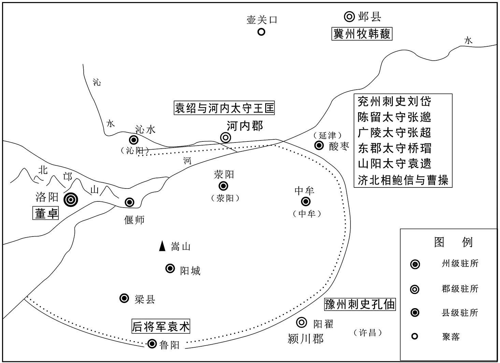 
讨伐董卓战示意图

## 【原文】

**三月，董卓在洛阳，袁绍等诸军皆畏其强，莫敢先进[1]。曹操曰：“举义兵以诛暴乱，大众已合，诸君何疑？向使董卓倚王室，据旧京，东向以临天下，虽以无道行之，犹足为患。今焚烧宫室，劫迁天子，海内震动，不知所归，此天亡之时也，一战而天下定矣[2]。”遂引兵西，将据成皋，张邈遣将卫兹分兵随之[3]。进至荥阳汴水，遇卓将玄菟徐荣，与战，操兵败，为流矢所中，所乘马被创[4]。从弟洪以马与操，操不受[5]。洪曰：“天下可无洪，不可无君。”遂步从操，夜遁去[6]。荣见操所将兵少，力战尽日，谓酸枣未易攻也，亦引兵还。**

## 【注文】

[1]洛阳：今河南洛阳。东汉都城。　　畏：害怕。

[2]举：发动、兴起。　　向使：假使，假令。　　旧京：指东汉都城洛阳。　　临：攻伐，威胁。

[3]成皋：古县名。故治在今河南荥阳汜水镇，自古即是黄河以南交通要道和军事要塞。　　卫兹（？—190年）：字子许，陈留襄邑（今河南睢县）人。少有大志，不应三公辟（bì）召。董卓之乱时，曹操至陈留，卫兹以家资助他招募士兵，深得器重。后随曹操讨伐董卓，在荥阳战死。

[4]荥（xíng）阳：古县名。秦朝设置，治所在今河南荥阳，三国时是荥阳郡的治所。　　汴水：水名。在今河南荥阳境内。　　玄菟（tú）：古郡名。汉武帝时置，治所在沃沮城（今朝鲜咸镜南道咸兴），辖境相当于今辽宁东部及朝鲜咸镜道一带。　　徐荣（？—192年）：东汉末董卓部将。辽东襄平（今辽宁辽阳）人，曾任中郎将，向董卓推荐公孙度担任辽东太守。关东诸侯联合讨伐董卓时，曾率军先后击败过曹操和孙坚。董卓死后归附朝廷，后在与李傕（jué）、郭汜（sì）交战时战死。　　创：受伤。

[5]从弟：指比自己年幼的伯叔之子，即堂弟。　　洪：即曹洪（？—232年），字子廉，沛国谯（今安徽亳州）人，曹操堂弟。东汉末年随曹操起兵讨伐董卓，征讨陶谦、吕布、张邈、刘表，屡立战功，拜鹰扬校尉，迁扬武中郎将、厉锋将军，封国明亭侯。魏文帝即位，迁骠骑将军，封野王侯。魏明帝时为后将军，封乐城侯。三国魏太和六年（232年）卒。

[6]遁：逃跑。

## 【译文】

汉献帝初平元年（190年）三月，董卓在洛阳，袁绍等关东各路军队都惧怕他兵力强盛，谁也不敢首先率军进攻。曹操说：“我们起义兵诛除暴乱，现在各路大军已经集结，你们还犹豫什么？假使董卓依靠皇帝的权威，占据洛阳，向东进军，即使他残暴无道，也会成为我们的祸患。现在他焚烧宫室，劫持皇帝西迁，天下震动，人们不知道该跟从谁，这正是上天要灭亡董卓的时候，我们一战就可以打败董卓，平定天下。”曹操于是率军西进，准备攻占成皋，张邈派遣部将卫兹带领部分军队跟随曹操进军。曹操率军到达荥阳的汴水时，遇到董卓的部将玄菟人徐荣，与他交战，曹军被打败，曹操被流箭射中，所骑战马也受了伤。曹操的堂弟曹洪把自己的战马让给他，曹操不愿意。曹洪说：“天下可以没有我曹洪，但不能没有您。”于是曹操乘马，曹洪步行跟着，连夜逃走。徐荣见曹操率领的兵虽然少，但能够奋战一天，认为酸枣不容易攻破，也就率军返回了。

## 【原文】

**操到酸枣，诸军十余万，日置酒高会，不图进取。操责让之，因为谋曰：“诸君听吾计，使勃海引河内之众临孟津，酸枣诸将守成皋，据敖仓，塞辕、太谷，全制其险，使袁将军率南阳之军军丹、析，入武关，以震三辅，皆高垒深壁，勿与战，益为疑兵，示天下形势，以顺诛逆，可立定也[1]。今兵以义动，持疑不进，失天下望，窃为诸君耻之[2]。”邈等不能用。操乃与司马沛国夏侯惇等诣扬州，募兵得千余人，还屯河内[3]。顷之，酸枣诸军食尽，众散。刘岱与桥瑁相恶，岱杀瑁，以王肱领东郡太守[4]。**

## 【注文】

[1]让：责备。　　勃海：指袁绍。因其曾任勃海太守，故称。　　孟津：古黄河渡口名，亦称“盟津”，又名“富平津”。在今河南孟津东北，孟州西南。历代为兵家必争之地，相传周武王伐纣，在此盟会诸侯并渡河，故名“盟津”。东晋杜预曾在此造桥。　　敖仓：古代重要粮仓，故址在今河南荥（xíng）阳东北敖山。　　（huán）辕（yuán）：古关名。故址在今河南偃师东南辕山上。东汉中平元年（184年）为镇压黄巾起义军，在此设立关卡，扼守要地。辕山接巩义、登封两县（市）界，因路有十二曲，盘旋往还得名。地势险要，为军事要塞。　　太谷：古关隘名。又名“大谷关”。故址在今河南洛阳东南大谷口。　　丹：即丹水，古县名。秦朝设置，治所在今河南淅（xī）川西。　　析：即析县，古县名。因境内有析水而得名，秦朝设置，属于南阳郡，治所在今河南西峡。　　武关：古关隘名。故址在今陕西丹凤城东南的峡谷间。　　三辅：古地区名。西汉时在京畿（jī）之地所设京兆尹、左冯（píng）翊（yì）、右扶风的合称，治所皆在长安城中，辖境相当于今陕西中部。后世政区划分虽时有变动，但直到唐代，习惯上仍称这一地区为“三辅”。

[2]持疑：迟疑，犹豫。　　望：威望，声望。　　窃：私下，私自。　　耻：羞耻。

[3]司马：古代武官名。汉代宫门、大将军、将军、校尉属官都有司马。　　沛国：诸侯国名。西汉设置沛郡，东汉改为国，治所在相县（今安徽濉溪）。　　夏侯惇（dūn）（？—220年）：字元让，沛国谯（今安徽亳州）人。曹操起兵讨伐董卓时为军司马。随曹操四处征战，深得曹操器重，历任折冲校尉、东郡太守、建武将军、河南尹，封高安乡侯。曹丕称帝后封为大将军，不久去世。夏侯惇虽为军人，但不忘治学，生活俭朴，乐于施舍，深得士卒爱戴。　　扬州：古州名。西汉武帝所设十三刺史部之一。东汉时治所先后在历阳（今安徽和县）、寿春（今安徽寿县）、合肥（今安徽合肥）。三国时魏国、吴国各置扬州，魏国治所在寿春，吴国在建邺（今江苏南京）。辖境相当于今安徽淮河和江苏长江以南及江西、浙江、福建三省，湖北英山、黄梅、武穴，河南固始、商城等地。

[4]王肱（gōng）（生卒年不详）：东汉末年官吏，刘岱杀桥瑁后被任命为东郡太守。

## 【译文】

曹操回到酸枣，看到各路大军十多万兵马，整日喝酒聚会，不图进取。曹操责备他们，并为他们出谋划策，说：“你们如果听从我的计策，就请袁绍率领河内的军队攻取孟津，驻扎酸枣的军队固守成皋，占据敖仓，封锁辕、太谷二关，控制洛阳周围的险要地区。请袁术率领南阳的军队进驻丹水、析县，攻取武关，威慑三辅地区。各路军队都高筑营垒深壁，不与敌人交战，多设疑兵，显示现在大军汇集讨伐叛逆的形势，很快就可以稳定局势。现在我们虽然号称义兵，却迟疑不前，使天下人失望，我为你们感到羞耻。”张邈等人不采纳曹操的建议。曹操于是同司马沛国人夏侯惇等人来到扬州，招募了一千多名士兵，返回后驻扎在河内。不久，驻扎在酸枣的各路军队吃完了粮食，各自返回。刘岱与桥瑁不和，刘岱杀死了桥瑁，任命王肱为东郡太守。

## 【原文】

**二年春正月，关东诸将议，以朝廷幼冲，逼于董卓，远隔关塞，不知存否[1]？幽州牧刘虞，宗室贤俊，欲共立为主[2]。曹操曰：“吾等所以举兵，而远近莫不响应者，以义动故也。今幼主微弱，制于奸臣，非有昌邑亡国之衅，而一旦改易，天下其孰安之？诸君北面，我自西向[3]。”**

## 【注文】

[1]朝廷：指汉献帝。　　幼冲：年龄幼小。

[2]幽州：古州名。西汉时为武帝所置十三刺史部之一，东汉治所在蓟（jì）县（今北京西南大兴区），辖境相当于今北京、河北北部、辽宁大部、天津海河以北及朝鲜大同江流域。　　刘虞（？—193年）：字伯安，东海郯（tán）（今山东郯城）人。汉朝宗室，曾任幽州刺史、甘陵相。因镇压黄巾起义有功，封容丘侯。董卓之乱时袁绍等准备拥立刘虞为皇帝，被他严词拒绝。他在幽州，发展生产，安抚边疆民族，但与部属公孙瓒（zàn）不和，汉献帝初平四年（193年）为公孙瓒所杀。　　宗室：皇帝的宗族，又称皇族，常以与皇帝的父系血缘亲疏关系，来确定是否列入宗室。　　贤俊：才德出众的人。

[3]幼主：年幼的君主，指汉献帝。　　昌邑：即昌邑王刘贺（？—前83年），汉昭帝之侄。汉昭帝死后无子，霍光迎立刘贺为帝。后因他荒淫无道，在位二十七日即被废掉。　　衅：罪过。

## 【译文】

汉献帝初平二年（191年）春季正月，起兵讨伐董卓的关东将领们商议，认为汉献帝年幼，被董卓控制，远离京师，关山相隔，不知是否活着。幽州牧刘虞是汉朝宗室中的贤明之人，众将准备拥立他为皇帝。曹操说：“我们起兵讨伐董卓，远近州郡无不响应，就是因为我们的行动是正义的。现在皇帝虽然年幼，被奸臣控制，但没有昌邑王刘贺那样荒淫无道而导致亡国的罪过，你们一旦改立刘虞，天下的人谁能接受？你们北上拥立刘虞，我西去尊奉幼主刘协。”

## 【原文】

**袁绍在河内，云中张杨往归之，与南单于於扶罗屯漳水[1]。韩馥以豪杰多归心袁绍，忌之，阴贬节其军粮，欲使其众离散[2]。绍客逢纪谓绍曰：“将军举大事而仰人资给，不据一州，无以自全[3]。”绍曰：“冀州兵强，吾士饥乏，设不能办，无所容立。”纪曰：“韩馥庸才，可密要公孙瓒使取冀州，馥必骇惧，因遣辩士为陈祸福，馥必肯逊让[4]。”绍即以书与瓒，瓒遂引兵谋袭馥。馥与战，不利，绍使外甥陈留高干及馥所亲颍川辛评、荀谌、郭图等说馥曰：“公孙瓒将燕、代之卒，乘胜来南，而诸郡应之，其锋不可当[5]。袁车骑引军东向，其意未可量也[6]。窃为将军危之。”馥惧，曰：“然则为之奈何？”谌曰：“君自料宽仁容众，为天下所附，孰与袁氏[7]？”馥曰：“不如也。”“临危吐决，智勇过人，又孰与袁氏？”馥曰：“不如也。”“世布恩德，天下家受其惠，又孰与袁氏？”馥曰：“不如也。”谌曰：“袁氏一时之杰，将军资三不如之势，久处其上，彼必不为将军下也。夫冀州天下之重资也，彼若与公孙瓒并力取之，危亡可立而待也。夫袁氏将军之旧，且为同盟，当今之计，若举冀州以让袁氏，彼必厚德将军，瓒亦不能与之争矣。是将军有让贤之名，而身安于泰山也[8]。”馥性恇怯，因然其计[9]。馥长史耿武、别驾闵纯、治中李历闻而谏曰：“冀州带甲百万，穀支十年[10]。袁绍孤客穷军，仰我鼻息，譬如婴儿在股掌之上，绝其哺乳，立可饿杀，奈何欲以州与之[11]？”馥曰：“吾袁氏故吏，且才不如本初，度德而让，古人所贵，诸君独何病焉[12]。”馥从事赵浮、程涣等谓馥曰：“袁本初军无斗粮，各已离散，虽有张杨、於扶罗新附，未肯为用，不足敌也[13]。小从事等请自以见兵拒之，旬日之间，必土崩瓦解，明将军但当开高枕，何忧何惧[14]？”馥又不听，乃避位，出居中常侍赵忠故舍，遣子送印绶以让绍[15]。绍遂领冀州牧，承制以广平沮授为奋武将军，使监护诸将，宠遇甚厚[16]。魏郡审配、巨鹿田丰并以正直不得志于韩馥，绍以丰为别驾，配为治中，及南阳许攸、逢纪、颍川荀谌皆为谋主[17]。**

## 【注文】

[1]云中：古郡名。战国赵武灵王设置，秦治所在云中（今内蒙古托克托东北古城）。辖境相当于今内蒙古土默特右旗以东，大青山以南，卓资以西，黄河南岸及长城以北地区。东汉末年废。　　张杨（生卒年不详）：字稚叔，云中（今内蒙古托克托东北古城）人。早年为并州武猛从事，汉灵帝时为西园军司马。曾为何进募兵千余人，董卓之乱时割据上党。汉献帝初平二年（191年）归袁绍，跟随讨伐董卓。后投降董卓，被封为建义将军、河内太守。董卓死后，与杨奉等人挟汉献帝归洛阳，拜大司马。汉献帝兴平二年（195年）曹操围攻吕布。他援助吕布，为部将杨丑所杀。　　南单（chán）于：匈奴最高统治者的称号。全称的原音为“撑犁孤涂单于”，“撑犁”为“天”，“孤涂”为“福”，“单于”为汉语“大王”的音译。称号的含义是“天所赐福的大王”。通常只简称“单于”。　　漳水：即漳河，其河道古今变迁大，汉代流经今山西、河北、河南。

[2]贬：减少。

[3]逢纪（？—202年）：字元图，袁绍重要谋臣。董卓专权时，袁绍逃离洛阳，他跟随到冀州，设计迫使韩馥让袁绍做冀州牧。逢纪足智多谋，深得信任。官渡之战时，逢纪与审配共掌军事。袁绍死后，谋立袁尚嗣位，不久被袁谭所杀。　　仰：依赖、依靠。

[4]公孙瓒（？—199年）：字伯珪（ɡuī），辽西令支（今河北迁安）人。早年曾为郡吏，后任中郎将、辽东属国长史，率兵镇压乌桓及胡人丘力居等，因功封都亭侯。汉献帝初平二年（191年）镇压青、徐黄巾起义军，拜奋武将军，晋封蓟（jì）侯。后割据幽州，与袁绍连年争战。后屡为袁绍打败，汉献帝建安四年（199年）被袁绍伏兵打败，自焚而死。　　辩士：能言善辩之士，游说之士。

[5]高干（？—206年）：字元才，陈留圉（yǔ）（今河南杞县南）人。东汉末年，与堂兄高柔一起率宗族归服袁绍，曾任并州牧。曹操与袁绍混战时投降曹操，被任命为刺史。后来趁曹操北征乌丸时反叛，兵败被杀。　　辛评（？—204年）：字仲治，颍川阳翟（今河南禹州）人。辛评初为韩馥部下，韩馥逃亡后转而辅佐袁绍。袁绍死后，依附袁谭，与拥立袁尚的审配、逢纪争权。汉献帝建安九年（204年），曹操攻破邺城，辛评全家为审配所杀。　　荀谌（chén）（生卒年不详）：字友若，颍川颍阴（今河南许昌西南）人。初为韩馥部下，汉献帝初平二年（191年）与辛评、郭图合谋使袁绍代韩馥为冀州牧，成为袁绍的谋士。官渡之战时荀谌为袁绍谋主，后不知所终。　　郭图（？—205年）：字公则，颍川（今河南禹州）人。初为韩馥部下，汉献帝初平二年（191年）与辛评、荀谌游说韩馥，使袁绍为冀州牧，成为袁绍的谋士。曾劝袁绍迎汉献帝至邺城，挟天子以令诸侯，未被采纳。官渡之战时力主趁机偷袭曹营。袁绍死后依附袁谭。　　燕：古郡、国名。汉初为异姓七国之一，后又为同姓九国之一，治所在蓟县（今北京西南大兴区）。辖境相当于今北京、河北北部、辽宁西南部。　　代：即代郡。战国时赵国设置，秦、西汉治所在代县（今河北蔚县），辖境相当于今河北怀安、涞源以西，山西阳高、浑源以东的内外长城间地和长城外的东洋河流域。东汉移治高柳（今山西阳高），但辖境缩小。

[6]袁车骑：即袁绍，因其曾任车骑将军，故称。

[7]料：估量。

[8]泰山：又称东岳，为五岳之首，位于今山东泰安。

[9]恇（kuāng）怯：懦弱，胆怯。

[10]长史：古代官名。战国秦朝设置，掌顾问参谋，秦汉沿用。西汉时丞相、太尉、御史大夫及大将军、车骑将军等主要将军幕府都设此官，为众吏之长，秩千石。其职责是辅佐丞相、将军处理日常事务，并参与国政，或奉诏过问地方事务。东汉太尉、司徒、司空府沿置不改。汉代长史有文职和武职，文职掌参谋、文书，武职掌领军作战。　　耿武（生卒年不详）：字文威，韩馥部将，担任长史。曾劝说韩馥不要把冀州牧让于袁绍，未被采纳。后因谋刺袁绍被杀。　　别驾：古代官名，全名为别驾从事史，或别驾从事。汉代设置，为刺史属吏。每当刺史出巡时，别驾都要驾车随行，因此得名。魏晋时职权益重。　　闵纯（生卒年不详）：字伯典，冀州牧韩馥的别驾。在韩馥把冀州让于袁绍时，曾和耿武、李历劝谏韩馥。后因谋刺袁绍被杀。　　治中：古代官名。又称治中从事、治中从事史，是汉代刺史的佐官。秩百石，主管文书案卷。　　李历（生卒年不详）：韩馥部将，曾为治中。曾劝说韩馥不要把冀州牧让于袁绍，未被采纳。

[11]鼻息：比喻声势、气势。

[12]病：忧虑。

[13]赵浮（生卒年不详）：韩馥部将，曾任都督从事。力劝韩馥抗拒袁绍，未被采纳。　　程涣（生卒年不详）：韩馥部将，任都督从事。曾与赵浮力劝韩馥抗拒袁绍，未被采纳。

[14]明将军：对袁绍的尊称。明为贤明之意。

[15]赵忠（？—189年）：安平（今河北冀州）人，东汉末年宦官。桓帝、灵帝时期历任小黄门、中常侍。曾参与诛杀梁冀，功封都乡侯。汉灵帝时任中常侍、大长秋。与张让、曹节等并称“十常侍”。为人贪婪残暴，东汉中平六年（189年）为袁绍所杀。

[16]广平：古郡、国名。西汉设置，治所在广平（今河北鸡泽），元延末辖区相当于今河北任县、南和、曲周、鸡泽、永年东南、平乡西南、肥乡北部一带。东汉并入巨鹿郡。　　沮授（？—200年）：字则注，广平（今河北鸡泽）人。初为韩馥部属，任别驾、骑都尉。后归袁绍，为奋威将军，得到重用。屡次为袁绍出谋划策，提出争夺中原的方略，未被采纳。官渡之战时提出过重要建议，袁绍不采纳。官渡之战时被曹操俘虏，誓不投降，因谋归袁绍被杀。　　奋武将军：杂号将军名，西汉设置，掌率军征伐或驻守。东汉末年曹操、吕布、公孙瓒等曾任此职。

[17]魏郡：古郡名。西汉设置，治所在邺县（今河北临漳）。辖境相当于今河北大名、磁县、涉县、武安、临漳、肥乡、魏县、邱县、成安、广平、馆陶，河南滑县、浚县、内黄及山东冠县等地。东汉后辖境屡有变迁。　　审配（？—204年）：字正南，魏郡阴安（今河南清丰）人。初为韩馥部将，后归袁绍，任治中别驾。官渡之战时委以重任。袁绍死后辅佐袁尚。东汉建安九年（204年）曹操攻邺城，审配战败被杀。　　巨鹿：古郡名。秦朝设置，汉初为国，后改为郡。治所在巨鹿（今河北平乡西南），东汉移治廮陶（今河北宁晋）。辖区相当于今河北白洋淀、文安洼以南，南运河以西，高阳、宁晋、任县以东，平乡、威县以北及山东德州、高唐和河北馆陶之间地。　　田丰（？—200年）：字元皓，巨鹿（今河北巨鹿）人。历任太尉府吏、侍御史、冀州别驾，是袁绍重要的谋士之一，以足智多谋著称。曾劝袁绍迎立汉献帝，未被采纳。因劝袁绍不要征伐曹操被监禁，官渡之战时屡出奇策，袁绍不听。官渡之战后被杀。　　许攸（yōu）（？—204年）：字子远，南阳（今河南南阳）人。早年与袁绍、曹操友善。东汉末年与冀州刺史王芬等人谋废灵帝刘宏未遂。后随袁绍在冀州。官渡之战时投奔曹操，献偷袭袁绍乌巢屯粮之计，帮助曹操打败袁绍。后因居功自傲，被曹操所杀。

## 【译文】

袁绍驻扎在河内，云中人张杨前去投靠他，和南单于於扶罗一起在漳水岸边驻扎。韩馥因为各路豪杰多拥戴袁绍，心怀嫉妒，暗中减少他的军粮供应，想使他的军队离散。袁绍的门客逢纪对袁绍说：“将军讨伐董卓，却依靠别人供给军粮，不占据一州作为根据地，就无法保全自己。”袁绍说：“冀州兵强，我的部队缺乏粮草，如果不能成功占据一地，将无立足之地了。”逢纪说：“韩馥是个平庸之辈，您可以秘密让公孙瓒攻打冀州，韩馥必然害怕，您就趁机派遣能言善辩的人去向他分析福祸，他一定会把冀州让给您。”袁绍就给公孙瓒写信，公孙瓒于是率军到冀州，准备袭击韩馥。韩馥与公孙瓒交战，失败了，袁绍便派他的外甥陈留人高干和韩馥的亲信颍川人辛评、荀谌、郭图等人去劝说韩馥，说：“公孙瓒率领燕国、代郡的军队乘胜南下，沿途各郡纷纷响应，其势锐不可当。车骑将军袁绍率军向东，他的意图也很难估量。我们都为将军担心啊！”韩馥很恐慌，说：“那该怎么办呢？”荀谌说：“您自己估量一下，在宽厚仁义，能够容纳众人，使天下豪杰归附方面，您能比得上袁绍吗？”韩馥说：“比不上。”荀谌又问：“临危不惧，当机立断，智勇过人，您比得上袁绍吗？”韩馥说：“比不上。”荀谌又问：“世代广布恩泽，使天下人家家受其恩惠，您比得上袁绍吗？”韩馥说：“比不上。”荀谌说：“袁绍是当今的豪杰，将军在以上三方面都不如他，却久居其上，他一定不会屈居将军之下。冀州是天下富庶的重要地区，他如果和公孙瓒合力夺取冀州，危亡的局面就会立即出现。袁绍是将军的老朋友，又是讨伐董卓的盟友，现在最好的办法是把冀州让给袁绍，他一定会对您感恩戴德，公孙瓒也无力与他争夺冀州。这样您有让贤的美名，自己的身家性命也就稳如泰山了。”韩馥性情怯懦，于是就采纳了他们的计策。韩馥的长史耿武、别驾闵纯、治中李历听到消息后，劝谏他说：“冀州有百万大军，存储的粮食能够吃十年。袁绍是一支缺乏给养的客居孤军，依靠我们的供给来度日，就像大人怀中的婴儿，不给他奶吃，立即就会饿死，怎么能把冀州让给他？”韩馥说：“我是袁家过去的属吏，又才能不如袁绍，考虑到自己的能力不足而把职位让给贤能的人，是古人所崇尚的行为，你们有什么可忧虑的呢！”韩馥的从事赵浮、程涣对他说：“袁绍军中没有一点粮食，已经各自离散，虽然有张杨、於扶罗等刚刚归附他，但不会为他效力，袁绍不是我们的对手。我们这些小从事请求带兵去抵御他，不出十天，袁绍的军队必然会土崩瓦解。将军您可以高枕无忧，有什么可忧虑害怕的？”韩馥还是不听，决心让位，从府中迁出，搬到中常侍赵忠的旧宅居住，派他的儿子把印绶送给袁绍。袁绍于是担任冀州牧，假借皇帝的名义任命广平人沮授为奋武将军，派他监护诸将，对他十分宠信。魏郡人审配、巨鹿人田丰都因为人正直，不受韩馥信任，袁绍任田丰为别驾，审配为治中，他们和南阳人许攸、逢纪，颍川人荀谌都成为袁绍的主要谋士。

## 【原文】

**鲍信谓曹操曰：“袁绍为盟主，因权专利，将自生乱，是复有一卓也。若抑之，则力不能制，只以遘难[1]。且可规大河之南，以待其变[2]。”操善之。会黑山于毒、白绕、眭固等十余万众略东郡，王肱不能御[3]。曹操引兵入东郡，击白绕于濮阳，破之[4]。袁绍因表操为东郡太守，治东武阳[5]。**

## 【注文】

[1]遘（gòu）难：结仇交战。

[2]规：谋求，谋划。

[3]黑山：又名墨山。在今河南浚县西北。　　于毒（生卒年不详）：东汉末年黑山农民起义军首领之一。东汉初平二年（191年），与白绕、眭固进攻东郡，被曹操打败。后被袁绍所杀。　　白绕（生卒年不详）：东汉末年黑山军首领之一。东汉初平二年（191年），与于毒、眭固进攻东郡，被曹操打败。　　眭（suī）固（？—199年）：字白兔，初为黑山农民军首领之一，后归附张杨。杨丑杀张杨后，准备归降曹操，眭固杀死杨丑，想率部下投奔袁绍，被曹操部将史涣所杀。

[4]东郡：古郡名。秦设置，治所在濮阳（今河南濮阳西南），西汉辖境相当于今河南延津以东，山东东阿、梁山以西，山东茌平、冠县和河南清丰、濮阳、滑县以南，山东郓城、东明和河南范县、长垣北部以北地区。东汉后辖境渐小。　　濮阳：地名。夏代为昆吾国都城，商为楚国城邑，西周为卫国都城。秦二世元年（前209年）置濮阳县，宋代称澶州，在今河南濮阳。

[5]东武阳：古县名。西汉置东武阳县，治所在今山东莘县东南。

## 【译文】

鲍信对曹操说：“袁绍身为盟主，却利用职权，谋求私利，将要自行生乱，成为另外一个董卓。如果反对他，我们的力量又不足以打败他，只能招来祸患。我们可以暂且谋划到黄河以南发展势力，等待时局变化。”曹操认为这个意见很好。这时正好黑山农民军的于毒、白绕、眭固等十多万人进攻东郡，东郡太守王肱抵御不了。曹操就率军进入东郡，自濮阳进攻白绕，将他打败。袁绍于是上表朝廷，举荐曹操做东郡的太守，曹操将郡府迁到东武阳。

## 【原文】

**三年。初，荀淑有孙曰彧，少有才名，何颙见而异之，曰：“王佐才也[1]。”及天下乱，彧谓父老曰：“颍川四战之地，宜亟避之[2]。”乡人多怀土不能去，彧独率宗族去依韩馥[3]。会袁绍已夺馥位，待彧以上宾之礼[4]。彧度绍终不能定大业，闻曹操有雄略，乃去绍从操[5]。操与语，大悦，曰：“吾子房也[6]。”以为奋武司马[7]。**

## 【注文】

[1]荀淑（83—149年）：字季和，颍川颍阴（今河南许昌）人。博学多才，东汉名士李固、李膺（yīng）等曾拜他为师，历任郎中、当涂长、朗陵侯相。后弃官归养，东汉建和三年（149年）卒。　　彧：即荀彧（yù）（163—212年），字文若，颍川颍阴（今河南许昌）人，士族出身，曾任守宫令。董卓之乱时率宗族先后依附韩馥、袁绍，后归降曹操，任奋武司马，屡次随军征伐，以功封万岁亭侯。东汉建安元年（196年）建议曹操迎汉献帝建都许昌。历任侍中、光禄大夫、参丞相军事等职。后反对曹操称魏王，被迫自杀。　　佐：辅助，帮助。

[2]父老：对老年人的尊称。　　四战之地：无险可守、四面受敌的地方。

[3]宗族：以血缘关系为纽带的宗法组织，指同一父系大家长的子孙后代。

[4]会：恰好，正好。　　上宾：尊贵的客人。

[5]度（duó）：估计，推测。　　大业：大的功业，帝王之业。　　雄略：非凡的谋略。

[6]子房：张良的字。张良（前250—前184年），城父（今安徽亳州东南）人，韩国贵族。秦灭韩后，张良准备在博浪沙刺杀秦始皇，未能成功，亡匿于下邳。后归刘邦，成为重要谋臣。楚汉之争中，张良协助刘邦消灭项羽，统一天下，因有功封为留侯。

[7]奋武司马：古代官名，奋武将军的属官。曹操曾任奋武将军，所以任命荀彧为奋武司马。

## 【译文】

汉献帝初平三年（192年）。当初，荀淑有个孙子叫荀彧，从小就因才华出众而闻名。何颙（yóng）见到他很惊异，说：“是能辅佐帝王的人才。”等到天下大乱，荀彧对家乡父老说：“颍川地势平坦，四面受敌，是兵家必争之地，我们应该及早离开这里，到他处躲避。”但乡人多依恋故土，不愿离开，只有荀彧率领他的宗族去投奔冀州的韩馥。恰好此时袁绍已经夺取冀州，取代了韩馥，把荀彧作为尊贵的客人来看待。荀彧认为袁绍不能成就帝王大业，听说曹操有雄才大略，于是就离开袁绍，投奔曹操。曹操与他面谈后十分高兴，说：“这是我的张良呀！”任命他为奋武司马。

## 【原文】

**曹操军顿丘，于毒等攻东武阳[1]。曹攻毒等本屯，毒闻之，弃武阳还。事见《黄巾之乱》[2]。**

## 【注文】

[1]军：驻扎。　　顿丘：古县名。西汉设置，治所在今河南浚县西北。王莽时改名顺丘县，东汉复名顿丘县。

[2]黄巾之乱：黄巾之乱又称黄巾起义，是东汉末年张角领导的大规模农民起义。因为起义军以黄巾裹头为标志，所以被称为“黄巾军”。东汉末年，外戚宦官专政，政治黑暗，民不聊生，农民起义不断爆发。巨鹿人张角创立太平道，进行秘密活动。东汉光和七年（184年），张角发动起义，焚烧官府，捕杀官吏，攻打豪强地主庄园，各地纷纷响应。黄巾军主力转战河北、河南广大地区，形成了以张角三兄弟领导的黄巾军主力，以及波才、彭脱领导的东方黄巾军和张曼成领导的南方黄巾军，虽然后来在东汉政权和地主武装联合镇压下失败，但各地余部仍继续坚持战斗，历时二十多年。黄巾起义沉重打击了东汉王朝和地方势力，瓦解了东汉政权。

## 【译文】

曹操率军驻扎在顿丘，于毒等进攻东武阳。曹操去攻打于毒等人的驻地大本营。于毒听说后，放弃攻打武阳，返回原驻地。此事见《黄巾之乱》中的记载。

## 【原文】

**夏四月，青州黄巾寇兖州，刘岱与战，为所杀[1]。曹操部将东郡陈宫谓操曰：“州今无主，而王命断绝，宫请说州中纲纪，明府寻往牧之，资之以收天下，此霸王之业也。[2]”宫因往说别驾、治中曰：“今天下分裂，而州无主。曹东郡命世之才也，若迎以牧州，必宁生民[3]。”鲍信等亦以为然，乃与州吏万潜等至东郡，迎操领兖州刺史[4]。操遂进兵，击黄巾于寿张东，不利[5]。贼众精悍，操兵寡弱，操抚循激励，明设赏罚，承间设奇，昼夜会战，战辄禽获，贼遂退走[6]。鲍信战死。**

## 【注文】

[1]青州：古州名。西汉武帝所设十三刺史部之一。辖境相当于今山东德州、齐河以东，马颊河以南，济南、临朐、安丘、莱阳、栖霞、乳山以北以东和河北吴桥，东汉时治所在临菑（今山东淄博临淄区）。　　寇：侵犯。

[2]陈宫（？—198年）：字公台，东郡东武阳（今山东莘县东南）人。初为曹操部将。刘岱死后，陈宫等人通过游说使曹操接任兖（yǎn）州牧。后乘曹操讨伐陶谦之时，策动张邈等起兵反叛，迎接吕布为兖州牧。屡次为吕布出谋划策，但多不被采用。东汉建安三年（198年），与吕布一起被曹操俘虏后杀死。　　说（shuì）：劝说别人听从自己的意见。　　纲纪：原意为治理。汉代是郡县右曹大使的别称。右曹指主簿、督邮、五官掾（yuàn）、功曹等总揽府中内外事务的官吏，地位较高。三国时魏国多指郡功曹。　　明府：明府君的简称，汉代对太守的尊称。当时郡守所居处称府，明即贤明之意。

[3]曹东郡：即曹操。因此时曹操为东郡太守，所以称他为曹东郡。　　命世之才：指名望才能为世人所重的杰出人才。　　宁：使安宁。

[4]万潜（生卒年不详）：初为兖州刺史刘岱属官。东汉初平三年（192年），与鲍信等迎接曹操为兖州牧，并进击黄巾军。历任长史、少府等职。后来与群臣劝曹操为魏公。

[5]黄巾：即黄巾军。　　寿张：古县名。西汉设置寿良县，东汉改为寿张。治所在今山东东平。

[6]精悍：精强猛勇。　　抚循：安抚存恤。

## 【译文】

汉献帝初平三年（192年）夏季四月，青州的黄巾军进犯兖州，刘岱与他们交战，被杀死。曹操的部将东郡人陈宫对曹操说：“现在兖州无主，与朝廷的联系也断绝了，我请求去说服州中的主要官员，让您去主持兖州的事务，以此作为统一天下的基地，建立帝王之业。”陈宫于是前去劝说兖州的别驾、治中说：“现在天下分裂，而兖州无主。曹操是世间杰出的人才，如果迎接他做兖州刺史，一定能够使百姓安宁。”鲍信等人也有同样的看法，便和州吏万潜等人到东郡，迎接曹操做兖州刺史。曹操于是进军，在寿张以东迎击黄巾军，作战失利。黄巾军强悍骁勇，曹操的军队少，战斗力弱。曹操安抚士兵，激励士气，赏罚分明，乘机设计谋，昼夜奋战，每次战斗都能擒获敌人，黄巾军于是就退走了。鲍信战死。

## 【原文】

**冬十二月，曹操追黄巾至济北，悉降之，得戎卒三十余万，男女百余万口，收其精锐者，号“青州兵”[1]。**

## 【注文】

[1]戎卒：士兵。　　青州兵：东汉末年曹操组建的军队。东汉初平三年（192年），曹操率兵占领兖州，打败青州的黄巾军，将精锐士卒编为“青州兵”。这支军队后来成为曹操的主要军事力量，在统一北方的战争中起了很大作用。

## 【译文】

汉献帝初平三年（192年）冬季十二月，曹操追击黄巾军到济北，黄巾军全部投降，曹操得到士兵三十多万人，老百姓男女一百多万口，挑选出精锐部队，称为“青州兵”。

## 【原文】

**操辟陈留毛玠为治中从事[1]。玠言于操曰：“今天下分崩，乘舆播荡，生民废业，饥馑流亡，公家无经岁之储，百姓无安固之志，难以持久[2]。夫兵义者胜，守位以财，宜奉天子以令不臣，修耕植以畜军资，如此，则霸王之业可成也[3]。”操纳其言，遣使诣河内太守张杨欲假涂西至长安，杨不听[4]。**

## 【注文】

[1]辟（bì）：征召，延聘。　　毛玠（jiè）（？—216年）：字孝先，陈留平丘（今河南封丘东南）人。早年为县吏，以清廉著称。东汉末年依附曹操，任治中从事、东曹掾、尚书仆射等职，与崔琰主持选举，所得都是清廉正直之士。后因不满曹操杀崔琰，遭诬陷被捕下狱，在桓阶、和洽营救下出狱，但被免职，卒于家。　　治中从事：古代官名。简称治中，是州刺史的高级佐官之一。在司隶校尉称功曹从事，在其他十二州称治中从事，掌州选署及文书案卷等事。

[2]乘舆：本指古代皇帝和诸侯所乘坐的车马，后来用为帝王的代称。　　播荡：流亡，漂泊。

[3]天子：统治天下的国王或皇帝。古代认为皇帝的权力是上天赐予，皇帝是秉承天意来治理人民，是上天的儿子，所以称为天子。　　不臣：不臣服、不受管辖的人。

[4]长安：都城名，今陕西西安。长安是东汉陪都，汉献帝曾被迫建都于此。

## 【译文】

曹操任命陈留人毛玠为治中从事。毛玠对曹操说：“现在天下分崩离析，皇帝流离漂泊，百姓无法进行生产，过着饥饿流亡的生活，官府没有一年的储粮，百姓没有固定安居的志向，这种局面难以持久。正义的军队才能在战争中取胜；要巩固自己的地位，需要拥有丰富的财富；应当尊奉天子，以朝廷的名义讨伐那些叛逆之臣；发展农业生产，来积聚军用物资，这样就能够成就帝王之业。”曹操采纳了毛玠的建议，派遣使者去见河内太守张杨，想借道西去长安迎接天子，张杨拒绝了。

## 【原文】

**定陶董昭说杨曰：“袁、曹虽为一家，势不久群[1]。曹今虽弱，然实天下之英雄也，当固结之。况今有缘，宜通其上事，并表荐之，若事有成，永为深分[2]。”杨于是通操上事，仍表荐操。昭为操作书与李傕、郭汜等，各随轻重致殷勤。**

## 【注文】

[1]定陶：古县名。秦朝设置，汉代、三国沿置。治所在今山东定陶。　　董昭（156—236年）：三国时魏国大臣，字公仁，济阴定陶（今山东定陶）人。原为袁绍属官，曾任参军、巨鹿太守。后归曹操，建议曹操将汉献帝迁往许县。历任议郎、冀州牧、魏郡太守、谏议大夫。曹操北征乌桓，他建议开渠入海运输军粮。后来建议朝廷封曹操为魏公、魏王，参与制定礼仪制度。曹丕称帝后，封为右乡侯，任太常、光禄大夫。魏明帝曹叡（ruì）执政期间，晋封乐平侯。

[2]上事：向朝廷上书言事。　　表：我国古代的一种特殊文体，是臣子写给君主的呈文。战国时期统称为“书”。至汉代，这类文字又被分成四类，即章、表、奏、议，即臣下向皇帝进呈的上行文章。魏晋南北朝时期，则又统称为“表”。

## 【译文】

定陶人董昭劝张杨说：“袁绍和曹操虽然和睦得像一家人，但不会长久为伍。曹操现在虽然势力弱，但他实际上是天下的英雄，应当找机会和他结交。况且现在有借路这个机会，应当允许他的使者通过，并上表推荐他，如果事情办成，就能够和他建立深厚的情分。”张杨于是允许曹操的使臣通过自己的辖区去长安，并上表推荐曹操。董昭以曹操的名义写信给李傕、郭汜等人，根据他们地位的高低，分别致以殷勤的问候。

## 【原文】

**傕、汜见操使，以为关东欲自立天子，今曹操虽有使命，非其诚实，议留操使。黄门侍郎钟繇说傕、汜曰：“方今英雄并起，各矫命专制，唯曹兖州乃心王室，而逆其忠款，非所以副将来之望也[1]。”傕、汜乃厚加报答[2]。繇，皓之曾孙也[3]。**

## 【注文】

[1]黄门侍郎：古代官名。秦和西汉时宫门之内的郎官称黄门郎或黄门侍郎，东汉时开始设为专官。其职责为侍从皇帝，传达诏命。　　钟繇（yáo，一作yóu）（151—230年）：三国时期曹魏著名书法家、政治家。字元常，颍（yǐng）川长社（今河南长葛东北）人。出身于世家望族，东汉末为黄门侍郎。曹操当政后任侍中兼司隶校尉，镇守关中，使关中诸将支持曹操，封东武亭侯。曹丕称帝后，任廷尉，封平阳乡侯。魏明帝时任太傅，封定陵侯。钟繇工于书法，博采众长，兼善各体，尤精于隶、楷，被称为“正书之祖”。　　副：相称，符合。

[2]报答：答复。

[3]皓：即钟皓（hào）（87—155年），汉代经学家，字季明，颍川长社（今河南长葛东北）人。少有德行，精通刑律，初隐居不仕，以诗律教授门徒千余人。后来曾任郡功曹、司徒府，不久辞职归隐。与陈寔（shí）、荀淑、韩韶（sháo）并称为“颍川四长”。

## 【译文】

李傕、郭汜见到曹操的使者，认为关东的将领想自己拥立天子，现在曹操虽然派使者前来表示愿意尊奉天子，但并不是真心诚意，想扣留曹操的使者。黄门侍郎钟繇劝李傕、郭汜说：“现在英雄并起，都假借皇帝的名义独断专行，唯有曹操忠于王室，如果拒绝他向朝廷效忠，会使想效忠朝廷的人失望。”李傕、郭汜于是给曹操丰厚的回报。钟繇是钟皓的曾孙。

## 【原文】

**四年春正月，曹操军鄄城[1]。袁术为刘表所逼，引军屯封丘，黑山别部及匈奴於扶罗皆附之[2]。曹操击破术军，遂围封丘，术走襄邑，又走宁陵[3]。操追击，连破之，术走九江[4]。**

## 【注文】

[1]鄄（juàn）城：古县名，汉代设置，治所在今山东鄄城北。

[2]刘表（142—208年）：字景升，山阳郡高平（今山东微山西北）人。他是东汉远支皇族。东汉初平元年（190年）为荆州刺史，得到蒯（kuǎi）良、蔡瑁（mào）等当地名士、大族的支持，招兵买马，先后平定境内其他军事势力，击败孙坚，占据湖北、湖南地区，成为当时一支重要割据势力。在军阀混战中力图自保，招纳前来避难的名士。在东汉建安十三年（208年）曹操南征荆州时病死。　　封丘：古县名。治所在今河南封丘。　　黑山：即黑山军，东汉末年河北地区的一支农民起义军。黄巾起义爆发后，冀州地区的农民纷纷响应，形成很多队伍，各部自立名号，总计有一百多万人，统称为“黑山军”。各支义军互相联系，攻取州县，声势浩大。黑山军首领最初为张牛角，张牛角战死，褚（zhǔ）燕继任首领。后来褚燕投降，参与军阀混战。余部相继被曹操、袁绍镇压和收编。

[3]襄邑：古县名。秦朝设置，治所今河南睢（suī）县，东汉时属兖州郡。　　宁陵：古县名。汉代设置，治所在今河南宁陵。

[4]九江：古郡名。秦设九江郡，治所在寿春（今安徽寿县）。西汉初年改为淮南国，汉武帝时又改为九江郡。辖境相当于今安徽、河南淮河以南，湖北黄冈以东和江西全省。

## 【译文】

汉献帝初平四年（193年）春季正月，曹操的军队驻扎在鄄城。袁术受到荆州刺史刘表的威逼，率军驻扎在封丘，黑山军的一个分支部队和南匈奴单于於扶罗都归附了袁术。曹操打败袁术，包围了封丘。袁术败走襄邑，后又退到宁陵。曹操追击袁术，接连打败他。袁术逃到九江。

## 【原文】

**夏，曹操还军定陶。**

## 【译文】

汉献帝初平四年（193年）夏季，曹操率军回到定陶。

## 【原文】

**六月，前太尉曹嵩避难在琅邪，其子操令泰山太守应劭迎之[1]。嵩辎重百余两，青、徐牧陶谦别将守阴平，士卒利嵩财宝，掩袭嵩于华、费间，杀之，并少子德[2]。秋，操引兵击谦，攻拔十余城，至彭城，大战，谦兵败，走保郯[3]。**

## 【注文】

[1]琅（láng）邪（yá）：古郡、国名，秦朝郡，治所在琅邪（今山东胶南琅邪台），西汉移治东武（今山东诸城），东汉改为国，移治开阳（今山东临沂）。辖境相当于今山东半岛东南部。　　泰山：古郡名。西汉武帝元狩元年（前122年）分济南郡置，因境内有泰山而得名。治所在博县（今山东泰安东南），后移治奉高县（今泰安东北）。辖境相当于今山东济南、淄博以南，肥城以东，宁阳、平邑以北，沂源、蒙阴以西地区，东汉以后辖境缩小。　　应劭（shào）（？—196年）：字仲远，汝南南顿（今河南项城西南）人，汉灵帝中平六年（189年）任泰山太守，镇压过黄巾军。汉献帝兴平元年（194年）曹操的父亲、弟弟在其辖境内被杀，他因惧怕曹操报复投奔袁绍，任军谋校尉等职。汉献帝建安元年（196年）病死于邺（yè）城。有《汉官仪》《风俗通义》等著作。

[2]辎（zī）重：出行者所载运的行李物品等。　　徐：即徐州，古州名。西汉为武帝所置十三刺史部之一，辖境相当于今山东东南部和江苏长江以北地区，东汉时治所在郯县（今山东郯城），三国魏移治彭城（今江苏徐州）。　　陶谦（132—194年）：字恭祖，丹阳（今安徽当涂东北）人。汉灵帝时为徐州刺史，镇压过徐州黄巾军。董卓之乱时参加袁绍的盟军，任安东将军、徐州牧，封溧（lì）阳侯，据有今山东南部和江苏北部。初平四年（193年），被曹操打败，次年病死。　　别将：古代武官名。秦汉皆置，单独领兵于他处与主帅配合作战的将军。　　阴平：古县名。治所在今山东枣庄南。　　华：即华县。治所在今山东费县境内，后并入费县。　　费：费县。治所在今山东费县。　　德：即曹德（？—193年），沛国谯县（今安徽亳州）人，曹操之弟。董卓之乱时，与父曹嵩在琅邪避乱。后由琅邪去泰山，被陶谦部将所杀。

[3]彭城：古县名。秦设置县，治所在今江苏徐州。两汉、魏、晋、南北朝为彭城郡治所，三国以后为徐州、北徐州治所。　　郯（tán）：古县名。秦朝设置，为东海郡治，治所在今山东郯城北门外。三国魏改为侯国。西晋复为县，仍为东海郡治。

## 【译文】

汉献帝初平四年（193年）六月，前太尉曹嵩在琅邪躲避战乱，其子曹操命令泰山太守应劭去迎接他。曹嵩携带辎重的车有一百多辆，青州、徐州牧陶谦的一个部将驻守在阴平，士兵贪图曹嵩的财宝，在华县和费县的交界处袭击了曹嵩，杀死曹嵩和他的小儿子曹德。这年秋天，曹操率军进攻陶谦，攻克了十多座城，在彭城与陶谦展开激战，陶谦失败，逃到郯县固守。

## 【原文】

**初，京、洛遭董卓之乱，民流移东出，多依徐土，遇操至，坑杀男女数十万口于泗水，水为不流[1]。操攻郯不能克，乃去，攻取虑、睢陵、夏丘，皆屠之，鸡犬亦尽，墟邑无复行人[2]。**

## 【注文】

[1]洛：指洛阳，即今河南洛阳，东汉的都城。　　徐土：徐州郡地区。　　泗水：水名。在山东西南部。源出今山东泗水东蒙山南麓，四源并发，所以称泗水。西流经泗水、曲阜、兖（yǎn）州等地，向南经济宁东南鲁桥镇入运河。古泗水自鲁桥以下又南循今运河至南阳镇，穿南阳湖而南，经昭阳湖西、江苏沛县东，又南至徐州东北，再循废黄河故道至淮安市西入淮河。全长千余里，是淮河的第一大支流。

[2]虑：古县名。一作卢县，西汉设置，属城阳国，治所在今山东沂水西，东汉初年废。　　睢（suī）陵：古县名。西汉设置县，治所在今江苏泗洪东南。东汉属下邳国，三国魏移治今江苏睢宁。　　夏丘：古县名。即“夏邱”。西汉设置，治今安徽泗县东，属沛郡，东晋废。东魏武定六年（548年）复置，移治今泗县。　　墟邑：乡村和城市。

## 【译文】

当初，京都、洛阳一带遭受董卓之乱，人们向东迁移，多数人迁居徐州。曹操率军到徐州后，在泗水杀死了数十万百姓，尸体堵塞了河道，致使泗水断流。曹操攻打郯（tán）县，未能攻克，于是南下进攻虑县、睢陵、夏邱三县，沿途都屠杀平民百姓，鸡犬不留，城乡成为废墟，路上不再有行人。

## 【原文】

**兴平元年春二月，陶谦告急于田楷，楷与平原相刘备救之[1]。备自有兵数千人，谦益以丹阳兵四千，备遂去楷归谦，谦表为豫州刺史，屯小沛[2]。曹操军食亦尽，引兵还。**

## 【注文】

[1]兴平元年：即公元194年。兴平是东汉献帝的年号，自公元194年至195年，共两年。　　田楷（？—199年）：东汉末年公孙瓒（zàn）部将。公孙瓒与袁绍对峙时被任命为青州刺史，对抗袁绍。曾和刘备一起援助陶谦。后在与袁绍的交战中战死。　　刘备（161—223年）：东汉远支皇族，三国时蜀国的开国皇帝。字玄德，涿郡（今河北涿州）人。东汉末年参加镇压黄巾起义军，任高唐令、平原相。在军阀混战中先后依附公孙瓒、陶谦、曹操、刘表，任豫州刺史、镇东将军等职，与袁绍、袁术、吕布、曹操对抗。东汉建安十三年（208年），采纳诸葛亮建议，联吴抗曹，在赤壁大败曹军，乘机取得荆州四郡，势力逐渐壮大。之后又吞并刘璋所统辖的益州，占领汉中。三国蜀汉章武元年（221年）称帝，建都成都，国号汉，史称蜀汉。章武二年（222年），为争夺荆州，亲率大军进攻吴国，在猇（xiāo）亭（今湖北宜昌猇亭区）被吴军打败，次年病死。

[2]丹阳：古郡名。汉武帝时改鄣郡为丹阳郡，治所在宛陵（今安徽宣城宣州区），辖境相当于今安徽长江以南、江苏大茅山及浙江天目山以西及浙江新安江支流武强溪以北地区。

## 【译文】

汉献帝兴平元年（194年）春季二月，陶谦向田楷告急，田楷和平原相刘备率军去救援他。刘备自己有数千人的军队，陶谦又拨给他丹阳郡士兵四千人，刘备于是离开田楷，投奔陶谦，陶谦就上表推荐刘备任豫州刺史，驻扎在小沛。这时曹操的军粮也用完了，就撤回了兖州。

## 【原文】

**曹操使司马荀彧、寿张令程昱守鄄城，复往攻陶谦，遂略地至琅邪、东海，所过残灭[1]。还，击破刘备于郯东。谦恐，欲走归丹阳。会陈留太守张邈叛操迎吕布，操乃引军还[2]。**

## 【注文】

[1]程昱（yù）（141—220年）：字仲德，东郡东阿（今山东东阿）人。曾镇压黄巾军。后归附曹操，历任寿张令、东平相、济阴太守、振威将军、奋武将军、卫尉等职，封安国亭侯。他勇而有谋，多出奇策。曹丕即位后任卫尉，封安乡侯。　　略地：攻占、夺取敌方土地。　　东海：古郡名。秦朝设置，治所在郯（tán）县（今山东郯城）。辖境相当于今山东费县、临沂和江苏赣榆以南，山东枣庄、江苏邳州以东和江苏宿迁、灌南以北地区，东汉后辖境缩小。　　残灭：毁灭。

[2]吕布（？—198年）：字奉先，五原九原（今内蒙古包头，一说在乌拉特前旗东南）人。初为并（bīng）州刺史丁原部将，后归董卓，历任骑都尉、中郎将，封都亭侯。与王允合谋杀死董卓，任奋威将军，封温侯，被董卓余党打败，投靠袁术、袁绍，割据徐州。东汉建安三年（198年）被曹操打败杀死。　　引：退却。

## 【译文】

曹操派司马荀彧（yù）和寿张令程昱留守鄄（juàn）城，自己又率军去攻打陶谦，攻占了琅邪郡、东海郡，所过之处都遭到曹军毁灭。在返回的路上，又在郯县以东打败了刘备。陶谦十分惊恐，想逃到丹阳去。正在这时，陈留太守张邈背叛曹操，迎接吕布，曹操于是率军撤回兖（yǎn）州。

## 【原文】

**初，张邈少时，好游侠，袁绍、曹操皆与之善[1]。及绍为盟主，有骄色，邈正议责绍。绍怒，使操杀之。操不听，曰：“孟卓亲友也，是非当容之[2]。今天下未定，奈何自相危也。”操之前攻陶谦，志在必死，敕家曰：“我若不还，往依孟卓[3]。”后还见邈，垂泣相对。陈留高柔谓乡人曰：“曹将军虽据兖州，本有四方之图，未得安坐守也。而张府君恃陈留之资，将乘间为变，欲与诸君避之，何如？[4]”众人皆以曹、张相亲，柔又年少，不然其言[5]。柔从兄干自河北呼柔，柔举宗从之[6]。**

## 【注文】

[1]游侠：好交游、轻生重义、勇于救人急难的人。

[2]孟卓：即张邈，字孟卓。　　是非：褒贬，评论。

[3]敕：告诫。

[4]高柔（174—263年）：字文惠，陈留圉（yǔ）（今河南杞县南）人。早年依附于袁绍，后被曹操收用，历任尚书郎、颍川太守、治书侍御史、廷尉、司空等职。曹丕称帝后任治书侍御史，赐爵关内侯。魏明帝时被封为延寿亭侯，支持司马懿诛杀曹爽。三国魏景元四年（263年）卒。　　四方之图：征服四方，统治诸侯的策略。　　张府君：即张邈。府君，汉代对郡相、太守的尊称。

[5]然：正确，认为正确。

[6]干：即高干。　　河北：指今黄河以北地区。　　宗：同一家族的人。

## 【译文】

当初，张邈年轻的时候喜欢行侠仗义，袁绍、曹操都和他友善。等到袁绍成为讨伐董卓的盟主后，态度傲慢，张邈义正词严地责备他。袁绍十分恼怒，让曹操去杀张邈。曹操不听，说：“张邈是我们亲密的朋友，即使有做得不对的地方，也应当宽容他。现在天下还没有安定，我们怎么能自相残杀！”曹操以前进攻陶谦的时候，决心死战，对家人说：“我如果不能生还，你们就去投靠张邈。”曹操回来后见到张邈，两人相对流下眼泪。陈留人高柔对同乡说：“曹操现在虽然只占据兖州，但有平定天下的志向，不会安心坐守兖州。而张邈依仗陈留的资本，将要找机会发动叛乱，我想和你们一起避开他，怎么样？”众人都认为曹操和张邈相互亲善，高柔又年轻，不相信他的话。高柔的堂兄高干从河北来邀请他去，高柔就带着宗族的人去投靠高干了。

## 【原文】

**吕布之舍袁绍从张杨也，过邈，临别，把手共誓[1]。绍闻之，大恨。邈畏操终为绍杀己也，心不自安。前九江太守陈留边让尝讥议操，操闻而杀之，并其妻子[2]。让素有才名，由是兖州士大夫皆恐惧。陈宫性刚直壮烈，内亦自疑，乃与从事中郎许汜、王楷及邈弟超共谋叛操[3]。宫说邈曰：“今天下分崩，雄杰并起，君以千里之众，当四战之地，抚剑顾盼，亦足以为人豪，而反受制于人，不亦鄙乎？今州军东征，其处空虚，吕布壮士，善战无前，若权迎之，共牧兖州，观天下形势，俟时事之变，此亦纵横之一时也[4]。”邈从之。**

## 【注文】

[1]舍：离开。

[2]九江：古郡名。秦朝设置，治所在寿春（今安徽寿县），辖境相当于今安徽、河南二省淮河以南，湖北黄冈以东地区和江西全省。因九江在境内而得名。西汉高祖四年（前203年）改淮南国，汉武帝元狩初年又改为九江郡，辖境缩小到今安徽中部地区。东汉移治阴陵县（今安徽定远）。三国魏黄初二年（221年）又改为淮南国。　　边让（生卒年不详）：东汉末年文学家。字文礼，浚仪（今河南开封）人。善作文，有才名，喜欢评议人物，很受蔡邕（yōng）、孔融等人敬重。曾任九江太守，东汉初平年间辞官还家。后因讥讽曹操，被杀。　　妻子：妻子和儿女。

[3]士大夫：古代泛指官僚阶层，有时也包括有地位、有声望的读书人。　　从事中郎：古代官名。汉代设置，为将军属官，秩六百石，是参谋议事的散职官员，有时也领兵征战。汉末称雄的诸州也设置此官。三国、魏晋南北朝沿置。职掌各异，或主吏、或掌诸曹、或掌机密和参谋议。　　许汜（sì）（生卒年不详）：东汉末年名士。汉献帝兴平元年（194年）为兖（yǎn）州从事中郎，与张超、陈宫等背叛曹操而迎吕布为兖州牧。吕布失败后，投奔荆州刘表。　　王楷（生卒年不详）：曹操属下的从事中郎。汉献帝兴平元年（194年），曹操征伐陶谦，王楷与陈宫、许汜等谋叛曹操。

[4]权：权且，姑且。　　牧：统治。

## 【译文】

吕布离开袁绍去投奔张杨时，路过张邈驻地，临别时握手盟誓。袁绍听说后十分痛恨他们。张邈害怕曹操终究会为袁绍杀害自己，心中不安。前任九江太守陈留人边让曾经讥讽曹操，曹操听说后便把他杀了，还杀害了他的妻子儿女。边让有才华，声望高，因此兖州地区的士大夫都很恐惧。陈宫性情耿直刚烈，心里也有疑虑，于是就和从事郎中许汜、王楷及张邈的弟弟张超共同谋划背叛曹操。陈宫对张邈说：“现在天下分崩离析，英雄豪杰纷纷起兵，您拥有多达千里的疆土和众多的民众，又处在四方必争的战略要地，拿着剑左顾右盼，也足以能成为人中的豪杰，却反受人控制，不是太让人看不起了吗？现在曹操率军东征，兖州空虚，吕布是个壮士，英勇善战，无人可敌。如果暂且迎接吕布，和他一起管理兖州事务，观察天下的形势，等待时局的变化，这也是您经营天下、称霸群雄的一个时机。”张邈听从了陈宫的计策。

## 【原文】

**时操使宫将兵留屯东郡，遂以其众潜迎布为兖州牧[1]。布至，邈乃使其党刘翊告荀彧曰：“吕将军来助曹使君击陶谦，宜亟供其军食[2]。”众疑惑。彧知邈为乱，即勒兵设备，急召东郡太守夏侯惇于濮阳[3]。惇来，布遂据濮阳。时操悉军攻陶谦，留守兵少，而督将、大吏多与邈、宫通谋[4]。惇至，其夜诛谋叛者数十人，众乃定。**

## 【注文】

[1]潜：秘密地。

[2]刘翊（yì）（生卒年不详）：字子相，颍川颍阴（今河南许昌）人。曾任郡功曹，乐善好施，于战乱中赈济贫民。汉灵帝末年为汝南太守，汉献帝时至长安，被任命为陈留太守，饿死于赴任途中。　　军食：军粮。

[3]勒（lè）：统率，部署。　　设备：设防。

[4]督将：古代官名。领兵千人，掌征伐。　　大吏：古代军队中的下级将领。

## 【译文】

当时曹操派陈宫率军留驻东郡，于是陈宫就率众暗中迎接吕布为兖州牧。吕布到后，张邈就派他的党羽刘翊告诉荀彧（yù）说：“吕布来帮助曹操攻击陶谦，应该赶快给他供给军粮。”众人听后感到疑惑。荀彧知道张邈要叛乱，就立即部署军队，进行防备，并急忙派人去濮阳把夏侯惇召来。夏侯惇到来后，吕布就占据了濮阳。当时曹操率领全军去攻打陶谦，留守的部队很少，并且留守的督将、大吏多数人与张邈、陈宫串通一气。夏侯惇到后，当天夜晚就诛杀了几十个阴谋叛乱的人，人心才安定下来。

## 【原文】

**豫州刺史郭贡率众数万来至城下，或言与吕布同谋，众甚惧[1]。贡求见荀彧，彧将往，惇等曰：“君一州镇也，往必危，不可。”彧曰：“贡与邈等，分非素结也，今来速，计必未定，及其未定说之，纵不为用，可使中立。若先疑之，彼将怒而成计。”贡见彧无惧意，谓鄄城未易攻，遂引兵去。**

## 【注文】

[1]郭贡（生卒年不详）：东汉末年官吏。汉献帝兴平元年（194年）为豫州刺史，想乘曹操征伐陶谦时攻取鄄城，后因见留守鄄城的荀彧（yù）毫无惧意而退兵。

## 【译文】

豫州刺史郭贡率领几万大军来到鄄（juàn）城城下，有人说他和吕布同谋，众人都很恐惧。郭贡求见荀彧，荀彧准备去见他，夏侯惇等人说：“你是一州之长，去了一定很危险，不能去。”荀彧说：“郭贡和张邈等人平时没有交情，现在来得这么快，计策一定还没有考虑好，趁他们还没有定好计策去劝说他，即使不能为我们所用，也可以使他中立。如果先怀疑他，他会十分愤怒，而和吕布同谋攻打我们。”郭贡见荀彧毫无恐惧，认为鄄城不容易攻破，于是就率军回去了。

## 【原文】

**是时兖州郡县皆应布，唯鄄城、范、东阿不动[1]。布军降者言“陈宫欲自将兵取东阿，又使氾嶷取范[2]”。吏民皆恐。程昱本东阿人，彧谓昱曰：“今举州皆叛，唯有此三城，宫等以重兵临之，非有以深结其心，三城必动。君，民之望也，宜往抚之。”昱乃归过范，说其令靳允曰：“闻吕布执君母、弟、妻、子，孝子诚不可为心[3]。今天下大乱，英雄并起，必有命世能息天下之乱者，此智者所宜详择也[4]。得主者昌，失主者亡。陈宫叛迎吕布而百城皆应，似能有为，然以君观之，布何如人哉？夫布粗中少亲，刚而无礼，匹夫之雄耳[5]。宫等以势假合，不能相君也[6]。兵虽众，终必无成。曹使君智略不世出，殆天所授。君必固范，我守东阿，则田单之功可立也，孰与违忠从恶，而母子俱亡乎[7]？唯君详虑之。”允流涕曰：“不敢有贰心[8]。”时氾嶷已在县，允乃见嶷，伏兵刺杀之，归，勒兵自守。**

## 【注文】

[1]范：即范县。西汉设置，属东郡，东汉末年属东平国，治所在今河南范县境内。　　东阿：古县名。汉设置县，属东郡，治所在今山东阳谷。

[2]氾（fàn）嶷（yí）（生卒年不详）：吕布部将，被靳允所杀。

[3]靳（jìn）允（生卒年不详）：曾任兖（yǎn）州范县（今河南范县）县令。汉献帝兴平元年（194年），陈宫等背叛曹操而迎吕布为兖州牧，兖州郡县大部分归附吕布，而靳允却听从程昱（yù）的劝说，杀陈宫使者氾嶷，固守范县。

[4]命世：闻名于当世，多用于称誉有治国之才的人。

[5]匹夫：有勇无谋的人，含轻蔑意味。

[6]相：辅助，辅佐。

[7]田单（生卒年不详）：战国时齐国名将。临菑（今山东淄博临淄区）人，国君远支宗族，初为临菑掾（yuàn）。燕将乐毅破齐时，他坚守即墨。齐襄王五年（前279年）使用反间计，使燕惠王用骑劫代替乐毅为将。他用火牛阵击败燕军，一举收复七十余城，被齐襄王任为相国，封安平君。齐王建元年（前264年），由齐入赵，被任为相国，封平都君。

[8]贰心：异心，不忠实。

## 【译文】

当时，兖州各郡县都响应吕布，只有鄄城、范县和东阿没有动静。吕布归降的士兵说“陈宫要亲自率军来攻打东阿，又派氾嶷进攻范县”。官吏和百姓知道后都很恐惧。程昱本身是东阿人，荀彧对他说：“现在全兖州都已背叛，只剩下这三城了，陈宫等派重兵来攻取，如果不能争取民心，这三城必定会动摇。你在百姓中有威望，应该去安抚他们。”程昱于是回东阿，路过范县，对范县令靳允说：“听说吕布把您的母亲、弟弟、妻子、儿女都扣押起来，作为孝子，心情自然十分难过。但现在天下大乱，英雄豪杰纷纷崛起，其中一定有才能出众、能够平定天下的人，这是聪明的人应该仔细选择的。选对了主人才能兴盛，选错了主人就会败亡。陈宫背叛曹操，迎接吕布，而很多城都响应，似乎能有所作为，但是根据您的观察，吕布是什么样的人呢？吕布为人粗暴而很少与人亲近，刚愎自用，待人无礼，只不过是一个勇猛的匹夫而已。陈宫等人只不过是因为目前的形势假意和他联合，不会辅佐他成为人主的。他们虽然军队人数多，但最后一定不会成功。曹操雄才大略，大概是上天所赐。您一定要固守范县，我坚守东阿，那么就可以立下像田单恢复齐国那样的功勋，这难道不比违背忠义而去追随吕布，结果母子都被杀好吗？只愿您仔细考虑这事！”靳允流着眼泪说：“我不敢有二心。”这时氾嶷已经在范县，靳允于是去见他，埋伏士兵将他刺杀，回来后，靳允部署军队固守范县。

## 【原文】

**徐众评曰：允于曹公未成君臣，母至亲也，于义应去[1]。卫公子开方仕齐，积年不返，管仲以为不怀其亲，安能爱君[2]。是以求忠臣必于孝子之门；允宜先救至亲。徐庶母为曹公所得，刘备遣庶归北[3]。欲为天下者恕人子之情也，曹公亦宜遣允[4]。**

## 【注文】

[1]徐众（生卒年不详）：东晋人，曾任黄门侍郎、侍中，著有《三国志评》。　　至亲：关系最近的亲戚。

[2]卫公子开方（生卒年不详）：春秋时卫国的公子。管仲认为他不可委以重任。　　管仲（？—前645年）：名夷吾，字仲，春秋时颍上（颍水之滨）人，与鲍叔牙友善。初事齐公子纠，后被齐桓公任命为相，进行改革，重视商业，国富兵强，提出“尊王攘夷”的口号。辅佐齐桓公北击山戎，南伐荆楚，九会诸侯，成为春秋时期第一个霸主。

[3]徐庶（生卒年不详）：字元直，颍川（治今河南禹州）人。初与诸葛亮友善，后为刘备谋士，向刘备推荐诸葛亮。赤壁之战前，因其母为曹操所俘获，被迫归附曹操。历任右中郎将、御史中丞等职。魏明帝时病死。

[4]恕：原谅。

## 【译文】

徐众评论说：靳允和曹操之间并不是君臣关系，母亲是最亲的人，按道义应该去救母亲。春秋时卫国公子开方在齐国当官，多年不回卫国，管仲认为他不惦记自己的双亲，怎么会敬爱国君呢！所以访求忠臣一定要在孝子之家去找，靳允应该先去救他的母亲。徐庶的母亲被曹操俘虏，刘备就让徐庶返回北方救母。想统一天下的人应该体谅作为儿子的孝顺之情，曹操也应该立即让靳允去救他的母亲。

## 【原文】

**昱又遣别骑绝仓亭津，陈宫至，不得渡[1]。昱至东阿，东阿令颍川枣祗已率厉吏民拒城坚守，卒完三城以待操[2]。操还，执昱手曰：“微子之力，吾无所归矣[3]。”表昱为东平相，屯范。吕布攻鄄城不能下，西屯濮阳。曹操曰：“布一旦得一州，不能据东平，断亢父、泰山之道，乘险要我，而乃屯濮阳，吾知其无能为也[4]。”乃进攻之。**

## 【注文】

[1]仓亭津：津渡名。为东汉、魏晋时黄河重要渡口，在今山东阳谷境内。

[2]枣祗（zhī）（生卒年不详）：颍川阳翟（今河南禹州）人，东汉末年随曹操起兵，历任东阿令、羽林监、屯田都尉、陈留太守等职。建议曹操招募流民，实行屯田，以充实军食，为曹操统一北方作出了巨大贡献。　　率厉：率领督促。

[3]微：没有。

[4]东平：古郡、国名。西汉改大河郡为东平国，治所在无盐（今山东东平东南），辖境相当于今山东济宁、东平、汶上等地。　　亢父：古县名，秦朝设置，治所在今山东济宁东南，北齐废。

## 【译文】

程昱又派部分骑兵截断黄河上的仓亭津渡口，陈宫到达仓亭津，无法渡河。程昱到达东阿，东阿令颍川人枣祗已经率领、督促官吏和百姓闭城坚守，他们最终保全了这三座城，等待曹操回来。曹操回来后，握着程昱的手说：“如果不是你们尽力守卫，我就无家可归了。”曹操于是上表举荐程昱任东平相，驻守范县。吕布没能攻下鄄城，向西驻扎濮阳。曹操说：“吕布一下子就得到兖州，但却不知道占据东平，切断亢父、泰山的要道，凭借险要地势来威胁我，而是退守濮阳，我知道他没有多大作为。”于是就进攻吕布。

## 【原文】

**秋八月，吕布有别屯在濮阳西，曹操夜袭破之，未及还，会布至，身自搏战，自旦至日昳，数十合，相持甚急[1]。操募人陷阵，司马陈留典韦将应募者进当之，布弓弩乱发，矢至如雨，韦不视，谓等人曰：“虏来十步乃白之[2]。”等人曰：“十步矣。”又曰：“五步乃白。”等人惧，疾言“虏至矣！”韦持戟大呼而起，所抵无不应手倒者，布众退[3]。会日暮，操乃得引去。拜韦都尉，令常将亲兵数百人绕大帐左右[4]。**

## 【注文】

[1]日昳（dié）：太阳偏西时。中国古时把一天划分为十二个时辰，每个时辰相当于现在的两小时，日昳是十二时辰之一。

[2]典韦（？—197年）：陈留己吾（今河南宁陵西南）人，曹操的重要将领，形貌魁梧，武艺出众。初为张邈部将，后归夏侯惇（dūn）。曹操与吕布战于濮阳时，因保护曹操有功为都尉。之后，常侍曹操左右。汉献帝建安二年（197年），张绣夜袭曹操军营，典韦力战，受伤而死。　　弓弩：兵器名，弓与弩的合称。弓：发射箭矢的兵器，可以利用其弹力射出弦上的箭镞，杀伤远距离敌人或猎物。弩：用机械发射的弓，力强射程远。　　等人：同类的人，同辈的人，应募的人。

[3]戟（jǐ）：古代的一种兵器。长柄头上有金属枪尖，旁边有月牙状利刃，是戈和矛的结合体，兼有戈矛的功能，能横击、钩杀，又可直刺。创始于商代早期，盛于东周。是古代马战、步战的重要兵器。

[4]都尉：比将军略低的武官。战国始设，汉代沿用，西汉景帝时改郡尉为都尉，辅佐郡守掌管军事。汉武帝时又设关都尉、农都尉、属国都尉等。秦汉三国时都尉名号繁多，随事而设，职掌也各有不同。

## 【译文】

汉献帝兴平元年（194年）秋季八月，吕布另有军队驻扎在濮阳以西，曹操乘夜袭击，把它击败，还没来得及撤军，就遇到吕布前来救援，他亲自冲锋陷阵，战斗从早晨一直持续到傍晚，大战几十个回合，战斗呈胶着状态，情况危急。曹操招募壮士攻击吕布阵地，司马陈留人典韦率领应募的壮士进攻，吕布军中弓弩齐发，箭如雨下，典韦视若无睹，毫无畏惧，对应募的壮士说：“敌人离我们十步的时候再告诉我。”应募的壮士说：“已经十步了。”典韦又说：“离我们五步的时候再告诉我。”应募的壮士害怕了，立即说：“敌人到了！”典韦手持铁戟，大叫而起，抵御他的人无一不应声倒地的，吕布的军队终于后撤了。这时天色已晚，曹操才得以率军撤回。曹操于是让典韦担任都尉，命他带几百亲兵在大帐左右巡逻，负责警卫工作。

## 【原文】

**濮阳大姓田氏为反间，操得入城，烧其东门，示无反意[1]。及战，军败，布骑得操而不识，问曰：“曹操何在？”操曰：“乘黄马走者是也。”布骑乃释操而追黄马者。操突火而出，至营，自力劳军，令军中促为攻具，进，复攻之，与布相守百余日。蝗虫起，百姓大饿，布粮食亦尽，各引去。**

## 【注文】

[1]大姓：势力较强的世家大族。

## 【译文】

濮阳豪强大族田氏施行反间计，曹操得以进入濮阳城，烧毁东门，表示没有反意。等到和吕布交战，曹军大败，吕布的士兵俘获了曹操，但不认识他，就问：“曹操在哪里？”曹操说：“前面骑黄马逃跑的人就是曹操。”吕布的骑兵于是放开曹操，去追骑黄马的人。曹操从火中突围而出，回到自己的军营，亲自慰劳将士，命令军中紧急制造攻城器械，之后又进军，再次攻击濮阳，和吕布相持一百多天。后来发生蝗灾，百姓饥饿，吕布的军粮也用完了，于是曹操和吕布就各自撤军回去了。

## 【原文】

**九月，操还鄄城。布到乘氏，为其县人李进所破，东屯山阳[1]。**

## 【注文】

[1]乘（shèng）氏：古县名。西汉设置，治所在今山东巨野境内。　　山阳：古郡、国名。汉景帝时置山阳国，不久改为郡，治所在昌邑（今山东巨野南）。辖今山东独山湖以西，郓城以南，成武、曹县以东，单县以北；兼有湖东的邹城、兖州的一部。

## 【译文】

九月，曹操回到鄄（juàn）城。吕布到乘氏，被乘氏人李进打败，向东退到山阳驻扎。

## 【原文】

**冬十月，操至东阿。袁绍使人说操，欲使操遣家居邺。操新失兖州，军食尽，将许之。程昱曰：“意者将军殆临事而惧，不然何虑之不深也[1]？夫袁绍有并天下之心，而智不能济也，将军自度能为之下乎？将军以龙虎之威，可为之韩、彭邪[2]？今兖州虽残，尚有三城，能战之士，不下万人，以将军之神武，与文若、昱等收而用之，霸王之业可成也，愿将军更虑之[3]。”操乃止。**

## 【注文】

[1]意者：表示推测，大概，或许。

[2]韩：即韩信（？—前196年），淮阴（今江苏淮安淮阴区）人，初随项梁起兵，后归附刘邦，是刘邦的重要将领。楚汉相争时，向刘邦献策占领关中。刘邦与项羽相持于荥（xíng）阳、成皋时，他领兵抄袭项羽后路，因功高被封为齐王。后与刘邦会师于垓（gāi）下，消灭项羽。汉朝建立后封为楚王。因受人诬告谋反，降为淮阴侯。后参与陈豨（xī）反叛，被吕后诱杀。　　彭：即彭越（？—前196年），字仲，昌邑（今山东巨野南）人。秦末响应陈胜起义，楚汉战争时率兵归附刘邦，占据梁地，切断项羽粮道。汉高祖五年（前202年），率兵与刘邦会合，在垓下击灭项羽。刘邦称帝后，因功被封为梁王。汉高祖十一年（前196年）被告谋反，为刘邦所杀。

[3]文若：即荀彧（yù），字文若。

## 【译文】

汉献帝兴平元年（194年）冬季十月，曹操到达东阿。袁绍派人劝曹操，想让曹操把家眷送到邺城去居住。曹操刚刚丢掉兖（yǎn）州，军粮也吃完了，想答应袁绍。程昱（yù）说：“大概将军是害怕现在的事了吧，不然，为什么不对送家眷去邺城的事深思熟虑呢？袁绍有吞并天下的野心，但是他智谋不足，难以实现。将军自己考虑考虑，能做他的部下吗？将军您凭龙虎威风，能做袁绍的韩信、彭越吗？现在兖州虽然残破，但是还有三座城池，能作战的士卒不下万人，以将军非凡的军事才能，再加上荀彧和我等谋士为您效力，就可以建立霸王之业，希望将军再仔细考虑。”曹操于是放弃了将家眷送到邺城的打算。

## 【原文】

**二年春正月，曹操败吕布于定陶。**

## 【译文】

汉献帝兴平二年（195年）春季正月，曹操在定陶打败吕布。

## 【原文】

**闰四月，吕布将薛兰、李封屯巨野[1]，曹操攻之，布救兰等，不胜而走，操遂斩兰等。操军乘氏，以陶谦已死，欲遂取徐州，还乃定布[2]。荀彧曰：“昔高祖保关中，光武据河内，皆深根固本以制天下，进足以胜敌，退足以坚守，故虽有困败而终济大业[3]。将军本以兖州首事，平山东之难，百姓无不归心悦服。且河、济天下之要地也，今虽残坏，犹易以自保，是亦将军之关中、河内也，不可以不先定[4]。今已破李封、薛兰，若分兵东击陈宫，宫必不敢西顾，以其间勒兵收熟麦，约食畜谷，一举而布可破也。破布，然后南结扬州，共讨袁术，以临淮、泗[5]。若舍布而东，多留兵则不足用，少留兵则民皆保城，不得樵采，布乘虚寇暴，民心益危，唯鄄城、范、卫可全，其余非己之有，是无兖州也[6]。若徐州不定，将军当安所归乎？且陶谦虽死，徐州未易亡也。彼惩往年之败，将惧而结亲，相为表里。今东方皆已收麦，必坚壁清野以待将军，攻之不拔，略之无获，不出十日，则十万之众未战而自困耳。前讨徐州，威罚实行，其子弟念父兄之耻，必人自为守，无降心，就能破之，尚不可有也。夫事固有弃此取彼者，以大易小可也，以安易危可也，权一时之势，不患本之不固可也。今三者莫利，愿将军熟虑之。”操乃止。**

## 【注文】

[1]巨野：古县名。位于鲁西南，因古大野泽而得名，即今山东巨野。西周封周公之子于巨野茅乡亭（今昌邑集），立为茅国，秦属砀（dàng）郡，西汉改砀郡为梁国，巨野分三县，南为昌邑县，北为巨野县，西为乘氏县。

[2]徐州：古州名。西汉为武帝所置十三刺史部之一，辖境相当于今山东东南部和江苏长江以北地区，东汉时治所在郯县（今山东郯城），三国魏移治彭城（今江苏徐州）。

[3]高祖：即刘邦（前256或前247—前195年），字季，沛县（今属江苏）人。初为泗水亭长，秦末响应陈胜起义。后与项羽共同讨伐秦朝，刘邦攻占咸阳，推翻秦朝。项羽入关，封刘邦为汉王。不久，楚汉相争，刘邦消灭项羽，建立汉朝。　　关中：古地区名。秦都咸阳，汉都长安，因而称函谷关以西为关中，大体上相当于现在的陕西省。有时又泛指战国末期秦的故地，包括秦岭以南的汉中、巴蜀在内。　　光武：即东汉光武帝刘秀（前6年—57年），字文叔，南阳蔡阳（湖北枣阳西南）人。王莽末年，绿林、赤眉起义爆发，他起兵响应，在战争中不断扩大势力。建武元年（25年）称帝，建立东汉政权。之后削平地方割据势力，统一全国，加强中央集权，发展生产。谥号光武。

[4]河：即黄河。　　济：即济水，水名。发源于今河南济源西王屋山，流经河南、山东部分地区，入黄河或入海。

[5]淮：即淮河。　　泗：即泗水，水名。发源于山东泗水县东蒙山南麓，流经山东西南部的泗水、曲阜、兖（yǎn）州，折南至济宁东南鲁桥镇入运河。古泗水自鲁桥以下又南循今运河至南阳镇，穿南阳湖而南，经昭阳湖西、江苏沛县东，又南至徐州东北循废黄河故道至淮安西，注入淮河，是淮河下游的第一大支流。

[6]卫：古国名。周武王弟康叔的封国，最初国都在朝歌（今河南淇县），后迁到楚丘（今河南滑县东）、帝丘（河南濮阳）等地。

## 【译文】

汉献帝兴平二年（195年）闰四月，吕布部将薛兰、李封驻扎在巨野，曹操攻打他们，吕布去救援，兵败退走，曹操就杀死了薛兰等人。曹操驻军乘氏，因为陶谦已死，准备夺取徐州，回来后再平定吕布。荀彧说：“以前汉高祖刘邦保有关中，汉光武帝刘秀占据河内，都有巩固的根据地，以此来控制天下，进攻可以取胜，撤退可以坚守，所以虽然有时遇到困顿失利，但最终还是完成了统一天下的大业。将军本来在兖州起兵，平定山东的战乱，百姓无不心悦诚服拥戴您。况且黄河、济水是天下的要冲，现在虽然残破，但还是容易自保，它也是将军的关中、河内呀！应该先平定这一地区。现在虽然已经打败了李封、薛兰，如果分兵向东进攻陈宫，陈宫一定不敢向西进犯，我们乘机派兵收割成熟的麦子，节约粮食，储备军粮，就可以一举打败吕布。打败吕布，然后再联合南方扬州的力量，一起讨伐袁术，进军淮水、泗水流域。如果不管吕布而去进攻东边的徐州，留守的兵多，出征的兵就少，留守的兵少则只能让百姓协助守城，不能去收庄稼、打柴，吕布会乘虚而入，进行抢掠，民心就会更加动摇，那就只有鄄城、范县、濮阳可以保全，其余的地方都不是您的了，这就等于失去了兖州。如果徐州不能平定，那您到哪里去安身呢？况且陶谦虽然死了，但徐州并不容易消灭。他们会接受去年失败的教训，因为恐惧而团结一致，内外呼应，相互支援。现在东方已经收割了麦子，一定会坚壁清野，等待将军率军去征伐，如果攻打城池不能取胜，又抢掠不到财物，不出十天，十万大军还没有作战就陷入困境了。以前讨伐徐州，您施行严厉的惩罚，徐州的子弟还想着父兄被惩罚的耻辱，一定会人人奋力抵抗，没有投降的想法，即使能攻破徐州，也不一定能占有它。事情有舍此取彼的情况，用大的换小的可以，用安全的换危险的可以，权衡当时的形势，也可以不顾虑根本不牢固而采取权宜之计。现在这三者哪一个有利，请将军深思熟虑。”曹操听取了荀彧的建议，没有进攻徐州。

## 【原文】

**布复从东缗与陈宫将万余人来战，操兵皆出收麦，在者不能千人，屯营不固[1]。屯西有大堤，其南树木幽深，操隐兵堤里，出半兵堤外。布益进，乃令轻兵挑战，既合，伏兵乃悉乘堤，步骑并进，大破之，追至其营而还。布夜走。操复攻拔定陶，分兵平诸县。布东奔刘备。**

## 【注文】

[1]东缗（mín）：古县名，春秋属宋，汉朝置县，属山阳郡，治所在今山东金乡，晋朝省。

## 【译文】

吕布再次从东缗和陈宫一起率领万余人来进攻曹操，曹操的士兵都收麦子去了，留守的部队不到一千人，驻守的营寨也不坚固。营寨西边有一条大堤，南边树木茂密，曹操把一半士兵隐藏在堤内，一半在堤外。等吕布越来越逼近时，才命轻装的部队进行挑战，双方厮杀在一起，埋伏在堤内的士兵全部出动，步兵和骑兵一起进攻，大败吕布的军队，一直追到吕布的营寨才撤回。吕布乘夜撤走。曹操又攻取了定陶，分兵平定各县。吕布向东投奔刘备去了。

## 【原文】

**冬十月，以曹操为兖州牧。**

## 【译文】

汉献帝兴平二年（195年）冬季十月，朝廷任命曹操为兖（yǎn）州牧。

## 【原文】

**建安元年秋八月，曹操在许，谋迎天子[1]。众以为山东未定，韩暹、杨奉负功恣睢，未可卒制[2]。荀彧曰：“昔晋文公纳周襄王而诸侯景从，汉高祖为义帝缟素而天下归心[3]。自天子蒙尘，将军首唱义兵，徒以山东扰乱，未遑远赴。今銮驾旋轸，东京榛芜，义士有存本之思，兆民怀感旧之哀，诚因此时，奉主上以从人望，大顺也[4]。秉至公以服天下，大略也。扶弘义以致英俊，大德也。四方虽有逆节，其何能为？韩暹、杨奉，安足恤哉！若不时定，使豪桀生心，后虽为虑，亦无及矣。”操乃遣扬武中郎将曹洪将兵西迎天子，董承等据险拒之，洪不得进[5]。**

## 【注文】

[1]建安元年：即公元196年。建安：东汉献帝刘协的年号，自公元196年至220年，凡二十五年。　　许：古县名。秦朝设置，治所在今河南许昌东。汉献帝建安元年（196年），曹操迎汉献帝刘协，迁都于此。三国魏黄初二年（221年），改为许昌，又称许都。

[2]韩暹（xiān）（？—197年）：东汉末年将领，原为黄巾军余部河东白波军首领。董卓之乱时与杨奉挟持汉献帝居安邑、洛阳，封为征东大将军。被曹操打败，去投奔袁术、吕布，后被张宣所杀。　　杨奉（？—197年）：东汉末年将领。本为黄巾军将领，后成为西凉李傕的部将。护送汉献帝回洛阳有功，被封为车骑将军。因专横遭董承忌恨，联合曹操将其打败。他曾奔袁术、吕布，辗转扬州、徐州之间，最后被刘备所杀。　　恣（zì）睢（suī）：放纵，胡作妄为。

[3]晋文公（前697或前671—前628年）：春秋时晋国国君，春秋五霸之一，名重耳。公元前636年至公元前628年在位。公元前655年因王位继承问题遭后母骊姬陷害，在外流亡十九年，后由秦穆公派兵护送回国，立为国君。他重用狐偃、赵衰等人，励精图治，整顿内政，国力强盛，谋求霸业。他率兵征伐不义，平定周王朝内乱，解楚国围宋之围，在城濮打败楚国，大会诸侯，在践土盟会诸侯，成为霸主。　　周襄王（？—前619年）：东周君主。姓姬名郑，公元前651年至公元前619年在位。他在位期间，王室衰微，诸侯争霸，先后受制于齐桓公和晋文公。　　义帝：即楚怀王熊心（？—前205年），秦灭楚后藏匿民间牧羊，秦末农民起义中被项梁等人拥立为怀王。秦亡后项羽尊他为义帝，后来又把他放逐到长沙，并派人将他暗杀。　　缟（gǎo）素：白色的丧服。

[4]銮（luán）驾：皇帝的车驾，代指皇帝。　　东京：即洛阳。　　榛（zhēn）芜：草木丛生，形容景象荒凉。

[5]扬武中郎将：古代武官名。东汉末年曹操置，为领兵将官，掌管护卫和征伐。

## 【译文】

汉献帝建安元年（196年）秋季八月，曹操在许，准备迎接汉献帝刘协。众人认为山东地区还没有平定，韩暹（xiān）、杨奉认为自己护驾有功，专横跋扈，很难制服。荀彧说：“从前晋文公迎立周襄王，诸侯都拥护他；汉高祖刘邦为义帝楚怀王熊心发丧而百姓归附。自从汉献帝被董卓等人劫持，将军首先倡议义兵讨伐叛逆，只是因为山东地区诸将混战，来不及远行迎接天子。现在天子返回洛阳，但洛阳已经荒废，忠义之士有保全汉室的思想，百姓也有怀念过去的悲哀。在这个时候迎接天子，顺从民众的愿望，最顺应时代的发展；本着大公无私的态度使天下百姓心悦诚服，是远大的谋略；扶持君臣大义，招揽天下才智杰出的人才，是最高尚的行为。四方虽然有叛逆的人，但他们能有什么作为？韩暹、杨奉有什么值得顾虑的！如果不及时采取正确的决定，使天下的英雄豪杰产生迎接天子的想法，以后即使再考虑此事，也来不及了。”曹操于是派扬武中郎将曹洪率军西进，去洛阳迎接汉献帝，董承等人扼守要塞进行抵挡，曹洪不能前进。

## 【原文】

**议郎董昭以杨奉兵马最强而少党援[1]，作操书与奉曰：“吾与将军闻名慕义，便推赤心。今将军拔万乘之艰难，反之旧都，翼佐之功，超世无畴，何其休哉！方今群凶猾夏，四海未宁，神器至重，事在维辅[2]。必须众贤，以清王轨，诚非一人所能独建，心腹四支，实相恃赖，一物不备，则有阙焉。将军当为内主，吾为外援。今吾有粮，将军有兵，有无相通，足以相济，死生契阔，相与共之。”奉得书喜悦，语诸将军曰：“兖州诸军近在许耳，有兵有粮，国家所当依仰也。”遂共表操为镇东将军，袭父爵费亭侯[3]。**

## 【注文】

[1]董昭（？—236年）：字公仁，济阴定陶（今山东定陶）人。早年举孝廉，任地方县令。汉末初为袁绍谋士，因受谗言离开，投奔张杨，随张杨迎接汉献帝。后为曹操的谋士，建议曹操将汉献帝从洛阳迁到许，深得信赖，后多次为曹操出谋划策，历任河南尹、司空军祭酒等职。魏文帝时因功封右乡侯，魏明帝时任司徒，改封乐平侯。

[2]神器：象征国家权力的器物，如玉玺、钟鼎等，借指皇位、政权。

[3]镇东将军：古代杂号将军名。东汉献帝年间，张济、曹操、刘备都曾任此将军，执掌征伐。三国魏时，与镇西、镇南、镇北三将军合称四镇将军，各出镇一方。蜀、吴也置四镇将军。其后，南北朝等多沿置。

## 【译文】

议郎董昭认为杨奉的军队虽然最强，但缺乏外援，就以曹操的名义给杨奉写信说：“我与将军虽然只听到名声，就相互仰慕，推心置腹。现在将军救天子于艰难之中，并护送他返回洛阳，辅佐的功劳，举世无双，这是何等的功业！现在各种叛逆势力正在扰乱天下，四海之内不得安宁，天子的安危十分重要，事情在于怎样辅佐天子。辅佐天子必须依靠贤能之士，来肃清天子行使权力的障碍，这实在不是靠一个人的力量所能办到的，如同人的心脏、胸腹和四肢一样，确实相互依存，缺少一样都不完整。将军应该掌握朝廷内的权力，我可以作为外援。我现在有粮草，将军有军队，互通有无，可以相互补充，生死与共，福祸同当。”杨奉接到书信后十分高兴，对他的部将说：“兖州各路军队只是驻扎在许而已，有兵有粮，朝廷正好可以依靠他们。”于是他们一起上表推荐曹操为镇东将军，继承他父亲曹嵩的爵位费亭侯。

## 【原文】

**韩暹矜功专恣，董承患之，因潜召操，操乃将兵诣雒阳[1]。既至，奏韩暹、张杨之罪。暹惧诛，单骑奔杨奉。帝以暹、杨有翼车驾之功，诏一切勿问。辛亥，以曹操领司隶校尉，录尚书事[2]。操于是诛尚书冯硕等三人，讨有罪也[3]。封卫将军董承等十三人为列侯，赏有功也[4]。赠射声校尉沮俊为弘农太守，矜死节也[5]。**

## 【注文】

[1]矜（jīn）：自夸，自恃。　　潜：秘密地。

[2]司隶校尉：古代官名，简称司隶。两汉皆置，秩比二千石，掌察举京师及京师近郡犯法者，并领京师所在之州，权力很大。有从事史十二人，分掌诸事。　　录尚书事：古代官名。西汉后期设置，初称领尚书事。东汉时为综掌尚书台事务官员的加号，授予太傅、太尉、大将军等重臣，可总揽朝政大权。东汉自和帝起，每朝都设置录尚书事。汉末、魏、晋、南北朝时，凡掌重权的大臣常带此号，称为录公。

[3]尚书：古代官名。战国时设置，后代沿用。汉魏初期位低权重，后来品秩渐高，为三品，但职掌由纳奏拟诏、下达政令转为承受诏命，成为行政官员。

[4]卫将军：古代将军名号。与大将军、骠骑将军、车骑将军皆位比公，凡将军皆主兵，掌征伐，而卫将军平时掌宿卫。　　列侯：古代官爵名。秦、汉设二十等爵，奖赏有功之臣，最高者为列侯。列侯原名彻侯，西汉避武帝讳改为通侯、列侯。列侯有在封邑征税之权，但其封地的行政权一般由中央派的相执掌。列侯享有政治、经济等种种特权。

[5]射声校尉：古代官名。西汉武帝所置京师屯兵八校尉之一，属北军，统领待诏射声士。东汉为北军五校尉之一。　　弘农：古郡名。西汉元鼎四年（前113年）置，治所在今河南灵宝北。

## 【译文】

韩暹仗着自己护驾有功，专横放纵，董承感到忧虑，就秘密请曹操进京，曹操于是率兵到洛阳。曹操到洛阳后，向汉献帝奏明韩暹、杨奉的罪行。韩暹害怕被杀，就一个人去投奔杨奉。汉献帝因为韩暹、杨奉护驾有功，下诏对他们过去所做的一切不予追究。建安元年（196年）八月辛亥（十八日），任命曹操为司隶校尉，录尚书事。曹操就杀了尚书冯硕等三人，是惩罚罪人；封卫将军董昭等十三人为列侯，是奖励有功的人；追赠已死的射声校尉沮俊为弘农太守，是褒奖为国尽忠的人。

## 【原文】

**操引董昭并坐，问曰：“今孤来此，当施何计？”昭曰：“将军兴义兵以诛暴乱，入朝天子，辅翼王室，此五伯之功也。此下诸将，人殊意异，未必服从，今留匡弼，事势不便，惟有移驾幸许耳。然朝廷播越，新还旧京，远近跂望，冀一朝获安，今复徙驾，不厌众心。夫行非常之事，乃有非常之功，愿将军算其多者。”操曰：“此孤本志也。杨奉近在梁耳，闻其兵精，得无为孤累乎？[1]”昭曰：“奉少党援，心相凭结，镇东、费亭之事，皆奉所定，宜时遣使，厚遗答谢，以安其意。说‘京都无粮，欲车驾暂幸鲁阳，鲁阳近许，转运稍易，可无县乏之忧[2]’。奉为人勇而寡虑，必不见疑，比使往来，足以定计，奉何能为累。”操曰：“善。”即遣使诣奉。庚申，车驾出辕而东，遂迁都许。己巳，幸曹操营，以操为大将军，封武平侯，始立宗庙、社稷于许[3]。**

## 【注文】

[1]梁：即梁国。东汉建初四年（79年），改梁郡为梁国，治所在睢（suī）阳（今河南商丘）。辖境相当于今河南商丘及宁陵、虞城、夏邑，安徽砀山，山东曹县、成武、单县等地。

[2]鲁阳：古县名。春秋战国时属楚国，汉代设置鲁阳县，治所在今河南鲁山。

[3]宗庙：古代帝王、诸侯或大夫、士祭祀祖先的场所。周代宗庙的设置有着严格的等级制度，天子七庙，诸侯五庙，大夫三庙，士一庙，庶人无庙，祭祀祖先只能在嫡长子的居室。宗庙之设，对保持宗法制度和巩固贵族世袭统治意义重大，所以历代统治者都极力维护宗庙制度，并将宗庙与社稷并列，以为王室或国家的代称。　　社稷：社，古指土地之神；稷，五谷之神。社稷即古代帝王、诸侯所祭的土神和谷神。旧时以社稷为国家政权的标志，象征国家。

## 【译文】

曹操请董昭和他坐在一起，问：“我现在到了洛阳，应该采取什么策略？”董昭说：“将军起义兵，讨伐暴乱，朝见天子，辅佐王室，这是春秋五霸所做的功业。此时洛阳的各位将领，都有自己的打算，未必服从您。现在留下来辅佐朝廷，从形势上来看有很多不利因素，只有把天子迎接到许去才好。但是天子被董卓等人挟持，流离失所，刚刚回到洛阳，远近的百姓都盼望能够得到安宁，现在又要皇帝移驾，不得人心。做不同寻常的事情，才会有不同寻常的功业，希望将军能做利大于弊的选择。”曹操说：“这也正是我的想法。但杨奉近在梁地，听说他的军队很精锐，会不会阻挠我呢？”董昭说：“杨奉缺少外援，又和其他人勾结，将军被封为镇东将军、费亭侯都是杨奉的主意，应该及时派使者送重礼去答谢他，使他安心。并且说‘洛阳没有粮草，想让天子暂时到鲁阳去，鲁阳离许比较近，运输比较方便，就没有缺乏粮草的忧虑了’。杨奉勇而无谋，一定不会怀疑，在使者往来的时候，就能够定下迁移的计策，杨奉怎么能够阻挠呢！”曹操说：“好！”立即派遣使者去见杨奉。建安元年（196年）八月庚申（二十七日），汉献帝出（huàn）辕关，向东进发，于是就迁都许。九月己巳（初七日），汉献帝到曹操军营，任命曹操为大将军，封武平侯，开始在许建立宗庙、社稷。

## 【原文】

**九月，车驾之东迁也，杨奉自梁欲邀之，不及。**

## 【译文】

汉献帝兴平二年（195年）九月，汉献帝东迁，杨奉从梁出兵想拦截，没来得及。

## 【原文】

**冬十月，曹操征奉，奉南奔袁术，遂攻其梁屯，拔之。**

## 【译文】

汉献帝兴平二年（195年）冬季十月，曹操奉命讨伐杨奉，杨奉向南投奔袁术，于是攻打杨奉在梁国的营地，占领了它。

## 【原文】

**诏书下袁绍，责以“地广兵多，而专自树党，不闻勤王之师，但擅相讨伐[1]”。绍上书深自陈愬[2]。戊辰(1)，以绍为太尉，封邺侯。绍耻班在曹操下，怒曰：“曹操当死数矣，我辄救存之，今乃挟天子以令我乎！”表辞不受。操惧，请以大将军让绍。丙戌，以操为司空，行车骑将军事[3]。**

## 【注文】

[1]勤王：君主的统治地位受到内乱或外患的威胁动摇时，臣子发兵援救，为朝廷效力。

[2]陈愬（shuò）：诉说，详细说明，陈诉委屈。

[3]司空：古官名。西周始设，主管土建工程。西汉成帝时改御史大夫为大司空，与大司马、大司徒并称三公，参议政事。东汉光武帝刘秀改称司空，较之西汉时所主管的事务范围更广，除参议朝政大事，又掌治水利和土木营建。后世司空用作工部尚书的别称。

## 【译文】

曹操以汉献帝的名义下诏书给袁绍，责备他“地广兵多，但结党营私，没听说有出兵救护天子的行动，只是擅自相互讨伐”。袁绍上书辩解。兴平二年（195年）十一月戊辰（初一日），任命袁绍为太尉，封邺侯。袁绍以官位在曹操之下感到羞耻，愤怒地说：“曹操几次都有死的危险，都是我救了他，现在却挟持天子来命令我！”他上表辞让，不接受任命。曹操害怕了，就把大将军的职位让给袁绍。丙戌（十九日），任命曹操为司空，行使车骑将军的权力。

## 【原文】

**操以荀彧为侍中，守尚书令[1]。操问彧以策谋之士，彧荐其从子蜀郡太守攸及颍川郭嘉[2]。操征攸为尚书，与语大悦，曰：“公达非常人也，吾得与之计事，天下当何忧哉！”以为军师[3]。**

## 【注文】

[1]侍中：入侍于天子的一种近臣。“中”指宫廷之内，凡侍中皆可出入禁廷，接近皇帝。汉武帝后侍中参与朝政，外戚进行辅政也都被加以侍中衔。　　尚书令：古官名。秦朝始置尚书令，汉朝沿置，本为少府署官，掌章奏文书，汉武帝后职权渐重，到东汉政务皆归尚书，尚书令成为总揽政令的长官。魏晋以后，尚书令成为实际的宰相。

[2]从子：侄子。　　蜀郡：战国秦置，历代沿置，治所在成都（今四川成都）。西汉辖境相当于今四川松潘以南，北川、彭州、洪雅以西，峨边、石棉以北，邛崃山、大渡河以东，以及大渡河与雅砻江之间康定以南、冕宁以北地。汉高祖六年（前201年）在其境内分置广汉郡，辖境缩小。东汉延光元年（122年）又分西南部设置蜀郡属国，辖境更小。　　攸：即荀攸（157—214年）：曹操的重要谋士。字公达，颍川颍阴（今河南许昌）人。士族出身，东汉末年任黄门侍郎。后为曹操的军师，从征张绣、吕布、袁绍等，屡献奇策，封陵树亭侯，官至尚书令。后随曹操进攻孙权，病死途中。　　颍（yǐng）川：古郡名，秦朝设置，因颍水而得名。治所在阳翟（今河南禹州），辖境在今河南登封、宝丰以东，尉氏、漯河以西，新密以南，叶县、舞阳以北地。　　郭嘉（170—207年）：曹操的重要谋士。字奉孝，颍川阳翟（今河南禹州）人。少有谋略，初从袁绍，后由荀彧推荐归曹操，任司空军师祭酒。随曹操征伐四方，常献计策，打败吕布、袁绍等割据势力，北伐乌桓，屡有战功，因功封洧（wěi）阳亭侯，为曹操统一北方作出了贡献。东汉建安十二年（207年）病卒于征乌桓途中。

[3]军师：古官名。三国时军中设置军师，掌军国选举、刑狱、法制等，晋避司马师讳，改称军师为军司。

## 【译文】

曹操任命荀彧（yù）为侍中，代行尚书令的职务。曹操请荀彧推荐有策略的谋士，荀彧推荐了他的侄子蜀郡太守荀攸和颍川人郭嘉。曹操就把荀攸召来，任为尚书，和他谈话，十分高兴，说：“公达不是一般的人，我能够和他商议大事，夺取天下还有什么可以忧虑的呢！”就任命荀攸为军师。

## 【原文】

**初，郭嘉往见袁绍，绍甚敬礼之，居数十日，谓绍谋臣辛评、郭图曰：“夫智者审于量主，故百全而功名可立。袁公徒欲效周公之下士，而不知用人之机。多端寡要，好谋无决，欲与共济天下大难，定霸王之业，难矣[1]。吾将更举以求主，子盍去乎？”二人曰：“袁氏有恩德于天下，人多归之，且今最强，去将何之？”嘉知其不寤，不复言，遂去之。操召见，与论天下事，喜曰：“使孤成大业者，必此人也[2]。”嘉出，亦喜曰：“真吾主也。”操表嘉为司空祭酒[3]。**

## 【注文】

[1]周公（生卒年待考）：西周名臣，周文王之子，武王之弟，曾协助周武王灭商。武王死后，周公受命摄政，辅佐成王，其间率兵平定了管叔、蔡叔等人的叛乱，并制礼作乐，营建东都洛邑。

[2]孤：封建王侯的自称。

[3]司空祭酒：古官名。东汉末年设置，有司空军师祭酒，曹魏沿置，晋有西、东祭酒，皆为司空属官。

## 【译文】

当初，郭嘉去见袁绍，袁绍对他很恭敬，很有礼貌，可过了几十天，郭嘉对袁绍的谋士辛评、郭图说：“聪明的人应谨慎选择要辅佐的主人，才能保全自己，建立功名。袁绍只是想效法周公礼贤下士的做法，但不知道用人的方法。事情多却抓不住要点，喜欢谋略但优柔寡断，想和他一起平定天下，建立帝王之业，很难呀。我要去投奔新的明主，你们为什么不去呢？”辛评和郭图说：“袁家对天下有恩，人都归附他，并且现在他势力最强，离开这里还能到哪里去呢？”郭嘉知道他们不会醒悟，不再说话，就走了。曹操召见郭嘉，和他一起谈论天下的大事，高兴地说：“帮助我建立伟大功业的人，一定是这个人。”郭嘉出来，也很高兴，说：“这正是我要辅佐的人。”曹操上书推荐郭嘉任司空祭酒。

## 【原文】

**操以山阳满宠为许令[1]。操从弟洪，有宾客在许界，数犯法，宠收治之，洪书报宠，宠不听[2]。洪以白操，操召许主者。宠知将欲原客，乃速杀之。操喜曰：“当事不当尔邪！”**

## 【注文】

[1]满宠（？—242年）：字伯宁，山阳昌邑（今山东巨野）人。早年随曹操征战，任许县令、汝南太守，先后与袁绍、孙权交战，赐爵关内侯。曹丕即位后，在江陵大败吴军，拜伏波将军，后封南乡侯。魏明帝时为豫州刺史，征东将军，多次击败吴军。三国魏正始三年（242年）卒。

[2]宾客：战国至西汉指官僚贵族所养的食客，受主人供养，为他们效力，充当谋士、说客等，地位较高。西汉末年至东汉，宾客地位下降，来源复杂，多为没有固定职业的游手好闲之人，与主人之间存在着不同程度的隶属关系。有的宾客享受贵族豪强庇护，或出任要职，或充当爪牙，横行乡里，作奸犯科。东汉以后，宾客逐渐成为世家豪族的依附人口。

## 【译文】

曹操任命山阳人满宠为许令，曹操堂弟曹洪有宾客在许境内多次犯法，满宠逮捕他并进行审问。曹洪给满宠写信求情，满宠不听。曹洪就把这件事报告曹操，曹操于是召见许都的主要官员。满宠知道将要释放曹洪的宾客，于是马上把他处死。曹操知道后高兴地说：“当官的难道不应该这样做吗？”

## 【原文】

**中平以来，天下乱离，民弃农业，诸军并起，率乏粮谷，无终岁之计，饥则寇略，饱则弃余，瓦解流离，无敌自破者，不可胜数。袁绍在河北，军人仰食桑椹。袁术在江、淮，取给蒲蠃，民多相食，州里萧条[1]。羽林监枣祗请建置屯田，曹操从之，以祗为屯田都尉，以骑都尉任峻为典农中郎将[2]。募民屯田许下，得谷百万斛。于是州郡例置田官，所在积谷，仓廪皆满，故操征伐四方，无运粮之劳，遂能兼并群雄。军国之饶，起于祗而成于峻。**

## 【注文】

[1]蒲蠃（luǒ）：蚌蛤之类。

[2]羽林监：古官名。东汉设置，掌管宿卫扈（hù）从，属光禄勋，秩六百石，分左、右监。左监主羽林左骑，右监主羽林右骑，各有丞一人。三国时魏国沿置。　　屯田都尉：古官名。始置于三国时魏国，掌管屯田区的生产、民政和田租，属临时性质的官员。吴国也曾设置。　　骑都尉：古官名。秦末汉初为统领骑兵的武职，无固定职掌，不统兵时为侍卫武官。东汉名义上隶属光禄勋，秩比二千石。魏晋时期与奉车都尉、驸马都尉并号“三都尉”，皆为亲近侍从武官，多用做皇族、外戚的加官。　　任峻（？—204年）：字伯达，河南郡中牟（河南中牟东）人。东汉末年董卓之乱时，任峻建议中牟令杨原讨伐董卓，任主簿。曹操起兵入中牟后，他率宗族、宾客、家兵数百人归附曹操，任骑都尉。曹操实行屯田，任典农中郎将，主持屯田事宜。他募民屯田，仓廪皆满，保证了军粮供应，深得曹操信任。官渡之战中，他主管军械粮食运输，因功封都亭侯，迁长水校尉。　　典农中郎将：三国曹魏管理屯田事宜的最高官员。六品，秩二千石。掌管屯田区的农业生产、民政和田租等事。职权相当于太守，魏末罢屯田官，典农中郎将遂废。

## 【译文】

汉灵帝中平以来，天下大乱，百姓无法进行生产，放弃农业。各路军队纷纷兴起，他们都缺乏粮草，没有长期存储粮食的计划，饿了就进行抢掠，吃饱了就扔掉剩余的粮食。由于没有粮草，军队离散瓦解，还没遇到敌人就溃散的多得数不过来。袁绍在河北时，军队靠吃桑椹度日；袁术在江淮地区，把蛤蚌当粮食，百姓当中出现人吃人的现象，到处荒凉、萧条。羽林监枣祗建议实行屯田。曹操采纳了他的建议，任命枣祗为屯田都尉，骑都尉任峻为典农中郎将。招募百姓在许都周围进行屯田，收获了一百万斛谷物。于是各州郡也设置屯田官员，各地都储存了很多粮食，装满了粮仓，因此曹操征伐四方，军粮得到供应，免除了运送粮草的劳苦，所以能兼并各地割据势力。军粮充足，国家富饶，这项事业是由枣祗开创，由任峻完成的。

## 【原文】

**骠骑将军武威张济自关中引兵入荆州界，攻穰城，为流矢所中死[1]。济族子建忠将军绣代领其众，屯宛[2]。**

## 【注文】

[1]骠（piào）骑将军：古代将军名号。汉武帝时设置，以霍去病为骠骑将军，品秩与大将军同，秩万石。东汉时地位尊崇，与三公相同。汉代骠骑将军是高级武官，掌管征伐统军之权。魏晋南北朝列为重号将军，作为朝中大臣或地方长官的加官，无具体职掌。　　武威：古郡名。西汉设置，治所在武威（今甘肃民勤东北），东汉时移治姑臧（今甘肃武威）。西汉后辖境相当于今甘肃黄河以西，武威以东及大东河、大西河流域地区。　　张济（？—196年）：董卓部将。武威祖厉（今甘肃会宁西北）人。董卓专权时，张济为校尉，与李傕、郭汜攻取陈留、颍川等地。汉献帝初平二年（191年），董卓被杀后，随李傕等攻占长安，打败吕布，杀死王允，挟持汉献帝，任骠骑将军，封平阳侯，镇守弘农郡。李催与郭汜混战时，他进行调解。后因关中缺乏粮草，到荆州抢掠，在穰城中流矢而死。　　荆州：古州名。西汉武帝所置十三刺史部之一。辖境相当于今鄂、湘两省及豫、黔、粤、桂的一部分。　　穰（ránɡ）城：古县名。治所在今河南邓州。

[2]建忠将军：古代杂号将军。东汉末年设置，三国曹魏沿置。秩五品。掌握统兵作战或驻守。　　张绣（？—207年）：武威祖厉（今甘肃会宁西北）人。董卓部将张济族侄，随张济等击败吕布，因功任建忠将军，封宣威侯。张济死后，张绣率领其部众依附刘表，驻守宛城。曹操南征，他投降，不久又反叛。官渡之战前再次归降曹操，为扬武将军。官渡之战中因功升为破羌将军。后随曹操在河北打败袁谭。东汉建安十二年（207年），随曹操征乌桓，死于途中。

## 【译文】

骠骑将军、武威人张济从关中率军进入荆州境内，攻打穰城时，被流矢射死。张济的族侄建忠将军张绣接管了他的军队，驻扎在宛城。

## 【原文】

**宣威将军贾诩往归绣[1]。**

## 【注文】

[1]宣威将军：古代杂号将军。三国魏始置，秩第五品。掌管统兵征伐。　　贾诩（xǔ）（147—223年）：三国时谋士。字文和，姑臧（今甘肃武威）人。董卓入洛阳，贾诩以太尉掾（yuàn）属为平津都尉。后被张绣迎请至南阳，曾用计打败曹操。后劝说张绣归顺曹操，曹操上表朝廷封贾诩为执金吾、都亭侯。贾诩为曹操献计，言无不中。曹操破韩遂、马超，计谋多出于贾诩。贾诩自以非曹操旧臣，惧怕被猜疑，阖门自守，退无私交。魏文帝即位，拜太尉。卒年七十七岁。

## 【译文】

宣武将军贾诩前去投奔张绣。

## 【原文】

**二年春正月，曹操讨张绣，军于淯水[1]。绣举众降，袭击操军，杀操长子昂。操中流矢，败走。操引军还许。**

## 【注文】

[1]淯（yù）水：又作育水，即今河南白河。

## 【译文】

汉献帝建安二年（197年）春季正月，曹操讨伐张绣，驻扎在淯水。张绣率众投降，但又袭击曹操，杀死了曹操的长子曹昂。曹操被流矢射中，失败逃走。曹操只得率军退回许都。

## 【原文】

**袁绍与操书，辞语骄慢。操谓荀彧、郭嘉曰：“今将讨不义而力不敌，何如？”对曰：“刘、项之不敌，公所知也。汉祖唯智胜项羽，故羽虽强，终为所禽[1]。今绍有十败，公有十胜。绍虽强，无能为也。绍繁礼多仪，公体任自然，此道胜也。绍以逆动，公奉顺以率天下，此义胜也。桓、灵以来，政失于宽，绍以宽济宽，故不摄，公纠之以猛，而上下知制，此治胜也[2]。绍外宽内忌，用人而疑之，所任唯亲戚子弟，公外易简而内机明，用人无疑，唯才所宜，不间远近，此度胜也。绍多谋少决，失在后事，公得策辄行，应变无穷，此谋胜也。绍高议揖让，以收名誉，士之好言饰外者多归之，公以至心待人，不为虚美，士之忠正远见而有实者皆愿为用，此德胜也。绍见人饥寒，恤念之形于颜色，其所不见，虑或不及，公于目前小事时有所忽，至于大事，与四海接，恩之所加，皆过其望，虽所不见，虑无不周，此仁胜也。绍大臣争权，谗言惑乱，公御下以道，浸润不行，此明胜也。绍是非不可知，公所是进之以礼，所不是正之以法，此文胜也。绍好为虚势，不知兵要，公以少克众，用兵如神，军人恃之，敌人畏之，此武胜也。”操笑曰：“如卿所言，孤何德以堪之。”嘉又曰：“绍方北击公孙瓒，可因其远征，东取吕布。若绍为寇，布为之援，此深害也。”彧曰：“不先取吕布，河北未易图也。”操曰：“然，吾所惑者，又恐绍侵扰关中，西乱羌胡，南诱蜀汉，是我独以兖、豫抗天下六分之五也，为将奈何[3]？”彧曰：“关中将帅以十数，莫能相一，唯韩遂、马腾最强，彼见山东方争，必各拥众自保[4]。今若抚以恩德，遣使连和，虽不能久安，比公安定山东，足以不动。侍中、尚书仆射钟繇有智谋，若属以西事，公无忧矣[5]。”操乃表繇以侍中守司隶校尉，持节督关中诸军，特使不拘科制。繇至长安，移书腾、遂等，为陈祸福，腾、遂各遣子入侍。**

## 【注文】

[1]刘：即汉高祖刘邦。　　项：即项羽（前232—前202年），楚国贵族，秦末农民起义军领袖。名籍，字羽，下相（今江苏宿迁西南）人，楚将项燕之后。秦二世元年（前209年），从叔父项梁起义。巨鹿之战中击溃秦军主力。秦亡后，自立为西楚霸王，并大封诸侯王。后与刘邦争夺天下，兵败垓下，于四面楚歌中突围至乌江，自刎而死。

[2]桓、灵：即汉桓帝与汉灵帝。汉桓帝即刘志，公元146年汉质帝死，被梁太后和梁冀迎立为帝。在位期间形成宦官专权局面，桓帝压制士大夫反对宦官专权的运动，逮捕李膺等二百多人，史称党锢之祸。死后谥桓帝。汉灵帝即刘宏，公元168年为窦太后迎立为帝。在位期间是东汉宦官专权的顶峰期。政治昏暗，土地兼并激烈，贪官污吏横行。汉灵帝性喜聚敛，在西园标价卖官，巧立名目，增加赋役，导致黄巾大起义。

[3]羌胡：古代的羌族和匈奴族。泛指我国古代西北的少数民族。

[4]韩遂（？—215年）：字文约，金城郡（治今甘肃兰州西北）人。汉灵帝时参加宫伯玉、李文侯领导的羌胡起义，后成为首领，割据凉州。曹操与袁绍在中原相争时，支持曹操。汉献帝建安十六年（211年）联合马超反对曹操，被夏侯渊击败，不久为部将所杀。　　马腾（？—211年）：字寿成，右扶风茂陵（今陕西兴平）人。东汉末年为凉州军司马，参与镇压氐族、羌族起义。东汉中平四年（187年）联合韩遂起兵，后割据凉州。东汉初平三年（192年）率军到长安勤王，被任为征西将军，不久兵败退守凉州。后来支持曹操，建安十三年（208年），曹操征其入朝，任为卫尉。建安十七年（212年），因其子马超联合韩遂起兵反对曹操，被杀。

[5]尚书仆射：古代官名。秦朝始置，汉代及魏晋南北朝沿置，为尚书省次官，辅佐尚书令处理朝政，兼纠弹百官，权任甚重。多分置左、右，如仅置一人，则称尚书仆射。

## 【译文】

袁绍给曹操写信，言辞骄横傲慢。曹操对荀彧、郭嘉说：“现在我想讨伐袁绍，但没有袁绍强大，怎么办？”回答说：“刘邦的势力不如项羽，您是知道的。但汉高祖刘邦的智慧胜过项羽，所以项羽虽然强大，最终还是被打败。现在袁绍有十条失败的因素，您有十条胜利的因素，袁绍虽然很强大，也没有多大作为。袁绍讲究繁琐的礼节仪式，您待人接物从容而不做作，这在为人处世的思想上胜过他。袁绍的行为是叛逆，您是奉天子之命来统率天下，这在道义上胜过他。自汉桓帝、汉灵帝以来，政令上的失误在过于宽大，袁绍以宽大来弥补宽大，所以缺乏纲纪；您用严厉的法令来纠正，所以上下都遵守法纪，这在治理权术上胜过他。袁绍外表宽厚而内心猜忌，用人好猜疑，任用的多是他的亲戚子弟；您外表平易，但内心机敏，用人不疑，任人唯才，不问关系远近亲疏，这是在度量上胜过他。袁绍谋略多，但优柔寡断，往往错过有利时机；您有了正确的策略就立即施行，能随机应变，这是在谋略上胜过他。袁绍喜欢高谈阔论，讲究谦虚礼让，以此来获得好的名誉，士大夫中华而不实的那些人多投奔他；您以诚心待人，不说虚情假意的话，那些忠诚正直、有远见、有真才实学的士大夫都愿意为您效力，这是在品德上胜过他。袁绍见到人饥寒交迫，怜悯之心从他的脸上就能看出，但对于他看不见的，就不考虑了；您对于眼前的小事，有时会忽略，但对于大事，与天下各地交往时所施加的恩惠，往往超过他们的期望值，即使看不到的事情，考虑得也很周到，这就在仁义上胜过他。袁绍的大臣争权，他经常被谗言迷惑，混淆是非；您管理下属有方，不听信谗言，这在明智上胜过他。袁绍不知道是非；您是非分明，对有功之人以礼相待，对有过之人用法律来惩罚他，这在以文教治理方面胜过他。袁绍喜欢虚张声势，不懂用兵之道；您以少胜多，用兵如神，将士们信服您，敌人害怕您，这是在军事能力上胜过他。”曹操笑着说：“像你们所说的这些，我不敢当。”郭嘉又说：“袁绍正在北方攻打公孙瓒，应该乘他远征的时候，向东进攻吕布；如果袁绍进攻我们，吕布支援他，这是很大的忧患。”荀彧说：“不先灭吕布，袁绍也不容易攻打。”曹操说：“你们说得对，但使我感到为难的是，恐怕袁绍侵扰关中，联合西边的羌人、胡人，引诱南方的蜀、汉叛乱，那样我就要以兖（yǎn）州、豫州来对抗天下六分之五地区的敌人了，那该怎么办呢？”荀彧说：“关中的将帅有十多人，各自为政，只有韩遂、马腾最强，他们看到山东地区正在混战，必然会拥兵自保。现在如果用恩德来安抚他们，派遣使臣和他们联合，即使不能够长久相安无事，但在您平定山东的时候，足以让他们不发生骚乱。侍中、尚书仆射钟繇有智谋，如果把关中的事情交给他，您就不用忧虑了。”曹操于是上表推荐钟繇以侍中兼任司隶校尉，持节监督关中各军，授予他不受法令制约的特权。钟繇到长安后，给马腾、韩遂等人文书，向他们说明归顺和叛逆的利害关系。马腾、韩遂就各自送儿子到朝廷侍奉天子，充当人质。

## 【原文】

**袁术称帝于寿春，置公卿百官，郊祀天地[1]。以书召沛相陈珪，珪答书曰：“曹将军兴复典刑，将拨平凶慝，以为足下当戮力同心，匡翼汉室，而阴谋不轨，以身试祸[2]。欲吾营私阿附，有死不能也。”**

## 【注文】

[1]寿春：古县名。战国时为楚地，秦时置县，治所在今安徽寿县。东晋时改名寿阳，南朝宋时再改名睢（suī）阳，北魏时恢复原名。秦、汉时为九江郡治所，魏晋南北朝时分别为扬州、豫州、南豫州、淮南郡及梁郡治所。　　郊祀：古代帝王在郊外祭祀天地。南郊祭天，北郊祭地；郊为大祀，祀为群祀。

[2]相：汉代诸侯国官名。汉代诸侯国由天子代为设置相国，辅佐管理诸侯国事务，秩二千石，是诸侯国中最高的行政长官。　　陈珪（生卒年不详）：字汉瑜，徐州下邳（今江苏睢宁）人。东汉末年任沛相，后归养隐居。曾劝阻吕布与袁术联姻，后与其子陈登背叛吕布，归附曹操。　　凶慝（tè）：凶残邪恶。

## 【译文】

袁术在寿春称皇帝，设置公卿百官，祭祀天地。袁术写信征召沛国相陈珪，陈珪回信说：“曹将军已恢复汉朝的典章制度，将要扫平叛逆，我认为你应该同心协力，辅佐天子，但你却图谋不轨，以身试祸，还想与我结党营私，让我依附你，我宁死不从。”

## 【原文】

**初，袁术畏吕布为己害，乃为子求婚，布许之。夏五月，袁术遣使者韩胤以称帝事告吕布，因求迎妇[1]。布遣女随之。陈珪恐徐、扬合从，为难未已，往说布曰：“曹公奉迎天子，辅赞国政，将军宜与协同策谋，共存大计。今与袁术结昏，必受不义之名，将有累卵之危矣[2]。”布亦怨术初不己受也，女已在涂，乃追还绝昏，械送韩胤，枭首许市[3]。**

## 【注文】

[1]韩胤（yìn）（生卒年不详）：袁术的部将。袁术想和吕布联姻，派韩胤为使者去迎亲。后吕布反悔，将其拘禁，送交曹操，被杀于许都。

[2]结昏：结为婚姻关系。　　累卵之危：像堆积起来的鸡蛋那样，很容易被打破。比喻形势非常危险。

[3]械：古代枷及木制镣铐之类的刑具，也指用枷或镣铐拘禁。　　枭（xiāo）首：古代的一种死刑，即将犯人的头砍下，悬挂在木杆上示众。

## 【译文】

当初，袁术害怕吕布成为自己的祸害，就为他的儿子向吕布的女儿求婚，吕布答应了。汉献帝建安二年（197年）夏季五月，袁术派遣使者韩胤把自己称帝的事情告诉吕布，并请求趁此迎亲。吕布同意送他的女儿随韩胤去寿春。陈珪恐怕徐州的吕布与扬州的袁术结盟，祸乱不断，就去劝吕布说：“曹操迎接天子，辅佐朝政，将军应该和他同心协力，共商大计。现在你与袁术缔结婚姻，一定会蒙受不义的恶名，你的处境将要十分危险。”吕布也怨恨袁术当初不收留他，但女儿已经在去寿春的路上，于是派人追回来，与袁术断绝婚姻关系，并把韩胤铐送曹操。韩胤在许都被枭首示众。

## 【原文】

**陈珪欲使子登诣曹操，布固不肯[1]。会诏以布为左将军，操复遗布手书，深加慰纳[2]。布大喜，即遣登奉章谢恩，并答操书。登见操，因陈布勇而无谋，轻于去就，宜早图之。操曰：“布狼子野心，诚难久养，非卿莫究其情伪。”即增珪秩中二千石，拜登广陵太守[3]。临别，操执登手曰：“东方之事，便以相付。”令阴合部众以为内应。**

## 【注文】

[1]登：即陈登（生卒年不详），字元龙，下邳淮浦（今江苏涟水西）人，早年曾任东阳长。陶谦为徐州牧时任命他为典农校尉，兴修水利，实行屯田。吕布割据徐州时，离间吕布与袁术的关系，暗中投降曹操，献灭吕布的计策。吕布被杀后，因功封伏波将军，任广陵太守，在匡琦城抗击孙策的围攻，以智取胜，迁东城太守。

[2]左将军：古官名。汉代设置，为重号将军之一。与前、右、后将军并为上卿，位次于大将军及骠骑、车骑、卫将军。有兵事则典掌禁兵，戍卫京师，或主征伐。设长史、司马等僚属。平时无具体职务，一般兼任他官，常加诸吏、散骑、给事中等号，成为中朝官，宿卫皇帝左右，参与朝议。

[3]中二千石：汉代官俸等级名，中二千石是说每年俸禄在二千石以上。品秩仅次于万石，也指这级官俸的官员。西汉、东汉的九卿、河南尹、三辅等均属中二千石，所以有时为九卿的代称。

## 【译文】

陈珪想让他的儿子陈登去拜见曹操，吕布坚决不同意。正在这时，朝廷下诏任命吕布为左将军，曹操又亲自给吕布写信，进行抚慰拉拢。吕布很高兴，马上派遣陈登带着谢恩的奏章去许都，还有给曹操的回信。陈登见到曹操，告诉他吕布有勇无谋，反复无常，应该早早将他除掉。曹操说：“吕布狼子野心，实在是难以长期豢养，如果不是你，我还不知道他的真实情况。”随即把陈珪的官秩迁升为中二千石，任命陈登为广陵太守。临别的时候，曹操拉着陈登的手说：“东方吕布的事情，就委托给你了。”曹操命令他暗中联络部众，作为内应。

## 【原文】

**始，布因登求徐州牧，不得，登还，布怒，拔戟斫几曰：“卿父劝吾协同曹操，绝婚公路[1]。今吾所求无获，而卿父子并显重，但为卿所卖耳。”登不为动容，徐对之曰：“登见曹公，言：‘养将军譬如养虎，当饱其肉，不饱则将噬人。’公曰：‘不如卿言。譬如养鹰，饥即为用，饱则扬去。’其言如此。”布意乃解。**

## 【注文】

[1]公路：指袁术，袁术字公路。

## 【译文】

当初，吕布通过陈登向朝廷请求任命自己为徐州牧，没有得到满足，陈登回来后，吕布十分恼怒，拔出铁戟猛砍桌子说：“你父亲劝我和曹操联合，拒绝袁术的求婚。现在我什么都没得到，而你们父子却封官加爵，我被你出卖了。”陈登不动声色，慢慢地说：“我见到曹操，说：‘养将军就像养虎一样，应当让他吃饱肉，如果吃不饱就会吃人。’曹操说：‘不像你说的那样。应该像养鹰一样，饥饿时才会服从命令，吃饱了就飞走了。’他就是这样说的。”吕布听后怒气才平息。

## 【原文】

**袁术遣其大将张勋、桥蕤等与韩暹、杨奉连势，步骑数万趣下邳，七道攻布[1]。布时有兵三千，马四百匹，惧其不敌，谓陈珪曰：“今致术军，卿之由也，为之奈何？”珪曰：“暹、奉与术，卒合之师耳，谋无素定，不能相维，子登策之，比于连鸡，势不俱栖，立可离也。”布用珪策，与暹、奉书曰：“二将军亲拔大驾，而布手杀董卓，俱立功名，今奈何与袁术同为贼乎？不如相与并力破术，为国除害。”且许悉以术军资与之。暹、奉大喜，即回计从布。布进军，去勋营百步，暹、奉兵同时叫呼，并到勋营，勋等散走，布兵追击，斩其将十人首，所杀伤堕水死者殆尽。布因与暹、奉合军向寿春，水陆并进，到钟离，所过虏略，还渡淮北，留书辱术[2]。术自将步骑五千扬兵淮上，布骑皆于水北大咍笑之而还[3]。**

## 【注文】

[1]张勋（生卒年不详）：袁术部将。袁术割据淮南时，曾命张勋与吕布等交战。袁术死后，率众准备投奔孙策，被庐江太守刘勋击败，被俘。　　桥蕤（ruí）（？—197年）：袁术部将。东汉末年曾与杨奉等联合讨伐吕布，兵败被俘。后投奔袁术，成为其重要将领。曾随袁术围攻蕲（qí）阳，久攻未下。袁术称帝后遭曹操讨伐，桥蕤等在蕲阳抗拒曹操，兵败被杀。　　趣：通“趋”。趋向；奔向。　　下邳（pī）：古地名。在今江苏睢宁，东汉为下邳郡治所。下邳位于沂、泗两水交汇处，自古常为淮北战场。

[2]钟离：古县名。秦朝设置，治所在今安徽凤阳东北，后屡改名。北齐之后历为钟离郡和濠州治所。　　淮北：指淮河以北地区。

[3]咍（hāi）：讥笑。

## 【译文】

袁术派他的大将张勋、桥蕤等人与韩暹（xiān）、杨奉联合，率领数万步兵和骑兵直逼下邳，分七路进攻吕布。当时吕布只有三千士兵、四百匹战马，害怕抵挡不住，对陈珪说：“现在招惹来袁术的军队，都是因为你，该怎么办呢？”陈珪说：“韩暹、杨奉和袁术联合，只是匆忙拼凑起来的军队而已，没有统一的谋略，不会长期团结，我儿子陈登认为，他们就像临时联合的鸡，不能同住在一个窝，很快就会离散。”吕布用陈珪的计谋，给韩暹、杨奉写信说：“二位将军亲自为天子救驾，我亲手杀掉董卓，我们都立下了功劳，现在你们怎么能和袁术一起为逆贼呢？不如与我联合起来，合力打败袁术，为国家除害。”并且答应打败袁术后，把袁术的物资全部给他们。韩暹、杨奉十分高兴，立即改变了注意，与吕布联合。吕布率军进攻，离张勋的大营只有百步的时候，韩暹、杨奉同时大声喊叫，来到张勋的大营，张勋等人溃散逃走，吕布的军队乘胜追击，斩杀了袁术十名将领，袁术军队几乎全部被杀死或落水淹死。吕布和韩暹、杨奉的军队联合起来，进攻寿春，水陆并进，到达钟离，沿途大肆掠夺，又渡过淮水，返回北岸，留下书信辱骂袁术。袁术亲自带领五千步兵、骑兵在淮水南岸炫耀兵力，吕布的骑兵都在淮水北岸大声嘲笑他，然后撤回徐州。

## 【原文】

**秋九月，司空曹操东征袁术。术闻操来，弃军走，留其将桥蕤等于蕲阳以拒操[1]。操击破蕤等，皆斩之。术走渡淮，时天旱岁荒，士民冻馁，术由是遂衰。操辟陈国何夔为掾，问以袁术何如，对曰：“天之所助者顺，人之所助者信[2]。术无信顺之实，而望天人之助，其可得乎？”操曰：“为国失贤则亡，君不为术所用，亡，不亦宜乎？”操性严，掾属公事往往加杖，夔常畜毒药，誓死无辱，是以终不见及[3]。**

## 【注文】

[1]蕲（qí）阳：古县名。西汉置蕲县，东汉改为蕲阳，曹魏时又改为蕲县。治所在今安徽宿州南。

[2]辟（bì）：君主招来，授予官职。　　陈国：西汉高帝时置淮阳郡，东汉章和二年（88年）改淮阳郡为陈国，治所在陈县（今河南淮阳）。辖境相当于今河南淮阳、商水、太康、周口等地。东汉建安初年改为陈郡。曹魏黄初六年（225年）封曹植于此，又改为陈国。　　何夔（kuí）（生卒年不详）：字叔龙，陈郡阳夏县（今河南太康）人。东汉末年避乱淮南，被迫为袁术属吏。后投奔曹操，历任司空掾属、长广太守、丞相东曹掾、尚书仆射、太子太傅等职。为人严正节俭，有政绩，主张用人以才，根据需要制定俸禄。魏文帝时封咸阳亭侯。

[3]掾（yuàn）属：属官的统称。汉代泛指公府及郡县官府的属吏。汉代三公府及其他重要官府都设置掾、史、属，分曹治事。掌管一曹事务的正长官称掾，副长官称属。

## 【译文】

汉献帝建安二年（197年）秋季九月，司空曹操率军向东征讨袁术。袁术听说曹操前来，吓得抛下军队就逃跑了，留下部将桥蕤（ruí）等人驻守蕲阳，抵抗曹操。曹操打败桥蕤等人，将他们全都杀死。袁术渡过淮河南逃，当时天下大旱，收成不好，百姓饥寒交迫，袁术的势力从此便衰落下去。曹操任命陈国人何夔作为自己的僚属，问他对袁术的看法，何夔回答说：“上天帮助合乎事理的人，百姓帮助有信义的人，袁术做事既不合乎事理，又不讲信义，却希望上天能帮助他，怎么可能呢？”曹操说：“治理国家失去贤能的人就会灭亡，袁术不重用像您这样的人，灭亡不是应该的吗？”曹操性情严厉，他的属吏往往因为办事不当被处以杖刑，何夔经常随身携带毒药，宁死也不接受被责打的侮辱，但他始终没有被责打过。

## 【原文】

**沛国许褚勇力绝人，聚少年及宗族数千家，坚壁以御外寇，淮、汝、陈、梁间皆畏惮之[1]。操徇淮、汝，褚以众归操。操曰：“此吾樊哙也[2]。”即日拜都尉，引入宿卫，诸从褚侠客，皆以为虎士焉[3]。**

## 【注文】

[1]许褚（chǔ）（生卒年不详）：三国时曹魏著名将领。字仲康，谯国（今安徽亳州）人。东汉末年聚众抗击黄巾军。后归曹操，任都尉。跟从曹操征战张绣、袁绍、韩遂、马超等，战功卓著，先后任校尉、武卫中郎将等职，封关内侯。魏文帝时，封万岁亭侯，迁武卫将军，掌管中军宿卫禁军。魏明帝时，改封为牟乡侯。　　惮（dàn）：畏惧，害怕。

[2]樊哙（kuài）（？—前189年）：汉初开国功臣，沛县（今江苏沛县）人，少年时以屠狗为业。秦末随刘邦起义，转战各地，屡立战功，因功封贤成君。秦亡后，规劝刘邦不要贪恋享受，还军霸上。在鸿门宴上斥责项羽，使刘邦脱险。汉朝建立后，随刘邦平定臧荼、陈豨（xī）和韩信的叛乱。曾任左丞相、相国等职，封舞阳侯。

[3]宿卫：在宫中值宿担任警卫，泛指警卫、守卫。　　虎士：虎贲军的士卒。

## 【译文】

沛国人许褚勇力过人，聚集了很多青年勇士和数千家宗族，坚守壁垒，抵御战乱中外来势力的侵扰。淮水、汝水、陈国、梁国地区的人都很害怕他。曹操进军到淮水、汝水地区，许褚率领部众归附曹操。曹操说：“这就是我的樊哙呀！”当天就任命许褚为都尉，让他充当自己的卫队长官，跟随许褚的侠客都成了虎贲军的侍卫武士。

## 【原文】

**冬十一月，曹操复攻张绣，拔湖阳[1]。　**

## 【注文】

[1]湖阳：古邑名，春秋楚邑，今河南唐河西南湖阳镇。秦置县，西汉属南阳郡，西晋废。

## 【译文】

汉献帝建安二年（197年）冬季十一月，曹操再次进攻张绣，攻占湖阳。

## 【原文】

**三年春正月，曹操还许。三月，将复击张绣。荀攸曰：“绣与刘表相恃为强，然绣以游军仰食于表，表不能供也，势必乖离。不如缓军以待之，可诱而致也，若急之，其势必相救。”操不从，围绣于穰。**

## 【译文】

汉献帝建安三年（198年）春天正月，曹操返回许都。三月，准备再次攻打张绣。荀攸说：“张绣与刘表相互依靠，力量强大，但张绣是外来的军队，依赖刘表来供应军粮，刘表不能长久供应，最后必然会发生矛盾。不如暂时不攻击他，等待时局的变化，采用引诱的方法就可以使张绣归降；如果急于进攻，他们一定会相互救援。”曹操不听，率军把张绣围困在穰（ráng）城。

## 【原文】

**初，袁绍每得诏书，患其有不便于己者，欲移天子自近，使说曹操，以“许下埤湿，洛阳残破，宜徙都鄄城以就全实”[1]。操拒之。田丰说绍曰：“徙都之计，既不克从，宜早图许，奉迎天子，动托诏书，号令海内，此算之上者。不尔，终为人所禽，虽悔无益也。”绍不从。会绍亡卒诣操，云田丰劝绍袭许，操解穰围而还，张绣率众追之。**

## 【注文】

[1]埤（pí）湿：低湿的地方。

## 【译文】

当初，袁绍每接到诏书，就担心里面有对自己不利的言辞，想把汉献帝迁到离自己比较近的地方，派人对曹操说：“许都地势低洼潮湿，洛阳已经残破，应该把国都迁到鄄（juàn）城，以靠近各方面都好的地区。”曹操拒绝了。田丰对袁绍说：“迁都的建议曹操既然不听从，应该及早进攻许都，迎接天子，然后就可以用天子的诏书，号令天下，这是上策。不然，最终会被人打败，即使后悔也没用了。”袁绍不听。这时正好有袁绍的士兵投奔曹操，说田丰劝袁绍袭击许都，曹操便从穰（ráng）城撤军而还，张绣率军追击曹军。

## 【原文】

**五月，刘表遣兵救绣，屯于安众，守险以绝军后[1]。操与荀彧书曰：“吾到安众，破绣必矣。”及到安众，操军前后受敌，操乃夜凿险伪遁，表、绣悉军来追。操纵奇兵步骑夹攻，大破之。他日，彧问操：“前策贼必破，何也？”操曰：“虏遏吾归师，而与吾死地，吾是以知胜矣。”**

## 【注文】

[1]安众：汉及三国时县名。西汉设置县，属南阳郡，东汉、三国魏不改，西晋废。在今河南镇平东南。

## 【译文】

汉献帝建安三年（198年）五月，刘表派兵去救援张绣，大军驻扎在安众，扼守要塞，切断曹军的退路。曹操给荀彧写信说：“我到安众，一定会打败张绣。”等到达安众后，曹军腹背受敌，曹操就在夜间开凿险路，假装要逃跑，刘表、张绣的军队全部来追击曹军。曹操让埋伏的步兵、骑兵一起出动，前后夹击，大败刘表、张绣的联军。后来荀彧问曹操：“之前你料定敌人一定会被打败，是什么原因？”曹操说：“敌人切断了我的归路，把我军置于死地，所以我知道我们一定会胜。”

## 【原文】

**绣之追操也，贾诩止之曰：“不可追也，追必败。”绣不听，进兵交战，大败而还。诩登城谓绣曰：“促更追之，更战必胜。”绣谢曰：“不用公言，以至于此，今已败，奈何复追？”诩曰：“兵势有变，促追之。”绣素信诩言，遂收散卒更追，合战，果以胜还。乃问诩曰：“绣以精兵追退军，而公曰必败；以败卒击胜兵，而公曰必克。悉如公言，何也？”诩曰：“此易知耳。将军虽善用兵，非曹公敌也。曹公军新退，必自断后，故知必败。曹公攻将军，既无失策，力未尽而一朝引退，必国内有故也。已破将军，必轻军速进，留诸将断后，诸将虽勇，非将军敌，故虽用败兵，而战必胜也。”绣乃服。**

## 【译文】

张绣追击曹操，贾诩阻止他说：“不能去追，如果去追，一定会被打败。”张绣不听，率军与曹军交战，大败而归。贾诩登上城墙对张绣说：“赶快再去追击，再战一定会获胜。”张绣道歉说：“以前没有听您的话，才落到这种地步，现在已经被打败，为什么还要去追？”贾诩说：“形势有了变化，赶快去追。”张绣向来听贾诩的话，于是就收拾溃散的士兵，再次去追击，与曹军交战，果然得胜而归。张绣于是问贾诩：“我用精兵去追击败军，您说一定会失败；我用败兵去追击取胜的曹军，您说一定会获胜。一切都像您预料的那样，这是为什么呀？”贾诩说：“这很简单。您虽然善于用兵，但不是曹操的对手。曹军刚刚撤退，一定会亲自在后面率军掩护，所以知道您一定会失败。曹操进攻您，既没有失误之处，军力还没有用完，但忽然撤军，一定是后方有变。曹军已经打败了您，必然率军轻装前进，留下其他将领作掩护，其他将领虽然勇猛，但不是您的对手，所以您虽然率领败兵去追击他们，也一定会取胜。”张绣于是心悦诚服。

## 【原文】

**吕布复与袁术通[1]。曹操欲自击布，诸将皆曰：“刘表、张绣在后，而远袭吕布，其危必也。”荀攸曰：“表、绣新破，势不敢动。布骁勇，又恃袁术，若纵横淮、泗间，豪杰必应之[2]。今乘其初叛，众心未一，往可破也。”操曰：“善。”**

## 【注文】

[1]通：勾结，联合。

[2]纵横：奔驰无阻。

## 【译文】

吕布又和袁术联合。曹操想亲自率军进攻吕布，众将领都说：“刘表、张绣在我们后面，而您率军远途去袭击吕布，一定会很危险。”荀攸说：“刘表、张绣刚被打败，一定不敢轻举妄动。吕布十分骁勇，又有袁术的支持，如果在淮水、泗水间大肆活动，当地的豪杰必然响应他。现在趁他刚刚反叛，还没有达成统一意见，去攻打他一定会取胜。”曹操说：“很好。”

## 【原文】

**冬十月，操屠彭城。广陵太守陈登率郡兵为操先驱，进至下邳。布自将屡与操战，皆大败，还保城，不敢出。操遗布书，为陈祸福。布惧，欲降。陈宫曰：“曹操远来，势不能久。将军若以步骑出屯于外，宫将余众闭守于内。若向将军，宫引兵而攻其背，若但攻城，则将军救于外。不过旬月，操军食尽，击之可破也。”布然之，欲使宫与高顺守城，自将骑断操粮道[1]。布妻谓布曰：“宫、顺素不和，将军一出，宫、顺必不同心共城守也，如有蹉跌，将军当于何自立乎[2]？且曹氏待公台如赤子，犹舍而归我[3]。今将军厚公台不过曹氏，而欲委全城，捐妻子，孤军远出，若一旦有变，妾岂得复为将军妻哉！”布乃止。潜遣其官属许汜、王楷求救于袁术。术曰：“布不与我女，理自当败，何为复来？”汜、楷曰：“明上今不救布，为自败耳[4]。布破，明上亦破也。”术乃严兵为布作声援。布恐术为女不至，故不遣救兵，以绵缠女身缚着马上，夜自送女出，与操守兵相触，格射不得过，复还城。**

## 【注文】

[1]高顺（？—199年）：吕布部将。东汉末年随吕布征战，任中郎将，曾打败过刘备、夏侯惇（dūn）等人。为人威严骁勇，统率军队非常精锐，号称“陷阵营”。曾多次劝诫吕布，但未被采纳。后被曹操所杀。

[2]蹉（cuō）跌（diē）：失足跌倒，比喻失败。

[3]公台：陈宫的字。

[4]明上：犹圣上。对君王或非君主级别统治者的尊称。

## 【译文】

汉献帝建安三年（198年）冬季十月，曹操攻破彭城后大肆屠杀。广陵太守陈登率郡兵作为曹操的先锋，进军到下邳。吕布亲自率军多次与曹操交战，都被打败，退回城内，不敢出城。曹操给吕布写信，跟他说明利害关系。吕布害怕了，准备投降曹操。陈宫说：“曹操远道而来，看形势不能长久停留在这里。如果将军率领步兵、骑兵驻扎在城外，我就率领剩下的军队守城。如果曹军进攻您，我就率军攻打他们的背后；如果曹军攻城，您就从外面救援。不到一个月，曹操的军粮就用完了，我们发起攻击，就能打败曹军。”吕布认为这个主意好，准备让陈宫和高顺坚守城池，自己率领骑兵截断曹军的粮道。吕布的妻子对他说：“陈宫和高顺一向不和，您一出城，陈宫、高顺不会同心协力守城，如果出了差错，您在哪里立足呢？况且曹操对待陈宫就像自己的儿子一样，他还离开曹操来投靠我们。如今您对陈宫的恩惠没有超过曹操，却想把整个城池交给他，抛弃自己的妻子儿女，孤军外出，一旦情况有变，我还能做你的妻子吗？”吕布于是没有采用陈宫的计策。他私下派遣部下许汜、王楷向袁术求援。袁术说：“吕布不把他的女儿嫁给我儿子，按理应该失败，为什么又来求援？”许汜、王楷说：“您现在不去救吕布，是自取灭亡；吕布灭亡之后，您也会被打败。”袁术于是整顿军队，声援吕布。吕布恐怕袁术因为自己的女儿没有嫁给他儿子，而不来救援，就用棉布把女儿包裹起来，捆在马上，趁夜间亲自送出城去。出城的时候与曹操的守军相遇，曹军万箭阻挡，吕布无法通过，只得退回城中。

## 【原文】

**［河］内太守张杨素与布善，欲救之，不能，乃出兵东市，遥为之势[1]。十一月，杨将杨丑杀杨以应操，别将眭固复杀丑，将其众北合袁绍。杨性仁和，无威刑，下人谋反发觉，对之涕泣，辄原不问，故及于难。**

## 【注文】

[1]东市：东汉末年野王县的集市，在今河南沁阳。

## 【译文】

河内太守张杨一向和吕布关系很好，想救援吕布，但无法办到，于是进兵东市，远远声援吕布。建安三年（198年）十一月，张杨的部将杨丑杀死张杨，响应曹操，张杨的另一部将眭（suī）固又杀死了杨丑，率领部下向北投奔袁绍去了。张杨性格仁慈宽厚，没有威严，刑罚不严，部下谋反被发觉，只要对着他流眼泪，就会被原谅，不再问罪，所以最终被人杀害。

## 【原文】

**操掘堑围下邳，积久，士卒疲敝，欲还[1]。荀攸、郭嘉曰：“吕布勇而无谋，今屡战皆北，锐气衰矣[2]。三军以将为主，主衰则军无奋意。陈宫有智而迟。今及布气之未复，宫谋之未定，急攻之，布可拔也。”乃引沂、泗灌城，月余，布益困迫，临城谓操军士曰：“卿曹无相困，我当自首于明公[3]。”陈宫曰：“逆贼曹操，何等明公[4]？今日降之，若卵投石，岂可得全也！”**

## 【注文】

[1]堑（qiàn）：防御用的壕沟，护城河。　　疲敝：劳苦疲乏。

[2]北：失败，被打败。

[3]沂（yí）：水名。源出于山东沂源一带，南流入江苏，与泗水交汇。　　明公：旧时对有名望有地位的男子的尊称。

[4]逆贼：叛贼。

## 【译文】

曹操挖壕沟包围了下邳城，但久攻不下，士兵疲惫，准备撤军。荀攸、郭嘉说：“吕布勇而无谋，现在屡战屡败，已经没有锐气了。军队的士气是以将帅为主，主帅没有锐气，军队也就丧失了斗志。陈宫有智谋，但考虑问题较慢。现在趁吕布还没恢复元气，陈宫的计策没谋划好，发动猛攻，就可以消灭吕布。”于是曹军就引沂水、泗水来灌下邳（pī）城，过了一个多月，吕布更加困顿，登上城墙对曹操的士兵说：“你们不要再围困我了，我要向曹明公投降。”陈宫说：“曹操是个逆贼，怎么配称明公。今天投降了他，就像以卵击石，难道能保全性命吗？”

## 【原文】

**布将侯成亡其名马，已而复得之，诸将合礼以贺成，成分酒肉先入献布。布怒曰：“布禁酒而卿等酝酿，为欲因酒共谋布邪？”成忿惧。十二月癸酉，成与诸将宋宪、魏续等共执陈宫、高顺，率其众降[1]。布与麾下登白门楼，兵围之急，布令左右取其首诣操，左右不忍，乃下降[2]。**

## 【注文】

[1]侯成、宋宪、魏续：均为吕布部将，随吕布转战各地。东汉建安三年（198年），曹操进攻吕布，包围下邳。侯成、宋宪与魏续捆缚陈宫、高顺，投降曹操，致使吕布被擒杀。

[2]麾（huī）下：部下。麾：将帅用以指挥的旌旗。　　白门楼：东汉下邳城南门门楼，故址在今江苏睢宁西北古邳镇。

## 【译文】

吕布的部将侯成丢失一匹好马，不久又找到了，诸将联合给他送礼，表示祝贺。侯成设宴招待诸将，分一份酒肉先拿进去给吕布。吕布大怒，说：“我下令禁酒，你们却酿酒，想借酒会来共同谋害我吗？”侯成既愤怒又害怕。建安三年（198年）十二月癸酉（二十四日），侯成与宋宪、魏续等将领共同捉住陈宫、高顺，率领部众投降曹操。吕布和部下登上白门楼，曹军加紧围攻，吕布命令他的亲兵砍下他的首级献给曹操，这些人不忍心这样做，于是下楼投降。

## 【原文】

**布见操曰：“今日已往，天下定矣。”操曰：“何以言之？”布曰：“明公之所患不过于布，今已服矣。若令布将骑，明公将步，天下不足定也。”顾谓刘备曰：“玄德，卿为坐上客，我为降虏，绳缚我急，独不可一言邪？”操笑曰：“缚虎不得不急。”乃命缓布缚。刘备曰：“不可。明公不见吕布事丁建阳、董太师乎[1]？”操颔之[2]。布目备曰：“大耳儿，最叵信[3]。”**

## 【注文】

[1]丁建阳：即丁原（？—189年），东汉末将领，字建阳，并（bīng）州（今山西太原）人。出自寒家，善于骑射。累官至并州刺史。灵帝崩，丁原率兵到洛阳，与何进图谋诛杀宦官，拜执金吾。后何进失败，董卓欲为乱，使吕布将其诱杀。　　董太师：即董卓（？—192年）。

[2]颔（hàn）：原指下巴，引申为点头，认为别人说的话正确。

[3]叵（pǒ）信：不可信。

## 【译文】

吕布见到曹操说：“从今以后，天下就可以太平了。”曹操说：“为什么这样说呢？”吕布说：“您所不放心的人就是我吕布，现在我已经投降了。如果让我率领骑兵，您率领步兵，平定天下没问题。”又回头对刘备说：“玄德，你是座上客，我是阶下囚，绳子把我捆得太紧，难道不能替我说句好话吗？”曹操笑着说：“捆猛虎，不能不捆紧。”于是命人把绳子放松一点。刘备说：“不能放松。您没看到吕布是怎样侍奉丁原、董卓的吗？”曹操点头称是。吕布瞪眼看着刘备说：“你这个大耳朵的家伙，最不讲信义。”

## 【原文】

**操谓陈宫曰：“公台平生自谓智有余，今竟何如？”宫指布曰：“是子不用宫言，以至于此。若其见从，亦未必为禽也。”操曰：“奈卿老母何？”宫曰：“宫闻以孝治天下者不害人之亲[1]。老母存否，在明公，不在宫也。”操曰：“奈卿妻子何？”宫曰：“宫闻施仁政于天下者不绝人之祀。妻子存否，在明公，不在宫也。”操未复言。宫请就刑，遂出不顾。操为之泣涕[2]，并布、顺皆缢杀之，传首许市[3]。操召陈宫之母，养之终其身，嫁宫女，抚视其家，皆厚于初。**

## 【注文】

[1]以孝治天下：秦汉之际流行的儒家著作《孝经》中所宣扬的一种社会政治伦理主张，也是汉代统治者大力推行的治国方针。认为“孝”是天经地义的，是人们应具有的最重要的品行，只要认真推行孝道，就可以治理好国家和社会。

[2]泣涕：因悲伤而流泪。

[3]缢（yì）杀：用绳子勒死。　　传首：指传送被杀人犯的首级。

## 【译文】

曹操对陈宫说：“你平生自以为智谋过人，现在究竟怎么样？”陈宫指着吕布说：“他不用我的计谋，才落到现在这个下场。如果他听我的话，也不一定被你捉住。”曹操说：“你的老母亲怎么办呢？”陈宫说：“我听说以孝道来治理天下的人不伤害别人的父母，我的老母亲是否能生存，在你，不在我。”曹操说：“那你的妻子儿女怎么办呢？”陈宫说：“我听说在天下施行仁政的人不灭绝别人的后代，我的妻子儿女是否能生存，在你，不在我。”曹操不再说话。陈宫请求就刑，于是走出门去，不再回头。曹操为他流下了眼泪。曹操把陈宫、吕布、高顺一起绞死，把他们的头割下来送到许都示众。曹操召来陈宫的母亲，赡养她到去世，又把他的女儿嫁出去，照顾他的家眷，比当初陈宫跟随他的时候还优厚。

## 【原文】

**前尚书令陈纪、纪子群在布军中，操皆礼而用之[1]。张辽将其众降，拜中郎将[2]。臧霸自亡匿，操募索得之，使霸招吴敦、尹礼、孙观等，皆诣操降[3]。操乃分琅邪、东海为城阳、利城、昌虑郡，悉以霸等为守相[4]。**

## 【注文】

[1]陈纪（129—199年）：字元方，颍川许（今河南许昌）人。早年以孝悌德行闻名于世，后遭党锢，居家著书。董卓专权时任五官中郎、尚书令，后又任平原相、大鸿胪等职。　　群：即陈群（？—236年），字长文，颍川许（今河南许昌）人，陈纪之子。初为刘备别驾，后归降曹操，先后任司空掾、御史中丞，封昌武亭侯。曹丕称帝后，任尚书仆射、镇军大将军、录尚书事。建议实行九品中正制，受诏辅佐魏明帝总揽朝政。魏明帝时任司空，与刘劭等制定法律，改封颍阴侯。

[2]张辽（169—222年）：三国时魏国名将。字文远，雁门马邑（今山西朔州）人。初为并州刺史从事，后归附何进、董卓、吕布。吕布败亡后归降曹操，任中郎将，封关内侯。以后跟随曹操屡战有功，先后任裨（pí）将军、中坚将军、荡寇将军、征东将军，封都亭侯。魏文帝时任前将军，封晋阳侯。三国魏黄初三年（222年）率军攻吴，病死军中。　　中郎将：古官名。秦朝设置，汉至唐沿袭，职掌、品秩常有变化。汉末魏晋时为统军将领，地位次于将军，高于校尉，品秩高低不等。

[3]臧霸（生卒年不详）：字宣高，泰山华县（今山东费县）人。东汉末年跟随陶谦镇压黄巾起义军，任骑都尉。后与孙观、尹礼、吴敦占据徐州地区。东汉建安三年（198年）曹操攻打吕布，臧霸率军支援吕布。吕布败后归降曹操，为琅邪国相，封都亭侯，任威虏将军、徐州刺史，与袁绍、孙权战于青州、徐州、扬州等地。魏明帝时任镇东将军，封武安乡侯，都督青州诸军事。后因被曹丕怀疑叛乱而被夺取兵权。

[4]城阳：古郡名。东汉建安三年（198年）设置。治所在今山东莒县。　　利城：古郡名。东汉建安三年（198年）设置。治所在今江苏赣榆西。三国魏黄初六年（225年）被废除。　　昌虑：古郡名。东汉建安三年（198年）设置。治所在今山东滕州东南。东汉建安十一年（206年）废除。　　守相：古代官名合称。汉代对郡守和王国国相的合称。

## 【译文】

前任尚书令陈纪及其子陈群在吕布的军中，曹操对他们以礼相待，并委以官职。张辽率领他的部队投降曹操，被任命为中郎将。臧霸自己逃亡隐藏起来，曹操派人把他捉住，派他去招降吴敦、尹礼、孙观等人，他们都投降了曹操。曹操于是从琅邪郡、东海郡中分出城阳郡、利城郡、昌虑郡，将臧霸等人全部任命为太守或国相。

## 【原文】

**初，操在兖州，以徐翕、毛晖为将，及兖州乱，翕、晖皆叛[1]。兖州既定，翕、晖亡命投霸。操语刘备，令霸送二首，霸谓备曰：“霸所以能自立者，以不为此也。霸受主公生全之恩，不敢违命；然王霸之君，可以义告，愿将军为之辞[2]。”备以霸言白操，操叹息谓霸曰：“此古人之事，而君能行之，孤之愿也。”皆以翕、晖为郡守。陈登以功加伏波将军[3]。**

## 【注文】

[1]徐翕（xī）（生卒年不详）、毛晖（huī）（生卒年不详）：初为曹操部将，兖（yǎn）州之乱时投降吕布。叛乱平定后投奔臧霸，不知所终。

[2]主公：臣下对君主的尊称。

[3]伏波将军：古代将军名号。西汉元鼎五年（前112年）设置，掌管征伐。三国魏沿置，秩五品。晋以后成为加官。

## 【译文】

当初，曹操在兖州，徐翕、毛晖是他的部将，等到了兖州叛乱时，徐翕、毛晖都背叛了曹操。兖州平定之后，徐翕、毛晖逃亡，投靠了臧霸。曹操对刘备说，让他命令臧霸把徐翕、毛晖二人的首级送来。臧霸对刘备说：“我之所以能够自立，就是因为不愿做出卖别人的事情。我受过主公不杀之恩，不敢违抗命令；但是建立帝王之业的贤明主公，可以告诉他正义的道理，希望将军向主公说明我的意思。”刘备把臧霸的话告诉了曹操，曹操叹息着对臧霸说：“这是古人的高尚行为，你能去做，这也是我的愿望。”就任命徐翕、毛晖为太守。陈登因功升为伏波将军。

## 【原文】

**四年春三月，眭固屯射犬[1]。夏四月，曹操进军临河，使将军史涣、曹仁渡河击之[2]。仁，操从弟也。固自将兵北诣袁绍求救，与涣、仁遇于犬城，涣、仁击斩之[3]。操遂济河围射犬，射犬降，操还军敖仓[4]。**

## 【注文】

[1]射犬：古地名。在今河南沁阳东北。

[2]史涣（？—209年）：曹操的部将。东汉末年随曹操起兵，转战各地，深得曹操信任，掌管禁军。历任中军校尉、监军、中领军，封列侯。　　仁：即曹仁（168—223年），三国时将领。字子孝，沛国谯（今安徽亳州）人，曹操堂弟。少好弓马弋（yì）猎，后随曹操起兵，为别部司马，代行厉锋校尉。曾跟从曹操进攻陶谦、吕布、张绣，常为先锋，积功封都亭侯。后从曹操平定荆州刘表，任征南将军，屯兵江陵，以抗吴将周瑜。曹操讨马超，以曹仁代行安西将军，督诸将拒守潼关。东汉建安二十四年（219年），拜征南将军，固守樊城，与蜀将关羽相拒。他为将军法严整，数有战功。曹丕时，曹仁任大将军，封陈侯，三国魏黄初四年（223年）病卒。谥忠侯。

[3]犬城：古地名。在今河南沁阳东北。

[4]敖仓：古代重要粮仓。秦朝设置。在今河南荥阳东北敖山，地当黄河和济水分流处，中原漕粮由此输往关中和北部地区。汉魏仍在此设仓，后泛称粮仓为敖仓。

## 【译文】

汉献帝建安四年（199年）春季三月，眭（suī）固驻扎在射犬。夏季四月，曹操进军到黄河边，派将军史涣、曹仁渡过黄河，进攻眭固。曹仁，是曹操的堂弟。眭固亲自率军北上向袁绍求救，与史涣和曹仁在犬城相遇，史涣、曹仁进攻眭固，把他杀死。曹操于是渡河包围射犬，射犬投降，曹操撤军回敖仓。

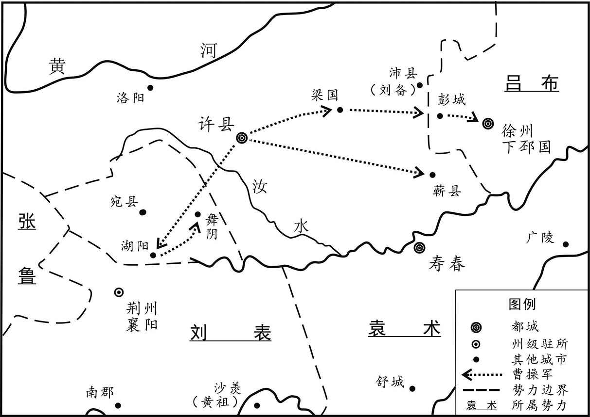 
曹操消灭袁术、吕布等割据势力示意图

## 【原文】

**袁术既称帝，淫侈滋甚，媵御数百，无不兼罗纨，厌梁肉，自下饥困，莫之收恤[1]。既而资实空虚，不能自立，乃烧宫室，奔其部曲陈简、雷薄于灊山，复为简等所拒，遂大穷，士卒散走，忧懑不知所为[2]。乃遣使归帝号于从兄绍，曰：“禄去汉室久矣，袁氏受命当王，符瑞炳然[3]。今君拥有四州，人户百万，谨归大命，君其兴之。”袁谭自青州迎术，欲从下邳北过，曹操遣刘备及将军清河朱灵邀之，术不得过，复走寿春[4]。六月，至江亭，坐箦床而叹曰：“袁术乃至是乎！”因愤慨结病，欧血死[5]。术从弟胤畏曹操，不敢居寿春，率其部曲奉术柩及妻子奔庐江太守刘勋于皖城[6]。故广陵太守徐璆得传国玺，献之[7]。**

## 【注文】

[1]媵（yìng）御：嫔妃，女侍。　　梁肉：精美的饭菜。梁：即“粱”，上等的米。

[2]部曲：部曲之名始于汉，最初为军队编制，将军辖部，部下有曲，后渐变成军队的代名、士卒队伍的代称。部曲受命于国家，与统兵将领无依附关系。东汉以后，对主将有人身依附关系的部曲逐渐成为地方豪强和将领的私人军队、部属。　　灊（qián）山：山名。在今安徽霍山。　　忧懑（mèn）：忧愁，烦闷。

[3]符瑞：吉祥的征兆，多指帝王受命的征兆。

[4]袁谭（？—205年）：袁绍长子，字显思，汝南汝阳（今河南商水）人。早年随父征战各地，为青州刺史。袁绍死后，与袁尚争夺继位权，兵败后投降曹操，在曹操的支持下打败袁尚。后又背叛曹操，兵败被杀。　　清河：古郡、国名。西汉汉高祖置郡，治所在清阳（今河北清河东南）。后改为国，治所也屡有迁移。　　朱灵（生卒年不详）：三国时曹魏著名将领。字文博，清河（今山东临清）人。初为袁绍将领，后归曹操，随曹操征伐四方，屡建战功，拜横海将军。魏文帝时封高唐亭侯，官至后将军，死后谥威侯。

[5]江亭：古地名，在今安徽寿县。　　箦（zé）床：没铺草席的狭长而矮的坐卧用具。箦：竹或芦苇等编成的床垫，泛指竹席。　　欧：即“呕”。

[6]柩（jiù）：装着尸体的棺材。　　庐江：古郡名。楚汉之际设置庐江郡，治所在舒（今安徽庐江西南）。三国时魏、吴各设庐江郡，魏国治所在六安（今安徽六安），吴国治所在皖城（今安徽潜山）。辖境相当于今安徽巢湖、舒城、霍山以南，长江以北，湖北英山、武穴、黄梅和河南商城等地。　　刘勋（生卒年不详）：东汉末年将领。字子台，琅邪（今山东临沂）人。汉灵帝时任沛国建平长，与曹操友善。后依附袁术，任庐江太守。东汉建安三年（198年）被孙策打败，归附曹操，拜平虏将军，封华乡侯。后屡次犯法，被杀。　　皖城：古地名。在今安徽潜山。

[7]徐璆（qiú）（生卒年不详）：字孟玉，广陵海西（今江苏灌南）人。任荆州刺史时，惩治外戚张忠贪赃，声名大振。后历任汝南太守、东海相，有政绩。汉献帝在许都，拜他为廷尉，赴任途中被袁术扣押。袁术死后得其所盗传国玉玺献给汉献帝。后官至太常。　　传国玺（xǐ）：秦以后皇帝世代相传的印章。相传秦始皇用蓝田玉刻成印章，方圆四寸，上纽交五龙，正面刻李斯所写篆文“受命于天，既寿永昌”。秦亡归汉。汉高祖即位后使用，后代帝王以得此玺为符瑞之应，称传国玺。三国以后，秦玺下落不明，但历代统治皆伪造传国玺。

## 【译文】

袁术称帝以后，更加荒淫奢侈，妃嫔（pín）数百人，无不穿着华丽的绸缎，吃着精米鲜肉，但部属、百姓饥饿困苦，他却从不关心。不久，物资耗尽，无法维持，就烧毁宫室，到灊山去投奔他的部曲陈简、雷薄，又被陈简等人拒绝，于是极端困顿，士兵溃散，袁术忧虑愤懑，不知道该怎么办。就派使者把皇帝的尊号送给他的堂兄袁绍，说：“汉朝气数已尽，袁氏应该接受天命而称帝，符瑞已经很明显。现在您已占有四个州的地盘，人口一百万，特地将帝号送给您，希望您能光大袁氏的帝业。”袁谭从青州来迎接袁术，想从下邳北面通过，曹操派刘备和将军清河人朱灵拦截他，袁术无法通过，又逃回寿春。建安四年（199年）六月，到达江亭，袁术坐在箦床上叹息道：“我袁术怎么落到这种地步！”因气愤感慨而生病，吐血而死。袁术的堂弟袁胤害怕曹操，不敢留在寿春，率领他的部曲护送袁术的灵柩和家眷去皖城投奔庐江太守刘勋。前任广陵太守徐璆得到传国宝玺，献给朝廷。

## 【原文】

**袁绍既克公孙瓒，心益骄，贡御稀简。主簿耿包密白绍，宜应天人，称尊号[1]。绍以包白事示军府，僚属皆言包妖妄，宜诛，绍不得已，杀包以自解[2]。**

## 【注文】

[1]主簿：古代官名。汉代始于中央及郡县官署设置此官，以典领文书，办理事务。魏晋以后，渐为统兵大臣重要僚属，参与机要，职权甚重。　　尊号：在封建社会，对皇帝、皇后所上的表示尊崇的称号。此处指称皇帝。

[2]军府：将帅的幕府。

## 【译文】

袁绍打败公孙瓒后，更加骄傲，对朝廷的进贡减少。主簿耿包私下建议袁绍应该顺应天命和民意称帝。袁绍把耿包的建议告诉军府的官员，他们都说耿包妖言惑众，应当处死。袁绍不得已，杀了耿包，表明自己没有称帝的野心。

## 【原文】

**绍简精兵十万、骑万匹，欲以攻许。沮授谏曰：“近讨公孙瓒，师出历年，百姓疲敝，仓库无积，未可动也。宜务农息民，先遣使献捷天子[1]。若不得通，乃表曹操隔我王路，然后进屯黎阳，渐营河南，益作舟船，缮修器械，分遣精骑抄其边鄙，令彼不得安，我取其逸，如此，可坐定也[2]。”郭图、审配曰：“以明公之神武，引河朔之强众以伐曹操，易如覆手，何必乃尔[3]？”授曰：“夫救乱诛暴，谓之义兵；恃众凭强，谓之骄兵。义者无敌，骄者先灭。曹操奉天子以令天下，今举师南向，于义则违。且庙胜之策，不在强弱。曹操法令既行，士卒精练，非公孙瓒坐而受攻者也[4]。今弃万安之术，而兴无名之师，窃为公惧之。”图、配曰：“武王伐纣，不为不义，况兵加曹操，而云无名。且以公今日之强，将士思奋，不及时以定大业，所谓‘天与不取，反受其咎’，此越之所以霸，吴之所以灭也。监军之计在于持牢，而非见时知几之变也[5]。”绍纳图言。图等因是谮授曰[6]：“授监统内外，威震三军，若其浸盛，何以制之？夫臣与主同者亡，此黄石之所忌也[7]。且御众于外，不宜知内。”绍乃分授所统为三都督，使授及郭图、淳于琼各典一军。骑都尉清河崔琰谏曰[8]：“天子在许，民望助顺，不可攻也。”绍不从。**

## 【注文】

[1]献捷：古代军礼之一。打胜仗后，进献所获的俘虏及战利品。

[2]黎阳：古县名，西汉置。治今河南浚县东。也是古津渡名。故址在今河南浚县东南。位于古黄河北岸，与白马津隔河相对。　　河南：古地区名，因处黄河以南而得名，所指地区历代不一，最常见的说法即指今河南一带。

[3]河朔：古地区名。泛指黄河以北，较常指河套以北。

[4]庙胜：克敌制胜的谋略。

[5]监军：此处指沮授。监军原为官名，始于春秋时期的齐国，汉武帝置监军使者。东汉、魏晋皆有，也称监军事，省称监军。

[6]谮（zèn）：说坏话诬陷别人。

[7]黄石：此处指谋略家。《黄石》指书名，相传是秦汉之际隐士黄石公所传。《史记·留侯世家》记载：张良曾在东海下邳（pī）桥遇黄石公，得其所传《素书》，后来以黄石公所授兵书助汉高祖刘邦夺得天下。因此后世遂以黄石公为兵家、谋略家。后世流传有黄石公《素书》《黄石公三略》等，但多是伪托，多抄撮道家、兵家之说而成。

[8]崔琰（yǎn）（？—216年）：字季珪，清河东武城（今山东武城）人，曾受业于郑玄。东汉末年任袁绍骑都尉，后归曹操，历任别驾从事、东西曹掾、尚书、中尉等职。敢于直言，很有威望。后遭诽谤被杀。

## 【译文】

袁绍有精兵十万，战马万匹，准备进攻许都。沮授劝阻他说：“最近讨伐公孙瓒，出兵一年多，百姓疲劳贫困，仓库里没有积蓄的粮草，不能再出兵了。应该先发展农业，使百姓休养生息，先派使者把打败公孙瓒所获的战利品及俘虏献给朝廷。如果不能把捷报告诉朝廷，就上书指责曹操隔断我们和天子的联系，然后出兵进驻黎阳，逐渐向黄河以南发展，多多制造舟船，修理武器，派遣精锐的骑兵去骚扰边境，令他们不得安宁，我们则平安无事。这样，不用兴师动众就可以统一天下。”郭图、审配对袁绍说：“以您的英明威武，率领北方的强兵，去讨伐曹操，易如反掌，何必那样麻烦！”沮授说：“出兵铲除暴乱，称作义兵；依仗人多，只凭势力强大，称为骄兵。义兵天下无敌，骄兵必亡。曹操用天子的名义号令天下，现在我们举兵南下，违背了君臣大义。况且克敌制胜的策略，不在于兵力的强弱。曹操法令严明，士兵训练得很强悍，不是公孙瓒那种坐而待毙的人。现在放弃十分安全的办法，而出动无名之师，我替您担忧啊！”郭图、审配说：“周武王讨伐商纣王，不能说是不义，何况我们出兵是攻打曹操，怎么能说出师无名呢！而且以您现在的强盛，将士们也想立功，如果不及时确立帝王之业，就是古人所说‘上天给予而不取，反过来就会遭殃’，这就是春秋时期越国所以能够称霸，吴国所以灭亡的原因。监军的计策过于谨慎，不知道随机应变。”袁绍采纳了郭图的建议。郭图等人趁机说沮授的坏话：“沮授监军总管内外事务，威震三军，如果他的势力进一步扩大，怎么能控制他呢？臣下与君主的权威一样，就要灭亡，这是兵法《黄石》中的大忌。况且统军在外的人，不应该再主管内部事务。”袁绍于是把沮授所统的军队分为三部分，让郭图、淳于琼各自统率一部。骑都尉清河人崔琰（yǎn）劝袁绍说：“天子在许都，人心所向，不能进攻呀！”袁绍不听。

## 【原文】

**许下诸将闻绍将攻许，皆惧。曹操曰：“吾知绍之为人，志大而智小，色厉而胆薄，忌克而少威，兵多而分画不明，将骄而政令不一，土地虽广，粮食虽丰，适足以为吾奉也。”孔融谓荀彧曰：“绍地广兵强，田丰、许攸智士也为之谋，审配、逢纪忠臣也任其事，颜良、文丑勇将也统其兵，殆难克乎[1]？”彧曰：“绍兵虽多而法不整，田丰刚而犯上，许攸贪而不治，审配专而无谋，逢纪果而自用。此数人者，势不相容，必生内变。颜良、文丑，一夫之勇耳，可一战而禽也。”**

## 【注文】

[1]孔融（153—208年）：东汉末年文学家。字文举，鲁国（今山东曲阜）人，孔子后裔。汉灵帝至汉献帝时历任侍御史、司空掾、虎贲（bēn）中郎将、北海相、将作大匠、太中大夫，时称“孔北海”。喜欢招揽宾客、评论时政。后因触怒曹操被杀。孔融是建安七子之一，有文才，能诗善文，言辞锋利简洁。　　颜良、文丑（生卒年不详）：袁绍部将，均骁勇善战，官渡之战时被曹军斩杀。

## 【译文】

许都的将领们听说袁绍要进攻许都，都很害怕。曹操说：“我知道袁绍的为人，志向很大而智谋不足，外表威严但内心胆怯，猜忌刻薄而缺乏威信，兵力虽多而统御无方，将领骄横而政令不一，土地虽然广阔，粮食虽然富足，这正是为我们准备的。”孔融对荀彧（yù）说：“袁绍土地广阔，兵力强大，有田丰、许攸（yōu）这样的智谋之士为他出谋划策，有审配、逢纪这样的忠诚之臣为他主持政事，有颜良、文丑这样的勇猛将领为他统率军队，几乎很难打败他吧？”荀彧说：“袁绍军队虽然多，但法令不严，田丰刚直而经常冒犯袁绍，许攸贪婪而不自我约束，审配专横而缺乏谋略，逢纪刚愎自用。这几个人，彼此不相容，必然会发生内乱。颜良、文丑勇而无谋，一仗就可以把他们擒获。”

## 【原文】

**秋八月，操进军黎阳，使臧霸等将精兵入青州以扞东方，留于禁屯河上[1]。九月，操还许，分兵守官渡[2]。**

## 【注文】

[1]扞（hàn）：抵御、抵挡。　　于禁（？—221年）：三国时期曹魏将领。字文则，泰山巨平（今山东泰安）人。初随鲍信镇压黄巾起义军，后归曹操，为军司马。东汉建安元年（196年）讨伐青州黄巾军，迁平虏校尉。后随曹操征吕布、张绣、袁绍等，战功卓著，任虎威将军、左将军，封益寿亭侯。建安二十四年（219年）率军援助被关羽围困在樊城的曹仁，兵败被俘投降。后被孙权遣返回魏国，遭曹丕羞辱，惭恨而死。

[2]官渡：古地名。在今河南中牟东北，因临古官渡水得名。东汉建安五年（200年），曹操以劣势兵力在此地歼灭袁绍主力。

## 【译文】

汉献帝建安四年（199年）秋季八月，曹操进军黎阳，派臧霸等人率领精兵进入青州，去保卫东方，留下于禁驻扎在黄河边。九月，曹操返回许都，分兵驻守官渡。

## 【原文】

**袁绍遣人招张绣，并与贾诩书结好。绣欲许之，诩于绣坐上显谓绍使曰：“归谢袁本初，兄弟不能相容，而能容天下国士乎[1]？”绣惊惧曰：“何至于此。”窃谓诩曰：“若此，当何归？”诩曰：“不如从曹公。”绣曰：“袁强曹弱，又先与曹为仇，从之如何？”诩曰：“此乃所以宜从也。夫曹公奉天子以令天下，其宜从一也。绍强盛，我以少众从之，必不以我为重，曹公众弱，其得我必喜，其宜从二也。夫有霸王之志者，固将释私怨以明德于四海，其宜从三也。愿将军无疑。”冬十一月，绣率众降曹操。操执绣手，与欢宴，为子均取绣女，拜扬武将军，表诩为执金吾，封都亭侯[2]。**

## 【注文】

[1]国士：一国之中有杰出才能的人。

[2]扬武将军：古代杂号将军。东汉末年孙权、刘备、曹操皆置，掌领兵征伐。其后三国两晋南北朝皆沿置。　　执金吾：古代官名。秦朝设置中尉，以巡察京城，维持治安，汉武帝太初元年更名为执金吾。金吾为两端涂金的铜棒，官执此以示权威，西汉时执金吾担负宫门外及京城内的巡察、禁暴、督奸等任务，与守卫官厅内的卫尉相表里，属官有中垒、寺互、武库、都船四令丞。王莽改执金吾为奋武。东汉仍称执金吾，俸中二千石，每月三绕行宫外，并掌兵器等。其后三国沿置，北魏初复置，不久即罢。

## 【译文】

袁绍派人去拉拢张绣，并写信给贾诩表示愿意与他结好。张绣准备答应他，贾诩在张绣会见袁绍使者的座席上对使者说：“回去向袁绍说明我们的谢意，兄弟之间都不能相容，能容得下天下英雄豪杰吗？”张绣惊恐地说：“怎么能这样！”悄悄对贾诩说：“如果这样，我们现在依靠谁呢？”贾诩说：“不如投奔曹操。”张绣说：“袁绍势力强大，曹操弱小，以前又和曹操有仇，投靠他能行吗？”贾诩说：“正因为如此，才应该归附曹操。曹操以天子的名义号令天下，这是应该归附他的第一个理由；袁绍强大，我们以为数不多的军队去归附他，一定不会受到重视；曹操势力弱，他得到我们一定很高兴，这是应该归附他的第二个理由；有称霸天下志向的人，一定会抛弃个人的私怨，向天下人表明他有高尚的品德，这是应该归附他的第三个理由。希望您不要有疑虑。”建安四年（199年）冬季十一月，张绣率众投降了曹操。曹操握着张绣的手，高兴地宴请他。为他的儿子曹均娶了张绣的女儿。任命张绣为扬武将军，上表推荐贾诩为执金吾，封都亭侯。

## 【原文】

**关中诸将以袁、曹方争，皆中立顾望。凉州牧韦端使从事天水杨阜诣许，阜还，关右诸将问袁、曹胜败孰在[1]，阜曰：“袁公宽而不断，好谋而少决。不断则无威，少决则后事，今虽强，终不能成大业。曹公有雄才远略，决机无疑，法一而兵精，能用度外之人，所任各尽其力，必能济大事者也。”**

## 【注文】

[1]牧：古代官名，一州之长。西汉时设，不常置；东汉三国时地位提高，位在郡守、刺史之上，掌管一州军政大权。　　杨阜（生卒年不详）：三国时魏国名臣。字义山，天水冀县（今甘肃甘谷东）人。东汉末年任凉州从事、安定长史等职。策动陇右起兵反对马超，战败后投奔张鲁，因功赐爵关内侯。曹操征汉中，杨阜任益州刺史，后又担任武都太守。魏明帝时任大匠、少府，直言劝谏，明帝敬畏他。　　关右：即关西，古人以西为右，汉、唐时泛指函谷关或潼关以西地区。

## 【译文】

关中地区的将领们看到袁绍和曹操正在中原争斗，都保持中立，观望时局发展。凉州牧韦端派他的从事天水人杨阜去许都，杨阜回来后，关中将领们问袁绍与曹操谁胜谁败。杨阜说：“袁绍宽厚但不果断，好谋略而不决断。不决断就没有威严，犹豫不决就会错失良机，现在虽然很强大，终究不能成就大事。曹操有雄才大略，遇事当机立断，法令统一，士卒强悍，用人不拘一格，所任用的人都能各尽其力，必然能够成就伟大的事业。”

## 【原文】

**曹操使治书侍御史河东卫觊镇抚关中[1]。时四方大有还民，关中诸将多引为部曲。觊书与荀彧曰：“关中膏腴之地，顷遭荒乱，人民流入荆州者十万余家[2]。闻本土安宁，皆企望思归；而归者无以自业，诸将各竞招怀以为部曲，郡县贫弱，不能与争，兵家遂强，一旦变动，必有后忧。夫盐，国之大宝也，乱来放散，宜如旧置使者监卖，以其直益市犁牛，若有归民，以供给之，勤耕积粟，以丰殖关中，远民闻之，必日夜竞还。又使司隶校尉留治关中以为之主，则诸将日削，官民日盛，此强本弱敌之利也。”彧以白操，操从之。始遣谒者仆射监盐官，司隶校尉治弘农，关中由是服从[3]。**

## 【注文】

[1]治书侍御史：古代官名。汉代始置。西汉宣帝常命侍御史二人随侍，掌图籍文书，后专设治书侍御史。东汉时隶属于御史台，常置二人，秩六百石，以熟悉法律者充任，凡疑难案件审理，皆依据法律定其是非。魏、晋以下，分掌侍御史所统各曹事务。　　卫觊（jì）（？—229年）：字伯儒，河东安邑（今山西夏县西北）人，东汉末为曹操司空掾。曹操命其去益州联络刘璋对抗刘表，受阻滞留关中，建议曹操实行盐监卖，招抚流民耕田。曹操称魏王后，任尚书、侍中，与王粲共同订立制度。曹操去世后，劝曹丕称帝，封阳吉亭侯。魏明帝时屡次上书言事，建议设置律博士、教授刑法，封閺（wén）乡侯。好古文，善鸟篆、隶草，著有《魏官仪》等。

[2]膏腴（yú）：肥沃。

[3]谒（yè）者仆射（yè）：古代官名。谒者的长官，秦朝始置，汉代沿置，属光禄勋，秩为比千石。掌管朝会司仪，传达策书，皇帝出行时在前奉引。因侍从皇帝左右，职权很重。三国魏国沿置，为五品。　　弘农：古郡名。西汉元鼎四年（前113年）置，治所在今河南灵宝北。

## 【译文】

曹操派治书侍御史河东人卫觊镇守关中。当时，因战乱逃亡四方的流民纷纷返乡，关中各将领多招引他们，作为自己的私人部曲。卫觊写信给荀彧说：“关中土地肥沃，不久前遭受灾荒和战乱，百姓流亡到荆州的有十多万家。现在听说家乡安宁，都希望返回故乡；但是回来之后无法谋生，各将领们竞相招引他们作为自己的部曲，郡县势力弱小，无力和他们竞争，诸将的势力逐渐强盛，一旦发生变故，必然后患无穷。盐是国家重要的财富，天下大乱后无人管理，应当像过去那样，设置官吏负责专卖，用卖盐的钱去购买农具和耕牛，如果有回来的百姓，就将农具和耕牛供给他们，让他们辛勤耕作，广积谷物，使关中富裕起来，远方的流民听说后，一定会不分昼夜地争着返回家乡。然后再派司隶校尉留守关中，主持政务，这样各路将领的势力就会日益削弱，官府和百姓就会不断强大，这是加强根本、削弱敌人的好办法。”荀彧把卫觊的建议报告给曹操，曹操采纳了这一建议。开始派遣谒者仆射去关中管理食盐专卖事务，派司隶校尉治理驻守弘农郡，曹操从此控制了关中地区。

## 【原文】

**袁绍使人求助于刘表，表许之而竟不至，亦不援曹操。从事中郎南阳韩嵩、别驾零陵刘先说表曰[1]：“今两雄相持，天下之重在于将军。若欲有为，起乘其敝可也；如其不然，固将择所宜从。岂可拥甲十万，坐观成败，求援而不能助，见贤而不肯归，此两怨必集于将军，恐不得中立矣。曹操善用兵，贤俊多归之，其势必举袁绍，然后移兵以向江、汉，恐将军不能御也。今之胜计，莫若举荆州以附曹操，操必重德将军，长享福祚，垂之后嗣，此万全之策也。”蒯越亦劝之[2]。表狐疑不断，乃遣嵩诣许，曰：“今天下未知所定，而曹操拥天子都许，君为我观其衅。”嵩曰：“圣达节，次守节，嵩守节者也。夫君臣名定，以死守之。今策名委质，唯将军所命，虽赴汤蹈火，死无辞也[3]。以嵩观之，曹公必得志于天下。将军能上顺天子，下归曹公，使嵩可也；如其犹豫，嵩至京师，天子假嵩一职，不获辞命，则成天子之臣，将军之故吏耳。在君为君，则嵩守天子之命，义不得复为将军死也。惟加重思，无为负嵩。”表以为惮使，强之。至许，诏拜嵩侍中、零陵太守。及还，盛称朝廷、曹公之德，劝表遣子入侍。表大怒，以为怀贰，大会寮属，陈兵，持节，将斩之，数曰：“韩嵩敢怀贰邪[4]！”众皆恐，欲令嵩谢。嵩不为动容，徐谓表曰：“将军负嵩，嵩不负将军。”具陈前言。表妻蔡氏谏曰：“韩嵩，楚国之望也，且其言直，诛之无辞。”表犹怒，考杀从行者，知无他意，乃弗诛而囚之。**

## 【注文】

[1]韩嵩（sōng）（生卒年不详）：字德高，义阳（今河南新野）人。东汉末年隐居郦西山中，后避居荆州，任刘表别驾、从事中郎，劝刘表归降曹操，未被采纳。刘表死后，归降曹操。　　零陵：古郡名。西汉元鼎六年（前111年）分桂阳郡而置，辖境甚广，治所零陵，在今广西全州西南。东汉治所移至泉陵，即今湖南永州零陵区，辖境渐小。　　刘先（生卒年不详）：字始宋，零陵（今湖南永州零陵区）人。初为刘表属官，任别驾，劝刘表投降曹操，未被采纳。后归降曹操，任尚书令。

[2]蒯（kuǎi）越（？—214年）：字异度，襄阳中庐（今湖北襄樊襄阳区）人。初为大将军何进属官，后任汝阳令。为刘表出谋划策，平定荆州，拜章陵太守，封樊亭侯。刘表死后，与韩嵩、傅巽（xùn）等劝刘琮（cóng）归降曹操。

[3]委质：人臣拜见人君时的一种礼节，即下拜。后引申为归顺。　　赴汤蹈火：汤，热水；蹈，踩。沸水敢蹚，烈火敢踏，比喻不避艰险，奋勇向前。

[4]寮（liáo）属：僚属，属官。

## 【译文】

袁绍派人向刘表求援，刘表答应了却没有去，也不援助曹操。从事中郎南阳人韩嵩、别驾零陵人刘先劝刘表说：“现在袁绍和曹操相争斗，天下的重心在将军您这里。如果想有所作为，可以趁他们两败俱伤的时候起兵争夺天下；如果不想这样，就应该选择所要归附的人。怎么能够拥兵十万，坐观成败，来求援而不帮助，见到贤能的人却不肯归附，这样袁绍、曹操的怨恨都会集中在将军身上，恐怕您无法中立。曹操善于用兵，贤人俊才多归附他，看形势他一定会打败袁绍，然后向长江、汉水流域进军，恐怕将军您无法抵御。现在最好的办法是率领荆州归附曹操，曹操一定会十分感激您，这样就可以永远享受荣华富贵，还能传给子孙，这是万全之策。”蒯越也劝刘表这样做。但是刘表犹豫不决，就派韩嵩去许都，对他说：“现在还不知道谁最终能平定天下，而曹操拥戴天子建都于许，你替我观察一下那里的形势。”韩嵩说：“圣人能够通晓事理，因时制宜，随机应变；一般的人只能誓死坚守节操，我韩嵩是坚守节操的人。君臣名分一定，就应该坚守它。现在我作为您的部属，只要将军下令，即使赴汤蹈火，也宁死不辞。在我看来，曹操一定能统一天下。将军您如果能服从天子，归附曹操，可以派我去许都；如果您犹豫不决，我到了许都，天子赐予我一个官职，推辞不掉，我就成了天子的官员，将军的故吏。既然成为天子的臣下，就要听从天子的命令，按理就不能再为将军效命了。请您多加考虑，不要辜负了我的赤诚之心。”刘表以为韩嵩害怕出使许都，就强迫他去。韩嵩到了许都，汉献帝果然任命他为侍中、零陵太守。韩嵩回去以后，极力称赞朝廷和曹操的功德，劝刘表送儿子去朝廷侍奉天子，充当人质。刘表大怒，认为韩嵩对他不忠，就召集所属官吏，部署士兵，手持符节，准备杀掉韩嵩，好几次说：“韩嵩，你竟敢对我怀有贰心！”大家都很害怕，想劝韩嵩向刘表谢罪。韩嵩却不动声色，慢慢对刘表说：“是将军您辜负了我，不是我辜负了您。”就把出使前对刘表说的话又重复了一遍。刘表的妻子蔡氏劝刘表说：“韩嵩是荆州有名望的人士，而且他说的话有理，杀了他没有理由。”刘表还是怒气未消，拷打杀死了韩嵩的随从人员，知道韩嵩没有背叛自己的意思，就没杀韩嵩，但把他囚禁起来。

## 【原文】

**十二月，曹操复屯官渡。操遣刘备邀袁术，备遂杀徐州刺史车胄，留关羽守下邳，行太守事[1]。**

## 【注文】

[1]车胄（zhòu）（？—200年）：曹操部将。曹操擒杀吕布后任命车胄为车骑将军、徐州刺史镇守该地区。东汉建安五年（200年）被刘备所杀。　　关羽（？—219年）：字云长，河东解县（今山西临猗西）人。东汉末年亡命涿（zhuō）郡，随刘备起兵，为刘备主要将领。东汉建安五年（200年）关羽在下邳（pī）为曹军俘获，备受礼遇，封汉寿亭侯，后仍复归刘备。赤壁之战后，拜为襄阳太守、荡寇将军。建安十九年（214年）镇守荆州。建安二十四年（219年）发兵围攻曹操大将曹仁于樊城，大破于禁所率七军，结果于禁投降，庞德被杀，一时北方震惊。不久曹操许诺割江南以封孙权，在孙权部将吕蒙策划下，出兵袭夺荆州，于是关羽兵败麦城（今湖北当阳东），突围时被俘，后遭杀害。

## 【译文】

汉献帝建安四年（199年）十二月，曹操再次在官渡驻军。曹操派遣刘备去拦截袁术，刘备乘机杀死徐州刺史车胄，留下关羽镇守下邳，行使太守的权力。

## 【原文】

**五年春正月，曹操自讨刘备，备奔青州，归袁绍。曹操还军官渡，绍乃议攻许。田丰曰：“曹操既破刘备，则许下非复空虚。且操善用兵，变化无方，众虽少，未可轻也，今不如以久持之。将军据山河之固，拥四州之众，外结英雄，内修农战，然后简其精锐，分为奇兵，乘虚迭出，以扰河南，救右则击其左，救左则击其右，使敌疲于奔命，民不得安业，我未劳而彼已困，不及三年，可坐克也。今释庙胜之策而决成败于一战，若不如志，悔无及也。”绍不从。丰强谏忤绍，绍以为沮众，械系之[1]。于是移檄州郡，数操罪恶[2]。**

## 【注文】

[1]忤（wǔ）：违逆，触犯。

[2]檄（xí）：古代官府用以征召、晓谕或声讨的文书。

## 【译文】

汉献帝建安五年（200年）春季正月，曹操亲自去讨伐刘备，刘备逃到青州，归降袁绍。曹操率军回到官渡。袁绍商议进攻许都。田丰说：“曹操既然已经打败刘备，许都已经不空虚了。曹操善于用兵，变化无穷，军队虽然少，但是不能轻视他，现在不如与他长时间对峙。将军据有太行山、黄河这样的险要地区，拥有四州的百姓，对外交结英雄豪杰，对内发展生产，加强战备，然后挑选精锐的士卒，分成几组奇兵，乘机频繁出击，扰乱黄河以南的地区。曹军救援右边的，我们就攻击他左边的，救援左边的，我们就攻击他右边的，使敌人疲于奔命，百姓不得安居乐业，我们还没有疲劳，敌人就已经困顿不堪了，不出三年，就可以坐着等待胜利了。现在放弃必胜的策略，而以一战来决定胜负，如果不能取胜，后悔也来不及了。”袁绍不听。田丰竭力劝阻，冒犯了袁绍，袁绍认为田丰扰乱了军心，给他戴上刑具，囚禁起来。于是袁绍向各州县发布讨伐曹操的檄文，列举曹操的罪状。

## 【原文】

**二月，进军黎阳。沮授临行，会其宗族，散资财以与之，曰：“势存则威无不加，势亡则不保一身，哀哉！”其弟宗曰：“曹操士马不敌，君何惧焉？”授曰：“以曹操之明略，又挟天子以为资，我虽克伯珪，众实疲敝，而主骄将忲，军之破败，在此举矣[1]。扬雄有言‘六国蚩蚩，为嬴弱姬’，其今之谓乎[2]！”**

## 【注文】

[1]明略：高明的智谋。　　伯珪（guī）：公孙瓒的字。　　忲（tài）：奢侈过度。

[2]扬雄（前53—18年）：西汉文学家。字子云，蜀郡成都（今属四川）人。曾任给事黄门郎、中散大夫等职。博通群籍，多识奇字，长于辞赋，有《法言》《太玄》《方言》等著作传于世。　　六国蚩蚩，为嬴弱姬：出自西汉扬雄《法言》，意思是春秋战国时期六国把天下搞得乱糟糟的，使得姬氏周天子国力衰落权威不再，最后反倒便宜了统一天下的嬴氏秦国。

## 【译文】

汉献帝建安五年（200年）二月，袁绍进军黎阳。沮授临出征前，召集他的宗族，把家中的财产分给他们，说：“这次进攻曹操，如果能够取胜，则权力无穷；如果失败了，就自身难保，可悲呀！”他的弟弟沮宗说：“曹操的军队比不上我们，您害怕什么？”沮授说：“曹操有智谋，又挟持天子作为资本，我们虽然打败了公孙瓒，但实际上已经很疲惫，而且主上骄傲，将领奢侈，我军的败亡，就在这一仗了。扬雄所说‘六国纷扰，只不过是削弱了周朝，为秦国代周作了准备’，说的就是现在的情况啊！”

## 【原文】

**振威将军程昱，以七百兵守鄄城[1]。曹操欲益昱兵二千，昱不肯，曰：“袁绍拥十万众，自以所向无前，今见昱少兵，必轻易，不来攻。若益昱兵，过则不可不攻，攻之必克，徒两损其势，愿公无疑。”绍闻昱兵少，果不往。操谓贾诩曰：“程昱之胆，过于贲、育矣[2]。”**

## 【注文】

[1]振威将军：古代杂号将军名。东汉置，掌征伐，不常设。三国魏沿置，位四品。魏、晋以后成为常设高级统兵将领。

[2]贲、育：即孟贲和夏育，两人均为战国时卫国的勇士。

## 【译文】

振威将军程昱率领七百人驻守鄄（juàn）城。曹操想给程昱增加两千兵士，程昱不肯，说：“袁绍拥兵十万，自以为所向无敌，现在见我的兵少，一定会轻视，不来进攻。如果给我增加士兵，袁绍经过这里，就不能不来进攻；如果来进攻，一定会攻下城池，白白损失我们两处的势力，希望您不必犹疑。”袁绍听说程昱的兵很少，果然没有去攻打他。曹操对贾诩说：“程昱的胆量，超过了古代的勇士孟贲和夏育了。”

## 【原文】

**袁绍遣其将颜良攻东郡太守刘延于白马[1]。沮授曰：“良性促狭，虽骁勇，不可独任。”绍不听。夏四月，曹操北救刘延，荀攸曰：“今兵少不敌，必分其势乃可。公到延津，若将渡兵向其后者，绍必西应之，然后轻兵袭白马，掩其不备，颜良可禽也[2]。”操从之。绍闻兵渡，即分兵西邀之。操乃引军兼行趣白马，未至十余里，良大惊，来逆战。操使张辽、关羽先登击之。羽望见良麾盖，策马刺良于万众之中，斩其首而还，绍军莫能当者[3]。遂解白马之围，徙其民，循河而西。绍渡河追之，沮授谏曰：“胜负变化不可不详，今宜留屯延津，分兵官渡，若其克获，还迎不晚，设其有难，众弗可还。”绍弗从。授临济叹曰：“上盈其志，下务其功，悠悠黄河，吾其济乎？”遂以疾辞。绍不许而意恨之，使省其所部，并属郭图。**

## 【注文】

[1]白马：古县名。春秋卫国曹邑，秦置县。汉属东郡，治所在今河南滑县旧城东。

[2]延津：古津渡名。古代黄河流经今河南延津西北至滑县以北的一段，为重要渡口，总称延津。

[3]麾（huī）盖：将帅旗帜的顶部。

## 【译文】

袁绍派大将颜良进攻驻扎在白马的东郡太守刘延。沮授说：“颜良性情急躁，气量狭小，虽然骁勇，但不能独当一面。”袁绍不听。建安五年（200年）夏季四月，曹操北上救援刘延。荀攸说：“现在我们兵力太少，敌不过袁绍，必须分散敌人的兵力才行。您到了延津，假装要渡过黄河，进攻他们后方的样子，袁绍必然会派兵向西迎战，然后您再轻装前进，袭击白马，攻其不备，就可以擒获颜良。”曹操采纳了荀攸的建议。袁绍听说曹军渡黄河，就派兵向西拦截曹军。曹操于是率军昼夜兼程赶往白马。到离白马十余里时，颜良才知道，十分吃惊，前来迎战。曹操派张辽、关羽先去进攻。关羽望见颜良兵车上的麾盖，策马直入，在万军之中刺死颜良，砍下他的头颅回来，袁绍的军队没人能够抵挡。于是解除了白马之围，将白马的百姓沿着黄河向西迁徙。袁绍率军渡过黄河追击曹操，沮授劝他说：“战争的胜负变化无常，不能不慎重考虑啊。现在应当驻扎在延津，派兵夺取官渡，如果能取胜，回来再迎接大军也不晚；如果现在就全军渡河，万一失利，我们就全都没有退路了。”袁绍不听。沮授在渡河的时候叹息说：“主上狂妄自大，下面的人只会贪功，悠悠黄河，我还能回来吗？”于是称病辞职。袁绍没有批准，而且怀恨在心，再次裁减他的部队，拨给郭图指挥。

## 【原文】

**绍军至延津南，操勒兵驻营南阪下，使登垒望之，曰：“可五六百骑[1]。”有顷，复白：“骑稍多，步兵不可胜数。”操曰：“勿复白。”令骑解鞍放马。是时，白马辎重就道[2]。诸将以为敌骑多，不如还保营。荀攸曰：“此所以饵敌，如何去之。”操顾攸而笑。绍骑将文丑与刘备将五六千骑前后至。诸将复白“可上马”。操曰：“未也。”有顷，骑至稍多，或分趣辎重。操曰：“可矣。”乃皆上马。时骑不满六百，遂纵兵击，大破之，斩丑。丑与颜良，皆绍名将也，再战，悉禽之，绍军夺气。操还军官渡。**

## 【注文】

[1]南阪：今河南滑县东白马山南坡。

[2]辎（zī）重：部队行军中所携带的器械、粮草、营帐、服装等军用物资的统称。

## 【译文】

袁绍的军队到达延津以南时，曹操部署军队在白马山南麓安营扎寨，派人到高处观察袁军，瞭望的人说：“大概有五六百骑兵。”一会儿又报告说：“骑兵稍微增多，步兵不可胜数。”曹操说：“不要再报告了。”命令骑兵解下马鞍，放马休息。这时，从白马来的辎重车辆已经在路上。将领们认为敌人的骑兵多，不如回去守卫营寨。荀攸说：“这是在引诱敌人，怎么能回去。”曹操回头看着荀攸微微一笑。袁绍的大将文丑和刘备率领五六千骑兵先后抵达。将领们又报告说“可以上马了”。曹操说：“还不可以。”一会儿，到的骑兵增多了，有的去抢夺辎重车辆。曹操说：“可以上马了。”于是曹军全都上马。当时曹操的骑兵还不到六百人，就全部出击，袁军大败，斩杀了文丑。文丑和颜良都是袁绍的名将，仅交战两次，就全被杀死，袁军的士气大落。曹操率军退回官渡。

## 【原文】

**秋七月，汝南黄巾刘辟等叛曹操应袁绍，绍遣刘备将兵助辟，郡县多应之[1]。绍遣使拜阳安都尉李通为征南将军，刘表亦阴招之，通皆拒焉[2]。或劝通从绍，通按剑叱之曰：“曹公明哲，必定天下，绍虽强盛，终为之虏耳。吾以死不贰。”即斩绍使，送印绶诣操[3]。**

## 【注文】

[1]汝南：古郡名。东汉、三国时治所在平舆（今河南平舆）。辖境相当于今河南颍河、淮河之间，京广铁路西侧一线以东，安徽茨河、西淝河以西，淮河以北地区。

[2]阳安：古郡名。东汉建安三年（198年）分汝南郡设置，治所在朗陵（今河南确山西南），辖境相当于今确山县地区。　　李通（生卒年不详）：曹操部将，字文达，江夏平春（今河南信阳）人。东汉末年起兵镇压黄巾军。后归降曹操，任振威中郎将。随曹操讨张绣，因功拜裨将军，封建功侯。官渡之战时拒绝袁绍诱降，改封都亭侯，拜汝南太守。　　征南将军：古代杂号将军名。汉魏皆置，掌征伐或镇守。秩二千石，为四征将军之一。

[3]贰：背叛。　　印绶：旧时称官府的图章和系图章的丝带。

## 【译文】

汉献帝建安五年（200年）秋季七月，汝南郡的黄巾军刘辟等人背叛曹操，响应袁绍，袁绍派遣刘备率兵去援助刘辟，各郡县纷纷响应。袁绍派遣使者委任安阳都尉李通为征南将军，刘表也想秘密招降他，都被李通拒绝了。有人劝李通归降袁绍，李通手握宝剑，叱责说：“曹公贤明睿智，一定会平定天下，袁绍虽然强盛，最终会被他打败。我誓死不背叛他。”立即杀掉袁绍的使者，把袁绍授予他的官印绶带送给曹操。

## 【原文】

**袁绍军阳武，沮授说绍曰：“北兵虽众，而劲果不及南；南军谷少，而资储不如北。南幸于急战，北利在缓师，宜徐持久，旷以日月[1]。”绍不从。八月，绍进营稍前，依沙塠为屯，东西数十里，操亦分营与相当[2]。**

## 【注文】

[1]阳武：古县名。秦置县，治所在今河南原阳东南。

[2]沙塠（duī）：塠即堆，沙堆，小沙丘。

## 【译文】

袁绍驻扎在阳武，沮授对袁绍说：“我军的数量虽多，但不如曹军的战斗力强；曹军的粮草少，物资储备不如我们。曹军希望速战速决，我们的优势在于拖延时间，进行持久战。”袁绍不听。建安五年（200年）八月，袁绍将营地稍微向前推进，靠着沙丘扎营，东西延绵数十里，曹操也把部队分开扎营，与袁绍对垒。

## 【原文】

**九月，曹操出兵与袁绍战，不胜，复还，坚壁。绍为高橹，起土山，射营中，营中皆蒙楯而行[1]。操乃为霹雳车，发石以击绍楼，皆破[2]。绍复为地道攻操，操辄于内为长堑以拒之。操众少粮尽，士卒疲乏，百姓困于征赋，多叛归绍者。操患之，与荀彧书，议欲还许，以致绍师。彧报曰：“绍悉众聚官渡，欲与公决胜败。公以至弱当至强，若不能制，必为所乘，是天下之大机也。且绍布衣之雄耳，能聚人而不能用。以公之神武明哲而辅以大顺，何向而不济？今谷食虽少，未若楚、汉在荥阳、成皋间也[3]。是时刘、项莫肯先退者，以为先退则势屈也。公以十分居一之众，画地而守之，搤其喉而不得进，已半年矣，情见势竭，必将有变[4]。此用奇之时，不可失也。”操从之，乃坚壁持之。**

## 【注文】

[1]橹：望楼。古时军中用以侦察、防御或攻城的高台。多建于高地或楼车、巢车之上，顶上无覆盖，多作军事瞭望用。

[2]霹雳车：古代一种抛掷石弹以击敌的武器，因其发出的石弹飞行时有声，所以称为霹雳车。

[3]楚、汉：楚指项羽，汉指刘邦。秦朝灭亡后，刘邦和项羽为争夺统治权进行战争，成皋之战时，双方在荥阳、成皋形成相峙状态，战争互有胜负。

[4]搤（è）：同“扼”。

## 【译文】

汉献帝建安五年（200年）九月，曹操出兵与袁绍交战，没有取胜，退回来坚守营寨不出战。袁绍在营中建造望楼，堆起土山，向曹操营中射箭。曹操营中的人都要用盾牌挡着箭才能行走。曹操就制造霹雳车，发射石头猛击袁绍的望楼，望楼全部被击毁。袁绍又挖掘地道来攻击曹操，曹操就在营中挖长沟来抵御。曹操兵少，粮食也要用完了，士兵疲乏，百姓也被繁重的赋税徭役折磨得痛苦不堪，很多人反叛曹操，归附袁绍。曹操很忧虑，给荀彧写信，想撤军回许都，引诱袁军深入。荀彧回信说：“袁绍把他的部队全部集中在官渡，准备和您一决胜负。您以最弱来抵御最强，如果不能克敌制胜，一定会被他打败，这正是胜败的关键时刻。况且袁绍只不过是平常人中的英雄，能够招揽人才但不能任用他们。凭您的威武明智，再加上用天子的名义进行讨伐，名正言顺，做什么能不成功？现在粮草虽然很少，但还没有达到项羽、刘邦在荥阳、成皋对峙时的那种局面。当时刘邦和项羽都不愿意先撤军，是因为先撤军就会处于劣势。您以袁绍十分之一的军队坚守阵地，扼住袁军的咽喉，使他们无法前进，已经半年了，双方的形势已经到了最后时刻，必定要发生变化了。现在正是出奇制胜的时候，不要错失良机。”曹操听从了荀彧的劝告，继续坚守营寨，与袁军对峙。

## 【原文】

**操见运者，抚之曰：“却十五日，为汝破绍，不复劳汝矣。”绍运谷车数千乘至官渡。荀攸言于操曰：“绍运车旦暮至，其将韩猛锐而轻敌，击可破也。”操曰：“谁可使者？”攸曰：“徐晃可。”乃遣偏将军河东徐晃与史涣邀击猛，破走之，烧其辎重[1]。**

## 【注文】

[1]偏将军：古官名。西汉置，为主将之下的副将，东汉、三国时为杂号将军中地位较低者，仅高于裨将军。魏、晋、南朝宋皆八品。　　徐晃（？—227年）：三国时魏国将领。字公明，河东杨县（山西洪洞东南）人。初为郡吏，继随车骑将军杨奉镇压黄巾军，以功拜骑都尉。与杨奉保护汉献帝至洛阳，封都亭侯。东汉建安元年（196年）随曹操转战南北，屡立战功。官渡之战时，徐晃率军截烧袁绍军粮车数千辆，迅速改变了曹、袁两军数月对峙中的力量对比，最终促使曹军胜利。渭南一战，徐晃在蒲坂（今山西永济西）秘密渡河，奇袭渭北，保证曹操取得关中。曹丕称帝，拜徐晃为右将军。徐晃治军严格，用兵灵活，曾获曹氏父子赞誉。

## 【译文】

曹操见到运输粮草的人，安慰他们说：“再过十五天，我为你们打败袁绍，就不用再辛苦运粮了。”袁绍运输军粮的数千辆车到达官渡。荀攸对曹操说：“袁绍运粮的辎重车辆马上就到了，押运粮草的将领韩猛勇敢但却轻敌，袭击他，必定能取胜。”曹操说：“派谁去呢？”荀攸说：“可以派徐晃去。”曹操就派偏将军河东人徐晃和史涣去拦截韩猛，韩猛被打败逃走，曹军烧毁了韩猛押运的辎重。

## 【原文】

**冬十月，绍复遣车运谷，使其将淳于琼等将兵万余人送之，宿绍营北四十里[1]。沮授说绍：“可遣蒋奇别为支军于表，以绝曹操之钞。”绍不从。许攸曰：“曹操兵少而悉师拒我，许下余守，势必空弱。若分遣轻军，星行掩袭，许可拔也。许拔，则奉迎天子以讨操，操成禽矣。如其未溃，可令首尾奔命，破之必也。”绍不从，曰：“吾要当先取操。”会攸家犯法，审配收系之，攸怒，遂奔操。**

## 【注文】

[1]淳于琼（？—200年）：字仲简，颍川（今河南禹州）人，汉灵帝时任西园八校尉之一的右校尉。后随袁绍讨伐董卓，成为袁绍部将。曾与沮授等劝袁绍尊迎汉献帝，未被采纳。官渡之战时运送军粮，在乌巢被曹操偷袭，兵败被杀。

## 【译文】

汉献帝建安五年（200年）冬季十月。袁绍又派车辆去运送粮草，让部将淳于琼等率兵万余人护送，驻扎在袁绍营寨以北四十里的地方。沮授劝袁绍说：“可以派蒋奇另外率领一支部队在淳于琼外围巡逻，以防曹操偷袭。”袁绍不听。许攸说：“曹操兵少，现在全部军队都在抵御我们，许都防守一定很空虚。如果派遣一支精锐部队轻装前进，星夜兼程去偷袭，可以攻下许都。我们攻下了许都，就能以天子的名义去讨伐曹操，曹操就能被我们捉住。如果曹军不溃败，也可以使他们疲于首尾奔命，一定能打败他们。”袁绍不听，说：“我要先捉住曹操。”这时，正遇上许攸的家人犯法，审配逮捕了他们，许攸很恼怒，就去投奔曹操了。

## 【原文】

**操闻攸来，跣出迎之，抚掌笑曰：“子卿远来，吾事济矣[1]。”既入坐，谓操曰：“袁氏军盛，何以待之？今有几粮乎？”操曰：“尚可支一岁。”攸曰：“无是，更言之。”又曰：“可支半岁。”攸曰：“足下不欲破袁氏耶？何言之不实也。”操曰：“向言戏之耳。其实可一月，为之奈何？”攸曰：“公孤军独守，外无救援，而粮谷已尽，此危急之日也。袁氏辎重万余乘，在故市、乌巢，屯军无严备，若以轻兵袭之，不意而至，燔其积聚，不过三日，袁氏自败也[2]。”操大喜，乃留曹洪、荀攸守营，自将步骑五千人，皆用袁军旗帜，衔枚缚马口，夜从间道出，人抱束薪，所历道有问者，语之曰：“袁公恐曹操钞略后军，遣兵以益备[3]。”闻者信以为然，皆自若。既至，围屯，大放火，营中惊乱。会明，琼等望见操兵少，出陈门外，操急击之，琼退保营，操遂攻之。**

## 【注文】

[1]跣（xiǎn）：光着脚，不穿鞋袜。

[2]故市：古地名。在今河南荥阳市东北。　　乌巢：地名，在今河南延津东南。

[3]衔枚：古代军队夜晚秘密行动时，让兵士口中横含一个小棍，防止说话，以防被敌人发觉。

## 【译文】

曹操听说许攸来投奔他，光着脚出来迎接，鼓掌大笑说：“你远道而来，我的大事就要成功了。”许攸入座之后，问曹操：“袁绍强盛，怎么对付他？现在还有多少粮草？”曹操说：“还可以支持一年。”许攸说：“不会吧，再说一说。”曹操又说：“可以支持半年。”许攸说：“您想打败袁绍吗？怎么不给我说实话呢？”曹操说：“刚才在开玩笑，实际上只能支持一个月，该怎么办呢？”许攸说：“您现在孤军坚守在这里，没有外援，粮草已经要用完，这是万分危急的时候。袁绍的万余辆辎重车在故市、乌巢，驻扎在那里的部队防守不严，如果派一支精锐的部队去袭击他，出其不意，快速赶到那里，烧毁囤积的粮草物资，不出三天，袁绍就会不战自溃。”曹操十分高兴，就留下曹洪、荀攸留守营寨，亲自率领五千步兵、骑兵前去偷袭，都使用袁军的旗号，让士兵口中衔着一个小棍子，把马嘴捆上，以防发出声音惊动敌人。夜晚从小道出发，每人抱着一捆柴草，沿途有人盘问，就告诉他们：“袁公怕曹操袭击后方的部队，派兵去加强防备。”盘问的人信以为真，没有戒备，一切照常。曹操到了乌巢，包围袁军大营，一齐四处放火，袁军大乱，惊慌失措。这时，天已放亮，淳于琼等人看见曹操的兵少，在营外列开阵势，曹操马上进攻，淳于琼退守营寨，曹操于是对他发起猛攻。

## 【原文】

**绍闻操击琼，谓其子谭曰：“就操破琼，吾拔其营，彼固无所归矣。”乃使其将高览、张郃等攻操营[1]。郃曰：“曹公精兵往，必破琼等。琼等破，则事去矣，请先往救之。”郭图固请攻操营，郃曰：“曹公营固，攻之必不拔。若琼等见禽，吾属尽为虏矣。”绍但遣轻骑救琼，而以重兵攻操营，不能下。**

## 【注文】

[1]高览（生卒年不详）：袁绍部将。官渡之战中与张郃一起投降曹操，后官至偏将军、东莱侯。　　张郃（hé）（？—231年）：三国时期魏国著名将领，字儁（jùn）乂（yì），河间鄚（mào）县（今河北任丘北）人。东汉末年，为韩馥军司马，参与镇压黄巾军。后归附袁绍，任校尉。击败公孙瓒，升任宁国中郎将。官渡之战后，转归曹操，拜偏将军，封都亭侯。魏文帝曹丕时任左将军，晋爵都乡侯。魏明帝即位，奉命率军西拒蜀军，大败蜀将马谡于街亭。后蜀军再次攻魏，张郃领兵反击，追至木门，中流矢阵亡。谥“壮侯”。

## 【译文】

袁绍听说曹操进攻淳于琼，对他的儿子袁谭说：“即使曹操打败了淳于琼，我去攻破他的大营，他也没地方去了。”就派他的部将高览、张郃等人去攻打曹操的大营。张郃说：“曹操率领精锐部队去偷袭，一定会打败淳于琼等人。淳于琼等人被打败，就大势已去，请先去救援淳于琼。”郭图坚持要攻打曹操的大营，张郃说：“曹操的营寨很坚固，一定攻不下来。如果淳于琼等人被打败，我们都会成为曹军的俘虏。”袁绍只派了一支轻装骑兵去救援淳于琼，而派重兵去攻打曹操大营，没有攻下来。

## 【原文】

**绍骑至乌巢，操左右或言贼骑稍近，请分兵拒之。操怒曰：“贼在背后乃白。”士卒皆殊死战，遂大破之，斩琼等，尽燔其粮谷，杀士卒千余人，皆取其鼻，牛马割唇舌，以示绍军。绍军将士皆恟惧[1]。郭图惭其计之失，复谮张郃于绍曰：“郃快军败[2]。”郃忿惧，遂与高览焚攻具，诣操营降。曹洪疑不敢受，荀攸曰：“郃计画不用，怒而来奔，君有何疑？[3]”乃受之。**

## 【注文】

[1]恟惧：惶恐不安。

[2]谮（zèn）：说别人的坏话，诬陷，中伤。

[3]计画：即“计划”。

## 【译文】

袁绍派的骑兵到达乌巢，曹操亲兵中有人说敌人的骑兵逐渐靠近了，请分兵去抵御。曹操大怒说：“敌人到了背后再来报告。”曹军全都拼命作战，打败了袁军，杀死淳于琼等人，烧毁了全部粮草，杀死袁军一千多人，割下他们的鼻子，牛马则割下嘴唇和舌头，拿给袁军看。袁绍的士兵看后都很恐惧。郭图因为他的计策失误而感到很羞耻，又向袁绍说张郃的坏话：“张郃很高兴我军失败。”张郃又恨又怕，就和高览烧毁攻城器具，到曹营去投降，曹洪怀疑张郃诈降，不敢接受，荀攸说：“袁绍不用张郃的计策，一怒之下来投奔我们，你有什么可怀疑的？”就接受了他们的投降。

## 【原文】

**于是绍军惊扰，大溃。绍及谭等幅巾乘马，与八百骑渡河[1]。操追之不及，尽收其辎重、图书、珍宝。余众降者，操尽坑之，前后所杀七万余人。**

## 【注文】

[1]幅巾：古代男子用一幅绢束头发，是表示儒雅的装束。

## 【译文】

于是袁军惊慌失措，全军崩溃。袁绍和袁谭等人戴着头巾，骑着马，与八百名骑兵渡过黄河逃走。曹操追不上他们，缴获了全部的物资、图书、珍宝。袁军没有逃走的投降后，全部被曹操活埋了，先后杀死了七万余人。

## 【原文】

**沮授不及绍渡，为操军所执，乃大呼曰：“授不降也，为所执耳。”操与之有旧，迎谓曰：“分野殊异，遂用圮绝，不图今日乃相禽也[1]。”授曰：“冀州失策，自取奔北[2]。授知力俱困，宜其见禽。”操曰：“本初无谋，不相用计。今丧乱未定，方当与君图之。”授曰：“叔父、母弟，县命袁氏，若蒙公灵，速死为福[3]。”操叹曰：“孤早相得，天下不足虑也。”遂赦而厚遇焉。授寻谋归袁氏，操乃杀之。**

## 【注文】

[1]分野：古人按天上星辰的位置将地面划分十二个区域，叫分野。后用来指划分事物的范围、界限。　　圮（pǐ）绝：毁绝，断绝。

[2]冀州：指袁绍，因其为冀州牧，故用官名称之。

[3]县：即“悬”。

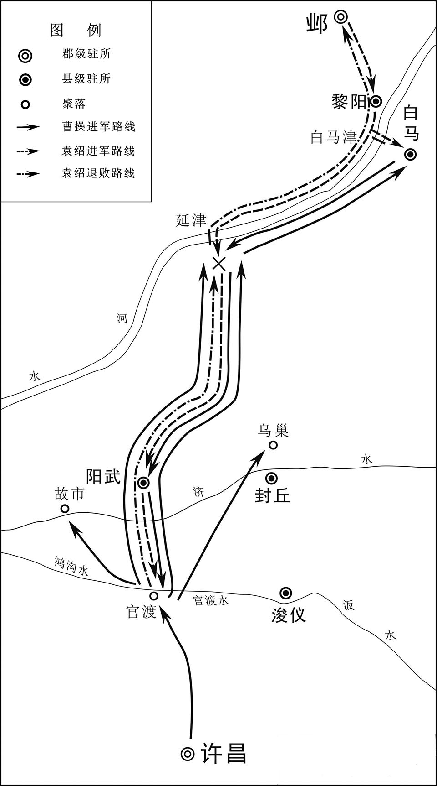 
官渡之战形势图

## 【译文】

沮授没有和袁绍一起渡黄河，被曹军抓住，就大喊：“我不投降，是被抓住的。”曹操和沮授以前有交情，迎接他说：“我们不在一起，不能相见，没想到今天被我抓到。”沮授说：“袁绍失策，失败是咎由自取。我的智慧和能力无法施展，应当被擒。”曹操说：“袁绍没有谋略，不采用你的计策。现在天下战乱还没平定，我正要和你一起建功立业。”沮授说：“我叔父、弟弟的性命都掌握在袁绍手中，如果能够蒙受您的恩惠，请您赶快杀了我吧。”曹操叹息道：“我如果能早得到你，平定天下就不用忧虑了。”就赦免了沮授，并且给予优厚的待遇。沮授图谋逃跑，想回到袁绍那里去，曹操就把他杀了。

## 【原文】

**操收绍书中，得许下及军中人书，皆焚之，曰：“当绍之强，孤犹不能自保，况众人乎？”冀州城邑多降于操。袁绍走至黎阳北岸，入其将军蒋义渠营，把其手曰：“孤以首领相付矣[1]。”义渠避帐而处之，使宣号令。众闻绍在，稍复归之。**

## 【注文】

[1]首领：脑袋和脖子，此处指性命。

## 【译文】

曹操缴获的袁绍书信中，有许都的官员和军中将领写给袁绍的信，他把这些书信全都烧了，说：“在袁绍强盛的时候，我自己都不能自保，何况众人呢？”冀州的郡县多投降了曹操。袁绍逃到黄河北岸的黎阳，进入他的部将蒋义渠的大营，握着他的手说：“我把性命托付给你了。”蒋义渠把大帐让给袁绍，让他发号施令。溃散的部队听说袁绍还在，又逐渐归附他。

## 【原文】

**或谓田丰曰：“君必见重矣。”丰曰：“公貌宽而内忌，不亮吾忠，而吾数以至言迕之，若胜而喜，犹能赦我，今战败而恚，内忌将发，吾不望生[1]。”绍军士皆拊膺泣曰：“向令田丰在此，必不至于败[2]。”绍谓逢纪曰：“冀州诸人闻吾军败，皆当念吾，惟田别驾前谏止吾，与众不同，吾亦惭之。”纪曰：“丰闻将军之退，拊手大笑，喜其言之中也。”绍于是谓僚属曰：“吾不用田丰言，果为所笑。”遂杀之。初，曹操闻丰不从戎，喜曰：“绍必败矣。”及绍奔遁，复曰：“向使绍用其别驾计，尚未可知也。”**

## 【注文】

[1]恚（huì）：恨，怒。

[2]膺（yīng）：胸。

## 【译文】

有人对田丰说：“你一定会被重用了。”田丰说：“袁绍外表宽厚而内心猜忌，看不见我的忠心，而我多次直言相劝冒犯他，如果他能取胜，高兴了，还可能赦免我，现在战败了，十分恼怒，内心的忌恨要萌生了，我不指望能活了。”袁绍的士兵都拍打着胸脯，悲愤地说：“如果田丰在这里，一定不会失败。”袁绍对逢纪说：“冀州的众人听说我失败了，都会挂念我，只有田丰以前劝阻过我，和众人不同，我也感到很惭愧。”逢纪说：“田丰听说将军您败退了，鼓掌大笑，高兴地说他以前的预言实现了。”袁绍于是对部下的官吏说：“我没有听田丰的话，果然被他取笑了。”就杀死了田丰。当初，曹操听说田丰没有随军出征，高兴地说：“袁绍一定会失败。”等袁绍逃走后，曹操又说：“如果袁绍采纳了田丰的计策，还不知道谁败谁胜呢。”

## 【原文】

**审配二子为操所禽，绍将孟岱言于绍曰：“配在位专政，族大兵强，且二子在南，必怀反计。”郭图、辛评亦以为然。绍遂以岱为监军，代配守邺。护军逢纪素与配不睦，绍以问之，纪曰：“配天性烈直，每慕古人之节，必不以二子在南为不义也[1]。愿公勿疑。”绍曰：“君不恶之邪？”纪曰：“先所争者私情也，今所陈者国事也。”绍曰：“善。”乃不废配，配由是更与纪亲。冀州城邑叛绍者，绍稍复击定之。**

## 【注文】

[1]护军：秦汉时临时设置护军都尉或中尉，出征时又有护军将军，是为协调诸将领间的关系。

## 【译文】

审配的两个儿子被曹操捉住，袁绍部将孟岱对袁绍说：“审配位居高官，独揽大权，家族势力大，所属士兵精锐，而且他的两个儿子在曹操那里，一定会有谋反之心。”郭图、辛评也这样认为。袁绍于是让孟岱为监军，取代审配镇守邺城。护军逢纪一向和审配不和，袁绍问他审配的事，逢纪说：“审配天性刚烈正直，经常羡慕古人的气节，一定不会因为他的两个儿子在曹操军中就做不仁不义的事情，希望您不要怀疑他。”袁绍说：“你不是很讨厌他吗？”逢纪说：“以前和他发生争执，是个人间的私事，现在所说的是国家大事。”袁绍说：“很好。”于是没有罢免审配，审配从此和逢纪关系亲密。冀州背叛袁绍的郡县，袁绍出兵逐渐收复平定。

## 【原文】

**绍为人宽雅有局度，喜怒不形于色，而性矜愎自高，短于从善，故至于败[1]。**

## 【注文】

[1]局度：气度，度量。　　矜（jīn）愎（bì）：骄傲，固执。

## 【译文】

袁绍为人宽厚文雅，有气度，喜怒之色不表现出来，但是高傲自大，刚愎自用，不善于采纳正确的意见，所以最终失败了。

## 【原文】

**六年春三月，曹操就谷于安民，以袁绍新破，欲以其间击刘表[1]。荀彧曰：“绍既新败，其众离心，宜乘其困遂定之；而欲远师江、汉，若绍收其余烬，乘虚以出人后，则公事去矣。”操乃止。**

## 【注文】

[1]就谷：古代指荒年到有收成的地方去就食。　　安民：古地名。在今山东东平西南。

## 【译文】

汉献帝建安六年（201年）春季三月，曹操率军到粮食充足的安民地区。因为袁绍刚被打败，曹操想乘机进攻刘表。荀彧说：“袁绍刚战败，军心涣散，应该趁他处于困窘时去平定他。而您想出兵远征长江、汉水地区，如果袁绍收集他的残余部队，乘虚进攻我们的后方，那么您的事业就要完了。”曹操这才打消了念头。

## 【原文】

**夏四月，操扬兵河上，击袁绍仓亭军，破之[1]。**

## 【注文】

[1]仓亭：古地名。在今山东阳谷县境。

## 【译文】

汉献帝建安六年（201年）夏季四月，曹操在黄河岸上炫耀军威，攻击袁绍驻扎仓亭的部队，打败了他们。

## 【原文】

**秋九月，操还许。**

## 【译文】

汉献帝建安六年（201年）秋季九月，曹操返回许都。

## 【原文】

**七年春正月，操进军官渡。**

## 【译文】

汉献帝建安七年（202年）春季正月，曹操进军官渡。

## 【原文】

**袁绍自军败，惭愤发病，呕血，夏五月，薨[1]。**

## 【注文】

[1]薨（hōng）：古代称诸侯或有爵位的高官去世。

## 【译文】

袁绍自从被打败后，因为惭愧、愤懑而生病吐血，建安七年（202年）夏季五月病死。

## 【原文】

**初，绍有三子，谭、熙、尚[1]。绍后妻刘氏爱尚，数称于绍，绍欲以为后，而未显言之。乃以谭继兄后，出为青州刺史。沮授谏曰：“世称万人逐兔，一人获之，贪者悉止，分定故也。谭长子，当为嗣，而斥使居外，祸其始此矣。”绍曰：“吾欲令诸子各据一州，以视其能。”于是以中子熙为幽州刺史，外甥高干为并州刺史[2]。**

## 【注文】

[1]熙：即袁熙（？—207年），袁绍次子，字显雍，汝南汝阳（今河南商水）人。早年随父征战，袁绍在河北时，被任为幽州刺史。袁绍死后，袁尚被袁谭打败投奔袁熙。东汉建安十年（205年）部将叛乱，袁熙与袁谭投奔乌桓。曹操征讨乌桓，袁熙败走辽东，被太守公孙康所杀。　　尚：即袁尚（？—207年），字显甫，汝南汝阳（今河南商水）人，袁绍少子，最受宠爱。袁绍死后，被审配等拥立为嗣，与其兄袁谭为争夺权力相互攻杀，兵败后投奔袁熙。后与袁熙一起被公孙康所杀。

[2]幽州：古州名。西汉武帝所置十三刺史部之一。东汉治所在蓟（jì）县（今北京城西南）。辖境相当于今北京、河北北部、辽宁大部、天津海河以北及朝鲜大同江流域。魏、晋以后辖境减缩。　　并（bīng）州：古州名。汉武帝所置十三刺史之一。辖境相当于今山西大部及内蒙古、河北的一部。东汉治所在太原（今山西太原），辖境扩大，包括今陕西北部及河套地区。魏晋时辖境缩小。

## 【译文】

当初，袁绍有三个儿子：袁谭、袁熙和袁尚。袁绍的后妻刘氏偏爱袁尚，多次在袁绍面前称赞袁尚，袁绍想让袁尚作为继承人，但没有明说，就把袁谭过继给他哥哥，让他离开邺城去做青州刺史。沮授劝谏说：“世人说，一万个人追逐兔子，一个人抓住后，其他想得到兔子的人都不再去追，这是因为归属权已经确定。袁谭是长子，应当作为继承人，而您却让他居住在外，祸患将从此开始了。”袁绍说：“我想让儿子们各自镇守一州，来考察他们的才能。”于是让他的次子袁熙为幽州刺史，外甥高干做并州刺史。

## 【原文】

**逢纪、审配素为谭所疾，辛评、郭图皆附于谭而与配、纪有隙。及绍薨，众以谭长，欲立之。配等恐谭立而评等为害，遂矫绍遗命，奉尚为嗣[1]。谭至，不得立，自称车骑将军，屯黎阳。尚少与之兵，而使逢纪随之。谭求益兵，审配等又议不与。谭怒，杀逢纪。**

## 【注文】

[1]嗣：继承人。

## 【译文】

逢纪、审配一向被袁谭所忌恨，辛评和郭图都依附袁谭，和审配、逢纪不和。袁绍死后，众人因为袁谭是长子，准备拥立他为继承人。审配等人唯恐袁谭做了继承人后，辛评等人会谋害他们，就假说袁绍临终时让袁尚作为继承人。袁谭回邺城后，不能继位，便自称车骑将军，驻军黎阳。袁尚给他很少部队，却派逢纪跟随他，进行监视。袁谭要求增加部队，审配等人商议不给他增兵。袁谭大怒，杀死了逢纪。

## 【原文】

**秋九月，曹操渡河攻谭，谭告急于尚，尚留审配等守邺，自将助谭，与操相拒。连战，谭、尚数败，退而固守。尚遣所置河东太守郭援与高干、匈奴南单于共攻河东，发使与关中诸将马腾等连兵，腾等阴许之[1]。**

## 【注文】

[1]匈奴：中国古代北方民族。战国时游牧在燕、赵、秦以北。东汉时分裂为南北两部，北匈奴在公元1世纪末为汉所败，西迁。南匈奴附汉，东晋时曾先后建立汉国和前赵国。　　南单于：南匈奴王。汉代匈奴分裂为南北二部，称南部匈奴之王为南单于。

## 【译文】

汉献帝建安七年（202年）秋季九月，曹操渡过黄河进攻袁谭，袁谭向袁尚告急，请求支援。袁尚留审配等人镇守邺城，亲自率军去援助袁谭，与曹操对抗。连续交战，袁谭、袁尚多次失败，只得退回坚守。袁尚派遣他委任的河东太守郭援与高干、匈奴南单于一起进攻河东，又派使者与关中的马腾等将领联合，马腾等人暗中答应。

## 【原文】

**曹操使司隶校尉钟繇围南单于于平阳，未拔而援至，繇使新丰令冯翊张既说马腾，为言利害，腾疑未决[1]。傅干说腾曰：“古人有言‘顺道者昌，逆德者亡’。曹公奉天子诛暴乱，法明政治，上下用命，可谓顺道矣。袁氏恃其强大，背弃王命，驱胡虏以陵中国，可谓逆德矣。今将军既事有道，不尽其力，阴怀两端，欲以坐观成败；吾恐成败既定，奉辞责罪，将军先为诛首矣。”于是腾惧。干因曰：“智者转祸为福。今曹公与袁氏相持，而高干、郭援合攻河东，曹操虽有万全之计，不能禁河东之不危也。将军诚能引兵讨援，内外击之，其势必举。是将军一举断袁氏之臂，解一方之急，曹公必重德将军，将军功名无与比矣。”腾乃遣子超将兵万余人与繇会[2]。**

## 【注文】

[1]平阳：古代平阳在今山西临汾市西南，因位于古平水之阳而得名。西汉为河东郡二十四属县之一。东汉为平阳侯国。三国魏复改为县。　　新丰：古县名。西汉高祖七年（前200年）置，今为陕西西安临潼区。　　冯（píng）翊（yì）：古郡名。三国魏改左冯翊为冯翊郡，治所在临晋（今陕西大荔），辖境相当于今陕西韩城、黄龙以南，白水、蒲城以东和渭河以北地区。　　张既（？—223年）：字德容，冯翊高陵（今陕西高陵）人。初为郡吏，曹操任为新丰令。劝说马腾、马超父子归顺曹操，因功迁京兆尹，转为雍州刺史。随曹操征伐张鲁，建议徙汉中居民数万户以充实长安及三辅地区。魏文帝时历任议郎、京兆尹、凉州刺史等职，先后率军平定张掖、酒泉、西平诸郡地方势力，封西乡侯。

[2]超：即马超（176—222年），字孟起，扶风茂陵（今陕西兴平）人。出身于凉州豪强世家，东汉末年随父亲马腾起兵，击败苏氏坞、郭援等地方势力和董卓部将。东汉建安十三年（208年），马腾被曹操征入许都，马超统率其部众割据三辅，后与韩遂等联合反对曹操，在潼关被曹操打败，遂退居凉州，自称征西将军、领并州牧、督凉州军事。后为杨阜、姜叙等所驱逐，投奔张鲁，不久归降刘备，帮助刘备进攻刘璋，拜左将军。刘备称帝后，任骠骑将军，领凉州牧，封斄（lí）乡侯。

## 【译文】

曹操派司隶校尉钟繇在平阳包围了南单于，还没攻克，救援的军队就到了。钟繇派新丰县令冯翊人张既去劝说马腾，向他说明利害关系，马腾犹豫不决。傅干劝马腾说：“古人说‘顺应王道的就会昌盛，违背的就要灭亡’。曹操奉行天子的命令，平定叛乱，法令严明，政治清明，上下都服从命令，可以说是顺应大道了。袁绍父子依仗势力强大，不服从天子的命令，勾结外族来凌辱中华，可以说是违背了大道。现在将军您既然尊奉天子，却不尽力，暗中心怀二意，想坐观成败，我恐怕胜败定后，朝廷怪罪下来，您就会首先被杀了。”马腾听后很害怕。傅干趁机说：“聪明的人会把灾祸转化为福禄。现在曹操与袁谭、袁尚对峙，而高干、郭援联合进攻河东，曹操虽有万全之计，也不能解除河东地区的危急。将军您如果能率军讨伐郭援，支援钟繇，内外夹击，一定能够取胜。这样将军一出兵，就斩断了袁氏的臂膀，解除了河东的危急，曹操必然会十分感激您，您的功名就没人能比得上了。”马腾于是派他的儿子马超率领一万多人与钟繇会合。

## 【原文】

**初，诸将以郭援众盛，欲释平阳去。钟繇曰：“袁氏方强，援之来，关中阴与之通，所以未悉叛者，顾吾威名故耳。若弃而去，示之以弱，所在之民，谁非寇仇，纵吾欲归，其得至乎？此为未战先自败也。且援刚愎好胜，必易吾军，若渡汾为营，及其未济击之，可大克也[1]。”援至，果径前渡汾，众止之，不从。济水未半，繇击，大破之。南单于遂降。**

## 【注文】

[1]刚愎（bì）：傲慢而固执。　　汾：即汾水，黄河支流，发源于山西宁武管涔（cén）山，经太原南流到新绛折向西，在河津入黄河。

## 【译文】

当初，众将领因为郭援率领的袁军强盛，想放弃围困平阳。钟繇说：“袁氏的势力正强，郭援来救援，关中将领们暗中与他勾结，之所以还没有全部背叛，是因为顾忌我的威名而已。如果放弃平阳而去，向他们显示虚弱，各地的百姓都会变成我们的敌人，即使我们想回去，能做得到吗？这是还没有交战就自己先败了。况且郭援刚愎好胜，一定轻视我军，如果他渡过汾河来扎营，我们趁他还没有渡过河时攻击他，可以取得胜利。”郭援到后，果然直接就去渡河，部众劝阻，他不听。部队渡河还不到一半，钟繇率军攻击，大败郭援。南单于就投降了。

## 【原文】

**八年春二月，曹操攻黎阳，与袁谭、袁尚战于城下，谭、尚败走，还邺。**

## 【译文】

汉献帝建安八年（203年）春季二月，曹操进攻黎阳，在黎阳城下与袁谭、袁尚大战。袁谭、袁尚失败逃走，退回邺城。

## 【原文】

**夏四月，操追至邺，收其麦，诸将欲乘胜遂攻之，郭嘉曰：“袁绍爱此二子，莫适立也。今权力相侔，各有党与，急之则相保，缓之则争心生[1]。不如南向荆州，以待其变，变成而后击之，可一举定也。”操曰：“善。”五月，操还许，留其将贾信屯黎阳。谭谓尚曰：“我铠甲不精，故前为曹操所败。今操军退，人怀归志，及其未济，出兵掩之，可令大溃，此策不可失也。”尚疑之，既不益兵，又不易甲。谭大怒，郭图、辛评因谓谭曰：“使先公出将军为兄后者，皆审配之谋也。”谭遂引兵攻尚，战于门外。谭败，引兵还南皮[2]。**

## 【注文】

[1]侔（móu）：相等，相当。

[2]南皮：古县名。秦置。汉属勃海郡。故城在今河北南皮东。

## 【译文】

汉献帝建安八年（203年）夏季四月，曹操率军追击到邺城，收割了田野中的麦子，众将想乘胜攻打邺城，郭嘉说：“袁绍喜欢这两个儿子，不知道该让谁做继承人。现在他们二人的权力相等，各自有党羽辅佐，局势危急时就会联合起来，互相援助，局势缓和时则会产生二心，争权夺利。现在我们不如向南进攻荆州，等待时局变化，等到袁氏兄弟发生内讧后再进攻，就可以一举平定他们。”曹操说：“好！”五月，曹操返回许都，留下部将贾信驻守黎阳。袁谭对袁尚说：“我军的铠甲不精良，所以先前被曹操打败了。现在曹操退兵，人人都归心似箭，在曹军还没有完全渡河的时候出兵袭击，可以使他们全军溃败，不要失去这个机会。”袁尚心存疑虑，既不给袁谭增兵，也不给他更换铠甲。袁谭大怒，郭图、辛评乘机对他说：“让您父亲把将军过继给他哥哥，全是审配的主意。”袁谭于是率军攻击袁尚，在邺城外大战。袁谭失败，率军退回南皮。

## 【原文】

**别驾北海王修率吏民自青州往救谭[1]。谭欲更还攻尚，修曰：“兄弟者，左右手也。譬人将斗，而断其右手，曰‘我必胜’，其可乎？夫弃兄弟而不亲，天下其谁亲之？彼谗人离间骨肉，以求一朝之利，愿塞耳勿听也。若斩佞臣数人，复相亲睦，以御四方，可横行于天下[2]。”谭不从。**

## 【注文】

[1]北海：古郡、国名。西汉景帝中元二年（前148年）置。治所在营陵（今山东昌乐）。辖境相当于今潍坊及安丘、昌乐、寿光、昌邑等地。东汉改为国。　　王修（生卒年不详）：字叔治，北海营陵（今山东昌乐东南）人。东汉初平年间为孔融主簿、高密令，后依附袁绍，为袁谭别驾。袁谭死后，归降曹操，任司空掾、司金中郎将、魏郡太守、大司农中郎将。王修为官清廉，执法严正，赏罚严明，深得百姓爱戴。

[2]佞（nìng）臣：惯于用花言巧语蒙蔽君主的大臣。

## 【译文】

别驾北海人王修，率领部众从青州前去救援袁谭。袁谭想再回军攻击袁尚，王修说：“兄弟就像一个人的左右手。如果一个人要和别人争斗，而先砍断了自己的右手，还说‘我一定能够取胜’，这可能吗？舍弃兄弟而不亲近，还能同天下的人谁亲近？那些进谗言、离间别人骨肉的人只是想谋求眼前的利益，希望您不要听信。如果杀掉几个进谗言的奸臣，和兄弟重新友爱和睦，来征伐四方之敌，就可以横行天下了。”袁谭不听。

## 【原文】

**秋八月，袁尚自将攻袁谭，大破之，谭奔平原，婴城固守[1]。尚围之急，谭遣辛评弟毗诣曹操请救。辛毗至西平见曹操，致谭意[2]。群下多以为刘表强，宜先平之，谭、尚不足忧也。荀攸曰：“天下方有事，而刘表坐保江、汉之间，其无四方之志可知矣。袁氏据四州之地，带甲数十万，绍以宽厚得众心，使二子和睦以守其成业，则天下之难未息也。今兄弟遘恶，其势不两全，若有所并则力专，力专则难图也；及其乱而取之，天下定矣，此时不可失也。”操从之。**

## 【注文】

[1]婴城：围城，绕城。

[2]毗：即辛毗（pí）（生卒年不详），字佐治，颍川阳翟（今河南禹州）人。初为袁绍部属，官渡之战后随袁谭，为其出谋划策。后归降曹操，任议郎、丞相长史。曹丕即位后迁侍中，封关内侯。魏明帝时因直言上谏被贬为卫尉。三国魏青龙二年（234年），司马懿与诸葛亮对峙于渭水，辛毗为大将军军师，节制六军对抗蜀军。诸葛亮死后回朝，仍任卫尉。不久病死，谥肃侯。　　西平：古县名。春秋时属柏国，汉代置西平县。县西吕墟，地势平坦，故名西平。故城在今河南西平县西。

## 【译文】

汉献帝建安八年（203年）秋季八月，袁尚亲自率军进攻袁谭，袁谭大败，逃奔到平原，坚守城池。袁尚包围平原，猛烈攻击，袁谭派辛评的弟弟辛毗到曹操那里去求援。辛毗到西平后拜见曹操，向他转达了袁谭的意思。曹操的部将多数人认为刘表强大，应该先平定他，袁谭、袁尚不值得忧虑。荀攸说：“现在正是群雄争霸之时，而刘表却坐守江汉之间（荆州地区），可见他没有平定天下的志向。袁氏占据四州的地盘，有数十万军队，袁绍以宽厚深得民心，如果他的两个儿子和睦相处，继承他的事业，那么天下的战乱就不容易平息。现在他们兄弟不和，势不两立，如果他们能够兼并对方，力量就会集中，力量集中就很难对付了。趁他们争斗时去各个击破，天下就可以安定了，这个机会不能失去。”曹操采纳了荀攸的建议。

## 【原文】

**后数日，操更欲先平荆州，使谭、尚自相敝。辛毗望操色，知有变，以语郭嘉。嘉白操，操谓毗曰：“谭必可信，尚必可克不？”毗对曰：“明公无问信与诈也，直当论其势耳。袁氏本兄弟相伐，非谓他人能间其间，乃谓天下可定于己也。今一旦求救于明公，此可知也。显甫见显思困而不能取，此力竭也[1]。兵革败于外，谋臣诛于内，兄弟谗阋，国分为二，连年战伐，介胄生蚁虱，加以旱、蝗，饥馑并臻[2]。天灾应于上，人事困于下，民无愚智，皆知土崩瓦解，此乃天亡尚之时也。今往攻邺，尚不还救，即不能自守；还救即谭踵其后[3]。以明公之威，应困穷之敌，击疲敝之寇，无异迅风之振秋叶矣。天以尚与明公，明公不取而伐荆州，荆州丰乐，国未有衅。仲虺有言‘取乱侮亡’[4]。方今二袁不务远略而内相图，可谓乱矣。居者无食，行者无粮，可谓亡矣。朝不谋夕，民命靡继，而不绥之，欲待他年；他年或登，又自知亡，而改修厥德，失所以用兵之要矣[5]。今因其请救而抚之，利莫大焉。且四方之寇莫大于河北，河北平则六军盛，而天下震矣。”操曰：“善。”乃许谭平。**

## 【注文】

[1]显甫：即袁尚，袁尚字显甫。　　显思：即袁谭，袁谭字显思。

[2]兵革：兵器衣甲的总称，可泛指武器装备，有时引申指战争、兵力等。革，用皮革制的甲。　　谗阋（xì）：攻讦争吵。　　介胄（zhòu）：铠甲和头盔。　　臻（zhēn）：至，来到。

[3]踵（zhǒng）：原指脚后跟，引申为跟随，追随。

[4]仲虺（huǐ）（生卒年不详）：商汤时左相。相传是黄帝之臣奚仲的后代，与伊尹并为商汤左、右相，辅佐商汤完成统一大业。

[5]登：谷物成熟，丰收。

## 【译文】

过了几天，曹操又想先平定荆州，让袁谭、袁尚自相残杀。辛毗观察曹操的脸色，知道他改变了主意，就告诉了郭嘉。郭嘉告诉曹操辛毗找过自己。曹操对辛毗说：“袁谭一定能够相信吗？袁尚一定可以打败吗？”辛毗回答说：“您不要问是可信还是有诈，只应该从现在的形势来分析问题。袁谭、袁尚本来是兄弟，却相互攻伐，并没有考虑别人会乘机谋利，只是认为自己能平定天下。现在袁谭向您求救，可知他已经到了穷途末路了。袁尚看到袁谭已经陷入困境，却不能战胜他，这是他力量不够的缘故。对外战败，对内诛杀谋臣，兄弟内讧，国土分裂为二，连年战争，将士的铠甲和头盔都生了虱子，加上旱灾、蝗灾，造成饥荒。上有天灾，下有人祸，百姓不分聪明还是愚笨，都知道袁氏的统治将要土崩瓦解了，这是上天要灭亡袁尚的时候啊。现在去攻打邺城，袁尚如果不回师救援，邺城就不能自守；如果去救援，袁谭就会率军追击。以您的军威，对付穷困的敌人，进攻疲惫不堪的敌军，就会像秋风扫落叶一样。上天让您消灭袁尚，您不去，而去讨伐荆州。荆州国富民安，内部没有危急，您也无机可乘。仲虺说过‘对于有内乱的就要攻取他，对于局势危亡的就要入侵他’。现在袁谭、袁尚不考虑长远的大局，而相互争斗，可以说是内部大乱；居民没有饭吃，行人没有粮食，可以说出现了危急局面。百姓朝不保夕，性命难以维继，现在不去安抚他们，还等什么！以后如果出现丰年，袁氏兄弟又认识到他们危亡的局势，痛改前非，勤修政德，广布恩惠，您就丧失了消灭他们的良机。现在利用袁谭请求您救援的机会去安抚他们，对您最有利。况且现在您最大的敌人就是占据河北的袁氏兄弟，平定了河北，您就会军威大盛，天下震惊。”曹操说：“很好！”于是答应去援助袁谭。

## 【原文】

**冬十月，操至黎阳。尚闻操渡河，乃释平原还邺。尚将吕旷、高翔畔归曹操，谭复阴刻将军印以假旷、翔[1]。操知谭诈，乃为子整娉谭女以安之，而引军还[2]。**

## 【注文】

[1]畔：通“叛”，背叛，背离。

[2]娉：娶。

## 【译文】

汉献帝建安八年（203年）冬季十月，曹操进军到黎阳。袁尚听说曹操渡过黄河，就放弃围攻平原，撤军回邺城。袁尚的部将吕旷、高翔投降了曹操，袁谭又私下刻了将军印送给吕旷、高翔。曹操知道袁谭不是真心投降，就为他的儿子曹整娶了袁谭的女儿为妻，来安抚袁谭，自己率军返回许都。

## 【原文】

**九年春正月，曹操济河，遏淇水入白沟以通粮道[1]。**

## 【注文】

[1]淇（qí）水：古水名。即今河南淇河，黄河的支流之一。源出今山西陵川，东南流，在今河南卫辉入黄河。　　白沟：在今河南浚县西。原为一支小水，发源处接近淇水东岸，流入古清河。东汉末年曹操讨伐袁尚时在淇水入黄河处下大枋木成堰，将它与淇水相连。此后上起枋堰，下到今河北威县的古清河，便成为白沟，是河北地区的重要水道，至隋炀帝开凿运河后才被永济渠代替。

## 【译文】

汉献帝建安九年（204年）春季正月，曹操渡过黄河，截断淇水，使它流入白沟，来运输粮草。

## 【原文】

**二月，袁尚复攻袁谭于平原，留其将审配、苏由守邺[1]。曹操进军至洹水，苏由欲为内应，谋泄，出奔操[2]。操进至邺，为土山、地道以攻之。尚武安长尹楷屯毛城，以通上党粮道[3]。夏四月，操留曹洪攻邺，自将击楷，破之而还。又击尚将沮鹄于邯郸，拔之[4]。**

## 【注文】

[1]平原：古县名。西周初年，为齐国西境的下邑，秦设置平原县。西汉高祖六年（前201年）置平原郡，东汉至南朝，或为国或为郡。

[2]洹（huán）水：古水名。即今河南省北部卫河支流安阳河，源出太行山脉东麓河南林县隆虑山，东流经安阳市到内黄县，北流入卫河。

[3]武安：古县名。秦置，汉属魏郡，治所在今河北武安西南。　　毛城：在今河北武安市西。　　上党：古郡名。秦置，治所在长子（今山西长子），东汉末移治壶关（今山西长治北）。西汉辖境相当于今山西和顺、榆社等县以南，沁河流域以东地区。

[4]邯郸：战国时期赵国都城，在今河北邯郸。秦时建邯郸郡，西汉时刘邦封其子刘如意为赵王，邯郸为赵王都城。汉魏以后，邯郸逐渐衰落，改为县制。

## 【译文】

汉献帝建安九年（204年）二月，袁尚又去平原进攻袁谭，留下部将审配、苏由镇守邺城。曹操进军到洹水，苏由准备充当曹操的内应，事情泄露，就只好出城投奔曹操。曹操到邺城后，筑土山，挖地道，来攻击邺城。袁尚任命的尚武县县长尹楷驻守在毛城，来保护通往上党的运粮通道。夏季四月，曹操留下曹洪继续攻打邺城，亲自率军进攻尹楷，打败尹楷后返回。又去邯郸攻击袁尚的部将沮鹄（hú），攻下邯郸。

## 【原文】

**易阳令韩范、涉长梁岐皆举县降[1]。徐晃言于操曰：“二袁未破，诸城未下者倾耳而听，宜旌赏二县以示诸城。”操从之，范、岐皆赐爵关内侯。**

## 【注文】

[1]易阳令：易阳县的县令。易阳：西汉置，治所在今河北永年东南。秦汉时期，凡是人口在万户以上的县设“令”，万户以下的设“长”，均由朝廷任命。　　涉：即涉县，西汉设置，属魏郡，治所在今河北涉县西。

## 【译文】

易阳县令韩范、涉县县长梁岐都投降了曹操。徐晃对曹操说：“袁谭、袁尚还没有被打败，没有归降的各县都在关注我们如何对待投降的韩范和梁岐，我们应该表彰、奖赏他们，为其他的县做榜样。”曹操采纳了徐晃的建议，韩范和梁岐都被封为关内侯。

## 【原文】

**五月，操毁土山、地道，凿堑围城，周回四十里，初令浅，示若可越。配望见，笑之，不出争利。操一夜濬之，广深二丈，引漳水以灌之，城中饿死者过半[1]。**

## 【注文】

[1]漳水：古水名。有清漳水和浊漳水二支，均源于山西东南部，在河北南部边境汇合后称漳河，其河道屡有变迁。

## 【译文】

汉献帝建安九年（204年）五月，曹操毁掉原来的土山和地道，挖掘壕沟包围邺城，周围四十里。最初挖得很浅，让人看上去可以越过。审配看后大笑，不派兵出城破坏。曹操派人在一夜之间挖成深二丈、宽二丈的深沟，把漳水引入壕沟灌城，邺城中饿死的人超过一半。

## 【原文】

**秋七月，尚将兵万余人还救邺。尚兵既至，诸将皆以为“此归师，人自为战，不如避之”。操曰：“尚从大道来，当避之；若循西山来者，此成禽耳。”尚果循西山来，东至阳平亭，去邺十七里，临滏水为营[1]。夜举火以示城中，城中亦举火相应。配出兵城北，欲与尚对决围。操逆击之，败还，尚亦破走，依曲漳为营，操遂围之[2]。未合，尚惧，遣使求降。操不听，围之益急。尚夜遁，保祁山，操复进围之[3]。尚将马延、张等临阵降，众大溃，尚奔中山[4]。尽收其辎重，得尚印绶、节钺及衣物以示城中，城中崩沮[5]。审配令士卒曰：“坚守死战，操军疲矣。幽州方至，何忧无主？”操出行围，配伏弩射之，几中。配兄子荣为东门校尉，八月戊寅，荣夜开门内操兵[6]。配拒战城中，操兵生获之。**

## 【注文】

[1]阳平亭：在今河北临漳西南故邺县东。　　滏（fǔ）水：古水名。上游即今河北磁县滏阳河，下游西汉时东北至今肥乡西入漳水，北魏前改在古邺城东入漳水。

[2]曲漳：汉魏时指邺城之北的漳水之曲，在今河北临漳西南。

[3]祁山：山名。在今河南安阳西。

[4]张（yǐ）（生卒年不详）：东汉末年武将，本为袁尚部下，后降曹操。　　中山：古郡、国名。西汉景帝前三年（前154年）改中山郡为国，以封刘胜。治所在卢奴（今河北定州），辖境相当于今河北狼牙山以南，保定、安国二地以西，唐县、新乐以东和滹沱河以北地区。

[5]节钺（yuè）：符节与斧钺。古代授予官员或将帅，作为加重权力的标志。

[6]东门校尉：古代武官名。东汉献帝初年袁绍置，掌管邺城东门，位低于将军。

## 【译文】

汉献帝建安九年（204年）秋季七月，袁尚率领万余人来救援邺城。袁尚的援军到后，曹军众将领都认为“这是回来的军队，人人都会拼死作战，不如避开”。曹操说：“如果袁尚从大道来，应该避开他；如果沿着西山来，就会成为我们的俘虏。”袁尚果然沿着西山而来，向东到达阳平亭，离邺城还有十七里，在滏水旁边安营扎寨。晚上，燃火告知邺城援军已到，城中也点火相应。审配从北城出兵，打算与袁尚内外夹击曹军。曹操率军迎战，审配被打败，退回城内。袁尚也被打败，退到漳河拐弯处扎营，曹操包围了他。还没有完全被包围时，袁尚很恐惧，派使者向曹操请求投降。曹操不听，加紧包围。袁尚夜间逃跑，退守祁山，曹操又进军包围祁山。袁尚的部将马延、张等人临阵投降，袁军全面溃败，袁尚逃奔中山。曹军缴获袁尚的全部辎重，得到袁尚的印绶、节钺及衣物，并拿给邺城的人看，城中将士崩溃瓦解。审配命令士兵说：“我们要坚守死战，曹军已经疲惫不堪，袁熙率领的幽州援军马上就到，还害怕没有主帅吗？”曹操出营巡视，审配埋伏弓弩射他，差一点射中。审配的侄子审荣为邺城东门校尉，八月戊寅（初二日）的夜晚打开城门，迎接曹军。审配在城中抵抗，被曹军活捉。

## 【原文】

**初，袁绍与操共起兵，绍问操曰：“若事不辑，则方面何所可据？”操曰：“足下意以为何如？”绍曰：“吾南据河，北阻燕、代，兼戎狄之众，南面以争天下，庶可以济乎[1]？”操曰：“吾任天下之智力，以道御之，无所不可。”**

## 【注文】

[1]燕：即燕国，古郡、国名，治所在蓟（jì）（今北京西南大兴区）。辖境相当于今北京城区、大兴区、昌平区及河北廊坊等地。　　代：古郡名，战国时赵武灵王置郡，秦汉沿置。西汉治所在代县（今河北蔚县东北），东汉移治高柳县（今山西阳高），西汉辖境相当于今河北怀安、涞源以西，山西阳高、浑源以东内外长城间地及长城外的东洋河流域。北与匈奴、乌桓等族相邻，是北方要郡。

## 【译文】

当初，袁绍和曹操共同起兵讨伐董卓，袁绍问曹操：“如果讨伐董卓不成功，什么地方可以据守？”曹操说：“您觉得呢？”袁绍说：“我认为应该向南占据黄河以南地区，这里北方有燕国、代郡作为屏障，还有异族部众可供驱使，向南争夺天下，应该可以成功。”曹操说：“我任用天下有智慧和力量的人，用正确的方法来管理他们，什么地方都可以。”

## 【原文】

**九月，诏以操领冀州牧，操让还兖州。**

## 【译文】

汉献帝建安九年（204年）九月，汉献帝下诏，任命曹操为冀州牧，曹操就辞去兖（yǎn）州牧。

## 【原文】

**初，袁尚遣从事安平牵招至上党督军粮，未还，尚走中山，招说高干以并州迎尚，并力观变，干不从[1]。冬十月，高干以并州降，操复以干为并州刺史。**

## 【注文】

[1]从事：古代官名。汉朝三公及州郡长官的佐吏称从事或从事史，如别驾、治中、主簿、功曹等。郡国从事每郡一人，主管文书。汉魏间增设祭酒文学从事员；晋设武猛从事员，都由州郡长官自行任免。　　安平：古县名。汉朝设置，属涿郡，东汉属安平国。治所在今河北安平。　　牵招（？—231年）：字子经，安平观津（今河北武邑东）人。初为袁绍部属，任督军从事，领乌桓突骑。袁绍死后追随袁尚。历任乌桓校尉、平虏校尉，将兵督青、徐州郡诸军事。魏文帝时任护鲜卑校尉、右中郎将、雁门太守，诱集流亡，怀抚鲜卑，边塞安宁。魏明帝时赐爵关内侯。

## 【译文】

当初，袁尚派从事安平人牵招到上党督运军粮，还没有回来，袁尚就逃到中山去了。牵招劝说高干把袁尚迎接到并（bīng）州，联合起来，观察时局变化，高干不听。东汉建安九年（204年）冬季十月，高干率并州部众投降曹操，曹操又任命高干为并州刺史。

## 【原文】

**曹操之围邺也，袁谭复背之，略取甘陵、安平、勃海、河间[1]。攻袁尚于中山，尚败走故安，从袁熙[2]。谭悉收其众，还屯龙凑[3]。操与谭书，责以负约，与之绝婚，女还，然后进讨。十二月，操军其门，谭拔平原，走保南皮，临清河而屯。操入平原，略定诸县。**

## 【注文】

[1]甘陵：古县名。汉时属清河郡，后改为国，治所在今山东临清东北，辖境相当于今山东临清、高唐、武城，河北临西、清河等地。　　勃海：古郡名。也作“渤海”。汉高祖设置，治所在浮阳（今河北沧县），东汉时移至南皮（今河北南皮）。西汉辖境相当于今河北沧州、沧县、黄骅、东光、阜城、大城和河间东北部地区。武帝后辖境扩大，有今河北文安、廊坊、青县、南皮、海兴和景县北部，天津市西南部，山东宁津、乐陵、庆云、无棣等地。　　河间：古郡、国名。汉高祖置郡，汉文帝时改为国。治所在乐城（今河北献县东南）。辖境相当于今河北献县、泊头、东光、阜城、武强各一部分。

[2]故安：古县名。汉朝设置，治所在今河北省易县东南。

[3]龙凑：黄河重要渡口。在今山东平原东南，为军事要地。

## 【译文】

曹操在围困邺城时，袁谭又背叛他，攻取甘陵、安平、勃海、河间等地。袁谭又进攻在中山的袁尚，袁尚被打败，逃往故安，投奔袁熙。袁谭收编了袁尚的全部部众，回师驻扎在龙凑。曹操给袁谭写信，指责他违背誓约，和他断绝婚姻关系，等把女儿接回后，就出兵讨伐。东汉建安九年（204年）十二月，曹操率军到达其门，袁谭攻下平原后，退守南皮，在清河边扎营。曹操进入平原，攻占平原郡所属各县。

## 【原文】

**十年春正月，曹操攻南皮，袁谭出战，士卒多死。操欲缓之，议郎曹纯曰：“今县师深入，难以持久，若进不能克，退必丧威[1]。”乃自执桴鼓以率攻者，遂克之[2]。谭出走，追斩之。李孚自称冀州主簿，求见操曰：“今城中强弱相陵，人心扰乱，以为宜令新降为内所识信者宣传明教。[3]”操即使孚往入城，告谕吏民，使各安故业，不得相侵，城中乃安。操于是斩郭图等及其妻子。**

## 【注文】

[1]曹纯（？—210年）：字子和，沛国谯（今安徽亳州）人，曹操部将，曹仁之弟。初为议郎，后随曹操起兵讨伐董卓，他所统率的“虎豹骑”是曹操最精锐的部队。曹纯随曹操征战四方，在平定北方战争中功绩卓著。曾在长坂俘获刘备妻女，随曹操征袁谭及乌桓，斩杀袁谭，擒单于蹹（tà）顿，因功封高陵亭侯。卒后谥威侯。

[2]桴（fú）鼓：指战鼓或警鼓。

[3]李孚（生卒年不详）：字子宪，巨鹿（今河北平乡）人，袁尚部属。东汉建安初年为主簿，后归降曹操，历任司隶校尉、阳平太守。

## 【译文】

汉献帝建安十年（205年）春季正月，曹操进攻南皮，袁谭率军迎战，曹军士兵战死很多。曹操想减缓攻势，议郎曹纯说：“现在我们孤军深入，难以持久作战，如果进军不能攻下敌城，后退必然丧失军威。”于是亲自擂鼓率军猛攻，终于攻下南皮。袁谭逃走，被曹军追上杀死。李孚自称冀州主簿，求见曹操，说：“现在城中混乱，强者欺凌弱者，人心惶惶，我认为应该派城中百姓所认识信赖的新归降的人去宣传您的政策。”曹操就派李孚进城，告诉城中的官吏和百姓，让他们安守故业，不得相互侵扰，城中局势才安定下来。曹操于是杀了郭图等人和他们的妻子儿女。

## 【原文】

**袁谭使王修运粮于乐安，闻谭急，将所领兵往赴之，至高密，闻谭死，下马号哭曰：“无君焉归？”遂诣曹操，乞收葬谭尸[1]。操许之，复使修还乐安督军粮。谭所部诸城皆服，唯乐安太守管统不下。操命修取统首，修以统亡国忠臣，解其缚，使诣操，操悦而赦之。辟修为司空掾[2]。**

## 【注文】

[1]乐安：古县名，西汉设置，治所在今山东博兴东北。东汉属乐安国，三国魏属乐安郡，西晋并入博昌县。　　高密：古县名。秦代置县，汉代为高密国，后改为县。治所在今山东高密西南。

[2]司空：古官名。西周始设，主管土建工程。西汉成帝时改御史大夫为大司空，与大司马、大司徒并称三公，参议政事。东汉光武帝改称司空，较之西汉时所主管的事务范围更广，除参议朝政大事，又掌治水利和土木营建。后世司空用作工部尚书的别称。

## 【译文】

袁谭派王修去乐安运送军粮，王修听到袁谭危急后，就率军去救援，到高密，得知袁谭已死，下马大哭，说：“没有主人，我到哪里去？”于是就去求见曹操，请求为袁谭收尸埋葬。曹操答应了，又让他去乐安督运军粮。袁谭所管辖的各城都归降了曹操，只有乐安太守管统不投降。曹操命令王修去取管统的首级，王修认为管统是效忠主人的忠臣，为他松绑，让他去见曹操。曹操很高兴，就赦免了管统。曹操任命王修为司空掾（yuàn）。

## 【原文】

**郭嘉说操多辟青、冀、幽、并名士以为掾属，使人心归附，操从之。官渡之战，袁绍使陈琳为檄书，数操罪恶，连及家世，极其丑诋[1]。及袁氏败，琳归操，操曰：“卿昔为本初移书，但可罪状孤身，何乃上及父祖邪？”琳谢罪，操释之，使与陈留阮瑀俱管记室[2]。先是，渔阳王松据涿郡，郡人刘放说松以地归操，操辟放参司空军事[3]。**

## 【注文】

[1]陈琳（？—217年）：汉魏时著名文学家，“建安七子”之一。字孔璋，广陵射阳（今江苏扬州）人。东汉末年为何进主簿，后避难冀州，投奔袁绍。袁绍死后归降曹操，任司空军谋祭酒，主管记室。以文章见长，曹操军国书檄多出其手。有《为袁绍檄豫州文》等传于世。

[2]阮瑀（yǔ）（？—212年）：汉魏时著名文学家，“建安七子”之一。字元瑜，陈留尉氏（今河南开封）人。初从蔡邕（yōng）学习，后为曹操司空军谋祭酒，主管记室。善作书檄，与陈琳齐名，曹操军国书檄多出二人之手。有《驾出北郭门行》等作品传世。　　记室：汉朝至隋唐的记室令史、记室参军、记室督等官的省称。东汉王公及大将军府均设记室令史，太守、都尉有记室史，掌管章表书记文檄。三国时魏丞相府、大将军府记室秩为七品。

[3]渔阳：古郡、县名。战国燕置，秦汉沿置，治所在渔阳（今北京密云）。辖境相当于今河北滦河上游以南，蓟（jì）运河以西，天津市海河以北，北京市怀柔区、通州区以东地区。　　涿（zhuō）郡：西汉高帝置，治所在涿县（今河北涿州）。西汉成帝末年辖境相当于今北京房山以南，河北易县、清苑以东，安平、河间以北，霸州、任丘以西地区。

## 【译文】

郭嘉劝曹操多任用青州、冀州、幽州、并（bīng）州的名士作为属官，使人心归附，曹操采纳了他的建议。官渡之战时，袁绍让陈琳写讨伐曹操的檄文，历数曹操的罪恶，并攻击他的身世，极力丑化诋毁。等袁绍失败以后，陈琳归降曹操，曹操说：“你以前给袁绍写檄文，只攻击我就行了，为什么还骂我的父亲、祖父呢？”陈琳谢罪，曹操赦免了他，让他和陈留人阮瑀共同负责主管文告，草拟诏书。以前渔阳人王松占据涿郡，涿郡人刘放劝王松归降曹操，曹操任用刘放为参司空军事。

## 【原文】

**袁熙为其将焦触、张南所攻，与尚俱奔辽西乌桓[1]。触自号幽州刺史，驱率诸郡太守、令长背袁向曹，陈兵数万，杀白马而盟，令曰：“敢违者斩！”众莫敢仰视，各以次歃[2]。别驾代郡韩珩曰：“吾受袁公父子厚恩，今其破亡，智不能救，勇不能死，于义阙矣；若乃北面曹氏，所不能为也。”一坐为珩失色。触曰：“夫举大事，当立大义，事之济否，不待一人，可卒珩志，以厉事君。”乃舍之。触等遂降曹操，皆封为列侯。**

## 【注文】

[1]辽西：古郡名。战国时燕置，秦汉沿置，治所在阳乐（今辽宁义县西）。辖境相当于今河北迁西县、乐亭以东，长城以南，辽宁松岭山以东，大凌河下游以西地区。因在辽河以西得名。　　乌桓：中国古代北方民族，东胡别支。秦末东胡被匈奴冒顿（Mòdú）单于击败，部分迁乌桓山，因以得名。西汉初年乌桓依附匈奴，武帝后附汉。汉、魏时曾设置护乌桓校尉。东汉建安十二年（207年）曹操破乌桓，部分入中原，部分留居东北，后渐与各地汉族及其他民族融合。

[2]盟歃（shà）：古人盟会时，嘴唇涂上牲畜的血，表示诚意。

## 【译文】

袁熙被他的部将焦触、张南攻击，与袁尚一起投奔辽西的乌桓。焦触自称幽州刺史，强迫各郡太守和各县长官背叛袁氏，归附曹操，集合数万兵马，宰杀白马歃血为盟，下令说：“敢违反命令的一律处死！”众人都不敢抬头，按顺序歃血盟誓。别驾代郡人韩珩（héng）说：“我受到袁氏父子的厚恩，现在他们灭亡了，以我的智慧不能援救他们，又没有勇气去以身殉死，在君臣大义方面已有欠缺，如果再归降曹操，是不可能的。”在座之人都被韩珩的言行吓得变了脸色。焦触说：“做大事的人应当树立大义，事情的成败，不在于一人，我们可以成全韩珩之志，来鼓励忠心主上之人。”于是就让韩珩离开。焦触等人投降曹操，都被封为列侯。

## 【原文】

**冬十月，高干复以并州叛，执上党太守，举兵守壶关口[1]。操遣其将乐进、李典击之[2]。河内张晟众万余人寇崤、渑间，弘农张琰起兵以应之[3]。河东太守王邑被征，郡掾卫固及中郎将范先等诣司隶校尉钟繇请留之，繇不许。固等外以请邑为名，而内实与高干通谋。曹操谓荀彧曰：“关西诸将，外服内贰，张晟寇乱殽、渑，南通刘表，固等因之，将为深害。当今河东天下之要地也，君为我举贤才以镇之。”彧曰：“西平太守京兆杜畿，勇足以当难，智足以应变[4]。”操乃以畿为河东太守。**

## 【注文】

[1]壶关口：古地名。在今山西长治东南壶口山下，因山形狭如壶口，地势险要，故名。

[2]乐进（？—218年）：曹操部将。字文谦，阳平卫国（今河南清丰）人。东汉末年随曹操起兵，任军假司马、陷陈都尉。东汉兴平元年（194年），跟从曹操击吕布，袭张超，征讨张绣，勇冠三军，封广昌亭侯。官渡之战时与许褚袭击乌巢，杀死淳于琼。东汉建安八年（203年）跟从曹操征讨袁谭、袁尚，因功授游击将军。后又从征高干、管承、刘备等，升任折冲将军。建安十三年（208年），留守襄阳，击退关羽进攻。建安十四年（209年），与张辽、李典驻守合肥，击败孙权大军围困，迁右将军。建安二十三年（218年）病故。　　李典（生卒年不详）：曹操部将。字曼成，山阳巨野（今山东巨野东北）人。东汉末年起兵，汉献帝初平年间归附曹操，随其镇压黄巾军，攻吕布、袁术，任中郎将、离狐太守。官渡之战时率宗族部曲为曹军运输粮草，因功迁裨将军。后从曹操征讨袁谭、袁尚，督运军粮，封都亭侯。东汉建安十四年（209年），与张辽、乐进留守合肥，击破孙权围攻。不久病死。李典好学问，敬贤纳士，不与诸将争功，为军中长者。

[3]崤（xiáo）：即崤山，在今河南洛宁北，西北接三门峡市陕州区边界，东接渑池。　　渑（miǎn）：即渑池，古县名。秦朝设置，汉代沿置。东汉治所在蠡（lǐ）城（今河南洛宁）。

[4]西平太守：西平郡的最高行政长官。西平郡，东汉建安中分金城郡置。治所在西都县（今青海西宁）。辖境相当于今青海湟源、乐都间湟水流域。　　京兆：汉代京畿的行政区划名，为三辅之一。即今陕西秦岭以北、西安以东、渭河以南地，治所长安，在今西安西北。京兆相当于郡，因地属畿辅，故不称郡，其长官称京兆尹，相当于郡太守。　　杜畿（jī）（163—224年）：字伯侯，京兆杜陵（今陕西西安）人。东汉末年历任郡功曹、守郑县令，能断案诀狱。荀彧（yù）将其举荐给曹操，被任为司空司直、护羌校尉、西平太守、河东太守、尚书等职。魏文帝时任尚书仆射，封丰乐亭侯。杜畿在河东减轻徭役，宽猛相济，政绩卓著，深得百姓爱戴。

## 【译文】

汉献帝建安十年（205年）冬季十月，高干又在并（bīng）州反叛，抓住上党太守，率兵据守壶关口。曹操派其部将乐进、李典进攻高干。河内人张晟率众一万多人，在崤山、渑池一带抢掠，弘农人张琰（yǎn）起兵响应。河东太守王邑被征召去许都，河东郡掾卫固及中郎将范先等人去求见司隶校尉钟繇，请求把王邑留下，钟繇没有答应。卫固等人表面上是挽留王邑，实际上却暗中与高干勾结。曹操对荀彧说：“关西将领们表面上归附我，却怀有二心，张晟侵扰崤山、渑池地区，又向南勾结刘表，卫固等人也趁机作乱，将成为我的心腹大患。现在河东郡是天下要冲，你为我举荐一位贤能的人才去那里镇守。”荀彧说：“西平太守京兆人杜畿，他的勇气足以抵挡危急，智慧足以应付变故。”曹操于是任命杜畿为河东太守。

## 【原文】

**会白骑攻东垣，高干入濩泽，畿将数十骑，赴坚壁而守之，吏民多举城助畿者[1]。比数十日，得四千余人。固等与高干、张晟共攻畿不下，略诸县，无所得。曹操使议郎张既西征关中诸将马腾等，皆引兵会，击晟等，破之，斩固、琰等首，其余党与皆赦之。**

## 【注文】

[1]东垣：即垣县，西汉置垣县，属河东郡。治所在今山西垣曲东南。东汉、魏、晋因之。　　濩泽：城邑名。战国时属魏，西汉置为濩泽县，即今山西阳城县西泽城。

## 【译文】

此时正赶上张白骑领导义军进攻东垣，高干也率军进入濩泽，杜畿率领数十名骑兵前往河东，坚守城池，当地官员和百姓纷纷援助杜畿。等过了几十天，杜畿就聚集了四千多人。卫固等人与高干、张晟联合围攻杜畿，没有取胜，抢掠附近各县，也没有收获。曹操派遣议郎张既到关中征调马腾等人前去支援，他们都率军出击，联合进攻张晟等人，打败他们，杀卫固、张琰等人，而其他党羽都被赦免。

## 【原文】

**十一年春正月，曹操自将击高干，留其世子丕守邺，使别驾从事崔琰傅之[1]。操围壶关，三月，壶关降。高干自入匈奴求救，单于不受。干独与数骑亡，欲南奔荆州，上洛都尉王琰斩之[2]。并州悉平。**

## 【注文】

[1]世子：即太子。古代帝王、诸侯的嫡长子被立为继承人者称世子。　　崔琰（yǎn）（？—216年）：字季珪，清河东武城（今山东武城）人。二十九岁时跟从经学家郑玄学习，后归袁绍，被任为骑都尉。袁绍失败后投降曹操，任别驾从事、东西曹掾属征事、尚书、中尉等职。曾与毛玠掌管选举，受世人称誉。东汉建安二十一年（216年）遭人诽谤，被曹操赐死。

[2]上洛：古县名。西汉置县，属弘农郡。东汉时改为国，属京兆尹。因在洛水上而得名，故址在今陕西商洛商州区。

## 【译文】

汉献帝建安十一年（206年）春季正月，曹操亲自率军讨伐高干，留下世子曹丕镇守邺城，让别驾从事崔琰辅佐他。曹操围攻壶关，三月，壶关投降。高干亲自去匈奴求援，匈奴单于拒绝援助他。高干只身带几名骑兵逃亡，想向南投奔荆州刘表，被上洛都尉王琰俘获杀死。并（bīng）州全部被平定。

## 【原文】

**是岁，乌桓乘天下乱，略有汉民十余万户，袁绍皆立其酋豪为单于，以家人子为己女，妻焉。辽西乌桓蹋顿尤强，为绍所厚，故尚兄弟归之，数入塞为寇，欲助尚复故地[1]。曹操将击之，凿平虏渠、泉州渠以通运[2]。**

## 【注文】

[1]蹋（tà）顿（？—207年）：东汉末年辽西郡乌桓族首领，辽西乌桓大人丘力居从子。汉献帝初平年间，丘力居死，蹋顿为辽西乌桓大人，统一辽西、辽东、右北平及上谷乌桓各部。曾向袁绍请求和亲，帮助袁绍击破公孙瓒，被封为乌桓单于。袁绍死后，收容袁绍余部及袁尚，东汉建安十二年（207年）在柳城被曹操打败，被杀。

[2]平虏渠：东汉建安十一年（206年），曹操为解决北征乌桓的军需物资运输问题而开凿的运渠。渠道起自呼沲河（今滹陀河），下入泒水。故道即今河北青县至天津静海独流镇之间的南运河。　　泉州渠：曹操为沟通潞河和泃（jū）河而开凿的运渠。渠因在泉州（今天津武清区西南）而名。此渠与平虏渠解决了曹操攻乌桓的运粮问题。

## 【译文】

这年，乌桓趁中原混战之时，掳掠了汉人十余万户。袁绍封乌桓各部落首领为单于，并把平民之女作为自己的女儿，嫁给他们。辽西乌桓首领蹋顿尤为强大，受到袁绍厚待，所以袁尚兄弟去投奔他，多次入塞掳掠，想帮助袁尚收复失地。曹操准备讨伐蹋顿，开凿了平虏渠和泉州渠，以便运输粮草。

## 【原文】

**十二年春二月，曹操自淳于还邺[1]。丁酉，操奏封大功臣二十余人，皆为列侯。因表万岁亭侯荀彧功状，三月，增封彧千户。又欲授以三公，彧使荀攸深自陈让，至于十数，乃止。**

## 【注文】

[1]淳于：古都邑名。春秋时杞国都城，西汉时在此置县，东汉属北海国。故址在今山东安丘东北。

## 【译文】

汉献帝建安十二年（207年）春季二月，曹操从淳于返回邺城。丁酉（初五日），曹操上奏汉献帝，封大功臣二十余人为列侯。又上表称赞万岁亭侯荀彧的功劳，三月，增加荀彧的食邑一千户。还打算授予荀彧三公之职，荀彧让荀攸表达自己恳切辞让之情，辞让了十多次，曹操才同意。

## 【原文】

**曹操将击乌桓，诸将皆曰：“袁尚亡虏耳，夷狄贪而无亲，岂能为尚用？今深入征之，刘备必说刘表以袭许，万一为变，事不可悔。”郭嘉曰：“公虽威震天下，胡恃其远，必不设备，因其无备，卒然击之，可破灭也。且袁绍有恩于民夷，而尚兄弟生存。今四州之民，徒以威附，德施未加，舍而南征，尚因乌桓之资，招其死主之臣，胡人一动，民夷俱应，以生蹋顿之心，成觊觎之计，恐青、冀非已之有也[1]。表坐谈客耳，自知才不足以御备，重任之则恐不能制，轻任之则备不为用，虽虚国远征，公无忧矣。”操从之。行至易，郭嘉曰：“兵贵神速。今千里袭人，辎重多，难以趋利，且彼闻之必为备。不如留辎重，轻兵兼道以出，掩其不意。”**

## 【注文】

[1]觊（jì）觎（yú）：非分的希望或企图。

## 【译文】

曹操准备讨伐乌桓，诸位将领都说：“袁尚只不过是一个逃亡的罪人，乌桓贪婪，不讲情谊，难道还能被袁尚利用？现在如果深入塞外去征讨乌桓，刘备一定会劝说刘表来袭击许都，万一发生变乱，后悔也来不及。”郭嘉说：“您虽然威震天下，但乌桓依仗他们远在塞外，一定不会戒备。趁他们没有防备，突然攻击，可以打败他们。况且袁绍对河北地区的百姓和乌桓有恩德，而袁尚兄弟还活着。现在青州、冀州、幽州、并（bīng）州的百姓，只是因为畏惧才归附，还没有受过我们的恩德，如果离开这里去南征刘表，袁尚利用乌桓的力量，招集忠于袁氏的旧臣，乌桓一旦出动军队，河北地区的百姓和塞外异族都会响应，这样就会激起蹋顿趁机掳掠中原的野心，恐怕青州、冀州就不属于我们。刘表只不过是一个高谈阔论的人，知道自己的才能不能驾驭刘备，重用刘备就担心以后无法控制他，不重用他，刘备又不会为他效力。即使征调全部的军队去远征乌桓，国内空虚，您也不必担忧。”曹操听从了郭嘉的意见，决定讨伐乌桓。曹军行至易县，郭嘉说：“兵贵神速，现在远行千里去袭击敌人，辎重太多，很难把握有利时机，况且乌桓得知消息后一定会加强防备。不如留下辎重车辆，轻装加速前进，出其不意袭击他们。”

## 【原文】

**初，袁绍数遣使召田畴于无终，又即授将军印，使安辑所统，畴皆拒之[1]。及曹操定冀州，河间邢颙谓畴曰：“黄巾起来，二十余年，海内鼎沸，百姓流离[2]。今闻曹公法令严。民厌乱矣，乱极则平，请以身先。”遂装还乡里。畴曰：“邢颙，天民之先觉者也。”操以颙为冀州从事。畴忿乌桓多杀其本郡冠盖，意欲讨之而力未能[3]。操遣使辟畴，畴戒其门下趣治严。门人曰：“昔袁公慕君，礼命五至，君义不屈。今曹公使一来，而君若恐弗及者，何也？”畴笑曰：“此非君所识也。”遂随使者到军，拜为蓚令，随军次无终[4]。**

## 【注文】

[1]田畴（？—214年）：字子泰，右北平无终（今天津蓟州）人。初为幽州牧刘虞从事，公孙瓒杀刘虞后率宗族避入徐无山，拒绝袁绍父子的征辟。曹操北征乌桓时归附曹操，任司空户曹掾，建议取卢龙、平冈旧道讨伐乌桓，曹军获胜，因功封亭侯，不受。后又随曹操征伐荆州，拜议郎。东汉建安十九年（214年）病故。

[2]邢颙（yóng）（？—223年）：字子昂，河间鄚（mào）县（今河北任丘）人。早年为孝廉，与右北平（治今内蒙古宁城西南）豪族田畴游历四方。曹操平定冀州后，被任命为冀州从事、司空掾、行唐令，在任期间劝课农桑。后为曹植家丞，劝说曹操立嫡子为太子。曹丕即位后，任太傅、尚书仆射、司隶校尉等职，赐爵关内侯。

[3]冠盖：官员的冠服和车骑，借指官员。

[4]蓚（tiáo）令：蓚县的县令。蓚：即蓚县。古县名，在今中国河北景县。　　无终：古县名。秦设置，治所在今天津蓟（jì）县。汉属右北平郡，三国魏属北平郡。

## 【译文】

当初，袁绍多次派遣使者到无终县去请田畴，又答应马上授予他将军印绶，让他去安抚以前所统率的部众，田畴都拒绝了。曹操平定冀州后，河间人邢颙对田畴说：“黄巾起兵以来二十多年，天下动荡不安，百姓流离失所。现在听说曹操法令严明。百姓厌倦战乱，战乱到了极点就会回到太平，请让我先到冀州看看情况。”于是就收拾行装，返回故乡。田畴说：“邢颙是天下人之中的先知先觉者。”曹操任命邢颙为冀州从事。田畴怨恨乌桓经常杀害本郡知名人士，想讨伐他们，但力量不足。曹操派遣使者去请田畴，田畴吩咐他的部属赶快收拾行李。部属说：“过去袁绍仰慕您，曾经五次来聘请您，您都拒绝了。现在曹操的使者只来了一次，您好像就迫不及待了，这是为什么？”田畴笑着说：“这不是你们所能认识到的。”田畴就随同使者到曹操军中，曹操任命他为蓚县令，跟随曹军进驻无终县。

## 【原文】

**时方夏水雨，而滨海洿下，泞滞不通，虏亦遮守蹊要，军不得进[1]。操患之，以问田畴。畴曰：“此道秋夏每常有水，浅不通车马，深不载舟船，为难久矣。旧北平郡治在平冈，道出卢龙，达于柳城；自建武以来，陷坏断绝，垂二百载，而尚有微径可从[2]。今虏将以大军当由无终，不得进而退，懈弛无备。若嘿回军，从卢龙口越白檀之险，出空虚之地，路近而便，掩其不备，蹋顿可不战而禽也[3]。”操曰：“善。”乃引军还，而署大木表于水侧路傍曰：“方今夏暑，道路不通，且俟秋冬，乃复进军。”虏候骑见之，诚以为大军去也。**

## 【注文】

[1]洿（wū）下：低下，低洼。　　蹊（xī）要：小路险要之处。

[2]北平郡：即右北平郡。战国燕置，秦时治所在无终县（今天津蓟州）。西汉移治平刚县（今内蒙古宁城西南），东汉徙治土垠县（今河北丰润）。西汉辖境相当于今辽宁建昌、建平以西，内蒙古英金河以南，河北围场、承德及天津蓟州以东地区（长城以南的滦河流域及其以东除外）。　　平冈：古县名，即平刚。西汉设置县，为右北平郡治，东汉废。故址在今内蒙古宁城西南。　　卢龙：关隘名。又称卢龙口、卢龙塞。即今潘家口，在河北喜峰口附近。为古代中原通往东北的交通要道。　　柳城：古县名。西汉设置，为辽西郡都尉治所，东汉时，先后为乌桓、鲜卑所据。故址在今辽宁朝阳西南。　　建武：东汉光武帝刘秀的第一个年号，公元25年至公元56年，共三十二年。

[3]嘿（mò）：同“默”，悄悄。　　白檀：古县名。西汉设置，属渔阳郡，东汉废，因白檀山而得名。故址在今河北滦平东北。

## 【译文】

当时正值夏季，大雨不止，沿海地区地势低洼，道路泥泞，乌桓也派兵扼守险要之处，曹军无法前进。曹操很忧虑，问田畴怎么办。田畴说：“这条道路夏秋两季经常积水，水虽然浅，但车马无法通行，也没有达到行舟的深度，这是长期无法解决的问题。过去北平郡治所设在平冈，有条道路从卢龙出发，可以到达柳城。自从光武帝建武年间以来，这条道路毁坏不通，已经二百年了，但是还有小路可走。现在乌桓人以为我军必然路过无终县，由于道路泥泞不通，不能前进，就只好撤退，所以他们会放松警惕，没有戒备。如果我们悄悄返回，从卢龙口越过白檀的险要地带，进入乌桓没有防备的空虚地区，路途较近而又方便，趁其不备，突然袭击，这样可以不经过大战就能把蹋顿擒获。”曹操说：“很好！”于是撤军，并在水边路旁树立一个大木牌，上面写道：“现在是夏季酷热，道路不通，等到秋季，再来进攻。”乌桓侦察的骑兵看到木牌以后，真的以为曹军已经撤回。

## 【原文】

**操令畴将其众为乡导，上徐无山，堑山堙谷，五百余里，经白檀，历平冈，涉鲜卑庭，东指柳城[1]。未至二百里，虏乃知之。尚、熙与蹋顿及辽西单于楼班、右北平单于能臣抵之等，将数万骑逆军[2]。八月，操登白狼山，卒与虏遇，众甚盛[3]。操车重在后，被甲者少，左右皆惧。操登高，望虏阵不整，乃纵兵击之，使张辽为先锋，虏众大崩，斩蹋顿及名王已下，胡、汉降者二十余万口。辽东单于速仆丸与尚、熙奔辽东太守公孙康，其众尚有数千骑[4]。或劝操遂击之，操曰：“吾方使康斩送尚、熙首，不烦兵矣。”**

## 【注文】

[1]徐无山：山名。在今河北玉田东北。　　堑（qiàn）山堙（yīn）谷：挖山填谷。　　鲜卑：中国古代北方民族。汉初游牧于辽东，东汉时进入匈奴故地，势力逐渐强盛起来。汉桓帝时，首领檀石槐建庭立制，组成军事行政联合体，后瓦解。晋时分为数部，以慕容、拓跋二部最为强盛。魏晋南北朝时，慕容、拓跋、乞伏、宇文等部先后建立过政权。内迁的鲜卑人多转营农业，渐与中原民族融合。

[2]楼班（？—207年）：东汉时辽西乌桓首领，乌桓大人丘力居之子。其父死后由其从兄蹋顿代立为大人，总摄三郡。后被上谷乌桓大人难楼、辽东乌桓大人苏仆延举为单于。东汉建安十二年（207年），曹操在柳城打败乌桓，楼班败走辽东，被公孙康斩杀。其部众万余人投降，被迁到中原安置。

[3]白狼山：山名。又称白鹿山。在今辽宁喀喇沁左翼蒙古族自治县境内。

[4]速仆丸（？—207年）：即苏仆延，东汉时辽东乌桓首领，勇健多谋。东汉灵帝初年，为辽东乌桓大人，自称峭王。东汉中平四年（187年），在东汉叛将张纯诱使下连续扰边，杀掠吏民。东汉中平六年（189年），在幽州牧刘虞劝诫下罢兵。东汉兴平二年（195年）率族众及鲜卑部众与袁绍合兵，打败公孙瓒，后被袁绍封为单于。东汉建安十二年（207年），曹操在柳城打败乌桓，速仆丸败走辽东，被公孙康斩杀。　　公孙康（生卒年不详）：三国时辽东襄平（今辽宁辽阳）人。公孙度之子。东汉建安九年（204年）嗣位。袁绍之子袁尚、袁熙奔乌桓，东汉建安十二年（207年）曹操征乌桓，袁尚、袁熙遂奔辽东。公孙康将他们斩首，送于曹操，被封为襄平侯，拜大将军。卒后被魏文帝曹丕追赠大司马。

## 【译文】

曹操命令田畴带领他的部众做向导，上徐无山，沿途填平山谷，开凿山路，走了五百多里路，经过白檀、平冈，穿越鲜卑王庭，向东直奔柳城。走到距离柳城不到二百里的时候，乌桓人才发觉曹军来到。袁尚、袁熙与蹋顿及辽西单于楼班、右北平单于能臣抵之等人率领数万骑兵迎战。东汉建安十二年（207年）八月，曹操登上白狼山，突然与乌桓军队相遇，乌桓人很多。曹操的辎重车辆在后边，穿铠甲的士兵少，将士都很恐惧。曹操登上高处，看到乌桓军队阵形不整，就发起猛攻，让张辽担任先锋，乌桓军队大败，杀死蹋顿及有名的蕃王、部将，胡人、汉人投降的有二十多万。辽东单于速仆丸与袁尚、袁熙投奔辽东太守公孙康，残余部众还有数千名骑兵。有人劝曹操乘胜追击他们，曹操说：“我正要让公孙康砍下袁尚、袁熙的首级送来，不必用兵了。”

## 【原文】

**九月，操引兵自柳城还。公孙康欲取尚、熙以为功，乃先置精勇于厩中，然后请尚、熙入，未及坐，康叱伏兵禽之，遂斩尚、熙，并速仆丸首送之[1]。诸将或问操：“公还而康斩尚、熙何也？”操曰：“彼素畏尚、熙，吾急之则并力，缓之则自相图，其势然也。”操枭尚首，令三军：“敢有哭之者斩！”牵招独设祭悲哭，操义之，举为茂才[2]。时天寒且旱，二百里无水，军又乏食，杀马数千匹以为粮，凿地入三十余丈方得水。既还，科问前谏者，众莫知其故，人人皆惧[3]。操皆厚赏之，曰：“孤前行乘危以徼幸，虽得之，天所佐也，顾不可以为常。诸君之谏，万安之计，是以相赏，后勿难言之。”**

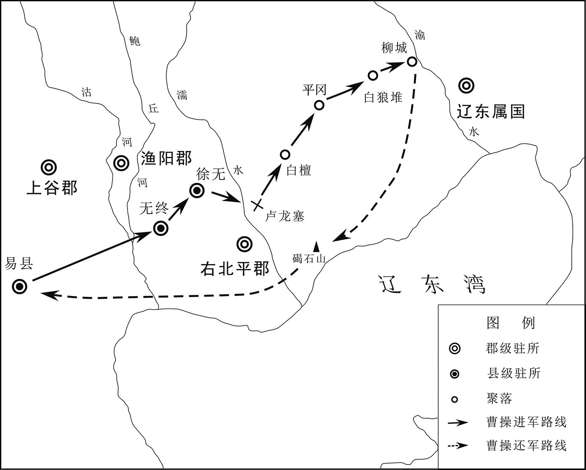 
曹操北征乌桓示意图

## 【注文】

[1]厩（jiù）：马棚，泛指牲口棚。

[2]茂才：汉代察举的重要科目。西汉称秀才，始于西汉元封五年（前106年），多任为地方县令。东汉避光武帝刘秀讳，改为茂才，又称茂材。

[3]科问：查问，讯问。

## 【译文】

汉献帝建安十二年（207年）九月，曹操率军从柳林返回。公孙康想杀了袁尚、袁熙来立功，就事先在马棚中埋伏精兵，然后请袁尚、袁熙进来，还没有入座，公孙康就叫出伏兵，擒杀了袁尚和袁熙，连同速仆丸的首级一起送给曹操。众将领问曹操：“您率军回来，公孙康却把袁尚、袁熙杀了，这是为什么呀？”曹操说：“公孙康向来害怕袁尚、袁熙，我如果急于进攻，他们就会联合起来，如果暂缓出兵，他们就会自相残杀，形势就是这样。”曹操把袁尚的头悬挂起来示众，说：“有敢哭的处死。”牵招却独自祭祀灵位，放声大哭。曹操认为他是忠义之士，推荐他为茂才。这时天气寒冷，又逢大旱，二百里之内没有水，部队又缺乏粮食，就杀了几千匹马作为粮食，挖地三十余丈才见到水。返回以后，曹操查问当初劝阻他的人，大家不知道为何追查，都很恐惧。曹操重赏了以前劝阻过他的人，说：“我此前远征乌桓，十分危险，虽然侥幸取胜，全靠上天的保佑，但以后不能经常这样。你们的劝谏才是万全之计，因此才赏赐你们，以后不要害怕进谏。”

## 【原文】

**十三年春正月，曹操还邺。夏六月癸巳，以曹操为丞相[1]。秋七月，曹操南击刘表。八月，表病卒，遂以琮为嗣[2]。九月，操军至新野，琮遂举州降，以节迎操[3]。事见《刘备据蜀》。**

## 【注文】

[1]丞相：古代官名。古代辅佐君主的最高行政长官。初置于战国时的秦悼王，为百官之长。秦代以后为官僚体系中的最高官职，帮助皇帝综理万机。汉初置相国，后复称丞相，与太尉、御史大夫合称三公。汉末改丞相为大司徒，东汉末复称丞相。魏晋时，或称丞相或改司徒，或称大丞相、相国，废置不常。

[2]琮（cóng）：即刘琮（生卒年不详），刘表次子。山阳高平（今山东邹城）人。东汉建安十三年（208年）曹操征讨荆州，刘表病死，刘琮在蔡瑁、张允支持下继承刘表官爵，在蒯越等人劝说下投降曹操，被任为青州刺史，迁谏议大夫，封为列侯。

[3]新野：古县名。西汉设置县，治所在今河南新野。

## 【译文】

汉献帝建安十三年（208年）春季正月，曹操返回邺城。夏季六月癸巳（初九日），任命曹操为丞相。秋季七月，曹操南下进攻刘表。八月，刘表病死，立其子刘琮为继承人。九月，曹操率军到达新野，刘琮投降，持节去迎接曹操。事见《刘备据蜀》。

## 【原文】

**刘琮将王威说琮曰：“曹操闻将军既降，刘备已走，必懈弛无备，轻行单进[1]。若给威奇兵数千，徼之于险，操可获也。获操即威震四海，非徒保守今日而已。”琮不纳。**

## 【注文】

[1]懈弛：懈怠松弛，放松警惕。

## 【译文】

刘琮部将王威对他说：“曹操听说将军您已经投降，刘备也逃走，一定会松懈没有戒备，轻装前进。如果给我几千精兵，埋伏在险要之处袭击，可以擒拿曹操。抓住曹操就可以威震四海，不仅仅是保住现在这种局面。”刘琮不听。

## 【原文】

**曹操进军江陵，以刘琮为青州刺史，封列侯，并蒯越等，侯者凡十五人[1]。释韩嵩之囚，待以交友之礼，使条品州人优劣，皆擢而用之[2]。以嵩为大鸿胪，蒯越为光禄勋，刘先为尚书，邓羲为侍中[3]。**

## 【注文】

[1]江陵：古县名。春秋楚郢都，汉置江陵县，为南郡治所，今湖北荆州沙市区。

[2]韩嵩（sōng）（生卒年不详）：字德高，义阳（今河南桐柏）人。东汉末年隐居郦西山中，黄巾起义时避居荆州，为刘表从事中郎。奉命到许都见曹操，以观虚实，回来以后劝刘表与曹操结盟，未被采纳。刘表死后，与蒯越等人劝刘琮投降曹操，官至大鸿胪。　　擢（zhuó）：选拔。

[3]大鸿胪：古代官名。汉武帝太初元年（前104年）设置，为九卿之一，主管封爵及内附边疆各族，掌诸王、列侯与内附边疆各族首领的封拜、朝见、迎送、接待之礼。当举行郊祭时，大鸿胪承担赞礼任务，以大声传告，即所谓“鸿声胪传之”，这便是大鸿胪一名之意。其属官有丞、主客、鸿胪文学、行人等。　　光禄勋：古代官名。西汉太初元年（前104年）改郎中令为光禄勋，九卿之一，掌守卫宫殿门户，领宿卫侍从之士。东汉、魏晋沿置，以后废置不常。　　刘先（生卒年不详）：字始宋，零陵（今湖南永州零陵区）人。初为刘表别驾，劝说刘表归附曹操，未被采纳。刘表死后，刘先投降曹操，任武陵太守、尚书令。　　邓羲（生卒年不详）：章陵（今湖北枣阳南）人，初仕刘表，任治中。反对刘表与袁绍结盟，刘表不听，遂辞官。后归附曹操，任侍中。

## 【译文】

曹操进军江陵，任命刘琮（cónɡ）为青州刺史，封为列侯，加上蒯（kuǎi）越等人，被封侯的共十五人。曹操释放了韩嵩，以朋友礼节来接待他，让他品评荆州人士的优劣，对他们提拔任用。任命韩嵩为大鸿胪，蒯越为光禄勋，刘先为尚书，邓羲为侍中。

## 【原文】

**荆州大将南阳文聘别屯在外，琮之降也，呼聘，欲与俱[1]。聘曰：“聘不能全州，当待罪而已。”操济汉，聘乃诣操。操曰：“来何迟邪？”聘曰：“先日不能辅弼刘荆州以奉国家，荆州虽没，常愿据守汉川，保全土境，生不负于孤弱，死无愧于地下，而计不在己，以至于此[2]。实怀悲惭，无颜早见耳。”遂歔欷流涕，操为之怆然，字谓之曰：“仲业，卿真忠臣也。[3]”厚礼待之，使统本兵，为江夏太守[4]。**

## 【注文】

[1]文聘（生卒年不详）：三国时魏国将领。字仲业，南阳宛（今河南南阳）人，初为刘表将领，防御北方。刘表死后归降曹操。曹操平定荆州，任其为江夏太守，委以边事。与乐进在寻口与关羽交战，因功授讨逆将军，封延寿亭侯。曹丕即位后迁后将军，封新野侯。曹丕去世时，孙权以五万大军在石阳围困文聘，但被打败。

[2]汉川：即汉中，古郡名。战国楚置，秦惠王又置，因在汉水中游而得名，治所在南郑（今陕西汉中）。西汉时曾移治西城（今陕西安康），东汉复还旧治。

[3]歔（xū）欷（xī）：哀叹抽泣。　　怆（chuàng）然：悲伤的样子。

[4]江夏：古郡名。西汉设置，治所在西陵县（今湖北武汉新洲区），辖境相当于今湖北钟祥、潜江、仙桃、嘉鱼、赤壁、崇阳等地以东，河南光山、新县以西，信阳以北，淮河以南地区。三国魏、吴都设置江夏郡。吴郡治所在武昌县（今湖北鄂州），西晋太康元年（280年）灭吴后改为武昌郡。

## 【译文】

荆州大将南阳人文聘率军驻扎在外，刘琮投降时，招呼文聘，想与他一起去。文聘说：“我不能保全荆州，应当等待治罪。”曹操渡过汉水，文聘才派人去见曹操。曹操说：“为何来得这么晚？”文聘说：“以前我不能辅佐刘表归顺朝廷，刘表虽然已死，我常希望能守住汉中，保全荆州之地，活着对得起幼弱的刘琮，死后无愧于刘表，但我无力左右局势，才到了今天这一地步，实在是感到悲哀惭愧，没脸早来见您。”于是痛哭流涕。曹操也十分难过，叫文聘的字说：“仲业，你真是一位忠臣啊。”曹操对他厚礼相待，让他统率原来的军队，任命他为江夏太守。

## 【原文】

**冬十二月，益州牧刘璋闻曹操克荆州，遣别驾张松致敬于操[1]。松为人短小放荡，然识达精果。操时已定荆州，走刘备，不复存录松。主簿杨修白操辟松，操不纳[2]。松以此怨，归，劝刘璋绝操，与刘备相结，璋从之。**

## 【注文】

[1]益州：古州名。汉武帝所置十三州刺史部之一，治所在雒（luò）县（今四川广汉），后移治绵竹（今四川德阳），又移治成都（今四川成都）。辖境相当于今四川折多山、云南怒山、哀牢山以东，甘肃陇南、两当和陕西秦岭以南，湖北郧阳、保康西北，贵州除东边以外地区，东汉以后辖境缩小。　　刘璋（生卒年不详）：东汉宗室。字季玉，江夏竟陵（今湖北潜江）人。继其父刘焉为益州牧，据有今四川等地区。刘璋懦弱无能，法令松弛，豪强骄横，政治腐败。东汉建安十六年（211年），听说曹军进攻汉中张鲁，惧祸及己，迎请刘备入川，让刘备进攻汉中的张鲁。但刘备突然回师围攻成都，他被迫出降，迁于南郡公安（今湖北公安）。东汉建安二十四年（219年），孙权夺取荆州后，以刘璋为益州牧，驻秭归。不久病死。　　张松（？—212年）：字子乔，蜀郡（今四川成都）人。益州牧刘璋别驾从事。东汉建安十三年（208年），奉命出使曹操，因不被礼遇，遂劝刘璋拒绝曹操，交结刘备。东汉建安十六年（211年），曹操讨伐汉中张鲁，张松劝刘璋迎接刘备。东汉建安十七年（212年），暗助刘备，被其兄张肃告发，被刘璋所杀。

[2]杨修（175—219年）：东汉末期文学家。字德祖，弘农华阴（今陕西华阴）人。出身名门世家，东汉建安中举孝廉，任郎中，后为曹操主簿。杨修好学能文，谦恭多识，负责军国内外诸事，多合曹操心意。与曹植友善，助其谋取太子地位，与曹丕争嗣，为曹操所忌，被杀。

## 【译文】

汉献帝建安十三年（208年）冬季十二月，益州牧刘璋听说曹操占据了荆州，就派别驾张松向曹操表示敬意。张松身材矮小，性格放荡不羁，然而能洞察世事，通达事理，精明果断。曹操当时已经平定了荆州，赶走了刘备，不再有录用张松的想法。主簿杨修劝曹操延聘张松，曹操不听。张松因此怨恨曹操，回到益州，劝说刘璋和曹操断绝往来，与刘备交结，刘璋听从了张松的建议。

## 【原文】

**习凿齿论曰：昔齐桓一矜其功而叛者九国，曹操暂自骄伐而天下三分[1]。皆勤之于数十年之内，而弃之于俯仰之顷，岂不惜乎！**

## 【注文】

[1]习凿齿（？—383年）：东晋著名文学家、史学家。字彦威，襄阳（今湖北襄阳）人。豪族出身，初为荆州刺史桓温从事，后历任西曹主簿、别驾、户曹参军、荥阳太守，受桓温信任。著有《汉晋春秋》《襄阳耆旧记》等。　　齐桓：即齐桓公（？—前643年）。春秋五霸之一，姜姓，名小白。齐襄公时，政局混乱，他避祸奔莒（jǔ）（今山东莒县）。齐襄公死后，他回国夺取政权，任用管仲改革，选贤任能，国富兵强，以“尊王攘夷”为号召，联合诸国，先后灭掉谭、遂，打败鲁国；助燕击败山戎，援救邢、卫，阻止狄人进攻中原；南征蔡、楚，阻止楚国向中原扩张，平定东周王室内乱。多次会盟诸侯，成为中原霸主。晚年昏庸，信用小人。死后诸子争位，齐国遂衰。

## 【译文】

东晋史学家习凿齿评论说：春秋时齐桓公一炫耀自己的功绩，就引起了九个诸侯国的背叛，曹操一时的骄傲自负，导致了三国鼎立的局面。他们都是把辛苦了几十年取得的成果，毁弃在低头抬头的一瞬间，难道不是很可惜吗？

## 【原文】

**十五年春，［操］下令曰：“孟公绰为赵、魏老则优，不可以为滕、薛大夫[1]。若必廉士而后可用，则齐桓其何以霸世？二三子其佐我明扬仄陋，唯才是举，吾得而用之[2]。”**

## 【注文】

[1]孟公绰：春秋时鲁国大夫，性寡欲，为孔子所尊敬。

[2]明扬仄陋：也作“明扬侧陋”。扬：荐举。侧陋，指地位微贱而才德兼备的贤人。后指发掘并重用地位寒微的贤才。

## 【译文】

汉献帝建安十五年（210年）春季，曹操下令：“孟公绰做晋国贵族赵、魏两家家臣的总管才能绰绰有余，但却不能胜任滕国、薛国两个小国的大夫。如果一定是廉洁的人才才能任用，那么齐桓公怎么能称霸于世呢？希望你们能帮助我从出身低微贫贱的人中选拔人才，只要有才能就要举荐上来，我一定会任用。”

## 【原文】

**冬十二月己亥(2)，操下令曰：“孤始举孝廉，自以本非岩穴知名之士，恐为世人之所凡愚，欲好作政教以立名誉，故在济南，除残去秽，平心选举[1]。以是为强豪所忿，恐致家祸，故以病还乡里。时年纪尚少，乃于谯东五十里筑精舍，欲秋夏读书，冬春射猎，为二十年规，待天下清乃出仕耳[2]。然不能得如意，征为典军校尉，意遂更欲为国家讨贼立功，使题墓道言‘汉故征西将军曹侯之墓’，此其志也。而遭值董卓之难，兴举义兵。后领兖州，破降黄巾三十万众。又讨击袁术，使穷沮而死。摧破袁绍，枭其二子。复定刘表，遂平天下。身为宰相，人臣之贵已极，意望已过矣[3]。设使国家无有孤，不知当几人称帝，几人称王。或者人见孤强盛，又性不信天命，恐妄相忖度，言有不逊之志，每用耿耿。故为诸君陈道此言，皆肝鬲之要也。然欲孤便尔委捐所典兵众以还执事，归就武平侯国，实不可也[4]。何者？诚恐己离兵为人所祸，既为子孙计，又己败则国家倾危，是以不得慕虚名而处实祸也。然封兼四县，食户三万，何德堪之？江湖未静，不可让位，至于邑土，可得而辞。今上还阳夏、柘、苦三县户二万，但食武平万户，且以分损谤议，少减孤之责也[5]。”**

## 【注文】

[1]孝廉：汉朝选拔举荐人才的项目之一。孝指孝悌，儿子孝敬父母称“孝”，弟弟尊敬哥哥称“悌”；廉指廉洁的官吏。汉制规定，每年郡国从所属吏民中推举孝、廉各一人。到东汉，合孝廉为一，郡国每年从二十万人中推举孝廉一人，边远郡县从十万人中推举一人。所举孝廉，朝廷多任用为“郎”。　　济南：即济南国，曹操曾任济南相。济南国为西汉初置，因治所东平陵县（今山东章丘西）在济水之南而得名。公元前164年汉文帝改郡为国，封刘肥之子刘辟光为济南王。公元前154年，汉景帝以济南王参与吴楚七国之乱，国除为郡。东汉建武十五年（39年）改为济南国，西晋复为郡，晋怀帝永嘉后移治历城（今山东济南）。

[2]谯（qiáo）：古县名。秦朝设置，属泗水郡，西汉属沛郡，东汉属沛国。三国魏黄初元年（220年）改为谯国，治所在今安徽亳（bó）州。

[3]宰相：古代官名。封建社会中的最高行政长官，直接对皇帝负责，辅佐皇帝治理天下，总领国政。历代宰相的官名、职权广狭程度不同，行使职权的方式也不一样。

[4]武平：古县名。东汉设置，治所在今河南鹿邑西北，曹操曾被封为武平侯。

[5]阳夏（jiǎ）：古县名。秦朝设置，治所在今河南太康。西汉属淮阳国，东汉属陈国。　　柘（zhè）：即柘县，古县名。秦朝设置，属陈郡。西汉属淮阳国，东汉属陈国，西晋太康中废。治所在今河南柘城，因县有柘沟而得名。　　苦：即苦县，古县名。春秋楚置，西汉属淮阴国，东汉属陈国。治所在今河南鹿邑东。

## 【译文】

汉献帝建安十三年（208年）冬季十二月己亥日，曹操下令：“我当初被举荐为孝廉时，自认为不是隐居深山的知名人士，怕被世人认为是平常愚笨的人，想实施教化来树立名誉，所以在任济南相的时候，铲除贪官污吏，清除邪恶势力，公平选举。因此被豪强势力忌恨，我怕给家人招来祸害，所以就假装有病，辞职还乡。当时年纪还小，打算在谯县城东五十里的地方修建学舍，想在秋季、夏季读书，冬季、春季打猎，作了二十年的规划，想等到天下太平时再出来当官。然而未能如愿，被朝廷任命为典军校尉，志向于是就变成为国家讨伐逆贼，建功立业。在我死后，让人在墓碑上写上‘汉故征西将军曹侯之墓’，这就是我的志向。但是遇上董卓之乱，就兴起义兵，讨伐董卓。后来任兖（yǎn）州刺史，打败黄巾军，招降了三十多万人；又讨伐袁术，使他穷困沮丧而死；打败袁绍，杀了他的两个儿子；又平定了刘表，于是就平定了天下。我身为宰相，已经到了臣子最尊贵的地位，已经超过了我以前的愿望。假使国家没有我，不知道已有几个人称帝，几个人称王。有人见我势力强盛，又不信天命，恐怕会妄自猜测，说我有篡位的野心，每想到此事，就会感到不安，所以向你们说这些话，这都是我的肺腑之言。然而，想让我放弃统率的军队，交出兵权给相关机构，回到我的封地武平侯国去，那绝对不可能。为什么呢？实在是害怕自己交出兵权、离开军队后会被别人谋害，既是为子孙作打算，又因为考虑到自己一旦失败，国家就会危亡，所以我不能因追求虚名而使国家受到实际的灾祸。然而我的封地有四个县，食邑三万户，我有多大的功德来享受这样优厚的待遇？天下还没有安定，我不能辞去官职，至于封地，可以辞让。现在我把阳夏、柘县、苦县三县两万人户的封地归还朝廷，只要武平的一万户封地，姑且来减少别人对我的诽谤和议论，也稍微减轻我的责任。”

## 【原文】

**十六年春正月，以曹操世子丕为五官中郎将，置官属，为丞相副[1]。**

## 【注文】

[1]五官中郎将：古代官名。秦汉设置。隶属郎中令，秩比二千石，所属有五官中郎、侍郎和郎中，掌管持戟值班，宿卫诸殿门，出充车骑。东汉建安十六年（211年）曹丕为五官中郎将，权力扩大，位在诸臣之上。

## 【译文】

汉献帝建安十六年（211年）春季正月，任命曹操的长子曹丕为五官中郎将，设置属官，作为丞相的副手。

## 【原文】

**十七年春正月，曹操还邺。诏操赞拜不名，入朝不趋，剑履上殿，如萧何故事[1]。**

## 【注文】

[1]赞拜不名：臣子朝拜帝王时，赞礼官不直呼其姓名，只称官职。这是皇帝给予大臣的一种特殊礼遇。　　入朝不趋：谓入朝不急步而行。古代臣子入朝必须趋步以示恭敬，入朝不趋是皇帝对大臣的一种殊遇。　　剑履上殿：古代得到帝王特许的大臣，可以佩着剑穿着鞋上朝，被视为极大的优遇。剑，佩剑。履，穿着鞋子。　　萧何（？—前193年）：西汉丞相，沛县（今江苏沛县）人。曾为沛县吏，与汉高祖刘邦一同起兵。高祖为汉王，以其为丞相。楚汉相争时，荐举韩信为大将，自己留守关中，掌握兵饷粮秣（mò），使军中给养充裕。汉高祖刘邦即位后，论功行赏，萧何列为第一，封为酂（zàn）侯。后帮助刘邦、吕后翦除韩信、英布等异姓王。汉朝典制法律多由其所制定，所作《九章律》，今佚。　　故事：旧日的典章制度或行事制度，成例。

## 【译文】

汉献帝建安十七年（212年）春季正月，曹操返回邺城。汉献帝下诏准许曹操在参拜皇帝时只称官职，不称名字，入朝不用急步而行，可以佩剑穿鞋上殿，遵循汉初萧何的前例。

## 【原文】

**冬十月，董昭言于曹操曰：“自古以来，人臣匡世，未有今日之功；有今日之功，未有久处人臣之势者也。今明公耻有惭德，乐保名节，然处大臣之势，使人以大事疑己，诚不可不重虑也。”乃与列侯诸将议，以丞相宜进爵国公，九锡备物，以彰殊勋[1]。荀彧以为“曹公本兴义兵以匡朝宁国，秉忠贞之诚，守退让之实。君子爱人以德，不宜如此”。操由是不悦。及击孙权，表请彧劳军于谯，因辄留彧，以侍中、光禄大夫、持节、参丞相军事[2]。操军向濡须，彧以疾留寿春，饮药而卒[3]。彧行义修整而有智谋，好推贤进士，故时人皆惜之。**

## 【注文】

[1]九锡：帝王尊礼有权势的大臣时所给的九种器物。九锡一曰车马，二曰衣服，三曰乐器，四曰朱户，五曰纳陛，六曰虎贲（bēn）百人，七曰（fū）钺（yuè），八曰弓矢，九曰秬（jù）鬯（chàng）。

[2]光禄大夫：古代官名。秦郎中令属官有中大夫，为大夫之长，汉武帝时改郎中令为光禄勋，其大夫也改名为光禄大夫。其中金紫光禄大夫又为光禄大夫之首，秩比二千石，选儒雅之士充任，掌议论、顾问，无固定职守。魏晋以后增设员额，皆非正职。　　持节：古代君主授予臣下权力的方式之一。汉代，节代表皇帝的特殊命令，有持节之制。曹魏有持节都督之制。　　参丞相军事：古代官名，东汉末年曹操置，掌参与谋议丞相府军事。

[3]濡须：即濡须城。东汉建安十七年（212年）孙权为抗拒曹操而筑，因在濡须水口而得名。故址在今安徽含山。

## 【译文】

汉献帝建安十七年（212年）冬季十月，董昭对曹操说：“自古以来，臣子拯救国家，没有像今天这样的功业；有今天这样的功业，没有长时间处于人臣地位的。现在您以自己的德行有缺欠而感到羞愧，乐于保守名誉和节操，然而处在大臣的位置，让别人因为大事而怀疑自己，实在是不能不多加考虑。”于是就和列侯将领们商议，认为曹操应该封为国公，赐予九锡，来表彰他所作的特殊功勋。荀彧认为“曹公兴义兵本来是为了挽救朝廷统治，安定国家，怀有忠于国家的诚心，遵守谦让的准则。君子应当从德行上爱护别人，不应该这样”。曹操因此很不高兴。等到征讨孙权时，曹操上表请求派荀彧去谯县慰劳军队，趁机把他留下，任命他为侍中、光禄大夫、持节、参丞相军事。曹操进军濡须，荀彧因病留在寿春，喝毒药而死。荀彧品行端正，有智谋，喜欢推荐有才能的人，所以当时世人对他的死都很惋惜。

## 【原文】

**臣光曰：孔子之言仁也重矣，自子路、冉求、公西赤门人之高第，令尹子文、陈文子诸侯之贤大夫，皆不足以当之，而独称管仲之仁，岂非以其辅佐齐桓，大济生民乎[1]？齐桓之行若狗彘，管仲不羞而相之，其志盖以非桓公则生民不可得而济也[2]。汉末大乱，群生涂炭，自非高世之才，不能济也。然则荀彧舍魏武将谁事哉[3]？齐桓之时，周室虽衰，未若建安之初也。建安之初，四海荡覆，尺土一民，皆非汉有。荀彧佐魏武而兴之，举贤用能，训卒厉兵，决机发策，征伐四克，遂能以弱为强，化乱为治，十分天下而有其八，其功岂在管仲之后乎！管仲不死子纠而荀彧死汉室，其仁复居管仲之先矣[4]。而杜牧乃以为：“彧之劝魏武取兖州则比之高、光，官渡不令还许则比之楚、汉，及事就功毕，乃欲邀名于汉代，譬之教盗穴墙发匮而不与同挈，得不为盗乎[5]！”臣以为孔子称“文胜质则史”，凡为史者记人之言，必有以文之。然则比魏武于高、光、楚、汉者，史氏之文也，岂皆彧口所言邪？用是贬彧，非其罪矣。且使魏武为帝，则彧为佐命元功，与萧何同赏矣；彧不利此而利于杀身以邀名，岂人情乎[6]！**

## 【注文】

[1]光：即司马光（1019—1086年），北宋政治家、史学家。字君实，陕州夏县（山西夏县）人。二十岁中进士，仕仁宗、英宗、神宗、哲宗四朝，历任大理评事、天章阁待制兼侍讲、翰林学士、御史中丞、尚书左仆射兼门下侍郎、宰相等职。在政治上反对王安石变法，编纂了史学巨著《资治通鉴》。在《资治通鉴》中，以“臣光曰”的方式来总结历史经验，发表自己对历史的认识。　　子路（前542—前480年）：孔子弟子，春秋鲁国卞（今山东泗水东南）人。姓仲，名由，字子路，又字季路，性情直爽勇敢。曾为季孙氏家臣，后任卫大夫孔悝邑宰，在贵族内讧中被杀害。　　冉求（前522—前489年）：也称冉有，春秋时鲁国人，孔子弟子之一，曾为鲁国贵族季孙氏的家臣，帮助季氏改进赋税制度，增加财政收入，孔子批评他不应替季氏聚敛，号召学生鸣鼓而攻之。冉求的政治才干非常突出，曾受到孔子的称赞，是孔门以政事著称的弟子。在周敬王三十六年（前484年）鲁郊之战中，为鲁左师帅，率左师以长矛突入齐军，齐军败逃。　　公西赤（前509—？）：春秋末鲁人，姓公西，名赤，字子华，又称公西华，孔子弟子。志向远大，常与孔子讨论国家大事，表示愿意从政。孔门中公西赤以通礼仪、应宾客而见长。　　门人：指门生弟子。　　高第：指门人弟子中才能优越而品第高的优秀者。　　令尹子文（生卒年不详）：令尹，楚国官名，相当于宰相之职。子文姓斗，名彀（gòu）於（wū）菟（tú），字子文。《论语》记载楚国的令尹子文三次被任命为令尹，不露高兴的颜色；三次被免职，也不露怨恨的样子。　　陈文子（生卒年不详）：姓陈名须无，齐国大夫。《论语》记载齐国大夫崔杼（zhù）杀了齐庄公，陈文子有四十匹马舍弃不要，离开齐国。子张曾问陈文子为人，孔子认为他“清矣”，但认为他的行为“未知，焉得仁”。但《左传》则没有记载陈文子离开齐国，却记载了两年后他任齐相，曾与庆封等人参加宋向戍的诸侯弭兵之会。

[2]彘（zhì）：猪。

[3]魏武：即曹操。曹丕即位后追封曹操为魏武帝。

[4]纠（？—前685年）：春秋时齐襄公的弟弟。因与公子小白争夺君位，失败被杀。管仲辅佐公子纠与公子小白（即齐桓公）争位，但事情失败，公子纠被杀，管仲被囚。鲍叔牙知道管仲贤能，竭力向齐桓公举荐，管仲被齐桓公任为上卿，辅佐国政。

[5]杜牧（803—852年）：唐代文学家。字牧之，号樊川，京兆万年（今陕西西安东北）人。在诗、赋、古文上有成就，对后世产生深远影响。有《樊川文集》传世。　　高：指西汉高祖刘邦。　　光：指东汉光武帝刘秀。　　匮（guì）：柜子，后作“柜（櫃）”。　　挈（qiè）：用手提着。

[6]佐命：辅佐帝王创业。

## 【译文】

史臣司马光评论说：孔子谈到仁的时候，非常庄重，认为子路、冉求、公西赤这些门人中的高徒，以及楚国令尹子文、陈文子这些诸侯中的贤大夫，都够不上仁的资格，而唯独称赞管仲的仁德，难道不是因为他辅佐齐桓公，对百姓有过大功吗？齐桓公的行为就像猪狗一样，管仲不觉得羞耻还去辅佐他，因为管仲知道，如果没有齐桓公，百姓就不可能得到拯救。汉末天下大乱，生灵涂炭，如果不是具有雄才大略的人就不能拯救百姓。那么，荀彧舍去魏武帝曹操，他还能辅佐谁呢？齐桓公之时，周王朝虽然衰落，但还没像建安初年那样混乱。建安初年，天下大乱，汉王室没有一寸土地，没有一个百姓。荀彧辅佐魏武帝曹操使汉朝兴复，举贤任能，训练军队，出谋划策，征伐四方，战无不胜，从弱小变得强大，变乱世为治世，占有十分之八的天下，他的功勋怎么会排在管仲之后！管仲不能为公子纠而死，荀彧却能为汉王朝尽忠而死，他的仁德又在管仲之上了。但杜牧却认为：“荀彧劝魏武帝曹操攻取兖州时，把他比做汉高祖刘邦和汉光武帝刘秀，官渡之战时劝阻曹操退回许都，把这次战役比做楚汉之争，等到大事告成，才想留下尽忠汉朝的美名，这就好像是教盗贼去挖墙破柜而不同盗贼一起分赃，怎能说他不是盗贼！”我认为孔子说“文采胜过质朴就显得虚浮”，即是指凡历史学家，记载前人的言论，都会加以修饰。而把魏武帝曹操比做西汉高祖刘邦、东汉光武帝刘秀，把官渡之战比做楚汉相争，这只是史学家修饰过的文字，难道是荀彧亲口说的？根据这些话来贬低荀彧，是冤枉他了。而且假如曹操做了皇帝，荀彧就是开国功臣，会得到与萧何一样的赏赐。荀彧不贪图开国元勋这样的荣耀和富贵，而用生命来沽名钓誉，这怎么会是人之常情！

## 【原文】

**十八年夏五月丙申，以冀州十郡封曹操为魏公，以丞相领冀州牧如故，又加九锡：大辂、戎辂各一，玄牡二驷；衮冕之服，赤舃副焉；轩县之乐，六佾之舞；朱户以居；纳陛以登；虎贲之士三百人；、钺各一；彤弓一，彤矢百，玈弓十，玈矢千；秬鬯一卣，珪、瓒副焉[1]。**

## 【注文】

[1]冀州十郡：即河东、河内、魏郡、赵国、中山、常山、巨鹿、安平、甘陵、平原十个郡国。　　大辂（lù）：古代帝王的坐车。　　戎辂：又称革辂。皇帝乘用的主要车辆之一，与玉辂、金辂、象辂、木辂合称皇帝“五辂”。　　玄牡：古代祭天地所用的黑色公牛。　　衮（gǔn）冕：衮衣和冕。是古代皇帝及上公的礼服和礼冠，为皇帝王公贵族在祭天地、宗庙等重大庆典活动时穿戴的正式服装。　　赤舃（xì）：红色的鞋子。舃，鞋子。　　轩县：诸侯陈列乐器，是三面悬挂，称轩县。　　六佾（yì）：古代诸侯享用乐舞的规格。舞者分六列，每列六人，执翟雉之羽而舞。　　纳陛：古代君主赐给有特殊功勋的贵族、功臣的“九锡”之一。纳陛，本为皇帝专用，意为凿殿基为登升的台阶，纳之于屋檐下，使尊者不露而升。　　（fū）：铡刀，古代用于斩人的刑具之一。　　钺（yuè）：古代兵器，青铜制，像斧，比斧大，圆刃可砍劈。　　彤弓、彤矢：用赤色漆的弓和矢。古代君主用来赏赐有战功的诸侯或大臣，以示荣宠。　　玈（lú）弓、玈矢：黑色的弓箭。　　鬯（chàng）：古代祭祀用的酒，用郁金草酿黑黍而成。　　卣（yǒu）：古代一种盛酒的器具，口小腹大，有盖和提梁。　　瓒（zàn）：古代祭祀用的一种像勺子的玉器。

## 【译文】

汉献帝建安十八年（213年）夏季五月丙申（初十日），把冀州所属的十郡作为曹操的封地，封他为魏公，仍然以丞相兼任冀州牧。又给他加九锡：大辂车、戎辂车各一辆，每辆车黑色雄马各四匹；帝王用的衮袍、冠冕，加上红色的礼鞋；诸侯王用的三面悬挂的乐器和三十六人组成的六佾歌舞方阵；住宅的大门可以漆成红色；可以从台阶走到殿上；虎贲卫士三百人；象征权威的兵器、钺各一柄；红色的弓一把，红色的箭一百支，黑色的弓十把，黑色的箭一千支；祭祀用的美酒一卣，并配有玉圭和玉勺。

## 【原文】

**秋七月，魏始建社稷、宗庙。**

## 【译文】

汉献帝建安十八年（213年）秋季七月，魏国开始建立祭祀天地的社稷和祭祀祖先的宗庙。

## 【原文】

**冬十一月，魏初置尚书、侍中、六卿[1]。以荀攸为尚书令，凉茂为仆射，毛玠、崔琰、常林、徐弈、何夔为尚书，王粲、杜袭、卫觊、和洽为侍中，钟繇为大理，王修为大司农，袁涣为郎中令、行御史大夫事，陈群为御史中丞[2]。**

## 【注文】

[1]六卿：曹魏以郎中令、太仆、大理、大农、少府、中尉为六卿。

[2]毛玠（？—216年）：字孝先，陈留平丘（今河南封丘）人。东汉末年为县吏，投奔曹操后任治中从事，建议曹操“奉天子以令不臣”。东汉建安十三年（208年）为丞相东曹掾，与崔琰掌管选举，多选清正廉洁之士。后历任右军师、尚书仆射等职。崔琰被杀后，毛玠心怀不平，遭诬陷下狱，被免黜。　　常林（生卒年不详）：字伯槐，河内温（今河南温县）人。东汉末年避乱上党，后依附河间太守陈延。并（bīng）州刺史梁习把常林推荐给曹操，历任南和县令、博陵太守、幽州刺史、丞相东曹属、尚书等职，皆有政绩。魏文帝曹丕时任少府、大司农，封乐阳亭侯。魏明帝即位后，任光禄勋太常，进封高阳乡侯。常林节操清峻，不畏权贵，卒后赠骠骑将军，谥贞侯。　　徐弈（？—219年）：字季才，东莞（今山东沂水）人。东汉末年避乱江东，后归本郡，被曹操任为司空掾属，随曹操西征马超。以任丞相长史留守西京，镇抚关中。后历任雍州刺史、魏郡太守、留府长史、尚书令、中尉、谏议大夫等职。徐弈勤政敢谏，以忠亮峻严著称。　　何夔（kuí）（生卒年不详）：字叔龙，陈郡阳夏（jiǎ）（今河南太康）人。东汉末年避乱淮南。东汉建安三年（198年）被曹操任为司空掾属，迁长广太守，招降当地豪杰三千余家。后历任丞相东曹掾、乐安太守、尚书仆射、太子太傅，所到皆有政绩。魏明帝时封成阳亭侯。卒后谥靖侯。　　杜袭（生卒年不详）：字子绪，颍（yǐng）川郡定陵县（今河南舞阳北）人。东汉末年避乱荆州，建安初回家乡，曹操任为西鄂长，有政绩，迁丞相军祭酒、侍中、丞相长史、驸马都尉。东汉建安二十年（215年），随曹操征张鲁，留关中镇抚诸军。魏文帝时为督军粮御史、尚书，封武平亭侯。魏明帝时任曹真和司马懿的军师、太中大夫，晋封平阳乡侯。卒后谥定侯。　　和洽（生卒年不详）：字阳士，汝南西平（今河南西平西）人。汉末避居荆州，曹操平定荆州后，任丞相掾属、侍中、郎中令。曹丕即位后，为光禄勋，封安城亭侯。魏明帝曹叡（ruì）时，晋封西陵乡侯，劝诫魏明帝省役兴农，禁绝浮华之费。　　大理：古代官名。汉景帝中元六年（前144年）改廷尉为大理，汉武帝建元四年（前137年）复为廷尉。三国之初，各国均置大理，后改称廷尉。掌刑法审判。　　大司农：古代官名。秦置治粟内史，汉初沿置，景帝时改为大农令，武帝时又改称大司农。掌钱谷、仓储、盐铁、均输等。　　袁涣（生卒年不详）：字曜卿，陈郡扶乐（今河南太康西北）人。东汉末年避乱江淮间，先后为袁术、吕布部属，后归降曹操，历任沛南部都尉、谏议大夫、丞相军祭酒、郎中令等职，建议曹操以德义治天下，募民屯田。　　御史大夫：古代官名。秦汉时仅次于丞相的中央最高长官。主管监察、执法以及掌管文书图籍。西汉时丞相缺位，往往以其递补，并与丞相（大司徒）、太尉（大司马）合称三公。后改称大司空、司空。　　御史中丞：古代官名。西汉时设置，为御史大夫的佐职，掌管图籍秘书，外督部刺史，内领侍御史十五人，受公卿奏事，举劾按章。汉成帝绥和元年（前8年）改御史大夫为大司空，御史中丞为事实上的御史台统领，其权极重。北魏改御史中丞为御史中尉。

## 【译文】

汉献帝建安十八年（213年）冬季十一月，魏国开始设置尚书、侍中、六卿等官制。任命荀攸为尚书令，凉茂为尚书仆射，毛玠（jiè）、崔琰（yǎn）、常林、徐弈、何夔为尚书，王粲、杜袭、卫觊（jì）、和洽为侍中，钟繇为大理，王修为大司农，袁涣为郎中令、行使御史大夫的职权，陈群为御史中丞。

## 【原文】

**十九年春三月，诏魏公操位在诸侯王上，改授金玺、赤绂、远游冠[1]。**

## 【注文】

[1]绂（fú）：古代系印纽的丝绳。　　远游冠：古代冠名，古代男子首服。冠有三梁，有展筒，以金附蝉，黑介帻，青，为王公及上等朝臣所戴。

## 【译文】

汉献帝建安十九年（214年）春季三月，汉献帝下诏使魏公曹操位居诸侯王之上，授予金玺、赤绂、远游冠。

## 【原文】

**二十一年夏五月，进魏公操爵为王。秋八月，魏以大理钟繇为相国[1]。**

## 【注文】

[1]相国：古代官名，即宰相。封建官制中最高官职，废置不常。汉代设相国时少，而设丞相时多。魏晋以后，设相国比设丞相更为隆重，但也不常设。

## 【译文】

汉献帝建安二十一年（216年）夏季五月，封魏公曹操为王。秋季八月，魏王任命大理钟繇为相国。

## 【原文】

**二十二年夏四月，诏魏王操设天子旌旗，出入称警跸[1]。**

## 【注文】

[1]警跸（bì）：古代帝王出入时，于所经路途侍卫警戒，清道止行，谓之“警跸”。

## 【译文】

汉献帝建安二十二年（217年）夏季四月，汉献帝下诏允许魏王曹操使用天子专用的旌旗，同天子一样出入称“警跸”。

## 【原文】

**六月，魏以军师华歆为御史大夫[1]。冬十月，命魏王操冕十有二旒，乘金根车，驾六马，设五时副车[2]。魏以五官中郎将丕为太子。**

## 【注文】

[1]华歆（xīn）（157—231年）：三国魏初名臣。字子鱼，平原高唐（今山东禹城西南）人，因品德高尚名闻当世。汉末为豫章太守，依附孙策后被待为上宾，曹操征为议郎，后代替荀彧为尚书令。魏国建立，历官司徒、太尉。华歆极受宠信，前后赏赐，诸臣莫及。而华歆淡于财利，受赐财物悉赠亲友，奴婢则皆放为良人。家业清贫，内无余财。

[2]旒（liú）：古代帝王礼帽前后悬垂的玉串。　　金根车：车名。帝王乘用的车子。因饰以金，故名为金根车。　　五时副车：古代随从帝王车驾的五色副车。有五色安车、五色立车各一，皆驾四马。

## 【译文】

汉献帝建安二十二年（217年）六月，魏王任命军师华歆为御史大夫。冬季十月，汉献帝诏命魏王曹操戴有十二串旒的王冠，乘坐金根车，以六匹马驾驶，设五色副车。魏王立五官中郎将曹丕为太子。

## 【原文】

**二十四年秋七月，诏以魏王操夫人为王后。**

## 【译文】

汉献帝建安二十四年（219年）秋季七月，汉献帝下诏封魏王曹操的夫人为王后。

## 【原文】

**冬十二月，魏王操表孙权为票骑将军，假节，领荆州牧，封南昌侯[1]。权遣校尉梁寓入贡，又遣朱光等归，上书称臣于操，称说天命[2]。操以权书示外曰：“是儿欲踞吾著炉火上邪？”侍中陈群等皆曰：“汉祚已终，非适今日[3]。殿下功德巍巍，群生注望，故孙权在远称臣[4]。此天人之应，异气齐声，殿下宜正大位，复何疑哉！”操曰：“若天命在吾，吾为周文王矣[5]。”**

## 【注文】

[1]孙权（182—252年）：字仲谋，吴郡富春（今浙江杭州富阳区）人。早年随其兄孙策平定江东，孙策死后继承其事业，在张昭、周瑜、程普等人辅助下，统治江东，招延名士，平定山越，多次与曹操作战。东汉建安十三年（208年），与刘备结盟，在赤壁大败曹操，奠定三分天下的格局。东汉建安二十四年（219年），杀关羽，取得荆州。曹丕称帝后，孙权向魏国称臣，被封为吴王。三国魏黄初二年（221年），命陆逊统军迎击刘备，在夷陵以火攻大败蜀军。三国吴黄龙元年（229年）称帝，建都武昌，国号吴。孙权统治江东五十多年，对内实行屯田，发展经济，开发边疆，但赋税繁重，刑罚严酷；对外与魏、蜀时战时和，择利而变。

[2]梁寓（生卒年不详）：字孔儒，吴国人，初被孙权任为校尉。东汉建安二十四年（219年）孙权通好曹操，他奉使进贡，曾被曹操辟为掾，不久南归。　　天命：古代人把天看作神，天命指上天的意志。

[3]陈群（？—236年）：字长文，颍川许昌（今河南许昌）人。初为刘备别驾，后归曹操，任司空掾。后以司徒掾举高第，为治书侍御史，转参丞相军事。魏国建立，迁为御史中丞。曾建议选任官吏，实行九品中正制。魏明帝时任司空，录尚书事。三国魏太和三年（229年）与刘劭等人奉诏修订魏国法令，主张恢复肉刑。　　汉祚（zuò）：汉朝。祚，封建时代指皇位。

[4]殿下：古代对诸侯王、太子、诸王的尊称。

[5]周文王（生卒年不详）：商末周族领袖。名姬昌，周武王之父。居岐山之下，曾被商纣囚于羑（yǒu）里（今河南汤阴）。后获释，为西方诸侯之长，称西伯，建都于丰（今陕西西安长安区沣河西），国势强盛。其子武王起兵伐纣灭商，建立西周王朝。周文王虽为周代建立奠定基础，但并未推翻商朝，其子周武王灭商称王，所以曹操说“吾为周文王”。

## 【译文】

汉献帝建安二十四年（219年）冬季十二月，魏王曹操上表举荐孙权为骠骑将军，授予符节，兼任荆州牧，封南昌侯。孙权派校尉梁寓入朝进贡，又把被吴军俘虏的朱光等人送回魏国，上书向曹操称臣，劝曹操顺应天命称帝。曹操把孙权的书给大臣将领们看，说：“这小子要把我放在火炉上烤吗？”侍中陈群等人都说：“汉朝的统治早已结束，不只是在今天。您的功德像高山一样巍峨，众望所归，所以孙权虽然远在江东也向您称臣。这是上天意志在人间的反应，所以大家都异口同声，您现在正应该称帝，还犹豫什么！”曹操说：“如果天命真的在我曹氏，我还是做周文王吧。”

## 【原文】

**臣光曰：教化，国家之急务也，而俗吏慢之[1]。风俗，天下之大事也，而庸君忽之[2]。夫惟明智君子，深识长虑，然后知其为益之大而收功之远也。光武遭汉中衰，群雄糜沸，奋起布衣，绍恢前绪，征伐四方，日不暇给，乃能敦尚经术，宾延儒雅，开广学校，修明礼乐，武功既成，文德亦洽[3]。继以孝明、孝章，遹追先志，临雍拜老，横经问道[4]。自公卿、大夫至于郡县之吏，咸选用经明行修之人，虎贲卫士，皆习《孝经》，匈奴子弟，亦游太学，是以教立于上，俗成于下[5]。其忠厚清修之士，岂唯取重于绅，亦见慕于众庶；愚鄙污秽之人，岂唯不容于朝廷，亦见弃于乡里[6]。自三代既亡，风化之美，未有若东汉之盛者也。及孝和以降，贵戚擅权，嬖幸用事，赏罚无章，贿赂公行，贤愚浑殽，是非颠倒，可谓乱矣[7]。然犹绵绵不至于亡者，上则有公卿大夫袁安、杨震、李固、杜乔、陈蕃、李膺之徒面引廷争，用公义以扶其危，下则有布衣之士符融、郭泰、范滂、许邵之流，立私论以救其败，是以政治虽浊而风俗不衰，至有触冒钺，僵仆于前，而忠义奋发，继起于后，随踵就戮，视死如归[8]。夫岂特数子之贤哉？亦光武、明、章之遗化也。当是之时，苟有明君作而振之，则汉氏之祚犹未可量也。不幸承陵夷颓敝之余，重以桓、灵之昏虐，保养奸回，过于骨肉，殄灭忠良，甚于寇仇，积多士之愤，畜四海之怒[9]。于是何进召戎，董卓乘衅，袁绍之徒，从而构难，遂使乘舆播越，宗庙丘墟，王室荡覆，烝民涂炭，大命陨绝，不可复救[10]。然州郡拥兵专地者，虽互相吞噬，犹未尝不以尊汉为辞。以魏武之暴戾强伉，加有大功于天下，其蓄无君之心久矣，乃至没身不敢废汉而自立，岂其志之不欲哉？犹畏名义而自抑也。由是观之，教化安可慢，风俗安可忽哉？**

## 【注文】

[1]教化：儒家倡导的治国安民的政治主张。用政教风化和教育感化的方法改变人心风俗。

[2]风俗：社会上长期传承而形成的风尚、习俗等。

[3]布衣：指普通百姓、平民。　　经术：汉代及后世对经学的别称。

[4]孝明：即汉明帝刘庄（28—75年），光武帝刘秀第四子。东汉中元二年（57年）即位，勤于理政，严明法令，禁止外戚封侯干政，防范贵戚功臣。提倡儒学，在京师为贵族官僚子弟设立学校；派遣窦固、耿忠等击败匈奴，经营西域；派王景主持修治黄河、汴渠，招抚流民，重视农业生产，东汉进入了繁荣期。由于他在位期间，遵奉光武帝旧制，东汉王朝得以稳定发展，章帝刘炟继承其政策，史称“明章之治”。　　孝章：即汉章帝刘炟（dá）（56—88年），汉明帝第五子。东汉永平三年（60年）立为皇太子，东汉永平十八年（75年）即位。在位期间，废除繁刑苛法，减轻徭赋，招徕流民，促进农业发展；爱好儒术，东汉建初四年（79年）召集白虎观会议，讨论五经同异，抬高谶（chèn）纬之学的地位，使儒家经典谶纬神学化；招抚羌、哀牢夷等少数民族，任用班超经营西域。然而章帝宽待外戚，开东汉外戚专政之始。　　遹（yù）：遵循继承。

[5]《孝经》：儒家经典之一。托名于孔子与学生曾参问答之言，论述封建孝道，宣传宗法思想。今本十八章，作者说法不一，多以为孔门后学所撰。　　太学：古代大学，是设在京师的全国最高学府。

[6]（jìn）绅（shēn）：同“缙绅”。古代称有官职的或做过官的人。缙绅，原意是红色的带子，用来插“笏”。“笏”是古代群臣朝见时手中所持的窄长板，称手板或笏板，用来记事或比画。

[7]孝和：即汉和帝刘肇（79—105年）。章帝子。十岁继帝位。窦太后临朝听政，其兄窦宪等专政，出兵征伐匈奴、羌及西域诸国。东汉永元四年（92年），宦官郑众定计捕杀窦氏兄弟及其党羽，郑众因功为大长秋，封鄛（cháo）乡侯，参与朝政，开始了东汉外戚、宦官交替专政的政局。从此东汉王朝逐渐衰落。　　嬖（bì）幸：被宠爱的人，常指姬妾、倡优、侍臣等。

[8]袁安（？—92年）：东汉大臣。字邵公，汝南汝阳（今河南商水）人，历仕汉明帝、章帝、和帝三朝。初举孝廉，为阴平长、任城令，政令严明。汉明帝时历任楚郡太守、河南尹、太仆、司徒、司空等，断狱公平，名重京师。东汉和帝时，外戚窦宪兄弟专权，他多次弹劾。袁安后裔世代高官，为东汉著名世家大族。　　杨震（？—124年）：东汉大臣。字伯起，弘农华阴（今陕西华阴东南）人。名门世家出身，博览群经，有“关西孔子”之称。五十岁出仕，历任荆州刺史、东莱太守、司徒、太尉等职。为官廉洁，多次上书反对外戚、宦官专权，遭宦官诬告免官、自杀。后裔多任高官，“弘农杨氏”成为东汉中后期的世家大族。　　李固（94—147年）：东汉名士。字子坚，汉中南郑（今陕西汉中）人。少好学，曾游学洛阳太学。东汉阳嘉二年（133年）为议郎，力陈外戚、宦官专权弄势之弊，建议大将军梁商整肃朝纲。东汉永和年间，为荆州刺史、泰山太守、将作大匠、大司农，招抚起义军，指斥官僚侵害百姓。冲帝即位后，任太尉、录尚书事，为梁冀所忌恨，被免官入狱，后被杀。　　杜乔（？—147年）：东汉大臣。字叔荣，河内林虑（今河南林州）人。出生于官宦之家。初为杨震属吏，后任南郡太守、东海国相、侍中、太子太傅、大司农、太尉。汉顺帝、桓帝时，外戚梁冀专权，杜乔弹劾梁冀及其党羽，遭到忌恨。桓帝时遭梁冀诬陷，下狱而死。　　陈蕃（？—168年）：东汉大臣。字仲举，汝南平舆（今河南平舆北）人。少有大志，举孝廉，为郎中，后历任乐安太守、尚书令、太尉、太傅等，封高阳乡侯。为官清廉，不畏权贵，反对宦官专权，被宦官嫉恨。东汉灵帝时，与大将军窦武谋诛宦官，事情泄露，兵败被杀。　　李膺（yīng）（110—169年）：东汉名士。字元礼，颍川襄城（今河南襄城）人。历官青州刺史、蜀郡太守、度辽将军、河南尹等。桓帝时为司隶校尉，与太学生首领郭泰等结交，反对宦官专权，声名很高。东汉延熹九年（166年），遭宦官陷害，被捕入狱，释放后禁锢终生。东汉灵帝时外戚窦武执政，任长乐少府，与陈蕃等密谋诛戮宦官失败，死于狱中。　　符融（生卒年不详）：东汉名士。字伟明，陈留浚仪（今河南开封）人。初为都官吏，后游太学，师从少府李膺，不应州郡公府举荐。汉桓帝党锢事起，被禁锢，郁郁而终。　　郭泰（128—169年）：东汉名士。字林宗，太原介休（今山西介休）人。早年家境贫寒，好学，博通典籍。游学洛阳时，与李膺等友善，成为太学生首领，名震京师。后归乡里，拒绝朝廷征召。汉桓帝时，党锢之祸起，闭门授徒数千人，后卒于家。　　范滂（pāng）（137—169年）：东汉名士。字孟博，汝南征羌（今河南漯河郾城区）人。初为清诏使，迁光禄勋主事、汝南太守，范滂刚正无私、抑制豪强，反对宦官，整顿风俗。东汉延熹九年（166年），因党锢之祸被捕入狱，次年释放。东汉建宁二年（169年）再次被宦官诬陷被逮，死于狱中。

[9]陵夷：衰落，败落。　　殄（tiǎn）灭：消灭，灭绝。

[10]何进（？—189年）：字遂高，南阳宛（今河南南阳）人，东汉皇室外戚。汉灵帝时，其同父异母妹被选入皇宫，得宠于灵帝，何进以此拜为郎中，升任虎贲中郎将，出任颍（yǐng）川太守。东汉光和三年（180年），其妹由贵人立为皇后，何进被征入朝，得任侍中、将作大匠、河南尹。东汉中平元年（184年），黄巾大起义爆发，拜大将军，率左右羽林五营兵马驻屯都亭，拱卫京师。灵帝去世，以拥立少帝刘辩有功，录尚书事，得以专断朝政。东汉光熹元年（189年），与袁绍等谋划尽诛宦官，因其妹何太后阻挠而犹豫不决，反被宦官张让等矫诏杀死。　　乘（shèng）舆（yú）：皇帝的代称。

## 【译文】

史臣司马光评论说：教化是国家最重要的任务，但是平庸无能的官吏怠慢它；风俗是天下的大事，但是平庸的君主却忽视它。只有明智的君子，经过深思熟虑，才知道教化、风俗益处很大，影响深远。光武帝在西汉衰亡、群雄并起的时代，从平民中崛起，恢复西汉的事业，征伐四方，每天都很繁忙，没有闲暇时间，但还能推崇儒家经术，以宾客之礼聘请知名人士，兴办学校，讲习礼乐，武功完成，文德也普遍推行。汉明帝、汉章帝继位以后，遵从汉武帝的遗志，亲自到辟雍拜见有学问的儒士，向老师请教经义。上自公卿、大夫，下至郡县官吏，都选用通晓经术、品行端正的人。虎贲卫士都学习《孝经》，匈奴贵族的子弟也都来太学游学，因此，朝廷推行教化，社会上就会形成风俗。忠厚、清廉、作风正派的人，不仅受到士大夫的重视，也被百姓仰慕。昏庸、卑鄙、邪恶的人，不仅不能被朝廷容纳，也被乡里人鄙弃。自从夏商周三代灭亡以后，社会风气之好，就没有像东汉那样兴盛的。但是，汉和帝以后，外戚专权，宦官、奸佞小人得势，赏罚没有标准，贿赂公行，用人贤能和愚劣不分，是非颠倒，可以说社会已经十分混乱了。然而东汉王朝仍能苟延残喘，没有灭亡，原因在于上有公卿、大夫袁安、杨震、李固、杜乔、陈蕃、李膺等人在朝廷上据理力争，用公义来挽救危局；在下有平民中的清高知名人士符融、郭泰、范滂、许邵之辈，在民间制造舆论来抨击腐败，矫正社会风气，因此，政治上虽然黑暗，但好的社会风气还没有衰败。以至有人甘愿冒着被诛杀的危险去与邪恶势力作斗争，前面的人倒下，后面的忠义之士更加奋不顾身，前赴后继，视死如归。这难道只是几个忠义之士起的作用吗？也是光武帝、明帝、章帝的教化产生了作用。当时，假如有贤明的君主振作起来，那么汉朝的帝统气数还是无法估量的。不幸的是，经过东汉中叶国势衰败之后，又加上汉桓帝、汉灵帝的昏庸残暴，他们保养奸邪，胜过骨肉亲人；屠杀忠良之士，胜过对待仇敌；士大夫的愤怒和百姓的怨恨都汇集在一起。于是何进招来董卓进京诛杀宦官，董卓趁机把持政权，袁绍等人借此起兵讨伐董卓，从而使得天子流亡，宗庙荒废，王室动荡倾覆，百姓流离失所，生灵涂炭，汉朝的统治崩溃，无法挽救。然而州郡拥兵割据的人，相互吞并，还都以尊崇汉室为号召。即使像魏武帝曹操那样残暴专横，功勋卓著，早已不把天子放在眼中，却至死没敢废掉汉献帝，自己称皇帝，难道他不想当皇帝吗？这还是因为他顾忌君臣名义而克制了自己的欲望。由此看来，教化怎么能轻视，风俗怎么能忽视呢？

## 【原文】

**魏文帝黄初元年春正月，武王至洛阳，庚子，薨[1]。王知人善察，难眩以伪。识拔奇才，不拘微贱，随能任使，皆获其用。与敌对陈，意思安闲，如不欲战然，及至决机乘胜，气势盈溢。勋劳宜赏，不吝千金，无功望施，分豪不与[2]。用法峻急，有犯必戮，或对之流涕，然终无所赦。雅性节俭，不好华丽，故能芟刈群雄，几平海内[3]。**

## 【注文】

[1]魏文帝：即曹丕（187—226年），三国时魏国创建者。沛国谯县（今安徽亳州）人，字子桓，曹操次子。东汉建安十六年（211年）任五官中郎将，副丞相。东汉建安二十二年（217年）立为魏王太子。曹操去世后，袭为魏王，继任丞相。以陈群为尚书，立九品官人法，改革选举。东汉延康元年（220年）十月，代汉称帝，建都洛阳，国号魏，改元黄初。曾三次征吴无功。卒谥文帝。　　黄初元年：即公元220年。黄初：魏文帝曹丕的年号，自公元220年至226年，共七年。

[2]分豪：分毫。

[3]芟（shān）刈（yì）：杀戮、荡平。

## 【译文】

魏文帝黄初元年（220年）春季正月，魏武王曹操到达洛阳，庚子（二十三日）去世。魏武王曹操善于识别人才，洞察世事，很难被假象所迷惑。选拔人才，即使出身贫贱、地位低下，也能破格录用，根据他们的才能加以任用。在战场上和敌人对阵，态度从容，好像不愿打仗，可是一旦策略已定，就能当机立断，乘胜追击，充满气势。对于有功勋应该赏赐的人，不惜千金；对于没有功劳而希望赏赐的人，分文不给。执法严峻，犯法者必杀，有时对着犯人痛哭流泪，但最终也不赦免。性情风雅，生活节俭，不喜欢奢华，所以能够消灭各地割据势力，几乎统一了全国。

## 【原文】

**是时太子在邺，军中骚动，群僚欲秘不发丧。谏议大夫贾逵以为事不可秘，乃发丧[1]。或言宜易诸城守，悉用谯沛人。魏郡太守广陵徐宣厉声曰：“今者远近一统，人怀效节，何必专任谯沛，以沮宿卫者之心[2]。”乃止。青州兵擅击鼓，相引去，众人以为宜禁止之，不从者讨之。贾逵曰：“不可。”为作长檄，令所在给其禀食。鄢陵侯彰从长安来赴，问逵先王玺绶所在[3]。逵正色曰：“国有储副，先王玺绶，非君侯所宜问也。”凶问至邺，太子号哭不已。中庶子司马孚谏曰：“君王宴驾，天下恃殿下为命[4]。当上为宗庙，下为万国，奈何效匹夫孝也！”太子良久乃止，曰：“卿言是也。”时群臣初闻王薨，相聚哭，无复行列。孚厉声于朝曰：“今君王违世，天下震动，当早拜嗣君，以镇万国，而但哭耶！”乃罢群臣，备禁卫，治丧事。群臣以为太子即位，当须诏命。尚书陈矫曰：“王薨于外，天下惶惧[5]。太子宜割哀即位，以系远近之望。且又爱子在侧，彼此生变，则社稷危矣。”即具官备礼，一日皆办。明旦，以王后令，策太子即王位，大赦。汉帝寻遣御史大夫华歆奉策诏，授太子丞相印绶、魏王玺绂，领冀州牧。于是尊王后曰王太后。**

## 【注文】

[1]谏议大夫：古代官名。秦初置谏大夫，属郎中令，无定员，掌管议论。汉武帝时沿置谏大夫，属光禄勋。东汉光武帝复置谏议大夫，秩六百石，掌侍从顾问、参谋讽议。　　贾逵（174—228年）：字梁道，河东襄陵人（今山西临汾）。初为郡吏，迁绛邑长，郭援攻河东郡，贾逵坚守城池，设计取胜。后举茂才，为渑池令，击败并（bīng）州刺史高干部将张琰（yǎn）。后被曹操重用，任为弘农太守、丞相主簿、谏议大夫，与夏侯尚并掌军计。魏文帝曹丕即位后，历任邺县令、魏郡太守、豫州刺史，因功封关内侯。贾逵率军征吴，打败吴将吕范，封建威将军。魏明帝时奉命统军伐吴，曹休在夹石被吴军打败，贾逵设计将其救出。赠谥“肃侯”。

[2]徐宣（？—236年）：字宝坚，广陵海西（今江苏灌南县）人。初为广陵太守陈登属吏，参与镇压本郡民众起义。后归附曹操，受器重，任齐郡太守，曹操西征马超，留其统率诸军。魏文帝曹丕即位后，历任御史中丞、司隶校尉、散骑常侍等，赐爵关内侯。魏明帝曹叡（ruì）时，任尚书左仆射、侍中、光禄大夫，直言劝谏魏明帝不要过分奢侈。徐宣历仕曹魏三帝，深受信任，为托孤寄命的柱石之臣。死后谥曰“贞侯”。

[3]鄢（yān）陵：古县名。西汉设置县，治所在今河南鄢陵县境内。汉至北魏属颍（yǐng）川郡。

[4]中庶子：古代官名。秦汉至魏晋南朝、北魏、北齐皆置，魏以前为国君属官，魏以后为太子属官。东汉时置五人，职如侍中，掌侍从左右，赞导众事，顾问应对等。　　司马孚（180—272年）：字叔达，河内温县（今河南温县西南）人，司马懿之弟。初为曹植文学掾，迁太子中庶子。魏文帝时任中书郎、黄门侍郎、清河太守等职，封关内侯。魏明帝即位后任度支尚书、尚书令，积极防御蜀国的侵犯。齐王曹芳即位后，协助司马懿诛杀曹爽，率军抵御吴、蜀的进攻，为巩固司马氏政权立下汗马功劳。司马懿执政后，他逐渐引退，不参与司马氏废立魏帝之事。司马炎称帝后，他备受尊崇，封安平王，但他至死仍以魏臣自称。　　宴驾：指帝王之死。　　殿下：汉代以后对诸侯王、太子、诸王的尊称。

[5]陈矫（？—237年）：广陵东阳（今江苏盱眙东南）人，字季弼。早年避乱江东，谢绝孙策和袁术的聘请，后为广陵太守陈登的功曹。东汉建安五年（200年）赴许都劝说曹操出兵击破孙策，为陈登解围。不久归附曹操，历任司空掾属、乐陵太守、丞相长史、魏郡太守、尚书等职。曹丕称帝后，封高陵亭侯，迁尚书令。魏明帝曹叡时，任侍中、光禄大夫、司徒，封东乡侯。三国魏景初元年（237年）病死。

## 【译文】

这时，太子曹丕在邺城，洛阳城中的军队骚动不安，大臣们想对曹操去世的消息，保持秘密，暂不发布。谏议大夫贾逵认为不能保密，于是才公开发丧。有人说应该把各城守将换成谯县人和沛国人。魏郡太守广陵人徐宣大声说：“现在远近各地都归于曹氏统治，人人都怀有尽忠效劳之心，何必专用谯县人和沛国人，来阻止这些守卫将士的效忠之心。”这才没有更换守城将士。青州兵擅自击鼓，相互招引离开，众人认为应该下令禁止，对不服从命令的进行讨伐。贾逵说：“不能这样。”他写了一篇很长的文告，命令各地为出走的青州兵提供粮食。鄢陵侯曹彰从长安来奔丧，问贾逵魏王的印玺在哪里。贾逵严肃地说：“魏国有太子，先王的印玺在哪里，不是您应该问的。”曹操去世的消息传到邺城，太子曹丕大哭不止，中庶子司马孚劝他说：“先王去世，天下人都听从殿下您的号令。您应当上为宗庙着想，下为天下百姓考虑，怎能效法普通百姓那样尽孝呢！”曹丕哭泣很久才停止，说：“你说得对。”当时大臣们刚刚听到曹操去世的消息，就聚在一起大哭，朝廷行列都乱了。司马孚在朝堂上大声说：“现在魏王去世，天下震动，我们应当及早拜立继位的新君主，来镇抚天下，怎么能只是痛哭呢！”于是令大臣们退朝，加强宫廷警卫，办理丧事。大臣们认为太子继位，应当有天子的诏令。尚书陈矫说：“魏王在外去世，天下惊惶不安，太子应该节哀即位，来安定人心。况且又有魏王的爱子曹彰正守在灵柩旁边，如果他发生政变，国家就危险了。”当即召集百官，安排即位典礼，一日之内就把事情办完了。第二天早晨，用王后的命令，命太子曹丕继位为魏王，大赦天下罪犯。汉献帝不久就派御史大夫华歆送来诏书，授予太子曹丕丞相印绶和魏王印玺、绂绶，仍然兼任冀州牧。于是曹丕就尊称王后为王太后。

## 【原文】

**二月丁卯，葬武王于高陵。**

## 【译文】

魏文帝黄初元年（220年）二月丁卯（二十一日），把魏武王曹操安葬在高陵。

## 【原文】

**秋七月，左中郎将李伏、太史丞许芝表言：“魏当代汉，见于图纬，其事众甚[1]。”群臣因上表劝王顺天人之望，王不许。**

## 【注文】

[1]左中郎将：古代官名。两汉皆置，秩比二千石，掌管左署郎持戟值班，宿卫诸殿门，出充车骑。　　太史丞：古代官名。秦代设置，为太史令副贰。汉代为太常属官，秩二百石，掌管天象历法、国家祭祀丧娶等事。　　李伏、许芝：魏国官吏，引谶（chèn）纬之言劝曹丕称帝。　　图纬：两汉时宣扬神学迷信的图谶和纬书。图指《河图》，相传伏羲氏时，龙马背负《河图》出现于黄河，伏羲据此画成八卦，演为《周易》。纬是演绎附会《易》《书》《礼》《诗》《乐》《春秋》《孝经》经义之书。

## 【译文】

魏文帝黄初元年（220年）秋季七月，左中郎将李伏、太史丞许芝上表说：“魏应当取代汉，征兆已经见于河图和纬书，很多事情都验证了这一点。”大臣们于是就上表，劝魏王曹丕顺应上天的意志，顺应臣僚和百姓的愿望，称皇帝，魏王不同意。

## 【原文】

**冬十月乙卯，汉帝告祠高庙，使行御史大夫张音持节奉玺绶诏册，禅位于魏[1]。王三上书辞让，乃为坛于繁阳，辛未，升坛受玺绶，即皇帝位，燎祭天地、岳渎，改元，大赦[2]。**

## 【注文】

[1]高庙：宗庙。　　张音（生卒年不详）：东汉末年官吏。曾任御史大夫、太常等职。东汉建安二十五年（220年），代汉献帝持节奉印玺书诏册，禅位于魏。

[2]繁阳：古地名。在今河南内黄西北。　　燎祭：古代祭祀仪式之一。把玉帛、牺牲放在柴堆上，焚烧祭天。　　岳渎：五岳和四渎的并称。泛指天下所有的山川之神。五岳指东岳泰山、西岳华山、南岳衡山、北岳恒山、中岳嵩山；四渎指长江、黄河、淮河、济水。　　改元：新君即位，改变年号，称为改元。　　大赦：古代赦令的一种。即普赦天下，对所有的罪犯免除或减轻刑罚。始于中国春秋时代，秦汉时已成为盛典。各代皇帝凡遇改元、立太子、日食、封禅、获得珍禽异兽、平乱开疆、灾荒疾病等事，无不举行大赦。

## 【译文】

魏文帝黄初元年（220年）冬季十月乙卯（十三日），汉献帝祭祀高祖庙，派代理御史大夫张音持符节，捧着皇帝的玺绶和诏书，让位给曹丕。曹丕三次上书辞让，然后在繁阳修筑受禅的高坛。辛未（二十九日），曹丕登坛接受皇帝的玺绶，即皇帝位，随即祭祀天地、五岳和四渎，更改年号，大赦全国。

## 【原文】

**十一月癸酉，奉汉帝为山阳公，行汉正朔，用天子礼乐[1]。封公四子为列侯。追尊太王曰太皇帝；武王曰武皇帝，庙号太祖；尊王太后曰皇太后[2]。以汉诸侯王为崇德侯，列侯为关中侯。群臣封爵、增位各有差。改相国为司徒，御史大夫为司空。山阳公奉二女以嫔于魏。**

## 【注文】

[1]正朔：正，一年的开始；朔，一月的开始。正朔就是一年第一天开始的时候。古代改朝换代一般都要颁布新历法，重定正朔，即改正朔。　　礼乐：礼与乐的合称。礼指中国奴隶社会和封建社会等级制的社会规范和道德规范，如饮食的种类和方式、音乐的规格、社会的政治制度、刑罚、道德等。乐指礼仪活动中的诗歌、音乐、舞蹈。古人认为礼乐是巩固统治秩序、区别尊卑的重要手段。天子、诸侯、卿、大夫、士等所使用的礼乐不同，不得僭越。

[2]庙号：帝王死后，在太庙立室奉祀时的名号。庙号始于商代，止于清朝。从汉朝起，每个朝代的开国皇帝称为太祖、高祖或世祖，后继者称为太宗、世宗等。庙号一般由继位皇帝议立。

## 【译文】

魏文帝黄初元年（220年）十一月癸酉（初一日），曹丕封汉献帝为山阳公，仍然使用汉朝的历法，准许用天子所用的礼乐，封他的四个儿子为列侯。曹丕追封他的祖父魏太王曹嵩为太上皇；追封父亲魏王曹操为武皇帝，庙号太祖；尊奉魏王的太后为皇太后。封汉朝的诸侯王为崇德侯，列侯为关中侯。大臣们都按级封爵、升官。将相国改为司徒，御史大夫改为司空。山阳公把自己的两个女儿送给魏文帝曹丕做妃子。

## 【原文】

**帝欲改正朔，侍中辛毗曰：“魏氏遵舜、禹之统，应天顺民。至于汤、武，以战伐定天下，乃改正朔。孔子曰‘行夏之时’，《左氏传》曰‘夏数为得天正’，何必期于相反[1]。”帝善而从之。时群臣并颂魏德，多抑损前朝。散骑常侍卫臻独明禅授之义，称扬汉美，帝数目臻曰：“天下之珍，当与山阳共之[2]。”**

## 【注文】

[1]《左氏传》：即《左传》。原名《左氏春秋》，汉时称为《春秋左氏传》。成书于战国初期的编年体史书，相传为左丘明所作。记事起于鲁隐公元年（前722年），终于鲁哀公二十七年（前468年），并叙及鲁悼公四年（前464年）之事，全面记载了春秋时期各国的政治、军事、外交等方面的活动，保存了大量古代史料。

[2]散骑常侍：古代官名。三国魏国设置，即汉代散骑和中常侍两种官的合称。在皇帝左右，掌侍从规谏，以备顾问应对。　　卫臻（zhēn）（生卒年不详）：三国时魏尚书右仆射、司徒。字公振，陈留襄邑（今河南睢县）人。历官黄门侍郎、户曹掾、散骑常侍、侍中、吏部尚书。魏明帝曹叡太和四年（230年）拜相，擢尚书右仆射，加侍中。景初元年（237年）免相，迁司空。为相期间，曾智退蜀汉和东吴军队对魏国的进攻。死后赠太尉，谥号“敬侯”。

## 【译文】

魏文帝想颁布新的历法，侍中辛毗（pí）说：“魏朝继承舜、禹的正统，顺应天命，合乎民心。至于商汤、周武王，通过武力平定天下，才更改历法。孔子说‘实行夏朝的历法’，《左传》说‘夏朝的历法，最符合天地运行的规律’，何必要和他们相反呢！”魏文帝称赞辛毗说得对，并采纳了他的建议。当时大臣们都称颂魏国的功德，多贬损汉朝。只有散骑常侍卫臻阐明禅让的大义，称赞汉朝的美德，魏文帝多次看着卫臻说：“天下的珍宝，我要和山阳公共同享用。”

## 【原文】

**魏明帝青龙二年春三月庚寅，山阳公卒，帝素服发丧[1]。秋八月，孝献皇帝葬于禅陵。**

## 【注文】

[1]魏明帝：即曹叡（ruì）（204—239年），字元仲，魏文帝曹丕之子，历封武德侯、齐公、平原王。继位初期任用曹休、曹真、司马懿，平定新城太守孟达叛乱。后期委政于曹爽、司马懿，平定辽东公孙渊势力。魏明帝为人沉毅断识，御下严厉，但好兴土木，大修洛阳宫室，扩充园苑，妨害农业生产。　　青龙二年：即公元234年。青龙是魏明帝曹叡年号，即公元233年至237年，共五年。

## 【译文】

魏明帝青龙二年（234年）春季三月庚寅（初六日），山阳公去世，魏明帝穿着素服为山阳公发丧。秋季八月，孝献皇帝被埋葬于禅陵。

* * *

(1) 戊辰：应当为东汉兴平二年（195年）十一月戊辰日。

(2) 据陈垣《二十史朔闰表》，建安十五年（210年）十二月辛丑朔，无己亥日。

# 孙氏据江东

## 【内容提要】

本篇叙述了孙策、孙权兄弟创建吴国政权的历程。孙坚是东汉末年讨伐董卓的关东盟军将领之一，后被刘表部将黄祖袭杀。其子孙策继承遗志，在群雄争战中发展势力，不断壮大。

孙策少有大志，交结豪杰之士，与周瑜友善。孙坚死后，孙策依附袁术，袁术称帝后与他决裂，在吕范、周瑜、张纮（hóng）、张昭、韩当、黄盖等人的辅佐下，先后打败庐江太守陆康、刘繇、严白虎、王朗、刘勋等人，太史慈、祖郎等人归附，占据吴郡、会（kuài）稽、豫章等地区，被袁术、曹操推荐为怀义校尉、折冲校尉、骑都尉、明汉将军，继承父爵乌程侯。汉献帝建安五年（200年），孙策在丹徒被吴郡太守许贡的门客刺杀。孙策去世时，已经占据江东大片土地，政权初步建立，但还未巩固，面临诸多挑战。

孙策死后，张昭、吕范、周瑜等人拥立孙权。孙权继承其兄孙策的事业，重用张昭、周瑜、鲁肃、吕蒙等文武大臣，招揽人才。对内平定山越叛乱，消除内患；对外征讨邻近割据势力，先后打败庐江太守李术、黄祖等人，扩张势力。建安十三年（208年），曹操南征，占领荆州，准备渡江东侵。在周瑜、鲁肃等人的建议下，孙权与刘备组成联军，共同抵御曹操，双方在赤壁对峙。孙刘联军利用火攻，打败曹军，曹操退回北方，孙权、刘备各自发展自己势力，奠定了三国鼎立的局面。赤壁之战后，孙权继续扩展势力，命甘宁率军进攻夷陵，开拓西部疆土。建安十四年（209年），孙权亲自率军围攻合肥，打败曹仁。建安十五年（210年），周瑜病卒，孙权以鲁肃接任周瑜的职务。建安十七年（212年），孙权迁都秣（mò）陵城，改名为建业。建安十八年（213年），曹操率军进攻孙权，临江而还。之后，吴军与曹军屡次交战，争夺淮南地区。孙权在建安十九年（214年）、二十年（215年）、二十一年（216年）、二十四年（219年）多次围攻合肥，均未攻破。建安二十二年（217年），孙权与曹操修好，十月，鲁肃卒，吕蒙代领其职。建安二十四年（219年），孙权派吕蒙袭杀关羽，夺取荆州。曹操为笼络孙权，先后封他为讨虏将军、骠骑将军、南昌侯。

魏文帝黄初二年（221年）四月，孙权迁都武昌。七月，刘备亲率大军对吴发动进攻。次年，吴将陆逊在夷陵使用火攻，打败刘备。黄初二年（221年）八月，孙权向魏国称臣，魏文帝封孙权为吴王。黄初三年（222年）至六年（225年），魏文帝曹丕屡次亲征孙权，均不胜而归。魏明帝太和三年（229年），孙权称帝，改元黄龙，正式建立吴政权。

孙权父子经过多年征战，据有江东地区，对内争取士家大族的支持，发展生产，对外联合刘备，抵抗曹操，最后称帝，正式形成三国鼎立形势。

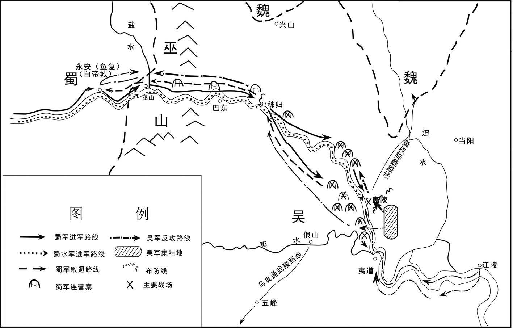 
夷陵之战示意图

## 【原文】

**汉献帝兴平元年。初，孙坚娶钱唐吴氏，生四男策、权、翊、匡及一女[1]。坚从军于外，留家寿春。策年十余岁，已交结知名。舒人周瑜与策同年，亦英达夙成，闻策声问，自舒来造焉，便推结分好，劝策徙居舒，策从之[2]。瑜乃推道南大宅与策，升堂拜母，有无通共。及坚死，策年十七，还葬曲阿[3]。已乃渡江，居江都，结纳豪俊，有复仇之志[4]。**

## 【注文】

[1]孙坚（155—191年）：字文台，吴郡富春（今浙江杭州富阳区）人。初为郡县吏，武勇刚毅。东汉中平元年（184年），随朱儁（jùn）、张温镇压黄巾军，因功为别部司马，迁议郎。东汉中平四年（187年）任长沙太守，击败境内起义军，封乌程侯。汉灵帝死后，联合袁术、袁绍讨伐董卓，为破虏将军、豫州刺史，势力逐渐强大。董卓西迁长安后，孙坚率兵入洛阳，修治汉朝诸陵墓。东汉初平二年（191年）进击刘表，被刘表部将黄祖射死于岘（xiàn）山。孙权称帝后追尊为武烈皇帝。　　策：即孙策（175—200年），字伯符，东汉吴郡富春（今浙江杭州富阳区）人，孙坚长子。少时居寿春，与周瑜关系甚密。孙坚死后，依附袁术。东汉兴平元年（194年），袁术以孙坚部曲归其率领。翌年，率部渡江，扫平当地割据势力，据吴、会稽等五郡。孙策善于用人，依靠南北地方豪强势力，在江东创建孙氏政权。后为曹操器重，任讨逆将军，封吴侯。东汉建安五年（200年），曹操和袁绍战于官渡，他想袭击许昌，迎接汉献帝。兵未发，被故吴郡太守许贡门人刺伤而死。　　权：即孙权（182—252年）。字仲谋，吴郡富春（今浙江杭州富阳区）人。早年随其兄孙策平定江东，孙策死后继承其事业，在张昭、周瑜、程普等人辅助下，统治江东，招延名士，平定山越，多次与曹操作战。东汉建安十三年（208年），与刘备结盟，大败曹操于赤壁，奠定三分天下的格局。东汉建安二十四年（219年）杀关羽，取得荆州。曹丕称帝后，孙权向魏国称臣，被封为吴王。三国魏黄初二年（221年），命陆逊统军迎击刘备，在夷陵以火攻大败蜀军。三国吴黄龙元年（229年）称帝，建都武昌，国号吴。孙权统治江东五十多年，对内实行屯田，发展经济，开发边疆，但赋税繁重，刑罚严酷；对外与魏、蜀时战时和，择利而变。　　翊（yì）：即孙翊（184—204年）。字叔弼，富春（今浙江杭州富阳区）人，孙权之弟。曾为丹阳太守，后为部将所杀。　　匡：即孙匡，孙权之弟，字季佐，继承孙坚爵位为乌程侯。二十余岁卒。

[2]舒：古县名。汉朝设置。治所在今安徽庐江西南。　　周瑜（175—210年）：三国时吴国名将。字公瑾，庐江舒县（今安徽庐江西南）人，出身士族。少年时与孙策为友，后为孙策手下建威中郎将，帮助孙策在江东创立孙氏政权。孙策死后，与张昭同辅孙权，任前部大都督。东汉建安十三年（208年），曹操率军南下，他与鲁肃联合刘备，亲率吴军大破曹兵于赤壁。战后，孙权地位更加巩固，形成曹、孙、刘三方鼎峙局面。后病死。

[3]曲阿：古县名。本名云阳，秦改为曲阿，汉代沿置。三国吴国又改为云阳，治所在今江苏丹阳境内。

[4]江都：古县名。汉改秦广陵县为江都县，三国时废。治所在今江苏扬州境内。

## 【译文】

汉献帝兴平元年（194年）。当初，孙坚娶钱塘吴氏为妻，生了孙策、孙权、孙翊、孙匡四个儿子和一个女儿。孙坚长期在外征战，把家眷留在寿春。孙策十多岁的时候，就已经交结知名人士。舒县人周瑜和孙策同岁，也是少年英俊豪迈，听到孙策的名声，就从舒县前来拜访。两人一见便推心置腹，结为好友，周瑜劝孙策去舒县居住，孙策答应了。周瑜就把位于道路南边的一座大宅院让给孙策居住，还亲自到内堂拜见孙策的母亲，两家在财物上互通有无。孙坚死时，孙策十七岁，他把父亲的灵柩送回曲阿安葬。不久，孙策就渡江到江都，结交豪杰，立志要为父亲报仇。

## 【原文】

**丹阳太守会稽周昕与袁术相恶，术上策舅吴景领丹阳太守，攻昕，夺其郡，以策从兄贲为丹阳都尉[1]。策以母、弟托广陵张纮，径到寿春见袁术，涕泣言曰：“亡父昔从长沙入讨董卓，与明使君会于南阳，同盟结好，不幸遇难，勋业不终[2]。策感惟先人旧恩，欲自凭结，愿明使君垂察其诚。”术甚奇之，然未肯还其父兵，谓策曰：“孤用贵舅为丹阳太守，贤从伯阳为都尉，彼精兵之地，可还依召募[3]。”策遂与汝南吕范及族人孙河迎其母诣曲阿，依舅氏，因缘召募，得数百人；而为泾县大帅祖郎所袭，几至危殆[4]。于是复往见术，术以坚余兵千余人还策，表拜怀义校尉[5]。策骑士有罪，逃入术营，隐于内厩，策指使人就斩之，讫，诣术谢。术曰：“兵人好叛，当共疾之，何为谢也。”由是军中益畏惮之。术初许以策为九江太守，已而更用丹阳陈纪[6]。后术欲攻徐州，从庐江太守陆康求米三万斛，康不与[7]。术大怒，遣策攻康，谓曰：“前错用陈纪，每恨本意不遂。每若得康，庐江真卿有也。”策攻康，拔之，术复用其故吏刘勋为太守，策益失望[8]。**

## 【注文】

[1]会（kuài）稽：古郡、县名。即今浙江绍兴，春秋时为越国都，秦汉时为山阴县治所。　　吴景（？—203年）：孙坚妻弟，钱塘（今浙江杭州）人，随孙坚征战有功，拜骑都尉。孙坚死后，袁术任他为丹阳太守，打败周昕，收留孙策及其部属。后被扬州刺史刘繇打败，依附袁术，任广陵太守。袁术称帝后，东归孙策，被任为扬武将军。　　贲（bēn）：即孙贲（？—219年），吴国宗室。字伯阳，孙坚之侄，少孤，随孙坚征伐。孙坚死后，依附袁术，担任豫州刺史、丹阳都尉。随孙策征庐江太守刘勋、江夏太守黄祖，获胜后担任豫章太守，后封都亭侯。

[2]张纮（hóng）（？—211年）：三国时吴国大臣。字子纲，广陵（今江苏扬州）人。少时游学京师，后避乱江东，为孙策谋士，随孙策征讨四方。东汉建安四年（199年），被孙策派往许都，曹操留为侍御史。孙策死后，劝曹操善待孙权。后曹操任他为会稽东部都尉，希望能劝降孙权。张纮回江东后任长史，辅佐孙权，与张昭同理政事。东汉建安十六年（211年）建议孙权定都秣（mò）陵（今江苏南京），被采纳。不久病死。

[3]使君：汉时称刺史为使君，汉以后对州郡长官尊称为使君。　　从伯：父亲的堂兄。

[4]吕范（？—228年）：三国时吴国大臣。字子衡，汝南细阳（今安徽太和东南）人。东汉末年避乱寿春，归附孙策，随孙策转战江东，征讨各地，任宛陵令、都督、征虏中郎将。赤壁之战时，与周瑜等打败曹操，拜裨将军，任彭泽太守，驻守柴桑。三国魏黄初三年（222年），任前将军，率徐盛、全琮等在洞口抵御曹休的进攻。后拜扬州牧。三国吴黄武七年（228年）卒。　　泾县：古县名。西汉设置，治所在今安徽泾县西北，因青弋江上游称泾水，县依水而得名。

[5]怀义校尉：古代官名。位在将军下。

[6]丹阳：古地名。丹阳湖区及其附近，包括今皖、苏、浙三省间湖河丘陵地带的统称。西汉改鄣郡而置丹阳郡，即以此为名。

[7]陆康（生卒年不详）：字季宁，吴郡吴县（今江苏苏州）人。灵帝时任高成令、乐安太守等职，有政绩。因上疏劝谏汉灵帝被免官。后任庐江太守，镇压境内农民起义。后被孙策围困，兵败而死。

[8]故吏：东汉时指被贵戚官僚荐举、辟用的官吏。故吏与原长官或举主存在臣属意识和依附关系。大官僚往往拥有众多故吏，形成社会政治势力。故吏一般会为举主效力，甚而生死相依，患难与共。

## 【译文】

丹阳太守会稽人周昕（xīn）与袁术相互敌视，袁术上表朝廷推荐孙策的舅舅吴景任丹阳太守，进攻周昕，夺取丹阳郡，任命孙策的堂兄孙贲为丹阳都尉。孙策把母亲和弟弟们托付给广陵人张纮照顾，自己直接到寿春去见袁术，哭着说：“先父当年从长沙率军讨伐董卓，与您在南阳相会，结为同盟，他不幸中途遇难，没有完成功业。我感念您对先父的恩情，想投靠您，为您效力，希望您明察我的诚意。”袁术对孙策的表现很惊奇，但是不肯将其父亲的军队还给他。袁术对孙策说：“我任命你舅舅吴景为丹阳太守，你的堂兄孙贲为丹阳都尉，丹阳是出精兵的地方，你可以回去依靠他们，在丹阳招募军队。”孙策就与汝南人吕范和族人孙河迎接他的母亲到曲阿，投靠舅舅，乘机招募军队，得到几百人，但遭到泾县豪强祖郎的袭击，几乎被杀。于是又去拜见袁术，袁术将孙坚的旧部一千多人还给他，上表推荐孙策为怀义校尉。孙策的一名骑士犯了罪，逃到袁术的大营，藏在马厩（jiù）里。孙策派人在马厩里将他斩首，然后去向袁术谢罪。袁术说：“有些士兵喜欢反叛，我们都痛恨这种人，不用谢罪。”从此以后，军中更加畏惧孙策。袁术当初答应让孙策做九江太守，不久却改用丹阳人陈纪。后来袁术想进攻徐州，向庐江太守陆康借三万斛大米，陆康不借给他。袁术大怒，派孙策攻打陆康，对他说：“以前我错用了陈纪为九江太守，经常后悔当初没有让你做九江太守。现在如果你能打败陆康，庐江就真的归你了。”孙策进攻陆康，夺取了庐江郡，但袁术却又任命他的旧吏刘勋为太守，孙策对他更加失望。

## 【原文】

**侍御史刘繇有盛名，诏用为扬州刺史[1]。及策攻庐江，繇惧为袁、孙所并，遣将樊能屯横江，张英屯当利以拒之[2]。术使吴景与孙贲共将兵击英等。**

## 【注文】

[1]侍御史：古代官名。秦代设置，汉代沿袭。秩六百石，负责公卿奏事、纠察百官、审讯案件，出使州郡，巡行风俗，督察军旅等事务，职权很重。　　刘繇（156—197年）：东汉末年东莱牟平（今山东烟台福山区）人，字正礼。举孝廉，为郎中，除下邑长。后弃官，避乱淮浦，朝廷下诏任命他为扬州刺史、振武将军。当时袁术已据州治所寿春（今安徽寿县），刘繇就渡江屯曲阿。袁术自置扬州刺史，并遣吴景等合力进攻，岁余不能下。东汉兴平二年（195年）刘繇被孙策击败，奔丹徒，南保豫章，驻彭泽，不久病卒。

[2]袁：指袁术（？—199年），东汉末年割据者。字公路，汝南汝阳（今河南商水）人，袁绍堂弟。少以侠气闻名，初举孝廉，迁河南尹、虎贲（bēn）中郎将。董卓专权，他逃奔南阳，在孙坚的帮助下占据其地，参与讨伐董卓。联盟破裂后北连公孙瓒与袁绍抗衡，先后被袁绍和曹操打败，退居扬州。东汉建安二年（197年）在寿春称帝，置公卿百官。后为曹操击败，忧病而死。　　横江：古地名。今安徽省和县东南，是长江下游重要津渡。　　当利：即当利口，在今安徽和县东南，是当利水入江之口。

## 【译文】

侍御史刘繇有很高的名望，朝廷下诏任命他为扬州刺史。等到孙策进攻庐江的时候，刘繇害怕被袁术、孙策兼并，派他的部将樊能驻守在横江，张英驻守当利防御他们。袁术派吴景和孙贲一起率军进攻张英等人。

## 【原文】

**二年。初，丹阳人朱治尝为孙坚校尉，见袁术政德不立，劝孙策归取江东[1]。时吴景攻樊能、张英等，岁余不克。策说术曰：“家有旧恩在东，愿助舅讨横江。横江拔，因投本土召募，可得三万兵，以佐明使君定天下。”术知其恨，而以刘繇据曲阿，王朗在会稽，谓策未必能定，乃许之，表策为折冲校尉[2]。将兵千余人，骑数十匹，行收兵，比至历阳，众五六千[3]。时周瑜从父尚为丹阳太守，瑜将兵迎之，仍助以资粮。策大喜曰：“吾得卿，谐也。”进攻横江、当利，皆拔之，樊能、张英败走。**

## 【注文】

[1]朱治（156—224年）：吴国将领。字君理，丹阳故鄣县（今浙江安吉北）人。早年任县吏，后为州从事。东汉末年随孙坚四处征战，有战功，任司马、都尉。董卓专权，随孙坚讨伐董卓，进入洛阳，任督军校尉。孙坚死后，依附袁术，劝孙策回江东发展势力。孙策死后，与张昭等辅佐孙权，打败山越，征讨黄巾军，历任吴郡太守、安国将军，封毗陵侯。　　江东：古地区名，又作江左。隋、唐以前称自安徽芜湖至江苏南京长江南岸地区为江东。三国时也称孙权的统治地区为江东。

[2]王朗（？—228年）：三国时魏国大臣，经学家、训诂学家。字景兴，东海郯（tán）（今山东郯城）人。早年任郎中、菑丘长，师从杨赐学经，后辞官回乡，为徐州刺史陶谦治中从事。董卓专权后王朗劝陶谦讨伐董卓，带奏章到长安见汉献帝，被任为会稽太守。孙策攻会稽，王朗被打败，投奔曹操，被任为谏议大夫、参司空军事、少府、奉常、大理，以善于治狱而著名。魏文帝时，建议省刑罚，息兵务农，封乐平乡侯。魏明帝时，任太尉，封兰陵侯，屡次劝诫魏明帝，建议明帝减轻徭役，与民休息。　　折冲校尉：古代官名。东汉末年袁术置，曹操、孙权也曾设置此官。为领兵武官，地位低于将军、高于都尉。

[3]历阳：古县名。秦朝设置。因在历水之阳而得名。治所在今安徽和县。西汉为九江郡都尉治所，东汉为扬州刺史治所，西晋以后历为历阳郡、南豫州及和州治所。

## 【译文】

汉献帝兴平二年（195年）。当初，丹阳人朱治曾经任孙坚的校尉，看到袁术政治混乱，不修道德政治，就劝孙策返回故乡，夺取江东。当时，吴景正在攻打樊能、张英等人，一年多的时间也没有取胜。孙策劝袁术说：“我家过去对江东地区的民众有恩惠，我愿意帮助舅父吴景讨伐横江。攻下横江后，就回乡招募士兵，可以得到三万人，来辅佐您平定天下。”袁术知道孙策怨恨他，但他认为刘繇占据曲阿，王朗在会稽，孙策不一定能打败他们，就同意了，上表朝廷推荐孙策为折冲校尉。孙策率领一千多名士兵，几十匹战马，边走边招兵买马，到达历阳时，已经有五六千人。当时周瑜的伯父周尚任丹阳太守，周瑜率兵迎接孙策，并给他财物和粮食。孙策十分高兴，说：“我有了你的帮助，一定能成功。”于是就进攻横江、当利，全都取胜，樊能、张英战败逃走。

## 【原文】

**策渡江转斗，所向皆破，莫敢当其锋者。百姓闻孙郎至，皆失魂魄。长吏委城郭，窜伏山草。及策至，军士奉令，不敢虏略，鸡犬菜茹，一无所犯，民乃大悦，竞以牛酒劳军[1]。策为人美姿颜，能笑语，性阔达听受，善于用人，是以士民见者，莫不尽心，乐为致死。策攻刘繇牛渚营，尽得邸阁粮谷、战具[2]。时彭城相薛礼、下邳相丹阳笮融依繇为盟主，礼据秣陵城，融屯县南，策皆击破之[3]。又破繇别将于梅陵，转攻湖孰、江乘，皆下之，进击繇于曲阿[4]。**

## 【注文】

[1]菜茹：菜蔬。

[2]牛渚（zhǔ）营：在今安徽当涂西北长江边。　　邸（dǐ）阁：储蓄粮食及军需物资的仓库。

[3]笮（zé）融（生卒年不详）：丹阳（今安徽宣城）人。东汉末年聚众起兵，依附徐州牧陶谦，负责广陵、下邳、彭城漕运。他崇信佛教，擅用三郡钱粮造佛寺。曹操征陶谦，笮融败走广陵，杀广陵太守赵昱（yù）。东汉兴平二年（195年）被孙策打败，退守豫章。后被刘繇打败，逃入山中，被山民所杀。　　秣（mò）陵城：秣陵县治所，在今江苏南京江宁区。

[4]湖孰：古县名。西汉设置，治所在今江苏南京江宁区。　　江乘（shèng）：古县名，秦朝设置。治所在今江苏南京东北，为长江下游重要渡口，南北交通要冲。

## 【译文】

孙策渡过长江，转战各地，所向披靡，战无不胜，没人能够抵挡他。百姓听说孙郎要到了，都很害怕，失魂落魄。各地官员都弃城逃跑，到深山中躲避。等到孙策到后，军队纪律严明，不敢抢掠，连鸡狗青菜都不敢随便拿，完全没有侵犯百姓的行为，百姓都十分高兴，争先恐后送去牛肉和美酒来慰劳孙策的军队。孙策英俊潇洒，善于言谈，语言幽默，性格豁达开朗，能接受别人的意见，善于用人，因此见过他的士大夫、将士和百姓，都对他尽心尽力，乐意为他效力，虽死无悔。孙策攻取刘繇的牛渚营，获得了邸阁的全部粮食和武器。当时，彭城相薛礼、下邳相丹阳人笮融推举刘繇为盟主，薛礼据守秣陵城，笮融驻扎在秣陵城南，孙策把他们都打败了。孙策又打败了刘繇驻扎在梅陵的军队，然后进攻湖孰、江乘，全部攻克，于是就进攻在曲阿的刘繇。

## 【原文】

**繇同郡太史慈时自东莱来省繇，会策至，或劝繇可以慈为大将[1]。繇曰：“我若用子义，许子将不当笑我邪[2]？”但使慈侦视轻重。时独与一骑卒遇策于神亭，策从骑十三，皆坚旧将辽西韩当、零陵黄盖辈也[3]。慈便前斗，正与策对。策刺慈马，而揽得慈项上手戟，慈亦得策兜鍪[4]。会两家兵骑并各来赴，于是解散。**

## 【注文】

[1]太史慈（166—206年）：三国吴将领。字子义，东莱黄县（今山东龙口东南）人，少好学，勇猛善射。初为郡吏，东汉末年避祸辽东，依附孔融，帮助孔融打败黄巾军。后投奔刘繇，未被重用，不久归降孙策，深受器重，任折冲中郎将、建昌都尉。孙策死后，辅佐孙权，屡立奇功。赤壁之战后，随孙权围攻合肥，受命劫张辽营，兵败而亡。　　东莱：古郡名。西汉设置，治所在掖县（今山东莱州），东汉后治所多次迁移。辖境相当于今山东莱州、青岛、崂山至海的地区。

[2]许子将：即许劭（shào）（150—195年），字子将，汝南平舆（今河南平舆）人。早年为郡功曹，受到太守的器重，和堂兄许靖善于品评人物，每月更换品评题目，在汝南形成风气，被称为“月旦评”。汉末大乱，先后避居徐州、扬州、豫章等地。卒时四十六岁。

[3]神亭：古地名。在今江苏金坛西北。　　韩当（生卒年不详）：三国吴国将领。字义公，辽西令支（今河北迁安西）人。习弓马，有臂力。初从孙坚征伐，陷敌擒虏，为别部司马。及从孙策东渡，迁先登校尉，征刘勋，破黄祖，攻鄱阳，领乐安长，山越族无不畏服。后以中郎将与周瑜等破曹操于赤壁，又与吕蒙袭取南郡，迁偏将军，领永昌太守。夷陵之战，与朱然共攻涿乡蜀军，大获全胜，以功徙威烈将军，封都亭侯。曹真攻南郡，率众同心固守。三国吴黄武二年（223年），迁昭武将军，领冠军太守，加都督之号。不久病死。　　黄盖（生卒年不详）：三国吴国将领。字公覆，零陵泉陵（今湖南永州零陵区）人。早年为郡吏，后从孙坚起兵，任别部司马，随孙坚进攻山越，讨伐董卓。孙坚死后，追随孙策、孙权，先后任山越守、春谷长、寻阳令，镇抚山越，迁丹阳都尉。赤壁之战中，诈降曹操，协助周瑜使用火攻，打败曹军，因功拜武锋中郎将。后率军镇压“武陵蛮”、长沙益阳山民的叛乱，任武陵太守、偏将军。黄盖历仕孙坚、孙策、孙权三君，为人严肃，善于训练士卒，勇猛善战，为吴国宿将。

[4]兜鍪（móu）：古代战士戴的头盔。

## 【译文】

刘繇同郡人太史慈这时从东莱来看望刘繇，正好孙策来攻打刘繇，有人劝刘繇可以任命太史慈为大将，刘繇说：“我如果任用太史慈为大将，那不是让许邵来嘲笑我吗？”只让太史慈去负责侦察敌军的情况。当时，太史慈独自带领一名骑兵在神亭和孙策相遇，孙策的随从人员有十三人，都是孙坚的旧将，有辽西人韩当、零陵人黄盖等。太史慈就向前出击，正好与孙策相对。孙策刺中了太史慈的战马，并夺得太史慈背后插的手戟，太史慈也夺取了孙策的头盔。这时两家的骑兵都赶来相救，于是就各自散去。

## 【原文】

**繇与策战，兵败，走丹徒[1]。策入曲阿，劳赐将士，发恩布令，告谕诸县：“其刘繇、笮融等故乡部曲来降首者，一无所问，乐从军者一身行，复除门户，不乐者不强[2]。”旬日之间，四面云集，得见兵二万余人，马千余匹，威震江东。**

## 【注文】

[1]丹徒：古县名。秦置，属于会稽郡，治所在今江苏镇江丹徒区。东汉属吴郡，三国吴嘉禾三年（234年）改为武进县。

[2]复除：免除徭役及赋税。

## 【译文】

刘繇与孙策交战失败，逃到丹徒。孙策进入曲阿，慰劳赏赐将士，对百姓施恩惠，发布命令，通告各县：“刘繇、笮融等人的乡人、亲友、部下来投降的，一概既往不咎，一家有一个人愿意从军的，免除他家的徭役，不愿意从军的也不勉强。”十天之内，四面八方的人都来归附，得到二万多名士兵，马一千多匹，威震江东。

## 【原文】

**丙辰[1]，袁术表策行殄寇将军[2]。策将吕范言于策曰：“今将军事业日大，士众日盛，而纲纪犹有不整者，范愿暂领都督，佐将军部分之[3]。”策曰：“子衡既士大夫，加手下已有大众，立功于外，岂宜复屈小职，知军中细事乎。”范曰：“不然。今舍本土而托将军者，非为妻子也，欲济世务也。譬犹同舟涉海，一事不牢，即俱受其败。此亦范计，非但将军也。”策笑无以答。范出，便释褠，著袴褶，执鞭诣下启事，自称领都督[4]。策乃授传，委以众事，由是军中肃睦，威禁大行。**

## 【注文】

[1]丙辰：当为十二月的丙辰日。

[2]殄寇将军：古代将军名号。东汉末年袁术置，掌征伐。

[3]都督：古代军事长官。出现于汉末，三国魏晋时发展为地方军政长官，职权较重。

[4]褠（gōu）：直袖的单衣。　　袴（kù）褶（zhě）：便于骑乘的战服。上穿褶，下着裤，外不加裘裳，是北方少数民族地区传入中原的一种服饰。

## 【译文】

汉献帝兴平二年（195年）（十二月）丙辰（二十日），袁术上表推荐孙策为代行殄寇将军。孙策的部将吕范对他说：“现在将军您的事业日益壮大，军队越来越多，但军法纲纪还不完善，我愿暂时担任都督的职务，帮助您整顿军法军纪。”孙策说：“子衡既是士大夫，又统率重兵，在外有战功，怎么能再担任这样的小官，在军中管理琐细的事务！”吕范说：“您不要这样认为。我离开家乡来追随您，不是为了妻子儿女，而是为了建功立业，做拯救天下的大事。这就像乘坐同一艘船渡海，一件事没办稳妥，大家都要受害。这也是为我自己着想，不只是为将军您谋划。”孙策笑着无法回答。吕范出来后，脱下单衣官服，穿上骑马的戎装，手里拿着鞭子到都督府去处理事务，自称已经担任都督的职务。孙策就授予他都督之职，委托他处理各项事务，从此军中纪律严明，将士和睦，军令得以彻底贯彻。

## 【原文】

**策以张纮为正议校尉，彭城张昭为长史，常令一人居守，一人从征讨[1]。及广陵秦松、陈端等，亦参与谋谟。策待昭以师友之礼，文武之事，一以委昭。昭每得北方士大夫书疏，专归［美］于昭，策闻之，欢笑曰：“昔管子相齐，一则仲父，二则仲父，而桓公为霸者宗。今子布贤，我能用之，其功名独不在我乎！”**

## 【注文】

[1]正议校尉：古代官名。东汉末年孙策置，掌参谋议，地位很高，或随军征伐，或主持留守事务。　　张昭（156—236年）：三国时吴国大臣。字子布，彭城（今江苏徐州）人，年轻时勤奋好学，博览群书。二十岁被举为孝廉，未去就位。刺史陶谦举拔他为茂才，也不应征。汉末渡江南行，孙策任他为长史，抚军中郎将，文武大事全部委托于他。孙策临死，把弟弟孙权托付张昭，张昭便率领百官，尽力辅助孙权。三国魏黄初二年（221年），拜为绥远将军，封由拳侯。孙权称吴王，拜他为辅吴将军。改封娄侯，食邑万户。谥“文侯”。

## 【译文】

孙策任命张纮（hóng）为正议校尉，彭城人张昭为长史，经常让一个人留守在家，一个人随军征讨四方。广陵人秦松、陈端等人也参与军政大事的谋划。孙策以老师和朋友的礼节对待张昭，把行政和军政事务都交给他处理。张昭经常收到北方士大夫的书信，把平定江东的功劳和治理的政绩都归于张昭，孙策听说后，高兴地说：“以前管仲为齐国相国，齐桓公把国家大事交给他处理，功劳也都归功于他，但齐桓公却成为春秋五霸之首。现在子布很贤明，我能任用他，他的功名不也是我的吗？”

## 【原文】

**刘繇自丹徒奔豫章，使太守朱皓攻袁术所用诸葛玄，使笮融助皓攻玄[1]。融诈杀皓，代领郡事。繇进讨融，融走入山，为民所杀，诏以前太傅掾华歆为豫章太守[2]。**

## 【注文】

[1]豫章：古郡名。西汉设置，治所在南昌（今江西南昌）。辖境相当今江西省地，三国吴以后辖境缩小。

[2]太傅：古代官名。始设于周代，为三公之一，居于太师之前、太保之后，为辅弼国君的官。战国以后废，汉代复置，与太师、太尉并为三公，位在太师之下。东汉时太傅益重，录尚书事，参与朝政。其后历代太傅与太师皆称三公，但大多以他官兼任，或不设置。　　华歆（xīn）（157—231年）：三国魏初名臣。字子鱼，平原高唐（今山东禹城西南）人，因品德高尚名闻当世。汉末为豫章太守，归孙策后被待为上宾，曹操征为议郎，后代替荀彧为尚书令。魏国建立，历官司徒、太尉。华歆极受宠信，前后赏赐，诸臣莫及。而华歆淡于财利，受赐财物悉赠亲友，奴婢则皆放为良。家业清贫，内无余财。

## 【译文】

刘繇从丹徒逃到豫章，派太守朱皓进攻袁术所委任的豫章太守诸葛玄，派笮融帮助朱皓攻打诸葛玄。笮融设计杀死朱皓，自己代理豫章太守。刘繇进军讨伐笮融，笮融逃到山中，被山民杀死。朝廷下诏任命以前的太傅掾华歆为豫章太守。

## 【原文】

**建安元年秋八月，袁术以谶言“代汉者当涂高”，自云名字应之[1]。又以袁氏出陈为舜后，以黄代赤，德运之次，遂有僭逆之谋[2]。闻孙坚得传国玺，拘坚妻而夺之[3]。及闻天子败于曹阳，乃会群下议称尊号，众莫敢对[4]。主簿阎象进曰：“昔周自后稷至于文王，积德累功，三分天下有其二，犹服事殷[5]。明公虽奕世克昌，未若有周之盛；汉室虽微，未若殷纣之暴也[6]。”术默然。**

## 【注文】

[1]谶（chèn）：巫师或方士制作的一种隐语或预言，是吉凶的符验或征兆。起于秦代，西汉后期至东汉谶纬之学大盛。谶言多用于政治斗争宣传，以此为谋求权力者或统治者造舆论，为其权力的合理性找到根据。如王莽与刘秀就分别利用图谶、符命，作为“改制”与“中兴”的合法依据。魏晋以后封建王朝禁止谶纬书流传。

[2]舜：古史传说时代的贤明帝王。　　德运：王朝的气数命运。　　僭（jiàn）逆：越礼犯上。

[3]传国玺（xǐ）：秦以后皇帝世代相传的印章。相传秦始皇用蓝田玉刻成印章，方圆四寸，上纽交五龙，正面刻李斯所写篆文“受命于天，既寿永昌”。秦亡归汉。汉高祖即位后使用，后代帝王以得此玺为符瑞之应，称传国玺。三国以后，秦玺下落不明，但历代统治者皆伪造传国玺。

[4]曹阳：古地名。在今河南灵宝市东北。

[5]周：朝代名。公元前11世纪周武王灭商后建立周。周朝从公元前11世纪中期到公元前256年，约八百年，共历三十四王。可分为西周和东周两个时期，东周又分为春秋和战国两个时期。　　后稷：中国古史传说中周族的始祖。名弃。相传为有邰氏女姜嫄履大人迹而生，以为不祥，故名弃。少时游戏，喜种麻、菽。长而成人，遂好农作，善种各类粮食作物。虞、夏之际被封于邰，号后稷。　　文王：即周文王（生卒年不详），姓姬，名昌，号西伯。礼贤下士，注意整顿内政，尤重农业。文王任用姜尚为相，富国强兵，剪除商的羽翼，文王晚年国势日盛，“三分天下有其二”，为灭商奠定了基础。　　殷：朝代名。公元前16世纪成汤灭夏所建，最后传到纣，为周所灭，共传十七世，三十一王，约六百年。商代后期，盘庚将国都迁往殷，所以商朝又称殷商。

[6]纣（？—前1046年）：商朝末代王，历代有名暴君之一。帝乙之子，亦作“受”，亦称“帝辛”。在位期间，穷兵黩武，滥施暴政，刚愎自用，诛杀大臣。后周武王伐纣，战于牧野（今河南淇县西南），因商军在阵前倒戈，他兵败自焚。

## 【译文】

汉献帝建安元年（196年）秋季八月，袁术因为有谶书曾预言“代汉者当涂高”，认为自己的名字和预言相合。又因为袁氏出自舜的后裔陈姓，黄色代替红色，符合五行的顺序，于是有了篡位当皇帝的想法。袁术听说孙坚得到了汉代的传国玉玺，就拘捕了孙坚的妻子，夺取了传国玉玺。当袁术听说汉献帝在曹阳被打败的时候，就召集部下，商议称帝的事情，大家都不敢回答。主簿阎象上前说：“从前周朝从后稷到文王，世代都有恩德功勋，占有三分之二的天下，还向商称臣。您虽然也是世代位居高官，声名显赫，但还没有周朝那样昌盛；现在汉朝虽然衰弱，但还没有像商纣王那样残暴。”袁术听后沉默无言。

## 【原文】

**术聘处士张范，范不往，使其弟承谢之[1]。术谓承曰：“孤以土地之广，士民之众，欲徼福齐桓，拟迹高祖，何如[2]？”承曰：“在德不在强。夫用德以同天下之欲，虽由匹夫之资而兴霸王之功，不足为难。若苟欲僭拟，干时而动，众之所弃，谁能兴之？”术不悦。**

## 【注文】

[1]处士：古时称有才德而隐居不做官的人，后世泛指没做过官的读书人。　　张范（？—212年）：字公仪，河内修武（今河南获嘉）人。东汉末年避乱扬州，谢绝袁术聘请。后依附曹操，深受敬重，被任为谏议大夫、议郎、参丞相军事等。曹操外出征伐，常命他和邴原辅佐曹丕留守。

[2]齐桓：指齐桓公小白（？—前643年），春秋时齐国国君，公元前685年至公元前643年在位。即位后他任用管仲为相，九合诸侯，一匡天下，是春秋五霸之一。　　高祖：即汉高祖刘邦（前256或前247—前195年）。沛县（今江苏沛县）人。公元前202年至前195年在位。曾任秦朝泗水亭长，起兵响应陈胜起义，自称沛公。率军攻占咸阳，废秦朝苛法，与民约法三章，为关中民所拥戴。由于实力不如项羽，接受汉王封号，占有巴、蜀、汉中等地。后与项羽争战四年，史称楚汉战争。公元前202年战胜项羽，即皇帝位，建立汉朝。

## 【译文】

袁术想聘请处士张范，张范不去，派他的弟弟张承去致谢。袁术对张承说：“我有广袤的土地、众多的将士和百姓，想和齐桓公媲（pì）美，仿效汉高祖，怎么样？”张承说：“这事在于德行，而不在于势力的强大。用恩德来顺应天下民众的愿望，即使一个人去建立称霸天下的功业，也不困难。如果想篡位，违背时代潮流，轻举妄动，众人就会唾弃他，谁能够使他兴盛？”袁术听后很不高兴。

## 【原文】

**孙策闻之，与术书曰：“成汤讨桀称‘有夏多罪’，武王伐纣曰‘殷有重罚’[1]。此二主者，虽有圣德，假使时无失道之过，无由逼而取也。今主上非有恶于天下，徒以幼小，胁于强臣，异于汤、武之时也。且董卓贪淫骄陵，志无纪极，至于废主自兴，亦犹未也，而天下同心疾之，况效尤而甚焉者乎？又闻幼主明智聪敏，有夙成之德，天下虽未被其恩，咸归心焉。使君五世相承，为汉宰辅，荣宠之盛，莫与为比，宜效忠守节，以报王室，则旦、奭之美，率土所望也[2]。时人多惑图纬之言，妄牵非类之文，苟以悦主为美，不顾成败之计，古今所慎，可不熟虑。忠言逆耳，驳议致憎，苟有益于尊明，无所敢辞。”术始自以为有淮南之众，料策必与己合，及得其书，愁沮发疾，既不纳其言，策遂与之绝。**

## 【注文】

[1]成汤（？—前1588年）：商朝的建立者。名履，子姓。继位后，都于亳（河南商丘，一说山东曹县，一说河南偃师），任用伊尹、促虺（huī）为左右相，积极为灭夏做准备。汤首先翦除夏的属国葛，又相继攻灭了韦、顾、昆吾等国，最后在鸣条一战灭夏，建立商朝。　　桀（生卒年不详）：夏朝末代国王，历史上有名暴君之一，名履癸。在位期间荒淫暴虐，致使阶级矛盾日益尖锐。在有仍（今山东济宁）与诸侯会盟，有缗（mín）氏反叛，被攻灭。桀后被商汤打败，逃至南方而死，夏朝灭亡。　　武王：即周武王（？—前1043年）。西周王朝的建立者，名姬发。周文王之子，继承父志，联合庸、蜀、卢等族，兴师伐纣。在牧野（今河南淇县西南）之战中，大败商军，灭亡商朝，建立西周王朝。定都于镐（今陕西西安长安区沣河以东），号称“宗周”。在位期间，曾大封诸侯于天下，以巩固周朝统治。

[2]旦：即周公旦（生卒年不详）。姓姬，名旦，西周武王之弟。武王即位，他辅政伐纣灭商。周朝建立，周公被封于鲁，但他没有到封地就封，而是留于朝中辅政。因为食邑在周，称为周公。武王去世后成王年幼，周公摄行朝政，其兄弟管叔、蔡叔、霍叔不服，联合纣王之子武庚及东方淮夷反叛，他率兵东征，平定叛乱，并攻灭东方十七国。为加强对殷商遗民的监管，进一步控制东部地区，周公派召公奭营建东都洛邑（今河南洛阳），作为东都，还继续大规模分封诸侯。同时周公厘定礼乐刑罚制度，主张“明德慎罚”，奖励农桑，一度出现“成康之治”的局面。　　奭（shì）：即召（shào）公奭（生卒年不详）。周文王之子，武王之弟，西周时燕国始祖。因其封地在召（今陕西岐山西南），所以称召公或召伯。曾辅佐武王灭商。周成王即位后，因年幼，由周公摄政。管叔、武庚作乱，他支持周公旦东征平定叛乱。又受命营建东都洛邑（今河南洛阳），并在此镇守，威慑东方，是周公旦得力助手。周成王时他曾任太保，与周公旦分陕而治，陕以西的地方归他管理。

## 【译文】

孙策听说袁术要称帝，就给袁术写信说：“商汤讨伐夏桀时说‘夏朝有很多罪恶’，周武王讨伐商纣王时说‘殷朝应该受到严重的惩罚’。商汤与周武王，虽然都有恩德于天下，如果夏桀、商纣王没有过错，他们也无法夺取天下。现在天子没有恶行，只是因为年龄小，被权臣胁迫，和商汤、周武王时的情况不一样。况且像董卓那样贪婪骄横，目无法纪，野心极大的人，也不敢废黜天子，自己称帝，而天下的人都痛恨他，何况还有想仿效他，比他做得更过分的人呢？我又听说年幼的天子聪明睿智，少年有德，天下人虽然还没有得到他的恩惠，但都已经忠心拥护他了。您的祖上连续五代都是汉朝的宰相或三公，得到的荣耀和宠爱，任何家族都无法比拟，您应该效忠朝廷，严守节操，来报答汉朝的恩惠，那样就可以获得周公旦、召公奭那样的美名，赢得百姓的赞誉。现在很多人都被谶纬之言所迷惑，牵强附会地拼凑一些毫不相干的文字，来讨好主人，不考虑事情的成败，这是古今都很慎重的大事，不能不深思熟虑啊！忠言逆耳，发表不同的意见就会遭人憎恨，但是只要对您有好处，我没有不敢说的话。”袁术开始以为自己拥有淮南，地广兵多，孙策一定会附和自己，等收到孙策的信后，忧虑沮丧生了病。既然袁术不听从孙策的劝告，孙策于是就和他断绝了关系。

## 【原文】

**孙策将取会稽，吴人严白虎等众各万余人，处处屯聚[1]。诸将欲先击白虎等，策曰：“白虎等群盗，非有大志，此成禽耳。”遂引兵渡浙江[2]。会稽功曹虞翻说太守王朗曰：“策善用兵，不如避之[3]。”朗不从，发兵拒策于固陵[4]。**

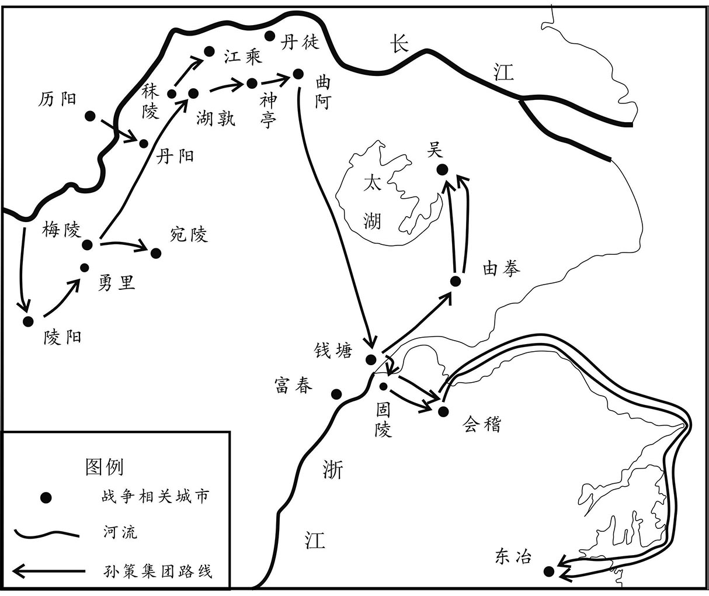 
孙策占领江东示意图

## 【注文】

[1]严白虎（生卒年不详）：吴郡吴县（今江苏苏州）人，为吴郡豪强，东汉末年拥兵数万。东汉建安四年（199年）被孙策打败，逃奔余杭（今属浙江），但其余党仍为吴国祸患。

[2]浙江：水名。即今钱塘江，位于今浙江省西北部。

[3]功曹：古代官名。汉朝始置，为地方官署的职事部门，掌管选举，并兼参与诸曹事务。其长官，司隶校尉府称功曹从事，州府称治中从事，郡称功曹史，县称功曹掾。其后，梁、陈、北魏将军府置功曹，长官称参军事。　　虞翻（164—233年）：三国时期吴国经学家。字仲翔，会稽余姚（今浙江余姚）人。年少好学，才高傲世。初为王朗功曹，后归附孙策。孙策死后，辅佐孙权。孙权以其为骑都尉，累以直言上谏冒犯孙权，最终被流徙交州。流放期间，依旧讲学不倦，弟子常数百人。虞翻出自《易》学世家，家传西汉今文孟喜之《易》，将八卦与天干、五行、方位相配合，推论象术数。

[4]固陵：古地名。在今浙江萧山西北十里西兴镇。

## 【译文】

孙策想夺取会稽，吴人严白虎等人各自拥兵万余人，驻扎在各地。吴军众将打算先攻打严白虎等人，孙策说：“严白虎等人只是一群盗贼，没有大的志向，早晚会消灭他们。”于是就率军渡过钱塘江。会稽功曹虞翻劝太守王朗说：“孙策善于用兵，不如躲避他。”王朗不听，派兵在固陵抵御孙策。

## 【原文】

**策数渡水战，不能克。策叔父静说策曰：“朗负阻城守，难可卒拔[1]。查渎南去此数十里，宜从彼据其内，所谓攻其无备，出其不意者也[2]。”策从之。夜，多然火为疑兵，分军投查渎道袭高迁屯[3]。朗大惊，遣故丹阳太守周昕等率兵逆战，策破昕等，斩之。朗遁走，虞翻追随营护朗，浮海至东冶，策追击，大破之，朗乃诣策降[4]。**

## 【注文】

[1]静：孙静（生卒年不详），三国吴将。字幼台，孙坚之弟，富春（今浙江杭州富阳区）人。孙坚起兵，孙静纠合乡曲及宗族数百人响应。孙策征讨会稽王朗，孙静向孙策献计击败王朗，攻克会稽，因功拜奋武校尉。孙权称帝后，任昭义中郎将，卒于家。

[2]查渎：在今浙江萧山西南。

[3]高迁屯：在今浙江萧山东北。

[4]东冶：古县名，东汉置，属会稽郡，治所在今福建福州鼓楼区。

## 【译文】

孙策多次渡江作战，都未能取胜。孙策的叔父孙静对他说：“王朗坚守城池，负隅顽抗，很难短时间把他攻破。查渎在城南几十里，应该从那里攻入王朗的后方，这就是出其不意，攻其不备。”孙策采纳了孙静的建议。夜晚，点燃很多火把迷惑敌兵，然后分兵从查渎袭击高迁屯。王朗得知后十分吃惊，赶忙派原来的丹阳太守周昕等人率军迎战，孙策打败周昕等人，杀了他们。王朗逃走，虞翻跟着保护王朗，渡海逃到东冶。孙策乘胜追击，打败王朗，王朗于是就到孙策那里投降。

## 【原文】

**策自领会稽太守，复命虞翻为功曹，待以交友之礼。策好游猎，翻谏曰：“明府喜轻出微行，从官不暇严，吏卒常苦之。夫君人者，不重则不威，故白龙鱼服，困于豫且；白蛇自放，刘季害之[1]。愿少留意。”策曰：“君言是也。”然不能改。**

## 【注文】

[1]白龙鱼服，困于豫且：此典故出自刘向《说苑·正谏》：白龙变成一条鱼在河里游玩，被名叫豫且的渔人一箭射伤了眼睛。　　白蛇自放，刘季害之：此典故出自司马迁《史记·高祖本纪》：秦始皇末年，刘邦做亭长时，有一天夜里喝醉了酒，在路上将挡路的大白蛇斩为两段。后来发现有一老妇人在蛇被杀死的地方哭，有人问她哭的原因，老妇人说，有人将我儿子杀死了，有人又问，怎么知道你儿子被杀了。老妇人说，我的儿子，就是化为蛇的白帝子，因挡在路上被赤帝子所斩。

## 【译文】

孙策自任会稽太守，仍然任命虞翻为功曹，以朋友的礼节来对待他。孙策喜欢打猎，虞翻劝谏说：“您喜欢轻装便服外出，随从人员来不及警戒，官兵们常常感到苦恼。作为君主，不稳重就没有威严，所以白龙变成鱼，渔夫豫且就能捕获它；白帝子变成白蛇，刘邦就能杀死它。希望您以后多加注意。”孙策说：“你说得很对。”但是仍然改不掉喜欢打猎的习惯。

## 【原文】

**二年夏五月，曹操遣议郎王誧以诏书拜孙策为骑都尉，袭爵乌程侯，领会稽太守，使与吕布及吴郡太守陈瑀共讨袁术[1]。策欲得将军号以自重，誧便承制假策明汉将军[2]。策治严，行到钱唐，瑀阴图袭策，潜结祖郎、严白虎等使为内应[3]。策觉之，遣其将吕范、徐逸攻瑀于海西，瑀败，单骑奔袁绍[4]。**

## 【注文】

[1]王誧（bū）（生卒年不详）：东汉末年大臣。　　陈瑀（yǔ）（生卒年不详）：字公玮，下邳淮浦（今江苏涟水西）人。东汉末年任议郎、扬州刺史、吴郡太守等。先后为袁术、曹操部属。东汉建安二年（197年），与吕布、孙策讨伐袁术，图谋袭击孙策，失败后投奔袁绍，被任为故安都尉。

[2]承制：秉承皇帝旨意。有时非出自皇帝的命令，为一种假借的名义或政治待遇。　　假：古代官员任用的类别之一。代理、暂署之意。汉代指官吏未授正式官衔暂且代行职权，其位低于正式官职。　　明汉将军：古代将军名号。东汉末置，掌征伐或驻守。

[3]治严：即“治装”，收拾行装，准备上路。东汉时为避汉明帝刘庄讳，改“装”为“严”，后代沿用。

[4]海西：古县名。汉朝设置。治所在今江苏灌南县境内。

## 【译文】

汉献帝建安二年（197年）夏季五月，曹操派议郎王誧带着汉献帝的诏书，去任命孙策为骑都尉，继承他父亲孙坚的爵位乌程侯，兼任会稽太守，让他和吕布及吴郡太守陈瑀共同讨伐袁术。孙策想得到将军的名号来提高自己的地位，王誧就以汉献帝的名义任命孙策为明汉将军。孙策整理行装出发，率军走到钱塘时，陈瑀阴谋袭击孙策，暗地里勾结祖郎、严白虎等人为内应。孙策发觉后，派他的部将吕范、徐逸攻击驻扎在海西的陈瑀。陈瑀战败，单枪匹马去投奔袁绍。

## 【原文】

**三年冬十二月，孙策遣其正议校尉张纮献方物，曹操欲抚纳之，表策为讨逆将军，封吴侯，以弟女配策弟匡，又为子彰取孙贲女，礼辟策弟权、翊，以张纮为侍御史[1]。**

## 【注文】

[1]曹操（155—220年）：字孟德，沛国谯（qiáo）县（今安徽亳州）人。东汉末年著名的军事家、政治家和文学家，三国时代魏国的奠基人。早年举孝廉为郎，参与镇压黄巾军，封济南相。曾任东郡太守、典军校尉等职。东汉初平元年（190年）与袁绍等讨伐董卓，镇压黑山农民起义，任兖（yǎn）州牧，收编青州黄巾军，组成“青州兵”。东汉建安元年（196年）迎接汉献帝，建都许，历任大将军、司空、丞相，被封为魏公、魏王。曹操先后击败袁术、吕布、袁绍、刘表等割据势力，北征乌桓，西讨马腾、韩遂、张鲁，逐渐统一北方。赤壁之战时被孙权、刘备联军大败。他执政期间任人唯才，抑制豪强，提倡节俭，使北方经济得到恢复和发展。他还精通兵法，善作诗歌，有作品传世。东汉建安二十五年（220年）卒于洛阳。后被追尊为魏武帝。　　侍御史：古代官名。秦朝设置，汉代沿置。位在御史大夫之下，职责是给事殿中，举劾非法，督察郡县，奉使外出执行指定任务。

## 【译文】

汉献帝建安三年（198年）冬季十二月，孙策派他的正议校尉张纮（hóng）向朝廷进贡地方特产，曹操想安抚笼络孙策，就上表推荐孙策为讨逆将军，封吴侯，把侄女许配给孙策的弟弟孙匡，又为儿子曹彰娶孙贲（bēn）的女儿，还礼聘孙策的弟弟孙权、孙翊到朝廷任职，并任命张纮为侍御史。

## 【原文】

**袁术以周瑜为居巢长，以临淮鲁肃为东城长[1]。瑜、肃知术终无所成，皆弃官渡江从孙策，策以瑜为建威中郎将。肃因家于曲阿。**

## 【注文】

[1]居巢长：居巢县县长。居巢：古县名。秦置，治所在今安徽巢湖东北，属九江郡。西汉属庐江郡，东汉改为侯国，晋复为县。　　临淮：古郡名。治所在今安徽定远。　　鲁肃（172—217年）：三国吴国名将。字子敬，临淮东城（今安徽定远）人。出身士族，与周瑜同到江南投奔孙策。曹操南下，严重威胁孙氏政权，他与周瑜坚决主战，并联合刘备军同拒曹操。孙权任命他为赞军校尉，帮助周瑜在赤壁大破曹操。东汉建安十五年（210年）周瑜死后，他任奋武校尉，主管军事，继续执行联合刘备抗击曹魏的战略。后迁汉昌太守、横江将军。东汉建安二十二年（217年）病卒。　　东城长：东城县县长。东城：古县名。秦置，治所在今安徽定远，属九江郡。东汉属下邳郡。

## 【译文】

袁术任命周瑜为居巢长，临淮人鲁肃为东城长。周瑜、鲁肃知道袁术最终成不了大事，都辞去官职，渡江投奔孙策。孙策任命周瑜为建威中郎将。鲁肃于是把家迁到曲阿。

## 【原文】

**曹操表征王朗，策遣朗还，操以朗为谏议大夫，参司空军事。**

## 【译文】

曹操上表朝廷，请求召回王朗，孙策就把王朗送回。曹操任命王朗为谏议大夫，参司空军事。

## 【原文】

**袁术遣间使赍印绶与丹阳宗帅祖朗等，使激动山越，共图孙策[1]。刘繇之奔豫章也，太史慈遁于芜湖山中，自称丹阳太守[2]。策已定宣城以东，惟泾以西六县未服，慈因进住泾县，大为山越所附[3]。于是策自将讨祖郎于陵阳，禽之[4]。策谓郎曰：“尔昔袭孤，斫孤马鞍。今创军立事，除弃宿恨，惟取能用，与天下通耳，非但汝，汝勿恐怖。”郎叩头谢罪，即破械，署门下贼曹[5]。又讨太史慈于勇里，禽之，解缚，捉其手曰：“宁识神亭时邪？若卿尔时得我，云何？”慈曰：“未可量也。”策大笑曰：“今日之事，当与卿共之。闻卿有烈义，天下智士也，但所托未得其人耳。孤是卿知己，勿忧不如意也。”即署门下督[6]。军还，祖郎、太史慈俱在前导，军人以为荣。**

## 【注文】

[1]山越：三国时期聚居于江南山区的少数民族。包括古代越人后裔和为逃避赋役或避罪入山的汉族民众。孙吴政权常征发山越人当兵，征收赋税，不断激起反抗。后山越人被平定，出山进入平原耕种，对江南的开发起了积极作用。

[2]芜湖：古县名。汉代设置，属丹阳郡。因地势低洼蓄水而生芜藻，故名。在今安徽芜湖东。

[3]宣城：古县名。西汉设置，故址在今安徽宣城宣州区。

[4]陵阳：古县名。汉朝设置，治所在今安徽青阳南。

[5]门下贼曹：古代官名，汉朝设置。汉代自公卿到郡县皆置，是贼曹的长官，掌盗贼、警卫之事。

[6]门下督：古代官名。东汉末曹操为丞相时始置。将帅手下直属部队的将领，掌管侍从护卫。其品位因所属官长品位高低而异。

## 【译文】

袁术派遣使者秘密将印绶送给丹阳郡的豪族首领祖郎等人，让他们煽动山越人，共同反对孙策。刘繇被孙策打败逃往豫章时，太史慈逃到芜湖的山中，自称丹阳太守。孙策已经平定了宣城以东地区，只有泾县以西的六个县还没有归附，太史慈因此就进驻泾县，受到山越人的拥戴。于是孙策亲自率军去陵阳讨伐祖郎，将他捉住。孙策对祖郎说：“以前你袭击我，砍中我的马鞍。现在我创建军队，建功立业，抛弃旧怨，只要能为我效力，我就任用他，对所有的人都这样，不但对你如此，你不要害怕。”祖郎叩头谢罪，孙策随即打开祖郎的枷锁，任命他为门下贼曹。孙策又进军勇里讨伐太史慈，将他擒获。孙策解开太史慈的绳索，握着他的手说：“你还记得在神亭相遇争斗的事吗？如果那时你抓到我，怎么对待我呢？”太史慈说：“无法估量。”孙策大笑说：“我现在的事业，要和你一起开创。听说你忠烈，讲义气，是天下智勇双全的人，只是以前所依附的人不是真正的明主。我是你的知己，不要担心不会称心如意。”随即任命太史慈为门下督。孙策率军回去的时候，祖郎、太史慈都在前面开道，全体将士都以此为荣耀。

## 【原文】

**会刘繇卒于豫章，士众万余人欲奉豫章太守华歆为主，歆以为“因时擅命，非人臣所宜”，众守之连月，卒谢遣之，其众未有所附[1]。策命太史慈往抚安之，谓慈曰：“刘牧往责吾为袁氏攻庐江，吾先君兵数千人尽在公路许，吾志在立事，安得不屈意于公路以求之乎[2]？其后不遵臣节，谏之不从，丈夫义交，苟有大故，不得不离[3]。吾交求公路及绝之本末如此，恨不及其生时与共论辨也。今儿子在豫章，卿往视之，并宣孤意于其部曲，部曲乐来者与俱来，不乐来者且安慰之[4]。并观华子鱼所以牧御方规何如[5]。卿须几兵，多少随意。”慈曰：“慈有不赦之罪，将军量同桓、文，当尽死以报德。今并息兵，兵不宜多，将数十人足矣。”左右皆曰：“慈必北去不还。”策曰：“子义舍我，当复从谁？”饯送昌门，把腕别曰：“何时能还[6]？”答曰：“不过六十日。”慈行，议者犹纷纭，言遣之非计。策曰：“诸君勿复言，孤断之详矣。太史子义虽气勇有胆烈，然非纵横之人，其心秉道义，重然诺，一以意许知己，死亡不相负，诸君勿忧也[7]。”慈果如期而反，谓策曰：“华子鱼良德也，然无他方规，自守而已。又丹阳僮芝自擅庐陵，番阳民帅别立宗部，言‘我已别立郡海昏上缭，不受发召’，子鱼但睹视之而已[8]。”策拊掌大笑，遂有兼并之志。**

## 【注文】

[1]擅命：擅自发号施令，不受节制。　　连月：连续数月。

[2]先君：称已故的父亲。

[3]大故：对国家有重大影响的事变、事件，如灾害、入寇、国丧等。

[4]部曲：三国、两晋、南北朝时期地方豪强和将领的私人军队。

[5]华子鱼：指华歆（xīn），三国时魏大臣，字子鱼。

[6]昌门：古城门名，即建业皇城的西门。故址在今江苏南京珠江路西口附近。

[7]然诺：承诺，许诺。

[8]庐陵：古郡名。东汉兴平元年（194年）孙策置，治所在石阳（今江西吉水东北）。三国吴移治高昌（今江西泰和西北）。辖境相当于今江西永新、峡江、乐安、石城等县以南地区。　　番阳：古地名。今江西鄱阳。　　宗部：东汉末年因社会混乱，地方豪强以宗族为核心，聚众结伙，据险自守，以保障财产不受侵犯，并拒征徭役、兵役，史称宗部、宗伍，或蔑称“宗贼”。宗部与汉晋间的坞壁相近似，具有地方割据性。其大者有五六千家，首领称宗帅。三国时宗部主要分布于今江苏、安徽、浙江、江西、湖北、广东、广西一带。　　海昏（mǐn）：古县名。西汉设置，后改为国，治所在今江西永修西北。　　上缭：古地名。三国时属海昏县，故址在今江西永修境内。

## 【译文】

正在这时，刘繇病死在豫章，他的部下一万多将士准备推举豫章太守华歆为首领。华歆却认为“利用时机，擅自夺取政权，不是人臣应该做的”。刘繇的部众坚持了几个月，华歆最终还是谢绝了他们的要求，这些部众找不到归附的人。孙策命令太史慈去安抚他们，对他说：“刘繇以前责备我替袁术攻击庐江。我先父的数千将士都在袁术那里，我立志要建功立业，怎么能不屈服于他，来求得他的帮助呢？后来袁术不遵守臣节，擅自称帝，他不听我的劝谏，大丈夫应当以道义相交，但是遇到大的变故，就不得不分开。我交结袁术以及和他断绝关系的经过就是这样，遗憾的是不能在刘繇活着的时候向他说清楚这件事。现在刘繇的儿子在豫章，你前去看望他们，并把我的意思告诉他的部曲，如果部曲愿意投靠我的就一起来，不愿意来的就安抚他们。并趁机观察华歆是怎样治理豫章的。你需要带多少士兵，由你决定。”太史慈说：“我曾经犯了不可赦免的罪过，将军您的度量如同齐桓公、晋文公，我应当以死来报答您的恩德。现在没有交战，不宜多带人，我带数十人就够了。”孙策左右的人都说：“太史慈一定会逃跑，不再回来。”孙策说：“太史慈离开我，他还能追随谁？”孙策在昌门给太史慈饯别，握着他的手说：“什么时候能回来？”太史慈回答：“不过六十天。”太史慈走后，大家仍然议论纷纷，说派他去豫章是失策。孙策说：“你们不要再说了，我的决定是慎重考虑过的。太史慈虽然勇猛有胆识，但不是纵横游说、反复无常的小人，他心怀道义，注重诺言，一旦决心报答知己，至死不会相负，你们不要担忧了。”太史慈果然按期回来了，对孙策说：“华歆品德高尚，但没有治理地方的才能和方略，只能自保而已。再者，丹阳人僮芝擅自占据庐陵，番阳的豪强首领另设宗部，声称‘我们已经在海昏县的上缭另立郡府，不接受豫章郡的命令’，华歆对他们没有办法。”孙策听后鼓掌大笑，于是就有了兼并豫章的想法。

## 【原文】

**四年冬十一月，庐江太守刘勋以袁术部曲众多，不能赡，遣从弟偕求米于上缭诸宗帅，不能满数，偕召勋使袭之[1]。孙策恶勋兵强，伪卑辞以事勋曰：“上缭宗民数欺鄙郡，欲击之，路不便。上缭甚富实，愿君伐之，请出兵以为外援。”且以珠宝、葛越赂勋[2]。勋大喜，外内尽贺。刘晔独否，勋问其故，对曰：“上缭虽小，城坚池深，攻难守易，不可旬日而举也[3]。兵疲于外，而国内虚，策乘虚袭我，则后不能独守。是将军进屈于敌，退无所归。若军必出，祸今至矣。”勋不听。遂伐上缭，至海昏，宗帅知之，皆空壁逃迁，勋了无所得。时策引兵西击黄祖，行及石城，闻勋在海昏，策乃分遣从兄贲、辅将八千人屯彭泽，自与领江夏太守周瑜将二万人袭皖城，克之，得术、勋妻子及部曲三万余人[4]。表汝南李术为庐江太守，给兵三千人以守皖城[5]。皆徙所得民东诣吴。勋还至彭泽，孙贲、孙辅邀击，破之。勋走保流沂，求救于黄祖，祖遣其子射率船军五千人助勋，策复就攻勋，大破之[6]。勋北归曹操，射亦遁走。**

## 【注文】

[1]刘勋（生卒年不详）：字子台，琅邪人。东汉末年任沛国建平长，与曹操友善。后依附袁术，为庐江太守。东汉建安四年（199年）被孙策打败，投奔曹操，拜平虏将军，封华乡侯。后因骄横犯法，被杀。

[2]葛越：古南方布名，即葛布。

[3]刘晔（yè）（？—234年）：三国时魏国大臣。字子扬，淮南成德（今安徽寿县东南）人。汉宗室之后。东汉末避乱，率部曲随庐江太守刘勋。刘勋失败后归曹操，为司空仓曹掾。东汉建安二十年（215年），随曹操征张鲁，迁行军长史兼领军，曾劝曹操乘破张鲁之机，经略蜀地，未被采纳。魏文帝、明帝时历官侍中、太中大夫、大鸿胪等职，以才策谋略见长。人称刘晔善于揣摩上意，魏明帝考验后属实，从此疏远他。刘晔于是发狂，出为大鸿胪，忧郁而死。　　旬日：十天，十来天，常指时间短暂。

[4]辅：即孙辅（生卒年不详），三国时吴将，孙坚兄子。字国仪，富春（今浙江杭州富阳区）人。以扬武校尉辅佐孙策平定江东三郡，复受命屯驻历阳以抗拒袁术，又跟从孙策向西袭击庐江太守刘勋。孙辅屡次从征，身先士卒，立有战功，历任庐陵太守、平南将军、交州刺史。后孙辅唯恐孙权不能保住江东，于是暗中与曹操交通，被孙权发觉下狱，数年后死去。　　彭泽：古县名。西汉设置，属豫章郡，治所在今江西湖口东南，因县西彭蠡泽而得名。东汉末年孙权在此置彭泽郡，不久废。　　黄祖（？—208年）：刘表部将。东汉初平三年（192年），奉命在襄阳岘（xiàn）山设伏，射杀孙坚，被刘表任为江夏太守。他屯兵鲁山，扼守长江航道，屡次与吴军交战。东汉建安十三年（208年）被吴军打败杀死。

[5]李术（？—200年）：汝南人，孙策讨平刘勋后，任命李术为庐江太守，东汉建安四年（199年），李术截杀了曹操任命的扬州刺史严象。东汉建安五年（200年），孙策死后，李术不听从孙权的命令，于是孙权派兵进攻皖城。李术向曹操求救，而曹操没有援助他，结果被杀。李术之叛的平定使孙权在江东树立了威名。

[6]流沂：古地名。在今湖北黄石东，长江南岸。　　射：即黄射（生卒年不详），东汉末年江夏太守黄祖的长子，官拜章陵太守。

## 【译文】

汉献帝建安四年（199年）冬季十一月，庐江太守刘勋因为收容的袁术部曲太多，粮草供应不足，就派遣他的堂弟刘偕去向上缭宗族的首领们征集粮食，但没有达到预期的数目，刘偕就告知刘勋，让他派兵袭击上缭，夺取粮食。孙策厌恶刘勋兵力强盛，假意用谦卑的言辞对刘勋说：“上缭的地方豪强多次欺凌我郡，想攻打他们，但是道路不方便。上缭十分富庶，希望您讨伐他们，我请求出兵作为您的外援。”并且送去珠宝和葛布贿赂刘勋。刘勋十分高兴，内外的人都向他祝贺，只有刘晔不以为然，刘勋问他原因，刘晔回答说：“上缭虽然小，但是城墙坚固，壕沟很深，易守难攻，十天之内不会被攻克。要是攻打上缭，军队在外面十分疲惫，内部又空虚，如果孙策乘机袭击我们，后方不能独自坚守。这样将军您进攻不能战胜敌人，后退又无家可归。如果您一定要去攻打上缭，灾祸马上就会到来。”刘勋不听刘晔的劝告，出兵讨伐上缭。大军到达海昏，上缭豪强首领们得到消息，都携带物资逃跑了，留下空城，刘勋一无所得。这时孙策率军向西攻打黄祖，走到石城，听说刘勋在海昏，孙策就派他的堂兄孙贲、孙辅率领八千人驻守彭泽，亲自和江夏太守周瑜率领二万人袭击皖城，将城攻克，俘虏了袁术和刘勋的妻子儿女以及部曲三万多人。孙策上表推荐汝南人李术为庐江太守，给他三千人驻守皖城，把俘获的人都迁移到吴郡。刘勋从上缭撤军，到彭泽时，遭到孙贲、孙辅的拦截，被打败。刘勋退守流沂，向黄祖求援，黄祖派他的儿子黄射率水军五千人来援助刘勋。孙策再次进攻刘勋，将他打败。刘勋向北投奔曹操，黄射也失败逃走。

## 【原文】

**策收得勋兵二千余人，船千艘，遂进击黄祖。十二月辛亥，策军至沙羡，刘表遣从子虎及南阳韩晞将长矛五千来救祖[1]。甲寅，策与战，大破之，斩晞。祖脱身走，获其妻子及船六千艘，士卒杀溺死者数万人。**

## 【注文】

[1]沙羡（xiàn）：古县名。西汉设置，治所在今湖北武汉江夏区。　　刘表（142—208年）：字景升，山阳郡高平（今山东微山西北）人。他是东汉远支皇族。东汉初平元年（190年）为荆州刺史，得到蒯（kuǎi）良、蔡瑁（mào）等当地名士、大族的支持，招兵买马，先后平定境内其他军事势力，击败孙坚，占据湖北、湖南地区，成为当时一支重要割据势力。在军阀混战中力图自保，招纳前来避难的名士。东汉建安十三年（208年）曹操南征荆州时病死。

## 【译文】

孙策收编刘勋的士兵二千多人，得到战船一千艘，接着就乘胜进攻黄祖。建安四年（199年）十二月辛亥（初八日），孙策的军队到达沙羡，刘表派他的侄子刘虎和南阳人韩晞率领长矛军五千人来救援黄祖。甲寅（十一日），孙策与黄祖交战，将他们打败，杀死韩晞，黄祖逃走，俘获黄祖的妻子儿女和六千艘船，黄祖的士兵被杀死、淹死的有数万人。

## 【原文】

**策盛兵将徇豫章，屯于椒丘，谓功曹虞翻曰：“华子鱼自有名字，然非吾敌也[1]。若不开门让城，金鼓一震，不得无所伤害。卿便在前，具宣孤意。”翻乃往见华歆曰：“窃闻明府与鄙郡故王府君齐名中州，海内所宗，虽在东垂，常怀瞻仰[2]。”歆曰：“孤不如王会稽。”翻复曰：“不审豫章资粮器仗士民勇果，孰与鄙郡？”歆曰：“大不如也。”翻曰：“明府言不如王会稽，谦光之谭耳[3]。精兵不如会稽，实如尊教。孙讨逆智略超世，用兵如神，前走刘扬州，君所亲见，南定鄙郡，亦君所闻也。今欲守孤城，自料资粮，已知不足，不早为计，悔无及也。今大军已次椒丘，仆便还去，明日日中迎檄不到者，与君辞矣。”歆曰：“久在江表，常欲北归，孙会稽来，吾便去也[4]。”乃夜作檄，明旦遣吏赍迎[5]。策便进军，歆葛巾迎策[6]。策谓歆曰：“府君年德名望，远近所归，策年幼稚，宜修子弟之礼。”便向歆拜，礼为上宾。**

## 【注文】

[1]徇：通“巡”，巡行。　　椒丘：古地名。在今江西新建东北。

[2]中州：古地区名。即中土，中原。古豫州因地处九州之中而称中州，今河南为古豫州之地，故相沿亦称河南为中州迄今。广义的中州有二：一是泛指黄河中游地区，二是指全国而言。　　瞻（zhān）仰：指怀着崇高的敬意往上或往前看。

[3]谦光：原指因谦让而有光辉，后用来形容礼让谦逊的风度。　　谭：同“谈”。

[4]江表：古代称长江中下游以南的地区。从中原人看来，地在长江之外，故称江表。

[5]赍（jī）：怀抱着，带着。

[6]葛巾：汉族服饰，汉代男子头巾，用葛布制成，单夹皆多用本色绢，后有两带垂下，为士庶男子通用。

## 【译文】

孙策率大军准备进攻豫章，驻扎在椒丘，对功曹虞翻说：“华歆虽然有名望，但不是我的对手。如果不开门投降，战鼓一响，发起进攻，就不可能没有死伤。请你去见华歆，把我的意思告诉他。”于是虞翻去拜见华歆，说：“我听说您和我郡的前任太守王朗在中原享有盛名，受到天下人的尊崇，我虽然住在江东，但内心常常景仰您。”华歆说：“我不如王朗。”虞翻又说：“不知道豫章的粮草储备、武器装备以及将士民众的勇敢斗志，比得上会稽郡吗？”华歆说：“远远不如会稽郡。”虞翻说：“您说自己名望不如王朗，是谦虚之词而已；但精兵不如会稽郡，却是事实。孙策将军智谋出众，用兵如神，以前赶走了扬州刺史刘繇，您亲眼看到了，后来南下平定了会稽郡，您也听说了。现在想要坚守孤城，已经知道自己的粮草不足，如果不早做打算，后悔就来不及了。现在孙策的大军已经驻扎在椒丘，我这就回去，如果明天中午还没有接到迎接孙策的檄文，我就与您永别了。”华歆说：“我久在江南，常常想返回北方，既然孙将军来了，我就回去了。”华歆于是连夜写成迎接孙策的檄文，第二天早晨就派遣使者带着檄文去迎接孙策。孙策于是率军前往，华歆戴着葛巾去迎接孙策。孙策对华歆说：“您德高望重，远近归附，我年少，学识浅薄，应该用子弟拜见长辈的礼节来见您。”于是孙策施礼拜见华歆，把他当作贵宾。

## 【原文】

**策分豫章为庐陵郡，以孙贲为豫章太守，孙辅为庐陵太守。会僮芝病，辅遂进取庐陵，留周瑜镇巴丘[1]。**

## 【注文】

[1]巴丘：古县名。三国时吴国置，治所在今江西峡江西南。

## 【译文】

孙策从豫章郡分出一部分，设立庐陵郡，任命孙贲（bēn）为豫章太守，孙辅为庐陵太守。恰好此时，占据庐陵的僮芝生病，孙辅就去攻取庐陵，留下周瑜镇守巴丘。

## 【原文】

**孙策之克皖城也，抚视袁术妻子；及入豫章收载刘繇丧，善遇其家，士大夫以是称之[1]。**

## 【注文】

[1]皖城：古地名。春秋皖国，东汉皖县治所，其城在皖水之北，故名皖城。故城在今安徽潜山。

## 【译文】

孙策攻克皖城以后，照顾袁术的妻子儿女；进入豫章后，又运送刘繇的灵柩（jiù）北归，善待他的家眷，士大夫因此称赞孙策。

## 【原文】

**会稽功曹魏腾尝迕策意，策将杀之，众忧恐，计无所出[1]。策母吴夫人倚大井谓策曰：“汝新造江南，其事未集，方当优贤礼士，舍过录功。魏功曹在公尽规，汝今日杀之，则明日人皆叛汝。吾不忍见祸之及，当先投此井中耳。”策大惊，遽释腾。**

## 【注文】

[1]魏腾（生卒年不详）：东汉末年会（kuài）稽郡（今浙江绍兴）功曹，字周林，性格直率，刚毅不阿，办事坚持原则，不以长官意志行事。曾得罪吴主孙策，孙策想杀掉他，孙策之母吴夫人以想跳井进行阻止，未被杀。　　迕（wǔ）：违背，相抵触。

## 【译文】

会稽功曹魏腾曾经冒犯孙策，孙策要杀死他，众人都忧虑恐惧，但束手无策。孙策的母亲吴夫人倚着大井的栏杆对孙策说：“你刚刚平定江南，很多事情还没有办理，应当礼贤下士，原谅过失，奖励功劳。魏功曹奉公守法，你今天杀了他，明天众人都会背叛你。我不忍心看到大祸临头，应该先投井自尽。”孙策大惊，立即释放了魏腾。

## 【原文】

**五年夏四月，广陵太守陈登治射阳，孙策西击黄祖，登诱严白虎余党，图为后害[1]。策还击登，军到丹徒，须待运粮。初，策杀吴郡太守许贡，贡奴客潜民间，欲为贡报仇[2]。策性好猎，数出驱驰，所乘马精骏，从骑绝不能及，卒遇贡客三人，射策中颊，后骑寻至，皆刺杀之[3]。策创甚，召张昭等谓曰：“中国方乱，以吴、越之众，三江之固，足以观成败，公等善相吾弟。”呼权，佩以印绶，谓曰：“举江东之众，决机于两陈之间，与天下争衡，卿不如我[4]。举贤任能，各尽其心，以保江东，我不如卿。”丙午，策卒，时年二十六。**

## 【注文】

[1]射阳：古县名。汉朝设置，故治在今江苏宝应东北。

[2]许贡（生卒年不详）：东汉末官吏，先后任吴郡都尉、太守，为孙策所杀。

[3]驱驰：策马奔腾。　　从骑：骑马的随从。

[4]陈：战阵，行列。

## 【译文】

汉献帝建安五年（200年）夏季四月，广陵太守陈登把府治设在射阳，孙策西征黄祖，陈登引诱严白虎的余部，图谋扰乱孙策的后方。孙策回军进攻陈登，大军行到丹徒，等待运送粮草。当初，孙策杀了吴郡太守许贡，许贡的家奴和门客躲藏在民间，想为许贡报仇。孙策喜欢打猎，经常外出骑马奔驰，这一次他所骑的骏马跑得很快，而骑马的随从护卫追不上他，突然遇到许贡的三个门客，他们射中了孙策的面颊，护卫士兵赶到后，杀死了这三个人。孙策的伤势严重，召集张昭等人说：“现在中原大乱，凭借吴、越的人力，依靠三江的险要，足以坐观成败，希望你们好好辅佐我的弟弟。”孙策把孙权叫来，把印绶交给他，说：“率领江东的将士，在战场上随机应变，与天下的英雄豪杰相争，你不如我；选贤任能，使他们各尽其力，忠心保卫江东，我不如你。”丙午（初四日），孙策去世，当时他二十六岁。

## 【原文】

**权悲号，未视事，张昭曰：“孝廉，此宁哭时邪[1]！”乃改易权服，扶令上马，使出巡军。昭率僚属，上表朝廷，下移属城，中外将校，各令奉职。周瑜自巴丘将兵赴丧，遂留吴，以中护军与张昭共掌众事[2]。时策虽有会稽、吴郡、丹阳、豫章、庐江、庐陵，然深险之地，犹未尽从，流寓之士，皆以安危去就为意，未有君臣之固，而张昭、周瑜等谓权可与共成大业，遂委心而服事焉[3]。**

## 【注文】

[1]视事：办公，就职治事。

[2]中护军：古代官名。东汉始设，为大将军幕府属官。魏晋至南北朝时与中领军同为重要军事长官，掌管中央军队，主管军职官员的选用。

[3]流寓：流落寄居异乡。　　委心：倾心，用心。

## 【译文】

孙权悲痛大哭，不能办理军政事务，张昭说：“孝廉，这难道是你哭的时候吗？”于是给孙权换上官服，把他扶到马上，让他出去巡视军营。张昭率领群臣，上表向朝廷禀告孙策去世的消息，通告所属各城，命令内外将士各自坚守职责。周瑜从巴丘率兵前来奔丧，就留在吴郡，以中护军的身份和张昭一起掌管军政事务。当时，孙策虽然占有会稽、吴郡、丹阳、豫章、庐江、庐陵，但是偏远险要的地区，还没有完全控制；流亡客居在江南的士大夫，都以自身的安危来考虑是去是留，孙氏兄弟与他们还没有建立牢固的君臣关系。但是张昭、周瑜等人认为孙权可以同他们一起创建大业，于是就全心全意辅佐孙权。

## 【原文】

**冬十月，曹操闻孙策死，欲因丧伐之。侍御史张纮谏曰：“乘人之丧，既非古义，若其不克，成仇弃好，不如因而厚之。”操即表权为讨虏将军，领会稽太守[1]。**

## 【注文】

[1]讨虏将军：古代将军名号。东汉光武帝时置，掌统兵征战。东汉建安五年（200年）孙权任此职，后遂常设此职。　　领：官员任用类别之一。其制是官吏除本职外又兼理其他职务。

## 【译文】

汉献帝建安五年（200年）冬季十月，曹操听说孙策去世，想趁孙权发丧的时候讨伐他。侍御史张纮（hóng）劝谏说：“趁别人发丧的时候出兵讨伐，这不符合古人的道义，如果不能取胜，就化友为敌了，不如趁机厚待他们。”曹操就上表朝廷，推荐孙权为讨虏将军，任会稽太守。

## 【原文】

**操欲令纮辅权内附，乃以纮为会稽东部都尉[1]。纮至吴，太夫人以权年少，委纮与张昭共辅之。纮思惟补察，知无不为[2]。太夫人问扬武都尉会稽董袭曰：“江东可保不[3]？”袭曰：“江东有山川之固，而讨逆明府恩德在民，讨虏承基，大小用命，张昭秉众事，袭等为爪牙，此地利人和之时也，万无所忧[4]。”权遣张纮之部，或以纮本受北任，嫌其志趣不止于此，权不以介意。**

## 【注文】

[1]内附：归附朝廷。　　会稽东部都尉：古代官名。东汉设置，俸比二千石（dàn），掌管地方军队，主管治安，防捕盗贼。

[2]补察：弥补过失，督察得失。

[3]扬武都尉：古代武官名。东汉末年置，掌领兵征伐。　　董袭（？—213年）：三国时吴国将领。字元代，会稽余姚（今浙江余姚）人。屡次随孙策征战，任别部司马、扬武都尉。孙策死后，追随孙权，迁偏将军。曾跟从孙权征黄祖，功劳最大。后随孙权出濡须抵御曹操，船覆溺死。

[4]讨逆：指孙策，因孙策曾任讨逆将军。　　讨虏：指孙权，因孙权曾任讨虏将军。　　承基：承受基业。　　爪牙：助手、党羽，比喻辅佐的人。

## 【译文】

曹操想让张纮辅佐孙权，劝他归附朝廷，就任命张纮为会稽东部都尉。张纮到了吴郡，孙权的母亲吴夫人认为孙权年轻，委托张纮和张昭一起辅佐他。张纮尽力辅政，发现有缺漏就立即补救，凡是知道的事都认真处理。吴夫人问扬武都尉会稽人董袭说：“江东能保得住吗？”董袭说：“江东有山川大河，地势险要，孙策将军对民众有恩德，孙权将军继承他的基业，大小官吏将士都听从他的命令，张昭主持军政大事，我们作为爪牙羽翼辅助他，此可谓地利人和，您不必担忧。”孙权派张纮去会稽就职，有人认为张纮本来受曹操的委任，担心他另有意图，孙权毫不介意。

## 【原文】

**鲁肃将北还，周瑜止之，因荐肃于权曰：“肃才宜佐时，当广求其比以成功业。”权即见肃，与语，悦之。宾退，独引肃合榻对饮，曰：“今汉室倾危，孤思有桓、文之功，君何以佐之？”肃曰：“昔高帝欲尊事义帝而不获者，以项羽为害也[1]。今之曹操犹昔项羽，将军何由得为桓、文乎！肃窃料之，汉室不可复兴，曹操不可卒除，为将军计，惟有保守江东，以观天下之衅耳。若因北方多务，剿除黄祖，进伐刘表，竟长江所极，据而有之，此王业也。”权曰：“今尽力一方，冀以辅汉耳，此言非所及也。”张昭毁肃年少粗疏，权益贵重之，赏赐储偫，富拟其旧[2]。**

## 【注文】

[1]义帝：即楚怀王熊心（？—前205年），秦灭楚后藏匿民间牧羊，秦末农民起义中被项梁等人拥立为怀王。秦亡后项羽尊他为义帝，后来又把他放逐到长沙，并派人将他暗杀。

[2]储偫（zhì）：储备，特指存储物资以备需用。

## 【译文】

鲁肃想返回北方，周瑜劝他留下，并把他推荐给孙权，说：“鲁肃才能出众，能够辅佐您建功立业，应该多访求这样的人来成就事业。”孙权就召见鲁肃，与他交谈，很赏识他。宾客走了以后，孙权单独把鲁肃留下，坐在一起饮酒。孙权说：“现在汉朝将要灭亡，我想建立齐桓公、晋文公那样的功业，你如何辅佐我呢？”鲁肃说：“从前汉高祖想尊奉义帝，未能如愿，是因为有项羽从中妨碍。现在的曹操就如同过去的项羽，您怎么能建立像齐桓公、晋文公那样的霸业呢！我认为，汉室已经不可能再复兴，曹操也不可能在短时间被铲除，为将军您谋划，只有保守江东，坐观天下时局的变化。如果趁着北方多事的机会，消灭黄祖，讨伐刘表，占据整个长江流域，这才是帝王之业。”孙权说：“我现在只想全力经营江东，希望能辅佐汉室而已，你所说的这些我还没有考虑。”张昭诋毁鲁肃年轻，粗心草率，但孙权却更加器重他，赏赐给他大量财物，使他像以前一样富裕。

## 【原文】

**权料诸小将兵少而用薄者，并合之。别部司马汝南吕蒙军容鲜整，士卒练习，权大悦，增其兵，宠任之[1]。**

## 【注文】

[1]别部司马：古代官名。汉代设置，掌管领兵征伐。大将军领兵五部（营），每部置校尉一人，军司马一人。其别营领属为别部司马，其兵多少随时宜而变。其后三国沿置。　　吕蒙（？—219年）：三国时吴名将。字子明，汝南富陂（今安徽阜阳东南）人。少依孙策部将邓当。后从孙权，屡进奇计，攻战有功，任横野中郎将。后随周瑜、程普等大破曹操于赤壁。他曾攻读史书与兵书，有才略，果敢有胆识。鲁肃卒后代领其军，袭破关羽，占领荆州。不久病死。

## 【译文】

孙权整顿军队，把兵少而力量薄弱的低级将领加以合并。别部司马汝南人吕蒙的军队，军容整齐，士兵训练有素，孙权见后十分高兴，给他增兵，宠爱信任他。

## 【原文】

**功曹骆统劝权尊贤接士，勤求损益，飨赐之日，人人别进，问其燥湿，加以密意，诱谕使言，察其志趣[1]。权纳用焉。统，俊之子也[2]。**

## 【注文】

[1]骆统（193—228年）：三国时吴国将领。字公绪，会稽乌伤（今浙江义乌）人。初为孙权乌程相，有政绩，迁为功曹。劝孙权尊贤纳士，省役息民。随陆逊破蜀军于宜都，迁偏将军。三国吴黄武初，与严圭破魏，封新阳亭侯，迁濡须督。黄武七年（228年）卒。　　飨（xiǎng）赐：宴飨宾客，赏赐属下。　　燥湿：用苦燥药祛除湿邪的治疗方法，适用于中焦湿证，有苦温、苦寒两类。　　密意：隐秘的心事。

[2]俊：即骆俊（？—197年），字孝远，会稽乌伤（今浙江义乌）人。东汉末年陈王刘宠的国相，在任内励精图治，深得民众爱戴。东汉建安二年（197年），因拒绝借粮给僭（jiàn）号称帝的袁术而遭杀害。骆俊之子为三国吴国著名将领骆统。

## 【译文】

功曹骆统劝孙权尊敬贤才，招纳士人，经常审察典章制度的增加与减损，在宴会赏赐时，一个个单独接见臣僚，询问用苦燥药祛除湿邪的治疗方法，亲切关怀他们，并讲授主上隐秘的心事，引导他们畅所欲言，观察他们的志向和兴趣。孙权采纳了他的建议。骆统是骆俊之子。

## 【原文】

**庐陵太守孙辅恐权不能保江东，阴遣人赍书呼曹操。行人以告，权悉斩辅亲近，分其部曲，徙辅置东[1]。**

## 【注文】

[1]部曲：部曲之名始于汉，最初为军队编制，将军辖部，部下有曲，后渐变成军队的代名、士卒队伍的代称。部曲受命于国家，与统兵将领无依附关系。东汉以后，对主将有人身依附关系的部曲逐渐成为地方豪强和将领的私人军队、部属。

## 【译文】

庐陵太守孙辅恐怕孙权不能保守江东，暗地派人带着书信去见曹操，希望他能率军南下江东。送信的人报告了孙权，孙权将孙辅的亲信全部处死，分散他的部属，把他迁移到东部进行监视。

## 【原文】

**曹操表征华歆为议郎，参司空军事。庐江太守李术不肯事权，而多纳其亡叛。权以状白曹操曰：“严刺史昔为公所用，而李术害之，肆其无道，宜速诛灭。今术必复诡说求救。明公居阿衡之任，海内所瞻，愿敕执事，勿复听受[1]。”因举兵攻术于皖城。术求救于操，操不救，遂屠其城，枭术首，徙其部曲二万余人。严刺史者，扬州刺史严象也[2]。**

## 【注文】

[1]阿（ē）衡：商汤时伊尹的官名，辅佐国君。后世为首辅大臣、宰相的代称。　　执事：古时指侍从左右供使令的人，后来书信中用以称呼对方，意思是不敢直陈，请执事者转达，表示尊敬。

[2]严象（？—200年）：字文则，京兆（今陕西西安）人，经荀彧（yù）荐举，任扬州刺史，被孙策部将李术所杀。

## 【译文】

曹操上表推荐华歆为议郎，参司空军事。庐江太守李术不愿归附孙权，而且收容孙权反叛逃亡的部属。孙权把这一情况禀报曹操，说：“扬州刺史严象以前为您效力，但李术却杀害了他。李术肆无忌惮做坏事，应该赶快把他消灭。我现在率军讨伐李术，他必然会再次花言巧语向您求救。您身居阿衡之位，为天下人敬仰，世人瞩目，我不敢直陈，请执事者代为转达，希望您不要再听信李术的谎言。”孙权于是率军围攻皖城的李术。李术向曹操求救，曹操不救援。孙权攻破皖城，屠城，把李术枭首示众，将他的部曲二万多人迁移到吴郡。严刺史就是扬州刺史严象。

## 【原文】

**七年秋九月，曹操下书责孙权任子[1]。权召群僚会议，张昭、秦松等犹豫不决[2]。权引周瑜诣吴夫人前定议。瑜曰：“昔楚国初封，不满百里之地，继嗣贤能，广土开境，遂据荆、扬，至于南海，传业延祚，九百余年[3]。今将军承父兄余资，兼六郡之众，兵精粮多，将士用命，铸山为铜，煮海为盐，境内富饶，人不思乱，有何逼迫，而欲送质。质一入不得不与曹氏相首尾，与相首尾则命召不得不往，如此便见制于人也。极不过一侯印，仆从十余人，车数乘，马数匹，岂与南面称孤同哉[4]！不如勿遣，徐观其变。若曹氏能率义以正天下，将军事之未晚。若图为暴乱，彼自亡之不暇，焉能害人。”吴夫人曰：“公瑾议是也。公瑾与伯符同年，小一月耳，我视之如子也，汝其兄事之。”遂不送质。**

## 【注文】

[1]下书：投递书信。　　任子：即人质。三国魏晋南北朝时，征戍将领、地方长官、少数民族首领向君主、上司提供人质，或军阀集团之间互相提供人质，已形成制度。其人质称质子、任子或质任，或由任子馆、保宫等机构看管，或委以官职。纳质者如军败降敌或反叛，质任要受惩罚或被斩首。

[2]会议：会聚在一起讨论。　　秦松（生卒年不详）：字文表，广陵人（江苏扬州）。初从孙策，为其重要谋士，后辅助孙权。

[3]延祚（zuò）：国统相继延续。

[4]侯印：侯爵的印信。　　南面称孤：即称王称帝。南面：面对南方，古代以坐北朝南为尊位，故天子诸侯接见群臣或官员接见属下，都面向南而坐。孤：古时天子诸侯对自己的谦称，意即少德之人。

## 【译文】

汉献帝建安七年（202年）秋季九月，曹操给孙权送去书信，让他送儿子或弟弟去朝廷做人质。孙权召集群臣商议，张昭、秦松等人犹豫不决。孙权把周瑜带到吴夫人面前商议决策，周瑜说：“从前楚国刚开始受封时，土地不满百里，但是后来的继承者贤明有才能，开拓疆土，占据荆州、扬州，直到南海，国统相继延续了九百多年。现在将军您继承父亲、兄长的基业，拥有六郡的土地和民众，军队精锐，粮草充足，将士服从命令，开采山上的矿石可以炼铜，蒸煮海水可以提炼食盐，境内富饶，人心安定，有什么压力逼迫，一定要送去人质。人质一送去就不得不受制于曹操，这样就不得不听从他的号令，被他所控制。听从曹操的号令，最多不过是得到一个封侯的印绶，十几个仆人，几辆车，几匹马，怎能和称王称帝相比呢！不如不送质子，静观局势变化。如果曹操能以仁义为天下表率，您再归顺他也不晚。如果他图谋不轨，他自救都来不及，还怎么能害别人！”吴夫人说：“公瑾（周瑜）说得对。公瑾与伯符（孙策）同岁，只是小一个月，我把他当作儿子看待，你要把他当作兄长侍奉。”于是就没有送质子。

## 【原文】

**八年冬十月，孙权西伐黄祖，破其舟军，惟城未克，而山寇复动。权还，过豫章，使征虏中郎将吕范平鄱阳、会稽，荡寇中郎将程普讨乐安，建昌都尉太史慈领海昏，以别部司马黄盖、韩当、周泰、吕蒙等守剧县令长，讨山越，悉平之[1]。建安、汉兴、南平民作乱，聚众各万余人，权使南部都尉会稽贺齐进讨，皆平之，复立县邑，料出兵万人，拜齐平东校尉[2]。**

## 【注文】

[1]征虏中郎将：古代武官名。三国吴设置，掌管征伐，吕范曾任此职。　　荡寇中郎将：古代官名。东汉末年孙策置，掌领兵征伐或驻守。　　程普（？—215年）：三国吴国将领。字德谋，右北平土垠（今河北唐山丰润区）人。初随孙坚征伐，镇压黄巾起义，大破董卓军。后帮助孙策占有江东，拜荡寇中郎将，领零陵太守。孙策死后，与张昭等共同辅佐孙权，征讨四方。东汉建安十三年（208年），与周瑜分任左右督，在赤壁大败曹操。先后出任江夏、南郡太守，迁荡寇将军。　　周泰（生卒年不详）：三国吴国将领。字幼平，九江下蔡（今安徽凤台）人。初随孙策，屡立战功，任别部司马。后归孙权，多次救孙权于危难之中。曾从孙权讨伐黄祖，协同周瑜、程普等在赤壁抗拒曹操，在南郡围困曹仁。荆州平定后留守濡须，拜平虏将军。后从吕蒙破关羽于荆州，拜汉中太守、奋威将军，封陵阳侯。三国吴黄武间卒。

[2]建安：古县名。东汉建安元年（196年）置县，为会稽郡南部都尉治，治所在今福建建瓯南。　　汉兴：古县名。东汉建安元年（196年）置县，属会稽郡南部都尉治。治所在今福建浦城。　　南平：古县名。东汉建安元年（196年）置，治今福建南平，属会稽郡南部都尉治。　　南部都尉：古代官名。汉朝每郡都置都尉，有的分南北，有的分东西，有的有中部都尉；为掌管地方驻军的武官，主地方治安，或防御外族侵掠，俸比二千石。　　贺齐（？—227年）：吴国著名将领。字公苗，会稽山阴（今浙江绍兴）人。初为郡吏，孙策任为永宁长，因镇压山民有功，先后拜平东校尉、威武中郎将。孙策死后，辅佐孙权，被任为偏将军、奋武将军。与陆逊等率兵平定陵阳等地叛乱，拜安东将军，封山阴侯。后来在与魏国的多次边境争斗中也屡立战功，深受孙权器重。　　平东校尉：古代官名。三国吴置，掌领兵作战。

## 【译文】

汉献帝建安八年（203年）冬季十月，孙权西征黄祖，打败黄祖的水军，只是还未能攻克城池，而山越又起兵反抗。孙权回师，路过豫章，派征虏中郎将吕范平定鄱阳、会稽，荡寇中郎将程普讨伐乐安，建昌都尉太史慈管理海昏（mǐn），任用别部司马黄盖、韩当、周泰、吕蒙等人担任县令或县长，出兵讨伐山越，平定了他们的反抗。建安、汉兴、南平的民众反叛，各地聚集一万多人，孙权派南部都尉会稽人贺齐率军讨伐，平定了叛乱，重新设立县城，挑选出士兵一万人，任命贺齐为平东校尉。

## 【原文】

**十二年，孙权西击黄祖，虏其人民而还。**

## 【译文】

汉献帝建安十二年（207年），孙权西征黄祖，俘虏他的百姓返回吴郡。

## 【原文】

**权母吴氏疾笃，引见张昭等，属以后事而卒[1]。**

## 【注文】

[1]属：即“嘱”。

## 【译文】

孙权的母亲吴氏病危，召见张昭等人，嘱托完后事就去世了。

## 【原文】

**十三年。初，巴郡甘宁将僮客八百人归刘表，表儒人，不习军事，宁观表事势终必无成，恐一朝众散，并受其祸，欲东入吴[1]。黄祖在夏口，军不得过，乃留，依祖三年，祖以凡人畜之[2]。孙权击祖，祖军败走，权校尉凌操将兵急追之[3]。宁善射，将兵在后，射杀操，祖由是得免。军罢还营，待宁如初。祖都督苏飞数荐宁，祖不用。宁欲去，恐不免，飞乃白祖，以宁为邾长[4]。宁遂亡奔孙权，周瑜、吕蒙共荐达之，权礼异同于旧臣。**

## 【注文】

[1]巴郡：古郡名。秦朝设置，治所在江州县（今重庆嘉陵江北岸），辖境相当于今四川阆中、南充、泸州等以东，重庆奉节以西，綦江、武隆以北地区。东汉兴平元年（194年）益州牧刘璋分其为永宁、固陵、巴三郡，后又改为巴、巴东、巴西三郡，合称三巴。　　甘宁（？—220年）：三国吴国将领。字兴霸，巴郡临江（今重庆忠县）人。初依刘表，后归孙权。曾随从周瑜破曹操，攻曹仁，又随吕蒙拒关羽。以功任西陵太守，折冲将军。后在濡须（今安徽无为北）率百骑夜袭曹营，以勇闻名。东汉建安二十年（215年）从孙权攻打合肥，吴军不利，奋勇战死，扭转了局势。　　僮客：汉代以后私家拥有的依附人口的一种称谓。身份略高于奴婢，但同奴婢一样，成为主人财富的标志。

[2]夏口：古镇名。因在夏水（汉水下游的古称）注入长江处，故称夏口。本在江北，即今湖北武汉汉口。后三国吴孙权在今湖北武汉武昌黄鹄山上筑城，因与夏口相对，亦名夏口。

[3]凌操（？—203年）：三国时吴国将领。吴郡余杭（今浙江杭州余杭区）人，轻侠有胆气。孙策初兴，每从征伐，常为军锋，以功累迁校尉。东汉建安八年（203年），跟从孙权征讨江夏，凌操击破黄祖的前锋，轻舟独进，中流矢而死。

[4]邾（zhū）长：邾县县长。邾县，秦朝设置，为衡山郡治所，即今湖北黄冈黄州区。西汉属江夏郡，三国吴属蕲（qí）春郡。

## 【译文】

汉献帝建安十三年（208年）。当初，巴郡人甘宁带领僮客八百人依附刘表。刘表是一个儒士，不懂军事，据观察甘宁预料刘表最终难成大业，恐怕一旦部众溃散，自己受到祸害，准备向东进入吴郡。黄祖驻守在夏口，甘宁的军队无法通过，就留下来依附了黄祖三年，黄祖把他当成普通人看待。孙权进攻黄祖，黄祖被打败逃走，孙权的校尉凌操率军急速追击。甘宁善于射箭，率军在后面掩护，射死了凌操，黄祖才得以逃脱。吴军撤退，黄祖收兵回营，仍像过去那样对待甘宁。黄祖的都督苏飞数次推荐甘宁，但是黄祖并不重用甘宁。甘宁想离开黄祖，恐怕难以脱身，苏飞就禀告黄祖，任命甘宁为邾县县长。甘宁乘机投奔孙权，周瑜、吕蒙共同推荐甘宁，孙权像对待旧臣一样优待他。

## 【原文】

**宁献策于权曰：“今汉祚日微，曹操终为篡盗。南荆之地，山川形便，诚国之西势也。宁观刘表虑既不远，儿子又劣，非能承业传基者也。至尊当早图之，不可后操[1]。图之之计，宜先取黄祖。祖今昏耄已甚，财谷并乏，左右贪纵，吏士心怨，舟船战具，顿废不修，怠于耕农，军无法伍[2]。至尊今往，其破可必。一破祖军，鼓行而西，据楚关，大势弥广，即可渐规巴、蜀矣[3]。”权深纳之。张昭时在坐，难曰：“今吴下业业，若军果行，恐必致乱。”宁谓昭曰：“国家以萧何之任付君，君居守而忧乱，奚以希慕古人乎？”权举酒属宁曰：“兴霸，今年行讨，如此酒矣，决以付卿。卿但当勉建方略，令必克祖，则卿之功，何嫌张长史之言乎！”**

## 【注文】

[1]至尊：地位至高无上，多指帝王。

[2]昏耄（mào）：衰老，老迈。

[3]楚关：即扞关。在今湖北长阳西七十里巴山村南。　　巴、蜀：指巴郡、蜀郡。巴郡，秦代设置，治所江州，今重庆。蜀郡，古蜀国，秦朝置郡，治所成都，今四川成都。

## 【译文】

甘宁向孙权献计说：“现在汉朝国祚日益衰微，曹操必将篡汉。荆州山川险要，是我们西部的屏障。我看刘表既不能深谋远虑，儿子又平庸无能，不能继承他的基业。您应当尽早占有荆州，不能落在曹操后面。现在黄祖已经老迈昏聩，缺乏财物和粮食，他的亲信贪婪放纵，官吏和将士心怀怨恨，战船和武器破旧，无人修理，农业荒废，军纪废弛。您现在去进攻他，一定能胜利。打败了黄祖，乘胜向西进军，占领楚关，势力更加强大，可以逐步夺取巴蜀之地。”孙权认为甘宁说得很对。当时张昭在座，质问说：“现在吴郡人心不稳，如果军队出征，恐怕会发生祸乱。”甘宁对张昭说：“君主把萧何那样的重任交给您，您留守后方，却担心发生祸乱，怎么还能建立古代名臣的功业呢？”孙权举起酒杯对甘宁说：“兴霸，今年讨伐黄祖，就像这杯酒一样，我决心交给你了。你只管尽力筹划作战策略，只要打败黄祖，功劳就是您的，何必计较张长史刚才所说的话呢？”

## 【原文】

**权遂西击黄祖。祖横两蒙冲挟守沔口，以栟闾大绁系石为矴，上有千人，以弩交射，飞矢雨下，军不得前[1]。偏将军董袭与别部司马凌统俱为前部，各将敢死百人，人被两铠，乘大舸突入蒙冲里[2]。袭身以刀断两绁，蒙冲乃横流，大兵遂进。祖令都督陈就以水军逆战。平北都尉吕蒙勒前锋，亲枭就首[3]。于是将士乘胜，水陆并进，傅其城，尽锐攻之，遂屠其城。祖挺身走，追斩之，虏其男女数万口。**

## 【注文】

[1]蒙冲：古代的一种小型战船。外形狭而长，以生牛皮蒙船，速度很快，用以冲撞敌船。　　沔（miǎn）口：一名汉口。即今湖北武汉汉江入长江之口。　　栟（bīng）闾：即棕榈，其纤维柔软、有韧力、经久不腐，古人用以制作绳索。　　绁（xiè）：绳索。　　矴（dìng）：“碇”的异体字，系船的石墩。

[2]凌统（189—237年）：三国时吴将。字公绩，吴郡余杭（今浙江杭州余杭区）人，凌操之子。初为孙权别部司马。跟从孙权征讨江夏，任前锋，以功拜承烈都尉。赤壁之战时，随周瑜在乌林击破曹军，在江陵进攻曹仁，迁校尉。后从孙权击破皖城，拜荡寇中郎将。东汉建安二十年（215年），与吕蒙等攻取长沙、桂阳、零陵三郡。孙权被魏将张辽围困，凌统力战使其突围脱险，拜为偏将军。后奉命征讨东部山区部族的反抗，得精卒万人。不久病卒。　　舸（gě）：大船。

[3]平北都尉：古代官名。东汉末年孙权置，掌帅兵作战。

## 【译文】

孙权于是西征黄祖。黄祖用两艘蒙冲封锁沔口，并用棕榈纤维制成的粗绳子捆绑住大石头，作为碇石，把船固定住，上面有一千多名士兵，用弓弩轮流射箭，箭如雨下，吴军无法前进。偏将军董袭与别部司马凌统都是吴军的先锋，各自带领敢死队一百人，每人都穿上两层铠甲，乘坐大船，冲入黄祖的蒙冲中间。董袭用刀砍断两根绳索，蒙冲才被冲走，吴军得以前进。黄祖命令都督陈就率领水军迎战。平北都尉吕蒙率领前锋部队勇猛作战，亲自杀了陈就。于是吴军乘胜追击，水陆并进，直逼夏口，集中全部精锐部队攻击，攻陷城池后大肆屠杀。黄祖突围逃走，被吴军追上杀死。吴军俘虏了男女几万人。

## 【原文】

**权先作两函，欲以盛祖及苏飞首[1]。权为诸将置酒，甘宁下席叩头，血涕交流，为权言：“飞畴昔旧恩，宁不值飞，固已捐骸于沟壑，不得致命于麾下[2]。今飞罪当夷戮，特从将军乞其首领[3]。”权感其言，谓曰：“今为君置之，若走去何？”宁曰：“飞免分裂之祸，受更生之恩，逐之尚必不走，岂当图亡哉！若尔，宁头当代入函。”权乃赦之。凌统怨宁杀其父操，常欲杀宁，权命统不得仇之，令宁将兵屯于他所。**

## 【注文】

[1]函：匣子。

[2]畴昔：从前，过去。畴：助词，无义。　　值：相遇，遇见。　　骸：尸骨，也借指身体。

[3]夷戮：杀戮，斩杀。　　首领：脑袋和脖子。

## 【译文】

孙权预先做了两个木匣，打算盛放黄祖和苏飞的首级。孙权为众将摆酒设宴，甘宁走下座席向孙权叩头至流血，痛哭流涕，对孙权说：“苏飞以前对我有恩，如果我没有遇见苏飞，本来早已死在沟壑，不能为您效力了。现在苏飞的罪应当斩首，我特向将军您请求饶他不死。”孙权被甘宁的话感动，说：“现在我就为你赦免了他，如果他逃跑了怎么办？”甘宁说：“苏飞能免除被杀之祸，受到再生的恩德，赶他他都不走，怎会打算逃跑！如果他逃跑了，就把我甘宁的头放在木匣之中。”孙权于是赦免了苏飞。凌统怨恨甘宁杀了他的父亲凌操，经常想杀甘宁。孙权命令凌统不得仇视甘宁，并让甘宁率兵驻扎在其他地方。

## 【原文】

**秋八月，刘表卒。**

## 【译文】

汉献帝建安十三年（208年）秋季八月，刘表去世。

## 【原文】

**初，鲁肃闻刘表卒，言于孙权曰：“荆州与国邻接，江山险固，沃野万里，士民殷富，若据而有之，此帝王之资也。今刘表新亡，二子不协，军中诸将，各有彼此。刘备天下枭雄，与操有隙，寄寓于表，表恶其能而不能用也[1]。若备与彼协心，上下齐同，则宜抚安，与结盟好；如有离违，宜别图之，以济大事。肃请得奉命吊表二子，并慰劳其军中用事者，及说备使抚表众，同心一意，共治曹操，备必喜而从命。如其克谐，天下可定也。今不速往，恐为操所先。”权即遣肃行。**

## 【注文】

[1]刘备（161—223年）：三国时蜀国的开国皇帝，东汉远支皇族。字玄德，涿郡（今河北涿州）人。东汉末年参加镇压黄巾起义军，任高唐令、平原相。在军阀混战中先后依附公孙瓒、陶谦、曹操、刘表，任豫州刺史、镇东将军等职，与袁绍、袁术、吕布、曹操相对抗。东汉建安十三年（208年），采纳诸葛亮建议，联吴抗曹，在赤壁大败曹军，乘机取得荆州四郡，势力逐渐壮大。之后又吞并刘璋所统辖的益州，占领汉中。三国蜀汉章武元年（221年）称帝，建都成都，国号汉，史称蜀汉。次年，为争夺荆州，亲率大军攻吴，在猇（xiāo）亭（今湖北宜都）被吴军打败，三国蜀汉章武三年（223年）病死。　　枭雄：强悍雄健而有野心的人物。

## 【译文】

当初，鲁肃听说刘表病死，就对孙权说：“荆州与我们相邻，江山险固，沃野万里，百姓富裕，如果能占据此地，这就成为称帝为王的资本。现在刘表刚刚去世，他的两个儿子不和睦，军中的将领们都有各自的打算。刘备是天下的枭雄，与曹操有矛盾，寄居在刘表那里，刘表不喜欢他的才能，不肯重用他。如果刘备与刘表的儿子们齐心协力，团结一致，就应该安抚他们，同他们结为盟友；如果刘备与他们离心离德，我们就应另想办法，来成就大事。我请求您派我去向刘表的两个儿子吊唁（yàn），并慰劳军中有实权的将领，同时劝说刘备安抚刘表的部众，让他们同心同德，共同抵抗曹操，刘备一定很高兴，听从我们的安排。如果我们的计划能成功，天下就可以平定了。现在不赶快去荆州，恐怕就会被曹操抢先。”孙权马上派鲁肃前往荆州。

## 【原文】

**到夏口，闻操已向荆州，晨夜兼道，比至南郡，而琮已降，备南走，肃径迎之，与备会于当阳长坂[1]。肃宣权旨，论天下事势，致殷勤之意[2]。且问备曰：“豫州今欲何至？”备曰：“与苍梧太守吴巨有旧，欲往投之[3]。”肃曰：“孙讨虏聪明仁惠，敬贤礼士，江表英豪，咸归附之，已据有六郡，兵精粮多，足以立事。今为君计，莫若遣腹心自结于东，以共济世业。而欲投吴巨，巨是凡人，偏在远郡，行将为人所并，岂足托乎？”备甚悦。肃又谓诸葛亮曰：“我，子瑜友也[4]。”即共定交。子瑜者，亮兄瑾也，避乱江东，为孙权长史。备用肃计，进住鄂县之樊口[5]。**

## 【注文】

[1]兼道：兼程，加倍赶路。　　比至：及至，等到。　　琮（cóng）：即刘琮（生卒年不详），刘表次子。山阳高平（今山东微山西北）人。东汉建安十三年（208年）曹操征荆州，刘表病死，刘琮在蔡瑁（mào）、张允支持下继承刘表官爵，在蒯（kuǎi）越等人劝说下投降曹操，被任为青州刺史，迁谏议大夫，封列侯。　　南郡：古郡名。秦昭襄王二十九年（前278年）置，治所在郢（yǐng）（今湖北荆州市荆州区东北），后移江陵（今湖北荆州市荆州区）。汉高祖元年（前206年），改为临江郡，五年（前202年）复旧。管辖包括今湖北襄樊以南，荆门、洪湖以西，长江、清江河流域以北，西至重庆巫山地区。后渐缩小。三国吴移治公安城（今湖北公安），西晋移治江陵。　　当阳：古县名。西汉设置，治所在今湖北荆门西北。东晋移治今湖北当阳。　　长坂：也叫长坂坡，又作绿林长坂、栎林长坂。在今湖北当阳东北，一说在今城西长坂公园。

[2]殷勤：恳切希望。

[3]苍梧：古郡名。西汉元鼎六年（前111年），汉武帝灭南越国（在今广东广西一带），以越人部落之地设置此郡，管辖临贺、富川、荔浦、猛陵、封阳等县，郡治广信（今广西梧州）。三国时属吴，辖今梧州、苍梧、藤县等地区。　　吴巨（？—211年）：东汉临湘（今湖南长沙）人。东汉建安中为苍梧太守，隶属荆州牧刘表。赤壁之战后拥兵五千，与所部都督区景英勇善战，深得士卒之心，实力雄厚。东汉建安十六年（211年），孙权为扩大势力，派步骘（zhì）为交州刺史，以议事为由，诱杀了吴巨、区景。

[4]诸葛亮（181—234年）：三国蜀国大臣，刘备重要谋士。字孔明，琅邪阳都（今山东沂南）人。东汉末年隐居南阳隆中（今湖北襄樊），后辅佐刘备，联合孙权在赤壁击败曹操，谋取荆州四郡，夺得益州。刘备称帝后，任丞相。三国蜀汉章武三年（223年），刘备去世后辅佐后主刘禅，多次北伐魏国，但屡遭挫败。三国蜀汉建兴十二年（234年）病卒于军中。谥号忠武侯。　　子瑜：即诸葛瑾（174—241年），三国时吴国将领。字子瑜，琅邪阳都（今山东沂南）人，诸葛亮之兄。东汉末年移居江南，受到孙权优礼，任长史。后以绥南将军代吕蒙为南郡太守，封宣城侯，率军驻守公安。孙权称帝后，官至大将军、左都护，领豫州牧。

[5]鄂县：秦朝设置，属江夏郡，治所即今湖北鄂州。三国魏黄初二年（221年）孙权自公安迁都于此，改名武昌县。　　樊口：在今湖北鄂城西北，因位于樊山脚下，为樊港入长江处，故名。又名衙门港，也叫金子矶。

## 【译文】

鲁肃到了夏口，听说曹操已率军向荆州进发，便昼夜兼程赶路。当鲁肃到达南郡时，刘琮已经投降曹操，刘备也向南撤退。鲁肃便直接迎住刘备，在当阳长坂与刘备相会。鲁肃向刘备转达了孙权的意图，讨论天下形势，恳切地关心他。并且问刘备：“刘豫州您现在准备到哪里去？”刘备说：“我与苍梧太守吴巨有旧交，想去投奔他。”鲁肃说：“孙权将军聪明仁慈，礼贤下士，江南的英雄豪杰都归附他，现在已经占有六郡，兵精粮多，足以成就大事业。如今为您着想，不如派遣心腹之人去江东同孙权结盟，共同做一番大业。而您想去投靠吴巨，吴巨是一平庸之人，在偏远的郡县，不久就会被人吞并，怎么值得自己托付呢？”刘备很高兴。鲁肃又对诸葛亮说：“我是你哥哥诸葛瑾的朋友。”于是订交成为朋友。子瑜就是诸葛亮的哥哥诸葛瑾，为逃避战乱来到江东，是孙权的长史。刘备采纳了鲁肃的计策，率军驻扎在鄂县樊口。

## 【原文】

**曹操自江陵将顺江东下。诸葛亮谓刘备曰：“事急矣，请奉命求救于孙将军。”遂与鲁肃俱诣孙权。亮见权于柴桑，说权曰：“海内大乱，将军起兵江东，刘豫州收众汉南，与曹操并争天下[1]。今操芟夷大难，略已平矣，遂破荆州，威震四海[2]。英雄无用武之地，故豫州遁逃至此，愿将军量力而处之。若能以吴、越之众与中国抗衡，不如早与之绝；若不能，何不按兵束甲，北面而事之[3]？今将军外托服从之名，而内怀犹豫之计，事急而不断，祸至无日矣。”权曰：“苟如君言，刘豫州何不遂事之乎？”亮曰：“田横，齐之壮士耳，犹守义不辱，况刘豫州王室之胄，英才盖世，众士慕仰，若水之归海[4]。若事之不济，此乃天也，安能复为之下乎！”权勃然曰：“吾不能举全吴之地，十万之众，受制于人。吾计决矣！非刘豫州莫可以当曹操者，然豫州新败之后，安能抗此难乎？”亮曰：“豫州军虽败于长阪，今战士还者及关羽水军精甲万人，刘琦合江夏战士亦不下万人[5]。曹操之众，远来疲敝，闻追豫州，轻骑一日一夜行三百余里，此所谓强弩之末，势不能穿鲁缟者也，故兵法忌之，曰‘必蹶上将军’[6]。且北方之人，不习水战。又荆州之民附操者，逼兵势耳，非心服也。今将军诚能命猛将统兵数万，与豫州协规同力，破操军必矣。操军破，必北还，如此则荆、吴之势强，鼎足之形成矣。成败之机，在于今日。”权大悦，与其群下谋之。**

## 【注文】

[1]柴桑：古县名。西汉设置，因境内柴桑山而得名，治所在今江西九江西南。晋后为寻阳郡和江州治所。

[2]芟（shān）夷：铲除或消灭。

[3]按兵束甲：放下武器，停息战斗。　　北面：古代臣子、卑者之位，因天子是坐南向北，故臣见君则居南向北。

[4]田横（？—前202年）：齐国贵族。狄县（今山东高青东南）人。秦末，随其兄田儋起兵，重建齐国。楚汉之争时，汉军灭齐，他自立为王。汉朝建立后，他率五百余人逃往海岛。汉高祖刘邦命他到洛阳归顺，因不愿称臣于汉，在途中自杀。留居海岛的五百余人，闻其死讯也全部自杀。　　胄：古代称帝王或贵族的后代。

[5]关羽（？—220年）：三国时蜀国大将。字云长，河东解县（今山西临猗西南）人。东汉末年亡命涿郡（今河北涿州），随刘备起兵，是刘备的主要将领。东汉建安五年（200年），关羽在下邳（pī）被曹军俘获，备受礼遇，封汉寿亭侯，后仍复归刘备。赤壁之战后，拜为襄阳太守、荡寇将军。东汉建安十九年（214年）镇守荆州。东汉建安二十四年（219年）发兵围攻曹操大将曹仁于樊城（今湖北襄樊），大破于禁所率七军，迫使于禁投降，杀庞德，一时北方震惊。不久曹操许诺割江南以封孙权，在孙权部将吕蒙策划下，出兵袭夺荆州。关羽兵败麦城（今湖北当阳东南），突围时被俘，后遭杀害。　　刘琦（？—209年）：刘表长子。初受宠爱，后被刘表后妻蔡氏、妻弟蔡瑁（mào）、外甥张允所诋毁。刘琦向诸葛亮问计，诸葛亮教他求为江夏太守。后刘琮投降曹操，东汉建安十三年（208年），刘琦率领万余人与刘备军一起逃奔夏口（今湖北武汉武昌区），以躲避曹操兵锋。赤壁之战后，刘备上表刘琦为荆州刺史，不久病故。

[6]疲敝：亦作“疲弊”，非常疲乏。　　强弩：强劲的弓，硬弓。　　鲁缟（gǎo）：古代鲁国出产的一种白色生绢，质地轻薄。　　蹶（jué）：跌倒，也指挫折、失败。

## 【译文】

曹操从江陵将要顺江东下。诸葛亮对刘备说：“形势危急，我请求奉命向孙权将军求救。”诸葛亮于是和鲁肃一起去见孙权。诸葛亮在柴桑见到孙权，对孙权说：“现在天下大乱，将军在江东起兵，刘豫州在汉水以南召集部众，同曹操争夺天下。现在曹操消灭了北方的主要敌对势力，平定了北方，接着南下攻破荆州，威震天下。英雄无用武之地，所以刘豫州才逃到这里，希望将军您权衡自己的力量作出选择。如果想凭借吴、越的力量来与曹操抗衡，不如及早与他断绝关系；如果不能与曹操抗衡，为什么不放下武器，停止战斗，向他投降？现在将军您表面上归顺朝廷，而内心却犹豫不决，形势紧急而不能当机立断，马上就要大祸临头。”孙权说：“如果像你说的那样，刘备为什么不归降曹操呢？”诸葛亮说：“田横不过是齐国的壮士，还坚守气节，不愿投降，何况刘备是汉朝皇室的后裔，具有雄才大略，举世无双，众人仰慕他，就如同水归大海一样。如果事情不成功，这是天意，怎么能再处于曹操之下呢？”孙权勃然大怒说：“我不能自己拥有吴国之地和十万将士，还要受人控制。我的主意已定！现在只有刘豫州还能抵挡曹操，但是刘豫州刚刚被打败，还能抗得住这次劫难吗？”诸葛亮说：“刘豫州的军队虽然在长阪被打败，现在回归的战士和关羽的水军加起来还有精兵一万人，刘琦集结的江夏郡的战士也不下一万人。曹操的军队远道而来，已经疲惫，听说为了追击刘豫州，轻装骑兵一天一夜行军三百多里，这就是古人所说的‘强弩射出的箭，到了最后，连鲁国生产的薄绸缎都穿不透’，所以兵法上忌讳这样的情况，说‘一定会损失上将军’。况且北方人不习惯进行水战。另外，荆州地区的百姓归附曹操是被逼无奈，不是诚心归附。现在如果将军派猛将率兵数万人，与刘豫州同心协力，一定能打败曹操。曹操被打败，必然会退回北方，这样，荆州、吴郡的势力就会增强，鼎足而立的形势就形成了。成败的关键，就在今天。”孙权听后十分高兴，就和他的群臣商议计策。

## 【原文】

**是时，曹操遗权书曰：“近者奉辞伐罪，旌麾南指，刘琮束手[1]。今治水军八十万众，方与将军会猎于吴[2]。”权以示群下，莫不响震失色。长史张昭等曰：“曹公，豺虎也，挟天子以征四方，动以朝廷为辞，今日拒之，事更不顺。且将军大势可以拒操者，长江也。今操得荆州，奄有其地。刘表治水军，蒙冲斗舰乃以千数，操悉浮以沿江，兼有步兵，水陆俱下，此为长江之险已与我共之矣，而势力众寡又不可论[3]。愚谓大计不如迎之。”鲁肃独不言。权起更衣，肃追于宇下[4]。权知其意，执肃手曰：“卿欲何言？”肃曰：“向察众人之议，专欲误将军，不足与图大事。今肃可迎操耳，如将军不可也。何以言之？今肃迎操，操当以肃还付乡党，品其名位，犹不失下曹从事，乘犊车，从吏卒，交游士林，累官故不失州郡也[5]。将军迎操，欲安所归乎？愿早定大计，莫用众人之议也。”权叹息曰：“诸人持议，甚失孤望。今卿廓开大计，正与孤同。”**

## 【注文】

[1]旌麾（huī）：帅旗，上面用羽毛装饰，有时用做军队的代称。　　刘琮（cóng）（生卒年不详）：刘表少子，受到父母宠爱。刘表死后，在蔡瑁（mào）、张允等人支持下继位，与其兄刘琦势同水火。曹操进攻荆州，他率部迎降，被授为青州刺史，封列侯。　　束手：自缚其手，表示不抵抗，投降。

[2]会猎：会合打猎，比喻交战。

[3]斗舰：我国古代建造的一种双层中型战船，舷侧立有女墙、垛口，可蔽士兵半身，宛如水上小城。

[4]更衣：上厕所。　　宇下：廊檐下，屋檐下。

[5]乡党：周制以一万二千五百户为乡，以五百户为党。泛指乡里。　　犊车：牛车。　　累官：逐步升官。累：积累。

## 【译文】

这时，曹操给孙权写信，说：“最近我奉天子之命，讨伐叛逆之臣，率军南下，刘琮束手投降。现在我率领八十万水军，准备与将军在吴地会合打猎。”孙权把曹操的信给群臣看，群臣都惊慌失色。长史张昭等人说：“曹操是豺狼猛虎，挟持天子，征伐四方，动不动就以天子的名义来发布命令，我们现在抗拒他，形势更加不利。况且将军您抵抗曹操的屏障是长江。现在曹操占据荆州，刘表训练的水军，有蒙冲、斗舰等各类战舰上千艘，曹操让它们全部顺江而下，再加上步兵，水陆并进。这样，曹操已经和我们一样，也占据了长江天险，而敌我双方力量相差悬殊。我认为不如迎接曹操，归降朝廷。”唯独鲁肃不说话。孙权起身去厕所，鲁肃追到屋檐下。孙权知道鲁肃的心思，握着他的手说：“爱卿想说什么？”鲁肃说：“刚才我观察众人的议论，都是贻误将军，不能同他们商议大事。现在我鲁肃可归降曹操，但将军您就不行了。为什么呢？现在我归降曹操，曹操会把我送回家乡，品评我的德行，给我名誉地位，还能做下曹从事的小官，坐着牛车，有随从相随，同士大夫们交结，逐步升官，还能当上州牧、郡守。将军您归降曹操，想得到什么样的归宿呢？希望您及早作出决定，不要听信众人的意见。”孙权叹息说：“他们的意见，太让我失望了。现在你阐明的计策，正和我想的一样。”

## 【原文】

**时周瑜受使至番阳，肃劝权召瑜还。瑜至，谓权曰：“操虽托名汉相，其实汉贼也。将军以神武雄才，兼仗父兄之烈，割据江东，地方数千里，兵精足用，英雄乐业，当横行天下，为汉家除残去秽，况操自送死而可迎之邪[1]！请为将军筹之。今北土未平，马超、韩遂尚在关西，为操后患，而操舍鞍马，仗舟楫，与吴、越争衡[2]。又今盛寒，马无藁草，驱中国士众，远涉江、湖之间，不习水土，必生疾病[3]。此数者，用兵之患也，而操皆冒行之。将军禽操，宜在今日。瑜请得精兵数万人，进住夏口，保为将军破之。”权曰：“老贼欲废汉自立久矣，徒忌二袁、吕布、刘表与孤耳[4]。今数雄已灭，惟孤尚存。孤与老贼，势不两立。君言当击，甚与孤合，此天以君授孤也。”因拔刀斫前奏案曰：“诸将吏敢复有言当迎操者，与此案同！”乃罢会。**

## 【注文】

[1]烈：功绩，功业，事业。　　乐业：乐于职守，即乐于效力。　　除残去秽：驱除残暴邪恶的势力。秽：污秽，这里比喻恶势力。

[2]马超（176—222年）：字孟起，扶风茂陵（今陕西兴平）人。出身于凉州豪强世家，东汉末年随父亲马腾起兵，击败苏氏坞、郭援等地方势力和董卓部将。东汉建安十三年（208年），马腾被曹操征入许，马超统率其部众割据三辅，后与韩遂等联合反对曹操，在潼关被曹操打败，遂退居凉州，自称征西将军、领并（bīng）州牧、督凉州军事。后为杨阜、姜叙等所驱逐，投奔张鲁，不久归降刘备，帮助刘备攻刘璋，拜左将军。刘备称帝后，任骠骑将军，领凉州牧，封斄（lí）乡侯。　　韩遂（？—215年）：字文约，金城（今甘肃兰州西北）人。汉灵帝时参加宫伯玉、李文侯领导的羌胡起义，后成为首领，割据凉州。曹操与袁绍在中原相争时，支持曹操。东汉建安十六年（211年）联合马超反对曹操，被夏侯渊击败，不久为部将所杀。　　关西：汉、唐时，泛指函谷关或潼关以西的地区。

[3]藁（gǎo）：同“槁”，干枯。　　中国：本与四夷相对，指华夏族所建之国，以为居天下之中，故称中国，后指中原地带。中国与“中州”“中原”“中华”“中夏”含义相近。

[4]二袁：指袁绍和袁术。袁绍（？—202年）：字本初，汝南汝阳（今河南商水）人。出身名门望族，曾任濮阳长、虎贲（bēn）中郎将、中军校尉等职。汉灵帝死后，与何进谋诛宦官，事泄，何进被杀，袁绍率军尽诛宦官。董卓专权后，袁绍以勃海太守起兵讨伐，被推为盟主。董卓死后，关东联军瓦解，相互兼并，袁绍代韩馥为冀州牧，大败公孙瓒，占据冀、幽、青、并四州，成为北方最大的割据势力。东汉建安五年（200年），与曹操在官渡进行决战，袁绍大败，两年后病死。袁术（？—199年）：东汉末年割据者。字公路，汝南汝阳（今河南商水）人，袁绍堂弟。少以侠气闻名，初举孝廉，迁河南尹、虎贲中郎将。董卓专权，他逃奔南阳，在孙坚的帮助下占据其地，参与讨伐董卓。联盟破裂后北连公孙瓒与袁绍抗衡，先后被袁绍和曹操打败，退居扬州。东汉建安二年（197年）在寿春称帝，置公卿百官。后为曹操击败，忧病而死。　　吕布（？—198年）：字奉先，五原九原（今内蒙古包头九原区）人。初为并州刺史丁原部将，后归董卓，历任骑都尉、中郎将，封都亭侯。与王允合谋杀死董卓，任奋威将军，封温侯，被董卓余党打败，投靠袁术、袁绍，割据徐州。东汉建安三年（198年）被曹操打败杀死。

## 【译文】

当时，周瑜奉命到番阳，鲁肃劝孙权召回周瑜。周瑜到后，对孙权说：“曹操虽然名义上是汉朝的宰相，实际上是汉朝的奸贼。将军英明威武，有雄才大略，又有父兄的基业，占据江东，统治数千里的土地，兵精粮足，英雄豪杰愿意为您效力，应当横行天下，替汉室铲除奸臣，何况曹操自己来送死，怎么能投降他呢！请让我为将军分析形势：现在曹操的北方还没有完全平定，马超、韩遂还在关中，是曹操的后患；曹操舍弃鞍马，改乘战船，与我们对抗；现在又是严冬，战马没有草料；驱使北方中原地区的士兵，长途跋涉来到荆州，水土不服，一定会生病。这几点，都是兵家大忌，而曹操却贸然行事，现在正是将军您擒获曹操的时候。我请您给我数万精兵，进驻夏口，保证为您打败曹操。”孙权说：“老贼曹操想废帝自立已经很长时间了，只是顾忌袁绍、袁术、吕布、刘表和我。现在其他英雄已经被消灭，只剩下我了。我与老贼势不两立，你说应当迎战曹操，正合我意，这是上天把你送给我。”孙权拔出佩刀，砍向桌案，说：“各位文武官员，有再敢说归降曹操的，就会像这个桌案一样。”于是停止了讨论。

## 【原文】

**是夜，瑜复见权曰：“诸人徒见操书言水步八十万而各恐慑，不复料其虚实，便开此议，甚无谓也。今以实校之，彼所将中国人不过十五六万，且已久疲；所得表众亦极七八万耳，尚怀狐疑。夫以疲病之卒，御狐疑之众，众数虽多，甚不足畏。瑜得精兵五万，自足制之，愿将军勿虑。”权抚其背曰：“公瑾，卿言至此，甚合孤心。子布、元表诸人，各顾妻子，挟持私虑，深失所望，独卿与子敬与孤同耳，此天以卿二人赞孤也[1]。五万兵难卒合，已选三万人，船粮战具俱办，卿与子敬、程公便在前发，孤当续发人众，多载资粮，为卿后援。卿能办之者诚决，邂逅不如意，便还就孤，孤当与孟德决之[2]。”遂以周瑜、程普为左、右督，将兵与备并力逆操。以鲁肃为赞军校尉，助画方略[3]。**

## 【注文】

[1]子布、元表：子布指张昭，张昭，字子布。元表指秦松，秦松，字元表。　　子敬：指鲁肃，鲁肃，字子敬。　　赞：帮助，辅佐。

[2]邂（xiè）逅（hòu）：偶然，万一。

[3]赞军校尉：古代武官名。东汉末年孙权置，掌参赞军谋。　　方略：计谋策略。

## 【译文】

当天夜里，周瑜又去见孙权，说：“众人只看到曹操的信上说有水军、陆军八十万就各自惊恐，不去分析虚实，就提出要投降曹操，毫无价值。现在从实际情况分析，他所率领的中原军队不过十五六万，况且已经很疲惫了；新收编刘表的军队最多也不过七八万，他们还心存疑虑。用疲惫不堪的士卒，驾驭刘表猜疑不安的部众，数量虽多，没有什么值得畏惧。我只需五万精兵，自己就足以打败曹军，希望将军您不要忧虑。”孙权拍着周瑜的后背说：“公瑾，你说到这里，正合我的心意。张昭、秦松等人，都各顾自己的妻子儿女，怀有私心，使我非常失望；只有你、鲁肃和我的想法一样，这是上天派你们二人来辅佐我。五万精兵很难一时集结，我已经挑选了三万人，战船、粮草和武器已经准备齐全。你和鲁肃、程普先出发，我继续调集军队，多运送物资粮食，做你们的后援。你如果能战胜曹军就与他们交战，万一失利，就回到我这里来，我必当与曹操决一死战。”于是就任命周瑜、程普为左、右督，率军与刘备合力迎战曹操。任命鲁肃为赞军校尉，帮助出谋划策。

## 【原文】

**刘备在樊口，日遣逻吏于水次候望权军[1]。吏望见瑜船，驰往白备，备遣人慰劳之。瑜曰：“有军任，不可得委署。傥能屈威，诚副其所望[2]。”备乃乘单舸往见瑜，问曰：“今拒曹公，深为得计。战卒有几？”瑜曰：“三万人。”备曰：“恨少。”瑜曰：“此自足用，豫州但观瑜破之。”备欲呼鲁肃等共会语，瑜曰：“受命不得妄委署；若欲见子敬，可别过之。”备深愧喜。进，与操遇于赤壁[3]。**

## 【注文】

[1]樊口：古地名。故址在今湖北鄂州西北五里樊港入江处。

[2]傥（tǎng）：假设，如果。

[3]赤壁：东汉建安十三年（208年），孙权与刘备联军大败曹操之处。历来说法不一，迄今尚无定论。主要有二说：一即今湖北武汉江夏区西赤矶山，与纱帽山隔江相对；一即今湖北赤壁市西北赤壁山，北对洪湖市龙口镇乌林矶。

## 【译文】

刘备驻扎在樊口，每天派巡逻官吏站在江边等候孙权的军队。巡逻的官吏看到周瑜的战船，跑回去报告刘备，刘备派人去慰劳吴军。周瑜说：“我军务在身，不能擅离职守去拜访。如果刘备能屈尊到我这里来见面，一定不会让他失望。”刘备于是乘坐一只小船去见周瑜。刘备问周瑜：“现在抵抗曹操，是明智的决定，但不知有多少士兵。”周瑜说：“有三万人。”刘备说：“可惜太少。”周瑜说：“这已经够用了，您只管看我怎样打败曹操。”刘备想让鲁肃等人来一起会晤，周瑜说：“他军令在身，不能擅自离开，将军如果想见鲁肃，可以另外去拜访他。”刘备又惭愧又高兴。大军继续前进，与曹操在赤壁相遇。

## 【原文】

****

时操军众，已有疾疫，初一交战，操军不利，引次江北。瑜等在南岸，瑜部将黄盖曰：“今寇众我寡，难与持久。操军方连船舰，首尾相接，可烧而走也。”乃取蒙冲斗舰十艘，载燥荻、枯柴，灌油其中，裹以帷幕，上建旌旗，豫备走舸，系于其尾。先以书遗操，诈云欲降[1]。时东南风急，盖以十舰最著前，中江举帆，余船以次俱进。操军吏士皆出营立观，指言盖降。去北军二里余，同时发火，火烈风猛，船往如箭，烧尽北船，延及岸上营落。顷之，烟炎张天，人马烧溺死者甚众。瑜等率轻锐继其后，雷鼓大进，北军大坏[2]。操引军从华容道步走，遇泥泞，道不通，天又大风，悉使羸兵负草填之，骑乃得过[3]。羸兵为人马所蹈藉，陷泥中，死者甚众[4]。刘备、周瑜水陆并进，追操至南郡。时操军兼以饥疫，死者太半。操乃留征南将军曹仁、横野将军徐晃守江陵，折冲将军乐进守襄阳，引军北还[5]。

## 【注文】

[1]豫备：预先准备。　　走舸：我国古代一种行驶速度很快的小型战船，正是因为速度快，常用来突袭进攻，往往取得意想不到的效果。

[2]轻锐：轻装的精锐部队。

[3]华容道：故址在今湖北监利西北。因赤壁之战失败后曹操曾路过此地而闻名。

[4]蹈藉：践踏，蹂躏。

[5]征南将军：古代杂号将军名。汉魏皆置，掌征伐或镇守。秩二千石，为四征将军之一。　　曹仁（168—223年）：三国时魏国将领。字子孝，沛国谯（今安徽亳州）人，曹操堂弟。少好弓马弋（yì）猎，后随曹操起兵，为别部司马，代行厉锋校尉。曾跟从曹操进攻陶谦、吕布、张绣，常为先锋，积功封都亭侯。后从曹操平定荆州刘表，任征南将军，屯兵江陵，以抗吴将周瑜。曹操讨马超，以曹仁代行安西将军，督诸将拒守潼关。东汉建安二十四年（219年），拜征南将军，固守樊城，与蜀将关羽相拒。他为将军法严整，数有战功。曹丕时，曹仁任大将军，封陈侯，三国魏黄初四年（223年）病卒。谥忠侯。　　横野将军：古代武官名。东汉有横野大将军，掌征伐。建安末曹操部将徐晃由偏将军迁横野将军，三国魏沿置，秩第五品。　　徐晃（？—227年）：三国时魏国将领。字公明，河东杨县（今山西洪洞东南）人。初为郡吏，继随车骑将军杨奉镇压黄巾军，以功拜骑都尉。与杨奉保护汉献帝至洛阳，封都亭侯。东汉建安元年（196年）随曹操转战南北，屡立战功。官渡之战时，徐晃率军截烧袁绍军粮车数千辆，迅速改变了曹、袁两军数月对峙中的力量对比，最终促使曹军胜利。渭南一战，徐晃在蒲坂（今山西永济西南）秘密渡河，奇袭渭北，保证曹操取得关中。曹丕称帝，拜徐晃为右将军。徐晃治军严格，用兵灵活，曾获曹氏父子赞誉。　　折冲将军：古代武官名。汉末建安中曹操部将乐进由游击将军迁任此职，三国魏沿置，秩第五品。晋与南朝时为加官、散官性质的将军，晋与南朝宋秩均为五品。　　乐进（？—218年）：曹操部将。字文谦，阳平卫国（今河南清丰）人。东汉末年随曹操起兵，任军假司马、陷陈（阵）都尉。东汉兴平元年（194年），跟从曹操击吕布，袭张超，征讨张绣，勇冠三军，封广昌亭侯。官渡之战时与许褚袭乌巢，杀淳于琼。东汉建安八年（203年）从征袁谭、袁尚，因功授游击将军。后又从征高干、管承、刘备等，授折冲荡寇将军。建安十三年（208年），留守襄阳，击退关羽进攻。建安十四年（209年），与张辽、李典驻守合肥，击败孙权大军围困，迁右将军。建安二十三年（218年）病故。　　襄阳：古城名。在今湖北襄樊襄阳区。建安十三年（208年），分置襄阳郡，晋为雍州襄阳郡，西魏改雍州为襄州。

## 【译文】

当时曹操军中已经发生疾病和瘟疫。两军刚一交战，曹军失利，就退回长江以北驻扎。周瑜等驻扎在长江南岸，其部将黄盖说：“现在敌众我寡，难以长时间与他们对峙。曹军现在把战舰连在一起，首尾相连，可以用火攻，将他们打败。”于是就用蒙冲、斗舰等战舰十艘，载满干燥的芦草和木柴，里面灌上油，外面盖上帷幕，上面插上旌旗，准备好快艇，系在船尾。黄盖先给曹操写信，假装说要投降。当时，东南风刮得很急，黄盖让十艘战舰在最前面，到了江中升起船帆，其他的船在后面依次前进。曹操的官兵都站在军营外观看，指着船说黄盖来投降了。船行到距离曹军还有二里多地的时候，十艘战舰同时点火，火烈风猛，船像箭一样飞驰冲向曹军营寨，大火将曹军的战船全部烧毁，还蔓延到岸上的营寨。顷刻之间，浓烟烈火遮天蔽日，曹军的士兵和战马被烧死、淹死的不计其数。周瑜等人率领轻装的精锐部队跟在后面，擂鼓震天，曹军大败。曹操率兵从华容小道逃走，道路泥泞，阻塞不通，天又刮起大风，于是命令老弱残兵背着草填路，骑兵才得以通过。老弱残兵被人马踩踏，陷在泥中，死得很多。刘备、周瑜水陆并进，追击曹操，直到南郡。当时，曹军又加上饥饿、瘟疫，死了一大半。曹操留下征南将军曹仁、横野将军徐晃驻守江陵，折冲将军乐进驻守襄阳，自己率军返回北方。

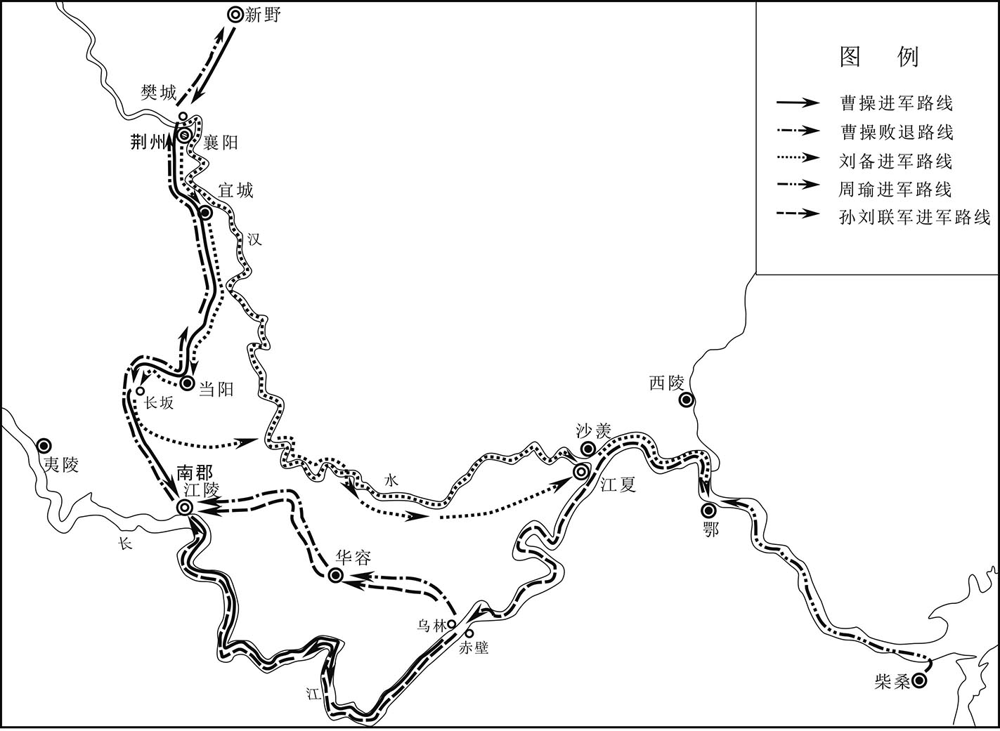 
赤壁之战示意图

## 【原文】

**周瑜、程普将数万众，与曹仁隔江，未战，甘宁请先径进取夷陵，往，即得其城，因入守之[1]。益州将袭肃举军降，周瑜表以肃兵益横野中郎将吕蒙[2]。蒙盛称“肃有胆用，且慕化远来，于义宜益，不宜夺也”。权善其言，还肃兵。曹仁遣兵围甘宁，宁困急，求救于周瑜，诸将以为兵少不足分。吕蒙谓周瑜、程普曰：“留凌公绩于江陵，蒙与君行，解围释急，势亦不久。蒙保公绩能十日守也。”瑜从之，大破仁兵于夷陵，获马三百匹而还。于是将士形势自倍，瑜乃渡江屯北岸，与仁相拒。十二月，孙权自将围合肥[3]。**

## 【注文】

[1]夷陵：古县名。西汉设置，治所在今湖北宜昌东南。三国吴改名西陵。公元222年，刘备率大军与东吴陆逊大战于此。

[2]益州：古州名。汉武帝所置十三州刺史部之一，治所在雒县（今四川广汉），后移治绵竹（今四川德阳），又移治成都（今四川成都）。辖境相当于今四川、贵州、云南三省大部，湖北省西北部和甘肃省小部，东汉以后辖境缩小。

[3]合肥：西汉时置合肥县，东汉改合肥侯国。东晋改汝阴县，隋复改合肥县，并为庐州州治。

## 【译文】

周瑜、程普率领数万军队，与曹仁隔江对峙，还没有交战，甘宁请求先率军直接攻取夷陵，一去就攻下了城池，于是进城驻守。益州将领袭肃率军投降，周瑜上表孙权把袭肃的军队拨给横野中郎将吕蒙。吕蒙极力称赞袭肃，说“袭肃有胆识，有才干，而且是心怀仰慕，前来归降，从道义上来说应该增加他的兵力，而不应该剥夺他的部队”。孙权认为吕蒙说得很对，归还了袭肃的军队。曹仁派兵围攻甘宁，甘宁形势危急，向周瑜求救，众将们认为兵力单薄，不能再分兵去救援。吕蒙对周瑜、程普说：“留下凌统驻守江陵，我和你们一起去夷陵救援甘宁，不会需要多长时间。我保证凌统能坚守十天。”周瑜同意了吕蒙的建议，率军去救援甘宁，在夷陵打败曹仁的军队，缴获了三百匹战马凯旋。于是吴军士气倍增，周瑜就渡江驻扎在北岸，与曹仁对峙。十二月，孙权亲自率军围攻合肥。

## 【原文】

**十四年春三月，孙权围合肥，久不下。权率轻骑欲身往突敌，长史张纮谏曰：“夫兵者凶器，战者危事也。今麾下恃盛壮之气，忽强暴之虏，三军之众，莫不寒心。虽斩将搴旗，威震敌场，此乃偏将之任，非主将之宜也[1]。愿抑贲、育之勇，怀霸王之计[2]。”权乃止。曹操遣将军张喜将兵解围，久而未至。扬州别驾楚国蒋济密白刺史，伪得喜书，云步骑四万已到雩娄，遣主簿迎喜[3]。三部使赍书语城中守将：“一部得入城，二部为权兵所得。”权信之，遽烧围走。**

## 【注文】

[1]斩将搴（qīɑn）旗：斩杀将帅，拔掉军旗，形容战胜敌军，也作“搴旗斩将”。搴：拔取。

[2]贲（bēn）、育：指孟贲、夏育，两人皆为古代的勇士。后来把贲、育作为勇士代称。

[3]蒋济（？—249年）：三国时魏国大臣。字子通，平阿（今安徽怀远西南）人。博学多识，有谋略，为曹操、曹丕、曹叡、曹芳四代辅臣。早年曾任计吏、扬州别驾、丹阳太守等职，是曹操的重要谋士。曹丕称帝后为中郎将、散骑常侍。魏明帝时任中护军，赐爵关内侯。齐王曹芳继位后，任领军将军、太尉。因随司马懿诛杀曹爽，封都乡侯。三国魏嘉平元年（249年）卒。　　雩（yú）娄：古县名。故址在今河南固始县东南。

## 【译文】

汉献帝建安十四年（209年）春季三月，孙权围攻合肥，很长时间不能攻破。孙权想亲自率领轻装骑兵攻击敌人，长史张纮劝谏说：“武器是凶器，战争是危险的事情，现在您仗着锐气，轻视强大的敌人，三军将士都为您担心。即使能斩杀敌将，拔掉敌人的军旗，威震敌军，这也是偏将的责任，不是主帅应该做的事情。希望您能克制像孟贲、夏育那样的勇气，怀有争夺天下的谋略。”孙权这才打消了念头。曹操派遣将军张喜率军去救援合肥，很长时间也没有到。扬州别驾楚国人蒋济暗中告诉刺史，假装已经接到张喜的书信，说四万步兵、骑兵已经到达雩娄，派遣主簿去迎接张喜，并派三名使者携带书信，去告诉合肥城中的守将：“一名使者进入城中，另外两名使者被孙权的士兵抓住了。”孙权信以为真，立即烧掉围城器械退走了。

## 【原文】

**冬十二月，周瑜攻曹仁岁余，所杀伤甚众，仁委城走。权以瑜领南郡太守，屯据江陵；程普领江夏太守，治沙羡；吕范领彭泽太守；吕蒙领寻阳令[1]。**

## 【注文】

[1]沙羡：古地名。在今湖北武汉江夏区西。汉朝置县，属江夏郡。孙权时曾为江夏郡治所。　　彭泽：古郡名。东汉建安十四年（209年）孙权设置，治所在彭泽（今江西湖口东南），辖境相当于今江西湖口、九江一带。　　寻阳：古县名。西汉设置，治所在今湖北黄梅西南，属庐江郡。三国吴属蕲春郡，西晋初又属庐江郡，惠帝末属寻阳郡。

## 【译文】

汉献帝建安十四年（209年）冬季十二月，周瑜围攻曹仁一年多，曹军死伤很多，曹仁弃城逃走。孙权任命周瑜为南郡太守，驻守江陵；程普为江夏太守，治所在沙羡；吕范为彭泽太守；吕蒙为寻阳令。

## 【原文】

**曹操密遣九江蒋干往说周瑜[1]。干以才辩独步于江、淮之间，乃布衣葛巾，自托私行诣瑜。瑜出迎之，立谓干曰：“子翼良苦，远涉江湖，为曹氏作说客邪？”因延干，与周观营中，行视仓库、军资、器仗讫，还饮宴，示之侍者、服饰、珍玩之物。因谓干曰：“丈夫处世，遇知己之主，外托君臣之义，内结骨肉之恩，言行计从，祸福共之，假使苏、张更生，能移其意乎[2]！”干但笑，终无所言。还白操，称瑜雅量高致，非言辞所能间也。**

## 【注文】

[1]蒋干（生卒年不详）：字子翼，九江（治今安徽寿县）人。有才辩，曾奉曹操之命试图游说周瑜，未能成功。

[2]苏、张：即苏秦、张仪。苏秦（？—前284年）：战国著名纵横家。东周洛阳（今河南洛阳东）人，字季子。燕昭王时，苏秦赴燕游说，受到宠信。后到齐国，齐湣（mǐn）王任命他为相。苏秦与赵国奉阳君李兑共谋，发动韩、赵、魏、齐、燕合纵，迫使秦国废帝请服，赵封其为武安君。乐毅破齐前，遭车裂而死。张仪（？—前309年）：战国著名纵横家。魏国人，首创连横，游说入秦。秦惠王以他为相，封武信君。后去秦相魏，引韩、魏事秦，共制齐、楚，遭到公孙衍合纵势力的排斥，再次返回秦国。秦昭襄王时，齐、楚从亲，张仪奉命使楚，暗中用反间计，破坏齐、楚同盟。

## 【译文】

曹操秘密派遣九江人蒋干去游说周瑜。蒋干以雄辩之才闻名江淮一带，他穿着布衣，戴着葛巾，以私人名义拜访周瑜。周瑜出来迎接他，站着对蒋干说：“子翼辛苦了，你长途跋涉而来，是为曹操做说客的吗？”于是邀请蒋干一起观看军营，巡视仓库、军资、器仗之后，回去设宴款待蒋干，向他展示侍者、服饰、珍奇宝物等。然后对蒋干说：“大丈夫活在世上，遇到知己的君主，外表上看是君臣关系，内心却亲如兄弟，言听计从，有福共享，有难同当，即使苏秦、张仪再生，能改变他的主意吗？”蒋干只是一笑，始终没说一句话。蒋干回来向曹操汇报，称赞周瑜胸襟宽广，志向远大，并非言语所能离间。

## 【原文】

**十五年冬十二月，周瑜诣京见权曰：“今曹操新败，忧在腹心，未能与将军连兵相事也。乞与奋威俱进，取蜀而并张鲁，因留奋威固守其地，与马超结援，瑜还与将军据襄阳以蹴操，北方可图也[1]。”权许之。奋威者，孙坚弟子丹阳太守瑜也。**

## 【注文】

[1]京：即京口，今江苏镇江。是吴和吴文化的发祥地，东汉末年，孙权将根据地迁至京口，号称“京”。　　奋威：即奋威将军孙瑜（177—215年），字仲异，吴郡富春（今浙江杭州富阳区）人，孙权从兄。初任恭义校尉，治军有方，深得士兵爱戴。东汉建安九年（204年），孙瑜任丹阳太守，加绥远将军。东汉建安十一年（206年）随周瑜攻克麻、保二屯，又从孙权抗拒曹操于濡须，迁奋威将军。当时诸将都以军事为务，而孙瑜虽在军旅，读经阅史，勤奋好学。　　张鲁（生卒年不详）：东汉末年五斗米道（天师道）首领。字公祺，沛国丰县（今江苏丰县）人，天师道创立者张陵之孙，世为天师道教主。东汉初平二年（191年），任益州牧刘焉的督义司马，率徒众攻取汉中，称师君，实行政教合一。他用天师道治政，社会安定，各地人民多乐迁往，所建政权存在约三十年。东汉建安二十年（215年），曹操进攻汉中，他战败而降，任镇南将军，封阆中侯。　　蹴（cù）：追逐。

## 【译文】

汉献帝建安十五年（210年）冬季十二月，周瑜到京口去见孙权，说：“现在曹操刚刚战败，内部不稳，不能再与将军交战。我请求与奋威将军一起出征，夺取巴蜀，吞并张鲁，然后留下奋威将军坚守在那里，与马超结盟，相互支援。我回来与将军据守襄阳，威逼曹操，就可以设法夺取北方中原之地。”孙权同意了。奋威是孙坚弟弟之子丹阳太守孙瑜。

## 【原文】

**周瑜还江陵为行装，于道病困，与权笺曰：“修短命矣，诚不足惜，但恨微志未展，不复奉教命耳。方今曹操在北，疆场未静；刘备寄寓，有似养虎；天下之事，未知终始，此朝士旰食之秋，至尊垂虑之日也[1]。鲁肃忠烈，临事不苟，可以代瑜。傥所言可采，瑜死不朽矣。”卒于巴丘。权闻之，哀恸曰：“公瑾有王佐之资，今忽短命，孤何赖哉[2]！”自迎其丧于芜湖。瑜有一女二男，权为长子登娶其女，以其男循为骑都尉，妻以女；胤为兴业都尉，妻以宗女[3]。**

## 【注文】

[1]朝士：中央官吏。　　旰（gàn）食：事务繁忙不能按时吃饭，指勤于政事。

[2]哀恸（tòng）：极为悲痛，悲哀到了极点。

[3]登：即孙登（209—241年），字子高，孙权长子。三国魏黄初二年（221年），孙权为吴王，任命孙登为东中郎将，封万户侯，孙登以患病为由固辞不受。三国吴黄龙元年（229年），孙权称帝，立孙登为皇太子。孙权迁都建业（今江苏南京），由大将军陆逊辅助孙登镇守武昌，领宫府留事。三国吴嘉禾三年（234年），孙权征新城，使孙登居守，总知留事。三十三岁时卒。　　循：即周循（生卒年不详），庐江舒县（今安徽庐江西南）人，东吴名将周瑜长子，有其父之风。被孙权厚待，官至骑都尉，娶吴国公主孙鲁班（孙权长女）为妻，早卒。　　胤：即周胤（生卒年不详），庐江舒县（今安徽庐江西南）人，东吴名将周瑜次子。最初官拜兴业都尉，娶孙氏宗室之女，并且授兵千人，屯驻公安。孙权称帝时，封他为都乡侯，后被免官为平民，并迁徙到庐陵郡。经诸葛瑾、步骘（zhì）、朱然及全琮（cóng）接连上疏替他求情，要求赦免其罪、发还他的兵马并恢复他的爵位，孙权许可，可是赦令未到，周胤已经病死在庐陵。　　兴业都尉：古代官名。三国吴置，掌征伐或驻守。

## 【译文】

周瑜返回江陵整理出征的装备，在途中患重病，给孙权写信说：“命有长短，实在不必惋惜，只是遗憾我小小的志愿没有实现，不能再执行将军的命令。现在曹操在北方，战事还没有平息；刘备寓居荆州，就像家中养着老虎；天下大事，还不知道最终怎么样，这正是文武大臣奋发忘食之时，将军殚精竭虑之日。鲁肃为人忠烈，遇事认真，可以代替我。如果将军能采纳我的建议，我虽死也可以不朽。”周瑜在巴丘病死。孙权得到周瑜去世的消息，悲痛地说：“周瑜有辅佐帝王的才能，现在突然短命病死，我将依赖谁呢？”亲自到芜湖迎接周瑜的灵柩。周瑜有一个女儿、两个儿子，孙权为自己的长子孙登娶了周瑜的女儿，任命周瑜的长子周循为骑都尉，把自己的女儿嫁给他；任命周瑜的次子周胤为兴业都尉，把孙氏宗族的女儿嫁给他。

## 【原文】

**权以鲁肃为奋武校尉，代瑜领兵，令程普领南郡太守[1]。鲁肃劝权以荆州借刘备，与共拒曹操，权从之。乃分豫章为番阳郡，分长沙为汉昌郡[2]。复以程普领江夏太守；鲁肃为汉昌太守，屯陆口[3]。**

## 【注文】

[1]奋武校尉：古代官名。东汉建安初年孙策设置，上表朝廷以孙静担任。东汉建安十五年（210年）周瑜卒，鲁肃自赞军校尉迁此职，代周瑜领兵，有部属四千余人，后增至万余人。

[2]汉昌郡：古郡名。东汉末年孙权分长沙郡而置，治所即今湖南平江，后废。

[3]陆口：古地名。在今湖北嘉鱼西南长江南岸。

## 【译文】

孙权任命鲁肃为奋武校尉，代替周瑜统率军队，下令任命程普为南郡太守。鲁肃劝孙权借荆州给刘备，与他共同抵抗曹操，孙权同意了。于是，从豫章郡分出番阳郡，从长沙郡中分出汉昌郡。又任命程普兼任江夏太守；鲁肃为汉昌太守，驻扎在陆口。

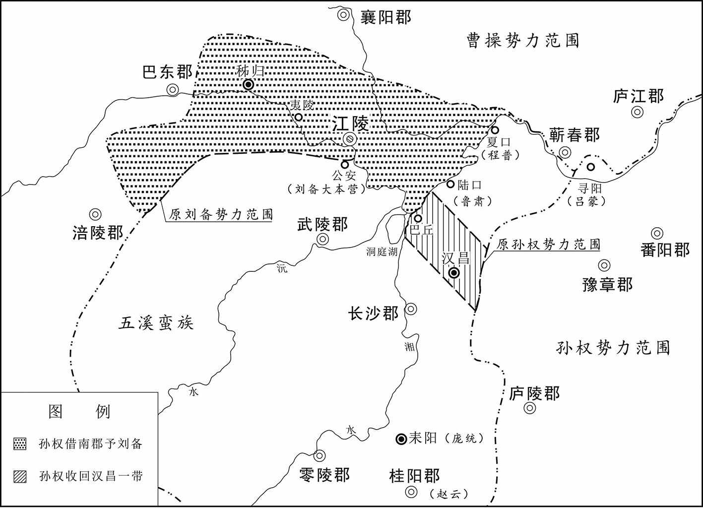 
赤壁战后刘备、孙权、曹操势力范围示意图

## 【原文】

**十七年。初，张纮以秣陵山川形胜，劝孙权以为治所。及刘备东过秣陵，亦劝权居之。权于是作石头城，徙治秣陵，改秣陵为建业[1]。**

## 【注文】

[1]石头城：东汉建安十六年（211年），孙权徙治秣（mò）陵，改名为建业（今江苏南京）。次年在石头山上修筑了城周为“七里一百步”的军事要塞石头城。并于三国吴黄龙元年（229年）正式定都南京。虽系土坞，但依山为城，临江为池，十分险要。　　建业：三国时孙吴都城，即今江苏南京。东汉建安十六年（211年），孙权自京口（今江苏镇江）迁都秣陵，次年改名建业。晋灭吴后，复改建业为秣陵，西晋太康三年（282年）分淮水南为秣陵，北为建业，并改为建邺。

## 【译文】

汉献帝建安十七年（212年）。当初，张纮认为秣陵山川雄伟，地理形势优越险要，劝孙权把秣陵作为官府驻地。等到刘备向东经过秣陵时，也劝孙权定居在那里。孙权于是修建石头城，把官府驻地迁到秣陵，改名为建业。

## 【原文】

**秋九月，吕蒙闻曹操欲东兵，说孙权夹濡须水口立坞[1]。诸将皆曰：“上岸击贼，洗足入船，何用坞为？”蒙曰：“兵有利钝，战无百胜，如有邂逅，敌步骑蹙人，不暇及水，其得入船乎？”权曰：“善。”遂作濡须坞[2]。**

## 【注文】

[1]濡须水：又名石梁河、马尾沟、东关水，即今安徽巢湖东南濡须水。　　坞：防御用的小建筑物，小型城堡。

[2]濡须坞：又作濡须城。孙权为抗拒曹操而筑，故址在今安徽含山西南古濡须水口。

## 【译文】

汉献帝建安十七年（212年）秋季九月，吕蒙听说曹操要东征，劝说孙权在濡须水口两岸修建城堡。众将领说：“上岸攻击敌人，洗脚就可以上船，修建城堡有什么用？”吕蒙说：“兵器有锋利的，也有钝劣的，战争没有百战百胜的，如果有万一，敌人的步兵、骑兵紧逼，来不及到水边，还能上船吗？”孙权说：“说得对。”于是修建濡须坞。

## 【原文】

**冬十月，曹操东击孙权。**

## 【译文】

汉献帝建安十七年（212年）冬季十月，曹操东征孙权。

## 【原文】

**十八年春正月，曹操进军濡须口，号步骑四十万，攻破孙权江西营，获其都督公孙阳[1]。权率众七万御之，相守月余。操见其舟船器仗军伍整肃，叹曰：“生子当如孙仲谋。如刘景升儿子，豚犬耳[2]。”权为笺与操，说“春水方生，公宜速去”。别纸言：“足下不死，孤不得安。”操语诸将曰：“孙权不欺孤。”乃彻军还[3]。**

## 【注文】

[1]公孙阳（生卒年不详）：三国时期的孙吴将领。为东吴江西大营的都督，东汉建安十八年（213年），曹操进军濡须口，攻破孙权江西营，公孙阳被曹操俘获。

[2]孙仲谋：指孙权，孙权字仲谋。　　刘景升：指刘表，刘表字景升。

[3]彻军：所有的军队。

## 【译文】

汉献帝建安十八年（213年）春季正月，曹操进军到濡须口，号称步兵、骑兵四十万，攻破了孙权在长江西岸的大营，俘虏了都督公孙阳。孙权率领七万大军抵御曹操，两军相持一个多月。曹操望见孙权的战船、武器、军队整齐肃穆，感叹说：“生儿子就应该像孙权这样，刘表的儿子，只不过是猪狗罢了。”孙权给曹操写信，说：“春天江水正要上涨，您应该马上撤军。”在另一张纸上写道：“你不死，我就不得安宁。”曹操对众将领说：“孙权不欺骗我。”于是全军返回北方。

## 【原文】

**十九年。初，魏公操遣庐江太守朱光屯皖，大开稻田。吕蒙言于孙权曰：“皖田肥美，若一收熟，彼众必增。宜早除之。”闰［五］月，权亲攻皖城。诸将欲作土山，添攻具，吕蒙曰：“治攻具及土山，必历日乃成，城备既修，外救必至，不可图也。且吾乘雨水以入，若流经日，水必向尽，还道艰难，蒙窃危之。今观此城，不能甚固，以三军锐气，四面并攻，不移时可拔；及水以归，全胜之道也。”权从之。蒙荐甘宁为升城督。宁手持练，身缘城，为士卒先。蒙以精锐继之，手执枹鼓[1]，士卒皆腾踊。侵晨进攻，食时破之，获朱光及男女数万口。既而张辽至夹石，闻城已拔，乃退[2]。权拜吕蒙为庐江太守，还屯寻阳。**

## 【注文】

[1]枹（fú）鼓：枹同“桴”，桴，鼓槌。鼓槌和鼓。古时作战，击鼓以示进军。

[2]夹石：古山名。今名北峡山，位于安徽桐城。

## 【译文】

汉献帝建安十九年（214年）。当初，魏公曹操派遣庐江太守朱光驻守皖城，大规模开垦稻田。吕蒙对孙权说：“皖城土地肥沃，如果一旦收获了稻子，曹军必然会增加，应该及早把它铲除。”闰五月，孙权亲自率军围攻皖城。众将领打算堆土山，增加攻城器械，吕蒙说：“制造攻城器械，堆筑土山，几天才能完成，那时城里的防御工事已经修好，外面的援兵也就到了，我们就无法夺取皖城。况且我们是乘借着雨水来的，如果延迟多日，雨水退去，回去就会很艰难，我认为那样很危险。我看皖城不是很坚固，凭着三军士气高昂，从四面一起攻城，很快就能攻破，然后顺着河水撤军，这是取胜的好办法。”孙权采纳了吕蒙的建议。吕蒙推荐甘宁担任升城督。甘宁手拿绳索，攀墙而上，身先士卒。吕蒙命精锐部队紧跟其后，亲自擂鼓助威，士兵们争先恐后攻城。凌晨开始攻城，到吃早饭的时候就攻破了皖城，俘虏了朱光和男女数万人。不久，张辽率援军到达夹石，听说皖城已经被吴军攻破，就退回。孙权任命吕蒙为庐江太守，回军驻扎在寻阳。

## 【原文】

**二十年秋八月，孙权率众十万围合肥[1]。时张辽、李典、乐进将七千余人屯合肥[2]。魏公操之征张鲁也，为教与合肥护军薛悌，署函边曰：“贼至，乃发[3]。”及权至，发教，教曰：“若孙权至者，张、李将军出战，乐将军守，护军勿得与战。”诸将以众寡不敌，疑之。张辽曰：“公远征在外，比救至，彼破我必矣。是以教指及其未合逆击之，折其盛势，以安众心，然后可守也。”进等莫对，辽怒曰：“成败之机，在此一战，诸君若疑，我将独决之。”李典素与辽不睦，慨然曰：“此国家大事，顾君计何如耳，吾可以私憾而忘公义乎！请从君而出。”于是辽夜募敢从之士，得八百人，椎牛犒飨[4]。明旦，辽被甲持戟，先登陷阵，杀数十人，斩二大将，大呼自名，冲垒入至权麾下。权大惊，不知所为，走登高冢，以长戟自守。辽叱权下战，权不敢动，望见辽所将众少，乃聚围辽数重。辽急击，围开，将麾下数十人得出。余众号呼曰：“将军弃我乎？”辽复还突围，拔出余众。权人马皆披靡，无敢当者。自旦战至日中，吴人夺气。乃还修守备，众心遂安。**

## 【注文】

[1]合肥：古城邑名。故址在今安徽合肥境内。西汉设置合肥县，治所在今安徽合肥西。三国魏青龙元年（233年），满宠在合肥城西鸡鸣山东麓修筑新城，称为合肥新城。

[2]张辽（169—222年）：三国时魏国名将。字文远，雁门马邑（今山西朔州）人。初为并（bīng）州刺史从事，后归附何进、董卓、吕布。吕布败亡后归降曹操，任中郎将，封关内侯。以后跟随曹操屡战有功，先后任裨（pí）将军、中坚将军、荡寇将军、征东将军，封都亭侯。魏文帝时任前将军，封晋阳侯。三国魏黄初三年（222年）率军攻吴，病死军中。　　李典（生卒年不详）：曹操部将。字曼成，山阳巨野（今山东巨野）人。东汉末年起兵，汉献帝初平间归附曹操，随其镇压黄巾军，攻吕布、袁术，任中郎将、离狐太守。官渡之战时率宗族部曲为曹军运输粮草，因功迁裨将军。从曹操征袁谭、袁尚，督运军粮，封都亭侯。东汉建安十四年（209年），与张辽、乐进留守合肥，击破孙权围攻。不久病死。李典好学问，敬贤纳士，不与诸将争功，为军中长者。

[3]教：古代上级对下级的告谕。　　护军：秦汉时临时设置护军都尉或中尉，出征时又有护军将军，其意为协调诸将领间的关系。魏晋以后置护军将军及中护军等，掌军职选用，与领军将军或中领军并置，为同掌中央军队的军事要职，亦有守护宫城之意。　　薛悌（tì）（生卒年不详）：字孝威，东郡（今河南濮阳西南）人。东汉末曾任兖州从事、泰山太守等职。依附曹操，任丞相左长史、中领军、魏郡太守等。后以护军与张辽、乐进、李典屯驻合肥。三国魏黄初中拜尚书令，三国魏太和末历督军中领军，三国魏青龙中为尚书，封关内侯。

[4]犒（kào）飨（xiǎng）：用酒食或财物慰劳。

## 【译文】

汉献帝建安二十年（215年）秋季八月，孙权率领十万大军围攻合肥。当时张辽、李典、乐进率领七千多人驻守在合肥。魏公曹操西征张鲁时，给合肥护军薛悌一道命令，在信封上写道：“敌人来了，再打开看。”等到孙权围攻合肥时，拆开曹操的信函，上面说：“如果孙权来了，张辽、李典两位将军出战，乐进将军留守，护军不得参战。”众将领认为寡不敌众，怀疑曹操的指令。张辽说：“魏公在外远征张鲁，等到援军到来，敌人就已经把我们攻破了。这道命令是指示我们在敌人还没有合围时立即出城迎战，打击敌人的锐气，稳定军心，然后才能坚守城池。”乐进等人都不回答，张辽大怒说：“成败的关键，在此一战。如果你们迟疑不决，我将独自出战。”李典一向与张辽不和，这时却慷慨地说：“这是国家大事，不知你有什么计策，我怎么能因为个人的恩怨而不顾国家大事，我跟你一起出战。”于是张辽连夜招募了八百人的敢死队，杀牛设宴犒赏他们。第二天早晨，张辽披上铠甲，拿着战戟，首先冲入吴军阵地，杀死几十人，斩杀两员大将，大喊着自己的名字，冲入吴军营寨，直取孙权。孙权大惊，不知如何是好，急忙跑上一处高地，拿着长戟抵御。张辽大叫着让孙权下来交战，孙权不敢动，看见张辽率领的军队很少，就派兵把张辽重重包围。张辽急忙冲出重围，却只有几十个部下冲出来。其余的人大喊：“将军要抛弃我们吗？”张辽又杀回来，救出其余的人。孙权的军队望风披靡，无人能抵挡。从早晨一直战到中午，吴军士气受挫。张辽回城后修筑工事，准备坚守，军心才安定下来。

## 【原文】

**权守合肥十余日，城不可拔，彻军还。兵皆就路，权与诸将在逍遥津北，张辽觇望知之，即将步骑奄至[1]。甘宁与吕蒙等力战扞敌，凌统率亲近扶权出围，复还与辽战，左右尽死，身亦被创，度权已免，乃还。权乘骏马上津桥，桥南已彻，丈余无版，亲近监谷利在马后，使权持鞍缓控，利于后著鞭以助马势，遂得超度。贺齐率三千人在津南迎权，权由是得免。权入大船宴饮，贺齐下席涕泣曰：“至尊人主，常当持重，今日之事，几致祸败。群下震怖，若无天地，愿以此为终身之诫。”权自前收其泪曰：“大惭，谨已刻心，非但书绅也。”**

## 【注文】

[1]逍遥津：古津渡名。在今安徽合肥东北隅，古为淝水上的渡口。　　觇（chān）：偷偷察看。

## 【译文】

孙权围困合肥十多天，未能攻破，全军回师。吴军都在回去的路上，孙权和他的众将领在逍遥津北岸。张辽偷偷看到后，立即率军去袭击。甘宁与吕蒙等奋力抵御，凌统率领亲兵保护孙权突围后，又回来与张辽交战，身边的士兵都战死，自己也受伤，估计孙权已经逃走，才返回。孙权乘坐骏马来到逍遥津桥上，桥南部的桥板已经拆除，一丈多宽没有木板，亲兵监谷利在马后，让孙权扶住马鞍，放松缰绳，然后用鞭子猛抽骏马，腾空跳跃，才得以渡过。贺齐率领三千人在逍遥津南岸迎接，孙权这才得以脱离危险。孙权登上大船设宴饮酒，贺齐走下坐席，哭着说：“您地位尊贵，应当小心谨慎，今天的事情，几乎招致灾难。群臣惊恐，就像天崩地裂一样，希望您终身记住这次教训。”孙权走向前，亲自为他擦去眼泪，说：“很惭愧，我已经铭记在心，不仅仅写在衣带上。”

## 【原文】

**二十一年冬十月，魏王操治兵击孙权。**

## 【译文】

汉献帝建安二十一年（216年）冬季十月，魏王曹操训练军队，准备进攻孙权。

## 【原文】

**二十二年春正月，魏王操军居巢，孙权保濡须[1]。二月，操进攻之。三月，操引军还，留伏波将军夏侯惇、都督曹仁、张辽等二十六军屯居巢[2]。权令都尉徐详诣操请降，操报使修好，誓重结婚[3]。权留平虏将军周泰督濡须。**

## 【注文】

[1]居巢：古地名。故址在今安徽巢湖居巢区。

[2]伏波将军：古代将军名号。西汉元鼎五年（前112年）设置，掌管征伐。三国魏沿置，秩五品。晋以后成为加官。　　夏侯惇（dūn）（？—220年）：字元让，沛国谯（今安徽亳州）人。曹操起兵讨伐董卓时为军司马。随曹操四处征战，深得曹操器重，历任折冲校尉、东郡太守、建武将军、河南尹，封高安乡侯。曹丕称帝后封为大将军，不久去世。夏侯惇虽为军人，但不忘治学，生活俭朴，乐于施舍，深得士卒爱戴。

[3]徐详（生卒年不详）：字子明，吴郡乌程（今浙江湖州吴兴区）人。孙策死后，他辅佐孙权，综典掌机密，文书多出其手。后任侍中，兼左领军。　　结婚：缔结婚姻关系。

## 【译文】

汉献帝建安二十二年（217年）春季正月，魏王曹操率军驻扎在居巢，孙权据守濡须。二月，曹军进攻孙权。三月，曹操率军退回，留下伏波将军夏侯惇、都督曹仁、张辽等二十六支军队驻守居巢。孙权派都尉徐详去见曹操，请求投降。曹操派使者前来重修旧好，立誓缔结婚姻关系。孙权留下平虏将军周泰在濡须统率军队。

## 【原文】

**冬十月，鲁肃卒，孙权以从事中郎彭城严畯代肃，督兵万人镇陆口[1]。众人皆为畯喜，畯固辞以“朴素书生，不闲军事”，发言恳恻，至于流涕。权乃以左护军虎威将军吕蒙兼汉昌太守以代之。众嘉严畯能以实让。**

## 【注文】

[1]从事中郎：古代官名。汉代始置，隶属将军，为参谋议事的散职官员，有时也领兵征战。汉末称雄的诸州也置此官。三国魏晋南北朝沿置，晋朝领兵的诸公及开府位从公加兵者皆置从事中郎。　　严畯（jùn）（生卒年不详）：字曼才，彭城（今江苏徐州）人。早年避乱江东，张昭荐于孙权，任骑都尉、从事中郎。鲁肃卒后，孙权让他任大都督，他坚决推辞。孙权称帝后，任卫尉、尚书令。　　陆口：古地名。在今湖北嘉鱼西南长江南岸。因处陆水入江处而得名。东汉末及三国时为军事要地。

## 【译文】

汉献帝建安二十二年（217年）冬季十月，鲁肃去世，孙权让从事中郎彭城人严畯接替鲁肃，率一万人镇守陆口。大家都向严畯祝贺，严畯坚决推辞，说自己只是一个书生，不懂军事，言辞恳切，以至流泪。孙权就让左护军虎威将军吕蒙兼任汉昌太守，代替鲁肃。大家都赞扬严畯能够实事求是地让贤。

## 【原文】

**定威校尉吴郡陆逊言于孙权曰：“方今克敌宁乱，非众不济，而山寇旧恶，依阻深地[1]。夫腹心未平，难以图远，可大部伍，取其精锐。”权从之，以为帐下右部督。会丹阳贼帅费栈作乱，扇动山越[2]。权命逊讨栈，破之。遂部伍东三郡，强者为兵，羸者补户，得精卒数万人。宿恶荡除，所至肃清，还屯芜湖。会稽太守淳于式表逊“枉取民人，愁扰所在”。逊后诣都，言次称式佳吏。权曰：“式白君而君荐之，何也。”逊对曰：“式意欲养民，是以白逊。若逊复毁式以乱圣听，不可长也。”权曰：“此诚长者之事，顾人不能为耳[3]。”**

## 【注文】

[1]定威校尉：古代官名。东汉末年孙权设置，以陆逊担任，掌领兵征伐或驻守。位次将军。　　陆逊（183—245年）：三国时吴国名将。字伯言，吴郡吴县（今江苏苏州）人，出身江东大族。历任吴偏将军、镇西将军、大都督、丞相等职。曾建议孙权平定山越，多次与曹魏作战，屡立战功。三国吴黄武元年（222年）在夷陵以火攻大败刘备。后因亲附太子，牵涉宫廷斗争，数遭孙权责问，忧愤而死。

[2]费栈（生卒年不详）：三国魏官员。初为丹阳贼帅，受曹操印绶为蕲（qí）春太守，煽动山越叛乱作为内应，孙权派遣陆逊讨伐，结果被打败。

[3]长者：古代对于有德行、受敬重人的尊称。

## 【译文】

定威校尉吴郡人陆逊对孙权说：“现在要打败敌人，平定战乱，没有军队不行，山越历来是祸害，盘踞在深山中。不消除心腹大患，很难远征，可以就此扩大军队，选取精锐。”孙权采纳了他的建议，任命他为帐下右部督。这时丹阳豪强首领费栈叛乱，煽动山越反叛孙权。孙权命令陆逊率军讨伐，平定了叛乱。于是就在东部三个郡征集军队，强壮的当兵，老弱的补充为民户，得到精兵几万人。这样就肃清了长期以来山越、地方武装经常叛乱的祸根，回军驻守芜湖。会（kuài）稽（jī）太守淳于式上表孙权，说陆逊“随意征发、搜刮百姓，所到之处给百姓带来愁苦、劳扰”。陆逊后来到建业，称赞淳于式是个好官。孙权说：“淳于式告你，你却推荐他，为什么？”陆逊说：“淳于式想让百姓休养生息，所以告我。如果我再诋毁他，那就是扰乱您的视听，这种风气不能长。”孙权说：“这是忠厚长者做的事，一般人做不到。”

## 【原文】

**二十四年秋七月，孙权攻合肥。时诸州兵戍淮南。扬州刺史温恢谓兖州刺史裴潜曰：“此间虽有贼，然不足忧[1]。今水潦方生，而子孝县军，无有远备，关羽骁猾，正恐征南有变耳。”已而关羽果使南郡太守糜芳守江陵，将军傅士仁守公安，羽自率众攻曹仁于樊[2]。仁使左将军于禁，立义将军庞德等屯樊北[3]。八月，大霖雨，汉水溢，平地数丈，于禁等七军皆没。禁与诸将登高避水，羽乘大船就攻之，禁等穷迫，遂降。庞德不降，骂羽，羽杀之。**

## 【注文】

[1]温恢（178—223年）：太原祁县（今山西祁县东南）人，字曼基，东汉末年举孝廉，曹操用为丞相刺奸主簿，迁扬州刺史，帮助张辽等守合肥。魏文帝时任侍中、魏郡太守。后迁凉州刺史、护羌校尉。　　裴潜（生卒年不详）：曹魏大臣。字文行，河东闻喜（今山西闻喜东北）人。汉末避乱荆州，后归附曹操，历官沛国相、兖州刺史、散骑常侍、尚书等职。东汉建安二十一年（216年）任代郡太守，安抚乌桓各部。魏文帝时任颍（yǐng）川典农中郎将、荆州刺史，封关内侯。魏明帝时历仕河南尹、大司农、尚书令等。虽贵为列侯，而廉洁自守，为世所称。

[2]糜（mí）芳（生卒年不详）：三国时蜀国将领。字子方，东海朐（qú）县（今江苏连云港）人。蜀安汉将军糜竺之弟。东汉建安初年，曹操上表糜芳为彭城相，后随刘备，为南郡太守，与前将军关羽共事。糜芳素嫌关羽轻视自己而与关羽发生嫌隙。东汉建安二十四年（219年），关羽在樊城进攻魏国征南将军曹仁时，因供给军资不足，闻听关羽回来后将他治罪，内惧不安，于是投降吴国，促使关羽败亡。　　傅士仁（生卒年不详）：字君义，广阳人。本为关羽部下武将，负责镇守公安。吕蒙偷袭荆州时他和糜芳一同投降东吴，从此在吴国仕官。

[3]于禁（？—221年）：三国时期曹魏将领。字文则，泰山巨平（今山东泰安南）人。初随鲍信镇压黄巾起义军，后归曹操，为军司马。东汉建安元年（196年）讨伐青州黄巾军，迁平虏校尉。后随曹操征吕布、张绣、袁绍等，战功卓著，任虎威将军、左将军，封益寿亭侯。东汉建安二十四年（219年）率军援助被关羽围困在樊城的曹仁，兵败被俘投降。后被孙权遣返回魏国，遭曹丕羞辱，惭恨而死。　　庞德（？—219年）：三国时曹魏将领。字令明，雍州南安郡狟（huán）道县（今甘肃天水）人。初为西凉马腾部将，勇冠三军，屡次随马腾征战，有功，历任校尉、中郎将。随马超投降张鲁。曹操平定汉中，他兵败随众投降，拜立义将军，封关门亭侯。后随于禁与关羽交战，兵败被杀。

## 【译文】

汉献帝建安二十四年（219年）秋季七月，孙权进攻合肥。当时各州的兵都在淮南驻防，扬州刺史温恢对兖（yǎn）州刺史裴潜说：“这里虽然有吴军，但不必担忧。现在正是大雨时节，征南将军曹仁却孤军在荆州，没有长远的打算，关羽骁勇狡猾，恐怕曹仁那里会有变故。”不久，关羽果然让南郡太守糜芳留守江陵，将军傅士仁镇守公安，自己亲率大军向樊城进攻曹仁。曹仁命左将军于禁、立义将军庞德等人驻守在樊城北面。八月，大雨连绵，汉水泛滥，平地有几丈深的积水，于禁等七路曹军都被洪水淹没。于禁与众将领登到高处避水，关羽乘坐大船前去攻击，于禁等人走投无路，被迫投降。庞德不愿投降，大骂关羽，被杀。

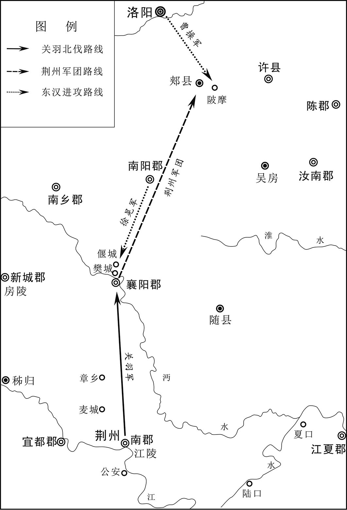 
樊城、江陵之战（关羽北伐）示意图

## 【原文】

**冬十月，丞相军司马司马懿、西曹属蒋济言于操曰：“于禁等为水所没，非战攻之失，于国家大计未足有损[1]。刘备、孙权外亲内疏，关羽得志，权必不愿也。可遣人劝权蹑其后，许割江南以封权，则樊围自解。”操从之。**

## 【注文】

[1]司马懿（179—251年）：三国时期魏国军事家、政治家，西晋的奠基者。字仲达，河内温县（今河南温县西南）人，世族出身。早年曾任曹操丞相府文学掾、丞相主簿、军司马等职。曹操封魏王后，为太子中庶子，辅佐曹丕，屡出奇策，深得信任和重用。曹丕称帝后，历任丞相长史、抚军大将军。曹丕出征时，他多留下镇守许昌，供应军资。曹丕去世后，奉遗诏为魏明帝辅政大臣，率军击败孙权进攻，迁骠骑将军。三国魏太和五年（231年）至青龙二年（234年），率军抗蜀，与诸葛亮对峙，以逸待劳，使诸葛亮师劳功微。三国魏景初二年（238年），击败辽东公孙渊。景初三年（239年），受遗诏辅佐齐王曹芳，与曹爽争权。三国魏嘉平元年（249年）正月发动政变，诛杀曹爽及其支持者，拜相国，封安平郡公，独揽朝政。嘉平三年（251年）八月卒。

## 【译文】

汉献帝建安二十四年（219年）冬季十月，丞相军司马司马懿、西曹属蒋济对曹操说：“于禁等人被洪水淹没，不是在战争中失利，对国家大计没有损害。刘备和孙权外表亲密而内心疏远，关羽得志，孙权一定不愿意。可以派人去劝说孙权袭击关羽的后方，许诺将江南割让给孙权，那么樊城之围自然就解除了。”曹操采纳了他们的建议。

## 【原文】

**魏王操之出汉中也，孙权为笺与魏王操，请以讨羽自效。吕蒙袭公安、江陵，羽守将傅士仁、糜芳皆降[1]。蒙入江陵，释于禁之囚，得关羽及将士家属，皆慰抚之。羽遁走，兵皆解散。潘璋司马马忠获羽及其子平于章乡，斩之[2]。事见《吴蜀通好》。**

## 【注文】

[1]公安：古县名。东汉置，西晋太康元年（280年）改江安县，南朝陈复名公安县。故城在今湖北公安东北油江口。

[2]潘璋（？—234年）：三国时吴国将领。字文珪，东郡发干（今山东冠县东南）人。初奉孙权之命，自募军队，讨伐山越，以功升任别部司马。东汉建安二十年（215年），从孙权进攻合肥，以功拜偏将军。建安二十四年（219年），随孙权攻关羽，其部将马忠擒杀关羽，潘璋拜固陵太守、振威将军，封溧阳侯。三国吴黄武元年（222年）与陆逊大破刘备于猇（xiāo）亭，拜平北将军、襄阳太守。三国吴黄武五年，从孙权进攻石阳（今湖北武汉黄陂区），不克，潘璋断后退兵，魏军追击，依赖朱然力战方免。孙权称帝后，拜右将军。潘璋性情奢侈无度，数不奉法，孙权惜其功而不过问。　　马忠（？—249年）：三国时期吴国将领，任潘璋部下司马。东汉建安二十四年（219年）吴国都督吕蒙进攻关羽，马忠在章乡俘获关羽及其子关平，遂定荆州。　　章乡：古地名。故址在今湖北当阳东北漳水北岸。

## 【译文】

魏王曹操出兵汉中，孙权给曹操写信，请求讨伐关羽，效力朝廷。吕蒙袭击公安、江陵，关羽的守将傅士仁、糜芳都投降吴军。吕蒙进入江陵，释放了被囚禁的于禁，俘虏了关羽及其将士的家属，安抚他们。关羽逃走，部下溃散。潘璋的司马马忠在章乡俘获了关羽和他的儿子关平，将他们杀死。事见《吴蜀通好》。

## 【原文】

**十二月，魏王操表孙权为票骑将军，假节，领荆州牧，封南昌侯[1]。**

## 【注文】

[1]假节：古代大臣出使或出巡时所持的节杖、凭证、信物。汉朝使臣持节出巡或出使完毕则收回其“节”，称“假节”，意为临时持节。到三国时期长官无论在内秉政还是在外掌军，均得“假节”，而且是长期性的而非临时性的，成为象征地位高低的政治待遇。晋朝地方军事长官都督、监军、督军三级，各又分使持节、持节、假节三等。都督之使持节者，可杀二千石以下的官吏；持节者只可杀无官职的人，假节者只能杀战时违犯军令之人。南北朝沿袭此制。

## 【译文】

汉献帝建安二十四年（219年）十二月，魏王曹操上表推荐孙权为骠骑将军，授以符节，兼任荆州牧，封南昌侯。

## 【原文】

**魏文帝黄初元年，文帝即位[1]。秋七月，孙权遣使奉献。**

## 【注文】

[1]黄初：三国魏文帝年号，自公元220年至226年，凡七年。

## 【译文】

魏文帝黄初元年（220年），曹丕即位。秋季七月，孙权派遣使者进贡。

## 【原文】

**二年夏四月，孙权自公安徙都鄂，更名鄂曰武昌[1]。**

## 【注文】

[1]鄂：古邑名。春秋楚地，秦朝置县，在今湖北鄂州。鄂，边际之意。　　武昌：古郡、县名。公元221年，孙权分江夏、豫章、庐陵三郡而置武昌郡，治所在武昌（今湖北鄂州），不久又改为江夏郡。孙权迁都于此，为吴国长江上游重镇，先后为武昌郡、江夏郡治所。西晋时再改为武昌郡，隋初时废郡。

## 【译文】

魏文帝黄初二年（221年）夏季四月，孙权将吴国都城从公安迁到鄂，将鄂改名为武昌。

## 【原文】

**秋八月，孙权遣使称臣，卑辞奉章，并送于禁等还。朝臣皆贺，刘晔独曰：“权无故求降，必内有急。权前袭杀关羽，刘备必大兴师伐之。外有强寇，众心不安，又恐中国往承其衅，故委地求降，一以却中国之兵，二假中国之援，以强其众而疑敌人耳。天下三分，中国十有其八，吴、蜀各保一州，阻山依水，有急相救，此小国之利也。今还自相攻，天亡之也。宜大兴师，径渡江袭之，蜀攻其外，我袭其内，吴之亡不出旬月矣。吴亡则蜀孤，若割吴之半以与蜀，蜀固不能久存，况蜀得其外，我得其内乎？”帝曰：“人称臣降而伐之，疑天下欲来者心，不若且受吴降而袭蜀之后也。”对曰：“蜀远吴近，又闻中国伐之，便还军，不能止也。今备已怒，兴兵击吴，闻我伐吴，知吴必亡，将喜而进，与我争割吴地，必不改计抑怒救吴也。”帝不听，遂受吴降。**

## 【译文】

魏文帝黄初二年（221年）秋季八月，孙权派使者向魏国称臣，奏章言辞谦卑，并把于禁等人送还。大臣们都表示祝贺，只有刘晔说：“孙权无缘无故请求归降，一定是内部出现紧急情况。孙权不久前袭击杀死关羽，刘备一定会大举出兵讨伐他。外面有强大的敌人，内部人心不安，又担心我们乘机攻打他，所以才献出土地，请求投降，这样一是可以防止我们出兵进攻他，二是可以借助我们的援助，增强自己的势力，迷惑敌人。现在天下三分，我们占有十分之八，吴、蜀各自占据一州之地，依仗着山川险要，发生危急就相互救援，这是小国得以生存的有利条件。现在他们相互攻击，这是上天要让他们灭亡。我们应该出动大军，直接渡江袭击孙权，这样蜀国从外面攻击他，我们袭击他的内部，吴国不出一个月就灭亡了。吴灭亡后，蜀国就孤立无援，即使把吴国的一半割给蜀国，蜀国也不会长久存在，何况蜀国得到的是吴国的边境地区，而我们得到的是吴国的中心地区。”魏文帝说：“别人归降称臣而我却去讨伐他，会使天下想来归降我的人起疑心，不如暂且接受吴国的投降，袭击蜀国的后路。”刘晔说：“蜀国离我们遥远，吴国离我们近，如果听说我们去攻打他，就会回师，我们就无法制止。现在刘备已经恼怒，出兵攻打吴国，如果听说我们讨伐吴国，就知道吴国一定会灭亡，就会很高兴地进军，与我们争着分割吴国的国土，一定不会改变计划，抑制愤怒，去救援吴国。”魏文帝不听，于是接受了吴国的投降。

## 【原文】

**于禁须发皓白，形容憔悴，见帝，泣涕顿首[1]。帝慰喻以荀林父、孟明视故事，拜安远将军，令北诣邺谒高陵[2]。帝使豫于陵屋画关羽战克，庞德愤怒，禁降服之状。禁见，惭恚，发病死。**

## 【注文】

[1]皓（hào）白：洁白，雪白。　　形容：形体和容貌。　　顿首：古代一种拜礼，为九拜之一。行礼时，双膝着地，叩头至地，立即举起，头在地上停顿的时间极短，故称顿首。顿首可用于下对上或平辈之间行礼，也常用于书信的开头或末尾。

[2]慰喻：宽慰，晓喻。　　荀林父（？—前593年）：春秋时晋国重要将领。历仕晋文公、襄公、灵公、成公、景公五君。公元前597年，楚国围困郑国。他率军救郑，因诸将意见不一，在邲（bì）被楚军打败，请死未许。晋景公六年（前594年），他率军击败赤狄，消灭潞国，因功赏以“狄臣千室”。　　孟明视（生卒年不详）：春秋时秦国将领。即百里视，名视，字孟明，虞国（在今山西平陆）人。秦穆公三十二年（前628年）奉命与西乞术、白乙丙率师偷袭郑国，未成功，回师经过崤（xiáo）山，遭晋军偷袭，兵败被俘。不久被释放回秦，仍被穆公所重用。后来在王官之战中，打败晋军，雪被俘之耻。　　谒（yè）：拜见。　　高陵：曹操陵墓。在今河北临漳西南邺镇。

## 【译文】

于禁胡子头发都白了，形体和面容都很憔悴，见到魏文帝哭着叩头。魏文帝以古代荀林父、孟明视的旧事来安慰他，任命他为安远将军，让他去邺城高陵祭拜曹操。魏文帝事先派人在陵园房屋的墙壁上画上关羽战胜，庞德愤怒，于禁投降的情形。于禁看到后，惭愧悔恨，患病而死。

## 【原文】

**臣光曰：于禁将数万众，败不能死，生降于敌，既而复归；文帝废之可也，杀之可也，乃画陵屋以辱之，斯为不君矣。**

## 【译文】

史臣司马光评论说：于禁率领几万军队，兵败而不能战死，为求生而投降敌人，不久又回到魏国，魏文帝罢黜他可以，杀了他也可以，却在高陵的房屋上作画来羞辱他，这就不像一个君主了。

## 【原文】

**丁巳，遣太常邢贞奉策即拜孙权为吴王，加九锡[1]。刘晔曰：“不可。先帝征伐天下，十兼其八，威震海内。陛下受禅即真，德合天地，声暨四远[2]。权虽有雄才，故汉票骑将军、南昌侯耳，官轻势卑，士民有畏中国心，不可强迫与成所谋也。不得已受其降，可进其将军号，封十万户侯，不可即以为王也[3]。夫王位去天子一阶耳，其礼秩服御相乱也。彼直为侯，江南士民未有君臣之分。我信其伪降，就封殖之，崇其位号，定其君臣，是为虎傅翼也[4]。权既受王位，却蜀兵之后，外尽礼以事中国，使其国内皆闻，内为无礼以怒陛下；陛下赫然发怒，兴兵讨之，乃徐告其民曰：‘我委身事中国，不爱珍货重宝，随时贡献，不敢失臣礼，而无故伐我，必欲残我国家，俘我人民以为仆妾[5]。’吴民无缘不信其言也。信其言而感怒，上下同心，战加十倍矣。”又不听。诸将以吴内附，意皆纵缓，独征南大将军夏侯尚益修攻守之备[6]。山阳曹伟素有才名，闻吴称藩，以白衣与吴王交书求赂，欲以交结京师，帝闻而诛之[7]。**

## 【注文】

[1]太常：古代官名。秦朝置奉常，汉景帝时改为太常，掌宗庙礼仪，兼选试博士。王莽改太常为秩宗，东汉复称太常。历代沿置，均掌礼仪祭祀等事，为九卿之一。　　邢贞（生卒年不详）：三国时魏国太常，奉魏文帝曹丕之命策拜孙权为吴王，加赐九锡。　　策：君主对臣下封土、授爵、记功等的简册、文书。

[2]即真：由代理转为正式的，谓由摄政或监国而正式即皇帝位。

[3]十万户侯：侯为秦汉公、侯、伯、子、男五等爵的第二级，在这一级中，因功大功小而食户多少不等。十万户侯，意即该侯的食邑是十万户的税租。

[4]封殖：也作“封植”，扶植，加封官爵。

[5]赫然：形容大怒。　　委身：置身，寄身。　　贡献：即贡纳，进贡、进奉。臣属向君主的进贡，名曰贡献，其实带有某种强制性。

[6]夏侯尚（？—225年）：字伯仁，沛国谯县（今安徽亳州）人。夏侯渊从子。东汉建安九年（204年）从曹操征河北，为军司马，历迁五官将文学、黄门侍郎。东汉建安二十三年（218年），随鄢陵侯曹彰平定代郡乌桓，以功封平陵亭侯，拜散骑常侍，迁中领军。魏文帝时封为平陵乡侯，迁征南将军，领荆州刺史，假节都督南方诸军事。三国魏黄初元年（220年），与蜀国降将孟达等人在上庸击败刘封，平三郡九县，迁征南大将军。黄初三年（222年），与曹真等围攻南郡（今湖北公安），次年败诸葛谨援军于江陵（今湖北荆州），屯兵江中渚，浮桥往来，为吴军所攻，退兵，迁荆州牧，封昌陵乡侯。后病卒。

[7]曹伟（？—221年）：三国魏山阳郡（治今山东巨野南）人，有才名。三国魏黄初二年（221年），听到吴国称藩于魏国，就写信给吴王孙权，进行交结求赂，魏文帝曹丕听说后杀了他。　　白衣：古代平民穿白布衣，后指无功名的人。

## 【译文】

魏文帝黄初二年（221年）八月丁巳（十九日），魏文帝派太常邢贞携带书策去吴国，封孙权为吴王，授予九锡。刘晔说：“不能这样做。先帝征伐天下，占有天下的十分之八，威震海内。陛下接受汉献帝的禅让，即皇帝位，德行与天地相合，声威远播四方。孙权虽然有雄才大略，只不过是过去汉朝的骠骑将军、南昌侯而已，官爵小，地位低，他统治的官吏百姓有畏惧中原朝廷之心，孙权无法强迫他们与自己共成大事。我们不得已接受孙权的投降，可以晋升他将军的名号，封他为十万户侯，不可以立即封他为王。王位与帝位只有一步之遥，礼仪、服饰、车马的等级容易混淆。他只是一个侯，江南的百姓就和他没有君臣关系。我相信孙权在诈降，如果封他为王，扶植他，提高他的地位，确定他与统辖百姓的君臣关系，就是给老虎添上了翅膀。孙权接受我们册封的王位，击退蜀军之后，外表上遵守礼节侍奉朝廷，让他国内的人都知道他的所作所为。实际上孙权会对朝廷无礼，来激怒陛下。等到陛下勃然大怒，发兵讨伐他，他就会对百姓说：‘我尽心侍奉中原朝廷，不爱惜奇珍异宝，随时贡献，不敢违背礼节，但魏国却无缘无故来讨伐我们，一定要消灭我们的国家，俘虏我们的百姓作为奴仆婢妾。’吴地的百姓没有理由不相信他的话。相信这些言论就会感到愤怒，上下一心，战斗力就会增加十倍。”魏文帝又不听。众将领认为吴国已经归附，都松懈下来，只有征南大将军夏侯尚进一步加强防备。山阳人曹伟，一直因为有才华而闻名，听说吴国向魏国称臣，就以平民的身份给吴王孙权写信，索求财物，想让孙权借此来交结京城的官员，魏文帝知道后就把他杀了。

## 【原文】

**吴（人）［又］城武昌。**

## 【译文】

吴国又修建武昌城。

## 【原文】

**十一月，邢贞至吴，吴人以为宜称上将军、九州伯，不当受魏封[1]。吴王曰：“九州伯，于古未闻也。昔沛公亦受项羽封为汉王，盖时宜耳，复何损邪[2]！”遂受之。吴王出都亭候贞，贞入门，不下车[3]。张昭谓贞曰：“夫礼无不敬，法无不行。而君敢自尊大，岂以江南寡弱，无方寸之刃故乎？”贞即遽下车。中郎将琅邪徐盛忿愤，顾谓同列曰：“盛等不能奋身出命，为国家并许、洛，吞巴、蜀，而令吾君与贞盟，不亦辱乎[4]！”因涕泣横流。贞闻之，谓其徒曰：“江东将相如此，非久下人者也。”**

## 【注文】

[1]上将军：古代官名。战国时始置，位在诸将军之上，为督军征战的主帅。秦末楚怀王曾先后任命宋义、项羽为上将军。西汉沿置，地位极尊，省称上将。西晋惠帝永康年间，赵王司马伦也设置此职。　　九州：古代分中国为九州，后用做中国的代称。　　伯：由官名发展为爵称。商代的伯与侯相同，都担任军事征伐之事，由于守御一方，渐发展为诸侯之谓。西周春秋时期，一些小国国君称伯。另外，春秋时伯亦做霸主的称号，意为“诸侯之长”。魏晋以后，伯为封爵的一级，其地位在王、公、侯之下。

[2]沛公：汉高祖刘邦为汉王前称沛公，因其起事于沛。

[3]都亭：古代临近城郭的亭舍。秦法，十里一亭，郡、县治所则设置都亭。

[4]徐盛（生卒年不详）：三国时吴国将领。字文向，琅邪莒县（今山东莒县）人，东汉末年避乱江东，孙权任为别部司马。因抗击黄祖有功，任中郎将，后历任建武将军、庐江太守、安东将军，封芜湖侯。徐盛智勇双全，早年随周瑜参加赤壁之战、南郡争夺战，后随孙权征战合肥，从吕蒙偷袭荆州，在夷陵之战中随陆逊击败刘备，战功卓著。黄武年间卒。

## 【译文】

魏文帝黄初二年（221年）十一月，邢贞到达吴国，吴人认为孙权应该自称上将军、九州伯，不应当接受魏国的封号。吴王说：“从古至今，没有听说九州伯这一称号。过去沛公刘邦也被项羽封为汉王，这是权宜之计罢了，又有什么损失！”于是就接受了魏国的封号。吴王到都亭迎接邢贞，邢贞进门不下车。张昭对邢贞说：“礼节不能不恭敬，法令不能不实行。你竟敢妄自尊大，难道认为我们江南弱小，连一把小小的匕首也没有吗？”邢贞于是立即下车。中郎将琅邪人徐盛十分愤怒，对其他将领说：“我们不能奋勇献身，为我朝攻取许都、洛阳，吞并巴、蜀，而让我们的君主与邢贞结盟，难道不感到耻辱吗？”于是痛哭流涕。邢贞听说后，对他的随从说：“江东的将相们这样，不可能长时间居于人下。”

## 【原文】

**吴王遣中大夫南阳赵咨入谢[1]。帝问曰：“吴王何等主也？”对曰：“聪明仁智雄略之主也。”帝问其状，对曰：“纳鲁肃于凡品，是其聪也。拔吕蒙于行陈，是其明也。获于禁而不害，是其仁也。取荆州兵不血刃，是其智也。据三州，虎视于天下，是其雄也。屈身于陛下，是其略也。”帝曰：“吴王颇知学乎？”咨曰：“吴王浮江万艘，带甲百万，任贤使能，志存经略，虽有余闲，博览书传，历史籍，采奇异，不效书生寻章摘句而已[2]。”帝曰：“吴可征否？”对曰：“大国有征伐之兵，小国有备御之固。”帝曰：“吴难魏乎？”对曰：“带甲百万，江、汉为池，何难之有？”帝曰：“吴如大夫者几人？”对曰：“聪明特达者八九十人，如臣之比，车载斗量，不可胜数[3]。”**

## 【注文】

[1]中大夫：古代官名。秦朝设置，为皇帝左右侍从官员，职掌议论答对，属郎中令。汉初沿置，秩比二千石，西汉太初元年（前104年）改名光禄大夫。北魏复置，为各机构长官、次官，前冠以机构名称，如典命中大夫等。　　赵咨（生卒年不详）：三国时吴国大臣。字德度，南阳（今河南南阳）人。富有智略，善于应对，历任中大夫、骑都尉等职，多次出使魏国，劝孙权称帝，深得信任。

[2]带甲：披甲将士，泛指士兵。　　经略：筹划，治理。　　寻章摘句：寻求和摘取书本里的片言只语。比喻只局限于套用前人章法，或仅在文字上追求，而没有创造性。

[3]特达：突出，特出。　　车载斗量：可以用车子来装、用斗来量，形容人数多极了。载：装载。

## 【译文】

吴王派中大夫南阳人赵咨入朝答谢。魏文帝问赵咨：“吴王是个怎样的君主？”赵咨回答说：“吴王是一个聪明、仁爱、智慧、有雄才大略的君主。”魏文帝询问具体情形，回答说：“从普通人中选拔鲁肃，这是他的聪慧；在行伍中提拔吕蒙，这是他的英明；俘获了于禁而不杀害他，这是他的仁慈；夺取荆州兵不血刃，这是他的聪明；占据三州之地，对天下虎视眈眈，这是他的威武；向陛下称臣，这是他的谋略。”魏文帝说：“吴王很有学问吗？”赵咨说：“吴王拥有战船万艘，军队百万，任贤用能，有经略天下的志向，如果有闲暇的时间，就博览群书，翻阅史籍，采纳奇策异见，不像那些只知道寻章摘句的书生。”魏文帝问：“吴国可以征伐吗？”回答说：“大国有征伐的兵力，小国也有坚固的防守。”魏文帝问：“吴国抵抗魏国有困难吗？”回答说：“吴有百万军队，长江、汉水是屏障，有什么困难呢？”魏文帝问：“吴国像你这样的人有多少？”回答说：“特别聪明杰出的人有八九十人，像我这样的人，可以车载斗量，不可胜数。”

## 【原文】

**帝遣使求雀头香、大贝、明珠、象牙、犀角、玳瑁、孔雀、翡翠、斗鸭、长鸣鸡于吴[1]。吴群臣曰：“荆、扬二州，贡有常典，魏所求珍玩之物，非礼也，宜勿与。”吴王曰：“方有事于西北，江表元元，恃主为命。彼所求者，于我瓦石耳，孤何惜焉。且彼在谅暗之中，而所求若此，宁可与言礼哉[2]？”皆具以与之。**

## 【注文】

[1]雀头香：中药香附的别称。　　大贝：贝类。古时以为宝器，可以当作货币使用。　　玳（dài）瑁（mào）：热带和亚热带海洋里的一种食肉性爬行动物，形状像龟，甲壳光润，可以做装饰品。　　斗鸭：古代以鸭相斗的一种博戏，相传起于汉代，魏晋以后盛行于江南地区。鸭子嘴扁而长，行动不灵敏，进攻更困难，斗起来摇摇摆摆十分有趣，宫廷及富贵人家多用来消遣取乐或赌博。

[2]元元：平民，百姓。　　谅暗：指居父母之丧，特指帝王居丧。

## 【译文】

魏文帝派使臣向吴国索取雀头香、大贝、明珠、象牙、犀角、玳瑁、孔雀、翡翠、斗鸭、长鸣鸡。吴国群臣说：“荆州、扬州向魏国进贡的物品，有一定的规定，魏国所要的珍奇玩物，不符合礼制，不应该给他。”吴王说：“目前我们正在西北与蜀国交战，江东的百姓还要靠魏国保全。魏文帝所要的东西对我来说就像石块瓦片一样，没什么可惜的。何况曹丕还在居丧期间，他却要这些东西，还同他谈什么礼仪？”吴国按照魏国的要求全部供给。

## 【原文】

**十二月，帝欲封吴王子登为万户侯，吴王以登年幼，上书辞不受[1]。复遣西曹掾吴郡沈珩入谢，并献方物[2]。帝问曰：“吴嫌魏东向乎？”珩曰：“不嫌。”曰：“何以？”曰：“信恃旧盟，言归于好，是以不嫌。若魏渝盟，自有豫备。”又问：“闻太子当来，宁然乎？”珩曰：“臣在东朝，朝不坐，宴不与，若此之议，无所闻也。”帝善之。**

## 【注文】

[1]万户侯：汉代食邑万户的侯，后泛指高官贵爵。

[2]西曹掾：古代官名。东汉、三国魏诸公府属下西曹的长官，掌府吏署用事。东汉时秩比四百石。　　吴郡：古郡名。汉初以会稽郡治在吴县（今江苏苏州），所以也称吴郡。东汉永建四年（129年）分浙江以西而置，属扬州，治所在吴县。辖境相当于今江苏、上海长江以南，大茅山、浙江长兴及湖州、天目山以东，与建德以下的钱塘江两岸。三国吴后辖境逐渐缩小。　　沈珩（héng）（生卒年不详）：三国吴国将领。字仲山，吴郡（今江苏苏州）人。精通经学，富有智谋。三国魏黄初二年（221年）孙权称吴王，命他出使魏国，应对机敏。归后封永安乡侯，官至少府。　　方物：地方的土特产。

## 【译文】

魏文帝黄初二年（221年）十二月，魏文帝准备封吴王的儿子孙登为万户侯，吴王认为儿子年幼，上书推辞。又派西曹掾吴郡人沈珩入朝答谢，并贡献地方特产。魏文帝问沈珩：“吴国怀疑魏国会向东进攻吗？”沈珩说：“不怀疑。”魏文帝问：“为什么？”沈珩说：“相信魏国会遵守以前的盟誓，我们已经言归于好，所以不怀疑。如果魏国违背盟约，吴国自然有所准备。”魏文帝又问：“听说吴国的太子要来，是真的吗？”沈珩说：“我在吴国，不上朝，也不参加宴会，这样的议论，我没听说过。”魏文帝认为沈珩的回答很得体。

## 【原文】

**三年。初，吴王遣于禁护军浩周、军司马东里衮诣帝，自陈诚款，辞甚恭悫[1]。帝问周等：“权可信乎？”周以为权必臣服，而衮谓其不可必服。帝悦周言，以为有以知之，故立为吴王，复使周至吴。周谓吴王曰：“陛下未信王遣子入侍，周以阖门百口明之[2]。”吴王为之流涕沾襟，指天为誓。周还而侍子不至，但多设虚辞。帝欲遣侍中辛毗、尚书桓阶往与盟誓，并责任子，吴王辞让不受[3]。帝怒，欲伐之。刘晔曰：“彼新得志，上下齐心，而阻带江湖，不可仓卒制也。”帝不从。九月，命征东大将军曹休、前将军张辽、镇东将军臧霸出洞口，大将军曹仁出濡须，上军大将军曹真、征南大将军夏侯尚、左将军张郃、右将军徐晃围南郡[4]。吴建威将军吕范督五军，以舟军拒休等，左将军诸葛瑾、平北将军潘璋、将军杨粲救南郡，裨将军朱桓以濡须督拒曹仁[5]。**

## 【注文】

[1]浩周（生卒年不详）：三国时魏国官吏。字孔异，上党人（今山西长治）。初为曹操属官，任萧令，迁徐州刺史。以护军随于禁援救曹仁，被关羽俘虏，关羽死后，辗转至吴国。后被孙权遣还魏国，终身不被任用。　　军司马：古代官名。汉朝设置，是各部校尉佐官，秩比千石，掌领兵。三国魏国军司马为八品或九品，是初级军事职官。　　东里衮：三国时吴国军司马。曾随浩周共去拜见曹丕，说孙权不一定臣服于魏。　　悫（què）：诚实，谨慎。

[2]阖（hé）门：全家。

[3]桓阶（生卒年不详）：三国时魏国大臣。字伯绪，长沙临湘（今湖南长沙）人。东汉中平时仕郡功曹，孙坚举为孝廉，除尚书郎。曾劝说长沙太守张羡抗拒刘表归顺曹操。曹操征荆州，辟为丞相掾主簿，迁赵郡太守。东汉建安十八年（213年），为虎贲中郎将侍中，数陈曹丕德优年长，宜立为太子，为曹操所重，拜尚书，典选举。曹操死后，与群臣劝曹丕代汉，迁尚书令，封高乡亭侯，加侍中，不久又徙封安乐乡侯。三国魏黄初中拜太常，后因病重罢相，转为太常，不久去世。

[4]曹休（？—228年）：三国时魏国将领。字文烈，沛国谯县（今安徽亳州）人，曹操族子。常从曹操征战四方，曾领虎豹骑宿卫，拜中领军。曹丕称帝后，封东阳亭侯，先后任征东将军、扬州刺史等职。曹休曾经跟从曹丕征讨孙权，授以要职，拜扬州牧。曹丕去世后奉诏辅佐魏明帝曹叡（ruì），晋封长平侯，屡破吴军，迁大司马。三国魏太和二年（228年）中孙权之计，接应诈降吴将，遭到袭击，战败而还，不久病卒。　　臧霸（生卒年不详）：字宣高，泰山华县（今山东费县）人。东汉末年跟随陶谦镇压黄巾起义军，任骑都尉。后与孙观、尹礼、吴敦占据徐州地区。东汉建安三年（198年）曹操攻打吕布，臧霸率军支援吕布。吕布败后归降曹操，为琅邪国相，封都亭侯，任威虏将军、徐州刺史，与袁绍、孙权战于青州、徐州、扬州等地。魏明帝时任镇东将军，封武安乡侯，都督青州诸军事。后因被曹丕怀疑叛乱夺取兵权。　　曹真（？—231年）：三国时魏国将领。字子丹，东汉沛国谯（今安徽亳州）人，曹操族子。少孤，为曹操收养，授虎豹骑。以镇压灵丘黄巾军有功，封灵寿亭侯。东汉建安二十二年（217年），以偏将军随曹洪与刘备战于下辩，升中坚将军，次年九月，领中领军。东汉延康元年（220年），为镇西将军，晋封东乡侯。三国魏黄初三年（222年），任上军大将军，都督中外诸军事。后任中军大将军。黄初七年（226年），曹叡即位，受遗诏辅政，封邵陵侯，授大将军。三国魏太和四年（230年）升大司马，后因病回洛阳。卒谥元侯。　　夏侯尚（？—226年）：字伯仁，沛国谯县（今安徽亳州）人。夏侯渊从子。东汉建安九年（204年）从曹操征河北，为军司马，历迁五官将文学、黄门侍郎。建安二十三年（218年），随鄢陵侯曹彰平定代郡乌桓，以功封平陵亭侯，拜散骑常侍，迁中领军。魏文帝时封为平陵乡侯，迁征南将军，领荆州刺史，假节都督南方诸军事。三国魏黄初元年（220年），与蜀国降将孟达等人在上庸击败刘封，平三郡九县，迁征南大将军。黄初三年（222年），与曹真等围南郡（今湖北公安），次年败诸葛谨援军于江陵（今湖北荆州），屯兵江中渚，浮桥往来，为吴军所攻，退兵，进荆州牧。封昌陵乡侯。后病卒。

[5]裨（pí）将军：古代武官名。战国时秦置，即副将。三国魏亦置裨将军，南朝宋时秩九品，梁为一班，陈秩从九品下。　　朱桓（177—238年）：三国时吴国将领。字休穆，吴郡吴县（今江苏苏州）人。东汉建安初年，镇压丹阳等地反抗，因功为裨将军。三国吴黄武初击败魏将曹仁，封嘉兴侯。三国吴黄龙初年任青州牧，授前将军。三国吴赤乌元年（238年）卒。

## 【译文】

魏文帝黄初三年（222年）。当初，吴王孙权派于禁的护军浩周、军司马东里衮去朝见魏文帝，表达他的诚意，言辞十分恭敬。魏文帝问浩周等人：“孙权可以相信吗？”浩周认为孙权一定会臣服，但东里衮说孙权一定不会臣服。魏文帝很喜欢浩周的话，认为他了解情况，所以封孙权为吴王，又派浩周到吴国。浩周对吴王孙权说：“陛下（魏文帝）不相信吴王您会送儿子去魏国做人质，我以全家百余人的性命担保您一定会送去的。”吴王孙权十分感动，泪流沾衣，指天发誓一定会把儿子送去。浩周返回魏国，但孙权却没把儿子送去，只是说些漂亮话来推辞。魏文帝想派遣侍中辛毗（pí）、尚书桓阶去和孙权盟誓，并催促孙权送儿子去魏国，被孙权拒绝。魏文帝很恼怒，准备讨伐孙权，刘晔说：“孙权刚刚取得胜利，上下团结一致，而且有江湖的阻隔，不可能很快把他制服。”魏文帝不听。九月，魏文帝命令征东大将军曹休、前将军张辽、镇东将军臧霸从洞口出兵，大将军曹仁从濡须出兵，上军大将军曹真、征南大将军夏侯尚、左将军张郃、右将军徐晃围攻南郡。孙权命建威将军吕范统率五路大军，用水军抵御曹休等人，左将军诸葛瑾、平北将军潘璋、将军杨粲救援南郡，裨将军朱桓任濡须督，抵御曹仁。

## 【原文】

**冬十月，吴王以扬越蛮夷多未平集，乃卑辞上书，求自改厉；若罪在难除，必不见置，当奉还土地民人，寄命交州，以终余年[1]。又与浩周书云：“欲为子登求昏宗室。”又云：“以登年弱，欲遣孙长绪、张子布随登俱来[2]。”帝报曰：“朕之与君，大义已定，岂乐劳师，远临江、汉。若登身朝到，夕召兵还耳。”于是吴王改元黄武，临江拒守[3]。**

## 【注文】

[1]交州：古州名。西汉武帝所设十三刺史部之一。东汉时治所广信，在今广西梧州；后移至番禺，在今广东广州。辖境为当今广东、广西的大部分和越南横山—班社一线以北诸省。

[2]孙长绪（163—225年）：即孙邵，三国时吴国丞相，字长绪，北海（今山东昌乐西）人。初为北海孔融功曹，后从刘繇到江东，历官庐江太守、车骑长史，三国吴黄武元年（222年），拜丞相兼威远将军，封阳羡侯。黄武四年（225年）卒。　　张子布：即张昭。

[3]黄武：孙权的年号，自公元222年至229年，共八年。

## 【译文】

魏文帝黄初三年（222年）冬季十月，吴王因为扬越地区的很多少数民族还没有平定，就用谦卑的言辞上书魏文帝，请求改过自新。孙权说，如果认为我的罪过难以赦免，一定要惩罚，那么我就归还朝廷的封地和百姓，到交州度过余年。孙权又给浩周写信说：“我准备为我的儿子孙登向魏国宗室求婚。”又说：“孙登年龄小，打算派孙邵、张昭陪同孙登一起去魏国。”魏文帝回信说：“我和你君臣关系已经确定，也不愿意劳师兴众，远到长江、汉水。如果孙登早晨到，我晚上就撤军。”于是吴王改年号为黄武，沿着长江设防。

## 【原文】

**帝自许昌南征，复郢州为荆州。十一月辛丑，帝如宛。曹休在洞口，自陈“愿将锐卒，虎步江南，因敌取资，事必克捷，若其无臣，不须为念”。帝恐休便渡江，驿马止之。侍中董昭侍侧，曰：“窃见陛下有忧色，独以休济江故乎？今者渡江，人情所难，就休有此志，势不独行，当须诸将。臧霸等既富且贵，无复他望，但欲终其天命，保守禄祚而已，何肯乘危自投死地，以求徼倖[1]。苟霸等不进，休意自沮，臣恐陛下虽有敕渡之诏，犹必沈吟，未便从命也。”顷之，会暴风吹吴吕范等船，绠缆悉断，直诣休等营下，斩首获生以千数，吴兵迸散。帝闻之，敕诸军促渡。军未时进，吴救船遂至，收军还江南。曹休使臧霸追之，不利，将军尹卢战死。**

## 【注文】

[1]禄（lù）祚（zuò）：福禄。禄，古代官吏的俸给。祚，赐福。

## 【译文】

魏文帝从许昌出发，亲自南征，又把郢（yǐng）州改称荆州。三国魏黄初三年（222年）十一月辛丑（十一日），魏文帝到达宛城。曹休在洞口，上书请求：“我愿意率领精锐部队，像猛虎一样进军江南，从敌人那里夺取军用物资，战事一定要胜利，如果我不幸战死，不必想念我。”魏文帝恐怕曹休马上渡江，就派人乘坐驿站快马传令制止他。侍中董昭在旁侍立，说：“我看到陛下很忧虑，只是因为担心曹休渡江吗？现在渡长江很困难，即使曹休有这一愿望，他自己也不能单独去，应当同其他将领们一起去。臧霸等人既富有，地位又尊贵，没有其他奢望，只希望始终保有天命，保住功名利禄传给子孙而已，怎么会冒险去危险的地方，企图侥幸取胜呢！如果臧霸等人不愿进军，曹休自然也就丧失信心，我怕即使陛下下令渡江，他们也会犹豫不决，不一定立即听从命令。”不久，暴风把吴军吕范等人的战船缆绳吹断，船直接漂到曹休等人的军营下，魏军杀死、俘虏了千余人，吴军溃散。魏文帝听说后，下令各军迅速渡江。魏军还没有渡江，吴国救援的船已经到达，收军返回江南。曹休派臧霸追击，失利，将军尹卢战死。

## 【原文】

**吴将孙盛督万人据江陵中洲，以为南郡外援。**

## 【译文】

吴将孙盛率领一万人占据江陵中洲，作为南郡的外援。

## 【原文】

**四年春正月，曹真使张郃击破吴兵，遂夺据江陵中洲。**

## 【译文】

魏文帝黄初四年（223年）春季正月，曹真派张郃大败吴军，于是夺取了江陵中洲。

## 【原文】

**二月，曹仁以步骑数万向濡须，先扬声欲东攻羡溪，朱桓分兵赴之[1]。既行，仁以大军径进，桓闻之，追还羡溪兵，兵未到而仁奄至。时桓手下及所部兵在者才五千人，诸将业业，各有惧心[2]。桓喻之曰：“凡两军相交对，胜负在将，不在众寡。诸君闻曹仁用兵行师，孰与桓邪？兵法所以称‘客倍而主人半’者，谓俱在平原，无城隍之守，又谓士卒勇怯齐等故耳[3]。今仁既非智勇，加其士卒甚怯，又千里步涉，人马罢困。桓与诸君共据高城，南临大江，北背山陵，以逸待劳，为主制客，此百战百胜之势，虽曹丕自来，尚不足忧，况仁等邪！”桓乃偃旗鼓，外示虚弱，以诱致仁。仁遣其子泰攻濡须城，分遣将军常雕、王双等乘油船别袭中洲[4]。中洲者，桓部曲妻子所在也。蒋济曰：“贼据西岸，列船上流，而兵入洲中，是为自内地狱，危亡之道也。”仁不从，自将万人留橐皋，为泰等后援[5]。桓遣别将击雕等，而身自拒泰。泰烧营退，桓遂斩常雕，生虏王双，临陈杀溺死者千余人。**

## 【注文】

[1]羡溪：在今安徽含山南，古濡须坞东三十里。

[2]业业：畏惧的样子。

[3]城隍：城墙与护城河，泛指城池。

[4]油船：涂上油的牛皮船，可以防水浸入。

[5]橐（tuó）皋：今安徽巢湖西北柘（zhè）皋镇。汉朝置县，属九江郡，东汉并入居巢县。

## 【译文】

魏文帝黄初四年（223年）二月，曹仁率领步兵、骑兵几万人进军濡须，事先诈称先向东攻取羡溪，朱桓派兵去增援。援军刚走，曹仁率领大军直扑濡须，朱桓听说后，马上追回派往羡溪的军队，部队还没返回，曹仁的军队铺天盖地来到。当时朱桓的守军才五千人，众将领都恐慌不安。朱桓告诉他们说：“但凡两军交战，胜败的关键在于将领，不在人数的多少。你们听说曹仁用兵打仗，比得上我吗？兵法所说‘进攻的军队要超过防守的一半’，是说在平原地区，没有城池可以防守，而且双方将士的勇气一样而已。现在曹仁不是智勇双全的将领，加上他的士兵很怯懦，又跋涉千里而来，人困马乏。我和你们共同据守高城，南临长江，北靠山陵，以逸待劳，做好准备，制服远方来犯的敌人，这是百战百胜的形势，即使曹丕亲自来，也不值得忧虑，何况曹仁等人呢！”朱桓于是偃旗息鼓，外表故意显得很虚弱，来引诱曹仁。曹仁派他的儿子曹泰进攻濡须城，又派将军常雕、王双等人乘油船另外袭击中洲。中洲是朱桓部属妻子儿女所在的地方。蒋济说：“敌人占据长江西岸，战船排列在上游，而我军却攻入中洲，是自己进入地狱，这是非常危险的。”曹仁不听，亲自率领一万人留在橐皋，为曹泰等人的后援。朱桓另派部将攻击常雕等人，而亲自迎战曹泰。曹泰烧毁营地退走，朱桓于是斩杀常雕，俘虏了王双，魏军临阵被杀死、淹死的一千多人。

## 【原文】

**初，吕蒙病笃，吴王问曰：“卿如不起，谁可代者？”蒙对曰：“朱然胆守有余，愚以为可任[1]。”朱然者，九真太守朱治姊子也，本姓施氏，治养以为子，时为昭武将军[2]。蒙卒，吴王假然节，镇江陵。及曹真等围江陵，破孙盛，吴王遣诸葛瑾等将兵往解围，夏侯尚击却之。江陵中外断绝，城中兵多肿病，堪战者裁五千人[3]。真等起土山，凿地道，立楼橹临城，弓矢雨注，将士皆失色[4]。然晏如无恐意，方厉吏士，伺间隙，攻破魏两屯[5]。魏兵围然凡六月，江陵令姚泰领兵备城北门，见外兵盛，城中人少，谷食且尽，惧不济，谋为内应，然觉而杀之。**

## 【注文】

[1]朱然（182—249年）：三国吴将。字义封，丹阳故鄣（今浙江安吉西北）人。本姓施，为朱治嗣子。少与孙权同学书，关系甚密。历任余姚长、山阴令、折冲校尉、临川太守。主持修大坞及三关屯，与曹军对峙于濡须，以功拜偏将军。东汉建安二十四年（219年），从吕蒙征荆州，与潘璋一同擒关羽，迁昭武将军，封西安乡侯。吕蒙病重，推荐朱然代守镇江。三国吴黄武初年，与陆逊并力击破刘备，晋升征北将军、永安侯。后魏将曹真、张郃（hé）等人进攻江陵，围城六月有余，不克乃退。由于朱然名震敌国，改封当阳侯，后拜左大司马、右军师。三国吴赤乌十二年（249年）卒。

[2]昭武将军：古代官名。三国魏始置，秩第五品，正始中诸葛诞以扬州刺史加授此职。蜀无昭武将军而置昭文将军。吴国亦置，三国吴黄武二年（223年），韩当由威烈将军迁任此职。北魏亦置昭武将军，用以褒赏勋庸，秩正四品下。

[3]肿病：病症名。身面皆肿的病。

[4]土山：即用土堆成的假山。　　楼橹：亦作楼樐、楼。古代作战中用以侦察、防御或攻城的无顶盖高台，建于地面或车船之上。

[5]晏如：平静、泰然自如、安逸的样子。

## 【译文】

当初，吕蒙病重，吴王问他：“如果你不能病愈，谁能代替你？”吕蒙说：“朱然胆略过人，我认为可以胜任。”朱然是九真太守朱治姐姐的儿子，原本姓施，朱治收为养子，当时任昭武将军。吕蒙去世，吴王赐给朱然符节，让他镇守镇江。曹真等人围攻江陵，大败孙盛，吴王派诸葛瑾等人率兵去救援，被夏侯尚击退。江陵城和外界联系断绝，城中士兵多患浮肿病，能战斗的才五千人。曹真等人堆筑土山，挖凿地道，靠近城池架起望楼，向城中射箭，箭如雨下，守城将士们都惊慌失色，朱然却泰然自若，毫无畏惧，激励将士，寻找机会，攻破魏军的两座营寨。魏军围困江陵共六个月，江陵令姚泰率军在北门防守，看到城外敌军强大，城中人少，粮食将要用完，害怕江陵城守不住，阴谋作为魏军的内应，朱然发觉后把他杀死。

## 【原文】

**时江水浅狭，夏侯尚欲乘船将步骑入渚中安屯，作浮桥，南北往来，议者多以为城必可拔[1]。董昭上疏曰：“武皇帝智勇过人，而用兵畏敌，不敢轻之若此也[2]。夫兵好进恶退，常然之数。平地无险，犹尚艰难，就当深入，还道宜利，兵有进退，不可如意。今屯渚中，至深也；浮桥而济，至危也；一道而行，至狭也。三者，兵家所忌，而今行之。贼频攻桥，误有漏失，渚中精锐，非魏之有，将转化为吴矣。臣私戚之，忘寝与食，而议者怡然不以为忧，岂不惑哉！如江水向涨，一旦暴增，何以防御？就不破贼，尚当自完，奈何乘危不以为惧！惟陛下察之[3]。”帝即诏尚等促出，吴人两头并前，魏兵一道引去，不时得泄，仅而获济。吴将潘璋已作荻茷，欲以烧浮桥，会尚退而止。后旬日，江水大涨，帝谓董昭曰：“君论此事，何其审也！”会天大疫，帝悉召诸军还。**

## 【注文】

[1]渚（zhǔ）：水中的小块陆地。

[2]武皇帝：即曹操。曹丕称帝后，追封曹操为武皇帝。

[3]陛下：陛，宫殿的台阶；陛下，本指群臣列于阶下，后借做帝王的尊称。

## 【译文】

当时江水浅，水面狭窄，夏侯尚想乘船率领步兵、骑兵进入江渚中驻扎，架起浮桥，便于南北交通，议论的人大多认为江陵城一定能够攻破。董昭上书说：“武皇帝（曹操）智勇过人，但用兵却十分谨慎，不敢像现在这样轻视敌人。用兵打仗进兵容易，退兵困难，这是常态的定数。平原地区没有险要地形，尚且困难，尤其是深入险境，还要考虑到是否容易撤退。军队的进退，不可能完全称心如意。现在我军驻扎在江渚之中，很深入；通过浮桥往来交通，很危险；一条道路通行，通道最狭窄。这三点都是兵家大忌，而现在我军正在施行。敌人频繁攻击浮桥，如果我军稍有疏忽，江渚之中的精锐部队就不再属于魏国，而会成为吴国的俘虏。我担忧得废寝忘食，但是议论的人却怡然自得，毫不担心，真是很疑惑！加上江水正在上涨，一旦暴涨，怎么防御？如果不能打败敌人，就应该保全自己，为什么面临这样的危险，还不畏惧呢？希望陛下认真考虑。”魏文帝立即下令催促夏侯尚等人赶快从江渚中撤出。吴军从两边并进，魏兵一路后撤，十分拥挤，最后勉强渡完。吴将潘璋已经做好芦苇筏，准备去烧魏军的浮桥，正好赶上夏侯尚撤走而中止。十天以后，江水暴涨，魏文帝对董昭说：“你预料事情，是多么准确啊！”赶上疾病流行，魏文帝命令魏军全部撤回。

## 【原文】

**三月丙申，车驾还洛阳。初，帝问贾诩曰：“吾欲伐不从命以一天下，吴、蜀何先？”对曰：“攻取者先兵权，建本者尚德化。陛下应期受禅，抚临率土，若绥之以文德而俟其变，则平之不难矣。吴、蜀虽蕞尔小国，依山阻水[1]。刘备有雄才，诸葛亮善治国。孙权识虚实，陆逊见兵势。据险守要，泛舟江湖，皆难卒谋也。用兵之道，先胜后战，量敌论将，故举无遗策。臣窃料群臣无备、权对，虽以天威临之，未见万全之势也。昔舜舞干戚而有苗服，臣以为当今宜先文后武[2]。”帝不纳，军竟无功。**

## 【注文】

[1]蕞（zuì）尔：形容很小。

[2]舜舞干戚：故事出自《韩非子·五蠹（dù）》：古代虞舜之时，南方部落有苗不服从统治，禹请求率兵征伐，舜不许，说：“在上者德行不宽厚却要靠武力去征服，不是治国之道。”于是就修养德行，全面实行教化，自己拿着盾和斧舞蹈，有苗氏听说舜施行的德政，才服顺了。　　有苗：又称三苗，我国古代少数民族。上古时，三苗与中原华夏族和平相处。舜时，三苗不来纳贡，舜命禹征讨，但没有使之屈服。后改为以德教化，于是三苗前来宾服。

## 【译文】

魏文帝黄初四年（223年）三月丙申（初八日），魏文帝返回洛阳。当初，魏文帝问贾诩说：“我想讨伐不听从命令的叛逆，统一天下，吴和蜀我应该先讨伐哪一个？”贾诩说：“进攻他人，应该先在军事上权衡；建立根本，应该崇尚道德教化。陛下顺应天命，接受汉朝的禅让，统治天下，如果施行礼乐教化，等待形势变化，平定天下就不难了。吴、蜀虽然是小国，但有山川相隔，地势险要。刘备有雄才大略，诸葛亮善于治理国家；孙权能洞察敌我虚实，陆逊精通军事。他们扼守险要之地，纵横江湖之间，很难短时间打败他们。用兵的原则是要先有战胜的把握，然后再作战，根据敌人的力量来选用将领，这样，决策才没有遗漏。我估计群臣中没人是刘备、孙权的对手，即使陛下亲征，也不一定能取胜。从前舜修文德，有苗部落归附，我认为现在应该先实行文教，然后再用武力征服。”魏文帝没有采纳，结果大军无功而返。

## 【原文】

**丁未，陈忠侯曹仁卒。**

## 【译文】

魏文帝黄初四年（223年）三月丁未（十九日），陈忠侯曹仁去世。

## 【原文】

**五年秋七月，帝欲大兴军伐吴，侍中辛毗谏曰：“方今天下新定，土广民稀，而欲用之，臣诚未见其利也[1]。先帝屡起锐师，临江而旋。今六军不增于故，而复修之，此未易也。今日之计，莫若养民屯田，十年然后用之，则役不再举矣。”帝曰：“如卿意，更当以虏遗子孙邪？”对曰：“昔周文王以纣遗武王，惟知时也。”帝不从。留尚书仆射司马懿镇许昌。八月，为水军，亲御龙舟，循蔡、颍浮淮如寿春[2]。九月，至广陵[3]。**

## 【注文】

[1]辛毗（pí）（生卒年不详）：三国时魏国大臣。字佐治，颍（yǐng）川阳翟（今河南禹州）人。初随兄依附袁绍，袁氏兄弟内讧时，奉袁谭之命，向曹操求和。当时曹操想去平定荆州，于是先攻邺（今河北临漳西南），上表辛毗为议郎，后为丞相长史。魏文帝时，迁侍中，赐爵关内侯。魏文帝想迁徙冀州士家十万户充实河南，而河南连年天灾民饥，辛毗于是极力进谏，只迁徙了一半。三国魏黄初三年（222年），以行军师随上军大将军曹真进攻江陵（今湖北荆州），封广平亭侯。魏明帝即位，封颍乡侯。三国魏青龙二年（234年），大将军司马懿与诸葛亮在渭水对峙，魏明帝怕司马懿出战，让辛毗为军师，持节进行节制。

[2]蔡：即蔡河。　　颍：即颍水。

[3]广陵：今江苏扬州。

## 【译文】

魏文帝黄初五年（224年）秋季七月，魏文帝想出兵讨伐吴国，侍中辛毗劝谏说：“现在天下刚刚安定，土地广阔，人口稀少，在这个时候动用百姓的人力物力，我实在没看到有什么好处。先帝多次出动精锐部队讨伐吴国，但每次到了长江就要退兵。现在军队没有比过去增加，而再去讨伐孙权，这事不容易。现在最好的策略，不如休养生息，进行屯田，十年之后再征用百姓，就能一举成功。”魏文帝说：“按照你的意思，是要把孙权这个祸患留给子孙去消灭吗？”辛毗回答说：“从前周文王把商纣王留给周武王去消灭，是因为他知道灭商的时机还没成熟。”魏文帝不听，留下尚书仆射司马懿镇守许昌。八月，集结水军，亲自乘坐龙船，沿着蔡河、颍水进入淮河，到达寿春。九月，到达广陵。

## 【原文】

**吴安东将军徐盛建计，植木衣苇，为疑城假楼，自石头至于江乘，联绵相接数百里，一夕而成[1]。又大浮舟舰于江。**

## 【注文】

[1]安东将军：古代将军名号。东汉末年设置，掌率军征伐或镇守一方，兼任地方长官或为地方长官兼管地方军事。

## 【译文】

吴国安东将军徐盛献计，在江中树立木桩，外面用芦苇包起来，做成假的望楼，从石头城到江乘，延绵几百里，一夜之间全部建成。又在江上漂浮大量战船。

## 【原文】

**时江水盛涨，帝临望叹曰：“魏虽有武骑千群，无所用之，未可图也。”帝御龙舟，会暴风漂荡，几至覆没。帝问群臣：“权当自来否？”咸曰：“陛下亲征，权恐怖，必举国而应，又不敢以大众委之臣下，必当自来。”刘晔曰：“彼谓陛下欲以万乘之重牵己，而超越江湖者在于别将，必勒兵待事，未有进退也[1]。”大驾停住积日，吴王不至，帝乃旋师[2]。是时曹休表得降贼辞：“孙权已在濡须口。”中领军卫臻曰：“权恃长江，未敢亢衡，此必畏怖伪辞耳[3]。”考核降者，果守将所作也。**

## 【注文】

[1]刘晔（yè）（？—234年）：三国时魏国大臣。字子扬，淮南成德（今安徽寿县东南）人。汉宗室之后。东汉末避乱，率部曲随庐江太守刘勋。刘勋失败后归曹操，为司空仓曹掾。东汉建安二十年（215年），随曹操征张鲁，迁行军长史兼领军。三国魏黄初元年（220年），为侍中，赐爵关内侯。魏明帝时，很受器重，封东亭侯，拜太中大夫。人称刘晔善于揣摩上意，魏明帝考验后属实，从此疏远他。刘晔于是发狂，出为大鸿胪，忧郁而死。

[2]大驾：皇帝车驾规模最大的一种，后来也代指皇帝。　　积日：累日、多日。

[3]卫臻（zhēn）（生卒年不详）：三国时魏大臣，字公振，陈留襄邑（今河南宁陵）人。历任黄门侍郎、户曹掾、散骑常侍、侍中、吏部尚书。三国魏太和年间任尚书右仆射，加侍中。三国魏景初元年（237年）迁司空。景初三年（239年），又迁司徒。三国魏正始九年（248年），不满曹爽专权，辞职。为相期间，打败蜀汉和东吴军队对魏国的进攻。死后赠太尉，谥号“敬侯”。

## 【译文】

当时江水正在暴涨，魏文帝在长江岸边眺望江东，叹息说：“魏国虽然有成千上万的大军，但没有用武之地，孙权不容易打败。”魏文帝坐的龙船遇到大风，颠簸飘荡，几乎倾覆沉没。魏文帝问群臣：“孙权会亲自来吗？”臣下都说：“陛下亲征，孙权感到恐惧，一定会集中全国的力量来迎战。他又不敢把军队交给臣下指挥，一定会亲自来。”刘晔却说：“孙权一定会认为陛下亲征是引诱他出战，而另派将领率军来抵御，他自己坐镇后方指挥军队，不会亲自来。”魏文帝在江边停留了几天，吴王没有来，魏文帝就返回北方。当时，曹休上书魏文帝，说得到了投降的吴军的供词：“孙权已经在濡须口。”中领军卫臻说：“孙权依靠长江天险，不敢迎战，说在濡须口只是心中恐怖，散布的假消息罢了。”审问投降的吴军，核实消息的真假，果然是吴军守将散布的谎言。

## 【原文】

**六年春三月辛未(1)，帝以舟师复征吴，群臣大议。宫正鲍勋谏曰：“王师屡征而未有所克者，盖以吴、蜀唇齿相依，凭阻山水，有难拔之势故也[1]。往年龙舟飘荡，隔在南岸，圣躬蹈危，臣下破胆，此时宗庙几至倾覆，为百世之戒。今又劳兵袭远，日费千金，中国虚耗，令黠虏玩威，臣窃以为不可。”帝怒，左迁勋为治书执法[2]。勋，信之子也[3]。**

## 【注文】

[1]宫正：即御史中丞。三国魏黄初四年（223年），改御史中丞为宫正。　　鲍勋（？—226年）：三国时魏国官吏。字叔业，泰山平阳（今山东新泰）人。历官丞相府掾属、太子中庶子、黄门侍郎、侍中、宫正等职。曹操执政期间，他因刚正不阿得罪曹丕。曹丕即位后又多次抗言直谏，三国魏黄初六年（225年）被曹丕借故处死。

[2]左迁：即降职，为官员降罚方式之一。　　治书执法：古代官名。三国魏置，隶属御史台，专掌奏劾。

[3]信：即鲍信（？—192年），鲍勋之父。汉灵帝时为骑都尉，董卓之乱，策动袁绍讨伐董卓。后与曹操相联结，佐助曹操在中原地区发展力量，官至济北相。在与黄巾军作战时阵亡。

## 【译文】

魏文帝黄初六年（225年）春季三月辛未日，魏文帝又出动水师征伐吴国，群臣议论纷纷。宫正鲍勋劝谏说：“大军多次征伐吴国，都没有取胜，是因为吴国、蜀国唇齿相依，凭着山川险要，易守难攻，有难以攻克的形势。去年龙船被大风吹得颠簸飘荡，被隔在南岸，陛下陷入险境，群臣心惊胆战，这时国家几乎被颠覆，应该是后世的鉴戒。现在我们又劳师兴众，进行远征，每天消耗千金费用，中原财富虚耗，让狡猾的敌人耀武扬威，我认为不能出兵。”魏文帝大怒，把鲍勋降职为治书执法。鲍勋是鲍信之子。

## 【原文】

**夏五月戊申，帝如谯。**

## 【译文】

魏文帝黄初六年（225年）夏季五月戊申（初二日），魏文帝到谯国。

## 【原文】

**秋八月，帝以舟师自谯循涡入淮[1]。尚书蒋济表言“水道难通”，帝不从。冬十月，如广陵故城，临江观兵，戎卒十余万，旌旗数百里，有渡江之志。吴人严兵固守。而大寒，冰，舟不得入江。帝见波涛汹涌，叹曰：“嗟乎，固天所以限南北也！”遂归。孙韶遣将高寿等率敢死之士五百人，于径路夜要帝，帝大惊[2]。寿等获副车、羽盖以还[3]。于是，战船数千，皆滞不得行。**

## 【注文】

[1]涡（guō）：即涡水。淮河的第二大支流，位于安徽西北部。

[2]孙韶（？—241年）：三国时吴国宗室，字公礼。东汉建安九年（204年），收罗遇害伯父孙河的部众，屯守京城，受到孙权的器重。历任承烈校尉、广陵太守、偏将军、扬威将军，封建德侯。孙权称帝后任镇北将军，守边十余年，多次与魏军作战，功绩显赫，领幽州牧。三国吴嘉禾三年（234年）魏、吴合肥之战时，孙韶进攻广陵与淮阴，无功而返。三国吴赤乌四年（241年）卒。

[3]副车：皇帝出行的仪仗属车。在主车之后，对主车起护卫作用。　　羽盖：以翠羽为饰的车盖。

## 【译文】

魏文帝黄初六年（225年）秋季八月，魏文帝曹丕率领水军从谯国沿着涡水进入淮河。尚书蒋济上书说“水路很难通行”，魏文帝不听。冬季十月，到达广陵旧城，在长江岸边检阅军队，魏军士兵十多万，旌旗长达数百里，有渡过长江、进攻吴国的意图。吴国军队加强戒备，沿江固守。但当时天气寒冷，江边结冰，战船无法进入长江。魏文帝看着波浪汹涌的长江，叹息说：“哎！这是上天要以长江分割南北啊！”于是撤军北归。孙韶派他的部将高寿等人率领五百敢死队，从小路在晚上袭击魏文帝，魏文帝大惊。高寿等人缴获了魏文帝的副车、羽盖返回。于是几千艘战船都滞留在河中，无法前进。

## 【原文】

**七年春正月壬子，帝还洛阳。夏五月，帝疾笃，丁巳，帝殂[1]。**

## 【注文】

[1]殂（cú）：死亡。

## 【译文】

魏文帝黄初七年（226年）春季正月壬子（初十日），魏文帝返回洛阳。夏季五月，魏文帝病重，丁巳（十七日），去世。

## 【原文】

**明帝泰和三年夏四月丙申，吴王即皇帝位，大赦，改元黄龙[1]。百官毕会。吴主归功于周瑜。绥远将军张昭举笏欲褒赞功德，未及言，吴主曰：“如张公之计，今已乞食矣[2]。”昭大惭，伏地流汗。吴主追尊父坚为武烈皇帝，兄策为长沙桓王，立子登为皇太子。**

## 【注文】

[1]黄龙：孙权的年号，自公元229年至公元231年，共三年。

[2]笏（hù）：古代大臣上朝时拿着的手板，用玉、象牙或竹制成，上面可以记事。

## 【译文】

魏明帝泰和三年（229年）夏季四月丙申（十三日），吴王孙权即皇帝位，大赦天下，改年号为黄龙。文武百官都来朝贺。孙权把功劳归于周瑜。绥远将军张昭举起笏板想歌功颂德，还没等说话，孙权说：“如果当初听从你的计策，现在已经讨饭了。”张昭很羞愧，伏在地上直流汗。孙权追尊父亲孙坚为武烈皇帝，哥哥孙策为长沙桓王，立儿子孙登为太子。

* * *

(1) 据陈垣《二十史朔闰表》，黄初六年（225年）三月戊寅朔，无辛未日。

# 刘备据蜀

## 【内容提要】

本篇叙述了刘备一生的经历及其建立蜀汉政权的过程。

刘备是中山靖王刘胜的后裔，少有大志。东汉末年随公孙瓒镇压黄巾军，讨伐董卓，曾任平原相等职。刘备早年与关羽、张飞友善，亲如兄弟，后来赵云也归附刘备。东汉兴平元年（194年）徐州牧陶谦病卒，糜竺等迎接刘备为州主。东汉建安元年（196年），袁术与刘备争夺徐州，吕布乘机夺取下邳（pī），俘虏刘备妻子及其将士家属。刘备战败，归降吕布。不久，吕布进攻刘备，刘备投奔曹操。东汉建安四年（199年），董承受汉献帝密诏，准备与刘备等人秘密诛杀曹操，后事情败露，曹操讨伐刘备。刘备被曹操打败后投奔袁绍，袁绍派他去汝南，联合刘表进攻曹操。曹操进攻汝南，刘备被打败，投奔刘表，刘表让他率军驻守新野。刘备在荆州寻访名士，三顾茅庐，延请诸葛亮为军师，共图大业。建安十三年（208年），刘表病逝，其子刘琮（cóng）投降曹操，刘备败走江陵，与孙权联合，在赤壁大败曹操。赤壁之战后，孙权以刘备为荆州牧，将其妹嫁给刘备，进行联姻。周瑜病逝后，鲁肃劝孙权把荆州借给刘备，共同抵抗曹操。刘备遂以荆州为根据地，发展势力。

东汉建安十六年（211年），益州牧刘璋在张松、法正等人的劝说下，邀请刘备入蜀讨伐汉中张鲁。刘备遂率军入蜀，沿途受到刘璋部属的款待，在涪（fú）县与刘璋会面。刘璋厚赐刘备，并拨给他军队，让他到葭萌去攻打张鲁。刘备在葭萌没有进攻张鲁，却大肆收买人心。建安十七年（212年）刘备以援助孙权为名，假装要退回荆州，向刘璋索要财物和军队，刘璋不给。刘备遂起兵进攻刘璋。刘备杀死刘璋任命的白水军将领杨怀等人后，向成都进军。刘璋派部将张任等人抵御，大败，刘备连克绵竹等地。这时，诸葛亮及张飞、赵云等人也率军入蜀，沿途攻占巴东、江州、犍（qián）为、巴西、德阳等地。刘备围攻成都，刘璋出城投降，刘备占领蜀地。

刘备占领成都后，大封功臣，笼络当地士人，稳定社会秩序，任命诸葛亮等治理蜀地，发展生产。东汉建安二十年（215年），曹操打败张鲁后，派张郃等攻蜀，蜀地震恐，刘备亲自率军迎战，打败张郃。建安二十二年（217年），刘备进攻汉中，曹操派曹洪抵御，双方交战，各有胜负。建安二十四年（219年）初，刘备部将黄忠在定军山斩杀魏军主帅夏侯渊。三月，曹操亲率大军进攻刘备，未能取胜。曹军退回长安，刘备占据汉中。刘备在成都称汉中王。三国魏黄初二年（221年），刘备称帝，改元章武，建立蜀汉政权。

## 【原文】

**汉献帝初平二年[1]。初，涿郡刘备，中山靖王之后也，少孤贫，与母以贩履为业[2]。长七尺五寸，垂手下膝，顾自见其耳。有大志，少语言，喜怒不形于色。尝与公孙瓒同师事卢植，由是往依瓒[3]。瓒使备与田楷徇青州，有功，因以为平原相[4]。备少与河东关羽、涿郡张飞相友善，以羽、飞为别部司马，分统部曲[5]。备与二人寝则同床，恩若兄弟，而稠人广坐，侍立终日，随备周旋，不避艰险[6]。常山赵云为本郡将吏兵诣公孙瓒，瓒曰：“闻贵州人皆愿袁氏，君何独迷而能反乎[7]？”云曰：“天下讻讻，未知孰是，民有倒县之厄，鄙州论议，从仁政所在，不为忽袁公，私明将军也[8]。”刘备见而奇之，深加接纳，云遂从备至平原，为备主骑兵。**

## 【注文】

[1]汉献帝：即刘协（181—234年），东汉最后一位皇帝。字伯和，汉灵帝子，曾被封为勃海王、陈留王。董卓废少帝刘辩后，迎立刘协为帝，年仅九岁。董卓死后，又被李傕（jué）等挟持。东汉建安元年（196年）被曹操迎归，迁都于许。汉献帝在位期间，朝政先后被董卓、曹操把持，东汉政权已名存实亡。曹操死后，曹丕称帝，封他为山阳公，东汉灭亡。死后谥献帝，葬于禅陵。　　初平二年：即公元191年。初平是汉献帝的年号，即公元190年至公元193年，共四年。

[2]涿（zhuō）郡：古郡名。西汉高祖刘邦设置，治所在涿县（今河北涿州），汉成帝末年辖境相当于今北京房山区以南，河北易县、清苑以东，安平、河间以北，霸州、任丘以西地区。三国魏黄初七年（226年）改名范阳郡。　　刘备（161—223年）：三国时蜀国的开国皇帝，东汉远支皇族。字玄德，涿郡（今河北涿州）人。东汉末年参加镇压黄巾军，任高唐令、平原相。在军阀混战中先后依附公孙瓒、陶谦、曹操、刘表，任豫州刺史、镇东将军等职，与袁绍、袁术、吕布、曹操相对抗。东汉建安十三年（208年），采纳诸葛亮建议，联吴抗曹，在赤壁大败曹军，乘机取得荆州四郡，势力逐渐壮大。之后又吞并刘璋所统辖的益州，占领汉中。三国蜀汉章武元年（221年）称帝，建都成都，国号汉，史称蜀汉。次年，为争夺荆州，亲率大军攻吴，在猇（xiāo）亭（今湖北宜都）被吴军打败，章武三年（223年）病死。　　中山靖王：即刘胜（？—前113年），汉景帝刘启的庶子，被封为中山王。在诸王中，刘胜不学无行，毫无功业，唯以酒色为务，生子一百二十余人，是一位“平淡”之王，谥“靖王”。

[3]公孙瓒（？—199年）：字伯珪（ɡuī），辽西令支（今河北迁安西）人。早年曾为郡吏，后任中郎将、辽东属国长史，率兵镇压乌桓及胡人丘力居等，因功封都亭侯。东汉初平二年（191年）镇压青、徐黄巾军，拜奋武将军，晋封蓟（jì）侯。后割据幽州，与袁绍连年争战，东汉建安四年（199年）被袁绍伏兵打败，自焚而死。　　卢植（？—192年）：字子幹，东汉涿郡涿县（今河北涿州）人，才兼文武。师事马融，通古文经及今文经，好研经文而不守章句。东汉灵帝初年征为博士，历任九江、庐江太守，镇压蛮族的反抗斗争。东汉中平元年（184年）黄巾起义爆发，拜北中郎将，发诸郡兵镇压河北黄巾军，被张角打败。董卓之乱时，曾反对大将军何进召董卓进京，中平六年（189年）董卓废汉灵帝，只有卢植不同意，董卓想杀他，得蔡邕之救而免死罢官，隐居于上谷，不久任袁绍军师。

[4]青州：古州名。汉武帝所置十三州刺史部之一，辖境相当于今山东德州、齐河以东，马颊河以南，济南、临朐、安丘、高密、莱阳、栖霞、乳山等以北、以东和河北吴桥地区。东汉治临菑（今山东淄博临淄区），魏、晋时西北部略有缩小，而南部则扩展至今山东莒南、日照等地。　　平原：古郡名。汉朝设置，治所在今山东平原西南。辖境相当于今山东平原、陵县、禹城、齐河、临邑、商河、惠民、阳信及河北吴桥等地。　　相：古代官名。汉代诸侯国由天子代为设置相国，辅佐管理诸侯国事务，秩二千石，是诸侯国中最高的行政长官。

[5]河东：古地区名。战国、秦汉时指今山西西南部，唐朝以后泛指今山西全省。因黄河经此折向南流，山西因位于黄河以东而得名。河东历来为军事上控制关中的要地。　　关羽（？—220年）：三国蜀国名将。字云长，河东解县（今山西临猗西南）人。东汉末年亡命涿（zhuō）郡，随刘备起兵，为刘备主要将领。东汉建安五年（200年）关羽在下邳（pī）被曹军俘获，受到礼遇，封汉寿亭侯，后来仍然回归刘备。赤壁之战后，拜为襄阳太守、荡寇将军。建安十九年（214年）镇守荆州。建安二十五年（220年），曹操许诺割江南以封孙权，在孙权部将吕蒙策划下，出兵夺取荆州。关羽兵败麦城（今湖北当阳东），突围时被擒获杀死。　　张飞（？—221年）：三国时期蜀国著名将领。字翼德，涿郡（今河北涿州）人。年轻时与关羽共事刘备，生死与共。曹操入据荆州后，刘备逃奔江南，为曹军追击，张飞率军断后，力拒曹军于长阪，迫使曹操不敢轻进。刘备定江南，受命为宜都太守、征虏将军，封新亭侯。刘备入据益州，张飞自南郡溯流而上，每战皆捷，活捉严颜，升任巴西太守。刘备称汉中王，拜张飞为右将军。三国蜀汉章武元年（221年），改任车骑将军，领司隶校尉，进封西乡侯。后从刘备伐吴，临行时为部将所杀，谥“桓侯”。　　部曲：部曲之名始于汉，最初为军队编制，将军辖部，部下有曲，后渐变成军队的代名、士卒队伍的代称。部曲受命于国家，与统兵将领无依附关系。东汉以后，对主将有人身依附关系的部曲逐渐成为地方豪强和将领的私人军队、部属。

[6]稠人广坐：稠：多而密；坐：指在座的人；形容人很多。　　周旋：比喻交际、应酬。

[7]赵云（？—229年）：三国时蜀汉将领。字子龙，常山真定（今河北正定南）人。以勇敢善战著称，由公孙瓒归刘备。曹操在当阳长坂击败刘备，他力战保护甘夫人，抱刘备幼子刘禅杀出重围。不久从刘备取成都、定益州，历任翊军将军、中护军、征南将军，封永昌亭侯。三国蜀汉建兴六年（228年），随诸葛亮出汉中，不久失利退回，建兴七年（229年）因病去世。谥“顺平侯”。

[8]讻讻：同“汹汹”，喧哗纷乱的样子。　　倒县：倒悬。县，同“悬”。　　厄：困苦，灾难。

## 【译文】

汉献帝初平二年（191年）。当初，涿郡人刘备是中山靖王刘胜的后代，幼年丧父，与母亲一起靠贩卖草鞋为生。刘备身高七尺五寸，双臂下垂可以超过膝盖，回头可以看见自己的耳朵。他胸怀大志，沉默寡言，无论高兴还是恼怒，都不在脸上表现出来。刘备曾经和公孙瓒（zàn）一起跟随卢植学习，因此去投靠公孙瓒。公孙瓒派刘备和田楷去夺取青州，立下战功，就任命刘备为平原相。刘备年轻的时候与河东人关羽、涿郡人张飞是好朋友，他任平原相后，任用关羽和张飞为别部司马，分别统领部曲。刘备与关羽、张飞同床睡觉，情同兄弟，人多的时候，关羽、张飞就整天站在刘备身旁侍候，跟随刘备应酬，不畏艰难险阻。常山人赵云率领本郡的部队投奔公孙瓒，公孙瓒说：“听说冀州的人都愿意归附袁绍，你为什么能迷途知返呢？”赵云说：“天下大乱，不知道谁是谁非，百姓就像被倒悬起来，痛苦不堪。我们州的百姓向往仁政，并不轻视袁绍，偏爱将军您。”刘备见到赵云，认为他才能出众，真诚接纳他，赵云于是就随刘备到平原，为刘备统领骑兵。

## 【原文】

**兴平元年十二月，徐州牧陶谦疾笃，谓别驾东海糜竺曰：“非刘备，不能安此州也[1]。”谦卒，竺率州人迎备。备未敢当，曰：“袁公路近在寿春，君可以州与之。”典农校尉下邳陈登曰：“公路骄豪，非治乱之主[2]。今欲为使君合步骑十万，上可以匡主济民，下可以割地守境，若使君不见听许，登亦未敢听使君也。”北海相孔融谓备曰：“袁公路岂忧国忘家者邪？冢中枯骨，何足介意。今日之事，百姓与能。天与不取，悔不可追[3]。”备遂领徐州。**

## 【注文】

[1]兴平元年：公元194年。兴平：东汉献帝的年号，自194年至195年，共两年。　　东海：古郡名。秦置东海郡，汉代沿置，治所在郯（tán）县（今山东郯城）。西汉时辖境相当于今山东临沂、费县和江苏赣榆以南，山东枣庄、江苏邳（pī）州以东，江苏宿迁、灌南以北地区。东汉以后缩小。三国魏黄初中改东海国，西晋复为东海郡。　　糜竺（生卒年不详）：三国时蜀国大臣。字子仲，东海朐（qú）（今江苏连云港）人，出生于世代富商之家。初为陶谦别驾从事。陶谦卒后，奉命迎接刘备至徐州，从此辅佐刘备。东汉建安元年（196年），将其妹嫁于刘备，并赠以丰厚嫁妆，刘备赖此摆脱困境。后历任从事中郎、安汉将军等职，为蜀汉老臣之一。

[2]典农校尉：古代官名。东汉末置，掌管屯田事务，相当于太守，秩比二千石。三国魏沿置，六品。　　陈登（生卒年不详）：字元龙，下邳（pī）淮浦（今江苏涟水西）人，早年曾任东阳长。陶谦为徐州牧时任命他为典农校尉，兴修水利，实行屯田。吕布割据徐州时，离间吕布与袁术的关系，暗中投降曹操，献灭吕布的计策。吕布被杀后，因功封伏波将军，任广陵太守，在匡琦城抗击孙策的围攻，以智取胜，迁东城太守。

[3]孔融（153—208年）：东汉末年文学家。字文举，鲁国（今山东曲阜）人，孔子后裔。汉灵帝至汉献帝时历任侍御史、司空掾、虎贲（bēn）中郎将、北海相、将作大匠、太中大夫，时称“孔北海”。喜欢招揽宾客、评论时政。后因触怒曹操被杀。孔融是建安七子之一，有文才，能诗善文，言辞锋利简洁。

## 【译文】

汉献帝兴平元年（194年）十二月，徐州牧陶谦病重，对别驾东海人糜竺说：“除了刘备，没人能使徐州安定。”陶谦死后，糜竺率领徐州的官民迎接刘备。刘备不敢担任，说：“袁术近在寿春，你们可以把徐州交给他。”典农校尉下邳人陈登说：“袁术骄横，不是治理乱世的君主，现在我们想给您集结十万步兵、骑兵，上可以辅佐天子，拯救百姓，下可以割据徐州，占据一方，如果您不答应我们的请求，我们也不会听从您的建议。”北海相孔融对刘备说：“袁术难道是忧国忘家的人吗？他只不过是坟墓中的一具朽骨罢了，不值得一提！现在的事情是百姓想选择贤能的人来治理徐州。上天赐给你徐州，如果不接受，将来后悔也来不及。”刘备就接任了徐州牧。

## 【原文】

**建安元年夏六月，袁术攻刘备以争徐州。备使司马张飞守下邳，自将拒术于盱眙、淮阴，相持经月，更有胜负[1]。下邳相曹豹，陶谦故将也，与张飞相失，飞杀之，城中乖乱[2]。袁术与吕布书，劝令袭下邳，许助以军粮。布大喜，引军水陆东下。备中郎将丹阳许耽开门迎之。张飞败走，布虏备妻子及将吏家口。备闻之，引还，比至下邳，兵溃。备收余兵东取广陵，与袁术战，又败，屯于海西，饥饿困踧，吏士相食，从事东海糜竺以家财助军[3]。备请降于布，布亦忿袁术运粮不继，乃召备复以为豫州刺史，与并势击袁术，使屯小沛[4]。**

## 【注文】

[1]盱（xū）眙（yí）：古县名。秦置盱台县，西汉时改名盱眙县，即今江苏盱眙县。位于今江苏西部，北临洪泽湖。　　淮阴：春秋时属吴国，战国时属楚国。秦朝设置淮阴县，以在淮水之阴而得名，治所在今江苏淮阴西南。境内有韩信故里和韩信城等古迹。　　经月：一个月。

[2]曹豹（生卒年不详）：东汉末年徐州牧陶谦的部将。东汉兴平元年（194年），曹操征陶谦，曹豹与刘备屯驻郯（tán）东，被曹操击破。刘备领徐州牧后，与袁术战于淮阴石亭，曹豹与张飞守下邳（pī）。曹豹反对刘备，暗中迎接吕布，致使吕布得以自称徐州刺史。

[3]困踧（cù）：陷在艰难困窘或无法摆脱的环境中。　　从事：古代官名。汉三公及州郡长官的佐吏多称从事，其名称有都官从事史、功曹从事史、别驾从事史、簿曹从事史等，各掌一方面的事务。郡国从事，每郡一人，主管督促文书，察举非法。军府从事，掌文书簿籍之类。

[4]小沛：汉代沛县的别称，秦置沛县，治所在今江苏沛县，为汉高祖刘邦的故乡。汉朝改泗水郡为沛郡，治所在相县（今安徽淮北相山区），所以称沛县为小沛。

## 【译文】

汉献帝建安元年（196年）夏季六月，袁术进攻刘备来争夺徐州。刘备派司马张飞留守下邳，亲自率军在盱眙、淮阴抵抗袁术，相持一个多月，各有胜负。下邳相曹豹是陶谦的部将，与张飞发生矛盾，张飞把他杀了，引起城中混乱。袁术给吕布写信，劝他袭击下邳，许诺援助他军粮。吕布十分高兴，率军水陆并进，袭击下邳。刘备的中郎将丹阳人许耽打开城门，迎接吕布。张飞失败逃走，吕布俘虏了刘备的妻子儿女及其将士的家属。刘备听说后，率军返回，到达下邳的时候，军队溃散。刘备收集残兵，向东夺取广陵，与袁术交战，又被打败，驻扎在海西。这时将士饥饿困乏，自相残杀，以人肉充饥，从事东海人糜竺拿出自家的财物，资助刘备。刘备向吕布请求投降，吕布也怨恨袁术不肯继续供应军粮，就接受刘备的投降，重新任命他为豫州刺史，与他一起进攻袁术，让刘备驻扎在小沛。

## 【原文】

**秋九月，袁术遣将纪灵等步骑三万攻刘备，备求救于布。诸将谓布曰：“将军常欲杀刘备，今可假手于术。”布曰：“不然。术若破备，则北连泰山诸将，吾为在术围中，不得不救也。”便率步骑千余驰往赴之。灵等闻布至，皆敛兵而止。布屯沛城西南，遣铃下请灵等，灵等亦请布，布往就之，与备共饮食[1]。布谓灵等曰：“玄德，布弟也，为诸君所困，故来救之，布性不喜合斗，喜解斗耳。”乃令军候植戟于营门，布弯弓顾曰：“诸君观布射戟小支，中者当各解兵，不中可留决斗[2]。”布即一发正中戟支。灵等皆惊，言：“将军天威也！”明日复欢会，然后各罢。**

## 【注文】

[1]铃下：古代官名。将帅的侍从、门卒，负责随从、护卫、威仪等事。

[2]军候：古代官名。掌维持军纪、侦察等事。

## 【译文】

汉献帝建安元年（196年）秋季九月，袁术派部将纪灵等人率领步兵、骑兵三万人进攻刘备。刘备向吕布求救。众将对吕布说：“将军经常想杀掉刘备，现在可以借袁术之手除掉他。”吕布说：“不行。如果袁术打败了刘备，就可以联合北边泰山郡的将领们，我就在袁术的包围之中了，不能不救刘备。”吕布就率领一千多步兵、骑兵急速去救援刘备。纪灵等人听说吕布到了，都收兵停止攻击。吕布驻扎在小沛城的西南，派侍卫去请纪灵等人，纪灵等人也去请吕布，吕布前往纪灵大营，并邀请刘备一起赴宴。吕布对纪灵等人说：“玄德是我的兄弟，被你们围困住，所以我来救援他。我不喜欢争斗，喜欢化解争斗。”就命令军候在营门立起铁戟，吕布拉开弓，回头对他们说：“你们看我射铁戟的小支，如果射中了就各自收兵回去，射不中就可以留下来决斗。”吕布随即一箭射中戟支。纪灵等人都很吃惊，说：“将军真是神威啊！”第二天又设宴欢饮，然后各自罢兵回去。

## 【原文】

**备合兵得万余人，布恶之，自出兵攻备。备败走，归曹操。操厚遇之，以为豫州牧。或谓操曰：“备有英雄之志，今不早图，后必为患。”操以问郭嘉，嘉曰：“有是。然公起义兵，为百姓除暴，推诚仗信以招俊杰，犹惧其未也[1]。今备有英雄名，以穷归己而害之，是以害贤为名也。如此，则智士将自疑，回心择主，公谁与定天下乎？夫除一人之患，以沮四海之望，安危之机也，不可不察。”操笑曰：“君得之矣。”遂益其兵，给粮食，使东至沛，收散兵以图吕布。**

## 【注文】

[1]郭嘉（170—207年）：曹操的重要谋士。字奉孝，颍川阳翟（今河南禹州）人。少有谋略，初从袁绍，后由荀彧（yù）推荐归曹操，任司空军师祭酒。随曹操征伐四方，常献计策，打败吕布、袁绍等割据势力，北伐乌桓，屡有战功，因功封洧（wěi）阳亭侯，为曹操统一北方做出了贡献。东汉建安十二年（207年）病卒于征乌桓途中。

## 【译文】

刘备招集到一万多士兵，吕布很不高兴，亲自率军攻打刘备。刘备失败逃走，投奔曹操。曹操很优待他，任命他为豫州牧。有人对曹操说：“刘备有英雄大志，现在如果不及早除掉他，今后一定会成为祸患。”曹操拿这事询问郭嘉，郭嘉说：“有这码事。但您举义兵，是为百姓铲除暴虐，诚心诚意招纳天下英雄豪杰，还恐怕招纳不来。现在刘备有英雄之名，因为走投无路来投奔您，而您却杀害他，这就会落下谋害贤人的恶名。这样，有才智的人就会有疑虑，变心另外选择主人，您还能跟谁一起平定天下？因为铲除一个人的祸患，而失去了天下人对您的仰慕，这是关系安危的重大问题，不能不仔细考虑。”曹操笑着说：“你说得对。”于是给刘备增兵，供给他军粮，让他东去小沛，收拾散兵，对抗吕布。

## 【原文】

**三年夏四月，吕布复与袁术通，遣其中郎将高顺及北地太守雁门张辽攻刘备[1]。曹操遣将军夏侯惇救之，为顺等所败。秋九月，顺等破沛城，虏备妻子，备单身走。**

## 【注文】

[1]雁门：古郡名。战国赵武灵王置。秦、西汉治所在善无县（今山西右玉南），东汉移治阴馆县（今山西朔州东南）。辖境相当于今山西河曲、五寨、宁武等地以北，恒山以西，内蒙古黄旗海、岱海以南地区。

## 【译文】

汉献帝建安三年（198年）四月，吕布又和袁术联合，派他的中郎将高顺及北地太守雁门人张辽进攻刘备。曹操派将军夏侯惇救援刘备，被高顺等人打败。秋季九月，高顺等人攻破小沛，俘虏了刘备的妻子儿女，刘备只身逃走。

## 【原文】

**四年。初，车骑将军董承称受帝衣带中密诏，与刘备谋诛曹操[1]。操从容谓备曰：“今天下英雄，惟使君与操耳。本初之徒，不足数也[2]。”备方食，失匕箸，值天雷震，备因曰：“圣人云‘迅雷风烈必变’，良有以也。”遂与承及长水校尉种辑，将军吴子兰、王服等同谋[3]。会操遣备与朱灵邀袁术，程昱、郭嘉、董昭皆谏曰：“备不可遣也[4]。”操悔，追之，不及。术既南走，朱灵等还。备遂杀徐州刺史车胄，留关羽守下邳，行太守事，身还小沛[5]。东海贼昌豨及郡县多叛操为备[6]。备众数万人，遣使与袁绍连兵，操遣司空长史沛国刘岱、中郎将扶风王忠击之，不克[7]。备谓岱等曰：“使汝百人来，无如我何；曹公自来，未可知耳。”**

## 【注文】

[1]董承（？—200年）：东汉末年大臣。河间（治今河北献县）人，汉献帝的岳父，曾任车骑将军。董卓之乱后，随汉献帝还洛阳，因为韩暹干政，秘密召来曹操，曹操遂将汉献帝迁到许。曹操专政后，因密谋诛曹操，被杀。

[2]本初：指袁绍，袁绍字本初。

[3]长水校尉：古代官名。西汉武帝所置京师屯兵八校尉之一，属北军，统领长水宣曲胡骑。东汉为北军五校尉之一，魏晋南朝沿置，为中领军所属禁卫军官之一，其职任已轻。　　种（chóng）辑（？—200年）：东汉末年大臣。东汉末年董卓当政时为侍中，与荀攸、郑泰等谋诛董卓，董卓死后为长水校尉，后任越骑校尉。东汉建安四年（199年），与车骑将军董承、昭信将军王服、吴硕、王义郎等人接汉献帝密旨，准备铲除曹操。后衣带诏之事被发觉，建安五年（200年）正月被曹操所杀，并株连三族。　　吴子兰（？—200年）：东汉末年为昭信将军，参与董承暗杀曹操的计划，被曹操发现后处刑。

[4]朱灵（生卒年不详）：三国魏国将领。字文博，清河鄃（shū）县（今山东夏津）人。初为袁绍部将，后归曹操。曾随曹操西征马超、张鲁，有战功，声名显赫，官至后将军，封高唐侯。

[5]车冑（？—200年）：东汉末年曹操部将。官至车骑将军，当曹操击败吕布后，被任命为徐州刺史。东汉建安五年（200年），袁术因南方发展失利，北上投奔袁绍，曹操命刘备在徐州拦截袁术，但是刘备却趁机袭杀车冑，夺取徐州。

[6]昌豨（xī）（生卒年不详）：三国魏徐州东海太守，原为泰山群寇之一，后投降曹操，然而昌豨此人反复无常，屡次叛乱，最后被于禁率兵击杀。

[7]司空长史：古代官名。掌司空府诸曹事，地位仅次于司空公。　　沛国：古国名。东汉改沛郡为沛国，治所在今江苏沛县。西汉成帝末年辖境相当于今安徽淮河以北，西淝河以东，河南夏邑、永城及江苏沛、丰等地。　　刘岱（？—192年）：曹操的部将。字公山，东莱牟平（今山东烟台牟平区）人。曾任司空长史，因随曹操征战有功封列侯。　　扶风：即右扶风，汉代三辅之一。西汉太初元年（前104年）改主爵都尉而置，治所在长安（今陕西西安），东汉移治槐里县（今陕西兴平东南）。三国魏文帝时以右扶风改名为扶风郡，治所仍在槐里，辖区约相当于今陕西永寿、礼泉、鄠邑以西，秦岭以北地区。西晋移治郿县（今陕西眉县东），辖地屡有增减。　　王忠（生卒年不详）：魏国将领。扶风（治今陕西兴平东南）人。早年曾任亭长，后归附曹操，任中郎将，随曹操征讨四方。

## 【译文】

汉献帝建安四年（199年）。当初，车骑将军董承声称接受了汉献帝刘协藏在衣带中的密诏，与刘备一起密谋诛杀曹操。曹操从容对刘备说：“现在，天下的英雄只有你和我而已。袁绍之流，不算英雄。”刘备正在吃饭，惊慌得筷子掉在地上，正好当时天在打雷，刘备于是说：“圣人说‘迅雷大风会使人变色’，的确是这样。”于是就与董承以及长水校尉种辑，将军吴子兰、王服等人一起密谋。这时，正巧曹操派刘备与朱灵去拦截袁术，程昱、郭嘉、董昭都劝曹操说：“不能派刘备去。”曹操后悔，派人去追，没追上。袁术南逃后，朱灵等人返回。刘备杀死徐州刺史车胄，留下关羽驻守下邳（pī），行使太守的职权，自己返回小沛。东海郡叛民昌豨及附近的郡县多背叛曹操，归附刘备。刘备有数万军队，派使者与袁绍联合。曹操派司空长史沛国人刘岱、中郎将扶风人王忠进攻刘备，没有取胜。刘备对刘岱等人说：“像你们这样的将领，来一百个也不能把我怎么样；如果曹操亲自来，胜负也难料。”

## 【原文】

**五年春正月，董承谋泄，壬子(1)，曹操杀承及王服、种辑，皆夷三族[1]。操欲自讨刘备，诸将皆曰：“与公争天下者，袁绍也。今绍方来而弃之东，绍乘人后，若何？”操曰：“刘备人杰也，今不击，必为后患。”郭嘉曰：“绍性迟而多疑，来必不速。备新起，众心未附，急击之，必败。”操师遂东。冀州别驾田丰说袁绍曰：“曹操与刘备连兵，未可卒解。公举军而袭其后，可一往而定[2]。”绍辞以子疾，未得行。丰举杖击地曰：“嗟乎，遭难遇之时，而以婴儿病失其会，惜哉，事去矣！”曹操击刘备，破之，获其妻子。进拔下邳，禽关羽。又击昌豨，破之。备奔青州，因袁谭以归袁绍。绍闻备至，身去邺二百里迎之。驻月余，所亡士卒稍稍归之。**

## 【注文】

[1]夷三族：因一人犯罪而诛灭三族的酷刑，多用来惩治谋反、谋大逆等重罪。所谓三族，一说为父母、兄弟、妻子；一说为父族、母族、妻族。

[2]田丰（？—200年）：字元皓，巨鹿（今河北巨鹿）人。历任太尉府吏、侍御史、冀州别驾，是袁绍重要的谋士之一，以足智多谋著称。曾劝袁绍迎立汉献帝，未被采纳。因劝袁绍不要征伐曹操被监禁，官渡之战时屡出奇策，袁绍不听。官渡之战后被杀。

## 【译文】

汉献帝建安五年（200年）春季正月，董承的密谋泄露。壬子日，曹操杀死董承以及王服、种辑，并诛灭他们三族。曹操准备亲自讨伐刘备，众将领说：“与您争夺天下的人是袁绍。现在袁绍要进攻我们，而您却要向东去讨伐刘备，如果袁绍从背后袭击我们，怎么办？”曹操说：“刘备是人中的豪杰，现在不去攻打他，以后一定成为祸患。”郭嘉说：“袁绍性情迟缓多疑，即使来攻，也不会太快。刘备刚刚兴起，人心还没有完全归附他，赶快出兵攻击，一定能取胜。”曹操于是率军东去进攻刘备。冀州别驾田丰对袁绍说：“曹操和刘备交战，不可能很快就结束。您率军袭击曹操的后方，可以一举成功。”袁绍借自己的儿子患病来推辞，没有出兵。田丰用手杖击打地面说：“唉！遇到千载难逢的好机会，却因为婴儿生病而放弃良机，可惜啊！大势已去。”曹操攻打刘备，将他打败，俘虏了刘备的妻子儿女。又攻下下邳，捉住了关羽；又攻击昌豨并打败了他。刘备逃到青州，通过袁谭投降了袁绍。袁绍听说刘备到了，亲自出邺城二百里外去迎接他。刘备在邺城住了一个多月，被打散的士兵才逐渐回归。

## 【原文】

**初，操壮关羽之为人，而察其心神无久留之意，使张辽以其情问之。羽叹曰：“吾极知曹公待我厚，然吾受刘将军恩，誓以共死，不可背之。吾终不留，要当立效以报曹公乃去耳。”辽以羽言报操，操义之。及羽杀颜良，操知其必去，重加赏赐。羽尽封其所赐，拜书告辞，而奔刘备于袁军。左右欲追之，操曰：“彼各为其主，勿追也。”**

## 【译文】

当初，曹操器重关羽的为人，但观察他的心思，没有留下的意思，就派张辽去了解关羽的想法。关羽叹息说：“我十分明白曹公优待我，但是我受刘将军的恩惠，发誓同生共死，不能背叛他。我最终不会留在这里，但要立功报答曹公后再离开。”张辽把关羽的话告诉曹操，曹操很敬重他的义气。等到关羽斩杀颜良以后，曹操知道他必定会离开，赏赐他很多。关羽把曹操所赏赐的财物封存起来，留下书信辞别，投奔在袁绍军中的刘备。曹操身边的亲信要去追杀关羽，曹操说：“他投奔刘备，各为其主，不要追了。”

## 【原文】

**秋七月，刘备略汝、颍之间，自许以南，吏民不安。曹操患之。曹仁曰：“南方以大军方有目前急，其势不能相救，刘备以强兵临之，其背叛故宜也。备新将绍兵，未能得其用，击之，可破也。”操乃使仁将骑击备，破走之，尽复收诸叛县而还。备还至绍军，阴欲离绍，乃说绍南连刘表。绍遣备将本兵复至汝南，与贼龚都等合，众数千人[1]。曹操遣将蔡杨击之，为备所杀[2]。**

## 【注文】

[1]龚都（生卒年不详）：东汉末年汝南地区农民起义首领。东汉建安六年（201年）归附刘备，随刘备打败曹操部将蔡杨。不知所终。

[2]蔡杨（？—201年）：曹操的部将。建安六年（201年）受曹操之命讨伐刘备，被刘备所杀。

## 【译文】

汉献帝建安五年（200年）秋季七月，刘备攻略汝水、颍（yǐng）水地区，从许都以南，官民恐慌不安，曹操感到担忧。曹仁说：“南部地区的将领认为我们的大军正处于紧急关头，不能去救援，刘备率领强大的军队去进攻，他们背叛是可以理解的。刘备刚开始统率袁绍的军队，士兵还不完全听从他的指挥，现在去攻击他，还可以将他打败。”曹操于是派曹仁率领骑兵攻击刘备，打败并赶走了刘备，全部收复了反叛的县后返回。刘备回到袁绍军中，暗中打算离开袁绍，就劝说袁绍联合南方的刘表。袁绍派刘备率领自己的军队再次到汝南，刘备与叛民龚都等人汇合，有数千人。曹操派部将蔡杨攻击刘备，被刘备杀死。

## 【原文】

**六年秋九月，操自击刘备于汝南，备奔刘表，龚都等皆散。表闻备至，自出郊迎，以上宾礼待之，益其兵，使屯新野。备在荆州数年，尝于表坐起至厕，慨然流涕。表怪问备，备曰：“平常身不离鞍，髀肉皆消[1]。今不复骑，髀里肉生。日月如流，老将至矣，而功业不建，是以悲耳。”**

## 【注文】

[1]髀（bì）：大腿。

## 【译文】

汉献帝建安六年（201年）秋季九月，曹操亲自率军到汝南攻击刘备，刘备逃奔刘表，龚都等人都溃散。刘表听说刘备到了，亲自出城迎接，用接待贵宾的礼节对待他，增加他的兵力，让他驻扎在新野。刘备在荆州几年，曾经在刘表的座席上，一起去上厕所，感慨地流下眼泪。刘表看到后很奇怪，询问缘故，刘备说：“我平时身不离马鞍，大腿肌肉消瘦。现在不再骑马，大腿内侧都长肉了。岁月如同流水，我马上就要老了，还没有建功立业，所以很悲伤。”

## 【原文】

**十二年。初，琅邪诸葛亮寓居襄阳隆中，每自比管仲、乐毅，时人莫之许也，惟颍川徐庶与崔州平谓为信然[1]。州平，烈之子也[2]。刘备在荆州，访士于襄阳司马徽，徽曰：“儒生俗士，岂识时务，识时务者在乎俊杰。此间自有伏龙、凤雏[3]。”备问为谁，曰：“诸葛孔明、庞士元也[4]。”徐庶见备于新野，备器之。庶谓备曰：“诸葛孔明，卧龙也，将军岂愿见之乎？”备曰：“君与俱来。”庶曰：“此人可就见，不可屈致也。将军宜枉驾顾之[5]。”**

## 【注文】

[1]隆中：山名。在湖北襄阳西，濒临汉江，东汉末诸葛亮曾隐居于此。　　乐（yuè）毅（生卒年不详）：战国时燕国将领。中山国灵寿（今河北灵寿西北）人。燕昭王时为上将军，率赵、楚、韩、魏、燕五国军队伐齐，大破齐军，诸侯罢兵归国后，乐毅孤军留下作战，攻下齐国七十余城，因功封为昌国君。燕惠王即位，中田单反间计，改用骑劫为将，乐毅投奔赵国，赵国待他为客卿，后死于赵。　　徐庶（生卒年不详）：字元直，颍（yǐng）川（今河南禹州）人。初与诸葛亮友善，后为刘备谋士，向刘备推荐诸葛亮。赤壁之战前，因其母为曹操所俘获，被迫归附曹操。历任右中郎将、御史中丞等职。魏明帝时病死。　　崔州平：即崔钧（生卒年不详），字州平，博陵安平（今河北安平）人。太尉崔烈之子，议郎崔均之弟。崔钧年少时交结英豪，有名望，历任虎贲（bēn）中郎将、西河太守。汉献帝初年，崔钧与袁绍一同起兵山东，讨伐董卓。后与诸葛亮、徐庶、石韬、孟建等人相善，与石韬、孟建、徐庶一起为“诸葛四友”。

[2]烈：即崔烈（？—192年），崔寔从兄，北方名士，历位郡守、九卿。灵帝时公开标价卖官，他纳钱五百万，买得司徒一官，自此声誉大减，官至太尉。因其子崔钧参与山东起兵，被董卓逮捕下狱，不久为李傕乱兵所杀。

[3]司马徽（？—208年）：汉末名儒。字德操，颍川阳翟（今河南禹州）人。东汉末年寓居荆州，以善于鉴别推荐人才而著称，曾将诸葛亮、庞统推荐给刘备。

[4]庞士元：即庞统（179—214年），字士元，号凤雏，荆州襄阳（今湖北襄阳）人。与诸葛亮齐名，被誉为“南州士之冠冕”。经诸葛亮和鲁肃推荐，成为刘备的重要谋士，任军师中郎将。后随刘备入蜀，谋划袭取益州。东汉建安十九年（214年），在围攻雒县时中流矢而死。赐爵关内侯，谥靖侯。

[5]屈致：委屈他，召他上门来。致，招致，引来。　　枉驾：谓人屈尊相访。意思是委屈你的车马。

## 【译文】

汉献帝建安十二年（207年）。当初，琅邪人诸葛亮寄居在襄阳隆中，常常把自己比作管仲、乐毅，当时人都不认可，只有颍川人徐庶和崔州平认为的确是这样。崔州平是崔烈的儿子。刘备在荆州，向襄阳人司马徽访求人才，司马徽说：“一般的儒生和庸俗的士人不识时务，识时务的都是才能出众的人。襄阳这里有卧龙、凤雏。”刘备问是谁，司马徽说：“是诸葛亮和庞统。”徐庶到新野求见刘备，刘备很器重他。徐庶对刘备说：“诸葛亮是卧龙，将军愿意见他吗？”刘备说：“你和他一起来吧。”徐庶说：“这个人你可以去拜见他，不能让他屈尊来见您。将军应该屈驾去拜见他。”

## 【原文】

**备由是诣亮，凡三往，乃见。因屏人曰：“汉室倾颓，奸臣窃命，孤不度德量力，欲信大义于天下，而智术浅短，遂用猖蹶，至于今日[1]。然志犹未已，君谓计将安出？”亮曰：“今曹操已拥百万之众，挟天子而令诸侯，此诚不可与争锋。孙权据有江东已历三世，国险而民附，贤能为之用，此可与为援，而不可图也。荆州北据汉、沔，利尽南海，东连吴会，西通巴、蜀，此用武之国，而其主不能守，此殆天所以资将军也[2]。益州险塞，沃野千里，天府之土，刘璋暗弱，张鲁在北，民殷国富而不知存恤，智能之士思得明君[3]。将军既帝室之胄，信义著于四海，若跨有荆、益，保其岩阻，抚和戎、越，结好孙权，内修政治，外观时变，则霸业可成，汉室可兴矣[4]。”备曰：“善。”于是与亮情好日密。关羽、张飞不悦，备解之曰：“孤之有孔明，犹鱼之有水也。愿诸君勿复言。”羽、飞乃止。**

## 【注文】

[1]倾颓：衰败，衰亡。　　度德量力：衡量自己的德行能否服人，估计自己的能力能否胜任。度，估计，衡量。　　信：通“申”，伸张。　　猖蹶：颠覆，失败。

[2]吴会：古地区名。吴地本属于秦朝的会（kuài）稽郡，后汉分为吴郡、会稽郡，后世将两浙一带通称吴会。

[3]天府：古人称形势险要、物产富庶的地区为天府。　　张鲁（生卒年不详）：东汉末年五斗米道（天师道）首领。字公祺，沛国丰县（今江苏丰县）人。天师道创立者张陵之孙，世为天师道教主。东汉初平二年（191年），任益州牧刘焉的督义司马，率徒众攻取汉中，称师君，实行政教合一。他用天师道治政，社会安定，各地人民多乐迁往，所建政权存在约三十年。东汉建安二十年（215年），曹操进攻汉中，他战败而降，任镇南将军，封阆中侯。

[4]岩阻：险阻，险要。

## 【译文】

刘备于是去拜访诸葛亮，去了三次，才见到诸葛亮。刘备让随从避开，说：“汉朝衰败，奸臣当权，我自不量力，想伸张正义，但智谋不足，屡遭失败，到了今天这一地步。但是我壮志未灭，你认为我该怎么办呢？”诸葛亮说：“现在曹操有百万军队，势力强大，又挟持天子，号令天下，实在不能与他争斗。孙权占据江东，已经历三代，地势险要，百姓归附，贤能的人才为他效力，可以与他结成联盟，相互援助，而不能想着吞并他。荆州北靠汉水、沔水，南至南海，东边与吴郡、会稽郡相连，西边可以通往巴郡、蜀郡，这是利于用兵的地区，但是它的主人刘表不能固守，这是上天赐给将军的资本。益州地势险要，沃野千里，是富饶的地区，但是刘璋昏庸懦弱，张鲁在北边，百姓富庶，国家财力充足，君主却不知道珍惜，贤能的人希望能得到圣明的君主。将军您是汉朝王室的后裔，信誉闻名天下，如果能占据荆州和益州，扼守要塞，安抚境内的戎族、越族等少数民族，与孙权结盟，对内修明政治，对外观察时局变化，那么霸王之业就可以建成，汉王室就可以复兴。”刘备说：“很好。”于是刘备和诸葛亮情谊日益亲密。关羽、张飞不高兴，刘备对他们解释说：“我有了孔明，就像鱼儿有了水。希望你们不要再说了。”关羽、张飞不再抱怨。

## 【原文】

**十三年。初，刘表二子琦、琮，表为琮娶其后妻蔡氏之侄，蔡氏遂爱琮而恶琦。表妻弟蔡瑁、外甥张允并得幸于表，日相与毁琦而誉琮[1]。琦不自宁，与诸葛亮谋自安之术，亮不对。后乃共升高楼，因令去梯，谓亮曰：“今日上不至天，下不至地，言出子口，而入吾耳，可以言未？”亮曰：“君不见申生在内而危，重耳居外而安乎[2]？”琦意感悟，阴规出计。会黄祖死，琦求代其任，表乃以琦为江夏太守。表病甚，琦归省疾。瑁、允恐其见表而父子相感，更有托后之意，乃谓琦曰：“将军命君抚临江夏，其任至重。今释众擅来，必见谴怒，伤亲之欢，重增其疾，非孝敬之道也。”遂遏于户外，使不得见，琦流涕而去。表卒，瑁、允等遂以琮为嗣。琮以侯印授琦，琦怒，投之地，将因奔丧作难。会曹操军至，琦奔江南。**

## 【注文】

[1]蔡瑁（mào）（生卒年不详）：字德珪，襄阳蔡州（今湖北襄阳）人。蔡氏为荆州名族，刘表为荆州刺史，蔡瑁协助刘表平定荆州，历任江夏、南郡、章陵等郡太守。刘表死后，拥立刘表次子刘琮（cóng）继位，后投降曹操，任从事中郎、长水校尉等职，封汉阳亭侯。

[2]申生（？—前656年）：春秋时晋国人，晋献公太子，很贤能。晋献公宠爱骊姬所生之子奚齐，想废黜申生，立奚齐为太子。在骊姬的操纵下，晋献公屡次派申生率军出征，攻霍、东山等，申生都获胜，表明他是一位能征善战的帅才。后被骊姬等用毒酒害死。　　重耳：即晋文公（前697—前628年），春秋时期晋国国君，五霸之一，晋献公次子，姓姬名重耳。公元前636年至前628年在位。因逃避晋献公废立太子之乱，在外流亡十九年。晋献公死后，晋国内乱，重耳在秦穆公的帮助下返回晋国为君，时年六十一岁。后以“尊王”相号召，联合诸国，平定周王室内乱，在诸侯间很有声望。公元前632年，在城濮（今山东鄄城）大败楚军，不久在践土（今河南原阳）会盟诸侯，并被周天子策命为“侯伯”，从此称霸中原。在位九年，卒谥文。

## 【译文】

汉献帝建安十三年（208年）。当初，刘表有两个儿子——刘琦和刘琮。刘表替刘琮娶了他后妻蔡氏的侄女，蔡氏就喜欢刘琮而厌恶刘琦。刘表的妻弟蔡瑁和外甥张允都受到刘表的宠幸，经常在刘表面前诋毁刘琦，赞颂刘琮。刘琦心中不安，请诸葛亮为他谋划保全自己的谋略，诸葛亮没有答应。后来刘琦与诸葛亮一起登上高楼，让人把楼梯撤去。刘琦对诸葛亮说：“现在上不到天，下不到地，话从你口中说出，进入我的耳朵，可以说了吗？”诸葛亮说：“你难道不知道春秋时期晋国的太子申生在国都性命不保，而公子重耳却因为居住在外而安全吗？”刘琦领悟了诸葛亮的意思，暗中想办法到外地去。正好黄祖死去，刘琦请求接替黄祖的职务，刘表就任命刘琦为江夏太守。刘表病重，刘琦回去探视。蔡瑁、张允恐怕刘琦见到刘表后触动父子之情，刘表甚至有意将他作为继承人，就对刘琦说：“将军让你镇守江夏，责任重大，现在你擅离职守，必定受到谴责。这样会伤了父子之情，加重他的病情，不是孝顺的做法。”于是把刘琦阻挡在门外，不让他见刘表，刘琦只好流着眼泪离开。刘表死后，蔡瑁、张允等人立刘琮为继承人。刘琮把侯爵的印绶送给刘琦，刘琦大怒，把印绶摔在地上，打算趁着奔丧的名义进攻刘琮。适逢曹操大军到荆州，刘琦逃到江南。

## 【原文】

**章陵太守蒯越及东曹掾傅巽等劝刘琮降操，曰：“逆顺有大体，强弱有定势[1]。以人臣而拒人主，逆道也。以新造之楚而御中国，必危也。以刘备而敌曹公，不当也。三者皆短，将何以待敌？且将军自料何如刘备？若备不足御曹公，则虽全楚不能以自存也。若足御曹公，则备不为将军下也。”琮从之。九月，操军至新野，琮遂举州降，以节迎操。诸将皆疑其诈，娄圭曰：“天下扰攘，各贪王命以自重，今以节来，是必至诚[2]。”操遂进兵。**

## 【注文】

[1]傅巽（xùn）（生卒年不详）：字公悌，北地泥阳（今陕西铜川耀州区）人。初为刘表部属，后归曹操，历任尚书郎、散骑常侍、侍中、尚书等职，封关内侯。

[2]娄圭（生卒年不详）：字子伯，南阳（今河南南阳）人。东汉末年依附刘表，后归附曹操，在曹操左右，参与军国大计议决。随曹操征刘表、马超，出谋划策，深得曹操信任。后因居功自傲，被杀。

## 【译文】

章陵太守蒯（kuǎi）越及东曹掾傅巽等人劝说刘琮投降曹操，说：“叛逆和顺从是重大问题，力量的强弱有一定的形势。以臣下来抗拒天子，是叛逆；以刚接手的荆州来对抗朝廷大军，一定很危险；依靠刘备来抵抗曹操，肯定不行。这三方面都不行，将军用什么对付曹操？况且将军自己想一想能比得上刘备吗？如果刘备抵挡不住曹操，那么整个荆州也就不能自保了；如果能抵御曹操，那么刘备就不会屈居在将军下面。”刘琮听从了他们的建议。九月，曹操的军队到达新野，刘琮投降，拿着朝廷赐给刘表的符节去迎接曹操。众将领怀疑刘琮诈降，娄圭说：“天下大乱，各地势力都想求得天子之命来提高自己的地位，现在刘琮拿着符节来归降，一定是诚心诚意。”曹操于是进军。

## 【原文】

**时刘备屯樊，琮不敢告备。备久之乃觉，遣所亲问琮，琮令其官属宋忠诣备宣旨。时曹操已在宛，备乃大惊骇，谓忠曰：“卿诸人作事如此，不早相语，今祸至方告我，不亦太剧乎！”引刀向忠曰：“今断卿头，不足以解忿，亦耻丈夫临别复杀卿辈！”遣忠去，乃呼部曲共议。或劝备攻琮，荆州可得。备曰：“刘荆州临亡托我以孤遗，背信自济，吾所不为，死何面目以见刘荆州乎？”备将其众去，过襄阳，驻马呼琮，琮惧，不能起。琮左右及荆州人多归备。备过辞表墓，涕泣而去。比到当阳，众十余万人，辎重数千两，日行十余里，别遣关羽乘船数百艘，使会江陵。或谓备曰：“宜速行保江陵。今虽拥大众，被甲者少，若曹公兵至，何以拒之？”备曰：“夫济大事必以人为本，今人归吾，吾何忍弃去。”**

## 【译文】

当时刘备驻扎在樊城，刘琮（cóng）不敢把投降曹操的事告诉他。刘备过了很久才发觉，派亲信去问刘琮，刘琮派属官宋忠去向刘备传达旨意。当时曹操已经到了宛城，刘备十分惊恐，对宋忠说：“你们这些人怎么这样办事，不早告诉我，大祸临头才告诉我，不是太过分了吗？”拔出佩刀指着宋忠说：“现在砍下你的头，也不解我心头之恨，身为大丈夫，临别时再杀你们这些人也感到羞耻。”刘备放宋忠回去，急忙召集部属，商量对策。有人劝刘备进攻刘琮，这样可以夺取荆州。刘备说：“刘表临死前把儿子托付给我，这样背信弃义、只图私利的事情我不能做。如果那样，我死后有什么脸面去见刘表？”刘备率领他的军队离开樊城，路过襄阳，停下马呼唤刘琮。刘琮害怕，不敢去见刘备。刘琮的部属和百姓多归附刘备。刘备路过刘表的墓，向他拜别，流着眼泪离开。到了当阳，跟随刘备的人已经达十多万人，数千辆辎重车，一天才走十多里路，另外派关羽率领部众乘坐几百艘船，到江陵会合。有人对刘备说：“应该火速前进，保护江陵。现在虽然人数很多，但身披铠甲能作战的人并不多，如果曹军来到，怎么抵抗？”刘备说：“要做大事一定以人为根本，现在百姓归附我，我怎么能忍心抛弃他们？”

## 【原文】

**习凿齿论曰：刘玄德虽颠沛险难而信义愈明，势逼事危而言不失道。追景升之顾则情感三军，恋赴义之士则甘与同败。终济大业，不亦宜乎！**

## 【译文】

东晋史家习凿齿评论说：刘备虽然处于颠沛流离、艰难危险之中，却更讲信义；形势十分危急，但说话不背离道德。他感念刘表的旧恩，感动三军将士；不忍心抛弃追随自己的民众，使他们心甘情愿地与自己患难与共。最终成就帝业，不也是应该的吗？

## 【原文】

**操以江陵有军实，恐刘备据之，乃释辎重，轻军到襄阳[1]。闻备已过，操将精骑五千急追之，一日一夜行三百余里，及于当阳之长坂。备弃妻子，与诸葛亮、张飞、赵云等数十骑走，操大获其人众辎重。徐庶母为操所获，庶辞备，指其心曰：“本欲与将军共图王霸之业者，以此方寸之地也[2]。今已失老母，方寸乱矣，无益于事，请从此别。”遂诣操。**

## 【注文】

[1]军实：古代称器械、粮饷等军用物资。　　辎重：部队行军中所携带的器械、粮草、营帐、服装等军用物资的统称。　　轻军：人数不多、轻装疾行的部队。

[2]方寸：指人的心。

## 【译文】

曹操知道江陵有军用物资，恐怕刘备占据江陵，就留下辎重，轻装前进，赶到襄阳。听说刘备已经从襄阳过去，曹操率领五千精锐骑兵急速追击，一天一夜行军三百多里，在当阳长坂追上了刘备。刘备抛弃妻子儿女，与诸葛亮、张飞、赵云等几十人逃走，曹操俘获刘备的大量民众和辎重车辆。徐庶的母亲也被曹操俘获，徐庶向刘备告辞，指着自己的心说：“本来想和将军一起建立帝王之业，靠的就是这方寸之心。现在失去母亲，方寸已乱，留下来对将军也没有用处了，请从此与您分别。”徐庶就去拜见曹操。

## 【原文】

**张飞将二十骑拒后，飞据水断桥，瞋目横矛曰：“身是张益德也，可来共决死[1]。”操兵无敢近者。或谓备：“赵云已北走。”备以手戟擿之曰：“子龙不弃我走也[2]。”顷之，云身抱备子禅与关羽船会，得济沔，遇刘琦众万余人，与俱到夏口。**

## 【注文】

[1]瞋（chēn）目：瞪大眼睛表示愤怒。

[2]擿（zhì）：同“掷”，投掷。

## 【译文】

张飞率领二十名骑兵断后。张飞据守河边，拆去桥梁，怒目而视，手持长矛，大喊：“我就是张益德，谁来与我决一死战！”曹操的将士没人敢前去。有人对刘备说：“赵云已经向北逃走了。”刘备用手戟掷向那个人，说：“子龙不会丢下我逃走的。”过了一会儿，赵云抱着刘备的儿子刘禅到关羽的船上来相会。他们于是渡过沔水，遇到刘琦的部众一万多人，与他们一起到达夏口。

## 【原文】

**冬十月，刘备因鲁肃以归孙权。事见《孙氏据江东》。**

## 【译文】

汉献帝建安十三年（208年）冬季十月，刘备通过鲁肃归附孙权。事见《孙氏据江东》。

## 【原文】

**十二月，刘备表刘琦为荆州刺史，引兵南徇四郡，武陵太守金旋、长沙太守韩玄、桂阳太守赵范、零陵太守刘度皆降[1]。庐江营帅雷绪，率部曲数万口归备。备以诸葛亮为军师中郎将，使督零陵、桂阳、长沙三郡，调其赋税以充军实。以偏将军赵云领桂阳太守。**

## 【注文】

[1]武陵：古郡名。西汉高祖设置，治所在义陵县（今湖南溆浦南），辖境相当于今湖南沅江流域以西，贵州东部，湖北长阳、鹤峰、五峰、来凤等地，广西龙胜、三江等地。东汉移治临沅县（今湖南常德西），其后辖境逐渐缩小。　　长沙：古郡名。秦朝设置，治所在临湘（今湖南长沙）。辖境相当于今湖南大部，广西小部，广东连州、英德等地和江西一部。西汉改为郡国，东汉仍改为郡，辖境渐小。　　桂阳：古郡名。西汉高帝设置，治所在郴（chēn）县（今湖南郴州）。辖境约相当于今湖南耒（lěi）阳以南的耒水、春陵水流城，北至洣（mǐ）水入湘处附近，南及广东英德以北的北江流域。其后屡有变化，三国吴国在南部分置始兴郡，辖境缩小。　　零陵：古郡名。西汉元鼎六年（前111年）分桂阳郡而置，治所在零陵县（今广西全州西南），辖境相当于今湖南邵阳以南的资水上游、衡阳、道县之间的湘江潇水流域，和广西桂林、永福以东，阳朔以北地区。东汉移治泉陵县（今湖南永州北）。三国后辖境缩小。

## 【译文】

汉献帝建安十三年（208年）十二月，刘备上表推荐刘琦为荆州刺史，率兵夺取荆州以南的四郡，武陵太守金旋、长沙太守韩玄、桂阳太守赵范、零陵太守刘度都投降了刘备。庐江营帅雷绪也率领数万部众归附刘备。刘备任命诸葛亮为军师中郎将，让他统率零陵、桂阳、长沙三郡，征收这三地的赋税来充实军用物资。任命偏将军赵云为桂阳太守。

## 【原文】

**十四年冬十二月，孙权以备领荆州牧，周瑜分南岸地以给备。备立营于油口，改名公安[1]。权以妹妻备，妹才捷刚猛，有诸兄风，侍婢百余人，皆执刀侍立，备每入，心常凛凛[2]。**

## 【注文】

[1]油口：一名油江口，在今湖北公安西北隅。　　公安：古城名。东汉建安中置城，在今湖北公安北古油水入江之口。

[2]凛（lǐn）凛：恐惧的样子。

## 【译文】

汉献帝建安十四年（209年）冬季十二月，孙权任命刘备为荆州牧，周瑜将长江南岸之地分给刘备。刘备把军营设在油口，把油口改名为公安。孙权把自己的妹妹嫁给刘备。孙权的妹妹才思敏捷，性情刚猛，有兄长们的风度。她的侍女一百多人，都执刀站在两旁，刘备每次去内宅，都很害怕。

## 【原文】

**十五年冬十二月，刘表故吏士多归刘备，备以周瑜所给地少，不足以容其众，乃自诣京见孙权，求都督荆州。瑜上疏于权曰：“刘备以枭雄之姿，而有关羽、张飞熊虎之将，必非久屈为人用者[1]。愚谓大计，宜徙备置吴，盛为筑宫室，多其美女玩好，以娱其耳目；分此二人，各置一方，使如瑜者得挟与攻战，大事可定也[2]。今猥割土地以资业之，聚此三人俱在疆场，恐蛟龙得云雨，终非池中物也[3]。”吕范亦劝留之。权以曹操在北，方当广揽英雄，不从。备还公安，久乃闻之，叹曰：“天下智谋之士，所见略同。时孔明谏孤莫行，其意亦虑此也。孤方危急，不得不往，此诚险涂，殆不免周瑜之手。”**

## 【注文】

[1]枭雄：强悍雄健而有野心的人物。

[2]玩好：供玩赏的奇珍异宝。

[3]猥（wěi）：随便，轻易。

## 【译文】

汉献帝建安十五年（210年）冬季十二月，刘表部下的官吏和将士纷纷归附刘备，刘备因为周瑜给他的土地太少，无法容纳他的部众，就亲自到京口去求见孙权，请求治理荆州。周瑜上书孙权说：“刘备是天下的英雄，有关羽、张飞这些猛将，一定不会长时间屈居人下，为别人效力。我认为长久之计应该是把刘备迁徙到吴郡，给他建造豪华的宫殿，多给他美女、珍宝玩物，让他迷恋。把张飞和关羽分开，让他们驻扎在不同的地方，使像我这样的将领统率他们作战，天下就可以平定了。现在却轻易割让土地给他做资本，让他们三个人聚在疆场上，恐怕就如蛟龙得到云雨，终究不会在水池之中久留。”吕范也劝孙权把刘备留在吴郡。孙权认为曹操在北方，自己正应该广泛招揽天下英雄，没有听从他们的建议。刘备回到公安，过了很久才听到这些事情，叹息说：“天下的智谋之士，看法都差不多。当时孔明劝我不要去，他也考虑到这些情况。我正处于危急之中，不得不去，这的确是一条很危险的途径，几乎落到周瑜手里。”

## 【原文】

**周瑜卒，权以鲁肃代瑜领兵。鲁肃劝权以荆州借刘备与共拒曹操，权从之。**

## 【译文】

周瑜死后，孙权任命鲁肃代替周瑜统率军队。鲁肃劝孙权把荆州借给刘备，共同抵抗曹操，孙权同意了。

## 【原文】

**十六年冬十二月，扶风法正为刘璋军议校尉，璋不能用，又为其州里俱侨客者所鄙，正邑邑不得志[1]。益州别驾张松与正善，自负其才，忖璋不足与有为，常窃叹息[2]。松劝璋结刘备，璋曰：“谁可使者？”松乃举正。璋使正往，正辞谢，佯为不得已而行。还，为松说备有雄略，密谋奉戴以为州主。**

## 【注文】

[1]扶风：即右扶风，汉代三辅之一。西汉太初元年（前104年）改主爵都尉置，治所在长安（今陕西西安西北汉长安城）。东汉移治槐里县（今陕西兴平东南）。三国魏文帝时把右扶风改名为扶风郡，治所仍是槐里，辖区约相当于今陕西永寿、礼泉、鄠邑以西，秦岭以北地区。西晋时移治郿县（今陕西眉县东），辖地屡有增减。　　刘璋（？—221年）：东汉宗室。字季玉，江夏竟陵（今湖北潜江西北）人。继其父刘焉为益州牧，据有今四川等地区。刘璋懦弱无能，法令松弛，豪强骄横，政治腐败。东汉建安十六年（211年），听说曹军进攻汉中张鲁，惧祸及己，迎请刘备入川，让刘备进攻汉中的张鲁。刘备突然回师围攻成都，他被迫出降，迁于南郡公安（今湖北公安）。建安二十四年（219年），孙权夺取荆州后，以刘璋为益州牧，驻守秭归。后卒于吴。　　法正（176—220年）：三国时刘备谋士。字孝直，右扶风郿县（今陕西眉县东）人。东汉建安初，依附刘璋，奉命邀请刘备入蜀抗拒张鲁。他献策给刘备，劝其伺机取蜀。刘备得益州，以法正为蜀郡太守、扬武将军。后刘备又采用他的策略，进兵汉中，运筹谋划，斩杀曹操大将夏侯渊。刘备立为汉中王，以法正为尚书令、护军将军。　　军议校尉：古代官名。东汉建安初年益州牧刘璋设置，掌参议军事。　　邑邑：同“悒悒”。愁闷不安的样子。

[2]张松（？—212年）：字子乔，蜀郡（今四川成都）人。益州牧刘璋别驾。东汉建安十三年（208年），奉命出使曹操，因不被礼遇，遂劝刘璋拒绝曹操，交结刘备。建安十六年（211年），曹操讨伐汉中张鲁，张松劝刘璋迎接刘备。建安十七年（212年），暗助刘备，被其兄张肃告发，为刘璋所杀。

## 【译文】

汉献帝建安十六年（211年）冬季十二月，扶风人法正任刘璋的军议校尉，但不被重用，又受到寄居益州的同乡鄙视，经常郁闷不得志。益州别驾张松与法正友善，恃才自傲，认为刘璋昏庸无能，不能同他一起有所作为，常常暗中叹息。张松劝刘璋交结刘备，刘璋说：“谁能充当使者？”张松举荐法正。刘璋派遣法正前往，法正推辞，假装不得已才去。法正返回后，告诉张松刘备有雄才大略，密谋策划拥戴刘备做益州之主。

## 【原文】

**会曹操遣钟繇向汉中，璋闻之，内怀恐惧[1]。松因说璋曰：“曹公兵无敌于天下，若因张鲁之资以取蜀土，谁能御之？刘豫州使君之宗室，而曹公之深仇也，善用兵，若使之讨鲁，鲁必破矣。鲁破则益州强，曹公虽来，无能为也。今州中诸将庞羲、李异等皆恃功骄豪，欲有外意。不得豫州，则敌攻其外，民攻其内，必败之道也。”璋然之，遣法正将四千人迎备。主簿巴西黄权谏曰：“刘左将军有骁名，今请到，欲以部曲遇之，则不满其心；欲以宾客礼待，则一国不容二君[2]。若客有泰山之安，则主有累卵之危。不若闭境以待时清。”璋不听，出权为广汉长[3]。从事广汉王累自倒县于州门以谏，璋一无所纳。**

## 【注文】

[1]钟繇（151—230年）：字元常，东汉末颍（yǐng）川长社（今河南长葛东北）人。曾举孝廉，除尚书郎、阳陵令。因知军政，颇得曹氏父子赏识，马腾、韩遂拥兵关中，钟繇以侍中守司隶校尉，持节都督关中诸军，曹操征袁绍，皆仰关中供应。又平定郭援、卫固叛乱，使朝廷无西顾之忧。明帝时，迁太傅、封定陵侯，死后谥成侯。钟繇擅长书法，尤精于隶楷，与书圣王羲之并称“钟王”。

[2]巴西：古郡名。东汉建安六年（201年）刘璋改巴郡而置，治所在阆中县（今四川阆中）。辖境相当于今四川阆中、武胜以东，广安、渠县以北，万源、开江以西地区。　　黄权（？—240年）：三国蜀国大臣。字公衡，巴西阆中（今四川阆中）人。本为益州牧刘璋主簿，因劝谏刘璋不要迎接刘备入蜀，被贬为广汉长。刘备袭取益州，遂闭门坚守，刘璋投降后才出来归降，后任治中从事。刘备称帝，任镇北将军，督军江北以防魏国。刘备在夷陵战败，归路被吴军切断，于是率军投降曹魏。曹丕拜其为镇南将军，封育阳侯，加侍中。累迁车骑将军、仪同三司。其子黄崇留蜀，随卫将军诸葛瞻抗拒魏军，战死于绵竹黄夷。

[3]广汉：古郡名。汉高帝六年（前201年）分巴、蜀二郡而置，治所乘乡，在今四川金堂县东。东汉移治涪（fú）县，在今四川绵阳东。后又治雒县，即今四川广汉北。

## 【译文】

正在这时，曹操派遣钟繇率军讨伐汉中，刘璋听说后感到恐惧。张松乘机劝刘璋说：“曹操的军队天下无敌，如果利用张鲁的物资进攻益州，谁能抵抗他？刘备是您的宗族、曹操的仇人，善于用兵，如果让他去讨伐张鲁，一定会打败张鲁。张鲁被打败，那么益州势力增强，曹操即使来了，也无能为力。现在益州的将领庞羲、李异等人都依仗着有功，骄傲蛮横，打算向外投靠。如果得不到刘备的帮助，那么敌人从外面进攻，百姓在内部反叛，我们必然会失败。”刘璋认为张松说得对，就派法正带领四千人去迎接刘备。主簿巴西人黄权劝谏说：“刘左将军骁勇，举世闻名，现在去请他来益州，把他当作部曲看待，他肯定不满意；把他当作宾客，但一国不容二主。如果客人的地位像泰山一样安稳，那主人就非常危险了。不如封锁边境，等待时局安定。”刘璋不听，把黄权调出，担任广汉县长。从事广汉人王累把自己倒悬在成都城门外，以死来劝谏刘璋，但刘璋一概不听。

## 【原文】

**法正至荆州，阴献策于刘备曰：“以明将军之英才，乘刘牧之懦弱，张松州之股肱，响应于内，以取益州，犹反掌也[1]。”备疑未决。庞统言于备曰：“荆州荒残，人物殚尽，东有孙车骑，北有曹操，难以得志。今益州户口百万，土沃财富，诚得以为资，大业可成也。”备曰：“今指与吾为水火者，曹操也。操以急，吾以宽；操以暴，吾以仁；操以谲，吾以忠；每与操反，事乃可成耳。今以小利而失信义于天下，奈何？”统曰：“乱离之时，固非一道所能定也。且兼弱攻昧，逆取顺守，古人所贵。若事定之后，封以大国，何负于信？今日不取，终为人利耳。”备以为然。乃留诸葛亮、关羽等守荆州，以赵云领留营司马，备将步卒数万人入益州[2]。**

## 【注文】

[1]股肱（gōng）：大腿和胳膊，比喻辅佐君主的大臣。

[2]留营司马：古代官名。东汉建安年中刘备设置，以赵云充任，统领留守荆州军营事务。

## 【译文】

法正到达荆州，暗中向刘备献计说：“以将军的英明才干，利用刘璋的软弱无能，张松是益州的大臣，在内响应，这样夺取益州，易如反掌。”刘备犹豫不决。庞统对刘备说：“荆州荒芜残破，人力财物已经耗尽，东边有孙权，北边有曹操，在这里很难有所作为。现在益州有户口百万，土地肥沃，财物富裕，如果真能取得益州作为资本，可以成就大业。”刘备说：“现在与我势同水火的是曹操。曹操严厉，我宽厚；曹操残暴，我仁慈；曹操狡诈，我忠心。事事与曹操相反，事情才能成功。现在因为贪图小的利益，而在天下人面前失去信义，怎么办？”庞统说：“在战乱的时候，不能指望依靠一种方法来平定天下。况且兼并弱小，攻击愚昧，用不正当的方法来夺取，用常规的方法来治理，这是古人所崇尚的。如果平定益州之后，封给刘璋大片土地，怎么说违背信义呢？现在不去夺取，终究会被他人夺取。”刘备认为庞统说得对。刘备于是留下诸葛亮、关羽等人镇守荆州，任命赵云为留营司马，亲自率领数万步兵进入益州。

## 【原文】

**孙权闻备西上，遣舟船迎妹，而夫人欲将备子禅还吴，张飞、赵云勒兵截江，乃得禅还。**

## 【译文】

孙权听说刘备西去益州，就派船去接他的妹妹。孙夫人想把刘备的儿子刘禅带回东吴，张飞、赵云率兵拦截，才把刘禅接回来。

## 【原文】

**刘璋敕在所供奉备，备入境如归，前后赠遗以巨亿计。备至巴郡，巴郡太守严颜拊心叹曰：“此所谓‘独坐穷山，放虎自卫’者也[1]。”备自江州北由垫江水诣涪，璋率步骑三万余人，车乘帐幔，精光耀日，往会之[2]。张松令法正白备，便于会袭璋。备曰：“此事不可仓猝。”庞统曰：“今因会执之，则将军无用兵之劳，而坐定一州也。”备曰：“初入他国，恩信未著，此不可也。”璋推备行大司马，领司隶校尉；备亦推璋行镇西大将军，领益州牧[3]。所将将士，更相之适，欢饮百余日。璋增备兵，厚加资给，使击张鲁，又令督白水军。备并军三万余人，车甲、器械、资货甚盛。璋还成都，备北到葭萌，未即讨鲁，厚树恩德，以收众心[4]。**

## 【注文】

[1]巴郡：古郡名。秦在古巴国地置郡，治所在江州（今重庆市北嘉陵江北岸）。东汉兴平元年（194年），刘璋分此郡为巴郡、永宁、固陵三郡。东汉建安六年（201年），又改巴郡为巴西，改永宁为巴郡。三国蜀汉移治今重庆市区。　　严颜：三国时临江（今重庆忠县）人。益州牧刘璋任为巴郡太守。严颜认为刘璋迎刘备入蜀，是“放虎自卫”，率众拒守。东汉建安十九年（214年），江州（今重庆）被张飞攻破，严颜被擒，张飞要杀他，但严颜神色不变，被张飞释放，引为宾客。及益州平定，刘备以严颜为前将军。严颜后随刘备讨伐汉中，屡立战功。　　拊（fǔ）心：抚胸，拍胸。表示悲愤或哀叹。　　独坐穷山，放虎自卫：独自坐在没有出路的深山里，放出老虎来护卫自己。比喻自招祸殃。

[2]江州：古县名。本巴国都城，秦朝置县，汉为巴郡治所，治所在今重庆嘉陵江北岸。三国蜀汉时移治嘉陵江南岸，即今重庆。　　垫江水：水名。西汉水（今四川嘉陵江）下游经垫江县（今重庆合川区）入长江的一段称为垫江。

[3]行大司马：代行大司马之职，主武事，掌征伐。

[4]葭（jiā）萌：古县名。东汉以葭明县改名，治所在今四川广元西南，三国蜀汉改为汉寿县。

## 【译文】

刘璋命令沿途郡县为刘备提供物资供应，刘备进入益州，就像回家一样，刘璋赠送给刘备的物资，多达上亿。刘备到巴郡，巴郡太守严颜捶胸叹息说：“这正是‘独自坐在深山中，放出老虎来自卫’啊。”刘备从江州北由垫江前往涪（fú）县，刘璋率领步兵、骑兵三万多人，乘着豪华的车，前往涪县迎接刘备。张松让法正告诉刘备，在相会的时候袭击刘璋。刘备说：“这事不能仓促！”庞统说：“现在乘着相会之机捉住刘璋，将军就可以不必动武而取得益州。”刘备说：“刚到益州，还没有施行恩德和信义，不能这样做。”刘璋推举刘备代理大司马，兼任司隶校尉；刘备也推举刘璋代理镇西大将军，兼任益州牧。双方的将士也相互交往，在一起饮酒作乐一百多天。刘璋给刘备增加军队，提供大量军用物资，让他去进攻张鲁，又让他统率驻守白水的军队。刘备合并各路军队共三万余人，车辆、盔甲、武器、粮草等十分充足。刘璋返回成都，刘备北去葭萌，没有马上去讨伐张鲁，先广施恩德，收买人心。

## 【原文】

**十七年冬十二月，刘备在葭萌，庞统言于备曰：“今阴选精兵，昼夜兼道，径袭成都，刘璋既不武，又素无豫备，大军卒至，一举便定，此上计也[1]。杨怀、高沛，璋之名将，各杖强兵，据守关头，闻数有笺谏璋，使发遣将军还荆州[2]。将军遣与相闻，说荆州有急，欲还救之，并使装束，外作归形，此二子既服将军英名，又喜将军之去，计必乘轻骑来见将军，因此执之，进取其兵，乃向成都，此中计也。退还白帝，连引荆州，徐还图之，此下计也。若沈吟不去，将致大困，不可久矣[3]。”备然其中计。**

## 【注文】

[1]不武：不逞勇武。　　豫备：指凡事预有准备。

[2]杨怀（？—212年）：东汉末年益州牧刘璋的属下，白水都督，后被刘备所杀。　　高沛（？—212年），扬州淮南成德（今安徽怀远西南）人，东汉末年益州牧刘璋属下，与杨怀镇守关头，刘备图谋益州，用庞统之计，引诱二人来，然后斩杀。

[3]沈吟：沉思吟味。沈，同“沉”。

## 【译文】

汉献帝建安十七年（212年）冬季十二月，刘备驻扎在葭萌，庞统对他说：“现在暗中挑选精锐士兵，昼夜兼程，直接袭击成都，刘璋既不懂军事，平时又没有防备，我们的大军突然到达，可以一举平定益州，这是上策。杨怀、高沛是刘璋的名将，各自拥有强大的兵力，占据要塞，听说多次上书刘璋，劝谏刘璋让您返回荆州。将军派人告诉他们，说荆州有紧急情况，打算回去救援，并收拾行装，假装要返回。这两个人既佩服您的英名，又高兴您要离开这里，估计他们会骑着快马来见将军，乘此机会把他们捉住，吞并他们的军队，再向成都进军，这是中策。退到白帝城，联合荆州，慢慢谋划进攻益州，这是下策。如果犹豫不决，将会陷入困境，不能再犹豫了。”刘备采纳了庞统的中策。

## 【原文】

**及曹操攻孙权，权呼备自救。备贻璋书曰：“孙氏与孤本为唇齿，而关羽兵弱，今不往救，则曹操必取荆州，转侵州界，其忧甚于张鲁。鲁自守之贼，不足虑也。”因求益万兵及资粮，璋但许四千，其余皆给半。备因激怒其众曰：“吾为益州征强敌，师徒勤瘁，而积财吝赏，何以使士大夫死战乎！”张松书与备及法正曰：“今大事垂立，如何释此去乎。”松兄广汉太守肃恐祸及己，因发其谋。于是璋收斩松，敕关戍诸将文书皆勿复得与备关通。备大怒，召璋白水军督杨怀、高沛，责以无礼，斩之。勒兵径至关头，并其兵，进据涪城[1]。**

## 【注文】

[1]涪（fú）城：古地名。故址在今四川绵阳。

## 【译文】

等到曹操进攻孙权时，孙权向刘备请求救援。刘备给刘璋写信说：“孙权与我唇齿相依，关羽兵力薄弱，现在如果不去救援，曹操一定会夺取荆州，然后侵犯益州边界，祸患大于张鲁。张鲁是只求自保，不值得担忧。”因此请求刘璋给他增加一万兵力和粮草等军用物资。刘璋只答应给四千人，其他的要求只给一半。刘备趁此激怒他的部下，说：“我们替益州征讨强大的敌人，将士们非常辛苦，而刘璋却吝惜财物，不愿给予赏赐，如何能使将士们为他拼死作战！”张松给刘备和法正写信说：“现在大事马上就要成功了，怎么可以放弃离开？”张松的哥哥广汉太守张肃害怕连累自己，就告发了张松的阴谋。刘璋逮捕并处斩了张松，命令各关隘的守将不能再与刘备联系。刘备大怒，召见刘璋驻守白水的军队统帅杨怀和高沛，斥责他们无礼，并杀了他们。刘备率军直接到达白水关，吞并了驻守军队，进军占领涪城。

## 【原文】

**十八年夏五月，益州从事广汉郑度闻刘备举兵，谓刘璋曰：“左将军悬军袭我，兵不满万，士众未附，军无辎重，野谷是资，其计莫若尽驱巴西、梓潼民内、涪水以西，其仓廪野谷，一皆烧除，高垒深沟，静以待之[1]。彼至，请战，勿许，久无所资，不过百日，必将自走。走而击之，此必禽耳。”刘备闻而恶之，以问法正。正曰：“璋终不能用，无忧也。”璋果谓其群下曰：“吾闻拒敌以安民，未闻动民以避敌也。”不用度计。**

## 【注文】

[1]梓潼：古郡、县名。汉朝置县，为广汉郡治所。蜀汉改为郡，治所在梓潼县（今四川梓潼）。辖境相当于今四川江油、安县以东，绵阳、盐亭以北，广元、剑阁以西，陕西宁强、四川青川以南地区。　　涪（fú）水：水名。在四川中部，注入嘉陵江。

## 【译文】

汉献帝建安十八年（213年）夏季五月，益州从事广汉人郑度听说刘备起兵，对刘璋说：“刘备孤军袭击我们，兵力不足万人，百姓没有归附他，军队没有粮草，只能靠临时征集。最好的办法是把巴西、梓潼地区的百姓迁移到内水、涪水以西，把粮仓和田野的庄稼全部烧掉，修筑高墙，挖深壕沟，静观其变。刘备到后请求决战，我们坚守不出，时间一长，他们就没有粮草，不出一百天，必然会自己退走。等他们撤军的时候发动攻击，一定能擒获刘备。”刘备听说后很不高兴，去请教法正。法正说：“刘璋最后不会采用郑度的计策，您不用担心。”刘璋果然对群臣说：“我只听说抵抗敌人是为了安定百姓，没有听说过迁移百姓来躲避敌人。”没有采纳郑度的计策。

## 【原文】

**璋遣其将刘璝、冷苞、张任、邓贤、吴懿等拒备，皆败，退保绵竹，懿诣军降[1]。璋复遣护军南阳李严、江夏费观督绵竹诸军，严、观亦率其众降于备[2]。备军益强，分遣诸将平下属县。刘璝、张任与璋子循退守雒城，备进军围之[3]。任勒兵出战于雁桥，军败，任死[4]。**

## 【注文】

[1]绵竹：古县名。汉朝置县，治所在今四川绵竹。

[2]李严（？—234年）：字正方，南阳（今河南南阳）人，少为郡吏，以才干著称，刘璋任其为成都令。东汉建安十八年（213年）为护军，率众投降刘备，拜裨（pí）将军，迁为犍（qián）为太守、兴业将军。三国蜀汉章武二年（222年），拜尚书令，翌年春，刘备临终前托付李严辅政，做诸葛亮之副，以中都护统率内外军事。三国蜀汉建兴元年（223年），加光禄勋；建兴四年（226年），转为前将军。建兴九年（231年），诸葛亮兵屯岐山，命李严催督运事，因军粮不继，假作诏书令诸葛亮退军，被废为平民。建兴十二年（234年），闻诸葛亮卒，发病而亡。　　费观（生卒年不详）：字宾伯，江夏（méng）（今河南罗山西南）人。初为刘璋部属，后投降刘备，历任裨将军、巴郡太守、江州都督、振威将军等职，封都亭侯。

[3]雒（luò）城：广汉郡治所，即今四川广汉北。

[4]雁桥：又名金雁桥。在今四川广汉北鸭子河上。

## 【译文】

刘璋派部将刘璝（guī）、冷苞、张任、邓贤、吴懿等人抵御刘备，都被打败，退守绵竹。吴懿投降了刘备。刘璋又派护军南阳人李严、江夏人费观统率绵竹的部队，李严、费观也率军投降了刘备。刘备的军队更加强大，分派部将平定附近各县。刘璝、张任与刘璋的儿子刘循退守雒城，刘备进军包围雒城。张任率军在雁桥出战，被打败，张任战死。

## 【原文】

**十九年夏五月，诸葛亮留关羽守荆州，与张飞、赵云将兵溯流克巴东[1]。至江州，破巴郡太守严颜，生获之。飞呵颜曰：“大军既至，何以不降，而敢拒战！”颜曰：“卿等无状，侵夺我州。我州但有断头将军，无降将军也。”飞怒，令左右牵去斫头。颜容止不变，曰：“斫头便斫头，何为怒邪？”飞壮而释之，引为宾客。分遣赵云从外水定江阳、犍为，飞定巴西、德阳[2]。**

## 【注文】

[1]巴东：古郡名。东汉末年刘璋割据蜀地，分巴郡置巴东属国。治涪陵（今重庆彭水）。辖境相当于今重庆东南部的黔江、彭水、武隆、酉阳等地区。

[2]外水：即今四川岷江。　　江阳：古郡名。东汉末年刘璋设置，治所在江阳县（今四川泸州江阳区）。辖境相当于今四川的泸县、古蔺、合江、内江、兴文等地。　　犍（qián）为：古郡名。西汉设置，治所在鄨（bì）县（今贵州遵义），后移治南广（今四川筠连）、僰（bó）道（今四川宜宾）、武阳（今四川彭山）。　　德阳：古县名。东汉设置，故城在今四川德阳，后移于今遂宁县东南。

## 【译文】

汉献帝建安十九年（214年）夏季五月，诸葛亮留下关羽镇守荆州，与张飞、赵云率军逆长江而上，攻克巴东。到江州，打败巴郡太守严颜，活捉了他。张飞呵斥严颜说：“我们的大军到了，为什么不投降，还敢抵抗！”严颜说：“你们无缘无故夺取我江州，江州只有断头将军，没有投降将军。”张飞大怒，命令左右的人把严颜拉下去砍头。严颜面不改色，说：“砍头就砍头，何必发怒！”张飞佩服严颜的胆识，释放了他，把他作为自己的宾客。诸葛亮派赵云从外水平定江阳、犍为，张飞平定巴西、德阳。

## 【原文】

**刘备围雒城且一年，庞统为流矢所中，卒。法正笺与刘璋为陈形势强弱，且曰：“左将军从举兵以来，旧心依依，实无薄意。愚以为可图变化，以保尊门[1]。”璋不答。雒城溃，备进围成都，诸葛亮、张飞、赵云引兵来会[2]。**

## 【注文】

[1]依依：眷恋亲热。　　薄意：轻薄的意思。

[2]成都：古都邑名。战国时蜀国都城，曾为三国蜀汉，十六国成汉，五代前蜀、后蜀的都城。今为四川成都。

## 【译文】

刘备围困雒城将近一年，庞统被流矢射死。法正给刘璋写信，向他分析当前形势的强弱，并且说：“左将军（刘备）自发兵以来，没有忘记旧情，确实没有怠慢之意。我认为您可以改变敌对态度，来保全家门的尊贵。”刘璋没有回信。雒城被攻破后，刘备进军围困成都，诸葛亮、张飞、赵云也率军来会合。

## 【原文】

**马超知张鲁不足与计事，又鲁将杨昂等数害其能，超内怀于邑。备使建宁督邮李恢往说之，超遂从武都逃入氐中，密书请降于备[1]。马超从张鲁事见《韩马之叛》。备使人止超，而潜以兵资之。超到，令引军屯城北，城中震怖。**

## 【注文】

[1]建宁：古郡名。三国蜀汉建兴三年（225年）置，治所在味县（今云南曲靖）。　　督邮：古官名。汉代各郡的重要属吏，秩六百石。掌督察纠举所领县乡违法之事，宣达教令，司狱讼捕亡等事。　　武都：古郡名。西汉设置，治所在武都（今甘肃西和南），东汉移至下辨道（今甘肃成县）。辖境相当于今甘肃陇南、徽县、康县、西和、两当及陕西略阳、凤县等县地。

## 【译文】

马超知道张鲁不值得一起商议大事，而且张鲁的部将杨昂等人多次诋毁他的才能，马超心中忧虑。刘备派建宁督邮李恢去游说马超，马超于是就从武都逃到氐中，秘密向刘备写信，请求投降。马超从张鲁事见《韩马之叛》。刘备派人阻止马超，并暗中给他派兵。马超到成都后，刘备命他率军驻扎在城北，成都守军知道马超来到，十分震惊。

## 【原文】

**备围城数十日，使从事中郎涿郡简雍入说刘璋[1]。时城中尚有精兵三万人，谷帛支一年，吏民咸欲死战。璋言：“父子在州二十余年，无恩德以加百姓。百姓攻战三年，肌膏草野者，以璋故也，何心能安！”遂开城，与简雍同舆出降。群下莫不流涕。备迁璋于公安，尽归其财物，佩振威将军印绶。**

## 【注文】

[1]简雍（生卒年不详）：字宪和，涿郡（今河北涿州）人。少与刘备友善，常随其左右。刘备在荆州，他任从事郎中。后随刘备入蜀，劝刘璋投降，因功任昭德将军。

## 【译文】

刘备围困成都几十天，派从事中郎涿郡人简雍进城劝降刘璋。当时，成都城内还有精兵三万人，粮草、布帛能够支持一年，官吏和百姓都愿意死战到底。刘璋说：“我父子在益州二十多年，没有给百姓什么恩德。百姓苦战了三年，暴尸荒野，都是因为我的缘故，我怎能安心！”于是打开城门，与简雍乘坐同一辆车投降刘备。刘璋的群臣都伤心落泪。刘备把刘璋迁移到公安居住，全部归还了他的财物，让他佩带振威将军的印绶。

## 【原文】

**备入成都，置酒，大飨士卒。取蜀城中金银分赐将士，还其谷帛。备领益州牧，以军师中郎将诸葛亮为军师将军，益州太守南郡董和为掌军中郎将，并署左将军府事，偏将军马超为平西将军，军议校尉法正为蜀郡太守、扬武将军，裨将军南阳黄忠为讨虏将军，从事中郎糜竺为安汉将军，简雍为昭德将军，北海孙乾为秉忠将军，广汉长黄权为偏将军，汝南许靖为左将军长史，庞羲为司马，李严为犍为太守，费观为巴郡太守，山阳伊籍为从事中郎，零陵刘巴为西曹掾，广汉彭羕为益州治中从事[1]。**

## 【注文】

[1]董和（生卒年不详）：字幼宰，南郡枝江（今湖北枝江）人。初为刘璋部属，任成都令、益州太守，奉公守法，深得百姓爱戴。刘备得益州，任为掌军中郎将，与诸葛亮同掌左将军、大司马府事。　　黄忠（？—220年）：字汉升，荆州南阳（今河南南阳）人。初为刘表部将，任中郎将，驻守长沙。后归降刘备，随刘备入蜀，冲锋陷阵，勇冠三军，因功封讨虏将军。刘备攻取汉中，他在定军山斩杀曹操大将夏侯渊，封征西将军，赐爵关内侯。　　孙乾（生卒年不详）：刘备谋士。字公祐，北海（今山东昌乐）人。刘备在荆州，孙乾依附刘备，任从事，之后常随刘备征战。曾奉命交结袁绍、刘表，深得刘备信任。刘备平定益州后，任秉忠将军，地位仅次于糜竺。　　庞羲（生卒年不详）：河南（今河南洛阳）人。东汉末年为议郎，后随刘焉入蜀，任中郎将。刘璋任为巴西太守，抵御张鲁。刘备平定益州，任左将军司马。　　伊籍（生卒年不详）：字机伯，山阳（山东巨野南）人。原为刘表部属，刘表死后，随刘备入蜀，历任左将军从事中郎、昭文将军等职。与诸葛亮共同主持蜀国立法，制定《蜀科》。　　刘巴（？—222年）：字子初，零陵烝（zhēng）阳（今湖南邵东东南）人。初为郡吏，投奔曹操，任为掾吏。后受命招降长沙、零陵、桂阳三郡，未成功，入蜀投奔刘璋，劝刘璋阻止刘备入蜀。刘备平定益州后，任他为左将军西曹掾、尚书、尚书令，主管中央军政机要，蜀汉的重要文诰策命，多出其手。　　彭羕（yàng）（184—220年）：字永年，广汉（今四川广汉）人。初为刘璋部属，受谤毁被贬徒隶。刘备入蜀后，受庞统、法正推荐，任为治中从事。后因骄横被贬为江阳太守，因劝马超谋反被杀。

## 【译文】

刘备进入成都后，大摆宴席，犒劳士兵。取出城中的金银，赏赐给将士，把粮食和布帛送还。刘备任益州牧，任命军师中郎将诸葛亮为军师将军，益州太守南郡人董和为掌军中郎将，并执掌左将军府事，偏将军马超为平西将军，军议校尉法正为蜀郡太守、扬武将军，裨将军南阳人黄忠为讨虏将军，从事中郎糜竺为安汉将军，简雍为昭德将军，北海人孙乾为秉忠将军，广汉长黄权为偏将军，汝南人许靖为左将军长史，庞羲为司马，李严为犍为太守，费观为巴郡太守，山阳人伊籍为从事中郎，零陵人刘巴为西曹掾，广汉人彭羕为益州治中从事。

## 【原文】

**初，董和在郡，清俭公直，为民夷所爱信，蜀中推为循吏，故备举而用之[1]。备之自新野奔江南也，荆、楚群士从之如云，而刘巴独北诣魏公操。操辟为掾，遣招纳长沙、零陵、桂阳。会备略有三郡，巴事不成，欲由交州道还京师。时诸葛亮在临蒸，以书招之，巴不从，备深以为恨[2]。巴遂自交趾入蜀依刘璋。及璋迎备，巴谏曰：“备，雄人也，入必为害。”既入，巴复谏曰：“若使备讨张鲁，是放虎于山林也。”璋不听，巴闭门称疾。备攻成都，令军中曰：“有害巴者，诛及三族。”及得巴，甚喜。是时益州郡县皆望风景附，独黄权闭城坚守，须璋稽服乃降[3]。于是董和、黄权、李严等本璋之所授用也，吴懿、费观等璋之婚亲也，彭羕，璋之所摈弃也，刘巴，宿昔之所忌恨也，备皆处之显任，尽其器能，有志之士，无不竞劝，益州之民，是以大和。**

## 【注文】

[1]循吏：指奉职守法、重农宣教、清正廉洁、造福于百姓的官吏。

[2]临蒸：古县名。即“临烝”。三国吴置，治所在今湖南衡阳。

[3]景附：“景”同“影”。互相依附，如影随形。

## 【译文】

当初，董和担任益州太守的时候，清廉公正，受到汉人和少数民族百姓的爱戴信任，被大家公认为奉公守法的官吏，因此刘备任用他。刘备从新野逃到江南，荆州一带的士人追随他的很多，但是刘巴却独自向北投靠曹操。曹操任命他为掾，派他去招降长沙、零陵、桂阳。适逢刘备夺取三郡，刘巴招降之事无法完成，准备从交州返回许都。当时诸葛亮在临蒸，给他写信招降他，刘巴不同意，刘备深感遗憾。刘巴于是就从交趾进入蜀国，依附刘璋。等到刘璋迎接刘备入蜀的时候，刘巴劝谏说：“刘备是一代枭雄，入蜀一定会成为祸患。”刘备入蜀后，刘巴又劝谏刘璋说：“如果让刘备去讨伐张鲁，就是放虎归山。”刘璋不听，刘巴就闭门称病。刘备围攻成都，向军中下令：“如果谁敢伤害刘巴，诛灭三族。”等到得到刘巴，很高兴。当时益州各郡县都望风归降，只有黄权闭城坚守，刘璋归附后，他才投降。董和、黄权、李严等人本来是刘璋任用的官吏，吴懿、费观等人是刘璋的姻亲，彭羕是刘璋摈弃不用的人，刘巴是刘备以前很忌恨的人，刘备都把他们提升到显要的位置，各尽其能。有志气的人士，都争相尽力尽职，益州的百姓，从此非常和睦团结。

## 【原文】

**初，刘璋以许靖为蜀郡太守，成都将溃，靖谋逾城降备，备以此薄靖不用也[1]。法正曰：“天下有获虚誉而无其实者，许靖是也。然今主公始创大业，天下之人不可户说，宜加敬重，以慰远近之望[2]。”备乃礼而用之。**

## 【注文】

[1]许靖（？—222年）：蜀汉大臣。字文休，汝南平舆（今河南平舆）人，曾任刘璋所署巴郡、广汉太守，转任蜀郡太守。东汉建安十九年（214年），刘备占据益州，任为左将军长史；刘备称汉中王，许靖为太傅；刘备称帝，以他为司徒。虽年逾七十，却仍能“诱纳后进，清谈不倦”。

[2]户说：挨家挨户地告谕解说。

## 【译文】

当初，刘璋任命许靖为蜀郡太守，成都将要被攻破，许靖打算出城投降，刘备因此轻视许靖，不任用他。法正说：“世上有一种有虚名而没有实际才能的人，许靖就是这样的人。但是现在您刚开始创业，不能对天下的人一一告谕解说，所以应该敬重许靖，来抚慰远近之人的期望。”刘备于是以礼对待许靖，并重用他。

## 【原文】

**成都之围也，备与士众约：“若事定，府库百物，孤无预焉[1]。”及拔成都，士众皆舍干戈赴诸藏，竞取宝物。军用不足，备甚忧之。刘巴曰：“此易耳。但当铸直百钱，平诸物价，令吏为官市[2]。”备从之。数月之间，府库充实。**

## 【注文】

[1]府库：旧时称公家储藏文书、财物的地方。

[2]官市：古代官府向民间购买物资，通称官市。官府可规定何种物资限于官市，何种物资官市后方许民间买卖，它是统制商业的一种手段。

## 【译文】

在围困成都时，刘备与部下约定：“如果攻破成都，府库的财物，你们随便拿，我不干预。”等攻下成都后，士兵们都放下武器，去争抢府库中的财物。军用物资不足，刘备很忧虑，刘巴说：“这很容易，只要铸造一种面值当百钱的钱币，稳定物价，命官吏设置官市进行买卖。”刘备采纳了。经过几个月，府库的财物就充实了。

## 【原文】

**时议者欲以成都名田宅分赐诸将。赵云曰：“霍去病以匈奴未灭，无用家为[1]。今国贼非但匈奴，未可求安也。须天下都定，各反桑梓，归耕本土，乃其宜耳[2]。益州人民初罹兵革，田宅皆可归还，令安居复业，然后可役调，得其欢心[3]。不宜夺之，以私所爱也。”备从之。**

## 【注文】

[1]霍去病（前140—前117年）：河东平阳（今山西临汾西南）人，卫青的外甥。十八岁为侍中，西汉元狩二年（前121年）两次出击匈奴，打开了通往西域的道路。元狩四年（前119年）与卫青率军深入漠北，击败匈奴主力。他先后六次出击匈奴，为解除匈奴对汉朝的威胁立下了汗马功劳。霍去病因反击匈奴有功，官至骠骑将军，封冠军侯。元狩六年（前117年）病故，年仅二十四岁。

[2]桑梓：古代常于所居的宅旁栽桑树和梓树，后用做故乡的代称。

[3]罹（lí）：遭受苦难或不幸。　　兵革：兵器衣甲的总称，可引申指战争、兵力等。　　役调：服役与征户税。

## 【译文】

当时，有人建议将成都的良田和名宅分给各位将领。赵云说：“霍去病认为匈奴没有消灭，不考虑自己的家业。现在国贼不仅仅是匈奴，我们不能贪图安逸享乐。等到天下都安定后，各自返回故乡，耕种自己的田地，才是封赏的合适时机。益州的百姓刚刚遭受兵祸，应该把土地和房屋都归还给他们，让他们安居乐业，恢复生产，然后才能征收赋税，调发徭役，得到他们的欢心。不应该夺取他们的田宅，用来赏赐自己喜爱的将领。”刘备采纳了赵云的建议。

## 【原文】

**备之袭刘璋也，留中郎将南郡霍峻守葭萌城[1]。张鲁遣杨昂诱峻求共守城。峻曰：“小人头可得，城不可得。”昂乃退。后璋将扶禁、向存等帅万余人由阆水上，攻围峻，且一年[2]。峻城中兵才数百人，伺其怠隙，选精锐出击，大破之，斩存。备既定蜀，乃分广汉为梓潼郡，以峻为梓潼太守[3]。**

## 【注文】

[1]霍峻（生卒年不详）：字仲邈，南郡枝江（今湖北枝江）人。初为刘表部属，后率众归刘备。任中郎将。刘备入蜀，留霍峻守葭萌城，拒绝张鲁诱降，坚守城池。刘备平定益州后，任为梓潼太守、裨将军。

[2]阆（làng）水：水名。即今嘉陵江中游四川阆中河段。

[3]梓潼郡：古郡名。东汉建安二十二年（217年）刘备设置，属益州，治所梓潼县（今四川梓潼）。辖境相当于今四川江油、安县以东，绵阳、盐亭以北，广元、剑阁以西，陕西宁强、四川青川以南地区。西晋属梁州，永嘉后移治涪（fú）县（今四川绵阳东），与巴西侨郡同治，合称为巴西、梓潼郡。

## 【译文】

刘备袭击刘璋的时候，留下中郎将南郡人霍峻据守葭萌城。张鲁派杨昂引诱霍峻，请求与他一起守城。霍峻说：“我的头你们可以得到，但葭萌城你们得不到。”杨昂只好作罢。后来刘璋的部将扶禁、向存等人率领一万多人从阆水逆流而上，围攻霍峻，将近一年。霍峻在葭萌城中才有数百名士兵，趁敌人疲惫的时候，挑选精锐士卒出城反击，大败敌军，斩杀向存。刘备平定蜀地后，就从广汉郡中分出梓潼郡，任命霍峻为梓潼太守。

## 【原文】

**法正外统都畿，内为谋主，一餐之德，睚眦之怨，无不报复，擅杀毁伤己者数人[1]。或谓诸葛亮曰：“法正太纵横，将军宜启主公，抑其威福。”亮曰：“主公之在公安也，北畏曹操之强，东惮孙权之逼，近则惧孙夫人生变于肘腋[2]。法孝直为之辅翼，令翻然翱翔[3]，不可复制。如何禁止孝直使不得少行其意邪！”**

## 【注文】

[1]睚（yá）眦（zì）：瞪眼睛，怒目而视，形容极小的怨恨。睚眦本为传说中龙生九子之一，是邪恶的化身。龙身豺首，性格刚烈，好勇擅斗，嗜杀好斗，总是嘴衔宝剑，怒目而视，刻镂于刀环、剑柄吞口，以增加自身的强大威力。

[2]肘（zhǒu）腋（yè）：胳膊肘与胳肢窝，比喻极近的地方。

[3]翱（áo）翔（xiáng）：在空中回旋地飞。

## 【译文】

法正在外管辖成都附近的地区，对内是刘备的主要谋士，对于一顿餐的恩惠，一瞪眼的怨恨，都要报复，擅自诛杀了一些伤害过自己的人。有人对诸葛亮说：“法正太骄横了，将军应该禀告主公限制他作威作福。”诸葛亮说：“主公在公安的时候，北面畏惧曹操的强大，东面害怕孙权的威逼，又担心孙夫人在家中发生变故。法正辅佐主公，让他如同鸟有了翅膀，任意飞翔，不再受限制。怎么能禁止法正，不让他稍微能够称心如意呢？”

## 【原文】

**诸葛亮佐备治蜀，颇尚严峻，人多怨叹者。法正谓亮曰：“昔高祖入关，约法三章，秦民知德。今君假借威力，跨据一州，初有其国，未垂惠抚，且客主之义，宜相降下，愿缓刑弛禁，以慰其望。”亮曰：“君知其一，未知其二。秦以无道，政苛民怨，匹夫大呼，天下土崩。高祖因之，可以弘济。刘璋暗弱，自焉已来，有累世之恩，文法羁縻，互相承奉，德政不举，威刑不肃[1]。蜀土人士，专权自恣，君臣之道，渐以陵替[2]。宠之以位，位极则贱，顺之以恩，恩竭则慢，所以致敝，实由于此。吾今威之以法，法行则知恩；限之以爵，爵加则知荣；荣恩并济，上下有节，为治之要，于斯而著矣。”**

## 【注文】

[1]焉：即刘焉（？—194年）。字君郎，江夏竟陵（今湖北天门）人。东汉远支皇族，曾任郎中、南阳太守、太常、益州牧。东汉末年割据益州。　　羁（jī）縻（mí）：用怀柔的手段笼络。

[2]自恣：放任，为所欲为。　　陵替：朝纲衰败，上下失序。

## 【译文】

诸葛亮辅佐刘备治理蜀地，比较推崇严刑峻法，引起很多人的怨恨。法正对诸葛亮说：“过去汉高祖刘邦进入函谷关，约法三章，秦地的民众感激他的恩德。现在您凭借武力，占据益州，刚开始统治这里，还没有施加恩惠，安抚百姓，何况新来的人应该对土著态度温和，希望减轻刑罚，放松禁令，来满足民众的愿望。”诸葛亮说：“你只知其一，不知其二。秦朝因为施行暴政，引起百姓怨恨，一个平民百姓大声一呼，秦朝的统治就土崩瓦解。汉高祖面对这一情况，可以施行宽大的政策。刘璋昏庸软弱，自刘焉以来，对蜀地有两世的恩德，施行笼络、宽松的政策，导致相互阿谀奉承，好的政令不能实行，刑罚不严。蜀地的人士，专权放纵，直到君臣纲纪逐渐败坏废弛。用高官来宠爱人，官位达到最高，也就不显得高贵了；顺从臣下的要求，施加恩惠，一旦恩德枯竭，他们就会傲慢。蜀地之所以有这些弊病，实际上都根源于此。我现在要树立法令的威严，法令得到推行，民众才知道恩德；限制官爵的数量，给他爵位才知道荣耀。荣耀和恩德相辅相成，上下有一定规矩，这是治理天下的关键。”

## 【原文】

**二十年，操自将击张鲁，鲁奔南山，入巴中。事见《曹氏篡汉》。**

## 【译文】

汉献帝建安二十年（215年），曹操亲自率军进攻张鲁，张鲁逃到南山，进入巴中。事见《曹氏篡汉》。

## 【原文】

**秋七月，丞相主簿司马懿言于操曰：“刘备以诈力虏刘璋，蜀人未附，而远争江陵，此机不可失也。今克汉中，益州震动，进兵临之，势必瓦解。圣人不能违时，亦不可失时也。”操曰：“人苦无足，既得陇，复望蜀邪？”刘晔曰：“刘备，人杰也，有度而迟，得蜀日浅，蜀人未恃也[1]。今破汉中，蜀人震恐，其势自倾，以公之神明，因其倾而压之，无不克也。若小缓之，诸葛亮明于治国而为相，关羽、张飞勇冠三军而为将，蜀民既定，据险守要，则不可犯矣。今不取，必为后忧。”操不从。居七日，蜀降者说“蜀中一日数十惊，守将虽斩之而不能安也。”操问晔曰：“今尚可击不？”晔曰：“今已小定，未可击也。”乃还。以夏侯渊为都护将军，督张郃、徐晃等守汉中。以丞相长史杜袭为驸马都尉，留督汉中事[2]。**

## 【注文】

[1]刘晔（yè）（？—234年）：三国时魏国大臣。字子扬，淮南成德（今安徽寿县东南）人。汉宗室之后。东汉末避乱，率部曲随庐江太守刘勋。刘勋失败后归曹操，为司空仓曹掾。东汉建安二十年（215年），随曹操征张鲁，迁行军长史兼领军，曾劝曹操乘破张鲁之机，经略蜀地，未被采纳。魏文帝、明帝时历官侍中、太中大夫、大鸿胪等职，以才策谋略见长。人称刘晔善于揣摩上意，魏明帝考验后属实，从此疏远他。刘晔于是发狂，出为大鸿胪，忧郁而死。

[2]杜袭（生卒年不详）：字子绪，颍川郡定陵县（今河南舞阳北）人。东汉末年避乱荆州，建安初回家乡，曹操任为西鄂长，有政绩，迁丞相军祭酒、侍中、丞相长史、驸马都尉。东汉建安二十年（215年），随曹操征张鲁，留关中镇抚诸军。魏文帝时为督军粮御史、尚书，封武平亭侯。魏明帝时任曹真和司马懿的军师、太中大夫，晋封平阳乡侯。卒后谥定侯。　　驸马都尉：古代官名。西汉武帝始置，历代沿置。秩比二千石。为侍从近臣，掌管皇帝出行时的副车。魏、晋时，与奉车、骑都尉并称三都尉，多用做宗室、外戚、功臣子、贵族、驸马、亲近之臣的加官。

## 【译文】

汉献帝建安二十年（215年）秋季七月，丞相主簿司马懿对曹操说：“刘备利用欺诈的手段俘获了刘璋，蜀人还没有归附他，他却远行同吴争夺江陵，这种好的机会不能失去。现在我们攻取了汉中，益州震惊，此时出兵攻击益州，益州一定会土崩瓦解。圣人不能违背天时，也不能错失良机。”曹操说：“人就怕不知满足，既然已经得到了陇地，还希望得到蜀地吗？”刘晔说：“刘备是人中的豪杰，做事有章法，但是迟缓，取得蜀地的时间还不长，还不能依靠蜀人。现在我们攻破了汉中，蜀人震惊，非常恐慌，刘备的势力将要崩溃。凭您的英明，趁着他们将要崩溃的时候发动攻击，没有攻不破的。如果稍有迟缓，刘备有善于治国的诸葛亮为丞相，有勇冠三军的关羽、张飞为大将，蜀地的百姓一旦安定，扼守险要之地，就很难进攻了。现在不去攻取，一定会成为后患。”曹操不听。过了七天，投降的蜀人说：“蜀中一天发生几十次惊扰，守将虽然诛杀传言的人，也不能使百姓安定。”曹操问刘晔：“现在还能进攻吗？”刘晔说：“现在蜀地已经稍微安定，不能再进攻了。”曹操于是撤军，命夏侯渊为都护将军，率领张郃、徐晃等人留守汉中。以丞相长史杜袭为驸马都尉，留下掌管汉中事务。

## 【原文】

**张鲁之走巴中也，黄权言于刘备曰：“若失汉中，则三巴不振，此为割蜀之股臂也[1]。”备乃以权为护军，率诸将迎鲁。鲁已降，权遂击朴胡、杜濩、任约，破之。魏公操使张郃督诸军徇三巴，欲徙其民于汉中。进军宕渠，刘备使巴西太守张飞与郃相拒，五十余日，飞袭击郃，大破之[2]。郃走还南郑，备亦还成都[3]。**

## 【注文】

[1]巴中：古地区名。指三巴之中，即今四川东部一带。三巴指巴东、巴西和巴郡。

[2]宕（dàng）渠：古县名。西汉设置，治所在今四川渠县东北。

[3]南郑：古县名。战国秦置，治所在今陕西汉中。

## 【译文】

张鲁逃奔巴中时，黄权对刘备说：“如果失去了汉中，三巴地区就会受到威胁，就等于割掉了蜀的手臂。”刘备就任命黄权为护军，率领众将们迎接张鲁。张鲁投降了曹操，黄权就去攻打朴胡、杜濩、任约，打败了他们。魏公曹操派张郃率领大军进攻三巴，想把那里的百姓迁移到汉中。张郃等进军宕渠，刘备派巴西太守张飞迎战张郃，两军对峙了五十多天。张飞袭击打败张郃。张郃退回南郑，刘备也返回成都。

## 【原文】

**二十二年冬十月，法正说刘备曰：“曹操一举而降张鲁，定汉中，不因此势以图巴、蜀，而留夏侯渊、张郃屯守，身遽北还，此非其智不逮而力不足也，必将内有忧逼故耳。今策渊、郃才略，不胜国之将帅，举众往讨，必可克之。克之之日，广农积谷，观衅伺隙，上可以倾覆寇敌，尊奖王室，中可以蚕食雍、凉，广拓境土，下可以固守要害，为持久之计[1]。此盖天以与我，时不可失也。”备善其策，乃率诸将进兵汉中，遣张飞、马超、吴兰等屯下辨[2]。魏王操遣都护将军曹洪拒之。**

## 【注文】

[1]雍、凉：即雍州和凉州。雍州：古州名。在今陕西中部、甘肃东南部和青海省东部地区。三国魏时，辖境相当于今陕西关中平原、甘肃东南部、宁夏南部及青海黄河以南的一部分地区，以后逐渐缩小。西晋建兴后，先后为刘聪、石勒、苻健、姚苌（cháng）、赫连勃勃所据，北魏仍置雍州。凉州：古州名。汉武帝所置十三州刺史部之一，东汉治陇县（今甘肃张家川），辖境相当于今甘肃、宁夏、青海湟水流域，陕西定边、吴起、凤县、略阳和内蒙古额济纳旗一带。东汉建安十八年（213年）并入雍州，三国魏文帝复置，移治姑臧县（今甘肃武威）。魏晋以后辖境缩小，只限于今甘肃黄河以西地区。

[2]下辨：古县名。东汉设置，故址在今甘肃成县西北。

## 【译文】

汉献帝建安二十二年（217年）冬季十月，法正劝刘备：“曹操一举平定汉中，张鲁投降，不趁此机会进攻巴、蜀，而留下夏侯渊、张郃驻守汉中，自己急忙北归，不是他的才智不够和力量不足，一定是有内部的忧患。现在估计夏侯渊、张郃的才能敌不过我们的将帅，出兵去攻打他们，必定能取得胜利。打败他们以后，发展农业生产，积聚粮草，观察形势，等待有利时机。上可以彻底消灭敌人，尊崇王室；中可以慢慢吞并雍州、凉州，开拓疆土；下可以固守要塞，作为与敌军长久对峙的基地。这大概是上天赐给我们的机会，不能错失良机。”刘备认为法正说得对，就率领众将领进军汉中，派张飞、马超、吴兰等人驻扎在下辨。魏王曹操派都护将军曹洪抵御刘备。

## 【原文】

**二十三年夏四月，刘备屯阳平关，夏侯渊、张郃、徐晃等与之相拒[1]。备遣其将陈式等绝马鸣阁道，徐晃击破之[2]。张郃屯广石，备攻之，不能克，急书发益州兵[3]。诸葛亮以问从事犍为杨洪，洪曰：“汉中，益州咽喉，存亡之机会，若无汉中，则无蜀矣。此家门之祸也，发兵何疑？”**

## 【注文】

[1]阳平关：古关名。故址在今陕西勉县西白马河入汉水处，当川陕交通要冲，是汉中盆地西边门户。

[2]陈式（生卒年不详）：三国时蜀汉将领。三国蜀汉章武二年（222年）猇（xiāo）亭之战前，与吴班率水军屯夷陵。三国蜀汉建兴七年（229年），进攻魏武都、阴平二郡，将二郡攻克。　　马鸣阁道：古道路名。在今四川广元西北。

[3]广石：在今陕西勉县西。

## 【译文】

汉献帝建安二十三年（218年）夏季四月，刘备驻扎在阳平关，夏侯渊、张郃、徐晃等人与他对峙。刘备派部将陈式等人截断马鸣阁道，徐晃打败他们。张郃驻扎在广石，刘备围攻他，不能攻克，紧急写信给诸葛亮调遣益州的军队。诸葛亮问从事犍（qián）为人杨洪该怎么办，杨洪说：“汉中是益州的咽喉、存亡的关键所在，如果失去了汉中，就等于没有蜀地了。这是家门口的祸患，发兵还犹豫什么？”

## 【原文】

**秋七月，操自将击刘备。九月，至长安。**

## 【译文】

汉献帝建安二十三年（218年）秋季七月，曹操亲自率军进攻刘备。九月，到达长安。

## 【原文】

**二十四年。初，夏侯渊战虽数胜，魏王操常戒之曰：“为将当有怯弱时，不可但恃勇也。将当以勇为本，行之以智计；但知任勇，一匹夫敌耳。”及渊与刘备相拒逾年，备自阳平南渡沔水，缘山稍前，营于定军山，渊引兵争之[1]。法正曰：“可击矣。”备使讨虏将军黄忠乘高鼓噪攻之，渊军大败，斩渊及益州刺史赵颙，张郃引兵还阳平。是时新失元帅，军中扰扰，不知所为。督军杜袭与渊司马太原郭淮收敛散卒，号令诸军曰：“张将军国家名将，刘备所惮，今日事急，非张将军不能安也[2]。”遂权宜推郃为军主。郃出，勒兵按陈，诸将皆受郃节度，众心乃定。明日，备欲渡汉水来攻，诸将以众寡不敌，欲依水为陈以拒之。郭淮曰：“此示弱而不足挫敌，非算也。不如远水为陈，引而致之，半济而后击之，备可破也。”既陈，备疑不渡，淮遂坚守，示无还心。**

## 【注文】

[1]沔（miǎn）水：水名，即今汉水。北源出自今陕西留坝县西，一为沔水；西源出自今陕西宁强县北，叫汉水，两水合流后通称沔水或汉水。又沔水入长江后，今湖北武汉以下的长江，古代也通称为沔水。　　定军山：山名。在今陕西勉县南，处汉中盆地西缘，为大巴山北侧低山丘陵。

[2]郭淮（？—255年）：三国魏国将领。字伯济，太原阳曲（今山西阳曲）人。东汉建安中举孝廉，任平原府丞，转为丞相兵曹议令史。曾经是夏侯渊的军司马，夏侯渊战死，军中骚乱，郭淮于是收集散兵，推张郃为军主，各军营才安定下来。曹丕即王位后，赐爵关内侯，转为镇西长史。三国魏黄初五年（224年），擢为雍州刺史，打败安定羌大帅辟蹏（tí）。三国魏青龙二年（234年），诸葛亮出斜谷，司马懿屯渭南，他料定诸葛亮必争北原，应该抢先占据，后蜀军果然来到，郭淮率兵击退。累迁征西将军，都督雍、凉诸军事，封阳曲侯。在关内三十余年，外征蜀、羌，对内安抚各族，有功于魏国，追赠大将军，谥贞侯。

## 【译文】

汉献帝建安二十四年（219年）。当初，夏侯渊虽然多次打胜仗，魏王曹操还是经常告诫他说：“作为将领应该有胆怯的时候，不能只凭勇猛。将领应该以勇敢为根本，但必须有智谋才能行动；只知一味地勇猛，只能是一个普通人的对手。”等到夏侯渊与刘备相持一年多，刘备从阳平向南渡过沔水，沿着山麓慢慢向前推进，在定军山扎营，夏侯渊率兵前来争夺定军山。法正说：“可以出击了。”刘备派讨虏将军黄忠居高临下，击鼓呐喊，发动攻击。夏侯渊大败，黄忠斩杀了夏侯渊及益州刺史赵颙（yóng），张郃率军退回阳平。这时候魏军失去元帅，军中人心惶惶，不知如何是好。督军杜袭与夏侯渊的司马太原人郭淮收集残兵败卒，对各军下令说：“张将军是国家的名将，连刘备都害怕他，现在形势紧急，只有张将军才能安定局势。”于是临时推举张郃为曹军的主帅。张郃出营巡视，部署防御，众将领都接受张郃的指挥，军心才安定下来。第二天，刘备打算渡过汉水来进攻，众将领认为敌众我寡，难以抵挡，准备凭借汉水列阵抵抗。郭淮说：“这样是向敌人显示我们弱小，不能挫败敌人，不是好的计策。不如远离汉水列阵，引诱敌人过来，等他们渡到一半的时候发动攻击，就可以打败刘备。”曹军列阵以后，刘备产生怀疑，没有渡河。郭淮于是坚守营寨，表示决不后退。

## 【原文】

**春三月，魏王操自长安出斜谷，军遮要以临汉中[1]。刘备曰：“曹公虽来，无能为也，我必有汉川矣。”乃敛众拒险，终不交锋。操运米北山下，黄忠引兵欲取之，过期不还。翊军将军赵云将数十骑出营视之，值操扬兵大出，云猝与相遇，遂前突其陈，且斗且却。魏兵散而复合，追至营下，云入营更大开门，偃旗息鼓。魏兵疑云有伏，引去。云雷鼓震天，惟以劲弩于后射魏兵。魏兵惊骇，自相蹂践，堕汉水中死者甚多。备明旦自来至云营，视昨战处曰：“子龙一身都为胆也。”**

## 【注文】

[1]斜谷：在今陕西眉县西南，即褒斜道之东口，谷口有斜谷关。

## 【译文】

汉献帝建安二十四年（219年）春季三月，魏王曹操从长安出发，穿过斜谷，沿途派军占据要塞，到达汉中。刘备说：“曹操虽然来了，也无能为力，我们一定会占有汉川。”于是就集结部队，扼守要塞，始终不与曹军交战。曹操在北山下运送粮草，黄忠率军准备夺取，在预定的时间没有返回。翊军将军赵云率领几十名骑兵出营巡视，正好遇上曹操大军出动，赵云与曹军突然相遇，于是就冲入敌阵，且战且退。魏兵被冲散后又集合起来，追击到赵云营寨前，赵云进入营寨后大开营门，偃旗息鼓。魏兵怀疑赵云有埋伏，退走。赵云命令擂鼓，鼓声震天，但只用强弩在后边射击魏兵。魏兵惊慌失措，自相踩踏，落入汉水淹死的很多。刘备第二天亲自来到赵云营中，查看昨天的战场，说：“子龙一身都是胆啊！”

## 【原文】

**操与备相守积月，魏军士多亡。夏五月，操悉引出汉中诸军还长安，刘备遂有汉中。**

## 【译文】

曹操与刘备对峙一个多月，魏军死伤很多。建安二十四年（219年）夏季五月，曹操率领进攻汉中的军队返回长安，刘备就占据了汉中。

## 【原文】

**秋七月，刘备自称汉中王，设坛场于沔阳，陈兵列众，群臣陪位，读奏讫，乃拜受玺绶，御王冠[1]。因驿拜章，上还所假左将军、宜城亭侯印绶。立子禅为王太子。拔牙门将军义阳魏延为镇远将军，领汉中太守，以镇汉川[2]。备还治成都，以许靖为太傅，法正为尚书令，关羽为前将军，张飞为右将军，马超为左将军，黄忠为后将军，余皆进位有差。**

## 【注文】

[1]坛场：举行祭祀与各种典礼的场所。场，原指祭神的场所；祭祀时，除平地为场外，还要在场上用土堆筑起高台来，这种高台称“坛”。　　沔（miǎn）阳：古县名。西汉设置，治所在今陕西勉县东，以在沔水之阳得名。东汉末年刘备曾在此称汉中王。　　陪位：陪席，陪同。

[2]魏延（？—234年）：三国时蜀汉名将。字文长，原籍义阳（今河南信阳东南）。初以部曲随刘备入蜀，屡有战功，升迁牙门将军。刘备为汉中王，进驻成都，任他为镇远将军，领汉中太守。后任镇北将军，封都亭侯。三国蜀汉建兴五年（227年），诸葛亮驻汉中，命他督前部，领丞相司马、凉州刺史。次年西入羌中，升征西大将军，进封南郑侯。建兴十二年（234年），诸葛亮病死，他与长史杨仪争权，率兵击杨仪，兵败被杀。

## 【译文】

汉献帝建安二十四年（219年）秋季七月，刘备自称汉中王，在沔阳设立坛场，把军队排列成阵，群臣都来陪位，读完奏章，叩头接受汉中王的印玺绶带，戴上王冠。派人乘驿站快马将奏章送给汉献帝，归还以前授予的左将军、宜城亭侯印绶。立儿子刘禅为王太子。提拔牙门将军义阳人魏延为镇远将军，兼任汉中太守，镇守汉川。刘备回成都，任命许靖为太傅，法正为尚书令，关羽为前将军，张飞为右将军，马超为左将军，黄忠为后将军，其余的人都有不同的升迁。

## 【原文】

**遣益州前部司马犍为费诗即授关羽印绶，羽闻黄忠位与己并，怒曰：“大丈夫终不与老兵同列[1]！”不肯受拜。诗谓羽曰：“夫立王业者，所用非一。昔萧、曹与高祖少小亲旧，而陈、韩亡命后至，论其班列，韩最居上，未闻萧、曹以此为怨[2]。今汉中王以一时之功，隆崇汉升，然意之轻重，宁当与君侯齐乎！且王与君侯譬犹一体，同休等戚，祸福共之。愚谓君侯不宜计官号之高下、爵禄之多少以为意也。仆一介之使，御命之人，君侯不受拜，如是便还，但相为惜此举动，恐有恨悔耳。”羽大感悟，遽即受拜。**

## 【注文】

[1]费诗（生卒年不详）：字公举，犍为南安（今四川乐山）人。初为刘璋部属，任绵竹令。后投降刘备，历任督军从事、牂牁（Zāngkē）太守、州前部司马等职。因对刘备称帝持异议，被贬为永昌从事。后蒋琬（wān）执政，任为谏议大夫。

[2]萧、曹：即萧何和曹参。萧何（？—前193年）：西汉丞相。沛县（今江苏沛县）人。曾为沛县吏，与汉高祖刘邦一同起兵。高祖为汉王，他为丞相。楚汉相争时，荐举韩信为大将，自己留守关中。掌握兵饷粮秣，使军中给养充裕。高祖即位为皇帝，论功行赏，萧何列为第一，封为酂（zàn）侯。后帮助刘邦、吕后翦除韩信、英布等异姓王。汉朝典制法律多由其制定，作有《九章律》等。曹参（？—前190年）：为汉初名将、大臣。沛县（今江苏沛县）人，秦末为沛县狱吏。公元209年，随刘邦起兵，屡立战功。秦朝灭亡，从刘邦退入汉中，任将军。不久，又从刘邦还定三秦。后又以丞相隶属韩信，大破齐楚联军，并会师垓（ɡāi）下，击灭项羽。汉朝建立，任齐相九年，在齐以“清静无为”作为理政原则，齐国大治。萧何死后，继为相国，依然以“清静无为”为理政指导方针，一遵萧何旧规而不改，世称“萧规曹随”，又并称为萧曹。为相三年死。　　陈、韩：即陈平和韩信。陈平（？—前178年）：西汉初年丞相。阳武（今河南原阳东南）人。陈胜起义后，依附魏王咎，后投奔项羽，随项羽入关破秦，拜为都尉。后来投降汉王刘邦，拜为护军中尉。建议刘邦用金钱施反间计，除掉了项羽谋士范增。汉高祖六年（前201年），设计帮助刘邦逮捕楚王韩信。次年献计解白登之围，因功封曲逆侯。又帮助刘邦翦灭陈豨（xī）、英布等异姓诸侯王。惠帝、吕后时为丞相，因吕后专权，不理政事。吕后死，陈平与周勃一起平定诸吕之乱，迎立汉文帝，仍任丞相。韩信（？—前196年）：西汉初期著名将领。西汉淮阴（今江苏淮阴）人。韩信苦读兵法，陈胜、吴广反秦起义时，投奔项梁、项羽，因为未被重用，弃楚归汉，被汉王刘邦拜为大将。韩信明修栈道，暗度陈仓，引兵东向，平定三秦。在楚汉战争相持阶段，韩信指挥了破魏之战、井陉（xínɡ）之战和潍（wéi）水（今山东潍河）之战，因功被封为齐王。当时项羽正重兵将刘邦围困在固陵（今河南太康南），韩信围魏救赵，奇袭彭城，迫使项羽解围固陵，兵向垓下（今安徽灵璧），终致失败。韩信后遭刘邦猜忌，被夺去兵权，徙为楚王，继又贬为淮阴侯。汉高祖十年（前197年）刘邦亲征陈豨，吕后以“谋反”罪，将韩信骗杀于长乐宫钟室，诛灭“三族”。

## 【译文】

刘备派益州前部司马犍为人费诗去荆州授予关羽印绶，关羽听说黄忠的地位与自己一样，愤怒地说：“大丈夫岂能和老兵同列！”不肯接受。费诗对关羽说：“建立帝王之业的君主，所任用的人都不一样。过去萧何、曹参与汉高祖刘邦小时候关系就很好，而陈平、韩信是逃亡后才归附汉高祖，按地位排列，韩信最高，没有听说萧何、曹参因此而抱怨。现在汉中王因为一时的功劳尊崇黄忠，而在他心中，黄忠怎么能和您相比呢！况且汉中王与您亲如兄弟，休戚相关，福祸共享，我认为您不应该计较官号的高低和俸禄的多少。我只是一个使者，奉命前来，您如果不愿接受，我就回去，只是为您这样做感到惋惜，恐怕以后您会后悔。”关羽听了大为感悟，立即接受任命。

## 【原文】

**魏文帝黄初二年春三月，蜀中传言汉帝已遇害，于是汉中王发丧制服，谥曰孝愍皇帝[1]。群下竞言符瑞，劝汉中王称尊号。前部司马费诗上疏曰：“殿下以曹操父子逼主篡位，故乃羁旅万里，纠合士众，将以讨贼。今大敌未克而先自立，恐人心疑惑。昔高祖与楚约，先破秦者王之。及屠咸阳，获子婴，犹怀推让，况今殿下未出门庭，便欲自立邪[2]？愚臣诚不为殿下取也。”王不悦，左迁诗为部永昌从事。**

## 【注文】

[1]制服：丧服，居丧时所穿的衣服。

[2]子婴（？—前206年）：秦始皇之孙。公元前207年，赵高杀死二世，立他为秦王。他设计诛杀赵高，但无力面对反秦势力，投降刘邦，后被项羽杀死。

## 【译文】

魏文帝黄初二年（221年）春季三月，蜀中传言汉献帝已经遇害，于是汉中王刘备为汉献帝发丧，汉献帝谥号孝愍（mǐn）皇帝。群臣部下争相献上符瑞，劝刘备称帝。前部司马费诗上奏章说：“殿下因为曹操父子逼迫天子，篡夺帝位，所以才漂泊万里，招集将士，讨伐贼臣。现在还没有打败敌人，而自己先称皇帝，恐怕人心疑惑。从前汉高祖与西楚霸王项羽相约，先打败秦朝的称王。等攻克咸阳，俘获子婴后，刘邦尚且推让，何况现在殿下还没有走出家门讨伐敌人，便要自立皇帝。我认为您不应该这样做。”刘备不高兴，将费诗降职为永昌从事。

## 【原文】

**夏四月丙午，汉中王即皇帝位于武担之南，大赦，改元章武[1]。**

## 【注文】

[1]武担：山名。在今四川成都城内西北隅。　　章武：三国时期蜀汉昭烈帝刘备的年号，即公元221年至223年，共计三年。

## 【译文】

魏文帝黄初二年（221年）夏季四月丙午（初六日），汉中王刘备在武担山南即皇帝位，大赦天下，改年号为章武。

## 【原文】

**臣光曰：天生烝民，其势不能自治，必相与戴君以治之[1]。苟能禁暴除害以保全其生，赏善罚恶使不至于乱，斯可谓之君矣。是以三代之前，海内诸侯，何啻万国，有民人、社稷者，通谓之君[2]。合万国而君之，立法度，班号令，而天下莫敢违者，乃谓之王。王德既衰，强大之国能帅诸侯以尊天下者，则谓之霸。故自古天下无道，诸侯力争，或旷世无王者，固亦多矣。秦焚书坑儒，汉兴，学者始推五德生、胜，以秦为闰位，在木火之间，霸而不王，于是正闰之论兴矣[3]。及汉室颠覆，三国鼎峙，晋氏失驭，五胡云扰[4]。宋、魏以降，南北分治，各有国史，互相排黜，南谓北为“索虏”，北谓南为“岛夷”。朱氏代唐，四方幅裂，朱邪入汴，比之穷、新，运历年纪，皆弃而不数，此皆私己之偏辞，非大公之通论也[5]。臣愚诚不足以识前代之正闰，窃以为苟不能使九州合为一统，皆有天子之名而无其实者也。虽华夷仁暴，大小强弱，或时不同，要皆与古之列国无异，岂得独尊奖一国，谓之正统，而其余皆为僭伪哉！若以自上相授受者为正邪，则陈氏何所授[6]？拓跋氏何所受[7]？若以居中夏者为正邪，则刘、石、慕容、苻、姚、赫连所得之土，皆五帝、三王之旧都也[8]。若以有道德者为正邪，则蕞尔之国必有令主，三代之季岂无僻王？是以正闰之论，自古及今，未有能通其义，确然使人不可移夺者也。臣今所述，止欲叙国家之兴衰，著生民之休戚，使观者自择其善恶、得失，以为劝戒，非若《春秋》立褒贬之法，拨乱世反诸正也。正闰之际，非所敢知，但据其功业之实而言之。周、秦、汉、晋、隋、唐皆尝混壹九州，传祚于后，子孙虽微弱播迁，犹承祖宗之业，有绍复之望，四方与之争衡者，皆其故臣也，故全用天子之制以临之。其余地丑德齐，莫能相壹，名号不异，本非君臣者，皆以列国之制处之。彼此均敌，无所抑扬，庶几不诬事实，近于至公。然天下离析之际，不可无岁时月日以识事之先后。据汉传于魏而晋受之，晋传于宋以至于陈而隋取之，唐传于梁以至于周而大宋承之，故不得不取魏、宋、齐、梁、陈、后梁、后唐、后晋、后汉、后周年号，以纪诸国之事，非尊此而卑彼，有正闰之辨也。昭烈之于汉，虽云中山靖王之后，而族属疏远，不能纪其世数、名位，亦犹宋高祖称楚元王后，南唐烈祖称吴王恪后，是非难辨，故不敢以光武及晋元帝为比，使得绍汉氏之遗统也[9]。**

## 【注文】

[1]烝（zhēnɡ）民：众人，百姓。

[2]三代：指上古史夏、商、周三个朝代。　　啻（chì）：只、仅。

[3]五德：五行之德，即水、火、木、金、土五种德性。战国末期邹衍提出，是先秦一种历史观，并以五行相生相克、终而复始的观点，解释历史上王朝的更替。　　闰位：非正统的帝位。　　正闰：正统与非正统。

[4]五胡：指匈奴族、羯（jié）族、鲜卑族、氐（dī）族、羌族。晋武帝死后，匈奴族刘渊、赫连勃勃，羯族石勒，鲜卑族慕容氏、秃发氏、乞伏氏，氐族苻氏、吕氏，羌族姚氏等相继建立王朝，史称五胡。

[5]朱邪：后唐庄宗为西突厥西沙陀部后裔，以朱邪为姓，归唐后赐姓李。　　穷：指有穷氏部落首领后羿，曾推翻夏王太康的统治，取得王位，后因贪恋狩猎，不修民事，被寒浞（zhuó）所杀。　　新：指王莽建立的新朝。封建正统史学家认为王莽新朝不是正统，为僭（jiàn）伪政权。

[6]僭伪：封建时代称割据对立的王朝为僭伪。也指超越本分、妄称尊号者。　　陈氏：指南北朝时陈霸先建立的陈朝。

[7]拓跋氏：指鲜卑族拓跋部建立的北魏。

[8]刘、石、慕容、苻、姚、赫连：指魏晋南北朝时期少数民族建立的国家。刘：指匈奴族刘渊建立的汉国和刘曜（yào）建立的赵国。石：指羯族石勒建立的赵国。慕容：指鲜卑族慕容皝（huàng）建立的前燕和慕容垂建立的后燕。苻（fú）：指氐族苻健建立的前秦。姚：指羌族姚苌（chánɡ）建立的后秦。赫连：指匈奴族赫连勃勃建立的夏国。　　五帝：传说中的五个帝王，古代典籍记载不一，有五种说法，通常指黄帝、颛（zhuān）顼（xū）、帝喾（kù）、唐尧、虞舜。　　三王：夏禹、商汤、周文王，也指夏、商、周三代。

[9]宋高祖：即南朝宋武帝刘裕（363—422年）。字德舆，彭城（今江苏徐州）人。早年贫穷，以贩履为业，后成为东晋北府兵将领，先后镇压了刘毅、孙恩、卢循、司马休等人，击败桓玄，平定内乱，掌握东晋的大权。又出兵消灭南燕、后秦等敌对势力。东晋元熙二年（420年），代晋称皇帝，国号宋。刘裕自称是西汉楚元王刘交的后裔。　　楚元王：即汉高祖刘邦异母弟刘交。字游，少时曾与鲁穆生、白生、申公俱受《诗》于荀卿弟子浮丘伯。后从高祖起兵，封文信君，深受高祖信任。西汉高祖六年（前201年），废楚王韩信，分其地为二国，立刘贾为荆王，刘交为楚王，属地三十六县。刘交至楚后，以穆生、白生、申公为中大夫。高后时，浮丘伯在长安，刘交遣子刘郢（yǐnɡ）客与申公一起去学习。刘交喜读书而多才艺，尤好《诗经》，申公为《诗》传，号称《鲁诗》，而刘交亦为《诗》传，号《元王诗》，今佚。　　南唐烈祖：即五代时南唐国的建立者李昪（biàn）（888—943年）。字正伦，徐州（今江苏徐州）人。少孤，唐末流寓江淮，被杨行密收养。后又为徐温养子。历任升州刺史、润州团练使等职。他帮助徐温平定内乱，延揽人才，笼络人心，逐渐掌握了吴国大权。公元937年废吴帝杨浦自立，国号大齐，公元939年改国号为唐。李昪自称是唐太宗第三子吴王李恪的后裔。　　吴王恪：即唐太宗第三子李恪。母杨妃（隋炀帝女），唐武德三年（620年），封长沙郡王，累迁汉王、蜀王、吴王。善于骑射，有文武之才，太宗以为与己类似，欲立为嗣，因长孙无忌反对而作罢。唐永徽四年（653年），房遗爱以谋反罪被诛，长孙无忌构陷李恪与房遗爱同谋而致其被杀。　　晋元帝：即司马睿（276—322年），为东晋皇帝，字景文，河内温县（今河南温县西南）人。公元317年至公元322年在位，司马懿曾孙。初袭封琅邪王。西晋永嘉元年（307年），任安东将军、都督扬州江南诸军事。长安被匈奴攻陷后，在建康（今江苏南京）建立政权，史称东晋。他依靠中原南迁士族，联合江南大族顾荣、何循等，维持偏安之局。后因王敦凭借武力，专擅朝政，忧忿而死。

## 【译文】

史臣司马光评论说：上天养育百姓，他们不能自己管理自己，必须拥戴君主来治理他们。如果能铲除暴乱祸害，保全百姓的生命，奖赏善良、惩罚邪恶，使社会不发生动乱，这就可以称为君主。因此，三代以前，天下的诸侯，何止一万个国家，有人民、有社稷的人，统称为君主。集合万国加以统治，创立制度，发布号令，天下的人都不敢违抗，这称为王。王的德行衰落，强大的诸侯国君能够统率诸侯，维护天子的威信，这就被称为霸。所以自古以来，天下无道的时候，诸侯们就会依靠武力争权夺利，或者长时间没有王来统治，这样的时代也很多。秦朝焚书坑儒，汉朝兴起后，学者开始推演金、木、水、火、土五德相生相克的理论，认为秦朝的“闰”位在“木德”和“火德”之间，能够称霸，但不能称王，于是正统和非正统的理论兴起了。等到汉朝被颠覆，出现三国鼎立局面，后来晋朝失去控制全国的能力，匈奴、鲜卑、羯、氐、羌等少数民族侵扰中原。南朝宋和北魏以后，在南、北分别统治中国，各自都有自己的国史，相互排斥贬低，南朝骂北朝是“索虏”，北朝骂南朝是“岛夷”。朱温取代唐朝，天下分裂，沙陀人朱邪氏进入汴梁，建立后唐，把他们比作篡夺夏朝政权的有穷氏和篡夺西汉政权的王莽，他们的历法和纪年都抛弃不列，这都是一己的偏颇之辞，而不是公论。我愚钝，确实不能辨清前代王朝的正统、闰统问题，我认为如果不能使全国统一，这样的君主都是只有其名，没有其实。不管这些政权的建立者是汉族还是异族，是仁慈还是残暴，是强大还是弱小，或者时代不同，但都与古代的列国一样，怎么能够尊崇一个王朝，而把其他的称作僭位的伪政权呢！如果把上下交替的政权称为正统，那么南朝的陈朝继承的是谁？拓跋氏建立的北魏继承的是谁？如果以在中原建立的政权为正统，那么匈奴族刘氏、羯族石氏、鲜卑族慕容氏、氐族苻氏、羌族姚氏、匈奴族赫连氏所统治的地区，都是五帝三王的旧地。如果以有道德的政权为正统，那么连小国也有贤明的君主，夏、商、周三代末年难道没有昏君吗？所以正统与闰统的理论，从古到今都没有一种真正阐明它的标准，使人确信不疑。我现在所叙述的，只是记述国家的兴衰，写下与国计民生有关的史实，让读者自己辨别善恶、得失，作为鉴戒，不像《春秋》那样确立褒贬的原则，拨乱反正，使社会由混乱走向正轨。正统、闰统的关系，我不敢说了解，只是根据他们的功业进行叙述。周、秦、汉、晋、隋、唐都曾经统一全国，传位给后代，后代虽然衰微流亡，但仍能继承祖宗的功业，有希望恢复的愿望，天下与其争夺政权的人，都是以前的臣子，所以仍然用天子的制度来对待他们。其余土地、德行相等，不能统一，名号没有不同，本来就没有君臣关系，都用对待列国的关系来处理。他们势均力敌，不能抬高一方，贬低另一方，这样才能不歪曲事实，接近公正。但是天下分崩离析的时代，不能没有年、月、日、时等时间概念，来记述事情发生的先后顺序。根据汉禅让给魏、魏禅让给晋，晋传位给宋，直到陈，隋又取代陈，唐传位给梁，直到后周，大宋又继承后周，所以不得不采用魏、宋、齐、梁、陈、后梁、后唐、后晋、后汉、后周的年号，来记载各国的事情，并不是尊崇这个国家，而贬低另外一个国家，辨别正统与非正统。蜀汉昭烈帝对汉朝来说，虽说是中山靖王的后代，但是族属关系已经疏远，已经说不清辈数、名号，这正和南朝宋高祖说自己是西汉楚元王的后代、南唐烈祖说自己是吴王李恪的后代一样，真假难辨，所以不敢把蜀汉昭烈帝与光武帝、晋元帝相提并论，把他当成东汉王朝的继承者。

* * *

(1) 据陈垣《二十史朔闰表》，建安五年（200年）正月甲戌朔，无壬子日。

# 附录：

## 曹魏皇帝世系表

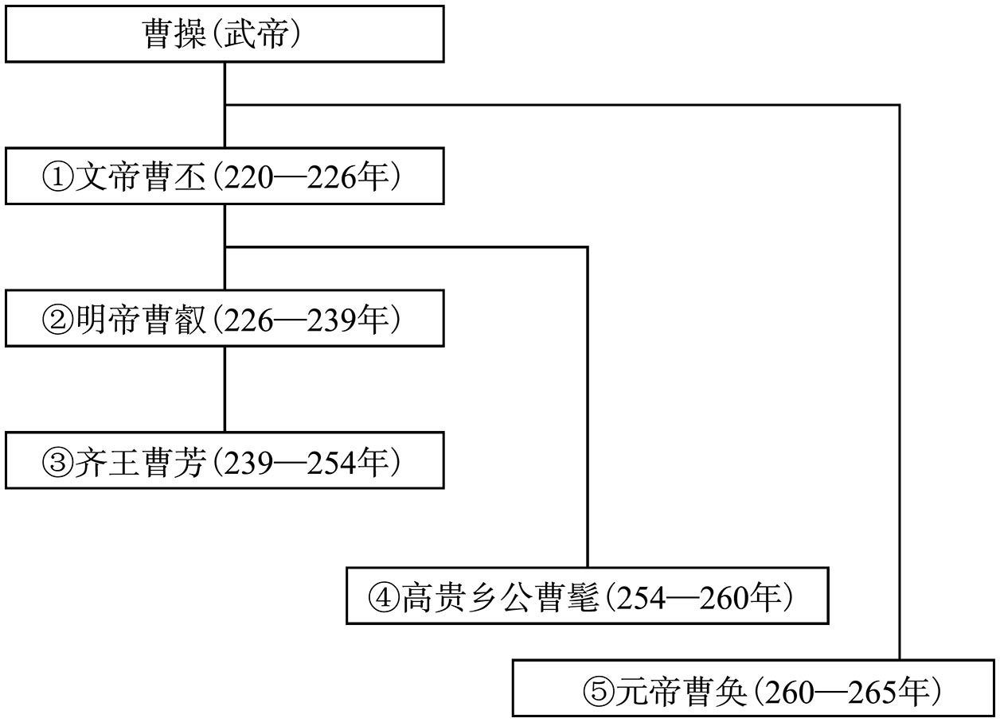 

## 蜀汉皇帝世系表

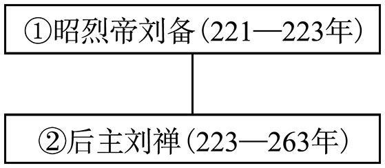 

## 东吴皇帝世系表

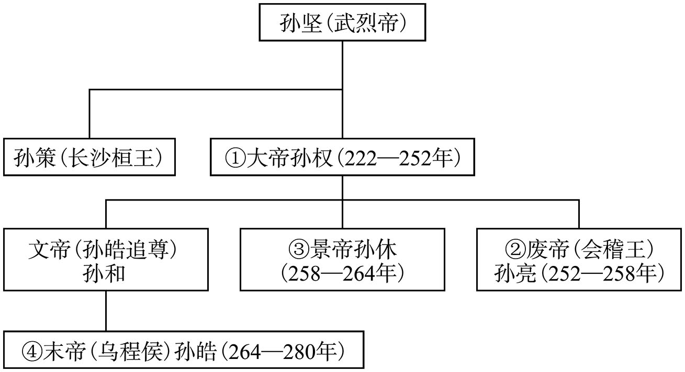

