# 目录

吴蜀通好

诸葛亮出师　平南中附

吴侵淮南

魏平辽东

明帝奢靡

司马懿诛曹爽

吴易太子

诸葛恪寇淮南孙逆节附

附录： 
曹魏皇帝世系表

蜀汉皇帝世系表

孙吴皇帝世系表

返回总目录

# 吴蜀通好

## 【内容提要】

本篇叙述了三国时吴国与蜀国之间的战争与通好。

东汉建安二十年（215年），孙权得知刘备已夺取益州，便派诸葛瑾索要荆州，刘备托辞拒绝。在争夺荆州的问题上，吴、蜀关系趋向紧张。建安二十四年（219年），关羽进攻曹操占领的樊城，吕蒙与孙权共同商议乘机夺取荆州的计划。为了防备孙权偷袭荆州，关羽进行了严密的防范。吕蒙探知此情，就佯称病重回建业休养，以名望不大的陆逊代替自己。陆逊到任后，派使者给关羽送信恭维他。关羽的防范之心松懈下来，把荆州大部分军队陆续调到樊城。由于粮食匮乏，关羽擅自强占东吴在湘关的粮食。于是孙权任命吕蒙为大都督，发兵袭击关羽的后方。

吕蒙率军进至寻阳，把精锐士卒埋伏在伪装的商船中，令将士化装成商人，直接袭击江陵。吕蒙先让虞翻写信诱降驻守公安的蜀将傅士仁，又让傅士仁引吴军迫使驻守江陵的蜀将麋芳投降，于是一举夺回蜀军长期占据的荆州。进占江陵后，吕蒙对关羽部下兵将的家属加以优待和抚慰，下令军中不得侵扰百姓，使城内秩序迅速恢复。关羽得知江陵失守，于是撤军想夺回荆州。关羽手下的将士得知家属安然无恙，斗志尽失，大多半途而逃。关羽自知势孤，败走麦城，被吴将潘璋部下的司马马忠擒获，结果被杀。

刘备以替关羽报仇为由，率军东征孙权，想夺回荆州。面对蜀军的进攻，孙权奋起应战，任命陆逊为大都督，统率朱然、潘璋、韩当、徐盛、孙桓等部共五万人开赴前线，抵御蜀军；同时又派遣使者与魏国修好，避免两线作战。陆逊上任后，认为刘备兵势强大，居高守险，求胜心切，吴军应暂时避开蜀军的锋芒，再伺机破敌。吴军一直撤到夷道、猇（xiāo）亭一带，再集中兵力，准备寻机决战。

刘备亲率主力大军进抵猇亭，在巫峡建平至夷陵一线，设立数十个营寨。为了迅速同吴军进行决战，刘备数次派军引诱吴军出战，但陆逊坚守不出，蜀军斗志逐渐涣散松懈。六月暑气逼人，蜀军将士不胜其苦，刘备只好把军营设于深山密林里，树栅连营七百余里。陆逊认为与蜀军进行决战的时机已经成熟，六月，命令吴军乘夜突袭蜀军营寨，火烧蜀军连营四十余寨，蜀军死伤惨重。刘备败退至马鞍山，依险据守，陆逊集中兵力，四面围攻，蜀军土崩瓦解，数万人被歼。刘备逃奔秭（zǐ）归，下令在险道上焚烧铙（náo）铠，以阻止吴兵追击。当刘备逃往白帝城时，陆逊为防备曹魏袭击，没有大举追击。猇亭之战后，刘备病死。诸葛亮想要交好吴国，却没有合适的人选，邓芝自告奋勇前去游说，果然使吴、蜀两国重新结盟。三国魏太和三年（229年），吴、蜀两国定下协议，约定瓜分曹魏占领的土地。

吴蜀两国唇齿相依，时而结盟、时而交战。吴杀关羽，取荆州，吴蜀交恶，蜀军攻吴，两军对峙于猇亭，刘备战败忧愤而死。诸葛亮审时度势，遣使与吴重修旧好，商定共同抵抗曹魏策略，奠定了之后吴蜀友好往来的基础。

## 【原文】

**汉献帝建安二十年[1]。初，刘备在荆州，周瑜、甘宁等数劝孙权取蜀[2]。权遣使谓备曰：“刘璋不武，不能自守，若使曹操得蜀，则荆州危矣[3]。今欲先攻取璋，次取张鲁，一统南方，虽有十操，无所忧也[4]。”备报曰：“益州民富地险，刘璋虽弱，足以自守[5]。今暴师于蜀、汉，转运于万里，欲使战克攻取，举不失利，此孙、吴所难也[6]。议者见曹操失利于赤壁，谓其力屈，无复远念[7]。今操三分天下已有其二，将欲饮马于沧海，观兵于吴会，何肯守此，坐须老乎[8]？而同盟无故自相攻伐，借枢于操，使敌承其隙，非长计也[9]。且备与璋托为宗室，冀凭英灵以匡汉朝[10]。今璋得罪于左右，备独悚惧，非所敢闻，愿加宽贷[11]。”权不听，遣孙瑜率水军住夏口[12]。备不听军过，谓瑜曰：“汝欲取蜀，吾当被发入山，不失信于天下也。”使关羽屯江陵、张飞屯秭归，诸葛亮据南郡，备自住孱陵[13]。权不得已，召瑜还。及备西攻刘璋，权曰：“猾虏，乃敢挟诈如此[14]！”备留关羽守江陵，鲁肃与羽邻界，羽数生疑贰，肃常以欢好抚之[15]。**

## 【注文】

[1]汉献帝：即刘协（181—234年），东汉最后一个皇帝。汉灵帝子，曾被封为勃海王、陈留王。董卓废少帝刘辩后，刘协被迎立为帝，年仅九岁。董卓死后，又被李傕（jué）等挟持。东汉建安元年（196年）被曹操迎归，迁都于许。汉献帝在位期间，朝政先后被董卓、曹操把持，东汉政权已名存实亡。曹操死后，曹丕称帝，封他为山阳公，东汉灭亡。死后谥献帝，葬于禅陵。　　建安二十年：公元215年。建安是东汉献帝刘协的年号，自公元196年至220年，共二十五年。

[2]刘备（161—223年）：三国时蜀国的开国皇帝，东汉远支皇族。字玄德，涿郡（今河北涿州）人。东汉末年参加镇压黄巾起义军，任高唐令、平原相。在军阀混战中先后依附公孙瓒、陶谦、曹操、刘表，任豫州刺史、镇东将军等职，与袁绍、袁术、吕布、曹操相对抗。东汉建安十三年（208年），采纳诸葛亮建议，联吴抗曹，在赤壁大败曹军，乘机取得荆州四郡，势力逐渐壮大。之后又吞并刘璋所统辖的益州，占领汉中。三国蜀汉章武元年（221年）称帝，建都成都，国号汉，史称蜀汉。次年，为争夺荆州，亲率大军攻吴，在猇（xiāo）亭（今湖北宜都）被吴军打败，次年病死。　　荆州：古州名。中国古代行政区划，西汉武帝所置十三刺史部之一。西汉时辖境相当于今湖北、湖南两省及河南、贵州、广东、广西的一部分。东汉荆州治所在汉寿县（今湖南常德东北），辖境西北扩大至今陕西山阳县。三国时魏国、吴国分别设置荆州。魏国的荆州治所在新野县（今河南新野），辖地是东汉荆州北部，相当于今湖北北半省大部、陕西秦岭以南的东部、河南西南部和南部的一小部。吴国的荆州治江陵县（今湖北荆州），辖地是东汉荆州的南部，相当于今湖南全省、湖北南半省、重庆、江西两省市小部、贵州东部、广东北部和广西东北部。　　周瑜（175—210年）：三国时吴国名将。字公瑾，庐江舒县（今安徽庐江西南）人。出身士族，少年时与孙策为友，后来成为孙策手下的建威中郎将，帮助孙策在江东创立孙氏政权。孙策死后，与张昭共同辅孙权，任前部大都督。东汉建安十三年（208年），曹操率军南下，周瑜与鲁肃联合刘备，亲率吴军在赤壁打败曹操。赤壁之战后，孙权地位更加巩固，形成曹、孙、刘三方鼎峙局面。建安十五年（210年）病死。　　甘宁（生卒年不详）：三国时吴国将领。字兴霸，巴郡临江（今重庆忠县）人。初依附刘表，后来归顺孙权。曾随周瑜打败曹操，进攻曹仁，又从吕蒙抵御关羽。因功任西陵太守、折冲将军。后来在濡须（今安徽无为北）率领百余名骑兵夜袭曹营，勇冠三军。东汉建安二十年（215年）随孙权攻打合肥，吴军失利，他奋勇战死，扭转了局势。　　孙权（182—252年）：三国吴国君主。字仲谋，吴郡富春（今浙江杭州富阳区）人。早年随兄孙策平定江东，孙策死后继承其事业，在张昭、周瑜、程普等人的辅助下，统治江东，招延名士，平定山越，多次与曹操作战。东汉建安十三年（208年），与刘备结盟，在赤壁大败曹操，奠定三分天下的格局。建安二十四年（219年），杀关羽，取得荆州。曹丕称帝后，孙权向魏国称臣，被封为吴王。三国魏黄初二年（221年），命陆逊统军迎击刘备，在夷陵以火攻大败蜀军。黄龙元年（229年）称帝，建都武昌，国号吴。孙权统治江东五十多年，对内实行屯田，发展经济，开发边疆，但赋税繁重，刑罚严酷；对外与魏、蜀时战时和，择利而变。

[3]刘璋（？—219年）：东汉宗室。字季玉，江夏竟陵（今湖北宜昌东南）人。继其父刘焉为益州牧，据有今四川等地区。刘璋懦弱无能，法令松弛，豪强骄横，政治腐败。东汉建安十六年（211年），听说曹军进攻汉中张鲁，十分恐惧，迎接刘备进入益州，让刘备进攻汉中的张鲁。刘备却突然回师围成都，他被迫投降，迁居南郡公安（今湖北公安）。建安二十四年（219年），孙权夺取荆州后，任刘璋为益州牧，驻守秭（zǐ）归。不久刘璋病死。　　曹操（155—220年）：东汉末年著名军事家、政治家和文学家，三国时期魏国奠基人。字孟德，沛国谯（qiáo）县（今安徽亳州）人。早年举孝廉为郎官，参与镇压黄巾军，封济南相。曾任东郡太守、典军校尉等职。东汉初平元年（190年）与袁绍等讨伐董卓。镇压黑山农民起义，任兖州牧，收编青州黄巾军，建立青州兵。东汉建安元年（196年）迎接汉献帝，建都许，任为大将军、司空、丞相，被封为武平侯、魏王。先后击败袁术、吕布、袁绍、刘表等割据势力，北征乌桓，逐渐统一北方。赤壁之战时被孙权、刘备联军大败。后出兵关中，打败马超、韩遂、张鲁等割据势力，与刘备争夺汉中。他执政期间任人唯才，抑制豪强，提倡节俭，使北方经济得到恢复和发展。他还精通兵法，善作诗歌，有作品传世。东汉建安二十五年（220年）卒于洛阳。后追尊为魏武帝。

[4]张鲁（生卒年不详）：东汉末年五斗米道（天师道）首领。字公祺，沛国丰县（今江苏丰县）人。天师道创立者张道陵之孙，世代为天师道教主。东汉初平二年（191年），任益州牧刘焉的督义司马，率徒众攻取汉中，称师君，在汉中建立政教合一的政权。他用天师道治理社会，社会安定，各地人民都乐于依附他，所建政权存在约三十年。东汉建安二十年（215年），曹操进攻汉中，他战败投降，任镇南将军，封阆（làng）中侯。

[5]益州：古州名。中国古代行政区划，汉武帝所置十三州刺史部之一，治所在洛（luò）县（今四川广汉），后移治绵竹（今四川德阳北），又移治成都（今四川成都）。辖境相当于今四川折多山、云南怒山、哀牢山以东，甘肃陇南市、两当、陕西秦岭以南，湖北郧县、保康西北，贵州除东边以外地区，东汉以后辖境缩小。

[6]暴师：指军队在外蒙受风霜雨露的情况，后泛指为用兵在外。

[7]赤壁：古地名。东汉建安十三年（208年），孙权与刘备联军大败曹操之处。历来说法不一，迄今尚无定论。主要有二说：一说在今湖北武汉江夏区西赤矶山，与纱帽山隔江相对；一说在今湖北赤壁市西北赤壁山，北对洪湖市龙口镇乌林矶。

[8]沧海：旧时东海的别称。　　吴会：古地区名。东汉吴郡、会（kuài）稽二郡的合称，三国及西晋初又泛指孙吴政权所辖地区为吴会。

[9]攻伐：军事征讨。　　枢：门上的转轴，指重要的或中心的部分。

[10]宗室：帝王的宗族。　　英灵：杰出的人才。

[11]悚（sǒng）惧：害怕，恐惧。

[12]孙瑜（177—215年）：三国吴国将领、宗室。字仲异，东汉吴郡富春（今浙江杭州富阳区）人，孙权从兄。初任恭义校尉，治军有方，深得士兵爱戴。东汉建安九年（204年），孙瑜任丹阳太守，加绥远将军。东汉建安十一年（206年），随周瑜攻克麻、保二屯，又从孙权在濡须抗拒曹操，迁奋威将军。当时诸将都以军事为务，而孙瑜虽在军旅，读经阅史，勤奋好学。　　夏口：古镇名。因在夏水（汉水下游的古称）注入长江处，故称夏口。本在江北，即今湖北武汉市汉口。后三国吴孙权在今湖北武汉市武昌黄鹄山上筑城，因与夏口相对，也称夏口。

[13]关羽（？—220年）：三国蜀国名将。字云长，河东解县（今山西临猗西南）人。东汉末年亡命涿（zhuō）郡，随刘备起兵，为刘备主要将领。东汉建安五年（200年）关羽在下邳（pī）被曹军俘获，受到礼遇，封汉寿亭侯。后来仍然回归刘备。赤壁之战后，拜为襄阳太守、荡寇将军。建安十九年（214年）镇守荆州。建安二十四年（219年）发兵围攻驻守樊城的曹操大将曹仁，大破于禁所率七军，迫使于禁投降，杀死庞德，一时北方震惊。不久曹操许诺割江南以封孙权，在孙权部将吕蒙策划下，出兵夺取荆州。关羽兵败麦城（今湖北当阳东），突围时被擒获杀死。　　江陵：古县名。春秋楚郢（yǐnɡ）都，汉置江陵县，是南郡的治所。今为湖北荆州市荆州区。　　张飞（？—221年）：三国时蜀国名将。字翼德，涿郡（今河北涿州）人。年轻时与关羽共同追随刘备，生死与共。曹操率军进入荆州后，刘备逃奔江南，被曹军追击，张飞率军断后，在长阪抵御曹军，迫使曹操不敢轻进。赤壁之战后，刘备占据荆州等地，受命为宜都太守、征虏将军，封新亭侯。刘备进军益州，张飞自南郡溯流而上，每战皆捷，活捉严颜，升任巴西太守。刘备称汉中王，拜张飞为右将军。三国蜀汉章武元年（221年），改任车骑将军，领司隶校尉，进封西乡侯。随刘备伐吴，临行时被部将所杀。谥“桓侯”。　　秭（zǐ）归：古县名，即今湖北秭归西北。位于今湖北西部，地处川鄂咽喉长江西陵峡两岸。西汉置秭归县，北魏改置长宁县，隋复秭归县。　　诸葛亮（181—234年）：三国蜀国大臣，刘备重要谋士。字孔明，琅邪阳都（今山东沂南南）人。东汉末年隐居南阳隆中（今湖北襄樊），后辅佐刘备，联合孙权在赤壁击败曹操，谋取荆州四郡，夺得益州。刘备称帝后，任丞相。三国蜀汉章武三年（223年），刘备去世后辅佐后主刘禅，多次北伐魏国，但屡遭挫败。三国蜀汉建兴十二年（234年）病卒于军中。谥号忠武侯。　　南郡：古郡名。秦昭襄王二十九年（前278年）置。治所在郢（今湖北荆州市荆州区东北），后移江陵（今湖北荆州市荆州区）。辖境相当于今湖北粉青河及襄樊市以南，荆门、洪湖以西，长江和清江流域以北，西至重庆巫山。后渐缩小，三国吴国移治公安城（今湖北公安），西晋移治江陵。　　孱（chán）陵：古县名。西汉设置，治所在湖北公安县西。

[14]猾虏：指奸狡的敌人，是对敌方的蔑称。

[15]鲁肃（172—217年）：三国吴国名将。字子敬，临淮东城（今安徽定远）人。出身士族，与周瑜同到江南归附孙策。孙策死后，辅佐孙权。曹操南下，严重威胁孙氏政权，他与周瑜坚决主战，并联合刘备军同拒曹操。孙权任为赞军校尉，帮助周瑜在赤壁大破曹操。东汉建安十五年（210年）周瑜死后，他任奋武校尉，主管军事，继续执行联合刘备抗曹魏的战略。后迁汉昌太守、横江将军。东汉建安二十二年（217年）病卒。

## 【译文】

汉献帝建安二十年（215年）。当初，刘备在荆州时，周瑜、甘宁等人多次劝孙权夺取蜀地。孙权派使者对刘备说：“刘璋软弱，自己不能保护自己的地盘，假如曹操得到蜀地，那么荆州就危险了。现在我们计划先攻取刘璋，再击败张鲁，统一南方，这样即使有十个曹操，也没有什么可以担忧的了。”刘备回答说：“益州人民富裕，地势险要，刘璋虽然软弱，保护自己还有足够的力量。现今如果使军队在外出征，进入蜀、汉之地，风餐露宿，在万里路上转运给养，要想战必克，攻必取，举措不失利，就是孙武和吴起这样的名将也难以做到。议论的人见曹操在赤壁失败，就说他已经没有什么力量，不再有长远打算。现今三分天下，曹操已拥有其二，准备到沧海去饮马，到吴郡会稽来阅兵，怎么会守着这一局面坐等年老呢？而抗曹的同盟之间却无故自相攻伐，把机会借给曹操，让敌人钻空子，这不是长久之计。况且我和刘璋都是刘氏皇族，希望凭借祖上神灵来匡扶汉朝。如今刘璋得罪了您，刘备我独自感到惶恐，不敢听从您的计划，请求宽恕。”孙权不听刘备的劝告，派孙瑜率水军驻扎在夏口。刘备不允许孙权的军队过境，对孙瑜说：“你们若要攻取蜀地，我将披头散发，隐退山林之中，不能在天下人面前失信。”刘备让关羽驻守江陵，张飞屯兵在秭归，诸葛亮据守南郡，自己坐镇孱陵。孙权不得已，把孙瑜召回。等到刘备向西进攻刘璋时，孙权说：“这个滑头，竟敢如此搞阴谋诡计！”刘备留下关羽防守江陵，鲁肃的防区与关羽邻界，关羽多次产生猜疑，鲁肃则经常以友好的态度安抚他。

## 【原文】

**及备已得益州，权令中司马诸葛瑾从备求荆州诸郡，备不许，曰：“吾方图凉州，凉州定，乃尽以荆州相与耳[1]。”权曰：“此假而不反，乃欲以虚辞引岁也[2]。”遂置长沙、零陵、桂阳三郡长吏[3]。关羽尽逐之。权大怒，遣吕蒙督兵二万以取三郡[4]。**

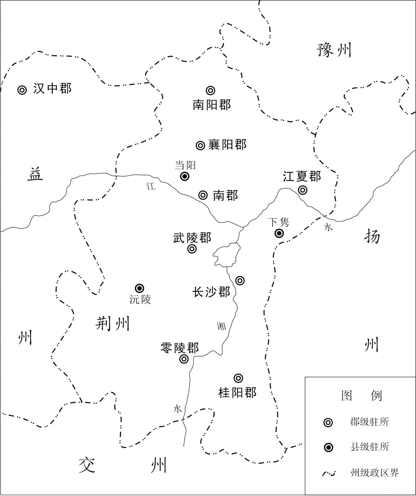 
**荆州郡县示意图**

## 【注文】

[1]中司马：古代官名。中尉司马的简称，秦汉时中尉的属官，掌管巡查京师或领兵作战。　　诸葛瑾（174—241年）：三国时吴国将领。字子瑜，琅邪阳都（今山东沂南南）人，诸葛亮之兄。东汉末年移居江南，受到孙权优礼，任长史。后来以绥南将军代替吕蒙为南郡太守，封宣城侯，率军驻守公安（今湖北公安）。孙权称帝后，官至大将军、左都护，领豫州牧。　　凉州：古州名。中国古代行政区划，汉武帝所置十三州刺史部之一，东汉治陇县（今甘肃张家川）。辖境相当今甘肃、宁夏、青海湟水流域，陕西定边、吴起、凤县、略阳和内蒙古额济纳旗一带。东汉建安十八年（213年）并入雍州，三国魏文帝时复置，移治姑臧县（今甘肃武威）。魏晋以后辖境缩小，只限于今甘肃黄河以西地区。

[2]虚辞：虚夸不实的言辞或文辞。　　引岁：拖延岁月，延迟时间。

[3]长沙：古郡名。秦朝设置，治所在临湘（今湖南长沙）。辖境相当于今湖南大部，广西小部，广东连州、英德等地和江西一部。西汉改为郡国，东汉仍改为郡，辖境渐小。　　零陵：古郡名。西汉元鼎六年（前111年）分桂阳郡置，治所在零陵县（今广西全州西南），辖境相当于今湖南邵阳、衡阳、武冈等地以南和广西阳朔、永福等以北地区。东汉移治泉陵县（今湖南永州）。北部辖境扩大至今蒸水上游和涟水中游。三国后辖境缩小。　　桂阳：古郡名。西汉高祖二年（前205年）设置，治所在郴（chēn）县（今湖南郴州）。辖境约当今湖南耒（lěi）阳以南的耒水、舂陵水流域，北至洣（mǐ）水入湘处附近，南至广东英德以北的北江流域。其后屡有变化，三国吴国在南部分置始兴郡，辖境缩小。　　长吏：地位较高官吏的统称。秦、汉一般指秩六百石Mg（dàn）以上官吏，县丞、尉禄秩虽低，也可称长吏。魏、晋以后，多指县令长和郡守。

[4]吕蒙（178—220年）：三国时吴名将。字子明，汝南富陂（今安徽阜南东南）人。早年依附孙策部将邓当。后归孙权，屡献奇计，攻战有功，任横野中郎将。后随周瑜、程普等在赤壁打败曹操。他曾攻读史书与兵书，果敢有胆略。鲁肃卒后代领其军，打败关羽，占领荆州，不久病死。

## 【译文】

到了刘备得到益州后，孙权派中司马诸葛瑾向刘备索求荆州各郡，刘备不同意，说：“我正准备夺取凉州，取得凉州以后，才能把荆州全部给你们。”孙权说：“这是有借无还，不过是找借口来拖延时日罢了。”因此任命长沙、零陵、桂阳三郡的地方长官。关羽却全部加以驱逐。孙权大怒，派吕蒙率兵二万人夺取三郡。

## 【原文】

**蒙移书长沙、桂阳，皆望风归服，惟零陵太守郝普城守不降[1]。刘备闻之，自蜀亲至公安，遣关羽争三郡[2]。孙权进住陆口，为诸军节度[3]。使鲁肃将万人屯益阳以拒羽，飞书召吕蒙，使舍零陵急还助肃[4]。蒙得书，秘之，夜召诸将授以方略[5]。晨，当攻零陵，顾谓郝普故人南阳邓玄之曰：“郝子太闻世间有忠义事，亦欲为之，而不知时也[6]。今左将军在汉中，为夏侯渊所围，关羽在南郡，至尊身自临之[7]。彼方首尾倒县，救死不给，岂有余力复营此哉[8]。今吾计力度虑而以攻此，曾不移日而城必破，城破之后，身死何益于事，而令百岁老母戴白受诛，岂不痛哉！度此家不得外问，谓援可恃，故至于此耳。君可见之，为陈祸福。”玄之见普，具宣蒙意，普惧而出降。蒙迎，执其手与俱下船。语毕，出书示之，因拊手大笑[9]。普见书，知备在公安而羽在益阳，惭恨入地。蒙留孙（河）［皎］委以后事，即日引军赴益阳[10]。**

## 【注文】

[1]太守：古州、郡最高行政长官。战国时为郡守的尊称，西汉景帝时改郡守为太守，掌管郡内军政诸事。三国时秩二千石，官五品，其权力渐被刺史、州牧所侵夺。后代沿置，职权、品秩各有不同。　　郝普（生卒年不详）：三国蜀、吴将领。字子太，义阳（今河南信阳西北）人。刘备率军进入益州，留郝普为零陵太守，守零陵。被吴将吕蒙骗降吴国，吴国把他送还刘备。后来吕蒙袭击荆州，杀关羽，郝普又投降吴国，官至廷尉。青州人隐蕃投奔吴国，郝普与他亲善。后隐蕃作乱被杀，郝普惶惧自杀。

[2]公安：古县名。东汉为作唐县，属武陵郡。三国蜀改为公安县，属南郡。故城在今湖北公安东北油口。

[3]陆口：古地名。又名蒲圻口、蒲矶口，俗名陆溪口。在今湖北嘉鱼西南长江南岸，因处陆水入江处，故名。东汉末、三国时为东吴军事重镇。　　节度：调度，指挥。

[4]益阳：古县名。今湖南益阳东春秋时为楚地，秦设立长沙郡，下设益阳等九县。西汉时期益阳分属长沙国、武陵郡。东汉废长沙国为郡。三国吴太元二年（252年）分长沙西部都尉而设置衡阳郡，益阳属于衡阳郡。

[5]方略：关乎全局的计划和谋略，作战方略。

[6]南阳：古郡名。治所在宛县（今河南南阳）。汉时辖境相当于今河南熊耳山以南叶县、内乡之间和湖北大洪山以北广水、郧县之间地区。后来辖境逐渐缩小。西晋时改为国。　　邓玄之（生卒年不详）：南阳人，是零陵太守郝普的朋友，吕蒙曾通过邓玄之劝降郝普。

[7]左将军：指刘备，刘备曾任左将军，故称。　　汉中：古郡名。战国楚置，秦惠王又置，因在汉水中游而得名，治所在南郑（今陕西汉中）。西汉时移治西城（今陕西安康西北），东汉复还旧治。秦时辖境相当于今陕西秦岭以南，粉青河、珍珠岭以北，留坝、勉县以东，乾佑河流域以西和湖北郧县、保康以西地区。　　夏侯渊（？—219年）：三国时魏国名将。字妙才，沛国谯县（今安徽亳州）人，夏侯惇族弟，为人有韬略。东汉末年随曹操起兵，任别部司马、骑都尉，迁陈留、颍（yǐnɡ）川太守。从曹操征袁绍、韩遂，常出敌不意，屡建奇功，封博昌亭侯。东汉建安二十年（215年），任征西将军，守汉中。东汉建安二十三年，率军在阳平关抵御刘备军，次年被刘备部将黄忠袭击杀死，追谥愍。　　至尊：至高无上的地位和尊贵。古代有时指帝王之位，更多的时候是作为天子的代称。

[8]倒县：“县”通“悬”，头向下脚向上地被倒挂，比喻处境极困苦危急。

[9]拊（fǔ）手：拍手，鼓掌。表示高兴、赞赏。

[10]孙皎（？—219年）：吴国宗室。字叔朗，吴郡富春（今浙江杭州富阳区）人，孙静之子，孙权从弟。初为护军校尉，后迁都护征虏将军。他轻财能施舍，善于交结，勇锐善战，与诸葛瑾友善。东汉建安二十四年（219年），孙权袭夺荆州，想命他与吕蒙为左右部大督，吕蒙因他为孙氏宗亲，恐受牵制，孙权才命吕蒙为大都督，命他为后继。在擒关羽、定荆州时，孙皎很有战功。不久病死。

## 【译文】

吕蒙向长沙、桂阳发送文书，二郡都望风归服，只有零陵太守郝普坚守城池而不投降。刘备得到消息以后，亲自从蜀国抵达公安，派关羽争夺三郡。孙权则亲自到陆口坐镇，指挥调度各军。派鲁肃领兵一万人驻屯益阳，对抗关羽；用紧急军书传召吕蒙，让他放弃零陵去帮助鲁肃。吕蒙接到孙权的书信命令后，秘密藏起来，连夜召集部下将领，传授自己的作战方案。清晨，在向零陵发起攻击时，吕蒙看着郝普的旧友南阳人邓玄之说：“郝普听说世间有忠义之事，也想那样做，但他不了解时势。现在左将军（刘备）在汉中，被夏侯渊包围，关羽则在南郡，我们主公亲自来征讨，他们好像首尾倒悬，救命都来不及，哪里有剩余力量再来救援零陵啊。如今我已考虑周全，准备充分，将向零陵城发起攻击，不久必定可以攻进城去，城破之后，郝普自身死了，对时势有何益处？却牵连百岁白发老母遭受诛杀，怎会不让人痛心啊！我想郝普是得不到外边的消息，以为可以依靠援兵，所以才坚守到现在。你应该去见他，为他分析祸福利害。”邓玄之见到郝普，把吕蒙的意思全都告诉他。郝普因为恐惧而出城投降。吕蒙亲自迎接，拉着他的手一起下船。谈话完毕后，吕蒙把孙权的军书拿来给他看，于是拍手大笑。郝普看到军书，才知道刘备已到公安，而关羽在益阳，惭愧悔恨得要钻入地下。吕蒙留下孙皎，命令他处理零陵事务，自己当天率军奔赴益阳。

## 【原文】

**鲁肃欲与关羽会语，诸将疑恐有变，议不可往。肃曰：“今日之事，宜相开譬[1]。刘备负国，是非未决，羽亦何敢重欲干命[2]！”乃邀羽相见，各驻兵马百步上，但诸将军单刀俱会。肃因责数羽以不返三郡，羽曰：“乌林之役，左将军身在行间，戮力破敌，岂得徒劳，无一块土，而足下来欲收地邪[3]？”肃曰：“不然。始与豫州觐于长阪，豫州之众不当一校，计穷虑极，志势摧弱，图欲远窜，望不及此[4]。主上矜愍豫州之身无有处所，不爱土地士民之力，使有所庇荫以济其患，而豫州私独饰情，愆德堕好[5]。今已藉手于西州矣，又欲翦并荆州之土，斯盖凡夫所不忍行，而况整领人物之主乎[6]！”羽无以答。会闻魏公操将攻汉中，刘备惧失益州，使使求和于权。权令诸葛瑾报命，更寻盟好[7]。遂分荆州，以湘水为界，长沙、江夏、桂阳以东属权，南郡、零陵、武陵以西属备[8]。**

## 【注文】

[1]譬：知晓，了解，明白。

[2]干命：违反命令。

[3]责数：责备数落。　　乌林：古地名。故址在今湖北洪湖东北长江北岸的邬林矶。东汉建安十三年（208年）赤壁之战后，孙权与刘备在此大败曹操。　　行间：指军中行伍之间。　　戮力：并力，合力。

[4]豫州：此处指刘备，因刘备曾任豫州牧，因此人称刘豫州。　　觐（jìn）：古代诸侯秋天朝见帝王称“觐”，此处指拜见，会见。　　长阪（bǎn）：位于当阳市西南郊，三国古战场遗址之一。　　计穷虑极：想尽了所有的计谋。

[5]矜愍（mǐn）：怜惜。愍，同“悯”。　　庇荫：覆盖，保护。　　愆（qiān）：违背，违反。

[6]藉手：借他人之手达到自己的目的。　　西州：指今四川盆地。　　凡夫：平庸无能的人。

[7]报命：谦辞，执行命令后回报。

[8]湘水：水名。又称湘川，今湖南之湘江。　　江夏：古郡名。西汉置，三国魏、吴国分别设置，吴的治所在武昌县（今湖北鄂州）。西汉时辖境相当于今湖北钟祥、潜江、仙桃、嘉鱼、赤壁、崇阳等地以东，及河南光山、新县以西，信阳以东，淮河以南地区。西晋太康元年（280年）改为武昌郡。　　武陵：古郡名。西汉高祖刘邦设置，治所在义陵县（今湖南溆浦南），辖境相当于今湖南沅江流域以西，贵州东部，湖北长阳、鹤峰、五峰、来凤等县和广西三江、龙胜等地。东汉移治临沅县（今湖南常德西），其后辖境逐渐缩小。

## 【译文】

鲁肃准备与关羽会谈，将领们疑虑恐怕发生变故，劝鲁肃不要去。鲁肃说：“事到如今，最好的办法是开导劝说。刘备忘恩负义，是非还没有最后结论，关羽又如何敢谋害我的性命！”于是邀请关羽会面，各自在百步以外驻扎自己的部队，只有双方将领带佩刀相见。鲁肃于是责备数落关羽不退还三郡，关羽说：“乌林那次战役，左将军（刘备）直接参战，竭尽全力打败敌人，难道能白白辛苦，不拥有一块土地，而您要来收取土地吗？”鲁肃说：“不是这样。开始在长阪与刘豫州会面时，他的部众抵挡不了一校的人马，智竭计穷，士气低落，势力衰颓，打算远逃，那时想不到会有今天。我们主公可怜刘豫州无处安身，不吝惜土地和百姓劳力，使刘备有了落脚之地，帮助他解决困难。而刘豫州却自私自利，虚情假意，忘恩负义，损坏我们的友好关系。现在他已经得到益州，有了力量，又要兼并荆州土地，这样的事连凡夫俗子都不忍心做，更何况领导一方的领袖人物！”关羽无话可说。正在这时，听说魏公曹操将要攻打汉中，刘备恐怕失去益州，派使者向孙权求和。孙权命令诸葛瑾答复刘备，愿意再度和好。于是双方以湘水为界，分割荆州：长沙、江夏、桂阳以东归属孙权，南郡、零陵、武陵以西归属刘备。

## 【原文】

**二十四年。初，鲁肃常劝孙权以曹操尚存，宜且抚辑关羽，与之同仇，不可失也。及吕蒙代肃屯陆口，以为羽素骁雄，有兼并之心，且居国上流，其势难久，密言于权曰：“今令征虏守南郡，潘璋住白帝，蒋钦将游兵万人循江上下，应敌所在，蒙为国家前据襄阳，如此何忧于操，何赖于羽[1]。且羽君臣矜其诈力，所在反覆，不可以腹心待也[2]。今羽所以未便东向者，以至尊圣明，蒙等尚存也。今不于强壮时图之，一旦僵仆，欲复陈力，其可得邪[3]！”权曰：“今欲先取徐州，然后取羽，何如[4]？”对曰：“今操远在河北，抚集幽、冀，未暇东顾，徐土守兵，闻不足言，往自可克[5]。然地势陆通，骁骑所骋，至尊今日取徐州，操后旬必来争，虽以七八万人守之，犹当怀忧[6]。不如取羽，全据长江，形势益张，易为守也。”权善之。**

## 【注文】

[1]骁雄：骁勇雄豪而有大志。　　征虏：即孙皎，孙皎曾以护军校尉迁征虏将军。　　潘璋（？—234年）：三国吴国将领。字文珪，东郡发干（今山东冠县东南）人。初奉孙权之命，自募为军，讨伐山越，以功任别部司马。东汉建安二十年（215年），随孙权进攻合肥，以功拜偏将军。建安二十四年（219年），随孙权攻关羽，其部将马忠擒杀关羽，潘璋拜固陵太守、振威将军，封溧（lì）阳侯。三国吴黄武元年（222年）随陆逊在猇（xiāo）亭大破刘备，拜平北将军、襄阳太守。孙权称帝后，拜右将军。潘璋性情奢侈无度，不遵守法令，孙权因他有功而不过问。　　白帝：古地名。在今重庆奉节县东瞿塘峡口。　　蒋钦（生卒年不详）：三国吴国将领。字公奕，九江寿春（今安徽寿县）人。初随孙策东渡，拜别部司马，平定江东，以功拜中郎将。东汉建安二十年（215年），从孙权征合肥，在逍遥津力战张辽，战功显著，迁荡寇将军，领濡须督。不久召还，拜右护军。建安二十四年（219年），从孙权征讨关羽，督水军入沔，不久，回军中道病死。　　游兵：流动不定的军队。　　国家：古时诸侯有国，大夫有家，也指称帝王。　　襄阳：古县名。在今湖北襄樊市襄阳区。

[2]矜：矜伐。恃才夸功，夸耀。　　反覆：反复无常。　　腹心：腹部和心脏，比喻最亲信的人。

[3]僵仆：僵直地倒下，也指死亡。

[4]徐州：古州名。中国古代行政区划，汉武帝所置十三州刺史部之一，治所屡变，东汉时治所在郯（tán）县（今山东郯城北），三国魏移治彭城县（今江苏徐州），东晋时移治京口（今江苏镇江）。辖境相当于今山东东南部和江苏长江以北地区。

[5]河北：泛指今黄河以北地区。　　幽、冀：指幽州和冀州。幽州：古州名。中国古代行政区划，汉武帝所置十三州刺史部之一，治所在蓟（jì）县（今北京西南），辖境相当于今北京、河北北部、山西小部、辽宁大部、天津海河以北及朝鲜大同江流域。西晋移治涿县（今河北涿州）。冀州：古州名。中国古代行政区划，汉武帝所置十三州刺史部之一，辖境相当于今河北中南部、山东西端及河南北端。东汉治所在高邑（今河北柏乡北），后又移治邺县（今河北临漳西南），三国魏、晋移治信都（今河北冀州），辖境逐渐缩小。

[6]骁骑：勇猛的骑兵。

## 【译文】

汉献帝建安二十四年（219年）。当初，鲁肃经常劝说孙权，由于曹操势力仍然存在，应该暂且安抚结交关羽，和他共同对敌，不能失去睦邻友好。等到吕蒙代替鲁肃驻军陆口，认为关羽素来勇猛雄武，怀有兼并江南的野心，况且他的军队驻扎在孙权势力的上游，这种形势难以持久，于是秘密告诉孙权说：“如今命令征虏将军孙皎驻守南郡，潘璋驻守白帝，蒋钦率领流动部队一万人沿长江上下活动，哪里出现敌人，就在哪里投入战斗，而我为朝廷据守襄阳，这样，何必担忧曹操，又何必依赖关羽。况且关羽君臣矜伐他们的诡诈力量，反复无常，不可以推心置腹来对待。现在关羽所以没有立即向东进攻我们，是因为您圣贤英明，以及我和其他将领们还存在。如今，我们不在力量强壮时解除这一后患，一旦我们势力衰落，再想与他较量，怎么还有可能！”孙权说：“现在，我准备先攻取徐州，然后再进攻关羽，怎么样？”吕蒙回答说：“如今曹操远在黄河以北，安抚笼络幽州、冀州，来不及考虑东部地区的防守，徐州地区的守军听说不值一提，前去进攻就可以打败。然而这里交通方便，适合骁勇的骑兵驰骋，您今天夺取徐州，曹操十余天后就一定会来争夺，尽管用七八万人防守，仍会令人担忧。不如击败关羽，将长江上下游全部占据，我们的势力更加壮大，也就容易守卫了。”孙权很赞同吕蒙的建议。

## 【原文】

**权尝为其子求昏于羽，羽骂其使，不许昏，权由是怒[1]。及羽攻樊，关羽攻曹仁于樊事，见《孙氏据江东》。吕蒙上疏曰：“羽讨樊而多留备兵，必恐蒙图其后故也[2]。蒙常有病，乞分士众还建业，以治疾为名[3]。羽闻之，必撤备兵，尽赴襄阳。大军浮江，昼夜驰上，袭其空虚，则南郡可下而羽可禽也[4]。”遂称病笃[5]。权乃露檄召蒙还，阴与图计[6]。蒙下至芜湖，定威校尉陆逊谓蒙曰：“关羽接境，如何远下，后不当可忧也[7]？”蒙曰：“诚如来言，然我病笃。”逊曰：“羽矜其骁气，陵轹于人，始有大功，意骄志逸，但务北进，未嫌于我，有相闻病，必益无备，今出其不意，自可禽制[8]。下见至尊，宜好为计。”蒙曰：“羽素勇猛，既难为敌，且已据荆州，恩信大行，兼始有功，胆势益盛，未易图也。”蒙至都，权问：“谁可代卿者？”蒙对曰：“陆逊意思深长，才堪负重，观其规虑，终可大任，而未有远名，非羽所忌，无复是过也[9]。若用之，当令外自韬隐，内察形便，然后可克[10]。”权乃召逊，拜偏将军、右部督，以代蒙[11]。逊至陆口，为书与羽，称其功美，深自谦抑，为尽忠自托之意。羽意大安，无复所嫌，稍撤兵以赴樊。逊具启形状，陈其可禽之要[12]。**

## 【注文】

[1]昏：通“婚”。

[2]樊：古城名。即今湖北襄樊。

[3]建业：三国时孙吴都城，即今江苏南京。东汉建安十六年（211年），孙权自京（今江苏镇江）迁都秣（mò）陵，次年改名建业。晋灭吴后，复改建业为秣陵，晋太康三年（282年）分淮水南为秣陵，北为建业，并改为建邺。

[4]禽：通“擒”，捕捉，捉拿。

[5]病笃：病势沉重。

[6]露檄：发布公告。

[7]芜湖：古县名。汉置，属丹阳郡，因地势低洼蓄水而生芜藻，故名。在今安徽芜湖东。　　定威校尉：古代官名。东汉末年孙权任命陆逊为定威校尉，掌领兵征伐或驻守，位次将军。　　陆逊（183—245年）：三国吴国大将。字伯言，吴郡吴县（今江苏苏州）人，出身江东大族。历任吴偏将军、镇西将军、大都督、丞相等职。曾建议孙权平定山越，多次与曹魏作战，屡立战功。三国吴黄武元年（222年）在夷陵以火攻大败刘备。后因亲附太子，牵涉宫廷斗争，多次遭到孙权责问，忧愤而死。

[8]矜（jīn）：自尊，自夸。　　骁（xiāo）：勇猛、勇健。　　陵轹（lì）：欺凌，欺压。

[9]意思：考虑，打算。　　堪：可以，能够。

[10]韬隐：韬晦，隐晦。

[11]偏将军：古代官名。西汉置，为主将之下的副将。东汉、三国时为杂号将军中地位较低者，仅高于裨（pí）将军。魏、晋、南朝宋为八品。　　右部督：古代官名。三国吴置。孙权把武昌驻军分为左右两部，每部置督一人，左部督负责下游防务，右部督负责上游防务。

[12]形状：形势，状态。

## 【译文】

孙权曾经为自己的儿子向关羽之女求婚，关羽大骂孙权使者，拒绝通婚，孙权因此很恼怒。等到关羽进攻樊城，关羽攻打曹仁所据的樊城一事，见《孙氏据江东》。吕蒙向孙权上书说：“关羽征讨樊城，却留下很多军队防守，一定是害怕我从后面进攻他。我经常患病，请求您允许我以治病为名，率一部分士兵回归建业。关羽听说后，必定撤走防守部队，全部调往襄阳。我方大军昼夜乘船溯长江而上，趁他防守空虚，进行袭击，南郡就可以攻取，关羽也会被我擒获。”于是，吕蒙自称病重。孙权则公开发布命令召吕蒙返回，暗中与他进行策划。吕蒙顺江而下到达芜湖时，定威校尉陆逊对吕蒙说：“关羽和您的防区相邻，为何远远离开，以后不会为此而担忧吗？”吕蒙说：“的确如您所说，可我病得很重。”陆逊说：“关羽自负骁勇，欺压他人，刚刚取得大功，就骄傲自大，一心致力向北进攻，对我军未加怀疑，又听说您病重，必然更无防备，如果出其不意，就可以将他擒获制服。您见到主公，应该妥善筹划此事。”吕蒙说：“关羽素来勇猛善战，我们很难与他为敌，况且他已经占据荆州，大施恩德信义，再加上刚刚取得很大成功，胆略和气势更加旺盛，不易对付。”吕蒙回到建业，孙权询问说：“谁可以代替你？”吕蒙回答说：“陆逊思虑深远，有能力担负重任，看他的气度思想，终究可以大用，而且他没有大的名声，不是关羽所顾忌的人物，没有人比他更合适了。如果任用他，应该要他在外隐藏锋芒，内里观察形势，寻找可乘之机，然后向敌人进攻，可以取得胜利。”孙权于是召来陆逊，任命他为偏将军、右部督，来接替吕蒙。陆逊到达陆口，写信给关羽，称颂关羽的功德，深深地自我谦恭，表示愿意尽忠修好，托付自己的前程。关羽因此感到很安心，不再有怀疑，便逐渐撤出防守的军队赶赴樊城。陆逊把全部情况向孙权进行汇报，陈述可以擒拿关羽的战略要点。

## 【原文】

**羽得于禁等人马数万，粮食乏绝，擅取权湘关米[1]。权闻之，遂发兵袭羽。权欲令征虏将军孙皎与吕蒙为左、右部大督。蒙曰：“若至尊以征虏能，宜用之；以蒙能，宜用蒙。昔周瑜、程普为左右部督，督兵攻江陵，虽事决于瑜，普自恃久将，且俱是督，遂共不睦，几败国事，此目前之戒也[2]。”权寤，谢蒙曰：“以卿为大督，命皎为后继可也[3]。”**

## 【注文】

[1]于禁（？—221年）：三国魏国大将。字文则，泰山巨平（今山东泰安南）人。东汉末年随鲍信起兵，后归附曹操，拜军司马。从曹操征吕布、张绣、袁绍、昌豨（xī）等，以军功拜虎威将军、左将军等职。于禁治军严整，所得财物不入私囊，与张辽、乐进、张郃（hé）、徐晃号为名将。东汉建安二十四年（219年）被蜀军打败，投降关羽，辗转至孙吴。魏文帝时遣还，不久惭恨而死，谥厉侯。　　湘关：三国吴孙权设置，今址待考。

[2]程普（？—215年）：三国吴国将领。字德谋，右北平土垠（今河北唐山丰润区）人。初随孙坚征伐，镇压黄巾起义，大破董卓军。后帮助孙策占有江东，拜荡寇中郎将，领零陵太守。孙策死后，与张昭等共同辅佐孙权，征讨四方。东汉建安十三年（208年），与周瑜分任左右督，在赤壁大败曹操。先后领江夏、南郡太守，迁荡寇将军。

[3]寤（wù）：古同“悟”，理解，明白。

## 【译文】

关羽得到于禁等人的军队数万人，粮食不足，军队供应断绝，便擅自取用孙权存放在湘关的粮米。孙权闻知此事，便派兵袭击关羽。孙权准备任命征虏将军孙皎和吕蒙为左、右两路军队的大都督。吕蒙说：“如果您认为征虏将军有才能，就应任用他为统帅；如果认为我有才能，就应当任用我。昔日周瑜和程普为左、右部督，率兵攻打江陵，虽然事情由周瑜作决定，然而程普仗恃自己是老将，而且二人都是统帅，于是双方不和睦，几乎败坏国家大事，这正是现在要引以为戒的。”孙权醒悟，向吕蒙道歉说：“以你为统帅，可以任命孙皎做你的后援。”

## 【原文】

**魏王操之出汉中也，使平寇将军徐晃屯宛，以助曹仁以攻羽[1]。孙权为笺与魏王操，请以讨羽自效[2]。及晃击败羽，羽遂撤围退，然舟船犹据沔水，襄阳隔绝不通[3]。**

## 【注文】

[1]平寇将军：古代杂号将军名。三国魏置，掌征伐。　　徐晃（？—227年）：三国时魏国将领。字公明，河东杨县（山西洪洞东南）人。初为郡吏，随车骑将军杨奉镇压黄巾军，以功拜骑都尉。与杨奉保护汉献帝至洛阳，封都亭侯。东汉建安元年（196年）随曹操转战南北，屡立战功。官渡之战，徐晃率军截烧袁绍军粮车数千辆，迅速改变了曹、袁两军数月对峙中的力量对比，最终促使曹军胜利。渭南一战，徐晃在蒲坂（今山西永济西南）秘密渡河，奇袭渭北，保证曹操取得关中。曹丕称帝，拜徐晃为右将军。徐晃治军严格，用兵灵活，深得曹氏父子赞誉。　　宛（yuān）：古县名。初为楚国宛郡治所。战国时一直是楚国冶炼铜铁、制造武器的中心城市之一。秦设南阳郡后，宛县仍是郡治，名称亦沿用未改，历经汉魏六朝。至隋初始改县名为南阳县。　　曹仁（168—223年）：三国时魏国将领。字子孝，沛国谯县（今安徽亳州）人，曹操堂弟。少好弓马弋猎，后随曹操起兵，为别部司马、厉锋校尉。从曹操攻陶谦、吕布、张绣，常为先锋，积功封都亭侯。后随曹操平定荆州刘表，任征南将军，屯兵江陵，以抗吴将周瑜。曹操讨马超，以曹仁行安西将军，督诸将拒守潼关。东汉建安二十四年（219年），拜征南将军，驻守樊城，与蜀将关羽相拒。他为将军法严整，数有战功。曹丕时，曹仁任大将军，封陈侯，三国魏黄初四年（223年）病卒。谥曰忠侯。

[2]笺：书札、奏记的一种，多见于上书皇后、太子、诸王。魏晋以后只称笺，有时上行于下也用笺。

[3]沔（miǎn）水：古代水名，即今汉水。北源出自今陕西留坝西，一名沮水者为沔；西源出自今陕西宁强北曰汉水，两水合流后通称沔水或汉水。

## 【译文】

魏王（曹操）出兵汉中时，派平寇将军徐晃屯驻宛城，来援助曹仁，以进攻关羽。孙权写信给魏王，请求允许他讨伐关羽，为朝廷效力。等到徐晃击败关羽，关羽于是撤围退走，然而关羽的船只据守沔水，通往襄阳的路隔绝不通。

## 【原文】

**吕蒙至寻阳，尽伏其精兵中，使白衣摇橹，作商贾人服，昼夜兼行，羽所置江边屯候尽收缚之，是故羽不闻知[1]。麋芳、傅士仁素皆嫌羽轻己，羽之出军，芳、仁供给军资不悉相及，羽言“还，当治之”，芳、仁咸惧[2]。于是蒙令故骑都尉虞翻为书说仁，为陈成败，仁得书即降[3]。翻谓蒙曰：“此谲兵也，当将仁行，留兵备城[4]。”遂将仁至南郡。糜芳城守，蒙以仁示之，芳遂开门出降。蒙入江陵，释于禁之囚，得关羽及将士家属，皆抚慰之，约令军中不得干历人家，有所求取[5]。蒙旦暮使亲近存恤耆老，问所不足，疾病者给医药，饥寒者赐衣粮[6]。羽府藏财宝，皆封闭以待权至。**

## 【注文】

[1]：一种大型的战船。　　贾（gǔ）人：泛指商人。　　兼行：加倍赶路。　　屯候：犹斥候，哨兵。

[2]麋（mí）芳（生卒年不详）：三国蜀国将领。字子方，东海朐（qú）县（今江苏连云港西南）。蜀安汉将军麋竺之弟。东汉建安初，曹操上表麋芳为彭城相，后归附刘备，为南郡太守，与前将军关羽共事。麋芳因关羽轻视自己而与关羽发生嫌隙。东汉建安二十四年（219年），关羽在樊城（今湖北襄樊）进攻魏国征南将军曹仁时，因供给军资不足，听说关羽回来后要将他治罪，十分恐惧，投降吴国，加速了关羽的败亡。　　傅士仁（生卒年不详）：三国蜀国将领，后投降吴国。字君义，广阳（今北京房山区东北）人。本为关羽部下武将，负责镇守公安。吕蒙偷袭荆州时他和糜芳一同投降东吴，从此在吴国为官。

[3]骑都尉：古代官名。秦末汉初为统领骑兵武官，无固定职掌，不统兵时为侍卫武官。东汉名义上隶属光禄勋，秩比二千石。魏晋时期与奉车都尉、驸马都尉并号“三都尉”，都是亲近侍从武官，多用做皇族、外戚的加官，六品。西晋末司马睿为晋王时，其府行参军、舍人悉委以此职。　　虞翻（164—233年）：三国时期吴国经学家。字仲翔，会稽余姚（今浙江余姚）人。年少好学，才高傲世。孙权任他为骑都尉，以直言上谏冒犯孙权，终于被流徙到交州（治今广东广州番禺区）。流放期间，依旧讲学不倦，弟子常数百人。

[4]谲（jué）：欺诈，玩弄手段。

[5]干历：骚扰。

[6]存恤：慰问抚恤。　　耆（qí）老：多指在地方上有身份地位的老年人。古称六十岁以上为耆。

## 【译文】

吕蒙到达寻阳，把精锐士卒都埋伏在大型战船之中，让百姓摇橹，士兵穿上商人衣服作掩护，昼夜兼程，将关羽设置在江边守望的官兵全都抓起来，所以关羽对吕蒙的行动一无所知。麋芳、傅士仁一向都不满意关羽轻视自己，关羽率兵在外，麋芳、傅士仁供应军用物资不能全部送到，关羽放言“回去后，应当治罪”，所以麋芳、傅士仁都感到非常恐惧。于是吕蒙命令原骑都尉虞翻写信游说傅士仁，为他指明利害得失，傅士仁得到虞翻书信后，便投降了。虞翻对吕蒙说：“这种隐秘的军事行动，应该带着傅士仁同行，留下军队守城。”于是带着傅士仁到达南郡。麋芳守城，吕蒙要傅士仁出来与他相见，麋芳于是开城出来投降。吕蒙到达江陵，把被囚的于禁释放，俘虏关羽手下将士及其家属，对他们都予以抚慰，同时向军中下令，不得骚扰百姓和向百姓索取财物。吕蒙还在早晨和晚间派亲信去慰问和抚恤老人，询问他们生活有什么困难，给病人送去医药，对饥寒者赐予衣服和粮食。关羽库存的财物和珍宝，全部封存起来，等候孙权前来处理。

## 【原文】

**关羽闻南郡破，即走南还。羽数使人与吕蒙相闻，蒙辄厚遇其使，周游城中，家家致问，或手书示信。羽人还，私相参讯，咸知家门无恙，见待过于平时，故羽吏士无斗心[1]。会权至江陵，荆州将吏悉皆归附。**

## 【注文】

[1]恙（yàng）：病。

## 【译文】

关羽得知南郡失守后，立即向南撤回。关羽多次派使者与吕蒙联系，吕蒙每次都厚待关羽的使者，允许他在城中各处观览，向关羽部下亲属各家表示慰问，有人亲手写信托他带走，作为平安的证明。使者返回，关羽部属私下向他询问家中情况，都说家中平安，所受待遇超过平时，因此关羽的将士都无心再战了。正在此时，孙权到达江陵，荆州的文武官员都归顺他了。

## 【原文】

**十一月，汉中王备所置宜都太守樊友委郡走，诸城长吏及蛮夷君长皆降于逊[1]。逊请金、银、铜印以假授初附，击蜀将詹晏等及秭归大姓拥兵者，皆破降之，前后斩获、招纳凡数万计[2]。权以逊为右护军、镇西将军，进封娄侯，屯夷陵，守峡口[3]。**

## 【注文】

[1]宜都：古郡名。三国时刘备改临江郡置，治所在今湖北宜都。　　樊友（生卒年不详）：三国时蜀国宜都太守，生平事迹不详。　　蛮夷：古代泛指华夏中原民族以外的南方少数民族。

[2]詹晏：为蜀国将军，生平事迹不详。　　招纳：招引接纳。

[3]右护军：古代官名。东汉末年孙权置，掌辞讼。　　镇西将军：古代杂号将军名。东汉置，掌帅兵镇守一方。三国也置，多授持节都督，出镇方面，二品，位在征西将军下，一般不与征西将军并置，并与镇东、镇南、镇北三将军合称四镇将军。其后晋、十六国、南北朝多沿置。　　夷陵：古县名。西设汉置，治所在今湖北宜昌东南，三国吴改名西陵，公元222年，刘备率大军与东吴陆逊大战于此。唐移治今宜昌市。　　峡口：即西陵峡口。在今湖北宜昌县西二十五里。

## 【译文】

汉献帝建安二十四年（219年）十一月，汉中王刘备委任的宜都太守樊友放弃郡城逃走，各城长官以及各少数部族的酋长都归降陆逊。陆逊请求以金、银、铜制的官印授予刚刚归附的官吏，并进攻刘备的将领詹晏等人和世居秭（zǐ）归、拥兵自重的大姓，将他们全部击溃，使他们归降，前后斩首、俘获以及招降之人数以万计。孙权任命陆逊为右护军、镇西将军，进封为娄侯，率兵驻扎夷陵，守卫峡口。

## 【原文】

**关羽自知孤穷，乃西保麦城[1]。孙权使诱之，羽伪降，立幡旗为象人于城上，因遁走，兵皆解散，才十余骑[2]。权先使朱然、潘璋断其径路[3]。十二月，璋司马马忠获羽及其子平于章乡，斩之，遂定荆州[4]。**

## 【注文】

[1]麦城：在今湖北当阳东南四十四里两河镇境内。

[2]幡（fān）旗：旗帜，旌旗。

[3]朱然（182—249年）：三国吴将。字义封，丹阳故鄣（今浙江安吉西北）人。本姓施，为朱治嗣子。少时与孙权同学书，关系很密切。历任余姚长、山阴令、折冲校尉、临川太守。主持修大坞及三关屯，与曹军在濡须对峙，以功拜偏将军。东汉建安二十四年（219年），随吕蒙征荆州，与潘璋一同擒关羽，迁昭武将军，封西安乡侯。吕蒙病重，推荐朱然代镇江陵。三国吴黄武初，与陆逊并力击破刘备，封北将军、永安侯。后魏将费真、张郃等攻江陵，围城六月余，不能取胜。由于朱然名震敌国，改封当阳侯，后拜左大司马、右军师。三国吴赤乌十二年（249年）卒。　　径路：狭小的道路。

[4]司马：古代官名，相传商代始置。汉制，大将军营五部，部各置军司马一人。魏晋以后，刺史多带将军开府，置府僚，司马遂为军府之官。司马在将军之下，综理一府之事，参与军事计划。　　马忠（生卒年不详）：吴国将领潘璋手下的司马，曾在章乡擒获关羽父子，其余事迹不详。　　章乡：一作漳乡。在今湖北当阳东北漳水北岸。

## 【译文】

关羽自知孤立困穷，便向西退守麦城。孙权派人诱降，关羽伪装投降，把幡旗做成人像立在城墙上，于是逃跑，士兵都解散溃逃，跟随他的只有十余名骑兵。孙权事先命令朱然、潘璋切断关羽的去路。十二月，潘璋手下的司马马忠在章乡擒获关羽及其子关平，将他们斩首，于是，孙权占据荆州。

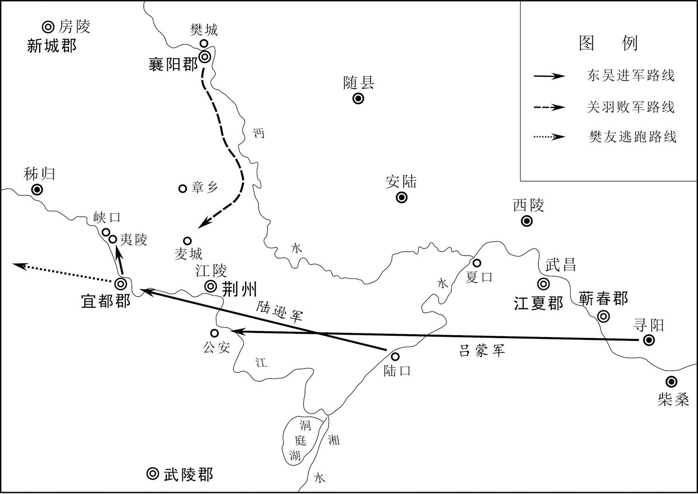 
**关羽败走麦城路线图**

## 【原文】

**初，偏将军吴郡全琮上疏陈关羽可取之计，权恐事泄，寝而不答[1]。及已禽羽，权置酒公安，顾谓琮曰：“君前陈此，孤虽不相答，今日之捷，抑亦君之功也[2]。”于是封琮阳华亭侯[3]。**

## 【注文】

[1]吴郡：古郡名。汉初以会（kuài）稽郡治吴县（今江苏苏州），所以也称吴郡。东汉永建四年（129年）分浙江以西置，属扬州，治所吴县（今江苏苏州）。辖境相当今江苏、上海长江以南，大茅山以东，浙江长兴、湖州市、天目山以东，与建德市以下的钱塘江两岸。三国吴后辖境逐渐缩小。　　全琮（cónɡ）（？—249年）：三国时吴将。字子璜，钱塘（今浙江杭州）人，少时乐善好施，闻名远近。孙权重其为人，授以奋威校尉，率军驻扎在牛渚，迁偏将军。三国吴黄武初，随吕范与魏军激战江中，斩魏将尹卢，以功迁绥南将军，封钱塘侯，任九江太守。三国吴黄龙元年（229年），迁卫将军、左护军、徐州牧。三国吴嘉禾二年（233年），督步骑五万征讨六安。赤乌时，官至大司马、左军师。　　寝：搁置。

[2]孤：封建王侯的自称。

[3]亭侯：古代爵位名。东汉制，列侯功大者食县，小者食乡、亭。亭侯以亭为食邑，为侯爵中最低的一级。魏晋与南朝宋沿置，齐制不详。梁陈亦置亭侯，与乡侯秩均为八品。

## 【译文】

当初，偏将军吴郡人全琮向孙权上书，陈述进攻关羽的策略，孙权担心事情泄露，将其奏疏搁置一旁而未作答复。等到擒获关羽以后，孙权在公安摆酒宴，看着全琮说：“你先前陈述进攻关羽的策略，我虽然没有答复，但今天取得的胜利，也有你的功劳。”于是封全琮为阳华亭侯。

## 【原文】

**魏文帝黄初二年六月，汉主耻关羽之没，将击孙权[1]。翊军将军赵云曰：“国贼，曹操，非孙权也[2]。若先灭魏，则权自服。今操身虽毙，子丕篡盗，当因众心，早图关中，居河、渭上流以讨凶逆，关东义士必裹粮策马以迎王师[3]。不应置魏，先与吴战。兵势一交，不得卒解，非策之上也。”群臣谏者甚众，汉主皆不听。广汉处士秦宓陈天时必无利，坐下狱幽闭，然后贷出[4]。**

## 【注文】

[1]魏文帝（187—226年）：即曹丕，三国魏国创建者，公元220年至226年在位。字子桓，沛国谯县（今安徽亳州）人，曹操次子。东汉建安十六年（211年），任五官中郎将，为丞相副。建安二十二年（217年）立为魏王太子。曹操死，袭魏王，继任丞相。以陈群为尚书，立九品官人法，改革选举。东汉延康元年（220年）十月，代汉称帝，建都洛阳，国号魏，改元黄初。曾三次征吴无功，卒谥文帝，庙号世祖。善文学，与曹操、曹植并称“三曹”。　　黄初二年：公元221年。黄初是三国魏文帝曹丕年号，自公元220年至226年，共七年。

[2]翊（yì）军将军：古代杂号将军名。东汉末年刘备置，掌征伐或驻守。三国蜀、十六国成汉沿之，北齐时从二品。　　赵云（？—229年）：三国时蜀汉将领。字子龙，常山真定（今河北正定）人。以勇敢善战著称，初为公孙瓒部将，后归刘备。曹操在当阳长坂击败刘备，他力战保护甘夫人，抱刘备幼子刘禅杀出重围。不久跟从刘备取成都、定益州，历任翊军将军、中护军、征南将军，封永昌亭侯。三国蜀汉建兴六年（228年），随诸葛亮出汉中，不久失利退回，七年后因病去世，谥“顺平侯”。

[3]关中：古地区名。秦都咸阳，汉都长安，因而称函谷关以西为关中，大体上相当于现在的陕西。有时又泛指战国末期秦的故地，包括秦岭以南的汉中、巴蜀在内，有时甚至包括陇西。　　河、渭：河，又称大河、河水，古“四渎”之一，即今黄河。黄河中、上游变化较小，唯自河南武陟（zhì）县以下历代变迁较大，原由今河北东北入海，后渐南移，金以后改由今苏北夺淮入海，清代咸丰五年（1855年）在今河南兰考县铜瓦厢决口，形成现在的河道。渭，即渭河，发源于甘肃，流经陕西入黄河。　　关东：秦、汉、唐等王朝定都今陕西，因称函谷关或潼关以东今河南、山东等地为“关东”。　　义士：旧指忠义之士。　　裹粮：携带粮食，以备远行。　　师：天子的军队，也指仁义之师。

[4]广汉：古郡名。汉高帝六年（前201年）分巴、蜀二郡而置，治所乘乡（今四川金堂东）。东汉移治涪（fú）县（今四川绵阳），又治洛（luò）县（今四川广汉）。辖境相当今四川涪江、沱江、西汉水流域和白龙江下游、嘉陵江上游地区。　　处士：古时称有才德而隐居不做官的人，后世泛指没做过官的读书人。　　秦宓（mì）（？—226年）：三国蜀国官吏。字子敕，广汉绵竹（今四川德阳北）人。少有才学，而不愿意做官。刘备平定益州，任从事祭酒。三国蜀汉章武元年（221年）以天时不利反对征吴，下狱，后被释放。三国蜀汉建兴二年（224年），蜀相诸葛亮任为别驾，不久拜左中郎将、长水校尉，迁大司农。善于文辩，答对敏捷，辞义雅美。　　幽闭：囚禁、关押。　　贷：宽恕。

## 【译文】

魏文帝黄初二年（221年）六月，汉王（刘备）为关羽的被杀深感耻辱，准备进攻孙权。翊军将军赵云说：“国贼是曹操，而不是孙权。如果先灭掉曹魏，则孙权自然归服。如今曹操虽然已经死去，他的儿子曹丕篡夺盗取汉朝的皇位，我们应当顺应民心，尽早夺取关中，占据黄河、渭水上游，以利于征讨凶顽的叛逆，函谷关以东的义士，一定会自带军粮，驱策战马迎接陛下的正义之师。我们不应置曹魏而不顾，先和孙权开战。两国战事一开，不可能很快结束，这不是上策。”大臣中劝谏的人很多，但汉王都不同意。广汉处士秦宓上书，陈述天时对出兵肯定不利，因而被治罪入狱关押，后来才被赦免。

## 【原文】

**初，车骑将军张飞，雄壮威猛亚于关羽，羽善待卒伍而骄于士大夫，飞爱礼君子而不恤军人[1]。汉主常戒飞曰：“卿刑杀既过差，又日鞭楇健儿，而令在左右，此取祸之道也[2]。”飞犹不悛[3]。汉主将伐孙权，飞当率兵万人自阆中会江州，临发，其帐下将张达、范强杀飞以其首顺流奔孙权[4]。汉主闻飞营都督有表，曰：“噫，飞死矣！”**

## 【注文】

[1]车骑将军：古代官名。西汉开始设置，位次上卿，金印紫授。后为高级武官称号，位次大将军，且文官辅政者也加此衔，东汉权势尤重。魏晋南北朝多沿置，隋朝车骑将军属骠骑府，唐代废。

[2]楇（kuǎ）：击。　　健儿：古代对军中勇士的称谓。

[3]悛（quān）：悔改。

[4]阆（làng）中：位于嘉陵江上游，是巴蜀通往关中的门户。西周至春秋时期巴国四国都之一。三国时刘备定益州后，令张飞驻守阆中。　　江州：古县名。本巴国都，秦置县，汉为巴郡治所，治所在今重庆市区。　　张达、范强：三国时蜀国将军张飞部将。刘备伐吴时，张飞应当率兵万人自阆中出发。临出发之前，张达与范强杀死张飞，带着他的首级投奔孙权。

## 【译文】

当初，车骑将军张飞英勇善战、雄壮威武仅次于关羽，关羽关爱士兵，对士大夫却很傲慢，而张飞则对士大夫彬彬有礼，却不关爱士兵。汉王（刘备）经常劝告张飞说：“你刑罚过于严厉，杀人太多，又每天鞭打士兵，还把那些受过鞭打的人留在自己身边，这是招致杀身之祸的做法。”但张飞还是不悔改。汉王将要讨伐孙权，张飞应当率兵一万人从阆中出发，在江州与大军会合。发兵之际，张飞的帐下将领张达、范强杀死张飞，二人带着张飞的首级，沿着长江顺流而下，投降了孙权。汉王听说张飞军营的都督有表上奏，便说：“哎呀，张飞死了！”

## 【原文】

**陈寿评曰：关羽、张飞皆称万人之敌，为世虎臣[1]。羽报效曹公，飞义释严颜，并有国士之风[2]。然羽刚而自矜，飞暴而无恩，以短取败，理数之常也[3]。**

## 【注文】

[1]陈寿（233—297年）：晋朝史学家。字承祚（zuò），巴西安汉（今四川南充北）人。曾任蜀汉卫将军主簿、东观秘书郎、散骑黄门侍郎。西晋建立后历仕佐著作郎、巴西郡中正、阳平令、著作郎、治书侍御史。西晋太康元年（280年）吴灭后，他搜集魏、蜀、吴史料，约经十年，撰成《三国志》六十五卷。另外还著有《益部耆旧传》《古国志》等。

[2]严颜（生卒年不详）：三国吴国将领。临江（今重庆忠县）人，益州牧刘璋任为巴郡太守。严颜认为刘璋迎刘备入蜀，是“放虎自卫”，率众拒守。东汉建安十九年（214年），江州被张飞等攻破，严颜被擒。张飞恼怒他的拒战，要将其斩首，而严颜神色不变，张飞将他释放，作为宾客。　　国士：国中才能出众的人。

[3]理数：指数的变化所具有的逻辑性，理与数是统一的。

## 【译文】

（晋代史家）陈寿评论说：关羽、张飞都被称作万人无敌，是当世的虎将。关羽报恩曹操，张飞义释严颜，都有国士豪杰的风度。但关羽刚愎自用，自恃才智勇力而骄傲自大，张飞性情暴虐，对属下不施恩惠，两人都因为自身的短处而失败丧命，这是合乎命理定数的。

## 【原文】

**秋七月，汉主自率诸军击孙权，权遣使求和于汉。南郡太守诸葛瑾遗汉主笺曰：“陛下以关羽之亲，何如先帝[1]？荆州大小，孰与海内？俱应仇疾，谁当先后？若审此数，易于反掌矣[2]。”汉主不听。时或言瑾别遣亲人与汉主相闻者，权曰：“孤与子瑜有死生不易之誓，子瑜之不负孤，犹孤之不负子瑜也[3]。”然谤言流闻于外，陆逊表明瑾必无此，宜有以散其意。权报曰：“子瑜与孤从事积年，恩如骨肉，深相明究[4]。其为人非道不行，非义不言。玄德昔遣孔明至吴，孤尝语子瑜曰：‘卿与孔明同产，且弟随兄，于义为顺，何以不留孔明[5]？孔明若留从卿者，孤当以书解玄德，意自随人耳。’子瑜答孤曰：‘弟亮已失身于人，委质定分，义无二心[6]。弟之不留，犹瑾之不往也。’其言足贯神明，今岂当有此乎？前得妄语文疏，即封示子瑜，并手笔与之。孤与子瑜，可谓神交，非外言所间[7]。知卿意至，辄封来表以示子瑜，使知卿意。”**

## 【注文】

[1]陛下：陛，宫殿的台阶；陛下，本指群臣列于阶下，后借做帝王的尊称。　　先帝：历代先皇帝简称，指已去世的前朝皇帝。

[2]反掌：指反手，比喻事情容易办到。

[3]子瑜：诸葛瑾的字，三国吴国将领。

[4]积年：多年，连年。

[5]玄德：指刘备，玄德为刘备的字。　　孔明：指诸葛亮，孔明为诸葛亮的字。

[6]委质：人臣拜见人君时的一种礼节，即下拜。后引申为归顺，寄身。　　定分：宿命论的说法，指天定的名分和职分。

[7]文疏：即公文，奏章。　　神交：精神之交，指以道义相交，推心置腹。

## 【译文】

魏文帝黄初二年（221年）秋季七月，汉王（刘备）亲自率领各路大军，出击孙权，孙权派遣使臣向蜀国求和。南郡太守诸葛瑾写信给汉王，说：“陛下您认为自己和关羽的感情，与先帝相比，哪个更亲密？荆州大小与全国相比，哪个更大？都应当仇恨的话，哪个应当在先，哪个应当在后？如果明白这一定数，应当何去何从就易如反掌。”汉王根本不听。当时有人传言，诸葛瑾另派遣亲信和汉王互通消息，孙权说：“我和诸葛瑾有生死不易的君臣誓言，他不会背叛我，如同我不会背叛他一样。”然而流言诽谤之语仍然四处传播，陆逊上表认为诸葛瑾肯定不会做那种事，但是应当有所表示，以解除他心中的顾虑。孙权回复说：“诸葛瑾和我共事多年，恩情如同骨肉一般，互相了解非常深。他的为人处世，不符合道义的事情不做，不符合道义的话不说。昔日刘备派遣诸葛亮到东吴，我曾经对诸葛瑾说：‘你与诸葛亮是同胞兄弟，而且弟弟顺从兄长，才符合礼义，为何不把诸葛亮留下呢？如果诸葛亮留下和你在一起，我当会写信给刘备解释，我想他会随从诸葛亮的心愿。’诸葛瑾回答说：‘我弟弟诸葛亮失于算计，已经为刘备效力，双方君臣名分已经确定，按照礼义不应再有二心。弟弟诸葛亮不留在东吴，正如同诸葛瑾不去投降刘备，是同一个道理。’他的话足以贯通神明，现今怎么会做出这种事情？之前我收到对他妄语诽谤的奏疏，立即封存送给诸葛瑾，并亲笔写上批示。我和诸葛瑾可以说是推心置腹的神交，不是外人的流言所能离间的。我清楚你的至诚心意，立即将你的上疏封好，送给诸葛瑾，让他了解你的心意。”

## 【原文】

**汉主遣将军吴班、冯习攻破权将李异、刘阿等于巫，进军秭归，兵四万余人[1]。武陵蛮夷皆遣使往请兵，权以镇西将军陆逊为大都督、假节，督将军朱然、潘璋、宋谦、韩当、徐盛、鲜于丹、孙桓等五万人拒之[2]。**

## 【注文】

[1]吴班（生卒年不详）：三国时蜀将。三国魏黄初二年（221年）与冯习在巫县攻破吴军，进兵秭（zǐ）归，后陆逊派五万军队抵御。　　冯习（？—222年）：三国时蜀汉将领。字休元，南郡（今湖北荆州市荆州区）人。自荆州随刘备入蜀。三国蜀汉章武元年（221年）随刘备征吴，统率诸军，出兵三峡。与吴班在巫县打败吴将李异、刘阿，进军秭归。次年，任前军大督，与吴军对峙，半年不能决战。后吴督陆逊火攻蜀营，冯习奔夷陵率军救援刘备，遭吴兵堵截，奋力不逃脱，死于乱军之中。　　李异、刘阿：三国时期孙权手下将领，猇（xiāo）亭之战中曾在巫县被蜀将吴班、冯习打败，其他事迹不详。　　巫：古县名。秦朝设置，治所在今重庆巫山。

[2]假节：大臣出使或出巡时所持的节杖、凭证、信物。汉朝使臣持节出巡或出使完毕则收回其“节”，称“假节”，意为临时持节。到三国时期长官无论在内秉政还是在外掌军，都“假节”，而且是长期性的而不是临时性的，成为象征地位高低的政治待遇。晋朝地方军事长官都督、监军、督军三级，各又分使持节、持节、假节三等。都督之使持节者，可杀二千石以下的官吏；持节者只可杀无官职的人，假节者只能杀战时犯军令之人。南北朝沿袭此制。　　宋谦（生卒年不详）：三国时吴将领。初随孙策平东南。东汉建安二十年（215年），随孙权攻打合肥，被曹操部将张辽阻击，与徐盛等人被打败。三国吴黄武元年（222年），为大都督陆逊部将，随陆逊抗拒刘备，进攻蜀国五屯，全被击破，并斩杀蜀国将领，刘备败走，遂上表乞求进攻驻扎在白帝城的刘备，陆逊为防备魏国攻击，劝阻孙权，未纳其主张。　　韩当（？—226年）：三国吴国将领。字义公，辽西令支（今河北迁安西）人，习弓马，有臂力。初从孙坚征伐，陷敌擒虏，为别部司马。后随孙策东渡，迁先登校尉，讨伐刘勋，打败黄祖，攻鄱阳（今江西鄱阳东北），领乐安长，山越族无不畏惧服从。后与周瑜等在赤壁打败曹操，又与吕蒙袭取南郡（治今湖北荆州市荆州区），迁偏将军，领永昌太守。夷陵之战，与朱然一起攻击涿乡蜀军，大获全胜，以功徙威烈将军，封都亭侯。曹真攻南郡，他率众同心固守。三国吴黄武二年（223年），迁昭武将军，领冠军太守，加都督之号。不久病死。　　徐盛（生卒年不详）：三国时吴将。字文向，琅邪莒（今山东莒县）人。汉末动乱，客居吴地，以勇气闻名。孙权以徐盛为别部司马，驻守柴桑，抗拒黄祖，屡立战功，累迁中郎将。后任建武将军，封都亭侯，领庐江太守，刘备屯军西陵，徐盛攻取诸寨，有战功。又在洞口抗拒曹休，以少御多，敌不能克。后迁安东将军，更封芜湖侯。黄武年间卒。　　鲜于丹（生卒年不详）：三国时吴国将领。东汉建安十九年（214年），孙权袭击荆州，大都督吕蒙派遣鲜于丹、徐忠、孙规等人攻取长沙、零陵、桂阳三郡，三国吴黄武元年（222年），刘备为夺回荆州进攻吴国，大都督陆逊派朱然、潘璋、鲜于丹等人率五万兵马抗拒。　　孙桓（生卒年不详）：三国时吴将。字叔武，吴郡（今江苏苏州）人，孙河之子。二十五岁拜安东中郎将，与陆逊共拒刘备于猇（xiāo）亭，孙桓奋命搏击，以骁勇闻名，以功拜建武将军，封丹徒侯。后督牛渚，督修横江坞，卒。

## 【译文】

汉王（刘备）派遣将军吴班、冯习在巫县击溃孙权手下将领李异、刘阿等人，率兵四万余人，向秭归进军。武陵的各部蛮夷都派使者请求派兵前往助阵。孙权派镇西将军陆逊为大都督，手持朝廷符节，督率将军朱然、潘璋、宋谦、韩当、徐盛、鲜于丹、孙桓等人，统兵五万，来抵挡蜀国的军队。

## 【原文】

**初，帝诏群臣令料刘备当为关羽出报孙权否？众议咸云：“蜀小国耳，名将唯羽，羽死军破，国内忧惧，无缘复出。”侍中刘晔独曰：“蜀虽狭弱，而备之谋欲以威武自强，势必用众以示有余[1]。且关羽与备，义为君臣，恩犹父子；羽死不能为兴军报敌，于终始之分不足矣。”**

## 【注文】

[1]侍中：入侍于天子的一种近臣。“中”指宫廷之内，凡侍中都可出入禁廷，接近皇帝。汉武帝后侍中参与朝政，外戚进行辅政也都被加以侍中衔。　　刘晔（yè）（？—234年）：三国时魏国大臣。字子扬，淮南成德（今安徽寿县东南）人，汉宗室之后。东汉末避乱，率部曲随庐江太守刘勋。刘勋失败后归曹操，为司空仓曹掾。东汉建安二十年（215年），随曹操征张鲁，迁行军长史兼领军。三国魏黄初元年（220年），为侍中，赐爵关内侯。魏明帝时，很受器重，封东亭侯，拜太中大夫。人称刘晔善于揣摩上意，魏明帝考验后属实，从此疏远他。刘晔于是发狂，出为大鸿胪，忧郁而死。

## 【译文】

当初，魏文帝给群臣下诏，要大家分析：刘备是否会为关羽报仇，进攻孙权？大家都议论说：“蜀国是小国罢了，名将唯有关羽一人，他战败身亡，军队被消灭，国内处在担忧和恐惧之中，没有理由再出兵了。”只有侍中刘晔说：“蜀国虽然地界狭小，国力弱小，但刘备的图谋是依靠威武来加强自己的力量，势必要以兵力众多，来表明蜀国力量强大有余。况且关羽和刘备，名义上是君臣，恩情却如同父子，关羽被杀，不能出兵为他报仇，也不符合善始善终的礼义名分。”

## 【原文】

**三年春二月，汉主自秭归将进击吴，治中从事黄权谏曰：“吴人悍战，而水军沿流，进易退难[1]。臣请为先驱以当寇，陛下宜为后镇[2]。”汉主不从，以权为镇北将军，使督江北诸军，自率诸将，自江南缘山截岭，军于夷道猇亭[3]。吴将皆欲迎击之，陆逊曰：“备举军东下，锐气始盛，且乘高守险，难可卒攻，攻之纵下，犹难尽克，若有不利，损我大势，非小故也。今但且奖厉将士，广施方略，以观其变[4]。若此间是平原旷野，当恐有颠沛交逐之忧，今缘山行军，势不得展，自当罢于木石之间，徐制其敝耳。”诸将不解，以为逊畏之，各怀愤恨。**

## 【注文】

[1]治中从事：古代官名。汉朝设置，也简称治中，为州佐吏。在司隶校尉则称功曹从事，在其他十二州则称治中从事，掌州选署及文书案卷众事。　　黄权（？—240年）：三国时蜀国将领。字公衡，巴西阆中（今四川阆中）人。本为益州牧刘璋主簿，因劝谏刘璋不要迎接刘备入蜀，被贬为广汉长。刘备袭取益州，他闭门坚守，刘璋投降后才出来投降，后任治中从事。刘备称帝，任镇北将军，在江北防备魏国。刘备在彝陵战败，归路被吴军切断，于是率军投降魏国。曹丕任他为镇南将军，封育阳侯，加侍中，迁车骑将军、仪同三司。其子黄崇留蜀，随卫将军诸葛瞻抗拒魏军，战死于绵竹。

[2]先驱：前行开路，也指先锋，前导。

[3]镇北将军：古代官名。东汉建安间置，三国魏时，位列东、西、南、北四镇将军，多授持节都督，出镇方面，魏晋及南北朝前期权势甚重。三国魏定为二品，晋、南朝宋改为三品，如持节，进为二品。　　猇（xiāo）亭：在今湖北宜昌东南长江北岸猇亭镇。

[4]奖厉：劝勉，勉励。“厉”同“励”。

## 【译文】

魏文帝黄初三年（222年）春季二月，汉王（刘备）从秭归将要出兵进攻吴国。治中从事黄权劝谏说：“吴人骁悍善战，而我们的水军沿着长江顺流而下，前进容易，撤退困难。请陛下任命我率军为前锋，来抵挡敌寇，陛下应该在后方为我军坐镇。”汉王没有采纳这一意见，任命黄权为镇北将军，让他统领长江以北的各路蜀军，而刘备亲自率领诸位将士，从长江南岸翻山越岭向吴国进发，在夷道县猇亭驻扎军队。吴国将领都请求出兵迎战，陆逊说：“刘备率领全军沿着长江东下，锐气正盛，而且凭借高山，坚守险要之处，我军很难向他们发起一举成功的进攻。即使将他们一举攻下，还是很难完全将他们击败；如果攻击不利，将损伤我们的军事大势，绝非小小的失误而已。目前，我们只有褒奖和激励将士，广泛采纳和实施破敌制胜的策略，静观形势变化。如果这一带为平原旷野，我们还要担心有到处流动互相角逐的困扰，如今蜀军沿着山岭部署进兵，不但兵力无法展开，反而会因为在树木乱石之中行进，使自己精疲力竭，我们慢慢等他们的弊端暴露出来，再加以攻击。”各位将领仍不能理解，认为陆逊惧怕刘备大军，各人都怀有愤恨怨怒之情。

## 【原文】

**夏五月，汉人自巫峡建平连营至夷陵界，立数十屯，以冯习为大督，张南为前部督，自正月与吴相拒，至六月不决[1]。汉主遣吴班将数千人，于平地立营。吴将帅皆欲击之，陆逊曰：“此必有谲，且观之。”汉主知其计不行，乃引伏兵八千，从谷中出。逊曰：“所以不听诸君击班者，揣之必有巧故也[2]。”逊上疏于吴王曰：“夷陵要害，国之关限，虽为易得，亦复易失[3]。失之非徒损一郡之地，荆州可忧，今日争之，当令必谐。备干天常，不安窟穴而敢自送，臣虽不材，凭奉威灵，以顺讨逆，破坏在近，无可忧者[4]。臣初嫌之水陆俱进，今反舍船就步，处处结营，察其布置，必无他变。伏愿至尊高枕，不以为念也[5]。”**

## 【注文】

[1]巫峡：在湖北巴东县与四川巫山县交界处，因巫山得名，为长江三峡之一。　　建平：古郡名。三国吴置，治所在巫县（今重庆巫山北），辖境相当于今重庆巫山，湖北、秭（zǐ）归、巴东、兴山、利川、宣恩、咸丰恩施、建始等地。　　大督：大都督的省称，第一品，不常置。　　张南（？—222年）：三国时蜀汉将领。字文进，荆州人。随刘备入蜀，为校尉。后领兵随刘备征东吴，任副将、前部先锋、前部都督，在夷陵围困吴将孙桓。吴督陆逊火烧蜀营，刘备败走白帝城，张南与冯习前去救援，死于乱军之中。　　前部督：古代官名。东汉末年孙权置，为征伐时的前部长官。

[2]巧故：虚伪，狡诈。

[3]关限：疆域的界限。

[4]干：触犯、冒犯。　　天常：人世的常道，天理。　　窟穴：洞穴。　　威灵：威势，声威。

[5]高枕：垫高了枕头安稳地睡觉。比喻平安无事，无所忧虑。

## 【译文】

魏文帝黄初三年（222年）夏季五月，蜀军从巫峡建平扎营，直到夷陵地界，设立数十座营盘，以冯习为大督，张南为前部督，从正月开始与吴军对峙，直到六月仍然没有进行决战。汉王（刘备）命令吴班率领数千人，在平地扎营。吴国将领都要求出击蜀军，陆逊说：“这一定有诡诈，我们暂且观察，按兵不动。”汉王见计谋无法实现，只好率领八千伏兵，从山谷中撤出来。陆逊说：“我之所以没有听从诸位的建议，进攻吴班，就是因为我估计里面一定有机巧的缘故。”陆逊向吴王（孙权）上书说：“夷陵是军事要地，是关系到国家生死存亡的关隘，虽然容易得到，也容易再度失守。失去夷陵，不仅仅是损失了一个郡的土地，就连荆州的安危也令人担忧。今日争夺夷陵，一定要取得彻底胜利。刘备违背天理常情，不安守自己的巢穴，却胆敢自己送上门来找死，臣下虽然无能，凭借大王的声威，名正言顺地讨伐逆师，大败敌军就在眼前，没有什么可以忧虑的。我当初担心刘备会水陆并进，现在他却舍去水路不走，从陆路进兵，随处安营扎寨，观察他的军事部署，一定不会再有什么变化。希望至尊的大王高枕而卧，不必把这件事挂记在心上。”

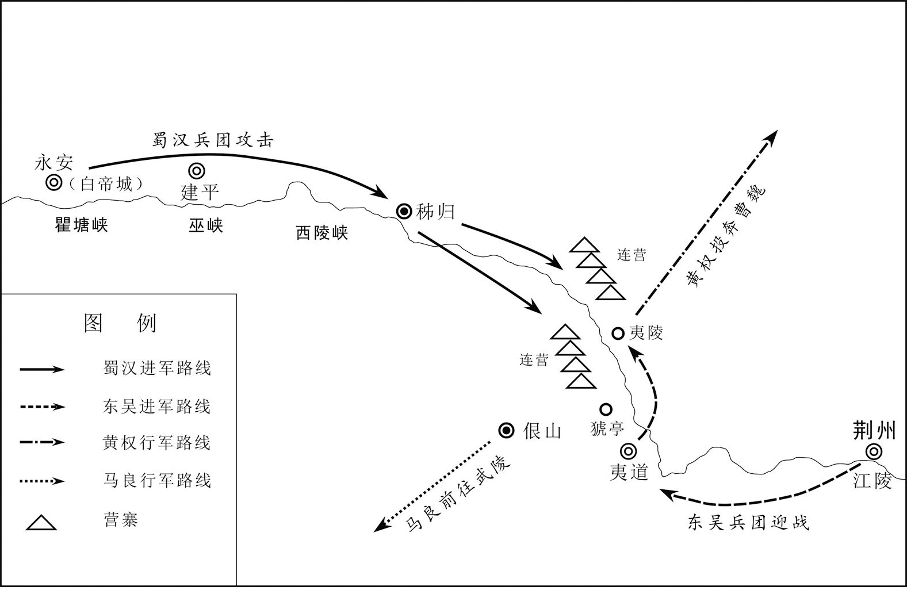 
**猇亭之战示意图**

## 【原文】

**闰月，逊将进攻汉军，诸将并曰：“攻备当在初，今乃令入五六百里，相守经七八月，其诸要害皆已固守，击之必无利矣。”逊曰：“备是猾虏，更尝事多，其军始集，思虑精专，未可干也。今住已久，不得我便，兵疲意沮，计不复生。掎角此寇，正在今日[1]。”乃先攻一营，不利，诸将皆曰：“空杀兵耳。”逊曰：“吾已晓破之之术。”乃敕各持一把茅，以火攻，拔之[2]。一尔势成，通率诸军，同时俱攻，斩张南、冯习及胡王沙摩柯等首，破其四十余营[3]。汉将杜路、刘宁等穷逼请降[4]。**

## 【注文】

[1]干（ɡān）：触犯，冒犯，冲犯。　　掎（jǐ）角：指分兵夹击或牵制敌人。

[2]敕（chì）：告诫。

[3]沙摩柯（？—222年）：三国时期五溪蛮夷首领。三国蜀汉章武初年，刘备亲自领兵进攻孙权，以金锦爵赏引诱沙摩柯助战。三国蜀汉章武二年（222年），吴大都督陆逊以火攻击败刘备，率诸军追杀，沙摩柯战败而死。

[4]杜路（生卒年不详）：三国蜀将。刘备夷陵之战大败，他因穷苦被逼无奈而投降吴国。　　刘宁（生卒年不详）：三国时蜀国将领。随刘备进攻吴国，蜀军败于夷陵，刘宁穷苦无奈投降吴国。

## 【译文】

魏文帝黄初三年（222年）闰六月，陆逊将要对蜀军发动进攻，诸位将领都说：“发动进攻，应当在刘备立足未稳之时，如今蜀军已经深入五六百里，与我们对峙七八个月，占据险要之地，且防守加强，现在进攻肯定不会顺利。”陆逊说：“刘备老奸巨猾，曾经历诸多变故动荡，蜀军刚刚集结之时，他思虑周详，我们不能冒犯他。如今蜀军驻扎已久，却找不到乘机进攻的时机，将士疲惫，心情沮丧，再也无计可施。现在正是分兵夹击他们的好机会。”于是下令先向蜀军的一个营垒发动攻击，战斗失利，将领们都说：“白白损兵折将罢了！”陆逊说：“我已知道破敌之策。”于是命令战士每人手持一束茅草，用火攻之策进攻，取得胜利。一处成功，又乘势率领各路兵马全面出击，斩杀蜀将张南、冯习和胡人酋长沙摩柯等人，总共攻破蜀军营垒四十余座。蜀将杜路、刘宁走投无路，只得向吴军请求投降。

## 【原文】

**汉主升马鞍山，陈兵自绕，逊督促诸军四面蹙之，土崩瓦解，死者万数[1]。汉主夜遁，驿人自担烧铙铠断后，仅得入白帝城[2]。其舟船、器械，水、步军资，一时略尽，尸骸塞江而下。汉主大惭恚，曰：“吾乃为陆逊所折辱，岂非天邪[3]！”将军义阳傅肜为后殿，兵众尽死，肜气益烈[4]。吴人谕之使降，肜骂曰：“吴狗，安有汉将军而降者！”遂死之。从事祭酒程畿溯江而退，众曰：“后追将至，宜解舫轻行[5]。”畿曰：“吾在军，未习为敌之走也。”亦死之。**

## 【注文】

[1]马鞍山：山名。在今湖北襄樊西南。　　蹙（cù）：收缩。　　土崩瓦解：如土崩塌，瓦分解一般。瓦解：制瓦时先把陶土制成圆筒形，分解为四，即成瓦，比喻事物的分裂，彻底溃败，不可收拾。

[2]遁（dùn）：逃避，躲闪。　　铙（náo）：铜质圆形的打击乐器，比钹（bó）大。　　铠（kǎi）：古代的战衣，可以保护身体。

[3]惭恚（huì）：羞惭怨恨，羞惭愤怒。

[4]傅肜（róng）：三国蜀汉将领。义阳（今河南信阳西北）人，官至将军。随刘备攻吴，在猇（xiāo）亭被吴军陆逊打败，刘备败走，傅肜断后拒战，兵败战死。

[5]从事祭酒：古代官名。东汉末年置，为州府属吏，无固定人数，地位尊显，多以年高博学者为之。汉末蜀益州、荆州也置。　　程畿（jī）（？—222年）：字季然，东汉末年巴西阆中（今四川阆中）人，三国时蜀国从事祭酒。随刘备攻吴，蜀军在猇亭被吴军陆逊打败，沿江而退，部众劝他乘方舟快走，程畿认为打仗从未学习过逃亡，后战死。　　溯（sù）江：逆着水流的方向走。　　舫（fǎng）：并连起来的两船。

## 【译文】

汉王（刘备）登上马鞍山，围绕自己部署军队，陆逊督促各军四面围攻，紧缩包围，蜀军土崩瓦解，死伤一万多人。汉王连夜逃走，驿站士兵亲自焚烧铙钹铠甲断后，以阻挡吴军追击，汉王才得以逃入白帝城。蜀军的船只、器械、水陆军用物资，一时丧失殆尽，蜀军的尸体塞满长江江面，顺流而下。汉王非常惭愧愤怒，说：“我被陆逊羞辱，难道是天意吗？”将军义阳人傅肜掩护蜀军撤退，部下全部战死，他却愈战愈勇，吴军劝他投降，他大骂说：“吴狗，哪有大汉将军会投降的！”终于血战而死。从事祭酒程畿逆长江乘船退却，部下说：“后面追兵紧迫，应把连结方舟的两船拆开，轻舟撤退。”程畿说：“我从军以来，还没有学过如何逃跑。”也战死了。

## 【原文】

**初，吴安东中郎将孙桓别击汉前锋于夷道，为汉所围，求救于陆逊[1]。逊曰：“未可。”诸将曰：“孙安东公族，见围已困，奈何不救[2]？”逊曰：“安东得士众心，城牢粮足，无可忧也。待吾计展，欲不救安东，安东自解。”及方略大施，汉果奔溃。桓后见逊曰：“前实怨不见救，定至今日，乃知调度自有方耳。”**

## 【注文】

[1]安东中郎将：古代杂号将军名。三国吴置，掌征伐或镇守。　　夷道：即夷道县，今湖北宜都。因县城濒临清江，而清江古称夷水，因此得名。

[2]公族：帝王或诸侯的同族。

## 【译文】

当初，吴安东中郎将孙桓，另外率军在夷道县抗击蜀军前锋，被蜀军包围，向陆逊求援，陆逊说：“不可以。”将领们说：“孙将军是大王的同族，如今被围受困，为什么不派兵救援？”陆逊答道：“孙将军深得军心，城池坚固，军粮充足，不必担忧。我的计划成功之后，我们不救孙将军，对孙将军的包围也会自行解除。”等到陆逊的计划大获成功，包围孙桓的蜀军果然溃败逃走。后来，孙桓见到陆逊说：“最初确实埋怨你不来救援，现在事情已经明朗，才知道你调度有方。”

## 【原文】

**初，逊为大都督，诸将或讨逆时旧将，或公室贵戚，各自矜恃，不相听从[1]。逊按剑曰：“刘备天下知名，曹操所惮，今在境界，此强对也。诸君并荷国恩，当相辑睦，共翦此虏，上报所受，而不相顺，何也[2]？仆虽书生，受命主上，国家所以屈诸君使相承望者，以仆尺寸可称，能忍辱负重故也[3]。各在其事，岂复得辞。军令有常，不可犯也。”及至破备，计多出逊，诸将乃服。吴王闻之曰：“公何以初不启诸将违节度者邪[4]？”对曰：“受恩深重，此诸将或任腹心，或堪爪牙，或是功臣，皆国家所当与共克定大事者，臣窃慕相如、寇恂相下之义以济国事[5]。”王大笑称善，加逊辅国将军，领荆州牧，改封江陵侯[6]。**

## 【注文】

[1]公室：指君主之家，王室。　　矜恃：高傲自负。

[2]荷：肩负。　　辑睦：和睦，团结。

[3]仆：旧时男子谦称自己。　　忍辱负重：能忍受屈辱，而肩负重任。

[4]启：文体名，奏疏的另一类。魏晋间开始应用，既用来上书言事，又用以谦逊爵位或谢恩，篇幅短小而富于文采，此外还用于亲朋间的书信往来。此处指报告，陈述。

[5]爪牙：动物的牙和爪，攻击和防卫的工具，比喻武士。　　相如：即蔺相如（生卒年不详），战国时赵人。原为宦者令舍人，赵惠文王时，赵国得到楚和氏璧，秦昭王想用十五座城池交换。蔺相如奉使赴秦，机智周旋，终于完璧归赵。公元前279年，秦、赵在渑池（今河南渑池西）会盟。相如随侍赵孝成王，面斥强秦，不辱国体，以功封为上卿。位列廉颇之上，招致廉颇的妒忌。但蔺相如能以国家利益为上，容忍谦让，终于使廉颇悔悟，登门负荆请罪，二人结为刎颈之交。　　寇恂（xún）（？—36年）：东汉初将领。字子翼，上谷昌平（今北京昌平区东南）人。出身望族，最初任郡功曹，被太守耿况重用。王莽新朝覆灭后，寇恂归附光武帝刘秀，被封为偏将军，号承义侯。刘秀收河内，寇恂出任河内太守，代行大将军事，转输军需为得力。东汉建武元年（25年），与冯异联合作战，战胜刘玄部将苏茂。次年，因故受牵连而免官，后又任颍（yǐnɡ）川太守，封雍奴侯。东汉建武三年（27年），迁任汝南太守。在任修建学校，亲授生徒，很有政绩。建武七年（31年），代朱浮为执金吾。随从刘秀征陇西，迫使隗（wěi）嚣部将高峻投降。死后谥“威侯”。

[6]辅国将军：古代将军名号。东汉建安元年（196年）置，三国、两晋沿置。魏、晋都是三品。十六国后秦、后凉、北凉亦置。　　荆州牧：荆州的最高长官。牧：古代官名。一州之长。西汉时设，不常置；东汉三国时地位提高，位在郡守、刺史之上，掌管一州军政大权。

## 【译文】

当初，陆逊被任命为大都督，部下将领有的是讨逆将军孙策的旧将，有的是孙权的同族或亲戚，各自骄傲矜持，不服从调遣指挥。陆逊手按宝剑说：“刘备是天下闻名，曹操都畏惧他，如今亲率大军侵入我国边境，是我军的强劲对手。诸位都受过国恩，应该团结和睦，齐心合力剪除强敌，以报国家，但你们却不服从指挥，究竟为什么呢？陆逊虽是一介书生，却是受命于主上。主上之所以委屈诸位让你们听从我指挥，是因为我有一点可以称道，那就是可以忍辱负重。大家各有职守，岂能推辞？军队有军法，不可违犯！”等到大败刘备，计谋多出自陆逊，各位将领才从心底佩服。吴王听说这些事情以后，对陆逊说：“将军当初为何不向我禀报那些违抗节制调度的将领？”陆逊回答说：“我受主公恩遇深重，而诸将有的是陛下心腹爱将，有的是卫国武士，有的是国家功臣，都是国家依赖共同成就大业的人。我仰慕蔺相如、寇恂以国事为重，谦虚恭让的做法，以有利于国家大事。”吴王大笑，倍加赞赏，加封陆逊辅国将军，兼任荆州牧，改封江陵侯。

## 【原文】

**初，诸葛亮与尚书令法正好尚不同，而以公义相取，亮每奇正智术[1]。及汉主伐吴而败，时正已卒，亮叹曰：“孝直若在，必能制主上东行。就使东行，必不倾危矣[2]。”汉主在白帝，徐盛、潘璋、宋谦等各竞表言：“备必可禽，乞复攻之。”吴王以问陆逊，逊与朱然、骆统上言曰：“曹丕大合士众，外托助国讨备，内实有奸心，谨决计辄还[3]。”**

## 【注文】

[1]尚书令：古代官名。秦朝始置尚书令，汉朝沿置，本为少府署官，掌章奏文书，汉武帝后职权渐重，到东汉政务皆归尚书，尚书令成为总揽政令的长官。魏晋以后，尚书令成为实际的宰相。　　法正（176—220年）：三国时刘备谋士。字孝直，右扶风郿县（今陕西眉县东）人。东汉建安初，依附刘璋，奉命邀请刘备入蜀抗拒张鲁。他献策给刘备，劝其伺机取蜀。刘备得益州，以法正为蜀郡太守、扬武将军。后刘备又采用其策，进兵汉中，运筹谋划，斩曹操大将夏侯渊。刘备立为汉中王，以法正为尚书令、护军将军。　　奇正：古代军事兵法上的一对术语。“奇”与“正”相对，奇即指新奇，不寻常；正则指正规、正常。

[2]倾危：倾斜危险，倾覆。

[3]骆统（193—228年）：三国时吴国将领。字公绪，会稽乌伤（今浙江义乌）人。二十岁试为乌程相，有惠政，孙权召为功曹。后出为建州中郎将，代凌统卒领军。随陆逊在宜都打败蜀军，迁偏将军。三国吴黄武初，与严圭共破中州曹军，因功封新阳亭侯，迁濡须督。

## 【译文】

当初，诸葛亮和尚书令法正爱好崇尚不同，但是二人都以公正的义理为重，诸葛亮对法正智谋每每称奇。汉王攻吴惨败时，法正已经去世，诸葛亮感叹说：“如果法正在世，一定能阻止主公东下进攻吴国，即使东进，也必然不会倾覆危难。”汉王逃到白帝城，吴将徐盛、潘璋、宋谦等人争相上表说：“刘备一定能够生擒，请求再次进兵。”吴王问陆逊怎么办，陆逊和朱然、骆统上书说：“曹丕正大量调集军队，表面上宣称帮助我们讨伐刘备，实际上包藏祸心，请您下令全军退回。”

## 【原文】

**初，帝闻汉兵树栅连营七百余里，谓群臣曰：“备不晓兵，岂有七百里营，可以拒敌者乎？‘苞原隰险阻而为军者为敌所禽’，此兵忌也[1]。孙权上事令至矣。”后七日，吴破汉书到。**

## 【注文】

[1]苞：草木茂盛。　　原隰（xí）：平原与洼地，泛指原野。高而广平之地称原，低下而常有积水之地曰隰。

## 【译文】

当初，魏文帝听说蜀军树立木栅扎营，相连七百余里，对大臣们说：“刘备不懂军事，哪有连营七百里的，这样可以拒敌人吗？‘在杂草丛生、地势平坦、潮湿低洼、艰险阻塞之处安营之军，一定被敌人擒获’，这是兵家大忌。孙权报捷的上奏，很快就到。”仅过七天，吴军攻破蜀军的捷报就送到了。

## 【原文】

**冬十一月，吴王使太中大夫郑泉聘于汉，汉太中大夫宗玮报之，吴汉复通[1]。**

## 【注文】

[1]太中大夫：古代官名。秦制，郎中令属官有太中大夫，与中大夫、谏大夫共同参与议论政事，其地位高于中大夫。两汉沿置，属光禄勋。西汉无固定员额，秩比一千石，东汉定员二十人，秩千石。魏晋以后无固定员额，无具体职事，禄赐与卿同。　　郑泉（生卒年不详）：三国吴国官吏。字文渊，陈郡（今河南淮阳）人，孙权时曾官郎中、太中大夫。吴蜀夷陵之战后，郑泉奉孙权之命出使蜀汉，与蜀国重建联盟。　　宗玮（生卒年不详）：三国时蜀汉的太中大夫，吴国遣使通好，宗玮为蜀使节回报。　　聘：聘问。古时国家之间遣使访问。

## 【译文】

魏文帝黄初三年（222年）冬季十一月，吴王派太中大夫郑泉至蜀汉聘问，蜀汉派太中大夫宗玮至吴国回访，吴蜀之间又恢复关系。

## 【原文】

**四年夏四月癸巳(1)，汉主殂于永安。五月，太子禅即位[1]。秋八月，汉尚书义阳邓芝言于诸葛亮曰：“今主上幼弱，初即尊位，宜遣大使，重申吴好[2]。”亮曰：“吾思之久矣，未得其人耳，今日始得之。”芝问：“其人为谁？”亮曰：“即使君也[3]。”乃遣芝以中郎将修好于吴[4]。冬十月，芝至吴，时吴王犹未与魏绝，狐疑，不时见芝[5]。芝乃自表请见曰：“臣今来亦欲为吴，非但为蜀也。”吴王见之曰：“孤诚愿与蜀和亲，然恐蜀主幼弱，国小势逼，为魏所乘，不自保全耳[6]。”芝对曰：“吴、蜀二国，四州之地。大王命世之英，诸葛亮亦一时之杰也[7]。蜀有重险之固，吴有三江之阻[8]。合此二长，共为唇齿，进可并兼天下，退可鼎足而立，此理之自然也。大王今若委质于魏，魏必上望大王之入朝，下求太子之内侍，若不从命，则奉辞伐叛，蜀亦顺流，见可而进，如此，江南之地非复大王之有也。”吴王默然良久曰：“君言是也[9]。”遂绝魏，专与汉连和。**

## 【注文】

[1]殂（cú）：死亡。　　永安：古地名，在今重庆奉节县地。原名鱼复县，三国蜀汉章武二年（222年）改为永安。刘备伐吴兵败，卒于永安宫。　　太子：已确定继承帝位或王位的帝王之子。　　禅：即刘禅（207—271年），三国蜀汉后主。字公嗣，小字阿斗，涿郡涿县（今河北涿州）人，刘备之子。公元223年至263年在位。初由丞相诸葛亮辅政，诸葛亮死后，他信用宦官黄皓，朝政日趋腐败。三国蜀汉炎兴元年（263年），魏军进逼成都，刘禅出降，后被封为安乐公。　　即位：开始做帝王或诸侯。

[2]尚书：古代官名。战国时设置，后代沿用。汉魏初期位低权重，后来品秩渐高，为三品，但职掌由纳奏拟诏、下达政令转为承受诏命，成为行政官员。

[3]使君：汉时称刺史为使君，汉以后对州郡长官尊称为使君。

[4]中郎将：古代官名。秦置，汉至唐沿袭，职掌、品秩常有变化。汉末魏晋时为统军将领，地位次于将军，高于校尉，品秩高低不等。

[5]狐疑：传说狐性多疑，所以多疑叫狐疑。

[6]逼：逼迫。

[7]命世：闻名于当世。

[8]三江：泛指长江中下游地区，古时长江流过彭蠡（lǐ）（今江西鄱阳湖）之后，分三道入海，故称三江。

[9]默然：沉默无言的样子。

## 【译文】

魏文帝黄初四年（223年）夏季四月癸巳日，汉王（刘备）在永安去世。五月，太子刘禅即位。秋季八月，蜀汉尚书义阳人邓芝对诸葛亮说：“如今皇上年幼，刚即帝位，应当派遣重要使臣，再次申明与吴国和好的愿望。”诸葛亮说：“我已考虑很久，只是没有合适人选，现在找到了。”邓芝问：“此人是谁？”诸葛亮说：“就是使君您啊。”于是派遣邓芝以中郎将的身份，与吴国重建友好关系。冬季十月，邓芝到达吴国。当时吴王尚未和魏国断绝关系，所以犹豫不决，没有立即接见邓芝。邓芝于是自上奏表，请求接见，说：“我这次来，也是为吴国着想，非但只为蜀国利益。”吴王这才接见邓芝，说：“孤确实愿与蜀国和好，但是恐怕蜀国君主年幼，国土狭小，势力不强，给魏国以可乘之机，无法保全自己。”邓芝回答说：“吴、蜀两国有四个州的地盘。大王是当世英雄，诸葛亮也是一代豪杰。蜀国地势险要，防守坚固，吴国有三江之险。两国优势合在一起，像唇齿一样相依相辅，进可兼并天下，退可与魏国鼎足而立，这是非常自然的道理。假如大王归附魏国，魏国一定会进一步希望您朝拜，要求太子做人质，如果不服从，便以讨伐叛逆为借口，发动进攻；蜀国则顺流东下，趁机分取利益，这样的话，江南之地可就不再为大王所有。”吴王沉默很久，说：“你说得很对。”于是和魏国断绝关系，一门心思只与蜀汉连和。

## 【原文】

**五年夏四月，吴王使辅义中郎将吴郡张温聘于汉，自是吴蜀信使不绝[1]。时事所宜，吴王常令陆逊语诸葛亮。又刻印置逊所，王每与汉主及诸葛亮书，常过示逊，轻重、可否有所不安，便令改定，以印封之。汉复遣邓芝聘于吴，吴王谓之曰：“若天下太平，二主分治，不亦乐乎？”芝对曰：“天无二日，土无二王。如并魏之后，大王未深识天命，君各茂其德，臣各尽其忠，将提枹鼓，则战争方始耳[2]。”吴王大笑曰：“君之诚款，乃当尔耶[3]！”**

## 【注文】

[1]辅义中郎将：古代官名。三国吴置，本为领近卫军的武官，有时也奉旨出使他国。　　张温（193—230年）：三国时吴国大臣。字惠恕，吴郡吴县（今江苏苏州）人。孙权东曹掾张允之子。少有节操，孙权拜为议郎、选曹尚书，迁太子太傅。三国吴黄武三年（224年），以辅义中郎将之名出使蜀国，蜀人赞赏他的才干。出使回来后，率军前往豫章讨伐山越。后来孙权讨厌他称赞蜀国政治，又因为其声名太盛，恐怕不为自己效力，将他罢官。将军骆统为之说情，孙权并未采纳，后病卒。　　聘：聘问。古时国家之间遣使访问。　　信使：古代称使者为“信”或“使”，合称“信使”。

[2]天命：天赋予民族、国家和个人的命运，即上帝的意志和命令。古人认为天为至高无上之主宰，民族、国家、个人之命运均由其赋予、决定。　　茂：大，盛大。　　枹（fú）鼓：鼓槌和鼓，古时作战，击鼓以示进军，比喻军旅。枹，又作“桴”，鼓槌。

[3]诚款：真诚恳切。款：诚恳，恳切。

## 【译文】

魏文帝黄初五年（224年）夏季四月，吴王（孙权）派辅义中郎将吴郡人张温到蜀汉聘问，从此吴、蜀两国信使往来不断。时事合宜，吴王经常令陆逊告诉诸葛亮，还专刻印章放在陆逊那里，吴王每次给蜀汉后主或诸葛亮写信，常先给陆逊看，言辞轻重、处事可否，若有不当之处，便令陆逊改正，再用印封好发出。蜀汉再次派邓芝到吴国聘问，吴王对他说：“如果天下太平，两国君主分而治之，不是很快乐的事吗？”邓芝回答说：“天无二日，国无二君。如果兼并魏国之后，大王未能深刻认识天命，两国国君各自发扬德行，两国臣子各自尽忠君王，将领则擂起战鼓，那时我们两国的战争才刚刚开始。”吴王大笑说：“你的真诚竟然到了这种地步。”

## 【原文】

**明帝太和三年夏四月，吴主使以并尊二帝之议往告于汉[1]。汉人以为交之无益而名体弗顺，宜显明正义，绝其盟好。丞相亮曰：“权有僭逆之心久矣，国家所以略其衅情者，求掎角之援也[2]。今若加显绝，仇我必深。更当移兵东戍，与之角力，须并其土，乃议中原[3]。彼贤才尚多，将相辑穆，未可一朝定也[4]。顿兵相守，坐而须老，使北贼得计，非算之上者[5]。昔孝文卑辞匈奴，先帝优与吴盟，皆应权通变，深思远益，非若匹夫之忿者也[6]。今议者咸以权利在鼎足，不能并力，且志望已满，无上岸之情[7]。推此，皆似是而非也。何者？其智力不侔，故限江自保，权之不能越江，犹魏贼之不能渡汉，非力有余而利不取也[8]。若大军致讨，彼高当分裂其地以为后规，下当略民广境，示武于内，非端坐者也。若就其不动而睦于我，我之北伐，无东顾忧，河南之众不得尽西，此之为利，亦已深矣。权僭逆之罪，未宜明也。”乃遣卫尉陈震使于吴，贺称尊号[9]。吴主与汉人盟约中分天下，以豫、青、徐、幽属吴，兖、冀、并、凉属汉，其司州之土以函谷关为界[10]。**

## 【注文】

[1]明帝：即魏明帝曹叡（ruì）（205—239年），曹丕之子。字元仲，沛国谯县（今安徽亳州）人。曹丕去世后，曹叡继皇帝位，在曹真、司马懿等人辅佐下，多次抵御吴、蜀的攻伐，平定鲜卑，攻灭公孙渊，很有作为。但在位期间大兴土木，生活奢靡，临终托孤不当。谥号明帝。　　太和三年：指公元229年。太和是魏明帝曹叡的第一个年号，即公元227年至232年，共六年。

[2]丞相：古代官名。初置于战国时的秦，为百官之长，也称相邦（楚国称令尹）。秦代以后为国家官僚组织中的最高官职，帮助皇帝处理事务。汉初置相国，后改称丞相，与太尉、御史大夫合称三公。汉末改丞相为大司徒，东汉末复称丞相。魏晋时，或称丞相或改司徒，或称大丞相、相国，废置不常。　　僭（jiàn）逆：越礼犯上。

[3]角力：原指比武，后指胜负争夺。

[4]辑穆：和睦。

[5]顿兵：驻屯军队。

[6]孝文：指西汉文帝刘恒（前202—前157年），汉高祖刘邦之子。公元前180年至前157年在位，谥号孝文皇帝。初封为代王，吕后死后，被立为帝。汉文帝推崇黄老思想，实行“与民休息”政策，轻徭薄赋，省去苛刑，社会生产稳定发展。与其子景帝统治时期合称“文景之治”。汉文帝统治期间，由于国力所限，对匈奴并未采取大规模军事进攻，而是继续采取“和亲”政策，但也采纳了有效的防御措施。　　卑辞：谦恭的言辞。　　匈奴：中国古代北方民族。战国时游牧在燕、赵、秦以北。东汉时分裂为南北两部，北匈奴在一世纪末被汉朝打败，西迁。南匈奴归附汉朝，东晋时曾先后建立汉国和前赵国。　　应权通变：权衡轻重缓急，因事制宜，通达机变。比喻根据情况，确定方针。权，权宜；变，机变。　　匹夫：庶人，平民。

[7]鼎足：鼎的腿，比喻三方面对立的局势。

[8]侔（móu）：齐等，相当。

[9]卫尉：古代官名。秦代始置，汉朝沿置，为九卿之一，掌管守卫宫门，主管南军。汉景帝时改名中大夫令，不久又称卫尉。属官有公车司马、卫士、旅贲（bēn）三令丞及诸屯卫侯司马等。魏晋南北朝多沿置。　　陈震（？—235年）：蜀汉大将。字孝起，南阳（今河南南阳）人。曾为袁绍部将，后归刘备。随刘备入蜀后曾任汶（wèn）山太守、尚书令等职。三国蜀汉建兴七年（229年）孙权称帝，后主刘禅任他为卫尉往吴祝贺。陈震到武昌，孙权与陈震升坛歃（shà）盟，共分天下，划分了属地和边界。陈震顺利完成使命，被封为城阳亭侯。三国蜀汉建兴十三年（235年）卒。

[10]豫：即豫州，古州名。汉武帝所置十三州刺史部之一，东汉时治所在谯县（今安徽亳州），曹魏时治所在安城（今河南汝南东南），以后治所屡变。西汉辖境相当于今淮河以北伏牛山以东豫东、皖北等地。　　青：即青州，古州名。汉武帝所置十三州刺史部之一，辖境相当于今山东德州、齐河以东，马颊河以南，及济南、临朐、安丘、高密、莱阳、栖霞、乳山等以北地区和河北吴桥。东汉治临菑（今山东淄博临淄区北），魏、晋西北部略有缩小，而南部则扩展至今山东莒南、日照等地。　　兖：即兖（yǎn）州，古州名。汉武帝所置十三州刺史部之一，辖境相当于今山东西南部及河南东部地区。东汉时治所在昌邑县（今山东巨野南），魏晋时移治廪丘（今山东郓城西北），辖境逐渐缩小。　　并：即并州，古州名。汉武帝所置十三州刺史部之一，辖境相当今山西大部及内蒙古、河北的一部。东汉治所在晋阳（隋改太原，今山西太原西南），辖境扩大，包有今陕西北部及河套地区。三国后渐小。　　凉：即凉州，西汉武帝所置十三刺史部之一。东汉治陇县（今甘肃张家川）。辖境相当今甘肃、宁夏、青海湟水流域，陕西定边、吴起、凤县、略阳和内蒙古额济纳旗一带。东汉建安十八年（213年）并入雍州。三国魏文帝复置，移治姑臧县（今甘肃武威）。魏晋以后辖境缩小，只限于今甘肃黄河以西地区。　　函谷关：在今河南灵宝东北，因谷中深险如函而得名。

## 【译文】

魏明帝太和三年（229年），夏季四月，吴王（孙权）派遣使者到达蜀汉，提议两国并尊吴、蜀二帝。蜀汉大臣认为，与吴国结盟没有实际益处，而且名分体制并不通顺，应当表明自身的正统与正义，断绝约盟友好。丞相诸葛亮说：“孙权有僭号篡逆之心已经很久，我国之所以忽略他的薄情寡义，是希求掎角之援。如今公开断绝盟好，吴国对我国必定深为仇恨。我国势必要重新移兵加强东部戍守，与吴国对抗，必须先兼并吴国土地，才能讨论进兵中原。吴国贤才还很多，文武将相和睦，不可能短时间平定。要屯兵防守，坐等之间师疲将老，但常年戍守边防，使得北方魏国阴谋诡计得逞，这并非谋略中的上策。汉孝文帝以谦卑之辞对待匈奴，先帝（刘备）宽容大度，优先与吴国结盟，都是权衡形势随时变通，深谋国家长远的利益，绝非逞匹夫一时的愤恨可比。如今议论的大臣都以为，孙权的利益在于鼎足之势，不能与我们合力，而且踌躇满志，没有过江北伐的打算，这种推断都似是而非。为什么呢？因为孙权智谋和兵力不够，所以才限定在长江以南保全自己。孙权不能越江北伐，犹如魏国不能渡过汉水南下，并非力量有余而不去进兵夺取。如果我大军伐魏，孙权应当先分兵占领魏土地，再作以后的打算，下策当是劫掠民众，开疆拓土，在国内炫耀武力，绝不会端坐不动。如果他按兵不动，而与我国和睦共处，我们北伐魏国，就没有东顾之忧，魏国在黄河以南的部队为了防备吴国，也不能全部向西调动，进逼蜀国，只有这一点利益，对我国而言意义已经非常深远了。孙权僭号篡逆之罪，不应公开申明。”于是派遣卫尉陈震出使吴国，祝贺孙权称号登极。吴王与蜀汉结盟，约定将来平分天下，以豫、青、徐、幽四州归属吴国，兖、冀、并、凉四州归属汉国，其中司州的土地以函谷关为界进行划分。

* * *

(1) 据陈垣《二十史朔闰表》，黄初四年（223年）四月己未朔，无癸巳日。

# 诸葛亮出师**  
****平南中附**

## 【内容提要】

本篇叙述了三国时蜀汉诸葛亮在刘备去世后多次出兵北伐魏国的经过。

三国魏黄初三年（222年）六月，猇（xiāo）亭一战刘备惨败，撤到永安后忧愤交加。次年（223年）三月刘备病重，召诸葛亮、李严托付后事。四月，刘备去世，刘禅继位，封诸葛亮为武乡侯，政事无论大小，都取决于诸葛亮。南中地区因刘备逝世而乘机叛乱，鉴于内外形势，诸葛亮不便发兵攻吴，因而派邓芝赴东吴修好。

三国魏黄初六年（225年）春天，诸葛亮率军南征，深入南中不毛之地讨伐雍闿（kǎi）、孟获。他采取参军马谡（sù）的建议，以攻心为主，先打败雍闿，再七擒七纵孟获，使孟获心悦诚服，至秋天平定南中，使蜀国北伐曹魏有了稳固的后方。三国魏太和元年（227年）春，诸葛亮率军北驻汉中，出发前上《出师表》，劝说后主刘禅继承先帝遗志，广开言路，严明赏罚，完成兴复汉室的大业，而自己要报答先帝知遇之恩，决心北伐中原。

三国魏太和二年（228年）春，诸葛亮扬言走斜谷道取郿（méi）县，让赵云、邓芝设疑兵，吸引曹真重兵，自己率大军进攻祁山。陇右的南安、天水和安定三郡反魏附蜀，张郃（hé）出战，在街亭大败马谡，蜀军进退无路，只能撤回汉中。同年冬，诸葛亮出散关围陈仓，粮尽而退还汉中，魏将王双来追被斩。次年春，诸葛亮派陈戒攻武都、阴平二郡，雍州刺史郭淮引兵救援，诸葛亮率军至建威，夺取二郡。三国魏太和四年（230年）秋，魏军三路进攻汉中，司马懿走西城，张郃走子午谷，曹真走斜谷。诸葛亮在城固、赤坂驻军，当时大雨三十余天，魏军被迫撤退。

面对蜀国诸葛亮的进攻，魏国采取以逸待劳、以守为攻的策略。三国魏太和五年（231年）二月，诸葛亮率大军攻祁山，以木牛运输粮草，当时大司马曹真病重，司马懿都督关中诸将，拒绝出战，诸葛亮在上邽（guī）割麦。司马懿追至卤城，五月，诸葛亮使魏延、高翔、吴班大破司马懿，司马懿退还保营。六月，诸葛亮粮尽撤兵，张郃追至木门，中箭身亡。三国魏青龙二年（234年）二月，诸葛亮率大军出斜谷道，占据五丈原，屯田于渭水之滨。诸葛亮屡屡派遣使者下战书，送巾帼妇人之服以激怒司马懿，但司马懿忍辱拒守不出，并以“千里请战”之计平息众将的愤怒。八月，诸葛亮病死于五丈原。长史杨仪等人率军撤回，而魏延因不愿受杨仪约束，在退军途中烧绝栈道，反攻杨仪，却因部属离散而败逃，被杨仪所派将领马岱杀死。

蜀国政局稳定后，诸葛亮屡次出兵伐魏，多无功而返，耗费了大量人力财力，而获益无多，削弱了蜀汉国力。

## 【原文】

**魏文帝黄初四年春三月，汉主病笃，命丞相亮辅太子，以尚书令李严为副[1]。汉主谓亮曰：“君才十倍曹丕，必能安国，终定大事。若嗣子可辅，辅之；如其不才，君可自取[2]。”亮涕泣曰：“臣敢不竭股肱之力，效忠贞之节，继之以死[3]。”汉主又为诏敕太子曰：“人五十不称夭，吾年已六十有余，何所复恨，但以卿兄弟为念耳[4]。勉之，勉之！勿以恶小而为之，勿以善小而不为。惟贤惟德，可以服人。汝父德薄，不足效也。汝与丞相从事，事之如父。”**

## 【注文】

[1]病笃：病势沉重。　　李严（？—234年）：三国蜀国大臣。字正方，南阳（今河南南阳）人。少为郡吏，以才干著称。刘璋任为成都令。东汉建安十八年（213年）为护军，率众投降刘备，拜裨（pí）将军。迁为犍（qián）为太守、兴业将军。三国蜀汉章武二年（222年），拜尚书令，翌年春刘备临终前李严奉遗诏辅政，作为诸葛亮之副，以中都护统率内外军事。三国蜀汉建兴元年（223年），加光禄勋；建兴四年（226年），转为前将军。建兴九年（231年），诸葛亮兵屯岐山，命李严催督运事，因军粮不继，假作诏书令诸葛亮退军，被废为平民。建兴十二年（234年），听说诸葛亮卒，发病而亡。

[2]嗣子：先秦时，诸侯死了，处在守丧期间的有权继承的嫡子称自己为“嗣子”，后来便称嫡长子为“嗣子”。

[3]股肱（gōng）：大腿和胳膊，比喻帝王左右辅助得力的臣子。　　忠贞：忠诚而坚定不移。

[4]诏敕：帝王的命令。诏，始于秦；敕，始于汉。汉以后官长谕僚属，尊长谕子弟，仍可用“敕”。

## 【译文】

魏文帝黄初四年（223年）春季三月，汉王（刘备）病重，诏令丞相诸葛亮辅佐太子刘禅，以尚书令李严作为副手。汉王对诸葛亮说：“您的才干胜过曹丕十倍，一定能够安定国家，最终完成统一大业。如果嗣子（刘禅）可以辅佐，您就辅佐他；如果他没有才干，您可以取而代之。”诸葛亮流着眼泪说：“臣怎敢不竭尽全力辅佐太子？为国忠贞不二地效命，至死不渝！”汉王又下诏敕谕太子：“人五十而死不再叫作夭折，我年纪已经超过六十岁，还有什么遗憾的，只是挂念你们兄弟罢了。要努力，再努力啊！不要因为坏事很小就去做，也不要因为好事很小就不去做！只有贤明和有德行，才会使人折服。你们的父亲德行浅薄，不值得你们效法。你与丞相共同处理政务，对待他要像对待父亲一样。”

## 【原文】

**夏四月癸巳(1)，汉主殂于永安，谥曰昭烈。丞相亮奉丧还成都，以李严为中都护，留镇永安[1]。五月，太子禅即位，时年十七。尊皇后曰皇太后，大赦，改元建兴[2]。封丞相亮为武乡侯，领益州牧。政事无巨细，咸决于亮[3]。**

## 【注文】

[1]成都：古都邑名。即今四川成都。战国时蜀国都城，曾为三国蜀汉、十六国成汉、五代前蜀、后蜀的都城。　　中都护：古代官名。三国蜀置，统内外军事，为军事长官。

[2]大赦：赦令名称之一。对犯死罪以下的人进行赦免。但犯“十恶”（指直接危及君主专制统治秩序以及严重破坏封建伦常关系的重大犯罪行为。即：谋反、谋大逆、谋叛、恶逆、不道、大不敬、不孝、不睦、不义、内乱。）之罪的人，不在赦免之列。　　改元：改变年号。古代新君即位的第二年，改用新的年号，称为改元。一君在位而多次改用新年号，也称改元。　　建兴：三国蜀汉后主刘禅第一个年号，自公元223年至237年，共十五年。

[3]事无巨细：事情不分大小。

## 【译文】

魏文帝黄初四年（223年）夏季四月癸巳日，汉王（刘备）在永安宫病逝，谥号为昭烈皇帝。丞相诸葛亮护送灵车回到成都，由李严任中都护，留下来镇守永安。五月，太子刘禅即位，时年十七岁，尊奉皇后为皇太后，大赦天下，改元为建兴。封丞相诸葛亮为武乡侯，任益州牧，政事无论巨细，全都取决于诸葛亮。

## 【原文】

**亮尝自校簿书，主簿杨颙直入，谏曰：“为治有体，上下不可相侵[1]。请为明公以作家譬之：今有人，使奴执耕稼，婢典炊爨，鸡主司晨，犬主吠盗，牛负重载，马涉远路，私业无旷，所求皆足，雍容高枕，饮食而已[2]。忽一旦尽欲以身亲其役，不复付任，劳其体力，为此碎务，形疲神困，终无一成。岂其智之不如奴、婢、鸡、狗哉？失为家主之法也。是故古人称‘坐而论道，谓之王公；作而行之，谓之士大夫[3]’。故丙吉不问横道死人而忧牛喘，陈平不肯知钱谷之数，云自有主者，彼诚达于位分之体也[4]。今明公为治，乃躬自校簿书，流汗终日，不亦劳乎！”亮谢之。**

## 【注文】

[1]簿书：官署中的文书簿册，借指公事。　　主簿：古代官名。汉代始于中央及郡县官署设置此官，管理文书，办理事务。魏晋以后，渐为统兵大臣重要僚属，参与机要，职权很重。　　杨颙（yónɡ）（生卒年不详）：字子昭，荆州襄阳（今湖北襄樊襄阳区）人，三国时蜀国官吏。曾经劝谏诸葛亮不必事事躬亲，太过操劳。诸葛亮表示谢意。杨颙卒后，诸葛亮哭了三天。

[2]明公：旧时对有名望、有地位的男子的尊称。　　譬（pì）：打比方。　　炊爨（cuàn）：烧火做饭。　　司晨：公鸡报晓。　　雍容：形容文雅大方，从容不迫。

[3]坐而论道：原指古代无固定职守的大臣陪帝王议事。后指坐着空谈大道理，不务实际。　　王公：王和公的爵位；泛指显贵的爵位。　　士大夫：社会阶层。知识分子与官僚的混合体，有时指在位的官吏。

[4]丙吉（？—前55年）：西汉大臣。字少卿，鲁国（今山东曲阜）人。本为鲁国的狱吏，迁廷尉监，后为州从事。汉武帝末年，巫蛊（gǔ）事起，丙吉又被征为廷尉监征，在治狱过程中，他曾救护皇曾孙（即汉宣帝）。后任大将军霍光长史，建议迎立宣帝。封博阳侯，任丞相。丙吉为人深厚，不夸耀自己的功劳，宽大礼让。西汉五凤三年（前55年）病逝，谥为“定侯”。　　不问横道死人而忧牛喘：丙吉关心生产，重视农业。一次外出，路上碰到有人打群架，死伤很多，他“过而不问”。往前走时又看到有人赶牛，这头牛热得吐舌喘气，丙吉就停下来仔细询问赶牛的人：“牛从哪里赶来，走多远，为何如此喘气？”随从们很奇怪，丞相为何不管死伤之人而单问牛事。丙吉解释说：“斗殴互伤，是长安令、京兆尹查办的职责范围，年终丞相考核他们政绩、奏行赏罚就是了。丞相要管大事，关心农时。那头牛喘，或是因为走了远路，或是因为天气太热。牛若没有走多少路而喘气，说明天热。现在是阳春时节，气温却这样高，天气不正常，会直接影响农业生产，这才是丞相要管的事。”　　陈平（？—前178年）：西汉初年丞相。阳武（今河南原阳东南）人。陈胜起义后，依附魏王咎，后投奔项羽，随项羽入关破秦，拜为都尉。后来投降汉王刘邦，拜为护军都尉。建议刘邦用金钱施反间计，除掉了项羽谋士范增。汉高祖六年（前201年），设计帮助刘邦逮捕楚王韩信。次年献计解白登之围，因功封曲逆侯。又帮助刘邦剪灭陈豨（xī）、英布等异姓诸侯王。孝惠帝、吕后时为丞相，因吕后专权，不理政事。吕后死，陈平与周勃一起平定诸吕之乱，迎立汉文帝，仍任丞相。　　位分：人的职位和权限。

## 【译文】

诸葛亮曾经亲自校对公文，主簿杨颙径直而入，劝谏说：“治理国家有国体制度，上司和下级的职权不能侵犯混淆。请允许我以治家作为比喻：如今有一人，命令奴仆耕田，婢女烧饭，公鸡报晓，狗见盗贼狂吠，以牛负重拉车，以马跑远路，家中事务无一旷废，所要求的都可以得到满足，因此可以悠闲自得，高枕无忧，只是吃饭饮酒而已。忽然有一天，所有事情都要亲自去做，不再使用奴婢、鸡狗、牛马，结果使自己身体劳累，陷于琐碎事务之中，弄得身体和精神都疲惫不堪，结果一事无成。难道是他的才能不及奴婢、鸡狗、牛马吗？因为他失掉了作为一家之主的法则。因此古人说，‘坐着讨论国家大事的是王公；执行政务亲身去做事情的是士大夫’。因此，丙吉不过问横在路上的死人，却担心耕牛因天热而喘息；陈平不肯知道国家钱粮的具体数目，说这些自有具体负责之人，他们都是真正懂得各司其职的人。如今您管理全国政务，却亲自检校公文，终日汗流浃背，不是太劳累吗？”诸葛亮深表感谢。

## 【原文】

**初，益州郡耆帅雍闿杀太守正昂，因士燮以求附于吴，又执太守成都张裔以与吴，吴以闿为永昌太守[1]。永昌功曹吕凯、府丞王伉率吏士闭境拒守，闿不能进，使郡人孟获诱扇诸夷，诸夷皆从之[2]。牂柯太守朱褒、越巂夷王高定皆叛应闿[3]。诸葛亮以新遭大丧，皆抚而不讨，务农殖谷，闭关息民，民安食足，而后用之[4]。**

## 【注文】

[1]耆（qí）帅：老帅，古称六十岁曰耆。　　雍闿（kǎi）（？—225年）：三国时西南少数民族首领。建宁郡（治今云南曲靖西北）人。三国蜀汉章武三年（223年），刘备病死，他杀死益州太守正昂，反叛蜀国，想归附吴国。派孟获煽动其他少数民族，牂（zāng）柯太守朱褒、越巂（xī）夷王高定都响应。都护李严多次致书晓以利害，而雍闿傲慢不听。三国蜀汉建兴三年（225年），诸葛亮率军南征时，雍闿被高定部曲所杀。　　正昂（？—223年）：三国时蜀益州太守，被当地豪强大姓雍闿所杀。　　士燮（xiè）（137—226年）：东汉末三国初交趾太守。字威彦，苍梧广信（今广西梧州）人。王莽末年避难交州（今越南河内），后任交趾太守，其兄弟诸人分别任合浦、南海、九真太守等。当时国内动乱，交州较为安定。孙权取得江东，士燮投靠孙权，拜为左将军。后诱使南中豪姓雍闿等归附吴国，迁龙编侯。他在郡四十余年，交州一带经济、文化有所发展。　　执（zhí）：捕捉，逮捕。　　张裔（165—230年）：三国时蜀国官吏。字君嗣，蜀郡成都（今四川成都）人。博览群书，精通《公羊春秋》。刘璋时举孝廉，为鱼复长。后为州署从事，领帐下司马。东汉建安十九年（214年）诸葛亮与张飞领兵入蜀，刘璋命他领兵在德阳（今四川遂宁东南）抵御，军败还成都，随刘璋投降刘备。任巴郡太守，转司金中郎将。豪帅雍闿杀益州太守正昂后，奉命为益州太守，被雍闿缚送到吴。三国蜀汉建兴元年（223年），蜀国尚书邓芝使吴结好，才得以被放还。丞相诸葛亮任为参军。诸葛亮驻汉中时，以张裔为射声校尉，领留府长史，加辅汉将军。　　永昌：古郡名。东汉永平十二年（69年）以置哀牢、博南二县，并割益州西部六县合为永昌郡，治所在不韦（今云南保山东北），辖境相当于今云南大理白族自治州及哀牢山以西地区，自古为中国西南对外通商和友好往来要地。

[2]功曹：古代官署名。汉朝始置，为地方官署的职事部门，掌管选举，并参与诸曹事务。其长官，司隶校尉府称功曹从事，州府称治中从事，郡称功曹史，县称功曹掾（yuàn）。　　吕凯（？—225年）：字季平，永昌郡不韦县（云南保山东北）人，初为永昌郡功曹。三国蜀汉建兴元年（223年），南中大姓雍闿等叛乱，他闭境抗拒。雍闿曾多次劝他投降，都被吕凯拒。建兴三年（225年），诸葛亮南征，授他为云南太守，封阳迁亭侯。不久遇害。其子及孙世为永昌太守。　　府丞：古代官名。汉代诸郡官府属吏，汉末又称郡丞为府丞。　　王伉（kànɡ）（生卒年不详）：三国时蜀国蜀郡（今四川成都）人，永昌郡府丞。雍闿叛乱，杀益州太守正昂，他与吕凯一起抵御雍闿。诸葛亮平南中，以他为永昌太守，封亭侯。　　孟获（生卒年不详）：三国时云南彝族首领。蜀汉建宁（今云南曲靖西北）人。先祖为汉族移民，与当地少数民族长期相处，至孟获时为本郡豪门大姓。东汉建安十九年（214年）至三国蜀汉章武二年（222年）间，与雍闿等联合反蜀，企图归附孙吴。三国蜀汉建兴三年（225年）三月，诸葛亮南征，豪帅雍闿率军前去救援夷王高定，到越嶲（治今四川西昌），被高定部曲所杀，孟获代替雍闿率领残部在青蛉与蜀军交战，屡战屡败，诸葛亮采用攻心战，七擒七纵，最终使孟获归服，官至御史中丞。

[3]牂（zāng）柯：古郡名。即“牂牁”。西汉元鼎六年（前111年）置，治所在且兰（今贵州黄平、贵定二县间，一说在今贵州凯里西北），属益州。辖境相当于今贵州大部、云南东部和广西西北部。三国蜀汉后逐渐缩小，治所屡有迁徙。　　朱褒（生卒年不详）：三国时朱提郡（治今云南昭通）人。移居云南的汉族，已被夷化的豪强大族。响应雍闿反叛，自为牂柯太守。诸葛亮平南中，朱褒被蜀牂柯太守马忠打败。　　越巂（xī）：古郡名。西汉元鼎六年（前111年）置，治所在邛都（今四川西昌东南）。辖境相当于今云南丽江及绥江两县间金沙江以东、以西的祥云、大姚以北和四川木里、石棉、甘洛、雷波以南地区。　　高定（？—225年）：又作高定元，三国蜀汉越嶲（今四川西昌东南）人，为本郡叟帅（彝族酋长）。东汉建安二十三年（218年），起兵反蜀，围攻僰（bó）道县（今四川宜宾西南）。被犍（qián）为太守李严击败。三国蜀汉章武三年（223年），杀越嶲太守龚禄及将军焦璜，自称为王。三国蜀汉建兴三年（225年）春，蜀相诸葛亮南征，由水路入越嶲，他在台登（今四川冕宁泸沽）、定笮（今四川盐源）及卑水（今四川昭觉、美姑）筑垒固守，后在卑水战败而死。

[4]殖：种植。　　谷（ɡǔ）：庄稼和粮食的总称。

## 【译文】

当初，益州郡的地方老帅雍闿杀死太守正昂，通过（交趾太守）士燮向吴国请求归附，又把新任太守、成都人张裔抓住献给吴国，吴国任命雍阎为永昌太守。永昌功曹吕凯、府丞王伉率领官吏和士兵封锁边界，坚守城池。雍闿不能前进，派同郡人孟获诱惑和煽动各族，结果各少数民族纷纷随着叛乱。牂柯太守朱褒、越巂夷族酋长高定，都起兵叛乱响应雍闿。诸葛亮因为刚刚遇到国丧，对叛乱之人只是抚慰而没有派兵征讨，一心发展农业，种植谷物，坚守关隘，使百姓休养生息，百姓生活安定、粮食充足以后，再使用民力征伐。

## 【原文】

**六年春二月，汉诸葛亮率众讨雍闿等，参军马谡送之数十里[1]。亮曰：“虽共谋之历年，今可更惠良规[2]。”谡曰：“南中恃其险远，不服久矣，虽今日破之，明日复反耳[3]。今公方倾国北伐以事强贼，彼知官势内虚，其叛亦速[4]。若殄尽遗类以除后患，既非仁者之情，且又不可仓卒也[5]。夫用兵之道，攻心为上，攻城为下，心战为上，兵战为下。愿公服其心而已。”亮纳其言。谡，良之弟也[6]。**

## 【注文】

[1]参军：古代官名，也叫参军事。起初并不是官名，晋朝至南北朝，凡是亲王府、将军府、都督府都设参军，才成为正式的官名，有的只称参军，有的加职务名称，如负责谋划的称咨议参军，负责文翰的称记室参军等。　　马谡（190—228年）：三国蜀汉将领。字幼常，襄阳宜城（今湖北宜城），马良之弟，自幼好读兵书，喜论军事。初随刘备入蜀，任越巂（xī）太守。因得诸葛亮器重，迁为参军。刘备临终，曾告诉诸葛亮，说他“言过其实，不可大用”。三国蜀汉建兴三年（225年），诸葛亮南征，他曾提出“攻心为上，攻城为下；心战为上，兵战为下”的建议。建兴六年（228年），诸葛亮攻魏，命他督诸军为前锋，与魏将张郃（hé）战于街亭（今甘肃庄浪）。因违背诸葛亮节度，指挥失宜，被张郃打败。诸葛亮被迫退兵汉中，将他下狱，死于狱中。

[2]历年：数年，多年。　　良规：好的方法。

[3]南中：古地区名。相当于今四川大渡河以南及云、贵两省，三国蜀汉以巴蜀为根据地，其地在巴蜀之南，故名。

[4]倾国：全国，举国。

[5]殄（tiǎn）：尽，绝。　　遗类：指残存者。

[6]良：马良（187—222年），三国时蜀汉军事幕僚。字季常，襄阳宜城（今湖北宜城）人。刘备领荆州时，他任从事，后为左将军掾。蜀国建立，迁为侍中。三国蜀汉章武元年（221年），刘备为夺回荆州，留诸葛亮守成都，亲率大军东下攻吴，马良以左将军衔联结“五陵蛮”相助。次年（222年），蜀吴夷陵之战，刘备在猇（xiāo）亭（今湖北宜都）大败，乘夜退回白帝城，马良在溃退之中战死。

## 【译文】

魏文帝黄初六年（225年）春季二月，蜀汉诸葛亮率兵讨伐雍闿等人，参军马谡送行到数十里之外。诸葛亮说：“虽然我们共同谋划此事多年，今天还是请您再次提出良策。”马谡说：“南中依恃地形险要，路途遥远，叛乱不服已经很久，即使我们今天将其击破，明天他们还要造反。如今您正准备集中全国之力进行北伐，以对付强敌魏国，叛匪知道朝廷内部空虚，就会加速反叛。如果将他们全部杀光以除后患，既不是仁者的情怀，也并非仓促之间可以办到。用兵作战的原则，攻心为上，攻城为下；心战为上，兵战为下。只希望您使他们真心归服。”诸葛亮采纳了马谡的建议。马谡是马良的弟弟。

## 【原文】

**秋七月，汉诸葛亮至南中，所在战捷。亮由越巂入，斩雍闿及高定。使庲降督益州李恢由益州入，门下督巴西马忠由牂柯入，击破诸县，复与亮合[1]。孟获收闿余众以拒亮。获素为夷、汉所服，亮募生致之，既得，使观于营陈之间，问曰：“此军何如？”获曰：“向者不知虚实，故败。今蒙赐观营陈，若只如此，即定易胜耳。”亮笑，纵使更战。七纵七禽，而亮犹遣获。获止不去，曰：“公，天威也，南人不复反矣。”亮遂至滇池[2]。益州、永昌、牂柯、越巂四郡皆平，亮即其渠率而用之，悉收其俊杰孟获等以为官属，出其金银、丹漆、耕牛、战马以给军国之用[3]。自是，终亮之世，夷不复反。**

## 【注文】

[1]庲（lái）降督：庲降都督，古代官名。东汉建安十九年（214年），刘备平定益州后置，为南中诸郡最高军政长官，多带将军名号，统兵，以管理境内少数民族事务。初治南昌县（今云南镇雄），后来移治平夷县（今贵州毕节东）、味县（今云南曲靖西北）。　　李恢（？—231年）：三国时期蜀国将领。字德昂，建宁俞元（今云南澄江）人。刘备占领益州，李恢为别驾从事。三国蜀汉章武初，庲降督邓方去世，刘备任命李恢为庲降督，领交州刺史。后随诸葛亮南征，李恢军功居多，封汉兴亭侯，加安汉将军。　　门下督：古代官名，为“门下督盗贼”的省称。汉代官府都设置此官，掌侍从护卫。长官外出，侍从保护，长官在官府，巡察守护。三国沿置。晋朝骠骑以下及大将军不开府者设置此官。　　马忠（？—249年）：三国时蜀汉将领。字德信，巴西阆中（今四川阆中）人。三国蜀汉章武三年（223年），为诸葛亮门下督。三国蜀汉建兴三年（225年）升牂（zānɡ）柯（kē）太守，随诸葛亮南征，能执行“和”“抚”政策。后任丞相参军，参与伐魏。后来又调任庲降督，总揽南中地区军政，为民族和睦和蜀汉后方的稳定作出了一定成绩，得到当地人民的拥戴，升任安南将军，封彭乡亭侯，官至镇南大将军。三国蜀汉延熙十二年（249年）病死。

[2]滇池：在云南昆明西南，北流注入金沙江。

[3]渠率：“渠”通“巨”，“率”通“帅”。渠率即大帅，又称渠长、渠魁。多用于敌军主将或少数民族首领。

## 【译文】

魏文帝黄初六年（225年）秋季七月，蜀汉诸葛亮到达南中，所到之处捷报频传。诸葛亮从越巂（xī）进兵，斩杀雍闿（kǎi）和高定，派庲降督益州人李恢由益州进兵，门下督巴西人马忠由牂柯进兵，击溃南中各县叛军之后，再与诸葛亮会合。孟获收编雍闿残部，来抗拒诸葛亮。孟获素来深得当地汉人和少数民族信服，诸葛亮计划生擒孟获，后来果然俘获孟获，就让他在蜀军战阵军营之间参观，问他说：“这样的军队怎么样？”孟获说：“以前不知道你们的虚实，所以失败。如今蒙您允许我参观军营战阵，贵军不过如此，我一定能够轻易取胜。”诸葛亮大笑，将孟获释放，要他再战。诸葛亮把孟获放回七次，生擒七次，最后仍将孟获释放。孟获却留下不走，对诸葛亮说：“您真是具有天威，南人不会再造反了。”诸葛亮于是到达滇池。益州、永昌、牂柯、越巂四郡全都被平定，诸葛亮仍然任用当地首领为四郡官吏，网罗孟获等当地豪杰，任命为地方官吏，让他们贡献金银、丹漆、耕牛、战马，来供给军队和朝廷使用。从此以后诸葛亮在世之年，南中地区少数民族再也没有反叛过。

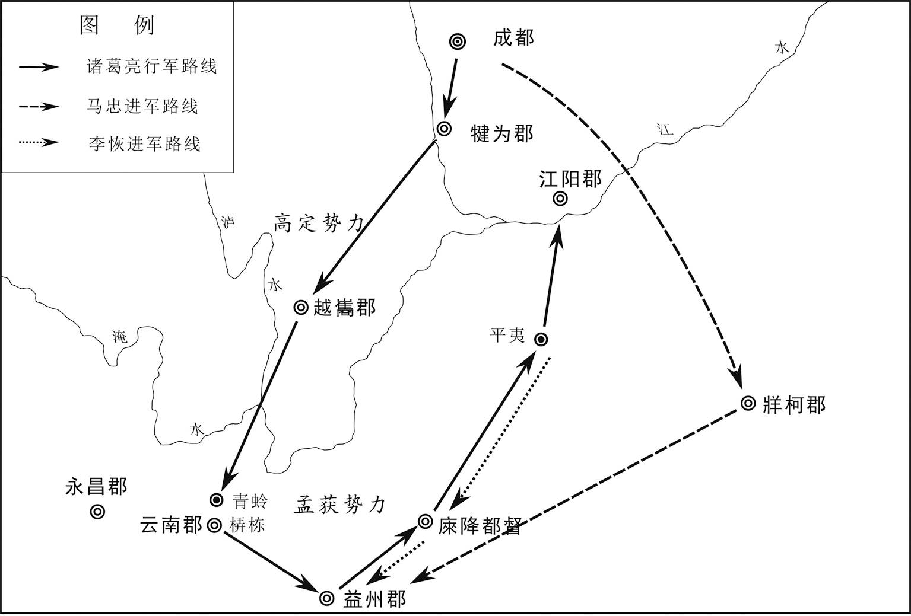 
**诸葛亮七擒孟获示意图**

## 【原文】

**七年春正月，汉丞相亮欲出军汉中，前将军李严当知后事，移屯江州，留护军陈到驻永安而统属于严[1]。**

## 【注文】

[1]前将军：古代官名。汉代始置，位高权重，掌管禁军，宿卫皇帝。魏晋时权位渐低，秩三品，仅为武官称号，可带兵征战。　　护军：古代官名。秦汉时临时设置护军都尉或中尉，出征时又有护军将军，协调诸将领间的关系。魏晋以后置护军将军及中护军等，掌军职选用，与领军将军或中领军并置，是掌中央军队的军事要职，也有守护宫城之意。　　陈到（？—230年）：三国时蜀汉将领。字叔至，汝南郡（治今河南上蔡西南）人。自豫州随刘备转战入蜀，以忠勇著称，名位仅次于赵云。三国蜀汉建兴初，官至永安都督、征西将军，封亭侯。

## 【译文】

魏文帝黄初七年（226年）春季正月，蜀汉丞相诸葛亮打算出兵汉中，前将军李严应当负责后方事务，移驻江州，留下护军陈到驻守永安，归属李严指挥。

## 【原文】

**明帝太和元年春三月，蜀丞相亮率诸军北驻汉中，使长史张裔、参军蒋琬统留府事[1]。临发，上疏曰：“先帝创业未半而中道崩殂，今天下三分，益州疲敝，此诚危急存亡之秋也[2]。然侍卫之臣不懈于内，忠志之士忘身于外者，盖追先帝之殊遇，欲报之于陛下也[3]。诚宜开张圣听，以光先帝遗德，恢弘志士之气，不宜妄自菲薄，引喻失义，以塞忠谏之路也[4]。宫中、府中，俱为一体，陟罚臧否，不宜异同[5]。若有作奸犯科及为忠善者，宜付有司论其刑赏，以昭陛下平明之理，不宜偏私，使内外异法也[6]。侍中、侍郎郭攸之、费祎、董允等，此皆良实，志虑忠纯，是以先帝简拔以遗陛下[7]。愚以为宫中之事，事无大小，悉以咨之，然后施行，必能裨补阙漏，有所广益[8]。将军向宠，性行淑均，晓畅军事，试用于昔日，先帝称之曰能，是以众议举宠为督[9]。愚以为营中之事，悉以咨之，必能使行陈和睦，优劣得所。亲贤臣，远小人，此先汉所以兴隆也；亲小人，远贤臣，此后汉所以倾颓也。先帝在时，每与臣论此事，未尝不叹息痛恨于桓、灵也[10]。侍中、尚书、长史、参军，此悉端良死节之臣，愿陛下亲之信之，则汉室之隆，可计日而待也[11]。臣本布衣，躬耕南阳，苟全性命于乱世，不求闻达于诸侯[12]。先帝不以臣卑鄙，猥自枉屈，三顾臣于草庐之中，谘臣以当世之事，由是感激，遂许先帝以驱驰[13]。后值倾覆，受任于败军之际，奉命于危难之间，尔来二十有一年矣。先帝知臣谨慎，故临崩寄臣以大事也。受命以来，夙夜忧叹，恐托付不效，以伤先帝之明，故五月渡泸，深入不毛[14]。今南方已定，兵甲已足，当奖率三军，北定中原，庶竭驽钝，攘除奸凶，兴复汉室，还于旧都，此臣所以报先帝而忠陛下之职分也[15]。至于斟酌损益，进尽忠言，则攸之、祎、允之任也[16]。愿陛下托臣以讨贼兴复之效，不效则治臣之罪，以告先帝之灵。责攸之、祎、允等之慢，以彰其咎。陛下亦宜自谋，以谘诹善道，察纳雅言。深追先帝遗诏，臣不胜受恩感激。今当远离，临表涕零，不知所言。”遂行，屯于沔北阳平石马[17]。**

## 【注文】

[1]蒋琬（？—246年）：三国时蜀汉大将军。字公琰，零陵湘乡（今湖南湘乡）。初以州书佐随刘备入蜀，授官广都长。刘备为汉中王，他为尚书郎。三国蜀汉建兴元年（223年），诸葛亮开丞相府，任他为东曹掾，擢升为长史。诸葛亮死后，蒋琬执政，领益州刺史，迁大将军，录尚书事，封安阳亭侯。不久，又加大司马，总揽国事。三国蜀汉延熙九年（246年）病死。

[2]崩殂（cú）：又作崩逝。古代帝王之死的代称。　　疲敝：也作“疲弊”，困苦穷乏。

[3]殊遇：特别的礼遇，多指帝王的恩宠、信任。

[4]恢弘：也作“恢宏”，发扬。　　妄自菲薄：毫无根据地看轻自己。形容过于自卑，自轻自贱。妄：虚妄，没有根据；菲薄：小看，轻视。　　引喻失义：引用的例证不妥当。引喻：以前人的话作证据；失义：失掉了本义。

[5]陟（zhì）罚臧（zāng）否（pǐ）：指对人员的提拔、处罚、表扬和批评。陟，升迁；罚，处罚；臧，褒奖；否，批评。

[6]作奸犯科：为非作歹，触犯法令。奸，坏事；科，法令。　　有司：官吏。古代设官分职，事各有专司，故称有司。

[7]侍郎：古代官名，汉代郎官的一种。初为宫殿近侍，其后五官、左、右三中郎署与虎贲（bēn）中郎将署均置侍郎，其秩略高于郎中。东汉至南北朝转为尚书的属官，尚书郎经过两年，称为侍郎，所以它地位比尚书郎高。　　郭攸之（生卒年不详）：三国时蜀汉的大臣。字演长，南阳（今河南南阳）人。刘备把他从基层中选拔出来，辅佐刘禅。三国蜀汉建兴中为侍中，深得诸葛亮信爱。　　费祎（yī）（？—253年）：三国蜀汉大臣。字文伟，江夏（ménɡ）县（今河南罗山西南）人。早年在蜀地游学，有才名。刘备立刘禅为太子，命费祎为舍人、庶子。刘禅继位，费祎为黄门侍郎。费祎深得诸葛亮宠信，任昭信校尉。奉命出使吴国，孙权、诸葛恪等人与之辩难，费祎据理以答，终不能屈，为孙权器重。还蜀后，迁为侍中、司马。在魏延与杨仪冲突中，极力劝喻调解。三国蜀汉建兴十二年（234年）诸葛亮死，为后军师。后继蒋琬执政，任大将军，录尚书事。三国蜀汉延熙十五年（252年）开府设署，自选僚属。次年在岁首大会上，被魏国降人郭循刺死。　　董允（？—246年）：三国时蜀汉将领。字休昭，南郡枝江（今湖北枝江东北）。刘备立刘禅为太子，他为太子舍人、洗马。刘禅继位，他任黄门侍郎。后为侍中，领虎贲（bēn）中郎将，统率宿卫亲兵，受到诸葛亮倚重。常谏诤后主刘禅过失，抑制专权的宦官黄皓。后曾任辅国将军、尚书令，辅佐大将军费祎，决定军国大事。

[8]裨（bì）补：弥补。　　阙漏：过失，漏洞。

[9]向宠（？—240年）：三国时蜀汉将领。襄阳宜城（今湖北宜城东南）。随刘备入蜀，为牙门将。三国蜀汉章武二年（222年）刘备攻吴，在猇（xiāo）亭大败，只有他率领的部属保全。三国蜀汉建兴元年（223年），封都亭侯。后为中部督，掌管宿卫兵，升迁中领军。诸葛亮《出师表》中说他“性行淑均，晓畅军事”。三国蜀汉延熙三年（240年），率兵征讨汉嘉郡（治今四川名山北）少数民族起义，死于军中。　　淑均：善良公正。

[10]痛恨：痛心，遗憾。　　桓、灵：即汉桓帝与汉灵帝。汉桓帝即刘志（132—167年），东汉本初元年（146年）汉质帝刘缵（zuǎn）死，被梁太后和梁冀迎立为帝。在位期间形成宦官专权的局面，桓帝曾压制士大夫反对宦官专权的运动，逮捕李膺（yīnɡ）等二百多人，史称党锢（ɡù）之祸。死后谥号桓帝。汉灵帝即刘宏（157—189年），东汉建宁元年（168年）为窦太后迎立为帝，在位期间是东汉宦官专权的顶峰期。政治昏暗，土地兼并激烈，贪官污吏横行。汉灵帝性喜聚敛，在西园标价卖官，巧立名目，增加赋役，导致黄巾大起义。

[11]长史：古代官名。初为秦置，西汉初年丞相、太尉、御史大夫府各设长史，秩千石，为众吏之长，职无不监，号为三公辅佐。东汉太尉、司徒、司空府沿置不改。魏晋南北朝时诸公府、将军府及诸王府沿置长史，主持府务。其中司徒府自西晋起设左、右长史，除府务外，还掌全国民政户籍、官吏选举考课等事务。　　计日而待：计算时日，可以期待，形容预期的目标不久即可实现。计日，预期。待，等待。

[12]布衣：古代平民服装，材料用麻葛织品，后用棉布。中国古代织物以丝织品为贵，平民除老年外不得用丝料，百姓和下层士子只能以麻、葛等粗纤维织成的布制作衣服，故称布衣。后来“布衣”就成为“平民”的代称。　　躬耕：亲自耕种。　　南阳：古郡名。秦置南阳郡，汉沿置，治所在宛（yuān）县（今河南南阳）。辖境相当于今河南熊耳山以南叶县、内乡间和湖北大洪山以北广水、郧（yún）县间地。西晋时改为国。以在太行山之南，黄河以北，故称南阳。　　闻达：声名为世人所知晓。　　诸侯：分封时代帝王统治下的各国国君。

[13]卑鄙：卑微鄙陋。　　猥（wěi）：表示谦敬，可不必译出，或相当于“不称职地”等。　　枉屈：屈尊就卑。　　谘（zī）：同“咨”，征询，商议。

[14]泸：即泸水，即今雅砻江下流及与金沙江合流后至云南巧家县一段雅砻江，在四川、云南二省间，汉至唐称泸水。　　不毛：不长庄稼的荒凉的地方。

[15]三军：指军队。相传周代天子建六军，诸侯大国设三军，次国两军，小国一军。春秋时期大国一般设三军，晋国称中军、上军、下军，以中军最强。齐、鲁诸国同。楚国称中军、左军、右军。三军中，各设将、佐，以中军帅为主将，晋国称元帅。　　驽钝：愚笨，迟钝。　　攘（rǎnɡ）除：排除，赶走。

[16]斟酌损益：仔细考虑，反复商讨，然后决定增减、兴革。斟酌，考虑、商讨以决定取舍。损益，增减、兴革。

[17]石马：古地名。在今陕西勉县西。

## 【译文】

魏明帝太和元年（227年），春季三月，蜀国丞相诸葛亮率领军队向北进军，屯驻汉中，派长史张裔、参军蒋琬留守成都，处理丞相府各项政务。临出发前，诸葛亮上疏说：“先帝开创大业未到一半，却中途溘然长逝。如今天下分为三国，鼎足而立，益州最为疲惫困乏，这的确是一个生死存亡的关键时刻。然而侍卫近臣在朝内毫不懈怠，尽其职守，忠贞将士在沙场舍身奋战，出生入死，都是因为追念先帝的特殊知遇，而要全部报答给陛下。陛下确实应当虚心听取各方意见，以发扬光大先帝遗留下的威德，恢宏振奋有志之士的气节，不应轻视自己，讲话譬喻失去应有的正义，以致堵塞忠臣进谏之道。宫廷和相府应是统一整体，提升、处罚、表彰、指责，不应加以区别。若有触犯法纪或尽忠为善的行为，应该交付有关部门给予刑罚或奖赏，以昭示陛下的公允明察，不应有偏私之心，使宫廷内外执法不一。侍中、侍郎郭攸之、费祎、侍郎董允等人，都是善良忠实、思想纯正的忠臣，因此先帝特意选拔出来留给陛下。我认为宫廷事务，无论大小，都应与他们咨询商议，然后付诸实施，这样一定能弥补缺漏，获得更为广泛的好处。将军向宠品行美好公正，通晓军事，过去经过考察，先帝称赞他很有才能，因此众人商议举荐他为中部督。我认为军中各项事务都应征求他的意见，必定会使将士和睦，人才无论优劣都能各得其所。亲近贤臣，疏远小人，这是前汉兴盛的原因，亲近小人，疏远贤臣，这是后汉衰败的根源。先帝在时，每次与我谈论此事，没有一次不对桓帝、灵帝的倾废衰败痛心叹息的。侍中（郭攸之、费祎）、尚书（陈展）、长史（张裔）、参军（蒋琬）都是端正善良、为国死节的忠臣，希望陛下亲近、信任他们，那么汉室的复兴昌盛指日可待。我本是一介布衣平民，在南阳亲自耕种，在风雨飘摇、天下鼎沸的动荡年代只想保全性命，不求显贵通达，扬名天下。先帝不嫌弃我地位卑下见识浅陋，屈身三次前往茅庐拜访，向我询天下形势，由此我非常感激，于是答应为先帝效命奔走。后来军队几乎全军覆没，在兵败危难之际接受重任，从那时到现在已经二十一年了。先帝深知为臣行事小心谨慎，因此在临终前将国家大事托付于我。自从接受先帝遗命以来，我日夜忧虑叹息，唯恐辜负重托，有损先帝知人之明，因此我五月渡过泸水，深入不毛之地平叛。如今南方已经平定，兵力物资充足，应当激励将士，统率三军北定中原，竭尽我平庸之力，铲除奸凶，恢复汉室之位，重返故都，这正是我报答先帝、效忠陛下的职责本分。至于处理朝政，考虑国家制度的增加修改，进谏忠言，则是郭攸之、费祎、董允等人的职责。希望陛下将讨伐国贼、复兴汉朝的重任交给我，如果没有成效，请陛下治罪，以告慰先帝在天之灵；如果郭攸之、费祎、董允疏忽怠慢，就追究他们的过错。陛下本人也应慎重考虑，来征询和选择治国善道，访察采纳好的建议，真正遵循先皇帝遗诏，如此为臣就受恩感激不尽了。现在我就要远离陛下，看着表章就涕泣流泪不止，不知该说些什么。”于是诸葛亮率军出发，屯驻在沔水北岸的阳平石马。

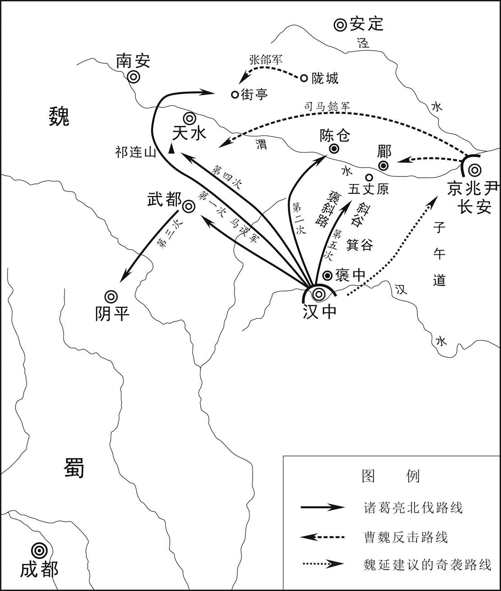 
**诸葛亮五次攻魏进军路线示意图**

## 【原文】

**亮辟广汉太守姚伷为掾，伷并进文武之士，亮称之曰：“忠益者莫大于进人，进人者各务其所尚。今姚掾并存刚柔以广文武之用，可谓博雅矣[1]。愿诸掾各希此事以属其望。”**

## 【注文】

[1]辟（bì）：汉代为一种选官制度。又称辟召、征辟。由皇帝直接征聘为朝廷官员的，称为“征”，由高级官员如中央的三公、地方的州牧、郡守等征聘为自己僚属的，称为“辟”。后者为汉朝选官入仕重要途径，三国、两晋、南北朝沿袭。　　姚伷（zhòu）（？—242年）：三国蜀汉大臣。字子绪，巴郡阆中（今四川阆中）。刘备平定益州后，为功曹书佐。三国蜀汉建兴元年（223年），为广汉太守。建兴五年（227年），丞相诸葛亮北驻汉中，任命姚伷为丞相掾。并进文武之士，迁为参军。诸葛亮去世后，迁尚书仆射。三国蜀汉延熙五年（242年）卒。　　掾：古代官名。汉朝三公府、将军府和郡县，都分曹办公，掌管一曹的官称“掾”，又称“曹掾”。在三公府和将军府诸曹的主官（长官），一般称“掾”，但也有称“掾史”的，副职称“属”。在郡县诸曹中，主官也称“掾”，但其副不称“属”而称“史”，有的掾、史并置，有的置掾不置史，有的置史不置掾。　　博雅：学识渊博，品行端正。

## 【译文】

诸葛亮征召广汉太守姚伷为丞相掾，姚伷同时推荐了很多文武之士，诸葛亮称赞说：“对国家效忠莫过于举荐人才，但推荐者往往各自依据个人好恶。而今姚伷举荐官员，却能刚柔并用，广泛推举文官武将，以备国家使用，可称博雅大量。但愿诸位掾属都以姚伷为榜样，不辜负我对你们的期望。”

## 【原文】

**帝闻诸葛亮在汉中，欲大发兵就攻之，以问散骑常侍孙资[1]。资曰：“昔武皇帝征南郑，取张鲁，阳平之役，危而后济[2]。又自往拔出夏侯渊军，数言‘南郑直为天狱，中斜谷道为五百里石穴耳’，言其深险，喜出渊军之辞也[3]。又武皇帝圣于用兵，察蜀贼栖于山岩，视吴虏窜于江湖，皆挠而避之，不责将士之力，不争一朝之忿，诚所谓见胜而战，知难而退也。今若进军就南郑讨亮，道既险阻，计用精兵及转运镇守南方四州，遏御水贼，凡用十五六万人，必当复更有所发兴，天下骚动，费力广大，此诚陛下所宜深虑。夫守战之力，力役参倍。但以今日见兵，分命大将据诸要险，威足以震慑强寇，镇静疆场，将士虎睡，百姓无事，数年之间，中国日盛，吴、蜀二虏必自罢敝[4]。”帝乃止。**

## 【注文】

[1]散骑常侍：古代皇帝侍从官。三国魏黄初初年置，职掌规谏，献纳得失，侍从左右，以备顾问。　　孙资（？—251年）：三国时魏国大臣。字彦龙，太原中都（今山西平遥西南）人。东汉建安初，曹操辟为丞相军事，后迁秘书郎。魏文帝曹丕时，为中书令加给事中，赐爵关中侯，掌管机密。魏明帝时，加散骑常侍，进爵乐阳亭侯。三国魏太和末年，进爵左乡侯。三国魏景初二年（238年），魏明帝病重，想以燕王曹宇辅政，他与刘放诬陷曹宇而使司马懿、曹爽辅政。三国魏正始中，加右光禄大夫，转卫将军。曹爽被诛，复为侍中，领中书令。为相期间，虽勤慎其位，然因举荐曹爽、司马懿执掌大权，使曹魏埋下了覆亡的祸根。

[2]武皇帝：即魏武帝曹操。曹操生前为魏王，其子曹丕称帝后，追尊曹操为魏武帝。　　南郑：古县名。战国秦置，治所在今陕西汉中。

[3]天狱：天然的牢狱，比喻险恶境地。　　斜谷：在今陕西眉县西南，即褒斜道之东口，谷口有斜谷关。

[4]震慑：使……震惊、恐惧。　　中国：本与四夷相对，指华夏族所建之国，以为居天下之中，故称中国，后指中原地带。中国与“中州”“中原”“中华”“中夏”含义相近。

## 【译文】

魏明帝（曹叡）听说诸葛亮抵达汉中，准备大举出兵，向诸葛亮发起进攻。他以此事询问散骑常侍孙资。孙资说：“过去武皇帝曹操征讨南郑，进攻张鲁，阳平之战身临险境，而后勉强取胜。后来亲自率兵救出夏侯渊之军时，曾多次说‘南郑真像天上的监狱，中间斜谷之道简直是五百里石穴’，是说那里地形险要，庆幸能使夏侯渊的部队脱离险境。再者，武皇帝用兵如神，觉察到蜀贼栖息于山岩之中，看到吴匪流窜于江河大湖之上，因此暂时容忍避开，不让将士效死力征讨，不争一朝一夕的气愤，这诚然就是见到必胜之机就战、知道进兵困难便退却的战略。如今进兵南郑讨伐诸葛亮，道路不但艰难险阻，计算调集精兵、转运物资加上镇守南方四州，防范遏制吴国的水上进犯，共需兵力十五六万人，必然需要征发更多兵役，调集更多物资，全国因此骚动起来，耗费巨大，这确实需要陛下深思熟虑。防守的兵力和进攻的相比，仅仅需要一半的力量。只要就我军现有兵力，分别派遣将领据守各险关要隘，威力足以使强敌震慑，使我国边境安然无事，将士养精蓄锐，百姓也无劳役之苦。数年之后，我中原国力日益强盛，吴、蜀二敌必然自己疲惫不堪。”魏明帝于是放弃攻击。

## 【原文】

**六月，以司马懿都督荆、豫州诸军事，率所领镇宛[1]。**

## 【注文】

[1]司马懿（179—251年）：三国时期魏国军事家、政治家，西晋政权的奠基者。字仲达，河内温县（今河南温县西南）人，士族出身。早年曾任曹操丞相府文学掾，丞相主簿、军司马等职。曹操晋封魏王之后，为太子中庶子，辅佐曹丕，屡出奇策，深得曹操信任和重用。曹丕称帝后，历任丞相长史、抚军大将军。曹丕出征时，他多留守许昌，供应军资。曹丕去世后，奉遗诏为魏明帝辅政大臣，率军击败孙权进攻，迁升骠骑将军。三国魏太和五年（231年）至青龙二年（234年），率兵抗蜀，与诸葛亮对峙，他以逸待劳，使诸葛亮师劳功微。三国魏景初二年（238年），率军击败辽东公孙渊。景初三年（239年），受魏明帝遗诏辅佐齐王曹芳，与曹爽争权。三国魏嘉平元年（249年）正月发动政变，诛杀曹爽及其支持者，拜为相国，封安平郡公，独揽朝政。嘉平三年（251年）八月卒。

## 【译文】

魏明帝太和元年（227年）六月，任命司马懿都督荆、豫二州诸军事，率领自己所属军队镇守宛城。

## 【原文】

**初，孟达既为文帝所宠，又与桓阶、夏侯尚亲善[1]。及文帝殂，阶、尚皆卒，达心不自安。诸葛亮闻而诱之，达数与通书，阴许归蜀。达与魏兴太守申仪有隙，仪密表告之[2]。达闻之，惶惧，欲举兵叛。司马懿以书慰解之，达犹豫未决，懿乃潜军进讨。诸将言：“达与吴、汉交通，宜观望而后动[3]。”懿曰：“达无信义，此其相疑之时也，当及其未定促决之。”乃倍道兼行，八日到其城下[4]。吴、汉各遣偏将向西城安桥、木阑塞以救达，懿分诸将以距之[5]。初，达与亮书曰：“宛去洛八百里，去吾一千二百里。闻吾举事，当表上天子，比相反覆，一月间也，则吾城已固，诸军足办。吾所在深险，司马公必不自来；诸将来，吾无患矣。”及兵到，达又告亮曰：“吾举事八日，而兵至城下，何其神速也！”**

## 【注文】

[1]孟达（？—228年）：三国时蜀国、魏国将领。字子敬，扶风郿县（今陕西眉县东）人。东汉建安初年入蜀依附刘璋。受命与法正领兵迎接刘备。刘备得蜀后，任他为宜都太守。东汉建安二十四年（219年），与刘封攻魏国，取房陵（今湖北房县）、上庸（今湖北竹山西南）。当时关羽在樊城（今湖北襄樊）被围，孟达拒不发兵援助关羽，关羽战败身死后，孟达非常恐惧，又因与刘封不合，在东汉延康元年（220年）率领部曲四千余家投降魏国，受到魏王曹丕器重，使领新城太守，与夏侯尚等击败刘封。曹丕死后，孟达非常不安，诸葛亮对他进行诱降，于是数次与诸葛亮通信，暗中许诺归蜀，被申仪告发，于是举兵造反，被司马懿攻杀。　　桓阶（？—221年）：三国时魏国大臣。字伯绪，长沙临湘（今湖南长沙）人。东汉中平时仕郡功曹，孙坚举为孝廉，除尚书郎。曾劝说长沙太守张羡抗拒刘表归顺曹操。曹操征荆州，任丞相掾主簿，迁赵郡太守。东汉建安十八年（213年），为虎贲（bēn）中郎将侍中，数陈曹丕德优年长，宜立为太子，为曹操所重，拜为尚书，掌管选举。曹操死后，与群臣劝曹丕代汉。迁升尚书令，封高乡亭侯，加侍中，旋又徙封安乐乡侯。三国魏黄初中拜太常。黄初二年（221年），因疾笃罢相，转为太常，不久病逝，谥号“贞侯”。　　夏侯尚（？—226年）：三国时魏国将领。字伯仁，沛国谯县（今安徽亳州）人。征西将军夏侯渊从子。东汉建安九年（204年）随曹操征河北，为军司马。历迁五官将文学、黄门侍郎。东汉建安二十三年，随鄢陵侯曹彰平定代郡乌桓，因功封平陵亭侯，拜散骑常侍，迁中领军。魏文帝更封为平陵乡侯，迁征南将军，领荆州刺史，假节都督南方诸军事。三国魏黄初元年（220年），与蜀国降将孟达等在上庸击败刘封，平三郡九县，迁征南将军。黄初三年（222年），与曹真等围南郡（治今湖北荆州市荆州区），次年，败诸葛瑾援军于江陵（今湖北荆州市荆州区），屯兵江中渚，作浮桥往来，为吴军所攻，退兵。进荆州牧，昌陵乡侯。后病死。

[2]申仪（生卒年不详）：三国时蜀国、魏国将领。上庸太守申耽之弟。东汉建安二十四年（219年），刘备派孟达、刘封攻上庸，申仪随其兄投降，任建信将军、西城太守。次年，孟达与刘封不和，投降魏国，魏遣夏侯尚、徐晃与孟达进攻刘封，又与申耽一同投降魏国。任魏兴太守，封员乡侯。三国魏太和元年（227年）因与孟达有隙，密告孟达谋反。次年，孟达败死。申仪应召至洛阳，拜楼船将军。

[3]交通：交往，勾结。

[4]倍道：兼程，一日赶两日的路程。

[5]西城：古郡名。东汉建安二十年（215年）分汉中郡置，治所在西城县（今陕西安康西北），辖境相当于今陕西石泉至安康间汉水流域一带。三国魏更名魏兴郡。　　木阑塞：又作木兰寨，在今陕西旬阳县。

## 【译文】

当初，孟达既受到魏文帝曹丕宠信，又与桓阶、夏侯尚关系密切。文帝去世后，桓阶和夏侯尚也相继死去，孟达心中忧虑不安。诸葛亮得知后便引诱孟达，孟达多次与诸葛亮通信，暗中答应归顺蜀国。孟达与魏兴太守申仪有嫌怨隔阂，申仪秘密上表告发孟达。孟达听说之后，非常恐惧，企图举兵造反。司马懿写信来安慰劝解，孟达因此犹豫不决。司马懿于是暗中调集军队进行讨伐。诸位将领都说：“孟达已和吴、蜀两国交接串通，我们应先观察动静而后采取行动。”司马懿说：“孟达不讲信义，此时正是怀疑观望之际，我军当在他举棋不定时，迅速解决他。”于是司马懿率军急速行进，日夜兼程，仅用八天就兵临孟达城下。吴、蜀各派偏将进兵西城的安桥、木阑塞以援救孟达，司马懿则派将领分路抗拒。当初，孟达写信给诸葛亮说：“宛（yuān）城距洛阳八百里，离我所在的新城一千二百里。听说我起兵，应当上表奏报明帝，连续往返需要一个月时间，那时我的城池防守坚固，各军物资也准备充足。我的防区地形险要，司马懿必然不会亲自前来；其他将领来，我没有什么忧虑。”等司马懿兵临城下，孟达又写信报告诸葛亮说：“我起兵仅八天，司马懿便兵临城下，多么神速啊！”

## 【原文】

**二年春正月，司马懿攻新城，旬有六日，拔之，斩孟达[1]。申仪久在魏兴，擅承制刻印，多所假授，懿召而执之，归于洛阳[2]。**

## 【注文】

[1]新城：春秋秦邑，在今陕西澄城县东北二十里。　　拔：夺取军事上的据点。

[2]承制：秉承皇帝旨意得便宜行事。

## 【译文】

魏明帝太和二年（228年）春季正月，司马懿围攻新城，仅用十六天时间就攻下了，斩杀孟达。申仪在魏兴驻守已经很久，擅自谎称秉受意旨刻印，多次假借名义授人官职。司马懿召见并逮捕他，返回洛阳。

## 【原文】

**诸葛亮将入寇，与群下谋之。丞相司马魏延曰：“闻夏侯楙，主婿也，怯而无谋[1]。今假延精兵五千，负粮五千，直从褒中出，循秦岭而东，当子午而北，不过十日，可到长安[2]。楙闻延奄至，必弃城逃走，长安中惟御史、京兆太守耳[3]。横门邸阁与散民之谷，足周食也[4]。比东方相合聚，尚二十许日，而公从斜谷来，亦足以达。如此，则一举而咸阳以西可定矣[5]。”亮以为此危计，不如安从坦道，可以平取陇右，十全必克而无虞，故不用延计[6]。**

## 【注文】

[1]丞相司马：古代官名。三国时蜀置，为丞相属官，掌兵事。　　魏延（？—234年）：三国时蜀汉名将。字文长，原籍义阳（今河南信阳西北）。初以部曲随刘备入蜀。屡有战功。升迁牙门将军。刘备为汉中王，进驻成都，任他为镇远将军，领汉中太守。后进任镇北将军，封都亭侯。三国蜀汉建兴五年（227年），诸葛亮驻汉中，命他督前部，领丞相司马、凉州刺史。次年西入羌中，升征西大将军，进封南郑侯。建兴十二年（234年）诸葛亮病死。他与长史杨仪争权，率兵出击杨仪，兵败被杀。　　夏侯楙（máo）（生卒年不详）：字子林，夏侯惇之子，娶曹操之女为妻。官至侍中、尚书，安西、镇东将军。因多畜伎妾，与妻子不和睦。

[2]褒中：古县名。西汉置褒中县，属汉中郡。故城即今陕西汉中西北。　　秦岭：即今陕西南部秦岭。　　子午：即子午谷，在今陕西长安县南，北口有子午镇。为关中南通汉中之要道，三国时为魏、蜀必争的要道。　　长安：古都城名。即今陕西西安，我国历史上著名的六大古都之一。公元前200年汉高祖刘邦建都于此，此后，新莽、东汉、西晋、前赵、前秦、后秦、西魏、北周、隋、唐等朝代都建都于此。

[3]御史：古代官名。古代执掌监察官员的泛称。秦以前有御史，属史官，在君主左右掌文书档案、记录等事。秦置御史府，以御史大夫为长官，掌监察百官。其下设有诸御史，御史始有弹劾纠察百官过失之权，这是御史成为中国古代监察官员的开端。　　京兆：汉代京畿（jī）的行政区划名，为三辅之一。即今陕西西安以东至华县之地，治所长安（今陕西西安）。京兆，相当于郡，因地属畿辅，所以不称郡。其长官称京兆尹，相当于郡太守。

[4]横门：古城门名。又称光门，汉代长安城北墙靠西的第一门，遗址在今西安市西北郊相家小堡的西南方。汉朝西行的长安人都由此门出京。　　邸阁：魏晋时期指储蓄粮食及军需物资的仓库，蜀汉诸葛亮曾于斜谷口修治邸阁储积军粮，隋唐时期邸阁的设立形成制度。

[5]咸阳：古都邑名。在今陕西咸阳东北。因其处于九峻山之南，渭河之北，所以称咸阳。

[6]陇右：古地区名。泛指陇山以西地区，古代以西为右，故名。相当今甘肃陇山、六盘山以西，黄河以东一带。　　无虞：没有忧患，太平无事。

## 【译文】

诸葛亮将要攻打魏国，和部众进行谋划。丞相司马魏延说：“听说夏侯楙是魏明帝的女婿，此人胆怯而没有智谋。现在请丞相给我五千人精锐部队，带着五千人的口粮，直接从褒中出发，沿着秦岭向东进发，至子午道之后折向北方，不到十天工夫，可以抵达长安。夏侯楙听说我突然掩杀而来，一定会弃城逃走。长安城中就只有御史、京兆太守了。横门邸阁存余的粮食以及百姓逃散剩下的谷物，足以供给军粮。等到魏国在东方集结起军队，还需要二十多天时间，而您从斜谷出来接应，也完全能够到达。这样，就可以一举而平定咸阳以西的地区。”诸葛亮认为，这是冒险不得要领的计策，不如平安地从平坦大路上出发，可以平平稳稳地取得陇右地区，有十分万全的把握获取胜利，而不会有多少损失，所以没有采用魏延之计。

## 【原文】

**亮扬声由斜谷道取郿，使镇东将军赵云、扬武将军邓芝为疑军，据箕谷[1]。帝遣曹真都督关右诸军，军郿[2]。亮身率大军攻祁山，戎陈整齐，号令明肃[3]。始，魏以汉昭烈既死，数岁寂然无闻，是以略无备豫，而卒闻亮出，朝野恐惧[4]。于是天水、南安、安定皆叛应亮，关中响震，朝臣未知计所出[5]。帝曰：“亮阻山为固，今者自来，正合兵书‘致人’之术，破亮必也。”乃勒兵马步骑五万，遣右将军张郃督之，西拒亮[6]。丁未(2)，帝行如长安。**

## 【注文】

[1]郿：古邑名。在今陕西眉县东渭河北岸。　　镇东将军：古代将军名号。东汉献帝年间，张济、曹操、刘备都曾任此将军。掌征伐。三国魏时，与镇西、镇南、镇北三将军合称四镇将军，各出镇一方。蜀、吴也置四镇将军。其后，南北朝等多沿置。　　扬武将军：古代将军名号。东汉始置，掌征伐，马成曾任此职。三国魏沿置，秩第四品，晋与南朝时成为加官、散官性质的将军，秩四品。　　箕谷：古代谷道名。地在今陕西汉中西北，为关中入蜀隘谷之一。

[2]曹真（？—231年）：三国魏国大将。字子丹，东汉沛国谯县（今安徽亳州）人，曹操族子。少孤，被曹操收养，授虎豹骑。因为镇压灵丘黄巾军有功，封灵寿亭侯。东汉建安二十三年（218年），以偏将军随曹洪与刘备部战于下辩，升中坚将军，次年九月，领中领军。东汉延康元年（220年），为镇西将军，进封东乡侯。三国魏黄初三年（222年），任上军大将军，都督中外诸军事。后任中军大将军。黄初七年（226年），曹叡（ruì）即位，受遗诏辅政，封邵陵侯，授大将军。三国魏太和四年（230年）升大司马，后因病回洛阳。卒谥元侯。　　关右：即关西。古人以西为右，汉、唐时泛指函谷关或潼关以西地区。

[3]祁山：在今甘肃礼县东，西汉水上游。山上有城，为汉时所筑，极为严固，即今祁山堡，历来是兵家必争之地。

[4]昭烈：即蜀汉昭烈帝刘备，三国时蜀汉的建立者。　　备豫：预先准备。

[5]天水：古郡名。西汉武帝元鼎三年（前114年）置天水郡，始有“天水”名称。西晋泰始年间置秦州。辖境相当于今甘肃通渭、静宁、秦安、定西、清水、庄浪、甘谷、张家川等地及天水市西北部、陇西东部、榆中东北部地。　　南安：古郡名。东汉中平五年（188年）分汉阳郡置，治所在道（今甘肃陇西渭水东岸）。辖境相当今甘肃陇西东部及定西、武山等地。　　安定：古郡名。西汉元鼎三年（前114年）设置，治所在高平（今宁夏固原），辖今甘肃平凉、白银、景泰、靖远、会宁、泾川、镇原及宁夏中宁、中卫、同心、西吉、固原等地。东汉时移治临泾县（今甘肃镇原东南），十六国时又移治安定（今甘肃泾川北）。

[6]勒兵：整顿军队。勒：本指带嚼子的马笼头，引申为控制、约束、整顿。兵：军队。　　右将军：古代将军名号。汉有前、后、左、右将军，位上卿，次于大将军、骠骑将军、车骑将军、卫将军。掌京师兵卫和四夷屯兵，凡将军皆掌征伐。其后魏晋沿置，南北朝时为军府名号，用作加官。　　张郃（？—231年）：三国时魏国著名将领。字儁（jùn）（yì），河间鄚（mò）（今河北任丘北）人。东汉末年，为韩馥军司马，参与镇压黄巾起义军。后依附袁绍，任校尉；击败公孙瓒，升任宁国中郎将。官渡之战后，转归曹操，拜偏将军，封都亭侯。魏文帝曹丕时任左将军，进爵都乡侯。魏明帝即位，奉命率军西拒蜀军，大败蜀将马谡于街亭（今甘肃庄浪东南）。后蜀军再次攻魏，张郃领兵反击，追至木门（今甘肃天水），中流矢阵亡。谥“壮侯”。

## 【译文】

诸葛亮扬言由斜谷道进攻郿城，命令镇东将军赵云、扬武将军邓芝充当疑兵，据守箕谷。魏明帝派遣曹真都督关右地区各支部队，驻军郿城。诸葛亮亲自统率大军进攻祁山，军阵整齐，号令严明。起初，魏国认为蜀汉昭烈帝刘备已经去世，数年以来寂然没有动静，因此没有防备，突然听到诸葛亮出兵，朝野上下都很恐惧。于是天水、南安、安定等郡都叛魏而响应诸葛亮，关中地区如雷震响，朝廷大臣一时不知所措。魏明帝说：“诸葛亮本来凭据山险可以固守，（不能奈他何，）如今自己来了，正合乎兵书所说‘致敌前来’的策略，攻破诸葛亮是必然的事情。”于是整顿步兵和骑兵五万人，命令右将军张郃进行督率，向西抗拒诸葛亮。三国魏太和二年（228年）正月丁未日，魏明帝到达长安。

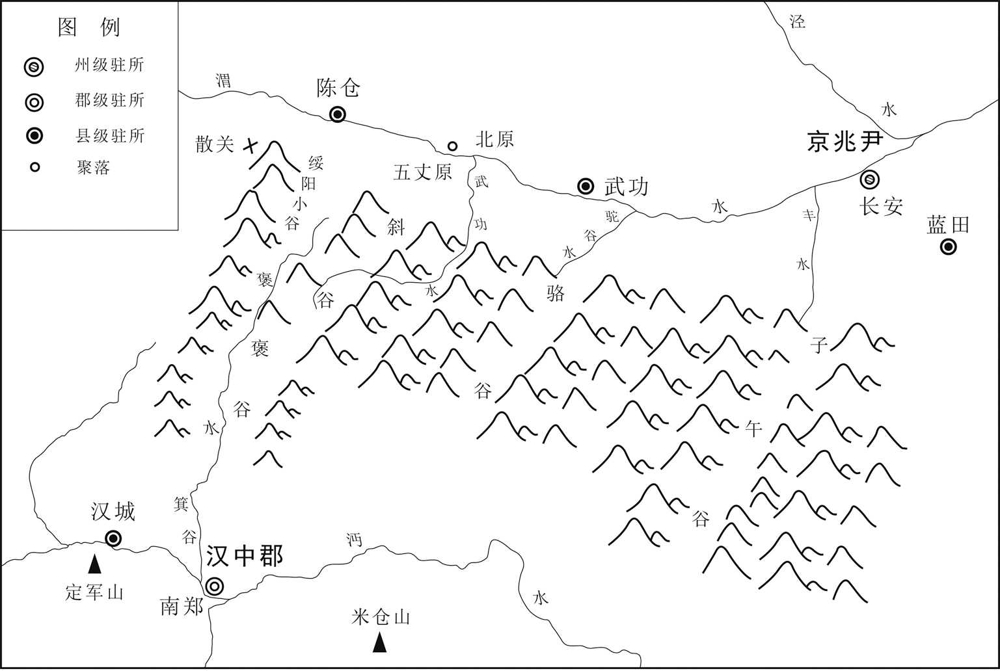 
**汉中至长安地理形势图**

## 【原文】

**初，越巂太守马谡，才器过人，好论军计，诸葛亮深加器异[1]。汉昭烈临终谓亮曰：“马谡言过其实，不可大用，君其察之。”亮犹谓不然，以谡为参军，每引见谈论，自昼达夜。及出军祁山，亮不用旧将魏延、吴懿等为先锋，而以谡督诸军在前，与张郃战于街亭[2]。**

## 【注文】

[1]才器：才能和气度。

[2]吴懿（？—237年）：三国时蜀国将领。字子远，陈留郡（治今河南开封）人。《三国志》等书因避司马懿讳，改作壹。东汉末随益州刘焉入蜀，刘璋时为中郎将，后投降刘备。刘备平定益州，任他为护军、讨逆将军，刘备娶他的妹妹为夫人。三国蜀汉章武元年（221年），为关中都督。三国蜀汉建兴八年（230年），与凉州刺史魏延同破魏将费瑶，封高阳乡侯，迁左将军。诸葛亮死后，吴懿督汉中，任车骑将军，领雍州刺史，进封济阳侯。　　街亭：古地名，也称街泉亭。故址在今甘肃庄浪东南。

## 【译文】

起初，越巂（xī）太守马谡（sù）才智和器量超过常人，喜好谈论军事计谋，诸葛亮对他深为器重。昭烈帝刘备临终之时，对诸葛亮说：“马谡言辞浮夸，超过他的实际才能，不可以委任大事，您对他要多加考察。”诸葛亮仍然不以为然，让马谡出任参军，每次接见马谡，二人一起谈论，从白天一直到深夜。等到出兵祁山，诸葛亮不用旧将魏延、吴懿等人为先锋，而让马谡督率各军在前，同张郃（hé）在街亭交战。

## 【原文】

**谡违亮节度，举措烦扰，舍水上山，不下据城。张郃绝其汲道，击，大破之，士卒离散[1]。亮进无所据，乃拔西县千余家还汉中。收谡下狱，杀之。亮自临祭，为之流涕，抚其遗孤，恩若平生[2]。蒋琬谓亮曰：“昔楚杀得臣，文公喜可知也[3]。天下未定而戮智计之士，岂不惜乎！”亮流涕曰：“孙武所以能制胜于天下者，用法明也[4]。是以扬干乱法，魏绛戮其仆[5]。四海分裂，兵交方始，若复废法，何用讨贼邪！”**

## 【注文】

[1]汲道：取水的通道。

[2]流涕：流泪。　　遗孤：某人死后遗留下来的孤儿。

[3]得臣（？—前632）：春秋时楚国人，姓成名得臣，字子玉，楚君若敖之孙。楚成王三十五年（前637年）因与陈国作战有功，代子文任令尹。晋公子重耳（即晋文公）流亡至楚，主张杀之以绝后患。楚成王四十年，在城濮（今山东鄄城西南）之战中，被晋军打败，自杀。　　文公：即晋文公（前697或前671—前628年），春秋时期晋国国君，五霸之一，晋献公次子，姓姬名重耳。公元前636年至前628年在位。因逃避晋献公废立太子之乱，在外流亡十九年。晋献公死后，晋国内乱，重耳在秦穆公的帮助下返回晋国为君，时年六十一岁。后以“尊王”相号召，联合诸国，平定周王室内乱，在诸侯间很有声望。公元前632年，在城濮（今山东鄄城西南）大败楚军，不久在践土（今河南原阳西南）会盟诸侯，并被周天子策命为“侯伯”，从此称霸中原。在位九年，卒谥文。

[4]孙武（生卒年不详）：即孙子。春秋时军事家。字长卿，齐国人。因避免战乱投奔吴国，经伍子胥引荐，被吴王阖（hé）闾（lǘ）重用为将，曾率吴军攻破楚国。所著《孙子兵法》十三篇保存至今。

[5]扬干（生卒年不详）：《史记》作“杨干”，春秋时期晋国公子，晋悼公之弟。公元前570年，晋悼公会盟诸侯，扬干搅乱队列，司马魏绛杀了替扬干驾车的人。悼公意识到魏绛忠于职守，重赏了魏绛。　　魏绛（生卒年不详）：即魏庄子，春秋时期晋国卿。初任中军司马。晋悼公与诸侯会盟，其弟扬干搅乱队列，魏绛绳以军法，杀掉扬干的仆御。悼公器重他执法严明，使他统率下军，任以政事。魏绛极力主张和戎，八年中九合诸侯，戎翟亲附，造成晋国称霸的局面。

## 【译文】

马谡违背诸葛亮的节制调度，军事行动、处置措施混乱烦扰，放弃水源在山上驻扎，而不在山下据守城邑。张郃（hé）断绝马谡军队的取水补给通道，发动进攻，大败马谡，蜀军士卒逃散。诸葛亮进兵没有物资补给，于是攻占西县千余家后，回师返回汉中。把马谡关进监狱，将其杀掉。之后诸葛亮亲自前来祭奠，为马谡之死痛哭流涕，抚恤他的子女，恩待之厚如同往常。蒋琬（wǎn）对诸葛亮说：“古时候晋国同楚国交战，楚国杀掉统帅得臣，晋文公喜形于色大家都看得见。现在天下还未平定，就杀死智谋之士，难道不惋惜吗？”诸葛亮流着眼泪说：“孙武之所以能够制敌取胜于天下，是因为执法严明。因此晋悼公之弟扬干犯法，魏绛就杀了为他驾车的仆御。现在天下分裂扰攘，两国交战刚刚开始，如果再废弃军法，还拿什么来讨伐敌人！”

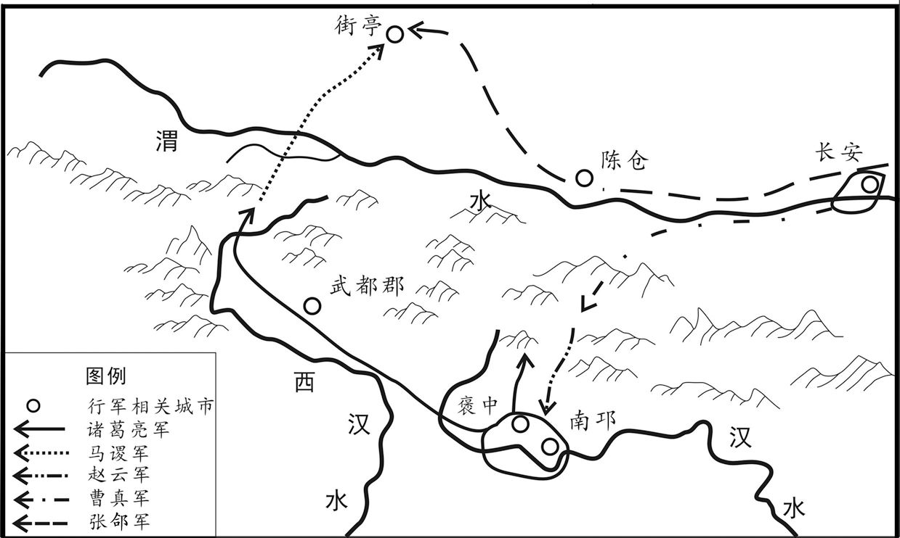 
**诸葛亮一出祁山路线示意图**

## 【原文】

**谡之未败也，裨将军巴西王平连规谏谡，谡不能用[1]。及败，众尽星散，惟平所领千人鸣鼓自守，张郃疑其有伏兵，不往逼也，于是平徐徐收合诸营遗迸，率将士而还。亮既诛马谡及将军李盛，夺将军黄袭等兵，平特见崇显，加拜参军，统五部兼当营事，进位讨寇将军，封亭侯[2]。亮上疏请自贬三等，汉主以亮为右将军，行丞相事。**

## 【注文】

[1]裨（pí）将军：古代官名。战国时秦置，即副将。三国魏国也设置裨将军，南朝宋时秩九品，梁为一班，官秩从九品下。　　王平（？—248年）：三国时蜀汉名将。字子钧，宕（dàng）渠（今四川渠县东北）人。行伍出身，原为曹操部属，后投降刘备，任牙门将、裨将军等职。诸葛亮第一次伐魏，随马谡与魏军交战于街亭。曾多次劝谏马谡审慎用兵，因马谡不听，致使蜀军战败溃散。他率所辖蜀军独自保全，因功破格升任讨寇将军，封亭侯。三国蜀汉建兴十二年（234年），平定魏延之乱。因为军功卓著，迁前监军、镇北大将军，统领汉中事。三国蜀汉延熙七年（244年）春，曹爽率步骑十余万攻向汉川，蜀军仅三万，王平使所部固守兴势（今陕西洋县）待援，魏军无功而退。　　规谏：郑重地劝告别人，使其改正错误。

[2]李盛（？—228年）：三国蜀汉将领。三国蜀汉建兴七年（229年）随诸葛亮北伐，守街亭时附属于马谡军队，与黄袭在清水河河岸据守，被魏将张郃（hé）击溃。街亭战败后，与马谡、张休一道被诸葛亮处死。　　黄袭（生卒年不详）：三国时期蜀汉将领。三国蜀汉建兴七年（229年）随诸葛亮北伐，守街亭时附属于马谡军队，与李盛率军在清水河河岸据守，被魏将张郃击溃。街亭战败后，诸葛亮夺其兵权。其他事迹不详。　　讨寇将军：古代杂号将军名。三国魏、蜀皆置，或领兵征伐，或作为太守等地方长官的加官，魏晋南朝宋皆八品。

## 【译文】

马谡还没有失败之时，裨将军巴西人王平一连多次规劝马谡，马谡不能采纳。等到失败时，部众四散奔逃，只有王平所率领的一千人擂鼓把守营地，张郃怀疑他设有伏兵，不敢往前进逼，于是王平渐渐收拢各部逃散的士兵，率领将士返回蜀国。诸葛亮既已杀了马谡和将军李盛，还削夺了将军黄袭的兵权，王平受到特别崇信，地位开始显赫，又被提拔为参军，统领五部兵马，还兼管屯营之事，官位晋升到讨寇将军，进爵为亭侯。诸葛亮上疏请求自贬三级，后主任命诸葛亮为右将军，代理丞相的职务。

## 【原文】

**是时，赵云、邓芝兵亦败于箕谷，云敛众固守，故不大伤，云亦坐贬为镇军将军[1]。亮问邓芝曰：“街亭军退，兵将不复相录，箕谷军退，兵将初不相失，何故？”芝曰：“赵云身自断后，军资什物，略无所弃，兵将无缘相失。”云有军资余绢，亮使分赐将士，云曰：“军事无利，何为有赐，其物请悉入赤岸库，须十月为冬赐[2]。”亮大善之。**

## 【注文】

[1]镇军将军：古代将军名号。三国魏始置，秩第三品。晋南北朝沿置，为优待武臣的荣衔。

[2]赤岸库：三国蜀置，在今陕西汉中县西北褒城镇北。

## 【译文】

当时，赵云、邓芝的部队也在箕谷战败，赵云收拢部众坚持固守，所以损失不大，但也因此被贬为镇军将军。诸葛亮问邓芝说：“街亭失利，大军败退，兵将一败不可收拾，箕谷战败撤军，兵将依旧齐整如初，这是什么原因呢？”邓芝说：“赵云亲自在后面拒敌，军需物资一点都没有抛弃，兵将没有什么缘由散乱相失。”赵云有剩余的军资和绢帛，诸葛亮让他用来分给将士，赵云说：“军事上没有取得胜利，为什么要有赏赐，这些物资请全部存入赤岸库，等到十月用作冬季赐品。”诸葛亮非常赞同这一做法。

## 【原文】

**或劝亮更发兵者，亮曰：“大军在祁山、箕谷，皆多于贼，而不破贼，乃为贼所破，此病不在兵少也，在一人耳。今欲减兵省将，明罚思过，校变通之道于将来，若不能然者，虽兵多何益？自今已后，诸有忠虑于国，但勤攻吾之阙，则事可定，贼可死，功可跷足而待矣[1]。”于是考微劳，甄壮烈，引咎责躬，布所失于境内，厉兵讲武，以为后图，戎士简练，民忘其败矣[2]。**

## 【注文】

[1]跷（qiāo）足：踮起脚跟，形容企望。

[2]引咎责躬：引咎，承认错误；躬，自身。指主动承担责任，并责备自己。　　厉兵：磨利兵器。

## 【译文】

有人劝告诸葛亮再次发兵，诸葛亮说：“大军在祁山、箕谷之时，人数多于敌军，但没有打败敌人，反而被敌人打败，问题不在于兵少，而在于我一人思虑不周。如今我打算减少兵将，明确赏罚，反思过失，将来检校变通之道。如果不能这样反思，即使兵再多又有什么用处呢？从今以后，诸位若是一心为国家分忧效忠，只要多多批评我的缺失，那么北伐大事就可以确定，敌人就可以被打垮，大功就可以跷足而待了。”于是考察将士功劳，连微小之功也不遗漏，甄别壮烈之士，一一加以抚恤，引过自责，将自己的过失在国境内公布，练兵讲武，作为将来进取的图谋。将士干练精简，民众忘记以往的兵败（重树信心）。

## 【原文】

**亮之出祁山也，天水参军姜维诣亮降[1]。亮美维胆智，辟为仓曹掾，使典军事[2]。**

## 【注文】

[1]姜维（202—264年）：三国时蜀国名将。字伯约，天水冀县（今甘肃甘谷东）人。原为曹魏将领，后来投归蜀汉，深受诸葛亮赏识。诸葛亮死后，先任辅汉将军，又升为镇西大将军，与大将军费祎（yī）共掌朝政，多次率军攻魏。三国魏景元四年（263年），魏军攻入蜀中，后主刘禅投降，敕令姜维降于魏将钟会。景元五年（264年），钟会叛魏，姜维想乘机恢复蜀汉，事泄被杀。

[2]仓曹掾（yuàn）：古代官名。汉置，为仓曹长官，掌管仓库粮食。公府置仓曹掾属，掾为正，属为副。

## 【译文】

诸葛亮出兵祁山之时，天水参军姜维归降诸葛亮。诸葛亮非常赞赏姜维的胆识，任用他为仓曹掾，掌管军用物资。

## 【原文】

**曹真讨安定等三郡，皆平。真以诸葛亮惩于祁山，后必出从陈仓，乃使将军郝昭等守陈仓，治其城[1]。**

## 【注文】

[1]陈仓：古县名。秦置，因陈仓山而得名，治所在今陕西宝鸡东。地处关中与汉中之间的交通要冲，历来为军事要地。　　郝昭（生卒年不详）：三国时魏将军。三国魏太和二年（228年）曹真命他守陈仓。诸葛亮派人进攻，以云梯、冲车、井栏、地突等攻城，都被郝昭攻破。因为粮尽，诸葛亮撤军。

## 【译文】

曹真讨伐安定等三郡，都已平定。曹真认为诸葛亮必定会以祁山之败为戒，以后定会从陈仓出兵，于是让将军郝昭等人驻守陈仓，修建城池。

## 【原文】

**冬十一月，汉诸葛亮闻曹休败，魏兵东下，关中虚弱，欲出兵击魏，群臣多以为疑[1]。亮上言于汉主曰：“先帝深虑以汉、贼不两立，王业不偏安，故托臣以讨贼[2]。以先帝之明，量臣之才，固当知臣伐贼，才弱敌强。然不伐贼，王业亦亡，惟坐而待亡，孰与伐之？是故托臣而弗疑也。臣受命之日，寝不安席，食不甘味，思惟北征，宜先入南，故五月渡泸，深入不毛。臣非不自惜也，顾王业不可偏全于蜀都，故冒危难以奉先帝之遗意也，而议者谓为非计。今贼适疲于西，又务于东，兵法乘劳，此进趋之时也，谨陈其事如左：高帝明并日月，谋臣渊深，然涉险被创，危然后安[3]。今陛下未及高帝，谋臣不如良、平，而欲以长计取胜，坐定天下，此臣之未解一也[4]。刘繇、王朗各据州郡，论安言计，动引圣人，群疑满腹，众难塞胸，今岁不战，明年不征，使孙策坐大，遂并江东，此臣之未解二也[5]。曹操智计殊绝于人，其用兵也，仿佛孙、吴，然困于南阳，险于乌巢，危于祁连，逼于黎阳，几败伯山，殆死潼关，然后伪定一时耳[6]。况臣才弱，而欲以不危而定之，此臣之未解三也。曹操五攻昌霸不下，四越巢湖不成，任用李服而李服图之，委夏侯而夏侯败亡[7]。先帝每称操为能，犹有此失，况臣驽下，何能必胜？此臣之未解四也[8]。自臣到汉中，中间期年耳，然丧赵云、阳群、马玉、阎芝、丁立、白寿、刘郃、邓铜等及曲长屯将七十余人，突将、无前、賨叟、青羌、散骑、武骑一千余人，皆数十年之内，所纠合四方之精锐，非一州之所有[9]。若复数年，则损三分之二，当何以图敌？此臣之未解五也。今民穷兵疲，而事不可息，事不可息，则住与行劳费正等，而不及虚图之，欲以一州之地与贼支久，此臣之未解六也。夫难平者，事也。昔先帝败军于楚，当此时曹操拊手，谓天下已定。然后先帝东连吴、越，西取巴、蜀，举兵北征，夏侯授首，此操之失计而汉事将成也[10]。然后吴更违盟，关羽毁败，秭归蹉跌，曹丕称帝[11]。凡事如是，难可逆见。臣鞠躬尽力，死而后已，至于成败利钝，非臣之明所能逆睹也[12]。”**

## 【注文】

[1]曹休（？—228年）：三国时魏国大臣。字文烈，沛国谯县（今安徽亳州）人，曹操族子。常随曹操征战四方，曾领虎豹骑宿卫，拜中领军。曹丕称帝后，封东阳亭侯，先后任征东将军、扬州刺史等职。曹丕去世后奉诏辅佐魏明帝曹叡（ruì），进封长平侯，屡破吴军，迁大司马。三国魏太和二年（228年）中孙权计，接应诈降吴将，遭到袭击，战败而还，不久病死。

[2]王业：帝王的事业，这里指复兴汉室、统一全国的事业。

[3]高帝：即汉高祖刘邦（前256或前247—前195年）。沛县（今江苏沛县）人。公元前202年至前195年在位。曾任秦朝泗水亭长，起兵响应陈胜起义，自称沛公。率军攻占咸阳，废秦朝苛法，与民约法三章，为关中民所拥戴。由于实力不如项羽，接受汉王封号，占有巴、蜀、汉中等地。后与项羽争战四年，史称楚汉战争。公元前202年战胜项羽，即皇帝位，建立汉朝。

[4]良：即张良（？—前189或前190年）。字子房，原为韩国人，后归刘邦。楚汉之争中，帮助刘邦消灭项羽，一统天下，成为刘邦最重要的谋士之一。因为有功，被封为留侯。　　平：即陈平（？—前178年），西汉初年丞相。阳武（今河南原阳东南）人。陈胜起义后，依附魏王咎，后投奔项羽，随项羽入关破秦，拜为都尉。后来投降汉王刘邦，拜为护军都尉。建议刘邦用金钱施反间计，除掉了项羽谋士范增。汉高祖六年（前201年），设计帮助刘邦逮捕楚王韩信。次年献计解白登之围，因功封曲逆侯。又帮助刘邦剪灭陈豨（xī）、英布等异姓诸侯王。孝惠帝、吕后时为丞相，因吕后专权，不理政事。吕后死，陈平与周勃一起平定诸吕之乱，迎立汉文帝，仍任丞相。

[5]刘繇（156—197年）：东汉末年官吏。字正礼，东莱牟平（今山东烟台牟平区）人。举孝廉，为郎中，除下邑长。后弃官，避乱淮浦，被任命为扬州刺史、振武将军。当时袁术已占据寿春（今安徽寿县），刘繇就渡江屯驻曲阿（今江苏丹阳）。袁术自置扬州刺史，并派吴景等合力攻他，没有攻下。东汉兴平二年（195年），刘繇被孙策击败，逃到丹徒，南保豫章，驻守在彭泽（今江西湖口东南），不久病死。　　王朗（？—228年）：三国时魏国大臣，经学家、训诂学家。字景兴，东海郯（tán）（今山东郯城）人，高才博识，擅长奏疏。初以通经术任郎中，授菑丘长，并师事太尉杨赐。东汉建安三年（198年），曹操征为谏议大夫，参司空军事，后任魏郡太守，迁少府、奉常、大理。魏文帝即位，复迁御史大夫，封乐平乡侯。魏明帝时，转为司徒，进封兰陵侯。著《易传》《春秋传》《孝经传》《周官传》等，已佚。　　孙策（175—200年）：三国时著名将领、吴国的奠基者。字伯符，吴郡富春（今浙江杭州富阳区）人，孙坚长子。少时居寿春，与周瑜关系密切。孙坚死后，依附袁术。公元194年，袁术把孙坚的部曲还给他率领。翌年，率部渡江，扫平当地割据势力，占据吴、会稽（kuài jī）等五郡。孙策善于用人，依靠南北地方豪强势力，在江东创建孙氏政权。后为曹操器重，任讨逆将军，封吴侯。公元200年，曹操和袁绍战于官渡，其欲进袭许昌，迎还献帝。兵马未发，被故吴郡太守许责门人刺伤而死。　　坐大：安安稳稳地一天天强大起来。

[6]孙、吴：即春秋时期军事家孙子、吴起。吴起（约前440—前381）：战国早期卫国左氏（今山东定陶西）人，春秋时期著名军事将领、军事理论家和政治改革家，先师从曾申攻读儒学，转而改学兵法。鲁国遭齐国攻打时，吴起被鲁君任命为将，率军抵御，以寡敌众，大败齐军，从此威名远扬。后到魏国，魏文侯命吴起为将，率军攻秦，立下赫赫战功。继命吴起为河西郡守，以抗秦、韩，为魏国建立一支强有力的“武卒”部队。魏武侯即位后，吴起因朝中贵族的排斥，被迫逃奔楚国。楚悼王先后命吴起为苑（今河南南阳）守、令尹，进行政治、军事改革，使楚国力大增。楚悼王死后，吴起被旧贵族乘机射杀，尸体被车裂肢解。吴起著有《吴子兵法》，是继《孙子兵法》后中国古代军事思想史上一部珍贵兵书。　　乌巢：古地名，在今河南延津东南。　　祁连：山名。在甘肃礼县东。　　黎阳：古津渡名，故址在今浚县东南。黎阳位于古黄河北岸，为黄河津渡，与白马津隔河相对。东汉建安五年（200年），曹操与袁绍大战于此。　　潼关：古关名，在今陕西潼关县北，东汉末在此设关。此关扼黄河要津渡口，锁东西交通咽喉，历来为关中地区的防守重地。公元211年，曹操派兵以攻汉中为名，由河南进军关中，因马超、韩遂等扼守潼关，致使曹操颇费周折才得以进据关中。

[7]昌霸（生卒年不详）：东汉末东海郡（治今江苏邳州）太守，他背叛曹操，归附刘备。曹操派刘岱、王忠攻打，多次不胜。　　巢湖：巢湖也称焦湖。在安徽中部巢县、肥西、肥东、庐江等县间，湖呈鸟巢状，故名。　　李服：疑为王服（？—200年）之误。东汉建安四年（199年），汉献帝舅车骑将军董承奉密诏与将军吴子兰、王服、刘备等谋杀曹操。五年（200年）春，计谋泄露，董、王等被杀。

[8]驽（nú）下：下等的劣马。比喻才能低下，自谦之词。

[9]期（jī）年：一年，经过一年。　　阳群（生卒年不详）：三国蜀将，曾任巴西太守。　　突将：冲锋陷阵的勇士。　　賨（cōnɡ）叟：三国蜀的地方兵之一，由賨人（湖南、四川一带的少数民族）组成。　　青羌：中国古代西南民族。源于古羌人，三国、晋时主要分布在云南滇池一带，勇猛善战。三国时蜀国曾移万余家于蜀，分为五部，作战时冲锋在前，号称飞军。因此多沦为大姓的部曲（战时为兵、平时生产的私属）。　　散骑：古代官名。秦汉皆置，为皇帝的侍从官，出入则骑从，在乘舆车旁。　　武骑：勇猛威武的骑兵。

[10]授首：被杀，被斩首。

[11]蹉（cuō）跌：失足跌倒，比喻失误。

[12]鞠躬：小心谨慎的样子。

## 【译文】

魏明帝太和二年（228年）冬季十一月，蜀汉诸葛亮听说曹休战败，魏军东下，关中空虚，打算出兵进攻魏国，群臣对能否取胜存有很多怀疑。诸葛亮对后主进言说：“先帝对汉和魏贼不能同时并存深为忧虑，帝王基业不能在蜀地偏安，所以托付我讨伐贼寇。以先帝识人之明，考量为臣的才干，固然知道我讨伐敌人能力不足而敌人强大，然而不讨伐敌人，王业也会夭亡，是坐等失败，还是主动去讨贼呢？因此托付我这一重任而不加犹疑。为臣从接受使命那天起，就睡不安稳，吃饭没滋味，只是想着北伐魏国，应当先平定南方，所以五月渡过泸水，深入荒蛮偏远的不毛之地。为臣并非不爱惜自己，只是考虑王业不能偏安于蜀都，所以顶着危难以继承先帝遗志，但朝臣有人议论，认为这并非上策。如今敌人刚刚在西方祁山之役中疲惫不堪，又对吴国用兵，兵法上有‘乘敌疲劳进兵’的说法，这正是进攻的好时机，请让我陈述理由如下：汉高祖刘邦明如日月，谋臣深谋远虑，但历经危难身受重创，后来才转危为安，平定天下。如今陛下比不上汉高祖，谋臣比不上张良、陈平，而打算用长远之计取胜，坐等天下统一，这是我不敢懈怠的第一个原因。刘繇、王朗各自占据州郡，纵论天下安危之计，动不动征引圣人之言，然而对人满腹狐疑，办事众难填胸，今年不作战，明年不征讨，使得孙策安安稳稳强大起来，于是他吞并江东，这是我不敢懈怠的第二个原因。曹操智谋计策超过常人，用兵作战好似孙武、吴起，然而也曾在南阳被困，在乌巢遇险，在祁连临危，在黎阳受逼，几乎大败于伯山，差点命丧在潼关，然后才暂时获得天下，一时得以平定而已。何况我才智低弱，而打算不经过危难就天下平定，这是我不敢懈怠的第三个原因。曹操攻打昌霸五次而不能攻下，渡越巢湖四次无法成功，任用李服而遭到李服谋害，委任夏侯渊而夏侯渊战败身亡。先帝每每称赞曹操是英才能干，还有这些失误，何况我才智平庸，怎能必胜？这是我不敢懈怠的第四个原因。自从为臣到了汉中，中间只经过一年时间而已，竟然丧失赵云、阳群、马玉、阎芝、丁立、白寿、刘郃（hé）、邓铜等人以及曲长、屯将七十余人，突将、无前、賨叟、青羌、散骑、武骑一千余人，这些将领人才都是数十年之中，从四面八方会聚起来的精英，并非一州所能具有；如果再过数年，就会损失三分之二，还拿什么去打垮敌人呢？这是我不敢懈怠的第五个原因。如今百姓贫困，士兵疲乏，可是国家大事不可停息，国家大事不可停息，那么原地驻守和出兵进取，付出的辛劳和军费正好相等，而不乘关中空虚的时机进攻敌人，打算以一州之地与敌人长期对峙，这是为臣不敢懈怠的第六个原因。令人难以平静的，是天下大事。往昔先帝在楚地战败，当时曹操拍手称快，说天下大局已定。然而后来先帝东连吴、越，西取巴州、西蜀，挥师北伐，夏侯渊被斩杀，这是曹操的失策之处，而大汉基业将要成功了。但后来吴国违背盟约，关羽败亡，蜀军秭归受挫，致使曹丕称帝。世事就是如此，实在难以预料。我只有鞠躬尽力，死而后已，至于成败得失，并非以我的才识所能预见的。”

## 【原文】

**十二月，亮引兵出散关，围陈仓[1]。陈仓已有备，亮不能克。亮使郝昭乡人靳详于城外遥说昭，昭于楼上应之曰：“魏家科法，卿所练也[2]。我之为人，卿所知也。我受国恩多而门户重，卿无可言者，但有必死耳。卿还谢诸葛，便可攻也。”详以昭语告亮，亮又使详重说昭，言“人兵不敌，无为空自破灭”。昭谓详曰：“前言已定矣，我识卿耳，箭不识也。”详乃去。亮自以有众数万，而昭兵才千余人，又度东救未能便到，乃进兵攻昭，起云梯、冲车以临城[3]。昭于是以火箭逆射其梯，梯然，梯上人皆烧死[4]。昭又以绳连石磨压其冲车，冲车折。亮乃更为井阑百尺以射城中，以土丸填堑，欲直攀城，昭又于内筑重墙，亮又为地突欲踊出于城里，昭又于城内穿地横截之[5]。昼夜相攻拒二十余日。曹真遣将军费耀等救之。帝召张郃于方城，使击亮[6]。帝自幸河南城，置酒送郃，问郃曰：“迟将军到，亮得无已得陈仓乎[7]？”郃知亮深入无谷，屈指计曰：“比臣到，亮已走矣。”郃晨夜进道，未至，亮粮尽引去。将军王双追之，亮击斩双[8]。诏赐郝昭爵关内侯[9]。**

## 【注文】

[1]散关：古关名。位于陕西宝鸡西南大散岭上，当秦岭咽喉，扼川陕间交通孔道，为古代兵家必争要地。宋以后习称大散关。

[2]靳详（生卒年不详）：三国时蜀国官吏。太原（今山西太原）人。诸葛亮围陈仓，派靳详游说魏将军郝昭投降，郝昭不为所动。　　科法：法令，宗教戒律。

[3]云梯：古代登城时用以攀登城墙的长梯，因梯子很长，所以称云梯，也称飞梯。夏、商、周三代时就已有。　　冲车：古代攻城用的战车。其车辕著大铁块，马披甲，车备兵器，主要用来冲击敌城。

[4]火箭：射远火器。有两种含义，一是指将引火物如艾草、带油脂类物质或火药束于箭首，以弓弩之弹力射出，为弓弩火箭，主要用于纵火燃烧之用；二是指将火药筒缚于箭上，靠火药燃烧之气体后喷产生反作用力推动火箭前进，为后喷式火箭。三国时首用。火药发明以前以及火药使用之初期，所谓火箭多指前种弓弩类火箭，而以后所称火箭多为后种。　　然：同“燃”，燃烧。

[5]井阑：一种高十米以上的攻城武器，用来攻击城墙上的守军，并保护正在爬越城墙的己方士兵。　　堑：壕沟，护城河。　　地突：在地下挖的通道，地道。

[6]方城：古城邑名。在今河南淮阳县东南四十里。

[7]河南：古地区名。因处黄河以南而得名，所指地区历代不一，最常见的说法即指今河南一带。

[8]王双（？—228年）：三国时曹魏将领。三国蜀汉建兴六年（228年），诸葛亮出攻祁山，王双率军追击诸葛亮，被蜀军所杀。

[9]关内侯：古爵位名。秦、汉时置，为二十等爵的第十九等，仅有封号，没有封邑。

## 【译文】

魏明帝太和二年（228年）十二月，诸葛亮率领大军从散关出发，包围陈仓。但陈仓早已有所防备，诸葛亮没能攻下来。诸葛亮派郝昭同乡人靳详在城外远远劝说郝昭投降，郝昭在城楼上回答说：“对于魏国的法律，您是熟悉的，我的为人，您是了解的。我深受国恩而且门第高贵，您不必多说，我只有一死报国而已。您回去禀报诸葛亮，就来进攻吧。”靳详把郝昭的话转告诸葛亮，诸葛亮又让靳详再次劝降郝昭，说“兵马悬殊，抵挡不住，何必白白自取破败灭亡”。郝昭对靳详说：“前面我已经说定了，我认识您，可我的箭不认识您！”靳详只好离去。诸葛亮自以为拥有几万兵马，而郝昭才只有一千多人，又估计魏国的东来救兵未必就能马上赶到，于是进军攻打郝昭，架起云梯、出动冲车进逼城池。郝昭于是用火箭迎面射击汉军的云梯，云梯燃烧起来，梯上的士兵都被烧死。郝昭又用绳子系上石磨，投掷击压汉军的冲车，冲车折断。诸葛亮改为制造百尺高的井形木栏，以便向城中射箭，又使用装土沙袋填塞护城壕沟，想要直接攀登城墙进行攻城，但郝昭又在城内筑起重重城墙。诸葛亮又让士兵挖地道，想从地道进入城里，郝昭又在城内横挖地道进行拦截反击。双方昼夜攻打与防守相持二十多天。曹真派遣将军费耀等人救援郝昭。魏明帝在方城召见张郃（hé），谕令他出击诸葛亮。魏明帝亲自来到河南城，摆下酒席为张郃送行，向张郃询问：“等将军赶到，诸葛亮是不是已经攻取陈仓了呢？”张郃知道诸葛亮深入作战缺乏粮食，屈指计算一下，他说：“等我到那里，估计诸葛亮已经撤走。”张郃日夜兼程行军，还没到达，诸葛亮粮食已尽，领兵撤退。将军王双领兵追赶，被诸葛亮斩杀。魏明帝下诏赐给郝昭关内侯爵位。

## 【原文】

**三年春，汉诸葛亮遣其将陈戒攻武都、阴平二郡，雍州刺史郭淮引兵救之[1]。亮自出至建威，淮退，亮遂拔二郡以归[2]。汉主复策拜亮为丞相。**

## 【注文】

[1]陈戒（生卒年不详）：三国时蜀汉将领。三国魏太和三年（229年）诸葛亮派他攻武都、阴平二郡，获胜。　　武都：古郡名。汉代设置，治所在武都（今甘肃西和西南）。东汉移治下辨（今甘肃成县西）。辖境相当于今甘肃陇南、成县、徽县、西和、两当、康县及陕西凤县、略阳等地。　　阴平：古郡名。东汉建安末曹操置，治所阴平（今甘肃文县西北）。辖境相当于今甘肃文县、陇南武都区及四川平武等地。后属蜀汉。　　郭淮（？—255年）：三国时魏国将领。字伯济，太原阳曲（今山西阳曲）人。东汉建安中举孝廉，任平原府丞，转为丞相兵曹议令史。曾经是夏侯渊的军司马，夏侯渊战死，军中骚乱，郭淮于是收集散兵，推张郃（hé）为军主，各军营才平定下来。曹丕即王位后，赐爵关内侯，转为镇西长史。三国魏黄初五年（224年），擢为雍州刺史，打败安定羌大帅辟蹏（tí）。三国魏青龙二年（234年），诸葛亮出斜谷，司马懿屯渭南，他料定诸葛亮必争北原，应该抢先占据，后蜀军果然来到，郭淮率兵击退。累迁征西将军，都督雍、凉诸军事，封阳曲侯。在关内三十余年，外征蜀、羌，对内安抚各族，有功于魏国，追赠大将军。

[2]建威：古城名。在今甘肃西和县西北，为东汉末所置戍守之处。

## 【译文】

魏明帝太和三年（229年）春季，蜀汉诸葛亮派遣部将陈戒攻打武都、阴平二郡，雍州刺史郭淮领兵前去救援。诸葛亮自己率兵抵达建威城，郭淮退去，于是诸葛亮攻下二郡回师。后主又委任诸葛亮为丞相。

## 【原文】

**十二月，汉丞相亮徙府营于南山下原上，筑汉城于沔阳，筑乐城于成固[1]。**

## 【注文】

[1]南山：指秦岭终南山。　　汉城：在今陕西勉县东，西汉为沔阳县治。　　沔（miǎn）阳：古县名。西汉设置，治所在今陕西勉县东，以在沔水之阳得名，隋初废。东汉时刘备曾在此称汉中王。　　乐城：古城名。三国蜀汉诸葛亮筑，在今陕西城固县东。　　成固：古代陕南重镇，故址在今陕西南部，地处汉中盆地东缘。秦时置成固县，取“始城而冀其巩固”之意。汉代沿袭此名，三国时为蜀地，改名乐城，晋改为城固。

## 【译文】

魏明帝太和三年（229年）十二月，蜀汉丞相诸葛亮把相府、军营迁移到南山之下的平原上，在沔阳县修建汉城，在成固县修建乐城。

## 【原文】

**四年秋七月，大司马曹真以“汉人数入寇，请由斜谷伐之，诸将数道并进，可以大克”，帝从之。诏大将军司马懿溯汉水由西城入，与真会汉中，诸将或由子午谷，或由武威入[1]。司空陈群谏曰：“太祖昔到阳平攻张鲁，多收豆麦以益军粮，鲁未下而食犹乏[2]。今既无所因，且斜谷阻险，难以进退，转运必见钞截，多留兵守要则损战士，不可不熟虑也。”帝从群议。真复表从子午道，群又陈其不便，并言军事用度之计。诏以群议下真，真据之遂行。**

## 【注文】

[1]大司马：古代官名。主管军事、征伐。周朝有大司马之职，掌管邦政。汉武帝时罢太尉置大司马，多与大将军、骠骑将军等联称。南北朝时置省，称大司马、大将军为“二大”，共同掌管武事。隋以后废。　　大将军：古代官名。东周战国时期楚国设大将军，汉朝也设大将军，为将军的最高称号，负责统兵征战。有时在大将军之上加以称号，如骠骑大将军等，从三国到南北朝，执政大臣多兼大将军之衔。　　汉水：即汉江，长江最大支流，源出今陕西西南部宁强县北之嶓冢山。也称东汉水，初名漾水。　　西城：古县名，即西县。古西犬丘地，秦置县，治所在今甘肃天水西南。

[2]司空：古代官名。西周始设，主管土建工程。西汉成帝时改御史大夫为大司空，与大司马、大司徒并称三公，参议政事。东汉光武帝改称司空，较之西汉时所主管的事务范围更广，除参议朝政大事，又掌管治水利和土木营建。后世司空用作工部尚书的别称。　　陈群（？—236年）：三国时曹魏大臣。字长文，颍（yǐnɡ）川许昌（今河南许昌）人。刘备为豫州牧时，陈群为别驾。后归曹操，任司空掾，后为治书侍御史，转参丞相军事。魏文帝、明帝时，历任尚书、镇南大将军，领中护军，录尚书事。曾建议选任官吏，实行“九品中正”制，此后这一制度成为士族门阀垄断政权的工具。三国魏太和三年（229年），陈群奉诏与刘劭（shào）等人制定魏国新律，他参照汉《九章律》，制定《魏律》十八篇。太和四年（230年），曹真上表伐蜀，陈群认为军粮用度不足，上表陈述不便，魏明帝听从他的建议。后明帝营治宫室，他上书进谏，要明帝节省民力，不要耽误农时，讲武劝农，积蓄力量，待机并灭吴、蜀。魏明帝因此有所减省。三国魏青龙四年（236年），陈群死，谥靖侯。明帝追思他的功德，封他一子为列侯。

## 【译文】

魏明帝太和四年（230年）秋季七月，大司马曹真认为“蜀汉多次入侵我国，请下令由斜谷出兵讨伐，各位将领分为数路同时并进，可以大获全胜”。魏明帝听从曹真的建议，下诏谕令大将军司马懿逆汉水而上由西城进军，与曹真在汉中会合，其他将领率军或者由子午谷，或者由武威入蜀。司空陈群劝谏说：“太祖（曹操）往昔到阳平进攻张鲁，大量征集豆麦以增加军粮供给，张鲁没有攻下而军粮已经缺乏。如今既然不能就地取粮，而且斜谷地势险阻，无论是进攻还是退却，都非常困难，转运粮食肯定会被敌方偷袭劫持，多留士兵据守险要之地，又会使战士疲惫受损，不能不深思熟虑呀！”魏明帝采纳了陈群的建议。曹真再次上表要从子午道进攻汉中，陈群又陈述说不便进军，而且谈到军费开支的用度计划。魏明帝下诏把陈群的建议下发曹真，曹真却依据这一诏书采取军事行动。

## 【原文】

**八月，汉丞相亮闻魏兵至，次于成固赤坂以待之[1]。召李严使将二万人赴汉中，表严子丰为江州都督，督军典严后事[2]。会天大雨三十余日，栈道断绝[3]。太尉华歆上疏曰：“陛下以圣德当成、康之隆，愿先留心于治道，以征伐为后事[4]。为国者以民为基，民以衣食为本。使中国无饥寒之患，百姓无离上之心，则二贼之衅可坐而待也。”帝报曰：“贼凭恃山川，二祖劳于前世，犹不克平，朕岂敢自多，谓必灭之哉！诸将以为不一探取，无由自敝，是以观兵以窥其衅。昔天时未至，周武还师，乃前事之鉴，朕敬不忘所戒[5]。”**

## 【注文】

[1]赤坂：即今陕西洋县东龙亭山。

[2]丰：即李丰（生卒年不详），三国时蜀汉李严之子，南阳（治今河南南阳）。曾任蜀江州都督、朱提太守等职。

[3]会：副词，相当于“正遇上”“适逢”等。“会当”连用，相当于“总应”。　　栈道：也称“栈阁”“阁道”。我国古代在今陕、甘、川、滇诸省境内山岩险壁上，凿孔架桥连阁而成的一种道路，是当时西南地区的交通要道。战国时开始修建。

[4]太尉：古代官名。三公之一，秦以后沿置。西汉初为全国军事首脑，与丞相、御史大夫合称三公；东汉改与司徒、司空并称三公，仍为共同负责军政的最高长官。　　华歆（157—231年）：三国时魏相国、司徒。字子鱼，平原高唐（今山东禹城西南）人。年轻时勤读好学，以博学高才闻名。历官豫章太守、尚书、侍中、军师、御史大夫等。公元220年，曹丕为魏王，擢华歆为相国，后改为司徒。公元226年，魏明帝曹叡（ruì）即位，罢相，转拜太常。华歆为政清廉，为世人所道。三国魏太和五年病死，谥“敬侯”。　　成、康之隆：即成康之治，西周成王和康王在位期间，继承文王和武王的功业，提倡节俭，发展生产，以缓和阶级矛盾。又征伐淮夷、东夷，加强对异邦控制，使社会出现安定、繁荣的局面，史称“成康之际，天下安宁，刑措四十余年不用”，被史家誉为“成康之治”。

[5]周武：即周武王（？—前1043年），西周开国君主，文王之子，名姬发。继位后联合庸、蜀、羌等各族，在牧野之战大败商纣王，灭商而建立周朝，定都镐（今陕西西安长安区）。在位期间，曾大封诸侯于天下，以巩固周朝统治。

## 【译文】

魏明帝太和四年（230年）八月，蜀汉丞相诸葛亮听说魏军杀到，就驻扎在成固、赤坂等待魏军。让李严率领二万人赶往汉中，上表请求让李严之子李丰为江州都督，统率军队掌管接应之事。正赶上连续三十多天天降大雨，栈道由此断绝。太尉华歆上疏说：“陛下以圣明仁德而身处西周成康之治一般的盛世，希望陛下首先专心于国家治道，把征战杀伐留给以后。治理国家的君主以民众为国基，而民以衣食作为根本。假如能使中原没有饥饿寒冷的忧患，百姓对朝廷没有离心离德之意，那么吴、蜀二国之间的挑衅争端，可以坐而待之。”魏明帝回答说：“蜀贼凭借高山大川，太祖和世祖于前世劳苦，还没有攻克平定，朕岂敢自己吹嘘矜夸，说一定能够消灭敌人！将领们以为不一一试探进取，吴、蜀二贼没有缘由自行败亡，因此用兵以窥测敌人的破绽。如果天时还没有到，周武王也会将讨伐纣王的军队撤回，这就是前车之鉴，朕不会忘记前世的殷鉴。”

## 【原文】

**少府杨阜上疏曰：“昔武王白鱼入舟，君臣变色[1]。动得吉瑞，犹尚忧惧，况有灾异而不战竦者哉[2]！今吴、蜀未平，而天屡降变，诸军始进，便有天雨之患，稽阂山险，已积日矣[3]。转运之劳，檐负之苦，所费已多，若有不继，必违本图[4]。传曰‘见可而进，知难而退，军之善政也’。徒使六军困于山谷之间，进无所略，退又不得，非王兵之道也[5]。”**

## 【注文】

[1]少府：古代官名。秦代置，汉沿置，为九卿之一。掌宫廷或皇室财政，兼管宫廷事务。以供君主私眷，所以称少府。少府掌管的事务很广泛，收入均为皇帝的私有财产，专供皇帝享用。魏晋以后沿置，职掌与前代已有不同，宫廷事务统于殿中监，少府专管工艺制造及钱币诸事。　　杨阜（生卒年不详）：三国魏国官吏。字义山，天水冀（今甘肃甘谷东）人。初为州吏，后察孝廉，又任州参军。曾策动陇右起兵，赶走马超，使陇右重归曹操统治，被曹操封爵关内侯。历任武都太守、将作大匠、少府等职。直言敢谏，不避忌讳，魏明帝很敬重他。居官清廉，卒后家无余财。　　白鱼入舟：周武王伐殷纣，渡河时白鱼跳入舟中，后比喻战事必胜的吉兆。　　变色：指人改变脸色。

[2]灾异：灾变之前出现的异常现象。儒家神学以为，灾异是上天行施谴告的手段。　　战竦：形容因害怕而发抖。

[3]积日：有一段时间了，指时间久了。

[4]檐：同“擔”，即“担”。

[5]六军：周制，天子有六军，诸侯国三军、二军、一军不等。后以六军或三军统称军队。　　略：抢，掠夺。

## 【译文】

少府杨阜上疏说：“从前周武王渡过黄河伐纣，有白鱼跃入舟中，君臣脸色大变。行军得到吉祥瑞兆，还是非常恐惧，担心伐纣不成，更何况面对灾异，能不战栗发抖吗？如今吴、蜀二贼还没有平定，而上天屡次降下灾变，各路大军刚刚进发，便有天降大雨的灾变，乱石泥沙阻塞山路，已经有很长日子了。转运军用物资的劳累，肩挑背负运输的辛苦，所耗费的物资已经很多，供应如果跟不上，必然会违背我们发兵的本来图谋。《左传》上有言‘见到有利形势就进军，知道困难重重就撤退，这是用兵的妙计善策’。白白让大军受困于山谷之间，前进没有什么可以掠取，撤退又不可能，这并非王师的用兵之道。”

## 【原文】

**散骑常侍王肃上疏曰：“前志有之，‘千里馈粮，士有饥色，樵苏后爨，师不宿饱’，此谓平涂之行军者也[1]。又况于深入阻险，凿路而前，则其为劳必相百也。今又加之以霖雨，山坂峻滑，众迫而不展，粮远而难继，实行军者之大忌也[2]。闻曹真发已逾月而行裁半谷，治道功夫，战士悉作，是贼偏得以逸待劳，乃兵家之所惮也[3]。言之前代，则武王伐纣，出关而复还；论之近事，则武、文征权，临江而不济；岂非所谓顺天知时，通于权变者哉[4]！兆民知上圣以水雨艰剧之故，休而息之，后日有衅，乘而用之，则所谓‘悦以犯难，民忘其死’者矣[5]。”肃，朗之子也。九月，诏曹真等班师。**

## 【注文】

[1]王肃（195—256年）：三国时期魏国学者、著名经学家。字子雍，东海郡郯（tán）（今山东郯城西南）人。曾遍注群经，编撰《孔子家语》等书。三国魏太和五年（231年），王肃之女嫁给晋王司马昭，王肃以晋王岳父之尊，其所注经学取得了官方学术地位，在魏晋时期被称为“王学”。王肃主要官衔为中领军，加散骑常侍，死后被追赠为卫将军，谥称景侯。　　馈（kuì）粮：运送粮食。　　樵（qiáo）苏后爨（cuàn）：樵，砍柴；苏，打草；爨，炊。砍柴打草烧火做饭。　　涂：同“途”。

[2]霖（lín）雨：连绵大雨。　　山坂（bǎn）：山坡。

[3]逾月：时间超过一个月，一个多月。　　以逸待劳：以自己的从容休整、养精蓄锐，等待来攻的疲劳之敌，以便乘机出击取胜的作战方法。　　惮（dàn）：怕，畏惧。

[4]武王伐纣：商纣王残暴无道，周武王兴兵讨伐，纣王大败，自焚而死。

[5]兆民：万民，极言数量之多。兆，古代指一万亿。

## 【译文】

散骑常侍王肃上疏说：“以前的史志上有这样的话，‘在千里之外供给粮食，士兵就会面带饥色，临时砍柴割草来烧火而后做饭，军队就会经常吃不饱’，这是说在平路上行军的状况，更何况是深入艰难险阻之地，依靠开凿山路前进，士兵的劳苦必定严重百倍。现在又加上霖雨不断，山道崎岖不平，既陡又滑，众人拥挤一处而不能展开作战，粮食远在千里以外，难以接济，这实在是行军的大忌。听说曹真发兵已经过了一个月而行军才到子午谷的半路，修路的劳作，战士全都参加，让敌人独得以逸待劳，这是兵家所忌讳的。以前代之事而言，就是周武王伐纣，已经出关但时机未到，而又退回；以近代之事而论，就是武帝曹操、文帝曹丕征伐孙权，兵临长江而不渡，难道不就是所谓的顺从天命知晓时势，随时变通的先例吗？百姓知道圣明的君主因为雨水造成进兵艰难的缘故，休兵停战，以后遇有边衅，才乘机使用民力，那就是《易经》所说‘顺天用民，民众就会用喜悦战胜困难，就会忘掉死亡的威胁’的情况了。”王肃是王朗的儿子。三国魏太和四年（230年）九月，魏明帝下诏命令曹真班师。

## 【原文】

**冬十二月，丞相亮以蒋琬为长史。亮数外出，琬常足食兵，以相供给。亮每言：“公琰托志忠雅，当与吾共赞王业者也[1]。”**

## 【注文】

[1]公琰（yǎn）：指蒋琬（wǎn），蒋琬字公琰。　　赞：帮助，辅佐。

## 【译文】

魏明帝太和四年（230年）冬季十二月，（蜀汉）丞相诸葛亮任用蒋琬为长史。诸葛亮数次外出征战，蒋琬常能筹措到足够的粮食和兵员，以供给诸葛亮的军队。诸葛亮常对人说：“蒋公琰忠心雅量，当是与我共同辅佐帝王之业的人。”

## 【原文】

**五年春二月，汉丞相亮命李严以中都护署府事。严更名平。亮率诸军入寇，围祁山，以木牛运。于是大司马曹真有疾，帝命司马懿西屯长安，督将军张郃、费曜、戴陵、郭淮等以御之[1]。**

## 【注文】

[1]费曜（yào）（生卒年不详）：三国时期曹魏将领。曾与张既、夏侯儒平定张进在酒泉的叛乱，诸葛亮围陈仓，曹真派费曜等人进行抵抗。诸葛亮大出祁山之时，魏明帝命司马懿西屯长安，司马懿使费曜等人率精兵四千守上邽（ɡuī），其余兵马全部出动，西救祁山。　　戴陵（生卒年不详）：三国时魏国官吏。三国魏黄初元年（220年），戴陵进谏魏文帝，不宜数行狩猎，文帝大怒，戴陵减死罪一等。后复官。三国魏太和五年（231年），诸葛亮围攻祁山，司马懿督率张郃（hé）、戴陵等人西屯长安。戴陵率精兵四千守上邽（ɡuī）。

## 【译文】

魏明帝太和五年（231年）春季二月，蜀汉丞相诸葛亮命令李严以中都护署理汉中留府事务。李严改名李平。诸葛亮率领各路大军进犯魏国，包围祁山，使用木牛运输军用物资。这时大司马曹真有病，魏明帝命令司马懿向西驻扎长安，统领将军张郃、费曜、戴陵、郭淮等将领抵抗诸葛亮。

## 【原文】

**三月，邵陵元侯曹真卒[1]。**

## 【注文】

[1]邵陵：古地名，今湖南邵陵。　　元侯：诸侯之长。

## 【译文】

魏明帝太和五年（231年）三月，邵陵元侯曹真去世。

## 【原文】

**司马懿使费曜、戴陵留精兵四千守上邽，余众悉出，西救祁山[1]。张郃欲分兵驻雍、郿，懿曰：“料前军能独当之者，将军言是也。若不能当，而分为前后，此楚之三军，所以为黥布禽也[2]。”遂进。亮分兵留攻祁山，自逆懿于上邽。郭淮、费曜等徼亮，亮破之，因大芟刈其麦，与懿遇于上邽之东[3]。懿敛军依险，兵不得交，亮引还。**

## 【注文】

[1]上邽（guī）：秦置邽县，汉因之。因与下邽（在陕西）有别，故名上邽。西汉属陇西郡，东汉属汉阳郡，即今甘肃天水。

[2]黥（qínɡ）布（？—前195年）：汉初诸侯王，六县（今安徽六安）人。本名英布，秦时曾犯法黥面，故称为“黥布”。秦末率领骊山刑徒起兵，项羽封其为九江王。后归刘邦，封淮南王，跟随刘邦攻灭项羽。汉初因被疑而造反，为刘邦所败而死。

[3]芟（shān）刈（yì）：芟，割草，引申为除去；刈，刈割草或谷类，刈除。

## 【译文】

司马懿命令费曜、戴陵留下四千精兵防守上邽，其余士兵全部出动，向西救援祁山。张郃（hé）打算分出兵力驻守在雍县、郿县，司马懿说：“我预料前面的部队能够独立抵挡敌军，将军的意见就对了；如果不能抵挡敌军而分为前后两部分，这就是楚国三军所以被黥布擒获的原因。”于是大军进发。诸葛亮分出部分兵力留下来进攻祁山，亲自率领大军到上邽迎战司马懿。郭淮、费曜等人偷袭诸葛亮，诸葛亮击败了他们，乘机收割了上邽的麦子，与司马懿在上邽以东相遇。司马懿收兵据险防守，两军没能交战，诸葛亮率军退回。

## 【原文】

**懿等寻亮后至于卤城[1]。张郃曰：“彼远来逆我，请战不得，谓我利在不战，欲以长计制之也。且祁山知大军已在近，人情自固，可止屯于此，分为奇兵，示出其后，不宜进前而不敢逼，坐失民望也[2]。今亮孤军食少，亦行去矣。”懿不从，故寻亮。既至，又登山掘营，不肯战。贾栩、魏平数请战，因曰：“公畏蜀如虎，奈天下笑何[3]！”懿病之。诸将咸请战。夏五月辛巳，懿乃使张郃攻无当监何平于南围，自按中道向亮。亮使魏延、高翔、吴班逆战，魏兵大败，汉人获甲首三千人，懿还保营。**

## 【注文】

[1]卤（lǔ）城：在今甘肃天水、甘谷之间。三国时期诸葛亮在此地斩杀魏将张郃（hé）。

[2]奇兵：出乎敌人预料而突然袭击的军队。

[3]贾栩（xǔ）、魏平：三国时期曹魏将领。蜀汉诸葛亮北伐时，随司马懿与蜀军在祁山对峙。司马懿坚守不出，魏平与贾栩数次请战，嘲笑司马懿畏蜀如虎。

## 【译文】

司马懿追寻诸葛亮之后到达卤城。张郃说：“蜀军远来与我军交战，要求作战却不达目的，认为我军避战，打算以持久战之计取胜。况且祁山那边知道大军就在近前，人心自然安定稳固，可以在这里驻军，分出一支奇兵，出现在他们的后路，不应当只是尾随而不敢进逼，使得兵众失望。现在诸葛亮孤军作战，粮食又少，也快要撤走了。”司马懿不听张郃的意见，故意尾随诸葛亮。已经赶上蜀军，又上山扎营，不与诸葛亮交战。贾栩、魏平多次请求魏军出兵交战，（而司马懿仍避而不战，）因此说：“司马公畏蜀如虎，怎能不让天下人取笑！”司马懿对此很忧虑。将领们纷纷请求出战。夏季五月辛巳（初十日），司马懿便让张郃进攻蜀国无当监何平，亲自率领中路军与诸葛亮正面对峙。诸葛亮命魏延、高翔、吴班迎战，魏军大败，蜀军俘获三千人，司马懿退还大营自保。

## 【原文】

**六月，亮以粮尽退军，司马懿遣张郃追之。郃进至木门，与亮战，蜀人乘高布伏，弓弩乱发，飞矢中郃右膝而卒[1]。**

## 【注文】

[1]木门：峡名，在今甘肃天水西南。东侧有王家梁山和张家坪，西侧为旋帽梁东西对峙，中有长约一里峡谷，窄处仅约五十米，状如门户。

## 【译文】

魏明帝太和五年（231年）六月，诸葛亮因为粮尽退兵，司马懿命令张郃（hé）追击。张郃进兵到达木门，与诸葛亮交战，蜀军利用高地设下伏兵，万箭齐发，张郃右膝中箭而死。

## 【原文】

**丞相亮之攻祁山也，李平留后，主督运事。会天霖雨，平恐运粮不继，遣参军狐忠、督军成藩喻指，呼亮来还，亮承以退军[1]。平闻军退，乃更阳惊，说“军粮饶足，何以便归”！又欲杀督运岑述，以解己不办之责[2]。又表汉主，说“军伪退，欲以诱贼与战”。亮具出其前后手笔书疏，本末违错。平辞穷情竭，首谢罪负。于是亮表平前后过恶，免官，削爵土，徙梓潼郡[3]。复以平子丰为中郎将，参军事。**

## 【注文】

[1]狐忠、成藩：三国时蜀汉督军。诸葛亮攻祁山时，李严（平）因大雨误期，唯恐军粮不继，指使成藩假作后主刘禅旨意，将诸葛亮召还。

[2]阳：同“佯”。　　饶足：富足。　　岑述（生卒年不详）：三国蜀汉建兴年间，任运粮督运，其他事迹不详。

[3]梓潼郡：古郡名。东汉建安二十二年（217年），刘备分广汉郡置梓潼郡，治梓潼（今四川梓潼县），属益州。辖境相当今四川江油、绵阳、广元、剑阁、梓潼、青川和陕西宁强等地。

## 【译文】

蜀汉丞相诸葛亮进攻祁山之时，李平留守后方，掌管督运军需物资。当时正赶上大雨连绵，李平担心军粮供应不上，派遣参军狐忠、督军成藩假传后主旨意，将诸葛亮召还。诸葛亮秉承旨意撤军。李平听到退军的消息，假装惊讶，说：“军粮充足，怎么就撤兵回师了！”又要杀掉督运官岑述，来解脱自己失职不办的责任。还向后主上表，说：“军队假装退却，是想引诱敌人与我方作战。”诸葛亮拿出李平前后亲笔所写的书信与奏疏等，发现本末倒置，矛盾重重。李平理屈词穷，低头认罪。于是诸葛亮上表奏明李平前后的过失与罪恶，将其免官，削去爵位与封土，流放到梓潼郡。又任用李平之子李丰为中郎将，参与军事作战。

## 【原文】

**青龙元年，诸葛亮劝农讲武，作木牛、流马，运米集斜谷口，治斜谷邸阁，息民休士，三年而后用之[1]。**

## 【注文】

[1]青龙：三国魏明帝年号，自233年至237年，共五年。青龙元年即233年。　　木牛、流马：我国古代发明的一种运输工具。相传是三国时期诸葛亮设计创制的，用于运送粮草武器，在汉中剑阁一带与曹魏军队的战斗中，木牛、流马发挥了很大的作用。

## 【译文】

魏明帝青龙元年（233年），诸葛亮鼓励发展农业，训练军队，制作木牛、流马为运载工具，将粮食运到斜谷口储存，修整斜谷屯积军粮物资的仓库邸阁，使百姓和士兵得以休息，三年以后才征用他们。

## 【原文】

**二年春二月，亮悉大众十万由斜谷入寇，遣使约吴同时大举[1]。夏四月，诸葛亮至郿，军于渭水之南。司马懿引军渡渭，背水为垒以拒之，谓诸将曰：“亮若出武功，依山而东，诚为可忧；若西上五丈原，诸将无事矣[2]。”亮果屯五丈原。**

## 【注文】

[1]大众：大军。

[2]武功：古县名。战国秦孝公置，治所在今陕西眉县东。东汉永平八年（65年）移治故斄城（今陕西咸阳西南）。　　五丈原：古地名。在今陕西岐山南斜谷口西侧。

## 【译文】

魏明帝青龙二年（234年）春季二月，诸葛亮倾全军十万人从斜谷出兵攻打魏国，并派遣使节前往吴国，相约两国同时大举出兵。夏季四月，诸葛亮到达郿（méi）县，大军驻扎在渭水南岸。司马懿率领军队渡过渭水，背水立营抵御诸葛亮，他对将领们说：“诸葛亮如果从武功出兵，依山而往东，确实令人忧虑；如果向西前往五丈原，诸位将领就没什么事了。”诸葛亮果然驻扎在五丈原。

## 【原文】

**雍州刺史郭淮言于懿曰：“亮必争北原，宜先据之[1]。”议者多谓不然，淮曰：“若亮跨渭登原，连兵北山，隔绝陇道，摇荡民夷，此非国之利也。”懿乃使淮屯北原，堑垒未成，汉兵大至，淮逆击，却之[2]。**

## 【注文】

[1]北原：又名积石原，在今陕西眉县西北。

[2]堑（qiàn）垒：深壕高垒的防御工事。

## 【译文】

雍州刺史郭淮对司马懿说：“诸葛亮肯定会争夺北原，应当先去占据它。”很多将领议论都说不会这样，郭淮说：“如果诸葛亮越过渭水登上北原，和北山连兵，断绝长安通往陇西的道路，使百姓和各族夷人动荡不安，这对国家非常不利。”司马懿便让郭淮驻防在北原。营垒还没有筑成，蜀汉大军已经来到，郭淮迎战，击退了蜀军。

## 【原文】

**亮以前者数出，皆以运粮不继，使己志不伸，乃分兵屯田为久驻之基，耕者杂于渭滨居民之间，而百姓安堵，军无私焉[1]。**

## 【注文】

[1]渭滨：渭水之滨。　　安堵：安居而不受骚扰。

## 【译文】

诸葛亮因为前几次出兵，都因为运粮接济不上，使自己的军事抱负不能伸展，于是分出军队实行屯田，作为长期驻军的基础，屯田士兵杂处渭水之滨的居民中间，而百姓安居乐业，蜀军没有私弊。

## 【原文】

**六月，帝使征蜀护军秦朗督步骑二万助司马懿御诸葛亮，敕懿：“但坚壁拒守以挫其锋，彼进不得志，退无与战，久停则粮尽，虏略无所获，则必走[1]。走而追之，全胜之道也。”**

## 【注文】

[1]征蜀护军：古代官名。东汉献帝建安末年曹操置，以曹真担任，督率徐晃等将讨伐刘备。统兵、职掌同将军，三国魏沿置。　　秦朗（生卒年不详）：三国时期曹魏将领。字元明，新兴云中（今山西原平）人。其子秦秀，晋武帝司马炎在位时官至博士。　　敕：诫敕，告诫。汉朝时，天子告诫臣下，官长告谕僚属，尊长告谕子孙，均可称敕。南北朝以后，始专指皇帝的诏命。　　虏略：掳掠。

## 【译文】

魏明帝青龙元年（233年）六月，魏明帝派遣征蜀护军秦朗统率步、骑兵二万人，援助司马懿抵御诸葛亮，敕令司马懿说：“只要坚守壁垒不与决战，挫败敌军锋芒，使他们进攻不能得逞，撤退又不得与我军交战，停留时间一久，粮食就要耗尽，劫掠也没有收获，则必然会撤军。待到敌人撤退时我军再去追击，这才是全胜之道。”

## 【原文】

**秋八月，司马懿与诸葛亮相守百余日，亮数挑战，懿不出，亮乃遗懿巾帼妇人之服[1]。懿怒，上表请战，帝使卫尉辛毗杖节为军师以制之[2]。护军姜维谓亮曰：“辛佐治杖节而到，贼不复出矣。”亮曰：“彼本无战情，所以固请战者，以示武于其众耳。将在军，君命有所不受，苟能制吾，岂千里而请战邪！”**

## 【注文】

[1]巾帼：指古代妇女的头巾和发饰，借指妇女。

[2]辛毗（pí）（生卒年不详）：三国时魏国大臣。字佐治，颍（yǐnɡ）川阳翟（今河南禹州）人。初随兄依附袁绍，袁氏兄弟内讧时，奉袁谭之命，向曹操求和。当时曹操想去平定荆州，于是先攻邺（今河北临漳西南），上表辛毗为议郎，后为丞相长史。魏文帝时，迁侍中，赐爵关内侯。魏文帝想迁徙冀州士家十万户充实河南，而河南连年天灾民饥，辛毗于是极力进谏，只迁徙了一半。三国魏黄初三年（222年），以行军师随上军大将军曹真进攻江陵（今湖北荆州市荆州区），封广平亭侯。魏明帝即位，封颍乡侯。三国魏青龙二年（234年），大将军司马懿与诸葛亮在渭水对峙，魏明帝怕司马懿出战，让辛毗为军师，持节进行节制。　　杖节：执持符节。古代大臣出使或大将出师，皇帝授予符节，作为凭证及权力的象征。　　军师：古代官名。三国时军中置军师，掌军国选举、刑狱、法制等，晋避司马师讳，改称军师为军司。

## 【译文】

魏明帝青龙元年（233年）秋季八月，司马懿同诸葛亮相持了一百多天，诸葛亮多次进行挑战，司马懿就是不肯出兵。诸葛亮于是把妇女使用的头巾、发饰和衣服送给司马懿。司马懿恼羞成怒，上表请求出战。魏明帝派遣卫尉辛毗手持符节，作为军师来节制司马懿的军事行动。护军姜维对诸葛亮说：“辛毗持节来到，贼军不会再出来作战了。”诸葛亮说：“司马懿本来就无心作战，所以坚持要请求出战，是向他的部众表示自己敢于用武而已。将领在军中，君主的命令可以不接受，如果他能制胜我军，哪里用得着远隔千里而请求作战！”

## 【原文】

**亮遣使者至懿军，懿问其寝食及事之烦简，不问戎事[1]。使者对曰：“诸葛公夙兴夜寐，罚二十已上皆亲览焉[2]。所啖食，不至数升[3]。”懿告人曰：“诸葛孔明食少事烦，其能久乎！”**

## 【注文】

[1]戎事：指战争和军事。

[2]夙兴夜寐：早起晚睡，形容勤奋不懈。

[3]啖（dàn）：吃或给人吃。

## 【译文】

诸葛亮派遣使节来到司马懿军中，司马懿向使者询问诸葛亮的睡眠、饮食和军务的繁简，但不打听军事情况。使者回答说：“诸葛公早起晚睡，凡是二十杖以上的责罚，都亲自披阅。所吃的饭食还不到几升。”司马懿告诉周围的人说：“诸葛孔明进食少而事务烦，他还能活多久啊！”

## 【原文】

**亮病笃，汉主使尚书仆射李福省侍，因谘以国家大计[1]。福至，与亮语已，别去，数日复还。亮曰：“孤知君还意，近日言语虽弥日，有所不尽，更来亦决耳[2]。公所问者，公琰其宜也。”福谢：“前实失不谘请，如公百年后，谁可任大事者，故辄还耳。乞复请蒋琬之后，谁可任者？”亮曰：“文伟可以继之[3]。”又问其次，亮不答。**

## 【注文】

[1]尚书仆射：古代官名。秦朝始置，汉代及魏晋南北朝沿置，为尚书省次官，辅佐尚书令处理朝政，兼纠弹百官，权任甚重。多分置左、右，如仅置一人，则称尚书仆射。　　李福（生卒年不详）：三国时蜀尚书仆射、辅政大臣。字孙德，梓潼涪（fú）县（今四川绵阳）人。历官书佐、西充国长、成都令、巴西太守、江州督、扬威将军。三国蜀汉建兴七年（229年），拜为尚书仆射。三国蜀汉延熙元年（238年），以前监军领司马身份随蒋琬（wǎn）出征汉中，卒于位。

[2]弥日：终日，整日。

[3]文伟：指费祎（yī），字文伟。

## 【译文】

诸葛亮病重，后主派遣尚书仆射李福前来探望问候，同时询问国家大事。李福到来，和诸葛亮谈话完毕，辞别而去，几天之后又回来。诸葛亮说：“我知道您返回来的意图，近来虽然我整天谈话，有些事还是没有交代，又来听取我的决定。您所要问的事，我死后蒋琬适合继任。”李福道歉说：“前日确实不曾询问，如果您百年之后，谁可以担负国家重任，所以就又返回。再请问蒋琬之后，谁可承担重任？”诸葛亮说：“费祎可以继任。”又问费祎之后怎么办？诸葛亮没有回答。

## 【原文】

**是月，亮卒于军中。长史杨仪整军而出，百姓奔告司马懿，懿追之[1]。姜维令仪反旗鸣鼓，若将向懿者。懿敛军退，不敢逼。于是仪结陈而去，入谷然后发丧。百姓为之谚曰：“死诸葛走生仲达。”懿闻之，笑曰：“吾能料生，不能料死故也。”懿按行亮之营垒处所，叹曰：“天下奇才也[2]！”追至赤岸，不及而还。**

## 【注文】

[1]杨仪（？—235年）：蜀汉大臣。字威公，襄阳（今湖北襄樊襄阳区）人。原为荆州刺史傅群主簿，后投靠关羽，任命为功曹。后随刘备，刘备为汉中王，任他为尚书。诸葛亮北伐时，以他为长史、绥军将军。杨仪很有才干，行军筹划，准备粮谷，深得诸葛亮器重。三国蜀汉建兴十二年（234年），杨仪随诸葛亮出兵谷口。诸葛亮病逝，杨仪领兵撤退，魏延率兵阻挡，被他斩杀。杨仪自以为功勋至大，应代诸葛亮秉政，而诸葛亮生前意在蒋琬（wǎn）。后主刘禅遵照诸葛亮遗言，让蒋琬总理国事。他自以为资历早于蒋琬，才能超过蒋琬，未被重用而心怀抱怨，后军师费祎（yī）将他的抱怨之言秘密上表刘禅，杨仪被废为庶民，迁到汉嘉郡。不久自杀。

[2]按行：巡察。

## 【译文】

这月，诸葛亮在军中去世。长史杨仪整顿军队准备撤退，百姓跑去报告司马懿，司马懿追赶汉军。姜维命令杨仪掉转战旗方向，擂响战鼓，像是要对司马懿发动进攻。司马懿收军后退，不敢向前进逼。于是杨仪结阵离去，进入斜谷之后才发丧。百姓为此事编了一句谚语，说：“死诸葛吓走活仲达。”司马懿听到后笑着说：“这是我能够意料诸葛亮活着，不能意料诸葛亮已死的缘故。”司马懿到诸葛亮驻军扎营的处所察看，感叹说：“真是天下的奇才啊！”追到赤岸，没有追上蜀军而撤还。

## 【原文】

**初，汉前军师魏延勇猛过人，善养士卒。每随亮出，辄欲请兵万人，与亮异道会于潼关，如韩信故事，亮制而不许[1]。延常谓亮为怯，叹恨已才用之不尽。杨仪为人干敏，亮每出军，仪常规画分部，筹度粮谷，不稽思虑，斯须便了，军戎节度，取办于仪[2]。延性矜高，当时皆避下之，唯仪不假借延，延以为至忿，有如水火。亮深惜二人之才，不忍有所偏废也。**

## 【注文】

[1]韩信（？—前196年）：西汉初期著名将领。西汉淮阴（今江苏淮安淮阴区）人。韩信苦读兵法。陈胜、吴广反秦起义时，韩信投奔项梁、项羽，因为未被重用，弃楚归汉，被汉王刘邦拜为大将。韩信明修栈道，暗度陈仓，引兵东向，平定三秦。在楚汉战争相持阶段，韩信指挥了破魏之战、井陉（xínɡ）之战和潍（wéi）水（今山东潍河）之战，韩信因功被封为齐王。当时项羽正重兵将刘邦围困在固陵（今河南太康南），韩信围魏救赵，奇袭彭城，迫使项羽解围固陵，兵向垓下（今安徽灵璧东南），被刘邦等团团围困，终致失败。韩信后遭刘邦猜忌，被夺去兵权，徙为楚王，继又贬为淮阴侯。汉高祖十年（前197年）刘邦亲征陈豨（xī），吕后以“谋反”罪，将韩信骗杀于长乐宫钟室，诛灭三族。　　故事：先例，旧日的典章制度。

[2]筹度：谋划，思量。　　不稽：无可查考。

## 【译文】

当初，蜀汉前军师魏延勇猛过人，善于养兵待士。每次跟随诸葛亮出兵，总是请求自己率领军队万人，和诸葛亮分道作战，在潼关会合，如同西汉韩信旧例，诸葛亮制止而不许可。魏延常说诸葛亮胆怯，叹息抱怨自己的才干没有用武之地。杨仪为人干练机敏，诸葛亮每次出兵，杨仪常常规划分派军队，筹办粮谷，不假思索，没有多长时间就处理完毕，军事节制调度，都依靠杨仪办理。魏延性格矜持高傲，当时众将都趋下谦让，只有杨仪对他不加忍让，魏延十分愤恨，二人如同水火不能相容。诸葛亮深深爱惜二人的才干，不忍心偏爱废弃任何一方。

## 【原文】

**费祎使吴，吴王醉，问祎曰：“杨仪、魏延，牧竖小人也，虽尝有鸣吠之益于时务，然既已任之，势不得轻，若一朝无诸葛亮，必为祸乱矣[1]。诸君愦愦，不知防虑于此，岂所谓贻厥孙谋乎[2]？”祎对曰：“仪、延之不协，起于私忿耳，而无黥、韩难御之心也[3]。今方扫除强贼，混一函夏，功以才成，业由才广，若舍此不任，防其后患，是犹备有风波而逆废舟楫，非长计也[4]。”**

## 【注文】

[1]费祎（yī）（？—253年）：三国时蜀汉大将军。字文伟，原籍江夏（今河南罗山）。刘备立太子刘禅，他和董允都为舍人，不久迁庶子。刘禅即位，为黄门侍郎，迁侍中。诸葛亮北驻汉中，授以为参军，转任中护军、司马。诸葛亮死后，任后军师。后代蒋琬为尚书令，任大将军，录尚书事。三国蜀汉延熙十六年（253年），被魏国降人郭循刺死。　　牧竖：牧童。竖，童仆。

[2]愦（kuì）愦：糊涂，昏乱。　　贻厥：谓留与后代。厥，其。

[3]黥（qínɡ）、韩：指黥布、韩信。

[4]函夏：指全中国。

## 【译文】

费祎曾出使吴国，吴王酒醉，问费祎说：“杨仪与魏延如同牧童小人一样，虽然曾经以鸡鸣狗吠的本事有益于时务，但既然已经任用他俩，看样子不能轻视。如果一旦诸葛亮不在了，必定会发生祸乱。诸位糊涂，不知道对此用心防备，难道这就是所谓谋及子孙吗？”费祎回答说：“杨仪、魏延不和，是起因于私愤而已，而没有黥布与韩信那样叛逆难以驾驭的心意。如今正在扫除强敌，统一华夏，功勋要靠人才来成就，业绩要靠人才来拓展，如果舍弃他们而不任用，防备他们造成后患，就如同为防备发生风波而废弃舟船一样，不是长久的计谋。”

## 【原文】

**亮病困，与仪及司马费祎、姜维等作身殁之后退军节度，令延断后，姜维次之；若延或不从命，军便自发[1]。亮卒，仪秘不发丧，令祎往揣延意指。延曰：“丞相虽亡，吾自见在。府亲官属，便可将丧还葬，吾自当率诸军击贼，云何以一人死废天下之事邪？且魏延何人，当为杨仪所部勒，作断后将乎[2]！”自与祎共作行留部分，令祎手书与己连名，告下诸将。祎绐延曰：“当为君还解杨长史，长史文吏，稀更军事，必不违命也[3]。”祎出门，奔马而去。延寻悔之，已不及矣。**

## 【注文】

[1]殁（mò）：死。

[2]部勒：调遣，部署。

[3]绐（dài）：欺骗，欺诈。

## 【译文】

诸葛亮病危的时候，与杨仪以及司马费祎（yī）等人安排死后退军的调度，命令魏延殿后阻击敌人追击，姜维次于魏延；如果魏延不服从命令，军队便自行出发。诸葛亮去世后，杨仪秘不发丧，让费祎去魏延那里试探他的意向。魏延说：“丞相虽然去世，还有我们众将在。相府亲信和属官，便可将遗体送还归葬，我应当亲自统率各路大军，进攻贼军，怎么能因为一人死去而废弃统一天下的大事呢？何况我魏延是何等人，就应当被杨仪约束，做断后的将军吗？”他就私自和费祎共同作出撤退和留下的安排，让费祎亲笔写信连同自己签名，传告下面的诸位将领。费祎欺骗魏延说：“我定当回去为您向杨仪解释，杨仪是个文官，很少经历军事，一定不会违抗您的命令。”费祎出来，策马奔驰而去。魏延不久就后悔了，但已经追不到费祎了。

## 【原文】

**延遣人觇仪等，欲案亮成规，诸营相次引军还[1]。延大怒，搀仪未发，率所领径先南归，所过烧绝阁道[2]。延、仪各相表叛逆，一日之中，羽檄交至[3]。汉主以问侍中董允、留府长史蒋琬，琬、允咸保仪而疑延。仪等令槎山通道，昼夜兼行，亦继延后[4]。延先至，据南谷口，遣兵逆击仪等，仪等令将军何平于前御延[5]。平叱先登曰：“公亡，身尚未寒，汝辈何敢乃尔[6]！”延士众知曲在延，莫为用命，皆散[7]。延独与其子数人逃亡，奔汉中。仪遣将马岱追斩之，遂夷延三族[8]。蒋琬率宿卫诸营赴难北行，行数十里，延死问至，乃还[9]。始延欲杀仪等，冀时论以己代诸葛辅政，故不北降魏而南还击仪，实无反意也。**

## 【注文】

[1]觇（chān）：看，偷偷地察看。　　相次：依次，按照次序。

[2]搀：抢夺，抢先。　　阁道：架空的道路称阁道。实际栈道原来就称阁道，后来专指峡谷中，艰险之地架空的道路为栈道。而阁道不仅指栈道，也包括在宫殿苑囿之间架空的复道与辇道。

[3]羽檄（xí）：即羽书，中国古代征调军队的文书，上插鸟羽表示紧急，必须速递。

[4]槎（chá）：用刀斧砍斫（zhuó）。

[5]南谷口：即褒谷口。为褒水南注入汉水的谷口，在旧褒城县北，即今陕西汉中市西北大钟寺。　　何平：即三国蜀国名将王平（？—248年）。字子钧，宕（dànɡ）渠（今四川渠县东北）人，本随外家姓何，后复父姓。行伍出身，原为曹操部属，后降刘备，任牙门将、裨（pí）将军等职。诸葛亮第一次伐魏，随马谡与魏军交战于街亭。多次劝谏马谡审慎用兵，因马谡不听，致使蜀军战败溃散。他所率蜀军独自保全，因功破格升任讨寇将军，封亭侯。后多次参与伐魏，封安汉侯，升前监军、镇北大将军，统率汉中，成功防御了魏将曹爽的大规模伐蜀行动。

[6]叱（chì）：大声呵斥。　　汝辈：你们这类人，你们这等人（含蔑视义）。　　乃尔：如此，像这样。

[7]曲：过错。

[8]马岱（生卒年不详）：三国时期蜀汉将领。扶风茂陵（今陕西兴平东北）人，骠骑将军马超的堂弟。官至平北将军，陈仓侯。　　夷三族：也称族、族诛，因一人犯罪而诛灭其三族的刑罚制度。多用来惩治谋反、谋大逆等重罪。

[9]赴难：前去拯救国家的危难。

## 【译文】

魏延派人窥探杨仪等人，看到他们想打算按照诸葛亮既定的计划，各军营依次带领部队撤还。魏延勃然大怒，抢在杨仪没有出发之前，率领所属部队径先南归，所过之处烧毁栈道。魏延、杨仪各自上表说对方是叛逆，一天之内，羽书檄文一并送到都城。后主以此事询问侍中董允、留府长史蒋琬（wǎn），蒋琬和董允都担保杨仪而怀疑魏延谋反。杨仪等人命令军士砍伐山林打通道路，日夜兼程行进，紧随在魏延之后。魏延先到，占据南谷口，派兵迎击杨仪等人，杨仪等命令将军何平在前面抵御魏延。何平叱责先登上南谷口的士兵说：“诸葛公刚刚去世，尸骨未寒，你们竟敢这样！”魏延的部众知道魏延理亏，不愿为他卖命，都四散逃走。魏延独自和他的儿子共数人逃奔汉中。杨仪派遣将军马岱追杀他们，最终诛灭魏延三族。蒋琬率领宿卫各军北上赶赴汉中，走出几十里，魏延被杀的消息传来，于是回军。开始时魏延只想杀死杨仪等人，希望朝中舆论让自己代替诸葛亮辅政，所以不向北投降魏国而南还攻击杨仪，确实没有叛逆之心。

## 【原文】

**诸军还成都，大赦，谥诸葛亮曰忠武侯。**

## 【译文】

各路大军返回成都，大赦天下，谥诸葛亮为忠武侯。

* * *

(1) 据陈垣《二十史朔闰表》，黄初四年（223年）四月己未朔，无癸巳日。

(2) 据陈垣《二十史朔闰表》，魏明帝太和二年正月辛酉朔，无丁未日。

# 吴侵淮南

## 【内容提要】

本篇叙述了吴、魏两国争夺淮南地区的战争过程。

淮南地处魏、吴交通要冲。对吴来说，占据淮南不但可以作为吴都建业的屏障，还是北伐要道，能够直取魏都许昌、洛阳。魏明帝时期，吴、蜀结盟，相约共同北伐。三国魏太和二年（228年），诸葛亮出师北伐，孙权设计谋取淮南，拉开了魏、吴争夺淮南的序幕。孙权让鄱（pó）阳太守周鲂（fánɡ）诈降引诱魏国扬州牧曹休，曹休信以为真，率十万大军前去接应。吴将陆逊率领朱桓、全琮（cónɡ）迎击。双方战于石亭，魏军大败，死伤万余人，军资器械丧失殆尽。依赖贾逵的增援，曹休得以生还，但不久羞愤而死。

曹休死后，魏国以满宠守扬州。满宠战守谨慎，勇而有谋，魏军逐渐由败转胜。三国魏太和四年（230年），孙权进攻合肥，无功而返。太和五年（231年），孙权令孙布诈降，魏扬州刺史王淩（línɡ）中计，命督将率七百人迎接，遭吴军袭击，死伤大半而还。太和六年（232年），吴军陆逊攻庐江未遂。三国魏青龙元年（233年），孙权围攻合肥新城，被满宠击败。次年，孙权率军再次围攻合肥新城，同时又令陆逊、诸葛瑾攻襄阳，孙韶、张承攻广陵、淮阴。满宠坚守寿春，与吴军对垒，魏明帝亲率大军增援。吴军受挫，相继撤军，魏、吴淮南之争告一段落。

三国时期，吴企图夺取淮南，但屡受挫。吴、魏两国多次在淮南用兵，各有胜负，消耗了大量财物，加剧了内部矛盾。

## 【原文】

**魏明帝太和二年夏五月，吴王使鄱阳太守周鲂密求山中旧族名帅为北方所闻知者，令谲挑扬州牧曹休[1]。鲂曰：“民帅小丑，不足杖任，事或漏泄，不能致休[2]。乞遣亲人赍笺以诱休，言被谴惧诛，欲以郡降北，求兵应接[3]。”吴王许之。时频有郎官诣鲂诘问诸事，鲂因诣郡门下，下发谢[4]。休闻之，率步骑十万向皖以应鲂，帝又使司马懿向江陵，贾逵向东关，三道俱进[5]。**

## 【注文】

[1]吴王：即孙权（182—252年）。字仲谋，吴郡富春（今浙江杭州富阳区）人。早年随其兄孙策平定江东，孙策死后继承其事业，在张昭、周瑜、程普等人辅助下，统治江东，招延名士，平定山越，多次与曹操作战。东汉建安十三年（208年），与刘备结盟，大败曹操于赤壁，奠定三分天下的格局。建安二十四年（219年），杀关羽，取得荆州。曹丕称帝后向魏称臣，被封为吴王。三国魏黄初二年（221年），命陆逊统军迎击刘备，在夷陵以火攻大败蜀军。三国吴黄龙元年（229年）称帝，都武昌，国号吴。孙权统治江东五十多年，对内实行屯田，发展经济，开发边疆，但赋税繁重，刑罚严酷；对外与魏、蜀时战时和，择利而变。　　鄱（pó）阳太守：鄱阳郡的最高长官。　　太守：古代州郡最高行政长官。战国时为郡守的尊称，西汉景帝时更郡守为太守，掌管郡内军政诸事。三国时秩二千石，官五品，其权力渐为刺史、州牧所侵。后代沿置，职权、品秩各有不同。　　周鲂（fáng）（？—约238年）：三国时吴国将领。字子鱼，吴郡阳羡（江苏宜兴南）人。文武兼备，曾任鄱阳太守十年，以计诱魏曹休，赐爵关内侯，封裨（pí）将军。　　谲（jué）挑：谲诈地引诱。　　扬州牧：古代扬州的最高长官。　　牧：古代官名，一州之长。西汉时设，不常置；东汉三国时地位提高，位在郡守、刺史之上，掌管一州军政大权。

[2]杖任：依靠，信任。

[3]赍（jī）：带着。　　笺（jiān）：书信。　　郡：古代行政区划，秦代以前比县小，从秦代起比县大。此处指鄱阳郡。

[4]频：经常。　　郎官：汉代对郎中令属官侍郎、中郎、郎中的统称。

[5]皖：古县名，今安徽潜山。　　贾逵（174—228年）：三国时魏国大臣。字梁道，河东襄陵人（今山西襄汾北）。仕曹操、曹丕、曹叡三世，文武兼备。曹操时先后任弘农太守、丞相主簿、谏议大夫。曹丕称帝后，为魏郡太守、豫州刺史，封关内侯。因败吕范有功，封阳里亭侯，加建威将军。三国魏太和二年（228年）救曹休于夹口。不久病卒。　　东关：古关隘名。故址在今安徽含山西南濡须山上，是三国时吴国、魏国间的重要军事要冲。　　俱：一起。

## 【译文】

魏明帝太和二年（228年）五月，吴王孙权让鄱阳太守周鲂秘密访求隐居山中的在北方（魏国）知名的旧族名帅，让他们去引诱扬州牧曹休前来。周鲂说：“山民宗帅小辈，不能依赖信任，一旦事情泄露，就不能招来曹休。请派我的亲信携带书信，去诱骗曹休，说我受到责难，害怕被杀，想率鄱阳郡归降魏国，请他派兵来接应。”吴王同意了周鲂的建议。这时不断有郎官到周鲂那里询问各种事情，周鲂便借机到郡城门外迎接郎官，披发谢罪。曹休听到这事后，便率领十万步兵和骑兵向皖城进发，来接应周鲂。魏明帝又派司马懿率军向江陵进发，贾逵率军向东关进发，三路大军同时并进。

## 【原文】

**秋八月，吴王至皖，以陆逊为大都督，假黄钺，亲执鞭以见之[1]。以朱桓、全琮为左右督，各督三万人以击休[2]。休知见欺，而恃其众，欲遂与吴战[3]。朱桓言于吴王曰：“休本以亲戚见任，非智勇名将也[4]。今战必败，败必走，走当由夹石、挂车[5]。此两道皆险厄，若以万兵柴路，则彼众可尽而休可生虏[6]。臣请将所部以断之，若蒙天威，得以休自效，便可乘胜长驱，进取寿春，割有淮南，以规许、洛，此万世一时，不可失也[7]。”权以问陆逊，逊以为不可，乃止。**

## 【注文】

[1]大都督：古代武官名。东汉末始置，三国时魏、吴作为临时性加官授予指挥重大军事行动的统帅。后来成为常设官职，权位极重。　　假黄钺（yuè）：黄钺为饰以黄金的钺，本用于皇帝仪仗。三国时始赐给出征重臣，以示威重，令其专主征伐。加“假黄钺”称号的可代表皇帝亲征。

[2]朱桓（177—238年）：三国时吴国将领。字休穆，吴郡吴县（今江苏苏州）人。东汉建安初，镇压丹阳等地反抗，因功为裨（pí）将军。三国吴黄武初击败魏将曹仁，封嘉兴侯。黄龙初任青州牧，授前将军。三国吴赤乌元年（238年）卒。　　全琮（cónɡ）（？—249年）：三国时吴国将领。字子璜，吴郡钱唐（今浙江杭州）人。初为孙权部将，因击山越有功而任偏将军。后因功封钱唐侯，任九江太守。三国吴黄武七年（228年）与陆逊等人败曹休于石亭。孙权称帝后，迁卫将军、徐州牧，官至大司马。三国吴赤乌十二年（249年）卒。　　左右督：即左都督和右都督，均为武官，是统兵将领。

[3]见：表示被动。　　恃：依赖，仗着。

[4]亲戚：古代指父母兄弟和内外亲属。　　智勇：智谋，勇敢。

[5]夹石：古代山名。今名北峡山，位于安徽桐城。　　挂车：古道名，故址在今安徽桐城境内。

[6]厄：险阻之地，险要之地。　　虏：俘获，俘虏。

[7]天威：帝王的威严。　　寿春：古县名。战国时为楚地，秦时置县，治所在今安徽寿县。东晋时改名寿阳，南朝宋时再改名睢阳，北魏时恢复原名。秦汉时为九江郡治所，魏晋南北朝时分别为扬州、豫州、南豫州、淮南郡及梁郡治所。　　淮南：淮河以南、长江以北的地区。今安徽中部。　　规：谋划。　　许：即许昌，又称许都。今河南许昌。　　洛：即洛阳。

## 【译文】

魏明帝太和二年（228年）秋季八月，吴王（孙权）到达皖城，任命陆逊为大都督，授以黄钺，亲自手执马鞭接见陆逊。又任命朱桓、全琮为左右都督，各自率领三万人攻击曹休。曹休发现被骗，但自恃兵多，准备与吴军交战。朱桓对吴王说：“曹休本来因为是皇亲才得到重用，并非有勇有谋的名将。这次交战他必定失败，失败后必然逃走，逃走时肯定要经过夹石、挂车。这两条道路都很险要，如果我军派万人扼守，用干柴堵塞道路，那么就可全歼魏军，生擒曹休。我请求率领所部截断夹石、挂车之路，如果承蒙天威保佑，能够擒获曹休，贡献自己的力量，就可以乘胜长驱直入，进而攻取寿春，据有淮南，得以图谋许昌、洛阳。这是千载难逢的良机，千万不可失去。”孙权征求陆逊的意见，陆逊认为这个建议不可行，于是孙权没有采纳朱桓之策。

## 【原文】

**尚书蒋济上疏曰[1]：“休深入虏地，与权精兵对，而朱然等在上流，乘休后，臣未见其利也[2]。”前将军满宠上疏曰[3]：“曹休虽明果而希用兵，今所从道，背湖旁江，易进难退，此兵之地也。若入无强口，宜深为之备[4]。”宠表未报，休与陆逊战于石亭[5]。逊自为中部，令朱桓、全琮为左右翼，三道俱进，冲休伏兵，因驱走之，追亡逐北，径至夹石，斩获万余，牛马骡驴车乘万两，军资器械略尽[6]。**

## 【注文】

[1]蒋济（？—249年）：三国时魏国大臣。字子通，平阿（今安徽怀远西南）人。早年曾任计吏、扬州别驾、丹阳太守等职，是曹操的重要谋士。曹丕称帝后为中郎将、散骑常侍。魏明帝时任中护军，赐爵关内侯。齐王曹芳继位后，任领军将军、太尉。因随司马懿诛杀曹爽，封都乡侯。三国魏嘉平元年（249年）卒。　　上疏：古代向帝王用文字陈述自己的政见。

[2]朱然（182—249年）：三国时吴国将领。字义封，丹阳古鄣（今浙江安吉北）人。朱治嗣子，早年曾任临川太守等职。东汉建安二十四年（219年），因擒关羽有功，封西安乡侯。后代吕蒙镇守江陵，与陆逊大败刘备，封北将军、永安侯。临阵有胆略，出师常胜，威震敌国。官至大司马、右军师。

[3]满宠（？—242年）：三国时魏国将领。字伯宁，山阳昌邑（今山东巨野南）人。早年随曹操征战，任许县令、汝南太守，先后与袁绍、孙权交战，赐爵关内侯。曹丕即位后，在江陵大败吴军，拜伏波将军，后封南乡侯。魏明帝时为豫州刺史，征东将军，多次击败吴军。三国魏正始三年（242年）卒。

[4]明果：聪颖果断。　　（ɡuà）地：艰险阻隘之地。　　无强口：古地名。故址在今安徽庐江西南。

[5]石亭：古地名。故址在今安徽潜山县东北。

[6]追亡逐北：追击败走的敌军。　　车乘（shèng）：战车。　　两：通“辆”。古代车子一般有两轮，故车一乘称为一两，后写作“辆”。

## 【译文】

尚书蒋济上书说：“曹休深入敌境，和孙权的精锐部队对峙，而且朱然等人在长江上游，威胁曹休的背后，我看不出有什么利处。”前将军满宠上书说：“曹休虽然明智果断，但很少用兵，现在他所经过的路线，背靠湖泊，旁依长江，容易进攻，难以后退，这是战争中容易受阻的地方。如果进入无强口，就应严加防备。”满宠的奏章还没有得到批复，曹休就和陆逊在石亭展开了激战。陆逊亲自率领中路大军，让朱桓、全琮（cónɡ）率领左右两翼，三路并进，冲击曹休的伏兵，将他们赶走，尾追败兵，直抵夹石，斩杀、俘虏魏军一万余人，缴获牛马骡驴及车辆上万，曹休的军用物资和器械损失殆尽。

## 【原文】

**初，休表求深入以应周鲂，帝命贾逵引兵东与休合[1]。逵曰：“贼无东关之备，必并军于皖，休深入与贼战，必败。”乃部署诸将，水陆并进，行二百里，获吴人，言休战败，吴遣兵断夹石。诸将不知所出，或欲待后军，逵曰：“休兵败于外，路绝于内，进不能战，退不得还，安危之机，不及终日。贼以军无后继，故至此。今疾进，出其不意，此所谓‘先人以夺其心’也，贼见吾兵必走[2]。若待后军，贼已断险，兵虽多何益？”乃兼道进军，多设旗鼓为疑兵[3]。吴人望见逵军，惊走，休乃得还。逵据夹石，以兵粮给休，休军乃振。初，逵与休不善，及休败，赖逵以免[4]。**

## 【注文】

[1]表：中国古代官员向皇帝进言陈事的一种文书。

[2]走：奔跑，逃跑。

[3]旗鼓：旌旗和战鼓。

[4]善：友好。　　赖：倚靠，依仗。

## 【译文】

当初，曹休上表请求深入吴境接应周鲂（fánɡ），魏明帝命令贾逵率兵东进，与曹休会合。贾逵说：“敌人在东关没有设防，一定会把兵力集中到皖城，曹休孤军深入，与吴军交战，一定会失败。”于是部署各将领，水陆并进，走了二百里，俘获吴国人，说曹休战败了，吴国正派兵截断通往夹石的道路。将领们不知道该怎么办才好，有人主张等待后续部队，贾逵说：“曹休在境外被打败，在境内归路被截断，进不能战，退不能还，危在旦夕。敌军因为没有后续部队，所以只追到夹石。现在我们应该快速前进，出其不意，这就是‘先声夺人，使敌人丧失斗志’，敌人见到我军一定会逃走。如果等待后续援军，敌人已截断险路，军队虽多，又有何用？”于是贾逵兼程进军，增设旌旗战鼓作为疑兵。吴人望见贾逵的军队，惊惶撤走，曹休才得以生还。贾逵据守夹石，向曹休供给军粮，曹休的军队才得以振作起来。当初，贾逵与曹休关系并不好，等到曹休战败，靠贾逵的援助才得以脱险。

## 【原文】

**九月，长平壮侯曹休上书谢罪，帝以宗室，不问[1]。休惭愤，疽发于背，庚子(1)，卒[2]。帝以满宠都督扬州以代之[3]。**

## 【注文】

[1]长平壮侯：曹休曾被封为长平侯，卒后谥壮侯，故此处称其为长平壮侯。　　宗室：皇帝的宗族，又称皇族。常以与皇帝的父系血缘亲疏关系来确定是否列入宗室之列。

[2]惭愤：羞愧愤恨。　　疽（jū）：毒疮。　　庚子：指三国魏太和二年（228年），此年十月十四日曹休病卒。

[3]扬州：古州名。我国古代行政区划，西汉武帝所设十三刺史部之一。东汉时治所先后在历阳（今安徽和县）、寿春（今安徽寿县）、合肥（今安徽合肥西北）。三国时魏国、吴国各置扬州，魏国治所在寿春，吴国在建邺（今江苏南京）。辖境相当于今安徽淮河和江苏长江以南及江西、浙江、福建三省，湖北英山、黄梅、武穴，河南固始、商城等地。

## 【译文】

魏明帝太和二年（228年）九月，长平壮侯曹休上书谢罪，魏明帝因为他是宗室，不予追究。曹休惭愧郁闷，背上疽疮发作，庚子日病死。魏明帝任命满宠督镇扬州，代替曹休。

## 【原文】

**四年十二月，吴主扬声欲至合肥，征东将军满宠表召兖、豫诸军，皆集[1]。吴寻退还，诏罢其兵[2]。宠以为：“今贼大举而还，非本意也，此必欲伪退以罢吾兵，而倒还乘虚，掩不备也。”表不罢兵。后十余日，吴果更来到合肥城，不克而还[3]。**

## 【注文】

[1]合肥：古城邑名。故址在今安徽合肥市境内。西汉置合肥县，治所在今安徽合肥市西，三国魏青龙元年（233年），满宠在合肥城西鸡鸣山东麓筑新城，称为合肥新城。　　征东将军：古代武官名。汉末置，曹魏沿袭，位高权重，多为持节都督，出镇地方。　　兖（yǎn）：即兖州，古代州名。中国古代行政区划，汉武帝所置十三州刺史部之一，辖境相当于今山东西南部及河南东部地区，东汉时治所在昌邑县（今山东巨野南），魏晋时移治廪丘（今山东郓城西北），辖境逐渐缩小。

[2]诏：古代帝王所发布的文书命令。

[3]克：攻下，攻破。

## 【译文】

魏明帝太和四年（230年）十二月，吴王孙权扬言要攻合肥，征东将军满宠上表请求调集兖州、豫州的军队，将他们全部集中起来。不久，吴军就退兵，魏明帝下诏停止调集军队。满宠认为：“现在敌人大规模进兵，不战而还，这并不是他们的本意，一定是先假装退兵，迷惑我们也罢兵，然后乘虚再来，攻我于不备。”上表请求不要停止备战。十几天后，吴军果然再次来到合肥城下，未能攻克城池，引兵而退。

## 【原文】

**五年冬十月，吴主使中郎将孙布诈降以诱扬州刺史王淩，吴主伏兵于阜陵以俟之[1]。布遣人告淩云：“道远不能自致，乞兵见迎。”淩腾布书，请兵马迎之。征东将军满宠以为必诈，不与兵，而为淩作报书曰：“知识邪正，欲避祸就顺，去暴归道，甚相嘉尚。今欲遣兵相迎，然计兵少则不足相卫，多则事必远闻。且先密计以成本志，临时节度其宜[2]。”会宠被书入朝，敕留府长史[3]：“若淩欲往迎，勿与兵也。”淩于后索兵不得，乃单遣一督将步骑七百人往迎之，布夜掩击，督将迸走，死伤过半[4]。淩，允之兄子也[5]。**

## 【注文】

[1]吴主：即吴王孙权。　　孙布（生卒年不详）：吴国将领。三国魏太和五年（231年）曾诈降魏国扬州刺史王淩，诱其上当，击败魏军。　　刺史：古代官名。汉武帝始置，初为监察官员，后渐成地方州一级长官，掌管辖区内的行政、财政、军事、察举等，权位甚重，领兵者为四品，不领兵者为五品。刺史设有属官长史、司马等，历代各有不同。　　王淩（172—251年）：三国时魏国将领。字彦云，太原祁（今山西祁县）人，王允之侄，王允被杀后逃归乡里。举孝廉，任发干（今山东冠县东南）县令、中山太守、曹操丞相府掾属。曹丕称帝后拜散骑常侍，任兖（yǎn）州刺史。参与讨伐孙权的战争，因功封宜城亭侯，加封建武将军。三国魏正始元年（240年），为征东将军。二年击败吴国全琮，封南乡侯。后谋废齐王曹芳，事泄，为司马懿所迫，服毒自杀。　　阜陵：古县名，今安徽全椒。　　俟（sì）：等待。

[2]腾：传送。　　报书：回复书信。　　计：打算，谋划。

[3]敕（chì）：告诫。　　留府长史：古代官名。长史为官府、军府属吏之长，掌管顾问参谋。战国时秦始置，后代沿用。留府长史为出征时所设，总领诸事，主将不在时代行其事。

[4]督将：古代统兵武官。地位低于作为地方军事长官的其他都督，东汉末和三国魏国设此官。

[5]允：即王允（137—192年），东汉末年大臣。字子师，太原祁（今山西祁县）人。出身官宦世家，十九岁为郡吏。汉灵帝时曾任豫州刺史，参与镇压黄巾军。汉献帝初年任太仆、尚书令。东汉初平三年（192年）与吕布等人密谋诛杀董卓。后被董卓部将李傕（jué）所杀。

## 【译文】

魏明帝太和五年（231年）冬十月，吴王孙权让中郎将孙布诈降，诱骗魏国扬州刺史王淩，孙权在阜陵设下伏兵，等待王淩上钩，伺机袭击。孙布派人告诉王淩说：“路途遥远，不能自己前来，请派兵迎接。”王淩把孙布的信向上呈报，请求派兵迎接孙布。征东将军满宠认为其中必定有诈，不给王淩派兵，而是替王淩写了封回信给孙布，说：“你能辨明邪正，想躲避灾祸，顺应天意，脱离暴政，归顺正道，非常值得嘉许。现在想派兵去迎接你，但考虑到兵少则不能保护你，兵多则事情必定会暴露。你暂且先秘密计划，来实现志向，根据实际情况见机行事。”适逢此时，满宠接到命令入朝，临行告诫留府长史说：“如果王淩想去迎接孙布，一定不要给他兵马。”后来，王淩要兵不得，就派了一员督将率领步兵、骑兵七百人前去迎接孙布，孙布乘夜袭击魏军，督将逃走，魏军死伤过半。王淩是王允的侄子。

## 【原文】

**先是，淩表宠年过耽酒，不可居方任[1]。帝将召宠，给事中郭谋曰：“宠为汝南太守、豫州刺史二十余年，有勋方岳，及镇淮南，吴人惮之[2]。若不如所表，将为所窥，可令还朝，问以东方事以察之。”帝从之。既至，体气康强，帝慰劳遣还。**

## 【注文】

[1]方任：一方的重任，指地方长官的职位。

[2]给（jǐ）事中：古代官名。秦始置，名称沿用至清，职权历代不同。初为加官，魏晋时渐为正官。三国时职掌是侍从皇帝左右，献纳得失，备顾问应对。　　郭谋（生卒年不详）：魏国官吏，生平事迹不详。　　汝南：古郡名。西汉高祖四年（前203年）设置，治所在平舆（今河南平舆北），辖境相当于今河南颍（yǐnɡ）河、淮河间，京广铁路西侧一线以东及安徽茨河、西淝河以西，淮河以北地区。东汉以后治所屡迁，辖境渐小。　　方岳：指州郡。　　惮：害怕、畏惧。

## 【译文】

在此之前，王淩上表说满宠年事已高，酷嗜饮酒，不能再担任独当一面的职务。魏明帝将要召还满宠，给事中郭谋说：“满宠担任汝南太守、豫州刺史二十多年，有功于地方，镇守淮南后，吴人畏惧他。如果满宠不像王淩上表所说的那样，而将他解职，将给敌人造成觊（jì）觎（yú）之机。可以让满宠还朝，用询问东方事务的方法来考察他。”魏明帝听从了郭谋的建议。满宠至朝后，看起来身体健康，气强色壮，魏明帝慰劳一番后，让他回去了。

## 【原文】

**六年十二月，吴陆逊引兵向庐江，论者以为宜速救之[1]。满宠曰：“庐江虽小，将劲兵精，守则经时。又贼舍船二百里来，后尾空绝，不来尚欲诱致，今宜听其遂进，但恐走不可及耳。”乃整军趋杨宜口[2]。吴人闻之，夜遁。**

## 【注文】

[1]庐江：今安徽六安县。楚、汉之际置庐江郡，治所在舒县（今安徽庐江西南）。三国时魏、吴各设庐江郡，魏国治所在六安县（今安徽六安），吴国治所在皖县（今安徽潜山）。

[2]杨宜口：即阳泉口。故址在今安徽霍邱西。

## 【译文】

魏明帝太和六年（232年）十二月，吴国大将陆逊率军进攻庐江，有人认为应该火速去救援。满宠说：“庐江虽然小，但有精兵良将，能够坚守很长时间。而吴军下船登陆，行军二百里来攻庐江，后方空虚，不来我还想引诱他们来，现在应该听其冒进，怕的是他们想撤走我们来不及追。”于是整顿军队，赶往杨宜口。吴军听到这个消息后，连夜撤军。

## 【原文】

**是时吴人岁有来计。满宠上疏曰：“合肥城南临江、湖，北远寿春，贼攻围之，得据水为势；官兵救之，当先破贼大辈，然后围乃得解[1]。贼往甚易，而兵往救之甚难，宜移城内之兵，其西三十里，有奇险可依，更立城以固守，此为引贼平地而掎其归路，于计为便[2]。”护军将军蒋济议以为：“既示天下以弱，且望贼烟火而坏城，此为未攻而自拔。一至于此，劫略无限，必淮北为守[3]。”帝未许。宠重表曰：“孙子言‘兵者，诡道也，故能而示之不能，骄之以利，示之以慑’，此为形实不必相应也。又曰‘善动敌者形之’。今贼未至而移城却内，所谓形而诱之也。引贼远水，择利而动，举得于外，则福生于内矣。”尚书赵咨以宠策为长，诏遂报听[4]。**

## 【注文】

[1]大辈：大批。

[2]掎（jǐ）：牵制，截断。

[3]护军将军：古代武官名。汉末曹操改丞相府护军为中护军，以资历深者为护军将军，掌管武官选举。曹魏时沿袭，为四品。　　拔：夺取军事上的据点。　　淮北：泛指淮河以北地区。

[4]赵咨（生卒年不详）：字君初，河内温（今河南温县）人。魏明帝时为尚书。

## 【译文】

这时吴国每年都有进犯魏国的计划，满宠上书魏明帝说：“合肥城南临长江、巢湖，北面远离寿春，敌人如果围攻合肥，能够占据水路，发挥水战优势；我军援救时，则必须先攻破大部分敌军，然后才能解围。敌人来去都很容易，而我军去救援很困难，应该调出城内的军队，在城西三十里的地方，有十分险要之地可以依托，另建新城固守，这是把敌人引到平地而切断其退路的良策。”护军将军蒋济却认为：“这样做，既是向天下人显弱，又是看见敌烟火就自毁城池，是不攻自破。一旦如此，敌人会更加大肆掠夺，我军只有退守淮北了。”魏明帝没有采纳满宠的建议。满宠又上书说：“孙子说‘用兵必须诡诈，有能力要向敌人显示没能力，用小利引诱敌人骄傲，假装畏惧使敌人上当’，这就是说，表面现象和实际情况不必完全一致。孙子又说‘善于调动敌人的一定要制造假象’。现在敌人未到而我们已从城中撤退，就是制造假象来迷惑敌人，引诱敌人远离水域，选择有利时机发动攻击，就会外得胜利，内保安宁。”尚书赵咨认为满宠的计策很好，于是魏明帝下诏采纳满宠的建议。

## 【原文】

**青龙元年，吴主出兵欲围新城，以其远水，积二十余日不敢下船[1]。满宠谓诸将曰：“孙权得吾移城，必于其众中有自大之言，今大举来欲要一切之功，虽不敢至，必当上岸耀兵以示有余。”乃潜遣步骑六千伏肥水隐处以待之[2]。吴主果上岸耀兵，宠伏军卒起击之，斩首数百，或有赴水死者。吴主又使全琮攻六安，亦不克[3]。**

## 【注文】

[1]青龙元年：公元233年。青龙为魏明帝曹叡的第二个年号，即公元233年至237年，共五年。　　新城：即合肥新城。

[2]潜遣：秘密派遣。　　肥水：即淝水，源出今安徽合肥西北将军岭，经寿县入淮河。

[3]六（lù）安：今安徽六安县。

## 【译文】

魏明帝青龙元年（233年），吴王孙权出兵想围攻合肥新城，因为新城远离水路，吴军停留二十多天不敢下船上岸。满宠对部将们说：“孙权得知我们迁移了城池，一定对他的部众说了狂妄自大的话，现在大举进犯，想一举成功，虽然不敢前来攻城，但必定会上岸炫耀武力，来显示实力有余。”于是秘密派遣步兵、骑兵六千人，埋伏在淝水隐蔽之处，等待吴军。孙权果然率军上岸，炫耀军威，满宠的伏兵突然发起攻击，杀死数百人，还有跳入水中被淹死的。孙权又派全琮（cónɡ）攻打六安，也没有攻克。

## 【原文】

**二年五月，吴主入居巢湖口向合肥新城，众号十万[1]。又遣陆逊、诸葛瑾将万余人入江夏、沔口，向襄阳，将军孙韶、张承入淮，向广陵、淮阴[2]。六月，满宠欲率诸军救新城，殄夷将军田豫曰：“贼悉众大举，非图小利，欲质新城以致大军耳[3]。宜听使攻城，挫其锐气，不当与争锋也。城不可拔，众必罢怠，罢怠然后击之，可大克也[4]。若贼见计，必不攻城，势将自走。若便进兵，适入其计矣。”**

## 【注文】

[1]巢湖：在安徽中部巢县、庐江等县境内，因湖呈鸟巢状，故称巢湖。

[2]诸葛瑾（174—241年）：三国时吴国大臣。字子瑜，琅邪阳都（今山东沂南南）人，诸葛亮之兄。东汉末避乱江东，与鲁肃等交游，为孙权宾客，擢为长史，转中司马。从吕蒙讨关羽，以功封宣城侯，以绥南将军代吕蒙领南郡太守，封宛陵侯。孙权称帝后历任大将军、左都护，领豫州牧。三国吴赤乌四年（241年）卒。　　江夏：古郡名。三国时魏国、吴国都设江夏郡，魏国治所在上昶（今湖北云梦西南），辖今河南信阳、罗山等地。吴国江夏郡治武昌（今湖北鄂州），辖今湖北钟祥、京山等地。　　沔（miǎn）口：又名夏口、鲁口，是汉水与长江汇合处，在今湖北武汉境内。　　孙韶（？—241年）：三国时吴国宗室。字公礼。东汉建安九年（204年），收罗遇害伯父孙河的部众，屯守京城，受孙权器重。历任承烈校尉、广陵太守、偏将军、扬威将军，封建德侯。孙权称帝后任镇北将军，守边十余年，多次与魏军作战，功绩显赫，领幽州牧。三国吴嘉禾三年（234年）魏、吴合肥之战时，孙韶进攻广陵与淮阴，无功而返。三国吴赤乌四年（241年）卒。　　张承（178—244年）：三国时吴国将领。字仲嗣，彭城（今江苏徐州）人。少以才学知名，与诸葛瑾、严畯（jùn）等友善。初为孙权西曹掾、长沙西部都尉。后为濡须都督、奋威将军，封都乡侯，有部曲五千人。为人壮毅忠谠，善于选拔人才。三国吴赤乌七年（244年）卒。　　广陵：古县、郡、国名。春秋末年吴王夫差在今扬州西北郊蜀岗一带筑邗城，后楚怀王在邗城基础上“城广陵”。秦朝设广陵县，属九江郡，西汉置广陵国，治所在广陵（今江苏扬州），东汉时改国为郡，三国魏曾移郡治至淮阴（今江苏淮安淮阴区），东晋后还治广陵县。唐时又曾改扬州为广陵郡。　　淮阴：古县名，属广陵郡，今江苏淮安淮阴区。

[3]殄（tiǎn）夷将军：古代武官名。三国时曹魏置。　　田豫（171—252年）：三国时魏国将领。字国让，渔阳雍奴（今天津武清区西北）人。初为公孙瓒部将，后归降曹操，任弋阳太守、南阳太守等职。曹丕称帝后为乌桓校尉，封长乐亭侯，后为汝南太守、殄夷将军。齐王曹芳在位期间，曾为中郎将、振威将军、太中大夫。所至有政绩。三国魏嘉平四年（252年）卒。

[4]罢（pí）怠：疲劳倦怠。罢：同“疲”，疲乏，疲劳。

## 【译文】

魏明帝青龙二年（234年）五月，吴王（孙权）率军进驻巢湖口，直指合肥新城，号称十万大军。又派陆逊、诸葛瑾率领一万多人进入江夏、沔口，直指襄阳；将军孙韶、张承进入淮河，直指广陵、淮阴。六月，满宠想率各路大军救援新城，殄夷将军田豫说：“敌人倾巢出动，大举进犯，并不是为图小利，而是以攻取新城为借口，引诱我军前去救援罢了。应该听任他们攻打新城，挫伤其锐气，而不应当与他们争锋。新城无法攻克，敌人必然疲惫懈怠，这时我们再进军攻击，可以大获全胜。如果敌人看出这一计谋，一定不会再攻新城，势必自行撤退。如果我们现在马上出兵救援，正好中了他们的圈套。”

## 【原文】

**时东方吏士皆分休，宠表请中军兵，并召所休将士，须集击之[1]。散骑常侍广平刘邵议以为：“贼众新至，心专气锐，宠以少人自战其地，若便进击，必不能制。宠请待兵，未有所失也，以为可先遣步兵五千，精骑三千，先军前发，扬声进道，震曜形势。骑到合肥，疏其行队，多其旌鼓，曜兵城下，引出贼后，拟其归路，要其粮道。贼闻大军来，骑断其后，必震怖遁走，不战自破矣[2]。”帝从之。**

## 【注文】

[1]中军：魏晋时期的军队组织名。汉代中央军称南北军，魏晋改称中军，是国家的精锐部队，其职责为宿卫京师，征伐四方。中军主帅为大将军、中领军等，是皇帝心腹武将。

[2]广平：古郡、国名。西汉武帝元朔、元狩间分巨鹿郡置，治所在广平县（今河北鸡泽东南），元末辖境相当于今河北任县、南和、鸡泽、曲周、永年东南及平乡西南、肥乡北部等地。　　刘邵（？—242年）：即刘劭，三国时魏国大臣。字孔才，邯郸（今河北邯郸）人。汉末曾为计吏、秘书郎。后任曹魏尚书郎、散骑常侍、陈留太守等，赐爵关内侯。刘邵也是三国时文学家，编有《皇览》《新律》，著有《人物志》《律略论》等。　　震曜（yào）：震慑炫耀。

## 【译文】

此时，魏国东方的军队正轮番休假，满宠上表请求征召中军兵，并召还休假将士，集中兵力迎击吴军。散骑常侍广平人刘邵认为：“敌人刚到，专心攻城，士气旺盛，满宠以少量兵力在其辖区作战，如果进攻必难取胜。满宠请求援军，没有什么过失。我认为可以先派遣步兵五千，精锐骑兵三千，作为先头部队进发，一路上大张旗鼓，制造声势，震慑敌人。骑兵到达合肥后，分散队伍，多设旌旗战鼓，在城下炫耀兵力，然后转到敌人背后，截断其退路，占据其粮道。敌人闻听我大军前来，骑兵又截断其后路，必定震惊逃走，不战自破。”魏明帝采纳了刘邵的建议。

## 【原文】

**宠欲拔新城守，致贼寿春。帝不听，曰：“昔汉光武遣兵据略阳，终以破隗嚣[1]。先帝东置合肥，南守襄阳，西固祁山，贼来辄破于三城之下者，地有所必争也[2]。纵权攻新城，必不能拔。敕诸将坚守，吾将自往征之，比至，恐权走也。”秋七月壬寅，帝御龙舟东征[3]。**

## 【注文】

[1]汉光武（前5—57年）：即东汉开国皇帝刘秀。字文叔，南阳蔡阳（湖北枣阳西南）人。王莽末年，绿林、赤眉起义爆发，他起兵响应，在战争中不断扩大势力。东汉建武元年（25年）称帝，建立东汉政权。之后削平地方割据势力，统一全国，加强中央集权，发展生产。谥号光武。　　略阳：古郡名。西汉时置，治今甘肃秦安东北。　　隗（wěi）嚣（？—33年）：字季孟，天水成纪（今甘肃静宁西南）人。初仕王莽，后起兵反莽，据有天水、金城等地。先依附刘玄，后归降刘秀，协助其镇压赤眉军。不久叛归四川公孙述。东汉建武九年（33年）被汉军打败，忧愤而卒。

[2]祁山：山名。位于甘肃礼县东，地扼陇蜀咽喉，为三国时魏、蜀必争之地。　　辄（zhé）：即，就。

[3]敕（chì）：古代皇帝告谕臣下。　　御：古代对帝王所作所为和所用物的敬称。

## 【译文】

满宠想要撤走合肥新城的守军，把敌人引诱到寿春。魏明帝不同意，说：“从前汉光武帝派兵占据略阳，终于靠它打败了隗嚣。先帝在东部设置合肥，在南面把守襄阳，在西边固守祁山，敌人一来，就在这三座城池之下将其打败，因为这里是兵家必争之地。即使孙权围攻新城，也肯定不能攻克。命令将士们坚守城池，我要亲自前往征讨，等我到了那里，恐怕孙权早已逃走。”秋季七月壬寅（十九日），魏明帝乘龙舟东征。

## 【原文】

**满宠募壮士焚吴攻具，射杀吴主之弟子泰[1]。又吴吏士多疾病。帝未至数百里，疑兵先至，吴主始谓帝不能出，闻大军至，遂遁。孙韶亦退。**

## 【注文】

[1]泰：孙泰（？—234年），三国时吴国宗室。孙权之侄，吴郡富春（今浙江杭州富阳区）人。曾任长水校尉，三国吴嘉禾三年（234年）在合肥新城中流矢而死。

## 【译文】

满宠招募壮士，焚毁了吴军攻城的器械，射死了吴王孙权的侄子孙泰。此外，吴军官兵大多患上疾病。魏明帝离合肥还有几百里，用来迷惑敌人的先遣部队已经到达。吴王孙权原以为魏明帝不会亲征，得知他率领大军将到，就撤军了。孙韶也退兵了。

## 【原文】

**陆逊遣亲人韩扁奉表诣吴主，逻者得之[1]。诸葛瑾闻之甚惧，书与逊云：“大驾已还，贼得韩扁，具知吾阔狭。且水干，宜当急去[2]。”逊未答，方催人种葑、豆，与诸将弈棋、射戏如常[3]。瑾曰：“伯言多智略，其必当有以[4]。”乃自来见逊。逊曰：“贼知大驾已还，无所复忧．得专力于吾。又已守要害之处，兵将意动，且当自定以安之，施设变术，然后出耳。今便示退，贼当谓吾怖，仍来相蹙，必败之势也[5]。”乃密与瑾立计，令瑾督舟船，逊悉上兵马以向襄阳城。魏人素惮逊名，遽还赴城[6]。瑾便引船出，逊徐整部伍，张拓声势，步趋船，魏人不敢逼[7]。行到白围，托言住猎，潜遣将军周峻、张梁等击江夏、新市、安陆、石阳，斩获千余人而还[8]。**

## 【注文】

[1]亲人：亲信。

[2]大驾：古代帝王的一种车驾，也用做皇帝的代称。此处指孙权。

[3]葑（fēng）：菜名。又称“蔓菁”“芜菁”。是一种一年或二年生草本植物。

[4]伯言：即陆逊（183—245年）。字伯言，吴郡吴县（今江苏苏州）人。出身江东大族。历任吴偏将军、镇西将军、大都督、丞相等职。曾建议孙权平定山越，多次与曹魏作战，屡立战功。三国吴黄武元年（222年）在夷陵以火攻大败刘备。后因亲附太子，牵涉宫廷斗争，数遭孙权谴责，忧愤而死。　　其必当有以：其中必有缘由。以，原因，缘故。

[5]蹙（cù）：逼迫，追逼。

[6]遽（jù）：急忙，仓促。

[7]拓（tuò）：扩大。

[8]白围：古代军营名。又名白河口，故址在今湖北襄樊境内。　　张梁（生卒年不详）：河南（今河南洛阳）人。屡随吴将攻魏。三国吴黄武五年（226年），为孙权前锋攻石阳，因功为裨（pí）将军，封关内侯。后官至沔（miǎn）中督。　　新市：古县名。属江夏郡，治所在今湖北京山东北。　　安陆：古县名。属江夏郡，三国时治所在今湖北安陆西北。　　石阳：古县名。今湖北应城，三国时吴国置。

## 【译文】

陆逊派亲信韩扁携带奏章去见吴王（孙权），被魏国巡逻之人截获。诸葛瑾听到这事后非常害怕，写信给陆逊说：“主上已经撤军回去，敌人俘获了韩扁，会完全知道我们的虚实。并且到了枯水季节，应该火速撤军。”陆逊没有答复，正催促士兵种芜菁、豆子，同平常一样与部将们下棋、射箭。诸葛瑾说：“陆逊足智多谋，这样做一定有原因。”于是亲自来拜见陆逊。陆逊说：“敌人已经知道主上返回，再也没有什么担忧，会全力对付我们。而且他们已经占据险要之地，我军的军心有所动摇，我们应当先自己镇定，以安军心，再施展应变之术，然后撤走。如果现在撤退，敌人就会认为我们害怕了，仍然会来逼迫，这样我们势必会失败。”于是陆逊和诸葛瑾商定秘计，让诸葛瑾率领船队，陆逊则率全部兵马上岸，向襄阳进发。魏人素来害怕陆逊威名，急忙撤军赶赴襄阳。诸葛瑾便率领船队驶出，陆逊从容整好队伍，大张声势，步行上船，魏军不敢逼近。行驶到白围时，陆逊假装停下来打猎，暗中派将军周峻、张梁等人攻打江夏、新市、安陆、石阳，杀死、俘虏魏军一千多人而还。

## 【原文】

**群臣以为司马懿方与诸葛亮相守未解，车驾可西幸长安[1]。帝曰：“权走，亮胆破，大军足以制之，吾无忧矣。”于是进军至寿春，录诸将功，封赏各有差[2]。**

## 【注文】

[1]车驾：古代皇帝外出时所乘之车，为皇帝的代称。　　幸：古代帝王到达某地为幸。

[2]录：记录，记载。

## 【译文】

魏国群臣认为司马懿正同诸葛亮相持不下，皇帝可以向西临幸长安。魏明帝说：“孙权已经逃走，诸葛亮也会心惊胆战，司马懿率领的军队足以取胜，我没有忧虑了。”于是进军到寿春，给诸将记功，封官赏赐各有不同。

* * *

(1) 据陈垣《二十史朔闰表》，魏明帝太和二年（228年）九月丁巳朔，无庚子日。

# 魏平辽东

## 【内容提要】

本篇叙述了魏明帝时期，司马懿平定辽东公孙渊的过程。

辽东自汉末以来，一直被公孙氏占据。公孙康死后，其弟公孙恭嗣位。三国魏太和二年（228年），公孙康之子公孙渊杀掉叔父公孙恭而自立，魏明帝曹叡（ruì）任命他为辽东太守。但公孙渊却私下与吴国通好。三国魏景初元年（237年）七月，魏明帝派荆州刺史毌（ɡuàn）丘俭屯兵辽东南界，下诏令公孙渊入朝，公孙渊发兵拒征，当时连日大雨，辽水上涨，毌丘俭无法出兵，只好退还。公孙渊便自称燕王，改元置官。

三国魏景初二年（238年）三月，魏明帝诏太尉司马懿领兵四万，征伐公孙渊。六月，兵至辽东，司马懿围攻公孙渊的都城襄平。一个多月后，城中粮尽，守城将士或死或降，公孙渊与其子公孙修率领数百骑突围，向东南逃走。魏军追至梁水，杀死公孙渊父子。辽东由此平定，辽东、带方、乐浪、玄菟四郡纳入曹魏版图。魏国平定辽东后，稳固了北部边疆，增强了国力。

## 【原文】

**魏明帝太和二年。初，公孙康卒，子晃、渊等皆幼，官属立其弟恭[1]。恭劣弱，不能治国。渊既长，胁夺恭位，上书言状[2]。侍中刘晔曰：“公孙氏汉时所用，遂世官相承，水则由海，陆则阻山，外连胡夷，绝远难制，而世权日久[3]。今若不诛，后必生患。若怀贰阻兵，然后致诛，于事为难。不如因其新立，有党有仇，先其不意，以兵临之，开设赏募，可不劳师而定也。”帝不从，拜渊扬烈将军、辽东太守[4]。**

## 【注文】

[1]公孙康（生卒年不详）：三国时辽东割据者。辽东襄平（今辽宁辽阳）人。公孙度之子。东汉建安九年（204年）嗣位。建安十二年（207年）曹操征乌桓，袁尚、袁熙被打败，投奔辽东。公孙康将他们斩首，送给曹操，被封为襄平侯，拜大将军，死后被魏文帝追赠大司马。　　晃：即公孙晃（生卒年不详），公孙康之子，公孙渊之兄。公孙康死时，公孙晃年幼。他的叔公孙恭为辽东太守，公孙晃作为质子在洛阳。听到公孙渊夺取公孙恭之位，知道自己不可自保，数次上表，希望魏国讨伐公孙渊。及公孙渊谋叛，公孙晃被杀。　　渊：即公孙渊（？—238年），三国时辽东割据者。辽东襄平（今辽宁辽阳）人，公孙度之孙。魏明帝即位，拜公孙渊为辽东太守、扬烈将军。公孙渊为对抗魏国，派使者南通孙权，孙权立公孙渊为燕王。公孙渊恐怕孙权远不可恃，就斩杀孙权的使者。三国魏景初初年，公孙渊击败幽州刺史毌（ɡuàn）丘俭的进攻，自立为燕王，设置百官。后被司马懿攻败，城破被杀。　　恭：即公孙恭（生卒年不详），辽东襄平（今辽宁辽阳）人，公孙度之子。公孙度死，其兄公孙康嗣位，公孙恭被封为永宁乡侯。公孙康死，部众立公孙恭为辽东太守，曹丕称帝，拜他为车骑将军、假节，封平郭侯。公孙恭因病自残为阉人，暗弱不能治国，三国魏太和二年，其侄公孙渊夺其位置。

[2]胁夺：用威力夺取。

[3]世官：古代称由某一家族世代承袭的官职为世官。

[4]扬烈将军：古代将军名号。三国魏国始置，第五品，常用做加官。三国魏太和元年（227年），拜公孙渊为扬烈将军。晋代沿置，如果资历较浅，称为行扬烈将军。

## 【译文】

魏明帝太和二年（228年）。当初，公孙康去世，他的儿子公孙晃、公孙渊都年纪幼小，属官拥立公孙康之弟公孙恭。公孙恭才能低下，性格懦弱，不能治理国家。公孙渊长大后，胁迫公孙恭，夺取太守之位，上书说明事情经过。侍中刘晔说：“公孙氏汉代即被朝廷任命在辽东为官，世代承袭这一官职，水路到辽东则有大海阻隔，陆路有群山阻拦，对外与胡人之境相连，绝对遥远难以控制，而且世代为官，权势已久，如今如果不加以诛杀，以后必生祸患。如果等到他们怀有二心，凭借地势之险抗拒天兵，然后朝廷再加讨伐，事情将会更为难办。不如趁他刚刚即位，有党羽也有仇敌，出其不意，大军压境，公开悬赏购募其首级，可以不必劳师用兵而得以平定。”魏明帝没有采纳，封公孙渊为扬烈将军、辽东太守。

## 【原文】

**六年秋九月，公孙渊阴怀贰心，数与吴通。帝使汝南太守田豫督青州诸军自海道，幽州刺史王雄自陆道讨之[1]。散骑常侍蒋济谏曰：“凡非相吞之国，不侵叛之臣，不宜轻伐。伐之而不能制，是驱使为贼也[2]。故曰‘虎狼当路，不治狐狸’。先除大害，小害自己[3]。今海表之地，累世委质，岁选计、孝，不乏职贡，识者先之[4]。正使一举便克，得其民不足益国，得其财不足为富；傥不如意，是为结怨失信也。”帝不听。豫等往，皆无功，诏令罢军。**

## 【注文】

[1]王雄（生卒年不详）：三国时魏国幽州刺史。三国魏太和六年（232年），王雄自辽西渡辽水，讨伐与吴国相通的公孙渊。

[2]驱使：推动，促动。

[3]自己：自己得以克制。

[4]海表：海外，古代指中国四境之外。　　累世：接连几世，数世。　　职贡：也称“常贡”。从三代开始各地诸侯和四周弱小民族定时期、定内容以各种土产、珍宝贡献给中央王朝的献贡方式。

## 【译文】

魏明帝太和六年（232年）秋季九月，公孙渊对魏国暗中怀有二心，多次与吴国通好。魏明帝派汝南太守田豫督率青州各路大军从海道，幽州刺史王雄从陆路同时进军讨伐公孙渊。散骑常侍蒋济劝谏说：“凡是不准备加以吞并的国家，不侵扰又不叛乱的藩臣，都不应轻易出兵讨伐。讨伐他们而不能制服，这会迫使他们成为寇贼。所以说‘虎狼当路，不治狐狸’。首先除掉大害，小害自会消失。如今海外之地，朝廷世代委任的臣属，每年报告人口、赋税、刑狱等情况，推举孝廉，不缺赋税和贡品，朝议时都把辽东排在前面。即使一出兵就能打败他们，获得其民众也不足以增加国力，获得其财物也不能富足；倘若失败，会由此结下怨恨，毁掉信誉。”魏明帝不听。田豫等人前往征讨，都徒劳无功，魏明帝下诏停止用兵。

## 【原文】

**青龙元年春二月，公孙渊遣校尉宿舒、郎中令孙综奉表称臣于吴，吴主大悦，为之大赦[1]。三月，吴主遣太常张弥、执金吾许晏、将军贺达将兵万人，金宝珍货，九锡备物，乘海授渊，封渊为燕王[2]。举朝大臣自顾雍以下皆谏，以为“渊未可信，而宠待太厚，但可遣吏兵护送舒、综而已”[3]。吴主不听。张昭曰：“渊背魏惧讨，远来求援，非本志也[4]。若渊改图，欲自明于魏，两使不反，不亦取笑于天下乎？”吴主反覆难昭，昭意弥切，吴主不能堪，按刀而怒曰：“吴国士人入宫则拜孤，出宫则拜君，孤之敬君亦为至矣，而数于众中折孤，孤常恐失计。”昭孰视吴主曰：“臣虽知言不用，每竭愚忠者，诚以太后临崩，呼老臣于床下，遗诏顾命之言故在耳。”因涕泣横流。吴主掷刀于地，与之对泣，然卒遣弥、晏往。昭忿言之不用，称疾不朝。吴主恨之，土塞其门，昭又于内以土封之。**

## 【注文】

[1]校尉：古代官名。汉代军职的称号，略次于将军。根据任务不同加上名号，如城门校尉、戊己校尉等。汉武帝时设中垒、屯骑、步兵、越骑、长水、胡骑、射声、虎贲（bēn）八校尉，为专掌特种军队的将领。汉代以后，管辖少数民族地区的长官也称校尉。　　郎中令：古代官名。始于秦。汉初沿置，为九卿之一。为统领郎中的长官，并守卫宫殿门户。属官有丞、掾（yuàn）、大夫、郎、谒者及期门、羽林宿卫官等。西汉太初元年（前104年）更名为光禄勋，东汉末曾一度复称郎中令。曹魏时又改为光禄勋，南朝梁始定名光禄勋，以皇室膳食为专职，与汉制完全不同。

[2]太常：古代官名。秦朝置奉常，汉景帝时改称太常，掌宗庙礼仪，兼选试博士。王莽改太常为秩宗，东汉复称太常。历代沿置，均掌礼仪祭祀等事，为九卿之一。　　张弥（？—233年）：三国时吴国官吏。孙权派他携金宝珍货、九锡，乘船渡海，封公孙渊为燕王。后来公孙渊知到吴国遥远，不能依靠，就杀张弥等人，把首级献给魏国。　　执金吾：古代官名。秦朝设置中尉，以巡察京城，维持治安，西汉太初元年（前104年）更名为执金吾。金吾为两端涂金的铜棒，官执此以示权威，西汉时执金吾担负宫门外及京城内的巡察、禁暴、督奸等任务，与守卫官厅内的卫尉相表里，属官有中垒、寺互、武库、都船四令丞。王莽改执金吾为奋武。东汉仍称执金吾，俸中二千石，每月三绕行宫外，并掌兵器等。其后三国沿置，北魏初复置，不久即罢。　　许晏（？—233年）：三国时吴国执金吾，奉孙权之命出使辽东，封公孙渊为燕王。后被公孙渊斩首。　　贺达（？—233年）：三国时吴将军。孙权派他出使辽东，封公孙渊为燕王。被公孙渊斩首。　　九锡：古代天子赐给有功诸侯、大臣的九种器物，是君对臣的最高礼遇。九锡具体为：一车马，二衣服，三乐器，四朱户，五纳陛，六虎贲（bēn）百人，七（fū）钺，八弓矢，九秬（jù）鬯（chànɡ）。锡，赐予的意思。后世权臣阴谋篡位之前，皆要挟天子加己九锡，以使自己的篡位行动合法化。如西汉末年的王莽、东汉末年的曹操、三国魏司马懿等，都曾如此。　　备物：备办器物。

[3]顾雍（168—243年）：三国时吴国大臣。字元叹，吴郡吴县（今江苏苏州）人。出身江南士族。少从蔡邕学习琴书。州郡士人表荐他为合肥长，转任娄县、曲阿、上虞县长，有政绩。孙权领会（kuài）稽（jī）太守，以顾雍为丞，代行太守事。孙权称吴王，迁大理、奉常，领尚书令，封阳遂乡侯。三国吴黄武四年（225年），改为太常，进封醴陵侯。三国吴嘉禾二年（233年），辽东太守公孙渊叛魏向吴称臣，曾劝谏孙权不要派张弥、许晏等航海前往封公孙渊为燕王。孙权不听，结果张弥等被公孙渊杀害。后代孙邵为丞相，平尚书事，执政十九年。

[4]张昭（156—236年）：三国时吴国大臣。字子布，彭城（今江苏徐州）人。年轻时勤奋好学，博览群书。二十岁被举为孝廉，未去就位。刺史陶谦举拔他为茂才，也不应征。汉末渡江南行，孙策任他为长史，抚军中郎将，文武大事，全部委托给张昭。孙策临死，把弟弟孙权托付张昭，张昭便率领百官，尽力辅助孙权。三国魏黄初二年（221年），拜为绥远将军，封由拳侯。孙权称吴王，拜他为辅吴将军。改封娄侯，食邑万户。张昭每上朝，辞气壮厉，义形于色，上下敬畏。著有《春秋左氏传解》及《论语注》。八十一岁卒，谥“文侯”。

## 【译文】

魏明帝青龙元年（233年）春季二月，公孙渊派遣校尉宿舒、郎中令孙综携带表章，向吴国称臣，吴王（孙权）非常高兴，为此大赦天下。三月，吴王派遣太常张弥、执金吾许晏、将军贺达率领大军万人，携带金银财宝、奇珍异货及九锡什物，乘船渡海赏赐公孙渊，封公孙渊为燕王。满朝大臣自顾雍以下，都直言规劝，认为“公孙渊不可轻信，对他的恩遇太厚，只要派遣官兵护送宿舒、孙综就够了。”吴王不听。张昭说：“公孙渊背叛魏国，害怕讨伐，远地而来求援，绝不是他的本意。如果公孙渊改变主意，打算自行向魏国表明忠心，我们的两位使节就无法返回，不是让天下人取笑吗？”吴王反复驳难张昭，张昭之意更为真切。吴王不能忍受，手按佩刀恼怒地说：“吴国士人入官参拜我，出官则参拜您，我尊敬您已经到了极点，而您屡次在大庭广众下顶撞我，我常常唯恐自己失计。”张昭正视吴王说：“我虽然知道陛下不采纳我的建议，但每次都竭尽愚忠，实在是因为太后临终时，把老臣呼唤到她的床前，留下遗诏，嘱咐我辅佐陛下的话语，依然在我耳边的缘故。”于是泪流满面。吴王将刀扔在地上，与他相对哭泣，然而还是派张弥、许晏前往辽东。张昭因为自己的意见不被采纳而愤愤不平，声称有病不去上朝。吴王怨恨张昭，下令用土堵塞张家大门，张昭又从里面用土将大门封死。

## 【原文】

**夏六月，公孙渊知吴远难恃，乃斩张弥、许晏等首，传送京师，悉没其兵资、珍宝。冬十二月，诏拜渊大司马，封乐浪公。吴主闻之，大怒曰：“朕年六十，世事难易靡所不尝[1]。近为鼠子所前却，令人气踊如山。不自截鼠子头以掷于海，无颜复临万国。就令颠沛，不以为恨[2]。”**

## 【注文】

[1]靡：无，没有，不。

[2]颠沛：倾覆、跌倒，形容人事困顿。

## 【译文】

魏明帝青龙元年（233年）夏季六月，公孙渊自知吴国距离遥远难以依靠，于是斩杀张弥、许晏等人的首级，送到魏国京城，全部没收吴国的士兵与金银财宝。冬季十二月，魏明帝下诏任命公孙渊为大司马，封为乐浪公。吴王听到消息，勃然大怒说：“朕年已六十，世事的艰难与容易都曾经历过，现在却被鼠辈所戏弄，令人愤怒气涌如山。如不亲手斩掉鼠辈，将其人头扔进大海，就再也没有颜面君临万国，即使为此亡国，颠沛流离，也决不怨恨。”

## 【原文】

**陆逊上疏曰：“陛下以神武之姿，诞膺期运，破操乌林，败备西陵，禽羽荆州，斯三虏者，当世雄杰，皆摧其锋[1]。圣化所绥，万里草偃，方荡平华夏，总一大猷[2]。今不忍小忿而发雷霆之怒，违垂堂之戒，轻万乘之重，此臣之所惑也[3]。臣闻之，行万里者不中道而辍足，图四海者不怀细以害大[4]。强寇在境，荒服未庭，陛下乘桴远征，必閤致窥，戚至而忧，悔之无及[5]。若使大事时捷，则渊不讨自服。今乃远惜辽东众之与马，奈何独欲捐江东万安之本业而不惜乎？”**

## 【注文】

[1]诞膺：接受。　　期运：机运，气数。　　西陵：即西陵峡。长江三峡之一，在今湖北宜昌和巴东之间。

[2]绥：安抚。　　偃（yǎn）：仰面倒下，放倒。　　猷（yóu）：道；法则。

[3]雷霆之怒：也作“雷霆”。对帝王或尊者的暴怒的敬称。　　垂堂之戒：防备危险之地。垂堂：房檐下堂屋外，容易被房上滚下来的瓦伤害，泛指危险之地。　　万乘：周制，天子有领土方千里，可出兵车万乘。后用万乘代指皇帝或帝位。

[4]辍（chuò）：中途停止，废止。

[5]荒服：指国家边境之地。商周时期国家从中都（朝廷所在地）到边境分为五服：甸服、侯服、宾服、要服、荒服，荒服距离京畿二千至二千五百里，是最荒远的地方。　　乘桴（fú）：指避世远遁，或泛指出行航海等。桴：竹木小筏。　　窥（yú）：，同“窬”。觊（jì）觎（yú），希望得到不应该得到的东西。　　戚：忧愁，悲哀。

## 【译文】

陆逊上疏说：“陛下以神明威武之资，接受天命机运，在乌林大破曹操，在西陵大败刘备，在荆州擒杀关羽，这三个贼虏都是当世英雄豪杰，却都被陛下摧折锋芒。圣人教化安抚四方，风行万里小草为之倾倒，如今正是荡平中原、统一天下之时。现在如果不能忍住小恨，而发出雷霆万钧般的怒火，就违背了‘千金之子，坐不垂堂’的古训，轻视自己身为帝王的贵重身份，这是为臣感到困惑的。我听说，行万里路的人不在中途止步，图谋取得天下的人，不对小事耿耿于怀而影响大局。强敌压境，荒远之地还没有臣服，陛下乘船远征，必然会令敌人觊觎，事到临头才去忧虑，恐怕后悔都来不及。如能使国家大事及时报捷，那么公孙渊不用征讨自会归服。而今陛下还可惜远在辽东的人马，怎么唯独要舍弃江东的根本基业而不珍惜呢？”

## 【原文】

**尚书仆射薛综上疏曰：“昔汉元帝欲御楼船，薛广德请刎颈以血染车[1]。何则？水火之险至危，非帝王所宜涉也。今辽东戎貊小国，无城隍之固，备御之术，器械铢钝，犬羊无政，往必禽克，诚如明诏[2]。然其方土寒埆，谷稼不殖，民习鞍马，转徙无常[3]。卒闻大军之至，自度不敌，鸟惊兽骇，长驱奔窜，一人匹马不可得见，虽获空地，守之无益，此不可一也[4]。加又洪流滉漾，有成山之难，海行无常，风波难免，倏忽之间，人船异势，虽有尧、舜之德，智无所施，贲、育之勇，力不得设，此不可二也[5]。加以郁雾冥其上，咸水蒸其下，善生流肿，转相洿染，凡行海者，稀无斯患，此不可三也[6]。天生神圣，当乘时平乱，康此民物。今逆虏将灭，海内垂定，乃违必然之图，寻至危之阻，忽九州岛之固，肆一朝之忿，既非社稷之重计，又开辟以来所未尝有，斯诚群僚所以倾身侧息，食不甘味，寝不安席者也[7]。”**

## 【注文】

[1]薛综（？—243年）：吴国大臣。字敬文，沛郡竹邑（今安徽宿州北）人。少年时研习经书，善于作文，长于辞令。曾任五官中郎将，合浦、交趾太守。刺史吕岱率师讨伐，薛综同行，越海南征，达到九真（今越南清化全省及义静省东部地区）。孙权称帝后，历任尚书仆射、选曹尚书、太子少傅。他学识渊博，著有《私载》，为吴国学者之一。　　汉元帝：即西汉皇帝刘奭（shì）（前75—前33年）。公元前49年至前33年在位，汉宣帝之子。史称元帝柔仁好儒，多才艺，善史书。为太子时，即反对宣帝重用文法吏。即位以后，重用儒生，使儒家学说从此取得统治地位。但他治国无方，限制豪强不力，兼以天灾流行，土地兼并日益严重，人民生活困穷，西汉国力转衰。　　楼船：一种建有楼台的战船。春秋战国时期楼船已是一种重要的船舰，在水战中相当于陆军的行楼车。秦以后，楼船更发展为水军的主力船舰之一。直到宋朝以后，由于楼船遇到暴风无法用人力控制，使用起来不太方便，才逐渐少用。　　薛广德（生卒年不详）：西汉学者。字长卿，沛郡相（今安徽淮北相山区）人。以《鲁诗》教授楚国。汉宣帝时为博士，参与石渠阁会议，与诸儒讨论《五经》异同。西汉初元五年（前44年），任御史大夫，敢于直言谏争。

[2]戎貊（mò）：貊，北狄的别称，泛指西北少数民族。　　城隍：“城”指城墙，“隍”指没有水的护城壕，城隍神是古代的护城之神。　　备御：防备，抵御。　　铢（zhū）钝：不锋利，不锐利。

[3]寒埆（què）：谓土壤温度低而瘠薄。　　谷稼：犹禾稼，谓谷物。

[4]自度：暗自揣度，自忖。　　鸟惊兽骇：形容成群的人像受惊的鸟兽一样逃散。

[5]滉（huàng）漾：水深广貌。　　成山：在山东荣成东北，为航海险要之地。　　倏（shū）忽：很快的，忽而之间。　　尧、舜：尧和舜都是古史传说时代的贤明帝王，后世泛指古代圣人。　　贲（bēn）、育：指孟贲、夏育，两人皆为古代的勇士。后来把贲、育作为勇士代称。

[6]流肿：脚气病。谓毒气下流，足为之肿。　　洿（wū）染：污染，传染。

[7]社稷：社，古指土地之神；稷，五谷之神。社稷即古代帝王、诸侯所祭的土神和谷神。旧时以社稷为国家政权的标志，象征国家。

## 【译文】

尚书仆射薛综上疏说：“过去汉元帝想乘坐楼船，薛广德请求自刎，用鲜血染车加以阻止。为什么呢？因为水火至危至险，并非帝王所应亲临之地。如今辽东属于荒蛮小国，没有城堡的坚固与防御的战术，兵器轻钝，如同犬羊一般，没有政治教化，前去征伐必胜无疑，正如陛下诏书所言。然而他的国土狭小、贫瘠严寒，庄稼不能生长，民众习于骑马，迁徙无常。忽听大军到来，自己估计无法抵抗，如同鸟惊兽骇，长远逃窜，我们会连一人一马都见不到，虽然获得这块空旷之地，但驻守毫无益处，此为不可出兵的原因之一。加之大海无际，洪流深广，航海有成山之难，变化无常，风浪难以避免，忽然之间连人带船全都倾覆，即使有尧舜的德行，智慧也无法施展，有孟贲、夏育的勇敢，力量也不得施展，此为不可出兵的原因之二。再加上浓雾笼罩在天空，咸水在下面蒸发，极易使人生脚气病，互相传染，凡航行在海上的人，很少有人不生此病，这是不可出兵的原因之三。上天生出神圣之人，应当抓住时机削平动乱，使人民安康、社会富足。而今敌寇就要覆灭，海内即将平定，却要违背既定方略图谋，自寻极为危险的阻碍，忽视九州的稳固，发泄一时的愤怒，既非有利于国家的重大计谋，又是开天辟地以来未曾有过的举动，这的确是群臣所以坐卧不安、吃饭不香、睡觉不稳的原因。”

## 【原文】

**选曹尚书陆瑁上疏曰：“北寇与国，壤地连接，苟有间隙，应机而至[1]。夫所以为越海求马，曲意于渊者，为赴目前之急，除腹心之疾也[2]。而更弃本追末，捐近治远，忿以改规，激以动众，斯乃猾虏所愿闻，非大吴之至计也。又兵家之术，以功役相疲，劳逸相待，得失之间，所觉辄多。且沓渚去渊，道里尚远，今到其岸，兵势三分，使强者进取，次当守船，又次运粮，行人虽多，难得悉用[3]。加以单步负粮，经远深入，贼地多马，邀截无常[4]。若渊徂诈，与北未绝，动众之日，唇齿相济。若实孑然无所凭赖，其畏怖远迸，或难卒灭，使天诛稽于朔野，山虏乘间而起，恐非万安之长虑也[5]。”吴主未许。**

## 【注文】

[1]选曹尚书：古代官名，简称选曹。东汉时有选部尚书，掌选举官吏。三国魏改称吏部尚书，为三品，主管官吏的任免、考课、升降、调动等事。吴称选曹尚书。晋初也有吏部尚书，三品。魏晋以后，选曹尚书尤其重要，为八座之一，品秩高于列曹。　　陆瑁（mào）（？—239年）：三国吴大臣。字子璋。三国吴丞相陆逊之弟。三国吴嘉禾元年（232年）拜议郎、选曹尚书。曾劝阻孙权亲征公孙渊，为孙权所称赞。三国吴赤乌二年（239年）卒。　　壤地：土地，国土。

[2]曲意：委曲己意而奉承别人。

[3]沓（tà）渚（zhǔ）：在今辽宁大连市西旅顺一带。　　道里：路程，里程。

[4]邀截：阻拦袭击。

[5]孑（jié）然：单独；孤单。　　天诛：上天的惩罚，帝王的诛伐。　　朔野：北方之野。　　山虏：啸聚山林的盗贼。　　乘间（jiàn）：趁空，利用机会。

## 【译文】

选曹尚书陆瑁上疏说：“北方的魏国与我国土地相接，如果稍有间隙，就会乘机而入。我们之所以要渡过大海，求购战马，违心结交公孙渊，是为了解决眼前的燃眉之急，除掉魏国这一心腹大患。现在反而舍本求末，舍近求远，因一时气愤而改变规划，因一时激动而兴师动众，这是狡猾的敌人所愿听到的，而绝非我吴国的最佳计谋。加上兵家战术在于使敌人疲劳，以逸待劳，得失之间所察觉到的则大不相同，况且沓渚距离公孙渊路途尚遥远，如今大军上岸，也要把兵力分为三部：让健壮的士兵向前进攻，稍差的守卫战船，最差的运输粮食。行军人数虽然很多，但难以全部用于作战。加上靠步行背粮，长途跋涉深入敌境，敌境战马众多，能随时截击我们。如果公孙渊奸诈，与魏国并未断绝关系，我方大军出动之日，他们如同唇齿相依，相互援助。如果确实孤立无援，因畏惧而远逃，或许也难以消灭，这是上天对我们的惩罚及于北方荒野，而我吴国境内山越之民乘机四起，恐怕并非长久之策。”吴王没有同意。

## 【原文】

**瑁重上疏曰：“夫兵革者，固前代所以诛暴乱、威四夷也[1]。然其役皆在奸雄已除，天下无事，从容庙堂之上，以余议议之耳[2]。至于中夏鼎沸，九域盘互之时，率须深根固本，爱力惜费，未有正于此时舍近治远，以疲军旅者也[3]。昔尉佗叛逆，僭号称帝，于时天下乂安，百姓康阜，然汉文犹以远征不易，告喻而已[4]。今凶桀未殄，疆场犹警，未宜以渊为先[5]。愿陛下抑威任计，暂宁六师，潜神默规，以为后图，天下幸甚[6]。”吴主乃止。**

## 【注文】

[1]兵革：兵：指戈、矛、刀、箭等武器；革：甲胄。兵革指兵器和盔甲，借指战争。　　暴乱：骚扰，扰乱。　　四夷：指四方之夷，即蛮、夷、戎、狄，为中国古代华夏族以外的少数民族。

[2]庙堂：宗庙和朝堂，为古代帝王祭祀、议事的地方，引申为朝廷。

[3]鼎沸：鼎水沸腾，比喻局势不安定或人心浮动。　　九域：即九州，泛指全中国。　　盘互：相互交结。

[4]尉佗（？—前137年）：真定（今河北石家庄正定）人。公元前218年，奉秦始皇之命征岭南，平定南越后，任南海郡（治今广东广州）龙川（今广东龙川西南）令。秦亡后，自立为南越王，实行“和揖百越”的民族平等政策，采取一系列措施发展当地经济文化。汉高祖十一年（前196年）下诏赞誉尉佗的政绩，封其为南越王，并派大夫陆贾出使招抚，尉佗接受诏封，称臣。吕后当政，对南越实行货物禁运，尉佗三次上书无效，愤然独立，自号“南越武帝”。汉文帝时下诏修葺尉佗先人墓，置守邑，岁时奉祀，对尉佗故乡亲属封官厚赐，还亲书《赐尉佗书》，派陆贾持书赴南越。尉佗遂取消帝号，作《上文帝书》，表示臣服汉室、治理南越的心迹。尉佗卒于西汉建元四年（前137年），他治越近八十年，为开发岭南、维护多民族国家统一作出了贡献。　　僭（jiàn）号：与当时帝王对抗而自称帝王者，站在当时帝王的立场则称为“僭号”。　　（yì）安：又作义安，太平安定之意。　　康阜：安康和富足。阜：盛多，丰富。　　告喻：晓喻，宣布说明。

[5]凶桀（jié）：凶暴；凶悍。　　殄（tiǎn）：消灭，灭绝。

[6]六师：即六军，古代天子六师，因称天子的军队为“六师”。　　幸甚：幸运得很，表示某事很有前途或希望，很可庆幸。

## 【译文】

陆瑁再次上书说：“战争固然是古代用来诛杀暴乱、威镇四夷的手段。然而战事要在国内奸雄已经铲除，天下太平无事，在朝廷之上从容讨论国政之后的余议中讨论。至于在中原战乱如同鼎沸，九州分裂各自盘踞之时，大概必须将本国根基巩固，爱护人力，珍惜军费，没有偏偏在此时舍近求远、使军队疲劳的。从前尉佗叛逆，僭号称帝，当时天下太平，百姓安居富裕，然而汉文帝还认为出兵远征不易，只是派人前去劝喻而已。如今首恶元凶还未消灭，疆场不断报警，不宜先去讨伐公孙渊。愿陛下抑制盛怒，任用计谋，暂时让六军安宁，秘密策划，以后再去图取，则是天下万幸。”吴王这才罢休。

## 【原文】

**景初元年秋七月，公孙渊数对国中宾客出恶言，帝欲讨之，以荆州刺史河东毌丘俭为幽州刺史[1]。俭上疏曰：“陛下即位已来，未有可书。吴、蜀恃险，未可卒平，聊可以此方无用之士克定辽东[2]。”光禄大夫卫臻曰：“俭所陈皆战国细术，非王者之事也[3]。吴频岁称兵，寇乱边境，而犹按甲养士，未果致讨者，诚以百姓疲劳故也[4]。渊生长海表，相承三世，外抚戎夷，内修战射，而俭欲以偏军长驱，朝至夕卷，知其妄矣[5]。”帝不听，使俭率诸军及鲜卑、乌桓屯辽东南界，玺书征渊[6]。渊遂发兵反，逆俭于辽隧[7]。会天雨十余日，辽水大涨，俭与战不利，引军还右北平[8]。渊因自立为燕王，改元绍汉，置百官，遣使假鲜卑单于玺，封拜边民，诱呼鲜卑以侵扰北方[9]。**

## 【注文】

[1]景初元年：景初是三国魏明帝曹叡（ruì）年号，自公元237年至239年，共三年。景初元年即公元237年。　　河东：古代地区名。战国、秦汉时指今山西西南部，唐朝以后泛指今山西全省。因黄河经此折向南流，山西正位于黄河以东而得名。河东历来为军事上控制关中的要地。　　毌（guàn）丘俭（？—255年）：曹魏将领。字仲恭，河东闻喜（今山西闻喜东北）人。魏明帝时任尚书郎、荆州刺史。随司马懿平定辽东，封安邑侯。三国魏正始年间，两次率兵征讨高句丽，攻破丸都，刻石纪功而还。齐王曹芳被废后，他举兵讨伐司马师，兵败被杀。

[2]辽东：古代地区名。泛指今辽宁辽河以东地区，或通称今辽宁省，与辽左同义。

[3]光禄大夫：古代官名。秦郎中令属官有中大夫，为大夫之长，汉武帝时改郎中令为光禄勋，其大夫也改名为光禄大夫。其中金紫光禄大夫又为光禄大夫之首，秩比二千石，选儒雅之士充任，掌议论、顾问，无固定职守。魏晋以后增设员额，皆非正职。　　卫臻（zhēn）（生卒年不详）：三国时魏大臣，字公振，陈留襄邑（今河南睢县）人。历任黄门侍郎、户曹掾、散骑常侍、侍中、吏部尚书。三国魏太和年间任尚书右仆射，加侍中。三国魏景初元年（237年）迁司空。景初三年（239年），又迁司徒。三国魏正始九年（248年），不满曹爽专权，辞职。为相期间，打败蜀汉和东吴军队对魏国的进攻。死后赠太尉，谥号“敬侯”。　　细术：小道，末技。

[4]按甲：按兵不动。　　未果：没有实现。

[5]海表：海外，古代指中国四境之外。

[6]鲜卑：古代族名。汉初游牧于辽东，东汉时进入匈奴故地，势力逐渐强盛起来。汉桓帝时，首领檀石槐建庭立制，组成军事行政联合体，后瓦解。晋时分为数部，以慕容、拓跋二部最为强盛。魏晋南北朝时，慕容、拓跋、乞伏、宇文等部先后建立过政权。内迁的鲜卑人多转营农业，渐与中原民族融合。　　乌桓：中国古代北方民族，东胡别支。秦末东胡被匈奴冒顿（Mòdú）单于击败，部分迁乌桓山，因此得名。西汉初乌桓依附匈奴，武帝后附汉。汉、魏时曾设置护乌桓校尉。东汉建安十二年（207年）曹操破乌桓，部分入中原，部分留居东北，后渐与各地汉族及其他族融合。　　玺书：官制用语。玺即印，书指文书、文件、信件。玺书即以印加封的文书信件，秦始皇以玺为皇帝之印的专称，故玺书便成为皇帝诏书的代称。

[7]逆：迎接，迎战。　　辽隧：古县名，也作“辽队”。西汉设置，属辽东郡。东汉初废，东汉末公孙度复置。故址在今辽宁海城西南。

[8]辽水：古河名，即今辽河。汉代称今辽河为大辽水，称今浑河为辽水。三国以后，称今辽河为辽水，浑河改称小辽水。　　右北平：古郡名。战国燕置，秦治所在无终县（今天津蓟县）。辖境相当于今内蒙古宁城、河北承德、天津蓟县以东（长城南的滦河流域及其以东除外），辽宁大凌河上游地区。西汉移治平刚县（今辽宁凌源），东汉徙治土垠县（今河北唐山北）。西晋改为北平郡。

[9]绍汉：三国魏时辽东公孙渊年号，自公元237年至238年，共两年。　　单于：匈奴最高统治者的称号。最初匈奴部落联盟的头领称作“于”（王），到了战国末年出现了统一的部落联盟，其首领称单于。“单于”为汉语“大王”的音译，称号的含义是“天所赐福的大王”，通常只简称“单于”。

## 【译文】

魏明帝景初元年（237年）秋季七月，公孙渊多次对魏国宾客口出恶言，魏明帝打算讨伐他，命荆州刺史河东人毌丘俭担任幽州刺史。毌丘俭上疏说：“陛下即位以来，没有可以载入史册的功绩，吴、蜀两国依仗地势险阻，不能很快平定，暂且调动这里无用的士兵去平定辽东。”光禄大夫卫臻说：“毌丘俭所陈述的都是战国时期的小权术，并非帝王大业。吴国年年频繁兴兵侵犯我国边境，而我方仍然按兵不动休养士卒，没有前去征讨，实在是百姓极度疲劳的缘故。公孙渊生长在海外，子孙三代相承，对外安抚戎狄，在内练兵骑射，而毌丘俭打算以偏师长驱作战，早晨到达晚上就席卷得胜，可见此话都是妄言胡说。”魏明帝不听劝说，命毌丘俭统率各路兵马以及鲜卑、乌桓部落驻屯辽东南界，以玺书征召公孙渊入朝。公孙渊于是发兵反叛，在辽东迎战毌丘俭。正值天降大雨，下了十多天，辽河大涨，毌丘俭出战不利，率军退回右北平。公孙渊乘机自立为燕王，改年号为绍汉，设置文武百官，派遣使节授予鲜卑单于印玺，对边民封官授爵，引诱鲜卑入侵骚扰魏国北部边境。

## 【原文】

**二年春正月，帝召司马懿于长安，使将兵四万讨辽东。议臣或以为四万兵多，役费难供。帝曰：“四千里征伐，虽云用奇，亦当任力，不当稍计役费也。”帝谓懿曰：“公孙渊将何计以待君？”对曰：“渊弃城豫走，上计也。据辽东拒大军，其次也。坐守襄平，此成禽耳[1]。”帝曰：“然则三者何出？”对曰：“唯明智能审量彼我，乃豫有所割弃，此既非渊所及。”又谓：“今往孤远，不能支久，必先拒辽水，远守襄平也。”帝曰：“还往几日？”对曰：“往百日，攻百日，还百日，以六十日为休息，如此一年足矣[2]。”**

## 【注文】

[1]襄平：古县名。战国秦设置，汉代为辽东郡治所，亦称辽东城，故城在今辽宁辽阳北。

[2]休息：行军途中暂时停止前进，进行休息。

## 【译文】

魏明帝景初二年（238年）春季正月，魏明帝从长安召回司马懿，命他率军四万讨伐辽东。谋议大臣认为四万人兵员太多，军费难以供应。明帝说：“四千里远征讨伐，虽说要出奇制胜，但也应当依靠实力，不应斤斤计较军费。”明帝对司马懿说：“公孙渊将用什么计策对待您？”司马懿回答说：“公孙渊先行弃城逃走，这是上策；据守辽东抗拒大军，是中策；如果坐守襄平，必然会被生擒。”明帝说：“那么，三者之中他将采用哪一种？”司马懿回答说：“只有明智之人才能审慎度量敌我双方的实力，才会预先有所舍弃。这并非公孙渊的才智所及。”又说：“他会认为我们孤军远征，不能长久支持，一定是先在辽水抗拒，然后退守襄平。”明帝说：“往返需多少天？”司马懿回答说：“进军一百天，攻战百天，返回百天，以六十天作为休息，这样一年足够了。”

## 【原文】

**公孙渊闻之，复遣使称臣，求救于吴，吴人欲戮其使。羊衜曰：“不可[1]。是肆匹夫之怒，而捐霸王之计也。不如因而厚之，遣奇兵潜往以要其成。若魏伐不克，而我军远赴，是恩结遐夷，义形万里；若兵连不解，首尾离隔，则我虏其傍郡，驱略而归，亦足以致天之罚，报雪曩事矣[2]。”吴主曰：“善。”乃大勒兵，谓渊使曰：“请俟后问，当从简书，必与弟同休戚[3]。”又曰：“司马懿所向无前，深为弟忧之。”**

## 【注文】

[1]羊衜（dào）（生卒年不详）：三国时吴国官吏。南城（今山东平邑南）人。初为吴国中庶子，才博善辩，能鉴识人物。当时廷尉监隐蕃因为口才好被朝臣亲善，只有羊衜拒不与隐蕃交结。三国吴赤乌二年（239年），应公孙渊之请，奉命与将军孙怡等赴辽东，击败魏国守将。当时太子孙和与鲁王孙霸不和，孙权禁止他们与宾客往来。羊衜上疏，认为这样只能使境内士人相疑。后官至桂阳太守。

[2]遐：远。　　驱略：驱赶，掠夺。　　曩（nǎng）：以往，从前，过去的。

[3]勒兵：整顿军队。勒，本指带嚼子的马笼头，引申为控制、约束、整顿。兵，军队。　　简书：古人记事于竹木简，编缀成书，后因以泛指文书、信札。　　休戚：欢乐和忧愁，泛指有利的和不利的遭遇。

## 【译文】

公孙渊听到魏国进兵的消息，再次派遣使节称臣，向吴国求救。吴人想斩杀他的使节，羊衜说：“不可，这是发泄匹夫一时之怒，而放弃称霸称王的大计，不如乘势厚待他，然后派遣奇兵暗中前往，以胁迫公孙渊归附。如果魏国讨伐不能取胜，而我军远赴救难，这是与远方夷族结下恩义，大义显现于万里之外。如果双方交战难解难分，辽东前方与后方隔离，那么我们就在近旁郡县驱逐劫掠而归，也足以显示上天的惩罚，对往事报仇雪恨。”吴王说：“好！”于是大规模整顿部队，并对公孙渊使者说：“请回去等候音信，我们随后会有来函与你方，一定和老弟休戚与共。”又说：“司马懿所向无敌，我们深为老弟担忧。”

## 【原文】

**帝问于护军将军蒋济曰：“孙权其救辽东乎？”济曰：“彼知官备已固，利不可得，深入则非力所及，浅入则劳而无获。权虽子弟在危，犹将不动，况异域之人，兼以往者之辱乎？今所以外扬此声者，谲其行人，疑之于我，我之不克，冀其折节事己耳[1]。然沓渚之间，去渊尚远，若大军相守，事不速决，则权之浅规，或得轻兵掩袭，未可测也[2]。”**

## 【注文】

[1]谲（jué）：欺诈，玩弄手段。　　折节：屈己，降低身份。

[2]轻兵：轻装的军队。

## 【译文】

魏明帝问护军将军蒋济：“孙权会救援辽东吗？”蒋济说：“孙权知道我方戒备严密，不可能从中渔利，援军深入则力所不及，不深入则徒劳无功。孙权即使是子弟处于险境，还都按兵不动，何况是异域他国之人，加之以往还被羞辱过呢？如今所以对外宣扬出兵，不过是欺骗辽东来使，使我们产生疑惧，一旦我们不能攻克，希望公孙渊向他折节称臣而已。可是沓渚距离公孙渊还很远，如果大军受阻相持不下，战事不能速决，那么孙权的临时决策，或者轻兵突袭，就不可预料了。”

## 【原文】

**六月，司马懿军至辽东，公孙渊使大将军卑衍、杨祚将步骑数万屯辽隧，围堑二十余里[1]。诸将欲击之，懿曰：“贼所以坚壁，欲老吾兵也，今攻之，正堕其计[2]。且贼大众在此，其巢窟空虚，直指襄平，破之必矣。”乃多张旗帜，欲出其南，衍等尽锐趣之。懿潜济水，出其北，直趣襄平[3]。衍等恐，引兵夜走。诸军进至首山，渊复使衍等逆战，懿击，大破之，遂进围襄平[4]。**

## 【注文】

[1]卑衍（？—238年）：三国时公孙渊的部将。公孙渊自立为燕王后，侵扰北方。三国魏景初二年（238年），公孙渊派卑衍与杨祚等屯驻辽隧，被司马懿将军胡遵击破。杨衍夜走襄平，与司马懿军相遇于首山，卑衍战死。　　杨祚（zuò）（生卒年不详）：三国时期燕王公孙渊部下将军。公孙渊叛魏后，遭到司马懿讨伐，杨祚受命迎击司马懿，被将军胡遵击败。司马懿引军突袭襄平，杨祚等被迫撤军营救。司马懿兵至首山时，杨祚再次被派往迎战，又败。司马懿围攻襄平城期间，杨祚投降。　　堑：防御用的壕沟。

[2]坚壁：坚守壁垒，不与敌作战。

[3]趣（qū）：通“趋”，趋向。

[4]首山：一名手山。在今辽宁辽阳西南，为古代军争要地。

## 【译文】

魏明帝景初二年（238年）六月，司马懿大军到达辽东，公孙渊命大将军卑衍、杨祚统率步、骑兵数万人驻扎辽隧，围城挖掘壕沟长达二十余里。诸位将领想要攻城，司马懿说：“敌人所以坚守壁垒，不肯决战，是打算拖垮我军，现在攻打他们，正中其计。而且敌人主力在此，老巢必定空虚，我军直指襄平，必能攻破。”于是魏军打出许多战旗，装作要向南方出动，卑衍等人率领全部精兵随之向南。司马懿率军暗中渡过辽河，向北挺进，直扑襄平。卑衍等人大为惊恐，率军连夜撤回。魏国各路大军进抵首山，公孙渊又命令卑衍等人迎战。司马懿迎击，大败卑衍，于是进军包围襄平。

## 【原文】

**秋七月，大霖雨，辽水暴涨，运船自辽口径至城下[1]。雨月余不止，平地水数尺，三军恐，欲移营。懿令军中：“敢有言徙者斩！”都督令史张静犯令，斩之，军中乃定[2]。贼恃水樵牧自若，诸将欲取之，懿皆不听[3]。司马陈珪曰：“昔攻上庸，八部并进，昼夜不息，故能一旬之半，拔坚城，斩孟达[4]。今者远来，而更安缓，愚窃惑焉。”懿曰：“孟达众少而食支一年，将士四倍于达而粮不淹月，以一月图一年，安可不速[5]？以四击一，正令失半而克，犹当为之，是以不计死伤与粮竞也。今贼众我寡，贼饥我饱，水雨乃尔，功力不设，虽当促之，亦何所为[6]。自发京师，不忧贼攻，但恐贼走。今贼粮垂尽而围落未合，掠其牛马，抄其樵采，此故驱之走也。夫兵者诡道，善因事变[7]。贼凭众恃雨，故虽饥困，未肯束手，当示无能以安之。取小利以惊之，非计也。”朝廷闻师遇雨，咸欲罢兵，帝曰：“司马懿临危制变，禽渊可计日待也[8]。”**

## 【注文】

[1]霖（lín）雨：连绵大雨。　　辽口：三国时辽水津渡之口，在今辽宁营口北。

[2]都督令史：古代官名。三国时魏置，为都督属官，置员一人，晋、南朝宋沿置。

[3]樵牧：打柴放牧。

[4]上庸：古县名。东汉建安中分汉中郡置，治所上庸，在今湖北竹山西南。

[5]淹月：满月，延及一月。

[6]乃尔：如此，像这样。

[7]诡道：出奇制胜的诡诈行为。

[8]临危制变：在危难关头，能够处理和控制突然发生的变故。制：处理，控制。

## 【译文】

魏明帝景初二年（238年）秋季七月，天降大雨，辽河暴涨，运粮船从辽口直抵城下。大雨下了一个多月不停，平地水深数尺，魏国三军恐惧，打算迁移营垒。司马懿向军中下令：“有敢说迁营者斩首！”都督令史张静违抗命令，将其斩首，军心这才安定。敌人依仗水势，出城砍柴放牧镇定自如，诸位将领想要抓获他们，司马懿不准许。司马陈珪（ɡuī）说：“从前攻打上庸，八支部队同时并进，昼夜不停，所以能用十五天时间攻下坚城，斩杀孟达。这次远征而来，反而更为安稳迟缓，我私下感到疑惑。”司马懿说：“孟达兵少但存粮可以支撑一年，我军将士是孟达的四倍，但粮食不能支持一月。以一月攻打一年，怎么可以不速战速决？以四个兵士攻击一个敌人，即使损失一半还能攻克，都应当去做，所以不顾死伤进行强攻，是与粮食竞争。如今敌众我寡，敌饥我饱，何况雨水这样大，功力难以施展，虽然应当速战，又能有何作为。自从从京师出发，不担心敌人进攻，只恐怕敌人逃走。如今敌人粮食即将耗尽，而我们的包围还未完成，抢夺他们的牛马，偷袭他们的樵夫，这是故意驱赶他们逃走。用兵是一种诡诈之道，要善于随机应变。敌人依仗人多雨大，虽然饥饿困乏，还不肯束手投降，我军应当显示无能以便使他们安心。若因贪图小利将其吓跑，并非好的计策。”朝中听说大军遇雨，一致打算退兵，魏明帝说：“司马懿临危控制局面应对事变，擒获公孙渊指日可待。”

## 【原文】

**雨霁，懿乃合围，作土山地道，楯橹钩冲，昼夜攻之，矢石如雨[1]。渊窘急粮尽，人相食，死者甚多，其将杨祚等降。八月，渊使相国王建、御史大夫柳甫请解围却兵，当君臣面缚[2]。懿命斩之，檄告渊曰：“楚、郑列国，而郑伯犹肉袒牵羊迎之[3]。孤，天子上公，而建等欲孤解围退舍，岂得礼邪！二人老耄，传言失指，已相为斩之[4]。若意有未已，可更遣年少有明决者来。”渊复遣侍中卫演乞克日送任，懿谓演曰：“军事大要有五，能战当战，不能战当守，不能守当走，余二事惟有降与死耳[5]。汝不肯面缚，此为决就死也，不须送任。”壬午(1)，襄平溃，渊与子修将数百骑突围东南走，大兵急击之，斩渊父子于梁水之上[6]。懿既入城，诛其公卿以下及兵民七千余人，筑为京观[7]。辽东、带方、乐浪、玄菟四郡皆平[8]。**

## 【注文】

[1]霁（jì）：雨后和雪后天气转晴。　　楯（dùn）橹（lǔ）：盾与橹。橹，大盾。　　钩：武术器械之一。属古兵器，由戈演变而来。　　冲：古代用于冲撞城墙的战车。新莽末年，王莽军曾用这种车攻绿林军占据的昆阳（今河南叶县）。

[2]相国：古代官名，即宰相。封建官制中最高官职，废置不常。汉代设相国时少，而设丞相时多。魏晋以后，设相国比设丞相更为隆重，但也不常设。　　王建（？—238年）：三国时辽东公孙渊的相国。公孙渊因无法抵御司马懿的进攻，派王建为使，请解围却兵，司马懿将其斩首。　　御史大夫：古代官名。秦汉时仅次于丞相的中央最高长官。主管监察、执法以及掌管文书图籍。西汉时丞相缺位，往往以其递补，并与丞相（大司徒）、太尉（大司马）合称三公。后改称大司空、司空。　　柳甫（？—238年）：三国时辽东公孙渊的御史大夫。公孙渊派其请求司马懿退兵解围，被司马懿斩首。

[3]郑伯（？—前587年）：指春秋时期郑国国君郑襄公。公元前604年至前587年在位。公元前597年，楚庄王以郑国依附晋国为由，发大兵伐郑，围郑三月，郑国向楚国投降，郑襄公赤身露体，手牵着羊来迎接楚庄王。晋国闻讯发兵来救，与楚军战于邲（bì），晋军大败。　　肉袒（tǎn）：脱去上衣，露出一部分上身，是古代请罪的一种方式。袒：脱掉上衣。

[4]老耄（mào）：七八十岁的老人，也指衰老。

[5]克日：限定时日，约定日子。　　送任：送其子或其他亲属去给对方做人质。

[6]梁水：古水名。即今辽宁大辽河支流太子河。

[7]京观：古代战争中，胜利者为了炫耀武功，把敌人尸首收集起来，堆积封土成高冢，称之为“京观”。

[8]带方：古郡名。东汉建安后期公孙康分乐浪郡南部而设置带方郡，治所在带方（今朝鲜黄海北道沙里院东南凤山附近）。辖境约当今朝鲜黄海南道、黄海北道一带，西晋末年地属高句骊。　　乐浪：古郡名。治今朝鲜平壤南。　　玄菟（tù）：古郡名。汉武帝设置，辖境相当我国辽宁东部东至朝鲜咸镜南道和咸镜北道一带，后也泛指边塞要地。

## 【译文】

大雨停止，司马懿随即合拢包围圈，高堆土山，深挖地道，使用楯、橹、钩等武器与冲车日夜攻城，飞箭与石块密集如雨。公孙渊窘迫危急，粮食已尽，以致人吃人，死伤很多，部将杨祚（zuò）等人投降。八月，公孙渊派相国王建、御史大夫柳甫请求解围退兵，君臣定当自缚而降。司马懿命人斩杀来使，发布檄文通告公孙渊，说：“楚国和郑国地位相等，而郑伯还光着臂膀牵羊出城迎降。我是天子的上公，而王建等人想要我解围后退，哪里符合礼仪！二人老糊涂，传话失去本意，已经相继被我杀掉。如果还有表意未尽之处，另派年轻有明智决断能力的人前来。”公孙渊又派侍中卫演，请求指定日期，派送人质，司马懿对卫演说：“军事大要有五条，能战则战，不能战应当坚守，不能坚守就应当逃走，剩下的两件事，只有投降和死了。公孙渊不肯自缚而降，这是决心送死，不必再送人质。”壬午日，襄平城被攻破，公孙渊和其子公孙修带领数百骑兵从东南突围逃走，魏军急忙追击，在梁水之上斩杀了公孙渊父子。司马懿进入襄平城后，诛杀城中公卿以下官吏及兵民共七千余人，积尸封土，筑成京观大坟，辽东、带方、乐浪、玄菟四郡全部平定。

## 【原文】

**渊之将反也，将军纶直、贾范等苦谏，渊皆杀之。懿乃封直等之墓，显其遗嗣，释渊叔父恭之囚[1]。中国人欲还旧乡者，恣听之[2]。遂班师[3]。**

## 【注文】

[1]纶直、贾范：辽东太守公孙渊手下将领，因苦谏公孙渊不要谋反而被杀。

[2]恣：放纵，听任。

[3]班师：把出征的军队调回，或出征的军队胜利而归。

## 【译文】

公孙渊将要反叛时，将军纶直、贾范等人苦苦劝谏，都被公孙渊杀死。司马懿于是堆土加高纶直等人的坟墓，显扬他们的子弟，释放被公孙渊囚禁的叔父公孙恭。中原人想要返回故里的，听任自便。然后班师还朝。

## 【原文】

**初，渊兄晃为恭任子在洛阳，先渊未反，数陈其变，欲令国家讨渊[1]。及渊谋逆，帝不忍市斩，欲就狱杀之[2]。廷尉高柔上疏曰：“臣窃闻晃先数自归，陈渊祸萌，虽为凶族，原心可恕[3]。夫仲尼亮司马牛之忧，祁奚明叔向之过，在昔之美义也[4]。臣以为晃信有言，宜贷其死；苟自无言，便当市斩。今进不赦其命，退不彰其罪，闭著囹圄，使自引分，四方观国，或疑此举也[5]。”帝不听，竟遣使赍金屑饮晃及其妻子，赐以棺衣，殡敛于宅[6]。**

## 【注文】

[1]任子：古代统治者为了取得别国的信任，常派出自己的亲属或重臣做人质，叫任子。

[2]市斩：在市场公开斩决。

[3]廷尉：中国古代最高司法机关及其长官的名称，其官名为廷尉，官署名亦称廷尉。秦始设之，汉初因之，掌刑名。汉制，廷尉之下设廷尉正，有左右监、左右平，魏晋称之为廷尉三官。　　高柔（174—263年）：三国时魏国司徒。字文惠，陈留圉（yǔ）县（今河南杞县南）人。东汉末年先投靠袁绍，后被曹操收用。历官尚书郎、丞相理曹掾（yuàn）、颍（yǐnɡ）川太守、治书侍御史、廷尉、司空等。三国魏正始九年（248年）登相位，拜司徒。三国魏正元元年（254年），迁太尉。为相期间，曾奉皇太后诏假节行大将军事，入据曹爽大营，因功进封万岁乡侯。被人喻为西汉之周勃。多次劝谏魏明帝，反对大兴土木、广纳宫女。三国魏景元四年（263年）卒，年九十，谥号元侯。

[4]仲尼：即孔子（前551—前479年），名丘，字仲尼，春秋鲁国昌平乡陬（zōu）邑（今山东曲阜东南）人。春秋末期思想家、政治家、教育家。　　司马牛（生卒年不详）：孔子弟子。姓司马，名耕，字子牛，春秋时宋国人。司马牛性多言而性情急躁，曾问仁于孔子，孔子说：“仁者其言也讱（rèn）。”告诫司马牛不可多言而躁。其兄桓魋（tuí）作乱，谋反失败，司马牛常怀忧虑。一次他问孔子何为君子，孔子答以“君子不忧不惧”，以此对他进行宽慰勉励。　　祁奚（生卒年不详）：春秋时晋国人，食邑在祁（今山西祁县东南）。晋厉公八年（前573年），任中军尉。晋悼公三年（前570年），他告老后，最初推荐他的仇人解狐代替他的位置，但解狐还没有去就死了，接着他推荐自己的儿子祁午接任。人称其举仇非谄媚，荐子不为私。晋平公即位，祁奚任公族大夫，晋平公六年（前552年），晋国驱逐栾盈，叔向因弟羊舌虎为栾氏之党而被囚，他以叔向之贤，劝说晋平公和执政范鞅，终使叔向得释。　　叔向（生卒年不详）：春秋时期晋国大夫。羊舌氏，名肸（xī），食邑于杨（今山西洪洞东南），又称杨肸。晋悼公时，为太子彪之傅。晋平公六年（前552年），栾盈谋作乱，叔向弟羊舌虎与栾氏同党，被杀。叔向也被囚，赖祁奚之力获释。后任太傅。他明于政治，长于辞令。晋平公十二年（前546年），晋楚弭（mǐ）兵之会，楚令尹子木想偷袭晋军，杀赵武。赵武问叔向，叔向认为楚国袭晋，是自背其信而塞其忠，诸侯必然背叛他。于是楚人不敢轻举妄动。

[5]囹（líng）圄（yǔ）：监狱。　　引分：刑罚名。大臣犯罪当死，不行刑，而令其自杀，称引分，或称自裁。

[6]赍（jī）：把东西送给别人。　　金屑：古代帝王赐死之酒，内含重金属有毒。　　棺（guān）：盛死人的器具，俗称棺材。古代内棺称棺，外棺称椁（ɡuǒ）。　　殡敛：收殓死者尸体。

## 【译文】

当初，公孙渊的哥哥公孙晃作为公孙恭的人质住在洛阳，先前公孙渊还未反叛之时，公孙晃几次上报陈述公孙渊的变故，打算让朝廷出兵讨伐。等到公孙渊图谋叛逆，魏明帝不忍心把公孙晃斩首于街市，打算就在监狱处决。廷尉高柔上疏说：“我私下听说，公孙晃先前多次自动归附，陈说公孙渊已萌祸心，他虽是凶犯同族，但究其本心可以宽恕。从前，孔子曾经明察司马牛的忧虑，祁奚曾经指明叔向的过失，这在往昔都是美好的义行。为臣认为公孙晃确实先前有过举报，应宽恕他的一死，如果他没有告发，就应当在街市斩首。现在不赦免其性命，又不公开其罪状，只是紧闭狱门，命他自杀，天下四方旁观各国，或许会怀疑我们的做法。”魏明帝不听，竟派遣使节带着金屑酒让公孙晃和他的妻子儿女喝下，然后赏赐棺木丧衣，埋葬在公孙晃的住宅。

* * *

(1) 据陈垣《二十史朔闰表》，魏明帝景初二年（238年）八月庚寅朔，无壬午日。

# 明帝奢靡

## 【内容提要】

本篇叙述了魏明帝曹叡（ruì）奢侈腐化的具体情况。

魏明帝性喜奢华，贪好女色。三国魏青龙二年（234年）八月，诸葛亮病逝，魏国在西方消除了最大的威胁。从第二年开始，魏明帝就大修洛阳宫室，下诏营建昭阳太极殿、总章观，极尽奢华之能事，劳民伤财。七月，洛阳崇华殿发生火灾，魏明帝下诏进行重修，改名九龙殿，设计壮丽华美，同时还大规模进行台阁苑囿的修建，建成豪华的芳林园。为了修筑宫殿苑囿，魏明帝甚至克扣朝臣俸禄，令大臣亲自背土、种树、植草，从事力役。大臣陈群、杨阜、王基、高堂隆等人多次进行劝谏，明帝虽然不治他们的罪，但对其建议一概不予理睬。明帝崇尚奢靡、大修宫殿干扰了百姓正常的生产、生活秩序，以致农民疲于力役，造成“农业有废，百姓嚣然”的严重情况。

在崇饰宫室与扩建苑囿的同时，魏明帝还大量蓄养后宫，致使宫中内妇秩石（dàn）与百官相等，宫中所费与国之军费相同。魏明帝数次下令大选民女，纳于内庭。按规定，士兵有兵籍，身份世袭，不可与平民通婚，但许多士兵之女与吏民通婚。为了在民间搜寻有姿色的妇女，魏明帝甚至下令，凡与士兵之女结婚的吏民或解除婚姻，以婚配战士，或者花钱购买女奴来赎回其妻。在此过程中，大多有姿色的女子被纳于后宫。

自东汉后期以来，社会动荡，战争连年，中原地区军阀混战，人民大量死亡或流亡，魏明帝骄奢淫逸，造成了严重的社会问题，直接导致了魏国的衰落。

## 【原文】

**魏明帝青龙三年。帝好土功，既作许昌宫，又治洛阳宫，起昭阳太极殿，筑总章观，高十余丈，力役不已，农桑失业[1]。司空陈群上疏曰：“昔禹承唐、虞之盛，犹卑宫室而恶衣服[2]。况今丧乱之后，人民至少，比汉文、景之时不过一大郡[3]。加边境有事，将士劳苦，若有水旱之患，国家之深忧也。昔刘备自成都至白水，多作传舍，兴费人役，太祖知其疲民也[4]。今中国劳力，亦吴、蜀之所愿。此安危之机也，惟陛下虑之。”帝答曰：“王业、宫室，亦宜并立，灭贼之后，但当罢守御耳，岂可复兴役邪？是固君之职，萧何之大略也[5]。”群曰：“昔汉祖唯与项羽争天下，羽已灭，宫室烧焚，是以萧何建武库、太仓，皆是要急，然高祖犹非其壮丽[6]。今二虏未平，诚不宜与古同也。夫人之所欲，莫不有辞，况乃天王，莫之敢违。前欲坏武库，谓不可不坏也；后欲置之，谓不可不置也。若必作之，固非臣下辞言所屈；若少留神，卓然回意，亦非臣下之所及也[7]。汉明帝欲起德阳殿，钟离意谏，即用其言[8]。后乃复作之，殿成，谓群臣曰：‘钟离尚书在，不得成此殿也。’夫王者岂惮一臣，盖为百姓也[9]。今臣曾不能少凝圣听，不及意远矣。”帝乃为之少有减省。**

## 【注文】

[1]许昌宫：古代宫殿名。故址在今河南许昌市东。　　洛阳宫：古代宫殿名。三国魏修。在今河南洛阳市东北汉魏故城北部。　　太极殿：古代宫殿名。魏晋时洛阳正殿。在今河南洛阳市东北汉魏故城中。　　总章观：古代宫殿名。魏晋时置修。在今河南洛阳东北魏晋洛阳故城内。　　力役：古代徭役形式之一，指封建王朝强制性的征用民力，强迫人民无偿服劳役。力役最初是因为军事征伐、修建大型工程等原因征用人民从事运输、炊事、制作、建造等无偿劳役，后来发展为财、物征发以外的一切无偿劳动。

[2]禹：传说中的古代帝王。相传治理洪水十三年，三过家门而不入，终于治平水患，并开辟九州，造福于华夏。后被推举为舜的继承人，舜死后禹继位，后东巡死于会（kuài）稽（jī）（今浙江绍兴）。其子启继位，结束了上古帝王的禅让，建立了家天下的夏朝。　　唐、虞：唐尧与虞舜的合称。传说尧舜时期是太平盛世。后来用“唐虞”比喻圣明的君，也用来歌咏盛世。　　卑宫室：指宫室简陋。

[3]汉文、景之时：西汉文帝、景帝时期出现了文景之治的盛世局面。汉初文帝、景帝统治时期，不忘秦亡的教训，以黄老无为思想为指导方针，制订和贯彻“与民休息”的政策，劝课农桑，减免田租徭赋，驰山泽之禁，改革法律制度，促进了农业、工商业的发展及社会秩序的安定，出现了盛世局面，史称“文景之治”。为汉武帝时期的鼎盛繁荣奠定了经济基础。

[4]白水：古县名。西汉设置，治所在今四川青川东北。汉晋时辖今广元西北部及青川县东部地。　　传（zhuàn）舍：古代官府设立的供行旅食宿之所，遍布于交通要道上。主要招待往来官员，持有传符的一般旅客，可以在偏房旁舍寄宿。　　太祖：指曹操，生前为魏王，其子曹丕称帝后，追尊他为魏武帝。

[5]萧何（？—前193年）：西汉丞相。沛县（今江苏沛县）人。曾为沛县吏，与汉高祖刘邦一同起兵。高祖为汉王，他为丞相。楚汉相争时，荐举韩信为大将，自己留守关中。掌握兵饷粮秣，使军中给养充裕。高祖即位为皇帝，论功行赏，萧何列为第一，封为酂（cuó）侯。后帮助刘邦、吕后剪除韩信、英布等异姓王。汉朝典制法律多由其所制定，所作《九章律》。　　大略：大概，大要。

[6]汉祖：即高祖刘邦（前256或前247—前195年）。沛县人（今江苏沛县）。公元前202年至前195年在位。曾任秦朝泗水亭长，起兵响应陈胜起义，自称沛公。率军攻占咸阳，废秦朝苛法，与民约法三章，为关中民所拥戴。由于实力不如项羽，接受汉王封号，占有巴、蜀、汉中等地。后与项羽争战四年，史称楚汉战争。公元前202年战胜项羽，即皇帝位，建立汉朝。　　项羽（前232—前202年）：楚国贵族，秦末农民起义军领袖。名籍，字羽。下相（今江苏宿迁西南）人，楚将项燕之后。秦二世元年（前209年），随叔父项梁起义。巨鹿之战击溃秦军主力。秦亡后，自立为西楚霸王，并大封诸侯王。后与刘邦争夺天下，兵败垓下（今安徽固镇东北，沱河南岸），于四面楚歌中突围至乌江（今安徽和县东北）自刎。　　武库：指储藏兵器的仓库。也指掌管兵器的官署，汉代置武库署，有武库令、丞，掌藏兵器，属执金吾。晋以后属卫尉。　　太仓：古代设在京城中的大仓库，储粮谷，以供君主、百官、卫戍部队和居民等食用以及应急。

[7]卓然：突然。

[8]汉明帝（28—75年）：即刘庄。汉光武帝第四子，东汉建武十九年（43年）被立为皇太子。公元57年即位，年号永平。在位期间，社会安定，徭役较轻，户口增加；开凿汴渠，重视农业；派窦固、耿秉等出击北匈奴，经营西域，设置西域都护、戊己校尉。死后谥为明帝，庙号显宗。　　钟离意（生卒年不详）：字子阿，会稽山阴（今浙江绍兴）人。初为郡督邮，后举孝廉，任县令。汉明帝时征为尚书，赐给他贪官赃物珠玑，他拒而不受，汉明帝改用库钱赐赏。后迁尚书仆射，数封还诏书，敢于谏争。后为鲁国相，提倡爱利，境内人多致富。

[9]惮（dàn）：怕，畏惧。

## 【译文】

魏明帝青龙三年（235年）。魏明帝喜好土木建筑，已经兴建许昌宫，又修治洛阳宫，起建昭阳宫太极殿，筑成总章观，观高十余丈。劳役征调无休无止，农民种田养桑之事几乎陷于停顿。司空陈群上疏说：“古时大禹承继唐尧、虞舜的昌盛，还居住在低矮的宫室，身穿粗劣的衣服，何况如今处在战乱之后，人口稀少，与汉文帝、汉景帝之时相比，不超过当时的一个大郡。加上边疆战事不断，将士劳累辛苦，如有水灾、旱灾发生，就会成为国家深重的忧虑。往昔刘备从成都到白水，沿途大建驿站馆舍，兴造耗费大量人力，太祖曹操知道他使民众太疲惫（而必败）。而今中原耗费民力，也正是吴国、蜀国所希望的。这是国家安危的关键时机，愿陛下慎重考虑。”魏明帝回答说：“帝王大业和宫殿楼宇也应当一并建立，敌人消灭之后，只需罢兵防守边境，怎么可以再大兴兵役呢？这本来就是你的职责，同萧何当初修治未央宫一样。”陈群说：“从前汉高祖刘邦只与项羽争夺天下，项羽已然被灭，而宫室都被烧毁，所以萧何修建武库、太仓，都是紧急需要，然而高祖还责怪修建得过于壮观华丽。而今吴、蜀两国还未平定，实在不应与古代等同并论。人们要想满足私欲，没有找不到托辞的，何况是天子帝王更无人敢于违抗。陛下以前想要拆毁武库，说不可不拆毁；以后打算重新建置，又说不可不建置。如果一定要兴建，固然并非臣下之言所能屈从改变；如果稍加留意前代教训，突然回心转意，也不是臣下所能企及。汉明帝打算修建德阳殿，钟离意直言进谏，明帝就采纳他的意见。以后又重新兴建，建成之日，对群臣说：‘如果钟离尚书还健在，此殿就建不成。’作为帝王怎么会惧怕一大臣，大概是为百姓考虑吧。如今为臣不能使陛下稍稍听取我的意见，是我比不上钟离意思虑深远。”为此明帝稍稍有所减省。

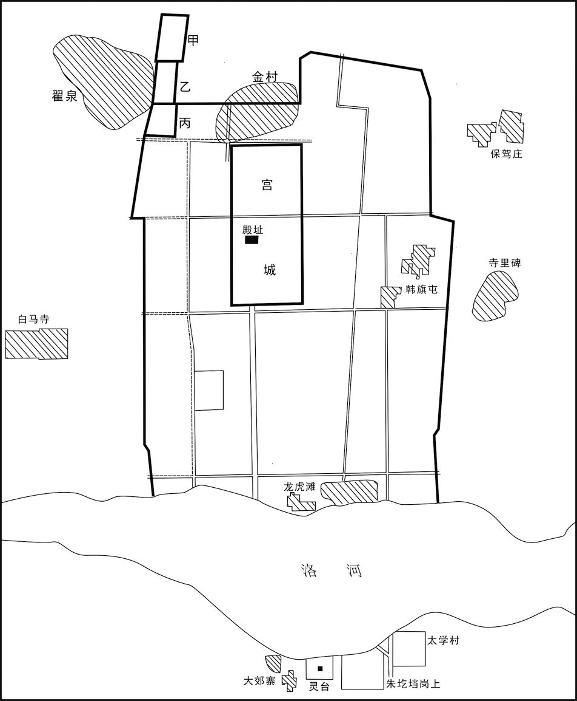 
**汉魏洛阳城平面示意图**

## 【原文】

**帝耽于内宠，妇官秩石拟百官之数，自贵人以下至掖庭洒扫者，凡数千人[1]。选女子知书可付信者六人，以为女尚书，使典省外奏事，处当画可[2]。廷尉高柔上疏曰：“昔汉文惜十家之资，不营小台之娱；去病虑匈奴之害，不遑治第之事[3]。况今所损者非惟百金之费，所忧者非徒北狄之患乎[4]。可粗成见所营立以充朝宴之仪，讫罢作者，使得就农，二方平定，复可徐兴。《周礼》，天子后妃以下百二十人，嫔嫱之仪，既已盛矣[5]。窃闻后庭之数，或复过之，圣嗣不昌，殆能由此[6]。臣愚以为可妙简淑媛以备内官之数，其余尽遣还家，且以育精养神，专静为宝，如此则《螽斯》之征可庶而致矣[7]。”帝报曰：“辄克昌言，他复以闻[8]。”**

## 【注文】

[1]耽（dān）：沉溺，入迷。　　内宠：得到君王宠幸的内官。　　妇官：古代后宫女官的总称。　　秩石：秩石制起源于战国时期的秦国，秦汉时期官吏以秩石分等次成为“定制”，在官吏中共约有十八个左右的秩阶。三国时曹魏官分九品。但与秩石并行，官品与秩石的双轨制，历两晋南朝不改。　　贵人：古代妃嫔称号。东汉光武帝始置，为皇帝之妾，位次皇后。三国时魏蜀沿置，晋代贵人位视三公，南朝宋贵人位比三司，后又省贵人置贵姬。　　掖庭：皇宫中的旁舍，为嫔妃所居住的地方。掖，通“腋”，引申为两旁，指宫殿边门。

[2]画可：帝王在奏章上批示“可”字，表示认可。

[3]去病：即西汉名将霍去病（前140—前117年）。河东平阳（今山西临汾西南）人，卫青外甥。十八岁为侍中，西汉元狩二年（前121年）两次出击匈奴，打开了通往西域的道路。元狩四年（前119年）与卫青率军深入漠北，击败匈奴主力。他先后六次出击匈奴，为解除匈奴对汉朝的威胁立下了汗马功劳。霍去病因反击匈奴有功，官至骠骑将军，封冠军侯。元狩六年（前117年）病故，年仅24岁。　　不遑：来不及，没有空闲。

[4]北狄：泛指北方少数民族。

[5]《周礼》：儒家经典之一。本名《周官》，古文经学家认为周公所撰，今文经学家认为出于战国。是搜集周王室官制和战国时各国制度，附以儒家政治理想而成。汉时河间献王得《周官》，阙《冬官》，遂取《考工记》补之。注疏本有汉郑玄集诸儒说所作《周礼注》、唐贾公彦疏《周礼正义》五十卷、清孙诒让撰《周礼正义》八十六卷。　　嫔嫱（qiáng）：泛指宫中女官。

[6]后庭：后宫。

[7]妙简：谓精心选拔。　　淑媛：古代皇帝妃嫔名。三国时魏文帝始置，为皇帝之妾，位视御史大夫，爵比县公，在淑妃之下、昭仪之上。晋与南朝宋齐梁陈均以淑媛为九嫔之一。　　《螽斯》之征：典出《诗经·周南·螽斯》一诗。螽（zhōng）斯，昆虫名。此诗以螽斯成群比喻子孙众多，诗为歌咏后妃子孙众多之作，螽斯遂被用作多子多孙的象征。

[8]昌言：善言，正当的言论。

## 【译文】

魏明帝沉湎（miǎn）于宠妃美女，宫中女官的品秩、俸禄可以和朝中文武百官之数相比拟，自贵人至宫廷洒扫的宫女有数千人。挑选读书识字可以信赖的六人，任命为女尚书，让她们掌管审查不经尚书省直接上奏的朝臣奏章，分别批准画诺。廷尉高柔上疏说：“从前汉文帝爱惜十户人家的资财，不建造小小的楼台以相娱乐，霍去病忧虑匈奴的危害，没有闲暇营治宅第，何况现在所耗费的绝非只是百金的资财，所忧虑的绝非只是北狄那样的忧患。可以粗略完成已经动工的工程，充当朝会和宴会之用，竣工后乞求遣返在工地劳作的民夫，使他们得以回去务农，待蜀国和吴国平定之后，可以再慢慢兴建。《周礼》规定，天子有后妃以下宫妇一百二十人，妃嫔媵（yìnɡ）嫱的仪制，已经非常盛大。为臣私下听说后官人数可能已超过这个数目，陛下子嗣未能昌盛，大概就是由此而起。为臣认为，可以精心挑选贤淑美女，备齐内宫女官的数目，其余的全部遣送回家，陛下可以育精养神。养生以专心静心最为宝贵，如能这样，《螽斯》所说多子多孙的征兆，差不多就可以实现应验了。”魏明帝回答说：“你经常进奏正当的言论，其他事情请以后再进奏吧。”

## 【原文】

**帝又欲平北芒，令于其上作台观望见孟津[1]。卫尉辛毗谏曰：“天地之性，高高下下。今而反之，既非其理，加以损费人功，民不堪役。且若九河盈溢，洪水为害，而丘陵皆夷，将何以御之[2]？”帝乃止。**

## 【注文】

[1]北芒：又名邙山，横卧于洛阳北侧，是崤（xiáo）山的支脉，为洛阳北面的天然屏障，也是军事上的战略要地。　　台观：古时对不同形体高台的统称。台是垒土四方形而高起者；观是非四方形的高台。台观泛称帝王的宫殿楼台。　　孟津：黄河渡口名，亦称“盟津”，又名“富平津”。在今河南孟津东北，孟县西南。历代为兵家必争之地，相传周武王伐纣，在此盟会诸侯并渡河，故名“盟津”。东晋杜预曾在此造桥。

[2]九河：《尚书·禹贡》中的地理名词。古黄河流入下游兖（yǎn）州境内，分为九道，称为九河，相传禹时曾加以疏导。　　盈溢：水过满而向外流。　　丘陵：连绵不断的低矮小山。

## 【译文】

魏明帝又想铲平北芒山，下令在上面建造台观，以便远眺黄河渡口孟津。卫尉辛毗（pí）规劝说：“天地本来之性，有高高下下各种地貌。现在要反其道而行，既违背了天理，加之耗费人力，民众已经无力承担。而且如果九河涨满盈溢，洪水为害之时，丘陵都夷为平地，将拿什么防御洪水呢？”明帝这才作罢。

## 【原文】

**少府杨阜上疏曰：“陛下奉武皇帝开拓之大业，守文皇帝克终之元绪[1]，诚宜思齐往古圣贤之善治，总观季世放荡之恶政[2]。曩使桓、灵不废高祖之法度，文、景之恭俭，太祖虽有神武，于何所施，而陛下何由处斯尊哉[3]？今吴、蜀未定，军旅在外，诸所缮治，惟陛下务从约节[4]。”帝优诏答之[5]。阜复上疏曰：“尧尚茅茨而万国安其居，禹卑宫室而天下乐其业；及至殷、周，或堂崇三尺，度以九筵耳[6]。桀作旋室象廊，纣为倾宫鹿台，以丧其社稷；楚灵以筑章华而身受祸；秦始皇作阿房，二世而灭[7]。夫不度万民之力，以从耳目之欲，未有不亡者也。陛下当以尧、舜、禹、汤、文、武为法则，夏桀、殷纣、楚灵、秦皇为深诫，而乃自暇自逸，惟宫台是饰，必有颠覆危亡之祸矣[8]。君作元首，臣为股肱，存亡一体，得失同之[9]。臣虽驽怯，敢忘争臣之义[10]。言不切至，不足以感寤陛下[11]。陛下不察臣言，恐皇祖烈考之祚坠于地[12]。使臣身死有补万一，则死之日，犹生之年也。谨叩棺沐浴，伏俟重诛[13]。”奏御，帝感其忠言，手笔诏答[14]。**

## 【注文】

[1]杨阜（生卒年不详）：三国魏国官吏。字义山，天水冀（今甘肃甘谷东）人。初为州吏，后察孝廉，又任州参军。曾策动陇右起兵，赶走马超，使陇右重归曹操统治，被曹操封爵关内侯。历任武都太守、将作大匠、少府等职。直言敢谏，不避忌讳，魏明帝很敬重他。居官清廉，卒后家无余财。　　武皇帝：指魏武帝曹操。　　文皇帝：指魏文帝曹丕。　　克终：圆满结束。　　元绪：帝王的大业。

[2]季世：末世，指衰乱之世。

[3]曩（nǎng）：以往，从前，过去的。　　法度：指法令制度。

[4]缮（shàn）治：整理，修补。

[5]优诏：褒奖或给以优遇的诏书。

[6]茅茨：夏、商两代的宫殿，屋面都铺设茅草，古时称为茅茨。　　九筵：八十一尺，一筵九尺。按周制，明堂东西长九筵，南北七筵。

[7]桀（生卒年不详）：夏朝末代国王，历史上有名的暴君之一，名履癸。在位期间荒淫暴虐，致使矛盾日益尖锐。在有仍（今山东济宁东南）与诸侯会盟，有缗（mín）氏反叛，被攻灭。桀后被商汤打败，逃到南方而死，夏朝灭亡。　　旋室：曲折回环的宮室。　　象廊：用象牙装饰的廊殿。　　纣（？—前1046年）：商朝末代王，历代有名暴君之一。帝乙之子，名受，号帝辛。在位期间，穷兵黩武，滥施暴政，刚愎自用，诛杀大臣。后周武王伐纣，战于牧野（今河南淇县西南），因商军在阵前倒戈，他兵败自焚。　　倾宫：巍峨的宫殿。倾：形容其高耸欲倾坠。传说商纣王建筑倾宫，以奢侈亡国。　　鹿台：相传殷纣王所筑台名，故址在今河南汤阴朝歌镇南。　　楚灵：即楚灵王芈（mǐ）虔（？—前529年），康王之弟，共王之子，公元前540年至前529年在位。康王死，其子麇（qún）（即郏敖）即位，任他为令尹。公元前541年，他杀郏敖自立为王。即位三年，在申（今河南南阳北）大会诸侯，出兵伐吴，围朱方（今江苏镇江东）。公元前533年，派公子弃疾灭陈、灭蔡，任弃疾为陈、蔡公。公元前530年，伐徐以威胁吴，亲驻乾谿指挥。次年，公子弃疾等以陈、蔡兵袭郢（yǐnɡ），杀太子禄，他被迫自杀。　　章华：古台名。楚灵王造，台内建筑陈设穷奢极侈。故址在今湖北监利县西北，一说在今安徽亳州东南。　　秦始皇（前259—前210年）：即秦王朝的建立者嬴政，公元前247年至前210年在位。他先后兼并了韩、赵、魏、楚、燕、齐六国，建立了中国历史上第一个统一的中央集权的封建国家，自称始皇帝。秦始皇独揽政治、经济和军事大权。推行郡县制，分全国为三十六郡；统一法律、度量衡、车轨、货币和文字；筑长城、修驰道，发展交通和农业。同时，焚书坑儒，挥霍无度，广造宫殿，大修阿房宫和陵墓，给人民带来沉重灾难。他曾五次巡行全国，公元前210年死于巡行途中。

[8]汤（生卒年不详）：商朝的建立者，名覆，子姓。继位后，建都于亳（今地有河南商丘、山东曹县、河南偃师三说），任用伊尹、促虺（huī）为左右相，积极为灭夏做准备。汤首先剪除夏的属国葛，又相继攻灭了韦、顾、昆吾等国，最后在鸣条一战灭夏，建立商朝。　　文：即周文王（生卒年不详），姓姬，名昌，古公亶父之孙，王季之子，号西伯。任西伯后，礼贤下士，注意整顿内政，尤重农业。文王任用姜尚为相，富国强兵，剪除商的羽翼，文王晚年国势日盛，“三分天下有其二”，为灭商奠定了基础。据传文王被囚羑（yǒu）里（今河南汤阴北）时，曾演《周易》，究天人之理。　　自暇自逸：形容饱食终日，无所用心。暇：空闲无事；逸：安闲。

[9]元首：指国君、天子。

[10]驽怯：懦弱，无能。　　争臣：争，即“诤”。天子左右直言谏诤的大臣。

[11]感寤：寤，同“悟”。有所感而觉悟。

[12]皇祖：古代王室称其祖父为皇祖。　　烈考：对已故先人的美称。　　祚（zuò）：皇位。

[13]俟（sì）：等待。　　重诛：犹“重刑”，严厉的惩罚。

[14]奏御：向帝王上奏。

## 【译文】

少府杨阜上疏说：“陛下承继武皇帝开拓的帝王大业，保持文皇帝一贯遵循的方向，实在应该考虑向古代圣贤的贤明政治看齐，全面考察各朝末世放荡的恶政。以前假使汉桓帝、汉灵帝不废弃汉高祖之时的法令制度，不破坏汉文帝、汉景帝的谦恭节俭，我们太祖（曹操）虽有神武之威，又往何处施展，而陛下又怎么能处在如今的至尊地位呢？而今吴、蜀两国还未平定，军队在外戍边，各项修缮营建工程，请陛下务必简约节省。”魏明帝下诏给予优遇和褒奖。杨阜又上书说：“尧崇尚简陋的茅屋而万国安居，大禹宫室低矮而天下安居乐业。等到商朝和周朝，殿堂堂基高不过三尺，殿内只能容纳九桌筵席而已。而夏桀用玉石建造宫室，用象牙装饰走廊，商纣建造倾宫和鹿台，因而断送王朝社稷；楚灵王因为修筑章华台而身遭大祸；秦始皇因为修建阿房宫，帝位传至二世即归于灭亡。如果不考虑民力的极限，只为满足自己感官的一时享受，没有一个不亡国灭家的。陛下应当以尧、舜、禹、汤、文王、武王为榜样，以夏桀、商纣、楚灵王、秦始皇的教训为鉴戒，若只贪图自己享乐安逸，只修饰宫殿台阁，一定有朝廷社稷颠覆灭亡的灾祸。君王好比头脑，大臣好比是股肱（ɡōnɡ）四肢，生死与共，利害得失相同。我虽然愚笨胆怯，岂敢忘记诤臣的大义。言辞不激切，便不足以感动陛下。陛下如不体察为臣之言，恐怕皇祖、先帝创建的大业将坠落在地。即使我身死而能对朝廷有万分之一的补益，那么为臣死去之日也犹如重生之年。我会敲着棺木，沐浴更衣，来听候重罚。”奏章呈上后，明帝被他的忠言感动，亲笔书写诏书回复。

## 【原文】

**帝尝着帽，被缥绫半袖[1]。阜问帝曰：“此于礼何法服也[2]？”帝默然不答。自是不法服不以见阜。**

## 【注文】

[1]被（pī）：古同“披”，搭衣于肩背。　　缥（piǎo）绫（líng）：缥，淡青色；绫，丝织物类名。淡青色丝织品。　　半袖：古代的短袖衣服，是私居穿着，不能在正式场合穿。

[2]法服：古代礼法规定的上至天子、文武百官、下至庶民百姓应着的标准服饰。即“礼服”，也称“正服”，与“常服”相对，如冕服、朝服等。

## 【译文】

魏明帝曾经头戴便帽，身穿淡青色短袖绸衫，杨阜问明帝：“这是符合礼制的哪一种法服？”明帝沉默不语。从此以后，不穿礼制规定的正规服装，就不接见杨阜。

## 【原文】

**阜又上疏，欲省宫人诸不见幸者，乃召御府吏问后宫人数[1]。吏守旧令，对曰：“禁密，不得宣露。”阜怒，杖吏一百，数之曰：“国家不与九卿为密，反与小吏为密乎[2]！”帝愈严惮之。散骑常侍蒋济上疏曰：“昔句践养胎以待用，昭王恤病以雪仇，故能以弱燕服强齐，羸越灭劲吴[3]。今二敌强盛，当身不除，百世之责也。以陛下圣明神武之略，舍其缓者，专心讨贼，臣以为无难矣。”**

## 【注文】

[1]御府：古代官署名。两汉隶少府，设令、丞。西汉掌宫廷金钱、衣服、玉器珍玩及刀剑之库藏及出纳，也称中御府。东汉掌使役宫婢制作补浣宫廷所用衣服等事，又置织室丞，三国沿袭。西晋改隶光禄勋，掌使役工匠制作宫廷所用器玩。

[2]九卿：九卿之说，始于先秦。汉初九卿泛指列卿，数目不止于九。后逐渐固定为九种官名，即奉常（太常）、郎中令（光禄勋）、卫尉、宗正、太仆、廷尉（大理）、典客（大鸿胪）、治粟内史（大司农）、少府。汉代九卿位在三公之下，负责行政。魏晋以后，设尚书专主各部曹，九卿专掌一部分事务，职位渐轻。

[3]句践（？—前465年）：春秋末期越国国君。句同“勾”，又名菼（tǎn）执，越王允常之子，公元前497—前465年在位。曾被吴国大败，屈服求和。他卧薪尝胆，刻苦图强，任用范蠡（lǐ）、文种等人整顿国政，终于转弱为强，灭掉吴国，据有江淮地区。　　养胎：传说春秋时越王勾践处于困境时，提倡和奖励生育，以增强国力。　　昭王：即燕昭王（？—前279年），战国时期燕国国君，公元前311年至前279年在位，燕王哙（kuài）庶子。初流亡在韩，燕王哙禅位于相国子之，引发燕国内乱。子之三年（前314年），齐攻破燕国，燕王哙和子之被杀。他被赵武灵王派人送归。即位后师事郭隗，招纳贤士，士人争相趋燕。昭王外用苏秦，内用乐毅，经过长期休养生息，国家殷富，士卒效命。燕昭王二十八年（前284年），派遣乐毅率军联合三晋及秦楚之师攻齐，大破齐军，占领齐国城邑七十余座，齐滑王败死。燕国进入鼎盛时期。　　恤病：救助有危难的人。　　羸（léi）：瘦弱。

## 【译文】

杨阜又上疏，打算减去那些不被皇帝宠幸的宫女，于是召来御府吏询问后宫人数。御府吏遵守旧有规定，答道：“这是宫禁的秘密，不能泄漏。”杨阜大怒，责打吏员一百棍，数落他说：“皇帝不对九卿有什么秘密，反而对小吏有什么秘密吗？”魏明帝更加惧怕杨阜。散骑常侍蒋济上疏说：“从前勾践鼓励生育，以待国家征用，燕昭王抚慰百姓疾苦以打算报仇雪耻，所以弱小的燕国能够战胜强大的齐国，贫弱的越国消灭了强劲的吴国。如今吴、蜀两敌强盛，陛下在位时不能铲除，将为后代百世所谴责。凭着陛下圣明神武的韬略，舍弃那些可以缓办的事情，专心讨伐敌人，我认为没有什么难办的。”

## 【原文】

**中书侍郎东莱王基上疏曰：“臣闻古人以水喻民，曰‘水所以载舟，亦所以覆舟[1]’。颜渊云‘东野子之御，马力尽矣，而求进不已，殆将败矣[2]’。今事役劳苦，男女离旷，愿陛下深察东野之敝，留意舟水之喻，息奔驷于未尽，节力役于未困[3]。昔汉有天下，至孝文时唯有同姓诸侯，而贾谊忧之，曰‘置火积薪之下而寝其上，因谓之安[4]’。今寇贼未殄，猛将拥兵，检之则无以应敌，久之则难以遗后，当盛明之世，不务以除患，若子孙不竞，社稷之忧也[5]。使贾谊复起，必深切于曩时矣。”帝皆不听。**

## 【注文】

[1]中书侍郎：古代官名。晋朝设置，为中书监、中书令的副职，协助监、令掌尚书奏事。其后南朝、北魏、北齐皆置。　　东莱：指今山东半岛的龙口、莱阳等以东地区。　　王基（190—261年）：三国时魏将领。字伯舆，一作伯兴，东莱曲城（今山东招远西）人。十七岁为郡吏，后历为郎中、荆州刺史、镇南将军、征东将军，都督扬州诸军事等。在任整军理农，修治学校，曾先后帮助司马氏平定毌丘俭、文钦、诸葛诞叛军。王基为官清廉，不治产业，家无余财，卒后谥景侯。

[2]颜渊（前521—前481年）：春秋末鲁国人。名回，字子渊。孔子最得意的学生，他贫居陋巷，箪（dān）食瓢饮而不改其乐，长期的贫困生活使他的身体很弱，二十九岁头发尽白，终于早卒。在孔子弟子“七十二贤”中，颜渊最坚信孔子的学说，并且在行动上能努力实践孔子的教导。

[3]离旷：指丈夫离家，妇人独处。　　驷：古代同驾一辆车的四匹马，或套着四匹马的车。

[4]贾谊（前200—前168年）：汉初杰出政论家、文学家，也是最早的汉赋作家之一。洛阳（今河南洛阳）人，少有文名，汉文帝时召为博士，后迁太中大夫。遭权贵排挤，贬为长沙王太傅和梁怀王太傅。怀王坠马而死，他自伤失职，忧郁而死，年仅三十三岁。贾谊曾多次上疏，建议削弱诸侯王势力，巩固中央集权，主张重农抑商，力主抗击匈奴，具有“民为邦本”思想。

[5]殄（tiǎn）：消灭。

## 【译文】

中书侍郎东莱人王基上疏说：“为臣听说古人用水比喻人民，说‘水可以载舟，也可以覆舟’。颜渊说‘东野子驾车，马力已经用尽，但仍不停向前驱赶，最终将毁掉马匹’。如今百姓劳役辛苦，男女分离怨恨，希望陛下深察东野子驾车的弊病，留意君民舟水关系的比喻，让奔跑的驷马在力气用尽之前得以休息，在人民还没有困乏之时减省力役。从前汉朝取得天下，到汉文帝时只有同姓诸侯，可是贾谊仍很忧虑，说‘把火置于堆积的干柴下面而睡在其上，还认为是平安’。如今敌寇未灭，猛将拥兵自重，限制约束他们就无法应付敌人，长久下去则难以给子孙交代，当此国家盛明之时，还不全力除害，如果将来子孙不强，江山社稷必定有忧患的时候。假使贾谊复活，一定比从前感受更为深切。”魏明帝都不采纳。

## 【原文】

**殿中监督役，擅收兰台令史，右仆射卫臻奏按之[1]。诏曰：“殿舍不成，吾所留心，卿推之何也？”臻曰：“古制侵官之法，非恶其勤事也，诚以所益者小，所堕者大也[2]。臣每察校事，类皆如此，若又纵之，惧群司将遂越职，以至陵夷[3]。”**

## 【注文】

[1]殿中监：古代官名。三国曹魏始设，掌宫廷供奉及礼仪，晋、南朝宋沿置。　　兰台令史：古代官名。东汉始置，隶属御史中丞，掌书奏及印工文书，兼校定宫廷藏书文字，秩六百石。班固曾任其官，受诏撰史。魏晋南朝沿置，掌监察刑狱文书，班次侍御史。魏晋南朝宋六品。　　右仆射：古代官名。东汉末年设置，为尚书台次官，位在左仆射之下，佐助尚书令掌台务。魏晋南北朝及隋唐沿置，也称尚书右仆射。魏晋及南朝宋、齐三品。

[2]侵官：侵犯有关官员的职守。

[3]校事：古代官名。东汉建安年间曹操设置，以身边地位较低的亲信充任，负责监察百官及吏民，直接隶属于曹操，威权很大。三国魏沿置，也称抚军校事或抚军都尉，权势仍极大，三国魏嘉平年间司马氏控制朝政后罢。吴国也设置，又称典校、典校郎，校诸官府及州郡文书，属中书。三国吴建兴元年（252年）罢。　　陵夷：形容衰落，败落。

## 【译文】

殿中监监督营造宫室，擅自拘捕兰台令史，右仆射卫臻奏请查办。魏明帝下诏说：“宫殿楼舍不能完工，是我最为关心的，你推究查办此事，为何？”卫臻说：“古代制定禁止官吏侵犯他人职权的法规，不是厌恶他们勤于办事，实在是因为收效微小，而所造成的破坏极大。为臣每次检查校事官的工作，大略都是如此，若再对此放纵，我恐怕各部门就要越职越权，以至王权衰落。”

## 【原文】

**尚书涿郡孙礼固请罢役，帝诏曰：“钦纳谠言[1]。”促遣民作，监作者复奏留一月，有所成讫[2]。礼径至作所，不复重奏，称诏罢民，帝奇其意而不责。帝虽不能尽用群臣直谏之言，然皆优容之[3]。**

## 【注文】

[1]涿（zhuō）郡：古郡名。西汉武帝置，治所在涿县（今河北涿州）。汉成帝末辖境相当于今北京房山以南，河北易县、清苑以东，安平、河间以北，霸州、任丘以西地区。三国魏黄初七年（226年）改名范阳郡。隋大业三年（607年）改幽州置，治所在蓟（jì）县（今北京城西南隅）。　　孙礼（？—250年）：三国魏国官吏。字德达，涿郡容城（今河北容城北）人。初为曹操司空军谋掾。魏明帝时任尚书，反对大修宫室，并自作主张，罢止延期的劳役。任冀州牧，主张以果断手段解决清河、平原二郡长期争界问题，因而得罪权臣曹爽，被免官。孙礼曾劝司马懿除去曹爽一党。曹爽被诛后，历官司隶校尉、司空等。卒后谥景侯。　　谠（dǎng）言：正直的言论。

[2]讫（qì）：完结，终了。

[3]优容：宽容，厚待。

## 【译文】

尚书涿郡人孙礼坚持请求停止劳役，魏明帝下诏说：“朕敬佩并接受你的正直之言。”催促遣返民夫回家，但监造官又上奏停留一月，以便工程完毕。孙礼直接来到工地，不再重新上奏，宣称皇帝颁布诏书遣返民工，明帝对孙礼的做法感到新奇，因而没有责怪。明帝虽然不能全部采用群臣的进谏直言，然而都能宽容厚待他们。

## 【原文】

**秋七月，洛阳崇华殿灾，帝问侍中领太史令泰山高堂隆曰：“此何咎也？于礼，宁有祈让之义乎[1]？”对曰：“《易传》曰：‘上不俭，下不节，孽火烧其室[2]。’又曰：‘君高其台，天火为灾。’此人君务饰宫室，不知百姓空竭，故天应之以旱，火从高殿起也。”诏问隆：“吾闻汉武帝时柏梁灾，而大起宫殿以厌之，其义云何[3]？”对曰：“夷越之巫所为，非圣贤之明训也[4]。《五行志》曰：‘柏梁灾，其后有江充巫蛊事[5]。’如志之言，越巫建章无所厌也[6]。今宜罢散民役。宫室之制，务从约节，清扫所灾之处，不敢于此有所立作，则萐莆、嘉禾必生此地[7]。若乃疲民之力，竭民之财，非所以致符瑞而怀远人也[8]。”**

## 【注文】

[1]崇华殿：三国魏都洛阳宫城内北宫中殿名，在今河南洛阳市东北汉魏洛阳故城。　　太史令：古代官名。相传夏代置太史令，秦代置为奉常属官，西汉沿置，掌管编写史书和天文历法，俸禄六百石。东汉太史令只掌天文历法。到魏晋时期，编写史书的任务已由其他官员担任，太史令只管占候。　　泰山：古郡名。西汉元狩元年（前122年）分济南郡置，因境内有泰山得名，治所在博县，今山东泰安东南，后移治奉高，今泰安东北。　　高堂隆（？—237年）：三国时魏国大臣。字升平，泰山平阳（今山东新泰）人。少为郡督邮。东汉建安中，为曹操丞相军议掾（yuàn）。魏黄初中选为平原王曹叡（ruì）傅。曹叡即位，拜为给事中、驸马都尉，迁陈留太守、散骑常侍，赐关内侯。多次劝谏魏明帝不要兴众役、治殿舍。高堂隆精通四经三礼、天文历象，曾与尚书杨伟等共同推校《太和历》，劝魏明帝改正朔、易服色。　　咎（jiù）：过失，罪过。

[2]《易传》：又称《周易大传》《易大传》《十翼》，是《周易》的组成部分，为《易经》最古的注释。相传为孔子所作，实为春秋战国至秦汉初，孔子的学生及儒家学派根据孔子所述编纂而成。　　孽（niè）：恶因，恶事，邪恶。

[3]汉武帝（前156—前87年）：即刘彻，汉景帝之子。十六岁即皇帝位，自公元前141年至公元前87年在位。汉武帝排斥黄老，独尊儒术。实行盐铁官营，又设平准、均输官员，统管贸易和运输。兴修水利，发展生产。派张骞（qiān）两次出使西域，发展与西域各国的关系。派卫青、霍去病多次击败匈奴，设置河西四郡。派李广利征服大宛，使西域各国归附于西汉，为此后汉昭帝、汉宣帝经营西域奠定了基础。　　柏梁：即柏梁台，汉时台名，汉武帝时建造，在今陕西西安长安区西北长安故城内，以香柏为梁。

[4]夷越：亦作“隽越”，中国古族名。一说为百越的一支；一说为夷、越两族的合称，秦、汉时分布在今云南、贵州及湖南等地。　　明训：高明的指教。

[5]《五行志》：儒家文献，记载自然物发生灾变的志书，为正史的组成部分，始于《汉书》。其在每一个灾变之后，还要记上引起该灾变的人或事。唐宋以后，儒教理论转变，改为只记灾变，一般不再指出相应的人事。　　江充（？—前91年）：西汉大臣。字次倩，本名齐，赵邯郸（今河北邯郸）人。父母被杀后，他就逃亡入关，改名充。江充容貌雄壮，汉武帝见到后任命他为谒者，后拜为直指绣衣使者，督察三辅地区的盗贼。江充执法不阿，卫太子家使乘车马行驰道中，也遭惩治，于是和太子产生矛盾。汉武帝认为他办事忠诚可靠，提升他为水衡都尉。后武帝年高，江充担心太子即位后对己不利，就诬陷太子谋害汉武帝。太子惊惧，捕杀江充。武帝以为太子谋反，派兵征讨，太子战败被杀。后武帝了解到是江充诬陷太子，就诛灭江充三族。　　巫蛊（gǔ）：古代迷信，认为用巫术诅咒及把木偶人埋于地下，可加害于人，称为“巫蛊”。汉武帝时，有女巫教宫人埋木偶于地下，以祭祀免灾。后来适逢汉武帝患病，江充认为皇帝的病是由巫蛊引起的。因巫蛊之术一次被朝廷所杀的就有数万人。

[6]建章：西汉宫名。西汉太初元年（前104年）于未央宫西边构建，故址在今陕西西安长安区西。后世亦用此泛指宫阙。

[7]萐（shà）莆（pú）：古代瑞草名。据古书所载，萐莆生于庖厨之间，可自转动生风，使饮食清凉，并驱杀蚊蝇。占相家认为王者有德、生活俭朴有节则生萐莆，也是孝道至的征兆。　　嘉禾：指一茎多穗的禾或者长势茁壮的禾，古代占象者认为是吉祥之兆。

[8]符瑞：祥瑞的征兆，即吉兆。西汉董仲舒用以鼓吹“天人感应”神学目的论，认为君主若按天意办事，实行仁德，则“天”会降下祥瑞之象以示任命和嘉奖。

## 【译文】

魏明帝青龙三年（235年）秋季七月，洛阳崇华殿发生火灾，魏明帝问侍中兼太史令泰山人高堂隆，说：“这是什么过失？在礼仪上有祈福攘灾的办法吗？”高堂隆对答说：“《易传》说：‘在上不俭朴，在下不节约，灾火烧毁他的宫室。’还说：‘君主高筑楼台，天火成灾。’这是君王一心致力于修饰宫殿，不了解百姓财力空竭，所以上天以旱灾相报，火就从高殿燃起。”魏明帝下诏问高堂隆：“我听说汉武帝之时柏梁台发生火灾，反而大兴土木，以修建宫殿来震慑，这又怎么解释？”高堂隆回答说：“这是夷、越族巫师所为，并非是圣贤的明训。《五行志》记载说：‘柏梁火灾发生后，有江充巫蛊之事。’正如《五行志》所言，越人巫师修筑建章台，并没有起到震慑灾变的作用，现在应该遣散民役。宫殿的建制，务必从简节省，清扫发生火灾的地方，不要冒昧在此兴作施工，那么萐莆瑞草、嘉禾一定能在这里长出来。如果继续耗费民力，枯竭民财，不是招致符瑞、安抚远方百姓的做法。”

## 【原文】

**秋八月，诏复立崇华殿，更名曰九龙。通引谷水过九龙殿前，为玉井绮栏，蟾蜍含受，神龙吐出[1]。使博士扶风马钧作司南车，水转百戏[2]。陵霄阙始构，有鹊巢其上，帝以问高堂隆，对曰：“《诗》曰：‘惟鹊有巢，惟鸠居之[3]。’今兴宫室，起陵霄阙，而鹊巢之，此宫未成身不得居之象也。天意若曰，宫室未成，将有他姓制御之，斯乃上天之戒也[4]。夫天道无亲，惟与善人，太戊、武丁睹灾竦惧，故天降之福[5]。今若休罢百役，增崇德政，则三王可四，五帝可六，岂惟商宗转祸为福而已哉[6]。”帝为之动容。**

## 【注文】

[1]谷水：古水名。即今河南渑池南渑水及其下游涧水，东流至洛阳西注入洛河。东周王城在谷、洛二水合流处东北岸。东汉、魏、晋、北魏建都洛阳，曾导谷水使东出王城北，合瀍（chán）水东注为阳渠，径达洛阳城北，东至偃师东南入洛。　　九龙殿：古宫殿名。相传周有九龙殿，三国魏修复崇华殿，改名九龙殿，在今河南洛阳市东北汉魏故城内。　　玉井：水井的美称。　　绮（qǐ）：美丽。　　蟾蜍（chán chú）：一种两栖动物，俗称“癞蛤蟆”，民间以其形象不佳而厌恶，有“癞蛤蟆想吃天鹅肉”的俗语。然古代神话中，蟾蜍却是吉祥之物。　　神龙：古时以龙为神物，称之为神龙。

[2]博士：古代官名。六国时有博士，秦汉相承，诸子、诗赋、术数、方技都立博士，西汉时属太常，官秩为比六百石。秦与汉初，博士为学术顾问性质的官员，既掌管专门之学，又参与政治讨论，还外出巡行视察。西汉建元五年（前136年）又设置五经博士，专管儒家经学传授，每经不止一家。汉以后学术传授多在私家，博士之任渐轻。晋有国子博士。　　扶风：即右扶风，汉代三辅之一。西汉太初元年（前104年）置，治所在长安（今陕西西安市西北汉长安城）。东汉移治槐里县（今陕西兴平东南）。三国魏文帝时把右扶风改名为扶风郡，治所仍在槐里，辖区相当于今陕西秦岭以北，户县、咸阳、旬邑等地以西地区。　　司南车：指南车，古代车驾出行时用于指明方位的特殊车辆。指南车传说是黄帝或西周时周公创制，但制作和使用方法失传，东汉的张衡、三国时魏国的马钧、南北朝时的祖冲之都曾造过指南车，但没有实物流传下来。

[3]阙：中国古代用于标志建筑群入口的建筑物，多建于城池、宫殿、第宅、祠庙、陵墓之前，由最初显示威严、供守望之用，演变成显示门第、区别尊卑、崇尚礼仪的装饰性建筑。始于周代，春秋战国、秦汉时期大量建造。自汉至唐宋，阙一直是宫殿及其他建筑前的重要建筑。阙通常左右各一，建成高台，台上起楼观。　　惟鹊有巢，惟鸠（jiū）居之：出于《诗经·召南·鹊巢》，后来演化为成语“鹊巢鸠居”，本喻是说准备好了居所，等待新娘嫁到，也指女子出嫁，住在夫家。后以“鹊巢鸠居”比喻强占别人的房屋、土地、妻室等。

[4]制御：统治，控制。

[5]天道无亲：语出《老子》。意思是天道自然，无所谓亲不亲，经常帮助有德的善人。　　太戊（wù）（生卒年不详）：商朝的著名国王。在位时修德补阙，政治清明，重用贤臣伊陟（zhì）、巫咸，治国有绩，商朝复兴，诸侯归附，史称中宗。　　武丁（？—前1192年）：商代国王，后世称作“高宗”，为盘庚弟小乙之子。年幼时在外服役，比较了解稼穑的艰难。即王位后，提拔版筑匠人傅说执政，还任用甘盘为大臣，力求使商王朝得以大治。武丁在位时连年向四方用兵，不断向东面的夷、西面的羌、北面的鬼方以及周族大规模出兵征伐，征服了周围许多小方国。由于武丁将商王朝推向极盛，他被称为“中兴之王”。　　竦（sǒnɡ）惧：同“悚惧”，恐惧。

[6]三王：古代三王，即夏禹、商汤、周文王，或谓禹、汤、文王，也有指夏、殷、周者。　　五帝：传说中的五个帝王，历代说法不一，通常指黄帝、颛（zhuān）顼（xū）、帝喾（kù）、唐尧、虞舜。

## 【译文】

魏明帝青龙三年（235年）秋季八月，魏明帝下诏重新修建崇华殿，改名为九龙殿。开渠引谷水流过九龙殿之前，用玉石砌成水井，用彩缎装饰井栏，水从玉雕蟾蜍的口中流入，再从玉雕神龙的口中吐出。命博士扶风人马钧制作司南车，制作随水转动的百戏车。陵霄阙刚刚构架，就有喜鹊在上面筑巢，明帝以此事询问高堂隆，高堂隆回答说：“《诗经》上说：‘惟鹊有巢，惟鸠居之。’如今大兴宫殿，起陵霄阙，就有喜鹊在上面筑巢搭窝，这是宫殿还没有建成而自己就不能在里面居住的征兆。上天之意好像在说，宫殿未成，就会有外姓人支配统治它，这是上天给我们的警戒。天道没有亲疏，只是赐福给善人。太戊、武丁看到灾异后惊慌恐惧，所以上天改降福禄。现今如果停止各种劳役，愈发崇尚德政，那么加上陛下，古代尧、舜、禹三圣王可以增加为四王，五帝可以增为六帝，怎么会只是商代帝王可以转祸为福而已。”明帝听了为之动容。

## 【原文】

**帝性严急，其督修宫室有稽限者，帝亲召问，言犹在口，身首已分[1]。散骑常侍领秘书监王肃上疏曰：“今宫室未就，见作者三四万人，九龙可以安圣体，其内足以列六宫，惟泰极已前，功夫尚大[2]。愿陛下取常食禀之士，非急要者之用，选其丁壮，择留万人，使一期而更之，咸知息代有日，则莫不悦以即事，劳而不怨矣。计一岁有三百六十万夫，亦不为少。当一岁成者，听且三年，分遣其余，使皆即农，无穷之计也。夫信之于民，国家大宝也。前车驾当幸洛阳，发民为营，有司命以营成而罢。既成，又利其功力，不以时遣。有司徒营目前之利，不顾经国之体[3]。臣愚以为自今已后，傥复使民，宜明其令，使必如期，以次有事，宁复更发，无或失信。凡陛下临时之所行刑，皆有罪之吏宜死之人也。然众庶不知，谓为仓卒[4]。故愿陛下下之于吏而暴其罪，钧其死也，无使污于宫掖而为远近所疑[5]。且人命至重，难生易杀，气绝而不续者也，是以圣贤重之。昔汉文帝欲杀犯跸者，廷尉张释之曰：‘方其时，上使诛之则已[6]。今下廷尉，廷尉天下之平，不可倾也。’臣以为大失其义，非忠臣所宜陈也。廷尉者，天子之吏也，犹不可以失平，而天子之身反可以惑谬乎！斯重于为己而轻于为君，不忠之甚也，不可不察。”**

## 【注文】

[1]稽限：超过期限，延误原定日期。

[2]秘书监：古代官名。东汉桓帝时始置，掌典禁中图书，考核异同，隶于太常。曹操为魏王时置秘书令典尚书奏事，兼掌图书秘记。三国魏黄初中改秘书令为中书令，复设秘书监一人，秩三品，专掌艺文图籍之事，初属少府。当时秘书监之职，多由近臣兼领或由他官升任。晋代始置秘书省，以秘书监为长官，南北朝沿置。　　六宫：古代帝王后妃的寝宫，正寝一，燕寝五，合为六宫，后世泛称后妃及其所居之地为六宫。

[3]司徒：古代官名。相传商代设此官，掌土地、人民、教化等。西汉元寿二年（前1年）改丞相为大司徒，掌辅助天子理万机。东汉时称司徒，掌民事，并以礼义教化人民，为三公之一。魏沿汉制，但三公为虚衔，不参与朝政。　　经国：治理国家。

[4]众庶：民众，百姓。　　仓卒：同“仓猝”，匆忙，急迫。

[5]宫掖（yè）：宫廷，皇宫。掖：掖廷，宫中的旁舍，妃嫔居住的地方。

[6]犯跸（bì）：冲犯皇帝出行时的仪仗或车骑的行为。皇帝所行之处称为“跸”。法律规定对犯跸行为处以刑罚，实际上是为了防止侵犯皇帝的人身安全。　　张释之（生卒年不详）：汉初著名法官。字季，南阳堵阳（今河南方城东）人。汉文帝时，以资选为骑郎，拜为谒者仆射，迁公车令、中大夫、中郎将，后任廷尉。汉景帝时任淮南相。张释之任廷尉时，执法严格，即使汉文帝不依法办事，他也能冒死直谏。

## 【译文】

魏明帝性情严厉急躁，对那些监督宫殿修建而未能如期完工的人，亲自召来责问，其人话刚出口，身体与人头已经分离。散骑常侍兼秘书监王肃上疏说：“而今宫殿还没建成，参加劳作的人已有三四万。九龙殿可以使陛下安居，里面足够安置六宫妃嫔，只是泰极殿前面的工程尚大。希望陛下指派领取国家粮食而目前又无紧急任务的人，挑选身体强壮的一万人，使用一期就轮换一次，他们都知道休息更替有日可待，就都乐于在工地劳作，虽然辛苦而不再抱怨。总计一年有三百六十万夫役，也不算太少。本应当一年完成的工程，不妨三年完成，遣散其余的民工，让他们都回去务农，这是长远之计。取信于民，是国家最为重要的珍宝。以前陛下临幸洛阳，征发百姓修建营垒，有关部门下令营垒修成就让民工回家，结果营垒建成，又贪图百姓的工力，不按时遣散。有关部门只营求眼前利益，不顾治国经国的大本。为臣认为，从今以后，倘若再征用民工，应该明确宣布期限，征用民工一定遵守时限。如果又有劳役，宁可重新征发，也不要失信于民。凡是陛下临时施刑的大臣，都是有罪而且当死的官吏。可是众人不知详情，说是处置仓促。所以希望陛下将他们交给主管官吏，明确公布他们的罪行，同样都是处死，不要让他们的血玷污宫廷，而且让远近之人猜疑。况且人命至为重要，诛杀容易而复生困难，一旦气绝而不可能再延续，所以圣贤对生命都很重视。以前汉文帝想要杀死冲撞御驾的人，廷尉张释之说：‘当事情发生之时，皇上派人杀了他也就算了，现在既然下交廷尉，廷尉为天下公平，不可有所偏颇。’我认为这完全失去君臣大义，不是忠臣所该陈述之言。廷尉是天子的属官，都不可以失去公平，而天子自身岂可以出现迷惑错谬！这是看重自己而轻视帝王，是非常的不忠，不可不明察。”

## 【原文】

**四年冬十月甲申，有星孛于大辰，又孛于东方[1]。高堂隆上疏曰：“凡帝王徙都立邑，皆先定天地社稷之位，敬恭以奉之。将营宫室，则宗庙为先，厩库为次，居室为后[2]。今圜丘、方泽、南北郊、明堂、社稷，神位未定，宗庙之制又未如礼，而崇饰居室，士民失业[3]。外人咸云宫人之用，与军国之费略齐，民不堪命，皆有怨怒[4]。《书》曰‘天聪明自我民聪明，天明畏自我民明威’，言天之赏罚，随民言，顺民心也。夫采椽卑宫，唐、虞、大禹之所以垂皇风也，玉台琼室，夏癸、商辛之所以犯昊天也[5]。今宫室过盛，天彗章灼，斯乃慈父恳切之训，当崇孝子祗耸之礼，不宜有忽，以重天怒[6]。”隆数切谏，帝颇不悦。侍中卢毓进曰：“臣闻君明则臣直，古之圣王惟恐不闻其过，此乃臣等所以不及隆也[7]。”帝乃解。毓，植之子也[8]。**

## 【注文】

[1]孛（bèi）：混乱，相冲突。后作“悖”。　　大辰：星名，即北辰。古人观察北辰以辨方向，故称大辰。

[2]宗庙：古代帝王、诸侯或大夫、士祭祀祖先的场所。周代宗庙的设置有着严格的等级制度，天子七庙，诸侯五庙，大夫三庙，士一庙，庶人无庙，祭祀祖先只能在嫡长子的居室。宗庙之设，对保持宗法制度和巩固贵族世袭统治意义重大，所以历代统治者都极力维护宗庙制度，并将宗庙与社稷并列，以为王室或国家的代称。　　厩（jiù）库：牲口房和库房。

[3]圜（yuán）丘：古代帝王祭天的祭坛。这种祭坛筑得很高，上面为圆形，象征天圆。圜丘建在京都南郊，因天属阳，南也属阳位，正相匹配。圜丘祭天礼仪始于殷商，历代相沿不废。　　方泽：也称方丘，古代帝王祭地神的祭坛。古人以为天圆地方，所以祭地要掘地为方池，以象征地方，池中贮满水，水中设台而祭祀。古代帝王祭地典礼规模庞大，礼仪繁杂，在水中设祭很不方便。故改方泽为方丘，即在陆地筑成的方形祭坛。方丘建在京都的北郊，因为北方属阴象，与地的属性相合。方丘祭地的帝王礼制同圜丘祭天一样历代相沿不废。　　南北郊：西汉末期制定的在京城长安南、北郊祭祀天地的礼典。汉成帝即位之初，丞相匡衡、御史大夫张谭建议，将甘泉泰畤与河东后土祠徙置长安，以合于古礼，为朝廷所采纳，始定长安南北郊，即祭天于南郊，祭地于北郊。　　明堂：古帝王宣明政教的地方。凡朝会、祭祀、庆赏、选士、养老、教学等大典，都在这里举行。　　神位：祭祀时所设的牌位，平时供奉在宗庙或祠堂中。

[4]民不堪命：民众负担沉重，痛苦得活不下去。堪：忍受。

[5]采椽（chuán）：采，同“棌”，栎木。用栎木做椽，言其俭朴，用来比喻房屋简陋。　　夏癸：即夏桀，名履癸。　　商辛：即“帝辛”，商朝的末代君主商纣王。　　昊天：天的泛称，言其广大高远。上古文献言“昊天”，多指有意志、可降祸福于人间的神明。

[6]章灼：光辉照耀。　　祗（zhī）耸：同“祗竦”。祗，恭敬；耸，高起，直立。

[7]卢毓（yù）（183—257年）：字子家，涿郡涿县（今河北涿州）人，卢植之子。东汉建安时曾为曹丕、曹操属吏。魏文帝以后历官黄门侍郎、谯郡太守、侍中、吏部尚书、司空等。敢于进言上谏，曾被曹爽排挤，卒后谥成侯。

[8]植：即卢植（？—192年）。字子干，涿郡涿县（今河北涿州）人。师事马融，通古文经和今文经，好研经文而不守章句。汉灵帝初年为博士，历任九江、庐江太守，镇压蛮族的反抗斗争。东汉中平元年（184年）黄巾起义爆发，拜北中郎将，率领郡兵镇压河北黄巾军，被张角打败。董卓之乱时，曾反对大将军何进召董卓进京。中平六年（189年）董卓废汉灵帝，只有卢植不同意，董卓想杀他，得到蔡邕救助，免死罢官，隐居于上谷，不久任袁绍军师。

## 【译文】

魏明帝青龙四年（236年）冬季十月甲申（十五日），在大辰星旁突现异星，后来又突现在东方天际。高堂隆上疏说：“凡是帝王迁都或兴建城邑，都要先选定祭祀天地和社稷神的地方，恭恭敬敬地尊奉祭祀他们。将要营建宫殿时，也要先建祖先宗庙，然后再建马厩和库房，最后才兴建居室。如今圜丘、方泽、南北郊、明堂与社稷，各神神位没有确定，宗庙之制也不符合礼法，而只是大修宫殿，使人民失掉生计。外人都说，宫中妃嫔的花费用度，与国家军费几乎相等，民众负担沉重，痛苦得活不下去，都抱有怨恨愤怒的情绪。《尚书》说：‘上天听取意见、考察政治得失，以民众的视听为标准；上天的奖励惩罚，也是依从民众的好恶。’这是说上天的奖赏和惩罚，都是随从民意，顺应民心。用栎木做椽子，建造陋室居住，是唐尧、虞舜、大禹留下来的帝王风范，修玉台、建琼室，是夏桀、商纣触犯皇天的原因所在。如今宫殿修建得过于豪华盛大，而彗星就在天空光辉照耀，这是仁慈的天父发出恳切的训诫，陛下应当尊崇孝子恭谨接受的礼仪，而不应当忽视它，以免加重上天的愤怒。”高堂隆多次恳切直言进谏，明帝很不高兴。侍中卢毓进言说：“我听说君王圣明则臣下正直，古代圣王唯恐听不到自己的过失，这正是为臣等人不及高堂隆之处。”明帝听了怒意才算消解。卢毓，是卢植之子。

## 【原文】

**景初元年，徙长安钟虡、橐佗、铜人、承露盘于洛阳[1]。盘折，声闻数十里[2]。铜人重，不可致，留于霸城[3]。大发铜，铸铜人二，号曰“翁仲”，列坐于司马门外[4]。又铸黄龙、凤皇各一，龙高四丈，凤高三丈余，置内殿前。起土山于芳林园西北陬，使公卿群僚皆负土，树松、竹、杂木、善草于其上，捕山禽、杂兽致其中[5]。司徒军议掾董寻上疏谏曰：“臣闻古之直士，尽言于国，不避死亡，故周昌比高祖于桀、纣，刘辅譬赵后于人婢[6]。天生忠直，虽白刃、沸汤，往而不顾者，诚为时主爱惜天下也。建安以来，野战死亡，或门殚户尽，虽有存者，遗孤老弱[7]。若今宫室狭小，当广大之，犹宜随时，不妨农务，况乃作无益之物，黄龙、凤皇、九龙、承露盘，此皆圣明之所不兴也，其功三倍于殿舍。陛下既尊群臣，显以冠冕，被以文绣，载以华舆，所以异于小人；而使穿方举土，面目垢黑，沾体涂足，衣冠了鸟，毁国之光以崇无益，甚非谓也[8]。孔子曰‘君使臣以礼，臣事君以忠’，无忠无礼，国何以立？臣知言出必死，而臣自比于牛之一毛，生既无益，死亦何损？秉笔流涕，心与世辞。臣有八子，臣死之后，累陛下矣。”将奏，沐浴以待命。帝曰：“董寻不畏死邪？”主者奏收寻，有诏勿问。**

## 【注文】

[1]景初元年：景初是魏明帝年号，自公元237年至239年，共三年。景初元年即237年。　　钟虡（jù）：钟架。虡，古代悬挂钟或磬的架子两旁的柱子。　　橐（tuó）佗（tuó）：同“橐驼”，即“骆驼”。　　承露盘：汉武帝于神明台上做承露盘，玄铜仙人舒掌以接甘露，以为饮之可以延年。

[2]盘折：回环曲折。

[3]霸城：霸陵县故城，在今陕西西安东北。

[4]翁仲：矗立在陵寝神道两侧的石雕像，也叫石像生。翁仲原是秦始皇时名将，他气质端勇，异于常人，秦始皇统一天下，使翁仲将兵守临洮，声震匈奴，秦以为瑞。翁仲死后，铸造他的铜像，放在咸阳宫司马门外来纪念他。后来，陵墓前象征镇邪吉祥的石刻，称“翁仲”。　　司马门：指皇宫外门。出入宫禁的人，到此处都要下车步行。

[5]芳林园：三国时魏明帝曹叡所建。建于洛阳濯龙园旧址上。园中筑景阳山，凿天渊池。景阳山是用太行山五色巨石所筑，天渊池中筑有九华台。园中重岩复岭、高林巨树、曲径飞瀑。齐王曹芳时避讳改为华林园。　　陬（zōu）：隅，角落。

[6]军议掾（yuàn）：古代官名。东汉建安中曹操置，为丞相府属官，掌议论军事。三国魏沿置，为三公府属官，秩第七品。掾：原为佐助的意思，后为副官佐或官署属员的通称。　　董寻（生卒年不详）：三国时魏司徒军议掾。河东人。魏明帝于景初元年（237年）在洛阳芳林园西北起土山，命令公卿群臣背土、种树、植草。董寻上疏劝谏。后来魏明帝下诏不问罪。　　直士：端方正直之人。　　周昌（？—前192年）：西汉初年大臣。沛（今江苏沛县）人。秦末农民起义爆发后，刘邦起兵，他随刘邦入关破秦，任中尉。后为御史大夫，封汾阴侯。刘邦想废太子刘盈，他直言敢谏。后任赵王如意相，如意被杀后，他托病不仕。　　刘辅（生卒年不详）：汉朝宗室。西汉河间（治今河北献县东南）人。举孝廉，汉成帝时为襄贲（bēn）令，上书言时政得失，升为谏大夫。汉成帝想立赵婕妤（即赵飞燕）为皇后，封她的父亲为列侯，他上书谏止，触怒成帝，逮捕入狱。中朝左将军辛庆忌等上书申辩，才减死罪一等，罚为鬼薪（古代强制男犯入山为宗庙打柴的一种刑罚）。　　赵后：即汉成帝皇后赵婕妤（？—前1年）。善歌舞，体轻如燕，故称“赵飞燕”。原为阳阿公主家歌女，汉成帝时入宫得宠，和她的妹妹一起为婕妤，贵倾后宫。后被立为皇后，妹妹为昭仪，姊妹专宠十多年，都没有生子。汉哀帝即位，被尊为皇太后。汉平帝即位后，被废为庶人，当日自杀。　　婢（bì）：被役使的女子。

[7]门殚户尽：指全家死亡。

[8]冠冕：古代帝王、诸侯、卿大夫所戴的礼帽，泛指显官，或为仕宦的代称。　　文绣：也称“纹绣”。古代在丝帛上刺绣，称为“文绣”，以区别于文锦。至汉代在布帛上绣花，才通称为“刺绣”，这里指有彩色花纹的丝织品或衣服。　　了鸟：破碎不整貌。

## 【译文】

魏明帝景初元年（237年），明帝下诏把原设在长安的锺虡、橐佗、铜人、承露盘移到洛阳。承露盘中途折断，响声传出数十里。铜人太重，无法运到洛阳，只好留在霸城。广泛征集黄铜，铸成两个铜人，称为“翁仲”，并列安放在皇宫司马门外。又铸造黄龙、凤凰各一个，黄龙高达四丈，凤凰高三丈有余，安置在皇宫内殿之前。在芳林园西北角堆起一座土山，命令三公九卿等各位官员都去搬运泥土，在土山之上种植松树、竹子、杂木和香草，抓来山禽杂兽放在丛林中豢养。司徒军议掾（yuàn）董寻上疏劝谏说：“为臣听说古代的正直之士，把该说的话毫无保留地对国君讲出，不避杀身之祸，所以周昌把汉高祖刘邦比作夏桀、商纣，刘辅把赵太后赵飞燕比作婢女。天生忠诚正直之臣，虽然面对白刃、沸腾的开水，勇往直前，实在是为了当时的君王爱惜天下。建安以来，在野战中死去和逃亡的难以计数，有的门户尽灭，全家死亡，即使还有幸存者，也是孤寡老弱。假如现在宫殿确实狭小，应当进行扩建，也要随顺农时，不妨碍农业生产，更何况是制作毫无益处的器物，黄龙、凤凰、九龙、承露盘，这都是圣明的君王不愿制作的东西，制作所需的功夫是修建宫殿的三倍。陛下既然尊重群臣，让他们头戴冠帽，身穿绣衣，出门乘坐华丽的轿子，就是用来显示他们和平民的区别。可现在又让他们挖坑背土，面目又脏又黑，沾得身上和脚上都是泥土，衣冠破碎不整，毁坏国家的容光与颜面，来推崇对国家毫无益处的园林，实在很不对。孔子说：‘君王对臣下以礼相待，臣下对君王忠心耿耿。’没有忠义与礼法，国家靠什么来维持？我知道此言既出，肯定被杀头，可是我自比为牛身上的一毛，活着既然无益于国，死了又会有何损失？持笔流泪，我的心已经与世辞别。为臣有八个儿子，我死之后，要拖累陛下了。”将要上奏之前，沐浴等待拘捕之命。魏明帝说：“董寻不怕死吗？”主管官员奏请逮捕董寻，明帝下诏说不必追究。

## 【原文】

**高堂隆上疏曰：“今之小人，好说秦、汉之奢靡以荡圣心，求取亡国不度之器，劳役费损以伤德政，非所以兴礼乐之和，保神明之休也[1]。”帝不听。**

## 【注文】

[1]奢靡（mí）：指生活奢侈，挥霍无度。　　不度：守丧期间的哀戚标准称之谓“度”，无故没有达到规定标准的叫作“不度”。“不度”，在古代被认为是祸乱的根源。

## 【译文】

高堂隆上疏说：“如今的邪恶之人，喜好谈论秦汉之时的奢侈生活来动摇陛下之心，引诱陛下求取那些使国家灭亡不合法度的器物，致使百姓劳苦、钱财浪费而伤害朝廷德政，这不是倡导礼乐和谐、保持神明福禄的做法。”魏明帝不采纳。

## 【原文】

**隆又上书曰：“昔洪水滔天二十二载。尧、舜君臣南面而已[1]。今无若时之急，而使公卿大夫并与厮徒共供事役，闻之四夷，非嘉声也，垂之竹帛，非令名也[2]。今吴、蜀二贼，非徒白地小虏、聚邑之寇，乃僭号称帝，欲与中国争衡[3]。今若有人来告‘权、禅并修德政，轻省租赋，动咨耆贤，事遵礼度’，陛下闻之，岂不惕然恶其如此，以为难卒讨灭，而为国忧乎？若使告者曰‘彼二贼并为无道，崇侈无度，役其士民，重其赋敛，下不堪命，吁嗟日甚’，陛下闻之，岂不幸彼疲敝，而取之不难乎[4]？苟如此，则可易心而度，事义之数亦不远矣。亡国之主，自谓不亡，然后至于亡；贤圣之君，自谓亡，然后至于不亡。今天下凋敝，民无儋石之储，国无终年之畜，外有强敌，六军暴边，内兴土功，州郡骚动，若有寇警，则臣惧版筑之士不能投命虏庭矣[5]。又将吏奉禄，稍见折减，方之于昔，五分居一，诸受休者又绝禀赐，不应输者今皆出半，此为官入兼多于旧，其所出与参少于昔[6]。而度支经用，更每不足，牛肉小赋，前后相继[7]。反而推之，凡此诸费，必有所在。且夫禄赐谷帛，人主所以惠养吏民而为之司命者也，若今有废，是夺其命矣[8]。既得之而又失之，此生怨之府也。”帝览之，谓中书监、令曰：“观隆此奏，使朕惧哉？”**

## 【注文】

[1]南面：面朝南。古代以面朝南为尊位，君主临朝面南而坐，因此把当君主叫作“南面为王”“南面称孤”。

[2]厮徒：厮役。　　竹帛：竹简和绢帛，古时在上面写字，因此也以“竹帛”指古代典籍，或指史书。　　令名：好名声，美名。

[3]白地：指未耕种的地，或没有树木或建筑物的地，或沙漠地带。　　聚邑：人们聚居的地方。

[4]赋敛：田赋，税收。　　吁嗟（jiē）：叹息，感叹。　　疲敝：困乏疲惫。

[5]凋敝：破败衰落。　　儋（dàn）石之储：指不多的存粮。　　版筑：也叫作夯（hānɡ）土筑，是古代建筑工程传统工艺之一，多用在筑墙技术的应用上，它是用木板为模子，在木板中间放土，然后用杵（chǔ）捣实，一般的土质都是黏土或土与石灰的混合土。　　虏庭：也作“虏廷”，古时对少数民族所建政权的贬称。

[6]禀赐：赐人以谷。

[7]度支：原指依据收入安排支出，后引申意泛指国家财政。自魏晋开始，国家的理财官署称度支，隋开皇初，度支属于民部，唐时避唐太宗李世民讳，改民部为户部。　　经用：经常用度，经制开支。

[8]禄赐：指给予官员的俸禄和赏赐。　　谷帛：指的是粮食和纺织品。中国历代都把谷帛作为两种重要的价值尺度和支付手段，与金属货币并重。

## 【译文】

高堂隆又上疏说：“古代洪水泛滥，波浪滔天，历时二十二年，唐尧、虞舜依然面朝南方而坐，平安无事。如今没有那时的危急状况，可是却让公卿大夫等官员与厮役共同从事力役，让四方蛮夷听说之后，记载于史书，并非好的声誉。而今吴、蜀二敌，不是大漠游牧的胡人以及占据乡邑的盗贼，而是僭（jiàn）号称帝、想要与中原抗衡。现在如果有人来禀报‘孙权、刘禅一并都在修德政，减轻田租赋税，有事动不动向年长和贤人咨询，事事遵循礼仪法度’，陛下听到这些，难道能不警觉省悟，感到难以很快消灭他们，而为国家忧虑吗？如果有人禀告说‘那两个敌国都昏庸无道，崇尚奢华没有节制，奴役士人与庶民，加重田租赋税，下面痛苦不堪，叹息怨恨之声日甚一日’，陛下听到这些，难道不庆幸他们的疲惫衰落，而认为攻取他们不会很难吗？如果是这样，那么可以变换心思来思考一下，把握道义的定数也就不远了。将要亡国的君主，自认为不会灭亡，这以后才导致亡国；圣贤的君主自认为有亡国之危，然后才不会亡国。如今天下凋敝残破，百姓没有一石以上的存粮，国家没有维持一年的储备，在外有强敌虎视眈眈，六军只能在边防长期驻守，在国内大兴土木，各州郡骚动不安，万一边疆有敌人入侵的警报，那么，为臣恐怕修建工程的官员便不能舍命破敌了。加之武将文官的俸禄逐渐折损减少，与从前相比，只有五分之一，很多奉命退休的官员，不再发给廪奉赏赐，不应缴纳赋税的如今都要缴纳一半，这样国家的收入比以往多出一倍，而支出比以前减少三分之一。可是国家预算支出经费愈加不够，缴纳牛肉作为额外赋税，前后接连不断。反过来推算，凡是多出的费用，必定另有用途。而且作为俸禄赐给米谷和布帛，是君王恩待官吏，让他们赖以为生，如果现在取消，就要夺去他们赖以活命的资本。既然已经得到的又复失去，这就是怨恨产生的根源。”魏明帝看后，对中书监、中书令说：“看到高堂隆这一奏章，使朕感到恐惧吗？”

## 【原文】

**尚书卫觊上疏曰：“今议者多好悦耳，其言政治则比陛下于尧、舜，其言征伐则比二虏于狸鼠[1]。臣以为不然。四海之内，分而为三，群士陈力，各为其主，是与六国分治无以为异也[2]。当今千里无烟，遗民困苦，陛下不善留意，将遂凋敝，难可复振。武皇帝之时，后宫食不过一肉，衣不用锦绣，茵蓐不缘饰，器物无丹漆，用能平定天下，遗福子孙，此皆陛下之所览也[3]。当今之务，宜君臣上下，计校府库，量入为出，犹恐不及，而工役不辍，侈靡日崇，帑藏日竭[4]。昔汉武信神仙之道，谓当得云表之路以餐玉屑，故立仙掌以承高露，陛下通明，每所非笑[5]。汉武有求于露而犹尚见非，陛下无求于露而空设之，不益于好而糜费功夫，诚皆圣虑所宜裁制也[6]。”**

## 【注文】

[1]卫觊（jì）（155—229年）：三国魏国大臣。字伯儒（一作伯觎），河东安邑（今山西夏县西北）人，年少以才学著称。东汉建安初，被曹操辟为司空掾属，除茂陵令，迁尚书郎。东汉建安十八年（213年），拜侍中，与王粲并典制度。魏文帝时为尚书，封阳吉亭侯，建议设置律博士，以教授刑法使官吏知律。魏明帝时，进封閺（wén）乡侯，进谏皇帝减劳役，戒奢华。受诏典著作，著有《魏官仪》等。卒谥敬侯。　　政治：治国的措施。

[2]陈力：衡量自己的才力。

[3]茵（yīn）蓐（rù）：床上的卧垫，也作茵褥。茵：铺垫的东西，即垫子、褥子、毯子的通称。蓐：陈草复生，引申为草垫子，草席。　　缘饰：加以镶边修饰，也指加以文饰。　　丹漆：朱红色的漆。

[4]计校：算计，谋划。　　府库：旧称官府储藏文书、财物的地方。　　辍（chuò）：中止，停止。　　帑（tǎng）藏：国库。帑，古代指收藏钱财的府库或钱财。

[5]玉屑：玉石的碎屑。古代术士用为服食药物，据说服后可轻身益寿。　　立仙掌以承高露：汉武帝为求仙，在建章宫神明台上造铜仙人，舒掌捧铜盘玉杯，以承接天上的仙露，以为饮之可以延年。后称承露金人为仙掌。

[6]糜费：也作“靡费”。指人力、物力、时间使用不当或无节制地耗费。

## 【译文】

尚书卫觊上疏说：“如今议论朝政的人多爱说好听的话，他们谈论国家治理，则把陛下比做尧、舜；谈论征伐就把吴、蜀二敌比做狸猫和田鼠，为臣认为并非如此。四海之内，分为三足鼎立的局面，群僚衡量自己的才力，各自效忠自己的君主，这与战国时期六国分治的形势没有什么差别。如今千里无人烟，幸存下来的百姓困苦不堪，陛下如果不善于留意，必将很快衰败凋敝，再也难以重新振作。武皇帝的时候，后宫每餐不超过一盘肉，衣服不穿绸缎锦绣，床上褥垫不镶花边，所用器物也没有涂饰丹漆，所以才能平定天下，给子孙遗留福分，这都是陛下亲眼所见。当下之务，应是君臣上下谋划核算国家财政库存，量入为出，恐怕还来不及；而现在征调役夫不停，奢侈靡费一天胜过一天，国家府库日渐枯竭。从前汉武帝相信神仙之道，说应当取得云外的露水来和玉屑一起服用，所以竖立仙人之掌来承接从天空而下的露水，陛下通达圣明，每每嗤笑其非。汉武帝有求于露水尚且还遭非议，而陛下无求于露水而空设承露盘，毫无实际用途而浪费很多人力，这些确实是陛下所应考虑克制减省的呀！”

## 【原文】

**时有诏录夺士女，前已嫁为吏民妻者，还以配士，听以生口自赎[1]。又简选其有姿色者内之掖庭[2]。太子舍人沛国张茂上书谏曰：“陛下，天之子也，百姓吏民，亦陛下子也，今夺彼以与此，亦无以异于夺兄之妻妻弟也，于父母之恩偏矣[3]。又诏书听得以生口年纪、颜色与妻相当者自代，故富者则倾家尽产，贫者举假贷贳，贵买生口以赎其妻[4]。县官以配士为名，而实内之掖庭，其丑恶乃出与士[5]。得妇者未必喜，而失妻者必有忧，或穷或愁，皆不得志。夫君有天下而不得万姓之欢心者，鲜不危殆[6]。且军师在外数十万人，一日之费非徒千金，举天下之赋以奉此役，犹将不给，况复有宫庭非员无录之女，椒房母后之家，赏赐横与，内外交引，其费半军[7]。昔汉武帝掘地为海，封土为山，赖是时天下为一，莫敢与争者耳。自衰乱以来四五十载，马不舍鞍，士不释甲，强寇在疆，图危魏室。陛下不战战业业，念崇节约，而乃奢靡是务，中尚方作玩弄之物，后园建承露之盘，斯诚快耳目之观，然亦足以骋寇仇之心矣[8]。惜乎，舍尧、舜之节俭，而为汉武之侈事，臣窃为陛下不取也。”帝不听。**

## 【注文】

[1]生口：本来指俘虏。汉代封建统治者和匈奴奴隶主贵族多把俘虏充做奴隶，所以生口也用做奴隶的称呼。　　自赎：犯罪者用财物赎罪叫“自赎”。

[2]姿色：女子美丽的容貌。

[3]太子舍人：古代官名。秦朝始置，西汉沿置，选良家子弟充任。东汉无固定员额，更直宿卫如三署郎中。三国时期魏国沿置。　　沛国：东汉改沛郡置，治所在相县（今安徽濉溪）。三国魏移治沛县（今江苏沛县）。　　张茂（生卒年不详）：三国时沛国（今江苏沛县）人。魏太子舍人。魏明帝下诏选有姿色者纳入后宫，张茂上书进行劝谏。

[4]颜色：容貌。　　举假：向人借贷。　　贷贳（shì）：借贷赊欠。贳，赊欠。

[5]县官：皇帝的称谓。

[6]危殆（dài）：（形势、生命等）十分危险，危急。

[7]椒房：古代后妃的代称。汉代皇后所居的宫殿以椒和泥涂壁，取温、香、多子之义，后因以椒房为后妃的代称。

[8]战战业业：畏惧谨慎的样子。　　奢靡：奢侈浪费。　　中尚方：古代官署名。秦、汉设置尚方令，掌管手工制作，主要做御用刀剑诸好器玩。汉末分尚方为中、左、右三尚方，魏、晋、梁、北齐皆沿置。　　寇仇：仇敌，敌人。

## 【译文】

当时，有诏书下令强夺天下仕女，以前已经嫁给下级官吏和平民为妻的，一律回家再分配给出征士兵，允许作为俘虏奴隶赎回。还挑选其中美貌有姿色的送到皇宫。太子舍人沛国人张茂上书直言劝谏说：“陛下乃是上天之子，百姓、小吏和平民，也是陛下的子女。如今夺取那个人的妻子给予这个人，这和夺兄之妻嫁给弟弟没什么区别，作为父母恩情而言，就是有所偏爱了。诏书上还说可以用年龄、容貌与妻子相当的奴隶代替，所以富家则倾家荡产，穷人则典当借债，用昂贵的价钱买来奴隶以赎回他的妻子。朝廷还以配妻给出征战士为名，实际上是为了充实后宫，只有色衰丑陋的才配给士兵。这样，分配到妻子的人未必高兴，而失去妻子的人必定忧伤，有的穷困，有的忧愁，都不能如愿。君王拥有天下而不得万民欢心，很少不陷于紧急危险的。况且军队数十万人驻扎在外，一天的开支绝非只有千金，把全国赋税都用在兵役开支上，还将供给不足，更何况又有皇宫中那么多超额的妃嫔美女，对后妃及太后娘家随意赏赐，内外开支加在一起，费用相当于军费的一半。从前汉武帝挖地造海，堆土造山，依赖的是当时天下统一，没有人敢与他抗争。自从东汉末年衰微动荡以来，四五十年，马不离鞍，士不解甲，强敌压境，企图威胁吞并魏室。陛下不兢兢业业，考虑崇尚节俭，反而追求奢侈靡费，中尚方制作出供玩弄的器物，后园建立承露盘，这当然能使耳目愉悦，然而也足以助长敌人寇边侵略之心。太可惜了，舍弃尧、舜的节俭，而仿效汉武帝的奢侈，为臣私下认为陛下不应如此。”魏明帝不予理睬。

## 【原文】

**高堂隆疾笃，口占上疏曰：“曾子有言曰：‘人之将死，其言也善[1]。’臣寝疾有增无损，常恐奄忽，忠款不昭，臣之丹诚，愿陛下少垂省览[2]。臣观三代之有天下，圣贤相承，历数百载，尺土莫非其有，一民莫非其臣[3]。然癸、辛之徒，纵心极欲，皇天震怒，宗国为墟，纣枭白旗，桀放鸣条，天子之尊，汤、武有之，岂伊异人，皆明王之胄也[4]。黄初之际，天兆其戒，异类之鸟，育长燕巢，口爪胸赤，此魏室之大异也，宜防鹰扬之臣于萧墙之内[5]。可选诸王，使君国典兵，往往棋跱，镇抚皇畿，翼亮帝室[6]。夫‘皇天无亲，惟德是辅’。民咏德政，则延期过历，下有怨叹，则辍录授能。由此观之，天下乃天下之天下，非独陛下之天下也。”帝手诏深慰劳之。未几而卒[7]。**

## 【注文】

[1]疾笃：病势沉重。　　口占：随口授辞，使他人书写。　　曾子：即曾参（约前505—前435年）。春秋末年鲁国人。字子舆，鲁国南武城（山东平邑）人。孔子得意门人。十六岁拜孔子为师，他勤奋好学，严于律己，注重内省修养，重视孝道，积极传播儒家思想。著有《孝经》等，后世儒家尊他为“宗圣”。

[2]寝疾：卧病，病倒。　　奄忽：迅疾，倏忽。引申指生命很快消逝。　　忠款：忠诚的心意。　　丹诚：赤诚。　　省览：考虑、监察。

[3]三代：指夏、商、周三个朝代。

[4]宗国：古时称同姓的诸侯国为宗国。　　枭：古代刑罚，把头割下来悬挂在木上。　　鸣条：古地名，又名高侯原。在今山西运城安邑镇北，一说在今河南封丘东。相传商汤伐夏桀时在鸣条大战。　　伊：通“依”。　　胄（zhòu）：帝王或贵族的子孙。

[5]黄初：魏文帝曹丕的第一个年号，自公元220年至公元226年，共七年。　　鹰扬：鹰展翅高飞，指人威武或大展雄才。　　萧墙：门屏，古代宫室用以分隔内外的当门小墙，后常以萧墙之患比喻内部潜在的祸害。

[6]棋跱（zhì）：处相持之势，如弈棋之交互对峙。　　皇畿（jī）：即“京畿”，旧指国都或国都附近的地方。　　翼亮：辅佐光大。

[7]手诏：诏书的一种。皇帝诏书的撰写，在两汉时主要由尚书负责，自魏晋以后，主要由中书负责，帝王亲笔写的诏书称“手诏”。手诏的主要特点是其内容多为“军国密事”，受诏者以个人比较多见，保密性比一般诏书更强。　　未几：没有多久。

## 【译文】

高堂隆病重，口授上疏说：“曾子曾经说过：‘人之将死，其言也善。’我卧床病势有增无减，常常恐怕溘（kè）然去世，款款忠心不能昭然于世，我一片赤诚之心，希望陛下稍稍垂阅深思。为臣观察夏、商、周三代拥有天下之时，圣君贤相前后相承，历经数百年，天下每一尺土地都归他所有，每一个子民都是他的臣属。然而夏桀、商纣之辈，放纵私心，极尽私欲，皇天震怒，国家化为废墟。商纣被斩，首级悬挂在白旗之上，夏桀被流放到鸣条山，天子尊位，被商汤、周武王拥有。难道夏桀、商纣与汤、武有什么不同吗？他们都是圣明君王的后裔。黄初年间，上天示警，异类之鸟在燕巢中抚育长大，口、爪和胸部都是红色，这是魏室的特大异兆，应该防备宫墙之内飞扬跋扈的大臣。可以选拔同姓亲王，让他们在自己封国之内建立军队，亲自统率，如弈棋一样交互对峙，分布全国，镇抚皇家疆土，羽翼弘扬皇室。《尚书》有言：‘上天公正无私没有亲私之偏，总是帮助品德高尚的人。’百姓赞咏德政，则朝廷天命年数自然长久，下面怨声载道，上天就会另外选授新的贤能君主。由此看来，天下乃是天下人的天下，而不单单是陛下的天下。”魏明帝亲手写下诏书，对高堂隆表示深切慰劳。不久，高堂隆去世。

## 【原文】

**陈寿评曰：高堂隆学业修明，志存匡君，因变陈戒，发于恳诚，忠矣哉！及至必改正朔，俾魏祖虞，所谓意过其通者与[1]？**

## 【注文】

[1]改正朔：正：一年的开始；朔：一月的开始。改正朔就是改定一年第一天开始的时间。我国古代新王朝建立，就改正朔。　　俾（bǐ）：使。

## 【译文】

陈寿评论说，高堂隆学业昌明，立志辅助匡正君王，因为发生天变灾异就提出劝告警告，发自内心的诚恳，堪称是忠臣啊！及至他必定要改变历法，让魏国君主效法虞舜，这就是人们所说的意愿超过通博吧。

# 司马懿诛曹爽

## 【内容提要】

本篇叙述了司马懿诛灭曹爽集团，控制曹魏政权的过程。

三国魏景初二年（238年），魏明帝曹叡（ruì）病重，打算让燕王曹宇以及曹爽、曹肇、秦朗辅政，这一决定遭到久掌机要的权臣刘放、孙资的阻扰，结果改为司马懿与曹爽辅政。次年正月，明帝去世，年仅八岁的齐王曹芳即位，朝政由司马懿和曹爽共同辅佐。

曹爽为曹真之子，是一个毫无政治、军事才能的庸才，但他与浮华不实的名士何晏、邓飏（yáng）、李胜、丁谧（mì）、毕轨等人结成死党，将他们引为心腹，委以重任。何晏等人怂恿曹爽排斥司马懿，独揽朝廷大权。三国魏景初三年（239年）二月，朝廷颁发诏书，升司马懿为太傅，但剥夺他的实权。与此同时，何晏、邓飏以及曹爽的几个弟弟或是身居要职，掌握朝廷大权；或是统率禁军，抓住兵权；或是以列侯侍从皇帝，出入禁中。这样，曹爽一党完全排斥了司马懿。

面对这种形势，司马懿极为不满，请求告老养病。对于司马懿的告老还第，曹爽并不放心。这年冬天，曹爽的心腹李胜由河南尹调任荆州刺史。曹爽便让他以告辞为名，前去察看司马懿的动静。司马懿得知李胜要来，便将计就计，装出重病的样子，结果李胜竟然信以为真，曹爽等人听后，非常高兴，更加肆无忌惮。司马懿迷惑曹爽集团之后，便积极准备政变。

三国魏嘉平元年（249年）正月，曹爽兄弟陪伴魏帝曹芳，到洛阳城南高平陵（魏明帝陵墓）去祭祀。曹爽兄弟出城后，司马懿便假借奉皇太后的诏书，发动政变，命令司徒高柔占据曹爽军营，太仆王观占据曹爽之弟曹羲军营，同时下令关闭洛阳的所有城门，占领武器库，然后亲率大军占据洛水浮桥，切断曹爽等人的归路。

一切准备妥当之后，司马懿上疏魏帝曹芳，历数曹爽兄弟等人的罪恶，要求罢免他们的兵权。曹爽先看到奏疏，不敢送给曹芳，不知如何是好。足智多谋的桓范出城后，给曹爽出谋划策，劝说曹爽兄弟把皇帝迁到许昌，调外地军队和司马懿作战，但曹爽犹豫不决。最终曹爽回到洛阳，交出兵权，此后就被软禁起来。不久，同曹爽来往密切的宫内黄门张当被捕，供称曹爽与何晏等人预谋在三月造反。于是曹爽兄弟和何晏、邓飏、丁谧、毕轨、李胜、桓范等人都被处斩，并夷灭三族。

经过这次政变，曹魏的军政大权落在司马氏家族手中，魏帝曹芳只能唯命是从，为司马氏篡夺曹魏政权奠定了基础。

## 【原文】

**魏明帝景初二年（十二月）。初，太祖为魏公，以赞令刘放、参军事孙资皆为秘书郎[1]。文帝即位，更命秘书曰中书，以放为监，资为令，遂掌机密。帝即位，尤见宠任，皆加侍中、光禄大夫，封本县侯[2]。是时帝亲览万机，数兴军旅，腹心之任，皆二人管之[3]。每有大事，朝臣会议，常令决其是非，择而行之。中护军蒋济上疏曰：“臣闻大臣太重者国危，左右太亲者身蔽，古之至戒也[4]。往者大臣秉事，外内扇动，陛下卓然自览万机，莫不祗肃[5]。夫大臣非不忠也，然威权在下，则众心慢上，势之常也。陛下既已察之于大臣，愿无忘之于左右，左右忠正远虑，未必贤于大臣，至于便辟取合，或能工之[6]。今外所言，辄云中书虽使恭慎，不敢外交[7]。但有此名，犹惑世俗，况实握事要，日在目前，傥因疲倦之间有所割制，众臣见其能推移于事，即亦因时而向之[8]。一有此端，私招朋援，臧否毁誉，必有所兴，功负赏罚，必有所易；直道而上者或壅，曲附左右者反达，因微而入，缘形而出，意所狎信，不复猜觉[9]。此宜圣智所当早闻，外以经意，则形际自见[10]。或恐朝臣畏言不合而受左右之怨，莫适以闻。臣窃亮陛下潜神默思，公听并观，若事有未尽于理，而物有未周于用，将改曲易调，远与黄、唐角功，近昭武、文之绩，岂牵近习而已哉[11]！然人君不可悉任天下之事，必当有所付，若委之一臣，自非周公旦之忠，管夷吾之公，则有弄权败官之敝[12]。当今柱石之士虽少，至于行称一州，智效一官，忠信竭命，各奉其职，可并驱策，不使圣明之朝有专吏之名也[13]。”帝不听。**

## 【注文】

[1]太祖：指曹操。　　刘放（？—250年）：三国时魏国大臣。字子弃，涿郡方城（今河北固安西南）人。以孝廉入仕，后投奔曹操，历任主簿记室、郃阳令、秘书郎等。三国魏黄初元年（220年）登相位，拜中书监，后加给事中。三国魏青龙三年（235年），加侍中、光禄大夫。齐王曹芳即位后，加左光禄大夫，金印紫绶，仪同三司。三国魏正始六年（245年），转骠骑将军，领中书监。刘放善于承顺皇帝旨意，精于文翰，所以魏王的诏书多出其手。　　秘书郎：古代官名。东汉设置，在东观校定图书典籍，后罢。东汉建安十八年（213年），曹操为魏公后复置，辅佐秘书令、丞掌文书机要，秩四百石。三国魏黄初初年置秘书署属官，掌整理所藏的图书典籍，员四人，六品，也称秘书郎中。蜀国也置秘书郎，掌管图书。西晋沿置，武帝分秘书图籍为甲、乙、丙、丁四部，使四人各掌一部，六品。南朝宋以后只称秘书郎。

[2]光禄大夫：古代官名。秦郎中令属官有中大夫，为大夫之长，汉武帝时改郎中令为光禄勋，其大夫也改名为光禄大夫。其中金紫光禄大夫又为光禄大夫之首，秩比二千石，选儒雅之士充任，掌议论、顾问，无固定职守。

[3]万机：指当政者处理的各种重要事务。　　军旅：指军队，也指有关军队及作战的事。

[4]中护军：古代官名。东汉始设，为大将军幕府属官。魏晋至南北朝时与中领军同为重要军事长官，掌管中央军队，主管军职官员的选用。

[5]卓然：形容高而直立的样子。　　祗（zhī）肃：恭谨而严肃。

[6]便（pián）辟（bì）：阿谀逢迎，也指善逢迎受宠幸的臣子。便：熟习，巧于；辟：同“僻”，邪僻。　　工：擅长，善于，长于。

[7]恭慎：谦恭，谨慎。　　外交：京畿内的诸侯或大夫，未经天子允许私自会见其他诸侯称外交。

[8]事要：指权柄。

[9]朋援：勾结引援。朋，彼此友好的人；援，牵引，攀缘。　　臧否：褒贬，评论，说好说坏。　　毁誉：毁谤与称赞。　　直道：正直的为人之道，正确的道理，准则。　　壅（yōng）：堵塞，阻塞。　　曲附：曲意阿附。　　狎（xiá）信：指亲信。

[10]经意：留意，经心。　　形际：形表，指举止行为。

[11]潜神默思：谓专心致志，认真思索。　　公听并观：指多方面地听取意见，全面地观察事物。　　改曲易调：改变曲调，比喻做事改变策略或做法。　　黄、唐：指黄帝和唐尧。　　昭：显示，表明。　　武、文：指魏武帝曹操和魏文帝曹丕。

[12]周公旦（生卒年不详）：西周名臣。姓姬，名旦，西周武王之弟。武王即位，他辅政伐纣灭商。周朝建立，周公被封到鲁，但他没有到封地就封，而是留在朝中辅政。因为食邑在周，称为周公。武王去世后成王年幼，周公摄行朝政，其兄弟管叔、蔡叔、霍叔不服，联合纣王之子武庚及东方夷族反叛，他率兵东征，平定叛乱，并攻灭东方十七国。为加强对殷商遗民的监督，进一步控制东部地区，周公派召公奭（shì）营建东都洛邑（今河南洛阳），作为东都，还继续大规模分封诸侯。同时周公厘定礼乐刑罚制度，主张“明德慎罚”，奖励农桑，一度出现“成康之治”的局面。　　管夷吾：即管仲（？—前645年）。春秋初期杰出的政治家，颍（yǐnɡ）上（颍水之滨）人。少时与鲍叔牙友善。齐桓公即位，任鲍叔牙为宰相，鲍叔牙坚辞不就，推荐管仲为相。管仲对政治、经济、军事、官制进行改革，注意选拔人才，治理国家，从此齐国大振。后帮助齐桓公以“尊王攘夷”相号召，使其成为春秋时第一个霸主。

[13]柱石：支梁的柱子和承柱子的基石，比喻担负国家重任的人。　　驱策：驱使，役使。　　专吏：专权行事的官吏。

## 【译文】

魏明帝景初二年（238年）（十二月）。当初，太祖还是魏公的时候，任命赞令刘放、参军事孙资同时担任秘书郎。魏文帝即位，将秘书改称为中书，任命刘放为中书监，孙资担任中书令，两人于是掌管机密。魏明帝即位，二人尤其受到恩宠信任，都加侍中、光禄大夫，封为本县侯。这时，明帝亲自处理朝政，屡次兴兵讨伐，朝中机密大事都由他们二人掌管。每当有国家大政，朝臣集会议事，经常让他们决断是非，择定之后而加以执行。中护军蒋济上疏说：“为臣听说大臣权力过重，国家就有危险，左右侍臣过于亲近，自身容易受蒙蔽，这是古代最大的借鉴。以前大臣掌管朝中之事，内外勾连煽动生事，陛下见识卓越，亲自日理万机，无不肃然安定。大臣并非没有忠心，然而权威下移，人们则对君王产生轻慢之心，这是时势朝政发展的必然。陛下既然已经对大臣深有明察，希望您不要忘记亲信左右所造成的流弊。亲信左右的忠心正直和深谋远虑，未必会比大臣贤良，至于逢迎献媚、阿谀奉承，有人却极为擅长。如今外面有人议论，动不动就说‘中书’如何，他们虽然恭敬谨慎，不敢对外交往勾连，但是既然有这个名声，就可以迷惑世俗，更何况他们实际上掌握国家要事，整日侍奉在陛下眼前，倘若他们趁着陛下疲惫倦怠之时，有所窃权弄事，众位大臣见他们能影响推移朝政，也就会顺势趋向他们。一旦有这一开端，他们私自结成朋党，褒贬毁誉，就必然会兴起，功过赏罚，就必然会变易颠倒，走正路向上求取进仕的或许会被阻塞，而曲意逢迎左右近臣的反而显贵通达，于是朝臣见到有空子就钻，看到行迹就顺风而上，陛下亲信他们，也就不会猜疑。这些陛下早就应该听到了解，对外加以留心注意，则近侍左右的形迹自然显露。有人担心朝臣会害怕进谏不妥而受左右近臣的怨恨，不敢上报陛下和他们对抗。为臣私下认为陛下沉思静默，思虑深远，倾听各方面意见，观察全面，如果事情不尽合理，或是某物没有合理使用，就要改曲换调，推远可以和黄帝、唐尧比较功劳，推近可以发扬我武帝、文帝的政绩，岂能受左右牵制！可是君王不可能独自担当天下所有之事，必须应当有所托付，如果只委任一位臣属，除非有周公的忠心、管仲的公正，否则就有弄权败官之弊。当今之世，可以担当国家大任的栋梁之材虽然很少，但品行能够在一州称职，才智可效力于某一官职，忠信尽力、各守其职的人，还可以供朝廷驱使，不使圣明的朝廷出现专权恶吏的丑名。”魏明帝没有接受他的意见。

## 【原文】

**及寝疾，深念后事，乃以武帝子燕王宇为大将军，与领军将军夏侯献、武卫将军曹爽、屯骑校尉曹肇、骁骑将军秦朗等对辅政[1]。爽，真之子；肇，休之子也。帝少与燕王宇善，故以后事属之[2]。**

## 【注文】

[1]寝疾：卧病，病倒。　　宇：即曹宇（？—278年）。字彭祖，曹操之子，娶张鲁之女为妻。东汉建安时封都乡侯、鲁阳侯。三国魏黄初二年（221年）晋爵为公，三国魏太和六年（232年）封燕王。三国魏景初二年（238年）魏明帝病重，拜曹宇为大将军，想让他辅政，曹宇坚辞不受。刘放、孙资又说曹宇无法胜任，而推荐曹爽，于是曹宇被免官还邺。西晋咸宁中卒。其子曹奂为陈留王。　　领军将军：古代官名。东汉延康元年（220年）曹丕置。魏国置中领军，掌宿卫军，秩第三品，资深者为领军将军，品秩则相同。领军将军为禁卫军最高统帅，由亲信和宗室担任，权势极重。　　夏侯献（生卒年不详）：曹操族人，在魏官至中领军、领军将军。魏明帝曹叡病危时，想让他与曹宇、曹爽、曹肇、秦朗等人辅政，后改变主意，托孤于曹爽、司马懿，夏侯献等人被免官回家。　　武卫将军：古代官名。三国魏黄初初年设置，统率宿卫禁军，权任很重，四品。西晋泰始三年（267年）罢，西晋惠帝永康年间复置，但权任渐轻，东晋省置无常。　　曹爽（？—249年）：三国时魏将、重臣。字昭伯，沛国谯县（今安徽亳州）人。曹操侄孙。魏明帝时，深受宠任，历任散骑侍郎，累迁城门校尉，加散骑常侍，转武卫将军。魏明帝临终前拜大将军，都督中外诸军事，录尚书事，与司马懿并受遗诏辅政。曹芳即位，加侍中，改封武安侯。用何晏等为心腹，与司马懿争夺政权，被司马懿所杀。　　屯骑校尉：古代官名。西汉武帝时始置，为屯兵八营校尉之一。秩二千石，掌统骑士，隶属北军。东汉为北军五营校尉之一，秩比二千石。魏晋南北朝沿置，为中领军属下的禁卫军军官。　　秦朗（生卒年不详）：三国时曹魏将领。字元明，新兴云中（今山西原平西南）人。秦宜禄之子。魏明帝即位，授秦朗骁骑将军、给事中，每车驾出入，常常随从。但秦朗在其位不谋其政，常顺从魏明帝之意而甚受皇恩，众人也因秦朗为宠臣而多加贿赂，但政治上毫无建树可言。

[2]后事：身后之事，丧事。　　属：同“嘱”，嘱咐，嘱托。

## 【译文】

到魏明帝病重卧床，仔细考虑后事托孤，就任命武帝曹操之子燕王曹宇为大将军，与领军将军夏侯献、武卫将军曹爽、屯骑校尉曹肇、骁骑将军秦朗等人共同辅政。曹爽是曹真之子，曹肇是曹休之子。魏明帝年少时与燕王曹宇友善，所以把后事嘱托给他。

## 【原文】

**刘放、孙资久典机任，献、肇心内不平，殿中有鸡栖树，二人相谓曰：“此亦久矣，其能复几[1]！”放、资惧有后害，阴图间之[2]。燕王性恭良，陈诚固辞。帝引放、资入卧内，问曰：“燕王正尔为？”对曰：“燕王实自知不堪大任故耳。”帝曰：“谁可任者？”时惟曹爽独在帝侧，放、资因荐爽，且言宜召司马懿与相参。帝曰：“爽堪其事不？”爽流汗不能对。放蹑其足，耳之曰：“臣以死奉社稷。”帝从放、资言，欲用爽、懿，既而中变，敕停前命。放、资复入见说帝，帝又从之。放曰：“宜为手诏。”帝曰：“我困笃，不能[3]。”放即上床，执帝手强作之，遂赍出，大言曰：“有诏免燕王宇等官，不得停省中[4]。”皆流涕而出。甲申，以曹爽为大将军。帝嫌爽才弱，复拜尚书孙礼为大将军长史以佐之。**

## 【注文】

[1]典：主管，主持。　　机任：机要重任。

[2]阴：表示动作行为暗中进行，指偷偷、暗中。　　间（jiàn）：挑拨使不和。

[3]困笃：病重，病危。

[4]赍（jī）：怀抱着，带着。　　省中：指皇宫之内。本为禁中，因避汉元帝皇后父王禁之讳，所以改称省中。或者以为汉代原有禁、省之别，非自避王禁讳始。

## 【译文】

刘放、孙资长期掌管国家机要，夏侯献、曹肇内心忿忿不平。宫殿里有一只鸡在树上栖息，二人借此互相说：“这也太久了，看他们还能这样几天！”刘放、孙资怕有后患威胁自己，想暗中加以离间。燕王曹宇性情恭顺温和，诚恳地坚决推辞。魏明帝让刘放、孙资进入卧室，问道：“燕王真是如此吗？”二人回答道：“燕王确实自知不能承担重任，所以这样。”魏明帝问：“谁可以承担呢？”当时只有曹爽一人在旁，刘放、孙资于是推荐曹爽，并且说应当召回司马懿参与辅政。魏明帝问：“曹爽能担当这一大事吗？”曹爽汗流浃背，紧张得无法应对。刘放暗中踩他的脚，对他耳语说：“快说‘臣以死效忠社稷’。”魏明帝听从刘放、孙资的建议，打算任用曹爽、司马懿，不久中途改变主意，下令停止先前的任命。刘放、孙资再次入见劝说明帝，明帝再度听从他们的意见。刘放说：“最好亲手写下诏书。”明帝说：“我疲倦困乏，不能写。”刘放随即上床，把着明帝的手勉强写下诏书，于是拿着出宫，大声说：“有诏书免去燕王曹宇等人的官职，不得在宫中滞留。”曹宇等人流泪而出。景初二年（238年）十二月甲申（二十七日），任命曹爽担任大将军。魏明帝嫌曹爽才能不足，又任命尚书孙礼担任大将军长史辅助他。

## 【原文】

**是时，司马懿在汲，帝令给使辟邪赍手诏召之[1]。先是，燕王为帝画计，以为关中事重，宜遣懿便道自轵关西还长安，事已施行[2]。懿斯须得二诏，前后相违，疑京师有变，乃疾驱入朝[3]。**

## 【注文】

[1]汲：战国魏邑，在今河南卫辉市西南二十里汲城村。　　给使：古代官名，给事东宫令使的简称。三国时魏置，晋朝沿置。　　辟邪：宫中仆役给使之称。

[2]画计：谋划。　　便道：方便的道路，或道路上方便之处。　　轵（zhǐ）关：在今河南济源西北十五里，关当轵道之险，故名。地当豫北平原入山西高原的要冲，自古为交战双方所必争。

[3]斯须：顷刻，片刻。　　疾驱：极力驱使，尽力驱赶。

## 【译文】

这时，司马懿正在汲县，魏明帝命令给使辟邪带着手诏，前去将司马懿召回。之前，燕王替明帝筹划，认为关中事关重大，应该派司马懿走便道从轵关向西回到长安，事情都已施行。司马懿片刻之间接到两个手诏，前后意思自相矛盾，怀疑京师发生变故，于是急速入朝。

## 【原文】

**三年春正月，懿至，入见，帝执其手曰：“吾以后事属君，君与曹爽辅少子。死乃可忍，吾忍死待君，得相见，无所复恨矣。”乃召齐、秦二王以示懿，别指齐王芳谓懿曰：“此是也，君谛视之，勿误也[1]。”又教齐王令前抱懿颈。懿顿首流涕[2]。是日，立齐王为皇太子。帝寻殂。**

## 【注文】

[1]齐王芳：即曹芳（232—274年）。字兰卿，沛国谯县（今安徽亳州）人。魏明帝曹叡（ruì）养子，三国魏青龙三年（235年）封为齐王。三国魏景初三年（239年），立为太子，曹叡卒后即帝位，三国魏嘉平元年（249年），司马懿乘曹爽兄弟随曹芳拜谒高平陵之机，假太后之令，发动政变，挟迫曹芳将曹爽免官。嘉平六年（254年），曹芳被废为齐王，司马炎受禅后，封他为邵陵县公，卒后谥号厉，史称“邵陵厉公”。　　谛视：仔细审视。

[2]顿首：古代的一种拜礼，为九拜之一。行礼时，双膝着地，叩头至地，立即举起，头在地上停顿的时间极短，故称顿首。顿首可用于下对上或平辈之间行礼，也常用于书信的开头或末尾。

## 【译文】

三国魏景初三年（239年）春季正月，司马懿回到京师，入见明帝，明帝拉着他的手，说：“我把后事嘱托给您，您与曹爽一道辅佐少子。死亡哪里是可以忍住的，我强忍着不死是为了等待您。能够与您相见，再也没有遗恨了。”于是召来齐王曹芳、秦王曹询拜见司马懿，又指着齐王曹芳对司马懿说：“就是他，您仔细看，不要看错。”又教齐王曹芳上前抱住司马懿的脖子，司马懿叩头流泪。这一天，立齐王曹芳为皇太子，明帝不久就去世了。

## 【原文】

**孙盛论曰：闻之长老，魏明帝天姿秀出，立发垂地，口吃少言，而沈毅好断[1]。初，诸公受遗辅导，帝皆以方任处之，政自己出[2]。优礼大臣，开容善直，虽犯颜极谏，无所摧戮，其君人之量如此之伟也[3]。然不思建德垂风，不固维城之基，至使大权偏据，社稷无卫，悲夫[4]！**

## 【注文】

[1]孙盛（生卒年不详）：东晋史学家。字安国，太原中都（今山西平遥西南）人。东晋初为佐著作郎，出补浏阳令，迁廷尉正。孙盛随桓温伐蜀，以功封安怀县侯。后又封吴昌县侯，出补长沙太守，后官至秘书监，加给事中。孙盛自少至老，笃学不倦，闻见甚广，著有编年体《魏氏春秋》《晋阳秋》，分别记载曹魏、晋朝史事。另外，又撰作诗赋论难数十篇，今大多散佚。　　长老：旧时对年高者之称谓。　　沈毅：沉着，果毅。沈，同“沉”。

[2]方任：指独领一方的地方长官，或镇守一方的将军、总督等。

[3]犯颜极谏：犯颜，谓敢于冒犯君上或尊长的威严。谏，直言规劝，使其改正错误。敢于冒犯君主或尊长而极力规劝。

[4]维城：《诗经·大雅·板》有“宗子维城”之语，是说帝王的德政乃是保护宗子的坚城。后因以“维城”为歌咏宗室之子的典故。　　偏据：占据一方。

## 【译文】

东晋史家孙盛评论说：听长辈们说，魏明帝相貌英秀出众，留起的长发脱垂至地，有些口吃，话语不多，但性格沉着刚毅，很有谋断。起初，各位大臣接受遗诏辅政，魏明帝都把他们派出去镇守地方，朝政则亲自处理。对大臣优待礼敬，心胸开阔，能够容纳善良直爽的大臣，即使大臣当面触犯龙颜，言辞激烈进行劝谏，也不摧折杀戮，他的君主度量就是如此宽宏伟大。然而他不考虑建立恩德，将风范流传于后世，不巩固曹氏宗室的社稷基石，致使大权旁落，社稷无人守卫，太可悲了！

## 【原文】

**太子即位，年八岁，大赦。尊皇后曰皇太后。加曹爽、司马懿侍中，假节钺，都督中外诸军、录尚书事[1]。诸所兴作宫室之役，皆以遗诏罢之[2]。**

## 【注文】

[1]假节钺（yuè）：节即符节，钺是专用于帝王仪仗的斧状兵器。两者都是象征帝王权威的信符。假节钺为东汉末、三国时期帝王特赐权位极重大臣的一种待遇。受此号者拥有代行帝王旨意、掌握生杀的特权。董卓、曹操皆受此号。三国时魏、蜀皆有此号。　　都督中外诸军：魏晋军事职官名称。三国始置，曹真、司马懿、曹爽、司马昭等曾任此职。晋沿置，但不常置，为对外征讨时临时设置的全国最高军事指挥官。都督中外诸军事，加使持节或假黄钺时，职权更重。若都督中外诸军事录尚书事，则在皇帝之下兼掌国家的军事与行政大权。　　录尚书事：古代官名。东汉时置，为综掌尚书台事务官员的加号，授予太傅、太尉、大将军等重臣。加此号者，可总揽朝政大权，多在皇帝年幼即位时设置，皇帝成年后即罢。魏、晋、南北朝沿置，多授予执掌朝政的权臣，位在尚书令上，因其权重而不常置。

[2]遗诏：皇帝死时所留下来的诏书，或在死后以皇帝名义发布的诏书，均称遗诏。一般都是对于死后事务的安排，皇位继承、更张改法、大赦恩赐等。

## 【译文】

太子（曹芳）即位，年仅八岁，大赦天下。尊称皇后为皇太后，为曹爽、司马懿加封侍中之职，授予符节、黄钺，都督中外诸军事、录尚书事。各处修建宫殿的劳役，都以遗诏的名义罢除。

## 【原文】

**爽、懿各领兵三千人更宿殿内。爽以懿年位素高，常父事之，每事谘访，不敢专行[1]。**

## 【注文】

[1]谘访：谘，同“咨”，访问。　　专行：专断行事。

## 【译文】

曹爽、司马懿各自领兵三千人，轮流在宫内宿卫，曹爽因为司马懿年纪地位向来很高，经常把他当作父辈侍奉，每有事情，就去拜访咨询，不敢独断专行。

## 【原文】

**初，并州刺史东平毕轨及邓飏、李胜、何晏、丁谧皆有才名，而急于富贵，趋时附势，明帝恶其浮华，皆抑而不用[1]。曹爽素与亲善，及辅政，骤加引擢，以为腹心[2]。晏，进之孙；谧，斐之子也。晏等咸共推戴爽，以为重权不可委之于人[3]。丁谧为爽画策，使爽白天子发诏，转司马懿为太傅，外以名号尊之，内欲令尚书奏事，先来由己，得制其轻重也[4]。爽从之。二月丁丑，以司马懿为太傅。以爽弟羲为中领军，训为武卫将军，彦为散骑常侍、侍讲，其余诸弟皆以列侯侍从，出入禁闼，贵宠莫盛焉[5]。**

## 【注文】

[1]东平：古县名。今山东东平西北。秦朝设置，汉属东平国，五代后唐改须城县。　　毕轨（？—249年）：三国魏时国大臣。字昭先，东平（今山东东平）人。少有名声，三国魏黄初末年为长史，魏明帝时为黄门侍郎，子娶公主为妻，后迁并（bīnɡ）州刺史。三国魏青龙元年（233年）率军出击鲜卑轲比能，在楼烦（今山西宁武）被打败，又以浮华被免官。三国魏正始中为中护军，转侍中、尚书，迁司隶校尉，曾经和丁谧等劝曹爽防备司马懿。三国魏正始十年（249年），司马懿发动政变，杀曹爽，毕轨也被杀。　　邓飏（yáng）（？—249年）：三国时魏国大臣。字玄茂，南阳新野（今河南新野）人。魏明帝时为尚书郎，兼中书郎，与诸葛诞、夏侯玄等结党为友，称为“四聪、八达”。后因为浮华被免官。齐王曹芳即位，曹爽执政时，邓飏为尚书，深得曹爽信任。司马懿发动政变，诛杀曹爽，邓飏也被杀。　　李胜（？—249年）：三国时魏国官吏。字公昭，南阳（治今河南南阳）人。少有名声，与邓飏等为浮华之友，魏明帝禁浮华，不任用他。曹爽辅政，李胜任洛阳令，征西将军夏侯玄辟为长史。三国魏正始五年（244年），他劝曹爽伐蜀立威名，无功而返。迁荥（xínɡ）阳太守、河南尹。司马懿发动政变诛杀曹爽，他也因为是曹爽的党羽而被杀。　　何晏（？—249年）：三国时魏国大臣，玄学家。字平叔，南阳宛（今河南南阳）人，为东汉大将军何进之孙、曹操的养子，娶曹操之女金乡公主为妻。少有才名，喜欢庄老之学，极力倡导玄学。后为曹爽心腹，任为散骑常侍，参与机密，迁侍中尚书。以清谈著名，为当时士大夫所仿效。后曹爽与司马懿争权失败，他也受牵连被杀。著有《道德论》等，有《论语集解》传世。　　丁谧（mì）（？—249年）：三国时魏国官吏。字彦靖，沛国谯县（今安徽亳州）人，丁斐之子。魏明帝以其浮华而压制他，后因功臣之子，授度支郎中。魏明帝死后，齐王曹芳即位，曹爽辅政，任散骑常侍，转尚书，为曹爽所敬重，言无不从。曾为曹爽划策，奏司马懿为太傅，以虚衔夺其实权，又迁郭太后出居别宫，让燕王还邺（今河北临漳西南），派文钦镇守淮南等。当时的人认为他锋芒过于何晏、邓飏。三国魏正始十年（249年），司马懿发动政变，被杀。　　趋时附势：趋时，迎合时俗。迎合时俗，依附权势。

[2]引擢（zhuó）：起用提拔。

[3]进：即何进（？—189年），东汉权臣、外戚。字遂高，南阳宛（今河南南阳）人。汉灵帝时，他的妹妹被选入皇宫，受到汉灵帝的宠爱，何进因此拜为郎中，先后升任虎贲（bēn）中郎将，出任颍（yǐnɡ）川太守。东汉光和三年（180年），其妹由贵人立为皇后，何进被征入朝，任侍中、将作大匠、河南尹。东汉中平元年（184年），黄巾大起义爆发，拜大将军，率左右羽林五营兵马驻屯都亭，拱卫京师。汉灵帝死后，以拥立少帝刘辩有功，录尚书事，把持朝政。东汉光熹元年（189年），与袁绍等密谋尽诛宦官，由于何太后阻止，何进犹豫不决，反被宦官张让等矫诏杀死。　　斐：即丁斐（生卒年不详），三国魏国官吏。字文侯，沛国谯县（今安徽亳州）人。因与曹操同乡，深得曹操喜爱，任典军校尉，总摄内外。东汉建安十六年（211年），曹操西征，与马超在潼关交战，他放牛马以为诱饵引诱马超军，马超军乱取牛马，曹操遂得渡。建安末，丁斐随曹操攻吴，途中私以自家老瘦之牛，换取健壮官牛，事发入狱，免去官职。后又复官。

[4]太傅：官名。始设于周代，为古代三公之一，居于太师之前、太保之后，为辅弼国君的官。战国以后废，汉代复置，与太师、太尉并为三公，位在太师之下。东汉时太傅职权重，录尚书事，参与朝政。

[5]羲：即曹羲（？—249年），三国魏国文学家。曹爽之弟，有文学才。初为中领军，以列侯侍从，出入禁闼。当时曹爽与太傅司马懿共辅朝政，曹爽骄奢淫逸，他常加谏阻，但曹爽不听。三国魏嘉平元年（249年），曹爽被司马懿诛杀，曹羲也被杀。　　中领军：古代官名。曹操为丞相时在相府置中领军，掌亲信卫兵。魏文帝即位，改为领军将军。西晋永嘉年间改中军为中领军。　　训：即曹训（？—249年），曹爽之弟，封为列侯。魏明帝死后，曹爽专权，加曹训为武卫将军。司马懿杀曹爽时，一起被诛杀。　　彦：即曹彦（？—249年），曹真子，曹爽之弟。齐王曹芳即位后，曹爽专权，曹彦先被封为列侯，后为散骑常侍侍读。司马懿杀曹爽时，一起被诛杀。　　列侯：古代爵名，为秦汉二十级爵的第二十级。原名彻侯，后避汉武帝刘彻讳，改称列侯，又名通侯，金印紫绶，用来奖赏有功之臣。功大者食县，小者食乡食亭。　　禁闼（tà）：同禁中、禁省，均指皇宫或宫门之内。闼即宫中小门，因不得擅自进入，故曰“禁闼”。

## 【译文】

当初，并州刺史东平人毕轨及邓飏、李胜、何晏、丁谧都有才气声望，但急于荣华富贵，趋炎附势，明帝厌恶他们虚浮，华而不实，都加以抑制而不重用。曹爽一向与他们亲近友好，他掌权辅政之后，突然引荐提拔他们，当成心腹。何晏是何进的孙子，丁谧是丁斐之子。何晏等人都共同推崇拥护曹爽，认为大权不能托付交给别人。丁谧替曹爽出谋划策，让曹爽报告皇帝发布诏书，将司马懿改任太傅，表面上用名位称号使他尊贵，实际上是打算让尚书等官奏事，先由自己过目，使自己得以控制朝政。曹爽听从了他的计策。景初三年（239年）二月丁丑（二十一日），任命司马懿为太傅，让曹爽之弟曹羲担任中领军，曹训担任武卫将军，曹彦担任散骑常侍、侍讲，其余兄弟都以列侯身份侍从皇帝，出入宫廷禁地，尊贵宠信无过于此。

## 【原文】

**爽事太傅，礼貌虽存，而诸所兴造，希复由之[1]。爽徙吏部尚书卢毓为仆射，而以何晏代之[2]。以邓飏、丁谧为尚书，毕轨为司隶校尉[3]。晏等依势用事，附会者升进，违忤者罢退，内外望风，莫敢忤旨[4]。黄门侍郎傅嘏谓爽弟羲曰：“何平叔外静而内躁，铦巧好利，不念务本，吾恐必先惑子兄弟，仁人将远而朝政废矣[5]。”晏等遂与嘏不平，因微事免嘏官。又出卢毓为廷尉，毕轨复枉奏毓免官，众论多讼之，乃复以为光禄勋[6]。孙礼亮直不挠，爽心不便，出为扬州刺史。**

## 【注文】

[1]礼貌：对人恭敬有礼。

[2]吏部尚书：古代官名。东汉设置，掌选举和祠祀事。东汉光武帝改常侍曹为吏曹，也称吏部曹，长官称尚书，属官有郎。汉灵帝时改称选部尚书。三国魏、蜀沿置。魏又改选部尚书为吏部尚书，后世多沿置。　　仆射（yè）：东汉至宋代尚书省的长官。仆是“主管”的意思，古代重武，以善射的人主持管理，因此称长官为仆射。仆射起源较早，秦代已出现，汉代兼用士人或宦官为仆射。东汉时，主管全国机要政务的尚书台称中台，仆射与尚书令同为台中长官。仆射初为一人，汉献帝时分置左、右仆射，左仆射又有纠弹百官之权，权力大于右仆射。魏晋以后，仆射已处于副宰相地位。

[3]尚书：古代官名。秦始置于宫禁中，西汉治置，职掌收发文书，传达记录诏命章奏。“尚书”作为职官名，始于汉代成帝时宫廷中设尚书员。汉光武帝时，设尚书令，天下政治都归其管辖。魏晋南北朝以三省（尚书、中书、门下）制代替九卿，设诸曹尚书，由尚书令总管。

[4]违忤（wǔ）：违背，不顺从。

[5]黄门侍郎：古代官名。秦及西汉郎官给事于黄闼（tà）（宫禁门）之内的，称黄门郎或黄门侍郎。东汉时将黄门侍郎与给事黄门一职，合并为给事黄门侍郎。职责是侍从皇帝、传达诏令。魏晋并为侍卫之官。　　傅嘏（gǔ）（209—255年）：三国时魏名士、哲学家。字兰石，北地泥阳（今陕西铜川耀州区）人。少年早慧，博学多思。三国魏正始初年任尚书郎，转任黄门侍郎。曹爽专权，何晏为吏部尚书，傅嘏与二人不和，因揭露何晏劣行而被免官，太傅司马懿辟为从事中郎。曹爽被诛，任河南尹，外统京畿，内掌帝都，升任尚书。提出改定官制的主张。三国魏嘉平末年，傅嘏封关内侯。三国魏正元元年（254年），进封武乡亭侯。正元二年（255年）春，毌丘俭、文钦叛乱，景王司马师亲征，以傅嘏暂任尚书仆射，随军出征，多次献计，进封阳乡侯，增食邑六百户。死后追赠太常，谥号“元侯”。　　铦（xiān）：古时一种农具，类似现在的铁锨。由于此器具锋利实用，故又成为“锋利”的代名词。

[6]光禄勋：秦汉时负责守卫宫殿门户的宿卫之臣，后来逐渐演变为专司宫廷杂务之官。秦称郎中令，汉武帝改称光禄勋。本为负责宫禁安全，掌领宿卫侍从之官。

## 【译文】

曹爽侍奉太傅司马懿，外表上仍然恭敬有礼，但各项决定与举措，很少再经他认可。曹爽让吏部尚书卢毓（yù）改任仆射，而以何晏取而代之。任命邓飏（yánɡ）、丁谧（mì）担任尚书，毕轨担任司隶校尉。何晏等倚仗曹爽势力用事，迎合的人加官进职，违背对抗的人罢免斥退，朝廷内外的大臣都见风使舵，没有人敢违抗他们的意旨。黄门侍郎傅嘏对曹爽之弟弟曹羲说：“何晏外表上文静而内心浮躁，巧取好利，不求务本，我恐怕他一定先诱惑你的兄弟，仁德之士将远避离去，而朝政将要荒废。”何晏等人于是对傅嘏心怀不平之气，因为细微小事免去他的官职。又让卢毓从尚书转任为廷尉，但毕轨又上奏诬陷，将卢毓免官，众多舆论多为卢毓叫冤，才又任命他为光禄勋。孙礼耿直不屈，曹爽心里感到很不方便，就让孙礼出京，担任扬州刺史。

## 【原文】

**邵陵厉公正始四年冬十一月，宗室曹冏上书曰：“古之王者必建同姓以明亲亲，必树异姓以明贤贤[1]。亲亲之道专用，则其渐也微弱；贤贤之道偏任，则其敝也劫夺[2]。先圣知其然也，故博求亲疏而并用之，故能保其社稷，历纪长久[3]。今魏尊尊之法虽明，亲亲之道未备，或任而不重，或释而不任[4]。臣窃惟此，寝不安席，谨撰合所闻，论其成败曰：昔夏、商、周历世数十，而秦二世而亡。何则？三代之君与天下共其民，故天下同其忧；秦王独制其民，故倾危而莫救也[5]。秦观周之敝，以为小弱见夺，于是废五等之爵，立郡县之官，内无宗子以自毗辅，外无诸侯以为藩卫，譬犹芟刈股肱，独任胸腹，观者为之寒心，而始皇晏然，自以为子孙帝王万世之业也，岂不悖哉[6]！故汉祖奋三尺之剑，驱乌集之众，五年之中，遂成帝业[7]。何则？伐深根者难为功，摧枯朽者易为力，理势然也。汉监秦之失，封殖子弟，及诸吕擅权，图危刘氏，而天下所以不倾动者，徒以诸侯强大，磐石胶固故也[8]。然高祖封建，地过古制，故贾谊以为‘欲天下之治安，莫若众建诸侯而少其力’，文帝不从[9]。至于孝景，猥用晁错之计，削黜诸侯，遂有七国之患[10]。盖兆发高帝，衅钟文、景，由宽之过制，急之不渐故也。所谓‘末大必折，尾大难掉’，尾同于体，犹或不从，况乎非体之尾，其可掉哉[11]？武帝从主父之策，下推恩之令，自是之后，遂以陵夷，子孙微弱，衣食租税，不预政事[12]。至于哀、平，王氏秉权，假周公之事，而为田常之乱，宗室王侯，或乃为之符命，颂莽恩德，岂不哀哉[13]！由斯言之，非宗子独忠孝于惠、文之间，而叛逆于哀、平之际也，徒权轻势弱，不能有定耳。赖光武皇帝挺不世之姿，擒王莽于已成，绍汉嗣于既绝，斯岂非宗子之力也[14]？而曾不监秦之失策，袭周之旧制，至于桓、灵，阉宦用事，君孤立于上，臣弄权于下，由是天下鼎沸，奸宄并争，宗庙焚为灰烬，宫室变为榛薮[15]。太祖皇帝龙飞凤翔，扫除凶逆[16]。大魏之兴，于今二十有四年矣。观五代之存亡而不用其长策，睹前车之倾覆而不改于辄迹，子弟王空虚之地，君有不使之民，宗室窜于闾阎，不闻邦国之政，权均匹夫，势齐凡庶，内无深根不拔之固，外无磐石宗盟之助，非所以安社稷，为万世之业也[17]。且今之州牧、郡守，古之方伯、诸侯[18]。皆跨有千里之土，兼军武之任，或比国数人，或兄弟并据，而宗室子弟曾无一人间厕其间，与相维制，非所以强干弱枝，备万一之虞也[19]。今之用贤，或超为名都之主，或为偏师之帅，而宗室有文者必限小县之宰，有武者必致百人之上，非所以劝进贤能，褒异宗室之礼也。语曰‘百足之虫，至死不僵’，以其扶之者众也[20]。此言虽小，可以譬大。是以圣王安不忘危，存不忘亡，故天下有变，而无倾危之患矣。”冏冀以此论感寤曹爽，爽不能用[21]。**

## 【注文】

[1]正始四年：正始是三国魏齐王曹芳年号，自公元240年至249年，共十年。正始四年即公元243年。　　曹冏（jiǒng）（生卒年不详）：三国时魏文学家。字元首，沛国谯县（今安徽亳州）人。魏国宗室，官至弘农太守。曹芳即位后，由曹爽和司马懿辅政，而实权全落入司马氏父子之手。曹冏在正始四年（243年）撰《六代论》，论述夏、殷、周、秦、汉、魏六代兴亡的事理，主张分封宗室子弟，授以军政大权，以削弱、抑制异姓权臣，维护曹魏政权。　　亲亲：古代伦理道德准则。爱自己的亲属，对亲族亲近。亲亲是商周以来宗法制度的重要内容。

[2]劫夺：用武力夺取，用于贬义。

[3]历纪：经历的年代。

[4]尊尊：尊其所尊。尊尊是儒家政治伦理学说的基本内容之一，为封建宗法礼制规范，它依据血缘亲疏而规定的宗法等级关系，施用于国家政治生活，则规定了阶级社会的君臣贵贱等级关系。“尊尊”之义要求臣对君的尊崇与服从。

[5]三代：指中国上古史夏、商、周三个朝代。

[6]五等之爵：爵位的五个等级，即公、侯、伯、子、男。　　宗子：皇室、贵族同族之子。　　毗（pí）辅：辅佐，辅助。　　藩卫：屏障。　　芟（shān）刈（yì）：芟，割草，引申为除去；刈，割草或谷类，刈除。　　晏然：安定、安静的样子。　　悖（bèi）：违背道理，谬误。

[7]三尺之剑：古时剑长多为三尺，故称。　　乌集之众：集，集合。像乌鸦那样暂时聚合，比喻临时杂凑起来、没有组织纪律的一群人。

[8]封殖：栽培，种植。　　诸吕擅权：指汉初吕后及其同族兄弟专权。吕后为汉高祖皇后，汉朝建立后，刘邦杀韩信、彭越等功臣，她曾参与谋划。汉惠帝时她以太后掌握朝政，杀戚夫人及其子赵王如意。汉惠帝死后，临朝称制，排抑刘姓宗室，封诸吕为王侯，掌南北军，把持朝政前后十六年。吕后死后，诸吕策划叛乱，被太尉周勃等镇压。　　磐石：厚而大的石头，比喻坚固或稳固。　　胶固：牢固，结实。

[9]封建：为“封土建侯”的简称，意思是分封土地、设置诸侯。

[10]孝景：即汉景帝刘启（前188—前141年），汉文帝之子。公元前157年至前141年在位。汉景帝继续实行文帝时期的与民休息政策，劝励农桑，改田租十五税一为三十税一，后为定制。进行“削藩”，平定吴楚七国之乱，把诸侯王任免官吏的权力收归中央，巩固中央集权。更改官名，放宽做官的财产限制，规定“訾算四得宦”。旧史家把景帝和文帝统治时期称为“文景之治”。　　猥（wěi）：苟且。　　晁错（前200—前154年）：西汉政论家。颍（yǐnɡ）川（治今河南禹州）人。汉文帝时任太常掌故，景帝时任御史大夫。主张坚持重本抑末，主张贵五谷而贱金玉；募民备塞，防御匈奴；向景帝献“削藩策”，削夺诸侯王封地，巩固中央集权。吴王刘濞（bì）等七国以“诛晁错，清君侧”为名发动叛乱，袁盎（ànɡ）等乘机谗害，晁错为景帝所杀。　　七国之患：即七国之乱，西汉景帝时吴楚等七国发动的叛乱。汉初所封的同姓诸侯王，可以在国内征收租赋，煮盐铸钱，任免丞相以下的官吏，日久形成割据势力。文帝、景帝曾采用贾谊、晁错建议，打算逐步削减王国的封地。公元前154年，吴王刘濞和楚、赵、胶东、胶西、济南、淄川等七国以“清君侧，诛晁错”为借口，发动叛乱，景帝派周亚夫为太尉，率军在三个月内将七国陆续平定。

[11]末大必折：树的枝叶过大过多，必然折断。比喻下属权力过大，危及上级。末大，枝叶大。　　尾大难掉：尾大不掉，旧时比喻部下的势力很大，无法指挥调度。

[12]主父：主父偃（？—126年），西汉大臣。临淄（今山东淄博东北）人，汉武帝时任中大夫。主张进一步削弱诸侯王，实行“推恩令”，使诸侯王分封子弟为侯。武帝采纳其建议，遂使王国封地愈小，名存实亡。又建议迁徙天下豪杰兼并之家于茂陵（今陕西兴平东北），以内实京师、外销奸猾，巩固中央集权。还建议在收复的河南地设立朔方郡，以抵御匈奴。这些建议均被武帝采纳。西汉元朔二年（前127年），主父偃被拜为齐相。因揭发齐王奸事，使齐王畏罪自杀，汉武帝以为主父偃曾胁迫齐王，加之赵王也使人告发其接受诸侯贿金，遂下令逮捕主父偃，后被族诛。　　推恩之令：汉武帝时施行的抑制和削弱诸侯王势力的政策。由于汉初分封同姓诸侯王国势力强大，曾发生过吴楚七国叛乱。汉武帝为汲取教训，加强中央集权，在元朔二年（前127年）采纳大臣主父偃的建议，将原来诸侯国由嫡长子继承的办法，扩大为由所有诸侯王子继承，并将新封王子侯国领地下辖郡县，实际上大大地削弱了诸侯王国的势力，使其名存实亡。　　陵夷：形容衰落，败落。

[13]哀、平：即汉哀帝和汉平帝。汉哀帝即刘欣（前25—前1年），汉元帝之孙，定陶恭王之子。公元前7年成帝死，因无子而立其为帝。在位期间，宠幸近臣董贤，赏赐累巨万，赋敛繁重，民不聊生。为挽救统治危机，大司马师丹提出“限田限奴婢”建议，遭官僚贵族反对而作罢，社会危机日益严重。汉平帝即刘衎（前9—5年），元帝之孙，中山孝王之子。哀帝死，被迎立为帝，年仅九岁。元帝皇后王氏以太皇太后临朝，外戚王莽任大司马掌握朝政，打击异己，笼络民心，自升为安汉公，宰衡。西汉元始五年（5年）汉平帝被王莽毒死。　　王氏秉权：指王莽专权以致篡位。王莽（前45—23年），字巨君，元城（今河北大名东）人，汉元帝王皇后之侄。王莽称帝前曾受封为新都侯、安汉公等。西汉元寿二年（前1年）哀帝死，平帝继位，王莽为大司马，掌握了汉政权。西汉元始五年（5年）平帝死，孺子婴立，王莽继续辅政，先后称假皇帝和摄皇帝。西汉初始元年（8年）王莽自立为帝，改国号为新。王莽在位期间实行“改制”，将全国土地改称“王田”，奴婢改称“私属”，均不得买卖。还推行“五均六管”，以控制和垄断工商业，增加国家税收。但是，屡改币制，法令苛细，赋役繁重，吏治腐败，阶级矛盾更加激化。西汉更始元年（23年）新莽政权在赤眉、绿林等农民起义军打击下崩溃，王莽也被起义军杀死。　　假周公之事：指周公摄政的故事。周武王建立周朝以后两年去世，子成王姬诵年幼，不能管理国家，由武王之弟周公旦继武王之后居摄天子之位，并且称王，七年之后乃还政成王，史称周公摄政。　　田常（生卒年不详）：春秋末年齐国正卿，即田成子，一作陈恒、陈成子。齐简公时，田常与监子为左、右相，因不能相容，乃继续推行陈氏争取民众的办法，以大斗出贷，以小斗收还，进一步收揽人心。内乱激化后，他率领田氏家族攻杀监子及其党羽，并杀简公。自此独揽大权，对内清洗旧贵族势力，对外扩大邻国通好，逐渐形成田齐的强大势力。　　符命：儒家宣扬的天命论观点，认为帝王兴起或政治清明之时，天就会有意识地降临某种瑞祥，以作为帝王兴起或政治清明的符应。

[14]光武皇帝：即东汉王朝开国皇帝刘秀（前6—公元57年），字文叔，南阳蔡阳（今湖北枣阳西南）人，汉高祖九世孙。新莽末年，刘秀与兄刘（yǎn）举兵反莽，后加入绿林起义军。西汉更始元年（23年），以恢复汉家制度为号召，联合贵族势力，镇压并收编铜马等农民起义军。东汉建武元年（25年）称帝，定都洛阳。后派兵镇压赤眉军，削平各地割据势力，于公元36年统一全国。　　不世：不是每代都有的，一世无比的。

[15]阉宦：宦官的贬称。　　孤立：孤单无助，孤立无援。　　鼎沸：鼎中沸腾的开水，比喻形势动乱不安定。　　奸宄（guǐ）：指违法作乱的人。　　榛（zhēn）薮（sǒu）：山林，丛林。

[16]太祖皇帝：指魏武帝曹操。

[17]闾阎：闾，里门；阎，里中门。泛指民间，也指平民。　　邦国：国家，全国。　　匹夫：古代指平民中的男子，亦泛指平民百姓。　　凡庶：百姓。凡，一般；庶，庶民。

[18]州牧：古代官名。汉武帝初置刺史十三人，成帝更为牧，俸二千石，各掌一州。初为监察性质的官员，后为州的军政长官。　　郡守：古代官名。战国始置，为武职，防守边郡。秦统一全国后，以郡为最高地方行政区划，每郡置守，掌治其郡。魏晋相沿，南北朝尚有，隋废。　　方伯：古代官名。商代时一方诸侯之长称方伯。周朝的伯比牧小，牧的佐官称伯。东汉时刺史、观察使，明清两朝的布政使等，皆有方伯之称，因他们为一方之长官。　　诸侯：商、周、春秋时期天子分封的各国国君，亦指出镇各地的军政长官。

[19]虞：忧虑。

[20]百足之虫，至死不僵：百足，虫名，长一寸，体如圆管，有很多环节和腿足，切断后仍能蠕动不倒。僵，仆，倒。本指百足虫虽死仍有腿足支撑而不会倒下，比喻人、事虽然衰亡，但其残余势力或影响仍然存在。

[21]感寤（wù）：感动使之醒悟。寤，即“悟”。

## 【译文】

魏邵陵厉公正始四年（243年）冬季十一月，皇族曹冏上书说：“古代帝王，必定任用同姓皇族，以表明亲近宗族，也必定任用异姓大臣，以表明尊重贤臣能人。只采用亲近宗族之道治理国家，随着时势推移，政权就会逐渐衰弱；只采用尊重贤能之道治理国家，那么它的弊病就是皇权被人夺取。先圣了解这一必然趋势，所以广泛求取宗亲和血亲疏远的贤人，一并使用，因此能够保有江山社稷，历时纪年长久。如今我魏国尊重贤能的法度虽然已经严明，但是亲近宗族之法还不完备，或者虽然任用但不重用，或者闲置而不任用。为臣私下考虑这些问题，睡觉都不能安于枕席，因此对所见所闻加以陈述，探讨其成败得失说：古代夏、商、周历经数十世代，而秦只传到二世即归于灭亡，为什么呢？夏、商、周三代的君王与天下各封国共同管理万民，所以封国与君王同喜共忧；秦王则独自统治管理百姓万民，所以社稷出现危险而无人相救。秦王朝看到周王朝的弊病，认为王室弱小终会被封国吞并夺权，于是废除五等爵制，建立郡县制，朝廷之内没有皇族子弟辅佐，朝廷之外没有诸侯守藩屏卫，好像一个人割掉大腿，独自使用腹胸支撑，旁观者为此寒心，可是秦始皇却安然自得，自认为是为子孙创立了帝王万世之业，怎能不悖谬荒唐！因此汉高祖提三尺之剑，指挥乌合之众，五年之中，成就了帝王之业。这是为什么呢？因为拔除盘根错节的根基难以成功，摧枯拉朽容易得力，这是事理的必然。汉朝有鉴于秦朝的失误，大封皇族子弟，等到诸吕把持朝政，企图危害刘氏皇族，而天下所以没有发生动摇，原因就在于刘姓诸侯王力量强大，犹如磐石一样稳定，像胶水粘在一起那样牢固。然而汉高祖分封诸侯建立藩国，封地超过古代规制，所以贾谊认为‘要想天下得以治理安定，不如广建诸侯国而减少他们的力量’，汉文帝没有采纳。到了汉景帝，由于采用晁错之计，削减封国土地，于是爆发了七国之乱。大概征兆出现于汉高祖之时，祸患集中于文帝、景帝之时，是由于开始宽厚超过规定，而后削减时又太急切的缘故。所谓‘末大必折，尾大难掉’，尾巴与身子同属一体，有时还不顺从，更何况不属于同一体的尾巴，怎么可以掉转呢？汉武帝采纳主父偃的计策，颁布推恩令，让诸侯自己可以分封子弟，自此以后，封国力量由此衰败，子孙势力微弱，除了收取租税、维持衣食生活之外，不能再干预国政。到了哀帝、平帝之时，王莽掌权，假借周公摄政之事，重演田常之乱，而封国诸侯之中，有的甚至为他制造符命祥瑞，歌颂王莽功德，怎能不令人悲哀！由此说来，并不是皇族子弟偏偏在惠帝、文帝之时对朝廷尽忠尽孝，而在哀帝、平帝之际就变成叛逆，只是权轻势微，无力平定祸乱而已。幸赖光武帝刘秀发扬一世无比的英姿，在王莽做皇帝之后仍能将他擒获，使汉代皇族子嗣在将要灭绝之时得以延续，这难道不是皇族子弟的力量吗？可是以后，又不能借鉴秦朝教训，不知道承袭周朝旧制，到汉桓帝、汉灵帝之时，宦官专权用事，君王孤立于上，而大臣弄权于下，于是天下大乱犹如鼎沸，犯上作乱之人一并争夺，宗庙被烧成灰烬，宫室变成荒草树丛。太祖皇帝曹操龙飞凤翔，扫除叛乱凶逆，大魏于是兴起，至今已有二十四年。考察五代存亡的原因，而不采用他们的治国良策；目睹前车的倾覆，却不改变旧辙；皇室子弟空有王的虚名而实无封地，国君空有百姓而不能役使；皇族成员迁居流徙于平民穷巷，无法参与国家大政，权力如同一介小民，势力与寻常百姓相同。在朝内没有不可拔除的稳固深根，在外没有磐石般牢固的诸侯结盟相助，这不是让国家安定、成就万世大业的办法。况且现在的州牧、郡守，与古代方伯、诸侯一样，都拥有千里之地，身兼军队武官要职，有的一家数人担任高官，有的兄弟同时占据要职；而皇族子弟竟然没有一人跻身于其间，与他们互相维系牵制，这不是使树干强大、枝叶微弱以防备万一发生不测的办法。如今所谓任贤用能，或破格提拔为名城之长，或担任一军统帅，可是皇族宗室子弟有文才的，必定限于一个小县县宰，有武略的，必定限于一个百人之长，这不是奖励进取、任用贤能、褒奖皇族子弟的礼法。俗语说‘百足之虫，至死不僵’，这是因为扶持其身体的脚过于众多的缘故。这句话虽小，但可以比喻国家大事。所以圣明的君主安定时不忘危乱，生存时不忘灭亡，即使天下发生变故，也不会有覆灭倾塌的忧患了。”曹冏希望以这番议论使曹爽有所感动醒悟，但曹爽并不采纳。

## 【原文】

**八年二月，日有食之。时尚书何晏等朋附曹爽，好变改法度，太尉蒋济上疏曰：“昔大舜佐治，戒在比周；周公辅政，慎于其朋[1]。夫为国法度，惟命世大才乃能张其纲维以垂于后，岂中下之吏所宜改易哉[2]。终无益于治，适足伤民。宜使文武之臣，各守其职，率以清平，则和气祥瑞可感而致也。”**

## 【注文】

[1]朋附：勾结，依附。　　法度：指法令制度。　　比周：结党营私。

[2]命世大才：命世，闻名于世，原指顺应天命而降生的人才，后指能拨乱反正或声望很大的杰出人才。　　纲维：指统治国家的重要法纪。

## 【译文】

魏邵陵厉公正始八年（247年）二月，发生日食。此时尚书何晏等人结党依附于曹爽，喜好更改国家法规制度。太尉蒋济上疏说：“古时大舜辅佐唐尧治国，以结党营私为戒；周公辅佐成王，对结交朋友也极为慎重。国家的法度，只有那些闻名于世的杰出人才，才能制定纲领而留传于后世，岂是中下等官吏所能随意改变的。而且更改国家法度最终不仅无益于国家治理，反而伤害人民。所以应该让文武大臣恪守各自的职责，都能做到清廉公正，那么平和之气、吉祥符瑞就可以得到感应而降临。”

## 【原文】

**大将军爽用何晏、邓飏、丁谧之谋，迁太后于永宁宫，专擅朝政，多树亲党，屡改制度[1]。太傅懿不能禁，与爽有隙。五月，懿始称疾，不与政事。**

## 【注文】

[1]永宁宫：即三国魏的永宁殿，故址在今河南洛阳市东北。　　制度：法令礼仪典章的总称。

## 【译文】

大将军曹爽采纳何晏、邓飏、丁谧的计谋，把太后迁居到永宁宫，并独揽专擅朝廷大权，广泛树立党羽，提拔亲戚，屡次更改法令典章制度。太傅司马懿不能禁止，与曹爽之间产生矛盾。五月，司马懿开始称病，不上朝参与政事。

## 【原文】

**九年，大将军爽骄奢无度，饮食、衣服拟于乘舆，尚方珍玩充轫其家[1]。又私取先帝才人以为伎乐[2]。作窟室，绮疏四周，数与其党何晏等纵酒其中[3]。弟羲深以为忧，数涕泣谏止之，爽不听。爽兄弟数俱出游，司农沛国桓范谓曰：“总万机，典禁兵，不宜并出，若有闭城门，谁复内人者[4]？”爽曰：“谁敢尔邪！”**

## 【注文】

[1]乘舆：又作车驾。古代特指天子和诸侯所乘坐的车子，又泛指皇帝所用的车马、衣服、器械等器物。又引申为皇帝的代称。　　尚方：古代官署名。汉沿秦置，属少府，主造皇室所用刀剑等兵器及玩好器物，主官有令及丞。东汉、魏晋沿置。　　珍玩：珍贵的供玩赏的器物。

[2]才人：帝王嫔妃的称号。西汉时为诸侯王后宫女官名号，后转为皇帝嫔妃之列，晋朝爵视千石以下，南朝宋、梁、陈时充三职，南齐列为散职。　　伎乐：指歌舞女艺人。

[3]窟室：掘土为室，指窟洞或地窖。　　绮疏：窗户上的镂空花纹，也指镂花的窗格。

[4]司农：古代官名。汉武帝改大农令为大司农，掌钱谷、仓储、盐铁、均输等。其后历代沿置，至北齐改称司农寺，其长官为卿，正四品，掌农事、仓储、市易和宫廷百官禄廪的供应。　　桓范（？—249年）：字元则，沛国（治今安徽淮北相山区）人。东汉建安末依附曹操。魏明帝时历官征虏将军、东中郎将，都督青、徐诸军事，以及兖州刺史等职。三国魏正始年间拜大司农，号为“晓事”，受到曹爽敬重。司马懿发动政变，他建议曹爽带皇帝到许，召兵讨伐司马氏，但没有被采纳，不久被司马氏所杀。

## 【译文】

魏邵陵厉公正始九年（248年），大将军曹爽骄奢无度，饮食、衣服都仿照皇帝的规格，尚方署中的珍宝玩好，也充满其家，还私自选取明帝宫中的才人充当歌舞乐伎。又掘开地面建造地下宫室，在四周装饰华丽的绮绣，经常与他的党羽何晏等人在里面饮酒作乐。其弟曹羲深为忧虑，多次哭泣着进行劝阻，但曹爽不听。曹爽兄弟经常一起出去游玩，司农沛国人桓范对他说：“您总理国家万机，掌管城内禁兵，弟兄不适合同时出城，如果有人关闭城门，又有谁在城内接应呢？”曹爽说：“谁敢这样做呢！”

## 【原文】

**初，清河、平原争界，八年不能决，冀州刺史孙礼请天府所藏烈祖封平原时图以决之[1]。爽信清河之诉，云图不可用。礼上疏自辨，辞颇刚切。爽大怒，劾礼怨望，结刑五岁[2]。久之，复为并州刺史，往见太傅懿，有忿色而无言。懿曰：“卿得并州少邪？恚理分界失分乎[3]？”礼曰：“何明公言之乖也？礼虽不德，岂以官位往事为意邪。本谓明公齐踪伊、吕，匡辅魏室，上报明帝之托，下建万世之勋[4]。今社稷将危，天下凶凶，此礼之所以不悦也。”因涕泣横流。懿曰：“且止，忍不可忍。”**

## 【注文】

[1]清河：古郡、国名。西汉高祖九年（前198年）分巨鹿郡设置，治所在清阳县（今河北清河东南），辖境相当于今河北清河及枣强、南宫各一部分，山东临清、夏津、武城及高唐、平原各一部分地。其后或为国，或为郡，辖境和治所屡有变迁。　　平原：古郡、国名。西汉高祖时设置，治所在平原县（今山东平原南），辖境相当于今山东平原、陵县、禹城、齐河、临邑、商河、惠民、阳信及河北吴桥等地。其后或为国，或为郡，辖境略有变化。　　天府：周代官名。属春官，掌握祖庙的守护保管。凡民数的登记册、邦国的盟书、狱讼的簿籍，都送天府保存。后泛指朝廷的仓库，又引申为京城所在地。

[2]结刑：了结刑罚。

[3]恚（huì）：恨，怒。

[4]伊、吕：指商朝伊尹和西周吕望（即姜太公）。伊尹（生卒年不详）是商初政治家、大臣。商汤时期伊尹辅佐国政，帮助商汤攻灭夏桀。汤死后，辅佐卜丙、仲壬二王。仲壬死后，商汤之孙太甲即位，因太甲破坏汤法，被伊尹放逐，三年后太甲悔过，伊尹又接回复位。伊尹卒于沃丁之时。吕望即西周名臣姜尚（生卒年不详），字子牙，他曾辅佐周文王、武王征服诸邦，灭掉殷商，建立周王朝。

## 【译文】

当初，清河、平原二郡争议地界，八年都不能决断。冀州刺史孙礼请求查看天府收藏的列祖列宗分封平原王时的地图，从而加以决断，但曹爽相信清河郡的上诉，说地图不可用，孙礼上疏进行自我申辩，言辞颇为刚直恳切。曹爽勃然大怒，弹劾孙礼对朝廷心怀怨恨不满，判罪五年。很久以后，又将孙礼改任并（bīnɡ）州刺史。孙礼去看望太傅司马懿时，面露愤怒之色却不说话。司马懿说：“你是嫌并州刺史地盘太小呢，还是怨恨分界事务处理得不正确呢？”孙礼说：“为何您说话这样乖戾不合道理？我孙礼虽然没有什么才德，怎会把区区官位和过去之事放在心上。我本想说您应该跻身于伊尹、吕尚之列，匡正辅佐魏国王室，对上可以报答明帝嘱托之重，对自己可以建立万世功勋。如今国家将要遭受危难，天下局势动荡，群情喧扰，这就是我孙礼所以不高兴的原因。”说完泪流满面。司马懿劝慰他说：“您先停止悲痛，学会忍受那些无法忍受的事情。”

## 【原文】

**冬，河南尹李胜出为荆州刺史，过辞太傅懿[1]。懿令两婢侍，持衣，衣落；指口言渴，婢进粥，懿不持杯而饮，粥皆流出沾胸。胜曰：“众情谓明公旧风发动，何意尊体乃尔[2]！”懿使声气才属，说：“年老枕疾，死在旦夕[3]。君当屈并州，并州近胡，好为之备。恐不复相见，以子师、昭兄弟为托[4]。”胜曰：“当还忝本州，非并州[5]。”懿乃错乱其辞曰：“君方到并州？”胜复曰：“当忝荆州。”懿曰：“年老意荒，不解君言。今还为本州，盛德壮烈，好建功勋。”胜退告爽曰：“司马公尸居余气，形神已离，不足虑矣[6]。”他日又向爽等垂泣曰：“太傅病不可复济，令人怆然[7]。”故爽等不复设备[8]。**

## 【注文】

[1]河南尹：古代官名。东汉设置，为京都洛阳所在郡的长官，秩二千石，掌管洛阳事务。三国魏都洛阳，也设置河南尹，三品。西晋都洛阳，沿魏制。

[2]发动：疾病发作。　　乃尔：竟然如此。

[3]枕疾：卧病在床。　　旦夕：早晨和晚上，比喻时间短暂。

[4]师、昭：指司马师和司马昭。司马师（209—255年），三国时期曹魏权臣，官至大将军，西晋王朝的奠基人之一。司马师是司马懿长子，他雄才大略，继承父亲权力，废掉魏帝曹芳，平定淮南三叛，击灭东吴诸葛恪大军，基本控制了曹魏政权。司马炎称帝后，追尊司马师为景皇帝，庙号世宗。司马昭（211—265年）：三国时期曹魏权臣、西晋王朝的奠基人之一。司马昭继承其父司马懿与其兄司马师的权力，弑杀魏帝曹髦，彻底控制曹魏政权，掌权期间派邓艾灭蜀，其子司马炎称帝后，追尊司马昭为文皇帝。

[5]忝（tiǎn）：辱，有愧于，常用做谦辞。

[6]尸居余气：余气，残余的一丝气息。像死尸那样躺着，只剩下一丝气息，形容人快要死的样子。也形容人暮气沉沉，碌碌无为。

[7]怆（chuàng）然：悲伤的样子。

[8]设备：设置以备警戒。

## 【译文】

魏邵陵厉公正始九年（248年）冬季，河南尹李胜出任荆州刺史，到太傅司马懿家去辞行。司马懿让两个婢女侍奉更衣，他却把衣服掉在地上；指着嘴说口渴，婢女端来粥，司马懿不拿杯碗就喝，粥从嘴边流出沾满前胸。李胜说：“大家都说您中风旧病复发，没想到您的身体竟然这样。”司马懿气喘吁吁地说：“我年老体弱，卧病在床，旦夕之间就要死了。您屈就并（bīnɡ）州刺史，并州靠近胡地，要好好加强戒备。恐怕我们再也不能见面，把我的儿子司马师和司马昭兄弟托付给您。”李胜说：“我是回去担任本家乡荆州的州官，不是并州。”司马懿装聋作哑，故意错听他的话，说：“你刚刚到并州？”李胜又说：“是应当忝居荆州。”司马懿说：“我年老耳聋，思绪荒落迷乱，不明白您的话。如今您回到本家本州，功德盛大壮烈，好好建立功勋。”李胜告退后，禀报曹爽说：“司马公只是比死人多一口气，身体与精神已经分离，离死不远，不足以忧虑了。”另一天，他又流着泪，对曹爽等人说：“太傅的病体难以再恢复健康了，实在令人悲伤。”因此，曹爽等人不再对司马懿戒备。

## 【原文】

**何晏闻平原管辂明于术数，请与相见[1]。十二月丙戌，辂往诣晏，晏与之论《易》[2]。时邓飏在坐，谓辂曰：“君自谓善《易》，而语初不及《易》中辞义，何也[3]？”辂曰：“夫善《易》者不言《易》也。”晏含笑赞之曰：“可谓要言不烦也[4]。”因谓辂曰：“试为作一卦，知位当至三公不[5]？”又问：“连梦见青蝇数十来集鼻上，驱之不去，何也？”辂曰：“昔元、凯辅舜，周公佐周，皆以和惠谦恭，享有多福，此非卜筮所能明也[6]。今君侯位尊势重，而怀德者鲜，畏威者众，殆非小心求福之道也[7]。又鼻者天中之山，‘高而不危，所以长守贵’。今青蝇臭恶而集之，位峻者颠，轻豪者亡，不可不深思也。愿君侯裒多益寡，非礼不履，然后三公可至，青蝇可驱也[8]。”飏曰：“此老生之常谭[9]。”辂曰：“夫老生者见不生，常谭者见不谭。”辂还邑舍，具以语其舅，舅责辂言太切至。辂曰：“与死人语，何所畏邪？”舅大怒，以辂为狂。**

## 【注文】

[1]管辂（lù）（209—256年）：三国魏术士、易学家。字公明，平原（今山东平原南）人。曾被冀州刺史裴徽辟为文学从事，于三国魏正始九年（248年）举秀才。善《易》，毕生从事卜筮活动，世人把他比作京房，誉为“一代之奇”。管辂与何晏、裴徽等友善，常谈论《易》《老》《庄》。　　术数：古代方术的重要内容，又称“数术”。术，指方术；数，指气数、数理。即阴阳五行生克制化的数理。古人将自然界所观察到的各种变化，与人事、政治、社会的变化结合起来，认为两者有某种内在关系，这种关系可用术数来归纳、推理，于是术数便用来推测个人甚至国家的命运吉凶。

[2]《易》：《周易》的简称，也是对先秦凡以八卦符号为框架的占筮书的通称。

[3]辞义：文辞的义理。

[4]要言不烦：形容说话或写文章简明扼要，不烦琐。要，简要；烦，烦琐。

[5]不：通“否”。

[6]元、凯辅舜：传说高阳氏有才子八人，世称“八恺”（亦作“八凯”）；高辛氏有才子八人，世称“八元”，都是尧舜时贤良之才。尧统治末年，舜举荐“八元”“八恺”，国内大治。后世以“八元”“八恺”比喻贤臣。　　卜筮（shì）：卜与筮为占卜的两大类型。用灼烧龟甲或兽骨所得兆象判断吉凶的叫卜，用揲（dié）数蓍（shī）草所得卦象判断吉凶的叫筮。卜筮连言，则是占卜的通称。

[7]君侯：对列侯的尊称，也用为对地方高级官吏的尊称。

[8]裒（póu）多益寡：减少有余，补充不足。裒，减少；益，增补。

[9]老生之常谭：老年书生平常的言论，比喻说法陈旧，毫无新意。谭，同“谈”。

## 【译文】

何晏听说平原人管辂精通占卜之术，就请求与他相见。十二月丙戌（二十八日），管辂去拜访何晏，何晏与他讨论《易经》。当时邓飏（yánɡ）也在座，对管辂说：“您自己说善于用《易经》占卜，但谈话时却从不说《易经》中的辞义，这是为什么？”管辂说：“善于《易经》的人是不谈《易经》的。”何晏含笑称赞他说：“此语真可谓要言不烦啊。”就对管辂说：“请您为我试着占卜一卦，看我是否能位至三公。”又问道：“连日以来，我总是梦见数十只青蝇集于鼻上，赶都赶不走，这是怎么回事？”管辂说：“古代八元、八凯辅佐虞舜，周公辅佐成王，都因为温和仁厚、谦虚恭敬而多福多寿，这并非卜筮所能明了的。如今君侯地位尊贵权势很重，但人们怀念您的恩德的较少，而畏惧您的权势的多，恐怕这不是小心翼翼求福之道。另外，鼻子是天中之山，《孝经》上说‘居高位而不倾危，就可以长久守住尊贵’。如今梦见青蝇这种污秽的东西聚集在您的鼻子上，这意味着地位高显者将要倾覆，轻佻豪奢者将要灭亡，您不能不深入思考您的处境了。希望君侯削减有余，补充不足，不合礼法的事情不要去做，这样就可以达到三公的地位，青蝇也可以被赶走了。”邓飏说：“你这是老生常谈。”管辂说：“老生却可以见到不生，常谈者却可以听到不谈之词。”管辂回到邑中馆舍，把这些话告诉了他的舅舅，他的舅舅责怪管辂说话太过直切。管辂说：“和死人说话，还有什么可以畏惧的呢？”其舅勃然大怒，认为管辂太狂傲。

## 【原文】

**太傅懿阴与其子中护军师、散骑常侍昭谋诛曹爽[1]。**

## 【注文】

[1]阴：表示动作行为是暗中进行的，暗地里、暗中。

## 【译文】

太傅司马懿暗地里和其子中护军司马师、散骑常侍司马昭密谋诛杀曹爽。

## 【原文】

**嘉平元年春正月甲午，帝谒高平陵，大将军爽与弟中领军羲、武卫将军训、散骑常侍彦皆从[1]。太傅懿以皇太后令，闭诸城门，勒兵据武库，授兵出屯洛水浮桥[2]。召司徒高柔假节、行大将军事，据爽营；太仆王观行中领军事，据羲营[3]。因奏爽罪恶于帝曰：“臣昔从辽东还，先帝诏陛下、秦王及臣升御床，把臣臂，深以后事为念。臣言‘太祖、高祖亦属臣以后事，皆自陛下所见，无所忧苦。万一有不如意，臣当以死奉明诏’。今大将军爽背弃顾命，败乱国典，内则僭拟，外则专权，破坏诸营，尽据禁兵，群官要职，皆置所亲，殿中宿卫，易以私人，根据盘互，纵恣日甚[4]。又以黄门张当为都监，伺察至尊，离间二宫，伤害骨肉[5]。天下汹汹，人怀危惧。陛下便为寄坐，岂得久安？此非先帝诏陛下及臣升御床之本意也[6]。臣虽朽迈，敢忘往言。太尉臣济等皆以爽为有无君之心，兄弟不宜典兵宿卫奏永宁宫，皇太后令敕臣如奏施行[7]。臣辄敕主者及黄门令罢爽、羲、训吏兵，以侯就第，不得逗留，以稽车驾；敢有稽留，便以军法从事[8]。臣辄力疾将兵屯洛水浮桥，伺察非常[9]。”爽得懿奏事，不通，迫窘不知所为，留车驾宿伊水南，伐木为鹿角，发屯田兵数千人以为卫[10]。**

## 【注文】

[1]嘉平元年：即公元249年。嘉平是三国魏齐王曹芳的年号，自公元249年至254年，共六年。　　高平陵：三国魏明帝陵，在今河南洛阳东南大石山，离洛阳城九十里。

[2]授兵：古代平时把兵器藏在宗庙里，打仗时先祭告祖先，然后把兵器取出发给军士，叫授兵。　　洛水：古水名，即今河南洛河。　　浮桥：浮桥古时称舟梁，用船舟来代替桥墩，所以有“浮航”“舟桥”之称，属于临时性桥梁。由于浮桥架设简便，成桥迅速，在军事上常被应用，因此又称“战桥”。

[3]太仆：古代官名。西周置，秦汉为九卿之一，主管皇帝车辆、马匹。皇帝出行，太仆总管车驾，亲自为皇帝御车。太仆因和皇帝关系密切而成为亲近之臣，在诸卿中属于显要职务，所以太仆常常可以升擢为三公。太仆秩为中二千石，有两丞。属官有大厩、未央、家马三令等。太仆还兼管官府的畜牧业。　　王观（生卒年不详）：三国时魏国大臣。字伟台，东郡廪丘（今山东郓城西北）人。历官丞相文学掾、尚书郎、廷尉监、涿郡太守、河南尹、少府、太仆等。三国魏甘露二年（257年）拜尚书右仆射。三国魏景元元年（260年），迁司空。为相期间，“清劲贞白”。　　行……事：古代官制，指官缺未补，暂由他官兼摄其事。西汉摄政制度较为普遍，有以低级官吏摄行高一级职务者，有以平级而兼摄行者，也有以文官行武官，或以武官行文官事者。南朝幼年皇子出镇，特置“行州府事”，简称“行事”，一般由府长史担任，实际上是州府掌权者。

[4]顾命：皇帝的遗诏。　　国典：国家的典章制度。　　僭（jiàn）拟：越分拟定。　　根据盘互：把持据守，互相勾结在一起。　　纵恣：放纵，放肆。

[5]黄门：黄门侍郎、给事黄门侍郎的省称。　　张当（？—249年）：三国魏齐王曹芳黄门宦官。与曹爽亲善，任都监。曹爽让他伺察皇帝意旨，监视宫廷动静。三国魏嘉平元年（249年）被诛杀，并夷灭三族。　　都监：古代官名，三国魏内侍官，以宦官充任。

[6]寄坐：暂时居于此位，指地位不稳，随时可能被推翻。

[7]典兵宿卫：掌握御林军在宫禁中的值宿警卫。典，主管、执掌。

[8]就第：即归第。汉朝、晋朝或称官员免官为就第。　　车驾：即“车子”。古时皇帝外出时所乘，故用为皇帝的代称。　　稽留：停留，羁留。　　军法从事：按照军事刑法处置，形容严厉。

[9]力疾：勉强支撑病体。　　非常：异乎寻常的、特殊的情形。

[10]伊水：即今河南洛水支流伊水，源出河南栾川县伏牛山北麓，东北流至偃师县南入洛水。　　鹿角：古时阵地营寨前面的一种防卫工事，把带枝的树木削尖，半埋入地，以阻止敌兵的行进，因其形像鹿的角，所以称“鹿角”。

## 【译文】

魏邵陵厉公嘉平元年（249年）春季正月甲午（初六日），曹魏皇帝（曹芳）祭扫高平陵，大将军曹爽和其弟中领军曹羲、武卫将军曹训、散骑常侍曹彦等都随侍同行。太傅司马懿以皇太后名义下令，关闭各个城门，率兵占据武库，并祭告祖先，把兵器取出发给士兵，出城据守洛水浮桥。命令司徒高柔持节，代理大将军之职，占据曹爽营地；太仆王观代理中领军之职，占据曹羲营地。然后向曹芳上奏曹爽的罪恶说：“为臣昔日从辽东回来时，先帝诏令陛下、秦王和为臣到御床之前，拉着为臣的手臂，深深为后事忧虑。为臣说‘太祖、高祖也曾把后事托付给我，这是陛下您亲眼所见，没有必要为此忧虑苦恼。万一发生不如人意之事，为臣应当誓死奉行您的诏令’。如今大将军曹爽，背弃先帝遗命，败坏扰乱国家典章制度，在朝内则僭越本分，自比君主，在外则独揽大权，破坏各营编制，完全把持禁卫军。各种重要官职，都安置他的亲信担任；宫殿中的宿卫兵将，也都换上他自己的私人朋党。这些人盘根错节，互相勾结，纵情妄为，日益严重。曹爽又派黄门张当担任都监，伺机侦察陛下的情况，挑拨离间二宫太后的关系，伤害皇族骨肉之情。天下局势动荡不安，群情喧扰，人人心怀畏惧。在这种形势之下，陛下也只是暂时寄居天子之位，哪里能够久安帝位？这绝非先帝诏令陛下和为臣到御床之前托付的本意。为臣虽然老朽年迈，怎么敢忘记以前的誓言？太尉蒋济等人也都认为曹爽有目无君上之心，认为他们兄弟不宜掌管宿卫部队，担任皇家侍卫，为臣把这些意见上奏永宁宫皇太后，皇太后命令为臣按照奏章实施执行。为臣已经敕令主管部门及黄门令，免去曹爽、曹羲、曹训的官职兵权，以侯爵身份退职归家，不得无故逗留，而延缓陛下车驾；如果敢于羁留车驾，就以军法处置。为臣还竭尽全力支撑病体，率兵驻扎在洛水浮桥，防止非常变故的发生。”曹爽得到司马懿的奏章，没有通报魏帝，但窘迫得不知所措，于是把魏帝车驾留宿在伊水之南，砍伐树木构筑鹿角等防卫工事，并调遣数千名屯田兵士作为护卫。

## 【原文】

**懿使侍中高阳许允及尚书陈泰说爽，宜早自归罪[1]。又使爽所信殿中校尉尹大目谓爽，唯免官而已，以洛水为誓[2]。泰，群之子也。**

## 【注文】

[1]高阳：古郡、国名。东汉置郡，治所在高阳（今河北高阳东）。晋置高阳国，治所在博陆（今河北蠡县南）。辖境相当于今河北博野、肃宁、高阳、蠡县、清苑、保定、安新等地。　　许允（？—254年）：三国魏国大臣。字士宗，高阳（今河北高阳东）人，为当时名士。魏明帝时为尚书选曹郎，后迁侍中、尚书、中领军。三国魏正元元年（254年），许允为镇北将军、假节，都督河北诸军事。许允与夏侯玄、李丰亲善，二人谋诛司马氏失败，他被株连下狱，不久流徙乐浪，死在途中。　　陈泰（？—260年）：三国时曹魏将领。字玄伯，颍（yǐnɡ）川许昌（今河南许昌东）人。陈群之子。三国魏青龙年间拜散骑侍郎，正始中为并（bīnɡ）州刺史、使持节、护匈奴中郎将。三国魏嘉平元年（249年），为雍州刺史，与征西将军郭淮破蜀将姜维于牛头山（今甘肃岷县南）。三国魏正元二年（255年），迁征西将军，假节，都督雍、凉诸军事，又败姜维于狄道（今甘肃临洮）。入为尚书右仆射，掌管选举，转左仆射。高贵乡公率众讨司马昭被杀，力主诛杀主事者贾充，不合司马昭之意，呕血而卒。

[2]殿中校尉：古代官名。三国魏置，七品，两晋、南朝宋沿之。领兵侍卫殿内，位在殿中将军、中郎将之下。由皇帝及执政大臣的亲信充任。

## 【译文】

司马懿派遣侍中高阳人许允与尚书陈泰去劝说曹爽，应该尽早认罪。又派曹爽所信任的殿中校尉尹大目告诉曹爽，只是免去他的官职而已，并对着洛水发誓。陈泰是陈群之子。

## 【原文】

**初，爽以桓范乡里老宿，于九卿中特礼之，然不甚亲也[1]。及懿起兵，以太后令召范，欲使行中领军。范欲应命，其子止之曰：“车驾在外，不如南出。”范乃出。至平昌城门，城门已闭；门候司蕃，故范举吏也，范举手中版以示之，矫曰：“有诏召我，卿促开门[2]。”蕃欲求见诏书，范呵之曰：“卿非我故吏邪？何以敢尔！”乃开之。范出城，顾谓蕃曰：“太傅图逆，卿从我去。”蕃徒行不能及，遂避侧。懿谓蒋济曰：“智囊往矣。”济曰：“范则智矣，然驽马恋栈豆，爽必不能用也[3]。”**

## 【注文】

[1]老宿：老成有名望的人。

[2]平昌城门：汉魏洛阳城（在今河南洛阳东北）南面东起第二门，汉名平门或平城门，魏晋改为平昌门。　　门候：古代官名。看守京师城门或主将营门的军官名称。汉代始置，秩六百石，统各城门兵。行军作战时，主帅的营门也设有门候。魏晋南北朝沿置，城门校尉有此属官。三国魏时为第七品官，其副职称候副。

[3]驽（nú）马：跑不快的马，不好的马。　　栈（zhàn）豆：马房豆料，也比喻才智短浅的人所顾惜的小利。

## 【译文】

当初，曹爽以为桓范与他是同乡年长故旧，所以在九卿之中对桓范特别加以礼遇，然而不是太亲近。等到司马懿起兵时，以太后名义下令召来桓范，想要让他代行中领军之职。桓范想要接受任命，但他的儿子劝阻说：“皇帝车驾在外，您不如出南门去投奔。”于是桓范就离城出走。到达平昌城门时，城门已经关闭，守门将领司蕃是桓范过去举荐的官吏，桓范举起手中的护板给他看，谎称说：“有诏书召我前往，请你快点开门。”司蕃想要亲眼看看诏书，桓范大声呵斥说：“你难道不是我手下的旧官吏吗？怎么敢如此对我！”司蕃于是打开城门。桓范出城以后，回头对司蕃说：“太傅司马懿图谋叛逆，你还是跟我走吧！”司蕃步行赶不上，于是在道旁躲避。司马懿得知后对蒋济说：“曹爽的智囊去了！”蒋济说：“桓范确实很有智谋，然而曹爽就像劣马贪恋马房草料一样，才智短浅，一定不会采纳桓范的计谋。”

## 【原文】

**范至，劝爽兄弟以天子诣许昌，发四方兵以自辅。爽疑未决。范谓羲曰：“此事昭然，卿用读书何为邪？于今日卿等门户，求贫贱复可得乎？且匹夫质一人，尚欲望活[1]。卿与天子相随，令于天下，谁敢不应也。”俱不言。范又谓羲曰：“卿别营近在阙南，洛阳典农治在城外，呼召如意[2]。今诣许昌，不过中宿，许昌别库，足相被假，所忧当在谷食，而大司农印章在我身[3]。”羲兄弟默然不从，自甲夜至五鼓，爽乃投刀于地曰：“我亦不失作富家翁[4]。”范哭曰：“曹子丹佳人，生汝兄弟，豚犊耳，何图今日坐汝等族灭也[5]！”**

## 【注文】

[1]昭然：形容很明显。

[2]典农：泛指典农诸官，也作为典农中郎将、典农校尉、典农都尉、典农司马等官的省称。此类农官，汉魏皆置，均掌屯田事务。

[3]中宿：第二夜，次夜。　　别库：府库以外另设的储存武器盔甲的仓库。　　被假：指授兵，以兵器武装士兵。　　大司农：古代官名。汉时全国财政经济的主管官。秦时为治粟内史，汉景帝时更名为大农令，汉武帝太初元年（前104年）改为大司农。大司农主管财政，收取租税赋敛以充国库，凡朝廷开支、俸禄、军费、工程造作等皆由大司农支出，并兼管一些农业和手工业、煮盐、冶铁等。汉武帝时平准均输亦归大司农。大司农秩为中二千石，下面有两丞。

[4]甲夜：初更的时候，夜里七时至九时。　　五鼓：五更，即天将亮时。旧时将一夜分为五更，每更约两小时，每到一更，击更鼓一次，几更击几下。

[5]曹子丹（？—231年）：指曹爽兄弟之父曹真。曹真，三国时魏国将领。字子丹，东汉沛国谯县（今安徽亳州）人，曹操族子。少孤，为曹操收养，授虎豹骑。以镇压灵丘黄巾军有功，封灵寿亭侯。东汉建安二十二年（217年），以偏将军随曹洪与刘备部战于下辩，升中坚将军，次年九月，领中领军。东汉延康元年（220年），为镇西将军，进封东乡侯。三国魏黄初三年（222年），任上军大将军，都督中外诸军事。后任中军大将军。黄初七年（226年），曹叡（ruì）即位，受遗诏辅政，封邵陵侯，授大将军。三国魏太和四年（230年）升大司马，后因病回洛阳。卒谥元侯。　　豚：小猪，泛指猪。　　犊：小牛。

## 【译文】

桓范到了曹爽大营之后，劝说曹爽兄弟将天子挟持到许昌，然后调集四方之兵来辅助自己。曹爽犹豫不决。桓范就对曹羲说：“此事昭然明了，只能如此办理，您读书是用来干什么的？在如今的形势下，像你们这等门第，想求得贫贱的生活还可能吗？况且普通百姓有一人被劫做人质，尚且希望能够活下去，何况你们与天子在一起，挟天子以号召天下，谁敢不响应呢？”曹爽兄弟都默然不语。桓范又对曹羲说：“您的中领军别营近在城南，洛阳典农治所也在城外，可以随心所欲召唤调遣他们。如今到许昌去，不过两天两夜的路程，许昌的武器库，也足够武装军队，我们所忧虑的应当是粮食问题，但大司农的印章在我身上（可以签发征调粮食）。”然而曹羲兄弟却默然不听桓范建议，从夜里初更一直坐到即将天亮的五更天，曹爽于是把刀扔在地上，说：“即使回洛阳，我也不失为富家翁！”桓范痛哭说：“曹子丹这样有才能的人，却生下你们这样的兄弟，如同小猪小牛一般，怎么会想到今日你们坐等着被灭族呢！”

## 【原文】

**爽乃通懿奏事，白帝下诏免己官，奉帝还宫[1]。爽兄弟归家，懿发洛阳吏卒围守之，四角作高楼，令人在楼上察视爽兄弟举动。爽挟弹到后园中，楼上人便唱言：“故大将军东南行。”爽愁闷不知为计。**

## 【注文】

[1]白：下对上陈述、告诉。

## 【译文】

曹爽于是向魏帝（曹芳）通报司马懿上奏之事，告诉魏帝下诏书免除自己的官职，并侍奉魏帝回到皇宫。曹爽兄弟回家以后，司马懿征调洛阳士兵包围他们的府第，并日夜看守，在府第的四角搭起高楼，派人在楼上监视曹爽兄弟的一举一动。曹爽带着弹弓到后园中去，楼上之人就高声说：“故大将军向东南走了。”曹爽为此愁闷不已，却不知对策如何。

## 【原文】

**戊戌，有司奏“黄门张当私以所择才人与爽，疑有奸”。收当付廷尉考实，辞云：“爽与尚书何晏、邓飏、丁谧、司隶校尉毕轨、荆州刺史李胜等阴谋反逆，须三月中发[1]。”于是收爽、羲、训、晏、飏、谧、轨、胜并桓范皆下狱，劾以大逆不道，与张当俱夷三族[2]。**

## 【注文】

[1]考实：核实。

[2]大逆不道：多指封建专制者给反抗封建统治、背叛封建礼教的人所加的罪名。逆，叛逆；不道，指不符合一定的道德标准。

## 【译文】

魏邵陵厉公嘉平元年（249年）正月戊戌（初十日），有关部门奏报“黄门张当私自把所选择的才人送给曹爽，怀疑其中有奸情”。于是逮捕张当，交给廷尉进行讯问、核实。张当交代说：“曹爽与尚书何晏、邓飏（yánɡ）、丁谧（mì）、司隶校尉毕轨、荆州刺史李胜等人阴谋造反，等到三月中旬发动。”于是把曹爽、曹羲、曹训、何晏、邓飏、丁谧、毕轨、李胜以及桓范等人逮捕入狱，以大逆不道之罪对他们进行弹劾，并与张当一起被诛灭三族。

## 【原文】

**初，爽之出也，司马鲁芝留在府，闻有变，将营骑斫津门出赴爽[1]。及爽解印绶，将出，主簿杨综止之曰：“公挟主握权，舍此以至东市乎[2]？”有司奏收芝、综治罪，太傅懿曰：“彼各为其主也。”宥之。顷之，以芝为御史中丞，综为尚书郎[3]。**

## 【注文】

[1]鲁芝（190—273年）：曹魏、西晋大臣。字世英，扶风郿县（今陕西眉县东）人。初为魏郡上计吏，转州别驾，深得雍州刺史郭淮器重。高平陵之变发生后，他逃出洛阳，告知曹爽，劝他挟天子保许昌，但曹爽不能听，被司马氏所杀。鲁芝罪当诛，后被司马懿赦免，累迁平东将军、青州刺史。入晋为镇东将军，封侯。鲁芝为官清忠洁正，得到晋武帝司马炎嘉奖，迁光禄大夫。西晋泰始九年（273年）死，谥贞。　　津门：又名津阳门、建城门。三国魏都城洛阳城南面西头第一门，在今河南洛阳市东北汉魏洛阳故城。

[2]印绶：旧时称官府的图章和系图章的丝带。　　杨综（生卒年不详）：三国魏国官吏。字初伯。初事曹爽，为主簿。司马懿发动政变，他劝曹爽不要免职让权。事后司马懿不予追究，官至尚书郎。　　东市：古指杀人刑场，洛阳城东行刑的地方，后为刑场的代称。

[3]宥（yòu）：宽容，饶恕，原谅。　　御史中丞：古代官名。西汉时设置，为御史大夫的佐职，掌管图籍秘书，外督部刺史，内领侍御史十五人，受公卿奏事，举劾按章。西汉绥和元年（前8年）改御史大夫为大司空，御史中丞为事实上的御史台统领，其权极重。北魏改御史中丞为御史中尉。　　尚书郎：古代官名。自东汉以来，尚书分曹办事，担任曹务的称尚书郎。东汉时，取孝廉中有才能者入尚书台，在皇帝左右处理政务，初入台称守尚书郎中，满一年称尚书郎，三年称侍郎。魏晋以后，尚书各曹有侍郎、郎中等官，通称为尚书郎。

## 【译文】

当初，曹爽出城之时，司马鲁芝留在府中，听说发生变故，就率领营中骑兵砍开津门，出城投奔曹爽。等到曹爽解下绶带交出官印，将要出府之时，主簿杨综劝阻他说：“明公您挟持天子，手握重权，交出官印想要在东市被杀吗？”有关部门上奏要逮捕鲁芝、杨综治罪，太傅司马懿说：“他们也是各为其主。”就宽恕了他们。不久，任命鲁芝为御史中丞，杨综为尚书郎。

## 【原文】

**鲁芝将出，呼参军辛敞欲与俱去[1]。敞，毗之子也。其姊宪英为太常羊耽妻，敞与之谋曰：“天子在外，太傅闭城门，人云‘将不利国家’，于事可得尔乎[2]？”宪英曰：“以吾度之，太傅此举，不过以诛曹爽耳。”敞曰：“然则事就乎？”宪英曰：“得无殆就。爽之才非太傅之偶也[3]。”敞曰：“然则敞可以无出乎？”宪英曰：“安可以不出？职守，人之大义也。凡人在难，犹或恤之，为人执鞭而弃其事，不祥莫大焉[4]。且为人任，为人死，亲昵之职也，从众而已。”敞遂出。事定之后，敞叹曰：“吾不谋于姊，几不获于义。”**

## 【注文】

[1]辛敞（生卒年不详）：三国曹魏将领。字泰雍，颍（yǐnɡ）川阳翟（今河南禹州）人，辛毗（pí）之子。初为大将军曹爽之参军，曹爽被杀，他因为听从姐姐的计策而免祸。三国魏咸熙中为河内太守，官至卫尉。

[2]宪英：指辛宪英（191—269年），颍川阳翟（今河南禹州）人，三国魏侍中辛毗的女儿。聪明有悟性，并且善于鉴人审势，是一位很有政治头脑的女性。司马懿诛曹爽，人心惶乱，辛氏却能预料局势，因而指导弟弟辛敞随大流，既不失于义，又免掉灾祸。钟会谋反也在她的判断之中，儿子羊琇（xiù）随钟会征蜀，她以儒家仁恕忠义劝诫羊琇，终于使他安全返回。　　羊耽（生卒年不详）：曹魏官员。曾任泰山太守，官至太常。　　国家：指皇帝。

[3]偶：与……匹敌，对手。

[4]执鞭：本指手持马鞭为人驭车，后表示对人十分敬仰，愿意听从他调遣，为他效劳。执，拿。

## 【译文】

当初，鲁芝将要出城时，招呼参军辛敞，想让他与自己同去。辛敞是辛毗之子。辛敞的姐姐辛宪英是太常羊耽之妻。辛敞与姐姐商量说：“天子在外，太傅关闭城门，人们都说他将对皇帝不利，事情能这样吗？”宪英说：“据我估计，太傅这一举动，不过是想诛杀曹爽而已。”辛敞说：“那么事情会成功吗？”宪英说：“大概会成功吧。曹爽的才能无法与太傅相比。”辛敞说：“那么我就可以不必出城了？”宪英说：“怎么可以不出城呢？忠于职守，是为人的大义所在。普通人遇到危难，尚且要进行救助，这就犹如为人驾车执鞭而突然撒手不管，没有什么比这更不吉祥了。况且被人任用，替人去死，这是亲信受宠之人的职责，你只要从众随大流就可以了。”辛敞于是跟随鲁芝出城。事情平定之后，辛敞感叹说：“如果我不先与姐姐商量，几乎背离了人伦大义。”

## 【原文】

**先是，爽辟王沈及泰山羊祜，沈劝祜应命[1]。祜曰：“委质事人，复何容易[2]。”沈遂行。及爽败，沈以故吏免，乃谓祜曰：“吾不忘卿前语。”祜曰：“此非始虑所及也。”**

## 【注文】

[1]王沈（？—266年）：魏末晋初大臣。字处道，晋阳（今山西太原西南）人。王沈好读书，以文章著称于世，号为“文籍先生”。在曹魏时曾任秘书监，典著作，与荀觊（jì）、阮籍等人共撰《魏书》，其后独自撰写成书。王沈依附大将军曹爽，官至御史大夫。三国魏甘露五年（260年），曹髦将攻司马昭，王沈告诉司马昭，封安平侯。晋武帝司马炎时为骠骑将军，录尚书事，加散骑常侍，晋爵博陵县公。　　羊祜（hù）（221—278年）：西晋大臣、军事家。字叔子，泰山南城（今山东平邑南）人。魏末任相国从事中郎，参与筹划灭吴，制定平吴之策。西晋泰始五年（269年），以尚书右仆射都督荆州诸军事，出镇襄阳，加车骑将军，西晋咸宁初拜征南大将军。在镇十年，开屯田，储军粮，缮甲训卒，筹划方略，作灭吴的准备。后屡请出兵攻吴，未被采纳，但为西晋灭吴奠定基础。羊祜死后，由杜预继任。　　应命：依从命令。

[2]委质：古代礼节，臣民向君主献礼或被召见时，屈膝而委体于地，表示献身、臣服。

## 【译文】

先前，曹爽征召王沈和泰山人羊祜为官，王沈劝说羊祜应召。羊祜说：“委身于人追随主人效命，又谈何容易。”于是王沈一人前去应召。等到曹爽失败，王沈因为是曹爽故吏而被免官，于是他对羊祜说：“我不会忘记你从前说过的话。”羊祜说：“此事并非是我当初所能料到的。”

## 【原文】

**爽从弟文叔妻夏侯令女，早寡而无子，其父文宁欲嫁之，令女刀截两耳以自誓，居常依爽[1]。爽诛，其家上书绝昏，强迎以归，复将嫁之。令女窃入寝室，引刀自断其鼻。其家惊惋，谓之曰：“人生世间，如轻尘栖弱草耳，何至自苦乃尔[2]？且夫家夷灭已尽，守此欲谁为哉[3]？”令女曰：“吾闻仁者不以盛衰改节，义者不以存亡易心。曹氏前盛之时，尚欲保终，况今衰亡，何忍弃之，此禽兽不行，吾岂为乎！[4]”司马懿闻而贤之，听使乞子字养为曹氏后。**

## 【注文】

[1]从弟：堂弟。　　文叔：即曹文叔（生卒年不详），沛国谯县（今安徽亳州）人，曹爽从弟。早卒。其妻夏侯令之女。　　居常：平时，日常。

[2]惊惋：惊骇，惋愕。

[3]夷灭：因一人犯罪而诛灭亲族的酷刑，或泛指杀戮、消灭。

[4]改节：再嫁，改嫁。

## 【译文】

曹爽堂弟曹文叔之妻是夏侯令之女，早年守寡而无子，其父夏侯令想让她改嫁，夏侯令之女用刀割下两耳来表示誓死不嫁，平时居家依靠曹爽度日。曹爽被诛后，夏侯家上书断绝婚约，并强行把夏侯令之女迎接回家，再次要让她改嫁。夏侯令之女偷偷进入寝室，又用刀割断自己的鼻子。家人十分惊叹惋惜，对她说：“人生于世间，就如同轻微的尘土栖息在柔弱的草上，你又何必这样自讨苦吃呢？而且你丈夫家人已被诛杀殆尽，你坚守这个家到底是为了谁呀？”夏侯令之女回答说：“我听说，仁人不会因为盛衰兴亡而改变节操，义士也不会因生死存亡而改变志向。曹家以前兴盛之时，我尚且想要终生守节，何况如今衰亡了，我怎么忍心抛弃曹家？这是禽兽不为的做法，我怎么能这样做呢？”司马懿听说之后，认为她很贤德，就听任她收养儿子作为曹家之后。

## 【原文】

**何晏等方用事，自以为一时才杰，人莫能及。晏尝为名士品目曰：“‘唯深也故能通天下之志’，夏侯泰初是也[1]。‘唯几也故能成天下之务’，司马子元是也[2]。‘惟神也不疾而速，不行而至’，吾闻其语，未见其人。”盖欲以神况诸己也。**

## 【注文】

[1]品目：品评。　　夏侯泰初：即夏侯玄（209—254年）。三国曹魏将领。字太初（一作泰初），谯（今安徽亳州）人，夏侯尚之子。父卒后承袭爵位。魏明帝时，任散骑黄门侍郎，迁羽林监。三国魏正始初，任散骑常侍、中护军。齐王曹芳时出任魏征西将军，都督雍凉诸军事。正始十年（249年）入朝任大鸿胪，后徙太常。因与中书令李丰等谋杀司马师，事泄被杀。夏侯玄为早期玄学领袖，善清谈，正始年间与何晏、王弼等倡导玄学，开一时风气。

[2]司马子元：即司马师，字子元。

## 【译文】

何晏等人刚刚当政之时，自以为是当代豪杰，无人能比。何晏曾经对名士加以品评分类，说：“‘唯其深邃，所以能通达天下之志’，夏侯泰初就是如此。‘唯其精细入微，所以能成就天下之务’，司马子元就是如此。‘唯其神妙，所以不显迅疾而速度极快，不行而已到达’，我只听说过此言，但未见如此之人。”何晏大概是想以神妙来比拟自己。

## 【原文】

**选部郎刘陶，晔之子也，少有口辩，邓飏之徒称之，以为伊、吕[1]。陶尝谓傅玄曰：“仲尼不圣[2]。何以知之？智者于群愚，如弄一丸于掌中，而不能得天下，何以为圣？”玄不复难，但语之曰：“天下之变无常也，今见卿穷。”及曹爽败，陶退居里舍，乃谢其言之过[3]。**

## 【注文】

[1]选部郎：古代官名。魏晋南北朝为尚书吏部郎的别称，三国时魏国置，掌任用官吏之事。　　刘陶（生卒年不详）：字季冶，淮南成德（今安徽合肥）人，刘晔少子。善论纵横，为当时所推重，曹爽亲信邓飏（yánɡ）称他有伊吕才。初为曹爽选部郎，曹爽被杀后，退居里舍，官至平原太守。因为不依附司马氏集团，被杀。

[2]傅玄（217—278年）：西晋初哲学家、文学家。字休奕，北地泥阳（今陕西铜川耀州区）人。历任弘农太守，领典农校尉，封鹑觚男，晋武帝时官至司隶校尉。学识渊博，精通音乐，擅长乐府。哲学上把自然与人类历史视为纯自然的过程，批判有神论。　　仲尼：指孔子，字仲尼。

[3]里舍：私家宅舍，也代指家乡。

## 【译文】

选部郎刘陶是刘晔之子，从小就有辩才，邓飏这帮人称颂他可与伊尹、吕尚相比。刘陶曾对傅玄说：“孔子不是圣人。怎么可以知道呢？因为智者对付一群愚人，就如同把一个弹丸玩弄于掌中；而孔子竟然不能得天下，怎能称作圣人呢？”傅玄不再与他辩论，只对他说：“天下形势变化无常，如今就可以看到你将困窘不堪。”等到曹爽失败，刘陶罢官退居家中，才承认自己所言太过。

## 【原文】

**管辂之舅谓辂曰：“尔前何以知何、邓之败？”辂曰：“邓之行步，筋不束骨，脉不制肉，起立倾倚，若无手足，此为鬼躁[1]。何之视候则魂不守宅，血不华色，精爽烟浮，容若槁木，此为鬼幽[2]。二者，皆非遐福之象也[3]。”**

## 【注文】

[1]倾倚（yǐ）：倾斜，歪斜。　　鬼躁：相术家称筋骨轻浮软弱之相。

[2]视候：看望问安。　　华色：面部有明润的色泽，面有华色，是心气充足，精神内守的表现。　　槁（gǎo）木：槁，枯干。枯干的树木，比喻心情极端消沉，对一切事情无动于衷。　　鬼幽：相术家称面容枯槁、神气散索的形相。

[3]遐福：长久的福禄。

## 【译文】

管辂（lù）的舅舅对管辂说：“你以前如何知道何晏、邓飏（yánɡ）必定失败呢？”管辂说：“邓飏行路时，筋不能约束骨头，脉不能控制肌肉，站立起来歪歪斜斜，好像没有手脚的样子，这就叫鬼躁。何晏看上去就像魂不守舍，面无光泽神采，精神就像烟一样飘忽不定，面容就像干枯的木头，这就叫鬼幽。这二者都不是有久远福禄的征象。”

## 【原文】

**何晏性自喜，粉白不去手，行步顾影[1]。尤好老、庄之书，与夏侯玄、荀粲及山阳王弼之徒竞为清谈，祖尚虚无，谓《六经》为圣人糟粕[2]。由是天下士大夫争慕效之，遂成风流，不可复制焉。**

## 【注文】

[1]顾影：自视其影，有自矜、自负之意。

[2]荀粲（càn）（约209—238年）：三国魏玄学家。字奉倩，颍（yǐnɡ）川颍阴（今河南许昌）人，曹魏谋士荀彧（yù）之子。与傅嘏（ɡǔ）、夏侯玄友善，不追求功名，尚谈玄远，善于论难。荀粲兄弟都以儒术论议，而荀粲独好言老庄，认为“六籍虽存，固圣人之秕糠”。　　山阳：古郡、国名。西汉景帝中元六年（前144年）设置山阳国，西汉建元五年（前136年）改为山阳郡，治所在昌邑县（今山东巨野东南）。辖境相当于今山东独山湖以西，郓城以南，成武、曹县以东，单县以北，兼有湖东的邹城、兖州的一部。西晋泰始初改为高平国。　　王弼（226—249年）：魏晋玄学家。字辅嗣，魏国山阳（今河南焦作东南）人，曾任尚书郎，少年即享高名，三国魏正始十年（249年），因事免官，患痢疾而亡，年仅二十四岁。王弼好谈儒道，辞才逸辩，与何晏、夏侯玄等人同开玄学清谈风气，世称“正道之音”。著作有《周易注》《周易略例》《老子注》《老子指略》。　　清谈：又称清言、玄谈、雅谈。魏晋时期流行的一种远离世事、崇尚虚无、空谈名理的风气。　　虚无：有而若无，实而若虚，道家用来指“道”（真理）的本体无所不在，但无形象可见。　　《六经》：儒家的六部经典著作，即《诗经》《尚书》《仪礼》《周易》《春秋》《乐经》。　　糟粕：酒渣，比喻废弃之物。

## 【译文】

何晏生性风流自赏，搽脸的白粉从来不离手，走路时往往顾影自怜。他尤其喜好老、庄之书，与夏侯玄、荀粲以及山阳人王弼等人竞相清谈玄理，崇尚虚无之论，说《六经》是圣人的糟粕。从此以后，天下士大夫争相羡慕并仿效他们，终于形成一时风尚，不可遏制。

# 吴易太子

## 【内容提要】

本篇叙述了三国时吴国孙权废立太子的经过。

在处理太子孙和与鲁王孙霸的储位之争这一问题上，晚年的孙权昏庸糊涂，为日后吴国的动荡不安以及最终灭亡埋下了伏笔。太子孙和无辜被废，鲁王孙霸被赐死，满朝栋梁之臣因受牵连而被杀、被流放，史称“吴易太子之祸”。

三国魏正始二年（241年），吴国太子孙登去世，他死后的第二年，孙权依照长幼之分，立孙和为太子，立孙霸为鲁王。然而孙权对待二人一视同仁，还令二人同居一宫。这引起了朝臣的广泛议论，孙权这才不情愿地将两个儿子分置两宫，并各自为他们配备幕僚。

孙权对太子孙和和鲁王孙霸不明朗的态度，助长了孙霸对太子之位的觊（jì）觎（yú）。孙霸私下培植党羽，大肆拉拢朝中官员，气焰很盛，而朝中忠正之臣则竭力保全太子。于是，吴国出现了“一分为二”的局面，太子与鲁王两派互相仇视，互相攻讦（jié）。太子与鲁王之争引起了孙权的注意，他急命两位皇子断绝与宾客的往来，静心读书。但树欲静而风不止，孙霸仍然伙同党羽以各种手段诋毁太子孙和。

孙权的长女孙鲁班嫁给东吴的左护军全琮（cónɡ），这位公主与太子之母王夫人有隙，担心太子继位后会报复自己，加之全琮也支持鲁王孙霸，于是常在年老的孙权耳边说太子的坏话。一次，孙权患病，命太子孙和前往庙里祷告，太子妃的叔父张休在庙的附近居住，太子顺道拜见了张休。孙鲁班得知后，跑到孙权身边诋毁太子和其母王夫人，孙权晚年十分昏聩（kuì），就信以为真，渐渐对太子产生不满，信任日衰。

孙权对太子态度的变化，引起一批忠直之臣的担忧，丞相陆逊反复谏言，力争太子无过，反而引起孙权的不满。太常顾谭以太子地位不稳所引发的历史教训劝谏孙权，结果招来孙权的反感和鲁王的敌视。鲁王孙霸的党羽借助孙权的反感情绪，趁机编造支持太子的大臣们的罪名，结果孙权不问是非，将太子身边的顾谭、顾承、张休等人流放，还赐死张休，将太子太傅吾粲下狱诛杀，丞相陆逊受责备，忧惧而死。此后，朝中无人再敢为太子鸣冤。

当时，孙权还有一个幼子孙亮，也深得孙权的喜爱。怙（hù）恶不悛（quān）的公主孙鲁班在孙权面前，处处夸赞孙亮，想让孙权废掉太子。孙权也早已因储位之争，对两位皇子丧失了信心，于是逐渐有废掉孙和、改立孙亮之意。

三国吴赤乌十三年（250年），糊涂的孙权命人将无辜的太子孙和幽禁，结果朝野大震，满朝文武都前来为太子说情，骠骑将军朱据和尚书仆射屈晃等人自缚，连日到殿前请愿，叩头流血，为太子申辩。孙权大怒，竟命人将固谏不止的陈正、陈象诛灭三族，罢黜朱据、屈晃，后竟将朱据赐死，还发配了十多名大臣。盛怒未消的孙权将太子孙和废为庶人，残忍地将鲁王孙霸赐死，一并诛杀了杨竺、全寄、吴安、孙奇等鲁王的党羽。同年，孙权立孙亮为太子，而此时孙亮刚刚七岁。

孙权在废立太子问题上举措失当，诛杀大臣，引起宗室、臣僚党争，相互倾轧，严重削弱了国力。孙权死后，吴国日益衰落。

## 【原文】

**魏邵陵厉公正始二年五月，吴太子登卒[1]。**

## 【注文】

[1]吴太子登：即孙登（209—241年）。字子高，吴郡富春（今浙江杭州富阳区）人，孙权长子。三国魏黄初二年（221年），孙权为吴王，拜孙登为东中郎将，封万户侯，孙登以患病为由固辞不受。三国吴黄龙元年（229年），孙权称帝，立孙登为皇太子。孙权迁都建业（今江苏南京），由大将军陆逊辅助孙登镇守武昌，领宫府留事。三国吴嘉禾三年（234年），孙权征新城，使孙登居守，总知留事。三国魏正始二年（241年），孙登卒，年仅三十三岁，谥号宣太子。

## 【译文】

魏国邵陵厉公正始二年（241年）五月，吴国太子孙登去世。

## 【原文】

**三年春正月，吴主立其子和为太子[1]。**

## 【注文】

[1]和：即孙和（224—253年）。字子孝，孙权之子。年少时随从中书令阚（kàn）泽学习书艺。三国吴赤乌五年（242年）被立为太子。鲁王孙霸想夺取太子之位，陆逊等人多次劝谏孙权不可改易太子，而孙霸党徒日盛，孙权犹疑不决，后来幽闭孙和。三国吴赤乌十三年（250年），孙和被废，迁到故鄣（今浙江安吉北）。三国吴太元二年（252年），封为南阳王，派到长沙。孙权死后，受权臣孙峻逼迫，孙和自杀。孙皓称帝，追谥孙和为文皇帝。

## 【译文】

魏邵陵厉公正始三年（242年）春季正月，吴王孙权立儿子孙和为太子。

## 【原文】

**八月，吴主封子霸为鲁王[1]。霸，和母弟也，宠爱崇特，与和无殊。尚书仆射是仪领鲁王傅，上疏谏曰：“臣窃以鲁王天挺懿德，兼资文武，当今之宜，宜镇四方，为国藩辅，宣扬德美，广耀威灵，乃国家之良规，海内所瞻望[2]。且二宫宜有降杀，以正上下之序，明教化之本[3]。”书三四上，吴主不听。**

## 【注文】

[1]霸：即孙霸（？—250年）。字子威，孙权之子。三国吴赤乌五年（242年），封为鲁王，受到孙权宠爱。因与太子孙和有嫌隙，各树朋党。骠骑将军步骘（zhì）、镇南将军吕岱等都依附孙霸。后全寄、杨竺等诋毁太子，太子孙和被废，他也因结党而被赐死。

[2]是仪（生卒年不详）：三国时吴国大臣。字子羽，本姓氏，北海营陵（今山东昌乐东南）人。初为县吏，后依附扬州刺史刘繇（yáo），避乱江东。刘繇兵败，是仪迁徙到会稽（kuài jī）。孙权征为骑都尉，主管机密事情。东汉建安二十四年（219年），随吕蒙攻击关羽，拜忠义校尉。平定荆州后，迁裨（pí）将军，封都亭侯，迁侍中，辅佐太子孙登镇守武昌。诸葛亮死后，孙权派是仪出使蜀国，重申盟好，后拜尚书仆射。孙霸进封鲁王，是仪领鲁王太傅，他上书以为太子与鲁王宜正上下之序。是仪生活俭朴，不治产业，八十一岁卒。　　天挺：天资卓越。　　懿德：美好的德行。　　威灵：威势，声威。　　良规：好的打算。　　瞻望：仰望，远望。

[3]教化：指以民为主要对象的政治教育和道德感化。

## 【译文】

八月，吴王（孙权）封儿子孙霸为鲁王。孙霸是孙和的同母胞弟，特别受到孙权的宠爱，与孙和没有差别。尚书仆射是仪兼任鲁王师傅，上疏规劝说：“为臣私下认为鲁王天资卓越，又有美德，兼有文武之才，当今之势最适宜让他镇守四方，作为辅助朝廷的藩篱，宣扬他的美德，广泛炫耀他的声威和精神，这才是朝廷的良策，四海之内所希望的。而且太子与鲁王之间，应该有所升降差别，来端正上下秩序，显明教化的根本。”是仪上疏三四次之多，但吴王都不予理睬。

## 【原文】

**六年春正月，吴太子和与鲁王同宫，礼秩如一，群臣多以为言。吴主乃命分宫别僚，二子由是有隙。卫将军全琮遣其子寄事鲁王，以书告丞相陆逊，逊报曰：“子弟苟有才，不忧不用，不宜私出以要荣利[1]。若其不佳，终为取祸。且闻二宫势敌，必有彼此，此古人之厚忌也。”寄果阿附鲁王，轻为交构[2]。逊书与琮曰：“卿不师日而宿留阿寄，终为足下门户致祸矣[3]。”琮既不纳逊言，更以致隙。**

## 【注文】

[1]卫将军：古代将军名号。与大将军、骠骑将军、车骑将军都位比公，掌征伐。魏晋南北朝沿置，位在诸名号大将军上，多为军府名号，作为大臣、重要州郡长官的加号，无具体职掌。　　寄：即全寄（？—250年），三国时吴国官吏。吴郡钱塘（今浙江杭州）人，全琮（cónɡ）次子。全寄党附鲁王孙霸，后孙权赐孙霸死，全寄也被诛杀。

[2]阿（ē）附：逢迎附和。　　交构：交互构陷致祸。

[3]日：即金日（mì）（dī）（前134—前86年），字翁叔，原为匈奴休屠王太子，汉武帝因获休屠王祭天金人，所以赐他姓金。金日深受汉武帝喜爱，西汉后元二年（前87年），汉武帝病重，命他与霍光辅佐太子刘弗陵，并遗诏封秺（dú）侯。西汉始元二年（前85年）病死。金日在维护国家统一和社会安定方面建立了不朽的功绩，是我国历史上一位有远见卓识的少数民族政治家。

## 【译文】

魏邵陵厉公正始六年（245年）春季正月，吴国太子孙和与鲁王孙霸同住一宫，礼仪、俸禄完全一样，群臣对此颇有议论。吴王于是命令两人分宫居住，僚属也加以分别，兄弟二人之间因此产生了感情上的嫌怨。卫将军全琮派遣儿子全寄侍奉鲁王，写信告诉丞相陆逊，陆逊回复说：“您的儿子如果有才干，不必担忧不被任用，不应该出入私门，来谋求荣华富贵。如果他才力不佳，最终也会招致灾祸。况且听说两宫王子势均力敌，必定要各树党羽，分个彼此，这是古人最为忌讳的。”全寄果然攀附阿谀鲁王，轻率与他结交。陆逊写信给全琮说：“你不学汉朝金日严格教子，反而庇护全寄，最终会为你的家门带来灾祸。”全琮不仅不采纳陆逊之言，反而与陆逊产生隔阂。

## 【原文】

**鲁王曲意交结当时名士，偏将军朱绩以胆力称，王自至其廨，就之坐，欲与结好[1]。绩下地住立，辞而不当[2]。绩，然之子也。**

## 【注文】

[1]朱绩（？—270年）：字公绪，丹阳郡故鄣（今浙江安吉北）人，朱然之子。以父荫任为郎，后拜建中都尉。叔父朱才卒，朱绩领其兵，随太常潘濬讨伐五溪，迁偏将军。朱然死后，朱绩袭爵，拜平魏将军、乐乡督。魏国派征南将军王昶（chǎng）率众攻打江陵城，不克而退。朱绩致书江陵镇守、奋威将军诸葛融，要求领军追击，得到允许后，朱绩领兵追至纪南城，与王昶激战，初战告捷，但诸葛融按兵不动，朱绩终于失利。三国吴黄武二年（223年）迁镇东将军、骠骑将军。三国吴元兴二年（265年）拜左大司马。　　廨（xiè）：官署，旧时官吏办公处所的通称。

[2]住立：站立。

## 【译文】

鲁王竭力讨好结交当时知名士人。偏将军朱绩以有胆力而著称，鲁王亲自到他的官署，挨近他坐下，想要与他交好。朱绩走下座位站在一旁，推辞说不敢当。朱绩是朱然之子。

## 【原文】

**于是自侍御、宾客，造为二端，仇党疑贰，滋延大臣，举国中分[1]。吴主闻之，假以精学，禁断宾客往来。督军使者羊衜上疏曰：“闻明诏省夺二宫备卫，抑绝宾客，使四方礼敬不复得通，远近悚然，大小失望[2]。或谓二宫不遵典式，就如所嫌，犹宜补察，密加斟酌，不使远近得容异言[3]。臣惧积疑成谤，久将宣流，而西北二隅，去国不远，将谓二宫有不顺之愆，不审陛下何以解之[4]？”**

## 【注文】

[1]侍御：古代官名。天子、王侯的侍从近臣。　　宾客：贵族官僚所养食客，也作门客、舍人等。

[2]督军使者：古代官名。有时也简称“使者”。三国吴置，掌领兵出征，兼掌监督将帅。　　悚（sǒng）然：形容害怕的样子。

[3]典式：典范，楷模。

[4]愆（qiān）：罪过，过失。

## 【译文】

自那时起，从侍从到宾客，形成对立的两大派，仇视敌党，猜忌贰心，逐渐蔓延到朝廷大臣，全国上下分为两派。吴王孙权听说后，借口鲁王和太子要专心学习，让他们断绝与宾客的往来。督军使者羊衜（dào）上疏说：“听说陛下有明诏剥夺两宫卫队，抑制断绝宾客往来，使君主礼敬四方之意不再畅通，远近臣僚为之震惊，大小官员感到失望。有人说这是由于两宫王子不遵守典制礼仪，即使确如臣僚所怀疑的那样，也应多加补救察看，严密斟酌，不让远近之人存有各种言论。我恐怕猜疑积聚太多会变成毁谤，时间一长必将流传四方，而西方的蜀国和北方的魏国，距离我国不远，将会说两宫有不顺从君主的过错，不知陛下将如何解释？”

## 【原文】

**吴主长女鲁班适左护军全琮，少女小虎适票骑将军朱据[1]。全公主与太子母王夫人有隙，吴主欲立王夫人为后，公主阻之，恐太子立怨己，心不自安，数谮毁太子[2]。吴主寝疾，遣太子祷于长沙桓王庙，太子妃叔父张休居近庙，邀太子过所居[3]。全公主使人觇视，因言“太子不在庙中，专就妃家计议[4]”。又言“王夫人见上寝疾，有喜色”。吴主由是发怒，夫人以忧死，太子宠益衰。**

## 【注文】

[1]鲁班：即孙鲁班（生卒年不详），三国时吴王孙权之女，封全公主。字大虎，步夫人所生。开始婚配周瑜之子周循。周循死后婚配全琮（cónɡ）。与太子孙和之母王氏有隙，全公主谮言于孙权，孙权最终废除孙和而立孙亮。孙亮即位，孙峻专权，与全公主私通，害死其妹朱公主鲁育。孙峻死后，从父弟孙执政专权。三国吴太平三年（258年），参与孙亮谋杀孙之议，后被迁至豫章（治今江西南昌）。　　左护军：古代官名。掌管武选。三国除各设中护军、护军外，蜀还设前、后、左、右护军和行护军，吴有左、右护军，魏有护军将军。左护军属官有长史、司马等。　　小虎：即孙鲁育（？—255年），孙权之女，封朱公主。字小虎，步夫人所生。先配骠骑将军朱据，后配刘纂。三国吴五凤二年（255年），吴将孙仪等人谋杀孙峻失败，朱公主被其姐姐全公主诬陷，遭杀害。　　票骑将军：即“骠骑将军”，古代官名。汉代设置，掌领骑兵征伐。　　朱据（194—250年）：三国吴国将领。字子范，吴郡吴县（今江苏苏州）人。三国吴黄武初年，拜五官郎中，补侍御史。孙权因其才兼文武，迁建义校尉，领兵屯湖孰（今江苏南京江宁区）。又因与公主鲁育通婚，拜左将军，封云阳侯。三国吴赤乌九年（246年），迁骠骑将军，十二年（249年）任丞相。当时太子孙和与鲁王孙霸有隙，他党附太子孙和。十三年（250年），孙权幽闭孙和，朱据多次劝谏，被杀。

[2]谮（zèn）毁：谗间毁谤。

[3]祷：祈祷，祈求。祷，向神灵祈求福祐称祷。　　长沙桓王：指孙策（175—200年），字伯符，吴郡富春（今浙江杭州富阳区）人，孙坚长子。少时居寿春，与周瑜关系甚密。孙坚死后，依附袁术。东汉兴平元年（194年），袁术以孙坚部曲归其率领。翌年，率部渡江，扫平当地割据势力，据吴、会稽（kuài jī）等五郡。孙策善于用人，依靠南北地方豪强势力，在江东创建孙氏政权。后为曹操器重，任讨逆将军，封吴侯。东汉建安五年（200年），曹操和袁绍战于官渡，他想袭击许昌，迎接汉献帝。兵未发，被故吴郡太守许贡门人刺伤而死。　　张休（205—245年）：字叔嗣，三国时吴国张昭之子。年轻时与诸葛恪（kè）等为太子孙登僚友，从中庶子转为右弼都尉，迁侍中，扬武将军。因芍陂之战论功之事，遭中书令孙弘诬告，被孙权赐死，时年四十一岁。

[4]觇（chān）视：窥视，察看。　　计议：谋划，商议。

## 【译文】

吴王（孙权）的长女鲁班嫁给左护军全琮，小女小虎嫁给骠骑将军朱据。全公主（鲁班）与太子孙和之母王夫人有嫌隙，吴王想要立王夫人为皇后，公主加以阻止。后又恐怕太子孙和怨恨自己，心里感到非常不安，便多次毁谤太子。吴王病重在床，派遣太子孙和去长沙桓王孙策庙祭祀祈祷，太子妃的叔父张休居所在庙附近，邀请太子顺便来家坐坐。全公主派人监视太子行踪，于是报告说“太子不在庙中，专门去了妃家商议事情”。又说“王夫人看到陛下病重卧床，面有喜色”。吴王孙权因此发怒，王夫人忧虑而死，吴王对太子的宠爱更为衰减。

## 【原文】

**鲁王之党杨竺、全寄、吴安、孙奇等共谮毁太子，吴主惑焉[1]。陆逊上疏谏曰：“太子正统，宜有磐石之固。鲁王藩臣，当使宠秩有差[2]。彼此得所，上下获安。”书三四上，辞情危切。又欲诣都口陈嫡庶之义，吴主不悦[3]。**

## 【注文】

[1]杨竺（？—250年）：三国吴国官吏。少有声名，为鲁王孙霸党羽，诋毁太子孙登。孙登死后，孙和被立为太子，鲁王因结朋党想谋害孙和而被赐死，杨竺被杀。

[2]藩臣：指拥有封地或封国的亲王或郡王。　　宠秩：得到帝王的宠信而授官职。

[3]嫡庶：宗法社会区分家庭成员身份等级的标准之一。正妻为嫡，正妻所生之子为嫡子。嫡出子女称父亲的妾为庶母，庶母所生之子为庶子。嫡妻及嫡子的地位高于妾及庶子，嫡长子是家长身份和主要财产的继承人。

## 【译文】

鲁王孙霸的党羽杨竺、全寄、吴安、孙奇等人共同诬陷毁谤太子，吴王感到非常迷惑。陆逊上疏规劝说：“太子是正统，应该有坚如磐（pán）石的稳定地位。鲁王是藩国之臣，对他的宠爱、俸禄应当与太子有所差别。彼此各得其所，上下才能安定。”陆逊连续上书三四次，言辞、情绪激切，还要去京师，当面陈述嫡庶大义，吴王心中不快。

## 【原文】

**太常顾谭，逊之甥也，亦上疏曰：“臣闻有国有家者，必明嫡庶之端，异尊卑之礼，使高下有差，等级逾邈，如此，则骨肉之恩全，觊觎之望绝[1]。昔贾谊陈治安之计，论诸侯之势，以为‘势重虽亲，必有逆节之累，势轻虽疏，必有保全之祚’。故淮南亲弟，不终飨国，失之于势重也；吴芮疏臣，传祚长沙，得之于势轻也[2]。昔汉文帝使慎夫人与皇后同席，袁盎退夫人之位，帝有怒色[3]。及盎辨上下之义，陈‘人彘’之戒，帝既悦怿，夫人亦悟[4]。今臣所陈，非有所偏，诚欲以安太子而便鲁王也。”由是鲁王与谭有隙。**

## 【注文】

[1]顾谭（205—246年）：三国吴国官吏、文学家。字子默，吴郡吴县（今江苏苏州）人，顾雍之孙。与诸葛恪（kè）等为太子孙登四友，三国吴赤乌年间，代诸葛恪为左节度，迁选曹尚书。祖父顾雍卒，顾谭拜太常，为平尚书事。当时鲁王孙霸被孙权宠爱，顾谭上疏陈述嫡庶之礼，孙霸因此非常怨恨，被孙霸党羽诬告，流放交趾。四十二岁卒。　　逾（yú）邈（miǎo）：相差较远，遥远。　　觊（jì）觎（yú）：非分的希望或企图。

[2]淮南亲弟：指汉高祖之子刘长（前198—前174年），汉高祖十一年（前196年）封淮南王。汉文帝以代王即位，刘长心存不满，骄奢不法，藏匿亡命之徒，企图谋叛。事情败露被流放到严道（今四川荥经），途中绝食而死。　　飨国：享国。飨，通“享”。　　传祚（zuò）：指古代皇帝或诸侯王位的传继。祚，通“阼”，因古代帝王登阼阶以主持祭祀，所以“阼”指帝位。

[3]慎夫人（生卒年不详）：邯郸（今河北邯郸）人，深得汉文帝宠爱，无子。汉文帝不让她的衣服拖地，所用帏帐不得用文绣，以示敦厚朴素。　　袁盎（？—前148年）：或作爰盎，西汉大臣。字丝，楚人，后徙居安陵（今陕西咸阳东北）。汉文帝时为中郎将，以好直谏，名重于朝廷。后历任齐相、吴相，因与御史大夫晁错有矛盾，被晁错告以受吴王财物，降为庶人。吴楚“七国之乱”以“诛晁错，清君侧”为名，他借此劝汉景帝斩晁错以谢吴楚。汉景帝听信其言，杀死晁错，并任命袁盎为太常，平定叛乱。叛乱平定后，景帝封袁盎为楚相。袁盎托病在家，但汉景帝常请他入宫议事。西汉景帝中元二年（前148年），以事得罪梁孝王，被刺身亡。

[4]人彘（zhì）：高祖刘邦非常宠爱戚姬，且曾想废太子而立其子如意。因大臣们极力劝阻，才没有废成。吕后恨透了戚夫人，刘邦死后，吕后令人砍下戚夫人的手足，剜去眼睛，又用药熏聋了她的耳朵后，投在猪溷（hùn）里，此被称之为人彘。　　悦怿（yì）：快乐，愉快。

## 【译文】

太常顾谭是陆逊的外甥，也上疏说：“我听说有国有家的君王与诸侯，一定要明确嫡庶的区别，使尊卑之礼各不相同，地位高下有别，等级不可超越。只有这样，骨肉恩情才能得以保全，企图夺嫡的邪念才可断绝。从前贾谊陈述国家长治久安之策，议论诸侯的权势，认为‘势力太重，虽为亲族，也必然会有叛逆的危险；势力轻微，虽然关系疏远，也必然有得以保全的福分’。所以淮南王（刘长）虽是汉文帝的亲弟弟，但没能终身享受封邑，是失之于权势太重；吴王刘芮是疏远的臣僚，世代在长沙传位享福，是得益于势力轻微。从前，汉文帝让慎夫人与皇后并坐，袁盎让慎夫人后退座位，汉文帝面有怒色。等到袁盎辩论起上下尊卑大义，陈说汉高祖戚夫人被砍成‘人彘’的警戒，汉文帝怡然面有喜色，慎夫人也有所醒悟。今天为臣所陈述的，并非偏袒任何一方，实在是打算稳定太子之位，并且便利于鲁王。”由此，鲁王与顾谭产生隔阂。

## 【原文】

**芍陂之役，谭弟承及张休皆有功[1]。全琮子端、绪与之争功，谮承、休于吴主，吴主徙谭、承、休于交州，又追赐休死[2]。**

## 【注文】

[1]芍（què）陂（bēi）：古代淮水流域最著名的水利工程，又名期思陂、安丰塘，在今安徽寿南县。因引渒（pài）水经过白芍亭东，积而成湖，故名。东汉至唐屡经修浚，陂周至二三百里，灌田至万余顷。　　承：即顾承（生卒年不详），三国吴国大臣。字子直，吴郡吴县（今江苏苏州）人，顾邵之子，顾谭之弟。孙吴时历拜骑都尉，领羽林兵，与诸葛恪（kè）平定山越，拜昭义中郎将，入为侍中。曾镇守京下督，有军功。芍陂之役，因功拜奋威将军。后被人诬告，与兄顾谭被流放交州。

[2]端：即全端（生卒年不详），三国吴将领。全琮（cónɡ）之子，吴郡钱塘（今浙江杭州）人。因顾承、张休在芍陂之役有功，全端与其兄全绪与之争功，谮陷顾承、张休于吴王。顾谭、顾承、张休徙于交州。　　绪：即全绪（生卒年不详），三国吴将领。全琮之子，吴郡钱塘（今浙江杭州）人。年幼知名，任扬武将军、牛渚督。孙亮即位，迁镇北将军。东关之役时，与丁奉建议引兵先出，以破魏军。四十四岁卒。　　交州：古州名。我国古代行政区划，汉武帝所置十三刺史部之一，东汉时治所广信（今广西梧州），后移至番禺（今广东广州）。

## 【译文】

芍陂之战，顾谭之弟顾承和张休都立有功劳。全琮之子全端、全绪与他们争功，向吴王诬陷顾承、张休，吴王将顾谭、顾承和张休贬到交州，又追赐张休自尽。

## 【原文】

**太子太傅吾粲请使鲁王出镇夏口，出杨竺等，不得令在京师[1]。又数以消息语陆逊。鲁王与杨竺共谮之，吴主怒，收粲下狱，诛。数遣中使责问陆逊，逊愤恚而卒[2]。其子抗为建武校尉，代领逊众，送葬东还，吴主以杨竺所白逊二十事问抗，抗事事条答，吴主意乃稍解[3]。**

## 【注文】

[1]太子太傅：东宫之官。太子六傅之一，掌以道德教太子。　　吾粲（？—245年）：三国时吴国大臣。字孔休，吴郡乌程（今浙江湖州南）人。初为县小吏，孙河提拔他为将军长史。孙权为车骑将军，召为主簿，后为昭义中郎将。三国吴嘉禾五年（236年），与镇南将军吕岱率军镇压庐陵民李桓等人的叛乱，迁太子太傅。当时鲁王孙霸之党屡次谮毁太子，吾粲上疏孙权，以为应明确嫡庶之分，使鲁王出镇夏口（今湖北武汉），不得在京师，又数次与大将军陆逊沟通消息。后被鲁王与杨竺陷害，被杀。

[2]中使：皇宫中派出的使者，多指宦官。以其出自宫中，故称。　　愤恚（huì）：愤怒，忿怒。

[3]抗：即陆抗（226—274年），三国时吴国大将。字幼节，吴郡吴县（今江苏苏州）人，陆逊之子，孙策外孙。初任建武校尉，领父部众。三国吴赤乌九年（246年），升任立节中郎将，领军驻守柴桑，任奋威将军。魏将诸葛诞举寿春降吴后，奉命为柴桑督，大破魏军，以功升征北将军。三国吴永安二年（259年），任镇军将军，都督西陵。吴末帝孙皓即位，加镇军大将军，领益州牧。三国吴建衡二年（270年），大司马施绩卒，奉命都督信陵、夷道、乐乡、公安诸军事。三国吴凤凰元年（272年），西陵督步阐举城降晋。陆抗派兵内围西陵，外御晋军，先后击败羊祜（hù）、杨肇的进攻，击杀步阐，以功拜大司马、荆州牧。　　建武校尉：古代官名。三国吴置，掌领兵征伐与驻守。　　条答：逐条对答。

## 【译文】

太子太傅吾粲请求派鲁王孙霸出镇夏口，逐出杨竺等人，使他们不得在京师停留。又多次向陆逊通报消息。鲁王与杨竺一起诬陷吾粲，吴王大怒，逮捕吾粲，下狱处死。吴王又屡次派遣中使责问陆逊，陆逊忧愤而死。陆逊之子陆抗担任建武校尉，代管陆逊部众，将陆逊送葬东行回到吴郡。吴王又以杨竺所控告陆逊的二十件事质问陆抗，陆抗一件事一件事地作出回答，吴王的怒意才稍稍化解。

## 【原文】

**嘉平二年。初，会稽潘夫人有宠于吴主，生少子亮，吴主爱之[1]。全公主既与太子和有隙，欲豫自结，数称亮美，以其夫之兄子尚女妻之[2]。吴主以鲁王霸结朋党以害其兄，心亦恶之，谓侍中孙峻曰：“子弟不睦，臣下分部，将有袁氏之败，为天下笑[3]。若使一人立者，安得不乱乎？”遂有废和立亮之意，然犹沈吟者历年。峻，静之曾孙也。**

## 【注文】

[1]亮：即孙亮（243—260年），字子明，孙权少子。三国吴赤乌十三年（250年）太子孙和被废，立孙亮为太子。三国吴神凤元年（252年）孙权死，孙亮即位。三国吴太平三年（258年），因孙专权，孙亮与太常全尚、将军刘丞企图诛杀孙。全尚、刘丞反被孙诛杀。于是黜孙亮为会稽王，时年十六岁。三国吴永安三年（260年），又黜为候官侯，孙亮自杀身亡。

[2]尚：即全尚（？—258年），三国吴国官吏。吴郡钱塘（今浙江杭州）人。历任城门校卫、太常、卫将军。三国吴太平元年（256年），封永平侯，录尚书事。太平三年（258年），因与孙亮谋诛孙，事泄遭流放，途中被孙党羽追杀。

[3]朋党：指为争权夺利、排斥异己而组织起来的集团。　　孙峻（219—256年）：三国时吴国宗室、大臣。字子远，吴郡富春（今浙江杭州富阳区）人，孙坚之弟孙静的曾孙。初为武卫都尉，迁侍中。孙权卒，受遗命辅政，领武卫将军，故典宿卫，封都乡侯。三国吴建兴二年（253年），孙峻杀死诸葛恪（kè），迁丞相大将军，督中外诸军事，假节，封富春侯。三国吴五凤二年（255年），魏将文钦叛入吴，孙峻对其厚待。三年（256年），听从文钦之说攻魏，至石头（今江苏南京），暴疾而死。

## 【译文】

魏邵陵厉公嘉平二年（250年）。当初，会稽郡的潘夫人受到吴王的宠幸，生下少子孙亮，吴王十分喜爱他。全公主既然与太子孙和有矛盾，就想预先结交孙亮，于是常常向孙权称美孙亮，并把她丈夫之侄全尚的女儿嫁给孙亮为妻。孙权因鲁王孙霸结交朋党来陷害自己的兄长，心中也厌恶他，就对侍中孙峻说：“子弟之间不和睦，臣下就会分党立派，这样就会有像袁绍兄弟那样的败亡，而被天下人耻笑。假若只立一人的话，怎能不发生内乱呢？”从此孙权就有了废孙和立孙亮之意，但是数年之间，仍然未拿定主意。孙峻是孙静的曾孙。

## 【原文】

**秋，吴主遂幽太子和[1]。票骑将军朱据谏曰：“太子国之本根，加以雅性仁孝，天下归心。昔晋献用骊姬而申生不存，汉武信江充而戾太子冤死[2]。臣窃惧太子不堪其忧，虽立思子之宫，无所复及矣[3]。”吴主不听。据与尚书仆射屈晃率诸将吏泥头自缚，连日诣阙请和[4]。吴主登白爵观见，甚恶之，敕据、晃等“无事匆匆”[5]。无难督陈正、五营督陈象各上书切谏，据、晃亦固谏不已，吴主大怒，族诛正、象[6]。牵据、晃入殿，据、晃犹口谏，叩头流血，辞气不挠。吴主杖之各一百，左迁据为新都郡丞，晃斥归田里[7]。群司坐谏诛放者以十数[8]。遂废太子和为庶人，徙故鄣[9]。赐鲁王霸死。杀杨竺，流其尸于江。又诛全寄、吴安、孙奇，皆以其党霸谮和故也。初，杨竺少获声名，而陆逊谓之终败，劝竺兄穆，令与之别族[10]。及竺败，穆以数谏戒竺，得免死。朱据未至官，中书令孙弘以诏书追赐死[11]。**

## 【注文】

[1]幽：禁闭，幽禁。

[2]晋献：即晋献公（？—前651年），春秋时晋国国君，公元前676年至前651年在位。名佹诸，晋武公之子。晋献公在位二十六年，其间多次兴兵侵略小国及外族，使晋国国土拓宽，势力渐强。晋献公曾伐骊戎，得到骊姬，十分宠爱她，生子奚齐。晋献公听从骊姬之言，逼死太子申生，逐走公子重耳、夷吾，立奚齐为太子。死后引起晋国内乱。　　骊姬（？—前651年）：春秋时晋献公的夫人，出身于骊戎。晋献公攻克骊戎，骊姬被掠归，立为夫人，生子奚齐。她被晋献公宠爱，想立奚齐为太子，谮杀太子申生，并驱逐群公子。晋献公死，奚齐继立，被大臣里克所杀，她也被杀。　　申生（？—前656年）：春秋时晋国人，晋献公太子，很贤能。晋献公宠爱骊姬所生之子奚齐，想废黜申生，立奚齐。在骊姬的操纵下，晋献公屡次派申生率军出征，攻霍、东山等，申生都获胜，表明是一位能征善战的帅才。后被骊姬等用毒酒害死。　　戾太子：即刘据（前128—前91年），也称卫太子，汉武帝太子，西汉元狩元年（前122年）立。后因江充诬告他以巫蛊诅咒汉武帝，无法申辩，举兵诛杀江充，与丞相刘屈氂（máo）等战于长安，兵败逃亡后自杀。全家遇难，仅其孙刘询幸免，后为汉宣帝。

[3]思子之宫：古代宫名。汉武帝太子刘据因巫蛊之事自杀，武帝知道他冤枉后，作思子宫，并且在湖县（今河南灵宝西北）建立归来望思之台。

[4]屈晃（？—251年）：三国吴国大臣。祖籍汝南（今河南汝南），汉末避乱南下。初为郡吏，在职清廉，有政声。三国吴赤乌初年，擢为尚书仆射。孙权为政日久，赋役苛重，刑罚严酷，人们怨恨。屈晃常忠言直谏，劝谏孙权均役息民，爱养士马，抚恤百姓。孙权晚年，太子孙登病死，其弟孙和被立为太子，后孙权又幽闭孙和而欲立孙亮为太子，朝廷上下舆论哗然。屈晃与丞相陆逊、大将军诸葛恪（kè）、骠骑将军朱据等激切上书，叩头流血，但孙权不听。最后被孙权罪杖一百，斥归田里，次年忧愤而死。三国吴元兴元年（264年），孙和之子孙皓即位，下诏称屈晃以忠谏亡身，封其子屈绪为东阳亭侯。　　泥头：以泥涂首，指叩首至地，表示自辱服罪。　　诣阙（quē）：指赴朝堂。

[5]白爵观：位于三国吴建业宫中，故址在今江苏南京。

[6]无难督：古代官名。三国吴置。统辖无难营士兵，负责侍卫帝王，也用来征战，分置左、右部，各以无难左、右部督统领。　　陈正（？—250年）：三国时吴臣。因劝谏太子孙和被废之事，被族诛。　　五营督：古代官名。三国吴置，统五营营兵，负责侍卫皇帝。　　陈象（？—250年）：三国时吴五营督，因上书劝谏太子孙和被废一事，被孙权族诛。　　切谏：谓直言劝谏。

[7]左迁：降职，古人尚右卑左，所以称降职为左迁。　　新都：古郡名。西汉建安年间分丹阳郡置，治始新（今浙江淳安西北）。　　郡丞：古代官名。秦汉置郡，为郡守的副职，辅佐郡守掌理众事，秩六百石，由朝廷任命。三国魏、蜀、吴皆置，魏八品，也称府丞。

[8]群司：各官署或主管官员的统称。

[9]庶人：又称庶民，泛指无官爵的平民。　　故鄣：古县名。汉代设置，属丹阳郡，以其地本秦鄣县所治，所以名故鄣。故城在今浙江安吉北。

[10]穆：即杨穆（生卒年不详），三国时吴杨竺之兄。杨竺少有声名，但陆逊认为他终会败亡，劝杨穆与之别族。及杨竺因太子孙和之事被杀，杨穆以数度谏戒杨竺得以免死。

[11]中书令：古代官名。三国时魏以中书令与中书监同掌机要，监与令地位相同。蜀、吴不设中书监，只设置中书令。晋与南北朝俱置中书监与令。南朝重中书，中书监、令往往为宰相之任。　　孙弘（？—252年）：三国时期吴国大臣。会稽（今浙江绍兴）人。三国吴赤乌七年（244年），继阚（kàn）泽为中书令，后领太子少傅。为人阴险奸诈，曾借机杀害名臣张休、朱据等。东晋太元二年（252年），被大将军诸葛恪设计诛杀。

## 【译文】

魏邵陵厉公嘉平二年（250年）秋季，吴王就幽禁了太子孙和。骠骑将军朱据进谏说：“太子是国家的根基，加之他平时性情仁和，孝敬父母，所以天下之人都归心于他。从前晋献公宠幸骊姬而太子申生不能存活，汉武帝听信江充之言而戾太子蒙冤死。为臣惧怕太子不堪忍受被废的忧郁，到那时您即使像汉武帝那样想建立思子之宫，恐怕也无可挽回了。”吴王不听。朱据与尚书仆射屈晃率领文武百官用泥涂头，自行捆缚，连日到宫门跪求释放孙和。吴王登上白爵观接见他们，很不高兴，就命令朱据、屈晃等人，不许再这样“无事急匆匆”的。无难督陈正、五营督陈象各自上书直切进谏，朱据、屈晃也坚持进谏不止，吴王勃然大怒，诛杀了陈正、陈象及其家族。又把朱据、屈晃拉进殿中，二人仍然口谏不止，叩头流血，言辞声调毫不屈服。吴王下令各责打他们一百杖，又把朱据降职为新都郡丞，将屈晃罢官退居乡里，各级官吏因为进谏而获罪遭到诛杀、流放的数以十计。吴王于是把太子孙和废为平民，迁居到故鄣县。又赐鲁王孙霸自杀。将杨竺诛杀，把尸体扔到江中顺水漂流。又诛杀全寄、吴安、孙奇，都是因为他们与孙霸结党而诬陷孙和的缘故。当初，杨竺年轻时就很有名气，而陆逊认为他终究会败亡，并劝说杨竺之兄杨穆与他分家别族。等到杨竺出事，杨穆因为多次劝阻告诫杨竺，而得以免死。朱据还没有到达任所，中书令孙弘就奉诏书追上他，将其赐死。

## 【原文】

**冬十一月，吴主立子亮为太子。**

## 【译文】

魏邵陵厉公嘉平二年（250年）冬季十一月，吴王立其子孙亮为太子。

## 【原文】

**三年夏四月，吴主立潘夫人为皇后[1]。**

## 【注文】

[1]潘夫人（？—252年）：三国吴帝孙权皇后。会稽（今浙江绍兴）人。父亲曾为州吏，三国吴黄龙年间因事犯法被杀，她卖织室来埋葬父亲，孙权知道后很惊异，让她做后宫夫人。因为乖巧，深得宠幸，生子孙亮，立为皇后。三国吴神凤元年（252年），孙权病重，潘后便向中书令孙弘询问西汉吕后临朝听政之事，结果宫中人心惶惶。宫女趁她卧床，联手将她勒死，声称她暴病而死。后事情泄露，多人受连累被处死。孙亮即位，追赠太后。

## 【译文】

魏邵陵厉公嘉平三年（251年）夏季四月，吴王立潘夫人为皇后。

## 【原文】

**吴主颇寤太子和之无罪。冬十一月，吴主祀南郊，还得风疾，欲召和还，全公主及侍中孙峻、中书令孙弘固争之，乃止[1]。**

## 【注文】

[1]南郊：秦汉以后，历代王朝在每年冬至日要举行圜（yuán）丘祭天大典，地点在南郊，所以圜丘祭天又称“南郊”或“南郊大祀”。　　风疾：外感风寒而得的疾病。

## 【译文】

吴王已经很明白太子孙和是无罪的。嘉平三年（251年）冬季十一月，吴王南郊祭祀之后，回来就得了中风病，想要召孙和回来，但全公主以及侍中孙峻、中书令孙弘等坚持说不能让孙和回来，于是就作罢了。

## 【原文】

**四年春正月，吴主立故太子和为南阳王，使居长沙；仲姬子奋为齐王，居武昌；王夫人子休为琅邪王，居虎林[1]。**

## 【注文】

[1]奋：即孙奋（？—270年），字子扬，孙权之子，孙霸之弟，母仲姬。三国吴太元二年（252年），立为齐王，居武昌。孙权死后，移居南昌，尽情游猎。后住芜湖，想到建业（江苏南京）观战时局。当时有流言说孙奋当立为帝，孙奋母亲的墓在豫章（治今江西南昌），豫章太守张俊信以为真，扫除坟茔（yínɡ），结果张俊遭车裂，夷三族，孙奋及五子被杀。　　休：即孙休（235—264年），即吴景帝，字子烈，吴郡富春（今浙江杭州富阳区）人，孙权第六子。年十三，从中书郎射慈、郎中盛冲受学。三国吴太元二年（252年），封琅邪王，居虎林（今安徽池州贵池区）。三国吴太平三年（258年），吴帝孙亮被废为会稽王，权臣孙派孙楷与中书郎董朝迎立孙休为帝。后孙休听说孙有逆谋，暗中与辅义将军张布合谋，利用百僚朝贺、公卿升殿之机，诏令武士捆缚孙，当日诛杀。在位期间，孙休留意典籍，注重教育，想重振国威。三国吴永安七年（264年）卒，谥曰景皇帝。　　虎林：一名武林。在今安徽池州贵池区。

## 【译文】

魏邵陵厉公嘉平四年（252年）春季正月，吴王立前太子孙和为南阳王，让他在长沙居住；立仲姬之子孙奋为齐王，在武昌居住；立王夫人之子孙休为琅邪王，在虎林居住。

## 【原文】

**吴潘后性刚戾，吴主疾病，后使人问孙弘以吕后称制故事[1]。左右不胜其虐，伺其昏睡，缢杀之，托言中恶[2]。后事泄，坐死者六七人。**

## 【注文】

[1]刚戾（lì）：倔强固执，横蛮暴戾。　　吕后称制：刘邦死后，太子刘盈继位，是为汉惠帝。刘邦皇后吕后控制朝政大权，惠帝不满吕后所为。汉少帝即位，由于年幼，由吕后临朝称制，代行皇帝权力，执政前后共八年。　　故事：先例，旧日的典章制度。

[2]中恶：病名。又称客忤、卒忤，感受秽毒或不正之气，突然厥逆，不省人事。

## 【译文】

吴国的潘皇后性情刚戾，吴王得病之后，潘皇后派人向孙弘询问西汉吕后称制掌权之事。左右之人不堪忍受她的虐待，乘她昏睡之机，把她勒死，又假托宣称她暴病而死。后来事情败露，被株连而杀的有六七人。

## 【原文】

**夏四月，吴主殂，太子亮即位。太傅恪不欲诸王处滨江兵马之地，乃徙齐王奋于豫章，琅邪王休于丹阳[1]。奋不肯徙，又数越法度，恪为笺以遗奋曰：“帝王之尊，与天同位，是以家天下，臣父兄。仇雠有善，不得不举，亲戚有恶，不得不诛，所以承天理物，先国后身，盖圣人立制，百代不易之道也[2]。昔汉初兴，多王子弟，至于太强，辄为不轨，上则几危社稷，下则骨肉相残，其后惩戒，以为大讳[3]。自光武以来，诸王有制，惟得自娱于宫内，不得临民干与政事，其与交通，皆有重禁，遂以全安，各保福祚[4]。此则前世得失之验也。大行皇帝览古戒今，防芽遏萌，虑于千载，是以寝疾之日，分遣诸王各早就国，诏策勤渠，科禁严峻，其所戒敕，无所不至[5]。诚欲上安宗庙，下全诸王，使百世相承，无凶国害家之悔也。大王宜上惟太伯顺父之志，中念河间献王、东海王彊恭顺之节，下存前世骄恣荒乱之王以为警戒[6]。而闻顷至武昌以来，多违诏敕，不拘制度，擅发诸将兵治护宫室[7]。又左右常从有罪过者，当以表闻，公付有司，而擅私杀，事不明白。中书杨融亲受诏敕，所当恭肃，乃云‘正自不听禁，当如我何’？闻此之日，小大惊怪，莫不寒心。里语曰：‘明鉴所以照形，古事所以知今。’大王宜深以鲁王为戒，改易其行，战战兢兢，尽礼朝廷[8]。如此，则无求不得。若弃忘先帝法教，怀轻慢之心，臣下宁负大王，不敢负先帝遗诏；宁为大王所怨疾，岂敢忘尊主之威，而令诏敕不行于藩臣邪[9]！向使鲁王早纳忠直之言，怀惊惧之虑，则享祚无穷，岂有灭亡之祸哉[10]！夫良药苦口，唯病者能甘之；忠言逆耳，唯达者能受之。今者，恪等慺慺，欲为大王除危殆于萌芽，广德庆之基原，是以不自知言至，愿蒙三思[11]。”王得笺惧，遂移南昌。**

## 【注文】

[1]太傅恪：即诸葛恪（203—253年），三国时吴将领。字元逊，琅邪阳都（今山东沂南南）人，诸葛瑾之子，少有才名。三国吴嘉禾三年（234年），任吴国抚越将军、丹阳太守，率兵进攻山越，迁其老弱于平原，收丁壮为兵，得士兵四万余。孙权卒后，诸葛恪辅立孙亮，任大将军，把持朝政。他力主攻魏，三国吴建兴二年（253年），进攻新城不克，士卒多伤病，因而退兵。被皇族孙峻所谗，在酒宴中被杀。　　豫章：古郡名。西汉高帝五年（前202年）分九江郡设置，治所在南昌县（今江西南昌），辖境相当于今江西，三国吴以后辖境缩小。　　丹阳：古郡名。西汉元狩二年（前121年）改鄣郡设置，治所在宛陵县（今安徽宣城），辖境相当于今安徽长江以南，江苏大茅山和浙江天目山以西，新安江支流武强溪以北之地。三国吴移治建业（今江苏南京），其后辖境缩小。

[2]仇雠：仇人，仇敌。

[3]不轨：指违反应遵循的规则、法纪或企图叛乱。

[4]福祚（zuò）：福禄，福分。

[5]大行皇帝：一去不复返为大行，古代对初崩、未定谥号而停棺未葬的皇帝的讳称。　　防芽遏萌：在错误或坏事刚露头的时候。就加以防范和抑止。遏，阻止、抑止。　　勤渠：勤勉，勤恳。　　科禁：条文禁令。

[6]太伯（生卒年不详）：一作泰伯，西周时吴国始祖，周太王古公亶（dǎn）父长子。因太王要立幼子季历，他和弟仲雍同奔到梅里（今江苏无锡），改从当地风俗，断发文身，成为当地君长。其后人建立吴国。　　河间献王：西汉景帝刘启之子刘德（？—前130年），封河间（今河北河间市）王，谥献。河间献王喜好儒学，山东诸儒多和他交游。所得先秦古书，数量与汉廷相等，曾立毛氏《诗》、左氏《春秋》为官学，皆古文经学。　　东海王彊（qiánɡ）：即东海恭王刘彊（25—58年）。东汉宗室，光武帝刘秀之子，母为郭皇后。东汉建武二年（26年）立刘彊为皇太子。其母郭皇后被废以后，刘彊内心不安，自愿退居王位。光武帝不忍心废除太子，多年犹豫不决，直到建武十九年（43年），才降封刘彊为东海王。光武帝以刘彊没有过错被废，又进退有礼，因此对他非常优待，除食封东海之外还兼食鲁郡，共二十九县，而且赏赐甚为丰厚。刘彊曾数次上书退还东海，光武帝不允许，对他表示赞赏。东汉中元元年（56年），刘彊跟随父皇封泰山。东汉永平元年（58年），刘彊病故，其子刘政嗣位。　　骄恣：骄傲放纵，骄纵。

[7]诏敕：皇帝发布的指示或决定。

[8]战战兢兢：形容非常恐惧而十分谨慎。战战，十分恐惧。兢兢，小心谨慎。

[9]怨疾：怨恨，憎恨。

[10]享祚（zuò）：享国，指帝王在位的年数。

[11]慺（lóu）慺：勤恳貌，恭谨貌。

## 【译文】

魏邵陵厉公嘉平四年（252年）夏季四月，吴王去世，太子孙亮即位。太傅诸葛恪（kè）不想让诸王居住在江边兵马要塞之地，于是将齐王孙奋迁到豫章，将琅邪王孙休迁到丹阳。但孙奋不肯迁徙，又多次触犯国家法令制度，诸葛恪就写信给孙奋说：“帝王的尊贵，与上天处于同一地位，因此以天下为家，以父兄为臣属。仇人有善行，不得不举荐，亲戚有恶行，也不得不诛杀。之所以这样做，就是顺承天命治理万物，以国为先，以自身为后，这大概是圣人所立制度，是百世不变的法则。当初汉代刚刚兴起，多分封子弟为王，等到势力过于强大之后，这些王就开始图谋不轨，对上则几乎危及国家，对下则兄弟骨肉相残，其后对此进行惩戒，认为诸王势力强大是国家的大忌。自汉光武帝以来，分封诸王有规制，规定他们只能在宫内自娱自乐，不得亲民治理百姓，参与政事，与他们交往沟通，都有严格的禁令，这样才得以保全安定，各自安享福禄。这是前代成败得失的经验教训。先帝察看古代经验教训，作为今日的借鉴，防范遏制作乱的萌芽，考虑到后世千秋万代的长治久安，所以卧病在床之日，就分别派遣诸王及早回归各自的封国，诏令勤勉恳切，条文禁令严峻，所作告诫无所不至。这样做实际上就是要上使国家安定，下则保全诸王，使百世后子孙能够继承祖业，不会出现危及国家、谋害家族的悔恨之事。大王您对上应该常想西周太伯顺从其父的志向，对待兄弟您应该常念汉朝河间献王刘德和东海王刘彊恭顺的节操，对待您自己应该以前世骄横荒乱之王为警戒。然而听说您到武昌以来，多次违背朝廷诏令，不受典章法度的约束，擅自调发诸多兵将来修治保护您的宫室。另外，左右经常随从您的人如果犯罪有过错，您应当上表奏闻朝廷，把他们交付有关部门处理，但您却私自擅杀，不向朝廷说明事情真相。中书杨融亲自接受皇帝诏令，您应当恭敬严肃地听取他的意见，但您却说‘我就是不听约禁，能把我怎么样呢’？听到您这话的当日，朝廷大小官员都十分震惊，无人不感到寒心。俗话说：‘明镜用来照见自己的外形，古代故事用来供当今借鉴。’大王您应该深深记住鲁王的教训，改变自己目前的言行，小心谨慎地礼待朝廷，这样，您的要求没有得不到满足的。如果背弃遗忘先帝的法度教导，怀有轻慢朝廷之心，那么为臣宁肯辜负大王您，也不敢辜负先帝遗诏；宁肯被大王您所怨恨仇视，又怎么敢忘记尊奉主上的权威，而让诏令不能在藩臣之中得以实行！以前假使鲁王早早采纳忠直之言，对朝廷怀有恭敬惊惧之心，就能无穷无尽地传位享受福禄，怎会有灭亡的灾祸！良药苦口，只有病人才会甘之如饴；忠言逆耳，只有通达之人才能接受。今天，我诸葛恪等人勤恳恭谨，想为大王您解除萌芽之中的危险祸难，增广德庆福禄的根本，因此不知不觉自己言辞直切，希望大王您三思！”齐王收到信笺之后，非常恐惧，于是迁移到南昌。

## 【原文】

**五年冬十月，孙峻杀诸葛恪。齐王奋闻诸葛恪诛，下住芜湖，欲至建业观变。傅相谢慈等谏，奋杀之[1]。坐废为庶人，徙章安。**

## 【注文】

[1]谢慈（？—253年）：三国时吴齐王孙奋的傅相，孙奋听说诸葛恪被诛，下住芜湖，想到建业观变，谢慈进谏，被孙奋所杀。

## 【译文】

魏邵陵厉公嘉平五年（253年）冬季十月，孙峻杀死诸葛恪。齐王孙奋听说诸葛恪被诛杀，于是移居芜湖，想要到建业观察事态变化。傅相谢慈等人劝谏他不要去，孙奋就把谢慈杀掉。朝廷得知后，把孙奋废为庶民，徙居章安。

## 【原文】

**南阳王和妃张氏，诸葛恪之甥也。先是，恪有徙都之意，使治武昌宫，民间或言恪欲迎和立之。及恪被诛，丞相峻因此夺和玺绶，徙新都，又遣使者赐死。初，和妾何氏生子皓，诸姬子德、谦、俊[1]。和将死，与张妃别，妃曰：“吉凶当相随，终不独生。”亦自杀。何姬曰：“若皆从死，谁当字孤？”遂抚育皓及其三弟，皆赖以获全。**

## 【注文】

[1]皓：即孙皓（242—283年）。三国时吴国皇帝，公元264年至280年在位。字元宗，吴郡富春（今浙江杭州富阳区）人。他专横残暴，奢侈荒淫。三国吴天纪四年（280年），晋武帝司马炎六路出兵攻吴，大将王濬先到建业，他归降称臣，封归命侯。

## 【译文】

南阳王孙和的妃子张氏，是诸葛恪（kè）的外甥女。起初，诸葛恪有迁都的打算，就让孙和去修建武昌宫，民间有传言诸葛恪想要迎立孙和为天子。到了诸葛恪被诛之后，丞相孙峻就因此夺去孙和的玺印和绶带，把他徙居到新都，又派遣使者将孙和赐死。当初，孙和之妾何氏生子孙皓，其他姬妾生的儿子还有孙德、孙谦、孙俊。孙和将死之时，与张妃诀别，张妃说：“无论吉凶祸福，我应当与君相随，决不独自活着。”然后张妃也自杀。何姬说：“如果都相从而死，谁来抚养孤儿呢？”于是就抚育孙皓和他的三个弟弟，这些孩子都依靠她才得以生存下来。

# 诸葛恪寇淮南**  
****孙逆节附**

## 【内容提要】

本篇叙述了孙权去世后，诸葛恪（kè）辅政时吴国与魏国的几次战争及诸葛恪被杀的经过。

三国魏嘉平三年（251年）十二月，孙权病重，而太子年少，因此征召诸葛恪总摄军国大事。第二年四月孙权垂危，召诸葛恪、孙弘等人嘱托后事。孙权去世后，年仅十岁的孙亮即位，拜诸葛恪为太傅。三国吴建兴元年（252年）十月，诸葛恪在东兴聚众，重建大堤，左右依山各筑城一座。派留略、全端分守东、西两城，自己则率兵返回建业。魏国认为吴军入其疆土，于十二月命王昶（chǎnɡ）、毌（ɡuàn）丘俭、诸葛诞、胡遵分三路攻吴。魏军作浮桥渡水，攻打两城，吴国守军告急，诸葛恪率军急驰东兴。但因城在高峻之处，仓促间魏军未能攻克。丁奉、吕据率部轻装突袭魏军前部营垒，魏军惊恐溃逃，韩综、桓嘉先后溺死，士兵死伤数万人，吴军取得胜利，缴获大批军需物资，吴王进封诸葛恪为阳都侯，加封荆州、扬州牧，督中外诸军事。

东兴克敌之后，诸葛恪遂有轻敌之心。第二年（253年）春天，又要出兵。大臣们认为国力不支，军士疲惫，一致劝阻。诸葛恪不听，写成文章，举出古今事例，认为天无二日，民无二主，不乘此时伐魏，将留下长远的遗憾。大臣们明知诸葛恪强词夺理，但形格势禁，一时无人敢再劝阻。三国吴建兴二年（253年）三月，诸葛恪征发二十万人伐魏，五月，吴军包围新城，企图诱敌打援。当时蜀国卫将军姜维与吴呼应，率军数万人进围南安，魏国两面受敌。

大将军司马师采纳谋士虞松的建议，确定避免早期决战，听任吴军围攻新城，以牵制和疲惫对方，再伺机破敌。魏国扬州牙门将张特率军据守新城，苦战月余，吴军仍不能攻克。由于疲劳、天热和饮水等原因，吴军患疾者过半，死伤惨重。而诸葛恪却认为军官们谎报，扬言要把他们杀掉，于是无人再敢汇报。魏军知道吴军疲病，于是命司马孚、毌丘俭趁势合击吴军。七月，诸葛恪率兵撤退，一时吴兵死伤枕藉，而他却安然自若。从此，吴国民众对诸葛恪既失望又怨恨。

八月，诸葛恪回到建业，孙峻想与诸葛恪争权，便利用百姓的怨恨，说他想叛乱。十月，孙峻和吴王孙亮密谋后发动政变，于酒宴中设伏兵杀死诸葛恪，灭其三族。臧均上表请求收葬诸葛恪，得到朝廷的允许。孙峻诛杀诸葛恪后，独揽朝廷大权，将废太子孙和赐死，三国吴太平元年（256年），孙峻受文钦怂恿伐魏。到石头城为军队饯行时，孙峻发病而死，将后事托付给堂弟孙。孙继孙峻掌握大权，专政嗜杀，他废孙亮而立孙休为帝，三国吴太平三年（258年），吴王孙休与辅义将军张布策划，命宿将丁奉等人将孙诛杀，并夷灭其三族。孙峻、孙死后，吴王将诸葛恪改葬。

## 【原文】

**魏邵陵厉公嘉平三年冬十一月，吴主以太子亮幼小，议所付托，孙峻荐大将军诸葛恪可付大事[1]。吴主嫌恪刚很自用，峻曰：“当今朝臣之才，无及恪者[2]。”乃召恪于武昌。恪将行，上大将军吕岱戒之曰：“世方多难，子每事必十思[3]。”恪曰：“昔季文子三思而后行，夫子曰‘再思可矣’。今君令恪十思，明恪之劣也[4]。”岱无以答，时咸谓之失言。**

## 【注文】

[1]付托：托付，委托。

[2]刚很：刚愎，凶狠。

[3]上大将军：三国始置的高级武官称号。三国魏、吴均置上大将军，在大将军之上，上公之位，高于三公。　　吕岱（161—256年）：三国时吴将。字定公，广陵海陵（今江苏泰州）人。初为郡县吏，避乱南渡，为孙权幕府。出守吴丞，深得孙权信任，以功升任督军校尉，镇压会稽等县山民起义，拜昭信中郎将。东汉建安二十年（215年），平定长沙等三郡有功，迁庐陵太守。东汉延康初，任交州刺史，平定战乱，以功拜镇南将军，进封番禺侯。三国吴嘉禾时，还屯陆口，后徙蒲圻。陆逊卒后，代督武昌右部，迁上大将军。孙亮即位，拜大司马。年九十六岁卒。

[4]季文子（？—前568年）：即季孙行父，季友之孙，春秋时鲁国权臣。季文子历仕文公、宣公、成公、襄公。宣公时开始执政。公孙归父想除去“三桓”，被他驱逐。鲁成公元年（前590年）为防齐国的入侵，提出作丘甲（按“丘”为单位）征收军赋。次年，齐侵鲁、卫，晋出师来救，他率师会战于鞍（今山东济南西北），得胜。鲁成公六年（前585年），为夸耀战功而建武宫。鲁成公十六年（前575年），一度被晋拘留。季文子遇事常“三思而后行”，为人谨慎多虑。后来孔子认为他处事过于谨慎，认为再思即可。　　夫子：指孔子。

## 【译文】

魏邵陵厉公嘉平三年（251年）冬季十一月，吴王因为太子孙亮年幼，朝议可以托付国事之人，孙峻推荐大将军诸葛恪，认为他可担负大事。吴王嫌诸葛恪刚愎自用，孙峻说：“当今朝廷大臣的才能，没有人能赶得上诸葛恪。”于是就把诸葛恪从武昌召来。诸葛恪临行之时，上大将军吕岱告诫他说：“现在正是多难之时，希望您每件事都先想十次再做。”诸葛恪说：“从前季文子做事三思而后行，孔子说‘再想两次就可以了’。如今您却让我诸葛恪想十次，这表明我的才能太低劣了。”吕岱无言以对，当时人都认为吕岱失言。

## 【原文】

**虞喜论曰：夫托以天下，至重也；以人臣行主威，至难也；兼二至而管万机，能胜之者鲜矣[1]。吕侯，国之元耆，志度经远，甫以十思戒之，而便以示劣见拒，此元逊之疏，机神不俱者也[2]。若因十思之义，广谘当世之务，闻善速于雷动，从谏急于风移，岂得陨首殿堂，死于凶竖之刃！世人奇其英辩，造次可观，而哂吕侯无对为陋，不思安危终始之虑，是乐春藻之繁华而忘秋实之甘口也[3]。昔魏人伐蜀，蜀人御之，精严垂发，而费祎方与来敏对棋，意无厌倦[4]。敏以为必能办贼，言其明略内定，貌无忧色也。况长宁以为君子临事而惧，好谋而成，蜀为蕞尔之国，而方向大敌，所规所图，唯守与战，何可矜己有余，晏然无戚[5]。斯乃祎性之宽简，不防细微，卒为降人郭循所害，岂非兆见于彼而祸成于此哉？往闻长宁之甄文伟，今睹元逊之逆吕侯，二事体同，皆足以为世鉴也[6]。**

## 【注文】

[1]虞喜（281—356年）：东晋天文历学家。字仲宁，会稽余姚（今属浙江）人。终生隐居不仕，潜心于学术研究和著书立说，东晋咸康年间著《安天论》，反驳浑天说和盖天说。他最大的贡献是发现了岁差现象，这一学说引起以后历法家去实测岁差的数值，在中国天文历法史上作出重大贡献。

[2]元耆（qí）：元老，耆老。　　志度：意度，忖度。　　元逊：即诸葛恪（203—253年），三国时吴将领。字元逊，琅邪阳都（今山东沂南南）人，诸葛瑾之子。三国吴嘉禾三年（234年），任吴国抚越将军、丹阳太守，率兵进攻山越，迁其老弱于平原，收丁壮为兵，得士兵四万余人。孙权卒后，诸葛恪辅佐孙亮，任大将军，专国政。他力主攻魏，三国吴建兴二年（253年），他进攻新城不克，士卒多伤病，因而退兵。被皇族孙峻所谗，在酒宴中被杀。

[3]造次：指善辩。　　哂（shěn）：微笑，嗤笑。　　终始：从开头到结局，事物发生演变的全过程，引申为有始有终。　　春藻：春日丽景。

[4]来敏（生卒年不详）：三国蜀经学家。字敬达，义阳新野（今河南新野）人。东汉末年避乱于荆州，后入蜀为刘璋宾客。刘备定益州，任典学校尉。刘禅继位，授虎贲（bēn）中郎将。诸葛亮驻军于汉中，来敏随军任军祭酒、辅军将军，后征还成都，任大长秋，并升至光禄大夫。为人性情不羁，曾因言语不慎、举止违常而三遭谪贬，最后复起任执慎将军。为将之余，遍览群书，尤其精于左氏《春秋》。终年九十七岁。

[5]况长宁（生卒年不详）：三国时吴国庐江（治今安徽合肥）人，曾任蜀国骠骑大将军。　　蕞（zuì）尔：多形容地区小。　　晏然：安定、安静的样子。

[6]文伟：即费祎（yī）（？—253年），三国时蜀汉大臣。字文伟，江夏（今河南罗山西南）人。初为太子刘禅舍人，不久迁庶子，深受诸葛亮器重。刘禅即位，任黄门侍郎，迁侍中。诸葛亮北驻汉中，任参军、中护军、司马。诸葛亮死后，任后军师。后又代蒋琬（wǎn）为尚书令，任大将军，录尚书事。三国蜀汉延熙十六年（253年），被魏国人郭循刺死。

## 【译文】

（东晋天文历学家）虞喜评论说：将天下大事进行托付，是最重的担子；以大臣身份行使君主的权威，是最难的事情；一身同时承担这两件事而又要日理万机，能够胜任的人非常少。吕侯是朝廷的元老，一向思虑深邃，才以十思告诫诸葛恪，但是却以被认为才能低劣而受到拒绝，这就是诸葛恪（kè）的疏漏，不具备机敏神慧之处。如果按照十思之义行事，广泛征询当世的政事，采纳善言比迅雷还快，听取谏议比刮风还急，怎会丧身殿堂，死于凶恶小人的刀刃之下！世人只对他的英才机辩感到奇异，欣赏他应对善辩，而嗤笑吕侯无言以对是浅陋，却不深思居安思危与善始善终之道。这就是只乐于春日丽景的繁花似锦，而忘记秋天果实的甘甜爽口。从前魏人伐蜀，蜀人进行抵御，精兵整肃待命出发，而费祎却在与来敏下棋，毫无厌倦之意。来敏认为，费祎必能打败敌人，这是说高明的策略在他内心已经确定，而外表毫无忧惧之色。况长宁认为，君子面临大事就谨慎恐惧，善于谋略才能成功。蜀国是蕞尔小国，而且面临大敌，谋划的只应是坚守或交战，怎能过多地自负自傲，面对强敌，所进行的规划图谋，只有防守与作战，怎么可以矜夸自己有余，安然没有忧愁呢。这就是费祎性情宽厚简忽，不提防细微之处，所以最终被投降之人郭循所谋害。这难道不是征兆见于彼，而灾祸成于此吗？以前听说况长宁鉴别费祎，而今见到诸葛恪拒绝吕侯，这两件事性质相同，都足以成为后世的借鉴。

## 【原文】

**恪至建业，见吴主于卧内，受诏床下，以大将军领太子太傅，孙弘领少傅，诏有司诸事一统于恪，惟杀生大事然后以闻[1]。为制群官百司拜揖之仪，各有品序[2]。又以会稽太守北海滕胤为太常[3]。胤，吴王婿也。**

## 【注文】

[1]少傅：古代官名。相传西周设置。少傅、少师、少保合称三孤或三少，以辅天子。北周以后，历代多有设置，一般为高官加衔，以示恩荣而无实职。此外，辅佐太子的官，称太子少傅。

[2]百司：古代官署名。泛指朝廷各机构，也是朝廷大臣、王公以下百官的总称。　　拜揖：拱手作揖，泛指行礼。

[3]会稽：古郡名。秦朝设置，因境内有会稽山而得名。治所在吴县（今江苏苏州），辖境相当于今江苏长江以南，浙江仙霞岭、牛头山、天台山以北和安徽水阳江流域以东及新安江、率水流域地。东汉徙治山阴县（今浙江绍兴），辖境逐渐缩小。　　北海：古郡、国名。西汉景帝时分胶西国地置郡，治所在营陵（今山东昌乐东南），辖境相当于今山东潍坊市及安丘、昌乐、寿光、昌邑等地。东汉改为国，移治剧县（今山东昌乐西），魏、晋国郡改置不常，北齐改名高阳。　　滕胤（yìn）（？—256年）：三国时吴国大臣。字承嗣，北海剧县（今山东昌乐西）人。伯父滕耽、父滕胄都为孙权部属。孙权为吴王，追录旧恩，封滕胤为都亭侯，又尚公主。三十岁为丹杨（阳）太守，历吴郡、会稽太守，曾与张昭等撰定朝仪。三国吴太元元年（251年），孙权病重，召为太常，与诸葛恪等俱受遗诏辅政。孙亮即位，加卫将军。三国吴太平元年（256年），孙专政，滕胤想和吕据等共废孙，被孙所杀。

## 【译文】

诸葛恪到达建业，在吴王的卧室内拜见吴王，在御床之下接受诏命，以大将军身份兼任太子太傅，孙弘兼任少傅；下诏令给有关部门，一切政务都要向诸葛恪汇报，只有生杀大事在事后要奏报皇帝知道。又制定朝廷文武百官拜见诸葛恪的礼仪，各自都依官品有一定的秩序。又任命会稽太守北海人滕胤为太常。膝胤是吴王的女婿。

## 【原文】

**四年春二月，吴主病困，召诸葛恪、孙弘、滕胤及将军吕据、侍中孙峻入卧内，属以后事[1]。夏四月，吴主殂。孙弘素与诸葛恪不平，惧为恪所治，秘不发丧，欲矫诏诛恪[2]。孙峻以告恪，恪请弘咨事，于坐中杀之，乃发丧。谥吴主曰大皇帝。太子亮即位，大赦，改元建兴[3]。闰月，以诸葛恪为太傅，滕胤为卫将军，吕岱为大司马。**

## 【注文】

[1]吕据（？—256年）：三国吴国将领。字世议，汝南细阳（今安徽太和东南）人，吕范之子。吕范卒后，吕据迁安军中郎将，多次进入深山攻击山民。三国吴赤乌四年（241年），随朱然攻魏国樊城（今湖北襄樊），与朱异破城外围，拜偏将军，迁荡魏将军。孙权病重时，与诸葛恪（kè）等同被委以后事。孙亮即位，拜右将军。三国吴建兴元年（252年），进攻东兴魏军有功。次年，因孙峻杀诸葛恪，迁为骠骑将军。三国吴五凤二年（255年），魏国毌（ɡuàn）丘俭、文钦在淮南反叛，吕据与孙峻等袭击寿春（今安徽寿县）。三国吴太平元年（256年），吕据听说孙自代从兄孙峻，大怒，想引军讨伐，事败自杀。

[2]矫诏：假托或假传的皇帝诏书，或者篡改皇帝的诏令。

[3]建兴：三国吴会稽王孙亮年号，自公元252年至253年，共2年。

## 【译文】

魏邵陵厉公嘉平四年（252年）春季二月，吴王病情严重，召诸葛恪、孙弘、滕胤（yìn）以及将军吕据、侍中孙峻等人进入吴王孙权卧室之内，嘱托后事。夏季四月，吴王去世。孙弘平素与诸葛恪不和，害怕被诸葛恪整治，就秘不发丧，想假传诏令杀掉诸葛恪。孙峻将此事报告给诸葛恪，诸葛恪请孙弘前来咨询议事，就在座位之中把他杀了，然后举行丧礼。谥吴王为大皇帝。太子孙亮即位，大赦天下，改年号为建兴。闰月，任命诸葛恪为太傅，滕胤为卫将军，吕岱为大司马。

## 【原文】

**初，吴大帝筑东兴堤以遏巢湖，其后入寇淮南，败，以内船，遂废不复治[1]。冬十月，太傅恪会众于东兴，更作大堤，左右结山，侠筑两城，各留千人，使将军全端守西城，都尉留略守东城，引军而还[2]。**

## 【注文】

[1]东兴堤：三国吴修筑，在今安徽含山县西南，与巢湖市相接。

[2]都尉：古代官名。战国时秦、赵等国设置，是略低于将军的武官。西汉景帝时改郡尉为都尉，辅佐太守掌全郡军事。三国魏有将兵都尉、抚军都尉、积弩都尉（后改为典弩都尉）、典铠都尉。　　留略（生卒年不详）：三国时吴将留赞之子。奉诸葛恪（kè）之命，负责守备东兴郡的右城。魏将胡遵率大军来攻时，留略率领少数士兵死守右城，直至丁奉的援军到达，击退胡遵。

## 【译文】

当初，吴大帝孙权修筑东兴堤，来遏止巢湖之水泛滥，后来吴军进攻淮南，战败，就把巢湖用来停泊船只，于是废弃大堤不再修筑。冬季十月，太傅诸葛恪在东兴聚集众人，重新建筑大堤，左右连结两座山，在东西两边对岸各建一座城池，各自留下千人把守，派将军全端驻守西城，都尉留略驻守东城，然后诸葛恪率军返回。

## 【原文】

**镇东将军诸葛诞言于大将军师曰：“今因吴内侵，使文舒逼江陵，仲恭向武昌，以羁吴之上流，然后简精卒攻其两城，比救至，可大获也[1]。”是时征南大将军王昶、征东将军胡遵、镇南将军毌丘俭等各献征吴之计[2]。朝廷以三征计异，诏问尚书傅嘏。嘏对曰：“议者或欲泛舟径济，横行江表；或欲四道并进，攻其城垒；或欲大佃疆场，观衅而动；诚皆取贼之常计也[3]。然自治兵以来，出入三载，非掩袭之军也。贼之为寇，几六十年矣，君臣相保，吉凶共患，又丧其元帅，上下忧危，设令列船津要，坚城据险，横行之计，其殆难捷[4]。今边壤之守，与贼相远，贼设罗落，又特重密，间谍不行，耳目无闻[5]。夫军无耳目，校察未详，而举大众以临巨险，此为希幸徼功，先战而后求胜，非全军之长策也。唯有进军大佃，最差完牢。可诏昶、遵等择地居险，审所错置，及令三方一时前守。夺其肥壤，使还塉土，一也。兵出民表，寇钞不犯，二也[6]。招怀近路，降附日至，三也。罗落远设，间构不来，四也[7]。贼退其守，罗落必浅，佃作易立，五也。坐食积谷，士不运输，六也[8]。衅隙时闻，讨袭速决，七也[9]。凡此七者，军事之急务也。不据则贼擅便资，据之则利归于国，不可不察也。夫屯垒相逼，形势已交，智勇得陈，巧拙得用，策之而知得失之计，角之而知有余不足，虏之情伪，将焉所逃[10]？夫以小敌大则役烦力竭，以贫敌富则敛重财匮，故曰‘敌逸能劳之，饱能饥之’，此之谓也。”司马师不从。**

## 【注文】

[1]诸葛诞（？—258年）：三国时魏将。字公休，琅邪阳都（今山东沂南南）人，诸葛丰之后。由尚书郎累迁御史中丞。三国魏正始初，出为扬州刺史，加昭武将军。迁征东大将军，封高平侯。诸葛诞因与夏侯玄等亲善，又见王淩、毌丘俭被灭，恐惧不安，厚养亲附及侠义之士。三国魏甘露中，因被召入京为司空，更加恐惧，遂举兵反。司马昭率兵进讨，兵败被杀。　　文舒：即王昶（chǎnɡ）（？—259年），三国魏国大臣。字文舒，太原晋阳（今山西太原）人。初为太子文学，迁中庶子。魏文帝即位，任洛阳典农，劝百姓垦田特多，迁兖（yǎn）州刺史。魏明帝时加扬烈将军，赐爵关内侯。三国魏正始中为征南将军。司马懿诛曹爽，奏问大臣得失，于是陈崇道笃学。禁绝侈靡等五事。三国魏嘉平二年（250年），上言可乘吴国嫡庶纷争之机进兵，他奉命进攻江陵（今湖北荆州市荆州区），大破吴军，迁征南大将军。三国魏正元二年（255年），毌（ɡuàn）丘俭等叛乱，王昶以抵御毌丘俭有功，进位骠骑将军。三国魏甘露三年（258年），诸葛诞造反，王昶因据守夹石，威逼江陵，使吴军不能救援诸葛诞军，迁司空。甘露四年（259年）卒，谥号穆侯。　　仲恭：即毌丘俭（？—255年），三国时魏国将领。字仲恭，河东闻喜（今山西闻喜东北）人。魏明帝时为尚书郎，出为洛阳典农，迁荆州刺史。三国魏青龙年间，率军平定辽东，因功进封安邑侯。三国魏正始年间，高句丽侵叛，他又出兵讨平，迁左将军、领豫州刺史，转为镇南将军、镇东将军。三国魏正元二年（255年），毌丘俭与扬州刺史前将军文钦伪造诏书，诬大将军景王司马师谋反，发兵讨伐景王，兵败被杀。

[2]征南大将军：古代官名。东汉建武二年（26年）始置。魏晋南北朝时为将军名号，多授予统兵出镇在外、都督数州诸军事者。在武职中地位较高，在四征将军之上，历代皆不常置。三国魏二品，晋仍为二品，禄赐与特进同。开府则位从公，假金章紫绶，升正一品。　　胡遵（？—256年）：三国魏征东将军。安定临泾（今甘肃镇原东南）人。随同司马懿讨伐辽东的公孙渊。在魏吴东兴之战中，担任魏军的统帅，被吴将丁奉击败。此后，随司马师讨伐毌丘俭。死后追封车骑将军。　　镇南将军：古代官名。东汉献帝初平年间设置。三国魏时，与镇东、镇西、镇北将军合称四镇将军，多为出镇方面的持节都督。魏晋及南北朝前期权势颇重，后渐轻。三国魏定为二品，晋、南朝宋改为三品，如为持节都督则进为二品。

[3]江表：古地区名。指长江以南地方，在中原人看来，地处长江之外，所以称江表。　　大佃：指军队大规模屯垦耕种。

[4]掩袭：乘人不备而袭击。　　津要：水陆交通的要冲。

[5]边壤：边境，边界。　　罗落：罗网。

[6]塉（jí）：土地瘠薄。　　民表：百姓的表率。　　寇钞：劫掠。

[7]间构：离间，构陷。

[8]坐食：不劳而食。

[9]衅隙：嫌隙，仇隙。

[10]屯垒：驻有重兵的防卫工事。

## 【译文】

镇东将军诸葛诞对大将军司马师说：“如今趁着吴国深入侵略内地，可以派王昶进逼江陵，派毌丘俭攻向武昌，以牵制吴国上游的兵力，然后挑选精锐兵力进攻东兴两城，等到吴国救兵赶到，已经可以大获全胜了。”当时征南大将军王昶、征东将军胡遵、镇南将军毌丘俭等人各自进献征吴的计策。朝廷因为三位将领计策不同，于是下诏征询尚书傅嘏（ɡǔ）的意见。傅嘏回答说：“献计之人有的想要乘船直接进逼汉江，大军横行于江南；有的主张分兵四路同时进攻，进攻吴国的城垒；也有的主张屯兵边境，平时耕种，看到吴国发生内乱就伺机进攻。这些的确都是攻取敌国的常用之计。但是自从出兵伐吴以来，前后已经三年，我军早已不是一支乘人不备而进行偷袭的部队了。吴国进攻我国，将近六十年了，这期间他们君臣上下相保，共同承担吉凶祸福，最近又丧失统帅，君臣上下深感忧虑危难，假使他们下令在重要渡口排列战船，加固城池据守险要之地，那么我们横行大江的计策，恐怕就难以取得大捷。如今边境的守军，与敌军相隔甚远，敌军设置的网罗哨所，又特别严密众多，我方的间谍无法深入，得不到任何消息。如果军队没有耳目消息，侦察不够周详，却调发重兵来面临巨大的危险，这就是怀着侥幸心理以邀取成功，企图先战而后求取胜利，这并非保全军队战胜敌人的长久之策。只有边境屯田，伺机进攻的计策，最为完备牢靠。可以先下诏命令王昶、胡遵等人选择地方，驻扎在险要之地，观察吴国的安排布置，命令三方同时进驻守地。第一，要夺取肥沃的土地，让敌人退回到贫瘠的土地。第二，士兵到百姓中间，不许劫掠欺压百姓。第三，在附近地区进行招抚怀柔，使每天都有投降归附之人。第四，在远处设置网罗哨所，使敌方间谍过不来。第五，敌兵退守之后，网罗侦察必定不能深入，屯田耕作容易开展。第六，军队就地食用积储的粮食，士兵不用运转粮草。第七，得到敌军内部矛盾混乱的消息，能迅速作出征讨突袭的决断。以上七个方面，是军事行动的当务之急。不掌握这些，敌军就会独占便利，掌握这些，利益就会归于我国，所以不可不明察。我们以屯田营垒相互逼近敌方，两军阵势已经构成交锋，智慧与勇敢得以施展，各种巧拙之计也得以运用，谋略施展之后才能了解其得失，相互较量后才能知道长短优劣，那么敌军情况的真伪，将向哪里隐藏逃匿？以小敌大就会劳役繁重国力衰竭；以贫敌富就会赋敛加重财力匮乏，所以说‘敌人安逸我们能使他们烦劳，敌人饱足我们能使他们饥饿’，就是这个意思。”但司马师没有采纳这一意见。

## 【原文】

**十一月，诏王昶等三道击吴。十二月，王昶攻南郡，毌丘俭向武昌，胡遵、诸葛诞率众七万攻东兴。甲寅，吴太傅恪将兵四万，晨夜兼行，救东兴。胡遵等敕诸军作浮桥以渡，陈于堤上，分兵攻两城。城在高峻，不可卒拔[1]。诸葛恪使冠军将军丁奉与吕据、留赞、唐咨为前部，从山西上[2]。奉谓诸将曰：“今诸军行缓，若贼据便地，则难以争锋，我请趋之。”乃辟诸军使下道，奉自率麾下三千人径进[3]。时北风，奉举帆二日即至东关，遂据徐塘[4]。时天雪，寒，胡遵等方置酒高会，奉见其前部兵少，谓其下曰：“取封侯爵赏，正在今日[5]。”乃使兵皆解铠，去矛戟，但兜鍪刀楯，倮身缘堨[6]。魏人望见，大笑之，不即严兵。吴兵得上，便鼓噪，斫破魏前屯。吕据等继至，魏军惊扰散走，争渡浮桥，桥坏绝，自投于水，更相蹈藉[7]。前部督韩综、乐安太守桓嘉等皆没，死者数万[8]。综故吴叛将，数为吴害，吴大帝常切齿恨之，诸葛恪命送其首以白大帝庙。获车乘、牛、马、驴、骡各以千数，资器山积，振旅而归[9]。**

## 【注文】

[1]卒（cù）：同“猝”，仓促，急速。

[2]丁奉（？—271年）：三国时吴将。字承渊，庐江安丰（今安徽寿县东南）人。少以骁勇为小将，多次随孙权征伐，累立战功，迁偏将军。孙亮即位，为冠军将军，封都亭侯。后与魏军作战，屡建奇功。又打败魏将诸葛诞，封都乡侯，拜左将军。孙休即位，与张布密谋诛杀孙，迁大将军，领徐州牧。孙皓时，迁大司马。三国吴建衡三年（271年）卒。　　留赞（183—255年）：三国魏国将领。字正明，会稽长山人（今浙江金华）人。少为郡吏，镇压黄巾起义有功。归附孙权后，累有战功，迁屯骑校尉，好直言不阿。随诸葛恪（kè）征东兴，留赞率先冲阵，大败魏师，以功迁左将军。孙峻征淮南，拜左护军，因病先回，遭到魏军袭击，众寡不敌，被杀。　　唐咨（生卒年不详）：三国时吴、魏将领。利城（今江苏赣榆西）人。三国魏黄初六年（225年），利城郡兵乘魏文帝伐吴而反叛，杀太守徐箕，唐咨被推为主。不久失败，入海投吴，官至左将军，曾在庐陵擒获部民罗厉，在东兴抵御魏军，帮助孙杀滕胤（yìn）。迁前将军。三国魏甘露二年（257年）奉命率军接应魏国叛将诸葛诞。次年，兵败被擒降魏，授安远将军。

[3]麾（huī）下：部下。麾，大将的旗帜。

[4]东关：在今安徽含山濡须山上。三国吴诸葛恪筑，隔濡须水与七宝山上的西关相对，北控巢湖，南扼长江，为吴、魏间的战略要冲，南北朝时仍为军事重地。　　徐塘：也称徐堨。故址在今安徽含山南东关镇东，为三国吴诸葛恪所筑。

[5]高会：盛大的宴会、聚会。

[6]矛戟（jǐ）：古书中也称“棘”，是将戈和矛结合在一起，具有勾啄和刺击双重功能的格斗兵器，杀伤力比戈和矛都要强。　　兜（dōu）鍪（móu）：古代战士戴的头盔。　　刀楯（dùn）：刀和盾牌，古代短兵器。　　倮（luǒ）身：裸体。　　堨（yè）：墙壁的缝隙。

[7]蹈（dǎo）藉（jí）：蹈，践踏；藉，践踏，凌辱。

[8]韩综（？—252年）：三国时吴将，魏明帝时叛吴降魏，任为前部督，三国吴神凤元年（252年）被吴将诸葛恪（kè）所杀。　　乐安：古郡名。东汉本初元年（146年）设置，治所在临济县（今山东高青西北），辖境相当于今山东博兴、高青、桓台、广饶、寿光等地。三国魏移治高苑（今山东邹平东北），西晋初年改为国。　　桓嘉（？—252年）：三国魏乐安太守，桓阶之子，妻为升迁亭公主。三国魏嘉平四年（252年）魏国进攻吴国，桓嘉与吴军战于东关，兵败而死，谥壮侯。

[9]资器：资仗器械。

## 【译文】

魏邵陵厉公嘉平四年（252年）十一月，朝廷下诏命令王昶（chǎnɡ）等三路兵马袭击吴国。十二月，王昶进攻南郡，毌（ɡuàn）丘俭进攻武昌，胡遵、诸葛诞率领七万大军进攻东兴。甲寅（十九日），吴国太傅诸葛恪率兵四万，日夜兼程，救援东兴。胡遵等人命令各军制造浮桥渡水，将兵马陈列于大堤之上，分兵攻打两城。城在高峻险要之处，不能很快攻破。诸葛恪派冠军将军丁奉和吕据、留赞、唐咨等人为前锋，从山的西面向上进攻。丁奉对各位将领说：“如今各军行动迟缓，如果魏兵占据有利地形，那我军就难以与他们争锋交战了，我请求快速进攻。”于是避开各路军马从下道前进，丁奉亲自率领部下三千人马径直突进。当时正刮北风，丁奉扬帆行船，两天就到达东关，随即占据徐塘。当时漫天飘雪，天气寒冷，胡遵等人正摆酒举行盛大聚会，丁奉见魏军前部兵力人数较少，就对手下说：“求取封侯赏爵，正在今天。”于是让士兵们都脱下铠甲，丢掉长矛铁戟，只戴着头盔，拿着刀和盾牌等短兵器，裸身爬上大堤的缝隙。魏兵看见他们，都大笑不止，而不立即整兵对敌。吴兵爬上岸之后，立即击鼓呐喊，袭击攻破魏军前部营垒。吕据等人也相继赶到，魏军非常惊恐，四散奔逃，争相通过浮桥，浮桥毁坏断裂，魏兵自己跳入水中，互相践踏奔逃。魏军前部督韩综、乐安太守桓嘉等人都溺死，死者数万人。韩综过去是吴国的叛将，多次祸害吴国，吴大帝（孙权）常常对他痛恨得咬牙切齿，诸葛恪命人送回韩综首级以祭告大帝庙。缴获魏军的车辆、牛、马、驴、骡等各数以千计，物资器械堆积如山，整顿军队凯旋。

## 【原文】

**五年春正月，光禄大夫张缉言于师曰：“恪虽克捷，见诛不久[1]。”师曰：“何故？”缉曰：“威震其主，功盖一国，求不死，得乎？”**

## 【注文】

[1]张缉（？—254年）：字敬仲，张既之子。历为中书郎、温县令、东莞太守。因为其女为元帝曹奂皇后，又迁光禄大夫。有谋略，受到魏明帝赏识。与中书令李丰相善，李丰被杀，他也在狱中被赐死。

## 【译文】

魏邵陵厉公嘉平五年（253年）春季正月，光禄大夫张缉对司马师说：“诸葛恪（kè）虽然获得了胜利，但离他被诛杀的日子却不远了。”司马师问道：“这是为什么？”张缉说：“他的声威震慑其君主，功劳盖过所有人，想要求得不死，还可能吗？”

## 【原文】

**二月，吴军还自东兴，进封太傅恪阳都侯，加荆、扬州牧，督中外诸军事。恪遂有轻敌之心，复欲出军，诸大臣以为数出罢劳，同辞谏恪，恪不听[1]。中散大夫蒋延固争，恪命扶出[2]。因著论以谕众曰：“凡敌国欲相吞，即仇仇欲相除也。有仇而长之，祸不在己则在后人，不可不为远虑也。昔秦但得关西耳，尚以并吞六国，今以魏比古之秦，土地数倍，以吴与蜀比古六国，不能半也[3]。然今所以能敌之者，但以操时兵众，于今适尽，而后生者未悉长大，正是贼衰少未盛之时。加司马懿先诛王淩，续自陨毙，其子幼弱而专彼大任，虽有智计之士，未得施用[4]。当今伐之，是其厄会[5]。圣人急于趋时，诚谓今日。若顺众人之情，怀偷安之计，以为长江之险可以传世，不论魏之终始，而以今日遂轻其后，此吾所以长叹息者也。今闻众人或以百姓尚贫，欲务闲息，此不知虑其大危，而爱其小勤者也。昔汉祖幸已自有三秦之地，何不闭关守险，以自娱乐，空出攻楚，身被创痍，介胄生虮虱，将士厌困苦，岂甘锋刃而忘安宁哉[6]？虑于长久，不得两存者耳。每鉴荆邯说公孙述以进取之图，近见家叔父表陈与贼争竞之计，未尝不喟然叹息也[7]。夙夜反侧，所虑如此，故聊疏愚言，以达二三君子之末[8]。若一朝陨没，志画不立，贵令来世，知我所忧，可思于后耳[9]。”众人虽皆心以为不可，然莫敢复难。**

## 【注文】

[1]罢（pí）劳：罢，古同“疲”。困乏，劳累。

[2]中散大夫：古代官名。西汉后期置，东汉沿置，无固定员额，秩六百石，参与议论政事，属光禄勋。魏晋以后无具体职事。

[3]关西：汉、唐时，泛指函谷关或潼关以西的地区。　　六国：指战国时除秦以外的齐、楚、燕、韩、赵、魏等国。

[4]王淩（172—251年）：三国时魏国将领。字彦云，太原祁（今山西祁县东南）人。历任中山太守，青、扬、豫等州刺史，很有政绩。三国魏正始二年（241年），在芍（què）陂（bēi）击退吴将全琮（cónɡ），迁车骑将军，专制淮南军事。在曹氏与司马氏权力之争中党于曹氏。三国魏嘉平三年（251年）与兖（yǎn）州刺史令狐愚合谋，欲起兵废黜齐王曹芳，立楚王曹彪，以夺司马懿之权。事泄，被司马懿所擒，服毒自杀。　　陨（yǔn）毙（bì）：死亡。

[5]厄会：困苦的遭遇。

[6]三秦：秦朝亡后，项羽三分关中，分别封章邯为雍王，司马欣为塞王，董翳（yì）为翟王，合称三秦。泛指陕西关中一带。　　创痍（yí）：创伤。　　介胄（zhòu）：铠甲和头盔。　　虮（jǐ）虱：虱子与虱卵。

[7]荆邯（生卒年不详）：东汉初年巴蜀割据势力公孙述属吏，任骑都尉。他见刘秀平定东方后将西进，就劝说公孙述先发制人，出兵东方，令田戎据江陵，延岑出汉中。公孙述赞成其计，但蜀人及公孙述之弟公孙光以为不宜，公孙述遂停止发兵，致使刘秀兵临城下。　　公孙述（？—36年）：东汉初年四川割据势力的首领。字子阳，扶风茂陵（今陕西兴平东北）人。新莽时为蜀郡太守，后起兵，占据益州（治今四川成都）称帝，号“成家”。东汉建武十二年（36年），汉光武帝出兵征讨，并修书劝降，不听，兵败自杀。　　喟（kuì）然：形容叹气的样子。

[8]夙（sù）夜：朝夕，日夜。

[9]陨没（mò）：死亡。陨，古同“殒”。

## 【译文】

魏邵陵厉公嘉平五年（253年）二月，吴国军队从东兴返回。进封太傅诸葛恪（kè）为阳都侯，并兼任荆州、扬州牧，都督中外诸军事。诸葛恪就产生了轻敌之心，想再度出兵，各位大臣认为数次出兵会使军队疲惫劳苦，就一起劝谏诸葛恪，但诸葛恪不听。中散大夫蒋延坚持进谏，诸葛恪就命人把他架出去。诸葛恪因此著文晓谕众人说：“凡是敌对国家想要互相吞并，也就是仇敌想要互相铲除。有仇敌而使他得以发展，祸患不在自身，就留给了后人，所以不能不深谋远虑。古时秦国只是得到关西之地，尚且能够吞并六国，如今以魏国与古代的秦国相比，土地比秦国多出数倍，以吴、蜀二国与古代六国相比，土地不到六国的一半，然而今天我国之所以能与魏国抗衡，只是因为曹操时期的士兵，到今天已经老死殆尽，而后来出生的还没有长大，这正是敌人兵力衰弱，兵少而未及强盛之时，再加上司马懿先诛杀王淩，接着自己死去，他的儿子年幼却掌握大权，虽然魏国有足智多谋的将士，却未能加以任用。如今去讨伐，正是他们厄运交汇到来之日。圣人急于顺应时势，指的就是今日。如果顺从众人之情，心怀苟且偷安的打算，认为长江天险可以世代保持，不考虑魏国自始至终发展的全面情况，而以现在的形势，轻视它以后的发展，这是我为之难过叹息的原因。如今我听说有人认为百姓还很贫困，想要先从事休养生息，这是不知考虑重大危害，而只是爱惜较小勤劳者的想法。以前汉高祖侥幸占据三秦之地，为何不闭关守住险要之地，以自享娱乐，却偏要发动全部兵力去攻打西楚项羽，以致身受创伤，甲胄里生满了虱子，将士们饱受艰难困苦，难道他甘心在刀剑里生活而忘记安宁吗？这是考虑到长远之计，他与项羽势不两存的缘故罢了。我经常借荆邯劝说（shuì）公孙述之事的图谋来锐意进取，近来见到家叔诸葛亮上表陈述与敌人争竞的计策，我未尝不喟然感叹。朝夕辗转反侧，我所想的就是这些，因此姑且陈述我的浅见，以与各位君子达成明鉴。如果一旦我战败身死，志向计划不能实现，希望让来世之人了解我忧虑的事情，可以在我死后思考此事而已。”众人虽然心里都认为不可行，但没有人再敢进行辩难。

## 【原文】

**丹阳太守聂友素与恪善，以书谏恪曰：“大行皇帝本有遏东关之计，计未施行[1]。今公辅赞大业，成先帝之志，寇远自送，将士凭赖威德，出身用命，一旦有非常之功，岂非宗庙神灵社稷之福邪[2]！宜且按兵养锐，观衅而动。今乘此势，欲复大出，天时未可，而苟任盛意，私心以为不安。”恪题论后，为书答友曰：“足下虽有自然之理，然未见大数，熟省此论，可以开悟矣[3]。”**

## 【注文】

[1]聂友（？—253年）：三国时吴国官吏。字文悌，豫章（今江西南昌）人。少为县吏，后为豫章太守功曹。与诸葛恪为友，因此知名。曾与校尉陆凯出击儋（dān）耳、珠崖。诸葛恪被诛，他也遭权臣孙峻忌害，忧病而卒，年仅三十三岁。

[2]辅赞：辅佐，襄助。

[3]大数：自然的规律、趋势。　　熟省（xǐnɡ）：周密地审察。

## 【译文】

丹阳太守聂友平常与诸葛恪非常友好，就写信劝谏他说：“先帝本来有遏止东关之敌的计策，但计策没有施行。如今明公您辅佐朝政，完成先帝的遗志，敌人自远方前来送死，我军将士凭借先帝的威德，舍身拼命，一下子就取得非同寻常的战功，这难道不是宗庙、神灵、社稷的福禄吗？现在我们应当按兵不动，养精蓄锐，观察到敌国内部出现衅端再发动进攻。如今您乘此胜利之势，想要再次大规模出兵，天时之利未必可以，而您随便按照个人意旨行事，我内心深感不安。”诸葛恪在他的议论之后题辞，写了一封信回复聂友说：“您的话虽然符合自然之理，但没有看到运会转变的大道理，您熟读省察这篇文章，就可以开窍醒悟了。”

## 【原文】

**滕胤谓恪曰：“君受伊、霍之托，入安本朝，出摧强敌，名声振于海内，天下莫不震动，万姓之心，冀得蒙君而息。今猥以劳役之后，兴师出征，民疲力屈，远主有备[1]。若攻城不克，野略无获，是丧前劳而招后赏也。不如按甲息师，观隙而动[2]。且兵者大事，事以众济，众苟不悦，君独安之？”恪曰：“诸云不可，皆不见计算，怀居苟安者也。而子复以为然，吾何望乎？夫以曹芳暗劣，而政在私门，彼之民臣，固有离心[3]。今吾因国家之资，藉战胜之威，则何往而不克哉！”三月，恪大发州郡二十万众复入寇，以滕胤为都下督，掌统留事。**

## 【注文】

[1]霍：即霍光（？—前68年），西汉河东平阳（今山西临汾西南）人，字子孟，霍去病异母弟。汉武帝时，为奉车都尉、光禄大夫。受命辅佐汉昭帝，为大司马、大将军，封博陆侯。昭帝死，迎立昌邑王刘贺为帝，刘贺淫乱，不久霍光即废刘贺而立宣帝。霍光专制国政二十年，百姓充实，较有政绩。　　猥（wěi）：不顾客观实际而随意发出某动作行为，胡乱、盲目地等。

[2]按甲：按兵不动。

[3]暗劣：愚昧无能。

## 【译文】

滕胤对诸葛恪说：“您受像伊尹、霍光那样的重托，在内安定朝廷上下，外则打败强大的敌人，名声震动海内，天下之人对您的威势无不震动，万众之心，是希望蒙受您的恩惠得以休养生息。如今在繁重的劳役之后，又兴兵出征，人民疲惫，国力不足，而且远方的敌人早有防备。如果城池不能攻破，在野外掠夺也没有收获，就会使以前的功劳丧失殆尽，而招致责备。不如先按兵不动，休养军队，然后伺察敌人的漏洞再发兵进攻。而且兴兵打仗是国家大事，只有依靠众人相助才能成功，众人如果不喜欢，您独自一人能安然处之吗？”诸葛恪说：“众人都说不可出兵，都未见具体计划，只是心怀苟且偷安罢了。而你又认为他们是对的，我还有什么指望呢？因为曹芳昏庸低劣，而使政权落入私家（司马氏），魏国的臣民本来已经离心离德。如今我凭借国家的资财，倚仗上次战胜的余威，那么将战无不胜！”三月，诸葛恪大规模发动各州郡之兵二十万人，再次进犯魏国，任命滕胤为都下督，总管留守事宜。

## 【原文】

**夏四月，吴诸葛恪入寇淮南，驱略民人[1]。诸将或谓恪曰：“今引军深入，疆场之民必相率远遁，恐兵劳而功少。不如止围新城，新城困，救必至，至而图之，乃可大获[2]。”恪从其计。五月，还军围新城。**

## 【注文】

[1]驱略：驱赶，掠夺。

[2]新城：指合肥新城，在今安徽合肥市西北三十里鸡鸣山东麓古城村，为三国魏青龙元年（233年）扬州都督满宠所筑。

## 【译文】

三国魏嘉平五年（253年）夏季四月，吴国的诸葛恪（kè）进犯淮南，驱赶掠夺百姓。将领中有人对诸葛恪说：“如今率兵深入敌境，疆场上的百姓必然一起远远地逃离，恐怕兵士费尽辛劳而功效甚少。不如只围困新城，新城被困，必然会有救兵赶来救援，等救兵一到，再与他们交战，就可以大获全胜。”诸葛恪采纳了这一计策。五月，吴军撤回，围困新城。

## 【原文】

**诏太尉司马孚督诸军二十万往赴之[1]。大将军师问于虞松曰：“今东西有事，二方皆急，而诸将意沮，若之何[2]？”松曰：“昔周亚夫坚壁昌邑而吴、楚自败，事有似弱而强，不可不察也[3]。今恪悉其锐众，足以肆暴，而坐守新城，欲以致一战耳。若攻城不拔，请战不可，师老众疲，势将自走，诸将之不径进，乃公之利也[4]。姜维有重兵而县军应恪，投食我麦，非深根之寇也[5]。且谓我并力于东，西方必虚，是以径进。今若使关中诸军倍道急赴，出其不意，殆将走矣。”师曰：“善。”乃使郭淮、陈泰悉关中之众，解狄道之围，敕毌丘俭等按兵自守，以新城委吴[6]。陈泰进至洛门，姜维粮尽，退还。**

## 【注文】

[1]司马孚（fú）（180—272年）：司马懿之弟。自曹操时代起，就任文学掾（yuàn），后历仕魏国五代皇帝，累迁至太傅。司马孚曾协助司马懿控制京师，诛杀曹爽一党，后又督军防御吴、蜀进攻，为司马氏政权的稳固立下功劳。但司马孚自司马懿执掌大权起，就逐渐引退，未参与司马氏几次废立魏帝之事。西晋代魏后，司马孚进封为安平王，但他死时仍以魏臣自称。

[2]虞松（生卒年不详）：三国时魏国大臣。字叔茂，陈留（今河南开封东南）人。历官中书郎、太守等职。三国魏正元年间，任中书令。

[3]周亚夫（？—前143年）：西汉初期著名将领。沛县（今江苏沛县）人。西汉文帝时任河内郡守。西汉文帝后元六年（前158年），匈奴南犯上郡。周亚夫受命为将军，屯兵细柳，与将军刘礼、徐厉一起拱卫京畿，拜中尉。汉景帝即位，命周亚夫为车骑将军。吴楚“七国之乱”爆发，汉景帝封周亚夫为太尉，命他平定叛乱。他坚壁不出，待叛军久战粮绝，被迫撤退时，大破吴楚叛军，不久即平定叛乱，周亚夫因功升为丞相。西汉景帝后元元年（前143年），周亚夫被人告为谋反，五日不食，呕血而死。　　昌邑：古县名。秦朝设置，治所在今山东巨野县南，南朝宋废。

[4]师老众疲：指用兵时间太长，兵士劳累，士气低落。老，衰竭；疲，疲乏。

[5]县（xuán）：古同“悬”。

[6]狄道：古县名。秦在狄人所居地置，故名。治今甘肃临洮。为陇西郡治。

## 【译文】

魏帝下诏命太尉司马孚率领二十万人马奔赴战场。大将军司马师询问虞松说：“如今东西两方都有战事，两方都很紧急，但诸位将领意志沮丧，应该怎么办呢？”虞松说：“从前周亚夫坚守昌邑而吴、楚叛军不战自败，有些事情看似弱小而实际强大，所以不能不详察。如今诸葛恪（kè）带来吴国全部精锐部队，足以肆意施暴，但他却在新城坐等，想引诱我军与他决战。如果他攻城不能破，请战也无人理睬，士气就会低落，疲劳不堪，势必要自动撤退，诸位将领不径直进击，对您反而有利。姜维握有重兵，而静待与诸葛恪相呼应，他们没有运粮部队，只是以我国境内的麦子为食，不能坚持长久作战。而且他认为我国全力投入东方对吴国的战斗，西方一定空虚，所以长驱直入我国境内。现在如果命令关中各军日夜兼程，奔赴前线，出其不意进攻姜维，他大概就要撤走了。”司马师说：“很好。”于是命令郭淮、陈泰率领关中全部军队，去解救被姜维围困的狄道，命令毌（ɡuàn）丘俭按兵不动，坚守营地，而把新城交给吴国去围攻。陈泰行军到达洛门，姜维军粮食用尽，只好撤退。

## 【原文】

**扬州牙门将涿郡张特守新城，吴人攻之连月[1]。城中兵合三千人，疾病战死者过半，而恪起土山急攻，城将陷，不可护[2]。特乃谓吴人曰：“今我无心复战也。然魏法，被攻过百日而救不至者，虽降，家不坐。自受敌以来，已九十余日矣，此城中本有四千余人，战死者已过半，城虽陷，尚有半人不欲降，我当还为相语，条别善恶，明日早送名，且以我印绶去为信。”乃投其印绶与之。吴人听其辞，而不取印绶。特乃投夜彻诸屋材栅，补其缺为二重。明日，谓吴人曰：“我但有斗死耳。”吴人大怒，进攻之，不能拔。**

## 【注文】

[1]牙门将：也称牙门将军，古代将军名号。三国时魏、蜀、吴皆置，冠服与将军同。西晋也置此官。　　张特（生卒年不详）：三国时魏国扬州牙门将。涿（zhuō）郡（治今河北涿州）人。三国魏嘉平五年（253年）据守新城（今河南伊川西南），吴进攻连月不能克。诸葛恪引军撤退。

[2]土山：用土堆成的假山。

## 【译文】

扬州牙门将涿郡人张特守卫新城，吴国军队连月攻打，城中士兵共有三千人，生病及战死者超过一半，而诸葛恪堆起土山猛烈进攻，新城将要失陷，不能再坚守。张特于是对吴国人说：“现在我已经无心再战了。但是按照魏国法律，城池被围攻超过百日，而救兵仍未赶到，虽然投降，其家属也不治罪。我自遭受围攻以来，已经九十多天了，新城之中本来有四千余人，战死者已经超过一半，城池虽然失陷，但还有一半的人不愿投降，我应当回去劝说他们，逐一辨别好坏，明天一早将名单送过来，请先把我的印玺与绶带拿去当做信物。”于是把他的印绶扔出来给吴人。吴人听信了他的话，而没要他的印绶。张特于是连夜拆除城内房屋的木材栅栏，修补城墙缺口，筑成双重防护，第二天，对吴人说：“我只有战斗而死，决不投降！”吴人勃然大怒，继续攻城，但是无法攻克。

## 【原文】

**会大暑，吴士疲劳，饮水，泄下、流肿，病者太半，死伤涂地。诸营吏日白病者多，恪以为诈，欲斩之，自是莫敢言。恪内惟失计，而耻城不下，忿形于色。将军朱异以军事迕恪，恪立夺其兵，斥还建业[1]。都尉蔡林数陈军计，恪不能用，策马来奔[2]。诸将伺知吴兵已疲，乃进救兵。秋七月，恪引军去，士卒伤病，流曳道路，或顿仆坑壑，或见略获，存亡哀痛，大小嗟呼[3]。而恪晏然自若，出住江渚一月，图起田于浔阳，诏召相衔，徐乃旋师[4]。由此众庶失望，怨兴矣[5]。**

## 【注文】

[1]朱异（？—257年）：三国吴将领。字季文，吴郡吴县（今江苏苏州）人，朱桓之子。先任郎官，后拜骑都尉，代朱桓领兵。三国吴赤乌四年（241年），随朱然围攻魏樊城（今湖北襄樊），献计破其外围，拜偏将军。三国吴建兴元年（252年），迁镇南将军。魏军出东兴时，督水军攻其浮桥，大破魏军。三国吴太平二年（257年），魏诸葛诞叛，随大将军孙率军救援，被魏军打败，因抗拒孙之命被杀。

[2]蔡林（生卒年不详）：吴国都尉。在诸葛恪（kè）征淮南时，多次献计，因诸葛恪不采纳，而投降魏国。

[3]顿仆：困顿，跌倒。　　坑壑（hè）：深沟，坑谷。

[4]晏然自若：晏然：平静，安逸。形容在情势紧迫时毫不慌张，沉着平静一如常态。　　江渚：江中的小洲。　　浔阳：古县名。《通鉴》所载三国时的“浔阳”应为“寻阳”之误。寻阳县，西汉设置，治所在今湖北黄梅县西南，东晋咸和中移治今江西九江市西南。

[5]众庶：民众，百姓。　　怨（dú）：亦作“怨黩”，怨恨诽谤。

## 【译文】

正赶上天气十分炎热，吴国士兵疲劳不堪，饮水不洁净，造成腹泻、浮肿病流行，生病者过半，死伤之人满地都是。各兵营官吏每天都报告生病者太多，诸葛恪认为他们谎报，想要杀掉他们，从此以后无人再敢报告了。诸葛恪心中没有良策，又对攻城不下感到羞耻，忿恨之情常常流露于外表。将军朱异在军事上与诸葛恪发生抵触，诸葛恪立刻夺去他的兵权，将他斥责驱逐回建业。都尉蔡林多次提出军事计谋，诸葛恪都不采纳，结果蔡林打马逃走，投降魏国。魏国将领侦察了解到吴国兵士已疲惫不堪，于是出兵增援魏军。秋季七月，诸葛恪率军撤退，士卒受伤生病流落在道路上，有的立即倒毙于沟中，有的则被敌军俘获，无论是存是亡，都哀痛不已，嗟叹不已。但诸葛恪却安然自若，在江中小洲上住了一月，还打算在浔阳地区开发田地，召他回去的诏书接连不断，他才慢慢率军返回。从此，诸葛恪在群臣百姓中失去威望，人们对他的怨恨之言也越来越多。

## 【原文】

**汝南太守邓艾言于司马师曰：“孙权已没，大臣未附，吴名宗大族皆有部曲，阻兵仗势，足以违命[1]。诸葛恪新秉国政，而内无其主，不念抚恤上下，以立根基，竞于外事，虐用其民，悉国之众，顿于坚城，死者万数，载祸而归，此恪获罪之日也。昔子胥、吴起、商鞅、乐毅皆见任时君，主没犹败，况恪才非四贤，而不虑大患，其亡可待也[2]。”**

## 【注文】

[1]邓艾（197—264年）：三国魏国将领。字士载，义阳棘阳（今河南南阳南）人。少年时孤贫，流寓颍（yǐnɡ）川，后为司马懿掾（yuàn）吏。他建议在淮南、淮北屯田，后被采纳施行。三国魏景元四年（263年），与钟会等率军灭蜀，任太尉。不久，因厚待蜀国君臣，钟会、胡烈等人诬告他谋叛，邓艾惨遭冤杀。　　部曲：两汉军队建制。汉制，大将军营下置五部，部有校尉一人，军司马一人；部下置曲，曲有军侯一人；曲下置屯，屯有屯长一人。在两汉军队建制的影响下，部曲连称，成为军队或士兵的别名。汉末战乱，地主纷纷建立私人武装，终魏晋南北朝世不衰。被称作“家兵”或“部曲”。

[2]子胥：即伍子胥（？—前484年）。春秋时吴国大夫，名员，字子胥，楚大夫伍奢次子。其父被杀时逃入吴国。后封于申，也称申胥。公元前506年与孙武攻楚，五战五胜，攻入楚国首都郢（yǐnɡ），鞭楚平王之尸以报父兄之仇。后辅佐阖闾（hé lǘ）之子夫差打败越国，遭太宰嚭（pǐ）谗言，被逼自杀。　　商鞅（约前390—前338年）：战国时秦政治家。卫国人，姓公孙，名鞅，也称卫鞅。少时喜欢刑名之学，曾任魏相公叔痤（cuò）中庶子，不得志而入秦，进献富国强兵之策。秦孝公三年（前359年），他被任命为左庶长，推行变法，前后进行两次，使秦国大治。后秦与魏国交战，大获全胜，因功封于商（今陕西商洛东南）、於（今河南内乡东）十五邑，所以又称商鞅或商君。孝公死后被公子虔诬以谋反，车裂而死。现存有《商君书》。　　乐（yuè）毅（生卒年不详）：战国时燕国将领。中山国灵寿（今河北灵寿西北）人。燕昭王时为上将军，率赵、楚、韩、魏、燕五国军队伐齐，大破齐军，诸侯罢兵归国后，乐毅孤军留下作战，攻下齐国七十余城，因功封为昌国君。燕惠王即位，中田单反间计，改用骑劫为将，乐毅投奔赵国，赵国待他为客卿，后死于赵。

## 【译文】

汝南太守邓艾对司马师说：“孙权已经去世，大臣们尚未归附新朝廷，吴国的名宗大族都有自己的部曲家丁，拥兵仗势，足以违抗朝廷之命。诸葛恪刚刚执掌国政，而朝内又没有明君可以依靠，他也不顾念抚恤上下臣民，以树立自己治国的根基，却热衷于对外战争，肆虐役使人民，把全国军队全都困顿于攻打坚固的城池，战死者数以万计，结果满载祸患而归，这就是诸葛恪即将获罪之日。古时伍子胥、吴起、商鞅、乐毅都受到当时君主的信任重用，但君主死后他们仍遭失败，更何况诸葛恪的才能比不上这四位贤人，而且他也不顾虑重大的忧患，所以诸葛恪的败亡指日可待。”

## 【原文】

**八月，吴军还建业，诸葛恪陈兵导从，归入府馆，即召中书令孙嘿厉声谓曰：“卿等何敢数妄作诏[1]！”嘿惶惧辞出，因病还家。**

## 【注文】

[1]导从：官吏出行时的仪仗队伍，前为导，后为从，导从者皆其属官。

## 【译文】

魏邵陵厉公嘉平五年（253年）八月，吴国军队回到建业，诸葛恪（kè）让兵士排成仪仗队伍，前有引导，后有随从，进入府第，刚进府就立刻召来中书令孙嘿，厉声斥责他说：“你们这些人怎么敢屡次妄作诏书！”孙嘿惊慌恐惧，辞别出来，托病返回家中。

## 【原文】

**恪征行之后，曹所奏署令长职司，一罢更选，愈治威严，多所罪责，当进见者无不竦息[1]。又改易宿卫，用其亲近。复敕兵严，欲向青、徐[2]。**

## 【注文】

[1]职司：古代官制用语，即职务、掌管。　　竦（sǒng）息：同“悚息”，因惶恐而喘息。

[2]兵严：军队整装待发。兵严指兵装，汉时为避汉明帝刘庄讳而改“装”为“严”，故有此称。

## 【译文】

诸葛恪出征回来之后，选曹所奏请的各机构选任的官吏，一概不用，重新选拔。治事愈来愈威严，被治罪斥责的人很多，应当进见诸葛恪的人无不胆战心惊，唉声叹气。诸葛恪又更换宫中侍卫，选用他亲近之人。又下令让军队整装待发，想要出兵攻打青州、徐州。

## 【原文】

**孙峻因民之多怨，众之所嫌，构恪于吴主，云欲为变[1]。冬十月，孙峻与吴主谋置酒请恪。恪将入之夜，精爽扰动，通夕不寐，又家数有妖怪，恪疑之[2]。旦日，驻车宫门，峻已伏兵于帷中，恐恪不时入事泄，乃自出见恪曰：“使君若尊体不安，自可须后，峻当具白主上。”欲以尝知恪意。恪曰：“当自力入。”散骑常侍张约、朱恩等密书与恪曰：“今日张设非常，疑有他故[3]。”恪以书示滕胤，胤劝恪还。恪曰：“儿辈何能为，正恐因酒食中人耳。”恪入，剑履上殿，进谢，还坐[4]。设酒，恪疑未饮。孙峻曰：“使君病未善平，有常服药酒，可取之。”恪意乃安，别饮所赍酒。数行，吴主还内，峻起如厕，解长衣，著短服，出曰：“有诏收诸葛恪[5]。”恪惊起，拔剑未得，而峻刀交下。张约从旁斫峻，裁伤左手，峻应手斫约断右臂[6]。武卫之士皆趋上殿，峻曰：“所取者恪也，今已死。”悉令复刃，乃除地更饮。恪二子竦、建闻难，载其母欲来奔，峻使人追杀之[7]。以苇席裹恪尸，篾束腰，投之石子冈[8]。又遣无难督施宽就将军施绩、孙壹军，杀恪弟奋威将军融于公安，及其三子[9]。恪外甥都乡侯张震、常侍朱恩，皆夷三族[10]。**

## 【注文】

[1]构：离间，设计陷害。

[2]精爽：指精神，魂魄。　　寐（mèi）：睡，睡着。

[3]张约（？—253年）：三国吴诸葛恪心腹将领。诸葛恪令他与朱恩管御林军，以为牙爪。孙峻设计杀害诸葛恪，张约奋力保护，被孙峻及其武士剁为肉泥。　　朱恩（？—253年）：三国时吴散骑常侍。孙峻因民众嫌怨诸葛恪，向吴王诬陷诸葛恪，并设计将他杀害，朱恩也被杀，夷三族。　　张设：设置。

[4]剑履上殿：古代帝王赐给亲信大臣的一种特殊待遇，受赐者可佩剑穿履上殿朝见皇帝。

[5]如厕：大、小便的婉称，意为到厕所。

[6]斫（zhuó）：大锄，引申为用刀、斧等砍。

[7]竦：即诸葛竦（？—253年）。诸葛恪之子，曾任长水校尉。孙峻与吴王孙亮密谋设酒诛杀诸葛恪，起初诸葛竦数次劝谏诸葛恪，但诸葛恪不听，常忧惧祸。及诸葛恪被杀，诸葛竦车载其母逃走，孙峻遣骑督刘承追击，在白都将他们杀死。　　建：即诸葛建（？—253年），三国时吴诸葛恪之少子。曾任步兵校尉。孙峻杀诸葛恪，诸葛建渡江，想投奔魏国，被追兵所杀。

[8]石子冈：又称聚宝山，在今江苏南京市南，聚宝门外。

[9]施绩（？—270年）：三国时吴国将领。字公绪，丹杨（阳）故鄣（今浙江安吉北）人。朱然养子，孙亮即位后恢复本姓“施”。施绩有将才，历任偏将军、大将军、左大司马，转战四方，主要负责荆州地区的军事，是吴国中后期的著名将领。　　孙壹（？—259年）：三国时吴国将军。后任夏口督，孙派兵袭击，孙壹率部曲降魏，拜车骑将军、交州牧，封吴侯，开府仪同三司。三国魏甘露四年（259年）被侍婢所杀。　　奋威将军：古代将军名号。西汉元帝置，掌率军征伐。其后，三国魏、两晋、十六国前秦、南北朝皆置。　　融：即诸葛融（？—253年），三国时吴国将领。字叔长，诸葛瑾之子。性情宽容，有技艺。后任骑都尉，继承父亲爵位，率兵驻守公安，迁奋威将军。其兄诸葛恪被杀，孙峻派兵围困，诸葛融饮药而死，三个儿子都被杀。

[10]张震（？—253年）：三国时吴诸葛恪外甥。为都乡侯，孙峻诛杀诸葛恪，张震也被杀，夷三族。

## 【译文】

孙峻因为百姓大都怨恨诸葛恪，而朝中大臣大都嫌弃他，就在吴王面前诬陷诸葛恪，说他想要发动政变。嘉平五年（253年）冬季十月，孙峻与吴王密谋摆酒邀请诸葛恪（在筵席上将其杀死）。诸葛恪将要赴宴的前天晚上，精神魂魄躁动不安，整夜都不能入睡，另外家里又数次有妖怪出没，诸葛恪起了疑心。第二天，诸葛恪把车停在宫门外，当时孙峻已经在帷帐之中设下伏兵，唯恐诸葛恪不按时进来，使事情泄露，于是就亲自出来见诸葛恪说：“如果您贵体欠安，可以等以后再说，我孙峻会把情况禀报主上。”他是想探试诸葛恪。诸葛恪说：“我自己进去就可以了。”当时散骑常侍张约、朱恩等人写密信给诸葛恪说：“今日宫内的陈设非同寻常，我们怀疑有其他变故。”诸葛恪把密信给滕胤看，滕胤劝诸葛恪回府。诸葛恪说：“这些小辈能干什么呢？恐怕他们是在酒食中下毒来害人而已。”诸葛恪进入宫内，身带佩剑，不脱战鞋上殿，上前谢过主上，回来坐在座位上。摆上酒宴，诸葛恪心存疑虑，不饮酒。孙峻说：“您的病还没有好利落，如果有平常服用的药酒，就请派人取来。”诸葛恪心神才安定下来，喝着自己人送来的酒。几次行酒之后，吴王回到内室，孙峻也起来上厕所，在那里脱下长衣，换上短服，出来就喊道：“主上有诏，令逮捕诸葛恪！”诸葛恪惊慌站起，剑还没有拔出来，而孙峻的刀已经交相砍了下来。张约从旁边用刀砍孙峻，但只伤及孙峻左手，孙峻却回手砍断张约的右臂。这时，宫内的武士都跑上殿来，孙峻说：“今天要拿下的只是诸葛恪，现在他已经死了。”命令卫兵们又用刀砍了一通，然后才清扫地上，重新饮酒。诸葛恪的两个儿子诸葛竦和诸葛建听说父亲遭难，就用车拉着母亲想要投奔魏国，孙峻派人追赶并杀了他们。又命令用芦苇席裹住诸葛恪的尸体，中间用竹篾束腰一捆，扔到石子冈。又派遣无难督施宽到将军施绩、孙壹的军队之中，在公安县杀死诸葛恪的弟弟奋威将军诸葛融，还有他的三个儿子。诸葛恪的外甥都乡侯张震、常待朱恩都被诛灭三族。

## 【原文】

**临淮臧均表乞收葬恪曰：“震雷电激，不崇一朝，大风冲发，希有极日，然犹继以云雨，因以润物[1]。是则天地之威不可经日浃辰，帝王之怒不宜讫情尽意[2]。臣以狂愚，不知忌讳，敢冒破灭之罪，以邀风雨之会。伏念故太傅诸葛恪，罪积恶盈，自致夷灭，父子三首，枭市积日，观者数万，詈声成风[3]。国之大刑，无所不震，长老孩幼，无不毕见[4]。人情之于品物，乐极则哀生，见恪贵盛，世莫与贰，身处台辅，中间历年，今之诛夷，无异禽兽，观讫情反，能不憯然[5]！且已死之人，与土壤同域，凿掘斫刺，无所复加。愿圣朝稽则乾坤，怒不极旬，使其乡邑若故吏民，收以士伍之服，惠以三寸之棺。昔项籍受殡葬之施，韩信获收敛之恩，斯则汉高发神明之誉也[6]。惟陛下敦三皇之仁，垂哀矜之心，使国泽加于辜戮之骸，复受不已之恩，于以扬声遐方，沮劝天下，岂不大哉[7]！昔栾布矫命彭越，臣窃恨之，不先请主上而专名以肆情，其得不诛，实为幸耳[8]。今臣不敢章宣愚情以露天恩，谨伏手书，冒昧陈闻，乞圣明哀察[9]。”于是吴主及孙峻听恪故吏敛葬。**

## 【注文】

[1]极日：终日，尽日。

[2]经日：一整天或数天。　　浃（jiā）辰：十二日，古代以地支计日，从子至亥一周十二日为浃辰。浃，周匝，循环一次。　　讫（qì）情尽意：指尽量满足自己的情感和心意，不加控制。

[3]夷灭：因一人犯罪而诛灭亲族的酷刑，或泛指杀戮、消灭。　　枭：古代刑罚，把头割下来悬挂在木上。　　詈（lì）：骂，责骂。

[4]毕见：全部显现。

[5]品物：万物，或指某种范围之物。　　台辅：古代宰相、三公等最高级官员的尊称。　　憯（cǎn）然：犹言栗然、瑟缩貌。憯，古同“惨”。

[6]项籍：指西楚霸王项羽。

[7]哀矜：对别人的不幸遭遇，表示同情。　　辜戮：将犯人分裂肢体处死。　　沮劝：儆戒，劝勉。

[8]栾布（？—前145年）：西汉将领。梁国睢阳（今河南商丘睢阳区）人。栾布与彭越友善，彭越在巨野起兵，他被人卖到燕，成为燕王臧荼的部将。后来臧荼谋反，汉攻击燕，战争中栾布被俘，被彭越赎回，为梁大夫。不久彭越被杀，朝廷不准为彭越收尸，他却痛哭埋葬彭越，刘邦很钦佩他的义气，任命他为都尉。汉文帝时升栾布为燕相、将军，以军功被封为俞侯。　　彭越（？—前196年）：汉初诸侯王。昌邑（今山东巨野南）人，字仲。陈胜、项梁起义时，彭越聚众千余人响应。楚汉相争时，率三万余人归顺刘邦，拜魏相国，领兵平定梁地（在今河南东南），出奇兵截断项羽粮道，收缴粮食以供应汉王刘邦。后与刘邦相约，领兵在垓下共围项羽。因功封梁王，建都定陶。汉朝建立后，因他的太傅告发他谋反，被刘邦所杀。

[9]手书：亲笔书写的文字或信函。

## 【译文】

临淮人臧均上表请求收拾诸葛恪的尸骨，并加以安葬，他说：“响震的雷声激发闪电，不会在整个早晨都连续不断，狂风怒吼，也很少终日不停，雷电狂风过后仍然还会有和风细雨接续，来滋润万物。因此天地的威严不会整日、数日或十多日连绵不断，帝王之怒也不应毫无节制，尽情抒发。为臣我狂妄愚鲁，不知忌讳，胆敢冒着破家灭身之罪，就像祈求上天降下和风细雨一样（求您暂息雷霆之怒）。追想已故太傅诸葛恪，恶贯满盈，自己招致诛灭三族的下场，他们父子三人的首级，被砍下示众已经很多天了，观看的人有数万，咒骂之声如风四起。国家的大刑大法没有什么不受到震慑，就连老人孩童也全都见到了。人情对于万物，往往乐极生悲，看到诸葛恪在全盛显贵之时，世上没有第二人能够与他相比，身居三公宰相的高位，中间历经多年，而如今被诛杀灭族，却与禽兽生灭没有两样，察尽人情的反复，怎能不令人惨然悲伤！况且他是已死之人，应该和土壤同处，没有必要再对他砍凿击刺。希望圣明的朝廷效法乾坤天地，发怒不超过旬日，让他的乡民和手下故吏，用埋葬普通士卒的丧礼为他收尸，再施恩准许他埋入三寸薄的棺木之中。从前项羽曾受到殡葬的礼遇，韩信也曾得到入殓安葬的恩惠，这都是汉高祖受到神明赞誉的原因。愿陛下像三皇般仁慈敦厚，垂赐哀怜之心，使国家的恩泽施加于因罪被裂杀的尸骸，让他再次得到无穷无已的恩惠，从此仁德之声扬名于远方，使天下劝善惩恶，岂不更为正大！从前汉代栾布故意违背诏命，将彭越首级收埋并进行祭拜，我对他的做法极为痛恨。他不先请求主上恩典，而肆意宣泄自己对彭越的感恩而专有仁义之名，他能够不被诛杀，实在是万幸之事。如今为臣我不敢彰显自己对太傅诸葛恪的情感，而来显露圣上的恩德，恭敬地写信上书，冒昧向陛下陈述我的见闻，请求陛下圣明，体察臣下之心。”于是吴王和孙峻下令，听任诸葛恪过去的部下把他收敛安葬。

## 【原文】

**初，恪少有盛名，大帝深器重之，而恪父瑾常以为戚，曰：“非保家之主也[1]。”父友奋威将军张承亦以为恪必败诸葛氏。陆逊尝谓恪曰：“在我前者，吾必奉之同升，在我下者，则扶接之。今观君气陵其上，意蔑乎下，非安德之基也。”汉侍中诸葛瞻，亮之子也[2]。恪再攻淮南，越巂太守张嶷与瞻书曰：“东主初崩，帝实幼弱，太傅受寄托之重，亦何容易？亲有周公之才，犹有管、蔡流言之变，霍光受任，亦有燕、盖、上官逆乱之谋，赖成、昭之明以免斯难耳[3]。昔每闻东主杀生赏罚不任下人，又今以垂没之命，卒召太傅，属以后事，诚实可虑。加吴、楚剽急，乃昔所记，而太傅离少主，履敌庭，恐非良计长算也[4]。虽云东家纲纪肃然，上下辑睦，百有一失，非明者之虑也[5]。取古则今，今则古也，自非郎君进忠言於太傅，谁复有尽言者邪[6]？旋军广农，务行德惠，数年之中，东西并举，实为不晚，愿深采察。”恪果以此败。**

## 【注文】

[1]戚：忧伤。

[2]诸葛瞻（227—263年）：三国时蜀汉将领。字思远，琅邪阳都（今山东沂南南）人。诸葛亮之子。历任骑都尉、羽林中郎将，迁射声校尉、侍中、尚书仆射、军师将军、行都护卫将军等。三国蜀汉景耀六年（263年）率军抵御邓艾的魏军，战于绵竹（今四川德阳北），兵败被杀。

[3]张嶷（yí）（？—254年）：蜀汉将领。字伯歧，巴郡南充国县（今四川南部县）人。随诸葛亮南征。诸葛亮北伐，他为牙门将。曾随马忠征战，有筹划战克之功。后为越巂（xī）太守，以恩信深受南方少数民族敬服，因功赐爵关内侯。后随姜维北伐，与魏将徐质交锋，被杀。　　燕、盖、上官逆乱之谋：指霍光执政期间燕王刘旦、盖长公主及上官桀企图发动叛乱。汉昭帝刘弗陵即位后，霍光以大司马、大将军、领尚书事决断朝政。后因拒绝上官桀为盖长公主嬖幸丁外人、桑弘羊为其弟子等谋官的请求，而与二人有嫌怨，同时霍光与桑弘羊在盐铁官营等重大政策问题上发生分歧。上官父子与桑弘羊曾多次想除掉霍光，但都被汉昭帝阻止。西汉元凤元年（前80年）上官父子、桑弘羊与觊觎（jì yú）帝位的燕王刘旦及盖长公主通谋，企图杀害霍光，废黜昭帝，立燕王为天子。被稻田使者燕仓告发，阴谋败露。上官父子、桑弘羊都被族诛，燕王和盖长公主自杀。从此，霍氏权倾朝廷。

[4]剽（piāo）急：勇猛，敏捷。

[5]辑睦：和睦，团结。

[6]郎君：对年轻人的尊称。

## 【译文】

当初，诸葛恪少年即负有盛名，吴大帝（孙权）非常器重他，而他的父亲诸葛瑾常常为此事忧虑，说：“诸葛恪不是保全家族的人。”诸葛瑾的朋友奋威将军张承也认为诸葛恪必将败灭诸葛氏家族。陆逊曾对诸葛恪说：“在我前面的人，我必然尊奉他，与他共同迁升；在我之下的人，我就去扶持接引他。如今观看你的气势，凌驾居于你之上的人，心中又蔑视居于你之下的人，这不是安定品德的根基。”蜀汉侍中诸葛瞻，是诸葛亮之子。诸葛恪再次攻打淮南之时，越巂太守张嶷给诸葛瞻写信说：“吴王刚刚去世，现在的皇帝实在年幼怯弱，太傅（诸葛恪）接受辅政托孤的重担，也不是容易的事情！以周公之才且有亲戚关系，来摄理朝政，仍然会有管叔、蔡叔散布流言发动叛乱；霍光受命摄理朝政，也有燕王刘旦、盖长公主及上官桀等人陷害霍光的阴谋，只是依赖周成王、汉昭帝的圣明才得以免去危难。以前常听说吴王从来不将生杀赏罚的大权，交给臣属下人，如今却在临终之时，匆忙召来太傅诸葛恪，把后事托付给他，这实在令人忧虑。另外，从以前的记载来看，吴、楚地方的人性格勇猛急躁，但太傅诸葛恪却远离幼主，深入敌国境内征战，恐怕这并非良策长计。虽说吴国朝廷纲纪整肃，君臣上下和睦团结，但百有一失，不是明智者的谋略。用古事来衡量今事，则今事如同古事一样，如果您不向太傅诸葛恪进献忠言，还有谁能直言相告呢？希望您劝他撤回军队，推广农业，致力于推行仁德恩惠，数年之中，我们东西吴、蜀两国再同时大举进攻魏国，也为时不晚，希望您深思熟虑，采纳我的建议。”后来诸葛恪果然因此而失败。

## 【原文】

**吴群臣共议上奏，推孙峻为太尉，滕胤为司徒。有媚峻者言曰：“万机宜在公族，若承嗣为亚公，声名素重，众心所附，不可量也[1]。”乃表峻为丞相、大将军，督中外诸军事，又不置御史大夫。由是士人失望。滕胤女为恪子竦妻，胤以此辞位。孙峻曰：“鲧、禹罪不相及，滕侯何为[2]？”峻与胤虽内不沾洽，而外相苞容，进胤爵高密侯，共事如前[3]。**

## 【注文】

[1]公族：诸侯或君王的同族。　　承嗣：指滕胤（？—256年），三国时吴国大臣。字承嗣，北海剧县（今山东寿光南）人。伯父滕耽、父滕胄都为孙权部属。孙权为吴王，追录旧恩，封滕胤为都亭侯，又尚公主。三十岁为丹杨（阳）太守，历吴郡、会稽太守，曾与张昭等撰定朝仪。三国吴太元元年（251年），孙权病重，召为太常，与诸葛恪等俱受遗诏辅政。孙亮即位，加卫将军。三国吴太平元年（256年），孙专政，滕胤想和吕据等共废孙，被孙所杀。　　亚公：司徒的别称，因司徒居三公的次位，故称。

[2]鲧（gǔn）：传说中的部落首领。居住在崇，号崇伯，是大禹的父亲。尧时洪水泛滥，四岳推举鲧治水，他用堵塞的方法，九年未见功效，被舜诛杀于羽山（今山东郯城东北）。一说他与禹同为治水有功的人。

[3]沾洽：融洽。

## 【译文】

吴国群臣共同商议上奏，推举孙峻为太尉，滕胤为司徒。有人向孙峻献媚说：“朝廷万机应由皇族来掌握，如果滕胤为司徒，而且他声望威名素来卓著，众人之心都归附于他，那么他日后的权势不可估量。”于是又上表请求任命孙峻为丞相、大将军，都督中外诸军事，又不设置协助丞相管理政务的御史大夫，因此天下士人都大失所望。滕胤之女是诸葛恪之子诸葛竦的妻子，滕胤以此为由想要辞职。孙峻对他说：“鲧之罪不会牵连到禹，滕侯您何必这样呢？”孙峻和滕胤虽然内心不很融洽，但表面上却能互相包容。于是进封滕胤的爵位为高密侯，二人像以前那样一起共事。

## 【原文】

**高贵乡公正元元年，孙峻骄矜淫暴，国人侧目[1]。司马桓虑谋杀峻，立太子登之子吴侯英，不克，皆死[2]。**

## 【注文】

[1]高贵乡公：三国魏少帝曹髦（máo）登帝位前的封号。曹髦（241—260年），三国时魏国皇帝，公元254年至260年在位。字彦士，曹丕之孙，东海定王曹霖之子，三国魏正始五年（244年）被封为高贵乡公。三国魏嘉平六年（254年）司马师废齐王曹芳，立曹髦为帝。三国魏甘露五年（260年），因痛恨司马昭专权，曹髦率领殿中宿卫僮仆数百人，出宫攻击司马昭，被杀。死后无号，史称高贵乡公。　　正元：三国魏高贵乡公曹髦年号，自254年至256年，共三年。　　骄矜：傲慢，骄傲自大。　　侧目：不敢正视，斜着眼睛看，形容又畏惧又愤恨。

[2]桓虑（？—254年）：三国时吴国司马。因为孙峻骄矜淫暴，桓虑想谋杀孙峻，立太子孙登之子吴侯孙英为帝，失败被杀。

## 【译文】

魏高贵乡公正元元年（254年），吴国孙峻骄横傲慢，淫乱残暴，国人对他侧目而视（既畏惧又愤恨）。司马桓虑想要谋杀孙峻，立太子孙登之子吴侯孙英为君，没有成功，参与者都被处死。

## 【原文】

**二年秋七月，吴将军孙仪、张怡、林恂谋杀峻，不克，死者数十人[1]。全公主谮朱公主于峻曰：“与仪同谋。”峻遂杀朱公主。**

## 【注文】

[1]孙仪、张怡、林恂（xún）：三国时吴国将军，他们三人共同谋杀孙峻，失败被杀。

## 【译文】

魏高贵乡公正元二年（255年）秋季七月，吴国将军孙仪、张怡、林恂等人要谋杀孙峻，未能成功，因此被处死的有数十人。全公主在孙峻面前诽谤朱公主，说她与孙仪同谋，于是孙峻又杀了朱公主。

## 【原文】

**甘露元年秋九月，孙峻使票骑将军吕据及车骑将军刘纂、镇南将军朱异、前将军唐咨自江都入淮、泗，以图青、徐[1]。峻饯之于石头，遇暴疾，以后事付从父弟偏将军[2]。峻卒，吴以为侍中、武卫将军，都督中外诸军事，召吕据等还。**

## 【注文】

[1]甘露元年：即公元256年。甘露是三国魏高贵乡公曹髦年号，自公元256年至260年，共五年。　　江都：古县名。秦为广陵县，汉改江都县。三国时废，西晋复置，故城在今江苏扬州西南。

[2]饯：用酒食送行。　　：即孙（232—258年），吴国宗室、权臣。字子通，孙坚弟孙静曾孙。初为偏将军，协助其兄孙峻执政。孙峻死后，他任侍中、武卫将军，领中外诸军事，自专朝政。孙当政期间，诛杀滕胤等反对派，废孙亮为王，立孙休为帝。三国吴永安元年（258年），被孙休诱杀于宫中。

## 【译文】

魏高贵乡公甘露元年（256年）秋季九月，孙峻派骠骑将军吕据、车骑将军刘纂、镇南将军朱异与前将军唐咨等人从江都进入淮水、泗水，以图攻取青州、徐州。孙峻在石头城为他们饯行，突然得了暴病，就把后事托付给堂弟偏将军孙。孙峻去世之后，吴国任命孙为侍中、武卫将军，都督中外诸军事，又召吕据等人返回。

## 【原文】

**吕据闻孙代孙峻辅政，大怒，与诸督将连名共表荐滕胤为丞相，更以胤为大司马，代吕岱驻武昌。据引兵还，使人报胤，欲共废。冬十月丁未，遣从兄宪将兵逆据于江都，使中使敕文钦、刘纂、唐咨等共击取据，又遣侍中左将军华融、中书丞丁晏告喻胤宜速去意[1]。胤自以祸及，因留融、晏，勒兵自卫，召典军杨崇、将军孙咨，告以为乱，迫融等使有书难；不听，表言胤反，许将军刘承以封爵，使率兵骑攻围胤[2]。胤又劫融等使诈为诏发兵，融等不从，皆杀之。或劝胤引兵至苍龙门，将士见公出，必委就公[3]。时夜已半，胤恃与据期，又难举兵向宫，乃约令部曲，说吕侯已在近道，故皆为胤尽死，无离散者。胤颜色不变，谈笑如常。时大风，比晓，据不至，兵大会，遂杀胤及将士数十人，夷胤三族[4]。己酉，大赦，改元太平[5]。或劝吕据奔魏者，据曰：“吾耻为叛臣。”遂自杀。**

## 【注文】

[1]宪：即孙宪（？—256年），三国吴孙峻从弟，孙从兄。孙宪受到孙峻厚待，官至右将军、无难督、平九官事。三国吴甘露元年（256年），孙派孙宪在江都抗拒吕据。及孙专权，待孙宪薄于孙峻之时，孙宪大怒，与将军王惇谋杀孙，事泄后孙宪服药而死。　　中使：皇宫中派出的使者，多指宦官。以其出自宫中，故称中使。　　文钦（？—257年）：三国时魏将。字仲若，谯县（今安徽亳州）人。三国魏太和中，为五营校督，出为牙门将。文钦虽骁勇果猛，但刚暴无礼，魏明帝抑之不用。后复为淮南牙门将，转为庐江太守、鹰扬将军。因与曹爽有同乡之谊，加文钦冠军将军。曹爽被诛后，进文钦为前将军，以安其心。后为扬州刺史，因曹爽被诛，文钦常怀内惧，遂与毌（ɡuàn）丘俭举兵反叛，战败入吴，为都护、镇北大将军、幽州牧，封谯侯。后被诸葛诞所杀。　　华融（生卒年不详）：三国吴国将领。字德蕤（ruí），广陵江都（今江苏扬州西南）人。张温为选部尚书时，提拔华融为太子庶子，因而知名显达。　　中书丞：古代官名。三国时吴置，为中书令的副职，佐助中书令行使职事，可参议国政，权势颇重。

[2]典军：古代官名。东汉灵帝时西园八校尉中有典军校尉，由曹操担任。三国时期，蜀国有中典军和后典军，吴国有中、左、右典军和典军中郎等，典军成为正式军官名称。

[3]苍龙门：三国吴建业城（今江苏南京）中宫门名。

[4]比晓：到了天亮时，拂晓。

[5]太平：三国吴会稽王孙亮年号，自公元256年至258年，共三年。

## 【译文】

吕据听说孙代替孙峻辅佐朝政，勃然大怒，就与诸位都督、将领连名共同上表，推荐滕胤为丞相，孙改任滕胤为大司马，代替吕据驻守武昌。吕据领兵返回，使人报告滕胤，想共同废掉孙。魏高贵乡公甘露元年（256年）冬季十月丁未（初四日），孙派遣堂兄孙宪率兵在江都迎战吕据，让宫中使者下令给文钦、刘纂、唐咨等人共同击杀吕据，又派遣侍中左将军华融、中书丞丁晏去告诉滕胤，让他迅速离去。滕胤自以为灾祸临头，就拘留了华融、丁晏，整顿兵马进行自卫，召来典军杨崇、将军孙咨，告诉他们孙要作乱，迫使华融等人写信责难孙。孙不听劝告，上表说滕胤要造反，又许诺给将军刘承封爵，让他率领兵马去围攻滕胤。滕胤又劫持华融等人，让他假作诏书发兵起事，华融等人不从，滕胤把他们都杀了。有人劝告滕胤领兵到苍龙门，将士们见他出来，必定背弃孙而跟从他。当时已经过了半夜，滕胤倚仗与吕据有约，又难以发兵向宫中进攻，就勒令约束部曲，并说吕据的军队已经在附近的路上，因此手下兵士都为滕胤尽死守护，无人离散。滕胤脸不变色，谈笑如常。当时刮起大风，到了拂晓，吕据仍未到来，而孙的兵士大举进攻，结果杀了滕胤及他手下将士数十人，并诛灭滕胤三族。己酉（初六日），实行大赦，改年号为太平。有人劝吕据投奔魏国，吕据说：“我以叛臣为耻。”于是就自杀而死。

## 【原文】

**十一月，吴孙迁大将军。负贵倨傲，多行无礼[1]。峻从弟宪尝与诛诸葛恪，峻厚遇之，官至右将军、无难督，平九官事。遇宪薄于峻时，宪怒，与将军王惇谋杀。事泄，杀惇，宪服药死。**

## 【注文】

[1]倨（jù）傲：傲慢不恭。

## 【译文】

魏高贵乡公甘露元年（256年）十一月，吴国孙升任大将军。孙自负高贵，桀骜不驯，干了很多无礼之事。孙峻堂弟孙宪曾参与诛杀诸葛恪，所以孙峻给他非常厚重的待遇，官至右将军、无难督，平九官事。孙对待孙宪比孙峻对他要刻薄，孙宪十分恼怒，就与将军王惇（dūn）密谋杀掉孙，事情败露，孙杀掉王惇，孙宪则服毒自杀。

## 【原文】

**二年夏四月，吴主临正殿，大赦，始亲政事。孙表奏，多见难问[1]。又科兵子弟十八以下、十五以上三千余人，选大将子弟年少有勇力者使将之，日于苑中教习，曰：“吾立此军，欲与之俱长[2]。”又数出中书，视大帝时旧事，问左右侍臣曰：“先帝数有特制，今大将军问事，但令我书可邪[3]？”**

## 【注文】

[1]难问：问难，质问。

[2]科兵：依律征发的兵员。

[3]特制：以手诏宣达执行的特别诏令。

## 【译文】

魏高贵乡公甘露二年（257年）夏季四月，吴王（孙亮）亲临正殿，实行大赦，开始亲自执政。孙的上表奏章，多次受到吴王的责难质问。吴王又挑选士兵子弟十八岁以下、十五岁以上的三千多人，选择大将子弟中年少勇武有力的让他们领兵，每天都在苑囿中练兵习武，他说：“我建立这支军队，是想和他们一起成长。”他还多次拿出府藏书册，阅览先帝时期的旧事，问左右侍臣说：“先帝多次以手诏宣达执行特别的诏令，而如今大将军奏事，为什么只让我签字认可呢？”

## 【原文】

**三年秋八月，吴孙以吴主亲览政事，多所难问，甚惧。返自镬里，遂称疾不朝，使弟威远将军据入仓龙门宿卫，武卫将军恩、偏将军干、长水校尉闿分屯诸营，欲以自固[1]。吴主恶之，乃推朱公主死意。全公主惧曰：“我实不知，皆朱据二子熊、损所白[2]。”是时熊为虎林督，损为外部督，吴主皆杀之[3]。损妻即孙峻妹也。谏不从，由是益惧。**

## 【注文】

[1]镬（huò）里：在今安徽巢湖市西北，巢湖之滨。　　威远将军：古代官名。三国吴始置，三国魏秩第五品，职掌征伐。晋时为加官、散官性质的将军，秩第五品。北魏也置威远将军，用以褒赏勋庸，秩从五品下。　　据：即孙据（？—258年），三国吴孙之弟，威远将军。孙休即位，拜将军，封侯。永安元年（258年），与孙及众弟被诛。　　恩：即孙恩（？—258年），三国吴孙之弟，武卫将军。孙休即位，为御史大夫、卫将军、中军督、封县侯。及吴王诛杀孙，孙恩也被诛。　　干：即孙干（？—258年），三国吴孙之弟，先为偏将军，及孙休即位，拜将军，封侯。及吴王诛杀孙，孙干也被诛。　　长水校尉：古代官名。西汉武帝所置京师屯兵八校尉之一，属北军，统领长水、宣曲胡骑。东汉为北军五校尉之一，魏晋南朝沿置，为中领军所属禁卫军官之一，其职任已轻。　　闿（kǎi）：即孙闿（？—258年），三国吴孙之弟，任长水校尉。孙休即位，拜将军、封侯。及吴王诛杀孙，孙闿也同时被诛杀。

[2]熊：即朱熊（？—258年），三国时吴国将领。吴郡吴县（今江苏苏州）人，其父朱据死后，领兵为虎林督。因全公主陷害，被吴王孙亮所杀。　　损：即朱损（？—258年），三国时吴国将领。吴郡吴县（今江苏苏州）人，其父朱据死后，领兵为外部督，娶孙峻之妹为妻。因全公主陷害，被吴王孙亮所杀。

[3]外部督：古代官名。三国吴置，督统京都建业外的营兵。

## 【译文】

魏高贵乡公甘露三年（258年）秋季八月，吴国孙因吴王亲自处理政事，又对他多次发难质问，就非常害怕。他从镬里返回之后，于是就称病不上朝，又让其弟威远将军孙据进入苍龙门担任宿卫，武卫将军孙恩、偏将军孙干、长水校尉孙闿，分别驻守各军营，想以此自保。吴王非常厌恶他，于是就追问朱公主被杀的情况。全公主害怕地说：“我实在不知情，都是朱据的两个儿子朱熊、朱损所报告的。”当时朱熊担任虎林督，朱损担任外部督，吴王把他们都杀了。朱损之妻就是孙峻的妹妹。孙劝谏，吴王不听，从此孙更加恐惧。

## 【原文】

**吴主阴与全公主及将军刘承谋诛。全后父尚为太常、卫将军，吴主谓尚子黄门侍郎纪曰：“孙专势，轻小于孤[1]。孤前敕之使速上岸，为唐咨等作援，而留湖中不上岸一步。事见《淮南三叛》。又委罪于朱异，擅杀功臣，不先表闻。筑第桥南，不复朝见。此为自在，无复所畏，不可久忍，今规取之[2]。卿父作中军都督，使密严整士马，孤当自出临桥，率宿卫虎骑、左右无难一时围之，作版诏敕所领皆解散，不得举手[3]。正尔，自当得之。卿去，但当使密耳。卿宣诏卿父，勿令卿母知之。女人既不晓大事，且同堂姊，邂逅漏泄，误孤非小也[4]。”纪承诏，以告尚。尚无远虑，以语纪母，母使人密语。**

## 【注文】

[1]尚：即全尚（？—258年），三国时吴帝孙亮全皇后之父，吴郡钱塘（今浙江杭州）人。历官城门校卫、太常、卫将军。三国吴太平元年（256年），封永平侯，录尚书事。太平三年（258年），因与孙亮谋诛孙，事泄遭流放，途中被孙党羽追杀。　　纪：即全纪（？—258年），三国时吴帝孙亮全皇后之弟。全纪先为黄门侍郎，及孙亮与全尚谋诛孙，泄密后全纪自杀。

[2]规取：设法夺取，谋求取得。

[3]中军都督：古代官名。统兵武官，三国吴以全尚任卫将军督中军，十六国前秦、北魏皆置。

[4]邂（xiè）逅（hòu）：不期而遇，偶然。

## 【译文】

吴王暗地里与全公主、将军刘承谋划杀掉孙。全后的父亲全尚任太常、卫将军，吴王对全尚之子黄门侍郎全纪说：“孙专擅权势，轻视、小看孤王。我以前命令他迅速上岸，为唐咨等人做后援，但他却留在湖中，一步都不上岸。事见《淮南三叛》。他又把罪责推给朱异，擅自杀掉有功之臣，也不事先上表奏明。他还在朱雀桥南建筑府第，不再上朝觐见。在家逍遥自在，无所忌惮，这一情况不能长久忍耐，如今我要设法除掉他。你的父亲担任中军都督，让他秘密整顿兵马，我要亲自出宫登临桥上，率领宿卫虎骑、左右无难督迅速包围孙府第，再作版诏命令孙统领的士兵都解散，不得反抗。如果事情按我所言去做，必然能够成功。你出去，必须秘密行事。你向你的父亲宣明诏令，千万不要让你母亲知道。女人既不明晓大事，而且她又是孙的堂姐，如果她与孙不期而遇，泄漏出去，就会误我大事！”全纪接受诏令，告诉了全尚。但全尚没有深谋远虑，就把此事告诉了全纪的母亲，其母又派人秘密告诉孙。

## 【原文】

**九月戊午，夜以兵袭尚，执之，遣弟恩杀刘承于苍龙门外，比明，遂围宫[1]。吴主大怒，上马带鞬执弓欲出，曰：“孤大皇帝适子，在位已五年，谁敢不从者[2]！”侍中近臣及乳母共牵攀止之，不得出，叹咤不食，骂全后曰：“尔父愦愦，败我大事[3]。”又遣呼纪，纪曰：“臣父奉诏不谨，负上，无面目复见。”因自杀。使光禄勋孟宗告太庙，废吴主为会稽王[4]。召群臣议曰：“少帝荒病昏乱，不可以处大位，承宗庙，已告先帝废之[5]。诸君若有不同者，下异议。”皆震怖曰：“唯将军令！”遣中书郎李崇夺吴主玺绶，以吴主罪班告远近[6]。尚书桓彝不肯署名，怒，杀之[7]。典军施正劝迎立琅邪王休，从之。己未，使宗正楷与中书郎董朝迎琅邪王于会稽，遣将军孙耽送会稽王亮之国[8]。亮时年十六。徙全尚于零陵，寻追杀之[9]。迁全公主于豫章。**

## 【注文】

[1]比明：到天亮时，黎明。

[2]鞬（jiān）：马上盛弓箭的器具。　　适子：即嫡子，正房长子。

[3]愦（kuì）愦：糊涂，昏乱。

[4]孟宗（？—271年）：三国吴国大臣。字恭武，江夏鄂县（今湖北鄂州西南）人。后避吴王孙皓讳，改名孟仁。少从南阳李肃游学，勤奋读书。李肃认为孟宗有宰相之器。初为骠骑将军朱据军吏，后任监池司马，迁吴令。孟宗犯禁委官奔母丧，又自拘于武昌听惩处，丞相陆逊为他求情，孙权赦免他，又任他为官，不久累迁光禄勋。三国吴永安五年（262年），为右御史大夫。孙皓时官至司空。

[5]大位：帝王之位。

[6]中书郎：古代官名，即“中书侍郎”的简称。　　班告：布告。

[7]桓彝（？—258年）：三国时吴尚书。孙专权之时，想废吴帝孙亮，夺其玺绶，把孙亮的罪行布告远近。桓彝因不肯署名而被杀。

[8]宗正：古代官名。掌管王室亲族的事务。　　楷：即孙楷（生卒年不详），三国吴孙韶之子。初为宗正、武卫大将军。三国吴天玺元年（276年）为宫下镇骠骑将军。永安人施但袭击建业，孙楷不进行讨伐，孙皓多次遣责他，他就投降晋国。晋任命他为车骑将军，封丹阳侯。吴平，降为度辽将军。　　董朝（生卒年不详）：三国时吴中书令。初为中书郎，三国吴建衡元年（269年），拜中书令。三国吴天玺元年（276年），兼领司徒。

[9]零陵：古郡名。西汉元鼎六年（前111年）分桂阳郡置，治所在零陵（今广西全州西南），辖境相当于今湖南邵阳以南的资水上游、衡阳、道县之间的湘江潇水流域，广西桂林、永福以东、阳朔以北地区。东汉移治泉陵（今湖南永州北）。三国后辖境缩小。

## 【译文】

魏高贵乡公甘露三年（258年）九月戊午（二十六日），孙深夜派兵袭击全尚，把他扣押起来，又派其弟孙恩在苍龙门外杀掉刘承，等到天将明时，就包围了王宫。吴王（孙亮）勃然大怒，骑上马，带上弓箭就要出宫，说道：“我是大皇帝的嫡子，在位已经五年，谁敢不服从我！”侍中近臣以及乳母等人一起连拉带扯制止他，未能出宫。吴王叹气，发怒，不吃饭，大骂全后说：“你的父亲昏聩（kuì）无能，坏了我的大事！”又派人去叫全纪，全纪说：“我父亲奉行诏命不谨慎，辜负了陛下，我没有脸面再见陛下了。”于是就自杀而死。孙让光禄勋孟宗祭告太庙，把吴王（孙亮）废为会稽王。召来群臣商议说：“少帝沉湎于享乐，昏乱多病，不可以处于天子之位，继承宗庙统绪，已经祭告先帝把他废掉，诸君若有不同意见，请提出异议。”众人都很震惊恐怖，说道：“我们唯将军之命是从！”孙派中书郎李崇夺取吴王的玺印绶带，把吴王的罪状布告远近各地。尚书桓彝不肯签署名字，孙大怒，将他杀掉。典军施正劝孙迎立琅邪王孙休为吴王，孙同意了。己未（二十七日），孙派宗正孙楷与中书郎董朝到会稽迎接琅邪王，派遣将军孙耽送会稽王孙亮回归他的封国。这年，孙亮十六岁。全尚被迁徙到零陵，随即又追杀他，把全公主迁到豫章。

## 【原文】

**冬十月戊午，琅邪王行至曲阿，有老公遮王叩头曰：“事久变生，天下喁喁，愿陛下速行[1]。”王善之。是日，进及布塞亭[2]。孙以琅邪王未至，欲入居宫中，召百官会议，皆惶怖失色，徒唯唯而已[3]。选曹郎虞汜曰：“明公为国伊、周，处将相之任，擅废立之威，将上安宗庙，下惠百姓，大小踊跃，自以伊、霍复见[4]。今迎王未至，而欲入宫，如是群下摇荡，众听疑惑，非所以永终忠孝，扬名后世也。”不怿而止。汜，翻之子也[5]。**

## 【注文】

[1]曲阿：又名丹阳，今属江苏。建置始于战国时期，初为云阳邑。秦统一后实行郡县制，改云阳邑为云阳县，后更名为曲阿县。三国吴改为云阳县，西晋复名曲阿县。　　喁（yóng）喁：比喻众人敬仰归向的样子。

[2]布塞亭：古地名。在今江苏句容。

[3]会议：聚在一起讨论。　　惶怖：惊慌恐惧。　　唯唯：形容连声答应。

[4]选曹郎：古代官名。三国蜀、吴皆置，为选曹尚书属官，掌管选举任命官吏。后世又作吏部郎的别称。　　虞汜（sì）（218—？）：三国吴国官吏。字世洪，虞翻第四子，生于南海（治今广东广州）。父死后回归乡里。三国吴永安初年为散骑中常侍，后为监军使者。曾讨扶严，因战功拜交州刺史、冠军将军、余姚侯。

[5]怿（yì）：欢喜。

## 【译文】

魏高贵乡公甘露三年（258年）冬季十月戊午（十七日），琅邪王孙休经过曲阿，有位老人拦住他叩头说：“事久生变，天下人都在仰望归向陛下。请陛下快速行进。”琅邪王认为老人说得对。这一天，行进到布塞亭。孙因琅邪王未到，想要进入宫中居住，召集百官商议，众人都惊慌失色，只能唯唯答应罢了。选曹郎虞汜说：“您是朝廷的伊尹、周公，担当将相的重任，专掌废立的大权，必将对上安定宗庙社稷，对下普施恩惠于百姓，大小官员欢呼雀跃，认为您是伊尹、霍光再现于世。现在琅邪王还未迎来而您却想入宫居住，如果这样，群臣百姓就会动荡不安，众人的感觉就会产生疑惑，这不是永远发扬忠孝、扬名于后世的做法。”孙很不高兴，放弃入宫居住的想法。虞汜是虞翻之子。

## 【原文】

**命弟恩行丞相事，率百僚以乘舆法驾迎琅邪王于永昌亭，筑宫，以武帐为便殿，设御坐[1]。己卯，王至便殿，止东厢，孙恩奉上玺符，王三让，乃受[2]。群臣以次奉引，王就乘舆，百官陪位[3]。以兵千人迎于半野，拜于道侧，王下车答拜[4]。即日，御正殿，大赦，改元永安[5]。孙称“草莽臣诣阙上书，上印绶、节钺，求避贤路[6]”。吴主引见，慰谕[7]。下诏以为丞相、荆州牧，增邑五县；以恩为御史大夫、卫将军、中军督，封县侯；孙据、干、闿皆拜将军，封侯[8]。又以长水校尉张布为辅义将军，封永康侯[9]。**

## 【注文】

[1]法驾：天子出行时所乘车驾的一种，法驾乘金根车，驾六马。　　永昌亭：故址在今江苏南京市东。　　武帐：古代指内中放置有兵器的帷帐，一般帝王坐其中，以示威武。　　便殿：宫廷中正殿之外的别殿，为帝王休息闲居处。

[2]东厢：皇宫正殿两旁的建筑，分左右置，左侧的称东厢，右侧的称西厢。

[3]奉引：导引车驾。　　陪位：在旁陪同。

[4]答拜：回拜之礼。周制，太保拜天子时，天子回拜；天子派使迎劳诸侯，诸侯拜，使者则不回拜。历朝皆存此制，规定略有不同。

[5]永安：三国吴景帝年号，自公元258年至264年，共七年。

[6]草莽：草野，比喻地位低微。　　诣阙：赶赴朝堂。

[7]引见：皇帝接见下臣、少数民族首领和宾客，由有关大臣引导入见，称引见。　　慰谕：以好话宽慰。

[8]中军督：古代官名。三国吴置，统率禁军，护卫宫省，权任颇重，由皇帝亲信担任。　　县侯：古代爵位名。西汉时列侯均以县为食邑，至东汉，列侯分为县侯、乡侯与亭侯三级，功大者以县为食邑，称为县侯。三国魏沿置，晋与南朝宋的县侯，地位在郡侯之下，伯之上。

[9]张布（？—264年）：三国吴大臣。初为吴琅邪王孙休左右督，孙休即位，张布自长水校尉迁辅义将军，封永康侯。丞相孙专权骄纵，遂与左将军丁奉合谋诛孙，张布因功升中军督。三国吴元兴元年（264年），孙休卒后孙皓即位，残暴骄矜，张布谋废孙皓，被流徙广州，道中被杀，夷三族。　　辅义将军：古代杂号将军名。三国吴置，掌征伐。

## 【译文】

孙让其弟孙恩代行丞相的职事，率领百官用皇帝乘坐的法驾到永昌亭去迎接琅邪王孙休，修筑行宫，用军队的帐篷作为便殿，设置了御座。甘露三年（258年）十月己卯（十八日），琅邪王到达便殿东厢停下休息，孙恩奉上玺印绶带，琅邪王辞让三次才接受。群臣按照次序在前导引车驾，琅邪王上了乘舆，百官在旁陪伴。孙带兵千人到郊外迎接，在道旁跪拜，琅邪王下车答拜。当天，吴王孙休驾临正殿，实行大赦，改年号为永安。孙自称“草莽臣在殿前上书，交上印绶、节钺（yuè），请求避让进贤之路”。吴王接见他，并以好言慰解，又下诏任命孙为丞相、荆州牧，增加封邑五县；任命孙恩为御史大夫、卫将军、中军督，封为县侯。孙据、孙干、孙闿（kǎi）也都授予将军之职，进封侯爵。又任命长水校尉张布为辅义将军，封为永康侯。

## 【原文】

**先是，丹阳太守李衡数以事侵琅邪王，其妻习氏谏之，衡不听[1]。琅邪王上书乞徙他郡，诏徙会稽。及琅邪王即位，李衡忧惧，谓妻曰：“不用卿言，以至于此。吾欲奔魏，何如？”妻曰：“不可。君本庶民耳，先帝相拔过重，既数作无礼，而复逆自猜嫌，逃叛求活，以此北归，何面目见中国人乎？”衡曰：“计何所出？”妻曰：“琅邪王素好善慕名，方欲自显于天下，终不以私嫌杀君明矣。可自囚诣狱，表列前失，显求受罪。如此，乃当逆见优饶，非但直活而已[2]。”衡从之。吴主诏曰：“丹阳太守李衡以往事之嫌，自拘司败。夫射钩、斩袪，在君为君[3]。其遣衡还郡，勿令自疑。”又加威远将军，授以棨戟[4]。**

## 【注文】

[1]李衡（生卒年不详）：三国吴丹阳太守。多次侵犯琅邪王孙休，及孙休即位，李衡非常害怕，听从其妻建议请罪，被孙休下诏赦免，加威远将军，授以棨戟。其他事迹不详。

[2]优饶：优待，宽容。

[3]司败：古代官名。春秋时楚、陈、唐等国置，掌司法、刑狱、治安，相当于他国司寇之职。　　射钩：春秋时期齐君无知死，逃亡国外的公子纠与小白兄弟二人，争相回国继位，管仲辅佐公子纠，阻挠小白回国，射中小白衣带钩。小白装死，先入为君，是为齐桓公。管仲被俘，齐桓公不忌恨管仲射钩之仇，用管仲为大夫，让他执国政，并称为仲父。　　斩袪（qū）：袪，袖口。晋献公派遣寺人披行刺公子重耳，结果披只斩断了重耳的衣袖。后来遂用“斩袪”指前隙旧怨。

[4]棨（qǐ）戟（jǐ）：古兵器。有缯（zēng）衣或油漆的木戟，用为官吏出行时前导的仪仗，后也列于门庭。

## 【译文】

早先，丹阳太守李衡多次因事侵扰琅邪王（孙休），他的妻子习氏劝止他，李衡也不听。后来琅邪王上书请求迁居其他郡，朝廷下诏让他迁到会稽。等到琅邪王即位，李衡十分忧愁恐惧，就对妻子说：“没听你的话，结果弄到这个地步。我想去投奔魏国，怎么样？”他的妻子说：“不行。你本是一个平民百姓，先帝破格提拔你，既然你多次对琅邪王无礼，而又在心里胡乱猜疑，还想叛逃背主，乞求活命，以你这样的情况跑到北方，又有什么脸面去见中原之人呢？”李衡说：“那我应该怎么办？”他的妻子说：“琅邪王平时就好善而追慕声名，现在他正想使自己显声扬名于天下，终究不会因为私人嫌隙恩怨而杀了你，这是很明白的道理。你可以自缚到监狱，把自己囚禁起来，上表陈述自己以前的过失，公开要求接受处罚。这样，就反而会受到更优厚的待遇，岂只是保住性命而已。”李衡依计而行。吴王孙休下诏说：“丹阳太守李衡，因为往事与朕有一些嫌隙，自行拘禁到刑狱之中。春秋时期管仲箭射公子小白的带钩，寺人披行刺公子重耳，斩断他的衣袖，但齐桓公、晋文公当上了君主，在君主之位就做君主之事（不计前嫌，朕也会如此）。送李衡回郡，让他不要自我生疑。”同时加授李衡威远将军之职，又赠以显示官阶品级的棨戟。

## 【原文】

**己丑，吴主封故南阳王和子皓为乌程侯。**

## 【译文】

魏高贵乡公甘露三年（258年）十月己丑（二十八日），吴王（孙休）封已故南阳王孙和之子孙皓为乌程侯。

## 【原文】

**群臣奏立皇后、太子。吴主曰：“朕以寡德，奉承洪业，莅事日浅，恩泽未敷，后妃之号，嗣子之位，非所急也[1]。”有司固请，吴主不许。**

## 【注文】

[1]洪业：即“弘业”，弘大的事业。　　莅（lì）事：管事，处理事务。

## 【译文】

群臣奏请立皇后、太子，吴王（孙休）说：“我以微薄之德，继承祖宗宏大的基业，即位时间还较短，也没有广施恩泽，所以后妃名号、太子地位的确立，不是当务之急。”有关部门仍坚持请求，但吴王不准。

## 【原文】

**孙奉牛酒诣吴主，吴主不受，赍诣左将军张布[1]。酒酣，出怨言曰：“初废少主，时多劝吾自为之者。吾以陛下贤明，故迎之。帝非我不立，今上礼见拒，是与凡臣无异，当复改图耳。”布以告吴主。吴主衔之，恐其有变，数加赏赐[2]。戊戌，吴主诏曰：“大将军掌中外诸军事，事统烦多，其加卫将军、御史大夫恩侍中，与大将军分省诸事。”或有告怀怨侮上欲图反者，吴主执以付，杀之。由是益惧，因孟宗求出屯武昌，吴主许之。尽敕所督中营精兵万余人，皆令装载。又取武库兵器，吴主咸令给与。求中书两郎典知荆州诸军事，主者奏中书不应外出，吴主特听之。其所请求，一无违者。**

## 【注文】

[1]牛酒：牛和酒，古时用作赏赐、慰劳或馈赠的物品。　　赍（jī）诣（yì）：送往。

[2]衔（xián）：含在心里。

## 【译文】

孙带着牛和酒去拜见吴王，但吴王不接受，孙就送到左将军张布家里。酒意正浓的时候，孙口出怨言说：“当初废掉少主之时，很多人劝我自立为君。我认为陛下贤明，因此迎立他。陛下没有我当不上皇帝，今天我给他送礼却遭到拒绝，这表明他对我与一般大臣没有区别，我应当改变主意，另立他人为君。”张布把这些话告诉吴王，吴王怀恨在心，但恐怕他发动变乱，所以多次加以赏赐。甘露三年（258年）十一月戊戌（初七日），吴王下诏说：“大将军掌管中外诸军事，事务统序繁多，如今加卫将军、御史大夫孙恩以侍中之职，与大将军一起分管各种事务。”有人报告孙心怀怨恨，侮辱主上，想图谋造反，吴王就把那人抓起来交给孙，孙把那人杀了。但从此孙心里更加恐惧，通过孟宗向吴王要求外出屯驻武昌，吴王答应了。孙命令他所统领的中营精兵万余人，都让他们上船，又取走武库中的兵器，吴王都下令给他。孙又要求让中书两郎一同去管理荆州诸军事，主管者奏明中书不应外出，但得到吴王的特许。孙所要求的事情，吴王没有一件不同意。

## 【原文】

**将军魏邈说吴主曰：“居外，必有变[1]。”武卫士施朔又告谋反[2]。吴主将讨，密问辅义将军张布，布曰：“左将军丁奉，虽不能吏书，而计略过人，能断大事[3]。”吴主召奉告之，且问以计划。奉曰：“丞相兄弟支党甚盛，恐人心不同，不可卒制，可因腊会有陛兵以诛之[4]。”吴主从之。**

## 【注文】

[1]魏邈（生卒年不详）：三国吴国将领。孙休为吴王时，孙要出都城驻守武昌。魏邈报告孙休，说孙外出后一定会有变故。孙休于是施计，派张布、丁奉诛杀孙。

[2]施朔（生卒年不详）：吴国武卫士。与吴国将军魏邈一起，密奏吴王孙休，要提防权臣孙叛变。

[3]计略：计谋策略，谋略。

[4]支党：余党，党徒。　　腊会：腊祭集会，农历年终祭名，简称腊。岁末祭祖及诸神的祭仪均称为腊祭。

## 【译文】

将军魏邈对吴王说：“孙屯军在外，必然会有变乱。”武卫士施朔也密报说孙要谋反。吴王将要讨伐孙，就秘密向辅义将军张布询问计策，张布说：“左将军丁奉，虽不能撰写文书，但他计谋胆略过人，能决断大事。”吴王召来丁奉，告诉他自己的想法，并向他询问计策，丁奉说：“丞相的兄弟党羽很多，恐怕人心不同，不能突然制服他，可以乘腊祭集会之机，用宿卫之兵将他杀掉。”吴王同意这一建议。

## 【原文】

**十二月丁卯，建业中谣言明会有变，闻之，不悦。夜大风，发屋扬沙，益惧。戊辰，腊会，称疾不至。吴主强起之，使者十余辈，不得已，将入，众止焉。曰：“国家屡有命，不可辞。可豫整兵，令府内起火，因是可得速还。”遂入，寻而火起，求出。吴主曰：“外兵自多，不足烦丞相也。”起离席，奉、布目左右缚之。叩头曰：“愿徙交州。”吴主曰：“卿何以不徙滕胤、吕据于交州乎？”复曰：“愿没为官奴[1]。”吴主曰：“卿何不以胤、据为奴乎？”遂斩之。以首令其众曰：“诸与同谋者，皆赦之。”放仗者五千人。孙闿乘船欲降北，追杀之。夷三族，发孙峻棺，取其印绶，斫其木而埋之。**

## 【注文】

[1]官奴：也叫“官奴婢”。因犯罪没官的男女奴隶，执行政府各种劳役。战国以前都称为奴，秦汉称为官奴、官婢或官奴婢。皇帝常以官奴婢赏赐贵族、官僚。

## 【译文】

魏高贵乡公甘露三年（258年）十二月丁卯（初七日），建业城中有谣言流传，说明日腊祭要发生事变，孙听到之后，很不高兴。夜里刮起大风，掀掉了屋顶，扬起漫天风沙，孙更加害怕。戊辰（初八日），腊祭集会，孙称病不去。吴王强令他来，派遣使者催促了十多次，孙不得已，将要入宫，众人劝他别去。孙说：“皇上屡次有诏命，我不可推辞。你们可以预先整顿好兵马，在府内放一把火，我可以以此为借口，迅速回来。”随即孙入宫，不久府内起火，孙要求出去看看。吴王说：“外面士兵很多，不用麻烦丞相亲自去。”孙起身离席，丁奉、张布目示左右之人把他绑起来。孙叩头说：“我愿意流徙到交州。”吴王说：“你为何不把滕胤、吕据流徙到交州？”孙又说：“我愿没为官家奴隶。”吴王说：“你为何不把滕胤、吕据没为官奴呢？”于是把他斩首。又拿着孙首级，对他手下的兵将说：“诸位与孙同谋的，一律赦免。”放下兵器投降的有五千人。孙闿（kǎi）乘船逃走，想要投降魏国，吴王派人追杀了他。又诛杀孙的三族，掘开孙峻的坟墓，取出他的印玺绶带，削薄了他的棺木，然后再将他埋上。

## 【原文】

**吴主改葬诸葛恪，朝臣有乞为诸葛恪立碑者，吴主诏曰：“盛夏出军，士卒伤损，无尺寸之功，不可谓能。受托孤之任，死于竖子之手，不可谓智[1]。”遂寝。**

## 【注文】

[1]托孤：临终时把遗孤托付给别人，多指帝王对臣子。　　竖子：对人的鄙称，即“小子”。

## 【译文】

吴王孙休改葬了诸葛恪，朝廷大臣中有人请求为诸葛恪立碑，吴王下诏说：“诸葛恪盛夏出军，士卒损伤严重，又没有取得任何成功，不能说他有才能；他接受托孤的重任，却死在一个小子手里，不能说他有智慧。”于是为他立碑的建议就作罢了。

# 附录：

## 曹魏皇帝世系表

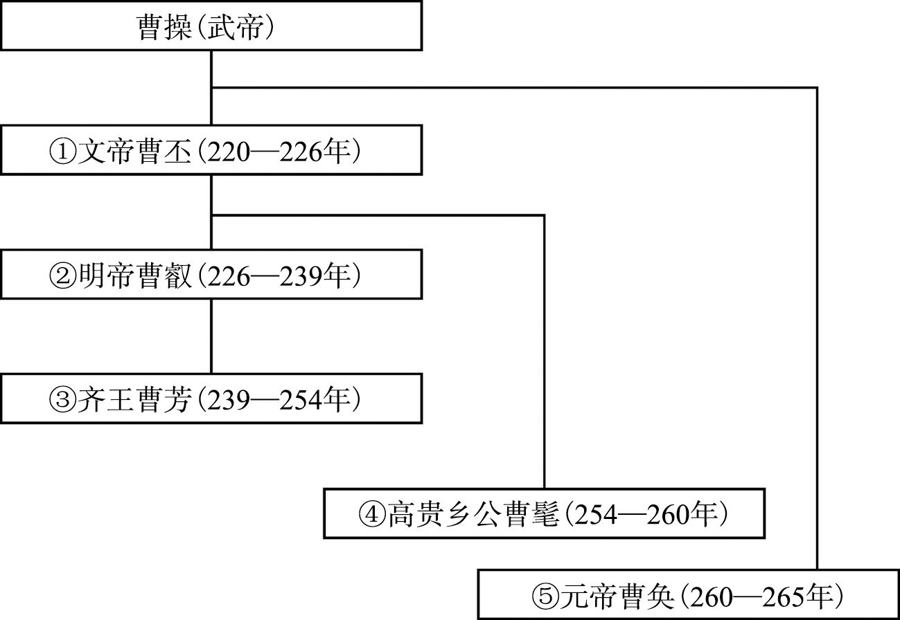 

## 蜀汉皇帝世系表

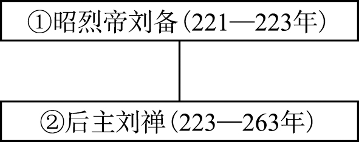 

## 孙吴皇帝世系表

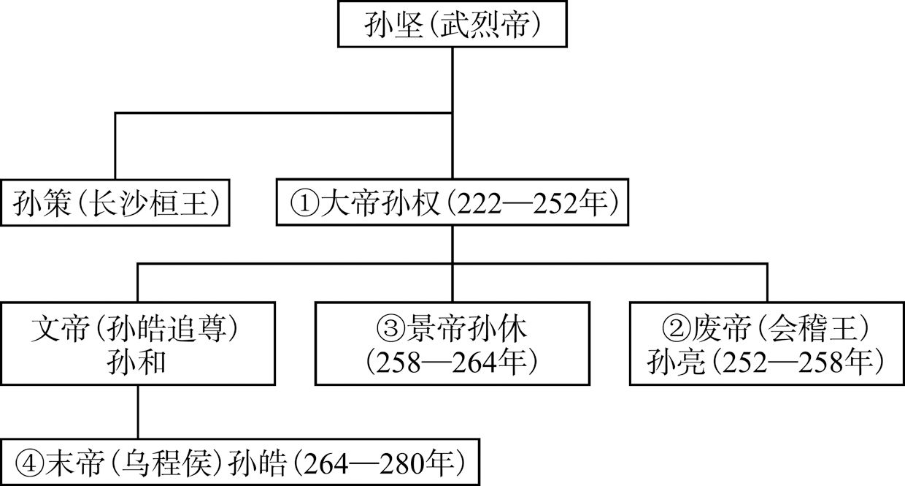

