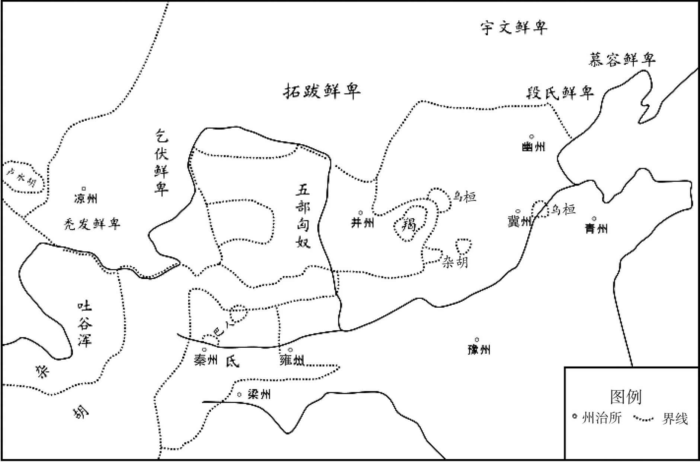
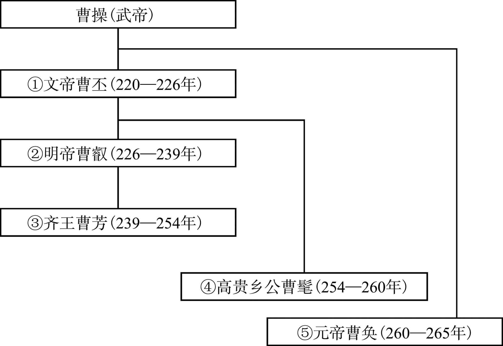
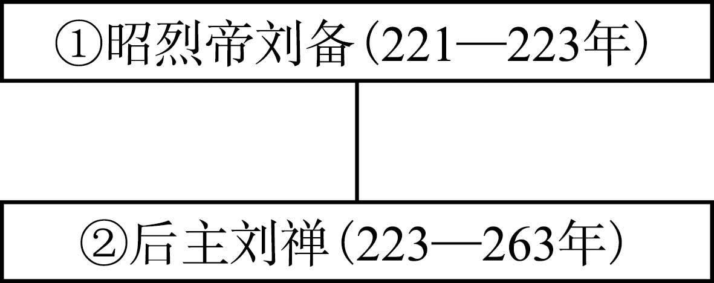
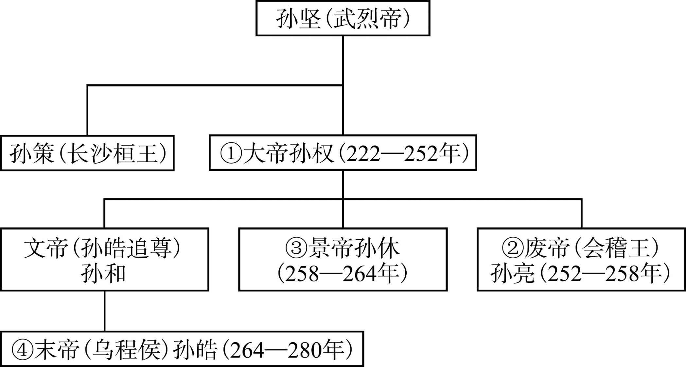
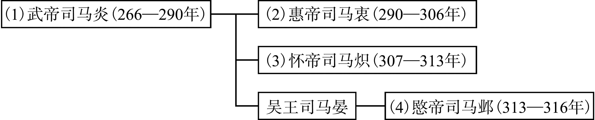

# 目录

魏灭蜀

淮南三叛　文钦　毌丘俭　诸葛诞

司马氏篡魏

晋灭吴

羌胡之叛　树机能　齐万年

陈敏之叛

附录： 
曹魏皇帝世系表

蜀汉皇帝世系表

孙吴皇帝世系表

西晋皇帝世系表

返回总目录

# 魏灭蜀

## 【内容提要】

本篇叙述了三国后期曹魏攻灭蜀国的过程。

魏灭蜀之战，是三国后期的吞并战。蜀汉后期，姜维成为重要将领，他继承诸葛亮遗志，不忘伐魏。自公元247年至262年间，姜维不断向魏国发动战争。公元254年，姜维趁魏狄道长李简意图投降蜀国之机，出兵陇西，攻占临洮，但是因为荡寇将军张嶷被魏将徐质所杀，蜀军撤回。公元255年，姜维再次率军伐魏，被魏将陈泰等击败。公元256年，姜维率军出祁山，与魏将邓艾交战，失败而归。公元257年，姜维率军出骆谷，想进攻秦川，无功而返。公元258年，姜维再次伐魏，进攻洮阳，被邓艾打败。姜维多次伐魏，消耗了蜀汉力量，遭到部分将领的反对。

公元263年，魏军大举伐蜀，分三路进军：西路军由邓艾率领，出狄道向甘松、沓中，直接进攻姜维；中路军由诸葛绪率三万多人马，自祁山向武街、阴平的桥头，切断姜维后路；东路军由钟会率主力十余万人，分别从斜谷、骆谷、子午谷进军汉中。刘禅闻讯后，命廖化增援姜维，又派张翼和董厥到阳平关抵御钟会大军。九月，魏军发动全面攻势，刘禅却不等援军到达，就命令汉中蜀军撤退，致使魏国东路军长驱直入。钟会亲自带兵攻阳平关，又派李辅进攻乐城的王含，荀恺进攻汉城的蒋斌，刘钦由子午谷出兵，与主力会师。阳平关因蒋舒投降而失守，傅佥战死。魏军进占阳平关后，乐城与汉城也不攻自破，东路军继续长驱直入，直逼剑阁。西路军同时展开攻势，邓艾命王颀、牵弘、杨趋分别从东、西、北三面进攻沓中，自己率军抵达阴平。钟会率兵进军剑阁时，姜维利用剑阁险要地势进行防守。邓艾率军从阴平小道，到达江油，蜀国江油守将马邈不战而降，邓艾率魏军乘胜进攻涪城。江油失守后，刘禅派诸葛瞻阻击邓艾，诸葛瞻在涪城与魏军交战失利，退守绵竹，魏军进攻绵竹，诸葛瞻战死，邓艾乘胜进军成都。刘禅在谯周等人的劝说下投降，并招降姜维等蜀军，蜀汉灭亡。

魏灭蜀后，邓艾居功自傲，钟会准备作乱，姜维趁机图谋复兴蜀汉。钟会诬告邓艾谋反，魏元帝曹奂下诏逮捕邓艾父子，押送洛阳，卫瓘等人趁机将邓艾父子杀死。钟会要谋反，尽杀魏将，但事情败露，魏将胡渊攻击钟会，姜维、钟会等人被乱军所杀。

刘禅投降后被迁往洛阳，封安乐公。魏灭蜀后，量才任用蜀汉臣僚，褒奖战死将士。刘禅在洛阳乐不思蜀，公元271年去世。公元273年，司马炎在段灼的建议下，为邓艾平反。

魏灭蜀是由三国鼎立走向统一的重要一步，为晋灭吴奠定了基础。

## 【原文】

**魏邵陵厉公嘉平五年，汉卫将军姜维自以练西方风俗，兼负其才武，欲诱诸羌胡以为羽翼，谓自陇以西可断而有[1]。每欲兴军大举，大将军费祎常裁制不从，与其兵不过万人，曰：“吾等不如丞相亦已远矣，丞相犹不能定中夏，况吾等乎[2]！不如且保国治民，谨守社稷，如其功业，以俟能者[3]。无为希冀徼幸，决成败于一举；若不如志，悔之无及。”及祎死，维得行其志，乃将数万人出石营，围狄道[4]。**

## 【注文】

[1]魏：朝代名。公元220年由魏文帝曹丕建立，公元265年灭亡，共历五帝四十六年。建都洛阳，统治地区包括今淮河两岸以北的中原地区和秦岭以北的关中、陇右、河西地区，西包新疆，东抵朝鲜半岛西北部，是三国时最强盛的国家。　　邵（shào）陵厉公：即曹芳（232—274年）。字兰卿，沛国谯（今安徽亳州）人。魏明帝曹叡养子，青龙三年（235年）封为齐王。景初三年（239年）立为太子，曹叡卒后即帝位，嘉平元年（249年），司马懿乘曹爽兄弟随曹芳拜谒高平陵之机，假太后之令，发动政变，胁迫曹芳将曹爽免官。嘉平六年（254年），曹芳被废为齐王，司马炎受禅后，封他为邵陵县公，卒后谥“厉”，史称“邵陵厉公”。　　嘉平五年：公元253年。嘉平是三国时魏齐王曹芳的年号，自公元249年至254年。　　汉：指刘备建立的蜀汉政权。魏文帝曹丕黄初二年（221年）刘备称帝，建立汉政权，历史上称蜀汉，魏元帝曹奂景元四年（263年）魏灭蜀汉。蜀汉共历二帝四十三年。统治地区相当于今四川、云南大部分，贵州、重庆全部，陕西汉中及甘肃白龙江流域一部分。蜀汉在魏、蜀、吴三国之中最弱。　　卫将军：官名。西汉文帝时始成为重要武职，以后与骠骑将军、车骑将军均开府置官属，不但独掌禁兵，并且参与政务。三国时魏、蜀、吴均置卫将军，魏国秩第二品。晋与南北朝时成为优礼大臣的虚号。　　姜维（202—264年）：三国时蜀国名将。字伯约，天水冀县（今甘肃甘谷）人。原为曹魏将领，后来投归蜀汉，深受诸葛亮赏识。诸葛亮死后，先任辅汉将军，又升为镇西大将军，与大将军费祎（yī）共掌朝政，多次率军攻魏。魏元帝曹奂景元四年（263年），魏军攻入蜀中，后主刘禅投降，敕令姜维降于魏将钟会。景元五年（264年），钟会叛魏，姜维想乘机恢复蜀汉，事泄被杀。　　羌胡：指古代的羌族和匈奴族。也泛指我国古代西北的少数民族。　　陇：地名。其位置于今甘肃省。

[2]大将军：官名。汉朝设置，为将军的最高称号，负责统兵征战。有时在大将军之上加称号，如骠骑大将军等。从三国到南北朝，执政大臣多兼任大将军。　　费祎（yī）（？—253年）：三国时蜀汉大臣。字文伟，江夏县（今河南罗山西）人。初为太子刘禅舍人，不久迁庶子，深受诸葛亮器重。刘禅即位，任黄门侍郎，迁侍中。诸葛亮北驻汉中，任参军、中护军、司马。诸葛亮死后，任后军师。又代蒋琬为尚书令，任大将军，录尚书事。蜀汉后主延熙十六年（253年），被魏国人郭循刺死。　　丞相：官名。古代辅佐君主的最高行政长官。初置于战国时的秦悼王，为百官之长。秦代以后为国家官僚组织中的最高官职，协助皇帝处理政务。汉初置相国，后称丞相，与太尉、御史大夫合称三公。汉末改丞相为大司徒，东汉末复称丞相。魏晋时，或称丞相，或改司徒，或称大丞相、相国。　　中夏：指黄河流域。

[3]社稷：社，土地之神；稷，五谷之神。社稷即古代帝王、诸侯所祭的土神和谷神。旧时以社稷为国家政权的标志，象征国家。

[4]石营：古地名。故址在今甘肃西和县北石堡乡。　　狄道：古地名。位于今甘肃临洮境内。春秋时为狄戎所居，战国时秦献公灭狄戎，设官管理。秦昭王时设陇西郡，管辖其地。汉承袭前代，为陇西郡治所。

## 【译文】

魏邵陵厉公（曹芳）嘉平五年（253年），蜀汉卫将军姜维自认为熟悉陇西风土人情，再加上对自己的才智和武功非常自负，就想引诱陇西的羌族和匈奴族等少数民族部落来归降蜀汉，使之成为蜀汉的辅佐力量，认为这样一来，自陇山以西地区就一定会为蜀汉所有。每当姜维想率兵大举进攻时，大将军费祎总是限制他，不采纳他的计划，给他的兵力也不超过一万人，费祎说：“我们的才能比起丞相诸葛亮来差得太远了，丞相都不能平定中原地区，何况是我们！还不如暂且保卫好国家，治理好人民，谨慎守卫社稷江山，如果要建功立业，等待更有能力的人吧。不要希望侥幸取胜，也不要企图靠一举成功来决定胜负，如果不如所愿，后悔也来不及。”直到费祎去世后，姜维才能够按照他自己的意愿行事，于是就率领几万人从石营出发，包围了狄道。

## 【原文】

**高贵乡公正元元年夏四月，狄道长李简密书请降于汉[1]。六月，姜维寇陇西[2]。**

## 【注文】

[1]高贵乡公：即曹髦（máo）（241—260年），三国时魏国皇帝，公元254至260年在位。字彦士，曹丕之孙，东海定王曹霖之子，三国时魏齐王正始五年（244年）被封为高贵乡公。公元254年，司马师废齐王曹芳，立曹髦为帝。甘露五年（260年），因痛恨司马昭专权，曹髦率领殿中宿卫僮仆数百人，出宫攻击司马昭，被杀。死后无号，史称高贵乡公。　　正元元年：公元254年。正元是三国时魏高贵乡公曹髦年号，自公元254年至256年。　　李简（生卒年不详）：嘉平时任魏国狄道长。嘉平六年（254年），李简请求投降蜀国，蜀国卫将军姜维借机出陇西攻魏，李简出迎，姜维攻占河关、临洮。

[2]陇西：郡名。战国秦置，因位于陇山以西，故名。治所在狄道（今甘肃临洮），辖境相当于今甘肃洮河中游、渭河上游及天水东部地区，此后历代有所增减。三国时魏移治襄武（今甘肃陇西）。后来泛指今甘肃地区。

## 【译文】

魏高贵乡公正元元年（254年）夏季四月，魏国狄道长李简秘密写信，请求归降蜀汉。六月，姜维率兵进军陇西。

## 【原文】

**冬十月，汉姜维自狄道进拔河间、临洮[1]。将军徐质与战，杀其荡寇将军张嶷，汉兵乃还[2]。**

## 【注文】

[1]临洮（táo）：县名。秦朝设置，东汉、西晋属陇西郡。治所在今甘肃岷县，辖今甘肃中部，定西西部。

[2]徐质（？—254年）：三国时曹魏将领。任讨蜀护军，有战功。并多次随魏国雍州刺史陈秦出征，抵御蜀将姜维，曾经斩杀蜀将张嶷。　　荡寇将军：官名。东汉始置，掌率军征伐。三国时魏沿置，秩五品。　　张嶷（yí）（？—254年）：蜀汉将领。字伯岐，巴郡南充国（今四川南充）人。随诸葛亮南征。诸葛亮北伐，他为牙门将。曾随马忠征战，有筹划战克之功。后为越巂（xī）太守，以恩信深受南方少数民族敬服，因功赐爵关内侯。后随姜维北伐，与魏将徐质交锋，被杀。

## 【译文】

魏高贵乡公正元元年（254年）冬季十月，蜀汉姜维从狄道进发，攻下河间、临洮。曹魏将军徐质与蜀汉军队交战，杀死蜀汉荡寇将军张嶷，蜀汉军队才撤退。

## 【原文】

**二年秋七月，姜维复议出军，征西大将军张翼廷争，以为“国小民劳，不宜黩武”[1]。维不听，率车骑将军夏侯霸及翼同进[2]。八月，维将数万人至枹罕，趋狄道[3]。**

## 【注文】

[1]征西大将军：官名。东汉光武帝刘秀设。魏晋南北朝时多授统兵在外、都督数州诸军事者。征西大将军在武职中地位很高，不常置。两晋定为二品，禄赐与特进相同。如开府，则位从公，假金章紫绶，升为一品。　　张翼（？—264年）：三国时蜀汉将领。字伯恭，武阳（今四川犍为）人。曾任蜀郡太守、绥南中郎将等职。曾多次参加伐魏，任征西大将军、镇南大将军等，封关内侯。后被魏将钟会乱兵所杀。　　廷争：在朝廷上当面争论。　　黩（dú）武：滥用武力，好战。

[2]车骑将军：武官名。地位仅次于大将军、骠骑将军，主要掌管征伐背叛，权位极重。　　夏侯霸（生卒年不详）：三国时曹魏与蜀汉将领。夏侯渊之子，字仲权。魏文帝黄初年间为偏将军，魏齐王正始中为讨蜀护军、右将军，进封博昌亭侯。司马懿诛曹爽，夏侯霸因与曹爽关系密切，恐遭株连，投降蜀汉，拜为车骑将军。

[3]枹（bāo）罕：古县名。秦朝设置，汉属金城郡，治所在今甘肃临夏境内。

## 【译文】

魏高贵乡公正元二年（255年）秋季七月，姜维又提出出兵伐魏，征西大将军张翼在朝廷上与他争辩，认为“蜀汉国家弱小，人民负担沉重，不应该再穷兵黩武”。姜维不听他的意见，率领车骑将军夏侯霸以及张翼一同出军。八月，姜维率领数万人抵达枹罕，直逼狄道。

## 【原文】

**征西将军陈泰，敕雍州刺史王经进屯狄道，须泰军到，东西合势乃进[1]。泰军陈仓，经所统诸军于故关，与汉人战，不利，经辄渡洮水[2]。泰以经不坚据狄道，必有他变，率诸军以继之。经已与维战于洮西，大败，以万余人还保狄道城，余皆奔散，死者万计[3]。张翼谓维曰：“可以止矣，不宜复进，进或毁此大功，为蛇画足。”维大怒，遂进围狄道。**

## 【注文】

[1]征西将军：将军名号。东汉和帝永元年间置。为统兵将领，掌征伐背叛，抵御入侵。东汉献帝建安间曹操列为四征将军之一，地位提高，秩二千石。三国魏文帝时多授予都督雍、凉二州诸军事者，驻长安，秩三品，若为持节都督，则进为二品。　　陈泰（？—260年）：三国时曹魏将领。字玄伯，颍川许昌（今河南许昌东）人，司空陈群之子。魏明帝青龙年间拜散骑侍郎，魏齐王正始中为并州刺史、护匈奴中郎将。魏齐王嘉平元年（249年），为雍州刺史，与征西将军郭淮破蜀将姜维于牛头山（今甘肃岷县东南）。魏高贵乡公正元二年（255年），迁征西将军，假节，都督雍、凉诸军事，又败姜维于狄道（今甘肃临洮）。入为尚书右仆射，掌管选举，转左仆射。高贵乡公曹髦率众征讨司马昭被杀，陈泰力主诛杀主事者贾充，不合司马昭之意，呕血而死。　　雍州：古州名。东汉献帝兴平元年（194年）分凉州河西四郡置。在今陕西、甘肃两省和青海东部地区。三国魏时，辖境相当今陕西中部、甘肃东南部、宁夏南部及青海黄河以南的一部，以后逐渐缩小。　　刺史：官名。汉武帝将全国划分为十三刺史部，各部任命刺史一人，监察地方官员和强宗豪右，岁终至京师向御史中丞禀报。东汉末年，为镇压黄巾起义，改刺史为州牧，位居太守之上，掌握一州军政大权，成为一级地方行政长官。魏晋南北朝时，以刺史领州，多带使持节、持节、假节、都督诸军事衔。　　王经（?— 260年）：三国时曹魏大臣。字彦纬，冀州清河（今属河北）人。农民出身，因得到同乡崔林赏识而被提拔，历任江夏太守、雍州刺史等职。公元255年，蜀将姜维攻入陇西郡时，他率军出狄道城迎击蜀军，被打败。不久被朝廷召回，任司隶校尉、尚书等官职。后因高贵乡公曹髦之事而被司马氏诛杀。

[2]陈仓：古县名。在今陕西宝鸡东渭水北岸，地处陕西关中、汉中间的交通要冲，是兵家争夺要地。　　故关：古关隘名。位于今甘肃清水县东北小陇山。汉初于此设关，因处陇山，故名陇关，后又改称大震关。唐宣宗大中六年（852年）陇州防御使薛逵东徙三十里于今陕西陇县西北固关，改名安戎关。时人因称大震为故关，安戎为新关。

[3]洮西：古地区名，故址在今甘肃洮河以西地区。

## 【译文】

曹魏征西将军陈泰，命令雍州刺史王经进驻狄道，等陈泰的军队到达后，东西两军会合后一起进发。陈泰的军队驻扎在陈仓。王经所统领的各军在故关，与蜀汉军队交战，作战失利，就率军渡过洮水。陈泰认为王经不坚持据守狄道，必定会有其他变故，于是率领各军随后赶到，而王经已经与姜维在洮河以西地区交战了。王经大败，带领一万多人退保狄道城，其余部众都四散奔逃，死伤一万多人。张翼对姜维说：“可以停止了，不宜再进军了，继续进军可能会把这一战功也毁掉，是画蛇添足。”姜维大怒，于是进军包围狄道。

## 【原文】

**辛未，诏长水校尉邓艾行安西将军，与陈泰并力拒维[1]。戊辰(1)，复以太尉孚为后继[2]。泰进军陇西，诸将皆曰：“王经新败，蜀众大盛，将军以乌合之卒，继败军之后，当乘胜之锋，殆必不可[3]。古人有言：‘蝮蛇螫手，壮士解腕。’[4]《孙子》曰：‘兵有所不击，地有所不守[5]。’盖小有所失而大有所全故也。不如据险自保，观衅待敝，然后进救，此计之得者也。”泰曰：“姜维提轻兵深入，正欲与我争锋原野，求一战之利。王经当高壁深垒，挫其锐气，今乃与战，使贼得计[6]。经既破走，维若以战克之威，进兵东向，据栎阳积谷之实，放兵收降，招纳羌胡，东争关、陇，传檄四郡，此我之所恶也[7]。而乃以乘胜之兵，挫峻城之下，锐气之卒，屈力致命，攻守势殊，客主不同。兵书云：‘修橹辒，三月乃成，拒堙三月而后已[8]。’诚非轻军远入之利也。今维孤军远侨，粮谷不继，是我速进破贼之时，所谓疾雷不及掩耳，自然之势也。洮水带其表，维等在其内，今乘高据势，临其项领，不战必走[9]。寇不可纵，围不可久，君等何言如是！”遂进军度高城岭，潜行，夜至狄道东南高山上，多举烽火，鸣鼓角[10]。狄道城中将士见救至，皆愤踊。维不意救兵卒至，缘山急来攻之，泰与交战，维退。泰引兵扬言欲向其还路，维惧，九月甲辰，维遁走，城中将士乃得出。王经叹曰：“粮不至旬，向非救兵速至，举城屠裂，覆丧一州矣[11]。”泰慰劳将士，前后遣还，更差军守，并治城垒，还屯上邽[12]。**

## 【注文】

[1]长水校尉：官名。西汉武帝初置，为北军八校尉之一，秩二千石，位次列卿。领长水宣曲胡骑，屯戍京师，兼任征伐。地位重要，多以宗室外戚近臣充任。三国沿置，魏、晋时为四品，属中领军管辖。　　邓艾（197—264年）：三国时魏国将领。字士载，义阳棘阳（今河南南阳南）人。少年时孤贫，流寓颍川，后为司马懿掾属。他建议在淮南、淮北屯田，被采纳施行。魏元帝景元四年（263年），与钟会等率军灭蜀，任太尉。不久，因厚待蜀国君臣，钟会、胡烈等人诬告他谋叛，惨遭冤杀。　　安西将军：官名。东汉献帝时曹操命曹仁任此职，督诸将镇守潼关。魏晋以后为出镇某一地区的军事长官，或作为刺史等兼理军务的加官。职权很重，与安东、安南、安北将军合称四安将军。秩三品。

[2]太尉：官名。战国始设，秦、西汉为全国性军政长官，与丞相、御史大夫合称三公；东汉改与司徒、司空并称三公，仍为共同负责军政的最高长官。　　孚：即司马孚（fú）（180—272年），晋宣帝司马懿之弟。自曹操时代起，任文学掾，后历仕魏国五代皇帝，累迁至太傅。司马孚曾协助司马懿控制京师，诛杀曹爽一党，后又督军防御吴、蜀进攻，为司马氏政权的稳固立下功劳。但司马孚自司马懿执掌大权起，便逐渐引退，未参与司马氏几次废立魏帝之事。西晋代魏后，司马孚进封为安平王，但他死时仍以魏臣自称。

[3]乌合之卒：即“乌合之众”，像一群暂时聚集起来的乌鸦。比喻临时纠集起来的一群人，毫无组织纪律。

[4]蝮（fù）蛇螫（shì）手，壮士解腕：勇士的手被蝮蛇咬伤，他就立即把手腕截断。比喻做事应当当机立断，不能迟疑不决；也比喻面临危急，应当放弃小的来保全大的。

[5]《孙子》：又称《孙子兵法》，我国古代最著名的兵书，“武经七书”之一。春秋末期孙武所撰。该书总结了春秋末期及以前的战争经验，从战略高度论述了军事领域的若干重大问题，揭示了一系列带有普遍性的军事规律，形成了系统的军事理论体系。

[6]高壁深垒：即“高垒深壁”。垒，军营四周所筑的堡寨。形容防御工事非常坚固。

[7]栎（yuè）阳：古城邑名。战国时秦的国都，故址在今陕西西安临潼区北。　　关、陇：指函谷关以西、陇山以东一带地区。

[8]橹：大盾牌。　　（fén）辒（wēn）：古代的一种攻城战车。　　堙（yīn）：堆成的土山。

[9]洮（táo）水：水名。即洮河，为黄河上游支流。在甘肃省南部。源出甘、青两省边境西倾山东麓，东入岷县，北经临洮县到永靖县，最后注入黄河。

[10] 高城岭：在今甘肃渭源县西。　　烽火：古时边防报警点的烟火。夜里点的火叫烽，白天放的烟叫燧，是当时传递战事信息的一种手段。　　鼓角：古代军队中用来发出号令的战鼓和号角，用以传号令、报时、警众及壮军威。

[11]屠裂：宰割，割裂肢解，指代屠杀。　　覆丧：失败丢掉。

[12]上邽（guī）：古县名。秦置邽县，汉朝沿袭。因与下邽有别，故名上邽。西汉属陇西郡，东汉属汉阳郡，即今甘肃天水。

## 【译文】

魏高贵乡公正元二年（255年）（八月）辛未（二十二日），魏帝下诏命令长水校尉邓艾代理安西将军，与陈泰合力抗击姜维。戊寅（二十九日），又命太尉司马孚率军作为后援部队。陈泰率军到达陇西，众位将领都说：“王经刚刚打了败仗，蜀汉军队士气正盛，将军率领临时聚集起来的乌合军队，又是在大军战败之后，来抵挡蜀汉乘胜而来的兵锋，恐怕我们必定要失败。古人说：‘一旦被蛇咬了手，即便是壮士也要砍断手腕。’《孙子兵法》也说：‘有的敌兵可以不去攻击他，有的地方也可以不必固守。’这大概是小的方面有所损失，可以换来大的方面得以保全的缘故。我们现在不如据守险要的地势，保全自己的力量，然后静观敌人内部的衅端，等他们疲敝了，然后再出兵去救援，这是较妥善的计策。”陈泰说：“姜维率领少量部队深入我国境内，正希望与我们在平原上作战，更希望求得一战而胜的好处。王经应该高筑壁垒固守城池，挫败他们的锐气，如今却与他们交战，正中了敌人的诡计。王经既然被攻破败走，姜维如果乘大胜追击，向东进兵，占据栎阳，栎阳粮草充足，让部下到四面八方去招纳降兵，再招募羌人、匈奴人归附，向东争夺关中、陇西，并向周围四郡发布文告动摇民心，这是我最担心的。但他却把打了胜仗的军队，放在坚固的城池之下受挫，让士气高昂的兵将，尽力攻城以至送命。在战争中攻方与守方的形势不同，主军与客军的地位也不同。兵书上说：‘修造攻城用的大盾牌与辒战车，需要三个月才能做成，如用堆筑土山的方法攻城，三月之后才能完成。’这的确不是孤军深入的军队利益所在。现在姜维正是孤军深入，居于客地，粮草供应跟不上，这正是我们迅速进军打败敌人的好时机，正所谓迅雷不及掩耳，这是形势自然发展的趋势。洮水围绕在城外，姜维的军队正夹在其中，如今我们登上高处占据险要地势，就好比是扼住他们的脖子，不用交战就必能使敌军逃走。对敌人不能放纵，狄道城被围也不能太久，你们何出此言！”于是，陈泰率军越过高城岭，暗中悄悄进军，夜间到达狄道城东南的高山上。将士们燃起许多烽火，擂鼓吹起号角。狄道城中的将士看见救兵到了，都奋发踊跃。姜维没有料到曹魏救兵突然赶到，急忙登山前来进攻，陈泰率兵与他们交战，姜维只好撤回。陈泰率领军队，扬言要切断姜维的退路，姜维害怕了，九月甲辰（二十五日），姜维率部撤走，狄道城中的将士才能得以出来。王经叹息说：“城中粮食已经不够食用十天，如果不是救兵迅速赶到，不仅全城将士要遭到屠杀，狄道城也会沦丧。”陈泰对将士们表示慰问，还将以前的士兵遣散，让他们回家，另外选择士兵把守狄道城，并且修筑城池堡垒，然后回军驻扎上邽。

## 【原文】

**泰每以一方有事，辄以虚声扰动天下，故希简上事，驿书不过六百里[1]。大将军昭曰：“陈征西沈勇能断，荷方伯之重[2]。救将陷之城而不求益兵，又希简上事，必能办贼故也，都督大将不当尔邪[3]。”**

## 【注文】

[1]虚声：虚张声势，表面的声威气势。　　驿书：古代由驿站传递的官府文书。

[2]昭：即司马昭（211—265年），三国时期曹魏权臣、西晋王朝的奠基人之一。司马昭继承其父司马懿与其兄司马师的权力，杀死魏帝曹髦，彻底控制曹魏政权，掌权期间派邓艾灭蜀，其子司马炎称帝后，追尊他为文皇帝。　　方伯：周代在京城千里之外设方伯，为一方诸侯的首领，后世泛指地方长官。东汉时为刺史、观察使的别称，唐代为观察使、采访使、转运使的别称，明清为布政使的别称。

[3]都督：古代军事长官。出现于汉末，三国魏晋时发展为地方军政长官，职权较重。都督加节，称为持节都督。其统军有都督、监、督三级，其加节也有使持节、持节、假节三级。

## 【译文】

陈泰看到，每当边境一方发生情况，守边将帅就虚张声势，使全国上下都受到惊扰，因此他希望简洁上报军情，即便上书也只送到六百里以内的邻近郡县。大将军司马昭说：“征西将军陈泰沉着勇敢，遇事有决断，他身为方伯，担负着守边拒寇的重任，解救快要陷落的城池，却不要求增加兵力，又很少上书惊扰朝廷，说明他一定有克敌制胜的能力，作为都督大将，难道不应该如此吗？”

## 【原文】

**姜维退驻钟提[1]。**

## 【注文】

[1]钟提：古城名。在今甘肃临洮西南。

## 【译文】

姜维撤退后驻扎在钟提。

## 【原文】

**甘露元年春正月，姜维进位大将军[1]。夏六月，姜维在钟提，议者多以为维力已竭，未能更出。安西将军邓艾曰：“洮西之败，非小失也，士卒凋残，仓廪空虚，百姓流离[2]。今以策言之，彼有乘胜之势，我有虚弱之实，一也。彼上下相习，五兵犀利，我将易兵新，器仗未复，二也[3]。彼以船行，吾以陆军，劳逸不同，三也[4]。狄道、陇西、南安、祁山各当有守，彼专为一，我分为四，四也。从南安、陇西因食羌谷，若趣祁山，熟麦千顷，为之外仓，五也[5]。贼有黠计，其来必矣[6]。”**

## 【注文】

[1]甘露元年：公元256年。甘露为三国魏高贵乡公曹髦的年号，自公元256至公元260年。

[2] 凋残：原指草木衰败零落。此处引申为衰减，减少，民不聊生。　　仓廪（lǐn）：我国古代用于贮粮的仓库。其中贮谷的为仓，贮米的为廪。

[3]五兵：即五种兵器，矛、戟、钺、盾、弓矢。泛指各种兵器。　　犀利：指武器锋利。　　器仗：此处为武器总称。

[4]陆军：在陆地作战的军队。　　劳逸：古代军事术语的一对范畴。指劳动、作战、工作和休整、娱乐。

[5]南安：古郡名。东汉设置，治所在豲（huán）道（今甘肃陇西东南），辖境相当于今甘肃陇西东部及定西、武山等市县地。　　祁山：山名。在今甘肃礼县东，汉代在西汉水北岸山上筑城，极为严固，为兵家必争之地。

[6]黠（xiá）计：奸邪狡猾的计谋。

## 【译文】

魏高贵乡公（曹髦）甘露元年（256年）春季正月，姜维被提升为大将军。夏季六月，姜维率军驻扎在钟提。曹魏朝臣议论，大都认为姜维的军事力量已经耗尽，不可能再次出击。安西将军邓艾却说：“在洮水西岸我们打了败仗，这次损失可不小，士卒伤亡很多，部队凋零不全，粮草损耗大，仓库空虚，百姓流离失所。现在根据形势分析，姜维有乘胜出击的气势，而我们的实力却十分虚弱，这是其一；他们久经战场，兵将上下互相熟悉了解，各种武器又精良锋利，而我们将领更换，士兵新征，各种武器装备还没有补充，这是其二；他们是乘船前进，我们全靠陆地步行，一劳一逸，体力消耗不同，这是其三；狄道、陇西、南安、祁山我们都必须有军队守卫，他们却可以集中力量，专力进攻一处，而我们的力量却一分为四，这是其四。他们从南安到陇西，一路可以依靠羌人的粮食作为军粮，如果奔向祁山，那里的麦子已经成熟，千顷之地的收获，就成为他们的外部粮仓，这是其五。姜维一向狡诈多计，他必定会出击的。”

## 【原文】

**秋七月，姜维复率众出祁山，闻邓艾已有备，乃回，从董亭趣南安[1]。艾据武城山以拒之[2]。维与艾争险不克，其夜渡渭东行，缘山趣上邽，艾与战于段谷，大破之[3]。以艾为镇西将军、都督陇右诸军事[4]。维与其镇西大将军胡济期会上邽，济失期不至，故败，士卒星散，死者甚众[5]。蜀人由是怨维。维上书谢，求自贬黜，乃以卫将军行大将军事。**

## 【注文】

[1]董亭：古地名。在今甘肃武山南。

[2]武城山：山名。在今甘肃武山西南。

[3]渭：即渭水。发源于甘肃，经陕西流入黄河。　　段谷：古地名。在今甘肃天水东南。

[4]镇西将军：古代将军名号。三国魏时，与镇东、镇南、镇北将军合称四镇将军。三国时期，按级别各朝常设的中朝将军有大将军、骠骑将军、车骑将军、卫将军，东、南、西、北的四征、四镇、四安、四平将军，前、后、左、右将军等。骠、车、卫及诸征、镇将军资深者可进号为大将军。如骠骑大将军、卫大将军、征北大将军、镇西大将军。　　陇右：古地区名。泛指陇山以西地区，古代以西为右，故名。相当今甘肃陇山、六盘山以西，黄河以东一带。

[5]镇西大将军：古代将军名号。三国时期，设有镇东、镇南、镇西、镇北等四镇将军，资历较深的镇西将军可以进号为镇西大将军。　　胡济（生卒年不详）：三国时蜀汉将领。字伟度，义阳（今湖北枣阳东南）人。曾为诸葛亮主簿，多次对诸葛亮进谏，诸葛亮特别把他与崔州平、徐庶及董和相提并论。诸葛亮死后开始领军，曾都督汉中军事，官至右骠骑将军。魏高贵乡公甘露元年（256年）姜维与胡济相约在上邽合军，胡济失期不至，姜维被邓艾打败。

## 【译文】

魏高贵乡公曹髦甘露元年（256年）秋季七月，姜维又率领军队出兵祁山，听说邓艾已有准备，就撤兵返回，又从董亭出发，直奔南安。邓艾凭借武城山之险进行抗击。姜维与邓艾争夺险要之地不能取胜，连夜渡过渭河往东进发，沿山而行，直攻上邽，邓艾率军在段谷与姜维交战，大败蜀军。朝廷任命邓艾为镇西将军、都督陇右诸军事。姜维原与镇西大将军胡济约定在上邽会合，胡济未能如期到达，姜维因孤军作战而失败，士兵四处逃散，战死者很多。蜀人因此怨恨姜维。姜维上书请罪，自己要求降职处分，于是被贬为卫将军，但仍代理大将军之职。

## 【原文】

**二年冬十二月，姜维闻魏分关中兵以赴淮南，欲乘虚向秦川，率数万人出骆谷，至沈岭[1]。时长城积谷甚多，而守兵少，征西将军、都督雍、凉诸军事司马望及安西将军邓艾进兵据之以拒维[2]。维壁于芒水，数挑战，望、艾不应[3]。**

## 【注文】

[1]关中：地区名。秦建都咸阳，汉建都长安，因而称函谷关以西为关中，大体上相当于现在的陕西省。有时又泛指战国末期秦的故地，包括秦岭以南的汉中、巴蜀在内。　　淮南：地区名。淮河以南、长江以北的地区。有时特指今安徽中部。　　秦川：地区名。泛指今陕西、甘肃两省秦岭以北的平原。　　骆谷：在今陕西周至县西南。谷长四百余里，为关中与汉中之间的交通要道。　　沈岭：山名。又称姜维岭，在今陕西周至西南。

[2]凉：即凉州，中国古代行政区划，西汉武帝所置十三刺史部之一，东汉治陇县（今甘肃张家川），辖境相当于今甘肃、宁夏、青海湟水流域，陕西定边、吴起、凤县、略阳和内蒙古额济纳旗一带。建安十八年（213年）并入雍州，三国时魏文帝复置，移治姑臧（今甘肃武威）。魏晋以后辖境缩小，只限于今甘肃黄河以西大部。　　司马望（205—271年）：安平王司马孚次子，在魏历任平阳太守、洛阳典农中郎将、护军将军，加散骑常侍，受到魏帝曹髦器重，后又被征入朝，累迁至司徒。西晋代魏后，司马望被封为义阳王，多次督军抵挡吴国进攻，官至大司马。

[3]壁：修建营垒驻扎。　　芒水：水名。即今陕西周至县境渭水支流黑河。

## 【译文】

魏高贵乡公甘露二年（257年）冬季十二月，姜维听说魏国从关中分出部分兵力，调往淮南，打算乘其空虚攻打秦川，于是率领数万人从骆谷出发，到达沈岭。当时长城存粮很多，但守卫的兵士却较少，征西将军都督雍、凉诸军事的司马望和安西将军邓艾立即进兵据守，以抗拒姜维。姜维在芒水边扎营，屡次出兵挑战，但司马望和邓艾却坚守不出战。

## 【原文】

**是时，维数出兵，蜀人愁苦，中散大夫谯周作《仇国论》以讽之曰：“或问：‘往古能以弱胜强者，其术何如？[1]’曰：‘吾闻之，处大无患者常多慢，处小有忧者常思善。多慢则生乱，思善则生治，理之常也。故周文养民以少取多，句践恤众以弱毙强，此其术也[2]。’或曰：‘曩者项强汉弱，相与战争，项羽与汉约分鸿沟，各归息民；张良以为民志既定则难动也，率兵追羽，终毙项氏，岂必由文王之事乎[3]？’曰：‘当商、周之际，王侯世尊，君臣久固，民习所专；深根者难拔，据固者难迁[4]。当此之时，虽汉祖安能仗剑鞭马取天下乎[5]？及秦罢侯置守之后，民疲秦役，天下土崩，或岁改主，或月易公，鸟惊兽骇，莫知所从，于是豪强并争，虎裂狼分，疾搏者获多，迟后者见吞[6]。今我与彼皆传国易世矣，既非秦末鼎沸之时，实有六国并据之势，故可为文王，难为汉祖[7]。夫民之疲劳则骚扰之兆生，上慢下暴则瓦解之形起。谚曰“射幸数跌，不如审发[8]”。是故智者不为小利移目，不为意似改步，时可而后动，数合而后举，故汤、武之师不再战而克，诚重民劳而度时审也[9]。如遂极武黩征，土崩势生，不幸遇难，虽有智者将不能谋之矣。’”**

## 【注文】

[1]中散大夫：官名。西汉后期设置，东汉时隶属光禄勋，秩六百石。与光禄、太中、谏议大夫等备顾问应对。魏晋南北朝多以此职位赐予养老、病退的大臣。魏、晋皆七品。　　谯（qiáo）周（201—270年）：蜀汉大臣。字允南，巴西西充（今四川阆中西南）人，少孤，勤奋好学，精研《六经》，通晓天文，是蜀汉的著名学者之一。后任劝学从事、典学从事、中散大夫、光禄大夫。主张投降魏国，因劝刘禅降魏有功，封阳城亭侯。后任晋骑都尉、散骑常侍。著有《古史考》等。　　《仇国论》：文章名。谯周于蜀汉后主延熙二十年（257年）作，旨在反对姜维穷兵黩武连年发动北伐的文章。这篇文章也被视为益州本土人士对蜀汉外来统治集团的反抗。

[2]周文：即周文王（生卒年不详），商末周族领袖。名姬昌，周武王之父。周文王曾被商纣囚在夔里（今河南汤阴北），后获释，为西方诸侯首领，称西伯，建都于丰（今陕西西安市长安区沣河西），国势强盛。其子周武王起兵伐纣灭商，建立西周王朝。　　句践（？—前465年）：春秋末年越国的国君。名菼（tǎn）执，越王允常之子，公元前497年至前465年在位。曾被吴王夫差打败，屈辱求和。其后句践卧薪尝胆，发愤图强，任用范蠡（lǐ）、文种等人整顿国政，十年生聚，十年教训，终于转弱为强，灭掉吴国。

[3]曩（nǎng）：以往，从前，过去的。　　项：指项羽建立的项楚政权，公元前206年，项羽自立为西楚霸王，建都下邳（今江苏睢宁西北），公元前201年被灭。　　汉：刘邦在推翻秦朝后被封为汉王。公元前202年刘邦称帝，国号汉，共历二十四帝，统治四百零六年。　　项羽（前232—前202年）：楚国贵族，秦末农民起义军领袖。名籍，字羽，下相（今江苏宿迁）人，楚将项燕之后。秦二世元年（前209年），随叔父项梁起义，在巨鹿之战中击溃秦军主力。秦亡后，自立为西楚霸王，并大封诸侯王。后与刘邦争夺天下，兵败垓下（今安徽灵璧东南），于四面楚歌中突围至乌江自刎。　　鸿沟：战国中期魏国惠王时开凿的沟通黄、淮的人工运河，把当时黄、淮之间的济、濮、汴、睢、颍、涡等水联结成水道交通网。楚汉之争时，曾划鸿沟为界，沟东属楚，沟西属汉。　　张良（？—前189或前190年）：西汉大臣。字子房，原为韩国贵族，后为刘邦谋士。楚汉之争中，张良为刘邦出谋划策，使刘邦得以消灭项羽，一统天下，因为有功，封为留侯。

[4]商：朝代名，存在于约公元前1600年至公元前1046年。公元前16世纪商汤灭夏，建立商朝，定都亳（bó）（今地有河南商丘、山东曹县、河南偃师三说）。中经几次迁都，盘庚时迁至殷（今河南安阳西北小屯），因此也称殷朝。传至纣王，被周武王所灭。共十七代，三十一王。　　周：朝代名。分为“西周”（前1046—前771年）和“东周”（前770—前256年）两个时期。周武王姬发建立，先后定都镐京（今陕西西安市长安区沣河以东）和洛邑（今河南洛阳）。公元前256年周被秦所灭。共历三十四王，七百九十一年。　　王侯：王爵和侯爵，泛指显贵的爵位或具有显贵爵位的人。

[5]汉祖：即汉高祖刘邦（前256或前247—前195年）。字季，沛县（今江苏沛县）人。初为泗水亭长，秦末响应陈胜、吴广起义，后与项羽共同伐秦，他攻占咸阳，推翻秦朝。项羽入关，封刘邦为汉王。不久楚汉相争，刘邦打败项羽，建立汉朝。

[6]秦：朝代名。中国历史上第一个统一的多民族的专制主义中央集权的封建王朝。公元前221年秦王嬴政灭掉六国，建立秦王朝。公元前206年，被项羽、刘邦领导的起义军推翻。秦王朝共历二世，统治十五年。　　豪强：又称“豪民”“豪右”等，指地方上有财势的强宗豪户。

[7]六国：指战国时韩、魏、楚、燕、赵、齐，自公元前230年至前221年先后为秦所灭。

[8]射幸数跌，不如审发：古代谚语，出自晋陈寿《三国志·蜀志·谯周传》。意思是怀着碰运气的心理盲目射箭，以致数次不中，还不如停一下，等瞄准以后再射。比喻指军事行动不能盲目蛮干，要有预先的计划和方案。

[9]汤：即商汤（生卒年不详），商朝建立者。夏朝末年，他任用伊尹、仲虺（huǐ）为相，整治军政，国力日盛，兴师伐夏。与夏桀在鸣条（今山西运城市安邑镇北；一说在今河南封丘东）决战，夏桀败走，夏朝灭亡，商朝建立。汤吸取桀亡教训，减轻征敛，鼓励生产，是历史上的明君。　　武：即周武王（？—前1043年）。西周开国君主，周文王之子，名姬发。继位后联合庸、蜀、羌等各族，在牧野（今河南淇县西南）之战打败商纣，灭商而建立周朝，定都镐京（今陕西西安市长安区沣河以东）。在位期间，曾大封诸侯于天下，以巩固周朝统治。

## 【译文】

此时，姜维数次用兵，蜀人感到非常忧愁悲苦。中散大夫谯周写了一篇《仇国论》，来讽诫说：“有人问：‘古时候有能以弱胜强的人，用的是什么方法呢？’回答说：我曾听说，处于强大地位而没有忧患的国家，常常有许多轻忽怠慢之处，处于弱小地位又有很多忧虑之处的国家，就常想改革完善。轻忽怠慢之处多了就会发生变乱，改革完善就会得到大治，这是通常的道理。所以周文王注意教养人民，休养生息，结果以少胜多；句践爱护体恤人民，最终以弱胜强，这就是他们的方法。’有人说：‘从前项羽强大而汉高祖刘邦弱小，双方交战，项羽与汉高祖相约以鸿沟为界，各归本土，使人民得以休养生息；张良认为，民心所向一经确定，就难以动摇，于是率领兵马追逼项羽，终于致项羽于死地，哪里必定经由周文王的道路呢？’回答是：‘在商、周之时，王侯世代尊贵，君与臣的关系已十分巩固，人们习惯了这种君主专有的关系；根扎太深则难以拔除，盘踞太牢固则难以迁移。在那个时候，即使汉高祖出世，又怎能依仗武力，手提三尺剑，在鞍马之上夺取天下呢？到秦代罢黜列国诸侯，改郡县，设置郡守以后，百姓不堪忍受秦朝的劳役，天下分崩离析，有的一年就改变一个君主，有的每月更换一个王公，人们就如同鸟惊兽骇，不知何去何从。于是，豪强贵族纷纷起兵争夺天下，就如虎狼在瓜分撕裂猎物一样，搏击迅疾的收获也多，行动迟缓的则往往被吞并。如今我国和魏国都经过帝位相传几世，我们所处的时代，已经不是秦朝末年天下鼎沸、纷争扰攘的动荡时代，实际上类似战国时群雄对峙的局势。因此，我们可以仿效周文王，却难以成为汉高祖。人民疲惫辛劳，骚动惊扰的征兆就会产生，统治者轻慢于此，民间就会多有暴乱，这样土崩瓦解之势就会形成。谚语说‘侥幸射箭几次不中，还不如仔细瞄准了再射’。因此明智的人不会为蝇头小利就转移目光，也不会凭着猜想和估计而改变步伐，时机成熟而后行动，形势合宜而后出击，因此商汤和周武王的军队都是不用一战再战而取胜，实在是因为重视人民的劳苦，又能谨慎分析形势。如果像今天这样频繁征伐，穷兵黩武，土崩瓦解的形势产生，不幸发生了变故，那么即使有智者也毫无办法了。”

## 【原文】

**三年春二月，姜维退还成都，复拜大将军[1]。**

## 【注文】

[1]成都：蜀汉国都，即今四川成都。

## 【译文】

魏高贵乡公甘露三年（258年）春季二月，姜维退兵回到成都，再次被任命为大将军。

## 【原文】

**初，汉昭烈留魏延镇汉中，皆实兵诸围以御外敌，敌若来攻，使不得入[1]。及兴势之役，王平捍拒曹爽，皆承此制[2]。及姜维用事，建议以为“错守诸围，适可御敌，不获大利，不若使闻敌至，诸围皆敛兵聚谷，退就汉、乐二城，听敌入平，重关头镇守以捍之，令游军旁出以伺其虚[3]。敌攻关不克，野无散谷，千里运粮，自然疲乏。引退之日，然后诸城并出，与游军并力搏之，此殄敌之术也[4]。”于是汉主令督汉中胡济却住汉寿，监军王含守乐城，护军蒋斌守汉城[5]。**

## 【注文】

[1]汉昭烈：即刘备（161—223年）。字玄德，涿郡涿县（今河北涿州）人。东汉远支皇族，三国时蜀国的开国皇帝。东汉末年参加镇压黄巾起义军，任高唐令、平原相。在军阀混战中先后依附公孙瓒、陶谦、曹操、刘表，任豫州刺史、镇东将军等职，与袁绍、袁术、吕布、曹操对抗。汉献帝建安十三年（208年），采纳诸葛亮建议，联吴抗曹，在赤壁大败曹军，乘机取得荆州四郡，势力逐渐壮大。之后又吞并刘璋所统辖的益州，占领汉中。章武元年（221年）称帝，建都成都，国号汉，史称蜀汉。章武二年（222年），为争夺荆州，亲率大军攻吴，在夷陵之战中被吴军打败，次年病死。　　魏延（？—234年）：三国时蜀汉名将。字文长，义阳（今河南信阳西北）人。初以部曲随刘备入蜀，屡有战功，升迁牙门将军。刘备为汉中王，进驻成都，任他为镇远将军，领汉中太守。后任镇北将军，封都亭侯。蜀汉后主建兴五年（227年），诸葛亮驻汉中，命他督前部，领丞相司马、凉州刺史。次年西入羌中，升征西大将军，进封南郑侯。建兴十二年（234年）诸葛亮病死，他与长史杨仪争权，率兵击杨仪，兵败被杀。

[2]兴势之役：又称兴势之战。蜀汉军在兴势击退魏军进攻的战役。曹魏齐王正始五年（244年），辅政大臣曹爽率领夏侯玄等从骆谷口攻汉中。蜀将王平进行抵御，命令护军刘敏等领兵在兴势拒敌，并多张旗帜，绵延百余里，以壮军威。王平亲自率军在后，兼防魏军分兵从黄金谷（兴势东）来攻。四月，魏军被阻于兴势，供给困难，牛马骡驴多死，兵疲意懈，而蜀汉大将军费祎又自成都督军赶至汉中。曹爽被迫撤退。五月，蜀将费祎截断魏军归路，曹爽督军争险苦战，死伤惨重，逃回关中，史称兴势之役。　　王平（？—248年）：三国时蜀汉名将。字子均，宕渠（今四川渠县东北）人。行伍出身，原为曹操部属，后降刘备，任牙门将、裨将军等职。诸葛亮第一次伐魏，随马谡与魏军交战于街亭。多次劝谏马谡审慎用兵，因马谡不听，致使蜀军战败溃散。他所率蜀军独自保全，因功破格升任讨寇将军，封亭侯。后多次参与伐魏，封安汉侯，升前监军镇北大将军，统率汉中，成功防御了魏将曹爽的大规模伐蜀行动。　　曹爽（？—249年）：三国时魏将、重臣。字昭伯，沛国谯县（今安徽亳州）人。三国时期曹魏宗室、权臣。魏明帝时，甚受宠任，历任散骑侍郎，累迁城门校尉，加散骑常侍，转武卫将军。明帝临终前拜大将军，都督中外诸军事，录尚书事，与司马懿并受遗诏辅政。曹芳即位，加侍中，改封武安侯。用何晏等为心腹，与司马懿争夺政权，被司马懿所杀。

[3]汉城：在今陕西勉县东，西汉为沔阳县治。　　乐城：古城名。三国蜀汉诸葛亮筑，在今陕西城固东。

[4]殄（tiǎn）：消灭。

[5]汉主：即蜀汉后主刘禅（207—271年）。公元223年至263年在位，字公嗣，小字阿斗，刘备之子。初由丞相诸葛亮辅政，诸葛亮死后，他信用宦官黄皓，朝政日趋腐败。蜀汉后主炎兴元年（263年），魏军进逼成都，刘禅出降，后被封为安乐公。　　汉寿：古县名。汉置索县，东汉改汉寿县。故址在今湖南常德东北。　　监军：古代官名。初为临时差遣之职，置于军中，监督出征将帅。汉代亦或置。时又有监军使者，掌监出征将帅；有监军御史，掌监京师北军营垒等。三国时诸军出征皆置，监视将帅，权势颇重。蜀有中、前、后、右诸号，位在军师下、护军上。魏晋诸军师（军司）亦行其职。　　王含（生卒年不详）：三国时期蜀将。姜维任命他和蒋斌一起统率左军，抵御魏军。被邓艾打败。　　护军：秦汉临时设置护军都尉或中尉，出征时又有护军将军，职责是协调诸将领间的关系。到了魏晋，成为统兵武职，也是诸军事要镇长官，管理辖区军事民政，职掌与郡守相类。　　蒋斌（生卒年不详）：蜀汉丞相蒋琬之子。蜀后主时历任绥武将军、汉城护军。蜀亡后被乱兵所杀。

## 【译文】

当初，蜀汉昭烈帝刘备留魏延镇守汉中，在各个营垒都设有很强的兵力，以抵抗敌人入侵，敌人如果来攻击，使他们打不进来。到兴势之役时，王平捍卫城池，抗拒曹爽，仍然沿袭这一制度。等到姜维掌权后，建议认为：“分散兵力守卫各营垒，只适用于防御敌人，不能获得较大的利益，还不如一旦听到敌军来到，各营全都聚集粮草兵器，退守汉城、乐城，听任敌军进入平原，各重要关卡城镇严密防守，再令游击部队侧出侦察敌人的虚实。敌人攻不下城池，原野上又无零散的粮草，从千里之外运输粮草，自然就会疲乏。等敌人引兵退却的时候，各关卡城镇的军队一起杀出，与游击部队一起全力搏击敌人，这才是歼灭敌人的好办法。”于是，后主刘禅命令督守汉中的胡济退守汉寿，监军王含把守乐城，护军蒋斌把守汉城。

## 【原文】

**四年。尚书令陈祗以巧佞有宠于汉主，姜维虽位在祗上，而多率众在外，希亲朝政，权任不及祗[1]。秋八月丙子，祗卒，汉主以仆射义阳董厥为尚书令，尚书诸葛瞻为仆射[2]。**

## 【注文】

[1]尚书令：官名。秦朝始置尚书令，汉朝沿置，本为少府署官，掌章奏文书。汉武帝后职权渐重，东汉政务皆归尚书，尚书令成为总揽政令的长官。魏晋以后，尚书令成为实际的宰相。　　陈祗（？—258年）：三国时蜀汉大臣。字奉宗，汝南（治今河南汝南） 人。弱冠知名，精通数术，费祎很欣赏他。历任侍中、尚书令、镇军将军。受刘禅宠幸，与黄皓互为表里，权倾朝野。卒谥“忠侯”。　　巧佞（nìng）：机巧奸诈，阿谀奉承。

[2]仆射（yè）：官名。起源较早，秦代已出现，凡侍中、尚书、博士、谒者、郎等官皆有仆射，依所领事为称号，意即其首长。东汉时，主管全国机要政务的尚书台称中台，仆射为尚书令副贰，职权渐重。汉献帝时分置左、右仆射，魏晋以后令、仆同居宰相之任。　　义阳：古县名，后为郡名。三国时魏置，治所在安昌县（今湖北枣阳东北）。　　董厥（生卒年不详）：三国时蜀汉大臣。字龚袭，义阳（今河南信阳西北）人。初为诸葛亮丞相府令史，后迁丞相主簿。蜀后主刘禅时历任尚书仆射、尚书令、大将军等职。景耀六年（263年），率兵抵抗魏军，后降魏。入晋后为相国参军，兼散骑常侍。　　诸葛瞻（227—263年）：三国时蜀汉将领。字思远，琅邪阳都（今山东沂水）人，诸葛亮之子。历任骑都尉、射声校尉、侍中、尚书仆射、军师将军、行都护卫将军等。蜀汉后主景耀六年（263年）率军抵御邓艾的魏军，战于绵竹（今四川德阳），兵败被杀。　　尚书：官名。战国时设置，为管理文书的小吏。汉魏初期位低权重，后来品秩渐高，为正三品，但职掌由纳奏拟诏、下达政令转为承受诏命，成为行政官员。

## 【译文】

魏高贵乡公甘露四年（259年）。蜀国尚书令陈祗因为机巧奸诈、阿谀奉承被后主刘禅宠幸，姜维的官位虽然在陈祗之上，但因大多数时间领兵在外，很少亲自参政，所以权力还没有陈祗大。秋季八月丙子（二十日），陈祗去世。后主刘禅任命仆射义阳人董厥为尚书令，尚书诸葛瞻为仆射。

## 【原文】

**元皇帝景元二年冬十月，汉主以董厥为辅国大将军，诸葛瞻为都护、卫将军，共平尚书事，以侍中樊建为尚书令[1]。时中常侍黄皓用事，厥、瞻皆不能矫正，士大夫多附之，唯建不与皓往来[2]。秘书令郤正久在内职，与皓比屋，周旋三十余年，澹然自守，以书自娱，既不为皓所爱，亦不为皓所憎，故官不过六百石，而亦不罹其祸[3]。汉主弟甘陵王永憎皓，皓谮之，使十年不得朝见[4]。**

## 【注文】

[1]元皇帝：即曹奂（246—302年），本名曹璜，字景明，魏武帝曹操之孙，燕王曹宇之子。三国时曹魏最后一代皇帝，公元260年至265年在位。公元265年曹奂禅位于晋王司马炎，此后被废为陈留王，谥号为元皇帝。　　景元二年：公元261年。景元是三国魏元帝曹奂年号，即公元260至264年。　　辅国大将军：将军名号。汉朝设置，掌征伐。三国魏、蜀亦置。　　都护：官名，即总监。西汉宣帝时设西域都护，为驻守西域地区的最高长官。其后废置不常。东汉、魏、晋时又设都护、都护将军，为统率诸将之官。　　侍中：官名。入侍于天子的一种近臣。“中”指宫廷之内，凡侍中皆可出入禁廷，接近皇帝。汉武帝后侍中参与朝政，外戚进行辅政也都被加以侍中衔。　　樊建（生卒年不详）：三国时蜀汉大臣。字长元，义阳（今河南信阳西北）人。曾任侍中、尚书令等职。宦官黄皓用事，樊建不依附。蜀亡后，迁居洛阳，为相国参军、散骑常侍、给事中。

[2]中常侍：官名。西汉元帝时置，出入宫廷，侍从皇帝，通常为列侯至郎中的加官。东汉和帝时以宦官充任，隶属少府，秩千石，员额不限。中常侍侍从皇帝，以备顾问应对，传达诏命和掌理文书。东汉末有所谓十常侍，权力极大。魏晋以后，中常侍与散骑合并，称散骑常侍，改为正规官，不再是宦官的专职。　　黄皓（hào）（生卒年不详）：三国时蜀汉宦官。奸猾狡诈，善于逢迎，为后主刘禅所宠信。董允在世时抑制宦官，位不过黄门侍郎，不敢胡作非为。陈祗任侍中，黄皓开始参与政事。陈祗死后，黄皓任中常侍、奉车都尉，专权弄威，朝政日趋腐败。蜀亡后因厚赂邓艾得免死。

[3]秘书令：官名。东汉末年曹操置，掌尚书奏事及图书秘籍。魏文帝改秘书令为秘书监，掌艺文图籍，改由中书令掌尚书奏事。三国时蜀、吴也置秘书令，蜀置，秩六百石，管理图书，参与起草诏令文书。　　郤（xì）正（？— 278年）：三国时蜀汉大臣。字令先，偃师（今河南偃师）人。少孤贫，博览群籍，善属文章。任蜀秘书吏、秘书令等职。蜀汉后主景耀六年（263年），为刘禅作降书。蜀灭亡后迁居洛阳，因劝谏刘禅而被司马昭羞辱。入晋后任安阳令、西太守。著有诗、赋、论等近百篇。　　内职：宫廷内机要官职的统称。　　罹（lí）：遭受苦难或不幸。

[4]甘陵王永：即刘永（生卒年不详），刘备之子，字公寿。刘备称帝后封为鲁王，后改封甘陵王。他因憎恶宦官黄皓而遭受诬陷，被刘禅疏远，十余年不得朝见。蜀亡后迁居洛阳，被封为乡侯。　　谮（zèn）：说别人的坏话，诬陷，中伤。　　朝见：臣子上朝见君主。

## 【译文】

魏元皇帝（曹奂）景元二年（261年）冬季十月，后主刘禅任命董厥为辅国大将军，诸葛瞻为都护、卫将军，共同处理尚书省的政事，任命侍中樊建为尚书令。此时中常侍黄皓掌管朝政，董厥和诸葛瞻都不能矫正他的做法，很多士大夫都依附他，唯有樊建不与黄皓往来。秘书令郤正长期在宫内任职，办公地点与黄皓比屋而居，与黄皓共事周旋三十多年，一向淡然自守，以读书自娱自乐，既不被黄皓喜欢，却也不被憎恨，所以他的官职秩禄不过六百石，却也没有遭受祸难。后主刘禅的弟弟甘陵王刘永憎恨黄皓，黄皓就诬陷他，致使他十年不能入朝见汉主。

## 【原文】

**吴主使五官中郎将薛珝聘于汉，及还，吴主问汉政得失，对曰：“主暗而不知其过，臣下容身以求免罪[1]。入其朝不闻直言，经其野民皆菜色[2]。臣闻燕雀处堂，子母相乐，自以为至安也，突决栋焚，而燕雀怡然，不知祸之将及，其是之谓乎[3]。”珝，综之子也[4]。**

## 【注文】

[1]吴主：即三国吴景帝孙休（235—264年）。字子烈，吴郡富春（今浙江富阳）人，孙权第六子。少时从中书郎射慈、郎中盛冲受学。三国吴大帝太元二年（252年）封琅邪王，居虎林（今安徽贵池）。太平三年（258年），吴帝孙亮被废为会稽王，权臣孙派孙楷与中书郎董朝迎立孙休为帝。后孙休闻孙谋逆，暗中与辅义将军张布合谋，利用百僚朝贺、公卿升殿之机，令武士捆缚孙，即日诛杀。孙休在位期间，留意典籍，注重教育，欲振国威。永安七年（264年）卒，谥曰景皇帝。　　五官中郎将：官名。秦时设置。西汉隶属于光禄勋，秩比二千石，所属有五官中郎、侍郎和郎中，掌管持戟值班，宿卫诸殿门，出充车骑。汉献帝建安十六年（211年）曹丕为五官中郎将，权力扩大，位在诸臣之上。　　薛珝（xǔ）（207—270年）：三国时吴国大臣。沛郡竹邑（今安徽濉溪）人。孙休时为五官中郎将、威南将军、大都督。三国吴乌程侯宝鼎四年（269年），与虞汜等率军攻交趾。归途中病逝。　　暗：愚昧，昏乱。

[2]菜色：指吃菜度日的饥民的脸色。形容饥饿、营养不良的面色。

[3]怡然：和悦的样子。

[4]综：即薛综（？—243年）。三国时吴国大臣。字敬文，沛郡竹邑（今安徽濉溪）人。少时研习经书，善于属文，长于辞令。孙权用为五官中郎将，任合浦、交趾太守。刺史吕岱率师讨伐，薛综同行，越海南征，达到九真（越南清化全省及义安部分地区）。孙权称帝后，历任尚书仆射、选曹尚书、太子少傅。他学识渊博，著有《私载》，为吴国学者之一。

## 【译文】

吴王（孙休）派遣五官中郎将薛珝为使节访问蜀汉，等到他回来之后，吴王询问蜀国政治得失，薛珝回答说：“汉主愚昧昏庸，不知道自己的过失，文武百官只知道容身自保以求无罪。进入朝廷之中听不到正直的言论，经过蜀国郊野，百姓个个面带菜色。我听说燕雀在屋檐下筑巢，母子都感到非常快乐，自己认为非常安全，突然间房屋着火，可燕雀还是非常快乐，不知道大祸即将来临，这大概说的就是蜀汉吧。”薛珝是薛综的儿子。

## 【原文】

**三年秋八月，大将军姜维将出军，右车骑将军廖化曰：“兵不戢，必自焚，伯约之谓也[1]。智不出敌而力少于寇，用之无厌，将何以存！”**

## 【注文】

[1]右车骑将军：将军名号。汉置车骑将军，掌帅车骑士作战，位比公，权势颇重。东汉灵帝中平元年（184年）置左、右车骑将军，三国蜀后主时也置左右车骑将军。三国魏、晋、南北朝沿置，仍为重号将军，但多作为加官授予朝中大臣及地方长官，无具体职掌。魏、晋、南朝宋二品，开府者位从公，一品。　　廖化（？—264年）：三国时蜀汉将领。字元俭，襄阳中卢（今湖北襄樊市襄阳区）人。初为关羽部将，汉献帝建安二十四年（219年），在荆州兵败，被吴军俘虏，后逃归蜀汉，任宜都太守。刘备死后任诸葛亮参军、右车骑将军、并州刺史，南征北伐常充先锋，以“果烈”显称于世。蜀汉后主景耀六年（263年）蜀亡，随刘禅降魏。在去洛阳途中病死。　　戢（jí）：收敛，收藏。　　伯约：即姜维，字伯约。

## 【译文】

魏元帝景元三年（262年）秋季八月，大将军姜维将要率军出征，右车骑将军廖化说：“用兵不知收敛，必定会自取灭亡，这大概说的是姜维吧。智谋不比敌人高，力量却比敌人弱，反复用兵而不知厌倦，将要拿什么赖以生存！”

## 【原文】

**冬十月，维入寇洮阳，邓艾与战于侯和，破之，维退住沓中[1]。初，维以羁旅依汉，身受重任，兴兵累年，功绩不立[2]。黄皓用事于中，与右大将军????[3]阎宇亲善，阴欲废维树宇。维知之，言于汉主曰：“皓奸巧专恣，将败国家，请杀之[4]。”汉主曰：“皓趋走小臣耳，往董允每切齿，吾常恨之，君何足介意[5]。”维见皓枝附叶连，惧于失言，逊辞而出[6]。汉主敕皓诣维陈谢，维由是自疑惧[7]。返自洮阳，因求种麦沓中，不敢归成都。**

## 【注文】

[1]洮阳：古县名。故址在今甘肃临潭境内。　　侯和：洮阳外围一关隘。　　沓中：古地区名。在今甘肃舟曲以西、岷县以南。其地东控陇蜀通道，为战略要地。

[2]羁（jī）旅：长久在外地寄居。

[3]右大将军：将军名号。东汉光武帝置，凡将军皆掌征伐。三国蜀于后主建兴十三年（235年）置大将军。蜀汉后主景耀初年分置右大将军。　　阎宇（生卒年不详）：三国时蜀汉将领。字文平，南郡（今湖北荆州）人。任蜀庲（lái）降都督、右大将军。与宦官黄皓亲善，曾都督巴东，为领军。魏伐蜀时救成都，未成功。

[4]奸巧：虚假，伪诈。　　专恣：专横,放纵。

[5]董允（？—246年）：三国时蜀汉大臣。字休昭，南郡枝江（今湖北枝江）人。刘备立太子，他为太子舍人，徙洗马。刘禅即位，任黄门侍郎，后为侍中，领虎贲中郎将，统率宿卫亲兵，受诸葛亮倚重。常谏诤后主刘禅过失，抑制专权的宦官黄皓。后任辅国将军，以侍中守尚书令，辅佐大将军费祎，定军国大事。

[6]枝附叶连：树枝攀附，树叶相连。比喻关系十分密切。也比喻互相攀附勾结。　　逊辞：恭顺的言语。

[7]敕：文体名。敕体始于春秋，原泛指上级对下级的警告、告诫和勉励。凡官长之谕僚属，尊长之谕其子弟皆称敕。自汉代开始作为皇帝命令的一种形式。

## 【译文】

魏元帝景元三年（262年）冬季十月，姜维率军入侵洮阳，邓艾率军在侯和与他作战，大败姜维军，姜维率军退守沓中。最初，姜维因为寄居在外才投奔蜀汉，深受蜀汉重用，常年在外带兵打仗，却没有立下战功。黄皓在朝中专权弄事，与右大将军阎宇亲善，暗地里想废掉姜维扶植阎宇。姜维得知此事后，就对后主（刘禅）说：“黄皓奸猾狡诈，专权弄威，将会败坏朝政，请您杀掉他。”后主说：“黄皓只不过是供人驱使的小臣罢了，以前董允对他常常咬牙切齿，我也经常怨恨他，您何必在意呢。”姜维见黄皓与朝臣相互攀附勾结，害怕自己失言，就言辞恭顺地告辞而出。后主命令黄皓到姜维那里去道歉，姜维因此更加疑虑害怕。自成都返回洮阳后，就要求到沓中去屯田种麦，不敢再回成都。

## 【原文】

**司马昭患姜维数为寇，官骑路遗求为刺客入蜀[1]。从事中郎荀勗曰：“明公为天下宰，宜仗正义以伐违贰，而以刺客除贼，非所以刑于四海也[2]。”昭善之。勗，爽之曾孙也[3]。**

## 【注文】

[1]官骑：皇帝的护卫骑兵。

[2]从事中郎：官名。东汉始置，隶属于将军，为参谋议事的散职官员。三国魏晋南北朝沿置。职掌各异，有的掌管诸曹，有的掌管机密和参谋议。司马昭为曹魏相国时，有从事中郎四人。晋初诸公府及开府位从公加兵者，均置从事中郎二人。主管吏事，官六品，秩比千石。　　荀勗（xù）（？—289年）：西晋大臣。字公曾，颍川颍阴（今河南许昌）人。荀爽曾孙。荀勗曾为大将军司马昭记室，多次进献计谋，为司马昭所信任，与裴秀、羊祜共掌机密。司马炎建立西晋后，荀勗封济北郡公，固辞，后封济北郡侯，拜中书监，加侍中衔。荀勗博学多才，入晋后曾和贾充一起修订法令，又掌管乐事，修正律吕，还曾仿效刘向《别录》整理典籍。　　刑：作榜样，示范。

[3]爽：即荀爽（128—190年），东汉经学家。字慈明，颍川颍阴（今河南许昌）人。东汉桓帝时曾任郎中，遭党锢之祸，退隐后专心著述。汉献帝时参与王允等谋诛董卓之事。博通群经，著述有《诗传》《尚书正经》《春秋条例》等。

## 【译文】

司马昭担忧姜维多次入侵，皇帝护卫骑兵路遗要求作为刺客，到蜀国去刺杀姜维。从事中郎荀勗说：“明公您身为天下宰辅，应该凭借正义之师来讨伐对国家有二心的人，而派刺客来除去乱臣贼子，这不是治理国家、为天下做表率的办法。”司马昭认为他说得好。荀勗是荀爽的曾孙。

## 【原文】

**昭欲大举伐汉，朝臣多以为不可，独司隶校尉钟会劝之[1]。昭谕众曰：“自定寿春以来，息役六年，治兵缮甲，以拟二虏[2]。今吴地广大而下湿，攻之用功差难，不如先定巴、蜀，三年之后，因顺流之势，水陆并进，此灭虢取虞之势也[3]。计蜀战士九万，居守成都及备他境不下四万，然则余众不过五万。今绊姜维于沓中，使不得东顾，直指骆谷，出其空虚之地以袭汉中，以刘禅之暗，而边城外破，士女内震，其亡可知也。”乃以钟会为镇西将军，都督关中。征西将军邓艾以为蜀未有衅，屡陈异议[4]。昭使主簿师纂为艾司马以谕之，艾乃奉命[5]。**

## 【注文】

[1]司隶校尉：官名。简称司隶，西汉武帝时置，秩二千石，掌察举京师及京师近郡犯法者，并领京师所在之州。东汉秩比二千石，威权尤重。　　钟会（225—264年）：三国时魏将。字士季，颍川长社（今河南长葛东北）人，三国魏太傅钟繇少子，敏慧博学。三国魏齐王正始年间任秘书郎，迁尚书、中书侍郎。后历任黄门侍郎、司隶校尉、镇西将军，都督关中诸军事。三国魏元帝景元四年（263年），同邓艾共同灭蜀，因功迁司徒，封县侯。后因谋叛被杀。

[2]寿春：古县名。战国时为楚地，秦时置县，治所在今安徽寿县。东晋时改名寿阳，南朝宋时再改名睢阳，北魏时恢复原名。秦、汉时为九江郡治所，魏晋南北朝时分别为扬州、豫州、南豫州、淮南郡及梁郡治所。　　二虏：这里指蜀汉政权和东吴政权。

[3]巴、蜀：这里指蜀汉政权。巴、蜀初为先秦时期地区名，在今四川境内。东部为巴，西部为蜀。　　灭虢（guó）取虞（yú）：春秋时期，鲁僖公五年（前655年）晋献公根据大臣荀息的计谋，用玉石和宝马贿赂虞国国君，借道虞国出兵攻打虢国。虞王不听大臣宫之奇的忠告，让晋国借道。晋灭虢三年后，又回师灭掉虞国。比喻攻击甲国时先稳住乙国，等灭掉甲国后再灭乙国。

[4] 衅（xìn）：借端生事，企图引起冲突或战争。

[5]主簿：官名。汉代于中央及郡县官署均设置此官，以典领文书，办理事务。魏晋以后，渐为统兵大臣重要僚属，参与机要，职权甚重。　　师纂（？—264年）：三国时曹魏将领，邓艾的心腹部将。初任魏主簿，后为镇西将军邓艾的司马，随邓艾灭蜀。蜀亡后，为益州刺史。钟会之变，益州大乱，师纂和邓艾一起被田续所杀。　　司马：官名。西周始置。汉制，大将军营五部，部各置军司马一人。魏晋以后，刺史多带将军开府，置府僚，司马于是为军府之官。在将军之下，综理一府之事，参与军事计划。

## 【译文】

司马昭想大规模征伐蜀汉，朝中大臣大多认为不行，只有司隶校尉钟会支持。司马昭晓谕众人说：“自从平定寿春以来，六年没有打仗了，整顿兵马，修缮武器，准备平定东吴和蜀国。如今东吴地域广大，还有辽阔的水域，攻打吴国花费精力多、难度大，不如先平定巴蜀之地，三年以后，凭借长江顺流东下，水陆并进，这就像春秋时晋国向虞国借道灭虢，反过来再灭虞的形势一样。估计蜀汉兵力约有九万，据守成都以及守卫其他边境的至少有四万，这样，剩下的军队就不过五万人。现在我们只要把姜维围困在沓中，使他不能东顾成都，兵锋直指骆谷，出兵蜀汉防卫空虚之地来袭击汉中，像刘禅这样昏庸的人，遇到边城陷落，国内民心大乱的局面，就知道他非灭亡不可。”于是任命钟会为镇西将军，都督关中。征西将军邓艾认为，蜀汉没有内衅给人可乘之机，屡次上书表示异议。司马昭派遣主簿师纂担任邓艾的司马，向他解释，邓艾才接受命令。

## 【原文】

**姜维表汉主：“闻钟会治兵关中，欲规进取，宜并遣左、右车骑张翼、廖化督诸军，分护阳安关口及阴平之桥头，以防未然[1]。”黄皓信巫鬼，谓敌终不自致，启汉主寝其事，群臣莫知[2]。**

## 【注文】

[1]左、右车骑：官名。左车骑将军、右车骑将军的简称。西汉开始设置车骑将军，位次上卿，金印紫绶。后遂为高级武官称号，位次大将军，且文官辅政者也加此衔，东汉权势尤重。三国时期开始分左、右车骑将军，魏晋南北朝多沿置。车骑将军主要掌管征伐叛逆，有战事时拜官出征，事成之后便罢官。　　阳安关口：即阳平关，在今陕西勉县西。　　阴平之桥头：在今甘肃文县东南白龙江与白水江合流处附近。阴平：古郡名。东汉建安末曹操置，治所阴平（今甘肃文县西北），辖境相当于今甘肃文县、武都及四川平武等地。后归蜀汉。

[2]巫鬼：指巫祝。古代称事鬼神者为巫，祭主赞词者为祝，后连用以指掌占卜祭祀的人。

## 【译文】

姜维上书给后主刘禅说：“听说钟会在关中一带整顿兵马，想规划进取巴蜀，最好能同时派遣左车骑将军张翼、右车骑将军廖化统率各军，分别护卫阳平关和阴平桥头，以防患于未然。”黄皓相信巫术鬼神，说敌人不会自投险境，让刘禅对姜维的建议不予理会，朝中大臣也都不知道此事。

## 【原文】

**四年夏五月，诏诸军大举伐汉，遣征西将军邓艾督三万余人自狄道趣甘松、沓中，以连缀姜维，雍州刺史诸葛绪督三万余人自祁山趣武街、桥头，绝维归路；钟会统十余万众分从斜谷、骆谷、子午谷趣汉中[1]。以廷尉卫瓘持节监艾、会军事，行镇西军司[2]。瓘，觊之子也[3]。**

## 【注文】

[1]甘松：在今甘肃迭部一带。　　诸葛绪（生卒年不详）：曹魏及西晋将领。毌丘俭叛乱时，率军参与平叛。后任雍州刺史，参与灭蜀之战，被钟会诬陷夺取兵权。入晋后，任太常崇礼卫尉。　　武街：今甘肃临洮东。　　桥头：在今甘肃文县东南白龙江畔。　　斜谷：在今陕西眉县西南，即褒斜道之东口。　　骆谷：在今陕西周至县西南。谷长四百余里，为关中与汉中之间交通要道。　　子午谷：在陕西长安县南，是关中通汉中的一条谷道，长三百余公里。

[2]廷尉：我国古代最高司法机关及其长官的名称。秦朝始设，汉初沿置，掌刑狱。秩中二千石，列位九卿，为最高司法机构长官。魏晋、南北朝沿置，政令仰承尚书省，职权渐轻。　　卫瓘（guàn）（220—291年）：西晋大臣，书法家。字伯玉，河东安邑人（今山西夏县西北）。魏末任廷尉卿，监督邓艾、钟会军灭蜀。钟会诬陷邓艾，他趁机杀死邓艾父子。钟会在蜀反叛，他纠集大军平定。晋武帝时，进爵为公，官至司空。惠帝时，卫瓘辅佐朝政，为贾后所杀。卫瓘学问深博，以擅长草书闻名，在书法史上影响颇大。　　持节：古代君主授予臣下权力的方式之一。汉代，节代表皇帝的特殊命令，有持节之制。曹魏有持节都督之制。　　军司：官名。三国时军中置军师，掌军国选举、刑狱、法制等。晋避司马师讳，改称军师为军司。

[3]觊（jì）：即卫觊（155—229年），字伯觎，河东安邑（今山西夏县西北）人，少年时即以才学著称。汉献帝建安初，被曹操辟为司空掾，任茂陵令，迁尚书郎。建安十八年（213年），拜侍中，与王粲并典制度。魏文帝时为尚书，封阳吉亭侯，建议设置律博士，以教授刑法，使官吏知律。魏明帝时，进封閿（wén）乡侯，进谏明帝减少劳役，戒除奢华。受诏典著作，著有《魏官仪》等。卒谥敬侯。

## 【译文】

魏元帝景元四年（263年）夏季五月，诏令各军大举进攻蜀国，派遣征西将军邓艾率领三万余人从狄道奔向甘松、沓中，以包围姜维，派遣雍州刺史诸葛绪率领三万多人从祁山奔向武街、桥头，以切断姜维的归路；派遣钟会率领十几万人分别从斜谷、骆谷、子午谷奔向汉中。任命廷尉卫瓘持节监督邓艾、钟会两军的军事行动，兼任镇西军师。卫瓘是卫觊的儿子。

## 【原文】

**会过幽州刺史王雄之孙戎，问“计将安出[1]”？戎曰：“道家有言：‘为而不恃[2]。’非成功难，保之难也。”或以问参相国军事平原刘寔曰：“钟、邓其平蜀乎[3]？”寔曰：“破蜀必矣，而皆不还。”客问其故，寔笑而不答。**

## 【注文】

[1]幽州：古州名。中国古代行政区划，西汉时为武帝所置十三刺史部之一，东汉治所在蓟县（今北京城西南隅）。辖境相当于今北京、河北北部、山西小部、辽宁大部、天津海河以北及朝鲜大同江流域。　　王雄（生卒年不详）：三国时魏幽州刺史，曾讨伐公孙渊。　　王戎（234—305年）：西晋官吏，文学家。字濬冲，琅邪临沂（今山东临沂）人。喜好清谈，为“竹林七贤”之一。晋惠帝时官至尚书令、司徒。王戎贪吝好货，广收八方园田，积钱无数，每自执牙筹，昼夜计算，为时人所讥。

[2]为而不恃：语出《老子》，不依仗自己对别人有恩惠而达到利己的目的。

[3]平原：古郡、国名。秦置平原县，西汉置平原郡，东汉为国，治所在今山东平原西南。　　刘寔（shí）（220—310年）：西晋大臣。字子真，平原高唐（今山东禹城西南）人。少年时贫苦好学。刘寔曾任吏部郎，参司马昭相国军事。后为国子祭酒、散骑常侍，迁右光禄大夫领冀州都督，拜太傅。晋怀帝即位，复授太尉。刘寔位望通显，俭素无华，笃学不倦，著有《崇让论》，尤其精通《春秋》三传。

## 【译文】

钟会经过幽州刺史王雄之孙王戎之处，询问此次出征的战略战术怎么制定。王戎回答说：“道家学派有句话说：‘大胆去做，但不要强求。’并非取得成功难，难的是保住成果。”有人去问参相国军事平原人刘寔，说：“钟会、邓艾能平定蜀国吗？”刘寔说：“他们一定可以平定蜀汉，但两人都回不来。”问者追问其中的缘故，刘寔笑着不作回答。

## 【原文】

**秋八月，军发洛阳，大赉将士，陈师誓众[1]。将军邓敦谓蜀未可讨，司马昭斩以徇[2]。**

## 【注文】

[1]赉（lài）：赏赐，给予。

[2]徇：示众。

## 【译文】

魏元帝景元四年（263年）秋季八月，曹魏军队从洛阳出发，出发前，对将士大加赏赐，并且陈兵誓师。将军邓敦说不可以讨伐蜀汉，司马昭将其斩首示众。

## 【原文】

**汉人闻魏兵且至，乃遣廖化将兵诣沓中为姜维继援，张翼、董厥等诣阳安关口为诸围外助。大赦，改元炎兴[1]。敕诸围皆不得战，退保汉、乐二城，城中各有兵五千人。翼、厥比至阴平，闻诸葛绪将向建威，留住月余待之[2]。钟会率诸军平行至汉中。九月，钟会使前将军李辅统万人围王含于乐城，护军荀恺围蒋斌于汉城，会径过西趣阳安口，遣人祭诸葛亮墓[3]。**

## 【注文】

[1]大赦：我国古代封建帝王以施恩为名，常常赦免犯人。如在皇帝登基、更换年号、立皇后、立太子等情况下，常颁布赦令，通常会赦免一批罪犯，这种行为叫大赦天下。　　改元：改变年号。古代新君即位的第二年，改用新的年号，称为改元。一君在位而多次改用新年号，也称改元。

[2]建威：古城名。为东汉末所置戍守之处，在今甘肃西和西北。

[3]前将军：将军名号。汉置，位上卿，有战事时典兵戍卫京师，也率军出征，但不常置。魏晋南北朝时地位略高于一般杂号将军。　　李辅（生卒年不详）：三国时曹魏将领。初为新城太守孟达部将，曾帮助司马懿打败孟达。三国魏元帝景元四年（263年）为前将军。后随钟会灭蜀。　　荀恺（240—305年）：西晋将领。字茂伯，颍川颍阴（今河南许昌），魏太尉荀彧曾孙。曾随钟会伐蜀，屡献妙计，入晋后官至侍中、镇军大将军。后随晋军伐吴，改封南阳侯。晋惠帝时加封荀恺为南阳公。八王之乱时，荀恺辅佐东海王司马越。八王之乱结束前病逝，谥号顺公。　　阳安口：入阳安的山口，隶属阴平管辖，即今甘肃文县的鸪衣坝周围地区。　　诸葛亮（181—234年）：三国时蜀汉丞相。字孔明，琅邪阳都（今山东沂南南）人。东汉末年隐居南阳隆中（今湖北襄樊），后辅佐刘备，联合孙权在赤壁击败曹操，谋取荆州四郡，夺得益州。刘备称帝后，任丞相。三国蜀汉昭烈帝章武三年（223年），刘备去世后辅佐后主刘禅，多次北伐魏国，但屡遭挫败。蜀汉后主建兴十二年（234年），病卒于军中，谥号忠武侯。

## 【译文】

蜀国朝廷听说曹魏军队将到的消息，就派廖化率兵前往沓中，作为姜维的增援部队，张翼、董厥等人到阳安关口，作为各个营垒的外援。蜀国还大赦天下，改年号为“炎兴”。刘禅诏令各营垒都不能出战，退保汉城、乐城，两城之中各有守军五千人。等张翼、董厥赶到阴平，听说雍州刺史诸葛绪将进军建威，就停止前进，留在阴平一个多月，准备迎战诸葛绪。钟会率领各路兵马顺利抵达汉中。景元四年（263年）九月，钟会派遣前将军李辅统领一万人，包围驻守乐城的王含，又派护军荀恺包围驻守汉城的蒋斌，钟会自己则率领兵马径直西行，直到阳安口，派人去祭扫蜀国丞相诸葛亮的墓。

## 【原文】

**初，汉武兴督蒋舒在事无称，汉朝令人代之，使助将军傅佥守关口，舒由是恨[1]。钟会使护军胡烈为前锋攻关口[2]。舒诡谓佥曰：“今贼至不击，而闭城自守，非良图也[3]。”佥曰：“受命保城，惟全为功。今违命出战，若丧师负国，死无益矣[4]。”舒曰：“子以保城获全为功，我以出战克敌为功，请各行其志。”遂率其众出。佥谓其战也，不设备。舒率其众迎降胡烈，烈乘虚袭城，佥格斗而死。佥，肜之子也[5]。钟会闻关口已下，长驱而前，大得库藏、积谷。**

## 【注文】

[1]武兴：在今陕西略阳县。　　蒋舒（生卒年不详）：三国时蜀汉武兴督。三国魏元帝景元四年（263年）曹魏钟会部将胡烈进攻关口，蒋舒率众投降。　　傅佥（？—263年）：蜀汉将领。义阳（今河南信阳西北）人。傅佥以父功拜左中郎，后任关中都督。三国蜀汉后主景耀六年（263年），曹魏发动灭蜀之战，傅佥临危受命，抵抗魏军，战败身亡。

[2]胡烈（?—270年）：魏晋将领。字玄武，安定临泾（今甘肃镇原东南）人。任泰山太守、襄阳太守。随钟会灭蜀，为护军。钟会谋反，囚禁胡烈，其子胡世元攻杀钟会。后胡烈为泰州刺史，西晋武帝泰始六年（270年）讨伐凉州反晋的鲜卑首领秃发树机能，兵败被杀。

[3]良图：高明的谋略，宏伟的抱负。

[4]丧师负国：以自己的失败使国家蒙受耻辱，丧失主权，认为有罪于国家和人民。

[5]肜（róng）：即傅肜（？—222年），三国时蜀汉将领。义阳（今河南信阳西北）人。曾任校尉、偏将军、中郎将。随刘备攻吴，猇亭之战刘备兵败，傅肜断后抵抗，被杀。

## 【译文】

当初，蜀国武兴督蒋舒身居职事却无所称述，朝廷派人来取代他，让他帮助将军傅佥守卫关口，蒋舒因此而心怀怨恨。钟会派护军胡烈为前锋攻打关口，蒋舒假意对傅佥说：“现在敌人攻到眼前却不出击，反而关闭城门自守，这不是好的计谋。”傅佥说：“我们接到命令是保住城池，只要守得住就是功劳。如今违背命令出战，万一丧失军队，辜负朝廷重托，即使丢了性命也是无益。”蒋舒说：“您以保全城池建立功劳；我以出战杀敌建立功劳，让我们各自按照自己的意愿行动吧。”于是蒋舒就率领兵马出城。傅佥以为他去迎战敌人，一点防备也没有。蒋舒却带领人马向胡烈投降，胡烈立即乘虚袭击关口，傅佥在格斗中战死。傅佥是傅肜之子。钟会听说关口已被攻下，就长驱直入，得到府库中的大量储藏和粮食。

## 【原文】

**邓艾遣天水太守王颀直攻姜维营，陇西太守牵弘邀其前，金城太守杨欣趣甘松[1]。维闻钟会诸军已入汉中，引兵还。欣等追蹑于强川口，大战，维败走[2]。闻诸葛绪已塞道屯桥头，乃从孔函谷入北道，欲出绪后[3]。绪闻之，却还三十里。维入北道三十余里，闻绪军却，寻还，从桥头过，绪趣截维，较一日不及。维遂还至阴平，合集士众，欲赴关城。未到，闻其已破，退趣白水，遇廖化、张翼、董厥等，合兵守剑阁以拒会[4]。**

## 【注文】

[1]天水：古郡名。汉武帝元鼎三年（前114年）置，治平襄（今甘肃通渭西北）。东汉改为汉阳郡，魏仍改天水郡。辖境相当于今甘肃定西、通渭、张家川、静宁、秦安、清水、庄浪、甘谷等县及天水西北部、榆中东北部、陇西东部。　　太守：州郡最高行政长官。战国时为郡守的尊称，西汉景帝时更郡守为太守，掌管郡内军政诸事。三国时秩二千石，官五品，其权力渐为刺史、州牧所侵。后代沿置，职权、品秩各有不同。　　王颀（生卒年不详）：三国时曹魏将领。字孔硕，东莱（今山东莱州）人。曾同毌丘俭一起讨伐高句丽，并奉命出使夫余、倭国。后随邓艾伐蜀，奉命率军在沓中牵制姜维，进攻诸葛瞻。灭蜀后，领州郡为官。　　牵弘（？—271年）：曹魏及西晋将领。观津（今河北武邑东）人。任魏陇西太守，随邓艾参加魏灭蜀之战。蜀亡后为蜀郡太守。西晋时任扬州刺史，曾打败吴将丁奉。后任凉州刺史。被北地郡的鲜卑首领秃发树机能所杀。　　金城：古郡名。西汉昭帝始元六年（前81年）设置。治所在允吾（今甘肃永靖西北），辖境相当于今甘肃兰州以西、青海青海湖以东的河、湟二水流域和大通河下游地区。　　杨欣（？— 278年）：魏晋将领。曾任魏国金城太守。曾随邓艾灭蜀，入晋后任凉州刺史，担任刺史期间，激化了与鲜卑等族的矛盾。西晋武帝咸宁四年（278年），在武威（今属甘肃）与若罗拔能等交战，兵败被杀。

[2]强川口：又作嵹川口，即今四川、甘肃两省境内白龙江与其干流嘉陵江的交汇处，因白龙江古称强川而得名。

[3]孔函谷：山谷名。在今甘肃武都县。

[4]白水：古县名。位于陕西东北部，是联结关中与陕北的咽喉要地，因境内有白水河流经而得名。　　剑阁：古县名。西晋置，治今四川剑阁东北，地势险要，为古代戍守要地。三国时诸葛亮开剑阁道，为川陕间主要通道，在今四川剑阁县东北大剑山、小剑山之间。

## 【译文】

邓艾派遣天水太守王颀率兵直接攻打姜维的营寨，陇西太守牵弘在前面拦截，金城太守杨欣直逼甘松。姜维听说钟会率领各路大军已经进入汉中，就率军撤退。杨欣等追踪到强川口，与姜维军大战，姜维败逃。姜维听说诸葛绪已经驻扎在桥头，截断了他的退路，就从孔函谷进入北道，想攻击诸葛绪的后部。诸葛绪听说之后，就后退三十里。姜维进入北道三十多里，听说诸葛绪军队已撤走，就退回，从桥头经过，诸葛绪急忙前来阻截姜维，但晚了一天，已来不及了。姜维退到阴平，集合士兵，准备到关城。还没有赶到，听说关城已被攻破，就撤往白水，遇到廖化、张翼、董厥等，几人合兵一处，把守剑阁，抗拒钟会。

## 【原文】

**冬十月，邓艾进至阴平，简选精锐，欲与诸葛绪自江油趣成都[1]。绪以本受节度邀姜维，西行非本诏，遂引军向白水，与钟会合。会欲专军势，密白绪畏懦不进，槛车征还[2]。军悉属会。**

## 【注文】

[1]江油：古县名。三国蜀置江油戍，以境内涪江水碧如油而名。西魏时治今四川平武东南。

[2]槛车：又名“囚车”，古代押解罪犯用的四周有栏板的车子。

## 【译文】

魏元帝景元四年（263年）冬季十月，邓艾进军到阴平，挑选精锐部队，想和诸葛绪一起从江油奔赴成都。诸葛绪认为自己受命拦截姜维，西行攻打成都并非自己的任务，就率军到白水，与钟会会合。钟会想在军事上独断专行，就秘密上书，说诸葛绪临战畏惧不前，用囚车把诸葛绪押回。军队就全部归钟会指挥。

## 【原文】

**姜维列营守险，会攻之不能克，粮道险远，军食乏，欲引还。邓艾上言：“贼已摧折，宜遂乘之。若从阴平由邪径经汉德阳亭趣涪，出剑阁西百里，去成都三百余里，奇兵冲其腹心[1]。出其不意，剑阁之守必还赴涪，则会方轨而进；剑阁之军不还，则应涪之兵寡矣。”遂自阴平行无人之地七百余里，凿山通道，造作桥阁[2]。山高谷深，至为艰险，又粮运将匮，濒于危殆。艾以毡自裹，推转而下[3]。将士皆攀木缘崖，鱼贯而进。先登至江油，蜀守将马邈降[4]。诸葛瞻督诸军拒艾，至涪，停住不进。尚书郎黄崇，权之子也，屡劝瞻宜速行据险，无令敌得入平地[5]。瞻犹豫未纳，崇再三言之，至于流涕，瞻不能从。艾遂长驱而前，击破瞻前锋，瞻退住绵竹[6]。艾以书诱瞻曰：“若降者，必表为琅琊王。”瞻怒，斩艾使，列陈以待艾。艾遣子惠唐亭侯忠等出其右，司马师纂等出其左[7]。忠、纂战不利，并引还，曰：“贼未可击。”艾怒曰：“存亡之分，在此一举，何不可之有？”叱忠、纂等，将斩之。忠、纂驰还更战，大破，斩瞻及黄崇。瞻子尚叹曰：“父子荷国重恩，不早斩黄皓，使败国殄民，用生何为[8]！”策马冒陈而死。**

## 【注文】

[1]德阳亭：即德阳县，东汉分梓潼县置，在今四川江油东北雁门坝一带。东汉末，徙治今遂宁市东南，旧县废为亭。　　涪（fú）：即涪县，在今四川绵阳。

[2]桥阁：栈道，阁道。

[3]毡（zhān ）：用兽毛编织成的片状物，多用于铺垫。

[4]马邈（生卒年不详）：三国蜀汉将领。魏灭蜀时镇守江油，邓艾攻打江油，马邈投降。

[5]尚书郎：官名。西汉武帝时常以郎官供尚书署差遣，掌收发文书章奏庶务，后成为常设官职。东汉时，取孝廉中有才能者进入尚书台，在皇帝左右处理政务，初入台称守尚书郎中，满一年称尚书郎，三年称侍郎。魏晋以后，尚书各曹有侍郎、郎中等官，通称为尚书郎。　　黄崇（？—263年）：三国时蜀汉将领。巴西阆中（今四川阆中）人，曾任尚书郎。魏灭蜀之战时，随诸葛瞻抗拒魏军，战死于绵竹。　　权：即黄权（？—240年），三国时蜀汉将领。字公衡，巴西阆中（今四川阆中）人。本为益州牧刘璋主簿，因劝谏刘璋不要迎接刘备入蜀，被贬为广汉长。刘备袭取益州，遂闭门坚守，至刘璋投降后始出，后任治中从事。刘备称帝，任镇北将军，督军江北以防备魏国。刘备在夷陵战败，归路为吴军所断，黄权率军降魏，被曹丕拜为镇南将军，封育阳侯，加侍中，累迁车骑将军、仪同三司。

[6]绵竹：古县名。西汉设置。故城在今四川德阳县北。

[7]忠：即邓忠（？—264年），义阳棘阳（今河南南阳南）人，邓艾之子。三国魏高贵乡公甘露元年（256年），封惠唐亭侯。三国魏元帝景元四年（263年），随父征蜀，攻破绵竹。三国魏元帝咸熙元年（264年）被卫瓘所杀。　　师纂（？—264年）：三国时魏国主簿，后为镇西将军邓艾的司马。曹魏元帝景元四年（263年）与邓忠分兵左右，初与蜀汉诸葛瞻交战不利，邓艾叱责二人，欲将他们斩首，二人驰还更战，大破汉军，斩杀诸葛瞻及黄崇。后师纂为益州刺史，与钟会等人皆上奏邓艾悖逆，朝廷下诏以囚禁邓艾，押回京师，卫瓘派田续在绵竹西斩杀邓艾、邓忠父子。师纂性急少恩，与邓艾一起被杀死，死之日体无完肤。

[8]尚：即诸葛尚（？—263年）。三国时蜀汉将领，诸葛亮之孙。蜀汉后主景耀六年（263年）曹魏伐蜀，诸葛尚与其父诸葛瞻在绵竹和邓艾交战，兵败被杀。　　败国殄（tiǎn）民：使国家受辱，人民遭殃。

## 【译文】

姜维在剑阁排列营寨，守住险要之地，钟会进攻却不能攻破，加上运粮道路遥远而又艰险，军中粮草缺乏，钟会就想退兵。邓艾上书说：“敌人已经受损严重，应该趁机攻打。如果从阴平比较近便的小路，直接经由蜀汉的德阳亭奔赴涪县，出军剑阁以西百余里，在离成都三百多里的地方，派出奇兵冲向敌人的腹心地区，出其不意，剑阁守军一定会赶赴涪县，钟会就可以继续进军；如果剑阁的敌人不退，那么涪县的兵力就少得多了。”于是邓艾率军从阴平出发，经过七百余里的无人地带，凿山开道，修建栈道。所经之地，山高谷深，很是险要，再加上粮草匮乏，几乎陷入绝境。邓艾用毡子裹住身体，被人推转滑下山，将军和士兵也都攀树抓木，沿着山崖，跟着邓艾像游鱼那样，一个接一个相继而进。魏军先到达江油，蜀国守将马邈投降。诸葛瞻率领各路大军抗拒邓艾，到达涪县，就停下来不再前进。尚书郎黄崇是黄权之子，屡次劝告诸葛瞻应该快速前进，占据险要地势，不让敌人进入平原地区。诸葛瞻犹豫不决，没有采纳，黄崇再三陈说此事，以至于痛哭流涕，诸葛瞻还是没有听从。邓艾于是长驱而入，击败诸葛瞻的前锋，诸葛瞻退守绵竹。邓艾写信引诱诸葛瞻说：“你如果投降的话，我一定上表为你请封琅琊王。”诸葛瞻大怒，斩杀了邓艾的来使，排兵布阵，等待邓艾的到来。邓艾派遣他的儿子惠唐亭侯邓忠等人从右侧出兵，司马师纂等人从左侧出兵。邓忠、师纂作战不利，一起领兵退回，说：“敌人不可能被打败。”邓艾大怒说：“生死存亡之际，在此一举，有什么不可能呢？”邓艾叱责邓忠、师纂等人，要杀他们。邓忠、师纂赶快飞奔回去继续作战，大败蜀军，杀了诸葛瞻和黄崇。诸葛瞻之子诸葛尚叹息说：“我父子身受朝廷大恩，没能早斩黄皓，使国家受辱，人民遭殃，活着还有什么用！”于是策马冲向敌阵，战死。

## 【原文】

**汉人不意魏兵卒至，不为城守调度。闻艾已入平土，百姓扰扰，皆迸山野，不可禁制。汉主使群臣会议，或以为“蜀之与吴，本为与国，宜可奔吴”。或以为“南中七郡，阻险斗绝，易以自守，宜可奔南[1]”。光禄大夫谯周以为：“自古以来，无寄他国为天子者。今若入吴国，亦当臣服[2]。且治政不殊，则大能吞小，此数之自然也。由此言之，则魏能并吴，吴不能并魏明矣。等为称臣，为小孰与为大，再辱之耻，何与一辱。且若欲奔南，则当早为之计，然后可往。今大敌已近，祸败将及，群小之心，无一可保，恐发足之日，其变不测，何至南之有乎？”或曰：“今艾已不远，恐不受降，如之何？”周曰：“方今东吴未宾，事势不得不受，受之不得不礼。若陛下降魏，魏不裂土以封陛下者，周请身诣京都，以古义争之[3]。”众人皆从周议。汉主犹欲入南，狐疑未决。周上疏曰：“南方远夷之地，平常无所供为，犹数反叛，自丞相亮以兵威逼之，穷乃率从[4]。今若至南，外当拒敌，内供服御，费用张广，他无所取，耗损诸夷，其叛必矣。”汉主乃遣侍中张绍等奉玺绶以降于艾[5]。北地王谌怒曰：“若理穷力屈，祸败将及，便当父子君臣背城一战，同死社稷，以见先帝可也，奈何降乎[6]！”汉主不听。是日，谌哭于昭烈之庙，先杀妻、子，而后自杀。**

## 【注文】

[1]南中：古代地区名。相当于今四川大渡河以南及云、贵两省。三国时蜀汉以巴蜀为根据地，其地在巴蜀之南，故名。　　七郡：蜀汉于东汉献帝建安十九年（214年）在南昌县（今云南镇雄县）置庲（lái）降都督。诸葛亮南征后，此地区郡县均由庲降都督统摄，治所在味县（今云南曲靖西北），辖建宁、牂柯（zāngkē）、朱提、越巂（xī）、云南、永昌、兴古等七郡。

[2]光禄大夫：官名。秦郎中令属官有中大夫，为大夫之长，汉武帝时改郎中令为光禄勋，其大夫也改名为光禄大夫。其中金紫光禄大夫又为光禄大夫之首，秩比二千石，选儒雅之士充任，掌议论、顾问，无固定职守。魏晋以后增设员额，皆非正职。

[3]陛下：陛指宫殿的台阶，陛下本指群臣列于阶下，后借做帝王的尊称。秦以前用于对人的尊称，非皇帝所专用，秦以后才专用于对皇帝的尊称。

[4]上疏：古代臣子用文字向帝王陈述自己的政见。疏是在朝官员专门上奏皇帝的一种文书形式。　　逼：强迫，威胁。

[5]张绍（生卒年不详）：张飞的次子，曾任蜀汉侍中、尚书仆射等。魏灭蜀后，他与刘禅共赴洛阳，被魏封为侯。

[6]北地：古郡名。战国秦置，汉代沿置，治所屡迁。辖境相当于今宁夏贺兰山、青铜峡、山水河以东及甘肃环江、马莲河流域。　　谌：即刘谌（？—263年），刘禅之子，封北地王。魏灭蜀时劝说刘禅抵抗魏军，刘禅不听，被逐出宫外，在昭烈庙（刘备庙）自杀。

## 【译文】

蜀国人没有想到魏国的军队突然到来，不听从守城将领的调派节制。听说邓艾的军队已经进入平原地区，百姓纷纷扰扰，四散奔逃到山野之中，无法禁止。后主刘禅命文武百官聚会讨论，有的认为“蜀汉与东吴是同盟国，应该去投奔东吴”。有的认为“南中地区有七个郡，地势非常险要，易守难攻，应该去南中”。光禄大夫谯周认为：“自古以来，还没有寄居在别的国家做天子的。现在如果投奔东吴，也应该屈服称臣。况且治理国家也没有两样，大国能吞并小国，这是自然常理。如此说来，曹魏能吞并东吴，东吴不能吞并曹魏是非常明显的。同样是屈服称臣，向小的国家称臣还不如向大的国家称臣，受两次侮辱还不如受一次侮辱。如果想逃奔南中，就应该早早计划好，然后才可以去。现在已经是大敌当前，灾祸即将来临，大多数小人的想法，没有一个能保证是忠心的，恐怕动身去南中的那天，会有意料不到的事变，为何还要去南中呢？”有的说：“现在邓艾已经离这里不远了，恐怕他不接受我们的投降，那将怎么办呢？”谯周说：“现在东吴还没有归顺，从形势上来说不得不接受我们的投降，接受我们的投降之后，不得不以礼对待我们。如果陛下投降魏国，魏国不分封土地给陛下，我谯周请求只身一人去京师，用古代礼义为陛下争来分封。”众人都听从了谯周的建议。后主（刘禅）还想去南中，满腹狐疑，不能决定。谯周上疏说：“南中是荒远的蛮夷居住之地，平常就没有什么进贡，还多次反叛，自从丞相诸葛亮用武力威胁他们，他们走投无路才服从。现在如果去南中，对外要抗拒敌人，对内要供给宫中，花费非常多，又没有其他的地方可以获取，只能损耗蛮夷资财，他们一定会反叛。”后主于是派遣侍中张绍等人带着玺绶去向邓艾投降。北地王刘谌大怒说:“如果是道困义穷又没有力量，灾祸、失败即将来到，也应该父子君臣团结，在自己城下和敌人决一死战，一同为保卫江山社稷而战死，死后一同去见先帝就可以了，为何要投降呢？”后主不听。这天刘谌跑到昭烈庙痛哭，先杀死妻儿，然后自杀。

## 【原文】

**张绍等见邓艾于雒，艾大喜，报书褒纳[1]。汉主遣太仆蒋显别敕姜维，使降钟会[2]。又遣尚书郎李虎送士民簿于艾，户二十八万，口九十四万，甲士十万二千，吏四万人[3]。艾至成都城北，汉主率太子、诸王及群臣六十余人，面缚舆榇诣军门[4]。艾持节解缚、焚榇，延请相见。检御将士，无得虏略，绥纳降附，使复旧业。辄依邓禹故事，承制拜汉主禅行骠骑将军，太子奉车、诸王驸马都尉；汉群司各随高下拜为王官，或领艾官属[5]。以师纂领益州刺史，陇西太守牵弘等领蜀中诸郡[6]。艾闻黄皓奸险，收闭，将杀之，皓赂艾左右，卒以得免。**

## 【注文】

[1]雒（luò）：古县名。西汉时置。故址在今四川广汉境内。

[2]太仆：官名。西周置，秦汉沿置，为九卿之一，主管皇帝车辆、马匹及马政。皇帝出行，太仆总管车驾，亲自为皇帝御车。太仆因和皇帝关系密切而成为亲近之臣，在诸卿中属于显要职务，所以太仆常常可以升擢为三公。太仆秩中二千石，有两丞。属官有大厩、未央、家马三令等。太仆还兼管官府的畜牧业。　　蒋显（？—264年）：三国蜀汉大臣。荆州零陵湘乡（今湖南湘乡）人，蜀汉丞相蒋琬次子，官至太子仆。蜀亡后被钟会留用，钟会谋反叛乱，蒋显为乱军所杀。

[3]李虎（生卒年不详）：三国时曹魏将领。巴西宕（dàng）渠（今四川渠县东北）（cóng）民。东汉末年归附张鲁，曹操平定汉中，李虎等人率众归顺，被拜为将军。后迁居于略阳临渭（今甘肃天水东北），号巴人。其子李雄称成都王后，追尊他为巴郡公。

[4]舆榇（chèn）：随车带着棺材，表示决死一拼，或有罪当死、就死之意。　　军门：军营的辕门。古时行军，树两杆旗为门。

[5]邓禹（2—58年）：东汉著名将领。字仲华，南阳新野（今河南新野）人，少游学京师，结识刘秀，甚被倚重。刘玄称帝后，劝刘秀起兵于河北，镇压铜马等部农民军，拜为前将军。东汉光武帝建武元年（25年），率军进入河东，镇压王匡、成丹等部绿林军。光武帝刘秀即位，拜为大司徒，封酂侯，建武二年（26年），改封梁侯。后出任右将军，率军击败延岑。建武十三年（37年），刘秀统一全国，封为高密侯，食邑高密等四县。后罢左右将军职，以特进奉朝请。东汉光武帝建武中元元年（56年），复行司徒事。明帝即位，任太傅，为云台二十八将之首。死后谥元侯。　　骠（piào）骑将军：古代将军名号。汉武帝时置，掌管征伐统军之权，以霍去病为骠骑将军，秩万石。东汉时地位尊崇，与三公同。魏晋南北朝因之，作为朝中大臣或地方长官的加官，无具体职掌。　　太子：已确定继承帝位或王位的帝王之子。　　奉车：官名。即奉车都尉。汉武帝时始设，掌管皇帝乘坐的车马，秩比二千石。东汉时隶属于光禄勋。魏、晋、南北朝时与驸马都尉、骑都尉并称三都尉，为加官、冗散官。

[6]益州：古州名。中国古代行政区划，汉武帝所置十三州刺史部之一，东汉治所在雒县（今四川广汉北），后移治绵竹（今四川德阳东北），又移治成都（今四川成都）。辖境相当于今四川折多山、云南怒山、哀牢山以东，甘肃陇南市、两当、陕西秦岭以南，湖北郢县、保康西北，贵州除东边以外地区，东汉以后辖境缩小。

## 【译文】

张绍等人在雒城见到邓艾，邓艾非常高兴，回信说了一些褒奖赞扬的话，接受蜀国的投降。后主（刘禅）派太仆蒋显告诉姜维，命令他向钟会投降。又派尚书郎李虎给邓艾送去士子与庶民的户籍簿册，户数有二十八万，人口九十四万，兵士十万二千人，官吏四万人。邓艾到达成都城北，后主率领太子、诸王和文武大臣六十余人，双手捆绑，车上拉着棺材，前往邓艾军营辕门。邓艾手持符节，解开他们的绳索，烧掉棺材，请到军营相见。督查驾驭手下将士，不得进行掳掠，安抚接纳投降之人，让他们重操旧业。一切都按照邓禹的旧例，秉承旧制拜后主为骠骑将军，太子为奉车都尉，诸王为驸马都尉；蜀汉各部门官员依据官阶高低拜为王官，有的归入邓艾官署。以师纂为益州刺史，陇西太守牵弘等人统领蜀中诸郡。邓艾听说黄皓是个奸邪小人，将他抓住关起来，准备杀掉，黄皓贿赂邓艾的左右亲信，才得以免死。

## 【原文】

**姜维等闻诸葛瞻败，未知汉主所向，乃引军东入于巴。钟会进军至涪，遣胡烈等追维。维至郪，得汉主敕命，乃令兵悉放仗，送节传于胡烈，自从东道与廖化、张翼、董厥等同诣会降[1]。将士咸怒，拔刀斫石[2]。于是诸郡县围守皆被汉主敕罢兵降。钟会厚待姜维等，皆权还其印绶节盖[3]。**

## 【注文】

[1]郪（qī）：古县名。西汉置，因郪江得名，故址在今四川三台南。

[2]斫（zhuó）：劈，用刀斧砍。

[3]印绶：印信和系印的丝带。古人印信上系有丝带，佩带在身。这里代指官爵。　　节盖：古代持符节的大将所使用的伞盖，这里代指所受到的待遇。

## 【译文】

姜维等听说诸葛瞻战败被杀，不知道后主（刘禅）的去向，就率领军队向东进入巴郡。钟会率军进入涪县，派胡烈等人追击姜维。姜维到了郪县，接到后主令他投降的敕令，于是就命令士兵全部放下武器，给胡烈送去投降的信符，自己从东道和廖化、张翼、董厥等一起前往钟会处投降。将士们都非常愤怒，拔出刀来劈砍石头。被围困的诸郡县将士都被后主命令投降。钟会厚待姜维等人，全都归还印绶、符节和伞盖。

## 【原文】

**魏之伐蜀也，吴人或谓襄阳张悌曰：“司马氏得政以来，大难屡作，百姓未服，今又劳力远征，败于不暇，何以能克[1]？”悌曰：“不然。曹操虽功盖中夏，民畏其威而不怀其德也。丕、叡承之，刑繁役重，东西驱驰，无有宁岁[2]。司马懿父子累有大功，除其烦苛而布其平惠，为之谋主而救其疾苦，民心归之亦已久矣，故淮南三叛而腹心不扰，曹髦之死四方不动，任贤使能，各尽其心，其本根固矣，奸计立矣[3]。今蜀阉宦专朝，国无政令，而玩戎黩武，民劳卒敝，竞于外利，不修守备。彼强弱不同，智算亦胜，因危而伐，殆无不克。噫！彼之得志，我之忧也。”吴人笑其言，至是乃服。**

## 【注文】

[1]襄阳：古城邑名。即今湖北襄樊市襄阳区。东汉献帝建安十三年（208年）置。　　张悌（236—280年）：三国时吴国大臣。字巨先，襄阳（今湖北襄樊市襄阳区）人。吴景帝孙休时任屯骑校尉，末帝孙皓时任军师、丞相。西晋伐吴，张悌率兵抗拒，力战而亡。

[2]丕：即曹丕（187—226年），三国时魏国创建者。字子桓，沛国谯县（今安徽亳州）人，曹操次子。东汉献帝建安十六年（211年）任五官中郎将，为丞相副。建安二十二年（217年）被立为魏王太子。曹操去世后，袭魏王，继任丞相。以陈群为尚书，立九品中正制，改革选举。汉献帝延康元年（220年）十月，代汉称帝，建都洛阳，国号魏，改元黄初。曾三次征吴无功，卒谥文帝。　　叡：即魏明帝曹叡（205—239年），字元仲，魏文帝曹丕之子。历封武德侯、齐公、平原王。继位初期任用曹休、曹真、司马懿，平定新城太守孟达叛乱。后期委政于曹爽、司马懿，平定辽东公孙渊叛乱。魏明帝为人沉毅断识，御下严厉，好兴土木，大修洛阳宫室，扩充园苑，妨害农业生产。

[3]司马懿（179—251年）：三国时期魏国军事家、政治家，西晋的奠基者。字仲达，河内温县（今河南温县西南）人，士族出身。早年曾任曹操丞相府文学掾，丞相主簿、军司马等职。曹操封魏王后，为太子中庶子，辅佐曹丕，屡出奇策，深得信任和重用。曹丕称帝后，历任丞相长史、抚军大将军。曹丕出征时，他多次留镇许昌，供应军资。曹丕去世后，奉遗诏为魏明帝辅政大臣，率军击败孙权进攻，迁骠骑将军。三国魏明帝太和五年（231年）至青龙二年（234年），率兵抗蜀，与诸葛亮对峙，以逸待劳，使诸葛亮师劳功微。景初二年（238年），击败辽东公孙渊。景初三年（239年），受遗诏辅佐齐王曹芳，与曹爽争权。三国魏齐王嘉平元年（249年）正月发动政变，谋杀曹爽及其支持者，拜相国，封安平郡公，独揽朝政。嘉平三年（251年）八月卒。　　淮南三叛：又称“寿春三叛”。曹魏后期，由于司马氏夺权专政，使得掌握军事重镇淮南地区寿春的统帅王凌、毌丘俭、文钦、诸葛诞先后发生三次反抗司马氏的兵变，史称“淮南三叛”。　　曹髦（máo）（241—260年）：三国时魏国皇帝，公元254年至260年在位。字彦士，曹丕之孙，东海定王曹霖之子。三国魏齐王正始五年（244年）封高贵乡公，嘉平六年（254年）司马师废黜齐王曹芳，立曹髦为帝。三国魏高贵乡公甘露五年（260年），因痛恨司马昭专权，曹髦率殿中宿卫僮仆数百人出宫，攻击司马昭，被杀。死后无号，史称高贵乡公。

## 【译文】

曹魏攻打蜀汉的时候，吴国有人对襄阳人张悌说：“司马氏专权以来，大的灾难屡次发生，百姓对司马氏还没有信服，现在又劳师动众远征蜀汉，在很短时间内就会失败，怎么能打败蜀汉呢？”张悌说：“不是这样。曹操虽然功劳很大，超过华夏其他英雄，但百姓也只是畏惧他的威武，却不感念他的恩德。曹丕、曹叡继位后，刑罚繁苛，劳役沉重，四处驱驰打仗，没有一年安宁的时候。司马懿父子多次立有大功，废除曹魏时期繁苛的刑罚和沉重的劳役，给百姓广施公平与恩惠，为百姓生计进行谋划，拯救他们的疾苦，民心归附司马氏已经很久了，所以发生淮南三叛都没能扰动司马氏统治的腹心地区，曹髦之死也没有使四方发生动乱，司马氏父子能任用有才能的人，使朝臣各尽其力，他们的统治根基很牢固，奸诈的计谋已经成功。现在，蜀国朝廷之上宦官专权，国家没有政令法度，却玩弄战争，穷兵黩武，致使百姓劳苦，士卒疲惫，对外争逐利益，对内不修守备。他们彼此强弱不同，司马氏的智慧与计谋也高出蜀国一筹，蜀汉因为国内不稳定而去攻打魏国，恐怕是不能取胜。噫！司马氏得志之后，我国真可忧虑啊！”吴国人讥笑他，直到这个时候才佩服他。

## 【原文】

**十二月乙卯，以邓艾为太尉，钟会为司徒[1]。**

## 【注文】

[1]司徒：官名。周代以为地官，掌管国家土地和民众。东汉设置丞相，罢省司徒。魏晋以后或与丞相更置，或两置。

## 【译文】

魏元帝景元四年（263年）十二月乙卯（二十四日），魏国任命邓艾为太尉，钟会为司徒。

## 【原文】

**邓艾在成都颇自矜伐，谓蜀士大夫曰：“诸君赖遭艾，故得有今日耳[1]。如遇吴汉之徒，已殄灭矣。”艾以书言于晋公昭曰：“兵有先声而后实者，今因平蜀之势以乘吴，吴人震恐，席卷之时也[2]。然大举之后，将士疲劳，不可便用，且徐缓之。留陇右兵二万人，蜀兵二万人，煮盐兴冶，为军农要用，并作舟船，豫为顺流之事，然后发使告以利害，吴必归化，可不征而定也。今宜厚刘禅以致孙休，封禅为扶风王，锡其资财，供其左右[3]。郡有董卓坞，为之宫舍[4]。爵其子为公侯，食郡内县，以显归命之宠。开广陵、城阳以待吴人，则畏威怀德，望风而从矣[5]。”昭使监军卫瓘喻艾：“事当须报，不宜辄行。”艾重言曰：“衔命征行，奉指授之策，元恶既服[6]。至于承制拜假，以安初附，谓合权宜。今蜀举众归命，地尽南海，东接吴会，宜早镇定[7]。若待国命，往复道途，延引日月。《春秋》之义‘大夫出疆，有可以安社稷，利国家，专之可也’[8]。今吴未宾，势与蜀连，不可拘常，以失事机。兵法‘进不求名，退不避罪’，艾虽无古人之节，终不自嫌以损国家计也。”**

## 【注文】

[1]矜伐：矜夸和居功，即夸耀自己的才能、功绩或恩惠。　　士大夫：古代泛指官僚阶层，有时也包括还没有做官的读书人。

[2]吴汉（？—44年）：东汉初年将领，刘秀云台二十八将之一。字子颜，南阳宛县（今河南南阳）人。王莽末年，逃亡到渔阳（今北京密云西南），以贩马为生，交结英雄豪杰。后归附刘秀，任偏将军，帮助刘秀消灭王郎割据势力，并镇压铜马、重连等农民起义军。刘秀称帝后，任大司马，封广平侯，率军伐蜀，消灭了割据益州的公孙述。死谥忠侯。　　晋公昭：即司马昭（211—265年），三国时期曹魏权臣、西晋王朝的奠基人之一。司马昭继承其父司马懿与其兄司马师的权力，杀死魏帝曹髦，彻底控制曹魏政权，掌权期间派邓艾灭蜀，其子司马炎称帝后，追尊他为文皇帝。

[3]扶风：古郡名。即右扶风。魏文帝时改右扶风为扶风郡，治槐里（今陕西兴平东南），辖区相当于今陕西永寿、礼泉、户县以西，秦岭以北地区。西晋移治郿县（今陕西眉县东），辖地屡有增减。　　锡：赐给。

[4]董卓坞：即郿坞。东汉末年，董卓在长安以西修筑郿坞城，屯军聚财。东汉献帝初平三年（192年），王允等人设计斩杀董卓，并派皇甫嵩率兵赴郿坞，灭掉董氏三族，运走坞中所藏金银珍宝等物。

[5]广陵：古郡名。西汉武帝元狩二年（前121年）置，治所在广陵（今江苏扬州西北）。辖地相当于江苏长江以北、射阳湖西南、仪征市以东地区。　　城阳：古邑名。此处指战国楚地，在今河南信阳东北。

[6]衔命：奉命，受命。　　元恶：指恶性巨大、为害甚烈的罪人。

[7]南海：古时南海名称，所指因时而异。先秦古籍或以为南方各族居地泛称，秦置南海郡，西汉后专指今南海，此处指南部边疆。　　吴会：三国及西晋初泛指孙吴所辖地区。东汉顺帝永建四年（129年）分会稽郡为吴、会稽两郡，合称“吴会”。

[8]《春秋》：儒家经典。编年体春秋简史。相传原是春秋时期鲁国的史书，经后孔子删改修订而成，加入圣人“微言大义”，被儒家奉为经典，列为“五经”之一。

## 【译文】

邓艾在成都时因为功劳大，居功矜夸，对蜀汉士大夫说：“诸位幸亏遇上我邓艾，所以才会有今天。如果遇见像吴汉那般人，早被屠杀消灭光了。”邓艾给晋公司马昭写信说：“军队要先得声势，然后才能收到实效，如今凭借荡平蜀汉的声势去攻打吴国，吴国一定会震惊恐惧，这正是席卷东吴的时候。可是大举进攻蜀汉之后，将士们非常疲劳，不适合马上就去攻打吴国，应该缓慢图谋吴国。现在留下陇右兵二万人，蜀兵二万人，在这里煮晒食盐，冶铸兵器，作为军队和农用的重要物资，同时制造舟船，准备顺流而下，攻打吴国，然后派遣使臣到吴国陈说此中的利害关系，吴国一定会臣服归顺，这就可以不用兴师动众而平定天下。现在应该厚待刘禅，使孙休也来归降，册封刘禅为扶风王，赐给他金钱财物，以供养他的左右大臣。扶风郡内有董卓坞，可以作为刘禅的宫殿住所。给他的儿子赐爵为公侯，将扶风郡内诸县作为他的食邑，用来显示归顺臣服可以受到优待。开放广陵、城阳等待吴人的到来，吴人一定畏惧武力，感念恩德，看到这种形势就望风归降了。”司马昭派监军卫瓘告诉邓艾说：“有事必须禀报，不应独断专行。”邓艾加重言辞说:“我奉命出征，遵奉的是既定的策略，现在敌人已经臣服。至于按照制度授予官职，来安抚刚归顺的蜀臣，这是适合权宜之计的。现在蜀汉全国臣服归顺，我朝疆土南部到达南海，东面与吴会相连，应该早早稳定局面。如果事事禀报上级，等待命令，往返道路遥远，时间都耗费在道路上了。《春秋》大义曾说‘大夫出到边疆，遇到可以安定社稷、有利于国家的事情，可以自己做主’。现在吴国还没有宾服归顺，而其形势和蜀汉相联，不能拘泥于常规，以致失去机宜。兵法上说 ‘将帅领兵作战，进攻不为个人名利，撤退不避讳担当罪名’，我邓艾虽然没有古人那样高尚的节操，但也不会小看自己，而损害国家大计。”

## 【原文】

**钟会内有异志，姜维知之，欲构成扰乱，乃说会曰：“闻君自淮南已来，算无遗策，晋道克昌，皆君之力[1]。今复定蜀，威德振世，民高其功，主畏其谋，欲以此安归乎？何不法陶朱公泛舟绝迹，全功保身邪！[2]”会曰：“君言远矣，我不能行。且为今之道，或未尽于此也。”维曰：“其他则君智力之所能，无烦于老夫矣。”由是情好欢甚，出则同舆，坐则同席[3]。会因邓艾承制专事，乃与卫瓘密白艾有反状。会善效人书，于剑阁要艾章表、白事，皆易其言，令辞指悖傲，多自矜伐[4]。又毁晋公昭报书，手作以疑之。**

## 【注文】

[1]异志：不同的心思，指二心。此处指叛逆的意图。

[2]陶朱公：即范蠡（生卒年不详），春秋末年越国大夫。字少伯，楚国宛（今河南南阳）人。越王句践被吴王夫差打败之后，范蠡与文种一起辅佐句践，励精图治，发展国力，乘机攻灭吴国，又帮助句践争霸，在徐州大会诸侯。后范蠡弃官浮海至齐国，称“鸱（chī）夷子皮”，辗转至陶（今山东肥城西北陶山，一说定陶西北），经商致富，自号陶朱公。

[3]舆：车中装载东西的部分，后泛指车。

[4]悖傲：狂悖傲慢。

## 【译文】

钟会内心有反叛的意图，姜维知道后，想制造司马氏内部的混乱，就游说钟会说：“听说您自从淮南平叛以来，谋划从来没有失算过，晋公子孙大昌，全是您的功劳。现在又平定蜀汉，功德天下震动，百姓认为您的功高，主上害怕您的谋略，难道您能平安回到魏国吗？为何不效仿陶朱公泛舟隐居，全身而退呢？”钟会说：“您说的话太远了，我不能按您说的那样做。况且现在还没到这一地步呢。”姜维说：“其他事情就是您所能谋划的了，不用我再多说了。”从此以后，钟会和姜维感情一天比一天亲密，出去就坐同一辆车，坐时就同坐一席。钟会因为邓艾有朝廷的授权而专断军事，就与卫瓘一起秘密上报邓艾有谋反企图。钟会擅长模仿别人的书法，从剑阁拦截邓艾上书的表章和奏事的书信，把他上报说的话都改了，换成言辞狂悖傲慢、居功自傲的话，多矜夸自己的功劳。又毁掉晋公司马昭给邓艾的回信，自己写回信来迷惑邓艾。

## 【原文】

**咸熙元年春正月壬辰(2)，诏以槛车征邓艾[1]。晋公昭恐艾不从命，敕钟会进军成都，又遣贾充将兵入斜谷，昭自将大军从帝幸长安[2]。以诸王公皆在邺，乃以山涛为行军司马，镇邺[3]。**

## 【注文】

[1]咸熙：三国魏元帝曹奂的年号，自公元264年至265年。咸熙元年即公元264年。

[2]贾充（217—282年）：曹魏及西晋大臣。字公闾，平阳襄陵（今山西襄汾北）人。曹魏时，任大将军司马、廷尉，是司马氏的亲信。三国魏高贵乡公甘露五年（260年），他指使成济杀掉魏帝曹髦，参与谋划晋代魏的政治活动。晋初任司空、侍中、尚书令。贾充一女贾南风为太子司马衷之妃，后为皇后，一女为齐王司马攸王妃，宠信无比。

[3]邺：即邺城，地名。春秋时期齐桓公开始筑城，战国魏置县，曹魏时为邺都，晋避怀帝讳改为临漳。故址在今河北临漳县西南邺镇。　　山涛（205—283年）：曹魏、西晋官吏。字巨源，河内怀县（今河南武陟西）人。山涛喜好老庄学说，与嵇康、阮籍等人交游。司马师执政后，山涛倾心依附，累迁尚书吏部郎，司马炎代魏称帝时，山涛被任为大鸿胪，入为侍中，迁吏部尚书、太子少傅、左仆射、司徒等。　　行军司马：官名。始设于三国魏元帝咸熙元年（264年），掌参谋军机。山涛曾任此职，镇守邺城。后世也置此职务，为节度使及行军元帅属官。

## 【译文】

三国魏元帝咸熙元年（264年）春季正月壬辰日，魏帝诏令用囚车将邓艾押回京师。晋公司马昭怕邓艾不服从命令，下令让钟会进军成都，又派贾充率领兵马进入斜谷，司马昭自己率大军侍奉魏帝曹奂进驻长安。由于各位王公都在邺城，于是任命山涛为行军司马，镇守邺城。

## 【原文】

**初，钟会以才能见任，昭夫人王氏言于昭曰：“会见利忘义，好为事端，宠过必乱，不可大任[1]。”及会将伐汉，西曹属邵悌言于晋公曰：“今遣钟会率十万余众伐蜀，愚谓会单身无任，不若使余人行也[2]。”晋公笑曰：“我宁不知此邪。蜀数为边寇，师老民疲，我今伐之，如指掌耳，而众言蜀不可伐。夫人心豫怯则智勇并竭，智勇并竭而强使之，适所以为敌禽耳。惟钟会与人意同，今遣会伐蜀，蜀必可灭。灭蜀之后，就如卿虑，何忧其不能办邪？夫蜀已破亡，遗民震恐，不足与共图事，中国将士各自思归，不肯与同也。会若作恶，只自灭族耳。卿不须忧此，慎勿使人闻也。”及晋公将之长安，悌复曰：“钟会所统兵五六倍于邓艾，但可敕会取艾，不须自行。”晋公曰：“卿忘前言邪，而云不须行乎？虽然，所言不可宣也。我要自当以信意待人，但人不当负我耳，我岂可先人生心哉。近日贾护军问我：‘颇疑钟会不？’我答言：‘如今遣卿行，宁可复疑卿邪？’贾亦无以易我语也。我到长安，则自了矣。”**

## 【注文】

[1]昭夫人王氏（？—268年）：即西晋文帝司马昭皇后王元姬（217—268年）。东海郯（今山东郯城北）人，兰陵侯王肃之女，嫁给司马昭为夫人，生晋武帝司马炎、齐献王司马攸等。王元姬颇有政治眼光，当时钟会以才能被重用时，她就认为钟会不可重用，后来钟会果然造反。司马炎称帝，尊其为皇太后。司马炎即位初期提倡节俭，王元姬以太后之尊，身体力行，生活简朴。晋武帝泰始四年（268年）薨，谥号文明皇后。

[2]西曹：古代官署名。汉丞相府、三公府所属诸曹之一。掌府吏署用事，以掾主其事。三国、晋丞相府、公府、将军府沿置，晋朝司徒府增左西曹，改西曹为右西曹。　　邵悌（生卒年不详）：三国时曹魏将领。字元伯，阳平（今山东莘县）人，为曹魏权臣司马昭的心腹之臣。三国魏元帝咸熙元年（264年）为西曹属。劝谏司马昭不要派钟会伐蜀，司马昭不听。

## 【译文】

当初，钟会由于才能出众深受司马昭的重用，司马昭夫人王氏对司马昭说：“钟会这个人见利忘义，好生事端，对他过分宠信必然会产生变故，不可将重要任务交给他。”等到钟会将要讨伐蜀汉的时候，西曹属邵悌对晋公司马昭说：“现在派钟会率领十多万兵马攻蜀，我认为钟会单身一人，没有家属可以留下来做人质，还不如改派其他人去。”晋公笑着说：“我难道会不知道这一点？蜀国数年以来屡次侵扰我国边境，他们的军队与人民都已精疲力尽，我现在要讨伐他们，易如反掌，可是朝中众臣都认为现在不宜伐蜀。人遇事如果犹豫胆怯，那么他的智慧和勇气都将枯竭，智慧和勇气枯竭了反而又勉强派他去作战，正好送上门让敌人擒获。只有钟会的看法与我相同，现在派他去攻蜀，蜀国必然会灭亡。等到灭蜀之后，即使发生了你所忧虑的事，还担心不能解决吗？蜀国被攻破灭亡后，蜀国旧臣内心惊恐不安，不会与钟会联合起来有所图谋；钟会所率领的中原将士，战罢之后也思归心切，不会与他同心协力。在这种情况下，钟会如果作恶反叛，只能是自取灭族罢了。你不用担心这一问题，但是要谨慎，不要让人知道我们今天所谈的事情。”等到司马昭将要去长安的时候，邵悌又说：“钟会所统领的兵马是邓艾的五六倍，只需要命令钟会去擒获邓艾，不需要晋公亲自出马。”司马昭说：“您忘记先前我们说的话了吗？此刻反说我不要亲征。虽然如此，我们所谈的话仍然不可泄漏。我自己应该以诚意待人，只要别人不辜负我就可以了，我怎么可以在别人之前先产生疑心呢？最近贾充问我：‘你是否对钟会颇为怀疑？’我回答说：‘如果现在我派您出征，难道可以同时又怀疑你吗？’贾充也无法反驳我的话。到了长安，有些问题我自会处理。”

## 【原文】

**钟会遣卫瓘先至成都收邓艾，会以瓘兵少，欲令艾杀瓘，因以为艾罪。瓘知其意，然不可得距，乃夜至成都，檄艾所统诸将，称“奉诏收艾，其余一无所问。若来赴官军，爵赏如先。敢有不出，诛及三族[1]”。比至鸡鸣，悉来赴瓘，唯艾帐内在焉[2]。平旦开门，瓘乘使者车径入至艾所居，艾尚卧未起，遂执艾父子，置艾于槛车[3]。诸将图欲劫艾，整仗趣瓘营，瓘轻出迎之，伪作表草，将申明艾事，诸将信之而止。**

## 【注文】

[1]三族：古代指有血缘关系的同姓亲属，一人犯重罪，要株连惩治他三族。三族说法不一，有父母、兄弟、妻子为三族之说，有父族、母族、妻族为三族之说，有父、子、孙为三族之说，有父昆弟、己昆弟、子昆弟为三族之说。

[2]鸡鸣：即丑时，又称“荒鸡”。十二时辰的第二个时辰，相当于凌晨一至三时，与四更、四鼓、丁夜相对应。

[3]平旦：即指寅时，古代十二时之一，相当于早晨三时至五时。

## 【译文】

钟会派卫瓘先到成都去逮捕邓艾。钟会知道卫瓘兵少，想要使邓艾不从命而杀卫瓘，这样，就能因此治邓艾之罪。卫瓘完全了解钟会的用意，但又没有理由拒绝执行，于是夜里进入成都，向邓艾所统率的将领们宣布，称“我奉皇帝诏令来逮捕邓艾，其余的人一概不受牵连。如果你们归附朝廷，那么官爵与赏赐和从前一样。如果谁敢不出来归降，那将要诛灭他的三族”。等到丑时，这些将领都来投奔卫瓘，只有邓艾大帐内的人还留在原处。寅时军营的门打开，卫瓘乘坐朝廷使者的专车，直接进入邓艾的居所，邓艾还没有起床，于是逮捕邓艾父子，将邓艾关进囚车。邓艾手下的将领计划要劫持邓艾，整顿队伍奔向卫瓘的军营，卫瓘便装出迎，诡言说他正在写奏章，向朝廷申明邓艾没有反心，诸位将领相信了他的话，就停止了劫持行动。

## 【原文】

**丙子，会至成都，送艾赴京师。会所惮惟艾，艾父子既禽，会独统大众，威震西土，遂决意谋反[1]。会欲使姜维将五万人出斜谷为前驱，会自将大众随其后。既至长安，令骑士从陆道，步兵从水道顺流浮渭入河，以为五日可到孟津，与骑兵会洛阳，一旦天下可定也[2]。会得晋公书云：“恐邓艾或不就征，今遣中护军贾充将步骑万人径入斜谷屯乐城，吾自将十万屯长安，相见在近[3]。”会得书惊，呼所亲语之曰：“但取邓艾，相国知我独办之[4]。今来大重，必觉我异矣，便当速发。事成，可得天下，不成，退保蜀、汉，不失作刘备也。”丁丑，会悉请护军、郡守、牙门骑督以上及蜀之故官，为太后发哀于蜀朝堂[5]。矫太后遗诏，使会起兵废司马昭，皆班示坐上人，使下议讫，书版署置，更使所亲信代领诸军[6]。所请群官，悉闭著益州诸曹屋中，城门宫门皆闭，严兵围守。卫瓘诈称疾笃，出就外廨，会信之，无所复惮[7]。**

## 【注文】

[1]西土：指代蜀地。

[2]孟津：黄河渡口名，亦称“盟津”，又名“富平津”。在今河南孟津东，孟州市西南。历代为兵家必争之地，相传周武王伐纣，在此盟会诸侯并渡河。

[3]中护军：官名。东汉始设，掌军中参谋、协调诸部。魏晋至南北朝时隶中领军，同为重要军事长官，掌管中央军队，主管军职官员的选用。

[4]相国：官名。即宰相，封建官制中最高官职，废置不常。汉代设相国时少，而设丞相时多。魏晋以后，设相国比设丞相更为隆重，但也不常设。

[5]牙门骑督：官名。三国魏置，掌帐下骑兵。　　太后：即魏明帝曹叡第二位皇后明元郭皇后（？—263年）。西平郡（治今青海西宁）人。三国魏明帝景初二年（238年）被魏明帝正式晋封为皇后。景初三年正月，曹叡病亡，齐王曹芳继位，被尊为皇太后。曾先后辅佐过齐王曹芳、高贵乡公曹髦、陈留王曹奂三位幼主。她深居宫中，涉足于军政大事，称为“明元太后”，在朝野颇具影响。三国魏元帝景元四年（263年）病逝于洛阳，次年葬于高平陵西。

[6]遗诏：皇帝死后为后人留下的遗书、遗言等。　　班示：布告，宣示。

[7]廨（xiè）：古代官吏办公事的地方。

## 【译文】

魏元帝咸熙元年（264年）正月丙子（十五日），钟会到达成都，押送邓艾前往京师洛阳。钟会所畏惧的只有邓艾一人，邓艾父子被擒之后，钟会就独自一人统领大军，声威震动蜀国，于是他决心谋反。钟会想派姜维率五万人马从斜谷出发，作为先锋，他自己率领主力部队跟随其后。到了长安之后，命令骑兵从陆路进发，步兵从水路顺流由渭水进入黄河，估计五天可以到达孟津，然后与骑兵在洛阳会师，一日之间就可以平定天下。钟会接到司马昭的信，信中说：“我担心邓艾或许不服从征召，现在派中护军贾充率领步兵、骑兵一万人，直接进入斜谷，驻扎在乐城，我自己率领十万人驻扎在长安，我们相见的日子就在近日。”钟会收到书信大吃一惊，招呼左右亲信，对他们说：“仅仅是逮捕邓艾，相国司马昭知道我独自可以办到，今天却重兵压境而来，一定是觉察到我的异样行动，我们应该先发制人。事情如果成功，可以得到天下，如果不成，我们就退回蜀郡和汉中，仍然不失当年刘备的地位。”丁丑（十六日），钟会把护军、郡守、牙门骑督以上的将领和原蜀汉官员全部召集起来，在蜀国朝堂上为曹魏郭太后举行丧礼仪式。他假称接到太后遗诏，命令钟会起兵废除司马昭，并且将诏书给在座的人传阅，让大家讨论，然后将书版放置在官署，作为档案保存，又派自己的亲信去统领各部队。把请来的那些将领及官吏，都软禁在益州各官舍中，城门、宫门全都关闭，派兵严加把守。卫瓘见此情景，就假称病重，要求住在外面官署，钟会相信了他，就更加无所忌惮。

## 【原文】

**姜维欲使会尽杀北来诸将，己因杀会，尽坑魏兵，复立汉主。密书与刘禅曰：“愿陛下忍数日之辱，臣欲使社稷危而复安，日月幽而复明。”会欲从维言诛诸将，犹豫未决。**

## 【译文】

姜维想让钟会把魏军各将领全都杀掉，自己则乘机杀掉钟会，然后坑杀魏兵，重新拥立后主刘禅为帝。他秘密写信给刘禅说：“希望陛下您再忍耐几天的羞辱，为臣我要使得国家社稷转危为安，日月由幽暗而变得明朗。”钟会准备听从姜维的建议而诛杀诸位将领，但一时又犹豫不决。

## 【原文】

**会帐下督丘建本属胡烈，会爱信之[1]。建愍烈独坐，启会，使听内一亲兵出取饮食，诸牙门随例各内一人[2]。烈绐语亲兵及疏与其子渊曰：“丘建密说消息，会已作大坑，白棓数千，欲悉呼外兵入，人赐白，拜散将，以次棓杀内坑中[3]。”诸牙门亲兵亦咸说此语，一夜转相告，皆遍。己卯，日中，胡渊率其父兵雷鼓出门，诸军不期皆鼓噪而出，曾无督促之者，而争先赴城[4]。时会方给姜维铠杖，白外有匈匈声，似失火者，有顷，白兵走向城[5]。会惊，谓维曰：“兵来似欲作恶，当云何？”维曰：“但当击之耳。”会遣兵悉杀所闭诸牙门、郡守，内人共举机以拄门，兵斫门，不能破。斯须，城外倚梯登城，或烧城屋，蚁附乱进，矢下如雨，牙门、郡守各缘屋出，与其军士相得[6]。姜维率会左右战，手杀五六人，众格斩维，争前杀会。会将士死者数百人。杀汉太子璿及姜维妻子，军众钞略，死丧狼籍[7]。卫瓘部分诸将，数日乃定。**

## 【注文】

[1]帐下督：官名。三国魏国的王公领兵者及诸将军，设置帐下督（或称帐下都督）一人，统领帐下兵，为七品官。吴有帐下左、右都督，掌宿卫兵。晋诸公及诸大将军皆置帐下督。　　丘建（生卒年不详）：钟会帐下督。钟会欲谋反，丘建秘密告知胡渊，致使钟会叛变失败。

[2]牙门：古时驻军，主帅或主将帐前树牙旗以为军门，称牙门。此处指低级武将。

[3]绐（dài）：古同“诒”，欺骗，蒙骗。　　渊：即胡渊（247—301年），曹魏将领。字世元，安定临泾（今甘肃镇原东南）人。三国魏元帝咸熙元年（264年），杀死钟会救出父亲胡烈，名震远近。西晋八王之乱时，率兵抵御齐王司马冏，后被杀。　　白棓（bànɡ）：也作“白棒”。大棍，大杖。　　白（qià）：，同“帢”，古代士人戴的一种便帽。　　散将：古代官名。三国魏置，掌领兵作战。

[4]鼓噪：古代指作战时擂鼓呐喊，以张声势。

[5]匈匈声：讻讻，喧哗，吵嚷。

[6]蚁附：比喻攻城的士卒如蚂蚁缘墙而上。

[7]汉太子璿（xuán）：即刘璿（224—264年）。字文衡，刘禅长子。蜀国灭亡后，钟会发动叛乱，刘璿被乱军所杀。

## 【译文】

钟会的帐下督丘建原是胡烈的部下，钟会十分喜欢宠信他。丘建看到胡烈独自坐着，于心不忍，就向钟会报告，允许他派一亲兵出去取些食物，其他各营将领也都照样派一人外出。胡烈哄骗亲兵，同时写信给他的儿子胡渊说：“丘建秘密告诉我消息，说钟会已挖好一个大坑，准备了数千根白木棍，准备逐个传唤外面的兵士进来，每人赐一顶士人戴的白帽，要任命他们做散将，而事实上要用木棍一个个将他们打死，扔在大坑中。”诸位牙门将的亲兵也都广为传播这一谣言，一夜之间，大家互相转告，竟然传遍了全城。咸熙元年（264年）正月己卯（十八日）中午，胡渊率领其父胡烈的部下擂起战鼓，冲出军营，其他各军不约而同，也擂鼓呐喊出营，虽然没有谁去组织与督促，但大家争先恐后奔向城门。此时钟会正在给姜维分发铠甲武器，有人报告说城外一片嘈杂声，好像什么地方失火。不一会儿，又报告说有大批士兵正冲向城门。钟会大惊，对姜维说：“这些兵马冲过来似乎是想叛乱闹事，该怎么办？”姜维说：“只有迎头痛击。”于是钟会派士兵去把软禁的牙门将、郡守等人全部诛杀，但是那些将领在里面举起机械，用力顶住门，兵士用刀砍门，一时无法砍破而入。转瞬间，城外的兵士爬上梯子登上城门，有的烧毁城门，攻城的士卒如蚂蚁缘墙而上，一拥而进，箭如雨下。被关押的将领、官吏乘机爬上屋子逃跑，与各自的军队会合。姜维率领钟会的士兵左右两面与攻城的兵士作战，亲手杀了五六人，大批兵士涌上来与姜维格斗，争相向前将其斩杀。钟会手下的将士被杀的约有数百人。兵士们又杀死蜀汉太子刘璿以及姜维的妻子儿女。士兵在城中大肆抢劫，死伤众多，一片混乱。卫瓘出面约束各将领，几天以后城中才逐渐安定。

## 【原文】

**邓艾本营将士追出艾于槛车，迎还[1]。卫瓘自以与会共陷艾，恐其为变，乃遣护军田续等将兵袭艾，遇于绵竹西，斩艾父子[2]。艾之入江油也，田续不进，艾欲斩续，既而舍之。及瓘遣续，谓曰：“可以报江油之辱矣。”镇西长史杜预言于众曰：“伯玉其不免乎[3]！身为名士，位望已高，既无德音，又不御下以正，将何以堪其责乎？”瓘闻之，不候驾而谢预。预，恕之子也[4]。邓艾余子在洛阳者悉伏诛，徙其妻及孙于西城[5]。**

## 【注文】

[1]槛（jiàn）车：押送犯人的囚车。

[2]田续（生卒年不详）：三国时曹魏将领。右北平无终（今河北玉田）人。魏文帝称帝后，田续被封为关内侯。三国魏元帝景元四年（263年），跟随邓艾征蜀，曾经违抗邓艾军令。平定蜀汉后，邓艾被诬陷，用囚车押送回洛阳。田续奉卫瓘之命追杀邓艾父子。

[3]镇西长史：武官名，三国魏置，掌征伐。长史：官名。战国秦设置，掌顾问参谋，秦汉沿用。西汉时丞相、太尉、御史大夫及大将军、车骑将军等主要将军的幕府都设此官，为众吏之长，秩千石。其职责是辅佐丞相、将军处理日常事务，并参与国政，或奉诏过问地方事务。东汉太尉、司徒、司空府沿置不改。汉代长史有文职和武职，文职掌参谋、文书，武职掌领军作战。　　杜预（222—284年）：西晋名将。字元凯，京兆杜陵（今陕西西安东南）人。历任河南尹、度支尚书、镇南大将军等职。西晋武帝太康元年（280年），以灭吴有功，封当阳县侯，死后追谥征南大将军。参与制定《晋律》二十篇，并为之作注，另著有《春秋左氏经传集解》三十卷。　　伯玉：指卫瓘（220—291年）。卫瓘字伯玉。

[4]恕：即杜恕（198—252年），三国时曹魏大臣。字务伯，京兆杜陵（今陕西西安东南）人。三国魏明帝太和年间为散骑黄门侍郎，曾劝谏皇帝免去刺史兵权，专理民政。历任弘农太守、河东太守、幽州刺史等官。三国魏齐王嘉平元年（249年）持节担任护乌桓校尉，因擅杀鲜卑侍从，被征北将军程喜弹劾下狱，后被赦免，贬为平民。

[5]西城：古郡名。东汉献帝建安年间分汉中郡置。治西城（今陕西安康西北），辖今陕西石泉至安康市间汉水流域一带。

## 【译文】

邓艾的本营将士追赶押送他的囚车，把邓艾从囚车中救出，迎回成都。卫瓘觉得自己曾与钟会一起陷害邓艾，唯恐邓艾回来后会发生变故，就派护军田续等人率兵袭击邓艾，在绵竹以西与邓艾相遇，将邓艾父子全都杀死。当初，邓艾在进攻江油的时候，田续畏缩不前，邓艾想把他杀了，可是最终又赦免了他。等到卫瓘派田续去追杀邓艾，对田续说：“可以报江油的耻辱了。”镇西长史杜预对众人说：“卫瓘恐怕难逃灾难了！他身为名士，地位与名望都已经很高，可是他既没有好的声誉，又不能用正言直行来管部下，他将要靠什么来承担他所应承担的责任呢？”卫瓘听说后，不等候车驾就去拜会杜预，向他表示谢罪。杜预是杜恕之子。邓艾留在洛阳的其他儿子全部被杀，他的妻子与孙子被流放到西城。

## 【原文】

**钟会兄毓尝密言于晋公曰：“会挟术难保，不可专任[1]。”及会反，毓已卒，晋公思钟繇之勋与毓之贤，特原毓子峻、辿，官爵如故[2]。会功曹向雄收葬会尸，晋公召而责之曰：“往者王经之死，卿哭于东市而我不问[3]。钟会躬为叛逆，又辄收葬，若复相容，其如王法何！”雄曰：“昔先王掩骼埋胔，仁流朽骨，当时岂先卜其功罪而后收葬哉[4]？今王诛既加，于法已备，雄感义收葬，教亦无阙。法立于上，教弘于下，以此训物，不亦可乎，何必使雄背死违生以立于世[5]。明公仇对枯骨，捐之中野，岂仁贤之度哉！”晋公悦，与宴谈而遣之。**

## 【注文】

[1]毓：即钟毓（？—263年）。三国时魏国大臣、辞赋家。字稚叔，颍川长社（今河南长葛东北）人，三国魏太傅、书法家钟繇之子，司徒钟会之兄。十四岁为散骑侍郎，为人机捷，谈笑有其父之风。三国魏明帝太和初年，蜀相诸葛亮围祁山，魏明帝要亲自西征，钟毓上疏阻谏。三国魏齐王正始中为散骑常侍，因为触怒曹爽改为侍中，出为魏郡太守。曹爽被杀后，为御史中丞。后以军功为青州刺史，都督徐州、荆州诸军事。三国魏元帝景元四年（263年）卒，追赠车骑将军，谥惠侯。

[2]钟繇（151—230年）：三国时曹魏著名书法家、政治家。字元常，颍川长社（今河南长葛东北）人。举孝廉，为廷尉正、黄门侍郎。曹操执政时，任侍中、司隶校尉，镇抚关中，颇有政绩。曹丕称帝后任廷尉、太尉。魏明帝时为太傅，封定陵侯。钟繇精于书法，博采众长，自成一家。与王羲之并称“钟、王”。　　勋（xūn）：特殊功劳。　　峻、辿（chān）：即钟峻和钟辿，为钟会的养子。钟会谋反，他们受到牵连。后司马昭念及钟繇、钟毓的功劳，给予豁免，留任原职。

[3]功曹：官名。汉朝始置，为地方官署的职事部门，掌管选举，并兼参与诸曹事务。其长官，司隶校尉府称功曹从事，州府称治中从事，郡称功曹，县称功曹掾。其后，梁、陈、北魏将军府置功曹，长官称参军事。　　向雄（生卒年不详）：字茂伯，河内山阳（今河南焦作东南）人，彭城太守向韶之子。初仕魏国为江夏太守王经主簿，钟会因叛乱被杀，无人敢近，而向雄安葬了钟会的尸骨。入晋后向雄为黄门侍郎，累官至侍中、征虏将军，封关内侯。晋武帝命齐王司马攸回归藩国，向雄上疏阻止，不被采纳，忧愤而死。　　东市：汉代在长安东市处决犯人，后泛指杀人刑场。

[4]掩骼（gé）埋胔（zì）：指收葬暴露于野的尸骨，为古代的恤民之政。

[5]训物：教诲民众。

## 【译文】

钟会的哥哥钟毓曾秘密对晋公（司马昭）说：“钟会有一定的才能，但心术难知，不可让他独当一面。”等到钟会谋反时，钟毓已经去世，晋公念及钟繇的功勋和钟毓的贤能，特别宽恕钟毓的儿子钟峻、钟辿，使他们保持原来的官爵。钟会手下的功曹向雄收拾钟会的尸首加以埋葬，晋公把他叫来斥责说：“以前王经死时，您在东市痛哭，我没有追究。钟会身为叛逆之人，你又来收葬，我要是再容忍你，岂不是没有王法了？”向雄说：“过去圣明的君主及时掩埋暴露于原野的死尸，恩泽施及枯骨，当时难道要先卜问死者生前的功过是非，然后才掩埋收葬吗？现在您杀死钟会，已经维护法律的尊严，而我感念于道义前来收葬，于礼教也无缺损。法律由上面制定，教化在民间弘扬，以此来教化百姓，不也可以吗？又何必让我背弃死者的情义，违背生者的意愿，而苟活于世上。明公您对枯骨倍加仇恨，将其抛弃在荒野之中，这岂是仁义贤良的主上的度量！”司马昭转怒为喜，留向雄共同宴饮，畅谈一番才送他回去。

## 【原文】

**三月，刘禅举家东迁洛阳。时扰攘仓卒，禅之大臣无从行者，惟秘书令郤正及殿中督汝南张通舍妻子单身随禅，禅赖正相导宜适，举动无阙，乃慨然太息，恨知正之晚[1]。**

## 【注文】

[1]殿中督：官名。三国蜀置，为皇帝近臣，殿中武官。　　汝南：古郡名。西汉设置，治所在平舆（今河南平舆北），辖境相当于今河南颍河、淮河之间，京广铁路西侧一线以东，安徽茨河、西肥河以西，淮河以北地区。东汉、三国时治所仍在平舆，辖境渐小。　　张通（生卒年不详）：三国时蜀汉将领。汝南（东晋治今河南上蔡西南）人，刘禅末年任殿中督，蜀国灭亡后，随侍刘禅东迁洛阳，被封为列侯。　　慨（kǎi）然：感慨的样子。

## 【译文】

魏元帝咸熙元年（264年）三月，刘禅全家东迁到洛阳，当时既混乱又仓促，刘禅的大臣无人与他同行，只有秘书令郤正和殿中督汝南人张通舍弃妻子儿女，只身一人跟随。刘禅依靠郤正的引导，在与曹魏君臣相见时，举止言谈得体而没有缺失，这时刘禅才感慨叹息，恨自己了解郤正太迟。

## 【原文】

**初，汉建宁太守霍弋都督南中，闻魏兵至，欲赴成都，刘禅以备敌既定，不听[1]。成都不守，弋素服大临三日[2]。诸将咸劝弋宜速降，弋曰：“今道路隔塞，未详主之安危，去就大故，不可苟也[3]。若魏以礼遇主上，则保境而降不晚也。若万一危辱，吾将以死拒之，何论迟速邪。”得禅东迁之问，始率六郡将守上表曰：“臣闻人生于三，事之如一，惟难所在，则致其命。今臣国败主附，守死无所，是以委质，不敢有贰[4]。”晋王善之，拜南中都尉，委以本任[5]。**

## 【注文】

[1]建宁：古郡名。三国蜀汉建兴三年（225年）改益州郡设置，治所在味县（今云南曲靖西北），辖境相当于今云南南盘江流域以西，金沙江（四川会理、会东以南之一段）以南，双柏、哀牢山以东和新平、华宁二县以北地区。　　霍弋（yì）（生卒年不详）：三国时蜀汉将领。字绍先，南郡枝江（今湖北枝江东北）人。历任太子舍人、永昌太守、建宁太守、安南将军等。蜀亡降魏，任南中都督，率军平交阯、日南、九真三郡，因功封侯。　　南中：古代地区名。相当于今四川大渡河以南及云、贵两省。三国蜀汉以巴蜀为根据地，其地在巴蜀之南，故名。

[2]素服：居丧或遭到其他凶事时所穿的白色衣服。　　大临：聚哭告哀。

[3]大故：重大事故，指父母尊亲死亡。

[4]委质：人臣拜见人君时的一种礼节，即下拜，后引申为归顺。

[5]南中都尉：古代官名。战国始置，比将军略低的武官。

## 【译文】

当初，蜀汉建宁太守霍弋都督南中，听到曹魏大军压境的消息，想奔赴成都增援，刘禅认为防备敌人的措施都已制定完毕，没有听从霍弋的建议。成都失守后，霍弋穿着丧服大哭祭告三日。将领们都劝他应该尽快向曹魏投降，他说：“现在道路阻隔，消息不通，还不知主上的安危存亡，就去归降敌人，不可轻易或苟且作出决定。如果魏国对主上以礼相待，那么我们维持境内安定，再去投降也不迟。万一主上受到危险与凌辱，我们就以死抗拒，还谈什么早晚呢。”霍弋得到刘禅东迁的音讯后，才率领六郡的将领与郡守向曹魏上书说：“我听说人生在世，对于父、母、君主这三位尊长，应一视同仁，尽力侍奉；三者有难，就应为之效力，直至牺牲自己的生命。如今我的国家败亡，主上归附魏国，我决意死守城池也没有可以效忠的君主，因此向朝廷投降，决不敢再有二心。”晋王（司马昭）对霍弋表示赞许，任命他为南中都尉，仍兼任原来的郡守职务。

## 【原文】

**丁亥，封刘禅为安乐公，子孙及群臣封侯者五十余人[1]。晋王与禅宴，为之作故蜀技，旁人皆为之感怆，而禅喜笑自若。王谓贾充曰：“人之无情，乃至于是，虽使诸葛亮在，不能辅之久全，况姜维邪！”他日，王问禅曰：“颇思蜀否？”禅曰：“此间乐，不思蜀也。”郤正闻之，谓禅曰：“若王后问，宜泣而答曰：‘先人坟墓远在岷、蜀，乃心西悲，无日不思[2]。’因闭其目。”会王复问，禅对如前。王曰：“何乃似郤正语邪？”禅惊视曰：“诚如尊命。”左右皆笑。**

## 【注文】

[1]安乐公：即刘禅。

[2]坟墓：古时称墓封土成丘者为坟，平者为墓。　　岷：山名。在四川西北部，绵延川甘两省边境。

## 【译文】

魏元帝咸熙元年（264年）三月丁亥（二十七日），曹魏朝廷封刘禅为安乐公，其子孙与臣僚被封侯爵的有五十多人。晋王（司马昭）设宴招待刘禅，席间故意演出蜀地的歌舞，刘禅的左右大臣都为之感伤不已，而刘禅却谈笑自若，毫不在意。晋王司马昭对贾充说：“一个人没有感情，竟然到如此地步，即使诸葛亮在世，也不能辅佐他国运长久，更何况是姜维呢！”有一天，晋王问刘禅说：“你是否很思念巴蜀的风土人情？”刘禅说：“我在这里很快乐，不思念巴蜀。”郤正听说此事之后，对刘禅说：“如果晋王以后再这样问你，您应该流着眼泪回答说：‘先人的坟墓远在岷山蜀地，我的内心十分悲伤，每天都思念着西面的巴蜀。’说这话时您要紧闭眼睛。”正赶上晋王又问起此事，刘禅就照郤正所教的话回答。司马昭说：“为何你的话像是郤正所说？”刘禅吃惊地看着司马昭，说：“确实如您所说的那样。”左右都哈哈大笑。

## 【原文】

**初，钟会之伐汉也，辛宪英谓其夫之从子羊祜曰：“会在事纵恣，非持久处下之道，吾畏其有他志也[1]。”会请其子郎中琇为参军，宪英忧曰：“他日吾为国忧，今日难至吾家矣[2]。”琇固请于晋王，王不听。宪英谓琇曰：“行矣，戒之，军旅之间可以济者，其惟仁恕乎[3]。”琇竟以全归。癸巳，诏以琇尝谏会反，赐爵关内侯[4]。**

## 【注文】

[1]辛宪英（191—269年）：魏晋时陇西郡（治今甘肃陇西东南）人，三国魏侍中辛毗之女。聪明有悟性，并且善于鉴人审势，是一位很有政治头脑的女性。司马懿诛曹爽，人心惶乱，辛氏却能预料局势，指导弟弟辛敞随大流，既不失于义，又免掉灾祸。钟会谋反也在她的判断之中，儿子羊琇随钟会征蜀，她以儒家仁恕忠义劝诫羊琇，终于使他安全返回。　　从子：从祖兄弟或从父兄弟的儿子。　　羊祜（hù）（221—278年）：西晋大臣、军事家。字叔子，泰山南城（今山东平邑南）人。魏末任相国从事中郎，参与筹划灭吴，制定平吴之策。西晋武帝泰始五年（269年），以尚书左仆射都督荆州诸军事，出镇襄阳，加车骑将军，咸宁初拜征南大将军。在镇十年，开屯田，储军粮，缮甲训卒，筹划方略，作灭吴准备。后屡请出兵攻吴，未被采纳，但为西晋灭吴与一统天下奠定基础。　　纵恣：放肆，放纵。

[2]郎中：官名。战国时近侍称郎中，秦始置为官，属郎中令，汉朝沿用之。郎中有车郎、户郎、骑郎三将，秩比三百，内充侍卫，外从作战。　　琇：即羊琇（236—282年）。西晋大臣。字稚舒，泰山南城（今山东平邑南）人，景献皇后的从父弟。曹魏末年，随钟会灭蜀，钟会谋反，他进行劝谏，而不被采纳。钟会被诛，他得封关内侯。羊琇与司马炎友善，帮助他取得世子之位，后升为左卫将军。入西晋后，典禁兵，参与机密，深受宠爱。然而本性豪侈，肆恣犯法，愤怨病卒。　　参军：官名，也叫参军事。起初并非官名，晋朝、南北朝时，凡亲王府、将军府、都督府都设参军，才成为正式官名，有的只称参军，有的加职务名称，如负责谋划的称咨议参军，负责文翰的称记室参军等。

[3]仁恕（shù）：仁爱宽容。

[4]关内侯：爵位名。战国秦置，为二十等爵的第十九等，仅有封号，无封邑。按规定的食封户数享受应得租税，居于京邑关中之地，故名。

## 【译文】

当初，钟会攻伐蜀汉时，辛宪英对丈夫的侄子羊祜说：“钟会办事放纵骄恣，不是长久处于他人之下的人物，我担心他会有异心。”钟会邀请宪英之子郎中羊琇为参军，宪英忧心忡忡地说：“过去，我是为朝廷担忧，今天灾祸要降临家门了。”羊琇向晋王（司马昭）请求辞职，晋王不允许。宪英对羊琇说：“去吧，但时刻要警惕，军旅之中能够帮助你的，恐怕只有仁义与宽恕了。”羊琇最终得以全身返回。咸熙元年（264年）八月癸巳（初六）日，魏帝下诏，因为羊琇曾经劝钟会不要谋反，赐给他关内侯的爵位。

## 【原文】

**晋武帝泰始五年春二月，济阴太守巴西文立上言：“故蜀之名臣子孙流徙中国者，宜量才叙用，以慰巴、蜀之心，倾吴人之望[1]。”帝从之。己未(3)，诏曰：“诸葛亮在蜀，尽其心力，其子瞻临难而死义，其孙京宜随才署吏[2]。”又诏曰：“蜀将傅佥父子死于其主，天下之善一也，岂由彼此以为异哉。佥息著、募没入奚官，宜免为庶人[3]。”**

## 【注文】

[1]晋武帝：即司马炎（236—290年），公元266年至290年在位。字安世，河内温县（今河南温县西南）人。公元266年司马炎继承其父司马昭的晋王之位，数月后逼迫魏元帝曹奂禅位于己，国号大晋，建都洛阳。公元280年司马炎派兵灭吴，统一全国，并采取一系列措施来发展生产，其在位的太康年间出现一片繁荣景象，史称“太康之治”。公元290年司马炎病逝，谥号武皇帝。　　泰始：晋武帝司马炎的第一个年号，自公元265年至274年。　　济阴：古郡名，两汉时期曾先后改为济阴国、定陶国，治所在定陶（今山东定陶西北）。西晋辖境相当于今山东菏泽、东明、定陶、鄄城等市、县，以及成武、巨野等县部分地区。　　巴西：古郡名。东汉献帝建安六年（201年）刘璋改巴郡而置，治所在阆（làng）中县（今四川阆中），辖境相当于今四川阆中、武胜以东，广安、渠县以北，万源、开江以西地区。　　文立（生卒年不详）：字广休，巴郡临江（今重庆忠县）人。三国蜀时游历太学，专攻《毛诗》，拜谯周为师，学友将他比做颜回，在蜀国官至尚书。入晋为济阴太守、太子中庶子，曾上书请求叙用蜀国官吏的子孙，以安抚巴蜀人心，获得吴人的尊重。文立累迁卫尉，西晋武帝咸宁末年去世。　　量才叙用：即“量才录用”。根据才能录取使用。　　倾吴人之望：获得孙吴百姓的尊敬。

[2]京：即诸葛京（生卒年不详）。字行宗，琅邪阳都（今山东沂南南）人，诸葛亮之孙，诸葛瞻次子。蜀灭亡后，移居河东，初任郿（méi）县令，后任江州刺史。

[3]奚官：官署名。掌守宫人疾病﹑罪罚﹑丧葬等事。多以犯罪者及其家属充当。　　庶人：又称庶民，周代对农业生产者的称谓，秦汉以后泛指无官爵的平民百姓。

## 【译文】

晋武帝泰始五年（269年）春季二月，济阴太守巴西人文立上书说：“故蜀有名望大臣的子孙现流亡中原地区的，应该考察他们的才能，任以官职，以此来安慰巴蜀地区的民心，也可以获得孙吴百姓的尊敬。”晋武帝（司马炎）采纳了这一建议。己未日下诏说：“诸葛亮在蜀国为相，尽心尽力，其子诸葛瞻在战乱中又为国而死，他的孙子诸葛京可以根据才能安排官职。”又下诏说：“蜀汉大将傅佥父子二人，都为他的君主而捐躯，天底下善恶的标准是一致的，岂能因其效忠不同的主上而加以区别对待呢？傅佥的后代傅著、傅募已没入官府为奴，可以赦免他们，恢复庶人身份。”

## 【原文】

**七年。安乐思公刘禅卒。**

## 【译文】

晋武帝泰始七年（271年），安乐思公刘禅去世。

## 【原文】

**九年。初，邓艾之死，人皆冤之，而朝廷无为之辨者[1]。及帝即位，议郎敦煌段灼上疏曰：“邓艾心怀至忠而荷反逆之名，平定巴、蜀而受三族之诛[2]。艾性刚急，矜功伐善，不能协同朋类，故莫肯理之[3]。臣窃以为艾本屯田掌犊人，宠位已极，功名已成，七十老公，复何所求[4]。正以刘禅初降，远郡未附，矫令承制，权安社稷。钟会有悖逆之心，畏艾威名，因其疑似，构成其事。艾被诏书，即遣强兵，束身就缚，不敢顾望，诚自知奉见先帝，必无当死之理也。会受诛之后，艾官属将吏愚戆相聚，自共追艾，破坏槛车，解其囚执[5]。艾在困地，狼狈失据，未尝与腹心之人有平素之谋，独受腹背之诛，岂不哀哉[6]！陛下龙兴，阐弘大度，谓可听艾归葬旧墓，还其田宅，以平蜀之功继封其后，使艾阖棺定谥，死无所恨，则天下徇名之士，思立功之臣，必投汤火，乐为陛下死矣[7]。”帝善其言而未能从。会帝问给事中樊建以诸葛亮之治蜀，曰：“吾独不得如亮者而臣之乎[8]？”建稽首曰：“陛下知邓艾之冤而不能直，虽得亮，得无如冯唐之言乎[9]。”帝笑曰：“卿言起我意。”乃以艾孙朗为郎中。**

## 【注文】

[1]朝廷：帝王接受朝见和处理政事的地方，此处指朝廷中的大臣。

[2]议郎：官名。郎中令的属官，在郎官中地位较高。秦代设置议郎，汉代沿用。东汉秩六百石，掌顾问应对，参议朝政。　　敦煌：古郡名。西汉元鼎六年（前111年） 分酒泉郡置，治敦煌（今甘肃敦煌西），辖境相当于今甘肃省疏勒河以西及以南地区。地处河西走廊西端，西界置有玉门关和阳关，两汉至南北朝时中原与西域交通，皆以此为门户。　　段灼（生卒年不详）：字休然，敦煌人，出身王族。曾任邓艾镇西司马，随邓艾破蜀有功，封关内侯。入晋后，上书为邓艾被诬谋反辩解，请求晋武帝下诏为邓艾平反，并建议已分封的各王应回郡国。后任明威将军、魏兴太守。

[3]矜功伐善：夸耀自己的功劳和长处，极不虚心。矜：自夸、自大。伐善：夸耀自己的长处。　　朋类：指同僚，朋辈。

[4]屯田掌犊人：指平民百姓。

[5]愚戆（gàng）：愚笨戆直。

[6]狼狈：形容困苦或受窘的样子。

[7]龙兴：比喻新王朝的兴起。　　阖棺定谥：即盖棺论定。阖棺即盖棺，指死亡。谥指古代帝王及大臣死后所给予的褒贬称号。指人一生的功过是非，只有死后才能确定。

[8]给（jǐ）事中：官名。秦始置，西汉因之，初为加官，位次中常侍，无定员。东汉省。魏晋时渐为正官。三国时掌侍从皇帝左右，献纳得失，备顾问应对。　　樊建（生卒年不详）：三国时蜀尚书令。字长元，义阳（今河南信阳）人。初为校尉，后迁侍中、尚书令。蜀亡后仕于魏。入晋后任相国参军，封列侯。

[9]稽首：古代拜礼，为九拜中最隆重的一种，常为臣子拜见君父时所用。行礼时，双膝着地，叩头至地，并且要让头在地上停留一段时间，以示恭敬。　　冯唐（生卒年不详）：西汉大臣。安陵（今陕西咸阳）人。汉文帝时为中郎署长，为云中守魏尚辩解，使其官复原职，被任命车骑都尉，辅佐战事。汉景帝时任楚相。汉武帝即位后举为贤良，但年九十余，不能为官。唐代王勃曾感叹：“冯唐易老，李广难封。”

## 【译文】

晋武帝泰始九年（273年）。当初，邓艾之死，人们都觉得他死得冤枉，但是朝中大臣没有一人为他申辩。等到晋武帝司马炎即位，议郎敦煌人段灼上疏说：“邓艾怀着一颗至忠至诚的心，却背着反叛的罪名，他建立平定巴蜀的大功，却受到诛灭三族的惩罚。邓艾性情刚直急躁，喜欢夸耀自己的功劳和长处，极不虚心，因此不能与同僚协调关系，和睦相处，所以无人愿意理会他的事。我私下认为，邓艾本是一个平民农夫，他所受到的恩宠和官职地位已达到顶峰，功勋与名望都已得到，一个七十岁的老人，他还会有什么企求呢？只是因为刘禅刚刚投降，蜀汉边远的郡县尚未归附，因此才假传诏令按照朝廷制度，采取一些措施，权且安定社稷。钟会有叛逆之心，但畏惧邓艾的威名，于是利用邓艾所做的那些越位之事，构成他谋反的罪名。邓艾接到诏书，立即放弃他所统领的强兵，毫不反抗地俯首就擒，不敢有所顾虑观望，实在是因为他明白，只要能面见先帝，必定没有被处死的道理。钟会伏诛之后，邓艾那些头脑愚笨戆直的部属，自动聚集起来，共同追赶押送邓艾的队伍，破坏囚车，把邓艾从囚禁捆缚中解救出来。邓艾在囚禁的地方，身形狼狈失去一切依靠，也不可能与心腹亲信有什么阴谋，可是这一变故却使他处于腹背受诛的绝境，岂不是很可悲吗？陛下创立帝业，宽宏大度，如果可以听任邓艾的遗骸归葬祖坟，发还他的田产宅园，依据他平定蜀汉的大功，赐官爵给他的后嗣，使得邓艾得以盖棺论定，死也没有遗恨，那么天下追求名誉的人士，希望建立功业的臣子，必定会赴汤蹈火，乐意为陛下誓死效命。”晋武帝觉得他说的话很有道理，但是却没有采取行动。恰好在那时，晋武帝向给事中樊建问起诸葛亮治理蜀国的事情，感叹说：“为什么我得不到像诸葛亮那样的人做我的臣下呢？”樊建叩头说：“陛下明知邓艾的冤情，却不能为他昭雪，即使得到了诸葛亮那样的大臣，恐怕也像西汉冯唐那样，人生容易老去。”晋武帝笑着说：“你的话启发了我。”于是任命邓艾的孙子邓朗为郎中。

* * *

(1) 案：戊辰在辛未前三日，八月不应辛未日在前，戊辰日在后。高贵乡公正元二年八月辛未为二十二日，二十九日为戊寅日，疑“戊辰”为“戊寅”之误。

(2) 据陈垣《二十史朔闰表》，三国魏元帝咸熙元年正月壬戌朔，无壬辰日。

(3) 据陈垣《二十史朔闰表》，西晋武帝泰始五年二月壬戌朔，无己未日。

# 淮南三叛**  
****文钦、毌丘俭、诸葛诞**

## 【内容提要】

本篇叙述了曹魏后期文钦、毌（guàn）丘俭、诸葛诞三位将领在淮南地区反叛及被平定的过程。由于司马氏专政，驻守寿春的曹魏将领毌丘俭、文钦及诸葛诞先后发起反抗司马氏的兵变。

高平陵事变之后，司马氏集团逐步掌握曹魏实权，诛杀曹爽等反对势力，引起朝廷内部及驻守边疆军事重镇的将领们的不满和恐惧。高贵乡公正元二年（255年）扬州刺史文钦、镇东将军毌丘俭在寿春起兵，矫称受太后诏书讨伐司马师，率军渡淮，进至项县。司马师亲自率军讨伐，派遣荆州刺史王基率兵与毌丘俭、文钦叛军对抗，占领南顿。诸葛诞、胡遵、邓艾等将领率军与司马师会合。司马师派遣诸葛诞统领豫州各军从安风出发攻向寿春；征东将军胡遵统领青州、徐州各军从谯、宋之间出发，切断叛军的退路；司马师自己屯兵于汝阳。东吴得知毌丘俭叛乱后，由丞相孙峻率领吕据和留赞到寿春援助毌丘俭。毌丘俭、文钦进攻不能取胜，又怕撤退时在寿春被袭，军中的淮南将士因为家属都在北方，军心溃散。此时邓艾屯驻乐嘉，毌丘俭见邓艾兵弱，就派文钦攻击，但文钦到后，却发现司马师率领大军赶来，因此急忙撤退。司马师派左长史司马班追击，文钦败走，因其子文鸯奋战才得以退回。毌丘俭得知文钦败退后乘夜逃走，在慎县被平民张属射杀，被枭首送到洛阳，文钦父子逃往东吴。孙峻得知诸葛诞已占领寿春，毌丘俭、文钦兵败，于是撤军。

高贵乡公甘露二年（257年），魏征东将军诸葛诞在寿春举兵反对司马昭，出兵攻掠淮河南北郡县。并向孙吴称臣，请求支援。吴国派全怿、全端、唐咨、王祚等率军三万援助诸葛诞。六月，司马昭亲率二十六万大军征讨，命镇南将军王基和安东将军陈骞等一起包围寿春。王基包围寿春后，击退文钦，并派石苞、州泰、胡质等在外围游动作战，阻止吴国援军。州泰在阳渊打败吴国援军朱异的军队。七月，吴将孙率大军进驻镬（huò）里，派朱异、丁奉、黎斐等再次救援诸葛诞，又被司马昭打败。魏军围困寿春，诸葛诞部将蒋班、焦彝等主张突围，诸葛诞不听，于是蒋班、焦彝出城投降司马昭，吴将全怿、全端等也投降司马昭。甘露三年（258年）正月，文钦因事与诸葛诞发生争端，被诸葛诞杀死。文钦之子文鸯等人投降司马昭。二月，司马昭下令攻城，诸葛诞战死，叛乱被平定。

文钦、毌丘俭、诸葛诞的叛乱有着复杂的历史背景，是曹魏政权与司马氏集团矛盾加剧的反映，与孙吴政权的内部斗争也有着密切关系。

## 【原文】

**魏高贵乡公正元元年。初，扬州刺史文钦，骁果绝人，曹爽以乡里故爱之[1]。钦恃爽势，多所陵傲[2]。及爽诛，钦已内惧，又好增虏级以邀功赏，司马师常抑之，由是怨望[3]。镇东将军毌丘俭素与夏侯玄、李丰善，玄等死，俭亦不自安，乃以计厚待钦[4]。俭子治书侍御史甸谓俭曰：“大人居方岳重任，国家倾覆而晏然自守，将受四海之责矣[5]。”俭然之。**

## 【注文】

[1]扬州：古州名。西汉武帝所置十三刺史部之一。东汉时治所先后在历阳（今安徽和县）、寿春（今安徽寿县）、合肥（今安徽合肥西北）。三国时魏国、吴国各置扬州，魏国治所在寿春，吴国在建业（今江苏南京）。辖境相当于今安徽淮水和江苏长江以南及江西、浙江、福建三省，湖北英山、黄梅、广济，河南固始、商城等县市。　　刺史：官名。汉武帝元封五年（前106年），把全国分为十三个监察区域，称十三州部。每州部设刺史一人。初为监察官员，后渐成地方州一级长官，掌管辖区内的行政、财政、军事、察举等，权位甚重，领兵者为四品，不领兵者为五品。刺史设有属官长史、司马等，历代各有不同。　　文钦（？—257年）：三国时魏将。字仲若，谯（今安徽亳州）人。三国魏明帝太和中为五营校督，出为牙门将。文钦虽骁勇果猛，但刚暴无礼，魏明帝抑之不用。后为淮南牙门将，转庐江太守、鹰扬将军。因与曹爽为同乡，加文钦以冠军将军。曹爽被诛后，司马氏进文钦为前将军，以安其心。后为扬州刺史，因曹爽被诛，文钦常怀内惧，遂与毌丘俭举兵反叛，战败入吴，为都护、镇北大将军、幽州牧，封谯侯。后被诸葛诞所杀。　　骁（xiāo）果：勇猛刚毅。

[2]陵傲：凌侮轻慢。

[3]司马师（208—255年）：三国时期曹魏权臣，西晋王朝的奠基人之一。司马师是司马懿长子，有雄才大略，继承父亲权位，废掉魏帝曹芳，平定淮南三叛，击灭东吴诸葛恪大军，基本控制了曹魏政权。司马炎称帝后，追尊司马师为景皇帝，庙号世宗。

[4]镇东将军：将军名号。东汉献帝年间，张济、曹操、刘备都曾担任此职，掌征伐。三国魏时，与镇西、镇南、镇北三将军合称四镇将军，各出镇一方。蜀、吴也置四镇将军。其后，南北朝等多沿置。　　毌（guàn）丘俭（？—255年）：曹魏将领。字仲恭，河东闻喜（今山西闻喜）人。魏明帝时任尚书郎、荆州刺史。随司马懿平定辽东，封安邑侯。三国魏齐王正始年间，两次率兵征讨高句丽，攻破丸都，刻石纪功而还。齐王曹芳被废后，他举兵讨伐司马师，兵败被杀。　　夏侯玄（209—254年）：曹魏将领。字太初，谯（今安徽亳州）人，征南大将军夏侯尚之子，父卒后承袭爵位。魏明帝时，任散骑黄门侍郎，迁羽林监。三国魏齐王正始初，任散骑常侍、中护军。齐王曹芳时出任征西将军，都督雍、凉州诸军事。正始十年（249年）入朝任大鸿胪，后徙太常。因与中书令李丰等谋杀司马师，事泄被杀。夏侯玄为早期玄学领袖，善于清谈，正始年间与何晏、王弼等倡导玄学，开一时风气。　　李丰（?—254年）：三国时魏国大臣。字安国（一说宣国），冯翊东县（今陕西大荔一带）人。仕曹魏三朝，历任黄门郎、骑都尉、永宁太仆、侍中尚书仆射、中书令等。因与张缉、李翼及夏侯玄谋诛司马师，被杀。

[5]治书侍御史：官名。秦置，西汉宣帝常命侍御史二人随侍，掌图籍文书，后专设治书侍御史。东汉时隶属御史台，常置二人，秩六百石，以熟悉法律者充任，凡疑难案件审理，皆依据法律定其是非。魏晋以下，分掌侍御史所统各曹事务。　　甸：即毌丘甸（？—255年），字子邦，河东闻喜（今山西闻喜）人，毌丘俭之子。毌丘俭起兵前，私自携家属逃往新安灵山，后被杀。　　方岳：四方的山岳，古代一般指东岳泰山、西岳华山、南岳衡山、北岳恒山。借指四方州郡或地方高级长官。

## 【译文】

魏高贵乡公（曹髦）正元元年（254年）。当初，扬州刺史文钦，骁勇果敢超过常人，因为他和曹爽是同乡，因此曹爽非常喜爱他。文钦依仗曹爽的势力，对人多所凌侮轻慢。等到曹爽被杀后，文钦心中非常恐惧。他又喜欢虚报杀敌的首级来邀功请赏，司马师经常压制他，因此他心怀不满。镇东将军毌丘俭平常和夏侯玄、李丰友善，等夏侯玄死后，毌丘俭认为自身不安全，就采用计谋来厚待文钦。毌丘俭之子治书侍御史毌丘甸对他说：“父亲您身居地方州郡的要职，国家都要倾覆了您却安宁自守，将会受到天下人的责备。”毌丘俭认为他说得很对。

## 【原文】

**二年春正月，俭、钦矫太后诏，起兵于寿春，移檄州郡，以讨司马师[1]。又表言：“相国懿忠正，有大勋于社稷，宜宥及后世[2]。请废师以侯就第，以弟昭代之[3]。太尉孚忠孝小心，护军望忠公亲事，皆宜亲宠，授以要任[4]。”望，孚之子也。俭又遣使邀镇南将军诸葛诞，诞斩其使[5]。俭、钦将五六万众度淮，西至项。俭坚守，使钦在外为游兵。**

## 【注文】

[1]太后：即魏明帝曹睿第二位皇后明元郭皇后（?—263年），魏明帝死后，曹芳即位，被尊为皇太后。　　移檄：移文与檄文的合称。移文是古代公牍文的一体，是不相统属的官府之间的往来书信。移文多用于晓喻和责备，与檄文有些类似。檄文，原是古代的一种军事文告，为从事征伐时的一种声讨性文字，也用于征召、罪责臣民、部曲。因移文和檄文有相似之处，因此多相提并论。

[2]懿：即司马懿（179—251年）。三国时期魏国军事家、政治家，西晋的奠基者。字仲达，河内温县（今河南温县西南）人，世族出身。早年曾任曹操丞相府文学掾、丞相主簿、军司马等职。曹操封魏王后，为太子中庶子，辅佐曹丕，屡出奇策，深得信任和重用。曹丕称帝后，历任丞相长史、抚军大将军。曹丕出征时，他多次留镇许昌，供应军资。曹丕去世后，奉遗诏为魏明帝辅政大臣，率军击败孙权进攻，迁骠骑将军。三国魏明帝太和五年（231年）至青龙二年（234年），率兵抗蜀，与诸葛亮对峙，以逸待劳，使诸葛亮师劳功微。三国魏明帝景初二年（238年），击败辽东公孙渊。景初三年（239年），受遗诏辅佐齐王曹芳，与曹爽争权。三国魏齐王嘉平元年（249年）正月发动政变，谋杀曹爽及其支持者，拜相国，封安平郡公，独揽朝政。嘉平三年（251年）八月卒。　　宥（yòu）：宽容，饶恕，原谅。

[3]就第：即归第。汉朝、晋朝称官员免官为就第。

[4]孚（fú）：即司马孚（180—272年），司马懿之弟。自曹操时代起，就任文学掾，后历仕魏国五代皇帝，累迁至太傅。司马孚曾协助司马懿控制京师，诛杀曹爽一党，后又督军防御吴、蜀进攻，为司马氏政权的稳固立下功劳。但司马孚自司马懿执掌大权起，便逐渐引退，未参与司马氏几次废立魏帝之事。西晋代魏后，司马孚进封为安平王，但他死时仍以魏臣自称。　　望：即司马望（205—271年）。司马孚次子，在魏历任平阳太守、洛阳典农中郎将、护军将军，加散骑常侍，受到魏帝曹髦器重，后又被征入朝，累迁至司徒。西晋代魏后，司马望被封为义阳王，多次督军抵挡吴国进攻，官至大司马。

[5]诸葛诞（？—258年）：曹魏将领。字公休，琅邪阳都（今山东沂南南）人。初为尚书郎，魏明帝时与夏侯玄、邓飏友善。后历扬州刺史，都督扬州诸军事。佐助司马氏击破毌丘俭、文钦叛军，任镇东大将军，都督扬州，镇守淮南。三国魏高贵乡公甘露二年（257年）起兵反对司马氏专政，据守寿春，遣使入吴求救。次年被司马昭率军击败。诸葛诞被杀，夷三族。

## 【译文】

三国魏高贵乡公正元二年（255年）春季正月，毌丘俭、文钦矫称奉太后密诏，在寿春起兵，向全国各州郡发出檄文，讨伐司马师。又上表说：“相国司马懿忠诚正直，对国家建有大功，应该宽恕他的后代。请求朝廷废司马师的官职，以侯爵身份家居度日，让其弟司马昭接替他的职务。太尉司马孚为人忠孝，做事小心谨慎，护军司马望忠于职守，都应受到宠信，授以重要职位。”司马望是司马孚之子。毌丘俭又派使者邀请镇南将军诸葛诞共同起兵，诸葛诞斩杀了来使。毌丘俭、文钦率领五六万人马渡过淮河，向西进发，到达项城。毌丘俭坚守项城，让文钦在外四处出击。

## 【原文】

**司马师问计于河南尹王肃，肃曰：“昔关羽虏于禁于汉滨，有北向争天下之志，后孙权袭取其将士家属，羽士众一旦瓦解[1]。今淮南将士父母妻子皆在内州，但急往御卫，使不得前，必有关羽土崩之势矣。”时师新割目瘤，创甚，或以为大将军不宜自行，不如遣太尉孚拒之。唯王肃与尚书傅嘏、中书侍郎钟会劝师自行[2]。师疑未决，嘏曰：“淮、楚兵劲，而俭等负力远斗，其锋未易当也[3]。若诸将战有利钝，大势一失，则公事败矣。”师蹶然起曰：“我请舆疾而东[4]。”戊午，师率中外诸军以讨俭、钦，以弟昭兼中领军，留镇洛阳，召三方兵会于陈、许[5]。**

## 【注文】

[1]河南尹：官名。东汉称以雒阳为中心的京都地区为河南尹，其最高行政长官也叫“河南尹”。　　王肃（195—256年）：三国时期魏国官吏、经学家。字子雍，东海郡郯（tán）县（今山东郯城北）人。王肃遍注群经，编撰《孔子家语》等书。三国魏明帝太和五年（231年），王肃之女嫁给晋王司马昭，他所注经学取得了官方学术地位，在魏晋时期被称为“王学”。王肃主要官衔为中领军，加散骑常侍，死后被追赠为卫将军，谥称景侯。　　关羽（？—220年）：三国时蜀国大将。字云长，河东解县（今山西临猗西南）人。东汉末年亡命涿郡，随刘备起兵，是刘备的主要将领。东汉献帝建安五年（200年），关羽在下邳被曹军俘获，备受礼遇，封汉寿亭侯，后仍复归刘备。赤壁之战后，拜为襄阳太守、荡寇将军。建安十九年（214年） 镇守荆州。建安二十四年（219年） 发兵围攻曹操大将曹仁于樊城，大破于禁所率七军，迫使于禁投降，斩杀庞德，一时北方震惊。不久曹操许诺割江南以封孙权，在孙权部将吕蒙策划下，出兵袭夺荆州。关羽兵败麦城（今湖北当阳东），突围时被俘，后遭杀害。　　于禁（？—221年）：三国时期曹魏将领。字文则，泰山巨平（今山东泰安南）人。初随鲍信镇压黄巾军，后归曹操，为军司马。东汉献帝建安元年（196年）讨伐青州黄巾军，迁平虏校尉。后随曹操征吕布、张绣、袁绍等，战功卓著，任虎威将军、左将军，封益寿亭侯。建安二十四年（219年）率军援助被关羽围困在樊城的曹仁，兵败被俘投降。后被孙权遣返回魏，遭到魏文帝曹丕的羞辱，惭恨而死。　　孙权（182—252年）：字仲谋，吴郡富春（今浙江富阳）人。早年随其兄孙策平定江东，孙策死后继承其事业，在张昭、周瑜、程普等人辅助下，统治江东，招延名士，平定山越，多次与曹操作战。东汉献帝建安十三年（208年），与刘备结盟，大败曹操于赤壁，奠定三分天下的格局。建安二十四年（219年），杀关羽，取得荆州。曹丕称帝后，孙权向魏国称臣，被封为吴王。三国魏文帝黄初二年（221年），命陆逊统军迎击刘备，在夷陵以火攻大败蜀军。公元229年在武昌（今湖北鄂州）称帝，国号吴。孙权统治江东五十多年，对内实行屯田，发展经济，开发边疆，但赋税繁重，刑罚严酷；对外与魏、蜀作战，择利而变。

[2]傅嘏（gǔ）（209—255年）：曹魏大臣。字兰石，北地泥阳（今陕西铜川市耀州区东南）人。历任司空掾、尚书郎、黄门侍郎等。曾与曹爽、何晏对抗，被免官。曹爽被诛，党附于司马氏，任从事中郎，迁河南尹、尚书仆射。毌丘俭、文钦起兵讨司马师，力劝司马师亲率军镇压，因功封阳乡侯。

[3]淮：水名。即淮河，源出河南，流经安徽、江苏，注入洪泽湖。　　楚：即今湖南、湖北、河南南部及安徽中部、江苏中部等一带。

[4]蹶（juě）然：忽然，突然。

[5]陈：古县名。在今河南淮阳。　　许：古县名。在今河南许昌。

## 【译文】

司马师向河南尹王肃请教平叛之策，王肃说：“过去关羽在汉水之滨俘虏了于禁，有北上争夺天下的大志。后来孙权袭击掳获了关羽将士们的家属，关羽大军一下子就瓦解了。现在淮南叛军将士的父母妻儿都在内地，只要我们迅速出兵阻截，使他们不能继续前进，势必会有当年关羽所面临的那种土崩瓦解之势。”当时司马师刚刚割除了眼旁的肉瘤，伤痛未愈，十分痛苦，有人认为大将军司马师不应该亲自出师，还不如派太尉司马孚前往抗拒。只有王肃与尚书傅嘏、中书侍郎钟会劝司马师亲征。司马师犹疑不决，傅嘏说：“淮、楚之地的军队骁勇善战，毌丘俭等人依仗自己的实力一路攻来，其锋芒不易抵挡。如果各将领作战一有失利，大势一去，那么朝廷大局就全完了。”司马师一听，跃起身来说；“我躺在车上，快向东进发。” 正元二年（255年）正月戊午（初五日），司马师率领中央与地方的军队讨伐毌丘俭、文钦，任命弟弟司马昭为中领军，留下来镇守洛阳，召集三方面的军队在陈县、许县会师。

## 【原文】

**师问计于光禄勋郑袤，袤曰：“毌丘俭好谋而不达事情，文钦勇而无算[1]。今大军出其不意，江、淮之卒锐而不能固，宜深沟高垒以挫其气，此亚夫之长策也[2]。”师称善。**

## 【注文】

[1]光禄勋：官名。西汉武帝太初元年（前104年）改郎中令为光禄勋。光禄勋为九卿之一，掌守卫宫殿门户，领宿卫侍从之士。东汉、魏晋沿置，以后废置不常。　　郑袤（189—273年）：曹魏和西晋官吏。字林叔，荥阳开封（今河南开封）人。初为魏国文学掾，后党附司马氏，迁尚书郎，出为黎阳令，迁尚书右丞，转济阴太守、广平太守，皆有政绩，封广昌亭侯。后任光禄勋、太常，封安城乡侯。入晋后任司空，封密陵侯。西晋武帝泰始九年（273年）卒。

[2]江：此处应当指长江下游地区。　　亚夫：即周亚夫（？—前143年）。西汉名将，沛县（今江苏沛县）人。初任河内郡守，袭父周勃爵，为条侯。汉文帝时，匈奴入侵，率军驻扎细柳营，军令严整。汉景帝时，任车骑将军，率军平定吴楚七国叛乱，迁丞相。

## 【译文】

司马师向光禄勋郑袤请教平叛之计，郑袤说：“毌丘俭喜欢玩弄智谋，但不能正确分析事情发展的形势，文钦有勇力但没有谋算。现在我们出其不意迅速出兵，江淮之军虽然锐不可当，却不稳固，应该深挖沟堑，高筑壁垒，增强防卫，以此挫败他们的锐气，这是汉代周亚夫击破吴、楚的良策。”司马师认为郑袤的建议很好。

## 【原文】

**师以荆州刺史王基为行监军，假节，统许昌军[1]。基言于师曰：“淮南之逆，非吏民思乱也，俭等诳诱迫胁，畏目下之戮，是以尚屯聚耳。若大兵一临，必土崩瓦解，俭、钦之首不终朝而致于军门矣。”师从之，以基为前军，既而复敕基停驻。基以为：“俭等举军足以深入，而久不进者，是其诈伪已露，众心疑沮也。今不张示威形以副民望，而停军高垒，有似畏懦，非用兵之势也。若俭、钦虏略人民以自益，又州郡兵家为贼所得者更怀离心，俭等所迫胁者，自顾罪重，不敢复还，此为错兵无用之地而成奸宄之源[2]。吴寇因之，则淮南非国家有，谯、沛、汝、豫危而不安，此计之大失也[3]。军宜速进据南顿，南顿有大邸阁，计足军人四十日粮[4]。保坚城，因积谷，先人有夺人之心，此平贼之要也。”基屡请，乃听，进据水[5]。**

## 【注文】

[1]王基（190—261年）：字伯舆，东莱曲城（今山东招远西）人。早年师从郑玄，精通经学。三国魏文帝黄初中举孝廉，后历任郎中、荆州刺史、镇南将军、都督豫州诸军事、征东将军等职。参加平定毌丘俭、文钦、诸葛诞的叛乱，因功封安乐乡侯。王基为官清廉，卒后谥景侯。

[2]奸宄（guǐ）：阴谋捣乱、违法乱纪。由内而起的叫奸，由外而起的叫宄。

[3]谯（qiáo）：古县名。秦朝设置，在今安徽亳州。　　沛（pèi）：沛县。秦朝设置，西汉属沛郡，东汉属沛国。治所即今江苏沛县东南。

[4]南顿：古县名。西汉置县，治所在今河南项城县西南。　　邸阁：魏晋时期指储蓄粮食及军需物资的仓库。

[5] （yǐn）水：水之名源于巢父隐居于汝滨。后人为纪念他的清高，即命隐居之处的汝水为水。

## 【译文】

司马师任命荆州刺史王基为代理监军，持朝廷符节，统领许昌的军队。王基对司马师说：“淮南的叛变，并非那里的官吏与人民想作乱，而是毌丘俭等人进行欺骗、利诱与胁迫，害怕眼前遭到杀戮，才姑且聚集在一起。如果我们大军一到，他们一定会土崩瓦解，毌丘俭与文钦的首级用不了一天就会送到军营门口了。”司马师表示赞同，就任命王基为先锋，不久又命令王基停止前进，驻扎据守。王基认为：“毌丘俭等人兵力足以深入挺进，但他们之所以长久不前进，是因为他们假传圣旨的欺诈行为已经暴露，军心、民心都疑虑沮丧。现在如果不展示威力以满足人民的愿望，反而停止前进，高筑营垒，有点像是畏惧怯懦，这不是用兵应有的气势。如果毌丘俭、文钦掳掠人民来增强自己的实力，再劫持各州郡兵的家属，更使我们军心离散，被毌丘俭等胁迫参与其事的人，自己明白罪孽深重，不敢归附朝廷，这是把兵力置于无用之地，而使奸宄等罪恶之源形成。如果吴国乘机进攻，那么淮南之地就不再属于朝廷所有，谯郡、沛郡、汝南、豫州都将处于危险的境地而不安定，这便是我方计谋的最大失误。军队应快速前进占据南顿，南顿有大的军资仓库，其中存有足供大军食用四十天的粮食。我们守着坚固的城池，利用积存充足的粮食，先发制人能够使敌人丧失信心，这是平定叛贼的关键。”王基多次请求继续前进，司马师才允许，于是王基率军抵达水。

## 【原文】

**闰月甲申，师次于桥，俭将史招、李续相次来降[1]。王基复言于师曰：“兵闻拙速，未睹巧之久也。方今外有强寇，内有叛臣，若不时决，则事之深浅未可测也。议者多言将军持重。将军持重是也，停军不进非也。持重非不行之谓也，进而不可犯耳。今保壁垒，以积实资虏而远运军粮，甚非计也。”师犹未许，基曰：“将在军，君令有所不受。彼得则利，我得亦利，是谓争地，南顿是也。”遂辄进据南顿。俭等从项亦欲往争，发十余里，闻基先到，乃复还保项。**

## 【注文】

[1]史招、李续：曹魏将领。毌丘俭、文钦叛乱之时，部将不愿反对司马师，史招、李续等人归降。

## 【译文】

魏高贵乡公正元二年（255年）闰正月甲申（初一日），司马师的军队驻扎在桥，毌丘俭的部将史招、李续先后来投降。王基又对司马师说：“用兵只听说要不计工拙而力求迅速的，还没见过投机取巧能长久的。现如今外有强大的吴国，内有叛变的大臣，如果不及时解决，则事情发展到何种程度，是不可预测的。议论的人都说率军行进应该慎重。慎重是对的，但是停止进军是错误的。慎重并非不前进，而是前进时不能给敌人以可乘之机。现在我们坚守堡垒，把存粮资助敌人，自己却从远处运输军粮，实在不是上策。”司马师仍然不允许，王基说：“将军在外出征打仗，皇帝的命令也可以不接受。这地方敌人得到就对他们有利，我们得到就对我方有利，这一必争之地，就是南顿。”于是王基率兵进驻南顿。毌丘俭等从项城出发，也准备争夺南顿，出发行进了十多里后，听说王基已经先到了，就退兵回去守卫项城。

## 【原文】

**吴丞相峻率票骑将军吕据、左将军会稽留赞袭寿春，司马师命诸军皆深壁高垒，以待东军之集[1]。诸将请进军攻项，师曰：“诸军得其一，未知其二。淮南将士本无反志，俭、钦说诱与之举事，谓远近必应。而事起之日，淮北不从，史招、李续前后瓦解，内乖外叛，自知必败[2]。困兽思斗，速战更合其志，虽云必克，伤人亦多[3]。且俭等欺诳将士，诡变万端，小与持久，诈情自露，此不战而克之术也[4]。”乃遣诸葛诞督豫州诸军自安风向寿春；征东将军胡遵督青、徐诸军出谯、宋之间，绝其归路；师屯汝阳[5]。毌丘俭、文钦进不得斗，退恐寿春见袭，计穷不知所为。淮南将士家皆在北，众心沮散，降者相属，惟淮南新附农民为之用。**

## 【注文】

[1]峻：即孙峻（219—256年），吴国宗室。字子远，吴郡富春（今浙江富阳）人，孙坚季弟孙静的曾孙。初为武卫都尉，迁侍中。孙权卒，受遗命辅政，领武卫将军，封都乡侯。三国吴会稽王建兴二年（253年），孙峻设伏兵诛杀诸葛恪，迁丞相、大将军，督中外诸军事，假节，进封富春侯。三国吴会稽王五凤二年（255年），魏将文钦叛魏入吴，孙峻对他进行厚待。五凤三年，听从文钦之说攻魏，至石头（今江苏南京），暴疾而死。　　票骑将军：即骠骑将军。　　吕据（？—256年）：三国时吴国将领。字世议，汝南细阳（今安徽太和东南）人，大司马吕范之子。吕范卒后，为安军中郎将，多次进入深山攻击山民。三国吴大帝赤乌四年（241年）随朱然进攻魏国樊城（今湖北襄樊），与朱异破城外围，拜偏将军，又迁荡魏将军。孙权病重时，与诸葛恪等同被委以后事。孙亮即位，拜右将军。三国吴会稽王建兴元年（252年），进攻东兴魏军有功。次年，因助孙峻杀诸葛恪，迁骠骑将军。三国吴会稽王五凤二年（255年），魏国毌丘俭、文钦在淮南反叛，吕据与孙峻等袭击寿春（今安徽寿县）。三国吴会稽王太平元年（256年），孙峻死，命其弟孙统领军务，吕据大怒，率军讨伐孙，兵败自杀。　　左将军：官名。汉代设置，重号将军之一。与前、后、右将军并位上卿。有兵事则典掌禁兵，戍卫京师，或任征伐。魏、晋为常设官职，权位渐低，仅为武官名号，略高于一般杂号将军，不典禁兵，不参与朝政，为三品。　　会稽：古郡名。秦始皇于原吴、越地置。治吴县（今江苏苏州市），东汉顺帝永建四年（129年）移治山阴（今浙江绍兴）。　　留赞（183—255年）：三国时吴将。字正明，会稽长山（今浙江金华）人。少为郡吏，镇压黄巾起义有功。归附孙权后，累有战功，迁屯骑校尉，好直言不阿。诸葛恪征东兴，留赞率先冲锋陷阵，大败魏军，以功迁左将军。孙峻征淮南，拜左护军，因病先回，为魏军追袭，寡不敌众，遇害。

[2]淮北：地区名。淮河以北地区，特指安徽的北部，即今安徽凤台县至亳州东南一带。

[3]困兽思斗：被围困的野兽还要作最后挣扎，比喻在绝境中还要挣扎抵抗。

[4]欺诳（kuáng）：欺骗蒙蔽，迷惑。　　诡变：诡诈善变。

[5]豫州：古州名。中国古代行政区划，西汉武帝所置十三刺史部之一。东汉时治所在谯县（今安徽亳州），以后治所屡变，辖境最大时相当于今安徽、江苏长江以西，安徽望江县以北的淮河南北地区。　　安风：古县名。西汉设置，治所在今安徽霍邱西南，三国曹魏、西晋为安丰郡治所。　　征东将军：武官名。汉末设置，曹魏沿袭，位高权重，多为持节都督，出镇地方。　　胡遵（？—256年）：三国曹魏将领。安定临泾（今甘肃镇原东南）人。随同司马懿参与讨伐辽东的公孙渊。在魏吴东兴之战中，担任魏军的统帅，被吴将丁奉击败。此后随司马师讨伐毌丘俭。死后追封车骑将军。　　青：即青州，古州名。中国古代行政区划，西汉武帝所置十三刺史部之一。辖境相当于今山东德州、齐河以东，马颊河以南，济南、临朐、莱阳、栖霞、乳山等市县以北、以东和河北吴桥县地。东汉时治所在临菑县（今山东淄博市临淄区北）。　　徐：即徐州，古州名。中国古代行政区划，西汉武帝所置十三刺史部之一。治所屡变，东汉时治所在郯县（今山东郯城），三国魏移治彭城县（今江苏徐州），东晋时移治京口（今江苏镇江）。辖境相当于今山东东南部和江苏长江以北地区。　　汝阳：古县名。西汉设置，因在汝水之北而得名，治所在今河南商水西北。

## 【译文】

吴国丞相孙峻率领骠骑将军吕据、左将军会稽人留赞袭击曹魏的寿春，司马师命令各军深壁高垒，以等待东面部队的集结。各将领请求进兵攻打项城，司马师说：“各位将军只知其一，不知其二。淮南将士本来没有反叛的心思，是毌丘俭、文钦劝诱他们共同举兵，并夸口说全国都会响应。但起事之后，淮北地区都不追随，史招、李续又先后瓦解投降，内部上下不一致，外部又离心反叛，自己也明白必败无疑。就像被困的野兽想要挣扎反抗一样，速战速决更符合他们的心愿，虽说我们一定能够取胜，然而死伤也一定很多。况且毌丘俭等人欺骗蒙蔽将士，诡计百出，变异万端，只要相持稍久，欺诈的情况就会自我暴露，这是不需要攻战就可以克敌制胜的方法。”于是派遣诸葛诞统领豫州各军从安风出发攻向寿春；征东将军胡遵统领青州、徐州各军从谯、宋之间出发，切断叛军的退路；司马师自己屯兵于汝阳。毌丘俭、文钦想进攻却无法与敌人交战，撤退又怕在寿春被袭击，结果无计可施，不知如何行动。所率淮南将士的家属都在北方，军心沮丧离散，投降司马师的士兵接二连三，只有淮南新归附的农民为他们所用。

## 【原文】

**俭之初起，遣健步赍书至兖州，兖州刺史邓艾斩之，将兵万余人兼道前进，先趋乐嘉城，作浮桥以待师[1]。俭使文钦将兵袭之。师自汝阳潜兵就艾于乐嘉，钦猝见大军，惊愕未知所为。钦子鸯年十八，勇力绝人，谓钦曰：“及其未定，击之可破也[2]。”于是分为二队，夜夹攻军，鸯率壮士先至鼓噪，军中震扰。师惊骇，所病目突出，恐众知之，啮被皆破。钦失期不应，会明，鸯见兵盛，乃引还。师谓诸将曰：“贼走矣，可追之。”诸将曰：“钦父子骁猛，未有所屈，何苦而走[3]？”师曰：“夫一鼓作气，再而衰。鸯鼓噪失应，其势已屈，不走何待。”钦将引而东，鸯曰：“不先折其势，不得去也。”乃与骁骑十余摧锋陷陈，所向皆披靡，遂引去[4]。师使左长史司马班率骁骑八千翼而追之，鸯以匹马入数千骑中，辄杀伤百余人乃出，如此者六七，追骑莫敢逼[5]。**

## 【注文】

[1]健步：指善于走路的人，常被派去送信或办理急事，此处指赶路送信的人。　　兖州：古州名。中国古代行政区划，西汉武帝所置十三刺史部之一。汉魏时治所与辖区屡变，东汉时治所在昌邑（今山东巨野南），曹魏初治昌邑，南朝宋移治瑕丘（今山东兖州东北）。辖区在今山东西南部及河南东部。　　乐嘉城：古城邑名。在今河南商水县东。

[2]鸯：即文鸯（？—291年）。三国时魏将文钦之子，历任魏、晋两朝。文钦与毌丘俭作乱，毌丘俭被诛，文钦父子投降吴国。三国吴会稽王太平三年（258年），文钦被魏将诸葛诞所杀。文鸯归降司马昭，被封为将军，赐爵关内侯。晋朝建立，文鸯为平虏护军、东夷校尉。西晋惠帝元康元年（291年），在贾后之乱中被诛。

[3]骁（xiāo）猛：勇敢威武。

[4]骁骑：精壮骁勇的骑兵。

[5]左长史：官名。东汉设置。曹操为丞相时分置左、右长史，总掌相府各曹事务。魏晋南北朝相国府、丞相府皆置，统领诸曹，办理日常事务。秩千石。　　司马班（生卒年不详）：三国时魏国将领。曾任司马师左长史，在毌丘俭、文钦叛乱时随司马师出师讨伐。

## 【译文】

毌丘俭刚起兵造反时，派信使手持书信送至兖州，兖州刺史邓艾斩杀信使，率领兵马一万余人日夜兼程，先赶到乐嘉城，修筑浮桥等待司马师。毌丘俭派文钦率兵袭击。司马师从汝阳秘密行军至乐嘉与邓艾会合，文钦见大军突然出现，大惊失色，不知所措。文钦之子文鸯才十八岁，勇力超过常人，对父亲说：“趁他们的大军还没安定下来，我们出兵可以攻破敌人。”于是文钦军分成两队，深夜来夹攻司马师军营，文鸯率领勇士首先冲入，擂鼓呐喊，军营中极为震恐混乱。司马师突然受惊，紧张之中眼睛伤口裂开，眼珠突出，他怕将士们知道后更加惊慌，咬着被子强忍疼痛，被子都被咬破了。文钦那一支队伍在约定时间没有及时赶到，到天亮时，文鸯看到司马师军队人多，就引兵撤回。司马师对将领们说：“叛贼逃走了，可以去追赶。”将领们说：“文钦父子骁勇善战，夜袭并没受到挫折，何苦逃走呢？”司马师说：“作战要一鼓作气，再次击鼓士气就衰竭了。文鸯虚张声势却失去接应，他的气势已遭到打击，不逃走还等什么？”文钦想率军向东进发，文鸯说：“不先给追兵一个打击，挫折他的气势，我们不能撤退。”于是率十几个骁勇的骑兵冲入敌阵，挫其锋芒，所到之处无人敢挡，然后才撤军而去。司马师派左长史司马班率骑兵八千人分左右两翼追击，文鸯单枪匹马，冲入数千骑兵中，杀伤百余人后再冲出，这样反复冲击六七次，追兵见其勇猛，不敢进逼。

## 【原文】

**殿中人尹大目少为曹氏家奴，常在天子左右，师将与俱行[1]。大目知师一目已出，启云：“文钦本是明公腹心，但为人所误耳[2]。又天子乡里，素与大目相信，乞为公追解语之，令还与公复好。”师许之。大目单身乘大马，被铠胄，追钦，遥相与语，大目心实欲为曹氏，谬言：“君侯何苦不可复忍数日中也[3]。”欲使钦解其旨。钦殊不悟，乃更厉声骂大目曰：“汝先帝家人，不念报恩，而反与司马师作逆，不顾上天，天不佑汝！”张弓傅矢，欲射大目。大目涕泣曰：“世事败矣，善自努力。”**

## 【注文】

[1]尹大目（生卒年不详）：三国时魏国殿中校尉。为曹氏家奴，深得大将军曹爽的信任。曹爽被司马氏诛杀，尹大目常有报仇之意。文钦、毌丘俭起兵时，随司马师出征，劝文钦归降，未成功。

[2]腹心：腹部和心脏。比喻知音或亲信。

[3]被：通“披”。被覆，遮盖。　　铠胄：铠甲和头盔。

## 【译文】

殿中人尹大目少年时是曹家奴仆，常随侍于皇帝左右，司马师要求他同行。尹大目知道司马师一只眼已经突出，就报告说：“文钦原本是明公您的心腹，只是被人所误导，引入歧途。他又是天子的同乡，平时与我互相信任，请让我追上去代您向他解释，化解误会，让他回过头来仍与您重新和好。”司马师应允。尹大目单枪匹马，披上铠甲，追赶文钦，见到文钦两人遥相对话，尹大目内心实际是为了曹氏，只能假意劝说：“您为何不能再忍耐几天呢？”他想让文钦理解他所说之言的含义，但文钦很不理解，反而厉声痛骂尹大目：“你是先帝的家人，不想着如何报恩，反而与司马氏一起，做反叛曹氏的事，你这样不顾天理，上天也不会保佑你！”他张弓搭箭，要射尹大目，尹大目哭泣着说：“大势已去，你好自为之吧。”

## 【原文】

**是日，毌丘俭闻钦退，恐惧，夜走，众遂大溃。钦还至项，以孤军无继，不能自立，欲还寿春，寿春已溃，遂奔吴。吴孙峻至东兴，闻俭等败，壬寅，进至橐皋，文钦父子诣军降[1]。毌丘俭走，北至慎县，左右人兵稍弃俭去，俭藏水边草中[2]。甲辰，安风津民张属就杀俭，传首京师，封属为侯[3]。诸葛诞至寿春，寿春城中十余万口，惧诛，或流迸山泽，或散走入吴。诏以诞为镇东大将军、仪同三司，都督扬州诸军事[4]。夷毌丘俭三族。俭党七百余人系狱，侍御史杜友治之，惟诛首事者十人，余皆奏免之[5]。**

## 【注文】

[1]东兴：古堤名。在今安徽含山县西南，孙权时始筑，后废。孙亮时诸葛恪复筑，并于两侧依山筑东关、西关两城。　　橐（tuó）皋（gāo）：古地名。在安徽巢湖境。

[2]慎县：古县名。西汉设置。治所在今安徽颍上县西北。

[3]安风津：古津渡名。在今安徽颍上县南。　　张属（生卒年不详）：安风津（今安徽颍上）人。三国魏高贵乡公正元二年（255年），毌丘俭战败，藏匿在水边草中，张属将其杀死，献给朝廷，被封为侯。

[4]镇东大将军：将军名号。三国时以镇东将军中资深者为镇东大将军。　　仪同三司：官名。原意是非三公而给予与三公相同的待遇。始于东汉殇帝延平元年（106年）年间。晋朝左右光禄大夫以上并得仪同三司。

[5]杜友（生卒年不详）：三国时魏国官吏。字季子，兖州东郡（今河南濮阳西南）人，曾任廷尉、侍御史。三国魏高贵乡公正元年间审理毌丘俭反叛被俘之狱囚，只诛杀首事者十人。入晋后，历任尚书、冀州刺史、河南尹。

## 【译文】

当天，毌丘俭听说文钦退兵，十分恐惧，连夜撤退，一时间全军崩溃。文钦回到项城，见自己孤军无援，不能自立，想回寿春，但此时寿春守军也已经溃败，于是就投奔东吴。吴国孙峻抵达东兴，听到毌丘俭等人失败的消息，正元二年（255年）闰正月壬寅（十九日），又进军至橐皋，文钦父子到军营归降。毌丘俭逃走，往北到了慎县，左右卫士及亲信逐渐弃他而去，毌丘俭不得不在水边草中藏身。甲辰（二十一日），安风津小民张属就地诛杀了毌丘俭，并将他的首级送到京师洛阳，张属被封为侯。诸葛诞率兵行至寿春，寿春城中有十多万人，惧怕遭到杀戮，有的一起逃进山林湖泽，有的走散了逃至东吴。朝廷下诏，任命诸葛诞为镇东大将军、仪同三司，都督扬州诸军事。朝廷将毌丘俭夷灭三族。毌丘俭的同党七百余人被逮下狱，由侍御史杜友审理，杜友只诛杀了为首的十人，其余都奏请免死。

## 【原文】

**吴孙峻闻诸葛诞已据寿春，乃引兵还。以文钦为都护、镇北大将军，幽州牧[1]。**

## 【注文】

[1]镇北大将军：将军名号。三国时蜀、吴两国都置镇北大将军，掌征伐或镇守。晋为二品。如果开府，则位同从公，升为一品。　　幽州：古州名。中国古代行政区划，西汉武帝所置十三刺史部之一。东汉治所在蓟县（今北京城西南隅），辖境相当于今北京市、河北北部、辽宁大部、山西小部、天津海河以北及朝鲜大同江流域。　　牧：官名。为一州之长，西汉时设，不常置。东汉、三国时地位提高，位在郡守、刺史之上，掌管一州军政大权。

## 【译文】

吴国（丞相）孙峻得知诸葛诞已经占据寿春，就率军队返回。吴国任命文钦为都护、镇北大将军、幽州牧。

## 【原文】

**甘露元年秋九月，吴孙峻卒，孙辅政[1]。**

## 【注文】

[1]孙（231—258年）：三国时吴国宗室。字子通，吴郡富春（今浙江富阳）人，丞相孙峻之弟。初为偏将军，后任侍中、武卫将军，领中外诸军事，执掌朝政。诛杀吕据、滕胤等反对者，迁大将军，封永宁侯。后废黜孙亮，拥立孙休，权倾朝野。三国吴景帝永安元年（258年）被诛杀。

## 【译文】

魏高贵乡公甘露元年（256年）秋季九月，东吴（丞相）孙峻去世，由孙辅政。

## 【原文】

**二年夏四月，征东大将军诸葛诞素与夏侯玄、邓飏等友善，玄等死，王淩、毌丘俭相继诛灭，诞内不自安，乃倾帑藏振施，曲赦有罪以收众心，畜养扬州轻侠数千人以为死士[1]。因吴人欲向徐堨，请十万众以守寿春，又求临淮筑城以备吴寇[2]。司马昭初秉政，长史贾充请遣参佐慰劳四征，且观其志[3]。昭遣充至淮南，充见诞论说时事，因曰：“洛中诸贤皆愿禅代，君以为如何[4]？”诞厉声曰：“卿非贾豫州子乎[5]？世受魏恩，岂可欲以社稷输人乎！若洛中有难，吾当死之。”充默然。还，言于昭曰：“诸葛诞再在扬州，得士众心。今召之，必不来，然反疾而祸小；不召，则反迟而祸大，不如召之。”昭从之。甲子，诏以诞为司空，召赴京师[6]。诞得诏书，愈恐，疑扬州刺史乐间己，遂杀，敛淮南及淮北郡县屯田口十余万官兵，扬州新附胜兵者四五万人，聚谷足一年食，为闭门自守之计[7]。遣长史吴纲将少子靓至吴，称臣请救，并请以牙门子弟为质[8]。**

## 【注文】

[1]邓飏（yáng）（？—249年）：曹魏大臣。字玄茂，南阳新野（今属河南）人。初为尚书郎，后任中书郎，与诸葛诞、夏侯玄等结党为友，名为“四聪、八达”。魏明帝以他们浮华为由，将其免官。后齐王曹芳即位，曹爽执政，邓飏任为尚书，深得曹爽信任。司马懿发动政变，诛杀曹爽，邓飏下狱而死，灭三族。　　王淩（172—251年）：三国时曹魏官吏。字彦云，太原祁县（今山西祁县）人。历任中山太守，青、扬、豫等州刺史，很有政绩。三国魏齐王正始二年（241年），在芍陂击退吴将全琮，迁车骑将军，统领淮南军事。在曹氏与司马氏权力之争中，党于曹氏。三国魏齐王嘉平三年（251年）与兖州刺史令狐愚合谋，欲起兵废黜齐王曹芳，立楚王曹彪，以夺司马懿之权。事泄，被司马懿擒获，服毒自杀。　　帑（tǎng）：指国库或国库所藏的钱财。

[2]徐堨：古地名。故址在今安徽含山县西南，为吴诸葛恪所筑。

[3]秉政：执掌政权。　　参佐：官名。三国时魏国置，为将军府佐官，掌参谋军事。　　四征：官名，即四征将军，是汉魏以来征东、征西、征南、征北将军的总称。

[4]禅代：皇位的禅让和替代。

[5]贾豫州：即贾逵（174—228年），曹魏将领。字梁道，河东襄陵人（今山西襄汾北）。初为郡吏，迁绛邑长。郭援进攻河东郡，贾逵坚守城池，设计取胜。后举茂才，为渑池令，击败并州刺史高干部将张琰。后被曹操重用，为弘农太守、丞相主簿、谏议大夫，与夏侯尚并掌军计。魏文帝曹丕即位后，历任邺县令、魏郡太守、豫州刺史，因功封关内侯。贾逵率军征吴，打败吴将吕范，封建威将军。魏明帝时奉命统军伐吴，曹休在夹石被吴军打败，贾逵设计将其救出。死后赠谥肃侯。

[6]司空：官名。西周始设，主管土建工程。西汉成帝时改御史大夫为大司空，与大司马、大司徒并称三公，参议政事。东汉光武帝改称司空，较之西汉时所主管的事务范围更广，除参议朝政大事，又掌治水利和土木营建。

[7]乐（？—257年）：曹魏将领。阳平卫国（今河南清丰）人，东汉名将乐进之子。曾任扬州刺史，封广昌亭侯。后被诸葛诞所杀。

[8]吴纲（生卒年不详）：三国时期魏官吏。彭城（今江苏徐州）人。诸葛诞心腹，任长史。诸葛诞叛乱时出使吴国，请求支援。　　靓（jìng）：即诸葛靓（生卒年不详）。字仲思，琅邪阳都（今山东沂南南）人，征东大将军诸葛诞之子。诸葛诞叛乱时入吴，历任右将军、副军师、大司马。吴亡后归晋，终身不仕。　　牙门：即牙门将军。东汉献帝建安中刘备置，以赵云为之。晋代沿置，冠服与将军同，为统兵武职，位在裨将军下，郡守上。

## 【译文】

三国魏高贵乡公甘露二年（257年）夏季四月。征东大将军诸葛诞素来与夏侯玄、邓飏等人亲密友善，夏侯玄等人被杀，王淩、毌丘俭又相继被诛灭，诸葛诞内心很不安，就倾尽国库所藏的钱财来施舍赈济，不依法律而赦免有罪之人，以此收买人心，并豢养扬州数千名年轻的侠义之士作为死士。由于东吴准备进攻徐堨，诸葛诞向朝廷请求十万援兵，以防守寿春，又请求在淮河边上筑城，以防备吴军入侵。司马昭刚刚接替其兄司马师掌握大权，长史贾充请求派遣参佐慰劳征东、征南、征西、征北四征将军，并观察他们的志向。司马昭派遣贾充到淮南，贾充见了诸葛诞，议论起时事政局，顺势说：“洛阳的贤良人士都愿意皇帝禅让，您以为如何呢？”诸葛诞厉声回答说：“你难道不是贾豫州（贾逵）的儿子吗？世代都受到曹魏的恩典，怎么想把朝廷社稷送给别人！如果曹魏陷于危难，我将为社稷而死。”贾充听后默默无语。回到洛阳后，他对司马昭说：“诸葛诞再次镇守扬州，很得部属与士众的拥护。如今召他返回京师，他必定不肯来，然而他反得越快，造成的祸害也就越小；反之不征召他，他的反叛就会推迟，但造成的祸害却更大。我看不如现在就召他回洛阳。”司马昭听从了这一建议。甲子（二十四日），司马昭任命诸葛诞为司空，召他返回京师任职。诸葛诞接到诏书，越发惶恐，怀疑是扬州刺史乐在自己与司马昭之间挑拨离间，于是就把乐杀了。又集结了在淮南和淮北各郡县屯田的十多万官兵，以及在扬州新招募的士兵四五万人，积聚了足够一年食用的粮食，准备采用闭门自守的计策。同时派遣长史吴纲带着他的幼子诸葛靓前往东吴，向吴国投降称臣，并请求派出援兵，还用牙门将的子弟留做人质。

## 【原文】

**司马昭奉帝及太后讨诸葛诞[1]。**

## 【注文】

[1]太后：即明元皇后郭氏（？—263年），西平郡（治今青海西宁）人，魏明帝曹叡的皇后。曹叡去世后，八岁的皇太子曹芳即位，尊郭氏为皇太后。曹芳被废后，郭氏历为曹髦、曹奂两朝皇太后。魏元帝景元四年（263年），郭氏去世，谥号明元皇后，与曹叡合葬高平陵。

## 【译文】

司马昭奉魏帝和太后之命，亲自出征讨伐诸葛诞。

## 【原文】

**吴纲至吴，吴人大喜，使将军全怿、全端、唐咨、王祚将三万众，与文钦同救诞[1]。以诞为左都护、假节、大司徒、票骑将军、青州牧，封寿春侯[2]。怿，琮之子，端其从子也[3]。**

## 【注文】

[1]全怿（yì）（生卒年不详）：三国时吴国将领。钱唐（今浙江杭州）人，其父东吴名将全综卒后，领其兵。三国吴会稽王太平二年（257年），诸葛诞叛魏，向吴称臣。孙派全怿与全端、文钦、唐咨率步骑三万营救诸葛诞。全怿等在寿春归降司马昭。魏以全怿为平东将军，封临湘侯。　　全端（生卒年不详）：三国时吴国将领。吴郡钱唐（今浙江杭州）人。因顾承、张休在芍陂之役有功，全端与其兄全绪与之争功，谮陷顾承、张休。后在寿春投降司马昭。　　唐咨（生卒年不详）：三国魏、吴将领。利城（今江苏赣榆西）人。三国魏文帝黄初六年（225年），利城郡兵乘魏文帝曹丕伐吴之际反叛，唐咨被推为主，兵败后归降吴国，官至左将军。曾在庐陵擒获罗厉，在东兴抵御魏军，帮助孙杀死滕胤。三国魏高贵乡公甘露二年（257年）奉命率军援救诸葛诞，兵败被擒，降魏，任安远将军。　　王祚（zuò）（生卒年不详）：三国吴将领。魏将诸葛诞叛乱，奉吴王孙休之命救援，被魏军打败，投降司马昭。

[2]假节：大臣出使或出巡时所持的节杖、凭证、信物。汉朝使臣持节出巡，完毕则收回其“节”，称“假节”，意为临时持节。到三国时期长官无论在内秉政，还是在外掌军，均得“假节”，而且是长期性的而非临时性的，成为象征地位高低的政治待遇。晋朝地方军事长官分都督、监军、督军三级，又分为使持节、持节、假节三等。都督之使持节者，可杀二千石以下的官吏，持节者只可杀无官职的人，假节者只能杀战时违犯军令之人。南北朝沿袭此制。　　大司徒：官名。汉代以丞相、太尉、御史大夫分掌国家行政、军事、监察三权。汉武帝以后，大司马、大将军权重，成为实际宰相。汉哀帝时改丞相为大司徒。东汉改为司徒，仍为三公之一。三国以后丞相掌握实权，司徒没有实际职务。

[3]琮（cóng）：即全琮（198—249年）。三国时吴将，字子璜，钱唐（今浙江杭州）人。少时乐善好施，闻名远近。孙权重其为人，授以奋威校尉，出屯牛渚，迁偏将军。三国吴大帝黄武初，随吕范与魏军激战于江中，斩杀魏将尹卢，以功迁绥南将军，封钱唐侯。三国吴大帝黄龙元年（229年），迁卫将军、左护军、徐州牧。三国吴大帝嘉禾二年（233年），督率步骑五万征讨六安。三国吴大帝赤乌时，官至大司马、左军师。

## 【译文】

吴纲到了东吴，吴国君臣十分高兴，马上派遣将军全怿、全端、唐咨、王祚等人率领三万兵马，和文钦一同去救援诸葛诞。并任命诸葛诞为左都护、假节、大司徒、骠骑将军、青州牧，封寿春侯。全怿，是全琮之子，全端是全琮之侄。

## 【原文】

**六月甲子，车驾次项，司马昭督诸军二十六万进屯丘头，以镇南将军王基行镇东将军，都督扬、豫诸军事，与安东将军陈骞等围寿春[1]。基始至，围城未合，文钦、全怿等从城东北，因山乘险，得将其众突入城。昭敕基敛军坚壁。基累求进讨。会吴朱异率三万人进屯安丰，为文钦外势，诏基引诸军转据北山[2]。基谓诸将曰：“今围垒转固，兵马向集，但当精修守备以待越逸，而更移兵守险，使得放纵，虽有智者不能善其后矣。”遂守便宜，上疏曰：“今与贼家对敌，当不动如山。若迁移依险，人心摇荡，于势大损。诸军并据深沟高垒，众心皆定，不可倾动，此御兵之要也。”书奏，报听。于是基等四面合围，表里再重，堑垒甚峻。文钦等数出犯围，逆击，走之。司马昭又使奋武将军、监青州诸军事石苞督兖州刺史州泰、徐州刺史胡质等，简锐卒为游军，以备外寇[3]。泰击破朱异于阳渊，异走，泰追之，杀伤二千人[4]。**

## 【注文】

[1]车驾：古代皇帝外出时所乘之车，为皇帝的代称。　　丘头：古地名。在今河南沈丘县东南。　　安东将军：将军名号。东汉献帝始置，为出镇某一地区的军事长官，或作为刺史兼理军务的加官。魏晋以后，与安南、安西、安北将军合称四安将军。　　陈骞（qiān）（201—281年）：临淮东阳（今江苏盱眙东南）人。初为魏国尚书郎，后任征南大将军，封郯侯。曹魏末年，积极参与司马氏代魏的活动。司马炎称帝后，任车骑将军、大司马，封高平郡公。

[2]朱异（?—257年）：三国吴将领。字季文，吴郡吴县（今江苏苏州）人，吴国前将军朱桓之子。先任郎官，后拜骑都尉，代朱桓领兵。三国吴大帝赤乌四年（241年），随朱然围攻魏樊城（今湖北襄樊），献计破其外围，拜偏将军。三国吴会稽王建兴元年（252年），迁镇南将军。魏军出东兴时，督水军攻其浮桥，大破魏军。太平二年（257年），魏将诸葛诞反叛，随大将军孙率军救援，被魏军打败，因抗拒孙之命被杀。　　安丰：古县名。治所在今安徽霍邱。

[3]奋武将军：古代将军名号。新莽及东汉末置。三国两晋南北朝时为杂号将军中地位较高者，秩第四品，掌征伐。　　石苞（？—273年）：西晋将领。字仲容，渤海南皮（今河北南皮东北）人。初为县吏，又贩铁于邺城。司马师任命他为典农中郎将，历任东莱、琅邪太守，迁徐州刺史。在魏官至骠骑将军。司马炎称帝，迁大司马，进封乐陵郡公、侍中。西晋武帝泰始九年（273年）卒，谥号“武”。　　州泰（？—261年）：三国时曹魏将领。南阳（今河南南阳）人。初为荆州刺史从事，后历任新城太守、兖州刺史、征虏将军，都督江南诸军事。善于用兵，所至有政绩。三国魏元帝景元二年（261年）卒，谥壮侯。　　胡质（？—250年）：三国曹魏将领。字文德，寿春（今安徽寿县）人。早年闻名江淮之间，后被蒋济推荐给曹操，任顿丘令。曹丕称帝后历任吏部郎、常山太守、荆州刺史、振威将军，赐爵关内侯。后迁征东将军，假节都督青徐诸军事。他重视农业，兴修水利，颇有政绩。

[4]阳渊：古地名。在今安徽霍邱东北。

## 【译文】

魏高贵乡公甘露二年（257年）六月甲子（二十五日），魏帝和太后抵达项城，司马昭统领各路大军共二十六万进兵，驻扎在丘头，任命镇南将军王基代理镇东将军，都督扬、豫诸军事，和安东将军陈骞等一起包围寿春。王基的部队刚赶到，包围寿春的合围还未形成，文钦、全怿等人就从城的东北方，凭借山势的险要，率领兵马冲入寿春城。司马昭命令王基收束部队坚守营垒。王基多次请求进兵讨伐。正好吴将朱异率领三万人马进驻安丰，与寿春城内的文钦形成掎角之势，朝廷便诏令王基率领军队转而占据北山。王基对将领们说：“目前包围圈已形成，营垒坚固，各路人马也已会集，只需加强守备，以防止他们逃遁就可以了。如果再转移兵力去守险据要，万一使他们逃脱，即使很有智慧的人，也无法收拾残局。”他自行决定坚守，同时上疏说：“我们现在与贼寇对峙，应该像山一样不能动摇。如果让部队转移去依据险要，军心动摇不稳，在气势上已经大损。各军已经占据了深沟高垒，人心稳定，不可轻易移动，这是统率军队的关键。”奏章送上后，朝廷同意了他的意见。于是王基等将领从四面八方加强包围，里外有好几道防线，深沟高垒很险峻，防守森严。文钦等人好几次要出城突围，王基都迎面阻击，把他们赶了回去。司马昭又派遣奋武将军、监青州诸军事石苞统领兖州刺史州泰、徐州刺史胡质等人，挑选精兵在外围游动作战，以防备外来援军。州泰在阳渊打败了朱异的军队，朱异逃走，州泰紧追不舍，杀伤吴军二千人。

## 【原文】

**秋七月，吴大将军大发卒出屯镬里，复遣朱异帅将军丁奉、黎斐等五人前解寿春之围[1]。异留辎重于都陆，进屯黎浆，石苞、州泰又击破之[2]。泰山太守胡烈以奇兵五千袭都陆，尽焚异资粮，异将余兵食葛叶，走归孙[3]。使异更死战，异以士卒乏食，不从命。怒，九月己巳，斩异于镬里。辛未，引兵还建业[4]。既不能拔出诸葛诞，而丧败士众，自戮名将，由是吴人莫不怨之。**

## 【注文】

[1]镬（huò）里：古地名。在今安徽巢湖市西北巢湖畔。　　丁奉（？—271年）：三国时吴将。字承渊，庐江安丰（今安徽霍邱西南）人。少以骁勇为小将，多次跟随孙权征伐，累立战功，迁偏将军。孙亮即位，为冠军将军，封都亭侯。后与魏军作战，屡建奇功，又打败魏将诸葛诞，封都乡侯，拜左将军。孙休即位后，与张布密诛杀孙，迁大将军，领徐州牧。孙皓时，迁大司马。三国吴末帝建衡三年（271年）卒。　　黎斐（生卒年不详）：三国时吴国将领。曾随吴国大将军孙赴寿春援助诸葛诞。

[2]辎重：行军时由运输部队携带的器械、弹药、粮草、被服等物资。　　都陆：古地名，在今安徽寿县东南。　　黎浆：古地名，在今安徽寿县，位于寿春与黎陆之间。

[3]葛叶：为豆科植物葛的叶子。

[4]建业：古地名。三国时孙吴都城，即今江苏省南京。东汉献帝建安十六年（211年），孙权自京口（今江苏镇江）迁都秣陵，次年改名建业。晋灭吴后，复改建业为秣陵，西晋武帝太康三年（282年）分淮水南为秣陵，北为建业，并改为建邺。

## 【译文】

魏高贵乡公甘露二年（257年）秋季七月。吴国大将军孙大规模征调军队，进兵驻扎在镬里，又派遣朱异率领将军丁奉、黎斐等五位将领前往解寿春之围。朱异把粮草及武器装备留在都陆，率部队挺进黎浆，石苞、州泰又一次打败他们。泰山太守胡烈率突袭兵马五千人袭击都陆，把朱异的军用物资和粮草全部焚毁，朱异领着残余兵马一路以葛叶充饥，逃归孙大营。孙派朱异再次出兵死战，朱异以士卒缺少粮食为由，不服从孙的命令。孙大为恼怒，九月己巳（初一日），在镬里斩杀朱异。辛未（初三日），孙率大军返回建业。孙既未能把诸葛诞救出重围，又丧失了许多士兵，还杀戮本国名将，因此，吴国朝野内外都埋怨他。

## 【原文】

**司马昭曰：“异不得至寿春，非其罪也，而吴人杀之，欲以谢寿春而坚诞意，使其犹望救耳。今当坚围备其越逸，而多方以误之。”乃纵反间，扬言“吴救方至，大军乏食，分遣羸疾就谷淮北，势不能久[1]”。诞等益宽恣食，俄而城中乏粮，外救不至。将军蒋班、焦彝皆诞腹心谋主也，言于诞曰：“朱异等以大众来而不能进，孙杀异而归江东，外以发兵为名，内实坐须成败[2]。今宜及众心尚固，士卒思用，并力决死，攻其一面，虽不能尽克，犹有可全者，空坐守死，无为也。”文钦曰：“公今举十余万之众归命于吴，而钦与全端等皆同居死地，父兄子弟尽在江表，就孙不欲来，主上及其亲戚岂肯听乎[3]？且中国无岁无事，军民并疲，今守我一年，内变将起，奈何舍此欲乘危徼幸乎！”班、彝固劝之，钦怒。诞欲杀班、彝，二人惧，十一月弃诞逾城来降。全怿兄子辉、仪在建业，与其家内争讼，携其母将部曲数十家来奔[4]。于是怿与兄子靖及全端弟翩、缉皆将兵在寿春城中，司马昭用黄门侍郎钟会策，密为辉、仪作书，使辉、仪所亲信赍入城告怿等，说吴中怒怿等不能拔寿春，欲尽诛诸将家，故逃来归命[5]。十二月，怿等遂率其众数千人开门出降，城中震惧，不知所为。诏拜怿平东将军，封临湘侯，端等封拜各有差[6]。**

## 【注文】

[1]反间（jiàn）：原指利用敌方间谍向敌人提供虚假情报，后专指用计使敌人内部发生分裂。

[2]蒋班（生卒年不详）：三国时魏征东大将军诸葛诞部将。曾随诸葛诞讨伐司马氏，兵败后逃往东吴，不久复归魏。后来参加晋灭吴之战。　　焦彝（生卒年不详）：诸葛诞部将。曾随诸葛诞反叛司马氏，主张速战速决，未被采纳，后因诸葛诞怀疑，投降司马昭。　　江东：古地区名。指安徽芜湖、江苏南京以下的长江南岸地区。三国时江东是东吴的根据地，所以又称东吴统治下的全部地区为江东。

[3]江表：古地区名。指长江以南地区，在中原人看来地在长江之外，所以称江表。

[4] 部曲：部曲之名始于汉，最初为军队编制。将军辖部，部下有曲，后渐变成军队的代名，士卒队伍的代称。部曲受命于国家，与统兵将领无依附关系。东汉以后，对主将有人身依附关系的部曲逐渐成为地方豪强和将领的私人军队、部属。

[5]翩：即全翩（生卒年不详）。吴郡钱唐（今浙江杭州）人，名将全琮之侄，本为孙吴将领。太平二年（257年）随全怿、全端率兵救援诸葛诞，与全怿等降魏，受魏官爵。　　缉：即全缉（生卒年不详）。吴郡钱唐（今浙江杭州）人，全琮之侄，本为孙吴将领。三国吴会稽王太平二年（257年）随全怿、全端率兵救援诸葛诞，与全怿等降魏，受魏官爵。　　黄门侍郎：官名。秦及西汉郎官给事于黄闼（tà）（宫禁门）之内者，称黄门郎或黄门侍郎。东汉时将黄门侍郎与给事黄门并为一官，合并为给事黄门侍郎。其职为侍从皇帝、传达诏令。魏晋为侍卫之官。

[6]平东将军：将军名号。东汉献帝建安年间初置，吕布曾任此职。三国魏置平东、平西、平南、平北将军，号称四平将军，多持节都督某一地区军事，有时也作为刺史等地方官兼理军务的加官。

## 【译文】

司马昭说：“朱异没能打到寿春，这并不是他的错，而吴国人杀了他，是为了向寿春被围困的将士表示歉意，因此坚定诸葛诞的斗志，使他仍然寄希望于外援。当今我们应当进一步加强包围，防备城中困军突围，并采取多方谋略使他们判断错误。”于是就使用反间计，扬言说“东吴的救援部队即将赶到，而曹魏大军缺乏粮食，已分派部分病弱士兵往淮北有积谷的地区就食，从形势上看对寿春的包围不会长久”。诸葛诞等人信以为真，不再控制城中的粮食消耗，不久城中粮食缺乏，而救援部队又迟迟不到。将军蒋班、焦彝都是诸葛诞的心腹参谋，对诸葛诞说：“朱异等人率大军来救，却未能攻入，孙杀了朱异，自己又回军江东，对外宣称重新发兵来救援，实际上是坐观成败。现在应趁城中人心尚稳，士兵们有报效之念的时候，决一死战，集中攻击敌人一面防线，即使不能大获全胜，还有突围而出得以保全的希望，像现在这样空坐等死，毫无意义。”文钦说：“您率十万人马依附于东吴，而我与全端等为营救你们，一起陷入必死之地，这些人的父兄子弟全在江东，即使孙不想来救，吴国皇帝与这些将士的亲戚们怎么肯罢休？况且中原没有哪一年太平无事，军队和人民都已十分疲惫，如果他们围守我们一年，势必产生内乱，为何要放弃这些而凭侥幸孤注一掷呢？”蒋班和焦彝坚持力劝诸葛诞，文钦大为愤怒。诸葛诞打算杀了蒋班、焦彝，两人害怕了，甘露二年（257年）十一月间离开诸葛诞，翻墙出城，归降曹魏军队。全怿的侄子全辉、全仪在建业，与家族内部发生诉讼，就带着母亲，率领部曲几十户投奔曹魏。当时全怿和侄子全靖、全端之弟全翩、全缉都率兵守在寿春城中，司马昭采用黄门侍郎钟会的计策，秘密伪造全辉、全仪的书信，派全辉、全仪的亲信带进寿春城，向全怿等人报告，说吴人对全怿等人不能快速解救寿春非常恼怒，准备把各将领的家属全部诛杀，所以不得不逃命归降。十二月，全怿等人率领部下数千人打开寿春城门投降曹军，城内一片震惊恐惧，不知如何是好。魏帝下诏任命全怿为平东将军，封临湘侯，全端等人也封爵任官，各有等级差别。

## 【原文】

**三年春正月，文钦谓诸葛诞曰：“蒋班、焦彝谓我不能出而走，全端、全怿又率众逆降，此敌无备之时也，可以战矣。”诞及唐咨等皆以为然，遂大为攻具，昼夜五六日攻南围，欲决围而出。围上诸军临高发石车火箭，逆烧破其攻具，矢石雨下，死伤蔽地，血流盈堑，复还城[1]。城内食转竭，出降者数万口。钦欲尽出北方人，省食，与吴人坚守，诞不听，由是争恨。钦素与诞有隙，徒以计合，事急愈相疑。钦见诞计事，诞遂杀钦。钦子鸯、虎将兵在小城中，闻钦死，勒兵赴之，众不为用，遂单走，逾城出，自归于司马昭[2]。军吏请诛之，昭曰：“钦之罪不容诛，其子固应就戮，然鸯、虎以穷归命，且城未拔，杀之是坚其心也。”乃赦鸯、虎，使将数百骑巡城呼曰：“文钦之子犹不见杀，其余何惧！”又表鸯、虎皆为将军，赐爵关内侯。城内皆喜，且日益饥困。司马昭身自临围，见城上持弓者不发，曰：“可攻矣。”乃四面进军，同时鼓噪登城。二月乙酉，克之。诞窘急，单马将其麾下突小城欲出，司马胡奋部兵击斩之，夷其三族[3]。诞麾下数百人皆拱手为列，不降，每斩一人，辄降之，卒不变，以至于尽。吴将于诠曰：“大丈夫受命其主，以兵救人，既不能克，又束手于敌，吾弗取也[4]。”乃免胄冒陈而死。唐咨、王祚等皆降。吴兵万众，器仗山积。**

## 【注文】

[1]石车：古代用以发石击敌的炮车。　　火箭：射远火器。将火药筒缚于箭上，靠火药燃烧气体后喷产生反作用力推动火箭前进，三国时首用。

[2]虎：即文虎（?—291年），谯县（今安徽亳州）人，文钦次子。文钦与毌丘俭起兵反对司马氏，兵败后逃入吴。三国魏高贵乡公甘露三年（258年）奉命率军援助诸葛诞。诸葛诞杀文钦后，与兄文鸯投降司马昭，任为将军，赐爵关内侯。

[3]麾（huī）下：部下。麾：将帅用以指挥的旌旗。　　胡奋（?—288年）：曹魏、西晋将领。字玄威，安定临泾（今甘肃镇原东南）人。曾随司马懿进攻辽东，回师后为校尉，稍后迁徐州刺史。匈奴首领刘猛叛乱，胡奋被任为监军，平定刘猛。西晋武帝咸宁五年（279年）伐吴，攻克江安（今湖北公安）。西晋武帝太康元年（280年），迁征南将军、都督荆州诸军事。后迁左仆射，加镇军大将军、开府仪同三司。

[4]于诠（quán）（生卒年不详）：三国时期吴将。三国魏高贵乡公甘露三年（258年）奉命率军援助诸葛诞，战死沙场。

## 【译文】

魏高贵乡公甘露三年（258年）春季正月。文钦对诸葛诞说：“蒋班、焦彝认为我们无法突围而走，全端、全怿又率领部下投降敌人，这正是敌人没有准备的时候，我们可以出战了。”诸葛诞、唐咨等人都认为是这样，于是就大举准备进攻的器械，一连五六天，昼夜不停地急攻城南的围军，打算突围而出。围城的各路曹军占领制高点，用炮车发出大石头与火箭，迎面阻截，烧毁砸坏许多攻击器械，巨石与箭矢如雨而下，突围士兵死伤遍地，鲜血流满堑沟，只好又退回城中。城内粮食很快吃完了，有数万人出城投降。文钦打算把原属曹魏北方的人全部送出城去，省下粮食，使自己的军队与东吴派来的军队能够坚守待援，诸葛诞不同意，因相互争执不下而互生怨恨。文钦与诸葛诞素来有嫌怨，只是因为目标与利益一致才勉强合作，情势危急就相互猜疑。一天文钦去见拜诸葛诞商议事情，诸葛诞乘机杀死文钦。文钦之子文鸯、文虎率兵驻扎在寿春小城中，听到文钦的死讯，立即整顿兵马准备前去报复，但部属不从命，两人只好单身逃走，翻越城墙而出，向司马昭投降。军吏要求把文鸯、文虎杀了，司马昭说：“文钦罪不容诛，他的儿子当然也应处死，但文鸯、文虎因为走投无路而来归顺，眼下寿春城又没有攻破，杀了这两人，反使城中守军坚定死守的决心。”于是下令赦免文鸯、文虎，让他们率领数百名骑兵，沿城高呼说：“文钦之子都没有被杀，其他人还担忧什么？”又上表任命文鸯、文虎为将军，封关内侯。城中守军都十分欣喜，而且饥饿与疲困日甚一日。司马昭亲自到围城下观察敌情，看见城上士卒手持弓箭却不发射，就说：“现在可以发动进攻了。”于是魏军从四面八方进攻，同时擂鼓呐喊攀缘城墙而上。二月乙酉（二十日），寿春城被攻克。诸葛诞窘困急迫，单枪匹马率领部下突入小城，打算冲出敌阵。司马胡奋的部属杀死诸葛诞，并夷灭其三族。诸葛诞的部属数百名排列成行，拱手而立，拒不投降。曹魏士兵每杀一人，就劝他们投降，但直至杀死最后一人，都无人改变初衷。吴国将领于诠说：“大丈夫奉国君之命领兵救人，而今既不能战胜，反倒要被敌人束手擒获，这种结局我不愿接受。”于是脱下盔甲杀入敌阵，力战而死。唐咨、王祚等人都投降了，吴国军队一万多人也随之投降，武器装备堆积如山。

## 【原文】

**司马昭初围寿春，王基、石苞等皆欲急攻之，昭以为：“寿春城固而众多，攻之必力屈，若有外寇，表里受敌，此危道也。今三叛相聚于孤城之中，天其或者使同就戮，吾当以全策縻之。但坚守三面，若吴贼陆道而来，军粮必少，吾以游兵轻骑绝其转输，可不战而破也。吴贼破，钦等必成擒矣。”乃命诸军按甲以守之，卒不烦攻而破。议者又以为“淮南仍为叛逆，吴兵室家在江南，不可纵，宜悉坑之[1]”。昭曰：“古之用兵，全国为上，戮其元恶而已。吴兵就得亡还，适可以示中国之大度耳。”一无所杀，分布三河近郡以安处之。拜唐咨安远将军，其余裨将咸假位号，众皆悦服[2]。其淮南将士、吏民为诞所胁略者，皆赦之。听文鸯兄弟收敛父丧，给其车牛，致葬旧墓。**

## 【注文】

[1]室家：泛指家庭或家庭成员。

[2]安远将军：将军名号。东汉末始置，多用以封降将或边远地区地方长官。三国魏沿置，掌征伐镇守。　　裨（pí）将：武官名。战国时秦置，即副将，魏晋南北朝位列诸杂号将军之末。

## 【译文】

司马昭刚包围寿春时，王基、石苞等人都主张立即进攻，司马昭认为：“寿春城池坚固，守军众多，强攻必定大受挫折，如果敌军再有外援，我们腹背受敌，这是很危险的策略。如今诸葛诞、文钦、唐咨三个叛贼聚集在一座孤城之中，也许是上天让他们一同被杀，我们应当用万全之策来牵制他们。只坚守围困三面，如果吴贼从陆路来救援，军粮一定很少，我方就派游击的轻装骑兵断绝他的粮道，就可以不战而胜。吴贼败退，文钦等人就一定会被擒了。”于是就命令各军按兵不动，进行围困，最后敌人不攻而破。有人认为“淮南人叛逆，东吴士兵的家室都在江南，不能放掉他们，应该全部坑杀”。司马昭说：“古代用兵打仗，能保全国家是上策，只是杀掉首恶而已。东吴的士兵应该放还，这正可以表明我们中原国家的宽怀大度。”被魏军俘获的兵士无一人被杀，全部安排在三河附近的郡县。任命唐咨为安远将军，其余裨将也都给予官位名号，众人都心悦诚服。淮南的将士、官吏、百姓被诸葛诞所胁迫的，全都赦免。任由文鸯兄弟收敛父亲的骸骨，发给他们车辆，载着骸骨，埋葬于祖坟之中。

## 【原文】

**昭遗王基书曰：“初议者云云，求移者甚众，时未临履，亦谓宜然[1]。将军深算利害，独秉固志，上违诏命，下拒众议，终至制敌禽贼，虽古人所述，不是过也。”昭欲遣诸军轻兵深入，招迎唐咨等子弟，因衅有灭吴之势。王基谏曰：“昔诸葛恪乘东关之胜，竭江表之兵以围新城，城既不拔，而众死者太半[2]。姜维因洮西之利，轻兵深入，粮饷不继，军覆上邽。夫大捷之后，上下轻敌，轻敌则虑难不深。今贼新败于外，又内患未弭，是其修备设虑之时也。且兵出逾年，人有归志，今俘馘十万罪人斯得，自历代征伐，未有全兵独克如今之盛者也[3]。武皇帝克袁绍于官渡，自以所获已多，不复追奔，惧挫威也[4]。”昭乃止。以基为征东将军，都督扬州诸军事，进封东武侯。**

## 【注文】

[1]临履（lǚ）：谓实地察核。

[2]诸葛恪（203—253年）：三国时吴将领。字元逊，琅邪阳都（今山东沂南南）人，吴国重臣诸葛瑾之子。三国吴大帝嘉禾三年（234年），任吴国抚越将军、丹阳太守，率兵进攻山越，迁其老弱于平原，收丁壮为兵，得士兵四万余人。孙权卒后，诸葛恪辅佐孙亮，任大将军，专擅国政。他力主攻魏，三国吴会稽王建兴二年（253年），进攻新城不克，士卒大多伤病，因而退兵。被皇族孙峻所谗，在酒宴中被杀。　　东关：古关隘名。故址在今安徽含山西南濡须山上，是三国时吴国、魏国间的军事要冲。　　新城：指合肥新城，在今安徽合肥西北三十里鸡鸣山东麓。

[3]俘馘（guó）：俘虏。馘，古代在战争中割掉敌人的左耳用以计算战功。

[4]武皇帝：即曹操（155—220年），字孟德，沛国谯县（今安徽亳州）人。东汉末年著名军事家、政治家和文学家，三国时代魏国的奠基人。早年举孝廉为郎，参与镇压黄巾军，封济南相。曾任东郡太守、典军校尉等职。东汉献帝初平元年（190年）与袁绍等讨伐董卓，镇压黑山农民军，任兖州牧，收编青州黄巾军，组成“青州兵”。东汉献帝建安元年（196年）迎接汉献帝，建都许，历任大将军、司空、丞相，被封为魏公、魏王。曹操先后击败袁术、吕布、袁绍、刘表等割据势力，北征乌桓，西讨马腾、韩遂、张鲁，逐渐统一北方。赤壁之战时被孙权、刘备联军大败，形成魏、蜀、吴三国鼎立的局面。他执政期间任人唯才，抑制豪强，提倡节俭，使北方经济得到恢复和发展。他还精通兵法，善作诗歌，有作品传世。建安二十五年（220年）卒于洛阳，后被追尊为魏武帝。　　袁绍（?—202年）：字本初，汝南汝阳（今河南商水西北）人，出身名门望族，曾任濮阳长、虎贲（bēn）中郎将、中军校尉等职。汉灵帝死后，与何进谋诛宦官，事泄，何进被杀，袁绍率军尽诛宦官。董卓专权后，袁绍以勃海太守起兵讨伐，被推为盟主。董卓死后，关东诸军瓦解，相互兼并，袁绍代韩馥为冀州牧，大败公孙瓒，占据冀、幽、青、并四州，成为北方最大的割据势力。东汉献帝建安五年（200年），与曹操在官渡进行决战，袁绍大败，两年后病死。　　官渡：古地名。在今河南中牟东北，因临古官渡水而得名。

## 【译文】

司马昭交给王基一封信说：“开始时军中议论纷纷，要求移动军队据守险要的很多，当时还未开战，我也认为应该那样。将军您深谋远虑，知道其中厉害，独自秉承固守之志，坚守营垒、围困敌人，上违诏命，下排众议，最后终于克敌制胜，擒住元凶，即使是古代所说的妙算，也不过如此罢了。”司马昭想派遣几路大军轻装深入吴国，招降、迎接唐咨等人的子弟，并趁机灭掉东吴。王基进谏说：“从前诸葛恪趁着东关胜利之势，遍发江南之兵来围困新城，城池既没有攻克，而士兵却死掉多半。姜维凭借洮西的胜利，派遣轻装骑兵深入，结果粮饷不继，大军在上邽覆灭。大胜之后，上下都有轻敌情绪，轻敌就对困难考虑不深入。现在敌人刚刚在寿春失败，内乱又未消除，这正是敌人整顿装备、考虑设防的时候。况且我们出兵已经一年有余，士兵们都有回家的愿望，现在俘获敌人十万，元凶伏法被诛，从历代征伐来看，还没有像今天这样既保全实力又打败敌人的盛况。魏武帝（曹操）在官渡大败袁绍，自己认为战果已经很多，就不再追击，就是害怕挫败自己的威风。”司马昭这才打消进攻的打算，任命王基为征东将军，都督扬州诸军事，封东武侯。

## 【原文】

**习凿齿曰：君子谓司马大将军于是役也，可谓能以德攻矣[1]。夫建业者异道，各有所尚而不能兼并也，故穷武之雄毙于不仁，存义之国丧于懦退。今一征而禽三叛，大虏吴众，席卷淮浦，俘馘十万，可谓壮矣[2]。而未及安坐，赏王基之功；种惠吴人，结异类之情；宠鸯葬钦，忘畴昔之隙；不咎诞众，使扬土怀愧。功高而人乐其成，业广而敌怀其德。武昭既敷，文算又洽，推此道也，天下其孰能当之哉！**

## 【注文】

[1]习凿齿（生卒年不详）：东晋著名文学家、史学家。字彦威，襄阳（今湖北襄樊市襄阳区）人。豪族出身，初为荆州刺史桓温从事，后历任西曹主簿、别驾、户曹参军、荥阳太守，深受桓温信任。著有《汉晋春秋》《襄阳耆旧传》等。

[2]淮浦：古县名。西汉武帝元狩六年（前117年）设置，治所在今江苏涟水西。三国时属广陵郡。

## 【译文】

（东晋史家）习凿齿评论说：“君子论大将军司马昭在这次战役中，可以说是以德攻敌。建功立业的路径不一样，各人有各人所崇尚的，不能兼有，所以说喜欢穷兵黩武的人毙命于不仁，讲究仁义的国家会因怯懦而亡。现在一次征战就擒获了三员叛将，大量俘虏吴国人，席卷淮浦，捕杀敌人十万，可谓壮观！还没等安坐稳定，就封赏王基之功，施舍恩惠给吴人，联络融合异党感情；任由文鸯埋葬文钦，从而忘却过去的仇恨；不责怪诸葛诞的部下，使扬州人心怀惭愧。劳苦功高，人们就乐意他成功，功业大则敌人也感怀他的恩德。在军事上魏军优势明显，谋划事情又很周密，这样下去，天下有谁能阻挡他呢！”

# 司马氏篡魏

## 【内容提要】

本篇主要叙述了曹魏末年，司马懿之子司马师、司马昭逐渐掌握政权，发展司马氏势力，翦除曹氏集团势力，使魏帝成为傀儡的过程。

魏明帝死后，司马懿与曹爽共同辅政。曹爽骄横专权，与司马懿矛盾日益加深。司马懿发动高平陵之变，诛杀曹爽及其亲信，逐步清除以曹爽为首的曹氏势力，军政大权尽归于司马氏。但曹魏皇室及其支持者仍拥有一定势力，双方之间的夺权斗争仍在继续。

司马懿死后，长子司马师继承其地位，总揽曹魏政权，诛杀了反对者李丰、李韬、夏侯玄等人。司马氏的专权，引起魏帝曹芳的不满。三国魏高贵乡公正元元年（254年），曹芳的亲信劝他趁司马昭入见之机，杀死司马昭，但曹芳不敢。于是司马师废黜曹芳，立高贵乡公曹髦为帝。正元二年（255年），文钦、毌丘俭在寿春起兵反对司马氏，司马师率军讨伐。不久司马师病重返回，卒于许昌。司马师死后，司马昭继承其兄的权力，继续把持曹魏政权。魏帝下诏任命司马昭为大将军、录尚书事。三国魏高贵乡公甘露二年（257年），诸葛诞起兵反对司马昭。司马昭率军讨伐，杀死诸葛诞。甘露三年（258年），魏帝曹髦下诏命司马昭为相国，爵封晋公，赐予八郡作为食邑，加授九锡。三国魏元帝景元元年（260年），再次晋升大将军司马昭任相国，爵封晋公，加赐九锡。魏帝曹髦见司马昭权势日重，不愿做傀儡，打算杀死司马昭。五月，曹髦希望王沈、王经和王业与他一起谋杀司马昭，但王沈和王业向司马昭告密。曹髦率领宫中童仆，出宫讨伐司马昭，司马昭的中护军贾充与曹髦军战于宫门，曹髦被贾充部下成济所杀。司马昭令太后下诏，宣布曹髦罪状，并废为庶人，然后诛杀成济，以平民愤。六月，立魏宗室常道乡公曹奂为皇帝。三国魏曹元帝咸熙元年（264年）三月，魏帝封司马昭为晋王。王祥、何曾、苟等人劝司马昭称帝。九月，立司马昭之子司马炎为世子。公元265年五月，魏帝给予晋文王司马昭特殊礼遇，晋升王妃为王后，世子为太子。八月，晋王司马昭去世，司马炎继位为相国、晋王。十二月，魏元帝曹奂禅位给晋王司马炎，是为晋武帝，曹魏灭亡，西晋建立，司马炎对文武官员大加封赏。司马懿之弟司马孚，始终以魏国旧臣自居，未参与司马氏废立魏帝之事，而太宰中郎范粲因不满司马氏专权，装疯不语三十六年。

司马氏经过三代人的长期斗争，不断培植自己的亲信，剪除曹氏集团势力，终于夺得政权，建立西晋王朝。

## 【原文】

**魏高贵乡公正元元年春二月，杀中书令李丰[1]。初，丰年十七八已有清名，海内翕然称之[2]。其父太仆恢不愿其然，敕使闭门断客。曹爽专政，司马懿称疾不出，丰为尚书仆射，依违二公间，故不与爽同诛[3]。丰子韬，以选尚齐长公主[4]。司马师秉政，以丰为中书令。是时太常夏侯玄有天下重名，以曹爽亲故，不得在势任，居常怏怏[5]。张缉以后父去郡家居，亦不得意[6]。丰皆与之亲善。师虽擢用丰，丰私心常在玄[7]。丰在中书二岁，帝数独召丰与语，不知所说。师知其议己，请丰相见以诘丰，丰不以实告，师怒，以刀镮筑杀之，送尸付廷尉，遂收丰子韬及夏侯玄、张缉等皆下廷尉[8]。钟毓按治云：“丰与黄门监苏铄、永宁署令乐敦、冗从仆射刘贤等谋曰：‘拜贵人日，诸营兵皆屯门，陛下临轩，因此同奉陛下，将群僚人兵，就诛大将军，陛下傥不从人，便当劫将去耳[9]。’又云‘谋以玄为大将军，缉为票骑将军’。玄、缉皆知其谋。”庚戌，诛韬、玄、缉、铄、敦、贤，皆夷三族。**

## 【注文】

[1]正元元年：即公元254年。正元：三国曹魏高贵乡公曹髦年号，即公元254年至256年。　　中书令：官名。三国魏文帝黄初初年置，为中书省长官之一，与中书监皆三品，而班次略低。掌收纳奏章，草拟及发布皇帝诏令，权任甚重。三国吴亦置为中书长官，主草拟诏令。西晋沿置，三品。东晋时成闲职，多授予宗室、大臣，以示礼遇。

[2]清名：清美的声誉。　　翕然：和谐、安定的样子。

[3]尚书仆射：官名。秦朝始置，汉代及魏晋南北朝沿置，为尚书省次官，辅佐尚书令处理朝政，兼纠弹百官，权任甚重。多分置左、右，如仅置一人，则称尚书仆射。

[4]韬：即李韬（？—254年），曹魏大臣。冯翊（今陕西大荔）人，曹魏中书令李丰之子，娶曹魏齐长公主为妻。齐王曹芳时，司马师专政，李丰、李韬等企图谋杀司马师，事泄被杀。　　长公主：即齐长公主，魏明帝曹叡之女。

[5]太常：官名。秦朝置奉常，汉景帝时改称太常，掌宗庙礼仪，兼选试博士。王莽改太常为秩宗，东汉复称太常。历代沿置，均掌礼仪祭祀等事，为九卿之一。

[6]张缉（？—254年）：字敬仲，冯翊高陵（今陕西高陵）人，凉州刺史张既之子，魏少帝曹芳张皇后之父。历任中书郎、温县令、东莞太守、光禄大夫等职。有谋略，受魏明帝赏识。司马师专权，与夏侯玄、李丰等谋诛司马师，事泄被杀。

[7]擢（zhuó）用：提升任用。

[8]刀镮（huán）筑：亦作“刀环”，刀头上的环。魏晋年间常以刀镮筑杀人。

[9]黄门监：官名。三国魏置，为黄门长官。由宦官担任，负责呈递章奏。　　苏铄（shuò）（？—254年）：三国魏少帝曹芳的黄门监。三国魏齐王嘉平六年（254年），苏铄与中书令李丰、太常夏侯玄等密谋除掉司马师，未成，被诛。　　永宁署令：官名。三国魏置，掌永宁宫诸事。永宁署即永宁宫的官署，其长官称令。永宁宫为三国魏明帝郭皇后居所，后曹芳尊其母为皇太后，以宫号尊称。　　冗从仆射：官名。三国曹魏置，掌皇宫禁卫，侍卫皇宫，五品，属光禄勋。　　刘贤（生卒年不详）：三国时期曹魏将领。魏少帝曹芳时任冗从仆射，三国魏齐王嘉平六年（254年），参与中书令李丰等谋诛司马师的活动，事泄被杀。　　临轩：殿前堂阶之间靠近檐处两边有栏楯，如车之轩，皇帝有事临之，故称临轩。汉时有临轩向百官昭明朝仪之制。至两晋时，皇帝纳妃后则于此命使持节行纳采六礼。

## 【译文】

魏高贵乡公正元元年（254年）春季二月，魏国杀了中书令李丰。当初，李丰十七八岁就有清雅的声名，海内人士一致称赞。其父太仆李恢却不愿儿子这样，就命李丰闭门谢客，不与宾客往来。曹爽独揽朝政时，司马懿假装有病，退居府第不去上朝。当时李丰为尚书仆射，在曹爽与司马懿之间周旋，不偏不倚，因此没有与曹爽一起被诛杀。李丰之子李韬，被选配齐长公主。司马师主持朝政时，任命李丰为中书令。当时太常卿夏侯玄有盛名，因为与曹爽是亲戚故旧，不能身居要职显位，平素一直怏怏不乐。张缉因为是皇后之父的缘故，被免去官职，闲居在家，也十分不得意。而李丰与此二人关系非常好。司马师虽然提拔任用李丰，但李丰内心仍倾向于夏侯玄。李丰在担任中书令的两年间，魏帝多次单独召见他，与他密谈，谁也不知所谈内容。司马师知道他们在议论自己，就约请李丰前来相见，诘问李丰，而李丰却不以实相告。司马师大怒，用刀头上的铁环击杀了他，并将尸体送交廷尉。接着逮捕了李丰之子李韬以及夏侯玄、张缉等人，全都送交廷尉。钟毓报告审讯结果说：“李丰与黄门监苏铄、永宁署令乐敦、冗从仆射刘贤等人密谋说：‘等到拜贵人的那天，各营士兵都去守卫宫门，陛下必会亲自临轩接见臣子，趁此机会，我们共同簇拥陛下，率领众官和亲兵，上前诛杀大将军司马师，如果陛下不顺从众人，就将他劫持而去。’还说‘密约推举夏侯玄为大将军，张缉为骠骑将军’。夏侯玄、张缉都知道这一阴谋。”庚戌（二十二日），司马师下令诛杀李韬、夏侯玄、张缉、苏铄、乐敦、刘贤等人，并将他们夷灭三族。

## 【原文】

**帝以李丰之死，意殊不平。安东将军司马昭镇许昌，诏召之使击姜维[1]。九月，昭领兵入见，帝幸平乐观以临军过[2]。左右劝帝因昭辞，杀之，勒兵以退大将军。已书诏于前，帝惧，不敢发。**

## 【注文】

[1]许昌：位于河南中部，是我国古代著名都城。秦代置许县，治今河南许昌东。三国魏文帝黄初二年（221年），改许县为许昌县，是曹魏五都之一。后为颍川郡、许昌郡治所。

[2] 平乐观：又名平乐馆，汉代宫廷乐舞、百戏演出场所。西汉时建于长安上林苑中，东汉洛阳也建有此观。有宽敞的广场及宏丽的层楼通阁，皇室经常在这里演出乐舞、百戏，娱乐京师臣民，招待四夷之客。

## 【译文】

魏帝曹芳因为李丰之死，心中忿忿不平。当时，安东将军司马昭镇守许昌，他接到诏书，命其率军迎战蜀汉的姜维。正元元年（254年）九月，司马昭领兵入见魏帝，魏帝亲临平乐观检阅司马昭的军队。左右心腹劝魏帝趁司马昭拜辞之机杀掉他，然后控制他的军队，击退大将军司马师。有关的诏书都已准备好，放在魏帝面前，但他非常害怕，不敢发动。

## 【原文】

**昭引兵入城，大将军师乃谋废帝。甲戌，师以皇太后令召群臣会议，以“帝荒淫无度，亵近倡优，不可以承天绪[1]”。群臣皆莫敢违，乃奏收帝玺绶，归藩于齐[2]。使郭芝入白太后，太后方与帝对坐，芝谓帝曰：“大将军欲废陛下，立彭城王据[3]。”帝乃起去。太后不悦，芝曰：“太后有子不能教，今大将军意已成，又勒兵于外以备非常，但当顺旨，将复何言。”太后曰：“我欲见大将军，口有所说。”芝曰：“何可见邪？但当速取玺绶。”太后意折，乃遣傍侍御取玺绶著坐侧。芝出报师，师甚喜。又遣使者授帝齐王印绶，使出就西宫。帝与太后垂涕而别，遂乘王车，从太极殿南出，群臣送者数十人，司马孚悲不自胜，余多流涕[4]。**

## 【注文】

[1]皇太后：皇帝之母称皇太后，此处指明元皇后郭氏。　　亵（xiè）：轻慢，轻佻地亲近。　　倡优：古代称以音乐歌舞或杂技戏谑娱人的艺人。　　天绪：天子的世系，皇统。

[2]藩：王侯的封国。

[3]郭芝（生卒年不详）：三国时魏郭太后叔父，帮助司马师废魏帝曹芳有功，深得信任。　　据：即曹据（生卒年不详）。三国时曹操之子。东汉献帝建安十六年（211年）封范阳侯，后改封宛侯。三国魏文帝黄初三年（222年）为章陵王。三国魏明帝太和六年（232年）为彭城王。

[4]太极殿：魏晋时洛阳正殿。在今河南洛阳东北汉魏故城之中。

## 【译文】

司马昭率领军队进入洛阳城，大将军司马师就策划废掉魏帝（曹芳）。正元元年（254年）九月甲戌（十九日），司马师以皇太后名义召集群臣聚会议事，说“皇帝生活荒淫，毫无节制，又狎亵亲近歌舞艺人，实在不配承继天子”。群臣听后都不敢提出异议，于是就奏请太后，收回皇帝的玺印绶带，让他回归藩国做齐王。司马师派太后的叔父郭芝进宫去报告太后。此时，太后正好与皇帝对坐闲谈，郭芝就对皇帝说：“大将军想要废掉陛下，另立彭城王曹据为帝。”魏帝立即起身离去。太后非常不高兴，郭芝说：“太后有子却不能管教，如今大将军的主意已定，又布置兵马在宫外防守，以应付非常事件的发生。您只有顺着他的意旨去做，还能说什么？”太后说：“我想见见大将军，有话对他说。”郭芝说：“大将军怎么可以说见就见呢？只是应当赶快把皇帝的玺印绶带取来。”太后无奈，只得屈从，命身边侍从取来皇帝的玺印绶带，放在座位旁边。郭芝出宫，将情况报告司马师，司马师非常高兴。又派使者把齐王印信交给魏帝，让他立即出殿到西宫暂住。魏帝与太后流泪告别，乘坐亲王专用的车子，从太极殿的南门出宫，有数十名官员为他送行，其中司马孚悲伤万分，无法自控，其余臣僚也都流下眼泪。

## 【原文】

**师又使使者请玺绶于太后。太后曰：“彭城王，我之季叔也，今来立，我当何之？且明皇帝当永绝嗣乎[1]？高贵乡公，文皇帝之长孙，明皇帝之弟子，于礼，小宗有后大宗之义，其详议之[2]。”丁丑，师更召群臣，以太后令示之，乃定迎高贵乡公髦于元城[3]。髦者，东海定王霖之子也，时年十四，使太常王肃持节迎之[4]。**

## 【注文】

[1]明皇帝：即三国魏明帝曹叡（205—239年）。字元仲，魏文帝曹丕之子，历封武德侯、齐公、平原王。继位初期任用曹休、曹真、司马懿，平定新城太守孟达叛乱。后期委政于曹爽、司马懿，平定辽东公孙渊势力。魏明帝为人沉毅断识，御下严厉，好兴土木，大修洛阳宫室，扩充园苑，妨害农业生产。

[2]文皇帝：即三国魏文帝曹丕（187—226年），三国时魏国创建者。沛国谯县（今安徽亳州）人，字子桓，曹操次子。东汉献帝建安十六年（211年）任五官中郎将，为丞相副。建安二十二年（217年）被立为魏王太子。曹操死，袭魏王，继任丞相。以陈群为尚书，立九品官人法，改革选举。东汉献帝延康元年（220年）十月，代汉称帝，建都洛阳，国号魏，改元黄初。曾三次征吴无功，卒谥文帝。　　小宗：宗法制度规定，嫡长子一系为大宗，余子孙为小宗。与大宗相比，小宗的政治、社会地位较低。

[3]元城：古县名。汉代设置，治所在今河北大名东。

[4]霖：即曹霖（？—249），曹丕之子。三国魏文帝黄初三年（222年）封为河东王。魏明帝即位，改封东海王。三国魏齐王嘉平元年（249年）病死，谥东海定王。　　王肃（195—256年）：三国时期魏国学者。字子雍，东海郡郯（tán）（今山东郯城北）人，著名经学家王朗之子。曾遍注群经，编撰《孔子家语》等书。魏明帝太和五年（231年），王肃之女嫁给晋王司马昭，王肃以晋王岳父之尊，其所注经学取得了官方学术地位，在魏晋时期被称为“王学”。王肃主要官衔为中领军、散骑常侍，死后被追赠为卫将军，谥称景侯。

## 【译文】

司马师又派使者向太后索取皇帝印玺。太后说：“彭城王（曹据）是我的季叔，如今他来当皇帝，我该到哪里去？况且先皇明帝就该永远断绝后嗣吗？高贵乡公（曹髦）是文帝的长孙，明帝弟弟之子，按照礼制，小宗可以入继大宗，还是详细商议此事吧。”正元元年（254年）九月丁丑（二十二日），司马师又一次召集文武百官，将太后的旨意告诉大家，于是商定到元城去迎立高贵乡公曹髦。曹髦是东海定王曹霖之子，这一年十四岁。司马师派太常王肃持朝廷符节前往迎接他。

## 【原文】

**师又使请玺绶。太后曰：“我见高贵乡公，小时识之，我自欲以玺绶手授之。”冬十月己丑，高贵乡公至玄武馆，群臣奏请舍前殿，公以先帝旧处，避止西厢[1]。群臣又请以法驾迎，公不听[2]。庚寅，公入于洛阳，群臣迎拜西掖门南，公下舆答拜，傧者请曰：“仪不拜[3]。”公曰：“吾人臣也。”遂答拜。至止车门下舆，左右曰：“旧乘舆入。”公曰：“吾被皇太后征，未知所为。”遂步至太极东堂，见太后。其日即皇帝位于太极前殿，百僚陪位者皆欣欣焉。大赦，改元。为齐王筑宫于河内[4]。**

## 【注文】

[1]玄武馆：三国时曹魏立，故址在今河南洛阳东北。

[2]法驾：皇帝出行的车驾。皇帝车驾出行定为三种形式，即大驾、法驾、小驾。大驾规模最大，法驾次之，小驾规模最小。

[3]傧（bīn）者：专门办理迎接招待宾客的人。

[4]河内：古郡名。春秋、战国时期以黄河以北为河内，以南为河外。汉代在今黄河以北河南设郡，治所在怀县（今河南武陟西南）。辖境相当于今河南黄河以北，京汉铁路（包括卫辉市）以西地区。

## 【译文】

司马师又派人向太后索要皇帝玺印绶带。太后说：“我见过高贵乡公，小时候我就认识他，我想亲手把印玺绶带授予他。”正元元年（254年）冬季十月己丑（初四日），高贵乡公（曹髦）抵达玄武馆，群臣启奏，请他住在前殿，他却认为这是先帝曾居住过的地方，于是回避在西厢房歇息。群臣又请求用天子车驾迎他入宫，他不同意。庚寅（初五日），高贵乡公进入洛阳城，文武百官都到西掖门南侧迎接拜见，曹髦要下车答拜，司仪说：“按照礼仪，天子不用答拜。”高贵乡公说：“我还是臣子呀。”于是下车行了答拜礼。到了皇宫止车门，高贵乡公要下车，左右侍从说：“按过去惯例，天子可以乘车进去。”曹髦回答说：“我受皇太后召见，还不知道要我做什么。”于是就步行到太极殿东堂，拜见太后。当天，曹髦就在太极殿前殿即皇帝位。文武百官陪侍两旁，都感到十分欣喜。大赦天下，改年号。朝廷在河内郡为齐王（曹芳）建造宫殿。

## 【原文】

**二年春，文钦、毌丘俭起兵寿春，司马师率中外诸军讨之。事见《淮南三叛》。**

## 【译文】

魏高贵乡公正元二年（255年）春季，文钦、毌丘俭在寿春起兵，司马师率领朝廷内外的军队前往征讨。事见《淮南三叛》。

## 【原文】

**舞阳忠武侯司马师疾笃还许昌，卫将军昭自洛阳往省师，师令昭总统诸军。辛亥，师卒于许昌。**

## 【译文】

舞阳忠武侯司马师病重，返回许昌。卫将军司马昭从洛阳赶到许昌去探望，司马师就让司马昭接管各军指挥。辛亥（二十八日），司马师在许昌病逝。

## 【原文】

**二月丁巳，诏以司马昭为大将军、录尚书事[1]。**

## 【注文】

[1]录尚书事：职衔名。初称领尚书事。东汉时为综掌尚书台事务官员的加号，授予太傅、太尉、大将军等重臣，可总揽朝政大权。东汉自和帝起，每朝都设置录尚书事。汉末与魏晋南北朝时，凡掌重权的大臣常加此号，称为录公。

## 【译文】

魏高贵乡公正元二年（255年）二月丁巳（初五日），魏帝下诏任命司马昭为大将军、录尚书事。

## 【原文】

**甘露元年夏四月庚戌，赐大将军昭衮冕之服，赤舄副焉[1]。秋八月庚午，诏司马昭加号大都督，奏事不名，假黄钺[2]。**

## 【注文】

[1]衮冕：衮衣和冠冕。是古代皇帝及上公的礼服和礼冠，为皇帝等王公贵族在祭祀天地、宗庙等重大庆典活动时穿戴的正式服装。　　赤舄（xì）：古代皇帝及贵官所穿的礼鞋。

[2]大都督：官名。三国时始置“大都督”，为统领重兵的高级军事统帅。晋多以权臣任大都督，总辖数州的军事与民政。南北朝虽沿置此职，但权位渐轻。　　假黄钺（yuè）：古代赐号名。权位最高的大臣出征时所加的称号，受此号者，则专主征伐，或代表皇帝亲征。魏晋南北朝时都有此称号。　　黄钺：镀金的大斧。本为皇帝仪仗，赐臣以示专征。

## 【译文】

魏高贵乡公甘露元年（256年）夏季四月庚戌（初四日），魏帝赐给大将军（司马昭）帝王所穿戴的礼服、冠冕、赤舄礼鞋。秋季八月庚午（二十六日），魏帝下诏加司马昭为大都督，奏事时可以不称名，外出假黄钺。

## 【原文】

**二年。司马昭奉帝讨诸葛诞。事见《淮南三叛》。**

## 【译文】

魏高贵乡公甘露二年（257年），司马昭护持魏帝去讨伐诸葛诞。事见《淮南三叛》。

## 【原文】

**三年夏五月，诏以司马昭为相国，封晋公，食邑八郡，加九锡[1]。昭前后九让，乃止。**

## 【注文】

[1]食邑：即封地。君主对宗室、外戚和功臣所封赐的封邑，受封者可以收其赋税自用。　　九锡：帝王尊礼有权势的大臣所给的九种器物。九锡为车马、衣服、乐器、朱户、纳陛、虎贲、（fū）钺（yuè）、弓矢、秬鬯（chàng）。

## 【译文】

魏高贵乡公甘露三年（258年）夏季五月，魏帝下诏任命司马昭为相国，爵封晋公，赐给八郡作为食邑，加授九锡特礼。司马昭前后辞让九次，才算作罢。

## 【原文】

**四年春正月，黄龙二见宁陵井中[1]。先是顿丘、冠军、阳夏井中屡有龙见，群臣以为吉祥，帝曰：“龙者，君德也[2]。上不在天，下不在田，而数屈于井，非嘉兆也。”作《潜龙诗》以自讽，司马昭见而恶之[3]。**

## 【注文】

[1]黄龙：一种神物。　　宁陵：古县名。在今河南宁陵东南。战国时属于魏地，信陵君被封于此。西汉置县。

[2]顿丘：古县名。春秋卫邑，在今河南省浚县西北。　　冠军：古县名。治所在今河南邓州西北。　　阳夏（jiǎ）：县名。秦朝设置，治所在今河南太康，隋开皇年间改为太康。

[3]《潜龙诗》：魏高贵乡公曹髦所作。《潜龙诗》全文为：“伤哉龙受困，不能越深渊。上不飞天汉，下不见于田。蟠居于井底，鳅鳝舞其前。藏牙伏爪甲，嗟我亦同然。”意思是我是一条黄龙，本应身在大海，如今却身困井中，受到泥鳅欺负。

## 【译文】

魏高贵乡公甘露四年（259年）春季正月，在宁陵县水井里两次显现黄龙。在此之前，顿丘、冠军、阳夏等地的井中也屡次有龙出现，百官都认为是吉祥征兆，魏帝（曹髦）却说：“龙是君王德业的象征。可是它上不能升天，下不在田野，反而数次屈居水井中，并非吉兆。”于是就作《潜龙诗》一首，来讽喻自己的境遇，司马昭看到这首诗，就讨厌魏帝。

## 【原文】

**元皇帝景元元年夏四月，诏有司率遵前命，复进大将军昭位相国，封晋公[1]，加九锡。**

## 【注文】

[1]有司：官吏和官署的泛称。古代设官分职，各有专司，凡是专司其事的各级各部门官吏都可称“有司”。

## 【译文】

魏元皇帝景元元年（260年）夏季四月，魏帝诏令有关部门遵奉以前的诏命，再次晋升大将军司马昭为相国，爵封晋公，加赐九锡殊礼。

## 【原文】

**帝见威权日去，不胜其忿。五月己丑，召侍中王沈、尚书王经、散骑常侍王业谓曰：“司马昭之心，路人所知也。吾不能坐受废辱，今日当与卿自出讨之[1]。”王经曰：“昔鲁昭公不忍季氏，败走失国，为天下笑[2]。今权在其门，为日久矣，朝廷四方皆为之致死，不顾逆顺之理，非一日也。且宿卫空阙，兵甲寡弱，陛下何所资用？而一旦如此，无乃欲除疾而更深之邪！祸殆不测，宜见重详。”帝乃出怀中黄素诏投地曰[3]：“行之决矣。正使死，何惧？况不必死邪！”于是入白太后。沈、业奔走告昭，呼经欲与俱，经不从。帝遂拔剑升辇，率殿中宿卫、苍头、官僮鼓躁而出[4]。昭弟屯骑校尉伷遇帝于东止车门，左右呵之，伷众奔走[5]。中护军贾充自外入，逆与帝战于南阙下，帝自用剑。众欲退，骑督成倅弟太子舍人济问充曰[6]：“事急矣，当云何？”充曰：“司马公畜养汝等，正为今日。今日之事，无所问也。”济即抽戈前刺帝，殒于车下。昭闻之，大惊，自投于地。太傅孚奔往，枕帝股而哭甚哀，曰[7]：“杀陛下者，臣之罪也。”**

## 【注文】

[1]王沈（？—266年）：魏末晋初官吏。字处道，晋阳（今山西太原西南）人。王沈好读书，以文章著称于世，号为“文籍先生”。在曹魏时曾任秘书监，典著作，与荀觊、阮籍等人共撰《魏书》，其后独自撰写成书。王沈依附大将军曹爽，官至御史大夫。三国魏高贵乡公甘露五年（260年），曹髦将攻司马昭，王沈告密，封安平侯。晋武帝司马炎时为骠骑将军，录尚书事，加散骑常侍，进爵博陵县公。　　王经（?— 260年）：三国时曹魏大臣。字彦纬，冀州清河（今山东临清）人。农民出身，因得到同乡崔林赏识而被提拔，历任江夏太守、雍州刺史等职。公元255年，蜀将姜维攻入陇西郡时，他率军出狄道城迎击蜀军，被打败。不久被朝廷召回，任司隶校尉、尚书等官职。后因高贵乡公曹髦之事而被司马氏诛杀。　　散骑常侍：官名。三国时魏设置，即汉代散骑和中常侍两官的合称。在皇帝左右，掌侍从规谏，以备顾问应对。　　王业（生卒年不详）：曹魏、晋朝大臣。高贵乡公曹髦在位时任散骑常侍。曹髦欲杀司马昭，王业、王沈等人告密，曹髦被杀。西晋初年任中护军，后拜相，迁尚书左仆射。

[2]鲁昭公不忍季氏，败走失国，为天下笑：公元前517年，鲁昭公讨伐季孙氏，但被打败，逃到齐国，后辗转至晋国，晋想让昭公返回鲁，鲁国不接受。公元前510年，鲁昭公死于晋。王经以此来劝告曹髦，要曹髦以鲁昭公讨伐季孙氏不成、反被流亡的史事为鉴。

[3]黄素诏：以白缯染成黄色的诏书。

[4]辇（niǎn）：即辇车，古代帝王或皇后所乘的车子。　　宿卫：保卫皇帝安全的禁兵。　　苍头：古代私家所属的奴隶。　　官僮：官府的侍役。　　鼓躁：即“鼓噪”，鸣鼓喧哗。

[5]屯骑校尉：官名。西汉武帝时设置，为“屯兵八营校尉”之一。秩二千石，掌统骑士，戍卫京师，兼任征伐。东汉时俸比二千石，领宿卫兵七百人。魏晋南北朝沿置，为中领军属下的禁卫军军官。　　伷（zhòu）：即司马伷（227—283年），司马懿第五子。司马伷生性纯良，年轻时就很有才能和名气，在魏国官至征虏将军，西晋代魏后被封为东莞（guǎn）王，后改封“琅琊王”。曾参加灭吴战争，立有大功。公元283年，司马伷去世，谥号为“武”，故称“琅琊武王”。

[6]骑督：官名。三国魏置，掌统帅骑兵，为中级军官。　　成倅（？—260年）：三国时曹魏将领。曾随司马昭领兵讨伐诸葛诞。三国魏元帝景元元年（260年），曹髦欲杀司马昭，其弟成济杀死曹髦。后成济被杀，灭三族，成倅被连坐。　　太子舍人：官名。秦朝始置，西汉沿置，更直宿卫如三署郎中。凡皇帝初即位，未有太子，太子官属皆罢，唯太子舍人不省，隶属少府。三国时期魏国沿置，七品。晋制太子舍人职比散骑、中书侍郎，掌文章书记，七品。　　济：即成济（？—260年），三国时曹魏将领，司马昭亲信。三国魏元帝景元元年（260年）高贵乡公曹髦欲杀司马昭，成济杀死曹髦。因民怨极大，司马昭被迫诛杀成济。

[7]太傅：官名。始设于周代，为古代三公之一，位次太师，在太保之上，为辅弼国君的官。春秋、战国沿置，执掌军政。西汉平帝时与太师、太保、少傅合称四辅，无实际职司。东汉时以授元老重臣，居百官之首，秩万石。

## 【译文】

魏帝（曹髦）见皇帝威权日渐失去，无法忍受内心的愤恨。景元元年（260年）五月己丑（初七日），他召见侍中王沈、尚书王经、散骑常侍王业，对他们说：“司马昭的篡逆之心，连路上行人都知道。我不能坐等被他废黜和羞辱，今天我就与你们一起亲自讨伐他。”王经说：“从前鲁昭公不堪忍受季氏专权，讨伐失败后逃奔他国，反而失去了自己的国家，被天下人讥笑。现今大权掌握在司马氏手中，为时已久，朝廷内外及四方之人都愿为他效力，宁死不顾。大臣不管逆顺之理，也并非一日两日。况且皇宫禁卫空缺颇多，士兵力量薄弱，盔甲武器又少，陛下靠什么去讨伐呢？而一旦采取行动，恐怕本想治病却反使病情更为严重。这样祸害不可预测，应作慎重考虑。”魏帝从怀中掏出黄素诏，扔在地上说：“行动已决定。他正要我死，还怕什么？何况不一定死！”于是魏帝进内宫去报告太后。王沈、王业奔跑去向司马昭报信，他们招呼王经一同去，但是王经不听。魏帝随即拔出佩剑，登上辇车，率领殿中宿卫、奴仆、侍者，擂鼓呐喊冲出宫去。司马昭之弟屯骑校尉司马伷在东止车门外遇见魏帝人马，魏帝左右侍从大声呵斥，司马伷的部众惊得四散逃窜。中护军贾充率军自外而入，迎头在南面宫阙下与魏帝交战，魏帝挥剑迎击。贾充部下见此情形，想往后退，骑督成倅之弟太子舍人成济问贾充说：“事情紧急，我们该怎么办?”贾充说：“司马公蓄养你们，正是为了今天。今日之事，不要再问什么！”成济立即挥动长矛直刺魏帝，魏帝命丧车下。司马昭听到这一消息，大惊失色，自己伏身倒在地上。太傅司马孚奔跑过去，抱起魏帝尸体靠在自己腿上，哭得很伤心，说：“陛下被杀害，是我的罪过啊！”

## 【原文】

**昭入殿中，召群臣会议。尚书左仆射陈泰不至，昭使其舅尚书荀召之[1]。泰曰：“世之论者以泰方于舅，今舅不如泰也。”子弟内外咸共逼之，乃入见昭，悲恸，昭亦对之泣，曰：“玄伯，卿何以处我[2]？”泰曰：“独有斩贾充，少可以谢天下耳。”昭久之曰：“卿更思其次。”泰曰：“泰言惟有进于此，不知其次。”昭乃不复更言。，彧之子也[3]。**

## 【注文】

[1]尚书左仆射（yè）：官名。三国魏置，为尚书令之副。掌选署及奏下尚书曹文书众事。　　陈泰（？—260年）：字玄伯，颍川许昌（今河南许昌东）人，三国魏司空陈群之子。三国魏明帝青龙中，任散骑侍郎。三国魏齐王正始中，为并州刺史、使持节、护匈奴中郎将，三国魏齐王嘉平元年（249年）为雍州刺史，与征西将军郭淮在牛头山（今甘肃岷县）打败蜀将姜维。三国魏高贵乡公正元二年（255年），迁征西将军，假节，都督雍、凉诸军事，又在狄道（今甘肃临洮）打败姜维。入为尚书右仆射，主管选举，转左仆射。高贵乡公曹髦率众讨司马昭而被杀，陈泰主张诛杀主事者贾充，不合司马昭心意，遂呕血而卒，死后追赠司空。　　荀（yǐ）（？—274年）：字景倩，颍川颍阴（今河南许昌）人，曹魏太尉荀彧第六子。曹魏时为中郎、散骑侍郎、侍中。西晋建立后进爵为公，拜司徒，加侍中，迁太尉，行太子太傅。荀博学多闻，精通“三礼”，深通朝廷礼仪，曾和羊祜、任恺共同修订晋朝礼法。

[2]悲恸（tòng）：非常悲哀或悲伤痛哭，悲伤。

[3]彧：即荀彧（yù）（163—212年），字文若，颍川颍阴（今河南许昌）人，士族出身，曾任守宫令。董卓之乱时率宗族先后依附韩馥、袁绍，后归降曹操，任奋武将军司马，屡次随军征伐，以功封万岁亭侯。东汉献帝建安元年（196年）建议曹操迎汉献帝建都许昌。历任侍中、光禄大夫、参丞相军事等职。后反对曹操称魏王，被迫自杀。

## 【译文】

司马昭进入殿中，召集文武百官会议。尚书左仆射陈泰没有来，司马昭就派陈泰的舅舅尚书荀去叫他。陈泰说：“世上议论的人都把我比做舅舅您，今天看来，舅舅您实在不如我陈泰啊。”在家人子弟的共同逼迫下，陈泰不得不进宫去见司马昭，他非常悲痛，放声大哭，司马昭也对着他垂泪而泣，并问道：“玄伯，你看我如何处置是好？”陈泰说：“只有斩杀贾充，才稍稍可以向天下人谢罪。”司马昭沉默良久，说：“您再想想其他办法。”陈泰说：“我说只能如此，不知道其他办法。”司马昭于是不再说话。荀，是荀彧之子。

## 【原文】

**太后下令，罪状高贵乡公，废为庶人，葬以民礼。收王经及其家属付廷尉。经谢其母，母颜色不变，笑而应曰：“人谁不死，正恐不得其所。以此并命，何恨之有！”及就诛，故吏向雄哭之，哀动一市[1]。王沈以功封安平侯。庚寅，太傅孚等上言，请以王礼葬高贵乡公，太后许之。使中护军司马炎迎燕王宇之子常道乡公璜于邺，以为明帝嗣[2]。炎，昭之子也[3]。**

## 【注文】

[1]向雄（生卒年不详）：字茂伯，河内山阳（今河南焦作东南）人，彭城太守向韶之子。初仕魏国为江夏太守王经主簿，钟会因叛乱被杀，无人敢近，只有向雄安葬了钟会的尸骨。入晋为黄门侍郎，累官至侍中、征虏将军，封关内侯。晋武帝命齐王司马攸回归藩国，向雄上疏阻止，不被采纳，忧愤而死。

[2]燕王宇：即曹宇（？—278年），字彭祖，曹操之子。东汉献帝建安时封都乡侯、鲁阳侯。三国魏文帝黄初二年（221年）进爵为公。三国魏明帝太和六年（232年）封燕王。魏明帝曹睿病危，欲属以后事，曹宇坚辞不受，改由曹爽与司马懿共同辅政，曹宇免官回家。后其子曹奂被立为魏国皇帝。　　常道乡公璜：即魏元帝曹奂（246—302年），本名曹璜，字景明，魏武帝曹操之孙，燕王曹宇之子。三国时曹魏最后一代皇帝，公元260年至265年在位。公元265年曹奂禅位于晋王司马炎，此后被废为陈留王，谥号为元皇帝。

[3]炎：即司马炎（236—290年），字安世，河内温县（今河南温县西南）人，公元266年至290年在位。公元266年司马炎继承其父司马昭的晋王之位，数月后逼迫魏元帝曹奂禅位于己，国号大晋，建都洛阳。公元280年司马炎派兵灭吴，统一全国，并采取一系列措施来发展生产，其在位的太康年间出现一片繁荣景象，史称“太康之治”。公元290年司马炎病逝，谥号武皇帝。

## 【译文】

太后下令，列举高贵乡公的罪状，把他废为庶人，以百姓之礼进行安葬。逮捕王经及其家属，交给廷尉处置。王经向母亲谢罪，他的母亲脸色不变，笑着回答说：“人谁能不死，只怕死不得其所。因为此事大家同死，还有什么怨恨呢？”被杀之时，王经的故吏向雄痛哭，悲哀之情感动整个街市。王沈因举报有功被封为安平侯。庚寅日，太傅司马孚等人向朝廷进言，请求以藩王之礼来安葬高贵乡公，太后同意。朝廷派中护军司马炎到邺城，去迎接燕王曹宇之子常道乡公曹璜，作为魏明帝的继承人。司马炎是司马昭之子。

## 【原文】

**癸卯，司马昭固让相国、晋公、九锡之命，太后诏许之。**

## 【译文】

魏元皇帝景元元年（260年）五月癸卯（二十一日），司马昭坚决推辞封赐相国、晋公、九锡之命，太后下诏同意。

## 【原文】

**戊申，昭上言“成济兄弟大逆不道”，夷其族。**

## 【译文】

魏元皇帝景元元年（260年）五月戊申（二十六日），司马昭进言说“成济兄弟大逆不道”，于是诛灭他的家族。

## 【原文】

**六月癸丑，太后诏常道乡公更名奂。甲寅，常道乡公入洛阳，是日即皇帝位，年十五。大赦，改元。丙辰，诏进司马昭爵位九锡如前，昭固让，乃止。**

## 【译文】

魏元帝景元元年（260年）六月癸丑（初一日），太后下诏让常道乡公改名为曹奂。甲寅（初二日），常道乡公曹奂进入洛阳，当天即皇帝位，时年十五岁。大赦天下，改年号。丙辰（初四日），诏令晋升司马昭的爵位、加赐九锡，如前所命，司马昭坚决推辞，于是作罢。

## 【原文】

**二年秋八月甲寅(1)，复命司马昭进爵位如前，不受。**

## 【译文】

魏元帝景元二年（261年）秋季八月甲寅日，再次诏命晋升司马昭的爵位，像从前一样，司马昭又推辞不受。

## 【原文】

**四年春二月，复命司马昭进爵位如前，又辞不受。冬十月，复命大将军昭进位，爵赐一如前诏，昭乃受命。昭辟任城魏舒为相国参军[1]。**

## 【注文】

[1]辟：帝王召见并授予官职。　　任城：古县名。西汉属东平国，东汉属任城国，在今山东济宁东南。　　魏舒（200—290年）：字阳元，任城樊县（今山东兖州西南）人。曹魏时曾任渑池长、浚仪令、相国参军。西晋迁尚书郎，拜右仆射、左仆射，加右光禄大夫，仪同三司，领司徒。西晋武帝太熙元年（290年）去世。　　相国参军：官名。相国的重要幕僚，曹操为汉丞相时置参军，第七品。

## 【译文】

魏元帝景元四年（263年）春季二月，朝廷又下诏晋升司马昭爵位，如同前诏一样，司马昭又推辞不受。冬季十月，再次下诏，命大将军司马昭进位赐爵，如同前诏一样。司马昭才表示接受，他任命任城人魏舒为相国参军。

## 【原文】

**咸熙元年春三月己卯，进晋公爵为王，增封十郡。王祥、何曾、荀共诣晋王，谓祥曰：“相王增重，何侯与一朝之臣皆已尽敬，今日便当相率而拜，无所疑也[1]。”祥曰：“相国虽尊，要是魏之宰相，吾等魏之三公；王公相去，一阶而已，安有天子三公可辄拜人者[2]！损魏朝之望，亏晋王之德，君子爱人以礼，我不为也。”及入，遂拜，而祥独长揖。王谓祥曰：“今日然后知君见顾之重也。”**

## 【注文】

[1]王祥（184—268年）：字休征，琅邪临沂（今山东临沂北）人。汉末遭乱，避地庐江（今安徽舒城），隐居二十余年。母死后出仕，任温令，迁大司农。三国魏高贵乡公时，任太常，封万岁亭侯。后拜司空，转太尉，加侍中。晋代魏，拜太保，进爵为睢陵公。　　何曾（199—278年）：西晋大臣。三国魏太仆何夔之子。承袭其父爵位，三国魏明帝时封平原侯，擢散骑侍郎、典农中郎将。何曾与曹魏权臣司马懿私交深厚，司马炎袭父爵为晋王时，何曾为丞相，在篡曹立晋的过程中，起了重要作用，因而晋朝一建立，他就任太尉，直至太保兼司徒，爵位也由侯晋升为公。

[2]三公：周代已有此称。西汉时以丞相（大司徒）、大司马、御史大夫（大司空）合称三公；东汉时以太尉、司徒、司空为三公，也称三司。三公为共同负责军政的最高长官，魏晋南朝及北魏北齐隋多沿此称。

## 【译文】

魏元帝咸熙元年（264年）春季三月己卯（十九日），晋升晋公司马昭的爵位为王，增加封地十郡。王祥、何曾、荀同见晋王，荀对王祥说：“相王的分量更重了，何曾和朝臣们都已尽到恭敬的礼仪，今天我们应当一同叩拜，不要迟疑。”王祥说：“相国地位虽然尊贵，总归是魏国宰相，我们是魏朝三公，王、公不过相差一级而已，哪有天子三公随便见人叩拜的！这不仅有损魏朝声望，而且会亏损晋王的盛德，作为君子，应当爱人以礼，我不能叩拜。”等到进朝堂后，荀于是跪拜，而王祥独自举手长揖。晋王对王祥说：“今天才知您对我非常尊重。”

## 【原文】

**夏五月癸未，追命舞阳文宣侯懿为晋宣王，忠武侯师为景王[1]。**

## 【注文】

[1]文宣侯懿为晋宣王：三国魏齐王嘉平三年（251年），司马懿病死，谥文贞，后改文宣。其子司马昭称王后，追尊司马懿为晋宣王。　　忠武侯师为景王：司马师去世后谥为“忠武”，后司马昭受封晋王，追尊司马师为晋景王。

## 【译文】

魏元帝咸熙元年（264年）夏季五月癸未（二十四日），追封舞阳文宣侯司马懿为晋宣王，忠武侯司马师为晋景王。

## 【原文】

**秋八月庚寅，命中抚军司马炎副贰相国事[1]。**

## 【注文】

[1]中抚军：官名。三国魏末置，司马炎自中护军迁任，为相国副职，执掌朝政大权。

## 【译文】

魏元帝咸熙元年（264年）秋季八月庚寅（初三日），任命中抚军司马炎辅佐相国事宜。

## 【原文】

**九月戊午，以司马炎为抚军大将军[1]。**

## 【注文】

[1]抚军大将军：官名。三国魏文帝黄初年间设置，在文帝出征时总留守事，权任甚重。晋、南朝宋皆二品。

## 【译文】

魏元帝咸熙元年（264年）九月戊午（初一日），任命司马炎为抚军大将军。

## 【原文】

**冬十月丙午，立炎为世子[1]。**

## 【注文】

[1]世子：帝王和诸侯的嫡长子。先秦时代世子即指太子。

## 【译文】

魏元帝咸熙元年（264年）冬季十月丙午（二十日），立司马炎为世子。

## 【原文】

**晋武帝泰始元年夏五月，魏帝加文王殊礼，进王妃曰后，世子曰太子[1]。**

## 【注文】

[1]文王：即司马昭（211—265年）。三国时期曹魏权臣、西晋王朝的奠基人之一。司马昭继承其父司马懿与其兄司马师的权力，杀死魏帝曹髦，彻底控制曹魏政权，掌权期间派邓艾灭蜀。咸熙二年（265年）司马昭死后，谥号文王。其子司马炎称帝后，追尊他为文皇帝。

## 【译文】

晋武帝泰始元年（265年）夏季五月，魏帝加赐晋文王司马昭特殊礼遇，晋升王妃为王后，世子为太子。

## 【原文】

**秋八月辛卯，文王卒，太子嗣为相国、晋王。**

## 【译文】

晋武帝泰始元年（265年）秋季八月辛卯（初九日），晋文王司马昭去世，太子（司马炎）继位为相国、晋王。

## 【原文】

**戊子(2)，以魏司徒何曾为晋丞相。癸亥，以票骑将军司马望为司徒[1]。**

[1]司马望（？—271年）：字子初，河内温县（今河南温县）人。西晋安平献王司马孚次子，在魏历任平阳太守、洛阳典农中郎将、护军将军，加散骑常侍，受到魏帝曹髦器重，后又被征入朝，累迁至司徒。西晋代魏后，司马望被封为义阳王，多次督军抵挡吴国进攻，官至大司马。

## 【译文】

（九月）戊子日，任命魏国司徒何曾为晋丞相。癸亥（十二日），任命骠骑将军司马望为司徒。

## 【原文】

**冬十二月壬戌，魏帝禅位于晋，甲子，出舍于金墉城[1]。太傅司马孚拜辞，执帝手，流涕歔欷不自胜，曰：“臣死之日，固大魏之纯臣也[2]。”丙寅，王即皇帝位，大赦，改元。丁卯，奉魏帝为陈留王，即宫于邺。优崇之礼，皆仿魏初故事[3]。魏氏诸王皆降为侯。追尊宣王为宣皇帝，景王为景皇帝，文王为文皇帝。尊王太后曰皇太后[4]。以石苞为大司马，郑冲为太傅，王祥为太保，何曾为太尉，贾充为车骑将军，王沈为票骑将军，其余文武增位、进爵有差[5]。**

## 【注文】

[1]禅（shàn）位：相传尧舜禹时期，经过民主方式推选君主，称为禅让，后世权臣逼迫皇帝退位也称禅位。　　金墉城：三国魏明帝筑，在今河南洛阳东。西晋时被废黜的皇帝、皇后、皇太子曾被安置于此。

[2]歔（xū）欷（xī）：哀叹抽泣声。

[3]故事：先例，旧日的典章制度。

[4]王太后：亲王、国王之母的封号。

[5]大司马：官名。汉武帝时罢太尉设大司马，与大将军、骠骑将军、车骑将军等联称，常授给掌权外戚。东汉初为三公之一，仍以大司马居首位。东汉光武帝建武二十七年（51年），改大司马为太尉。魏、晋为上公之一，位在三公之上。　　郑冲（？—274年）：字文和，荥阳开封（河南开封）人。魏文帝曹丕时为文学掾，后历任陈留太守、司空、司徒、太保，封寿光侯，位高而不参与政事。晋朝建立后拜太傅，晋爵为公。　　太保：官名。西周始置，为监护与辅弼国君之官。战国后废，西汉元始元年（1年）复置。历代沿置，多为文武官员的加衔，并无实职。　　车骑将军：武官名。地位相当于上卿，仅次于大将军、骠骑将军，主要掌管征伐背叛，权位极重。

## 【译文】

晋武帝泰始元年（265年）冬季十二月壬戌（十三日），魏帝禅位给晋王，甲子（十五日），魏元帝搬到金墉城居住。太傅司马孚拜辞魏帝，拉着魏帝的手哭得不能自已，说：“老臣直到临死那一天，还是大魏纯良的臣子。”丙寅（十七日），晋王即皇帝位，宣布大赦天下，更改年号。丁卯（十八日），晋武帝司马炎下诏命魏帝为陈留王，在邺城宫室居住，一切优待礼节，与魏朝建立时优待汉帝的旧例相同。魏朝宗室诸王都降为侯爵。追尊晋宣王（司马懿）为宣皇帝，晋景王（司马师）为景皇帝，晋文王（司马昭）为文皇帝。尊王太后为皇太后。任命石苞为大司马，郑冲为太傅，王祥为太保，何曾为太尉，贾充为车骑将军，王沈为骠骑将军，其余文武百官分别按照官爵高低提升官位，进封爵位。

## 【原文】

**诏除魏宗室禁锢[1]。**

## 【注文】

[1]宗室：皇帝的宗族，又称皇族。常以与皇帝的父系血缘亲疏关系来确定是否列入宗室之列。

## 【译文】

晋武帝下诏，废除曹魏时期对于宗室的禁锢令。

## 【原文】

**初置谏官，以散骑常侍傅玄、皇甫陶为之[1]。玄，干之子也[2]。玄以魏末士风颓敝，上疏曰：“臣闻先王之御天下，教化隆于上，清议行于下[3]。近者魏武好法术而天下贵刑名，魏文慕通达而天下贱守节，其后纲维不摄，放诞盈朝，遂使天下无复清议[4]。陛下龙兴受禅，弘尧、舜之化，惟未举清远有礼之臣以敦风节，未退虚鄙之士以惩不恪，臣是以犹敢有言[5]。”上嘉纳其言，使玄草诏进之，然亦不能革也。**

## 【注文】

[1]谏官：专门负责谏诤帝王以及时政得失官员的统称。始于秦，称谏大夫，汉沿置，东汉改称谏议大夫，掌议论讽谏，属光禄勋。魏晋以后又有散骑常侍，亦掌侍从规谏，为参与机要的内廷要职。　　傅玄（217—278年）：西晋初哲学家、文学家。字休奕，北地泥阳（今陕西铜川市耀州区东南）人。历任弘农太守，领典农校尉，封鹑觚男，晋武帝时官至司隶校尉。学识渊博，精通音乐，擅长乐府。哲学上把自然与人类历史视为纯自然的过程，批判有神论。　　皇甫陶（生卒年不详）：晋散骑常侍。西晋建立后为谏官，后迁右将军。多次向晋武帝进谏。

[2]干：即傅干（生卒年不详）。字彦材，北地泥阳（今陕西铜川市耀州区东南）人。东汉献帝建安年间为丞相参军、仓曹属。后为曹魏扶风太守。

[3]教化：儒家倡导的治国安民的政治主张。用政教风化和教育感化的方法改变人心风俗。　　清议：汉末魏晋时流行的一种品评人物和议论政事的社会风气。

[4]法术：法家之学。因先秦商鞅、申不害皆主刑名之学，商鞅讲“法”，申不害讲“术”，韩非综合两人之说，主张两者兼用，故后世以“法术”指法家之学。此处指治国的方法手段。　　刑名：也作“形名”，原指形体（或实际）的名称。先秦法家将“刑名”和“法术”联系起来，并将“名”引申为法令、名分、言论等，主张循名责实，慎赏明罚。

[5]尧、舜：古史传说时代的贤明帝王。

## 【译文】

晋朝开始设置谏官，任命散骑常侍傅玄、皇甫陶充当谏官之职。傅玄是傅干之子。傅玄认为魏末以来士风颓废不振，上疏说：“我听说先王治理天下，在上用德治教化百姓，在下有清议约束士人。近世魏武帝（曹操）提倡法治和权术，而天下就以刑名为贵，魏文帝（曹丕）钦慕通达世故之人，而天下之人不再重视保持气节，此后纲纪伦常紊乱不整，放荡不羁之人和奇谈怪论充满朝廷，于是天下不再有公正的评论。陛下受禅即位以来，弘扬尧、舜圣贤帝王的教化，只是尚未重用那些清高而有远见、懂礼法的贤臣，来表彰气节，移风化俗，同时没有罢免那些虚伪贪鄙的士大夫，来惩罚不忠诚之人，所以我还有必要向陛下进言。”晋武帝对他的言论表示嘉奖，命他草写成诏书呈上，以便实行，但也未能改变当时的风气。

## 【原文】

**二年春正月丁亥，即用魏庙祭征西府君以下，并景帝凡七室[1]。**

## 【注文】

[1]征西府君：指司马钧（？—115年）。字叔平，汉安帝时征西将军，司马懿的高祖。东汉安帝元初二年（115年），司马钧任左冯翊征讨先零羌，与同僚右扶风仲光发生矛盾。后仲光率兵深入被敌人伏击，司马钧负气没有出兵营救，致使仲光兵败战死，司马钧因此入狱，并在狱中自杀。　　七室：即“七庙”，指天子供奉的太祖庙、三昭庙、三穆庙，太祖庙居中，左右三昭、三穆，共“七庙”。后泛指帝王供奉祖先的宗庙。

## 【译文】

西晋武帝泰始二年（266年）春季正月丁亥（初八日），暂用魏朝宗庙祭祀征西府君司马钧以下先祖，加上景帝司马师，共有七庙。

## 【原文】

**秋九月戊戌，有司奏：“大晋受禅于魏，宜一用前代正朔、服色，如虞遵唐故事[1]。”从之。**

## 【注文】

[1]正朔：正，一年的开始；朔，一月的开始。正朔就是一年第一天开始的时候。古代改朝换代一般都要颁布新历法，重定正朔，即改正朔。　　服色：古代皇帝所崇尚的车骑服饰颜色。皇帝为表示自己受命于天，在建立新王朝后，依五德终始说改定正朔，并规定相应的服色制度。　　虞遵唐故事：指古代传说尧将首领的位置禅让给舜后，舜遵从尧旧制的先例。

## 【译文】

西晋武帝泰始二年（266年）秋季九月戊戌（二十三日），有关部门上奏：“大晋接受魏帝禅让，应当继续使用前朝的历法正朔和服舆颜色，如同虞舜遵从唐尧的旧制一样。”武帝批准了这一建议。

## 【原文】

**八年春二月壬辰，安平献王孚卒，年九十三。孚性忠慎，宣帝执政，孚常自退损。后逢废立之际，未尝预谋，景、文二帝以孚属尊，亦不敢逼[1]。及帝即位，恩礼尤重，元会，诏孚乘舆上殿，帝于阼阶迎拜[2]。既坐，亲奉觞上寿，如家人礼[3]。帝每拜，孚跪而止之。孚虽见尊宠，不以为荣，常有忧色。临终，遗令曰：“有魏贞士河内司马孚字叔达，不伊不周，不夷不惠，立身行道，终始若一[4]。当衣以时服，敛以素棺[7]。”诏赐东园温明秘器，诸所施行，皆依汉东平献王故事[8]。其家遵孚遗旨，所给器物，一不施用。**

## 【注文】

[1]景、文二帝：指司马师和司马昭。

[2]阼阶：堂前东阶，古代宾主相见，宾升自西阶，主人立于东阶。

[3]奉觞（shāng）：举杯敬酒。

[4]不伊不周，不夷不惠：伊：指伊尹，商初政治家、大臣。商汤时期伊尹辅以国政，帮助商汤攻灭夏桀。汤死后，辅佐卜丙、仲壬二王。仲壬死后，商汤之孙太甲即位，因太甲破坏汤法，被伊尹放逐，三年后太甲悔过，伊尹又接回太甲复位。伊尹卒于沃丁之时。周：指周公。西周名臣，周文王之子，武王之弟，曾协助周武王灭商。武王死后，周公受命摄政，辅佐成王，其间率兵平定了管叔、蔡叔等人的叛乱，并营建洛邑东都。夷，指伯夷。商末孤竹君的长子。孤竹君想立伯夷之弟叔齐为继承人，叔齐让伯夷，伯夷不受，两人一起离开孤竹国，奔于周地。他们反对武王伐纣，逃至首阳山不食周粟，最后饿死。惠，指柳下惠，又名展获，居住在柳下，谥为惠，所以称柳下惠。春秋时鲁国大夫，为官任劳任怨，曾被三次撤职而不离鲁国，与伯夷齐名，并称夷惠。

[7]时服：朝廷按岁时向臣下颁赐的服装、衣料。　　素棺：未漆未画未雕的棺材。

[8]东园：古代官署名。汉朝设置，属少府，掌制棺材等。　　温明：汉代的一种殓具。东园署制作，称为“东园温明”。形如方漆桶，开一面，漆画之，镜置其中，以悬尸上，大殓并盖之。　　秘器：人死后的梓棺，因其为凶器，故曰秘器。　　汉东平献王：即刘苍（？—83年），东汉光武帝之子。东汉光武帝建武十五年（39年）被封为东平公，建武十七年（41年）封为东平王。汉明帝时为骠骑将军，留京辅政，位在三公之上，恐遭猜忌，辞归藩国。谥宪王。

## 【译文】

晋武帝泰始八年（272年）春季二月壬辰（十八日），安平献王司马孚病逝，享年九十三岁。司马孚禀性忠诚谨慎，其兄宣帝（司马懿）执掌政权时，他经常谦退自抑。适逢魏末两次废君立君，他都没有参与密谋，景帝（司马师）、文帝（司马昭）因为他属于长辈，也不敢逼他参与。到了晋武帝（司马炎）即位以后，对司马孚的恩情和礼遇更为隆重，元旦朝会，武帝下诏命司马孚乘坐辇舆上殿，并亲自到殿前台阶上迎接参拜。坐下之后，武帝亲自举起酒杯为他祝寿，如同家中对待长辈的礼节。武帝每次向他跪拜，他都跪下制止。司马孚虽然受到皇帝的尊敬和宠信，但他不以为荣，反而常有忧虑之色。临终时，司马孚立下遗嘱说：“魏朝忠贞之士河内人司马孚，字叔达，不如伊尹，不如周公，不如伯夷，也不如柳下惠，但他一生立身处世，始终如一。死后应当穿上时令礼服，用未漆未画未雕的棺木收敛安葬。”他死后，武帝下诏赐给他皇帝使用的东园温明棺木，一切安葬礼仪，按照汉代东平献王的先例。但司马孚的家人遵从他临终遗言，朝廷所给予的器物，一概不用。

## 【原文】

**十年，邵陵厉公曹芳卒。初，芳之废迁金墉也，太宰中郎陈留范粲素服拜送，哀动左右，遂称疾不出，阳狂不言，寝所乘车，足不履地[1]。子孙有婚宦大事，辄密谘焉，合者则色无变，不合则眠寝不安，妻子以此知其旨[2]。子乔等三人，并弃学业，绝人事，侍疾家庭，足不出邑里[3]。及帝即位，诏以二千石禄养病，加赐帛百匹，乔以父疾笃，辞不敢受[4]。粲不言凡三十六年，年八十四，终于所寝之车。**

## 【注文】

[1]太宰：官名。西晋时期因避晋景帝司马师之讳，改太师为太宰，与太傅、太保为上公，位在三公之上，执掌朝政，权位甚重，不常授。东晋、南朝沿置，多用来安置元老勋旧，位尊而无职掌。　　中郎：官名。秦、汉皆置，初属郎中令，后属光禄勋，秩比六百石。掌侍从护卫，把守门户，出充车骑。　　陈留：古郡、国名。西汉设置，治所在陈留县（今河南开封东南）。辖境相当于今河南民权、宁陵等县以西，开封等县市以东，延津、长垣等县以南和杞县、睢县以北地。东汉以后略有伸缩，有时为国。　　范粲（202—285年）：字承明，陈留外黄（今河南民权西北）人，曹魏时历任治中、别驾，被辟为太尉掾、尚书郎、征西司马等。司马懿辅政，任武威太守、太宰从事中郎。齐王曹芳被废，素服拜送，后称疾不出。

[2]谘（zī）：征询，商议。

[3]乔：即范乔（221—298年）。字伯孙，陈留外黄（今河南民权西北）人，范粲之子。少有学行，闻名乡里。官府屡次征辟，皆不就。

[4]禄养：以官俸养亲，古人认为官俸本为养亲之资。

## 【译文】

晋武帝泰始十年（274年），邵陵厉公曹芳去世。当初，曹芳被废黜迁居金墉城的时候，太宰中郎陈留人范粲穿着白色衣服拜送，悲哀的哭声使行路人都为之伤感，于是范粲称病不出家门，假装疯狂，不和人交谈，睡在所乘坐的车里，足不踏地。子孙有婚姻、功名、出仕大事，都秘密向他咨询，合于心意他的脸色不变，不合心意的他就睡眠不安，妻子儿女通过这种方式知道他的意思。他的儿子范乔等三人，都放弃学业，断绝世人往来，在家侍奉有病的父亲，足迹不出乡里县邑。等到武帝（司马炎）即位后，下诏赐给他二千石的俸禄让他养病，还加赐帛一百匹，范乔声称父亲病危，辞谢不敢接受。范粲不言不语达三十六年之久，八十四岁时，死在他睡卧的车子上。

## 【原文】

**惠帝太安元年，陈留王薨，谥曰魏元皇帝[1]。**

## 【注文】

[1]惠帝：即晋惠帝司马衷（259—306年），晋武帝司马炎第二子。司马衷于公元267年被册立为皇太子，公元290年即位，改元永熙。他为人痴呆，初由太傅杨骏辅政，后来皇后贾南风杀害杨骏，掌握大权。八王之乱中，惠帝叔祖赵王司马伦篡夺帝位，并以惠帝为太上皇，囚禁于金墉城。后群臣共谋诛杀司马伦及其党羽，迎晋惠帝复位。其后惠帝仍由诸王辗转挟持，形同傀儡，受尽凌辱。　　太安：晋惠帝年号，自公元302年至303年。

## 【译文】

晋惠帝（司马衷）太安元年（302年），陈留王（曹奂）去世，谥号为魏元皇帝。

* * *

(1) 据陈垣《二十史朔闰表》，三国魏元帝景元二年八月丙子朔，无甲寅日。

(2) 案：戊子与癸亥相差三十六日，不应为同一月。且据陈垣《二十史朔闰表》，西晋武帝泰始元年（咸熙二年）九月壬子朔，无戊子日，疑戊子为戊午之误。戊午为初七日。

# 晋灭吴

## 【内容提要】

本篇叙述了西晋灭吴的经过。晋武帝咸宁五年（279年），晋出动二十余万大军，分六路伐吴。第二年，晋将王濬率领水师从益州沿江东下，直抵建康，吴主孙皓出降，结束了东汉以来的分裂局面，重新统一了中国。

三国吴乌程侯甘露元年（265年），吴景帝孙休去世，张布、濮阳兴等人立孙皓为帝。孙皓地位巩固后，大兴土木，昏庸无道，杀戮功臣。张布、濮阳兴见孙皓残暴，想废黜（chù）他，但事情泄露，被孙皓处死。孙皓把都城迁到武昌，百姓和文武官员强烈反对，陆凯劝谏，但孙皓不听，继续营造宫殿。孙皓对西晋的威胁没有戒备，并不时派兵攻晋，但多无功而返。陆抗觉察到晋有灭吴的意图，多次上疏孙皓，要求加强战备，吴国建平太守吾彦也建议孙皓加强防守，但孙皓对陆抗、吾彦的建议不予重视。陆抗在忧郁中死去。

在吴国统治日益腐败之时，西晋却积极准备灭吴。西晋武帝泰始五年（265年），朝廷以羊祜（hù）都督荆州诸军事，镇守襄阳；卫瓘（guàn）都督青州诸军事，镇守临淄；司马伷（zhòu）都督徐州诸军事，镇守下邳，并把这些地区作为进军吴国的基地。羊祜极力主张灭吴，并采取一系列措施收买吴国百姓和将士。羊祜在淮南抚慰荆州百姓，深得长江和汉水流域人民的欢心。西晋武帝泰始八年（272年），司马炎以王濬为益州刺史，命他制造大船，训练水军，建立了一支强大的水军。此时，不断有吴军投降西晋。八月，吴昭武将军、西陵督步阐投降晋朝，吴将陆抗讨伐，取胜，孙皓认为吴国军事力量强大，可以灭晋，更加骄横。泰始十年（274年），吴将陆抗卒，吴国军事力量更加削弱。

西晋武帝咸宁二年（276年）十月，羊祜上疏请求讨伐吴国，杜预和张华赞同，但贾充等人极力反对。咸宁四年（278年），羊祜去世，杜预接替他的职务。同年十月，都督扬州诸军事王浑派遣扬州刺史应绰率兵打败吴军，杀五千人，焚毁粮仓。咸宁五年（279年），王濬、杜预请求伐吴。十一月，晋武帝司马炎开始大举伐吴。晋军基本上按照羊祜生前制定的作战计划，分六路出击：派镇军将军琅邪王司马伷率兵进攻涂中，安东将军王浑进攻江西，建威将军王戎率兵进攻武昌，平南将军胡奋率兵进攻夏口，镇南大将军杜预率兵进攻江陵，龙骧将军王濬、巴东监军唐彬率兵从巴蜀东下。晋军共二十余万，以太尉贾充为大都督、行冠军将军杨济为副，总统众军。为了协调行动，司马炎命王濬的军队到建平时受杜预节度，至秣陵时受王浑指挥。

十二月，王濬、唐彬率军七万沿江而下。西晋武帝太康元年（280年）二月攻克丹阳，进逼西陵峡。吴军在此设置铁锁横江，做铁锥暗置江中，来阻止晋军前进，但不派兵防守。王濬派人排除障碍，一路势如破竹，进克西陵，继克夷道、乐乡。与此同时，杜预率领的晋军，夺取了江陵，胡奋攻克江安，所到之处，大多不战而胜。司马炎又命王濬为都督益、梁二州诸军事，要他和唐彬率军继续东下，扫除巴丘障碍，与胡奋、王戎共平夏口、武昌，顺江而下，直指秣陵。同时命杜预南下镇抚零陵、桂阳、衡阳。王濬攻克夏口后，与王戎联军夺取武昌，随后又东下。此时，晋军主力已完全控制长江上游地区。

在晋军进攻之时，吴国很多将领不战而降，如吴江夏太守刘朗、督武昌诸军虞昺（bǐng）等人投降晋军。王浑率领的晋军抵横江一带，准备渡江进逼建业。吴主孙皓惊慌失措，急令丞相张悌（tì）率丹阳太守沈莹、护军孙震等统兵三万渡江迎击，但被晋军打败，张悌、沈莹、孙震等被杀，吴国上下震惊。王浑率军逼近江岸，等待王濬。这时琅邪王司马伷的晋军也进抵长江，威胁建业。三月，王濬东下抵达三山。吴主孙皓遣游击将军张象率军抵御，但吴军毫无斗志，望风而降。孙皓率领吴国宗室、大臣投降，吴国灭亡，西晋统一全国。

## 【原文】

**魏元帝景元三年冬十月，吴主以濮阳兴为丞相，廷尉丁密、光禄勋孟宗为左右御史大夫[1]。初，兴为会稽太守，吴主在会稽，兴遇之厚。左将军张布尝为会稽王左右督将[2]。故吴主即位，二人皆贵宠用事，布典宫省，兴关军国，以佞巧更相表里，吴人失望[3]。**

## 【注文】

[1]景元三年：公元262年。景元：三国魏元帝曹芳的年号，即公元260年至264年。　　吴主：此处指三国吴景帝孙休。　　濮阳兴（？—264年）：三国时吴国大臣。字子元，陈留（今河南开封西北）人。随父避乱江东，孙权时任上虞令、尚书左曹，以五官中郎将出使蜀国，归后任会稽太守。孙休即位，为太常卫将军，平军国事，封外黄侯。力主营建丹阳湖田，遭到百姓怨恨。三国吴景帝永安三年（260年），出任丞相，与左将军张布相勾结，把持朝政。孙休死后，与张布、万彧（yù）等立孙皓为帝，任侍郎，领青州牧。因劝谏孙皓被杀。　　丁密（生卒年不详）：三国时吴国大臣。字子贱，山阴（今浙江绍兴）人。因避滕密讳改名丁固。少孤，有美名。孙休时任左御史大夫，孙皓即位后任司徒。　　孟宗（？—271年）：三国吴国大臣。字恭武，江夏鄂城（今湖北武汉市武昌区）人。后避吴王孙皓（字元宗）讳，改名孟仁。少从南阳李肃游学，勤奋读书。李肃认为孟宗有宰相之器。初为骠骑将军朱据军吏，后任监池司马，迁吴令。孟宗犯禁委官奔母丧，又自拘于武昌听候惩处，丞相陆逊为他求情，孙权赦免他，又任他为官，不久累迁光禄勋。三国吴景帝永安五年（262年），为右御史大夫。孙皓时官至司空。　　御史大夫：官名。秦汉时为仅次于丞相的中央最高长官。主管监察、执法以及掌管文书图籍。西汉时丞相缺位，往往以其递补，并与丞相（大司徒）、太尉（大司马）合称三公。后改称大司空、司空。

[2]张布（?—264年）：三国吴国大臣。初为吴琅邪王孙休左右督，孙休即位，张布自长水校尉迁辅义将军，封永康侯。丞相孙专权骄纵，张布与左将军丁奉合谋诛杀孙，因功升中军督。三国吴末帝元兴元年（264年），孙休卒，拥立孙皓为帝。孙皓即位后，残暴骄横，张布与濮阳兴谋废孙皓，事情泄露，被孙皓徙于广州，途中被杀，夷三族。

[3]宫省：宫中官署。设在宫禁中的办事机关，如尚书省、中书省等。这里指行政事务。　　军国：指军事事务。

## 【译文】

魏元帝景元三年（262年）冬季十月，吴主（孙休）任命濮阳兴为丞相，廷尉丁密、光禄勋孟宗为左、右御史大夫。当初，濮阳兴任会稽太守时，吴主居住在会稽，濮阳兴厚待他。左将军张布曾经任会稽王的左右督将。所以吴主即位后，这两个人都受到尊崇，执掌朝政。张布掌管宫中的办事机构，濮阳兴掌管全国军事大权，他们阿谀奉承，狼狈为奸，吴国百姓非常失望。

## 【原文】

**咸熙元年秋七月，吴主寝疾，口不能言，乃手书呼丞相濮阳兴入，令子出拜之[1]。休把兴臂，指以托之。癸未，吴主殂，谥曰景帝[2]。群臣尊朱后为皇太后[3]。**

## 【注文】

[1]咸熙元年：即公元264年。咸熙是三国魏元帝曹奂年号，自264年至265年。　　：孙（wān）（？—266年）：三国吴景帝孙休的嫡长子。三国吴景帝永安五年（262年）被立为太子。孙休死后，在张布、濮阳兴等人的摆布下被废黜，立孙休侄子孙皓为帝。甘露二年（266年）被孙皓所杀。

[2]殂（cú）：死亡。

[3]朱后：吴景帝孙休的妻子朱氏（？—265年）。吴郡吴县（今江苏苏州）人。三国吴景帝永安五年（262年），被孙休立为皇后。孙休死后，在张布、濮阳兴等人的摆布下废黜自己的儿子，立侄子孙皓为皇帝，群臣尊她为皇太后。孙皓即位后被贬为景皇后，改居安定宫。甘露元年（265年）七月，被孙皓逼死，与孙休合葬于定陵。

## 【译文】

三国魏元帝咸熙元年（264年）秋季七月，吴主（孙休）病危，不能说话，就写亲笔信给濮阳兴，让他进宫，叫儿子孙出来拜见。孙休拉着濮阳兴的手臂，手指着孙，托付给他。癸未（二十五日），吴主孙休病逝，谥号为景帝，群臣尊奉朱皇后为皇太后。

## 【原文】

**吴人以蜀初亡，交趾携叛，国内恐惧，欲得长君[1]。左典军万彧尝为乌程令，与乌程侯皓相善，称“皓才识明断，长沙桓王之畴也，又加之好学，奉遵法度”，屡言之于丞相兴、左将军布[2]。兴、布说朱太后，欲以皓为嗣。朱后曰：“我寡妇人，安知社稷之虑，苟吴国无陨，宗庙有赖，可矣。”于是遂迎立皓，改元元兴，大赦[3]。**

## 【注文】

[1]交趾（zhǐ）：古郡名。西汉武帝所置十三刺史部之一。辖境相当今广西、广东的大部和越南的北部、中部。东汉改为交州。

[2]左典军：官名。三国吴置中、左、右典军，掌宿卫禁军，是皇帝身边的亲信之臣。　　万彧（yù）（？—273年）：三国时吴国大臣。历任吴乌程令、左典军、中常侍等。孙休死后，劝说张布、濮阳兴拥立孙皓为帝。三国吴末帝宝鼎元年（266年）任右丞相。凤凰元年（272年），与丁奉、留平等密谋诛杀孙皓。事情泄露，自杀身亡。　　皓：即孙皓（242—283年）。三国时吴国皇帝，公元264年至280年在位。字元宗，又字皓宗，吴郡富春（今浙江富阳）人。他专横残暴，奢侈荒淫。天纪四年（280年），晋武帝司马炎出兵六路攻吴，大将王濬先到建业，他归降称臣，封归命侯。四年后去世。　　长沙桓王：即孙策（175—200年）。字伯符，吴郡富春（今浙江富阳）人，孙坚长子。少时居寿春，与周瑜关系密切。孙坚死后，依附袁术。东汉献帝兴平元年（194年），袁术把孙坚部曲归其率领。翌年，率部渡江，扫平当地割据势力，占据吴郡、会稽等五郡。孙策善于用人，依靠南北地方豪强势力，在江东创建孙氏政权。后被曹操器重，任讨逆将军，封吴侯。东汉献帝建安五年（200年），曹操和袁绍战于官渡，孙策准备袭击许昌，迎接汉献帝。大兵未发，被故吴郡太守许贡门人刺伤而死。孙权称帝后，追谥他为长沙桓王。　　畴（chóu）：使相等。

[3]元兴：三国吴末帝孙皓的第一个年号，即公元264年至265年。

## 【译文】

吴国人因为蜀汉刚刚灭亡，交趾郡又发生叛乱，国内百姓很恐惧，想立一位年长的君主。左典军万彧曾经任乌程令，同乌程侯孙皓友善，称赞孙皓“有才能，明智果断，可以和长沙桓王孙策相比；又十分好学，奉公守法”，屡次向濮阳兴、张布说这些话。濮阳兴、张布就劝说朱太后，想立孙皓为帝。朱太后说：“我是个见识不多的女人，怎么知道国家大事呢？只要吴国能够保全，宗庙祭祀能够延续，就可以。”于是濮阳兴、张布等人就迎立孙皓为帝，改年号为元兴，大赦天下。

## 【原文】

**冬十月丁亥，诏以寿春所获吴相国参军事徐绍为散骑常侍，水曹掾孙彧为给事黄门侍郎，以使于吴，其家人在此者悉听自随，不必使还，以开广大信[1]。晋王因致书吴主，谕以祸福。**

## 【注文】

[1]相国参军事：官名。汉魏设置。为相国府属官，掌参谋军事。有正参军和行参军之分，统称参军事。　　徐绍（生卒年不详）：初为吴寿春守将、南陵督。后投降魏国，任相国参军事、奉车都尉、散骑常侍等职，封都亭侯。三国魏元帝咸熙元年（264年）奉命出使吴国，因称赞魏国，被吴主孙皓所杀。　　水曹掾：官名，东汉设置，魏晋沿置。东汉为郡县的佐官，掌管河流水道、津梁等水利工程的修建，秩比百石。　　孙彧（生卒年不详）：原为吴国寿春将领，后投降魏国，历任水曹掾，兼给事黄门侍郎，赐爵关内侯。三国魏元帝咸熙元年（264年），魏相司马昭派遣他与徐绍一起使吴，被孙皓所杀。　　给事黄门侍郎：官名。东汉合并“黄门侍郎”与“给事黄门”而置，秩六百石，掌侍从左右，关通内外，与侍中平省尚书奏事。魏晋以后置四人，五品，秩六百石。

## 【译文】

魏元帝咸熙元年（264年）冬季十月丁亥（初一日），魏主下诏任命在寿春之战中俘虏的吴相国参军事徐绍为散骑常侍，水曹掾孙彧为给事黄门侍郎，派他们出使吴国，在魏国的家属听任他们随行，而且可以不再返回魏国，以表示魏国有信义。晋王（司马昭）还写信给吴主，说明归降有福与抵抗致祸的道理。

## 【原文】

**初，吴主之立，发优诏，恤士民，开仓廪，振贫乏，科出宫女以配无妻者，禽兽养于苑中者皆放之，当时翕然称为明主。及既得志，粗暴骄盈，多忌讳，好酒色，大小失望。濮阳兴、张布窃悔之。或谮诸吴主，十一月朔，兴、布入朝，吴主执之，徙于广州，道杀之，夷三族[1]。**

## 【注文】

[1]广州：三国吴大帝黄武五年（226年）分交州设置。治所在番禺（今广东广州市）。辖境相当于今广东、广西两省区除广东廉江以西，广西桂江中上游、容县、北流市以南，宜州市西北以外的大部分地区。

## 【译文】

当初，吴主（孙皓）刚即位时，发布优待诏书，体恤士卒百姓，打开仓库，救济贫民，按条例放出宫女许配给没有妻子的人，把养在宫苑中的禽兽放归山林川泽，当时吴国人都称赞他是明君。但他的帝位稳固以后，变得粗暴骄横，有很多忌讳，贪酒好色，全国上下都很失望。濮阳兴和张布也暗地里后悔立孙皓为帝。有人向孙皓诬告濮阳兴和张布。咸熙元年（264年）十一月朔（初一日），濮阳兴、张布上朝，孙皓把他们抓起来，流放到广州去，又在半路上将濮阳兴和张布杀死，把他们诛灭三族。

## 【原文】

**晋武帝泰始元年春三月，吴主使光禄大夫纪陟、五官中郎将洪璆与徐绍、孙彧偕来报聘[1]。绍行至濡须，有言绍誉中国之美者，吴主怒，追还，杀之[2]。**

## 【注文】

[1]光禄大夫：官名。秦郎中令属官有中大夫，为大夫之长，汉武帝时改郎中令为光禄勋，其大夫也改名为光禄大夫。其中金紫光禄大夫为光禄大夫之首，秩比二千石，掌议论、顾问，无固定职守。　　纪陟（zhì）（生卒年不详）：三国时吴国官吏。字子上，丹阳秣陵（今江苏南京）人。初为中书郎。三国吴景帝永安年间为中书令，后任豫章太守、光禄大夫。　　五官中郎将：官名。秦朝设置，隶属郎中令，秩比二千石，所属有五官中郎、侍郎和郎中，掌管持戟（jǐ）值班，宿卫诸殿门，出充车骑。东汉献帝建安十六年（211年）曹丕为五官中郎将，权力扩大，位在诸臣之上。

[2]濡须：即濡须城。东汉献帝建安十七年（212年）孙权为抗拒曹操而筑，因在濡须水口而得名。故址在今安徽含山县。

## 【译文】

晋武帝泰始元年（265年）春季三月，吴主派光禄大夫纪陟、五官中郎将洪璆和徐绍、孙彧一起到魏国答报魏国的聘问。徐绍走到濡须的时候，有人向吴主报告，说徐绍赞美魏国，吴主大怒，把徐绍追回杀死。

## 【原文】

**冬，吴西陵督步阐表请吴主徙都武昌，吴主从之，使御史大夫丁固、右将军诸葛靓守建业[1]。**

## 【注文】

[1]西陵：古郡县名。西汉置夷陵县，三国吴改为西陵县。西晋太康年间又改为夷陵县。治所在今湖北宜昌东南。　　步阐（？—272年）：三国时吴国将领。字仲思，临淮淮阴（今江苏淮阴）人。步骘（zhì）次子。步阐继父任西陵督，为昭武将军，封西亭侯。三国吴末帝凤凰元年（272年）为孙皓绕帐督，因惧怕遭祸害而投降西晋。晋让他继续都督西陵诸军事，为卫将军、仪同三司、侍中，假节，领交州牧，封宜都公。后陆抗攻陷西陵，步阐被杀，诛灭三族。　　武昌：三国时吴国都城，故址在今湖北鄂州。　　丁固（生卒年不详）：即丁密。字子贱，本名密，因避滕密讳，改为固。吴山阴（今浙江绍兴）人。孙休时为左御史大夫，孙皓即位，迁司徒。　　右将军：将军名号。汉有前、后、左、右将军，地位仅次于大将军、骠骑将军、车骑将军和卫将军。掌京师宿卫和四夷屯兵。魏晋沿置，南北朝时为军府的加官。

## 【译文】

晋武帝泰始元年（265年）冬季，吴国西陵督步阐上表，请吴主把都城迁到武昌，吴主采纳了他的建议，派御史大夫丁固、右将军诸葛靓镇守建业。

## 【原文】

**二年春三月，吴主大会群臣，庐江王蕃沈醉顿伏，吴主疑其诈，舆蕃出外[1]。顷之召还，蕃行止自若。吴主大怒，斩之。**

## 【注文】

[1]庐江：古郡名。楚、汉之际置庐江郡，西汉武帝后治所在舒（今安徽庐江西南）。三国时魏、吴各设庐江郡，魏国治所在六安县（今安徽六安北），吴国治所在皖县（今安徽潜山）。　　王蕃（228—266年）：三国吴国官吏。字永元，庐江（今安徽庐江西南）人。初为尚书郎。孙休时为散骑常侍、驸马都尉、夏口监军。孙皓即位后，任常侍，不善逢迎，不能承颜旨意，为众人所忌，后因朝会醉酒，被孙皓所杀。王蕃博览多闻，通术艺，在天文、数学领域很有成就。

## 【译文】

晋武帝泰始二年（266年）春季三月，吴主宴请文武大臣，庐江人王蕃喝醉酒，趴在桌上不醒，吴主怀疑王蕃装醉，用车子把他送出去。一会儿又召回来，王蕃行止自如。吴主大怒，把他杀了。

## 【原文】

**五官中郎将丁忠说吴主曰：“北方无守战之备，弋阳可袭而取[1]。”吴主以问群臣，镇西大将军陆凯曰：“北方新并巴、蜀，遣使求和，非求援于我也，欲蓄力以俟时耳[2]。敌势方强，而欲徼幸求胜，未见其利也。”吴主虽不出兵，然遂与晋绝。**

## 【注文】

[1]丁忠（生卒年不详）：曾为三国孙吴五官中郎将。三国吴末帝宝鼎元年（266年）正月，与大鸿胪张俨使晋吊祭晋文帝，建议孙皓伐晋。其他事不详。　　弋阳：古县名。汉朝设置，治所在今河南潢川县西。

[2]陆凯（？—269年）：三国时吴国著名将领。字敬风，吴郡吴（今江苏苏州）人。三国吴大帝黄武初年，任永兴和诸暨长，有政绩，迁建武都尉。三国吴大帝赤乌五年（242年），征讨硃崖有功，任儋耳太守，迁建武校尉。三国吴会稽王五凤二年（255年），镇压零陵山民起义，拜巴丘督、偏将军，封都乡侯。孙休即位后，拜征北将军、豫州牧。孙皓时，任镇西大将军、左丞相，封嘉兴侯。劝谏孙皓还都建业，不听，后忧愤而死。　　俟时（sì）：等待时机。

## 【译文】

五官中郎将丁忠对吴主说：“北方的晋国没有防守和作战的准备，我们可以袭击并占领弋阳。”吴主征求群臣意见，镇西大将军陆凯说：“北方晋国刚吞并巴、蜀，派使者来求和，不是向我们求援，而是想积蓄力量，等待时机进攻我们。现在敌人势力正强大，而想侥幸取胜，看不出有什么好处。”吴主虽然没有出兵进攻晋朝，但却断绝了与晋的关系。

## 【原文】

**秋八月，吴主以陆凯为左丞相，万彧为右丞相[1]。吴主恶人视己，群臣侍见，莫敢举目。陆凯曰：“君臣无不相识之道，若猝有不虞，不知所赴。”吴主乃听凯自视，而它人如故。**

## 【注文】

[1]左、右丞相：官名。战国时秦始置左、右丞相各一人。汉初沿置，为百官之长，辅佐皇帝处理全国军政要务。但秦以左丞相为尊，汉以右丞相为尊。汉文帝以后仅置丞相一人。三国吴国曾置左右丞相。

## 【译文】

晋武帝泰始二年（266年）秋季八月，吴主任命陆凯为左丞相，万彧为右丞相。吴主厌恶别人看自己，群臣朝见时，谁也不敢抬头看他。陆凯说：“君臣之间没有不认识的道理，如果突然间发生意外事故，群臣就不知道该怎么办了。”吴主于是只让陆凯看他，而其他人还像以前一样，不能看他。

## 【原文】

**吴主居武昌，扬州之民溯流供给，甚苦之。又奢侈无度，公私穷匮[1]。凯上疏曰：“今四边无事，当务养民丰财，而更穷奢极欲，无灾而民命尽，无为而国财空，臣窃痛之。昔汉室既衰，三家鼎立，今曹、刘失道，皆为晋有，此目前之明验也。臣愚，但为陛下惜国家耳。武昌土地，危险塉确，非王者之都[2]。且童谣曰：‘宁饮建业水，不食武昌鱼；宁还建业死，不止武昌居。’以此观之，足明民心与天意矣。今国无一年之蓄，民有离散之怨，国有露根之渐，而官吏务为苛急，莫之或恤。大帝时，后宫列女及诸织络数不满百，景帝以来乃有千数，此耗财之甚者也[3]。又左右之臣，率非其人，群党相扶，害忠隐贤，此皆蠹政病民者也[4]。臣愿陛下省息百役，罢去苛扰，科出宫女，清选百官，则天悦民附，国家永安矣。”吴主虽不悦，以其宿望，特优容之。**

## 【注文】

[1]穷匮（kuì）：缺乏，缺少。

[2]塉（jí）确：土地贫瘠而多石。

[3]大帝：即孙权（182—252年）。三国时吴国的建立者。公元229—252年在位。字仲谋，吴郡富春（今浙江富阳）人。东汉末，继其兄孙策据有江东。东汉献帝建安十三年（208年），与刘备联合，大败曹操于赤壁，后在吴蜀夷陵之战中大败刘备。公元229年，于武昌（今湖北鄂州）称帝，后迁都建业（今江苏南京）。　　织络：三国时因为犯罪没于官的织工，其地位与仆隶大体相同。　　景帝：即孙休（235—264年）。字子烈，三国时吴国第三位皇帝，吴大帝孙权六子。公元258至264年在位。在位期间，颁布良制，嘉惠百姓，促进了东吴的繁荣。孙休好文，即位后于永安年间创建国学，设太学博士制度，诏立五经博士，为南京太学之滥觞。

[4]蠹（dù）政：危害国家和人民的弊政。

## 【译文】

吴主居住在武昌，扬州百姓溯流而上供给物品，十分辛苦。吴主又奢侈无度，以致国家和百姓穷困匮乏。陆凯上疏说：“现在四周边境安宁，应当与民休养生息，积蓄财富。而陛下更加奢侈，欲望无穷，没有发生灾荒而百姓已经筋疲力尽，还没有什么作为而国库已经空虚，我私下感到很痛心。从前汉朝衰微，形成三国鼎立局面。如今曹氏、刘氏都因为国君无道而被晋朝灭亡，这是近在眼前、十分明显的证据。我愚笨无知，只是为陛下珍惜国家而已。武昌地势高险，土质瘠薄，多山石，不是帝王建都的地方。况且童谣说：‘宁饮建业水，不食武昌鱼；宁还建业死，不在武昌居。’由此看来，可以证明人心与天意了。现在国家没有一年的积蓄，百姓有离散的怨言，国家根基就像大树一样已经逐渐露出了根本，而官吏却依然苛刻催逼，无人体恤百姓。大帝之时，后宫宫女以及各类织工不满百人，景帝以来，已有上千人之多，这就耗费了很多财物。另外，您身边的亲信臣僚，都没有才能，他们结党营私，陷害忠臣，埋没贤达，这些都是损政害民的人。我希望陛下减省、停止各种劳役，免去扰民的苛捐杂税，放出多余的宫女，严格选拔官吏，这样就会使上天喜悦，人民归附，国家也就长治久安了。”吴主虽然不高兴，但由于陆凯名望大，就对他特别宽容。

## 【原文】

**冬十二月，吴主使黄门遍行州郡，科取将吏家女，其二千石大臣子女，皆岁岁言名，年十五六一简阅，简阅不中，乃得出嫁[1]。后宫以千数，而采择无已。**

## 【注文】

[1]黄门：指宦官。东汉给事内廷的黄门令、中黄门、小黄门、黄门署长等，都由宦官担任，后来就称宦官为黄门。　　简阅：检查挑选。

## 【译文】

晋武帝泰始二年（266年）冬季十二月，吴主派宦官巡视遍州郡，挑选文武官吏家的女儿，二千石以上大臣的女儿，每年都要上报姓名年龄，到了十五六岁时就要进行检查挑选，选不中的才能出嫁。后宫的女子已有上千人，还是不断挑选新人入宫。

## 【原文】

**三年夏六月，吴主作昭明宫，二千石以下皆自入山督伐木[1]。大开苑囿，起土山、楼观，穷极伎巧，功役之费以亿万计[2]。陆凯谏，不听。中书丞华覈上疏曰：“汉文之世，九州晏然，贾谊独以为如抱火厝于积薪之下而寝其上[3]。今大敌据九州之地，有太半之众，欲与国家为相吞之计，非徒汉之淮南、济北而已也，比于贾谊之世，孰为缓急[4]。今仓库空匮，编户失业，而北方积谷养民，专心东向[5]。又交趾沦没，岭表动摇，胸背有嫌，首尾多难，乃国朝之厄会也[6]。若舍此急务，尽力功作，卒有风尘不虞之变，当委版筑而应烽燧，驱怨民而赴白刃，此乃大敌所因以为资者也[7]。”时吴俗奢侈，覈又上疏曰：“今事多而役繁，民贫而俗奢，百工作无用之器，妇人为绮靡之饰，转相仿效，耻独无有。兵民之家，犹复逐俗，内无甔石之储，而出有绫绮之服，上无尊卑等级之差，下有耗财费力之损，求其富给，庸可得乎[8]！”吴主皆不听。**

## 【注文】

[1]昭明宫：吴国宫殿名。故址在建业城（今江苏南京）太初宫之西。三国吴末帝宝鼎二年（267年）吴主孙皓建。

[2]苑囿（yòu）：帝王蓄养禽兽、种植林木以供游乐的园林。

[3]中书丞：官名。三国时吴置，为中书令属官，掌中书省杂务，可参议国政，权势很重。　　华覈（hé）（生卒年不详）：三国时吴国大臣。字永先，吴郡武进（今江苏丹徒）人。初为上虞尉、典农都尉，后迁秘府郎、中书丞。吴少帝孙亮时与韦昭、薛莹等编写《吴书》。孙皓即位后，封徐陵亭侯，迁东观令、右国史。多次劝谏孙皓，前后上章疏百余篇，流传很广。　　九州：古代分中国为九州，后用作中国的代称。《尚书·禹贡》记载的九州为冀州、兖州、青州、徐州、扬州、荆州、豫州、梁州、雍州。　　贾谊（前200—前168年）：汉初杰出政论家、文学家。雒阳（今河南洛阳）人，少有文名。汉文帝时召为博士，后迁太中大夫。遭权贵排挤，贬为长沙王太傅和梁怀王太傅。怀王坠马而死，他自伤失职，忧郁而死，年仅三十三岁。贾谊多次上疏，建议削弱诸侯王势力，巩固中央集权，主张重农抑商，力主抗击匈奴，具有“民为邦本”的思想。

[4]济北：古郡国名。秦朝置郡，治所在博阳县（今山东泰安东南），辖境相当于今山东东北部及河北沧州、黄骅及海兴、盐山等地。西汉初改置济北国，移治卢县（今山东济南市长清区西南），后国除屡改为郡，不久复为国。

[5]编户：编入户籍的平民。

[6]岭表：即岭南，五岭以南地区。

[7]版筑：筑墙时用两板相夹，中间填土，版外以木柱支撑，用杵舂夯实。泛指土木营造。　　烽燧：烽火。古时报警的信号，夜里举的火叫烽，白天放的烟叫燧。　　白刃：锋利的刀子，借指战争。

[8]甔（dān）石：指少量的粮食。　　绫（líng）绮（qǐ）：绫：一种很薄的丝织品，一面光，像缎子；绮：有华丽色彩的丝织品。借指奢华的服饰。

## 【译文】

晋武帝泰始三年（267年）夏季六月，吴主修建昭明宫，二千石以下官吏亲自进山督促采伐树木。大规模开辟苑囿，堆积土山，兴建楼阁，非常精致华丽，建筑费用在亿万以上。陆凯劝谏，吴主不听。中书丞华覈上疏说：“汉文帝之时，国家安定，只有贾谊认为当时形势如同把火放在柴堆之下，而自己却在柴堆上睡觉一样危险。现在敌人占据了九州之地，拥有一多半人口，谋划着吞并我们，敌人势力比汉朝图谋叛变的淮南王、济北王强大得多，现在的形势与贾谊时代相比，哪一个更为急迫呢？如今仓库空虚，平民失业，北方的晋朝却在积蓄粮谷，休养民力，一心一意图谋攻取我们。另外，交趾郡陷落，岭南地区不稳固，我们前后都有敌人，首尾都有灾难，正是国家危急存亡的紧要关头。如果不管当前的紧急形势，而大兴土木，一旦突然发生难以预测的战乱，只能丢弃正在建筑的工程去应付战争，驱使满腔怨气的百姓去抵御敌人，这正是为强大敌人进攻我们创造有利条件。”当时吴国社会风气奢侈，华覈又上奏疏说：“现在事情很多，徭役繁杂，百姓贫穷，风俗奢侈，工匠们都在制造无用的器物，妇女们穿戴着华丽服饰，互相模仿，把别人有而自己没有当成耻辱。平民百姓和士兵之家，也都赶时髦，家里穷得没有一罐子米，而外出却穿着华丽的衣服，对上没有尊卑等级的差别，对下耗费百姓财力，这样的话，想富裕起来，怎么能实现！”吴主都不听华覈的意见。

## 【原文】

**五年春二月，帝有灭吴之志。壬寅(1)，以尚书左仆射羊祜都督荆州诸军事，镇襄阳；征东大将军卫瓘都督青州诸军事，镇临淄；镇东大将军东莞王伷都督徐州诸军事，镇下邳[1]。祜绥怀远近，甚得江、汉之心，与吴人开布大信，降者欲去皆听之，减戍逻之卒，以垦田八百余顷[2]。其始至也，军无百日之粮，及其季年，乃有十年之积。祜在军，常轻裘缓带，身不被甲，铃阁之下，侍卫不过十数人[3]。**

## 【注文】

[1]尚书左仆射：官名。三国魏为尚书令之副。与尚书右仆射，分掌尚书事。　　羊祜（hù）（221—278年）：西晋大臣、军事家。字叔子，泰山南城（今山东平邑南）人。魏末任相国从事中郎，参与筹划灭吴，制定灭吴策略。西晋武帝泰始五年（269年），以尚书左仆射都督荆州诸军事，出镇襄阳，加车骑将军。西晋武帝咸宁初拜征南大将军。在襄阳十年，开屯田，储军粮，修缮武器，训练士卒，筹划方略，为灭吴做准备。后屡请出兵攻吴，未被采纳，但为西晋灭吴统一天下奠定基础。　　征东大将军：官名。三国魏黄初三年（222年）置，二品，以曹休担任，授予黄钺，率领张辽等征讨孙权。职掌同于征东将军，而地位在其上，多统兵出镇地方，都督数州军事。晋沿其制。　　东莞（guǎn）：古郡、县名。西汉置县，东汉置郡，治所在今山东沂水。

[2]绥（suí）怀：安抚关切。

[3]轻裘（qiú）缓带：轻暖的皮袍，宽松的衣带。形容态度从容镇定。　　铃阁：将帅或州郡长官办事、居住之地。

## 【译文】

晋武帝泰始五年（269年）春季二月，晋武帝（司马炎）有灭吴的志向。壬寅日，任命尚书左仆射羊祜为都督荆州诸军事，镇守襄阳；征东大将军卫瓘都督青州诸军事，镇守临淄；镇东大将军东莞王司马伷都督徐州诸军事，镇守下邳。羊祜对荆州远近百姓都加以安抚，深得长江和汉水流域百姓的欢心。他对待吴国军民开诚布公讲求信义，投降的人想返回吴国，听任他们离开；减少戍守、巡逻军队，并让他们开垦八百多顷田地。他刚到荆州的时候，军队粮食不够吃一百天，到了后期，积存的军粮能够吃十年。羊祜在军中，经常穿着轻便皮袍，衣带宽松，不披铠甲，在他居住的地方，侍卫也不过十多人。

## 【原文】

**初，汝南何定尝为吴大帝给使，及吴主即位，自表先帝旧人，求还内侍[1]。吴主以为楼下都尉，典知酤籴事，遂专为威福，吴主信任之，委以众事[2]。左丞相陆凯面责定曰：“卿见前后事主不忠，倾乱国政，宁有得以寿终者邪！何以专为奸邪，尘秽天听[3]？宜自改厉。不然，方见卿有不测之祸。”定大恨之。凯竭心公家，忠恳内发，表疏皆指事不饰。及疾病，吴主遣中书令董朝问所欲言，凯陈“何定不可信用，宜授以外任[4]。奚熙小吏，建起浦里田，亦不可听[5]。姚信、楼玄、贺邵、张悌、郭逴、薛莹、滕修及族弟喜、抗，或清白忠勤，或资才卓茂，皆社稷之良辅，愿陛下重留神思，访以时务，使各尽其忠，拾遗万一”[6]。邵，齐之孙。莹，综之子。玄，沛人[7]。修，南阳人也[8]。凯寻卒。吴主素衔其切直，且日闻何定之谮，久之，竟徙凯家于建安[9]。**

## 【注文】

[1]何定（？—272年）：三国时吴国官吏。汝南（治今河南平舆北）人。本为孙权给使，后出为吏。孙皓时任楼下都尉，典知酤籴事，作威作福。三国吴末帝建衡元年（269年），左丞相陆凯劝谏孙皓不要重用何定，孙皓不听。建衡二年谋杀少府李勗（xù）。三国吴末帝凤凰元年（272年）被孙皓杀死。　　吴大帝：即孙权。　　内侍：即宦官。在皇帝宫廷侍奉，供使唤。

[2]酤（gū）：买酒。　　籴（dí）：买进粮食。

[3]尘秽（huì）：污染，玷污，扰乱。　　天听：帝王的听闻。

[4]董朝（生卒年不详）：三国时吴国官吏。孙休时先后任中书郎、中书令、司徒。孙皓当政时，很受宠爱。三国吴末帝建衡元年（269年），拜中书令。三国吴末帝天玺元年（276年），任晋司徒。　　外任：到京城以外的地方任职，也指地方官职。

[5]奚熙（生卒年不详）：三国吴国官吏。曾任临海太守。孙皓时率军讨伐何都，被何都叔父何植所杀，诛灭三族。　　浦里：今福建福州连江县浦里。

[6]姚信（生卒年不详）：三国吴国官吏。字德祐，吴兴（今浙江湖州）人。吴名将陆逊的外甥。曾因亲附太子被孙权流徙。孙皓时为太常卿。精通天文易数之学，著有《周易注》《昕天论》等。　　楼玄（生卒年不详）：三国时吴国大臣。字承先，沛郡蕲（qí）（今安徽宿州南）人。吴景帝孙休时任监农御史。孙皓即位后，历任散骑中常侍、会稽太守、大司农等。后因直言劝谏，遭到孙皓忌恨，被人诬谤，流放交趾。不久自杀。　　贺邵（227—275年）：吴国大臣。字兴伯，会稽山阴（今浙江绍兴）人。孙休时为散骑中常侍、吴郡太守。孙皓即位后，任左典军，迁中书令，领太子太傅。因上疏劝谏孙皓，遭忌恨。后患中风不能言，孙皓怀疑他装病，拷打致死。　　张悌（236—280年）：三国时吴国大臣。字巨先，襄阳（今湖北襄樊）人。三国吴景帝永安年间为屯骑校尉。末帝天纪三年（279年）为丞相。晋伐吴，张悌率军迎战，兵败被杀。　　郭逴（chuō）（生卒年不详）：三国时吴国官吏。孙皓时任散骑中常侍。　　薛莹（？—282年）：三国时吴国官吏。字道言，沛郡竹邑（今安徽濉溪）人。初授秘府中书郎。孙休即位，任散骑中常侍、左执法、太子少傅。何定被杀后，受牵连，流徙广州。后与华覈等一起编《吴书》。三国吴末帝天纪四年（280年）晋伐吴，替孙皓作降书。　　滕修（？—288年）：三国时吴国名将。字显先，南阳西鄂（今河南南阳北）人。孙皓时任广州刺史、司空、镇南将军、广州牧，讨伐叛乱的郭马。晋伐吴，滕修率众去抵御，至巴丘而孙皓已投降，晋任他为安南将军、广州牧，封武当侯，让他镇守南方。西晋武帝太康九年（288年）卒。　　喜、抗：即陆喜和陆抗。陆喜（生卒年不详）：字恭仲，累迁吏部尚书。晋灭吴后，任晋散骑常侍。陆抗（226—274年）：三国吴国大将。字幼节，吴郡吴县（今江苏苏州）人，陆逊之子，孙策外孙。初任建武校尉，领父部众。三国吴大帝赤乌九年（246年），升任立节中郎将，领军驻守柴桑，任奋威将军。魏将诸葛诞举寿春降吴后，奉命为柴桑督，大破魏军，以功升征北将军。三国吴景帝永安二年（259年），任镇军将军，都督西陵。吴末孙皓即位，加镇军大将军，领益州牧。三国吴末帝建衡二年（270年），大司马施绩卒，奉命都督信陵、夷道、乐乡、公安诸军事。三国吴末帝凤凰元年（272年），西陵督步阐举城降晋。陆抗派兵内围西陵，外御魏军，先后击败羊祜、杨肇的进攻，击杀步阐，以功拜大司马、荆州牧。

[7]沛：古县名。秦置，治所在今江苏沛县。西汉属沛郡，东汉至西晋属沛国。

[8]南阳：古郡名。战国秦置南阳郡，汉朝沿置，治所在宛县（今河南南阳）。辖境相当于今河南熊耳山以南叶县、内乡间和湖北大洪山以北广水市、郧县之间。

[9]建安：古郡、县名。东汉建安初设建安县。三国吴景帝永安三年（260年）设立建安郡。治所在建安县，即今福建建瓯（ōu）。辖境相当于今福建。

## 【译文】

当初，汝南人何定曾经当过吴大帝的内侍，到了吴主（孙皓）即位以后，他向孙皓表明自己是先帝旧人，请求回到宫廷任职。吴主任命他为楼下都尉，主管采购酒、米事务，于是就作威作福，吴主很信任他，让他管理各种事务。左丞相陆凯当面斥责何定说：“你看看过去那些侍奉君主不忠诚，祸害国家的人，有寿终正寝的吗？你为何专做奸邪坏事，蒙蔽君主的视听？应当好好改过自新。如果不改，就要大祸临头。”何定十分痛恨陆凯。陆凯尽心尽力为国家，忠诚发自内心，所上奏章都是实事求是直言不讳。到了陆凯病危时，吴主派中书令董朝问他想说什么。陆凯说：“何定不可信任不能重用，应当派他到外地任职。奚熙是个小吏，建议修筑浦里塘，也不能听他的话。姚信、楼玄、贺邵、张悌、郭逴、薛莹、滕修以及我的族弟陆喜、陆抗等，有的清廉忠诚而又勤奋，有的才能出众，都是能辅佐国家的贤能之臣，希望陛下多留神费心，向他们咨询国家大事，使他们能各尽忠心，可以补正陛下万一出现的过失。”贺邵是贺齐的孙子。薛莹是薛综的儿子。楼玄是沛郡人。滕修是南阳人。陆凯不久病逝。吴主平时就怨恨陆凯说话太直，而且经常听何定说他的坏话，时间一长，竟然把陆凯的家属流放到建安去了。

## 【原文】

**六年夏四月，吴左大司马施绩卒[1]。以镇军大将军陆抗都督信陵、西陵、夷道、乐乡、公安诸军事，治乐乡[2]。抗以吴主政事多阙，上疏曰：“臣闻德均则众者胜寡，力侔则安者制危，此六国所以并于秦，西楚所以屈于汉也[3]。今敌之所据，非特关右之地，鸿沟以西，而国家外无连衡之援，内非西楚之强，庶政陵迟，黎民未乂，议者所恃，徒以长江、峻山限带封域，此乃守国之末事，非智者之所先也[4]。臣每念及此，中夜抚枕，临餐忘食。夫事君之义，犯而勿欺，谨陈时宜十七条以闻[5]。”吴主不纳。**

## 【注文】

[1]左大司马：官名。新莽地皇元年（20年）分大司马为前后左右中五员，更始政权亦分设左、右大司马，东汉初合为一员，后罢。孙权赤乌九年（246年）分置左、右。掌武事。　　施绩（？—270年）：三国时吴国将领。字公绪，丹阳故鄣（今浙江安吉北）人。左大司马朱然养子，孙亮即位后恢复本姓“施”。施绩有将才，历任偏将军、大将军、左大司马，转战四方，主要负责荆州地区的军事，是吴国中后期的著名将领。

[2]信陵：古县名。三国吴景帝永安三年（260年）置，属建平郡。治所在今湖北秭归。　　西陵：古县名。西汉置夷陵县，三国吴大帝黄武元年（222年）改为西陵。治所在今湖北宜昌东南。　　夷道：古县名。西汉设置，隶属南郡。治所在今湖北宜都西。　　乐乡：古城名。三国吴陆抗所筑，故址在今湖北松滋。　　公安：古县名。东汉末置县，西晋改江安县，南朝陈复名公安县。治所在今湖北公安。

[3]阙：残缺，不完善。　　侔（móu）：谋取。　　西楚：古地区名。“三楚”之一。指淮水以北，泗水、沂水以西，相当于今豫中、豫东、皖北和江苏西北部地区。因在全楚西北，所以称西楚。秦朝灭亡后，项羽自立为西楚霸王，建都于西楚彭城（今江苏徐州）。此处指西楚霸王项羽的“西楚”政权。

[4]关右：古地区名。也称“关西”。　　（yì）：治理，安定。　　峻山：崇山峻岭。

[5]十七条：指陆抗所上奏的十七条，内容已佚。

## 【译文】

晋武帝泰始六年（270年）夏季四月，吴国左大司马施绩去世。吴主任命镇军大将军陆抗都督信陵、西陵、夷道、乐乡、公安诸军事，都督驻所设在乐乡。陆抗因为吴主在治理上有许多过失，上疏说：“我听说，在恩德相同情况下，人多的一方能够战胜人少的一方；在力量相等的情况下，稳定的一方能够制服危机的一方。这就是六国被秦国吞并、西楚被汉朝消灭的原因。现在敌人占据的不只是关西地区，也不只是鸿沟以西的地区，而我国外面没有互相支援的盟国，自己也没有西楚那样强大，而且政治败坏，百姓不安。议论的人只不过是把长江、高山作为国家屏障，这些天险只是保卫国家很次要的条件，不是有才能的人首先考虑的。我每当想起这些事情，就夜里抚摸着枕头睡不着，白天看着饭菜忘记吃。侍奉君主应该做到宁肯冒犯君主也要直言劝谏，不能欺骗君主，我恭谨向您陈述十七条关于时事的建议，希望您能采纳。”吴主没有采纳陆抗的建议。

## 【原文】

**吴主遣监军李勗、督军徐存从建安海道击交趾，勗以建安道不利，杀导将冯斐，引军还[1]。初，何定尝为子求婚于勗，勗不计，乃白勗枉杀冯斐，擅彻军还，诛勗及徐存并其家属，仍焚勗尸。定又使诸将各上御犬，一犬至直缣数十匹，缨绁直钱一万，以捕兔供厨[2]。吴人皆归罪于定，而吴主以为忠勤，赐爵列侯。陆抗上疏曰：“小人不明理道，所见既浅，虽使竭情尽节，犹不足任，况其奸心素笃而憎爱移易哉？”吴主不从。**

## 【注文】

[1]李勗（xù）（?—270年）：三国吴国官吏。三国吴末帝建衡元年（269年）任监军，随陶璜等到合浦集结，准备进攻交趾。李勗认为建安道不利，杀导将冯斐返回。孙皓宠臣何定告发李勗枉杀冯斐，擅自撤军。孙皓诛杀李勗及其家属。　　徐存（？—269年）：吴建衡元年（269年），奉命从建安海路攻交趾，因道路不通返回，被孙皓诛杀。　　冯斐（fēi）（？—269年）：吴建衡元年（269年）随李勗等从建安海道进攻交趾，被李勗所杀。

[2]缨绁（yīng xiè）：缨，用线或绳等做的装饰品；绁，绳索，系牲口的缰绳。

## 【译文】

吴主派监军李勗、督军徐存从建安经海道进攻交趾，李勗认为走建安海道不利，杀掉行军向导冯斐，率军返回。当初，何定曾经为其子向李勗求婚，李勗没有答应，于是何定就说李勗错杀冯斐，擅自撤军回来，吴主就杀了李勗、徐存及其家属，并焚烧李勗之尸。何定又让将领们每人进献御犬，一条狗的价钱竟值几十匹丝绸，栓狗用的绳索值一万钱，用这些御犬捕捉兔子，供应御厨。吴人都认为是何定的罪过，但吴主却认为他忠诚勤劳，封他为列侯。陆抗上疏说：“小人不明白道理，见识浅薄，即使能尽心尽力，也不能胜任其职，何况奸邪成性，颠倒是非呢？”吴主不听。

## 【原文】

**冬十一月，吴主从弟前将军秀为夏口督，吴主恶之，民间皆言秀当见图[1]。会吴主遣何定将兵五千人猎夏口，秀惊，夜将妻子亲兵数百人来奔。十二月，拜秀票骑将军、开府仪同三司，封会稽公[2]。**

## 【注文】

[1]秀：即孙秀（？—301年），吴国宗室。字彦才，吴郡富春（今浙江富阳）人。初为前将军、夏口都督。孙皓时驻守夏口。三国吴末帝建衡二年（270年）孙皓想剪除他。孙秀惊疑，投降晋朝，授骠骑将军，封会稽公。吴亡后，降为伏波将军。　　夏口：古镇名。因在夏水（汉水下游的古称）注入长江处，故称夏口。本在江北，即今湖北武汉汉口。后孙权在今湖北武汉武昌黄鹄山上筑城，因与夏口相对，也称夏口。

[2]开府仪同三司：官名。三国魏始置，为大臣加号，即给某些官吏以开府置官、按照三公成例的待遇。开府指建公府，自选僚属。三司指太尉、司徒、司空。汉代只准许三公、大将军、将军等少数重要官员开府，但魏晋以后获准开府的官吏逐渐增多。后世渐成官号，不开府置官。

## 【译文】

晋武帝泰始六年（270年）冬季十一月，吴主堂弟、前将军孙秀任夏口督将，吴主很讨厌他，民间传说他早晚会被害死。正巧这时吴主派何定率五千士兵到夏口去打猎，孙秀十分害怕，夜间带着妻子儿女和亲兵数百人投奔晋朝。十二月，晋朝拜孙秀为骠骑将军、开府仪同三司，封会稽公。

## 【原文】

**七年春正月，吴人刁玄诈增谶文云：“黄旗紫盖，见于东南，终有天下者，荆、杨之君[1]。”吴主信之。是月晦，大举兵出华里，载太后、皇后及后宫数千人，从牛渚西上[2]。东观令华覈等固谏，不听[3]。行遇大雪，道涂陷坏，兵士被甲持仗，百人共引一车，寒冻殆死，皆曰：“若遇敌，便当倒戈。”吴主闻之，乃还。帝遣义阳王望统中军二万、骑三千屯寿春以备之，闻吴师退，乃罢[4]。**

## 【注文】

[1]刁玄（生卒年不详）：三国时吴国官吏。丹杨（今安徽当涂东北）人。曾任五官中郎将。　　谶（chèn）文：具有预示性质的图箓或文字。

[2]月晦：农历正月的最后一天。　　华里：古地名。故址在今江苏南京西南。　　太后：孙皓的母亲何氏（生卒年不详）。三国吴末帝元兴元年（264年），孙皓追封父亲为昭献皇帝，母亲尊为昭献太后，住在升平宫。　　皇后：孙皓的皇后滕氏（生卒年不详）。名芳兰，北海剧县（今山东寿光南）人，录尚书事滕牧之女。　　后宫：帝王妻妾生活的地方。通常指生活在后宫的女性。　　牛渚：即牛渚矶，又名采石矶，在今安徽马鞍山采石江边。

[3]东观令：官名。汉朝设置，掌著书、校书、藏书等事。三国吴复置，掌图书典籍的收藏、整理及修国史。

[4]义阳：古县名。三国魏置义阳县，治所在今河南信阳西北。　　义阳王望：即司马望（205—271年）。安平王司马孚次子，在魏历任平阳太守、洛阳典农中郎将、护军将军，加散骑常侍，受到魏帝曹髦器重，后又被征入朝，累迁至司徒。西晋代魏后，司马望被封为义阳王，多次督军抵挡吴国进攻，官至大司马。　　中军：三国时军队名。曹魏置中军，是中央军的一部分，编有宿卫军和宿卫以外的部队，宿卫军包括武卫营、中垒、中坚、骁骑、游击五营，担负宿卫皇宫、拱卫京师的任务。蜀汉、东吴也置前、后、左、右、中军，其中军职责与曹魏时相同。晋中军由二卫（左、右卫）、骁骑、四军（前、后、左、右军）、七营（屯骑、步兵、越骑、长水、射声、翊军、积弩营）、领军、护军、五率（左、右、前、后、中率）、牙门军构成，以中军将军为统帅。

## 【译文】

晋武帝泰始七年（271年）春季正月，吴国人刁玄伪造谶文说：“黄色旗帜，紫色车盖，出现在东南方向，最终统一天下的人是荆州、扬州地区的君主。”吴主相信这一预言。正月最后一天，吴主从华里出发，率领大军伐晋，车上载有皇太后、皇后和后宫的妃嫔宫女数千人，从牛渚向西进发。东观令华覈等人再三劝谏，吴主不听。行军途中遇到大雪，道路泥泞塌陷，兵士身披铠甲，手拿武器，一百人拉着一辆车，被冻得要死，都说：“如果遇到敌人，我们就要倒戈。”吴主听说后，就返回了。晋武帝派义阳王司马望率领中军两万人、骑兵三千人驻扎在寿春，防备吴军入侵，听说吴军撤回，才退兵。

## 【原文】

**八年。初，广汉太守弘农王濬为羊祜参军，祜深知之[1]。祜兄子暨白：“濬为人志大奢侈，不可专任，宜有以裁之[2]。”祜曰：“濬有大才，将以济其所欲，必可用也。”更转为车骑从事中郎[3]。濬在益州，明立威信，蛮夷多归附之。俄迁大司农，时帝与羊祜阴谋伐吴，祜以为伐吴宜藉上流之势，密表留王濬，复为益州刺史，使治水军[4]。寻加龙骧将军，监益、梁诸军事[5]。**

## 【注文】

[1]广汉：古郡名。汉高祖六年（前201年）分巴、蜀二郡而置，治所在雒县乘乡（今四川金堂东）。东汉移治涪县（今四川绵阳东），后又移治雒县（今四川广汉北）。西汉辖境相当于今甘肃文县、陕西宁强二县和四川广元市、剑阁、蓬溪以西，遂宁市、成都市新都区以北，什邡、平武以东地区。　　弘农：古郡、县名。西汉武帝元鼎三年（前114年）置弘农县，元鼎四年（前113年）置郡，治所在今河南灵宝北。郡辖境相当于今河南黄河以南，宜阳以西的洛、伊、淅川等流域及陕西洛河、社川河上游、丹江流域。　　王濬（206—286年）：西晋名将。字士治，弘农湖县（今河南灵宝西北）人。初为羊祜参军，后任巴郡太守，打败叛将张弘，升为益州刺史，迁任大司农。在益州期间，造舟舰，练水师，准备攻吴。西晋武帝咸宁五年（279年），为平东将军，都督益州、梁州诸军事，出兵伐吴，攻克西陵，占据夏口，顺流而下，直取吴都建业，吴主孙皓投降。因功授镇军大将军，封襄阳县侯，后至抚军大将军、开府仪同三司。西晋武帝太康六年（285年）卒。　　参军：官名。东汉末年于车骑将军幕府置，为僚属，掌参谋军务。曹操总揽军政大权，其僚属往往以参丞相军事为名，即参谋军务，简称参军。晋以后，凡诸王及将军开府者皆置参军，正式定为官名，为重要僚属。

[2]暨（jì）：即羊暨（生卒年不详）。都督淮北护军羊发之子，羊祜之侄，后为西晋阳平太守。

[3]从事中郎：官名。郎官的一种，汉代设置，秩比六百石，属光禄勋。其职责为管理车骑、门户，担任皇帝的侍卫和随从。三国魏为公府属官，秩第六品。

[4]大司农：官名。秦设治粟内史，西汉景帝时改为大农令，西汉武帝太初元年（前104年）改为大司农。大司农主管财政，收取租税赋敛以充国库，凡朝廷开支、俸禄、军费、工程造作等皆由大司农支出，并兼管一些农业和手工业、煮盐、冶铁等。大司农秩为中二千石。

[5]龙骧（xiāng）将军：古代将军名号。西晋武帝谋伐吴，拜益州刺史王濬为龙骧将军，龙骧之号始于此。南北朝沿置。

## 【译文】

晋武帝泰始八年（272年）。当初，广汉太守弘农人王濬任羊祜的参军，羊祜十分了解他。羊祜的侄子羊暨说：“王濬这个人志气大，喜好奢侈，不能重用，应该限制他。”羊祜说：“王濬很有才能，如果满足他的要求，一定可以任用。”又升为车骑从事中郎。王濬在益州，很有威信，当地少数民族都来归附他。不久升任大司农。当时晋武帝与羊祜秘密商议征伐吴国，羊祜认为攻打吴国应当利用长江上游益州的地势，秘密上表请求留王濬再任益州刺史，命他训练水军。不久，晋武帝加授王濬龙骧将军，掌管益州、梁州诸军事。

## 【原文】

**诏濬罢屯田兵，大作舟舰。别驾何攀以为“屯田兵不过五六百人，作船不能猝办，后者未成，前者已腐[1]。宜召诸郡兵合万余人造之，岁终可成”。濬欲先上须报，攀曰：“朝廷猝闻召万兵，必不听。不如辄召，设当见却，功夫已成，势不得止。”濬从之，令攀典造船舰、器仗。于是作大舰，长百二十步，受二千余人，以木为城，起楼橹，开四出门，其上皆得驰马往来。时作船木柿，蔽江而下。吴建平太守吴郡吾彦取流柿以白吴主曰：“晋必有攻吴之计，宜增建平兵以塞其冲要[2]。”吴主不从，彦乃为铁锁横断江路。**

## 【注文】

[1]别驾：官名，全名为别驾从事史，或叫称驾从事。汉代设置，为州刺史的属吏。每当刺史出巡时，别驾都要驾车随行，因此得名。魏晋时职权很重。　　何攀（244—301年）：西晋官吏。字惠兴，蜀郡郫（pí）县（今四川郫县）人。初为州主簿，益州刺史王濬任为别驾，参与王濬伐吴之战。平吴后，封关内侯，转荥阳令，迁宣城太守，转散骑侍郎。晋惠帝时与石崇等诛杀外戚杨骏，因功封西城侯。后历任翊军校尉、扬州刺史、大司农。赵王司马伦篡位，被迫赴洛阳，西晋惠帝永宁元年（301年）卒。

[2]建平：古郡名。三国吴景帝永安三年（260年）设置，治所在信陵（今湖北秭归西）。魏灭蜀后在巫县（今重庆巫山北）置建平郡都尉，西晋武帝咸宁元年（27年）改为建平郡。西晋武帝太康元年（280年）灭吴，将两建平郡合并，治所在巫县。辖境相当于今重庆巫山及湖北兴山、秭归、巴东、建始、利川、恩施、宣恩、咸丰等地。　　吴郡：汉初以会稽郡治吴县（今江苏苏州），故也称吴郡。东汉顺帝永建四年（129年）分浙江以西置吴郡，隶属扬州，治所在吴县。辖境相当于今江苏、上海长江以南，大茅山、浙江长兴及湖州、天目山以东，与建德以下的钱塘江两岸。三国吴以后，辖境逐渐缩小。　　吾彦（生卒年不详）：三国时吴国将领。字士则，吴郡吴县（今江苏苏州）人。初任通江县吏，后得到大司马陆抗的提拔使用，升至建平太守。吴国灭亡后，投降西晋，为金城太守，后历任敦煌太守、雁门太守、顺阳内史、员外散骑常侍。后出任南中都督、交州刺史，平定各地叛军，威名恩德显赫。后入朝任大长秋，在任内去世。　　杮：砍木头掉下来的碎片。　　冲要：军事或交通要地。

## 【译文】

晋武帝下诏命令王濬解散屯田兵，大量建造战船。王濬别驾何攀认为“屯田士兵不过五六百人，不能很快把船造出来，后面的船还没有造成，前面造好的船就已经朽烂。应当召集各郡士兵，集合一万多人造船，年终就能造完”。王濬想先上报朝廷请示，何攀说：“朝廷突然听说要召集一万兵士造船，必定不会同意。不如我们先自行召集，如果朝廷不允许，那时已经即将完成，也不能中止。”王濬听从何攀意见，让他掌管制造船舰、兵器。于是建造巨大的战舰，舰长一百二十步，能容纳二千多人。用木材在船上建造城楼，修筑用来观察敌人的瞭望台，船的四面都可开门，船甲板上可以骑马来回奔跑。当时造船砍下的碎木顺流而下，遮盖了江面。吴国建平郡太守吴郡人吾彦，捞取江中碎木片上奏吴主说：“晋国一定有攻打我们的计划，应当增加建平的兵力，堵塞要害地区。”吴主不听。吾彦就用铁锁链横在长江中，封锁江上交通。

## 【原文】

**秋八月，吴主征昭武将军、西陵督步阐[1]。阐世在西陵，猝被征，自以失职，且惧有谗，九月，据城来降[2]。**

## 【注文】

[1]昭武将军：将军名号。三国魏、吴皆置，掌领兵征伐。为杂号将军中权任较重的将军，五品。

[2]谗（chán）：在别人面前说陷害某人的坏话。

## 【译文】

晋武帝泰始八年（272年）秋季八月，吴主征召昭武将军、西陵督步阐去建业。步阐世代在西陵，突然被征召，以为自己失职，而且害怕有人进谗言。九月，步阐投降晋朝。

## 【原文】

**冬十月，吴陆抗闻步阐叛，亟遣将军左奕、吾彦等讨之[1]。帝遣荆州刺史杨肇迎阐于西陵，车骑将军羊祜帅步军出江陵，巴东监军徐胤帅水军击建平以救阐[2]。陆抗敕西陵诸军筑严围，自赤溪至于故市，内以围阐，外以御晋兵[3]。昼夜催切，如敌已至，众甚苦之[4]。诸将谏曰：“今宜及三军之锐，急攻阐，比晋救至，必可拔也，何事于围，以敝士民之力？”抗曰：“此城处势既固，粮谷又足，且凡备御之具，皆抗所宿规，今反攻之，不可猝拔。北兵至而无备，表里受难，何以御之？”诸将皆欲攻阐，抗欲服众心，听令一攻，果无利。围备始合，而羊祜兵五万至江陵。诸将咸以抗不宜上。抗曰：“江陵城固兵足，无可忧者。假令敌得江陵，必不能守，所损者小。若晋据西陵，则南山群夷皆当扰动，其患不可量也。”乃自帅众赴西陵。**

## 【注文】

[1]左奕（生卒年不详）：三国时吴国将领。三国吴末帝凤凰元年（272年），西陵督步阐投降晋国，陆抗听说后派左奕、吾彦、蔡贡等率军去西陵平叛。

[2]杨肇（zhào）（生卒年不详）：晋朝将领。字秀初，荥阳（今河南荥阳）人，曾任荆州刺史。三国吴末帝凤凰元年（272年），吴西陵督步阐投降晋朝，陆抗派兵讨伐，杨肇至西陵抵挡陆抗，被打败。　　江陵：古县名。春秋楚国郢都，汉置江陵县，为南郡治所，治所在今湖北荆州市沙市区。　　巴东：古郡名。东汉献帝建安六年（201年）改固陵郡置。辖境相当于今重庆万州区、开州区以东地区，巫山西部以西长江南北和大宁河中上游一带，地控三峡之险。　　徐胤（yìn）（生卒年不详）：西晋官吏。曾任巴东监军。西晋武帝泰始八年（272年）与车骑将军羊祜、荆州刺史杨肇合围江陵，被吴将陆抗所败。

[3]赤溪。古地名。在今湖北宜昌东南。　　故市：古地名。在今湖北宜昌。

[4]南山：山名。在今湖北襄阳。

## 【译文】

晋武帝泰始八年（272年）冬季十月，陆抗听说步阐投降晋朝，立即派将军左奕、吾彦等前去讨伐。晋武帝派荆州刺史杨肇到西陵迎接步阐，车骑将军羊祜率领步兵进攻江陵，巴东监军徐胤率领水军攻打建平，援助步阐。陆抗命令西陵周围的吴军修筑高大的围墙，从赤溪一直到故市，对内可以包围步阐，对外可以抗御晋兵。昼夜催促修筑，就像敌军已经到来一样，众人纷纷叫苦。众将们劝谏陆抗说：“现在应该趁着士气旺盛，立即进攻步阐，等到晋朝援兵到时，必定能攻克西陵，何必修筑长围，使士兵和百姓都很疲劳？”陆抗说：“西陵城地势险要坚固，粮食充足，况且所有防备、守御的器具，都是我过去准备的，现在反而去攻打它，不可能很快攻克。如果晋军来救援，我们没有防备，内外受敌，靠什么来抵御？”众将们都想攻打西陵城，陆抗想让众将心服，就让他们去试一试，果然没有取胜。对西陵包围的围墙刚修好，羊祜就率领五万晋军达江陵城。众将们都认为陆抗不应该西上抵御晋军。陆抗说：“江陵城防坚固，兵力充足，不用担忧。即使敌人占领江陵，也一定守不住，我们损失很小。如果晋军占据西陵，南山的夷族就会发生骚动，那祸患不可估量。”于是陆抗亲自率军奔赴西陵。

## 【原文】

**初，抗以江陵之北道路平易，敕江陵督张咸作大堰遏水，渐渍平土以绝寇叛[1]。羊祜欲因所遏水以船运粮，扬声将破堰以通步军。抗闻之，使咸亟破之。诸将皆惑，屡谏不听。祜止当阳，闻堰败，乃改船以车运粮，大费功力。**

## 【注文】

[1]张咸（生卒年不详）：三国时吴国将领。三国吴末帝凤凰元年（272年），为江陵督。晋将羊祜攻江陵，张咸固守，羊祜不能攻克。

## 【译文】

当初，陆抗因为江陵以北道路平坦，命令江陵督张咸修筑堤坝，截断河水，使水逐渐淹没平地，来防备外敌入侵和内部有人叛乱。羊祜想利用大坝的水来行船运粮，就故意扬言说要破坏堤坝，以便让步兵通行。陆抗听说后，命令张咸立即破坏堤坝。众将们都很疑惑，多次劝阻，陆抗不听。羊祜到了当阳，听说堤坝已经被破坏，只好改用车子运输粮草，非常费力。

## 【原文】

**十一月，杨肇至西陵。陆抗令公安督孙遵循南岸御羊祜，水军督留虑拒徐胤，抗自将大军凭围对肇[1]。将军朱乔营都督俞赞亡诣肇[2]。抗曰：“赞军中旧吏，知吾虚实。吾常虑夷兵素不简练，若敌攻围，必先此处。”即夜易夷兵，皆以精兵守之。明日，肇果攻故夷兵处，抗命击之，矢石雨下，肇众伤死者相属。十二月，肇计屈，夜遁。抗欲追之，而虑步阐畜力伺间，兵不足分，于是但鸣鼓戒众，若将追者。肇众凶惧，悉解甲挺走。抗使轻兵蹑之，肇兵大败，祜等皆引军还。抗遂拔西陵，诛阐及同谋将吏数十人，皆夷三族，自余所请赦者数万口。东还乐乡，貌无矜色，谦冲如常。吴主加抗都护。羊祜坐贬平南将军，杨肇免为庶人[3]。**

## 【注文】

[1]孙遵（生卒年不详）：三国时吴国将领。三国吴末帝凤凰元年（272年）吴西陵督步阐降晋，晋将羊祜、徐胤、杨肇等乘机进攻江陵。孙遵当时任公安督，奉命巡南岸，抵御羊祜。

[2]朱乔（生卒年不详）：三国时吴国将领。三国吴末帝凤凰元年（272年）吴西陵督步阐降晋，晋将羊祜、徐胤、杨肇等乘机进攻江陵，朱乔随陆抗抵御。　　俞赞（生卒年不详）：三国时吴国将领。本为吴陆抗部营都督，三国吴末帝凤凰元年（272年）投奔晋荆州刺史杨肇。

[3]平南将军：官名。魏晋时多与平西、平东、平北将军合称四平将军，权任颇重，多兼领镇守地区的刺史，统管军政事务。三国魏、晋皆三品。

## 【译文】

晋武帝泰始八年（272年）十一月，杨肇率军到达西陵。陆抗命公安督孙遵沿着长江南岸抵抗羊祜，水军督留虑抵御徐胤，自己率领大军依靠所筑长围与杨肇对峙。将军朱乔营中的都督俞赞逃归杨肇。陆抗说：“俞赞是军中旧吏，知道我军虚实。我经常担心夷兵平时训练较差，如果敌人进攻，一定会首先攻打他们防守的地方。”于是当夜就把夷兵换成精兵。第二天，杨肇果然攻击原来夷兵防守之区，陆抗命令迎击，射出的箭和扔出的石头就像下雨一样，杨肇将士死伤累累。十二月，杨肇无计可施，夜里逃走。陆抗想去追击，但担心步阐积蓄力量，伺机出来袭击吴军，兵力不足，无法两边作战，于是只擂鼓警戒将士，做出要追击的样子。杨肇部众十分惊恐，急忙扔掉铠甲、武器逃走。陆抗派轻装部队紧跟其后，杨肇大败，羊祜等也都率大军退回。陆抗于是攻克西陵，杀死步阐和同谋官吏几十人，并把他们诛灭三族，其余几万人，陆抗请求给予赦免。陆抗返回乐乡，毫不骄傲自满，就像平常一样谦虚。吴主升陆抗为都护。羊祜因为兵败，被贬为平南将军，杨肇被贬为平民。

## 【原文】

**吴主既克西陵，自谓得天助，志益张大，使术士尚广筮取天下，对曰：“吉[1]。庚子岁，青盖当入洛阳[2]。”吴主喜，不修德政，专为兼并之计。**

## 【注文】

[1]术士：原指一般读书人，后泛指以方术为业的人，即以占卜星相为职业者。　　尚广（生卒年不详）：三国时吴国术士。吴主孙皓令尚广占卜，问统一天下之事。尚广为了取悦孙皓，说孙皓将灭西晋。孙皓就命令镇东将军陆抗部兵屯江口，谋取襄阳。　　筮（shì）：古代用蓍（shī）草占卜的一种迷信活动。

[2]青盖：青色的车盖。汉代制度，王车用青盖。

## 【译文】

吴主在攻克西陵之后，自己认为得到上天保佑，志向更大，命术士尚广为他卜算夺取天下的事，尚广回答说：“吉。庚子岁（西晋武帝太康元年，280年），青盖当入洛阳。”吴主非常高兴，不施行德政，而是专心考虑吞并晋朝的计划。

## 【原文】

**吴主之游华里也，右丞相万彧与右大司马丁奉、左将军留平密谋曰：“若至华里不归，社稷事重，不得不自还[1]。”吴主颇闻之，以彧等旧臣，隐忍不发。是岁，吴主因会，以毒酒饮彧，传酒人私减之。又饮留平，平觉之，服他药以解，得不死。彧自杀，平忧懑月余亦死，徙彧子弟于庐陵[2]。**

## 【注文】

[1]右大司马：官名。东汉设置，统率军队，主管征伐。三国吴孙权赤乌九年（246年）置左、右大司马。　　留平（？—272年）：三国吴将领。三国末帝元兴元年（264年），与陆抗、步协等袭击蜀汉巴东守将罗宪。历任征西将军、左将军。三国末帝建衡三年（271年）冬，因与万彧、丁奉等不满孙皓的残暴统治，谋废孙皓，事情泄露，孙皓让他们饮毒酒，留平因服解药不死，不久抑郁而终。

[2]忧懑（mèn）：忧愁，烦闷。　　庐陵：古郡名。东汉献帝兴平元年（194年）孙策置，治所在石阳（今江西吉水东北），后移治高昌（今江西泰和西北）。辖境相当今江西永新、峡江、乐安、石城以南地区。

## 【译文】

吴主去华里游玩时，右丞相万彧与右大司马丁奉、左将军留平密谋说：“如果陛下到华里不回京，国家大事重要，我们不得不先回去。”后来吴主知道这些话，因为万彧等人是旧臣，就只好忍耐，没有发作。这年，吴主利用朝廷宴会之机，把毒酒给万彧喝，传酒人暗中减少分量，万彧得以不死。吴主又让留平饮毒酒，被留平发觉，饮毒酒后又服解毒药，也没有死。万彧自杀，留平因此忧愤成疾，过了一个多月也死去。吴主把万彧的子弟流放到庐陵郡。

## 【原文】

**初，彧请选忠清之士以补近职，吴主以大司农楼玄为宫下镇，主殿中事[1]。玄正身帅众，奉法而行，应对切直，吴主浸不悦。中书令领太子太傅贺邵上疏谏曰：“自顷年以来，朝列纷错，真伪相贸，忠良排坠，信臣被害[2]。是以正士摧方，而庸臣苟媚，先意承指，各希时趣。人执反理之评，士吐诡道之论，遂使清流变浊，忠臣结舌。陛下处九天之上，隐百里之室，言出风靡，令行景从，亲洽宠媚之臣，日闻顺意之辞，将谓此辈实贤，而天下已平也[3]。臣闻兴国之君乐闻其过，荒乱之主乐闻其誉，闻其过者过日消而福臻，闻其誉者誉日损而祸至。陛下严刑法以禁直辞，黜善士以逆谏口，杯酒造次，死生不保，仕者以退为幸，居者以出为福，诚非所以保光洪绪，熙隆道化也。何定本仆隶小人，身无行能，而陛下爱其佞媚，假以威福。夫小人求入，必进奸利，定间者妄兴事役，发江边戍兵以驱麋鹿，老弱饥冻，大小怨叹[4]。传曰：‘国之兴也，视民如赤子；其亡也，以民为草芥。’今法禁转苛，赋调益繁，中官、近臣，所在兴事，而长吏畏罪，苦民求办，是以人力不堪，家户离散，呼嗟之声，感伤和气[5]。今国无一年之储，家无经月之蓄，而后宫之中坐食者万有余人。又北敌注目，伺国盛衰，长江之限，不可久恃，苟我不能守，一苇可杭也。愿陛下丰基强本，割情从道，则成、康之治兴，圣祖之祚隆矣[6]。”吴主深恨之。**

## 【注文】

[1]宫下镇：官名。三国时吴国置，主管殿中事。

[2]太子太傅：官名。东宫官，为太子六傅之一，负责辅导太子的德育。商、周两代已有太子太傅及少傅，作为太子的师傅。汉朝沿置，秩三千石，位次太常。东汉秩中二千石，太子对其执弟子礼。三国沿置。

[3]九天：天的最高处，形容极高。传说古代天有九重，也指帝王的宫廷居所。

[4]麋（mí）鹿：鹿的一种。

[5]中官：官宦。　　近臣：君主所亲近的臣子。　　长吏：地位较高的官吏。秦汉一般指秩六百石以上官吏，县丞、县尉禄秩虽低，也可称为长吏。魏晋以后多指县令长和郡守。

[6]成、康之治：指西周初期繁荣昌盛的景象。西周成王和康王在位期间，继承文王和武王的功业，提倡节俭，缓和国内矛盾，政治清明，内外安定，社会经济呈现出繁荣昌盛的景象，被后人誉称为“成康之治”。　　祚（zuò）：帝位。

## 【译文】

当初，万彧请求选拔忠诚、清廉的人充任皇帝身边的侍从，吴主任命大司农楼玄为宫下镇，主管殿中事务。楼玄以身作则，正直无私，奉公守法，遇事直言相告，吴主逐渐感到厌烦。中书令兼太子太傅贺邵上书进谏说：“近年以来，百官杂乱，真假难分，忠臣受排挤，正直大臣遭陷害。所以正直大臣逐渐磨去棱角，变得圆滑；平庸奸邪之徒竭力谄媚，揣摩旨意，阿谀奉承。人们说的是不符合道理的评论，士大夫说的是违背道义的言论，使得清高的人变得混浊不清，忠臣也闭口不言。陛下处在九天之上，居于深宫之中，说出话来全国风行，发布的命令，臣民不敢违抗。陛下亲近的都是善于谄媚的宠臣，每天听到的都是迎合自己的言辞，必然认为这些人都是贤能之臣，天下已经太平了。我听说振兴国家的君主喜欢听到自己的过失，使国家荒乱的君主乐于听到臣下对他的赞美。喜欢听到过失的，他的过失一天比一天少，福气也就日益增多；喜欢听到赞美的，声誉一天天丧失，祸患也就会到来。陛下用严厉的刑罚来禁止臣下直言，罢黜忠臣来堵塞臣下劝谏，甚至由于酒席之间的细小过失，连性命都难保住，以致官吏们以辞去官职为幸运，在京城当官的以到外地做官为福气，这实在不是永保祖宗基业、使道德昌盛的做法。何定本是奴仆出身的卑贱小人，没有品德和才能，可是陛下却喜欢他奸巧谄媚，给他作威作福的权力。凡是小人想要取得信任，必然会进献奸谋用小利迷惑主上。何定近来妄自兴起劳役，征发长江沿岸防守的士卒去追赶麋鹿，使老弱挨饿受冻，军民都怨恨叹气。《左传》说：‘国家兴盛的时候，就把百姓像婴儿一样爱护；国家衰亡的时候，就把百姓当作小草一样抛弃。’现在法令变得更加苛刻，赋调日益繁重，宦官、近臣到处制造事端，征发徭役，地方长官恐怕获罪，只得强迫百姓替他们办事，所以百姓负担不起沉重的劳役赋税，妻离子散，呼号悲叹之声，伤害了祥和之气。现在国家没有一年的粮食储备，百姓没有一月的粮食积蓄，而后宫中却有一万多人不劳而获。另外，北方的敌人正在注视我们的盛衰，等待时机来进攻。长江天险不能长久依赖，如果我们不能坚守，一束芦苇当作船就能渡江。希望陛下加强根本，使基业牢固，割弃对宠臣的私情，遵循治国的正道，就能出现像周代成康之治那样的盛世，圣祖（孙权）开创的基业就会更昌盛。”吴主非常痛恨贺邵。

## 【原文】

**于是左右共诬楼玄、贺邵相逢，驻共耳语大笑，谤讪政事，俱被诘责。**

## 【译文】

于是吴主身边的亲信一起诬告楼玄与贺邵相遇，停下来交头接耳，说完后大笑，诽谤讽刺朝廷政事。于是他们都被盘问、指责。

## 【原文】

**羊祜归自江陵，务修德信以怀吴人。每交兵，刻日方战，不为掩袭之计[1]。将帅有欲进谲计者，辄饮以醇酒，使不得言[2]。祜出军行吴境，刈谷为粮，皆计所侵，送绢偿之。每会众江、沔游猎，常止晋地，若禽兽先为吴人所伤而为晋兵所得者，皆送还之。于是吴边人皆悦服。祜与陆抗对境，使命常通。抗遗祜酒，祜饮之不疑。抗疾求药于祜，祜以成药与之，抗即服之。人多谏抗，抗曰：“岂有鸩人羊叔子哉[3]。”抗告其边戍曰：“彼专为德，我专为暴，是不战而自服也。各保分界而已，无求细利。”吴主闻二境交和以诘抗，抗曰：“一邑一乡，不可以无信义，况大国乎？臣不如此，正是彰其德，于祜无伤也。”**

## 【注文】

[1]刻日：约定或限定日期。

[2]醇（chún）酒：味厚的美酒。

[3]羊叔子：即羊祜，字叔子。西晋大臣、军事家。泰山南城（今山东平邑南）人。魏末任相国从事中郎，参与筹划灭吴，制定灭吴策略。晋泰始五年（269年），以尚书左仆射都督荆州诸军事，出镇襄阳，加车骑将军。咸宁初拜征南大将军。在襄阳十年，开屯田，储军粮，修缮武器，训练士卒，筹划方略，为灭吴做准备。后屡请出兵攻吴，未被采纳，但为西晋灭吴统一天下奠定基础。

## 【译文】

羊祜从江陵退回以后，致力于用恩德和信义来使吴人归附。每次与吴军交战，都要约定日期，不搞偷袭的计谋。将领中有献阴谋诡计的，都用美酒把他们灌醉，使他们不能说话。羊祜行军经过吴国境内时，有时割下谷子充当军粮，都记下数量，然后送去丝绢作为赔偿。每次与部众在长江、汉水一带打猎，经常只限于晋朝境内，如果禽兽是先被吴人杀伤，而后被晋兵捉到的，都送还给吴国人。于是吴国边境一带百姓对羊祜都心悦诚服。羊祜与陆抗隔境对峙，常常互派使者。陆抗送给羊祜酒，羊祜喝起来毫不怀疑。陆抗有病，向羊祜求药，羊祜把已经配制好的药送给他，陆抗也马上服下。有人劝谏陆抗，陆抗说：“怎么会有用毒药杀人的羊叔子！”陆抗告诉戍守边境的将士说：“他们专门行恩惠，我们专门做坏事，这就等于用不着打仗我们就服输了。现在各自保守边界就可以了，不要贪图小便宜。”吴主听说双方在边境保持和谐关系，就责难陆抗，陆抗说：“一邑一乡都不能不讲信义，何况大国呢！如果我不这样做，正好是彰显他们的恩德，对羊祜没有丝毫损伤。”

## 【原文】

**吴主用诸将之谋，数侵盗晋边。陆抗上疏曰：“昔有夏多罪而殷汤用师，纣作淫虐而周武授钺[1]。苟无其时，虽复大圣，亦宜养威自保，不可轻动也。今不务力农富国，审官任能，明黜陟，慎刑赏，训诸司以德，抚百姓以仁，而听诸将徇名，穷兵黩武，动费万计，士卒凋瘁，寇不为衰，而我已大病矣[2]。今争帝王之资，而昧十百之利，此人臣之奸便，非国家之良策也。昔齐、鲁三战，鲁人再克，而亡不旋踵[3]。何则？大小之势异也。况今师所克获，不补所丧哉。”吴主不从。**

## 【注文】

[1]夏：朝代名。存在于约公元前21世纪至约公元前16世纪。被商朝所灭。　　殷：朝代名。公元前16世纪商汤灭夏后建立。商代后期，盘庚将国都迁往殷，所以商朝又称殷商。　　纣（？—前1046年）：商朝末代王，历史上有名的暴君之一。帝乙之子，名受，号帝辛。在位期间，穷兵黩武，滥施暴政，刚愎自用，诛杀大臣。周武王伐纣，战于牧野（今河南淇县西南），因商军在阵前倒戈，他兵败自焚。　　周武：即周武王（？—前1043年）。西周王朝的建立者，文王之子名姬发。他继承父志，联合庸、蜀、卢等族，兴师伐纣。在牧野（今河南淇县西南）之战中，大败商军，灭亡商朝，建立西周王朝。定都于镐（今陕西西安市长安区沣河以东），号称“宗周”。在位期间，大封诸侯，以巩固周朝统治。　　授钺（yuè）：古代大将出征，君主授以斧钺，表示授以兵权。

[2]黜陟（chù zhì）：古代考核官员，以定升降，称为黜陟。降免的称黜，晋升的称陟。　　凋瘁（cuì）：形容容貌憔悴或贫困衰微。

[3]齐、鲁三战，鲁人再克，而亡不旋踵：指鲁庄公十年（前684年）春，齐桓公派兵攻打弱小的鲁国。两军在长勺（今山东莱芜）相遇。鲁庄公采用曹刿（guì）的建议，按兵不动，齐军三次击鼓发动进攻，均未奏效，士气低落。鲁军一鼓作气，打败齐军。后乘胜追击，直逼齐国国都，取得长勺之战的胜利。但由于力量相差悬殊，不久鲁国又被齐国打败。

## 【译文】

吴主听从某些将领的计谋，多次侵犯晋朝边境。陆抗上疏说：“从前夏桀作恶多端而商汤兴兵讨伐，商纣王荒淫暴虐而周武王挥动战斧讨伐。如果时机不到，即使是大圣人，也应当积蓄威力，保全自己，不能轻举妄动。如今不致力于发展农业使国家富强，不审查官吏而任用贤能，不慎重施行刑罚、奖赏措施，用道德来教诲各级官吏，用仁爱安抚百姓，而是听任众将争名夺利，穷兵黩武，动不动就耗费数以万计的费用，使士卒憔悴，致使敌人没有削弱而我们自己却已经疲惫不堪。如今用争夺帝王之业的资本去贪图百钱、十钱的小便宜，这只能对那些献策的臣下们有好处，不是国家的良策。从前齐国与鲁国交战三次，鲁国两次战胜，但是不久就灭亡了。这是为什么呢？因为力量相差悬殊。何况现在我们战胜所得到的物资，还不能弥补所丧失的呢！”吴主不听。

## 【原文】

**九年春三月，吴以陆抗为大司马、荆州牧。**

## 【译文】

西晋武帝泰始九年（273年）春季三月，吴国任命陆抗为大司马、荆州牧。

## 【原文】

**十年秋七月，吴大司马陆抗疾病，上疏曰：“西陵、建平，国之蕃表，既处上流，受敌二境，若敌泛舟顺流，星奔电迈，非可恃援他部以救倒县也[1]。此乃社稷安危之机，非徒封疆侵陵小害也。臣父逊昔在西垂，上言：‘西陵国之西门，虽云易守，亦复易失。若有不守，非但失一郡，荆州非吴有也[2]。如其有虞，当倾国争之。’臣前乞屯精兵三万，而主者循常，未肯差赴[3]。自步阐以后，益更损耗。今臣所统千里，外御强对，内怀百蛮，而上下见兵财有数万，羸敝日久，难以待变[4]。臣愚以为诸王幼冲，无用兵马以妨要务[5]。又黄门宦官开立占募，兵民避役，逋逃入占[6]。乞特诏简阅，一切（科）[料]出，以补疆场受敌常处，使臣所部足满八万，省息众务，并力备御，庶几无虞。若其不然，深可忧也。臣死之后，乞以西方为属。”及卒，吴使其子晏、景、玄、机、云分将其兵[7]。**

## 【注文】

[1]蕃表：屏蔽，卫护。　　星奔电迈：像流星飞奔，像闪电疾驰，形容非常迅疾。

[2]逊：即陆逊（183—245年）。字伯言，吴郡吴县（今江苏苏州）人，江东大族出身。历任吴偏将军、镇西将军、大都督、丞相等职。曾建议孙权平定山越，多次与曹魏作战，屡立战功。三国吴大帝黄武元年（222年）在夷陵以火攻大败刘备。后因亲附太子，牵涉宫廷斗争，数遭孙权谴责，忧愤而死。　　西垂：泛指国家西部地区。

[3]循常：寻常，普通。

[4]百蛮：古代对南方各少数民族的总称，后泛指各少数民族。

[5]幼冲：年幼，年少时。

[6]逋逃：逃亡的罪人，流亡者。

[7]晏：即陆晏（？—280年），三国时期吴国官吏。吴郡吴县（今江苏苏州）人，大司马陆抗长子。陆抗去世，陆晏继承其爵位，与弟弟陆景等分别统领陆抗的军队。被封为裨将军、夷道监。晋灭吴时，被王濬军队所杀。　　景：即陆景（？—280年），三国时吴将领。字士仁，吴郡吴县（今江苏苏州）人，陆抗之子。因娶公主拜骑都尉，封毗陵侯。后任偏将军、中夏督。晋灭吴时，被王濬军队所杀。　　玄：即陆玄（生卒年不详）。陆抗之子。陆抗卒，陆玄等兄弟五人分别统领陆抗的军队。　　机：即陆机（261—303年）。西晋文学家，字士衡，吴郡吴县（今江苏苏州）人，陆抗之子。西晋武帝太康十年（289年），陆机与弟弟陆云进入洛阳，由于两人年少有才、文章冠世，誉满京华，为贾谧的“二十四友”之一，官至平原内史。八王之乱时，陆机为成都王司马颖同党，为后将军、河北大都督，兵败后被司马颖所杀。　　云：即陆云（262—303年）。陆机之弟，字士龙，少有文名。历任浚仪令、清河内史、大将军右司马等职，陆机被成都王司马颖所杀，陆云也同时被害。

## 【译文】

晋武帝泰始十年（274年）秋季七月，吴国大司马陆抗病危，上疏说：“西陵、建平是国家的屏障，地处长江上流，西方、北方两面与敌人边境接壤。如果敌人顺流而下，就如同星奔电驰一样迅速，不能依靠他处援军来救急。这是国家安危的关键，不是一般侵扰边境的小害。我的父亲陆逊过去镇守西部边疆时上书说：‘西陵是国家的西门，虽说容易防守，但也容易丢失。如果一旦守不住，那就不是失去一个郡，荆州也就不属于吴国了。如果西陵受到威胁，应当竭尽全国的力量去争夺。’臣以前请求在西陵驻守三万精兵，但主管人员遵守常规，不肯向西陵派兵。自从步阐叛变以后，兵力更加损耗。现在我统辖幅员千里的地区，对外要防御强大的敌人，对内要安抚各少数民族，但是现有军队才有几万，而且疲劳不堪，很难应付突然事件。我认为各位亲王年纪幼小，没必要配备兵马，妨碍国家的重要防御任务。另外，宦官四处招募人员，使百姓为了逃避兵役，加入招募名册。请陛下下诏巡察检阅，把逃避兵役的人清理出来，用来补充边境经常受到敌人侵扰的地区。如果让我所统辖的军队达到八万人，停止其他各项事务，集中力量进行防御，差不多就没有什么可担心的了。如果不这样做，实在令人担忧。我死后，请陛下注意西边的防御。”陆抗死后，吴主让他的儿子陆晏、陆景、陆玄、陆机、陆云分别统率他的部队。

## 【原文】

**咸宁二年秋七月，吴人或言于吴主曰：“临平湖自汉末薉塞，长老言：‘此湖塞，天下乱；此湖开，天下平[1]。’近无故忽更开通，此天下当太平，青盖入洛之祥也[2]。”吴主以问奉禁都尉历阳陈训，对曰：“臣止能望气，不能达湖之开塞[3]。”退而告其友曰：“青盖入洛者，将有衔璧之事，非吉祥也[4]。”**

## 【注文】

[1]临平湖：湖名。在今浙江余杭临平山东南。　　薉（huì）：杂草。　　长老：对年纪大的人的尊称。

[2]青盖：帝王乘坐的车子。汉代制度规定，天子所乘坐的车用青盖。

[3]奉禁都尉：官名，三国吴孙皓置，主管风水占候。　　历阳：古郡、县名。秦朝置县，西晋置郡。治所在历阳县（今安徽和县），历阳郡辖境相当于今安徽和县、含山两县。　　陈训（生卒年不详）：晋代术士。字道元，历阳（今安徽和县）人，精通算历、阴阳、占候等术。孙皓时为奉禁都尉，当时临平湖开，陈训望气，谓“青盖入洛”预示着吴国将亡。

[4]衔璧之事：国君投降。此典故出自《左传·僖公六年》：春秋时期，诸侯各国间征战不休。公元前654年，为了惩罚郑国，齐国率领中原诸国攻打郑国。楚成王闻讯后，带兵包围了与齐国亲近的许国，以声援郑国。到了冬天，许国支撑不住，许僖公就反绑着手，口中含着璧玉，大夫们也穿着丧服，备好棺材，向楚成王请罪投降。楚成王接受了许僖公的投降。

## 【译文】

晋武帝咸宁二年（276年）秋季七月，吴国有人对吴主说：“临平湖从东汉末年以来就荒芜堵塞，老人们说：‘此湖塞，天下乱；此湖开，天下平。’最近临平湖无缘无故忽然开通，这是天下将要太平，天子乘车进入洛阳城的吉祥征兆。”吴主问奉禁都尉历阳人陈训怎么看这件事，陈训说：“我只会望气，不懂得湖开通、堵塞的道理。”陈训退下后告诉他的朋友说：“青盖车进入洛阳，这是说将要有战败君主投降的事，不是吉祥征兆。”

## 【原文】

**冬十月，以羊祜为征南大将军[1]。祜上疏请伐吴，曰：“先帝西平巴、蜀，南和吴会，庶几海内得以休息。而吴复背信，使边事更兴。夫期运虽天所授，而功业必因人而成，不一大举扫灭，则兵役无时得息也。蜀平之时，天下皆谓吴当并亡，自是以来，十有三年矣。夫谋之虽多，决之欲独。凡以险阻得全者，谓其势均力敌耳。若轻重不齐，强弱异势，虽有险阻，不可保也。蜀之为国，非不险也，皆云一夫荷戟，千人莫当。及进兵之日，曾无藩篱之限，乘胜席卷，径至成都，汉中诸城皆鸟栖而不敢出，非无战心，诚力不足以相抗也。及刘禅请降，诸营堡索然俱散。今江、淮之险不如剑阁，孙皓之暴过于刘禅，吴人之困甚于巴、蜀，而大晋兵力盛于往时，不于此际平壹四海，而更阻兵相守，使天下困于征戍，经历盛衰，不可长久也。今若引梁、益之兵水陆俱下，荆、楚之众进临江陵，平南、豫州直指夏口，徐、扬、青、兖并会秣陵[2]。以一隅之吴，当天下之众，势分形散，所备皆急。巴、汉奇兵出其空虚，一处倾坏，则上下震荡，虽有智者不能为吴谋矣。吴缘江为国，东西数千里，所敌者大，无有宁息。孙皓恣情任意，与下多忌，将疑于朝，士困于野，无有保世之计，一定之心；平常之日，犹怀去就，兵临之际，必有应者，终不能齐力致死，已可知也。其俗急速不能持久，弓弩戟楯不如中国，唯有水战是其所便，一入其境，则长江非复所保，还趣城池，去长入短，非吾敌也。官军县进，人有致死之志，吴人内顾，各有离散之心，如此军不逾时，克可必矣。”帝深纳之。而朝议方以秦、凉为忧，祜复表曰：“吴平则胡自定，但当速济大功耳。”议者多有不同，贾充、荀勗、冯尤以伐吴为不可[3]。祜难曰：“天下不如意事十常居七八。天与不取，岂非更事者恨于后时哉！”唯度支尚书杜预、中书令张华与帝意合，赞成其计[4]。**

## 【注文】

[1]征南大将军：官名。东汉光武帝建武二年（26年）始置。魏晋南北朝时多授予统兵出征在外、都督数州诸军事的将领。在武职中地位较高，位在四征将军之上，历代皆不常置。三国魏、晋为二品。晋开府的将领则假金章紫绶，升为正一品。

[2]秣（mò）陵：古县名。秦始皇时置，治所在今江苏南京市江宁区南秣陵关。东汉献帝建安十六年（211年）孙权自京口徙治于此，次年改名建业，将治所迁到今江苏南京市。

[3]秦：即秦州，古州名。西晋武帝泰始五年（269年）分雍、凉、梁三州置。初治冀县（今甘肃甘谷东），太康七年（286年）移上邽（今甘肃天水）。辖境相当于今甘肃兰州市、永登、定西、静宁以南、清水、两当以西，陕西凤县、略阳，四川平武，及青海黄河以南、贵德以东地。　　冯（dǎn）（？—286年）：西晋大臣。字少冑，冀州安平（今河北冀州市）人。博览经史典籍，有才学，擅长辩论，深得晋武帝司马炎宠信。西晋武帝泰始七年（271年），与荀勗一道劝说司马炎，让太子司马衷娶贾充之女贾南风。后司马炎得知贾南风凶残暴虐，想废掉她，冯等人成功劝服司马炎。西晋武帝咸宁二年（276年）反对晋伐吴。西晋武帝太康三年（282年），司马炎患病，有人支持齐王司马攸继位，荀勗与冯劝司马炎让司马攸返回封国，次年，司马攸忧愤而死。太康七年（286年），冯患病去世。

[4]张华（232—300年）：西晋大臣、文学家。字茂先，范阳方城（今河北固安西南）人。晋初任中书令、散骑常侍，力劝武帝排除异议，定灭吴之计。灭吴后，出为持节都督幽州诸军事。晋惠帝时，历任侍中、中书监、司空。后被赵王司马伦和孙秀所杀。著有《张司空集》《博物志》等。

## 【译文】

晋武帝咸宁二年（276年）冬季十月，晋朝任命羊祜为征南大将军。羊祜上疏请求讨伐吴国，说：“先帝时平定西方的巴、蜀，并同南方的吴国讲和，天下百姓几乎能够休养生息。但是吴国背信弃义，使边境又生事端。运数虽然是上天决定，但功业必须由人来完成，如果不出动大军一举消灭吴国，那么战争就没有平息的时候。蜀汉平定的时候，天下人都认为吴国也要灭亡，从那时到现在，已经十三年了。出谋划策的人虽然很多，但需要君主作出决定。凡是凭借险要地形得以保全的，是因为敌我双方势均力敌罢了。如果轻重不等，国力强弱不同，虽然有险要的地势，也不能保全国家。蜀汉作为一个国家，地形不是不险要，人们都说蜀地险要，一夫当关，万夫莫开。但到了出兵平蜀之日，却没有藩篱的阻挡，大军像风卷残云一样乘胜前进，直到成都。汉中各城都像栖息在树上的鸟一样，不敢出战，这并不是他们没有抵抗的心思，而是力量不足以抗拒。等到刘禅请求投降，各地营堡才纷纷溃散。现在吴国长江、淮河的险要，不如蜀国的剑阁，但孙皓的残暴胜过刘禅，吴人的困苦超过蜀汉，而且我们的兵力比以往更强大，如果不在此时平定四海，统一天下，只是屯兵驻守边境，就会使天下百姓被长期戍守所困扰，士兵由壮年逐渐衰老，这样下去不会长久。现在如果率领梁州、益州的军队分水陆两路东下，荆州和楚地的军队进取江陵，平南和豫州的军队进攻夏口，徐州、扬州、青州、兖州的部队在秣陵会师。吴国凭借江南一隅之地来抵挡天下各路大军，一定会分散防守，处处危急。从巴蜀、汉中出奇兵乘虚而入，吴军防线只要有一处崩溃，就会引起全线震动，即使才能出众的谋士也不能为吴国出谋划策。吴国沿着长江建国，从东到西有几千里，战线过长，没有一处能安宁。孙皓专横任性，为所欲为，经常猜疑臣下。将领们不被朝廷信任，士兵们受困荒野，谁也没有保卫吴国的计谋和决心。平常时候，还想着离开这里到别处去，我军到的时候，一定会有人起兵响应，不会齐心竭力去为吴主拼命，这一点很清楚了。吴人喜欢速战速决，但不能持久。他们使用的弓、弩、戟、盾都不如中原地区的精良，只有水战是其所长。我军一旦进入吴国境内，他们就保不住长江了，只有退守城池，丢弃作战的长处，用短处与我军交战，就不是我军的对手了。我军官兵深入敌境，人人怀着必死的决心；吴军惦着家室，人人怀有离散之心。这样，用不了多久就能战胜敌人。”晋武帝很赞同羊祜的意见。但当时朝廷大臣正在担忧秦州、凉州地区的胡人动乱，羊祜又上表说：“平定吴国后，胡人动乱就自然平息了，现在应当迅速完成平定吴国的伟大功业。”朝中有很多人不同意羊祜的意见，尤其是贾充、荀勗、冯反对伐吴。羊祜叹息说：“世上不如意的事情，十分中常占七八分。上天赐给的东西不去取，这岂不是让经历此事的人因为失去时机而感到遗憾吗！”只有度支尚书杜预和中书令张华与晋武帝的意见相合，赞同羊祜的建议。

## 【原文】

**三年夏五月，吴将邵、夏祥帅众七千余人来降[1]。**

## 【注文】

[1]邵（yǐ）、夏祥：三国时吴国将领。西晋武帝咸宁三年（277年）投降晋。其他事迹不详。

## 【译文】

晋武帝咸宁三年（277年）夏季五月，吴国将领邵、夏祥率领部众七千多人投降晋朝。

## 【原文】

**冬十二月，吴夏口督孙慎入江夏、汝南，略千余家而去[1]。诏遣侍臣诘羊祜不追讨之意，并欲移荆州。祜曰：“江夏去襄阳八百里，比知贼问，贼已去经日，步军安能追之。劳师以免责，非臣志也。昔魏武帝置都督，类皆与州相近，以兵势好合、恶离故也。疆场之间，一彼一此，慎守而已；若辄徙州，贼出无常，亦未知州之所宜据也。”**

## 【注文】

[1]江夏：古郡名。三国吴国设置，治所在武昌县（今湖北鄂州市），西晋武帝太康元年（280年）改为武昌郡。

## 【译文】

晋武帝咸宁三年（277年）冬季十二月，吴国夏口督孙慎进犯江夏、汝南两郡，掠劫一千多家后离去。晋武帝下诏派遣侍卫大臣责问羊祜为何不出兵追击，并想迁移荆州。羊祜说：“江夏离襄阳八百里，等到我们知道吴军入侵江夏的消息，贼军已离开江夏一日之久，步兵怎能追得上他们？为了免遭责备，让军队毫无意义地受劳累，这不是我的愿望。从前魏武帝设置都督，大都与同州治所接近，这是因为都督与州刺史统率的部队合起来比分离好。疆场上的事情，我来彼往，注意谨慎防守就可以了。如果因为贼军一来就迁州，贼军出没无常，也不知道把州迁到何处便于据守。”

## 【原文】

**四年夏六月，羊祜以病求入朝，既至，帝命乘辇入殿，不拜而坐。祜面陈伐吴之计，帝善之。以祜病，不宜数入，更遣张华就问筹策。祜曰：“孙皓暴虐已甚，于今可不战而克。若皓不幸而没，吴人更立令主，虽有百万之众，长江未可窥也，将为后患矣。”华深然之。祜曰：“成吾志者子也。”帝欲使祜卧护诸将，祜曰：“取吴不必臣行，但既平之后，当劳圣虑耳。功名之际，臣不敢居，若事了，当有所付授，愿审择其人也。”**

## 【译文】

晋武帝咸宁四年（278年）夏季六月，羊祜因病请求入朝，到了洛阳，晋武帝让他乘车上朝，不用参拜就赐座。羊祜当面向晋武帝陈述伐吴的计谋，武帝很赞赏。因为羊祜有病，不便于多次上朝，晋武帝就派张华去羊祜那里询问伐吴的策略。羊祜说：“孙皓暴虐已经到了极点，如果现在进攻，可以不战而胜。如果孙皓不幸死去，吴国再立贤明君主，即使有百万大军，长江也不可以觊觎，就会留下后患。”张华很赞同羊祜的意见。羊祜说：“成就我灭吴志向的人，就是你了。”晋武帝想使羊祜卧病指挥众将伐吴，羊祜说：“夺取吴国不用我亲自出征，但在平定吴国之后，陛下应当慎重考虑。我不敢贪图功名，如果灭吴大事完成，委派大臣去治理时，希望您慎重选择合适人选。”

## 【原文】

**冬十月，吴人大佃皖城，欲谋入寇[1]。都督扬州诸军事王浑遣扬州刺史应绰攻破之，斩首五千级，焚其积谷百八十余万斛，践稻苗四千余顷，毁船六百余艘[2]。**

## 【注文】

[1]大佃（diàn）：大规模屯田。　　皖城：古县名。在今安徽潜山。

[2]王浑（223—297年）：西晋将领。字玄冲，太原晋阳（今山西太原西南）人。初为曹爽部下，三国魏齐王嘉平元年（249年）曹爽被杀，王浑被免职。后又参与司马昭的军事。晋武帝时，迁任安东将军，都督扬州诸军事，镇守寿春。晋武帝咸宁五年（279年）晋伐吴时，率军出击横江，击败吴军后，不敢渡江。吴主孙皓向王濬投降后，又愧恨不服。后升征东大将军、司徒、侍中。　　应绰（生卒年不详）：西晋官吏。为扬州刺史。晋武帝咸宁四年（278年）率军攻吴，杀死吴军五千余人，焚毁吴国粮仓。

## 【译文】

晋武帝咸宁四年（278年）冬季十月，吴国在皖城大规模屯垦，图谋进攻晋朝。晋朝都督扬州诸军事王浑派扬州刺史应绰率军打败吴军，杀死五千人，焚毁积蓄的粮谷一百八十余万斛，践踏稻田四千多顷，毁掉战船六百多艘。

## 【原文】

**十一月，羊祜疾笃，举杜预自代[1]。辛卯，以预为镇南大将军，都督荆州诸军事[2]。祜卒，帝哭之甚哀。南州民闻祜卒，为之罢市，巷哭声相接[3]。吴守边将士亦为之泣。祜好游岘山，襄阳人建碑立庙于其地，岁时祭祀，望其碑者无不流涕，因谓之“堕泪碑”[4]。**

## 【注文】

[1]疾笃（dǔ）：病势沉重。

[2]镇南大将军：将军名号。在将军中地位较高。三国蜀置，掌征伐或镇守。晋为二品。

[3]南州：指晋朝南方地区。

[4]岘（xiàn）山：山名。在今湖北襄樊市南。　　堕泪碑：在湖北襄阳南岘山上，是当地百姓为怀念西晋著名政治家、军事家羊祜而建立。

## 【译文】

晋武帝咸宁四年（278年）十一月，羊祜病危，推荐杜预代替他。辛卯（二十六日），任命杜预为镇南大将军，都督荆州诸军事。羊祜病死，晋武帝哭得很悲伤。荆州百姓听说羊祜病逝，为他罢市，巷里哭声不断。就连吴国戍边将士也为羊祜之死而流泪。羊祜喜好游览岘山，襄阳百姓就在山上建庙立碑，每年定期祭祀，望着纪念碑的人无不流泪，所以人们称这座碑为“堕泪碑”。

## 【原文】

**杜预至镇，简精锐袭吴西陵督张政，大破之[1]。政，吴之名将也，耻以无备取败，不以实告吴主。预欲间之，乃表还其所获。吴主果召政还，遣武昌监留宪代之[2]。**

## 【注文】

[1]张政（生卒年不详）：三国时吴国将领。吴国末年为西陵督。晋朝羊祜去世后，杜预都督荆州军事，挑选精兵袭击张政，获胜。吴主孙皓将张政撤换，削弱了吴军守备。

[2]留宪（生卒年不详）：三国时吴国将领。孙皓时任西陵将军、镇西将军，驻守西陵。晋武帝太康元年（280年）晋军进攻西陵，留宪被杀。

## 【译文】

杜预到达襄阳后，挑选精锐部队袭击吴国西陵督张政，大破吴军。张政是吴国名将，因为没有防备打了败仗，感到很羞愧，没把战败实情报告吴主。杜预想离间他们，把交战中俘获的吴军将士和物资归还给吴国。吴主果然撤换了张政，派武昌监军留宪代替张政。

## 【原文】

**五年，吴主每宴群臣，咸令沈醉。又置黄门郎十人为司过，宴罢之后，各奏其阙失，迕视谬言，罔有不举，大者即加刑戮，小者记录为罪[1]。或剥人面，或凿人眼。由是上下离心，莫为尽力。**

## 【注文】

[1]司过：官名。相传商朝设司过，春秋战国沿置。对上给国王提建议，供国王参考、纠正过失；对下监督、检举群臣过失并上奏。秦朝末年陈胜也设此官，负责监督群臣，检举上奏。三国时吴主孙皓设司过，监督群臣，滥杀无辜。

## 【译文】

晋武帝咸宁五年（279年），吴主每次宴会群臣，都让他们喝醉。又设置黄门郎十人为司过，宴会结束以后，各自上奏汇报群臣的过失，就连抬头向上看或说错了话，都要检举揭发，过失严重就被处死，过失小的也要作为罪过记录下来。有的被剥去脸上的皮，有的被挖掉眼睛。因此朝廷上下离心离德，没有人愿意为吴主效力。

## 【原文】

**益州刺史王濬上疏曰：“孙皓荒淫凶逆，宜速征伐，若一旦皓死更立贤主，则强敌也。臣作船七年，日有朽败。臣年七十，死亡无日。三者一乖，则难图也。诚愿陛下无失事机。”帝于是决意伐吴。会安东将军王浑表孙皓欲北上，边戍皆戒严，朝廷乃更议明年出师。王濬参军何攀奉使在洛，上疏称：“皓必不敢出，宜因戒严，掩取甚易。”**

## 【译文】

益州刺史王濬上疏说：“孙皓荒淫残暴，应该尽快去讨伐。如果一旦孙皓死了，吴人再立贤明君主，那么吴国就会变得强大。我造船已经七年，每日都有腐烂的。我已七十岁，不久就要死去。这三个方面缺少一个，伐吴大业就难以实现。希望陛下不要错失良机。”晋武帝于是决心伐吴。正值安东将军王浑上表说孙皓想北上进攻晋朝，沿边都戒备森严，朝廷于是又商议明年出兵。王濬的参军何攀当时奉命出使在洛阳，上奏说；“孙皓一定不敢出兵北上，应当趁着吴国戒备之时突然袭击，这样容易取胜。”

## 【原文】

**杜预上表曰：“自闰月以来，贼但敕严，下无兵上。以理势推之，贼之穷计，力不两完，必保夏口以东，以延视息，无缘多兵西上，空其国都。而陛下过听，便用委弃大计，纵敌患生，诚可惜也。向使举而有败，勿举可也。今事为之制，务从完牢，若或有成，则开太平之基；不成，不过费损日月之间，何惜而不一试之？若当须后年，天时人事，不得如常，臣恐其更难也。今有万安之举，无倾败之虑，臣心实了，不敢以暧昧之见自取后累，惟陛下察之。”旬月未报，预复上表曰：“羊祜不先博谋于朝臣，而密与陛下共施此计，故益令朝臣多异同之议。凡事当以利害相校，今此举之，利十有八九而其害一二，止于无功耳。必使朝臣言破败之形，亦不可得，直是计不出己，功不在身，各耻其前言之失而固守之也。自顷朝廷事无大小，异意锋起，虽人心不同，亦由恃恩不虑后患，故轻相同异也。自秋已来，讨贼之形颇露，今若中止，孙皓或怖而生计，徙都武昌，更完修江南诸城，远其居民，城不可攻，野无所掠，则明年之计或无所及矣。”帝方与张华围棋，预表适至，华推枰敛手曰：“陛下圣武，国富兵强，吴主淫虐，诛杀贤能，当今讨之，可不劳而定，愿勿以为疑。”帝乃许之。以华为度支尚书，量计运漕[1]。贾充、荀勗、冯固争之，帝大怒，充免冠谢罪[2]。仆射山涛退而告人曰：“‘自非圣人，外宁必有内忧[3]。’今释吴为外惧，岂非算乎！”**

## 【注文】

[1]度支尚书：官名。户曹尚书之一。三国魏文帝时始置度支尚书，掌管军国支计。晋时设度支尚书，主管国家财政。

[2]免冠：脱帽。古人表示谢罪。

[3]山涛（205—283年）：西晋大臣。字巨源，河内怀县（今河南武陟西南）人。曹魏时任郡主簿、河南从事等等。司马懿与曹爽争权时隐居不出，司马师当权后又出仕为官，历任大鸿胪、吏部尚书、太子少傅、司徒等职。主张加强战备，常年不懈。曾主管选拔官吏，每选用人物，就亲自作评论，当时号为“山公启事”。

## 【译文】

杜预上表说：“自闰月以来，敌人只是防备严密，长江下游没有吴军沿江而上。按照常理和目前形势判断，敌人已经无计可施，他们的兵力不能保全东西两边，一定是集中力量防守夏口以东地区，以便苟延残喘，不可能派兵西上，使都城空虚。但是陛下误听一面之辞，放弃伐吴的计划，纵容敌人，留下后患，实在可惜。如果出兵伐吴可能失败，就可以不出兵。现在已制定伐吴的计划，一定要做得完善牢固，如果能成功，就可以开创天下太平的基业；如果不成功，也不过是耗费一些时间罢了，为何不去试一试呢？如果推迟到以后，天时人事一旦发生变化，恐怕到时候会更难。现在出兵十分有利，没有失败的顾虑，我已下定决心，不敢用暧昧不明的意见给以后带来祸害，希望陛下明察。”一月过去了，杜预的奏章还没有得到晋武帝的答复，杜预于是再次上表说：“羊祜事先没有广泛同朝臣商议平吴的计策，只是与陛下秘密施行，所以就更加使朝臣中有很多不同的争议。任何事情都应当对它的利害进行比较，现在伐吴的利有十之八九，害不过十之一二，最多是劳而无功罢了。如果一定要朝臣说出伐吴为什么会失败，他们也说不清楚，只是因为伐吴的计策不是他们制定的，功劳不归自己，也是为了不承认以前的错误主张而坚持己见。最近，朝廷中事情无论任何大小，都有很多不同意见，虽然说是各人思想观点不一致，但也是由于仗恃着恩宠而不考虑后果，所以敢很轻易提出异议。自秋天以来，伐吴的举动已经暴露，如果现在停止，孙皓也许由于恐惧而产生新的策略，迁都武昌，再加强长江以南城市的防御，并把居民迁到远方去，这样，攻城很难，野外也掠夺不到东西，那么明年再进攻就晚了。”当时晋武帝正在和张华下围棋，杜预的奏章正好送到，张华推开棋子拱手说：“陛下英明神武，国富兵强，吴主荒淫暴虐，诛杀贤臣，现在去讨伐他，可以不费力就能平定，希望陛下不要再犹豫了。”晋武帝这才决心出兵伐吴。任命张华为度支尚书，主持军粮运输事宜。贾充、荀勗、冯不同意伐吴，进行争论，晋武帝大怒，贾充才脱帽谢罪，不再反对。仆射山涛退朝后对人说：“‘如果不是圣人，外面没有祸患，就会发生内乱。’现在放过吴国成为外患，使朝廷保持有所畏惧的戒心，难道不是良策吗！”

## 【原文】

**冬十一月，大举伐吴。遣镇军将军琅邪王伷出涂中，安东将军王浑出江西，建威将军王戎出武昌，平南将军胡奋出夏口，镇南大将军杜预出江陵，龙骧将军王濬、巴东监军鲁国唐彬下巴、蜀，东西凡二十余万[1]。命贾充为使持节、假黄钺、大都督，以冠军将军杨济副之[2]。充固陈伐吴不利，且自言衰老，不堪元帅之任。诏曰：“君若不行，吾便自出。”充不得已，乃受节钺，将中军南屯襄阳，为诸军节度。**

## 【注文】

[1]镇军将军：将军名号。掌管征伐之事。三国魏时，与镇西、镇南、镇北三将军合称四镇将军，各出镇一方。蜀、吴也置四镇将军。晋、南北朝沿置。　　涂中：古地区名。指今江苏、安徽境内长江支流涂河流域。　　江西：古地区名。指今长江下游北岸淮河以南地区。　　建威将军：将军名号。西汉末新莽时设，为领兵官。东汉，三国魏、吴、晋均沿置。南朝时为五威将军之一。　　唐彬（235—294年）：西晋名将。字儒宗，鲁国邹（今山东邹城东南）人。初为郡下参佐，后转主簿。受司马昭器重，历任邺令、弋阳太守、益州监军、广武将军。西晋武帝咸宁五年（279年），奉命随王濬伐吴，唐彬以奇兵击破吴军要冲，因功升右将军，封上庸县侯。后驻守幽州，镇抚鲜卑各族，官至前将军、西戎校尉、雍州刺史，西晋惠帝元康四年（294年）卒。

[2]冠军将军：将军名号。三国曹魏齐王正始年间，以文钦为冠军将军。南北朝沿置。掌领兵征伐。　　杨济（？—291年）：西晋将领。字文通，弘农华阴（今陕西华阴东南）人，晋武帝后父杨骏之弟。历任镇南将军、征北将军，迁太子太傅。杨皇后得宠于晋武帝，杨氏家族权势日重。武帝死后，贾后诛杀杨骏，杨济同时被杀。

## 【译文】

晋武帝咸宁五年（279年）冬季十一月，晋军大举出兵讨伐吴国。派镇军将军、琅邪王司马伷进攻涂中，安东将军王浑进攻江西，建威将军王戎进攻武昌，平南将军胡奋进攻夏口，镇南大将军杜预进攻江陵，龙骧将军王濬、巴东监军鲁国人唐彬率兵出兵巴、蜀，东西各路大军共二十余万人。任命贾充为使节、假黄钺、大都督，任命冠军将军杨济为副统帅。贾充坚持说伐吴不利，并且说自己已经衰老，不能胜任统帅之职。晋武帝下诏说：“你如果不去，我就亲自出征。”贾充不得已，接受符节和黄钺，率领中军南下，驻扎在襄阳，节制调度各路大军。

## 【原文】

**太康元年春正月，杜预向江陵，王浑出横江，攻吴镇戍，所向皆克[1]。二月戊午，王濬、唐彬击破丹阳监盛纪[2]。吴人于江碛要害之处，并以铁锁横截之，又作铁锥，长丈余，暗置江中，以逆拒舟舰[3]。濬作大筏数十，方百余步，缚草为人，被甲持仗，令善水者以筏先行，遇铁锥，锥辄著筏而去。又作大炬，长十余丈，大数十围，灌以麻油，在船前，遇锁，然炬烧之，须臾融液断绝，于是船无所碍。庚申，濬克西陵，杀吴都督留宪等。壬戌，克荆门、夷道二城，杀夷道监陆晏。杜预遣牙门周旨等帅奇兵八百泛舟夜渡江，袭乐乡，多张旗帜，起火巴山[4]。吴都督孙歆惧，与江陵督伍延书曰：“北来诸军，乃飞渡江也[5]。”旨等伏兵乐乡城外，歆遣军出拒王濬，大败而还。旨等发伏兵随歆军而入，歆不觉，直至帐下，虏歆而还。乙丑，王濬击杀吴水军都督陆景。杜预进攻江陵，甲戌，克之，斩伍延。于是沅、湘以南，接于交、广，州郡皆望风送印绶，预仗节称诏而绥抚之。凡所斩获吴都督、监军十四，牙门、郡守百二十余人。胡奋克江安[6]。**

## 【注文】

[1]太康元年：即公元280年。太康为晋武帝司马炎年号。　　镇戍：指驻防军的营垒、城堡。

[2]丹阳：古郡名。“阳”又作“扬”或“杨”。西汉武帝时改鄣郡为丹阳郡。治所在宛陵（今安徽宣城）。辖境相当于今安徽长江以南、江苏大茅山及浙江天目山以西及浙江新安江支流武强溪以北地区。

[3]碛（qì）：浅水中的沙石。

[4]周旨（生卒年不详）：西晋将领。晋伐吴时任牙门将。在攻吴战役中，生擒吴都督孙歆。　　巴山：山名。在今湖北松滋县西北。

[5]孙歆（xīn）（？—280年）：三国时吴国宗室。征虏将军孙贲之孙，曾为乐乡督。晋伐吴时，率军赴夏口，遭到晋将周旨的夜袭，被杀。　　伍延（？—280年）：三国吴国将领。任江陵督。三国吴末帝天纪四年（280年），晋伐吴，被杜预所杀。

[6]江安：古县名。三国时吴国置公安县，西晋武帝太康元年（280年）改为江安县，治所在今湖北公安。

## 【译文】

晋武帝太康元年（280年）春季正月，杜预率军进攻江陵，王浑从横江出兵，攻打吴国的兵镇和边防营垒，攻无不克。二月戊午（初一日），王濬、唐彬打败吴国丹阳监盛纪。吴军在长江险要处设置铁锁链横截江面，又制作长一丈多的铁锥，暗中放在江里，来阻碍船舰通过。王濬造了几十只大木筏，长、宽都有一百多步，木筏上放上身披铠甲手持武器的草人，让水性好的士兵驾驶木筏走在前面，遇到铁锥，铁锥就扎在木筏上，被带走了。又制作长十多丈的巨大火炬，粗几十围，灌满麻油，放在船前，遇到铁锁链，就点燃火炬焚烧。一会儿，铁链就被火炬烧得熔化断掉，于是船舰畅通无阻。庚申日，王濬攻克西陵，杀死吴国都督留宪等人。壬戌（初五日），攻克荆门、夷道二城，杀死吴国夷道监军陆晏。杜预派牙门将周旨等率领八百奇兵乘夜偷渡长江，袭击乐乡。树起很多旗帜，又在巴山放火。吴国都督孙歆非常害怕，给江陵督伍延送信说：“从北方来的晋军，就像飞过一样渡过长江。”周旨等埋伏在乐乡城外，孙歆派兵出城抵御王濬，大败而归。周旨率领伏兵尾随孙歆败兵进入乐乡城，孙歆没有发觉，晋兵一直跟到吴军营帐，俘虏孙歆而归。乙丑（初八日），王濬攻击吴军，杀死水军都督陆景。杜预进攻江陵，甲戌（十七日），攻克江陵城，杀死伍延。于是沅水、湘水以南地区，直到同交州、广州接界地区，州郡官吏都派人把印绶送来，投降晋军。杜预手持符节，声称按照皇帝诏令安抚这些州郡。总共杀死、俘虏吴国都督、监军十四人，牙门将和郡太守一百二十多人。胡奋也攻克了江安。

## 【原文】

**乙亥，诏：“王濬、唐彬既定巴丘，与胡奋、王戎共平夏口、武昌，顺流长骛，直造秣陵[1]。杜预当镇静零、桂，怀辑衡阳[2]。大兵既过，荆州南境固当传檄而定[3]。预等各分兵以益濬、彬。太尉充移屯项。”**

## 【注文】

[1]长骛（wù）：向远方急驰。　　造：到，去。

[2]怀辑：怀集；招来。　　衡阳：古郡名。三国吴国置，治所在湘南（今湖南湘潭西涟水北岸）。辖境相当于今湖南益阳以南，衡阳以北，安化、涟源以东，湘潭以西地区。

[3]项：古县名。秦朝设置，治所在今河南沈丘。两汉属汝南郡。

## 【译文】

晋武帝太康元年（280年）二月乙亥（十八日），晋武帝下诏说：“王濬、唐彬已平定巴丘，应该同胡奋、王戎一起平定夏口、武昌，然后顺流而下，直到秣陵。杜预应当稳定零陵、桂阳局势，安抚衡阳。大军过后，荆州南境只要发布檄文就能平定。杜预等各自分兵增援王濬、唐彬。太尉贾充到项县驻扎。”

## 【原文】

**王戎遣参军襄阳罗尚、南阳刘乔将兵与王濬合攻武昌，吴江夏太守刘朗、督武昌诸军虞昺皆降[1]。昺，翻之子也[2]。**

## 【注文】

[1]罗尚（？—310年）：西晋将领。字敬之，一名仲，襄阳（今湖北襄樊）人。初为荆州刺史王戎的参军，随王戎灭吴。后任益州刺史、西戎校尉、平西将军。镇压李特流民起义，杀死李特。李特之子李雄继续率领部众战斗，把罗尚围困在成都。后罗尚逃走，不久死去。　　刘乔（249—311年）：西晋将领。字仲彦，南阳（治今河南南阳）人。少为秘书郎，建威将军王戎引为参军。参加伐吴之战，因攻破武昌有功，授荥阳令，迁太子洗马。又以诛杨骏有功，任御史中丞。晋惠帝西幸长安，刘乔与诸州郡举兵迎驾返还洛阳。后为镇东将军、豫州刺史，都督豫州诸军事，卒于官。　　刘朗（生卒年不详）：三国吴国官吏。晋伐吴，刘朗以江夏太守投降晋朝。　　虞昺（bǐng）（生卒年不详）：三国吴国将领。字世文，东吴名臣虞翻之子。历任吴黄门郎、廷尉尚书、尚书侍中。晋伐吴，孙皓派虞昺持节都督武昌军事，但他投降了晋朝。

[2]翻：即虞翻（164—233年），三国时期吴国经学家。字仲翔，会稽余姚（今浙江余姚）人。年少好学，才高傲世。初为王朗功曹，后归附孙策。孙策死后，辅佐孙权。孙权以其为骑都尉，多次因为直言上谏，冒犯孙权，最终被流徙交州。流放期间，依旧讲学不倦，弟子常数百人。

## 【译文】

王戎派参军襄阳人罗尚、南阳人刘乔率兵与王濬会合，联合攻打武昌，吴国江夏太守刘朗、督武昌诸军虞昺都投降晋军。虞昺是虞翻之子。

## 【原文】

**杜预与众军会议，或曰：“百年之寇，未可尽克。方春水生，难于久驻，宜俟来冬，更为大举。”预曰：“昔乐毅藉济西一战以并强齐，今兵威已振，譬如破竹，数节之后，皆迎刃而解，无复著手处也[1]。”遂指授群帅方略，径造建业。**

## 【注文】

[1]乐毅（生卒年不详）：战国时燕国将领。中山国灵寿（今河北灵寿西北）人。燕昭王时为上将军，率赵、楚、韩、魏、燕五国军队伐齐，大破齐军，诸侯罢兵归国后，乐毅孤军留下作战，攻下齐国七十余城，因功封为昌国君。燕惠王即位，中田单反间计，改用骑劫为将，乐毅投奔赵国，赵国待他为客卿，后死于赵。　　济西：古地区名，即济水以西地区。在今山东济南西北。

## 【译文】

杜预和众将们议事，有人说：“吴国已经是一百多年的敌寇，不可能短时间把他们消灭。现在正是春季，江水就要上涨，大军很难长时间驻扎在这里，应该等到冬天再大举进攻。”杜预说：“从前乐毅伐齐时依靠济西一仗而吞并强大的齐国，现在我军兵威大振，就像破竹一样，破了几节之后，其余的都会迎刃而解，不会再有费力的地方。”于是面授众将们作战方略，大军直指建业。

## 【原文】

**吴主闻王浑南下，使丞相张悌督丹阳太守沈莹、护军孙震、副军师诸葛靓帅众三万渡江逆战[1]。至牛渚，沈莹曰：“晋治水军于蜀久矣，上流诸军素无戒备，名将皆死，幼小当任，恐不能御也。晋之水军必至于此，宜蓄众力以待其来，与之一战，若幸而胜之，江西自清。今渡江与晋大军战，不幸而败，则大事去矣。”悌曰：“吴之将亡，贤愚所知，非今日也。吾恐蜀兵至此，众心骇惧，不可复整。及今渡江，犹可决战。若其败丧，同死社稷，无所复恨。若其克捷，北敌奔走，兵势万倍，便当乘胜南上，逆之中道，不忧不破也。若如子计，恐士众散尽，坐待敌到，君臣俱降，无复一人死难者，不亦辱乎！”**

## 【注文】

[1]孙震（？—280年）：三国时吴国宗室。晋伐吴，孙震为护军，抵御晋军，在版桥战败，被王浑所杀。

## 【译文】

吴主听说王浑率军南下，就派丞相张悌都督丹阳太守沈莹、护军孙震、副军师诸葛靓率领三万大军渡过长江迎战。吴军到了牛渚，沈莹说：“晋国在蜀地训练水军已经很长时间了，我们上流的军队素来没有戒备，名将都已经死了，现在是年轻将领当任，恐怕抵挡不住晋军。晋国水军一定要经过这里，我们应该积聚力量，等待晋军到来，和他们决一死战，如果能侥幸取胜，长江以西地区自然就太平。现在渡过长江与晋军决战，如果不幸战败，那么大事就完了。”张悌说：“吴国将要灭亡，无论贤人愚人，大家都知道，这不是今天才知道的事。我担心从蜀地来的晋军到了这里，我军惊恐，不能再整顿军队迎战了。趁现在渡江，还可以同晋军决战。如果不幸战败，一起为国捐躯，也没有什么遗憾的。如果战胜，晋军逃走，我军士气倍增，然后乘胜南上，在中途迎战从上游东下的晋军，还愁打不败他们吗？如果采用你的计策，恐怕士卒会四处溃散殆尽，坐等敌军到来，君臣一起投降，没有一人为国殉难，难道不可耻吗？”

## 【原文】

**三月，悌等济江，围浑部将城阳都尉张乔于杨荷，乔众才七千，闭栅请降[1]。诸葛靓欲屠之，悌曰：“强敌在前，不宜先事其小，且杀降不祥。”靓曰：“此属以救兵未至，力少不敌，故且伪降以缓我，非真伏也。若舍之而前，必为后患。”悌不从，抚之而进。悌与扬州刺史汝南周浚结陈相对[2]。沈莹帅丹阳锐卒、刀楯五千，三冲晋兵，不动。莹引退，其众乱，将军薛胜、蒋班因其乱而乘之，吴兵以次奔溃，将帅不能止，张乔自后击之，大败吴兵于版桥[3]。诸葛靓帅数百人遁去，使过迎张悌，悌不肯去，靓自往牵之，曰：“存亡自有大数，非卿一人所支，奈何故自取死？”悌垂涕曰：“仲思，今日是我死日也。且我为儿童时，便为卿家丞相所识拔，常恐不得其死，负名贤知顾。今以身徇社稷，复何道邪！”靓再三牵之，不动，乃流泪放去，行百余步，顾之，已为晋兵所杀，并斩孙震、沈莹等七千八百级，吴人大震。**

## 【注文】

[1]城阳：古郡、国名。西汉设置，治所在莒县（今山东莒县）。西汉末辖境相当于今山东莒县、沂南和蒙阴东部地。　　张乔（生卒年不详）：西晋将领。初为城阳都尉，后为王浑部将。晋灭吴之战中，率晋军战于版桥，打败吴军。　　杨荷：古地名，在今安徽和县。

[2]周浚（？—289年）：西晋将领，字开林，汝南安成（今河南汝南东南）人。性情刚烈，以才理见知。初仕魏国，官至折冲将军、扬州刺史。后仕晋，随王浑伐吴，与孙皓中军大战，斩俘万计，进屯横江。因功封成武侯，镇守秣陵。后代王浑都督扬州诸军事，任安东将军。

[3]薛胜（生卒年不详）：晋将领。西晋武帝太康元年（280年），随晋军伐吴。　　蒋班（生卒年不详）：曹魏及西晋将领。原为曹魏诸葛诞部将，诸葛诞被杀后逃往东吴，不久又归魏。后参加晋灭吴之战。　　版桥：古地名，在今安徽和县境内，长江西岸。

## 【译文】

晋武帝太康元年（280年）三月，张悌等率军渡过长江，把王浑部将城阳都尉张乔围困在杨荷。张乔部队才七千人，关闭栅门请求投降。诸葛靓想把他们全都杀掉，张悌说：“强大的敌人在前面，不应该先做这样的小事，况且杀投降的人不吉利。”诸葛靓说：“这些人只是因为救兵没到，寡不敌众，才暂时假装投降来拖延时间，不是真正投降。如果放了他们而进军，一定会成为后患。”张悌不听，安抚他们之后继续前进。张悌与扬州刺史、汝南人周浚排列阵势互相对峙。吴将沈莹率领丹阳精锐部队和手持刀盾的步兵五千人，三次向晋军冲锋，但却冲不动晋军。沈莹只得撤退，撤退时部队发生混乱，晋将薛胜、蒋班乘机进攻，吴军节节败退，将帅无法制止，张乔从后面夹击，在版桥打败吴军。诸葛靓率领几百人逃走，派人去迎接张悌，张悌不愿意离开，诸葛靓亲自去拉他，说：“国家存亡自有天命，不是你一个人能支撑的，为什么要自己寻死呢？”张悌流泪说；“仲思，今天是我死的日子。况且我为孩童时，就被你家丞相所赏识、提拔，常常恐怕死不得其所，辜负贤臣对我的知遇之恩。现在以身殉国，还有什么可说呢！”诸葛靓再三拉他走，他坚决不动，只得流泪离开，走了一百多步，回头一看，张悌已被晋兵所杀。同时被杀的还有孙震、沈莹等七千八百人，吴人十分震惊。

## 【原文】

**初，诏书使王濬下建平受杜预节度，至建业受王浑节度。预至江陵谓诸将曰：“若濬得建平，则顺流长驱，威名已著，不宜令受制于我。若不能克，则无缘得施节度。”濬至西陵，预与之书曰：“足下既摧其西藩，便当径取建业，讨累世之逋寇，释吴人于涂炭，振旅还都，亦旷世一事也。”濬大悦，表呈预书。及张悌败死，扬州别驾何恽谓周浚曰：“张悌举全吴精兵殄灭于此，吴之朝野莫不震慑[1]。今王龙骧既破武昌，乘胜东下，所向辄克，土崩之势见矣。谓宜速引兵渡江，直指建业，大军猝至，夺其胆气，可不战禽也。”浚善其谋，使白王浑。恽曰：“浑暗于事机，而欲慎己免咎，必不我从。”浚固使白之，浑果曰：“受诏但令屯江北以抗吴军，不使轻进，贵州虽武，岂能独平江东乎！今者违命，胜不足多，若其不胜，为罪已重。且诏令龙骧受我节度，但当具君舟檝[2]。一时俱济耳。”恽曰：“龙骧克万里之寇，以既成之功来受节度，未之闻也。且明公为上将，见可而进，岂得一一须诏令乎？今乘此渡江，十全必克，何疑何虑而淹留不进，此鄙州上下所以恨恨也。”浑不听。**

## 【注文】

[1]何恽（生卒年不详）：魏晋时大臣。庐江灊（qián）县（今安徽霍山东北）人。西晋武帝咸宁年间为扬州刺史周浚别驾，随王浑伐吴。曾劝周浚直取建康灭吴。后官至豫州刺史，封关中侯。　　朝野：朝廷和民间。

[2]檝（jí）：同“楫”，船桨。

## 【译文】

当初，晋武帝下诏书命令王濬攻下建平以后受杜预节制，到建业以后受王浑节制。杜预到了江陵，对将领们说：“若是王濬攻下建平，就可以顺流而下，长驱直入，他的威名已经很显著，不应当再受我节制。如果他攻不下建平，我也无法对他进行节制。”王濬到西陵后，杜预给他写信说：“你已经摧毁吴国西方的屏障，应当直接攻取建业，讨伐几代以来没有被擒拿到的敌人，从水深火热之中拯救吴国百姓，整顿军队，班师回朝，这是前所未有的盛事。”王濬十分高兴，把信上表呈报朝廷。等到张悌兵败被杀之后，扬州别驾何恽对刺史周浚说：“张悌率领吴国所有精锐军队在这里都被消灭，吴国上下都感到震惊和畏惧。现在王濬已经攻克武昌，乘胜顺江东下，所到之处势如破竹，吴国土崩瓦解之势已经出现。我认为应当赶快率兵渡江，直接进攻建业，我军突然来到，一定会使敌人丧失胆量和锐气，就可以不战而擒获敌人。”周浚认为何恽的计谋很好，让他报告给王浑。何恽说：“王浑不懂得把握有利时机，想要小心谨慎，避免过失，一定不会接受我的建议。”周浚坚持命他向王浑汇报，王浑果然说：“我接受的命令是驻扎在江北，抗御吴军，不能轻易进军。你们的军队虽然勇武，能够独自平定江东吗？现在如违背诏命去攻打建业，战胜了也不值得称道；如果失败，就会犯下重罪。况且朝廷让龙骧将军听我的节制，你应当回去准备战船，等王濬来了一起渡江围攻建业。”何恽说：“王濬攻克万里之敌，他会以成功者的身份来接受你的节制吗？这样的事我还没听说过。况且您是上将，见到有进军的机会就要行动，怎能每一件事都等待诏命呢？现在趁机渡江，一定会大获全胜，还犹豫顾虑什么，而滞留不肯渡江前进呢？这是我们深感遗憾的。”王浑还是不听。

## 【原文】

**王濬自武昌顺流径趣建业，吴主遣游击将军张象帅舟师万人御之，象众望旗而降[1]。濬兵甲满江，旌旗烛天，威势甚盛，吴人大惧。**

## 【注文】

[1]游击将军：武官名。汉朝设置，掌征伐。三国沿置，秩正四品。　　张象（生卒年不详）：三国时吴国将领。晋伐吴，奉孙皓之命率水军迎战王濬大军。见晋军强大，于是投降晋军，并打开建业城门。

## 【译文】

王濬从武昌顺流而下，直达建业，吴主派游击将军张象率领一万水军去抵御，张象的部队看见晋军旗帜就投降了。王濬大军的船舰布满江面，旌旗招展，照耀天空，十分威武，吴人非常恐惧。

## 【原文】

**吴主之嬖臣岑昏，以倾险谀佞致位九列，好兴功役，为众患苦[1]。及晋兵将至，殿中亲近数百人叩头请于吴主曰：“北军日近而兵不举刃，陛下将如之何？”吴主曰：“何故？”对曰：“正坐岑昏耳。”吴主独言：“若尔，当以奴谢百姓。”众因曰：“唯。”遂并起收昏；吴主络绎追止，已屠之矣。**

## 【注文】

[1]嬖（bì）臣：受君主帝王宠爱的近臣。　　岑昏（？—280年）：三国时吴国佞臣。岑昏巴结吴末帝孙皓，官至九卿之位，大兴土木，引起众人痛恨。三国吴末帝天纪四年（280年）三月，晋伐吴，岑昏被吴国群臣所杀。

## 【译文】

吴主的宠臣岑昏，因为阴险狡诈，善于阿谀奉承而升到九卿的地位。他喜欢大肆兴建楼台宫殿等工程，征发徭役，使广大百姓遭受困苦和祸患。等到晋军将要到来的时候，宫中几百名亲信向吴主叩头请求说：“晋军一天天逼近，但是我们的士兵却不拿起武器抵抗，陛下打算怎么办？”吴主说：“为什么呢？”回答说：“都是因为岑昏。”吴主自言自语地说：“如果是这样，应当把这个奴才治罪，来向百姓谢罪，平息他们的怨气。”大家说：“遵命。”于是一起把岑昏抓起来。后来吴主不断派人要把岑昏追回，但岑昏已经被杀。

## 【原文】

**陶濬将讨郭马，至武昌，闻晋兵大入，引兵东还[1]。至建业，吴主引见，问水军消息，对曰：“蜀船皆小，今得二万兵乘大船以战，自足破之。”于是合众，授濬节钺。明日，当发，其夜，众悉逃溃。**

## 【注文】

[1]陶濬（jùn）（？—280年）：三国时吴国将领。丹阳秣陵（今江苏南京）人。吴末年率军讨伐在广州叛乱的郭马，未至而晋军伐吴，回师救援。孙皓任命他为镇南大将军，抵御晋军。但士兵溃散。　　郭马（生卒年不详）：三国时吴国将领。合浦太守修允的部曲督。修允去世后，其部曲应分给诸将，郭马等不愿离别，三国吴末帝天纪三年（279年）攻杀广州督虞授，自号都督交、广二州诸军事，安南将军，又杀死南海太守刘略，驱逐广州刺史徐旗。后被陶濬、陶璜等打败，郭马被杀。

## 【译文】

陶濬要去讨伐反叛的郭马，到了武昌，听说晋军大举伐吴，就率军返回。到了建业，吴主接见他，询问水军情况，陶濬回答说：“蜀地的战船都很小，现在如有两万兵士，乘坐大船同晋朝水军交战，就能打败他们。”于是吴主召集军队，授予陶濬符节和黄钺。准备第二天出兵，但当天夜里，士兵全都逃散。

## 【原文】

**时王浑、王濬及琅邪王伷皆临近境，吴司徒何植、建威将军孙晏悉送印节诣浑降[1]。吴主用光禄勋薛莹、中书令胡冲等计，分遣使者奉书于浑、濬、伷以请降。又遗其群臣书，深自咎责，且曰：“今大晋平治四海，是英俊展节之秋，勿以移朝改朔用损厥志[2]。”使者先送玺绶于琅邪王伷。壬寅，王濬舟师过三山，王浑遣信要濬暂过论事，濬举帆直指建业，报曰：“风利，不得泊也[3]。”是日，濬戎卒八万，方舟百里，鼓噪入于石头，吴主皓面缚、舆榇，诣军门降。濬解缚焚榇，延请相见[4]。收其图籍，克州四，郡四十三，户五十二万三千，兵二十三万[5]。**

## 【注文】

[1]何植（生卒年不详）：三国时吴国将领。字元干，丹杨郡句容（今江苏句容）人。三国吴末帝天纪三年（279年），平定郭马叛乱。同年，晋攻吴，何植等投降晋军。　　孙晏（生卒年不详）：三国时吴国将领。三国吴末帝天纪三年（279年），平定郭马叛乱。同年，晋攻吴，孙晏等投降晋军。

[2]胡冲（生卒年不详）：三国时吴国官吏。汝南固始（今安徽临泉）人，在吴曾任中书令，袭父爵乡侯。三国吴末帝天纪四年（280年），晋伐吴，胡冲劝孙皓投降。在晋为尚书郎、吴郡太守，撰有《吴历》六卷，对吴国史事记述甚详。

[3]三山：古地名。今江苏南京江宁区西南、长江东岸三山矶，以有三峰而得名。

[4]石头：即石头城，指建业，即今江苏南京。　　面缚：双手背绑，表示投降。　　舆榇（chèn）：把棺材装在车子上，表示有罪当死或就死之意。

[5]图籍：疆域、土地的地形和户口册。

## 【译文】

当时，王浑、王濬和琅邪王司马伷都已逼近建业，吴国司徒何植、建威将军孙晏都送交官印和符节到王浑军营投降。吴主采纳了光禄勋薛莹、中书令胡冲等人的计策，分别派使者给王浑、王濬、司马伷送去降书，请求投降。又给吴国群臣写信，深深谴责自己的罪过，并且说：“现在大晋统一全国，正是英雄贤俊施展才能的好机会，不要因为改朝换代而影响了自己的雄心大志。”使者先把孙皓的印玺绶带送给琅邪王司马伷。太康元年（280年）三月壬寅（十五日），王濬率领水军路过三山，王浑派人送信给王濬，要他暂时过来商议事情。王濬当时正扬帆快速前进，直指建业，回复王浑说：“风大船快，无法停下来。”当天，王濬的八万士兵，乘坐着相连达一百里的战船，擂鼓呐喊进入石头城。吴主孙皓把自己捆绑起来，载着棺材，到王濬营门前投降。王濬解开孙皓的绳索，烧掉棺材，请他相见。晋军接收吴国的地图和户籍，攻克了四个州，四十三个郡，得五十二万三千户，士兵二十三万人。

## 【原文】

**朝廷闻吴已平，群臣皆贺，上寿，帝执爵流涕曰：“此羊太傅之功也[1]。”票骑将军孙秀不贺，南向流涕曰：“昔讨逆弱冠以一校尉创业，今后主举江南而弃之，宗庙山陵，于此为墟，悠悠苍天，此何人哉[2]！”**

## 【注文】

[1]爵：古代饮酒的器皿，三足，以不同的形状显示使用者的身份。

[2]校尉：汉代军职的称号，略次于将军。根据任务不同加上名号，如城门校尉、戊己校尉等。汉武帝时设中垒、屯骑、步兵、越骑、长水、胡骑、射声、虎贲八校尉，为专掌特种军队的将领。汉代以后，管辖少数民族地区的长官也称校尉。　　宗庙：古代帝王、诸侯或大夫、士祭祀祖先的地方。周代宗庙的设置有着严格的等级制度，天子七庙，诸侯五庙，大夫三庙，士一庙，庶人无庙，祭祀祖先只能在嫡长子的居室。宗庙之设，对保持宗法制度和巩固贵族世袭统治意义重大，所以历代统治者都极力维护宗庙制度，并将宗庙与社稷并列，作为王室或国家的代称。　　山陵：古代帝王陵墓的通称。

## 【译文】

朝廷听说吴国已经平定，群臣都向晋武帝庆贺，祝寿，晋武帝拿着酒杯流泪说：“这都是羊太傅（羊祜）的功劳啊！”只有骠骑将军孙秀不庆贺，面朝南方流着眼泪说：“从前先主孙策刚满二十岁，从校尉起家创建帝王之业，如今后主孙皓把整个江南的大好河山都抛弃，吴国宗庙、陵园从此成为废墟，悠悠苍天，这究竟是谁造成的啊！”

## 【原文】

**吴之未下也，大臣皆以为未可轻进，独张华坚执，以为必克。贾充上表称：“吴地未可悉定，方夏，江、淮下湿，疾疫必起，宜召诸军还，以为后图。虽腰斩张华，不足以谢天下[1]。”帝曰：“此是吾意，华但与吾同耳。”荀勗复奏“宜如充表”，帝不从。杜预闻充奏乞罢兵，驰表固争，使至辕而吴已降[2]。充惭惧，诣阙请罪，帝抚而不问。**

## 【注文】

[1]腰斩：古代一种残酷刑法，从腰部把身体斩为两段。

[2] （huán）辕（yuán）：关名。故址在今河南偃师县东南辕山上。东汉灵帝中平元年（184年）为镇压黄巾起义军，在此设立关卡，扼守要地。辕山接巩县、登封两市市界，因路有十二曲，盘旋往还而得名，地势险要，为军事要塞。

## 【译文】

当吴国还没有被攻下的时候，大臣们都以为不能轻率进军，只有张华坚持认为晋军一定能取胜。贾充上表说：“吴地不可能完全被平定。现在正是夏季，长江、淮河下游地区地势低平潮湿，一定会发生疫疾，应当召回各路大军，以后再作打算。即使腰斩张华，也不足以向天下人谢罪。”晋武帝说：“这是我的主张，张华只是和我相同罢了。”苟勗又上奏，认为应该像贾充上表说的那样，晋武帝不听。杜预听说贾充上表请求撤兵，急忙上表力争。使者到辕关的时候，吴国已经投降。贾充既惭愧又害怕，到宫里去请罪，晋武帝只是安慰他，但没有追究他的过失。

## 【原文】

**夏四月甲申，诏赐孙皓爵归命侯[1]。乙酉，大赦，改元。大酺五日[2]。遣使者分诣荆、扬抚慰，吴牧、守已下皆不更易。除其苛政，悉从简易，吴人大悦。**

## 【注文】

[1]爵：爵位。君主给臣民的封号等级。中国古代分为公、侯、伯、子、男五等。

[2]大酺（pú）：也称赐酺，是古代帝王因改换年号、册立太子、公主出嫁及吉兆等国家大喜庆的时候，下诏准许臣民聚饮的盛大宴饮。

## 【译文】

晋武帝太康元年（280年）夏季四月甲申（二十八日），晋武帝下诏赐给孙皓归命侯的爵位。乙酉（二十九日），大赦天下，改年号为太康，天下宴饮五天。朝廷派使者分别到荆州、扬州去安抚，吴国原来的州牧、太守以下官吏都不更换。废除孙皓统治时期的繁苛暴政，实行一切从简的政策，吴国百姓非常高兴。

## 【原文】

**滕修讨郭马未克，闻晋伐吴，帅众赴难，至巴丘闻吴亡，缟素流涕，还，与广州刺史闾丰、苍梧太守王毅各送印绶请降[1]。孙皓遣陶璜之子融持手书谕璜，璜流涕数日，亦送印绶降[2]。帝皆复其本职。**

## 【注文】

[1]缟（gǎo）素：白色衣裳，指丧服。　　闾丰（生卒年不详）：三国吴国将领。吴末为广州刺史，晋灭吴后投降。其他事迹不详。　　苍梧：古郡名。西汉设置，三国沿置。治所在广信（今广西梧州）。辖地相当于今广西都庞岭、大瑶山以东，广东肇庆、罗定以西，湖南江永、江华以南，广西藤县、广东信宜以北地区。　　王毅（生卒年不详）：三国西晋将领。长沙（今湖南长沙）人。初为吴国苍梧太守，晋灭吴后投降。为广州刺史。晋惠帝时卒。

[2]陶璜（生卒年不详）：三国吴国将领。字世英，丹杨秣陵（今江苏南京市江宁区）人。初为吴国苍梧太守，三国吴末帝建衡元年（269年）夺回被晋朝占领的交州，屡战有功，升前将军，任交州刺史。晋灭吴，陶璜投降，继续任交州刺史，封宛陵侯。

## 【译文】

滕修讨伐郭马还没有取胜，听说晋军伐吴，就率领军队援救建业，走到巴丘的时候，听说吴国已经灭亡，便穿上白色孝服，痛哭流涕，又返回广州，与广州刺史闾丰、苍梧太守王毅把官印送交晋军，请求投降。孙皓派陶璜之子陶融拿着他的亲笔信晓谕陶璜，让他投降。陶璜哭了几天，也把印绶送交晋军投降。晋武帝全都恢复了他们原来的官职。

## 【原文】

**王濬之东下也，吴城戍皆望风款附，独建平太守吾彦婴城不下，闻吴亡，乃降[1]。帝以彦为金城太守。**

## 【注文】

[1]吾彦（生卒年不详）：三国吴及西晋将领。字士则，吴郡吴县（今江苏苏州）人。出身贫寒，有文武才能。初任通江县吏，后为陆抗部下小将，升至建平太守。吴亡后，历任西晋金城、敦煌、雁门太守，迁员外散骑常侍，后任南中都督、交州刺史。　　婴城：环城而守。

## 【译文】

王濬率兵东下时，吴国守将望风投降，只有建平太守吾彦坚守城池而不投降，听说吴国已经灭亡，才投降晋朝。晋武帝任命他为金城太守。

## 【原文】

**初，朝廷尊宠孙秀、孙楷，欲以招来吴人[1]。及吴亡，降秀为伏波将军，楷为度辽将军[2]。**

## 【注文】

[1]孙楷（？—304年）：三国时吴宗室、将领孙韶之子。初为宗正，武卫大将军。三国吴末帝天玺元年（276年）为宫下镇骠骑将军。永安人施但袭击建业，孙楷不进行讨伐，孙皓多次谴责他，他就投降晋朝。晋任命他为车骑将军，封丹阳侯。吴平，降为度辽将军。

[2]伏波将军：将军名号。西汉武帝元鼎五年（前112年）设置，掌管征伐。三国魏沿置，秩五品。晋以后成为加官。　　度辽将军：将军名号。西汉置，掌管征伐。三国魏沿置，秩正三品。

## 【译文】

当初，晋朝尊崇孙秀、孙楷，用以招徕吴人。吴国灭亡后，降孙秀为伏波将军，降孙楷为度辽将军。

## 【原文】

**琅邪王伷遣使送孙皓及其宗族诣洛阳[1]。五月丁亥朔，皓至，与其太子瑾等泥头面缚，诣东阳门[2]。诏遣谒者解其缚，赐衣服、车乘、田三十顷，岁给钱谷绵绢甚厚。拜瑾为中郎，诸子为王者皆为郎中。吴之旧望，随才擢叙[3]。孙氏将吏渡江者复十年，百姓复二十年。**

## 【注文】

[1]宗族：通常指出自同一父系祖先的若干直、旁系后嗣结成的亲属集团。

[2]瑾：即孙瑾（生卒年不详）。三国吴末帝孙皓之子。三国吴末帝建衡元年（269年）被立为皇太子。三国吴末帝天纪四年（280年）随孙皓降晋。晋武帝任孙瑾为中郎。　　泥头：以泥涂首，指叩首至地，表示自辱服罪。　　东阳门：今河南洛阳市东汉魏洛阳城东面正东一门。汉称中东门，魏晋改称东阳门。

[3]擢（zhuó）叙：提拔叙用。

## 【译文】

琅邪王司马伷派使臣把孙皓和他的宗族送到洛阳。太康元年（280年）五月丁亥朔（初一日），孙皓到洛阳，与他的太子孙瑾等头上抹泥，用绳索捆绑双手，到洛阳东城的东阳门。晋武帝下诏，派谒者给他们松绑，赐给衣服、车辆和良田三十顷，每年赐给丰厚的钱财、粮谷、丝绵、绢绸。拜孙瑾为中郎，孙皓其他几个儿子凡是封王的都任郎中。吴国有名望的旧臣，根据他们的才能提拔选用。孙皓的部将官吏渡江北上的免除十年赋税徭役，吴国百姓免除二十年赋税徭役。

## 【原文】

**庚寅，帝临轩，大会文武有位及四方使者，国子学生皆预焉。引见归命侯皓及吴降人。皓登殿稽颡，帝谓皓曰：“朕设此座以待卿久矣[1]。”皓曰：“臣于南方亦设此座以待陛下。”贾充谓皓曰：“闻君在南方凿人目，剥人面皮，此何等刑也？”皓曰：“人臣有弑其君及奸回不忠者，则加此刑耳。”充默然甚愧，而皓颜色无怍[2]。**

## 【注文】

[1]稽颡（sǎng）：古时一种跪拜礼。屈膝下拜，以额触地，表示极度的虔诚。

[2]默然：沉默不语。　　无怍（zuò）：惭愧。

## 【译文】

晋武帝太康元年（280年）五月庚寅（初四日），晋武帝在殿前长廊上，会见文武大臣和四方来的使者，国子监学生也都参加。接见归命侯孙皓和归降的吴人。孙皓登上大殿叩头，晋武帝对他说；“我设这个座位等你已经很久了。”孙皓说：“我在南方也设这样一个座位等候陛下。”贾充对孙皓说：“听说你在南方挖人的眼睛，剥人的脸皮，这是哪一等刑罚？”孙皓说：“为人臣的，杀害他的国君以及奸邪不忠的人，就用这种刑法。”贾充听后沉默不语，很羞愧，但孙皓却面不改色。

## 【原文】

**帝从容问散骑常侍薛莹，孙皓所以亡，对曰：“皓昵近小人，刑罚放滥，大臣诸将人不自保，此其所以亡也。”他日又问吾彦，对曰：“吴主英俊，宰辅贤明[1]。”帝笑曰：“若是何故亡？”彦曰：“天禄永终，历数有属，故为陛下禽耳[2]。”帝善之。**

## 【注文】

[1]宰辅：辅政的大臣，一般指宰相。

[2]天禄永终：语出《尚书·大禹谟》：“四海困穷，天禄永终。”意思是天子的国祚也就完结了。天禄，天赐的福禄，后常指帝位。

## 【译文】

晋武帝从容问散骑常侍薛莹，孙皓灭亡的原因，薛莹回答说：“孙皓亲近小人，滥用刑罚，将相大臣，人人自危，这就是孙皓灭亡的原因。”又有一天，晋武帝又问吾彦，吾彦回答说：“孙皓才能出众，辅佐他的大臣也很贤明。”晋武帝笑着说：“如果是这样，为什么还会亡国呢?”吾彦说：“上天赐给他的禄位应该到此为止，天命已经另有所属，所以被陛下擒获。”晋武帝认为吾彦的回答很好。

## 【原文】

**王濬之入建业也，其明日王浑乃济江，以濬不待己至，先受孙皓降，意甚愧忿，将攻濬。何攀劝濬送皓与浑，由是事得解。何恽以浑与濬争功，与周浚笺曰：“《书》贵克让，《易》大谦光[1]。前破张悌，吴人失气，龙骧因之，陷其区宇。论其前后，我实缓师，既失机会，不及于事，而今方竞其功。彼既不吞声，将亏雍穆之弘，兴矜争之鄙，斯愚情之所不取也。”浚得笺，即谏止浑。浑不纳，表濬违诏不受节度，诬以罪状。浑子济尚常山公主，宗党强盛。有司奏请槛车征濬，帝弗许，但以诏书责让濬以不从浑命，违制昧利。濬上书自理曰：“前被诏书，令臣直造秣陵，又令受太尉充节度。臣以十五日至三山，见浑军在北岸，遣书邀臣。臣水军风发，乘势径造贼城，无缘回船过浑。臣以日中至秣陵，暮乃被浑所下当受节度之符，欲令臣明十六日悉将所领还围石头，又索蜀兵及镇南诸军人名定见。臣以为皓已来降，无缘空围石头；又兵人定见，不可仓猝得就，皆非当今之急，不可承用，非敢忽弃明制也。皓众叛亲离，匹夫独坐，雀鼠贪生，苟乞一活耳。而江北诸军不知虚实，不早缚取，自为小误。臣至便得，更见怨恚，并云守贼百日，而令他人得之。臣愚以为事君之道，苟利社稷，死生以之。若其顾嫌疑以避咎责，此是人臣不忠之利，实非明主社稷之福也。”浑又腾周浚书，云濬军得吴宝物，又云濬牙门将李高放火烧皓伪宫。濬复表曰：“臣孤根独立，结恨强宗。夫犯上干主，其罪可救，乖忤贵臣，祸在不测。伪中郎将孔摅说：‘去二月武昌失守，水军行至，皓按行石头还，左右人皆跳刀大呼云：“要当为陛下一死战决之。”皓意大喜，谓必能然，便尽出金宝以赐与之。小人无状，得便持走。皓惧，乃图降首。降使适去，左右劫夺财物，略取妻妾，放火烧宫。皓逃身窜首，恐不脱死。’臣至，遣参军主者救断其火耳。周浚先入皓宫，浑又先登皓舟，臣之入观，皆在其后。皓宫之中，乃无席可坐，若有遗宝，则浚与浑先得之矣。浚等云臣屯聚蜀人，不时送皓，欲有反状。又恐动吴人，言臣皆当诛杀，取其妻子，冀其作乱，得骋私忿。谋反大逆，尚以见加，其余谤，故其宜耳[2]。今年平吴，诚为大庆，于臣之身，更受咎累。”濬至京师，有司奏“濬违诏，大不敬，请付廷尉科罪”。诏不许。又奏“濬赦后烧贼船百三十五艘，辄敕付廷尉禁推”。诏勿推。**

## 【注文】

[1]《书》：即《尚书》。儒家经典之一。为一部多体裁文献汇编，是中国现存最早的史书。其中保存商周特别是西周初期的一些重要史料。　　《易》：即《易经》。儒家重要经典之一。内容包括《经》《传》两部分，《经》主要是六十四卦和三百八十四爻，卦、爻各有说明，作占卜用。《传》是对《经》的解说。《易经》通过八卦的形式推测自然和社会的变化，认为阴阳相互作用是产生万物的根源。

[2]（tà）：同“沓”，繁多。

## 【译文】

王濬进入建业后，第二天王浑才渡过长江。王浑认为王濬不等他到来，就先接受了孙皓的投降，感到很惭愧与愤怒，要攻打王濬。何攀劝王濬把孙皓送给王浑，这样事态才暂时缓和。何恽因为王浑与王濬争功，写信给周浚说：“《尚书》认为礼让很可贵，《周易》也赞扬谦虚。前些时候我军打败了张悌，吴军丧失斗志，王龙骧（王濬）利用这一机会，攻下建业。按进入建业的先后来说，我们确实慢了，既然已经失去时机，没赶上接受孙皓投降，而现在又要争功。王濬既然不愿忍气吞声，就会使双方产生争执，损害融洽的关系，兴起争功的陋习，这是不可取的。”周浚接到何恽的信后，立即劝谏王浑。王浑不听，上表晋武帝，说王濬违抗诏命，不听指挥，捏造歪曲事实的罪状。王浑之子王济娶了常山公主，宗派私党势力很大。主管部门奏请用槛车把王濬押到洛阳，晋武帝不同意，只是下诏书责备王濬不服从王浑命令，违背诏令，贪图私利。王濬上书为自己申辩说：“之前我接到诏书，命我直接进攻秣陵，又命令我接受太尉贾充的节制。我十五日到达三山，看到王浑的军队在长江北岸，王浑派人送信邀请我去他那里。当时我率领水军顺风直下秣陵，没有掉头去见王浑。我中午到达秣陵，晚上才接到王浑送来的让我受他节制的兵符，命我在十六日率领全部军队后撤，包围石头城，又索取我率领的蜀地将士和跟随我的镇南各军将士的名册。我认为既然孙皓已经投降，没有必要再去围困石头城。另外，将士的确切人数，也不可能仓促之间得知，这都不是当前的紧急任务，不可能完成，并不是我胆敢忽视陛下的诏令。孙皓众叛亲离，只不过是一个匹夫，就像麻雀、老鼠一样贪生怕死，苟且祈求活命罢了。但是江北各路大军不知道敌人的虚实情况，不趁早擒拿孙皓，自然犯了小错误。我到了秣陵，孙皓就投降了，他们更加怨恨，并且说守贼守了一百天，却让别人得到了。我认为侍奉君主的原则是只要对国家有利，无论生死，都要全力以赴。如果顾虑重重，害怕受到猜疑就想逃避罪责，这是自私自利、不忠诚的表现，实在不是贤明的君主和国家的福气。”王浑又上表抄录周浚的书信，说王濬的部队得到吴国的金银财宝，又说王濬的牙门将李高放火烧毁了孙皓的宫殿。王濬再次上表说：“我力量孤单，同强宗贵族结下仇恨。如果冒犯君主，还可以得到解救，若是得罪权臣，祸患就难以预料。吴国中郎将孔（shū）说：‘二月武昌失守，水军将要到达，孙皓巡视石头城回来，他身旁的亲信挥舞着大刀说：“我们要为陛下与晋军决一死战。”孙皓十分高兴，认为他们会为他效忠，就把所有的金银财宝拿出来赏赐给他们。但这些小人没有良心，得了财宝就逃走了。孙皓很害怕，才准备投降。派去请求投降的使者刚走，孙皓的亲信又乘机抢夺宫中的财物，把孙皓的妃嫔宫女也抢走了，然后放火烧了宫殿。孙皓四处逃窜，恐怕性命难保。’我到了那里，派参军把火扑灭。周浚先进入孙皓的宫中，王浑又先到孙皓的舟中，我到孙皓宫中和船上去看，都在他们之后。孙皓宫中连坐席都没有，如果有遗留下的宝物，也是被周浚和王浑抢走了。周浚等人说我蜀地的士兵聚集起来，不及时送出孙皓，想要谋反。又恐吓吴人，说我要把他们全部杀死，掠取他们的妻子，希望他们叛乱，以发泄私愤。谋反的大罪都加在我身上，其他诬陷诽谤也是理所当然了。今年平定吴国，确是大庆，但对我来说，却是遭受冤屈和罪名。”王濬到了京师洛阳，主管部门上奏“王濬违抗诏命，犯了大不敬之罪，请把他交给廷尉治罪”。晋武帝下诏不许。又上奏说“王濬在朝廷大赦后又烧了吴国的船舰一百三十五艘，应该由廷尉追查治罪”。晋武帝下诏不予追究。

## 【原文】

**浑、濬争功不已，帝命守廷尉广陵刘颂校其事，以浑为上功，濬为中功[1]。帝以颂折法失理，左迁京兆太守[2]。庚辰(2)，增贾充邑八千户，以王濬为辅国大将军，封襄阳县侯；杜预为当阳县侯；王戎为安丰县侯；封琅邪王伷二子为亭侯；增京陵侯王浑邑八千户，进爵为公；尚书关内侯张华进封广武县侯，增邑万户；荀勗以专典诏命功，封一子为亭侯；其余诸将及公卿以下，赏赐各有差。帝以平吴策告羊祜庙，乃封其夫人夏侯氏为万岁乡君，食邑五千户[3]。**

## 【注文】

[1]刘颂（?—300年）：西晋官吏。字子雅，广陵（今江苏扬州西北）人。司马炎称帝，刘颂任尚书三公郎，主管刑狱。曾上书建议恢复肉刑，以为肉刑能有效减少狱讼，经晋武帝批准施行。晋惠帝即位，刘颂又上书，建议统一刑律，各级官吏皆须遵行，不得妄加议论或解释。西晋惠帝元康元年（291年）任三公尚书，又上疏论及刑律之事，后转为吏部尚书。赵王司马伦专政，其党羽张林欲诛杀刘颂，然而畏惧刘颂的威望而罢。不久病死。

[2]京兆：即今陕西西安。三国魏文帝黄初元年（220年）改京兆尹为京兆郡。西晋时仍在长安置京兆郡，辖区较三国魏时缩小。

[3]夏侯氏（生卒年不详）：羊祜妻子。曹魏名将夏侯渊的孙女，夏侯霸之女。　　乡君：为古代妇女的封号。始于晋武帝封羊祜妻夏侯氏为万岁乡君。

## 【译文】

王浑、王濬因为功劳高低争执不休，晋武帝命令廷尉广陵人刘颂处理此事。刘颂认为王浑立了上功，王濬应为中功。晋武帝认为刘颂处理不合理，把他贬为京兆太守。太康元年（280年）五月庚辰日，增加贾充的封邑八千户；任命王濬为辅国大将军，封襄阳县侯；封杜预为当阳县侯；封王戎为安丰县侯；封琅邪王司马伷的两个儿子为亭侯；增加京陵侯王浑的食邑八千户，晋封为公爵；尚书、关内侯张华晋封为广武县侯，增食邑为万户；苟勗因为主管诏命有功，封他的一个儿子为亭侯。其余各将领和公卿以下的官吏，受到不同的赏赐。晋武帝派人到羊祜庙中祭祀，把平吴的功绩告诉他。封羊祜的夫人夏侯氏为万岁乡君，食邑五千户。

## 【原文】

**王濬自以功大，而为浑父子及党与所挫抑，每进见，陈其攻伐之劳及见枉之状，或不胜忿愤，径出不辞，帝每容恕之。益州护军范通谓濬曰：“卿功则美矣，然恨所以居美者未尽善也[1]。卿旋旆之日，角巾私第，口不言平吴之事，若有问者，辄曰：‘圣主之德，群帅之力，老夫何力之有[2]？’此蔺生所以屈廉颇也，王浑能无愧乎[3]！”濬曰：“吾始惩邓艾之事，惧祸及身，不得无言；其终不能遣诸胸中，是吾褊也。”时人咸以濬功重报轻，为之愤邑。博士秦秀等并上表讼濬之屈，帝乃迁濬镇军大将军[4]。王浑尝诣濬，濬严设备卫，然后见之。**

## 【注文】

[1]范通：生卒年及事迹不详。

[2]旋旆（pèi）：回师。　　角巾私第：穿常服而居私宅，指建功立业的官员退居家中。角巾，古代隐士常戴的一种有棱角的头巾。

[3]蔺（lìn）生：即蔺相如（生卒年不详）。战国时赵国上卿，著名政治家、外交家。赵惠文王得楚和氏璧，秦昭王想夺取。蔺相如奉命带璧入秦，经过斗争，最终完璧归赵。赵惠文王二十年（前279年）随赵王至渑池与秦会盟。秦昭王让赵王鼓瑟，蔺相如请秦王击缶，使赵王没有受屈辱。因功拜为上卿，位在大将廉颇之上，招致廉颇的妒忌。但蔺相如能以国家利益为上，容忍谦让，终使廉颇悔悟，登门负荆请罪。　　廉颇（生卒年不详）：战国时赵国名将。在对齐国、魏国的战争中取得胜利。长平之战前他成功抵御秦国军队。长平之战后，又击退燕国的入侵，斩杀燕国栗腹。晚年时，不得志，先后投奔魏国和楚国。

[4]博士：官名。源于战国，秦朝设置博士，掌通古今。汉时为太常属官，武帝初年置五经博士，以其中威望较高的一人为祭酒，总领纲纪。晋有国子博士。博士所掌一般为古今史事待问及书籍典守等。　　秦秀（生卒年不详）：西晋官吏。字玄良，新兴云中（今山西原平）人，曹魏骁骑将军秦朗之子。秦秀少以忠直而知名，在西晋武帝咸宁年间任博士。在晋武帝司马炎面前为灭吴功臣王濬鸣不平。

## 【译文】

王濬自认为在平吴之战中立有大功，却受到王浑父子和他们党羽的压制，每次进见晋武帝，都陈述他在战争中的功劳和被冤枉的情况，有时候忍不住愤恨与不满，不告辞就走了，晋武帝总是宽容他。益州护军范通对王濬说：“您的功劳确实很高，但您对待功劳的态度不值得称赞。如果在您灭吴，凯旋的时候，就头戴角巾，身穿便服，回到家中，不谈平吴的事情，如果有人问你，就说：‘这是圣明君主的功德，各位将领的力量，我这个老头子有什么功劳呢？’这就是蔺相如使廉颇屈服的原因，王浑能不感到惭愧吗？”王濬说：“我当初是从邓艾被陷害的事情中吸取教训，害怕招惹灾祸，所以不能不说；后来对这件事一直耿耿于怀，是因为我心胸狭隘。”当时的人都认为王濬功劳大，但赏赐的少，对此愤愤不平。博士秦秀等人都上表为王濬鸣冤，晋武帝就任命王濬为镇军大将军。王浑曾拜访王濬，王濬严加防备，然后接见他。

## 【原文】

**杜预还襄阳，以为天下虽安，忘战必危，乃勤于讲武，申严戍守。又引滍、淯水以浸田万余顷，开杨口通零、桂之漕，公私赖之[1]。预身不跨马，射不穿札，而用兵制胜，诸将莫及[2]。预在镇，数饷遗洛中贵要，或问其故，预曰：“吾但恐为害，不求益也。”王浑迁征东大将军，复镇寿阳。**

## 【注文】

[1]滍（zhì）：即滍水，水名。亦名“泜水”。为今沙河，发源于河南鲁山县西，东流至今周口市入颍河。　　淯（yù）水：今河南白河的古称。发源于河南嵩县南伏牛山，东南流注鸭河口水库，折向南流，入湖北襄阳会唐河，合成唐白河，在襄樊市注入汉水。　　杨口：即扬口。为古杨水入沔水之口，在今湖北潜江西北。　　零、桂：零陵和桂阳。

[2]札：铠甲上用皮革或金属制成的叶片，代指铠甲。

## 【译文】

杜预回到襄阳以后，认为天下虽然已经安定，但如果忘记了战争，就会导致危机，于是经常训练士卒，严令防守。又引来滍水和淯水灌溉农田一万多顷，开通从杨口通往零陵、桂阳的漕运，公家和百姓都得到益处。杜预骑不了战马，射箭穿不透铠甲，但善于用兵，克敌制胜，众将都比不上他。杜预镇守荆州时，多次给洛阳的权贵赠送礼物，有人问他为什么这样做，他说：“我只是害怕他们陷害我，不是请求他们给我什么好处。”王浑升为征东大将军，又去镇守寿阳。

## 【原文】

**诸葛靓逃窜不出。帝与靓有旧，靓姊为琅邪王妃，帝知靓在姊间，因就见焉[1]。靓逃于厕，帝又逼见之，谓曰：“不谓今日复得相见。”靓流涕曰：“臣不能漆身皮面，复睹圣颜，诚为惭恨[2]。”诏以为侍中，固辞不拜，归于乡里，终身不向朝廷而坐。**

## 【注文】

[1]姊（zǐ）：诸葛靓的姐姐，后为司马懿之子琅邪王司马伷的王妃。

[2]漆身皮面：用漆涂到身体上，用刀割破面皮。漆身：战国时，晋国人豫让为了替智伯报仇，使别人认不出自己，就把漆涂在身上。漆身后皮肤患疮肿，仿佛是癞病，别人就认不出来了。

## 【译文】

诸葛靓逃走以后，不出来。晋武帝与诸葛靓有交情，诸葛靓的姐姐是琅邪王司马伷的王妃，晋武帝知道他在姐姐家，就去见他。诸葛靓躲到厕所里，晋武帝到那里逼着他见面，对他说：“想不到今天又见面了。”诸葛靓流泪说：“我不能漆身皮面，又见到圣上的面容，实在是又愧又恨。”晋武帝下诏任命诸葛靓为侍中，他坚决推辞，不肯接受，回到家乡，终生没有面朝着晋朝廷的方向就座。

* * *

(1) 据陈垣《二十史朔闰表》，泰始五年二月壬戌朔，无壬寅日；三月壬辰朔，壬寅为十一日。

(2) 据陈垣《二十史朔闰表》，太康元年五月丁亥朔，无庚辰日。

# 羌胡之叛　树机能　齐万年

## 【内容提要】

本篇叙述了西晋初年聚居在雍州、秦州、凉州各地的鲜卑、匈奴、氐、羌等民族，在树机能、郝散、郝度元、齐万年等人领导下的反晋活动。

西晋武帝泰始五年（270年），胡烈为秦州刺史，管理雍州、凉州、梁州、秦州等地的羌族、鲜卑族等少数民族。泰始六年（271年）六月，胡烈率兵讨伐鲜卑族酋长秃发树机能，兵败被杀。扶风王司马亮因部将刘旂（qí）不敢救援胡烈，被免官。西晋政府派石鉴都督秦州诸军事，讨伐树机能，未能取胜。泰始七年（272年）北地郡的胡人进攻金城，凉州刺史牵弘出兵讨伐。雍凉地区的内迁少数民族都起兵反对晋朝，与树机能一起把牵弘围困在青山，牵弘兵败被杀。西晋武帝咸宁三年（277年）三月，平虏护军文鸯率领凉、秦、雍三州兵马讨伐树机能，树机能被打败，胡族各部首领率领部众二十万人投降。咸宁四年（278年）六月，凉州刺史杨欣在武威被树机能部将若罗拔能杀死。咸宁五年（279年）正月，树机能攻破凉州。晋武帝任命马隆为讨虏护军、武威太守，率领三千兵马讨伐树机能。十一月，马隆渡过温水，转战千里，追杀树机能，鲜卑首领猝跋韩且万能等率领部众万余人投降。十二月，马隆斩杀树机能，平定凉州。

西晋惠帝元康四年（294年）五月，匈奴首领郝散谋反，进攻上党，杀死郡县官吏。八月，郝散率领部众投降，被冯翊都尉杀死。元康六年（296年），郝散的兄弟郝度元同冯翊、北地交界处的马兰羌、卢水胡首领同时起兵反晋，杀死北地太守张损，打败冯翊太守欧阳建。征西大将军赵王司马伦与雍州刺史解系因军事上的分歧互相指责，晋朝任命梁王司马肜（róng）为征西大将军，都督雍州、凉州诸军事。八月，解系被郝度元打败，秦州、雍州的氐族、羌族全都反叛，拥立氐族首领齐万年为帝，围困泾阳。十一月，晋惠帝任命周处为建威将军，与振威将军卢播都归安西将军夏侯骏指挥，率兵讨伐齐万年。元康七年（297年），司马肜和夏侯骏命周处进攻齐万年。周处同卢播、解系率兵与齐万年在六陌大战，周处战败被杀。元康八年（298年），张华、陈准推荐积弩将军孟观讨伐齐万年。元康九年（299年），孟观在中亭大败氐人，俘获齐万年。江统作《徙戎论》，主张把内迁的各少数民族迁回他们原来的住地，企图借此消除他们的反抗斗争，这一建议未被采纳。

西晋初年西部边疆民族的叛乱，虽然被平定，但耗费了大量人力财力，消弱了实力，加剧了内部矛盾。

## 【原文】

**晋武帝泰始五年春二月，分雍、凉、梁州置秦州，以胡烈为刺史[1]。先是，邓艾纳鲜卑降者数万，置于雍、凉之间，与民杂居，朝廷恐其久而为患，以烈素著名于西方，故使镇抚之[2]。**

## 【注文】

[1]泰始五年：公元269年。泰始为晋武帝司马炎的年号。　　雍：即雍州，古州名。东汉献帝兴平年间分河西四郡置。三国魏时，辖境相当于今陕西中部、甘肃东南部、宁夏南部及青海黄河以南的部分地区，以后逐渐缩小。　　凉：即凉州，古州名。西汉武帝所置十三刺史部之一。东汉治所在陇县（今甘肃张家川），辖境相当今甘肃、宁夏、青海湟水流域，陕西定边、吴起、凤县、略阳和内蒙古额济纳旗一带。东汉献帝建安十八年（213年）并入雍州，三国魏文帝复置，移治姑臧县（今甘肃武威）。魏晋以后辖境缩小，只限于今甘肃黄河以西地区。　　梁州：古州名。三国魏元帝景元四年（263年） 分益州而置梁州，治所在沔阳县（今陕西勉县东）。西晋武帝太康三年（282年）移治南郑县（今陕西汉中），辖境相当今陕西秦岭以南，子午河、任河以西，四川青川、江油、中江、遂宁，重庆璧山、綦江等市、县以东，大溪、分水河以西和贵州桐梓、正安等县地。其后治所屡有迁徙。　　秦州：古州名。西晋武帝泰始五年（269年） 分雍、凉、梁三州置，治所在天水郡冀县（今甘肃甘谷东），西晋武帝太康七年（286年） ，徙治上邽县（今甘肃天水）。

[2]鲜卑：我国古代居住在今东北、内蒙古一带的民族。汉初游牧于辽东，东汉时进入匈奴故地，逐渐强盛。汉桓帝时，首领檀石槐建立起强盛的部落大联盟，打败周边民族，侵扰汉朝边境，后瓦解。魏晋南北朝时，分为数部，慕容、拓跋、乞伏、宇文等部先后建立过政权。内迁的鲜卑人多转营农业，渐与中原民族融合。

## 【译文】

西晋武帝司马炎泰始五年（269年）春季二月，晋分雍州、凉州、梁州的一部分而设置秦州，任命胡烈为秦州刺史。从前，邓艾接纳鲜卑投降的数万人，把他们安置在雍州、凉州之间，同当地人杂居相处，朝廷恐怕他们时间长了会发生祸患，因为胡烈素来在西北一带很有威名声望，所以派他镇守秦州进行安抚。

## 【原文】

**六年夏六月戊午，胡烈讨鲜卑秃发树机能于万斛堆，兵败被杀[1]。都督雍、凉州诸军事扶风王亮，遣将军刘旂救之，旂观望不进[2]。亮坐贬为平西将军，旂当斩[3]。亮上言：“节度之咎，由亮而出，乞免旂死。”诏曰：“若罪不在旂，当有所在。”乃免亮官。**

## 【注文】

[1]秃发树机能（？—280年）：又称树机能。西晋时鲜卑首领，河西鲜卑人，秃发氏，勇壮多谋略。西晋初年，率众反晋，杀死秦州刺史胡烈，不久为西晋平虏护军文鸯所败。后声势复振，尽有凉州之地，但在他与武威太守马隆的交战中，为部将所杀。　　万斛堆：古地名，在今甘肃皋兰东北黄河北岸。

[2]亮：即司马亮（？—291年），西晋宗室，司马懿第四子，晋代魏后进封为汝南王。“八王之乱”期间，汝南王司马亮等八王卷入残杀之中。　　刘旂（生卒年不详）：西晋将领。西晋武帝泰始六年（270年），刘旂奉扶风王司马亮之命，援助秦州刺史胡烈，抵御鲜卑秃发树机能。刘旂不敢进军，致使胡烈被杀。依军法当斩，司马亮上疏自责，豁免刘旂的死罪。

[3]平西将军：将军名号。东汉献帝建安末，刘备以马超任之。三国魏置，三品。西晋沿置，掌征伐。魏置平东将军、平西将军、平南将军、平北将军，号称四平将军，多持节都督某地区军事，有时也作为刺史等地方官兼理军务的加官。

## 【译文】

西晋武帝泰始六年（270年）夏季六月戊午（初四日），胡烈率兵在万斛堆讨伐鲜卑酋长秃发树机能，兵败被杀。都督雍州、凉州诸军事扶风王司马亮，派遣将军刘旂前去救援胡烈，刘旂畏缩观望，不敢前进。司马亮因此被贬为平西将军，刘旂应当处斩。司马亮上奏说：“这在节制调度上有错误，应当由我司马亮负责，请求赦免刘旂的死罪。”武帝下诏说：“如果失误之罪不在刘旂，应当有人负失误的责任。”于是就罢免了司马亮的官职。

## 【原文】

**遣尚书乐陵石鉴行安西将军，都督秦州诸军事，讨树机能[1]。树机能兵盛，鉴使秦州刺史杜预出兵击之，预以虏乘胜马肥，而官军县乏，宜并力大运刍粮，须春进讨[2]。鉴奏预稽乏军兴，槛车征诣廷尉，以赎论。既而鉴讨树机能，卒不能克。**

## 【注文】

[1]乐陵：古县名。西汉置县，治所在乐陵县（今山东乐陵东南），东汉献帝建安中置郡，西晋改乐陵国，移治厌次县（今山东惠民东北），辖境相当于今山东滨州、乐陵、阳信、无棣、利津等地。　　石鉴（?—294年）：魏晋官吏。字林伯，乐陵厌次（今山东惠民东北）人，出生寒素，仕魏为尚书郎、侍御史、并州刺史。入晋后为司隶校尉，累迁司马、司空、太尉，封侯。晋惠帝即位，受杨骏之命领兵讨伐汝南王司马亮，但他按兵不动，暗中与司马亮沟通。死后谥“元”。

[2]刍（chú）粮：粮草。多指供军队用的饲料和粮食。

## 【译文】

晋朝派遣尚书乐陵人石鉴代理安西将军，都督秦州诸军事，讨伐树机能。树机能兵力强盛，石鉴命令秦州刺史杜预率兵出击，杜预认为，鲜卑部众士气旺盛，兵强马壮，而官军不仅久战之后十分疲劳，而且粮草也很缺乏，应当集中力量运足粮草，等第二年春天再进军讨伐。石鉴上书弹劾杜预拖延时日，贻误战机，用囚车把杜预押送回洛阳，交给廷尉惩处，廷尉准许杜预用侯爵爵位赎罪。不久，石鉴出兵讨伐树机能，始终未能取胜。

## 【原文】

**七年夏四月，北地胡寇金城，凉州刺史牵弘讨之[1]。众胡皆内叛，与树机能共围弘于青山，弘军败而死[2]。初，大司马陈骞言于帝曰：“胡烈、牵弘皆勇而无谋，强于自用，非绥边之材也，将为国耻。”时弘为扬州刺史，多不承顺骞命，帝以为骞与弘不协而毁之。于是征弘，既至，寻复以为凉州刺史。骞窃叹息，以为必败。二人果失羌戎之和，兵败身没，征讨连年，仅而能定，帝乃悔之[3]。**

## 【注文】

[1]金城：古郡名。西汉始元六年（前81年）置，治所在允吾（今甘肃永靖西北）。晋初移治榆中（今甘肃榆中西北），末年迁治金城（今甘肃兰州西北）。辖境相当于今甘肃兰州以西，青海湖以东的河、湟二水流域和大通河下游地区。东汉献帝建安以后西部辖区缩小，仅有今大通河下游以东地区。

[2]青山：在今甘肃环县西。

[3]羌戎：泛指我国古代西北部的少数民族。

## 【译文】

西晋武帝泰始七年（271年）夏季四月，北地郡胡人进犯金城，凉州刺史牵弘率兵前去讨伐。各地胡族首领都背叛晋朝，同树机能一起把牵弘围困在青山，牵弘兵败战死。当初，大司马陈骞向武帝报告说：“胡烈、牵弘都有勇无谋，刚愎自用，并非安抚边地的人才，他们将会给国家带来失败的耻辱。”当时牵弘任扬州刺史，多次不顺从陈骞的命令，晋武帝认为陈骞同牵弘不和，才对他进行诽谤。于是把牵弘征调到京城来，调来后不久又任命他为凉州刺史。陈骞暗自叹息不已，认为他一定会遭到失败。后来胡烈、牵弘二人果然同羌、胡各族首领不和，兵败身死，经过多年的征战，仅仅宣告平定而已，晋武帝这才感到后悔。

## 【原文】

**咸宁三年春三月，平虏护军文鸯督凉、秦、雍州诸军，讨树机能，破之，诸胡二十万口来降。**

## 【译文】

西晋武帝咸宁三年（277年）春季三月，平虏护军文鸯都督凉、秦、雍三州诸军队，率兵讨伐树机能，将他打败，胡族各部首领率领部众二十万人投降。

## 【原文】

**四年春正月，司马督东平马隆上言：“凉州刺史杨欣失羌戎之和，必败[1]。”**

## 【注文】

[1]司马督：官名，即“殿中司马督”的省称。晋武帝时置三部司马，为皇帝宿卫，各置司马督为属官。　　马隆（生卒年不详）：曹魏、西晋将领。字孝兴，东平平陆（今山东汶上北）人。曹魏时任武猛从事。西晋建立后，任殿内司马督。凉州羌戎反，他率军镇压，攻灭祸乱多年的鲜卑首领秃发树机能，平定凉州。随后在凉州镇守十多年，官至平虏护军、西平太守，授东羌校尉，封奉高县侯。

## 【译文】

西晋武帝咸宁四年（278年）春季正月，司马督东平人马隆上奏说：“凉州刺史杨欣失去了与羌族、胡族之间的和睦关系，他必定失败。”

## 【原文】

**夏六月，欣与树机能之党若罗拔能等战于武威，败死[1]。**

## 【注文】

[1]若罗拔能（？—305年）：西晋时鲜卑人，鲜卑首领秃发树机能的部将。西晋武帝咸宁四年（278年），在武威斩杀晋朝凉州刺史杨欣。西晋惠帝永兴二年（305年），若罗拔能侵袭凉州，凉州刺史张轨派司马宋配讨伐，若罗拔能被杀。

## 【译文】

夏季六月，杨欣同树机能的部将若罗拔能等人在武威交战，结果大败，杨欣战死。

## 【原文】

**冬十二月，鲜卑树机能久为边患，仆射李憙请发兵讨之[1]。朝议皆以为出兵重事，虏不足忧。**

## 【注文】

[1]李憙（xǐ）（生卒年不详）：西晋官吏。字季和，上党铜鞮（dī）（今山西沁县南）人，东汉大鸿胪李牷之子，曹魏时为并州别驾。司马师辅政，任右长史，随司马师讨伐毌丘俭。后任凉州刺史，恩威并用，治理当地羌夷各族。司马炎代魏后，任司隶校尉、司徒，封侯。累官至尚书仆射、光禄大夫。后以年老免官。

## 【译文】

西晋武帝咸宁四年（278年）冬季十二月，鲜卑首领树机能长久为患晋国边境地区，尚书仆射李憙请求发兵讨伐。朝廷议事时，大臣们都认为出兵是件大事，树机能不值得朝廷忧虑。

## 【原文】

**五年春正月，树机能攻陷凉州。帝甚悔之，临朝而叹曰：“谁能为我讨此虏者？”司马督马隆进曰：“陛下能任臣，臣能平之。”帝曰：“必能平贼，何为不任，顾方略何如耳。”隆曰：“臣愿募勇士三千人，无问所从来，帅之以西，虏不足平也。”帝许之。乙丑，以隆为讨虏护军、武威太守[1]。公卿皆曰：“见兵已多，不宜横设赏募。隆小将妄言，不足信也。”帝不听。隆募能引弓四钧、挽弩九石者取之，立标简试，自旦至日中，得三千五百人[2]。隆曰：“足矣。”又请自至武库选仗，武库令与隆忿争，御史中丞劾奏隆[3]。隆曰：“臣当毕命战场，武库令乃给以魏时朽仗，非陛下所以使臣之意也。”帝命惟隆所取，仍给三年军资而遣之。**

## 【注文】

[1]讨虏护军：官名。西晋在西北边疆地区设置，统率军队，多由郡太守兼任。

[2]钧：古代重量单位，合三十斤。　　石（dàn）：容量单位，十斗为一石。

[3]武库：储藏兵器的仓库。　　忿（fèn）争：愤怒相争。　　御史中丞：官名。西汉时设置，为御史大夫的佐职，掌管图籍秘书，外督诸监军刺史，内领侍御史十五人，受公卿奏事，举劾按章。西汉成帝绥和元年（前8年）改御史大夫为大司空，御史中丞成为事实上的御史台统领，其权极重。

## 【译文】

西晋武帝咸宁五年（279年）春季正月，树机能攻陷凉州。晋武帝很后悔没有及时出兵讨伐，在朝廷上叹息说：“谁能替我讨伐树机能？”司马督马隆上前说：“如果陛下能够任用我，我能平定树机能。”晋武帝说：“如果你真能平定贼寇，我为什么不任用你呢，只是不知道你的方略如何。”马隆说：“我打算招募勇士三千人，不问他们从哪里来，我率领他们西上，一定能够平定贼寇。”晋武帝答应了他的请求。乙丑（初一日），晋武帝任命马隆为讨虏护军、武威太守。朝廷公卿大臣都说：“目前军队已经够多了，不应当再横加悬赏招募勇士。马隆小将胡言乱语，不值得信任。”晋武帝不听。马隆招募勇士，凡是能够拉开四钧的弓或是能够拉开九石的弩即可录用。他立定标准进行测试，从早晨到中午，共录取勇士三千五百人。马隆说：“已经足够了。”又请求亲自到兵器库中挑选武器，武库令和马隆愤怒地争吵起来，御史中丞弹劾马隆。马隆说：“我应当在疆场上拼命杀敌，武库令却把魏国时期已经朽烂的武器发给我们，这不是陛下派我前去平叛的本意。”晋武帝下令准许他随意挑选武器，并发给足够支撑三年的军需物资，然后让他们出发。

## 【原文】

**十一月，马隆西度温水，树机能等以众数万据险拒之[1]。隆以山路狭隘，乃作扁箱车，为木屋，施于车上，转战而前，行千余里，杀伤甚众[2]。自隆之西，音问断绝，朝廷忧之，或谓已没。后隆使夜到，帝抚掌欢笑，诘朝，召群臣谓曰：“若从诸卿言，无凉州矣[3]。”乃诏假隆节，拜宣威将军[4]。隆至武威，鲜卑大人猝跋韩且万能等帅万余落来降[5]。十二月，隆与树机能大战，斩之，凉州遂平。**

## 【注文】

[1]温水：又称温围水，指今甘肃武威东一带黄河河段。

[2]狭隘（ài）：狭小。　　扁箱车：能阻击敌人骑兵冲锋的战车。

[3]诘朝：明天早上。

[4]宣威将军：将军名号。三国魏置，秩五品，掌帅兵征伐。晋、南朝沿置，秩八品。

[5]大人：古代部落首领名。魏晋时鲜卑、乌桓等族各部落首领称“大人”。由推举产生，任期一般三年，掌管部落或部落联盟的事务。　　猝跋韩且万能（生卒年不详）：晋朝西北鲜卑族首领。西晋武帝时马隆任武威太守，猝跋韩且万能等人率万余户归降。

## 【译文】

晋武帝咸宁五年（279年）十一月，马隆率军西上，渡过温水，树机能等人率领部众数万人，占据险要地区进行抵抗。马隆认为山区道路狭隘，就制造一种扁箱车，还造木屋放在扁箱车之上，一边作战，一边前进，行军一千多里，杀伤大量敌军。自马隆西上以后，就同洛阳断绝联系，朝廷深感忧虑，有人说这支部队已经全军覆没。后来马隆派遣的使臣在夜间到达洛阳，武帝鼓掌欢笑。第二天朝见群臣，晋武帝说：“如果听从你们的话，凉州已经没有了。”于是下诏赐给马隆符节，升他为宣威将军。马隆到武威之后，鲜卑部落首领猝跋韩且万能率领一万多户前来投降。十二月，马隆率兵同树机能进行决战，杀死树机能，平定凉州。

## 【原文】

**太康元年。汉、魏以来羌胡、鲜卑降者，多处之塞内诸郡，其后数因忿恨，杀害长吏，渐为民患。侍御史西河郭钦上疏曰：“戎狄强犷，历古为患[1]。魏初民少，西北诸郡皆为戎居，内及京兆、魏郡、弘农往往有之[2]。今虽服从，若百年之后，有风尘之警，胡骑自平阳、上党不三日而至孟津，北地、西河、太原、冯翊、安定、上郡尽为狄庭矣[3]。宜及平吴之威，谋臣猛将之略，渐徙内郡杂胡于边地，峻四夷出入之防，明先王荒服之制，此万世之长策也[4]。”帝不听。**

## 【注文】

[1]西河：古郡名。西汉设置，治所在平定（今内蒙古准格尔旗西南、陕西府谷县西北）。东汉移治离石（今山西离石），三国魏移治兹氏（今山西汾阳），西晋改为西河国。西汉辖境相当今内蒙古伊克昭盟东部，山西吕梁山、芦芽山以西及石楼县以北，陕西宜川县以北黄河沿岸地区。　　郭钦（生卒年不详）：西晋官吏。晋武帝时上疏请求派兵讨伐西北叛乱少数民族，移民充实边防。　　戎狄：古代泛指我国西北地区的少数民族。　　犷（guǎng）：粗野。

[2]京兆：汉代京畿的行政区划名，为三辅之一。即今陕西秦岭以北、西安以东、渭河以南地，治所长安（今陕西西安市西北）。京兆相当于郡，因地属畿辅，故不称郡。此处应指西晋首都洛阳附近。　　魏郡：古郡名。西汉高祖刘邦十二年（前195年）置，一说西汉景帝五年（前152年）置，治所在邺县（今河北临漳西南）。辖境相当今河北大名、磁县、涉县、武安、临漳、肥乡、魏县、丘县、成安、广平、馆陶，河南滑县、浚县、内黄及山东冠等地。西晋属司州。　　弘农：古郡、县名。西汉武帝元鼎三年（前114年）置弘农县，治所在今河南灵宝北。东汉灵帝改为恒农县，西晋复名弘农县。

[3]风尘之警：战争或骚乱的警报。　　平阳：古县名。在今山西临汾西南，因位于古平水之阳而得名。　　上党：古郡名。战国置，秦朝沿置，西汉治所长子（今山西长子西南），辖境相当于今山西和顺、榆社等县以南，沁水流域以东地区。东汉末移治壶关（今山西长治北），其后治所屡次迁移。其地甚高，古有与天为党之说，故名。　　太原：古郡、国名。战国秦置郡，治所在晋阳（今山西太原西南）。西汉文帝时改为国，不久又改为郡，晋时为国。秦辖境相当于今山西五台山和管涔山以南、霍山以北地区。　　冯翊（yì）：古郡名。三国曹魏改左冯翊为冯翊郡，治所在临晋（今陕西大荔），辖境相当于今陕西韩城、黄龙以南，白水、蒲城以东和渭河以北地区。　　安定：古县名。西汉设置，东汉废，治所在今甘肃泾川县北。　　上郡：古郡名。战国魏文侯置，秦治所在肤施（今陕西榆林东南），辖境相当于今陕西北部及内蒙古乌审旗一带。东汉献帝建安年间废。　　狄：中国古代北方民族。春秋时，活动于齐、鲁、晋、卫、宋、郑等国之间，因主要居住于北方，被称为“北狄”。秦汉以后，狄是对北方少数民族的统称。

[4]四夷：四方之夷，即蛮、夷、戎、狄，为中国古代华夏族以外的各少数民族。　　荒服：国家边境之地，商周时期国家从中都（朝廷所在地）到边境分为五服：甸服、侯服、宾服、要服、荒服。荒服距离朝廷最远，有五千余里。

## 【译文】

西晋武帝太康元年（280年）。汉、魏以来，羌胡、鲜卑来归降的，历朝多把他们迁徙到长城以内各郡居住，后来多次因为气愤和怨恨，各族起兵杀害郡县官吏，逐渐成为当地人民的祸害。侍御史西河人郭钦上奏疏说：“戎狄禀性强悍粗犷，自古以来就是祸患。魏国初年，百姓人数少，西北各郡都成为戎狄聚居的地区，甚至京兆、魏郡、弘农等内地也往往有少数民族。如今虽然是服从朝廷统治，如果百年以后，一旦发生战争或骚乱的警报，胡人骑兵从平阳、上党地区，不用三天就可以到达孟津，那么北地、西河、太原、冯翊、安定、上郡等西北各郡就都成为他们统治的区域了。我们应当乘着平定东吴的声威，凭借谋臣猛将的谋略威武，逐渐把迁徙到内地的西北各族，重新迁回边疆地区，加强夷狄经常出入地区的防卫，以彰明先王所制定的使夷狄远离京城的荒服之制，这是千秋万世长治久安的最好策略。”晋武帝不听。

## 【原文】

**惠帝元康四年夏五月，匈奴郝散反，攻上党，杀长吏[1]。秋八月，郝散帅众降，冯翊都尉杀之。**

## 【注文】

[1]匈奴：中国古代北方民族。战国时游牧在燕、赵、秦以北。东汉时分裂为南北两部，北匈奴在一世纪末为汉所败，西迁。南匈奴附汉，东晋时曾先后建立汉国和前赵。　　郝散（？—294年）：西晋匈奴反晋起义领袖。西晋惠帝元康四年（294年）五月，在上党郡率领部众发动反晋起义，进攻上党郡，诛杀官员。八月，归降朝廷，被冯翊都尉所杀。

## 【译文】

西晋惠帝元康四年（294年）夏季五月，匈奴人郝散谋反，进攻上党，杀死郡县官吏。这年秋天八月，郝散率领部众投降，被冯翊都尉杀掉。

## 【原文】

**六年夏，郝散弟度元与冯翊、北地马兰羌、卢水胡俱反，杀北地太守张损，败冯翊太守欧阳建[1]。**

## 【注文】

[1]度元：即郝度元（生卒年不详），西晋匈奴起义首领。西晋惠帝元康六年（296年），他率领马兰羌、卢水胡起义，杀死北地太守张损，打败冯翊太守欧阳建及雍州刺史解系。秦州、雍州氐、羌等少数民族人民群起响应。推举氐帅齐万年为帝，围攻泾阳。元康九年（299年）失败。　　马兰羌：中国古代北方古羌人的一支。魏晋南北朝时分布于冯翊、北地一带。西晋惠帝元康年间，匈奴人郝散、郝度元联合冯翊、北地的马兰羌及卢水胡起兵，杀死北地太守，大败晋军。　　卢水胡：古代匈奴的一支，因为世代居住在卢水（今青海西宁）一带而得名。汉晋时活动于今甘肃张掖、武威、兰州、陇东及渭水以北一带。西晋惠帝元康六年（296年）郝散起义，卢水胡为骨干力量。十六国时期曾建立北凉政权。　　张损（？—296年）：西晋官吏。西晋惠帝元康时为北地太守，被羌胡所杀。　　欧阳建（？—300年）：西晋官吏，字坚石，渤海南皮（今河北南皮）人，世代为冀州大族。历任山阳令、尚书郎、冯翊太守。后被赵王司马伦杀害。

## 【译文】

西晋惠帝元康六年（296年）夏季，郝散的兄弟郝度元同冯翊、北地交界处的马兰羌、卢水胡首领同时起兵反晋，杀死北地太守张损，打败冯翊太守欧阳建。

## 【原文】

**征西大将军赵王伦与雍州刺史济南解系争军事，更相表奏，朝廷以梁王肜为征西大将军，都督雍、凉二州诸军事[1]。**

## 【注文】

[1]赵王伦：即司马伦（?—301年）。字子彝，司马懿第九子，司马炎建立西晋后，封琅邪郡王，历任东中郎将、宣威将军、开府仪同三司、车骑将军、太子太傅等职。司马伦交结贾模，为贾后亲信，把持朝政。永康元年（300年）四月，命齐王司马冏杀贾后及其党羽。八月击杀淮南王司马允。司马伦是西晋“八王之乱”中的一王。西晋惠帝永康二年（301年），逼晋惠帝退位，自立为帝，改元建始。不久，齐王司马冏、成都王司马颖、河间王司马颙起兵讨伐司马伦，司马伦被部将王舆所杀。　　解（xiè）系（？—300年）：西晋将领。字少连，济南著县（今山东济阳西）人。三国时魏国梁州刺史解修之子。初为公府掾，历任中书黄门侍郎、散骑常侍，出为雍州刺史、扬烈将军。晋惠帝时，氐羌等少数民族起兵反晋，解系随征西将军赵王司马伦领兵镇压，与司马伦亲信孙秀争功，上表朝廷。后司马伦专权，解系被杀。　　梁王肜（róng）：即司马肜（?—302年）。字子徽，司马懿之子。司马炎建立西晋后，封司马肜为梁王，任北中郎将，守邺城，因用人失误被周处弹劾。西晋惠帝永康初年，与赵王司马伦共废贾后，任太宰、尚书令。司马伦篡位后为阿衡。司马伦被诛后，又任太宰、司徒，为宗师。

## 【译文】

征西大将军赵王司马伦同雍州刺史济南人解系因军事上有分歧，两人接连上表启奏，互相指责，朝廷下诏任命梁王司马肜为征西大将军，都督雍州、凉州诸军事。

## 【原文】

**秋八月，解系为郝度元所败，秦、雍、氐、羌悉反，立氐帅齐万年为帝，围泾阳[1]。御史中丞周处弹劾不避权戚，梁王肜尝违法，处按劾之[2]。冬十一月，诏以处为建威将军，与振威将军卢播俱隶安西将军夏侯骏，以讨齐万年[3]。中书令陈准言于朝曰：“骏及梁王皆贵戚，非将帅之才，进不求名，退不畏罪。周处吴人，忠直勇果，有仇无援。宜诏积弩将军孟观，以精兵万人为处前锋，必能殄寇，不然，梁王当使处先驱，而不救以陷之，其败必也[4]。”朝廷不从。齐万年闻处来曰：“周府君尝为新平太守，有文武才，若专断而来，不可当也；或受制于人，此成禽耳[5]。”**

## 【注文】

[1]氐（dī）：中国古代西北民族名。商周至南北朝时活动于今陕西、甘肃、四川等省交界地区。汉魏后逐渐汉化。　　齐万年（？—299年）：西晋时氐族首领。西晋惠帝元康六年（296年），匈奴人郝度元联合马兰羌、卢水胡起兵反晋，拥戴齐万年为帝，部众十余万。晋派夏侯骏、周处征讨。齐万年杀死周处，后又屡破晋军。元康九年（299年），被晋将孟观击败，被俘后遭到杀害。

[2]周处（236—297年）：西晋著名将领。字子隐，义兴阳羡（今江苏宜兴南）人，初为吴东观左丞。晋平吴后任新平太守、御史中丞、建威将军等。镇压齐万年起义时被杀。

[3]振威将军：将军名号。东汉设置，统兵征战。三国魏沿置，秩四品，多为刺史加衔。晋时成为加官、散官性质的将军，秩四品。　　卢播（生卒年不详）：西晋将领。西晋惠帝永康中为振威将军，随梁王司马肜镇守关中。周处与齐万年交战，卢播不敢援救，致使周处兵败被杀。西晋惠帝永宁年间为齐王司马冏部将，讨伐赵王司马伦。　　夏侯骏（生卒年不详）：西晋将领。兖州刺史夏侯威长子，曾任并州刺史。西晋惠帝元康六年（296年），西北少数民族氐羌反叛，首领齐万年称帝。十一月，晋朝任命周处为建威将军，隶属安西将军夏侯骏指挥。司马肜与夏侯骏逼周处出战，又拒绝后援，致使周处战死。

[4]积弩将军：将军名号。东汉设置，掌征伐。曹魏沿置，设左、右积弩将军，秩四品。西晋武帝泰始四年（268年）罢振威、扬威护军，置左右积弩将军，官品与魏同。　　孟观（?—301年）：西晋将领。字叔时，渤海东光（今河北东光东）人，西晋惠帝即位，为殿中中郎。与贾后谋杀杨骏，迁积弩将军，封公。氐族首领齐万年在关中起兵反晋，孟观领兵镇压，杀齐万年，升东羌校尉、右将军。在朝中孟观依附赵王司马伦，为安南将军、监河北军事，镇守宛城。赵王司马伦篡位失败，孟观被杀。

[5]周府君：即周处。　　新平：古郡名。东汉设置，治所在漆县（今陕西彬县西），辖境相当于今陕西彬县、长武、旬邑和甘肃泾川、灵台等地。其后屡有变动。

## 【译文】

晋惠帝元康六年（296年）秋季八月，解系被郝度元打败。秦州、雍州的氐族、羌族全都反叛，拥立氐族首领齐万年为帝，围困泾阳。御史中丞周处敢于弹劾犯法的权臣和皇亲国戚，梁王（司马肜）曾经违法，周处按照法令加以弹劾。冬季十一月，晋惠帝下诏任命周处为建威将军，与振威将军卢播都隶属安西将军夏侯骏，率兵讨伐齐万年。中书令陈准在朝堂上说：“夏侯骏同梁王都是皇亲国戚，不是将帅之才，他们进一步不求功名，退一步不畏刑罪。周处是吴郡人，为人忠诚正直，勇敢果断，在朝内只有仇人而孤立无援。应当下诏派遣积弩将军孟观，率领精兵一万人充当周处的前锋，一定能够灭掉贼寇，如果不是这样，梁王必定命令周处充当前锋，遇到危险，不发兵救援，反而乘机陷害，战事必然失败。”朝廷不听。齐万年听说周处率兵前来，对部下说：“周府君曾经担任新平太守，具有文才武略，如果充当独立方面的将帅，我们难以抵挡；如果受人节制调遣，不过是前来被擒而已。”

## 【原文】

**七年春正月，齐万年屯梁山，有众七万，梁王肜、夏侯骏使周处以五千兵击之[1]。处曰：“军无后继，必败，不徒亡身，为国取耻。”肜、骏不听，逼遣之。癸丑，处与卢播、解系攻万年于六陌[2]。处军士未食，肜促令速进，自旦战至暮，斩获甚众。弦绝矢尽，救兵不至。左右劝处退，处按剑曰：“是吾效节致命之日也。”遂力战而死。朝廷虽以尤肜，而亦不能罪也。**

## 【注文】

[1]梁山：山名。在今陕西乾县西北。

[2]六陌：古地名。在今陕西乾县东北。

## 【译文】

西晋惠帝元康七年（297年）春季正月，齐万年驻扎在梁山，拥有部众七万人，梁王司马肜和夏侯骏命令周处率领官兵五千人出击。周处说：“我军没有后援，此去必定失败，不只是兵败身亡，还会给国家带来耻辱。”司马肜和夏侯骏不听，逼迫周处率兵进攻。癸丑（初四日），周处同卢播、解系率兵与齐万年在六陌大战。周处率领的军队还没有吃早饭，司马肜就催促周处立即进攻，从早晨开始交战，一直打到傍晚，杀伤敌军很多。但周处的军队弓弦断了，箭矢用尽了，还没有救兵到来。周处的部将劝他退走，他手握宝剑说：“这是我为陛下效忠，为国家捐躯的日子到了。”于是与敌军奋力作战而死。朝廷虽然埋怨司马肜，但却未能给他任何处分。

## 【原文】

**八年秋九月，张华、陈准以赵王、梁王相继在关中，皆雍容骄贵，师老无功，乃荐孟观沈毅有文武材用，使讨齐万年[1]。观身当矢石，大战十数，皆破之。**

## 【注文】

[1]陈准（?—301年）：西晋官吏。曹魏重臣陈群之后，颍川许昌（今河南许昌东）人。晋惠帝时任中书令、录尚书事、光禄大夫、太尉。

## 【译文】

西晋惠帝元康八年（298年）秋季九月，张华、陈准认为赵王司马伦、梁王（司马肜）相继镇守关中，都依仗自己是高贵皇族，悠闲自在又骄傲无能，所以出兵多年，军队疲惫却毫无功绩，于是就推荐积弩将军孟观，认为他沉着坚毅，是一位文武全才的将领，让他讨伐齐万年。孟观冒着被乱箭射中、乱石击中的危险，同齐万年大战十余次，都取得胜利。

## 【原文】

**九年春正月，孟观大破氐众于中亭，获齐万年[1]。**

## 【注文】

[1]中亭：古水名。即今陕西关中西北部渭河支流漆水河。

## 【译文】

西晋惠帝元康九年（299年）春季正月，孟观在中亭水大败氐人，俘获齐万年。

## 【原文】

**太子洗马陈留江统以为戎狄乱华，宜早绝其原，乃作《徙戎论》以警朝廷，曰：夫夷、蛮、戎、狄，地在要、荒，禹平九土，而西戎即叙[1]。其性气贪婪，凶悍不仁，四夷之中，戎、狄为甚。弱则畏服，强则侵叛。当其强也，以汉之高祖困于白登，孝文军于霸上；及其弱也，以元、成之微，而单于入朝，此其已然之效也[2]。是以有道之君牧夷狄也，惟以待之有备，御之有常，虽稽颡执贽，而边城不弛固守，强暴为寇，而兵甲不加远征，期令境内获安，疆场不侵而已[3]。**

## 【注文】

[1]太子洗（xiān）马：东宫官名。秦代为太子属官，汉代沿置，秩比六百石，职如谒者，太子出行，当直者在前导威仪。魏晋及南朝宋齐沿置，如谒者、秘书。　　陈留：古郡、国名。西汉设置，治所在陈留县（今河南开封东南），辖境相当于今河南民权、宁陵等县以西，开封等县市以东，延津、长垣等县以南和杞县、睢县以北地。东汉以后略有伸缩，有时为国。　　江统（？—310年）：字应元，西晋陈留圉（yǔ）县（河南杞县南）人，出身世族，官至黄门侍郎、散骑常侍。曾作《徙戎论》，主张把内迁少数民族强制迁回边塞老家。　　要、荒：要服、荒服的合称，泛指王城以外偏远的地方。　　九土：九州的土地，借指全国土地。　　即叙：就位，归顺。

[2]高祖：即汉高祖刘邦（前256或前247—前195年），字季，沛县（今江苏沛县）人。初为泗水亭长，秦末响应陈胜起义。后与项羽共同伐秦，刘邦攻占咸阳，推翻秦朝。项羽入关，封刘邦为汉王。不久楚汉相争，刘邦消灭项羽，建立汉朝。　　白登：山名。在今山西大同东北。　　孝文：即汉文帝刘恒（前202—前157），高祖刘邦庶子，公元前180年至前157年在位，谥号孝文皇帝。初封为代王，吕后死后，被立为帝。汉文帝推崇黄老思想，实行“与民休息”政策，轻徭薄赋，省去苛刑，社会生产稳定发展。与其子景帝统治时期，合称“文景之治”。文帝统治期间，由于国力所限，对匈奴并未采取大规模军事进攻，而是继续采取“和亲”政策，但也采纳了有效的防御措施。　　霸上：即“灞上”，地名。在今陕西西安东郊。　　元：即汉元帝刘奭（shì）（前75—前33年）。公元前49年至前33年在位，汉宣帝之子。史称元帝柔仁好儒，多才艺，善史书。为太子时，即反对宣帝重用文法吏，即位以后，重用儒生，使儒家学说从此取得统治地位。但他治国无方，限制豪强不力，兼以天灾流行，土地兼并日益严重，人民生活困穷，西汉国力转衰。　　成：即汉成帝刘骜（ào）（前51—前7年）。汉元帝长子，公元前32年至前7年在位。汉成帝统治时期，政治腐败，重用外戚，导致铜马农民起义爆发，汉朝从此衰落。　　单（chán ）于：匈奴最高统治者的称号，全称为“撑犁孤涂单于”。匈奴语“撑犁”是“天”，“孤涂”是“子”，“单于”是“广大”之意。

[3]夷狄：古时常指东方、南方的少数民族为东夷、西南夷，称北方的少数民族为北狄，合称夷狄，泛指中原周边的少数民族。　　稽（qǐ）颡（sǎng）：古代一种跪拜礼，屈膝下拜，以额触地，表示极度的虔诚。　　执贽：臣下向君主朝贺或宾主相见的礼节之一，即手持礼物拜见君长，依照周制不同官爵持物不同，侯、伯执圭，子、男执璧，孤执皮帛，卿执羔，大夫执雁，士执雉。以后各朝皆有此制，但所执之物不同，且依官位高低而定。

## 【译文】

太子洗马陈留人江统认为，戎人、狄人扰乱华夏，应该及早防备，断绝危机发生的根源，于是作《徙戎论》，以警示朝廷。《徙戎论》说：“东方的夷族，南方的蛮族，西方的戎族，北方的狄族，居住在要服、荒服等极边远地区。夏禹平定九州土地，西戎就前来归服。他们性格气质贪婪，凶暴强悍没有仁心，四夷之中尤其以戎族、狄族更为突出。他们势力弱小就对华夏畏惧臣服，势力强大就对华夏侵扰背叛。当他们强盛时，汉高祖刘邦被围困在白登山，汉文帝刘恒为防御匈奴驻军霸上。等到他们衰弱之时，即使元帝刘奭、成帝刘骜时汉朝已经衰微，匈奴单于还是朝见称臣，这就是明显的例子。所以历代有道明君控御边疆夷狄的有效策略，就是加强战备，有常规典制驾驭他们。虽然边疆各族首领前来叩头臣服，进贡方物，但沿边城池还是不应放松防备。一旦他们逞强入侵，也仅是出兵将其驱逐出境，从不发动远征，只是期望让境内得以安宁，边疆不被侵犯而已。”

## 【原文】

**及至周室失统，诸侯专征，封疆不固，而利害异心，戎狄乘间，得入中国，或招诱安抚以为己用，自是四夷交侵，与中国错居[1]。及秦始皇并天下，兵威旁达，攘胡走越，当是时，中国无复四夷也[2]。**

## 【注文】

[1]周室：即周王朝。公元前11世纪周武王灭商后建立周朝。周朝自公元前11世纪中期到公元前256年，约800年，共传30代37王。可分为西周和东周两个时期，东周又分为春秋和战国两个时期。　　专征：古代诸侯或将帅自行出兵征伐。　　封疆：指田土疆界，周代田地界线，以挖沟起土，于沟边堆筑墉垣为标志。

[2]秦始皇（前259—前210年）：中国第一个皇帝。即嬴政。公元前246年至前210年在位。在位期间，先后灭韩、赵、魏、齐、楚、燕等六国，建立秦朝，自称“始皇帝”，因而史称“秦始皇”。

## 【译文】

等到周王室失去控制天下的能力，诸侯自行出兵征伐，边疆既不巩固，诸侯之间又因利害冲突而各怀异心，于是西方的戎人和北方的狄人乘机进入中原华夏地区，有的诸侯国诱骗招徕戎、狄加以安抚，使他们为自己所用，从此四夷各族相继侵略中夏，同当地中原人杂居在一起。等到秦始皇统一天下，兵威远达四方边疆地区，抵御胡人，赶跑百越，当时中国境内已经没有四夷。

## 【原文】

**汉建武中，马援领陇西太守，讨叛羌，徙其余种于关中，居冯翊、河东空地[1]。数岁之后，族类蕃息，既恃其肥强，且苦汉人侵之。永初之元，群羌叛乱，覆没将守，屠破城邑，邓骘败北，侵及河内，十年之中，夷夏俱敝，任尚、马贤，仅乃克之[2]。自此之后，余烬不尽，小有际会，辄复侵叛，中世之寇，惟此为大。魏兴之初，与蜀分隔，疆场之戎，一彼一此。武帝徙武都氐于秦川，欲以弱寇强国，捍御蜀虏[3]。此盖权宜之计，非万世之利也，今者当之，已受其敝矣。**

## 【注文】

[1]建武：东汉光武帝年号，即公元25年至55年。　　马援（前14—49年）：东汉著名将领。字文渊，扶风茂陵（今陕西兴平东北）人，东汉光武帝的中兴名将。王莽末年，曾任新城大尹，后归附刘秀。东汉光武帝建武十一年（35年）任陇西太守，打败先零羌。建武十七年（41年）任伏波将军，率军镇压交趾征侧、征贰起义，封新息侯。后病死在镇压武陵“五溪蛮”的军中。　　河东：古代地区名。战国、秦汉时指今山西西南部，唐朝以后泛指今山西全省。因黄河经此折向南流，本区因位于黄河以东而得名。河东历来为军事上控制关中的要地。

[2]永初：东汉安帝刘祜的第一个年号，即公元107年至113年。　　邓骘（zhì）（？—121年）：东汉将领。字昭伯，南阳新野（河南新野）人，太傅邓禹之孙，妹为和熹皇后。和帝死，邓骘与太后一起册立安帝。东汉安帝永初元年（107年），率军镇压凉州羌族起义，大败而归，但倚仗太后的权势仍拜大将军，专权多年。邓骘提倡节俭，罢免徭役，缓和了阶级矛盾。东汉安帝建光元年（121年），安帝与宦官李闰合谋诛灭邓氏，邓骘被迫自杀。　　河内：古郡名。秦置，治所在怀县（今河南武陟西南），辖境相当于今河南黄河以北，京汉铁路（包括卫辉市）以西地区。西晋移治野王县（今河南沁阳），辖境渐小。　　任尚（？—118年）：东汉将领。初为西域戊己校尉，代班超为都护。安帝时任征西校尉，率军镇压羌人起义，在平襄（今甘肃通渭西北）大败。初任护羌府长史，后任中郎将与邓遵、马贤等镇压汉、羌联合起义，杀死起义军首领杜季贡和零昌。东汉安帝元初五年（118年），因与邓遵争功，被邓太后所杀。　　马贤（？—141年）：东汉将领。东汉安帝永初七年（113年）为骑都尉，与侯霸在安定镇压牢羌起义，后屡次参与镇压羌人暴动。两度出任护羌校尉，因功封都乡侯。东汉顺帝永和五年（140年），且冻、傅难羌攻击金城，与其他诸羌大掠三辅，朝廷以马贤为征西将军，率兵出击。翌年，在射姑山兵败而死。

[3]武都氐：古代西北部落，为氐人的一支。自先秦时就有氐人在汉武都郡（今甘肃陇南市武都区）活动，南北朝时该部氐人建立武都氐政权，活动中心在白崖（今陕西勉县），占据地域大体在今陕、甘、川三省交界地区诸县。　　秦川：指今秦岭以北关中平原。　　捍御：防御，抵抗。

## 【译文】

东汉光武帝建武年间，马援担任陇西太守，征讨叛乱的羌人，平定后把余下的部众迁徙到关中地区，居住在冯翊郡、河东郡地广人稀之处。几年之后，人口繁殖生息，既倚仗他们的力量强大，又苦于汉人对他们的欺凌。东汉安帝永初年间，各支羌族纷纷反叛，消灭了当地的守军，攻破城邑，屠杀人民。邓骘战败后，他们一直打到河内郡。十年间，西羌和华夏各族都损失极其严重，任尚、马贤等将领，也仅仅是攻克他们而已。从此以后，产生变乱的余灰未尽，一遇风吹草动，就再次发生侵扰和叛乱。东汉中期以来的敌寇，以西羌部落最为强大。魏朝兴起之初，同蜀汉南北分隔，使氐、羌聚居之地一分为二。魏武帝（曹操）曾经把武都氐迁徙到秦川地区，想要借此削弱敌寇，加强自己力量，用来抗御蜀汉。但这只是一时的权宜之计，没有长远之利，到了今天，已经开始吃到苦头。

## 【原文】

**夫关中土沃物丰，帝王所居，未闻戎狄宜在此土也。非我族类，其心必异。而因其衰敝，迁之畿服，士庶玩习，侮其轻弱，使其怨恨之气毒于骨髓，至于蕃育众盛，则坐生其心[1]。以贪悍之性，挟愤怒之情，候隙乘便，辄为横逆。而居封域之内，无障塞之隔，掩不备之人，收散野之积，故能为祸滋蔓，暴害不测，此必然之势，已验之事也[2]。当今之宜，宜及兵威方盛，众事未罢，徙冯翊、北地、新平、安定界内诸羌，著先零、罕幵、析支之地，徙扶风、始平、京兆之氐，出还陇右，著阴平、武都之界，廪其道路之粮，令足自致，各附本种，反其旧土，使属国、抚夷就安集之[3]。戎晋不杂，并得其所，纵有猾夏之心，风尘之警，则绝远中国，隔阂山河，虽为寇暴，所害不广矣。**

## 【注文】

[1]非我族类，其心必异：不是我同族的人，不会和我们一条心。原指对异族的疑忌，后用以指责排斥异己的宗派活动。　　畿（jī）服：京城地区。　　士庶：士人和庶民，泛指百姓。　　蕃育：繁殖滋生。

[2]封域：疆界，领地。

[3]先零（lián）：中国古代西北羌人的一支。汉时分布在今甘肃临夏以西和青海东北一带。　　罕幵（jiān）：即罕幵羌，汉时西羌部落联盟之一。西汉时居于湟水流域、青海湖周围和黄河、大夏河交汇地带。汉武帝时内附，东汉时一部分迁居天水郡，置罕幵县（今甘肃天水南）。东汉安帝永初时，参与西羌大起义，击败武威太守赵冲。魏晋时部众散处关中、渭北等地。　　析支：中国古代西戎族的一支，周时在今青海积石山至贵德一带，汉代称析支羌或河曲羌。　　始平：古县名。今陕西兴平县东南。　　武都：古郡名。西汉武帝元鼎六年（前111年）在武都（今甘肃西和南）设置武都郡，东汉时移至下辨道（今甘肃成县西）。辖境相当于今甘肃陇南、成县、徽县、西和、两当、康县及陕西凤县、略阳等市县地。

## 【译文】

关中地区土地肥沃，物产丰富，是历代帝王立国建都的地方，从来没有听说过戎人、狄人应当居住在这一地区。不是我们同族的人，不会和我们一条心。过去趁他们衰弱弊坏之时，把他们迁徙到离京城不远的地方，当地士人百姓都轻视他们，以为软弱可欺，使他们的怨恨之气深入骨髓，到了他们人口繁育、部落强盛的时候，必然要产生反抗之心。本来他们生性就贪婪凶悍，加上怀有愤恨已久的满腔怒火，趁时机一到便发动叛乱。而且他们居住在内地，没有亭障和要塞的阻隔，可以偷袭毫无防备的军民，可以掠取分散在田野的粮食蓄积，因此能够酿成祸害，蔓延很广，发生意料不到的暴行，这是边疆各族内迁的必然后果，这是已经得到验证的事实。现在最好的办法是，应该趁目前国家兵威兴盛，一切军事措施没有罢黜的时候，迁徙冯翊、北地、新平、安定各郡境内的羌族部落，到先零、罕幵、析支等地，迁徙扶风、始平、京兆各郡境内的氐族部落，回到陇山以西，到阴平、武都两郡界内，发给沿途食用的粮食，务必让他们足以返回原郡，各自投靠本族族人，回到祖先世代居住的旧地，使属国都尉和抚夷护军就近安置他们的生活。这样，戎人和晋人不再混杂一起，各自居住本土，即使边疆各族怀有侵扰华夏之心，甚至传来发生暴乱的警报，却距离中原地区很远，中间又有高山大河的阻隔，虽然仍存侵扰边疆的暴行，祸害已经不太大了。

## 【原文】

**难者曰：氐寇新平，关中饥疫，百姓愁苦，咸望宁息，而欲使疲悴之众，徙自猜之寇，恐势尽力屈，绪业不卒，前害未及弭而后变复横出矣[1]。答曰：子以今者群氐为尚挟余资，悔恶反善，怀我德惠而来柔附乎？将势穷道尽，智力俱困，惧我兵诛以至于此乎？曰：无有余力，势穷道尽故也。然则我能制其短长之命，而令其进退由己矣。夫乐其业者不易事，安其居者无迁志。方其自疑危惧，畏怖促遽，故可制以兵威，使之左右无违也。迨其死亡散流，离逷未鸠，与关中之人户皆为仇，故可遐迁远处，令其心不怀土也[2]。夫圣贤之谋事也，为之于未有，治之于未乱，道不著而平，德不显而成。其次则能转祸为福，因败为功，值困必济，遇否能通。今子遭敝事之终，而不图更制之始，爱易辙之勤，而遵覆车之轨，何哉？且关中之人百余万口，率其少多，戎狄居半，处之与迁，必须口实。若有穷乏，糁粒不继者，故当倾关中之谷以全其生生之计，必无挤于沟壑，而不为侵掠之害也[3]。今我迁之，传食而至，附其种族，自使相赡，而秦地之人得其半谷，此为济行者以廪粮，遗居者以积仓，宽关中之逼，去盗贼之原，除旦夕之损，建终年之益[4]。若惮暂举之小劳，而忘永逸之弘策，惜日月之烦苦，而遗累世之寇敌，非所谓能创业垂统，谋及子孙者也。**

## 【注文】

[1]弭（mǐ）：平息，停止，消除。

[2]离逷（tì）：逷，远，同“逖”。离得远。　　鸠：聚集在一起。

[3]糁（shēn）粒（lì）：米粒。

[4]廪粮：公家给予的粮食。

## 【译文】

持不同意见的人说：氐人的暴乱刚刚平息，关中地区又发生饥荒疫病，百姓愁苦，都希望安宁休息，现在又要使疲劳憔悴的民众，迁徙那些自我猜疑的穷寇，恐怕势力尽了，力量用完了，功业未成，前一次的祸害尚未消弭，后面的变乱又要横生了。回答说：您认为现在各支氐人依靠剩余的资财，悔恨自己的过错而归于正道，感谢朝廷的恩德而来诚心归附吗？还是势力穷尽，走投无路，智谋和兵力都已困竭，畏惧我军杀戮才来归顺呢？说：羌人力量穷尽走投无路才来归顺的。然而我朝既能控制他们生命的长短，自然能让他们按我朝的意愿进退。凡是乐于其职业的人不愿改变他们从事的工作，安于居住在本土的人不愿迁徙。但当他们怀疑自身危险而惊慌失措的时候，是可以用兵威制服，使其听从命令，不敢违抗。待到他们死亡逃散，互相远离一时未能纠集在一起，又同关中人户都成为仇敌，就可以把他们迁徙到远处，使他们的心思不怀恋关中居留之地。圣贤谋划国家大事时，在事情未发生之前就考虑好所应采取的措施，在变乱还未出现之前就预先把祸患消灭在萌芽之中，如同未兴劳役就建成平坦的道路，好像没有张扬功德就会事业成功一样。次一等能把祸事转变为好事，把失败转变为成功，遇到困难能够渡过，遇到厄运能够亨通。如今您面临着战乱的结局，不去图谋开始改革，而是害怕改易车道，依然沿着曾经翻过车的轨道前进一样，这是为什么呢？何况关中地区人口有一百多万，戎人、狄人占了半数，不管是留居还是迁徙，都必须准备大量的口粮。若有穷苦缺粮，吃不上饭的羌人、氐人，就应当拿出关中的存粮救济他们，保全他们的性命，使他们不致毙命于沟壑。这样，就可以免除他们抢劫居民的祸害。现在朝廷迁徙他们，由沿途郡县供应粮食，让他们依附同族，互相照顾。而他们迁走之后，关中地区的汉人也可以得到剩下粮谷的半数。这样，迁走的人得到了粮食，留居的人得到仓谷，既减轻关中地区羌氐威逼的压迫，又去掉盗贼产生的根源，既免除短期侵扰所造成的损失，又建立长期的和平局面。如果害怕暂时微小辛劳的行为，而忘记一劳永逸的宏大计策，舍不得几日几月的麻烦劳苦，就会遗留下几世的长期祸患，这并非所说的能开创大业传承帝位、为子孙谋划的长治久安之策。

 
晋朝“五胡”分布示意图

## 【原文】

**并州之胡，本实匈奴桀恶之寇也，建安中，使右贤王去卑诱质呼厨泉，听其部落散居六郡[1]。咸熙之际，以一部太强，分为三率，泰始之初，又增为四[2]。于是刘猛内叛，连结外虏[3]。近者郝散之变，发于谷远。今五部之众，户至数万，人口之盛，过于西戎，其天性骁勇，弓马便利，倍于氐、羌。若有不虞，风尘之虑，则并州之域可为寒心。**

## 【注文】

[1]并州：古州名。中国古代行政区划，西汉武帝所置十三刺史部之一。辖境相当今山西大部及内蒙古、河北的一部。东汉治所在晋阳（今山西太原西南），后辖境扩大，包有今陕西北部及河套地区。魏晋时辖境缩小。　　桀（jié）恶：凶恶。　　建安：东汉献帝刘协年号，自公元196年至220年。　　右贤王：匈奴官名，即右屠耆王。屠耆为匈奴语“贤”，汉人因称右屠耆王为右贤王，为单于之下的最高官职，地位仅次于左贤王，以单于子弟充任。一般统辖万余骑，居单于西方。下置千长、百长、什长、裨小王、相、都尉、当户、且渠等官属，以管理军政事务。　　去卑（生卒年不详）：东汉时南匈奴右贤王。东汉献帝兴平二年（195年），率部众护送汉献帝自长安东归，抗击李傕、郭汜。东汉献帝建安二十一年（216年），随呼厨泉单于至邺城入觐（jìn），被曹操留下，后奉曹操之命返归平阳监单于王庭。　　呼厨泉（生卒年不详）：南匈奴单于。东汉献帝建安二十一年（216年）入觐汉献帝，被曹操留在邺城，享受列侯待遇。但无法实际控制部众，单于徒有虚名。

[2]咸熙：三国魏元帝曹奂的年号，自公元264年至265年。

[3]刘猛（？—272年）：匈奴首领。南单于后裔，因为先祖为汉室外甥，所以以刘为姓。晋时居住在并州（今山西太原）。晋武帝泰始七年（271年）率部众反晋，次年被刺史刘钦、监军何桢打败，为左部帅李恪所杀。

## 【译文】

并州地区的胡人，本来是匈奴中凶恶的贼寇。东汉献帝建安年间，朝廷命匈奴右贤王去卑引诱呼厨泉到邺城做人质，听任他的部落散居在并州等六郡。三国魏元帝咸熙年间，朝廷认为匈奴作为一部势力太强，于是分为三支，泰始初年又增为四支。这时刘猛在内地叛变，并勾结关外的其他部族。最近郝散的叛变，就发端于谷远这一地方。现在匈奴有五部部众，已经发展到数万户，人口之多超过氐人、羌人。而且他们生性骁勇，骑马射箭的能力超过氐人、羌人一倍。如果一旦发生事变，引起战争，并州地区的形势更是令人感到担心。

## 【原文】

**正始中，毌丘俭讨句骊，徙其余种于荥阳。始徙之时，户落百数，子孙孳息，今以千计，数世之后，必至殷炽[1]。今百姓失职，犹或亡叛，犬马肥充，则有噬啮[2]。况于夷狄，能不为变，但顾其微弱，势力不逮耳。夫为邦者，忧不在寡而在不安，以四海之广，士民之富，岂须夷虏在内然后取足哉！此等皆可申谕发遣，还其本域，慰彼羁旅怀土之思，释我华夏纤介之忧，“惠此中国，以绥四方”，德施永世，于计为长也[3]。**

## 【注文】

[1]句（gōu）骊：古族名，即高句骊。古代朝鲜和中国东北民族。　　荥（xíng）阳：古地名。在今河南郑州西北。　　孳（zī）息：生长，繁殖。

[2]噬（shì）啮（niè）：比喻侵蚀。

[3]羁（jī）旅：长久在外地寄居。　　华夏：汉族的古称。原指我国中原地区，后包举我国全部领土而言，为中国的古称。　　纤介：细微，极其微小。

## 【译文】

魏齐王曹芳正始年间，魏将毌丘俭讨伐高句骊，把剩下的人迁徙到荥阳。开始迁徙时只有数百户，子孙繁殖，至今户数已是千计，经过几代之后，一定会更加繁盛。现在百姓失去原有职业，有时还要逃亡反叛；狗马养肥养壮了，一定会咬人侵扰。何况迁徙到内地的少数民族，能不发生变故？只是由于他们还比较弱小，力量不足以发动变乱而已。治理国家的人，担忧的不是人少而是政治的不安定。我国土地广大，士民富庶，难道非要边疆各族在内地，才能使国家富足吗？这些人都可以由朝廷晓谕遣送，回归他们的故土，来慰藉他们客居怀乡的思绪，解除华夏人民微小的忧虑，“爱护中原人民，来安抚四方”，这样，功德留芳百世，这是能使国家得以长治久安的计策。

## 【原文】

**朝廷不能用。**

## 【译文】

晋朝政府没有采纳这一计策。

# 陈敏之叛

## 【内容提要】

本篇叙述了张昌领导的荆州流民起义始末及晋将陈敏发动叛乱，割据江东，被晋攻灭的经过。

西晋惠帝太安二年（303年），由于新野王司马歆（xīn）政令严峻苛急，义阳蛮族张昌在江夏郡安陆石岩山发动起义，江汉人民纷纷响应。江夏太守弓钦派兵征讨，没有取胜。张昌乘胜攻取江夏郡。西晋政府派华宏、司马歆、刘乔、刘弘等讨伐张昌，都被打败。张昌攻克江夏后，亲自率领大军北上进攻襄阳和豫州；并派遣部将石冰攻克扬州、江州等地；另派部将陈贞攻克武陵、零陵、武昌、豫章、长沙各郡；徐州人封云也起兵响应，攻占附近郡县。数月之间，荆、江、扬、豫、徐五州大部分被农民军攻占，起义队伍迅速发展到三万余人。晋将周玘（qǐ）、贺循、华谭、甘卓、陈敏、陶侃等率军围攻石冰、张昌，进行激烈交战，起义军逐渐失利。西晋惠帝永兴元年（304年）二月，陈敏、周玘率军在建业打败石冰。三月，石冰率部投靠徐州的封云，被封云部将张统所杀。张统投降晋军，扬州、徐州平定。八月，张昌在荆州被陶侃率领的晋军打败，张昌被杀，农民军起义失败。

西晋惠帝永兴二年（305年），陈敏在历阳发动叛乱，派兵攻占附近郡县。陈敏派其弟陈恢和部将钱端等率兵南下攻打江州，又命弟弟陈斌率兵东进攻取扬州各郡。江州刺史应邈、扬州刺史刘机、丹阳太守王旷等弃城逃走。陈敏相继占领江东各州郡，任命顾荣为右将军，贺循为丹阳内史，周玘为安丰太守，并笼络、安抚当地民众。陈敏自称大司马、楚公，都督江东诸军事。晋朝太宰司马颙（yóng）急忙任命张光为顺阳太守，率领步兵骑兵五千人到荆州讨伐陈敏。刘弘也派遣江夏太守陶侃、武陵太守苗光驻屯夏口，又派应詹率领水军前来支援陶侃等人。陈敏任命陈恢为荆州刺史，进攻武昌。陶侃同陈恢交战，将他打败。陶侃又同皮初、张光、苗光在长岐打败钱端。陈敏在统治区域内，政令不严，刑罚杂乱无章，社会秩序混乱不堪，又任人唯亲，引起内部将士不满。西晋怀帝永嘉元年（307年），江南豪族官僚顾荣、周玘等人心向晋朝，不肯为陈敏效力，并且秘密联络晋朝将领刘准等，准备为内应，消灭陈敏。此时，陈敏命他的兄弟陈昶（chǎng）率兵数万驻扎在乌江，历阳太守陈宏率兵驻扎在牛渚，抵御晋军。陈昶部将在周玘的诱使下杀死陈昶，陈敏派遣部将甘卓去讨伐钱广，但甘卓却同周玘、顾荣、纪瞻联合，进攻陈敏。陈敏亲自率领一万余人讨伐甘卓，兵败被擒，死于建业。陈敏之乱平定。

## 【原文】

**晋惠帝太安二年[夏五月]，新野庄王歆，为政严急，失蛮夷心，义阳蛮张昌聚党数千人，欲为乱[1]。荆州以壬午诏书发武勇赴益州讨李流，号“壬午兵”[2]。民惮远征，皆不欲行。诏书督遣严急，所经之界停留五日者，二千石免官[3]。由是郡县官长皆亲出驱逐，展转不远，辄复屯聚为群盗。时江夏大稔，民就食者数千口[4]。张昌因之，诳惑百姓，更姓名曰李辰，募众于安陆石岩山，诸流民及避戍役者多往从之[5]。太守弓钦遣兵讨之，不胜[6]。昌遂攻郡，钦兵败，与部将朱伺奔武昌[7]。歆遣骑督靳满讨之，满复败走[8]。**

## 【注文】

[1]太安二年：公元303年。太安是晋惠帝司马衷年号，自公元302至303年。　　歆：即司马歆（？—303年）。西晋宗室，扶风王司马骏之子，字弘舒。西晋武帝太康年间，封新野县公，拜散骑常侍。八王之乱时，跟随齐王司马冏（jiǒng）举兵讨赵王司马伦，封新野郡王。后迁都督荆州诸军事，镇南大将军、开府仪同三司。由于为政严苛，遭蛮夷怨恨。张昌起兵至樊城（今湖北襄樊）时，将他杀死。　　义阳蛮：中国古代南方民族。魏晋时活动于今湖北中部、北部等地。因为主要活动地在义阳，所以称为义阳蛮。　　张昌（？—304年）：西晋末年安陆流民起义首领。义阳（今河南信阳西北）人，少为平氏县吏，武力过人，喜欢议论攻战之事。李流起义军攻蜀时，他在安陆石岩山聚众起义，改名李辰，立丘沈为天子，自称相国，有部众十余万人，攻陷附近州府。后被陶侃等人镇压，兵败被杀。

[2]李流（248—303年）：西晋时益州流民起义领袖。巴西宕渠（今四川渠县东北）人，李特之弟。西晋惠帝永宁元年（301年），随其兄李特起义，被任为镇东将军，率军与益州刺史罗尚交战。李特死后，李流率起义军退守赤祖（今四川绵竹），自称大将军、大都督、益州牧，多次与晋军交战。后来又率军打败罗尚，进围成都。不久病死。

[3]二千石：汉代郡守的别称。汉朝郡守的俸禄为二千石，因此称其为二千石。

[4]江夏：古郡名。三国吴置，治所在武昌县（今湖北鄂州）。西晋武帝太康元年（280年）改为武昌郡。　　大稔（rěn）：大丰收。

[5]诳（kuáng）惑：欺骗惑乱。　　安陆：古县名。秦朝设置，汉属江夏郡，三国时治所在今湖北安陆。　　石岩山：在今湖北安陆县西南涢（yún）水西岸。

[6]弓钦（生卒年不详）：西晋官吏。西晋惠帝太安年间为江夏太守，率军镇压张昌起义，多次被打败。

[7]朱伺（生卒年不详）：西晋将领。字仲文，江夏安陆（今湖北安陆）人。初为郡将，参加镇压张昌起义，任骑部曲督、绥夷都尉。后随陶侃平定陈敏之乱，因功封亭侯。又从陶侃讨杜弢，有战功，升为广威将军，领竟陵内史。西晋惠帝建武元年（317年）杜曾反叛，围攻朱伺，朱伺受伤而死。

[8]靳满（生卒年不详）：西晋将领。西晋惠帝太安年间为新野王司马歆的骑督，率军镇压张昌起义，被打败。

## 【译文】

西晋惠帝太安二年（303年）夏季五月，新野庄王司马歆为政严峻急躁，失去境内各少数民族对他的信任。义阳蛮张昌聚集了几千人，准备发动叛乱。荆州根据壬午（初九日）发布的诏书，征发武勇的士兵去益州，讨伐在益州起义的李流，这次征发的士兵称“壬午兵”。百姓们害怕远征，都不愿去。但是诏书的督促十分严厉急迫，规定壬午兵在经过的地方停留五天，当地太守就要被撤职免官。所以郡县官吏都亲自出去驱逐催促，士兵走走停停，但是没走多远，又聚集在一起，成为新的一伙强盗。当时江夏郡粮食丰收，流民到这里谋生的有几千人。张昌趁机编造谎言，诱惑百姓，自己改姓名为李辰，在安陆的石岩山招募百姓，各处流民和逃避兵役的人多去投奔他。江夏太守弓钦派兵征讨张昌，没有取胜。张昌于是进攻江夏郡，弓钦被打败，与部将朱伺逃奔武昌。司马歆派遣骑督靳满前去征讨张昌，又被打败，靳满逃走。

## 【原文】

**昌遂据江夏，造妖言云：“当有圣人出为民主。”得山都县吏丘沈，更其姓名曰刘尼，诈云汉后，奉以为天子，曰：“此圣人也。”昌自为相国[1]。诈作凤皇玉玺之瑞，建元神凤，郊祀、服色悉依汉故事[2]。有不应募者，族诛之，士民莫敢不从。又流言云：“江、淮已南皆反，官军大起，当悉诛之。”互相扇动，人情惶惧，江、沔间所在起兵以应昌，旬月间众至三万，皆着绛帽，以马尾作髯[3]。诏遣监军华宏讨之，败于障山[4]。**

## 【注文】

[1]山都：古县名。秦朝设置，汉属南阳郡，治所在今湖北襄阳西北。三国魏属襄阳郡。　　丘沈（生卒年不详）：西晋时期流民首领。原为山都县吏，西晋惠帝太安二年（303年），义阳蛮首领张昌将其改名为刘尼，假托为汉朝皇室后裔，拥立为帝，建年号为神凤。同年，张昌被晋将陶侃打败杀死，丘沈不知所终。

[2]郊祀（sì）：古代帝王在郊外祭祀天地。南郊祭天，北郊祭地；郊为大祀，祀为群祀。

[3]绛（jiàng）：红色。　　髯（rán）：两腮的胡子，也泛指胡子。

[4]华宏（生卒年不详）：西晋官吏。晋惠帝时任监军，西晋惠帝太安二年（303年）张昌起义，奉命去镇压，在障山被打败。　　障山：山名。在今湖北安陆东四十里。

## 【译文】

张昌于是占据江夏，制造妖言说：“当有圣人出世，为百姓做主。”他找到山都县一个叫丘沈的小官吏，把他改名为刘尼，说是汉朝天子的后裔，拥戴他做皇帝，说：“这就是圣人。”张昌自封为相国，假造凤凰、玉玺等象征祥瑞的物品，立年号为神凤，祭祀天地的仪式、服装颜色都按照汉朝旧制。有不愿接受招募当兵的，就杀掉他全族的人，当地读书人和百姓没有敢不服从的。又散布流言说：“长江、淮河以南的人都造反了，朝廷出动大军，要把他们全部杀掉。”人们相互煽动，百姓都很惶恐，长江、沔（miǎn）水之间的百姓都起兵响应张昌，一月之间部众发展到三万人，士兵都戴着红色的帽子，用马尾当作胡须。朝廷下诏派监军华宏去讨伐张昌，在障山被打败。

## 【原文】

**歆上言：“妖贼犬羊万计，绛头毛面，挑刀走戟，其锋不可当。请台敕诸军三道救助。”朝廷以屯骑校尉刘乔为豫州刺史，宁朔将军沛国刘弘为荆州刺史，又诏河间王颙遣雍州刺史刘沈将州兵万人并征西府五千人出蓝田关以讨昌[1]。颙不奉诏，沈自领州兵至蓝田，颙又逼夺其众。于是刘乔屯汝南，刘弘及前将军赵骧、平南将军羊伊屯宛[2]。昌遣其将黄林帅二万人向豫州，刘乔击却之[3]。昌至樊城，歆出拒之，众溃，为昌所杀[4]。诏以刘弘代歆为镇南将军，都督荆州诸军事。**

## 【注文】

[1]刘乔（249—311年）：西晋将领。字仲彦，南阳安众（今河南镇平东南）人。初为秘书郎，后为建威将军王戎参军。晋伐吴，攻破武昌有功，授荥阳令，迁太子洗马。因为诛杨骏有功，赐爵关中侯，任御史中丞。后为镇东将军、豫州刺史，都督豫州诸军事。　　宁朔将军：将军名号。三国魏始置，秩四品。职责是征伐或驻守。晋沿置，多驻守幽州，为该地区军政长官，兼管乌桓事务。　　沛国：东汉光武帝建武二十年（44年）改沛郡为沛国，治所在相县（今安徽濉溪西北）。辖境相当于今安徽淮河以北，西肥河以东，河南夏邑、水城市及江苏沛县、丰县等地。　　刘弘（236—306年）：西晋将领。字和季，沛国相县（今安徽濉溪西北）人。少年时与晋武帝司马炎同住在洛阳永安里。初为太子门大夫，迁率更令，转太宰长史，任宁朔将军、假节、监幽州诸军事，领乌桓校尉。西晋惠帝太安年间率军平定张昌之乱有功，封为镇南将军、都督荆州军事。西晋惠帝永兴三年（306年）为车骑将军。后卒于襄阳。　　颙：即司马颙（？—306年）。西晋宗室，字文载，河内温县（今河南温县西南）人。安平献王司马孚之孙。初袭父爵，晋惠帝、怀帝时任太尉、司徒。曾参加“八王之乱”，兵败被杀。　　刘沈（？—303年）：西晋将领。字道真，燕国蓟县（今天津蓟县）人。刘沈博学好古，少仕州郡，转本邑大中正。齐王司马冏辅政，迁侍中，都督益州刺史罗尚、梁州刺史许雄等入蜀镇压李流起义，被司马颙留在长安，为雍州刺史。西晋惠帝太安二年（303年），背叛司马颙，奉命在长安袭击司马颙，兵败被杀。　　蓝田关：古关名。故址在陕西蓝田县。

[2]前将军：将军名号。汉朝设置，位上卿，有战事时典兵戍卫京师，也率军出征，但不常置。魏晋南北朝时地位略高于一般杂号将军。　　赵骧（生卒年不详）：西晋将领。天水（今甘肃天水）人。中护军赵浚之子。参与平定八王之乱，因功封开国公侯。西晋惠帝太安二年（303年）张昌起义，率军镇压。　　平南将军：官名。魏晋时多与平西、平东、平北将军合称四平将军，权任很重，多兼领镇守地区的刺史，统管军政事务。　　羊伊（生卒年不详）：西晋将领。泰山南城（今山东平邑南）人，初为贾充掾属，后任平南将军、镇守宛城。西晋惠帝太安二年（303年）被张昌所杀。　　宛：古地名。即今河南南阳。

[3]黄林（生卒年不详）：张昌部将。张昌起义后任命他为大都督，率军进攻弋阳，未能取胜。

[4]樊城：古地名。在今湖北襄樊。

## 【译文】

司马歆上书朝廷说：“妖孽盗贼的人马数以万计，红头毛脸，挥刀拿戟，锐不可当。请朝廷命令各路大军分三路来救援。”朝廷任命屯骑校尉刘乔为豫州刺史，宁朔将军沛国人刘弘为荆州刺史，又下诏命令河间王司马颙派遣雍州刺史刘沈率军一万人，加上在征西府的五千人从蓝田关出兵讨伐张昌。司马颙不听从命令，刘沈自己带领州兵到达蓝田，司马颙又逼迫他交出军队。于是刘乔驻扎在汝南，刘弘同前将军赵骧、平南将军羊伊驻扎在宛城。张昌派部将黄林率军二万进攻豫州，被刘乔打退。张昌进攻樊城，司马歆出兵抗击，部众溃败，司马歆被张昌杀死。朝廷下诏让刘弘代替司马歆为镇南将军，都督荆州诸军事。

## 【原文】

**秋七月，张昌党石冰寇扬州，败刺史陈徽，诸郡尽没[1]。又攻破江州，别将陈贞等攻武陵、零陵、豫章、武昌、长沙，皆陷之[2]。临淮人封云起兵寇徐州以应冰[3]。于是荆、江、扬、豫、徐五州之境，多为昌所据。昌更置牧守，皆桀盗小人，专以劫掠为务。刘弘遣陶侃等攻昌于竟陵，刘乔遣其将李杨等向江夏[4]。侃等屡与昌战，大破之，前后斩首数万级，昌逃于下俊山，其众悉降[5]。**

## 【注文】

[1]石冰（？—304年）：西晋时蛮族起义军将领。西晋惠帝太安二年（303年）响应张昌起义，率军攻破扬州、江州等地。西晋惠帝永兴元年（304年），在建康被周玘、陈敏打败，投奔封云，被封云部将张统杀害。　　陈徽（生卒年不详）：西晋扬州刺史。西晋惠帝太安二年（303年）张昌起义时被石冰击败。

[2]江州：古州名。西晋惠帝元康元年（291年）分荆、扬二州而置江州。治所在南昌（今江西南昌），东晋辖境相当于今江西、福建二省和湖北长江以南、陆水以东以及湖南春陵水中上游以东地区。　　陈贞（生卒年不详）：西晋人。张昌部将。　　武陵：古郡名。西汉高祖设置，治所在义陵县（今湖南溆浦南），西汉元帝后辖境相当于今湖南沅江流域以西，贵州东部，湖北长阳、鹤峰、五峰、来凤等县，广西三江、龙胜等地。东汉移治临沅县（今湖南常德西），其后辖境逐渐缩小。　　零陵：古郡名。西汉武帝元鼎六年（前111年）分桂阳郡而置，治所在零陵县（今广西全州西南），辖境相当于今湖南邵阳以南的资水上游，衡阳、道县之间的湘江、潇水流域，广西桂林、阳朔、永福等县以北地区。东汉移治泉陵县（今湖南永州北），三国后辖境缩小。　　豫章：古郡名。西汉设置，治所在南昌（今江西南昌）。西汉武帝元狩二年（前121年）后辖境相当于今江西，三国吴以后辖境缩小。

[3]临淮：古地名。在今江苏盱眙（xū yí）东北。　　封云（生卒年不详）：西晋临淮（今江苏盱眙东北）人。西晋惠帝太安二年（303年），响应张昌，起兵进攻徐州，占领附近郡县，后被部将张统杀害。

[4]陶侃（259—334年）：东晋将领。字士行，一作士衡，庐江浔阳（今湖北黄梅西南）人。初为县吏，渐升至郡守。参加镇压张昌起义，平定杜弢叛乱，被任命为荆州刺史，镇守武昌。后又率军平定苏峻、祖约叛乱，都督八州军事，官至侍中、太尉。陶侃为官清廉，勤于职守，为世人称道。　　竟陵：古县名。秦置，治所在今湖北潜江西北。　　李杨（生卒年不详）：西晋将领。豫州刺史刘乔部将，曾随刘乔镇压张昌起义。

[5]下俊山：山名。确切地址不详，应在今湖北通城境内。

## 【译文】

秋季七月，张昌的党羽石冰进攻扬州，打败扬州刺史陈徽，扬州所属郡县全部陷落。石冰又攻破江州，部将陈贞等进攻武陵、零陵、豫章、武昌、长沙各郡，也全部攻下。临淮人封云起兵进攻徐州，响应石冰。于是荆、江、扬、豫、徐五州之地，大部分被张昌占据。张昌重新任命的州牧、郡守等地方长官，都是一些盗贼和小人，只知抢劫掠夺。刘弘派陶侃等人进攻在竟陵的张昌，刘乔也派部将李杨等进攻江夏。陶侃等多次与张昌交战，打败张昌，前后杀死几万人，张昌逃到下俊山，他的部众全部投降。

## 【原文】

**冬十二月，议郎周玘、前南平内史长沙王矩起兵江东以讨石冰，推前吴兴太守吴郡顾秘都督扬州九郡诸军事，传檄州郡，杀冰所署将吏[1]。于是前侍御史贺循起兵于会稽，庐江内史广陵华谭及丹杨葛洪、甘卓皆起兵以应秘[2]。玘，处之子；循，邵之子；卓，宁之曾孙也[3]。**

## 【注文】

[1]议郎：官名。郎中令的属官，在郎官中地位较高。西汉置，秩六百石，掌顾问应对，参与议政。隶属光禄勋。东汉时地位提高，得以参与朝政。　　周玘（qǐ）（258—313年）：西晋将领。字宣佩，吴兴阳羡（今江苏宜兴南）人，周处之子。初举秀才，为议郎。先后率乡里私兵与官军平张昌、陈敏、钱璯叛乱，三定江南。西晋怀帝永嘉四年（310年），琅邪王司马睿任命他为建威将军、吴兴太守，封乌程县侯。后图谋诛杀执政者，谋泄，忧愤而死。　　内史：官名。战国时秦置，为京师地方行政长官。西汉初年诸王国置内史，掌国中民政。西汉成帝绥和元年（前8年）罢省，设置国相治民。西晋复改诸王国相而置，掌民政，职掌、品秩与郡太守相同。东晋、南北朝沿置。　　长沙王矩：即司马矩（生卒年不详）。字延明，司马亮之子。曾历屯骑校尉。后被楚王司马玮所杀。　　吴兴：古郡名。三国吴宝鼎元年（266年）置，治所在乌程（今浙江湖州南，东晋移治今湖州市）。辖境相当于今浙江杭州市余杭区、临安区及德清一线西北，兼有江苏宜兴市地，后略有缩小。　　顾秘（生卒年不详）：西晋官吏。吴郡吴县（今江苏苏州）人。初为员外散骑常侍。西晋惠帝时历任交州太守、吴兴太守等职。西晋惠帝太安中石冰起兵，顾秘都督扬州九郡诸军事，兴兵讨伐。

[2]贺循（260—319年）：西晋将领。字彦先，会稽山阴（今浙江绍兴）人，三国吴中书令贺邵之子。晋灭吴，贺循为地方县令，受陆机推荐，入朝为太子舍人。因疾病辞官归家，同周玘等联兵镇压石冰起义。司马睿镇守建康，贺循为军谘祭酒，积极辅佐侨寓政权的建立，官至光禄大夫。东晋元帝大兴二年（319年）去世，谥“穆”。　　会稽：古郡名。秦置，因境内有会稽山而得名。治所在吴县（今江苏苏州），辖境相当于今江苏长江以南，浙江仙霞岭、牛头山、天台山以北和安徽水阳江流域以东及新安江、率水流域。东汉徙治山阴县（今浙江绍兴），辖境逐渐缩小。　　广陵：古郡名。西汉武帝元狩二年（前121年）置，治所在广陵（今江苏扬州西北），三国魏曾移郡治至淮阴（今江苏淮安市淮阴区甘罗城），东晋后还治广陵县。　　华谭（244—322年）：西晋官吏。字令思，广陵（今江苏扬州）人。历任郎中、尚书郎、丞相军谘祭酒、秘书监、散骑常侍等职，因镇压石冰有功，封都亭侯。后因病免官，死于家中。　　丹杨：古郡名。“杨”亦作“扬”“阳”。西汉设置。治宛陵县（今安徽宣城市宣州区），辖境相当今安徽长江以南，江苏大茅山及浙江天目山以西和新安江支流武强溪以北地区。三国吴移治建业（今江苏南京）。西晋时辖境缩小。　　葛洪（284—363年）：晋朝学者。字稚川，号抱朴子，丹阳句容（今江苏句容）人。在道教理论、哲学、文学、医学等方面有突出成就。　　甘卓（？—322年）：字季思，丹阳（治今安徽宣城市宣州区）人，吴太子太傅甘昌之子。初为郡主簿，与江南士族共同讨伐石冰、陈敏叛乱。司马睿镇守建康，授予他扬威将军、历阳内史。平定周馥、杜弢叛乱，因功升为湘州刺史，封侯。王敦叛乱，与陶侃等联兵讨伐，迁镇南大将军，荆、梁二州刺史。后被部将周虑所杀，谥“敬”。

[3]邵：即贺邵（226—275年），三国吴国将领。字兴伯，会稽山阴（今浙江绍兴）人。三国吴景帝孙休时历任中郎、散骑中常侍、吴郡太守。孙皓即位，任中书令、太子太傅。因劝谏孙皓，遭忌恨。后被诬诽谤国事，拷打而死。　　宁：即甘宁（？—220年），三国吴国将领。字兴霸，巴郡临江（今重庆忠县）人。初依附刘表，后归孙权。曾随周瑜打败曹操，攻曹仁，又从吕蒙抵御关羽。以功任西陵太守、折冲将军。后在濡须（今安徽巢湖市南）率百骑夜袭曹营，以勇闻名。东汉献帝建安二十年（215年）随孙权攻打合肥，吴军不利，甘宁奋勇战死。

## 【译文】

晋惠帝太安二年（303年）冬季十二月，议郎周玘、前任南平内史长沙王司马矩，在江东地区起兵讨伐石冰，推举前任吴兴太守吴郡人顾秘都督扬州九郡诸军事，向各州郡发布檄文，杀掉石冰任命的官吏。于是前任侍御史贺循在会稽郡起兵，庐江内史广陵人华谭和丹杨人葛洪、甘卓都起兵响应顾秘。周玘是周处之子，贺循是贺邵之子，甘卓是甘宁曾孙。

## 【原文】

**冰遣其将羌毒帅兵数万拒玘，玘击斩之。冰自临淮退趋寿春。征东将军刘准闻冰至，惶惧不知所为，广陵度支庐江陈敏统众在寿春，谓准曰：“此等本不乐远戍，逼迫成贼，乌合之众，其势易离，敏请督帅运兵为公破之。”[1]准乃益敏兵，使击之。**

## 【注文】

[1]刘准（生卒年不详）：西晋将领。历任河内太守、侍中、汝南王司马亮长史、征东大将军等。西晋惠帝太安年间镇压石冰起义。后又讨伐陈敏，西晋惠帝永兴年间依附河间王司马颙。　　陈敏（？—307年）：西晋将领。字令通，庐江（今安徽合肥西）人。机敏有才干，初为郡廉吏，迁尚书仓部令史。齐王司马冏等起兵讨伐赵王司马伦，陈敏为合肥、广陵度支，镇压石冰起义，以功授广陵相。当时正值中原大乱，陈敏遂据历阳自称扬州刺史，都督江东诸军事、大司马、楚公。授江东顾荣等数十人为将军、郡守。后顾荣、周玘等反叛，讨伐陈敏。陈敏兵败被杀。

## 【译文】

石冰派部将羌毒率领数万部队去抗击周玘，周玘击败并杀死羌毒。石冰从临淮赶到寿春。征东将军刘准听说石冰到了，非常恐惧，不知道该怎么办。广陵郡度支庐江人陈敏统兵在寿春，对刘准说：“这些人本来是不愿当兵到远方去戍守，是被逼迫成为盗贼的，这些乌合之众，很容易瓦解，请让我率领运粮的士兵为您打败他们。”刘准于是给陈敏增派军队，命他攻击石冰。

## 【原文】

**永兴元年二月，陈敏与石冰战数十合，冰众十倍于敏，敏击之，所向皆捷，遂与周玘合攻冰于建康[1]。三月，冰北走投封云，云司马张统斩冰及云以降，扬、徐二州平[2]。周玘、贺循皆散众还家，不言功赏。朝廷以陈敏为广陵相。**

## 【注文】

[1]永兴：西晋惠帝年号，自公元304年至306年。

[2]张统（生卒年不详）：西晋官吏。西晋惠帝时为流民首领张昌部将封云司马。封云被石冰杀死后，张统投降晋将陈敏。

## 【译文】

西晋惠帝永兴元年（304年）二月，陈敏与石冰交战数十次，石冰军队是陈敏的十倍，陈敏攻打石冰，每次都获得胜利，于是就和周玘在建康联合进攻石冰。三月，石冰失败逃走，投靠封云，封云的司马张统杀死石冰、封云，投降晋军。扬州、徐州被平定。周玘和贺循都遣散部众回家，不请功封赏。朝廷任命陈敏为广陵相。

## 【原文】

**秋八月，荆州兵擒斩张昌，同党皆夷三族。**

## 【译文】

晋惠帝永兴元年（304年）秋季八月，荆州兵擒获杀死张昌，他的同党都被诛灭三族。

## 【原文】

**二年。初，陈敏既克石冰，自谓勇略无敌，有割据江东之志。其父怒曰：“灭我门者，必此儿也。”遂以忧卒。敏以丧去职，司空越起敏为右将军、前锋都督[1]。越为刘祐所败，敏请东归收兵，遂据历阳叛[2]。吴王常侍甘卓弃官东归，至历阳，敏为子景娶卓女，使卓假称皇太弟令，拜敏扬州刺史[3]。**

## 【注文】

[1]越：即司马越（?—311年），西晋宗室。字元超，河内温县（今河南温县西南）人。司马懿族孙，封东海王。“八王之乱”中，勾结洛阳禁军擒杀长沙王司马（yì）。西晋惠帝永兴二年（305年）又自徐州起兵西进，并派将率鲜卑兵入关，清除诸王异己势力，劫持并毒死晋惠帝，另立皇太弟司马炽，自己控制朝政。后出兵讨伐石勒，病死途中。　　右将军：将军名号。汉有前、后、左、右将军，位列上卿，掌管京师卫兵和四夷屯兵。魏晋沿置，南北朝时为军府名号，用作加官。　　前锋都督：官名。晋朝设置。大军出征时，统率前锋部队。

[2]刘祐（生卒年不详）：西晋将领。南阳涅阳（今河南邓州）人。刘乔之子，八王之乱时依附河间王司马颙，任东郡太守。西晋惠帝永兴年间，奉命抵御东海王司马越，兵败被杀。　　历阳：古郡、县名。秦朝设置县，晋朝设置郡。治所在历阳县（今安徽和县），辖境相当于今安徽和县、含山县等地。

[3]常侍：官名。秦置散骑和中常侍散骑，随侍皇帝。汉朝沿用秦朝官制。东汉时改用宦官担任此职，侍从皇帝左右，掌管文书、诏令，权势很重。魏合散骑与中常侍为散骑常侍，开始用文人担任此官。晋沿用魏制。　　皇太弟：皇帝的弟弟。一般指皇帝诸弟中定为皇位的继承者。

## 【译文】

西晋惠帝永兴二年（305年）。当初，陈敏打败石冰以后，自以为他的勇猛谋略无人能敌，产生了割据江东的想法。其父生气地说：“使我们家族灭绝的，肯定是这个逆子。”于是忧郁而死。陈敏因为父亲去世离职。司空司马越起用陈敏为右将军、前锋都督。司马越被刘祐打败，陈敏请求东归收兵，就占据历阳，发动叛变。吴王的常侍甘卓弃官东归，到了历阳，陈敏为他的儿子陈景娶甘卓的女儿为妻，让甘卓假称奉皇太弟的命令，拜陈敏为扬州刺史。

## 【原文】

**敏使弟恢及别将钱端等南略江州，弟斌东略诸郡，江州刺史应邈、扬州刺史刘机、丹杨太守王旷皆弃官走[1]。敏遂据有江东，以顾荣为右将军，贺循为丹杨内史，周玘为安丰太守，凡江东豪桀、名士，咸加收礼，为将军、郡守者四十余人[2]。或有老疾，就加秩命。循诈为狂疾，得免，乃以荣领丹杨内史。玘亦称疾，不之郡。敏疑诸名士终不为己用，欲尽诛之。荣说敏曰：“中国丧乱，胡夷内侮，观今日之势，不能复振，百姓将无遗种。江南虽经石冰之乱，人物尚全，荣常忧无孙、刘之主有以存之。今将军神武不世，勋效已著，带甲数万，舳舻山积[3]。若能委信君子，使各得尽怀，散蒂芥之嫌，塞谗谄之口，则上方数州可传檄而定，不然终不济也[4]。”敏乃止。敏命僚佐推己为都督江东诸军事、大司马、楚公，加九锡，列上尚书，称被中诏，自江入沔、汉，奉迎銮驾[5]。**

## 【注文】

[1]钱端（生卒年不详）：西晋将领。西晋惠帝末年为陈敏将军。陈敏失败后归附晋朝。西晋怀帝永嘉末年为东海王司马越部将。后被石勒所杀。　　应邈（生卒年不详）：西晋官吏。曾为江州刺史，陈敏之乱时弃城逃往弋阳。　　刘机（生卒年不详）：西晋官吏。陈敏之乱时弃官逃走。后又随刘准等讨伐陈敏。　　王旷（生卒年不详）：一作王广，西晋将领。字世宏，琅邪临沂（今山东临沂北）人。西晋怀帝永嘉初为淮南内史，参加镇压王弥流民起义。后任淮南、丹阳太守。陈敏之乱时，弃官逃跑。

[2]顾荣（？—312年）：东晋官吏。字彦先，吴郡吴县（今江苏苏州）人。出身江南士族，三国吴丞相顾雍之孙。在吴为黄门侍郎、太子辅义都尉。吴灭亡后与陆机、陆云兄弟同入洛阳，时人号为“三俊”。在晋历任郎中、尚书郎、太子中舍人等职。又为赵王司马伦大将军长史、齐王司马冏大司马主簿、成都王司马颖丞相从事中郎等职。“八王之乱”后期还吴。东海王司马越执政时，为笼络江东士族，用军令逼迫顾荣为军谘祭酒。恰值广陵相陈敏起兵割据，被陈敏任为丹阳内史。不久，顾荣与周玘等起兵攻灭陈敏。司马睿移驻建康初年，他持观望态度，后被司马睿所笼络，任军司，加散骑常侍，率南方士族支持司马睿。

[3]舳舻（zhú lú）：指首尾衔接的船只。舳，指船尾；舻，指船头。

[4]蒂芥：细小的梗塞物。比喻微小不足道的事物。

[5]銮驾：皇帝的车驾，用作帝王的代称。

## 【译文】

陈敏派其弟陈恢和部将钱端等率兵南下攻打江州，又命弟弟陈斌向东进攻扬州各郡，江州刺史应邈、扬州刺史刘机、丹杨太守王旷都弃城逃跑。于是陈敏占据了江东各地，任命顾荣为右将军，贺循为丹杨内史，周玘为安丰太守。凡是江东地区的英雄豪杰和知名人士，都进行招揽，以礼相待，担任将军、郡守的达四十多人。如果年老有病的，就给予一定的品秩和官位。贺循假装疯癫，得以逃脱，就任命顾荣为丹杨内史。周玘也称病不去任职。陈敏怀疑江东知名人士不愿为他效劳，想把他们全部杀掉。顾荣劝陈敏说：“中原地区动荡不安，边疆各族纷纷入侵，以现在形势来看，晋朝已经不能复兴，百姓难以生存，即将死光。江南地区虽然经过石冰的叛乱，但百姓和财物还在。我常常忧虑没有像孙权、刘备那样的英明君主来存身。现在将军您神勇威武，举世无双，功绩显赫，拥有数万精兵，船舰多如群山。如果能获得有名望士人的信任，使他们心情舒畅，得以施展才能，消除心中的猜忌，堵塞谄媚的谗言，那么长江上游的几个州，就可以通过发布檄文来平定。不然，终究不会取得成功。”陈敏才罢休。陈敏让部众推举他为都督江东诸军事、大司马、楚公，加九锡，联名上表呈报尚书台，声称接到朝廷诏书，命他从长江进入沔水、汉水，迎接皇帝圣驾。

## 【原文】

**太宰颙以张光为顺阳太守，帅步骑五千诣荆州讨敏[1]。刘弘遣江夏太守陶侃、武陵太守苖光屯夏口，又遣南平太守汝南应詹督水军以继之[2]。**

## 【注文】

[1]张光（259—313年）：西晋将领。字景武，江夏钟武（今河南信阳东南）人。少为郡吏，以牙门将参加晋伐吴之战，因功迁北地都尉。正值氐族、羌族叛乱，张光戍守马兰山北，被围困，后解围返回长安，以功授新平太守。后转顺阳太守，加陵江将军，率兵讨陈敏，迁材官将军、梁州刺史。因战乱不得赴州，镇守汉中，被敌军包围，婴城固守，愤激成疾而死。　　顺阳：古郡名。西晋太康中改南乡郡而置，治所在今河南淅川南，辖境相当于今湖北老河口、谷城、丹江口及河南淅川、西峡等地。

[2]苗光：西晋将领（生卒年不详）。西晋惠帝永兴中为武陵太守，率军讨伐陈敏。　　应詹（279—331年）：东晋将领。字思远，汝南南顿（今河南项城西南）人。曾任太子舍人、长史、南平太守，都督南平、天门、武陵三郡军事。参加讨伐陈敏之战。

## 【译文】

太宰司马颙任命张光为顺阳太守，率领步兵、骑兵五千人去荆州讨伐陈敏。刘弘派江夏太守陶侃、武陵太守苗光驻守夏口，又派遣南平太守汝南人应詹率领水军来支援陶侃等人。

## 【原文】

**侃与敏同郡，又同岁举吏。随郡内史扈怀言于弘曰：“侃居大郡，统强兵，脱有异志，则荆州无东门矣[1]。”弘曰：“侃之忠能，吾得之已久，必无是也。”侃闻之，遣子洪及兄子臻诣弘以自固，弘引为参军，资而遣之，曰：“贤叔征行，君祖母年高，便可归也[2]。匹夫之交尚不负心，况大丈夫乎！”**

## 【注文】

[1]随郡：古郡名。西晋设置，治所在随县（今湖北随州），辖境相当于今湖北随州、广水等地。

[2]洪：即陶洪（生卒年不详），陶侃之子。曾任丞相府掾。　　臻（zhēn）：即陶臻（生卒年不详）。东晋将领。字彦遐，庐江浔阳（今湖北黄梅西南）人。陶侃之侄。有勇略，封当阳亭侯。东晋成帝咸和中为南郡太守，领南蛮校尉。卒于官。

## 【译文】

陶侃与陈敏是同郡人，又在同年被荐举当官。随郡内史扈怀对刘弘说：“陶侃居于大郡，统率着精兵，如果他有异心，荆州就失去东大门。”刘弘说：“陶侃的忠勇和才能，我早就了解，他一定不会叛逆。”陶侃听说后，就派儿子陶洪和侄儿陶臻到刘弘那里去充当质子，增加刘弘对他的信任，巩固自己的地位。刘弘任命陶洪、陶臻为参军，给很多财物，让他们回去，并对陶臻说：“你贤能的叔叔要出征远行，你的祖母年事已高，你们应当回家奉养。普通人交往还不忘恩负义，何况像你叔父这样的大丈夫呢！”

## 【原文】

**敏以陈恢为荆州刺史，寇武昌，弘加侃前锋督护以御之。侃以运船为战舰，或以为不可。侃曰：“用官船击官贼，何为不可？”侃与恢战，屡破之。又与皮初、张光、苖光共破钱端于长岐[1]。南阳太守卫展说弘曰：“张光，太宰腹心，公既与东海，宜斩光以明向背[2]。”弘曰：“宰辅得失，岂张光之罪。危人自安，君子弗为也。”乃表光殊勋，乞加迁擢。**

## 【注文】

[1]皮初（生卒年不详）：西晋将领。西晋惠帝太安年间，张昌起兵，皮初随刘弘讨伐张昌，有战功，任襄阳太守。后又参加讨伐陈敏之战。　　长岐：地名。在今湖北武汉市黄陂区西南。

[2]卫展（生卒年不详）：西晋官吏。字道舒，河东安邑（今山西夏县西北）人。卫瓘族子。历任尚书郎、南阳太守、江州刺史、廷尉。

## 【译文】

陈敏任命其弟陈恢为荆州刺史，进攻武昌，刘弘让陶侃为前锋督护前去抵抗。陶侃把运输船只作为战舰，有人认为不行。陶侃说：“用官船攻击盗贼，有什么不可以？”陶侃同陈恢交战，多次打败他。陶侃又与皮初、张光、苗光一起在长岐打败钱端。南阳太守卫展对刘弘说：“张光是太宰（司马颙）的心腹，您既然拥护东海王司马越，应该杀了张光来表明立场。”刘弘说：“太宰的得失，怎么是张光的罪过。威胁别人来保全自己，君子不做这样的事。”于是上表奏明张光的特殊功绩，请求给予升迁。

## 【原文】

**怀帝永嘉元年，陈敏刑政无章，不为英俊所附，子弟凶暴，所在为患[1]。顾荣、周玘等忧之。庐江内史华谭遗荣等书曰：“陈敏盗据吴会，命危朝露[2]。诸君或剖符名郡，或列为近臣，而更辱身奸人之朝，降节叛逆之党，不亦羞乎？吴武烈父子皆以英杰之才，继承大业[3]。今以陈敏凶狡，七弟顽冗，欲蹑桓王之高踪，蹈大皇之绝轨，远度诸贤，犹当未许也[4]。皇舆东返，俊彦盈朝，将举六师以清建业，诸贤何颜复见中州之士邪[5]！”荣等素有图敏之心，及得书，甚惭，密遣使报征东大将军刘准，使发兵临江，己为内应，翦发为信。准遣扬州刺史刘机等出历阳讨敏。**

## 【注文】

[1]怀帝：即西晋怀帝司马炽（284—313年）。晋武帝第二十五子，公元307年至313年在位。字丰度。西晋惠帝永兴元年（304年）立为皇太弟。西晋惠帝光熙元年（306年），西晋惠帝死，司马炽即皇帝位。西晋怀帝永嘉五年（311年），刘曜、王弥、石勒攻洛川，晋军屡败，死伤甚众，司马炽被刘聪所俘，迁于平阳。永嘉七年（313年）春，被刘聪杀死于平阳。谥号怀帝。　　永嘉元年：公元307年。永嘉是西晋怀帝司马炽年号，即公元307年至313年。

[2]吴会：古地区名。东汉吴郡、会稽郡的合称，三国及西晋初又泛指孙吴政权所辖地区为吴会。

[3]武烈：三国吴武烈帝孙坚（155—191年）。字文台，吴郡富春（今浙江富阳）人。初为郡县吏，武勇刚毅。东汉灵帝中平初元年（184年），随朱儁（jùn）、张温镇压黄巾军，因功为别部司马，迁议郎。中平四年（187年）任长沙太守，击败境内起义军，封乌程侯。东汉灵帝死后，联合袁术、袁绍讨伐董卓，为破虏将军、豫州刺史，势力逐渐强大。董卓西迁长安后，孙坚率兵入洛阳，修治汉朝诸陵墓。东汉献帝初平二年（191年）进击刘表，被刘表部将黄祖射死于岘（xiàn）山。孙权称帝后追尊为武烈皇帝。

[4]桓王：即孙策（175—200年）。字伯符，东汉吴郡富春（今浙江富阳）人，孙坚长子。少时居寿春，与周瑜关系甚密。孙坚死，依附袁术。东汉献帝兴平元年（194年），袁术以孙坚部曲归其率领。翌年，率部渡江，扫平当地割据势力，据吴、会稽等五郡。孙策善于用人，依靠南北地方豪强势力，在江东创建孙氏政权。后为曹操器重，任讨逆将军，封吴侯。东汉献帝建安五年（200年），曹操和袁绍战于官渡，孙策想袭击许昌，迎接汉献帝。兵未发，被故吴郡太守许责门人刺伤而死。谥号为长沙桓王。　　大皇：即孙权（182—252年）。字仲谋，吴郡富春（今浙江富阳）人。早年随其兄孙策平定江东，孙策死后继承其事业，在张昭、周瑜、程普等人辅助下，统治江东，招延名士，平定山越，多次与曹操作战。东汉献帝建安十三年（208年），与刘备结盟，大败曹操于赤壁，奠定三分天下的格局。建安二十四年（219年），袭杀关羽，取得荆州。曹丕称帝后，向魏国称臣，被封为吴王。三国魏文帝黄初二年（221年），命陆逊统军抵御刘备，在夷陵以火攻大败蜀军。三国吴大帝黄龙元年（229年）称帝，建都武昌，国号吴。孙权统治江东五十多年，对内实行屯田，发展经济，开发边疆，但赋税繁重，刑罚严酷；对外与魏、蜀时战时和，择利而变。谥号大皇帝，庙号太祖，史称东吴大帝。

[5]皇舆：帝王的车乘。代指国君、朝廷。　　六师：即六军，古代天子六师，因称天子的军队为“六师”。　　中州：古地区名，指中原。泛指黄河流域，或专指居《禹贡》九州中间的豫州之域。

## 【译文】

西晋怀帝司马炽永嘉元年（307年），陈敏统治混乱，处理刑罚和政事杂乱无章，英雄豪杰都不愿归附他。他的子弟凶恶残暴，当地人把他们看作是祸患。顾荣、周玘等对此感到忧虑。庐江内史华谭送信给顾荣等人说：“陈敏窃据吴郡、会稽，性命如同早晨的露珠，转眼即逝。你们各位有的曾经被朝廷任命为郡守，有的曾经是皇帝身边的亲近臣，现在却不顾耻辱站在奸人的伪朝上，变节投降堕落成叛逆的同党，不觉得羞耻吗？吴武烈帝父子都是才能出众的英雄豪杰，能够继承帝王大业。现在，陈敏凶暴狡诈，七个弟弟刁顽庸劣，却想要追随长沙桓王（孙策）的足迹，继承吴大帝孙权的道路，认真思考一下，各地群贤都不会答应。现在皇帝已经回到洛阳，俊杰贤臣充满朝廷，将要出动大军肃清建业的叛贼，你们还有什么脸面见中原士大夫呢？”顾荣等人一直有除掉陈敏的想法，收到华谭书信后更是感到十分羞愧，秘密派使者报告征东大将军刘准，请他派兵到江边，作为内应，剪掉头发作为信物。刘准派扬州刺史刘机等从历阳出兵，讨伐陈敏。

## 【原文】

**敏使其弟广武将军昶将兵数万屯乌江，历阳太守宏屯牛渚[1]。敏弟处知顾荣等有贰心，劝敏杀之，敏不从。昶司马钱广，周玘同郡人也。玘密使广杀昶，因宣言“州下已杀敏，敢动者诛三族”。广勒兵朱雀桥南。敏遣甘卓讨广，坚甲精兵尽委之。顾荣虑敏疑之，故往就敏。敏曰：“卿当四出镇卫，岂得就我邪！”荣乃出，与周玘共说甘卓曰：“若江东之事可济，当共成之。然卿观兹事势，当有济理不？敏既常才，政令反覆，计无所定，其子弟各已骄矜，其败必矣。而吾等安然受其官禄，事败之日，使江西诸军函首送洛，题曰‘逆贼顾荣、甘卓之首’，此万世之辱也[2]。”卓遂诈称疾，迎女，断桥，收船南岸，与玘、荣及前松滋侯相丹杨纪瞻共攻敏[3]。**

## 【注文】

[1]广武将军：将军名号。三国魏始置，位四品，为名号将军中地位较高者，东晋南北朝沿置。　　昶（chǎng）：即陈昶（生卒年不详），陈敏之弟。　　乌江：水名。在今安徽和县境内。　　牛渚：即牛渚矶，又名采石矶，在今安徽马鞍山西南长江岸边。

[2]函首：用匣子装盛人头。

[3]纪瞻（253—324年）：东晋官吏。字思远，丹阳秣陵（今江苏南京）人。少以正直知名，举秀才。西晋惠帝太安年间，与顾荣等攻灭陈敏，稳定江东，封临湘县侯。不久任尚书右仆射。司马睿出镇建业（今江苏南京），引为军谘祭酒，转镇东将军长史。因讨伐周馥（fù）、华轶有功，封都乡侯。石勒南下，加扬威将军，都督京口以南至芜湖诸军事。后以疾辞官。东晋明帝司马绍时，任领军将军，加散骑常侍。王敦之战，带病“卧护六军”，不久病故。

## 【译文】

陈敏派其弟广武将军陈昶率领数万军队驻守乌江，历阳太守陈宏驻扎在牛渚。陈敏之弟陈处得知顾荣等有二心，劝陈敏杀掉他们，陈敏不听。陈昶的司马钱广，与周玘是同郡人。周玘秘密让钱广杀了陈昶，并宣称“扬州已杀掉陈敏，有敢反抗的诛灭三族”。钱广把部队部署在建业城外朱雀桥南；陈敏派甘卓去讨伐钱广，把精锐部队全都交给他。顾荣怕陈敏怀疑他，故意到陈敏那里去。陈敏说：“你应该四处巡视，怎么能在我这里？”顾荣于是出去，同周玘共同劝说甘卓道：“如果陈敏割据江东的事能够成功，我们应当辅佐他完成大业。但你观察现在形势，能成功吗？陈敏是一个平庸的人，政令反复无常，没有一定的谋略，他的弟弟又各自骄横自负，他必然会失败。而我们却心安理得接受他的官职俸禄，到了失败的时候，朝廷让长江以西各路大军把我们的首级装在匣子里送到洛阳，上面写着‘逆贼顾荣、甘卓的首级’，这是万世的奇耻大辱！”于是甘卓假装有病，把女儿接回，然后拆除大桥，把船收回南岸，同周玘、顾荣以及前松滋侯相丹杨人纪瞻共同攻打陈敏。

## 【原文】

**敏自帅万余人讨卓，军人隔水语敏众曰：“本所以戮力陈公者，正以顾丹杨、周安丰耳[1]。今皆异矣，汝等何为？”敏众狐疑未决，荣以白羽扇麾之，众皆溃去。敏单骑北走，追获之于江乘，叹曰：“诸人误我，以至今日！”谓弟处曰：“我负卿，卿不负我。”遂斩敏于建业，夷三族。于是会稽等郡尽杀敏诸弟。**

## 【注文】

[1]顾丹杨：即顾荣，曾任丹杨内史，故称顾丹杨。　　周安丰：即周玘，曾任安丰太守，故称周安丰。

## 【译文】

陈敏亲自率领一万余人讨伐甘卓。甘卓部下的士兵隔水对陈敏的士兵说：“原来之所以为陈公效力，正是因为有顾丹阳（顾荣）、周安丰（周亚）的缘故。现在他们已经反对陈敏，你们这样是为什么？”陈敏的部众犹豫不定，顾荣在对岸挥动白羽毛扇让他们快走，陈敏的部下就溃散了。陈敏一个人骑马向北逃走，在江乘被抓获，叹息说：“这些人害了我，以致有今天。”对他的弟弟陈处说：“我对不起你，你对得起我。”于是陈敏在建业被处死，诛灭三族。会稽等郡把陈敏的弟弟也都全部杀掉。

## 【原文】

**时平东将军周馥代刘准镇寿春[1]。三月己未朔，馥传敏首至京师。诏征顾荣为侍中，纪瞻为尚书郎。太傅越辟周玘为参军，陆玩为掾[2]。玩，机之从弟也。荣等至徐州，闻北方愈乱，疑不进。越与徐州刺史裴盾书曰：“若荣等顾望，以军礼发遣[3]。”荣等惧，逃归。盾，楷之兄子，越妃兄也[4]。**

## 【注文】

[1]周馥（fù）（生卒年不详）：西晋将领。字祖宣，汝南安成（今河南汝南）人。西晋惠帝时，官至平东将军，都督扬州诸军事，与周玘等讨平陈敏，因功封永宁伯。周馥见东海王司马越不守臣节，洛阳孤危，欲匡正朝廷，建议迁都寿春。后被东海王司马越袭击，周馥将他击败，东海王又向晋元帝求救，晋元帝派甘卓等攻击周馥。周馥部众溃散，出走项城，被新蔡王司马确拘捕，忧愤发病而死。

[2]陆玩（278—341年）：晋官吏。字士瑶，吴郡吴县（今江苏苏州）人。初为王敦长史，王敦叛乱平定后被免官。东晋成帝咸和三年（328年），苏峻进攻建康（今江苏南京），陆玩与兄陆晔留守宫城劝说苏峻同党匡术归顺朝廷，因功封兴平伯，转尚书令。不久任侍中、司空。陆玩性谦和，不重名利。谥号“康”，追赠太尉。

[3]裴盾（生卒年不详）：西晋官吏。西晋怀帝永嘉年间为徐州刺史。后被刘渊部将赵固所杀。

[4]楷：即裴楷（237—291年），西晋名臣。字叔则，河东闻喜（今山西闻喜东北）人。司马昭辟为相国掾，迁吏部郎，司马炎任为军事参谋。司马炎即帝位后，他先后任散骑侍郎、散骑常侍等，与山涛、和峤等人同为司马炎亲信近臣。裴楷参与了晋朝法律的制定。　　越妃：又称裴妃（生卒年不详），为东海王司马越妃子，其兄是西晋徐州刺史裴盾。

## 【译文】

当时平东将军周馥代替刘准镇守寿春。永嘉元年（307年）三月己未朔（初一日），周馥把陈敏的首级送到洛阳。西晋怀帝征召顾荣为侍中，纪瞻为尚书郎。太傅司马越任命周玘为参军，陆玩为掾属。陆玩是陆机的堂弟。顾荣等到了徐州，听说北方各地更加混乱，迟疑不前。司马越给徐州刺史裴盾写信说：“如果顾荣等观望不前，就用军法押送他们。”顾荣等人听说后十分恐惧，逃回江东。裴盾是裴楷哥哥的儿子，司马越王妃的哥哥。

# 附录：

## 曹魏皇帝世系表

 

## 蜀汉皇帝世系表

 

## 孙吴皇帝世系表

 

## 西晋皇帝世系表

