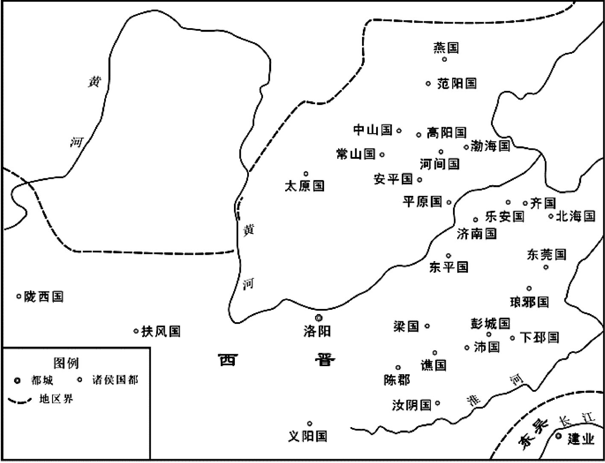
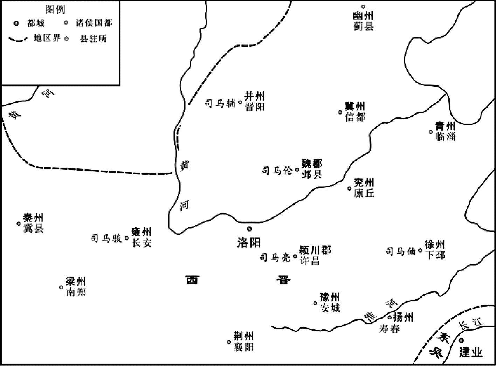
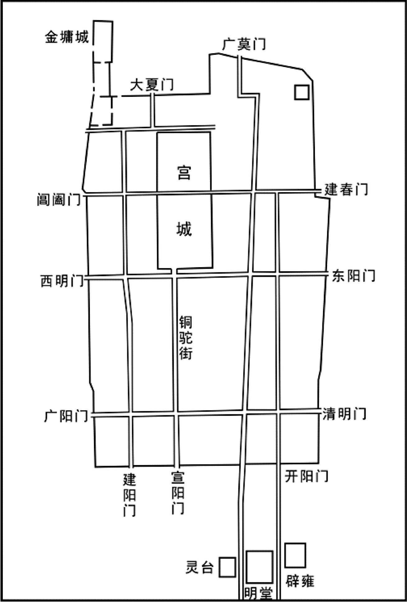
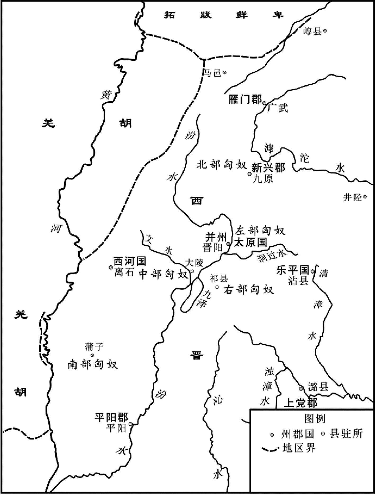
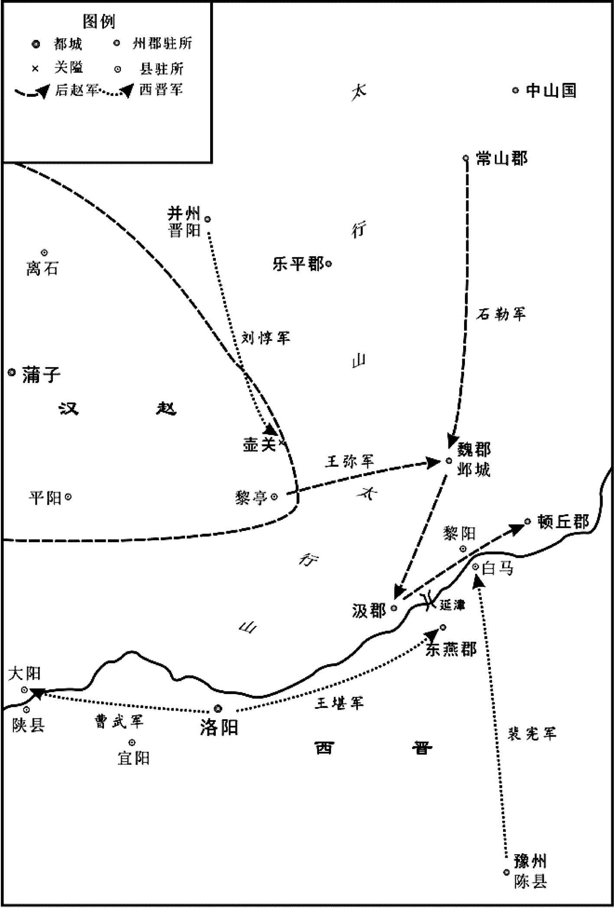
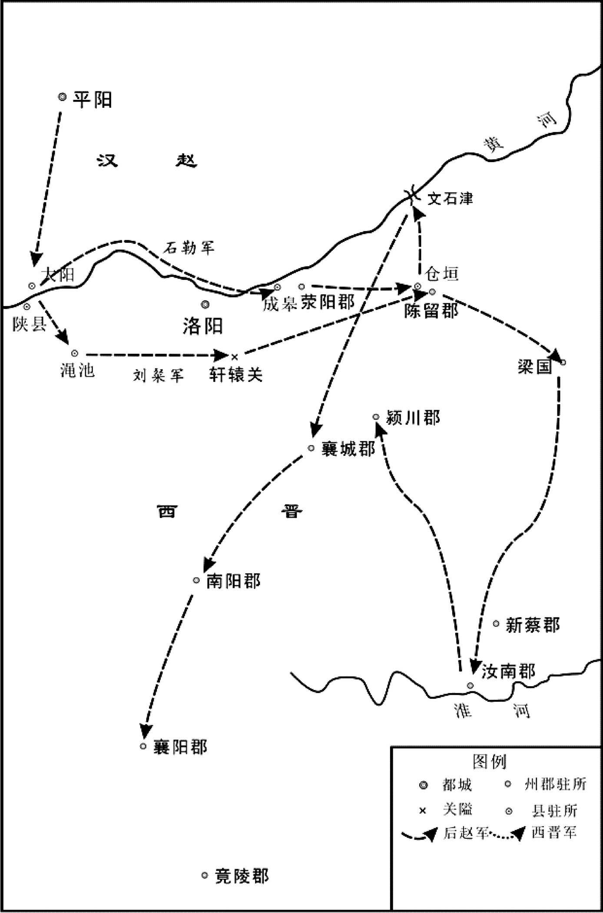
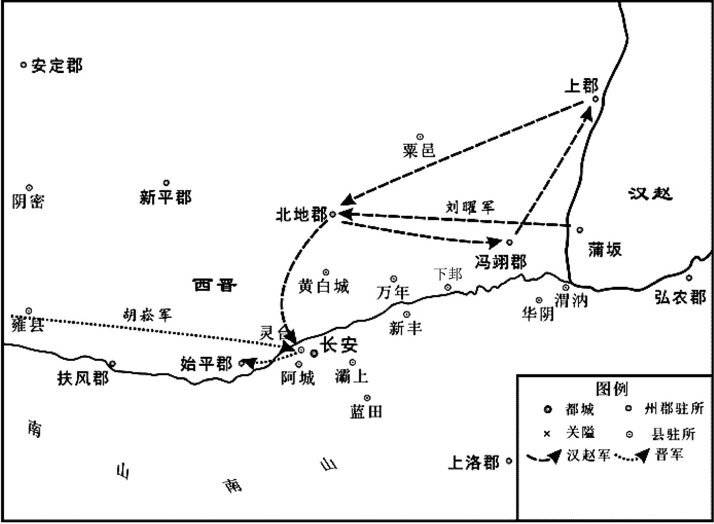
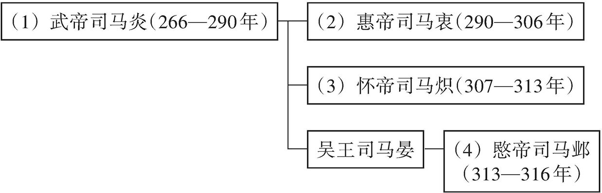

# 目录

西晋之乱　贾氏　诸王　胡羯　江左中兴附

附录： 
西晋皇帝世系表

返回总目录

# 西晋之乱**  
****贾氏　诸王　胡羯　江左中兴附**

## 【内容提要】

本篇叙述了西晋末年“八王之乱”及西晋灭亡、东晋建立的过程。

在册立长子司马炎或次子司马攸为世子的问题上，晋王司马昭颇为犹豫。在重臣的压力下，三国魏元帝咸熙元年（264年）司马炎被立为世子。西晋武帝泰始元年（265年）十二月，魏元帝曹奂禅让于司马炎，是为晋武帝，西晋建立。第二年，晋武帝恢复分封制，封二十七个同姓王以郡建国。之后宗室诸王的权力不断扩大，诸王可以自行选用文武官员，收取封国内的租税。

西晋武帝晚年，朝廷内外要求齐王司马攸继位的呼声高涨，这引起武帝的不满，荀勗、冯趁机进谗言，将司马攸排挤出朝，司马攸因气愤吐血而死。晋武帝病重之时，托付后事，任命汝南王司马亮与皇后杨芷之父杨骏共同辅政，在杨皇后的干预下，改为杨骏单独辅政。西晋武帝太熙元年（290年），司马炎去世，太子司马衷继位，是为晋惠帝。司马亮恐怕杨骏害他，逃亡许昌，结果杨骏大权独揽。杨骏专权引起皇亲国戚及某些大臣的不满，惠帝皇后贾南风是开国元老贾充之女，凶狠多诈，企图操纵晋惠帝以把持朝政。在贾后的密谋策划下，楚王司马玮带兵进入洛阳。西晋惠帝元康元年（291年）三月，贾后令惠帝下诏，宣称杨骏谋反，司马玮领兵围攻杨骏府第，将其杀死，废皇太后杨芷为庶民，又诛灭杨骏三族，其政治势力被消灭。

杨骏被杀后，朝政大权由汝南王司马亮与元老大臣卫瓘共同执掌，楚王司马玮因功被任命为卫将军，兼领北军中候，贾后的亲戚也担任了要职。司马亮与卫瓘计划夺取司马玮军权，遣其回归封国，于是司马玮投靠贾后，贾后封司马玮为太子少傅，然后令惠帝下手诏给司马玮，令他宣布司马亮与卫瓘图谋不轨。于是司马玮率军包围二人府第，将其杀死。

另一方面，贾后担心司马玮权力过大威胁自己，在杀死司马亮的第二天，她与惠帝采用张华的计谋，派人宣布司马玮伪造手诏，将其处死。由此朝政大权被贾后掌控，她的亲戚多被委以重任，同时还起用名士张华与世族裴、裴楷、王戎等人，贾后掌权后的七八年间，政局还算稳定。

太子司马遹非贾后亲生，且二人一向不和。西晋惠帝元康九年（299年），贾后令人伪造太子要惠帝退位的书草，设计陷害太子。结果太子被废，囚禁于金墉城。身为太子太傅的赵王司马伦，在太子被废后，与其亲信孙秀等人密谋推翻贾后，他们设计诱使贾后杀死太子，再以为太子报仇之名诛杀贾后。结果贾后、张华、裴等人先后被杀，司马伦一党掌握了朝廷大权。西晋惠帝永宁元年（301年），赵王司马伦自立为皇帝，晋惠帝被废，囚禁于金墉城。

赵王司马伦称帝后，齐王司马冏、河间王司马颙、成都王司马颖乘机起兵讨伐司马伦。经过六十多天的战斗，司马伦兵败，被囚禁于金墉城，后饮金屑酒而死。司马冏迎接惠帝复位，自己担任大司马一职，司马颙、司马颖二王被封高爵，拥兵自重。司马冏独揽政权后不可一世，政事荒废，翊军校尉李含诈称受到惠帝密诏，要河间王司马颙攻打司马冏。西晋惠帝太安元年（302年）底，司马颙上表陈述司马冏的罪状，兴兵讨伐，同时声称长沙王司马为其内应，致使司马与司马冏连战三日，结果司马冏战败被杀，司马独揽政权。

司马颙不甘心司马独揽政权，西晋惠帝太安二年（303年），司马颙令部将张方与司马颖起兵讨伐洛阳。惠帝下诏令司马为大都督，兴兵迎击。在朝任职的东海王司马越乘司马军队疲惫之际，怂恿张方派兵到金墉城抓捕司马，司马被活活烧死。司马颖独揽政权，废除皇太子司马覃，自称皇太弟，处处展现其夺位野心，这使其他野心家有了政变的借口。惠帝以东海王司马越为大都督，聚集十多万士兵讨伐司马颖。司马越大败，司马颖部将石超将惠帝抓捕后送到邺城，司马越逃回封地东海。

司马越战败后，其亲弟司马腾联合异族乌桓、羯人等势力大败司马颖。司马颖放弃邺城，与惠帝逃到洛阳，洛阳守将张方又把二人挟持到长安。司马颙废除司马颖的皇太弟地位，独揽大权。司马越再次集结大军，讨伐司马颙，司马颙命人暗杀张方，然后派人将张方首级送到司马越军中，以此进行和解。但司马越不但没有退兵，反而进军长安，司马颙单骑逃到太白山。司马颖在逃亡途中，被范阳王司马虓（xiāo）幽禁，其长史刘舆矫诏将其赐死。西晋惠帝永兴三年（306年），晋惠帝暴亡，司马炽继位，是为晋怀帝。怀帝下诏以司马颙为司徒，在上任途中，被南阳王司马模部将梁臣掐死。晋怀帝改元永嘉，令太傅、东海王司马越辅政。在“八王之乱”中，东海王司马越最终得胜，掌握了朝廷大权。

“八王之乱”期间，并州刺史司马腾与将军王浚联合鲜卑贵族，进攻司马颖驻守的邺城，司马颖不敌，匈奴贵族刘渊献计，要回匈奴召集骑兵抗衡鲜卑人，得到司马颖的同意。西晋惠帝永兴元年（304年），刘渊返回左国城，自称汉王，设置百官，打败司马腾，招降山东起义的王弥等人。西晋怀帝永嘉二年（308年）刘渊称帝，定都平阳。永嘉三年（309年）秋冬，刘渊派其子大将军刘聪率领石勒、刘曜等人进攻洛阳，西晋军队顽强抵抗，匈奴败退。

西晋怀帝永嘉四年（310年），刘渊死后，其子刘聪自立为帝。第二年，刘聪命前军大将军呼延晏率兵进攻西晋都城洛阳，前后十二战，晋兵皆败。接着刘曜、王弥、石勒合兵攻破洛阳，杀死西晋诸王公及百官以下三万人，俘获晋怀帝司马炽，押送汉国都城平阳（今山西临汾西南）。洛阳被攻破后，中原的衣冠士族大多南下江南，唯有并州刺史刘琨和幽州刺史王浚继续留在中原，与匈奴汉国政权对垒。其时，北方各州大部分地区沦入刘聪统治之下，刘聪命石勒主持冀、幽、并、营四州军事，封石勒为上党公。不久，刘聪首先对刘琨发起进攻，结果刘琨大败。

西晋怀帝永嘉七年（313年），刘聪在平阳杀害晋怀帝司马炽。消息传到长安，司马邺（一作司马业）即位，是为晋愍帝。愍帝即位后，决定对匈奴汉国发动总攻势，收复中原，下诏派三路大军进攻汉国，东路由司马睿率军进攻洛阳，西路由司马保率军进攻长安外围，北路讨伐大军分为两部，一部由刘琨率军沿西河进攻西平，一部由鲜卑首领拓跋猗卢率军直捣平阳。刘聪闻讯后，急调主力戍守平阳，命汉国大将军刘粲阻击刘琨，骠骑将军刘易阻击猗卢，荡晋将军兰阳驻守西平。刘琨、猗卢两支北路军在汉国军队的严密防备下，推进受阻，被迫退兵。东、西两路大军也因司马睿、司马保拒绝出兵而中止。此后不久，刘聪以石勒为并州刺史，在并州形成石勒与刘琨对峙割据的局面。石勒先后击败幽州刺史王浚和并州刺史刘琨。西晋愍帝建兴四年（316年），刘聪派刘曜攻陷长安，晋愍帝投降，被虏往平阳，西晋灭亡。

“八王之乱”中，处于帝室疏族地位的琅邪王司马睿，为了避免杀身之祸，采取恭俭退让之计，设法脱身回到自己的封国。西晋怀帝永嘉元年（307年）九月，司马睿偕王导渡江，采用王导之谋，请求移镇建邺。朝廷遂任命司马睿为安东将军，都督扬州诸军事。在王导、王敦的辅助下，司马睿优礼江南当地士族，始得立足于江南。西晋灭亡的第二年四月，司马睿即晋王位，改元建武，东晋建立。他广辟掾属以为辅佐，有“百六掾”之称。东晋元帝大兴元年（318年）春季三月，晋愍帝死于汉国的讣告传到江东，司马睿即皇帝之位，是为晋元帝，改元大（太）兴。

西晋末年到东晋建立之初，战乱频繁，社会动荡不安。北方少数民族纷纷内迁，建立政权，而西晋王朝内部则争权夺利，不断内讧，走向灭亡。司马睿在南迁士族的支持下建立东晋，地位逐渐巩固。此时期虽然经济遭受破坏，人民生活困苦，但加速了民族的融合，是中华民族形成的重要时期。

## 【原文】

**魏元帝咸熙元年[1]。初，晋王娶王肃之女，生炎及攸，以攸继景王后[2]。攸性孝友，多材艺，清和平允，名闻过于炎[3]。晋王爱之，常曰：“天下者，景王之天下也，吾摄居相位，百年之后，大业宜归攸[4]。”炎立发委地，手垂过膝，尝从容问裴秀曰：“人有相否？”因以异相示之，秀由是归心[5]。羊琇与炎善，为炎画策，察时政所宜损益，皆令炎豫记之，以备晋王访问[6]。晋王欲以攸为世子，山涛曰：“废长立少，违礼不祥[7]。”贾充曰：“中抚军有君人之德，不可易也[8]。”何曾、裴秀曰：“中抚军聪明神武，有超世之才，人望既茂，天表如此，固非人臣之相也[9]。”晋王由是意定，丙午，立炎为世子。**

## 【注文】

[1]魏元帝：即曹奂（246—302年），本名曹璜，字景明，三国魏武帝曹操之孙，燕王曹宇之子。三国时曹魏最后一代皇帝，公元260年至265年在位。西晋武帝泰始元年（265年），曹奂禅位于晋王司马炎，此后被废为陈留王，谥号为元皇帝。　　咸熙元年：即公元264年。咸熙是魏元帝曹奂的第二个年号，自公元264年至265年。此处当指咸熙元年的冬季十月。

[2]晋王：指司马昭（211—265年），三国时期曹魏权臣、西晋王朝的奠基人之一。司马昭继承其父司马懿与其兄司马师的权力，诛杀魏帝曹髦，彻底控制曹魏政权，掌权期间派邓艾灭蜀，其子司马炎称帝后，追尊司马昭为文皇帝。　　王肃（195—256年）：三国时期魏国学者。字子雍，东海郡郯（tán）（今山东郯城北）人，著名经学家王朗之子。曾遍注群经，编撰《孔子家语》等书。三国魏明帝太和五年（231年），王肃之女嫁给晋王司马昭，王肃以晋王岳父之尊，其所注经学取得了官方学术地位，在魏晋时期被称为“王学”。王肃主要官衔为中领军、散骑常侍，死后被追赠为卫将军，谥称景侯。　　王肃之女：指王元姬（217—268年），东海郯（今山东郯城北）人，嫁给司马昭为夫人。生晋武帝司马炎、齐献王司马攸等。王元姬颇有政治眼光，当时钟会以才能被重用时，她就认为钟会不可重用，后来钟会果然造反。司马炎称帝，尊为皇太后。司马炎即位初期提倡节俭，王元姬以太后之尊，身体力行生活简朴。西晋武帝泰始四年（268年）薨，谥号文明皇后。　　炎：即晋朝开国皇帝司马炎（236—290年），公元266年至290年在位。西晋武帝泰始元年（265年），司马炎继承其父司马昭的晋王之位，数月后逼迫魏元帝曹奂禅位于己，国号大晋，建都洛阳。西晋武帝太康元年（280年）司马炎派兵灭吴，统一全国，并采取一系列经济措施以发展生产，其在位的太康年间出现一片繁荣景象，史称“太康之治”。西晋武帝太熙元年（290年）司马炎病逝，谥号武皇帝，即历史上的晋武帝。　　攸：即司马攸（248—283年），司马昭次子，被过继给景王司马师为后，封齐王。司马攸有治理才能，在西晋建立之初有政治建树，深得人心。晋武帝晚年，朝廷内外要求司马攸继位的呼声高涨，权臣荀勗、冯趁机进谗言，将司马攸排挤出朝，司马攸气恨而死，谥为“献”。　　景王：指司马师（208—255年），三国时期曹魏权臣，司马懿长子，西晋王朝的奠基人之一。他有雄才大略，继承父亲权力，废掉魏帝曹芳，平定淮南三叛，击败吴国诸葛恪大军的进攻，基本上控制了曹魏政权。司马炎称帝后，追尊司马师为景皇帝，庙号世宗。

[3]孝友：事父母孝顺，对兄弟友爱。　　平允：指性情平易。

[4]摄居：暂居君主之位。　　大业：谓帝业。

[5]委地：拖垂于地。　　裴秀（224—271年）：魏晋大臣，著名学者。字季彦，河东闻喜（今山西闻喜东北）人。历官三国魏散骑常侍、尚书仆射，晋左光禄大夫、司空，封钜鹿郡公，作《禹贡地域图》，开创了我国古代地图绘制学。　　异相：奇异的相貌，相术家多指命运非凡之相。　　示：表明，把事物拿出来或指出来使别人知道。

[6]羊琇（236—282年）：西晋大臣。字稚舒，泰山南城（今山东平邑南）人，景献皇后的从父弟。　　画策：筹划情况，拟订作战策略。　　损益：指政事兴革。　　豫记：事先记忆在心。

[7]世子：西周时天子、诸侯的嫡子称“世子”，后世将册封为储君的天子及诸侯之子称世子，大多情况是册立长子，历史上亦有册立少子为世子的情形。　　山涛（205—283年）：西晋大臣、学者，“竹林七贤”之一。字巨源，河内怀县（今河南武陟西）人。山涛喜好老庄学说，与嵇康、阮籍等人交游。司马师执政后，山涛倾心依附，累迁尚书吏部郎，司马炎代魏称帝时，山涛被任为大鸿胪，入为侍中，迁吏部尚书、太子少傅、左仆射、司徒等。

[8]中抚军：指司马炎，他曾任抚军大将军。

[9]何曾（199—278年）：西晋大臣。三国魏国大臣何夔之子，何遵、何劭之父。继承其父爵位，魏明帝时封平原侯，擢散骑侍郎、典农中郎将。何曾与曹魏权臣司马懿私交深厚，司马炎袭父爵为晋王时，何曾为丞相，在废曹立晋的过程中起了重要作用，因而晋朝一建立，他官封太尉，直至太保兼司徒，爵位也由侯晋升为公。　　人望：声望，威望。　　天表：指天子的仪容。　　固非：本来就不是。

## 【译文】

魏元帝曹奂咸熙元年（264年）［冬季十月］。当初，晋王司马昭娶儒士王肃之女为妻，生司马炎和司马攸，将司马攸过继给景王（司马师）为嗣。司马攸对父母孝顺，对兄弟友爱，多才多艺，性情平和清静，名望超过司马炎。晋王（司马昭）很宠爱司马攸，常说：“天下本来就是景王创立的天下，我不过暂代宰相之位，百年之后，帝王大业应归司马攸。”司马炎挺身站立时发长拖地，双手下垂能超过膝盖，他曾从容地询问裴秀：“人有天相吗？”于是将自己奇异的相貌展示给裴秀看，于是裴秀忠心归附司马炎。羊琇与司马炎关系友善，专门为司马炎出谋划策，观察时政所应裁减和增设之处，让司马炎事先记忆在心，准备应对晋王的询问。晋王想册立司马攸为世子，来继承王位，山涛劝阻说：“废弃长子而立少子，违背礼制不吉祥。”贾充说：“中抚军（司马炎）具备君临天下的品德，不能改变。”何曾、裴秀也说：“中抚军聪颖神武，具有超出当世的才能，声望很高，天生仪表那样出奇，这本来就不是做人臣子的骨相。”晋王由此拿定主意，丙午（二十日），册立司马炎为世子。

## 【原文】

**晋武帝泰始元年五月，魏帝加文王殊礼，进王妃曰后，世子曰太子[1]。秋八月辛卯，文王卒，太子嗣为晋王[2]。**

## 【注文】

[1]泰始元年：公元265年12月11日，司马炎逼迫魏元帝曹奂退位，自称皇帝，改魏为晋，史称西晋，改元泰始，建都洛阳。泰始是晋武帝司马炎的第一个年号，从公元265年至公元274年。　　殊礼：特别的礼遇。　　太子：已确定继承帝位或王位的帝王之子称为太子。

[2]嗣：经皇上恩准父亲传位或传业给嫡长子。

## 【译文】

西晋武帝（司马炎）泰始元年（265年）五月，魏元帝曹奂为司马昭加授文王特礼，并称其王妃为王后，世子称太子。秋季八月辛卯（初九日），文王去世，太子（司马炎）继位为晋王。

## 【原文】

**冬十二月壬戌，魏帝禅位于晋[1]。丙寅，王即皇帝位[2]。丁卯，封皇叔祖父孚为安平王，叔父干为平原王，亮为扶风王，伷为东莞王，骏为汝阴王，肜为梁王，伦为琅邪王，弟攸为齐王，鉴为乐安王，机为燕王[3]。又封群从司徒望等十七人皆为王[4]。帝惩魏氏孤立之敝，故大封宗室，授以职任[5]。又诏诸王皆得自选国中长吏[6]。卫将军齐王攸独不敢，皆令上请。**

## 【注文】

[1]禅（shàn）位：相传尧舜禹时期，经过民主方式推选君主，称为禅让，后世权臣逼迫皇帝退位称为禅位。

[2]王：指晋王司马炎。　　即位：开始做帝王或诸侯。

[3]孚（fú）：即司马孚（180—272年），司马懿之弟。自曹操时代起，就任文学掾，后历仕魏国五代皇帝，累迁至太傅。司马孚曾协助司马懿控制京师，诛杀曹爽一党，后又督军防御吴、蜀进攻，为司马氏政权的稳固立下功劳。但司马孚自司马懿执掌大权起，就逐渐引退，未参与司马氏几次废立魏帝之事。西晋代魏后，司马孚晋封为安平王，但他死时仍以魏臣自称。　　干：即司马干（232—311年），司马懿之子，晋代魏后进封为平原王。　　亮：即司马亮（？—291年），西晋宗室，司马懿第四子。司马炎称帝后封扶风郡王，都督关中雍、凉诸军事，西晋武帝咸宁三年（277年）徙封汝南王，不久迁太尉，录尚书事。晋武帝死后为杨骏所排斥，司马亮赶赴许昌避祸。及杨骏被诛，复任录尚书事。西晋惠帝元康元年（291年），贾后妒忌司马亮，密令楚王司马玮诬蔑他有废立之谋，司马亮被乱兵所杀。　　伷（zhóu）：即司马伷（227—283年），为司马懿第五子。司马伷生性纯良，年轻时就很有才能和名气，在魏国官至征虏将军，西晋代魏后被封为东莞（guǎn）王，曾参加灭吴战争，立有大功，去世后，谥号为琅邪武王。　　骏：即司马骏（232—286年），司马懿之子，西晋建立先后封汝阴王、扶风王，曾担任镇西大将军，守卫关中，施政仁义，能安抚百姓，维护民族团结，深受百姓爱戴，后因战功加封征西大将军。后来因反对晋武帝遣送齐王司马攸归藩，晋武帝不从，司马骏忧郁而终。　　肜（rónɡ）：即司马肜（？—302年），字子徽，司马懿之子。西晋建立后，司马肜被封为梁王，任北中郎将，镇守邺城，因用人失误被周处弹劾。西晋惠帝永康初年，与赵王司马伦共废贾后，任太宰、尚书令。司马伦篡位后为阿衡。司马伦被诛后，又任太宰、司徒，为宗师。　　伦：即司马伦（？—301年）。字子彝，司马懿第九子，建立西晋后封琅邪郡王，后转为赵王。历任东中郎将、宣威将军、征西将军、开府仪同三司、车骑将军、太子太傅等职，司马伦交结贾模，为贾后亲信，把持朝政。西晋惠帝永康元年（300年）四月，命齐王司马冏杀死贾后及其党羽。八月，击杀淮南王司马允。司马伦是西晋“八王之乱”中的一王。永康二年（301年），司马伦逼迫惠帝退位，自立为帝，改元建始。不久，齐王司马冏、成都王司马颖、河间王司马颙起兵讨伐司马伦，司马伦被部将王舆所杀。　　鉴：即司马鉴（？—297年），司马昭之子，司马炎之弟，司马炎建立西晋后，被封为乐安王。　　机：即司马机（生卒年不详），司马昭之子，司马炎之弟，过继给清惠亭侯司马京，西晋建立后被封为燕王。

[4]群从：指堂兄弟及诸子侄。　　望：司马望（205—271年）。司马孚次子，在三国魏历任平阳太守、洛阳典农中郎将、护军将军，加散骑常侍，受到魏帝曹髦器重，后又被征入朝，累迁至司徒。西晋代魏后，司马望被封为义阳王，多次督军抵挡吴国进攻，官至大司马。

[5]宗室：同一祖宗的贵族，即国君或皇帝的宗族。

[6]长吏：旧称地位较高的官员。

## 【译文】

冬季十二月壬戌（十三日），魏元帝（曹奂）把帝位禅让于晋王（司马炎）。丙寅（十七日），晋王即皇帝位。丁卯（十八日），晋武帝封皇叔祖父司马孚为安平王，叔父司马干为平原王，司马亮为扶风王，司马伷为东莞王，司马骏为汝阴王，司马肜为梁王，司马伦为琅邪王，弟弟司马攸为齐王，司马鉴为乐安王，司马机为燕王。又封堂兄弟及诸子侄司马望等十七人为王。晋武帝鉴于曹魏没有王族宗室辅助、孤立而亡的教训，因此大封同姓宗室，授给他们职权重任，又下诏令诸王自行选用本封国的官吏。卫将军齐王司马攸唯独不敢这样做，所有属吏都请晋武帝委派。

 
西晋分封的二十七诸侯国分布示意图

## 【原文】

**三年春正月丁卯(1)，立子衷为皇太子[1]。**

## 【注文】

[1]衷：即晋惠帝司马衷（259—306年），晋武帝司马炎次子。司马衷于西晋武帝泰始三年（267年）被册立为皇太子，西晋武帝太熙元年（290年）即位，改元永熙。他为人痴呆，不堪任事，初由太傅杨骏辅政，后来皇后贾南风杀害杨骏，掌握大权。“八王之乱”中，晋惠帝叔祖赵王司马伦篡夺帝位，并以惠帝为太上皇，囚禁于金墉城。后群臣共谋诛杀司马伦及其党羽，迎晋惠帝复位。其后晋惠帝仍由诸王辗转挟持，形同傀儡，受尽凌辱。

## 【译文】

西晋武帝泰始三年（267年）春季正月丁卯日，册立司马衷为皇太子。

## 【原文】

**七年。侍中、尚书令、车骑将军贾充，自文帝时宠任用事，帝之为太子，充颇有力，故益有宠于帝[1]。充为人巧谄，与太尉行太子太傅荀、侍中中书监荀勗、越骑校尉安平冯相为党友，朝野恶之[2]。帝问侍中裴楷以方今得失，对曰：“陛下受命，四海承风，所以未比德于尧、舜者，但以贾充之徒尚在朝耳[3]。宜引天下贤人，与弘政道，不宜示人以私。”侍中乐安任恺、河南尹颍川庾纯皆与充不协，充欲解其近职，乃荐恺忠贞，宜在东宫；帝以恺为太子少傅，而侍中如故[4]。会树机能乱秦、雍，帝以为忧，恺曰：“宜得威望重臣有智略者以镇抚之[5]。”帝曰：“谁可者？”恺因荐充，纯亦称之。秋七月癸酉，以充为都督秦、凉二州诸军事，侍中、车骑将军如故；充患之[6]。**

## 【注文】

[1]侍中：古代官名。入侍于天子的一种近臣。“中”指宫廷之内，凡侍中皆可出入禁廷，接近皇帝。东汉武帝后侍中参与朝政，外戚进行辅政也都被加以侍中衔。　　尚书令：古代官名。秦朝始置尚书令，汉朝沿置，本为少府署官，掌章奏文书，东汉武帝后职权渐重，政务皆归尚书，尚书令成为总揽政令的长官。魏晋以后，尚书令成为实际的宰相。　　车骑将军：古代官名。西汉开始设置将车骑士，位次上卿，金印紫绶。后遂为高级武官称号，位次大将军，且文官辅政者亦加此衔。东汉权势尤重，魏晋南北朝多沿置。　　贾充（217—282年）：曹魏及西晋时期大臣。字公闾，平阳襄陵（今山西襄汾北）人。曹魏时，任大将军司马、廷尉，是司马氏的亲信。他指使成济杀死魏帝曹髦，参与谋划晋代魏的政治活动。晋初任司空、侍中、尚书令，一女贾南风为太子司马衷之妃，后为皇后，一女为齐王司马攸的王妃，宠信无比。　　文帝：即晋文帝司马昭（211—265年）。三国时期曹魏权臣、西晋王朝的奠基人之一。司马昭继承其父司马懿与其兄司马师的权力，弑杀魏帝曹髦，彻底控制曹魏政权，掌权期间派邓艾灭蜀，其子司马炎称帝后，追尊他为文皇帝。

[2]巧谄：机巧诈谄。　　太尉：古代官名。三公之一，秦以后沿置。西汉初年为全国军事首脑，与丞相、御史大夫合称三公；东汉改与司徒、司空并称三公，仍为共同负责军政的最高长官。唐代三公正一品，虽名位尚存，实则仅为授予亲王大臣的荣衔，而太尉则多授予武官。　　太子太傅：古代官名。东宫官，太子六傅之一，掌管以道德教导太子。　　荀（yǐ）（？—274年）：字景倩，颍川颍阴（今河南许昌）人，汉末尚书令荀彧第六子。出仕魏国时为中郎、散骑侍郎、侍中。西晋建立后进爵为公，官拜司徒，加侍中衔，迁太尉，行太子太傅。荀博学多闻，精通“三礼”，深通朝廷礼仪，曾和羊祜、任恺共同修订晋朝礼法。　　中书监：古代官名。三国魏文帝黄初年间置，与中书令共掌机密，典尚书奏事，权力相当于宰相，晋朝沿置；魏晋以来，中书监及中书令掌赞诏命，记会时事，典作文书。　　荀勗（xù）（？—289年）：西晋官吏。字公曾，颍川颍阴（今河南许昌）人。东汉司空荀爽曾孙。荀勗曾为大将军司马昭记室，多次进献计谋，为司马昭所信任，与裴秀、羊祜共掌机密。司马炎建立西晋后，荀勗封济北郡公，拜中书监、加侍中衔。荀勗博学多才，入晋后曾和贾充一起修订法令，又掌管乐事，修正律吕，还曾仿效刘向《别录》整理典籍。　　越骑校尉：古代官名。西汉武帝所置京师屯兵八校尉之一，属北军，统领越骑；东汉为北军五营校尉之一；魏晋南朝沿置，为中领军所属禁卫军官之一，其职任已轻。　　安平：古国名。东汉安帝延光元年（122年），改乐成国而置，治所在信都县（今河北冀州），西晋武帝太康五年（284年）改为长乐国。　　冯（dǎn）（？—286年）：西晋大臣。字少冑，安平（今河北安平）人。年轻时博览经史典籍，有才学且擅于辩论，极得晋武帝司马炎宠信，西晋武帝泰始七年（271年），与荀勗一道劝说司马炎，让太子司马衷娶贾充之女贾南风。后来司马炎得知贾南风凶残暴虐，打算废掉她，冯等人成功劝服司马炎。西晋武帝太康三年（282年），司马炎患病时，朝野上下支持齐王司马攸即位，荀勗与冯劝司马炎将原在朝廷任太傅的司马攸发还封国，次年，司马攸忧愤而死。太康七年（286年），冯患病去世。　　党友：朋党。

[3]裴楷（237—291年）：西晋名臣。字叔则，河东闻喜（今山西闻喜东北）人。司马昭辟为相国掾，迁吏部郎，司马炎任其为参抚军军事。司马炎即帝位后，他先后任散骑侍郎、散骑常侍等，与山涛、和峤等人同为司马炎亲信近臣。裴楷参与了晋朝法律的制定。　　陛下：陛，宫殿的台阶；陛下，本指群臣列于阶下，后借作帝王的尊称。　　受命：受天之命，古帝王自称受命于天以巩固其统治。　　承风：接受教化。

[4]任恺（生卒年不详）：曹魏、西晋大臣。字元褒，安乐博昌（今山东博兴东南）人，曹魏太常任昊之子，历事魏晋两朝。任恺在处理公务上勤劳谨慎，获得朝野赞誉，但与贾充有朋党之争，仕途受阻。　　河南尹：官名。东汉设置，为京都雒阳所在郡的长官，秩二千石，主掌京都事务。三国时魏都洛阳置河南尹，三品。西晋都洛阳，沿魏制。　　庾纯（生卒年不详）：字谋甫，颍川鄢陵（今河南鄢陵西北）人。博学有才义，为世儒宗。累官黄门侍郎，历中郎令、河南尹。贾充擅权，庾纯怒斥说：“天下凶凶，由尔一人！”因此而被免官。后拜少府。　　不协：不一致，不和。　　东宫：封建时代太子的宫室，也借指太子。　　太子少傅：古代官名。与太子少师、太子少保合称太子三少或东宫三少，以正二品掌奉太子，以观三公道德而后进行教谕，后来逐渐成为虚衔。

[5]树机能：又称秃发树机能（？—280年），西晋时鲜卑首领，河西鲜卑人，秃发氏，勇壮多谋略。西晋初年，率众反晋，杀死秦州刺史胡烈，不久被西晋平虏护军文鸯所败。后声势复振，尽有凉州之地，但在与武威太守马隆交战中，为部将所杀。　　秦：即秦州，古州名。西晋武帝泰始五年（269年）分雍、凉、梁三州置。初治冀县（今甘肃甘谷东），西晋武帝太康七年（286年）移上邽（今甘肃天水）。辖境东起今甘肃两当、清水及陕西凤县、略阳，四川平武，西至青海贵德，北至甘肃兰州、永登、定西、静宁。十六国时为西北诸政权争夺要地。　　雍：即雍州，古州名。东汉献帝兴平元年（194年）分凉州河西四郡置。三国魏时，辖境相当于今陕西中部、甘肃东南部、宁夏南部及青海黄河以南的一部分地，以后逐渐缩小。

[6]凉：即凉州，古州名。中国古代行政区划，汉武帝所置十三州刺史部之一，东汉治陇县（今甘肃张家川），辖境相当于今甘肃、宁夏，青海湟水流域，陕西定边、吴起、凤县、略阳和内蒙古额济纳旗一带。东汉献帝建安十八年（213年）并入雍州，三国魏文帝复置，移治姑臧县（今甘肃武威）。魏晋以后辖境缩小，只限于今甘肃黄河以西大部。

## 【译文】

西晋武帝泰始七年（271年）。侍中、尚书令、车骑将军贾充，自晋文帝（司马昭）时就受到宠信而当权，晋文帝能够成为太子，贾充出了很大力气，所以越发受到晋武帝的宠信。贾充为人善于谄媚逢迎，与太尉、代理太子太傅荀，侍中、中书监荀勗，越骑校尉安平人冯结成同党，朝野内外都憎恶他们。晋武帝向侍中裴楷询问当今朝政得失，裴楷回答说：“陛下承受天命，四海接受教化，但天下之人没有把陛下的功德比为唐尧、虞舜，只因为贾充这帮人在朝廷掌权而已。应当引进天下贤人，让他们参与并弘扬为政之道，而不应当向天下人显露您的偏私。”侍中乐安人任恺、河南尹颍川人庾纯都与贾充不和，贾充打算解除任恺的侍中职务，就向晋武帝推荐任恺忠贞，应在太子东宫供职。晋武帝委任任恺为太子少傅，而侍中一职仍然保留。恰在此时，秃发树机能侵扰秦州、雍州地区，晋武帝对此很忧虑，任恺就提议说：“应当选派威望高而且具有谋略的重臣去那里镇抚。”晋武帝说：“谁可以胜任呢？”任恺乘机推荐贾充，庾纯也称赞贾充足以胜任。秋季七月癸酉（二十六日），晋武帝任命贾充为都督，掌管秦州、凉州二州的军事，而侍中、车骑将军的职务依旧保留。贾充对这一安排感到头疼。

## 【原文】

**冬十一月，贾充将之镇。公卿饯于夕阳亭[1]。充私问计于荀勗，勗曰：“公为宰相，乃为一夫所制，不亦鄙乎！然是行也，辞之实难，独有结婚太子，可不辞而自留矣[2]。”充曰：“然。孰可寄怀？”勗曰：“勗请言之[3]。”因谓冯曰：“贾公远出，吾等失势。太子婚尚未定，何不劝帝纳贾公之女乎？”亦然之。初，帝将纳卫瓘女为太子妃，充妻郭槐赂杨后左右，使后说帝求纳其女[4]。帝曰：“卫公女有五可，贾公女有五不可。卫氏种贤而多子，美而长、白；贾氏种妒而少子，丑而短、黑。”后固以为请，荀、荀勗、冯皆称充女绝美，且有才德，帝遂从之。留充复居旧任。**

## 【注文】

[1]公卿：古代三公九卿的总称，后世则用以泛指朝廷重臣。　　饯（jiàn）：设酒食送行，饯行，饯别。　　夕阳亭：亭名。洛阳县西有亭，汉、晋时称夕阳亭，唐时改称河亭，汉晋时期为饯别之所，诗文中常用作洛阳的标志。

[2]鄙：轻蔑，看不起。　　结婚：缔结婚姻关系。

[3]寄怀：寄托情怀或怀抱。

[4]卫瓘（guàn）（220—291年）：西晋大臣，书法家。字伯玉，河东安邑（今山西夏县西北）人。魏末任廷尉卿，监督邓艾、钟会军灭蜀。钟会诬陷邓艾谋反，他趁机杀死邓艾父子。钟会在蜀地反叛，他纠集大军平定。晋武帝时，晋爵为公，官至司空。晋惠帝时，卫瓘辅佐朝政，为贾后所杀。卫瓘学问深博，以擅长草书闻名，在书法史上影响颇大。　　郭槐（237—296年）：字媛韶，太原阳曲（今山西阳曲）人，西晋大臣贾充的妻子，以善妒闻名。父亲是城阳太守郭配，伯父是曹魏名将郭淮。郭槐嫁给贾充做继室，长女贾南风为晋惠帝皇后，干预国政，直接导致了“八王之乱”。　　杨后：即杨艳（238—274年），字琼芝，弘农华阴（今陕西华阴东南）人，曹魏大臣杨文宗的女儿，晋武帝司马炎的皇后，史称武元皇后。杨后坚持立自己的白痴儿子司马衷为太子，劝说晋武帝为太子娶贾充之女贾南风为妻，并维护外戚权势，对西晋政局产生消极影响。临死前为保住太子地位，防止贵嫔胡芳取代自己的皇后位置，最主要是担心别人取代自己的后位后诞下皇子，对自己儿子的太子位置不利，便要求丈夫继娶自己的堂妹杨芷为皇后，并要求杨芷百般保护司马衷夫妻。　　说（shuì）：游说，用话劝说别人，使其听从自己的意见。

## 【译文】

冬季十一月，贾充即将赶赴任所，朝廷公卿在夕阳亭为他饯行。贾充私下向荀勗探问不去赴任的对策。荀勗说：“您身为宰相，竟然为一小官所挟制，不也太丢脸面了吗？但这次赴任，推辞掉确实很难；只有与太子结为姻亲，才不必推辞就能留下来。”贾充说：“对。但谁能代我表达心愿呢？”荀勗说：“我替您去说。”于是荀勗对冯说：“贾公到远地赴任，我等就失去权势。太子婚姻还没确定，我们何不劝皇帝为太子纳贾公之女呢？”冯也认为这样做很对。当初，晋武帝准备娶卫瓘之女为太子妃，贾充夫人郭槐贿赂杨皇后的左右侍从，让他们怂恿杨皇后去劝说晋武帝娶自己的女儿为太子妃。晋武帝说：“卫公之女具备五个好条件，贾公之女具有五个不利方面：卫氏种子贤良，儿女众多，个个漂亮、高大、白皙；贾氏种子嫉妒，儿女很少，个个丑陋、矮小、黝黑。”杨皇后坚决请求娶贾女，荀、荀勗、冯也都夸赞贾充之女姿色绝美，而且具有才艺美德。晋武帝听从了他们的鼓动，留下贾充官居原职。

## 【原文】

**八年春二月辛卯，皇太子纳贾妃[1]。妃年十五，长于太子二岁。妒忌多权诈，太子嬖而畏之[2]。秋七月，以贾充为司空，侍中、尚书令、领兵如故[3]。**

## 【注文】

[1]贾妃：即贾后，名贾南风（256—300年），晋惠帝皇后，平阳襄陵（今山西临汾西南）人，晋初大臣贾充之女。晋惠帝即位时，太后之父杨骏专权，西晋惠帝元康元年（291年），贾后指使楚王司马玮杀死杨骏。汝南王司马亮辅政，她又使司马玮杀司马亮，再以“矫诏”杀司马玮。前后共专权擅政十年，后为赵王司马伦所杀。

[2]嬖（bì）：嬖爱，宠爱。

[3]司空：古代官名。三公之一。东汉光武帝改大司空为司空，较之西汉时所主管的事务范围更广，除参议朝政大事，又掌治水利和土木营建。后世司空用作工部尚书的别称。

## 【译文】

西晋武帝泰始八年（272年），春季二月辛卯（十七日），皇太子娶贾女为妃。贾妃十五岁，比太子大两岁。她生性妒忌，又会耍手腕，太子对她既宠爱又惧怕。秋季七月，晋武帝任命贾充为司空，原任的侍中、尚书令和统领城外诸军之权不变。

## 【原文】

**十年秋七月丙寅，皇后杨氏殂[1]。初，帝以太子不慧，恐不堪为嗣，常密以访后。后曰：“立子以长不以贤，岂可动也！”镇军大将军胡奋女为贵嫔，有宠于帝，后疾笃，恐帝立贵嫔为后，致太子不安，枕帝膝泣曰：“叔父骏女芷有德色，愿陛下以备六宫[2]。”帝流涕许之。**

## 【注文】

[1]殂（cú）：死亡。

[2]镇军大将军：古代将军名称，领兵将领。三国魏文帝黄初七年（226年）始置，以陈群为镇军大将军，秩二品。晋南北朝诸大将军加开府者，秩一品，位从公或仪同三司。　　胡奋（？—288年）：西晋将领。字玄威，安定临泾（今甘肃镇原东南）人，少好武事。曾随魏国太尉司马懿讨伐辽东，还为校尉，稍后迁徐州刺史，又以监军从讨匈奴刘猛。西晋武帝泰始九年（273年）其女胡芳被选入宫为贵人。西晋武帝咸宁六年（280年）迁征南将军、都督荆州诸军事。西晋武帝太康六年（285年）迁左仆射，加镇军大将军。卒于官。　　贵嫔：皇帝妃嫔封号，三国时魏文帝始置。为皇帝之妾，位在夫人下，淑妃上。晋与南朝贵嫔均为三夫人之一，晋代位视三公，南朝宋位视丞相。　　骏：即杨骏（？—291年），西晋权臣。字文长，弘农华阴（今陕西华阴东南）人。因其女杨芷为武帝皇后，任车骑将军，封临晋侯。晋惠帝时，杨骏摄政，为太傅、大都督，总揽朝政，遍树亲党，权倾天下。后为贾后所杀。　　芷：即杨芷（259—292年），西晋武帝的第二任皇后，武元皇后杨艳堂妹，父为杨骏。西晋武帝咸宁二年（276年）立为皇后，得宠于晋武帝。晋武帝死后为皇太后，由于其父杨骏擅权引起皇后贾南风忌恨，贾后联合诸王杀死杨骏，并唆使晋惠帝将杨芷贬为庶人，不久杨芷便冻饿而死。　　六宫：古代帝王后妃的寝宫，正寝一，燕寝五，合为六宫，后世泛称后妃及其所居之地为六宫。

## 【译文】

西晋武帝泰始十年（274年）秋季七月丙寅（初六日），皇后杨艳去世。当初，晋武帝认为太子并不聪慧，恐怕无力继承帝位，曾经多次暗中征求杨后意见。杨后说：“按照礼法，立子即位只分长幼，不问贤愚，岂能随便更动？”镇军大将军胡奋之女为贵嫔，受到晋武帝宠爱，杨后病危时，恐怕在她死后，晋武帝立胡贵嫔为皇后，对太子不利，她枕着晋武帝膝盖，哭着说：“我叔父杨骏之女杨芷既贤德又美貌，我死后，愿陛下娶她管理六宫。”晋武帝流泪答应了她的请求。

## 【原文】

**咸宁二年[1]。初，齐王攸有宠于文帝，每见攸，辄抚床呼其小字曰：“此桃符座也[2]！”几为太子者数矣。临终，为帝叙汉淮南王、魏陈思王事而泣，执攸手以授帝[3]。太后临终，亦流涕谓帝曰：“桃符性急，而汝为兄不慈。我若不起，必恐汝不能相容，以是属汝，勿忘我言！”及帝疾甚，朝野皆属意于攸[4]。攸妃，贾充之长女也。河南尹夏侯和谓充曰：“卿二婿，亲疏等耳。立人当立德[5]。”充不答。攸素恶荀勗及左卫将军冯倾谄，勗乃使说帝曰：“陛下前日疾若不愈，齐王为公卿百姓所归，太子虽欲高让，其得免乎！宜遣还藩，以安社稷[6]。”帝阴纳之，乃徙和为光禄勋，夺充兵权，而位遇无替[7]。**

## 【注文】

[1]咸宁二年：即公元276年。咸宁是晋武帝年号，自公元275年至280年。

[2]小字：乳名，小名。

[3]淮南王：即淮南厉王刘长（前198—前174年），刘邦少子，公元前196年被封为淮南王。汉文帝时，骄纵跋扈，在封地不用汉法而自作法令。公元前174年与匈奴、闽越首领联络，图谋叛乱，事泄被拘。朝臣议以死罪，汉文帝将他赦免，废去王号，谪徙蜀郡严道邛邮，途中不食而死。　　陈思王：即曹植（192—232年），三国时魏国文学家，曹操第三子，曹丕之弟。曹操曾欲立曹植为太子，后因受曹丕排挤陷害而失宠。曹丕即帝位，妒忌曹植之才，曾限令他七步成诗，否则处死，曹植作《七步诗》，讽刺其兄相逼太甚。初封东阿王，后谪陈王。曾多次上表求用，忧郁而死。

[4]属（zhǔ）：叮嘱。　　属意：归心，着意。

[5]夏侯和（生卒年不详）：曹魏、西晋官吏。字义权，名将夏侯渊之子。历官河南尹、太常。史称清辩有才。

[6]左卫将军：中央禁卫军官名，始设于晋代。三国魏元帝咸熙年间，司马炎将先前作为禁卫军的中卫军扩编为左卫军、右卫军，设左、右卫将军，使外戚羊琇任左卫将军，掌典禁军，参与机密。右卫将军多由皇室、勋戚充任，升迁较快，并置有长史、司马、功曹、主簿等属官。南北朝沿置，掌宿卫营兵。　　藩：封建时代称属国属地或分封的土地，借指边防重镇，如藩国，藩镇。　　社稷（jì）：社，土地之神；稷，五谷之神。社稷即古代帝王、诸侯所祭的土神和谷神。旧时以社稷为国家政权的标志，象征国家。

[7]光禄勋：古代官名。西汉武帝太初元年（前104年）改郎中令为光禄勋，九卿之一，掌守卫宫殿门户，领宿卫侍从之士。东汉、魏晋沿置，以后废置不常。

## 【译文】

西晋武帝咸宁二年（276年）。当初，齐王司马攸受到文帝（司马昭）的宠爱，文帝每次见到司马攸，就抚摸着坐床称呼司马攸的乳名说：“这是桃符的座位！”并多次差点要立司马攸为太子。文帝临终前，流着眼泪给晋武帝（司马炎）讲汉文帝不能包容其弟淮南王（刘长）、魏文帝（曹丕）不能包容其弟陈思王（曹植）的故事，一面哭一面拉着司马攸的手交给晋武帝。晋武帝之母王太后临终前，也流着眼泪对晋武帝说：“桃符性情急躁，而你作为兄长并不仁慈。我如果一病不起，就恐怕你不能包容弟弟，所以嘱咐你，不要忘记我的遗言！”到晋武帝病重时，朝野内外都归心于司马攸，希望他能够继承帝位。司马攸的王妃是贾充的长女。河南尹夏侯和对贾充说：“您的两个女婿，亲疏关系相当，立君应当立有德行的。”贾充不作回答。司马攸平素讨厌荀勗、左卫将军冯谄媚武帝，陷害贤臣，荀勗指使冯游说晋武帝说：“前些日子，陛下的病似乎不能痊愈，齐王受公卿大臣和百姓拥戴，太子虽然想要高让王位，能够幸免于难吗？应当遣送齐王回到藩国去，以确保江山社稷的安宁。”晋武帝暗中采纳冯建议，于是将夏侯和调任为光禄勋，同时夺去贾充的兵权，但是官位和待遇不变。

## 【原文】

**冬十月丁卯，立皇后杨氏，大赦[1]。后，元皇后之从妹也，美而有妇德。帝初聘后，后叔父珧上表曰：“自古一门二后，未有能全其宗者[2]。乞藏此表于宗庙，异日如臣之言，得以免祸。”[3]帝许之。十二月，以后父镇军将军骏为车骑将军，封临晋侯[4]。尚书褚、郭奕皆表“骏小器，不可任社稷之重[5]”。帝不从。骏骄傲自得，胡奋谓骏曰：“卿恃女更益豪邪！历观前世，与天家婚，未有不灭门者，但早晚事耳[6]。”骏曰：“卿女不在天家乎？”奋曰：“我女与卿女作婢耳，何能为损益乎！”**

## 【注文】

[1]大赦：赦令名称之一。对杂犯死罪以下加以赦免，有时还赦免常赦不予宽减的犯人，如劫杀、谋杀而已杀人者，本定为死罪遇大赦，得以减罪。但凡“十恶”之罪，则不在赦免之列。

[2]珧：即杨珧（？—291年），字文琚，弘农华阴（今陕西华阴东南）人，与兄杨骏、弟杨济势倾天下，当时有“三杨”之号。杨珧历任尚书令、卫将军，杨后得宠于武帝，权势日重，他为此忧虑。累官至太仆。贾后诛杀杨骏，同时遇害。

[3]宗庙：古代帝王、诸侯祭祀祖宗的庙宇。

[4]镇军将军：古代官名。东汉献帝建安末年刘备设置，三国魏定为三品，蜀、吴也置。西晋武帝泰始五年（269年）罢，六年复置，三品。位在镇军大将军下，两职可并置。主要为中央军职，但也可出任地方军事长官，并领刺史等地方官，兼理民政。

[5]郭奕（生卒年不详）：曹魏官吏。字伯益，颍川阳翟（今河南禹州）人。三国魏军师祭酒郭嘉之子，官至太子文学。

[6]天家：指帝王家。

## 【译文】

冬季十月丁卯（二十一日），晋武帝立杨骏之女杨芷为皇后，大赦天下。这杨皇后是武元皇后的堂妹，容貌美丽，又有德行。晋武帝初聘杨后时，杨后的叔父杨珧上表说：“自古一家出两位皇后，没有能够保全宗族的。请求陛下把臣所上表章藏于宗庙，异日如果像为臣所言，凭此得以免除灾祸。”晋武帝准许了他的请求。十二月，晋武帝下诏任命杨后之父镇军将军杨骏为车骑将军，封临晋侯。尚书褚、郭奕上表，认为“杨骏目光短浅，不能胜任国家大事”。晋武帝不听。杨骏升迁后骄傲自得，胡奋对杨骏说：“您依仗女儿为皇后，就更为豪纵吗？历观前代，与皇家结亲，没有不灭门的，不过时间早晚罢了。”杨骏说：“你的女儿不在皇家吗？”胡奋说：“我的女儿不过给你的女儿做婢女，哪能给家族带来好处和灾祸呢？”

## 【原文】

**三年秋七月，卫将军杨珧等建议，以为“古者封建诸侯，所以藩卫王室[1]。今诸王公皆在京师，非捍城之义[2]。又异姓诸将居边，宜参以亲戚[3]”。帝乃诏诸王各以户邑多少为三等：大国置三军，五千人；次国二军，三千人；小国一军，一千一百人。诸王为都督者，各徙其国使相近[4]。八月癸亥，徙扶风王亮为汝南王，出为镇南大将军，都督豫州诸军事；琅邪王伦为赵王，督邺城守事；勃海王辅为太原王，监并州诸军事[5]。以东莞王伷在徐州，徙封琅邪王；汝阴王骏在关中，徙封扶风王[6]。又徙太原王颙为河间王，汝南王柬为南阳王[7]。辅，孚之子；颙，孚之孙也。其无官者，皆遣就国。诸王公恋京师，皆涕泣而去。又封皇子玮为始平王，允为濮阳王，该为新都王，遐为清河王[8]。其异姓之臣，有大功者，皆封郡公、郡侯。**

## 【注文】

[1]卫将军：古代将军名号。与大将军、骠骑将军、车骑将军皆位比公，凡将军皆主兵，掌征伐，而卫将军平时掌宿卫；魏晋南北朝沿置，位在诸名号大将军上，多作为军府名号，以加大臣、重要州郡长官，无具体职掌。　　封建：古代王朝的国家结构形式之一，封建是“封土建侯”的简称，意为分封土地、设置诸侯。　　诸侯：古时对分封国君的通称，周封公、侯、伯、子、男五等，汉封王、侯二等，汉封王者号称诸侯王。

[2]捍：保卫，守卫。

[3]亲戚：对于内外亲属的通称，亲一般指族内，戚一般指族外。

[4]都督：指魏晋南北朝的持节都督，是地方高级军政长官。持节都督本是中央派往地方领兵的将领，曹操为汉丞相时有督军，督十军、二十军者始称都督。自魏至晋初，多数都督专管军事而不兼领刺史。

[5]镇南大将军：古代官名。三国蜀置，职掌与镇南将军相同。晋定为二品，禄赐同于特进。开府者，升为一品，位如公。　　豫州：古州名。中国古代行政区名，西汉武帝所置十三刺史部之一，辖境约当今淮河以北伏牛山以东豫东、皖北之地。东汉治所在谯县（今安徽亳州），三国魏以后屡有移徙。　　邺城：古地名。春秋齐桓公始筑城，战国魏置县，曹魏为邺都，故址在今河北临漳西南邺镇。　　辅：即司马辅（？—284年），司马孚之子，魏末为野王太守。司马炎代魏，封渤海王。西晋武帝咸宁中，徙封太原王，监并州诸军事。西晋武帝太康五年（284年）去世，谥号“成”。　　并州：古州名。汉武帝设置十三刺史部之一，辖境相当于今山西大部及内蒙古、河北的一部分。东汉治所在晋阳（今山西太原西南），后辖境扩大，包有今陕西北部及河套地区。魏晋时辖境缩小。

[6]徐州：古州名。中国古代行政区划，西汉武帝所置十三刺史部之一，治所屡变，东汉时治所在郯县（今山东郯城北），三国魏移治彭城县（今江苏徐州），东晋时移治京口（今江苏镇江）。辖境相当于今山东东南部和江苏长江以北地区。　　关中：古地区名。秦都咸阳，汉都长安，因而称函谷关以西为关中，大体上相当于现在的陕西。有时又泛指战国末期秦的故地，包括秦岭以南的汉中、巴蜀在内，有时甚至包括陇西。

[7]颙（yóng）：即司马颙（？—306年），晋宗室。字文载，河内温县（今河南温县西南）人，安平献王司马孚之孙，太原烈王司马瑰之子。晋惠帝、怀帝时为太尉、司徒。初袭父爵，西晋武帝咸宁三年（277年）改封河间王，曾参加“八王之乱”，兵败被杀。　　柬：即司马柬（262—291年），晋宗室。字弘度，晋武帝之子。初封南阳王，拜左将军，领右军将军、散骑常侍。西晋武帝太康十年（289年）改封为秦王，转镇西将军、西戎校尉、假节。晋惠帝即位，入朝拜骠骑将军、录尚书事。杨骏被杀后，深感处境危难，屡次请求回归藩国，汝南王司马亮留之辅政。及司马亮与楚王司马玮被杀，时人认为他有先见之明。西晋惠帝元康元年（291年）卒，朝野之士深感痛惜。西晋惠帝永宁二年（302年）追谥“悼”。

[8]玮：即司马玮（271—291年），字彦度，晋武帝第五子。初封始平王，后徙封于楚。杨骏被杀，汝南王司马亮辅政，贾后厌恶司马亮，又忌恨司马玮，于是让晋惠帝下诏，密令司马玮杀死司马亮。贾后又使晋惠帝下诏，称楚王司马玮矫诏害死司马亮，且欲图谋不轨，于是被斩。　　允：即司马允（272—300年），字钦度，晋武帝司马炎之子。西晋武帝咸宁中封濮阳王，西晋武帝太康末年徙封淮南王，授镇军大将军，都督扬、江二州军事。西晋惠帝元康末年入朝，为骠骑将军、侍中，领中护军。赵王司马伦废贾后，孙秀专权，欲收司马允兵权，司马允起兵与司马伦战，兵败被杀。　　该：即司马该（？—283年），字玄度，晋武帝司马炎之子。西晋武帝咸宁三年（277年）封新都王，西晋武帝太康四年（283年）去世。　　遐：即司马遐（273—300年），字深度，晋武帝司马炎之子。晋武帝时，被封为清河王，出继叔父司马兆为嗣。历右将军、散骑常侍，累迁抚军将军，加侍中。西晋惠帝永康元年（300年）去世。

## 【译文】

西晋武帝咸宁三年（277年）秋季七月，卫将军杨珧等人建议，认为“古代分封同姓诸侯，目的是为了藩卫王室。现今诸位王公都在京师，就失去了护卫国家的意义。还有异姓诸将防守边地，应该参以皇亲国戚镇守。”于是晋武帝下诏宗室亲王各以户邑多少分为三等：大国设置三军，五千人；次国设置二军，三千人；小国设置一军，一千一百人。诸王身为都督的，把他们的封国迁徙到驻防地区附近。八月癸亥（二十一日），改封扶风王司马亮为汝南王，出任镇南大将军，都督豫州诸军事；琅邪王司马伦为赵王，督率邺城防守事宜；勃海王司马辅为太原王，监管并州诸军事。因为东莞王司马伷在徐州，改封琅邪王；汝阴王司马骏在关中，改封扶风王。又迁徙太原王司马颙为河间王，汝南王司马柬为南阳王。司马辅为司马孚之子，司马颙为司马孚之孙。王公们没有官职的，一律回归藩国。诸位王公留恋京师，都流着眼泪离去。又封皇子司马玮为始平王，司马允为濮阳王，司马该为新都王，司马遐为清河王。其中异姓大臣，立有大功的，都封为郡公、郡侯。

 
晋朝五王出镇地方示意图

## 【原文】

**四年冬十月，征征北大将军卫瓘为尚书令[1]。是时，朝野咸知太子昏愚，不堪为嗣，瓘每欲陈启而未敢发。会侍宴陵云台，瓘阳醉，跪帝床前曰：“臣欲有所启[2]。”帝曰：“公所言何邪？”瓘欲言而止者三，因以手抚床曰：“此座可惜！”帝意悟，因谬曰：“公真大醉邪？”瓘于此不复有言。帝悉召东宫官属，为设宴会，而密封尚书疑事，令太子决之。贾妃大惧，倩外人代对，多引古义[3]。给使张泓曰：“太子不学，陛下所知，而答诏多引古义，必责作草主，更益谴负，不如直以意对[4]。”妃大喜，谓泓曰：“便为我好答，富贵与汝共之。”泓即具草，令太子自写，帝省之甚悦。先以示瓘，瓘大踧踖，众人乃知瓘尝有言也[5]。贾充密遣人语妃云：“卫瓘老奴，几破汝家！”**

## 【注文】

[1]征北大将军：古代官名。三国吴国会稽王孙亮时置，任命魏国降将文钦充任，率军伐魏。晋朝沿置，职掌与征北将军相同，而位在其上，多统兵出镇一方，都督数州诸军事。不常置。

[2]陵云台：三国魏文帝黄初二年（221年）于洛阳城中筑，在今河南洛阳东北白马寺东。

[3]倩：请求，央求。

[4]张泓（生卒年不详）：西晋大臣。初为给东宫使令，晋武帝常怀疑太子不聪明，设宴以决事进行测试。张泓与太子妃贾氏合谋，使太子之位得以保全。赵王司马伦篡位，张泓被辟为征虏将军。三王起兵讨伐司马伦时，张泓受司马伦派遣，出战齐王司马冏，成都王司马颖入京帮助司马冏，张泓投降。

[5]踧（cù）踖（jí）：恭敬而不安的样子。

## 【译文】

西晋武帝咸宁四年（278年）冬季十月，征召征北大将军卫瓘为尚书令。此时，朝野内外都知道太子昏庸愚蠢，不能胜任继承皇位的重任，卫瓘每次想陈说此事，但又不敢开口。有一次，正赶上武帝在陵云台设宴，卫瓘侍宴在旁，他假装喝醉，跪在武帝床前说：“臣有事启奏陛下。”武帝说：“卫公有什么话要说？”卫瓘三次欲言又止，于是用手抚摸御床说：“这个宝座太可惜！”武帝领会了卫瓘之意，故意避开话题说：“您果真大醉了吗？”卫瓘从此不再提起此事。武帝派人召集太子东宫属官，开设宴会，把尚书台呈报的疑难事件密封起来，命令太子裁决。贾妃非常恐惧，请人代为对答，文辞多援引经典古义。东宫使令张泓说：“太子从来不学，陛下深知此事，而对答诏文引用古义，陛下肯定不信，必定责备代为起草之人，太子更会受到严厉谴责，不如直截了当回答问题。”贾妃大喜，对张泓说：“你就代我好好回答，将来和你同享富贵。”张泓立即起草，令太子自己书写，武帝看后非常高兴，首先拿给卫瓘看，卫瓘显得恭敬而不安，大家这才知道卫瓘曾经说过什么话。贾充派人秘密告诉贾妃说：“卫瓘这个老奴，几乎破灭了你的家！”

## 【原文】

**太康元年。侍御史郭钦上疏，请徙内郡羌胡、鲜卑于边地，帝不听[1]。事见《羌胡之叛》。**

## 【注文】

[1]侍御史：古代官名。西汉沿秦制，设侍御史十五人，其位在御史大夫之下，掌管受纳章奏，纠举百官，出监郡国，收捕有罪官吏，平时给事殿中，秩六百石。晋以后，除侍御史外，又有治书侍御史、殿中侍御史等名。　　羌胡：指古代的羌族和匈奴族，也泛指我国古代西北的少数民族。羌，我国古代民族，原住在以今青海为中心，南到四川、北接新疆一带的地区，东汉时移居今甘肃一带，东晋时建立后秦。　　鲜卑：古族名。汉初游牧于辽东，东汉时进入匈奴故地，势力逐渐强盛。汉桓帝时，首领檀石槐建庭立制，组成军事行政联合体，后瓦解。晋时分为数部，以慕容、拓跋二部最为强盛。魏晋南北朝时，慕容、拓跋、乞伏、宇文等部先后建立过政权。内迁的鲜卑人多转营农业，渐与中原民族融合。　　边地：边远之地，与中央、中土相对。

## 【译文】

西晋武帝太康元年（280年），侍御史郭钦上疏，请求把内地郡县的羌胡、鲜卑迁徙到边疆地区，武帝没有采纳。事见《羌胡之叛》。

## 【原文】

**二年。帝既平吴，颇事游宴，怠于政事，掖庭殆将万人[1]。后父杨骏及弟珧、济始用事，交通请谒，势倾内外，时人谓之“三杨”，旧臣多被疏退[2]。山涛数有规讽，帝虽知而不能改。**

## 【注文】

[1]游宴：游乐宴饮。　　掖庭：即永巷，西汉武帝太初元年改称“掖廷”，为宫中旁舍、宫女居住的地方，由掖廷令管理。　　殆将：表示即将接近某一程度，可译为“就要”“马上要”“几乎要”等。

[2]济：即杨济（？—291年），字文通，西晋弘农华阴（今陕西华阴东南）人，西晋武帝后父杨骏之弟。历任镇南将军、征北将军、太傅。杨皇后得宠于晋武帝，权势日重。晋武帝死后，贾后诛杀杨骏，杨济同时被杀。　　交通：结交，勾结。　　请谒：请托，求见。

## 【译文】

西晋武帝太康二年（281年），晋武帝在平定吴国后，沉湎于游乐宴会，不理政事，后宫嫔妃将近万人。皇后之父杨骏及其弟杨珧、杨济开始干预政事，他们招权纳贿，相互请托，权势之显赫，轰动朝廷内外，时人称为“三杨”。老臣勋旧或被疏远，或是年老退休。山涛多次规劝讽谏晋武帝，晋武帝虽然知道他的意见正确，但是不能改正自己的错误。

## 【原文】

**三年春正月，帝喟然问司隶校尉刘毅曰：“朕可方汉之何帝[1]？”对曰：“桓、灵[2]。”帝曰：“何至于此？”对曰：“桓、灵卖官钱入官库，陛下卖官钱入私门，以此言之，殆不如也。”帝大笑曰：“桓、灵之世，不闻此言，今朕有直臣，固为胜之。”**

## 【注文】

[1]喟（kuì）然：叹气的样子。　　司隶校尉：古代官名。简称司隶，两汉皆置，秩比二千石，掌察举京师及京师近郡犯法者，并领京师所在之州。东汉光武帝时有从事史十二人，分掌诸事。其后，魏和西晋沿置，东晋罢。　　刘毅（？—285年）：西晋大臣。字仲雄，东莱掖县（今山东莱州）人，官司隶校尉、尚书左仆射。曾压制世族豪强的势力，批评晋武帝卖官鬻爵。指出：“上品无寒门，下品无势族。”主张废除九品中正制。

[2]桓、灵：即汉桓帝与汉灵帝。汉桓帝即刘志（132—167年），东汉质帝本初元年（146年），汉质帝刘缵死，被梁太后和梁冀迎立为帝。在位期间形成宦官专权的局面，汉桓帝曾压制士大夫反对宦官专权的运动，逮捕李膺等二百多人，史称“党锢之祸”。死后谥号桓帝。汉灵帝即刘宏（157—189年），东汉灵帝建宁元年（168年）被窦太后迎立为帝，在位期间是东汉宦官专权的顶峰期，政治昏暗，土地兼并严重，贪官污吏横行。汉灵帝性喜聚敛，在西园标价卖官，巧立名目，增加赋役，导致黄巾大起义。

## 【译文】

西晋武帝太康三年（282年）春季正月，晋武帝深有感慨地问司隶校尉刘毅，说：“朕可以比得上汉代的哪个皇帝？”刘毅回答说：“汉桓帝、灵帝。”晋武帝说：“怎么会到这一地步？”刘毅回答说：“桓、灵时期虽然卖官鬻爵，但所得钱财归入官库，陛下卖官，所得钱财进入私门，拿这一点而论，陛下还不如桓、灵。”晋武帝大笑说：“桓、灵之世，听不到这样的忠言，现今朕有你这样的忠直大臣，就胜过了桓、灵时期。”

## 【原文】

**尚书张华，以文学才识，名重一时，论者皆谓华宜为三公[1]。中书监荀勗、侍中冯，以伐吴之谋深疾之。会帝问华：“谁可托后事者？”华对以“明德至亲，莫如齐王”。由是忤旨，勗因而谮之[2]。甲午，以华都督幽州诸军事[3]。**

## 【注文】

[1]张华（232—300年）：西晋大臣、文学家。字茂先，范阳方城（今河北固安西南）人。西晋初任中书令、散骑常侍，力劝晋武帝排除异议，定灭吴之计。灭吴后，出为持节、都督幽州诸军事。西晋惠帝时，历任侍中、中书监、司空。后被赵王司马伦和孙秀所杀。著有《张司空集》《博物志》。　　三公：西汉时以丞相、太尉、御史大夫合称三公；东汉时以太尉、司徒、司空为三公，也称三司。三公为共同负责军政的最高长官，魏晋南朝及北魏北齐隋多沿用此称。

[2]忤（wǔ）旨：违逆圣旨。　　谮（zèn）：诬谗他人。

[3]幽州：古州名。中国古代行政区划，汉武帝所置十三州刺史部之一，东汉治所在蓟县（今北京城西南隅），辖境相当于今北京、河北北部、山西小部、辽宁大部、天津海河以北及朝鲜大同江流域。西晋移治涿县（今河北涿州）。

## 【译文】

尚书张华，因他的文章、博学、才能与见识，在当时很有名气，被人尊重。评论他的人们都说，张华应当作三公。中书监荀勗、侍中冯，由于伐吴的谋略，深深嫉恨张华。正赶上晋武帝问张华：“谁可以托付后事呢？”张华回答说：“聪明有德行，又是至亲之人，没有人比齐王更合适。”张华因此违背了晋武帝的意旨，荀勗就乘机诽谤张华。甲午（十八日），朝廷任命张华统领幽州诸军事。

## 【原文】

**齐王攸德望日隆，荀勗、冯、杨珧皆恶之。言于帝曰：“陛下诏诸侯之国，宜从亲者始。亲者莫如齐王，今独留京师，可乎？”勗曰：“百僚内外皆归心齐王，陛下万岁后，太子不得立矣。陛下试诏齐王之国，必举朝以为不可，则臣言验矣。”帝以为然。冬十二月甲申，诏曰：“古者九命作伯，或入毗朝政，或出御方岳，其揆一也[1]。侍中、司空齐王攸，佐命立勋，劬劳王室，其以为大司马、都督青州诸军事，侍中如故，仍加崇典礼，主者详案旧制施行[2]。”以汝南王亮为太尉、录尚书事、领太子太傅，光禄大夫山涛为司徒，尚书令卫瓘为司空[3]。**

## 【注文】

[1]九命作伯：周代官爵分为九等，称九命。上公九命为伯，王之三公八命，王之大夫、公之卿四命，公、侯、伯之卿三命，公、侯、伯之大夫及子男之卿再命（二命），公、侯、伯之士及子男之大夫一命。　　毗（pí）：通“弼”。辅助，从旁协助。　　方岳：四方的山岳，古代一般指东岳泰山、西岳华山、南岳衡山、北岳恒山，借指四方州郡或地方高级长官。　　揆：揆度，大致估量现实状况。

[2]劬（qú）劳：劳苦，苦累。　　大司马：古代官名。西汉武帝时罢太尉设大司马，与大将军合称为大司马大将军，常授给掌权外戚。西汉成帝末年，大司马不再连以大将军之号，和丞相、御史大夫并列为三公，仍以大司马居首位。东汉建武二十七年（51年），改大司马为太尉。汉末魏晋南北朝，大司马或与太尉两置，或罢省，多授给掌军政大权的高官。　　青州：古州名。中国古代行政区划，西汉武帝时所置十三刺史部之一。辖境相当于今山东德州、齐河县以东，河北吴桥及山东马颊河以南，济南、临朐、安丘、高密、莱阳、栖霞、乳山等市县以北、以东地。东汉治临淄（今山东淄博市临淄区北）。

[3]光禄大夫：古代官名。战国时置中大夫，西汉武帝时改称光禄大夫。其中金紫光禄大夫又为光禄大夫之首，秩比二千石，选儒雅之士充任，掌议论、顾问，无固定职守。魏晋以后增设员额，皆非正职。

## 【译文】

齐王司马攸的德行威望日益隆盛尊崇，荀勗、冯、杨珧都憎恨他。冯对晋武帝说：“陛下诏令各王公诸侯回归封国，应当从亲属开始。与您最亲的没人能比得上齐王，如今唯独他留在京城，这样可以吗？”荀勗说：“朝廷内外百官都从心里归附齐王，陛下万年之后，太子就不能即天子之位了。陛下可以试着诏令齐王回封国，整个朝廷上下必定都认为不可以，那么我说的话就应验了。”晋武帝同意了。冬季十二月甲申（十三日），晋武帝下诏说：“古时九命之爵可以任为方伯，或在朝廷辅佐帝王处理朝政，或者外出镇守一方，大致估量现实情况选择其一。侍中、司空、齐王司马攸辅佐天子，建立功勋，为了国家而辛勤劳苦，任命他为大司马、统领青州诸军事，侍中之职照旧，仍然增加尊崇典制礼仪，令主管者详细按照旧制施行。”任命汝南王司马亮为太尉、录尚书事，兼领太子太傅，光禄大夫山涛任司徒，尚书令卫瓘任司空。

## 【原文】

**征东大将军王浑上书，以为：“攸至亲，盛德侔于周公，宜赞皇朝，与闻政事。今出攸之国，假以都督虚号，而无典戎干方之实，亏友于款笃之义，惧非陛下追述先帝、文明太后待攸之宿意也[1]。若以同姓宠之太厚，则有吴、楚逆乱之谋，汉之吕、霍、王氏皆何人也[2]！历观古今，苟事之轻重所在，无不为害，唯当任正道而求忠良耳。若以智计猜物，虽亲见疑，至于疏者，庸可保乎！愚以为太子太保缺，宜留攸居之，与汝南王亮、杨珧共干朝事[3]。三人齐位，足相持正，既无偏重相倾之势，又不失亲亲仁覆之恩，计之尽善者也。”于是扶风王骏、光禄大夫李憙、中护军羊琇、侍中王济、甄德皆切谏，帝并不从[4]。济使其妻常山公主及德妻长广公主俱入，稽颡涕泣，请帝留攸[5]。帝怒，谓侍中王戎曰：“兄弟至亲，今出齐王，自是朕家事，而甄德、王济连遣妇来生哭人邪！”乃出济为国子祭酒，德为大鸿胪[6]。羊琇与北军中候成粲谋见杨珧，手刃杀之[7]。珧知之，辞疾不出，讽有司奏琇，左迁太仆。琇愤怨，发病卒[8]。李憙亦以年老逊位，卒于家[9]。**

## 【注文】

[1]征东大将军：古代官名。三国魏文帝黄初三年（222年）置，以曹休担任，授予黄钺，督率张辽等及诸州郡二十余军征讨孙权。职掌同于征东将军，而地位居其上，多统兵出镇方面，都督数州军事。不常置，二品，晋沿其制，秩禄与特进等同。　　王浑（223—297年）：西晋将领。字玄冲，太原晋阳（今山西太原西南）人。初为曹爽部下，魏帝曹芳嘉平元年（249年）曹爽被杀，王浑被免职。后又参与司马昭的军事。晋武帝时，迁升安东将军，都督扬州诸军事，镇守寿春。西晋武帝咸宁五年（279年）晋伐吴时，率军出击横江，击败吴军后，不敢渡江。吴主孙皓向王濬投降后，又愧恨不服。后升征东大将军、司徒、侍中。　　侔（móu）于：齐等，等于。　　典戎：统辖军队。　　干方：安定、治理国家。　　宿意：往日的心意。

[2]吴、楚逆乱之谋：指公元前154年发生的吴楚“七国之乱”。当时以吴王刘濞为中心的七个刘姓宗室诸侯，由于不满西汉朝廷削减他们的权力而兴兵叛乱，汉景帝派窦婴、周亚夫等人将其平定。　　吕、霍、王氏：吕指吕后，霍指霍光，王氏指王莽。吕后（前241—前180年）：中国第一个临朝称制的皇后，汉高祖刘邦的妻子。吕后曾帮助刘邦剪除韩信、彭越等异姓诸侯王，其子汉惠帝继位后，吕后掌握实权，汉惠帝死后吕后临朝，掌权前后计十六年。吕后分封诸吕为王侯，控制南北军，吕后死后诸吕阴谋作乱，被太尉周勃等人平定。霍光（？—前68年）：西汉大臣、政治家。霍光为霍去病的异母弟，汉武帝时，为奉车都尉、光禄大夫，受命辅佐汉昭帝，为大司马大将军，封博陆侯。汉昭帝死后，迎立昌邑王刘贺为帝，刘贺淫乱，不久霍光即废黜刘贺而立宣帝。霍光专制国政二十年，百姓充实，较有政绩。王莽（前45—23年）：新朝建立者。王莽为汉元帝王皇后之侄，称帝前曾受封为新都侯、安汉公等。西汉哀帝元寿二年（前1年）汉哀帝死，汉平帝继位，王莽为大司马，掌握了汉政权。西汉平帝元始五年（5年）汉平帝死，孺子刘婴被立为皇帝，王莽继续辅政，先后称假皇帝和摄皇帝。初始元年（8年）王莽自立为帝，改国号为新。

[3]太子太保：古代官名。春秋时楚国为太子置保，战国以后不置，西晋始置太子太保，为照管太子身体、负责太子安全的官。北魏、北齐沿置，其地位居东宫三师之末。

[4]李憙（xǐ）（生卒年不详）：字季和，上党铜鞮（dī）（今山西沁县南）人，东汉大鸿胪李佺之子。初仕魏国为并州别驾，除凉州刺史，安抚当地羌、夷各族。司马炎代魏后，官授司隶校尉，加司徒，封侯。累官至尚书仆射、光禄大夫。后以年老免官。　　中护军：古代官名。东汉始设，为大将军幕府属官。魏晋至南北朝时与中领军同为重要军事长官，掌管中央军队，主管军职官员的选用。　　王济（264—291年）：西晋官吏。字武子，太原晋阳（今山西太原）人。三国魏司徒王浑之子，娶常山公主。好弓马，有勇力，少有逸才，善《易》及《老》《庄》，文辞俊茂，有名当世。起家中书郎，迁侍中，善于清谈。因劝谏不让齐王司马攸回封国之事忤旨，左迁国子祭酒，后坐事免官。王济性极豪侈，丽服玉食，传说他以人乳蒸小猪。　　甄德（生卒年不详）：西晋官吏，曾为侍中，娶长广公主。

[5]常山公主（生卒年不详）：西晋武帝司马炎的姐妹，双目失明，而且非常妒忌，下嫁于王济。　　稽（qǐ）颡（sǎng）：古代一种跪拜礼，屈膝下拜，以额触地，表示极度的虔诚。

[6]王戎（234—305年）：西晋大臣、文学家。字濬冲，小字阿戎，琅邪临沂（今山东临沂北）人。喜好“清谈”，为“竹林七贤”之一。晋惠帝时累官尚书令、司徒。王戎贪吝好货，广收八方园田，积钱无数，每每自执牙筹，昼夜计算钱财，为时人所讥。　　国子祭酒：古代学官名。东汉置博士祭酒，西晋武帝咸宁四年（278年）始立国子学，置国子祭酒以教生徒。其后，历代因之，掌领太学、国子学，或国子监所属各学。　　大鸿胪：古代官名。西汉武帝太初元年（前104年）设置，为九卿之一，主管封爵及内附边疆各族，掌诸王、列侯与内附边疆各族首领的封拜、朝见、迎送、接待之礼。当举行郊祭时，大鸿胪承担赞礼任务，以大声传告，即所谓“鸿声胪传之”，这便是大鸿胪一名之意。西晋为三品。

[7]北军中候：古代官名。东汉始设，为东汉禁卫军的监察官，掌监北军五营，实为京城禁卫军长官。三国、西晋增设禁军兵力，置地位更高的中领军统辖，北军五营作用渐轻，北军中候或置或省，常与中领军并置。东晋后时置时省。　　成粲（生卒年不详）：西晋辞赋家。字伯阳，西晋武帝时为侍中，西晋武帝太康六年（285年）受命草定藉田之仪，太康九年（288年）议称景侯论太社，不立京都，欲破郑氏学。曾任北军中候，转太常。

[8]有司：古代官吏。古代设官分职，政事各有专司，故称有司。　　左迁：降低官职调动。　　太仆：古代官名。西周置，秦汉沿置，为九卿之一，主管皇帝车辆、马匹和畜牧业。皇帝出行，太仆总管车驾，亲自为皇帝御车。太仆因和皇帝关系密切而成为亲近之臣，在诸卿中属于显要职务，所以太仆常常可以升擢为三公。太仆秩为中二千石。

[9]逊位：或称退位，是指君主或其他统治者放弃自己的职务和地位的行为。

## 【译文】

征东大将军王浑向朝廷上书，认为：“司马攸是皇帝至亲，德义盛布与周公等同，理应赞襄皇朝，参与政事。如今让司马攸出京归还封国，授予都督虚衔，并没有掌管军队、支撑一方的实际作用，对兄长厚待弟弟的古训颇为亏损，这并不是陛下追怀先帝和文明太后临终前嘱告善待齐王的平素心愿。如果认为对同姓诸王恩宠过重，就会发生西汉吴楚七国那样的叛乱，可反过来看，汉代吕后、霍光、王莽又是什么样的人物呢？纵观古今，用人大政举足轻重，没有不对皇室造成威胁的，只是坚守正道而选求忠良罢了。倘若耍小聪明猜疑一切，即便至亲骨肉也要疑忌，至于那些非亲非故的人，怎能保全官位呢？我认为太子太保一职还空缺着，应当留下司马攸担任，与汝南王司马亮、杨珧共同主持朝政。三人地位平等，足以相互持守正道，既不存在一方偏重相互倾轧的情势，又不失帝王的亲亲之道，以仁爱施恩。此为最完善的计策。”此时扶风王司马骏、光禄大夫李憙、中护军羊琇、侍中王济、甄德等人都激切进谏，晋武帝一律不采纳。王济让夫人常山公主、甄德之妻长广公主一起入宫，屈膝下拜，以额触地，泪流满面请求晋武帝留下司马攸。晋武帝勃然大怒，对侍中王戎说：“兄弟是至亲骨肉，如今让齐王出京，原本是朕的家事，可甄德、王济接连派老婆一起来哭闹，简直像活着哭人快死了！”于是将王济降黜为国子祭酒，甄德改任大鸿胪。羊琇与北军中候成粲密谋面见杨珧，亲手杀掉他。杨珧得知这一消息，假装有病不出来，同时指示有司劾奏羊琇，把他降职为太仆。羊琇愤怒怨恨，生病死去。李憙也因年老退位，死在家中。

## 【原文】

**四年春正月，帝命太常议崇锡齐王之物[1]。博士庾旉、太叔广、刘暾、缪蔚、郭颐、秦秀、傅珍上表曰：“昔周选建明德以左右王室，周公、康叔、聃季皆入为三公，明股肱之任重，守地之位轻也[2]。汉诸王侯，位在丞相、三公上，其入赞朝政者乃有兼官，其出之国亦不复假台司虚名为隆宠也[3]。今使齐王贤邪，则不宜以母弟之亲尊，居鲁、卫之常职；不贤邪，不宜大启土宇，表建东海也[4]。古礼，三公无职，坐而论道，不闻以方任婴之[5]。惟宣王救急朝夕，然后命召穆公征淮夷，故其诗曰‘徐方不回，王曰旋归’，宰相不得久在外也[6]。今天下已定，六合为家，将数延三事，与论太平之基，而更出之去王城二千里，违旧章矣[7]。”旉，纯之子；暾，毅之子也。旉既具草，先以呈纯，纯不禁。**

## 【注文】

[1]太常：古代官名。秦朝置奉常，汉景帝时改称太常，掌宗庙礼仪，兼选试博士。王莽改太常为秩宗，东汉复称太常。历代沿置，均掌礼仪、祭祀等事，为九卿之一。

[2]博士：古代官名。源于战国，秦朝设置博士，掌通古今。汉时为太常属官，西汉武帝初年置五经博士，以其中威望重者一人为祭酒，总领纲纪。晋有国子博士。唐代有太学、国子诸博士，都是教授的官职。博士所掌一般为古今史事待问及书籍典守等。　　庾旉（fū）（生卒年不详）：字允臧，西晋大臣庾纯之子，曾任博士。当时朝议齐王司马攸回归藩国之事，庾旉上疏讽谏称齐王不应归藩，当留朝辅政。晋武帝大怒，将其免官。后复官为散骑侍郎，国子祭酒。　　刘暾（生卒年不详）：字长升，魏晋名臣刘毅之子。西晋武帝太康初为博士，转侍御史。与冯、刘舆等人有矛盾，几次被免官。“八王之乱”中，刘暾周旋于诸王之间，免遭杀身之祸，累迁司隶校尉，加光禄大夫。西晋怀帝时，王弥攻入洛阳，刘暾投附王弥。后往青州，被石勒军所杀。　　秦秀（生卒年不详）：西晋官吏。字玄良，新兴云中（今山西原平西南）人。西晋时为博士。太宰何曾死，以其骄奢过度，秦秀议其谥号“缪丑公”；太尉贾充死，以其悖礼溺情，秦秀上奏其谥号“荒公”。虽皆未被采纳，而闻者戒惧。西晋武帝太康三年（282年），秦秀与博士刘暾等同议齐王司马攸之事，上表称齐王不宜归藩，因忤旨而除名。寻复起为博士，卒于官。　　选建明德：选拔智慧德高之人。　　周公（生卒年不详）：西周名臣。周文王之子，武王之弟，名姬旦。曾协助周武王灭商。武王死后，周公受命摄政，辅佐成王，其间制礼作乐，进行制度建设，率兵平定管叔、蔡叔等人的叛乱，并营建东都洛邑。　　康叔（生卒年不详）：西周时卫国始祖，周武王之弟。因初分封于康（今河南禹州西北），故称康叔。周公攻灭武庚后，把殷民七族和商故都周围地区分封给他，国号卫。成王时康叔还出任司寇。　　股肱：比喻帝王左右辅佐得力的臣子。

[3]丞相：古代官名。初置于战国时的秦悼王，为百官之长。秦代以后为国家官僚组织中的最高官职，帮助皇帝综理万机。西汉初称“相国”，后复称丞相，与太尉、御史大夫合称三公。西汉末改丞相为大司徒，东汉末复称丞相。魏晋时，或称丞相或改司徒，或称大丞相、相国，废置不常。　　兼官：一官多职，大者为主，其他官职称兼官。或有职能机构而又无合适人选主持，则由他官代理。有些临时性差派，事毕则罢，无需委以专官等情况，皆由他官兼领或兼管的也称兼官。　　台司：泛指各台省。

[4]大启土宇：大兴土木。

[5]方任：指独领一方的地方长官，或镇守一方的将军、总督等。

[6]宣王：即周宣王（？—前782年），名靖，一作静，周厉王之子，公元前828年至公元前782年在位。早年宣王励精图治，攘逐西北猃狁侵扰，开拓东南荆楚徐淮地区，号称中兴。由于战争频繁，国力渐耗，晚年对外用兵连连失利。　　召穆公（生卒年不详）：即召伯虎，召幽伯之子，周初召公奭后代。周厉王暴虐引发国人暴动，召穆公把太子静藏匿在家，太子因而脱险。周厉王死后，太子静即位，是为周宣王，召穆公与周定公辅佐周宣王，史称“周召共和”。召穆公曾率军战胜淮夷。　　淮夷：商周时期生活在我国东部的黄淮、江淮一带的少数民族。他们聚族而居，从事农业生产。西周时，周王朝多次派兵征伐淮夷，掠夺财物。春秋以后淮夷附于楚国，秦时散为民户。

[7]六合：意谓天地四方，即普天之下。　　王城：“王都”的别称。

## 【译文】

西晋武帝太康四年（283年）春季正月，晋武帝命太常讨论赐给齐王表示尊崇的法物。博士庾旉、太叔广、刘暾、缪蔚、郭颐、秦秀、傅珍等联名上奏章，说：“过去西周选拔贤明仁德的宗亲来佐助王室，周公、康叔、聃季都入朝为三公，这表明股肱大臣责任重大，镇守一方的职位轻微。汉朝诸王侯品位在丞相、三公之上的，入朝赞襄朝政的才有兼任的官职。其中出京到封国去的，也不再授予虚衔以表示朝廷的推重与恩宠。现今假使齐王贤明，那就不应该以帝王同母胞弟的亲近关系和尊贵地位，让他出封鲁国、卫国那样的一般职务；假使齐王不贤明，也不应扩展封地，在东海建表树帜。依照古代礼制，三公没有实际职务，专门端坐朝廷，讨论治国之道，没听说过把统辖一方的重任加在他们身上。只有周宣王因一时解救危急，才命召穆公去征伐淮水一带的东夷部落，因此召穆公在所作诗篇中说‘徐州境内不敢有违，宣王命令战胜归来’。这是说宰相不能长期在外。现如今天下已经平定，天下四方均属晋室，要做的应是多多诏请三卿从事，参与讨论太平基业如何延续，但现在改变正确的做法，让齐王出京，到距离京师两千里的封国去，这违背了古代的典章制度。”庾旉，是庾纯之子，刘暾，是刘毅之子。庾旉打好草稿，先呈给庾纯过目，庾纯未加阻止。

## 【原文】

**事过太常郑默、博士祭酒曹志，志怆然叹曰：“安有如此之才，如此之亲，不得树本助化，而远出海隅！晋室之隆，其殆矣乎[1]！”乃奏议曰：“古之夹辅王室，同姓则周公，异姓则太公，皆身居朝廷，五世反葬[2]。及其衰也，虽有五霸代兴，岂与周、召之治同日而论哉[3]！自羲皇以来，岂一姓所能独有？当推至公之心，与天下共其利害，乃能享国久长[4]。是以秦、魏欲独擅其权而才得没身，周、汉能分其利而亲疏为用，此前事之明验也。志以为当如博士等议。”帝览之大怒，曰：“曹志尚不明吾心，况四海乎！”且谓：“博士不答所问，而答所不问，横造异论。”下有司策免郑默。于是尚书朱整、褚等奏：“志等侵官离局，迷罔朝廷，崇饰恶言，假托无讳[5]。请收志等付廷尉科罪[6]。”诏免志官，以公还第，其余皆付廷尉科罪。**

## 【注文】

[1]郑默（213—280年）：魏晋时荥阳开封（今河南开封）人，字思元。初任曹魏秘书郎，转尚书考功郎，主管伐蜀之事，迁司徒左长史。司马炎即位后，郑默常得嘉奖，与皇帝骖乘，入为散骑常侍。后迁太常，为大司农，转光禄勋。　　博士祭酒：古代学官名。东汉始置博士祭酒，晋至隋唐为国子学或国子监长官。　　曹志（生卒年不详）：西晋沛国谯（qiáo）县（今安徽亳州）人。字允恭，陈思王曹植之子，年少好学，以才行著称于世，魏时封济北王。入晋降为鄄城县公，迁博士祭酒，官至散骑常侍。　　怆（chuàng）然：悲伤的样子。　　殆（dài）：殆危，危险。

[2]夹辅：在左右辅佐。　　太公：即姜太公（生卒年不详），是西周名臣姜尚的敬称。姜尚曾辅佐周文王、武王征服诸邦，灭掉殷商，建立周王朝。相传姜尚写过《太公兵法》，其中有六韬、三略等。

[3]五霸：又称“五伯”。春秋时先后称霸一时的五个诸侯，即齐桓公、晋文公、楚庄王、吴王阖闾、越王勾践。一说为齐桓公、宋襄公、晋文公、秦穆公、楚庄王。

[4]羲皇：传说中原始社会早期的帝王，即伏羲氏，据传他统治的时代是太平盛世。　　享国：享有其国，指国君在位。

[5]朱整（？—289年）：西晋大臣。先为尚书，西晋武帝太康九年（288年）二月，登相位，迁尚书右仆射。　　迷罔：迷惑，欺罔。

[6]收：拘捕，逮捕。　　廷尉：我国古代最高司法机关及其长官的名称，其官名为廷尉，官署名亦称廷尉。战国秦始设，秦、西汉沿袭，掌管刑名。汉制，廷尉之下设廷尉正，有左右监、左右平，魏晋称之为廷尉三官。　　科罪：定罪。

## 【译文】

此事传至太常郑默、博士祭酒曹志，曹志伤感地说：“天下哪有像齐王这样的人才，这样的皇帝至亲却不能作为国家的根基，协助教化，而要远派到海隅封国去！晋室的昌盛兴隆，看来要危险了。”于是上奏说：“古代辅佐王室之人，同姓要数周公，异姓要数太公姜尚，他们都身居朝廷，历经五代才把灵枢送回封国安葬。等到周室衰败时，尽管有春秋五霸交替兴起，哪能与周公、召公的政绩同日而语呢？自从羲皇以来，天下哪能总由一姓来把持呢？应当推崇公正之心，与天下人共同兴利除弊，才能长久享有国家政权。所以嬴秦、曹魏原想独擅政权却落得一个身死的下场。周朝、汉室能让天下贤士分享政治权力，而同姓、异姓才各自都替朝廷效力，这是一个前代事实的明证。我曹志认为应当按照博士等人的提议来处理。”晋武帝看过奏疏，勃然大怒说：“连曹志尚且不了解我的心思，何况天下四海呢？”并且说：“博士不对答朝廷的询问，却对答朝廷所未曾询问的事项，不按正理而编造歧异言论。”于是命令有关部门把郑默除名。这时尚书朱整、褚等人启奏说：“曹志等人超越职权，背离时局，迷惑朝廷，推崇粉饰奸恶的言论，假托无所忌讳。请逮捕曹志等人，送交廷尉治罪。”晋武帝下诏，将曹志免官，以鄄城县公的身份回家，其余的人都送交廷尉治罪。

## 【原文】

**庾纯诣廷尉自首：“旉以议草见示，愚浅听之[1]。”诏免纯罪。廷尉刘颂奏旉等大不敬，当弃市[2]。尚书奏请报听廷尉行刑。尚书夏侯骏曰：“官立八座，正为此时[3]。”乃独为驳议。左仆射下邳王晃亦从骏议[4]。奏留中七日，乃诏曰：“旉是议主，应为戮首；但旉家人自首，宜并广等七人皆丐其死命，并除名[5]。”**

## 【注文】

[1]自首：自行投案，承认罪责。

[2]刘颂（？—300年）：西晋官吏。字子雅，广陵（今江苏扬州市邗江区）人。司马炎称帝，刘颂任尚书三公郎，主管刑狱。曾上书建议恢复肉刑，以为肉刑能有效减少狱讼，经晋武帝批准施行。晋惠帝即位，刘颂又上书，建议统一刑律，各级官吏皆须遵行，不得妄加议论或解释。西晋惠帝元康元年（291年）任三公尚书，又上疏论及刑律之事，后转为吏部尚书。赵王司马伦专政，其党羽张林欲诛杀刘颂，然而畏惧刘颂的威望而罢手。不久刘颂病死。　　大不敬：古代罪名，不尊敬皇帝的言论和行为。秦汉律均有此罪，北齐时列为重罪十条之一，隋以后列为“十恶”重罪之一。　　弃市：古代死刑之一。在闹市对犯人执行死刑，陈尸街头示众，以示为大众所遗弃的刑罚。秦汉以前已有弃市刑，秦汉到南朝列为死刑的常用刑。后来斩刑的执行也多用弃市的方式。

[3]夏侯骏（生卒年不详）：三国曹魏将领夏侯威长子，曾任并州刺史。西晋惠帝元康六年（296年），西北少数民族氐羌反叛，首领齐万年称帝。十一月，晋朝任命司马肜为征西大将军、都督关中诸军事；周处为建威将军，隶属安西将军夏侯骏。司马肜与夏侯骏逼周处出战，又拒绝后援，致令周处战死。　　八座：封建时代中央政府的八种高级官员。历朝制度不一，所指不同。东汉以六曹尚书并令、仆射为“八座”；三国魏，南朝宋、齐以五曹尚书、二仆射、一令为“八座”；隋唐以六尚书、左右仆射及令为“八座”。

[4]左仆射：古代官名。东汉末置，为尚书台次官，位在右仆射之上，佐尚书令掌台务。魏晋南北朝、隋唐沿置，亦称尚书左仆射，如尚书令缺，则代掌尚书省事务。　　下邳：古地名。治今江苏睢宁县古邳镇东。下邳位于沂、泗两水交汇处，自古常为淮北战场。　　晃：即司马晃（？—296年），西晋宗室。字子明，司马懿从孙，三国魏时封武始亭侯，出为东莞太守。晋武帝受禅，封下邳王。司马晃孝友贞廉，谦虚下士，甚得宗室称誉，西晋武帝太康中拜尚书，迁右仆射。出为镇东将军、都督青徐二州诸军事。惠帝即位，为车骑将军，加散骑常侍。贾后将诛杨骏，以司马晃领护军，屯东掖门。西晋惠帝元康元年（291年）迁尚书令，位至司空。

[5]留中：古代官制用语。大臣给天子的奏章，天子没批，留在宫中，称为留中。没批的原因很多，有的是不便执行，可又不便发还；有的虽不批行，但留作参考；有的是机密待查等。

## 【译文】

庾纯主动到廷尉衙署投案自首，说：“庾旉曾把奏议草稿给我看，我愚昧肤浅，听由他去做。”晋武帝下诏赦免庾纯的罪过。廷尉刘颂奏报庾旉等人犯下大不敬的重罪，应当腰斩示众。尚书又奏请准许廷尉行刑。尚书夏侯骏说：“朝廷官职设立尚书台等八大要员，正是为了朝廷大政有争议时，各抒己见，发挥作用。”于是夏侯骏独自驳回廷尉奏议，尚书左仆射下邳王司马晃也同意夏侯骏的奏议。奏议在宫中搁置了七天，晋武帝才下诏说：“庾旉是上表制造异议的主犯，应当杀戮。但庾旉的家人自首投案，应当连同太叔广等七个人免除死罪，一律在朝官登记册上除名。”

## 【原文】

**二月，诏以济南郡益齐国[1]。己丑，立齐王攸子长乐亭侯寔为北海王[2]。命攸备物典策，设轩（辕）［县］之乐，六佾之舞，黄钺朝车，乘舆之副从焉[3]。**

## 【注文】

[1]济南郡：古郡名。西汉设置，治所在东平陵县（今山东章丘西），辖境约当于今山东济南、章丘、济阳、邹平等市县地。东汉改为济南国，西晋复为郡，辖境缩小。

[2]寔（shí）：即司马寔（生卒年不详），西晋宗室。字景深，齐献王司马攸之子。其兄司马赞死，司马寔代司马赞继广汉殇王司马广德之后，改封北海王。西晋惠帝永宁初，加封平东将军，代齐王司马冏镇守许昌。累官侍中、上军将军。

[3]备物：备办各种器物。　　典策：记载典章制度的重要册籍。　　轩县之乐：县同“悬”。《周礼》载“诸侯轩悬”，“轩悬”指悬挂乐器的规模为三面。　　六佾之舞：佾舞是古代宫廷乐舞，在祭祀天子、公侯、大夫时演出。六佾舞是一佾六人，分六行六列，共三十六人，用来祭拜诸侯及宰相；而八佾舞是八行八列，共六十四人，成方阵形，用来祭拜皇帝祖先。　　黄钺：古代官制用语。钺，大斧，黄钺是用黄金做装饰的大斧。原为帝王征伐专用，后来用作皇帝出行的仪仗。三国时魏授予极少数的重臣，为皇帝的最高恩赐，其权大于使持节，可诛杀镇守一方的军事长官。　　朝车：古代君臣行朝夕礼及宴饮时出入所用车。　　乘舆：又作车驾。古代特指天子和诸侯所乘坐的车子，又泛指皇帝所用的车马、衣服、器械等器物。又引申为皇帝的代称。

## 【译文】

二月，晋武帝下诏，把济南郡增入齐王封国的辖区。己丑（十九日），封齐献王司马攸之子长乐亭侯司马寔为北海王。下令确定司马攸使用的全套礼法仪物和典章册籍，可以张设三面悬挂的乐器，使用六佾诸侯乐舞，饰有黄金斧的朝车，皇帝车驾的其他附属车辆也都随同配备。

## 【原文】

**三月，齐献王攸愤怨发病，乞守先后陵。帝不许，遣御医诊视，诸医希旨，皆言无疾[1]。河南尹向雄谏曰：“陛下子弟虽多，然有德望者少。齐王卧居京邑，所益实深，不可不思也[2]。”帝不纳，雄愤恚而卒[3]。攸疾转笃，帝犹催上道。攸自强入辞，素持容仪，疾虽困，尚自整厉，举止如常，帝益疑其无疾[4]。辞出数日，欧血而薨[5]。帝往临丧，攸子冏号踊，诉父病为医所诬[6]。诏即诛医，以冏为嗣。**

## 【注文】

[1]希：观望。

[2]向雄（生卒年不详）：字茂伯，河内山阳（今河南焦作东南）人，西晋彭城太守向韶之子。初仕魏国为江夏太守王经主簿，钟会因叛乱被杀，无人敢近，唯独向雄安葬了钟会的尸骨。入晋后向雄为黄门侍郎，累官至侍中、征虏将军，封关内侯。晋武帝命齐献王司马攸回归藩国，向雄上疏阻止，不被采纳，忧愤而死。　　京邑：国都，京都。

[3]纳：接受，采纳。　　愤恚（huì）：愤怒。

[4]整厉：整饬勉励。

[5]薨：周代称诸侯王的死，唐代称二品以上大官的死，后泛称高级官员的死。

[6]冏（jiǒng）：即司马冏（？—302年），晋宗室。字景治，齐献王司马攸之子。西晋惠帝元康年间为散骑常侍，领左军将军、翊军校尉。司马冏与赵王司马伦合谋废黜贾后，迁游击将军。但司马冏不满其位，被排挤出洛阳，为平东将军，镇守许昌。赵王司马伦废晋惠帝自立，司马冏自许昌起兵，联合成都王司马颖、河间王司马颙攻入洛阳，杀死赵王司马伦，迎立晋惠帝复位，他以大司马辅政。后与司马颖、司马颙、司马等发生矛盾，诸王发生混战。西晋惠帝太安元年（302年）被长沙王司马俘杀。

## 【译文】

三月，齐献王司马攸因愤怒怨恨得病，乞求守护生母文明太后的陵墓。晋武帝不许，派御医去诊断病情，御医们迎合晋武帝旨意，都说齐王没病。河南尹向雄进谏说：“陛下弟兄子侄虽然很多，但有道德威望的却很少。齐王即便生病卧居京师，对国家的补益也很深远，不能不予以考虑。”晋武帝拒不采纳，向雄愤恨去世。司马攸病情恶化沉重，晋武帝仍催促赶快上路启程。司马攸强打精神入朝辞行，因他一向注意外表举止威仪，尽管病得很厉害，还暗自整饬振作，容貌举止同日常一样，晋武帝由此更加怀疑他根本没病。司马攸辞行出京不几天，就吐血去世。晋武帝前去参加丧事，司马攸之子司马冏号啕大哭，捶胸顿足，诉说父亲本来生病，被御医所诬陷。晋武帝下诏杀了御医，把司马冏定为齐王的继承人。

## 【原文】

**初，帝爱攸甚笃，为荀勗、冯等所构，欲为身后之虑，故出之[1]。及薨，帝哀恸不已[2]。冯侍侧，曰：“齐王名过其实，天下归之，今自薨殒，社稷之福也，陛下何哀之过！”帝收泪而止。诏攸丧礼依安平献王故事[3]。攸举动以礼，鲜有过事，虽帝亦敬惮之。每引之同处，必择言而后发。**

## 【注文】

[1]构：构陷，设计陷害人。

[2]哀恸：极为悲哀，悲哀到了极点。

[3]故事：先例，旧日的典章制度。

## 【译文】

起初，晋武帝对司马攸的爱护特别纯厚，被荀勗、冯等人所挑拨构陷，因为替自己身后太子即位着想，所以让他出京回归封国。等到司马攸病故，晋武帝哀痛不已。冯正在身边侍候，就说：“齐王的名望超过实际，天下人心都归向他，如今他自己死去，这是晋室社稷的福分，陛下为何这么过分哀伤呢？”晋武帝听后，收住眼泪，下诏对司马攸的丧礼，按照叔祖父安平献王司马孚的规格办理。司马攸一举一动合乎礼制，很少会有过失，即便是晋武帝，也很敬畏他。每次召见司马攸与他同坐，晋武帝一定要想好该说的话，然后才说。

## 【原文】

**十年，帝极意声色，遂至成疾。杨骏忌汝南王亮，排出之。冬十一月甲申，以亮为侍中、大司马、假黄钺、大都督，督豫州诸军事，镇许昌；徙南阳王柬为秦王，都督关中诸军事；始平王玮为楚王，都督荆州诸军事；濮阳王允为淮南王，都督扬、江二州诸军事；并假节之国[1]。立皇子为长沙王，颖为成都王，晏为吴王，炽为豫章王，演为代王，皇孙遹为广陵王[2]。又封淮南王子迪为汉王，楚王子仪为毗陵王，徙扶风王畅为顺阳王，畅弟歆为新野公[3]。畅，骏之子也。琅邪王觐弟澹为东武公，繇为东安公[4]。觐，伷之子也。**

## 【注文】

[1]大都督：古代官名。三国时始置“大都督”，为统领重兵的高级军事统帅。晋多以权臣任大都督，总管数州的军事与民政。南北朝虽沿置此职，但权位渐轻。　　假节：大臣出使或出巡时所持的节杖、凭证、信物。汉朝使臣持节出巡或出使完毕则收回其“节”，称“假节”，意为临时持节。到三国时期长官无论在内秉政还是在外掌军，均得“假节”，而且是长期性的而非临时性的，成为象征地位高低的政治待遇。晋朝地方军事长官都督、监军、督军三级，各又分使持节、持节、假节三等。都督之使持节者，可杀二千石以下的官吏；持节者只可杀无官职的人，假节者只能杀战时犯军令之人。南北朝沿袭此制。

[2]：即司马（277—304年）。字士度，西晋武帝第六子，长沙厉王。西晋武帝太康十年（289年）封长沙王，拜员外散骑常侍，转任步兵校尉。楚王司马玮被杀后，司马因与其同母，受牵连而被贬为常山王。后响应齐王司马冏起兵讨伐赵王司马伦，以功升任骠骑将军，恢复长沙王。起兵攻灭齐王司马冏后，得掌朝政。复与成都王司马颖、河间王司马颙相互兴兵攻伐，兵败被杀。　　颖：即司马颖（279—306年）。字章度，西晋武帝第十六子，成都王。司马颖自幼胆气过人，敢与权臣相争。西晋武帝太康末年受封为王，深得晋惠帝恩礼。赵王司马伦篡位，司马颖与齐王司马冏等起兵讨伐，以功升任大将军、都督中外军事，录尚书事辅政。司马颖击灭齐王司马冏后，众望所归，执掌朝政。后与长沙王司马相攻，获胜后拜丞相，被立为皇太弟。司马颖由此骄奢威厉，甚至建年号为王，最终被王师所败，归藩出任镇军大将军、都督河北诸军事。后被范阳王司马虓长史刘舆矫诏赐死。　　晏：即司马晏（281—311年）。晋宗室。字平度。晋武帝子。愍帝父。西晋武帝太康十年（289年）受封吴王。历射声校尉，后军将军。“八王之乱”时，与兄淮南王允攻赵王伦，事败，被捕，贬宾徒县王，徙代王。伦诛，复本封。拜上军大将军，开府，加侍中。长沙王、成都王颖相攻，以为前锋都督。西晋怀帝永嘉年中为太尉、大将军。刘曜陷洛阳，遇害。　　炽：即西晋怀帝司马炽（284—313年），公元306年至311年在位。字丰度，晋武帝第二十五子。西晋惠帝永兴元年（304年）立为皇太弟。西晋惠帝光熙元年（306年），晋惠帝死，即皇帝位。西晋怀帝永嘉五年（311年）刘曜、王弥、石勒同寇洛川，晋军频遭败北，死伤甚众，司马炽被刘聪所俘，迁于平阳。永嘉七年春，被刘聪杀死于平阳。　　遹（yù）：即司马遹（278—300年），字熙祖，晋惠帝长子。初封广陵王，晋惠帝即位，被立为皇太子。贾后专权，与贾后及其党羽发生矛盾。西晋惠帝元康九年（299年），被贾后矫诏废为庶人，囚禁于金墉城（今河南洛阳东）。西晋惠帝永康元年（300年），贾后又矫诏使孙虑毒杀司马遹，谥号“愍怀”。

[3]迪：即司马迪（生卒年不详），晋宗室，淮南王司马允之子，曾被晋武帝封为汉王。　　仪：即司马仪（生卒年不详），晋宗室。楚王司马玮之子，曾被晋武帝封为毗陵王。　　畅：即司马畅（生卒年不详），字玄舒，晋宗室。扶风王司马骏之子。历任给事中、屯骑校尉、游击将军，封顺阳王。西晋怀帝永嘉末年，刘聪攻破洛阳，不知所终。　　歆：即司马歆（？—303年），字弘舒，晋宗室，扶风王司马骏之子。西晋武帝太康年间封新野县公，拜散骑常侍。“八王之乱”时，跟从齐王司马冏举兵讨赵王司马伦，进封新野郡王，迁都督荆州诸军事，镇南大将军、开府。他为政严苛，蛮夷怨恨。张昌起兵至樊城（今湖北襄樊），将其杀死。

[4]觐（jìn）：即司马觐（256—290年），字思祖，晋宗室，司马懿第五子琅邪王司马伷的长子。西晋武帝太康四年（283年）司马觐承袭父爵，官拜冗从仆射。西晋武帝太熙元年（290年），司马觐去世，谥号“恭王”。其子司马睿承袭父爵，西晋灭亡，司马睿建立东晋，是为晋元帝。　　澹：即司马澹（？—311年），字思弘，晋宗室，琅邪王司马伷之子。初为冗从仆射，封东武公，转中护军。司马澹性情忌害，由于其弟司马繇有声名而疾之如仇，竟向汝南王司马亮进谗言，将司马繇废黜流徙到带方（今朝鲜凤山附近）。齐王司马冏辅政，其母诸葛太妃上表言司马澹不孝，因此被流徙辽东，后赦还，改封武陵王。西晋怀帝永嘉末年被石勒兵所杀。　　繇：即司马繇（？—304年），字思玄，晋宗室，琅邪王司马伷之子，博学多才。贾后诛杨骏之际，司马繇统诸军屯于云龙门，以功拜右卫将军，进封郡王。后迁尚书右仆射，专行诛赏。为其兄司马澹所谮，司马繇被免官废徙带方。西晋惠帝永宁元年（301年）回还复封，迁尚书、左仆射。晋惠帝讨伐成都王司马颖，司马繇劝司马颖解兵投降，为司马颖所杀。

## 【译文】

西晋武帝太康十年（289年）。晋武帝纵情声色，因此重病缠身。杨骏忌恨汝南王司马亮，把他排挤出京。冬季十一月甲申（二十三日），朝廷任命司马亮为侍中、大司马、假黄钺、大都督，掌管豫州诸军事，坐镇许昌。改封南阳王司马柬为秦王，掌管关中诸军事；始平王司马玮为楚王，都督荆州诸军事；濮阳王司马允为淮南王，都督扬、江二州诸军事。一律给予朝廷符节，让他们各回封国。册立皇子司马为长沙王，司马颖为成都王，司马晏为吴王，司马炽为豫章王，司马演为代王，皇孙司马遹为广陵王。又封淮南王之子司马迪为汉王，楚王之子司马仪为毗陵王，改封扶风王司马畅为顺阳王，司马畅之弟司马歆为新野公。司马畅为司马骏之子。又封琅邪王司马觐之弟司马澹为东武公，司马繇为东安公。司马觐为司马伷之子。

## 【原文】

**初，帝以才人谢玖赐太子，生皇孙遹[1]。宫中尝夜失火，帝登楼望之，遹年五岁，牵帝裾入暗中曰：“暮夜仓猝，宜备非常，不可令照见人主。”帝由是奇之。尝对群臣称遹似宣帝，故天下咸归仰之[2]。帝知太子不才，然恃遹明慧，故无废立之心。复用王佑之谋，以太子母弟柬、玮、允分镇要害。又恐杨氏之逼，复以佑为北军中候，典禁兵[3]。帝为皇孙遹高选僚佐，以散骑常侍刘寔志行清素，命为广陵王傅[4]。**

## 【注文】

[1]才人：封建妃嫔的称号，始设于晋武帝司马炎，沿用至明代。

[2]宣帝：即晋宣帝司马懿，其孙司马炎代魏称帝，建立晋朝，追尊他为宣帝。

[3]逼：逼迫要挟。　　禁兵：又称禁军。原指皇帝的侍卫亲兵，历代或称禁兵、禁军，或者易以其他名目。

[4]僚佐：长官下属的佐助官员，也作“寮佐”。　　散骑常侍：古代官名。三国魏国设置，即汉代散骑和中常侍两种官的合称。在皇帝左右，掌侍从规谏，以备顾问应对。　　刘寔（shí）（220—310年）：西晋大臣。字子真，平原高唐（今山东禹城西南）人，少年贫苦好学。刘寔曾任吏部郎，参司马昭相国军事。后为国子祭酒、散骑常侍，迁右光禄大夫，领冀州都督，拜太傅。晋怀帝即位，复授太尉。刘寔位望通显，俭素无华，笃学不倦，著有《崇让论》，尤其精通《春秋》三传。

## 【译文】

当初，晋武帝把才人谢玖赐给太子（司马衷），生下皇孙司马遹。宫内曾经夜间失火，晋武帝登上楼台观看火势，当时司马遹年仅五岁，牵着晋武帝的衣角走到暗处，说：“暮夜突然失火，应当防备意外情况，不能让火光映照君主。”晋武帝由此对司马遹感到惊奇，曾向群臣称赞司马遹像晋宣帝（司马懿），所以天下人都归附仰望司马遹。晋武帝知道太子没有才能，但依仗司马遹聪明敏慧，所以没有废掉太子的念头。晋武帝又采用王佑之谋，让太子母弟司马柬、司马玮、司马允分别镇守要害地区。又担心皇后杨家的威胁，任命王佑为北军中候，掌领宫廷卫队。晋武帝替皇孙司马遹选配高等僚属，鉴于散骑常侍刘寔志向与品行清正纯朴，委任他充当广陵王（司马遹）的师傅。

## 【原文】

**惠帝永熙元年春三月，帝疾笃，未有顾命[1]。勋旧之臣多已物故，侍中、车骑将军杨骏独侍疾禁中，大臣皆不得在左右[2]。骏因辄以私意改易要近，树其心腹[3]。会帝小间，见其新所用者，正色谓骏曰：“何得便尔[4]！”时汝南王亮尚未发，乃令中书作诏，以亮与骏同辅政，又欲择朝士有闻望者数人佐之[5]。骏从中书借诏观之，得便藏去，中书监华廙恐惧，自往索之，终不与[6]。会帝复迷乱，皇后奏以骏辅政，帝颔之。夏四月辛丑，皇后召华廙及中书令何劭，口宣帝旨作诏，以骏为太尉、太子太傅、都督中外诸军事、侍中、录尚书事[7]。诏成，后对廙、劭以呈帝，帝视而无言。廙，歆之孙；劭，曾之子也[8]。遂趋汝南王亮赴镇。帝寻小间，问“汝南王来未？”左右言“未至”。帝遂困笃。己酉，崩于含章殿。帝宇量弘厚，明达好谋，容纳直言，未尝失色于人。太子即皇帝位，大赦，改元。尊皇后曰皇太后，立妃贾氏为皇后。**

## 【注文】

[1]顾命：帝王临终时的嘱托。

[2]物故：事故，也指死亡。　　禁中：“禁”常作为帝王宫殿的代称，故“禁中”即指宫中。

[3]要近：显要而接近帝王的臣子。

[4]小间：疾病稍愈。

[5]中书：古代官名。西汉武帝始设中书谒者令，掌管传达皇帝诏书，总管宫廷文书奏章。三国魏文帝曹丕改为中书令，增设中书监，同掌机要。晋朝以中书与尚书、门下并称三省。　　朝士：指中央官吏。

[6]中书监：古代官名。三国魏文帝曹丕于黄初年间设置，与中书令共掌机密，典尚书奏事，权力相当于宰相。魏晋以来，中书监及中书令掌赞诏命，记录时事，典作文书。　　华廙（yì）（生卒年不详）：字长骏，魏晋大臣华表之子。初为三国魏中书通事郎。入晋后历任侍中、南中郎将，因与荀勗、何遵等有矛盾而被免官。西晋武帝太康初年大赦，华廙复官。晋惠帝即位，授尚书令，加侍中、光禄大夫，累官至散骑常侍。华廙颇有才识，集经书要事，合成《善文》。

[7]中书令：古代官名。三国时魏以中书令与中书监同掌机要，监与令地位相同。吴不设监，唯置中书令。晋与南北朝同时设置中书监与中书令。南朝重中书，中书监与令往往为宰相之任。　　何劭（？—302年）：西晋大臣，学者。字敬祖（一作敬宗），陈国阳夏（今河南太康）人，司徒、太傅何曾之子，与晋武帝司马炎有总角之好。晋武帝时何劭为散骑常侍。晋惠帝时为太子太师，累迁尚书左仆射，永康初年为司徒，赵王司马伦篡位后为太宰。何劭生活奢侈，颇有其父之风，然而不贪权势，博学善于撰述，对近代之事了若指掌，撰有《荀粲》《王弼传》及诸奏议文章。　　录尚书事：古代官名。东汉时置，为综掌尚书台事务官员的加号，授予太傅、太尉、大将军等重臣。加此号者，可总揽朝政大权，多于皇帝年幼即位时置，皇帝成年后即罢。魏晋南北朝沿置，多授予执掌朝政的权臣，位在尚书令上，因其权重而不常置。南朝齐及北魏、北齐定为正式官号，为尚书省长官。隋朝罢。

[8]歆：即华歆（157—231年），三国魏初名臣。字子鱼，平原高唐（山东禹城西南）人。因品德高尚名闻当世，汉末为豫章太守，归孙策后被待为上宾。曹操征为议郎，后代荀彧为尚书令。魏国建立，历官司徒、太尉。极受宠信，前后赏赐，诸臣莫及。而华歆淡于财利，受赐财物都赠给亲友，奴婢则皆放为良民。家业清贫，内无余财。

## 【译文】

西晋惠帝（司马衷）永熙元年（290年）春季三月，晋武帝病势沉重，没有临终顾命。有功绩的旧臣大多已经亡故，只有侍中、车骑将军杨骏独自在宫中侍候，大臣们都不得守候在武帝身边。杨骏因此得以乘机擅自更动武帝身边职位显要的官员，培植自己的心腹。正赶上武帝病情稍微好转，看到身边新近更换的近臣，就严肃地对杨骏说：“你怎么能自作方便呢？”这时汝南王司马亮还没有离开京都，晋武帝就命中书作诏书，让司马亮与杨骏一同辅佐政事，还打算选择朝中有名望威信的大臣协助司马亮和杨骏。杨骏从中书那里借来诏书观看，拿到手里就藏了起来。中书监华廙非常恐惧，自己到杨骏那里索要诏书，杨骏始终没有归还。这时晋武帝又陷入昏迷状态，皇后上奏任命杨骏辅政，晋武帝点头答应。夏季四月辛丑（十二日），皇后召来华廙以及中书令何劭，宣布晋武帝旨意并写诏书，任命杨骏为太尉、太子太傅、都督中外诸军事、侍中、录尚书事。诏书写成之后，皇后当着华廙、何劭的面呈给晋武帝，晋武帝看完诏书没有说话。华廙是华歆之孙，何劭是何曾之子。随后，杨骏催促汝南王司马亮赶赴封国。不久晋武帝病情又有好转，就问：“汝南王来了没有？”身边的人说“还没有到”。于是，晋武帝病重垂危。己酉（二十日），在含章殿去世。晋武帝器宇度量宽厚，聪明通达，喜好谋划，能容纳直率的言辞，从来没有在人前有不庄重的仪表。太子即皇帝位，大赦天下，改年号，尊杨皇后为皇太后，立太子妃贾氏为皇后。

## 【原文】

**杨骏入居太极殿，梓宫将殡，六宫出辞，而骏不下殿，以虎贲百人自卫[1]。诏石鉴与中护军张劭监作山陵[2]。汝南王亮畏骏，不敢临丧，哭于大司马门外。出营城外，表求过葬而行。或告亮欲举兵讨骏者，骏大惧，白太后，令帝为手诏与石鉴、张劭，使帅陵兵讨亮。劭，骏甥也，即帅所领趋鉴速发。鉴以为不然，保持之。亮问计于廷尉何勗，勗曰：“今朝野皆归心于公，公不讨人而畏人讨邪[3]！”亮不敢发，夜驰赴许昌，乃得免。骏弟济及甥河南尹李斌皆劝骏留亮，骏不从。济谓尚书左丞傅咸曰：“家兄若征大司马，退身避之，门户庶几可全[4]。”咸曰：“宗室外戚，相恃为安。但召大司马还，共崇至公以辅政，无为避也。”济又使侍中石崇见骏言之，骏不从[5]。**

## 【注文】

[1]太极殿：魏晋时洛阳皇宫的正殿，在今河南洛阳东北汉魏故城中。　　梓宫：皇帝所用棺椁，以梓木制作，故名。太皇太后、皇太后亦得使用。汉代或赐重臣以示殊宠。　　虎贲：古代官名。西周始置，汉武帝时设置虎贲卫，为宿卫皇宫的军队，别置虎贲校尉官进行统辖，魏晋南北朝时与羽林同为中央宿卫禁军。

[2]石鉴（？—294年）：魏晋大臣。字林伯，乐陵厌次（今山东阳信东南）人，出身寒素。仕魏为尚书郎，官至御史中丞，迁并州刺史。入晋后为司隶校尉，累迁司徒、司空、太尉，初封代王，后改封义阳公、王。晋惠帝即位，受杨骏之命领兵讨伐汝南王司马亮，但他按兵不动，暗中与司马亮沟通。死后谥号“元”。　　张劭（生卒年不详）：西晋时人，太尉杨骏外甥，杨骏掌权后为中护军、典禁兵。

[3]何勗（生卒年不详）：西晋将领。庐江灊县（今安徽霍山东北）人。三国魏光禄大夫何祯之子。任廷尉，劝汝南王司马亮讨伐杨骏，司马亮没有采纳。西晋惠帝永宁元年（301年），赵王司马伦逼晋惠帝禅位自立，他与齐王司马冏起兵讨伐，大破赵王司马伦部将张泓于阳翟（今河南禹州）。晋惠帝复位，司马冏辅政，他任车骑将军兼中领军。

[4]尚书左丞：古代官名。东汉设置，为尚书台佐官，掌吏民文书章奏及尚书台中法纪，管理台中庶务，位在诸曹尚书之下。魏晋南北朝沿置，掌监察百官及台内禁令，选用署吏，督录朝廷各府署文书章奏。　　傅咸（239—294年）：西晋大臣。字长虞，三国魏司隶校尉傅玄之子，北地泥阳（今陕西铜川市耀州区东南）人。晋武帝时，傅咸任尚书左丞等官，多次上疏，主张裁并官府，减轻徭役，唯农是务；批评奢侈腐败的风气，指出“奢侈之费，甚于天灾”。晋惠帝时，任司隶校尉等职，刚直有气节，为官清廉，奏免高官多人。

[5]石崇（249—300年）：西晋大臣。渤海南皮（今河北南皮东北）人，字季伦。晋初石崇谄事贾后，官至太仆、征虏将军、侍中。西晋惠帝永熙元年（290年），出任荆州刺史，以拦劫贡使客商致富，与贵戚王恺、羊琇等争为侈靡，互相斗富。“八王之乱”中，石崇与齐王司马冏结党，为赵王司马伦所杀。

## 【译文】

杨骏入宫，在太极殿居住，主持朝政。晋武帝的灵柩将要出殡的时候，六宫嫔妃都出来与武帝灵柩辞别，杨骏却不下殿，用一百名勇士保卫他。晋惠帝下诏令石鉴与中护军张劭监督建造陵墓。汝南王司马亮惧怕杨骏，不敢进宫参加丧礼，只好在大司马府门外哭拜。司马亮到城外居住，上表请求过了晋武帝的葬礼再出发去镇守之地。有人告发司马亮要兴兵讨伐杨骏，杨骏异常恐惧，禀告太后，让晋惠帝手写诏书给石鉴与张劭，让他们二人率领修建陵墓的士兵去征讨司马亮。张劭是杨骏的外甥，他立即率领部下催促石鉴马上出发。石鉴却认为事实并非如此，按兵不动。司马亮向廷尉何勗询问计策，何勗说：“现在朝野上下都归心于您，您不去讨伐别人，却害怕别人来讨伐吗？”司马亮不敢发兵，夜里疾驰奔赴许昌，才免去了一场灾难。杨骏之弟杨济以及外甥河南尹李斌都劝杨骏留下司马亮，杨骏不听。杨济对尚书左丞傅咸说：“家兄如果征召大司马（司马亮），退身躲避，那么杨家门户也许可以保全。”傅咸说：“皇族与外戚，相互依赖就会相安无事。只要把大司马召回来，共同本着公正无私的原则辅佐朝政，用不着躲避司马亮。”杨济又让侍中石崇去见杨骏，进行劝说，杨骏不听。

## 【原文】

**五月辛未，葬武帝于峻阳陵[1]。**

## 【注文】

[1]峻阳陵：西晋武帝司马炎陵墓，在今河南偃师新蔡附近首阳山。

## 【译文】

西晋惠帝永熙元年（290年）五月辛未（十三日），把晋武帝安葬于峻阳陵。

## 【原文】

**杨骏自知素无美望，欲依魏明帝即位故事，普进封爵，以求媚于众[1]。左军将军傅祗与骏书曰：“未有帝王始崩，臣下论功者也[2]。”骏不从。祗，嘏之子也。丙子，诏中外群臣皆增位一等，预丧事者增二等，二千石已上皆封关中侯，复租调一年[3]。散骑常侍石崇、散骑侍郎何攀共上奏，以为“帝正位东宫二十余年，今承大业，而班赏行爵，优于泰始革命之初及诸将平吴之功，轻重不称[4]。且大晋卜世无穷，今之开制，当垂于后，若有爵必进，则数世之后，莫非公侯矣[5]”。不从。**

## 【注文】

[1]魏明帝（206—239年）：即曹叡，字元仲，三国魏文帝曹丕之子，历封武德侯、齐公、平原王，即位后即魏明帝，公元226年至239年在位。继位初期任用曹休、曹真、司马懿，平定新城太守孟达叛乱。后期委政于曹爽、司马懿，平定辽东公孙渊势力。魏明帝为人沉毅断识，御下严厉，但好大兴土木，修建洛阳宫室，扩充园苑，妨害农业生产。

[2]左军将军：古代将军名。三国魏置，西晋沿置，属中军将军，后属领军将军，领营兵千人，掌宫禁宿卫。　　傅祗（zhī）（244—312年）：西晋大臣。字子庄，傅咸族弟，三国魏太常傅嘏之子。初仕为太子舍人，出为荥阳太守，修浚河塘，为百姓称颂。晋惠帝初，以讨伐杨骏有功，封公。又领兵镇压氐人齐万年起义，升散骑常侍，加光禄大夫。“八王之乱”时周旋于诸王之间，免遭杀身之祸。西晋怀帝永嘉年间洛阳城破，推为行台盟主，加司徒、大都督。永嘉五年（311年）去世。

[3]关中侯：古代爵位名。汉朝末年曹操设置，用来奖赏军功，金印紫绶，位在列侯之下。虽名为侯，但无封地食邑。　　租调：即“田租”“户调”，为古代的税制。

[4]散骑侍郎：古代官名。三国时魏始置，员额四人。西晋因魏制。与侍中、黄门侍郎共平尚书奏事。

[5]卜世：用占卜等预测国家的命运，也泛指国运。据《晋书·裴楷传》记载，司马炎初即位，曾占卜其传世若干。

## 【译文】

杨骏知道自己平时就没有好的名声，想效法魏明帝即位的先例，普遍给朝臣进封爵位，以便讨好众人，收买人心。左军将军傅祗写信对杨骏说：“还没有听说帝王驾崩，就给臣下论功行赏的。”杨骏不听。傅祗是傅嘏之子。丙子（十八日），晋惠帝下诏书，朝廷内外群臣一律晋升一级，参与晋武帝丧事的晋升二级，二千石以上的官员一律封为关中侯，免除一年的赋税。散骑常侍石崇、散骑侍郎何攀一起上奏，认为“陛下被正式立为太子有二十多年，现在继承帝业，但遍施奖赏，赐予爵位，比泰始革命之初以及各位将领平定吴国得到的奖励还要丰厚，这就轻重不相称了。况且占卜得知，大晋传国世代无穷，现在开创的制度，要传于子孙后世，如果有爵位就必得晋升，那么几代以后，就没有人不是公侯了”。晋惠帝不听。

## 【原文】

**诏以太尉骏为太傅、大都督、假黄钺，录朝政，百官总己以听。傅咸谓骏曰：“谅暗不行久矣[1]。今圣上谦冲，委政于公，而天下不以为善，惧明公未易当也[2]。周公大圣，犹致流言，况圣上春秋非成王之年乎[3]！窃谓山陵既毕，明公当审思进退之宜。苟有以察其忠款，言岂在多[4]！”骏不从。咸数谏骏，骏渐不平，欲出咸为郡守。李斌曰：“斥逐正人，将失人望。”乃止。杨济遗咸书曰：“谚云：‘生子痴，了官事。’官事未易了也。想虑破头，故具有白。”咸复书曰：“卫公有言：‘酒色杀人，甚于作直。’坐酒色死，人不为悔，而逆畏以直致祸，此由心不能正，欲以苟且为明哲耳。自古以直致祸者，当由矫枉过正，或不忠笃，欲以亢厉为声，故致忿耳，安有悾悾忠益而返见怨疾乎[5]！”**

## 【注文】

[1]太傅：古代官名。始设于周代，为辅弼国君的官三公之一，位次太师，在太保上。春秋、战国沿置，执掌军政。西汉平帝时，与太师、太保、少傅合称四辅，无实际职司。东汉时以授元老重臣，居百官之首，秩万石。　　谅暗：一说为天子诸侯居丧之称；一说为居丧之所，即凶庐。此处指前者。

[2]明公：旧时对有名位者的尊称。

[3]春秋：指年龄。　　成王：即周成王姬诵（？—前1021年），西周文王之孙，武王之子。武王死后，因其年幼，由叔父周公旦摄政。七年后周公旦还政于他。周成王继续分封诸侯，同时委托周公制作各种礼乐及典章制度，奠定了西周王朝的政治基础。他在位期间是周朝盛世的开端，历史上称周成王和周康王统治的时期为“成康之治”。

[4]山陵：本指山岳高原，又作帝王陵墓的称号。　　忠款：忠诚的心意。

[5]坐：由于，为着。　　亢厉：激烈，激扬。　　悾（kōng）悾：形容诚恳的样子。

## 【译文】

晋惠帝下诏，任命太尉杨骏为太傅、大都督、假黄钺，总领朝政，百官都听命于杨骏。傅咸对杨骏说：“居丧三年之制已经很久不实行了。当今皇帝谦虚，把政事委托给您，但是天下人认为这样做并不好，恐怕明公您不容易担当这一重任。周公是大圣之人，摄政时尚且招来流言蜚语，何况当今皇帝的年龄，并非当年的周成王呢。我私下认为武帝已经安葬完毕，您应当慎重考虑进退事宜了。如果可以证明您的真诚，岂在言辞的多少呢？”杨骏不听傅咸之言。傅咸多次劝谏，杨骏心中逐渐不平，想把傅咸逐出朝廷，让他去做郡守。李斌劝杨骏说：“斥逐正直的人，就要失去人们对您的敬仰厚望。”杨骏这才罢休。杨济给傅咸的信上说：“俗语说：‘生子痴，了官事。’官场之事哪容易了断？我为你忧虑得脑袋都要破了，所以写信提醒你。”傅咸回信说：“卫公有言：‘酒色杀人，比直言杀人还要厉害。’因酒色获罪而死，人们不觉得后悔，但却害怕由于正直而招来祸殃，这是由于心不能正，想把苟且偷生当作明哲保身的方法而已。自古以来由于正直而招来灾祸的人，是由于矫正邪恶过了头，或者是因为不是真心实意，想以激昂诚恳来博取名声，所以会招来怨恨罢了。哪里会有忠诚恳切做好事，却反而被人憎恨的道理？”

## 【原文】

**杨骏以贾后险悍，多权略，忌之，故以其甥段广为散骑常侍，管机密；张劭为中护军，典禁兵[1]。凡有诏命，帝省讫，入呈太后，然后行之[2]。**

## 【注文】

[1]险悍：险恶凶悍。　　权略：随机应变的谋略，权谋。

[2]诏命：皇帝的文告、命令。　　太后：帝王的母亲称太后，或皇太后，此处指杨太后杨芷。

## 【译文】

杨骏因为贾后阴险蛮横，又富于权术谋略，因而忌恨她，所以任命自己的外甥段广为散骑常侍，掌管机密要事；任命张劭为中护军，统领皇帝亲兵。凡是诏命，皇帝看过之后，呈送太后，然后实行。

## 【原文】

**骏为政严碎专愎，中外多恶之[1]。冯翊太守孙楚谓骏曰：“公以外戚居伊、霍之任，当以至公、诚信、谦顺处之[2]。今宗室强盛，而公不与共参万机，内怀猜忌，外树私昵，祸至无日矣[3]！”骏不从。楚，资之孙也[4]。**

## 【注文】

[1]愎（bì）：固执任性。

[2]冯翊：古郡名。三国魏改左冯翊为冯翊郡，治所在临晋（今陕西大荔），辖境相当于今陕西韩城、黄龙以南，白水、蒲城以东和渭河以北地区。　　太守：古代官名。战国时郡的长官称“守”，西汉景帝中元二年（前148年）更名为太守，太守始为正式官称。　　孙楚（？—293年）：西晋诗人。字子荆，太原中都（今山西平遥西南）人，少负才名，盛气凌傲。年四十余始入仕，官至冯翊太守。西晋惠帝元康三年（293年）卒。孙楚诗文俱佳，名重一时。　　外戚：古时称外家的亲属为外戚，尤指帝王的母族、妻族。　　伊、霍：即伊尹与霍光。伊尹（生卒年不详）：商初政治家、大臣。商汤时期伊尹辅政，帮助商汤攻灭夏桀。汤死后，辅佐卜丙、仲壬二王。仲壬死后，商汤之孙太甲即位，因太甲破坏汤法，被伊尹放逐，三年后太甲悔过，伊尹又接回太甲复位。伊尹卒于沃丁之时。霍光（？—前68年）：字子孟，河东平阳（今山西临汾西南）人，西汉武帝时为奉车都尉。汉昭帝年幼即位，霍光受汉武帝遗诏辅政，任大司马大将军，封博陆侯。后又辅佐汉宣帝，前后执政二十年。

[3]宗室：指同宗之人，秦汉以后多指皇族。　　万机：指当政者处理的各种重要事务。　　私昵：指个人所亲幸、宠爱的人。

[4]资：即孙资（？—251年），三国时曹魏大臣。太原中都（今山西平遥西南）人，字彦龙。东汉献帝建安初，曹操辟为丞相军事，后迁秘书郎。三国魏文帝曹丕时，为中书令，加给事中，赐爵关中侯，掌管机密。三国魏明帝时，加散骑常侍，晋爵乐阳亭侯。三国魏明帝景初二年（238年），魏明帝病重，想让燕王曹宇辅政，他与刘放诬陷曹宇而使司马懿、曹爽辅政。三国魏齐王正始中，加右光禄大夫，转卫将军。曹爽被诛，复为侍中，领中书令。为相期间，虽勤慎其位，然因举荐曹爽、司马懿执掌大权，为曹魏埋下了覆亡的祸根。

## 【译文】

杨骏当政，严厉琐碎而又专断固执，朝廷内外大臣都恨他。冯翊太守孙楚对杨骏说：“您以外戚身份担当着伊尹、霍光的辅政重任，应当以至公无私、诚实不欺、谦虚和顺为人处事。当前皇族宗室强盛，而您却不与他们一起参与日常政务，心里怀着猜疑妒忌，在外培植亲信，这样下去，灾祸临头没有几天了！”杨骏不听。孙楚是孙资之孙。

## 【原文】

**弘训少府蒯钦，骏之姑子也，数以直言犯骏，他人皆为之惧[1]。钦曰：“杨文长虽暗，犹知人之无罪不可妄杀，不过疏我，我得疏，乃可以免，不然，与之俱族矣[2]。”**

## 【注文】

[1]少府：古代官名。秦代置，西汉沿置，为九卿之一，掌管皇室财政，兼管宫廷侍从及宫廷手工业。少府所管事务至为广泛，其收入均为皇帝的私财，专供皇帝享用。魏晋以后沿置，专管宫廷手工业。隋朝设置少府监。　　蒯（kuǎi）钦（生卒年不详）：杨骏姑姑之子，曾任弘训少府，因多次直言进谏而触犯杨骏。

[2]杨文长：即杨骏，字文长。　　暗：糊涂，不明白。

## 【译文】

弘训少府蒯钦，是杨骏姑姑之子，多次以直言进谏触犯杨骏，别人都为他担惊受怕，蒯钦说：“杨骏虽然昏庸，仍然知道无罪之人不可乱杀，他只不过疏远我，我被他疏远，就可以免去灾祸，要是不这么做，我就会和他一起被灭族。”

## 【原文】

**骏辟匈奴东部人王彰为司马，彰逃避不受[1]。其友新兴张宣子怪而问之，彰曰：“自古一姓二后，未有不败[2]。况杨太傅昵近小人，疏远君子，专权自恣，败无日矣[3]。吾逾海出塞以避之犹恐及祸，奈何应其辟乎！且武帝不惟社稷大计，嗣子既不克负荷，受遗者复非其人，天下之乱，可立待也。”**

## 【注文】

[1]辟：即征辟，指征召贤士为官。或以朝廷召聘为征，三公以下聘请为辟。此制始于西汉而盛于东汉。　　王彰（？—313年）：十六国时匈奴左部人，居太原兹氏（今山西汾阳东南）。西晋惠帝时，外戚杨骏辅政，想辟王彰为司马，王彰不受。汉王刘渊倚他为左右手。刘聪拜为中军大将军，曾因刘聪游猎无度而进谏，险些被杀。不久晋升骠骑将军，封定襄郡公，进太尉。

[2]新兴：古郡名。东汉设置，治所在九原（今山西忻州）。西晋惠帝时改名晋昌郡，后复旧称。三国时辖境相当于今山西五台山以南，云中山以东，忻州市、盂县以北地。

[3]昵近：亲近。

## 【译文】

杨骏征召匈奴东部人王彰为司马，王彰逃避而不接受。他的朋友新兴人张宣子觉得奇怪，问他为何这样做。王彰说：“自古以来，一姓有两位皇后，就没有不败亡的。何况太傅杨骏亲近小人，疏远君子，专权放纵，败亡没有几天了。我跨海出关躲避他，尚且害怕祸事殃及我身上，为何还要答应他的征召呢？而且武帝不考虑国家社稷，继位的太子已经不能挑起重担，接受遗诏辅佐的大臣又不合适，天下动乱很快就会到来。”

## 【原文】

**秋八月壬午，立广陵王遹为皇太子。以中书监何劭为太子太师，卫尉裴楷为少师，吏部尚书王戎为太傅，前太常张华为少傅，卫将军杨济为太保，尚书和峤为少保[1]。拜太子母谢氏为淑媛[2]。贾后常置谢氏于别室，不听与太子相见[3]。初，和峤尝从容言于武帝曰：“皇太子有淳古之风，而末世多伪，恐不了陛下家事。”武帝默然。后与荀勗等同侍武帝，武帝曰：“太子近入朝差长进，卿可俱诣之，粗及世事。”既还，勗等并称太子明识雅度，诚如明诏。峤曰：“圣质如初。”武帝不悦而起。及帝即位，峤从太子遹入朝，贾后使帝问曰：“卿昔谓我不了家事，今日定如何？”峤曰：“臣昔事先帝，曾有斯言。言之不效，国之福也。”**

## 【注文】

[1]太子太师：古代官名。春秋时楚始为太子置师，战国时秦、齐、赵、魏等国亦置之。秦统一六国以后不置，西晋始置太子太师，因避司马师之讳称太子太帅。北魏、北齐沿西晋之制置太子太师，隋唐以后多作为加官或赠官。　　卫尉：古代官名。战国秦始置，西汉沿置，为九卿之一，掌守卫宫门，主南军，西汉景帝时改名中大夫令，不久复旧称。魏晋南北朝多沿置。　　少师：即太子少师。西晋设置，负责监护、辅导太子。北朝魏、齐沿置，以后历代皆置。　　吏部尚书：古代官名。三国时魏国改选部为吏部，主管选官之事，始有吏部尚书之名。晋与南朝吏部尚书资任尤重。　　太保：指太子太保。自晋代以后，太子的属官有太保，掌保养、监护、辅翼太子。　　和峤（？—292年）：西晋大臣。字长舆，汝南西平（今河南西平西）人。和峤初为颍川太守，旋迁中书令，曾参与灭吴的策划。西晋惠帝时官至太子少傅，屡言晋惠帝不能继嗣，为贾后所忌恨。终官太子少傅、光禄大夫。他有重名，然家中豪富而性情吝啬，杜预称其有“钱癖”。　　少保：即太子少保的简称，西晋时设置，负责监护、辅导太子，位在太子少傅之后。

[2]淑媛：皇帝妃嫔称号。三国时魏文帝始置，为皇帝之妾，地位相当于御史大夫，爵比县公，在淑妃下昭仪上。晋与南朝宋齐梁陈均以淑媛为九嫔之一。

[3]别室：另设的房间，与正室相别。

## 【译文】

秋季八月壬午（二十六日），立广陵王司马遹为皇太子。任命中书监何劭为太子太师，卫尉裴楷为少师，吏部尚书王戎为太傅，前太常张华为少傅，卫将军杨济为太保，尚书和峤为少保。拜太子之母谢氏为淑媛。贾后常把谢氏安排在别室居住，不让她和太子相见。当初，和峤曾经从容对晋武帝说：“皇太子质朴而有古风，但末世多有伪诈，恐怕他不能处理陛下的家事。”晋武帝沉默不语。后来，和峤与荀勗等人一起在晋武帝身边伺候，晋武帝说：“太子近来稍有长进，你们可以一起去太子那里，粗略问他一些朝政与世事。”他们去后回来，荀勗等人都称赞太子聪明有见识，气度不凡，确实如武帝所言。和峤却说：“太子的资质和原来一样。”晋武帝不高兴地站起身来。等太子继位做了皇帝，和峤跟随太子司马遹入朝，贾后让晋惠帝问和峤：“你以前说我不能决断皇帝家事，不堪即位，今天究竟怎么样呢？”和峤说：“我从前侍奉先帝，曾经说过这话。我的话没有应验，这是国家的幸运。”

## 【原文】

**元康元年[1]。初，贾后之为太子妃也，尝以妒，手杀数人，又以戟掷孕妾，子随刃堕[2]。武帝大怒，修金墉城，将废之[3]。荀勗、冯、杨珧及充华赵粲共营救之，曰：“贾妃年少，妒者妇人常情，长自当差[4]。”杨后曰：“贾公闾有大勋于社稷，妃亲其女，正复妒忌，岂可遽忘其先德邪[5]！”妃由是得不废。**

## 【注文】

[1]元康元年：公元291年。元康是晋惠帝司马衷的第三个年号，从公元291年至299年。

[2]戟：古代兵器，长柄头上有金属枪尖，旁边有月牙状利刃，合戈、矛为一体，用以直刺和横击。

[3]金墉城：三国魏明帝筑，在今河南洛阳东北汉魏故城西北隅。西晋时被废黜的皇帝、皇后、皇太子曾安置于此。十六国时洛阳城荒残，金墉城遂成为戍守攻战要地。

[4]充华：皇帝嫔妃的称号。西晋武帝所置九嫔之一，位视九卿。南朝宋以充华与婕妤、容华、承徽、列荣合称五职。南朝齐时又以充华为九嫔之一，梁、陈时复以充华为五职之一。　　赵粲（？—300年）：晋武帝司马炎的嫔妃。依附于皇后贾南风，贾南风为太子妃时，曾杀死数名怀孕的太子宫人，晋武帝想废掉她，赵粲和武悼皇后杨芷劝阻。贾南风失败后赵粲被杀。

[5]贾公闾：即贾充（217—282年），字公闾，故称为贾公闾。　　社稷：社，古指土地之神；稷，五谷之神。社稷即古代帝王、诸侯所祭的土神和谷神。旧时以社稷为国家政权的标志，象征国家。

## 【译文】

西晋惠帝司马衷元康元年（291年）。当初，贾皇后还是太子妃时，曾经由于嫉妒，亲手杀了几个人，她还用戟投掷怀有身孕的姬妾，使孕妇肚中的胎儿随着刀锋而落地。晋武帝大怒，修了金墉城要把她废黜。荀勗、冯、杨珧及充华赵粲都想办法救她，对晋武帝说：“贾妃年轻，妒忌本是妇人本性，年长了自然就会变好。”杨皇后说：“贾充对国家有大功劳，贾妃是他的亲女，即使嫉妒，怎么可以这么快就忘记她先人的功德呢？”贾妃因此而没有被废。

## 【原文】

**后数诫厉妃，妃不知后之助己，返以后为构己于武帝，更恨之[1]。及帝即位，贾后不肯以妇道事太后，又欲干预政事，而为太傅骏所抑[2]。殿中中郎渤海孟观、李肇，皆骏所不礼也，阴构骏，云将危社稷[3]。黄门董猛，素给事东宫，为寺人监，贾后密使猛与观、肇谋诛骏，废太后[4]。又使肇报汝南王亮，使举兵讨骏，亮不可。肇报都督荆州诸军事楚王玮，玮欣然许之，乃求入朝。骏素惮玮勇锐，欲召之而未敢，因其来朝，遂听之。二月癸酉，玮及都督扬州诸军事淮南王允来朝。**

## 【注文】

[1]构：构陷，玩弄阴谋诡计陷害别人。

[2]妇道：中国古代要求妇女遵守的道德规范、规则或礼法。

[3]殿中中郎：古代官名。三国魏设置殿中将军，统率殿中兵护卫皇帝，东晋后多为皇帝亲信，控制殿中禁卫军，又能进行宫廷内外的联系，故在西晋时的历次宫廷政变中，起到相当重要的作用。殿中中郎为殿中将军属官。　　渤海：古郡名。渤又作“勃”。西汉文帝十五年（前165年）分河间国设置，治所在浮阳（今河北沧县东南）。东汉治所移至南皮（今河北南皮东北）。　　孟观（？—301年）：字叔时，渤海东光（今河北东光东）人，晋惠帝即位，为殿中中郎。与贾后谋杀杨骏，迁积弩将军，封公。氐族首领齐万年在关中起义反晋，孟观领兵镇压，杀死齐万年，升东羌校尉、右将军。在朝中孟观依附赵王司马伦，为安南将军、都督河北诸军事，镇守宛城（今河南南阳）。赵王司马伦篡位败灭，孟观被杀。

[4]黄门：黄门侍郎、给事黄门侍郎等官的通称，掌管侍从皇帝，传达诏命等事，权力很大，东汉时多用宦官充任，故又称宦官为“黄门”。　　董猛（？—300年）：西晋宦官。皇后贾南风的心腹，曾参与多次宫廷政变。西晋惠帝永康元年（300年）赵王司马伦、梁王司马肜、齐王司马冏发动政变，董猛等人都被处死。　　给事：供职。　　寺人监：古代官署名。三国魏及晋设置，是掌管太子东宫的宦官。

## 【译文】

杨皇后多次训斥贾妃，贾妃不知杨皇后这样做是为了帮助自己，反而认为她在武帝面前陷害自己，因而更加仇恨杨皇后。到晋惠帝即位后，贾皇后不肯以妇道侍奉杨太后，还想干预政事，但被太傅杨骏所遏制。殿中中郎渤海人孟观、李肇，都是杨骏不以礼相待的人，暗中构陷杨骏，说他将危害国家。宦官黄门董猛平时在东宫供职，主管宦官。贾皇后指使董猛与孟观、李肇密谋，铲除杨骏，废黜太后。又派李肇告知汝南王司马亮，让他发兵讨伐杨骏，司马亮没有答应。李肇告诉都督荆州诸军事楚王司马玮，司马玮欣然同意，请求入朝。杨骏平时就畏惧司马玮勇猛强悍，想召他来又不敢，这次司马玮请求入朝，杨骏就同意了。二月癸酉（二十日），司马玮和都督扬州诸军事、淮南王司马允入朝求见。

## 【原文】

**三月辛卯，孟观、李肇启帝，夜作诏，诬骏谋反，中外戒严，遣使奉诏废骏，以侯就第[1]。命东安公繇帅殿中四百人讨骏，楚王玮屯司马门，以淮南相刘颂为三公尚书，屯卫殿中[2]。段广跪言于帝曰：“杨骏孤公无子，岂有反理，愿陛下审之！”帝不答。**

## 【注文】

[1]启：奏启，臣下言于皇帝的一种文书。　　就第：即归第。汉、晋时期称官员免官为就第。

[2]司马门：指皇宫外门。凡出入宫禁，到此均得下车步行。　　三公尚书：古代官名。汉、晋两朝皆置，即三公曹。西汉成帝设置尚书，分曹办事，三公曹尚书主管诉讼。东汉光武帝刘秀以三公曹尚书主管赋税及各州郡事。晋朝也置三公曹尚书，西晋惠帝元康元年（291年）以刘颂任三公尚书。

## 【译文】

三月辛卯（初八日），孟观、李肇奏启晋惠帝，连夜撰写诏书，诬陷杨骏谋反，朝廷内外戒严，派遣使者遵从诏命废黜杨骏，保留侯爵身份免官回府。命令东安公司马繇率领殿中卫士四百人讨伐杨骏，楚王司马玮驻守在司马门，任命淮南相刘颂为三公尚书，驻兵守卫殿中。段广下跪对晋惠帝说：“杨骏是一孤单老翁，没有儿子，岂有谋反的道理，希望陛下慎重考虑。”晋惠帝不回答。

## 【原文】

**时骏居曹爽故府，在武库南，闻内有变，召众官议之[1]。太傅主簿朱振说骏曰：“今内有变，其趣可知，必是阉竖为贾后设谋，不利于公，宜烧云龙门以胁之，索造事者，首开万春门，引东宫及外营兵拥皇太子入宫，取奸人，殿内振惧，必斩送之[2]。不然，无以免难。”骏素怯懦，不决，乃曰：“云龙门，魏明帝所造，功费甚大，奈何烧之！”侍中傅祗白骏，请与尚书武茂入宫观察事势，因谓群僚曰：“宫中不宜空[3]。”遂揖而下阶。众皆走，茂犹坐。祗顾曰：“君非天子臣邪？今内外隔绝，不知国家所在，何得安坐！”茂乃惊起[4]。骏党左军将军刘豫陈兵在门，遇右军将军裴，问太傅所在，绐之曰：“向于西掖门遇公乘素车，从二人西出矣[5]。”豫曰：“吾何之？”曰：“宜至廷尉。”豫从言，遂委而去。寻诏代豫领左军将军，屯万春门。，秀之子也。皇太后题帛为书射之城外，曰“救太傅者有赏”，贾后因宣言太后同反。寻而殿中兵出烧骏府，又令弩士于阁上临骏府而射之，骏兵皆不得出。骏逃于马厩，就杀之[6]。孟观等遂收骏弟珧、济、张劭、李斌、段广、刘豫、武茂及散骑常侍杨邈、中书令蒋骏、东夷校尉文鸯，皆夷三族，死者数千人[7]。**

## 【注文】

[1]曹爽（？—249年）：三国时魏将、重臣。字昭伯，沛国谯县（今安徽亳州）人。曹操侄孙。三国魏明帝时，甚受宠任，历任散骑侍郎，累迁城门校尉，加散骑常侍，转武卫将军。魏明帝临终前拜其为大将军，都督中外诸军事，录尚书事，与司马懿并受遗诏辅政。曹芳即位，加侍中，改封武安侯。曹爽用何晏等为心腹，与司马懿争夺政权，为司马懿所杀。　　武库：指储藏兵器的仓库，也指掌管兵器的官署。汉代置武库署，有武库令、丞，掌藏兵器，属执金吾。晋以后属卫尉。

[2]主簿：古代官名。汉代始于中央及郡县官署设置此官，以典领文书簿籍，办理事务。魏晋以后，渐为统兵大臣重要僚属，参与机要，职权甚重。　　趣：通“趋”，趋向，趋附。　　阉竖：对宦官的蔑称。　　云龙门：三国魏明帝建，为洛阳宫城南门，以云龙为饰，故名，在今河南洛阳东北白马寺东。　　万春门：汉魏洛阳城宫城东门，在今河南洛阳白马寺东。

[3]白：告诉，陈述。　　武茂（？—291年）：西晋官吏。历任上洛太守，入为侍中、尚书，累迁散骑常侍。为官清正方直，盛名于朝野，他与荀恺有隙，西晋惠帝初年，杨骏被诛，荀恺告武茂为杨骏姨弟，遂被杀。

[4]国家：古代诸侯的封地称国，卿大夫的采邑称家，也泛指整个国家，此处指皇帝。

[5]右军将军：古代官名。三国魏置，西晋时与前军、后军、左军将军合称四军，分掌禁兵，是护卫皇帝宫廷的主要禁军将领之一。　　裴（wěi）（267—300年）：西晋哲学家。字逸民，河东闻喜（今山西闻喜东北）人。通博多闻，兼明医术。裴官至尚书左仆射，为赵王司马伦所杀。曾奏修国学，刻石写经，并建议改定度量衡制。裴深患时俗放荡，不尊儒术，反对何晏、王弼等“援老入儒”的“贵无”学说，著有《崇有论》。　　绐（dài）：古同“诒”，欺骗，欺诈。　　素车：未经油漆、装饰的车。

[6]马厩（jiù）：养马的地方，也就是马棚。

[7]东夷校尉：古代官名。三国魏置，掌鲜卑慕容部、段部、宇文部及高句丽事。三国魏明帝景初二年（238年）灭公孙渊后改护东夷校尉，后复旧。西晋沿置，驻在平州（今辽宁辽阳），四品。　　文鸯（？—291年）：三国魏将领文钦之子，历任魏、晋两朝。名俶，字次骞，小名阿鸯，世称文鸯。文钦与毌丘俭作乱，毌丘俭被诛，文钦父子投降吴国，文钦于三国吴会稽王太平三年（258年）被吴将诸葛诞所杀。文鸯归于司马昭，封为将军，赐爵关内侯。西晋建立，文鸯曾为平虏护军，官至东夷校尉。西晋惠帝元康元年（291年），在贾后之乱中被诛，夷三族。　　夷三族：中国古代因一人犯罪而诛灭其三族亲属的制度。三族有四种说法：一是父母、兄弟、妻子；二是父族、母族、妻族；三是父、子、孙；四是父昆弟、己昆弟、子昆弟。

## 【译文】

当时杨骏住在曹爽旧府，位于武器库南边，听到皇宫内有变动，就召集诸位官员商议。太傅主簿朱振劝杨骏说：“现在宫中发生政变，其趋向可以知道，一定是那些宦官给贾皇后出主意，对您很不利。应当火烧云龙门逼迫他们，索要肇事者，带头打开万春门，率领东宫以及外营兵，簇拥皇太子进宫，捉拿恶人。宫殿之内震动恐惧，必定会把肇事者杀了送来。不这样的话，没有办法免于灾难。”杨骏素来怯懦，下不了决心，说道：“云龙门是魏明帝所造，劳力、耗费非常大，为何要把它烧掉呢？”侍中傅祗禀告杨骏，请求与尚书武茂进宫观察事态发展，他对官员们说：“宫中不宜空虚。”然后拱手行礼走下台阶。官员们都跑了，武茂还坐在那里。傅祗回头对他说：“你难道不是天子之臣吗？如今内外隔绝，不知天子在哪里，你怎么还坐得住呢？”武茂于是惊觉而起。杨骏的同党、左军将军刘豫，领兵列阵守候在门外，遇到右军将军裴，问太傅（杨骏）在哪里，裴欺骗他说：“我刚才在西掖门遇到太傅，他乘着素车，有两人跟着他向西去了。”刘豫说：“我该去哪里？”裴说：“应该去廷尉那里。”刘豫听从裴的话，把士兵托付给裴走了。不久，皇帝下诏命裴代替刘豫，兼任左军将军，驻守万春门。裴是裴秀之子。杨太后把信写在绢帛之上，用箭射出城外，上写“救太傅者有赏”。贾后因此宣称太后与杨骏一起谋反。不久，殿中士兵出去放火烧了杨骏的府第，又命令弓弩手在楼阁上对着杨府放箭，杨骏的士兵没有办法出来。杨骏逃到马房里，被人杀死。孟观等人拘捕了杨骏的弟弟杨珧、杨济、张劭、李斌、段广、刘豫、武茂以及散骑常侍杨邈、中书令蒋骏、东夷校尉文鸯，这些人都被夷灭三族，被处死的人有数千人。

## 【原文】

**珧临刑告东安公繇曰：“表在石函，可问张华[1]。”众谓宜依钟毓例为之申理，繇不听，而贾氏族党趣使行刑[2]。珧号叫不已，刑者以刀破其头。繇，诸葛诞之外孙也，故忌文鸯，诬以为骏党而诛之[3]。是夜，诛赏皆自繇出，威振内外。王戎谓繇曰：“大事之后，宜深远权势。”繇不从。**

## 【注文】

[1]石函：石制的方匣，多用于保存珍文秘籍等。

[2]钟毓（yù）（？—263年）：三国魏辞赋家。字稚叔，颍川长社（今河南长葛东北）人，三国魏书法家钟繇之子，司徒钟会之兄。年十四为散骑侍郎，机捷谈笑有父风。三国魏明帝太和初年，蜀相诸葛亮围祁山，魏明帝想西征，钟毓上疏阻谏。三国魏齐王正始年间为散骑常侍，因为触怒曹爽改为侍中，出为魏郡太守。曹爽被司马懿诛杀，入为御史中丞。后以军功为青州刺史，都督徐州、荆州诸军事。三国魏元帝景元四年（263年）卒，追赠车骑将军，谥“惠侯”。　　申理：替受冤屈的人申诉、说理。　　趣使：促使，督促。

[3]诸葛诞（？—258年）：三国时魏将。字公休，琅邪阳都（今山东沂南南）人。曾任尚书郎、御史中丞。三国魏齐王正始初为扬州刺史、昭武将军。复迁征东大将军，封高平侯。因与夏侯玄等人友善，王淩、毌丘俭被诛杀后，内心非常不安。三国魏高贵乡公甘露中，因被召入京为司空，愈加恐惧，于是举兵谋反。司马昭率兵进讨，兵败被杀。

## 【译文】

杨珧临刑之时，请求东安公司马繇说：“我以前给晋武帝的表章就放在石匣里，你可以问张华。”众人认为应当按照钟毓的先例为杨珧申诉昭雪，司马繇不答应，而贾氏族党又催促赶快行刑。杨珧不停呼号叫喊，行刑人用刀劈开了他的头。司马繇是诸葛诞的外孙，以前就忌恨文鸯，这次诬蔑文鸯是杨骏党羽，将其杀掉。这一夜诛杀赏罚都由司马繇说了算，威势震动朝廷内外。王戎对司马繇说：“大事处理完之后，应当远离权势。”司马繇不听。

## 【原文】

**壬辰，赦天下，改元[1]。**

## 【注文】

[1]赦天下：中国古代封建帝王以施恩为名，常常赦免犯人。如在皇帝登基、更换年号、立皇后、立太子等情况下，颁布赦令，通常会赦免一批罪犯，这种行为叫大赦天下。　　改元：改变年号。古代新君即位的第二年，改用新的年号，称为改元。一君在位而多次改用新年号，亦称改元。

## 【译文】

壬辰（初九日），大赦天下，改年号。

## 【原文】

**贾后矫诏，使后军将军荀悝送太后于永宁宫，特全太后母高都君庞氏之命，听就太后居[1]。寻复讽群公有司奏曰：“皇太后阴渐奸谋，图危社稷，飞箭系书，要募将士，同恶相济，自绝于天。鲁侯绝文姜，《春秋》所许[2]。盖奉祖宗，任至公于天下，陛下虽怀无已之情，臣下不敢奉诏。”诏曰：“此大事，更详之。”有司又奏：“宜废皇太后为峻阳庶人[3]。”中书监张华议：“皇太后非得罪于先帝，今党其所亲，为不母于圣世，宜依汉废赵太后为孝成后故事，贬皇太后之号，还称武皇后，居异宫，以全始终之恩[4]。”左仆射荀恺与太子少师下邳王晃等议曰：“皇太后谋危社稷，不可复配先帝，宜贬尊号，废诣金墉城[5]。”于是有司奏请从晃等议，废太后为庶人，诏可。又奏：“杨骏造乱，家属应诛，诏原其妻庞命，以慰太后之心。今太后废为庶人，请以庞付廷尉行刑。”诏不许。有司复固请，乃从之。庞临刑，太后抱持号叫，截发稽颡，上表诣贾后称妾，请全母命，不见省。董养游太学，升堂叹曰：“朝廷建斯堂，将以何为乎？每览国家赦书，谋反大逆皆赦，至于杀祖父母、父母不赦者，以为王法所不容故也[6]。奈何公卿处议，文饰礼典，乃至此乎！天人之理既灭，大乱将作矣[7]！”**

## 【注文】

[1]矫诏：假托或假传的皇帝诏书，或者篡改皇帝的诏令。　　后军将军：古代官名。西晋武帝泰始八年（272年）设置，与前军、左军、右军将军合称四军将军，各领营兵千人，是护卫皇帝宫禁的主要禁军将领之一。　　荀悝（生卒年不详）：东汉末名臣荀彧的曾孙，为护军将军，追赠车骑大将军。贾后使人诛杀杨骏后，矫诏迫害杨太后，晋惠帝使荀悝送太后于永宁宫。　　永宁宫：西晋洛阳宫殿名，在今河南洛阳东北汉魏故城。本为三国魏帝曹芳之母郭皇后所居宫号，后曹芳尊其母为皇太后，遂沿汉制，以宫号尊称之。

[2]鲁侯绝文姜：鲁侯即鲁桓公（？—前694年），春秋时期鲁国国君。鲁桓公三年（前709年），鲁桓公娶齐女文姜（齐襄公之妹）为夫人。鲁桓公六年（前706年），文姜生子同，立为太子。鲁桓公十八年（前694年），文姜随鲁桓公至齐，文姜与其兄齐襄公原有私情，归宁后复与其私通。事情泄露后鲁桓公大怒，齐襄公令公子彭生乘鲁桓公醉酒，挽其上车之时，折断其躯干致死。

[3]庶人：又称庶民，泛指无官爵的平民。

[4]先帝：指当朝帝王已死的父亲。　　汉废赵太后为孝成后故事：赵太后指赵飞燕（？—前1年），西汉成帝时被立为皇后，汉成帝死后，汉哀帝封赵飞燕为皇太后。汉平帝继位后，她被贬为孝成皇后，再被废为庶人，遂自杀身死。

[5]荀恺（240—305年）：西晋名将。三国魏太尉荀彧曾孙。字子举，颍川颍阴（今河南许昌）人。曾随钟会伐蜀，屡献妙计，入晋后官至侍中、镇军大将军。后随军伐吴，改封南阳侯。晋惠帝时加封为南阳公。“八王之乱”时，荀恺辅佐东海王司马越。“八王之乱”结束前病逝，谥号“顺公”。

[6]董养（生卒年不详）：西晋学者。字仲道，陈留浚仪（今河南开封）人。西晋武帝泰始初年到洛阳。不求官求荣，游历太学。西晋惠帝初年杨皇后被废，著《无化论》，预言天下将大乱。西晋怀帝永嘉年中，携妻入蜀，不知所终。　　升堂：升，登；堂，古代宫室，前为堂，后为室。升堂即登上台阶，步入堂中。　　赦书：赦免罪犯的文书。

[7]文饰：掩饰，掩盖。

## 【译文】

贾后诈称皇帝诏书，派后军将军荀悝将太后送至永宁宫，保全了太后母亲高都君庞氏的性命，听任她去太后那里居住。不久，贾后劝说各位朝臣、各有关部门上奏说：“皇太后早就暗中进行邪恶谋划，企图危害国家，用飞箭捎带书信，招募将士，与恶人狼狈为奸，自己与天相绝。春秋时期鲁侯与文姜断绝关系，为《春秋》一书所赞许。至于侍奉祖宗，担当起公正无私的责任，陛下虽然是怀着不尽的感情，臣下也不敢奉命而行。”晋惠帝下诏书说：“这是大事，要再慎重一些。”有关部门又上奏说：“应当废太后为峻阳庶人。”中书监张华提议：“皇太后并没有获罪于先帝，如今偏私她所亲近的人，在圣世不能母仪天下，应当按照汉代废太后赵飞燕为孝成后的旧例，贬去皇太后尊号，还称为武皇后，让她在别的宫里居住，以保全皇帝从始到终的德惠。”左仆射荀恺与太子少师、下邳王司马晃等人提议说：“皇太后图谋危害国家，不能再与先帝相配，应当贬去尊号，废黜她去金墉城。”于是有关部门上奏遵从司马晃等人的提议，把皇太后废为庶人，皇帝下诏同意。又有人上奏说：“杨骏造反作乱，他的家属应当被处死，皇帝下诏宽免他妻子庞氏的性命，以安慰太后之心。现在皇太后被废为庶人，请求把庞氏交付廷尉执行死刑。”皇帝诏命不许。有关部门坚持请求，皇帝下诏同意。庞氏临刑之时，太后抱住她号哭叫喊，割断头发，跪下来以额触地。太后上表要去贾后那里当奴仆，请求保全母亲的性命，却不被理睬。董养出游到太学，登上殿堂感叹说：“朝廷建立此堂，用它来做什么？每当观看国家大赦的文书，像谋反这样极大的罪恶都能赦免，但是对于杀祖父母、杀父母之罪却不赦免，原因就在于这样的罪恶为王法所不容。但为何公卿处理意见，修饰礼仪制度，竟到如此地步？天道人事的法则已经灭绝，大乱就要兴起了。”

## 【原文】

**有司收骏官属，欲悉诛之[1]。侍中傅祗启曰：“昔鲁芝为曹爽司马，斩关赴爽，宣帝用为青州刺史[2]。骏之僚佐，不可悉加罪。”诏赦之[3]。**

 
晋朝洛阳布局示意图

## 【注文】

[1]有司：古代官吏，古代设官分职，事各有专司，故称有司。

[2]鲁芝（190—273年）：魏晋大臣。字世英，扶风郿县（今陕西眉县东）人，家世为西州豪族，深得雍州刺史郭淮器重。曹爽辅政，引为司马。三国魏齐王正始十年（249年），司马懿发动政变，鲁芝率领余众奔赴高平陵（在洛阳城郊），劝曹爽挟天子退保许昌，曹爽不听，被司马氏所杀，鲁芝罪当诛灭，后被司马懿赦免。累迁平东将军、青州刺史。入晋后为镇东将军，封侯。鲁芝为官清忠洁正，得到晋武帝嘉奖，迁光禄大夫。西晋武帝泰始九年（273年）去世，谥“贞”。　　司马：古代官名。相结商代开始设置，春秋、战国沿置，掌军政与军赋、马政。西汉武帝时废太尉，设立大司马，掌管宫廷实权，故后世用作兵部尚书的别称，兵部侍郎则称少司马。东汉大司马改为太尉，大将军营五部，各部设置军司马一人。魏晋时期司马均为军府之官，在将军之下，综理一切府务，参与军事计划。

[3]僚佐：长官下属的佐助官员。如汉朝的掾史属、佐史、从事等；唐宋时期的录事参军，判官、推官、主簿以下的属员皆是。

## 【译文】

有司拘捕了杨骏的下属官吏，想全部杀了他们。侍中傅祗陈述说：“从前鲁芝任曹爽的司马，冲破关隘奔赴曹爽，宣帝（司马懿）还任用他做青州刺史。杨骏的僚佐，不能都给他们加上罪名。”于是皇帝下诏书赦免了他们。

## 【原文】

**壬寅，征汝南王亮为太宰，与太保卫瓘皆录尚书事，辅政[1]。以秦王柬为大将军，东平王楙为抚军大将军，楚王玮为卫将军、领北军中候，下邳王晃为尚书令，东安公繇为尚书左仆射，进爵为王[2]。楙，望之子也。封董猛为武安侯，三兄皆为亭侯[3]。**

## 【注文】

[1]太宰：古代官名。西晋时期因避晋景帝司马师之讳，改太师为太宰，与太傅、太保为上公，位在三公之上，执掌朝政，权位甚重，不常授。东晋、南朝沿置，多用来安置元老勋旧，位尊而无职掌。

[2]楙（máo）：即司马楙（生卒年不详），字孔伟，西晋义阳王司马望之子。仕魏为参相国军事。司马炎代魏，封东平王，授尚书。西晋惠帝时先依附杨骏，又跟随赵王司马伦，再投靠齐王司马冏、成都王司马颖。西晋怀帝时改封竟陵王。洛阳城破，死于乱兵。　　抚军大将军：古代官名。三国魏文帝黄初年间设置，在文帝出征时总留守事，权任甚重。

[3]亭侯：古代爵位名。东汉始分侯为县侯、乡侯、亭侯三级，食邑为亭者称为亭侯，封爵不世袭，三国魏时为第九等，位于乡侯下、关内侯上。魏晋与南朝宋沿置。

## 【译文】

壬寅（十九日），征召汝南王司马亮担任太宰，与太保卫瓘一起任为录尚书事，辅佐朝政。任命秦王司马柬为大将军，东平王司马楙为抚军大将军，楚王司马玮为卫将军、兼任北军中候，下邳王司马晃为尚书令，东安公司马繇为尚书左仆射，晋升爵位为王。司马楙是司马望之子。封董猛为武安侯，他的三个哥哥都被封为亭侯。

## 【原文】

**亮欲取悦众心，论诛杨骏之功，督将侯者千八十一人。御史中丞傅咸遗亮书曰：“今封赏熏赫，震动天地，自古以来，未之有也[1]。无功而获厚赏，则人莫不乐国之有祸，是祸原无穷也。凡作此者，由东安公。人谓殿下既至，当有以正之。正之以道，众亦何怒？众之所怒者，在于不平耳，而今皆更倍论，莫不失望！”亮颇专权势，咸复谏曰：“杨骏有震主之威，委任亲戚，此天下所以喧哗[2]。今之处重，宜反此失，静默颐神，有大得失，乃维持之，自非大事，一皆抑遣。比过尊门，冠盖车马，填塞街衢，此之翕习，既宜弭息[3]。又夏侯长容无功而暴擢为少府，论者谓长容，公之姻家，故至于此[4]。流闻四方，非所以为益也！”亮皆不从。**

## 【注文】

[1]御史中丞：古代官名。西汉时设置，为御史大夫的佐职，掌管图籍秘书，外督部刺史，内领侍御史十五人，受公卿奏事，举劾按章。西汉成帝绥和元年（前8年）改御史大夫为大司空，御史中丞为事实上的御史台统领，其权极重。北魏改御史中丞为御史中尉。　　熏（xūn）赫（hè）：形容气势显盛。

[2]震主之威：震动君主的威势，形容臣子的威势极大。主，君主。　　亲戚：古代指父母兄弟和内外亲属。亲，一般指族内；戚，一般指族外。　　喧哗：声音大而杂乱。

[3]尊门：对人宅第的敬称。　　冠盖：官员的冠服和车骑，常作为官员的代称。盖，车盖。　　街衢（qú）：指城镇中的道路。　　翕（xī）习：聚集，会集。　　弭息：停息，止息。

[4]擢（zhuó）：提升，提拔。

## 【译文】

司马亮想取悦众人，收买人心，按照铲除杨骏的功劳，督将中有一千零八十一人被封为侯爵。御史中丞傅咸写信给司马亮说：“如今赏赐显赫盛大，震天动地，是自古以来所未有的。没有功劳却可以得到丰厚奖赏，那么人人都希望国家有祸事，这样祸源便没有穷尽。开此端的人是东安公（司马繇）。人们以为殿下您到来后，应当有所匡正整饬。按典章法规来匡正政务，众人有何发怒的理由？众人之所以动怒，原因在于不公正而已，而现在加倍论功行赏，更甚于东安公，大家都很失望。”司马亮独断专行，傅咸又进谏说：“杨骏有震主之威，任用宗族亲戚，这是天下不太平之由。您现在处于重位，应当纠正杨骏之误，沉静缄默，保养精神，有了大的利害得失就去维系、保持，如果不是什么大事，就不要去管。我经过贵府，看到权贵车马堵塞道路，这种众人争相趋附的情况应当抑制。另外，夏侯长容没有功劳却突然被提拔为少府，人们议论说夏侯长容就是因为和您有婚姻关系，所以才能有今天的地位。流言传播四方，这并非有益的事情。”司马亮一概听不进去。

## 【原文】

**贾后族兄车骑司马模、从舅右卫将军郭彰、女弟之子贾谧与楚王玮、东安王繇并预国政[1]。贾后暴戾日甚，繇密谋废后，贾氏惮之。繇兄东武公澹素恶繇，屡谮之于太宰亮曰：“繇专行诛赏，欲擅朝政。”庚戌，诏免繇官，又坐有悖言，废徙带方[2]。**

## 【注文】

[1]车骑：古代官名。车骑是“车骑将军”的简称，为将军名号的一种。地位相当于上卿，仅次于大将军、骠骑将军，主要掌管征伐背叛，权位极重。　　模：即贾模（？—299年），西晋大臣。字思范，西晋权臣贾充族子，初仕为邵陵令。西晋惠帝时参与谋诛杨骏，以功封侯。贾后专权，贾模拜散骑常侍，擢侍中，与中书监张华、侍中裴（wěi）同心辅政，数年之中朝野平静。后被贾氏猜忌，忧愤成疾而死。　　右卫将军：古代官名。三国魏元帝咸熙二年（265年），晋王司马炎分中卫将军而设置右卫将军，西晋沿置，与左卫将军共掌宫禁宿卫，统领佽飞虎贲及前驱、由基、强弩三部司马，为禁军主要将领之一。　　郭彰（生卒年不详）：西晋权臣。太原（治今山西太原西南）人，字叔武，贾后从舅，与贾充素相亲遇。历任散骑常侍、尚书、卫将军，封冠军县侯。贾后专朝，郭彰与贾谧权势愈盛，时称“贾郭”。　　女弟：旧时对“妹妹”的别称。　　贾谧（mì）（？—300年）：西晋大臣。字长渊，唐为避唐高祖李渊讳，改为长深，西晋权臣贾充之女贾午之子，过继为贾充之后，父韩寿为贾充司空掾。贾谧历任散骑常侍、侍中。西晋惠帝初年贾后专权，委事于贾谧，权重于内外。大臣石崇、陆机、左思等二十四人皆相依附，号为“二十四友”。赵王司马伦废贾后时，贾谧被杀。

[2]坐：因……而犯罪，触犯法律。　　悖言：违逆之言。　　带方：古郡名。东汉献帝建安时公孙康分乐浪郡南部而设置带方郡。治所在带方（今朝鲜黄海北道沙里院东南凤山附近）。辖境大约相当于今朝鲜黄海南道、黄海北道一带。西晋末年地属高句骊。

## 【译文】

贾后同族哥哥、车骑司马贾模，皇后从舅、右卫将军郭彰，皇后妹妹之子贾谧，与楚王司马玮、东安王司马繇一起参与国政。贾后日益凶暴乖张，司马繇密谋要废掉贾后，贾后很害怕。司马繇之兄、东武公司马澹，平时就憎恨司马繇，多次在太宰司马亮面前诬陷司马繇，说：“司马繇擅自惩罚与赏赐，要独揽朝政。”庚戌（二十七日），皇帝下诏免去司马繇官职，司马繇又因为悖逆言论而获罪，被废黜迁徙到带方。

## 【原文】

**于是贾谧、郭彰权势愈盛，宾客盈门。谧虽骄奢而好学，喜延士大夫，郭彰、石崇、陆机、机弟云、和郁及荥阳潘岳、清河崔基、勃海欧阳建、兰陵缪征、京兆杜斌、挚虞、琅邪诸葛诠、弘农王粹、襄城杜育、南阳邹捷、齐国左思、沛国刘环、周恢、安平牵秀、颍川陈眕、高阳许猛、彭城刘讷、中山刘舆、舆弟琨皆附于谧，号曰“二十四友”[1]。郁，峤之弟也。崇与岳尤谄事谧，每候谧及广城君郭槐出，皆降车路左，望尘而拜[2]。**

## 【注文】

[1]陆机（261—303年）：西晋文学家。字士衡，吴郡吴县（今江苏苏州）人。士族出身，三国吴大司马陆抗之子。西晋武帝太康十年（289年），陆机与其弟陆云进入洛阳，由于二人少有异才、文章冠世而誉满京华，被列入贾谧“二十四友”文人集团，仕至平原内史。“八王之乱”时，陆机为成都王司马颖同党，为后将军、河北大都督，兵败后为司马颖所杀。　　云：即陆云（262—303年）。陆机之弟，字士龙，少有文名，与陆机时称“二陆”。历任浚仪令、清河内史、大将军右司马等职，陆机为成都王司马颖所杀，陆云亦同时被害。陆云善作诗文，文辞藻丽，旨意深雅。　　和郁（生卒年不详）：西晋大臣。汝南西平（今河南西平西）人，字仲舆，西晋惠帝时附会后党贾谧，为“二十四友”之一。历尚书左右仆射、中书令、尚书令。西晋怀帝永嘉元年（307年）为征北将军，镇守邺城。次年，石勒攻邺，和郁奔逃卫国。永嘉五年（311年），洛阳失陷，赴告各地征召义兵。后奔于仓垣，依附征东将军苟晞，奉豫章王司马端为皇太子，不久即病死。　　荥（xíng）阳：古郡名，又作荧阳。三国魏齐王正始三年（242年）分河南郡置。治荥阳（今河南郑州市惠济区西北）。辖今河南黄河以南，东至朱仙镇、西至荥阳市、南至新密市、尉氏及黄河以北的原阳地。不久废，西晋武帝泰始二年（266年）复置。　　潘岳（247—300年）：西晋文学家。字安仁，荥阳中牟（今河南中牟东）人。少为奇童，官至给事黄门侍郎。潘岳热心功名，多事权贵，但仕途并不得意，终被赵王司马伦及亲信孙秀杀死。他擅长诗赋、骈文，尤长于哀诔，文辞绮丽，与陆机齐名，为“太康文学”的代表作家。有后人辑本《潘黄门集》。　　清河：古郡、国名。西汉置郡，治所在清阳（今河北清河东南）。西汉元帝时辖境相当于今河北清河及枣强、南宫部分地区，山东临清、夏津、武城及高唐、平原部分地区。后屡次改为国，治所也屡有迁移。　　欧阳建（？—300年）：西晋思想家。字坚石，渤海南皮（今河北南皮东北）人。出身于豪右大族之家，石崇为其舅，历官尚书郎、冯翊太守，甚得时誉。石崇依附贾谧，欧阳建也追随贾谧，是其“二十四友”文人集团的成员之一，他雅有思理，辞藻美赡，驰名北方。在赵王司马伦专权时，欧阳建与石崇、潘岳等劝齐王司马冏诛杀司马伦，事泄被杀。　　兰陵：古县名。战国楚置，治所在今山东兰陵县西南兰陵镇。　　京兆：汉代京畿的行政区划名，为三辅之一。辖今陕西秦岭以北，乾县以东，铜川市以南，渭南市以西地。治所长安，在今陕西西安西北。京兆相当于郡，因地属畿辅，故不称郡。其长官也称京兆尹。相当于郡太守。　　挚虞（？—311年）：西晋文学家。字仲洽，京兆长安（今陕西西安西北）人，才学博通，著述不倦。曾任太子舍人、光禄勋、太常卿等职。并出任闻喜县令等地方官职。西晋怀帝永嘉五年（311年）京洛荒乱，盗窃纵横，人饥相食。挚虞素来清贫，终被饿死。　　琅邪（yé）：古郡名。秦置郡，治所在琅邪（今山东胶南），西汉移治东武（今山东诸城），辖境相当于今山东半岛东南部。东汉改为国，移治开阳（今山东临沂北）。西南部辖境略有扩大。三国时辖境缩小。　　诸葛诠（？—311年）：西晋文学家。字德林，历任兖州刺史、散骑常侍、廷尉等官。贾后专权期间，诸葛诠依附贾谧，经常在石崇别墅洛阳金谷园中聚集，谈论文学，吟诗作赋，时称为“二十四友”。西晋怀帝永嘉五年（311年），为石勒所杀。　　弘农：古郡、县名。西汉武帝元鼎三年（前114年）置弘农县，治所在今河南灵宝东北。东汉灵帝改为恒农县，三国魏复名为弘农县。西汉武帝元鼎四年（前113年）置弘农郡，治弘农（今河南灵宝北），辖境相当于今河南黄河以南，宜阳以西的洛、伊、淅川等流域及陕西洛河、社川河上游、丹江流域。　　襄城：古郡名。西晋武帝泰始二年（266年）置。治襄城（今河南襄城）。辖今河南襄城、郏县、舞阳、叶县、宝丰、平顶山等市县地。　　杜育（？—311年）：西晋文学家。字方叔，襄城（今河南襄城）人。早年与石崇等为贾谧“二十四友”，西晋惠帝永兴中拜汝南太守。西晋怀帝永嘉中晋升右将军，后为国子祭酒，死于洛阳。　　南阳：古郡名。战国秦置南阳郡，治所在宛县（今河南南阳）。汉辖境相当于今河南熊耳山以南叶县、内乡间和湖北大洪山以北广水市、郧县间地。　　邹捷（生卒年不详）：西晋文学家。字太应，南阳新野（今河南新野）人。魏晋大臣邹湛之子，有文才，与潘岳、陆机等附会于贾谧，号为“二十四友”。西晋惠帝永康初年为散骑侍郎，永康二年（301年），赵王司马伦篡位，不久败死，邹捷与陆机等被疑为司马伦作禅位文，因下廷尉，遇赦免死。后为太傅东海王司马越参军。　　齐国：东汉光武帝建武十一年（35年），以齐郡为国。辖境相当于今山东淄博、青州、临朐等市县地。其后辖境多变，西晋时仅有今淄博市及广饶县地。东晋国除又改为郡。　　左思（约250—约305年）：西晋文学家，字太沖，临淄（今山东淄博市临淄区北）人，为贾谧“二十四友”之一。因出身寒门，为官只到秘书郎。所作诗文借古讽今，愤世嫉俗。曾作《三都赋》轰动洛阳，士人争相传写，一时纸贵。　　沛国：东汉建武二十年（44年）改沛郡而置，治所在相县（今安徽淮北市相山区）。辖境相当于今安徽淮河以北、西肥河以东，河南夏邑、永城市及江苏沛县、丰县等地。汉末移治沛县（今江苏沛县）。西晋还旧治，后复为郡。　　牵秀（？—306年）：西晋文学家，字成叔，武邑观津（今河北武邑东）人。西晋武帝太康年间调补新安令，累迁司空从事中郎。成都王司马颖攻伐长沙王司马，以牵秀为冠军将军。西晋惠帝时牵秀至长安，任为尚书，河间王司马颙以他为平北将军，镇守冯翊。后为河间王长史杨腾所杀。牵秀性情豪侠，博辩有文才。　　颍川：古郡名。战国秦置郡，治所在阳翟（今河南禹州），辖境相当于今河南登封、宝丰以东，尉氏、漯河以西，新密以南，叶县、舞阳以北地。其后治所屡有迁移，辖境渐小。晋移治许昌（今河南许昌东）。　　陈眕（生卒年不详）：西晋官吏。颍川（治今河南许昌东）人，西晋惠帝时为右卫将军。贾后擅政，附会于后党贾谧，为“二十四友”之一。西晋惠帝永兴元年（304年），随从东海王司马越挟持晋惠帝北伐，与成都王司马颖战于荡阴（今河南汤阴），大败，晋惠帝被胁迫迁都邺（今河北临漳西南），奉司马覃为太子，驻守洛阳。东晋明帝太宁元年（323年），陈眕迁升尚书，都督幽、平二州军事，领幽州刺史，封广陵公，后降于石勒。　　高阳：古郡、国名。东汉置郡，治所在高阳县（今河北高阳东）。西晋武帝泰始元年（265年）置高阳国，治博陆（今河北蠡县南）。辖境相当于今河北博野、高阳、肃宁、蠡县、清苑、保定、安新等市县。　　彭城：古郡、国名。西汉设置，治彭城县（今江苏徐州），辖境相当于今江苏徐州、铜山、沛县东南部，邳州西北部，安徽濉溪县东部及山东微山县地。东晋改为徐州。　　刘讷（生卒年不详）：东晋书法家，字行仁，琅邪临沂（今山东费县东）人。历任中书侍郎、下邳内史，至散骑常侍。工于书法，擅长正书，师从钟繇。　　中山：古郡、国名。西汉景帝改郡为国，治所在卢奴（今河北定州）。辖境相当于今河北保定、安国二市以西，狼牙山以南，唐县、新乐市以东和滹沱河以北地区。　　刘舆（生卒年不详）：西晋官吏。字庆孙，中山魏昌（今河北无极）人，司空刘琨之兄。初仕为尚书郎。赵王司马伦专权时，妹嫁于司马伦之子，得为散骑侍郎。司马伦败死后刘舆遇赦，后任中书侍郎、颍川太守、魏郡太守、东海王司马越的左长史等。西晋怀帝永嘉三年（309年），司马越入京专政，刘舆劝司马越悉诛中书监缪播、散骑常侍王延等，又劝说司马越遣其弟刘琨镇守并州。以病卒，谥“贞”。　　琨：即刘琨（271—318年）：西晋将领。字越石，中山魏昌（今河北无极）人，少年时与祖逖友善，以豪杰自命，但生活浮华放纵，喜好清谈，谄事贵戚贾谧，为“二十四友”之一。历任著作郎、尚书左丞、司徒左长史等职。西晋惠帝时封广武侯。西晋怀帝时任并州刺史，招抚流亡，抗击匈奴刘渊、刘聪。西晋愍帝时任大将军，曾与幽州刺史鲜卑贵族段匹（dī）商定共扶晋室，后被其杀害。

[2]广城君：指西晋时大臣贾充之妻郭槐（237—296年），以善妒出名。长女贾南风为晋惠帝皇后，直接干预国政，导致“八王之乱”。

## 【译文】

从这时开始，贾谧、郭彰的权势日益兴盛起来，宾客挤破了门。贾谧虽然骄横奢侈，但却爱好学问，喜欢接纳士大夫。郭彰、石崇、陆机、陆机之弟陆云、和郁以及荥阳人潘岳，清河人崔基，勃海人欧阳建，兰陵人缪征，京兆人杜斌、挚虞，琅邪人诸葛诠，弘农人王粹，襄城人杜育，南阳人邹捷，齐国人左思，沛国人刘环、周恢，安平人牵秀，颍川人陈眕，高阳人许猛，彭城人刘讷，中山人刘舆、刘舆之弟刘琨，皆依附于贾谧，号称“二十四友”。和郁是和峤的弟弟。石崇和潘岳尤其献媚侍奉贾谧，每次候着贾谧以及广城君郭槐出来，就赶紧从车子上下来，站在道路左边，望着贾谧、郭槐车后扬起的尘土行礼跪拜。

## 【原文】

**太宰亮、太保瓘以楚王玮刚愎好杀，恶之，欲夺其兵权，以临海侯裴楷代玮为北军中候[1]。玮怒，楷闻之，不敢拜。亮复与瓘谋，遣玮与诸王之国，玮益忿怨。玮长史公孙宏、舍人岐盛皆有宠于玮，劝玮自昵于贾后，后留玮领太子少傅[2]。盛素善于杨骏，卫瓘恶其反复，将收之。盛乃与宏谋，因积弩将军李肇矫称玮命，谮亮、瓘于贾后，云将谋废立[3]。后素怨瓘，且患二公执政，己不得专恣，夏六月，后使帝作手诏赐玮曰：“太宰、太保欲为伊、霍之事，王宜宣诏，令淮南、长沙、成都王屯诸宫门，免亮及瓘官[4]。”夜，使黄门赍以授玮。玮欲覆奏，黄门曰：“事恐漏泄，非密诏本意也。”玮亦欲因此复私怨，遂勒本军，复矫诏召三十六军，告以“二公潜图不轨，吾今受诏都督中外诸军，诸在直卫者皆严加警备，其在外营，便相帅径诣行府，助顺讨逆[5]”。又矫诏“亮、瓘官属，一无所问，皆罢遣之；若不奉诏，便军法从事”。遣公孙宏、李肇以兵围亮府，侍中、清河王遐收瓘[6]。亮帐下督李龙白“外有变，请拒之”，亮不听。俄而兵登墙大呼，亮惊曰：“吾无贰心，何故至此！诏书其可见乎？”宏等不许，趣兵攻之[7]。长史刘准谓亮曰：“观此必是奸谋。府中俊如林，犹可力战[8]。”又不听。遂为肇所执，叹曰：“我之赤心，可破示天下也！”与世子矩俱死[9]。**

## 【注文】

[1]刚愎（bì）：固执己见，不肯接受他人的意见。

[2]长史：古代官名。初为战国秦置，秦汉沿置。西汉初年丞相、太尉、御史大夫府及大将军、一车骑将军等主要将军幕府各设长史，秩千石，为众吏之长，职无不监，号为三公辅佐。东汉太尉、司徒、司空府沿置不改。魏晋南北朝时诸公府、将军府及诸王府沿置长史，主持府务。其中司徒府自西晋起设左、右长史，除府务外，掌全国民政户籍、官吏选举考课等事务。　　舍人：古代官名。三国时魏国于丞相、太傅、太保、大将军、太尉诸府均置舍人，秩第九品，主阁内事，中书省置通事舍人，晋改中书通事舍人，掌管传宣诏命。

[3]积弩将军：古代官名。杂号将军之一。东汉始置，职掌征伐。三国魏国沿置，有左、右积弩将军各一人，秩第四品。　　废立：帝王废置后、太子、诸侯或大臣废黜君主、另立新君的行为。

[4]手诏：原为君主给予臣下的私人信札、劝勉、慰谕等，后渐用于政事。又称手敕、中诏、中旨、墨敕、墨诏、手令、手札御书、御札。和一般诏书不同，手诏多不经草拟及颁宣常制，而直接下达给受诏者，所言多为机密重要之事，行文也较随便。

[5]行府：中央官署派出在外执行指定任务的官署。

[6]遐：即司马遐（273—300年），晋宗室。字深度，晋武帝之子。封清河王，出继叔父司马兆。西晋武帝太康十年（289年），晋升抚军将军，加侍中。“八王之乱”时，楚王司马玮举兵，派他逮捕录尚书事卫瓘，而卫瓘故吏以私怨乘机尽杀卫瓘子孙，司马遐竟不能禁止，为世所咎。

[7]帐下督：古代官名。三国时魏国王公领兵及任方面者与诸将军，设置有帐下督（或称帐下都督）一人，统帐下兵，为七品官。吴国有帐下左、右都督，掌宿卫兵。晋诸公及诸大将军皆置帐下督。　　俄而：不久，瞬间，一会儿。

[8]俊（yì）：才德出众的人。，才德出众。

[9]赤心：真诚的心，忠心。　　矩：即司马矩（？—291年）。字延明，汝南王司马亮之子，历屯骑校尉。西晋惠帝元康元年（291年）楚王司马玮杀司马亮，同时被杀。

## 【译文】

太宰司马亮、太保卫瓘因为楚王司马玮傲慢固执，又好杀人，因而厌恶他，想夺取他的兵权，让临海侯裴楷代替司马玮任北军中候。司马玮大怒，裴楷听说后，不敢接受北军中候的官职。司马亮又和卫瓘密谋，派司马玮和各诸侯王去自己的封国，司马玮越发愤恨不满。司马玮的长史公孙宏、舍人岐盛，都受到司马玮的宠爱，他们劝说司马玮去亲近贾后，贾后就留司马玮兼任太子少傅。岐盛素来与杨骏交好，卫瓘厌恶他反复无常，要拘捕他。岐盛就和公孙宏谋划，依靠积弩将军李肇，诈称司马玮之命，在贾后面前诬陷司马亮和卫瓘，说他们谋划废立君王。贾后平时就怨恨卫瓘，而且担心司马亮、卫瓘执掌朝政，她自己就不能专断恣睢。夏季六月，贾后指使晋惠帝撰写手诏，赐予司马玮，说：“太宰、太保想效仿伊尹、霍光，你应当宣布诏命，命令淮南王、长沙王、成都王驻守宫门，免去司马亮及卫瓘的官职。”夜里派黄门送诏书给司马玮。司马玮想重新上奏，黄门说：“事情恐怕会泄露出去，这可不是密诏的本意。”司马玮也想借此机会报私怨，于是统率部队，又诈称皇帝诏命召集三十六军，向他们宣告“司马亮与卫瓘二人，暗中图谋不轨，我今天受皇帝诏命，统领朝廷内外各军，各位正在担负防守之责的，要严加警备。在外营的部队，就一起直接去往行府，协助天道，讨伐叛逆”。还诈称皇帝之命说“司马亮、卫瓘的下属官吏，一概不问，全部罢免遣散。如果不服从诏令，按照军法处置”。司马玮派遣公孙宏、李肇领兵包围司马亮的府第，让侍中、清河王司马遐去逮捕卫瓘。司马亮的帐下督李龙，劝告司马亮说“外面发生变乱，请求进行抵抗”。司马亮没有同意。过了一会儿士兵爬上墙头大声喊叫，司马亮吃惊地说：“我没有贰心，为何到了如此地步？我可以看看诏书吗？”公孙宏等人不答应，催促士兵加紧进攻。长史刘准对司马亮说：“看这样肯定是阴谋。府里才德出众的人很多，还可以尽力作战。”司马亮还是不同意。于是司马亮被李肇抓住，他感叹说：“我的赤心，可以剖开让天下的人看一看。”司马亮和他的世子司马矩一起被处死。

## 【原文】

**卫瓘左右亦疑遐矫诏，请拒之，须自表，得报就戮未晚[1]。瓘不听。初，瓘为司空，帐下督荣晦有罪，斥遣之[2]。至是，晦从遐收瓘，辄杀瓘及子孙共九人，遐不能禁。**

## 【注文】

[1]就戮：赴死，被杀。

[2]荣晦（？—291年）：西晋官吏。西晋惠帝元康元年（291年），贾后假司马玮之手，除去太宰司马亮、太保卫瓘。荣晦跟随司马遐收押卫瓘，并借机杀死卫瓘及其子孙九人。后贾后诬陷司马玮谋反，荣晦也被族诛。

## 【译文】

卫瓘的左右随从也怀疑司马遐是假传诏命，请求卫瓘抵抗，等候上表有了答复，再听任惩处也不迟，但卫瓘不听劝告。当初卫瓘任司空的时候，帐下督荣晦犯罪，卫瓘斥责并赶走了他。此时荣晦跟随司马遐拘捕卫瓘，自作主张杀死卫瓘及其子孙一共九人。司马遐都无法制止。

## 【原文】

**岐盛说玮：“宜因兵势，遂诛贾、郭，以正王室，安天下。”玮犹豫未决。会天明，太子少傅张华使董猛说贾后曰：“楚王既诛二公，则天下威权尽归之矣，人主何以自安？宜以玮专杀之罪诛之。”贾后亦欲因此除玮，深然之。是时内外扰乱，朝廷恟惧，不知所出[1]。张华白帝，遣殿中将军王宫赍驺虞幡出麾众曰：“楚王矫诏，勿听也[2]！”众皆释杖而走。玮左右无复一人，窘迫不知所为，遂执之下廷尉；乙丑，斩之。玮出怀中青纸诏，流涕以示监刑尚书刘颂曰：“幸托体先帝，而受枉乃如此乎[3]！”公孙宏、岐盛并夷三族。**

## 【注文】

[1]恟（xiōng）惧：震惊，恐惧。

[2]殿中将军：古代官名。三国魏国始置（蜀国称殿中督），秩六品，掌督守殿内。其属有殿中中郎将、殿中校尉、殿中都尉、司马、羽林郎。晋朝沿置，秩六品，分隶左、右二卫，掌管殿内警卫。　　赍（jī）：携带。　　驺（zōu）虞幡：绘有驺虞图像的旗帜。晋制有白虎幡、驺虞幡，以白虎威猛，主杀，故用于督战；驺虞乃仁兽之名，每于危急时，用以传旨解兵罢战。

[3]青纸诏：晋代皇帝的诏书用青纸书写，称为青纸诏，后代即将青纸作为皇帝诏命的通称。

## 【译文】

岐盛劝说司马玮：“应当乘着军队的气势，顺便除掉贾氏、郭氏宗族，以扶正王室，安定天下。”司马玮犹豫不决。这时天亮了，太子少傅张华游说董猛劝告贾后说：“楚王已经杀了司马亮和卫瓘，天下的威势权力全都归他了，人主还依赖什么安稳呢？应当以司马玮专权擅杀惩处他。”贾后也想乘机除掉司马玮，所以非常赞同这一主张。这时内外混乱，朝臣恐惧，不知如何是好。张华禀告晋惠帝，派遣殿中将军王宫手持驺虞幡指挥众人说：“楚王诈称皇帝的命令，不要听他的话。”众人都放下兵器逃走，司马玮身边空无一人，窘迫不知所措，于是有人逮捕了他，押到廷尉那里审判，乙丑（十三日）处决。司马玮临死前，从怀里掏出青纸诏书，流着泪给监刑尚书刘颂看，说：“我有幸是先帝之子，但却遭受了如此的冤枉！”公孙宏、岐盛都被诛灭三族。

## 【原文】

**玮之起兵也，陇西王泰严兵将助玮，祭酒丁绥谏曰：“公为宰相，不可轻动[1]。且夜中仓猝，宜遣人参审定问[2]。”泰乃止。**

## 【注文】

[1]泰：即司马泰（？—299年），西晋宗室。字子舒，司马懿从子，官至扶风太守，入晋封为陇西王，西晋惠帝永熙初年为司空。杨骏被诛，司马泰领杨骏营，加侍中。楚王司马玮被诛，迁太尉，守尚书令，改封高密王。司马泰不近声色，身为宰辅而衣食如同寒士，不识者不知他为王公。　　祭酒：古代官名。古代贵族大夫飨宴，以长者举酒祭神，故祭酒为尊称。后渐演为官名。汉代多用以称主管长官，如博士祭酒、侍中祭酒、军师祭酒等。三国魏加散骑常侍高功者，为祭酒散骑常侍。此后又有别驾祭酒、祭酒从事等名目。西晋又在王府、公府设置属官，称东阁祭酒、西阁祭酒。西晋还始置国子监祭酒，为国子监长官，历代沿置。

[2]参审：参加审讯或审理。　　定问：确切的音信消息。

## 【译文】

司马玮起兵的时候，陇西王司马泰整肃部队，准备协助司马玮，祭酒丁绥进谏说：“您身为宰相，不可以轻举妄动。而且夜里仓促，应当派人去验证核实确切的消息。”司马泰于是没有行动。

## 【原文】

**卫瓘女与国臣书曰：“先公名谥未显，每怪一国蔑然无言，《春秋》之失，其咎安在[1]？”于是太保主簿刘繇等执黄幡，挝登闻鼓，上言曰：“初，矫诏者至，公即奉送章绶，单车从命[2]。如矫诏之文唯免公官，而故给使荣晦辄收公父子及孙，一时斩戮。乞验尽情伪，加以明刑。”乃诏族诛荣晦，追复亮爵位，谥曰文成。封瓘兰陵郡公，谥曰成。**

## 【注文】

[1]国臣：君王的臣子，也指诸侯王的臣子。　　先公：指先父，已去世的父亲。　　蔑然：犹默然。　　《春秋》：儒家经典之一。中国古代最早的一部编年体史书。相传为孔子据鲁国史官所编《春秋》加以整理修订而成。书中记载自鲁隐公元年（前722年）到鲁哀公十四年（前481年）共二百四十二年的史实。此书文辞极短，每篇至多四十余字，最少仅一字。相传寓有褒贬之意，后世称为“春秋笔法”。

[2]挝（wō）登闻鼓：中国古代允许百姓申冤告状的一种制度形式。登闻鼓是古代帝王设于朝堂门外供人申冤击打的鼓；挝，击打。挝登闻鼓意为击鼓告状。这种制度源于西晋，以后历代均有此制，宋代还设有登闻鼓院。　　章绶：印章与绶带合称。

## 【译文】

卫瓘之女写信给朝中大臣说：“我的先父名位谥号没有显扬，我每每奇怪，一国之内都对此默然无言，这种做法不合于《春秋》，其罪过何在？”于是，太保主簿刘繇等人手执黄幡，敲响登闻鼓，向晋惠帝禀告说：“当初，诈称皇帝命令的人到了，卫瓘即刻奉送印章绶带，单独乘车接受诏命。依照假造诏书，只是免去卫瓘的官职，但从前的随从荣晦，擅自拘捕卫瓘及其子孙，并一起杀戮。请求朝廷考察事情真伪，公开给荣晦施以刑罚。”于是皇帝下诏，诛灭荣晦家族，恢复、追认司马亮的爵位，谥号为“文成”。封卫瓘为兰陵郡公，谥号为“成”。

## 【原文】

**于是贾后专朝，委任亲党，以贾模为散骑常侍，加侍中。贾谧与后谋，以张华庶姓，无逼上之嫌，而儒雅有筹略，为众望所依，欲委以朝政[1]。疑未决，以问裴，赞成之。乃以华为侍中、中书监，为侍中，又以南安将军裴楷为中书令，加侍中，与右仆射王戎并管机要[2]。华尽忠帝室，弥缝遗阙，贾后虽凶险，犹知敬重华。贾模与华、同心辅政，故数年之间，虽暗主在上，而朝野安静，华等之功也。**

## 【注文】

[1]庶姓：指与天子或诸侯国君无亲属关系的异姓诸侯。　　儒雅：学问深湛，气度雍容。　　筹略：谋略，计谋。

[2]右仆射：古代官名。东汉末置，为尚书台次官，位在左仆射之下，佐助尚书令掌管台务。魏晋南北朝及隋唐沿置，亦称尚书右仆射。

## 【译文】

从此以后，贾后独揽朝政，任用亲族同党，任命贾模为散骑常侍，兼领侍中。贾谧和贾后谋划，认为张华不是皇族，没有威胁到皇帝的嫌疑，而且张华为人儒雅，富于谋略，又众望所归，就想把朝政托付给张华。但贾氏一党还犹豫不定，就去询问裴，裴赞成这一决定。于是就任命张华为侍中、中书监，裴任侍中。又任命南安将军裴楷为中书令，兼领侍中，和右仆射王戎一起掌管机密要事。张华对皇帝竭尽忠诚，弥补朝政中的过失遗漏，贾后虽然凶暴阴险，却还知道敬重张华。贾模与张华、裴同心合力辅佐国政，所以数年之内，虽然是昏庸君王居于帝位，但朝野上下安稳平静，这全都是张华等人的功劳。

## 【原文】

**二年春二月己酉，故杨太后卒于金墉城。是时太后尚有侍御十余人，贾后悉夺之，绝膳八日而卒[1]。贾后恐太后有灵，或诉冤于先帝，乃覆而殡之，仍施诸厌劾符书、药物等[2]。**

## 【注文】

[1]侍御：宫中女官，三国魏太后有侍御。

[2]厌劾：古代迷信，用符咒等法术来禳灾驱鬼。比喻危难之际，不采取积极措施，而寄希望于不切实际的邪术。　　符书：即符箓，为一种笔画屈曲、似字非字的图案。据称可用以“遣神役鬼”“镇魔压邪”。

## 【译文】

晋惠帝元康二年（292年）春季二月己酉（初一日），前杨太后在金墉城去世。当时，太后还有十余名侍从，贾后把他们全都弄走，太后八天不进饮食而死。贾后恐怕太后有灵魂，或许会向晋武帝诉说冤情，就把太后翻过身来面朝下埋葬，还在身上压了镇邪驱鬼的符书、药物等。

## 【原文】

**六年夏，赵王伦信用嬖人琅邪孙秀，与雍州刺史济南解系争军事，更相表奏，欧阳建亦表伦罪恶[1]。朝廷以伦挠乱关右，征伦为车骑将军[2]。伦至洛阳，用秀计，深交贾、郭[3]。贾后大爱信之，伦因求录尚书事，又求尚书令，张华、裴固执以为不可，伦、秀由是怨之。**

## 【注文】

[1]嬖（bì）人：嬖臣指君主宠幸的人，而嬖人除了意同嬖臣之外，一般指官僚士大夫宠幸的人。　　孙秀（？—301年）：西晋权臣。琅邪（今山东临沂）人。初为琅邪国小吏，得到赵王司马伦的宠信，成为其心腹。曾设计使贾后杀愍怀太子，又以枉杀太子之罪废杀贾后及其党羽。司马伦居朝执政，天下之事都决于孙秀，曾为侍中、辅国将军、相国司马。孙秀与司马威等拥戴司马伦废晋惠帝而自立，及司马伦篡位，授侍中、中书监、骠骑将军。齐王司马冏、成都王司马颖等起兵讨司马伦及孙秀，晋室诸王遂在洛阳城内外发生大混战。西晋永康二年（301年），孙秀被部将王舆所杀。　　解（xiè）系（？—300年）：西晋大臣。字少连，济南著县（今山东济阳西）人，三国魏梁州刺史解修之子。初为公府掾，历任中书黄门侍郎、散骑常侍，出为雍州刺史、扬烈将军。西晋惠帝时，氐、羌等少数族起兵反晋，随征西将军赵王司马伦领兵镇压，与司马伦亲信孙秀争功，上表朝廷。后司马伦专权，被杀。

[2]关右：古地区名。即关西，古人以西为右，汉、唐时泛指函谷关或潼关以西地区。

[3]洛阳：古代也作雒阳，地处河南洛河北岸，因而得名。洛阳北依邙山，南对伊阙，东据虎牢，西控崤山，形势险要。东周、东汉、三国魏、西晋、北魏、隋、武周、后梁、后唐九个朝代先后在此建都，有“九朝古都”之称。

## 【译文】

西晋惠帝元康六年（296年）夏季，赵王司马伦宠爱的嬖臣琅邪人孙秀，与雍州刺史济南人解系因为军事方面的事情争斗起来，他们争相上表弹劾，欧阳建也上表陈述司马伦的罪恶。朝廷因为司马伦扰乱关右地区，征召司马伦为车骑将军。司马伦到了洛阳，采用孙秀的计谋，下功夫去结交贾氏、郭氏一党，贾后对他十分宠爱信任，司马伦趁机要求录尚书事之职，还请求担任尚书令，张华、裴坚决不同意。司马伦、孙秀从此怨恨张华和裴。

## 【原文】

**七年。王衍为尚书令，南阳乐广为河南尹，皆善清谈，宅心事外，名重当世，朝野之人，争慕效之[1]。衍与弟澄好题品人物，举出(2)以为仪准[2]。衍神情明秀，少时山涛见之，嗟叹良久，曰：“何物老妪，生宁馨儿！然误天下苍生者，未必非此人也[3]。”**

## 【注文】

[1]王衍（256—311年）：西晋大臣。字夷甫，琅邪临沂（今山东临沂北）人，出身士族。喜谈老庄义理，谈时手执麈（zhǔ）尾，不假思索，信口更改，时人称为“口中雌黄”。曾任中书令、司徒、司空、太尉等职。当时因为皇族争权混战，刘渊乘机举兵，王衍任宰相，专谋自保。西晋怀帝永嘉五年（311年），为石勒所俘，他劝石勒称帝，以图苟活，被石勒所杀。　　乐广（？—304年）：西晋名士。字彦辅，南阳淯阳（今河南南阳南）人，历官河南尹、太子舍人、尚书令。为政虽无功誉，但每离职则为人所怀念。崇尚清谈，与王衍名重于时，天下言风流清谈者，以两人为首。其婿成都王司马颖举兵讨长沙王司马，因而为司马所疑，西晋惠帝永安元年（304年）忧郁成疾而卒。　　清谈：魏晋时期崇尚虚无、空谈名理的一种风气。开始于魏何晏、夏侯玄、王弼等人，上承汉末清议，从品评人物转向以谈玄为主，崇尚老庄，专云“有无”“本末”。他们摈弃世务，以《易》《老子》《庄子》“三玄”为清谈内容，解释儒家经义，专讲抽象的玄理。到西晋王衍辈，清谈之风极盛，延及齐、梁不衰，直至东晋后佛学兴起。　　宅心：儒家修身思想，指应当使所得之道常居于心中。宅：居。

[2]澄：即王澄（269—312年），西晋大臣。字平子，太尉王衍之弟。兄弟二人善于清谈，曾经品评天下人士次第，称“阿平第一”。少历显位，累迁为成都王司马颖从事中郎，后依附东海王司马越，出为荆州刺史。到任后日夜纵酒，不理政事。荆湘流人王如、杜弢起义，王澄出兵征讨，结果兵败，渡江到建康（今江苏南京）。因与王敦有宿怨，被其骗到家中杀害。　　题品：品评。　　仪准：法度标准。

[3]嗟叹：感慨叹息。　　宁馨儿：指这样的孩子，用来赞美孩子或子弟。　　苍生：古时指老百姓。

## 【译文】

西晋惠帝元康七年（297年），王衍担任尚书令，南阳人乐广任河南尹，他们都喜好清谈，存心于政务之外，在当时很有名望，朝野上下倾慕他们，并争相仿效。王衍和他的弟弟王澄，喜好评论人物并定其品位高下，当世之人都把他们的评价当作标准。王衍意态聪明秀美，小时候山涛见到他，感慨叹息很久，说：“什么样的老妇，生下这样的孩子，但贻害天下百姓的，未必不是此人。”

## 【原文】

**九年春正月，太子洗马江统以为戎狄乱华，宜早绝其原，作《徙戎论》以警朝廷[1]。语在《羌胡之叛》。**

## 【注文】

[1]太子洗马：古代东宫官名。秦朝设置先马，以辅佐太子。后人可能误写成“洗马”。汉代沿置，为太子太傅、少傅的属官。职掌如谒者，太子出行则为先导。　　江统（？—310年）：西晋官吏。字应元，西晋陈留圉（yǔ）县（今河南杞县西南）人，出身士族，初为县令，后迁太子洗马。作《徙戎论》，主张把内迁少数民族强制遣回他们的老家去。

## 【译文】

西晋惠帝元康九年（299年）春季正月，太子洗马江统认为，戎、狄祸患中华，应当尽早断绝为祸的根源，于是作《徒戎论》，以提醒朝廷。语出《羌湖之叛》。

## 【原文】

**夏六月，贾后淫虐日甚，私于太医令程据等，又以簏箱载道上年少入宫，复恐其漏泄，往往杀之[1]。贾模恐祸及己，甚忧之。裴与模及张华议，废后，更立谢淑妃。模、华皆曰：“主上自无废黜之意，而吾等专行之，傥上心不以为然，将若之何！且诸王方强，朋党各异，恐一旦祸起，身死国危，无益社稷[2]。”曰：“诚如公言，然中宫逞其昏虐，乱可立待也[3]。”华曰：“卿二人于中宫皆亲戚，言或见信，宜数为陈祸福之戒，庶无大悖，则天下尚未至于乱，吾曹得以优游卒岁而已[4]。”旦夕说其从母广城君，令戒谕贾后以亲厚太子[5]。贾模亦数为后言祸福，后不能用，反以模为毁己而疏之。模不得志，忧愤而卒。**

## 【注文】

[1]太医令：古代官名。战国秦置，为侍医之长。秦汉沿置。西汉时太常、少府都有太医令丞，为百官治病，属少府的则与太官、汤官等同为宫廷而设。东汉、曹魏时沿置。　　程据（？—299年）：魏晋医家。西晋武帝（司马炎）即位时（266年）曾任内廷医官，以医术高明出入内宫，西晋惠帝元康九年（299年）受贾后密令，合成巴豆丸害死晋愍怀太子，被诛。　　簏（lù）箱：用竹子等物编成的箱子。簏，竹箱。

[2]废黜：罢免，革除官职。现多指废除特权地位或取消王位。　　专行：专断行事。　　不以为然：然，对，正确。不认为是对的，表示不同意，含轻视的意思。　　朋党：为争权夺利、排斥异己而结合起来的集团。

[3]中宫：皇后居住之处，也为皇后的代称。　　昏虐：昏庸残暴。

[4]庶无：幸无，几乎没有。　　大悖：大的逆乱。　　吾曹：我辈，我们这些人。　　优游卒岁：优游自得地度过一生。

[5]从母：即“姨母”，旧时对母亲姐妹的称谓。

## 【译文】

夏季六月，贾后淫乱暴虐日甚一日，与太医令程据等人私通。还让人把道上少年装进竹箱偷带入宫，但又害怕这些少年把事情泄露出去，往往杀掉他们。贾模恐怕牵连自己，非常忧虑。裴与贾模以及张华商议废黜贾后，改立谢淑妃为皇后。贾模、张华都说：“皇帝自己没有废黜皇后的想法，我们擅作主张，假如皇帝不同意，那该怎么办？再说各诸侯王正当强盛之时，都有各自的亲戚朋党。恐怕一旦事情不成，招来祸患，丢掉性命且国家危殆，对社稷不利。”裴说：“确实如你们所说，但皇后在宫中昏乱暴虐，大乱很快就会来临。”张华说：“你二人都是皇后的亲戚，你们的话她可能相信，应该多用些祸福的道理来劝诫她，希望她不要过分，那样天下还不至于出现祸乱，我们也就能悠闲自在地度过一生。”裴从早到晚地劝说皇后的姨母广城君，让她告诫贾皇后亲近厚待太子。贾模也多次对皇后讲述祸福之理，皇后听不进去，反而认为贾模诋毁自己，因而疏远他。贾模郁郁不得志，忧愤而死。

## 【原文】

**秋八月，以裴为尚书仆射[1]。虽贾后亲属，然雅望素隆，四海唯恐其不居权位[2]。寻诏专任门下事，上表固辞，以“贾模适亡，复以臣代之，崇外戚之望，彰偏私之举，为圣朝累[3]”。不听。或谓曰：“君可以言，当尽言于中宫。言而不从，当远引而去。傥二者不立，虽有十表，难以免矣。”慨然久之，竟不能从。**

## 【注文】

[1]尚书仆射：古代官名。秦朝始置，汉代及魏晋南北朝沿置，为尚书省次官，辅佐尚书令处理朝政，兼纠弹百官，权任甚重。多分置左、右，如仅置一人，则称尚书仆射。

[2]雅望：美好的名望。

[3]门下：魏晋南北朝时常为门下三省的代称。门下三省指散骑省、侍中省、西省。

## 【译文】

秋季八月，朝廷任命裴为尚书仆射。裴虽然是贾后的亲属，但是美好的声望广为人知，四海之内都唯恐他不担任要职。不久，晋惠帝下诏让裴独掌门下要职。裴上书坚持推辞，说：“贾模刚刚去世，又让我来替代他的职位，这样隆宠外戚之望，显露出朝廷偏于私情，会连累圣朝的声誉。”晋惠帝不同意。有人对裴说：“您可以上言推辞，应当对皇后详说，您说了而皇后不同意，就应远远引退。假如这两点不成，即使上书十次，也难逃灾祸。”裴感慨好久，但终究没有听从。

## 【原文】

**帝为人戆，尝在华林园闻虾蟆，谓左右曰：“此鸣者，为官乎？为私乎[1]？”时天下荒馑，百姓饿死，帝闻之曰：“何不食肉糜[2]？”由是权在群下，政出多门，势位之家，更相荐托，有如互市[3]。贾、郭恣横，货赂公行。南阳鲁褒作《钱神论》以讥之，曰[4]：“钱之为体，有《乾》《坤》之象，亲之如兄，字曰孔方[5]。无德而尊，无势而热，排金门，入紫闼，危可使安，死可使活，贵可使贱，生可使杀[6]。是故忿争非钱不胜，幽滞非钱不拔，怨仇非钱不解，令闻非钱不发[7]。洛中朱衣当涂之士，爱我家兄，皆无已已，执我之手，抱我终始。凡今之人，惟钱而已。”**

## 【注文】

[1]戆（gàng）（ái）：痴呆。　　华林园：三国曹魏建都洛阳后建芳林园，后因避齐王曹芳之讳而改名华林园，西晋在洛阳的御苑仍叫华林园。　　虾蟆：为青蛙和癞蛤蟆的另一叫法。

[2]荒馑（jǐn）：饥荒。荒：年成不好，收成不好；馑：饥馑。　　肉糜：肉粥。

[3]政出多门：政，政令。政令由许多部门发出，指政令不统一；形容领导无方，权力分散。　　互市：原指民族或国家之间的贸易活动。此处比喻豪门权贵间互相勾结，互相利用，以谋取官位。

[4]货赂公行：公开以财物行贿受贿。货赂：贿赂，私赠财物而行请托。公行：公开做。　　鲁褒（生卒年不详）：字元道，西晋南阳（今河南南阳）人。好学多闻，以贫素自立。针对西晋腐朽统治，君臣上下均以聚敛为务的现象，著《钱神论》讥刺时政。指出当途之士，视钱如命，只要有钱，“危可使安，死可使活，贵可使贱，生可使杀”。

[5]孔方：又称“孔方兄”“孔兄”“方兄”，钱的谑称。旧时铜钱外圆，中有方孔，故名。

[6]金门：汉代长安城内未央宫金马门的简称。　　紫闼（tà）：本是古代帝王宫廷别称。闼：指宫中小门，后人以之指朝廷。

[7]忿争：愤怒争执。　　幽滞：隐沦而不用于世。　　怨仇：仇敌。　　令闻：美好的名声。

## 【译文】

晋惠帝为人愚鲁痴呆，一次在华林园听到蛤蟆的叫声，就问左右随从：“蛤蟆乱叫，是为公事叫呢，还是为私事叫呢？”当时天下灾荒饥馑，有百姓饿死，晋惠帝听说后说：“他们为何不吃肉粥？”因此国家权力都由群臣各自掌握，政出多门，有权势地位的人家互相推举，如同市场交易。贾氏、郭氏肆意妄为，官场上贿赂公行。南阳人鲁褒作《钱神论》讥讽这种现象：“钱的形象，像天地一样有圆有方，人们亲它爱它如同兄弟，尊称它为孔方。有了它没有美德而倍受尊崇，没有权势而炙手可热，出入宫廷高门，可以转危为安，起死复生，可以变尊贵为卑贱，置活人于死地。所以愤怒争执时没有钱就不能取胜，冤屈困厄时没有钱就不能得救，冤家仇敌没有钱就不能解怨排仇，美好的德誉没有钱就不能传播。当今都城的王公贵族，权势之人，个个爱我孔方兄而没有休止，拉着我的手，紧抱我始终不放松。当今人心中只有钱罢了。”

## 【原文】

**裴荐平阳韦忠于张华，华辟之，忠辞疾不起[1]。人问其故，忠曰：“张茂先华而不实，裴逸民欲而无厌，弃典礼而附贼后，此岂大丈夫之所为哉[2]！逸民每有心托我，我常恐其溺于深渊而余波及我，况可褰裳而就之哉[3]！”关内侯敦煌索靖，知天下将乱，指洛阳宫门铜驼叹曰：“会见汝在荆棘中耳[4]！”**

## 【注文】

[1]平阳：古郡名。三国魏置郡，治所在平阳县（今山西临汾西南），辖境相当于今山西霍州以南的汾河流域及其以西地区。　　韦忠（生卒年不详）：字子节，平阳（今山西临汾西南）人。好学博通，不交当世，慷慨有不可夺之志，深得裴秀父子敬重。初为郡功曹，太守陈楚为羌人所逼，韦忠冒死救出陈楚，称为忠义之士。后仕刘聪，为镇西大将军、平羌校尉，在镇压羌人起义中被杀。　　辟：征辟为汉代皇帝和高级官吏任用属官的制度。由皇帝直接征聘为朝廷官员的，称为“征”，即由高级官员如中央的三公、地方的州牧、郡守等征聘为自己僚属的，称为“辟”。　　辞疾：辞病，以身体有病为由推辞不就某职或不做某事。

[2]张茂先：指张华（232—300年），字茂先，范阳方城（今河北固安西南）人。西晋时期政治家、文学家。　　裴逸民：指裴，字逸民。

[3]褰裳：褰，把衣服提起来；裳，裤子。

[4]关内侯：古代爵位名。秦、汉时置，为二十等爵的第十九等，仅有封号，无所封的国邑。按规定的食封户数享受应得租税，居于京邑关中之地，故名。　　索靖（239—303年）：西晋书法家。字幼安，敦煌龙勒（今甘肃敦煌西南）人，东汉书法家张芝的姊孙。官至散骑常侍，迁后将军，工于书法，以章草名重一时。　　铜驼：用铜铸造的骆驼，汉代在洛阳宫南铸有铜驼二枚，此地称铜驼陌，为豪贵家少年游赏之处。　　荆棘：泛指山野丛生多刺的灌木，比喻前进道路上的困难、障碍。

## 【译文】

裴向张华推荐平阳人韦忠。张华起用韦忠，韦忠称病推辞。有人问他原因，韦忠说：“张华华而不实，裴贪得无厌，他们抛弃朝廷的典制礼仪而依附于作乱的皇后，这难道是大丈夫所应当做的吗？裴几次都有心推举我，但我常常担心他溺于深渊，余波会牵连我，难道我还撩起衣裤，而跟他一起蹚浑水吗？”关内侯敦煌人索靖，预知天下将要大乱，指着洛阳宫门前的铜铸骆驼，感叹说：“大概以后会在荆棘中找到你吧！”

## 【原文】

**初，广城君郭槐以贾后无子，常劝后使慈爱太子。贾谧骄纵，数无礼于太子，广城君恒切责之[1]。广城君欲以韩寿女为太子妃，太子亦欲婚韩氏以自固，寿妻贾午及后皆不听，而为太子聘王衍少女[2]。太子闻衍长女美，而后为贾谧聘之，心不能平，颇以为言。及广城君病，临终执后手，令尽心于太子，言甚切至[3]。又曰：“赵粲、贾午，必乱汝家事，我死后勿复听入。深记吾言！”后不从，更与粲、午谋害太子。**

## 【注文】

[1]切责：严厉批评。

[2]韩寿（？—300年）：西晋官吏。字德真，南阳堵阳（今河南方城东）人。韩寿姿容美貌，司空贾充辟为司空掾，而与贾充之女贾午私通，二人结为夫妻，生子贾谧，继为贾充后嗣。官至散骑常侍、河南尹。西晋惠帝元康初年卒。　　贾午（260—300年）：平阳襄陵（今山西襄汾北）人，西晋大臣贾充幼女，皇后贾南风胞妹。贾南风收养贾午与韩寿之子韩慰祖以替代太子司马遹，并祸乱朝纲，后赵王司马伦、梁王司马肜、齐王司马冏政变，贾午、韩寿等都被杀。

[3]切至：切直尽理。

## 【译文】

当初，广城君郭槐，因为贾后无子，经常劝告皇后，让她慈爱太子。贾谧骄横放肆，多次对太子无礼，广城君经常严厉批评他。广城君打算让韩寿之女做太子妃，太子也想与韩氏联姻以稳固自己的地位。韩寿之妻贾午及皇后都不同意，却为太子聘王衍幼女。太子听说王衍长女长得美丽，而皇后却为贾谧聘定为妻，太子心里愤愤不平，说了一些不满的话。等到广城君病危，临终时拉着贾后的手，叫她对太子尽心，言辞非常恳切。又说：“赵粲、贾午，一定会搅乱你的家事，我死后不要听任她们进宫，请记住我的话！”皇后没有听从广城君的告诫，更进一步与赵粲、贾午图谋陷害太子。

## 【原文】

**太子幼有令名，及长不好学，惟与左右嬉戏，贾后复使黄门辈诱之为奢靡威虐[1]。由是名誉浸减，骄慢益彰，或废朝侍而纵游逸，于宫中为市，使人屠酤，手揣斤两，轻重不差[2]。其母本屠家女也，故太子好之。东宫月俸钱五十万，太子常探取二月用之，犹不足，又令西园卖葵菜、蓝子、鸡、面等物而收其利[3]。又好阴阳小数，多所拘忌[4]。洗马江统上书陈五事：“一曰虽有微苦，宜力疾朝侍[5]。二曰宜勤见保傅，咨询善道[6]。三曰画室之功，可且减省，后园刻镂杂作，一皆罢遣[7]。四曰西园卖葵、蓝之属，亏败国体，贬损令闻[8]。五曰缮墙正瓦，不必拘挛小忌[9]。”太子皆不从。中舍人杜锡，恐太子不得安其位，每尽忠谏，劝太子修德业，保令名，言辞恳切[10]。太子患之，置针著锡常所坐毡中，刺之流血。锡，预之子也[11]。**

## 【注文】

[1]令名：好的名声，美名。　　奢靡：奢侈浪费。　　威虐：凶恶残酷。

[2]屠酤：也作“屠沽”，旧指屠夫和卖酒之人。

[3]探取：预先支取。　　西园：也称西苑，东汉苑囿。位于京城雒阳（今河南洛阳），西承明门内御道以北，东连禁掖，故称西园。　　葵菜：一种叶子像葵叶状的蔬菜，性清凉。　　蓝子：药名。即蓝实，苦寒，无毒。

[4]小数：指术数，如阴阳卜筮、求神驱鬼之类。　　拘忌：拘束顾忌。

[5]力疾：竭力支撑病体。　　朝侍：犹朝见。

[6]保傅：为保官和傅官的统称，负责辅佐教导太子的官，如太保、太傅、少保、少傅。

[7]画室：一是指宫中绘有彩画的厅堂，为重臣进见前停息之处。二是指官署名，汉朝设置，属少府，掌领画室。　　刻镂：雕刻，雕镂。

[8]亏败：败坏。　　国体：国家制度。　　令闻：美好的名声。

[9]拘挛（luán）：拘束，束缚。

[10]中舍人：古代官名。全称为太子中舍人，西晋武帝咸宁初始置，以舍人才学美者担任，与中庶子共掌文翰，职如黄门侍郎，为太子属官。　　杜锡（生卒年不详）：西晋大臣。京兆杜陵（今陕西西安市长安区西南）人，字世嘏，西晋名将杜预之子。少有盛名，起家长沙王司马文学，累迁太子中舍人，后转卫将军长史。赵王司马伦篡位，以其为治书御史。司马伦党羽孙秀求交，遭到杜锡拒绝。孙秀虽然衔恨他，但畏惧其名高，不敢加害。司马伦败灭，仍迁尚书左丞。

[11]预：即杜预（222—285年）。西晋名将、法律学家。字元凯，京兆杜陵（今陕西西安市长安区西南）人。历任河南尹、度支尚书、镇南大将军等职。西晋武帝太康元年（280年），以灭吴有功，封当阳县侯，死后追谥征南大将军。参与制定《晋律》二十篇，并为之作注，另著有《春秋左氏经传集解》三十卷。

## 【译文】

太子年幼时有好的名声，长大后却不喜欢学习，只知道与左右侍从嬉笑玩耍，贾后又让宦官们引诱他，使他变得奢侈挥霍又骄横暴虐。因此太子的声誉与日俱下，而骄横傲慢却日益明显，有时沉溺于游乐安逸之中，竟然不顾每日问候侍奉皇帝的规定。太子还在宫中列市，让侍从买卖酒肉，他亲手掂量轻重，斤两竟然不差分毫。太子之母原本是屠家之女，所以太子也爱好卖肉。太子每月有五十万钱的俸禄，却经常预支两月，还不够花销。又让西园出售葵菜、蓝子、鸡、面粉等物，以此赚钱。太子还爱好阴阳术数，平常有很多禁戒忌讳。太子洗马江统上书，陈述五件事：“一、即使稍有病痛，也应勉力支撑，遵守朝见侍奉皇帝的规定。二、应当经常召见保官和傅官，向他们请教为善之道。三、雕画宫室之事，应当减少或免去，在后园雕刻之类的劳作，也应同时取消。四、西园卖葵菜、蓝子之类的行为，败坏国家制度，也贬低自己的声誉。五、对修缮墙壁房屋之类，没有必要拘泥于琐细的忌讳。”太子都没有接受。中舍人杜锡，担心太子地位不稳，经常尽心尽意进谏，规劝太子修德习业，维护好的名声，言辞颇为恳切。太子反倒怨恨杜锡，将针放在杜锡常坐的毡子中，杜锡被针扎得流血。杜锡是杜预的儿子。

## 【原文】

**太子性刚，知贾谧恃中宫骄贵，不能假借之。谧时为侍中，至东宫，或舍之，于后庭游戏。詹事裴权谏曰：“谧，后所亲昵，一旦交构，则事危矣[1]。”不从。谧谮太子于后曰：“太子多畜私财以结小人者，为贾氏故也。若宫车晏驾，彼居大位，依杨氏故事，诛臣等，废后于金墉，如反手耳[2]。不如早图之，更立慈顺者，可以自安。”后纳其言，乃宣扬太子之短，布于远近。又诈为有娠，内藁物、产具，取妹夫韩寿子慰祖养之，欲以代太子[3]。**

## 【注文】

[1]詹事：古代官名。战国秦置，秩二千石，职掌皇后、太子家事。秦、西汉沿置，东汉废，魏晋复置，历代相沿，为太子官属之长。　　交构：交互构陷致祸。

[2]宫车：帝王坐的车，指代皇帝。　　晏驾：宫中车驾晚出，为帝王去世的讳辞。　　大位：帝王之位。　　反手：翻转手掌，比喻极容易办到的事情。

[3]藁（gǎo）：指用禾秆编成的席子。

## 【译文】

太子性格刚戾，知道贾谧倚仗皇后之势而傲慢贵显，但不肯容忍迁就贾谧。当时贾谧为侍中，到东宫时，太子有时把他搁在一边，自己到后面庭园游玩。詹事裴权劝谏太子说：“贾谧是皇后所宠爱的人，一旦交互构陷，那就危险了。”太子不听。果然贾谧向皇后进谗言陷害太子说：“太子储备很多私财来结交小人，就是图谋害您的缘故。如果皇帝驾崩，他登上皇位，一定会依照杨骏、杨后旧例来对待您，诛杀我们，把您废黜并囚禁在金墉城，可谓易如反掌。还不如早作打算，重新立一个心慈温顺的人为太子，这样您就安全了。”皇后采纳了贾谧之计，于是广为宣扬太子的短处，还诈称自己怀孕，在宫内准备好藁席、产具，将妹夫韩寿之子韩祖慰接来抚养，打算以韩祖慰来取代太子。

## 【原文】

**于时朝野咸知贾后有害太子之意，中护军赵俊请太子废后，太子不听[1]。左卫率东平刘卞以贾后之谋问张华，华曰：“不闻[2]。”卞曰：“卞自须昌小吏，受公成拔，以至今日[3]。士感知己，是以尽言，而公更有疑于卞邪！”华曰：“假令有此，君欲如何？”卞曰：“东宫俊如林，四率精兵万人；公居阿衡之任，若得公命，皇太子因朝入录尚书事，废贾后于金墉城，两黄门力耳[4]。”华曰：“今天子当阳，太子人子也，吾又不受阿衡之命，忽相与行此，是无君父而以不孝示天下也。虽能有成，犹不免罪，况权戚满朝，威柄不一，成可必乎！”贾后常使亲党微服听察于外，颇闻卞言，乃迁卞为雍州刺史[5]。卞知言泄，饮药而死。**

## 【注文】

[1]赵俊（生卒年不详）：西晋官吏。曾任中护军，建议太子司马遹废黜贾皇后，不被采纳。

[2]左卫：禁卫军指挥机构。西晋武帝泰始元年（265年）分中卫与右卫同置，设将军一员，掌领宿卫营兵。　　刘卞（？—299年）：西晋大臣。字叔龙，东平须昌（今山东东平西北）人。本是兵家子，年轻时为县小吏，入洛阳太学，后官散骑侍郎、并州刺史。西晋惠帝元康九年（299年），知贾后要废太子，恐惧贾后害己，饮药而死。

[3]须昌：古县名。秦朝设置，治所在今山东东平东须城镇西北。

[4]四率：又称四卫，古代官名合称。西晋武帝建东宫，初置中卫率。西晋武帝泰始五年（269年）分为左右卫率，晋惠帝时又加前后二卫率，合称四率或四卫。主宫门卫士，概为东宫近卫军官。东晋、南朝时，东宫宿卫军时有增减，或为五率，或为二率。　　阿衡：阿衡为商代官名，相当于后世的宰相。伊尹曾为阿衡，辅佐商汤。

[5]微服：帝王、官吏为隐藏自己的身份而改穿平民服装出访。

## 【译文】

此时，朝廷内外都知道贾皇后有谋害太子的想法，中护军赵俊请太子废掉皇后，太子没有听从。左卫率东平人刘卞，向张华询问贾后的图谋，张华说：“不知道。”刘卞说：“我本来是须昌县的小吏，受您成全提拔才有今天。士人感念知遇之恩，所以言无不尽，可您却对我有重重疑虑！”张华说：“如果贾皇后有这种图谋，您打算怎么办？”刘卞说：“太子身边聚集着很多英才俊杰，护卫太子的前、后、左、右四卫统率精兵万人。您身居商朝伊尹的宰辅要职，如果得到您的命令，皇太子入朝录尚书事，这样，把贾皇后废黜在金墉城，只需两个黄门的力量就够了。”张华说：“现在天子正当盛年，太子身为人子，我又没有伊尹那样的位高权重，忽然与太子发动政变，这是向天下人展示自己无君无父的不孝。即使事情有成功的可能，也免不了这个罪名，何况有权势的外戚充满朝廷，权柄并非出于一处，能有把握成功吗？”当时，贾皇后常常派亲信党羽微服在朝廷内外探听察看，听到刘卞之言，于是将刘卞调为雍州刺史。刘卞知道自己的话已经泄露，就服毒自杀而死。

## 【原文】

**十二月，太子长子虨病，太子为虨求王爵，不许[1]。虨病笃，太子为之祷祀求福[2]。贾后闻之，乃诈称帝不豫，召太子入朝[3]。既至，后不见，置于别室，遣婢陈舞以帝命赐太子酒三升，使尽饮之[4]。太子辞以不能饮三升，舞逼之曰：“不孝邪！天赐汝酒而不饮，酒中有恶物邪！”太子不得已，强饮至尽，遂大醉。后使黄门侍郎潘岳作书草，令小婢承福以纸笔及草，因太子醉，称诏使书之，文曰：“陛下宜自了；不自了，吾当入了之[5]。中宫又宜速自了；不自了，吾当手了之。并与谢妃共要，刻期两发，勿疑犹豫，以致后患[6]。茹毛饮血于三辰之下，皇天许当扫除患害，立道文为王，蒋氏为内主，愿成，当以三牲祠北君[7]。”太子醉迷不觉，遂依而写之。其字半不成，后补成之，以呈帝。壬戌，帝幸式乾殿，召公卿入，使黄门令董猛以太子书及青纸诏示之，曰：“遹书如此，今赐死。”遍示诸公王，莫有言者。张华曰：“此国之大祸，自古以来，常因废黜正嫡，以致丧乱。且国家有天下日浅，愿陛下详之！”裴以为宜先检校传书者，又请比校太子手书，不然，恐有诈妄[8]。贾后乃出太子启事十余纸，众人比视，亦无敢言非者[9]。贾后使董猛矫以长广公主辞白帝曰：“事宜速决，而群臣各不同，其不从诏者，宜以军法从事。”议至日西不决。后见华等意坚，惧事变，乃表免太子为庶人；诏许之。于是使尚书和郁等持节诣东宫，废太子为庶人。太子改服出，再拜受诏，步出承华门，乘粗犊车，东武公澹以兵仗送太子及妃王氏、三子虨、臧、尚同幽于金墉城[10]。王衍自表离婚，许之，妃恸哭而归。杀太子母谢淑媛及虨母保林蒋俊[11]。**

## 【注文】

[1]虨（bīn）：即司马虨（？—300年），晋朝宗室。字道文，愍怀太子司马遹之子。西晋惠帝元康九年（299年），太子司马遹被废为庶人，司马虨与司马遹一同被贾后囚禁于金墉城。西晋惠帝永康元年（300年）死，后被追封为南阳王。

[2]病笃：病势很重。　　祷祀：为祈祷而祭祀。

[3]不豫：君主、天子有病的讳称。豫：安乐，娱乐。

[4]别室：另设的房间，与正室相别。

[5]黄门侍郎：古代官名。秦朝及西汉郎官给事于黄闼（宫禁门）之内者，称黄门郎或黄门侍郎。东汉时将黄门侍郎与其他的给事黄门一职，合并为给事黄门侍郎。其职为侍从皇帝、传达诏令。魏晋并为侍卫之官。　　诏使：内臣任使传宣诏敕于外称“诏使”。

[6]刻期：限定或约定日期，与“克期”义同。

[7]茹毛饮血：指远古时人不知熟食，捕到鸟兽则连毛带血生食。　　三辰：指日、月、星。　　皇天：对天及天神的尊称。　　内主：古代对诸侯夫人的称谓，因其主阃内之事，故名。　　三牲：古代祭祀时的供品，也是上古时代所用牺牲的总称，供品一般用牛、羊、豕。　　北君：凶神名。古代民间所畏忌的七神之一。

[8]检校：查看，查核。　　比校：比照考核。

[9]启事：陈述事情，转为名词指陈述事情的奏章、书函。

[10]承华门：西晋洛阳城内东宫之门，故址在今河南洛阳东北汉魏故城内。　　兵仗：旧指兵器。

[11]保林：古代女官名。汉代为宫中女官，魏晋后为东宫女官。也可指皇帝的妃子，为增级第十四级之一，俸禄百石。

## 【译文】

十二月，太子长子司马虨生病，太子为他谋求王爵，没有被批准。司马虨病重，太子为他祈祷祭神以求平安。贾皇后听说后，就假称晋惠帝身体不适，宣召太子入朝。太子进宫后，皇后不见他，把他安排在别室，派婢女陈舞称晋惠帝赐给太子三升酒，让他全部喝掉。太子推辞说不能喝三升，陈舞胁迫说：“不孝呀！天子赐酒而你不喝，难道酒中有脏物吗？”太子迫不得已，勉强喝完，于是大醉。贾皇后让黄门侍郎潘岳写了一封信的草稿，又让小婢承福拿着纸、笔和草稿，因为太子喝醉，就诈称晋惠帝下诏命令他抄写，文中说：“陛下应当自己了断，不自己了断，我就要进宫替您了断。皇后也应该尽快自己了断，如果不自己了断，我当亲手来了断，同时与谢妃约定，到时候皇宫内外一起举事，请不要迟疑犹豫，以致遭受后患。我在日、月、星三辰之下设盟饮血，皇天允许我扫除祸患，立道文为王，立蒋氏为王后。愿望实现，我将用猪、牛、羊三牲供奉北君星斗。”太子醉得昏昏沉沉，于是就照着写了。字有一半看不清，皇后令人描补成字，便以此呈交晋惠帝。壬戌（三十日），晋惠帝到式乾殿，召公卿入见，让黄门令董猛出示太子的信以及青纸诏书，说：“司马遹的信这样大逆不道，现在赐死。”于是把太子的信及青纸诏书给王公大臣们传看，大家都不作声。张华说：“这是国家的大祸患，自古以来，常常因为废黜太子而导致社稷丧亡祸乱。再说我朝拥有天下的时间尚短，希望陛下仔细考虑！”裴认为应当先检验核查递信之人，再核对太子平日手书笔迹，不然，恐怕其中有奸诈虚妄之处。贾皇后就拿出太子手写的十几张启事，众官员对照着看，也无人敢说不一致。贾皇后又让董猛假托长广公主之言，对晋惠帝说：“这件事应当尽快决断，而群臣意见还不同，对那些不从诏令的，应当按照军法处置。”大臣们商议到太阳偏西，也没有议定。贾皇后见张华等大臣态度坚决，害怕事情发生变化，就建议把太子贬为庶民，晋惠帝下诏准许。于是派遣尚书和郁等人手持符节到东官，废黜太子为平民。太子更衣而出，拜接诏书，走出承华门，乘坐粗陋的牛车，东武公司马澹带兵押送太子及妃子王氏，还有司马虨、司马臧、司马尚三个儿子到金墉城幽禁。王衍上表请求让女儿与太子离婚，得到允许，妃子王氏哭着回到娘家。晋惠帝处死了太子之母谢淑媛以及司马虨之母保林蒋俊。

## 【原文】

**永康元年春正月，西戎校尉司马阎缵舆棺诣阙上书，以为：“汉戾太子称兵拒命，言者犹曰罪当笞耳[1]。今遹受罪之日，不敢失道，犹为轻于戾太子[2]。宜重选师傅，先加严诲，若不悛改，弃之未晚也[3]。”书奏，不省。缵，圃之孙也[4]。**

## 【注文】

[1]阎缵（zuǎn）（生卒年不详）：西晋文学家。字续伯，巴西安汉（今四川南充北）人，牁柯太守阎璞之子。初仕为太傅杨骏舍人，杨骏被诛，无人敢近，而阎缵独自埋葬杨骏。西晋愍怀太子被废，阎缵用车载棺上疏反对。贾后败亡，朝廷嘉其忠烈，擢为汉中太守，死于任上。　　舆棺：谓载棺以随，以示决死。　　诣阙：诣：至，前往；阙：宫殿前红色的双柱，借指皇宫、朝廷。　　戾太子：也叫卫太子，是汉武帝之子刘据（前128—前91年），西汉武帝元狩元年（前122年）立为太子。西汉武帝末年，巫蛊之祸起，他为江充所诬，因举兵诛讨江充，与丞相刘屈氂（máo）等战于长安，兵败逃亡。不久自杀。　　笞：封建制五刑中最轻的一种，用荆条或小竹板捶打犯人的腿与臀的刑罚。笞刑适用于轻罪，含有教育受刑人使之耻辱的意义。

[2]失道：失去准则，违背道义。

[3]悛（quān）改：悔改。

[4]圃：即阎圃（生卒年不详），张鲁部将。为功曹。曾劝止张鲁称王汉中，又献计张鲁投降曹操，被封为列侯。

## 【译文】

西晋惠帝永康元年（300年）春季正月，西戎校尉司马阎缵带着棺材到皇宫前上书，认为：“汉朝戾太子（刘据）拥兵抗拒汉武帝的命令，大家都说太子的罪过，应当受笞刑而已。现在司马遹接受惩罚时，仍不敢违背道义，他的罪过比起戾太子还要轻得多。应该重新为太子选择师傅，先加以严厉的教诲，如果还不悔改，再废弃也为时不晚。”书奏呈递上之后，晋惠帝没有看。阎缵是阎圃的孙子。

## 【原文】

**贾后使黄门自首，欲与太子为逆。诏以黄门首辞班示公卿，遣东武公澹以千兵防卫太子，幽于许昌宫，令治书御史刘振持节守之，诏宫臣不得辞送[1]。洗马江统、潘滔、舍人王敦、杜蕤、鲁瑶等冒禁至伊水，拜辞涕泣[2]。司隶校尉满奋收缚统等送狱[3]。其系河南狱者，乐广悉解遣之。系洛阳县狱者，犹未释，都官从事孙琰说贾谧曰：“所以废徙太子，以其为恶故耳[4]。今宫臣冒罪拜辞，而加以重辟，流闻四方，乃更彰太子之德也，不如释之[5]。”谧乃语洛阳令曹摅使释之，广亦不坐[6]。敦，览之孙；摅，肇之孙也[7]。太子至许，遗王妃书，自陈诬枉，妃父衍不敢以闻。**

## 【注文】

[1]班示：布告，宣示。　　治书御史：古代官名。秦始置。亦称“治书侍御史”。据说西汉宣帝常居宣室斋戒，在处理政事时命侍御史二人在旁持书侍奉，后遂设治书侍御史专职。三国魏增置治书执法，掌劾奏，治书御史则掌律令。西晋武帝泰始四年（268年）又置黄沙狱治书侍御史一人，职掌诏狱及廷尉处理失当的案件。魏晋以后，治书侍御史分掌侍御史所掌诸曹，如同尚书丞。　　宫臣：魏晋南北朝时凡太子东宫官属都称宫臣。

[2]潘滔（生卒年不详）：西晋官吏。字阳仲，荥阳中牟（今河南中牟东）人。初为愍怀太子司马遹洗马，东海王司马越引为心腹，与刘舆、裴邈合称“越府三才”。历迁黄门侍郎、散骑常侍。西晋怀帝永嘉四年（310年），为河南尹。晋惠帝厌恶司马越专权，苟晞陈述司马越罪状，上表要求杀死潘滔，派遣骑兵进行收押，潘滔夜里逃跑，得免。　　王敦（266—324年）：东晋大臣。琅邪临沂（今山东临沂北）人。出身世家大族，晋武帝之婿，拜驸马都尉，除太子舍人。西晋惠帝时王敦以劝其叔父王彦起兵，讨伐赵王司马伦有功，迁散骑常侍、青州刺史。西晋末年，协助琅邪王司马睿移镇建康，任扬州刺史、都督征讨诸军事，官至镇东大将军，都督江、扬、荆、湘、交、广六州诸军事，手握重兵屯驻武昌。西晋灭亡，与堂弟王导等拥护司马睿建立东晋政权，升任大将军、荆州牧。后因司马睿排挤王氏势力，他于东晋元帝永昌元年（322年）起兵攻入建康（今江苏南京），杀死刁协、戴渊等人，回屯武昌，遥制朝政。东晋明帝太宁二年（324年），晋明帝乘他病危，下诏讨伐。他再次起兵攻打建康，在军中病死。　　伊水：水名。洛水支流，源出河南栾川县伏牛山北麓，东北流至偃师南入洛水。

[3]司隶校尉：古代官名。西汉武帝征和四年（前89年），承袭周朝司隶而设置。开始是负责特别重大案件的纠察、缉捕工作，后来主要掌管监察、检举京师及附近各郡官民的犯法行为。司隶校尉权力很大，除三公以外均可弹劾。东汉时司隶校尉渐变为郡以上的督察官，督察七郡。魏晋且以司隶校尉所统为一州，称司州，后称司州牧。　　满奋（生卒年不详）：字武秋，高平昌邑（今山东巨野南）人，西晋武帝时尚书令，任职司隶校尉。　　收缚：逮捕捆押。

[4]都官从事：古代官名。东汉、魏晋为司隶校尉属官，由其自辟选拔。秩仅百石，而权势颇重，掌管监察举劾百官。东晋、南朝罢黜司隶校尉，都官从事遂省。

[5]重辟：重法，重刑。

[6]曹摅（？—308年）：西晋诗人。字颜远，沛国谯（今安徽亳州）人。初任临淄令，后历任尚书郎、洛阳令。齐王司马冏辅政，曹摅与左思俱为记室督，不久升任中书侍郎。西晋惠帝末年，任襄城太守。西晋怀帝永嘉二年（308年）为高密王征南司马，镇压流民，兵败而死。

[7]览：即王览（206—278年），字玄通，西晋太保王祥同父异母弟。其母朱氏无道，常常虐待王祥，而王览则劝谏母亲，袒护王祥，以孝友恭恪闻名乡里。初应本郡之召，后迁清河太守。西晋武帝泰始末年除弘训少府，转太中大夫，后转光禄大夫。西晋武帝咸宁四年（278年）卒，时年七十三岁，谥号“贞”。　　肇（zhào）：即曹肇（？—244年），字长思，三国魏大司马曹休之子。承嗣父爵，为散骑常侍、屯骑校尉。史称有才度，魏明帝一度打算托以后事。三国魏齐王正始年间卒，追赠卫将军。

## 【译文】

贾皇后指使一黄门自首，谎说打算参与太子叛乱。晋惠帝下诏，把这份黄门自首文字在公卿间公布，并派遣东武公司马澹率一千名士兵看押太子，将他幽禁在许昌宫，命令治书御史刘振手持符节看守。还下诏不许太子属官与其辞别送行。洗马江统、潘滔、舍人王敦、杜蕤、鲁瑶等人冒着禁令到伊水，流着眼泪与太子辞别。司隶校尉满奋将江统等人逮捕送到牢狱。其中关押在河南牢狱的，被河南尹乐广全部释放；关押在洛阳牢狱的没被释放。都官从事孙琰对贾谧说：“之所以把太子废黜遣送，是因为他作恶多端。现在东宫臣僚冒罪与太子告别，而对他们严厉处罚，此事广为流传，反而宣扬了太子之德，不如释放他们。”于是贾谧告诉洛阳县令曹摅把他们释放。乐广也没有受到处罚。王敦是王览的孙子，曹掳是曹肇的孙子。太子到许昌，给妃子王氏去信，陈述自己被诬陷冤枉的经过，而王妃之父王衍不敢把书信上报晋惠帝。

## 【原文】

**三月，尉氏雨血，妖星见南方，太白昼见，中台星拆[1]。张华少子韪劝华逊位，华不从，曰：“天道幽远，不如静以待之[2]。”**

## 【注文】

[1]妖星：星占家所认为的怪异之星，多指彗星。　　太白：太白就是金星。早晨，在东方出现称“启明”；晚上出现在西面，称“长庚”，也称“太白”。秋天比较明亮。按五行来说，西方、秋、金都代表兵象，所以太白星主兵戎。　　中台星拆：借指重臣之死。

[2]韪（wěi）：即张韪（？—300年），西晋名臣、文学家张华之子，仕晋为散骑侍郎。博通儒学，精晓天文。西晋惠帝永康元年（300年），与其父一起被杀。　　逊位：让出帝王之位，也指大臣辞职去位。

## 【译文】

三月，尉氏县降下血雨，彗星出现在南方，太白星在白天出现，中台的两颗星分开。张华少子张韪劝告张华辞职避祸，张华不接受，说：“天道幽深而不可测度，不如静观其变。”

## 【原文】

**太子既废，众情愤怒，（有）［右］卫督司马雅、常从督许超皆尝给事东宫，与殿中郎士猗等谋废贾后，复太子[1]。以张华、裴安常保位，难与行权，右军将军赵王伦执兵柄，性贪冒，可假以济事。乃说孙秀曰：“中宫凶妒无道，与贾谧等共诬废太子。今国无嫡嗣，社稷将危，大臣将起大事[2]。而公名奉事中宫，与贾、郭亲善，太子之废，皆云豫知，一朝事起，祸必相及，何不先谋之乎！”秀许诺，言于伦。伦纳焉，遂告通事令史张林及省事张衡等，使为内应[3]。**

## 【注文】

[1]右卫督：古代官名，即右卫司马督。西晋武帝时置三部司马，为皇帝宿卫，各置司马督为属官。　　常从督：古代官名。全称为太子常从虎贲督，东宫官，掌东宫警卫。西晋始置，官六品。南齐、北魏皆置。　　殿中郎：古代官名。魏晋南北朝时对尚书省殿中曹郎官的统称，西晋时隶殿中尚书。东晋、南朝多用文学之士，掌拟写诏命。北魏、北齐属殿中尚书，掌宿卫殿廷。

[2]嫡嗣：合法继承政治权力与财富的嫡长子。

[3]通事令史：古代官名。两晋南朝中书省、门下省皆置为属吏，掌奏文案、宣诏令。　　省事：掌收发、省察、诵读文书的小吏。三国魏、蜀司隶校尉佐僚中置。西晋沿置，隶属尚书令。

## 【译文】

太子被废黜后，群情激愤。右卫督司马雅、常从督许超，都曾在东宫任职，与殿中郎士猗等图谋废黜贾皇后，恢复太子之位。因为张华、裴只图安稳保住自己的地位，难以与他们合作，而右军将军赵王司马伦掌握兵权，性情贪冒，能够借用他的力量完成此事。于是劝孙秀说：“皇后凶暴嫉妒，昏聩无道，与贾谧等人一起，诬陷并废黜太子。现在国家没有正宗的继承人，社稷面临着危险，大臣将要起事，而您名分上在皇后宫中任职，与贾氏、郭氏宗族亲密要好，太子被废都说您事先知道，一旦事起，祸患必定会牵连您，为何不先谋划废黜皇后呢？”孙秀表示答应，告诉司马伦，司马伦也接受这一建议，于是告知通事令史张林和省事张衡等人，让他们在宫内接应。

## 【原文】

**事将起，孙秀言于伦曰：“太子聪明刚猛，若还东宫，必不受制于人。明公素党于贾后，道路皆知之[1]。今虽建大功于太子，太子谓公特逼于百姓之望，翻覆以免罪耳。虽含忍宿忿，必不能深德明公，若有瑕衅，犹不免诛。不若迁延缓期，贾后必害太子，然后废贾后为太子报仇，岂徒免祸而已，乃更可以得志。”伦然之。**

## 【注文】

[1]明公：旧时对有名望有地位的男子的尊称。

## 【译文】

将要起事时，孙秀对司马伦说：“太子聪明而刚戾凶猛，如果让他回到东宫，一定不肯受人约束。您是贾皇后的人，路人皆知，今天即使为太子立下大功，太子也会说您迫于百姓的愿望，才反正来协助太子以求免受惩罚，即使忍气吞声不念旧怨，太子也不能真正感激您，如果出现一点差错，您还是免不了被杀。不如拖延时间，贾皇后必定会加害太子，那时您再废皇后为太子报仇，这岂止是免除祸患而已，还可以进一步得志。”司马伦认为很对。

## 【原文】

**秀因使人行反间，言殿中人欲废皇后迎太子，贾后数遣宫婢微服于民间听察，闻之甚惧[1]。伦、秀因劝谧等早除太子，以绝众望。癸未，贾后使太医令程据和毒药，矫诏使黄门孙虑至许昌毒太子。太子自废黜，恐被毒，常自煮食于前。虑以告刘振，振乃徙太子于小坊中，绝其食，宫人犹窃于墙上过食与之。虑逼太子以药，太子不肯服，虑以药杵椎杀之。有司请以庶人礼葬，贾后表请以广陵王礼葬之。**

## 【注文】

[1]反间：收买敌人间谍，为我所用。

## 【译文】

孙秀就派人挑拨离间，散布说殿中人想废黜贾皇后，重立太子。贾皇后多次派宫人婢女到民间微服探听察看，听到这些流言后非常恐惧。司马伦、孙秀就劝说贾谧等人尽快除掉太子，断绝众人的希望。癸未（二十二日），贾皇后让太医令程据配制毒药，假称晋惠帝诏令让黄门孙虑到许昌毒杀太子。太子被废黜后，担心被毒死，经常让人当面煮饭。孙虑把毒杀太子的事情告诉看守太子的刘振，于是刘振把太子迁到小坊中，断绝他的饮食，宫人还偷偷从墙上传递食物给太子。孙虑拿药逼迫太子喝下，太子不肯，孙虑就用药杵把太子打死。有关部门请示，以平民之礼埋葬太子，贾皇后上表请求用广陵王的礼仪埋葬太子。

## 【原文】

**夏四月，赵王伦、孙秀将讨贾后，告右卫佽飞督闾和，和从之，期以癸巳丙夜一筹，以鼓声为应[1]。癸巳，秀使司马雅告张华曰：“赵王欲与公共匡社稷，为天下除害，使雅以告。”华拒之，雅怒曰：“刃将加颈，犹为是言邪！”不顾而出。**

## 【注文】

[1]丙夜：古代把一夜分为五更，丙夜指三更，即半夜十二点。

## 【译文】

夏季四月，赵王司马伦和孙秀打算征讨贾皇后，告诉右卫佽（cì）飞督闾和，闾和同意，约定癸巳（初三日）三更的时候，以鼓声为号。癸巳（初三日），孙秀派司马雅告诉张华说：“赵王司马伦打算与您共同扶助朝廷，为天下除害，派我来告知您。”张华拒绝了。司马雅生气地说：“刀都架在脖子上了，还说这样的话吗？”说完头也不回就走了。

## 【原文】

**及期，伦矫诏敕三部司马曰：“中宫与贾谧等杀吾太子，今使车骑入废中宫，汝等皆当从命，事毕赐爵关中侯，不从者诛三族[1]。”众皆从之。又矫诏开门，夜入，陈兵道南，遣翊军校尉齐王冏将百人排而入，华林令骆休为内应[2]。迎帝幸东堂，以诏召贾谧于殿前，将诛之，谧走入西钟下呼曰：“阿后救我[3]！”就斩之。贾后见齐王冏，惊曰：“卿何为来？”冏曰：“有诏收后。”后曰：“诏当从我出，何诏也？”后至上阁遥呼帝曰：“陛下有妇，使人废之，亦行自废矣！”是时，梁王肜亦预其谋，后问冏曰：“起事者谁？”冏曰：“梁、赵。”后曰：“系狗当系颈，反系其尾，何得不然！”遂废后为庶人，幽之于建始殿[4]。收赵粲、贾午等付暴室考竟[5]。诏尚书收捕贾氏亲党，召中书监、侍中、黄门侍郎八坐皆夜入殿[6]。尚书始疑诏有诈，郎师景露版奏请手诏，伦等斩之以徇[7]。**

## 【注文】

[1]三部司马：古代官名合称。即前驱、由基、强弩三部司马。西晋武帝时始置。是左、右二卫所属宫殿宿卫士，各有督、史，多选朝廷清望之士充任。负责侍卫朝会宴飨，夜执白虎幡监守诸城门。　　关中侯：古代爵位名。东汉末年曹操设置，用来奖赏军功，金印紫绶，位在列侯之下。虽名为侯，但无封地食邑。

[2]翊（yì）军校尉：古代官名。西晋武帝太康元年（280年）初置，地位与北军五校尉相同，大驾出行时，与五校并行护驾，东晋初沿置，后罢。　　（ɡé）：侧门。　　华林令：古代官名。三国魏置，掌华林园中事务，也称华林园令。华林园本名芳林园，因避齐王曹芳名讳，故改称华林园。西晋沿置，属大鸿胪。

[3]东堂：指皇宫或官舍。晋代郤洗在东堂殿试得第。因也用为科考试院的代称。此处指皇宫。

[4]阁：楼阁。庭院中的建筑物，多建在高处，可以凭高远望。　　建始殿：即三国魏洛阳都城中北宫，在今河南洛阳东北汉魏洛阳故城中。

[5]暴室：古代官署名。汉代宫中织作染练的机构，取暴晒为名，隶属于掖庭令，以丞为主官，又附设监狱，凡宫中妇女有病及皇后、贵人有罪皆送此室，又称暴室狱。　　考竟：拷问死于狱中。

[6]八坐：封建时代中央政府的八种高级官员，历朝制度不一，所指不同。东汉以六曹尚书以及令、仆射为“八座”；三国魏、南朝宋齐以五曹尚书、二仆射、一令为“八座”。

[7]露版：即露布，古代称檄文、捷报或其他不封口的文书为露布。

## 【译文】

到了约定的时候，司马伦假称晋惠帝诏令，敕令禁卫军三部司马说：“皇后与贾谧等人杀害太子，现在派兵进宫废黜皇后，你们应当从命，事后赐予关中侯的爵位。不从者诛灭三族。”众人都听从司马伦。又假称晋惠帝诏令骗开宫门，趁夜进去，兵卒列阵于道南。派翊军校尉齐王司马冏带领兵士百人从侧门进去，以华林园令骆休为内应。迎接晋惠帝到东堂，以诏令宣贾谧到殿前，将要杀他，贾谧跑到西钟下面，大呼：“皇后救我！”随即贾谧被斩首。贾皇后见齐王司马冏，吃惊地问：“您为何来这儿？”司马冏说：“有诏令要逮捕您。”皇后说：“诏书应该从我这儿发出，哪来的什么诏书？”皇后登上楼阁，远远向晋惠帝呼喊：“陛下有妻子，却让人废黜，也就等于自己将要被废黜。”这时，梁王司马肜也事先知道这一预谋，贾皇后问司马冏说：“图谋起事的是谁？”司马冏说：“梁王和赵王。”皇后说：“系狗应该系狗的脖颈，却反倒系在狗的尾巴上，怎能不导致这样的结果呢？”于是皇后被废为平民，囚禁在建始殿。又逮捕赵粲、贾午等人，送往暴室狱，拷问罪行致死。晋惠帝下诏命令尚书逮捕贾氏亲信党羽，宣召中书监、侍中、黄门侍郎等八座高官连夜入殿。尚书起初怀疑诏书有诈，尚书郎师景用露布奏请晋惠帝手诏，司马伦等人就将他杀了昭示大臣。

## 【原文】

**伦阴与秀谋篡位，欲先除朝望，且报宿怨，乃执张华、裴、解系、解结等于殿前[1]。华谓张林曰：“卿欲害忠臣邪！”林称诏诘之曰：“卿为宰相，太子之废，不能死节，何也？”华曰：“式乾之议，臣谏事具存，可覆按也。”林曰：“谏而不从，何不去位？”华无以对。遂皆斩之，仍夷三族。解结女适裴氏，明日当嫁而祸起，裴氏欲认活之，女曰：“家既若此，我何以活为！”亦坐死。朝廷由是议革旧制，女不从死。甲午，伦坐端门，遣尚书和郁持节送贾庶人于金墉，诛刘振、董猛、孙虑、程据等，司徒王戎及内外官坐张、裴亲党黜免者甚众[2]。阎缵抚张华尸恸哭曰：“早语君逊位而不肯，今果不免，命也！”**

## 【注文】

[1]解结（？—300年）：西晋官吏。字叔连，解系之弟。初为公府掾，历黄门侍郎、散骑常侍、御史中丞。赵王司马伦亲信孙秀在关中为害，解结上疏弹劾，称孙秀当诛。及司马伦专权，与兄解系一起被杀。

[2]端门：泛指宫室正南门。

## 【译文】

司马伦暗地与孙秀图谋篡位，打算先除掉朝廷中有名望的大臣，并借机报复过去曾结怨的人，就把张华、裴、解系、解结等人押到宫殿前。张华对张林说：“你想谋害忠臣吗？”张林声称晋惠帝在诏书中质问张华：“你身为宰相，太子被废，却不能为气节而死，这是为何？”张华说：“式乾殿之议，我对皇帝的劝谏全部留存下来，可以复查。”张林说：“劝谏而不被采纳，为何不辞职？”张华无言以对。于是把他们全部杀掉，并诛杀三族。解结之女已许配给裴家，第二天就要出嫁，但祸事来临，裴家打算认亲使她活下来，解结之女说：“解家既然已经如此，我还活着干什么？”于是也被处死。朝廷因此商议革除旧制，女儿不随父母家处死。西晋惠帝永康元年（300年）四月甲午（初四日），司马伦坐在端门，派遣尚书和郁手持符节，把贬为平民的贾氏押送金墉城，诛杀了刘振、董猛、孙虑、程据等人。司徒王戎及皇宫内外供职的官员，因是张华、裴等人的亲党而被牵连免官的人很多。阎缵抚摸着张华的尸体痛哭说：“早就劝告您辞职而不肯，今天果然不免一死，这是命呀！”

## 【原文】

**于是赵王伦称诏赦天下，自为使持节、都督中外诸军事、相国、侍中，一依宣、文辅魏故事，置府兵万人[1]。以其世子散骑常侍荂领冗从仆射；子馥为前将军，封济阳王；虔为黄门郎，封汝阴王；诩为散骑侍郎，封霸城侯[2]。孙秀等皆封大郡，并据兵权，文武官封侯者数千人，百官总己以听于伦[3]。伦素庸愚，复受制于孙秀。秀为中书令，威权振朝廷，天下皆事秀而无求于伦。**

## 【注文】

[1]使持节：魏晋南北朝时，掌管地方军政的官往往加“使持节”称号，给以杀中级以下官吏之权。次一等的称“持节”，可以杀无官职的人。再次称“假节”，可以杀犯军令的人。　　都督中外诸军事：魏晋军事职官名称。三国始置，曹真、司马懿、曹爽、司马昭等曾任此职。西晋沿置，但不常置，为对外征讨时临时设置的全国最高军事指挥官。都督中外诸军事，加使持节或假黄钺时，职权更重。若都督中外诸军事录尚书事，则于皇帝之下兼掌国家的军事与行政大权。　　相国：古代官名。即宰相，封建官制中最高官职，废置不常。汉代设相国时少，而设丞相时多。魏晋以后，设相国比设丞相更为隆重，但也不常设。　　宣、文辅魏故事：指晋宣帝司马懿、晋文帝司马昭辅政曹魏、篡夺政权的旧例。　　府兵：古代军府的士兵称“府兵”。自魏晋至北魏，不少政权称都督的军衙为军府，军府之兵称为府兵。

[2]冗从仆射：古代官名。东汉设置，以宦官担任，掌中宫黄门冗从，居则宿卫，守卫门户；出则骑从，在乘舆车旁保护。三国魏置，以士人担任，属光禄勋，掌营兵，负责宫禁护卫。其后晋、南朝置，属领军将军。　　前将军：古代将军名号。汉朝设置，位居上卿，有战事时典兵戍卫京师，也率军出征，不常置。魏晋南北朝时地位略高于一般杂号将军。

[3]总己：谓总摄己职。

## 【译文】

于是赵王司马伦假传圣旨，赦免天下罪犯，自任使持节、都督中外诸军事、相国、侍中等要职，完全模仿当年晋宣帝司马懿、文帝司马昭辅佐曹魏朝政时所为。设府兵一万人，让他的世子散骑常侍司马荂（fū）担任冗从仆射；其子司马馥为前将军，封济阳王；司马虔为黄门郎，封汝阴王；司马诩为散骑侍郎，封霸城侯。孙秀等人都封给大郡，并让他们掌握兵权，文武官员有几千人封侯，百官都听命于司马伦。司马伦平素庸劣愚蠢，又受制于孙秀。孙秀任中书令，权力威势震撼朝廷，天下人都侍奉孙秀而无求于司马伦。

## 【原文】

**诏追复故太子遹位号，使尚书和郁帅东宫官属迎太子丧于许昌[1]。追封遹子虨为南阳王，虨弟臧为临淮王，尚为襄阳王。有司奏：“尚书令王衍备位大臣，太子被诬，志在苟免，请禁锢终身[2]。”从之。**

## 【注文】

[1]位号：爵位与名号。

[2]备位：指徒占其位，充数而已。　　禁锢：古代刑罚名。主要指禁锢其身不得出仕，有禁锢其终身者，也有锢及同族亲属者，还有锢及后代者。

## 【译文】

诏令恢复已故太子司马遹的爵位封号，派尚书和郁带领东宫属官到许昌迎接太子遗体。追封司马遹之子司马虨为南阳王，封司马虨之弟司马臧为临淮王，封司马尚为襄阳王。有关部门奏报：“尚书令王衍空有大臣之位，太子被陷害后，想苟全自己，逃避责任，请求对他禁锢，终身禁止做官。”奏请得到批准。

## 【原文】

**相国伦欲收人望，选用海内名德之士，以前平阳太守李重、荥阳太守荀组为左右长史，东平王堪、沛国刘谟为左右司马，尚书郎阳平束晳为记室，淮南王文学荀崧、殿中郎陆机为参军[1]。组，勗之子；崧，彧之玄孙也。李重知伦有异志，辞疾不就，伦逼之不已，忧愤成疾，扶曳受拜，数日而卒。**

## 【注文】

[1]人望：在人们心目中的声望。　　李重（253—300年）：西晋大臣。字茂曾，江夏钟武（今河南信阳东南）人。初为始平王文学，历官尚书郎、中书郎、尚书吏部郎、相国左司马等。认为九品中正制为弊已深，要求恢复两汉乡举里选制。西晋惠帝永康初年，赵王司马伦用为相国左司马，被逼成疾而卒。　　荀组（258—322年）：西晋大臣。字大章，晋初名臣荀勗之子。初为太子舍人。西晋惠帝时，官至中书监、司隶校尉，西晋怀帝永嘉末年为侍中。洛阳城破，晋室南渡，行留台事。东晋元帝太兴初年，率众南渡，官录尚书事，迁太尉。　　尚书郎：古代官名。自东汉以来，尚书分曹办事，担任曹务的称尚书郎。东汉时，取孝廉中有才能者入尚书台，在皇帝左右处理政务，初入台称守尚书郎中，满一年称尚书郎，三年称侍郎。魏晋以后，尚书各曹有侍郎、郎中等官，通称为尚书郎。　　阳平：古郡名。三国魏文帝黄初二年（221年）分魏郡而置，治所在馆陶县（今河北馆陶），西晋辖境相当于今河北馆陶县、大名县东部及山东冠县、莘县及聊城市堂邑镇等地。　　束晳（生卒年不详）：西晋文学家，字广微，阳平元城（今河北大名东）人。博学多闻，善为文辞，曾得到张华赏识。历任佐著作郎、博士，官至尚书郎。后赵王司马伦为相国，召为记室，托病归乡，卒于家。　　记室：古代官名。为记室令史的简称，东汉设置，王公及大将军府都设此官，掌章表书记文檄等。后代因之，或称记室督，或称记室参军等。　　文学：古代官名。汉代公府州郡及王国皆有文学，类似后代的教官，魏晋以后为王府官。　　荀崧（生卒年不详）：西晋文学家。字景猷，颍川颍阴（今河南许昌）人，三国魏名臣荀彧玄孙。西晋武帝泰始年间袭父爵广阳乡侯，晋元帝即位，征拜尚书仆射，转太常。后因平王敦有功，封平乐伯，后迁右光禄大夫，领秘书监。重儒学，雅好文学。　　参军：古代官名。也叫参军事。东汉末车骑将军幕府置为僚属，掌参谋军务。曹操为丞相时，总揽军政，僚属常有参丞相军事，职任颇重。晋朝以后，凡亲王府、将军府、都督府都设参军，有的只称参军，有的加职务名称，如负责谋划的称咨议参军，负责文翰的称记室参军等。

## 【译文】

相国司马伦想要笼络人心，树立威望，选择任用海内德高望重之人。任命前平阳太守李重、荥阳太守荀组为左、右长史，东平人王堪、沛国人刘谟为左、右司马，尚书郎阳平人束晳为记室，淮南王文学荀崧、殿中郎陆机为参军。荀组是荀勗之子，荀崧是荀彧的玄孙。李重知道司马伦怀有篡国的异心，托病不去就职，司马伦不断逼迫，李重忧愤得病，竟然被拖着接受职务，几天后就死了。

## 【原文】

**太子遹之废也，将立淮南王允为太弟，议者不合[1]。会赵王伦废贾后，乃以允为骠骑将军、开府仪同三司、领中护军[2]。己亥，相国伦矫诏遣尚书刘弘赍金屑酒赐贾后死于金墉城[3]。**

## 【注文】

[1]太弟：皇帝称其诸弟中被指定继承皇位的弟弟为太弟。

[2]开府仪同三司：古代官名。三国魏始置，为大臣加号，意为与三司（即太尉、司徒、司空等官）礼制、待遇相同，允许开府，自辟僚属。

[3]刘弘（236—306年）：西晋大臣。字和季，沛国相县（今安徽淮北市相山区）人。少与晋武帝司马炎同居永安里，且同岁。初为太子门大夫，迁率更令，转太宰长史。为张华所器重，任命他为宁朔将军、假节、监幽州诸军事，领乌丸校尉，封宣城公。西晋惠帝太安二年（303年）与陶侃镇压张昌流民起义，任镇南将军、都督荆州诸军事。为官劝课农桑，宽刑省赋，为百姓称颂。以功位进侍中、镇南大将军、开府仪同三司。西晋惠帝永兴三年（306年）诏进车骑将军。卒于襄阳。　　金屑酒：古代帝王赐死之酒，内含重金属，有毒。

## 【译文】

废黜太子司马遹时，曾打算立淮南王司马允为太弟，但朝廷意见不一。正赶上赵王司马伦废黜贾皇后，就让司马允担任骠骑将军、开府仪同三司，统领中护军。己亥（初九日），相国司马伦假传诏令，派尚书刘弘将金屑酒赐给贾皇后，贾皇后饮后死于金墉城。

## 【原文】

**五月己巳，诏立临淮王臧为皇太孙，还妃王氏以母之；太子官属即转为太孙官属，相国伦行太孙太傅[1]。**

## 【注文】

[1]臧：即司马臧（297—301年）。晋宗室。字敬文，西晋愍怀太子司马遹次子。西晋惠帝永康元年（300年）封临淮王，司马遹被贾后害死后，立司马臧为皇太孙。西晋惠帝永宁元年（301年），赵王司马伦篡位，司马臧被废为濮阳王，与晋惠帝俱幽金墉城，不久被害。

## 【译文】

五月己巳（初九日），晋惠帝下诏立临淮王司马臧为皇太孙，让太子司马遹之妃王氏回宫做皇太孙之母。太子属官转为皇太孙属官，相国司马伦兼任太孙太傅之职。

## 【原文】

**己卯，谥故太子曰愍怀。六月壬寅，葬于显平陵。**

## 【译文】

己卯（十九日），追赠已故太子谥号为愍怀。六月壬寅（十三日），将太子安葬于显平陵。

## 【原文】

**中护军淮南王允，性沈毅，宿卫将士皆畏服之[1]。允知相国伦及孙秀有异志，阴养死士，谋讨之[2]。伦、秀深惮之。秋八月，转允为太尉，外示优崇，实夺其兵权。允称疾不拜，秀遣御史刘机逼允，收其官属以下，劾以“拒诏，大逆不敬”[3]。允视诏，乃秀手书也，大怒，收御史将斩之；御史走免，斩其令史二人[4]。厉色谓左右曰：“赵王欲破我家！”遂帅国兵及帐下七百人直出，大呼曰：“赵王反，我将讨之，从我者左袒[5]。”于是归之者甚众。允将赴宫，尚书左丞王舆闭掖门，允不得入，遂围相府[6]。允所将兵皆精锐，伦与战屡败，死者千余人。太子左率陈徽勒东宫兵，鼓噪于内以应允[7]。允结阵于承华门前，弓弩齐发射伦，飞矢雨下[8]。主书司马眭秘以身蔽伦，箭中其背而死[9]。伦官属皆隐树而立，每树辄中数百箭，自辰至未。中书令陈淮，徽之兄也，欲应允，言于帝曰：“宜遣白虎幡以解斗[10]。”乃使司马督护伏胤将骑四百，持幡从宫中出，侍中汝阴王虔在门下省，阴与胤誓曰：“富贵当与卿共之。”胤乃怀空板出，诈言有诏助淮南王。允不之觉，开阵内之，下车受诏，胤因杀之，并杀允子秦王郁、汉王迪，坐允夷灭者数千人。曲赦洛阳[11]。**

## 【注文】

[1]沈（chén）毅：沉着，果毅。沈，同“沉”。　　宿卫：在宫中值宿担任警卫，泛指警卫，守卫。

[2]异志：叛逆的意图。　　死士：敢死的勇士。

[3]大逆：罪名。指危害国家、君王等行为的罪行，或是毁坏帝王的宗庙、坟墓或宫室的行为。

[4]令史：古代官名。战国时秦置，为县令、县长的属吏，一般的低级吏员也称令史。汉朝三公府、大将军府、兰台、尚书台皆置令史，位在诸曹掾之下，掌管文书，职位次于郎。晋和南北朝沿置，凡尚书等曹令史皆有品秩，够一定年限可以补升为郎。

[5]国兵：相对于私卒和县师、邑兵而言的国家军队，朝廷军队。　　左袒：汉高祖刘邦死后，其妻吕后专权，任用诸吕，吕后死后，太尉周勃等拥立汉室，谋诛诸吕，在北军中号令说：“为吕氏右袒，为刘氏左袒。”军中皆左袒为刘氏。左袒，即脱去左边的衣袖，后指拥护王室正统或偏袒一方。

[6]尚书左丞：古代官名。东汉设置，为尚书台佐官，掌吏民文书章奏及尚书台中法纪，管理台中庶务，位在诸曹尚书之下，秩四百石。魏晋南北朝沿置，掌监察百官及台内禁令，选用署吏，督录朝廷各府署文书章奏。　　王舆（？—301年）：西晋大臣。西晋惠帝永康元年（300年），淮南王司马允发动政变，率军入宫，尚书左丞王舆关闭宫门，使司马允不得攻入。后司马允失败，为左卫军将军。永康二年（301年），赵王司马伦篡位，王舆等率兵入宫，攻杀孙秀、士猗、许超于中书省。司马伦死后，齐王司马冏辅政，因东莱王司马蕤与司马冏不和，与王舆谋废司马冏。事泄，八月，司马蕤被废为庶人，徙于上庸，遭到暗杀。王舆三族被诛。　　掖门：汉代未央宫门名。凡皇宫或殿正门两旁的门及别的侧门都称掖门。

[7]太子左率：古代官名。晋代始置，掌东宫禁卫军。　　鼓噪：古代指作战时擂鼓呐喊，以张声势。

[8]结阵：即“布阵”。　　承华门：西晋洛阳城内东宫之门，故址在今河南洛阳东北汉魏故城内。

[9]主书：古代官名。战国魏置，掌管文书档案。

[10]白虎幡：一作白兽幡、白武幡，符信名。古代画白虎于旗上以示威信，用作传布朝廷政令及军令。三国魏已有，晋、南北朝沿之。晋武帝每出入，陈勰持白虎幡在乘舆左右，以示帝王威仪。

[11]曲赦：古代赦令名称之一，曲赦之名始于西晋武帝泰始五年（269年）。这种赦令只限于局部地区，因皇帝巡幸或某地发生严重灾害，即颁布赦令，赦免一路、一州或陪都、京畿的罪犯。

## 【译文】

中护军淮南王司马允，性格沉着坚毅，皇宫禁卫官兵都敬畏服从他。司马允知道相国司马伦和孙秀有篡位的意图，就暗中培养敢死之士，图谋征讨他们。司马伦、孙秀非常害怕。秋季八月，调司马允为太尉，表面上优待推崇，而实际上剥夺他的兵权。司马允托病不受任命。孙秀派御史刘机逼迫司马允，拘捕司马允的部下，弹劾司马允“抗拒诏令，大逆不道”。司马允审视诏书，发现竟是孙秀的笔迹，勃然大怒，拘捕御史准备杀掉，结果御史逃脱，就杀死御史的两个令史。司马允面容严峻，对部下说：“赵王司马伦想毁灭我家！”于是率领亲兵和帐下兵卒七百人冲出去，大声呼喊：“赵王（司马伦）造反，我将征讨他！跟随我的人请袒露左臂。”于是从者很多。司马允快到皇宫时，尚书左丞王舆紧闭掖门，司马允无法进入，于是包围司马伦的相府。司马允所率兵卒都是精锐，司马伦与他交战，屡战屡败，死伤千人。太子左率陈徽带领东宫士兵，在里面击鼓呐喊响应司马允。司马允在承华门前摆开兵阵，弓弩齐发，箭如雨下，一起射向司马伦。主书司马眭秘用身体掩护司马伦，后背中箭而死。司马伦的部下都在树后躲避，结果每棵树都被射中几百箭，战斗从辰时直到未时。中书令陈淮是陈徽之兄，想接应司马允，告诉晋惠帝说：“应该派人举起白虎幡以解除争斗。”于是晋惠帝让司马督护伏胤带领四百骑士，手持白虎幡从宫中出来，但侍中汝阴王司马虔在门下省，暗中与伏胤发誓说：“富贵将与你共同分享。”伏胤就怀揣空板诏令出去，假称晋惠帝有诏令帮助淮南王司马允。司马允没有察觉，打开兵阵把伏胤放进去，自己下车接受诏令，伏胤趁机杀死司马允，又杀死司马允的儿子秦王司马郁、汉王司马迪，受司马允牵连被灭族的有几千人。又宣布赦免洛阳城中的罪犯。

## 【原文】

**初，孙秀尝为小吏，事黄门郎潘岳，岳屡挞之[1]。卫尉石崇之甥欧阳建，素与相国伦有隙[2]。崇有爱妾曰绿珠，孙秀使求之，崇不与[3]。及淮南王允败，秀因称石崇、潘岳、欧阳建奉允为乱，收之。崇叹曰：“奴辈利吾财耳！”收者曰：“知财为祸，何不早散之？”崇不能答。初，潘岳母常诮责岳曰：“汝当知足，而干没不已乎[4]！”及败，岳谢母曰：“负阿母！”遂与崇、建皆族诛，籍没崇家[5]。**

## 【注文】

[1]挞（tà）：用鞭棍等打人。

[2]卫尉：古代官名。战国秦设置，掌宫廷警卫。西汉为九卿之一，汉景帝曾改名中大夫令，后复故。掌皇帝宫中警卫，因西汉时皇帝居未央宫，故有时称未央卫尉。新莽改名大卫。东汉复旧名。魏晋南北朝时多沿置。

[3]绿珠（？—300年）：西晋石崇宠妾。相传姓梁，白州博白（今广西博白）人，善于吹笛。赵王司马伦专权时，司马伦党羽孙秀曾指名向石崇索取，为石崇所拒。后石崇为孙秀逮捕，欲将她夺取，她遂坠楼自杀。

[4]干没：侵吞公家或别人的财物。

[5]族诛：也作族刑。因一人犯罪株连杀死亲族的酷刑，有诛三族、七族、九族等名目。　　籍没：没收罪犯的家属和财产的法律制度。

## 【译文】

当初，孙秀做小吏时，服侍黄门郎潘岳，潘岳曾多次用鞭棍抽打他。卫尉石崇的外甥欧阳建一直与相国司马伦有嫌隙。此外，石崇有一爱妾叫绿珠，孙秀曾派人求石崇转送给他，石崇不给。等到淮南王司马允失败，孙秀趁机声称石崇、潘岳、欧阳建追随司马允叛乱，因而拘捕了他们。石崇感叹说：“奴才之辈贪图我的财富呀！”来拘捕他的人说：“知道财富会带来灾祸，为何不早些散掉？”石崇无言以对。当初，潘岳之母曾经责备潘岳说：“你应该知足，怎么能贪得无厌呢？”这次败亡，潘岳惭愧地对母亲说：“儿子辜负了母亲。”这样，潘岳与石崇、欧阳建都被族诛，石崇的家产也被没收。

## 【原文】

**相国伦收淮南王母弟吴王晏欲杀之，光禄大夫傅祗争之于朝堂，众皆谏止伦，伦乃贬晏为宾徒县王[1]。**

## 【注文】

[1]晏：即司马晏（281—311年），西晋宗室。字平度，司马炎之子。西晋武帝太康十年（289年），封吴王，历任射声校尉、后军将军。赵王司马伦专权，与其兄司马允共同起兵讨伐司马伦，司马伦失败，授上军大将军，加侍中。长沙王司马进攻成都王司马颖，为司马前锋都督，与司马颖多次交战。累至太尉、大将军。西晋怀帝永嘉末年，洛阳陷落，被乱兵所杀。　　朝堂：朝廷左右官员议论政事之处，也泛指朝廷。

## 【译文】

相国司马伦逮住了淮南王司马允的胞弟吴王司马晏，想杀掉他，光禄大夫傅祗在朝堂上为他争辩，大家也都劝说不要杀，司马伦才把司马晏贬为宾徒县王。

## 【原文】

**齐王冏以功迁游击将军，冏意不满，有恨色[1]。孙秀觉之，且惮其在内，乃出为平东将军，镇许昌[2]。**

## 【注文】

[1]游击将军：古代官名。汉朝始置，掌宿卫。西汉武帝时以韩说担任这一职务，东汉时邓隆也曾担任此职。三国沿置，秩正四品。东晋哀帝时改左军将军为游击将军，掌宿卫营兵，秩四品。

[2]平东将军：古代将军名号。东汉献帝建安初置，吕布曾任此职。三国魏设置平东将军、平西将军、平南将军、平北将军，号称四平将军，多持节都督某地区军事，有时也做刺史等地方官兼理军务的加官。

## 【译文】

齐王司马冏因功升任游击将军，但他内心不满，有怨恨的表情。孙秀察觉到这一情况，又对司马冏在都城内感到惧怕，就让司马冏出任平东将军，镇守许昌。

## 【原文】

**孙秀议加相国伦九锡，百官莫敢异议[1]。吏部尚书刘颂曰：“昔汉之锡魏，魏之锡晋，皆一时之用，非可通行。周勃、霍光其功至大，皆不闻有九锡之命也[2]。”张林积忿不已，以颂为张华之党，将杀之。孙秀曰：“杀张、裴已伤时望，不可复杀颂。”林乃止。以颂为光禄大夫。遂下诏加伦九锡，复加其子荂抚军将军，虔中军将军，诩为侍中[3]。又加孙秀侍中、辅国将军、相国司马，右率如故[4]。张林等并居显要。增相府兵为二万人，与宿卫同，并所隐匿之兵，数逾三万。**

## 【注文】

[1]九锡：古代天子赐给有功诸侯、大臣的九种器物，是君对臣的一种最高礼遇。锡，赐予的意思。后世权臣阴谋篡位之前，皆要挟天子给自己加九锡，以使自己的篡位行动合法化。如西汉末年的王莽、东汉末年的曹操、三国魏司马懿等，都曾如此。

[2]周勃（？—前169年）：汉初大臣。沛县（今江苏沛县）人。少年时以织薄曲为生，常为人吹箫办丧事。周勃跟从刘邦起义，累有战功，拜为将军，汉朝建立封为绛侯。后跟从汉高祖刘邦平定韩信，击灭陈豨与卢绾。西汉惠帝时为太尉。吕后死，周勃与陈平共谋诛灭诸吕，拥立汉文帝。汉文帝即位，周勃为右丞相，后免相就国，死谥“武侯”。　　霍光（？—前68年）：西汉权臣。字子孟，河东平阳（今山西临汾西南）人。西汉武帝时，为奉车都尉、光禄大夫。受命辅佐汉昭帝，为大司马大将军，封博陆侯。汉昭帝死，迎立昌邑王刘贺为帝，刘贺淫乱，不久即废而立宣帝。霍光专制国政二十年，百姓充实，较有政绩。

[3]抚军将军：古代官名。三国时蜀、吴均设置，权任颇重。晋朝置为重号将军，授予朝中大臣，三品。

[4]辅国将军：古代武官名。东汉献帝时始置。三国时魏国沿置，秩三品。晋朝沿置，南朝时改名辅帅将军，成为加官、散官性质的将军。　　右率：全称太子右卫率，晋代太子东宫武官名称。晋初置太子中卫率，西晋武帝泰始中分置左、右二卫率，各领一军，分工负责东宫警卫。

## 【译文】

孙秀在朝堂上商议为相国司马伦加赐九锡，文武百官无人敢提出异议。吏部尚书刘颂说：“过去汉赐曹魏、曹魏赐晋九锡，都是一时的特殊运用，不能认为是通例。周勃、霍光的功勋卓著，都没有听说给他们加赐九锡。”张林听后愤怒不已，把刘颂当作张华党羽，要将其杀掉。孙秀说：“杀了张华、裴已经伤害了时人的厚望，不能再杀刘颂。”张林才没有动手。刘颂被任为光禄大夫。于是朝廷下诏加赐司马伦九锡，又任其子司马荂（fū）为抚军将军，司马虔为中军将军，司马翊为侍中。又升任孙秀为侍中、辅国将军、相国司马，仍旧兼任右卫率。张林等人都高居显官要职。相府之兵增加为两万人，与皇宫禁卫相同，加上司马伦所隐匿的士兵，总数超过三万人。

## 【原文】

**九月，改司徒为丞相，以梁王肜为之，肜固辞不受[1]。**

## 【注文】

[1]司徒：古代官名。相传商朝即置，西周为三公（司徒、司马、司空）之一。《周礼》列为六卿之一，为地官，掌管国家土地和民户、徒役。春秋战国沿置。西汉哀帝时改称丞相为大司徒，东汉时改称司徒。魏晋以后或与丞相更置，或两置。

## 【译文】

九月，改司徒之职为丞相，让梁王司马肜担任，司马肜坚决推辞而不接受。

## 【原文】

**伦及诸子皆顽鄙无识，秀狡黠贪淫，所与共事者皆邪佞之士，惟竞荣利，无深谋远略，志趣乖异，互相憎疾[1]。秀子会为射声校尉，形貌短陋，如奴仆之下者，秀使尚帝女河东公主[2]。**

## 【注文】

[1]顽鄙：愚顽，浅陋。　　狡黠：狡猾，诡诈。　　邪佞：奸邪，善辩。

[2]射声校尉：古代官名。西汉武帝所置京师屯兵八校尉之一，属北军，统领待诏射声士。东汉为北军五校尉之一，魏晋南朝沿置，为中领军所属禁卫军官之一，其职任已轻。　　尚：娶帝王之女为妻。　　河东公主：晋惠帝司马衷之女，母为皇后贾南风。

## 【译文】

司马伦和他的几个儿子都顽劣粗鄙，没有见识，孙秀则狡黔贪婪过人，与他在一起共事的都是奸邪投机之人，只知竞相追名逐利，没有深谋远虑，志向趣味也各不相同，并且互相厌恶嫉妒。孙秀之子孙会任射声校尉，形体矮小，相貌丑陋，就像奴仆杂役中的下等人。孙秀却让他娶了晋惠帝之女河东公主。

## 【原文】

**冬十一月甲子，立皇后羊氏，赦天下。后，尚书郎泰山羊玄之之女也[1]。外祖平南将军乐安孙旂，与孙秀善，故秀立之[2]。拜玄之光禄大夫、特进、散骑常侍，封兴晋侯[3]**

## 【注文】

[1]尚书郎：古代官名。西汉武帝时常以郎官供尚书署差遣，掌收发文书章奏庶务，后成为常设官职。东汉制度，孝廉中有才能者进入尚书台，初入尚书台称为守尚书郎中，满一年称尚书郎，三年称侍郎。魏晋以后尚书分曹治事，设吏部、屯田、水部等曹，各曹有侍郎、郎中等官综理曹务，通称为尚书郎。　　羊玄之（？—303年）：西晋大臣。字弘猷，泰山南城（今山东平邑南）人。初为尚书郎，以晋惠帝皇后之父，拜光禄大夫，迁尚书右仆射，加侍中，爵兴晋公。西晋惠帝太安二年（303年），成都王司马颖等上表，指斥长沙王司马等与羊玄之专擅朝政，杀害忠良，请将他们诛杀。羊玄之忧惧而死。

[2]平南将军：古代官名。东汉献帝建安初江东孙氏置。魏晋时与平西、平东、平北将军合称四平将军，权任颇重，多兼领镇守地区的刺史，统管军政事务。　　孙旂（qí）（？—301年）：西晋大臣。字伯旗，乐安（今山东博兴东北）人，三国魏幽州刺史孙历之子。初举孝廉，任黄门侍郎，迁至兖州刺史、平南将军。子侄孙弼、孙琰等人与孙秀关系密切，及赵王司马伦起兵杀贾后废晋惠帝，孙弼、孙琰追随孙秀辅助司马伦，后齐王司马冏等起兵攻入洛阳，杀死司马伦，孙旂与子侄一起被杀。

[3]特进：古代官名。西汉末期始置，有功德的诸侯，赐位特进，位在三公下，可以自辟僚属。魏晋南北朝沿袭，为加官，无实职。

## 【译文】

冬季十一月甲子（初七日），册立羊氏为皇后，大赦天下。皇后是尚书郎泰山人羊玄之之女。她的外祖父平南将军乐安人孙旂，与孙秀要好，所以孙秀拥立她。朝廷任命羊玄之为光禄大夫、加特进、散骑常侍，并封为兴晋侯。

## 【原文】

**永宁元年春正月，相国伦与孙秀使牙门赵奉诈传宣帝神语，云“伦宜早入西宫”[1]。散骑常侍义阳王威，望之孙也，素谄事伦，伦以威兼侍中，使威逼夺帝玺绶，作禅诏，又使尚书令满奋持节奉玺绶禅位于伦[2]。左卫将军王舆、前军将军司马雅等帅甲士入殿，晓谕三部司马，示以威赏，无敢违者[3]。张林等屯守诸门。**

## 【注文】

[1]永宁元年：公元301年。永宁是西晋惠帝年号，自公元301年至302年。　　牙门：担任护卫军队的名称。西晋惠帝曾以征南兵八百给汝南王司马祐，特为置四部牙门，也可派遣出征。　　西宫：指金墉城西宫，在今河南洛阳东北。

[2]玺绶：古代印玺上所系彩色组绶，称为玺绶，又用来代指玉玺。　　禅诏：皇帝让位的诏令。

[3]左卫将军：古代武官名。三国魏元帝咸熙二年（265年），司马炎分中卫将军为左、右卫将军，负责宫禁宿卫。西晋初，属中军将军，后属领军将军（中领军）。为禁卫军主要统帅之一，多由皇帝亲信担任。　　前军将军：古代官名。西晋武帝泰始初年设置，与后军、左军、右军将军合称四军将军，各领营兵千人，是护卫皇帝宫禁的主要禁军将领之一。　　甲士：披甲的士兵，后泛指士兵。

## 【译文】

西晋惠帝永宁元年（301年）春季正月，相国司马伦和孙秀指使牙门赵奉假称晋宣帝（司马懿）有神语，说“司马伦应当尽快入西宫即帝位”。散骑常侍义阳王司马威，是司马望的孙子，一直献媚侍奉司马伦，司马伦就让司马威兼任侍中，派他逼迫晋惠帝交出皇帝玺印与绶带，作禅让帝位的诏书，又派尚书令满奋持符节取来玺印与绶带，奉交司马伦，表示禅位给司马伦。左卫将军王舆、前军将军司马雅等人率领全副武装的兵士进入宫殿，晓谕三部司马，向他们宣示威势与封赏，无人敢于违抗。张林等人在各宫门前驻扎防守。

## 【原文】

**乙丑，伦备法驾入宫，即帝位，赦天下，改元建始[1]。帝自华林西门出居金墉城，伦使张衡将兵守之[2]。丙寅，尊帝为太上皇，改金墉曰永昌宫。废皇太孙为濮阳王，立世子荂为皇太子。封子馥为京兆王，虔为广平王，诩为霸城王，皆侍中、将兵。以梁王肜为宰衡，何劭为太宰，孙秀为侍中、中书监、票骑将军、仪同三司，义阳王威为中书令，张林为卫将军[3]。其余党与皆为卿、将，超阶越次，不可胜纪，下至奴卒，亦加爵位。每朝会，貂蝉盈坐，时人为之谚曰：“貂不足，狗尾续[4]。”**

## 【注文】

[1]法驾：天子出行时所乘车驾的一种，法驾乘金根车，驾六马。　　改元：改元即改变年号，古代新君即位的第二年，改用新的年号，称为改元；一君在位而多次改用新年号，也称改元。　　建始：西晋时期赵王司马伦篡夺晋惠帝的皇位后所用的年号，即建始元年（301年）正月至四月。

[2]华林西门：西晋洛阳华林园西门，在今河南洛阳东北白马寺东汉魏故城内。

[3]宰衡：西汉平帝时加与王莽的称号。因为商伊尹称阿衡，周公称太宰，王莽专权，并二人之称而曰宰衡。后多指丞相。

[4]朝会：古代诸侯朝见天子称“朝会”。春见曰朝，时见曰会。　　貂蝉：貂即貂尾，蝉谓金蝉。貂蝉为汉代侍从贵臣所戴冠帽上的装饰，其制为冠上加黄金珰，附蝉文为饰，插以貂尾。旧时以此作为达官贵人的代称。

## 【译文】

乙丑（初九日），司马伦乘法驾进入皇宫，即皇帝位，大赦天下，改年号为建始。晋惠帝从华林园西门出宫，到金墉城居住，司马伦派张衡带兵看守。丙寅（初十日），尊晋惠帝为太上皇，把金墉城改名为永昌宫。把皇太孙废为濮阳王，立司马伦世子司马荂为皇太子。封其子司马馥为京兆王，司马虔封为广平王，司马诩封为霸城王，都为侍中并带兵。任命梁王司马肜为宰衡，何劭为太宰，孙秀任侍中、中书监、骠骑将军、仪同三司。义阳王司马威为中书令，张林为卫将军，其余党羽都任用为卿、将，越级提拔的人不可胜数。下至奴仆士卒，也都封官加爵。每当朝会时，插戴貂尾、蝉羽等高官饰物的人充斥座席。当时有谣谚说：“貂不足，狗尾续。”

## 【原文】

**初，平南将军孙旂之子弼、弟子髦、辅、琰皆附会孙秀，与之合族，旬月间致位通显[1]。及伦称帝，四子皆为将军，封郡侯，以旂为车骑将军，开府。旂以弼等受伦官爵过差，必为家祸，遣幼子回责之。弼等不从，旂不能制，恸哭而已。**

## 【注文】

[1]旬月：十天至一个月。旬：十天，常表示时间短暂。

## 【译文】

当初，平南将军孙旂之子孙弼、侄子孙髦、孙辅、孙琰等人都依附奉承孙秀，与孙秀合为一族，不到一月工夫，都升任显要高位。等到司马伦称帝，四人都升任将军，封为郡侯，孙旂被任用为车骑将军、开府。孙旂认为，孙弼等人接受司马伦的官爵超过等级，会为家族带来灾祸，就派幼子孙回去责备他们，孙弼等人不听。孙旂无法制止，只能痛哭而已。

## 【原文】

**癸酉，杀濮阳哀王臧。孙秀专执朝政，伦所出诏令，秀辄改更与夺，自书青纸为诏，或朝行夕改，百官转易如流。张林素与秀不相能，且怨不得开府，潜与太子荂笺[1]，言：“秀专权，不合众心，而功臣皆小人，挠乱朝廷，可悉诛之。”荂以书白伦，伦以示秀。秀劝伦收林，杀之，夷其三族。秀以齐王冏、成都王颖、河间王颙各拥强兵，据方面，恶之，乃尽用其亲党为三王参佐，加冏镇东大将军，颖征北大将军，皆开府仪同三司，以宠安之[2]。**

## 【注文】

[1]笺：书札、奏记的一种。多见于上书皇后、太子、诸王。又称奏笺，用于郡将，魏晋以后只称笺，有时上行于下也用笺。

[2]参佐：古代官名。三国魏置，为将军府佐官，掌参谋军事。

## 【译文】

癸酉（十七日），杀濮阳哀王司马臧。孙秀专擅把持朝政，司马伦所下诏令，孙秀随意更改，甚至自写青纸诏书。有时朝令夕改，百官像流水一样换来换去。张林一直与孙秀不和，加之怨恨自己不得开府，暗地里给太子司马荂写密信，说：“孙秀专权不能服众，而功臣都是小人，扰乱朝廷，应当把他们全部诛杀。”司马荂将信给司马伦，司马伦又把信给孙秀看。孙秀就劝说司马伦拘捕张林，把他杀掉，并夷灭三族。孙秀因齐王司马冏、成都王司马颖、河间王司马颙各自拥有强大军队，占据一方，非常憎恶他们，于是委派亲属党羽充任三王僚佐，加封司马冏为镇东大将军，司马颖为征北大将军，全都开府，仪同三司，借此来表示恩宠，稳住他们。

## 【原文】

**三月，齐王冏谋讨赵王伦，遣使告成都王颖、河间王颙、常山王及南中郎将新野公歆，移檄征、镇、州、郡、县、国，称：“逆臣孙秀，迷误赵王，当共诛讨。有不从命者，诛及三族[1]！”**

## 【注文】

[1]南中郎将：古代官名。东汉末有东、西、南、北四中郎将，都统率军队征伐四方。汉献帝时曹植为南中郎将。其后，魏晋南北朝皆置。　　移檄（xí）：移文与檄文的合称。移文是古代公牍文的一体，是不相统属的官府之间的往来书信。移文多用于晓谕和责备，与檄文有些类似。檄文原是古代的一种军事文告，是在从事征伐时的一种声讨性的文字，也用于征召、罪责臣民、部曲。因移文和檄文有相似之处，便相提并论。　　征：即四征，指汉魏以来征东、征西、征南、征北将军的总称。　　镇：即四镇，东汉末置镇东、镇南、镇西三将军，三国魏又置镇北将军，合称四镇将军，位次四征将军。

## 【译文】

三月，齐王司马冏谋划征讨赵王司马伦，派使者去告知成都王司马颖、河间王司马颙、常山王司马以及南中郎将新野公司马歆，并向各守一方的四征、四镇、州、郡、县和诸侯国传布檄文，说：“逆臣孙秀迷惑贻误赵王，理应共同讨伐。有不听从命令的，诛灭三族。”

## 【原文】

**使者至邺，成都王颖召邺令卢志谋之[1]。志曰：“赵王篡逆，人神共愤。殿下收英俊以从人望，仗大顺以讨之，百姓必不召自至，攘臂争进，蔑不克矣[2]。”颖从之，以志为谘议参军，仍补左长史[3]。志，毓之孙也，颖以兖州刺史王彦、冀州刺史李毅、督护赵骧、石超等为前锋，远近响应，至朝歌，众二十余万[4]。超，苞之孙也[5]。常山王在其国，与太原内史刘暾各帅众为颖后继[6]。**

## 【注文】

[1]卢志（？—315年）：西晋官吏。字子道，魏晋大臣卢珽之子。初为公府掾、尚书郎，出为邺县令。“八王之乱”中，投靠成都王司马颖，为其心腹，以功封侯，加散骑常侍，累官至中书监。西晋怀帝永嘉末年，洛阳城破，携家北投并州刺史刘琨，被匈奴刘粲军队俘虏杀死。

[2]英俊：俊杰，才智超群的人。　　攘（rǎng）臂：捋起衣袖，露出手臂，准备搏斗。　　蔑：无，没有。

[3]谘议参军：古代官名。即“咨议参军”。西晋设置，为镇东大将军、丞相府僚属，掌顾问谏议之事。东晋、南朝王、公府、州军府遂沿此制，但不常置，位列曹参军之上。　　左长史：古代官名。东汉末曹操为丞相时，将长史分为左、右，总领相府诸曹。魏晋南北朝相国、丞相府设置。当时司徒府诸曹办理日常事务，司徒或置或缺，其左、右长史常置，统领诸曹。

[4]毓：即卢毓（183—257年），字子家，涿郡涿县（今河北涿州）人，东汉名臣卢植第四子。东汉献帝建安时曾为曹操、曹丕属吏，三国魏文帝以后历官黄门侍郎、济阴相、谯郡太守、睢阳典农校尉、侍中、吏部尚书等。三国魏齐王正始元年（240年）拜尚书仆射。受曹爽排挤罢相，降为廷尉。曹爽被诛，三国魏嘉平四年（252年）再次拜相，任吏部尚书、尚书仆射。三国魏高贵乡公正元三年（256年），迁司空。为相期间，刚断骨鲠，不附权贵。　　冀州：古州名。西汉武帝时置，为十三刺史部之一。辖境相当于今河北中南部，山东西端及河南北端。东汉治所在高邑县（今河北柏乡北），后又移治邺县（今河北临漳西南），三国魏、晋移治信都县（今河北冀州），辖境缩小。　　石超（？—305年）：魏晋名将石苞之孙。西晋成都王司马颖心腹战将，在与东海王司马越作战中战死。　　朝歌：右都城名。在今河南淇县，商代时为别都。周武王时封康叔为卫侯，项羽封司马邛为殷王，都在此建都。西汉时在此置县，治所在今河南淇县。

[5]苞（bāo）：即石苞（273年），西晋将领。字仲容，渤海南皮（今河北南皮东北）人。初为县吏，贩铁于邺市。司马师任命他为典农中郎将，历任东莱、琅邪太守，迁徐州刺史。在魏官至骠骑将军。司马炎称帝，迁大司马，晋封乐陵郡公，加侍中。西晋武帝司马炎泰始九年（？—273年）卒。谥曰“乐陵武公”。

[6]内史：古代官名。西周时为史官之一。战国时秦置，为京师地方行政长官。西汉初年诸王国置内史，掌国中民政。景帝时分左、右，西汉武帝时改右内史为京兆尹，左内史为左冯诩，与右扶风合称“三辅”。西汉成帝绥和元年（前8年）罢省，设置国相治民。西晋复改诸王国相而置，掌民政，职掌、品秩与郡太守相同。东晋、南北朝沿置。

## 【译文】

司马冏的使者来到邺县，成都王司马颖请邺县县令卢志前来商议。卢志说：“赵王司马伦篡位，大逆不道，世人和神灵同感愤恨。殿下您收揽英才俊杰，来满足世人愿望，把握人心所顺来讨伐他，老百姓一定会不召自到，挽起衣袖露出臂膀争相奋进，没有打不胜的仗。”司马颖采用了这一建议，任命卢志为谘议参军，仍旧补任左长史。卢志是卢毓之孙。司马颖任命兖州刺史王彦、冀州刺史李毅、督护赵骧、石超等人为前锋，远近纷纷响应，抵达朝歌时，部众已达二十多万人。石超是石苞之孙。常山王司马在封国内，与太原内史刘暾各率部众，充当司马颖的后续部队。

## 【原文】

**新野公歆得冏檄，未知所从。嬖人王绥曰：“赵亲而强，齐疏而弱，公宜从赵[1]。”参军孙（洵）［询］大言于众曰：“赵王凶逆，天下当共诛之，何亲疏、强弱之有[2]！”歆乃从冏。**

## 【注文】

[1]嬖人：受宠幸的人。

[2]参军：古代官名。也叫参军事。东汉末车骑将军幕府置为僚属，掌参谋军务。曹操为丞相时，总揽军政，僚属常有参丞相军事，职任颇重。晋朝以后，凡亲王府、将军府、都督府都设参军，有的只称参军，有的加职务名称，如负责谋划的称咨议参军，负责文翰的称记室参军等。

## 【译文】

新野公司马歆接到司马冏的讨伐檄文，不知该怎么办。他的宠臣王绥说：“赵王与您关系亲近而且强大，齐王（司马冏）与您关系疏远而且弱小，您应当跟随赵王。”参军孙询当众高声说：“赵王凶恶悖逆，天下应当共同讨伐他，哪里有什么亲疏、强弱的区别呢？”于是司马歆决定跟从司马冏。

## 【原文】

**前安西参军夏侯奭在始平，合众数千人以应冏，遣使邀河间王颙[1]。颙用长史陇西李含谋，遣振武将军河间张方讨擒奭及其党，腰斩之[2]。冏檄至，颙执冏使送于伦，遣张方将兵助伦。方至华阴，颙闻二王兵盛，复召方还，更附二王[3]。**

## 【注文】

[1]始平：古县名，即今兴平。三国魏文帝黄初元年（前220年）改东汉平陵县（今陕西咸阳西北）为始平县。前秦苻坚时迁始平县于汉茂陵县故城（今陕西兴平东北茂陵城）。

[2]李含（生卒年不详）：西晋大臣。字世容，陇西狄道（今甘肃临洮）人，侨居始平。初举孝廉，为州别驾。依附河间王司马颙为长史，促使司马颙出关讨赵王司马伦。赵王司马伦死，设计使长沙王司马杀齐王司马冏，升河南尹。遭皇甫商陷害，被杀。　　振武将军：古代官名。西汉末始置，三国魏沿置，职掌征伐，秩为四品。南朝宋沿置，北魏也置振武将军，用以褒赏勋旧，秩从四品下。　　张方（？—306年）：西晋大臣。河间（今河北献县东南）人。出身贫贱，以才勇得到河间王司马颙的宠信，授振武将军。“八王之乱”中，受司马颙之命为前锋，领兵出关讨伐齐王司马冏、长沙王司马，与诸王军在洛阳城内外大战，火烧长沙王司马，挟持晋惠帝到长安。官至中领军、录尚书事，领京兆太守。东海王司马越起兵山东，进攻关中，迎晋惠帝还都洛阳，张方领兵抗拒司马越，屯兵霸上。后来司马颙与司马越讲和，杀张方以谢关东诸侯。　　腰斩：古代刑罚名。即将犯罪当死之人，拦腰切断处死。

[3]华阴：古县名。今陕西华阴东南，故名阴晋、宁秦，西汉高祖刘邦八年（前199年）更名为华阴，属京兆尹；东汉至晋隶弘农郡，北魏改隶属华山郡。

## 【译文】

原安西参军夏侯奭在始平聚集部众数千人，来响应司马冏，并派遣使者同河间王司马颙联络。司马颙采用长史陇西人李含的计谋，派遣振武将军河间人张方讨伐并活捉了夏侯奭及其党羽，将其腰斩示众。司马冏的檄文到后，司马颙把司马冏的使者抓起来，送交司马伦，并派遣张方率兵去援助司马伦。张方抵达华阴县时，司马颙闻知齐王和成都王兵力强盛，又召张方撤回，转而依附二王。

## 【原文】

**冏檄至扬州，州人皆欲应冏。刺史郗隆，虑之玄孙也，以兄子鉴及诸子悉在洛阳，疑未决，悉召僚吏谋之[1]。主簿淮南赵诱、前秀才虞潭皆曰：“赵王篡逆，海内所疾，今义兵四起，其败必矣[2]。为明使君计，莫若自将精兵，径赴许昌，上策也；遣将将兵会之，中策也；量遣小军，随形助胜，下策也[3]。”隆退密与别驾顾彦谋之，彦曰：“诱等下策，乃上计也[4]。”治中留宝、主簿张褒、西曹留承闻之，请见曰：“不审明使君今当何施[5]？”隆曰：“我俱受二帝恩，无所偏助，欲守州而已。”承曰：“天下者，世祖之天下也[6]。太上承代已久，今上取之，不平，齐王顺时举事，成败可见。使君不早发兵应之，狐疑迁延，变难将生，此州岂可保也！”隆不应。潭，翻之孙也[7]。隆停檄六日不下，将士愤怒。参军王邃镇石头，将士争往归之[8]。隆遣从事于牛渚禁之，不能止，将士遂奉邃攻隆，隆父子及顾彦皆死，传首于冏[9]。**

## 【注文】

[1]郗（xī）隆（？—301年）：西晋官吏。字弘始，高平金乡（今山东金乡）人。初为尚书郎、左丞，在朝为百僚所畏惧。少与赵王司马伦友善，司马伦专权，召郗隆为散骑常侍，司马伦篡位后为扬州刺史。西晋惠帝永宁元年（301年），齐王司马冏讨伐司马伦，传檄至扬州。郗隆犹豫不决，被陈留王司马邃所杀。　　虑：即郗虑（生卒年不详），字鸿豫，高平金乡（今山东金乡）人。年少时师从经学大师郑玄，与华歆、王朗等人驰名当时。东汉献帝建安初期，郗虑被拜为侍中，后迁光禄勋。东汉献帝建安十五年（210年），曹操拜郗虑为御史大夫。　　鉴：即郗鉴（269—339年）：东晋大臣，书法家。字道徽，高平金乡（今山东金乡）人。博览经籍，以儒雅著名。东晋元帝时为兖州刺史，加辅国将军，都督兖州诸军事。东晋明帝末年与王导、庾亮、卞壶等同受遗诏辅佐少主，进位车骑大将军，后拜司空，加侍中。因支持陶侃、温峤等讨平苏峻、祖约之乱，拜司空，进位太尉。卒谥“文成”。郗鉴工于书法，草书卓绝。

[2]赵诱（？—317年）：西晋将领。字元孙，淮南（今安徽寿县）人。初为州主簿，齐王司马冏讨伐赵王司马伦，赵诱劝说扬州刺史郗隆响应齐王。后赵诱投靠王敦为参军，加广武将军，曾镇压杜弢起义。第五猗于荆州叛乱时，赵诱领兵出讨，兵败被杀。　　秀才：又称茂才。汉代对高才博学者的称呼，成为荐举官吏的科目之一。南北朝时最重此科。　　虞潭（？—341年）：魏晋将领。字思奥，会稽余姚（今浙江余姚）人，吴宜都太守虞忠之子。举秀才，历任醴陵令。先以讨张昌、陈敏、杜弢有功，晋元帝任为丞相军谘祭酒，又以讨王含、沈充，拜尚书。出守吴兴，又以讨伐苏峻有功，封武昌侯，拜右光禄大夫。虞潭外和内刚，有决断，屡统军旅。　　义兵：禁暴救乱、为正义而战的军队。史籍将反击叛、逆、篡、乱者的军队称为义兵。

[3]使君：汉时称刺史为使君，汉以后对州郡长官尊称为使君。

[4]别驾：古代官名。汉代始置别驾从事史，为刺史佐吏，当刺史巡视辖境时，别乘驿车随行，故名。魏晋以后诸州皆置别驾，总理众务，职权甚重。

[5]治中：古代官名。汉朝设置，为州刺史的佐官，又称治中从事、治中从事史。掌文书案卷，或主财谷簿书。隋以治中为郡官。　　西曹：古代官署名。汉丞相府、三公府所属诸曹之一。掌府吏署用事，以掾主其事。三国、晋丞相府、公府、将军府沿置，晋朝司徒府增左西曹，改西曹为右西曹。

[6]世祖：作为帝王庙号之一，其意为一世之祖，或为开国创业君主，或是开创出新局面的皇帝，晋世祖为司马炎。

[7]翻：即虞翻（164—233年），三国时期吴国经学家。字仲翔，会稽余姚（今浙江余姚）人。年少好学，才高傲世。孙权以其为骑都尉，因为直言上谏冒犯孙权，被流放到交州。流放期间，依旧讲学不倦，弟子常数百人。

[8]王邃（suì）（？—324年）：东晋元帝时尚书右仆射，书法家。琅邪临沂（今山东临沂北）人，丞相王敦从弟。先为领军。东晋元帝永昌元年（322年）登相位，拜尚书右仆射。翌年免相，出为下邳内史，不久转征北将军，都督青、徐、幽、平四州诸军事，镇守淮阴。后任平北将军、徐州刺史。东晋明帝太宁二年（324年）六月，由徐州还卫京师，不久去世。　　石头：即石头城，又名石首城、石城，俗称鬼脸城。故址在今江苏南京西清凉山上。

[9]从事：古代官名。汉三公及州郡长官的佐吏称从事或从事史，如别驾、治中、主簿、功曹等。郡国从事每郡一人，主管文书。汉魏间增设祭酒文学从事员；晋设武猛从事员，都由州郡长官自行任免。　　牛渚：即牛渚矶，又名采石矶，在今安徽马鞍山采石江边，一巨岩突入江中，峭拔险峻。

## 【译文】

司马冏的檄文传到扬州，州人都想响应齐王司马冏。刺史郗隆是郗虑玄孙，因为侄子郗鉴以及诸子都在洛阳，疑虑重重，未敢轻率作决定，就召集全体僚佐商议。主簿淮南人赵诱、前秀才虞潭都说：“赵王篡位，大逆不道，为海内之人所痛恨。如今义兵四起，赵王必败无疑。替贤明的使君您着想，最好亲自带领精兵，直接奔赴齐王镇守的许昌，这是上策；派遣将领带兵去会合，这是中策；适当派遣少量部队，随事态变化协助获胜一方，这是下策。”郗隆散会后，又秘密同别驾顾彦谋议，顾彦说：“赵诱等人的下策，正是您应采取的上策啊。”治中留宝、主簿张褒、西曹留承听说顾彦的建议后，请见郗隆说：“不清楚使君您究竟采取什么措施？”郗隆说：“我同时蒙受两位皇帝的恩典，没有必要偏助哪一方，只想守住扬州而已。”留承说：“晋室天下，是世祖司马炎开创的大业。太上皇即位已久，当朝天子取代太上皇，很不公平，齐王顺应时势，兴举讨伐，成败可以预见。使君您不及早发兵响应齐王，狐疑拖延，变故灾难将要发生，这扬州怎能保得住？”郗隆不作回答。虞潭是虞翻之孙。郗隆扣压檄文六天不发，将士们群情愤怒。参军王邃镇守石头城，将士们争相归依他。郗隆派从事官在牛渚加以禁止，但无法制止。将士们拥戴王邃去攻打郗隆，郗隆父子及顾彦都被杀死，王邃把他们的首级传送给司马冏。

## 【原文】

**安南将军监沔北诸军事孟观，以为紫宫帝坐无他变，伦必不败，乃为之固守[1]。**

## 【注文】

[1]安南将军：古代官名。东汉献帝建安三年（198年）设置，三国魏、蜀、吴沿置。为出镇南方地区的军事长官，或作为刺史等地方官员兼理军务的加官。魏晋以后，与安东、安西、安北将军合称“四安将军”。魏、晋、南朝宋皆定为三品。南朝梁陈时加安前、安后、安左、安右将军，合称“八安将军”。　　沔北：沔水以北，指今陕西汉中及湖北西北部地区。　　紫宫：即紫微垣。天上星宿名，指帝王宫廷。

## 【译文】

安南将军监沔北诸军事孟观认为紫宫帝必无他变，司马伦一定不会失败，于是就坚持固守，支持司马伦。

## 【原文】

**伦、秀闻三王兵起，大惧，诈为冏表，曰：“不知何贼，猝见攻围，臣懦弱不能自固，乞中军见救，庶得归死[1]。”以其表宣示内外，遣上军将军孙辅、折冲将军李严帅兵七千自延寿关出，征虏将军张泓、左军将军蔡璜、前军将军闾和帅兵九千自堮阪关出，镇军将军司马雅、扬威将军莫原帅兵八千自成皋关出，以拒冏[2]。遣孙秀子会督将军士猗、许超帅宿卫兵三万，以拒颖。召东平王楙为卫将军，都督诸军。又遣京兆王馥、广平王虔帅兵八千，为三军继援。伦、秀日夜祷祈、厌胜以求福，使巫觋选战日[3]。又使人于嵩山著羽衣，诈称仙人王乔，作书述伦祚长久，欲以惑众[4]。**

## 【注文】

[1]中军：中央直辖禁军的通称。曹魏沿袭西汉南、北军制，设中央宿卫军，称之为“中军”，由中央直辖，驻屯于京畿地区，护卫皇帝和京城，也出征作战，是军队的核心力量。晋中军由二卫、骁骑、四军、七营、领军、护军、五率、牙门军构成，以中军将军为统帅。

[2]上军将军：古代官名。西晋王国设置，其中大国领兵五千人，次国领兵二千人。南朝宋、齐沿置。　　折冲将军：古代官名。东汉献帝建安中曹操部将乐进由游击将军迁任此职，三国魏沿置，秩第五品。晋与南朝时为加官、散官性质的将军，晋与南朝宋秩均为五品。　　延寿关：古关隘名。在今河南巩义南。　　征虏将军：古代统兵将领名称。汉代始置，东汉祭遵曾任此职，魏晋南朝沿置，是重要的统兵将领之一。　　左军将军：古代官名。三国魏置，西晋时与前军、后军、右军将军合称“四军将军”。领营兵千人，掌管宿卫。西晋初年属中军将军，后属领军将军（中领军）。　　扬威将军：古代杂号将军。东汉末年孙权、刘备、曹操皆置，掌领兵征伐。其后三国两晋南北朝皆沿置。　　成皋关：古关隘名。在今河南荥阳西北汜水镇，自古为黄河以南东西交通孔道和战争要塞。

[3]厌胜：又作“压胜”。古代民间流行的一种避邪祈吉的巫术，认为诅咒、书符等方式可以产生魔力，厌服人或物，使自己制胜。　　巫觋（xí）：古代以巫为业的男女。巫，一般指女巫，有些地方亦指男巫；觋，指男巫。

[4]嵩山：即中岳，我国著名的五岳之一。商时称嵩商，因地处中原，东周定名中岳。主体在河南登封北，由太室山和少室山组成。　　羽衣：原指以鸟羽制成的衣服，取成仙飞翔之意。后引申为修道炼仙的方士、道士。　　王乔：即王子乔，传说中的古代仙人，能腾云驾雾。　　祚（zuò）：福，封建时代指皇位，如帝祚，践祚。

## 【译文】

司马伦、孙秀听说齐王、成都王、河间王三王联合起兵，非常害怕，就编造司马冏的奏表，说：“不知什么贼寇，突然被他们围攻，臣下怯懦不能自保，请求皇家禁军前来营救，希望我能回朝接受处罚。”司马伦把这份表章宣示朝廷内外，派遣上军将军孙辅、折冲将军李严率兵七千从延寿关出发；征虏将军张泓、左军将军蔡璜、前军将军闾和率兵九千从堮阪关出发；镇军将军司马雅、扬威将军莫原率兵八千从成皋关出发，来抗拒司马冏。又派遣孙秀之子孙会统辖将军士猗、许超，率领宫廷卫队三万，来抗拒司马颖。征召东平王司马楙为卫将军，都督诸军。又派遣京兆王司马馥、广平王司马虔率兵八千，充当三路大军的后援部队。司马伦、孙秀日夜祈祷神灵，用厌胜巫术来乞求福佑，让巫师占卜作战日期。还派人在嵩山穿上羽衣道服，诈称仙人王乔写下神书，述说司马伦帝祚长久，想借此来迷惑众人。

## 【原文】

**闰月，张泓等进据阳翟，与齐王冏战，屡破之[1]。冏军颍阴，夏四月，泓乘胜逼之，冏遣兵逆战。诸军不动，而孙辅、徐建军夜乱，径归洛自首曰：“齐王兵盛不可当，泓等已没矣！”赵王伦大恐，秘之，而召其子虔及许超还。会泓破冏露布至，伦乃复遣之[2]。泓等悉帅诸军济颍攻冏营，冏出兵击其别将孙髦、司马谭等破之，泓等乃退。孙秀诈称已破冏营，擒得冏，令百官皆贺。**

## 【注文】

[1]阳翟：古县名。秦置县，治今河南禹州市，为颍川郡治所。西晋属河南郡。

[2]露布：与“封缄”相对称。凡是不加封缄的文书，如兴兵讨伐的檄文，得胜告捷的文书，皇帝发布的赦令、赎令等，都要公开向民众公布，谓之露布。

## 【译文】

闰三月，张泓等人率兵进军夺取阳翟县，与齐王司马冏交战，屡屡把齐王击败。司马冏驻扎在颍阴县，夏季四月，张泓乘胜进逼齐王，司马冏派兵迎战。朝廷其他各支部队都很安稳，而孙辅、徐建两军在夜间发生骚乱，两人直接跑回洛阳，请罪说：“齐王兵马强盛，不可抵挡，张泓等人已经全军覆没。”赵王司马伦听后，十分恐惧，封锁消息，却宣召其子司马虔以及许超回京。等到张泓攻破司马冏的露布文告传到，司马伦又派两人去前线。张泓等各支部队全部渡过颍水，进攻司马冏的营地，司马冏出兵攻击张泓的侧翼孙髦、司马谭等部，击破了他们，张泓等人于是撤退。孙秀诈称前方已经攻破司马冏的军营，活捉了司马冏，命令百官前来祝贺。

## 【原文】

**成都王颖前锋至黄桥，为孙会、士猗、许超所败，杀伤万余人，士众震骇[1]。欲退保朝歌，卢志、王彦曰：“今我军失利，敌新得志，有轻我之心。我若退缩，士气沮衄，不可复用[2]。且战何能无胜负？不若更选精兵，星行倍道，出敌不意，此用兵之奇也[3]。”颖从之。伦赏黄桥之功，士猗、许超与孙会皆持节。由是各不相从，军政不一，且恃胜轻颖而不设备。颖帅诸军击之，大战于溴水，会等大败，弃军南走[4]。颖乘胜长驱济河。**

## 【注文】

[1]黄桥：古地名。在今河南淇县西。

[2]沮衄（nǜ）：谓受挫而沮丧。

[3]星行：连夜赶路。　　倍道：兼程而行，急行军，一日走两日的路程。

[4]溴水：即湨（jú）水，今黄河支流漭河，在今河南济源及孟州境内。

## 【译文】

成都王司马颖的前锋部队抵达黄桥，被孙会、士猗、许超所击败，死伤一万多人，部众震惊恐惧。司马颖打算撤退，据守朝歌，卢志、王彦劝阻说：“现在我军失利，敌军刚刚获胜，有轻视我军之心。我军若退缩，士气就会沮丧受挫，不能再振作。况且作战哪能没有胜负？不如重新挑选精兵，星夜兼程进击，出乎敌军意料之外，这才是用兵的奇计啊。”司马颖采纳了二人的意见。司马伦犒赏黄桥之战有功的将士，士猗、许超与孙会持有朝廷符节，由此各军互不听命，军政不一，并且依仗胜利轻视司马颖而不设置防务。司马颖统领众军进击，在溴水展开大战，孙会等人被打得大败，丢下部队朝南奔逃。司马颖乘胜长驱直入，渡过黄河。

## 【原文】

**自冏等起兵，百官将士皆欲诛伦、秀，秀惧，不敢出中书省[1]。及闻河北军败，忧懑不知所为[2]。孙会、许超、士猗等至，与秀谋，或欲收余卒出战，或欲焚宫室诛不附己者，挟伦南就孙旂、孟观，或欲乘船东走入海，计未决。辛酉，左卫将军王舆与尚书广陵公漼帅营兵七百余人，自南掖门入宫，三部司马为应于内，攻孙秀、许超、士猗于中书省，皆斩之，遂杀孙奇、孙弼及前将军谢惔等[3]。漼，伷之子也。王舆屯云龙门，召八坐皆入殿中，使伦为诏曰：“吾为孙秀所误，以怒三王，今已诛秀[4]。其迎太上皇复位，吾归老于农亩。”传诏以驺虞幡敕将士解兵，黄门将伦自华林东门出，及太子荂皆还汶阳里第[5]。遣甲士数千迎帝于金墉城，百姓咸称万岁。帝自端门入，升殿，群臣顿首谢罪[6]。诏送伦、荂等付金墉城。广平王虔自河北还至九曲，闻变，弃军，将数十人归里第[7]。**

## 【注文】

[1]中书省：古代官署名。三国魏文帝黄初初年始设，掌收纳群臣章奏，草拟皇帝诏令，兼领修史。隋改称内史省。唐高祖武德三年（620年）复置，为全国政务中枢，是与尚书省、门下省鼎足而立的三省之一。主掌撰作诏令文书，形成政令由中书起草、门下审核、尚书执行的制度。

[2]忧懑（mèn）：忧愁，烦闷。

[3]漼（cuǐ）：即司马漼（生卒年不详），字思冲，琅邪王司马伷之子，历任左将军，散骑常侍。西晋惠帝时，赵王司马伦专权，与左卫将军王舆起兵杀死孙秀，废司马伦，以功封淮陵王，入朝为尚书，加侍中。卒于官，谥“元”。

[4]云龙门：三国魏明帝建，为洛阳宫城南门，以云龙为饰，故名。在今河南洛阳东北白马寺东。

[5]驺虞幡：绘有驺虞图像的旗帜。晋制有白虎幡、驺虞幡，以白虎威猛，主杀，所以用于督战；驺虞乃仁兽之名，每于危急时，用以传旨解兵罢战。　　汶阳：古地名。在今山东泰安西南一带，因在汶水（今山东大汶河）之北，故名。

[6]顿首：古代的一种拜礼，为九拜之一。行礼时，双膝着地，叩头至地，立即举起，头在地上停顿的时间极短，故称顿首。顿首可用于下对上或平辈之间行礼，也常用于书信的开头或末尾。

[7]九曲：古地区名。在今河南宜阳县西北古涧、洛二河之间。

## 【译文】

自从司马冏等人起兵，朝廷百官将士都想诛杀司马伦和孙秀，孙秀十分恐惧，不敢出中书省。等听说朝廷军队在黄河北岸战败，忧闷不知该怎么办。孙会、许超、士猗等人逃到洛阳，与孙秀商议。有的主张整顿剩余士兵再出战；有的主张焚烧宫室，杀掉不依附自己的人，挟持司马伦往南投奔孙旂、孟观；有的主张乘船向东逃跑，进入海上。但谋划没有决定下来。（闰三月）辛酉（初七日），左卫将军王舆与尚书广陵公司马漼率领营兵七百多人，从南掖门入宫，而三部司马在宫内接应，到中书省围攻孙秀、许超和士猗，将他们全都杀掉，又乘势杀掉孙奇、孙弼以及前将军谢惔等人。司马漼是司马伷之子。王舆屯驻云龙门，宣召八座要员来到殿中，迫使司马伦写下诏书说：“我被孙秀所贻误，激怒三王，现今孙秀已被诛杀，请迎接太上皇复登帝位，我返回故里养老。”诏书传下，以驺虞幡严命将士罢兵。黄门押送司马伦从华林园东门出宫，连同太子司马荂返回汶阳里住宅。又派披戴盔甲的武士数千人，到金墉城迎接晋惠帝，百姓都呼喊万岁。晋惠帝从端门入宫升殿，群臣都叩头请罪。晋惠帝下诏，把司马伦、司马荂等人押送金墉城。广平王司马虔由黄河北岸回到九曲，闻知京师政变，丢下军队，带领数十人回归府宅。

## 【原文】

**癸亥，赦天下，改元，大酺五日[1]。分遣使者慰劳三王。梁王肜等表赵王伦父子凶逆，宜伏诛。丁卯，遣尚书袁敞持节，赐伦死，收其子荂、馥、虔、诩，皆诛之。凡百官为伦所用者皆斥免，台省府卫仅有存者[2]。是日，成都王颖至。己巳，河间王颙至。颖使赵骧、石超助齐王讨张泓等于阳翟，泓等皆降。自兵兴六十余日，战斗死者近十万人。斩张衡、闾和、孙髦于东市，蔡璜自杀[3]。五月，诛义阳王威[4]。襄阳太守岱宗承冏檄斩孙旂，永饶冶令空桐机斩孟观，皆传首洛阳，夷三族[5]。**

## 【注文】

[1]大酺（pú）：也称赐酺，秦汉时，法律禁止无故群饮。大酺是古代帝王因改换年号、册立太子、公主出嫁及吉兆等国家大喜庆，特下诏准许臣民聚饮的饮酒节。

[2]台省：指尚书台。汉代禁中也称禁省，又称省中；尚书称中台，其办公之处在禁中，故称台省。

[3]东市：古指杀人刑场。长安有东市，汉代常在此处决犯人，后泛指行刑之所。

[4]威：即司马威（？—301年），晋宗室。字景曜，小字阿皮。西晋武帝太康年间过嗣给义阳王司马望。司马威凶暴无操行，谄事赵王司马伦。司马伦将篡位，派他与黄门郎骆休逼迫惠帝，夺取玺绶，得为中书令。司马伦败亡被杀。

[5]襄阳：郡名。东汉设置，治所在襄阳县（今襄阳市襄州区），西晋移治宜城县（今湖北宜城），辖境相当于当今湖北襄阳、南漳、宜城、当阳、远安等地，其后渐小。　　永饶冶：西晋置，在今河南南阳南。　　传首：指传送被杀人犯的首级。

## 【译文】

（闰三月）癸亥（初九日），大赦天下，改年号，让全国宴饮五天。分头派遣使者去慰劳起兵的三王。梁王司马肜等人上奏表章，认为赵王司马伦父子凶恶悖逆，应当伏法受诛。丁卯（十三日），派遣尚书袁敞手持符节，将司马伦赐死，逮捕其子司马荂、司马馥、司马虔、司马诩，全都斩首。百官凡是由司马伦所委任的，一律斥逐免职，台省、府、卫各机构所剩无几。这天，成都王司马颖到京。己巳（十五日），河间王司马颙到京。司马颖派赵骧、石超到阳翟县去援助司马冏，讨伐张泓，张泓等人全都投降。自从兴兵以来六十多天，战死的将近十万人。在洛阳东市，张衡、闾和、孙髦被处死，蔡璜自杀。五月，义阳王司马威被诛。襄阳太守岱宗手执司马冏的檄文，斩杀孙旂，永饶冶令空桐机斩杀孟观，将他们的首级传到洛阳，还诛灭三族。

## 【原文】

**六月乙卯，齐王冏帅众入洛阳，顿军通章署，甲士数十万，威震京师。**

## 【译文】

六月乙卯（初二日），齐王司马冏率领兵马进入洛阳，把军队停驻在通章署，披戴盔甲的武士有数十万人，威势震动京师。

## 【原文】

**甲戌，诏以齐王冏为大司马，加九锡，备物典策，如宣、景、文、武辅魏故事；成都王颖为大将军，都督中外诸军事，假黄钺，录尚书事，加九锡，入朝不趋，剑履上殿；河间王颙为侍中、太尉，加三锡之礼；常山王为抚军大将军，领左军；进广陵公漼爵为王，领尚书，加侍中；进新野公歆爵为王，都督荆州诸军事，加镇南大将军[1]。齐、成都、河间三府各置掾属四十人，武号森列，文官备员而已，识者知兵之未戢也[2]。己卯，以梁王肜为太宰，领司徒。**

## 【注文】

[1]备物：备办器物。　　典策：帝王的册命。　　入朝不趋：谓入朝不急步而行。古代臣子入朝必须趋步以示恭敬，入朝不趋是皇帝对大臣的一种殊遇。　　剑履上殿：即带剑穿履上殿。是自汉代开始，皇帝赐予亲信大臣上朝时的特殊待遇，受赐者可以佩剑穿鞋朝见皇帝。　　三锡：帝王赐予大臣的三种器物。为一种尊崇之礼，以九锡最高。

[2]掾属：属官统称，汉代泛指公府及郡县官府属吏。汉朝三公府、将军府分曹办公，掌管一曹事务的正长官称掾，副长官称属，如各曹掾史及其下属吏。三国、晋、南北朝沿置。　　森列：森然罗列，形容排列众多。　　备员：指居官有职无权，或无所作为，仅仅充数。　　戢（jí）：收敛，收藏。

## 【译文】

（六月）甲戌（二十一日），晋惠帝下诏，任命齐王司马冏为大司马，加授九锡特礼，一切器物典册，都仿照晋宣帝（司马懿）、景帝（司马师）、文帝（司马昭）、武帝（司马炎）辅助曹魏的旧例。任命成都王司马颖为大将军、都督中外诸军事、假黄钺、录尚书事，加授九锡殊礼，入朝不必快步疾走，可以穿鞋带剑上殿面见皇帝；任命河间王司马颙为侍中、太尉，加授三锡之礼；任命常山王司马为抚军大将军，兼左军将军；晋升广陵公司马漼的爵位为王，兼尚书，加授侍中；晋升新野公司马歆的爵位为王，都督荆州诸军事，加授镇南大将军。齐王、成都王、河间王三王的府第各自设置属员四十人，武职森然罗列，文官只是充数罢了，有远见的人看出兵祸远未息止。己卯（二十六日），任命梁王司马肜为太宰，兼领司徒。

## 【原文】

**光禄大夫刘蕃女为赵世子荂妻，故蕃及二子散骑侍郎舆、冠军将军琨皆为赵王伦所委任[1]。大司马冏以琨父子有才望，特宥之，以舆为中书郎，琨为尚书左丞[2]。又以前司徒王戎为尚书令，刘暾为御史中丞，王衍为河南尹。**

## 【注文】

[1]冠军将军：古代将军名号。秦末，楚怀王以宋义为卿子冠军，冠军之名始此。三国魏齐王正始中，以文钦为冠军将军。其后历代多沿置，晋朝冠军将军领营兵。

[2]特宥（yòu）：特别宽赦。　　中书郎：古代官名。西汉置，隶中书谒者令。三国吴置，掌管草拟诏书，监督百官，有时外出执行重大使命。

## 【译文】

光禄大夫刘蕃之女是赵王（司马伦）的世子司马荂的妻子，所以刘蕃及其二子散骑侍郎刘舆、冠军将军刘琨都为司马伦所委任。大司马司马冏鉴于刘琨父子具有才能声望，特别宽恕了他们，任命刘舆为中书郎，刘琨为尚书左丞。又任命原司徒王戎为尚书令，刘暾为御史中丞，王衍为河南尹。

## 【原文】

**新野王歆将之镇，与冏同乘谒陵，因说冏曰：“成都王至亲，同建大勋，今宜留之与辅政；若不能尔，当夺其兵权[1]。”常山王与成都王颖俱拜陵，谓颖曰：“天下者，先帝之业，王宜维正之[2]。”闻其言者莫不忧惧。卢志谓颖曰：“齐王众号百万，与张泓等相持不能决，大王径前济河，功无与贰。然今齐王欲与大王共辅朝政，志闻两雄不俱立。宜因太妃微疾，求还定省，委重齐王，以收四海之心，此计之上也[3]。”颖从之。帝见颖于东堂，慰劳之。颖拜谢曰：“此大司马冏之勋，臣无豫焉。”因表称冏功德，宜委以万机，自陈母疾，请归藩[4]。即辞出，不复还营，便谒太庙，出自东阳城门，遂归邺[5]。遣信与冏别，冏大惊，驰出送颖，至七里涧及之[6]。颖住车言别，流涕滂沱，惟以太妃疾苦为忧，不及时事[7]。由是士民之誉皆归颖。**

## 【注文】

[1]谒陵：拜谒陵墓。　　辅政：古代官制用语。皇帝年幼即位，无理事之能，由大臣辅佐政事，称辅政。

[2]先帝：先朝皇帝，在位皇帝已故的先辈皇帝。

[3]太妃：古代对皇帝的父亲所遗留下来的妃嫔的称呼。作为皇帝之妾及诸王正妻的诸妃，在皇帝或诸王殁后都被尊为太妃。晋朝称皇帝父亲遗留下来的妃嫔为太妃。　　定省：早晚向父母或长辈请安问候的礼节。

[4]万机：指当权者处理各种重要的政务。

[5]太庙：帝王为祭祀其祖先而建立的庙。　　东阳城门：今河南洛阳东北汉魏洛阳城东面正东一门，汉称中东门，魏晋改称东阳门。

[6]七里涧：在今河南洛阳东汉晋故城东。古谷水绕洛阳故城北折南至城东建春门外，屈而东出为七里涧，至鸿池陂东与陂水合。

[7]滂沱：形容流泪多的样子。

## 【译文】

新野王司马歆将要回归藩镇，与司马冏同坐一辆车去拜谒皇陵，乘机劝说司马冏：“成都王与皇上是亲兄弟，与您共同建立大功，如今应当留下他与您一起辅政。如果不这样做，那就应当削夺他的兵权。”常山王司马同成都王司马颖也一起去拜谒皇陵，司马对司马颖说：“当今天下，是先帝创下的基业，大王您应当辅佐匡正它。”听到这番话的人无不忧虑恐惧。卢志对司马颖说：“齐王兵马号称百万，与张泓等人对峙而不能决胜，大王您直接挺进渡过黄河，功劳无人能比。如今齐王（司马冏）打算与大王您共同辅政，卢志听说两个雄主不能并立。您应趁太妃身体不适，请求回去早晚侍候，把辅政重任交给齐王，来收揽天下人心，这才是上策。”司马颖听从了这一建议。晋惠帝在东堂接见司马颖，慰劳他。司马颖跪拜辞谢，说：“这都是大司马司马冏的功劳，臣下我并没有功劳。”随后司马颖上奏章表，称赞司马冏的功德，建议应把万机政务交他掌管，自己陈说母亲有病，请求返归封国。随即司马颖拜辞出宫，不再回军营，便拜谒太庙，从洛阳城东阳门出城，直接回邺城。司马颖派人送信给司马冏辞别，司马冏大惊，飞速出城去送司马颖，直到七里涧才追上他。司马颖停下车辆，与司马冏话别，流泪痛哭，只说替太妃的病痛担忧，不涉及时事。由此士人民众的称誉，都集中在司马颖身上。

## 【原文】

**冏辟新兴刘殷为军谘祭酒，洛阳令曹摅为记室督，尚书郎江统、阳平太守河内苟晞参军事，吴国张翰为东曹掾，孙惠为户曹掾，前廷尉正顾荣及顺阳王豹为主簿[1]。惠，贲之曾孙；荣，雍之孙也[2]。冏以何勗为中领军，董艾典枢机[3]。又封其将佐有功者葛、路秀、卫毅、刘真、韩泰皆为县公，委以心膂，号曰“五公”[4]。成都王颖至邺，诏遣使者就申前命；颖受大将军，让九锡殊礼。表论兴义功臣，皆封公侯。又表称：“大司马前在阳翟，与贼相持既久，百姓困敝，乞运河北邸阁米十五万斛以振阳翟饥民。”[5]造棺八千余枚，以成都国秩为衣服，敛祭黄桥战士，旌显其家，加常战亡二等。又命温县瘗赵王伦战士万四千余人[6]。皆卢志之谋也。颖形美而神昏，不知书，然气性敦厚，委事于志，故得成其美焉。诏复遣使谕颖入辅，并使受九锡。颖嬖人孟玖不欲还洛，又程太妃爱恋邺都，故颖终辞不拜[7]。**

## 【注文】

[1]刘殷（生卒年不详）：西晋大臣。字长盛，新兴（今山西忻州）人。博通经史，州郡屡辟不就。齐王司马冏辅政，辟为大司马军谘祭酒，转拜新兴太守。西晋怀帝永嘉初年，归附刘渊，累至侍中、太保、录尚书事。　　军谘祭酒：古代官名。亦称“军咨祭酒”。晋朝因避司马师讳，将军师祭酒改名为军谘祭酒。诸将军府设置，位在诸僚佐之上。司马睿任镇东将军及丞相时，府中设置多员，赞划军机及处理政务。　　记室督：古代官名。西晋置。诸公及开府位从公加兵者属官，员一人，位在主簿下。赵王司马伦为相国，曾置四人。职掌同州郡记室官，掌记录、文书缮写。　　苟晞（？—311年）：西晋将领。字道将，河内山阳（今河南焦作东南）人。初为司隶部从事，东海王司马越以其为先锋，领兵镇压汲桑和吕朗起义，以功升任抚军将军，都督青、兖军事，封侯。苟晞为官严刑峻法，日加斩戮，号称“屠伯”。后与司马越发生矛盾，传檄州郡陈述司马越罪状，发兵与司马越交战。司马越死后，洛阳被刘聪攻陷，苟晞拥立豫章王司马端为皇太子，设行台，为太子太傅、都督中外诸军、录尚书事，占据阳夏。石勒进攻阳夏，城破被俘而死。　　张翰（生卒年不详）：西晋文学家。字季鹰，吴县（今江苏苏州）人。以才学著称，善写文章，性情纵任不拘，颇为旷达，时人称为“江东步兵”。西晋惠帝时，齐王司马冏执政，任为大司马东曹掾。因见天下纷纷，祸难不已，预料司马冏必败，遂辞官返乡。不久，司马冏果然被杀，人都称他见机识微。　　东曹掾：古代官名。西汉丞相府、东汉三公府属吏，主管东曹，职掌二千石长吏选拔迁除。曹为古时分科办事的官署或部门。掾，本为佐治之意，后作为属官的通称。　　孙惠（生卒年不详）：西晋官吏。字德施，吴郡富春（今浙江富阳）人。“八王之乱”中跟从齐王司马冏讨伐赵王司马伦，封晋兴县侯，辟为大司马户曹掾、东曹属。因司马冏骄侈，谏请其归藩，不纳辞疾而去。成都王司马颖荐为参军、白沙督。因擅杀司马颖牙门将梁儁，惧罪脱逃，改名秦秘之，称南岳逸士。不久投靠东海王司马越为记室参军，累迁军谘祭酒。每造书檄，应命立成，皆有文采。历任彭城、安丰内史，封临湘县公。　　户曹掾：古代官名。汉朝公府置户曹掾，为户曹长官，掌民户、礼俗、祠祀、农桑等事，郡县也置户曹掾，其副职称“史”而不称“属”，均简称户曹，居各曹之上。三国西晋沿置，东晋以后州郡多设军府，遂改称户曹参军。　　廷尉正：古代官名。秦朝始置，为廷尉的属官。汉代沿置，与廷尉监、廷尉平同掌平决诏狱。魏、晋称廷尉正、廷尉监、廷尉平为廷尉三官。　　顾荣（？—312年）：西晋将领。字彦先，吴郡吴县（今江苏苏州）人。出身江南士族，三国吴丞相顾雍之孙。仕吴为黄门侍郎、太子辅义都尉。吴灭亡后与陆机、陆云兄弟同入洛阳，时人号称“三俊”。历任郎中、尚书郎、太子中舍人等职。又曾经为赵王司马伦大将军长史、齐王司马冏大司马主簿、成都王司马颖丞相从事中郎，入兼侍中等职。“八王之乱”后期还吴。东海王司马越执政，为笼络江东士族，用军令逼迫顾荣为军谘祭酒。恰值广陵相陈敏起兵割据，被陈敏任为丹阳内史。顾荣与周玘等起兵攻灭陈敏。司马睿移驻建康之初，他持观望态度，后为司马睿所笼络，任军司，加散骑常侍，乃率南方士族支持司马睿。　　王豹（生卒年不详）：西晋官吏。顺阳（今河南淅川南）人，少忠直，初为豫州别驾，转任齐王司马冏主簿。两次上书司马冏，劝说其与诸王永结盟好，各归国守土，以避免相互混战。司马冏不听，反而杀死王豹。

[2]贲（bēn）：即孙贲（？—210年），吴国宗室，字伯阳，孙坚之侄。少孤，随孙坚征伐。孙坚死后，又依附袁术，担任豫州刺史、丹阳都尉。后随孙策征讨庐江太守刘勋、江夏太守黄祖，获胜后担任豫章太守，后封都亭侯。在官十一年卒。　　雍：即顾雍（168—243年），三国时吴国大臣。字元叹，吴郡吴县（今江苏苏州）人，出身江南士族。初为合肥长，孙权领会稽太守，以其为丞，行太守之事。孙权称帝，任丞相，执政十九年。

[3]中领军：古代官名。曹操为丞相时在相府置中领军，掌亲信卫兵。三国魏文帝即位，改为领军将军。西晋怀帝永嘉年间复为中领军，南朝梁、北齐皆置，掌禁卫宫掖。　　枢机：指朝廷的重要职位或机构。

[4]县公：古代爵名。晋代置县公，在列爵九等中位居第五。南朝陈国称开国县公，其后历代多沿置。　　心膂（lǚ）：指重要辅臣或亲信。

[5]邸阁：魏晋时期指储蓄粮食及军需物资的仓库，蜀汉诸葛亮曾于斜谷口修治邸阁，储积军粮。隋唐时期邸阁的设立形成制度。　　斛：古代量器名。古代以十斗为一斛，南宋末年改为五斗为一斛。

[6]瘗（yì）：掩埋，埋葬。

[7]孟玖（生卒年不详）：西晋人。西晋惠帝时为黄门宦官，与弟孟超都被成都王司马颖嬖宠。

## 【译文】

司马冏征用新兴人刘殷为军谘祭酒，洛阳令曹摅为记室督，尚书郎江统、阳平太守河内人苟晞为参军事，吴国人张翰为东曹掾，孙惠为户曹掾，原廷尉正顾荣以及顺阳人王豹为主簿。孙惠是孙贲的曾孙；顾荣是顾雍之孙。司马冏任命何勗为中领军，董艾执掌枢密机要。又封其他有功将领葛（yú）、路秀、卫毅、刘真、韩泰为县公，并当作股肱之臣，号称“五公”。成都王司马颖回到邺城后，晋惠帝下诏，派遣使者重申以前的册封。司马颖拜受大将军之职，辞让掉九锡的殊礼。并上奏章表，论列兴复正义的功臣，全都封为公侯。接着又上表说：“大司马（司马颖）以前在阳翟县，与逆贼相持时间很长，百姓困顿凋敝，请求把黄河以北官储粮米十五万斛，运来赈济阳翟一带饥民。”又打造棺木八千多副，用自己封国的俸禄购置衣服，殡殓祭悼黄桥阵亡将士，表彰他们的家属，比平常战死的增加两级，从优抚恤。又命温县葬埋赵王司马伦的阵亡将士一万四千多人。这都是卢志的谋划。司马颖形貌俊美但神志昏昧，不知诗书，但气质性情敦实宽厚，把事情交给卢志处理，所以能够建立起美名。晋惠帝再次下诏，派使者请司马颖入朝辅政，并接受九锡殊礼。司马颖所宠爱的孟玖不愿回洛阳，加上程太妃喜爱留恋邺城，所以司马颖始终辞谢辅政的重任。

## 【原文】

**初，大司马冏疑中书郎陆机为赵王伦撰禅诏，收欲杀之，大将军颖为之辨理，得免死，因表为平原内史，以其弟云为清河内史[1]。机友人顾荣及广陵戴渊，以中国多难，劝机还吴；机以受颖全济之恩，且谓颖有时望，可与立功，遂留不去[2]。**

## 【注文】

[1]禅诏：皇帝让位的诏令。

[2]戴渊（269—322年）：东晋大臣将领。字若思，广陵（今江苏扬州西北）人。西晋末年举孝廉，陆机将其推荐给赵王司马伦。后任东海王司马越军谘祭酒，出补豫章太守等。迁治书侍御史，拜散骑侍郎。东晋初建，任尚书。东晋元帝太兴四年（321年）受命为征西将军，都督衮、豫、幽、冀、雍、并六州诸军事，坐镇合肥，防备王敦并节制祖逖。王敦乱起，还师建康（今江苏南京），战败后为王敦所杀。　　中国：本与四夷相对，指华夏族所建之国，以为居天下之中，故称中国，后指中原地带。　　全济：保全，救活。

## 【译文】

当初，大司马司马冏怀疑中书郎陆机替赵王司马伦撰写让晋惠帝禅位的诏书，抓起来后想杀掉他，大将军司马颖替他分辨申理，陆机得免一死，随后上表奏请皇帝，任命他为平原内史，其弟陆云为清河内史。陆机的友人顾荣以及广陵人戴渊，鉴于中原祸乱正多，劝陆机返回吴郡。陆机因为蒙受司马颖保全营救之恩，并且认为司马颖在当代享有声望，可以随他建立功业，于是就留下来不离开。

## 【原文】

**秋七月，复封常山王为长沙王。**

## 【译文】

秋季七月，又封常山王司马为长沙王。

## 【原文】

**冬十二月，封大司马冏子冰为乐安王，英为济阳王，超为淮南王。**

## 【译文】

冬季十二月，封大司马司马冏之子司马冰为乐安王，司马英为济阳王，司马超为淮南王。

## 【原文】

**太安元年[1]。大司马冏欲久专大政，以帝子孙俱尽，大将军颖有次立之势。清河王覃，遐之子也，方八岁，乃上表请立之[2]。夏五月癸卯，立覃为皇太子，以冏为太子太师，东海王越为司空、领中书监[3]。**

## 【注文】

[1]太安元年：公元302年。太安为西晋惠帝司马衷的第六个年号。自公元302年至303年。

[2]覃：即司马覃（295—308年），清河王司马遐之子。西晋惠帝中，齐王司马冏专权，立司马覃为皇太子。司马冏败亡，河间王司马颙立成都王司马颖为皇太弟，废司马覃为清河王。西晋怀帝永嘉初年，吕雍、陈颜等谋立司马覃为太子，事泄被杀。

[3]越：即司马越（？—311年），西晋宗室。字元超，河内温县（今河南温县西南）人。司马懿族孙，受封东海王。“八王之乱”中，他勾结洛阳禁军擒杀长沙王司马。西晋惠帝永兴二年（305年）又自徐州起兵西进，并遣将率鲜卑兵入关，清除诸王异己势力，劫持并毒死晋惠帝，另立皇太弟司马炽，自己控制朝政。后出兵讨伐石勒，病死途中。

## 【译文】

西晋惠帝太安元年（302年）。大司马司马冏想长期独揽国家大政，鉴于晋惠帝子孙都死光了，大将军司马颖有以皇弟身份登基的意向，而清河王司马覃是司马遐之子，刚八岁，极易控制，司马冏就上奏表章，请立他为帝位继承人。夏季五月癸卯（二十五日），册立司马覃为皇太子，任命司马冏为太子太师，东海王司马越为司空，兼任中书监。

## 【原文】

**齐武闵王冏既得志，颇骄奢擅权，大起府第，坏公私庐舍以百数，制与西宫等，中外失望[1]。侍中嵇绍上疏曰：“存不忘亡，《易》之善戒也[2]。臣愿陛下无忘金墉，大司马无忘颍上，大将军无忘黄桥，则祸乱之萌，无由可兆矣。”又与冏书，以为：“唐、虞茅茨，夏禹卑宫。今大兴第舍及为三王立宅，岂今日之所急邪[3]！”冏逊辞谢之，然不能从[4]。**

## 【注文】

[1]府第：贵族、官僚或大地主的住宅。

[2]嵇绍（253—304年）：西晋官吏。字延祖，谯郡铚县（今安徽濉溪西南）人，嵇康之子。初为秘书丞，在西晋后期权势之争中，拒绝贾后亲党贾谧的笼络。西晋惠帝永安元年（304年），东海王司马越挟持晋惠帝与河间王司马颙、成都王司马颖交战于荡阴，嵇绍以身保卫晋惠帝，被士兵所杀，血溅帝衣。

[3]唐、虞：唐尧与虞舜的合称。传说尧、舜皆以揖让而有天下，他们的时世是太平盛世。后因以“唐虞”喻指圣明的君主，也以歌咏盛世。　　茅茨：夏、商两代的宫殿，屋面都铺设茅草，古时称为茅茨。　　夏禹：传说中的古代帝王。相传大禹治理洪水十三年，三过家门而不入，终于治平水患，并开辟九州，造福于华夏。后被推举为舜的继承人，舜死继位。禹东巡死于会稽（今浙江绍兴）。其子启继位，结束上古帝王的禅让，建立家天下的夏朝。　　卑宫：指宫室简陋。

[4]逊辞：恭顺的言语。

## 【译文】

齐武闵王司马冏既已得志，就十分骄纵奢侈，专擅朝政，他大规模兴建府宅，拆除公私房屋数以百计，规模同皇宫一样，朝廷内外对他很失望。侍中嵇绍上书说：“身存不忘危亡，这是《易经》的善意告诫。我愿陛下不忘金墉城的囚禁，大司马不忘颍上被围，大将军不忘黄桥战败的教训，那么祸乱就无由萌生。”又给司马冏写信，认为：“唐尧、虞舜住茅草房，夏禹宫室低矮。如今您大规模营建宫室，又为三王修建府宅，难道这是当今的急务吗？”司马冏用谦恭的言辞向他表示歉意，但并不听从。

## 【原文】

**冏耽于宴乐，不入朝见，坐拜百官，符敕三台，选举不均，嬖宠用事[1]。殿中御史桓豹奏事，不先经冏府，即加考竟[2]。南阳处士郑方上书谏冏曰：“今大王安不虑危，燕乐过度，一失也[3]。宗室骨肉，当无纤介，今则不然，二失也[4]。蛮夷不静，大王谓功业已隆，不以为念，三失也[5]。兵革之后，百姓穷困，不闻振救，四失也。大王与义兵盟约，事定之后，赏不逾时，而今犹有有功未论者，五失也。”冏谢曰：“非子，孤不闻过。”**

## 【注文】

[1]宴乐：宴饮时作乐饮酒。　　坐拜：即跪拜，古之坐如跪。　　符敕：符节和敕书。　　三台：东汉对尚书台、御史台、谒者台的总称。也称三台长官或三公。　　选举：古代考选或举荐人才称选举，古代选举兼指举士举官而言。　　嬖（bì）宠：指受君主宠爱的人。

[2]殿中御史：古代官名，即殿中侍御史。三国时魏国由御史台择定御史二人，掌管纠举殿廷内官员违法之事，自此始有殿中侍御史的专名。晋初增至四人，东晋时裁去二人。　　考竟：拷问死于狱中。

[3]处士：古时称有才德而隐居不做官的人，后世泛指没做过官的读书人。　　郑方（生卒年不详）：西晋官吏。字子回，南阳（今河南南阳）人。自以为有才但不被重用。齐王司马冏辅政专恣，他在西晋惠帝太安元年（302年）到洛阳，自称荆楚逸民，上书劝谏司马冏有“五失”。司马冏不采纳。后事不详。

[4]纤介：微小，微细，也指细小的嫌怨。

[5]蛮夷：古代泛指华夏中原民族以外的少数民族为蛮夷戎狄。

## 【译文】

司马冏沉湎于游宴享乐，不上朝拜见天子，坐在大司马府中接受百官朝拜，用符节和敕书向各部门发布命令，选用官员不公正，献媚邀宠的小人当权。殿中御史桓豹启奏政事，没先经过司马冏的府第，竟然被拷问至死。南阳处士郑方上书劝谏司马冏，说：“如今大王安逸却忘记危难，游乐宴飨过度，此为一失；宗室骨肉同胞，应当没有丝毫嫌隙，如今却不是这样，此为二失；四方蛮夷不安静，大王却认为功业已达到极盛，不把它当一回事，此为三失；战争过后，百姓穷困，没有听说朝廷救济，此为四失；大王您与义兵立过盟约，事后封赏不超过限定日期，而现在还有有功劳却未封赏的人，此为五失。”司马冏道歉说：“没有您，我还听不到这些过错。”

## 【原文】

**孙惠上书曰：“天下有五难、四不可，而明公皆居之。冒犯锋刃，一难也。聚致英豪，二难也。与将士均劳苦，三难也。以弱胜强，四难也。兴复皇业，五难也。大名不可久荷，大功不可久任，大权不可久执，大威不可久居。大王行其难而不以为难，处其不可而谓之可，惠窃所不安也。明公宜思功成身退之道，崇亲推近，委重长沙、成都二王，长揖归藩，则太伯、子臧不专美于前矣[1]。今乃忘高亢之可危，贪权势以受疑，虽遨游高台之上，逍遥重墉之内，愚窃谓危亡之忧过于在颍、翟之时也[2]。”冏不能用，惠辞疾去。**

## 【注文】

[1]功成身退：身，自己。指大功告成之后，自己隐退，不再做官。　　长揖：古时比拜较轻的一种敬礼。相见时站立，身略俯折，拱手自上而至极下以为礼，用于略尊于己者。　　太伯（生卒年不详）：即泰伯，周代吴国始祖。姬姓，周太王长子。太王有灭商之志，而泰伯不从。太王第三子季历生子姬昌，有圣德。因而太王欲传位季历而及姬昌。泰伯甘心让国，与其二弟仲雍逃到梅里，断发文身，从荆蛮风俗，成为当地的君长。其后人建立吴国。　　子臧（？—前636年）：春秋时鲁国公子欣时，姬姓，字子臧，逊国于负刍，子孙以王父字为氏。

[2]遨（áo）游：游玩，游乐。　　逍遥：不受约束，自由自在。

## 【译文】

孙惠上书说：“天下存在五难、四不可，而明公您都占了。迎着锋刃刀尖而上，这是一难；招揽英雄豪杰聚合，这是二难；与将士同甘共苦，这是三难；以弱胜强，这是四难；复兴帝王基业，这是五难。而大名不可长久担当，大功不可长久仰仗，大权不可长久执掌，大威不可长久占据，这是四不可。大王您践行五难却不认为难，处于四不可却认为可以，这是我私下为您感到不安的地方。明公您应当思索功成身退的处世之道，尊崇亲属，推举血缘近的人，把重任交付给长沙、成都二王，自己拱手敬拜，返归封国，那么辞让天下的吴太伯和辞让国家的姬子臧，也就不会在前代独擅美名了。眼下您却忘记高到极点就岌岌可危，贪图权势就会受到疑忌，即使遨游于高台之上，逍遥于层层墙垣之内，我认为这种危亡的忧虑，远远超过您在颍水、阳翟被击败的那个时候。”司马冏不能采用这一意见，孙惠就借身体有病而辞官。

## 【原文】

**冏谓曹摅曰：“或劝吾委权还国，何如[1]？”摅曰：“物禁太盛。大王诚能居高虑危，褰裳去之，斯善之善者也。”冏不听。**

## 【注文】

[1]委权：授以权柄。　　还国：归藩，回到封地。

## 【译文】

司马冏对曹摅说：“有人劝我放弃权力回到封国，你看怎么样？”曹摅说：“事物都禁忌超过极点。大王您果真能身居高位，思危虑亡，提起衣襟离弃它，这是善事中的善事啊。”司马冏不听。

## 【原文】

**张翰、顾荣皆虑及祸，翰因秋风起，思菰菜、莼羹、鲈鱼鲙，叹曰：“人生贵适志耳，富贵何为[1]！”即引去。荣故酣饮，不省府事，长史葛以其废职，白冏，徙荣为中书侍郎[2]。**

## 【注文】

[1]菰（gū）菜：即茭白。　　莼羹：一种用鱼和莼菜制作的煮制食品，借指家乡风味。　　鲈鱼鲙：指细切的鲈鱼肉。

[2]酣饮：畅饮。　　中书侍郎：古代官名。三国魏置通事郎，为中书省属官，掌草拟诏令，多选用文学之士。后增设中书郎，亦称中书侍郎。晋朝沿置。其后南朝、北魏、北齐皆置。

## 【译文】

张翰、顾荣都担心遭到祸难，随着秋风吹起，张翰思念起南方的菰菜、莼羹、鲈鱼鲙，感叹说：“人生在世，贵在顺从自己的志趣，要富贵做什么呢？”立即辞官离去。顾荣每天故意痛饮，不问王府事务，长史葛因为顾荣荒废职守，向司马冏汇报，调顾荣为中书侍郎。

## 【原文】

**颍川处士庾衮闻冏期年不朝，叹曰：“晋室卑矣，祸乱将兴[1]！”帅妻子逃于林虑山中[2]。**

## 【注文】

[1]庾衮（gǔn）（生卒年不详）：西晋外戚。颍川鄢陵（河南鄢陵西北）人，字叔褒，侄女为东晋明帝皇后。宗族贵盛，而庾衮自甘贫苦，以孝著称。西晋末年大乱，率同宗及百姓避乱禹山，筑壁自保，自为坞主，以儒家信条组织其坞壁内人员。　　期（jī）年：一年。期：时间周而复始，一年过去即将开始新的一年，故称期年。

[2]帅：通“率”，率领。　　妻子：妻子和儿女。　　林虑山：本名为隆虑山，东汉避殇帝刘隆讳而改名，在今河南林州市西。

## 【译文】

颍川隐士庾衮听说司马冏整年不上朝，感叹说：“晋室卑弱，祸乱将要兴起！”于是带领妻室儿女逃到林虑山中。

## 【原文】

**王豹致笺于冏曰：“伏思元康已来，宰相在位，未有一人获终者，乃事势使然，非皆为不善也[1]。今公克平祸乱，安国定家，乃复寻覆车之轨，欲冀长存，不亦难乎[2]！今河间树根于关右，成都盘桓于旧魏，新野大封于江、汉，三王各以方刚强盛之年，并典戎马，处要害之地；而明公以难赏之功，挟震主之威，独据京都，专执大权，进则亢龙有悔，退则据于蒺藜，冀此求安，未见其福也[3]！”因请悉遣王侯之国，依周、召之法，以成都王为北州伯，治邺，冏自为南州伯，治宛，分河为界，各统王侯，以夹辅天子[4]。冏优令答之。长沙王见豹笺，谓冏曰：“小子离间骨肉，何不铜驼下打杀！”冏乃奏豹“谗内间外，坐生猜嫌，不忠不义”，鞭杀之。豹将死曰：“县吾头大司马门，见兵之攻齐也[5]！”**

## 【注文】

[1]笺：书牍文体的一种。其始是指写给皇后、太子及诸王等尊贵者的信，始于汉代。后汉时也将给郡守的书札称为“奏笺”。后世则将朋辈好友之间的往来书信统称为“笺”，并历代沿袭。　　元康：西晋惠帝年号，自公元291年至299年。

[2]覆车之轨：覆，翻；轨，辙迹。即翻车的辙迹，比喻失败的教训。

[3]盘桓：徘徊，逗留。借喻相互结交共处。　　震主之威：能够使君主震撼、畏忌的威势。　　亢龙有悔：《易经》乾卦：“上九，亢龙有悔。”亢为至高之喻，龙象征君位。其意是说位高的人如若骄傲自满，就会有败亡之灾。　　蒺藜（jí lí）：又称“刺蒺藜”。一种布地蔓生、有针状突起的多刺草，是妨碍人马践踏行动的障碍物。

[4]伯：由官名发展为爵称。商代的伯与侯相同，都担任军事征伐之事。魏晋以后，伯为封爵的一级，其地位在王、公、侯之下。　　邺：古都城名。故址在今河北临漳西南的邺镇，战国时魏文侯定都于此，秦时在此设县。东汉献帝建安十八年（213年），曹操做魏王，定都邺，曹丕代汉称帝后，定都洛阳，把邺作为五都之一，是当时河北地区繁盛富庶的地区。　　宛：古县名。治今河南南阳，初为楚国宛郡治所，战国时一直是楚国冶炼铜铁、制造武器的中心城市之一。秦设南阳郡后，宛县仍是郡治，名称也沿用未改，历经汉魏六朝。　　河：指黄河。　　夹辅：在左右辅佐。

[5]县：通“悬”，悬挂。

## 【译文】

王豹给司马冏写信说：“回想元康年间以来，宰相在位的，没有一人获得善终，这是时势所造，并非他们不善啊。如今明公您平定祸乱，安定国家，竟又沿着翻车的辙迹前进，要希望长久存立，不也太难了吗？目前河间王在关西地区培植根系，成都王在旧魏之地盘桓，新野王在江汉一带扩大封地，这三王各自凭借血气方刚、强壮旺盛的年华，掌领兵马，身处要害之地，而明公您依仗难以封赏的大功，挟持震撼君主的威势，独自据守京师，总揽大权，前进就犹如亢龙有悔，后退就会陷入凶险境地，希望这样来寻求平安，看不出什么福分。”于是提议让王侯全部回到封国，并依据周公、召公分陕而治的古法，任命成都王为北州伯，治所在邺城；司马冏自为南州伯，治所设在宛城，以黄河作为分界，各自统领王侯，来夹辅天子。司马冏用欣赏之辞答复此信。长沙王司马看到王豹此信，对司马冏说：“这小子离间皇族骨肉，为何不在宫门外铜驼下面打死他？”司马冏于是奏报王豹“谗毁朝臣，制造嫌隙，不忠不义”，就用鞭子把他抽死。王豹在临死前说：“把我的头颅悬挂在大司马的府门上，让我亲眼看见兵马攻打齐王。”

## 【原文】

**冏以河间王颙本附赵王伦，心常恨之。梁州刺史安定皇甫商与颙长史李含不平，含被征为翊军校尉[1]。时商参冏军事，夏侯奭兄亦在冏府。含心不自安，又与冏右司马赵骧有隙，遂单马奔颙，诈称受密诏使颙诛冏，因说颙曰：“成都王至亲，有大功，推让还藩，甚得众心[2]。齐王越亲而专政，朝廷侧目[3]。今檄长沙王使讨齐，齐王必诛长沙，吾因以为齐罪而讨之，必可禽也。去齐立成都，除逼建亲，以安社稷，大勋也。”颙从之。是时，武帝族弟范阳王虓都督豫州诸军事[4]。颙上表陈冏罪状，且言勒兵十万，欲与成都王颖、新野王歆、范阳王虓共会洛阳，请长沙王废冏还第，以颖代冏辅政[5]。颙遂举兵，以李含为都督，帅张方等趋洛阳，复遣使邀颖。颖将应之，卢志谏，不听。**

## 【注文】

[1]梁州：古州名。三国魏元帝景元四年（263年）分益州而置梁州，治所在沔阳县（今陕西勉县东）。西晋武帝太康三年（282年）移治南郑县（今陕西汉中）。辖境相当于今陕西秦岭以南，子午河、任河以西，四川青川、江油、中江、遂宁，重庆璧山、綦江等市、县以东，大溪、分水河以西和贵州桐梓、正安等县地。其后治所屡有迁徙。　　皇甫商（？—303年）：西晋官吏。安定朝那（今宁夏固原）人，秦州刺史皇甫重之弟，西州豪族，赵王司马伦用为梁州刺史。司马伦败亡，拜访河间王司马颙。司马颙长史李含以为不宜亲近皇甫商，遂生嫌隙。齐王司马冏辅政，任为参军。司马冏被诛，长沙王司马又任为参军。曾告发司马颙、李含谋杀司马，李含因而被杀。　　李含（生卒年不详）：西晋官吏。陇西狄道（今甘肃临洮）人，字世容。少有才干，两郡并举孝廉，出身寒微，拒绝与豪族皇甫商结交。初为州别驾，依附河间王司马颙为长史，促使司马颙出关讨赵王司马伦。司马伦死，谋议传檄使长沙王司马杀齐王司马冏，升河南尹。原与皇甫重、皇甫商兄弟有隙，皇甫商谄言于长沙王司马，被杀。　　翊军校尉：古代官名。西晋武帝太康元年（280年）初置，地位与北军五校尉同，大驾出行时，与五校并行护驾，东晋初沿置，后罢。南朝宋置为东宫三校之一。

[2]右司马：古代官名。职掌右军军政。西周置，战国时，齐、楚、燕等国沿置，秦汉之际刘邦也设置，使典武职。魏晋司马均为军府之官，在将军之下，综理一府之事，参与军事计划。

[3]侧目：斜着眼睛看，形容畏惧而愤恨。

[4]虓（xiāo）：即司马虓（268—306年），晋宗室。字武会，父范阳王司马绥，父卒而继立。以宗室选拜散骑常侍，迁尚书。出为安南将军、都督豫州诸军事，镇守许昌。“八王之乱”时，与平昌公司马模等推东海王司马越为盟主，任都督河北诸军事，领豫州刺史。西晋惠帝永兴二年（305年），袭击许昌，攻破刘乔等，与司马越迎惠帝回归洛阳，拜司空。后暴疾而卒。

[5]勒兵：整顿军队。勒：本指带嚼子的马笼头，引申为控制、约束、整顿；兵：军队。

## 【译文】

司马冏因为河间王司马颙本来依附赵王司马伦，心里一直厌恨他。梁州刺史安定人皇甫商与司马颙的长史李含有嫌隙，李含被征为翊军校尉。这时皇甫商出任司马冏参军，夏侯奭之兄也在司马冏府内供职。李含心里总是自感不安，加上和司马冏的右司马赵骧也有嫌隙，就单枪匹马投奔司马颙，诈称奉晋惠帝密诏让司马颙讨伐司马冏，于是游说司马颙说：“成都王是皇帝至亲，立有大功，推辞谦让，回到封国，特别得人心。齐王超越亲属关系而专擅朝政，朝廷上下都愤怒旁观。如今大王您向长沙王传布檄文，让他讨伐齐王，齐王必会诛杀长沙王，随后我方以此作为齐王罪名而讨伐他，必能活捉他。去除齐王而拥立成都王，铲除逼夺势力而树立皇帝近亲，以此来安定国家社稷，这可是大功一件啊！”司马颙同意这一说法。这时晋武帝族弟范阳王司马虓都督豫州诸军事。司马颙上奏章表，列举司马冏罪状，并说自己已整顿好兵马十万，准备与成都王司马颖、新野王司马歆、范阳王司马虓共同在洛阳会师，请长沙王司马废黜司马冏，让他回归宅第，以司马颖代替司马冏辅政。司马颙于是发兵，任命李含为都督，率领张方等将领直奔洛阳，又派遣特使邀司马颖加入。司马颖打算响应，卢志加以谏阻，但司马颖不听。

## 【原文】

**十二月丁卯，颙表至，冏大惧，会百官议之，曰：“孤首唱义兵，臣子之节，信著神明。今二王信谗作难，将若之何[1]？”尚书令王戎曰：“公勋业诚大，然赏不及劳，故人怀贰心。今二王兵盛，不可当也；若以王就第，委权崇让，庶可求安[2]。”冏从事中郎葛怒曰：“三台纳言，不恤王事，赏报稽缓，责不在府[3]。谗言逆乱，当共诛讨，奈何虚承伪书，遽令公就第乎[4]！汉、魏以来，王侯就第，宁有得保妻子者邪！议者可斩！”百官震悚失色，戎伪药发堕厕，得免[5]。**

## 【注文】

[1]孤：封建王侯的自称。　　首唱：同“首倡”，首先倡导。　　将若之何：对这件事该怎么办？将，将要、打算、计划。

[2]就第：即归第，汉晋称官员免官为就第。

[3]从事中郎：古代官名。东汉始置，隶属将军，为参谋议事的散职官员，有时也领兵征战。三国魏晋南北朝皆沿置，晋朝领兵的公府及位从公以上加兵的皆置从事中郎。　　纳言：古代官名。负责对上转递进言，对下传达王命。汉代王莽更名大司马曰羲和，后改为纳言。北周改御伯为纳言。　　不恤：不顾及，不顾惜。　　王事：为帝王奔走效劳的国家大事，特指朝聘、盟会、征伐等大事。　　赏报：酬劳，酬报。　　稽缓：迟延。

[4]遽：仓促，匆忙。

[5]震悚（sǒng）：因恐惧而颤动，震惊。

## 【译文】

十二月丁卯（二十二日），司马颙的章表递呈到朝廷，司马冏感到十分恐惧，就召集百官商议对策，他说：“孤家首倡义兵，对于做人臣的节操，奉若神明。如今河间王与成都王听信谗言，发难起事，我们应该怎么办？”尚书令王戎说：“明公您功业确实很大，但封赏不到有功劳的人，所以人怀贰心。现在河间王与成都王兵马强盛，不可抵挡。如果您以王爵身份退归宅第，放弃朝政让权，还能求得平安。”司马冏的从事中郎葛怒斥说：“三台纳言高官，不顾及朝廷政事，封赏酬报一再拖延，责任不在大司马。如今二王听信谗言，叛逆作乱，应当共同讨伐他们，为何不辨真假奏表，遽然就让明公辞官归第呢？汉魏以来，王侯回归宅第的，有谁能保全妻室儿女？提出这种建议的人，应当斩首！”百官震惊惧怕，脸色陡变，王戎假装药性发作上厕所，掉在粪坑里才得免一死。

## 【原文】

**李含屯阴盘，张方帅兵二万军新安，檄长沙王使讨冏[1]。冏遣董艾袭，将左右百余人驰入宫，闭诸门，奉天子攻大司马府，董艾陈兵宫西，纵火烧千秋神武门[2]。冏使人执驺虞幡唱云：“长沙王矫诏。”又称“大司马谋反”。是夕，城内大战，飞矢雨集，火光属天[3]。帝幸上东门，矢集御前，群臣死者相枕[4]。连战三日，冏众大败，大司马长史赵渊杀何勗，因执冏以降。冏至殿前，帝恻然，欲活之[5]。叱左右趣牵出，斩于阊阖门外，徇首六军，同党皆夷三族，死者二千余人[6]。囚冏子超、冰、英于金墉城，废冏弟北海王寔。赦天下，改元。李含等闻冏死，引兵还长安[7]。**

## 【注文】

[1]阴盘：古县名。东汉改阴槃县而置，属安定郡，治所在今陕西长武西北，东汉灵帝末移治今陕西临潼，西晋属京兆郡。　　新安：古县名。故址即今河南义马西，项羽曾在此城南坑杀秦国降卒二十余万人。

[2]千秋神武门：即“神虎门”，今河南洛阳东汉魏洛阳城内宫城西门。

[3]雨集：聚集如雨。

[4]幸：指帝王到达某地，驾幸，巡幸。　　上东门：今河南洛阳东汉魏故城东面北头第一门，汉代称上东门，魏晋称建春门。　　相枕：互相枕藉，形容数量多。

[5]恻然：同情怜悯。

[6]阊（chāng）阖门：汉晋洛阳城西北门，在今河南洛阳东北。　　徇首：谓传首示众。　　六军：周制，天子有六军，诸侯国三军、二军、一军不等，后以六军或三军统称军队。

[7]长安：古代都城名，即今陕西西安，我国历史上著名的六大古都之一。西汉、新莽、前赵、前秦、后秦、西魏、北周、隋、唐等朝代都建都于此。故唐以后常通称国都为长安。

## 【译文】

李含驻扎在阴盘县，张方率兵两万驻扎在新安县，向长沙王司马传布讨伐司马冏的檄文。司马冏派遣董艾袭击司马，司马带领左右随从一百多人飞速奔入皇宫，紧闭各处宫门，奉持晋惠帝去攻打大司马府。董艾在皇宫西面布列军队，放火焚烧了千秋神武门。司马冏派人手持驺虞幡大呼：“长沙王司马假传诏书！”司马宣称：“大司马谋反！”这一夜双方大战，飞箭像下雨一样密集，火光冲天。晋惠帝来到宫城的东门，飞箭落到御驾前，群臣被射死的很多。连续交战三天，司马冏的兵马大败，大司马府长史赵渊乘机杀死何勗，随后捉住司马冏投降。司马冏被押到殿前，晋惠帝恻然怜悯，想让他活下来，司马喝叱左右把司马冏迅速拉出去，在阊阖门外处死，首级传示六军，司马冏的党羽全都诛灭三族，死者多达两千余人。又把司马冏之子司马超、司马冰、司马英囚禁在金墉城，废掉司马冏之弟北海王司马寔。大赦天下，改年号。李含等人听说司马冏已被处死，率军撤回长安。

## 【原文】

**长沙王虽在朝廷，事无巨细，皆就邺谘大将军颖[1]。颖以孙惠为参军，陆云为右司马[2]。**

## 【注文】

[1]就：接近，靠近。　　谘（zī）：同“咨”，咨询，征询意见等。

[2]孙惠（生卒年不详）：西晋文学家。字德施，吴国富阳（今浙江富阳）人，吴帝孙权族曾孙。

## 【译文】

长沙王司马虽然身在朝廷，但政事无论大小，都派人到邺城询问大将军司马颖。司马颖任命孙惠为参军，陆云为右司马。

## 【原文】

**二年。初，李含以长沙王微弱，必为齐王冏所杀，因欲以为冏罪而讨之，遂废帝，立大将军颖，以河间王颙为宰相，己得用事。既而冏为所杀，颖、颙犹守藩，不如所谋。颖恃功骄奢，百度弛废，甚于冏时。犹嫌在内，不得逞其欲，欲去之。时皇甫商复为参军，商兄重为秦州刺史[1]。含说颙曰：“商为所任，重终不为人用，宜早除之。可表迁重为内职，因其过长安执之[2]。”重知之，露檄上尚书，发陇上兵以讨含[3]。以兵方少息，遣使诏重罢兵，征含为河南尹。含就征，而重不奉诏，颙遣金城太守游楷、陇西太守韩稚等合四郡兵攻之[4]。颙密使含与侍中冯荪、中书令卞粹谋杀；皇甫商以告，收含、荪、粹杀之[5]。骠骑从事琅邪诸葛玫、前司徒长史武邑牵秀皆出奔邺[6]。**

## 【注文】

[1]重：即皇甫重（？—305年），西晋官吏。字伦叔，安定朝那（今宁夏固原）人。初得司空张华赏识，荐为新平太守，转为秦州刺史。“八王之乱”中，依附长沙王司马，被河间王司马颙所攻，兵败被杀。　　秦州：古州名。西晋武帝泰始五年（269年）分雍、凉、梁三州置，治所在天水郡冀县（今甘肃甘谷东）。西晋武帝太康七年（286年）移上邽（今甘肃天水）。辖境相当于今甘肃兰州、定西、永登以南，清水、两当以西，陕西略阳、凤县，四川平武等县及青海黄河以南，贵德县以东地区。

[2]内职：宫廷内机要官职的统称。

[3]露檄：发布公告。　　陇上：泛指今陕北、甘肃及其以西一带地方。

[4]金城：在今江苏南京东北长江南岸。东晋、南朝时在蒲洲上，相传为三国吴孙权所筑。

[5]卞粹（？—303年）：西晋大臣。字玄仁，冤句（今山东曹县西北）人，西晋惠帝初为尚书郎。杨骏执政之时，人多附会，只有卞粹刚直不阿。杨骏被诛，拜右丞，封成阳子。齐王司马冏辅政，为侍中、中书令，晋爵为公。后卞粹兄弟六人并登台辅，称“卞氏六龙”。及长沙王司马专权，卞粹立朝正色，不愿阿谀奉承，故为司马所忌。西晋惠帝太安二年（303年），受河间王司马颙之命谋杀司马，被司马所杀。

[6]诸葛玫（？—307年）：西晋官吏。字仁林，琅邪阳都（今山东沂南南）人。浮躁有才辩。历官骠骑从事中郎、侍中、御史中丞。曾弃长沙王司马，到邺投奔成都王司马颖。及东海王司马越辅政，与吏部郎周穆共同劝说司马越废除晋怀帝而立清河王司马覃，司马越不许。再度进言，司马越大怒，将其杀掉。　　司徒长史：古代官名。东汉始置，为司徒府僚属之长，佐助司徒总管府内诸曹，亦参与政务。三国魏以后分置左、右长史。

## 【译文】

西晋惠帝太安二年（303年）。当初，李含认为长沙王司马势力微弱，必然会被齐王司马冏杀死，于是以此作为司马冏的罪名来讨伐他，乘势废掉晋惠帝，拥立大将军司马颖，让河间王司马颙当宰相，自己得以掌权。后来司马冏却被司马杀死，而司马颖、司马颙仍然偏守封国，事情没能按照他的计谋发展。但司马颖依仗功劳，骄纵奢靡，百事荒废，比司马冏辅政时还厉害。他还厌恶司马身在朝廷，他不能肆意干自己想干的事情，因此打算除掉他。这时皇甫商又担任司马的参军，皇甫商的哥哥皇甫重为秦州刺史。于是李含游说司马颙说：“皇甫商为司马所任用，皇甫重最终也不会为他人所用，应该及早除掉。可以上表奏请调皇甫重充当朝廷官职，乘他路过长安时把他抓起来。”皇甫重探知这一阴谋，发布檄文并呈报尚书省，调发陇上士兵征讨李含。司马鉴于兵祸刚刚止息，就派遣使者下诏命皇甫重罢兵，征召李含就任河南尹。李含接受征召，但皇甫重却不服从诏令，司马颙派遣金城太守游楷、陇西太守韩稚等人，会同四郡兵马去攻打皇甫重。司马颙还秘密让李含与侍中冯荪、中书令卞粹谋杀司马。皇甫商把这一消息告知司马，司马逮捕李含、冯荪、卞粹，杀了他们。骠骑从事琅邪人诸葛玫、原司徒长史武邑人牵秀都逃出洛阳，投奔邺城。

## 【原文】

**河间王颙闻李含等死，即起兵讨长沙王。大将军颖上表请讨张昌，许之；闻昌已平，因欲与颙共攻[1]。卢志谏曰：“公前有大功而委权辞宠，时望美矣。今宜顿军关外，文服入朝，此霸主之事也[2]。”参军魏郡邵续曰：“人之有兄弟，如左右手。明公欲当天下之敌，而先去其一手，可乎[3]！”颖皆不从。八月，颙、颖共表：“论功不平，与右仆射羊玄之、左将军皇甫商专擅朝政，杀害忠良[4]。谋诛玄之、商，遣还国。”诏曰：“颙敢举大兵内向京辇，吾当亲帅六军以诛奸逆[5]。其以为太尉、都督中外诸军事以御之。”**

## 【注文】

[1]张昌（？—304年）：西晋末安陆农民起义将领，本义阳（今河南信阳西北）蛮人。少为平氏县吏，武力过人，好论攻战。及李流起义军攻蜀，张昌亦聚众起义，改名李辰，立丘沈为天子，自称相国，攻陷州府，得众十余万人。后为陶侃等所镇压，兵败被杀。

[2]顿军：驻扎军队。　　文服：华丽的衣服，指文官的服式。

[3]邵续（？—321年）：字嗣祖，晋魏郡安阳（今河南安阳西南）人，散骑侍郎邵乘之子。初为成都王司马颖参军，依附王浚，王浚被石勒击败，又依附石勒。司马睿镇守建业，邵续背叛石勒归附司马睿，为右将军、冀州刺史、平北将军，在中原与石勒等人混战，被石勒养子石季龙俘获，授从事中郎，后被杀。

[4]左将军：古代官名。汉代设置，与前、后、右将军并位上卿，位次于大将军及骠骑、车骑、卫将军。有兵事则典掌禁兵，戍卫京师，或任征伐，设长史、司马等僚属。平时无具体职务，一般兼任他官，常加诸吏、散骑、给事中等号，成为中朝官，宿卫皇帝左右，参与朝议。魏、晋为常设官职，权位渐低，仅为武官名号，略高于一般杂号将军，不掌管禁兵，不参与朝政，三品。东晋、南北朝成为军府名号，用作加官。

[5]京辇：借指京城。

## 【译文】

河间王司马颙听说李含等人被杀，立即起兵征讨长沙王司马。大将军司马颖上表请求征讨叛民张昌，朝廷答应了这一请求。听说张昌已被平定，司马颖随后打算同司马颙一起攻打司马。卢志劝谏说：“明公从前立有大功而交出权力，辞谢恩宠，当时的声望非常好。现在应当把军队停驻在关外，穿着文职官服入京朝见，这是霸主所做的事啊。”参军魏郡人邵续也说：“世人有兄弟，就像有左右手。明公您想抵抗天下的劲敌，却先失去一只手，行吗？”司马颖都不听。八月，司马颙、司马颖共同奏上章表，说：“司马论功不平，与尚书右仆射羊玄之、左将军皇甫商专擅朝政，杀害忠良。请朝廷诛杀羊玄之、皇甫商，把司马遣返回封国。”晋惠帝下诏答复说：“司马颙胆敢兴兵向内直指京师，朕就亲率六军来讨伐奸臣逆贼，任命司马为太尉、都督中外诸军事，来抵御叛军。”

## 【原文】

**颙以张方为都督，将精兵七万自函谷东趋洛阳[1]。颖引兵屯朝歌，以平原内史陆机为前将军、前锋都督，督北中郎将王粹、冠军将军牵秀、中护军石超等军二十余万，南向洛阳[2]。机以羁旅事颖，一旦顿居诸将之右，王粹等心皆不服[3]。白沙督孙惠与机亲厚，劝机让都督于粹。机曰：“彼将谓吾首鼠两端，适所以速祸也[4]。”遂行。颖列军自朝歌至河桥，鼓声闻数百里[5]。**

## 【注文】

[1]函谷：即函谷关，在今河南灵宝东北，因谷中深险如函而得名。

[2]前锋都督：古代官名。两晋十六国汉、前秦、后燕及北魏设置。大军出征时，统率前锋部队。　　中郎将：古代官名。始设于秦，西汉沿置，皇帝的侍卫分属五官、左、右三署，各置中郎将统率，位次将军，隶属郎中令（后称光禄勋）。西汉平帝时又置虎贲中郎将，统虎贲郎。东汉增设东、西、南、北中郎将，又有杂号中郎将。因事置名，如使匈奴、平越、司金、武卫中郎将等。汉末军阀割据，自相署置，中郎将名号尤多。

[3]羁旅：长久寄居异乡，也指寄居异乡的人。

[4]首鼠两端：形容迟疑不决，瞻前顾后。首鼠，迟疑不决、欲进又退的样子。

[5]河桥：西晋武帝泰始十年（274年）建，在今河南孟县西南、孟津县东北黄河上，自东晋至五代，为兵家必争之要津。

## 【译文】

司马颙任用张方为都督，率领精兵七万从函谷关向东直奔洛阳。司马颖领兵屯驻朝歌，任命平原内史陆机为前将军、前锋都督，督率北中郎将王粹、冠军将军牵秀、中护军石超等二十多万大军，向南直扑洛阳。陆机以客居异乡来侍奉司马颖，一旦跃居众将之上，王粹等人心里都不服气。白沙督孙惠与陆机关系密切，就劝陆机把前锋都督之职让给王粹。陆机说：“这样做，成都王会认为我动摇不定，这恰恰会使灾祸快速到来。”于是出征。从朝歌直到富平津的黄河渡桥，司马颖布列行军队伍，战鼓声传到数百里以外。

## 【原文】

**乙丑，帝如十三里桥[1]。太尉使皇甫商将万余人拒张方于宜阳[2]。己巳，帝还军宣武场[3]。庚午，舍于石楼[4]。九月丁丑，屯于河桥。壬子(3)，张方袭皇甫商，败之。甲申，帝军于芒山[5]。丁亥，幸偃师[6]。辛卯，舍于豆田[7]。大将军颖进屯河南，阻清水为垒[8]。癸巳，羊玄之忧惧而卒，帝旋军城东。丙申，幸缑氏，击牵秀走之[9]。大赦。张方入京城，大掠，死者万计。**

## 【注文】

[1]如：往，到……去。　　十三里桥：在今河南洛阳东北汉魏故城西，因距城十三里，故名。

[2]宜阳：古县名。西汉高祖六年（前201年）置，西晋武帝太康元年（280年）改宜春县为宜阳，治所在今江西宜春。隋文帝开皇十八年（598年）复为宜春县。

[3]宣武场：在今河南洛阳东北，汉魏洛阳故城北。

[4]石楼：古地名。约在今山东青州、临淄之间。

[5]芒山：即北邙山，在今河南洛阳北。

[6]偃师：古县名。西汉置县，治今河南偃师东。东汉、三国魏属河南尹，西晋并入洛阳县。

[7]舍：居住，止宿。　　豆田：古地名。在今河南洛阳东汉魏洛阳城东。

[8]清水：源出修武县（今河南获嘉）北，上游即今河南卫辉以上的卫河，汉魏以前在今淇县南入黄河，西晋后改道东会淇水入白沟。

[9]缑（gōu）氏：古县名。秦置缑氏县，治所在今河南偃师中部。

## 【译文】

（八月）乙丑（二十四日），晋惠帝来到十三里桥。太尉司马派皇甫商率领一万多人在宜阳县抗拒张方。己巳（二十八日），晋惠帝回军到宣武场。庚午（二十九日），在石楼留宿。九月丁丑（初六日），屯驻在河桥。壬午（十一日），张方袭击皇甫商，击败了他。甲申（十三日），晋惠帝驻扎在芒山。丁亥（十六日），来到洛阳东北的偃师。辛卯（二十日），在豆田留宿。大将军司马颖挥师前进，屯驻黄河南岸，阻断清水，修筑营垒。癸巳（二十二日），羊玄之忧虑恐惧而死，晋惠帝回军洛阳城东。丙申（二十五日），皇帝又到缑氏县，进攻牵秀，打跑了他。大赦天下。张方率军进入京城，大肆烧杀劫掠，死者数以万计。

## 【原文】

**石超进逼缑氏。冬十月壬寅，帝还宫。丁未，败牵秀于东阳门外[1]。大将军颖遣将军马咸助陆机[2]。戊申，太尉奉帝与机战于建春门，司马王瑚使数千骑系戟于马以突咸陈，咸军乱，执而斩之[3]。机军大败，赴七里涧死者如积，水为之不流[4]。斩其大将贾崇等十六人，石超遁去[5]。**

## 【注文】

[1]东阳门：今河南洛阳东北汉魏洛阳城东面正东一门，汉称中东门，魏晋改称东阳门。

[2]马咸（生卒年不详）：西晋名将马隆之子，骁勇比于其父。西晋惠帝中，成都王司马颖攻伐长沙王司马，马咸受司马颖之命，为鹰扬将军，领兵出战，兵败被杀。

[3]建春门：魏晋洛阳城东面北头第一门，在今河南洛阳东北。东汉曰上东门，魏晋改为建春门。　　王瑚（生卒年不详）：字处仲，晋朝大臣、史学家王隐之兄。少重武节，成都王司马颖举兵向洛阳，以王瑚为冠军参军，积功而累迁游击将军。屯兵洛阳大司马门，为上官巳所杀。　　戟：古代兵器。青铜制，是以矛为主体，在矛的基础上结合戈的优点而创制的武器。盛行于东周，战国时开始用铁戟，秦汉战马或步战中，戟仍是重要武器。到了两晋南北朝时，戟在战场上的作用逐渐消失，而在民间却逐渐成了演练的器械。　　陈：通“阵”，兵阵。

[4]七里涧：在今河南洛阳东北汉魏故城东受谷水，东流至今偃师西复入谷水。

[5]遁：逃走。

## 【译文】

石超进逼缑氏县。冬季十月壬寅（初二日），晋惠帝返回皇宫。丁未（初七日），朝廷军队在东阳门外打败牵秀。大将军司马颖派遣将军马咸去援助陆机。戊申（初八日），太尉司马拥持晋惠帝在建春门与陆机交战，他的司马王瑚派数千名骑兵把铁戟拴在马身上，直冲马咸的战阵，马咸军队大乱，王瑚捉住马咸杀了他。陆机的部队大败，逃到七里涧，被淹死的士兵堆积如山，涧水都被堵塞不流了。朝廷军队斩杀对方大将贾崇等十六人，石超也逃走了。

## 【原文】

**初，宦人孟玖有宠于大将军颖，玖欲用其父为邯郸令，左长史卢志等皆不敢违[1]。右司马陆云固执不许，曰：“此县，公府掾资，岂有黄门父居之邪！”玖深怨之[2]。玖弟超领万人为小督，未战，纵兵大掠，陆机录其主者。超将铁骑百余人直入机麾下，夺之，顾谓机曰：“貉奴，能作督不[3]！”机司马吴郡孙拯劝机杀之，机不能用[4]。超宣言于众曰：“陆机将反。”又还书与玖，言机持两端，故军不速决。及战，超不受机节度，轻兵独进，败没[5]。玖疑机杀之，谮之于颖曰：“机有贰心于长沙。”牵秀素谄事玖，将军王阐、郝昌，帐下督阳平公师藩皆玖所引用，相与共证之。颖大怒，使秀将兵收机。参军事王彰谏曰：“今日之举，强弱异势，庸人犹知必克，况机之明达乎[6]！但机吴人，殿下用之太过，北土旧将皆疾之耳。”颖不从。机闻秀至，释戎服，著白帢，与秀相见，为笺辞颖，既而叹曰：“华亭鹤唳，可复闻乎[7]！”秀遂杀之。颖又收机弟清河内史云、平东祭酒耽及孙拯皆下狱[8]。记室江统、陈留蔡克、颍川枣嵩等上疏，以为“陆机浅谋致败，杀之可也，至于反逆，则众共知其不然[9]。宜先检校机反状，若有征验，诛云等未晚也[10]”。统等恳请不已，颖迟回者三日[11]。蔡克入至颖前，叩头流血曰：“云为孟玖所怨，远近莫不闻。今果见杀，窃为明公惜之！”僚属随克入者数十人，流涕固请。颖恻然有宥云之色，孟玖扶颖入，催令杀云、耽，夷机三族[12]。狱吏考掠孙拯数百，两踝骨见，终言机冤[13]。吏知拯义烈，谓拯曰：“二陆之枉，谁不知之，君可不爱身乎？”拯仰天叹曰：“陆君兄弟，世之奇士。吾蒙知爱，今既不能救其死，忍复从而诬之乎[14]！”玖等知拯不可屈，乃令狱吏诈为拯辞。颖既杀机，意常悔之，及见拯辞，大喜，谓玖等曰：“非卿之忠，不能穷此奸！”遂夷拯三族。拯门人费慈、宰意二人诣狱明拯冤，拯譬遣之曰：“吾义不负二陆，死自吾分，卿何为尔邪[15]！”曰：“君既不负二陆，仆又安可负君！”固言拯冤，玖又杀之[16]。**

## 【注文】

[1]宦人：宦官。古代宫中供役使的小臣。后指阉人，太监。　　孟玖（生卒年不详）：西晋宦官。西晋惠帝时为黄门宦官，与弟孟超并为成都王司马颖嬖宠。司马颖想任用其父为邯郸令，右司马陆云坚持认为不可，遂生愤怨。孟超在河北大都督陆机部下任小督，也怨恨陆机。及孟超战败，怀疑陆机杀他，于是谮陷陆机于司马颖，说陆机有二心。及陆机军败，司马颖使人收押陆机。后从事中郎王澄揭发其私奸，司马颖乃诛杀孟超。　　邯郸：古县名。战国时期赵国都城，在今河北邯郸。秦时建邯郸郡，西汉时刘邦封其子如意为赵王，邯郸为赵王都城。汉魏以后，邯郸逐渐衰落，改为县制。

[2]公府掾：太尉、司徒、司空皆称公，其府称公府，府中设若干办事机构称曹，每曹的长官称掾，副职称史、属，下边还有办事官吏。各府各曹的掾，统称公府掾。

[3]麾下：麾是古代用以指挥军队的旗帜。麾下，意思是在主帅的旌麾之下，即现今所说部下。也用做对将帅的尊称。　　貉（hé）奴：詈（lì）词。貉，哺乳动物，外形像狐，穴居河谷、山边和田野间。

[4]孙拯（？—303年）：西晋诗人。字显世，吴郡富春（今浙江富阳）人。初吴为黄门郎，入晋为涿令，后任大都督陆机司马。及陆机为人所诬，孙拯被囚于狱中，备受考掠，死于狱中。

[5]宣言：扬言，宣扬。　　节度：节制调度。

[6]明达：形容对事理有明确透彻的认识，通达。

[7]戎服：从军的服饰，即军服。　　帢（qià）：古代士人戴的一种丝织的便帽。　　华亭鹤唳（lì）：华亭为古地名，又名华亭谷，在今上海市松江县西，陆逊、陆抗、陆机故宅在其侧。鹤唳，鹤鸣声。唳，鹤鸣叫时发出的声音。形容做官被害，令人伤感追悔；也形容思念故地旧游。

[8]祭酒：古代官名。古代贵族大夫飨宴，以长者举酒祭神，故祭酒为尊称。后渐演为官名。汉代多用以称主管长官，如博士祭酒、侍中祭酒、军师祭酒等。三国魏加散骑常侍高功者，为祭酒散骑常侍。此后又有别驾祭酒、祭酒从事等名目。西晋又在王府、公府设置属官，称东阁祭酒、西阁祭酒。西晋还始置国子监祭酒，为国子监长官，历代沿置。

[9]蔡克（生卒年不详）：东晋重臣蔡谟之父，西晋陈留考城（今河南民权）人，字子尼，年少好学，博涉群书，为时人所称敬。性情公亮守正，行不合己，虽富贵不交。任为成都王司马颖丞相，擢为东曹掾，掌管选举。以朝政日弊，遂绝不仕。东嬴公司马腾镇守邺城（今河北临漳西南），强征为从事中郎，不得已赴任。到数十日，汲桑攻邺，城陷而被害。　　枣嵩（？—311年）：西晋文学家。字台产，颍川长社（今河南长葛东北）人，枣据之弟。尝为太子中庶子、散骑常侍。后为石勒所杀。

[10]检校：查看，查核。　　征验：可令人信服的证据。

[11]迟回：迟疑徘徊。

[12]宥（yòu）：宽恕，赦免。

[13]考掠：拷打，笞击。

[14]奇士：杰出的人物，不寻常的人物。

[15]门人：指门生弟子。

[16]仆：男子谦称自己。

## 【译文】

起初，宦官孟玖深得大将军司马颖宠爱，孟玖想让他的父亲担任邯郸县令，左长史卢志等人都不敢违逆。右司马陆云坚决不同意，说：“这个县，具有公府掾资格的人才能担任，哪能让宦官之父担任呢？”孟玖非常怨恨陆云。孟玖之弟孟超率领万人充任小督，还未交战，就纵兵大肆劫掠，陆机逮捕了主事者。孟超却率领百余名披着铁甲的骑兵，直冲陆机帐下，夺走被捕者，回头对陆机说：“貉奴，你能当都督吗？”陆机的司马吴郡人孙拯力劝陆机杀掉孟超，但陆机却没采纳。孟超向众人宣告说：“陆机要谋反！”又给孟玖写信，说陆机心怀两端，所以战争不能速胜。等到开战，孟超又不受陆机节制，轻易带兵单独推进，结果全军覆没。孟玖怀疑陆机要杀孟超，就向司马颖谮毁陆机说：“陆机对长沙王怀有归附之心。”牵秀一向谄媚事奉孟玖，将军王阐、郝昌，帐下督阳平人公师藩都为孟玖所引用，相互证实此点。司马颖听后大怒，派牵秀带兵去逮捕陆机。参军事王彰劝谏说：“现今这场兵争，强弱形势很明显，庸人都知道我方必胜，何况陆机这种明达的人呢？只是陆机为吴郡人，殿下您任用他太高了，北方土著旧将都嫉恨他罢了。”司马颖不听。陆机听说牵秀来到，脱掉军装，戴上白色丝巾便帽，与牵秀相见，写信向司马颖辞别，既而又慨叹说：“故乡华亭的鹤叫声，还能再听到吗？”牵秀于是杀掉陆机。司马颖又逮捕了陆机之弟清河内史陆云、平东祭酒陆耽以及孙拯，全都关入监狱。记室江统、陈留人蔡克、颍川人枣嵩等人上疏，认为“陆机谋略肤浅，招致大败，杀掉他还可以，至于说他叛逆，众人全都知道他不会这样。应当先查验陆机谋反的详情，若证据确凿，再杀陆云也不算晚”。江统等人恳请不已，司马颖迟疑犹豫了三天。蔡克入见，来到司马颖面前，叩头流血说：“陆云被孟玖所怨恨，远近无人不知。现今果真要被杀，我私下替您感到惋惜。”僚属随同蔡克入见的有数十人，都流泪坚持为陆云求情。司马颖恻然露出宽恕陆云的神色，孟玖搀扶司马颖进入内室，催促他下令杀死陆云、陆耽，诛灭陆机三族。负责审讯的官吏拷打孙拯数百次，两脚踝骨都露出来了，却始终说陆机冤枉。狱吏知道孙拯节义刚烈，就对孙拯说：“二陆冤屈，谁不知道，但您可以不爱惜自己的身躯吗？”孙拯仰天慨叹说：“陆氏兄弟，是世上的奇士。我蒙受二人的知遇和厚爱，现今既然不能营救他们，怎能忍心再诬陷他们呢？”孟玖等人知道孙拯不可能屈服，就让狱吏编造孙拯的供词。司马颖杀了陆机，心中常感懊悔，等见到孙拯的供词，十分高兴，对孟玖等人说：“不是爱卿这般忠诚，还不能把这一奸谋问个水落石出呢。”于是诛灭孙拯三族。孙拯的门人费慈、宰意二人曾到监狱要申明孙拯的冤情，孙拯开导并让他们回去，说：“我仗义不辜负二陆，身死自然是我的天数，你们为何还这样做呢？”两个弟子回答说：“您既然不辜负二陆，我们又怎能辜负您呢？”坚持说孙拯冤枉，孟玖又杀了他们。

## 【原文】

**太尉奉帝攻张方，方兵望见乘舆皆退走，方遂大败，死者五千余人[1]。方退屯十三里桥，众惧，欲夜遁，方曰：“胜负兵家之常。善用兵者，能因败为成。今我更前作垒，出其不意，此奇策也。”乃夜潜进逼洛城七里，筑垒数重，外引廪谷以足军食[2]。既战胜，以为方不足忧。闻方垒成，十一月，引兵攻之，不利。朝议以、颖兄弟，可辞说而释，乃使中书令王衍等往说颖，令与分陕而居，颖不从。因致书于颖，为陈利害，欲与之和解。颖复书请斩皇甫商等首，则引兵还邺，不可。**

## 【注文】

[1]乘舆：又作车驾，古代特指天子和诸侯所乘坐的车子，引申为皇帝的代称。

[2]廪（lǐn）：米仓，亦指储藏的米。　　军食：军粮。

## 【译文】

太尉司马拥持晋惠帝攻打张方，张方的士兵望见天子车驾都后退逃跑，张方于是大败，战死五千多人。张方退兵，驻扎在十三里桥，众人恐惧，想乘夜逃跑，张方说：“胜负是兵家常事。善于用兵的人，能把失败转为成功。如今我们变为前进，布设营垒，出乎对方的意料，这才是奇妙的对策！”于是在夜里偷偷进兵，逼临离洛阳城七里的地方，筑起好几道营垒，从外面运进仓库谷米来充当军粮。司马既已交战获胜，认为张方不值得忧虑。听说张方筑成营垒，十一月领兵进攻，但没取胜。朝廷议论认为司马、司马颖是兄弟，可以用言辞游说来消除争端，于是派中书令王衍等人前去劝说司马颖，让他和司马像西周周公、召公那样分陕而治，但司马颖不同意。司马随后给司马颖写信，向他陈述利害，表示愿意同他和解。司马颖回信，请求将皇甫商等人斩首，就领兵撤回邺城，司马不答应。

## 【原文】

**颖进兵逼京师，张方决千金堨，水碓皆涸，乃发王公奴婢手舂给兵，一品已下不从征者，男子十三已上皆从役[1]。又发奴助兵。公私穷踧[2]，米石万钱。诏命所行，一城而已。骠骑主簿范阳祖逖言于曰：“刘沈忠义果毅，雍州兵力足制河间，宜启上为诏与沈，使发兵袭颙[3]。颙窘急，必召张方以自救。此良策也。”从之。沈奉诏，驰檄四境，诸郡多起兵应之[4]。沈合七郡之众凡万余人趣长安。又使皇甫商间行，赍帝手诏，命游楷等罢兵，敕皇甫重进军讨颙[5]。商行至新平，遇其从甥，从甥素憎商，以告颙，颙捕商杀之[6]。**

## 【注文】

[1]千金堨（è）：在今河南洛阳城北，汉、魏洛阳城西北。东汉初年张纯穿阳渠，在谷水上修筑石堰，引谷、洛水灌溉。魏明帝太和年间重修，称为千金堨，遏制谷水东注，又称千金渠。西晋、北魏时屡坏屡修，后废。堨，拦水的土堰。　　水碓（duì）：利用水力舂米的机械。东汉初已有用驴骡牛马拉的“投水而舂”的水碓。　　舂（chōng）：把谷类放在石臼里去皮，或把药材放在乳钵里捣碎。

[2]穷踧（cù）：走投无路。

[3]范阳：郡、国名。三国魏文帝黄初七年（226年）置，治所在涿县（今河北涿州），西晋改为国，辖境相当于今河北内长城以东，永清等县以西，霸州、保定、紫荆关以北和北京房山区以南地区。　　祖逖（tì）（266—321年）：东晋名将。字士稚，范阳遒县（今河北涞水北）人。少有大志，闻鸡起舞。西晋末年率领亲党避乱至江淮间，上书要求北伐，晋元帝任为豫州刺史。祖逖率部渡江，中流击楫，发誓要恢复中原。他率领的军队军纪严明，得到各地人民响应，数年间收复了河南失地。但由于东晋内部纷争迭起，不但不予支持，反而派都督戴渊监视牵制，他壮志未酬，忧愤而死。　　刘沈（？—303年）：西晋将领。字道真，燕国蓟县（今北京城西南）人，家世为北方名族。刘沈博学好古，少仕州郡，转本邑大中正。齐王司马冏辅政，迁侍中，都督益州刺史罗尚、梁州刺史许雄等入蜀镇压李流起义，被司马颙留在长安，任为雍州刺史。西晋惠帝太安二年（303年），背叛司马颙，奉命袭司马颙于长安，以图解京师之围，战败被杀。　　果毅：果敢而坚决。

[4]驰檄：急送文书。

[5]间行：从小道走，秘密行走。

[6]新平：古郡名。东汉献帝兴平元年（194年）分右扶风及安定郡置，治所在漆县，北魏改名白土，即今陕西彬县西。

## 【译文】

司马颖进兵，逼临京师，张方掘开千金堨堤堰，使洛阳城里的舂米水都干涸了，于是调发王公的奴婢，用手舂米供给军需，一品以下不从征的官吏、男子十三岁以上的，都服劳役，又调发奴隶补充兵员。公私都穷迫局促，一石米价高达万钱。诏令所能生效的范围，只是一座京城而已。骠骑主簿范阳人祖逖向司马建议说：“刘沈忠诚节义，果敢刚毅，他率领的雍州兵力足以制服河间王司马颙，应启奏皇上下诏给刘沈，让他发兵袭击司马颙。司马颙窘迫危急，必定召回张方来救自己。这是一条妙计。”司马采用了这一建议。刘沈接到诏书，火速向四境传布檄文，各郡大多起兵响应。刘沈会合七郡部众万余人直扑长安。司马又派皇甫商秘密出关，携带晋惠帝的亲笔诏书，命令游楷等人罢兵，责成皇甫重进军讨伐司马颙。皇甫商到达新平县，遇上他的堂外甥，此人一向憎恶皇甫商，将其行踪禀告司马颙，司马颙捉住皇甫商，把他杀掉。

## 【原文】

**永兴元年春正月，长沙厉王屡与大将军颖战，破之，前后斩获六七万人[1]。而未尝亏奉上之礼。城中粮食日窘，而士卒无离心[2]。张方以为洛阳未可克，欲还长安。而东海王越虑事不济，癸亥，潜与殿中诸将夜收送别省。甲子，越启帝，下诏免官，置金墉城。大赦，改元。城既开，殿中将士见外兵不盛，悔之，更谋劫出以拒颖。越惧，欲杀以绝众心。黄门侍郎潘滔曰：“不可，将自有静之者。”乃遣人密告张方。丙寅，方取于金墉城，至营，炙而杀之，方军士亦为之流涕。公卿皆诣邺谢罪。大将军颖入京师，复还镇于邺。诏以颖为丞相，加东海王越守尚书令。颖遣奋武将军石超等帅兵五万屯十二城门，殿中宿所忌者颖皆杀之，悉代去宿卫兵[3]。表卢志为中书监，留邺参署丞相府事[4]。**

## 【注文】

[1]永兴：西晋惠帝司马衷的年号，自公元304年至306年。

[2]窘：穷困，缺乏。　　离心：叛离的心意。

[3]奋武将军：古代武官名。新莽及东汉末曾置。三国两晋南北朝时为杂号将军中地位较高者。魏、晋、南朝宋为四品。

[4]参署：指代理或试任官职。

## 【译文】

西晋惠帝永兴元年（304年）春季正月，长沙厉王司马多次与大将军司马颖交战，打败了他，前后斩杀俘获六七万人。而司马未曾少过敬奉皇上的礼节。尽管洛阳城中粮食日益困窘，但士卒没有背离的心思。张方认为洛阳无法攻克，准备撤回长安。而东海王司马越担心事情不成，癸亥（二十五日），夜里暗中与殿中诸将逮捕司马，押送到别的官署。甲子（二十六日），司马越启奏惠帝，下诏免去司马的官职，囚禁于金墉城。大赦天下，改年号。城门打开后，殿中将士发现外面兵马并不多，后悔抓了司马，要重新谋划把司马劫出来，抗拒司马颖。司马越闻讯很恐惧，打算杀死司马，来断绝众人的希望。黄门侍郎潘滔说：“不可以，自然会有人把众将平静下来。”就派人秘密告知张方。丙寅（二十八日），张方到金墉城捉住司马，带到军营，用火活活烤死了他，张方的将士也为此流泪不止。公卿都到邺城谢罪。大将军司马颖进入京师，又回到邺城坐镇。晋惠帝下诏，任命司马颖为丞相，加封东海王司马越为尚书令。司马颖派遣奋武将军石超等人率兵五万，屯驻在京城的十二座城门，又把素来怨恨的殿中将领全都杀死，皇宫卫兵也全部换掉。司马颖上表奏请，任命卢志为中书监，留在邺城处理丞相府的事务。

## 【原文】

**河间王颙顿军于郑，为东军声援，闻刘沈兵起，还镇渭城，遣督护虞夔逆战于好畤[1]。夔兵败，颙惧，退入长安，急召张方。方掠洛中官私奴婢万余人而西，军中乏食，杀人杂牛马肉食之[2]。刘沈渡渭而军，与颙战，颙屡败[3]。沈使安定太守衙博、功曹皇甫澹以精甲五千袭长安，入其门，力战，至颙帐下[4]。沈兵来迟，冯翊太守张辅见其无继，引兵横击之，杀博及澹，沈兵遂败，收余卒而退[5]。张方遣其将敦伟夜击之，沈军惊溃，沈与麾下南走，追获之。沈谓颙曰：“知己之惠轻，君臣之义重，沈不可以违天子之诏，量强弱以苟全。投袂之日，期之必死，菹醢之戮，其甘如荠[6]。”颙怒，鞭之而后腰斩。新平太守江夏张光数为沈画计，颙执而诘之[7]。光曰：“刘雍州不用鄙计，故令大王得有今日[8]。”颙壮之，引与欢宴，表为右卫司马。**

## 【注文】

[1]郑：古邑名，战国韩国都城，即今河南新郑。　　渭城：古地名，即咸阳故城。原本是秦都咸阳县，汉高祖改名为新城县，汉武帝改名为渭城，因南临渭水而得名，在今陕西咸阳东北。　　好畤（chóu）：古县名。西汉设置，在今陕西乾县东，东汉初罢省，西晋惠帝元康年间中复置，北周废。

[2]奴婢：指丧失自由，被人奴役的男女，通常称男性为奴，女性为婢。魏晋南北朝时，奴婢主要来源于战俘，其次为被掠卖为奴者，也有犯罪没为奴者。奴婢子孙世代为奴，非经放免不得改变贱民身份，变为良人。

[3]渭：即渭河，发源于甘肃，流到陕西，在潼关县汇入黄河。

[4]功曹：古代官名。汉朝始置，为地方官署的职事机构，掌选举，并兼参与诸曹事务。其长官，司隶校尉府称功曹从事，州府称治中从事，郡称功曹，县称功曹掾。

[5]张辅（？—305年）：西晋史学评论家。南阳西鄂（今河南南阳北）人，字世伟。张辅初补蓝田令，打击豪强，夺大姓之田分给贫民，转山阳令，抑制强宗。迁尚书郎，封宜昌亭侯。为御史中丞，清正严明，弹劾贾谧、石崇等不法官吏，后迁冯翊太守、秦州刺史。八王之乱兴起，被天水富整所杀。张辅喜评论历史人物，认为管仲不如鲍叔牙，曹操不及刘备，乐毅不如诸葛亮。

[6]投袂（mèi）：挥动衣袖、甩袖，形容决绝或奋发。　　菹（zū）醢（hǎi）：古代一种酷刑，把人剁成肉酱。　　其甘如荠：即甘之如荠。甘，情愿，乐意。荠，荠菜。比喻心甘情愿这样做。

[7]张光（259—313年）：西晋将领。字景武，江夏钟武（今河南信阳东南）人。少为郡吏，以牙门将参加伐吴之役有功，迁北地都尉。正赶上氐、羌叛乱，张光戍守马兰山北，被围，后解围返还长安，以功擢授新平太守。后转顺阳太守，加陵江将军，率领步骑进讨荆州陈敏，以功勋迁材官将军、梁州刺史。因战乱不得赴州，暂镇汉中，为敌军所包围，婴城固守，愤激成疾而死。

[8]鄙：谦词，用于自称，鄙人。

## 【译文】

河间王司马颙把军队驻扎在郑，作为东征部队的声援，听说刘沈起兵，就撤军镇守渭城，派遣督护虞夔在好畤迎战。虞夔战败，司马颙很害怕，退入长安，急忙召回张方。张方掳掠洛阳城中官府和私家的奴婢万余人，向西撤退，军中粮食匮乏，就宰杀活人掺和牛马肉吃。刘沈渡过渭水驻扎下来，与司马颙交战，司马颙屡战屡败。刘沈派安定太守衙博、功曹皇甫澹率精兵五千袭击长安，攻入城内，拼力死战，一直杀到司马颙帐下。刘沈援军来迟，冯翊太守张辅发现援军不继，就带兵拦腰攻击他们，杀死衙博和皇甫澹，刘沈军队战败，收集残兵后退。张方派部将敦伟在夜里袭击，刘沈军队惊慌溃散，刘沈及其部下向南奔逃，敦伟追上活捉了他。刘沈对司马颙说：“知己的知遇之恩轻，君臣的节义重，刘沈不能违抗天子诏命，权衡力量强弱来苟全自己。决心采取行动的当天，就期待着必死，就算剁成肉酱，我也感到甘甜如吃荠菜。”司马颙听后，勃然大怒，先用鞭子狠狠抽打，然后腰斩。新平太守江夏人张光屡次为刘沈出谋划策，司马颙抓住他责问。张光说：“刘刺史不采纳我的计策，所以才让大王您有今天。”司马颙觉得他很壮烈，与他欢快饮宴，上表奏请朝廷，任命他为右卫司马。

## 【原文】

**二月乙酉，丞相颖表废皇后羊氏，幽于金墉城；废皇太子覃为清河王。**

## 【译文】

二月乙酉（十七日），丞相司马颖上表废黜皇后羊氏，幽禁在金墉城，废皇太子司马覃，贬为清河王。

## 【原文】

**三月，河间王颙表请立丞相颖为太弟[1]。戊申，诏以颖为皇太弟，都督中外诸军事，丞相如故。大赦。乘舆服御皆迁于邺，制度一如魏武帝故事[2]。以颙为太宰、大都督、雍州牧，前太傅刘寔为太尉[3]。寔以老固让，不拜。**

## 【注文】

[1]太弟：皇帝称其诸弟中被指定继承皇位的弟弟为太弟。

[2]服御：指服饰车马器用之类。　　制度：封建社会的每个朝代在礼法以及在宫室、车舆、衣服等方面的规定。　　魏武帝：即曹操（155—220年）。东汉末年著名的军事家、政治家和文学家，三国时代魏国的奠基人。字孟德，沛国谯县（今安徽亳州）人。早年举孝廉为郎，参与镇压黄巾军，封济南相。曾任东郡太守、典军校尉等职。东汉献帝初平元年（190年）与袁绍等讨伐董卓。镇压黑山农民起义，任兖州牧，收编青州黄巾军，组成“青州兵”。东汉献帝建安元年（196年）迎接汉献帝，建都许，历任大将军、司空、丞相，被封为魏公、魏王。曹操先后击败袁术、吕布、袁绍、刘表等割据势力，北征乌桓，西讨马腾、韩遂、张鲁。逐渐统一北方。赤壁之战时被孙权、刘备联军大败。他执政期间任人唯才，抑制豪强，提倡节俭，使北方经济得到恢复和发展。他还精通兵法，善作诗歌，有作品传世。东汉献帝建安二十五年（220年）卒于洛阳。后被追尊为魏武帝。

[3]牧：古代官名。汉代末年将一州的军政长官称州牧。

## 【译文】

三月，河间王司马颙上表，请求册立丞相司马颖为太弟。戊申（十一日），朝廷下诏，立司马颖为皇太弟，都督中外诸军事，丞相一职仍然保留。大赦天下。司马颖的车驾服饰和用品都移送邺城，规格完全依照魏武帝曹操辅佐汉室的先例。任命司马颙为太宰、大都督、雍州牧，原太傅刘寔为太尉。刘寔以年老为由坚决辞让，不接受。

## 【原文】

**太弟颖僭侈日甚，嬖幸用事，大失众望[1]。司空东海王越与右卫将军陈眕及长沙王故将上官巳等谋讨之[2]。秋七月丙申朔，陈眕勒兵入云龙门，以诏召三公百僚入殿中，戒严讨颖[3]。石超奔邺。戊戌，大赦，复皇后羊氏及太子覃。己亥，越奉帝北征，以越为大都督，征前侍中嵇绍诣行在[4]。侍中秦准谓绍曰：“今往，安危难测，卿有佳马乎？”绍正色曰：“臣子扈卫乘舆，死生以之，佳马何为[5]！”**

## 【注文】

[1]僭（jiàn）侈（chǐ）：僭越侈靡。　　僭：超越本分，古代指地位在下的冒用在上的名义或礼仪、器物。　　侈：用财物过度，穷奢极侈。　　嬖（bì）幸：指被宠爱、宠幸的人。

[2]陈眕（zhěn）（生卒年不详）：晋朝大臣。颍川（治今河南禹州）人，西晋惠帝时为右卫将军。贾后擅政，附会于后党贾谧，为“二十四友”之一。西晋惠帝永兴元年（304年），跟从东海王司马越挟持晋惠帝北伐，与成都王司马颖战于荡阴（今河南汤阴），大败，晋惠帝被胁迫迁至邺城（今河北临漳西南），奉司马覃为太子，据守洛阳。东晋明帝太宁元年（323年），迁尚书，都督幽、平二州军事，领幽州刺史，封广陵公。后投降石勒。

[3]戒严：魏晋南北朝时凡遇外敌入侵、大臣谋反、人民起义等，常于京城实行内外戒严。

[4]行在：“行在所”的简称，指帝王所在地，后专指帝王巡行所在之地。

[5]扈（hù）卫：指随侍护卫帝王。　　死生以之：以，随。死活都随它去，指把死生置之度外。

## 【译文】

皇太弟司马颖超越礼制，奢侈日甚一日，邀宠献媚的小人当权，令天下士民大失所望。司空、东海王司马越，右卫将军陈眕以及长沙王司马旧将上官巳等人谋划征讨他。秋季七月丙申朔（初一日），陈眕领兵进入云龙门，下诏召集太尉、司徒、司空三公和百官来到殿中，戒严讨伐司马颖。石超逃奔邺城。戊戌（初三日），大赦天下，恢复皇后羊氏以及太子司马覃的名号。己亥（初四日），司马越挟持晋惠帝北征邺城，以司马越为大都督，征召原侍中嵇绍来皇帝临时住地。侍中秦准对嵇绍说：“如今前去，安危难以预测，您有骏马吗？”嵇绍面色严肃地说：“为人臣子，随从护卫天子车驾，死生早已置之度外，要骏马干什么用？”

## 【原文】

**越檄召四方兵，赴者云集，比至安阳，众十余万[1]。邺中震恐。颖会群僚问计，东安王繇曰：“天子亲征，宜释甲缟素，出迎请罪[2]。”颖不从，遣石超帅众五万拒战。折冲将军乔智明劝颖奉迎乘舆，颖怒曰：“卿名晓事，投身事孤[3]。今主上为群小所逼，卿奈何欲使孤束手就刑邪[4]！”**

## 【注文】

[1]云集：像云一样聚集，比喻许多人从四面八方聚在一起。　　安阳：古县名。西晋设置，在今河南安阳西南。

[2]缟（gǎo）素：缟是古代的一种白绢，亲朋逝去后多用它做丧服，以示对于死者的纪念。后将白色丧服均称为缟素。

[3]折冲将军：古代官名。新莽时有折冲将军阎迁，东汉献帝时曹操亦置，三国魏沿置，秩五品。　　乔智明（？—313年）：西晋鲜卑前部人，字元达，成都王司马颖辟为辅国将军。司马颖击败赵王司马伦之后，上表封乔智明为殄寇将军，隆虑、共县二县县令。二县百姓爱戴他，号为“神君”。西晋惠帝永安元年（304年），东海王司马越挟持晋惠帝讨伐司马颖时，他曾劝司马颖迎接惠帝，被司马颖斥责。西晋怀帝永嘉之乱时，归附匈奴汉国刘聪，官至司隶。西晋愍帝建兴元年（313年），任冠军将军，随刘曜进攻长安，被晋将麹允袭杀。

[4]群小：在国君身边行为卑劣的小人。

## 【译文】

司马越传布檄文召集各地部队，赶来的士兵像云一样聚集，抵达安阳时，部众有十多万人，邺城上下十分震惊。司马颖召集众僚属询问对策，东安王司马繇说：“天子亲自来征讨，我们应放下武器，穿上孝服，出城迎接请罪。”司马颖拒不接受，派遣石超率领部众五万人迎战。折冲将军乔智明也劝司马颖迎拜天子车驾，司马颖怒斥说：“你号称通晓事体，全心侍奉我，如今皇上被一群小人威逼，你为何让我束手受刑呢？”

## 【原文】

**陈眕二弟匡、规自邺赴行在，云“邺中皆已离散”，由是不甚设备[1]。己未，石超军奄至，乘舆败绩于荡阴，帝伤颊，中三矢，百官侍御皆散[2]。嵇绍朝服下马，登辇以身卫帝，兵人引绍于辕中斫之[3]。帝曰：“忠臣也，勿杀！”对曰：“奉太弟令，惟不犯陛下一人耳。”遂杀绍，血溅帝衣。帝堕于草中，亡六玺[4]。石超奉帝幸其营，帝馁甚，超进水，左右奉秋桃[5]。**

## 【注文】

[1]设备：设置以备警戒。

[2]败绩：作战惨败。　　荡阴：古县名。战国时魏国城邑，西汉置荡阴县，即今河南汤阴。　　侍御：古代官名。天子、王侯的侍从近臣。

[3]朝服：古代君臣朝会时所穿礼服，尊卑异制，历代不同。　　斫（zhuó）：用刀斧砍。

[4]六玺：玺为皇帝御用之印。秦汉之制，皇帝除传国玺外，尚有六玺，都用白玉制作，螭虎纽，称为六玺或天子六玺。秦始皇首用六玺，后世皆沿用其制。六玺：皇帝行玺，用于封命；皇帝之玺，用于赐诸侯王书；皇帝信玺，用于调兵；天子行玺，用于征大臣；天子之玺，用于策拜外国事；天子信玺，用于事天地鬼神。

[5]馁（něi）：饥饿。

## 【译文】

陈眕的两个弟弟陈匡、陈规从邺城逃到皇帝临时住处，声称“邺城中军队已离散”，因此司马越等人并不严密设防。（七月）己未（二十四日），石超军队突然杀到，天子亲征大军在荡阴县大败，晋惠帝脸颊受伤，身上中三箭，文武百官和侍从全都逃散。嵇绍仍然穿着朝服，翻身下马，登上天子车辇，用身体保护晋惠帝，敌兵把嵇绍拉下来，在车辕中要砍他。晋惠帝说：“这是忠臣，不要杀他！”敌兵说：“我们接到皇太弟的命令，只不冒犯陛下您一人。”于是杀死嵇绍，鲜血溅到晋惠帝的衣服上。晋惠帝跌倒在草丛中，丢失了六颗玉玺。石超奉持晋惠帝来到他的军营，晋惠帝非常饥饿，石超送上水，左右侍从送上秋桃。

## 【原文】

**颖遣卢志迎帝。庚申，入邺，大赦，改元曰建武[1]。左右欲浣帝衣，帝曰：“嵇侍中血，勿浣也[2]。”**

## 【注文】

[1]建武：西晋惠帝年号。

[2]浣（huàn）：洗。

## 【译文】

司马颖派遣卢志迎接晋惠帝。（七月）庚申（二十五日），进入邺城，大赦天下，改年号为建武。左右侍从想洗晋惠帝的衣服，晋惠帝说：“上面有嵇侍中的血，不能洗啊。”

## 【原文】

**陈眕、上官巳等奉太子覃守洛阳。司空越奔下邳，徐州都督东平王楙不纳，越径还东海。太弟颖以越兄弟宗室之望，下令招之，越不应命。前奋威将军孙惠上书，劝越邀结藩方，同奖王室；越以惠为记室参军，与参谋议[1]。北军中候苟晞奔范阳王虓，虓承制以晞行兖州刺史。**

## 【注文】

[1]奋威将军：古代将军名号。西汉元帝设置，掌率军征伐。其后三国魏、两晋、十六国前秦、南北朝皆置。三国魏、两晋定为四品。　　藩方：指藩镇，总领一方的军府。　　记室参军：古代官名。西晋设置，为丞相府记室曹长官，掌文疏章表奏报。东晋、南北朝时诸王府、三公府及持节都督府皆置，也称记室参军事，自七品至九品不等。

## 【译文】

陈眕、上官巳等人奉持太子司马覃据守洛阳。司空司马越逃奔到下邳，徐州都督、东平王司马楙拒不接纳，司马越直接回到东海封国。皇太弟司马颖鉴于司马越在皇族兄弟中有声望，下令招他前来，司马越不去。原奋威将军孙惠上奏，劝司马越结交各藩国，共同扶助王室。司马越任命孙惠为记室参军，参与重大事项的谋划与讨论。北军中候苟晞投奔范阳王司马虓，司马虓用皇帝的名义，让苟晞代理兖州刺史。

## 【原文】

**初，三王之起兵讨赵王伦也，安北将军王浚拥众挟两端，禁所部士民不得赴三王召募[1]。太弟颖欲讨之而未能，浚心亦欲图颖。颖以右司马和演为幽州刺史，密使杀浚。演与乌桓单于审登谋，与浚游蓟城南清泉，因而图之[2]。会天暴雨，兵器沾湿，不果而还。审登以为浚得天助，乃以演谋告浚。浚与审登密严兵，约并州刺史东嬴公腾共围演，杀之，自领幽州营兵[3]。腾，越之弟也。太弟颖称诏征浚，浚与鲜卑段务勿尘、乌桓羯朱及东嬴公腾同起兵讨颖，颖遣北中郎将王斌及石超击之[4]。**

## 【注文】

[1]安北将军：古代官名。三国魏文帝黄初、魏明帝太和中置，与安东、安西、安南将军合称四安将军。为出镇北方某一地区的军事长官，或作为刺史等地方官员兼理军务的加官，权任甚重。三国魏、晋、南朝宋皆定为三品。　　王浚（252—314年）：西晋将领。字彭祖，晋阳（今山西太原西南）人，魏晋大臣、史学家王沈之子。承嗣父爵，出补河内太守，镇守许昌，依附贾后，与黄门孙虑共害愍怀太子，不久都督幽州。此时朝政昏乱，王浚为自守之计，结交鲜卑为援，讨平成都王司马颖之乱，迁骠骑大将军。大树威令，专掌征伐。后为石勒诱执而杀。　　两端：两可、骑墙的态度，左右摇摆不定。

[2]乌桓：中国古代北方民族，东胡别支。汉初东胡被匈奴冒顿单于击败，部分迁乌桓山，因以得名。先依附匈奴，西汉武帝后附汉。汉、魏时曾设置护乌桓校尉。东汉献帝建安十二年（207年）曹操破乌桓，部分进入中原，部分留居东北，后渐与各地汉族及其他族融合。　　单于：匈奴最高统治者的称号。全称为“撑犁孤涂单于”。匈奴语“撑犁”是“天”，“孤涂”是“子”，“单于”是“广大”之意。　　蓟城：周代蓟国及燕国都城，在今北京西南部，其地古有蓟丘，故称蓟。战国初期燕王迁都于蓟，秦时为广阳郡治，西汉为广阳国治，东汉复为广阳郡治，三国魏为燕国治，十六国后赵为燕郡治，唐为幽州治，均称蓟县。　　清泉：在今北京南，西晋时和演与乌桓单于密谋杀王浚于此。

[3]腾：即司马腾（？—307年），晋朝宗室，字元迈，司马懿从孙。晋初封东嬴公，官并州刺史。八王之乱中，成都王司马颖劫持晋惠帝于邺（今河北临漳西南），他与幽州刺史王浚联兵攻邺，逼迫司马颖挟晋惠帝回归洛阳。进位安北将军，爵东燕王。西晋怀帝永嘉元年（307年）迁车骑将军，都督司、冀二州诸军事，镇守邺城，封新蔡王。司马腾性格俭啬，待下无恩惠，人不为用。公师藩与平阳人汲桑起兵于清河，进攻邺城，城破司马腾被杀，谥号武哀。

[4]鲜卑：古族名。东胡的一支，秦汉时游牧于辽东，东汉时进入匈奴故地，势力逐渐强盛起来。东汉桓帝时，首领檀石槐建庭立制，组成军事行政联合体，后瓦解。两晋南北朝时分为数部，以慕容、拓跋二部最为强盛。魏晋南北朝时，慕容、拓跋、乞伏、宇文等部先后建立过政权。内迁的鲜卑人多转营农业，渐与中原民族融合。　　段务勿尘：晋代鲜卑段部首领，又作段务目尘、段勿尘、段务尘。出于东部鲜卑，世居辽西，段乞珍之子。父死，嗣为段部首领，据有辽西之地，臣附于西晋。以遣军助东海王司马越征讨有功，西晋惠帝太安二年（303年）由幽州刺史王浚表荐，封辽西公。次年，随王浚起兵攻讨皇太弟司马颖。后奉命统军万人破汉将石勒于常山封龙山下。西晋怀帝永嘉四年（310年），进为大单于，卒后，其子段疾陆眷嗣立。　　北中郎将：古代官名。东汉末有左、右、南、北四中郎将，北中郎将是四中郎将之一，职掌率师征伐。魏晋南北朝沿置，地位重要，多有较为固定的辖区和治所。

## 【译文】

当初，齐王司马冏、成都王司马颖、河间王司马颙起兵征讨赵王司马伦时，安北将军王浚拥持部众，脚踩两只船，禁止所辖士人响应三王的招募。皇太弟司马颖准备讨伐他，却未能做到，王浚也想干掉司马颖。司马颖任命右司马和演为幽州刺史，让他秘密杀掉王浚。和演同乌桓单于审登密谋，打算趁审登与王浚游览蓟城南面的清泉时，乘机杀掉他。正赶上天降暴雨，兵器都淋湿了，未达目的而回。审登认为，王浚是得到皇天佑助，就把和演的图谋告知王浚。王浚同审登暗中密布军队，约请并州刺史、东嬴公司马腾共同包围和演，杀死了他，把幽州各营士兵转归自己掌领。司马腾是司马越之弟。皇太弟司马颖借诏书名义征召王浚，王浚与鲜卑首领段务勿尘、乌桓首领羯朱以及东嬴公司马腾，共同起兵讨伐司马颖，司马颖派遣北中郎将王斌以及石超去攻击他们。

## 【原文】

**太弟颖怨东安王繇前议，八月戊辰，收繇杀之。初，繇兄琅邪恭王觐薨，子睿嗣[1]。睿沈敏有度量，为左将军，与东海参军王导善[2]。导，敦之从父弟也，识量清远，以朝廷多故，每劝睿之国[3]。及繇死，睿从帝在邺，恐及祸，将逃归。颖先敕诸关津无得出贵人，睿至河阳，为津吏所止[4]。从者宋典自后来，以鞭拂睿而笑曰：“舍长，官禁贵人，汝亦被拘邪[5]？”吏乃听过。至洛阳，迎太妃夏侯氏俱归国[6]。**

## 【注文】

[1]睿：即晋元帝司马睿（276—323年），东晋皇帝。字景义，河内温县（今河南温县西南）人。公元317年至323年在位，司马懿曾孙。初袭封琅邪王，西晋怀帝永嘉元年（307年），任安东将军、都督扬州江南诸军事。长安被匈奴攻陷后，在建康（今江苏南京）建立政权，史称东晋。他依靠中原南迁士族，联合江南大族顾荣、何循等，维持偏安之局。后因王敦凭借武力，专擅朝政，忧愤而死。

[2]沈（chén）敏：通“沉敏”，沉静，敏慧。　　王导（276—339年）：东晋大臣。字茂弘，琅邪临沂（今山东临沂北）人，出身士族。西晋末年为琅邪王司马睿献策移镇建康（今江苏南京），并辅佐司马睿于公元318年称帝，建立东晋。他任丞相，其堂兄王敦握重兵驻长江上游，总揽元、明、成三帝朝政，时有“王与马，共天下”之说。他领导南迁士族与江南士族联合，稳定了东晋在南方的统治。

[3]从父：即“伯父”“叔父”，旧时称父亲的兄弟。　　识量：见识与度量。　　多故：多难，多事。　　之：到，返回。

[4]关津：关隘和渡口，泛指水陆交通的要道，借指设在要道的关卡。　　河阳：古县名。春秋晋邑，西汉置县，因城居黄河以北，故名。治所在今河南孟州西，北齐废，隋文帝开皇时复置，移治今河南孟州南。

[5]舍长：负责管理客舍的低级官吏。

[6]太妃：皇帝、诸王的妃嫔称号。作为皇帝之妾及诸王正妻，在皇帝或诸王死后都被尊为太妃。

## 【译文】

皇太弟司马颖怨恨东安王司马繇以前让他出迎圣驾请罪的建议，八月戊辰（初三日），将司马繇抓住杀掉。当初，司马繇之兄琅邪恭王司马觐去世，其子司马睿继任王位。司马睿深沉聪敏，又有度量，担任左将军，与东海王参军王导关系密切。王导是王敦的堂弟，见识度量清正深远，因为朝廷屡有变故，经常劝说司马睿回归封国。到了司马繇被杀时，司马睿正随晋惠帝留在邺城，恐怕灾难会祸及自身，打算逃回封国。司马颖事先敕令各处关卡津渡，不许王公贵人通过。司马睿来到河阳，被津关小吏阻止。司马睿的随从宋典从后面赶来，用鞭子轻拂司马睿，大笑说：“舍长，官府禁止王公贵人出入，你也被拘留了吗？”小吏就任凭他们过去了。司马睿来到洛阳，迎接太妃夏侯氏一起回到封国。

## 【原文】

**丞相从事中郎王澄发孟玖奸利事，劝太弟颖诛之，颖从之[1]。**

## 【注文】

[1]从事中郎：古代官名。东汉设置，为大将军、车骑将军的属官，参与谋议。大将军府定员二人，秩六百石。魏晋南北朝沿置，其职掌依时依府而异，或主吏，或分掌诸曹，或掌机密，或参谋议，地位较高。晋初诸公府及开府位从公加兵者，均置从事中郎二人，东晋诸公领兵者置二人，多至四人。　　奸利：以非法手段求得的利益。

## 【译文】

丞相从事中郎王澄揭发孟玖奸邪牟利之事，力劝皇太弟司马颖杀掉孟玖，司马颖听从了这一劝告。

## 【原文】

**司空越之讨太弟颖也，太宰颙遣右将军冯翊太守张方将兵二万救之，闻帝已入邺，因命方镇洛阳。上官巳与别将苗愿拒之，大败而还[1]。太子覃夜袭巳、愿，巳、愿出走。方入洛阳，覃于广阳门迎方而拜，方下车扶止之[2]。复废覃及羊后。**

## 【注文】

[1]右将军：古代将军名号。汉有前、后、左、右将军，位上卿，次于大将军、骠骑将军、车骑将军、卫将军。右将军掌管京师兵卫和四夷屯兵，掌征伐。其后魏晋沿置，南北朝时为军府名号，用做加官。　　别将：古代将名。秦汉皆置，单独领兵于他处与主帅配合作战的将军，称别将。

[2]广阳门：又称西阳门，今河南洛阳东北汉魏洛阳城西面南头门。

## 【译文】

司空司马越征讨皇太弟司马颖，太宰司马颙派右将军、冯翊太守张方率兵二万去救援司马颖，听说晋惠帝已经被接入邺城，乘势命令张方镇守洛阳。上官巳同别将苗愿抗拒张方入城，大败而归。太子司马覃在夜里袭击上官巳和苗愿，二人出逃。张方进入洛阳，司马覃在广阳门下迎接张方，张方下战车扶起并制止他。再度废黜司马覃以及羊皇后的名号。

## 【原文】

**初，太弟颖表匈奴左贤王刘渊为冠军将军，使将兵在邺，以渊子聪为积弩将军[1]。右贤王宣等，谋共立渊为大单于[2]。事见《刘渊僭汉》。**

## 【注文】

[1]刘渊（？—310年）：十六国时期汉国建立者，公元304年至310年在位。字元海，新兴（治今山西忻州）人，匈奴族人，世为匈奴左部帅。深受汉文化影响，尤好《春秋左氏传》及孙吴兵法。西晋末年，利用“八王之乱”及各族人民的反晋情绪，自称汉朝的外甥，以“汉”旗号相号召，在离石（今山西吕梁市离石区）起兵反晋，称大单于，后改称汉王。西晋怀帝永嘉二年（308年），称汉帝，建都平阳（今山西临汾西南）。后其侄刘曜即位，改国号为赵，史称前赵。　　聪：即刘聪（？—318年），十六国时汉国国君，公元310年至318年在位。匈奴族人，字玄明，刘渊之子。刘聪精通经史，擅长属文，工于草书、隶书，深知兵法。刘渊为左单于，立刘聪为右贤王。刘渊河瑞二年（310年），刘渊死，刘聪杀兄夺取帝位。后派刘曜等人攻破洛阳、长安，俘获西晋怀、愍二帝。刘聪在位时，穷兵黩武，广建宫殿，奢侈无度，沉溺酒色。

[2]右贤王：即右屠耆王，匈奴官名。屠耆为匈奴语“贤”，汉人因此称右屠耆王为右贤王，为单于之下的最高官职，地位仅次于左贤王，以单于子弟充任。一般统辖万余骑，居单于西方。下置千长、百长、什长、裨小王、相、都尉、当户、且渠等官属，以管理军政事务。　　宣：即刘宣（生卒年不详），晋代匈奴贵族，字士则，新兴（治今山西忻州）人，十六国时期汉国建立者刘渊从祖。自幼好学，师从乐安人孙炎，任匈奴右贤王。由并州刺史王广举荐，受晋武帝召见，很受赏识，命为右部都尉。西晋惠帝建武元年（304年），刘宣乘西晋内争之机，联络匈奴五部共举刘渊为大单于，建都离石（今山西离石），任丞相，以拥戴之功，很受尊重，执掌军国内外大事。　　大单于：汉时匈奴国君的称号，书信来往时，称大单于，平时称单于。

## 【译文】

当初，皇太弟司马颖奏请任命匈奴左贤王刘渊为冠军将军，让他在邺城统兵，又任命刘渊之子刘聪为积弩将军。右贤王刘宣等人，谋划共同拥立刘渊为匈奴大单于。事见《刘渊僭汉》。

## 【原文】

**王浚、东嬴公腾起兵，渊说颖曰：“今二镇跋扈，众十余万，恐非宿卫及近郡士众所能御也。请为殿下还说五部以赴国难[1]。”颖曰：“五部之众，果可发否？就能发之，鲜卑、乌桓未易当也。吾欲奉乘舆还洛阳以避其锋，徐传檄天下，以逆顺制之，君意何如[2]？”渊曰：“殿下武皇帝之子，有大勋于王室，威恩远著，四海之内孰不愿为殿下尽死力者，何难发之有[3]！王浚竖子，东嬴疏属，岂能与殿下争衡邪[4]！殿下一发邺宫，示弱于人，洛阳不可得至；虽至洛阳，威权不复在殿下也。愿殿下抚勉士众，靖以镇之。渊请为陛下以二部摧东嬴，三部枭王浚，二竖之首，可指日而悬也。”颖悦，拜渊为北单于，参丞相军事[5]。**

## 【注文】

[1]跋（bá）扈（hù）：专横暴戾。　　宿卫：在宫中值宿担任警卫，泛指警卫，守卫。

[2]传檄：传布檄文。古代的公文写在木简上，用以征召、晓谕、声讨等，叫做檄。

[3]武皇帝：即晋武帝司马炎，晋朝的建立者。　　大勋：大功，首功。

[4]竖子：对人的鄙称。　　争衡：较量高低胜负。

[5]参丞相军事：古代官名。东汉末年车骑将军幕府置为僚属，掌参谋军务。曹操为丞相时，总揽军政，僚属常有参丞相军事，职任颇重，掌参与谋议丞相府军事。

## 【译文】

王浚、东嬴公司马腾起兵讨伐司马颖，刘渊游说司马颖说：“现今幽州、并州二州，飞扬跋扈，兵马多达十余万，恐怕像京师卫戍部队和附近各郡士兵这样的军队不能抵御。我请求为殿下劝说匈奴五部人马来共赴国难。”司马颖说：“五部人马，果真能调发吗？即便能够调发，鲜卑、乌桓也不易抵挡。我想奉护天子车驾回洛阳躲避兵锋，再慢慢向天下传布檄文，用逆顺原则来制服二镇，您意下如何？”刘渊说：“殿下是大晋武皇帝之子，对王室建有大功劳，恩威远播各地，四海之内谁不愿为殿下竭尽全力？还有什么难发可言呢？王浚这个小子，东嬴公只不过是皇室远亲，哪能同殿下争衡较量呢？殿下一旦离开邺城，就是向世人示弱，连洛阳也不能抵达；即使抵达洛阳，权势也不会在殿下那里。希望殿下抚慰士众，安稳镇抚他们。我请求为殿下用匈奴二部人马，挫败东嬴公司马腾，用匈奴三部人马斩杀王浚，这两个贼子的脑袋，悬挂起来示众指日可待。”司马颖听后很高兴，就封刘渊为匈奴北单于，参丞相府军事。

## 【原文】

**渊至左国城，刘宣等上“大单于”之号，二旬之间，有众五万，都于离石[1]。以聪为鹿蠡王[2]。遣左于陆王宏帅精骑五千会颖将王粹拒东嬴公腾。粹已为腾所败，宏无及而归。**

 
西晋时期匈奴五部分布示意图

## 【注文】

[1]左国城：西晋时匈奴左部所居，在今山西离石县东北。　　二旬：二十天。十天为一旬。　　离石：古县名。秦朝设置，治所即今山西离石。东汉末年废，魏文帝黄初三年（222年）复置。

[2]鹿蠡（lǐ）：匈奴之王。

## 【译文】

刘渊来到左国城，刘宣等人敬上“大单于”名号，二十天之内，就聚集部众五万人，在离石县建立都城。任命儿子刘聪为鹿蠡王，派遣左于陆王刘宏率领精锐骑兵五千，与司马颖将领王粹会合，抗拒东嬴公司马腾。王粹已被司马腾打败，刘宏没赶上就撤了回来。

## 【原文】

**王浚、东嬴公腾合兵击王斌，大破之。浚以主簿祁弘为前锋，败石超于平棘，乘胜进军[1]。候骑至邺，邺中大震，百僚奔走，士卒分散[2]。卢志劝颖奉帝还洛阳。时甲士尚有万五千人，志夜部分，至晓将发，而程太妃恋邺不欲去，颖狐疑未决[3]。俄而众溃，颖遂将帐下数十骑，与志奉帝御犊车南奔洛阳[4]。仓猝上下无赍，中黄门被囊中赍私钱三千，诏贷之，于道中买饭，夜则御中黄门布被，食以瓦盆[5]。至温，将谒陵，帝丧履，纳从者之履，下拜流涕[6]。及济河，张方自洛阳遣其子罴帅骑三千，以所乘车奉迎帝。至芒山下，方自帅万余骑迎帝。方将拜谒，帝下车自止之。帝还宫，奔散者稍还，百官粗备。辛巳，大赦。王浚入邺，士众暴掠，死者甚众。使乌桓羯朱追太弟颖，至朝歌，不及。浚还蓟，以鲜卑多掠人妇女，命：“有敢挟藏者斩！”于是沈于易水者八千人[7]。**

## 【注文】

[1]平棘：古县名。西汉初年设置县，治所在今河北赵县西南。

[2]候骑：巡逻侦察的骑兵称候骑。

[3]部分：部署，约束。　　狐疑：狐性多疑，也比喻人之多疑或遇事犹豫不决。

[4]俄而：表示时间很短，一会儿。　　犊车：牛车。

[5]仓猝：同“仓促”。　　中黄门：古代官名。低级宦官，西汉始置，隶属少府，掌给事禁中，宿卫宫殿。东汉沿置，职位稍高，位次小黄门。三国魏、西晋复置，东晋省。

[6]温：指温县。春秋晋设置，治所在今河南温县西南，北齐废。

[7]易水：燕国南部河流，在今河北西部，发源于易县，在定兴汇入南拒马河。

## 【译文】

王浚、司马腾会合兵马进击王斌，把他打得大败。王浚委派主簿祁弘为先锋，在平棘县打败石超，乘胜进军。巡逻侦察的骑兵赶到邺城报信，邺城内的将士大为震惊，百官奔走，士卒逃散。卢志劝告司马颖挟持晋惠帝赶快回洛阳。这时披戴盔甲的武士还有一万五千人，卢志在夜间部署，到天亮就要出发，而程太妃留恋邺城，不愿离去，司马颖也狐疑不决。一会儿部众溃散，司马颖于是率领帐下的数十名骑兵，与卢志一起奉持晋惠帝乘坐牛车，往南奔向洛阳。行动仓促，上下都没携带物品，一个中黄门的布囊里有三千钱，晋惠帝下诏，先借用这三千钱，在途中买饭吃，夜间就盖中黄门的布被，用瓦盆来盛饭吃。到达温县，晋惠帝打算拜谒皇陵，却把鞋子丢掉了，就穿上侍从的鞋，向先帝陵下拜，泪流满面。等到渡过黄河，张方从洛阳派其子张罴率领骑兵三千人前来，用自己乘坐的战车迎接晋惠帝。到达芒山脚下，张方率领万余名骑兵迎接晋惠帝。张方将要跪拜谒见，晋惠帝下车亲自劝止他。晋惠帝回到皇宫，逃散的官吏渐渐回来，百官大致具备。（八月）辛巳（十六日），大赦天下。王浚进入邺城，士兵残暴抢掠，死伤的人很多。王浚派乌桓首领羯朱追杀皇太弟司马颖，追到朝歌，没有追上。王浚返回蓟城，因鲜卑士兵大量劫掠妇女，下令说：“有敢挟持私藏妇女的，一律斩首！”于是被沉入易水的有八千人。

## 【原文】

**刘渊闻太弟颖去邺，叹曰：“不用吾言，逆自奔溃，真奴才也！然吾与之有言矣，不可以不救。”将发兵击鲜卑、乌桓，刘宣等谏曰：“晋人奴隶御我，今其骨肉相残，是天弃彼而使我复呼韩邪之业也[1]。鲜卑、乌桓，我之气类，可以为援，奈何击之[2]！”渊曰：“善。大丈夫当为汉高、魏武，呼韩邪何足效哉[3]！”宣等稽首曰：“非所及也[4]。”**

## 【注文】

[1]呼韩邪（？—前31年）：本名稽侯珊，西汉宣帝神爵四年（前58年）立为单于。后与其兄郅支单于据地对抗，争夺统治权，为郅支所败。西汉宣帝甘露二年（前52年）归附西汉，愿为汉朝守阴山。西汉元帝建昭三年（前36年），汉将陈汤击杀郅支，呼韩邪复得匈奴全境。西汉元帝竟宁元年（前33年），亲赴长安请求娶汉女为妻，汉元帝把宫女王昭君嫁给他。此后六七十年间，塞北地区安宁。

[2]气类：物类，人与物的总称，也指意气相投的人。

[3]汉高：即汉高祖刘邦（前256或前247—前195年），西汉开国皇帝。　　魏武：指三国时期曹操（155—220年），曹操生前未称帝，东汉献帝时官至相国，卒谥武王，其子魏文帝曹丕追尊他为武皇帝。

[4]稽首：古代拜礼，为九拜中最隆重的一种，常为臣子拜见君父时所用。行礼时，双膝着地，叩头至地，并且要让头在地上停留一段时间，以示恭敬。

## 【译文】

刘渊听说皇太弟司马颖离开邺城，感叹说：“不听我的话，反而奔逃溃散，真是奴才！不过我与他有言在先，不能不救。”准备发兵进击鲜卑和乌桓，刘宣等人劝谏说：“晋朝像奴隶一样役使我们，如今他们骨肉残杀，这正是皇天抛弃他们，而让我们恢复呼韩邪单于的功业啊。鲜卑、乌桓是我们的同类，可以当成援助力量，为何要攻打他们呢？”刘渊说：“好。大丈夫应当成为汉高祖、魏武帝，呼韩邪哪里值得效仿呢？”刘宣等人跪拜说：“这不是我们所能想到的。”

## 【原文】

**冬十月，帝既还洛阳，张方拥兵专制朝政，太弟颖不得复预事[1]。豫州都督范阳王虓、徐州都督东平王楙等上言：“颖弗克负荷，宜降封一邑，特全其命。太宰宜委以关右之任，自州郡以下，选举授任，一皆仰成，朝之大事，废兴损益，每辄畴咨[2]。张方为国效节而不达变通，未即西还，宜遣还郡，所加方官，请悉如旧[3]。司徒戎、司空越，并忠国小心，宜干机事，委以朝政[4]。王浚有定社稷之勋，宜特崇重，遂抚幽朔，长为北藩。臣等竭力捍城，藩屏皇家，则陛下垂拱，四海自正矣[5]。”**

## 【注文】

[1]专制：独断专行。

[2]损益：谓减损与增益。　　畴（chóu）咨（zī）：指访问贤者以供咨询。

[3]效节：效忠。

[4]机事：机密、机要之事。

[5]捍城：保卫城池。　　藩屏：屏障，护卫。　　垂拱：垂衣拱手，指因所任得人，不亲身处理政事，形容帝王无为而治。

## 【译文】

冬季十月，晋惠帝回到洛阳，张方拥兵专擅朝政，皇太弟司马颖不得再参与政事。豫州都督范阳王司马虓、徐州都督东平王司马楙等人上书说：“司马颖不能担起国家重任，应当降贬分封一处，只保全他的性命。对太宰司马颙，应当把关西重任交给他，州郡刺史以下官职，从选拔、举荐到拜授、任用，全都仰赖他处理决定；朝中大事，无论废止、兴办，还是减损、增益，要经常向他访询。张方为国报效，但不懂变通，未能即刻向西返还，应当让他回到冯翊郡治所，以前对张方所加授的官职，请依旧保留。司徒王戎、司空司马越，都小心谨慎忠于国家，应当主持机密事宜，把朝政交给他们。王浚立有安定社稷的功劳，应当特予尊崇重用，安抚幽州、朔方地区，使它们长久成为朝廷的北方藩篱。臣下等人竭力捍卫朝廷，保卫晋室皇家，这样，陛下就能垂衣拱手而治，四海自然得以匡正。”

## 【原文】

**张方在洛既久，兵士剽掠殆竭，众情喧喧，无复留意[1]。议欲奉帝迁都长安，恐帝及公卿不从，欲须帝出而劫之[2]。乃请帝谒庙，帝不许。十一月乙未，方引兵入殿，以所乘车迎帝。帝驰避后园竹中，军人引帝出，逼使上车，帝垂泣从之。方于马上稽首曰：“今寇贼纵横，宿卫单少，愿陛下幸臣垒，臣尽死力以备不虞[3]。”时群臣皆逃匿，唯中书监卢志侍侧，曰：“陛下今日之事，当一从右将军。”帝遂幸方垒，令方具车载宫人、宝物。军人因妻略后宫，分争府藏，割流苏武帐为马帴，魏、晋以来蓄积，扫地无遗[4]。方将焚宗庙、宫室以绝人返顾之心，卢志曰：“昔董卓无道，焚烧洛阳，怨毒之声，百年犹存，何为袭之[5]？”乃止。**

## 【注文】

[1]剽掠：劫夺，掠夺财物。　　喧喧：形容声音吵闹、纷杂。

[2]须：等待。

[3]不虞：出乎意料的事。

[4]妻略：奸污，掳掠。　　流苏：下垂的穗状的装饰物，用五彩羽毛或丝线制成，多装在车马、帐幕等物上。　　武帐：帝王或大臣所用的置有兵器的帷帐。　　马帴：垫在马鞍子下面的东西。帴，古通“鞯”，垫席。　　扫地无遗：比喻破坏得很彻底。

[5]宫室：古时房屋的通称，特指帝王的宫廷。　　董卓（？—192年）：东汉末年权臣。字仲颖，陇西临洮（今甘肃岷县）人。本为凉州豪强，粗猛有谋，膂力过人，为羌、胡所畏。东汉灵帝时为并州牧，东汉少帝昭宁元年（189年），趁大将军何进举兵诛杀宦官之机，率兵进入洛阳，废少帝，立献帝，专断朝政，引起祸乱。后曹操、袁绍等起兵讨伐董卓，他挟汉献帝西逃长安（今陕西西安西北），纵火焚洛阳周围数百里。东汉献帝初平三年（192年），董卓中司徒王允之计，为吕布所杀。　　怨毒：怨恨，憎恶。

## 【译文】

张方在洛阳时间久了，手下士兵把全城抢劫殆尽，众人情绪喧嚣不止，没有再留驻之意。转而商议劫持晋惠帝迁都长安，又担心晋惠帝以及朝廷公卿不依从，就要等惠帝出宫后劫持他。于是请求惠帝拜谒祖庙，惠帝不答应。十一月乙未（初一日），张方领兵入宫，用自己乘坐的战车迎接惠帝，惠帝跑到后园竹林中躲避，军士把他拉出来，威逼让他上车，惠帝流泪顺从了。张方在马上叩拜说：“现今贼寇横行，宫廷卫队人少，请陛下到为臣营垒中，为臣竭尽死力来防备不测之事的发生。”这时群臣全都逃走躲藏起来，只有中书监卢志在身旁侍候，说：“陛下，今日之事，应当听从右将军的安排。”惠帝于是来到张方营垒，命令张方准备车辆，载运宫女妃嫔和宝贵物品。军士趁机抢劫宫女妃嫔为妻，瓜分争夺宫中收藏物品，割下五彩流苏和武帐当做战马鞍垫，魏、晋以来皇宫积聚的宝物，一扫而空。张方还准备焚烧宗庙、宫室，来断绝人们回归之心。卢志说：“昔日董卓暴虐无道，焚烧洛阳，致使怨恨憎恶的骂声，百年以来仍然存在，为何要沿袭他的做法呢？”于是作罢。

## 【原文】

**帝停方垒三日，方拥帝及太弟颖、豫章王炽等趋长安，王戎出奔郏[1]。太宰颙帅官属步骑三万迎于霸上，颙前拜谒，帝下车止之[2]。帝入长安，以征西府为宫。唯尚书仆射荀藩、司隶刘暾、河南尹周馥等在洛阳，为留台，承制行事，号东、西台[3]。藩，勗之子也。丙午，留台大赦，改元复为永安[4]。辛丑，复皇后羊氏。**

## 【注文】

[1]郏（jiá）：古县名。秦朝设置，即今河南郏县，西晋属襄城郡。

[2]霸上：一作灞上，在今陕西西安东灞水之上，故名。地处白鹿原北首，灞水西岸，咸阳、长安东面近郊军事要地。

[3]荀藩（245—313年）：西晋大臣。字大坚，颍川颍阴（今河南许昌）人。西晋开国功臣、司徒荀勗之子。西晋惠帝元康中，为黄门侍郎，以从讨成都王司马颖之功，封西华县公，累迁尚书令。西晋怀帝永嘉末，转司空。洛阳陷落，出奔密县（今河南新密东南）。王浚承制，奉为留台太尉。晋愍帝为太子，委以督摄远近，卒于开封。　　周馥（生卒年不详）：西晋将领。字祖宣，汝南安成（今河南汝南）人。西晋惠帝时，官至平东将军、都督扬州诸军事，与周玘等讨平陈敏，以功封永宁伯。周馥见东海王司马越不守臣节，洛阳孤危，欲匡正朝廷，建议迁都寿春。后为东海王司马越所袭，周馥将其击败，东海王又求救于晋元帝，元帝派遣甘卓等人攻击周馥。周馥众溃，出走项城，为新蔡王司马确所拘，忧愤发病而卒。　　留台：古代官署名。两晋南北朝时，皇帝出巡或御驾亲征时设置，有权承制行事。唐代改称留守。　　东、西台：古代官署名。晋、南朝称朝廷禁省及中枢机构为台，在京城以西地方另建的机构号为西台。晋惠帝被胁迫至长安，所建政权机构号为西台，留守洛阳承制行事的政权机构号为东台，各自为政。司马睿南渡，在江左建立政权，承制行事，长安朝廷遂为西台。

[4]永安：西晋惠帝年号，永安元年指公元304年。

## 【译文】

晋惠帝在张方营垒停留三天，张方拥持惠帝以及皇太弟司马颖、豫章王司马炽等赶赴长安，王戎逃奔郏县。太宰司马颙率领属官和步兵、骑兵三万人在霸上迎候，司马颙上前参见拜谒，惠帝下车制止。惠帝进入长安，把征西将军府作为皇宫。只有尚书仆射荀藩、司隶刘暾、河南尹周馥等人仍在洛阳，组成留台，按照皇帝授权处理政事，与长安官署分别称为东台、西台。荀藩是荀勗之子。丙午（十二日），留台宣布大赦，改年号为永安。辛丑（初七日），恢复皇后羊氏封号。

## 【原文】

**十二月丁亥，诏太弟颖以成都王还第，更立豫章王炽为皇太弟。帝兄弟二十五人，时存者惟颖、炽及吴王晏。晏材质庸下，炽冲素好学，故太宰颙立之[1]。诏以司空越为太傅，与颙夹辅帝室，王戎参录朝政[2]。又以光禄大夫王衍为尚书左仆射；高密王略为镇南将军，领司隶校尉，权镇洛阳；东中郎将模为宁北将军，都督冀州诸军事，镇邺[3]。百官各还本职。令州郡蠲除苛政，爱民务本，清通之后，当还东京[4]。大赦，改元。略、模皆越之弟也。王浚既去邺，越使模镇之，颙以四方乖离，祸难不已，故下此诏和解之，冀获少安[5]。越辞太傅不受。又诏以太宰颙都督中外诸军事；张方为中领军、录尚书事，领京兆太守。**

## 【注文】

[1]冲素：冲淡纯朴。

[2]参录：参与总领。参，参与。录，总领。

[3]略：即司马略（？—309年），晋宗室。字元简，司马懿从孙，嗣封高密王。西晋惠帝元康初年，入选晋愍怀太子宾友，历任散骑常侍、秘书监，迁安北将军，都督青州诸军事。西晋惠帝光熙元年（306年），刘伯根、王弥起兵东莱，司马略不能抵抗，走保聊城。晋怀帝即位，迁使持节、都督荆州诸军事、征南大将军。流民王逌（yōu）、郝洛起事，遣将平定，进而开府。西晋怀帝永嘉三年（309年）死，谥号“孝”。　　镇南将军：古代将军名号。东汉献帝时置，掌帅兵镇守一方。三国时魏国沿置，并与镇东、镇西、镇北三将军合称四镇将军。其后，晋和南北朝皆沿置。　　东中郎将：古代官名。汉末有东、西、南、北四中郎将，皆掌帅师征战。其后，魏晋南北朝沿置，多有固定辖区及治所；有的还兼刺史或持节都督相邻州县的军事。　　宁北将军：古代官名。西晋设置，多兼并州、青州等州刺史，或都督并州、冀州诸军事，位在东中郎将之上。十六国后赵及北魏沿置。

[4]蠲（juān）除：免除。

[5]乖离：背离，抵触。

## 【译文】

十二月丁亥（二十四日），晋惠帝下诏，让皇太弟司马颖以成都王身份退居宅第，改立豫章王司马炽为皇太弟。晋惠帝共有兄弟二十五人，这时存世的只剩下司马颖、司马炽以及吴王司马晏。司马晏才能资质平庸低下，司马炽则淡泊纯朴，喜欢学问，因此太宰司马颙扶立他。诏书还任命司空司马越为太傅，与司马颙共同辅佐帝室，王戎参与掌管朝政。又任命光禄大夫王衍为尚书左仆射；高密王司马略为镇南将军，兼司隶校尉，暂且镇守洛阳；东中郎将司马模为宁北将军，都督冀州诸军事，镇守邺城，百官各自坚守本职。命令各州郡废除苛政，爱惜百姓，致力农耕。各地清平畅通以后，天子返归东京洛阳，并大赦天下，改年号。司马略、司马模都是司马越之弟。王浚已撤离邺城，司马越派司马模去镇守。司马颙因为四方乖逆背离，祸难接连不断，所以下诏书来调和缓解矛盾，希望能获得略为安定的局面。司马越辞让太傅一职而不接受。又下诏任命太宰司马颙都督中外诸军事，张方为中领军、录尚书事，兼京兆太守。

## 【原文】

**二年夏四月，张方废羊后。**

## 【译文】

西晋惠帝永兴二年（305年）夏季四月，张方废掉羊皇后。

## 【原文】

**游楷等攻皇甫重，累年不能克，重遣其养子昌求救于外。昌诣司空越，越以太宰颙新与山东连和，不肯出兵[1]。昌乃与故殿中人杨篇诈称越命，迎羊后于金墉城，入宫，以后令发兵讨张方，奉迎大驾[2]。事起仓猝，百官初皆从之，俄知其诈，相与诛昌。颙请遣御史宣诏喻重令降，重不奉诏。先是城中不知长沙厉王及皇甫商已死，重获御史驺人问曰：“我弟将兵来，欲至未[3]？”驺人曰：“已为河间王所害。”重失色，立杀驺人。于是城中知无外救，共杀重以降。颙以冯翊太守张辅为秦州刺史。**

## 【注文】

[1]养子：即嗣子。古人重视宗祀，以无后为大，如果无子，则收养他人之子为子，称为养子。　　山东：古地区名。战国、秦、汉时代，通称华山或崤山以东为山东，与汉代“关东”含义相同。战国时泛指秦以外的六国领土，当时秦国东界在华山一线，一般也专指黄河流域。

[2]奉迎：敬辞，迎接。

[3]驺（zōu）人：为长官驾驭车马的人。

## 【译文】

游楷等人攻打秦州刺史皇甫重，连年也没攻下来，皇甫重派养子皇甫昌到外郡去求援。皇甫昌拜见司空司马越，司马越因太宰司马颙新近同崤山以东地区联络和解，不肯出兵。皇甫昌就同殿中故人杨篇诈称司马越之命，在金墉城迎接羊皇后，进入皇宫，借用皇后之令，发兵讨伐张方，奉迎天子大驾。事情仓促发生，百官开始都顺从，不久知道有诈，就相互商议诛杀皇甫昌。司马颙请晋惠帝派遣御史宣达诏书，晓谕皇甫重令他投降，皇甫重拒不服从诏命。此前秦州城中不知长沙厉王（司马）及皇甫商都已死，皇甫重抓到御史的赶车人，问他说：“我弟弟带兵前来，还没到吗？”赶车人说：“他已经被河间王司马颙杀害。”皇甫重听后大惊失色，立即杀死赶车人。于是城中知道外边没有救兵，就一起杀掉皇甫重投降。司马颙任命冯翊太守张辅为秦州刺史。

## 【原文】

**东海中尉刘洽以张方劫迁车驾，劝司空越起兵讨之[1]。秋七月，越传檄山东征、镇、州郡，云“欲纠帅义旅，奉迎天子还复旧都[2]”。东平王楙闻之惧，长史王修说楙曰：“东海宗室重望，今兴义兵，公宜举徐州以授之，则免于难，且有克让之美矣[3]。”楙从之。越乃以司空领徐州都督，楙自为兖州刺史，诏即遣使者刘虔授之。是时越兄弟并据方任，于是范阳王虓及王浚等共推越为盟主[4]。越辄选置刺史以下，朝士多赴之。**

## 【注文】

[1]中尉：古代官名。诸侯国领军政的长官，掌治安、捕捉盗贼，两汉至南北朝皆置此官，汉秩二千石。魏、晋、南北朝时地位稍减，与郎中令、大农并称为王国三卿，掌国中军兵。其品秩随国主地位而高下不等。

[2]义旅：正义的军队。

[3]克让：善于谦让，能谦让。克，能。

[4]方任：指独领一方的地方长官，或镇守一方的将军、总督等。

## 【译文】

东海中尉刘洽因为张方劫持迁走天子车驾，力劝司空司马越起兵讨伐。秋季七月，司马越向崤山以东各守一方的四征、四镇将军，州郡长官传布檄文，说“要汇集统领正义之师，奉迎天子归还旧都洛阳”。东平王司马楙听到消息后很害怕，长史王修劝司马楙说：“东海王在皇族名望最高，如今大兴义兵，明公您应当献出徐州给他，这就可以免除祸难，而且还可以赢得克制敬让的美誉。”司马楙听从了这一劝告。司马越于是以司空兼任徐州都督，司马楙自为兖州刺史，朝廷下诏，立即派遣使者刘虔前去封授。这时司马越兄弟各守一方重任，于是范阳王司马虓以及王浚等人，共同推举司马越为盟主。司马越自行选拔署任刺史以下官员，朝中士人都去投奔他。

## 【原文】

**成都王颖既废，河北人多怜之。颖故将公师藩等自称将军，起兵于赵、魏，众至数万[1]。初，上党武乡羯人石勒有胆力，善骑射[2]。并州大饥，建威将军阎粹说东嬴公腾执诸胡于山东卖充军实，勒亦被掠，卖为茌平人师懽奴，懽奇其状貌而免之[3]。懽家邻于马牧，勒乃与牧帅汲桑结壮士为群盗[4]。及公师藩起，桑与勒帅数百骑赴之。桑始命勒以石为姓，勒为名。藩攻陷郡县，杀二千石、长吏，转前攻邺[5]。平昌公模甚惧。范阳王虓遣其将苟晞救邺，与广平太守谯国丁绍共击藩，走之[6]。**

## 【注文】

[1]河北：古地区名，泛指今黄河以北地区。　　公师藩（？—306年）：成都王司马颖旧将，西晋惠帝永兴二年（305年）七月，成都王司马颖被废后，公师藩等人不服，自称将军，起兵于赵、魏（今河北、河南一带地区），众至数万。羯族人石勒、汲桑率牧民数百前来归附。公师藩率军夺郡县，杀郡守、长吏，进击邺城（今河北临漳西南）时，被范阳王司马模部将苟晞击败杀死。

[2]上党：古郡名。战国韩、赵各置一郡，其后韩郡并入赵，入秦后仍置。治壶关（今山西长治西南），西汉治所长子（今山西长子西南），辖境相当于今山西和顺、榆社等县以南，沁河流域以东地区。东汉末移治壶关（今山西长治西南），其后治所屡迁移。其地甚高，古有与天为党之说，故名。　　武乡：古县名。上党郡属县，西晋设置，治今山西榆社北，为羯人聚居地之一。晋元帝大兴二年（319年）羯人石勒建立赵国，分上党郡置武乡郡，治所武乡。　　羯人：古族名。源于小月支，曾归附于匈奴，逐渐融合于匈奴，魏晋时居于上党郡（治今山西长治西南）汉人称之为“羯胡”。东晋时，羯人石勒创建后赵，建都襄国（河北邢台）。　　石勒（274—333年）：十六国后赵建立者，字世龙，上党武乡（今山西榆社北）人，羯族。二十岁被晋朝官吏卖至山东为奴，与汲桑聚众起义，后投靠匈奴首领刘渊，随之征战，为前赵（汉国）名将。石勒重用汉人张宾，公元319年与前赵分裂，称王自立，史称后赵。东晋海西公太和元年（366年），俘杀刘曜，灭前赵，建都襄国（今河北邢台）。石勒公元319年至333年在位，尽有冀、并、幽、兖等十州之地，在十六国中最为强盛。　　胆力：胆量和魄力。　　骑射：骑马和射箭。

[3]建威将军：古代将军名号。西汉末新莽时设，为战时临时任命的将领，掌统兵征伐，事毕即罢。三国沿置，南朝时为五威将军，魏、晋、宋为第四品。　　军实：古代称器械、粮饷等军用物资。　　茌（chí）平：古县名。秦时置县，位于山东省西部、徒骇河流域。

[4]马牧：晋及十六国时，官设牧马之地称马牧，犹如汉代的牧苑。在今山东茌平境内，西晋惠帝永兴中，汲桑、石勒起于马牧，即此。　　牧帅：管理马牧的长官称马牧帅或牧帅。　　汲桑（？—308年）：西晋时茌平农牧民起义领袖。魏郡（治今河北临漳西南）人，一说平阳（治今山西临汾西南）人，本为牧民首领。西晋惠帝永兴二年（305年），公师藩等人在清河鄃（shū）县（今山西夏津西南）起兵，汲桑与石勒率牧民响应。公师藩失败，他们回到茌平。西晋怀帝永嘉元年（307年），再次率众起事，自称大将军，以石勒为扫虏将军，攻郡县，放囚徒，攻占邺城，杀死新蔡王司马腾。后为西晋兖州刺史苟晞和将军王瓒所败。不久，为依附于司马腾的流民所杀。

[5]二千石：汉代郡守的别称，汉朝官秩以俸禄粟的数量来区分品级的差别，郡守和诸王府相皆秩二千石，遂以为称，后又专以二千石代称郡守。

[6]广平：古郡名。汉初置广平郡，治所在广平县（今河北鸡泽东南），西汉成帝元延末年辖境相当于今河北任县、鸡泽、南和、曲周、永年东南及平乡县西南部、肥乡北部等地。后改广平国，东汉光武帝建武中省入巨鹿部，三国魏复置广平郡，辖境扩大。　　谯国：三国魏文帝黄初元年（220年）改谯郡而置，治所在谯县（今安徽亳州），辖境相当今安徽萧县、灵璧、五河和河南鹿邑、永城等县地。西晋改为谯郡。　　丁绍（生卒年不详）：西晋官吏。字叔伦，谯国（今安徽亳州）人，曾任广平太守。西晋惠帝永兴初，南阳王司马模被公师藩围于临漳（今属河北），他率兵援救。西晋怀帝永嘉初年，转为冀州刺史。以率州兵破汲桑有功，加宁北将军、假节、监冀州诸军事。后暴疾而卒。

## 【译文】

成都王司马颖被废，黄河以北的人们大都怜惜他。司马颖旧将公师藩等人自称将军，在赵国、魏郡起兵，部众多达数万人。当初，上党郡武乡县羯族人石勒，具有胆量和力气，精通骑马射箭。并州发生大饥荒，建威将军阎粹鼓动东嬴公司马腾抓捕各部族人到崤山以东地区去贩卖，来充实军资。石勒也被抓，卖给茌平县人师懽当家奴，师懽对他的相貌感到惊奇，就放了他。师懽家紧挨着牧马场，石勒就同牧马场头领汲桑，纠集壮士成为强盗团伙。等到公师藩起兵，汲桑与石勒带领数百名骑士去投奔他。汲桑开始让石勒以石为姓，以勒为名。公师藩攻陷郡县，杀死俸禄二千石的太守以及长吏，进兵攻打邺城。平昌公司马模很恐惧。范阳王司马虓派遣他的将领苟晞援救邺城，同广平太守谯国人丁绍共同迎击公师藩，赶跑了他。

## 【原文】

**八月，司空越以琅琊王睿为平东将军，监徐州诸军事，留守下邳。睿请王导为司马，委以军事。越帅甲卒三万，西屯萧县，范阳王虓自许屯于荥阳[1]。越承制以豫州刺史刘乔为冀州刺史，以范阳王虓领豫州刺史[2]。乔以虓非天子命，发兵拒之。虓以刘琨为司马。越以刘藩为淮北护军，刘舆为颍川太守。乔上尚书列舆兄弟罪恶，因引兵攻许，遣其长子祐将兵拒越于萧县之灵壁，越兵不能进[3]。东平王楙在兖州，征求不已，郡县不堪命[4]。范阳王虓遣苟晞还兖州，徙楙都督青州。楙不受命，背山东诸侯与刘乔合。**

## 【注文】

[1]甲卒：披甲的步兵。汉代为步兵泛称，为郡国主要兵种，由郡尉典领。遇有战事，则从征伐。东汉光武帝建武八年（32年），以诸郡甲卒坐费粮食，下诏罢省。然而西北诸郡仍有甲卒。　　萧县：古县名。秦朝设置，属泗水郡，在今安徽萧县西北十里。　　荥（xíng）阳：古县名。战国韩荥阳邑，秦朝置县，故城在今河南郑州西北。

[2]承制：秉承皇帝旨意，有时非出自帝命，为一种假借的名义或政治待遇。两晋、南北朝或后世权臣多有此种名义，以此得自行处置政务、任免官吏，虽称“承制行事”，但不必取得皇帝同意。　　刘乔（249—311年）：西晋将领。字仲彦，南阳安众（今河南镇平东南）人。少为秘书郎，建威将军王戎引为参军。伐吴之役，因为攻破武昌有功，授荥阳令，迁太子洗马。又以诛杨骏之功，赐爵关中侯，晋升御史中丞。后为镇东将军、豫州刺史、都督豫州诸军事，卒于官。

[3]灵壁：古地名。在今安徽濉溪县西北濉河西岸。

[4]兖州：古州名。中国古代行政区划，汉武帝所置十三州刺史部之一，辖境相当于今山东西南部及河南东部地区，东汉时治所在昌邑县（今山东巨野南），后屡有迁移，辖境逐渐缩小。　　不堪命：堪，忍受。老百姓不能忍受严酷的政令，背负不了沉重的负担。形容暴虐的统治已达到使人不能忍受的地步。

## 【译文】

八月，司空司马越任命琅琊王司马睿为平东将军，监徐州诸军事，留守下邳县。司马睿请求让王导担任司马，把军政交给他处理。司马越率领全副武装的士卒三万人，西进屯驻萧县，范阳王司马虓从许昌赶到荥阳驻扎。司马越按皇帝旨意任命豫州刺史刘乔为冀州刺史，让范阳王司马虓兼任豫州刺史。刘乔以司马虓传的不是皇帝之命，就发兵抗拒。司马虓任命刘琨为司马。司马越任命刘藩为淮北护军，刘舆为颍川太守。刘乔上奏尚书台，列举刘舆兄弟的罪恶，随后领兵攻打许昌，又派长子刘祐率兵在萧县境内的灵壁抵御司马越，司马越的部队不能向前推进。东平王司马楙在兖州，征调财物无休无止，各郡县无法忍受。范阳王司马虓派遣苟晞返回兖州，调任司马楙都督青州。司马楙拒不接受命令，背弃崤山以东各诸侯王而与豫州刺史刘乔联合。

## 【原文】

**太宰颙闻山东兵起，甚惧。以公师藩为成都王颖起兵，壬午，表颖为镇军大将军，都督河北诸军事，给兵千人；以卢志为魏郡太守，随颖镇邺，欲以抚安之。又遣建武将军吕朗屯洛阳[1]。颙发诏，令东海王越等各就国，越等不从。会得刘乔上事，冬十月丙子，下诏称：“刘舆迫胁范阳王虓造构凶逆[2]。其令镇南大将军刘弘、平南将军彭城王释、征东大将军刘准，各勒所统，与刘乔并力；以张方为大都督，统精卒十万与吕朗共会许昌，诛舆兄弟。”释，宣帝弟子穆王权之孙也[3]。**

## 【注文】

[1]建武将军：古代将军名号。东汉末即有此职，三国魏、蜀用做统兵将领官称。晋南北朝沿置，或为统兵将领，或作为加官。北魏建武将军秩从四品。

[2]造构：构造，建造。

[3]权：即司马权（220—275年），字子舆，司马懿之弟司马馗（kuí）之子。仕魏为冗从仆射，司马炎代魏，封彭城王，出为北中郎将、都督邺城诸军事。西晋武帝咸宁元年（275年）死，谥“穆”。

## 【译文】

太宰司马颙听说崤山以东兵争再起，十分恐惧。鉴于公师藩是为成都王司马颖起兵，（八月）壬午（二十三日），上表奏请委任司马颖为镇军大将军、都督河北诸军事，拨给兵士一千人。同时任命卢志为魏郡太守，随同司马颖镇守邺城，想借此进行安抚。又派遣建武将军吕朗驻守洛阳。司马颙下诏，让东海王司马越等人各回封国，司马越等人拒不听命。正赶上朝廷接到刘乔揭发刘舆兄弟的奏章，冬季十月丙子（十八日），下诏说：“刘舆逼迫威胁范阳王司马虓，制造凶恶反叛事件。命镇南大将军刘弘、平南将军彭城王司马释、征东大将军刘准各自带领本部人马，与刘乔并力作战；任命张方为大都督，统率精兵十万与吕朗共同会师许昌，诛灭刘舆兄弟。”司马释是晋宣帝司马懿侄儿穆王司马权之孙。

## 【原文】

**丁丑，颙使成都王颖领将军楼褒等，前车骑将军石超领北中郎将王阐等，据河桥为刘乔继援。进乔镇东将军，假节[1]。**

## 【注文】

[1]镇东将军：古代将军名号。东汉献帝年间，张济、曹操、刘备都曾任此将军。掌征伐。三国魏时，与镇西、镇南、镇北三将军合称四镇将军，各出镇一方。蜀、吴也置四镇将军。其后，南北朝等多沿置。

## 【译文】

（十月）丁丑（十九日），司马颙派成都王司马颖率领将军楼褒等人，原车骑将军石超率领北中郎将王阐等人，据守富平津黄河渡桥，作为刘乔的后续和声援。升刘乔为镇东将军，持朝廷符节。

## 【原文】

**刘弘遗乔及司空越书，欲使之解怨释兵，同奖王室，皆不听。弘又上表曰：“自顷兵戈纷乱，猜祸锋生，疑隙构于群王，灾难延于宗子[1]。今夕为忠，明旦为逆，翩其反而，互为戎首[2]。载籍以来，骨肉之祸，未有如今者也[3]。臣窃悲之！今边陲无备豫之储，中华有杼轴之困，而股肱之臣不惟国体，职竞寻常，自相楚剥[4]。万一四夷乘虚为变，此亦猛虎交斗，自效于卞庄者矣[5]！臣以为宜速发明诏，诏越等令两释猜嫌，各保分局。自今以后，其有不被诏书擅兴兵马者，天下共伐之！”时太宰颙方拒关东，倚乔为助，不纳其言[6]。乔乘虚袭许，破之。刘琨将兵救许不及，遂与兄舆及范阳王虓俱奔河北。琨父母为乔所执。刘弘以张方残暴，知颙必败，乃遣参军刘盘为督护，帅诸军受司空越节度[7]。**

## 【注文】

[1]自顷：近来。　　兵戈：兵器，借指战争。

[2]戎首：发动战争的祸首，也指挑起争端的人。

[3]载籍：指书籍、典籍。

[4]边陲：边界，边疆，边境。　　备豫：谓预先准备。　　杼轴之困：谓财物耗空、陷入困境。杼、轴乃旧式织布机上管经纬线的两个部件。　　股肱之臣：比喻辅佐君主的大臣。股肱，大腿和胳膊，引申为辅佐。

[5]四夷：四夷是指四方之夷，即蛮、夷、戎、狄，为中国古代华夏族以外的各少数民族。　　卞庄：古代勇士。春秋时期鲁国卞邑大夫，食邑于卞，谥号“庄”，以勇力驰名，传说他曾刺死双虎。

[6]关东：秦、汉、唐等王朝定都今陕西，因称函谷关或潼关以东今河南、山东等地为“关东”。

[7]节度：调度，指挥。

## 【译文】

刘弘给刘乔以及司空司马越送去书信，想使双方解除仇怨，停止交兵，共同扶助王室，但双方都不听。刘弘又上表说：“近来兵争纷起，猜忌的祸患激烈发生，疑虑嫌隙在诸王之间构成，灾难延及宗子。今夕忠顺，明晨反逆，翻来覆去，相互成为战争祸首。有史籍记载以来，骨肉残杀之祸，没有像今天这样严重的。臣对此感到特别悲哀。如今边境没有戒备预防的物资储备，中原却又经济困难，而辅政大臣不专注于国事，却把追逐名利当做本职，自相残害。万一四方部族乘虚发动变乱，这就是猛虎相互搏斗，自行被鲁国大夫卞庄所擒获啊。臣下认为应当迅速颁发明诏，给司马越等人下令，让他们双方消除猜忌嫌隙，各自保持南北分治的局面。从今以后，敢有不受诏书擅自兴兵的人，全天下人共同讨伐他。”这时太宰司马颙正抗拒关东的进攻，倚靠刘乔作为协助力量，不采纳刘弘的建议。刘乔乘虚袭击许昌，攻破了对方。刘琨率兵救援许昌已晚，于是同其兄刘舆以及范阳王司马虓一起逃奔河北。刘琨父母被刘乔抓住。刘弘认为张方残暴，知道司马颙必定败亡，就任命参军刘盘为督护，率领诸军接受司空司马越的指挥。

## 【原文】

**十一月，立节将军周权诈被檄，自称平西将军，复立羊后[1]。洛阳令何乔攻权杀之，复废羊后。太宰颙矫诏，以羊后屡为奸人所立，遣尚书田淑敕留台赐后死[2]。诏书累至，司隶校尉刘暾等上奏，固执以为：“羊庶人门户残破，废放空宫，门禁峻密，无缘得与奸人构乱，众无愚智，皆谓其冤[3]。今杀一枯穷之人，而令天下伤惨，何益于治！”颙怒，遣吕朗收暾，暾奔青州依高密王略。然羊后亦以是得免。**

## 【注文】

[1]立节将军：古代官名。北魏设置，用以褒赏有功勋者，秩正四品下。

[2]留台：留尚书台省称。皇帝出行，留在京都的中央政府。两晋南北朝时，皇帝出巡或御驾亲征时设置，有权承制行事。

[3]构乱：制造叛乱。

## 【译文】

十一月，立节将军周权诈称接到檄文，自称平西将军，又拥立羊皇后。洛阳县令何乔攻打周权并杀死了他，又废掉羊皇后。太宰司马颙假传诏书，因羊皇后多次被奸人拥立，派尚书田淑敕令洛阳留台赐死羊皇后。诏书一次次传到，司隶校尉刘暾等人上奏，坚持认为：“羊庶人门户残破，她被废后安置在空荡的宫室，宫门把守十分严密，没有机会与奸贼制造祸乱，众人无论笨的聪明的，都认为她冤枉。如今杀死一个枯竭困窘的妇人，而让天下人感到悲伤凄惨，对国家治理有何好处？”司马颙恼羞成怒，派吕朗去逮捕刘暾，刘暾逃奔青州，归附高密王司马略。然而羊皇后也因此得免一死。

## 【原文】

**十二月，吕朗等东屯荥阳，成都王颖进据洛阳。**

## 【译文】

十二月，吕朗等人向东屯驻在荥阳，成都王司马颖进军并占据洛阳。

## 【原文】

**刘琨说冀州刺史太原温羡，使让位于范阳王虓[1]。虓领冀州，遣琨诣幽州乞师于王浚[2]。浚以突骑资之，击王阐于河上，杀之[3]。琨遂与虓引兵济河，斩石超于荥阳。刘乔自考城引退[4]。虓遣琨及督护田徽东击东平王楙于廪丘，楙走还国[5]。琨、徽引兵东迎越，击刘祐于谯。祐败死，乔众遂溃，乔奔平氏。司空越进屯阳武，王浚遣其将祁弘帅突骑鲜卑、乌桓为越先驱[6]。**

## 【注文】

[1]温羡（？—308年）：西晋大臣。字长卿，太原祁县（今山西祁县东南）人。西晋武帝时，齐王司马攸辟他为掾，迁尚书郎。晋惠帝即位，拜豫州刺史，迁尚书。及齐王司马冏执政，任吏部尚书。后以从驾讨伐成都王司马颖有功，封大陵县公，食邑千八百户。不久出任冀州刺史，加后将军。西晋惠帝永兴元年（304年），司马颙部将张方劫持晋惠帝至长安，拜他为中书令，拒不受命。永兴二年晋惠帝还归洛阳，拜他为相，任为中书监，加散骑常侍。晋怀帝即位，迁左光禄大夫领司徒，开府。西晋怀帝永嘉二年（308年），卒于相位。赠司徒，谥号“元”。

[2]乞师：请求援兵。

[3]突骑：汉代骑兵之一。指能冲突敌阵的骑兵、骑士，为骑兵的精锐。

[4]考城：古县名。东汉设置考城县，治所在今河南民权县东北，西晋废。

[5]廪丘：古县名。春秋齐邑，西汉置县，在今山东郓城县西北。

[6]阳武：古县名。秦朝置县，治所在今河南原阳县东南，北齐废。　　先驱：前行开路，也指先锋，前导。

## 【译文】

刘琨劝说冀州刺史太原人温羡，请他让位给范阳王司马虓。司马虓兼任冀州刺史，派遣刘琨到幽州向王浚请求援兵。王浚以骑兵突击队相资助，在黄河岸边攻击王阐，将他杀死。刘琨于是同司马虓领兵渡过黄河，在荥阳斩杀石超。刘乔从考城领兵撤退。司马虓派遣刘琨以及督护田徽东进，在廪丘攻击东平王司马楙，司马楙逃回封国。刘琨、田徽领兵东进迎接司马越，在谯县围攻刘祐，刘祐战败身死，刘乔部众溃散，刘乔逃到平氏县。司空司马越进军屯驻在阳武县，王浚派遣将领祁弘统率由鲜卑、乌桓组成的骑兵突击队，充当司马越的先锋。

## 【原文】

**光熙元年[1]。初，太弟中庶子兰陵缪播有宠于司空越，播从弟右卫率胤，太宰颙前妃之弟也[2]。越之起兵，遣播、胤诣长安说颙，令奉帝还洛，约与颙分陕为伯。颙素信重播兄弟，即欲从之[3]。张方自以罪重，恐为诛首，谓颙曰：“今据形胜之地，国富兵强，奉天子以号令，谁敢不从？奈何拱手受制于人[4]！”颙乃止。及刘乔败，颙惧，欲罢兵与山东和解，恐张方不从，犹豫未决。**

## 【注文】

[1]光熙元年：公元306年。光熙是西晋惠帝年号。

[2]中庶子：古代官名。秦汉至魏晋南朝、北魏、北齐皆置。魏以前为国君属官，魏以后为太子属官。东汉时置五人，职责如侍中，掌侍从左右，赞导众事，顾问应对等。晋朝置中庶子四人，常侍左右，掌机密、传命令等。　　缪播（？—309年）：西晋官吏。字宣则，兰陵（治今山东枣庄峄城镇）人。西晋惠帝时，为太弟司马炽中庶子。河间王司马颙挟持晋惠帝往长安，东海王司马越将起兵奉迎，派遣缪播劝说司马颙，令其奉帝返还洛阳，复劝说司马颙斩其将张方以谢诸侯。晋怀帝即位，以为给事黄门侍郎，徙中书令。司马越诬其将为乱，将其杀害。　　右卫率：晋代东宫军事职官名称。西晋泰始五年（269年）始置，统领一军卫士，宿卫东宫。即太子右卫帅。　　胤：即缪胤（？—309年），西晋官吏。字休祖，缪播之从弟。初为尚书郎，转太弟右卫率。与从兄缪播依附晋东海王司马越，得到司马越的信任。晋惠帝被挟持到长安，受司马越之命随兄缪播进关中迎惠帝还都洛阳，授冠军将军。晋怀帝即位，官至散骑常侍、太仆卿。司马越专权，遭到猜疑，与缪播同时被杀。

[3]信重：信任，器重。

[4]形胜：指地理形势优越。　　拱手：古代礼仪。指两手合抱以示敬意，形容毫不费力气。

## 【译文】

西晋惠帝光熙元年（306年）。当初，皇太弟（司马炽）的中庶子兰陵人缪播，得宠于司空司马越。缪播堂弟右卫率缪胤，是太宰司马颙已故王妃之弟。司马越起兵时，派遣缪播、缪胤到长安劝说司马颙，让他奉持惠帝回洛阳，约定同司马颙分陕而治，各为一方首脑，辅佐王室。司马颙一向信任缪播堂兄弟二人，当下就准备听从他们的意见。张方自认为罪责深重，担心头一个被处死，就对司马颙说：“如今我们占据优越地区，国富兵强，奉持天子来发号施令，谁敢不听从？为何要拱手受制于人？”司马颙于是作罢。等到刘乔战败，司马颙很害怕，打算罢兵与崤山以东诸侯和解，又唯恐张方不同意，因而犹豫不定。

## 【原文】

**方素与长安富人郅辅亲善，以为帐下督[1]。颙参军河间毕垣尝为方所侮，因说颙曰：“张方久屯霸上，闻山东兵盛，盘桓不进，宜防其未萌[2]。其亲信郅辅具知其谋。”缪播、缪胤复说颙：“宜急斩方以谢，山东可不劳而定。”颙使人召辅，垣迎说辅曰：“张方欲反，人谓卿知之，王若问卿，何辞以对？”辅惊曰：“实不闻方反，为之奈何？”垣曰：“王若问卿，但言尔尔，不然必不免祸[3]。”辅入，颙问之曰：“张方反，卿知之乎？”辅曰：“尔。”颙曰：“遣卿取之，可乎？”又曰：“尔。”颙于是使辅送书于方，因杀之。辅既昵于方，持刀而入，守者不疑[4]。方火下发函，辅斩其头。还报，颙以辅为定安太守。送方头于司空越以请和，越不许。宋胄袭河桥，楼褒西走，平昌公模遣前锋督护冯嵩会宋胄逼洛阳。成都王颖西奔长安，至华阴，闻颙已与山东和亲，留不敢进。吕朗屯荥阳，刘琨以张方首示之，遂降。甲子(4)，司空越遣祁弘、宋胄、司马纂帅鲜卑西迎车驾，以周馥为司隶校尉，假节，都督诸军，屯渑池[5]。**

## 【注文】

[1]帐下督：古代官名。三国魏国王公领兵及担任方面的诸将军，置有帐下督（或称帐下都督）一人，统帐下兵，为七品官。三国吴有帐下左右都督，掌宿卫兵。晋诸公及诸大将军皆置，十六国时后燕亦置。

[2]盘桓：徘徊逗留。

[3]尔尔：表示应允，如此这般。可译为“是是”“嗯嗯”。

[4]（ɡé）：侧门。

[5]渑（miǎn）池：古邑名，因南有渑池得名。战国初属郑，后属韩，后又入秦。

## 【译文】

张方一向同长安富人郅辅关系亲近密切，任命他为帐下督。司马颙的参军、河间人毕垣曾被张方凌辱，因而劝说司马颙说：“张方长期屯驻霸上，听说崤山以东兵马强盛，徘徊不敢前进，应防备他发动叛变。他的亲信郅辅全知道他的阴谋。”缪播、缪胤劝司马颙说：“应当火速杀掉张方来赔罪，崤山以东地区可以不费力就平定下来。”司马颙派人去召郅辅，毕垣迎住郅辅，游说他说：“张方想反叛，人们都说您知道，大王如果盘问，您如何回答？”郅辅大吃一惊，说：“我确实没听说张方要反叛，我该怎么办？”毕垣说：“如果大王盘问您，您就只管说‘是’‘是’。不然一定难免祸殃。”郅辅进来后，司马颙问他说：“张方要反叛，您知道吗？”郅辅说：“嗯。”司马颙说：“派您去抓住他，行吗？”郅辅又说：“嗯。”司马颙于是让郅辅给张方送信，借机除掉他。郅辅既然同张方十分亲昵，带刀入内，守门人也没产生怀疑。张方在烛光下拆信，郅辅顺势砍下他的脑袋。回来禀报，司马颙任命郅辅为定安太守。司马颙把张方的人头送给司空司马越，请求和解，司马越拒不应允。宋胄袭击黄河渡桥，楼褒向西逃跑，平昌公司马模派遣前锋督护冯嵩会合宋胄进逼洛阳。成都王司马颖向西逃奔长安。来到华阴县，闻知司马颙已经同崤山以东方面和解，就停下来不敢前进。吕朗屯驻在荥阳，刘琨把张方首级给他看，吕朗就投降了。二月甲子（初七日），司空司马越派遣祁弘、宋胄、司马纂率领鲜卑骑兵西进，去奉迎天子车驾。任命周馥为司隶校尉，持朝廷使节，都督诸军，屯驻在渑池县。

## 【原文】

**夏四月己巳，司空越引兵屯温。初，太宰颙以为张方死，东方兵必可解。既而东方兵闻方死，争入关，颙悔之，乃斩郅辅，遣弘农太守彭随、北地太守刁默将兵拒祁弘等于湖。五月壬辰，弘等击随、默，大破之，遂西入关，又败颙将马瞻、郭伟于霸水，颙单马逃入太白山[1]。弘等入长安，所部鲜卑大掠，杀二万余人，百官奔散，入山中拾橡实食之[2]。己亥，弘等奉帝乘牛车东还，以太弟太保梁柳为镇西将军，守关中[3]。六月丙辰朔，帝至洛阳，复羊后。辛未，大赦，改元。**

## 【注文】

[1]霸水：一作灞水，关中八川之一。源出今陕西蓝田县东秦岭北麓，西北流经西安入渭水。　　太白山：即今陕西眉县南与周至县交界处的太白山。

[2]橡实：栎树的果实，长圆形，含淀粉，也叫橡子。

[3]镇西将军：古代将军名号。东汉设置，掌帅兵镇守一方。三国也置，多授持节都督，出镇方面，二品。位在征西将军之下，一般不与征西将军并置。并与镇东、镇南、镇北三将军合称四镇将军。其后晋、十六国、南北朝多沿置。

## 【译文】

夏季四月己巳（十三日），司空司马越率军驻扎在温县。当初，太宰司马颙认为张方一死，东方的军队一定会瓦解。不久东方的军队听说张方已死，争相入关，司马颙很后悔，就杀了郅辅，派遣弘农太守彭随、北地太守刁默率兵在湖县抗击祁弘等人。五月壬辰（初七日），祁弘等人进攻彭随、刁默，把他们打败，于是西进入关，又在霸水打败司马颙部将马瞻、郭伟，司马颙单枪匹马逃入太白山。祁弘等人进入长安，他统率的鲜卑士兵大肆劫掠，杀死两万多人，百官逃散，跑进山里捡橡子吃。己亥（十四日），祁弘等人奉持晋惠帝乘坐牛车向东返还，任命太弟太保梁柳为镇西将军，镇守关中地区。六月丙辰朔（初一日），惠帝到达洛阳，恢复羊皇后名号。辛未（十六日），大赦天下，改年号。

## 【原文】

**马瞻等入长安，杀梁柳，与始平太守梁迈共迎太宰颙于南山[1]。弘农太守裴廙、秦国内史贾龛、安定太守贾疋等起兵击颙，斩马瞻、梁迈[2]。疋，诩之曾孙也[3]。司空越遣督护麋晃将兵击颙，至郑，颙使平北将军牵秀屯冯翊。颙长史杨腾诈称颙命，使秀罢兵，腾遂杀秀，关中皆服于越，颙保城而已。**

## 【注文】

[1]始平：古郡名。西晋武帝泰始三年（267年）置，治所在槐里县（今陕西兴平东南），辖境相当于今陕西咸阳、户县以西，宝鸡、兴平以南，秦岭以北地区。

[2]贾疋（？—312年）：西晋将领、大臣。字彦度，武威（今甘肃武威）人。曾任安定太守，西晋怀帝永嘉年间，任骠骑将军、雍州刺史。西晋怀帝永嘉六年（312年），他与晋臣麹允、阎鼎等人率兵攻击刘曜。在刘曜攻陷洛阳，转攻长安之时，打败刘曜。后任征西将军。在讨伐卢水胡首领彭天护时，夜坠于山涧而亡。

[3]诩（xǔ）：即贾诩（147—223年），三国时谋士。字文和，姑臧（今甘肃武威）人。董卓入洛阳，贾诩以太尉掾属为平津都尉。后被张绣迎请至南阳，曾用计打败曹操。后劝说张绣归顺曹操，曹操上表封贾诩为执金吾，封都亭侯。贾诩曾为曹操献计，言无不中，曹操打败韩遂、马超，计谋多出于贾诩。贾诩自以非曹操旧臣，而策谋深长，害怕被猜疑，阖门自守，退无私交，男女嫁娶，不结高门。魏文帝即位，拜太尉。卒年七十七岁。

## 【译文】

马瞻等人攻入长安，杀死梁柳，与始平太守梁迈共同到南山迎回司马颙。弘农太守裴廙（yì）、秦国内史贾龛、安定太守贾疋等人起兵攻击司马颙，杀死马瞻、梁迈等人。贾疋是贾诩的曾孙。司空司马越派遣督护麋晃率兵进击司马颙，抵达郑县，司马颙派平北将军牵秀驻守冯翊。司马颙长史杨腾假传司马颙之命，让牵秀罢兵，于是司马腾杀死牵秀，关中地区全都归服司马越，司马颙仅仅保守长安城而已。

## 【原文】

**八月，以司空越为太傅，录尚书事；范阳王虓为司空，镇邺；平昌公模为镇东大将军，镇许昌；王浚为骠骑大将军，都督东夷、河北诸军事，领幽州刺史[1]。越以吏部郎颍川庾敳为军谘祭酒，前太弟中庶子胡母辅之为从事中郎，黄门侍郎河南郭象为主簿，鸿胪丞阮修为行参军，谢鲲为掾[2]。辅之荐乐安光逸于越，越亦辟之[3]。敳等皆尚虚玄，不以世务婴心，纵酒放诞[4]。敳殖货无厌，象薄行，好招权，越皆以其名重于世，故辟之[5]。**

## 【注文】

[1]东夷：古代对东方诸民族的泛称，分布于东北至淮河流域的广大地区。

[2]吏部郎：古代官名。魏晋南北朝时对尚书台（省）吏部郎曹长官的通称，也称郎中或侍郎，掌官吏铨选勋封等事，为诸曹郎之首。　　庾敳（261—311年）：西晋散文家。字子嵩，颍川鄢陵（今河南鄢陵西北）人，西晋谏议大夫庾峻次子。曾任陈留相，迁吏部郎，参东海王司马越太傅军事，转军谘祭酒。后被石勒所杀。　　胡母辅之（生卒年不详）：即胡毋辅之，晋朝名士。字彦国，泰山奉高（今山东泰安东）人。少擅高名，放达任纵，为“兖州八伯”之一，朝廷辟召不就。生性嗜酒，放纵不拘小节，出任繁昌令时，开始节酒自厉，有贤能之名，迁尚书郎。曾参与讨齐王司马冏，赐阴平男爵，累转司徒左长史。出为乐安太守，与郡人光逸昼夜酣饮，不视郡事。东海王司马越引为从事中郎，补陈留太守。因为不讨伐王弥，被牵连免官。复为司马越右司马、本州大中正。避乱江左，晋元帝以为湘州刺史。卒年四十九岁。　　郭象（252—312年）：西晋哲学家。字子玄，洛阳（今河南洛阳东）人。曾历任司徒掾、黄门侍郎、豫州牧长史、太傅主簿。好老庄，善清谈。把向秀《庄子注》述而广之，别为一书，阐扬老庄思想。郭象哲学思想的核心是“万物独化”，否定“无能生有”观点，批判了当时的“崇无”思想。　　鸿胪丞：古代官名。大鸿胪，秦称典客，汉景帝中元六年（前144年）更名大行令，汉武帝太初元年（前104年）更名大鸿胪，其长官也称大鸿胪，为汉九卿之一，主要职责有掌管郊庙行礼时赞导之事以及归降各少数民族等事务。副长官为丞。　　阮修（270—311年）：晋代名士。字宣子，陈留尉氏（今河南尉氏）人，官至太子洗马。好《周易》《老子》，善于清谈，主张儒、玄为一家，主张无神论，为时人推重。与王敦、谢鲲等同为王衍“四友”。永嘉之乱中被杀。　　行参军：古代官名。参军之职，依任命方式有朝廷任命与公府自行任命两种，前者称为参军，后者称为行参军，其地位略低于参军。　　谢鲲（281—324年）：两晋之际玄学家。字幼舆，梁国阳夏（今河南太康）人。少知名，任达不拘，能歌善鼓琴。东海王司马越辟为掾，转参军。后避乱江东，王敦引为长史。出任豫章太守，因镇压农民起义有功，封为亭侯。

[3]光逸（生卒年不详）：西晋官吏。字孟祖，乐安（今山东博兴东北）人。初为博昌小吏，后举孝廉，为州从事，弃官投胡毋辅之，辅之把他举荐给东海王司马越。后避乱渡江，复投靠胡毋辅之。东晋元帝时，为军谘祭酒，转给事中，死于任上。光逸与谢鲲、羊曼、阮孚等八人，披发裸身，终日饮酒酣醉，时人谓之“八达”。

[4]虚玄：指道家思想，老子主张虚一静观和玄览，故称虚玄。　　婴心：关心，挂心。　　纵酒：指无节制地饮酒。　　放诞：言行放纵，不守规范。

[5]殖货：增殖财货。　　薄行：品行不端，轻薄无行。　　招权：揽权，弄权。

## 【译文】

八月，任命司空司马越为太傅，录尚书事；范阳王司马虓为司空，镇守邺城；平昌公司马模为镇东大将军，镇守许昌；王浚为骠骑大将军，都督东夷、河北诸军事，兼领幽州刺史。司马越征用吏部郎颍川人庾敳为军谘祭酒，前太弟中庶子胡毋辅之为从事中郎，黄门侍郎河南人郭象为主簿，鸿胪丞阮修为行参军，谢鲲为府掾。胡毋辅之向司马越推荐乐安人光逸，司马越也任用他。庾敳等人崇尚虚无玄学，不把人间事务放在心上，纵酒放诞。庾敳积聚财富，贪得无厌。郭象行为轻薄，喜好揽权。司马越因为他们名重当世，因此任用他们。

## 【原文】

**祁弘之入关也，成都王颖自武关奔新野[1]。会新城元公刘弘卒，司马郭劢作乱，欲迎颖为主，治中顺阳郭舒奉弘子璠以讨劢，斩之[2]。诏南中郎将刘陶收颖[3]。颖北渡河，奔朝歌，收故将士，得数百人，欲赴公师藩。九月，顿丘太守冯嵩执之送邺，范阳王虓不忍杀而幽之[4]。公师藩自白马南渡河，兖州刺史苟晞讨斩之。**

## 【注文】

[1]武关：古关名。在今陕西丹凤城东，和函谷关（东汉后被潼关取代）、萧关、大散关被称为秦之四关。关呈正方形，版筑土城墙，东西各有一砖石包砌的洞门，西门上额刻“三秦要塞”，东门为“武关”。关东崖悬壑深，狭窄难行，险阻天成。秦末刘邦取此道入关，灭掉了秦王朝。　　新野：古郡、县名。西汉设置新野县，治所在今河南新野。西晋惠帝永宁元年（301年）设新野郡，治所在新野县（今河南新野）。南朝宋时辖境相当于今河南新野、邓州等地。

[2]治中：古代官名。汉代置治中从事史，为州刺史的助理，掌管文书，后也为郡的佐官。　　顺阳：古县名。东汉置，县治在今河南淅川南，属于南阳郡。因处顺水（即均水）之阳而得名。　　郭舒（生卒年不详）：西晋官吏。字稚行，顺阳（今河南淅川南）人。出身贫寒，初为领军校尉，后为荆州刺史王澄别驾，辅佐王澄处理州事。王澄死，投靠王敦，为从事中郎，极力劝阻王敦发动叛乱。累至梁州刺史，死于任上。　　璠：即刘璠（生卒年不详）：西晋官吏。相县（今安徽淮北市相山区）人，三国曹魏名臣刘靖之孙。司马郭劢想拥立成都王司马颖为主，刘璠率兵讨伐斩郭劢，诏为顺阳内史，江汉之间，翕然归心，刘璠被征为越骑校尉。

[3]南中郎将：古代官名。东汉末置，为四中郎将之一，统兵征战。魏晋以后，或镇守南边为方面大员，位在一般杂号将军之上，南朝宋、齐多授予宗室诸王。

[4]顿丘：古郡名。西晋武帝泰始二年（266年）置，治所在顿丘县（今河南清丰西南），辖境相当于今河南清丰、濮阳、内黄、南乐、范县等地。

## 【译文】

当祁弘等人入关的时候，成都王司马颖从武关逃奔至新野县。恰逢新城元公刘弘去世，司马郭劢叛乱，打算迎立司马颖为领袖，治中顺阳人郭舒拥戴刘弘之子刘璠来征讨郭劢，将他杀掉。朝廷下诏命令南中郎将刘陶抓捕司马颖。司马颖向北渡过黄河，逃奔到朝歌，收揽旧部将士，聚集起数百人，准备投奔公师藩。九月，顿丘太守冯嵩抓住司马颖，送往邺城，范阳王司马虓不忍杀他而将其囚禁。公师藩从白马津向南渡过黄河，兖州刺史苟晞征讨并将他斩杀。

## 【原文】

**进东嬴公腾爵为东燕王，平昌公模为南阳王。**

## 【译文】

朝廷晋升东嬴公司马腾的爵位为东燕王，平昌公司马模为南阳王。

## 【原文】

**冬十月，范阳王虓薨，长史刘舆以成都王颖素为邺人所附，秘不发丧，伪令人为台使，称诏，夜赐颖死，并杀其二子[1]。颖官属先皆逃散，惟卢志随从，至死不怠，收而殡之[2]。太傅越召志为军谘祭酒。越将召刘舆，或曰：“舆犹腻也，近则污人[3]。”及至，越疏之。舆密视天下兵簿及仓库、牛马、器械、水陆之形，皆默识之[4]。时军国多事，每会议，自长史潘滔以下莫知所对，舆应机辨画，越倾膝酬接，以为左长史，军国之务，悉以委之[5]。舆说越遣其弟琨镇并州，以为北面之重，越表琨为并州刺史。以东燕王腾为车骑将军，都督邺城诸军事，镇邺。**

## 【注文】

[1]台使：朝廷使臣，两晋南朝称宫廷禁省为台，故名。

[2]官属：属吏、下属官吏。　　殡：古代丧葬礼仪之一，即指停柩待葬。

[3]腻：污垢。

[4]兵簿：士兵的名册。　　默识：心记，领悟。

[5]军国：统军治国。　　会议：会聚在一起讨论。　　委：托付。

## 【译文】

冬季十月，范阳王司马虓去世，长史刘舆因为邺城人一向归心成都王司马颖，因此秘不发丧，命人冒充朝廷特使假传诏书，夜间将司马颖赐死，同时杀了他的两个儿子。司马颖的属官事先都跑了，只有卢志跟随侍奉，到司马颖身死也不懈怠，收殓他的尸体将其殡葬。太傅司马越征召卢志任军谘祭酒。司马越也准备征召刘舆，有人说：“刘舆就像污垢，靠近他就会弄脏人。”等刘舆到来，司马越很疏远他。刘舆秘密查看天下兵马簿册以及仓库、牛马、器械、水陆地形分布，全都默记心中。这时军国政事繁多复杂，每次聚会计议，自长史潘滔以外其他人不知怎样对答，刘舆针对事情，分辨筹划，司马越促膝倾听，酬劳接纳，让他担任左长史，军国事务全都交给他处理。刘舆劝说司马越派遣其弟刘琨去镇守并州，作为北方的重要依托，司马越就上表请求任命刘琨为并州刺史。又任命东燕王司马腾为车骑将军，都督邺城诸军事，镇守邺城。

## 【原文】

**十一月己巳，夜，帝食饼中毒，庚午，崩于显阳殿。羊后自以于太弟炽为嫂，恐不得为太后，将立清河王覃[1]。侍中华混谏曰：“太弟在东宫已久，民望素定，今日宁可易乎！”即露版驰告太傅越，召太弟入宫[2]。后已召覃至尚书阁，疑变，托疾而返。癸酉，太弟即皇帝位，大赦。尊皇后曰惠皇后，居弘训宫；追尊母王才人曰皇太后，立妃梁氏为皇后。怀帝始遵旧制，于东堂听政，每至宴会，辄与群官论众务，考经籍[3]。黄门侍郎傅宣叹曰：“今日复见武帝之世矣[4]！”**

## 【注文】

[1]太后：帝王或诸侯的母亲都称太后。秦朝以后，则专指皇帝的母亲，也称皇太后。

[2]露版：即“露布”，古代称檄文、捷报或其他不封口的文书为露布。

[3]经籍：经书典籍。

[4]傅宣（生卒年不详）：西晋官吏。字世弘，司徒傅祗之子。初仕为赵王司马伦相国掾，累迁司徒西曹掾、黄门侍郎。西晋怀帝时，为御史中丞，死于任上。

## 【译文】

晋惠帝光熙元年（306年）十一月己巳（十七日），夜里，晋惠帝吃饼中毒，庚午（十八日）在显阳殿驾崩。羊皇后因为自己是皇太弟司马炽的嫂子，恐怕当不上皇太后，准备扶立清河王司马覃做皇帝。侍中华混劝谏说：“皇太弟在东宫时间很久，天下人的希望早已确定，今天怎能改变呢？”立即亮出奏事板片飞告太傅司马越，召皇太弟进入皇宫。羊皇后已宣召司马覃来到尚书阁，司马覃怀疑发生变故，推托身体有病回去了。癸酉（二十一日），皇太弟登上皇帝宝座，大赦天下。尊奉羊皇后为惠皇后，居住在弘训宫，追尊生母王才人为皇太后，册立王妃梁氏为皇后。晋怀帝开始遵循定制，在东堂听政，每逢宴会，就与百官讨论各种政务，考遍经典。黄门侍郎傅宣慨叹说：“今天又看到晋武帝那样兴盛的年代。”

## 【原文】

**十二月，太傅越以诏书征河间王颙为司徒，颙乃就征。南阳王模遣其将梁臣邀之于新安，车上扼杀之，并杀其三子[1]。**

## 【注文】

[1]扼杀：掐脖子弄死。

## 【译文】

十二月，太傅司马越以诏书征召河间王司马颙入朝当司徒，于是司马颙进京赴任。南阳王司马模派遣手下将领梁臣在新安县截住他，在车上掐死了他，同时杀死了他的三个儿子。

## 【原文】

**刘琨至上党，东燕王腾即自井陉东下[1]。时并州饥馑，数为胡寇所掠，郡县莫能自保[2]。州将田甄、甄弟兰、任祉、祁济、李恽、薄盛等及吏民万余人，悉随腾就谷冀州，号为“乞活”，所余之户不满二万，寇贼纵横，道路断塞[3]。琨募兵上党，得五百人，转斗而前。至晋阳，府寺焚毁，邑野萧条，琨抚循劳徕，流民稍集[4]。**

## 【注文】

[1]井陉：古关隘名，也称井陉关。因四面高，中央低，似井，故名。故址在今河北井陉北井陉山上，为太行山区进入华北平原的重要隘口。因道路险要，自古以来为军事重地。秦设井陉县，治所在今河北井陉县西北，北齐罢省。

[2]饥馑：饥荒。饥，五谷不熟。馑，蔬菜不熟。

[3]乞活：意即到有粮之地就食求生。西晋末年，中原战乱，北方流民集体流徙求食的队伍称“乞活”。

[4]抚循：抚恤，安抚。　　劳徕：以恩德招之使来。

## 【译文】

刘琨来到上党郡，东燕王司马腾就从井径东下。当时并州饥荒，多次被北方少数民族抢掠，郡县不能自保。并州州将田甄、田甄之弟田兰，还有任祉、祁济、李恽、薄盛等人以及官吏百姓一万多人，全都跟随司马腾到冀州就食，号称“乞活”，剩下不走的民户还不足两万人。强盗横冲直撞，道路断绝阻塞。刘琨在上党郡招募士兵，得到五百人，辗转战斗，向前推进。抵达晋阳时，官署寺庙已经焚毁，城邑田野一片萧条，刘琨安抚劝勉招集，逃亡的百姓才渐渐聚集。

## 【原文】

**怀帝永嘉元年二月，东莱王弥寇青、徐二州，自称征东大将军，攻杀二千石[1]。太傅越以公车令东莱鞠羡为本郡太守以讨弥，弥击杀之[2]。**

## 【注文】

[1]永嘉元年：即公元307年。永嘉为西晋怀帝年号，自307年至313年。　　王弥（？—311年）：西晋末年起义将领，东莱（今山东莱州）人。有才干，通书传，多权谋，精弓马，膂力过人。初从刘伯根起义军，为长史。刘伯根败死，率余众进入长广山中。不久归顺刘元海，以战功进为征东大将军，封东莱公。后与刘曜、石勒攻破洛阳。石勒恶其骁勇难制，将其袭杀。

[2]公车令：古代官名。为公车司马令的省称，属卫尉，俸六百石。西汉时掌公车司马门，受理天下奏章，主管宫中巡逻。东汉时掌南阙门，受吏民奏章四方贡献等。

## 【译文】

西晋怀帝永嘉元年（307年）二月，东莱人王弥率众侵犯青、徐二州，自称征东大将军，杀死二千石官员。太傅司马越委派公车令东莱人鞠羡担任本郡太守，讨伐王弥，王弥迎击并杀死他。

## 【原文】

**三月，诏追复杨太后尊号，丁卯，改葬之，谥曰武悼。**

## 【译文】

三月，晋怀帝下诏，追认恢复杨太后尊号。丁卯（十七日），改葬杨太后，谥号为武悼。

## 【原文】

**庚午，立清河王覃弟豫章王诠为皇太子[1]。辛未，大赦。**

## 【注文】

[1]诠：即司马诠（？—311年），《晋书》作“司马铨”，清河王司马遐之子。初封上庸王，晋怀帝即位，改封豫章王，不久立为皇太子。永嘉五年（311年），洛阳被刘聪攻陷，死于乱兵之中。

## 【译文】

（三月）庚午（二十日），册立清河王司马覃之弟豫章王司马诠为皇太子。辛未（二十一日），大赦天下。

## 【原文】

**帝亲览大政，留心庶事。太傅越不悦，固求出藩。庚辰，越出镇许昌。**

## 【译文】

晋怀帝亲自执掌国家大政，并留心一般政务。太傅司马越对此很不高兴，坚决请求回归封国。（三月）庚辰（三十日），司马越出外镇守许昌。

## 【原文】

**以高密王略为征南大将军，都督荆州诸军事，镇襄阳；南阳王模为征西大将军，都督秦雍梁益四州诸军事，镇长安；东燕王腾为新蔡王，都督司冀二州诸军事，仍镇邺。**

## 【译文】

朝廷任命高密王司马略为征南大将军，都督荆州诸军事，镇守襄阳；南阳王司马模为征西大将军，都督秦、雍、梁、益四州诸军事，镇守长安；东燕王司马腾为新蔡王，都督司、冀二州诸军事，仍然镇守邺城。

## 【原文】

**公师藩既死，汲桑逃还苑中，更聚众劫掠郡县，自称大将军，声言为成都王报仇。以石勒为前驱，所向辄克，署勒扫虏将军，遂进攻邺[1]。时邺中府库空竭，而新蔡武哀王腾资用甚饶[2]。腾性吝啬，无所振惠，临急乃赐将士米各数升，帛各丈尺，以是人不为用。夏五月，桑大破魏郡太守冯嵩，长驱入邺，腾轻骑出奔，为桑将李丰所杀[3]。桑出成都王颖棺，载之车中，每事启而后行。遂烧邺宫，火旬日不灭，杀士民万余人，大掠而去。济自延津，南击兖州[4]。太傅越大惧，使苟晞及将军王等讨之。**

## 【注文】

[1]前驱：先锋。　　扫虏将军：古代将军名号。东汉末年和三国都曾置，其后晋和南北朝也有沿置，掌领兵征伐。

[2]府库：旧时称国家收藏财货物品以及文书的仓库重地。

[3]轻骑：指不携带辎重的，常以侦察和追击为任务的骑兵小分队。

[4]延津：古津渡名。古代黄河流经今河南延津县西北至滑县以北的一段，为重要渡口，总称延津。宋以后黄河改道，延津于是被湮没。

## 【译文】

公师藩已被杀死，汲桑逃回牧马场中，重新聚集部众劫掠郡县，自称大将军，扬言要替成都王（司马颖）报仇。委派石勒为先锋，兵锋所向，无不获胜，于是任命石勒为扫虏将军，进攻邺城。这时邺城官仓空荡枯竭，而新蔡武哀王司马腾的资财用度十分丰裕。司马腾生性吝啬，平常从无赈济将士之举，危难临头才赐给将士每人仅米几升，布帛仅一丈数尺，因此人们不替他出力。夏季五月，汲桑把魏郡太守冯嵩打得大败，长驱直入邺城，司马腾骑上快马出逃，被汲桑部将李丰杀死。汲桑挖出成都王司马颖的棺木，装在车中，每遇事情先对棺木启请，然后采取行动。于是焚烧邺城宫室，大火十天都没熄灭，官吏居民一万多人被杀死，汲桑大肆抢掠后离去，从延津渡河，向南进击兖州。太傅司马越非常恐惧，派苟晞以及将军王等人讨伐。

## 【原文】

**石勒与苟晞等相持于平原、阳平间数月，大小三十余战，互有胜负[1]。秋七月己酉朔，太傅越屯官渡，为晞声援[2]。**

## 【注文】

[1]平原：古县名。西周初，为齐国西境之下邑，秦以平原邑置平原县，治今山东平原南。西汉高祖六年（前201年），置平原郡，东汉至南朝，或为国或为郡。

[2]官渡：古地名。在今河南中牟县东北，以临古官渡水得名。

## 【译文】

石勒与苟晞等人在平原、阳平之间相互对峙几个月，进行大小三十多场战斗，互有胜负。秋季七月己酉朔（初一日），太傅司马越屯驻官渡，作为苟晞的声援部队。

## 【原文】

**己未，以琅邪王睿为安东将军，都督扬州江南诸军事，假节，镇建业[1]。**

## 【注文】

[1]安东将军：古代官名。东汉献帝始置，为出镇某一地区的军事长官，或作为刺史兼理军务的加官。魏晋以后，与安南、安西、安北将军合称四安将军。　　建业：三国时孙吴都城，即今江苏南京。东汉献帝建安十六年（211年），孙权自京口（今江苏镇江）迁都秣陵，次年改名建业。晋灭吴后，复改建业为秣陵，西晋武帝太康三年（282年）分淮水南为秣陵，北为建业，并改名为建邺。

## 【译文】

己未（十一日），朝廷委任琅邪王司马睿为安东将军，都督扬州江南诸军事，持朝廷符节，镇守建业。

## 【原文】

**八月己卯朔，苟晞击汲桑于东武阳，大破之，桑退保清渊[1]。**

## 【注文】

[1]东武阳：古县名。在今山东莘县东南。　　清渊：古县名。西汉设置。治所在今山东临清西南，两汉时属魏郡，魏、晋、北朝属阳平郡。

## 【译文】

八月己卯朔（初一日），苟晞在东武阳进击汲桑，把他打得大败，汲桑退守清渊县。

## 【原文】

**九月戊申，琅邪王睿至建业。睿以安东司马王导为谋主，推心亲信，每事咨焉[1]。睿名论素轻，吴人不附，居久之，士大夫莫有至者，导患之。会睿出观禊，导使睿乘肩舆，具威仪，导与诸名胜皆骑从[2]。纪瞻、顾荣等见之惊异，相帅拜于道左[3]。导因说睿曰：“顾荣、贺循，此土之望，宜引之以结人心。二子既至，则无不来矣[4]。”睿乃使导躬造循、荣，二人皆应命而至。以循为吴国内史，荣为军司，加散骑常侍，凡军府政事，皆与之谋议[5]。又以纪瞻为军祭酒，卞壸为从事中郎，周玘为仓曹属，琅邪刘超为舍人，张闿及鲁国孔衍为参军[6]。壸，粹之子；闿，昭之曾孙也[7]。王导说睿谦以接士，俭以足用，以清静为政，抚绥新旧，故江东归心焉[8]。睿初至，颇以酒废事，导以为言；睿命酌，引觞覆之，于此遂绝[9]。**

## 【注文】

[1]推心：以诚相待。

[2]禊（xì）：古代祭名，即祓（fú）祭，以消除不祥，常于春秋两季在水滨举行。　　肩舆：轿子。魏晋六朝时期，皇室宗亲及老弱病残大臣乘轿，抬用二长竿、中设软椅坐人，其上无覆盖物，也称百步辇。　　威仪：敬畏的严肃的容貌，庄重的举止。　　名胜：也称“名达”“名通”，魏晋时长于清谈的名流。

[3]纪瞻（253—324年）：东晋官吏。字思远，丹阳秣陵（今江苏南京）人。少以方直知名，举秀才。西晋惠帝太安年间，与顾荣等人攻灭陈敏，稳定江东，封临湘县侯，寻除尚书右仆射。司马睿出镇建业（今江苏南京），引为军谘祭酒，转镇东将军长史。以讨周馥、华轶之功而封都乡侯。石勒南下，加扬威将军、都督京口以南至芜湖诸军事。后以疾辞官。东晋明帝时，荣任领军将军，加散骑常侍。王敦之乱时，带病“卧护六军”，不久病故。　　顾荣（？—312年）：西晋大臣。字彦先，吴国吴县（今江苏苏州）人，世为南方显族，宜都太守顾穆之子。初仕吴为黄门侍郎，吴亡后与陆机兄弟同入洛阳，时人称为“三俊”，授郎中。陈敏据扬州叛乱，顾荣会同江南士族周玘等联兵讨平。“八王之乱”周旋于诸王之间，终日饮酒酣醉，以避杀身之祸。西晋永嘉之乱后顾荣回到江南，为司马睿军司，积极辅佐侨寓政权的建立，累官散骑常侍。永嘉六年（312年）死，谥号“元”。　　相帅：亦作“相率”，相继，一个接一个。　　道左：指道边，路旁。

[4]贺循（260—319年）：东晋大臣。字彦先，会稽山阴（今浙江绍兴）人，三国吴中书令贺邵之子。吴国灭亡后，为地方县令，得陆机推荐，入朝为太子舍人。因疾病辞官归家，同周玘等联兵镇压石冰起义。司马睿镇守建康，贺循为军谘祭酒，积极辅佐侨寓政权的建立。累至左光禄大夫。东晋大兴二年（319年）死，谥“穆”。

[5]军司：古代官名。三国时军中置军师，掌军国选举、刑狱、法制等，晋避司马师讳，改称军师为军司。　　军府：魏晋以来，刺史多带将军号，有军而开府者，称军府，与治民为主的刺史府称州府相对而言。

[6]卞壸（kǔn）（281—328年）：东晋初著名政治家、军事家、书法家。字望之，济阴冤句（今山东曹县西北）人。以礼法自居，意图纠正当世，并不畏强权。后在苏峻之乱期间，率兵奋力抵抗苏峻，最终战死。赠侍中、骠骑将军，开府仪同三司，谥曰“忠贞”。　　周玘（258—313年）：西晋大臣。字宣佩，吴兴阳羡（今江苏宜兴南）人，三国吴、西晋名将周处之子。周玘强毅如父而文学不及。累荐名宰府，举秀才，除议郎。先后率乡里私兵合官军平张昌、陈敏、钱璯叛乱，三定江南。西晋怀帝永嘉四年（310年），琅邪王司马睿嘉奖他的功勋，使其行建威将军，为吴兴太守，封乌程县侯。以北人南渡者多掌实权，又受丞相左长史刁协轻侮，周玘乃谋诛诸执政，以南士代之。后知谋泄，忧愤而卒。　　仓曹属：古代官名。汉代设置，为仓曹的副长官，佐掾掌管仓库粮食等事。　　刘超（？—329年）：东晋官吏。字世瑜，琅邪临沂（今山东临沂北）人。以忠谨清慎为晋元帝所器重，初拜中书侍郎，后以平钱凤功，封零陵伯。东晋成帝咸和二年（327年），苏峻举兵建康（今江苏南京），在石头城挟持晋成帝，刘超侍卫晋成帝左右，被苏峻所害。　　张闿（生卒年不详）：东晋大臣。字敬绪，丹阳（今江苏丹阳）人，三国吴国辅吴将军张昭曾孙。初为司马睿安东参军，晋元帝即位，出为晋陵内史。东晋成帝初年，苏峻叛乱，与王导等入宫侍卫，苏峻被平定，以尚书加散骑常侍。累迁光禄大夫，卒于官。　　孔衍（268—320年）：东晋官吏。字舒元，鲁国（治今山东曲阜东）人，孔子二十二世孙。西晋末年避乱渡江，为司马睿安东将军参军。晋元帝即位，授中书郎、太子中庶子。与王敦有隙，出为广陵太守。有著述百余万字，大多散佚。大兴三年（320年）卒。

[7]昭：即张昭（156—236年），三国时吴国大臣。字子布，彭城（今江苏徐州）人。少为名士，有声誉。东汉末年渡江，任孙策长史、抚军中郎将，极得信任，官至辅吴将军。孙策死，拥立孙权。赤壁战前，主张投降曹操，为孙权所不满。著有《春秋左氏传解》《论语注》，今佚。

[8]抚绥：安抚。

[9]酌：饮酒，斟酒。　　引觞（shāng）：持杯就饮。

## 【译文】

九月戊申（初一日），琅邪王司马睿抵达建业。司马睿把安东司马王导当成首席谋士，推心置腹地亲近信任他，每件事都征询他的意见。司马睿名望声誉一向很轻，吴地人不归附他，到任很长时间，没有士大夫来拜见，对此，王导感到很忧虑。适逢司马睿去观看在水边举行的消除不祥的祭祀活动，王导就让司马睿乘坐肩舆，配好庄严整齐的仪仗，王导与诸名士都骑马跟在后面。纪瞻、顾荣等人见状很惊异，相率拜伏在道路左侧。王导乘势劝司马睿说：“顾荣、贺循都是本地众望所归的士人，应当援引他们来联络人心。此两位先生既已到您门下，那就没人不来了。”司马睿于是让王导亲自拜访贺循、顾荣，两人都应命到来。随即任命贺循为吴国内史，顾荣为军司马，加授散骑常侍，凡是军府政事，都同他们筹谋计议。又任命纪瞻为军祭酒，卞壸为从事中郎，周玘为仓曹属，琅邪人刘超为舍人，张闿及鲁国人孔衍为参军。卞壸是卞粹之子，张闿是张昭的曾孙。王导劝说司马睿以谦恭的态度来接纳贤士，节俭则能满足用度，按照清静无为的原则处理政务，安抚新旧部下，所以江东人心归附。司马睿刚到建业时，因喝酒荒废政事非常厉害，王导指出这一问题。司马睿当下就命斟满酒，举起酒杯倒在地上，从此就戒酒不饮了。

## 【原文】

**苟晞追击汲桑，破其八垒，死者万余人。桑与石勒收余众将奔汉，冀州刺史丁绍邀之于赤桥，又破之，桑奔马牧，勒奔乐平[1]。太傅越还许昌，加苟晞抚军将军，都督青、兖诸军事，丁绍宁北将军，监冀州诸军事，皆假节。**

## 【注文】

[1]赤桥：在今山东聊城西北。　　乐平：古县名。今山西昔阳县。

## 【译文】

苟晞追击汲桑，攻破八处营垒，杀死万余人。汲桑与石勒收拢余部去投奔刘渊建立的汉国，冀州刺史丁绍在赤桥阻击他们，又击败他们，汲桑逃往牧马场，石勒逃往乐平县。太傅司马越回到许昌，加封苟晞为抚军将军，都督青、兖诸军事，丁绍为宁北将军、监冀州诸军事，都手持朝廷符节。

## 【原文】

**胡部大张督、冯莫突等拥众数千壁于上党，石勒往从之，因说督等曰：“刘单于举兵击晋，部大拒而不从，自度终能独立乎[1]？”曰：“不能。”勒曰：“然则安可不早有所属！今部落皆已受单于赏募，往往聚议，欲叛部大而归单于矣[2]。”督等以为然。冬十月，督等随勒单骑归汉，汉王渊署督为亲汉王，莫突为都督部大，以勒为辅汉将军、平晋王以统之[3]。乌桓张伏利度有众二千，壁于乐平，渊屡招不能致[4]。勒伪获罪于渊，往奔伏利度。伏利度喜，结为兄弟，使勒帅诸胡寇掠，所向无前，诸胡畏服[5]。勒知众心之附己，乃因会执伏利度，谓诸胡曰：“今起大事，我与伏利度谁堪为主[6]？”诸胡咸推勒。勒于是释伏利度，帅其众归汉。渊加勒督山东征讨诸军事，以伏利度之众配之。**

## 【注文】

[1]部大：魏晋时期匈奴、鲜卑、羌族等少数民族首领称号。其主帅称“大”，一部之长称“部大”。　　张督（生卒年不详）：晋朝羯族部落首领。西晋怀帝永嘉年间拥众数千，与冯莫突占据上党称雄。石勒投奔他，劝他归顺刘曜，被刘曜封为亲汉王。后石勒赐其姓石名会，称兄，结为知己。　　冯莫突（生卒年不详）：晋朝羯族部落首领。刘渊建立政权，与张督等去投奔，得到重用。　　壁：修筑营垒驻扎。　　自度：暗自揣度，自忖。

[2]部落：聚居的部族。　　赏募：悬赏招募。

[3]亲汉王：三国时鲜卑首领归附者的封号。　　辅汉将军：古代官名。西汉三国时期杂号将军之一，统兵将领。“辅汉”，匡扶汉室天下之意。

[4]张伏利度（生卒年不详）：晋代乌桓首领。有军队二千人，扎营于乐平（治所在今山西昔阳），曾恃众屡拒前赵刘渊招纳。后接纳羯族石勒，结为兄弟，使石勒率众攻略，所向无前，诸胡畏服。后中石勒之计，部众被吞并，并归刘渊，不久本人获释。

[5]寇掠：侵犯，掠夺。

[6]大事：即戎事，意为战争、军事。　　堪：可以，能够。

## 【译文】

胡人一部首领张督、冯莫突等人，据有部众数千人，在上党郡设下营垒，石勒前去投奔他们，随后劝说张督等人说：“刘（渊）单于兴兵进击晋室，首领您却拒不相随，自己估计能独占一方吗？”张督回答说：“不能。”石勒说：“既然这样，那怎么不早早有所归属呢？现在部落里已经接到刘单于的悬赏招募，部众常常聚到一起商议，打算背叛首领您归附刘单于。”张督等人认为石勒说得对。冬季十月，张督等人随同石勒单枪匹马归附汉国，汉王刘渊委任张督为亲汉王，冯莫突为都督部大，让石勒担任辅汉将军、平晋王，来统领张督等人。乌桓首领张伏利度拥有部众两千人，在乐平县扎下营垒，刘渊多次招降他也不来。石勒假装在刘渊那里获罪，前去投奔张伏利度，张伏利度大喜过望，与他结拜为兄弟，派石勒率领各部胡人四处劫掠，所向无敌，各部落胡人都很畏惧佩服石勒。石勒清楚众人内心都归向自己，就乘聚会时抓住张伏利度，对各部胡人说：“如今要干大事，我和张伏利度谁能当首领？”各部胡人全都推举石勒。石勒于是释放了张伏利度，率领他的部众归附汉国。刘渊加封石勒为都督，征讨山东诸军事，把张伏利度的部众拨给他指挥。

## 【原文】

**十一月甲寅，以尚书右仆射和郁为征北将军，镇邺。乙亥，以王衍为司徒。**

## 【译文】

十一月甲寅（初八日），晋怀帝任命尚书右仆射和郁为征北将军，镇守邺城。乙亥（二十九日），任命王衍为司徒。

## 【原文】

**十二月戊寅，乞活田甄、田兰、薄盛等起兵为新蔡王腾复仇，斩汲桑于乐陵。弃成都王颖棺于故井中，颖故臣收葬之。**

## 【译文】

十二月戊寅（初二日），号称“乞活”的田甄、田兰、薄盛等人起兵，为新蔡王司马腾报仇，在乐陵杀死汲桑，把成都王司马颖的棺木弃置在旧井中，司马颖的旧臣将其收葬。

## 【原文】

**前北军中候吕雍、度支校尉陈颜等谋立清河王覃为太子，事觉，太傅越矫诏囚覃于金墉城[1]。**

## 【注文】

[1]度（duò）支校尉：古代官名。三国魏置，掌诸军屯田，职责与典农校尉相通，六品，秩比二千石，隶属大司农。两晋、南朝宋置于诸郡，掌管财赋、会计、漕运，常简称度支。

## 【译文】

原北军中候吕雍、度支校尉陈颜等人策划拥立清河王司马覃为皇太子，事情败露，太傅司马越假传诏书，把司马覃囚禁在金墉城。

## 【原文】

**初，太傅越与苟晞亲善，引升堂，结为兄弟[1]。司马潘滔说越曰：“兖州冲要，魏武以之创业。苟晞有大志，非纯臣也，久令处之，则患生心腹矣。若迁于青州，厚其名号，晞必悦。公自牧兖州，经纬诸夏，藩卫本朝，此所谓为之于未乱者也[2]。”越以为然。癸卯，越自为丞相，领兖州牧，都督兖、豫、司、冀、幽、并诸军事[3]。以晞为征东大将军、开府仪同三司，加侍中，假节，都督青州诸军事，领青州刺史，封东平郡公。越、晞由是有隙。**

## 【注文】

[1]升堂：登上台阶，步入堂中。升，登也。堂，古代宫室，前为堂，后为室。

[2]经纬：织物的纵线和横线。引申为规划，治理。　　藩卫：屏障。

[3]司：指司州，古州名。三国魏司隶校尉部通称为司州，晋武帝始置州，治所在洛阳（今河南洛阳市东），领三郡。州境跨今山西、陕西、河北、河南、山东部分地区。西晋怀帝永嘉后废。

## 【译文】

当初，太傅司马越同苟晞关系亲近密切，领他进入正堂，结拜为兄弟。司马潘滔游说司马越说：“兖州是冲要地带，魏武帝曹操就凭借它创立基业。苟晞有野心，不是纯正之臣，让他长时间管辖此地，心腹之患就酿成了。如果把他调到青州，抬高其名号，苟晞一定会很高兴。明公您亲自管辖兖州，指挥调度中原各封国，作为本朝的屏障，这就是通常所说的防患于未然。”司马越认为潘滔说得对。癸卯（二十七日），司马越自任丞相，兼兖州牧，都督兖、豫、司、冀、幽、并诸州军事。任命苟晞为征东大将军，开府仪同三司，加授侍中，持朝廷符节，都督青州诸军事，兼领青州刺史，封为东平郡公。司马越和苟晞由此产生嫌隙。

## 【原文】

**初，阳平刘灵，少贫贱，力制奔牛，走及奔马，时人虽异之，莫能举也。灵抚膺叹曰：“天乎，何当乱也[1]！”及公师藩起，灵自称将军，寇掠赵、魏。会王弥为苟纯所败，灵亦为王所败，遂俱遣使降汉。汉拜弥镇东大将军、青徐二州牧、都督缘海诸军事，封东莱公；以灵为平北将军。纯，晞之弟也。**

## 【注文】

[1]抚膺（yīng）：用手拍胸，表示感叹、悲痛等感情。膺，胸。

## 【译文】

当初，阳平人刘灵从小就家境贫穷低贱，但力气大得能制服奔跑的牛，跑起来能追上奔跑的马，时人虽然认为他不同寻常，但无人举荐他。刘灵拍着胸膛说：“这是天意吗？我怎么生在乱世呢？”等到公师藩起兵，刘灵自称将军，率众劫掠赵魏地区。正赶上王弥被苟纯打败，刘灵也被王打败，于是一起派遣使者请求归降汉国。汉国拜王弥为镇东大将军，任青、徐二州牧，都督缘海诸军事，封为东莱公；任命刘灵为平北将军。苟纯是苟晞之弟。

## 【原文】

**二年春正月，汉王渊遣抚军将军聪等十将南据太行，辅汉将军石勒等十将东下赵、魏[1]。**

## 【注文】

[1]太行：即太行山，在山西高原和河北平原之间的大山脉，绵亘于今山西、河南、河北三省界。

## 【译文】

西晋怀帝永嘉二年（308年）春季正月，汉王刘渊派抚军将军刘聪等十位将领，向南占据太行山一带，派辅汉将军石勒等十位将领向东直扑赵国、魏郡。

## 【原文】

**二月辛卯，太傅越杀清河王覃。三月，太傅越自许昌徙镇（甄）［鄄］城[1]。**

## 【注文】

[1]鄄城：古县名。战国齐鄄邑，秦置鄄城县，即今山东鄄城北。

## 【译文】

二月辛卯（十六日），太傅司马越杀死清河王司马覃。三月，太傅司马越把镇所由许昌迁移到鄄城。

## 【原文】

**王弥收集亡散，兵复大振，分遣诸将攻掠青、徐、兖、豫四州，所过攻陷郡县，多杀守令，有众数万。苟晞与之连战，不能克。夏四月丁亥，弥入许昌。太傅越遣司马王斌帅甲士五千人卫京师，凉州刺史张轨亦遣督护北宫纯将兵卫京师[1]。五月，弥入自辕，败官军于伊北，京师大震，宫城门昼闭[2]。壬戌，弥至洛阳，屯于津阳门[3]。诏以王衍都督征讨诸军事。甲子，衍与王斌等出战，北宫纯募勇士百余人突陈，弥兵大败。乙丑，弥烧建春门而东，衍遣左卫将军王秉追之，战于七里涧，又败之。弥走渡河，与王桑自轵关如平阳[4]。汉王渊遣侍中兼御史大夫郊迎，令曰：“孤亲行将军之馆，拂席洗爵，敬待将军[5]。”及至，拜司隶校尉，加侍中、特进；以桑为散骑侍郎[6]。**

## 【注文】

[1]张轨（255—314年）：东晋十六国时期河西前凉割据政权的奠基者。字士彦，安定乌氏（今宁夏固原东南）人。西晋末年，中原大乱，他谋任凉州刺史，独保河西地区社会安定，经济发展。死前被晋封为太尉、凉州牧、西平郡公。其子张寔后称凉王，正式建立前凉政权。　　北宫纯（生卒年不详）：西晋末年人，任西凉刺史张轨属下督护。西晋怀帝永嘉元年（307年），刘渊起兵攻打洛阳，北宫纯率军打败刘渊部将王弥。次年，刘渊称帝，再次进攻洛阳又被北宫纯打败。但不久北宫纯竟投降匈奴汉国。

[2]（huán）辕：古关名。在今河南偃师县东南辕山上，东汉灵帝中平元年（184年）为镇压黄巾起义军所设置的八关之一。辕山接今巩义、登封两县界，因路有十二曲，盘旋往还而得名，形势险阻，历代为军事要地。

[3]津阳门：汉魏洛阳城南城西头第一门，在今河南洛阳东北。本名津门，魏晋改为津阳门。

[4]轵关：在今河南济源市西北十五里，关当轵道之险，故名。地当豫北平原进入山西高原的要冲，自古为交战双方所必争。

[5]御史大夫：古代官名。秦汉时仅次于丞相的中央最高长官。主管监察、执法以及掌管文书图籍。西汉时丞相缺位，往往以其递补，并与丞相（大司徒）、太尉（大司马）合称三公。后改称大司空、司空。　　郊迎：迎客于郊。重要使节礼聘往来，受聘国君主往往亲至城郊迎客，并举行劳宾之礼。　　爵：青铜酒器与礼器，流行于夏商周时期，作用相当于酒杯。

[6]特进：古代官名。西汉末期始置，授给列侯中地位较特殊者，得自辟僚属，东汉至南北朝为加官，无实职。

## 【译文】

王弥收集逃散的部众，兵力再次大为振兴，分别派遣众将攻打劫掠青、徐、兖、豫四州，所过之处攻陷郡县，斩杀不少郡守县令，拥有部众数万人。苟晞同他接连交战，不能取胜。夏季四月丁亥（十三日），王弥进入许昌。太傅司马越派遣司马王斌率领披戴盔甲的武士五千人守卫京师，凉州刺史张轨也派遣督护北宫纯带兵来保卫京师。五月，王弥从辕关深入，在伊水北岸大败官军，京师大为震动，宫城各门白天也紧闭不开。壬戌（十九日），王弥到达洛阳，屯驻在津阳门。晋怀帝下诏令王衍都督征讨诸军事。甲子（二十一日），王衍与王斌等人出兵迎战，北宫纯招募百余名勇士猛冲敌阵，王弥军队大败。乙丑（二十二日），王弥焚烧建春门向东撤退，王衍派遣左卫将军王秉追击他，在七里涧交战，再次打败他。王弥渡过黄河逃跑，与王桑一道从轵关赶往平阳郡。汉王刘渊派遣侍中兼御史大夫在城郊外迎候，传令说：“孤王亲自巡视将军馆舍，掸拂坐席，洗净酒杯，恭候将军。”等王弥赶到后，拜为司隶校尉，加封侍中、特进。任命王桑为散骑侍郎。

## 【原文】

**北宫纯等与汉刘聪战于河东，败之[1]。秋七月甲辰，汉王渊寇平阳，太守宋抽弃郡走，河东太守路述战死，渊徙都蒲子[2]。上郡鲜卑陆逐延、氐酋单徵并降于汉[3]。**

## 【注文】

[1]河东：古地区名。战国、秦汉时指今山西西南部，唐朝以后泛指今山西全省。因黄河流经此处折向南流，本区位于黄河以东而得名。河东历来为军事上控制关中的要地。

[2]寇：入侵，骚扰。　　蒲子：古县名。西汉设置，治所在今山西隰县。西晋怀帝永嘉二年（308年），刘渊徙都于此，称帝。次年，以该地崎岖，难于久安，迁都平阳（今山西临汾西南）。

[3]氐（dī）：古族名。商周至南北朝活动于今陕西、甘肃、四川等省交界地区。汉魏后，长期与汉人杂居，后逐渐汉化。　　酋：部落的首领。

## 【译文】

北宫纯等人同汉国刘聪在河东交战，打败了他。秋季七月甲辰（初二日），汉王刘渊攻打平阳郡，太守宋抽弃城逃跑，河东太守路述战死，刘渊把国都迁移到蒲子。上郡鲜卑首领陆逐延、氐族酋长单徵都向汉国投降。

## 【原文】

**八月丁亥，太傅越自鄄城徙屯濮阳，未几又徙屯荥阳[1]。**

## 【注文】

[1]濮阳：古县名，战国为卫国都城，秦置濮阳县，治今河南濮阳西南。

## 【译文】

八月丁亥（十五日），太傅司马越从鄄城迁出，屯驻濮阳，不久又迁出，屯驻荥阳郡。

## 【原文】

**九月，汉王弥、石勒寇邺，和郁弃城走。诏豫州刺史裴宪屯白马以拒弥，车骑将军王堪屯东燕以拒勒，平北将军曹武屯大阳以备蒲子[1]。宪，楷之子也。**

## 【注文】

[1]裴宪（生卒年不详）：字景思，三国魏和西晋名臣裴楷之子。初为东宫侍讲，累官侍中。西晋怀帝永嘉中，被石勒所俘，出任长乐太守。石勒建立后赵，授司徒，为石勒订立礼仪制度。石虎时，升太傅，封郡公，死于石赵。　　白马：古县名。春秋卫国曹邑，秦朝置县，治所在今河南滑县旧县城东。　　大阳：古县名。春秋晋邑，在今山西平陆西南。因处大河之阳，故名。

## 【译文】

九月，汉国王弥、石勒攻打邺城，和郁弃城逃跑。朝廷下诏命豫州刺史裴宪驻守白马县来抗拒王弥，车骑将军王堪驻守东燕城来抗拒石勒，平北将军曹武驻守大阳县来防备蒲子方面的进攻。裴宪是裴楷之子。

## 【原文】

**石勒、刘灵帅众三万寇魏郡、汲郡、顿丘，百姓望风降附者五十余垒，皆假垒主将军、都尉印绶，简其强壮五万为军士，老弱安堵如故[1]。己酉，勒执魏郡太守王粹于三台，杀之[2]。**

## 【注文】

[1]魏郡：古郡名。西汉高祖十二年（前195年）置，一说西汉景帝五年（前152年）置，治所在邺县（今河北临漳西南）。辖境相当今河北大名、磁县、涉县、武安、临漳、肥乡、魏县、邱县、成安、广平、馆陶，河南滑县、浚县、内黄及山东冠县等地。　　汲郡：古郡名。西晋武帝泰始二年（266年）置，治所在汲县（今河南卫辉西南）。辖境相当今河南省卫辉、新乡、辉县、获嘉、修武等市县地。其后治所、辖境屡有变迁。　　印绶：旧时称官府的图章和系图章的丝带。　　安堵如故：安居不动，如同往常。　　堵：厚墙。

[2]三台：在今河北临漳县西南三台村，东汉末曹操筑于邺城内西北隅，指铜雀台、金虎台（后改称金凤台）、冰井台。

## 【译文】

石勒、刘灵率领部众攻打魏郡、汲郡、顿丘，百姓望风归降依附的多达五十多处营垒，垒主都被授予将军、都尉的印章和绶带，其中强壮者五万名被挑选为军士，老弱之人仍和从前一样安居。（九月）己酉（初七日），石勒在邺城西北三台捉住魏郡太守王粹，将他杀死。

## 【原文】

**三年春正月辛丑朔，荧惑犯紫微[1]。汉太史令宣于修之言于汉主渊曰：“不出三年，必克洛阳[2]。蒲子崎岖，难以久安，平阳气象方昌，请徙都之[3]。”渊从之。**

## 【注文】

[1]荧惑：火星的古称，又名赤星、执法、罚星等。古代占星家认为它秉南方火德之精，司夏，主执法，察妖孽。火星主罚，出没无常，能使无道之国遭受兵火、灾荒、瘟疫。　　紫微：本星座名，是三垣之一，象征帝王。后用以指天帝居所，更多情况下用来代指帝王宫殿。

[2]太史令：古代官名。相传夏代置，秦朝置为奉常属官，西汉沿置，掌编写史书和天文历法，东汉时俸禄六百石，东汉太史令只掌天文历法。到魏晋，编写史书的任务已由别的官员担任，太史令只管占候。　　克：攻下，战胜。

[3]崎岖：道路险阻不平。

## 【译文】

西晋怀帝永嘉三年（309年）春季正月辛丑朔（初一日），火星冲犯紫微星。汉国太史令宣于修之向汉国国主刘渊进言说：“不出三年，必定会攻克洛阳。蒲子这地方崎岖不平，难以长久安居，平阳郡气运天象正昌盛，请把国都迁到那里。”刘渊听从了这一建议。

 
石勒入河北路线示意图

## 【原文】

**三月丁巳，太傅越自荥阳入京师，中书监王敦谓所亲曰：“太傅专执威权，而选用表请，尚书犹以旧制裁之；今日之来，必有所诛。”**

## 【译文】

三月丁巳（十八日），太傅司马越从荥阳进入京师，中书监王敦对亲信说：“太傅独掌大权，但他选用官吏的章表奏请，尚书还用以前的惯例来裁决。今天他来到，一定会诛杀人。”

## 【原文】

**帝之为太弟也，与中庶子缪播亲善，及即位，以播为中书监，缪胤为太仆卿，委以心膂[1]。帝舅散骑常侍王延、尚书何绥、太史令高堂沖并参机密[2]。越疑朝臣贰于己，刘舆、潘滔劝越悉诛播等。越乃诬播等欲为乱，乙丑，遣平东将军王秉帅甲士三千入宫，执播等十余人于帝侧，付廷尉杀之。帝叹息流涕而已。**

## 【注文】

[1]太仆卿：古代官名。东汉、魏晋、南朝、北魏常作为“太仆”的尊称。南朝梁正式定太仆卿为官称，位列十二卿。管理畜牧事务，政令仰承尚书省驾部曹。　　心膂（lǚ）：膂，脊骨。心、膂都是人体重要的部分，比喻亲信得力的人。

[2]何绥（suí）（？—309年）：西晋大臣。字伯蔚，梁国阳夏（今河南太康）人。西晋开国元勋何曾之孙。位至侍中、尚书。奢侈过于父祖，被东海王司马越诬陷，与缪播等公卿同时被杀。

## 【译文】

晋怀帝为皇太弟之时，与中庶子缪播关系亲密，等到即位以后，就让缪播担任中书监，缪胤担任太仆卿，把二人当做心腹重臣。怀帝舅父散骑常侍王延、尚书何绥、太史令高堂沖全都参与机密事务。司马越怀疑朝臣对自己有二心，刘舆、潘滔等人劝司马越把缪播等人全部杀掉。司马越于是诬陷缪播等人阴谋叛乱，（三月）乙丑（二十六日），派遣平东将军王秉率领披戴盔甲的武士三千人闯入皇宫，在晋怀帝身边捉拿缪播等十余人，交付廷尉处死。晋怀帝只能叹息流泪。

## 【原文】

**绥，曾之孙也。初，何曾侍武帝宴，退谓诸子曰：“主上开创大业，吾每宴见，未尝闻经国远图，惟说平生常事，非贻厥孙谋之道也，及身而已，后嗣其殆乎！汝辈犹可以免[1]。”指诸孙曰：“此属必及于难！”及绥死，兄嵩哭之曰：“我祖其殆圣乎[2]！”**

## 【注文】

[1]何曾（199—278年）：西晋大臣。字颖考，陈国阳夏（今河南太康）人。曹魏时官至司徒，曾参与司马懿与曹爽争权的政变及司马炎代魏的活动，西晋初任丞相、太傅。何曾生活奢侈，日食万钱，还说无下箸处。其子何劭更甚，日食至两万钱。　　主上：臣下对国君或皇帝的称呼。　　经国远图：治理国家的长远谋划。　　厥孙：其孙，他的孙子。　　及身：亲身受到，降到自己身上。　　殆：危险。

[2]嵩：即何嵩（生卒年不详），字泰基，西晋太仆卿何遵之子。性情宽宏，博览典籍，尤精《史记》《汉书》，年轻时曾为著作郎。　　殆（dài）：几乎，差不多。

## 【译文】

何绥是何曾之孙。当初，何曾陪同晋武帝宴饮，回家后对儿子们说：“主上开创帝王大业，我每次侍宴入见，未曾听他谈起过治理国家的长谋远略，只说些平生经历过的一般事情，这不是留给子孙谋略的做法，社稷安宁维持到自己这辈子而已，后代嗣位君主恐怕就危险了。不过你们这一辈还可以免祸。”又指着孙子们说：“你们这些人必定会赶上祸难。”等到何绥被处死，其兄何嵩哭着说：“我祖父恐怕是圣人吧！”

## 【原文】

**臣光曰：何曾讥武帝偷惰，取过目前，不为远虑；知天下将乱，子孙必与其忧；何其明也[1]！然身为僭侈，使子孙承流，卒以骄奢亡族，其明安在哉[2]？且身为宰相，知其君之过，不以告而私语于家，非忠臣也。**

## 【注文】

[1]偷惰：苟且，懈惰。

[2]承流：继续已形成的风俗教化。

## 【译文】

史臣司马光评论说：何曾讥斥晋武帝苟且懈惰，对目前采取得过且过的态度，不作长远考虑，又知道天下将会动乱，自己的子孙必定会遭受祸难，多么明智呀！但他自己却超越礼制，奢侈无度，子孙承接这种恶习，最后因骄奢灭亡宗族，他的明智又在哪里？况且身为宰相，知道君主的过失，不直接劝告，却在家里私下议论，这可不是忠臣呀！

## 【原文】

**丁卯，诏以王衍为太尉。太傅越解兖州牧，领司徒。越以顷来兴事多由殿省，乃奏宿卫有侯爵者皆罢之[1]。时殿中武官并封侯，由是出者略尽，皆泣涕而去。更使右卫将军何伦、左卫将军王秉领东海国兵数百人宿卫[2]。**

## 【注文】

[1]顷来：刚过去的一段时间，近来，新近。　　殿省：皇宫中诸官署，如尚书、中书等。汉、晋皆然。　　侯爵：爵位名，为公、侯、伯、子、男五等爵的第二级，为秦、汉二十级爵的第十九级关内侯和二十级列侯。

[2]东海国：三国魏文帝黄初中置，属徐州，治所在郯县（今山东郯城北）。西晋复改东海郡。

## 【译文】

（三月）丁卯（二十八日），朝廷下诏，任命王衍为太尉。太傅司马越解除兖州牧一职，担任司徒。司马越鉴于近年来事端大都由殿中诸省挑起来，于是奏请把皇宫卫队中具有侯爵的人，全都罢免。当时殿中武官一律封为侯，因此斥逐罢免得没剩下几人，全都泪流满面地离去。改派右卫将军何伦、左卫将军王秉率领东海国亲兵数百人戍卫皇宫。

## 【原文】

**左积弩将军朱诞奔汉，具陈洛阳孤弱，劝汉主渊攻之[1]。渊以诞为前锋都督，以灭晋大将军刘景为大都督，将兵攻黎阳，克之[2]。又败王堪于延津，沉男女三万余人于河。渊闻之，怒曰：“景何面复见朕？且天道岂能容之！吾所欲除者司马氏耳，细民何罪[3]！”黜景为平虏将军[4]。**

## 【注文】

[1]朱诞（生卒年不详）：西晋大臣。字永长，吴郡（今江苏苏州）人，江南大族。西晋惠帝时任淮南内史。陈敏之乱，江东豪右都接受陈敏封的爵位，只有他与贺循借机逃避。后为光禄大夫。西晋怀帝永嘉三年（309年）投降刘渊，劝说刘渊进攻洛阳，并任前锋都督。后官至大司农，被刘聪所杀。

[2]刘景（？—318年）：十六国时汉国太宰，匈奴族。原为匈奴右于陆王，从刘渊起兵。刘渊称王，为前将军，迁使持节、征讨大都督、大将军。与刘聪、王弥、刘曜等率军进攻洛阳，未攻下。移师攻下黎阳，又击败晋将王堪，沉杀男女三万余人。刘聪即位后，历司空、太宰，封上洛王。东晋元帝大兴元年（318年），汉国刘粲即位，权臣靳准阴谋作乱，谗杀刘景。　　黎阳：西汉置黎阳县，故城在今河南浚县东北。

[3]细民：小民，平民。

[4]平虏将军：古代将军名号。统兵将领，东汉末曹操部将刘勋曾任平虏将军。三国魏吴沿置，第三品，南北朝时成为加官和散号。

## 【译文】

左积弩将军朱诞投奔汉国，详尽陈述洛阳孤单疲弱之情，力劝汉国国主刘渊进攻。刘渊委派朱诞为前锋都督，任命灭晋大将军刘景为大都督，带兵攻打黎阳，城被攻下。又在延津打败王堪，将男女老幼三万多人沉入黄河。刘渊听到这一消息大怒，说：“刘景还有什么面目再来见朕？况且天道哪能容忍他？我想铲除的只是司马氏，百姓有什么罪？”将刘景降为平虏将军。

## 【原文】

**夏，汉安东大将军石勒寇钜鹿、常山，众至十余万，集衣冠人物，别为“君子营”，以赵郡张宾为谋主，刁膺为股肱，夔安、孔苌、支雄、桃豹、逯明为爪牙，并州诸胡羯多从之[1]。**

## 【注文】

[1]钜鹿：古县名。又作“巨鹿”。秦朝设置，治所在今河北平乡西南，北魏时改名平乡。　　常山：古郡、国名。本名恒山，西汉避文帝刘恒讳改。治所在元氏（今河北元氏县西北），三国魏移治真定县（今河北石家庄东）。西汉末辖境相当于今河北唐河以南、京广铁路线以西（石家庄市、新乐市、正定除外）、内丘以北地。东汉改为常山国，辖境略大。魏晋辖境又缩小。　　君子营：指由名人贤士组成的军政智囊团。刘渊部将石勒始建于永嘉三年（309年）。所谓“衣冠人物”，指归附于他的中原世家大族。石勒将他们集中起来，为其争霸中原发挥作用。君子营中人物，后来大都在后赵政权中受到重用。　　张宾（？—322年）：十六国后赵大臣。字孟孙，赵郡中丘（今河北内丘）人。少好学，博涉经史。西晋怀帝永嘉大乱时，投靠石勒，被引为谋主，随他征伐四方，出谋划策，帮助石勒打败敌手，占据河北。后赵政权建立后，又总揽朝政，制定制度。因屡建功勋，被石勒称为“右侯”。　　股肱：大腿和胳膊，比喻帝王左右辅助得力的臣子。　　夔安（？—340年）：十六国时期后赵大臣。初与石勒结为十八骑群盗，石勒建立后赵政权，任夔安为左司马。石虎即位，以夔安为左仆射，后迁侍中、太尉。公元339年，石虎以夔安为征讨大都督，统率五将步骑七万人，进攻东晋荆、扬北，晋将毛宝战死，以功迁尚书令。卒于官。　　孔苌（生卒年不详）：十六国后赵将军，被称为石勒爪牙的心腹大将，为最初的十八骑之一，骁勇善战，屡立战功，常任先锋之职，曾打败鲜卑段六眷、段末柸及刘琨部将姬澹等人。西晋怀帝永嘉之乱时，劝说石勒处死俘虏的晋室王公，先后与刘琨、鲜卑拓跋部、鲜卑段氏以及诸多民变者争战，为石勒立足河北做出贡献。　　支雄（生卒年不详）：十六国时后赵将领，先世月氏胡人。西晋怀帝永嘉乱后随石勒起兵，为中垒将军。石勒即赵王位，命其专判胡人词讼。石虎即位，拜龙骧大将军，与姚弋仲统步骑十万伐段辽，迁户二万余于雍、司、兖、豫四州。　　桃豹（生卒年不详）：十六国时期后赵将领，字安步，范阳（今河北涿州）人，少以胆力勇骑闻于乡里。入洛阳，与石勒等号为十八骑。侍奉石勒十分谨慎，历魏郡太守、镇抚都督，转豫州刺史。石虎即位，署桃豹为横海将军，累迁太保。　　逯明（？—345年）：十六国时广平（今河北鸡泽东南）人，西晋怀帝永嘉元年（307年）为随石勒起事十八骑之一。石勒向河北发展势力，以逯明为将帅。东晋穆帝永和元年（345年），石虎大兴土木，征发百姓妻女数万，荆、楚、徐、扬反叛，逯明时任金紫光禄大夫，因劝谏被石虎所杀。　　爪牙：动物的牙和爪为攻击和防卫的工具，比喻武士。

## 【译文】

夏季，汉国安东大将军石勒攻打钜鹿、常山，部众扩充到十多万人，把归附的士家大族集合起来，组建“君子营”，以赵郡人张宾为首要谋士，以刁膺为股肱之臣，以夔安、孔苌、支雄、桃豹、逯明作为将领，并州境内的羯族各部落都服从石勒。

## 【原文】

**初，张宾好读书，阔达有大志，常自比张子房[1]。及石勒徇山东，宾谓所亲曰：“吾历观诸将，无如此胡将军者，可与共成大业[2]。”乃提剑诣军门，大呼请见，勒亦未之奇也[3]。宾数以策干勒，已而皆如所言，勒由是奇之，署为军功曹，动静咨之[4]。**

## 【注文】

[1]张子房：即张良（前250—前186年），西汉大臣。字子房，原为韩国贵族，后归刘邦。楚汉之争中，帮助刘邦消灭项羽，统一天下，是刘邦最重要的谋士之一。因有功，封为留侯。

[2]徇：通“巡”，巡行。

[3]军门：军营的辕门。古时行军，竖两杆旗为门。　　请见：请求接见。

[4]军功曹：古代官名。汉制，郡置功曹掌人事，并得闻郡中政务，在诸曹之上。十六国时汉主刘渊授石勒安东大将军、开府，始置军功曹。　　动静：变化的情况，消息。

## 【译文】

当初，张宾喜好读书，性情豁达，具有远大的志向，经常把自己比做西汉的张良。等到石勒攻掠崤山以东地区，张宾对亲朋好友说：“我观察各个将帅，没有人比得上这位异族将军，可以同他共成大业。”就仗剑到军营门前，大声呼喊请求入见，当时石勒没觉得他有何奇异之处。后来张宾多次向石勒献计，过后战况正如他所言，因此石勒觉得他很不寻常，任命他为军功曹，各种军事行动都征询他的意见。

## 【原文】

**汉主渊以王弥为侍中，都督青徐兖豫荆扬六州诸军事、征东大将军、青州牧，与楚王聪共攻壶关；以石勒为前锋都督[1]。刘琨遣护军黄肃、韩述救之，聪败述于西涧，勒败肃于封田，皆杀之[2]。**

## 【注文】

[1]壶关：一名壶口关。西汉设置，在今山西长治东南壶口。

[2]西涧：在今山西长治市西。　　封田：城名。在今山西长治西北。

## 【译文】

汉国国主刘渊任命王弥为侍中，都督青徐兖豫荆扬六州诸军事、征东大将军、青州牧，与楚王刘聪一起攻打壶关，同时委派石勒担任前锋都督。刘琨派遣护军黄肃、韩述营救壶关，刘聪在西涧击败韩述，石勒在封田击败黄肃，将他们杀掉。

## 【原文】

**太傅越遣淮南内史王旷、将军施融、曹超将兵拒聪等[1]。旷济河，欲长驱而前，融曰：“彼乘险间出，我虽有数万之众，犹是一军独受敌也。且当阻水为固，以量形势，然后图之。”旷怒曰：“君欲沮众邪！”融退曰：“彼善用兵，旷暗于事势，吾属今必死矣[2]！”旷等逾太行与聪遇战于长平之间，旷兵大败，融、超皆死[3]。聪遂破屯留、长子，凡斩获万九千级[4]。上党太守庞淳以壶关降汉。刘琨以都尉张倚领上党太守，据襄垣[5]。**

## 【注文】

[1]王旷（生卒年不详）：西晋官吏。琅邪临沂（今山东临沂北）人，字世宏，东晋名臣王导从弟。晋末丧乱，琅邪王司马睿南渡，王旷献策首先创建江东政权。西晋怀帝永嘉初年为淮南内史，率兵镇压王弥流民起义，官至淮南太守、丹阳太守。陈敏之乱，弃官出逃。

[2]暗：昏暗，不明。　　吾属：我等，我们这些人。

[3]长平：古县名，故址在今河南西华东北。

[4]屯留：古县名。西汉设置，在今山西屯留南。　　长子：古县名。秦朝设置，治所在今山西长子县西南，北齐废。　　级：首级，旧指斩下的人头。

[5]襄垣：古县名。春秋晋邑，西汉置县，故址在今山西襄垣县北。

## 【译文】

太傅司马越派遣淮南内史王旷、将军施融、曹超率兵抵御刘聪等人。王旷渡过黄河以后，打算长驱直入，施融说：“对方利用险要地势抄近路出击，我方即使拥有数万步兵，仍是孤军单独受敌，不如暂且倚仗河水作为屏障，来观察地形和军情，然后设法打败敌人。”王旷怒斥说：“你想叫士气沮丧吗？”施融退下后，说：“对方善于用兵，王旷对军事形势却昏聩无知，我们这些人死定了。”王旷等人翻越太行山与刘聪遭遇，在长平交战，王旷军队大败，施融、曹超全都战死。刘聪乘势攻破屯留、长子二县，共计斩杀一万九千人。上党太守庞淳献壶关投降汉国。刘琨委派都尉张倚兼任上党太守，据守襄垣县。

## 【原文】

**秋八月，汉主渊命楚王聪等进攻洛阳。诏平北将军曹武等拒之，皆为聪所败。聪长驱至宜阳，自恃骤胜，怠不设备[1]。九月，弘农太守垣延诈降，夜袭聪军，聪大败而还。**

## 【注文】

[1]宜阳：古县名。战国韩置，治所在今河南宜阳县西。

## 【译文】

秋季八月，汉国国主刘渊命令楚王刘聪等人进攻洛阳。朝廷下诏，让平北将军曹武等人抗击，都被刘聪打败。刘聪长驱直入，抵达宜阳县，自以为能迅猛取胜，松懈而不布置防备事宜。九月，弘农太守垣延假装投降，在夜间袭击刘聪的部队，刘聪大败而归。

## 【原文】

**冬十月，汉主渊复遣楚王聪、王弥、始安王曜、汝阴王景帅精骑五万寇洛阳，大司空雁门刚穆公呼延翼帅步卒继之[1]。丙辰，聪等至宜阳，朝廷以汉兵新败，不意其复至，大惧。辛酉，聪屯西明门，北宫纯等夜帅勇士千余人出攻汉壁，斩其征虏将军呼延颢[2]。壬戌，聪南屯洛水[3]。乙丑(5)，呼延翼为其下所杀，其众自大阳溃归[4]。渊敕聪等还师，聪表称“晋兵微弱，不可以翼、颢死故还师”，固请留攻洛阳，渊许之。太傅越婴城自守[5]。戊寅，聪亲祈嵩山，留平晋将军安阳哀王厉、冠军将军呼延朗督摄留军；太傅参军孙询说越乘虚出击朗，斩之，厉赴水死[6]。王弥谓聪曰：“今军既失利，洛阳守备犹固，运车在陕，粮食不支数日。殿下不如与龙骧还平阳，裹粮发卒，更为后举，下官亦收兵谷待命于兖、豫，不亦可乎[7]！”聪自以请留，未敢还。宣于修之言于渊曰：“岁在辛未，乃得洛阳。今晋气犹盛，大军不归，必败。”渊乃召聪等还。**

## 【注文】

[1]曜：即刘曜（？—329年），十六国时前赵国君。公元318年至329年在位，匈奴族，字永明，刘渊之侄。刘渊建汉国，他历任要职。刘聪时，镇守长安。刘粲即位，他任相国、都督中外诸军事，仍留守长安。靳准杀刘粲夺帝位，他率兵进攻靳准，进军平阳（今山西临汾西南），即皇帝位，尽灭靳氏，迁都长安，改汉为赵，史称前赵。前赵昭文帝光初十一年底（329年），刘曜与石勒交战，兵败被杀。　　呼延翼（？—309年）：十六国时期汉国大臣。匈奴族，姓呼延。汉王刘渊皇后之父，辅佐刘渊起兵建国，历任御史大夫、大司空，封雁门郡公，后改封雁门刚穆公。十六国汉光文帝刘渊河瑞元年（309年），与楚王刘聪相继率兵攻进洛阳，兵败。不久，被部下杀害，部众溃归。

[2]西明门：魏晋洛阳城（今河南洛阳市东北）西面正西一门，汉称雍门，魏晋改为西明门。

[3]洛水：即河南洛河，因孟津县、武陟县间黄河南北摆动，下游入河口时有变迁。

[4]大阳：即上阳，在今河南三门峡。

[5]婴城：围城，绕城。

[6]嵩山：我国著名的五岳之一，即中岳。商时称嵩商，因地处中原，东周定名中岳。主体在河南登封县城西北，由太室山和少室山组成。　　督摄：监督摄养。

[7]龙骧：即龙骧将军，古代将军名号。西晋武帝始置，南北朝沿置。北魏、北齐为三品。晋代有持节龙骧将军，行龙骧将军。　　裹粮：干粮，备战事或远行。

## 【译文】

冬季十月，汉国国主刘渊再次派遣楚王刘聪、王弥、始安王刘曜、汝阴王刘景率领精锐骑兵五万人攻打洛阳，大司空、雁门人刚穆公呼延翼率领步兵作为后续部队。丙辰（二十一日），刘聪等人到达宜阳县，西晋朝廷以为汉国兵马刚刚败退，想不到敌兵再次到来，十分恐惧。辛酉（二十六日），刘聪屯驻在洛阳城的西明门，北宫纯等人在夜间率领勇士一千多人出城，攻击汉国营垒，斩杀汉国征虏将军呼延颢。壬戌（二十七日），刘聪向南移军屯驻在洛水。乙丑日，呼延翼被其部下杀死，士兵从大阳县溃散逃归。刘渊敕令刘聪等人撤兵，刘聪上表说“晋室兵马微弱，不能因为呼延翼、呼延颢死去就撤兵”，坚决请求留下来攻取洛阳，刘渊批准了这一请求。太傅司马越亲临城池加强守卫。戊寅日，刘聪亲自到嵩山祭拜祈祷，留下平晋将军安阳哀王刘厉、冠军将军呼延朗代替自己督统军队。太傅参军孙询劝说司马越乘虚出击呼延朗，将其斩杀，刘厉投水而死。王弥对刘聪说：“现今我军既然已经失利，洛阳防守戒备还很坚固，我们的运粮车队远在陕县，粮食支撑不了几天。殿下不如与龙骧大将军撤回平阳都城，裹带粮食，调发士卒，重新采取军事行动，下官我也收聚兵马、粮食，在兖州、豫州等待再次进军的命令，不也可以吗？”刘聪是自己请求留下来进攻的，不敢往回撤退。太史令宣于修之向刘渊进言说：“岁星运行到辛未年，才能夺得洛阳。如今晋室气数还旺盛，大军不撤回，必定会失败。”刘渊于是宣召刘聪等人撤回。

## 【原文】

**十一月甲申，汉楚王聪、始安王曜归于平阳。王弥南出辕，流民之在颍川、襄城、汝南、南阳、河南者数万家，素为居民所苦，皆烧城邑，杀二千石、长吏以应弥[1]。**

## 【注文】

[1]颍川：古郡名。战国秦设置，治所在阳翟（今河南禹州），辖境相当于今河南登封、宝丰以东，尉氏、漯河以西，新密以南，叶县、舞阳以北地。后治所屡有迁移，辖境缩小。　　汝南：古郡名。汉朝设置，治所在平舆（今河南平舆北），辖境相当于今河南颍河、淮河之间，京广铁路西侧一线以东，安徽茨河、西肥河以西，淮河以北地区。东晋移治悬瓠城（今河南汝南县）。　　河南：古地区名。指黄河以南之地，古称豫州。

## 【译文】

十一月甲申（二十日），汉国楚王刘聪、始安王刘曜回到平阳。王弥由辕向南进发，滞留在颍川、襄城、汝南、南阳、河南等郡县境内的流民有数万户，一向受到当地居民的虐待，这时全都起来焚烧城镇，杀死二千石太守和其他地方官员，响应王弥。

## 【原文】

**石勒寇信都，杀冀州刺史王斌[1]。王浚自领冀州。诏车骑将军王堪、北中郎将裴宪将兵讨勒，勒引兵还，拒之；魏郡太守刘矩以郡降勒。勒至黎阳，裴宪弃军奔淮南，王堪退保仓垣[2]。**

## 【注文】

[1]信都：古县名。汉朝设置，治所在今河北冀州。历为西汉信都国、信都郡，东汉乐成国、安平国，三国魏冀州等治所。

[2]仓垣：地名。在今河南开封市东北。

## 【译文】

石勒攻打信都县，杀死冀州刺史王斌，王浚自行兼任冀州刺史。朝廷下诏命令车骑将军王堪、北中郎将裴宪率兵讨伐石勒，石勒领兵撤还，抗拒朝廷军队，而魏郡太守刘矩却献上郡城投降石勒。石勒抵达黎阳县，裴宪丢下军队逃往淮南，王堪退到仓垣城据守。

## 【原文】

**十二月，汉王弥表左长史曹嶷行安东将军，东徇青州[1]。**

## 【注文】

[1]曹嶷（yí）（？—323年）：西晋东莱牟平（今山东烟台市牟平区北）人。西晋惠帝永兴三年（306年），从王弥起兵反晋，为左长史。西晋怀帝永嘉二年（308年）兵败，随王弥归附汉主刘渊，任安东将军，向东略地于青州。自大梁引兵取东平、琅邪。永嘉五年（311年），曹嶷在青州大败征东大将军苟晞，筑坞堡于广县。东晋元帝建武元年（317年）归晋，上表琅邪王司马睿劝进。又以离朝廷过远，复结好石勒，石勒以他为东州大将军、青州牧，封琅邪公。曹嶷遣使贿赂石勒，请以河为界，石勒应允。东晋明帝太宁元年（323年），石勒遣石虎率步骑四万东下，围广固，曹嶷遂降石虎，被杀于襄国（今河北邢台）。

## 【译文】

十二月，汉国王弥上表，请求让左长史曹嶷代理安东将军，向东攻取青州。

## 【原文】

**四年春正月，汉镇东大将军石勒济河，拔白马，王弥以三万众会之，共寇徐、豫、兖州[1]。二月，勒袭鄄城，杀兖州刺史袁孚，遂拔仓垣，杀王堪。复北济河，攻冀州，诸郡民从之者九万余口。**

## 【注文】

[1]济：渡河。　　拔：攻克，攻取。

## 【译文】

西晋怀帝永嘉四年（310年）春季正月，汉国镇东大将军石勒渡过黄河，攻克白马津，王弥率领三万部众与他会合，共同攻打徐州、豫州、兖州。二月，石勒袭击鄄城，杀死兖州刺史袁孚，乘势攻克仓垣城，杀死王堪。石勒又向北渡过黄河，攻打冀州，各郡百姓跟从石勒的有九万多人。

## 【原文】

**秋七月，汉楚王聪、始安王曜、石勒及安北大将军赵国围河内太守裴整于怀，诏征虏将军宋抽救怀[1]。勒与平北大将军王桑逆击抽，杀之。河内人执整以降，汉主渊以整为尚书左丞[2]。河内督将郭默收整余众，自为坞主，刘琨以默为河内太守[3]。**

## 【注文】

[1]怀：古县名，秦置为县，在今河南武陟县西。

[2]尚书左丞：古代官名。东汉设置，为尚书台佐官，掌管吏民文书章奏及尚书台中法纪，管理台中庶务。位在诸曹尚书下，秩四百石。魏晋南朝沿置，掌管监察百官及台内禁令，选用署吏，督录朝廷各府署文书章奏。

[3]郭默（生卒年不详）：晋河内怀县（今河南武陟西）人。初为太守裴整督将，刘琨加授河内太守。周旋于刘琨、石勒、李矩之间，与刘聪作战，兵败渡江到建康。晋明帝授予北中郎将、监淮北军事。因平定苏峻叛乱有功，授右军将军。后与平南将军刘胤发生火并，被陶侃、庾亮征讨，兵败被杀。　　坞主：三国魏晋南北朝时期坞堡组织的首领，由世族豪强或乡望素著的名士担任。坞主率领宗族乡党和依附者组成坞堡组织，负责指挥生产和作战，维持堡中秩序，流徙时率领全坞民众转移。有时也把依附者当做自己的私兵，成为发展个人势力的力量。

## 【译文】

秋季七月，汉国楚王刘聪、始安王刘曜、石勒以及安北大将军赵国在怀县包围河内太守裴整，朝廷下诏命令征虏将军宋抽去救援怀县。石勒与平北大将军王桑迎击宋抽，将其斩杀。河内人捉住裴整投降，汉国国主刘渊任命裴整为尚书左丞。河内郡督将郭默收聚裴整余部，自任坞堡坞主，刘琨让郭默继任河内太守。

## 【原文】

**己卯，汉主渊卒。**

## 【译文】

己卯（十八日），汉国国主刘渊去世。

 
石勒南下路线示意图

## 【原文】

**九月，雍州流民多在南阳，诏书遣还乡里。流民以关中荒残，皆不愿归。征南将军山简、南中郎将杜蕤各遣兵送之，促期令发[1]。京兆王如遂潜结壮士，夜袭二军，破之[2]。于是冯翊严嶷、京兆侯脱各聚众攻城镇，杀令长以应之，未几众至四五万，自号大将军，领司、雍二州牧，称藩于汉[3]。**

## 【注文】

[1]征南将军：古代将军名号。东汉献帝建安中曹操置，掌征伐或镇守。秩二千石，为四征将军之一。　　山简（253—312年）：西晋将领。字季伦，河内怀县（今河南武陟西）人，三国至西晋名士山涛幼子。西晋怀帝永嘉初年为尚书左仆射，领吏部。永嘉三年（309年），任征南将军，都督荆、湘、交、广四州诸军事，镇守襄阳。次年，匈奴刘聪攻洛阳，他派都护王万率军援救，途中被流民打败，未能北上，被迫撤回襄阳，退驻夏口。不久病死。

[2]王如（？—315年）：西晋时南阳流民起义领袖。京兆新丰（今陕西临潼）人，出身武吏。西晋怀帝永嘉四年（310年），朝廷勒令流亡南阳一带的雍州流民还乡，王如乘机发动起事，击败征南将军山简、南中郎将杜蕤所部晋军，发展部众四五万人，自称大将军、司雍二州牧。复与晋军转战于汉水。后因连年大饥，部众缺粮，乃投降王敦，不久为王敦所杀。　　潜结：暗中勾结。

[3]令长：泛指县令。秦汉时管辖万户以上县者为令，不足万户者为长。后世沿袭。　　未几：没有多久。　　藩：藩国，即诸侯国。本指篱笆，引申为屏障。古代帝王建诸侯国以藩屏王室，故称。

## 【译文】

九月，雍州逃亡百姓大多滞留在南阳境内，朝廷下诏将其遣送回乡。流民因关中地区荒芜残破，都不愿回去。征南将军山简、南中郎将杜蕤（ruí）各自派兵押送他们，敦促他们按期出发。京兆人王如于是暗中聚合壮士，夜间袭击山简、杜蕤的两支军队，将其击破。于是冯翊人严嶷、京兆人侯脱各自聚集部众攻打城镇，杀掉县令、县长来响应王如。没有多久，部众就扩展到四五万人，王如自称大将军，兼司州、雍州二州牧，作为藩属向汉国称臣。

## 【原文】

**冬十月，汉河内王粲、始安王曜及王弥帅众四万寇洛阳，石勒帅骑二万会粲于大阳，败监军裴邈于渑池，遂长驱入洛川[1]。粲出辕，掠梁、陈、汝、颍间。勒出成皋关，壬寅，围陈留太守王于仓垣，为所败，退屯文石津[2]。**

## 【注文】

[1]监军：古代官名。三国魏、晋、南北朝诸州或缺都督，则置监诸军事，简称“监军”，为该地区军政长官。　　裴邈（生卒年不详）：字景声，河东闻喜（今山西闻喜东北）人，西晋大臣裴堂弟。约西晋怀帝永嘉中前后在世。少有通才，裴非常器重赏识他。历任太傅从事中郎，左司马，监东海王军事，广威将军。　　洛川：古县名。后秦初置，因境内洛水得名，治今陕西洛川县东北。

[2]王（？—311年）：西晋文学家。字正长，义阳（今河南新野）人，博学有俊才。初辟司空掾，迁著作郎。西晋武帝太康中为太子舍人，西晋惠帝时拜侍中。西晋怀帝永嘉四年（310年）为陈留内史，石勒围仓垣，为王所败。次年，刘曜、王弥攻陷洛阳，晋怀帝被掳。王所守阳夏也被石勒攻破，兵败被俘，石勒任他为从事中郎。他与苟晞等谋反，被杀。　　文石津：古黄河津渡，在今河南延津县北胙城东北。

## 【译文】

冬季十月，汉国河内王刘粲、始安王刘曜以及王弥率领部众四万人攻打洛阳，石勒率领骑兵两万人在大阳县同刘粲会合，在渑池县打败监军裴邈，于是大军长驱直入开进洛川县。刘粲由辕出兵，攻掠梁、陈、汝、颍诸郡一带。石勒由成皋关出兵，壬寅（十三日）在仓垣围攻陈留太守王，被王击败，撤退到文石津屯驻。

## 【原文】

**京师饥困日甚，太傅越遣使以羽檄征天下兵，使入援京师[1]。帝谓使者曰：“为我语诸征、镇，今日尚可救，后则无及矣！”既而卒无至者。征南将军山简遣督护王万将兵入援，军于涅阳，为王如所败[2]。如遂大掠沔、汉，进逼襄阳，简婴城自守[3]。荆州刺史王澄自将欲援京师，至沶口，闻简败，众散而还[4]。朝议多欲迁都以避难，王衍以为不可，卖车牛以安众心。山简为严嶷所逼，自襄阳徙屯夏口[5]。**

## 【注文】

[1]羽檄：即羽书，中国古代征调军队的文书，上插鸟羽表示紧急，必须速递。

[2]涅阳：古县名。西汉设置，治所在今河南镇平县东北。西晋王如领导流人起义，大败晋军于此。

[3]沔：即沔阳县，西汉设置，治所在今陕西勉县东，因在沔水之阳而得名。　　汉：即汉中郡，战国秦设置，治所在南郑县（今陕西汉中），辖境相当于今陕西秦岭以南，粉青河、珍珠岭以北，留坝、勉县以东，乾佑河流域以西和湖北郧县、保康以西地区。西汉移治西城县（今陕西安康西北）。

[4]沶（yí）口：在今湖北宜城西沶水入蛮河（古鄢水）之口。

[5]夏口：古镇名。因在夏水（汉水下游的古称）注入长江处，故称夏口。本在江北，即今湖北武汉汉口，后三国吴孙权在今湖北武汉武昌黄鹄山上筑城，因与夏口相对，也名夏口。

## 【译文】

京师（洛阳）饥饿危困一天比一天严重，太傅司马越派遣使者用插有羽毛的紧急文书征召各地官兵，让他们前来救援京师。晋怀帝对使者说：“替我转告四征、四镇将军，今日还能救援，再往后就来不及了。”但一直没有援军到达。征南将军山简派遣督护王万率兵前去救援，驻扎在涅阳县，被王如打败。王如乘势大肆劫掠沔阳县、汉中郡，进逼襄阳郡，山简亲临城池加强防守。荆州刺史王澄亲自带兵前来救援京师，行军到沶口，听说山简战败，部众一哄而散，只得撤回。朝臣议论，多数人想迁都避难，王衍认为不行，卖掉车辆、牛马来安定人心。山简被严嶷所逼，从襄阳迁到夏口屯驻。

## 【原文】

**石勒引兵济河，将趣南阳，王如、侯脱、严嶷等闻之，遣众一万屯襄城以拒勒[1]。勒击之，尽俘其众，进屯宛北。是时侯脱据宛，王如据穰[2]。如素与脱不协，遣使重赂勒，结为兄弟，说勒使攻脱[3]。勒攻宛，克之，严嶷引兵救宛，不及而降。勒斩脱，囚嶷送于平阳，尽并其众，遂南寇襄阳，攻拔江西垒壁三十余所[4]。还趣襄城，王如遣弟璃袭勒，勒迎击灭之，复屯江西。**

## 【注文】

[1]趣：通“趋”，趋向。

[2]穰：古县名。战国楚穰邑，在今河南邓州，秦朝置县。

[3]不协：不一致，不和。

[4]江西：古地区名，指今长江下游北岸淮河以南地区。

## 【译文】

石勒领兵渡过黄河，准备去往南阳，王如、侯脱、严嶷等人听到消息，派遣部众一万人屯驻在襄城抵御石勒。石勒进击他们，将其部众全部俘获，推进到宛城北面屯驻。这时侯脱据守宛城，王如据守穰县。王如素来与侯脱不和，派遣使者向石勒进献厚礼，结拜为兄弟，劝说石勒去攻打侯脱。石勒攻打宛城，将宛城攻下，严嶷领兵救援宛城，但来不及了，无奈投降。石勒杀了侯脱，囚禁严嶷，押送到平阳都城，兼并其全部部众，于是向南攻打襄阳，沿途攻克长江下游北岸淮河以南地区的营垒三十多处。石勒回军直扑襄城，王如派遣弟弟王璃偷袭石勒，石勒迎击并将其消灭，又屯驻在长江下游北岸淮河以南地区。

## 【原文】

**太傅越既杀王延等，大失众望。又以胡寇益盛，内不自安，乃戎服入见，请讨石勒，且镇集兖、豫。帝曰：“今胡虏侵逼郊畿，人无固志，朝廷社稷倚赖于公，岂可远出，以孤根本[1]！”对曰：“臣出幸而破贼，则国威可振，犹愈于坐待困穷也[2]。”十一月甲戌，越帅甲士四万向许昌，留妃裴氏、世子毗及龙骧将军李恽、右卫将军何伦守卫京师，防察宫省[3]。以潘滔为河南尹，总留事。越表以行台自随，用太尉衍为军司，朝贤素望悉为佐吏，名将劲卒咸入其府[4]。于是宫省无复守卫，荒馑日甚，殿内死人交横，盗贼公行，府寺营署，并掘堑自守[5]。越东屯项，以冯嵩为左司马，自领豫州牧[6]。竟陵王楙白帝遣兵袭何伦，不克。帝委罪于楙，楙逃窜得免。**

## 【注文】

[1]胡虏：古代对匈奴等北方民族的蔑称。　　郊畿：郊野，城郊。畿，京城周围的地区。　　倚赖：同“依赖”，依靠。　　根本：本下曰根，木下曰本。比喻事物的本源或关键部分。

[2]愈：胜过。

[3]宫省：宫中官署，即设在宫禁中的办事机关，如尚书省、中书省等。

[4]行台：自魏晋始，中央的政务由三公改归台阁（尚书），在中央者称台，在外者称行台，专为征讨而设，不常置。后魏称尚书大行台，别置官属，北齐行台兼掌民事。

[5]府寺：三公九卿所住的官舍，也泛指高官的府第。　　营署：指营舍官署。　　掘堑：挖壕沟。

[6]项：古县名。本春秋项国，秦置县。治今河南沈丘。　　左司马：古代官名。司马之属，参掌军政。春秋始置，楚汉之际沛公刘邦的属官有左司马。三国魏元帝咸熙元年（264年）分为左、右各一人，秩千石，第六品。

## 【译文】

太傅司马越杀掉王延等人后，众人对他大为失望。又因各少数民族敌对势力日益强盛，司马越内心感到不安定，于是穿着军服入见晋怀帝，请求讨伐石勒，并且镇抚安集兖州、豫州士众。晋怀帝说：“如今胡虏入侵进逼京师附近地区，人们没有坚定的意志，朝廷社稷倚靠仰赖您，怎能远出在外，使国家的根本重地孤立起来呢？”司马越回答说：“为臣出外，若侥幸击破贼寇，国威就能大振，这也比坐等危难穷困好。”十一月甲戌（十五日），司马越统领披戴盔甲的武士四万人奔向许昌，留下王妃裴氏、世子司马毗以及龙骧将军李恽、右卫将军何伦守卫京师，防守监督宫廷台省。任命潘滔为河南尹，总揽留守事务。司马越上表奏请，让中央临时机构与自己随行，任用太尉王衍为军司，朝廷贤臣和素有声望的全都充当佐助官吏，名将劲旅全都归入自己府署。从此宫廷台省无人守卫，饥荒一天比一天严重，殿内死人交互横卧，盗贼公开出入，各官府和军营一起抢挖壕沟来自守。司马越东进屯驻项城，任命冯嵩为左司马，自己兼任豫州牧。竟陵王司马楙启奏晋怀帝派兵袭击何伦，未能攻克。晋怀帝降罪司马楙，司马楙逃跑才免去一死。

## 【原文】

**扬州都督周馥以洛阳孤危，上书请迁都寿春[1]。太傅越以馥不先白己而直上书，大怒，召馥及淮南太守裴硕[2]。馥不肯行，令硕帅兵先进。硕诈称受越密旨，袭馥，为馥所败，退保东城。**

## 【注文】

[1]孤危：孤立而危急。　　寿春：古县名。战国时为楚地，秦时置县，治所在今安徽寿县。东晋时改名寿阳，南朝宋时再改名睢阳，北魏时恢复原名。秦时为九江郡治所，西汉初为淮南国都，三国魏置扬州，治寿春县。

[2]白：告诉，分说。

## 【译文】

扬州都督周馥认为洛阳孤单危难，上书请求迁都寿春。太傅司马越因周馥不先禀报自己，却直接上书晋怀帝，勃然大怒，宣召周馥以及淮南太守裴硕进京。周馥不肯上路，让裴硕带兵先去。裴硕诈称接到司马越密旨，袭击周馥，但被周馥打败，退到东城据守。

## 【原文】

**初，帝以王弥、石勒侵逼京畿，诏苟晞督帅州郡讨之。会曹嶷破琅邪，北收齐地，兵势甚盛，苟纯闭城自守。晞还救青州，与嶷连战，破之。**

## 【译文】

当初，晋怀帝因为王弥、石勒入侵进逼京师附近地区，下诏让苟晞督率各州郡兵马讨伐他们。恰逢此时，曹嶷攻破琅邪，北进攻占齐地，兵势十分强盛，苟纯紧闭城门自守。苟晞回军营救青州，与曹嶷接连交战，打败了他。

## 【原文】

**五年春正月，苟晞为曹嶷所败，弃城奔高平。**

## 【译文】

西晋怀帝永嘉五年（311年）春季正月，苟晞被曹嶷打败，弃城逃到高平。

## 【原文】

**裴硕求救于琅邪王睿，睿（渡沔寇江夏拔之）使扬威将军甘卓等攻周馥于寿春[1]。馥众溃，奔项，新蔡王确执之，馥忧愤而卒[2]。确，腾之子。**

## 【注文】

[1]扬威将军：古代将军名号。东汉末曹操置，为领兵之官，蜀、吴亦置，南北朝沿置。　　甘卓（？—322年）：西晋将领。字季思，丹阳（今安徽当涂东北）人。三国吴太子太傅甘昌之子。初为郡主簿，与江南士族共同讨平石冰、陈敏叛乱。司马睿镇守建康，授扬威将军、历阳内史。甘卓平定了周馥、杜弢，以功升湘州刺史，封侯。王敦叛乱，与陶侃等联兵讨伐，迁镇南大将军、荆梁二州刺史。后被部将周虑所杀，谥“敬”。

[2]确：即司马确（生卒年不详），字嗣安，晋新蔡王司马腾之子，承袭王位。历任东中郎将、都督豫州诸军事，镇守许昌。西晋怀帝永嘉末年为石勒军所杀，谥“庄”。

## 【译文】

裴硕向琅邪王司马睿请求救援，司马睿派扬威将军甘卓等人在寿春攻打周馥。周馥兵众溃散，自己逃到项城，新蔡王司马确将他抓起来，周馥忧愤死去。司马确是司马腾之子。

## 【原文】

**二月，石勒攻新蔡，杀新蔡庄王确于南顿[1]。进拔许昌，杀平东将军王康。**

## 【注文】

[1]南顿：古县名。春秋时顿国为陈国所迫，南迁，故号南顿。西汉置县，因以为名，治所在今河南项城西南。

## 【译文】

晋怀帝永嘉五年（311年）二月，石勒攻打新蔡县，在南顿杀死新蔡庄王司马确。进军攻克许昌，杀死平东将军王康。

## 【原文】

**东海孝献王越既与苟晞有隙，河南尹潘滔、尚书刘望等复从而谮之。晞怒，表求滔等首，阳言：“司马元超为宰相不平，使天下淆乱[1]！苟道将岂可以不义使之[2]！”乃移檄诸州，自称功伐，陈越罪状。帝亦恶越专权多违诏命，所留将士何伦等抄掠公卿，逼辱公主，密赐晞手诏，使讨之[3]。晞数与帝文书往来，越疑之，使游骑于成皋间伺之，果获晞使及诏书[4]。乃下檄罪状晞，以从事中郎杨瑁为兖州刺史，使与徐州刺史裴盾共讨晞。晞遣骑收潘滔，滔夜遁得免，执尚书刘曾、侍中程延斩之。越忧愤成疾，以后事付王衍，三月丙子，薨于项，秘不发丧。众共推衍为元帅，衍不敢当，以让襄阳王范，范亦不受。范，玮之子也。于是衍等相与奉越丧还葬东海。何伦、李恽等闻越薨，奉裴妃及世子毗自洛阳东走，城中士民争随之。帝追贬越为县王，以苟晞为大将军、大都督，督青徐兖豫荆扬六州诸军事。**

## 【注文】

[1]司马元超：指司马越（？—311年），司马越字元超。河内温县（今河南温县西南）人，西晋宗室，晋惠帝至晋怀帝时期权臣，八王之乱的参与者之一。　　淆乱：杂乱，纷乱。

[2]苟道将：即苟晞，字道将。

[3]抄掠：抢劫，夺取。

[4]游骑：担任巡逻、放哨与突击任务的骑兵。　　成皋：古县名。西汉置县，治所在今河南荥阳氾水镇。

## 【译文】

东海孝献王司马越已经同苟晞产生嫌隙，河南尹潘滔、尚书刘望等人又进一步谗毁苟晞。苟晞大怒，公开说：“司马越身为宰相不公正，使天下混淆动乱。我苟晞哪能让他以不义来驱使呢？”于是向各州传布檄文，自夸战功，列举司马越的罪状。晋怀帝也憎恶司马越独揽大权，在许多方面违抗诏命，他所留下的将士何伦等人抢劫公卿财产，威逼污辱公主，就秘密赐给苟晞手诏，让他讨伐司马越。苟晞多次与晋怀帝书信往来，司马越对此产生怀疑，派侦察骑兵在成皋境内暗中监视，果然抓获了苟晞的特使，搜出了诏书。于是下达檄文宣布苟晞罪状，任命从事中郎杨瑁担任兖州刺史，让他同徐州刺史裴盾共同讨伐苟晞。苟晞派骑兵去捉拿潘滔，潘滔连夜逃跑才得以脱身，结果抓住尚书刘曾、侍中程延，把他们杀掉。司马越忧愤交加，得了重病，把后事托付给王衍，三月丙子（十九日）在项城去世，手下人秘不发丧。众人共同推举王衍为元帅，王衍不敢担当，将此重任让给襄阳王司马范，司马范也不敢接受。司马范是司马玮之子。因此王衍等人相互商议，奉持司马越灵柩运回东海封国安葬。何伦、李恽等人听说司马越病故，奉持裴妃以及世子司马毗从洛阳向东逃奔，城中士人百姓争相随在后面。晋怀帝追贬司马越为县王，任命苟晞为大将军、大都督，都督青、徐、兖、豫、荆、扬六州诸军事。

## 【原文】

**夏四月，石勒帅轻骑追太傅越之丧，及于苦县宁平城，大败晋兵，纵骑围而射之，将士十余万人，相践如山，无一人得免者[1]。执太尉衍、襄阳王范、任城王济、武陵庄王澹、西河王喜、梁怀王禧、齐王超、吏部尚书刘望、廷尉诸葛铨、豫州刺史刘乔、太傅长史庾敳等，坐之幕下，问以晋故。衍具陈祸败之由，云计不在己；且自言少无宦情，不豫世事，因劝勒称尊号，冀以自免[2]。勒曰：“君少壮登朝，名盖四海，身居重任，何得言无宦情邪？破坏天下，非君而谁！”命左右扶出。众人畏死，多自陈述。独襄阳王范神色俨然，顾呵之曰：“今日之事，何复纷纭[3]！”勒谓孔苌曰：“吾行天下多矣，未尝见此辈人，当可存乎？”苌曰：“彼皆晋之王公，不为吾用。”勒曰：“虽然，要不可加以锋刃。”夜使人排墙杀之。济，宣帝弟子景王陵之子；禧，澹之子也。剖越柩，焚其尸，曰：“乱天下者，此人也！吾为天下报之，故焚其骨以告天地。”**

## 【注文】

[1]苦（gǔ）县：古县名。春秋楚国置，治所在今河南鹿邑县东，东晋成帝咸康三年（337年），改为谷阳县。

[2]不豫：事先不准备，不参与。

[3]俨然：庄重，有威严的样子。

## 【译文】

夏季四月，石勒率领轻骑兵追赶太傅司马越的灵车，在苦县宁平城追上，把晋兵打得大败，任由骑兵对他们进行包围和猛射，晋室将士十多万人，相互践踏，死者堆积如山，没有一人得以脱身。石勒俘虏太尉王衍、襄阳王司马范、任城王司马济、武陵庄王司马澹、西河王司马喜、梁怀王司马禧、齐王司马超、吏部尚书刘望、廷尉诸葛铨、豫州刺史刘乔、太傅长史庾敳等人，让他们坐在幕帐之下，问晋室落得如此下场的缘故。王衍详尽陈述祸乱败亡之由，声明朝廷大计不由自己做主，还自我表白从小就没有仕宦之心，不参与世间政事，于是又劝石勒当皇帝，希望借此免去一死。石勒说：“你年轻时就登上朝廷，名满天下，身居重任，怎么能说没有当官的心呢？使天下残破败坏，不是你又是谁？”命令左右卫士将其架出。众人都怕死，大多自我陈述情由。唯独襄阳王司马范神色严正，环顾众人呵斥说：“今天事已至此，为何纷纷为自己辩解求活？”石勒对孔苌说：“我闯荡天下很多时间了，从没见过这样的人，应当让他们活下来吗？”孔苌说：“他们都是晋室的王公，终究不会为我们效力。”石勒说：“尽管这样，还不能用刀斩杀他们。”于是夜里派人推倒墙壁压死了他们。司马济是晋宣帝司马懿之弟景王司马陵之子；司马禧是司马澹之子。石勒命人劈开司马越的棺椁，焚烧了他的尸体，说：“扰乱天下的，就是这个人。我替天下人报复他，所以焚烧他的尸体来告慰天地。”

## 【原文】

**何伦等至洧仓，遇勒，战败，东海世子毗及宗室四十八王皆没于勒[1]。何伦奔下邳，李恽奔广宗[2]。裴妃为人所掠卖，久之渡江。初，琅邪王睿之镇建业，裴妃意也，故睿德之，厚加存抚，以其子冲继越后[3]。**

## 【注文】

[1]洧（wěi）仓：古地名。在今河南鄢陵西北。

[2]广宗：古县名。东汉和帝永元五年（93年）设置，治所在今河北威县东。

[3]存抚：安抚，抚慰。

## 【译文】

何伦等人到达洧仓，与石勒遭遇，交战失败，东海王世子司马毗以及皇族宗室四十八位亲王都落入石勒之手。何伦逃奔下邳，李恽逃奔广宗。裴妃被人劫掠贩卖，过了很长时间才渡过长江。起初，琅邪王司马睿被朝廷派去镇守建业，是裴妃之意，所以司马睿对她感恩戴德，优厚加以慰问抚恤，并把自己的儿子司马冲过继为司马越之后。

## 【原文】

**五月，以太子太傅傅祗为司徒，尚书令荀藩为司空，加王浚大司马、侍中、大都督，督幽冀诸军事，南阳王模为太尉、大都督；张轨为车骑大将军；琅邪王睿为镇东大将军，兼督扬江湘交广五州诸军事[1]。**

## 【注文】

[1]荀藩（245—313年）：西晋颍川颍阴（今河南许昌）人，字大坚（一作泰坚），西晋司徒荀勗之子。西晋惠帝元康中，为黄门侍郎，以从驾讨齐王司马冏有功，封西华县公。西晋惠帝永康元年（300年）拜相，任尚书令。西晋怀帝永嘉五年（311年），改任司空。后为留台太尉，及愍帝为太子，委任荀藩督摄远近。西晋愍帝建兴元年（313年）卒，谥号“成”。　　车骑大将军：古代官名。西晋设置。位在车骑将军之上，多授予元老重臣，以示尊崇。开府置僚属，一般不领兵。东晋、南朝及十六国、北魏、北齐沿置。

## 【译文】

五月，晋怀帝任命太子太傅傅祗为司徒，尚书令荀藩为司空，加授王浚大司马、侍中、大都督，都督幽、冀诸州军事，任命南阳王司马模为太尉、大都督，张轨为车骑大将军，琅邪王司马睿为镇东大将军，兼督扬、江、湘、交、广五州诸军事。

## 【原文】

**苟晞表请迁都仓垣，使从事中郎刘会将船数十艘、宿卫五百人、谷千斛迎帝[1]。帝将从之，公卿犹豫，左右恋资财，遂不果行[2]。既而洛阳饥困，人相食，百官流亡者什八九。帝召公卿议，将行而卫从不备。帝抚手叹曰：“如何曾无车舆！”乃使傅祗出诣河阴治舟楫，朝士数十人导从[3]。帝步出西掖门，至铜驼街，为盗所掠，不得进而还[4]。度支校尉东郡魏浚帅流民数百家保河阴之硖石，时劫掠得谷麦献之，帝以为扬威将军、平阳太守，度支如故[5]。**

## 【注文】

[1]斛：量器名。古代以十斗为一斛，南宋末年改为五斗。

[2]犹豫：迟疑不决。

[3]河阴：古县名。三国魏改平阴县置，治所在今河南孟津东北。　　导从：官吏出行时的仪仗队伍，前为导，后为从。

[4]铜驼街：在今河南洛阳东北魏晋洛阳城内。

[5]魏浚（生卒年不详）：西晋将领。东阿（今山东东阿）人。初为雍州小吏，西晋怀帝永嘉之乱时，为武威将军。永嘉末年，为扬威将军、平阳太守。及洛阳陷落，屯兵石梁坞，召集流散士卒。刘琨承制，授魏浚为河南尹。刘曜忌恨魏浚收罗流亡民众，率众围攻他，魏浚兵败逃走，被刘曜捉拿，被杀。　　硖石：古地名。在今河南孟津西。

## 【译文】

苟晞上表，请求迁都仓垣，派从事中郎刘会率领船只数十艘、卫士五百人、粮谷一千斛去迎接晋怀帝。晋怀帝打算接受请求，朝廷公卿犹豫不定，左右侍从贪恋财物，于是没有去。不久洛阳饥饿困穷，发生人吃人的惨剧，百官逃走的有十分之八九。晋怀帝召集公卿商议迁都，准备启程，但护卫随从不配备。晋怀帝拍手叹息说：“为何竟连天子车驾都没有！”于是派傅祗出京到河阴郡备办舟船，朝廷要员数十人在前面引路，后面护从。晋怀帝徒步走出西掖门，来到铜驼街，被强盗抢劫，不能再前行而回宫。度支校尉东郡人魏浚率领逃亡的百姓数百户，在河阴硖石筑垒自保，这时抢劫到一些米麦献给晋怀帝，晋怀帝让他担任扬威将军、平阳太守，度支校尉一职仍旧保留。

## 【原文】

**汉主聪使前军大将军呼延晏将兵二万七千寇洛阳，比及河南，晋兵前后十二败，死者三万余人[1]。始安王曜、王弥、石勒皆引兵会之，未至，晏留辎重于张方故垒，癸未，先至洛阳，甲申，攻平昌门，丙戌，克之，遂焚东阳门及诸府寺[2]。六月丁亥朔，晏以外继不至，俘掠而去。帝具舟于洛水，将东走，晏尽焚之。庚寅，荀藩及弟光禄大夫组奔辕[3]。辛卯，王弥至宣阳门[4]。壬辰，始安王曜至西明门[5]。丁酉，王弥、呼延晏克宣阳门，入南宫，升太极前殿，纵兵大掠，悉收宫人、宝珍。帝出华林园门欲奔长安，汉兵追执之，幽于端门[6]。曜自西明门入屯武库[7]。戊戌，曜杀太子诠、吴孝王晏、竟陵王楙、右仆射曹馥、尚书闾丘沖、河南尹刘默等，士民死者三万余人[8]。遂发掘诸陵，焚宫庙、官府皆尽。曜纳惠帝羊皇后，迁帝及六玺于平阳。石勒引兵出辕，屯许昌。光禄大夫刘蕃、尚书卢志奔并州。**

## 【注文】

[1]呼延晏（生卒年不详）：十六国时期汉（前赵）大臣，匈奴族呼延氏，初任卫尉。西晋怀帝永嘉五年（311年），任前锋大都督、前军大将军，领兵二万七千攻克洛阳，俘获晋怀帝。次年，任右仆射。东晋元帝大兴元年（318年），汉帝刘聪临终前，封太保。刘聪卒，靳准作乱，杀死新帝刘粲，他自平阳投奔刘曜于赤壁（今山西河津西北），拥刘曜称帝，任司空。曾劝阻刘曜杀谏臣游子远，官至太傅。

[2]曜：即刘曜（？—329年），东晋十六国时期南匈奴割据政权前赵的创建者。字永明，汉国国君刘渊之侄，刘聪堂弟。刘聪曾派他领兵攻击晋朝，攻占洛阳和长安，俘虏晋怀帝和晋愍帝。刘聪死后，其子刘粲继位，权臣靳准杀死刘粲，自立为帝。刘曜自长安进军汉国都城平阳（今山西临汾西南），杀灭靳氏，继位为帝，改国号为赵，史称前赵，占据今河南西部、山西南部、甘肃东部，以及陕西渭河流域。东晋成帝咸和四年（329年），出兵进攻后赵石勒，战败被俘后遇害。　　辎重：行军时携载的物资，常指军用物资。　　平昌门：汉魏洛阳城（在今河南洛阳东北）南面东起第二门，汉名平门或平城门，魏晋改为平昌门。

[3]组：即荀组（257—322年），字大章（一作泰章），西晋司徒荀勗之子。初为太子舍人，西晋惠帝时，官至中书监、司隶校尉。西晋怀帝永嘉末年，为侍中。洛阳城破，晋室南迁，他行留台事。东晋元帝大兴初年，率众南渡，官录尚书事，迁太尉。东晋元帝永昌初年去世，谥“元”。

[4]宣阳门：又称謻（yí）门。在今河南洛阳市东北，即汉魏洛阳故城南墙东起第四门。

[5]西明门：魏晋洛阳城（今河南洛阳东北）西面正西一门，汉称雍门，魏晋改为西明门。

[6]南宫：古代尚书省的别称。南宫本为天上的星宿，汉朝用来比喻尚书省，后遂成为尚书省的别称。秦时洛阳已有南、北二宫，汉魏都城洛阳城内南宫，在今河南洛阳东北汉魏洛阳故城内。　　端门：即宫殿正门，在南面。

[7]武库：储藏兵器及其他器物的仓库。

[8]曹馥（生卒年不详）：西晋怀帝时的尚书右仆射。西晋怀帝永嘉五年（311年）六月，刘曜、王弥入京师，曹馥遂遇害。　　闾丘沖（？—311年）：西晋官吏。字宾卿，晋高平（今宁夏固原）人，博学通达，擅长音乐。西晋惠帝时，累迁至太傅长史。西晋怀帝初，授光禄勋。永嘉之乱时，闾丘沖乘马出洛阳城，被杀害。

## 【译文】

汉国国主刘聪派遣前军大将军呼延晏率兵两万七千人进攻洛阳，等杀到河南时，晋兵前后十二次打败仗，死伤三万多人。汉国始安王刘曜以及王弥、石勒都领兵去会合。这三路人马还未赶到，呼延晏就把粮草辎重留在张方构筑的旧营垒里，（五月）癸未（二十七日）抢先进军洛阳，甲申（二十八日）攻打平昌门，丙戌（三十日）攻破此门，于是焚烧东阳门及各官署。六月丁亥（初一日），呼延晏因为城外接续部队还没赶到，就掳人劫财而去。晋怀帝在洛水已经备好船只，准备向东逃跑，呼延晏把船只全部烧毁。庚寅（初四日），荀藩和其弟光禄大夫荀组逃到辕。辛卯（初五日），王弥抵达宣阳门，壬辰（初六日），始安王刘曜抵达西明门。丁酉（十一日），王弥、呼延晏攻克宣阳门，进入南宫，登上太极前殿，纵容士兵大肆抢掠，把宫女妃嫔和各种珍宝都收入囊中。晋怀帝由华林园园门出来，打算逃奔长安，汉国士兵追上捉住了他，将其幽禁在皇宫端门。刘曜从西明门入城屯驻在武库。戊戌（十二日），刘曜杀掉太子司马诠、吴孝王司马晏、竟陵王司马楙、右仆射曹馥、尚书阎丘沖、河南尹刘默等人，洛阳士人居民被杀死的多达三万余人。汉国将士又掘开各座皇陵，焚烧宫室、宗庙和官署，全部烧尽，一处不剩。刘曜霸占了惠帝皇后羊氏，把晋怀帝及六颗玉玺移到平阳都城。石勒领兵由辕出发，屯驻在许昌。（晋室）光禄大夫刘蕃、尚书卢志逃往并州。

## 【原文】

**丁未，汉主聪大赦，改元嘉平[1]。以帝为特进左光禄大夫，封平阿公，以侍中庾珉、王儁为光禄大夫[2]。岷，敳之兄也。**

## 【注文】

[1]嘉平：十六国汉刘聪年号，自公元311年至315年。

[2]左光禄大夫：古代官名。三国魏置，仪同三司，作为在朝显职加官用，也作为年老退休或死后赠官用。魏晋南北朝、隋唐宋皆沿置。　　珉：即庾珉（？—313年）。西晋大臣，字子琚，颍川鄢陵（今河南鄢陵西北）人。性好学，少历散骑常侍、本国中正、侍中，封长岑男。晋怀帝被刘聪俘虏，他侍从左右。西晋愍帝建兴元年（313年）正旦，刘聪大会群臣，逼迫晋怀帝青衣行酒，庾珉不胜悲愤，起身大哭，刘聪非常厌恶。有人告发庾珉阴谋以平阳响应刘琨，于是被刘聪杀害。

## 【译文】

（六月）丁未（二十一日），汉国国主刘聪宣布大赦天下，改年号为嘉平。让晋怀帝任特进左光禄大夫，封为平阿公。让侍中庾珉、王儁担任光禄大夫。庾珉是庾敳之兄。

## 【原文】

**初，始安王曜以王弥不待己至先入洛阳，怨之。弥说曜曰：“洛阳天下之中，山河四塞，城池、宫室不假修营，宜白主上自平阳徙都之。”曜以天下未定，洛阳四面受敌，不可守，不用弥策而焚之。弥骂曰：“屠各子岂有帝王之意邪[1]！”遂与曜有隙，引兵东屯项关[2]。前司隶校尉刘暾说弥曰：“今九州糜沸，群雄竞逐[3]。将军于汉建不世之功，又与始安王相失，将何以自容[4]？不如东据本州，徐观天下之势，上可以混壹四海，下不失鼎峙之业，策之上者也[5]。”弥心然之。**

## 【注文】

[1]屠各：南匈奴的一支，又名休屠各、独孤。西汉时分布于西北塞外，东汉时内迁，魏晋南北朝时散居于太行山东麓、凉州、并州、秦陇及渭水北岸。其中并州屠各最强大，十六国时期建立汉国及前赵，后与汉族融合。

[2]项关：在今河南项城县西南南顿镇。

[3]九州：古代分中国为九州，后用做中国的代称。　　糜沸：同“麻沸”，如同乱麻而沸涌，形容混乱至极。

[4]不世之功：稀世罕有的功绩。　　不世：不是每世都有的，形容罕见。

[5]混壹：划一，统一。　　鼎峙：鼎足并立，三方面的力量像鼎的三条腿一样对立。

## 【译文】

当初，始安王刘曜因为王弥不等自己兵马到来，就抢先攻入洛阳，很抱怨他。王弥又劝刘曜说：“洛阳是天下的中心地带，山川河流四面环护，城池、宫室不用再修筑营建，应当禀告国主由平阳迁都这里。”刘曜认为天下还未平定，洛阳四面受敌，不能据守，就不采纳王弥之计而将其焚毁。王弥怒骂道：“这个屠各部落的小首领，哪里有当帝王的心意呢？”于是王弥同刘曜产生嫌隙，领兵向东屯驻项关。原晋室司隶校尉刘暾游说王弥说：“当今九州鼎沸，各路英雄角逐天下。将军您为汉国建立世间少有的大功，又同始安王（刘曜）不和，您靠什么来容身呢？不如向东占据青州，慢慢观察天下形势，上可以统一四海，下不失建立鼎足而立的霸业，此为最好的计策。”王弥认为刘暾说得对。

## 【原文】

**司徒傅祗建行台于河阴，司空荀藩在阳城，河南尹华荟在成皋，汝阴太守平阳李矩为之立屋，输谷以给之[1]。荟，歆之曾孙也[2]。藩与弟组、族子中护军崧，荟与弟中领军恒，建行台于密，传檄四方，推琅邪王睿为盟主[3]。藩承制以崧为襄城太守，矩为荥阳太守，前冠军将军河南褚翜为梁国内史[4]。扬威将军魏浚屯洛北石梁坞，刘琨承制假浚河南尹[5]。浚诣荀藩谘谋军事，藩邀李矩同会，矩夜赴之[6]。矩官属皆曰：“浚不可信，不宜夜往。”矩曰：“忠臣同心，何所疑乎！”遂往，相与结欢而去。浚族子该聚众据一泉坞，藩以为武威将军[7]。**

## 【注文】

[1]阳城：即今河南登封东南告成镇。　　李矩（？—325年）：东晋将领。字世廻，平阳（今山西临汾西南）人。初为征西将军梁王司马肜牙门将，因镇压羌族齐万年起义有功，封侯。东海王司马越授予他汝阴太守，与刘聪、石勒等在中原长期混战。累至安西将军，都督河南三郡诸军事。后率众撤往江南，途中于鲁阳县坠马而死。　　谷：庄稼和粮食的总称。

[2]歆：即华歆（157—232年），三国魏初名臣，字子鱼，平原高唐（山东禹城西南）人，因品德高尚名闻当世。汉末为豫章太守，归孙策后被待为上宾，曹操征为议郎，后代替荀彧任尚书令。魏国建立，历官司徒、太尉。华歆极受宠信，前后赏赐，诸臣莫及。而华歆淡于财利，受赐财物悉赠亲友，奴婢则皆放为良人。家业清贫，内无余财。

[3]崧：即荀崧（生卒年不详），西晋文学家。字景猷，颍川颍阴（今河南许昌）人，三国魏重臣荀彧玄孙。西晋武帝泰始年间袭父爵广阳乡侯。东晋元帝即位，征拜尚书仆射，转太常。后因平定王敦有功，封平乐伯，后迁右光禄大夫，领秘书监。荀崧重儒学，雅好文学。　　恒：即华恒（268—336年），西晋大臣。字敬则，原高唐（今山东禹城西南）人。西晋尚书令华廙（yì）之子，晋武帝女婿。西晋惠帝元康中，累迁散骑常侍。晋愍帝即位，为尚书。刘聪进逼长安，出为镇军将军，领颍川太守。长安陷落，转投江东琅邪王司马睿，拜太常，转廷尉。东晋明帝太宁初，迁骠骑将军，加散骑常侍，督石头水陆诸军事。苏峻之乱，侍晋成帝左右，倍履艰危。性素俭约，布衣蔬食。去世之日，家无余财，唯有书数百卷。

[4]承制：秉承皇帝旨意。有时并非出自帝命，而成为一种假借的名义或政治待遇。两晋南北朝或后世权臣多有此种名义，以此得自行处置政务，任免官吏，虽称“承制行事”，但不取得皇帝同意。　　褚翜（shà）（？—341年）：字谋远，阳翟（今河南禹州）人。初仕为冠军参军，避乱渡江，为散骑郎，出为淮南内史、奋威将军，出兵征讨王敦。晋成帝初年入宫侍卫，平讨苏峻之乱，以功封县伯，迁丹阳尹。代庾亮为中护军，镇守石头城。累迁尚书仆射，加散骑常侍、护军将军。晋成帝咸康七年（341年）死，谥“穆”。

[5]石梁坞：在今河南偃师西南、洛河北。

[6]谘谋：同“咨谋”。询问谋议。

[7]该：即魏该（？—328年），东晋将领。东阿（今山东东阿）人，西晋平西将军魏浚族子。刘曜围洛阳，魏该随魏浚赴难，魏浚败死，魏该率领余众，为武威将军，继续与刘曜作战。晋元帝司马睿加封魏该为冠军将军、河东太守。后南归，助周访讨平杜曾，改顺阳太守。苏峻谋反时，率众往救京师，受陶侃节度，苏峻未平，病卒。　　一泉坞：即“一全坞”，又作一泉坞、乙泉戍，在今河南省宜阳西、洛河北。　　武威将军：古代官名。东汉设置，专掌征伐。两晋沿置，南朝梁也置武威将军，属于加官、散官性质。

## 【译文】

司徒傅祗在河阴建立中央临时机构行台。当时司空荀藩在阳城，河南尹华荟在成皋，汝阴太守平阳人李矩为二人建立房屋，运送粮食供应他们。华荟是华歆的曾孙。荀藩与其弟荀组、本族子侄中护军荀崧，华荟与其弟中领军华恒，又在密县建立行台，向四方传布檄文，推举琅邪王司马睿为盟主。荀藩按皇帝授权任命荀崧为襄城太守，李矩为荥阳太守，原冠军将军河南人褚翜为梁国内史。扬威将军魏浚屯驻在洛水北面的石梁坞，刘琨也按皇帝授权让魏浚代理河南尹。魏浚到荀藩那里询问商议军情，荀藩邀请李矩一起来会商。李矩夜间要去赴会，李矩属官都说：“魏浚这个人不可相信，不应夜间前去。”李矩说：“忠臣同心，为什么要猜疑呢？”于是李矩前往，相互交好各自返回。魏浚的侄子魏该聚集部众据守一泉坞，荀藩让他担任武威将军。

## 【原文】

**豫章王端，太子诠之弟也，东奔仓垣，苟晞帅群官奉以为皇太子，置行台[1]。端承制以晞领太子太傅、都督中外诸军、录尚书事，自仓垣徙屯蒙城[2]。**

## 【注文】

[1]端：即司马端（生卒年不详），西晋清河王司马遐之子。初封广川王，其兄司马诠被立为皇太子，改封豫章王。历散骑常侍、平南将军、都督江州诸军事。永嘉末年，洛阳陷落，投奔苟晞。被苟晞立为皇太子，不久被石勒所杀。　　诠：即司马诠（生卒年不详），司马遐之子。初封上庸王，怀帝即位，改封豫章王，不久被立为皇太子。西晋怀帝永嘉末年洛阳被刘聪攻陷，死于乱兵之中。

[2]蒙城：古县名。秦置蒙县县城于此，在今河南商丘市睢阳区北。

## 【译文】

豫章王司马端，是太子司马诠之弟，向东逃奔仓垣，苟晞率领众官员立他为皇太子，设置行台。司马端按皇帝授权任命苟晞兼任太子太傅、都督中外诸军、录尚书事，从仓垣迁到蒙城屯驻。

## 【原文】

**抚军将军秦王业，吴孝王之子，荀藩之甥也，年十二，南奔密，藩等奉之南趣许昌[1]。前豫州刺史天水阎鼎聚西州流民数千人于密，欲还乡里[2]。荀藩以鼎有才而拥众，用鼎为豫州刺史，以中书令李、司徒左长史彭城刘畴、镇军长史周、司马李述等为之参佐[3]。，浚之子也[4]。**

## 【注文】

[1]业：即西晋愍帝司马业（300—318年），一作司马邺，公元313年至316年在位，字彦旗，晋武帝之孙，吴孝王司马晏之子。西晋怀帝永嘉二年（308年），拜散骑常侍、抚军将军。洛阳沦陷，逃亡长安。晋怀帝被俘后，被奉为皇太子。西晋怀帝永嘉七年（313年），怀帝被杀，司马业即帝位，改元建兴。刘曜逼近京师，城中发生饥荒，死者大半，司马业无奈出降。建兴四年（316年）被迁于平阳，后被刘聪所杀，谥号愍帝。

[2]天水：地名。位于渭河上游南岸，为陕西、甘肃、四川三省交通要冲。　　阎鼎（？—313年）：西晋将领。字台臣，天水（今甘肃天水）人。初为太傅东海王司马越参军，转行豫州刺史事，镇守许昌。西晋怀帝永嘉末年，洛阳陷落，怀帝被刘聪所俘，阎鼎拥秦王司马业入长安，与雍州刺史贾疋等立司马业为皇太子，自为太子詹事，总摄百揆。后与梁综、索等争权，被梁综等所攻，兵败出逃，被氐人窦首所杀。　　西州：汉晋时泛指秦州、凉州为西州，相当于今甘肃中部和东部一带。

[3]李（？—311年）：西晋中书令。西晋怀帝永嘉三年（309年）登相位，任中书令，与王敦、荀组等同列台辅。永嘉五年（311年），匈奴族刘曜等进兵洛阳，焚烧宫庙，百官士庶数万人被杀，李也遇害。　　刘畴（生卒年不详）：西晋彭城（今江苏徐州）人，字王乔，少有美誉，善谈名理。曾避乱坞壁，胡商百数人想加害他，于是刘畴援笳吹为《出塞》《入塞》之声，以打动群胡游客之思，使他们皆垂泪而去。西晋怀帝永嘉中，位至司徒左长史，为豫州刺史阎鼎参佐。阎鼎欲奉秦王司马业入关，据长安以号令四方，刘畴因不欲西行而被杀。　　周（269—322年）：字伯仁，晋朝安城（今河南汝南东南）人。渡江后任荆州刺史，官至尚书左仆射。东晋元帝永昌元年（322年）王敦在荆州起兵，进攻建康，周被杀。　　参佐：古代官名。三国魏置，为将军府佐官，掌参谋军事，晋朝王府也置参佐。

[4]浚：即周浚（？—289年）。西晋将领，字开林，汝南安成（今河南汝南东南）人。性情果烈，以才理见知。初仕魏国，积官至折冲将军、扬州刺史。后仕晋，随王浑伐吴，与孙皓中军大战，斩俘万计，进屯于横江，以功晋封成武侯，镇守秣陵。周浚宾礼故老，搜求俊义，甚有威德。后代王浑为使持节、都督扬州诸军事，任安东将军，卒于位。

## 【译文】

抚军将军秦王司马业，是吴孝王（司马晏）之子，荀藩的外甥，年十二岁，向南逃到密县，荀藩等人奉持他向南逃奔许昌。原豫州刺史天水人阎鼎在密县聚集起西州流民数千人，准备返回故乡。荀藩因阎鼎具有才干又拥有部众，任用阎鼎为豫州刺史，委派中书令李、司徒左长史彭城人刘畴、镇军长史周、司马李述做他的僚属。周是周浚之子。

## 【原文】

**时海内大乱，独江东差安，中国士民避乱者多南渡江[1]。镇东司马王导说琅邪王睿，收其贤俊，与之共事[2]。睿从之，辟掾属百余人，时人谓之“百六掾”[3]。以前颍川太守渤海刁协为军谘祭酒，前东海太守王承、广陵相卞壸为从事中郎，江宁令诸葛恢、历阳参军陈国陈为行参军，前太傅掾庾亮为西曹掾[4]。**

## 【注文】

[1]江东：古地区名。即江右，泛指今芜湖、南京以下的长江南岸地区。　　中国：指华夏族、汉族地区，含义与中土、中原、中夏、中华同。南北朝时期，南朝自称“中国”，而称北朝为索虏；北朝亦自称“中国”，而称南朝为岛夷，都是把自己当成华夏的正统或占据中原地区的美称。

[2]贤俊：德才出众的人。

[3]掾属：属官统称。汉代泛指公府及郡县官府属吏，汉朝三公府、将军府分曹办公，掌管一曹事务的正长官称掾，副长官称属。三国、晋、南北朝沿置。　　百六掾：东晋元帝建武元年（317年），司马睿在建康（今江苏南京）称晋王，招迎四方之士，辟掾属百余人，时人谓之“百六掾”。后世成为掾属通称。

[4]刁协（？—322年）：东晋大臣。字玄亮，渤海饶安（今河北盐山西南）人。东晋初建，任尚书左仆射，因熟悉朝廷旧事，曾参与制定各种制度。东晋元帝大兴初年，为抑制王导兄弟权势，用为尚书令。他排挤豪强，强化皇权。王敦攻入建康（今江苏南京）时被杀。　　王承（273—318）：西晋太原晋阳（今山西太原西南）人，字安期，弱冠知名。西晋惠帝永宁初年为骠骑参军。八王之乱时，避难南下，迁司空从事中郎。东海王司马越镇守许昌，以为记室参军。迁东海太守，政尚清净，不久去官，至建邺（今江苏南京），为镇东从事中郎，为渡江名臣。　　诸葛恢（284—345年）：字道明，东晋琅邪阳都（山东沂南南）人。西晋末年避乱南方，名望亚于王导、庾亮。东晋立国，军国开支大都依赖三吴地区，会稽郡尤为重要，时人比之秦汉的关中。晋元帝为足食足兵计，任命诸葛恢为会稽内史，颇为称职。历官侍中、尚书右仆射、尚书令等。　　陈（jūn）（268—337年）：晋朝官吏。字延思，陈国苦县（今河南鹿邑东）人。初仕为郡督邮，转州部从事。齐王司马冏讨伐长沙王司马，陈率兵赴洛阳，授驸马都尉。司马睿镇守建康，为参军事。后被陶侃表荐为梁州刺史。　　庾亮（289—340年）：东晋大臣。字元规，颍川鄢陵（今河南鄢陵西北）人，妹为晋明帝皇后。因讨伐王敦有功，封永昌县公。东晋成帝时，以外戚与王导同辅政，执掌朝权。苏峻之乱，与温峤共请陶侃出兵平定，后镇守芜湖。陶侃死后，继其镇守武昌。曾力主北伐，想亲自移镇襄阳石头城，获得王导支持。但多数朝臣苟安现状，极力反对，加上前方战事失利，北伐之议受阻，他忧愤而卒。　　西曹掾：古代官名。东汉、三国魏、晋诸公、位从公府僚属，为西曹长官，掌府吏署用，后世多沿置。

## 【译文】

当时天下大乱，只有江东地区比较安定，中原士人百姓为躲避战乱，大都向南渡过长江。镇东司马王导劝说琅邪王司马睿，收揽其中的贤士俊杰，与他们共成大事。司马睿采纳这一建议，征用掾属一百多人，时人称之为“百六掾”。任命原颍川太守渤海人刁协为军谘祭酒，原东海太守王承、广陵相卞壸（kǔn）为从事中郎，江宁令诸葛恢、历阳参军陈国人陈为行参军，原太傅掾庾亮为西曹掾。

## 【原文】

**南阳王模使牙门赵染戍蒲坂，染帅众降汉[1]。汉兵围长安，模战败，遂降于汉。九月，河内王粲杀模。关西饥馑，白骨蔽野，士民存者百无一二[2]。聪以始安王曜为车骑大将军、雍州牧，更封中山王，镇长安。以王弥为大将军，封齐公。**

## 【注文】

[1]牙门：古代官名。即“牙门将”的省称。三国魏文帝黄初中置，后世皆沿置。为统兵武官，位在裨将下、郡守上。银章，青绶，冠服与将军同。　　赵染（？—314年）：染一作“冉”，十六国时人。西晋末年为南阳王司马模牙门将，求冯翊太守不得，怒而投降汉主刘聪。拜平西将军，从刘粲在长安进攻司马模，将司马模押送给刘粲。又打败晋将麹允，刘曜承制加封前锋大都督、安南大将军。后与晋将索交战，被打败，又被晋将麹允打败，中流矢而死。

[2]蔽野：覆盖原野，形容众多。

## 【译文】

南阳王司马模派牙门将赵染戍守蒲坂，赵染率领部众投降汉国。汉国军队围攻长安，司马模战败，于是向汉国投降。九月，汉国河内王刘粲杀死司马模。关西地区发生饥饿灾荒，白骨遮蔽了原野，士人百姓存活下来的百人中不到一二人。刘聪任命始安王刘曜为车骑大将军、雍州牧，改封中山王，镇守长安。任命王弥为大将军，封为齐公。

## 【原文】

**苟晞骄奢苛暴，众心离怨，加以疾疫、饥馑[1]。石勒攻王于阳夏，擒之，遂袭蒙城，执晞及豫章王端。锁晞颈，以为左司马。汉主聪拜勒幽州牧。**

## 【注文】

[1]疾疫：疾病和瘟疫等流行病。

## 【译文】

苟晞骄纵奢侈，苛酷残暴，众人内心叛离怨恨，又加上疫病、饥荒流行。石勒在阳夏攻打王，将其活捉，乘势袭击蒙城，抓住苟晞以及豫章王司马端。用铁链锁住苟晞脖颈，让他当左司马。汉国国主刘聪拜石勒为幽州牧。

## 【原文】

**王弥与勒外相亲而内相忌。弥闻勒擒苟晞，心恶之，以书贺勒曰：“公获苟晞而用之，何其神也！使晞为公左，弥为公右，天下不足定也。”勒谓张宾曰：“王公位重而言卑，其图我必矣。”宾因劝勒乘弥小衰，诱而取之。**

## 【译文】

王弥同石勒表面亲近，但内心相互忌恨。王弥听说石勒活捉苟晞，心里很是憎恶，就写信向石勒祝贺说：“明公俘获苟晞而任用他，多么神妙啊！假设让苟晞当您的左膀，我王弥当您的右臂，平定天下不在话下。”石勒对谋士张宾说：“王弥职位重要而言辞谦卑，他必定要除掉我。”张宾随即劝告石勒乘王弥衰弱之时，用计诱捕他。

## 【原文】

**冬十月，勒请弥燕于己吾，酒酣，勒手斩弥而并其众，表汉主聪，称弥叛逆[1]。聪大怒，遣使让勒专害公辅，有无君之心。然犹加勒镇东大将军，督并幽二州诸军事，领并州刺史，以慰其心。苟晞、王讃潜谋叛勒，勒杀之，并晞弟纯。勒引兵掠豫州诸郡，临江而还，屯于葛陂[2]。**

## 【注文】

[1]燕：同“宴”，请客吃酒饭或指酒席。　　己吾：古县名，东汉置，治今河南宁陵西南。

[2]葛陂：古城名，在今河南新蔡县北。上承澺水（今洪河），东出为鲖水、富水等注入淮河，周围三十里，今已湮没。

## 【译文】

冬季十月，石勒邀请王弥到己吾宴饮，酒喝到畅快时，石勒亲手斩杀王弥，兼并其部众，并上表汉国国主刘聪，声称王弥反叛谋逆。刘聪大怒，派遣使者责备石勒擅自杀害公卿辅臣，有目无国君的野心。但仍然加封石勒为镇东大将军，都督并、幽二州诸军事，兼领并州刺史，借此来安抚他的心。苟晞、王暗地密谋叛离石勒，石勒杀了他们，还杀了苟晞之弟苟纯。石勒领兵抢掠豫州各郡，直到长江边上才撤还，屯驻在葛陂。

## 【原文】

**初，南阳王模以从事中郎索为冯翊太守[1]。，靖之子也[2]。模死，与安夷护军金城麹允、频阳令梁肃俱奔安定[3]。时安定太守贾疋与诸氐、羌皆送任子于汉，等遇之于阴密，拥还临泾，与疋谋兴复晋室[4]。疋从之，乃共推疋为平西将军，帅众五万向长安。雍州刺史麹特、新平太守竺恢皆不降于汉，闻疋起兵，与扶风太守梁综帅众十万会之。综，肃之兄也。汉河内王粲在新丰，使其将刘雅、赵染攻新平，不克[5]。索救新平，大小百战，雅等败退。中山王曜与疋等战于黄丘，曜众大败[6]。疋遂袭汉梁州刺史彭荡仲，杀之。麹特等击破粲于新丰，粲还平阳。于是疋等兵势大振，关西胡、晋翕然响应[7]。**

## 【注文】

[1]索（lín）（？—316年）：西晋将领。字巨秀，西晋名将索靖之子。初举秀才，为郎中，转长安令。“八王之乱”中，与河间王司马颙部将张方出关，挟持晋惠帝到长安，授鹰扬将军。西晋怀帝永嘉末年拥立秦王司马业为皇太子。司马业即帝位，授卫将军，领太尉。刘曜攻长安，索领兵与刘曜在关中进行数次大战，升骠骑大将军、录尚书事。后刘曜围困长安，随晋愍帝出降，索被杀。

[2]靖：即索靖（239—303年），晋朝学者、书法家。字幼安，敦煌龙勒（今甘肃敦煌西南）人。出身于名门，博学多才。曾任西域戊己校尉长史、尚书郎、荡寇将军，领兵平息西羌的骚乱。西晋惠帝时，发生“八王之乱”，他在平定河间王司马颙之乱时战死。索靖与卫瓘俱以擅长章草知名。卫瓘草法胜索靖，而楷法不及。

[3]安夷护军：古代官名。东汉献帝时曹操置，三国魏、西晋沿置，掌征伐。　　麹允（？—316年）：西晋将领。凉州金城（今甘肃兰州西北）人，世为豪族。汉国中山王刘曜攻陷洛阳，豫州刺史阎鼎立秦王司马业为太子，总揽朝政。麹允当时为始平太守，心中忌恨阎鼎之功而进攻他。正赶上雍州刺史被杀，于是令麹允代任。晋愍帝即位，以麹允为领军将军、录尚书事，率军击破刘曜。刘曜复攻长安，城中饥饿死者大半。麹允随晋愍帝出降，到达平阳（今山西临汾西南）。由于晋愍帝为刘聪幽禁侮辱，愤而自杀。　　安定：古郡名。西汉设置，东汉治所在今甘肃泾川县北，隋文帝开皇初废。

[4]任子：古代统治者为了取得别国的信任，派出自己的亲属或重臣做人质，叫任子。　　阴密：古县名。战国秦邑。西汉置阴密县，在今甘肃灵台西。　　临泾：古县名。西汉设置，治今甘肃镇原县东南，东汉、曹魏、西晋为安定郡治所。

[5]新丰：关中古城镇，故址在今陕西临潼东北。汉高祖刘邦因其父思恋故土生活，仿其故乡沛县丰邑格局风貌，在长安附近新建一城，所以称“新丰”。东汉为京兆尹十城之一，晋为新丰县城。　　刘雅（生卒年不详）：一作刘雅生，十六国时人。刘聪时历任安平将军、左光禄大夫，曾率军进攻晋将赵固、郭默。靳准叛乱，出走依附刘曜。刘曜即位，拜他为征北将军，与石勒等共同讨平靳准。后拜车骑将军，封中山王，寻为大司徒、大司马。前赵昭文帝刘曜光初七年（324年）迁太宰。

[6]黄丘：古地名。在今陕西泾阳县西北。

[7]翕（xī）然：聚合的样子。

## 【译文】

当初，南阳王司马模任命从事中郎索为冯翊太守。索是索靖之子。司马模死后，索与安夷护军金城人麹允、频阳县令梁肃一起逃奔安定。当时安定太守贾疋与各氐族、羌族部落都向汉国派送亲属去当人质，索等人在阴密遇到他们，就簇拥他们回到临泾，与贾疋商议兴复晋室。贾疋同意这一主张，于是共同推举贾疋为平西将军，率领部众五万人杀向长安。雍州刺史麹特、新平太守竺恢都坚持不向汉国投降，闻听贾疋起兵，就同扶风太守梁综率领部众十万人与贾疋会合。梁综是梁肃之兄。汉国河内王刘粲正在新丰，就派手下将领刘雅、赵染去攻打新平，没攻下来。索去救援新平，大小交战百余次，刘雅等人败退。中山王刘曜与贾疋等人在黄丘交战，刘曜部众大败。贾疋乘势袭击汉国梁州刺史彭荡仲，将他杀死。麹特等人在新丰击破刘粲，刘粲撤回到平阳。从此，贾疋等人兵势大振，关西地区各少数民族和晋室郡县都汇聚来响应他们。

## 【原文】

**阎鼎欲奉秦王业入关，据长安以号令四方。河阴令傅畅，祗之子也，亦以书劝之，鼎遂行[1]。荀藩、刘畴、周、李述等皆山东人，不欲西行，中涂逃散，鼎遣兵追之，不及，杀李等[2]。鼎与业自宛趣武关，遇盗于上洛，士卒败散，收其余众，进至蓝田，使人告贾疋，疋遣兵迎之[3]。十二月，入于雍城，使梁综将兵卫之[4]。**

## 【注文】

[1]傅畅（？—330年）：字世道，西晋司徒傅祗之子，初为东宫侍讲，官至秘书丞。后被石勒俘虏，为大将军右司马，辅助石勒拟订朝仪，深得石勒信任，位历高官。著有《晋诸公叙赞》二十二卷、《公卿故事》九卷。东晋成帝咸和五年（330年）卒。

[2]山东：古地区名。战国、秦、汉时代，通称华山或崤山以东地区为山东，与汉代“关东”含义相同。

[3]上洛：古郡名。西晋武帝泰始二年（266年）分京兆郡设置，治所在上洛县（今陕西商洛市商州区），辖境相当今陕西丹江上游、河南熊耳山西北洛河上游地区。　　蓝田：古县名。秦献公六年（前379年）始设县，因山出美玉，故名。城址在今陕西蓝田县西。历西汉魏晋，至北魏太平真君七年（446年）废，北魏孝文帝太和十一年（487年）复置，北周武帝移治今蓝田县。

[4]雍城：指雍县城，战国秦置雍县，治今陕西凤翔西南，北魏移治今凤翔县东南义坞堡。

## 【译文】

（豫州刺史）阎鼎打算奉持秦王司马业入关，占据长安来号令四方。河阴县令傅畅，是傅祗之子，也写信劝他这样做，阎鼎于是启程进发。荀藩、刘畴、周、李述等人都是崤山以东的人，不想西行，中途都逃散了，阎鼎派兵去追捕他们，没追上，杀死李等人。阎鼎与司马业从宛城急奔武关，在上洛遇到强盗，士卒战败逃散，再收聚余部，行进到蓝田县，派人告知贾疋，贾疋派军队迎接他们。十二月，进入雍城，让梁综率兵护卫他们。

## 【原文】

**周奔琅邪王睿，睿以为军谘祭酒。前骑都尉谯国桓彝亦避乱过江，见睿微弱，谓曰：“我以中州多故，来此求全，而单弱如此，将何以济[1]！”既而见王导，共论世事，退谓曰：“向见管夷吾，无复忧矣[2]！”诸名士相与登新亭游宴，周中坐叹曰：“风景不殊，举目有江河之异[3]！”因相视流涕。王导愀然变色曰：“当共戮力王室，克复神州，何至作楚囚对泣邪[4]！”众皆收泪谢之。陈遗王导书曰：“中华所以倾弊者，正以取才失所，先白望而后实事，浮竞驱驰，互相贡荐，言重者先显，言轻者后叙，遂相波扇，乃至陵迟[5]。加有庄、老之俗，倾惑朝廷，养望者为弘雅，政事者为俗人，王职不恤，法物坠丧[6]。夫欲制远，先由近始。今宜改张，明赏信罚，拔卓茂于密县，显朱邑于桐乡，然后大业可举，中兴可冀耳[7]。”导不能从。**

## 【注文】

[1]桓彝（276—328年）：晋朝将领。字茂伦，谯国龙亢（今安徽怀远西北）人，东晋名臣桓温之父，少孤贫，有识鉴。起家州主簿，拜骑都尉，东晋元帝时迁中书郎、尚书吏部郎。因王敦擅政，愤而弃职。东晋明帝时复官，参与讨伐王敦的谋划，以功封万宁县男爵，补宣城内史，颇有政声。东晋成帝咸和二年（327年），苏峻与祖约举兵反晋，桓彝固守泾县，次年城陷，被苏峻部将韩晃杀害。　　中州：古地区名。对异域而言指中国，在中国范围内或泛指黄河流域，或专指居《禹贡》九州中间的豫州之域。

[2]管夷吾：即管仲（？—前645年）。春秋初期杰出政治家，颍上（颍水之滨）人。少时与鲍叔牙友善。齐桓公即位，任鲍叔牙为宰相，鲍叔牙坚辞不就，推荐管仲为相。管仲对政治、经济、军事、官制进行改革，注意选拔人才，治理国家，从此齐国大振。后帮助齐桓公以“尊王攘夷”相号召，使其成为春秋时第一个霸主。

[3]新亭：又名中兴亭。三国吴筑，故址在今江苏南京西南三十五里。地近江滨，依山为城垒，为军事和交通要地。东晋时，为诸朝士游宴之所。　　游宴：游玩饮酒。

[4]愀（qiǎo）然变色：愀然，脸色严峻或沉闷的样子，形容脸色变得严峻，心情很不愉快。　　戮力：勉力，并力。　　神州：中国的别称，也是赤县神州的简称。　　楚囚：本指被俘的楚国人，后用以借指处境窘迫的人。

[5]陈（jūn）（生卒年不详）：晋朝官吏。字延思，陈国苦县（今河南鹿邑东）人。初仕为郡督邮，转州部从事。齐王司马冏讨长沙王司马，陈率兵赶赴洛阳，授驸马都尉。司马睿镇守建康，为参军事。后被陶侃上表推荐为梁州刺史。　　中华：古代华夏族、汉族多建都于黄河南北，在四夷之中，后世因称其地为中华。　　白望：虚妄不切实际的名望。　　陵迟：衰落颓坏。

[6]养望：培养名望。一般用做对退职闲居官员的客套语，意谓对方不是不能做官，而是要培养名望。　　法物：汉代宗庙祭祀所用乐器和皇帝专用的车驾仪仗。

[7]卓茂（？—28年）：字子康，南阳宛县（今河南南阳）人，汉代儒学家。西汉元帝时在长安学习，师事博士江生，习《诗》《礼》及历算，时称通儒。历官丞相府史、侍郎、给事黄门、密县令、京部丞、侍中祭酒。东汉光武帝即位，封褒德侯。为人宽仁恭爱，视人如子，举善而教，数年教化大行，道不拾遗。　　朱邑（？—前61年）：西汉大臣。庐江舒县（今安徽庐江西南）人，字仲卿。少为本县桐乡啬夫，后举贤良为大司农丞，迁北海太守，以治行第一入为大司农。身为列卿，居处节俭，禄赐以供九族乡党，家无余财。

## 【译文】

周去投奔琅邪王司马睿，司马睿任命周为军谘祭酒。原骑都尉谯国人桓彝也躲避战乱渡过长江，发现司马睿气象微弱，就对周说：“我因为中原屡有变故，来到这里求得保全，但司马睿气势这般单弱，靠什么求取成功呢？”不久去拜见王导，共同讨论当今政事，回来后对周说：“刚才我见到了当今的管仲，再没有什么值得忧虑了。”各位名士相约登上新亭游览宴饮，周在坐中叹息说：“风景同中原没什么两样，可放眼望去，却有长江、黄河的区别啊！”随后相互对视流泪。王导面容变得严峻，说：“应当共同为王室效力，收复神州疆土，怎能作出楚国囚徒相对流泪的模样呢？”众人都收住眼泪向他致歉。陈给王导写信说：“中华之所以倾覆衰败，正因为选拔人才失当，把徒有虚名的人摆在前面，把干实事的人放在后头，争竞浮华的风气盛行，相互吹捧举荐，说大话的人首先显达，说话轻微的人后面录用，于是相互推波助澜，煽风点火，直到国家衰落。再加上崇尚老子、庄子的习气，倾动迷惑朝廷，培植声望的人被誉为弘远典雅的高士，致力政事的人被视为俗人。不体恤王室职官的责任，致使朝廷的仪物典章坠落丧失。要想驾驭远方，必须先从近处做起。如今应当改弦更张，赏罚分明，像汉朝光武帝在密县提拔卓茂那样，像汉宣帝在桐乡举用朱邑那样，然后帝王大业才能重振，中兴也能够期待了。”王导不采纳这一意见。

## 【原文】

**六年春正月，汉镇北将军靳沖、平北将军卜珝寇并州，辛未，围晋阳[1]。**

## 【注文】

[1]镇北将军：古代官名。东汉建安年间设置，三国魏时，位列四镇将军，多授持节都督，出镇方面。魏晋及南北朝前期权势甚重。　　靳沖（生卒年不详）：匈奴汉国镇北将军，曾率军在晋阳进攻刘琨，兵败委罪于卜珝，将其杀害。结果汉国君主刘聪大怒，将靳沖杀死。　　卜珝（xǔ）（生卒年不详）：十六国时新兴郡（治今山西忻州）人，字子玉，匈奴族。少好读《易》，晋末隐于龙门山。刘渊称汉王，征为大司农、侍中，固辞不就，后征为光禄大夫。刘聪即位，迁太常，拜使持节、平北将军，随靳沖进攻刘琨于晋阳，为刘琨所败。靳沖将其诛杀。　　晋阳：古县名。治所在今山西太原西南。春秋时为晋邑，战国时属赵。秦统一中国后在此置县，秦汉时为太原郡治所。东汉后为并州治所。西晋末城垣有所扩展，北齐时又于汾水东岸增筑新城，使郡、县分城而治，州、郡治旧城，县治新城。

## 【译文】

西晋怀帝永嘉六年（312年）春季正月，汉国镇北将军靳沖、平北将军卜珝攻打并州，辛未（十九日），包围晋阳。

## 【原文】

**二月，石勒筑垒于葛陂，课农造舟，将攻建业[1]。琅邪王睿大集江南之众于寿春，以镇东长史纪瞻为扬威将军，都督诸军以讨之。会大雨三月不止，勒军中饥、疫，死者太半，闻晋军将至，集将佐议之。右长史刁膺请先送款于睿，求扫平河朔以自赎，俟其军退，徐更图之[2]。勒愀然长啸[3]。中坚将军夔安请就高避水[4]。勒曰：“将军何怯邪！”孔苌等三十余将请各将兵分道夜攻寿春，斩吴将头，据其城，食其粟，要以今年破丹阳，定江南[5]。勒笑曰：“是勇将之计也。”各赐铠马一匹[6]。顾谓张宾曰：“于君意何如？”宾曰：“将军攻陷京师，囚执天子，杀害王公，妻略妃主[7]。擢将军之发，不足以数将军之罪，奈何复相臣奉乎！去年既杀王弥，不当来此。今天降霖雨于数百里中，示将军不应留此也[8]。邺有三台之固，西接平阳，山河四塞，宜北徙据之，以经营河北[9]。河北既定，天下无处将军之右者矣。晋之保寿春，畏将军往攻之耳。彼闻吾去，喜于自全，何暇追袭吾后，为吾不利邪！将军宜使辎重从北道先发，将军引大兵向寿春。辎重既远，大兵徐还，何忧进退无地乎！”勒攘袂鼓髯曰：“张君计是也[10]！”责刁膺曰：“君既相辅佐，当共成大功，奈何遽劝孤降？此策应斩，然素知君怯，特相宥耳[11]。”于是黜膺为将军，擢宾为右长史，号曰“右侯”。**

## 【注文】

[1]筑垒：利用或改造地形构筑工事，以增强军队防御能力。　　葛陂（bēi）：在今河南新蔡县北，上承澺水（今洪河），东出为鲖水、富水等注入淮河，今已湮没。

[2]送款：纳款，归降。　　河朔：古地区名。泛指黄河以北。　　自赎：自己用行动弥补罪过。

[3]长啸：拉长声音大叫或尖叫。

[4]中坚将军：古代武官名。东汉献帝建安初曹操始置，三国魏沿置，秩第四品，领中坚营，掌宿卫。两晋时无营兵。南朝梁时成为散官性质的将军，秩六品。

[5]丹阳：古郡名。“阳”一作“杨”。西汉改鄣郡而置，治宛陵（今安徽宣城）。辖境相当今安徽长江以南，江苏大茅山及浙江天目山脉以西及浙江新安江支流武强溪以北地区。三国吴移治建业（今江苏南京），其后辖境渐小。

[6]铠马：铠甲与战马，指披甲的骑兵。

[7]囚执：囚禁，拘执。　　妻略：奸污，掳掠。

[8]霖雨：连绵的大雨。

[9]三台：指魏晋北朝时邺城西北的铜雀台、金虎台（后改名为金凤台）、冰井台，故址在今河北临漳县西南。　　平阳：古县名。春秋晋置，治今山西临汾西南。

[10]攘袂（mèi）：捋起袖子，奋起的样子。

[11]何遽（jù）：副词，加强反诘语气，做状语，可译为“怎么”。　　宥（yòu）：宽恕，原谅。

## 【译文】

二月，石勒在葛陂修筑营垒，向农户征税制造船只，准备进攻建业。琅邪王司马睿在寿春大规模聚集江南兵众，任命镇东长史纪瞻为扬威将军，统领各支部队前来讨伐石勒。赶上天降大雨，三个月不停，石勒的军队因饥饿、疫病死掉多半。听说晋军将要到来，石勒召集将领和僚佐商议对策。右长史刁膺（yīng）提议先向司马睿主动投诚，请求扫平河朔地区来赎罪，等到他的军队撤退，再慢慢想办法对付他。石勒听后，脸色阴郁，长声吟啸。中坚将军夔安请求转移到高处躲避水患，石勒说：“将军为何胆怯？”孔苌（cháng）等三十多位将领请求率兵分路在夜间攻打寿春，斩下吴地将领的头颅，占据他们的城邑，食用他们的米粟，总之要在今年攻破丹阳城，平定江南。石勒大笑说：“这是勇将的对策。”每人各赐一匹鞍甲齐全的战马。回头对张宾说：“您看怎么样？”张宾说：“将军您攻陷洛阳时，囚禁捉拿晋朝天子，杀害王公，抢占污辱妃嫔公主。拔光您的头发，不足以数清您的罪过，为何还要做臣子供奉别人呢？去年既已杀掉王弥，本来就不应来此。现今皇天在数百里以内连降大雨，这是指示将军不应留在此地。邺城有铜雀台、金虎台、冰井台三台的坚固设施，西部与平阳郡接壤，山川河流四面围护，应当向北占据邺城，来经营黄河以北地区，这一地区稳定以后，那天下就没有处在将军之上的人了。晋军保卫寿春，害怕将军前去攻打罢了。他们听说我们撤走，高兴于自己得到保全，哪里有工夫在后面袭击，给我们造成不利呢？将军应当让运送粮草和物资的车队从北路先行出发，您带领大军再冲向寿春。运送粮草和物资的车队已经走远，大军再慢慢往回撤，哪里还忧虑进退无路呢？”石勒捋起袖子，掀动胡须，说：“张君的计策对极了！”又斥责刁膺说：“您既然辅佐我，就应当共同建功立业，为何劝孤家投降呢？提出这种对策的应当斩首，但我一向知道你胆小，特地饶恕你罢了。”于是将刁膺降为将军，提拔张宾为右长史，号称“右侯”。

## 【原文】

**勒引兵发葛陂，遣石虎帅骑二千向寿春，遇晋运船，虎将士争取之，为纪瞻所败[1]。瞻追奔百里，前及勒军，勒结陈待之，瞻不敢击，退还寿春。**

## 【注文】

[1]石虎（295—349年）：十六国时后赵国君，公元334年至349年在位，字季龙，石勒之侄，羯族人。石虎矫健，擅长弓马，性情残忍，勇冠当时。石勒死后，石虎废其子石弘而自立，迁都于邺（今河北临漳西南）。石虎在位时，穷兵黩武，与东晋、前燕、前凉交战。征调数十万众，营建宫室，夺人妻女三万充后宫，废耕地为猎场，刑罚苛暴，民不聊生。

## 【译文】

石勒领兵从葛陂出发，派遣侄儿石虎率领两千骑兵杀向寿春，遇到晋军运送物资的船只，石虎的将士争相去劫掠，被纪瞻打败。纪瞻紧紧追击百里，再往前就靠近了石勒的军队，石勒布阵迎战，纪瞻不敢进击，退回寿春。

## 【原文】

**汉主聪封帝为会稽郡公，加仪同三司[1]。聪从容谓帝曰：“卿昔为豫章王，朕与王武子造卿，武子称朕于卿，卿言‘闻其名久矣’，赠朕柘弓、银研，卿颇记否[2]？”帝曰：“臣安敢忘之！但恨尔日不早识龙颜[3]！”聪曰：“卿家骨肉，何相残如此？”帝曰：“大汉将应天受命，故为陛下自相驱除[4]。此殆天意，非人事也！且臣家若能奉武皇帝之业，九族敦睦，陛下何由得之[5]！”聪喜，以小刘贵人妻帝，曰：“此名公之孙也，卿善遇之[6]。”**

## 【注文】

[1]会稽：即今浙江绍兴，春秋时为越国国都，秦朝置山阴县。　　郡公：古代爵名。魏晋始置，初定为“公”的一个等级，高于县公，其后各朝多置。西晋武帝咸宁三年（277年）定大、次、小王国制，规定郡公如小国王。

[2]王武子：即王济（生卒年不详），西晋太原晋阳（今山西太原西南）人，字武子，三国魏、西晋名臣王浑之子，尚常山公主。　　柘（zhè）弓：柘材制成的良弓，柘木枝长而劲，制弓最宜。

[3]尔日：当日，当天。　　龙颜：眉骨圆形隆起，相术家认为是帝王之相，因谀称皇帝颜貌为龙颜。龙颜也代指皇帝。

[4]应（yìng）天受命：应，顺应；天，天道，天意；受，承受。即顺应天道，承受天命，多用做帝王登基时的谀词。也作“应天授命”。

[5]九族：族为有血缘关系的亲属的合称，古人认为最亲近的亲属有九族。古俗九族以自己为本位，上下各推四世，即高祖、曾祖、祖、父为上，自己为中，子、孙、曾孙、玄孙为下。也有以父族四、母族三、妻族二为“九族”。　　敦睦：亲善和睦，使亲善和睦。

[6]贵人：皇帝妃嫔封号。东汉光武帝始置，为皇帝之妾，位次皇后。三国时魏、蜀沿置，晋代贵人位视三公，南朝宋贵人位比三司，后又省贵人而置贵姬。

## 【译文】

汉国国主刘聪封晋怀帝为会稽郡公，加授开府仪同三司。刘聪从容自若地对晋怀帝说：“爱卿昔日为豫章王时，朕与王济去拜访您，王济在您面前称赞朕，当时您说‘闻听此人大名已经很久了’，而且赠给朕柘木硬弓和银砚台，您还记得清楚吗？”晋怀帝说：“为臣哪敢忘掉这件事！只是遗憾当时未能及早拜识龙颜！”刘聪说：“爱卿自家骨肉，为何如此相互残杀呢？”晋怀帝说：“大汉国即将承受天命，所以替陛下自相驱逐铲除。这大概是天意，不是人事所能左右的！况且为臣自家如果能奉守武皇帝的基业，九族和睦，陛下怎能得到天下呢？”刘聪听后很高兴，把小刘贵人赐给晋怀帝做妻室，说：“这是名公的孙女，爱卿要好好对待她。”

## 【原文】

**代公猗卢遣兵救晋阳，三月乙未，汉兵败走[1]。卜珝之卒先奔，靳沖擅收珝斩之；聪大怒，遣使持节斩沖。**

## 【注文】

[1]猗（yǐ）卢：即拓跋猗卢（？—316年），鲜卑拓跋部贵族首领，文帝沙莫汗之子。有勇略，善带兵，照帝拓跋禄官时受命管辖盛乐（今内蒙古和林格尔附近）地区。西晋怀帝永嘉元年（307年）嗣为联盟首领，统一拓跋三部。四年（310年），帮助西晋打败白部鲜卑及铁弗匈奴，受封大单于、代公，疆域扩大，势力益盛。六年（312年），又助西晋打败前赵刘聪等。翌年以盛乐为北都，修故平城（今山西大同东北）为南都。西晋愍帝建兴三年（315年）受晋册封为代王，置官属，定刑法，为拓跋部的发展创造了条件。次年为其子六修所败，逃走而死。

## 【译文】

代公拓跋猗卢派兵援救晋阳，三月乙未（十四日），汉国军队战败逃走。卜珝（xǔ）的部卒首先奔逃，靳沖擅自逮捕卜珝并杀了他。刘聪闻讯大怒，派遣使者手持朝廷符节把靳沖斩首。

## 【原文】

**贾疋等围长安数月，汉中山王曜连战皆败，驱掠士女八万余口奔于平阳。秦王业自雍入于长安。五月，汉主聪贬曜为龙骧大将军，行大司马[1]。聪使河内王粲攻傅祗于三渚，右将军刘参攻郭默于怀[2]。会祗病薨，城陷，粲迁祗子孙并其士民二万余户于平阳。**

## 【注文】

[1]行大司马：代行大司马之职，主武事，掌征伐。

[2]三渚：在今河南孟州西南黄河中。盟津河平侯祠有二渚，又有淘渚，因此称为三渚。　　怀：古县名。秦朝置县，在今河南武陟西。

## 【译文】

贾疋等人围攻长安好几个月，汉国中山王刘曜接连出战失败，就驱赶掳掠男女八万多人，逃奔平阳都城。秦王司马业从雍县进入长安。五月，汉国国主刘聪贬刘曜为龙骧大将军，代理大司马。刘聪派河内王刘粲在三渚进攻傅祗，派右将军刘参在怀县进攻郭默。正赶上傅祗病亡，城被攻陷，刘粲把傅祗子孙以及部下士人百姓两万多户迁移到平阳。

## 【原文】

**石勒自葛陂北行，所过皆坚壁清野，虏掠无所获，军中饥甚，士卒相食[1]。至东燕，闻汲郡向冰聚众数千壁枋头，勒将济河，恐冰邀之[2]。张宾曰：“闻冰船尽在渎中未上，宜遣轻兵间道袭取，以济大军，大军既济，冰必可擒也[3]。”秋七月，勒使支雄、孔苌自文石津缚筏潜渡，取其船，勒引兵自棘津济河，击冰，大破之，尽得其资储，军势复振，遂长驱至邺[4]。**

## 【注文】

[1]坚壁清野：对付优势敌人的一种战术。坚壁就是坚筑壁垒固守，清野就是把周围地区的粮食、牲口等重要物资转移或收藏起来，使入侵之敌不能掠夺和利用。　　虏掠：抢劫掠夺，多指敌军暴行。

[2]汲郡：晋武帝泰始二年（266年）置，属司州，治所在汲县（今河南卫辉西南）。辖境相当于今河南新乡、卫辉、辉县、获嘉、修武等地。隋初废。　　壁：修建营垒驻扎。　　枋头：在今河南浚县，为魏晋南北朝时期军事要地。　　邀：截击。

[3]渎：沟渠，水道。　　轻兵：轻装的军队。

[4]支雄（生卒年不详）：十六国时后赵将领。先世月氏胡人。西晋怀帝永嘉乱后随石勒起兵，为中垒将军。石勒即赵王位，命其专判胡人词讼。石虎即位，拜龙骧大将军，与姚弋仲统率步骑十万伐段辽，收复渔阳、上谷、代郡等四十余城。　　文石津：在今河南延津县北胙城东北，为魏晋南北朝时黄河重要津渡。　　棘津：又名南津、石济津，黄河重要津渡之一，故址在今河南延津县东北。后黄河改道，遂被湮废。

## 【译文】

石勒从葛陂向北行进，所过之处百姓们都加固营垒，收藏物资，抢掠不到什么东西，军中饥饿得非常厉害，士兵之中出现了人吃人的现象。到达东燕时，听说汲郡人向冰聚集起部众数千人，在枋头筑垒屯聚，石勒打算渡过黄河，又担心向冰拦击。张宾说：“听说向冰的船只都在河中没到岸上，应当派遣轻装部队抄近路偷袭夺取船只，来运载大军渡河，大军既已渡河，向冰必定会被我们捉住。”秋季七月，石勒派支雄、孔苌从文石津捆扎木筏偷渡，夺取向冰的船只，石勒领兵从棘津渡过黄河，进击向冰，把他打得大败，缴获了他的全部物资储备，军队气势又大振，于是长驱直入，到达邺城。

## 【原文】

**刘演保三台以自固，临深、牟穆等复帅其众降于勒[1]。诸将欲攻三台，张宾曰：“演虽弱，众犹数千，三台险固，攻之未易猝拔，舍而去之，彼将自溃。方今王彭祖、刘越石，公之大敌也，宜先取之，演不足顾也[2]。且天下饥乱，明公虽拥大兵，游行羁旅，人无定志，非所以保万全制四方也[3]。不若择便地而据之，广聚粮储，西禀平阳，以图幽并，此霸王之业也。邯郸、襄国，形胜之地，请择一而都之[4]。”勒曰：“右侯之计是也。”遂进据襄国。**

## 【注文】

[1]刘演（生卒年不详）：字始仁，西晋定襄侯刘舆之子，初仕为太尉掾，转尚书郎。东海王司马越引为主簿，出为阳平太守。洛阳陷落，投奔叔父刘琨，为辅国将军、魏郡太守。与石勒交战，石勒大败。又与石勒养子石虎交战，兵败投附段鸯，被段鸯诛杀。

[2]王彭祖：即王浚（252—314年），字彭祖。曾都督东夷、河北诸军事，领幽州刺史，抗击石勒。　　刘越石：指刘琨（271—318年），字越石，曾任并州刺史，官至太尉，为抗击石勒、刘曜的著名将领。

[3]游行：行迹不定，四处游走。　　羁旅：长久在外地寄居。

[4]襄国：古县名。公元前206年，项羽改信都县而置。治所在今河北邢台。后赵太和三年（330年），羯人石勒称帝，建都于此。

## 【译文】

刘演保卫邺城三台来巩固自己的地盘，临深、牟穆等人又率领部众向石勒投降。众将打算进攻三台，张宾说：“刘演虽然微弱，部众还有好几千人，三台险峻坚固，攻打它不容易一下子就拿下来，不去攻取，对方会自行溃散。当今王浚和刘琨，是明公的大敌，应当先攻取他们，刘演不值一提。况且天下饥荒动乱，明公尽管拥有大军，但四处游动漂泊，人们没有固定的心志，这不是确保万全、制服四方的办法呀。不如选择地势有利的地方占据它，多积聚粮食和其他物资储备，西面依靠平阳，来谋取幽州和并州，这是称霸称王的功业啊！邯郸、襄国二县，是地势优越之处，请选择一处，在那里定都。”石勒说：“右侯的计策对极了！”于是进军，占据了襄国。

## 【原文】

**宾复言于勒曰：“今吾居此，彭祖、越石所深忌也。恐城堑未固，资储未广，二寇交至[1]。宜亟收野谷，且遣使至平阳，具陈镇此之意。”勒从之。分命诸将攻冀州，郡县壁垒多降，运其谷以输襄国，且表于汉主聪。聪以勒为都督冀幽并营四州诸军事、冀州牧，进封上党公。**

## 【注文】

[1]城堑（qiàn）：护城的壕沟。

## 【译文】

张宾又向石勒提议说：“如今我们占据此地，这是王浚、刘琨深为忌怕的。恐怕我们的城池壕沟还未加固，物资储备还未丰裕，这两个敌寇就会轮番来到。应该火速收聚田野谷物，并派遣使者到平阳，详尽说明镇守此地的意图。”石勒采纳了这一建议。分别命令众将攻打冀州，州内郡县和营垒大都归降，把那里的粮食输送到襄国，并向汉国国主刘聪奉上章表。刘聪任命石勒都督冀幽并营四州诸军事、冀州牧，进封爵位上党公。

## 【原文】

**刘琨移檄州郡，期以十月会平阳击汉。琨素奢豪，喜声色，河南徐润以音律得幸于琨，琨以为晋阳令。润骄恣，干预政事，护军令狐盛数以为言，且劝琨杀之，琨不从。润谮盛于琨，琨收盛杀之。琨母曰：“汝不能驾御豪杰以恢远略，而专除胜己，祸必及我！”盛子泥奔汉，且言虚实，汉主聪大喜，遣河内王粲、中山王曜将兵寇并州，以令狐泥为乡导[1]。琨闻之，东出收兵于常山及中山，使其将郝诜、张乔将兵拒粲，且遣使求救于代公猗卢。诜、乔俱败死，粲、曜乘虚袭晋阳，太原太守高乔、并州别驾郝聿以晋阳降汉。八月庚戌，琨还救晋阳，不及，帅左右数十骑奔常山。辛亥，粲、曜入晋阳。壬子，令狐泥杀琨父母。**

## 【注文】

[1]乡导：古代称熟悉地理路线而为军队带路的人为“乡导”，即今之“向导”，中国古代兵家非常重视军中乡导的作用。

## 【译文】

刘琨向各州郡传布檄文，约定在十月会师平阳，出击汉国。刘琨一向奢侈豪纵，喜爱音乐和女色，河南人徐润因为精通音律而得到宠信，刘琨让他担任晋阳县令。徐润骄横放纵，干预政事，护军令狐盛多次将事情报告刘琨，劝刘琨杀掉徐润，但刘琨不听。徐润向刘琨谗毁令狐盛，刘琨将令狐盛抓起来杀掉。刘琨之母对他说：“你不能驾驭豪杰施展长远的谋略，却专门铲除超过自己的人，祸难必定会连累我。”令狐盛之子令狐泥投奔汉国，详尽说明并州虚实，汉国国主刘聪听后大喜，派遣河内王刘粲、中山王刘曜率兵攻打并州，让令狐泥当向导。刘琨听到这一消息，向东到常山和中山收聚兵马，派手下将领郝诜、张乔领兵抗拒刘粲，并派遣使者向代公拓跋猗卢求救。郝诜、张乔都战败身死，刘粲、刘曜乘虚袭击晋阳，太原太守高乔、并州别驾郝聿献上晋阳，投降汉国。八月庚戌（初一日），刘琨回师营救晋阳，但来不及了，就带领左右数十名骑兵逃奔常山。辛亥（初二日），刘粲、刘曜进入晋阳。壬子（初三日），令狐泥杀死刘琨的父母。

## 【原文】

**粲、曜送尚书卢志、侍中许遐、太子右卫率崔玮于平阳。聪复以曜为车骑大将军；以前将军刘丰为并州刺史，镇晋阳[1]。九月，聪以卢志为太弟太师，崔玮为太傅，许遐为太保，高乔、令狐泥皆为武卫将军[2]。**

## 【注文】

[1]前将军：古代将军名号。汉代设置，位上卿，有战事时典兵戍卫京师，也率军出征，不常置。魏晋南北朝时地位略高于一般杂号将军。

[2]武卫将军：古代官名。汉末曹操为丞相时置武卫中郎将，曹丕称帝后改为武卫将军，主管禁旅。晋朝不常置，南朝宋复置，代殿中将军之任。

## 【译文】

刘粲、刘曜把抓获的尚书卢志、侍中许遐、太子右卫率崔玮押送到平阳，刘聪再次任命刘曜为车骑大将军，让前将军刘丰担任并州刺史，镇守晋阳。九月，刘聪任命卢志为太弟太师，崔玮为太傅，许遐为太保，高乔、令狐泥均为武卫将军。

## 【原文】

**辛巳，贾疋等奉秦王业为皇太子，建行台于长安，登坛告类，建宗庙、社稷，大赦[1]。以阎鼎为太子詹事，总摄百揆[2]。加贾疋征西大将军，以秦州刺史、南阳王保为大司马[3]。命司空荀藩督摄远近，光禄大夫荀组领司隶校尉，行豫州刺史，与藩共保开封。**

## 【注文】

[1]登坛：楚汉相争时，汉王刘邦接受萧何建议，重用韩信为大将军，特为设坛，举行隆重的拜将仪式。后世用登坛当做荣任将帅的典故。　　告类：皇帝即位、册立太子等重大典礼时举行的祭天之礼。

[2]太子詹事：古代官名。战国秦为掌管皇后和太子家事的官员，秦、西汉皇太后、皇后、太子宫皆置。东汉罢省詹事，其属官改隶太子少傅。魏复置詹事，置于太子东宫，领管东宫众多事务，故称“太子詹事”。　　总摄：总领，统领。　　百揆：古代官名。传说始置于上古尧舜禹时期，至周更名冢宰，遂废。后百揆也泛指百官。

[3]保：即司马保（296—320年），西晋宗室。字景度，南阳王司马模之子，初拜南阳国世子。西晋怀帝永嘉五年（311年），为平西中郎将、东羌校尉，镇守上邽（今甘肃天水）。父死，据有秦州，自号大司马，承制设置百官。晋愍帝即位，为右丞相、侍中、都督陕西诸军事，进位相国。西晋愍帝建兴末年，在上邽自称晋王，后为部将所杀。

## 【译文】

辛巳（初三日），贾疋等人尊奉秦王司马业为皇太子，在长安组建行台，登坛祭告天神，建立晋室宗庙、社稷坛，大赦天下。任命阎鼎为太子詹事，统领百官。加授贾疋为征西大将军，委任秦州刺史、南阳王司马保为大司马。命令司空荀藩督统远近州郡，光禄大夫荀组兼任司隶校尉，代理豫州刺史，同荀藩共同保卫开封。

## 【原文】

**冬十月，代公猗卢遣其子六修及兄子普根、将军卫雄、范班、箕澹帅众数万为前锋以攻晋阳，猗卢自帅众二十万继之，刘琨收散卒数千为之乡导[1]。六修与汉中山王曜战于汾东，曜兵败，坠马，中七创。讨虏将军傅虎以马授曜，曜不受曰：“卿当乘以自免，吾创已重，自分死此。”虎泣曰：“虎蒙大王识拔至此，常思效命，今其时矣。且汉室初基，天下可无虎，不可无大王也。”乃扶曜上马，驱令渡汾，自还战死。曜入晋阳，夜与大将军粲、镇北大将军丰掠晋阳之民，逾蒙山而归[2]。十一月，猗卢追之，战于蓝谷，汉兵大败，擒刘丰，斩邢延等三千余级，伏尸数百里[3]。猗卢因大猎寿阳山，陈阅皮肉，山为之赤[4]。刘琨自营门步入拜谢，固请进军。猗卢曰：“吾不早来，致卿父母见害，诚以相愧。今卿已复州境，吾远来士马疲敝，且待后举，刘聪未可灭也。”遗琨马牛羊各千余匹，车百乘而还，留其将箕澹、段繁等戍晋阳。琨徙居阳曲，招集亡散[5]。卢谌为刘粲参军，亡归琨，汉人杀其父志及弟谧、诜；赠傅虎幽州刺史[6]。**

## 【注文】

[1]六修：即拓跋六修（？—316年），十六国时期魏穆帝拓跋猗卢长子。刘琨被石勒打败，六修曾率军救援刘琨，大败刘粲。六修与弟比延争宠，猗卢袒护比延，率军攻打六修，六修军获胜，杀死比延及猗卢。后被猗卢兄长之子普根擒杀。　　普根：即拓跋普根（？—316年），西晋末年鲜卑索头部首领、代王，公元305年至316年统治索头部中部，公元316年统治索头部全境，是南北朝时期北魏皇帝的先祖之一。西晋惠帝永兴二年（305年），猗迤去世，普根继其位统有索头部中部国土。西晋愍帝建兴四年（316年），当时的鲜卑索头部首领、代王拓跋猗卢被其子拓跋六修所弑，普根闻讯回军，杀死六修平乱，因而继代王位，数月后去世。北魏道武帝拓跋珪称帝时，将普根追谥为文平皇帝。　　卫雄（生卒年不详）：字世远，西晋名臣卫操从子，勇壮多谋，随从卫操侍奉猗卢，常率军作战。受晋封为左将军，云中侯。猗卢卒，与姬澹率乌桓及汉人数万依附刘琨，与石勒作战，兵败而死。

[2]蒙山：又名西山，在今山西太原市西北。

[3]蓝谷：故地名。在今山西太原西北蒙山西南。　　伏尸：倒在地上的尸体。

[4]寿阳山：山名。又称方山或神福山，在今山西寿阳东北。

[5]阳曲：古县名，即今山西太原北阳曲镇。

[6]卢谌（？—351年）：东晋辞赋家。字子谅，范阳涿县（今河北涿州）人。清敏有才思，好老庄之学。初被晋武帝选为女婿，拜驸马都尉，未成礼而公主先死。后辟为太尉掾。洛阳沦陷，随其父卢志北依并州刺史刘琨。刘琨失败后成为刘粲参军，刘粲败亡后，又复归刘琨，为主簿。后投辽西段末波，段末波死后遂流离二十年。辽西被攻破，卢谌被石虎俘虏，以为中书侍郎、国子祭酒、中书监。冉闵诛杀石虎，卢谌随之遇害。卢堪以诗著称于时，同时工于书法，与清河崔悦齐名。　　刘粲（？—318年）：十六国时刘汉相国。字士光，匈奴族，刘渊之孙，刘聪太子。刘聪称帝，封为河内王，都督中外诸军事，与大将王弥、刘曜等转战四方，任丞相、领大将军、录尚书事。后为相国，总摄百揆。东晋元帝大兴元年（318年），立为汉主。嗣位后，荒淫无度，不理朝政，委政事于靳准，肆意刑杀大臣，朝廷上下人人感到恐怖。不久靳准杀死刘粲自立。

## 【译文】

冬季十月，代公拓跋猗卢派遣其子拓跋六修以及侄子拓跋普根，将军卫雄、范班、箕澹率领数万部众为前锋，去攻打晋阳，猗卢自己统领部众二十万人随后赶到，刘琨收聚散去的兵卒数千人充当向导。六修同汉国中山王刘曜在汾水东岸交战，刘曜兵败，从战马上掉下来，身上七处受伤。汉国讨虏将军傅虎把自己的战马交给刘曜，刘曜拒不接受，说：“爱卿应乘马以自免一死，我受伤已经很重，命该死在这里。”傅虎哭泣说：“傅虎蒙受大王的赏识提拔才到这一地步，常想用性命来报效，今天正是时候。况且汉国王室初步奠定基业，天下可以没有傅虎，但不能没有大王呀！”于是搀扶刘曜跨上战马，驱赶着马让他渡过汾水，自己回来血战至死。刘曜进入晋阳，夜里同大将军刘粲、镇北大将军刘丰劫掠晋阳居民，翻过蒙山而回。十一月，猗卢追击他们，在蓝谷展开激战，汉国军队大败，活捉刘丰，斩杀邢延等将领及兵士三千多人，尸体横卧数百里。猗卢随后在寿阳山大规模进行围猎，陈列点验兽皮兽肉，整座山变成一片血红。刘琨从营门徒步走进拜谢，坚持请求继续进军。猗卢说：“我没及早到来，致使您的父母遇害，对此实在感到惭愧。现今您已收复州境，我远道而来，军士战马都很疲惫，以后再行动，刘聪现在还无法消灭。”猗卢赠给刘琨马、牛、羊各一千多只，战车一百辆，撤回代郡，并留下部将箕澹、段繁等人戍守晋阳。刘琨迁移到阳曲安身，招集逃亡离散的部众。卢谌原是刘粲的参军，逃亡后投靠刘琨，汉国人杀死其父卢志以及其弟卢谧、卢诜。追赠傅虎为幽州刺史。

## 【原文】

**十二月，彭天护攻贾疋，杀之[1]。阎鼎杀梁综，麹允、索等攻鼎，鼎奔雍，为氐所杀。**

## 【注文】

[1]彭天护（生卒年不详）：十六国时人，安定（治今甘肃泾川北）卢水胡人。西晋末年，安定太守贾疋因受雍州刺史丁绰诬陷，为南阳王司马模所不容，司马模派谢班讨伐贾疋，贾疋逃到安定郡内的卢水河上游。彭天护之父彭荡仲当时为安定卢水胡的世袭酋豪，贾疋和彭荡仲等人结为兄弟，利用其兵力反攻谢班，丁绰逃往武都，谢班不敌贾疋而被杀。后彭荡仲投奔汉赵匈奴政权，贾疋于公元311年害死彭荡仲。次年，彭天护为报父仇进攻贾疋，贾疋失败被杀，汉赵政权任命彭天护为凉州刺史。

## 【译文】

十二月，彭天护攻打贾疋，杀了他。阎鼎杀死梁综，麹允、索等人攻打阎鼎，阎鼎逃往雍县，被氐族人杀死。

## 【原文】

**愍帝建兴元年春正月丁丑朔，汉主聪宴群臣于光极殿，使怀帝著青衣行酒[1]。庾珉、王儁等不胜悲愤，因号哭，聪恶之。有告珉等谋以平阳应刘琨者，二月丁未，聪杀珉、儁等故晋臣十余人，怀帝亦遇害。**

## 【注文】

[1]建兴元年：公元313年。建兴是晋愍帝年号，自公元313年至317年。　　光极殿：前赵刘渊筑于平阳城，故址在今山西临汾西南。　　青衣：汉代以后地位低下的人穿青色的服装，婢女也多穿青衣，所以以“青衣”作为对婢女的代称。　　行酒：古代饮酒术语，此处指依次斟酒。

## 【译文】

西晋愍帝建兴元年（313年）春季正月丁丑朔（初一日），汉国国主刘聪在光极殿大宴群臣，让晋怀帝身穿青衣斟酒。庾珉、王儁等人承受不住悲愤，因而号啕大哭，刘聪对此十分厌恶。有人告发庾珉等人密谋在平阳接应刘琨，二月丁未（初一日），刘聪诛杀庾珉、王儁等晋室旧臣十多人，晋怀帝也遇害。

## 【原文】

**荀崧曰：怀帝天姿清劭，少著英猷，若遇承平，足为守文佳主[1]。而继惠帝扰乱之后，东海专政，故无幽、厉之衅，而有流亡之祸矣。**

## 【注文】

[1]荀崧（262—328年）：晋文学家。字景猷，颍川颍阴（今河南许昌）人，东汉末年名臣荀彧玄孙。西晋武帝泰始年间袭父爵广阳乡侯。东晋元帝司马睿即位，征拜尚书仆射，转太常。因平王敦有功，封平乐伯，后迁右光禄大夫，领秘书监。荀崧重儒学，雅好文学。　　清劭（shào）：清高，清雅高洁。　　英猷（yóu）：杰出的谋略。　　守文佳主：遵守先王所立法度的好君主。守文即守法，守文之主指非受命创制之君，但是能够谨守先帝法度。

## 【译文】

荀崧评论说：晋怀帝天生英姿清朗俊美，年轻时就显示出英明的治国大略，如果遇到太平年代，足可以成为坚守文治的杰出君主。但怀帝承接惠帝搅扰动乱的局势之后，东海王（司马越）又专政，所以他虽没有周幽王、周厉王那样的污点，却遭受了流亡的惨祸。

## 【原文】

**夏四月丙午，怀帝凶问至长安，皇太子举哀，因加元服[1]；壬申，即皇帝位，大赦，改元。以卫将军梁芬为司徒，雍州刺史麹允为尚书左仆射、录尚书事，京兆太守索为尚书右仆射、领吏部、京兆尹[2]。是时长安城中户不盈百，蒿棘成林，公私有车四乘，百官无章服、印绶，唯桑版署号而已[3]。寻以索为卫将军，领太尉，军国之事，悉以委之。**

## 【注文】

[1]凶问：人去世的消息，凶信。　　元服：皇帝之冠。自汉代以下，皇帝加冠，多称“天子加元服”。

[2]梁芬（生卒年不详）：西晋愍帝时司徒。先任卫将军，西晋怀帝永嘉六年（312年）九月，与前雍州刺史贾疋、京兆太守梁综在长安拥立秦王司马业为皇太子。

[3]章服：职官的礼服，也是官员的等级标识。各朝服制严格，包括冠、服、带、授、简、饰六个部件。各朝的法律都明确规定，每个品官的章服必依典而制，依阶而别，不得乱制。　　印绶：印和系印的绶带，也作为官印的统称。战国时，凡是官印均称玺。至汉代，除皇帝与皇后、太子、诸王的印仍然称为玺之外，官员的印均改称为印。印钮上所系的丝带，用于佩带，在古代印绶的颜色、质地因官爵的高低而有所区别。

## 【译文】

夏季四月丙午（初一日），晋怀帝遇害的噩耗传到长安，皇太子（司马业）举行哀悼仪式，随后加戴冠冕。壬申（二十七日），登上皇帝宝座，大赦天下，改年号。任命卫将军梁芬为司徒，雍州刺史麹允为尚书左仆射、录尚书事，京兆太守索为尚书右仆射兼吏部尚书、京兆尹。这时长安城中居民还不满一百户，蒿草荆棘形成树林，公家私人共有车马四辆，百官没有朝服、印章和绶带，只有奏事桑版和官署名称而已。不久又任命索为卫将军，兼太尉，军国方面的事务，全都交付给他处理。

## 【原文】

**汉中山王曜、司隶校尉乔智明寇长安，平西将军赵染帅众赴之，诏麹允屯黄白城以拒之[1]。**

## 【注文】

[1]黄白城：在今陕西三原县东北。

## 【译文】

汉国中山王刘曜、司隶校尉乔智明进攻长安，平西将军赵染率领部众赶来助战，晋愍帝下诏，命令麹允屯驻在黄白城抵御敌军。

## 【原文】

**石勒使石虎攻邺，邺溃，刘演奔廪丘，三台流民皆降于勒[1]。勒以桃豹为魏郡太守以抚之。久之，以石虎代豹镇邺。**

## 【注文】

[1]廪丘：古地名。西汉置县，治今山东郓城。

## 【译文】

石勒派石虎攻打邺城，邺城军队溃散，刘演逃往廪丘，邺城三台流民都向石勒投降。石勒委派桃豹担任魏郡太守，来安抚他们。过了很久，又以石虎取代桃豹，镇守邺城。

## 【原文】

**五月壬辰，以琅邪王睿为左丞相、大都督，督陕东诸军事；南阳王保为右丞相、大都督，督陕西诸军事[1]。诏曰：“今当扫除鲸鲵，奉迎梓宫[2]。令幽、并两州勒卒三十万直造平阳，右丞相宜帅秦、凉、梁、雍之师三十万径诣长安，左丞相帅所领精兵二十万径造洛阳，同赴大期，克成元勋[3]。”**

## 【注文】

[1]左丞相：古代官名。战国秦武王始置左、右丞相各一人。秦及汉初沿置，为百官之长，掌佐助天子处理全国政务。但秦以左丞相为上，汉以右丞相为尊。汉文帝以后仅置丞相一人。北齐、北周设左、右丞相。

[2]鲸鲵（ní）：鲸鱼，雄曰鲸，雌曰鲵，比喻凶恶不义的人。

[3]勒卒：训练和统帅军队。　　元勋：首功，大功。

## 【译文】

五月壬辰（十八日），任命琅邪王司马睿为左丞相、大都督，都督陕东诸军事，南阳王司马保为右丞相、大都督，都督陕西诸军事。诏书说：“现今应当扫除像鲸鱼这样难以制伏的罪魁祸首，奉迎怀帝的灵柩。命幽、并两州统领士卒三十万直接开到平阳，右丞相应率领秦、凉、梁、雍四州的军队三十万直接抵达长安，左丞相率领部下精兵二十万直接开到洛阳，共同在预定的重大日期赶赴前来，建成大功。”

## 【原文】

**汉中山王曜屯蒲坂[1]。**

## 【注文】

[1]蒲坂：古县名。秦置县，在今山西永济西南蒲州镇。

## 【译文】

汉国中山王刘曜屯驻蒲坂。

## 【原文】

**六月，刘琨与代公猗卢会于陉北，谋击汉[1]。秋七月，琨进据蓝谷，猗卢遣拓跋普根屯于北屈[2]。琨遣监军韩据自西河而南，将攻西平[3]。汉主聪遣大将军粲等拒琨，骠骑将军易等拒普根，荡晋将军兰阳等助守西平[4]。琨等闻之，引兵还。聪使诸军仍屯所在，为进取之计。**

## 【注文】

[1]陉（xíng）北：古地区名。指今山西代县西北雁门关所在的陉岭以北地区。

[2]北屈：古县名。秦置北屈县，在今山西吉县北。

[3]西平：古县名。西汉置西平县。县西吕墟，地势平坦，故名西平。故城在今河南西平县西。

[4]易：即刘易（生卒年不详），十六国时新兴郡（治今山西忻州）人，匈奴族，汉国（前赵）国君刘聪之子。刘聪登基，封刘易为河间王，历任太尉、太宰。刘聪不理朝政，军国大事由刘粲掌管，中常侍王沈等用事，一日诛杀七名大臣。刘易与陈元达等上疏劝谏，刘聪却把他们的奏疏给王沈看，并封王沈为列侯。刘易再次上疏，刘聪愤怒地将其上表毁坏，刘易忿恚而死。

## 【译文】

六月，刘琨同代公猗卢在陉北会面，商议进击汉国。秋季七月，刘琨进兵，占据蓝谷，猗卢派遣拓跋普根在北屈屯驻。刘琨派遣监军韩据从西河南进，准备攻取西平。汉国国主刘聪派遣大将军刘粲等人抗拒刘琨，骠骑将军刘易等人抗拒普根，荡晋将军兰阳等人援助西平。刘琨等人听说这一消息，领兵撤回。刘聪让各支部队仍屯驻在指定地点，作为进取的部署。

## 【原文】

**帝遣殿中都尉刘蜀诏左丞相睿以时进军，与乘舆会（除）［于］中原[1]。八月癸亥，蜀至建康，睿辞以方平定江东，未暇北伐。以镇东长史刁协为丞相左长史，从事中郎彭城刘隗为司直，邵陵内史广陵戴邈为军谘祭酒，参军丹阳张闿为从事中郎，尚书郎颍川锺雅为记室参军，谯国桓宣为舍人，豫章熊远为主簿，会稽孔愉为掾[2]。刘隗雅习文史，善伺候睿意，故睿特亲爱之。**

## 【注文】

[1]殿中都尉：古代官名。三国魏置，掌管领兵侍卫殿中，皇帝出行时护驾侍卫，有时也奉旨执行其他任务；位在殿中将军、殿中校尉之下。晋、南朝宋等沿置。

[2]刘隗（wěi）（273—333年）：东晋大臣。字大连，彭城（今江苏徐州）人，初任冠军将军、彭城内史。晋元帝司马睿即位，任为从事中郎、丹阳尹。刘隗屡次弹劾豪强权贵，与王导、王敦的专权势力相对抗，因此与刁协同受晋元帝信任。不久任镇北将军，都督青、徐、幽、平四州军事，率领万人镇守泗口，以防备王敦叛乱。东晋元帝永昌元年（322年），王敦以诛刘隗为名，起兵攻入建康（今江苏南京），他战败投奔石勒，任太子太傅。　　司直：负责检举百官、审核疑案的官吏。西汉武帝元狩五年（前118年）始设，帮助丞相检举官吏不法行为。　　戴邈（生卒年不详）：东晋官吏。字望之，广陵（今江苏扬州西北）人。年少好学，尤精《史记》《汉书》。举秀才，迁太子洗马、西阳内史，丞相司马睿召为军谘祭酒。当时学校未立，采纳其议始修礼学，之后代刘隗为丹阳尹。东晋元帝永昌元年（322年），王敦作乱，其兄骠骑将军戴渊遇害，戴邈也受牵连免官。王敦失败，拜尚书仆射，卒于官。　　桓宣（？—344年）：东晋将领，谯国铚县（今安徽濉溪西南）人。王含请为参军，帮助祖逖进攻樊雅，桓宣劝说樊雅出降，以功迁谯国内史。祖约反叛，桓宣劝谏祖约不听，于是抗拒祖约。陶侃讨伐郭默，郭默求救于桓宣，桓宣假装应允而暗迎陶侃，陶侃上表请求任命桓宣为武昌太守，复迁监沔中军事，任南中郎将。又从陶侃进攻石勒，占领襄阳，陶侃命桓宣镇守。桓宣在镇十余年，有政绩。庾翼想北讨石虎，以桓宣都督司、雍、梁三州军事，封竟陵县男爵。后来在丹水被打败，被贬为南郡太守，忧愤病卒。　　熊远（？—322年）：晋朝官吏。字孝文，豫章南昌（今江西南昌）人，初仕为县功曹，司马睿镇守建康，引为丞相主簿。当时江东草创，农桑俱废，熊远上疏建议督促农桑，恢复生产。累迁侍中，出为会稽内史。东晋元帝永昌元年（322年），王敦举兵进攻建康，任他为长史，数月后病卒。　　孔愉（268—342年）：晋代大臣。字敬康，会稽山阴（今浙江绍兴）人。少有文名，西晋惠帝末年隐居新安山中（今浙江淳安），改姓孙，以耕读为业。西晋愍帝建兴初年为司马睿丞相掾，以讨伐华轶有功，封余不亭侯。东晋成帝时任左仆射，出为会稽内史。在郡三年，修复汉代旧渠以灌溉田地，后弃官还乡，居住在山下草屋，以数亩宅田为生。

## 【译文】

晋愍帝派遣殿中都尉刘蜀向左丞相司马睿传达诏书，让他按时进军，与天子车驾在中原相会。八月癸亥（二十日），刘蜀来到建康，司马睿以刚刚平定江东还顾不上北伐为辞，任命镇东长史刁协为丞相左长史，从事中郎彭城人刘隗为司直，邵陵内史广陵人戴邈为军谘祭酒，参军丹阳人张闿为从事中郎，尚书郎颍川人锺雅为记室参军，谯国人桓宣为舍人，豫章人熊远为主簿，会稽人孔愉为属掾。刘隗一向熟悉文史，善于观察迎合司马睿的意旨，因而司马睿特别亲近宠爱他。

## 【原文】

**九月，汉中山王曜、赵染攻麹允于黄白城，允累战皆败。诏以索为征东大将军，将兵助允。**

## 【译文】

九月，汉国中山王刘曜、赵染在黄白城攻打麹允，麹允多次迎战，全都战败。晋愍帝下诏，任命索为征东大将军，率兵援助麹允。

## 【原文】

**冬十月(6)，汉赵染谓中山王曜曰：“麴允帅大众在外，长安空虚，可袭也[1]。”曜使染帅精骑五千袭长安，庚寅夜，入外城，帝奔射雁楼，染焚龙尾及诸营，杀掠千余人[2]。辛卯旦，退屯逍遥园[3]。壬辰，将军麹鉴自阿城帅众五千救长安[4]。癸巳，染引还，鉴追之，与曜遇于零武，鉴兵大败。**

## 【注文】

[1]大众：指军旅的众多人数。

[2]射雁楼：西晋长安殿楼名。

[3]逍遥园：在今陕西西安西北，位于汉长安城外北部偏西，约在横门与渭水之间。有泬水枝津从西南流入园内，向北注入藕池。逍遥园地近汉城，濒临渭水，在军事上具有重要地位。

[4]阿城：秦阿房宫宫城的别称。阿房宫营筑于秦惠文王时，阿城西、北、东三面有墙，南面无墙，上狭下阔，非常坚固。

## 【译文】

冬季十月〔九月〕，汉国将领赵染对中山王刘曜说：“麹允率领主要部众在外地，长安空虚，可以去偷袭。”刘曜派赵染率领精锐骑兵五千人偷袭长安，庚寅（十八日）夜晚，进入外城，晋愍帝逃到射雁楼，赵染焚毁龙尾以及多座营垒，杀死劫掠千余人。辛卯（十九）日早晨，撤退屯驻在逍遥园。壬辰（二十日），将军麹鉴从阿城率领部众五千人救援长安。癸巳（二十一日），赵染领兵撤退，麹鉴紧紧追击，与刘曜在零武相遇，麹鉴军队被打败。

## 【原文】

**汉中山王曜恃胜而不设备，十一月，麹允引兵袭之，汉兵大败，杀其冠军将军乔智明，曜引归平阳。**

## 【译文】

汉国中山王刘曜仰仗获胜而不进行布防事宜。十一月，麹允领兵袭击他，汉国军队大败，麹允杀死汉国冠军将军乔智明，刘曜领兵回到平阳。

## 【原文】

**二年夏五月，汉中山王曜、赵染寇长安。六月，曜屯渭汭，染屯新丰，索将兵出拒之[1]。染有轻之色，长史鲁徽曰：“晋之君臣自知强弱不敌，将致死于我，不可轻也。”染曰：“以司马模之强，吾取之如拉朽。索小竖，岂能污吾马蹄、刀刃邪[2]！”晨帅轻骑数百逆之，曰：“要当获而后食。”与战于城西，染兵败而归，悔曰：“吾不用鲁徽之言，以至此，何面目见之！”先命斩徽，徽曰：“将军愚愎以取败，乃复忌前害胜，诛忠良以逞忿。犹有天地，将军其得死于枕席乎！”诏加索骠骑大将军、尚书左仆射、录尚书，承制行事[3]。曜、染复与将军殷凯帅众数万向长安。麹允逆战于冯翊，允败，收兵，夜袭凯营，凯败死。曜乃还攻河内太守郭默于怀，列三屯围之。默食尽，送妻子为质，请籴于曜；籴毕，复婴城固守[4]。曜怒，沈默妻子于河而攻之。默欲投李矩于新郑，矩使其甥郭诵迎之，兵少不敢进[5]。会刘琨遣参军张肇帅鲜卑五百余骑诣长安，道阻不通，还过矩营，矩说肇使击汉兵。汉兵望见鲜卑，不战而走，默遂帅众归矩。汉主聪召曜还屯蒲阪。**

## 【注文】

[1]渭汭（ruì）：古地区名。指渭水入黄河处，在今陕西潼关北。

[2]拉朽：也作“摧枯拉朽”，指摧毁腐朽的东西，比喻轻而易举，极易做到。　　小竖：鄙陋的小人。

[3]行事：做事，办事。

[4]籴（dí）：买进粮食。

[5]新郑：古县名。东周时郑国国都，秦置县，即今河南新郑市。

## 【译文】

西晋愍帝建兴二年（314年）夏季五月，汉国中山王刘曜和赵染攻打长安。六月，刘曜屯驻在渭水流入黄河的入口处一带，赵染屯驻在新丰，索率兵出城抵御他。赵染流露出轻视索的神色，长史鲁徽提醒说：“晋室君臣自己清楚双方强弱不对等，将会对我军拼死抵抗，不能轻视他们。”赵染说：“以司马模那样强盛，我攻取他就像摧枯拉朽一样。索这个卑鄙的小人，哪能弄脏我的马蹄和刀刃呢？”清晨就带领轻骑兵数百人去迎击他，出发前还说：“要在活捉索以后再吃饭。”索与赵染在城西交战，赵染兵败而回，懊悔说：“我不采纳鲁徽的劝告，才到这般地步，还有什么脸面见他呢？”先下令斩杀鲁徽，鲁徽说：“将军愚蠢固执才吃败仗，竟然又嫉贤害能，诛杀忠良来泄私愤。要知道还有天地，将军难道会在枕席上安然死去吗？”晋愍帝下诏，加封索为骠骑大将军、尚书左仆射、录尚书事，按皇帝授权直接处理事务。刘曜、赵染又与将军殷凯率领部众数万人杀向长安。麹允在冯翊迎战，战败收兵，夜间袭击殷凯营地，殷凯战败身亡。刘曜于是撤军，在怀县攻打河内太守郭默，布下三道包围圈来围攻他。郭默粮食用尽，送上妻室儿女做人质，向刘曜购买粮食。买完粮食，又亲临阵地坚决防守。刘曜大怒，把郭默的妻室儿女沉入黄河，又来围攻他。郭默准备到新郑投奔李矩，李矩派他的外甥郭诵去迎接，因兵马太少不敢前进。恰逢此时，刘琨派遣参军张肇率领鲜卑骑兵五百多人赶赴长安，道路阻塞不通，撤还时路过李矩营地，李矩劝说张肇，让他进击汉国军队。汉国军士望见鲜卑骑兵到来，不战而逃，郭默于是率领部众归依李矩。汉国国主刘聪宣召刘曜撤到蒲阪屯驻。

## 【原文】

**秋，赵染攻北地，麹允拒之，染中弩而死[1]。**

## 【注文】

[1]弩：中国古代一种利用机械力射箭的弓。用弩射箭时，可先张弦安箭，再纵弦发射。因此，弩射手无须像弓射手那样，在用力张弦的同时进行瞄准。弩与弓相比，其射出的箭，命中精度较高，射程较远。

## 【译文】

秋季，赵染进攻北地，麹允抵御他，赵染被弩箭射中而死。

## 【原文】

**三年春二月丙子，以琅邪王睿为丞相，大都督，督中外诸军事；南阳王保为相国；荀组为太尉，领豫州牧；刘琨为司空，都督并冀幽三州诸军事[1]。琨辞司空不受。**

## 【注文】

[1]相国：诸侯国的丞相称相或相国，为国王的佐官，帮助国王处理国事。

## 【译文】

西晋愍帝建兴三年（315年）春季二月丙子（十二日），晋愍帝任命琅邪王司马睿为丞相、大都督，都督中外诸军事；任命南阳王司马保为相国；任命荀组为太尉，兼豫州牧；任命刘琨为司空，都督并、冀、幽三州诸军事。刘琨辞让司空一职而不接受。

## 【原文】

**夏六月，汉大司马曜攻上党。秋八月癸亥，败刘琨之众于襄垣[1]。曜欲进攻阳曲，汉主聪遣使谓之曰：“长安未平，宜以为先。”曜乃还屯蒲阪。**

## 【注文】

[1]襄垣：古县名。西汉置县，在今山西襄垣县北。

## 【译文】

夏季六月，汉国大司马刘曜进攻上党。秋季八月癸亥（初二日），在襄垣击败刘琨部众。刘曜准备进攻阳曲，汉国国主刘聪派遣使者对他说：“长安还没有平定，应当首先进攻。”刘曜于是回到蒲阪屯驻。

## 【原文】

**九月，汉大司马曜寇北地，诏以麹允为大都督、骠骑将军，以御之[1]。**

## 【注文】

[1]北地：古郡名。战国秦设置，两汉、三国魏沿置，治所秦在义渠（今甘肃庆阳西南），西汉移治马岭（今甘肃庆城西北），东汉移治富平（今宁夏吴忠西南）。辖境相当于今宁夏贺兰山、青铜峡、山水河以东及甘肃环江、马莲河流域。

## 【译文】

九月，汉国大司马刘曜攻打北地郡，晋愍帝下诏，任命麹允为大都督、骠骑将军，抵御刘曜。

## 【原文】

**冬十月，以索为尚书仆射，都督宫城诸军事。曜进拔冯翊，太守梁肃奔万年[1]。曜转寇上郡，麹允去黄白城军于灵武，以兵弱不敢进[2]。帝屡征兵于丞相保，保左右皆曰：“蝮虵螫手，壮士断腕。今胡寇方盛，且宜断陇道以观其变[3]。”从事中郎裴诜曰：“今虵已螫头，头可断乎！”保乃以镇军将军胡崧行前锋都督，须诸军集乃发。麹允欲奉帝往就保，索曰：“保得天子，必逞其私志。”乃止。于是自长安以西，不复贡奉朝廷，百官饥乏，采稆以自存[4]。**

## 【注文】

[1]万年：古县名。汉高祖刘邦葬太上皇于栎阳北原，陵号“万年”，因分栎阳县而置万年县，以为奉陵邑，与栎阳县同城而治，在今陕西西安市东北武屯镇东。北周移治京都长安城（今陕西西安市西北）中，隋改名大兴，唐复名万年，后曾改名咸宁。

[2]灵武：古县名。西汉设置，东汉末废。在今宁夏贺兰西北。

[3]蝮虵（shé）螫（shì）手，壮士断腕：手腕被蝮蛇咬伤，便立即截断，以免毒液延及全身，危及生命。比喻事到紧要关头，必须下决心当机立断。也比喻牺牲局部，照顾全局。

[4]贡奉：向朝廷贡献物品。　　稆（lǚ）：不种自生的谷物等，泛指野生的禾。

## 【译文】

冬季十月，任命索为尚书仆射，都督宫城诸军事。刘曜进兵，攻下冯翊，太守梁肃逃到万年。刘曜转而进攻上郡，麹允离开黄白城在灵武驻扎，因兵力太弱不敢进击。晋愍帝屡次向右丞相司马保征调军队，司马保左右亲信都说：“如果手腕被蝮蛇咬伤，应当立即截断，以免毒液延及全身，危及生命。如今胡人敌寇正强盛，应当暂且封锁陇道来观察时势变化。”从事中郎裴诜说：“如今蝮蛇已经咬到头部了，头能断掉吗？”司马保于是委派镇军将军胡崧代理前锋都督，等各支部队集结后再出发。麹允打算奉持晋愍帝前去投靠司马保，索说：“司马保得到天子，一定会肆意施行他个人的心志。”因此作罢。于是长安以西地区不再向朝廷进献物品，百官饥饿困乏，采集野生谷物来活命。

## 【原文】

**四年秋七月，汉大司马曜围北地太守麹昌，大都督麹允将步骑三万救之。曜绕城纵火，烟起蔽天，使反间绐允曰：“郡城已陷，往无及也[1]。”众惧而溃。曜追败允于磻石谷，允奔还灵武，曜遂取北地[2]。**

## 【注文】

[1]反间（jiàn）：原指利用敌方间谍向敌人提供虚假情报，后专指用计使敌人内部发生分裂。　　绐（dài）：古同“诒”，欺骗，欺诈。

[2]磻石谷：古山谷名。在今陕西铜川北石盘山。

## 【译文】

西晋愍帝建兴四年（316年）秋季七月，汉国大司马刘曜围攻北地太守麹昌，大都督麹允率领步兵和骑兵三万人去援救他。刘曜环城放火，浓烟滚滚遮蔽天空，用反间计欺骗麹允说：“城已陷落，去了也来不及。”部众听后十分恐惧，一哄而散。刘曜在磻石谷追上并打败了麹允，麹允逃回灵武，刘曜乘势夺取北地郡。

## 【原文】

**允性仁厚，无威断，喜以爵位悦人。新平太守竺恢、始平太守杨像、扶风太守竺爽、安定太守焦嵩，皆领征、镇，杖节，加侍中、常侍，村坞主帅，小者犹假银青、将军之号[1]。然恩不及下，故诸将骄恣，士卒离怨。关中危乱，允告急于焦嵩，嵩素侮允，曰：“须允困，当救之。”曜进至泾阳，渭北诸城悉溃[2]。八月，汉大司马曜逼长安。九月，焦嵩、竺恢、宋哲皆引兵救长安，散骑常侍华辑监京兆、冯翊、弘农、上洛四郡兵屯霸上，皆畏汉兵强，不敢进[3]。相国保遣胡崧将兵入援，击汉大司马曜于灵台，破之[4]。崧恐国威复振，则麹、索势盛，乃帅城西诸郡兵屯渭北不进，遂还槐里[5]。曜攻陷长安外城，麹允、索退守小城以自固。内外断绝，城中饥甚，米斗直金二两，人相食，死者太半，亡逃不可制，唯凉州义众千人守死不移[6]。太仓有曲数十饼，麹允屑之为粥以供帝，既而亦尽[7]。冬十一月，帝泣谓允曰：“今穷厄如此，外无救援，当忍耻出降，以活士民。”因叹曰：“误我事者，麹、索二公也！”使侍中宗敞送降笺于曜。索潜留敞，使其子说曜曰：“今城中食犹足支一年，未易克也。若许以车骑、仪同、万户郡公者，请以城降[8]。”曜斩而送之曰：“帝王之师，以义行也。孤将兵十五年，未尝以诡计败人，必穷兵极势然后取之。今索所言如此，天下之恶一也，辄相为戮之。若兵食审未尽者，便可勉强固守；如其粮竭兵微，亦宜早寤天命[9]。”**

## 【注文】

[1]焦嵩（生卒年不详）：西晋安定（今甘肃泾川北）人，初率众占据雍州，西晋愍帝时，刘曜进攻长安，麹允向焦嵩求救。长安城破，为乱兵所杀。　　银青：银印青绶的简称。汉代光禄大夫银印青绶。魏晋以后又有特加金印紫绶的光禄大夫，于是便有金紫光禄大夫、银青光禄大夫之别。

[2]泾阳：西周邑名，战国为秦都之一，在今陕西泾阳县西北。　　渭北：又称北原。指今陕西渭河以北的黄土台原区，为关中平原的组成部分。

[3]上洛：古县名。西汉置上雒县，东汉改国，三国魏改上洛县，西晋兼置上洛郡。故址在今陕西商洛市商州区。

[4]灵台：西汉筑，本名清台，后改灵台，故址在今陕西西安西北汉长安城南。

[5]槐里：古县名。西汉设置。东汉时为右扶风郡治所在地。三国魏改右扶风为扶风郡，郡治槐里。西晋时曾为始平郡治，在今陕西兴平东南。

[6]义众：南北朝时州郡乡里自募之兵。

[7]太仓：古代设在京城中的大仓库，储粮谷，以供君主、百官、卫戍部队和居民等食用以及应急。　　曲：米麦败朽而生之物，可酿酒醋，可化食滞。有米曲、面曲等种。

[8]仪同：“仪同三司”的简称，即仪制待遇同三司，三司即三公。　　郡公：古爵名。魏晋始置，初定为“公”的一个等级，高于县公，其后各朝多置。西晋武帝咸宁三年（277年）定大、次、小王国制，规定郡公如小国王。

[9]寤（wù）：古同“悟”，理解，明白。　　天命：天赋予民族、国家和个人的命运，即上帝的意志和命令。古人认为天为至高无上的主宰，民族、国家、个人的命运均由其赋予、决定。

## 【译文】

麹允性情仁慈宽厚，没有威权和决断，喜欢用封爵讨人欢心。新平太守竺恢、始平太守杨像、扶风太守竺爽、安定太守焦嵩全都兼任各领一方的征、镇将军位号，并持朝廷符节，加授侍中、常侍，连村镇筑垒自保的小头目也授给银青印章、将军名号。但恩赏到不了下层，所以众将骄横放纵，士卒离心怨恨。关中地区危急混乱，麹允向安定太守焦嵩告急，焦嵩一向欺侮麹允，说：“等到麹允危困，再援救他。”刘曜推进到泾阳，渭水北岸各城邑全都溃散。八月，汉国大司马刘曜逼临长安。九月，焦嵩、竺恢、宋哲都带兵救援长安，散骑常侍华辑监管京兆、冯翊、弘农、上洛四郡兵马屯驻霸上，都畏惧汉国军队强盛，不敢进击。相国司马保派遣胡崧率兵入援，在灵台进击汉国大司马刘曜，将其击破。胡崧恐怕国威再度大振，麹允、索就会权势增强，于是率领城西各郡兵马屯驻在渭水北岸不挺进，又撤兵到槐里。刘曜攻陷了长安外城，麹允、索退到小城巩固防守以自保。内外联系断绝，城中饥饿非常严重，一斗米价高达黄金二两，出现了人吃人的现象，死者超过一大半，逃亡现象根本制止不住，只有凉州义众一千人宁可防守到死，也不离去。太仓还剩下几十个麦饼，麹允把它弄成碎末做成粥，来给晋愍帝食用，不久也吃光了。冬季十一月，晋愍帝流泪对麹允说：“如今穷迫困厄到这种地步，外面又没有救援，应当忍辱出城投降，使士人百姓存活下来。”随后叹息说：“贻误我大事的是麹允、索这两个人哪！”派侍中宗敞向刘曜递送降书。索暗中留下宗敞，派他的儿子游说刘曜说：“如今长安城中的粮食还足够支撑一年，不容易攻克。如果许诺给索车骑将军、开府仪同三司、万户郡公的官位爵号，那就献上城池投降。”刘曜杀掉索的儿子，并把首级送给晋愍帝说：“帝王的军队，向来以正义支配行动。孤家统兵十五年，未曾用阴谋诡计来打败对方，必定是打得对方走投无路，然后取胜。如今索竟然说出这样卑鄙的话，属于天下共同憎恶的行径，双方都应当立即斩杀他。如果军粮确实还没用光，那就奋勉继续坚守；如果军粮已经枯竭，人马已经稀少，也应当及早体悟到上天的安排。”

 
刘曜攻长安路线示意图

## 【原文】

**甲午，宗敞至曜营。乙未，帝乘羊车，肉袒、衔璧、舆榇[1]。出东门降。群臣号泣，攀车执帝手，帝亦悲不自胜。御史中丞冯翊吉朗叹曰：“吾智不能谋，勇不能死，何忍君臣相随，北面事贼虏乎[2]！”乃自杀。曜焚榇受璧，使宗敞奉帝还宫。丁酉，迁帝及公卿以下于其营。辛丑，送至平阳。壬寅，汉主聪临光极殿，帝稽首于前。麹允伏地恸哭，扶不能起[3]。聪怒，囚之，允自杀。聪以帝为光禄大夫，封怀安侯。以大司马曜为假黄钺、大都督，督陕西诸军事，太宰，封秦王。大赦，改元麟嘉[4]。以麹允忠烈，赠车骑将军，谥节愍侯。以索不忠，斩于都市。尚书梁允、侍中梁濬等及诸郡守皆为曜所杀。华辑奔南山。**

## 【注文】

[1]羊车：一名辇车，指宫中小车，以羊挽之。羊，即祥，取其吉祥之义；一说祥，即善。羊车乃善饰之车。　　肉袒（tǎn）：古代祭祀或向人谢罪时的一种方式，脱去衣服露出上身，表示恭敬或诚心。　　衔璧：战败者口含玉璧以示投降，借指国君投降。古代贵族丧礼，置玉含于死者口中，故战败而降者，衔璧以示国亡当死。　　舆榇（chèn）：随车带着棺材，表示决死一拼，或有罪当死、就死之意。

[2]北面：古代臣子、卑者之位，因天子是坐北向南，故臣见君则居南向北。

[3]恸哭：悲哀地大哭。

[4]麟嘉：十六国时期汉（前赵）刘聪年号，自公元316年至318年。

## 【译文】

（十一月）甲午（初十日），宗敞来到刘曜大营。乙未（十一日），晋愍帝乘坐羊车，去衣裸露上身，口中含着玉璧，后面跟着棺材，出东门投降。群臣号啕痛哭，攀登上车拉着晋愍帝的手，晋愍帝也悲伤得不能自已。御史中丞冯翊人吉朗慨叹说：“我论智慧不能献计谋，论勇敢不能去战死，哪能忍心君臣相互跟随，面朝北方向贼寇称臣呢？”于是自杀。刘曜烧掉棺材，接受玉璧，让宗敞奉持晋愍帝回宫。丁酉（十三日），把晋愍帝以及公卿以下官员迁移到自己的营地。辛丑（十七日），将他们押送到平阳。壬寅（十八日），汉国国主刘聪登临光极殿，晋愍帝在殿前领头伏地跪拜。麹允趴在地上痛哭，扶都扶不起来。刘聪大怒，命人把他囚禁起来，麹允就自杀了。刘聪让晋愍帝充当光禄大夫，封为怀安侯。任命大司马刘曜为假黄钺、大都督，都督陕西诸军事，太宰，封为秦王。大赦天下，改年号为麟嘉。鉴于麹允忠诚节烈，追封车骑将军之职，谥号为节愍侯。鉴于索不忠，在都市把他斩首示众。晋室的尚书梁允、侍中梁濬等人以及各郡守都被刘曜杀害。华辑逃入南山。

## 【原文】

**干宝论曰：昔高祖宣皇帝，以雄才硕量，应时而起，性深阻有若城府，而能宽绰以容纳；行数术以御物，而知人善采拔[1]。于是百姓与能，大象始构[2]。世宗承基，太祖继业，咸黜异图，用融前烈[3]。至于世祖，遂享皇极，仁以厚下，俭以足用，和而不弛，宽而能断，掩唐、虞之旧域，班正朔于八荒，于时有“天下无穷人”之谚，虽太平未洽，亦足以明民乐其生矣[4]。**

## 【注文】

[1]干宝（？—336年）：东晋学者。字令升，新蔡（今河南新蔡）人。西晋末官佐著作郎，东晋初期为史官，领国史，官至散骑常侍。著有《搜神记》一书，是一部著名的古代短篇神话故事集，被誉为魏晋时期志怪小说之冠。　　高祖宣皇帝：指司马懿（179—251年）。司马炎称帝，追尊司马懿为宣皇帝，庙号高祖。　　雄才：杰出的才智。　　硕量：宽宏的度量。　　深阻：指性情深沉而不外露。　　城府：城池和府库。比喻令人难以揣测的深远用心。　　宽绰：心胸开阔。　　数术：指关于天文、占卜、历法、计算等方面的学问。　　采拔：采择，选拔。

[2]大象：指世间万物的本原，也指帝王的一统天下。

[3]世宗：指司马师（208—255年），司马炎称帝后，追尊司马师为景皇帝，庙号世宗。　　太祖：指司马昭（211—265年），司马炎称帝，追尊他为文皇帝，庙号太祖。　　异图：别的图谋或企图，异心。　　前烈：前人的功业。

[4]皇极：帝王治理天下的法则，也指皇位、皇帝。　　正朔：古人称一年的开始为“正”，称一月的开始为“朔”。在古代，历法的意义很重大，故新朝代建立时，都要重定历法以示改朝换代。　　八荒：八方荒远的地方。

## 【译文】

（东晋史臣）干宝评论说：过去高祖宣皇帝（司马懿），凭借雄才大略，顺应时势而崛起，性情深沉如同城府一样，但能宽宏容纳各种人物；运用权谋诈术驾驭事物，但能知人善用。因此百姓都心服他的才能，晋室大厦的轮廓开始建立。世宗（司马师）承续初基，太祖（司马昭）继承大业，把异己分子全都排除掉，来同数代的功业相融合。待到世祖（司马炎），乘势享有天子宝座，用仁慈来厚待下属，靠节俭来满足国家用度，雍和但不懈怠，宽厚却能决断，覆盖了唐尧虞舜的统辖区域，向八方荒远部族颁行晋室历法，在当时有“天下无穷人”的谚语，尽管太平景象没有遍及天下，也足以表明民众对他们的生活感到很快乐了。

## 【原文】

**武皇既崩，山陵未干，而变难继起[1]。宗子无维城之助，师尹无具瞻之贵，朝为伊、周，夕成桀、跖[2]。国政迭移于乱人，禁兵外散于四方，方岳无钧石之镇，关门无结草之固[3]。戎、羯称制，二帝失尊。何哉？树立失权，托付非才，四维不张，而苟且之政多也[4]！**

## 【注文】

[1]武皇：即晋武帝司马炎（236—290年），晋朝的建立者。

[2]宗子：嫡长子，泛指皇家子弟。　　维城：帝王的德政乃是保护宗子的坚城，后以“维城”为歌咏宗子的典故。　　具瞻：为众人所瞻仰。后称三公宰相之位为“具瞻之位。”　　伊：即伊尹（生卒年不详），辅佐商汤的著名大臣。伊尹出身奴隶，受商汤赏识，任以国政。辅佐商汤攻灭夏桀。汤死后，辅佐外丙、仲壬二王。　　桀（生卒年不详）：夏朝末代国王，历史上有名的暴君之一。　　跖（生卒年不详）：春秋战国之际奴隶起义的领袖。被诬为“盗跖”“桀跖”。

[3]方岳：四方的山岳，借指四方州郡或地方高级长官。　　钧石：古代重量单位，三十斤为一钧，四钧为一石。　　关门：关口，门户。　　结草：扎草，后用“结草”比喻不坚固。

[4]托付：委托。　　四维：旧以礼、义、廉、耻为治国之四纲。维，结物的大绳，象征能使事物固定下来的意识或力量。

## 【译文】

武皇帝（司马炎）去世后，陵墓的埋土还没干，变乱祸难就接连兴起。皇族亲王不具备像城池一样维护帝室的辅助作用，首席重臣没有天下仰望的权威地位，早晨还是伊尹、周公式的人物，晚上就变成了夏桀、盗跖式的逆贼。国政交替转移到暴乱之人的手中，皇家禁兵向外流散到四方各地，镇守一方的大臣没有磐石般的坐镇威力，关隘城门都没有扎草坚固。匈奴、羯族人自称皇帝，晋怀帝和晋愍帝失去天子的尊位。这是为什么呢？分封王侯失去了恰切的权衡，托付后事不是合适的人选，礼义廉耻没有得到张布，而得过且过的政事太多啊！

## 【原文】

**夫基广则难倾，根深则难拔，理节则不乱，胶结则不迁[1]。昔之有天下者，所以能长久，用此道也。周自后稷爱民，十六王而武始君之，其积基树本，如此其固[2]。今晋之兴也，其创基立本固异于前代矣。加以朝寡纯德之人，乡乏不贰之老，风俗淫僻，耻尚失所[3]。学者以庄、老为宗而黜《六经》，谈者以虚荡为辩而贱名检，行身者以放浊为通而狭节信，进仕者以苟得为贵而鄙居正，当官者以望空为高而笑勤恪[4]。是以刘颂屡言治道，傅咸每纠邪正，皆谓之俗吏；其倚仗虚旷，依阿无心者，皆名重海内[5]。若夫文王日昃不暇食，仲山甫夙夜匪懈者，盖共嗤（点）［黜］以为灰尘矣[6]！由是毁誉乱于善恶之实，情慝奔于货欲之涂，选者为人择官，官者为身择利，世族、贵戚之子弟，陵迈超越，不拘资次[7]。悠悠风尘，皆奔竞之士；列官千百，无让贤之举[8]。子真著《崇让》而莫之省，子雅制九班而不得用[9]。其妇女不知女工，任情而动，有逆于舅姑，有杀戮妾媵，父兄弗之罪也，天下莫之非也，礼法刑政，于此大坏[10]。“国之将亡，本必先颠”，其此之谓乎！**

## 【注文】

[1]理节：施行治政教化有条理、有节度。　　胶结：像胶一样粘住分不开，比喻事物不可分解。

[2]后稷：周族的始祖。相传为帝喾之子，其元妃姜嫄因踩踏巨人足迹，怀孕而生后稷，一度被抛弃，故而名“弃”。长大后善于种植粮食作物，又是周人的首领，故而称为“后稷”，“后”是“王”的意思。曾在舜统治的时期担任农官。　　武：即周武王（约前1087年—前1043年），名姬发，西周开国君主，文王之子。继位后联合庸、蜀、羌等各族，在牧野之战大败商纣王，灭商而建立周朝，定都镐京（今陕西西安市长安区沣河以东）。在位期间，曾大封诸侯于天下，以巩固周朝统治。　　积基树本：缔造坚实基础，树立深厚根本。

[3]不贰：没有二心，不背离。　　淫僻：邪恶。

[4]六经：儒家六部经典的统称，它们分别是《诗》《书》《礼》《易》《乐》《春秋》。　　名检：名声，操守。　　望空：魏晋之际，称为官只署文牍而不问政务者为望空。　　勤恪：勤勉，谨慎。

[5]虚旷：清虚旷达。　　依阿：曲从随顺。

[6]文王：即周文王（生卒年不详），商末周族领袖，名姬昌，周武王之父。居岐山之下，曾被商纣王囚禁在羑（yǒu）里（今河南汤阴北）。后被释放，为西方诸侯之长，称西伯，建都于丰（今陕西西安市长安区沣河西），国势强盛。其子武王起兵伐纣灭商，建立西周王朝。　　日昃（zè）：太阳偏西时，下午二时左右。　　仲山甫：“甫”或作“父”，周宣王大臣。曾反对宣王干预鲁国君位继承，又劝谏宣王“料民”，皆为宣王所拒。因佐助宣王中兴之治，尹吉甫尝作《烝民》一诗以赞美他。　　夙夜匪懈：日夜勤劳，从不懈怠。夙：早。匪：同“非”，不。懈：松懈，懈怠。

[7]慝（tè）：奸邪，邪恶。

[8]奔竞：奔走竞争，多指追逐名利。

[9]子真：指刘寔（shí）（220—310年），字子真，平原郡高唐（今山东禹城西南）人，西晋重臣、学者。刘寔有感于西晋世风竞相争逐名利，而缺乏上古谦让之风，故作《崇让论》。　　子雅：指刘颂（？—300年），字子雅。广陵（今江苏扬州西北）人，西晋时期大臣、律法学家。　　九班：晋代考核官吏的一种制度。

[10]女工：也作女红（gōng）。旧时指女子所做的纺织、缝纫、刺绣等工作，也指这些工作的成品。　　妾媵（yìng）：古代诸侯贵族女子出嫁，陪嫁的人称媵，后泛指侍妾。

## 【译文】

大抵宅基宽广则难以倾斜，树木根深就难以拔掉，政治教化井井有条就不会混乱，人心牢固联结就不会转移。昔日拥有天下的王者之所以能够长治久安，就是采用这种统治方法。周朝从后稷就致力于爱民，经过十六代而武王开始君临天下，它积累基托，培植根本，这样社稷才获得巩固。如今晋室的兴起，它创设基托，树立根本，同古代就不一样。加上朝廷缺乏纯正有德的人，乡野缺乏坚贞不贰的乡老，风俗淫荡邪僻，羞耻风尚失去正确的标准，学者把庄子和老子学说奉为正宗，却贬黜儒家《六经》；清谈之人把虚无空荡奉为善辩，却贱视名节；修身之人把放纵污浊奉为通达，却小看节操信义；谋官之人把苟且获取当成宝贵，却鄙视遵循正路；居官之人把仰望天空玄谈奉为高妙，却讥笑勤勉忠实。所以刘颂多次倡言治道，傅咸经常纠察邪正之分，但士人都认为他们是俗吏；那些倚仗和标举虚无旷达、随意依附逢迎的人，却在海内名声很大。至于像周文王那样到太阳偏西还顾不上吃饭，像仲山甫那样日夜不懈怠于政事的人，几乎都被认为是灰尘而除掉了。因此诋毁和赞誉混乱导致整个社会善恶颠倒，情志邪念都在物欲财货的路途上奔驰，选任官吏的人替私人择用官吏，当官的人为自身牟求私利；世家豪门、皇亲国戚的子弟，官职升迁跨级越等，不受资历品秩的拘束。扬起滚滚风尘的人，都是只会钻营奔竞的家伙；官员成百上千，无人有让贤的举动。刘寔撰写《崇让论》却没人理解，刘颂创制设官分职的九班之制未被采用。妇女们不知道纺织刺绣之类的女红，任性妄为，有对公婆忤逆不孝的，有杀害姬妾侍女的，但他们的父兄却不惩罚她们，天下人也没有人认为她们做得不对，礼制法度刑罚政教，因此大为破坏。古人讲“国家将要败亡，必定要首先动摇根本”，说的正是这种情形吧！

## 【原文】

**故观阮籍之行而觉礼教崩弛之所由，察庾纯、贾充之争而见师尹之多僻，考平吴之功而知将帅之不让，思郭钦之谋而寤戎狄之有衅，览傅玄、刘毅之言而得百官之邪，核傅咸之奏、《钱神》之论而睹宠赂之彰[1]。民风国势，既已如此，虽以中庸之才守文之主治之，犹惧致乱，况我惠帝以放荡之德临之哉！怀帝承乱即位，羁以强臣[2]。愍帝奔播之后，徒守虚名。天下之势既去，非命世之雄才，不能复取之矣[3]！**

## 【注文】

[1]阮籍（210—263年）：三国时魏国文学家、思想家。字嗣宗，陈留尉氏（今河南尉氏）人。博学广闻，尤好老庄，是“竹林七贤”之一，与嵇康齐名。曾受封关内侯，任散骑侍郎。他鄙视礼教，愤世嫉俗，与当权的司马氏有矛盾。后为避祸，不褒贬人物，不谈是非，以纵酒佯狂为避祸之术。在哲学上主张把自然和封建名教相结合，以达到上不欺下、下不犯上的境况。　　多僻：多邪恶。　　郭钦（生卒年不详）：西域戊己校尉。王莽天凤三年（16年）与西域都护李崇、五威将王骏出使西域。王骏被焉耆、姑墨、尉犁、危须兵击杀后，郭钦率兵至焉耆，击杀其老弱，引兵归还。王莽拜其为填外将军，封剼（shān）胡子。　　傅咸（239—294年）：西晋北地泥阳（今陕西铜川市耀州区东南）人。字长虞。傅玄子。历官尚书右丞、尚书左丞、御史中丞。力主并官息役，反对奢侈浪费，直言敢谏。

[2]强臣：强梁之臣的省称，即拥有大权的强暴之臣。

[3]命世：犹“名世”，闻名于世。

## 【译文】

所以观察阮籍的行为举止就能觉察到礼教崩溃废弛的由来，体察庾纯、贾充的争斗就能看出辅政重臣大多邪僻；考查平定吴国的争功事件就能清楚将帅的不谦让，思索郭钦的谋议就能悟出戎狄挑起祸衅的缘由；览阅傅玄、刘毅之言就能了解百官的奸邪，综核傅咸的奏章和（鲁褒）《钱神论》就能品察出贿赂公行的彰显。民间的风气，国家的态势，既然已经这样颓败，即使不偏不倚的中庸之才、执守文法制度的君主来治理国家，恐怕还会形成祸乱，何况晋惠帝用放纵邪僻的德行来君临天下呢！晋怀帝承继动乱局面获得帝位，被强横的权臣所控制。晋愍帝在流亡迁徙之后，只是守着一个皇帝的虚名而已。天下大势已经消逝，不是闻名于世的雄才英主，不能再获取天下了。

## 【原文】

**十二月，丞相睿闻长安不守，出师露次，躬擐甲胄，移檄四方，刻日北征[1]。以漕运稽期，丙寅，斩督运令史淳于伯[2]。刑者以刀拭柱，血逆流上，至柱末二丈余而下，观者咸以为冤[3]。丞相司直刘隗上言：“伯罪不至死，请免从事中郎周筵等官[4]。”于是右将军王导等上疏引咎，请解职[5]。睿曰：“政刑失中，皆吾暗塞所致[6]。”一无所问。**

## 【注文】

[1]露次：在野外宿息。　　躬擐（huàn）甲胄：亲自穿上铠甲和头盔，指长官坐镇军中亲自指挥。　　刻日：限定或约定时间。

[2]漕运：旧指国家从水路运输粮食，供应京城或接济军需。　　稽期：迟延，稽迟。　　督运令史：古代官名。晋朝设置，掌管督运军粮。

[3]拭（shì）：擦。

[4]周筵（？—322年）：东晋将领。义兴阳羡（今江苏宜兴南）人，东晋大族周札兄子。初拜征虏将军、吴兴太守，迁黄门侍郎。后以讨族兄周续之功迁太子右卫率。公元322年，大将军王敦举兵进攻建康，周筵加冠军将军率兵讨伐王敦，后被王敦杀害。

[5]引咎：把过失归在自己身上。　　解职：解除职务，免职。

[6]暗塞：愚昧闭塞。

## 【译文】

十二月，丞相司马睿得知长安已经陷落，就出兵在野外露宿，亲自披甲戴盔，向四方传布檄文，约定日期北征。因水上运粮日期延误，丙寅（十二日），斩杀了督运令史淳于伯。行刑之人用刀在柱子上擦拭鲜血，鲜血自动往上流淌，到达柱子末端两丈多高又流下来，观望的人都认为淳于伯死得冤枉。丞相司直刘隗上奏说：“淳于伯的罪过，没到达处死的程度，请求罢免从事中郎周筵等人的官职。”于是右将军王导等人上疏承担过错，请求解除职务。司马睿说：“政令刑罚失去平正，都是我暗昧闭塞造成的。”没有追究任何一个人的责任。

## 【原文】

**元帝建武元年春正月，宋哲奔江东[1]。二月辛巳，宋哲至建康，称受愍帝诏，令丞相琅邪王睿统摄万机[2]。三月，琅邪王素服出次，举哀三日[3]。于是西阳王羕及官属等共上尊号，王不许[4]。羕等固请不已，王慨然流涕曰：“孤，罪人也。诸贤见逼不已，当归琅邪耳。”呼私奴命驾将归国，羕等乃请依魏、晋故事称晋王，许之[5]。辛卯，即晋王位，大赦，改元。始备百官，立宗庙，建社稷。**

## 【注文】

[1]建武：东晋元帝司马睿年号，自公元317年至318年。

[2]统摄：总管，统领。

[3]素服：没有文彩的衣服，也指有丧事或遭其他凶事时穿的白色冠服。　　出次：为悼念死者而避开正寝，出郊外暂住。

[4]羕（yàng）：即司马羕（284—329年），晋朝宗室，字延年，汝南王司马亮之子，封西阳县公。西晋惠帝时封郡王，拜侍中。八王之乱中，因为是长沙王司马的同党而被废为庶人。晋惠帝还洛阳，恢复封号，为抚军将军。西晋怀帝永嘉初年拜镇军将军，随东海王司马越出洛阳，遂南渡长江。司马睿承制，拜他为抚军大将军，统流民入中州。晋元帝即位，进侍中、太保，转录尚书事，位至太宰。东晋成帝咸和初年，受弟弟南顿王司马宗牵连而免官，降为弋阳县王。苏峻作乱时，司马羕依附苏峻。苏峻失败后，司马羕被赐死。

[5]私奴：指官员私家豢养的奴仆，区别于因罪没官的官奴。　　命驾：命人驾车，即动身前往。

## 【译文】

东晋元帝建武元年（317年）春季正月，弘农太守宋哲逃奔江东，二月辛巳（二十八日）来到建康，宣称接受晋愍帝诏书，命琅邪王司马睿统领大小政务。三月，琅邪王身穿白色孝服，离开王宫到郊外居住，举行国哀三天。这时西阳王司马羕以及属官共同敬上皇帝尊号，司马睿不应允。司马羕等人坚决请求不止，司马睿慨然流泪说：“孤家是罪人，诸位贤士对我逼迫不止，我就应当返回琅邪封国。”于是呼唤手下奴仆，命令备好车辆，准备回归封国。司马羕等人于是请求效仿曹魏、晋初先例，称晋王，司马睿这才答应。辛卯（初九日），司马睿登上晋王王位，大赦天下，改年号。开始配齐文武百官，设立晋室宗庙，修建社稷庙。

## 【原文】

**有司请立太子，王爱次子宣城公裒，欲立之，谓王导曰：“立子当以德[1]。”导曰：“世子、宣城俱有朗俊之美，而世子年长[2]。”王从之。丙辰(7)，立世子绍为王太子[3]。封裒为琅邪王，奉恭王后，仍以裒都督青徐兖三州诸军事，镇广陵[4]。以西阳王羕为太保。封谯刚王逊之子氶为谯王[5]。逊，宣帝之弟子也。又以征南大将军王敦为大将军、江州牧、扬州刺史，王导为骠骑将军、都督中外诸军事、领中书监、录尚书事，丞相左长史刁协为尚书左仆射，右长史周为吏部尚书，军谘祭酒贺循为中书令，右司马戴渊、王邃为尚书，司直刘隗为御史中丞，行参军刘超为中书舍人，参军事孔愉长兼中书郎，自余参军悉拜奉车都尉，掾属拜驸马都尉，行参军舍人拜骑都尉[6]。王敦辞州牧，王导以敦统六州，辞中外都督，贺循以老病辞中书令，王皆许之。以循为太常。是时，承丧乱之后，江东草创，刁协久宦中朝，谙练旧事，贺循为世儒宗，明习礼学，凡有疑议，皆取决焉[7]。**

## 【注文】

[1]裒（póu）：即司马裒（？—317年），字道成，晋元帝司马睿之子。司马睿为晋王，立为太子，封琅邪王。历后将军、散骑常侍，都督青、徐、兖三州军事，累迁车骑将军。东晋元帝建武元年（317年）卒，谥“孝”。

[2]朗俊：高雅俊秀。

[3]绍：即东晋明帝司马绍（299—325年），字道畿（jī），晋元帝长子。少时聪颖，深得元帝宠爱。西晋愍帝建兴初年拜为东中郎将，镇守广陵。王敦专权时，忌恨司马绍神武明略，想废其太子之位，遭群臣反对而未成。东晋元帝永昌元年（322年），晋元帝死，司马绍即皇帝位。王敦阴谋篡逆，危逼朝廷。晋明帝亲率六军征讨，不久讨平叛乱。后多次下诏，令臣下参议政道，多进谏言，推举名士。东晋明帝太宁三年（325年）去世。

[4]广陵：古郡、国名。西汉武帝元狩二年（前121年）改江都国置广陵郡，元狩六年（前117年）分广陵郡置广陵国，治所在广陵（今江苏扬州西北），东汉时改国为郡，三国魏曾移郡治至淮阴（今江苏淮安市淮阴区甘罗城），东晋后还治广陵县。辖境相当于今江苏、安徽两省交界的洪泽湖和南京市六合区以东，泗阳、宝应、灌南以南，串场河以西，长江以北地区。

[5]逊：即司马逊（？—266年），西晋宗室。字子悌。仕魏为参镇东军事，迁羽林左监。司马炎代魏，封谯王，西晋武帝泰始二年（266年）死，谥“刚”。　　氶（zhěng）：即司马氶（264—322年），晋朝宗室。字敬才，司马睿为晋王时被封为谯王。大将军王敦专权，司马氶劝晋元帝早为防备，元帝于是任命司马氶为湘州刺史，以防备王敦。东晋元帝永昌元年（322年）初，王敦举兵反晋，司马氶联合建昌太守王循、零陵太守尹奉等共同勤王声讨。王敦即派魏氶、李恒率军二万进攻长沙。四月，长沙城被攻陷，司马氶等被俘，遭杀害。后被赠为车骑将军。

[6]江州：古州、路名。西晋惠帝元康元年（291年）分荆、扬二州而置江州，因江水得名，治所在豫章（今江西南昌），东晋辖境相当今江西、福建二省和湖北长江以南、陆水以东以及湖南舂陵水中上游以东地区。　　奉车都尉：古代官名。西汉武帝初置，俸比二千石，掌御乘舆车，出则陪乘，入则侍从，为皇帝的亲信。东汉属光禄勋，晋以后，奉车都尉皆奉朝请。　　驸马都尉：古代官名。西汉武帝时始设，驸即“副”字之意，为陪奉皇帝乘车的近臣。魏晋以后，公主的夫婿大多授予驸马都尉衔，遂渐演变为一种称号，而不是实职。　　骑都尉：古代官名。秦末汉初为统领骑兵的武职，无固定职掌，不统兵时为侍卫武官。东汉名义上隶属光禄勋，秩比二千石。魏晋时期与奉车都尉、驸马都尉并号“三都尉”，为皇帝的亲近侍从武官，多用做皇族、外戚的加官，六品。西晋末司马睿为晋王时，其府行参军、舍人悉委以此职。

[7]中朝：又称内朝。丞相率百官治政之处在外，称外朝，天子视政之廷在外朝和燕朝中间，称中朝。从汉武帝开始，与左右亲信在内廷议事，所以又称内朝。东汉初年内朝官员常被裁并，机密多属尚书，因而多以在朝廷之官称中朝。晋时亦沿此制，只是制度略有变通。　　儒宗：儒学宗师。

## 【译文】

有关部门请求册封王太子，晋王喜爱次子宣城公司马裒，打算册立他，就对王导说：“册立继位人应当依照才德。”王导说：“世子（司马绍）和宣城公都具备俊朗秀美的好禀赋，但世子年龄大。”司马睿听从了这一意见。（四月）丙辰日，册立世子司马绍为王太子。封司马裒为琅邪王，奉持琅邪恭王的香火，仍旧让司马裒担任都督青、徐、兖三州诸军事，镇守广陵。任命西阳王司马羕为太保。封谯刚王司马逊之子司马氶为谯王。司马逊是晋宣帝（司马懿）的侄儿。又以征南大将军王敦为大将军、江州牧、扬州刺史，王导为骠骑将军、都督中外诸军事、领中书监、录尚书事，丞相左长史刁协为尚书左仆射，右长史周为吏部尚书，军谘祭酒贺循为中书令，右司马戴渊、王邃为尚书，司直刘隗为御史中丞，代理参军刘超为中书舍人，参军事孔愉长期兼任中书郎，其余参军都拜奉车都尉，掾属拜驸马都尉，代理参军舍人拜骑都尉。王敦辞去州牧一职，王导因王敦统辖六州，辞去都督中外诸军事一职，贺循因年老多病辞去中书令一职，晋王都批准了这些请求。任命贺循为太常卿。此时承接西晋丧乱之后，江东处于草创阶段，刁协长期在中朝内廷做官，熟悉旧有制度，贺循是当代儒学宗主，通晓熟习礼学，凡是碰到疑难问题，都请他们裁决。

## 【原文】

**夏六月丙寅，温峤等至建康，王导、周、庾亮等皆爱峤才，争与之交[1]。是时太尉豫州牧荀组、冀州刺史邵续、青州刺史曹嶷、宁州刺史王逊、东夷校尉崔毖等皆上表劝进，王不许[2]。冬十一月，汉主聪出畋，以愍帝行车骑将军，戎服执戟前导[3]。见者指之曰：“此故长安天子也。”聚而观之，故老有泣者[4]。太子粲言于聪曰：“昔周武王岂乐杀纣乎，正恐同恶相求，为患故也。今兴兵聚众者皆以子业为名，不如早除之[5]。”聪曰：“吾前杀庾珉辈而民心犹如是，吾未忍复杀也。且小观之。”十二月，聪飨群臣于光极殿，使愍帝行酒、洗爵，已而更衣，又使之执盖，晋臣多涕泣有失声者[6]。尚书郎陇西辛宾起抱帝大哭，聪命引出斩之[7]。**

## 【注文】

[1]温峤（288—329年）：东晋名将。字太真，一作泰真，太原祁县（今山西祁县东南）人。初在并州为刘琨司马，参与谋划，抵抗刘聪、石勒，屡有军功。东晋元帝建武元年（317年）南下，受到朝士推重。晋明帝即位后，任中书令等官。王敦专擅朝政，他和庾亮等筹划攻灭王敦，进封骠骑将军。东晋成帝时，任江州刺史，镇守武昌。苏峻、祖约起兵作乱，攻入建康（今江苏南京），他又与庾亮、陶侃等出兵讨伐。事平还镇，不久病死。

[2]王逊（？—323年）：晋朝官吏。字邵伯，魏兴（今江苏宿迁东南）人。历官上洛太守、魏兴太守、南夷校尉、宁州刺史。在宁州诛豪右不守法者。曾遣子奉表劝司马睿即帝位，加散骑常侍、安南将军，封公。但因严猛太过，边境太守多附成汉李雄。东晋明帝太宁元年（323年），李雄攻宁州，他使姚岳拒战，李雄败走。因姚岳不乘胜穷追，愤恚而死。　　崔毖（生卒年不详）：西晋末年平州刺史、东夷校尉。崔毖任职时恰逢少数民族内迁，北方陷入一片混乱。崔毖以正宗汉族自居，招纳流亡汉人割据一方。但流民反而归附鲜卑慕容部首领慕容廆（wěi）。崔毖劝说宇文部鲜卑、段部鲜卑和高句丽三方共同进攻慕容廆。东晋元帝大兴初年，三方联兵讨伐慕容廆，被慕容廆以离间计击败。崔毖逃亡高句丽，其部众和地盘全部被慕容廆接收。　　劝进：劝即帝位。两汉以后，遇朝代更替或皇统中断时，新统治者都要假托禅让之名，逼迫原皇帝或皇太后下让位诏书，并由臣下反复陈请，歌功颂德，以此表示自己篡位出于不得已。

[3]出畋（tián）：外出畋猎，打猎。　　前导：在前面引路。

[4]故老：有声望的元老、旧臣，指前朝遗老。

[5]同恶相求：形容坏人互相勾结，共同作恶。求，求助。

[6]爵：礼器、酒器。

[7]辛宾（？—317年）：西晋名臣辛勉族弟，西晋愍帝时为尚书郎。后随晋愍帝被俘至平阳，因不屈服而被杀害。

## 【译文】

夏季六月丙寅（十五日），温峤等人来到建康，王导、周、庾亮等人都喜爱温峤之才，争相与他交往。此时太尉豫州牧荀组、冀州刺史邵续、青州刺史曹嶷、宁州刺史王逊、东夷校尉崔毖等人都上奏章，劝晋王登上帝位，晋王不应允。冬季十一月，汉国国主刘聪出外打猎，让晋愍帝代理车骑将军，身穿军装，手持铁戟在前面开路。旁观的人群中有人指着愍帝说：“这就是原来的长安天子。”大家围上去端详他，故老之中有人禁不住流下流泪。汉国太子刘粲向刘聪进言说：“从前周武王哪里乐意杀死商纣王呢？只是因为担心恶人相互求助，成为祸患的缘故。现今兴兵聚众的人，都把司马业当做旗号，不如及早除掉他。”刘聪说：“我从前杀掉庾珉这类人，民心现在还这样，我不忍心再杀戮了。暂且慢慢看情况再说。”十二月，刘聪在光极殿宴飨群臣，让晋愍帝依次斟酒，洗净酒杯，后来又要去解手，让他拿着便器盖侍候，晋室臣僚大都流泪，并有失声痛哭的。尚书郎陇西人辛宾起身抱住晋愍帝大哭，刘聪命人把他拉出去杀掉。

## 【原文】

**赵固与河内太守郭默侵汉河东至绛，右司隶部民奔之者三万余人，骑兵将军刘勋追击之，杀万余人，固、默引归[1]。太子粲帅将军刘雅生等步骑十万屯小平津，固扬言曰：“要当生缚刘粲以赎天子[2]。”粲表于聪曰：“子业若死，民无所望，则不为李矩、赵固之用，不攻而自灭矣。”戊戌，愍帝遇害于平阳。粲遣雅生攻洛阳，固奔阳城山[3]。**

## 【注文】

[1]赵固（？—319年）：十六国时人。刘渊时任安北将军，赵固多次跟随征战，立有战功。石勒火并王弥，赵固畏惧而投靠晋将刘琨，刘琨任命他为雍州刺史，不久复归刘聪，拜荆州刺史，领河南太守，镇守洛阳。与长史周振不和，于是斩周振而投降晋将李矩，李矩复令赵固守洛阳。与郭默在河东共攻刘聪，刘聪派遣刘粲出击，赵固弃洛阳逃走。后与李矩、郭默等互相攻战，祖逖进行和解，遂受祖逖节度。　　右司隶：古代官名。十六国汉刘聪置。右司隶部行政长官，领户二十余万，位次尚书仆射。

[2]小平津：黄河津渡名。在今河南孟津东北、汉魏平县境内。平县俗称小平县，所以称小平津。

[3]阳城山：古山名。在今河南省登封东北，为嵩山东支。山南麓地势险要，称阳城关（今石羊关），为古战场。

## 【译文】

赵固与河内太守郭默偷袭汉国河东郡，抵达绛县，汉国右司管辖下的民众投奔他们的有三万多人，骑兵将军刘勋随后追击，杀死了一万多人，赵固与郭默领兵撤回。太子刘粲率领将军刘雅生等步兵、骑兵十万人屯驻在小平津。赵固扬言说：“要活捉刘粲来赎回天子。”刘粲向刘聪上章奏说：“司马业如果死掉，百姓就没有仰望的人了，就无人替李矩、赵固来效力了，他们就会不攻自灭。”戊戌（二十日），晋愍帝在平阳遇害。刘粲派遣刘雅生进攻洛阳，赵固逃往阳城山。

## 【原文】

**大兴元年春三月癸丑，愍帝凶问至建康，王斩缞居庐[1]。百官请上尊号，王不许。纪瞻曰：“晋氏统绝，于今二年，陛下当承大业。顾望宗室，谁复与让[2]！若光践大位，则神民有所凭依；苟为逆天时，违人事，大势一去，不可复还[3]。今两都燔荡，宗庙无主，刘聪窃号于西北，而陛下方高让于东南，此所谓揖让而救火也[4]。”王犹不许，使殿中将军韩绩彻去御坐[5]。瞻叱绩曰：“帝坐上应列星，敢动者斩[6]！”王为之改容。奉朝请周嵩上疏曰：“古之王者义全而后取，让成而后得，是以享世长久，重光万载也[7]。今梓宫未返，旧京未清，义夫泣血，士女遑遑[8]。宜开延嘉谋，训卒厉兵，先雪社稷大耻，副四海之心，则神器将安适哉[9]！”由是忤旨，出为新安太守，又坐怨望抵罪。嵩，之弟也。丙辰，王即皇帝位，百官皆陪列。帝命王导升御床共坐，导固辞曰：“若太阳下同万物，苍生何由仰照！”帝乃止。大赦，改元，文武增位二等。**

## 【注文】

[1]大兴：东晋元帝年号，自公元318年至321年。　　斩缞（cuī）：古代丧服中最重的一种，服为粗麻布不缉边，服制为三年。臣为君，子为父，妻为夫皆当服斩缞。　　居庐：古丧礼。父母死后，另居别室守丧，称居庐。

[2]大业：大功业，大事业，多指帝王之业。

[3]大位：帝王之位。

[4]燔（fán）荡：烧光，焚毁。　　窃号：僭用帝王尊号。

[5]殿中将军：古代禁卫武官名，三国魏始置，西晋沿置，六品，分属左、右二卫，朝会宴飨及乘舆出入，直侍左右，夜值宫城诸门。东晋以门阀居之。　　韩绩（生卒年不详）：东晋隐士，字兴齐，广陵（今江苏扬州西北）人。三国吴大鸿胪韩建之子。少好文学，隐居不仕，布衣素食，不交当世，王导辟为掾，不去就职。东晋成帝咸康末年召拜博士，称老病不起，卒于家。

[6]列星：罗布天空、定时出现的恒星。

[7]奉朝请：古代官名。古时诸侯春季朝见天子称朝，秋季朝见天子称请。汉朝时作为给予宗室、外戚及年老退休大臣的待遇，享受此待遇者可参加朝会。西晋时多作为奉车、驸马、骑都尉的加官，南朝时作为散骑省属官，授予渐滥，地位也降低。　　周嵩（？—324年）：东晋官吏。字仲智，汝南安成（今江西安福）人。晋元帝为丞相时，引为参军。长安陷落后，晋愍帝被俘，诸臣上表请司马睿称帝，只有周嵩反对，因此被贬为新安太守。后拜为御史中丞。东晋明帝太宁二年（324年），被王敦所杀。周嵩奉佛，临刑于市时仍诵佛经。

[8]遑遑：同“惶惶”，形容心神不安的样子。

[9]嘉谋：优秀的计谋。　　厉兵：磨利兵器。　　神器：象征国家权力的器物，如玉玺、钟鼎等，借指皇位、政权。

## 【译文】

东晋元帝大兴元年（318年）春季三月癸丑（初七日），晋愍帝被害的噩耗传到建康，晋王司马睿披戴斩缞丧服，居庐守丧。百官奏请升用皇帝尊号，司马睿不准许。纪瞻说：“晋氏统系断绝，到现在已有两年，陛下您应当承继帝王大业。环视皇族成员，有谁能值得您推让呢？如果正大光明地登上帝位，神灵和百姓就会有所依靠；如果逆天时而动，违背人事，大势一旦逝去，就不能再挽回了。如今洛阳和长安烧成废墟，晋室宗庙无人主祭，刘聪在西北窃取帝号，而陛下您又恰恰在东南高姿态推让，这就是常言所说的用拱手敬拜去救火啊！”晋王还是不答应，让殿中将军韩绩撤掉御座。纪瞻呵斥韩绩说：“皇帝御座同天上的神灵星座相对应，敢移动它的，斩首！”晋王也为纪瞻此言变了脸色。奉朝请周嵩上书说：“古代登上帝位的人，节义具备然后才获取，辞让形成然后才赢得，所以世代享有江山长久，吉祥的征兆延续万年。现今愍帝灵枢还没有返回，旧都还没有肃清，义士悲痛得泪流出血，士人女子心神不安。应当延纳良谋对策，训练士卒，整顿武器装备，首先洗刷丧失社稷的奇耻大辱，来符合四海民心，那么，神器帝位又能到哪里去呢？”由此周嵩违逆了司马睿本来想当皇帝的意旨，外调出任新安太守，又被加上怨恨罪名判刑。周嵩是周之弟。丙辰（初十日），晋王登上皇帝宝座，百官列队陪从。晋元帝司马睿让王导登上御床同坐，王导坚决辞谢说：“如果太阳降低规格等同万物，百姓有什么理由仰赖它的光照呢？”晋元帝于是作罢。大赦天下，改年号，文武百官都晋升品位两级。

* * *

(1) 据陈垣《二十史朔闰表》，晋武帝泰始三年正月甲戌朔，无丁卯日。

(2) 按《资治通鉴》卷八十二，“出”当为“世”。

(3) 结合下文，壬子应为“壬午”之误。

(4) 此处“甲子”日，当为西晋惠帝光熙元年（306年）二月甲子日。

(5) 据陈垣《二十史朔闰表》，西晋惠帝永嘉三年十月丙申朔，十月小，乙丑当为十一月初一日，戊寅当为十一月十四日，今皆见于十月，或《二十史朔闰表》有误。

(6) 据陈垣《二十史朔闰表》，西晋愍帝建兴元年（313年）十月癸卯朔，庚寅、辛卯、壬辰、癸巳等日均无。案崔鸿《十六国春秋》卷二《前赵录》以为赵染谏中山王曜为嘉平三年（即建兴元年）九月，似当从之。如此，则庚寅、辛卯、壬辰、癸巳分别为十八、十九、二十、二十一日。

(7) 据陈垣《二十史朔闰表》，晋元帝建武元年三月癸未朔，无丙辰日，当为四月丙辰日。

# 附录：

## 西晋皇帝世系表

