# 目录

刘渊据平阳　杀太弟义附

慕容据邺

成李据蜀

张氏据凉

王敦平湘汉

石勒寇河朔

前赵平秦陇

石勒灭前赵

氐据仇池

附录： 
西晋皇帝世系表

东晋皇帝世系表

刘渊家族世系表

（汉）前赵世系表

前燕世系表

成汉世系表

前凉世系表

后赵世系表

仇池世系表

返回总目录

# 刘渊据平阳**  
****杀太弟义附**

## 【内容摘要】

《刘渊据平阳》叙述了西晋末年“八王之乱”中匈奴贵族刘渊起兵反晋，建立汉国（304—319年），迁都平阳（今山西临汾西南），以及其子刘聪灭亡西晋后，汉国内部争夺权位斗争的历史过程。

东汉献帝建安二十一年（216年），曹操分匈奴为五部，以刘豹为左部帅，居于新兴（今山西忻州）。刘豹死后，刘渊代为左部帅。西晋武帝太康十年（289年），晋武帝司马炎任命刘渊为匈奴北部都尉。晋惠帝司马衷继位后，由杨峻辅政，封刘渊为建威将军、五部大都督、汉光乡侯。八王之乱爆发后，刘渊为宁朔将军，监五部军事。由于中原战乱，并（bīng）州（治今山西太原西南）境内的汉族民众大都逃往江南，导致并州胡汉势力的分布和力量对比发生重大变化。匈奴贵族见有机可乘，开始策划“兴邦复业”，起兵反晋。刘渊被诸部匈奴共推为大单于。西晋惠帝永兴元年（304年），刘渊自称汉王，改年号为元熙，设置百官，建立汉国。刘渊是汉化的匈奴贵族后裔，他在西晋日趋衰败、各地纷纷爆发流民反晋的浪潮中，趁势在中原建立了第一个少数民族政权，进一步把中原推向战争和动乱，同时改变了曹操以来匈奴五部统治结构，重新恢复了匈奴传统旧制。

刘聪是刘渊的第四子，自幼聪慧好学，汉化程度很高，对孙吴兵法尤为精熟。西晋怀帝永嘉四年（310年），刘渊死后由太子刘和继位，刘聪杀刘和自立，改元光兴，立刘义为皇太弟。刘聪在位期间，是汉国最强盛的时期。永嘉五年（311年），刘聪命令前军大将军呼延晏出兵进攻西晋都城洛阳（今河南洛阳东北），最终俘虏晋怀帝司马炽，押送至汉国都城平阳（今山西临汾西南）。西晋愍（mǐn）帝建兴四年（316年），刘聪派兵攻陷长安（今陕西西安西北），晋愍帝司马邺投降，西晋灭亡。

刘聪所建立的行政机构，形式上虽是曹操对匈奴五部分治法的继承和大范围的应用，但实际上却有很大不同。刘聪的行政机构仍然保存了大单于的职能，其地位仅次于皇帝，担任大单于的大都是皇位继承者。在刘氏统治机构中虽然也吸收了一部分汉人，但大权基本上掌握在匈奴贵族手中。同时，为了掩盖矛盾，又不断挑动民族之间的仇杀，借以巩固其统治。汉国对于汉族上层分子虽然基本上采取了拉拢利用的政策，但有时也存在一定的矛盾。同时，各民族之间以及各族统治者内部也都存在着矛盾和斗争，并呈现出错综复杂、此起彼伏的形态。

## 【原文】

**汉灵帝中平五年春三月，诏发南匈奴兵配刘虞讨张纯，单于羌渠遣左贤王将骑诣幽州[1]。国人恐发兵无已，于是右部醢落反，与屠各胡合，凡十余万人，攻杀羌渠[2]。国人立其子右贤王於扶罗为持至尸逐侯单于[3]。**

## 【注文】

[1]汉：朝代名，分为“西汉”（前202—8年）与“东汉”（25—220年）两个历史时期，后世史学家亦称两汉。西汉为汉高祖刘邦击败楚王项羽所建立，建都长安（今陕西西安西北）；东汉为汉光武帝刘秀所建立，建都洛阳（今河南洛阳东北）。其间曾有王莽篡汉自立的短暂新朝（9—23年）。汉朝是中国历史上第二个大一统的封建王朝，是中华民族发展史上的一个重要时期，中华民族的主体民族汉族就是在这一时期出现的。　　灵帝：即刘宏（156—189年），东汉皇帝，公元168年至189年在位。公元168年，汉桓（huán）帝刘志病死，因桓帝无子，他被拥立为帝，是为灵帝。他在位期间，生活荒淫，聚敛无度，卖官鬻（yù）爵，大修宫殿苑囿（yòu），搜刮民财，激起民众反抗，公元184年，张角领导的黄巾民变爆发。东汉桓帝与灵帝统治时期是东汉最黑暗的时期，诸葛亮《出师表》中就有蜀汉开国皇帝刘备“叹息痛恨于桓灵”的陈述。　　中平：东汉灵帝刘宏所用第四个年号，共计六年，即公元184年至189年。　　南匈奴：南部匈奴贵族日逐王比建立的政权。公元48年，匈奴分裂成南北二部，南部匈奴人立日逐王比为呼韩邪单于，建王庭于五原塞（今内蒙古包头），依附东汉称臣，被汉光武帝安置在河套地区。次年，迁王庭于美稷（jì）县（今内蒙古准格尔旗西北），即“南庭”。汉朝置使匈奴中郎将率兵保护其安全。统治地区包括今甘肃庆阳、宁夏、山西、陕西、河北北部及内蒙古呼和浩特至包头一带。公元216年，曹操拘留南匈奴末代单于呼厨泉单于，将南匈奴分成五部，即左、右、南、北、中，分别安置在陕西、山西、河北一带。　　刘虞（yú）（？—193年）：字伯安，东海郯（tán）（今山东郯城）人。东汉末年太傅、幽州牧，汉室宗亲。他镇守幽州时为政宽仁，深得人心。主张以怀柔政策对待当地少数民族，但由于与公孙瓒（zàn）意见不合而产生矛盾，因而进兵攻击公孙瓒，兵败被杀。　　张纯（？—189年）：东汉渔阳（北京密云西南）人。公元187年，张温领导乌桓突骑三千人讨伐凉州马腾、韩遂等人，他自荐为将，被张温拒绝，于是心生愤怒，与同郡张举及乌桓丘力居等人发动叛乱，掠夺幽州（治今北京西南）、冀州（治今河北临漳西南），自称弥天将军、安定王。后被部下刺杀。　　单（chán）于：匈奴部落联盟首领的专称，意为广大之貌。始创于匈奴著名的冒（mò）顿（dú）单于的父亲头曼单于，之后这个称号一直继承下去，直到匈奴灭亡为止。而东汉三国之际，有乌丸、鲜卑的部落也使用单于这个称号。至两晋时期，皆改称为大单于的称号，但地位已不如以前。　　羌（qiāng）渠（？—188年）：东汉南匈奴人。初为右贤王，东汉灵帝刘宏光和二年（179年）使匈奴中郎将张修杀死南匈奴单于，他被立为单于。汉灵帝中平四年（187年），前中山太守张纯联合鲜卑叛汉，入寇边郡，东汉诏发南匈奴兵平叛，他派遣左贤王率军前往。中平五年（188年），南匈奴诸部担心他发兵不止，于是左部十余万人反叛，他也被杀死。　　左贤王：匈奴等少数民族贵族封号。在匈奴诸王侯中，地位最高，常由太子担任。乌珠留单于时，任左贤王者相继死亡，认为此号不祥，曾改称“护于”。与左谷蠡（lǐ）王、右贤王、右谷蠡王合称“四角”。　　幽（yōu）州：古九州及汉十三刺史部之一。据《周礼》记载：“东北曰幽州。”其范围大致包括今河北北部、北京地区及辽宁一带。周武王平殷（yīn），封召公于幽州故地，号燕（yān）。战国时，燕国与其他六国并为七雄。秦始皇灭燕，在燕地置渔阳、上谷、右北平、辽西、辽东等郡。东汉时治所设在蓟（jì）县（今北京城区西南广安门附近），辖境相当于今北京、河北北部、山西东北地区小部分、天津海河以北、辽宁大部及朝鲜西北部。魏晋以后，辖境日渐缩小，至北魏时仅领燕、范阳、渔阳三郡。

[2]右部醢（xī）落：东汉光武帝刘秀建武年间（25—56年），右部匈奴日逐王比（后自立为呼韩邪单于）附汉称臣，立为醢落尸逐鞮（dī）单于；右部醢落即日逐王比及其所属部众的支庶，因分居右部，遂以为种落之号。　　屠各胡：又作休屠各，匈奴部落之一。后汉至西晋杂居西北沿边诸郡，为南匈奴各部落中最高贵的部落。

[3]右贤王：匈奴等少数民族贵族封号，即右屠耆（qí）王，为匈奴单于之下最高官职，常由单于子弟担任。　　於（yú）扶罗（？—195年）：东汉末年南匈奴单于栾（luán）提羌渠之子、栾提呼厨泉之兄、刘豹之父、汉赵帝刘渊祖父。初为右贤王。东汉灵帝中平五年（188年），单于羌渠被杀，他继立为南匈奴单于，公元188年至195年在位，号持至尸逐侯单于。　　持至尸逐侯单于：即於扶罗。

## 【译文】

汉灵帝中平五年（188年）春季三月，下诏调发南匈奴兵，由刘虞率领，讨伐张纯，南匈奴单于羌渠则派遣左贤王率领骑兵前往幽州听候调遣。南匈奴人非常担心以后会不断征兵，于是右部醢落反叛，与屠各胡联合，共有十余万人，进攻并杀死了羌渠。南匈奴人立羌渠的儿子右贤王於扶罗为持至尸逐侯单于。

## 【原文】

**六年。初，南单于於扶罗既立，国人杀其父者遂叛，共立须卜骨都侯为单于[1]。於扶罗诣阙自讼[2]。会灵帝崩，天下大乱，於扶罗将数千骑与白波贼合兵寇郡县[3]。时民皆保聚，钞掠无利，而兵遂挫伤。复欲归国，国人不受，乃止河东平阳[4]。须卜骨都侯为单于，一年而死，南庭遂虚其位，以老王行国事[5]。**

## 【注文】

[1]须卜骨都侯（？—189年）：南匈奴单于之一。汉灵帝刘宏中平五年（188年），匈奴十万人反叛，攻杀羌渠，羌渠之子於扶罗继立为单于，国人担心会遭到於扶罗报复，于是不承认於扶罗单于之位，而另外拥立须卜骨都侯为单于。次年，须卜骨都侯去世。

[2]诣阙（què）：古代奏章一般要按照司法管辖逐级呈上，但如果蒙受冤屈，可以越级，直接上书中央司法机关申冤。“阙”即宫阙，中央司法机关所在地。这一规定，对纠正地方司法不公，减少冤假错案，缓和社会矛盾有积极意义。

[3]崩：古代指皇帝死亡。古时为避讳起见，人们对“死”有诸多别称。据《礼记》记载，古时各个等级的人去世时的称谓有所不同：天子曰崩；诸侯曰薨（hōng）；大夫曰卒；士（知识分子）曰不禄；庶人（百姓）曰死。这反映出古代社会严格的等级制度。皇帝地位至高无上，连“死”也有专称，除“崩”外，还有诸如驾崩、晏驾等。如果是一般官员和平民百姓的死亡，则称殁（mò）、殒（yǔn）命、终等。　　白波贼：东汉末年河北、并州（治今山西太原西南）一带起兵的一支武装力量，属黄巾军的一支。

[4]河东：郡名，因在黄河之东，故名。秦朝时治所设在安邑（今山西夏县北）。晋朝时，移治蒲（pú）坂（bǎn）（今山西永济东南），其辖境大致相当于今山西西南地区。　　平阳：郡名。三国魏齐王曹芳正始八年（247年）分河东郡置，治所设在平阳县（今山西临汾西南），辖境相当于今山西霍州以南的汾河流域及其以西地区。

[5]行（xíng）：代理。在中国古代官制中，以官阶低的人担任较高职务的称“守某官”，以官阶高的人担任较低职务的称“行某官”。

## 【译文】

汉灵帝中平六年（189年）。当初，南匈奴单于於扶罗继位后，谋杀他父亲的南匈奴人开始叛变，共同拥立须卜骨都侯为单于。於扶罗于是到洛阳，亲自向汉朝廷控告他们的行为。适逢此时灵帝驾崩，天下大乱，於扶罗于是率领数千骑兵联合白波贼军，共同攻击郡县。当时百姓都相聚城坞里面互保，於扶罗的军队劫掠无果，士气受到了挫伤。於扶罗于是打算重归故国，但南匈奴人却不接纳他，他只好停留在河东平阳地区。须卜骨都侯只做了一年的单于就死了，南匈奴空下单于之位，由须卜骨都侯的父亲代为处理国家事务。

## 【原文】

**献帝兴平二年冬十二月，南单于於扶罗死，弟呼厨泉立，居于平阳[1]。**

## 【注文】

[1]献帝：即汉献帝刘协（181—234年），汉灵帝次子，东汉最后一位皇帝。汉灵帝中平六年（189年），少帝刘辩即位，他被封为渤海王，后徙封陈留王。董卓废掉少帝后，他于同年即位。董卓死后，他重用司徒王允总理朝政。汉献帝建安元年（196年），曹操掌握朝政。不久，被曹操逼迫迁都于许（今河南许昌），他也成为曹操的傀（kuǐ）儡（lěi）。曹操死后，其子曹丕（pī）袭魏王。后被曹丕逼迫逊（xùn）位，被废为山阳公，东汉王朝至此结束。　　兴平：汉献帝所用第二个年号，共历两年，即公元194年到195年。兴平取“兴旺平安”之意。　　呼厨泉：即栾提呼厨泉，南匈奴单于栾提羌渠之子，栾提於扶罗之弟。汉献帝兴平二年（195年），於扶罗去世，他继任为单于。在位期间曾派右贤王去卑（bēi）帮助汉献帝东归。后来，曹操借他入朝朝见之际，将他扣留在邺城（今河北临漳西）。公元220年，魏文帝曹丕登基时，他被授玺（xǐ）绶（shòu）、青盖车和宝剑等。他归降曹操后，其部众被分为五部，散居诸郡县，由右贤王去卑统监，自此匈奴单于徒有虚名。

## 【译文】

东汉献帝兴平二年（195年）冬季十二月，南匈奴单于於扶罗去世，他的弟弟呼厨泉即位，率军驻守在平阳。

## 【原文】

**建安二十一年秋七月，南单于呼厨泉入朝于魏，魏王操因留之于邺，使右贤王去卑监其国[1]。单于岁给绵、绢、钱、谷如列侯，子孙传袭其号[2]。分其众为五部，各立其贵人为帅，选汉人为司马以监督之[3]。**

## 【注文】

[1]建安：汉献帝刘协所用年号，共历二十五年，即公元196年至220年。这时期政权完全操纵在曹操手里。同时，建安是汉末历史中最精彩的一个时期。曹操、刘备、孙权三足定鼎时期的战役都发生在这一时期，如官渡之战、赤壁之战等。这一时期在文学上也成绩斐然，涌现出了以曹操、曹丕、曹植“三曹”父子和孔融、陈琳、王粲（càn）、徐幹、阮瑀（yǔ）、应（yīng）玚（yáng）、刘桢（zhēn）“建安七子”等为代表的一大批著名文学家，形成了文学史上独特的“建安风骨”。　　魏王操：即曹操（155—220年），字孟德，沛（pèi）国谯（qiáo）县（今安徽亳［bó］州）人，杰出的政治家和文学家，三国曹魏政权奠基人。他出身低微，父为宦官养子。黄巾军反叛时，他受任为骑都尉，参加了平定黄巾军和董卓之乱的战争。在汉末群雄混战中，他逐渐崭露头角，并于建安元年（196年）迎汉献帝都许昌（今河南许昌东），“挟天子以令诸侯”，取得政治上的优势。又先后打败袁术、消灭吕布、扫平张绣，逐渐统一了北方。建安二十一年（216年），受封为魏王。汉献帝延康元年（220年）正月，在洛阳（今河南洛阳东北）病逝。曹丕称帝后，追尊他为武帝。　　邺：古地名，在今河北临漳西南。春秋时齐桓公始筑城。三国魏为邺都，后改为临漳。此后，相继为前秦、后赵、东魏、北齐的都城。　　去卑：大约生于东汉末年，历经三国时代，为西晋初年匈奴支系铁弗部首领，南匈奴右贤王。东汉献帝建安元年（196年），受命派军协助汉献帝刘协及董承等人从长安（今陕西西安西北）逃往洛阳（今河南洛阳东北）。

[2]绵：蚕丝结成的片或团，供絮衣被、装墨盒等用。　　绢：一种薄而坚韧的丝织物。　　谷：粟的别称，亦指稻的籽实。　　列侯：爵位名。秦汉以二十等爵赏有功者，最高级称彻侯。后因避汉武帝刘彻讳，改为通侯。后又改为列侯。魏晋时多沿袭汉制。

[3]司马：官名，掌管军事之职。魏晋南北朝，将军开府，府置司马一人，地位低于将军，掌本府军事，相当于现在军队的参谋长。

## 【译文】

汉献帝建安二十一年（216年）秋季七月，南匈奴单于呼厨泉来到魏王曹操的属地朝见，魏王曹操借机把他留在了邺城，命令右贤王去卑监理其国事务。单于每年所享受的绵、绢、钱、谷供给，与列侯的待遇相同，子孙可以世袭其封号。同时又把他的军队分为五部，每部各立一个贵族为统帅，选派汉人做司马，监督他们的行动。

## 【原文】

**魏邵陵厉公嘉平三年[1]。初，南匈奴自谓其先本汉室之甥，因冒姓刘氏[2]。太祖留单于呼厨泉于邺，分其众为五部，居并州境内[3]。左贤王豹，单于於扶罗之子也，为左部帅，部族最强[4]。城阳太守邓艾上言：“单于在内，羌夷失统，合散无主[5]。今单于之尊日疏而外土之威日重，则胡虏不可不深备也[6]。闻刘豹部有叛胡，可因叛割为二国，以分其势[7]。去卑功显前朝，而子不继业，宜加其子显号，使居雁门[8]。离国弱寇，追录旧勋，此御边长计也[9]。”又陈“羌胡与民同处者，宜以渐出之，使居民表，以崇廉耻之教，塞奸宄之路[10]”。司马师皆从之[11]。**

## 【注文】

[1]魏：指三国时期的魏国（220—265年），以其皇室姓曹，历史上又称“曹魏”。公元220年由魏文帝曹丕建立，都洛阳（今河南洛阳东北）。公元265年，司马炎代魏称帝，建国号为“晋”，史称西晋，魏国灭亡，共历五帝。它是三国时期最为强大的国家，它开创的九品中正制，对魏晋时代的政治产生深远影响。　　邵陵厉公：即魏废帝曹芳（232—274年），字兰卿，沛郡谯县（今安徽亳州）人，魏明帝曹睿（ruì）养子。明帝临终前，年仅八岁的他被立为太子。明帝死后，继位为帝。他在位时，政权控制在司马氏手中，他对此恨之入骨，便与心腹密谋，准备削压司马师兄弟兵权，不料事情泄露，被废，降封为齐王。司马炎代魏建晋后，又降封为邵陵公。　　嘉平：三国魏齐王曹芳所用第二个年号，共计六年，即公元249年至254年。

[2]汉室之甥：汉高祖刘邦曾嫁公主给匈奴冒顿单于和亲，并约为兄弟，因此匈奴冒顿后裔自称刘氏外甥。

[3]太祖：此指魏太祖曹操。　　并州：州名。汉武帝元封五年（前106年）置，为十三刺史部之一。东汉献帝刘协建安十八年（213年）并入冀州。三国魏文帝曹丕黄初元年（220年）复置。治所设在晋阳县（今山西太原西南），辖境约为今山西大部、陕西北部、内蒙古河套平原和鄂尔多斯高原，后辖境日渐缩小。

[4]豹：即刘豹，生卒年不详，南匈奴单于栾提於扶罗之子、刘渊之父。公元188年，由于南匈奴动乱，他留居汉地。公元196年，呼厨泉继位单于后，他任左贤王，接掌匈奴左部（匈奴五部中的一部）。董卓余党作乱之际，他纳蔡文姬为妾。公元207年，在曹操的威迫下，将蔡文姬交还。

[5]太守：州郡最高行政长官。西汉景帝刘启时，郡守改称为太守，为郡的最高行政长官。此后历代不变。南北朝时期，新增州渐多。郡的辖境缩小，太守权力为州刺史所夺。　　邓艾（197—264年）：三国时魏国名将。字士载，义阳棘（jí）阳（今河南新野东北）人。曾被司马懿（yì）召为掾（yuàn）属，后又迁尚书郎。他曾建议在两淮屯田，为灭蜀、吴做准备。公元249年，与征西将军郭淮击败蜀将姜维，赐爵关内侯，加讨寇将军，迁城阳太守。后随镇东大将军诸葛诞击退吴将孙峻（jùn），任安西将军，封方城亭侯。公元255年，率军再败蜀将姜维，并多次击退蜀军进攻，因功迁镇西将军、都督陇右诸军事，封邓侯。公元263年，率西路军攻打蜀国，接连收降蜀将马邈（miǎo）、诸葛瞻（zhān），并进军蜀国都城成都（今四川成都），刘禅（shàn）率领太子诸王及群臣投降，蜀国至此灭亡，因他严整军纪，且妥善安置归降官吏，而得到蜀人拥护。后遭钟会诬告谋反而被杀。　　羌夷：古指少数民族。

[6]外土：国家边境线以外的地区。

[7]叛胡：指反叛的少数民族。

[8]雁门：郡名，战国赵武灵王赵雍所置。秦、西汉时，治所设在善无县（今山西右玉东南）；东汉时，迁至阴馆县（今山西朔州东南）；三国魏移治广武县（今山西代县西南）；晋沿置。

[9]追录：表彰死者生前的功绩。

[10]奸宄（guǐ）：犯法作乱的人。宄，内乱。

[11]司马师（208—255年）：司马懿（yì）长子，字子元，河内温（今河南温县西南）人。曾同父亲司马懿一起密谋诛杀曹魏宗室、权臣曹爽，事成后因功封长平乡侯。三国魏齐王曹芳嘉平四年（252年），继任大将军。后废掉魏帝曹芳，平定淮南三叛，击灭东吴诸葛恪（kè）大军，基本控制曹魏政权。司马炎称帝后，被追尊为景皇帝，庙号世宗。

## 【译文】

魏邵陵厉公嘉平三年（251年）。当初，南匈奴自称其祖先是汉朝的外甥，于是就冒充刘姓。曹操把单于呼厨泉留在邺城，把他的部众分为五部，居住在并州境内。左贤王刘豹，是单于於扶罗的儿子，担任左部帅，他的部族力量最为强大。城阳太守邓艾上书说：“单于在内地，羌夷人失去统辖，时合时散，无人主政。现在单于的势力日渐衰落，而境外少数民族的威胁却日渐加重，所以您对胡人不可不加强防备啊。目前听说刘豹的部族已经发现有反叛的胡人，我们应当借此机会，将其分割为二国，以达到削弱刘豹势力的目的。去卑在前朝时功勋卓著，但他的儿子却不能继承父业，应该给他儿子加封显耀的官号，让他居住在雁门。分割他们的国家，削弱他们的力量，追记他们旧日的功勋，这才是统治边疆的长久之计啊。”又接着陈述：“羌胡人与汉人同居一处的，应该逐渐把他们分离出来，让他们居住在汉人之外，以便奉行尊崇廉耻教化，切断作奸犯科之路。”司马师听从了他的全部建议。

## 【原文】

**晋武帝泰始六年[1]。初，魏人居南匈奴五部于并州诸郡，与中国民杂居，自谓其先汉氏外孙，因改姓刘氏[2]。**

## 【注文】

[1]晋：朝代名（266—420年），共历一百五十五年，分为西晋与东晋。魏咸熙二年（265年）十二月，司马炎取代魏帝自立为皇帝，国号“晋”，定都洛阳（今河南洛阳东北），史称西晋。公元280年，西晋灭吴，三国鼎立的局面完全结束，晋武帝司马炎终于统一全国，结束了长达近百年的分裂局面。公元316年，西晋怀、愍（mǐn）二帝被十六国时期的匈奴汉国君主刘聪所俘。次年琅（láng）邪（yá）王司马睿在建业（今江苏南京）重建晋朝，史称东晋。　　武帝：即司马炎（236—290年），字安世，河内温（今河南温县西南）人，晋朝开国皇帝，公元266年至290年在位。公元265年继承父亲司马昭晋王之位，数月后逼迫魏元帝曹奂（huàn）将帝位禅（shàn）让给自己，国号大晋，建都洛阳（今河南洛阳东北）。公元279年，又命杜预、王浚（jùn）等人分兵伐吴，并于次年灭吴，统一全国。建国后采取一系列经济措施以发展生产。太康年间出现一片繁荣景象，史称“太康之治”。公元290年病逝，谥（shì）号武皇帝，庙号世祖，葬峻（jùn）阳陵（在今河南偃［yǎn］师境内首阳山）。　　泰始：西晋武帝司马炎所用第一个年号，共计十年，即公元265年至274年，这也是西晋第一个年号。

[2]中国：本意为居中之国，得天地之正。不同时期有不同的含义。“中国”一词最早出现在《诗经》中，如《大雅·民劳》“惠此中国”。但《诗经》中的“中国”实为“京城”，在当时人的眼里，京师以外非中国。春秋战国时期，华夏概念逐渐形成，这时“中国”指华夏民族居住区，大致相当于今陕西大部、山西西南部、河南西北部一带。自秦始皇统一六国后开始，中国开始指中原地区，广义的“中原”是以河南为中心，向河南临近省份的部分地区渗透的一个广阔区域。

## 【译文】

晋武帝泰始六年（270年）。当初，魏国人把南匈奴五部安置在并州各郡居住，与中原汉人杂居，南匈奴人自称他们的祖先是汉朝的外孙，所以改姓刘。

## 【原文】

**咸宁五年[1]。初，南单于呼厨泉以兄於扶罗子豹为左贤王，及魏武帝分匈奴为五部，以豹为左部帅。豹子渊，幼而俊异，师事上党崔游，博习经史[2]。尝谓同门生上党朱纪、雁门范隆曰：“吾尝耻随、陆无武，绛、灌无文。随、陆遇高帝而不能建封侯之业，绛、灌遇文帝而不能兴庠序之教，岂不惜哉[3]！”于是兼学武事。及长，猿臂善射，膂力过人，姿貌魁伟[4]。为任子在洛阳，王浑及子济皆重之，屡荐于帝[5]。帝召与语，悦之。济曰：“渊有文武长才，陛下任以东南之事，吴不足平也[6]。”孔恂、杨珧曰：“非我族类，其心必异。渊才器诚少比，然不可重任也[7]。”及凉州覆没，帝问将于李憙，对曰：“陛下诚能发匈奴五部之众，假刘渊一将军之号，使将之而西，树机能之首可指日而枭也[8]。”孔恂曰：“渊果枭树机能，则凉州之患方更深耳[9]。”帝乃止。**

## 【注文】

[1]咸宁：西晋武帝司马炎所用第二个年号，共计六年，即公元275年至280年。因含义吉祥，曾多次被用作年号。

[2]渊：即刘渊（？—310年），字元海，新兴（今山西忻州）人，南匈奴单于於扶罗之孙，匈奴左贤王刘豹之子。十六国匈奴汉国的创立者，公元304年至310年在位（308年称帝）。刘渊是汉化的匈奴贵族后裔，他在西晋日趋衰败、各地流民纷纷起兵反晋的浪潮中，趁势在中原建立了第一个少数民族政权——“匈奴汉国”政权。　　上党：郡名。战国时韩国置，治所设在长子县（今山西长子西南），辖境相当于今山西和顺、榆社以南，沁水流域以东地区。东汉末移治至壶关县（今山西长治北）。西晋时移治至潞县（今山西黎城南古城）。　　崔游（212—304年）：字子相，上党（治今山西黎城南）人。晋武帝司马炎泰始初年，拜为郎中，此时已年逾七十，仍好学不倦，撰有《丧服图》。

[3]朱纪：生卒年不详，上党（治今山西黎城南）人。曾与雁门（今山西代县西南）人范隆共同协助刘渊建立“汉”政权，历任十六国汉中书监、录尚书事、前赵司徒等。　　范隆：字玄嵩（sōng），雁门（今山西代县西南）人。生卒年不详。曾与上党（治今山西黎城南）人朱纪共同协助刘渊建立“汉”政权。刘聪即位后，授中书令，后迁任太尉、尚书令。刘粲即位后，靳（jìn）准作乱，他与朱纪一道出奔长安（今陕西西安西北），拥立刘曜（yào）为帝。　　随：即随何，西汉初年人，生卒年不详。初为汉高祖刘邦军中负责传达禀报的人，后被派去说服淮南王英布降汉。刘邦灭楚后，汉高祖贬低他的功劳，他用分析推理的手段为自己的功劳辩护，后官至护军中尉。　　陆：即陆贾（约前240—前170年），西汉政治家﹑文学家、思想家。刘邦起义时﹐他因口才突出，能言善辩，常被派遣出使诸侯各国。公元前196年，奉命出使今两广一带，成功招谕故秦南海尉赵佗（tuó）臣属汉朝。汉文帝刘恒（héng）即位后，他再次出使南越，劝说南越武帝赵佗废去帝号，重新恢复与中原的臣属关系。　　绛（jiàng）：即周勃（约前240—前169年），沛（今江苏沛县）人，汉初军事家、政治家、开国功臣。公元前201年，受封绛侯。后因讨平韩信叛乱有功，升为太尉。吕后死后，他与陈平等合谋智夺吕禄军权，一举歼灭吕氏诸王，拥立汉文帝刘恒即位。官至右丞相。公元前169年去世，谥“武侯”。　　灌：即灌婴（前250—前176年），睢（suī）阳（今河南商丘睢阳）人，原为商贩。公元前208年，参加刘邦军队，以骁勇善战著称。公元前201年，受封颍（yǐng）阴侯。后以车骑将军相继参加平定臧（zāng）荼（tú）、韩信、陈豨（xī）、英布叛乱。吕后死，因与周勃等拥立汉文帝有功，升为太尉。公元前176年去世，谥“懿侯”。　　文帝：即汉文帝刘恒（前203—前157年），汉朝第三任皇帝，汉高祖刘邦第四子、汉惠帝刘盈之弟。初封代王。汉惠帝死后，吕后专权，他在周勃、陈平支持下诛灭诸吕势力，登基为文帝。他在位期间，是汉朝从国家初定走向繁荣昌盛的过渡时期。他和儿子汉景帝刘启统治时期，政治稳定，经济得到显著发展，称为“文景之治”。　　庠（xiáng）序：古代的地方学校，后也泛称学校或教育事业。

[4]膂（lǚ）力：体力；力气。

[5]任子：人质，指为取信对方而用作抵押的人。　　洛阳：古都，位于河南西部、黄河南岸，因地处古洛水之北岸而得名。先后有夏、商、西周、东周、东汉、曹魏、西晋、北魏、隋、唐等政权定都于此。以洛阳为中心的河洛地区是华夏文明的主要发祥地，因位于中国腹地，古人认为处“天下之中”。　　王浑（223—297年）：字玄冲，太原晋阳（今山西太原西南）人。曹魏末年，曾为大将军曹爽幕僚。司马炎代魏建晋后，担任东中郎将，监淮北诸军事，镇守许昌（今河南许昌东）。后改任都督扬州诸军事，镇守寿春（今安徽寿县）。曾在皖（wǎn）城（今安徽潜山附近）等地大败吴军，声威更盛。此后，西晋大举伐吴，他率师直趋横江（今安徽和县东南），攻城略地，所向披靡，斩获吴将多人。　　济：即王济（约246—291年），字武子，太原晋阳（今山西太原西南）人，西晋大将军王浑次子，晋武帝司马炎女婿（娶常山公主）。他爱好弓马，勇力超人，又善读《易经》《老子》《庄子》等，文辞俊秀，驰名于当时。

[6]陛下：臣下对君主的尊称，秦朝以后只用来称皇帝，成为皇帝的专有称号。“陛”本指宫殿台阶。据东汉蔡邕（yōng）《独断》记载，大臣与皇帝对话，因距离较远，先呼立陛下，大臣之言，由彼上达。陛下之称，即由此而来。

[7]孔恂（xún）（261—289年）：三国时魏济南相孔（yì）之子。字士信，鲁国（今山东曲阜）人，孔子之后。晋时为平东将军、卫尉。　　杨珧（yáo）（？—291年）：字文琚（jū），弘农华阴（今属陕西）人，杨骏（jùn）之弟。深得晋武帝司马炎赏识，曾任尚书令、卫将军等。晋惠帝司马衷即位后，他自思权位过盛而辞职。

[8]凉州：州名。西汉置，为汉武帝所置“十三刺史部”之一。因在中国西部，故称西凉，意为“地处西方，常寒凉也”。东汉治所设在陇县（今甘肃张家川），辖境约为今甘肃及宁夏全境、青海东北部、新疆东南部及内蒙古阿拉善盟一带。三国魏文帝黄初元年（220年），治所迁至姑臧（zāng）县（今甘肃武威）。魏晋以后辖境渐小，仅为今甘肃黄河以西地区。东晋十六国时期，前凉、西凉、后凉等都曾在此建立政权。　　李憙（xǐ）：字季和，上党铜鞮（dī）（今山西沁县南）人。生卒年不详。曹魏末，被司马懿引为掾属，后历任御史中丞、凉州刺史、护羌校尉、司隶校尉等。晋武帝司马炎代魏称帝后，历太子太傅，迁尚书仆射。曾弹劾（hé）尚书山涛、中山王睦等违法占田之事。　　枭（xiāo）：鸟名，俗称猫头鹰。常用来比喻贪恶之人。古人曾言：“鸱（chī）枭食母之物。”意即吃完自己的父母，留一头悬挂于枝头，可谓忘恩负义之徒。

[9]树机能（？—279年）：西晋时鲜卑族首领，居住于河西（今宁夏、甘肃武威、青海一带）。晋武帝泰始年间，起兵反晋，杀死秦州刺史胡烈，击败凉州刺史苏愉，占据凉州之地，朝廷大为震动，派遣武威太守马隆前去征讨，在交战中被部下杀死。

## 【译文】

晋武帝咸宁五年（279年）。当初，南匈奴单于呼厨泉任命他哥哥於扶罗的儿子刘豹为左贤王，到魏武帝曹操把匈奴分为五部时，任命刘豹为左部帅。刘豹的儿子刘渊，年幼时便才智出众，曾拜上党人崔游为师，博览经史。他曾对同门上党人朱纪、雁门人范隆说：“我常常为随何、陆贾没有武功，绛侯周勃、灌婴没有文才而感到羞耻。随何、陆贾遇到了汉高祖刘邦而不能建立功业，绛侯、灌婴遇到了汉文帝刘恒而不能振兴学校的教育，真是可惜啊！”于是他在习文的同时也兼学武。他长大成人后，臂长如猿，善于射箭，体力超常，身材魁梧伟岸。当时刘渊留在洛阳，王浑和儿子王济都很器重他，屡次向晋武帝司马炎推荐。晋武帝于是召见刘渊，并与他交谈，结果也十分欣赏他。王济说：“刘渊有文武大才，陛下如果把东南的事情交给他去处理，不需要使出全部才智，就可以平定吴国。”孔恂、杨珧则反驳道：“他与我们不是同族，必不同心。刘渊虽然很有才能，很少有人能与之相比，但不能重用他。”等到凉州陷落，晋武帝司马炎问李憙，谁能收复凉州时，李憙回答说：“陛下如果真能征发匈奴五部部众，给刘渊一个将军的官号，让他率领匈奴兵向西进发，那么将树机能的头颅高悬示众的日子便指日可待了。”孔恂说：“刘渊要是真能砍下树机能的头颅示众，那么凉州的祸患就会更深了。”晋武帝司马炎这才作罢。

## 【原文】

**东莱王弥，家世二千石[1]。弥有学术勇略，善骑射，青州人谓之“飞豹[2]”。然喜任侠，处士陈留董养见而谓之曰：“君好乱乐祸，若天下有事，不作士大夫矣[3]。”渊与弥友善，谓弥曰：“王、李以乡曲见知，每相称荐，适足为吾患耳[4]。”因歔欷流涕[5]。齐王攸闻之，言于帝曰：“陛下不除刘渊，臣恐并州不得久安[6]。”王浑曰：“大晋方以信怀殊俗，奈何以无形之疑杀人侍子乎？何德度之不弘也！”帝曰：“浑言是也。”会豹卒，以渊代为左部帅。**

## 【注文】

[1]东莱：郡名。西汉高帝刘邦置，治所设在掖（yè）县（今山东莱州）。东汉时治所迁至黄县（今山东龙口）。西晋改郡为国，治所仍设在掖县。现东莱也作为烟台的古称，或作为地理名词泛指烟台地区。　　王弥（？—311年）：东莱（治今山东莱州）人，世家子弟，曾与刘渊为友。西晋惠帝司马衷永兴三年（306年），率领家僮参加刘伯根起兵，拜为长史。后为晋军所败，逃入长广山（山东莱阳境内）为盗。晋怀帝司马炽永嘉元年（307年），自称征东大将军，发兵进攻青、徐二州，但被兖（yǎn）州刺史荀晞（xī）击败。之后率亡散部众归降汉主刘渊，被封为镇东大将军，青、徐二州牧，东莱公。永嘉五年（311年），应石勒邀请，前往兖州己吾（河南睢［suī］县东）赴宴，席间被杀，部众也被石勒吞并。　　二千石（dàn）：中国古代官员常以俸禄多少来表明其职位的尊卑，所以职官名称往往又叫若干“石”。秦汉时，地方郡守的年禄是二千石，故后世常以二千石来代指地方郡守级别的官员。

[2]青州：州名。古代《禹贡》所载“九州”之一。汉武帝刘彻元封五年（前106年）置，治所设在临淄（zī）县（今山东淄博临淄北）。辖境相当于今山东临南以东的北部地区。

[3]任侠：又称为“尚义任侠”“为气任侠”“使气任侠”，“附带意气，以侠义自任”的意思，即凭借权威、勇力或财力等手段扶助弱小，帮助他人。任侠有重承诺、讲义气、轻生死等三大特点。　　处士：古时称有德才而隐居不愿做官的人为处士，有时还泛指没有做过官的读书人。　　陈留：古国名，治所设在小黄县（今河南开封东北），辖境相当于今河南东至民权、宁陵，西至开封、尉氏，北至延津、长垣，南至杞（qǐ）县、睢县等地。　　董养：字仲道，陈留浚仪（今河南开封）人。生卒年不详。晋惠帝初年，杨皇后被废，著有《元化论》一书，预言天下行将大乱。永嘉年间（307—313年），携妻入蜀。　　士大夫：旧时指官吏或较有声望、地位的知识分子。在古代，通过竞争性考试选拔官吏的人事体制造成了一个特殊的士大夫阶层，即专门为做官而读书考试的知识分子阶层。“士大夫”出现于战国，他们是知识分子与官僚相结合的产物。

[4]乡曲：乡村行政区划。此指乡亲、同乡。

[5]歔（xū）欷（xī）：同“唏嘘”，叹息、抽泣之意。

[6]攸（yōu）：即司马攸（248—283年），字大猷（yóu），小名桃符，河内温县（今河南温县西南）人，晋文帝司马昭次子，晋武帝司马炎之弟，八王之乱中齐王司马冏（jiǒng）之父。西晋建立之初，他颇有政治建树，深得人心。武帝晚年，朝廷内外要求齐王继位的呼声高涨，荀勖（xù）、冯紞（dǎn）趁机进谗言将他排挤出朝，他气恨发病，吐血而死，享年三十六岁，谥“献”。

## 【译文】

东莱人王弥出身于二千石的官僚世家。他博学勇敢富有谋略，善于骑马射箭，青州人都称他为“飞豹”。他喜欢打抱不平，隐士陈留人董养见到他后说：“您喜好动乱和灾祸，如果天下发生大乱，您会连士大夫都不想做了。”刘渊和王弥交情很好，刘渊对王弥说：“王浑、李憙和我是同乡，都非常了解我，他们每次在晋武帝司马炎面前称赞和推荐我，但这却是我担心的。”说完之后，抽噎流泪。齐王司马攸听说了这件事之后，对晋武帝司马炎说：“陛下如不除掉刘渊，恐怕并州就不能长治久安。”王浑说：“我朝正要用信义来安抚异族，为什么因为毫无根据的猜疑，就要杀了侍奉皇帝的人呢？为什么恩德和度量就这样狭小呢！”晋武帝回答道：“王浑说得有道理。”此时正值刘豹去世，便任命刘渊替代父亲担任左部帅。

## 【原文】

**太康十年冬十一月，诏以刘渊为匈奴北部都尉[1]。渊轻财好施，倾心接物，五部豪杰，幽、冀名儒，多往归之[2]。**

## 【注文】

[1]太康：西晋武帝司马炎所用第三个年号，共计十年，即公元280年至289年。咸宁六年（280年），司马炎消灭孙吴政权，统一中国，改元太康元年。　　匈奴北部都尉：官名。东汉末年，曹操将内迁的三万余匈奴部落分左、右、南、北、中五部，各置部帅统领。魏晋时，改五部帅为五都尉，北部都尉即其中之一。

[2]冀：即冀州，古“九州”之一，历史悠久。汉武帝元封五年（前106年）置，正式成为行政区划，为十三刺史部之一。治所初设高邑县（今河北柏乡北），后迁至邺县（今河北临漳西南）。三国魏文帝黄初年间治所迁至信都（今河北冀州旧城）。晋惠帝司马衷后，北方的鲜卑、氐等少数民族入主中原，冀州先后归属后赵、前燕、前秦和后燕，随所属国家的变换，冀州的治所也经常变动。后赵时，治所自信都迁至邺（今河北临漳西南）；前秦时又迁回信都（今河北冀州旧城），至后燕慕容垂时沿袭下来。　　名儒：著名儒者。儒者，尊崇儒学、通习儒家经书的人。汉代以后泛指一般读书人。

## 【译文】

晋武帝太康十年（289年）冬季十一月，下诏任命刘渊为匈奴北部都尉。刘渊不贪财物，爱好施舍，倾心与普通百姓交往，五部的英雄豪杰和幽、冀二州的著名儒者，大多前往归附于他。

## 【原文】

**惠帝永熙元年冬十月，以刘渊为建威将军、匈奴五部大都督[1]。**

## 【注文】

[1]惠帝：即晋惠帝司马衷（259—306年），字正度，河内温县（今河南温县西南）人，晋武帝司马炎第二子，西晋第二任皇帝，公元290年至306年在位。他为人痴呆不任事，即位初期由太傅杨骏辅政，之后皇后贾南风杀害杨骏，掌握大权。在他统治期间发生了长达十六年之久的“八王之乱”，从此西晋开始走向衰败。公元306年，他因食物中毒而死（相传是东海王司马越下毒），享年四十八岁。　　永熙：西晋惠帝司马衷所用第一个年号，仅用九个月，即永熙元年（290年）四月至十二月。　　建威将军：官名。西汉置，为杂号将军，负责统兵征战，不常设。但到魏、晋后为常设武职，有实际兵权。晋朝位居四品。　　匈奴五部大都督：官名。西晋专门设置的掌管居住于塞内的五部匈奴事务的官员，多由匈奴贵族担任，下设左部、右部、南部、北部、中部都尉，分治各部。

## 【译文】

晋惠帝永熙元年（290年）冬季十月，任命刘渊为建威将军、匈奴五部大都督。

## 【原文】

**永兴元年[1]。初，太弟颖表匈奴左贤王刘渊为冠军将军，监五部军事，使将兵在邺[2]。渊子聪骁勇绝人，博涉经史，善属文，弯弓三百斤[3]。弱冠游京师，名士莫不与交[4]。颖以聪为积弩将军[5]。渊从祖右贤王宣谓其族人曰：“自汉亡以来，我单于徒有虚号，无复尺土，自余王侯，降同编户[6]。今吾众虽衰，犹不减二万，奈何敛手受役，奄过百年[7]！左贤王英武超世，天苟不欲与匈奴，必不虚生此人也。今司马氏骨肉相残，四海鼎沸，复呼韩邪之业此其时矣[8]！”乃相与谋推渊为大单于，使其党呼延攸诣邺告之[9]。渊白颖，请归会葬，颖弗许。渊令攸先归告宣等，使招集五部及杂胡，声言助颖，实欲叛之[10]。王浚、东嬴公腾攻颖，渊请归发五部兵以击浚、腾，颖许之[11]。渊至左国城，宣等上大单于号，二旬之间，有众五万，都于离石[12]。渊闻颖去邺，命刘景等将兵击鲜卑，刘宣等谏而止[13]。事并见《西晋之乱》。**

## 【注文】

[1]永兴：西晋惠帝司马衷所用年号，共计三年，即公元304年至306年。永兴三年六月改元光熙元年。

[2]太弟：储君的一种，即经选定继承皇位的皇弟。此指司马颖。　　颖：即司马颖（279—306年），字章度，河内温县（今河南温县西南）人，西晋宗室，“八王之乱”的参与者。公元289年，受封为成都王。公元304年，任丞相，自立为皇太弟，遥制朝政。当年七月，他派人迎晋惠帝司马衷入邺城（今河北临漳西），改元建武。　　表：中国古代的一种特殊文体。是臣子写给君主的呈文。战国时期统称为“书”。至汉代，这类文字又被分成四类，即章、表、奏、议，即臣下向皇帝进呈的上行文章。魏晋南北朝时期，又统称为“表”。　　冠军将军：武官名。东汉献帝刘协建安年间（196—220年）置，负责统兵。西晋时定为三品，有营兵。　　监五部军事：军事官职。西晋监管居于塞内的五部匈奴军事事务的官员。

[3]聪：即刘聪（？—318年），字玄明，新兴（今山西忻州）人，匈奴汉国开创者刘渊第四子，十六国时汉国国君。公元310年，匈奴汉国君主刘渊去世，太子刘和继位，他随即杀死刘和自立，改元光兴。公元311年，他率大军俘虏晋怀帝司马炽，并将其押送至汉国都城平阳（今山西临汾西南）。公元316年，他又派刘曜攻陷长安，晋愍帝司马邺投降，西晋灭亡。他在位九年（310—318年），他统治期间是匈奴汉国最为强盛的时期。死后谥“昭武皇帝”。　　骁（xiāo）勇：亦作“枭勇”，指矫健勇猛，善于作战。　　属（zhǔ）文：撰写文章。

[4]弱冠：古代男子二十岁行冠礼，表示已经成人，但体还未壮，所以称作弱冠。后泛指男子二十岁左右的年纪。　　京师：指都城。“京”最初是指非常壮观的高台建筑，有登高望远、防御敌人的作用。“师”则常用作屯聚军队地点的称呼。到东周时期，“京”逐步演化为地名并被作为首都的专称。

[5]积弩将军：三国、晋朝将军名号，领禁卫营兵。

[6]从祖：父亲的堂伯叔，即堂祖父。　　汉亡：公元220年，曹操次子曹丕逼迫汉献帝让位，东汉至此结束，中国历史进入一个新的分裂时期——三国时期。东汉自汉光武帝刘秀开国，共历十二帝。　　编户：即编入户籍的普通人家。编户制度是一种户口登记制度。西汉建立后，为加强对平民百姓的控制，下令逃散在外的农民一律返回本乡，并把民户的人口、年龄、性别、土地财产等情况，详细登记在户籍上，然后根据土地和人口多少来征收赋税和徭役。

[7]不减：不次于，不少于。

[8]司马氏：姓氏。司马氏始于春秋，遍历周、秦、汉、三国、晋、南北朝。“司马”是古代官名，指调遣武装部队的武官，掌管天下军事。司马氏就是担任过司马一职的人的后代。司马作为姓氏，发展得相当快。司马氏望族居住于河内郡（今河南西部、黄河以北地区武陟［zhì］西南一带）。　　呼韩邪（？—前31年）：匈奴单于。公元前58年至前31年在位。汉宣帝刘询神爵四年（前58年），被乌禅幕及左地贵人等拥立，发兵击败握衍朐（qú）鞮（dī）单于。汉宣帝五凤二年（前56年）秋，击败右地屠耆（qí）单于。五凤四年（前54年）夏，被其兄郅（zhì）支单于击败，对汉称臣，欲借汉朝之力保全自己。甘露三年（前51年）正月，朝见汉宣帝于甘泉宫（今陕西淳化西北），受特殊礼遇。数年后，鉴于郅支单于西迁，内患已消，力量渐强，便率部重归漠北。汉元帝竟宁元年（前33年）正月，第三次朝汉，并娶王昭君为妻，号为宁胡阏氏（yān zhī）。此后，汉与匈奴四十余年无战事。

[9]大单于：西晋末、南北朝时授予少数民族首领的一种虚衔，一般有大单于封号就有权力号令少数民族。　　呼延攸（？—310年）：匈奴族，呼延翼之子。西晋时前赵人。公元304年，与右贤王刘宣等谋议乘司马氏内争之机举兵，并推刘渊为大单于。汉国建立后，不为刘渊所重用，终身未迁官。公元310年，在刘渊临终前，因未能受遗诏承顾命，密谋叛乱，被刘聪擒杀。

[10]宣：即刘宣，生卒年不详，字士则，东汉末匈奴单于羌渠之子，於扶罗之弟。为人纯朴少言，好学有修养，精通汉文，饱读诗书，曾拜著名学者孙炎为师，是孙氏门下最优秀的弟子之一，孙氏曾将他比作西汉武帝时的金日（dī）。

[11]王浚（253—314年）：字彭祖，太原晋阳（今山西太原西南）人，王沈之子，后继承其父博陵公爵位。历任西晋员外散骑侍郎、越骑校尉、右军将军、河内太守、东中郎将、青州刺史、都督幽州诸军事、司空等。他为政苛暴，民不堪命。晋愍帝建兴二年（314年），石勒伪称前去幽州（治今北京西南）拥戴他称帝，但实际上却亲率轻骑兵乘其不备奇袭幽州，王浚被俘处死。　　腾：即司马腾（？—307年），字元迈，河内温县（今河南温县西南）人，西晋宗室，高密王司马泰次子，东海王司马越之弟。公元306年，司马越等率军击败司马颙（yóng），迎接晋惠帝司马衷返回洛阳，获封东燕王。次年，改封新蔡王，同年被李丰杀害，谥武哀王。

[12]左国城：地名，在今山西省方山境内。为北方少数民族匈奴、鲜卑、羯（jié）、氐（dī）、羌的核心区域，十六国时期匈奴汉国都城，曾辉煌四百余年，在民族融合史上具有里程碑的意义。今仅存遗址。　　二旬：十日为一旬，二旬即二十日。　　离石：地名，大致在今山西省离石一带。

[13]鲜卑：中国古代东胡系民族。因居于鲜卑山（今大兴安岭地区）而得名。先秦时已活动于大兴安岭中部与北部，其语言、习俗与乌桓较为接近。秦汉之际，东胡被匈奴打败，分为乌桓、鲜卑两部，对匈奴称臣。汉武帝大败匈奴之后，徙乌桓于上谷、渔阳、右北平、辽西、辽东五郡塞外，鲜卑人随之南迁至乌桓故地饶乐水（今内蒙古西拉木伦河）流域，拓跋（tuò bá）部则南迁至大泽（呼伦贝尔草原）。魏晋南北朝时期，内迁鲜卑慕容氏曾建立前燕、后燕、西燕、南燕；乞伏氏曾建立西秦；秃发氏曾建立南凉；拓跋氏先建代，后改魏，最终统一北方地区。

## 【译文】

晋惠帝永兴元年（304年）。当初，皇太弟司马颖上奏朝廷，奏请任命匈奴左贤王刘渊为冠军将军，监理五部军政事务，让他率兵驻扎在邺城。刘渊的儿子刘聪骁勇过人，博览经史，善于作文，可以拉开三百斤张力的大弓。成年后游学京城，京城的著名人士没有不与他结交的。司马颖任命刘聪为积弩将军。刘渊的堂祖父右贤王刘宣对他的族人说：“自从汉朝灭亡以来，我们的首领单于徒有虚名，没有一寸土地，自单于以下的王侯，地位都降到了与编户普通百姓一样。如今我们的军队虽然衰落，尚且不少于二万，为什么束手待毙，甘愿受役于他人，像这样已经过了一百年了！左贤王刘渊英雄威武盖世，如果上天不想使匈奴族兴盛，必定不会白白降生此人。如今司马氏骨肉间相互残杀，四海纷乱如同沸腾的开水，光复呼韩邪伟业的时候到了！”于是密谋推举刘渊为大单于，派遣同党呼延攸前往邺城告诉刘渊。刘渊告知司马颖，请求回去参加葬礼，司马颖没有应允。刘渊让呼延攸先回去告诉刘宣等人，让他们招集匈奴五部及其他种族的胡人，扬言援助司马颖，实际打算反叛他。王浚、东赢公司马腾率军进攻司马颖，刘渊请求归国调发五部军队反击王浚、司马腾等人，司马颖答应了刘渊的要求。刘渊到了左国城，刘宣等人立即献上大单于尊号，二十天之间，便拥有部众五万人，定都离石。刘渊听说司马颖离开了邺城，命令刘景等人率兵进攻鲜卑，刘宣等人极力劝谏，方才作罢。此事同时可参见《西晋之乱》。

## 【原文】

**冬十月，刘渊迁都左国城，胡、晋归之者愈众。渊谓群臣曰：“昔汉有天下久长，恩结于民。吾汉氏之甥，约为兄弟，兄亡弟绍，不亦可乎[1]！”乃建国号曰汉[2]。刘宣等请上尊号，渊曰：“今四方未定，且可依高祖称汉王[3]。”于是即汉王位，大赦，改元曰元熙[4]。追尊安乐公禅为孝怀皇帝，作汉三祖、五宗神主而祭之[5]。立其妻呼延氏为王后[6]。以右贤王宣为丞相，崔游为御史大夫，左于陆王宏为太尉，范隆为大鸿胪，朱纪为太常，上党崔懿之、后部人陈元达皆为黄门郎，族子曜为建武将军[7]。游固辞不就。**

## 【注文】

[1]兄亡弟绍：即兄终弟及。绍，继承之意。

[2]国号：即国家或一个朝代的名称，国家或朝代创建后的第一件事就是确立国号。综合考察古代历史，国号的由来大致有如下几种情况：一是根据发迹地定国号；二是根据所封爵名定国号；三是根据谶（chèn）语定国号。　　汉：即汉国（304—329年），亦称汉赵，是西晋时少数民族建立的第一个政权，由匈奴贵族刘渊所建，自称为汉政权的延续。公元304年，刘渊自称汉王，改年号为元熙，追尊刘禅为孝怀皇帝，设置文武百官，建立汉国，史称“匈奴汉国”。公元316年，其子刘聪即位，灭亡西晋。公元318年，刘聪死，其子刘粲（càn）继立，不久便被匈奴贵族靳（jìn）准所杀。镇守长安的刘聪族弟刘曜（yào）闻变，发兵进攻靳准。公元319年，刘曜徙都长安（今陕西西安西北），改国号为赵，史称“前赵”。公元328年，刘曜、石勒两军大战于洛阳，刘曜兵败被擒，前赵主力被消灭。次年，石勒杀前赵太子刘熙，前赵灭亡。

[3]尊号：古代皇帝在世时的称号。由群臣讨论后，经皇帝批准并向臣民公布。一般用于外交、礼仪、祭祀等。尊号起于秦汉时期，如汉哀帝称“陈圣刘太平皇帝”。魏晋以后，尊号成为在某种特定的政治环境下所采取的改朝换代措施。　　高祖：即汉高祖刘邦（前256—前195年），西汉开国皇帝。字季，沛（今江苏沛县）人，平民出身。秦朝时担任泗（sì）水亭长。公元前209年响应陈胜起义，起兵于沛（今江苏沛县），人称沛公。陈胜失败后，他领导的义军成为反秦主力之一。秦亡后被封为汉王，占有巴蜀、汉中之地。后与项羽争夺天下达五年之久。公元前202年，垓（gāi）下（今安徽灵璧东南）一战击败楚军，项羽自刎于乌江，他遂即皇帝位，建立汉朝。在位期间，继承秦制，加强中央集权；消灭异姓王割据势力；将各地豪强迁徙至关中；实行休养生息政策，减轻赋税，重农抑商，鼓励发展农业生产，为汉初政治安定、经济繁荣奠定了基础。

[4]大赦（shè）：以君主命令的方式对某个时期的特定罪犯或一般罪犯实行免除或减轻罪责或刑罚。古代帝王常在登基、更换年号、册立皇后等情况下，以施恩为名，颁布赦令，赦免犯人。　　改元：指皇帝即位或在位期间改换年号。每个年号开始的一年称元年。　　元熙：十六国时期前赵政权汉光文帝刘渊所用第一个年号，共计五年，即公元304年至308年。

[5]追尊：为死去的皇帝追加尊号。　　禅（shàn）：即蜀汉后主刘禅（207—271年），字公嗣，涿（zhuō）郡涿县（今河北涿州）人，刘备长子。公元223年，刘备去世，时年十七，继位于成都（今四川成都），由丞相诸葛亮辅政。他为人懦（nuò）弱，不懂政事。诸葛亮死后，宠信宦官黄皓（hào），朝政完全为其所控制。公元263年，蜀汉为曹魏所灭，投降曹魏，被封为安乐公。一次，司马昭问刘禅：“您还想念蜀地吗？”刘禅答道：“这里挺快活，我不想念蜀地了”。成语“乐不思蜀”即源于此。　　三祖、五宗：按照历史上帝王的庙号称法，南北朝以前开邦立国的叫“祖”，有大功绩的叫“宗”。这里所说的“三祖”分别是：太祖高帝刘邦、世祖光武帝刘秀、蜀汉昭烈帝刘备。“五宗”分别是太宗孝文帝刘恒、世宗孝武帝刘彻、中宗孝宣帝刘询、显宗孝明帝刘庄、肃宗孝章帝刘炟（dá）。

[6]王后：国王的正妻。

[7]丞相：也称宰相，官名，古代中国最高行政长官的通称，古代皇帝的股肱（gōng）大臣。典领百官，辅佐皇帝治国理政，无所不统。至明朝初期，丞相制度被废除，之后大权集中于皇帝。　　御史大夫：官名。秦始置，负责监察百官，代表皇帝接受百官奏事，管理国家重要图册、典籍，代朝廷起草诏命文书等。西汉沿置，御史大夫与丞相、太尉合称“三公”，职务类似后来的尚书令。晋以后多不置御史大夫。　　太尉：官名。秦朝以丞相、太尉与御史大夫并为“三公”。太尉为掌管军事的最高官员。魏晋以后，太尉位居极品而实权甚少，渐次演化成宰相、亲王、使相的加官、赠官或虚衔。　　大鸿胪（lú）：古代朝廷掌管诸侯及少数民族事务的官员。秦及汉初本名典客，为九卿之一。汉景帝刘启中元六年（前144年），更名大行令。汉武帝刘彻太初元年（前104年），改名大鸿胪。汉成帝刘骜（áo）时，将典属国所辖职务并入。因所辖诸王入朝、郡国上计、封拜诸侯及少数民族首领等，多与礼仪有关，后遂变为襄赞礼乐之官。魏晋时，大鸿胪在掌一般殿廷礼仪的同时，还负责夺爵削地事务，其余权力分归尚书省吏部、礼部、刑部。　　太常：官名，掌宗庙礼仪。原名奉常，汉景帝中元六年（前144年）改为太常，其主要职责有二：一是主管祭祀社稷、宗庙和朝会、丧葬等礼仪，祭祀时充当皇帝的助手；二是主管皇帝的寝庙园陵及其所在的县。魏晋南北朝时期，太常职掌基本与汉代相同。　　崔懿（yì）之（？—318年）：十六国时汉中书监，屯留（今山西屯留南）人。刘聪时担任中书监，后因规劝刘聪不可纳中常侍王沈养女为皇后而被杀。　　陈元达（？—316年）：字长宏，十六国时新兴（今山西忻州）人，匈奴族。刘渊称汉王后，征为黄门郎。刘聪继位后，拜为廷尉，以犯颜切谏（jiàn）闻名。　　黄门郎：官名，又称黄门侍郎，即给事于宫门之内的郎官。宫禁之门称为黄闼（tà），故称黄门郎或黄门侍郎，负责侍从皇帝，传达诏命。魏、晋、南朝官名前均有“给事”二字。因掌管机密文字，职位日渐重要。　　曜：即刘曜（？—328年），匈奴族，字永明，新兴（今山西忻州）人，十六国前赵国君，也是汉赵最后一位君主。曾参与覆灭西晋的战争，并于西晋灭亡后驻镇长安。后于靳准之乱中登上帝位，但登基不久，将领石勒自立，于是国家分裂。他在位期间多次出兵平定和招降仇池、前凉等割据势力，终被石勒俘虏杀死，汉赵政权随后灭亡。　　建武将军：将军名号。东汉末年，曹操始置，负责统兵征战。三国魏、两晋沿置，定为四品。

## 【译文】

晋惠帝永兴元年（304年）冬季十月，刘渊迁都于左国城，胡人、晋朝人归附于他的非常多。刘渊对群臣说：“以往汉朝长久拥有天下，是因为用恩德结交百姓。我作为汉朝的外甥，两家相互约为兄弟，兄死弟及，不也可以嘛！”于是建国号为汉。刘宣等人请求献上皇帝尊号，刘渊说：“如今全国尚未平定，暂且可以依照汉高祖的旧例称汉王。”于是即汉王位，大赦天下，改年号为元熙。追尊安乐公刘禅为孝怀皇帝，制作汉高祖、汉世祖、昭烈皇帝三祖和汉太宗、世宗、中宗、显宗、肃宗五宗的神主用来祭祀。立他的妻子呼延氏为王后。任命右贤王刘宣为丞相，崔游为御史大夫，左于陆王刘宏为太尉，范隆为大鸿胪，朱纪为太常，上党人崔懿之、后部人陈元达为黄门郎，同族侄子刘曜为建武将军。崔游坚决推辞不赴任。

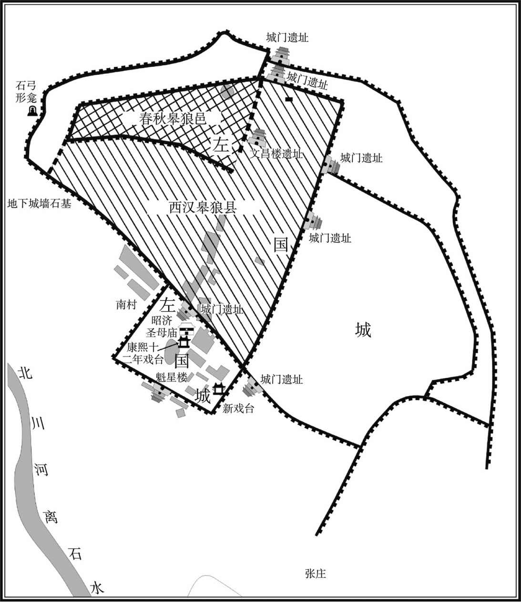 
左国城示意图

## 【原文】

**元达少有志操，渊常招之，元达不答。及渊为汉王，或谓元达曰：“君其惧乎？”元达笑曰：“吾知其人久矣，彼亦亮吾之心，但恐不过三二日，驿书必至[1]。”其暮，渊果征元达。元达事渊，屡进忠言，退而削草，虽子弟莫得知也[2]。**

## 【注文】

[1]驿（yì）书：经驿站递送的文书。驿站是古代供传递官府文书和军事情报的人员或来往官员途中食宿、换马的场所，亦称“邮驿”。在中国，驿站已经约有三千年的历史，早在公元前便有驿站或类似的通信体制，专门办理公文或军事情报的传递。在驿站传递文书的驿道（邮路）上，每隔一定的距离设置一个转递机构，规模较大的常配备房舍、马匹等食宿交通条件，供运送官物以及来往官员和传递文书人员使用。规模较小的只负责传递文书。按运输手段，有陆驿、水驿之分，其中陆驿又有步递、马递之分。

[2]削草：古时大臣上书奏稿，事成后都要销毁，以示谨慎保密。

## 【译文】

陈元达年轻时很有志向和节操，刘渊曾多次想招用他，但陈元达始终没有答应。等到刘渊为汉王时，有人问陈元达：“您害怕吗？”陈元达笑着说：“我了解刘渊已经很久了，他也明白我的想法，我想在几日之内，驿站必定会把书信送到。”当天傍晚，刘渊果然征召陈元达。陈元达供职于刘渊，屡次进谏忠言，退朝后就销毁奏稿，即使是他的子弟也没法知道奏折中的内容。

## 【原文】

**曜生而眉白，目有赤光。幼聪慧，有胆量。早孤，养于渊。及长，仪观魁伟，性拓落高亮，与众不群。好读书，善属文。铁厚一寸，射而洞之。常自比乐毅及萧、曹，时人莫之许也，惟刘聪重之，曰：“永明，汉世祖、魏武之流，数公何足道哉[1]！”**

## 【注文】

[1]乐毅：生卒年不详，字永霸，中山灵寿（今河北灵寿西北）人，魏将乐羊后裔，战国后期杰出军事家。曾受封昌国君，辅佐燕昭王振兴燕国。公元前284年，统帅燕国等五国联军攻打齐国，连下七十余城，创造了中国古代战争史上以弱胜强的著名战例，报了强齐伐燕之仇。　　萧：即萧何（前257—前193年），沛郡丰邑（今属江苏丰县）人。西汉开国功臣。早年任秦沛县狱吏，秦末辅佐刘邦起义，攻入关中，占领咸阳，灭亡秦朝。楚汉战争时，他留守关中，使关中成为汉军的巩固后方，不断地输送士卒粮饷支援作战，对刘邦战胜项羽，建立汉政权起了重要作用。刘邦称帝后，他重新制定律令制度，又协助高祖消灭韩信、英布等异姓诸侯王。公元前193年去世，谥“文终侯”。　　曹：即曹参（？—前190年），字敬伯，泗水沛（今江苏沛县）人，西汉开国功臣，是继萧何之后的第二任相国。公元前209年，跟随刘邦在沛县起兵反秦，身经百战，屡建战功。刘邦称帝后，对有功之臣，论功行赏，他功居第二，赐爵平阳侯，汉惠帝时官至丞相。　　永明：即刘曜，此处以字来称呼他。字是古代男子二十岁成年礼时所取，用来和名相匹配，有时和名的含义相反，有时做名的补充，有时还表示在家中的排行。称呼别人要称呼字，不能直呼其名，否则是非常不礼貌的事情。　　汉世祖：即汉光武帝刘秀（前6—57年），字文叔，南顿（今河南项城）人，东汉开国皇帝。公元25年，在河北登基称帝，为表刘氏重兴之意，仍以“汉”为国号。经过数年的统一战争，先后平定了更始、赤眉和关东、陇、蜀等诸多割据势力，使得自新莽末年以来分崩战乱的中国再次归于一统。死后葬于原陵（今河南洛阳东北汉魏洛阳故城西北），庙号世祖，谥号光武。

## 【译文】

刘曜生来就是白眉毛，眼睛中泛有红光。幼年时很聪明，有胆量。早年就成为孤儿，被刘渊收养。长大成人后，仪表魁梧伟岸，性格洒脱磊落，与众不同。非常喜好读书，并善于作文。一寸厚的铁板，一箭穿透。他常常把自己比作乐毅和萧何、曹参，当时的人没有谁赞许他，唯独刘聪非常看重他，说：“刘曜是汉世祖刘秀、魏武帝曹操一类的人物，以上几人与他相比简直没有什么可以称道的！”

## 【原文】

**怀帝永嘉二年冬十月甲戌，汉王渊即皇帝位，大赦，改元永凤[1]。**

## 【注文】

[1]怀帝：即西晋第三位皇帝司马炽（284—313年），字丰度，河内温（今河南温县西南）人，司马炎第二十五子。初封豫章王。晋惠帝司马衷在位时，任镇北大将军，被立为皇太弟。晋惠帝光熙元年（306年）即皇帝位，改年号为“永嘉”。永嘉五年（311年），匈奴攻陷洛阳，被掳走。永嘉七年（313年）春正月被杀于平阳（今山西临汾西南），谥“怀帝”。　　永嘉：晋怀帝司马炽所用第一个年号，也是唯一一个年号，共计七年，即公元307年至313年。　　甲戌：干支纪年是中国古代的一种纪年、纪月、纪日、纪时的方法。即以甲、乙、丙、丁、戊、己、庚、辛、壬、癸十天干和子、丑、寅、卯、辰、巳（sì）、午、未、申、酉、戌（xū）、亥十二地支按照顺序组合起来纪年、纪月、纪日，如甲戌、辛丑等。六十年（月、日）为一周期，周而复始，循环往复。　　永凤：十六国汉国刘渊所用第二个年号，共计两年，即公元308年至309年。永凤二年五月，改元河瑞元年。

## 【译文】

晋怀帝永嘉二年（308年）冬季十月甲戌（初三日），汉王刘渊即皇帝位，大赦天下，并改年号为永凤。

## 【原文】

**十一月，以其子和为大将军，聪为车骑大将军，族子曜为龙骧大将军[1]。**

## 【注文】

[1]和：即刘和（？—310年），字玄泰，新兴（今山西忻州）人，刘渊之子，十六国时期汉国君主。刘渊死后，继位为帝，不久被刘聪杀死。　　大将军：古代领兵的最高统帅。始于战国，是将军的最高封号。汉代沿置，职掌统兵征战。事实上多由贵戚担任，掌握政权，职位甚高。三国至南北朝时，大臣秉政，多加以“大将军”之号，统领军队。　　车骑（jì）大将军：将军名号，将军中地位较高者。魏晋时以车骑将军中资深者为车骑大将军，地位相当于上卿。职掌京师兵卫，掌管皇宫戍（shù）卫。　　龙骧（xiāng）大将军：将军名号。西晋置，十六国后赵沿置。

## 【译文】

晋怀帝永嘉二年（308年）十一月，刘渊任命他的儿子刘和为大将军，刘聪为车骑大将军，同族侄子刘曜为龙骧大将军。

## 【原文】

**十二月乙亥，汉主渊以大将军和为大司马，封梁王；尚书令欢乐为大司徒，封陈留王；后父御史大夫呼延翼为大司空，封雁门郡公[1]。宗室以亲疏悉封郡县王，异姓以功伐悉封郡县公侯[2]。**

## 【注文】

[1]大司马：中国古代对中央政府武职最高长官的称呼。晋代大司马在武官中排名第一，根据《晋书》记载，魏晋大司马位在三公之上，居第一品。　　尚书令：官名。始于秦，西汉沿置，本为少府属官，掌文书及奏章。东汉国家政务均归尚书台。尚书令作为尚书台的长官，直接对皇帝负责，总揽事权，职权渐重。魏晋时，尚书令为尚书省长官，参议军国大事，总领日常政务，担任此职者实际上即为宰相。　　欢乐：即刘欢乐，生卒年不详，新兴（今山西忻州）人，匈奴族，与刘渊同族。曾任十六国时汉尚书令、大司徒、太傅等，并获封陈留王。刘渊临终时，被任命为太宰，与太傅刘洋等一道辅佐嗣君。　　大司徒：官名。西周始置，负责掌管国家土地与百姓。汉哀帝刘欣时罢丞相之职，置大司徒，与大司马、大司空，并称三公。　　呼延翼（？—309年）：十六国时期汉（前赵）大臣，刘渊皇后之父。公元308年，刘渊称帝，被封为大司空、雁门郡公。次年在宜阳（今河南洛阳）之役中被乱兵杀死。　　大司空：官名。西周始置，春秋、战国沿置，主管建筑工程、制造车服器械、监督奴隶。西汉成帝刘骜（áo）绥（suí）和元年（前8年）时，改御史大夫为大司空，后复旧称。汉哀帝刘欣时，再改为大司空，与大司马、大司徒总称“三公”，主管水土及营建工程，成为共同负责最高国务的长官。

[2]宗室：又称皇族、帝宗、天潢（huáng），指国君或皇帝的宗族。通常以与皇帝的父系血缘亲疏关系来确定是否列入宗室之列，历代均专设官职来主管宗室事务，如“大宗伯”“宗正”“宗正寺”“宗人府”等。此外，古代也称大宗的庙为宗室。

## 【译文】

晋怀帝永嘉二年（308年）十二月乙亥（初五日），汉主刘渊任命大将军刘和为大司马，封为梁王；尚书令刘欢乐为大司徒，封为陈留王；皇后的父亲御史大夫呼延翼为大司空，封为雁门郡公。皇室宗族根据亲疏关系封为郡县王，异姓之臣根据功劳大小封为郡县公侯。

## 【原文】

**三年春正月，徙都平阳，大赦，改元河瑞[1]。五月，汉主渊封子裕为齐王，隆为鲁王[2]。汉主渊遣楚王聪等寇洛阳，军失利，渊召聪等还。事见《西晋之乱》。**

## 【注文】

[1]河瑞：十六国时汉光文帝刘渊所用第三个年号，共计两年，即公元309年至310年。

[2]裕：即刘裕（？—310年），新兴（今山西忻州）人，匈奴族，刘渊次子，封齐王。　　隆：即刘隆（？—310年），新兴（今山西忻州）人，匈奴族，刘渊第三子，封鲁王。

## 【译文】

晋怀帝永嘉三年（309年）春季正月，刘渊迁都平阳，大赦天下，改年号为河瑞。五月，汉主刘渊封儿子刘裕为齐王，刘隆为鲁王。汉主刘渊派遣楚王刘聪等人攻打洛阳，军队失利，刘渊召刘聪等返回。事情可参见《西晋之乱》。

## 【原文】

**十二月，汉主渊以陈留王欢乐为太傅，楚王聪为大司徒，江都王延年为大司空[1]。遣都护大将军曲阳王贤与征北大将军刘灵、安北将军赵固、平北将军王桑东屯内黄[2]。王弥表左长史曹嶷行安东将军，东徇青州，且迎其家，渊许之[3]。**

## 【注文】

[1]太傅：官名。商周时，与太师、太保合称为“三公”，为天子的辅佐大臣，掌管礼法的制定和颁行。除秦朝短时间被废止外，以后各朝代都有设置，但多为虚衔，并无实权。能够获得这个称号的，一般都是朝中权臣。　　江都：国名，治所在今江苏扬州西南夹江北小沙洲上。三国时省，西晋武帝司马炎太康六年（285年）复置。

[2]都护大将军：将军名号，西晋置，二品。　　曲阳：邑名，在今河北曲阳西。　　征北大将军：将军名号，将军中地位较高者。三国时期，与征南、征西、征东将军合称四征将军。征北将军中以资深者为征北大将军。晋朝沿置。　　安北将军：武官名号，列将军之一。三国魏置，与安南、安西、安东将军合称“四安将军”。负责统兵征战，或出镇北方地区，也可作为刺史兼理军务的加官，权势较大。晋代沿置，位居三品。　　平北将军：武官名号，东汉末始置，与平东、平西、平南合称为“四平将军”。负责统兵征伐，或作为刺史兼理军务的加官，掌管所在州的军政大权，位在“四安将军”之下。　　内黄：地名，在今河南内黄西附近。

[3]左长（zhǎng）史：官名，多为幕僚性质的官员。长史最早设于汉代，当时丞相和将军幕府皆设有长史官，相当于现在的秘书长。除此之外，边地的郡亦设长史，为太守的佐官。魏晋南北朝时州郡官员多设左、右长史。　　曹嶷（yí）（？—323年）：东莱（今山东莱州）人，西晋末参加王弥暴动，因屡立战功，升为左长史。后归附后赵，担任征东大将军、青州刺史等。　　安东将军：三国魏晋南北朝时武官名号。曹操始置，与安西、安北、安南将军合称四安将军。位次四镇将军，三品，掌征讨或镇戍。为出镇东方地区的军事长官，或作为刺史兼理军务的加官，权任较重。

## 【译文】

晋怀帝永嘉三年（309年）十二月，汉主刘渊任命陈留王刘欢乐为太傅，楚王刘聪为大司徒，江都王刘延年为大司空。派遣都护大将军曲阳王刘贤与征北大将军刘灵、安北将军赵固、平北将军王桑驻军于东边的内黄县。王弥上表奏请左长史曹嶷兼任安东将军，向东攻取青州，并且迎接他的家眷（juàn），刘渊答应了。

## 【原文】

**四年春正月，汉主渊立单征女为皇后，梁王和为皇太子，大赦[1]。封子义为北海王。以长乐王洋为大司马[2]。**

## 【注文】

[1]单（shàn）：姓。　　皇太子：简称“太子”，即已确定继承帝位或王位的帝王的儿子。太子地位在朝廷中仅次于皇帝，拥有类似于朝廷的东宫。东宫官员配置完全仿照朝廷制度，还拥有一支类似于皇帝禁军的卫队。皇太子的妻妾也如皇帝的妃嫔一样，有正式的封号，如太子妃、良娣（dì）、孺（rú）人等。

[2]长乐：国名。西晋武帝司马炎太康五年（284年）改安平国置，治所设在信都（今河北冀州）。

## 【译文】

晋怀帝永嘉四年（310年）春季正月，汉主刘渊立单征的女儿为皇后，梁王刘和为皇太子，大赦天下。封儿子刘义为北海王。任命长乐王刘洋为大司马。

## 【原文】

**秋七月庚午，汉主渊寝疾。辛未，以陈留王欢乐为太宰，长乐王洋为太傅，江都王延年为太保，楚王聪为大司马、大单于，并录尚书事[1]。置单于台于平阳西[2]。以齐王裕为大司徒，鲁王隆为尚书令，北海王义为抚军大将军、领司隶校尉，始安王曜为征讨大都督、领单于左辅，廷尉乔智明为冠军大将军、领单于右辅，光禄大夫刘殷为左仆射，王育为右仆射，任为吏部尚书，朱纪为中书监，护军马景领左卫将军，永安王安国领右卫将军，安昌王盛、安邑王钦、西阳王璿皆领武卫将军，分典禁兵[3]。丁丑，渊召太宰欢乐等入禁中，受遗诏辅政[4]。己卯，渊卒，太子和即位[5]。**

## 【注文】

[1]太宰：官名。相传殷商时即已设置，负责管理天下政务，辅佐君王；秦朝太宰负责皇帝饮食以及祭祀用食物供奉；汉代太宰是辅佐太常（九卿之一，主管宗庙礼仪）的属吏。西晋初年，设立太师、太傅、太保“三公”之职，为避司马师之名讳，以太宰之名代太师，才恢复其重要地位。东晋、南朝时多不实授，而用作重臣死后的赠官。　　太保：官名，商周时期与太师、太傅合称为“三公”，负责监护和辅佐年幼国君。　　录尚书事：官名。初置时名为“领尚书事”。公元75年，以太傅赵熹（xī）、太尉牟融并录尚书事，自此“领尚书事”更名为“录尚书事”。“录”为总领之意。录与领相比虽职事相近，但权位更重。魏晋时掌大权的大臣均带“录尚书事”名号。

[2]单于台：专门管理和统治其他少数民族的机构。十六国时期，少数民族内迁，占据了广大的中原地区，同原有的汉人杂居。对此，统治者采用了“胡汉分治”政策，其中用于专门管理和统治其他少数民族的机构就叫作单于台，可见统治者很重视对少数民族的管理，这也体现了魏晋南北朝时期民族大融合的趋势。

[3]抚军大将军：将军名号。三国时曹魏置，位在大将军之下、三公之上。　　司隶校尉：官名，监督京师和地方的监察官。始置于汉武帝刘彻征和四年（前89年），秩二千石，属官有从事、假佐等。汉成帝刘骜时一度罢废，后置司隶，掌监察。东汉置，掌监察宫廷内外，捕杀盗贼，兼司隶州长官，职尊权重，秩比二千石。三国魏、晋初为司州长官，官三品，至东晋罢废。　　始安：郡名。三国吴末帝孙皓甘露元年（265年）置，治所设在始安（今广西桂林）。晋沿置。　　征讨大都督：西晋末置，专掌征伐，与都督诸州军事不同。因西晋末年国内战乱频仍、外族势力进逼中原，为应对战乱形势，方便各地都督诸州军事相互配合，而设置此职。东晋时，征讨大都督广泛使用于征讨战争中，并成为国家设置的都督的一个重要类别。　　单于左辅：大单于的主要辅政大臣之一。十六国汉置，一般由少数民族首领担任该职，与单于右辅一起负责治理北方诸少数民族事务。　　廷尉：官名，主管司法的最高官吏。秦始皇时始置，汉景帝刘启时改名大理，汉武帝刘彻时恢复旧称。职掌天下刑狱，还负责掌管每年全国断狱总数，最后汇总，州郡疑难案件报请等事务。此外，常派员为地方处理某些重要案件。魏晋南北朝时廷尉职掌与两汉无太大区别。　　乔智明（？—313年）：字元达，鲜卑前部人。永安元年（304年），东海王司马越等人与晋惠帝司马衷一同讨伐时为丞相的司马颖，司马颖于是任命他为折冲将军、参丞相前锋军事。永嘉五年（311年），汉赵军队攻陷洛阳并掳走晋怀帝，他投降汉赵，并被任命为冠军大将军、司隶校尉。　　冠军大将军：官名，十六国后赵置，前凉、后凉、西秦亦置，权任颇重。　　单于右辅：大单于的主要辅政大臣之一。十六国汉置，一般由少数民族首领担任该职，与单于左辅一起负责治理北方诸少数民族事务。　　光禄大夫：官名。战国时置中大夫，汉武帝刘彻时改为光禄大夫，掌顾问应对，隶属于光禄勋（负责皇宫保卫工作的官员）。魏晋以后皆为加官及褒赠之官：加金章紫绶者，称为金紫光禄大夫；加银章紫绶者，称为银青光禄大夫。　　刘殷（？—312年）：字长盛，十六国时新兴（今山西忻州）人。刘渊登基后，历任侍中、左光禄大夫、尚书左仆射等。刘聪时任大司徒，太保、录尚书事，赐剑履上殿等。　　左仆射（yè）：魏晋南北朝至宋时尚书省长官。“仆”是主管的意思，古代重武，主射者掌事，故诸官之长称仆射。后来只有尚书仆射相承不改。魏晋南北朝的仆射，专指尚书仆射。汉献帝刘协建安四年（199年）始分置左右仆射。左右仆射分领尚书诸曹，左仆射又有纠弹百官之权，权力大于右仆射。　　王育：字伯春，晋朝京兆（今陕西西安）人，生卒年不详。因其才华出众，被成都王司马颖任为破虏将军。后被刘渊俘虏，历任匈奴汉国右仆射、太傅。　　右仆射：官名。魏晋南北朝时尚书省次官，与尚书令、左仆射同居宰相之任，有“朝右”之称，负责出纳王命，协理全国政务。　　：音yǐ。　　吏部尚书：官名。为吏部最高长官，负责掌管全国官吏的任免、考课、升降、调动、封勋等事务。　　中书监：官名。三国魏始置，魏文帝曹丕改秘书令为中书监，职掌机密，诏命多出于此。至魏明帝曹睿时，中书监已成为实质上的宰相。晋朝、南北朝沿置。　　护军：官名。秦朝置，掌监督军中将帅。东汉时禁军主要将领，负责选拔武官。后改为中护军。三国魏晋沿置。十六国时期，在一些郡县地区，曾取代太守成为地方军政长官。　　马景：生卒年不详，十六国汉建国之初，担任护军将军。公元311年，被授为大司徒。　　左卫将军：魏晋武官名。三国魏元帝曹奂（huàn）咸熙二年（265年），司马炎分中卫将军置。西晋属中军将军，后改中领军（领军将军），职掌宫禁宿卫，是中央禁军主要将领。晋、南朝宋皆四品。　　永安：郡名。治所在今重庆奉节东白帝城。　　安昌：侯国名。治所在今河南确山西。　　安邑：县名。治所在今山西夏县西北禹王城。　　西阳：国名。治所在今湖北黄冈东。　　璿：音xuán。　　武卫将军：武官名。三国魏文帝曹丕黄初年间（220—226年）置，掌宿卫禁军，权任颇重。西晋武帝司马炎泰始三年（267年）罢。晋惠帝司马衷永康年间（300—301年）复置，四品，但权任渐轻。东晋时省时置。　　禁兵：古代皇帝的护卫亲兵，即侍卫宫中及扈（hù）从的部队。

[4]禁中：又称“省中”，指皇宫内禁令所及范围之内。皇宫是皇帝居处及处理日常政务的地方。古代皇帝是国家最高统治者，拥有至高无上的权力。因此，皇宫作为皇帝威严的象征，一直是古代社会中最重要的建筑。具体而言，禁中包括静态与动态两种形态：静态禁中为皇宫内皇帝居所；动态禁中为皇帝日常行止活动之所。　　遗诏：皇帝死后留下的遗书、遗言等。　　辅政：在君主制下，已经即位的皇帝暂时不能管理国家时，由他人代替皇帝处理国政即为辅政。辅政者或由在位皇帝的直系亲属担任，或由被称为摄政王的皇亲国戚担任，或由德高望重、深具资历经验的大臣担任。在摄政期间，摄政者给予建议，并让皇帝从各项建议与执行中进行学习，直至能亲自执政为止。

[5]卒：古代指大夫死亡，后为死亡的通称。为避讳起见，人们对“死”采取了诸多别称。《礼记》记载：“天子死曰崩，诸侯死曰薨，大夫死曰卒，士曰不禄，庶人曰死。”这里用“卒”表示刘渊死亡，反映出作者对少数民族的蔑视。

## 【译文】

晋怀帝永嘉四年（310年）秋季七月庚午（初九日），汉主刘渊病重。辛未（初十日），任命陈留王刘欢乐为太宰，长乐王刘洋为太傅，江都王刘延年为太保，楚王刘聪为大司马、大单于，兼任录尚书事。在平阳西边设置单于台。任命齐王刘裕为大司徒，鲁王刘隆为尚书令，北海王刘义为抚军大将军、兼司隶校尉，始安王刘曜为征讨大都督、兼单于左辅，廷尉乔智明为冠军大将军、兼单于右辅，光禄大夫刘殷为左仆射，王育为右仆射，任为吏部尚书，朱纪为中书监，护军马景兼左卫将军，永安王刘安国兼右卫将军，安昌王刘盛、安邑王刘钦、西阳王刘璿皆兼武卫将军，分别统领禁兵。丁丑（十六日），刘渊征召太宰刘欢乐等人进入皇宫禁中，接受遗诏辅佐朝政。己卯（十八日），刘渊去世，太子刘和继承帝位。

## 【原文】

**和性猜忌无恩。宗正呼延攸，翼之子也，渊以其无才行，终身不迁官[1]。侍中刘乘素恶楚王聪，卫尉西昌王锐耻不预顾命，乃相与谋，说和曰：“先帝不惟轻重之势，使三王总强兵于内，大司马拥十万众屯于近郊，陛下便为寄坐耳。宜早为之计[2]！”和，攸之甥也，深信之。辛巳夜，召安昌王盛、安邑王钦等告之。盛曰：“先帝梓宫在殡，四王未有逆节，一旦自相鱼肉，天下谓陛下何[3]！且大业甫尔，陛下勿信谗夫之言以疑兄弟。兄弟尚不可信，他人谁足信哉？”攸、锐怒之曰：“今日之议，理无有二，领军是何言乎！”命左右刃之。盛既死，钦惧，曰：“惟陛下命。”壬午，锐帅马景攻楚王聪于单于台，攸帅永安王安国攻齐王裕于司徒府，乘帅安邑王钦攻鲁王隆，使尚书田密、武卫将军刘璿攻北海王义[4]。密、璿挟义斩关归于聪，聪命贯甲以待之[5]。锐知聪有备，驰还，与攸、乘共攻隆、裕。攸、乘疑安国、钦有异志，杀之。是日斩裕。癸未，斩隆。甲申，聪攻西明门，克之，锐等走入南宫，前锋随之[6]。乙酉，杀和于光极西室，收锐、攸、乘，枭首通衢[7]。**

## 【注文】

[1]宗正：官名。秦至东晋时负责掌管皇帝亲族或外戚勋贵等有关事务的官员，由皇族充任该职。宗正掌握皇族名籍簿，并根据他们的嫡庶身份或与皇帝在血缘上的亲疏关系，每年排出同姓诸侯王世谱。此外，还负责关押服苦役的犯人，也常拘系宗族或外戚有罪者。魏晋设宗正，东晋将宗正并入太常。

[2]侍中：官名。秦始置，以往来殿内东厢奏事，故名。两汉沿置，为正规官职外的加官之一，加此官者可出入宫廷，担任皇帝侍从。因此官身居君侧，侍从左右、常备顾问应对，逐渐变为亲信贵重之职。汉武帝以后，地位渐高。晋朝建立，侍中的地位和作用日益重要，不仅开始成为三公、执政的加衔，而且直接参与朝政。　　卫尉：武官名号。统率卫士守卫宫禁。秦汉为九卿之一。职责为昼夜巡警，检察门籍。属官有公车司马、卫士、旅贲（bēn）三令、丞。吏民若向皇帝上书，则由其属官公车司马转达。　　顾命：出自《尚书》，本为《尚书》一书的篇名，取其临终遗命之意。后代因此称帝王临终前的遗诏为顾命。所谓“顾命制”，即指帝王临终前选取若干顾命大臣辅佐幼主的政治制度。　　寄坐：谓居客位。比喻地位不稳且无实权。

[3]梓（zǐ）宫：古代帝王、皇后所用的以梓木制做的棺材，后世也借指已死而未入葬的皇帝灵柩（jiù）。　　在殡（bìn）：指尚未下葬。　　自相鱼肉：当作鱼肉一般任意宰割。比喻内部自相残杀。

[4]司徒府：魏晋南北朝时“掌邦教”的机构。司徒长史或司徒是司徒府最高行政长官。如果士人品行有失礼仪或不符合要求，司徒有权对其提出弹劾。

[5]贯甲：穿着盔甲。形容充满杀气的样子。

[6]西明门：在今河南洛阳东北，即汉、魏洛阳城西城南起第二门。晋怀帝永嘉三年（309年）刘聪攻洛阳，曾屯兵于此。　　南宫：遗址位于今河南洛阳东北汉魏故城内。洛阳南宫本是周公修建的成周城宫殿区。秦王嬴（yíng）政统一中国，置洛阳为三川郡，封相国吕不韦为洛阳十万户侯。吕不韦在成周城的基础上，大兴土木，扩建城池，并在今洛阳东郊修建了南宫，用以迎接招待前来探望的宾客。

[7]光极：即光极殿，位于平阳（今山西临汾西南）宫中。　　枭（xiāo）首通衢（qú）：在繁华的街道斩首。枭首：古代一种刑法，即把人头砍下挂在城门上示众；通衢：宽敞平坦、四通八达的道路。

## 【译文】

刘和本性多疑。宗正呼延攸，是呼延翼的儿子，刘渊认为他没有才能和品行，终身没有给他升官。侍中刘乘向来憎恶楚王刘聪，卫尉西昌王刘锐因不能参与临终遗命而感到耻辱，于是三人互相密谋，对刘和说：“先帝没有考虑到目前军队部署上头轻脚重的形势，使三王在都城之内握有重兵，大司马拥兵十万屯驻在都城近郊，这样陛下便成为寄人篱下的傀儡了。应当尽早想办法解决！”刘和，是呼延攸的外甥，所以对他深信不疑。永嘉四年（310年）七月辛巳（二十日）夜晚，刘和召见安昌王刘盛、安邑王刘钦等人通告他们。刘盛说：“先帝的棺材尚未出殡，刘聪等四王也没有变节的行为，一旦自相残杀，天下人将怎样评说陛下呢！何况现在大业远未成功，陛下不要听信小人的谗言猜疑兄弟。兄弟尚且不能相信，其他人谁还值得信任呢！”呼延攸、刘锐发怒道：“今日商议的事情，没有别的道理可讲，你这是说的什么话！”命令手下把他处斩。刘盛死后，刘钦害怕地说：“我听从陛下的命令。”壬午（二十一日），刘锐率领马景攻打驻扎于单于台的楚王刘聪，呼延攸率领永安王刘安国进攻在司徒府的齐王刘裕，刘乘率领安邑王刘钦攻打鲁王刘隆，让尚书田密、武卫将军刘璿攻打北海王刘义。田密、刘璿挟持刘义，砍断关门的门闩（shuān），归附刘聪，刘聪命令士兵披上铠（kǎi）甲严阵以待。刘锐得知刘聪已有防备，便迅速返回，并与呼延攸、刘乘共同进攻刘隆、刘裕。呼延攸、刘乘怀疑刘安国、刘钦怀有二心，于是将他们杀死。当日斩杀了刘裕。癸未（二十二日），斩杀了刘隆。甲申（二十三日），刘聪攻克西明门，刘锐等人逃入南宫，前锋部队尾随着他。乙酉（二十四日），刘聪在光极殿西室杀死了刘和，收捕了刘锐、呼延攸、刘乘，在闹市上斩下他们的头颅（lú），并高悬示众。

## 【原文】

**群臣请聪即帝位，聪以北海王义，单后之子也，以位让之。义涕泣固请，聪久而许之，曰：“义及群公正以祸难尚殷，贪孤年长故耳[1]。此国家之事，孤何敢辞！俟义年长，当以大业归之。”遂即位，大赦，改元光兴[2]。尊单氏曰皇太后，其母张氏曰帝太后。以义为皇太弟，领大单于、大司徒。立其妻呼延氏为皇后。呼延氏，渊后之从父妹也[3]。封其子粲为河内王，易为河间王，翼为彭城王，悝为高平王[4]。仍以粲为抚军大将军，都督中外诸军事[5]。以石勒为并州刺史，封汲郡公[6]。九月辛未，葬汉主渊于永光陵，谥曰光文皇帝，庙号高祖[7]。汉主聪自以越次而立，忌其嫡兄恭，因恭寝，穴其壁间，刺而杀之。**

## 【注文】

[1]孤：古代帝王的自称。

[2]光兴：十六国汉国昭武帝刘聪所用第一个年号，共计两年，即公元310年至311年。

[3]从父妹：伯父、叔父之女，即堂妹。

[4]粲：即刘粲（？—318年），字士光，匈奴族，新兴（今山西忻州）人，刘聪之子，十六国时期汉国国君。他即位后沉醉于酒色，又大杀辅政大臣，将军国大事全交给靳准。之后靳准在平阳（今山西临汾西南）叛乱，将他杀害。　　河内：郡名。治所在野王县（今河南泌阳）。　　河间：王国名。治所在今河北献县东南。　　彭城：郡名。治所在今江苏徐州。　　悝：音lǐ。　　高平：地名。治所在今宁夏固原。

[5]都督中外诸军事：官名。始于曹魏，指节制宫城内外，总领京师的中央禁军。曹魏时为实职武官。从西晋开始，其性质逐渐向虚衔、荣誉衔转化。东晋以后，京师中外诸军力量的削弱使其逐渐演化为虚职。

[6]石勒（274—333年）：字世龙，原名匐（fú）勒，上党武乡（今山西榆社北）人，羯（jié）族，五胡十六国时后赵开国君主，公元319年至333年在位。早年投靠汉赵主刘渊，后从汉赵分裂出去。在谋臣张宾辅助之下以襄国（今河北邢台）为根据地，陆续消灭王浚、邵续、段匹磾（dī）等西晋在北方的势力，继而消灭曹嶷（yí），进侵东晋以及消灭刘曜领导的汉赵，又北征代国，使后赵成为当时北方最强盛的国家。　　刺史：官名，汉武帝时始置。汉武帝把全国划分为十三州（部），每州为一个监察区，设置刺史一人，负责监察所在州部的郡国。刺史地位在郡国之上，同时也不受丞相制约，直接隶属于中央的御史中丞和御史大夫。到魏晋南北朝时，刺史有单车、领兵之别，单车即不领兵之意，而领兵刺史多加将军号，如使持节都督（某某等州）诸军事（即任一州刺史同时还都督数州军事）。西晋初年，曾一度停止刺史加将军号，但到西晋末年天下大乱，又再度恢复。　　汲（jí）郡：晋武帝司马炎泰始二年（266年）置，治所设在汲县（今河南卫辉西南），辖汲县、朝歌（今河南淇［qí］县）、共县（今河南辉县）、获嘉（今河南新乡）。

[7]谥（shì）：即谥号，是古代帝王、贵族、大臣等死后，依其生平事迹所给予的称号，如“武”帝、“哀”公等。一般而言，帝王后妃的谥号由礼部官员议定，再由皇上颁赐；贵族、大臣、士大夫的谥号则由朝廷直接赐予。　　庙号：古代皇帝死后在太庙里立室奉祀时追尊的名号。学术界一般认为，庙号起源于商朝，如太甲为太宗、太戊为中宗、武丁为高宗。庙号最初非常严格，按照“祖有功而宗有德”的标准，开国君主一般是祖，继嗣君主有治国才能者为宗。到魏晋南北朝时庙号开始泛滥。

## 【译文】

群臣请求刘聪即皇帝位，刘聪因为北海王刘义是单皇后的儿子，于是想把皇位让给刘义。刘义感动得流泪，坚持请求刘聪即位，过了很久，刘聪方才答应此事，说道：“刘义和诸公正是因为现在祸难比较多，同时看在我年长几岁的缘故，才推举我做皇帝的。这是国家的事情，我怎么能推辞呢！将来等刘义长大之后，我将把皇位归还给他。”刘聪于是登基当了皇帝，大赦天下，改年号为光兴。尊奉单氏为皇太后，自己的母亲张氏为帝太后。立刘义为皇太弟，兼大单于、大司徒。立自己的妻子呼延氏为皇后。呼延氏是刘渊皇后的堂妹。封儿子刘粲为河内王，刘易为河间王，刘翼为彭城王，刘悝为高平王。仍然任命刘粲为抚军大将军，都督中外诸军事。任命石勒为并州刺史，封汲郡公。永嘉四年（310年）九月辛未（十一日），把汉主刘渊安葬在永光陵，谥号为光文皇帝，庙号为高祖。汉主刘聪自己是越过排行而做的皇帝，因此猜忌他的嫡（dí）兄刘恭，于是趁刘恭睡觉的时候，在墙壁上挖洞进去，将他杀死。

## 【原文】

**汉太后单氏卒，汉主聪尊母张氏为皇太后。单氏年少美色，聪烝焉[1]。太弟义屡以为言，单氏惭恚而死[2]。义宠由是渐衰，然以单氏故，尚未之废也。呼延后言于聪曰：“父死子继，古今常道[3]。陛下承高祖之业，太弟何为者哉！陛下百年后，粲兄弟必无种矣[4]！”聪曰：“然，吾当徐思之。”呼延氏曰：“事留变生。太弟见粲兄弟浸长，必有不安之志，万一有小人交构其间，未必不祸发于今日也。”聪心然之。义舅光禄大夫单冲泣谓义曰：“疏不间亲。主上有意于河内王矣，殿下何不避之[5]？”义曰：“河瑞之末，主上自惟嫡庶之分，以大位让义[6]。义以主上齿长，故相推奉[7]。天下者，高祖之天下，兄终弟及，何为不可？粲兄弟既壮，犹今日也。且子弟之间，亲疏讵几，主上宁可有此意乎[8]！”**

## 【注文】

[1]烝（zhēng）：古代指与母辈淫乱。

[2]惭恚（huì）：羞惭怨恨，羞惭愤怒。

[3]父死子继：父亲死后，由其儿子继承其一切特权。这是古代世袭制的核心，多指皇帝皇位及领地等的继承权。在有多个儿子的情况下，一般由嫡长子直接承袭。其他子弟用分封领地的办法，给予土地和臣民。

[4]百年：死亡的委婉称呼。

[5]殿下：原指殿阶之下，与“陛下”同义，也是对天子的敬称。但称谓对象随着历史的发展而有所变化。汉代以后，演变为对太子、亲王的尊称。后来成为对皇族成员的尊称，次于代表君主的陛下。古人的尊称有四种：陛下、殿下、阁下、足下。

[6]嫡（dí）庶（shù）：指嫡子与庶子。嫡庶制度是中国古代婚姻制度的核心内容。中国古代实行一夫一妻多妾制，各个妻妾之间的地位是不平等的，这种不平等便体现在嫡庶之分上。“嫡”指正妻及其所生子女，“庶”指姬妾及其所生子女。正妻与丈夫地位平等，在服装、车辆等礼仪制度方面享受同等待遇。除正妻以外的其他配偶就是庶妻，或称作姬妾，按地位从高到低有序排列。

[7]齿长：年纪较大。在古代汉语中，常用有关牙齿的词汇表示年龄。如“生齿”称代七八个月的婴儿（因男孩出生后八个月，女孩出生后七个月开始长牙），“稚齿”称代儿童（因幼童齿嫩），“齿危”称谓老年人（因老人牙齿松落）。

[8]讵：音jù。

## 【译文】

汉太后单氏去世，汉主刘聪尊奉母亲张氏为皇太后。单氏年轻貌美，刘聪与她私通。太弟刘义对此屡加劝谏，单氏惭愧怨恨而死。从此对刘义的宠信逐渐减弱，但因为单氏的缘故，还没有将他废黜。呼延后对刘聪说：“父死子继，这是古今常理。陛下继承高祖刘渊的事业，太弟算是什么呢！陛下百年之后，刘粲兄弟必遭灭门之祸！”刘聪说：“好吧，让我慢慢考虑这个问题吧。”呼延氏说：“事情留下来不及时处理，就难免会发生变故。太弟刘义见刘粲兄弟渐渐长大，内心必然感到不安，万一有人从中进行挑拨，祸乱就有可能发生在今天啊。”刘聪认为说得非常对。刘义的舅舅光禄大夫单冲哭着对刘义说：“关系疏远的人不能离间关系亲近的人。当今主上已经有意要把皇位传给河内王刘粲了，您为什么还不回避呢？”刘义说：“河瑞末年，主上自己考虑过嫡、庶的分别，把大位让给我。我因为主上年长，所以推戴他为帝。天下是高祖的天下，兄长死了，弟弟继承，有什么不可以的？刘粲兄弟长大成人之后，还应该像今天这样。况且儿子和兄弟之间，难道还有什么亲疏差别，主上难道会有这个意思吗！”

## 【原文】

**愍帝建兴二年春正月，聪置丞相等七公，又置辅汉等十六大将军，各配兵二千，以诸子为之[1]。又置左右司隶，各领户二十余万，万户置一内史[2]。单于左右辅各主六夷十万落，万落置一都尉[3]。左右选曹尚书，并典选举[4]。自司隶以下，六官皆位亚仆射[5]。以其子粲为丞相，领大将军，录尚书事，进封晋王。江都王延年录尚书六条事，汝阴王景为太师，王育为太傅，任为太保，马景为大司徒，朱纪为大司空，中山王曜为大司马[6]。**

## 【注文】

[1]愍（mǐn）帝：即司马邺（yè）（300—317年），字彦旗，河内温（今河南温县西南）人，晋武帝司马炎之孙，吴孝王司马晏之子，西晋第四任皇帝，也是最后一任皇帝，公元313年至316年在位。初封秦王。公元312年，刘曜攻陷洛阳（今河南洛阳东北），怀帝被俘，他被群臣拥立为皇太子。次年怀帝被杀，即位于长安（今陕西西安西北），年号建兴。公元316年，刘曜围攻长安，切断长安粮运，被迫出城投降，西晋灭亡。次年被杀，谥孝愍皇帝。　　建兴：西晋愍帝司马邺的年号，共计五年，即公元313年至317年，这也是西晋的最后一个年号。建兴四年（316年），晋愍帝投降前赵，西晋灭亡。建兴五年（317年）三月，晋元帝司马睿在建康建立东晋，改年号为建武元年。　　辅汉等十六大将军：即辅汉、都护、中军、抚军、镇军、卫京、前军、后军、左军、右军、上军、下军、辅国、冠军、龙骧、虎牙等十六大将军。刘曜建前赵时，匈奴政权的兵制粗具规模，拥有三万人以上的中央禁军，于是将这支禁军分成十六军，每军设将军一人，这十六位领兵将军即上述十六大将军。

[2]左右司隶：十六国汉地方行政长官，官号沿袭汉魏。刘聪继位后，对各族百姓实行胡汉分治政策，设立了两套统治机构。其中，左右司隶负责统治汉人。左司隶在平阳（今山西临汾西南），右司隶在河东（今山西永济东南）。左右司隶下分管四十三个内史，每内史下有一万户左右。　　内史：官名。西周始置，协助天子管理国家政务。秦朝时为京师地区行政长官官名。魏晋时期，以内史代替太守出任特别重要郡的行政长官。

[3]六夷：即胡、羯、鲜卑、氐、羌、巴蛮六族。另一说法无“巴蛮”而有“乌丸”。　　都尉：武官名。战国始置，职位次于将军。秦与汉初，每郡都设有郡尉，辅助太守主管军事。汉景帝刘启时改郡尉为都尉，辅佐郡守并掌全郡军事。魏晋时，都尉任命范围由广转狭，除武职外，唯有宗室外戚才能被任命为都尉，并且只在用兵时临时设置。不过此时都尉名号逐渐增多，如建忠都尉、扬武都尉等。

[4]左右选曹尚书：官名。十六国汉尚书省属官，负责选拔官吏。

[5]仆射：官名。秦始置。汉成帝刘骜（áo）建始四年（前29年），初置尚书五人，一人为仆射，位仅次尚书令，职权渐重。魏晋以后，仆射已处于副相地位。

[6]录尚书六条事：晋朝官制。晋朝尚书有吏部、三公、客曹、驾部、屯田、度支六曹。录尚书六条事，即录尚书六曹事，常成为录尚书众曹事的概称。至于具体录几条事，则根据时势之变更而时或有异，但基本保持习惯上的“录尚书六条事”的称谓。　　汝阴：郡名。治所在今安徽阜阳。　　太师：官名。西周置，为辅弼国君之官。秦废。汉复置。晋代避司马师讳，曾改作太宰。晋之后复称太师，多为重臣加衔，作为最高荣典以示恩宠，并无实职。

## 【译文】

晋愍帝司马邺建兴二年（314年）春季正月，刘聪设置了丞相等七公，又设置了辅汉等十六个大将军，各配备二千名士兵，由他的儿子们担任。此外，又设置左右司隶，各自掌管二十多万户，每一万户设置一个内史。单于左右辅各自掌管胡、羯、鲜卑等六个少数民族共十万部落，每一万部落设置一个都尉。左、右选曹尚书，共同掌管选举事宜。自司隶以下，六官地位仅次于仆射。任命自己的儿子刘粲为丞相，兼大将军，录尚书事，晋封为晋王。江都王刘延年为录尚书六条事，汝阴王刘景为太师，王育为太傅，任为太保，马景为大司徒，朱纪为大司空，中山王刘曜为大司马。

## 【原文】

**十一月，汉主聪以晋王粲为相国、大单于，总百揆[1]。粲少有俊才，自为宰相，骄奢专恣，远贤亲佞，严刻愎谏，国人始恶之[2]。**

## 【注文】

[1]相国：官名，或称“相邦”“丞相”。春秋时为辅佐大臣的尊称。战国时成为官职，为最高行政官员。西汉初置丞相，后改为相国。东汉末，献帝时改司徒为丞相。两晋南北朝时期，常以此职授予权臣，独揽军政大权。　　总百揆（kuí）：即总管百官，大致相当于今国务院总理。

[2]骄奢专恣：原指骄横、奢侈、荒淫、放荡等四种恶习。后形容生活放纵奢侈，荒淫无度。　　佞：音nìng。

## 【译文】

晋愍帝建兴二年（314年）十一月，汉主刘聪任命晋王刘粲为相国、大单于，总领群臣百官。刘粲年轻时就很能干，自从当了宰相后，骄奢淫逸，独断专行，疏远贤能人士，亲近奸佞小人，对待臣下严厉刻薄，一意孤行，不听劝谏，于是开始遭到百姓的憎恶。

## 【原文】

**三年三月，雨血于汉东宫延明殿[1]。太弟义恶之，以问太傅崔玮、太保许遐。玮、遐说义曰：“主上往日以殿下为太弟者，欲以安众心耳。其志在晋王久矣，王公已下莫不希旨附之。今复以晋王为相国，羽仪威重，逾于东宫，万机之事，无不由之[2]。诸王皆置营兵以为羽翼。事势已去，殿下非徒不得立也，朝夕且有不测之危，不如早为之计。今四卫精兵不减五千，相国轻佻，正烦一刺客耳。大将军无日不出其营，可袭而取。余王并幼，固易夺也。苟殿下有意，二万精兵指顾可得，鼓行入云龙门，宿卫之士孰不倒戈以迎殿下者[3]？大司马不虑其为异也。”义弗从。东宫舍人荀裕告玮、遐劝义谋反，汉主聪收玮、遐于诏狱，假以他事杀之[4]。使冠威将军卜抽将兵监守东宫，禁义不听朝会[5]。义忧惧不知所为，上表乞为庶人，并除诸子之封，褒美晋王，请以为嗣；抽抑而弗通[6]。**

## 【注文】

[1]东宫：太子所居之宫。在中国古代，坐北朝南是最尊贵的，其次是坐东朝西。另外，古代风水学认为，家中长子宜居住东房。太子一般为长子，故应该居住东房。　　延明殿：宫殿名，魏晋时太子东宫内的宫殿之一。

[2]崔玮：生卒年不详，约活动于魏晋时期，曾任刘聪汉政权太傅，因劝说皇太弟刘义发动宫廷政变，事泄被杀。　　许遐：生卒年不详，约活动于魏晋时期，曾任刘聪汉政权太保，因劝说皇太弟刘义发动宫廷政变，事泄被杀。　　羽仪：本义指古代的一种礼仪用品，用鸟羽制成，多由人执掌，或置于车顶。表示和君王比较接近的侍卫。

[3]鼓行：击鼓行军。中国古代军队前进击鼓，鸣金则表示收兵，主要作用是保持战斗队形，减少伤亡。击鼓是冲锋，所谓一鼓作气，就是交战时听到第一声鼓响，会士气大增。　　云龙门：洛阳宫城正南门，在今河南洛阳东北白马寺东。　　倒戈：倒持武器。形容军队投降敌人，反过来打自己人。

[4]东宫舍人：又称“太子舍人”，设置于秦代。最初执掌东宫宿卫，后来也兼管秘书、侍从之职。　　诏狱：即由皇帝直接掌管的监狱，意为此监狱的罪犯都是由皇帝亲自下诏书定罪。一般而言，九卿、郡守一级的高官犯罪，需皇帝下诏书才能审判。

[5]冠威将军：十六国汉赵时所设杂号将军。　　卜抽：生卒年不详，约活动于魏晋时期，曾任刘聪汉政权冠威将军，深得刘聪信任，负责监禁东宫皇太弟刘义。　　朝会：即百官朝见天子。因诸侯、百官朝见天子的时间是在早晨，故称之为“朝”。朝会既是一种礼制，也是天子对诸侯的一种约束。朝会时，百官身着朝服，依文武品阶班立。

[6]庶人：泛指无官爵的平民百姓。秦朝以后，除奴婢外，无官、爵及秩品者均泛称庶人。史籍中常见夺官的官吏及削籍的宗室被免为“庶人”的记载。魏晋南北朝时，门阀士族兴起，他们自恃清显，不仅歧视无官爵者，而且一些位卑职微的小吏或门第不显的品官，亦被其贬为“寒庶”“寒素”。　　嗣：君位或职位的继承人。

## 【译文】

晋愍帝司马邺建兴三年（315年）三月，汉东宫延明殿降下了血雨。太弟刘义非常厌恶这样的事情，便向太傅崔玮（wěi）、太保许遐（xiá）询问原由。崔玮、许遐于是对刘义说：“皇上往日立殿下为太弟，不过是为了安定众人之心。他想把皇位传给晋王刘粲的想法已经很久了，从王公以下没有一个人不迎合他的旨意。如今又任命晋王为相国，仪仗威严庄重，超过了东宫，所有政务，都需要经过他的同意。诸王都设置营兵作为羽翼。往日皇储的优势已经失去，您不仅不可能继承皇位，而且每天都有预想不到的危险，请您尽早想办法解决。如今东宫左、右、前、后四卫所属的精兵不少于五千，相国行动不很慎重，现在只需要一名刺客就可以解决问题。大将军每天都走出他的兵营，可以采取袭击的办法把他拿下。其余的诸王都还年幼，很容易控制。如果您有这样的意思，二万精兵在举手之间就可以得到，然后一鼓作气进攻云龙门，守卫皇宫的士兵谁敢不倒戈迎接您呢？不必顾虑大司马刘曜会采取异常行动。”刘义没有应允。东宫舍人荀裕告发崔玮、许遐劝说刘义谋反，汉主刘聪收捕崔玮、许遐入狱，借口其他罪名把他们杀掉。命令冠威将军卜抽率军监视守卫东宫，禁锢刘义，不允许他参加朝会。刘义非常忧虑恐惧，不知所措，上表乞求辞官做平民百姓，把儿子们的封爵全部免去，褒扬赞美晋王刘粲，请求立他为皇储；卜抽压下他的奏章，不为他上报。

## 【原文】

**四年。汉中常侍王沈、宣怀、中宫仆射郭猗等皆宠幸用事[1]。汉主聪游宴后宫，或三日不醒，或百日不出，自去冬不视朝，政事一委相国粲，唯杀生、除拜乃使沈等入白之[2]。沈等多不白，而自以其私意决之，故勋旧或不叙，而奸佞小人有数日至二千石者。军旅岁起，将士无钱帛之赏，而后宫之家赐及僮仆，动至数千万[3]。沈等车服、第舍逾于诸王，子弟中表为守令者三十余人，皆贪残为民害。靳准阖宗谄事之[4]。**

## 【注文】

[1]中常侍：西汉时皇帝近臣，服侍左右，职掌顾问应对，是仅有虚衔的加官。西汉前期只有常侍之名，获此号者多为皇帝爱幸之臣。中常侍之名出现于西汉晚期到东汉时，此时中常侍已非加官，而成为有具体职掌的官职，多以宦者担任此职。居此位的宦官有时竟可权倾朝野。　　王沈：生卒年不详，约活动于魏晋时期，任刘聪汉政权中常侍，深得刘聪信任。　　宣怀：生卒年不详，约活动于魏晋时期，任刘聪汉政权中常侍，深得刘聪信任。　　中宫：皇后居住的宫殿，亦常用作皇后的代称。古代建筑宫城时，皇后的宫室都位于子午线上，且皇后寝宫前是君王的居室，左右两旁夹挟着嫔妃的居室，后方多为太后及宫中年老女性养老之处。整体而言，是以周围建筑来衬托出皇后统辖后宫的领导地位，因此皇后又有六宫之长一称。　　郭猗（yī）：生卒年不详，约活动于魏晋时期，为刘聪汉政权属官，深得刘聪信任。　　宠幸：古指帝王对后妃、臣下的宠爱。泛指地位高的人对地位低的人的宠爱。

[2]后宫：帝王妻妾所生活的地方，通常指代生活在后宫的女性，古人常用“后宫佳丽三千人”来形容古代皇帝嫔妃之众。两晋时期的妃嫔等级由晋武帝司马炎依据汉魏制度稍加修改而成，设三夫人：贵嫔、夫人、贵人；九嫔：淑妃、淑媛（yuàn）、淑仪、修华、修容、修仪、婕妤（jié yú）、容华、充华。　　除拜：除旧职，拜新官。

[3]钱帛（bó）：在古代，绢帛和铜钱一样，能作为货币流通使用。　　僮（tóng）仆：仆人，仆役。汉晋以来所谓“僮仆”是与主人有人身依附关系的奴才，替主人种田、经商、从事各种家务劳动。僮仆亦称为“僮”或“僮客”。

[4]靳准（？—318年）：匈奴人，十六国时汉政权外戚权臣。刘聪死前，被任为顾命大臣，辅佐太子刘粲。公元318年，刘聪死，刘粲即位。同年，他发动政变，带领亲兵闯入后宫杀死刘粲，自号“汉天王”。但不久便被左、右车骑将军乔泰、王腾和卫将军靳康等人杀死。　　阖（hé）宗：整个家族。

## 【译文】

晋愍帝建兴四年（316年）。汉中常侍王沈、宣怀、中宫仆射郭猗等人都受到皇帝宠信，控制政权。汉主刘聪整日在后宫游玩饮宴，有时三日醉酒不醒，有时百日不出后宫，自从去年冬季以来从未上朝，政事一概委托相国刘粲，只有诛杀、任命官员的事情才让王沈等人入宫禀报。王沈等人常常不请示，而私自决断，所以有些往日功臣不被任用，而有些奸诈谄媚小人几日之内就能提升到二千石俸禄的高官。征伐之事年年都有，但将士们得不到钱帛赏赐，而后宫里面赏赐遍及奴婢仆人，赏赐动辄高达几千万钱。王沈等人的舆车、服饰和宅院的规格都超过诸王，他们的子弟以及亲戚担任郡守县令的有三十多人，这些人大都贪婪残暴，为害百姓。靳准家族的人都巴结谄媚王沈等人。

## 【原文】

**郭猗与准皆有怨于太弟义。猗谓相国粲曰：“殿下，光文帝之世孙，主上之嫡子，四海莫不属心，奈何欲以天下与太弟乎[1]！且臣闻太弟与大将军谋，因三月上巳大宴作乱，事成许以主上为太上皇，大将军为皇太子，又许卫将军为大单于[2]。二王处不疑之地，并握重兵，以此举事，无不成者[3]。然二王贪一时之利，不顾父兄，事成之后，主上岂有全理？殿下兄弟固不待言！东宫、相国、单于，当在武陵兄弟，何肯与人也[4]！今祸期甚迫，宜早图之。臣屡言于主上，主上笃于友爱，以臣刀锯之余，终不之信[5]。愿殿下勿泄，密表其状。殿下傥不信臣言，可召大将军从事中郎王皮、卫军司马刘惇，假之恩意，许其归首以问之，必可知也[6]。”粲许之。猗密谓皮、惇曰：“二王逆状，主上及相国具知之矣，卿同之乎？”二人惊曰：“无之。”猗曰：“兹事已决，吾怜卿亲旧并见族耳[7]。”因歔欷流涕。二人大惧，叩头求哀，猗曰：“吾为卿计，卿能用之乎？相国问卿，卿但云‘有之’；若责卿不先启，卿即云‘臣诚负死罪，然仰惟主上宽仁，殿下敦睦，苟言不见信，则陷于诬谮不测之诛，故不敢言也[8]。’”皮、惇许诺。粲召问之，二人至不同时，而其辞若一，粲以为信然。**

## 【注文】

[1]光文帝：指刘渊。刘渊死后谥号为光文帝。　　世孙：即嫡孙。

[2]大将军：指刘骥，刘聪之子。生卒年不详，封济南王、大将军。　　三月上巳：上巳指农历每月上旬的巳日。三月上巳即上巳节，俗称“三月三”。汉以前，上巳必取巳日，但不一定是三月初三。自魏以后，一般习用三月初三。最初人们于此日沐浴以除灾祈福，又名“修禊（xì）”，后来逐渐成为人们春日到水边饮宴游玩的节日。

[3]举事：指起兵，夺取政权。

[4]武陵兄弟：即刘义的儿子们。

[5]笃（dǔ）：忠实，一心一意。　　刀锯之余：指阉人。刀锯：古代刑具。

[6]傥（tǎng）：同“倘”，如果，倘若。　　大将军从事中郎：官名。西汉末始置。东汉大将军、车骑将军僚属，职参谋议。三国魏、晋、南北朝皆置，其职依时依府而异，或主官吏，或分掌诸曹，或掌机密，或参谋议，地位较高。　　王皮：生卒年不详，约活动于魏晋时期，为刘聪汉政权属官，曾任大将军从事中郎之职，曾参与诬陷皇太弟刘义活动。　　卫军：官名，卫将军的省称。魏晋时为重号将军，统领禁军，多授予朝中大臣作为加官，二品。　　刘惇（dūn）：生卒年不详，约活动于魏晋时期，为刘聪汉政权属官，曾任卫军司马，曾参与诬陷皇太弟刘义活动。

[7]族：亲属株连制度。一人有罪，往往牵累其亲属共同受刑。尽管族刑非中国古代所独有，但中国可能是有史可载的族刑制度实施范围最广、时间最长、程度最严厉的国家之一，在中国古代历史上曾有“夷三族”“诛九族”的刑罚。

[8]诬谮（zèn）：进谗诬陷。

## 【译文】

郭猗、靳准与皇太弟刘义素有恩怨。郭猗于是对相国刘粲说：“殿下，您是光文帝刘渊的长孙，主上的嫡子，四海之内莫不归心，为什么要把天下交给皇太弟刘义呢！况且臣下听说太弟与大将军刘骥密谋，趁三月上巳节大宴之机发动叛乱，事成之后许诺主上做太上皇，大将军做皇太子，又许诺卫将军做大单于。二王处于不受怀疑的位置，都手握重兵，以此发动政变，没有不成功的。然而二王贪图一时的利益，不顾父兄，事成之后，主上岂能有保全之理？您与他们是兄弟关系，就更不用说了！东宫、相国、单于这些官位，将在武陵兄弟之间进行分配，怎么肯让与他人！现在距离祸乱的日期已经很近了，应该尽早想办法解决这件事。臣屡次进言主上，可是主上对兄弟的友爱之情深厚，又因为臣是宦官，不肯相信于臣。希望您不要泄露，秘密上奏，说明刘义等人谋反的情况。您如果不相信臣的话，可以召来大将军从事中郎王皮、卫军司马刘惇，先假意施与他们恩惠，许诺他们归顺自首，然后进行盘问，一定能够了解这件事。”刘粲表示同意。郭猗秘密地对王皮、刘惇说：“二王谋逆的情况，主上和相国都知道了，你们还和他们站在一边吗？”二人吃惊地说：“没有谋逆这件事！”郭猗说：“这件事已成定案，我只是可怜你们的亲戚全都要被灭族。”说完抽噎流泪。二人大为恐惧，磕头乞求哀怜，郭猗说：“我为你们谋划，你们能够采用我的方法吗？相国如果询问你们，你们只说‘有这件事’；如果问你们为什么不事先启奏，你们就说‘臣确实负有死罪，但是我们考虑到您宽宏仁慈，殿下敦厚和睦，如果我们的话不被相信，就会落得个诬陷的罪名，难说不被诛杀，所以不敢说。’”王皮、刘惇答应照他的意思办。刘粲召见他们询问这件事，两人来的时间不同，所说的话却相似，刘粲就认为事情确实像他们所说的那样。

## 【原文】

**靳准复说粲曰：“殿下宜自居东宫以领相国，使天下早有所系。今道路之言，皆云‘大将军、卫将军欲奉太弟为变，期以季春’。若使太弟得天下，殿下无容足之地矣[1]！”粲曰：“为之奈何？”准曰：“人告太弟为变，主上必不信。宜缓东宫之禁，使宾客得往来；太弟雅好待士，必不以此为嫌，轻薄小人不能无迎合太弟之意为之谋者[2]。然后下官为殿下露表其罪，殿下收其宾客与太弟交通者考问之，狱辞既具，则主上无不信之理也[3]。”粲乃命卜抽引兵去东宫。少府陈休、左卫将军卜崇，为人清直，素恶沈等，虽在公座，未尝与语，沈等深疾之[4]。侍中卜干谓休、崇曰：“王沈等势力足以回天地，卿辈自料亲贤孰与窦武、陈蕃[5]？”休、崇曰：“吾辈年逾五十，职位已崇，唯欠一死耳。死于忠义，乃为得所，安能俛首低眉以事阉竖乎[6]！去矣卜公，勿复有言！”**

## 【注文】

[1]季春：古代用孟、仲、季来表示每季月份的顺序。古人按阴历（即农历）分一年十二个月为四季，每季三个月，把孟、仲、季与每一季中的三个月相配。例如“孟”表示每一季的第一个月，“仲”表示第二个月，“季”表示最后一个月即第三个月。

[2]宾客：古时指投靠在贵族、官僚、豪强门下的一种非同宗的依附者。汉代养客之风仍盛，有时皇帝甚至下诏不许诸王养客。宾客为主人营治产业、出谋划策、奔走效命。此后，宾客降为附从，逐渐变成贵族、豪强的家兵、部曲。

[3]交通：勾结、串通。　　狱辞：亦作“狱词”，指现代意义上的供词。

[4]少府：官名。战国始置，掌管手工业和皇帝的财产。秦汉时，负责征收山海湖泽收入和管理手工业制造，所领诸事均为皇帝私人财政事项。魏晋及南朝，少府部分权力转归殿中监，而专事工艺制造及钱币铸造。　　陈休（？—316年）：十六国时汉国大臣，刘聪时任少府。为人清直，因厌恶王沈等人谄佞用事，而不屑于与他们言语。后王沈陷害他与皇太弟刘义通谋，被杀害。　　卜崇（？—316年）：十六国时汉国大臣，刘聪时任左卫将军。为人清直，因厌恶王沈等人谄佞用事，而不屑于与他们言语。后王沈陷害他与太弟刘义通谋，而被杀害。

[5]卜干：生卒年不详。十六国时汉国大臣，刘聪时任侍中。因犯颜直谏而被免职。　　窦武（？—168年）：字游平，扶风平陵（今陕西咸阳西北）人。东汉末外戚权臣。汉桓帝刘志延熹八年（165年），他的长女被立为皇后。次年，担任城门校尉。汉桓帝死后，担任大将军，封闻喜侯，与太傅陈蕃共同管理朝政。汉灵帝刘宏建宁元年（168年），与陈蕃定计剪除诸宦官。后事机泄露，兵败自杀。　　陈蕃（？—168年）：字仲举，汝南平舆（yú）（今河南平舆北）人，东汉末大臣。汉桓帝时任太尉，汉灵帝时任太傅。为官耿直，汉桓帝时，因犯颜直谏曾多次被降职。汉灵帝朝，虽得信任重用，却因和大将军窦武共同谋划剪除宦官，事败被杀。

[6]俛（fǔ）首：低头，表示服从。“俛”同“俯”。　　阉：宦官。指正常男性经过阉割，失去性能力后进入皇宫侍奉皇帝及其家族的男性官员。宦官来源不一，有自宫、因罪被宫、进贡、拐卖、挑选后被强行阉割而成等。史书上对宦官称谓很多，如以曾遭阉割而称为阉宦、刑臣，以任职宫中称为内侍、中官，以官职称为军容、太监等。

## 【译文】

靳准又对刘粲说：“您应当自居东宫兼任相国，使国家能够早一点有所依托。现在平民百姓都说‘大将军、卫将军想要遵照太弟的命令发动政变，时间就约定在晚春’。如果让太弟刘义得到天下，您就没有立足之地了！”刘粲说：“那我应该怎么办呢？”靳准接着说：“有人告发太弟发动政变，主上必不会相信。应当放松对东宫的禁令，让宾客得以随意出入；皇太弟性好高雅，喜欢接待士人，一定不会因为禁令放松而产生疑虑，轻浮的小人之中，不可能没有为了迎合太弟的意愿而为他谋划的人。然后卑职为您揭露太弟的罪行，殿下逮捕那些与太弟有勾结的宾客进行审问，有了供词之后，主上就会相信我们了。”刘粲于是命令卜抽率兵撤离东宫。少府陈休、左卫将军卜崇，为人清廉正直，素来厌恶王沈等人，虽然同坐公堂，但却从未与他说过话，王沈等人对他俩恨之入骨。侍中卜干对陈休、卜崇说：“王沈等人的势力足够扭转乾坤，你们揣度一下自己贤能的程度和与皇帝的亲近关系，谁能比得上窦武、陈蕃？”陈休、卜崇答道：“我们已年过五十，官位已经很高了，唯求一死罢了。为了忠义而死，死得其所，怎么能俯首低眉为宦官做事呢！去吧卜公，不要再说了！”

## 【原文】

**二月，汉主聪出临上秋阁，命收陈休、卜崇及特进綦毋达、太中大夫公师彧、尚书王琰、田歆、大司农朱谐，并诛之，皆宦官所恶也[1]。卜干泣谏曰：“陛下方侧席求贤，而一旦戮卿大夫七人，皆国之忠良，无乃不可乎！藉使休等有罪，陛下不下之有司，暴明其状，天下何从知之？诏尚在臣所，未敢宣露，愿陛下熟思之[2]。”因叩头流血。王沈叱干曰：“卜侍中欲拒诏乎！”聪拂衣而入，免干为庶人[3]。太宰河间王易、大将军渤海王敷、御史大夫陈元达、金紫光禄大夫西河王延等皆诣阙表谏曰：“王沈等矫弄诏旨，欺诬日月，内谄陛下，外佞相国，威权之重，侔于人主，多树奸党，毒流海内[4]。知休等忠臣，为国尽节，恐发其奸状，故巧为诬陷。陛下不察，遽加极刑，痛彻天地，贤愚伤惧[5]。今遗晋未殄，巴、蜀不宾，石勒谋据赵、魏，曹嶷欲王全齐，陛下心腹四支，何处无患[6]？乃复以沈等助乱，诛巫咸，戮扁鹊，臣恐遂成膏肓之疾，后虽救之，不可及已[7]！请免沈等官，付有司治罪。”聪以表示沈等，笑曰：“群儿为元达所引，遂成痴也。”沈等顿首泣曰：“臣等小人，过蒙陛下识拔，得洒扫闺阁，而王公朝士疾臣等如雠，又深恨陛下。愿以臣等膏鼎镬，则朝廷自然雍穆矣[8]。”聪曰：“此等狂言常然，卿何足恨乎！”聪问沈等于相国粲，粲盛称沈等忠清，聪悦，封沈等为列侯。太宰易又诣阙上疏极谏，聪大怒，手坏其疏[9]。三月，易忿恚而卒。易素忠直，陈元达倚之为援，得尽谏争。及卒，元达哭之恸，曰：“‘人之云亡，邦国殄瘁！’吾既不复能言，安用默默苟生乎[10]！”归而自杀。**

## 【注文】

[1]上秋阁：汉都平阳城规模及建筑布局无史料可考知。但据文献记载，平阳城中上秋阁，可登高远眺观光。　　特进：官名。始设于西汉末，授予列侯中有特殊地位的人，位在三公下。东汉至南北朝仅为加官，无实职。　　綦（Qí）毋（wú）达（？—316年）：前赵刘聪时任特进，因得罪宦官而被杀。綦毋，复姓。　　太中大夫：官名。秦置，掌论议及顾问应对，名义上为郎中令（光禄勋）属官，实际上并不受其管辖，而是皇帝的高级参谋。若加“给事中”“侍中”等官号，则职权更大，成为皇帝的近侍之臣。魏晋南北朝时期沿置。　　公师彧（yù）（？—316年）：襄陵（治今山西临汾东南）人，善于相面，前赵刘聪时为太中大夫，曾撰有《高祖本纪》及功臣传二十人。后来修书诽谤（bàng）刘渊，刘聪怒而将他诛杀。　　王琰（yǎn）（？—316年）：前赵刘聪时任尚书，因得罪宦官而被杀。　　田歆（xīn）（？—316年）：前赵刘聪时任尚书，因得罪宦官而被杀。　　大司农：官名。西汉武帝太初元年（前104年）改大农令置，负责全国财政收支、仓储、农业、水利、盐铁专卖、平抑物价等，为九卿之一。东汉沿置，兼掌王室财政收支。三国魏时主管全国民屯事务。西晋时全国财政收支已改由尚书省掌管，因此权任渐轻，三品。东晋时仅掌仓储及供膳等。　　朱谐（？—316年）：前赵刘聪时任大司农，因得罪宦官而被杀。

[2]诏：中国古代帝王诏令文书的文体名称之一。战国以前，上下相告常用“诏”字；秦始皇统一六国后，规定“诏”字为皇帝发布命令的专用词，他人不得使用，诏书亦成为皇帝布告臣民的专用文书。汉承秦制，凡皇帝即位或去世，或颁布其他重要命令，都以诏书布告天下。魏晋以后直到唐初，诏书一直是皇帝发布政令的主要方式。

[3]拂衣：指拂袖，表示愤怒。

[4]太宰河间王易（？—316年）：即刘易，匈奴族，新兴（今山西忻州）人，前赵昭武帝刘聪之子，官拜太宰，封河间王。为人正直，忠心耿耿，因劝谏刘聪，不听，忧愤而死。　　大将军勃海王敷：即刘敷，匈奴族，新兴（今山西忻州）人，前赵昭武帝刘聪之子，官拜大将军，封勃海王。为人正直忠心，曾劝谏汉赵主刘聪。　　金紫光禄大夫：战国时置中大夫，汉武帝时始改为光禄大夫。魏晋以后无定员，皆为加官及褒赠之官。加金章紫绶者，称金紫光禄大夫；加银章紫绶者，称银青光禄大夫。　　西河：郡名。汉武帝刘彻元朔四年（前125年）置，治所设在平定县（今内蒙古鄂尔多斯东胜），辖境相当今内蒙古鄂尔多斯东部，山西吕梁山、芦芽山以西、石楼以北及陕西宜川以北黄河沿岸地带。东汉顺帝刘保永和五年（140年）移治离石县（今山西离石）。三国魏，北境入羌胡，魏文帝曹丕黄初二年（221年）移治兹氏县（今山西汾阳），后复还治离石（今山西离石），但辖境缩小至今山西灵石、离石、中阳、石楼、汾阳、介休等地。西晋改为西河国，后废。　　王延（？—318年）：字延元，十六国汉大臣。十六岁时便仕于刘聪，官至尚书右丞。公元318年，靳准杀刘粲夺位，想要任命他担任左光禄大夫，但他拒绝并怒斥靳准，被杀害。　　诏旨：古代皇帝的命令，即“诏书”。

[5]遽（jù）：急，仓促。

[6]殄（tiǎn）：尽，绝。　　巴、蜀：巴蜀地区在中国最早的地理著作《禹贡》中称为梁州。周代称为巴国和蜀国。秦代为巴郡和蜀郡。两汉为益州。三国时为蜀国。晋代开始把四川盆地东部和陕南汉中盆地称为梁州，把盆地西部称为益州。

[7]巫咸：古代传说中的人物。或作唐尧时人，或作商王太戊之大臣。甲骨文作咸戊。擅长卜星术和医术，据说是用筮（shì）占卜的创始者。　　扁鹊（前407—前310年）：春秋战国时名医。姬姓，秦氏，名越人，又号卢医，勃海郡郑（今河北任丘）人，一说为齐国卢邑（今山东济南长清）人。由于他医术高超，被认为是神医，时人借用上古神话中黄帝时神医“扁鹊”的名号来称呼他。他奠定了中医学的切脉诊断方法，相传中医典籍《难经》即为他所著。

[8]顿首：九拜之一，跪而头叩地。古人席地而坐，姿势和跪差不多，行顿首拜时，取跪姿，先拱手下至于地，然后引头至地，便立即举起。因为头触地时间很短，只是略作停顿，所以叫顿首。古时人们在有重大的事情请求时也用“顿首”。　　闺（guī）阁：闺、阁，都是宫中小门，代指禁宫。“闺阁之臣”为禁宫中的臣仆，指宦官。　　雠（chóu）：同“仇”，仇恨、仇怨。　　镬（huò）：古时无足之鼎。北方人叫锅或锅子。自古以来形制虽有不同，但基本无变化。自商周以后，镬和鼎都是华夏族煮食物的主要工具。此后，逐渐发展成为烹人的刑具。　雍穆：和睦；融洽。

[9]疏：朝臣向皇帝陈述意见的奏章，古代臣子向皇帝上奏政务有“疏”和“奏”两种方式，这两种方式略有区别。一般宋以前常称“疏”。疏是臣下向皇帝陈述意见的奏章，而奏是臣下向皇帝进言或上书，是一种公文程式，即奏本。根据官员言事内容及章疏形式不同，又有奏片、奏书、奏折等名称。

[10]邦国殄（tiǎn）瘁（cuì）：形容国家贫困，陷于绝境。

## 【译文】

晋愍帝建兴四年（316年）二月，汉主刘聪来到上秋阁，下令逮捕陈休、卜崇以及特进綦毋达、太中大夫公师彧、尚书王琰、田歆、大司农朱谐，一律处死，他们都是宦官仇恨的人。卜干哭着劝谏道：“陛下正在诚心诚意招求贤才时，却在一个早晨就杀戮了七位卿大夫，他们都是国家的忠良之臣，这样做恐怕不妥！假使陈休等人有罪，陛下应当把他们交给有关部门，揭露他们的罪行，否则平民百姓从哪里能够了解到真相呢？诏书还在臣下之处，没敢宣布，希望陛下三思而后行啊。”说完后连续磕头直到流血。王沈呵斥卜干道：“你想要抗拒皇帝的命令吗！”刘聪甩着衣袖走了进去，免去卜干的官职，把他贬为平民百姓。太宰河间王刘易、大将军勃海王刘敷、御史大夫陈元达、金紫光禄大夫西河人王延等人都来到皇宫门前，上表劝谏说：“王沈等人假托圣旨，欺瞒天下，对内谄媚陛下，对外讨好相国，权力之重，可以同皇帝相比，他们还树立很多奸党，流毒遍及海内。他们深知陈休等人皆为忠臣，为国家尽心尽力，他们担心这些忠臣揭发他们的邪恶罪行，所以设计诬陷他们。陛下没有详察，即施加极刑，悲痛贯彻天地，贤士愚夫无不感伤畏惧。现在残存的晋朝还没有被消灭，巴、蜀地区也没有臣服，石勒图谋占据赵、魏之地，曹嶷打算在山东称王，陛下江山的四周，何处没有忧患？再加上王沈等人聚众为乱，诛巫咸，杀扁鹊，臣担心最后会病入膏肓，成为不治之症，以后虽想挽救，恐怕也来不及了！请求罢免王沈等人的官职，交付有关部门治罪。”刘聪把这份奏表给王沈等人看，并笑着说：“这些人被陈元达引导，才变得这样痴呆。”王沈等人磕头哭着说：“臣等都是小人物，承蒙陛下过分的赏识和提拔，得以出入皇宫禁中，而朝臣憎恨臣等如同仇敌，又深深地怨恨陛下。希望陛下把臣等投入鼎镬中炼成油脂，朝廷自然就会和谐肃穆了。”刘聪说：“这样狂妄的言论经常有，你不用担心！”刘聪向相国刘粲询问他对王沈等人的看法，刘粲极力称赞王沈等人忠心清正，刘聪很高兴，封王沈等人为列侯。太宰刘易又来到皇宫上书极力规劝，刘聪大怒，撕碎了奏章。三月，刘易愤恨而死。刘易平素忠心正直，陈元达依靠他为后援，才得以尽全力劝谏。刘易死后，陈元达哭得非常伤心，说：“‘贤人都说要离去，国家将要更加贫困！’我既然不能再进忠言了，像这样默默地苟且偷生还有什么用呢！”回去后便自杀了。

## 【原文】

**九月，汉主宴群臣于光极殿，引见太弟义。义容貌憔悴，鬓发苍然，涕泣陈谢[1]。聪亦为之恸哭，乃纵酒极欢，待之如初[2]。**

## 【注文】

[1]鬓（bìn）发：脸旁靠近耳朵的头发。

[2]恸（tòng）哭：放声痛哭。

## 【译文】

晋愍帝建兴四年（316年）九月，汉主在光极殿宴请群臣，召见皇太弟刘义。刘义面容憔悴，鬓发苍白，哭着谢罪。刘聪也为之痛哭，于是开怀畅饮，极尽欢娱，对待刘义又像当初一样。

## 【原文】

**元帝建武元年春三月，汉相国粲使其党王平谓太弟义曰：“适奉中诏，云京师将有变，宜衷甲以备非常[1]。”义信之，命宫臣皆衷甲以居。粲驰遣告靳准、王沈，准以白汉主聪曰：“太弟将为乱，已衷甲矣。”聪大惊曰：“宁有是耶！”王沈等皆曰：“臣等闻之久矣，屡言之而陛下不之信也。”聪使粲以兵围东宫，粲使准、沈收氐、羌酋长十余人穷问之，皆悬首高格，烧铁灼目，酋长自诬与义谋反[2]。聪谓沈等曰：“吾今而后知卿等之忠也。当念知无不言，勿恨往日言而不用也。”于是诛东宫官属及义素所亲厚，准、沈等素所憎怨者大臣数十人，阬士卒万五千余人[3]。夏四月，废义为北部王，粲寻使准贼杀之。义形神秀爽，宽仁有器度，故士心多附之[4]。聪闻其死，哭之恸，曰：“吾兄弟止余二人，而不相容，安得使天下知吾心邪！”秋七月，汉主聪立晋王粲为皇太子，领相国、大单于，总摄朝政如故，大赦。**

## 【注文】

[1]元帝：即东晋元帝司马睿（276—323年），字景文，河内温县（今河南温县西南）人。初袭封琅邪王。后担任安东将军，都督扬州、江南诸军事，并镇守建康（今江苏南京）。他依靠中原南迁大族顾荣、贺循等人的支持，统治长江中下游和珠江流域。公元317年，刘曜攻占长安，时任西晋丞相的司马睿在建康称王，改元建武；次年称帝，成为东晋的开国皇帝。公元322年，王敦起兵攻入建康，他忧愤而死。　　建武：东晋元帝司马睿的第一个年号，也是东晋的第一个年号，共计两年，即公元317年至318年。公元317年，司马睿在建康建立东晋，改元建武。次年正式登基，同时改元大兴元年。　　王平：十六国汉赵时人，刘粲亲信，曾参与陷害皇太弟刘义事件。　　中诏：宫中直接发出的帝王亲笔诏令。　　衷甲：在衣服里面穿铠甲。

[2]氐：古代少数民族名称。原在中国北部和西部的广大地区游牧。从东汉起陆续内迁，主要居住在今陕西、甘肃、四川等广大地区，主要从事畜牧业和农业。魏晋时期，氐人已经遍布关中地区，今甘肃天水至陕西略阳一带成为氐人的主要聚居区。在中原汉族经济、文化的强烈影响下，氐人大量接受汉族文化和生产技术。历史上曾建立过仇池、前秦、后凉等政权。　　羌：中国西部一个古老的少数民族，散居在甘肃、新疆南部、青海、西藏东北部和四川西部。历史上因时代、地域的不同，羌人又被称为“姜”“羌”“氐羌”“羌戎”“西羌”等。　　酋（qíu）长：部落首领。据考，酋长制度最初是从原始氏族制度发展演变而来的。

[3]阬（kēng）：同“坑”。活埋。

[4]士：上古掌刑狱之官。商、西周、春秋为贵族阶层，多为卿大夫的家臣。春秋末年以后，逐渐成为统治阶级中知识分子的统称。魏晋之后，士逐渐成为封建社会中最基础的贵族，也是最高级的百姓。

## 【译文】

晋元帝司马睿建武元年（317年）春季三月，汉相国刘粲让党羽王平对皇太弟刘义说：“刚刚接到密诏，说是京城马上就要发生变乱，应当穿上铠甲以防万一。”刘义信以为真，命令东宫的将士臣属都在里面穿上了铠甲。刘粲派人飞马告知靳准、王沈，靳准以此向汉主刘聪禀报说：“太弟将要发动叛乱，现在都已经穿好铠甲了。”刘聪大为吃惊地说：“难道会有这种事情！”王沈等人都说：“臣等很久以前就听说皇太弟打算发动叛乱，屡次向陛下进言，但陛下始终不相信我们。”刘聪命刘粲率兵包围东宫，刘粲让靳准、王沈收捕了十多个氐族、羌族酋长，立即进行审讯，把他们的脑袋高悬在木格之上，烧红烙铁，烫他们的眼睛，酋长们被逼承认自己与刘义谋反。刘聪对王沈等人说：“我如今才知道你们的忠心！应当念及知无不言的训导，不要怨恨过去的建议没有被采用。”于是诛杀东宫属官以及刘义平时最亲近厚待的人，以及靳准、王沈等人平时最憎恨的数十名大臣，坑杀士卒一万五千多人。夏季四月，废黜皇太弟刘义，贬为北部王，不久刘粲又指使靳准把他杀害。刘义形体俊美，神态清朗，为人宽厚仁和有度量，所以士人大多归心于他。刘聪听说他的死讯后，哭得十分伤心，说：“我们兄弟只剩下两人，却不能相容，怎么能使天下人知道我的心呢！”秋季七月，刘聪立晋王刘粲为皇太子，兼相国、大单于，总掌朝政，大赦天下。

## 【原文】

**大兴元年夏四月，汉中常侍王沈养女有美色，汉主聪立以为左皇后[1]。尚书令王鉴、中书监崔懿之、中书令曹恂谏曰：“臣闻王者立后，比德乾坤，生承宗庙，没配后土，必择世德名宗，幽闲令淑，乃副四海之望，称神祇之心[2]。孝成帝以赵飞燕为后，使继嗣绝灭，社稷为墟，此前鉴也[3]。自麟嘉以来，中宫之位，不以德举[4]。借使沈之弟女，刑余小丑，犹不可以尘污椒房，况其家婢邪[5]！六宫妃嫔，皆公子公孙，奈何一旦以婢主之？臣恐非国家之福也。”聪大怒，使中常侍宣怀谓太子粲曰：“鉴等小子，狂言侮慢，无复君臣上下之礼，其速考实！”于是收鉴等送市，皆斩之。金紫光禄大夫王延驰将入谏，门者弗通。鉴等临刑，王沈以杖叩之曰：“庸奴，复能为恶乎？乃公何与汝事！”鉴瞋目叱之曰：“竖子，灭大汉者，正坐汝鼠辈与靳准耳！要当诉汝于先帝，取汝于地下治之[6]。”准谓鉴曰：“吾受诏收君，有何不善，君言汉灭由吾也？”鉴曰：“汝杀皇太弟，使主上获不友之名。国家畜养汝辈，何得不灭！”懿之谓准曰：“汝心如枭镜，必为国患。汝既食人，人亦当食汝[7]。”**

## 【注文】

[1]大兴：或作太兴，晋元帝司马睿所用第二个年号，共计四年，即公元318年至321年。

[2]王鉴（？—318年）：十六国汉大臣，官至尚书令。其人性格刚直，敢于直谏。公元318年，刘聪纳奸臣王沈之养女为左皇后，他因进谏，被杀害。　　中书令：官名。西汉年间归属于内廷宦官机构，负责在皇帝书房整理宫内文库档案。汉元帝刘奭（shì）时，中书令权势很大，甚至超过丞相。三国魏文帝曹丕时，改秘书为中书，分设中书监与中书令，掌握机要。两晋沿设。司马迁是中国历史上第一位中书令。　　曹恂（？—318年）：十六国汉大臣，官至中书令、大司空、南郡公。因与王鉴等劝谏刘聪纳王沈之养女为左皇后，被杀。　　宗庙：古代帝王、诸侯或大夫为维护宗法制而设立的祭祀祖宗的处所。　　神祇（qí）：“神”指天神，“祇”指地神。“神祇”泛指神。

[3]孝成帝：即汉成帝刘骜（áo）（前51—前7年），西汉第九位皇帝，公元前33年至前7年在位，死后谥号“孝成皇帝”，葬于延陵（今陕西咸阳北），庙号统宗。在中国古代昏君排行榜上，汉成帝是“赫赫有名”的。在他统治时期，纵情声色、政治腐败，土地严重兼并，导致社会矛盾激化，西汉王朝从此衰落。　　赵飞燕（前45年—前1年）：原名宜主，阳阿公主家婢女。由于她舞姿特别轻盈，故人称“赵飞燕”。因受到汉成帝赏识，召入宫中，封为“婕妤”，数年后立为皇后，成为汉成帝第二任皇后。正史上对她的记载很少，然而在野史中却又很多。在民间传说中，她以美貌著称，所谓“环肥燕瘦”讲的便是她和杨玉环，而燕瘦也通常用以比喻体态轻盈瘦弱的美女。同时她也因美貌而成为淫惑皇帝的一个代表性人物。

[4]麟嘉：十六国汉昭武帝刘聪所用第四个年号，共计三年，即公元316年至318年。麟嘉三年七月，汉隐帝刘粲即位，改元汉昌元年。

[5]椒房：亦称椒室，即椒房殿。西汉皇宫未央宫皇后所居殿名，因以椒和泥涂墙壁得名。后亦用作皇后的代称。

[6]瞋（chēn）目：瞪大眼睛，表示愤怒。　　竖子：对人的鄙称。类似于“小子”。

[7]枭（xiāo）镜：指枭鸟和破镜。枭鸟，传说中的凶禽，吞食母亲；破镜，传说中的凶兽獍，吞食父亲。比喻忘恩负义之徒或狠毒的人。

## 【译文】

晋元帝司马睿大兴元年（318年）夏季四月，汉中常侍王沈的养女容颜美丽，汉主刘聪把她立为左皇后。尚书令王鉴、中书监崔懿之、中书令曹恂规劝道：“臣听说君王册立王后，取法天地相配之道，生时要承担起接续宗庙的责任，死后要配得上后土，一定要选择世代有德、名门望族出身、秉性娴雅善良的女子，才能满足天下人的期望，使神祇称心如意。汉孝成帝刘骜立赵飞燕为皇后，使子嗣断绝，社稷化为废墟，这是前车之鉴。自从麟嘉年间以来，中宫的位置，不是以德行作为推举的标准。即使是王沈的妹妹或者女儿，阉宦之辈，也不可以让她们玷污后妃之位，何况是他家的婢女呢！六宫妃嫔，都是王公贵族的子孙，怎能让婢女去管理呢？臣担心这不能给国家带来福运。”刘聪大怒，让中常侍宣怀对太子刘粲说：“王鉴这些人，言事狂妄，态度轻慢，不再有君臣的礼节，希望从速定罪！”刘粲于是逮捕王鉴等人，把他们押到闹市，全部斩首。金紫光禄大夫王延飞马奔来，想要入宫劝谏，守门人却不给通报。王鉴等人临刑前，王沈用手杖敲打着他们说：“无用的奴才，还能作恶吗？我的事与你们有什么关系！”王鉴瞪圆眼睛，大声骂道：“小子，你们鼠辈和靳准是毁灭大汉的人！我一定要向先帝控告你，把你弄到地下治罪。”靳准对王鉴说：“我接受诏令收捕你，有什么不对，为什么说汉国灭亡是由于我呢？”王鉴说：“你杀死了皇太弟，使主上蒙受不亲的名声。国家豢（huàn）养你们这类人，怎么能不灭亡！”崔懿之对靳准说：“你的心如同枭鸟和破獍，一定会成为国家的祸患。你既然吃人，别人也会吃你。”

# 慕容据邺

## 【内容提要】

《慕容据邺》记载了鲜卑人慕容廆（wěi）与慕容皝（huàng）父子建立前燕政权的历史过程。

慕容氏是鲜卑族的一支。魏初，莫护跋率诸部由鲜卑山（今内蒙古呼伦贝尔）入居辽西地区。慕容廆是鲜卑慕容部的一位杰出首领。晋武帝司马炎太康四年（283年），慕容涉归去世，他的弟弟慕容删篡夺政权，又企图杀害慕容廆，慕容廆被迫出逃避祸。太康六年（285年），部众杀死慕容删，迎立慕容廆为鲜卑单于。在慕容廆统治的四十余年间，慕容部政治、经济发展迅速。在他继位之初，慕容部刚从辽河上游草原南下，进入今辽西大小凌河流域农耕地区。四周强邻环伺，东有高句（gōu）丽（lí），北有鲜卑宇文部，西有鲜卑段部，南有晋朝设置的辽东太守和东夷校尉。慕容部地处其中，势单力孤，多次遭到宇文部、段部和高句丽的围攻，形势岌（jí）岌可危。此后，在与西晋的作战中，慕容廆胜少负多，居于下风，于是在太康十年（289年）遣使向西晋求和。晋武帝对此表示赞赏，并封慕容廆为鲜卑都督。慕容廆认为辽东郡过于僻远，遂率部由辽东北迁往辽西徒河县（今辽宁锦州）境的青山（今辽宁义县）。晋惠帝司马衷元康四年（294年），慕容廆迁居至被称为“颛顼（Zhuānxū）之墟”的大棘（jí）城（今辽宁义县西），自此慕容部开始了定居的农耕生活，逐渐接受汉文化。

慕容皝是慕容廆的第三子。晋元帝司马睿建立东晋时，他被授予冠军将军、左贤王。慕容廆死后，慕容皝继承了父亲的职位。之后慕容皝与其兄弟慕容翰、慕容仁、慕容昭之间发生争斗，最后慕容翰逃奔段部，慕容昭被杀，慕容仁则据守辽东抵抗，被慕容皝从海路讨平。数年后，又成功征服了高句丽与宇文部。晋成帝司马衍咸康三年（337年），慕容皝称燕王，设置百官，前燕政权正式建立，其统治地区包括今河北、山东、山西、河南、安徽、江苏、辽宁等地。

## 【原文】

**晋武帝太康二年。初，鲜卑莫护跋始自塞外入居辽西棘城之北，号曰慕容部[1]。莫护跋生木延，木延生涉归，迁于辽东之北，世附中国，数从征讨，有功拜大单于[2]。冬十月，涉归始寇昌黎[3]。**

## 【注文】

[1]莫护跋（bá）：东汉末鲜卑慕容部贵族首领。三国时，他率领族人迁居辽西。此后，随同司马懿征讨割据辽东的公孙渊，立下战功，被封为率义王。他在荆城以北（今河北昌黎境内）建立国家，势力渐强。　　塞外：也称塞北，古代指长城以北的地区，包括今内蒙古、甘肃、宁夏、河北、辽宁、吉林、黑龙江等长城以北的广大地区。　　辽西：郡名。秦汉辽西郡治所设在阳乐（今辽宁义县西），辖境相当于今河北迁西、乐（lào）亭以东、长城以南，辽宁松岭山以东、大凌河下游以西地区。三国以后，治所先后移至令支城（今河北迁安西南）、肥如（今河北迁安东北）等地。　　棘城：地名，位于今辽宁义县西。曾为古帝颛顼之墟。公元294年，慕容廆率部移居至此。公元337年，慕容廆之子慕容皝于此地称燕王，建燕国，史称前燕。

[2]木延：即慕容木延，生卒年不详，莫护跋之子，前燕前身鲜卑慕容部首领，公元245年至271年在位。三国时，率部随魏将毌（guàn）丘（qiū）俭东征高句丽有功，加封左贤王。　　涉归：即慕容涉归（？—283年），莫护跋之孙，慕容木延之子，慕容廆之父，鲜卑慕容部首领。因多次跟随魏军征讨有功，进拜鲜卑单于，并率其部迁居于辽东之北（今辽宁中西部），逐渐接受中原文化。晋武帝司马炎太康二年（281年）十月，率军攻击晋朝所属昌黎郡（今辽宁义县），次年为晋军所败，转年去世。　　辽东：郡名。始设于战国时燕国，是秦击败东胡后所设五郡之一，治所设在襄平县（今辽宁辽阳老城区），因郡治在辽河之东故名“辽东”。辖境东南至今鸭绿江下游，西至今大凌河下游及细河左岸，北至今辽河上游，东界至今昌图东北。魏晋南北朝时沿置。　　数（shuò）：屡次。

[3]昌黎：郡名。西汉时，在今辽宁义县境内设交黎县，为辽西郡东部都尉治所所在地。东汉安帝刘祜（hù）元初二年（115年），改交黎县为昌黎县，为辽东属国治所。三国曹魏齐王曹芳正始五年（244年），恢复东汉辽东属国建制，不久后改称昌黎郡，范围大致包括今辽宁锦州、阜新、朝阳等地。魏晋时昌黎郡先后属幽州、平州，郡治在昌黎县（今辽宁义县）。

## 【译文】

晋武帝司马炎太康二年（281年）。当初，鲜卑人莫护跋开始从塞外入关，定居在辽西棘城的北部地区，号称慕容部。莫护跋生了儿子慕容木延，慕容木延生下儿子慕容涉归，慕容涉归把部落迁移到辽东北部，世代依附中原王朝，此后多次从军出征，因功被封为大单于。冬季十月，慕容涉归开始攻掠昌黎郡。

## 【原文】

**三年三月，安北将军严询[1]败慕容涉归于昌黎，斩获万计。**

## 【注文】

[1]严询：生卒年不详。晋朝将领，历任安北将军、司隶校尉、雍州刺史。晋武帝司马炎太康二年（281年），鲜卑慕容涉归起兵反晋，时任安北将军的严询率军征讨。次年，在昌黎大败慕容涉归军，斩杀、俘获万余人，威震辽东。

## 【译文】

晋武帝太康三年（282年）三月，安北将军严询在昌黎击败慕容涉归军队，斩杀、俘获数以万计的敌人。

## 【原文】

**四年。鲜卑慕容涉归卒，弟删篡立[1]。将杀涉归子廆，廆亡匿于辽东徐郁家[2]。**

## 【注文】

[1]删：即慕容删（？—285年），或称慕容耐，鲜卑族，昌黎棘城（今辽宁义县西）人，鲜卑慕容部首领慕容涉归之弟。晋武帝司马炎太康四年（283年）十二月，他趁兄长慕容涉归去世之际，成功夺取政权。篡位后，进而企图杀害慕容涉归之子慕容廆。次年十二月，被其部下所杀。　　篡：古代特指臣子夺取君位。

[2]廆：即慕容廆（269—333年），鲜卑族，昌黎棘城（今辽宁义县西）人，鲜卑慕容部首领慕容涉归之子，前燕建立者慕容皝之父。晋武帝司马炎太康四年（283年）慕容涉归去世，其弟慕容删篡夺政权，他被迫逃亡。太康六年（285年），部众杀死慕容删，迎立他继位。太康十年（289年），被晋封为鲜卑都督。晋怀帝司马炽永嘉元年（307年），时值五胡乱始，他自称鲜卑大单于。在位期间政事修明、招揽贤才，因此士大夫和民众大多归附他。晋成帝司马衍咸和八年（333年）去世，谥襄公。其孙慕容儁称帝时，追尊他为武宣皇帝。　　徐郁：生卒年不详。魏晋时辽东人。慕容廆流亡期间，曾藏匿于其家。

## 【译文】

晋武帝太康四年（283年）。鲜卑慕容涉归去世，他的弟弟慕容删篡位。将要杀死慕容涉归的儿子慕容廆，慕容廆逃亡到辽东徐郁家中藏匿起来。

## 【原文】

**六年。慕容删为其下所杀，部众复迎涉归子廆而立之。涉归与宇文部素有隙，廆请讨之，朝廷弗许[1]。廆怒，入寇辽西，杀掠甚众。帝遣幽州军讨廆，战于肥如，廆众大败[2]。自是每岁犯边，又东击扶馀[3]。扶馀王依虑自杀，子弟走保沃沮[4]。廆夷其国城，驱万余人而归。**

## 【注文】

[1]宇文部：古代鲜卑族的一个支系，其部族最晚可能从东汉末年或三国初年即已形成，其后繁荣兴盛一直至五胡十六国前期为止。西晋以后较为强盛之时，其地约在濡（rú）源（今河北滦河上游）以东，柳城（今辽宁朝阳西南）以西。五胡十六国时，宇文部与鲜卑慕容部之间不断争斗，宇文部数位首领被慕容部所败。公元344年，宇文部被慕容部建立的前燕政权灭亡，部众被迁移后散灭。　　弗（fú）：不。

[2]帝：此指晋武帝司马炎。　　肥如：地名，今河北迁安东北。

[3]扶馀（yú）：古国名，扶馀族所建。起源于今黑龙江、松花江流域，今辽宁昌图、洮（táo）南以北，至吉林双城以南，皆其国土。扶馀最强盛时，疆域达到长城以北，南达高句丽、东达挹（yì）娄、西接鲜卑。扶馀国后来发展成四个国家，即北扶馀、东扶馀、卒本扶馀（即高句丽）、南扶馀（即百济）。扶馀国从公元前2世纪立国到公元494年东扶馀国被高句丽灭国为止，历时约七百年。

[4]依虑（242—285年）：魏晋时扶馀国国王，扶馀王麻余之子。魏齐王曹芳正始八年（247年），麻余病死，时年六岁的他被部众拥立为扶馀王。西晋建立后，他为了对付慕容鲜卑和高句丽，频频向晋武帝朝贡。晋武帝太康六年（285年），扶馀国被慕容廆击破，依虑自杀。　　沃沮（jù）：公元前2世纪至5世纪居于朝鲜半岛北部的部落。东沃沮大致位于今朝鲜的咸镜道，北沃沮大致位于图们江流域。东沃沮常被简称为沃沮。5世纪初期，沃沮完全纳入高句丽版图。

## 【译文】

晋武帝司马炎太康六年（285年）。慕容删被他的手下杀死，部众重新迎接慕容涉归的儿子慕容廆回来，拥立他为主。慕容涉归与鲜卑宇文部素来就有恩怨，慕容廆请求讨伐他们，朝廷没有准许。慕容廆发怒，于是侵入辽西，杀死了许多平民百姓，掠夺了大量财物。晋武帝司马炎于是派遣幽州的军队讨伐慕容廆，双方在肥如交战，慕容廆的部众被击败。从此以后慕容廆每年都要侵犯边境地区，又向东攻打扶馀。扶馀王依虑自杀，他的儿子、兄弟们都逃到沃沮自保。慕容廆把扶馀国的城池夷为平地，驱赶一万多人返回。

## 【原文】

**七年夏，慕容廆寇辽东，故扶馀王依虑子依罗求帅见人还复旧国，请援于东夷校尉何龛，龛遣督护贾沈将兵送之[1]。廆遣其将孙丁帅骑邀之于路，沈力战斩丁，遂复扶馀[2]。**

## 【注文】

[1]依罗：生卒年不详，依虑之子，扶馀国国王。晋武帝太康六年（285年），慕容廆率军袭破扶馀国，国王依虑自杀，子弟们都逃到沃沮避难。次年他遣使请求东夷校尉何龛（kān）帮助复国。何龛于是派兵击退慕容廆，他得以复国，成为扶馀国王。　　见（xiàn）人：“见”古同“现”，现存之意，即指现存部众。　　东夷校尉：又称“护东夷校尉”，曹魏时设立的辽东地区的最高军事长官。魏、西晋时主要负责维持朝廷在东部少数民族地区的统治秩序。东晋初年撤销西部护乌桓校尉后，东北边疆少数民族事务都由东夷校尉管理。此外还负责保护、扶持臣服朝廷的地方民族及民族政权，打击破坏朝廷边疆秩序、骚扰掳掠边郡的反叛势力，有权调集少数民族军队进行军事行动，并负责安抚、管理郡县内外归附的少数民族，及掌管郡县官民与塞外少数民族纳贡、贸易等事务。　　何龛：生卒年不详，西晋将领，魏光禄大夫何祯之子，庐江灊（qián）（今安徽霍山东北）人。鲜卑慕容廆进攻辽东时，他率军击败慕容廆，立依虑之子依罗为国王，助扶馀复国。后累官至后将军。　　督护：官名。晋朝置，为州、郡及军府僚属，掌管军务，有时也奉命率领军队出征。如刺史所属的督护就有军事指挥权，能统领部队。因其所隶官府级别而地位高低不同，一般隶军府者地位较高。与监军有所不同的是，督护有直接指挥作战的权力。　　贾沈：生卒年不详，曾任督护之职。鲜卑慕容廆进攻辽东时，他率军护送依虑之子依罗，击败慕容廆，助扶馀复国。

[2]孙丁（？—286年）：鲜卑慕容廆部将。慕容廆进攻辽东时，派他率骑兵邀击晋将贾沈于路，结果大败被杀。

## 【译文】

晋武帝太康七年（286年）夏季，慕容廆率军入侵辽东，前扶馀王依虑的儿子依罗请求率领现存部众返回旧土恢复故国，并向时任东夷校尉的何龛请求援助，何龛于是派遣督护贾沈率兵护送他回国。慕容廆派他的部将孙丁率领骑兵在半路上拦截他们，贾沈奋力苦战，最终斩杀孙丁，扶馀得以复国。

**晋朝担任东夷校尉官职者一览表**
**朝代** **任职时期** **官职** **任职者**   西晋 晋武帝太康六年（285年）前 平州刺史、东夷校尉 鲜于婴   晋武帝太康六年（285年） 东夷校尉 何龛   晋武帝太康年间至晋惠帝永平元年（291年） 东夷校尉 文书俶（淑）   晋怀帝永嘉初年 东夷校尉 李臻（zhēn）   晋怀帝永嘉初年 东夷校尉 封释   东晋 晋元帝建武元年（317年）至大兴二年（319年） 平州刺史、东夷校尉 崔毖（bì）    

## 【原文】

**十年夏四月，慕容廆遣使请降。五月，诏拜廆鲜卑都督[1]。廆谒见何龛，以士大夫礼，巾衣诣门；龛严兵以见之，廆乃改服戎衣而入[2]。人问其故，廆曰：“主人不以礼待客，客何为哉！”龛闻之甚惭，深敬异之。时鲜卑宇文氏、段氏方强，数侵掠廆，廆卑辞厚币以事之[3]。段国单于阶以女妻廆，生皝、仁、昭[4]。廆以辽东僻远，徙居徒（何）［河］之青山[5]。**

## 【注文】

[1]都督：古代军事长官。最初负责监督军队。汉光武帝刘秀建武初年，因征伐四方，于出征时暂时设置督军御史以监督诸军，事成回师后则罢官。魏晋后发展为地方军事长官。其中，晋朝都督均持有“节”，表示朝廷赋予都督的权力。“使持节”都督有权诛杀郡守级别以下的官员，“持节”都督有权诛杀无官位的人，“假节”都督在战争期间可诛杀触犯军令者。

[2]谒（yè）见：通“觐（jìn）见”，泛指觐见皇帝或者地位、辈分高的人。　　巾衣：古代士大夫的装束，服之以示礼敬。　　诣（yì）门：上门；登门。　　戎（róng）衣：军服，战衣。

[3]段氏：指段氏鲜卑，这是以鲜卑、乌桓民族为主体，融合部分汉人和匈奴遗民而形成的一支东夷部落，主要活跃在晋朝至五胡十六国时期，大概于东汉中叶由辽东西迁，分布在辽西一带，世袭部落大人。曹魏末晋初势力逐渐强大，至4世纪初，成为东部鲜卑最强盛的部族之一，管辖范围西接渔阳（今北京市密云县西南），东界辽水。其部落首领先后有段疾陆眷、段务勿尘、段涉复辰、段匹磾等人。

[4]阶：即段阶，生卒年及生平事迹不详，鲜卑段部单于。一说即段乞珍。他的女儿嫁给鲜卑慕容部首领慕容廆，生下了慕容皝、慕容仁、慕容昭。　　皝：即慕容皝（297—348年），字元真，小字万年，昌黎棘城（今辽宁义县西）人，鲜卑族，慕容廆第三子，五胡十六国时前燕创建者。晋成帝司马衍咸康三年（337年），自称燕王，史称前燕。此后他先后击败辽西段氏、宇文氏等割据势力，国势渐强。后迁都龙城（今辽宁朝阳）。在位期间，招徕流民垦辟土地，鼓励学习汉族文化。　　仁：即慕容仁（？—336年），慕容廆之子，慕容皝之弟，昌黎棘城（今辽宁义县西）人，鲜卑族。他有勇有谋，屡立战功。公元333年，慕容皝继任辽东公后，与慕容昭谋叛，自此慕容部分裂为二，相互攻击。公元336年，慕容皝大举征伐慕容仁，被擒赐死。　　昭：即慕容昭（？—333年），慕容廆第四子，昌黎棘城（今辽宁义县西）人。年少时跟随慕容廆四处征战，深得慕容廆疼爱。公元333年，慕容廆去世，慕容皩继位。他与其兄慕容仁密谋反叛，由于事发时在城内，因此很快被抓获，被赐自尽。

[5]徒（何）［河］：此处“何”应当为“河”。徒河，县名。汉高祖刘邦元年（前206年）置，属辽西郡，治所设在今葫芦岛邰（tái）集屯镇小荒地村（另有学者认为在锦州老城附近）。东汉属辽东属国。西晋时隶属于昌黎郡，属平州。　　青山：地名，在今辽宁义县境内。

## 【译文】

晋武帝太康十年（289年）夏季四月，慕容廆派遣使者请求投降。五月，下诏任命慕容廆为鲜卑都督。慕容廆谒见何龛，执士大夫之礼，头裹幅巾身着单衣来到门前；何龛列兵森严与他相见，慕容廆于是改换戎装进入大门。有人询问他为什么这么做，慕容廆说：“主人不以礼节对待客人，客人又能怎么样呢！”何龛听后非常惭愧，对慕容廆深表敬重，认为他与普通人不同。当时鲜卑宇文氏、段氏正值强盛时，多次侵犯劫掠慕容廆，于是慕容廆与他们相处时言辞谦卑，还贡献丰厚的钱币。段国单于段阶把女儿嫁给慕容廆为妻，生下儿子慕容皩、慕容仁、慕容昭。慕容廆因辽东偏僻遥远，迁徙到徒河的青山地区。

## 【原文】

**惠帝元康四年[1]。慕容廆徙居大棘城。**

## 【注文】

[1]元康：晋惠帝司马衷所用第三个年号，共九年，即公元291年至299年。

## 【译文】

晋惠帝司马衷元康四年（294年），慕容廆迁居到大棘城。

## 【原文】

**太安元年[1]。鲜卑宇文单于莫圭部众强盛，遣其弟屈云攻慕容廆，廆击其别帅素怒延，破之[2]。素怒延耻之，复发兵十万围廆于棘城。廆众皆惧，廆曰：“素怒延兵虽多而无法制，已在吾算中矣。诸君但为力战，无所忧也。”遂出击，大破之，追奔百里，俘斩万计。辽东孟晖，先没于宇文部，帅其众数千家降于廆，廆以为建威将军[3]。廆以其臣慕舆句勤恪廉靖，使掌府库[4]。句心计默识，不案簿书，始终无漏。以慕舆河明敏精审，使典狱讼，覆讯清允[5]。**

## 【注文】

[1]太安：西晋惠帝司马衷的第六个年号，共计两年，即公元302年至303年。

[2]莫圭（guī）：即宇文莫圭，或作宇文莫廆，生卒年不详，西晋鲜卑宇文部首领。他在位时完成地区统一，称单于，在辽东诸部中最为强盛。　　屈云：即宇文屈云，宇文莫圭之弟，生卒年不详。曾受命率军攻击鲜卑慕容部首领慕容廆。　　别帅：即偏军统帅。　　素怒延：即宇文素怒延，生卒年不详。他在与慕容廆的战斗中，被慕容廆击溃，于是以此为耻，又发兵十万在棘城（今辽宁义县西）包围慕容廆，但最终仍为慕容廆所败。

[3]孟晖：生卒年不详，辽东人，曾流亡于鲜卑宇文部，及慕容廆打败宇文部，率数千家归降，被任命为建威将军。　　没（mò）：覆灭；败亡。

[4]慕舆句：生卒年不详。鲜卑慕容廆积极招揽人才，且知人善用，他因“勤恪廉清”而被任命管理府库财政。　　恪：恭敬、谨慎。　　府库：府，古时国家收藏财物或者文书的宫室；库，古时国家储存物资的宫室。府库旧指国家贮藏财物、兵甲的处所。

[5]慕舆河：生卒年不详。鲜卑慕容廆积极招揽人才，且知人善用，他因“明敏精审”而被任命管理狱讼司法。

## 【译文】

晋惠帝太安元年（302年）。鲜卑宇文部单于宇文莫圭势力强盛，派遣自己的弟弟宇文屈云去攻打慕容廆，慕容廆攻打他的偏师将帅宇文素怒延，并将其攻破。宇文素怒延感到非常耻辱，又发兵十万把慕容廆包围在棘城。慕容廆的部众都很恐慌，慕容廆说：“宇文素怒延的士兵虽多，但是没有军纪，他已掉入我的陷阱之中了。你们只管尽力作战，没有什么可忧虑的！”于是出击，大破宇文素怒延，追击敌兵一百里，俘虏斩杀敌军数以万计。辽东人孟晖，曾败于宇文部，他率领数千部众投降慕容廆，慕容廆让他担任建威将军。慕容廆因为他的臣属慕舆句勤劳、恭谨、廉洁，便让他掌管仓库。慕舆句心算默记，不用账簿，始终没有出现纰漏。慕容廆因为慕舆河为人精明、反应敏捷、遇事审慎，便让他掌管诉讼案件，覆察审讯，清廉公正。

## 【原文】

**怀帝永嘉元年冬十二月，慕容廆自称鲜卑大单于。拓跋猗卢与廆通好[1]。**

## 【注文】

[1]拓跋猗卢（？—316年）：西晋末期鲜卑索头部首领、代王，公元295年至307年统治索头部西部国土，公元307年至316年统治索头部全境，是南北朝时期北魏皇帝的先祖之一。东汉末，鲜卑索头部由漠北南迁，定居定襄盛乐（今内蒙古和林格尔北）。晋怀帝永嘉元年（307年），总领拓跋三部。他继任鲜卑拓跋部首领后，重新统一各部落，结束长期分裂状态，并任用汉族士人卫雄、箕（jī）澹（dàn）等管理事务，支持西晋并州刺史刘琨（kūn）对抗匈奴汉国刘渊、前赵石勒的进攻。永嘉四年（310年），被晋怀帝封为大单于、代公。晋愍帝建兴三年（315年），晋爵为代王，建立代国。次年因内部夺权斗争，被其子拓跋六修擒杀。北魏道武帝拓跋珪（guī）称帝时，追谥他为穆皇帝。

## 【译文】

晋怀帝司马炽永嘉元年（307年）冬季十二月，慕容廆自称鲜卑大单于。拓跋猗卢与慕容廆通使修好。

## 【原文】

**三年。初，辽东太守庞本袭杀东夷校尉李臻，诏以勃海封释代之，释收斩本[1]。**

## 【注文】

[1]庞本（？—309年）：曾任西晋辽东太守。晋怀帝永嘉三年（309年），他以私怨杀死平州刺史、东夷校尉李臻，但他随即也被继任东夷校尉封释斩首。　　李臻（？—309年）：西晋时担任东夷校尉。晋怀帝永嘉三年（309年），被辽东太守庞本所杀。　　勃海：郡名。汉高帝刘邦五年（前202年）置，治所设在浮阳县（今河北沧州东南）。汉宣帝刘询后辖境相当于今天津、河北廊坊安次以南，河北文安、泊头、阜城、山东宁津以东，山东乐陵、河北景县、安平以北地区。东汉移治南皮县（今河北南皮东北），后辖境逐渐变小。　　封释（？—311年）：勃海（治今河北南皮东北）人，西晋平州刺史、东夷校尉。曾试图与发动叛乱的附塞鲜卑素喜连、木丸津议和，但没成功。

## 【译文】

晋怀帝永嘉三年（309年）。当初，辽东太守庞本袭击并杀死东夷校尉李臻，晋怀帝于是下诏让勃海人封释代替李臻担任东夷校尉，封释逮捕了庞本，并把他斩首。

## 【原文】

**五年。初，东夷校尉李臻之死也，辽东附塞鲜卑素喜连、木丸津讬为臻报仇，攻陷诸县，杀掠士民，屡败郡兵，连年为寇[1]。东夷校尉封释不能讨，请与连和，连、津不从。民失业，归慕容廆者甚众，廆廪给遣还，愿留者即抚存之[2]。**

## 【注文】

[1]附塞：归附边塞。　　素喜连（？—311年）、木丸津（？—311年）：二人均为鲜卑人。辽东太守庞本因私怨杀死东夷校尉李臻后，他们以替李臻报仇为名起兵，攻陷辽东所属各县。东夷校尉封释无力征讨，这种情形一直延续数年。晋怀帝永嘉五年（311年），被慕容廆之子慕容翰打败并杀死。　　讬（tuō）：同“托”，假托。

[2]廪（lǐn）：发给粮食。

## 【译文】

晋怀帝永嘉五年（311年）。当初，东夷校尉李臻死后，归附辽东边塞的鲜卑人素喜连、木丸津假托为李臻报仇，攻陷各县城，屠杀抢掠士民，屡次打败辽东郡的军队，连续数年侵扰。东夷校尉封释无力讨伐，请求与素喜连议和，素喜连、木丸津没有同意。百姓失去了各自的本业，归附慕容廆的人非常多，慕容廆发给他们粮食，遣送他们回乡，愿意留下的就进行抚慰。

## 【原文】

**廆少子鹰扬将军翰言于廆曰：“自古有为之君，莫不尊天子以从民望，成大业[1]。今连、津外以庞本为名，内实幸灾为乱。封使君已诛本请和，而寇暴不已[2]。中原离乱，州师不振，辽东荒散，莫之救恤[3]。单于不若数其罪而讨之，上则兴复辽东，下则并吞二部，忠义彰于本朝，私利归于我国，此霸王之基也[4]。”廆笑曰：“孺子乃能及此乎！”遂帅众东击连、津，以翰为前锋，破斩之，尽并二部之众。得所掠民三千余家，及前归廆者悉以付郡，辽东赖以复存。封释疾病，属其孙奕于廆[5]。释卒，廆召奕与语，说之，曰：“奇士也[6]。”补小都督。释子冀州主簿悛、幽州参军抽来奔丧，廆见之曰：“此家抎抎千斤犍也[7]。”以道不通，丧不得还，皆留仕廆，廆以抽为长史，悛为参军[8]。王浚以妻舅崔毖为东夷校尉[9]。**

## 【注文】

[1]少（shào）子：指最小的儿子。　　鹰扬将军：武官名，将军名号。东汉献帝刘协建安年间（196—220年）曹操置，为杂号将军中地位较高者。两晋南北朝时多设此官，居五品。此官在晋朝为加官、散官性质的将军，多为兼领刺史的方镇，地位较高。　　翰：即慕容翰（？—344年），字元邕，昌黎棘城（今辽宁义县西）人，鲜卑族首领慕容廆之子。他文武双全，足智多谋，膂（lǚ）力过人，深得父亲喜爱。慕容皝继位后，因受猜忌而投奔宇文归，后思乡而归。晋康帝司马岳建元二年（344年），曾随慕容皝讨伐宇文归。后被人诬告谋反，赐死。

[2]封使君：使君是刺史或州郡等地方官员的代称。此处“封使君”即平州刺史封释的代称。

[3]中原：狭义“中原”指河南，广义“中原”则是以河南四大古都（洛阳、开封、安阳、郑州）为中心以及河南六大历史文化名城（洛阳、开封、郑州、南阳、商丘、濮阳）为中心的黄河中下游一带。中原是中国历史上绝大部分时期的政治、经济和文化中心所在地，也是中华文明的重要发源地。

[4]二部：此指素喜连、木丸津二人的部落。

[5]疾病：此作动词，患病的意思。　　属（zhǔ）：古同“嘱”，托付。　　奕：即封奕（？—365年），字子专，勃海蓨（tiáo）（今河北景县）人，封释之孙。有文才，又有谋略，军事才能非凡，深得慕容皝赏识。公元337年，慕容皝称燕王，被任命为国相。慕容儁（jùn）称帝后，又拜为太尉，封武平侯。不久进位太尉，领中书监，为定策元勋。公元365年，因病去世，谥匡公。

[6]说（yuè）：古同“悦”，喜欢。

[7]主簿：官名。初置于汉朝，主管文书簿籍及印鉴，起草文件、管理档案及各种印章等事务，大致相当于现代秘书一职。魏晋以后，统兵大臣的幕府中，主簿为重要僚属，参与机要，总领府事。　　悛（quān）：即封悛，生卒年不详，勃海蓨（今河北景县）人，封释之子。曾任冀州主簿。　　参（cān）军：官名，即参谋军务之称，简称“参军”。最初是丞相的军事参谋。魏晋以后军府和王国始置此官员，沿至隋唐。　　抽：即封抽，生卒年不详，勃海蓨（今河北景县）人，封释之子。曾任幽州参军。　　抎（yǔn）：古通“陨（yǔn）”，坠落。　　千斤犍（jiān）：犍，特指骟（shàn）去睾丸的公牛。千斤犍即千斤的犍牛，比喻难得的人才。　　丧：灵柩、棺椁（guǒ）。

[8]长史：古代武官名，战国末秦国始置。西汉时丞相、太尉、御史大夫皆设长史，其职掌为“署诸曹事”，相当于相府中的事务主管，任职颇重，号为三公辅佐。后历代均设此官职，成为幕僚之长，总管府内事务等。此外，西汉少数民族各郡太守下亦设长史，辅佐太守掌一郡兵马。至魏晋，凡刺史带将军称号者，其幕府亦设长史。

[9]妻舅：即妻子的弟兄。　　崔毖（bì）：生卒年不详，西晋末平州刺史、最后一任汉人东夷校尉。他任职时恰逢“五胡乱华”，北方一片混乱，他认为自己是正宗汉族，于是试图以此为号召招纳流亡汉人，割据一方。不料当时许多流民反而前往归附鲜卑慕容部首领慕容廆。对此他大为不满，晋元帝司马睿大兴初年，他联合鲜卑宇文部、段部和高句丽三方军队进攻慕容廆，不料被慕容廆以离间计击败，他只得逃亡高句丽，其部众和地盘全部被慕容廆兼并。他后人留居朝鲜，为朝鲜崔姓始祖。

## 【译文】

慕容廆的小儿子时任鹰扬将军的慕容翰对父亲说：“古往今来凡是有作为的君主，都会尊奉天子顺从百姓的愿望，以成就大业。现在素喜连、木丸津表面上以讨伐庞本为名，但实际上是幸灾乐祸，并趁机作乱。封释已经诛杀庞本请求和解，而素喜连、木丸津仍施暴不止。中原百姓离散、社会混乱，平州军队萎靡不振，辽东地区土地荒芜、百姓离散，没有谁前去救援。您不如列举素喜连、木丸津的罪状进行讨伐，上可以复兴辽东，下可以吞并二人的部落，忠义的美名在当今朝廷中能够得以显扬，实际的利益却归属我国，这是霸王基业。”慕容廆笑着说：“小孩子竟能够有这样的见识！”于是率领部众向东攻打素喜连、木丸津，任命慕容翰为前锋，慕容翰所率先锋部队初战告捷，杀死了素喜连、木丸津，吞并了二人的部众。并把之前被素喜连、木丸津掠去的三千多家平民百姓，以及先前归附自己的百姓，全部交还给郡里，辽东依靠慕容廆才得以再次保存。封释患病，把他的孙子封奕托付给慕容廆。封释去世，慕容廆召见封奕，与他交谈，非常欣赏他，说：“真是个奇才。”补授他小都督一职。封释的儿子冀州主簿封悛、幽州参军封抽赶来参加父亲的丧礼，慕容廆见到他们说：“这一家人都是上天降下来的有千斤力的神牛啊！”因为道路断绝，他们无法把父亲的灵柩送回故乡，于是都留下来在慕容廆处任职，慕容廆任命封抽为长史，封悛为参军。王浚任用舅舅崔毖为东夷校尉。

## 【原文】

**愍帝建兴元年。初，中国士民避乱者多北依王浚，浚不能存抚，又政法不立，士民往往复去之。段氏兄弟专尚武勇，不礼士大夫。唯慕容廆政事修明，爱重人物，故士民多归之。廆举其英俊，随才授任，以河东裴嶷、北平阳耽、庐江黄泓、代郡鲁昌为谋主，广平游邃、北海逄羡、北平西方虔、西河宋奭及封抽、裴开为股肱，平原宋该、安定皇甫岌、岌弟真、兰陵缪恺、昌黎刘斌及封奕、封裕典机要[1]。裕，抽之子也。**

## 【注文】

[1]裴（péi）嶷：生卒年不详，西晋士族豪强。字文冀，河东闻喜（今山西闻喜）人，司隶校尉裴昶（chǎng）之子。西晋末担任黄门郎、荥（xíng）阳太守，后投奔慕容廆，深受信任，被授为长史，帮助慕容廆管理辽西，招纳贤才，为前燕政权的建立奠定了基础。　　北平：郡名。西晋时改右北平郡置，治所设在徐无县（今河北遵化东）。　　阳耽（dān）：生卒年不详，西晋北平无终（今天津蓟县）人，曾任前燕军咨祭酒、辽西太守、东夷校尉等职。　　庐江：郡名，晋朝时治所设在舒县（今安徽舒城），属豫州。　　黄泓：生卒年不详，字始长，应是晋魏郡斥丘（今河北成安）人。他跟从父亲黄沈学习天文知识，精妙逾深，且兼博览经史。永嘉之乱时，迁至幽州（治今北京西南），后率宗族投奔慕容廆，深受慕容廆重视，历任参军、左常侍、从事中郎等职。　　代郡：郡名。治所在代县，即今河北蔚（yù）县东北。　　鲁昌：生卒年不详，代郡（治今河北蔚县东北）人，永嘉之乱时，避难于幽州（治今北京西南），后投奔慕容廆，为其参谋，曾任征虏将军。　　广平：郡名，西晋时治所设在广平（今河北鸡泽附近）。　　游邃（suì）：生卒年不详，广平（治今河北鸡泽附近）人，曾任西晋昌黎太守。永嘉之乱时，避难于幽州（治今北京西南），后投奔慕容廆。　　北海：郡名。西汉景帝刘启中元二年（前148年）始置，治所设在营陵县（今山东昌乐东南）。东汉改为国，治所移至剧县（今山东昌乐西）。魏、晋沿置。辖境相当于今山东潍坊及安丘、昌乐、寿光、昌邑等地。　　逄（páng）羡（xiàn）：生卒年不详，曾任昌黎太守。永嘉之乱时，避难于幽州（治今北京西南），后投奔慕容廆。　　西方虔：生卒年不详，永嘉之乱时，避难于幽州（治今北京西南），后投奔慕容廆。　　宋奭（shì）：生卒年不详，曾任昌黎太守。永嘉之乱时，避难于幽州（治今北京西南），后投奔慕容廆。　　裴开：生卒年不详，字士先，玄菟（tú）太守裴武之子，后归附慕容廆，拜为东骑司马、军咨祭酒等。他才略深远，屡次向慕容廆进献奇策，多被纳用。　　股肱：大腿和胳膊，比喻左右辅佐之臣。　　平原：郡名，治所设在平原县（今山东平原西南），辖境相当于今山东平原、禹城、齐河、陵县、临邑、商河、阳信、惠民等地。　　宋该：生卒年不详，字宏宣，平原（治今山东平原西南）人。曾任慕容廆右长史。　　安定：郡名。汉武帝刘彻元鼎三年（前114年）置，治所设在平高县（今宁夏固原），辖境约为今宁夏南部及甘肃东部地区。西晋时，治所迁至安定县，即今甘肃泾（jīng）川北泾河北岸。　　皇甫（fǔ）岌（jí）：生卒年不详，十六国前燕安定（治今甘肃泾川北）人。因足智多谋、颇具文采而任居要职。　　真：即皇甫真，生卒年不详，字楚季，皇甫岌之弟，安定（治今甘肃泾川北）人。曾被慕容廆封为辽东国侍郎。慕容皝时，迁平州别驾、典书令。秦燕相争时期，被前秦评为燕国唯一智谋之士，燕亡后任前秦奉车都尉。　　兰陵：郡名。西晋惠帝元康元年（291年）分东海郡置，治所设在承县（今山东枣庄东南峄［yì］城西），辖境相当于今山东枣庄及滕（téng）州部分地区。　　缪（miào）恺（kǎi）：生卒年不详，十六国前燕兰陵（今山东苍山）人。因文采过人，任要职。　　封裕：生卒年不详，勃海蓨（今河北景县）人，封抽之子，前燕记室监参军、太尉领中书监。曾上书提出轻徭薄赋、劝课农桑等进步的经济政策，对当时朝政产生了积极的影响。

## 【译文】

晋愍帝司马邺建兴元年（313年）。当初，中原地区躲避战乱的士人百姓大多向北依附王浚，王浚却不能留住人才，而且政令法律也执行不力，士人百姓又往往离他而去。段氏兄弟专门崇尚武力，不能礼待士大夫。只有慕容廆政治清明，爱惜尊重人才，所以士人百姓大多前去归附他。慕容廆选拔其中的豪杰之士，按照他们的才能授予官职，让河东人裴嶷、北平人阳耽、庐江人黄泓、代郡人鲁昌作为谋士，让广平人游邃、北海人逄羡、北平人西方虔、西河人宋奭以及封抽、裴开作为辅国大臣，让平原人宋该、安定人皇甫岌、皇甫岌的弟弟皇甫真、兰陵人缪恺、昌黎人刘斌以及封奕、封裕掌管机要。封裕是封抽的儿子。

## 【原文】

**裴嶷清方有干略，为昌黎太守[1]。兄武为玄菟太守[2]。武卒，嶷与武子开以其丧归，过廆，廆敬礼之，及去，厚加资送[3]。行及辽西，道不通，嶷欲还就廆。开曰：“乡里在南，奈何北行？且等为流寓，段氏强，慕容氏弱，何必去此而就彼也[4]！”嶷曰：“中国丧乱，今往就之，是相帅而入虎口也。且道远，何由可达。若俟其清通，又非岁月可冀[5]。今欲求讬足之地，岂可不慎择其人。汝观诸段，岂有远略，且能待国士乎[6]？慕容公修仁行义，有霸王之志，加以国丰民安，今往从之，高可以立功名，下可以庇宗族，汝何疑焉！”开乃从之。既至，廆大喜。阳耽清直沈敏，为辽西太守[7]。慕容翰破段氏于阳乐，获之，廆礼而用之[8]。游邃、逄羡、宋奭皆尝为昌黎太守，与黄泓俱避地于蓟，后归廆[9]。王浚屡以手书召邃兄畅，畅欲赴之[10]。邃曰：“彭祖刑政不修，华戎离叛，以邃度之，必不能久，兄且盘桓以俟之[11]。”畅曰：“彭祖忍而多疑，顷者流民北来，命所在追杀之。今手书殷勤，我稽留不往，将累及卿[12]。且乱世宗族宜分，以冀遗种。”遂从之，卒与浚俱没。宋该与平原杜群、刘翔先依王浚，又依段氏，皆以为不足讬，帅诸流寓同归于廆[13]。东夷校尉崔毖请皇甫岌为长史，卑辞说谕，终莫能致。廆招之，岌与弟真即时俱至。辽东张统据乐浪、带方二郡，与高句丽王乙弗利相攻，连年不解[14]。乐浪王遵说统帅其民千余家归廆，廆为之置乐浪郡，以统为太守，遵参军事。**

## 【注文】

[1]清方：清廉正直。　　干略：指治事的才能与谋略。

[2]玄菟（tù）：郡名。汉武帝灭卫氏朝鲜后，在其地设郡，与乐浪郡、临屯郡和真番郡合称“汉四郡”，玄菟郡是汉四郡中面积最大的一个，亦是四郡里最重要的一个。辖境相当于今辽宁东至朝鲜咸镜北道一带。

[3]丧归：古代做官之人，在父母过世后，为表示孝心，需要回家守孝，时间一般为三年。

[4]流寓：寄居在异乡。

[5]俟（sì）：等待。

[6]国士：本指一国中最勇敢、最有力量的人。后引申指一国中才能最优秀、才华最出众的人物。

[7]沈（chén）：同“沉”，稳重之意。

[8]阳乐（lè）：县名。秦置，治所在今辽宁义县西。三国魏与西晋时，治所迁至今河北卢龙双望一带。北魏、东魏时，治所在今河北抚宁西。

[9]蓟（jì）：地名，西周曾封唐尧的后代于此地，到春秋战国时为燕国的首都。此后，蓟指古代北京地区（今北京西南）。

[10]手书：亲手写的书信。

[11]彭祖：即王浚。古人常以字称呼其人。　　戎：指戎人，泛指中国古代西部、北部少数民族，又称西戎。常用为非华夏民族泛称。春秋时期戎人相当活跃，其中以允姓、姜氏、犬戎最为著名。经春秋战国长时期的民族交往，逐渐与华夏民族融合。　　度（duó）：估计，推测。

[12]稽（jī）留：停留。　　累（lěi）：连及，连带。　　卿：古代用为第二人称，表尊敬或爱意。

[13]刘翔：生卒年不详，十六国前燕大臣。慕容廆时，任主簿；慕容皝继位后，被授位功曹。曾与游邃一起为前燕创定府朝仪法。

[14]张统：生卒年不详。辽东人，十六国初据守乐浪、带方二郡，与高句丽王乙弗利连年混战，征战不已。后在乐浪人王遵的劝说下，率领一千多家民众归附慕容廆，慕容廆设置乐浪郡，让张统担任太守，王遵担任参军。　　乐浪：郡名。公元前108年，汉武帝在并吞卫氏朝鲜后以古朝鲜地区为中心所设置的郡，“汉四郡”之一。治所设在朝鲜县（故卫氏朝鲜都城王险城，今朝鲜平壤大同江南岸），辖境相当于今朝鲜平安南道、平安北道及黄海北道各一部分，对朝鲜、日本诸部落有很大影响。乐浪郡沿袭至西晋末。八王之乱后，中原大乱，高句丽南下屯兵乐浪郡。　　带方：郡名。东汉献帝建安年间公孙康分乐浪郡南部地置，治所设在带方（今朝鲜凤山附近），辖境相当于今朝鲜黄海南道、黄海北道一带。西晋末，地属高句丽。前燕侨置于棘城（今辽宁义县西）附近。　　高句丽：亦作高句骊（lí），位于中国东北地区和朝鲜半岛北部的一个民族政权（前37—668年），与百济、新罗合称朝鲜三国时代。公元前37年，扶馀王子朱蒙因与其他王子不和，逃离扶馀国到鸭绿江沿岸的卒本扶馀，建立高句丽。建国后，逐步统一其周边的扶馀、沃沮、东濊（huì），吞并汉四郡。5世纪时期，高句丽进入鼎盛时期，控制了朝鲜半岛和中国东北的大部分地区。隋唐年间，高句丽不断与唐军交战，国力衰落。公元668年，被唐朝与新罗联军所灭。　　乙弗利（？—331年）：或作忧弗、乙弗，高句丽第十五代王，公元300年至331年在位。晋成帝司马衍咸和六年（331年）去世，谥“美川王”。

## 【译文】

裴嶷清廉方正，富有才干和谋略，担任昌黎太守。他的哥哥裴武担任玄菟太守。裴武去世，裴嶷与裴武的儿子裴开护送裴武的灵柩回归故乡，路过慕容廆那里时，慕容廆尊敬礼待他们，等他们启程离开时，又赠送丰厚的资财。他们走到辽西，无法通行，裴嶷想回去投奔慕容廆。裴开说：“我们的故乡在南方，怎么能向北走呢？况且同样是流落他乡，段氏强大，慕容氏弱小，为什么要舍强求弱投奔慕容廆呢？”裴嶷则说：“中原处于战火祸乱之时，现在去中原，就等于投入虎口。再说道路遥远，怎么能够到达呢？如果等道路畅通，又不是一时半载可以实现的。现在想找一个安身立足的地方，必须慎重地选择一个合适的人。你观察段氏兄弟们，他们难道有远大的谋略，能够善待国士吗？慕容廆修养仁德，奉行道义，有想成为天下之主的志向，加上国富民安，现在去追随他，上可以建立功名，下可以庇护宗族，你还有什么怀疑的呢！”裴开于是表示同意。到达之后，慕容廆非常高兴。阳耽清廉正直，沉着机敏，担任辽西太守。慕容翰在阳乐打败段氏，俘虏了阳耽，慕容廆待之以礼并加以任用。游邃、逄羡、宋奭都曾经担任过昌黎太守，与黄泓一起到蓟城避难，后来归附慕容廆。王浚屡次用亲笔信宣召游邃的哥哥游畅，游畅打算前往。游邃说：“王浚不修刑法政令，汉人、戎人都反叛离去，依我看来，肯定不能久存，哥哥暂且推迟一段时间，坐观其变。”游畅则说道：“王浚残暴多疑，不久前流民北上，他命令各地军队追杀流民。现在亲自写信给我，态度殷勤，我停留这里不去，将要牵累到您。再说乱世之中宗族应当分开，以留下后代。”游邃于是依从了他，结果游畅与王浚一同覆没。宋该与平原人杜群、刘翔先前投靠王浚，后来又投靠段氏，都因为其不值得托身，便率领流亡客居的人们一同归附于慕容廆。东夷校尉崔毖请皇甫岌担任长史，用谦恭的言词进行劝说，最后也没能把皇甫岌召来。慕容廆征召皇甫岌，皇甫岌与他的弟弟皇甫真即刻就一起过来投靠。辽东人张统据守乐浪、带方两个郡，与高句丽王乙弗利连年混战，征战不已。乐浪人王遵说服张统率领一千多家民众归附慕容廆，慕容廆为他们设置了乐浪郡，让张统担任太守，王遵担任参军。

## 【原文】

**元帝建武元年三月，晋王以鲜卑大都督慕容廆为都督辽左杂夷、流民诸军事、龙骧将军、大单于、昌黎公，廆不受[1]。征虏将军鲁昌说廆曰：“今两京覆没，天子蒙尘，琅邪王承制江东，为四海所系属[2]。明公虽雄据一方，而诸部犹阻兵未服者，盖以官非王命故也[3]。谓宜通使琅邪，劝承大统，然后奉诏令以伐有罪，谁敢不从？”处士辽东高诩曰：“霸王之资，非义不济[4]。今晋室虽微，人心犹附之。宜遣使江东，示有所尊，然后杖大义以征诸部，不患无辞矣。”廆从之，遣长史王济浮海诣建康劝进[5]。**

## 【注文】

[1]都督辽左杂夷、流民诸军事：“都督诸州诸军事”制度出现于汉献帝延康元年（220年）。曹魏建立后，曹丕相继在地方上设置了五个“都督诸州诸军事”的武官和管区，任命亲信担任该职，以控制军事大权。西晋在地方上沿承了“都督诸州诸军事”的建制。都督辽左杂夷、流民诸军事即掌管辽东地区各少数民族及汉人流民军事大权的武官。　　龙骧（xiāng）将军：将军名号，三国魏置。晋武帝司马炎意图伐吴，因吴童谣“不畏岸上兽，但畏水中龙”之语，于是拜益州刺史王濬（jùn）为龙骧将军，使造船备战，龙骧之号始此。龙骧将军位居三品，两晋时沿置。

[2]征虏将军：武官名号，负责统兵出征，下设长史、司马、记室掾、中兵参军、咨议参军、行参军和主簿等。两晋时位居三品。　　两京：即长安与洛阳。长安，古都，意为“长治久安”。大致位于今陕西西安、咸阳附近。先后有周、秦、汉、唐等十几个朝代及政权建都于此。它是中国历史上建都朝代最多和影响力最大的都城。列中国四大古都之首，同时也是与雅典、罗马和开罗齐名的世界四大文明古都之一。西晋末年，晋愍帝司马邺在长安短暂建都。　　蒙尘：指皇帝被驱逐出宫廷，在外流亡。　　琅邪王：即司马睿。司马睿于十五岁继承琅邪王位。琅邪，郡名，亦作琅琊，秦朝始置郡，为秦三十六郡之一，治所设在琅邪（今山东青岛黄岛）。东汉章帝刘炟（dá）建初五年（80年）移治开阳（今山东临沂），辖境为今山东半岛东南部。三国时，辖区有所缩小，仅有今山东临沂、临沭（shù）、苍山等地区。到西晋时，向北扩展到沂南、费县、蒙阴等地区。　　江东：古地区名，泛指今长江下游以南的江苏、上海、安徽、浙江地区。

[3]明公：古人在日常交流中对称呼很讲究。“明公”即对地方割据长官的尊称，意为“贤能的主公”，或“尊敬的主公”。此指慕容廆。

[4]高诩（xǔ）（？—344）：辽东隐士，慕容廆时被拜为郎中。慕容皝继位后，被任命为玄菟太守，后因功封汝阴侯。晋康帝司马岳建元二年（344年），跟从慕容皝征伐宇文逸豆归，中流矢而亡。

[5]建康：故城在今江苏南京。三国吴、东晋和南朝宋、齐、梁、陈先后在此建都，六朝政治、经济、文化中心。原名金陵。秦置县，名秣（mò）陵。东汉献帝建安十七年（212年），孙权在此筑石头城，改称建业。西晋统一全国后，仍名秣陵。晋武帝太康三年（282年），分秣陵北另置建邺县，治所设在今江苏南京。后避晋愍帝司马邺讳更名建康。东晋南朝相承不改。　　劝进：劝说实际上已经掌握政权而有意做皇帝的人做皇帝。

## 【译文】

晋元帝司马睿建武元年（317年）三月，晋王下诏任命鲜卑大都督慕容廆为都督辽左杂夷流民诸军事、龙骧将军、大单于、昌黎公，慕容廆没有接受。征虏将军鲁昌劝说慕容廆：“现在长安、洛阳两京陷落，皇帝流亡在外，琅邪王司马睿在江东代表皇帝发号施令，四海归心。您虽然割据一方称雄，可是现在仍有许多部族还是连年混战，不肯臣服于您，这是因为您的官职不是晋王正式任命的缘故。我认为此时应当派遣使节，晋见琅邪王司马睿，劝说他继承皇位，然后我们奉皇帝诏令，讨伐有罪的部族，谁敢不服从号令？”辽东隐士高诩也说：“开创霸业，不行仁义是不能实现的。现在晋室虽然衰微，但仍然是民心所向。应当派遣使节到江东，表明我们有所尊奉，然后依仗君臣大义征讨各个部族，这样才能出师有名啊。”慕容廆听从了他们的建议，派遣长史王济经由海路到建康劝琅邪王司马睿登基称帝。

## 【原文】

**大兴元年三月，帝复遣使授慕容廆龙骧将军、大单于、昌黎公，廆辞公爵不受。廆以游邃为龙骧长史，刘翔为主簿，命邃创定府朝仪法。裴嶷言于廆曰：“晋室衰微，介居江表，威德不能及远，中原之乱，非明公不能拯也。今诸部虽各拥兵，然皆顽愚相聚，宜以渐并取，以为西讨之资[1]。”廆曰：“君言大，非孤所及也。然君中朝名德，不以孤僻陋而教诲之，是天以君赐孤而佑其国也[2]。”乃以嶷为长史，委以军国之谋，诸部弱小者稍稍击取之。**

## 【注文】

[1]江表：长江以南地区，从中原看，地处长江之外，故称江表。

[2]中朝：也称“内朝”。汉武帝为削弱相权、加强皇权，提拔一批低级官吏为郎，加以侍中、给事中、常侍等头衔，同尚书令共议军国大事，组成决策机构“中朝”，与以丞相为首的由“三公九卿”构成的“外朝”相互制约。中朝决策，外朝执行，丞相、三公九卿的权力被大为削弱。中朝一般由皇帝的亲信组成，完全秉承皇帝旨意，有利于中央集权的加强。但这里是指中原王朝。

## 【译文】

晋元帝大兴元年（318年）三月，晋元帝司马睿再次派遣使者授予慕容廆龙骧将军、大单于、昌黎公，慕容廆辞让昌黎公的爵位，不肯接受。慕容廆任命游邃为龙骧长史，刘翔为主簿，让游邃创立制定将军府的礼仪法规。裴嶷对慕容廆说：“晋朝皇室衰弱，您占有江东地区，声威和恩德不能达到远方，中原地区的混乱局面，除了您之外无人能够拯救。现在各个部族虽然都拥有自己的军队，但都是由顽钝（dùn）愚昧的人聚合而成，我们应当逐渐地把他们兼并，以便作为西征的资本。”慕容廆说：“您说的宏伟蓝图，不是我所能办到的。但是您是中原王朝德高望重的名士，不因我偏执鄙陋而谆谆教诲，这是上天把您赐给我，以保佑我的国家。”于是任命裴嶷为长史，委托他谋划军国大事，那些力量弱小的部族渐渐地被慕容廆以武力兼并。

## 【原文】

**二年。平州刺史崔毖自以中州人望镇辽东，而士民多归慕容廆，心不平[1]。数遣使招之，皆不至，意廆拘留之。乃阴说高句丽、段氏、宇文氏，使共攻之，约灭廆分其地。毖所亲勃海高瞻力谏，毖不从[2]。三国合兵伐廆，诸将请击之。廆曰：“彼为崔毖所诱，欲邀一切之利。军势初合，其锋甚锐，不可与战，当固守以挫之。彼乌合而来，既无统壹，莫相归服，久必携贰，一则疑吾与毖诈而覆之，二则三国自相猜忌[3]。待其人情离贰，然后击之，破之必矣。”三国进攻棘城，廆闭门自守，遣使独以牛酒犒宇文氏[4]。二国疑宇文氏与廆有谋，各引兵归。宇文大人悉独官曰：“二国虽归，吾当独取之[5]。”**

## 【注文】

[1]平州：三国魏分幽州东部地区置，治所设在襄平（今辽宁辽阳），辖境相当于今铁岭以南的辽宁大部分地区。不久仍废入幽州。晋武帝泰始十年（274年）复置。晋怀帝永嘉后移治昌黎（今辽宁义县）。　　中州：又名中土、中原、中国，黄河中下游河南的古称，意为国之中，华夏之中。

[2]高瞻（？—319年）：字子前，东晋勃海蓨县（今河北景县）人。年少时，英俊而有才华。晋惠帝光熙元年（306年），署为尚书郎。晋怀帝永嘉五年（311年），匈奴族刘曜、羯族石勒攻下西晋都城洛阳（今河南洛阳东北），俘虏晋怀帝，他为躲避战乱，与叔父高隐率乡里宗族向北迁徙至幽州（治今北京西南），依附幽州刺史王浚。因王浚骄奢淫逸，刑苛政酷，又随平州刺史崔毖到辽东（今辽宁辽阳）。后崔毖被慕容廆打败，投降慕容廆。慕容廆敬重他，拜他为将军，但他称病不应，后忧郁而死。

[3]乌合：形容人群没有严密组织而临时凑合，如群乌暂时聚合。　　携贰：离心。

[4]牛酒：牛和酒。古代用作馈赠、犒（kào）劳、祭祀的物品。　　犒：本义是双手高举牛肉。特指以牛肉酒宴饷官兵。泛指用酒食或财物慰劳。

[5]大人：北方部落首领名。乌桓、鲜卑、契丹各族部落与部落联盟首领皆称大人，选举产生，处理部落或部落联盟事务。　　悉独官：即宇文逊昵延，生卒年不详，西晋宇文鲜卑贵族首领。晋惠帝元康九年（299年），他向拓跋鲜卑首领禄官称臣，并娶其长女。晋元帝大兴二年（319年），响应崔毖的号召，与高句丽、段氏鲜卑一起攻打鲜卑慕容廆。

## 【译文】

晋元帝大兴二年（319年）。平州刺史崔毖自以为在中原富有声望，便出兵镇守辽东，而士民却大多归附慕容廆，于是心里很不高兴。崔毖几次派遣使者招纳士民，但都没有人前来，他便怀疑是慕容廆扣留了他们。于是暗地里游说高句丽、段氏、宇文氏，让他们共同攻打慕容廆，约定消灭慕容廆之后，瓜分他的领地。崔毖的亲信勃海人高瞻极力劝阻，崔毖不听。三国合兵讨伐慕容廆，慕容廆的部将们请求出击联军。慕容廆说：“他们受到崔毖的诱使，想要见利就取。军队的阵势刚刚合成，士气正在高涨，不能与他们交战，应当固守，挫败敌人的锐气。他们属于临时拼凑而成，既没有统一的号令，相互之间又谁也不服从谁，时间久了必生二心，一来怀疑我们和崔毖密谋联合消灭他们，二来三国内部自相猜疑。等到他们互相猜忌、人心离散后再进攻，就一定能够打败他们。”三国军队进攻棘城，慕容廆闭门自守，并派遣使者单独邀请宇文氏，并用牛肉美酒犒劳他。这样一来，高句丽与段氏开始怀疑宇文氏与慕容廆暗地勾结，于是各自引兵归国。宇文氏的首领悉独官说：“高句丽与段氏虽然已经撤军，但我还要单独继续攻取慕容廆。”

## 【原文】

**宇文氏士卒数十万，连营四十里。廆使召其子翰于徒河，翰遣使白廆曰：“悉独官举国为寇，彼众我寡，易以计破，难以力胜。今城中之众足以御寇，翰请为奇兵于外，伺其间而击之[1]。内外俱奋，使彼震骇，不知所备，破之必矣。今并兵为一，彼得专意攻城，无复他虞，非策之得者也[2]。且示众以怯，恐士气不战先沮矣[3]。”廆犹疑之，辽东韩寿言于廆曰：“悉独官有凭陵之志，将骄卒惰，军不坚密。若奇兵卒起，掎其无备，必破之策也[4]。”廆乃听翰留徒河。**

## 【注文】

[1]里：长度单位。古代的里与现在的里长度有所不同。周制以八尺为一步，秦制以六尺为一步，三百步为一里。古代的一尺相当于现代的0.231米，周秦时期的一里也就相当于现代的415米左右。　　间（jiàn）：间隙。

[2]虞：忧虑。

[3]沮（jǔ）：颓丧，丧气。

[4]凭陵：亦作“凭凌”，侵犯；欺侮。　　掎（jǐ）：攻击、攻取。

## 【译文】

宇文氏有军队几十万人，营寨相连约有四十里。慕容廆派人去徒河征召他的儿子慕容翰，慕容翰派遣使者告诉父亲慕容廆说：“悉独官率领全国的军事力量前来进攻，敌众我寡，易于智取，难以强攻。现在城中的军队已经足够抵御敌寇，我请求在城外作为伏兵，寻找合适的时间发动攻击。城内城外一同响应，让敌人感到震惊，不知道如何防备，这样肯定能够一举击败敌人。现在把士兵聚集到一起，他们得以专心攻城，不会再有其他的顾虑，这不是上策。而且这样一来显示出我们的怯懦，军队恐怕还没有交战，士兵们的锐气就要削弱了。”慕容廆还有些怀疑，辽东人韩寿对慕容廆说：“悉独官素有侵凌进逼之心，将领骄横，士卒懒惰，军队组织不严密。如果伏兵突起，攻其不备，这是必胜的策略。”慕容廆于是同意慕容翰留在徒河。

## 【原文】

**悉独官闻之曰：“翰素名骁果，今不入城，或能为患[1]。当先取之，城不足忧。”乃分遣数千骑袭翰。翰知之，诈为段氏使者，逆于道曰：“慕容翰久为吾患，闻当击之，吾已严兵相待，宜速进也。”使者既去，翰即出城设伏以待之。宇文氏之骑见使者，大喜，驰行，不复设备，进入伏中。翰奋击，尽获之，乘胜径进，遣间使语廆出兵大战[2]。廆使其子皝与长史裴嶷将精锐为前锋，自将大兵继之。悉独官初不设备，闻廆至，惊，悉众出战。前锋始交，翰将千骑从旁直入其营，纵火焚之，众皆惶扰，不知所为，遂大败，悉独官仅以身免。廆尽俘其众，获皇帝玉玺三纽[3]。**

## 【注文】

[1]骁果：骁勇善战、勇敢果断。

[2]骑：即骑兵。中国是世界上较早拥有骑兵的国家之一。早在春秋时代以前，作战以车战为主，步兵仅起辅助作用。到春秋时期各国军队中已有少量的骑兵，同战车步兵混编。到战国时代随着战争规模扩大，骑兵作为一种独立的兵种正式登上战争舞台。魏晋时代，战争十分频繁，特别是在南北朝时期大量游牧民族进入中原，骑兵的运用达到高峰，交战各方都大规模地使用骑兵，骑兵成为战场上的最重要的兵种之一。　　间（jiàn）使：密使。

[3]玉玺：（xǐ）：专指皇帝的玉印。中国古代常用印信来表示信用，始于周朝。到秦朝，才有玺和印之分，皇帝用的印叫“玺”，臣民用的只能称为“印”。根据班固《汉书》记载，皇帝有六玺：皇帝行玺、皇帝之玺、皇帝信玺、天子行玺、天子之玺、天子信玺。六玺的用途各不相同，由符节令丞掌管。　　纽：玉玺的计算单位。古人印玺随身携带，或佩于腰，或系于臂，因而就在印章顶部钻个圆孔，用绳子将它系起来，于是就产生了“印纽”。在古代社会，统治者利用印纽的不同兽形来显示职位官阶，以别尊卑。

## 【译文】

悉独官听说慕容翰留在徒河的消息，说：“慕容翰向来以骁勇果敢而闻名，现在不入城，这或许会对我们的进攻造成祸患。我们应当首先击败他，此时棘城不值得担忧。”于是悉独官分出几千名骑兵来袭击慕容翰。慕容翰知道这个消息，让人假扮成段氏的使者，在途中迎住慕容翰的骑兵，说：“慕容翰很久以来就是我们的祸患，听说你们将要讨伐他，我们现在已经严阵以待，应当快速前进。”使者离去以后，慕容翰立即出城设下伏兵，等待宇文氏的军队。宇文氏的骑兵见到使者，十分高兴，快马奔驰而行，不再设防，于是进入伏击圈中。慕容翰奋起出击，俘获了宇文氏的全部骑兵，并乘胜进军，派遣密使告诉慕容廆快速率领士兵出城大战。慕容廆让他的儿子慕容皝与长史裴嶷率领精锐士兵为先锋，自己率领大军随后。悉独官开始时没有设防，听说慕容廆到来，很吃惊，率领所有军队出击。双方军队的前锋刚刚交战，慕容翰率领一千名骑兵从旁边杀入敌营，放火焚烧，悉独官的军队惶恐逃跑，不知所措，结果大败，悉独官只身逃脱。慕容廆俘虏了悉独官所有士兵，缴获皇帝玉玺三纽。

## 【原文】

**崔毖闻之，惧，使其兄子焘诣棘城伪贺。会三国使者亦至请和，曰：“非我本意，崔平州教我耳[1]。”廆以示焘，临之以兵；焘惧，首服[2]。廆乃遣焘归谓毖曰：“降者上策，走者下策也[3]。”引兵随之。毖与数十骑弃家奔高句丽，其众悉降于廆。廆以其子仁为征虏将军，镇辽东，官府、市里案堵如故[4]。**

## 【注文】

[1]崔平州：即崔毖。因崔毖曾担任平州刺史一职，故称。古代常以官职代称某人。

[2]首服：坦白服罪。

[3]走：在古代汉语中，走是跑的意思。

[4]市里：古代城市作为地区的政治、经济、文化中心，不仅聚集了官僚权贵、文人雅士，还吸引了大批商人。为确保城市的统治秩序，统治者制定了一套市里制度，对市场和居民区进行管理。市场中有专门管理交易秩序的官署，称之为“市楼”。市楼一般设在市场的中心。所有的居民都必须居住在固定的里中。里是封闭式管理，有围墙，辟有里门，由监门负责看守。同时，里设里正，负责里的行政管理。　　案堵：同“安堵”，安居。形容秩序良好，百姓和原来一样安居乐业。

## 【译文】

崔毖听到战败的消息，非常恐惧，于是派遣他哥哥的儿子崔焘到棘城假装祝贺。恰巧三国的使者也来请和，说：“发动战争不是我们的本意，都是崔平州崔毖教唆我们这样做的。”慕容廆让崔焘见三国使者，执兵刃来到他的面前；崔焘恐惧，自首服罪。慕容廆于是遣送崔焘回去对崔毖说：“投降才是上策，逃跑是下策。”慕容廆率军跟随在崔焘的后面。崔毖丢弃家眷，与几十名骑兵投奔高句丽，他手下军队全部投降慕容廆。慕容廆让他的儿子慕容仁担任征虏将军，镇守辽东。官府、市里还和以前一样安居乐业。

## 【原文】

**高句丽将如奴子据于河城，廆遣将军张统掩击，擒之，俘其众千余家[1]。以崔焘、高瞻、韩恒、石琮归于棘城，待以客礼[2]。恒，安平人；琮，鉴之孙也[3]。廆以高瞻为将军，瞻称疾不就，廆数临候之，抚其心曰：“君之疾在此，不在他也。今晋室丧乱，孤欲与诸君共清世难，翼戴帝室。君中州望族，宜同斯愿，奈何以华夷之异，介然疏之哉！夫立功立事，惟问志略何如耳，华夷何足问乎！”瞻犹不起，廆颇不平。龙骧主簿宋该与瞻有隙，劝廆除之，廆不从[4]。瞻以忧卒。**

## 【注文】

[1]如奴子：高句丽将领，生卒年不详。曾据守河城（今辽宁本溪草河城），后被俘。　　河城：地名，今辽宁本溪草河城。　　将军：高级武官的泛称。春秋时晋国以卿为军将，遂有将军之称。战国始为武官之名，位高者称大将军，皆主征伐之事。两汉时，逐渐成为正式官称，如大将军、卫将军等。将军作为统帅之官，受命指挥京师禁兵；出征时则任主帅。魏晋南北朝时期，将军名号繁多，权位各异。

[2]韩恒：生卒年不详，字景山，十六国时安平灌津（今河北阜城西南）人。慕容廆时，担任参军事。慕容儁为大将军时，拜为咨议参军，加扬烈将军。慕容儁即位后，任太子老师。　　石琮（cóng）：生卒年不详，前燕柳城都尉、常伯。公元334年，段氏首领段辽派兵袭击鲜卑属地徒河（今辽宁锦州）、攻打柳城（今辽宁朝阳西南），与城主慕舆泥合力拒守。公元337年，慕容皝称燕王，封为常伯。

[3]安平：郡名。治所设在信都（今河北冀州旧城），下辖信都、下博、广宗、经、观津、武邑、武遂、扶柳八县。晋武帝泰始元年（265年），安平郡改为安平国。晋武帝太康五年（284年）改为长乐国。　　鉴：即石鉴（？—294年），字林伯，乐陵厌次（今山东阳信东）人。出身寒门，曹魏末历任尚书郎、侍御史、尚书左丞、御史中丞等，勇于纠劾（hé）罪人，百官无不敬畏。后出任并州刺史、假节、护匈奴中郎将。曾两次被晋武帝免去官职，一次是鲜卑族秃发树机能侵扰陇右时，他奉命收复失地，但屡次发兵，都被树机能击退，于是谎报军功，被免官；一次是在担任镇南将军、豫州刺史时，奉命征讨孙吴，为争功而虚报俘虏人数，再次被免职。但后来他又被起用，先后担任光禄勋、司隶校尉、司空、兼太子太傅、太尉等，封昌安县侯。

[4]望族：指高贵的、地位显赫的家庭或有特权的家族。东汉初年以来，许多举孝廉出身的中小地主上升为大地主，逐渐形成世代做官的所谓衣冠望族或有名望的姓族，散布在各州郡，成为地方上尊显的家族。魏晋以来，重视门第，士人往往攀附或托名望族之后，以相标榜。　　龙骧主簿：官名。龙骧将军府主管秘书。

## 【译文】

高句丽将领如奴子占据河城，慕容廆派遣将军张统突然袭击，把他擒获，俘虏兵众一千多家。把崔焘、高瞻、韩恒、石琮送回棘城，用客人的礼节对待他们。韩恒，安平人；石琮，是石鉴的孙子。慕容廆让高瞻担任将军，高瞻托病不就职，慕容廆几次亲临问候，抚摸着他的胸部说：“您的病在这里，不在别处。现在晋朝皇室衰亡混乱，我想要与诸位共同扫清世间的祸难，辅佐拥戴皇室。您是中原的名门大族，应当与我同有此愿，为什么因为汉族、少数民族之间的差异，就表现出孤高的样子来疏远我们呢！建功立业，只问志向谋略而已，何须再问是汉族，还是少数民族呢！”高瞻仍不答应，慕容廆颇感不满。龙骧主簿宋该与高瞻以前就有隔阂，劝说慕容廆除掉高瞻，慕容廆不听。高瞻因此忧愤而死。

## 【原文】

**宋该劝廆献捷江东，廆使该为表，裴嶷奉之，并所得三玺诣建康献之[1]。**

## 【注文】

[1]江东：此指江南东晋皇室。西晋灭亡后，司马睿于公元317年在建康重建晋室，史称东晋。

## 【译文】

宋该劝说慕容廆向江东报捷，进献俘虏和战利品，慕容廆让宋该撰写奏章，由裴嶷携带，连同缴获的三纽玉玺，一起送到建康进献。

## 【原文】

**三年三月，裴嶷至建康，盛称慕容廆之威德，贤俊皆为之用，朝廷始重之。帝谓嶷曰：“卿中朝名臣，当留江东，朕别诏龙骧送卿家属[1]。”嶷曰：“臣少蒙国恩，出入省闼，若得复奉辇毂，臣之至荣[2]。但以旧京沦没，山陵穿毁，虽名臣宿将，莫能雪耻，独慕容龙骧竭忠王室，志除凶逆，故使臣万里归诚[3]。今臣来而不返，必谓朝廷以其僻陋而弃之，孤其向义之心，使懈体于讨贼，此臣之所甚惜，是以不敢徇私而忘公也！”帝曰：“卿言是也。”乃遣使随嶷拜廆安北将军、平州刺史。**

## 【注文】

[1]朕：皇帝的自称。秦朝统一六国前，意为“我的”或“我”，自秦始皇起专用作皇帝自称。

[2]省（shěng）闼（tà）：又称禁闼、禁中。　　辇（niǎn）毂（gǔ）：皇帝的车舆，代指皇帝。

[3]旧京：旧都；古都。　　山陵：旧指皇帝陵墓，借指本朝先帝。　　慕容龙骧：即慕容廆。晋朝政府曾授予慕容廆龙骧将军之职，故以官职代称其人。

## 【译文】

晋元帝司马睿大兴三年（320年）三月，裴嶷抵达建康，极力称赞慕容廆的声威和恩德，贤才俊杰都为他效力，朝廷开始重视慕容廆。晋元帝对裴嶷说：“你是朝廷名臣，应当留在江东，朕另外下诏让龙骧将军送还你的家属。”裴嶷说：“臣年轻时就蒙受国家的恩典，出入官府和禁中，如果还能够为陛下效力，是微臣的无上荣耀。但因旧都沦陷，皇陵毁坏，虽然是名臣老将，却没有能雪去耻辱，唯独龙骧将军慕容廆尽忠晋朝皇室，立志除掉叛逆，所以命臣行万里路，回来呈献忠心。现在臣留在江东而不返回，慕容廆定会认为朝廷因为他偏远孤陋而抛弃他，辜负了他向往大义的忠心，使他讨伐叛贼的勇气变得懈怠，而这正是我最珍惜的事情，所以臣不敢因个人私利而忘记公义！”晋元帝说：“你说得对。”于是派遣使者随同裴嶷前往，封慕容廆为安北将军、平州刺史。

## 【原文】

**四年十二月，以慕容廆为都督幽平二州东夷诸军事、车骑将军、平州牧，封辽东公，单于如故，遣谒者即授印绶，听承制置官司守宰[1]。廆于是备置僚属，以裴嶷、游邃为长史，裴开为司马，韩寿为别驾，阳耽为军谘祭酒，崔焘为主簿，黄泓、郑林参军事[2]。廆立子皝为世子[3]。作东横，以平原刘讃为祭酒，使皝与诸生同受业，廆得暇亦亲临听之[4]。皝雄毅多权略，喜经术，国人称之。廆徙慕容翰镇辽东，慕容仁镇平郭[5]。翰抚安民夷，甚有威惠，仁亦次之。**

## 【注文】

[1]都督幽平二州东夷诸军事：官名。负责幽州、平州以及东夷少数民族军事事务的官员。　　车骑将军：官名。西汉置，为重号将军之一，仅次于大将军、骠骑将军，金印紫绶，位居二品，地位相当于上卿，职掌京师兵卫，皇宫宿卫，是战车部队的统帅。魏晋南北朝多沿置。　　牧：或称州牧，古代治民之官，即各州的行政长官。汉武帝时设刺史，汉成帝改刺史为州牧。东汉灵帝时，为镇压民变，政府再次提高州牧的地位，居郡守之上，掌一州之军政大权。　　谒者：官名。春秋战国时国君左右掌传达等事的近侍。晋及南北朝时设“谒者台”。凡引见臣下、传达使命等事，均由谒者担任。　　印绶：借指官爵。古代官员在其袍服外都佩挂组绶。组是官印上的绦（tāo）带，绶（shòu）是用彩丝织成的长条形饰物，盖住装印的肇（zhào）囊或系于腹前及腰侧，故称印绶。古代服饰中，绶既具有实用意义，又具有装饰功能。绶最初是作为连接玉器的实用物品，后来逐渐演变成附属于祭服、朝服等礼服上的装饰品。从汉代起，不同的身份所佩绶带在颜色、长度、密度及构成要素上，都有严格区分。地位越高，绶带越长，颜色越繁丽，织品的质地也越紧密。

[2]别驾：官名，全称为“别驾从事史”，或叫“别驾从事”。汉代始置，为州刺史的属吏。每当刺史出巡外出时，别驾都要驾车随行，因此得名。魏晋时职权益重。　　军谘（zī）祭酒：谘同“咨”，祭酒是古代主管国子监或太学的教育行政长官，相当于现在的大学校长。军谘祭酒的职责是参谋军事。　　郑林：生卒年不详，北海（治今山东昌乐西）人，客居东莱（治今山东莱州），投奔崔毖未果，后转投慕容廆。

[3]世子：亲王、诸侯法定继承人的正式封号，多由嫡、长充任。周代时，天子、诸侯的嫡子称“世子”。汉初，亲王法定继承人的正式封号为王太子，后来为与皇太子相区别，改为世子，后世沿袭不改。另外，对于贵族、高官的儿子习惯上也称世子，以示尊重，但这不是正式的称呼。

[4]东横：古代贵族子弟学校。　　刘讃（zàn）：生卒年不详。因精通儒学，被慕容廆授予祭酒（即主管教育的官员）之职，慕容廆之子慕容皝曾拜其为师。　　祭酒：官名。古代宴会时，推举一位德高望重的长者斟酒祭神，称祭酒。后逐渐演变为官名。西晋设置国子学后，以国子祭酒为长官，祭酒遂成为古代主管国子监或太学的教育行政长官。相当于现在的大学校长。

[5]平郭：县名。西汉置，隶属辽东郡，治所在今辽宁营口熊岳东。西晋废。东晋十六国时，慕容皝与慕容仁曾在此交战。

## 【译文】

晋元帝大兴四年（321年）十二月，任命慕容廆为都督幽平二州以及东夷诸军事、车骑将军、平州牧，封为辽东公，仍旧保留单于的称号，晋廷派遣谒者授予官印，允许他代表皇帝设置官僚机构、任命地方郡守。慕容廆于是设置了完备的机构，任命裴嶷、游邃为长史，裴开为司马，韩寿为别驾，阳耽为军谘祭酒，崔焘为主簿，黄泓、郑林为参军事。慕容廆立儿子慕容皝为世子。营建校舍，任命平原人刘讃为祭酒，让慕容皝与其他同学一同接受学业，慕容廆闲暇时也亲自去听课。慕容皝雄壮刚毅，多有权谋，爱好研究经义，受到国人的称赞。慕容廆调慕容翰镇守辽东，慕容仁镇守平郭。慕容翰安抚百姓和夷人，很有恩德威望，慕容仁的政绩仅次于慕容翰。

## 【原文】

**成帝咸和六年冬，慕容廆遣使与太尉陶侃笺，劝以兴兵北伐，共清中原[1]。僚属宋该等共议，以“廆立功一隅，位卑任重，等差无别，不足以镇华夷，宜表请进廆官爵”。参军韩恒驳曰：“夫立功者患信义不著，不患名位不高。桓、文有匡复之功，不先求礼命以令诸侯[2]。宜缮甲兵，除群凶，功成之后，九锡自至，比于邀君以求宠，不亦荣乎[3]！”廆不悦，出恒为新昌令[4]。于是东夷校尉封抽等疏上侃府，请封廆为燕王，行大将军事[5]。侃复书曰：“夫功成进爵，古之成制也。车骑虽未能为官摧勒，然忠义竭诚[6]。今腾笺上听，可不、迟速，当在天台也[7]。”**

## 【注文】

[1]成帝：即晋成帝司马衍（321—342年），字世根，晋明帝司马绍之子，东晋第三代皇帝，公元325年至342年在位。他即位时由于年幼，便由母亲庾（yǔ）太后辅政，庾太后死后由王导与庾亮辅政。在位期间，任用外戚庾亮执政，试图排斥王导势力，振兴东晋皇室。死后葬于兴平陵（今江苏南京江宁鸡笼山）。　　咸和：东晋成帝司马衍的第一个年号，共计九年，即公元326年至334年。　　陶侃（259—334年）：字士行，原籍鄱阳（今江西鄱阳），后迁居庐江郡寻阳县（今江西九江西南）。历任龙骧将军、武昌太守、荆州刺史。在东晋建立和稳定东晋初年政局上，颇有建树。是晋代著名诗人陶渊明的曾祖父。

[2]桓：即齐桓公（？—前643年），春秋时齐国国君，公元前685年至前643年在位。他在位期间任用管仲为相，使齐国国力逐渐强盛。公元前681年，他在甄（zhēn）（今山东鄄城）召集宋、陈等四国诸侯会盟，成为第一个充当盟主的诸侯。当时中原华夏各诸侯苦于戎狄（dí）等部落的攻击，于是他打出“尊王攘夷”的旗号，北击山戎，南伐楚国，成为中原第一个霸主，受到周天子赏赐。但他晚年昏庸，管仲去世后，任用易牙、竖刁等小人，最终在内乱中饿死。　　文：即晋文公（前697—前628年），姬姓，名重（chóng）耳，春秋中前期晋国国君，晋献公之子，晋惠公之兄，公元前636年至前628年在位。即位前，曾流亡国外十九年；后在秦国援助之下，于六十二岁时回国继位。继位后，在赵衰、狐偃、贾佗、先轸（zhěn）、魏武子等人的辅助下，国力渐强。公元前633年（周襄王二十年），宋国都城商丘被楚军包围。公元前632年初，晋文公率兵救宋，为报答在他流亡国外时楚国的款待，下令军队退避三舍（九十里），在卫国的城濮（今河南范县）大败楚军。晋文公主持践土之盟，成为春秋时期又一霸主。

[3]缮（shàn）：修补，整治。　　九锡：古代“锡”通“赐”。九锡是古代皇帝赐给诸侯、大臣有殊勋者的九种礼器，即车马、衣服、乐、朱户、纳陛、虎贲（bēn）、斧钺（yuè）、弓矢、鬯（chàng）。这些礼器通常是天子才能使用，赏赐形式上的意义远大于使用价值，可以说这是最高礼遇的表示。

[4]新昌：西汉置，属辽东郡，故治在今辽宁海城甘泉镇向阳寨。　　令：即县令。战国末年，郡县两级制形成，县属于郡，县的行政长官则成为郡守的下属。秦汉政府规定，人口万户以上的县，县官称县令；万户以下的称县长。隋唐以后，县官一律称令。

[5]燕王：古代著名王爵之一。

[6]爵：贵族封号，爵位、爵号，是古代皇帝对贵戚功臣的封赐。　　车骑：此指车骑将军慕容廆。

[7]笺（jiān）：一种古代文体，指写给尊贵者的书信。

## 【译文】

晋成帝司马衍咸和六年（331年）冬季，慕容廆给太尉陶侃写信，劝说他兴兵北伐，共同平定中原。幕僚宋该等人共同议论，认为“慕容廆在国家一隅建立功勋，职位卑微，责任重大，等级上没有区别，不足以镇抚汉人和少数民族，应当上表皇帝，请求晋升慕容廆的官爵”。参军韩恒反驳道：“建立功绩的人担心信义不能彰明，不担心名望地位不高。齐桓公、晋文公有辅佐国君复兴天下的功勋，也没有事先要求根据礼制任命其高官显爵，以用来号令诸侯。现在应当修缮铠甲兵器，扫除叛乱，成功之后，代表高官显爵的九锡自然会到，比起向君主求赏，要光荣得多啊！”慕容廆听后不高兴，于是让韩恒出任新昌县令。此后，东夷校尉封抽等人的疏文呈交陶侃的官府，请求封慕容廆为燕王，行使大将军职权。陶侃回函说：“功业成就，晋升爵位，这是古代的既定制度。车骑将军慕容廆担任朝廷官职，虽然没有能够做到摧毁石勒，但尽心尽力。现在我把疏文呈交给当今皇帝，是否可行，时间快慢，应当由朝廷最终决定。”

## 【原文】

**八年夏五月甲寅，辽东武宣公慕容廆卒。六月，世子皝以平北将军行平州刺史，督摄部内；赦系囚。以长史裴开为军谘祭酒，郎中令高诩为玄菟太守[1]。皝以带方太守王诞为左长史，诞以辽东太守阳骛为才而让之；皝从之，以诞为右长史[2]。**

## 【注文】

[1]郎中令：官名。汉朝置，为诸王国属官，负责戍卫王宫。魏晋南北朝沿置，为王国三卿之一，品秩随国主地位而高下不等。

[2]王诞：生卒年不详，为人谦逊，曾任十六国前燕带方太守、右长史之职。　　阳骛（wù）：字士秋，阳耽之子，右北平无终（今天津蓟县）人。曾任十六国前燕左长史、郎中令、尚书令、军师、辅义将军、司空、太保等职。与辅国将军慕容恪、辅弼将军慕容评，合称“三辅”。

## 【译文】

晋成帝咸和八年（333年）夏季五月甲寅（初六日），辽东武宣公慕容廆去世。六月，世子慕容皝以平北将军的身份行使平州刺史一职，监管代理所辖境内一切政务；并赦免囚犯。任命长史裴开为军谘祭酒，郎中令高诩为玄菟太守。慕容皝让带方太守王诞担任左长史，王诞认为辽东太守阳骛是一名贤才，因而把官位推让给他；慕容皝听从了他的意见，任命王诞为右长史。

## 【原文】

**秋七月，慕容皝遣长史勃海王济等来告丧。**

## 【译文】

晋成帝咸和八年（333年）秋季七月，慕容皝派遣长史勃海人王济等人前往建康向晋朝廷报告慕容廆的死讯。

## 【原文】

**九年秋八月，王济还辽东，诏遣侍御史王齐祭辽东公廆，又遣谒者徐孟策拜慕容皝镇军大将军、平州刺史、大单于、辽东公，持节、都督、承制、封拜一如廆故事[1]。**

## 【注文】

[1]侍御史：官名。秦汉始置，在御史大夫之下，负责接受公卿奏事，弹劾非法之举；有时也受命执行办案。曹魏时，又增设殿中侍御史一职。两晋侍御史共九人，下设吏曹、课第曹、直事曹、印曹、中都督曹、外都督曹、媒曹、符节曹、水曹、中垒曹、营军曹、法曹、笇（suàn）曹等十三曹。　　王齐：生卒年不详，曾在东晋初任侍御史，受命赴辽东祭典辽东公慕容廆。　　徐孟：生卒年不详，曾在东晋初任谒者，受命赴辽东策拜慕容皝。　　策：即策书，古代帝王对臣下封官拜爵，用策书作为符信。　　镇军大将军：将军名号。三国魏文帝黄初六年（225年）置，不常设，权任很重，二品。两晋二品，开府者位从公，进为一品。　　持节：“节”代表皇帝的身份地位，凡持有节的使臣，即代表皇帝亲临，可行使皇帝权力。魏晋时期，掌管地方军政的官员往往加“持节”的称号。“持节”的官吏可杀无官职的人，战时则可斩杀郡守以下的官员。　　故事：先例，先前的典章制度。

## 【译文】

晋成帝咸和九年（334年）秋季八月，王济返回辽东，晋成帝于是下诏派遣侍御史王齐祭吊辽东公慕容廆，又派遣谒者徐孟携带策书拜慕容皝为镇军大将军、平州刺史、大单于、辽东公，持朝廷符节、都督幽平二州东夷诸军事、代表皇帝发号施令等，完全按照慕容廆时的旧例。

## 【原文】

**咸康元年秋七月，慕容皝立子儁为世子[1]。冬十月，王齐南还。十二月，慕容皝始受朝命。**

## 【注文】

[1]咸康：东晋成帝司马衍所用第二个年号，共计八年，即公元335年至342年。　　儁：即慕容儁（319—360年），字宣英，昌黎棘城（今辽宁义县西）人，慕容皝次子，十六国前燕皇帝。公元348年，即燕王位；公元352年，正式称帝。他在位期间消灭了冉魏，占据原本由后赵所占领的中原地区，并迁都邺城（今河北临漳西南），前燕进入鼎盛时期，终与南方的东晋、关中的前秦政权三足鼎立。公元360年，因病去世，葬于龙陵（今辽宁朝阳）。

## 【译文】

晋成帝司马衍咸康元年（335年）秋季七月，慕容皝立儿子慕容儁为世子。冬季十月，王齐返回南方。十二月，慕容皝方才接受晋朝的任命。

## 【原文】

**二年秋九月，慕容皝遣长史刘斌、兼郎中令辽东阳景送徐孟等还建康[1]。**

## 【注文】

[1]刘斌：生卒年不详，曾在十六国前燕时任长史，出使东晋。　　阳景：生卒年不详，辽东（今辽宁辽阳）人，曾任郎中令，出使东晋。

## 【译文】

晋成帝咸康二年（336年）秋季九月，慕容皝派遣长史刘斌、兼郎中令辽东人阳景送徐孟等人返回建康。

## 【原文】

**三年秋九月，镇军左长史封奕等劝慕容皝称燕王，皝从之[1]。于是备置群司，以封奕为国相，韩寿为司马，裴开为奉常，阳骛为司隶，王宇为太仆，李洪为大理，杜群为纳言令，宋该、刘睦、石琮为常伯，皇甫真、阳协为冗骑常侍，宋晃、平熙、张泓为将军，封裕为记室监[2]。洪，臻之孙；晃，奭之子也。冬十月丁卯，皝即燕王位，大赦[3]。十一月甲寅(1)，追尊武宣公曰武宣王，夫人段氏曰武宣后。立夫人段氏为王后；世子儁为王太子，如魏武、晋文辅政故事[4]。**

## 【注文】

[1]镇军左长史：官名，负责镇军大将军府的日常行政事务。

[2]国相：官名，又称为相邦、丞相，为百官之长。秦汉以后，相国多用作实际任宰相者的尊称。　　奉常：官名。秦代始置，为九卿之一，掌王室祭礼及文化教育事务。汉代改为“太常”，掌管礼乐社稷、宗庙礼仪，并主管皇帝的寝庙园陵及其所在的县。魏晋南北朝太常职掌基本与汉代相同。　　司隶：官名，掌监察，属大司空。　　太仆：官名。九卿之一，主管皇帝车辆、马匹及国家官营畜牧业，位居三品，秩二千石。　　李洪：生卒年不详，平阳（今山西临汾西南）人，十六国前燕大臣。最初随同流民到定陵（今河南漯河西北），被王浚任命为雍州刺史。后投奔慕容皝，任大理、右司马等。慕容儁攻打邓恒时，因功升任龙骑将军，后又进位司空。前秦灭前燕后，随同慕容暐（wěi）前往长安，被拜为驸马都尉。　　大理：官名，掌刑狱案件审理。　　纳言令：官名，掌奏章文书，负责上传下达。　　冗（rǒng）骑常侍：官名，十六国前燕慕容皝置，职掌同“散骑常侍”，职掌侍从左右、规谏过失，多为加官。　　记室监：官名。晋代置，掌国家大事书记及奏报钦命的上传下达。

[3]燕王：晋成帝咸康三年（337年），慕容皝自称燕王，前燕自此建立。前燕统治区域包括今河北、山东、山西、河南、安徽、江苏、辽宁等地。公元366年，慕容恪病死，前燕王朝走向衰落。公元369年，东晋桓温北伐，燕军连败失地，国力更加衰落。公元370年，前秦军队攻破前燕都城邺城（今河北临漳西南），慕容暐被俘，前燕至此宣布灭亡。前燕共历三主、三十四年。

[4]魏武：即魏武帝曹操。　　晋文：即晋文帝司马昭（211—265年），河内温县（今河南温县西南）人，司马懿次子，司马炎之父。他继其父兄的事业，派大军伐蜀，最终消灭蜀汉，并自称晋公，把持国政。公元265年，病死。数月后，儿子司马炎代魏称帝，建立晋朝，被追尊为文帝，庙号太祖。成语“司马昭之心，路人皆知”意为野心非常明显，为人所共知。

## 【译文】

晋成帝咸康三年（337年）秋季九月，镇军左长史封奕等人劝说慕容皝称燕王，慕容皝听从了他们的建议。于是设置了各个政府机构，任命封奕为国相，韩寿为司马，裴开为奉常，阳骛为司隶，王宇为太仆，李洪为大理，杜群为纳言令，宋该、刘睦、石琮为常伯，皇甫真、阳协为冗骑常侍，宋晃、平熙、张泓为将军，封裕为记室监。李洪是李臻的孙子，宋晃是宋奭的儿子。冬季十月丁卯（十四日），慕容皝即燕王位，大赦。十一月甲寅，追尊武宣公为武宣王，夫人段氏为武宣后。立自己的夫人段氏为王后，世子慕容儁为王太子，如同魏武帝、晋文帝辅佐朝政的旧例。

## 【原文】

**四年十二月，燕王皝讨段辽[1]。事见《燕讨段辽》。**

## 【注文】

[1]段辽（？—339年）：十六国时期鲜卑段部首领。公元325年，段牙因迁都一事导致部众不满，段辽即以此为借口率领军队进攻段牙，获胜后自立为首领。之后多次与鲜卑慕容部作战。公元338年，在慕容皝和石虎两军夹击下，鲜卑段部政权覆灭，投降前燕。慕容皝以上宾之礼对待他。次年，他意图谋反，失败被杀。

## 【译文】

晋成帝咸康四年（338年）十二月，燕王慕容皝率军讨伐段辽。此事参见《燕讨段辽》。

## 【原文】

**五年。燕王皝自以称王未受晋命，冬，遣长史刘翔、参军鞠运来献捷论功，且言权假之意，并请刻期大举，共平中原[1]。**

## 【注文】

[1]鞠（jū）运：生卒年不详，曾任十六国前燕国参军，受命出使东晋。　　假（jiǎ）：代理。

## 【译文】

晋成帝咸康五年（339年）。燕王慕容皝自认为他称燕王时没有得到晋朝的承认，冬季，派遣长史刘翔、参军鞠运到建康，向晋朝进献战俘和战利品，告捷论功，并且说明暂时代理燕王的意思，请求约定日期大举进兵，共同平定中原。

## 【原文】

**七年春正月，燕王皝使唐国内史阳裕等筑城于柳城之北龙山之西，立宗庙、宫阙，命曰龙城[1]。二月，刘翔至建康，帝引见，问慕容镇军平安[2]。对曰：“臣受遣之日，朝服拜章[3]。”翔为燕王皝求大将军、燕王章玺。朝议以为“故事，大将军不处边，自汉、魏以来不封异姓为王，所求不可许”。翔曰：“自刘、石构乱，长江以北翦为戎薮，未闻中华公卿之胄，有一人能攘臂挥戈，摧破凶逆者也[4]。独慕容镇军父子竭力，心存本朝，以寡击众，屡殄强敌，使石虎畏惧，悉徙边陲之民散居三魏，蹙国千里，以蓟城为北境[5]。功烈如此，而惜海北之地，不以为封邑，何哉[6]？昔汉高祖不爱王爵于韩、彭，故能成其帝业；项羽（玩）［刓］印不忍授，卒用危亡[7]。吾之至心，非苟欲尊其所事，窃惜圣朝疏忠义之国，使四海无所劝慕耳！”尚书诸葛恢，翔之姊夫也，独主异议，以为“夷狄相攻，中国之利，惟器与名，不可轻许[8]”。乃谓翔曰：“借使慕容镇军能除石虎，乃是复得一石虎也，朝廷何赖焉！”翔曰：“嫠妇犹知恤宗周之陨[9]。今晋室阽危，君位侔元、凯，会无忧国之心邪[10]！响使靡、鬲之功不立，则少康何以祀夏；桓、文之战不捷，则周人皆为左袵矣[11]。慕容镇军枕戈待旦，志殄凶逆，而君更唱邪惑之言，忌间忠臣。四海所以未壹，良由君辈耳！”翔留建康岁余，众议终不决。**

## 【注文】

[1]唐国：地名，位于今山西翼城西。　　阳裕：生卒年不详，字士伦，右北平无终（今天津蓟县）人。西晋末，担任治中从事。后投奔辽西鲜卑段部，担任郎中、中军将军。历事段氏五主，备受器重。其后，他被前燕慕容皝俘虏，深得器重，授大将军司马，谋划东破高句丽，北灭宇文归。　　柳城：地名，位于今辽宁朝阳西南。　　龙山：亦称“和龙山”，今称凤凰山，位于今辽宁朝阳东。　　宫阙：古时帝王所居住的宫殿。因宫门外有双阙，故称宫阙。　　龙城：地名，又名和龙城、黄龙城、龙都，位于今辽宁朝阳地区。东晋成帝咸康七年（341年）慕容皝建，次年将都城从棘城（今辽宁义县西）迁至此。

[2]慕容镇军：即慕容皝。因慕容皝曾被封为镇军大将军。

[3]朝服：即帝王、臣子朝会、祭祀等正式场合穿的礼服。尊卑异制，历代异制。魏晋时，朝服大抵承袭汉制，最大的区别体现在朝服颜色上，汉朝服用黑色，以绛饰边，而魏晋朝服则为红色，称绛纱袍。

[4]刘：此指刘渊。　　石：此指石勒。　　薮（sǒu）：人或物聚集的地方。　　胄（zhòu）：帝王或贵族的子孙。

[5]石虎（295—349年）：字季龙，上党武乡（今山西榆社北）人，羯族，后赵开国君主石勒的侄子，十六国时期后赵君主，公元334年至349年在位。公元333年，石勒死后，皇位由儿子石弘继承。翌年，他废杀石弘，自称为居摄赵天王。公元335年，将都城由襄国（今河北邢台）迁至邺（今河北临漳西南）。公元337年，自称天王。公元349年，称帝。他在位期间，生活荒淫奢侈，对百姓施行暴政，是五胡十六国时期有名的暴君；不过他厚待来自西域的佛教僧侣佛图澄，客观上对当时佛教的传播有一定贡献。　　边陲（chuí）：边境。　　三魏：指魏郡、阳平、广平三郡，约在今河北南部、河南北部和山东西部一带。　　蹙（cù）：收缩。

[6]海北：地名，今黑龙江兴凯湖以北以东之地。　　封邑：古时帝王赐给诸侯、功臣的领地或食邑。

[7]韩：即韩信（约前231—前196年），淮阴（今江苏淮安）人，西汉开国功臣。先后被封为齐王、楚王，后被贬为淮阴侯。他为汉朝的建立立下赫赫功劳，但后来却遭到刘邦的猜忌，最后被安上谋反的罪名处死。　　彭：即彭越（？—前196年），昌邑（今山东巨野）人。楚汉战争时汉军著名将领，西汉开国功臣，拜魏相国、建成侯，楚汉战争结束后又被封为梁王。与韩信、英布并称汉初三大名将，后因被告发谋反，为刘邦所杀。　　项羽（前232—前202年）：名籍，字羽，下相（今江苏宿迁）人，秦末起义军领袖。曾随项梁在会（kuài）稽（jī）发动起义，在巨鹿之战中大破秦军主力。秦亡后自立为西楚霸王，统治黄河及长江下游的梁、楚九郡。后在楚汉战争中为汉王刘邦所败，在乌江（今安徽和县）自刎而死。　　（玩）［刓］（wán）印：语出《史记·郦生陆贾列传》：“（项羽）为人刻印，刓而不能授。”项羽摩挲侯印，不忍授人。后用来比喻吝于爵赏。

[8]尚书：官名。魏、晋、南北朝时为尚书省属下诸曹长官，都冠以曹名，下辖若干郎曹，是朝中重要大臣。　　诸葛恢（284—345年）：字道明，琅邪阳都（今江西宁都，一说今山东沂南南）人，曹魏征东大将军诸葛诞之孙，东吴大司马诸葛靓之子。曾任镇东参军、尚书令、侍中、光禄大夫等。与当时颍川荀闿（kǎi）、陈留蔡谟（mó）均有声誉，号称“中兴三明”。　　夷狄：常用以泛称除华夏族以外的各少数民族。夷族是古代东部地区的民族群体。古代亦用“夷”泛指四方的少数民族，如西南少数民族被称为“西南夷”。狄是指古代北方少数民族，秦汉以后成为中原地区的人对北方各族的泛称。　　器：即礼器，古代贵族在举行祭祀、宴飨（xiǎng）、征伐及丧葬等礼仪活动中使用的器物，用来表明使用者的身份、等级与权力。

[9]嫠（lí）妇：寡妇。　　宗周：指周王朝。因周为所封诸侯国之宗主国，故称宗周。　　陨：灭亡。

[10]阽（diàn）危：临近危险。　　侔（móu）：相等。　　元、凯：相传古时高辛氏有才子八人，即伯奋、仲堪、叔献、季仲、伯虎、仲熊、叔豹、季狸，英明诚恳，称为“八元”；高阳氏有才子八人，即苍舒、颓敳（ái）、梼戭（táo yǎn）、大临、尨（lóng）降、庭坚、仲容、叔达，忠厚慈和，称为“八凯”。“元、凯”即“八元八凯”的省称，泛指贤臣、才士。“凯”亦作“恺”。

[11]靡（mí）：又作“伯靡”，生卒年不详。夏王少康时期（约公元前19世纪后期），在复国之战中，伯靡率领有鬲（lì）氏、斟灌氏、斟寻（xún）氏的残余民众攻灭控制中原的东夷寒浞有穷氏，帮助少康夺回政权。夏由此复国，后世称“少康中兴”。　　鬲：即有鬲氏。远在氏族公社时代，在今山东德州居住着东夷族的一支，因其善于制鬲（一种古陶器），故以此作为族名。公元前21世纪夏朝建立，有鬲氏为夏诸侯国之一。　　少康：古代传说中的夏代国君，姒（sì）姓，夏王相的儿子。据民间传说和历史资料记载，少康又名杜康，夏朝第五任国王。　　周：朝代名（公元前1046—前256年），分为西周（公元前1046—前771年）与东周（公元前770—前256年）两个时期。西周是由周武王姬发灭商后所建立，定都于镐（hào）京（今陕西西安西部），称之为西周，西周共传十二王，历二百七十五年；东周由周平王姬宜臼（jiù）建立，定都洛邑（今河南洛阳），历史上称为东周，以别于定都镐京的西周，东周共传二十五王，历时五十五年，最后为秦所灭。周朝是中国历史上继商朝之后的又一个奴隶制王朝。　　左袵（rèn）：衣襟向左。中国古代某些少数民族服装大多衣襟向左。此后，“左袵”代指少数民族。

## 【译文】

晋成帝咸康七年（341年）春季正月，燕王慕容皝派遣唐国内史阳裕等人在柳城以北、龙山以西修筑城池，设立宗庙、宫阙，并命名为龙城。二月，刘翔抵达建康，由官员引领朝见晋成帝司马衍，晋成帝问候慕容镇军慕容皝是否安好。刘翔回答说：“臣接受派遣那天，他身穿朝服，向南拜受奏章。”刘翔为燕王慕容皝求取大将军印章、燕王玉玺。朝臣们经过激烈议论，认为“根据本朝旧例，大将军不设置在边关地区，自从汉、魏以来，异姓不能被封为王，他们的要求不可以答应”。刘翔说：“自从刘渊、石勒作乱，长江以北的地区全被戎人等少数民族控制，目前还没有哪位汉族公卿的后裔，能振臂挥戈，摧毁叛逆的贼子。只有慕容镇军父子竭尽全力，心系朝廷，以少击多，屡次歼灭强敌，使石虎畏惧，把边疆的百姓全部迁徙到三魏地区居住，紧缩国界一千里，以蓟城作为北部边境。功绩如此，朝廷却吝惜海北之地，不作为封邑，这是为什么呢？昔日汉高祖刘邦不吝惜王位，授予韩信、彭越，所以能够成就帝王的事业；项羽把官印揉得棱角都磨损了却不忍心授予他人，最终灭亡。我的本意，不是想要朝廷过高地看重慕容皝所做的这些事，而是私下里对朝廷疏远忠义而感到惋惜，使国家失去了一个可以作为仰慕的楷模罢了！”尚书诸葛恢，是刘翔的姐夫，持有不同的意见，认为“夷人、狄人相互攻击，这对中原国家有利，而礼器和名号，不能轻易地答应别人”。于是对刘翔说：“假使慕容镇军能够除掉石虎，就是又造成一个石虎，朝廷能依赖他什么呢！”刘翔说：“寡妇还知道忧虑宗周的陨灭。现在晋朝皇室危急，您的职位相当于高辛氏的八个才子和高阳氏的八个才子，怎么没有一点忧国忧民之心呢！假使当初靡和有鬲氏的功业没能建立，那么少康如何恢复对夏朝宗庙的祭祀；假使当初齐桓公、晋文公的战争没能告捷，那么周朝人都得穿上左开襟的少数民族衣服，而沦为异族。慕容镇军枕戈待旦，时刻准备迎战，志在消灭叛逆之军，而您却鼓吹邪恶困惑的言论，妒忌、离间忠臣。四海之所以未能统一，主要是由于有您这类人啊！”刘翔留在建康一年有余，君臣议论纷纷，始终不能决定下来。

## 【原文】

**翔乃说中常侍彧弘曰：“石虎苞八州之地，带甲百万，志吞江、汉，自索头、宇文暨诸小国，无不臣服[1]。惟慕容镇军翼戴天子，精贯白日，而更不获殊礼之命，窃恐天下移心解体，无复南向者矣[2]！公孙渊无尺寸之益于吴，吴主封为燕王，加以九锡[3]。今慕容镇军屡摧贼锋，威振秦、陇，虎比遣重使，甘言厚币，欲授以曜威大将军、辽西王，慕容镇军恶其非正，却而不受[4]。今朝廷乃矜惜虚名，沮抑忠顺，岂社稷之长计乎[5]？后虽悔之，恐无及已！”弘为之入言于帝，帝意亦欲许之。会皝上表称“庾氏兄弟擅权召乱，宜加斥退，以安社稷[6]”。又与庾冰书，责其当国秉权，不能为国雪耻[7]。冰甚惧，以其绝远，非所能制，乃与何充奏从其请[8]。乙卯(2)，以慕容皝为使持节、大将军、都督河北诸军事、幽州牧、大单于、燕王，备物典策，皆从殊礼[9]。又以其世子儁为假节、安北将军、东夷校尉、左贤王，赐军资器械以千万计[10]。又封诸功臣百余人，以刘翔为代郡太守，封临泉乡侯，加员外散骑常侍[11]。翔固辞不受。**

## 【注文】

[1]苞：作动词，通“包”，包裹；怀抱之意。　　八州：永嘉之乱爆发后，晋室渡江南迁，暂处建康，仅保江、淮以南扬、荆、江、广、宁、交六州，加上徐、豫二州部分地区，合成八州，仅及西晋一半。　　江：即长江。　　汉：即汉水。长江最长支流，发源于陕西南部米仓山，流经陕西南部及湖北，在武汉注入长江。　　索头：亦作“头虏”，即索虏，南北朝时对北方民族的蔑称。这里指拓跋鲜卑。　　暨（jì）：及。

[2]白日：太阳，喻指君主。

[3]公孙渊（？—238年）：字文懿，幽州辽东襄平（今辽宁辽阳）人，东汉末辽东太守公孙度之孙，公孙康之子。三国时辽东地方割据首领。魏明帝太和二年（228年），夺其叔公孙恭位，割据辽东。魏明帝景初元年（237年），自立为燕王，建元绍汉，置百官。次年，明帝遣太尉司马懿出兵辽东，兵败被杀。　　吴：即三国时期孙权建立的政权（222—280年），史称孙吴或东吴。公元222年，孙权称吴王。公元229年，孙权正式称帝，国号“吴”，改元黄龙。都城开始建于吴（今江苏苏州），后迁至建业（今江苏南京）。公元280年，东吴亡于西晋，三国结束。吴国历四帝，共五十九年。

[4]秦、陇：位于今陕西和甘肃东部。秦、陇地区为关中西边门户，是据守关中的要害之地。

[5]社稷：古代帝王、诸侯所祭的土神和谷神。亦用为国家的代称。

[6]庾氏：出自颍川郡鄢（yān）陵县（今河南许昌鄢陵北）的大族。其中，两晋期间显赫有名的有庾纯、庾衮（gǔn）、庾琛（chēn）、庾亮、庾冰、庾翼等。

[7]庾冰（296—344年）：字季坚，颍川鄢陵（今河南鄢陵北）人，庾亮之弟。因参与平定苏峻、祖约之乱，以功历任中书监、扬州刺史、都督扬豫兖三州军事、征虏将军等。他在任期间不分昼夜地处理政事，提拔后进，敬重当朝贤士，被称为贤相。

[8]何充（292—346年）：字次道，庐江郡灊（qián）县（今属安徽霍山）人。与王导有姻亲关系，因而年少时便任显官。晋成帝时，迁给事黄门侍郎。苏峻之乱后，封都乡侯，拜散骑常侍，出为东阳太守。晋穆帝即位时年纪尚幼，庾冰、庾翼等重臣相继死去，他得以专辅幼主。他身居宰相之位，常以社稷为己任，选用官吏，皆以功勋政绩为依据，因此为世人所称道。

[9]使持节：魏、晋时直接代表皇帝行使地方军政权力的职官名。“节”为古代常用信物，皇帝所遣使者规定持旌（jīng）节，使命完成后归还。东汉后期，根据“节”所加方式不同而分为“使持节”“持节”“假节”三种。到晋朝时，则明确规定“使持节”最为尊贵，可以杀郡守级别的官员；其次为“持节”，能杀无官位人，若战争时期，得与使持节同；然后是“假节”，只可杀违反军令的人。

[10]假节：汉末与魏晋南北朝时，掌地方军政的官往往加“假节”的称号。“假节”的官员可杀违犯军令者。

[11]乡侯：爵位等级。东汉置，位次都乡侯。魏文帝定爵制，为第八等。晋亦置。　　员外散骑常侍：官名。三国魏置，晋沿置。魏时将秦汉时的散骑与中常侍两职合为一体，即为此官，初为临时添派性质，后才成为有定员的正式官职。主要负责侍从皇帝左右，掌规谏。

## 【译文】

刘翔于是游说中常侍彧（yù）弘说：“石虎的地盘包括八州，有甲兵一百万，立志要吞并江、汉流域，从索头、宇文氏到各个小国，无不臣服。只有慕容镇军辅助拥戴天子，精诚可见，但他却不能获得特殊礼遇的任命，我私下里担心人心将要转移，天下将要分解，不再有向南称臣的人了！公孙渊对东吴没有带来一点好处，吴主却封他为燕王，加九锡的特殊礼遇。现在慕容镇军屡次挫败敌人的兵锋，威震秦、陇地区，石虎接连派遣职高位重的使者，甜言蜜语，还馈赠大量的贵重物品，想要授予慕容皝曜威大将军、辽西王，慕容皝认为他不是正统，坚决不接受。现在朝廷竟然吝惜虚名，抑制忠诚之臣，难道这是国家的长远之计吗？将来即使后悔，恐怕也来不及了！”彧弘向晋成帝司马衍进言，晋成帝的意思也是想答应他。适逢慕容皝上表宣称“庾氏兄弟专权招致祸乱，应当驱逐出去，以便安定国家”。又写信给庾冰，责备他占据国家的重要职位，掌握权柄，却不能为国家洗去耻辱。庾冰十分畏惧，因慕容皝的领地非常遥远，不是晋朝所能控制的，于是与何充上奏，听从刘翔的请求。咸康七年（341年）二月乙卯，任命慕容皝为使持节、大将军、都督河北诸军事、幽州牧、大单于、燕王，各种仪仗器物、法典策书，都使用特殊的礼遇。此后又任命慕容皝的世子慕容儁为假节、安北将军、东夷校尉、左贤王，赐予军资器械数以千万计。又封功臣一百多人，任命刘翔为代郡太守，封为临泉乡侯，及员外散骑常侍。刘翔坚决辞让不肯接受。

## 【原文】

**翔疾江南士大夫以骄奢酣纵相尚，尝因朝贵宴集，谓何充等曰：“四海板荡，奄逾三纪，宗社为墟，黎民涂炭，斯乃庙堂焦虑之时，忠臣毕命之秋也。而诸君宴安江沱，肆情纵欲，以奢靡为荣，以傲诞为贤，謇谔之言不闻，征伐之功不立，将何以尊主济民乎[1]！”充等甚惭。诏遣兼大鸿胪郭悕持节诣棘城，册命燕王，与翔等偕北。公卿饯于江上，翔谓诸公曰：“昔少康资一旅以灭有穷，勾践凭会稽以报强吴[2]。蔓草犹宜早除，况寇雠乎[3]！今石虎、李寿志相吞噬，王师纵未能澄清北方，且当从事巴、蜀[4]。一旦石虎先人举事，并寿而有之，据形便之地以临东南，虽有智者不能善其后矣！”中护军谢广曰：“是吾心也[5]。”**

## 【注文】

[1]板荡：该词典出《诗经·大雅》，其中有《板》《荡》两篇，描写当时政治黑暗，百姓生活贫苦，后来“板荡”便被用来形容天下大乱，局势动荡不安。　　纪（jì）：记年代的方式，古代一纪指十二年。　　庙堂：太庙的明堂，这是古代帝王祭祀、议事的地方，借指朝廷。　　江沱（tuó）：亦作“江沲”，即长江和沱江，亦指长江流域和沱江流域。　　謇（jiǎn）谔（è）：亦作“謇鄂”“謇愕”，正直敢言之意。

[2]有穷：即有穷氏，夏时东夷部落名，其地约在今山东西部，以善射闻名。当时夏王启的儿子太康昏庸不理政事，被后羿夺其政权，史称“太康失国”。后来后羿取代夏天子相安，自己称王。不久，有穷氏的宰相寒浞（zhuó）又谋杀后羿而篡位。相安儿子少康，在有虞氏、有鬲氏等诸侯的帮助下，消灭了寒浞，恢复了政权，史称“少康中兴”。　　勾践（约前520—前465年）：会稽（今浙江绍兴）人，春秋末期越国君主，公元前497年至前465年在位。公元前496年，越国在携李（今浙江嘉兴西南）打败吴国，吴王阖闾（lǘ）受伤而死，其子夫差立志复仇。公元前494年，越国被吴国打败，勾践被迫屈辱求和。但他卧薪尝胆，立志图强，在范蠡（lí）、文种等人辅佐之下，励精图治，国力转弱为强，终于攻灭吴国。继而北进，大会诸侯于徐州（今山东滕州），成为春秋霸主。　　会稽：地名，春秋时为越国都城，位于今浙江绍兴及周边地区。

[3]蔓：音màn。

[4]李寿（300—343年）：字武考，巴西宕（dàng）渠（今四川渠县东北）人，李骧（xiāng）之子、李特之弟，十六国成汉皇帝，公元338年至343年在位。他聪明好学，豁（huō）达大度，深受武帝李雄器重，曾被授为前将军、征东将军、大将军、大都督、侍中等。在职期间，他尽诚于下，因此被称为贤相。公元338年，他攻陷成都，废成幽公李期为邛（qióng）都县公，自立为皇帝，改元汉兴，改国号为汉。

[5]中护军：官名。晋时与中领军同掌禁军，三品。其中，资历威望重者为护军将军。

## 【译文】

刘翔痛恨江南士大夫那种骄奢淫侈、沉醉酒宴、生活放荡并以此相互推崇的生活作风，他曾经趁着朝廷权贵们参加宴会聚集在一起的机会，对何充等人说：“自从天下离经叛道，法制毁坏，转眼之间已经过了三十年，宗庙社稷化为废墟，百姓处于水深火热之中，这正是朝廷心急如焚的时候，忠臣效命的年代。而各位却在江南悠闲自得，放纵情欲，以挥霍浪费为荣，以骄傲放诞为能，不能听取正直的言论，不能建立战功，靠什么尊奉皇帝、救助百姓呢！”何充等人感到十分惭愧。晋成帝司马衍下诏派遣兼大鸿胪郭悕（xī）手持符节前往棘城，册封燕王，与刘翔等人一起北上。公卿大臣在长江边上为他们饯（jiàn）行，刘翔对各位大臣说：“往日少康仅仅依靠一支小队伍就消灭了有穷氏，勾践仅仅凭借会稽这块小地方便向强大的吴国报了仇。蔓生的草还应当尽早除掉，何况是仇敌呢！现在石虎、李寿志在相互吞并，王师纵然不能平定北方，但也应当经营好巴、蜀地区。一旦石虎抢先起事，吞并了李寿，拥有了他的领地，占据便利的地形兵临东南，虽有智者，但也不能争取一个好的结局！”中护军谢广说：“这正是我的心愿啊。”

## 【原文】

**秋七月，郭悕、刘翔等至燕。燕王皝以翔为东夷护军、领大将军长史，以唐国内史阳裕为左司马，典书令李洪为右司马，中尉郑林为军谘祭酒[1]。**

## 【注文】

[1]东夷护军：将军名号，十六国前燕置，负责东夷少数民族地区军事事务的武官。护军，即督统之意。　　大将军长史：官名，十六国前燕置，相当于最高军事统帅大将军府的秘书长。　　左司马：武官，为司马或大司马的属官，常与右司马并列，一般由王室贵族担任。平时负责军事行政工作，一旦发生战争，则奉命带兵出征。　　典书令：官名。晋置，为王国属官。十六国前燕也设有此官，职掌同晋朝吏部尚书。　　右司马：军事长官，负责指挥作战，统帅管理军队。　　中尉：官名。诸侯国领军政的长官，掌管治安、捕捉盗贼，六品。

## 【译文】

晋成帝咸康七年（341年）秋季七月，郭悕、刘翔等人抵达燕国。燕王慕容皝任命刘翔为东夷护军、兼大将军长史，任命唐国内史阳裕为左司马，典书令李洪为右司马，中尉郑林为军谘祭酒。

## 【原文】

**八年冬十月，燕王皝迁都龙城，赦其境内。**

## 【译文】

晋成帝咸康八年（342年）冬季十月，燕王慕容皝把都城迁到龙城，在境内宣布赦免。

* * *

(1) 据陈垣《二十史朔闰表》，咸康三年十一月癸未朔，无甲寅日。

(2) 据陈垣《二十史朔闰表》，晋成帝咸康七年二月甲子朔，无乙卯日。

# 成李据蜀

## 【内容提要】

《成李据蜀》记载了西晋末年巴氐首领李特兄弟率领略阳（治今甘肃秦安东南）、天水（治今甘肃天水）等六郡流民在益州（治今四川成都）发动起义，以及李特之子李雄建立成汉政权的历史过程。

西晋武帝泰始元年（265年），司马炎篡魏自立，改国号为“晋”，定都洛阳（今河南洛阳东北），史称西晋。晋武帝太康元年（280年），西晋又消灭孙吴政权，结束了三国鼎立的分裂局面，全国复归统一。但不久，晋王朝内部矛盾激化，宗室诸王争权夺位，连年战乱，大量贫民被迫沦为流民，不断爆发反晋起义。

晋惠帝司马衷元康年间，关中地区连年灾荒，略阳、天水等六郡十余万流民进入蜀地，然而益州刺史罗尚却要把这批流民强行遣返回中原。李特得知情况后，几次向官府请求放宽遣送流民的限期。但罗尚执意不听，并派部将率领精兵，向流民大营进攻。流民因感激李特屡次为他们申请留居蜀地，于是纷纷归附李特，并一致推举他为代理镇北大将军。李特与蜀民约法三章，广施恩惠，礼贤下士，严明军纪，与罗尚贪婪残暴形成鲜明对照，因此深得蜀地民心。流民组成的军队在李特的领导下，多次打败罗尚，军威大振。晋惠帝太安二年（303年），朝廷派遣荆州刺史宗岱、建平太守孙阜率领水军三万人，救援罗尚。在多方军力的合围下，李特军队大败，李特也在战争中不幸牺牲。但是流民起义并未就此终止，李特的儿子李雄继续率领流民与晋军战斗。他身先士卒，团结流民，骁勇善战，一举击溃荆州军，挽回了败局，再度包围成都（今四川成都）。在得到青城山天师道首领范长生的支持后，军威更甚。晋惠帝永兴元年（304年）十月，李雄即成都王位，实行大赦，改年号为建兴，废除晋朝法律，与民约法七章。两年后，成都王李雄即皇帝位，国号大成，定都成都，并参照汉、晋旧例，建立百官制度，开疆拓土。李雄在境内广设郡县，为政宽和，与民休息，轻徭薄赋，经济有所发展，百姓富实，西蜀出现了当时难得的太平局面。李雄死后，他的侄子李寿即位，改国号为汉，史称“成汉”。

李特兄弟所领导的流民起义是西晋末年唯一取得胜利的一次起义。起义军首领李特虽然最终战死，但起义军在其子李雄的领导下继续进行斗争，终于攻克成都，建立成汉政权，李雄也从流民起义领袖转化为成汉帝王。

## 【原文】

**晋惠帝元康八年。初，张鲁在汉中，賨人李氏自巴西宕渠往依之[1]。魏武帝克汉中，李氏将五百余家归之，拜为将军，迁于略阳北土，号曰巴氐[2]。其孙特、庠、流，皆有材武，善骑射，性任侠，州党多附之[3]。**

## 【注文】

[1]初：当初。这是古文中追述往事的习惯用语。　　张鲁（？—216年）：字公祺（qí），祖籍沛国丰县（今江苏丰县），为汉末群雄之一。天师道（五斗米道）教祖张陵的孙子，五斗米道的第三代天师（称为系师），在祖父和父亲去世后继续在汉中一带传播五斗米道，并自称为“师君”。雄踞汉中近三十年，后投降曹操，官拜镇南将军，封阆（làng）中侯。死后谥原侯，葬于邺城东（今河北临漳附近）。　　汉中：郡名。秦惠文王十三年（前312年）置，治所设在南郑县（今陕西汉中），辖境约为今陕西西南部，北倚秦岭，南屏大巴山，中部是汉中盆地。西汉时治所迁至西城县（今陕西安康西北）。西晋末年，汉中地区归于成汉。桓温平定蜀地后，复设汉中郡，属梁州。　　賨（cóng）人：古时居住在今湖南、四川一带的少数民族。成汉政权建立后，与其他民族杂居，相互融合，逐渐消失。　　李氏：家族名。西晋末年，賨人中的一大家族，生活在巴西宕渠（今四川渠县东北）。家族成员中包括李庠、李特、李流、李雄等。李氏家族曾建立成汉政权。　　巴西：郡名，意为“巴郡以西”，郡治所设在阆中（今四川南充阆中附近）。东汉献帝刘协建安六年（201年）改巴郡置，辖阆中、安汉、西充国、南充国、宕渠、汉昌、宣汉等七县，相当于今四川阆中，广安、渠县以北，武胜以东，万源、开江以西地区。　　宕（dàng）渠：县名。治所在今四川渠县东北。

[2]武帝：即魏武帝曹操。　　将（jiàng）：带领。　　拜：用一定的礼节授予某种名义或职位。　　略阳：郡名。西晋武帝司马炎泰始年间（265—274年）改广魏郡置，治所设在临渭县（今甘肃秦安东南），辖境约为今甘肃秦安、通渭、清水等地，属秦州。东晋元帝司马睿大兴二年（319年），郡地属前赵，仍治临渭县（今甘肃秦安东南）。　　巴氐：古族名。原生活在中国北部和西部的广大游牧地区。从东汉起陆续内迁，主要居住在今陕西、甘肃、四川等广大地区。曹魏时期，又迁到略阳以北地区（今甘肃庄浪南附近），始称“巴氐”。晋初，因为连年灾荒而大量流入四川。

[3]特：即李特（？—303年），字玄休，巴西宕渠（今四川渠县东北）人，賨人李氏家族成员之一，成汉政权主要奠基人。公元301年，益州刺史罗尚镇压流民，他率领三万人起义，后战死。公元306年，成都王李雄称帝，被追谥为景皇帝，庙号始祖。　　庠：即李庠（247—301年），字玄序，巴西宕渠（今四川渠县东北）人，李特三弟，西晋末年流民首领之一，他作战骁勇，深得民心。晋惠帝永宁元年（301年），被赵廞（xīn）以大逆不道罪处死。　　流：即李流（248—303年），字玄通，巴西宕渠（今四川渠县东北）人，李特四弟，亦为西晋末年流民首领之一。　　材武：古“材”与“才”相同，材武即指有才能而且勇武。

## 【译文】

西晋惠帝司马衷元康八年（298年）。当初，张鲁在汉中时，賨人李氏从巴西宕渠出发前往投奔他。魏武帝曹操攻克汉中后，李氏带领五百多家归附曹操，被授为将军，后迁到略阳以北地区，称为巴氐。李氏的后代李特、李庠、李流都有才能而又勇武，善于骑马射箭，为人仗义，乡里与之志同道合的人都归附他们。

## 【原文】

**及齐万年反，关中荐饥，略阳、天水等六郡民流移就谷入汉川者数万家，道路有疾病穷乏者，特兄弟常营护振救之，由是得众心[1]。流民至汉中，上书求寄食巴、蜀，朝议不许，遣侍御史李苾持节慰劳，且监察之，不令入剑阁[2]。苾至汉中，受流民赂，表言：“流民十万余口，非汉中一郡所能振赡。蜀有仓储，人复丰稔，宜令就食[3]。”朝廷从之。由是散在梁、益，不可禁止[4]。李特至剑阁，太息曰：“刘禅有如此地，面缚于人，岂非庸才邪[5]！”闻者异之。**

## 【注文】

[1]齐万年（？—299年）：秦州（今甘肃天水）人，西晋时氐族首领。晋惠帝元康六年（296年），氐、羌族反晋队伍推举他为帝，建立政权，并围攻泾阳（今甘肃平凉西北）。元康九年（299年），在中亭（今陕西武功境内）被孟观军打破，他也被俘遇害。　　关中：指陕西秦岭北麓渭河平原区，因其东有潼（tóng）关，西有大散关，南有武关，北有萧关，居四关之内，故称关中。　　荐饥：荐即频仍、屡次之意，荐饥则指连年饥荒。　　天水：郡名。汉武帝刘彻元鼎三年（前114年）置，当时此地有湖与天河相通，名为“天水井”，汉武帝就命令将新设的郡建在湖旁，取名“天水郡”。治所设在平襄县（今甘肃通渭西北），辖境相当于今甘肃定西、甘谷、通渭、静宁、秦安、清水、庄浪、张家川、天水等地。东汉明帝刘庄永平十七年（74年）改名为汉阳郡，治所迁至冀县（今甘肃甘谷东南）。三国魏复称天水郡。西晋治所移治上邽（guī）县（今甘肃天水）。　　汉川：地名，位于今陕西南部。

[2]李苾（bì）：字叔平，生卒年不详，曾任晋朝侍御史。　　剑阁：地名，位于今四川剑阁。剑阁古称剑门、剑州，因诸葛亮在剑门关凌空凿石修建飞梁阁道而得名，素有“蜀北屏障、两川咽喉”之称。

[3]仓储：“仓”即收藏谷物的建筑物；“储”即储存、储备。仓储表示收存以备使用。　　丰稔（rěn）：粮食富足。

[4]梁：即梁州。三国魏元帝曹奂（huàn）景元四年（263年）分益州置，治所设在沔（miǎn）阳县（今陕西勉县东）。晋武帝太康年间治所迁至南郑县（今陕西汉中）。辖境相当于今陕西汉中、四川东部、重庆全境、贵州北部的广大地区。　　益：即益州。汉武帝所置十三刺史部之一。东汉时治所设在雒（luò）县（今四川广汉北），汉灵帝刘宏中平年间治所迁至绵竹县（今四川德阳东北），汉献帝刘协兴平年间治所再迁至成都县（今四川成都）。其辖境包括今四川盆地和贵州一带。三国时刘备占据此地并建立蜀汉政权。三国末年曹魏灭蜀汉，分割益州，另置梁州。

[5]面缚（fù）：双手反绑于背而面向前。古代用以表示投降。　　邪（yé）：古同“耶”，疑问词。

## 【译文】

到齐万年造反的时候，关中庄稼连年不收，略阳、天水等六郡的老百姓为寻找粮食而流亡、迁移，进入汉中的有数万家，道路上随处可见染病和穷苦的人，李特兄弟经常救助赈济灾民，因此深得人心。流民到了汉中，上书请求在巴、蜀地区居住生活，朝廷不允许，派遣侍御史李苾持符节慰劳流民，同时监督他们，不让这些流民进入剑阁地区。李苾到了汉中，接受流民贿赂，上奏朝廷说：“流民有十万多人，不是汉中一个郡所能够救济存活的。蜀地拥有粮食储备，人口众多，粮食充足，可以让流民到那里解决吃饭问题。”朝廷听从了李苾的建议。从此流民散布于梁州、益州等地，无法禁止。李特到了剑阁，叹息道：“后主刘禅拥有这样的地方，而最终选择投降于别人，真是个才能平庸的人啊！”听到他的话的人都觉得李特非比寻常。

## 【原文】

**永康元年冬十一月，诏征益州刺史赵廞为大长秋，以成都内史中山耿滕为益州刺史[1]。廞，贾后之姻亲也[2]。闻征，甚惧，且以晋室衰乱，阴有据蜀之志，乃倾仓廪赈流民，以收众心[3]。以李特兄弟材武，其党类皆巴西人，与廞同郡，厚遇之，以为爪牙[4]。特等凭恃廞势，专聚众为盗，蜀人患之。滕数密表：“流民刚剽，蜀人软弱，主不能制客，必为乱阶，宜使还本居。若留之险地，恐秦、雍之祸更移于梁、益矣[5]。”廞闻而恶之[6]。**

## 【注文】

[1]永康：晋惠帝司马衷所用第四个年号，共计两年，即公元300年至301年。　　赵廞（？—301年）：字叔和。公元300年，他占据成都反晋，自称大都督、大将军、益州牧，建立太平政权。次年正月，他嫉妒李庠骁勇得人心，而将李庠杀掉。李特等率军攻打成都，他被部下所杀，仅仅存在三个月的太平王朝宣告结束。　　大长秋：官名。秦朝称“将行”，汉景帝刘启时改称大长秋。为皇后宫内高级官员，多由宦官担任，负责宣达皇后旨意，管理后宫宦官。魏晋南北朝沿置。　　中山：国名。西汉景帝前三年（前154年）改中山郡置，都卢奴县（今河北定州），辖境约为今河北保定、满城、新乐、无极、蠡县等地。晋沿置。　　耿滕（？—300年）：曾任西晋成都内史。公元300年，因反对益州刺史赵廞赈济流民，而被赵廞杀害。

[2]贾后：即晋惠帝皇后，原名贾南风（256—300年），祖籍平阳襄陵（今山西襄汾）人，晋初重臣贾充之女。公元272年嫁给太子司马衷。公元290年，司马衷继位为晋惠帝，被封为皇后。因惠帝痴呆，不会理政，她便干预朝政，形成贾氏专权局面。最终酿成“八王之乱”，被杀。　　姻亲：由婚姻关系而结成的亲戚。

[3]仓廪（lǐn）：谷藏曰仓，米藏曰廪；仓廪即指储藏米谷之所。

[4]爪（zhǎo）牙：本意指动物的尖爪和利牙。古代则用之比喻得力帮手，现多比喻为坏人效力的党羽、帮凶，是贬义词。

[5]刚剽（piāo）：刚健勇悍。　　乱阶：祸端，祸根。　　险地：地势险要的地区，依据上下文此处指蜀地。　　秦：即秦州。西晋武帝泰始五年（269年）置，治所设在冀县（今甘肃甘谷东南）。晋武帝太康三年（282年）废。太康七年（286年）复置，并移治上邽县（今甘肃天水），辖境相当于今陕西、甘肃秦岭以北渭水平原的广大地区，以后辖境逐渐缩小。　　雍：即雍州。晋时治所设在长安（今陕西西安西北），辖境相当于今陕西中部、甘肃东南部、宁夏南部及青海黄河以南一带。

[6]恶（wù）：憎恨。

## 【译文】

晋惠帝司马衷永康元年（300年）冬季十一月，朝廷下诏征召益州刺史赵廞为大长秋，让成都内史中山人耿滕顶替赵廞担任益州刺史。赵廞是贾皇后的姻亲。听到这个命令，非常害怕，加之此时晋朝皇室衰败，他早有独占蜀地的野心，于是开仓放粮，赈济流民，以此来拉拢民心。因为李特兄弟有才能又勇武，他们的亲信都是巴西郡人，皆与赵廞同郡，赵廞非常优待这些人，把他们视为自己的亲信。李特等人则依靠赵廞的权势，专门聚众为强盗，蜀人把他们视为祸患。耿滕曾多次秘密上奏朝廷：“流民剽悍骁勇，而蜀人怯懦软弱，如果不加控制，必定会造成祸乱，因此最好让流民回到原来居住的地方。倘若让他们留在地势险要的蜀地，恐怕秦州、雍州地区的灾祸就将要转移到梁州、益州了。”赵廞听说此事后，十分憎恨耿滕。

## 【原文】

**州被诏书，遣文武千余人迎滕[1]。是时成都治少城，益州治太城，廞犹在太城未去[2]。滕欲入州，功曹陈恂谏曰：“今州郡构怨日深，入城必有大祸，不如留少城以观其变，檄诸县合村保以备秦氐，陈西夷行至，且当待之。不然，退保犍为，西渡江源，以防非常[3]。”滕不从。是日帅众入州，廞遣兵逆之，战于西门，滕败死[4]。郡吏皆窜走，惟陈恂面缚诣廞，请滕丧；廞义而许之[5]。**

## 【注文】

[1]诏书：皇帝布告天下臣民的文书。公元221年，秦王嬴政统一六国，建立皇帝制度，自称曰朕，并改命为制，令为诏。从此，诏书便成为皇帝布告臣民的专用文书。

[2]治：古代地方政权的政府驻地所在，包括府治、州治、县治等。　　少城：地名，位于今四川成都西。　　太城：地名，位于今四川成都城区。

[3]功曹：官名，亦称功曹史。西汉始置，为郡守、县令的主要佐吏，除掌人事外，得以参与一郡的政务。此后历代沿置。　　陈恂：生卒年不详，约活动于西晋时期，三国时期曹魏名将陈泰之子。　　谏（jiàn）：对君主、尊长或朋友进言规劝。言谏是中国古代规劝君主并促其改正过失的一种制度。进谏需要大智大勇，有胆有识。在古代，大臣向帝王进谏，往往被视为藐视朝廷，冒犯君威，常常要冒杀头危险。　　檄（xí）：古代文书、文告的一种。写在木简上，用于晓谕、征召、声讨等。　　陈西夷：即陈总（？—300年），西晋时担任西夷校尉，古时人们常以官名代称其人。晋惠帝永康元年（300年），他在与赵廞军交战中，兵败被杀。　　犍（qián）为：郡名。西汉建元六年（前135年）置，辖境相当于今四川简阳和新津以南，重庆大足、四川合江、贵州绥阳以西，岷江下游、大渡河下游和金沙江下游以东，云南会泽、贵州水城以北地区。郡治屡有变动，晋朝治所在武阳县（今四川彭山东）。　　江源：地名，大致在今四川崇州南。　　非常：与现代汉语意思不同，古代“非常”指突如其来的事变。

[4]逆：迎击，逆，迎也。《说文》：“关东曰逆，关西曰迎。”

[5]诣：前往，去到，古时特指到尊长那里去。　　丧（sāng）：服丧、持丧。按照古代的风俗，官员在父母过世时，为表示孝心，需回家守孝，一般为期三年。

## 【译文】

益州接到诏书后，就派千余名文武官员去迎接耿滕。当时成都蜀郡的治所在少城，而益州的治所在太城，赵廞仍留在太城没有离去。耿滕打算进入益州的治所太城，功曹陈恂劝说道：“现在蜀郡和益州结怨日益加深，进入太城必定会有危险，不如留在少城观察赵廞的动向，向各县发布檄文，让各村联合互保，做好抵御秦陇氐人的各种准备，西夷校尉陈总即将到来，应当先等待他的到来。否则的话，就退到犍为郡防守，西渡过江源，以防不测。”耿滕没有采纳陈恂的建议。于是耿滕率领部众进入太城，赵廞派兵迎击，双方在西门展开激烈战斗，耿滕最终战败而死。下属都纷纷逃命去了，唯独陈恂反绑着双手去见赵廞，哀求为耿滕处理丧事；赵廞非常欣赏他的义气而准许了他的请求。

## 【原文】

**廞又遣兵逆西夷校尉陈总[1]。总至江阳，闻廞有异志，主簿蜀郡赵模曰：“今州郡不协，必生大变，当速行赴之。府是兵要，助顺讨逆，谁敢动者[2]！”总更缘道停留，比至南安鱼涪津，已遇廞军[3]。模白总“散财募士以拒战，若克州军，则州可得；不克，顺流而退，必无害也。”总曰：“赵益州忿耿侯，故杀之；与吾无嫌，何为如此[4]！”模曰：“今州起事，必当杀君以立威，虽不战，无益也。”言至垂涕。总不听，众遂自溃。总逃草中，模著总服格战。廞兵杀模，见其非是，更搜求得总，杀之。**

## 【注文】

[1]西夷校尉：官名。晋武帝司马炎太康三年（282年）置，持节，统兵，并负责管理宁州（治今云南晋宁东北）少数民族事务。宁州并入益州后，以益州刺史兼领，掌管益州境内少数民族事务，四品。

[2]江阳：地名，因在长江之北而得名，位于今四川泸州。《水经注》：“江阳县枕带双流，据江（长江）洛（沱江）会（汇流）也。”　　蜀郡：郡名。原为蜀地，公元前277年，秦灭蜀，初封侯国，后改设郡，因蜀国而得名。治所设在成都（今四川成都），辖境约为今四川阆中以西，松潘、天全以东，宜宾、石棉以北地。　　赵模（？—300年）：西晋蜀郡（治今四川成都）人，曾为西夷校尉陈总主簿。晋惠帝司马衷永康元年（300年），在与赵廞军交战中，兵败被杀。　　府：官署。汉至南北朝多指高级官员及诸王治事之所。

[3]更（gèng）：副词，表示动作行为的重复，相当于“再”“复”。　　南安：县名，治所设在今四川乐山。　　鱼涪（fú）津：地名，又名鱼凫（fú）津，在今四川乐山附近。

[4]赵益州：此指益州刺史赵廞。在中国古代，常用官职称呼某人。

## 【译文】

赵廞又派遣军队阻击西夷校尉陈总。陈总行军到江阳，听到赵廞有反叛之心，主簿蜀郡人赵模说：“现在州与郡彼此不和，必定会发生大变故，我们应该迅速赶到那里。您掌握着蜀郡军事大权，帮助顺从朝廷的人讨伐想要谋反的人，没有人敢反对！”但陈总在沿途却走走停停，等到了南安县的鱼涪津，便与赵廞的军队相遇。赵模劝陈总：“发放钱财招募士兵来抵御赵廞的军队，如果打败他的军队，就可以得到益州；如果不能取胜，可以顺江而退，也没有什么害处。”陈总说：“益州刺史赵廞与耿滕有仇，所以才杀了他；他与我没有仇怨，为什么要杀我！”赵模答道：“现在益州挑起事端，一定会杀您来建立威信，即便不与他发生战斗，也是没有好处的。”说得声泪俱下。陈总却不听劝阻，结果刚一交战，军队就溃散。陈总逃到草丛中躲了起来，赵模穿着陈总的衣服继续战斗。赵廞的士兵杀了赵模，结果发现他不是陈总，再次搜寻，找到了陈总，杀死了他。

## 【原文】

**廞自称大都督、大将军、益州牧，署置僚属，改易守令，王官被召，无敢不往[1]。李庠帅妹壻李含、天水任回、上官晶、扶风李攀、始平费他、氐苻成、隗伯等四千骑归廞[2]。廞以庠为威寇将军，封阳泉亭侯，委以心膂，使招合六郡壮勇至万余人，以断北道[3]。**

## 【注文】

[1]大都督：官名。三国时吴国、魏国在征战时临时设置的统领重兵的高级军事主帅。魏末成为常设职务，位在都督中外诸军事之上，地位极高。晋朝多以权臣担任大都督，职掌数州军事。“大都督”与“都督”有所不同，“大都督”一般是统帅诸军的大将，而“都督”一职是军中执法和办理事务的武官。

[2]妹壻（xù）：亦作“妹婿”，即妹夫。　　李含：生卒年不详，李庠妹夫，西晋末年巴蜀地区流民首领之一。　　任回：生卒年不详，天水人，西晋末年巴蜀地区流民首领之一。　　上官晶：生卒年不详，天水人，西晋末年巴蜀地区流民首领之一。　　扶风：郡名。汉武帝太初元年（前104年）置，与京兆尹、左冯（píng）翊（yì）合称三辅，是西汉的政治中心。三国魏时改为扶风郡，治所设在槐里（今陕西兴平东南），辖境相当于今陕西麟游、乾县以西，秦岭以北地区。西晋时治所迁至池阳（今陕西泾阳西北）。　　李攀：生卒年不详，扶风人，西晋末年巴蜀地区流民首领之一。　　始平：郡名。晋武帝泰始三年（267年）分扶风郡置，治所设在槐里（今陕西兴平东南），辖境相当于今陕西咸阳，鄠邑以西，周至以南地区。　　费他：生卒年不详，始平人，西晋末年巴蜀地区流民首领之一。　　苻成：生卒年不详，氐族，西晋末年巴蜀地区流民首领之一。　　隗（kuí）伯：生卒年不详，氐族，西晋末年巴蜀地区流民首领之一。隗，姓。

[3]威寇将军：古代杂号将军之一，东汉光武帝时初置，掌领兵征伐，事已则罢，不常置。　　阳泉：地名，三国时蜀汉置，属广汉郡，位于今四川德阳西。　　亭侯：爵位名。秦汉魏晋时期以二十等爵赏有功者，其最高级叫彻侯。后因避汉武帝刘彻讳，改为通侯，后又改列侯。列侯中封邑在亭的称亭侯，次于乡侯一级。　　心膂（lǚ）：膂，指脊骨。心膂则比喻得力的武将、亲信或近侍武臣。

## 【译文】

赵廞自称大都督、大将军、益州牧，安排任命僚属，改换所属的郡守县令，晋朝任命的官员被他征召，没有敢不去的。李庠带领妹夫李含、天水人任回、上官晶、扶风人李攀、始平人费他、氐人苻成、隗伯等所属四千多名骑兵归附了赵廞。赵廞任命李庠为威寇将军，封为阳泉亭侯，把他视为心腹亲信，派他招募六郡流民中强壮勇武者达一万多人，以切断北来的道路。

## 【原文】

**永宁元年春正月，李庠骁勇得众心，赵廞浸忌之而未言[1]。长史蜀郡杜淑、张粲说廞曰：“将军起兵始尔，而遽遣李庠握强兵于外。非我族类，其心必异，此倒戈授人也，宜早图之[2]。”会庠劝廞称尊号，淑、粲因白廞，以庠大逆不道，引斩之，并其子侄十余人[3]。时李特、李流皆将兵在外，廞遣人慰抚之曰：“庠非所宜言，罪应死。兄弟罪不相及[4]。”复以特、流为督将。特、流怨廞，引兵归绵竹[5]。**

## 【注文】

[1]永宁：西晋惠帝司马衷所用第五个年号，共计两年，即公元301年至302年。永宁二年十二月，改元太安元年。

[2]杜淑（？—301年）、张粲（？—301年）：蜀郡（治今四川成都）人，赵廞心腹。晋惠帝永宁元年（301年），二人因反对赵廞牙门将许弇（yǎn）担任巴东监军的请求，而被许弇杀死。　　说（shuì）：说服；劝说。

[3]大逆不道：罪名。逆，叛逆；不道，违反封建道德。大逆不道即指古时统治阶级对破坏封建秩序的人所加的重大罪名，意为罪大恶极。

[4]非所宜言：指臣下发表有悖君上和朝廷的言论，即说了不应说的话即被定为此罪，是中国古代文字狱的重要渊源。凡属此罪者轻则撤职，重则处死。“非所宜言”罪没有具体的犯罪内容，所以封建统治者可以随心所欲地加罪于人。此罪名出自秦律，以后历代多沿用此罪。

[5]绵竹：地名，在今四川德阳北、沱江上游。据《汉书》卷二十八《地理志》记载，当地适合种植竹子而得此名。

## 【译文】

晋惠帝司马衷永宁元年（301年）春季正月，李庠作战骁勇又深得民心，赵廞逐渐对他产生嫉妒之心，但还没有明说出来。时任长史的蜀郡人杜淑、张粲劝说赵廞道：“将军刚开始起兵，却委派李庠在外握有重兵。他与我们不是同族，必定会有异心，这是倒戈送人，应尽快想办法对付他。”此时恰逢李庠劝说赵廞称帝，杜淑、张粲趁机建议赵廞，以李庠犯了大逆不道罪，将李庠及他的儿子侄子等十多人都处死了。当时李特、李流都在外面带兵，赵廞派人安抚他们说：“李庠说了不该说的话，论罪应当处死。但与你们是没有关系的。”又任用李特、李流为督将。李特、李流怨恨赵廞，率军回到了绵竹。

## 【原文】

**廞牙门将涪陵许弇求为巴东监军，杜淑、张粲固执不许[1]。弇怒，手杀淑、粲于廞阁下，淑、粲左右复杀弇[2]。三人皆廞之腹心也，廞由是遂衰。**

## 【注文】

[1]牙门将：武官名，简称“牙将”。三国魏文帝曹丕始置，两晋沿置。西晋时负责统领担任护卫的军队。古时主帅或主将帐前值牙旗以为军门，称“牙门”。　　涪陵：郡名。汉献帝刘协建安十九年（214年）刘备置，治所设在涪陵县（今重庆彭水），辖境约为今重庆彭水、酉阳、黔（qián）江等地。西晋时治所迁至汉复县（今贵州务川东北）。晋怀帝司马炽永嘉（307—313年）后废。东晋穆帝司马聃（dān）永和（345—356年）中复置，并移治枳（zhǐ）县（今重庆涪陵东北）。　　许弇（？—301年）：涪（fú）陵（治今重庆涪陵附近）人，曾为赵廞牙门将。晋惠帝永宁元年（301年），他请求担任巴东监军一职，但杜淑、张粲坚持不同意，于是他怒杀杜淑、张粲，但随即自己也被杜淑、张粲的随从杀死。　　巴东：郡名。汉献帝初平元年（190年）分巴郡部分地区置固陵郡，建安六年（201年）改为巴东郡。治所设在鱼复县（三国蜀汉改为永安县，晋武帝太康时又改为鱼复县，今重庆奉节东），辖境相当于今重庆万州、云阳、奉节、开县、巫溪等地区。属益州。西晋武帝泰始三年（267年），改属梁州。　　监军：官名，又称监军事。春秋时齐景公使司马穰（ráng）苴（jū）统军出征，派庄贾为监军，是为监军一名之始。魏晋皆设此职，属临时差遣性质，代表朝廷协理军务，督察将帅。

[2]阁：类似楼房的建筑物，供远眺、游憩（qì）、藏书和供佛之用。

## 【译文】

赵廞的牙门将涪陵人许弇请求担任巴东监军，杜淑、张粲坚持不同意。许弇非常生气，在赵廞阁门前亲手杀死杜淑与张粲，杜淑、张粲的随从又杀了许弇。这三个人都是赵廞的心腹亲信，赵廞的势力从此开始衰败。

## 【原文】

**廞遣长史犍为费远、蜀郡太守李苾、督护常俊督万余人断北道，屯绵竹之石亭[1]。李特密收兵得七千余人，夜袭远等军，烧之，死者十八九，遂进攻成都。费远、李苾及军祭酒张微夜斩关走，文武尽散[2]。廞独与妻子乘小船走，至广都，为从者所杀[3]。特入成都，纵兵大掠。遣使诣洛阳，陈廞罪状。**

## 【注文】

[1]费远：生卒年不详，犍为人，曾在西晋末任赵廞长史，曾参加镇压李特所领导的流民暴动。李特率流民攻陷成都时，逃走，下落不明。　　常俊：生卒年不详，曾在西晋末任赵廞督护，曾参加镇压李特所领导的流民暴动。　　石亭：地名，位于今四川什邡（fāng）附近。

[2]军祭酒：官名，全名为“军师祭酒”。三国时曹操行军设军师祭酒，负责参谋军机及军中祭祀活动。魏晋时史官为避司马师讳而省略“师”字。　　张微：生卒年不详，曾在西晋末任赵廞军祭酒，李特率流民攻陷成都时逃走，下落不明。

[3]广都：县名。汉武帝刘彻元朔二年（前127年）置，治所设在今四川成都东南。西晋时迁治今四川双流北。东晋穆帝司马聃永和年间又迁治至今四川双流。

## 【译文】

赵廞派遣长史犍为人费远、蜀郡太守李苾、督护常俊率领一万多人截断北部的通道，屯驻在绵竹的石亭。李特暗地里招收士兵七千多人，乘夜突然袭击费远的军队，用火烧，死者达十分之八九，于是又趁机进攻成都。费远、李苾和军祭酒张微等人连夜劈开城门逃走，文武官员全部溃散。赵廞和妻子儿女乘小船逃走，到了广都，被他的随从杀死。李特进入成都，纵兵大肆抢掠。派遣使者前去洛阳，陈述赵廞的罪行。

## 【原文】

**初，梁州刺史罗尚闻赵廞反，表：“廞素非雄才，蜀人不附，败亡可计日而待[1]。”诏拜尚平西将军、益州刺史，督牙门将王敦、蜀郡太守徐俭、广汉太守辛冉等七千余人入蜀[2]。特等闻尚来，甚惧，使其弟骧于道奉迎，并献珍玩。尚悦，以骧为骑督[3]。特、流复以牛酒劳尚于绵竹。王敦、辛冉说尚曰：“特等专为盗贼，宜因会斩之；不然，必为后患。”尚不从。冉与特有旧，谓特曰：“故人相逢，不吉当凶矣。”特深自猜惧。三月，尚至成都。**

## 【注文】

[1]罗尚：（？—310年），字敬之，一名仲，襄阳（今湖北襄阳）人。官至平西将军、益州刺史，受命镇压巴蜀地区流民叛乱，斩杀流民领袖李特。因功进授散骑常侍、都督梁益二州军事，加封夷陵侯。后李特子李雄率流民进攻成都，罗尚不敌，弃城逃走。李特在成都建立成汉政权。　　计日而待：可以数着日子等待，形容为时不远。出自诸葛亮《出师表》：“则汉室之隆（兴盛），可计日而待也。”

[2]平西将军：将军名号，为三国所置平东、平西、平南、平北等“四平将军”之一，职掌征战讨伐。魏晋时，多持节都督或监某一地区的军事，亦可作为刺史兼理军务的加官，三品。　　王敦（266—324年）：字处仲，琅邪临沂（今山东临沂北）人，东晋丞相王导的堂兄。他出身琅邪王氏，曾镇压湘州流民起义和平定杜曾叛乱，并协助司马睿建立东晋政权，成为当时权臣，但他一直怀有异心，最后发动叛乱，威胁晋室，历史上称为“王敦之乱”。　　徐俭：生卒年不详。西晋蜀郡太守，曾随罗尚镇压巴蜀地区流民叛乱。李特率流民进攻成都时，徐俭交出小城投降。　　广汉：郡名，位于四川腹心，是成都以北的重镇，治所在今四川射洪南。　　辛冉：（？—305年），西晋广汉太守，性格贪婪残暴。晋惠帝司马衷永康二年（301年），曾劝益州刺史罗尚除掉流民首领李特，未被采纳。后与李特交兵，屡战屡败，突围逃往德阳。晋惠帝永兴二年（305年），劝镇南将军刘弘割据一方，被斩。

[3]骧：即李骧（？—311年），字元龙，巴西宕渠（今四川渠县东北）人，后迁居略阳（治今甘肃秦安东南），西晋末流民领袖之一。李特建立政权后，担任骁骑将军。李雄称帝后，封为太傅，后因功进封大将军。晋怀帝永嘉五年（311年），聚众在乐乡（今湖北松滋东北）起义，被南平太守应詹（zhān）与醴（lǐ）陵县令杜弢（tāo）击败。后荆州刺史王澄（chéng）派成都内史王机讨伐，李骧请求投降，王澄假装接受，却突然袭击他的军队，并将他杀死。谥“汉献王”，李寿即位后，追谥为献皇帝。　　骑督：官名，晋代临时设置的军事职官，职掌统率骑兵。

## 【译文】

当初，梁州刺史罗尚听说赵廞谋反，上奏朝廷说：“赵廞没有雄才大略，蜀地人又不归附他，他的失败是指日可待的。”晋惠帝司马衷于是下诏任命罗尚担任平西将军、益州刺史，率领牙门将王敦、蜀郡太守徐俭、广汉太守辛冉等七千余人进入蜀地。李特等人听说罗尚要来，十分害怕，于是就让他的弟弟李骧在路上恭迎，并献上珍宝古玩。罗尚非常高兴，于是任命李骧为骑督。李特、李流后又在绵竹用牛肉和美酒犒劳罗尚。王敦、辛冉劝说罗尚道：“李特等人专门做盗贼，应当趁此机会把他杀了；否则，必为后患。”罗尚没有采纳他们的建议。辛冉和李特有旧交，对李特说：“老朋友相聚，不是吉祥就是凶险。”李特心存猜疑，非常恐惧。永宁元年（301年）三月，罗尚到达成都。

## 【原文】

**初，朝廷符下秦、雍州，使召还流民入蜀者，又遣御史冯该、张昌督之[1]。李特兄辅自略阳至蜀，言“中国方乱，不足复还[2]”。特然之，累遣天水阎式诣罗尚，求权停至秋，又纳赂于尚及冯该；尚、该许之。朝廷论讨赵廞功，拜特宣威将军，弟流奋威将军，皆封侯[3]。玺书下益州，条列六郡流民与特同讨廞者，将加封赏[4]。广汉太守辛冉欲以灭廞为己功，寝朝命，不以实上，众咸怨之。**

## 【注文】

[1]符：古代朝廷传达命令或征调兵将用的凭证，一般用金、铜、玉、竹、木制成，双方各执一半，能相合则证明有效。　　御史：官名。先秦时为负责记录的史官、秘书官。到秦汉时，成为监察官。三国曹魏时设置殿中侍御史，负责记录朝廷动静，纠弹百官朝仪。至西晋，御史名目很多，有督运御史、符节御史、检校御史等。　　冯该：生卒年不详，曾任西晋御史，受命监督逃亡入蜀的秦、雍流民返乡。　　张昌：生卒年不详，曾任西晋御史，曾与冯该一起受命监督逃亡入蜀的秦、雍流民返乡。

[2]辅：即李辅（？—303年），巴西宕渠（今四川渠县东北）人，李特之兄。曾参加流民叛乱，后战死。

[3]阎式：生卒年不详，天水人。西晋末年参加李特领导的流民暴动，成为幕僚，曾多次受命与晋益州刺史罗尚谈判；李雄建立成汉政权后，担任尚书令。　　宣威将军：将军名号。三国魏置，为杂号将军之一。　　奋威将军：将军名号。西汉置，为杂号将军之一。三国魏、两晋、南朝宋沿置，皆四品。南朝宋与建威、振威、扬威、广威将军合称五威将军。

[4]玺书：古代以泥封加印的文书，秦以后专指皇帝的诏书。由于古代长途递送的文书易于破损，所以书于竹简木牍，两片合一，缚以绳，在绳结上用泥封固，加以玺，故称玺书。

## 【译文】

当初，朝廷曾下令秦州、雍州地区，让各自召回进入蜀地的流民，同时又派遣御史冯该、张昌监督。李特的哥哥李辅从略阳到了蜀地，说“中原政局动荡，不值得再回家乡了”。李特同意他的话，多次派天水人阎式去拜见罗尚，请求暂缓停留到秋天，后又贿赂了罗尚、冯该；罗尚、冯该最终同意了他的请求。朝廷讨论消灭赵廞的功劳，任命李特为宣威将军，他的弟弟李流为奋威将军，都封侯爵位。皇帝诏书下达到益州，命令其罗列与李特共同讨伐赵廞的六郡流民的人员名单，准备加以封赏。广汉太守辛冉想独占消灭赵廞的功劳，于是扣押朝廷的命令，不如实上报，民众都非常怨恨他。

## 【原文】

**罗尚遣从事督遣流民，限七月上道[1]。时流民布在梁、益，为人佣力，闻州郡逼遣，人人愁怨，不知所为。且水潦方盛，年谷未登，无以为行资[2]。特复遣阎式诣尚求停至冬，辛冉及犍为太守李苾以为不可。尚举别驾蜀郡杜弢秀才，式为弢说逼移利害，弢亦欲宽流民一年[3]。尚用冉、苾之谋，不从。弢乃致秀才板，出还家[4]。冉性贪暴，欲杀流民首领，取其资货。乃与苾白尚，言“流民前因赵廞之乱，多所剽掠，宜因移设关以夺取之[5]”。尚移书令梓潼太守张演于诸要施关，搜索宝货[6]。**

## 【注文】

[1]从事：官名，又称从事史。西汉时始置，为中央三公和州郡县自辟的属吏，秩百石，主管文书、察举非法。晋沿置。

[2]水潦（lǎo）：水淹。

[3]杜弢（？—315年）：字景文，蜀郡成都（今四川成都）人。年轻时以才学著称，历任醴陵令、广汉太守，为西晋末年荆、湘地区巴蜀流民首领。屡与晋军交战，后被晋将陶侃击败。　　秀才：别称茂才，原指才能秀异之士，是一种泛称，并不限于饱读经书。西汉武帝改革选官制度，命令公卿、诸州每年各举荐秀才一名，意为优秀人才。东汉因避光武帝刘秀讳，遂改称茂才。三国曹魏时沿袭察举，复改称秀才。晋朝，秀才与汉代的孝廉一样为保举，极少通过“策论”来选拔。亦曾作为学校生员的专称。

[4]秀才板：板，指皇帝册封委任下属官员，晋、南北朝时诸王及大臣对属官的任命亦称板。此处秀才板即指秀才的任命。

[5]剽掠：亦作“剽黥（qíng）”，抢劫掠夺。

[6]移书：官文书的一种，用于平行的官署之间。　　梓潼（Zǐtóng）：地名，以“东倚梓林，西枕潼水”而得名，位于今四川梓潼地区。　　张演：生卒年不详，西晋末任梓潼太守，曾接受罗尚命令，在交通要道上设关卡，抢劫流民财产。

## 【译文】

罗尚派遣从事去监督遣送流民，限期在七月开始返乡。当时流民分散在梁州、益州，替人当佣工，靠出卖体力维持生活，听说州郡要将他们遣返，人人恐慌，不知所措。加上此时雨水正盛，当年粮食还没有成熟，缺少路费。李特于是又派阎式到罗尚那里请求停留到冬天，辛冉和犍为太守李苾表示反对。罗尚荐举别驾蜀郡人杜弢为秀才，阎式向杜弢陈述逼迫遣返的利害关系，杜弢也认为应该对流民宽限一年。罗尚最终采用辛冉、李苾的建议，没有同意杜弢的建议。杜弢于是送还了秀才板，离开官府回了家。辛冉本性贪婪残暴，主张杀掉流民首领，掠取他们的财物。于是和李苾一起劝罗尚，说“流民以前趁着赵廞之乱，掠夺了众多财产，应当利用这次机会在要道上设置关卡以夺回这些财物”。罗尚命令梓潼太守张演在各要道设置关卡，搜索财宝货物。

## 【原文】

**特数为流民请留，流民皆感而恃之，多相帅归特。特乃结大营于绵竹以处流民，移辛冉求自宽。冉大怒，遣人分榜通衢，购募特兄弟，许以重赏[1]。特见之，悉取以归，与弟骧改其购云：“能送六郡酋豪李、任、阎、赵、杨、上官及氐、叟侯王一首，赏百匹[2]。”于是流民大惧，归特者愈众，旬月间过二万人[3]。流亦聚众数千人。**

## 【注文】

[1]榜：张贴出来的文告或名单。

[2]酋豪：部落豪强。豪，即豪强，亦称“豪右”“豪猾”等。秦汉时豪强中的枭雄者。原为庶民地主的上层，主要成分为货殖致富、势力雄厚的商人地主，以及六国旧贵族的后裔。以后又有解职官吏、失爵王侯后裔加入庶民地主行列。他们因其富厚，役使贫民、武断乡曲、交通王侯，以至作奸犯科。其兼并土地的活动及离心的倾向，危及政府统治的基础，故历代长期实行打击豪强的政策。魏晋时，豪强地主已经逐步发展为拥有法定政治经济特权的世家豪族。　　叟：音sǒu。中国西南古代民族。又作“氐叟”“青叟”等。最早见于汉末，盛于西晋。据《华阳国志》记载，北达天水，南至南中，都有叟人分布。晋惠帝元康八年（298）氐人李特等和氐叟、青叟数万家自略阳、天水等郡流入蜀，于晋惠帝太安二年（303）建立成汉政权。

[3]旬月间：旬，十天。旬月间即指十天到一个月之间。

## 【译文】

李特多次为流民请求留下，流民们都感激并倚仗他，很多人都归附李特。李特于是在绵竹设立营寨来安置流民，并上书给辛冉请求宽限时日。辛冉非常生气，派人在交通要道上张贴告示，悬赏捉拿李特兄弟，并许以重赏。李特看见告示，全部取下带回，和弟弟李骧将悬赏的内容改为：“能送六郡豪强李、任、阎、赵、杨、上官各姓以及氐、叟侯王之中任何一人的首级的，赏绢百匹。”这时流民大为惊恐，投奔李特的人更多了，仅仅十天到一个月之间就超过了两万人。李流此时也聚集了几千人。

## 【原文】

**特又遣阎式诣罗尚求申期，式见营栅冲要，谋掩流民，叹曰：“民心方危，今而速之，乱将作矣！”又知辛冉、李苾意不可回，乃辞尚还绵竹。尚谓式曰：“子且以吾意告诸流民，今听宽矣[1]。”式曰：“明公惑于奸说，恐无宽理。弱而不可轻者民也，今趣之不以理，众怒难犯，恐为祸不浅[2]。”尚曰：“然。吾不欺子，子其行矣！”式至绵竹，言于特曰：“尚虽云尔，然未可信也。何者？尚威刑不立，冉等各拥强兵，一旦为变，亦非尚所能制。深宜为备。”特从之。**

## 【注文】

[1]子：古代对人的尊称，“子”字的篆（zhuàn）文，象形一个小孩子的双手向上撑，希望父母来抱他，代表一团天真之气。天真接近于人的本性。所以，古人尊称人为“子”。常称老师或称有道德、学问的人。

[2]趣（cù）：督促，催促。

## 【译文】

李特又派遣阎式去见罗尚请求延长期限，阎式看到官府在交通要道上营建栅栏，企图抢掠流民，叹息道：“民心此时正不安定，这样做无疑是火上浇油，变乱马上就要发生了。”阎式得知辛冉、李苾态度不会改变，就去与罗尚辞别，准备返回绵竹。罗尚对阎式说：“您就把我的意见告诉给流民，现在听任放宽期限了。”阎式说：“您已被小人蒙蔽，恐怕不会延长期限。民众虽然卑弱，却是不可轻视的，现在督促驱赶他们，激起众怒，恐怕造成的隐患不浅。”罗尚说：“是的。我不会欺骗您的，您放心走吧。”阎式到了绵竹，对李特说：“罗尚虽然这么说，但不可相信，为什么呢？罗尚的权威与法制都没有树立起来，而辛冉等人又各自握有重兵，一旦发生变乱，也不是罗尚所能控制的。我们应当做好充分准备。”李特听从了这个意见。

## 【原文】

**冬十月，特分为二营，特居北营，流居东营，缮甲厉兵，戒严以待之[1]。**

## 【注文】

[1]缮甲厉兵：缮，修理、整理；甲，铠甲；厉，磨砺；兵，武器、军队。缮甲厉兵即指做军事战斗准备。　　戒严以待：即严阵以待。在战时或其他非常情况下，采取严密防备措施，做好充分战斗准备，等待着敌人。

## 【译文】

晋惠帝永宁元年（301年）冬季十月，李特将部下分为两营，李特驻扎在北营，李流驻扎在东营，修缮铠甲，磨砺武器，严阵以待。

## 【原文】

**冉、苾相与谋曰：“罗侯贪而无断，日复一日，令流民得展奸计。李特兄弟并有雄才，吾属将为所虏矣！宜为决计，罗侯不足复问也。”乃遣广汉都尉曾元、牙门张显、刘并等，潜帅步骑三万袭特营。罗尚闻之，亦遣督护田佐助元[1]。元等至，特安卧不动，待其众半入，发伏击之，死者甚众。杀田佐、曾元、张显，传首以示尚、冉。尚谓将佐曰：“此虏成去矣，而广汉不用吾言，以张贼势，今若之何[2]！”**

## 【注文】

[1]曾元（？—301年）：西晋末年任广汉都尉，在镇压巴蜀流民暴动中战死。　　张显（？—301年）：西晋末年任牙门将，在镇压巴蜀流民暴动中战死。　　刘并：生卒年不详，曾参与镇压西晋末年巴蜀流民暴动。　　田佐（？—301年）：西晋末年任督护，在镇压巴蜀流民暴动中战死。

[2]首：即首级。古人对人头的别称。秦汉初年，为褒奖军功，曾设立嘉奖制度，凡是斩下敌人一个人头，赐爵一级。古人称头为首，一“首”一级，故将人头称为首级。　　虏：此指李特。　　广汉：此为简称，指广汉太守辛冉。

## 【译文】

辛冉、李苾相互密谋说：“罗尚贪婪且缺乏决断能力，日子一天天过去了，使流民得以施展他们奸计。李特兄弟都有雄才大略，我们这些人都将被他们俘虏！我们应当早做决断，我们不用再去请示罗尚了。”于是派广汉都尉曾元、牙门将张显、刘并等人，暗自率领三万名步兵、骑兵袭击李特的军营。罗尚听说后，也派督护田佐去协助曾元。曾元等人到来，李特按兵不动，等到曾元的人马进来了一半，命令埋伏的士兵突然发起攻击，消灭了很多敌人。杀死了田佐、曾元与张显，还将他们的首级送到罗尚、辛冉那里。罗尚于是对部下将领说：“李特终于要叛乱了，而广汉太守辛冉不听从我的命令，使李特的声势更加嚣张，现在该怎么办呢！”

## 【原文】

**于是六郡流民李含等共推特行镇北大将军，承制封拜；以其弟流行镇东大将军，号东督护，以相镇统；又以兄辅为票骑将军，弟骧为骁骑将军，进兵攻冉于广汉[1]。尚遣李苾、费远帅众救冉，畏特，不敢进。冉出战屡败，溃围奔德阳[2]。特入据广汉，以李超为太守，进兵攻尚于成都。尚以书谕阎式，式复书曰：“辛冉倾巧，曾元小竖，李叔平非将帅之才[3]。式前为节下及杜景文论留徙之宜，人怀桑梓，孰不愿之[4]？但往日初至，随谷庸赁，一室五分，复值秋潦，乞须冬熟，而终不见听[5]。绳之太过，穷鹿抵虎，流民不肯延颈受刀，以致为变[6]。即听式言，宽使治严，不过去九月尽集，十月进道，令达乡里，何有如此也！”**

## 【注文】

[1]镇北大将军：官名。镇北将军，三国时始置，为镇南、镇北、镇东、镇西四镇将军之一，职掌征伐背叛、镇戍四方。魏晋时期，统领幽、冀、并三州，资深者称为镇北大将军。　　承制：承，继也。承制即仿照此前的制度。　　镇东大将军：将军名号。镇东将军为统兵将领，东汉末年临时设置的“四镇（镇东、镇南、镇西、镇北）将军”之一。职掌征战讨伐，位在常设将军之下。三国时改为常设将军。魏晋时期，镇东将军统领青、兖、徐、扬等四州。资深者为镇东大将军。　　票骑将军：同“骠骑将军”，将军名号。汉武帝元狩二年（前121年）霍去病征讨匈奴建立卓著功勋，被任命为骠骑将军。此后一些立有大功的高级军官或重臣，常被授予此称号，地位仅次于丞相，统领中央常备军，职掌征战讨伐。后来大将军逐渐成为常置官职，相当于军队总司令。　　骁骑将军：官名。汉朝置，为杂号将军，负责统军出征。三国魏时置为中军，统营兵。两晋时为禁军主要将领，护卫宫廷，四品。

[2]德阳：地名，今四川遂宁东南。

[3]小竖：骂人的话，指小人。

[4]节下：对将领的敬称。古代授节给将帅以加重职权，故敬称将领为“节下”。后对使臣或地方疆吏亦称“节下”。此处指罗尚。　　杜景文：即杜弢。杜弢，字景文。古时常用字称呼其人。　　桑梓：家乡、故乡。古时人们常在住宅周围栽植桑树和梓树，后来人们就用“桑梓”代称家乡。

[5]随谷庸赁：为口粮而受雇佣卖力气。　　秋潦：潦，古同“涝”。秋潦是指秋季因久雨而形成的大水。

[6]绳之太过：政策过于严厉。　　穷鹿抵虎：走投无路的鹿也要与虎相拼，形容走投无路，最终起而反抗。　　延颈受刀：伸着脖子等着宰割。

## 【译文】

这样六郡流民李含等人一致推举李特担任镇北大将军，仿照此前制度封官拜爵；任命他的弟弟李流为镇东大将军，号为东督护，共同镇护统领军队；又任命哥哥李辅为骠骑将军，弟弟李骧为骁骑将军，向广汉进军攻打辛冉。罗尚派遣李苾、费远等率领军队援救辛冉，但这些人都害怕李特，不敢进兵。辛冉出城迎战多次失败，最终突出包围逃奔德阳。李特占领广汉，任命李超为太守，进攻驻扎在成都的罗尚。罗尚给阎式写信，阎式回信说：“辛冉狡诈刁滑，曾元是小人，李苾没有将帅的才能。我当初曾与您和杜弢分析过让流民迁徙的弊端，每个人都会盼望回到家乡，有谁不愿回家呢？但当初他们刚刚来到蜀地，为口粮而受雇佣卖力气，家人分散各处，又正赶上秋雨季节，只能乞求等到冬天农作物成熟后再返乡，可是你们却始终不答应。对流民的政策过于严厉，走投无路的鹿也会与虎相拼，况且流民们不想伸着脖子等着宰割，所以发生了变乱。如果当初您听了我的建议，放宽期限，九月过后他们就会全部集中在一起，十月就会在回家的路上了，怎么能弄到现在这个地步呢！”

## 【原文】

**特以兄辅、弟骧、子始、荡、雄及李含、含子国、离、任回、李攀、攀弟恭、上官晶、任臧、杨褒、上官惇等为将帅，阎式、李远等为僚佐[1]。罗尚素贪残，为百姓患。特与蜀民约法三章，施舍赈贷，礼贤拔滞，军政肃然，蜀民大悦[2]。尚频为特所败，乃阻长围，缘郫水作营，连延七百里，与特相拒，求救于梁州及南夷校尉[3]。**

## 【注文】

[1]始：即李始，巴西宕渠（今四川渠县东北）人，李特之子。曾参与流民暴动，后战死。　　荡：即李荡（？—303年），巴西宕渠（今四川渠县东北）人，李特之子。曾参与流民暴动，后战死。　　雄：即李雄（274—334年），字仲俊，巴西宕渠（今四川渠县东北）人，李特第三子，成汉开国君主。以勇烈闻名，曾击破荆州孙阜援军，挽救流民政权于危亡。晋惠帝太安二年（303年），李特被益州刺史罗尚击杀，他以大都督名义继续领导流民作战，驱逐罗尚，攻占成都。晋惠帝永兴元年（304年）十月，称成都王，改元建兴，废除晋法。两年后称帝，改元晏（yàn）平，国号大成，仿汉晋立百官制度。在位期间，宽简爱人，刑法简约，政役宽和。晋成帝咸和九年（334年）六月，因病去世，谥“武皇帝”，庙号“太宗”。　　国：即李国，李含之子。生卒年不详。西晋末年随其父参加流民暴动，担任李特将领。李雄建立成汉政权后，曾任太宰。　　离：即李离，李含之子。生卒年不详。西晋末年随其父参加流民暴动，担任李特将领，后任梓橦太守、太尉之职。　　恭：即李恭，李樊之弟，生卒年不详，扶风人。西晋末年随流民入蜀，参加暴动，担任李特将领。　　任臧：生卒年不详。西晋末年随流民入蜀，参加暴动，李特任命他为德阳太守。　　杨褒：生卒年不详。西晋末年随流民入蜀，参加暴动，担任李特将领。李雄建立政权后，任仆射。　　上官惇（dūn）：生卒年不详。天水郡（治今甘肃天水）大姓子弟，后随流民入蜀，担任李特司马一职。　　李远（？—303年）：李特僚佐，曾参加流民暴动，后战死。

[2]约法三章：原指订立法律与百姓相约遵守。公元前206年，刘邦率领军队攻入关中，为争取民心，刘邦对部下宣布三条法令，即杀人者处死、伤人者抵罪、盗窃者判刑，百姓都表示拥护约法三章。由于坚决执行约法三章，刘邦得到了百姓的信任和支持，最后取得楚汉战争的胜利，建立了西汉王朝。“约法三章”即出此典故，此后泛指订立简单的条款，以资遵守。

[3]乃阻长围：长长的土堆用作屏障。　　郫（pí）水：岷江支流。从四川都江堰（yàn）分支，经过郫县，到成都南与锦江合流。　　南夷校尉：官名。晋武帝太康五年（284年）置，持节，统兵镇守南中，管辖当地五十八个少数部族。

## 【译文】

李特任用哥哥李辅、弟弟李骧、儿子李始、李荡、李雄以及李含、李含的儿子李国、李离、任回、李攀、李攀的弟弟李恭、上官晶、任臧、杨褒、上官惇等人担任将帅，任命阎式、李远等人为幕僚。罗尚向来贪婪残暴，成为百姓的祸害。李特和蜀地百姓约法三章，遍施恩惠，赈济百姓，礼待贤士，提拔怀才不遇的人才，军队政务井然有序，蜀地百姓非常高兴。罗尚多次被李特打败，就建起长长的防御工事，沿郫水安营扎寨，绵延七百余里，与李特相对峙，同时还向梁州和南夷校尉求救。

## 【原文】

**太安元年夏五月，河间王颙遣督护衙博讨李特，军于梓潼；朝廷复以张微为广汉太守，军于德阳；罗尚遣督护张龟军于繁城[1]。特使其子镇军将军荡等袭博，而自将击龟，破之[2]。荡败博兵于阳沔，梓潼太守张演委城走，巴西丞毛植以郡降[3]。荡进攻博于葭萌，博走，其众尽降[4]。河间王颙更以许雄为梁州刺史。特自称大将军、益州牧、都督梁益二州诸军事[5]。**

## 【注文】

[1]颙（yóng）：即司马颙（？—306年），字文载，河内温县（今河南温县西南）人，西晋宗室。晋武帝咸宁三年（277年），受封河间王，为八王之乱中其中一王。　　衙博：生卒年不详，西晋末年河间王司马颙督护，曾镇压流民暴动。　　张龟：生卒年不详，西晋末年为罗尚军督护，曾受命镇压流民暴动。　　繁城：地名，位于今四川成都新都西北。

[2]镇军将军：官名。三国魏置，魏文帝曹丕以陈群为镇军大将军，镇军之号始此。其地位仅低于骠骑将军、车骑将军、卫将军。

[3]阳沔：地名，今四川梓潼北。　　巴西丞：巴西郡丞的简称。郡丞：郡太守的属官，协助太守处理各种事务。后代沿置。　　毛植：生卒年不详，西晋末年任巴西郡丞，李特率流民暴动，以郡投降。

[4]葭（jiā）萌：地名，今四川广元南。据《华阳国志》记载，周显王二十二年（前347年）时，蜀王把他一个名叫“葭萌”的弟弟分封于汉中地区，号苴（jū）侯，并把苴侯所在的城邑称为“葭萌”。

[5]许雄：生卒年不详，西晋末年被河间王司马颙任命为梁州刺史。　　都督梁益二州诸军事：即掌管梁州、益州军事大权的武官。

## 【译文】

晋惠帝太安元年（302年）夏季五月，河间王司马颙派督护衙博征讨李特，驻军于梓潼；朝廷又任命张微为广汉太守，驻军于德阳；罗尚派遣督护张龟驻军于繁城。李特命他的儿子镇军将军李荡等人袭击衙博，自己领兵攻击张龟，并击败了张龟。李荡在阳沔打败衙博的军队，梓潼太守张演弃城逃走，巴西郡丞毛植献出郡城投降。李荡在葭萌关向衙博进攻，衙博逃走，他的军队全部投降。河间王司马颙更换许雄担任梁州刺史。李特自封为大将军、益州牧、都督梁益二州诸军事。

## 【原文】

**秋八月，李特攻张微，微击破之，遂进攻特营。李荡引兵救之，山道险狭，荡力战而前，遂破微兵。特欲还涪，荡及司马王幸谏曰：“微军已败，智勇俱竭，宜乘锐气遂禽之[1]。”特复进攻微，杀之，生禽微子存，以微丧还之[2]。**

## 【注文】

[1]涪（fú）：地名，位于今四川绵阳东北。汉高祖六年（前201年）置，因地临涪水而得名。　　王幸：生卒年不详，西晋末年参加李特领导的巴蜀流民暴动，任司马。　　禽：古通“擒”，擒拿、擒获。

[2]存：即张存，生卒年不详，张微之子。　　丧：跟死了人有关的事，此指人的尸体。

## 【译文】

晋惠帝太安元年（302年）秋季八月，李特进攻张微的军队，被张微打败，张微乘胜攻打李特的大营。李荡率领军队援救李特，山路狭窄险峻，李荡奋力前进，终于击败了张微。李特想要率军返回涪县，李荡和司马王幸劝谏说：“张微的军队已经被打败，智谋与勇气都已枯竭，此时应当趁机擒获他。”李特再次进攻张微，将他杀了，活捉了张微的儿子张存，让他带着张微的尸体回去了。

## 【原文】

**特以其将寋硕守德阳[1]。李骧军毗桥，罗尚遣军击之，屡为骧所败[2]。骧遂进攻成都，烧其门。李流军成都之北。尚遣精勇万人攻骧，骧与流合击，大破之，还者什一二[3]。许雄数遣军攻特，不胜。特势益盛。**

## 【注文】

[1]寋（jiǎn）硕（？—303年）：汉兴寋城（今四川剑阁）人。西晋末年巴蜀地区流民暴动首领之一，曾被李特任命为德阳太守。“寋”字在《晋书》中写作“骞”。

[2]毗（pí）桥：地名，位于今四川成都新都东。

[3]什（shí）一二：十分之一到十分之二。

## 【译文】

李特任命部将寋硕驻守德阳。李骧屯军毗桥，罗尚派部队进攻李骧，屡次被李骧打败。李骧乘胜进攻成都，用火烧城门。李流在成都以北驻军。罗尚派遣一万名精锐勇士攻打李骧，李骧与李流联合出击，大败官军，生还的才十分之一二。许雄多次派兵攻打李特，不能取胜。李特的声势更加强盛。

## 【原文】

**建宁大姓李睿、毛诜逐太守许俊，朱提大姓李猛逐太守雍约以应特，众各数万[1]。南夷校尉李毅讨破之，斩诜。李猛奉笺降，而辞意不逊，毅诱而杀之[2]。**

## 【注文】

[1]建宁：地名，今云南曲靖。　　大姓：指世家大族。一般认为大姓有两种含义：其一是社会地位高，历史影响大；其二是家丁兴旺，人口数量多。如果符合了这两个标准，则可算作大姓。　　李睿：建宁世家大族，生卒年不详。晋惠帝太安元年（302年），起兵响应李特领导的巴蜀流民暴动，不久兵败。　　毛诜（shēn）（？—302年）：建宁世家大族，晋惠帝太安元年（302年），起兵响应李特领导的巴蜀流民暴动，不久兵败被杀。　　许俊：生卒年不详。西晋末年任建宁太守，巴蜀流民暴动时，被当地大姓李睿、毛诜等驱逐。　　朱（shū）提（shí）：古县名，西汉置，在今云南昭通。境内有朱提山，县建置时因山得名。　　李猛（？—302年）：朱提世家大族，晋惠帝太安元年（302年），起兵响应李特领导的巴蜀流民暴动，不久兵败投降，因言辞不逊被诱杀。　　雍约：生卒年不详。西晋末年任朱提太守，巴蜀流民暴动时，被当地大姓李猛驱逐。

[2]李毅：生卒年不详。西晋末年任南夷校尉，曾率军镇压响应李特暴动的建宁大姓李睿、毛诜和朱提大姓李猛等叛乱。　　降（xiáng）：投降、投诚。　　辞意不逊：辞意，措辞和文意；不逊，不够恭敬。辞意不逊意即信中词句显得很不恭顺。

## 【译文】

建宁的世家大族李睿、毛诜驱逐了太守许俊，朱提的世家大族李猛驱逐了太守雍约，以响应李特，各自拥有军队几万人。南夷校尉李毅前往镇压，并打败了他们，杀死毛诜。李猛吓得奉上书信表示投降，但因言辞不够恭顺，受骗被杀。

## 【原文】

**二年春正月，李特潜渡江击罗尚，水上军皆散走。蜀郡太守徐俭以少城降，特入据之，惟取马以供军，余无侵掠。赦其境内，改元建初[1]。罗尚保太城，遣使求和于特。蜀民相聚为坞者，皆送款于特[2]。特遣使就抚之，以军中粮少，乃分六郡流民于诸坞就食。李流言于特曰：“诸坞新附，人心未固，宜质其大姓子弟，聚兵自守，以备不虞[3]。”又与特司马上官惇书曰：“纳降如受敌，不可易也。”前将军雄亦以为言。特怒曰：“大事已定，但当安民，何为更逆加疑忌，使之离叛乎[4]！”**

## 【注文】

[1]少城：即成都子城，为大城所属的小城，始建于战国时秦惠文王二十七年（前311年），位于今四川成都城区西部。　　建初：十六国时期成汉政权李特的年号。根据《晋书》记载，李特于公元302年改元建初。然《资治通鉴》则记载公元303年改元建初，目前史学界尚无定论。

[2]太城：即大城，为城市的主城区。　　坞（wù）：小障蔽物，防卫用的小堡。

[3]以备不虞：即以备不测，以防备预料不到的事。虞，猜度，预料。

[4]离叛：离心、背叛，亦作“离畔”“离判”。

## 【译文】

晋惠帝太安二年（303年）春季正月，李特偷偷渡江袭击罗尚的军队，水上驻防的军队全部溃败而散。蜀郡太守徐俭献出少城投降，李特占据少城，只索取马匹以供军队所需，没有掠取其他财物。在所辖地区实行大赦，改年号为建初。罗尚据守太城，派使者向李特求和。筑土堡相聚以自保的蜀地百姓，都来投靠李特。李特派使者去安抚他们，因为军中缺少粮食，就将分散六郡的流民安排到各土堡去就食。李流对李特说：“各土堡刚刚归附我们，人心尚不稳定，应当取其中大户人家的子弟作为人质，集中兵力进行防守，以备将来不测。”又给李特的司马上官惇写信说：“接纳归降的人如同面对敌人一样，不可放松戒备。”前将军李雄也这样认为。李特生气地说：“事情已经成功，现在只应当让百姓安定，为什么要怀疑猜忌他们，使他们离开我们去叛乱吗！”

## 【原文】

**朝廷遣荆州刺史宗岱、建平太守孙阜帅水军三万以救罗尚[1]。岱以阜为前锋，进逼德阳；特遣李荡及蜀郡太守李璜就德阳太守任臧共拒之。岱、阜军势甚盛，诸坞皆有贰志，益州兵曹从事蜀郡任睿言于尚曰：“李特散众就食，骄怠无备，此天亡之时也。宜密约诸坞，刻期同发，内外击之，破之必矣[2]。”尚使睿夜缒出城，宣旨于诸坞，期以二月十日同击特[3]。睿因诣特诈降，特问城中虚实，睿曰：“粮储将尽，但余货帛耳。”睿求出省家，特许之，遂还报尚[4]。二月，尚遣兵掩袭特营，诸坞皆应之，特兵大败，斩特及李辅、李远，皆焚尸，传首洛阳。流民大惧。李流、李荡、李雄收余众还保赤祖[5]。流自称大将军、大都督、益州牧，保东营，荡、雄保北营。孙阜破德阳，获寋硕，任臧退屯涪陵。**

## 【注文】

[1]荆州：古九州（冀、兖、青、徐、扬、荆、豫、梁、雍）及汉十三刺史部之一，因境内有荆山而得名。荆州历来为兵家必争之地。西晋时治所设在汉寿县（今湖南常德东北），辖境大致为今湖南、湖北及河南、广东、广西、贵州的一部分，晋以后辖境渐小。东晋迁治至江陵县（今湖北江陵），为当时长江中游重镇。　　宗岱（？—303年）：西晋末年任荆州刺史，曾受命镇压巴蜀地区李特领导的流民暴动。　　建平：郡名。三国吴置，治所设在今重庆巫山北。晋朝治所迁至今重庆巫山，时属荆州。　　孙阜：生卒年不详。西晋末年任建平太守，曾受命镇压巴蜀地区李特领导的流民暴动。

[2]李璜：生卒年不详。参加了西晋末年李特在巴蜀地区领导的流民暴动，任蜀郡太守。李雄建立政权后，任司空。　　兵曹从事：官名，即兵曹从事史。刺史的高级佐官之一，职掌兵事。曹魏时为司隶校尉、州刺史的属官，均由其长官自行任命。两晋南朝亦多置此官。　　任睿：蜀郡人，生卒年不详，西晋末曾任益州兵曹从事。为罗尚镇压李特领导的巴蜀流民暴动效力。　　刻期：同“克期”，即在严格规定的期限内。

[3]缒（zhuì）：用绳索拴住人或物从上往下放。　　宣旨：宣布旨令、诏书。旨，封建时代称帝王的命令。

[4]省（xǐng）家：返家探望父母或其他尊亲。

[5]赤祖：地名，今四川绵竹东。

## 【译文】

朝廷派遣荆州刺史宗岱、建平太守孙阜统帅三万水军前去救援罗尚。宗岱让孙阜担任前锋，逼近德阳；李特派李荡和蜀郡大守李璜赶赴德阳太守任臧那里，共同抵抗宗岱与孙阜的军队。宗岱、孙阜的军队势力十分强盛，各个土堡都有了二心，益州兵曹从事蜀郡人任睿对罗尚说：“李特分散流民去就食，骄傲懈怠且毫无防备，这是上天要灭亡他们的时候。应当秘密和各土堡相约，约定时间同时发兵，内外夹击，一定可以击败他。”罗尚让任睿乘夜色用绳索滑下城墙，向各土堡传达罗尚的旨意，约定在二月十日同时向李特出击。任睿就顺势到李特那里假装投诚，李特询问他城中的具体情况，任睿回答道：“所有的粮食马上就要吃完了，只剩下一些钱财和布帛了。”任睿请求回家看望家人，李特允许了，任睿于是回到城内向罗尚汇报。太安二年（303年）二月，罗尚派兵突然袭击李特的军营，各土堡纷纷响应，李特的军队惨败，罗尚杀死了李特和李辅、李远，焚烧了他们的尸体，并将他们的首级送往洛阳。流民们十分恐惧。李流、李荡、李雄收拾残余军队退守赤祖。李流自称大将军、大都督、益州牧，据守东营，李荡、李雄据守北营。孙阜攻破德阳，抓住了寋硕，任臧率军撤退到涪陵驻扎。

## 【原文】

**三月，罗尚遣督护何冲、常深攻李流，涪陵民药绅亦起兵攻流。流与李骧拒深，使李荡、李雄拒绅。何冲乘虚攻北营，氐、隗伯在营中叛应之。荡母罗氏擐甲拒战，伯手刃伤其目，罗氏气益壮[1]。会流等破深、绅引兵还，与冲等战，大破之。成、伯率其党突出诣尚。流等乘胜进抵成都，尚复闭城自守。荡驰马逐北，中矛而死[2]。**

## 【注文】

[1]何冲：生卒年不详。西晋末年任罗尚督护，曾参加了镇压李特领导的巴蜀地区流民暴动。　　常深：生卒年不详。西晋末年任罗尚督护，曾参加了镇压李特领导的巴蜀地区流民暴动。　　药绅：生卒年不详，涪陵人。西晋末年，李特在巴蜀地区领导流民暴动时，曾起兵攻击。　　罗氏：生卒年不详。西晋末年，巴蜀流民首领李荡的母亲。在李流遭到官军的镇压时，曾亲自身披盔甲上阵作战，虽眼睛受伤，但豪气益壮。李雄建立政权后，先后被尊为王太后、皇太后。　　擐（huàn）甲：擐，穿上；甲，铠甲。擐甲即身穿铠甲。

[2]逐北：追剿败兵。“北”是“背”的古文。《说文解字》解释说：“北，背也，二人相背。”由此，“北”引申为与胸相对的人体背部。古人说北，意思是战败转背而逃。　　矛：兵器。古代用来刺杀敌人的长柄兵器。长柄，有刃，用以刺敌。始于周代。矛的使用方法大多是双手握柄，以直刺或戮为主。

## 【译文】

晋惠帝太安二年（303年）三月，罗尚派遣督护何冲、常深攻打李流，涪陵人药绅也起兵向李流发起攻击。李流和李骧抵御常深，派李荡、李雄抵御药绅。何冲乘虚攻打北营，氐人苻成、隗伯在北营中叛变响应何冲。李荡的母亲罗氏身穿盔甲亲自迎战，隗伯挥刀刺伤了她的眼睛，而罗氏的斗志却更加强盛。恰逢此时李流等人击败常深、药绅率军回营，也与何冲等人交战，何冲惨败。苻成、隗伯率领他们的部众突围，投奔罗尚。李流等人则乘胜攻到成都，罗尚再次关闭城门以求自保。李荡在追击逃跑的官军时，中矛阵亡。

## 【原文】

**朝廷遣侍中燕国刘沈假节统罗尚、许雄等军，讨李流[1]。行至长安，河间王颙留沈为军师，遣席薳代之[2]。李流以李特、李荡继死，宗岱、孙阜将至，甚惧。李含劝流降，流从之；李骧、李雄迭谏，不纳[3]。**

## 【注文】

[1]刘沈（？—304年）：西晋燕国蓟县（治今北京西南）人，字道真。少仕州郡，博学好古，曾担任侍中、雍州刺史等。公元304年，奉命袭河间王司马颙于长安，兵败被杀。

[2]军师：官名。据《辞海》解释，军师为魏晋时掌监察军务的职官。　　席薳（wěi）：生卒年不详。西晋末年，巴蜀地区爆发流民暴动，曾受命代刘沈持符节前往镇压。

[3]迭（dié）：屡次，接连。

## 【译文】

朝廷派遣侍中燕国人刘沈持符节统领罗尚、许雄等人的军队，讨伐李流。刘沈行军到长安，河间王司马颙挽留刘沈，并任命他担任自己的军师，派席薳代替他。李流因为李特、李荡相继战死，而宗岱、孙阜的军队又将逼近，十分恐惧。李含劝李流投降，李流听从了他的建议；李骧、李雄反复劝谏不要投降，最终李流没有采纳。

## 【原文】

**夏五月，流遣其子世及含子胡为质于阜军[1]。胡兄离为梓潼太守，闻之，自郡驰还，欲谏不及，退与雄谋袭阜军。雄曰：“为今计，当如是，而二翁不从，柰何[2]？”离曰：“当劫之耳！”雄大喜，乃共说流民曰：“吾属前已残暴蜀民，今一旦束手，便为鱼肉，惟有同心袭阜以取富贵耳[3]。”众皆从之。雄遂与离袭击阜军，大破之。会宗岱卒于垫江，荆州军遂退[4]。流甚惭，由是奇雄才，军事悉以任之。六月，李雄攻杀汶山太守陈图，遂取郫城[5]。**

## 【注文】

[1]世：即李世，生卒年不详，巴西宕渠（今四川渠县东北）人，李流之子。　　胡：即李胡，生卒年不详，巴西宕渠（今四川渠县东北）人，李氏家族成员李含之子。

[2]二翁：此指李流、李含。

[3]束手：指捆住了手不抵抗，寓意投降。　　鱼肉：比喻生杀大权掌握在别人手里，自己处在被宰割的地位。

[4]垫江：地名，“垫江”本作“褺（diē）江”，位于今重庆合川。

[5]汶（wèn）山：郡名。汉武帝元鼎六年（前111年）分蜀郡北境置，治所在今四川茂县北，辖境相当于今四川北川、汶川、茂县等地。　　陈图（？—303年）：西晋末年任汶山太守，死于巴蜀流民暴乱。

## 【译文】

晋惠帝太安二年（303年）夏季五月，李流将他的儿子李世和李含的儿子李胡送到孙阜的军中充当人质。李胡的哥哥李离担任梓潼太守，听说这件事，从梓潼飞马赶回，想要劝阻，却没有来得及，李离于是与李雄商量袭击孙阜的军队。李雄说：“从当前情况考虑，应该这样做，可李流、李含如果不同意，该怎么办呢？”李离说：“应当用武力胁迫他们！”李雄非常高兴，于是二人共同说服流民道：“我们这些人之前曾残暴对待蜀民，现在一旦束手被擒，便将任人宰割，只有同心协力袭击孙阜，才能获得富贵。”大家都听从了他们的意见。李雄于是与李离袭击并大败孙阜的军队。恰逢此时宗岱在垫江去世，荆州军于是退去。李流十分惭愧，从此非常欣赏李雄的军事才能，把军中事务全都委托给他处理。六月，李雄进攻并杀死汶山太守陈图，攻占了郫城。

## 【原文】

**秋七月，李流徙屯郫。蜀民皆保险结坞，或南入宁州，或东下荆州，城邑皆空，野无烟火[1]。流虏掠无所得，士众饥乏，唯涪陵千余家，依青城山处士范长生[2]。平西参军涪陵徐舆说罗尚，求为汶山太守，邀结长生与共讨流。尚不许，舆怒，出降于流，流以舆为安西将军[3]。舆说长生使资给流军粮，长生从之，流军由是复振[4]。**

## 【注文】

[1]保险结坞：据守险要，构筑土堡。　　宁州：晋十九州之一。晋武帝司马炎以益州所辖郡县太多，不便于管辖为由，将益州所辖南中七郡中的建宁、兴古、云南、永昌四郡划出来，单独设置宁州，治所设在滇池县（今云南晋宁东北）。至此，新建的宁州成为与益州同级的政区，其辖境范围较之近代云南略小。

[2]青城山：在今四川都江堰西南，是道教的发祥地之一。　　范长生（？—318年）：涪陵丹兴（今重庆黔江）人，西晋末居于益州青城山（今四川都江堰西南），为天师道首领，拥有部曲千余家。后担任大成政权丞相，封为天地太师，西山侯。任相十二年，公元318年病卒。

[3]徐舆：生卒年不详。初为平西参军，因向罗尚请求担任汶山太守、讨伐流民暴乱，遭到拒绝，于是投降李流，被任命为安西将军。　　安西将军：官名。曹操始置，与安东、安北、安南将军合称“四安将军”，位次四镇将军，为出镇西部地区的军事长官，或作为刺史兼理军务的加官，权力很大。魏、晋沿置，三品。

[4]资给（jǐ）：资助供给。

## 【译文】

晋惠帝太安二年（303年）秋季七月，李流将军队迁移到郫城屯扎。蜀地百姓都据险自守，建筑土堡，有的向南进入宁州，有的向东进入荆州，城镇、乡邑都走空了，四处都没有人烟。李流的军队没有掠夺到什么东西，兵士们饥饿疲乏，只有涪陵的一千多户人家，依附于青城山隐士范长生。平西参军涪陵人徐舆建议罗尚，任命他为汶山太守，并邀请联合范长生共同讨伐李流。罗尚没有同意，徐舆十分气愤，出城投降了李流，李流任命徐舆为安西将军。徐舆劝说范长生给李流军队提供粮食，范长生接受了他的建议，李流军队重新振作起来了。

## 【原文】

**九月，李流疾笃，谓诸将曰：“骁骑仁明，固足以济大事；然前军英武，殆天所相，可共受事于前军[1]。”流卒，众推李雄为大都督、大将军、益州牧，治郫城。雄使武都朴泰绐罗尚，使袭郫城，云己为内应[2]。尚使隗伯将兵攻郫，泰约举火为应，李骧伏兵于道，泰出长梯于外。隗伯兵见火起，争缘梯上，骧纵兵击，大破之。追奔，夜至城下，诈称万岁，曰：“已得郫城矣！”入少城，尚乃觉之，退保太城[3]。隗伯创甚，雄生获之，赦不杀。李骧攻犍为，断尚运道，获太守龚恢，杀之。闰十二月，李雄急攻罗尚，尚军无食，留牙门张罗守城，夜由牛鞞水东走，罗开门降[4]。雄入成都。军士饥甚，乃帅众就谷于郪，掘野芋而食之[5]。许雄坐讨贼不进，征，即罪[6]。**

## 【注文】

[1]疾笃：病势沉重。　　骁骑：此指李骧。因李骧曾被封为骁骑将军。把官名用作人的称呼在古代相当普遍。如“孙讨虏”即孙权，因他曾被授予讨虏将军一职。杜甫曾任左拾遗，故而被称为杜拾遗；又因任过检校工部员外郎，故又被称为杜工部。　　前军：指前将军李雄。　　受事：接受职事或职务。

[2]武都：郡名。汉武帝元鼎六年（前111年）置，治所设在武都县（今甘肃西和西南），辖境相当于今甘肃西和、武都、康县、成县、徽县、两当，陕西略阳、凤县等地。东汉移治下辨（今甘肃成县西）。三国两晋沿置，三国时属蜀汉，西晋末属仇（qiú）池国。　　朴泰：生卒年不详，晋朝武都（治今甘肃成县西）人。曾以“苦肉计”遣其诈降，诱骗敌军，大获全胜。　　绐（dài）：古同“诒”，欺骗；欺诈。

[3]万岁：本意为永远存在之意，是臣下对君主的祝贺之辞。此后，“万岁”一词逐渐成为皇帝的代名词。

[4]龚恢（？—303年）：西晋犍为太守，死于巴蜀流民暴动。　　闰：即闰月。阴历是以月球绕地球而定的历法，它按照月亮的圆缺安排大月和小月，一个月的长度约是29.5日，这样一年共354天，与阳历的一年相差11天。如果按上述规定制定历法，就会出现天时与历法不合、时序错乱颠倒的怪现象。对此，古人在天文观测的基础上，找出了“闰月”的办法，即每三年闰一个月，每五年闰两个月，每十九年闰七个月。这样每逢闰年所加的一个月，称为闰月。闰月加在某月之后，就叫闰某月。　　张罗：生卒年不详，西晋末年任牙门将，巴蜀流民暴乱时，打开成都城门投降流民。　　牛鞞（bēi）水：即今四川中部沱江。

[5]郪（qī）：地名，故址在今四川三台。

[6]坐：定罪。《苍颉篇》记载：“坐，罪也。”

## 【译文】

晋惠帝太安二年（303年）九月，李流病重，对身边的部将说：“骁骑将军李骧仁德精明，本来可以成就大事；然而前将军李雄英明勇武，大概这是上天的意思，你们可以共同听命于前将军李雄。”李流病亡，众将士推举李雄为大都督、大将军、益州牧，治所设在郫城。李雄派武都人朴泰欺骗罗尚，引诱其出兵袭击郫城，声称自己可作为内应。罗尚于是派隗伯领兵攻打郫城，朴泰约定以举火为信号，李骧在路上埋伏士兵，朴泰将长梯放在城外。隗伯的士兵看见火起后，争先攀梯登城，李骧命令军队出击，大败敌军。追击败兵，连夜到达城下，假装呼喊万岁，说：“已经攻下郫城了！”李骧的军队进入少城，罗尚此时才发觉已经中计，于是退守太城。隗伯身受重伤，李雄将他活捉，赦免而未杀他。李骧进攻犍为，截断了罗尚运送物资的道路，并抓获了太守龚恢，将他杀死。闰十二月，李雄向罗尚军队发起猛攻，罗尚的军队没有粮食，留下牙门将张罗守城，夜间则从牛鞞水向东逃走，张罗打开城门投降。李雄进入成都。士兵没有粮食，就率领兵众到郪县寻求给养，挖掘野山芋当粮食吃。许雄最终被判定犯了讨贼不进罪，朝廷召他回去接受惩罚。

## 【原文】

**永兴元年春正月，罗尚逃至江阳，遣使表状，诏尚权统巴东、巴郡、涪陵以供军赋。尚遣别驾李兴诣镇南将军刘弘求粮，弘纲纪以运道阻远，且荆州自空乏，欲以零陵米五千斛与尚[1]。弘曰：“天下一家，彼此无异，吾今给之，则无西顾之忧矣。”遂以三万斛给之，尚赖以自存。**

## 【注文】

[1]李兴：生卒年不详，西晋末年任罗尚别驾。　　镇南将军：官名。镇南、镇北、镇西、镇东“四镇将军”之一，统兵将领，掌征伐背叛、镇戍四方。　　刘弘（236—306年）：字和季（一作叔和）。沛国相（今安徽濉溪）人。西晋时期名将。有治世之才，少年时与晋武帝司马炎私交甚厚。历任太子门大夫、率更令、太宰长史、宁朔将军、假节、监幽州诸军事，领乌丸校尉。后以功封宣城公。又迁任使持节、南蛮校尉、荆州刺史，率陶侃等击斩张昌，平定荆州。进拜侍中、镇南大将军。永兴三年（306年），病死，追赠新城郡公，谥曰元。刘弘在荆州，劝课农桑，宽刑省赋，深受百姓爱戴。有文集三卷。　　纲纪：司马光《资治通鉴》“晋明帝太宁二年”条胡三省解释说：“纲纪，综理府事者也。”故“纲纪”即汉、魏、两晋时对公府、州、郡属吏中的高级人员的总称。　　零陵：地名，今湖南零陵。　　斛（hú）：中国旧量器名，亦是容量单位，多用于计量粮食，一斛本为十斗，后改为五斗。

## 【译文】

晋惠帝永兴元年（304年）春季正月，罗尚逃到江阳，派遣使者向朝廷报告战况，朝廷下诏命罗尚暂时统领巴东、巴郡、涪陵以供应军事给养。罗尚派遣别驾李兴到镇南将军刘弘那里请求供给粮食，刘弘的左右幕僚都认为运粮的道路遥远，加上荆州粮食本已不足，就想从零陵拨出五千斛粮食给罗尚。刘弘说：“天下本一家，不分彼此，我现在给罗尚粮食，就不用再担心西边的战事了。”于是给罗尚三万斛粮食，罗尚靠这些粮食得以生存下去。

## 【原文】

**李雄以范长生有名德，为蜀人所重，欲迎以为君而臣之，长生不可。诸将固请雄即尊位[1]。**

## 【注文】

[1]即尊位：即位、登基。

## 【译文】

李雄认为范长生有名望德行，被蜀地百姓所尊重，想要迎立他为国君而自己当臣下，范长生认为不可。众将领坚决请求李雄登上王位。

## 【原文】

**冬十月，雄即成都王位，大赦，改元曰建兴[1]。除晋法，约法七章。以其叔父骧为太傅，兄始为太保，李离为太尉，李云为司徒，李璜为司空，李国为太宰，阎式为尚书令，杨褒为仆射[2]。尊母罗氏为王太后，追尊父特为成都景王。雄以李国、李离有智谋，凡事必咨而后行，然国、离事雄弥谨。**

## 【注文】

[1]建兴：成汉武帝李雄的第一个年号，共计三年，即公元304年至306年。

[2]李云：生卒年不详。巴西宕渠（今四川渠县东北）人，曾参与西晋末年巴蜀地区流民暴动，李雄建立政权后，任司徒。　　司徒：官名。西周始置，与司马、司空、司士、司寇并称“五官”，负责掌管国家土地与百姓。汉哀帝刘欣时罢丞相之职，置大司徒，与大司马、大司空，并称三公。东汉光武帝刘秀建武二十七年（51年）复称司徒，为三公之一，与太尉、司空同为宰相，参议国家大政。魏晋南北朝时多为大臣加官，以示尊崇，但无实权，其府属仅处理户籍、督课官吏等日常事务。　　司空：官名。西周始置，与司马、司寇、司士、司徒并称“五官”，掌管水利、营建之事。东汉将大司空改为司空，与太尉、司徒同为宰相，参议国家大政。魏晋时，权力逐渐削弱，多作为大臣的加官，无实际权力。

## 【译文】

晋惠帝永兴元年（304年）冬季十月，李雄即位为成都王，宣布大赦，并改年号为建兴元年。废除晋朝的法律，与民约法七章。任命他的叔父李骧为太傅，哥哥李始任太保，李离任太尉，李云任司徒，李璜任司空，李国任太宰，阎式任尚书令，杨褒任仆射。尊母罗氏为王太后，追尊父亲李特为成都景王。李雄因李国、李离有智慧谋略，任何事情都事先与他们商讨之后才施行，而李国、李离则事奉李雄更加谨慎。

## 【原文】

**十一月，罗尚移屯巴郡，遣兵掠蜀中，获李骧妻昝氏及子寿[1]。**

## 【注文】

[1]蜀中：地名，位于今四川中部。　　昝（zǎn）：姓，为蜀中大姓。　　寿：即李寿，李骧子。

## 【译文】

晋惠帝永兴元年（304年）十一月，罗尚移到巴郡驻扎，派士兵掳掠蜀中，抓获李骧的妻子昝氏和儿子李寿。

## 【原文】

**光熙元年春三月，范长生诣成都，成都王雄门迎，执版，拜为丞相，尊之曰范贤[1]。**

## 【注文】

[1]光熙：西晋惠帝司马衷所用第九个年号，共计七个月，即光熙元年（306年）六月至十二月。光熙元年十一月晋惠帝去世，晋怀帝司马炽即位沿用。次年改元永嘉元年。　　版：即笏（hù）板，又称手板、玉板、朝笏或朝板。古时文武百官朝见君王时，双手执笏以记录君命或旨意，也可将要对君王上奏的话记在笏板上，以防止遗忘。至清朝，笏板才废弃不用。

## 【译文】

晋惠帝光熙元年（306年）春季三月，范长生到达成都，成都王李雄亲自到城门口迎接他，手持笏板，拜他为丞相，尊称他为范贤。

## 【原文】

**夏六月，成都王雄即皇帝位，大赦，改元曰晏平，国号大成[1]。追尊父特曰景皇帝，庙号始祖；尊王太后曰皇太后[2]。以范长生为天地太师；复其部曲，皆不豫征税[3]。诸将恃恩，互争班位，尚书令阎式上疏，请考汉、晋故事，立百官制度，从之[4]。**

## 【注文】

[1]晏平：或作“宣平”，成汉政权成武帝李雄的第二个年号，共计五年，即公元306年至310年。　　大成：也称成、成汉，政权名（304—347年），中国历史上五胡十六国时期十六国之一。公元301年，巴氐族领袖李特在蜀地领导流民反抗晋朝的统治。公元304年，其子李雄称成都王。两年后称帝，国号“成”，定都成都。公元338年，李寿改国号为“汉”，据有今四川东部和云南、贵州一带。公元347年，被东晋桓温所灭。成汉共历五主、四十四年。

[2]皇太后：中国古代皇帝对母亲的尊号。皇太后的称号自西汉开始启用，此后历代不改。

[3]部曲：原为军队编制的名称，泛指某人统率下的军队。到东汉末期，部曲逐渐成为世族大姓的私人武装。部曲绝对服从主人的命令，并对主人效忠。主人对部曲同时也有“保护”的责任。魏晋南北朝时，部曲专指家兵与私兵。

[4]恃（shì）：依仗。

## 【译文】

晋惠帝光熙元年（306年）夏季六月，成都王李雄登基即皇帝位，宣布大赦，改年号为晏平，国号为大成。追尊自己的父亲李特为景皇帝，庙号为始祖；尊奉王太后为皇太后。任命范长生为天地太师；免除他的部众徭役与赋税。众将领倚仗李雄的恩宠，互相争抢职位，尚书令阎式上言，请求参考汉朝、晋朝的旧例，建立百官制度。李雄采纳了他的建议。

# 张氏据凉

## 【内容提要】

《张氏据凉》记载了西晋末年张轨奉命镇守凉州（治今甘肃武威）以及他的后世子孙占据凉州，并建立前凉政权的历史过程。

晋惠帝司马衷元康元年（291年），“八王之乱”爆发，各州郡各自为政，张轨有意占据河西之地（今甘肃西部、新疆东部一带），于是请求回家乡为官。永宁元年（301年），晋惠帝司马衷任命张轨为凉州刺史兼护羌校尉。于是，张轨扩建姑臧（zāng）城（今甘肃武威），并任用当地有才干的人共同治理凉州，劝课农桑、设立学校，抵御鲜卑部的入侵，保境安民，多有建树。晋怀帝司马炽（chì）永嘉六年（312年），洛阳（今河南洛阳东北）沦陷，中原和关中地区大量流民涌入凉州地区，张轨便在姑臧西北设置武兴郡，又分西平郡（今青海西宁）置晋兴郡，以安置流民。同时，铸五铢钱，通行境内。晋愍（mǐn）帝司马邺即位时，张轨曾派遣宋配拱卫京师。

建兴二年（314年），张轨病死，他的长子张寔（shí）继任凉州刺史，晋愍帝任命张寔为都督凉州诸军事、凉州刺史、西平公。建兴四年（316年），刘曜围困长安（今陕西西安西北），晋愍帝被迫出降，西晋自此灭亡。此后张氏世守凉州，长期使用晋愍帝建兴年号，虽名晋臣，但实为独立的割据政权。

东晋元帝司马睿大兴三年（320年），张寔被部下阎涉杀死。他的长子张骏尚未成年，无法处理政务，因此政务暂由张寔的弟弟张茂处理。张茂在位期间，改元“永元”。晋明帝司马绍太宁二年（324年），张茂病死，张骏继任凉州牧。次年，张骏称凉王，建都姑臧，以所在地凉州为国号“凉”，史称“前凉”。张骏、张重华父子统治时期，前凉达到极盛。晋穆帝司马聃（dān）永和九年（353年），张重华去世，皇位被张祚（zuò）夺走。此后，张氏宗室内乱不止，凉国大姓也起兵反抗。十余年争权夺位的斗争，使前凉国势大衰，到张天锡时已失去今甘肃南部。晋孝武帝司马曜（yào）太元元年（376年），前秦苻坚以步骑十三万大举进攻，张天锡被迫出降，前凉至此灭亡。

前凉先后与前赵、后赵发生过战争，多次击败刘曜、石虎的进攻，但慑于对方军事力量的强大，也曾向前赵、后赵称臣纳贡。张氏子孙世代据守的凉州，是当时中国北部较为安定的地区，都城姑臧也成为西北地区政治、经济和文化中心。西晋灭亡后，内地流民纷纷涌入，因劳动力的增加，生产经验的传播，凉州地区的社会经济得到进一步发展。当时的凉州还是中国北部保存汉族传统文化最多和接受西域文化最早的一个重要地区。

## 【原文】

**晋惠帝永宁元年春正月，以散骑常侍安定张轨为凉州刺史[1]。轨以时方多难，阴有保据河西之志，故求为凉州[2]。时州境盗贼纵横，鲜卑为寇，轨至，以宋配、氾瑗为谋主，悉讨破之，威著西土[3]。**

## 【注文】

[1]散骑常侍：官名。秦汉时设散骑（皇帝的骑从）和中常侍。三国魏文帝曹丕将散骑与中常侍合为一职，即散骑常侍。两晋南北朝沿置，初为散骑省长官，职掌侍从皇帝左右、规谏过失、以备顾问，三品，多为加官。其中，资深者称祭酒散骑常侍。魏末增加员额，新增者为员外散骑常侍。晋武帝司马炎时设员外散骑常侍二人，与散骑常侍共同轮流值班，称通直散骑常侍。东晋后为集书省长官，参掌机密，地位与侍中相当。　　张轨（255—314年）：字士彦，安定乌氏（今甘肃平凉西北）人，自称西汉常山王张耳十七世孙。晋朝时担任凉州牧，是前凉政权实质上的建立者。晋惠帝元康元年（291年），“八王之乱”爆发，天下大乱，他想占据河西之地（今甘肃西部、新疆东部一带），便请求调任凉州。晋惠帝永宁元年（301年），被任命为护羌校尉、凉州刺史。到任后，立刻领兵击败当时在凉州叛乱的鲜卑族，又消灭横行当地的盗贼，从此威震西土，凉州自此逐渐安定下来。晋愍帝建兴二年（314年），因病去世，谥“武公”。至其曾孙张祚时，被追谥为武王，庙号太祖。

[2]河西：古地区名。大致范围在今甘肃、青海两省黄河以西地区，即今河西走廊及湟水流域一带。

[3]宋配：生卒年不详，张轨的四位股肱（gōng）重臣之一，且以显赫的军功位列四位功臣之首。曾以击败鲜卑首领若罗拔能，俘虏其军民十余万人而名震河西。张轨出任凉州刺史后，拜为司马，辅佐全州事务。公元313年，刘曜率军攻破洛阳，俘虏晋怀帝司马炽。他受命担任前锋督护，保卫长安。　　氾（fán）瑗（yuán）：生卒年不详，字彦玉（一作伯玉），敦煌（治今甘肃敦煌西）人，十六国时前凉大臣。张轨任凉州牧后，拜为中督护，辅以军政，成为张轨四大股肱功臣之一。

## 【译文】

晋惠帝司马衷永宁元年（301年）春季正月，朝廷任命散骑常侍安定人张轨担任凉州刺史。因为当时正值多难之秋，张轨暗中有占据河西的野心，所以他请求任职于凉州。当时凉州境内盗贼横行，鲜卑人又屡次侵扰，张轨到达凉州后，任命宋配、氾瑗为谋士，把这些为害的盗贼和鲜卑人全部击溃，从此张轨的声威便显扬于西部地区。

## 【原文】

**怀帝永嘉二年春二月，凉州刺史张轨病风，口不能言，使其子茂摄州事[1]。陇西内史晋昌张越，凉州大族，欲逐轨而代之，与其兄酒泉太守镇及西平太守曹袪谋，遣使诣长安告南阳王模，称轨废疾，请以秦州刺史贾龛代之[2]。龛将受之，其兄让龛曰：“张凉州一时名士，威著西州，汝何德以代之[3]！”龛乃止。镇、袪上疏，更请刺史，未报，遂移檄废轨，以军司杜耽摄州事，使耽表越为刺史[4]。**

## 【注文】

[1]茂：即张茂（277—324年），字成逊，安定乌氏（今甘肃平凉西北）人，前凉明王张寔之弟，十六国前凉君主。初拜平西将军、秦州刺史。晋元帝司马睿大兴三年（320年），张寔被部下阎涉、赵卬（áng）等人杀害，由于其子张骏年幼，张茂被推举为大都督、太尉、凉州牧。晋明帝司马绍太宁二年（324年），前赵刘曜率兵攻凉，他无力抵抗，于是向赵称臣，被封为太师、凉王。同年，病死，刘曜派人赠他为太宰，谥“成烈王”。后张祚僭（jiàn）位，追尊成王，庙号太宗。

[2]陇西：郡名。战国秦置，为秦朝三十六郡之一，治所设在狄道（今甘肃临洮），辖今甘肃天水、甘谷、武山、岷县、陇西、临洮（táo）等地。三国魏迁治至襄武县（今甘肃陇西东南）。　　晋昌：郡名。西晋惠帝元康五年（295年）分敦煌郡置，治所设在冥安县（今甘肃安西附近），辖境相当于今甘肃安西和玉门以西疏勒河中游和榆林河流域一带。　　张越：生卒年不详，凉州大族，曾与兄长酒泉太守张镇等人合谋铲除张轨。　　酒泉：以“城下有泉”，“其水若酒”而得名，是中国西部土地开发利用最早的区域之一。先秦时该地即为羌戎民族居住地；汉文帝刘恒前元四年（前176年），匈奴人逼迫当地土著居民退出河西，占据酒泉一带为其驻牧地；元狩二年（前121年），汉武帝刘彻派霍去病进军河西，将驻扎在酒泉地区长达五十余年的匈奴部族驱逐到玉门关外，并设置酒泉郡，将西汉几十万人迁来此地居住耕种。酒泉郡一直沿至北魏太武帝拓跋焘太延元年（435年）。　　镇：即张镇，生卒年不详，张越之兄，凉州大族，担任酒泉太守一职。曾和张越暗地策划，里应外合，意图铲除张轨。　　西平：郡名。东汉献帝刘协建安年间分金城郡置，治所设在西都县（今青海西宁）。　　曹袪（qū）（？—308年）：担任西平太守一职。曾和张镇暗地策划，预谋铲除张轨，阴谋败露后被杀。　　南阳：郡名，治所设在宛县（今河南南阳）。　　模：即司马模（？—311年），字元表，河内温县（今河南温县西南）人，西晋高密王司马泰第四子。晋惠帝末年，担任镇东大将军，封南阳王。晋怀帝永嘉初年，转封征西大将军，都督秦、雍、梁、益州诸军事，并代河间王司马颙（yóng）镇守关中。因部将降于匈奴刘聪，长安城陷落，他出城投降，后被刘聪之子刘粲（càn）杀害。　　贾龛（kān）：西晋官吏。生卒年不详，武威姑臧（今甘肃武威）人，散骑常侍贾模之子，曾任秦州刺史。

[3]张凉州：此指凉州刺史张轨。古时常用某人的官职称呼其人。

[4]军司：官名。西晋时为避司马师讳，改军师为军司。辅佐军中主帅管理军务，并负有监察的职责，多作为继任主帅的人选，因此常选用皇帝所信任的官员担任该职。　　杜耽：生卒年不详，晋驸马当阳侯镇南将军杜预第三子。“永嘉之乱”时，滞留河西，任凉州军司。

## 【译文】

晋怀帝司马炽永嘉二年（308年）春季二月，凉州刺史张轨中风了，不能说话，于是让他的儿子张茂代理凉州政务。陇西内史晋昌人张越，出身于凉州地区豪门大族，他想要驱逐张轨并取而代之，于是与他的哥哥酒泉太守张镇和西平太守曹袪密谋，派遣使者去长安向南阳王司马模报告，说张轨患病而不能处理政事了，请求让秦州刺史贾龛代替他。贾龛将要接受这个职位，他的哥哥却责备他说：“张轨是著名人士，在凉州地区声威非常显赫，你有什么才能品德来代替他呢！”听完此话，贾龛于是取消了到凉州任职的打算。张镇、曹袪上书给朝廷，请求另派刺史，朝廷还没有批复，张镇、曹袪就发出檄文废除张轨的职务，让军司杜耽代理州中事务，使杜耽表奏张越为刺史。

## 【原文】

**轨下教，欲避位归老宜阳[1]。长史王融、参军孟畅蹋折镇檄，排合入言曰：“晋室多故，明公抚宁西夏，张镇兄弟敢肆凶逆，当鸣鼓诛之！”遂出戒严。会轨长子寔自京师还，乃以寔为中督护，将兵讨镇[2]。遣镇甥太府主簿令狐亚先往说镇，为陈利害[3]。镇流涕曰：“人误我！”乃诣寔归罪。寔南击曹袪，走之。**

## 【注文】

[1]归老：又称“告老还乡”，指古代官吏以年老多病为理由向皇帝请求辞去官职，回到家乡，是古代官吏提前退休的一种制度。　　宜阳：县名。西晋武帝太康元年（280年）改宜春县置，治所在今江西宜春。

[2]王融：生卒年不详，西晋官吏，担任凉州长史。　　孟畅：生卒年不详，西晋官吏，担任凉州参军。　　合（gě）：通“”，即门。　　寔（shí）：即张寔（271—320年），字安逊，安定乌氏（今甘肃平凉西北）人，张轨之子，十六国时前凉政权建立者。张轨死后，他继任为凉州刺史。公元316年，西晋灭亡。次年，他建立前凉，仍沿用晋愍帝建兴年号，但实为割据政权。他当政期间时常起兵对抗匈奴汉国，保卫晋室。在位七年，后被部将刺杀，史称昭公。张祚称帝后追谥他为昭王。　　中督护：武官名号。西晋末凉州张轨置，为统兵出征的主将，即中军的督护，地位远高于一般州所置的督护。

[3]太府主簿：官名。十六国前凉置，负责掌管府中文书簿籍，参与机密，位在长史、司马之下。西凉、南凉沿袭此制。　　令狐亚：生卒年不详。酒泉太守张镇外甥，担任凉州太府主簿。

## 【译文】

张轨下发文告，想要辞去自己官位，回到宜阳养老。长史王融、参军孟畅踢断张镇的檄文板，推门进来说：“晋朝连年征战，您安定凉州，张镇兄弟胆敢肆意行凶反叛，应当鸣鼓诛杀他们！”说完后，出门下令戒严。此时恰逢张轨长子张寔从京师回来，于是让张寔担任中督护，率兵讨伐张镇。派张镇的外甥太府主簿令狐亚先去劝说张镇，为他陈述利害关系。张镇流着泪说：“我受了别人的蒙骗，才做出此事！”于是到张寔那里负荆请罪。张寔于是向南攻打曹祛，曹袪逃走。

## 【原文】

**朝廷得镇、袪疏，以侍中袁瑜为凉州刺史[1]。治中杨澹驰诣长安，割耳盘上，诉轨之被诬[2]。南阳王模表请停瑜，武威太守张琠亦上表留轨；诏依模所表，且命诛曹袪[3]。轨于是命寔帅步骑三万讨袪，斩之。张越奔邺，凉州乃定。**

## 【注文】

[1]袁瑜：字世都，生卒年不详，曾在西晋时任侍中。

[2]治中：官名，为治中从事史的省称。汉朝置，为州刺史的助理，主掌文书案卷，秩百石，由刺史自行征聘委任。魏晋南北朝沿置。　　杨澹：生卒年不详，曾在西晋时任治中。张轨被诬陷时，他割下耳朵，献给朝廷，来为之申辩。

[3]武威：郡名。汉武帝刘彻元狩二年（前121年）置，治所设在姑臧县（今甘肃武威）。　　张琠（tiǎn）：生卒年不详，曾在西晋时任武威太守。

## 【译文】

朝廷接到张镇、曹袪的奏疏，便任命侍中袁瑜担任凉州刺史。治中杨澹飞马来到长安，割下自己的耳朵放在盘子里献上，诉说张轨被诬陷的情况。南阳王司马模上表请求停止对袁瑜的任命，武威太守张琠也上表挽留张轨；诏令最终依照司马模所奏进行更改，并且下令诛杀曹袪。张轨于是命令张寔率领步、骑兵三万人讨伐并杀掉了曹袪。张越逃奔到邺城，凉州这才安定下来。

## 【原文】

**五月，诏封张轨西平郡公，轨辞不受。时州郡之使莫有至者，轨独遣使贡献，岁时不绝[1]。**

## 【注文】

[1]贡献：与现代汉语意思有所不同，这里表示进奉贡品。

## 【译文】

晋怀帝永嘉二年（308年）五月，晋怀帝司马炽下诏封张轨为西平郡公，张轨推辞不肯接受。当时各州郡没有派使者到京城进贡的，唯独张轨派遣使者进贡，每年不断。

## 【原文】

**四年十一月，诏加张轨镇西将军、都督陇右诸军事[1]。光禄大夫傅祗、太常挚虞遗轨书，告以京师饥匮，轨遣参军杜勋献马五百匹、毯布三万匹[2]。**

## 【注文】

[1]镇西将军：军事职官名。为镇西、镇东、镇南、镇北四镇将军之一，职掌征伐背叛、镇戍四方，权势颇重。晋时为三品，任持节都督者，则进为二品。资深者为镇西大将军。　　都督陇右诸军事：官名，负责陇右地区军事事务。

[2]傅祗（zhī）（245—312年）：字子庄，北地郡泥阳县（今陕西耀州）人。西晋时大臣。为人至孝，年少已知名，以才能和识见明达精练见称。先后担任太子舍人、散骑黄门郎、荥阳太守、廷尉、散骑常侍、左军将军、侍中、司隶校尉、光禄勋、光禄大夫、中书监、太子少傅、司徒等职。永嘉之乱后曾试图营救被俘的晋怀帝，事未成功而病死。　　挚虞（250—300年）：字仲洽，京兆长安（今陕西西安西北）人，西晋著名谱学家与目录学家。才学广博，著述不倦。泰始年间举贤良，拜为中郎，升任太子舍人，出任闻喜县令，补任尚书郎。元康年间迁任吴王友，后历任秘书监、卫尉卿、光禄勋、太常卿等职，遭乱饿死。著有《族姓昭穆》十卷、《文章志》四卷，注解《三辅决录》等。　　遗（wèi）：投书；寄信。　　杜勋：生卒年不详，曾任张轨的参军。

## 【译文】

晋怀帝永嘉四年（310年）十一月，晋怀帝下诏加授张轨为镇西将军、都督陇右诸军事。光禄大夫傅祗、太常挚虞写信给张轨，告诉他京师粮食匮乏，张轨于是派参军杜勋进献了五百匹马、三万匹毯布。

## 【原文】

**六年春三月，凉州主簿马鲂说张轨：“宜命将出师，翼戴帝室[1]。”轨从之，驰檄关中，共尊辅秦王[2]。且言：“今遣前锋督护宋配帅步骑二万径趋长安，西中郎将寔帅中军三万，武威太守张琠帅胡骑二万，络绎继发[3]。”**

## 【注文】

[1]马鲂（fáng）：生卒年不详，曾任凉州主簿。

[2]秦王：即司马邺。司马邺登基前被封为秦王，驻守长安。

[3]前锋督护：晋朝设置的专职军事职官，统领军队，有军事指挥权。与监军不同，督护有直接指挥作战的权力。　　西中郎将：官名。东汉末置，为东、西、南、北四中郎将之一，负责统兵征战。晋时，位在一般杂号将军之上，四品，多授予司马氏及王氏皇亲国戚，职任较重。　　中军：魏晋南北朝军事编制。汉代中央军称南北军，魏晋改称中军，掌管宿卫宫殿、保护都城，兼掌四方征伐事，为国家重兵所在。魏晋中军总数约十万人左右，主帅为皇帝心腹武将。此外，西晋各王国皆置军，分为上、中、下军，置有军将统领。

## 【译文】

晋怀帝永嘉六年（312年）春季三月，凉州主簿马鲂劝张轨：“您应当命令将帅出兵，辅佐拥戴晋朝皇室。”张轨听从了他的意见，派人骑马飞奔把檄文传送到关中地区，共同尊奉辅佐秦王司马邺。并且说：“现在派遣前锋督护宋配率领步兵、骑兵二万人直奔长安，西中郎将张寔率领中军三万人，武威太守张琠率领胡人骑兵二万人，相继出发。”

## 【原文】

**秋九月，秦州刺史裴苞据险以拒凉州兵，张寔、宋配等击破之，苞奔柔凶坞[1]。**

## 【注文】

[1]裴苞：河东裴氏家族成员之一，裴黎之子。曾任西晋秦州刺史，后被张轨所杀。　　柔凶坞：地名，在今甘肃天水西南。

## 【译文】

晋怀帝永嘉六年（312年）秋季九月，秦州刺史裴苞凭借险要地形来抵抗凉州军队的进攻，张寔、宋配等人击溃了裴苞的军队，裴苞逃跑到柔凶坞。

## 【原文】

**愍帝建兴二年二月壬寅，以张轨为太尉、凉州牧，封西平郡公。朝廷以张轨老病，拜其子寔为副刺史[1]。**

## 【注文】

[1]副刺史：官名。晋愍帝封张轨为凉州刺史，因其老病，又封其子张寔为副刺史，以便其名正言顺地管理凉州的军政大权，防止再次发生意外骚乱。

## 【译文】

晋愍帝司马邺建兴二年（314年）二月壬寅（初二日），任命张轨为太尉、凉州牧，封西平郡公。朝廷因张轨年老多病，于是任命他的儿子张寔为副刺史。

## 【原文】

**夏五月，西平武穆公张轨寝疾，遗令文武将佐务安百姓，上思报国，下以宁家[1]。己丑，轨薨，长史张玺等表世子寔摄父位[2]。冬十月，以张寔为都督凉州诸军事、凉州刺史、西平公。**

## 【注文】

[1]寝疾：病重。

[2]薨：古人对“死”有许多讳称。据《礼记》记载：“天子死曰崩，诸侯死曰甍，大夫死曰卒，士曰不禄，庶人曰死。”这反映出古代社会严格的等级制度。　　张玺：生卒年不详，曾任凉州长史。

## 【译文】

晋愍帝司马邺建兴二年（314年）夏季五月，西平武穆公张轨病重，留下遗言，命令文武百官一定要安定百姓，上思报效国家，下安黎民百姓。己丑（二十日），张轨去世，长史张玺等人上表奏请世子张寔代理他父亲的官位。冬季十月，朝廷任命张寔为都督凉州诸军事、凉州刺史、西平公。

## 【原文】

**三年冬十月，凉州军士张冰得玺，文曰“皇帝行玺”，献于张寔。僚属皆贺，寔曰：“是非人臣所得留[1]。”遣使归于长安[2]。**

## 【注文】

[1]张冰：生卒年不详，凉州士兵。　　僚属：指贵族或大臣的随员。

[2]使：受命出使的人，泛指奉命办事的人。

## 【译文】

晋愍帝建兴三年（315年）冬季十月，凉州军士张冰得到一方玉玺，印文是“皇帝行玺”，于是献给张寔。官属们都前来祝贺，张寔却说：“这不是臣子可以保留的。”于是派遣使者将玉玺送到长安。

## 【原文】

**四年夏四月，张寔下令所部吏民，有能举其过者，赏以布帛羊米[1]。贼曹佐高昌隗瑾曰：“今明公为政，事无巨细皆自决之[2]。或兴师发令，府朝不知，万一违失，谤无所分[3]。群下畏威，受成而已[4]。如此，虽赏之千金，终不敢言也。谓宜少损聪明，凡百政事皆延访群下，使各尽所怀，然后采而行之，则嘉言自至，何必赏也[5]！”寔悦，从之，增瑾位三等。**

## 【注文】

[1]布帛羊米：即布匹、丝绸、羊与谷米。布、帛从发明之日起便作为有价物，被历朝历代当作货币使用。东汉末年，军阀纷争，钱币已经失去公信力，此时布帛重新作为货币使用，在三国内部和西凉、南中、交趾等地一直保持流通。两晋时期，由于社会长期无法安定，所以这段时期是布帛作为货币的第二次高潮。

[2]贼曹佐：辅佐贼曹参军缉捕盗贼的官员。贼曹：官署名。西汉置，为丞相府诸曹之一，负责缉捕盗贼、维护治安。东汉三公府沿置，以贼曹掾为官署长官。魏晋南北朝时期，诸公府及大将军府皆设贼曹，西晋时以贼曹参军为长官。　　高昌：地名，为两汉魏晋时期戊己校尉驻所，故城在今新疆吐鲁番东南。根据目前的考古发掘资料，高昌故城城墙为夯土筑成，略呈正方形，城周约为五公里，分外城、内城、宫城三部分，全城有九个城门。　　隗瑾：生卒年不详，十六国前凉大臣。高昌（今新疆吐鲁番东南）人，曾任贼曹佐。

[3]谤：恶意攻击别人，说别人的坏话。

[4]群下：相对于皇帝或地方割据统治者来讲，僚属或群臣在下，故称群下。

[5]聪明：指接受别人意见，改正自己行为的人。司马迁在《史记》中记载：“反听之谓聪，内视之谓明。”即能够听别人意见的人叫作聪，能够自我反省的人叫作明。

## 【译文】

晋愍帝建兴四年（316年）夏季四月，张寔向所属的官吏与平民下达命令，如果有谁能够指出他的过错，则赏给布匹、绸缎、羊和谷米。贼曹佐高昌人隗瑾劝谏张寔说：“现在政务无论大小都由您亲自决断。有时颁发的命令，州府的官员不知道，万一失误，没有争辩之处。属下们畏惧权威，只是接受成命而已。这样，虽然赏赐给他们千金，但终究也不敢表达自己的意愿。我认为应当接受别人意见，凡是各种政事都拿出来征求属下的意见，使大家把心里所想的都说出来，然后再颁布施行，那么有益的建议就会自然来到，何必赏赐呢！”张寔非常高兴，听从了他的意见，晋升隗瑾官位三等。

## 【原文】

**寔遣将军王该帅步骑五千入援长安，且送诸郡贡计[1]。诏拜寔都督陕西诸军事，以寔弟茂为秦州刺史[2]。**

## 【注文】

[1]王该：生卒年不详，十六国前凉将军。　　贡计：即向皇帝进贡物品的登记簿。

[2]都督陕西诸军事：官名。“都督某某地区诸军事”是魏晋时期的地方军事区划和军事组织制度。创立于东汉，发展完善于两晋时期，成为曹魏、两晋常设的地方军事区划制度，其数量逐步增加，职权亦日趋扩张。

## 【译文】

张寔派遣将军王该率领五千步、骑兵增援长安，并且送去各郡进贡土特产的清单。朝廷于是诏令张寔为都督陕西诸军事，任命张寔的弟弟张茂为秦州刺史。

## 【原文】

**元帝建武元年春正月，黄门郎史淑、侍御史王冲自长安奔凉州，称愍帝出降前一日，使淑等赍诏赐张寔，拜寔大都督、凉州牧、侍中、司空，承制行事[1]。且曰：“朕已诏琅邪王时摄大位，君其协赞琅邪，共济多难[2]。”淑等至姑臧，寔大临三日，辞官不受[3]。**

## 【注文】

[1]史淑：生卒年不详，西晋大臣，曾任黄门郎。永嘉之乱时，逃奔凉州。　　王冲：生卒年不详，西晋大臣，曾任侍御史。永嘉之乱时，逃奔凉州。　　赍（jī）：携带；持。　　承制行事：即秉承皇帝旨意而行事。

[2]摄：即代国君处理政事。古代国君年幼，或由于其他原因而不能亲自处理政事时，由其亲族暂代执政。摄政者可能是太后、皇后，也可能是摄政王、外戚权臣、辅政大臣等。

[3]姑臧：县名。西汉置，治所在今甘肃武威。十六国时期前凉、后凉、北凉皆定都于此地。　　大临：聚哭告哀。

## 【译文】

晋元帝司马睿建武元年（317年）春季正月，黄门郎史淑、侍御史王冲从长安逃奔到凉州，说晋愍帝司马邺出城投降的前一天，让史淑等人携带诏书赐给张寔，拜张寔为大都督、凉州牧、侍中、司空，禀承皇帝旨意处理事务。诏书还说：“朕已诏令琅邪王暂时行使皇帝大权，请您协助琅邪王，共同渡过难关。”史淑等人抵达姑臧时，张寔聚哭告哀三天，并辞让官位没有接受。

## 【原文】

**初，寔叔父肃为西海太守，闻长安危逼，请为先锋入援[1]。寔以其老，弗许。及闻长安不守，肃悲愤而卒。**

## 【注文】

[1]肃：即张肃（？—317年），安定乌氏（今甘肃平凉西北）人，张寔叔父，曾任西海太守。晋元帝建武元年（317年），长安失守，悲愤而死。　　西海：郡名。东汉献帝兴平二年（195年）置，治所设在居延县（今内蒙古额济纳旗东南地区）。魏晋时沿置。

## 【译文】

当初，张寔的叔父张肃担任西海太守，听说长安形势危急紧迫，请求担任先锋支援长安。张寔以他年事已高，没有答应。等到听说长安已经失守时，张肃悲愤而死。

## 【原文】

**寔遣太府司马韩璞、抚戎将军张阆等帅步骑一万东击汉，命讨虏将军陈安、［安］故太守贾骞、陇西太守吴绍各统郡兵为前驱[1]。又遗相国保书曰：“王室有事，不忘投躯[2]。前遣贾骞瞻公举动，中被符命敕骞还军[3]。俄闻寇逼长安，胡崧不进，麹允持金五百请救于崧，遂决遣骞等进军度岭[4]。会闻朝廷倾覆，为忠不遂，愤痛之深，死有余责。今更遣璞等唯公命是从。”璞等卒不能进而还。至南安，诸羌断路，相持百余日，粮竭矢尽[5]。璞杀车中牛以飨士，泣谓之曰：“汝曹念父母乎[6]？”曰：“念。”“念妻子乎？”曰：“念。”“欲生还乎？”曰：“欲。”“从我令乎？”曰：“诺[7]。”乃鼓噪进战[8]。会张阆帅金城兵继至，夹击，大破之，斩首数千级[9]。**

## 【注文】

[1]太府司马：官名。十六国前凉置，负责掌管前凉军务，统兵征战，实际地位相当于兵部尚书。太府，即都督凉州诸军事府的别称，官署名，十六国前凉置，是国中最高权力机构。西凉、南凉沿置。　　韩璞（pú）：生卒年不详，十六国前凉大臣，曾任太府司马。西晋愍帝建兴四年（316年），刘曜率兵攻克西晋都城长安，俘获晋愍帝司马邺。他奉张寔命与田齐、张阆等率兵奔赴国难，兵进南安（今甘肃陇西东南）时，被刘曜所率领的羌兵切断退路。后在张阆率军前来救援的情况下，大破敌军。　　抚戎将军：官名。三国蜀置，统兵将领，负责镇抚少数民族。十六国前凉沿置。　　张阆：生卒年不详，十六国前凉大臣，曾任抚戎将军、金城太守，官运亨通。晋愍帝被俘时，他曾奉命与韩璞、田齐等率兵奔赴国难。　　讨虏将军：官名，为杂号将军。东汉光武帝刘秀时置，负责统兵征伐，不常置。东汉献帝建安五年（200年），曹操上书推荐孙权担任此职，后成为常设官职。西晋沿置，八品。　　陈安（？—323年）：晋朝将领。初为南阳王司马模帐下都尉。勇猛异常，作战时左手持七尺大刀，右手拿丈八蛇矛。平时十分厚待属下将士，能够与他们同甘共苦。司马模被杀后，他投奔司马模之子司马保。晋元帝司马睿大兴二年（319年），司马保自称晋王，他也自称秦州刺史。次年，司马保被部将张春、杨次杀死，他随即消灭张春、杨次，为司马保报仇，并将司马保以天子之礼安葬。晋元帝永昌元年（322年），他请求朝见汉赵帝刘曜，但遭拒绝，于是以上邽（今甘肃天水）为根据地，攻占附近各县，并自称大都督、雍凉秦梁四州牧、凉王。晋明帝司马绍太宁元年（323年），与前赵军队交战，兵败被杀。　　安故：郡名。十六国时前凉置，治所设在安故县（今甘肃临洮南）。　　贾骞：生卒年不详，曾任十六国前凉安故太守。　　吴绍：生卒年不详，曾任十六国前凉陇西太守。

[2]保：即司马保（296—320年），晋朝皇室。字景度，河内温县（今河南温县西南）人，南阳王司马模之子。晋怀帝永嘉五年（311年）被任命为西中郎将、东羌校尉，镇守上邽（今甘肃天水），后历任秦州刺史、右丞相、大都督、都督陕西诸军事。西晋灭亡后，自称晋王，建元建康。后被部将张春、杨次杀死。他的故将陈安将他以天子之礼葬于上邽（guī）。

[3]符命：军队主帅下达的命令。　　敕（chì）：皇帝的命令或诏书。

[4]胡崧（sōng）：生卒年及生平事迹不详。　　麹（qū）允（？—316年）：凉州豪族，西晋末大臣。性格宽厚，曾任安夷护军、始平太守、雍州刺史、尚书左仆射、领军将军、西戎校尉、录尚书事、大都督、骠骑将军等职。曾协助晋室收复长安，辅助晋愍帝司马邺在长安登位，后屡次成功保卫长安。但最终与晋愍帝司马邺一同被俘至汉赵都城平阳（今山西临汾西南）。见司马邺被刘聪幽禁凌辱，他在狱中愤而自杀。刘聪嘉奖他忠烈，追赠他车骑将军，谥“节愍侯”。

[5]南安：郡名。东汉灵帝中平五年（188年）分汉阳郡置，治所在今甘肃陇西东南、渭水东岸，辖境相当于今甘肃陇西东部及武山、定西等地。晋沿置。西晋时属秦州，东晋时属前凉河州。

[6]飨（xiǎng）士：以酒食款待士兵，犒劳士卒。

[7]诺：答应声，表示同意、答应、允许。有时也含有顺从的意思。

[8]鼓：号令。击鼓而进，鸣锣而退。在古代，战鼓的击打方式不同，代表的含义也不同。可以是进攻、撤退、追击、收兵等含义，也能鼓舞士兵气势。

[9]金城：郡名。汉昭帝刘弗陵始元六年（前81年）置，治所设在允吾县（今甘肃永靖西北，湟水南岸）。十六国前凉移治金城县（今甘肃兰州西北，黄河南岸）。

## 【译文】

张寔派遣太府司马韩璞、抚戎将军张阆等人率领一万步兵、骑兵向东攻击汉军，命令讨虏将军陈安、安故太守贾骞、陇西太守吴绍各自统领本郡的军队作为前锋部队。又写信给相国司马保说：“皇室有难，不敢忘记投身效力。先前派遣贾骞看您的举动行事，中间接受符命，敕令贾骞回军。继而听说贼兵逼近长安，胡崧逗留不前，麴允拿着五百金向胡崧求救，于是决定派遣贾骞等人率军翻山越岭前去救援。接着听说朝廷颠覆，尽忠的心愿未能实现，悲愤痛苦至极，虽死也不能完全逃脱罪责。现在再次派遣韩璞等人完全听凭您的调遣。”韩璞等人的军队始终无法前进，只好返回。结果到了南安，便被羌军截断归路，两军相持百余天，韩璞的军队弹尽粮绝。韩璞只好杀掉驾车的牛来犒劳战士，流着泪对他们说：“你们思念父母吗？”士兵们回答说：“想念。”“思念妻子儿女吗？”回答说：“思念。”“想要活着回去吗？”回答说：“想。”“你们服从我的命令吗？”回答说：“服从。”于是擂鼓呐喊，与敌人交战。适逢此时张阆率领金城军队随后来到，前后夹击，大败羌人军队，斩杀敌军几千首级。

## 【原文】

**先是长安谣曰：“秦川中，血没腕，唯有凉州倚柱观[1]。”及汉兵覆关中，氐、羌掠陇右，雍、秦之民死者什八九，独凉州安全[2]。**

## 【注文】

[1]秦川：古地区名。泛指今陕西、甘肃秦岭以北渭水平原地区。　　没（mò）：漫过、高过。

[2]什：十。多用于分数或倍数。

## 【译文】

之前长安地区曾有民谣说：“秦川之中，血流已经没过了手腕，只有凉州靠着柱子一旁观看。”等到汉军攻陷关中，氐人、羌人攻掠陇右，雍州、秦州百姓十有八九死亡，唯独凉州安宁保全。

## 【原文】

**大兴元年春三月，寔遣牙门蔡忠奉表诣建康，比至，帝已即位[1]。寔不用江东年号，犹称建兴[2]。**

## 【注文】

[1]牙门：官名，全称为“牙门将”。　　蔡忠：生卒年不详，曾任十六国前凉牙门将，受张寔派遣出使东晋。

[2]年号：帝王正统的标志。公元前113年，汉武帝以当年为元鼎四年，正式创立年号。此后，每位新皇帝登基的时候，均会改元纪年，并同时改变年号。

## 【译文】

晋元帝大兴元年（318年）春季三月，张寔派遣牙门将蔡忠携带劝进表前往建康，抵达建康时，司马睿已经登基即位。张寔不用江东年号，还用原来的建兴年号。

## 【原文】

**三年夏六月，京兆人刘弘客居凉州天梯山，以妖术惑众，从受道者千余人，西平元公张寔左右皆事之[1]。帐下阎涉、牙门赵卬皆弘乡人，弘谓之曰：“天与我神玺，应王凉州[2]。”涉、卬信之，密与寔左右十余人谋杀寔，奉弘为主。寔弟茂知其谋，请诛弘。寔令牙门将史初收之，未至，涉等怀刃而入，杀寔于外寝[3]。弘见史初至，谓曰：“使君已死，杀我何为[4]！”初怒，截其舌而囚之，于姑臧市，诛其党与数百人[5]。左司马阴元等以寔子骏尚幼，推张茂为凉州刺史、西平公，赦其境内，以骏为抚军将军[6]。**

## 【注文】

[1]京兆：郡名，治所在长安县（今陕西西安西北）。西汉武帝太初元年（前104年）置京兆尹与右扶风、左冯翊合称三辅地区，是西汉的政治中心。三国魏改京兆尹为京兆郡，治所仍为长安县。　　刘弘（？—320年）：十六国时京兆（今陕西西安西北）人。初以邪教聚众，图谋自称凉州王。晋元帝司马睿大兴三年（320年），成功策反张寔部下，令其秘密杀害张寔，但不久刘弘也被张寔部下史初抓住割舌，之后在姑臧街市五马分尸。　　天梯山：位于今甘肃省武威市凉州区张义镇。

[2]帐下：营帐中，即将帅的部下。　　阎涉（？—320年）：十六国时京兆（治今陕西西安西北）人，前凉主张寔帐下将。由于受同乡刘弘蛊惑，于晋元帝大兴三年（320年）六月，参与刺杀了张寔，并奉刘弘为首领。但不久即与同党均被捕杀。　　赵卬（áng）（？—320年）：十六国时京兆（今陕西西安西北）人，前凉主张寔牙门将。由于受同乡刘弘蛊惑，参与杀害了张寔，并奉刘弘为首领。但不久即与同党均被捕杀。

[3]史初：生卒年不详，十六国时前凉主张寔帐下牙门将。晋元帝大兴三年（320年），张寔被杀后，他奉命捕杀幕后凶手刘弘等。　　外寝：即正寝，有别于内寝。为君主治事之所。

[4]使君：刺史或州郡等地方官员的代称。此处“使君”即张寔的代称。

[5]（huàn）：古代刑罚之一，即用车分裂人体的酷刑，俗称五马分尸。

[6]阴元：生卒年不详，十六国前凉时任左司马。前凉主张寔被刺杀后，拥立其弟张茂为主。　　骏：即张骏（307—346年），字公庭，安定乌氏（今甘肃平凉西北）人，张寔之子。公元316年被封为霸城侯。公元324年嗣位。同年，前赵刘曜遣使拜他为凉州牧、凉王。他接受任命，但仍沿用晋愍帝司马邺建兴年号。张祚称凉王时，追谥为文王，庙号世祖。　　抚军将军：官名。三国蜀、吴始置，权任颇重。晋朝置为重号将军，授予朝中大臣，三品。

## 【译文】

晋元帝大兴三年（320年）夏季六月，京兆人刘弘寄居在凉州天梯山，用妖术迷惑民众，随他受道的人有一千多，西平元公张寔身边的人也都信奉他。张寔的帐下阎涉、牙门赵卬都是刘弘的同乡，刘弘对他俩说：“上天交给我神玺，应当统治凉州。”阎涉、赵卬相信了他的话，与张寔身边的十多个人密谋杀害张寔，并拥戴刘弘为凉州主。张寔的弟弟张茂知道了他们的阴谋，请求诛杀刘弘。张寔于是命令牙门将史初收捕刘弘，史初还未到达，阎涉等人就已经怀揣着凶器潜入宫中，把张寔杀死在外寝。刘弘见史初率军到来，便对他说：“张寔现在已经死了，还杀我干什么！”史初愤怒至极，割断了他的舌头，并把他囚禁起来，在姑臧的街市上处以车裂的酷刑，并诛杀他的党羽几百人。左司马阴元等人认为张寔的儿子张骏年龄还小，便推举张茂为凉州刺史、西平公，赦免凉州境内的罪犯，任命张骏为抚军将军。

## 【原文】

**秋八月，西平公张茂立兄子骏为世子。**

## 【译文】

晋元帝大兴三年（320年）秋季八月，西平公张茂立哥哥的儿子张骏为世子。

## 【原文】

**四年春二月，张茂筑灵钧台，基高九仞[1]。武陵阎曾夜叩府门呼曰：“武公遣我来，言‘何故劳民筑台[2]’！”有司以为妖，请杀之。茂曰：“吾信劳民。曾称先君之命以规我，何谓妖乎！”乃为之罢役。**

## 【注文】

[1]灵钧台：即东岳台，十六国前凉张茂修筑，为长方形夯筑土台，其遗址位于今甘肃武威东北。　　仞（rèn）：古代长度单位。据考证，周朝时一仞为八尺，秦朝为七尺，东汉末年为五尺六寸。

[2]武陵：郡名。西汉始置，治所设在义陵县（今湖南溆浦南）。东汉移治临沅（yuán）县（今湖南常德）。西晋沿置。　　阎曾：生卒年不详，武陵（治今湖南常德）人。十六国前凉张茂在位时，曾想修筑灵钧台，他夜叩府门，成功劝阻。

## 【译文】

晋元帝大兴四年（321年）春季二月。张茂修筑灵钧台，基座高达九仞。武陵人阎曾连夜敲击张茂府门，大声呼喊道：“武公张轨派我来，说‘为什么要烦劳百姓修筑此台’！”有的官员认为这是兴妖作怪，请求杀了他。张茂却说：“我确实烦劳了百姓。阎曾假称先君张轨的意思来规劝我，怎么能说是兴妖作怪呢！”于是停止了工程建设。

## 【原文】

**永昌元年冬十二月，张茂使将军韩璞帅众取陇西、南安之地，置秦州[1]。**

## 【注文】

[1]永昌：东晋元帝司马睿的第三个年号，共计两年，即公元322年至323年。永昌元年（322年）闰十月，晋明帝司马绍即位沿用。永昌二年（323年）二月，改年号为太宁元年。

## 【译文】

晋元帝永昌元年（322年）冬季十二月，张茂派将军韩璞率军夺取了陇西、南安地区，设置秦州。

## 【原文】

**明帝大宁元年八月，赵主曜自陇上西击凉州，遣其将刘咸攻韩璞于冀城，呼延晏攻宁羌护军阴鉴于桑壁，曜自将戎卒二十八万军于河上，列营百余里，金鼓之声动地，河水为沸，张茂临河诸戍皆望风奔溃[1]。曜扬声欲百道俱济，直抵姑臧，凉州大震。参军马岌劝茂亲出拒战，长史氾祎怒，请斩之[2]。岌曰：“氾公糟粕书生，刺举小才，不思国家大计[3]。明公父子欲为朝廷诛刘曜有年矣，今曜自至，远近之情，共观明公此举，当立信勇之验，以副秦、陇之望。力虽不敌，势不可以不出。”茂曰：“善。”乃出屯石头[4]。茂谓参军陈珍曰：“刘曜举三秦之众，乘胜席卷而来，将若之何[5]？”珍曰：“曜兵虽多，精卒至少，大抵皆氐、羌乌合之众，恩信未洽，且有山东之虞，安能舍其腹心之疾，旷日持久，与我争河西之地邪！若二旬不退，珍请得敝卒数千，为明公擒之[6]。”茂喜，使珍将兵救韩璞。赵诸将争欲济河，赵主曜曰：“吾军势虽盛，然畏威而来者三分有二，中军疲困，其实难用。今但案甲勿动，以吾威声震之，若出中旬张茂之表不至者，吾为负卿矣[7]。”茂寻遣使称藩，献马牛羊珍宝不可胜纪[8]。曜拜茂侍中、都督凉南北秦梁益巴汉陇右西域杂夷匈奴诸军事，太师，凉州牧，封凉王，加九锡[9]。**

## 【注文】

[1]明帝：即晋明帝司马绍（298—325年），字道畿（jī），晋元帝司马睿之子，东晋第二任皇帝。晋元帝大兴元年（318年）三月立为皇太子。晋元帝永昌元年（322年）十一月继位。在位期间曾平定王敦叛乱。太宁三年（325年），因病去世。　　大宁：或作太宁，晋明帝司马绍所用年号，共计四年，即公元323年至326年。大宁三年（325年）闰八月晋成帝司马衍即位沿用，大宁四年（326年）二月改年号为咸和。　　赵：即前赵政权（304—329年），亦称汉赵。参见前文“汉”条注。　　陇上：泛指今陕北、甘肃及其以西一带地方。　　刘咸：生卒年不详，十六国前赵将领。　　冀城：地名，今甘肃甘谷东。　　呼延晏：生卒年不详，匈奴族，前赵将领。刘聪在位时，曾任卫尉、前军大将军等职。　　宁羌护军：武官名号。十六国前凉置，驻军于桑壁（今甘肃陇西附近），负责管理羌族事务。　　阴鉴：生卒年不详，十六国前凉将领，曾任宁羌护军。　　桑壁：地名，今甘肃陇西附近。

[2]马岌：生卒年不详，十六国前凉官员。曾为张茂参军，张骏时担任酒泉太守。晋明帝太宁元年（323年），说服张茂出兵击退前赵刘曜，收复陇西。　　氾祎（yī）：生卒年不详，十六国前凉官员。字休藏，敦煌（治今甘肃敦煌西）人，曾任左长史。氾氏曾是敦煌大姓，也是河西富甲一方的豪族。

[3]糟粕（pò）：比喻废弃无用的事物。喻指粗劣无用者。

[4]石头：地名，今甘肃武威东。

[5]陈珍：生卒年不详，十六国前凉官员，曾任张茂参军。　　三秦：今陕西关中及甘肃东部地区。因项羽灭秦后曾将此地封给秦军三位降将，故得名三秦。

[6]山东：秦汉魏晋时，以崤（xiáo）山为分界线，以东统称为山东，大致包括今山西、河北、山东、河南、安徽等地。因崤山有函谷关，故山东又称关东。此指石勒的后赵国。

[7]案甲：屯兵不动。

[8]称藩：亦作“称蕃”，自称藩属，向大国或宗主国承认自己的附庸地位。

[9]都督凉南北秦梁益巴汉陇右西域杂夷匈奴诸军事：即都督凉州、南秦州、北秦州、梁州、益州、巴郡、汉中郡、陇右、西域各族和匈奴地区军事事务的最高长官。

## 【译文】

晋明帝司马绍大宁元年（323年）八月，赵主刘曜由陇上向西攻打凉州，并派遣他的部将刘咸攻打驻扎在冀城的韩璞，又派呼延晏攻打驻扎在桑壁的宁羌护军阴鉴。刘曜亲自率领二十八万军队驻军在黄河岸边，营寨连绵一百多里，鸣金击鼓的声音震动大地，黄河河水仿佛都要沸腾。张茂驻扎在黄河岸边的镇守军队望风而逃。刘曜扬言将百路齐渡，直抵姑臧，凉州大为震动。参军马岌劝说张茂亲自出城抵抗，长史氾祎生气，请求斩了马岌。马岌说：“氾祎只是个迂腐的书生，有点刚直不讳的小才，却从不考虑国家大计。您父子二人想要为朝廷诛杀刘曜已经有很多年了，现在刘曜自己来了，远近之人都存心想观察您这次的举动，您应当拿出诚信勇敢的实际行动，以满足秦、陇地区百姓的厚望。虽然我们的力量不能与刘曜军队相比，但气势上不能不出城迎敌。”张茂说：“好。”于是出城屯驻在石头。张茂对参军陈珍说：“刘曜动用整个三秦地区的军队，乘胜席卷而来，我们如何对付？”陈珍说：“刘曜士兵虽多，可精兵极少，大多是氐人、羌人等乌合之众，刘曜的恩德和信义没有遍及部下，而且又对崤山东部的石勒心存顾虑，岂能不顾他的心腹之患，而与我们旷日持久地争夺河西地区呢！如果二十天之内还不退兵，我请求派给我几千名战斗力不强的士兵，为您擒获刘曜。”张茂听后很高兴，让陈珍率军救援韩璞。前赵的各位将领争着想要渡河，赵主刘曜说：“我军的气势虽然强盛，然而畏惧我们权威而来的士兵占到了总军队人数的三分之二，且中军疲惫困乏，实际上很难用于作战。现在只能按兵不动，用我们的声威震慑敌人，若超出中旬，张茂的表文还不到，就算我辜负你们了。”不久张茂果然派遣使者表示愿投降称臣，献上马、牛、羊和珍宝不计其数。于是刘曜拜张茂为侍中，都督凉州、南秦州、北秦州、梁州、益州、巴郡、汉中郡、陇右、西域各族和匈奴诸军事，太师，凉州牧，封为凉王，加授九锡。

## 【原文】

**张茂大城姑臧，修灵钧台[1]。别驾吴绍谏曰：“明公所以修城筑台者，盖惩既往之患耳[2]。愚以为苟恩未洽于人心，虽处层台，亦无所益，适足以疑群下忠信之志，失士民系托之望，示怯弱之形，启邻敌之谋，将何以佐天子、霸诸侯乎[3]！愿亟罢兹役，以息劳费[4]。”茂曰：“亡兄一旦失身于物，岂无忠臣义士欲尽节者哉！顾祸生不意，虽有智勇无所施耳。王公设险，勇夫重闭，古之道也。今国家未靖，不可以太平之理责人于屯邅之世也[5]。”卒为之。**

## 【注文】

[1]大城：大规模扩建。

[2]既往之患：此指刘曜的攻击。晋元帝大兴三年（320年），刘曜对凉州张氏政权大举用兵，长驱直进河西。时任凉州刺史的张茂以牛羊、金银珍宝及凉州特产进贡给刘曜并向其称藩，刘曜封张茂为西域大都护、凉王等，旋即班师回国。

[3]愚：“愚”是“我”的谦辞，用于下级对上级。

[4]亟（jí）：急切。

[5]屯邅（zhān）：多指艰难。

## 【译文】

张茂大规模扩建姑臧城，修筑灵钧台。别驾吴绍劝谏道：“您现在之所以修城墙、筑高台，大概是鉴于过去遭到攻击的忧患。我认为，假如恩德不能感动百姓人心，即便处于层层高台之上，也是没有用的，而且恰恰相反，这样做足以显示您怀疑部属的忠贞，失去百姓托付的信心，表现出怯弱的样子，引诱邻国敌人兴起入侵的阴谋，这样怎么能够辅佐天子、称霸天下呢！但愿早日停止工役，减少人力财力的浪费。”张茂说：“我哥哥被利刀砍中身亡，难道没有忠臣义士愿意为他效死尽忠吗！只不过灾难出其不意，突然发生，即使有智、有勇也无法施展。君王设置险阻以保卫国家，勇士多设关隘以防身自卫，这是古人防患于未然的道理。如今国家不安宁，不可以用太平时期的观点来要求处于举步维艰之世的人啊。”最终还是将修建工程进行下去了。

## 【原文】

**二年夏五月甲申，张茂疾病，执世子骏手泣曰：“吾家世以孝友忠顺著称，今虽天下大乱，汝奉承之，不可失也。”且下令曰：“吾官非王命，苟以集事，岂敢荣之！死之日，当以白帢入棺，勿以朝服敛[1]。”是日薨。愍帝使者史淑在姑臧，左长史氾祎、右长史马谟等使淑拜骏大将军、凉州牧、西平公，赦其境内[2]。前赵主曜遣使赠茂太宰，谥曰成烈王，拜骏上大将军、凉州牧、凉王[3]。**

## 【注文】

[1]帢（qià）：一种便帽，尖顶，形似合手，用缣（jiān）帛缝制，相传为曹操创制。魏晋以来在士人间流行，究其原因，一是由于战乱，经济萧条，戴不起考究的冠帽；二是当时礼教废弛，士人以放诞为尚。用白纱者则为庆吊之服。　　敛：即葬礼中的入殓。“吊唁”完毕后，就要对死者进行入殓仪式。入殓有“小敛”和“大敛”之分。“小敛”指在亡后第二天早晨在卧室里为死者穿衣服；“大敛”则指收尸入棺，这就意味着死者从此与世隔绝，所以大殓仪式一般非常隆重。

[2]右长史：参见前“左长史”注。　　马谟：十六国时前凉官员。生卒年不详，担任右长史，曾与左长史氾祎一道劝告晋愍帝使者，要求晋拜张骏为使持节、大都督、大将军、凉州牧，领护羌校尉、西平公。

[3]上大将军：官名。三国吴大帝孙权黄龙元年（229年）置，位在大将军之上，权任颇重。十六国时期前赵、前燕、北燕均设有此官。

## 【译文】

晋明帝大宁二年（324年）夏季五月甲申日，张茂病重，握着世子张骏的手哭着说：“我家世代以孝、友、忠、顺著称，现在虽然天下大乱，你一定要奉守家规，不可失掉它。”并且下令说：“我的官位没有经过朝廷的任命，苟且自任，岂能引以为荣！死的那天，应当戴着白色的便帽进棺，不要用朝服收敛。”张茂当日逝去。晋愍帝司马邺时的使者史淑留居在姑臧，左长史氾祎、右长史马谟等人让史淑授予张骏为大将军、凉州牧、西平公，赦免境内的罪犯。前赵主刘曜派遣使者赠予张茂太宰的名号，谥号为成烈王，拜张骏为上大将军、凉州牧、凉王。

## 【原文】

**冬十二月，凉州将辛晏据抱罕，不服，张骏将讨之[1]。从事刘庆[2]谏曰：“霸王之师，必须天时、人事相得，然后乃起。辛晏凶狂安忍，其亡可必，奈何以饥年大举，盛寒攻城乎！”骏乃止。**

## 【注文】

[1]辛晏：生卒年不详。十六国前凉将领，曾任枹罕护军。　　抱罕：“抱”讹为“枹”。枹（bāo）罕，县名，治所在今甘肃临夏东北。

[2]刘庆：生卒年不详。十六国前凉官员，曾任张骏从事。

## 【译文】

晋明帝大宁二年（324年）冬季十二月，凉州将领辛晏率军占据枹罕地区，不服从命令，张骏打算讨伐他。从事刘庆劝谏说：“想要称霸的军队，必须天时、人事相合，然后才能出动。辛晏凶狠狂妄残暴，他必定会灭亡，为什么要在饥荒之年大举兴兵，在严寒的时节攻城呢！”张骏于是作罢。

## 【原文】

**骏遣参军王骘聘于赵，赵主曜谓之曰：“贵州款诚和好，卿能保之乎[1]？”骘曰：“不能。”侍中徐邈曰：“君来结好，而云不能保，何也？”骘曰：“齐桓贯泽之盟，忧心兢兢，诸侯不召自至；葵丘之会，振而矜之，叛者九国。赵国之化，常如今日可也；若政教陵迟，尚未能察迩者之变，况鄙州乎[2]！”曜曰：“此凉州之君子也，择使可谓得人矣！”厚礼而遣之。**

## 【注文】

[1]王骘（zhì）：生卒年不详。十六国前凉官员，曾任张骏参军。

[2]徐邈（miǎo）：生卒年不详。十六国前赵官员，曾任侍中之职。　　齐桓：即齐桓公。　　贯泽之盟：春秋时，楚国想要攻占地处江淮之间的江国和黄国。此时齐桓公打出“尊王攘夷”的旗号，并在贯泽（今山东曹县南）与各诸侯国订立盟约，一起讨伐楚国。江国、黄国积极派人来参加定盟大会。　　葵（kuí）丘之会：公元前655年，周王室内讧，齐桓公拥立太子郑为王，即周襄王。公元前651年，齐桓公在葵丘（今河南民权）召开诸侯大会，参加会盟的有齐、鲁、宋、卫、郑、许、曹等国国君，周襄王也派代表参加，对齐桓公极力表彰。这是齐桓公多次召集诸侯会盟中最盛大的一次，标志着齐桓公的霸业达到顶峰。通过葵丘盟会，齐桓公成为中原首位霸主。　　迩（ěr）：近的意思。

## 【译文】

张骏派遣参军王骘前往前赵。前赵主刘曜对他说：“凉州竭诚与我和好，您能保证这样吗？”王骘回答说：“不能。”侍中徐邈说：“您来与我国结谊，却又说不能保证，为什么呢？”王骘说：“齐桓公在贯泽盟会上，忧心忡忡，诸侯不召自来；葵丘盟会上，齐桓公骄傲自满，盛气凌人，反叛的有九国。赵国的教化，如果长久像今天这样，那我可以担保；倘若政教衰退，身边的变乱不能察觉，何况我们呢！”刘曜说：“您是凉州的君子，选择使者可以说适得其人！”于是盛情款待并送王骘返回。

## 【原文】

**三年春二月，张骏承元帝凶问，大临三日[1]。会黄龙见嘉泉，氾祎等请改年以章休祥，骏不许[2]。辛晏以枹罕降骏，复收河南之地[3]。**

## 【注文】

[1]凶问：死讯、噩耗。

[2]黄龙：传说中的神兽。黄为中央戊土之色，黄龙为其兽，属于四方神兽的中央之兽。按照古籍记载，黄帝及大禹可能都是黄龙的化身。所以，古代以黄龙出现为吉祥之意。　　嘉泉：地名，今甘肃武威东南。　　休祥：吉祥。休，意为吉庆、美善、福禄。

[3]河南：古地区名，此处指甘肃黄河以南地区。

## 【译文】

晋明帝司马绍大宁三年（325年）春季二月，张骏接到晋元帝司马睿的死讯，大哭，哀悼三天。适逢此时嘉泉出现黄龙，氾祎等人请求改换年号以彰显吉兆，张骏没有答应。辛晏献出枹罕投降张骏，张骏重新收复了黄河以南失地。

## 【原文】

**成帝咸和元年。张骏畏赵人之逼，是岁徙陇西、南安民二千余家于姑臧。又遣使修好于成，以书劝成主雄去尊号，称藩于晋。雄复书曰：“吾过为士大夫所推，然本无心于帝王，思为晋室元功之臣，扫除氛埃；而晋室陵迟，德声不振，引领东望，有年月矣。会获来贶，情在暗至，有何已已[1]。”自是聘使相继。**

## 【注文】

[1]过：错误、过错。　　氛埃：原指污浊之气、尘埃。比喻战乱，用来形容由于战争而引起的国内动荡不安的局面和社会生活混乱状态。　　陵迟：原意为古代的一种酷刑。此处指衰败、败坏之意。　　贶（kuàng）：赠、赐。　　已已：已，休止。迭用以加重语气。

## 【译文】

晋成帝司马衍咸和元年（326年）。张骏畏惧前赵的进逼，这年将陇西、南安百姓二千多家迁徙到姑臧。其后又派遣使者和成汉建立友好关系，用书信劝说成汉主李雄去掉皇帝尊号，向晋朝称藩臣。李雄复信说：“我错误地被士大夫们所推戴，然而我本来没有心思做帝王，而是想成为晋朝皇室的元勋之臣，扫除战乱；但晋朝皇室衰微，恩德和声望不振，我向往晋国，已经有些年月了。适逢得到您的书信，两情暗合，还有什么疑虑呢？”从此两国使者交聘不断。

## 【原文】

**二年夏五月，张骏闻赵兵为后赵所败，乃去赵官爵，复称晋大将军、凉州牧[1]。遣武威太守窦涛、金城太守张阆、武兴太守辛岩、扬烈将军宋辑等帅众数万，东会韩璞攻掠赵秦州诸郡[2]。赵南阳王胤将兵击之，屯狄道[3]。枹罕护军辛晏告急，秋，骏使韩璞、辛岩救之。璞进度沃干岭，岩欲速战，璞曰：“夏末以来，日星数有变，不可轻动。且曜与石勒相攻，胤必不能久与我相守也[4]。”与胤夹洮相持七十余日[5]。**

## 【注文】

[1]后赵：政权名（319—351年），十六国之一。为羯族人石勒所建，建都于襄国（今河北邢台），后迁都邺（今河北临漳西南）。公元329年，石勒率军攻破长安，消灭前赵政权。至此，后赵政权以淮水与东晋为界，初步形成南北对峙局面。公元349年，后赵内乱，诸子争立，互相残杀。次年，冉闵（mǐn）趁乱夺取后赵政权。后赵政权强盛时疆域有今河北、山西、陕西、河南、山东及江苏、安徽、甘肃、辽宁一部分。后赵共七主，历三十三年。

[2]武兴：郡名。十六国前凉置，隶属于凉州，治所设在晏然县（今甘肃武威西北）。　　窦涛：生卒年不详。十六国前凉官员，曾任武威太守。　　辛岩：生卒年不详。十六国前凉官员，曾任武兴太守。　　扬烈将军：官名。负责统兵征战，五品。　　宋辑：生卒年不详。十六国前凉官员，曾任扬烈将军。

[3]胤（yìn）：即刘胤（？—329年），字义孙，匈奴族，新兴（今山西忻州）人，十六国前赵皇帝刘曜次子。他深得刘曜喜爱，刘曜曾想废太子刘熙而改立他为太子，但遭到群臣反对，于是封他为永安王，拜侍中，都督两宫禁卫军诸事。公元329年，他听说刘曜被石勒俘虏，便与太子刘熙率前赵军试图收复长安，但被后赵大将石虎击败，退居上邽（今甘肃天水）。而后，石虎率军乘胜追击，攻克上邽，与刘熙一同被斩。　　狄道：县名，治所在今甘肃临洮。

[4]沃干岭：地名，在今甘肃兰州西南。

[5]洮：即今甘肃黄河支流洮河，位于今甘肃南部，是黄河上游仅次于湟水的第二大支流。

## 【译文】

晋成帝咸和二年（327年）夏季五月，张骏听说前赵军队被后赵打败，于是废去前赵授予他的官位爵号，恢复晋大将军、凉州牧的称号。并派遣武威太守窦涛、金城太守张阆、武兴太守辛岩、扬烈将军宋辑等人率领几万军队，向东与韩璞的军队会合，一起攻打前赵秦州各郡。前赵南阳王刘胤率兵反击凉州军队，屯军狄道。枹罕护军辛晏告急，秋季，张骏让韩璞、辛岩救援辛晏。韩璞越过沃干岭，辛岩打算速战速决，韩璞说：“夏末以来，太阳、星辰多次变化，不可轻举妄动。再说刘曜与石勒正在交战，刘胤一定不能长久与我军相对峙。”韩璞、辛岩的军队与刘胤隔洮河两岸对峙七十余天。

## 【原文】

**冬十月，璞遣辛岩督运于金城，胤闻之曰：“韩璞之众十倍于吾，吾粮不多，难以持久。今虏分兵运粮，天授我也[1]。若败辛岩，璞等自溃。”乃帅骑三千袭岩于沃干岭，败之，遂前逼璞营。璞众大溃，胤乘胜追奔，济河，攻拔令居，斩首二万级，进据振武[2]。河西大骇。张阆、辛晏帅其众数万降赵，骏遂失河南之地。**

## 【注文】

[1]虏：中国古代对北方少数民族的贬称。

[2]令居：县名。西汉昭帝刘弗陵置，治所设在今甘肃永登西北。后迁治今甘肃古浪西。　　振武：地名，今甘肃永登西北。

## 【译文】

晋成帝咸和二年（327年）冬季十月，韩璞派遣辛岩从金城督运军粮，刘胤听说此事，说：“韩璞的军队是我军的十倍，我们军粮不多，难以持久。现在敌军分兵运粮，真是天赐良机。如果击败了辛岩，韩璞等人就不战自溃。”于是率领三千名骑兵在沃干岭伏击并打败辛岩，随即进逼韩璞的军营。韩璞兵众大多溃逃，刘胤乘胜追赶，渡过黄河，攻下令居，斩下敌方首级二万多，进而占据振武。河西地区大为惊骇。张阆、辛晏率数万人投降前赵，张骏于是失去了黄河以南的地区。

## 【原文】

**三年。张骏治兵，欲乘虚袭长安[1]。理曹郎中索询谏曰：“刘曜虽东征，其子胤守长安，未易轻也。借使小有所获，彼若释东方之图还与我校，祸难之期，未可量也[2]。”骏乃止。**

## 【注文】

[1]治兵：古指在秋季进行的练兵仪式。后泛指练兵或治军。

[2]理曹郎中：官名。十六国前凉张骏置，负责掌管刑狱。　　索询：生卒年不详，十六国前凉大臣，曾任理曹郎中。

## 【译文】

晋成帝咸和三年（328年）。张骏训练军队，打算乘虚袭击长安。理曹郎中索询劝谏道：“刘曜虽然东征，但他的儿子刘胤留守长安，不可轻视。即使小有收获，但如果他们放弃了进攻东方的意图，转过来与我方较量，那祸难降临的日期，就不远了。”张骏于是罢休。

## 【原文】

**五年夏五月，张骏因前赵之亡，复收河南地，至于狄道，置五屯护军，与赵分境[1]。六月，赵遣鸿胪孟毅拜骏征西大将军、凉州牧，加九锡[2]。骏耻为之臣，不受，留毅不遣。**

## 【注文】

[1]五屯护军：官名。十六国前凉张骏收复黄河以南地区之后，在武卫、石门、候和、漒（qiáng）川、甘松五地设置此官，用以统治少数民族，并兼有地方行政机构的性质。

[2]鸿胪：官名，“大鸿胪”的省称。　　征西大将军：将军名号。负责统领军队，地位很高，常都督数州诸军事，出镇在外。两晋时为二品，开府者则升为一品。　　孟毅：生卒年不详，十六国后赵官员，曾任大鸿胪之职，受命出使前凉，被扣留。

## 【译文】

晋成帝咸和五年（330年）夏季五月，张骏乘着前赵的灭亡，重新收复了黄河以南的失地，直到狄道地区，并设置五屯护军，在这里与后赵划分边界。六月，后赵派遣鸿胪孟毅授予张骏征西大将军、凉州牧，并加授九锡。张骏把做后赵的臣子看作耻辱，没有接受封官，并扣留孟毅不让他回国。

## 【原文】

**七年。凉州僚属劝张骏称凉王，领秦、凉二州牧，置公卿百官，如魏武、晋文故事[1]。骏曰：“此非人臣所宜言也。敢言此者，罪不赦！”然境内皆称之为王。骏立次子重华为世子[2]。**

## 【注文】

[1]武：即魏武帝曹操。　　晋文：即晋文帝司马昭。

[2]重华：即张重华（327—353年），安定乌氏（今甘肃平凉西北）人，十六国时前凉王，凉王张骏次子。晋穆帝司马聃永和二年（346年）五月，张骏病死后继位。永和四年（348年）自称凉王。即位之初，对内减轻赋税，对外曾两次打败后赵军队。永和九年（353年）十月，病故，谥“昭公”，后改谥“恒公”。

## 【译文】

晋成帝咸和七年（332年）。凉州属官们劝张骏称凉王，兼领秦州、凉州二州牧，设置公卿百官，仿效魏武帝曹操、晋文帝司马昭的旧例。张骏说：“这不是为人臣子所应该说的话。如果再有人敢说这类事，罪在不赦！”然而凉州境内都称张骏为王。张骏立次子张重华为世子。

## 【原文】

**八年。初，张骏欲假道于成以通表建康，成主雄不许[1]。骏乃遣治中从事张淳称藩于成以假道，雄伪许之，将使盗覆诸东峡[2]。蜀人桥赞密以告淳，淳谓雄曰：“寡君使小臣行无迹之地，万里通诚于建康者，以陛下嘉尚忠义，能成人之美故也[3]。若欲杀臣者，当斩之都市，宣示众目曰：‘凉州不忘旧德，通使琅邪，主圣臣明，发觉杀之[4]。’如此则义声远播，天下畏威。今使盗杀之江中，威刑不显，何足以示天下乎！”雄大惊曰：“安有此邪？”司隶校尉景骞言于雄曰：“张淳壮士，请留之[5]。”雄曰：“壮士安肯留！且试以卿意观之。”骞谓淳曰：“卿体丰大，天热，可且遣下吏，小住须凉。”淳曰：“寡君以皇舆播越，梓宫未返，生民涂炭，莫之振救，故遣淳通诚上都[6]。所论事重，非下吏所能传。使下吏可了，则淳亦不来矣。虽火山汤海，犹将赴之，岂寒暑之足惮哉！”雄谓淳曰：“贵主英名盖世，土险兵强，何不亦称帝自娱一方？”淳曰：“寡君祖考以来，世笃忠贞，以雠耻未雪，枕戈待旦，何自娱之有[7]！”雄甚惭，曰：“我之祖考本亦晋臣，遭天下大乱，与六郡之民避难此州，为众所推，遂有今日。琅邪若能中兴大晋于中国者，亦当帅众辅之[8]。”厚为淳礼而遣之。淳卒致命于建康。**

## 【注文】

[1]假道：借路。

[2]治中从事：官名，亦称治中从事史，汉朝置，为州刺史的高级属官之一，地位虽低，但权任颇重。可以省称为治中。魏晋南北朝沿置，地位渐高。　　张淳：生卒年不详。十六国前凉官员，曾任治中从事，受命出使东晋。　　东峡：即今长江三峡，因在成都之东，故曰东峡。

[3]蜀人：原居陕南汉中盆地及岷江上游地区的百姓。秦惠文王后元九年（前316年），秦灭蜀，其地置蜀郡。　　桥赞：生卒年不详。十六国成汉百姓。　　寡君：对本国国君的谦称。

[4]琅邪：指晋成帝司马衍；因其祖父司马睿曾是琅邪王，故称。

[5]景骞（？—337年）：十六国成汉政权官吏，曾任司隶校尉、尚书令，封河南公。公元337年，李寿攻克成都，以怀奸乱政之罪将其杀死。

[6]皇舆：亦作“皇轝”。国君所乘的高大车子。多借指王朝或国君。　　播越：流亡。　　梓（zǐ）宫：.皇帝﹑皇后或重臣的棺材。梓为落叶乔木，木材可供建筑及制造器物之用。　　上都：即建康。

[7]祖考：泛指父祖之辈。　　雠耻：怨仇。“雠”通“仇”。

[8]六郡：即天水、略阳、扶风、始平、武都、阴平六郡（今甘肃东南和陕西西部地区）。

## 【译文】

晋成帝咸和八年（333年）。当初，张骏想向成汉借路去建康呈送奏表，成汉主李雄没有答应。张骏于是派遣治中从事张淳向成汉称藩臣以便借路，李雄假装答应，暗中却准备指使盗贼把张淳沉入东峡。蜀人桥赞把这件事秘密告诉了张淳，张淳对李雄说：“我的君主之所以派微臣穿越人迹罕至的地带，不远万里向建康表达诚意，是因为您崇尚忠义，能成人之美的缘故。如果想要杀臣，应当在闹市中公开行刑，向民众宣布说：‘凉州不忘旧恩，与琅邪王司马睿通使，君主神圣，臣下明察，发觉此事，所以把他杀了。’这样义名就会传播远方，天下人畏惧您的声威。现在指使盗贼把我杀死在江中，声威和严刑都无法显扬，怎么能示范天下呢？”李雄听后大吃一惊，说：“怎么会有这种事呢？”司隶校尉景骞对李雄说：“张淳是个勇士，请把他留下吧。”李雄说：“张淳怎肯留下！你暂且试一试他的态度。”景骞对张淳说：“您身强体胖，现在天气炎热，可以暂且派遣手下的小吏前往建康，您在这里小住几日，等待天气变凉再出发不迟。”张淳说：“我的君主因为晋朝皇室流亡，先帝的灵柩还没有送还，生民涂炭，无人赈济援救，所以派遣我去都城表明诚意。所商议的事情非常重要，不是小吏所能传达的。假使手下小吏可以完成，我就不用来了。即使前面是火山热海，我还是要去，难道寒暑就可以把我吓倒吗？”李雄对张淳说：“贵国君主英名盖世，境内地势险要，军队强盛，为什么不自己称帝，在一方土地上自得其乐呢？”张淳说：“我的君主从祖父、父亲以来，世代恪守忠贞，因未雪国耻，枕戈待旦，怎么能自己享乐呢？”李雄深感惭愧，说：“我的祖先原本也是晋朝的大臣，因遭受天下大乱，与六郡的流民到本州避难，被众人推戴，才有今日。琅邪司马衍如果能够在中原地区中兴大晋王朝，我也会率领部众辅佐他。”李雄为张淳准备厚礼，送他上路。张淳终于到达建康转达了张骏的心意。

## 【原文】

**长安之失守也，敦煌计吏耿访自汉中入江东，屡上书请遣大使慰抚凉州[1]。朝廷以访守持书御史，拜张骏镇西大将军，选陇西贾陵等十二人配之[2]。访至梁州，道不通，以诏书付贾陵，诈为贾客以达之[3]。是岁，陵始至凉州，骏遣部曲督王丰等报谢[4]。**

## 【注文】

[1]敦煌：郡名。治所设在敦煌县（今甘肃敦煌西），辖境相当于今甘肃疏勒河以西及以南地区。　　计吏：官名，掌管簿籍并负责上计。　　耿访：生卒年不详，十六国时前凉人，曾任敦煌计吏。公元319年，东晋派他前去任命张骏为征西大将军。他到达梁州（今陕西汉中）时，因道路不通，滞留七年而退返建康，将诏书托付给贾陵，贾陵直到公元333年才到达凉州。

[2]持书御史：治书侍御史的别称，官名。魏晋南北朝时，辅佐御史中丞掌管御史台事务，监察高级官员，并分领侍御史诸曹，六品，配额二至四人。　　镇西大将军：官名。三国时蜀汉置，职掌征伐背叛、镇戍四方，权势颇重。晋沿置，二品，开府者升为一品。　　贾陵：生卒年不详，陇西人。东晋曾派其随耿访出使前凉。

[3]贾（gǔ）客：商人。

[4]部曲督：魏晋时部曲的长官。部曲，魏晋南北朝时指家兵、私兵。　　王丰：生卒年不详，十六国前凉官员，曾任部曲督。

## 【译文】

长安失守时，敦煌计吏耿访从汉中进入江东，多次上书请求派遣职高位重的使节前去慰问安抚凉州臣民。朝廷于是任命耿访为持书御史，拜张骏为镇西大将军，挑选陇西人贾陵等十二人配备给他。耿访抵达梁州，道路不通，便把诏书交给贾陵，自己则假扮客商通过。这年，贾陵刚到凉州，张骏就派遣部曲督王丰等人前来答谢。

## 【原文】

**九年春二月丁卯，诏遣耿访、王丰赍印绶授张骏大将军，都督陕西雍秦凉州诸军事[1]。自是每岁使者不绝。**

## 【注文】

[1]都督陕西雍秦凉州诸军事：即负责统领陕西、雍州、秦州、凉州等地区军事事务的最高长官。

## 【译文】

晋成帝咸和九年（334年）春季二月丁卯（二十三日），晋成帝下诏派遣耿访、王丰携带印绶授予张骏为大将军，都督陕西、雍州、秦州、凉州诸军事。从此以后每年来往使者不断。

## 【原文】

**咸康元年。初，张轨及二子寔、茂虽保据河右，而军旅之事无岁无之[1]。及张骏嗣位，境内渐平。骏勤修庶政，总御文武，咸得其用，民富兵强，远近称之以为贤君。骏遣将杨宣伐龟兹、鄯善，于是西域诸国焉耆、于阗之属，皆诣姑臧朝贡[2]。骏于姑臧南作五殿，官属皆称臣[3]。**

## 【注文】

[1]河右：古地区名，河西的别称。大致范围在今甘肃、青海两省黄河以西地区，即今河西走廊及湟水流域一带。

[2]杨宣：生卒年不详，十六国前凉官吏，历任敦煌太守，沙州、凉州刺史。公元335年，奉张骏命率军进攻龟兹、鄯善等国，从此西域皆降。　　龟兹（qiū cí）：古代西域国家之一，又称丘慈、邱兹、丘兹。龟兹国以库车绿洲为中心，最盛时辖境相当于今新疆轮台、库车、沙雅、拜城、阿克苏、新和等地。汉昭帝元凤四年（前77年），龟兹臣服于汉。汉宣帝神爵二年（前60年），汉朝在龟兹东乌垒城设西域都护，管理西域事务。魏晋时，龟兹遣使入贡。　　鄯（shàn）善：本楼兰国，旧都在楼兰城（遗址在今新疆罗布泊西北岸）。汉昭帝元凤四年（前77年），大将霍光派傅介子刺杀楼兰国王，另立其弟为王，迁都伊循城（今新疆若羌东北），改名为鄯善国。20世纪初，瑞典探险家斯文赫定发现楼兰古城遗址，震惊了整个世界。　　西域诸国：西域地区的国家。西域：西汉以后对玉门关（今甘肃敦煌西北）、阳关（今甘肃敦煌西）以西，葱岭（即今帕米尔高原）以东，巴尔喀什湖东、南及新疆广大地区的总称。狭义的西域专指今帕米尔高原以东的新疆。据史书记载，西域曾有婼（ruò）羌、楼兰（鄯善）、且末、小宛、精绝、戎卢、扜（wū）弥、渠勒、于阗（tián）、焉耆、姑师（车师）、乌垒等三十余国。　　焉耆：西域国家之一，又称乌夷、乌耆等，位于天山中部的焉耆盆地（今新疆焉耆），盛时领地包括今焉耆、库尔勒、博湖、和硕、和静、尉犁等地。都城为河南城（今新疆博格达泌古城）。西汉时，焉耆隶属于匈奴。晋穆帝永和元年（345年），焉耆败于前凉而降。　　于阗：西域国家之一，盛时领地包括今新疆和田、皮山、墨玉、洛浦、策勒、于田、民丰等地，都城设在西城（今新疆和田约特干）。汉宣帝神爵二年（前60年），于阗属西域都护府管辖。及至西晋，它与鄯善、焉耆、龟兹、疏勒并为西域大国。

[3]五殿：即张骏所建五殿，分别为：中为谦光殿，其四面各起一殿。东为宜阳青殿，用以春三月居住；南为朱阳赤殿，用以夏三月居住；西为政刑白殿，用以秋三月居住；北为玄武黑殿，用以冬三月居住。

## 【译文】

晋成帝司马衍咸康元年（335年）。当初，张轨和两个儿子张寔、张茂虽然据守河右地区，但每年都有战事发生。等到张骏继位时，境内才逐渐平定。张骏勤于治理各种政事，总领文武百官，让他们都能人尽其用，此时民富兵强，远近之人都称赞他是贤君。张骏派遣部将杨宣征伐龟兹、鄯善，于是西域各国譬如焉耆、于阗等，都来到姑臧朝见纳贡。张骏在姑臧以南修建了五座宫殿，属官们都自称为臣。

## 【原文】

**骏有兼秦、雍之志，遣参军麹护上疏，以为：“勒、雄既死，虎、期继逆，兆庶离主，渐冉经世[1]。先老消落，后生不识，慕恋之心，日远日忘。乞敕司空鉴、征西亮等泛舟江、沔，首尾齐举[2]。”**

## 【注文】

[1]麹护：生卒年不详，十六国前凉官员，曾任参军之职。　　勒：即石勒。　　雄：即李雄。　　虎：即石虎。　　期：即李期（314—338年），字世运，巴氐族，巴西宕渠（今四川渠县东北）人，后迁居略阳（今甘肃秦安东南），李雄第四子，继李班后为成国国君，公元334年至338年在位。公元334年，李雄病死，太子李班即位。随即他与回成都奔丧的李雄之子李越合伙将李班秘密杀死，之后即皇帝位，改元玉恒，封李越为建宁王。他称帝后，重用尚书令景骞、尚书姚华和田褒，国势日益衰败。公元338年，李寿率军攻破成都，他被废为邛（qióng）都县公，软禁在别宫，不久自杀。　　兆庶：百姓。

[2]鉴：即郗（xī）鉴（？—330年），字道徽，高平金乡（今山东金乡西北）人。年轻时博览经籍，以儒雅著名，被称为“兖州八伯（名士）”之一的“方伯”。历任中书侍郎、龙骑将军、兖州刺史、安西将军等职。曾数次为挽救东晋王朝而立下卓越功勋。东晋元帝永昌元年（322年），政局动荡不安，王敦起兵攻占建康，东晋王朝危在旦夕，他奉召率兵渡江，与明帝司马绍密谋讨伐王敦，保卫都城。王敦之乱平定后不久，明帝司马绍驾崩，他与王导、温峤（jiào）等受遗诏辅佐成帝司马衍，并进位为车骑大将军。之后又因讨平苏峻之乱有功，拜司空，封南昌县公，进位太尉。　　征西：即征西将军，将军名号。东汉置，因西进征讨赤眉军而得名。晋沿置，三品，为持节都督时，升为二品。其中以资深者为征西大将军。　　亮：即庾（yǔ）亮（289—340年）：东晋外戚、大臣，字元规，颍州鄢陵（今河南鄢陵北）人，其妹为晋明帝司马绍皇后。东晋初，被拜为中书郎，领著作，侍讲东宫，与太子交好。明帝司马绍即位后，任中书监。太宁三年（325年），晋明帝去世，他以外戚身份与王导一同接受遗命辅立成帝司马衍，任中书令，执掌朝政。公元328年，苏峻和祖约联合谋反作乱，被庾亮平定。之后庾亮为征西将军，镇武昌，都督江、荆、豫、益、梁、雍六州诸军事，领江、荆、豫三州刺史，遥制朝政。成帝咸康五年（339年），后赵石勒去世，一时混乱，他趁机进军北伐。工行书、草书，为四庾（庾亮、庾翼、庾怿［yì］、庾准）之一。　　沔（miǎn）：即沔水。汉水流经沔县（今陕西汉中勉县）后，又称沔水。其发源地在陕西西南部秦岭与米仓山之间的宁强嶓（bō）冢（zhǒng）山，而后向东南穿越陕南汉中、安康等地。《水经》中只称沔水，不称汉水；《水经注》中则“沔”“汉”共见。

## 【译文】

张骏有兼并秦州、雍州的野心，于是派遣参军麹护上奏，认为：“石勒、李雄死后，石虎、李期继续倒行逆施，百姓离开您，渐渐地已经过去了一代。老一辈人衰老死亡，而年轻人又不知往事，仰慕眷恋朝廷之心，一天天疏远，一天天淡忘。乞求敕令司空郗鉴、征西将军庾亮等人泛舟于长江、沔水，我们首尾一同举兵。”

## 【原文】

**五年九月，张骏立辟雍、明堂以行礼[1]。十一月，以世子重华行凉州事。**

## 【注文】

[1]辟雍：亦作“璧雍”，即明堂外面环绕的圆形水沟，环水为雍（意为圆满无缺），圆形像辟（辟即璧，皇帝专用的玉制礼器），象征王道教化圆满不绝。本为周王朝为教育贵族子弟设立的大学，是中国古代最高等级的皇家礼制建筑之一。西汉以后，历代皆有辟雍。　　明堂：中国古代最高等级的皇家礼制建筑之一，是古代帝王宣明政教的地方，在此举行朝会、祭祀、选士、教学等大典。

## 【译文】

晋成帝咸康五年（339年）九月，张骏设立辟雍、明堂以进行宣教礼仪活动。十一月，让世子张重华代管凉州事务。

## 【原文】

**六年春三月，张骏遣别驾马诜入贡于赵，表辞蹇傲[1]。赵王虎怒，欲斩诜。侍中石璞谏曰：“今国家所当先除者，遗晋也；河西僻陋，不足为意。今斩马诜，必征张骏，则兵力分而为二，建康复延数年之命矣[2]。”乃止。璞，苞之曾孙也[3]。**

## 【注文】

[1]马诜（shēn）：生卒年不详，十六国时前凉官员，曾任别驾，出使后赵。　　蹇（jiǎn）傲：高傲、傲慢。

[2]石璞（pú）：十六国时后赵大臣。字玄真，渤海南皮（今河北南皮）人，晋大司马石苞曾孙。西晋末，刘聪攻陷洛阳，被俘到赵国。后赵石虎即位后，任命为侍中，曾劝阻石虎大兴土木。后被石袛（dī）杀害。

[3]苞（bāo）：即石苞（？—273年），字仲容，渤海南皮（今河北南皮）人。三国曹魏和西晋重要将领。初为县吏，后历任东莱太守、徐州刺史等。司马炎称帝后，迁任大司马、乐陵郡公，加侍中。死后，谥“乐陵武公”。

## 【译文】

晋成帝咸康六年（340年）春季三月，张骏派遣别驾马诜向后赵纳贡，表文措辞傲慢。赵王石虎恼怒，要杀马诜。侍中石璞劝阻说：“现在国家应当先除掉的是残留的晋朝；河西地区偏远落后，不足为意。现在斩了马诜，就必定要征讨张骏，兵力就会一分为二，建康就又可以延长若干年的寿命了。”石虎于是作罢。石璞是石苞的曾孙。

## 【原文】

**穆帝永和元年十二月，张骏伐焉耆，降之[1]。是岁，骏分武威等十一郡为凉州，以世子重华为刺史[2]。分兴晋等八郡为河州，以宁戎校尉张瓘为刺史[3]。分敦煌等三郡及西域都护等三营为沙州，以西胡校尉杨宣为刺史[4]。骏自称大都督、大将军、假凉王，督摄三州[5]。始置祭酒、郎中、大夫、舍人、谒者等官，官号皆仿天朝，而微变其名[6]。车服旌旗，拟于王者[7]。**

## 【注文】

[1]穆帝：即晋穆帝司马聃（dān）（343—361年），字彭子，东晋第五任皇帝。公元344年，晋康帝司马岳去世，年仅一岁的他继位为帝。由于年龄太小便由褚（chǔ）太后执政，并由何充辅政。何充去世后改由蔡谟（mó）与司马昱（yù）辅政。他在位期间，桓温消灭了在四川立国的成汉政权，并于公元356年夺回洛阳，虽然不久就因粮运不继而撤退，但东晋的版图仍然有所扩大。　　永和：东晋穆帝司马聃的第一个年号，共计十二年，即公元345年至356年。

[2]十一郡：即武威、武兴、西平、张掖、酒泉、建康、西郡、湟河、晋兴、须武、安故等十一郡。

[3]兴晋：郡名。十六国前凉置，治所不详，有学者认为其治所先在今甘肃临夏附近，后迁至枹罕县（今甘肃临夏东北）。　　河州：十六国前凉分兴晋、金城、武始、南安、永晋、大夏、武成、汉中八郡置，治所设在枹罕县（今甘肃临夏东北）。　　宁戎校尉：官名，十六国时前凉张轨置。　　张瓘（guàn）（？—359年）：安定乌氏（今甘肃平凉西北）人。曾任前凉河州刺史。张祚废哀公张曜灵自立后，深忌他士众强盛，便于公元355年遣兵攻打他。他率部众杀死张祚，立张玄靓为凉王，并自立为凉州牧，专断军政要务。公元359年，辅国将军宋混等起兵讨伐，他最终兵败被杀。

[4]西域都护：官名。西汉宣帝刘询时置，负责监察西域诸国。晋沿置。　　沙州：十六国前凉分敦煌、晋昌、高昌三郡和西域都护、戊己校尉、玉门大护军三营所置，治所设在敦煌（治今甘肃敦煌西）。　　西胡校尉：官名。十六国前凉置，掌凉州地区少数民族事务。

[5]三州：此指凉州、河州、沙州三州。

[6]郎中：官名。掌宿卫宫殿，侍卫皇帝左右。秦汉时为郎中令的属官，皇帝出行时担任护卫任务。魏、晋沿置。　　大（dà）夫：官名。秦朝置，有的为官署长官，如御史大夫；有的为职掌顾问的侍从官员，如谏大夫、中大夫、光禄大夫等。西汉以后历朝沿置，并有所增减。　　舍（shè）人：官名。《周礼》中即有此官，掌宫内粮食供应事务。三国两晋南北朝时置于王国、公府、将军府，掌管文檄。　　天朝：朝廷的尊称。古代臣下称本朝的朝廷；藩属对宗主的尊称，古代王朝对外亦自称“天朝”。

[7]旌旗：亦作“旍旗”，旗帜的总称。

## 【译文】

晋穆帝司马聃永和元年（345年）十二月，张骏征伐焉耆，焉耆投降。这一年，张骏分出武威等十一个郡设置凉州，让世子张重华担任刺史。分出兴晋等八个郡作为河州，让宁戎校尉张瓘担任刺史。分出敦煌等三个郡及西域都护等三个营作为沙州，让西胡校尉杨宣担任刺史。张骏自称大都督、大将军、代凉王，督管三州。开始设置祭酒、郎中、大夫、舍人、谒者等官职，官号都仿效晋朝，只是名称稍有改变。车乘服饰旌旗，都效仿帝王。

## 【原文】

**二年夏五月丙戌，西平忠成公张骏薨[1]。官属上世子重华为使持节、大都督、太尉、护羌校尉、凉州牧、西平公、假凉王，赦其境内[2]。尊嫡母严氏为大王太后，母马氏为王太后[3]。**

## 【注文】

[1]忠成公：张骏在位二十二年卒，时年四十，初谥“文公”，后穆帝追谥他为“忠成公”。

[2]护羌校尉：官名。汉武帝元鼎六年（前111年），西羌联合匈奴围攻枹罕（今甘肃临夏东北），汉朝政府派遣李息、徐自为率兵击破西羌，并设置护羌校尉，掌管西羌事务。魏晋沿置。

[3]嫡母：古时妾生的子女称父亲的正妻为“嫡母”。　　严氏：生卒年不详。十六国前凉王张骏正妻，张重华即位后，尊为大王太后。　　马氏：生卒年不详。十六国前凉王张骏后妃，张重华生母。张重华即位后，尊为王太后。

## 【译文】

晋穆帝永和二年（346年）夏季五月丙戌（二十三日），西平忠成公张骏去世。属官们表请世子张重华为使持节、大都督、太尉、护羌校尉、凉州牧、西平公、代凉王，赦免境内的罪犯。尊奉嫡母严氏为大王太后，生母马氏为王太后。

## 【原文】

**赵将军王擢击张重华，袭武街，执护军曹权、胡宣，徙七千余户于雍州[1]。凉州刺史麻秋、将军孙伏都攻金城，太守张冲请降，凉州震动[2]。重华悉发境内兵使征南将军裴恒将之以御赵[3]。恒壁于广武，久而不战[4]。凉州司马张躭言于重华曰：“国之存亡在兵，兵之胜败在将[5]。今议者举将，多推宿旧[6]。夫韩信之举，非旧德也。盖明主之举，用无常人，才之所堪，则授以大事。今强寇在境，诸将不进，人情危惧[7]。主簿谢艾，兼资文武，可用以御赵[8]。”重华召艾，问以方略，艾愿请兵七千人，必破赵以报。重华拜艾中坚将军，给步骑五千使击秋[9]。艾引兵出振武，夜有二枭鸣于牙中，艾曰：“六博得枭者胜。今枭鸣牙中，克敌之兆也[10]。”进与赵战，大破之，斩首五千级。重华封艾为福禄伯。**

## 【注文】

[1]王擢：生卒年不详。十六国时后赵官吏。公元352年，投靠东晋，被拜为秦州刺史，盘踞在陇西（治今甘肃陇西东南）一带。同年十月，又投靠前燕，受封为益州刺史，威胁前秦安全。十一月，被苻雄击败后转投前凉，被前凉王张重华委任为秦州刺史。公元354年，因受凉主排挤，又投向前秦。　　武街：地名，今甘肃临洮东。　　曹权：生卒年不详，十六国前凉官员，任护军。　　胡宣：生卒年不详，十六国前凉官员，任护军。

[2]麻秋（？—350年）：太原（治今山西太原西南）人，羯族。曾任后赵征东将军、凉州刺史。后赵灭亡后归附苻洪，后因谋杀苻洪而遭苻洪之子苻健讨伐。　　孙伏都（？—350年）：后赵三朝老臣，曾任征西将军、龙骧将军。公元350年，与刘铢（zhū）等准备在邺城（今河北临漳西南）假意挟持石鉴，再诱杀冉闵、李农等，结果事败被诛。　　张冲：生卒年不详，十六国时前凉官员，曾任金城太守。

[3]征南将军：武官名号。始置于曹操，与征西、征东、征北合称四征将军，权任甚重。三国魏文帝黄初年间（220—226年），位仅次于三公。魏晋后，多为持节都督。　　裴恒：生卒年不详，十六国时前凉官员，曾任征南将军。

[4]广武：地名，在今甘肃永登一带。

[5]张躭（dān）：生卒年不详，十六国时前凉官员，曾任凉州司马。

[6]宿旧：年高资深的老臣。

[7]明主：英明的君主。　　强寇：此指后赵军队。

[8]谢艾（301—353年）：敦煌（治今甘肃敦煌西）人，十六国时前凉酒泉太守、福禄伯。公元346年，后赵趁前凉王张骏去世、张重华新立之际，率军攻打前凉，出任中坚将军，多次击败后赵军。

[9]中坚将军：官名。新莽时置，统兵征战。东汉沿置，为杂号将军。魏晋时为禁军将领，掌宫廷侍卫。

[10]枭（xiāo）：俗称猫头鹰。因在夜间活动且发出不祥之声，成为与神秘和超自然有关的象征。又常被认为可预示事件而成为智慧的象征。　　六博：中国古代的一种棋戏。据史书记载，一套完整的博戏应包括棋局、棋子、箸（zhù，骰子）等。一般由两人玩，行棋方法主要包括大博、小博两种。西汉以前的玩法为大博，即对博的双方各在己方棋盘的曲道上排列好六枚棋子，其中一枚代表“枭”，五枚称作“散”，用箸六个。对博时，双方先轮流掷箸，根据掷得的“箸”的数量多少行棋。六博行棋时，双方要互相逼迫，对博的胜负以杀“枭”来决定，这与象棋中以杀将夺帅为胜相类似。东汉时期出现了小博，这种博法是一方执白棋六枚，一方执黑棋六枚，此外双方还各有一枚圆形棋子，称作“鱼”，将它们分别布于棋盘十二曲格道上，两头当中名为“水”，“鱼”便置于“水”中。行棋的多少是根据掷箸的数字而决定，哪一枚棋子先进到规定的位置，即可竖起，称为“骄棋”。随后这枚“骄棋”便可入于“水”中，吃掉对方的“鱼”，称为“牵鱼”。每牵一次鱼，获博筹两根，如能首先牵到三次鱼，得六根博筹，即算获胜。六博最初是一种带有比赛性质的娱乐活动，后来逐渐发展成一种赌博手段。

## 【译文】

后赵将军王擢率军攻打张重华，袭击武街，俘获护军曹权、胡宣，把七千多户百姓迁徙到雍州。凉州刺史麻秋、将军孙伏都攻打金城，太守张冲请求投降，凉州百姓十分震惊恐惧。张重华发动境内所有的军队，让征南将军裴恒率领他们去抵御后赵。裴恒在广武坚守壁垒，久不出战。凉州司马张躭对张重华说：“国家的存亡在于军队，军队的胜败在于将领。现在举荐将领，大多推选年高资深的老臣。韩信被荐举，并非由于他是过去的功臣。所以贤明君主的荐举，并不只限于经常使用的几个人，只要才能胜任，就授以重任。现在强敌就在境内，各将领都不前进，人心恐惧。主簿谢艾，文武双全，可以起用他来抵御后赵。”张重华召见谢艾，问他有什么办法抵御后赵，谢艾请求给他七千名士兵，一定打败后赵军队。张重华拜谢艾为中坚将军，交给他五千名步兵、骑兵，让他出击麻秋。谢艾率兵出了振武，夜晚有两只猫头鹰在营中鸣叫，谢艾说：“玩六博时，得枭者获胜。现在猫头鹰在营帐中鸣叫，这是战胜敌人的征兆。”于是进兵与后赵交战，大败后赵军队，斩杀五千人。张重华封谢艾为福禄伯。

## 【原文】

**三年夏四月，赵凉州刺史麻秋攻枹罕。晋昌太守郎坦以城大难守，欲弃外城[1]。武成太守张悛曰：“弃外城则动众心，大事去矣[2]！”宁戎校尉张璩从悛言，固守大城[3]。秋帅众八万围堑数重，云梯地突，百道皆进[4]。城中御之，秋众死伤数万。赵王虎复遣其将刘浑等帅步骑二万会之[5]。郎坦恨言不用，教军士李嘉潜引赵兵千余人登城[6]。璩督诸将力战，杀二百余人，赵兵乃退。璩烧其攻具，秋退保大夏[7]。**

## 【注文】

[1]郎坦：生卒年不详，曾任十六国时前凉晋昌太守。　　外城：即内城外围修筑的又一层城墙。

[2]武成：郡名，治所设在武成（今甘肃民勤东北）。　　张悛（quān）：生卒年不详，曾任十六国时前凉武成太守。

[3]张璩（qú）：生卒年不详，曾任十六国前凉宁戎校尉。

[4]堑（qiàn）：防御用的壕沟，护城河。

[5]刘浑：生卒年不详，十六国时后赵将领。

[6]李嘉：生卒年不详，十六国时前凉军人。

[7]攻具：进攻、攻城所用的工具。　　大夏：地名，在今甘肃广河附近。

## 【译文】

晋穆帝永和三年（347年）夏季四月，后赵凉州刺史麻秋攻打枹罕。晋昌太守郎坦因为城大难守，打算放弃外城。武成太守张悛认为：“放弃外城就会动摇军心，大事也就完了！”宁戎校尉张璩听从了张悛的话，固守大城。此时麻秋率领八万军队将护城河团团包围，架云梯挖地道，各路俱进。城中的军队进行抵抗，麻秋的军队伤亡数万人。后赵王石虎又派遣部将刘浑等人率步兵、骑兵两万人与麻秋会合。郎坦怨恨张悛没有采纳自己的意见，便叫军士李嘉偷偷领着一千多后赵士兵登上城墙。张璩督统各将领尽力奋战，杀死二百多人，后赵的军队才退了下去。张璩烧毁了后赵军队的攻城用具，麻秋撤退到大夏防守。

## 【原文】

**虎以中书监石宁为征西将军，帅并、司州兵二万余人为秋等后继[1]。张重华将宋秦等帅户二万降于赵[2]。重华以谢艾为使持节、军师将军，帅步骑三万进军临河[3]。艾乘轺车，戴白，鸣鼓而行[4]。秋望见，怒曰：“艾年少书生，冠服如此，轻我也。”命黑矟龙骧三千人驰击之，艾左右大扰[5]。或劝艾宜乘马，艾不从，下车，踞胡牀，指麾处分[6]。赵人以为有伏兵，惧不敢进。别将张瑁自间道引兵截赵军后，赵军退，艾乘势进击，大破之，斩其将杜勋、汲鱼，获首虏一万三千级，秋单马奔大夏[7]。**

## 【注文】

[1]石宁：生卒年不详，曾任十六国时后赵中书监。后被任命为征西将军，率军征伐前凉。　　司州：十六国时后赵置，治所设在邺城（今河北临漳西南）。晋穆帝永和八年（352年）改名为中州。

[2]宋秦：生卒年不详，十六国时前凉张重华部将。

[3]军师将军：官名。两汉之际淮阳王刘玄更始年间（23—25年）置，负责参议国政军务。东汉沿置，为杂号将军，不常设。蜀国曾以诸葛亮为军师将军，为全国最高军事统帅。十六国时前凉、前秦亦置。

[4]轺（yáo）车：古代一种轻便马车，用以载人。车厢四面敞露，中间竖有车盖，一般用一匹马驾车，也有用两匹马的，行驶轻快，因此使用比较广泛。　　（qià）：同“帢”，古代士人戴的一种丝织的便帽。

[5]黑矟（shuò）龙骧（xiāng）：即手持马槊（shuò）长矛的重骑兵，是后赵装备最好的重骑兵部队。

[6]胡牀（chuáng）：即胡床，一种可以折叠的轻便坐具。

[7]别将：主将以外的统兵官，即在他处配合主力军队作战的将领。唐代颜师古解释说：“别将，谓小将别在他所者。”　　张瑁（mào）：生卒年不详，十六国前凉别将。　　杜勋（？—347年）、汲鱼（？—347年）：二人均为十六国时后赵将领。公元347年，他们随麻秋进犯前凉。面对危局，前凉主张重华命谢艾率军抵御。最后，谢艾设伏兵大败后赵军，二人均被杀死。

## 【译文】

石虎任命中书监石宁为征西将军，率领并州、司州军队二万余人作为麻秋等人的后继部队。张重华的部将宋秦等人率领二万多户人家向后赵投降。张重华于是任命谢艾为使持节、军师将军，率领三万步兵、骑兵进军到黄河岸边。谢艾乘坐轺车，戴着白色便帽，击鼓行进。麻秋远远望见，生气地说：“谢艾是个年轻书生，这样的穿戴打扮，是藐视我的意思。”于是命令黑矟龙骧军三千人快马冲击谢艾的军队，谢艾军阵的左右两翼大为惊扰。有人劝说谢艾应当骑马，谢艾不听，下车，坐在胡床上，指挥部署。后赵人以为有伏兵，因害怕而不敢再前进了。别将张瑁从小道率兵截断后赵军队的后路，后赵军队撤退，谢艾乘势进攻，大败后赵军队，斩杀后赵将领杜勋、汲鱼，斩杀敌人一万三千余人，麻秋单人匹马逃奔大夏。

## 【原文】

**五月，秋与石宁复帅众十二万进屯河南，刘宁、王擢略地晋兴、广武、武街，至于曲柳[1]。张重华使将军牛旋御之，退守枹罕，姑臧大震。重华欲亲出拒之，谢艾固谏。别驾从事索遐曰：“君者一国之镇，不可轻动[2]。”乃以艾为使持节、都督征讨诸军事、行卫将军，遐为军正将军，帅步骑二万拒之[3]。别将杨康败刘宁于沙阜，宁退屯金城[4]。**

## 【注文】

[1]刘宁：生卒年不详，十六国时后赵将领。　　晋兴：郡名。西晋怀帝永嘉五年（311年）张轨置，治所设在今青海民和西北。　　曲柳：地名，今甘肃武威东南。

[2]牛旋：生卒年不详，十六国时前凉将军。　　索遐：生卒年不详，十六国时前凉大臣，历任别驾从事、军正将军、司直等。

[3]都督征讨诸军事：官名，为征讨军队最高统帅。　　卫将军：官名。汉文帝刘恒由代王入继帝位，始设卫将军一员，以亲信宋昌担任，统帅京城南军与北军等禁兵。魏晋南北朝沿置，为重号将军，多作为加官授予朝中大臣。　　军正将军：官名。十六国前凉置，统兵出战，并负责军队司法。

[4]沙阜：地名，在今陕西大荔。　　杨康：生卒年不详，十六国时前凉官员，曾任别将，击退后赵刘宁军的进攻。

## 【译文】

晋穆帝永和三年（347年）五月，麻秋与石宁再次率领十二万军队屯驻于黄河以南，刘宁、王擢率军攻占晋兴、广武、武街，直至曲柳。张重华让将军牛旋抵御，牛旋撤退到枹罕据守，姑臧城中大为震惊。张重华想亲自出征，谢艾一再劝阻。别驾从事索遐也劝谏道：“君主是一个国家的基石，不可轻举妄动。”张重华于是任命谢艾为使持节、都督征讨诸军事、行卫将军，任命索遐为军正将军，率领二万名步兵、骑兵抵抗后赵军队。别将杨康在沙阜打败刘宁，刘宁撤退到金城驻扎。

## 【原文】

**秋七月，赵王虎复遣征西将军孙伏都、将军刘浑帅步骑二万会麻秋军，长驱济河，击张重华，遂城长最[1]。谢艾建牙誓众，有风吹旌旗东南指，索遐曰：“风为号令，今旌旗指敌，天所赞也[2]。”艾军于神鸟，王擢与艾前锋战，败走还河南[3]。八月戊午，艾进击秋，大破之，秋遁归金城。虎闻之，叹曰：“吾以偏师定九州，今以九州之力困于枹罕！彼有人焉，未可图也[4]。”艾还讨叛虏斯骨真等万余落，皆破平之[5]。**

## 【注文】

[1]长最：地名，在今甘肃永登南。

[2]建牙：原为古代出师前树立的军旗，后引申为武臣出镇外省。

[3]神鸟：地名，在今甘肃武威。

[4]九州：中国的别称之一。古人将全国划分为九个区域，即所谓的“九州”。根据《尚书·禹贡》记载，九州分别是：冀州、兖州、青州、徐州、扬州、荆州、梁州、雍州和豫州。“冀州”即今山西、河北、河南等地区；“兖州”即今河北、河南、山东；“青州”即今河北、山东半岛；“徐州”即今山东、江苏、安徽；“扬州”即今江苏、安徽、江西及其以南的地方；“荆州”即今湖北、湖南；“梁州”即今陕西、四川、甘肃、青海；“雍州”即今陕西、内蒙古、宁夏、甘肃、新疆；“豫州”即今河南、山东。

[5]斯骨真：十六国时生活在前凉境内的少数民族部落。

## 【译文】

晋穆帝永和三年（347年）秋季七月，后赵王石虎再次派遣征西将军孙伏都、将军刘浑率领二万步兵、骑兵与麻秋的军队会合，长驱直入渡过黄河，攻打张重华的军队，并在长最屯军。谢艾在军前树立牙旗，与部众誓师，这时恰巧来了一阵风把旌旗吹向了东南方向，索遐于是说：“风是号令，现在旌旗指向敌人，这是上天的福佑。”谢艾屯军于神鸟，王擢与谢艾的前锋部队交战，结果战败逃回到黄河以南。八月戊午（初三日），谢艾率军攻打麻秋，大败麻秋，麻秋逃回金城。石虎听说后，叹息说：“我用部分军队便平定了九州，现在拥有九州的兵力却被困于枹罕！他们那里有能人，不可谋取。”谢艾返军，讨伐叛变的少数民族斯骨真等一万多部众，全部平定了他们。

## 【原文】

**九月，赵麻秋又袭张重华将张瑁，败之，斩首三千余级。枹罕护军李逵帅众七千降于赵[1]。自河以南，氐、羌皆附于赵。**

## 【注文】

[1]枹罕护军：据《十六国疆域志》记载，十六国时期各国多有此类护军，前凉有武街护军、枹罕护军、宣威护军等。这些护军前冠以地名，有的原是郡名，有的则是县名。据此可知，少数民族地区的护军，实际为军政合一的地方建制，负责管理辖区军事民政，职掌与郡守相似。　　李逵：生卒年不详，十六国前凉官员，曾任枹罕护军，投降后赵。

## 【译文】

晋穆帝永和三年（347年）九月，后赵麻秋又袭击了张重华的部将张瑁，打败了他，斩首三千多人。枹罕护军李逵率领部众七千人投降后赵。自黄河以南，氐人、羌人都归附了后赵。

## 【原文】

**冬十月乙丑，遣侍御史俞归至凉州，授张重华侍中、大都督、督陇右关中诸军事、大将军、凉州刺史、西平公[1]。归至姑臧，重华欲称凉王，未肯受诏，使所亲沈猛私谓归曰：“主公奕世为晋忠臣，今曾不如鲜卑，何也？朝廷封慕容皝为燕王，而主公才为大将，何以表劝忠贤乎！明台宜移河右，共劝州主为凉王。人臣出使，苟利社稷，专之可也。”归曰：“吾子失言。昔三代之王也，爵之贵者莫若上公[2]。及周之衰，吴、楚始僭号称王，而诸侯亦不之非，盖以蛮夷畜之也[3]。借使齐、鲁称王，诸侯岂不四面攻之乎[4]！汉高祖封韩、彭为王，寻皆诛灭，盖权时之宜，非厚之也。圣上以贵公忠贤，故爵以上公，任以方伯，宠荣极矣，岂鲜卑夷狄所可比哉[5]！且吾闻之，功有大小，赏有重轻。今贵公始继世而为王，若帅河右之众东平胡羯，修复陵庙，迎天子返洛阳，将何以加之乎[6]？”重华乃止。**

## 【注文】

[1]俞归：生卒年不详，东晋官员，曾任侍御史，出使前凉。　　督陇右关中诸军事：即都督陇右、关中地区军事事务的官员。

[2]沈猛：生卒年不详。十六国时前凉官员，前凉王张重华的亲信。　　三代：即夏（约前21世纪—约前16世纪）、商（约前17世纪—约前11世纪）、周（约前11世纪—前256年，分为西周与东周两个时期）三朝。

[3]吴：即春秋时期的吴国，国境约相当于今江苏、安徽两省长江以南部分，后扩张到江苏、安徽两省全境及江西东北部分地区。公元前473年，被越国所灭。　　楚：春秋战国时代诸侯国，后被秦国所灭。辖地大致为今湖北全部和湖南、重庆、河南、安徽、江苏、江西部分地方。　　僭（jiàn）号：冒用帝王的称号。

[4]齐：春秋战国时诸侯国，位于今山东。齐国是西周重要的封国，也是春秋五霸、战国七雄之一。齐国国都设在临淄（今山东淄博）。公元前221年，被秦国消灭。　　鲁：春秋时诸侯国。春秋初期，鲁国为东方强国，鲁隐公、桓公时多次战胜齐、宋等国，且不断侵袭杞（qǐ）国、莒（jǔ）国等小国。公元前256年，楚国发兵攻打鲁国，其都城被攻占，鲁顷公被废，鲁国至此亡国。　　诸侯：古代帝王所分封的各国君主。在其统辖区域内，世代掌握军政大权，但要服从王命，定期向帝王朝贡述职，并有出军赋和服役的义务。

[5]方伯：古时一方诸侯之长。后来也泛指地方官。

[6]胡羯（jié）：又称“羯”“羯胡”，古代北方民族，源于小月支，曾附属匈奴。魏晋时，主要分布在上党郡（今山西潞城附近），与汉人杂居。东晋元帝大兴二年（319年），羯人石勒建立赵国，史称后赵。晋穆帝永和七年（351年），为冉魏所灭。　　陵庙：帝陵与太庙，代表国家。帝陵，古代帝王的坟墓。“陵”是帝王墓的专称，一般人的墓称“坟”。太庙，封建皇帝为祭拜祖先而营建的庙宇，即帝王的祖庙。

## 【译文】

晋穆帝永和三年（347年）冬季十月乙丑（十一日），晋朝派遣侍御史俞归前往凉州，授予张重华侍中、大都督、都督陇右关中诸军事、大将军、凉州刺史、西平公。俞归抵达姑臧，张重华想称凉王，于是不肯接受诏书，并让自己的亲信沈猛私下对俞归说：“主公世世代代都是晋朝的忠臣，现在却不如鲜卑，为什么呢？朝廷封慕容皝为燕王，而主公才是大将军，用什么表彰勉励忠臣贤良呢！您应当向黄河以西的民众发布文告，共同奉劝州主做凉王。臣下出使在外，如果有利于国家，擅自决定也是可以的。”俞归说：“您说错了。往昔三代称王时，显贵的爵位没有比得上上公的。等到周朝衰微，吴国、楚国开始僭越封号自称为王，而其他诸侯国也不刁难他们，是因为他们是蛮夷才容忍的。假使齐国、鲁国称王，其他诸侯国难道不四面围攻他们吗！汉高祖刘邦封韩信、彭越为王，不久便把他们全都杀了，这是一时的权宜之计，不是厚待他们。圣上因为贵主公忠顺贤良，所以封为上公爵位，授以一方重任，宠幸荣耀到极点了，难道是鲜卑、夷、狄所能比拟的吗！而且我听说，功劳有大小，奖赏有轻重。现在贵主公刚开始继位就称王，如果率领军队向东平定胡人、羯人，修复国家陵庙，迎接天子返回洛阳，将用什么来加封呢！”张重华方才作罢。

## 【原文】

**五年秋九月，凉州官属共上张重华为丞相、凉王、雍秦凉三州牧。重华屡以钱帛赐左右宠臣，又喜博弈，颇废政事[1]。征事索振谏曰：“先王夙夜勤俭，以实府库，正以雠耻未雪，志平海内故也[2]。殿下嗣位之初，强寇侵逼，赖重饵之故，得战士死力，仅保社稷。今蓄积已虚，而寇雠尚在，岂可轻有耗散，以与无功之人乎！昔汉光武躬亲万机，章奏诣阙，报不终日，故能隆中兴之业[3]。今章奏停滞，动经时月，下情不得上通，沈冤困于囹圄，殆非明主之事也[4]！”重华谢之。**

## 【注文】

[1]博弈：中国古代游戏活动的重要组成部分，大体有六博、双陆、打马格、围棋、象棋等，是古人展现智慧、运筹争胜的重要方式。后来引申为比赛乃至赌博之意。

[2]征事：官名。汉朝置，凡不是因为贪污罪而被免职的官吏，多被任用为此职。如以此职待诏丞相府，则称丞相征事。　　索振：生卒年不详，十六国前凉官员，曾任征事。索氏为河西大族。　　夙夜：谓日夜从事。

[3]躬亲：亲自，亲身从事。　　万机：指当政者处理的各种重要事务，形容事务非常多，工作十分繁忙。　　中兴：东汉光武帝刘秀重建汉朝，史称东汉。在他统治期间，东汉的农业、手工业都得到了很大发展。铁制农具的改进，牛耕的普及，水利工程的广泛修建，使生产技术大大提高；冶铁技术的改进，使铁的产量大为增加；精美的铜器、漆器、丝织品反映出高超的手工业工艺；城市商业繁荣，商人的足迹远至西域和国外。经过几十年的经营，东汉出现了经济繁荣的景象，历史上称之为“光武中兴”。

[4]囹（líng）圄（yǔ）：也作“囹圉”，即监牢。

## 【译文】

晋穆帝永和五年（349年）秋季九月，凉州的官员们共同拥戴张重华为丞相、凉王及雍州、秦州、凉州三州州牧。张重华多次用金钱和绸缎来赏赐身边宠幸的大臣们，又喜欢玩六博和围棋，政事荒废。征事索振劝谏他说：“先王昼夜勤劳于政事，生活俭朴，以便充实府库，正是因为仇恨未报，耻辱未雪，立志平定海内的缘故。殿下您刚继位的时候，强敌侵犯进逼，依赖重赏的缘故，得到了军士们的拼死效力，才勉强保住国家。现在国库已经空虚，而敌军仍在，怎么能轻易地耗费，将它送给那些没有功的人呢！昔日汉光武帝刘秀日理万机，奏章送到朝廷，当天就予以批复，所以他才能使汉朝得到中兴。现在奏章滞留，动辄要一月或一个季度，下情不得上达，沉冤困于监狱，这恐怕不是贤明君主的所作所为！”张重华认识到自己的错误，向索振道歉。

# 王敦平湘汉

## 【内容提要】

《王敦平湘汉》记载了西晋末年王敦镇压湘州（治临湘，今湖南长沙）流民暴动以及平定汉、沔（miǎn）流域杜曾叛乱的历史过程。

西晋在武帝司马炎太康年间（280—289年）曾有过一段短暂的繁荣，但自晋惠帝司马衷时起，整个社会陷入长期的战乱、灾害和饥荒之中。晋王朝内部矛盾激化，宗室诸王争权夺位，战祸连年，天灾不断，疾疫流行，大量百姓沦为流民，不断爆发反晋暴动。在反晋风云的影响下，湘州重镇长沙（今湖南长沙）爆发了一场声势浩大的流民暴动，这就是长沙历史上著名的杜弢起兵。晋怀帝司马炽永嘉五年（311年），巴蜀流民为避战乱，流亡到荆、湘地区。湘州刺史荀眺（tiào）欲诛杀流民，流民奋起反抗，共推杜弢为首领。杜弢自称梁、益州牧，率众攻占长沙，俘虏荀眺。后相继攻克零陵（今湖南永州北）、桂阳（今湖南郴州）、武昌（今湖北鄂州）、沔阳（今湖北仙桃），占据豫章（今江西南昌），屡败晋军。晋愍帝司马邺建兴三年（315年），琅邪王司马睿派遣王敦统率武昌太守陶侃、寻阳太守周访、历阳内史甘卓等围攻杜弢。杜弢突围逃跑，战死于途中。陶侃与南平太守应詹进占长沙，历时四年多的杜弢领导的流民暴动最终失败。虽然杜弢暴动失败了，但他沉重地打击了荒淫暴虐的西晋地方统治者。

在湘州流民暴动的过程中，一些怀有割据野心的将领也乘机发动叛乱，其中势力最强的是杜曾叛乱。晋怀帝永嘉六年（312年），新野王司马歆（xīn）帐下的牙门将胡亢在竟陵（今湖北潜江西北）聚众起兵，自称楚公，劫掠荆州（治汉寿，今湖南常德东北）一带，并任命杜曾为竟陵太守。胡亢为人狭隘猜忌，连杀手下骁将数人。杜曾因害怕大祸临头，便暗中引兵，趁机杀死胡亢，吞并其军队。之后，杜曾与王贡率军多次大败晋朝军队。其后数年，杜曾持续横行于荆州地区，威震长江中游一带。到东晋元帝司马睿建武元年（317年），晋将周访率军击败杜曾。两年后，杜曾为部下所抓，献给晋军后被杀。

在镇压湘州暴动、平定杜曾叛乱中，出身于琅邪王氏的王敦以都督征讨诸军事的名义总领诸军，并凭借平定湘、汉叛乱的功绩被授予大将军、都督江扬荆湘交广六州诸军事、江州刺史等职。王敦从此开始自署官员，兼统属下州郡，成为当时权臣，专擅迹象逐渐明显，最终发动叛乱，史称“王敦之乱”。

## 【原文】

**晋怀帝永嘉五年。巴、蜀流民布在荆、湘间，数为土民所侵苦[1]。蜀人李骧聚众据乐乡反，南平太守应詹与醴陵令杜弢共击破之[2]。荆州刺史王澄使成都内史王机讨骧，骧请降[3]。澄伪许而袭杀之，以其妻子为赏，沈八千余人于江；流民益怨忿[4]。蜀人杜畴等复反[5]。湘州参军冯素与蜀人汝班有隙，言于刺史荀眺曰：“巴、蜀流民皆欲反[6]。”眺信之，欲尽诛流民。流民大惧，四五万家一时俱反，以杜弢州里重望，共推为主[7]。弢自称梁、益二州牧，领湘州刺史。**

## 【注文】

[1]湘：即湘州。西晋怀帝永嘉元年（307年）分荆州的长沙、衡阳、湘东、邵陵、零陵、营阳、建昌及江州的桂阳等八郡置，治所设在临湘县（今湖南长沙），辖境大致相当于今湖南湘、资流域，湖北陆水流域及广西桂江、广东北江流域大部分。荆、湘地区一般泛指湖北、湖南地区。　　土民：当地人、本地人。

[2]乐乡：地名，今湖北松滋东北长江南岸。　　南平：郡名。晋武帝太康元年（280年）置，治所设在江安县（后改为公安县，今湖北公安西北），时属荆州。　　应詹（279—331年）：字思远，汝南南顿（今河南项城）人，曹魏侍中应璩（qú）之孙。王敦叛乱后，他被任命为都督前锋军，平定叛乱，因功被封观阳侯、都督江州诸军事、江州（治今江西南昌）刺史。　　醴（lǐ）陵：县名，晋时治所设在今湖南醴陵，时属长沙郡。

[3]王澄（269—312年）：字平子，琅邪临沂（今山东临沂北）人。晋惠帝司马衷在位时，任荆州刺史，不理政务，日夜纵酒。后应琅邪王司马睿征召，担任军谘祭酒，途经豫章（今江西南昌）时，被王敦杀害。　　王机（？—315年）：字令明，西晋长沙（今湖南长沙）人，任成都内史。王澄被杀后，率众进入广州（今广东广州），自领广州刺史，并联合杜弢余部杜弘起兵反晋，被陶侃打败，病发而死。

[4]沈（chén）：古“沈”通“沉”。

[5]杜畴：生卒年不详，巴蜀流民首领。

[6]冯素：生卒年不详，西晋官员，曾任湘州参军。　　汝班：生卒年不详，西晋益州（今四川成都）人。《晋书》曾记载他于湘州起义时俘虏了时任湘州刺史的荀眺。　　隙：隔阂。　　荀眺（tiào）：生卒年不详，约活动于西晋时期，曾任湘州刺史。晋怀帝永嘉五年（311年），巴蜀流民为避战乱，流亡到湘州地区。时任湘州刺史的他打算诛杀流民，引发流民反抗，后被流民俘虏。

[7]重望：崇高的声望。

## 【译文】

晋怀帝司马炽永嘉五年（311年）。巴、蜀地区的流民散布在荆州、湘州地区，经常受到当地居民的侵扰。蜀人李骧聚集众人在乐乡起义，南平太守应詹与醴陵县令杜弢一起击败了李骧。荆州刺史王澄让成都内史王机讨伐李骧，李骧请求投降。王澄假装接受投降，却突然袭击已经投降的李骧军队，并最终杀死李骧，用他的妻子儿女作为奖赏，把八千多人投入长江；流民十分恐惧怨恨。蜀人杜畴等人再次起义。湘州参军冯素与蜀人汝班有隔阂，对刺史荀眺说：“巴、蜀流民都想要造反。”荀眺听信了冯素的话，计划把流民全部杀死。流民大为恐惧，四五万家同时造反，因为杜弢在益州地区很有声望，大家共同推举他为首领。于是，杜弢自封梁、益二州州牧，兼湘江刺史。

## 【原文】

**王敦为扬州刺史，寻加都督征讨诸军事[1]。**

## 【注文】

[1]扬州：州名。三国吴置，治所设在建邺（后改称建康，今江苏南京），辖境约为今上海、浙江、江西、福建全部，安徽淮河以南地区，江苏长江以南部分地区及湖北、河南部分地区。晋沿置。　　寻：顷刻，不久。

## 【译文】

王敦担任扬州刺史，不久又加授都督征讨诸军事。

## 【原文】

**夏四月，杜弢攻长沙[1]。五月，荀眺弃城奔广州，弢追擒之[2]。于是弢南破零、桂，东掠武昌，杀二千石、长吏甚众[3]。**

## 【注文】

[1]长沙：地名。西周初期，长沙便作为地名始见于史料。春秋晚期，长沙为当时楚国的南方边陲重镇。公元前221年，秦统一中国后置长沙郡，以湘县（今湖南长沙）为郡治，这是长沙正式行政建制之始。此后历代王朝均以长沙作为郡、国的治所。

[2]广州：州名，晋时治所设在番禺（Pānyú）（今广东广州）。

[3]零：即零陵。　　桂：指桂阳，今湖南郴（chēn）州。　　武昌：地名，今湖北鄂州。　　长吏：泛称位尊秩高的官长，亦为高级僚属的通称。

## 【译文】

晋怀帝永嘉五年（311年）夏季四月，杜弢率军攻打长沙。五月，荀眺弃城逃奔广州，杜弢追击并擒获了他。于是杜弢向南攻取零陵、桂阳，向东则劫掠武昌，杀死很多郡守及其属吏。

## 【原文】

**六年。故新野王歆牙门将胡亢聚众于竟陵，自号楚公，寇掠荆土，以歆南蛮司马新野杜曾为竟陵太守[1]。曾勇冠三军，能被甲游于水中[2]。**

## 【注文】

[1]新野：郡名。晋惠帝司马衷时改义阳郡置，治所设在新野县（今河南新野），辖境约为今河南新野、唐河、桐柏、邓州、信阳、罗山及湖北襄阳大部、枣阳、随州、广水等地。　　歆（xīn）：即司马歆（？—303年），字弘舒，晋宗室。晋武帝太康年间，封新野县公，后进封为新野郡王。晋惠帝太安二年（303年）张昌作乱，他亲自讨伐，结果战败身亡。　　胡亢（kàng，？—313年）：原为新野王司马歆帐下牙门将。晋怀帝永嘉六年（312年），在竟陵（今湖北潜江西北）聚众起兵，自称“楚公”。次年为杜曾所杀。　　竟陵：地名，在今湖北潜江西北。　　南蛮：先秦时居于中国南部的少数民族统称。南蛮称谓最早见于周代，周人自称“华夏”，便把华夏周围四方的人，分别称为东夷、南蛮、西戎、北狄，以与华夏相区别。　　杜曾（？—319年）：新野（今河南新野）人，原为晋新野王司马歆帐下司马。晋怀帝永嘉六年（312年）胡亢起兵，他被任命为竟陵太守，此后多次打败晋军。公元319年，兵败被杀。

[2]三军：即前、中、后三军。在中国古代，前军是先锋部队；中军是主将统率的部队，也是主力；后军主要担任掩护和警戒任务。此外，有时三军也指步、车、骑三军。现代意义上“三军”成为军队的通称。　　被（pī）：古同“披”，覆盖。

## 【译文】

晋怀帝永嘉六年（312年）。前新野王司马歆的牙门将胡亢在竟陵聚众起兵，自称楚公，侵扰掠夺荆州地区，并任命司马歆的南蛮司马新野人杜曾为竟陵太守。杜曾勇冠三军，能够身穿铠甲在水中游泳。

## 【原文】

**王澄在荆州，悦成都内史王机，谓为己亚，使之内综心膂，外为爪牙[1]。澄屡为杜弢所败，望实俱损，犹傲然自得，无忧惧之意，但与机日夜纵酒博弈，由是上下离心[2]。南平太守应詹屡谏，不听。**

## 【注文】

[1]亚：次一等。

[2]望实：威望和实力。

## 【译文】

王澄在荆州时，非常喜爱成都内史王机，认为他仅仅次于自己而位列第二，于是让他对内作为自己心腹，对外则作为自己的得力帮手。王澄在战场上屡次被杜弢打败，声望和实力都有削弱，但他依旧傲然自得，没有忧虑恐惧之意，日夜与王机开怀畅饮，玩六博游戏和围棋，因此逐渐失去人心。南平太守应詹屡次劝谏，王澄始终未听。

## 【原文】

**澄自出军击杜弢，军于作塘[1]。故山简参军王冲拥众迎应詹为刺史，詹以冲无赖，弃之还南平，冲乃自称刺史[2]。澄惧，使其将杜蕤守江陵，徙治孱陵，寻又奔沓中[3]。别驾郭舒谏曰：“使君临州，虽无异政，然一州人心所系。今西收华容之兵，足以擒此小丑，奈何自弃，遽为奔亡乎[4]！”澄不从，欲将舒东下。舒曰：“舒为万里纪纲，不能匡正，令使君奔亡，诚不忍渡江[5]。”乃留屯沌口[6]。琅邪王睿闻之，召澄为军谘祭酒，以军谘祭酒周代之，澄乃赴召[7]。**

## 【注文】

[1]军：动词，屯兵，驻扎。　　作塘：地名，今湖南安乡。

[2]山简（253—312年）：字季伦，河内怀（今河南武陟［zhì］西南）人。初为太子舍人，后任侍中，至晋怀帝永嘉初年，累迁至雍州刺史、镇西将军。　　王冲（？—313年）：曾任山简参军，后反叛，自称荆州刺史。晋愍帝建兴元年（313年），被杜曾杀死。

[3]杜蕤（ruí）：字子美，生卒年不详，晋中山曲阳（今河北曲阳西）人。曾任大理少卿，兼散骑常侍、吏部郎中等。　　江陵：地名，今湖北江陵。　　孱（chán）陵：地名，今湖北公安西。　　沓（tà）中：地名，约在今湖北公安东。

[4]郭舒：字稚行，生卒年不详。曾任治中（掌管州郡文书）、别驾、从事中郎、梁州刺史等。任职期间常对王澄、王敦的过失进行劝谏。　　使君：此指王澄。　　异政：优异的政绩。　　华容：地名，今湖北监利北。“曹操败走华容道”的典故即与此有关。

[5]万里纪纲：郭舒为州别驾，故自谓万里纪纲。　　匡正：纠正，改正，匡扶正义。

[6]沌（zhuàn）口：地名，今湖北武汉汉阳西南。

[7]睿：即东晋元帝司马睿。　　周（yǐ）（269—322年）：字伯仁，安城（今河南汝南东南）人。西晋末官至尚书吏部郎。司马睿出镇江东后，受任为宁远将军、荆州刺史，参与镇压荆、湘流民暴动。东晋初，复任吏部尚书。后被王敦杀害。

## 【译文】

王澄亲自率领军队进攻杜弢，将军队驻扎在作塘。前山简的参军王冲聚众推举应詹为刺史，应詹认为王冲不值得依靠，便离开他回到南平，王冲于是自称刺史。王澄恐惧，让他的部将杜蕤镇守江陵，自己则把州治所迁至孱陵，不久又逃奔至沓中。别驾郭舒劝谏道：“您来到荆州，虽然没有非常优异的政绩，但仍然被百姓们所牵挂。现在向西收归华容的军队，足以擒拿王冲，怎么能放弃而仓皇逃亡呢！”王澄不听，想带着郭舒东下。郭舒说：“我担任别驾，不能纠正您的过失，让您奔命逃亡，实在不忍心渡过长江。”于是留守沌口。琅邪王司马睿得知这件事后，征召王澄担任自己的军谘祭酒，而让自己的军谘祭酒周顶替王澄的旧职，王澄于是应召前往。

## 【原文】

**始至州，建平流民傅密等叛迎杜弢，弢别将王真袭沔阳，狼狈失据[1]。征讨都督王敦遣武昌太守陶侃、寻阳太守周访、历阳内史甘卓共击弢，敦进屯豫章，为诸军继援[2]。**

## 【注文】

[1]州：此指荆州。　　建平：地名。三国吴景帝孙休永安三年（260年），分宜都郡置建平郡，治巫县。晋朝下辖巫县、北井县、泰昌县、信陵县、兴山县、建始县、秭归县、沙渠县。　　傅密：生卒年不详，建平人，西晋末年流民。　　王真：生卒年不详，西晋末年随杜弢起兵，任别将。　　沔阳：地名，约在今湖北仙桃。因地处沔水以北而称沔阳。

[2]征讨都督：官名。两晋时职掌征伐的都督，不同于都督诸州军事、都督中外诸军事。西晋末年始置征讨都督，以利于各地都督诸州军事相互配合。东晋时，征讨都督开始在征讨战争中广泛使用。　　寻阳：县名。西汉置，治所在今湖北黄梅西南。晋成帝司马衍咸和年间（326—334年），治所迁至今江西九江西南。　　周访（260—320年）：字士达，祖籍汝南安城（今河南汝南东南）。最初投靠琅邪王司马睿，担任参镇东军事。晋怀帝永嘉五年（311年），被任命为振武将军、寻阳太守。在任期间，务农训兵，善于抚纳，立志收复北方故土。　　历阳：地名，在今安徽和县。秦王嬴政二十四年（前223年）灭楚后置，因县南有历水而得名。西晋沿置，属扬州淮南郡。　　甘卓：字季思，丹阳（今江苏南京）人。东吴名将甘宁孙子。司马睿中兴晋室后，被任命为安南将军、镇南大将军。王敦之乱时曾起兵讨伐王敦，后被王敦秘密派人杀害，追赠为骠骑将军，谥“敬”。　　豫章：地名，今江西南昌。

## 【译文】

周刚刚到达荆州，建平的流民傅密等人举兵，迎接杜弢，杜弢的别将王真偷袭沔阳，周被打狼狈不堪。征讨都督王敦派遣武昌太守陶侃、寻阳太守周访、历阳内史甘卓一起攻打杜弢，王敦在豫章屯兵驻扎，作为各路兵马的后援。

## 【原文】

**王澄过诣敦，自以名声素出敦右，犹以旧意侮敦[1]。敦怒，诬其与杜弢通信，遣壮士扼杀之[2]。王机闻澄死，惧祸，以其父毅、兄矩皆尝为广州刺史，就敦求广州，敦不许[3]。会广州将温邵等叛刺史郭讷，迎机为刺史，机遂将奴客门生千余人入广州[4]。讷遣兵拒之，将士皆机父兄时部曲，不战迎降；讷乃避位，以州授之[5]。**

## 【注文】

[1]右：古人尚右，以右为尊；“左迁”即表示贬官。故皇亲贵族称为“右戚”，世家大族称“右族”或“右姓”。右尊左卑的思想还表现在建筑住宅上，豪门世家必居市区之右，平民百姓则居市区之左。

[2]扼杀：掐住脖子，使窒息而死。

[3]毅：即王毅，生卒年不详，王机父亲。　　矩：即王矩，字令式，生卒年不详，王机之兄。曾任南平太守，后因功迁任广州刺史。

[4]会：恰逢。　　温邵：生卒年不详。西晋官员，曾在广州任将军。　　郭讷：字敬言，生卒年不详。官至太子洗马。“郭讷言佳”的典故即与此人有关。所谓“郭讷言佳”是说他任太子洗马时，到洛阳城听歌舞戏曲，回来后对人说唱得好极了。别人问他唱的是哪部曲，他却回答不知道，于是笑他不识曲。郭讷答道：“就像看见西施，因为不知道她的姓名就体会不到她的美吗？”　　奴客：家奴。　　门生：原是春秋战国时“门人”的称呼，此时是对传授学业的先生而言，指受业弟子。另外，当时寄食于贵族门下的食客也称为“门人”。到魏晋时期，则成为地方豪强大族的一种依附人口。

[5]避位：让位、辞职。

## 【译文】

王澄路过此处，便去拜访王敦，王澄自以为自己的名声一直在王敦之上，还用以往的态度和看法藐视侮辱王敦。王敦恼羞成怒，诬陷他与杜弢私通，派力士掐死了他。王机听说王澄被掐死的消息后，非常害怕同样的灾祸会降临到自己身上，因为他的父亲王毅、哥哥王矩都曾经担任过广州刺史，他就到王敦那里请求到广州去任职，王敦没有答应。正在此时，广州将领温邵等人反叛刺史郭讷，迎接王机为刺史，王机于是率领家奴、门生一千多人进入广州。郭讷派兵欲阻拦王机，但所派将士都曾是王机父兄的部曲，不肯交战反而迎接投降；郭讷不得不辞职让位，把广州交给了王机。

## 【原文】

**愍帝建兴元年。胡亢性猜忌，杀其骁将数人[1]。杜曾惧，潜引王冲之兵使攻亢[2]。亢悉精兵出拒之，城中空虚，曾因杀亢而并其众。**

## 【注文】

[1]骁将：勇猛善战的将军，也作“枭（xiāo）将”。

[2]潜引：暗自勾结。

## 【译文】

晋愍帝司马邺建兴元年（313年）。胡亢秉性猜疑妒忌，曾因此杀掉手下骁勇部将多人。杜曾非常恐惧，于是暗中勾结王冲的军队，让他们攻打胡亢。胡亢则率领全部精兵出城迎击王冲，此时城中空虚，杜曾借此机会杀死胡亢，收编了他的军队。

## 【原文】

**周屯浔水城，为杜弢所困[1]。陶侃使明威将军朱伺救之，弢退保冷口[2]。侃曰：“弢必步向武昌。”乃自径道还郡以待之，弢果来攻。侃使朱伺逆击，大破之，弢遁归长沙。周出浔水投王敦于豫章，敦留之。陶侃使参军王贡告捷于敦，敦曰：“若无陶侯，便失荆州矣[3]！”乃表侃为荆州刺史，屯沔江。左丞相睿召周，复以为军谘祭酒[4]。**

## 【注文】

[1]浔（xún）水：地名，在今湖北黄梅西南。

[2]明威将军：官名，魏置。两晋南北朝多置，为领兵将领，杂号将军之一。　　朱伺（？—317年）：字仲文，江夏安陆（今湖北安陆北）人。西晋时，先后担任绥（suí）夷都尉、竟陵内史，封明威将军、威远将军、广威将军等。死后葬于甑（zèng）山（今湖北汉川东南）。　　冷口：地名，又名铜零口，在今湖北蕲（qí）春西南。

[3]王贡：生卒年不详。西晋末年担任陶侃参军。　　陶侯：此指陶侃。

[4]左丞相：官名，辅助皇帝的最高政务长官。春秋时齐景公置左、右丞相各一人，后代多沿置。在古代中国，“左”尊还是“右”尊，在不同时期，有着不同的规定。秦汉时以“右”为尊。而从东汉至隋唐、两宋，又逐渐形成左尊右卑的制度。这时期左丞相要高于右丞相。

## 【译文】

周驻扎于浔水城，被杜弢的军队包围。陶侃派遣明威将军朱伺率军前去救援，杜弢撤退到冷口防守。陶侃说：“杜弢必定会向武昌这边移动。”于是从近路迅速赶回到郡中等待杜弢，杜弢果然前来攻打。陶侃让朱伺迎击，大败杜弢的军队，杜弢率残余部队逃回长沙。周由浔水出发到豫章投奔王敦，王敦收留了他。陶侃让参军王贡向王敦报告胜利的消息，王敦说：“如果没有陶侃，从此我就失去荆州了。”于是上表朝廷请求任命陶侃为荆州刺史，并屯兵于沔江。左丞相司马睿征召周，又让他担任军谘祭酒。

## 【原文】

**秋九月，王贡自王敦所还，至竟陵，矫陶侃之命，以杜曾为前锋大都督，击王冲，斩之，悉降其众[1]。侃召曾，曾不至。贡恐以矫命获罪，遂与曾反击侃。冬十月，侃兵大败，仅以身免。敦表侃以白衣领职[2]。侃复帅周访等进击杜弢，大破之，敦乃奏复侃官[3]。**

## 【注文】

[1]矫：假托、假称。

[2]白衣：古代平民着白衣，因以称无功名的人。此处是指受处分官员的身份。

[3]奏：本为“进上”之意。古代将臣子对皇帝陈述意见或说明事情称为奏，有奏议、奏章、奏疏、奏折等名目。战国以前臣僚向君主进呈文字统称上书，秦统一六国后始称“奏”。

## 【译文】

晋愍帝司马邺建兴元年（313年）秋季九月，王贡从王敦处返回，到达竟陵时，假称陶侃的命令，任命杜曾为前锋大都督，率军进攻并斩杀王冲，全部收降王冲的残余部队。陶侃征召杜曾，但杜曾不肯前来。王贡因假传命令而害怕获罪，于是就与杜曾联合攻打陶侃。冬季十月，陶侃的军队大败，陶侃本人仅仅保住了性命。王敦上表朝廷奏请陶侃以有罪之人的身份兼任现职。陶侃再次率领周访等进兵攻打杜弢，最终大败杜弢，王敦于是奏请朝廷恢复陶侃的官职。

## 【原文】

**二年春三月，杜弢将王真袭陶侃于林障，侃奔滠中[1]。周访救侃，击弢兵破之。**

## 【注文】

[1]林障：地名，在今湖北武汉汉阳东北汉江南岸。　　滠（shè）中：地名，即古滠水流经地，大致在今湖北孝感、武汉黄陂（bēi）以南，汉江以北。

## 【译文】

晋愍帝建兴二年（314年）春季三月，杜弢部将王真在林障偷袭陶侃的军队，陶侃逃奔至滠中。周访率军救援陶侃，击败杜弢的军队。

## 【原文】

**三年春二月，王敦遣陶侃、甘卓等讨杜弢，前后数十战，弢将士多死，乃请降于丞相睿，睿不许。弢遗南平太守应詹书，自陈昔与詹“共讨乐乡，本同休戚[1]。后在湘中，惧死求生，遂相结聚[2]。倘以旧交之情，为明枉直，使得输诚盟府，厕列义徒，或北清中原，或西取李雄，以赎前愆，虽死之日，犹生之年也[3]！”詹为启呈其书，且言：“弢，益州秀才，素有清望，为乡人所逼。今悔恶归善，宜命使抚纳，以息江、湘之民[4]。”睿乃使前南海太守王运受弢降，赦其反逆之罪，以弢为巴东监军。弢既受命，诸将犹攻之不已。弢不胜愤怒，遂杀运复反，遣其将杜弘、张彦杀临川内史谢摛，遂陷豫章[5]。三月，周访击彦，斩之，弘奔临贺[6]。**

## 【注文】

[1]休戚：欢乐和忧愁、幸福与祸患。“休”，喜悦；“戚”，悲哀。

[2]湘中：地名，在今湖南一带。

[3]输诚：献纳诚心。　　盟府：此指司马睿。当时司马睿担任东南方镇盟主。　　厕列：置于，列入。“厕”通“侧”。　　前愆（qiān）：以前的过失。

[4]呈：下级报告上级的文书，表示恭敬地送上去。　　清望：指有清白名望的人或望族。

[5]王运（？—315年）：西晋官员，曾任南海太守，招降杜弢，反被其所杀。　　杜弘：生卒年不详，约活动于两晋时期。先为杜弢部将。杜弢战败后，归附王敦。之后王敦谋反，他献计攻占石头城（今江苏南京西），深得王敦宠信。　　张彦（？—315年）：约活动于两晋时期，为杜弢部将。　　临川：三国吴置，治所设在临汝县（今江西抚州临川），辖境相当于今江西抚州绝大部分，及今江西吉安、南昌部分地区。晋沿置，时属扬州。　　谢摛（chī）（？—315年）：西晋官员，曾任临川内史，死于杜弢之乱。

[6]临贺：地名，在今广西贺州东南。

## 【译文】

晋愍帝建兴三年（315年）春季二月，王敦派遣陶侃、甘卓等人率军讨伐杜弢，前前后后进行了几十次战斗，杜弢部下大多战死，于是向丞相司马睿请求投降，司马睿没有接受。杜弢写信给南平太守应詹，自述昔日与应詹“共同讨伐乐乡时，同甘共苦。后来在湘中，畏死而求生，才相互结党聚众。倘若看在过去的交情上，替我说明实情，使我能效忠丞相，站在义士的行列之中，或者北伐讨清中原，或者西攻征讨李雄，以此来赎我之前犯下的罪行，即使是去死，也好像是再生！”应詹为他呈交了这封信，并且说：“杜弢是益州的秀才，一直享有很高的声望，他是被乡里百姓逼迫而造反的。现在悔过从善，应当派使者前去安抚并接受他的投降，使江州、湘州的百姓早日过上安宁的日子。”司马睿于是派遣前南海太守王运前去接受杜弢的投降，赦免了杜弢的反叛之罪，并任命杜弢为巴东监军。杜弢接受委任后，各地将领仍然不停地攻打他。杜弢最终恼羞成怒，于是杀掉王运再次反叛，并派遣他的部将杜弘、张彦杀死临川内史谢摛，并攻占了豫章。三月，周访率军攻打并杀死张彦，杜弘逃往临贺。

## 【原文】

**秋八月，陶侃与杜弢相攻，弢使王贡出挑战，侃遥谓之曰：“杜弢为益州小吏，盗用库钱，父死不奔丧[1]。卿本佳人，何为随之？天下宁有白头贼邪！”贡初横脚马上，闻侃言，敛容下脚。侃知可动，复遣使谕之，截发为信，贡遂降于侃。弢众溃，遁走，道死[2]。侃与南平太守应詹进克长沙，湘州悉平。丞相睿承制赦其所部，进王敦镇东大将军，加都督江扬荆湘交广六州诸军事、江州刺史[3]。敦始自选置刺史以下，浸益骄横。**

## 【注文】

[1]奔丧：从外地急忙赶回去料理长辈亲属的丧事。汉族丧礼仪式之一，即子女在外，如父母去世，即刻着白衣白帽急归故乡，途中素食，到家则自门外号哭于堂上。如官员遇父母大丧，一般皆须去职赴丧，只有朝廷重臣或身在军中者，皇帝有权诏令不去奔丧。在古代，不奔丧属大不孝行为。

[2]遁（dùn）走：亦作“遯走”，逃走之意。

[3]承制：秉承皇帝旨意。　　都督江扬荆湘交广六州诸军事：即掌握江、扬、荆、湘、交、广六州军事大权的武官。　　江州：晋惠帝司马衷元康元年（291年）置，治所设在南昌县（今江西南昌），辖今江西、福建绝大部分地区及湖北黄梅、武穴一带。东晋成帝司马衍咸康六年（340年）治所迁至寻阳县（今湖北黄梅西南）。

## 【译文】

晋愍帝建兴三年（315年）秋季八月，陶侃与杜弢相互攻打，杜弢让王贡前去迎战，陶侃远远地对王贡说：“杜弢只是个益州小官，曾偷拿仓库里的钱，父亲死了也不回去奔丧。你本来是个好人，为什么要跟着这样的人呢？天下难道真的会有白头到老的贼吗！”王贡最初把脚横放在马上，听了陶侃的这些话，逐渐收敛起傲慢的神色，把脚放了下来。陶侃知道可以把王贡说服，于是又派遣使者告诉他，并剪下一截头发作为凭信，王贡于是投降了陶侃。最终杜弢的军队溃散而败，仓皇逃走，杜弢也死在了路上。陶侃与南平太守应詹率军攻克长沙，湘州地区全部平定。丞相司马睿以皇帝名义下旨赦免了杜弢部下将士，晋升王敦为镇东大将军，加授都督江扬荆湘交广六州诸军事、江州刺史。王敦开始自己选拔任命刺史级别以下的官吏，逐渐骄傲专横起来。

## 【原文】

**初，朝廷闻张光死，以侍中第五猗为安南将军、监荆梁益宁四州诸军事、荆州刺史，自武关出[1]。杜曾迎猗于襄阳，为兄子娶猗女，遂聚兵万人，与猗分据汉、沔[2]。**

## 【注文】

[1]张光（259—313年）：字景武，江夏钟武（今河南信阳东南）人。曾参与伐吴，以功迁任江夏校尉。后转北部都尉，多次与氐羌人交战，因功被任命为新民太守。后率兵帮助雍州刺史刘忱（chén）攻打河间王司马颙（yóng），兵败被俘，因作战勇武，被司马颙任命为司马。公元305年，陈敏反晋，他受命为陵江将军，率军与襄阳太守皮初等联兵击败陈敏部将，因功迁任材官将军、梁州刺史。王如领导的流民暴动失败后，其部将李运、杨虎等联合氐族首领杨茂搜继续战斗，打败张光部将管邈（miǎo），张光之子张孟苌（cháng）、张援前去援救管邈时，也被射死。晋军大败，张光外无救援，内缺资储，加上儿子阵亡，结果忧愤而死。　　第五猗（yī）：第五，姓，源于田姓。刘邦建立汉朝后，陆续将先秦诸侯的后代迁往关中定居。齐国田氏因人口较多，迁徙时被分列为第一到第八支，复姓第五即迁徙中的第五支田氏齐国的后裔。第五猗，生卒年不详，官至晋安南将军、监荆梁益宁四州诸军事、荆州刺史。　　安南将军：武官，为出镇南方地区的军事长官，或作为刺史兼理军务的加官，权任颇重。魏晋以后，与安东、安西、安北将军合称四安将军。　　武关：地名，在今陕西商南附近。

[2]襄阳：地名，在今湖北襄阳。　　汉：即汉水。

## 【译文】

当初，朝廷听到张光的死讯，任命侍中第五猗担任安南将军、监督荆梁益宁四州诸军事、荆州刺史，由武关出发。杜曾在襄阳迎接第五猗，并为侄子娶了第五猗的女儿，于是逐渐聚集万余名士兵，与第五猗分别占据汉水、沔水流域。

## 【原文】

**陶侃既破杜弢，乘胜进击曾，有轻曾之志。司马鲁恬谏曰：“凡战当先料其将。今使君诸将，无及曾者，未易可逼也。”侃不从，进围曾于石城[1]。曾军多骑兵，密开门突侃陈，出其后反击之，侃兵死者数百人[2]。曾将趋顺阳，下马拜侃，告辞而去[3]。**

## 【注文】

[1]鲁恬（tián）：生卒年不详，约活动于两晋时期，曾任陶侃司马。　　石城：地名，在今湖北钟祥附近。

[2]骑兵：即骑马作战的军队。中国是世界上较早拥有骑兵的国家之一。春秋以前，作战主要以车战为主，步兵仅起辅助作用。到春秋时期各国军队中已有少量的骑兵，同战车、步兵混编。到战国时，随着战争规模扩大，骑兵作为一种独立的兵种正式登上历史舞台。魏晋时，战争十分频繁，特别在南北朝时期大量游牧民族入主中原，骑兵的运用达到高峰，成为战场上重要的兵种之一。　　陈：即“阵”。

[3]顺阳：地名，在今河南淅（xī）川附近。

## 【译文】

陶侃击败杜弢的军队后，乘胜进攻杜曾的军队，有轻视杜曾之意。司马鲁恬劝谏道：“凡是进攻，都应当先了解对方的将领。现在您的部将，没有能超过杜曾的，不可轻易进军。”陶侃不听，进军包围了杜曾所在的石城。杜曾的军队多是骑兵，悄悄打开城门突袭陶侃的军队，又从陶侃的背后突然发起进攻，陶侃的军队阵亡好几百人。杜曾打算奔赴顺阳，于是下马叩拜陶侃，告辞而去。

## 【原文】

**时荀崧都督荆州江北诸军事，屯宛，曾引兵围之[1]。崧兵少食尽，欲求救于故吏襄阳太守石览。崧小女灌，年十三，帅勇士数十人，逾城突围夜出，且战且前，遂达览所[2]。又为崧书，求救于南中郎将周访[3]。访遣子抚帅兵三千，与览共救崧，曾乃遁去[4]。**

## 【注文】

[1]荀崧（sōng）（263—329年）：晋朝名士。字景猷（yóu），晋颍川颍阴（今河南许昌）人，一说临颍（今河南临颍西北）人。初任赵王司马伦相国参军，官至侍中、中护军。西晋灭亡后，随东晋朝廷南渡，征拜尚书仆射。　　宛：即宛城，地名，在今河南南阳附近。

[2]石览：生卒年不详，晋朝官员，曾任襄阳太守。　　灌：即荀灌（303—？），荀崧之女。宛城（今河南南阳）被杜曾包围，她奋不顾身突围出城请来救兵，成为历史上的一段佳话。

[3]南中郎将：武官。东、西、南、北四中郎将之一。南中郎将始置于汉献帝建安二十四年（219年），以曹植担任，三国沿置。到两晋，东、西、南、北四中郎将并置，多授予司马氏及王氏皇亲国戚，职任较重。东晋时，四中郎将或领刺史，或持节，地位显赫。

[4]抚：即周抚（？—365年），字道和，庐江寻阳（今江西九江西南）人，祖籍汝南安城（今河南汝南东南），晋梁州刺史、南中郎将周访之子。东晋时曾协助王敦叛乱，王敦失败后逃亡，后来获赦免并再度入仕，官至镇西将军、益州刺史。

## 【译文】

当时荀崧担任都督荆州、江北诸军事，驻扎于宛城，杜曾率兵包围了他。荀崧兵少粮尽，打算向以前的部下襄阳太守石览求救。荀崧的小女儿荀灌，年仅十三岁，她率领勇士几十人，连夜翻越城墙突围而出，一边战斗一边前进，终于到达石览的驻所。又替荀崧写信，向南中郎将周访求救。周访派儿子周抚率兵三千人，与石览共同出兵救援荀崧，杜曾于是逃走。

## 【原文】

**曾复致笺于崧，求讨丹水贼以自效，崧许之[1]。陶侃遗崧书曰：“杜曾凶狡，所谓鸱枭，食母之物。此人不死，州土未宁，足下当识吾言[2]。”崧以宛中兵少，藉曾为外援，不从。曾复帅流亡二千余人围襄阳，数日，不克而还。**

## 【注文】

[1]丹水：地名，在今河南淅川西。

[2]足下：古代下级称呼上级或同辈间相称的敬词。

## 【译文】

杜曾又写信给荀崧，请求讨伐丹水一带的反贼，以此来弥补自己以前的错误，荀崧答应了他的请求。陶侃给荀崧去信说：“杜曾凶狠狡诈，就像传说中吞食母亲的鸱（chī）枭（xiāo）一样。这个人如果不死，荆州地区就不可能获得安宁，您应当谨记我的话！”荀崧因为宛城中兵少，想借助杜曾的力量作为外援，没有听陶侃的劝告。杜曾再次率领二千多流民围攻襄阳，几天后，无功而返。

## 【原文】

**王敦嬖人吴兴钱凤疾陶侃之功，屡毁之[1]。侃将还江陵，欲诣敦自陈，朱伺及安定皇甫方回谏曰：“公入必不出[2]。”侃不从。既至，敦留侃不遣，左转广州刺史，以其从弟丞相军谘祭酒廙为荆州刺史[3]。荆州将吏郑攀、马俊等诣敦，上书留侃，敦怒，不许[4]。攀等以侃始灭大贼，而更被黜，众情愤惋[5]。又以廙忌戾难事，遂帅其徒三千人屯涢口，西迎杜曾[6]。廙为攀等所袭，奔于江安[7]。杜曾与攀等北迎第五猗以拒廙。廙督诸军讨曾，复为曾所败。敦意攀承侃风旨，被甲持矛将杀侃，出而复还者数四[8]。侃正色曰：“使君雄断，当裁天下，何此不决乎？”因起如厕[9]。谘议参军梅陶、长史陈颁言于敦曰：“周访与侃亲姻，如左右手，安有断人左手而右手不应者乎[10]！”敦意解，乃设盛馔以饯之[11]。侃便夜发，敦引其子瞻为参军[12]。**

## 【注文】

[1]嬖（bì）人：或称佞幸，嬖臣。一般指官僚士大夫的宠幸。　　吴兴：地名，在今浙江湖州。公元266年，吴主孙皓取“吴国兴盛”之意改乌程为吴兴，并设吴兴郡，辖地相当于今浙江湖州全境。　　钱凤（？—324年）：字世仪，吴兴（今浙江湖州）人。公元324年，王敦发动叛乱，他与周抚等率军攻打建康（今江苏南京）。不久王敦病死，叛军被镇压，他被周光击杀。　　疾：古同“嫉”，妒忌。

[2]皇甫方回（？—319年）：晋安定朝那（今宁夏固原东南）人，后徙居新安（今浙江淳安北），皇甫谧（mì）之子。西晋末年，避乱荆州（治汉寿，今湖南常德东北），与荆州刺史陶侃友善。后陶侃被排挤到广州（今广东广州），他被荆州刺史王廙（yì）杀死。

[3]左转：降官、贬职。古人以右为尊，以左为卑。　　从弟：古人以同曾祖父，不同父亲，年幼于己者的同辈男性称为从弟。具体又分为二种：同曾祖父，不同祖父，年幼于己者的同辈男性为从祖弟；同祖父，不同父亲，年幼于己者的同辈男性为从父弟，即现在所谓的堂弟。两者统称为从弟。　　廙：即王廙（276—322年），字世将，琅邪临沂（今山东临沂北）人。曾与王导一起倡导晋室南渡。晋元帝永昌元年（322年），被任命为平南将军、荆州刺史。同年去世，谥“康”。

[4]郑攀、马俊：生卒年不详，晋朝荆州将吏。　　上书：下级向上级进呈书面意见，称上书。古代“言笔未分”之时，不分君臣，互相来往都用书。

[5]黜（chù）：罢免。

[6]戾（lì）：暴恶；罪过，乖张。　　难事：难以侍奉。　　涢（yún）口：地名，即涢水注入汉水之口，在今湖北汉川东北涢水入汉江之地。

[7]江安：地名，在今湖北公安西北。

[8]风旨：泛指意旨、意图。

[9]如厕：“如”，在古语里有“遵从，依照”之意，《康熙字典》中对“如”字有“又往也至也”的解释。可见“如”字有去、往的意思。据此，“如厕”即“到厕所去”。《现代汉语词典》中对如厕解释为“解手”。

[10]谘议参军：即“谘议参军事”，官名，府属僚佐之一。两晋公府皆置谘议参军，掌管谘询谋议军事、参谋军务，其位在诸参军之上。　　梅陶：字叔真，生卒年不详，西晋汝南西平（今河南舞阳南）人。晋怀帝永嘉中南渡。曾任王敦谘议参军。王敦谋反后，被免官。　　陈颁：生卒年不详，约活动于两晋时期。曾任王敦长史。历史上有陈颁“一言救陶侃”的说法，《晋书》之《陶侃传》曾记载陈颁凭着劝谏王敦的一席话，最终让陶侃得以幸免一死。

[11]意解：猜疑被化解。　　盛馔（zhuàn）：馔，饮食、吃喝。盛馔即丰盛的饭食。　　饯（jiàn）：设酒食送行。

[12]瞻：即陶瞻，字道真，原籍鄱阳郡（今江西鄱阳），后迁居庐江郡寻阳县（今江西九江西南），陶侃之子。历任广陵相、庐江太守，官至散骑常侍。晋成帝时，苏峻叛乱，为乱兵所杀，谥“愍悼”。

## 【译文】

王敦宠幸的吴兴人钱凤妒忌陶侃的功劳，多次说他的坏话。陶侃准备返回江陵，想面见王敦解释，朱伺和安定人皇甫方回劝谏道：“您去了恐怕就回不来了。”陶侃不听。果然，王敦扣留了陶侃，后来又将他贬为广州刺史，让他的堂弟丞相军谘祭酒王廙担任荆州刺史。荆州将官郑攀、马俊等人前去见王敦，上书挽留陶侃，王敦很生气，没有答应。郑攀等人因陶侃刚刚消灭敌人，却反遭贬黜，群情激愤。又因为王廙本性猜忌暴戾，难以事奉，于是率领军队三千人屯驻涢口，向西迎接杜曾。王廙被郑攀等人所击败，逃奔到江安。杜曾与郑攀向北迎接第五猗来抵抗王廙。王廙统帅各路军马讨伐杜曾，结果又被杜曾打败。王敦猜想郑攀是接受了陶侃的暗中指使，身披铠甲手持长矛要将陶侃杀死，反复数次。陶侃表情非常严肃地说：“您善于决断，应当裁决天下大事，怎么能就这件小事而犹豫不决呢？”说完起身去了厕所。谘议参军梅陶、长史陈颁对王敦说：“周访与陶侃是姻亲，如同左右手，哪有截断人的左手而右手没有反应的呢！”王敦的怒意方才化解，于是安排丰盛的宴席来为陶侃饯行。陶侃当夜即刻出发，王敦征召陶侃的儿子陶瞻为参军。

## 【原文】

**初，交州刺史顾秘卒，州人以秘子寿领州事[1]。帐下督梁硕起兵攻寿，杀之，硕遂专制交州[2]。王机自以盗据广州，恐王敦讨之，更求交州。会杜弘诣机降，敦欲因机以讨硕，乃以降杜弘为机功，转交州刺史。机至郁林，硕迎前刺史修则子湛行州事以拒之[3]。机不得进，乃更与杜弘及广州将温邵、交州秀才刘沈谋，复还据广州。陶侃至始兴，州人皆言：“宜观察形势，不可轻进[4]。”侃不听，直至广州，诸郡县皆已迎机矣[5]。杜弘遣使伪降，侃知其谋，进击弘，破之，遂执刘沈于小桂[6]。遣督护许高讨王机，走之[7]。机病死于道，高掘其尸斩之。诸将皆请乘胜击温邵，侃笑曰：“吾威名已著，何事遣兵！但一函纸自定耳。”乃下书谕之。邵惧而走，追获于始兴。杜弘诣王敦降，广州遂平。敦以杜弘为将，宠任之。**

## 【注文】

[1]交州：州名。东汉献帝建安八年（203年）改交趾刺史部置，治所设在今广西梧州。建安十六年（211年）治所迁至今广东广州，辖境包括今越南北、中部和广东、广西大部分。三国吴景帝孙休永安七年（264年）交、广分州后，交州治所迁至今越南河北仙游东，辖境缩至今越南北部及广西钦州地区、广东雷州半岛。晋沿置。　　顾秘：字公真，生卒年不详，西晋吴郡吴县（今江苏苏州）人。初为员外散骑常侍。晋惠帝司马衷时，官交州太守、吴兴太守。　　顾寿（？—315年）：交州刺史顾秘之子。顾秘死后，被拥立代领州事务，被军中将官梁硕起兵杀害。

[2]帐下督：军中官佐的一种。因行军多居帐中，故称。　　梁硕：生卒年不详，约活动于两晋时期。曾任帐下督，后起兵杀死交州刺史顾寿，独揽大权。

[3]郁林：地名，在今广西贵港东北。　　修则（？—268年）：字长同，临川（今江西抚州临川）人，三国时吴国大将。　　湛（zhàn）：即修湛，生卒年不详，临川（今江西抚州临川）人。

[4]刘沈：生卒年不详，晋朝交州秀才。　　始兴：地名，在今广东韶关附近。

[5]迎：奉迎，此为投降之意。

[6]执：捕捉，逮捕。　　小桂：地名，今广东连州附近。

[7]许高：生卒年不详，晋朝官吏，曾任陶侃帐下督护。

## 【译文】

当初，交州刺史顾秘去世，顾秘的儿子顾寿代理州中事务。帐下督梁硕于是起兵攻杀顾寿，独揽交州大权。王机自以为窃据广州，害怕王敦来讨伐自己，于是向王敦请求到交州任职。适逢杜弘投降于王机，王敦计划利用王机的力量来讨伐梁硕，于是就把招降杜弘作为王机的功绩，任命他为交州刺史。王机到达郁林，梁硕迎接前刺史修则的儿子修湛代理州中事务来抗拒王机。王机无法进入交州，于是又与杜弘和广州将领温邵、交州秀才刘沈策划，重新回去占据广州。陶侃抵达始兴，州中百姓都说：“应当先观察形势，不可轻易进去。”陶侃不听，直抵广州，但此时各郡县都已投降于王机。杜弘派遣使者假装投降，陶侃得知他们的阴谋，进军攻打杜弘，将他击败，并在小桂抓获了刘沈。后又派遣督护许高征讨王机，赶跑了他。王机在逃跑途中病死，许高挖出他的尸体斩下头颅。各位将领都请求乘胜追击温邵，陶侃笑着说：“我的威名已经显扬，还用得着派兵吗！只要一封信函就可以平定了。”于是写信告诉温邵。温邵畏惧而逃，陶侃的士兵在始兴将他俘获。杜弘也去王敦那里投降，这样广州终于平定。王敦让杜弘做自己的部将，对他非常宠信。

## 【原文】

**元帝建武元年秋八月，郑攀等相与拒王廙，众心不壹，散还横桑口，欲入杜曾[1]。王敦遣武昌太守赵诱、襄阳太守朱轨击之，攀等惧，请降[2]。杜曾亦请击第五猗于襄阳以自赎[3]。**

## 【注文】

[1]元帝：即司马睿。　　横桑口：地名，在今湖北汉川西南。　　入：投靠、进入。

[2]赵诱（？—317年）：字元孙，淮南（今安徽寿县）人。曾投附王敦，担任参军，参与镇压杜弢叛乱。后与杜曾交战，兵败被杀，谥“敬”。　　朱轨（？—317年）：生卒年不详，曾任晋朝襄阳太守。在与杜曾交战中，兵败被杀。

[3]自赎：以资财入官赎罪或立功以赎罪。

## 【译文】

晋元帝司马睿建武元年（317年）秋季八月，郑攀等人共同抗拒王廙，因大家的意见不统一，结果溃散后回到横桑口，打算投靠杜曾。王敦派遣武昌太守赵诱、襄阳太守朱轨率军征讨，郑攀等人恐惧，请求投降。杜曾也请求在襄阳攻打第五猗来自赎其罪。

## 【原文】

**廙将赴荆州，留长史刘浚镇扬口垒[1]。竟陵内史朱伺谓廙曰：“曾猾贼也，外示屈服，欲诱官军使西，然后兼道袭扬口耳。宜大部分，未可便西。”廙性矜厉自用，以伺为老怯，遂西行[2]。曾等果还趋扬口，廙乃遣伺归，裁至垒，即为曾所围[3]。刘浚自守北门，使伺守南门。马隽从曾来攻垒，隽妻子先在垒中，或欲皮其面以示之[4]。伺曰：“杀其妻子，未能解围，但益其怒耳[5]。”乃止。曾攻陷北门，伺被伤，退入船，开船底以出，沈行五十步，乃得免[6]。曾遣人说伺曰：“马隽德卿全其妻子，今尽以卿家内外百口付隽，隽已尽心收视，卿可来也[7]。”伺报曰：“吾年六十余，不能复与卿作贼。吾死亦当南归，妻子付汝裁之。”乃就王廙于甑山，病创而卒[8]。**

## 【注文】

[1]刘浚：生卒年不详。东晋官员，曾任长史之职。　　扬口：地名，在今湖北潜江。西晋杜预镇守襄阳时，在先秦运河基础上，利用江汉多湖荡的便利条件，开扬口，穿渠西至荆州城下。　　垒：营垒。古代军队中作为防守之用的墙壁。

[2]矜（jīn）厉自用：庄重严厉。

[3]裁：古同“才”，刚刚。

[4]马隽：生卒年不详。东晋初年随杜曾叛乱，公元319年捉杜曾投降。　　皮其面：削其脸皮。

[5]益：加剧，加深。

[6]步：古代长度单位，一般一步等于五尺。但历代也不尽相同，周代就曾以一步为八尺，秦代一步为六尺。

[7]德：动词，指感激、恩惠。

[8]甑（zèng）山：地名，今湖北汉川东南。　　病创：伤重。

## 【译文】

王廙将要前往荆州，留下长史刘浚镇守扬口营垒。竟陵内史朱伺对王廙说：“杜曾是个狡猾的反贼，对外表示屈服，想要引诱官军往西进军，然后快速赶往偷袭扬口。我们应当把主力军队驻扎在此地，不要西进。”王廙性格傲慢严厉，独断专行，认为朱伺年老怯懦，于是命令军队向西开进。杜曾等人果然快速回兵直攻扬口，王廙这才派朱伺回来，刚到营垒，就被杜曾包围。刘浚自己守北门，让朱伺镇守南门。马隽跟着杜曾来攻打营垒，马隽的妻子与儿女之前就在营垒中，有人想剥下马隽妻子儿女的脸皮以示众。朱伺说：“杀了他的妻子儿女，不但不能解围，反而会增加他的愤怒。”于是作罢。杜曾攻陷北门，朱伺受了伤，退入船里，凿开船底入水，潜游五十步远，才得以逃生。杜曾派人游说朱伺说：“马隽非常感激您保全了他的妻子与儿女，现在把您全家的一百口人全部交付给了马隽，马隽已尽心照顾他们，您可以来了。”朱伺回答说：“我已经六十多岁了，不能再和你做贼了。我死了也应当回到南方，妻子儿女就交付你裁治吧。”于是去甑山投奔了王廙，最终因伤势过重而死。

## 【原文】

**戊寅(1)，赵诱、朱轨及陵江将军黄峻与曾战于女观湖，诱等皆败死[1]。曾乘胜径造沔口，威震江、沔[2]。**

## 【注文】

[1]陵江将军：将军名号，汝江将军的异称。　　黄峻（？—317年）：东晋官员，曾任陵江将军。　　女观湖：地名，今湖北江陵、潜江二县界。

[2]沔口：地名，即汉江入长江之口处，在今湖北武汉汉口。　　江：指长江。

## 【译文】

晋元帝建武元年（317）八月戊寅，赵诱、朱轨以及陵江将军黄峻与杜曾交战于女观湖，赵诱等人兵败战死。杜曾乘胜进攻，直抵沔口，威震长江、沔水流域。

## 【原文】

**王使豫章太守周访击之[1]。访有众八千，进至沌阳[2]。曾锐气甚盛，访使将军李恒督左甄，许朝督右甄，访自领中军[3]。曾先攻左右甄，访于阵后射雉以安众心[4]。令其众曰：“一甄败，鸣三鼓；两甄败，鸣六鼓。”赵诱子胤，将父余兵属左甄，力战，败而复合，驰马告访[5]。访怒，叱令更进，胤号哭还战。自旦至申，两甄皆败[6]。访选精锐八百人，自行酒饮之，敕不得妄动，闻鼓音乃进。曾兵未至三十步，访亲鸣鼓，将士皆腾跃奔赴，曾遂大溃，杀千余人[7]。访夜追之，诸将请待明日。访曰：“曾骁勇能战，向者彼劳我逸，故克之。宜及其衰乘之，可灭也[8]。”乃鼓行而进，遂定汉、沔。曾走保武当，王廙始得至荆州[9]。访以功迁梁州刺史，屯襄阳。**

## 【注文】

[1]王：此指晋元帝司马睿。司马睿于十五岁时继承琅邪王位。

[2]沌（dùn）阳：地名，今湖北武汉汉阳附近。

[3]李恒：生卒年不详。东晋将领。　　左甄（zhēn）：即左翼军，左方的军阵。甄，军队的两翼。　　许朝：生卒年不详。东晋将领。

[4]雉（zhì）：鸟，雄雉羽毛很美，尾长；雌雉淡黄褐色，尾较短。善走，不能久飞。通称“野鸡”。

[5]胤：即赵胤，东晋将领。字伯舒，生卒年不详，淮南（今安徽寿县）人，赵诱之子。历任从事中郎、西豫州刺史等。

[6]旦：本意指旭日东升，此指早晨、早上。　　申：古时一天划分为十二个时辰，每个时辰相当于现在的两个小时。汉代用十二地支来表示，以夜半二十三点至一点为子时，一至三点为丑时，三至五点为寅时，依次递推。申时，又称哺（bǔ）时，又名日铺、夕食等，是下午三时至五时。

[7]溃：冲垮、垮塌。

[8]向者：副词。以往，从前，刚才，不久之前。　　衰：音cuī。　　乘（chéng）：乘虚、趁机。

[9]保：占据。　　武当：地名，今湖北丹江口西北。

## 【译文】

司马睿派遣豫章太守周访进攻杜曾。周访拥有军队八千余人，进抵沌阳。杜曾军队的锐气十分旺盛，周访命令将军李恒统帅左翼，许朝统帅右翼，周访亲自统领中军。杜曾先攻左右翼，周访以在阵后射杀野鸡来稳定军心。并命令他的部下说：“如果一翼失败，就鸣三声鼓；如果两翼失败，就鸣六声鼓。”赵诱的儿子赵胤，率领父亲的残部加入左翼，奋力出战，军队溃散后又重新聚集，赵胤飞马告诉周访。周访大怒，责令他继续进兵，赵胤哭着返回战场。从早晨到傍晚，两翼全都战败。周访遴（lín）选八百名精兵，亲自为每一个士兵敬酒，命令不得妄自行动，只有听到鼓声后才能进攻。在杜曾的军队距离不到三十步时，周访亲自击鼓，将士们奋勇直前，杜曾军队大败，一千多人被杀死。周访连夜追击，各将领请求等到第二天。周访说：“杜曾骁勇善战，以往敌方疲劳，我方安逸，所以战胜了敌人。现在应该乘敌人衰弱之时继续攻击，才能最终消灭他们。”于是敲着战鼓向前行进，终于平定汉水、沔水流域。杜曾逃到武当据守，王廙才得以抵达荆州。周访因功升任梁州刺史，屯军于襄阳。

## 【原文】

**大兴元年冬十一月，诏以王敦为荆州牧，加陶侃都督交州诸军事。敦固辞州牧，乃听为刺史[1]。**

## 【注文】

[1]固辞：古礼以再次辞让为“固辞”，后以坚决推辞和谦让为“固辞”。　　听：听候任用。

## 【译文】

大兴元年（318年）冬季十一月，晋元帝司马睿下诏任命王敦为荆州牧，加授陶侃为都督交州诸军事。王敦坚持辞让荆州牧一职，于是任命他为刺史。

## 【原文】

**二年夏四月，周访击杜曾，大破之。马隽等执曾以降，访斩之，并获第五猗送于武昌。访以猗本中朝所署，加有时望，白王敦不宜杀，敦不听而斩之[1]。**

## 【注文】

[1]中朝所署：朝廷任命。　　时望：声望很高，为世人所敬仰。　　白：陈述。

## 【译文】

晋元帝大兴二年（319年）夏季四月，周访攻打杜曾，将其击败。马隽等人抓获杜曾前来投降，周访斩杀了他，并俘获了第五猗，把他押送到武昌。周访认为第五猗是朝廷所任命的官，加上在当时很有名望，劝说王敦不要杀他，王敦不听，最终还是将他处死。

* * *

(1)据陈垣《二十史朔闰表》，晋元帝建武元年八月庚辰朔，无戊寅日。

# 石勒寇河朔

## 【内容提要】

《石勒寇河朔》记载了西晋末年至东晋初年石勒率军攻取河朔地区（今山西、河北一带）的历史过程。

晋怀帝司马炽永嘉六年（312年）二月，石勒屯军葛陂（bēi，今河南新蔡西北），构筑壁垒，发展农业，制造船只，准备南攻建业（今江苏南京）。当时镇守建业的琅邪王司马睿将兵力集中于寿春（今安徽寿县），并任命镇东长史纪瞻为扬威将军，指挥各路大军以防御石勒。当时江淮地区连降大雨，石勒军队粮食匮乏，又流行瘟疫，结果死者大半。此时，石勒意识到据点必须选在北方。在刘琨（kūn）的启发、张宾的谋划下，石勒决定回军北上，攻取黄河以北的幽（治今北京西南）、冀（治今河北高邑西南）、并（治今山西太原西南）三州，这是他成就霸业的重大转折。如此一来，石勒就与晋朝掌管幽、冀二州军政大权的王浚及掌管并州军政的刘琨展开了激烈的争夺。

石勒利用他们之间的矛盾，实行分化瓦解、各个击破的策略。首先，孤立王浚，然后将他消灭。石勒借俘虏段末柸（bēi）的机会，拉拢段部首领段疾陆眷和段末柸，赐给他们大量金银钱帛，又派石虎与段疾陆眷结为兄弟，自己则同段末柸结为父子。此外，石勒设法拉拢刘琨，他派使者前去请降，并送去人质，刘琨非常高兴。接着，石勒又挑拨乌桓部众背叛王浚。石勒相继拆散王浚与段氏、鲜卑、乌桓之间的军事联盟，取得很大成效，段氏从此倾向于石勒，王浚的势力日趋衰落。晋愍帝司马邺建兴二年（314年）三月，石勒表面上伪装成前去幽州奉戴王浚称帝，实际上却亲率轻骑兵乘其不备奇袭幽州，俘获并处死王浚。

消灭王浚后，石勒转而攻打刘琨。刘琨为晋大将军、都督并州诸军事、并州刺史，在当地具有很高的声望和影响。建兴四年（316年）冬，石勒在坫（diàn）城（今山西昔阳西南）攻打晋乐平太守韩据，刘琨命令箕澹（Jī Dàn）率军抵御石勒，自为后援。结果箕澹大败，逃到代郡（治今河北蔚县东北），刘琨部将李弘把并州献给石勒。刘琨失去根据地，只好率领残部投奔晋朝新任命的幽州刺史段匹（dī）。段匹是段部首领段疾陆眷的兄弟，他同弟弟段文鸯都效忠晋朝。他因误信谗言，杀害刘琨，失去幽州百姓的拥护。石勒乘机进攻幽州，段匹、段文鸯兵败，投奔乐陵太守邵续。由于兵少势孤，他们最终被抓，因拒绝投降而被杀。

至此，石勒吞并河朔，终于实现了他建立帝王之业根据地的愿望。

## 【原文】

**晋惠帝太安二年。安北将军、都督幽州诸军事王浚，以天下方乱，欲结援夷狄，乃以一女妻鲜卑段务勿尘，又表以辽西郡封务勿尘为辽西公[1]。**

## 【注文】

[1]都督幽州诸军事：官名，负责幽州地区军事事务的官员。　　段务勿尘：生卒年不详，十六国时期段部鲜卑首领，受晋朝册封为辽西公。公元310年，再被封为大单于。

## 【译文】

晋惠帝司马衷太安二年（303年）。安北将军、都督幽州诸军事王浚，因为天下大乱，打算结交少数民族为外援，于是把一个女儿嫁给鲜卑人段务勿尘，又上表奏请把辽西郡划给段务勿尘，封他为辽西公。

## 【原文】

**怀帝永嘉四年冬十月壬子，以刘琨为平北大将军，王浚为司空，进鲜卑段务勿尘为大单于[1]。**

## 【注文】

[1]刘琨（271—318年）：西晋将领。字越石，中山魏昌（今河北无极）人，西汉中山靖王刘胜的后裔。永嘉之乱发生时，担任并州刺史。他曾在太原孤城抵御匈奴刘渊、刘聪和羯人石勒的围攻十余年，后败归辽东，欲与鲜卑合力恢复中原，后遭鲜卑猜忌而被杀。　　平北大将军：武官官名。魏晋时以平北将军中资深者为平北大将军。

## 【译文】

晋怀帝司马炽永嘉四年（310年）冬季十月壬子（二十三日），任命刘琨为平北大将军，王浚为司空，擢升鲜卑人段务勿尘为大单于。

## 【原文】

**五年秋七月，王浚设坛告类，立皇太子，布告天下，称受中诏承制封拜，备置百官，列署征、镇，以荀藩为太尉，琅邪王睿为大将军[1]。浚自领尚书令，以裴宪及其壻枣嵩为尚书，以田徽为兖州刺史，李恽为青州刺史[2]。**

## 【注文】

[1]告类：祭告上天之礼。特指为皇帝即位或册立皇太子等特殊重大事件而举行的非常之祭。　　荀藩（245—313年）：字大坚，颍川颍阴（今河南许昌）人。曾任黄门侍郎、尚书令等职，封西华县公。去世后，谥“成”，追赠太保。　　睿：即东晋元帝司马睿。

[2]裴宪：十六国时后赵政权官吏。字景思，生卒年不详，河东闻喜（今山西闻喜）人。晋惠帝司马衷时，侍讲东宫，历任黄门吏部郎、侍中。王浚在幽州，任命他为尚书。后归附石勒，为他编撰朝廷礼仪。署太中大夫，迁司徒。石虎时，官爵至右光禄大夫、司徒、太傅，封安定郡公。　　壻：通“婿”。　　枣嵩（？—314年）：晋朝官吏。字台彦，颍川长社（今河南长葛东）人，裴宪女婿。曾任太子中庶子、散骑常侍。后被王浚任命为尚书，监司、冀、并、兖诸军事，安北将军。晋愍帝建兴二年（314年），石勒攻破幽州，他因为官贪婪而被杀。　　田徽（？—313年）：晋朝官吏，曾任兖州刺史。晋愍帝建兴元年（313年），被石勒部将孔苌杀死。　　兖州：古“九州”之一。传说大禹治水后，按照山川河流的走向，把全国划分为青、徐、扬、荆、豫、冀、兖、雍、梁九州，兖州是其中之一。古兖州相当今山东西部、南部地区。至汉武帝，兖州为十三刺史部之一，约为今山东西南部、河南东部。魏晋时，兖州治所设在廪（lǐn）丘（今山东郓［yùn］城西北）。东晋末，刘裕平定河南，治所设在滑台（今河南滑县东）。　　李恽（yùn）（？—313年）：西晋末年乞活军（两晋之际活跃于黄河南北的汉族流民武装集团）领袖，曾任青州刺史等职务。在西晋都城洛阳（今河南洛阳东北）即将被攻陷时，出任龙骧将军，承担守卫京师的重任。晋愍帝建兴元年（313年），在上白城（今河北威县东）被石勒斩杀。

## 【译文】

晋怀帝永嘉五年（311年）秋季七月，王浚设坛祭天，册立皇太子，布告天下百姓，声称接受诏书秉承皇帝意旨封官拜爵，设置百官，安排征、镇将领，任命荀藩为太尉，琅邪王司马睿为大将军。王浚自己担任尚书令，任命裴宪及其女婿枣嵩为尚书，任命田徽为兖州刺史，李恽为青州刺史。

## 【原文】

**刘琨长于招怀，而短于抚御，一日之中，虽归者数千，而去者亦相继。［冬十二月］，琨遣子遵请兵于代公猗卢，又遣族人高阳内史希合众于中山，幽州所统代郡、上谷、广宁之民多归之，众至三万[1]。王浚怒，遣燕相胡矩督诸军，与辽西公段疾陆眷共攻希，杀之，驱略三郡士女而去[2]。疾陆眷，务勿尘之子也。**

## 【注文】

[1]遵：即刘遵，生卒年不详，中山魏昌（今河北无极）人，刘琨之子。曾奉刘琨命，前往拓跋猗卢处做人质。他在猗卢部颇有威信，部众都愿意归附于他。拓跋猗卢被杀后，他与拓跋猗卢部将箕澹率众投奔刘琨，刘琨由此重新振作。　　代：拓跋氏所建代国之地，位于今河北蔚县及张家口一带。代是十六国时期鲜卑拓跋氏在初期建立的政权，北魏的前身。　　高阳：汉桓帝刘志置高阳郡，治所设在高阳（今河北高阳）。西晋武帝泰始元年（265年）迁治所至博陆县（今河北蠡［lǐ］县南）。晋愍帝建兴四年（316年）被后汉攻占。从东晋元帝司马睿建武元年（317年）至晋孝武帝司马曜太元二十年（395年），高阳先后被前赵、后赵、前燕、后燕等政权所占据，归属不定。　　希：即刘希，生卒年不详，刘琨族人，曾任高阳内史。　　上谷：郡名。始建于战国燕昭王二十九年（前283年），因建在大山谷上而得名。上谷郡为燕国北长城的起点。所辖范围大致包括今河北张家口怀来、宣化、涿鹿、赤城、沽源及北京延庆等地。秦始皇统一中国后，分天下为三十六郡，上谷郡名列其中。西晋时郡治设在沮（jǔ）阳县（今河北怀来东南）。　　广宁：郡名。晋武帝太康年间置，治所设在下洛县（今河北涿鹿）。

[2]燕：西晋泰始元年（265），晋武帝封其弟司马机为燕王，其封地即燕国（都蓟城），西接上谷郡、范阳国，东临北平郡，属幽州。“八王之乱”时国废为郡。　　胡矩：生卒年不详。晋朝官员，曾任燕国相。　　段疾陆眷（？—318年）：十六国时期段部鲜卑首领，辽西公，前任首领段务勿尘之子。曾随西晋幽州刺史王浚与汉赵作战。公元312年，受王浚之命，率领其弟段匹、段文鸯、堂弟段末柸攻打汉赵，与石勒战于襄国（今河北邢台），结果惨败，于是与石勒和谈退兵，从此段部鲜卑归附石勒。

## 【译文】

刘琨擅长招揽远方的人，但却不擅长安抚他们，一天之内，虽然归附的有几千人，但离去的也是一个接着一个。永嘉五年（311年）冬季十二月，刘琨派遣儿子刘遵向代公拓跋猗卢请求援兵，又派遣同族人高阳内史刘希在中山聚集军队，幽州所属的代郡、上谷、广宁地区的百姓大多都归附于他，数量达三万人之多。王浚大怒，于是派遣燕相胡矩指挥各路军队，与辽西公段疾陆眷一起攻打刘希，将他斩杀，并掠夺驱赶着三个郡的男女离开。段疾陆眷是段务勿尘的儿子。

## 【原文】

**六年冬十二月，广平游纶、张豺拥众数万据苑乡，受王浚假署；石勒遣夔安、支雄等七将攻之，破其外垒[1]。浚遣督护王昌帅诸军及辽西公段疾陆眷，疾陆眷弟匹、文鸯，从弟末柸部众五万攻勒于襄国[2]。**

## 【注文】

[1]游纶（lún）（？—314年）：广平（今河北鸡泽）人，曾据守苑乡（今河北任县北），接受王浚任命的官职。后向石勒请求投降。晋愍帝建兴二年（314年），石勒讨伐王浚，因他的哥哥游统当时在范阳（今河北涿州），害怕他泄露军机，于是将他杀死。　　苑乡：地名，今河北任县北。　　张豺（？—349）：十六国时期后赵大臣。历任戎昭将军、吏部尚书、镇军大将军、太保、录尚书事、都督中外诸军事、丞相等职。公元349年，他拥立十岁的石世为帝，独揽大权。不久，彭城王石遵以“清君侧”为名起兵讨伐，张豺兵败，被诛灭三族。　　假（jiǎ）署：正式任命官职前暂时代理。　　夔（kuí）安（？—340年）：十六国时后赵官吏。初与石勒结为十八骑群盗，石勒建立后赵政权后，被任命为左司马。曾帮助石勒向河北地区发展势力。石虎继位后，被授予左仆射、侍中、太尉等职。　　支雄：十六国时后赵官吏。月支人，生卒年不详。曾任后赵龙骧大将军、大司空等职务。

[2]王昌：生卒年不详，王浚部将，担任督护。　　匹：即段匹（？—321年），西晋段部鲜卑首领。西晋末，其父段务勿尘受封辽西公、大单于，他被封为左贤王、假抚军大将军。晋元帝建武元年（317年），他与刘琨结盟，共讨石勒。后领幽州刺史，封渤海公。其间，因族内诸首领长期互相攻杀，力量逐渐削弱。建武二年（318年），他杀掉刘琨，又多次被石勒、石虎打败，最后投降。后谋划反叛，事情泄露而被杀。　　文鸯：即段文鸯（？—321年），段疾陆眷之弟，段氏家族中最勇敢的战士。　　末柸：即段末柸（？—325年），十六国时段部鲜卑首领，辽西公。段疾陆眷、段匹的堂兄弟，前任首领段涉复辰的堂侄。公元312年，他随段疾陆眷攻打汉赵，与石勒战于襄国（今河北邢台），结果兵败被俘。后段疾陆眷与石勒达成和解而被释放。公元318年，段疾陆眷去世，因他的儿子年龄尚小，段涉复辰宣布自己继位。不久，他宣称段匹将率兵夺位，乘虚袭杀段涉复辰，自称单于，不久再称幽州刺史。其后主要与段匹对立，相互攻击。　　襄国：地名，今河北邢台。后赵建国后，曾以此为首都。

## 【译文】

晋怀帝永嘉六年（312年）冬季十二月，广平人游纶、张豺拥众几万人据守在苑乡，接受王浚任命的官职；石勒派遣夔安、支雄等七位将领率军攻打他们，攻破了苑乡的外围营垒。王浚派遣督护王昌率领各路军队与辽西公段疾陆眷，段疾陆眷的弟弟段匹、段文鸯，堂弟段末柸共五万军队在襄国攻打石勒。

## 【原文】

**疾陆眷屯于渚阳，勒遣诸将出战，皆为疾陆眷所败[1]。疾陆眷大造攻具，将攻城。勒众甚惧。勒召将佐谋之曰：“今城堑未固，粮储不多，彼众我寡，外无救援。吾欲悉众与之决战，何如？”诸将皆曰：“不如坚守以疲敌，待其退而击之。”张宾、孔苌曰：“鲜卑之种，段氏最为勇悍，而末柸尤甚，其锐卒皆在末柸所[2]。今闻疾陆眷刻日攻北城，其大众远来，战斗连日，谓我孤弱不敢出战，意必懈惰[3]。宜且勿出，示之以怯，凿北城为突门二十余道，俟其来至，列守未定，出其不意，直冲末柸帐，彼必震骇，不暇为计，破之必矣。末柸败，则其余不攻而溃矣。”勒从之，密为突门[4]。既而疾陆眷攻北城，勒登城望之，见其将士或释仗而寝，乃命孔苌督锐卒自突门出击之，城上鼓噪以助其势[5]。苌攻末柸帐，不能克而退。末柸逐之，入其垒门，为勒众所获。疾陆眷等军皆退走。苌乘胜追击，枕尸三十余里，获铠马五千匹[6]。疾陆眷收其余众，还屯渚阳。**

## 【注文】

[1]渚（zhǔ）阳：地名，今河北邢台东北。

[2]张宾（？—322年）：十六国时后赵大臣。字孟孙，赵郡（今河北高邑）人。谋略过人，曾辅助石勒建立后赵政权，并订立各种制度，被任命为大执法，专总朝政，地位在群臣之上。他一生为官清廉，谦虚谨慎，任人唯贤，礼贤下士，深得后赵主和大臣的尊重。死后追封为散骑常侍、右光禄大夫。　　孔苌（cháng）：十六国时后赵大臣，生卒年不详。他是石勒心腹大将，骁勇善战，屡立战功。曾在永嘉之乱时劝石勒处死俘虏的晋室王公，先后与刘琨、鲜卑拓跋部、段氏以及诸多民变者争战，为石勒立足河北做出贡献。

[3]刻日：约定日期。

[4]帐：即营帐。古代军队驻扎时，把战车排列着围起来形成营垒，以防止敌人袭击。营垒开口处是营门。魏晋时，军队作战，通常要在宿营地周围构筑环形防御工事，形成以堑壕围墙为主体工程的营垒。在山地及不易取土的地区，则筑木栅或车垒为营。　　突门：用来向敌人突然发起冲锋的暗门。

[5]释仗：放下兵器。　　鼓噪：是指鸣鼓喧哗，喧闹，起哄。擂鼓，呐喊。

[6]垒门：军营的正门。　　枕尸：形容尸骸狼藉。

## 【译文】

段疾陆眷屯兵于渚阳，石勒派遣众位将领出城交战，都被段疾陆眷打败。段疾陆眷制造了大量攻城用具，将要攻城。石勒部众非常恐惧。石勒召集部将、佐吏商议说：“现在城池不坚固，粮食储备不多，敌众我寡，城外没有救兵。我打算倾巢出动与他们决战，大家认为怎么样？”众将领都说：“不如坚守城池使敌人疲惫，等到他们撤退的时候再进攻他们。”张宾、孔苌说：“在鲜卑部族当中，段氏最为勇猛强悍，而段末柸尤其厉害，鲜卑的精锐士卒都在段末柸处。现在听说段疾陆眷几天之内就要攻打北城，他的军队远道而来，又连日作战，一定认为我们势孤力弱而不敢出城交战，斗志一定懈怠。我们应当暂时不要出城迎战，而要向敌人表现出胆怯，同时在北城墙上凿开二十多个突门通道，等他们来到，列阵未稳，突袭他们，直冲段末柸的营帐，敌方一定震惊，来不及制定对策，必定能将他们击溃。段末柸失败，其余的敌人就不攻自破了。”石勒听从了他们的建议，秘密开凿暗门通道。不久段疾陆眷率军攻打北城，石勒登上城楼瞭望，看见段疾陆眷的将士有的放下武器睡觉，于是下令孔苌率领精锐士兵由突门出城进攻敌军，城上擂鼓呐喊助势。孔苌进攻段末柸的营帐，攻打不下退了回来。段末柸追赶孔苌，进入石勒营垒的军门，被石勒的军队擒获。段疾陆眷等人的军队则全都撤退。孔苌乘胜追击，杀得敌人横尸三十多里，缴获铠甲战马五千匹。段疾陆眷收拾残兵，退回到渚阳屯守。

## 【原文】

**勒质末柸，遣使求和于疾陆眷，疾陆眷许之。文鸯谏曰：“今以末柸一人之故而纵垂亡之虏，得无为王彭祖所怨，招后患乎[1]！”疾陆眷不从，复以铠马金银赂勒，且以末柸三弟为质而请末柸。诸将皆劝勒杀末柸，勒曰：“辽西鲜卑健国也，与我素无仇雠，为王浚所使耳。今杀一人而结一国之怨，非计也。归之必深德我，不复为浚用矣。”乃厚以金帛报之，遣石虎与疾陆眷盟于渚阳，结为兄弟。疾陆眷引归，王昌等不能独留，亦引兵还蓟[2]。勒召末柸，与之燕饮，誓为父子，遣还辽西[3]。末柸在涂，日南向而拜者三，由是段氏专心附勒，王浚之势遂衰[4]。**

## 【注文】

[1]质：人质。　　垂亡：即将灭亡。　　王彭祖：即王浚，字彭祖。古人常以字称呼其人。

[2]健国：强国。　　仇雠（chóu）：仇敌，仇人，冤家对头。　　帛：在古代，绢帛和铜钱一样，能作为货币，流通使用。

[3]燕饮：即指聚会在一起喝酒吃饭，燕通“宴”。

[4]涂：通“途”，道路。

## 【译文】

石勒把俘虏的段末柸当作人质，派遣使者向段疾陆眷求和，段疾陆眷表示同意。段文鸯劝谏说：“现在因为段末柸一个人的缘故而放走了濒临灭亡的敌人，这样做必将受到王浚的怨恨，招来后患啊！”段疾陆眷不听，又用铠甲马匹金银贿赂石勒，并且用段末柸的三弟作人质请求换回段末柸。众将领都劝石勒杀了段末柸，石勒说：“辽西鲜卑是个强国，与我一向没有怨仇，不过是受王浚的指使罢了。现在杀了一个人而与一个国家结下怨仇，这不是好的做法。如果放他回去，一定会非常感激我，不会再听命于王浚了。”于是用丰厚的黄金绸缎来回馈段疾陆眷，并派石虎同段疾陆眷在渚阳结盟，结拜为兄弟。段疾陆眷率领军队回去，王昌等人不能单独支撑，于是也率兵返回蓟城。石勒召见段末柸，设宴对饮，发誓情同父子，后遣送回辽西。段末柸在返回途中，每天朝南遥拜三次，从此段氏一心一意依附于石勒，王浚的势力逐渐衰弱。

## 【原文】

**游纶、张豺请降于勒。勒攻信都，杀冀州刺史王象[1]。浚复以邵举行冀州刺史，保信都[2]。**

## 【注文】

[1]信都：地名，今河北冀州旧城。　　王象（？—312年）：晋朝官员，曾任北冀州刺史，被石勒攻杀。

[2]邵举：生卒年不详，冀州刺史王象被石勒攻杀后，被王浚任命为代理刺史。

## 【译文】

游纶、张豺向石勒请求投降。石勒率军攻打信都，杀死冀州刺史王象。王浚重新委任邵举代理冀州刺史，防守信都。

## 【原文】

**愍帝建兴元年夏四月，石勒使石虎攻邺，邺溃，刘演奔廪丘[1]。刘琨复以刘演为兖州刺史，镇廪丘。**

## 【注文】

[1]刘演：生卒年不详，字始仁，初为西晋太尉掾，后转尚书郎。洛阳陷落后，投奔叔父刘琨，担任辅国将军、魏郡太守。先后与石勒、石虎交战，兵败后投奔段文鸯，被杀。　　廪丘：地名，今山东郓城西北。

## 【译文】

晋愍帝司马邺建兴元年（313年）夏季四月，石勒派石虎攻打邺城，邺城陷落，刘演逃奔廪丘。刘琨又让刘演担任兖州刺史，镇守廪丘。

## 【原文】

**石勒攻李恽于上白，斩之。王浚复以薄盛为青州刺史[1]。**

## 【注文】

[1]上白：地名，今河北威县东。　　薄盛：生卒年不详。三国曹魏时期“代州乌桓”薄氏的后裔，西晋末年代州“乌桓突骑”将领，“乞活军”首领之一。曾接受王浚任命的青州刺史之职，后降于石勒。

## 【译文】

石勒在上白攻打并斩杀李恽。王浚又任命薄盛为青州刺史。

## 【原文】

**王浚使枣嵩督诸军屯易水，召段疾陆眷，欲与之共击石勒[1]。疾陆眷不至。浚怒，以重币赂拓跋猗卢，并檄慕容廆等共讨疾陆眷。猗卢遣右贤王六修将兵会之，为疾陆眷所败[2]。**

## 【注文】

[1]易水：河流名。在今河北西部，源出今河北易县西南。因燕太子丹送荆轲刺秦于此作别，高渐离击筑，荆轲合着音乐高歌“风萧萧兮易水寒，壮士一去兮不复还”而名扬天下。

[2]六修：即拓跋六修（？—316年），拓跋鲜卑首领拓跋猗卢长子。西晋末年曾多次率军援救并州刺史刘琨，大败刘粲。拓跋猗卢称代王后，内部发生混乱，他率军杀死拓跋比延及拓跋猗卢，但不久便被族弟拓跋普根擒杀。

## 【译文】

王浚派遣枣嵩指挥各军驻扎在易水，征召段疾陆眷，打算同他一起攻打石勒。段疾陆眷没有响应。王浚恼羞成怒，用重金贿赂拓跋猗卢，并且向慕容廆等人传送檄文共同讨伐段疾陆眷。拓跋猗卢派遣右贤王拓跋六修率兵与王浚会合，被段疾陆眷击败。

## 【原文】

**五月，石勒使孔苌击定陵，杀田徽；薄盛帅所部降勒[1]。山东郡县，相继为勒所取。汉主聪以勒为侍中、征东大将军[2]。乌桓亦叛王浚，潜附于勒[3]。**

## 【注文】

[1]定陵：地名，今河南舞阳北。

[2]征东大将军：武官名号。始置于曹操，与征西、征南、征北合称“四征将军”，权力很大。魏晋后，多为持节都督。征东将军中资深者加为“征东大将军”。

[3]乌桓：亦作“乌丸”“古丸”“乌延”，为古代东胡系民族之一。语言与鲜卑相同，属东胡语言的分支。秦汉之际，乌桓活动于饶乐水（今内蒙古西拉木伦河）一带。东邻高句丽，西连匈奴，鲜卑居北，南与幽州刺史所部相接。魏晋以后，乌桓与其他诸族错居杂处，民族成分发生变化，形成所谓“杂胡”。

## 【译文】

晋愍帝司马邺建兴元年（313年）五月，石勒派遣孔苌攻打定陵，杀死田徽。薄盛率领部众投降石勒。山东的郡县，相继被石勒攻取。汉主刘聪任命石勒为侍中、征东大将军。乌桓人也反叛王浚，暗中归附石勒。

## 【原文】

**冬十一月，王浚以其父字处道，自谓应“当涂高”之识，谋称尊号[1]。前勃海太守刘亮、北海太守王抟、司空掾高柔切谏，浚皆杀之[2]。燕国霍原，志节清高，屡辞征辟[3]。浚以尊号事问之，原不答。浚诬原与群盗通，杀而枭其首。于是士民骇怨，而浚矜豪日甚，不亲政事，所任皆苛刻小人，枣嵩、朱硕贪横尤甚[4]。北州谣曰：“府中赫赫朱丘伯，十囊五囊入枣郎[5]。”调发殷烦，下不堪命，多叛入鲜卑。从事韩咸监护柳城，盛称慕容廆能接纳士民，欲以讽浚；浚怒，杀之[6]。**

## 【注文】

[1]字：在古代，“字”往往是名的解释和补充，与“名”相表里。名是幼时所起，供长辈呼唤。男子成人后，要举行冠礼，这标志着要出仕，走入社会，这时就要取字，供朋友呼唤。　　应（yìng）：感应；应验。　　当（dāng）涂高：汉代谶（chèn）书中的隐语。“当涂高”本意是“路上方的高台”，实指三国时魏国。此谶语即表达魏将代汉之意。王浚亦想借用这个谶语图谋称帝。

[2]刘亮（？—313年）：曾任勃海太守。公元313年，因劝阻王浚称帝而被杀。　　王抟（tuán）（？—313年）：曾任北海太守。公元313年，因劝阻王浚称帝而被杀。　　掾（yuàn）：原意辅助，后为副官佐吏或官署属员的通称。　　高柔（？—313年）：曾任司空掾。公元313年，因劝阻王浚称帝而被杀。

[3]霍原（？—313年）：字休明，燕国广阳（今北京房山）人。从小就有主见，叔父犯下死罪，他代替入狱，备受酷刑，使叔父获免。王浚想占据幽州谋反，逼他为其策划，誓死不从，最终被杀。　　征辟：即征召名望显赫的人士出来做官，皇帝征召称“征”，官府征召称“辟”。这是选拔人才的一种制度，其意义在于通过皇帝征聘和高官辟除的方式给予应征者以特殊礼遇，可以使得一些本不愿为官的名士加入统治阶层中来。

[4]矜豪：狂妄自大。　　朱硕（？—314年）：字丘伯。曾仕王浚，为官贪婪骄横，后被石勒杀死。

[5]北州：此指幽州。　　朱丘伯：即朱硕。　　囊（náng）：口袋。　　枣郎：枣嵩是王浚的女婿，故称枣郎。

[6]韩咸（？—313年）：曾任从事。王浚狂妄自大，他进行规劝，被杀害。

## 【译文】

晋愍帝司马邺建兴元年（313年）冬季十一月，王浚因为他的父亲字处道，自认为应验了“当涂高”的谶语，图谋称帝。前勃海太守刘亮、北海太守王抟、司空掾高柔恳切劝谏，王浚把他们都杀了。燕国人霍原，志气节操清明高尚，屡次辞让朝廷赐予的官爵。王浚向他询问称帝的事情，霍原没有回答。王浚于是诬陷霍原与盗贼勾结，将他杀害并悬首示众。于是士兵、百姓惊骇怨恨，但王浚越发狂妄自大，不亲理政事，所任用的都是苛刻的小人，枣嵩、朱硕贪婪骄横更加严重。当时幽州的民谣说：“府中赫赫朱丘伯，十囊五囊入枣郎。”王浚调遣征发频繁，百姓已无力负担，大多反叛投靠鲜卑。从事韩咸监护柳城，大力称赞慕容廆能够接待收留百姓，想来规劝王浚；王浚恼怒，杀了他。

## 【原文】

**浚始者唯恃鲜卑、乌桓以为强，既而皆叛之。加以蝗旱连年，兵势益弱。石勒欲袭之，未知虚实，将遣使觇之[1]。参佐请用羊祜、陆抗故事，致书于浚[2]。勒以问张宾，宾曰：“浚名为晋臣，实欲废晋自立，但患四海英雄莫之从耳。其欲得将军，犹项羽之欲得韩信也[3]。将军威振天下，今卑辞厚礼折节事之，犹惧不信，况为羊、陆之亢敌乎[4]！夫谋人而使人觉其情，难以得志矣。”勒曰：“善[5]。”十二月，勒遣舍人王子春、董肇多赍珍宝，奉表于浚曰：“勒本小胡，遭世饥乱，流离屯厄，窜命冀州，窃相保聚以救性命[6]。今晋祚沦夷，中原无主；殿下州乡贵望，四海所宗，为帝王者，非公复谁[7]？勒所以捐躯起兵，诛讨暴乱者，正为殿下驱除尔。伏愿殿下应天顺人，早登皇祚[8]。勒奉戴殿下如天地父母，殿下察勒微心，亦当视之如子也。”又遗枣嵩书，厚赂之[9]。**

## 【注文】

[1]觇（chān）：窥探，侦察。

[2]参佐：部下；僚属。　　羊祜（hù，221—278年）：西晋开国元勋。字叔子，泰山南城（今山东费县西南）人。博学能文，曾拒绝曹爽和司马昭的多次征辟。司马昭建五等爵制时，因功封为钜（jù）平子，与荀勖（xù）共掌机密。晋代魏后司马炎有吞吴之心，于是命令他坐镇襄阳（今湖北襄阳），屯田兴学、缮甲训卒、广为戎备，做好伐吴的准备。晋武帝咸宁四年（278年），因病去世。　　陆抗（226—274年）：三国时东吴名将。字幼节，吴郡吴县（今江苏苏州）人，陆逊（xùn）次子。二十岁时为建武校尉，后历任立节中郎将、镇军将军等职务。孙皓为帝，任镇军大将军，驻守乐乡（今湖北江陵西南）。公元272年，率军击退晋将羊祜进攻，并攻杀叛将西陵督步阐。后拜大司马、荆州牧。　　故事：此指羊祜、陆抗的前例。羊祜是西晋大将，而陆抗是东吴大将。两人率兵在边境对峙时，不是横眉冷对，以兵戎相见，而是彼此都想以恩德征服对方，所以双方将士在交往中，总是彬彬有礼，很讲信义。

[3]将军：此指石勒。

[4]折节：降低自己身份，屈己下人。

[5]善：表示应诺，对、好之意。

[6]王子春：十六国时后赵官吏，生卒年不详，曾任舍人一职。　　董肇：十六国时后赵官吏，生卒年不详，曾任舍人。　　赍（jī）：携带，带着。　　胡：古人对除了汉人以外部族的称呼，通常是指中国北方以及西方的游牧民族，主要包括匈奴、鲜卑、氐、羌、吐蕃、突厥、蒙古、契丹、女真等民族，带有藐视的意义。　　屯厄：亦作“屯阨”，危难、困苦的意思。

[7]祚（zuò）：此指帝位。　　沦夷：衰微；沦落。

[8]伏愿：俯伏的希望，表示愿望的敬辞。多作奏疏用语。

[9]遗（wèi）：送交；交付。

## 【译文】

王浚最初只是依仗着鲜卑人、乌桓人的军事力量而强大，不久他们都叛离了王浚。加上连年的蝗灾旱灾，军队的力量更加衰弱。石勒想要出兵袭击他，但不知虚实，打算派遣使者前去侦察。参佐请求参照羊祜、陆抗的前例，给王浚去信。石勒问张宾，张宾说：“王浚名义上是晋朝的臣子，实际上想要废掉晋朝自立为帝，只是顾虑四海的英雄没有谁来跟随他罢了。他想要得到将军，就好像项羽想得到韩信一样。将军威震天下，现在用谦卑的言辞和丰厚的礼物，低眉折腰地侍奉他，还怕他不信，何况要建立羊、陆之间那种对等的关系呢！实施计谋而使人觉察到了真情，就很难成功了。”石勒说：“好。”建兴元年（313年）十二月，石勒派遣舍人王子春、董肇带上丰厚的礼物，向王浚上表说：“我原本是个小小的胡人，因遭遇饥馑纷乱，流浪困顿，逃命到冀州，私下里与人相聚互保来挽救性命，而今晋朝国运沦丧，中原无主；殿下是本州乡里尊贵的名门望族，为四海所景仰，做帝王的人，不是您还有谁呢？我之所以率军起兵，诛杀讨伐暴乱之徒，正是为殿下驱除这些乱臣贼子。希望殿下能上应天心下顺民意，早登帝位。我尊奉拥戴殿下如同天地父母，殿下明察我的心意，也应当把我当作儿子来看待。”又给枣嵩去信，用厚礼贿赂他。

## 【原文】

**浚以段疾陆眷新叛，士民多弃已去，闻勒欲附之，甚喜。谓子春曰：“石公一时英杰，据有赵、魏，乃欲称藩于孤，其可信乎？”子春曰：“石将军才力强盛，诚如圣旨[1]。但以殿下中州贵望，威行夷夏，自古胡人为辅佐名臣则有矣，未有为帝王者也[2]。石将军非恶帝王不为而让于殿下，顾以帝王自有历数，非智力之所取，虽强取之，必不为天人之所与故也[3]。项羽虽强，终为汉有。石将军之比殿下，犹阴精之与太阳，是以远鉴前事，归身殿下，此乃石将军之明识，所以远过于人也，殿下又何怪乎[4]？”浚大悦，封子春、肇皆为列侯，遣使报聘，以厚币酬之[5]。**

## 【注文】

[1]圣旨：中国古代封建社会时皇帝下的命令或发表的言论，是中国古代帝王权力的展示和象征。

[2]夷夏：夷狄与华夏的并称，古代常以指中国境内的各族人民。

[3]顾：表示轻微的转折，相当于“而”、“不过”。

[4]阴精：指月亮。

[5]报聘：派使臣回访他国。

## 【译文】

王浚因为段疾陆眷刚刚反叛，士人百姓大多抛弃他而去，听说石勒想要归附于他，十分高兴。于是对王子春说：“石勒是一代英雄豪杰，占据赵、魏地区，想向我称臣，他可信吗？”王子春回答说：“石勒很有才能，军事力量强大，确实如您说的那样。但是由于您是中原尊贵的名门望族，威信遍及夷人、华人地区，自古以来胡人做辅佐君主的著名大臣是有先例的，但没有做帝王的。石勒不是厌恶帝王的位置不做而推让给陛下，而是因为帝王自有天道气数，不是智谋力量所能取得的，即使强行夺取了它，也一定不会被上天和百姓所承认。项羽虽然强大，但天下终归汉朝所有。石勒与您相比，犹如月亮和太阳，所以鉴于往事，归附于您，这是石勒的远见卓识，也是远远超过他人之处，您又有什么奇怪呢？”王浚十分高兴，把王子春、董肇都封为列侯，派遣使者回访，用重金酬谢石勒。

## 【原文】

**游纶兄统为浚司马，镇范阳，遣使私附于勒[1]。勒斩其使以送浚。浚虽不罪统，益信勒为忠诚，无复疑矣。**

## 【注文】

[1]统：即游统（？—314年），广平（今河北鸡泽）人，游纶的哥哥，曾任王浚司马。晋愍帝建兴二年（314年），石勒攻破幽州，以事主不忠而将他处死。　　范阳：地名，今河北涿州。

## 【译文】

游纶的哥哥游统担任王浚的司马，镇守范阳，他派遣使者私下里归附石勒。石勒杀了他的使者送给王浚。王浚虽然不怪罪游统，但越发相信石勒忠诚，不再怀疑他了。

## 【原文】

**二年春正月壬辰，王子春等及王浚使者至襄国，石勒匿其劲卒精甲，羸师虚府以示之，北面拜使者而受书[1]。浚遗勒麈尾，勒阳不敢执，悬之于壁，朝夕拜之，曰：“我不得见王公，见其所赐，如见公也[2]。”复遣董肇奉表于浚，期以三月中旬亲诣幽州奉上尊号，亦修笺于枣嵩，求并州牧、广平公[3]。**

## 【注文】

[1]羸（léi）：瘦弱。　　北面：指称臣于人。古代君主面朝南坐，臣子朝见君主则面朝北，所以对人称臣为北面。

[2]麈（zhǔ）尾：麈，古书上指鹿一类的动物，其尾可做拂尘。晋朝王公喜爱手持麈尾，把它作为一种表示威仪的饰物。并且只有善于清谈的大名士，才有执麈尾的资格，这是士族门阀身份的象征。　　阳：古同“佯”，假装。

[3]期（qī）：规定的时间，或一段时间。

## 【译文】

晋愍帝建兴二年（314年）春季正月壬辰（二十二日），王子春等人和王浚的使者抵达襄国，石勒把他的精锐部队和优良铠甲都藏了起来，留下老弱残兵和空空如也的府库让他们看，面朝北方跪拜使者，接受王浚的书信。王浚赠送石勒一把麈尾，石勒假装不敢拿，将它悬挂在墙壁上，早晚向它下拜，说：“我虽然没有见到主公王浚，但见到他所赐予的赠物，就好像见到他一样。”石勒再次派董肇向王浚送上表文，约定三月中旬亲自去幽州献上皇帝尊号，同时也修书给枣嵩，请求担任并州牧、广平公。

## 【原文】

**勒问浚之政事于王子春，子春曰：“幽州去岁大水，人不粒食，浚积粟百万，不能赈赡[1]。刑政苛酷，赋役殷烦，忠贤内离，夷狄外叛。人皆知其将亡，而浚意气自若，曾无惧心。方更置立台阁，布列百官，自谓汉高、魏武不足比也[2]。”勒抚几笑曰：“王彭祖真可擒也！”浚使者还蓟，具言石勒形势寡弱，款诚无二[3]。浚大悦，益骄怠，不复设备。**

## 【注文】

[1]粟（sù）：古代泛称谷类。　　赈赡（zhèn shàn）：以财物周济。

[2]汉高：即汉高祖刘邦。　　魏武：即魏武帝曹操。

[3]几（jī）：低矮的桌案。　　款诚：忠诚；真诚。

## 【译文】

石勒向王子春询问王浚的政事，王子春说：“幽州去年发了大水，百姓没有粮食吃，王浚囤积了一百万担谷米，却不赈济百姓。刑罚政令苛刻残酷，赋税徭役征发频繁，忠臣贤士离心于内，少数民族反叛于外。人们都知道他要灭亡了，而他还傲然自得，毫无戒惧之心。又修建亭台楼阁，设置文武百官，自认为汉高祖刘邦、魏武帝曹操都不如他。”石勒拍着桌案笑着说：“王浚真的可以擒获了！”王浚的使者回到蓟城，都说石勒形单势弱，忠心不二。王浚大喜，越发骄傲懈怠，不再设防。

## 【原文】

**二月，石勒纂严，将袭王浚，而犹豫未发[1]。张宾曰：“夫袭人者，当出其不意。今军严经日而不行，岂非畏刘琨及鲜卑、乌桓为吾后患乎[2]？”勒曰：“然。为之奈何？”宾曰：“彼三方智勇无及将军者，将军虽远出，彼必不敢动，且彼未谓将军便能悬军千里取幽州也[3]。轻军往返，不出二旬，藉使彼虽有心，比其谋议出师，吾已还矣[4]。且刘琨、王浚虽同名晋臣，实为仇敌。若修笺于琨，送质请和，琨必喜我之服，而快浚之亡，终不救浚而袭我也。用兵贵神速，勿后时也[5]。”勒曰：“吾所未了，右侯已了之，吾复何疑[6]！”遂以火宵行，至柏人，杀主簿游纶，以其兄统在范阳，恐泄军谋故也[7]。遣使奉笺送质于刘琨，自陈罪恶，请讨浚以自效[8]。琨大喜，移檄州郡，称：“已与猗卢方议讨勒，勒走伏无地，求拔幽都以赎罪。今便当遣六修南袭平阳，除僭伪之逆类，降知死之逋羯，顺天副民，翼奉皇家，斯乃曩年积诚灵佑之所致也[9]！”**

## 【注文】

[1]纂（zuǎn）严：军队整装、戒备。类似于现在的戒严。

[2]经日：终日；从早到晚。

[3]悬军：深入敌方的孤军。

[4]轻军：人数不多、轻装疾行的部队。　　藉（jiè）使：假使。　　比：及，等到。

[5]兵贵神速：成语，表示用兵贵在行动迅速，出自《孙子》：“兵之情主速。”　　后时：失时；不及时。

[6]右侯：此指张宾。

[7]柏（bǎi）人：地名，今河北柏乡南。

[8]自效：意为愿为别人或国家贡献自己的力量或生命。

[9]移檄：发布文告晓示。“移”（行文于不相统属的官署间，多用于晓谕或责备），“檄”（古代官府多用于征召或声讨）本是两种官方文书，后合称为移檄。　　平阳：地名，今山西临汾西南。　　僭（jiàn）伪：窃取帝位。过去常称割据一方的非正统的王朝政权为僭伪。　　逋（bū）：逃亡。　　曩（nǎng）年：往年；以前。

## 【译文】

晋愍帝建兴二年（314年）二月，石勒戒严，将要出征讨伐王浚，而犹豫不决始终没有发兵。张宾说：“出兵袭击，应当出其不意。现在军队戒严整整一日而不出发，是不是害怕刘琨和鲜卑、乌桓会成为我们的后患呢？”石勒说：“是的。怎么办呢？”张宾说：“他们三方的智谋和勇敢都没有超过将军的，将军虽然远行，他们一定不敢擅自行动，况且他们不认为将军能够孤军深入，千里夺取幽州。军队轻装往返，不超过二十日，假使他们有这样的想法，等到他们商议好出兵，我们已经回来了。况且刘琨、王浚虽然在名义上同是晋朝的臣属，但实际上却是仇敌。如果写信给刘琨，送去人质请求和解，刘琨对我们的臣服一定很高兴，而对王浚的灭亡感到痛快，绝对不会援救王浚而袭击我们。用兵贵在神速，请您不要耽误了时间。”石勒说：“我不明白的，你已经明白，我还有什么可犹豫的呢！”于是举着火把连夜行军，到达柏人，杀了主簿游纶，因为他的哥哥游统在范阳，害怕他泄露军机。又派遣使者向刘琨呈上书信送来人质，自述罪恶，请求为讨伐王浚而效力。刘琨十分高兴，向各州郡发出檄文，声称：“我正在同拓跋猗卢商议讨伐石勒一事，石勒走投无路，请求攻取幽州来赎罪。现在就应当派遣拓跋六修南下袭击平阳，铲除窃取帝位的叛逆之徒，降服自知该死的在逃羯人，顺应天意和民心，辅佐尊奉皇家，这是往年积累诚意和神灵保佑的结果！”

## 【原文】

**三月，勒军达易水，王浚督护孙纬驰还白浚，将勒兵拒之，游统禁之。浚将佐皆曰：“胡贪而无信，必有诡计。请击之！”浚怒曰：“石公来，正欲奉戴我耳。敢言击者斩！”众不敢复言。浚设飨以待之。壬申，勒晨至蓟，叱门者开门[1]。犹疑有伏兵，先驱牛羊数千头，声言上礼，实欲塞诸街巷。浚始惧，或坐或起。勒既入城，纵兵大掠，浚左右请御之，浚犹不许。勒升其听事，浚乃走出堂皇，勒众执之[2]。勒召浚妻，与之并坐，执浚立于前。浚骂曰：“胡奴调乃公，何凶逆如此！”勒曰：“公位冠元台，手握强兵，坐观本朝倾覆，曾不救援，乃欲自尊为天子，非凶逆乎！又委任奸贪，残虐百姓，贼害忠良，毒遍燕土，此谁之罪也[3]？”使其将王洛生以五百骑先送浚于襄国[4]。浚自投于水，束而出之，斩于襄国市[5]。**

## 【注文】

[1]孙纬：生卒年不详。王浚部将，任督护，曾抵抗石勒。　　门者：守门人。

[2]听事：也作“厅事”，多指官署中的大厅。后亦指私宅大厅。　　堂皇：特指官吏治事的厅堂。

[3]元台：指三台星中的上阶二星，象征三公之位。故以“元台”比喻皇帝。

[4]王洛生：生卒年不详，石勒部将。

[5]市：此指襄国城的街市。

## 【译文】

晋愍帝建兴二年（314年）三月，石勒的军队到达易水，王浚督护孙纬派人飞马禀报王浚，同时将要率军抵抗，游统严禁他擅自行动。王浚的部将们都说：“胡人贪婪而没有信义，一定有诡计。请率军攻打他们！”王浚生气地说：“石勒前来，是想尊奉拥戴我。敢说攻打的人立即斩首！”群臣们不敢多言。王浚安排好筵席等待石勒。壬申（初三日），石勒早晨到达蓟城，呵斥守门人开门。石勒为防止设有伏兵，先赶着几千头牛羊入城，声称是献上礼物，实际上是想堵塞各条街巷。王浚这才开始恐惧，坐立不安。石勒入城之后，放纵士兵大肆抢掠，王浚身边的人请求抵御石勒，王浚还不允许。石勒登上王浚的中庭，王浚才从堂屋中走出来，石勒的部下抓住了他。石勒召来王浚的妻子，同她并肩坐着，押着王浚站在前面。王浚骂道：“胡奴欺骗调戏我，为什么这样凶狠忤（wǔ）逆！”石勒说：“你的地位在百官之上，手握强兵，却坐视晋朝灭亡，不去救援，还想自封为天子，这不是凶狠忤逆吗！又委任奸佞贪婪的小人，残酷虐待百姓，陷害忠良，流毒遍及燕地，这是谁的罪恶？”派他的部将王洛生率领五百名骑兵先把王浚押送回襄国。王浚投水自杀未遂，士兵们用绳索捆住他拉出，在襄国的街市上把他斩首。

## 【原文】

**勒杀浚麾下精兵万人[1]。浚将佐等争诣军门谢罪，馈赂交错。前尚书裴宪、从事中郎荀绰独不至，勒召而让之曰：“王浚暴虐，孤讨而诛之，诸人皆来庆谢，二君独与之同恶，将何以逃其戮乎[2]！”对曰：“宪等世仕晋朝，荷其荣禄，浚虽凶粗，犹是晋之藩臣，故宪等从之，不敢有贰[3]。明公苟不修德义，专事威刑，则宪等死自其分，又何逃乎！请就死。”不拜而出。勒召而谢之，待以客礼。绰，勖之孙也[4]。勒数朱硕、枣嵩等以纳贿乱政，为幽州患，责游统以不忠所事，皆斩之[5]。籍浚将佐亲戚家赀，皆至巨万，惟裴宪、荀绰止有书百余袟，盐米各十余斛而已[6]。勒曰：“吾不喜得幽州，喜得二子。”以宪为从事中郎，绰为参军。分遣流民各还乡里。勒停蓟二日，焚浚宫殿，以故尚书燕国刘翰行幽州刺史，戍蓟，置守宰而还[7]。孙纬遮击之，勒仅而得免[8]。**

## 【注文】

[1]麾（huī）：古代指挥军队的旗子。常用“麾下”代称部下。

[2]从事中郎：官名。东汉大将军、车骑将军僚属，参与谋议。三国、魏晋南北朝沿置。职掌各异，或主官吏，或掌诸曹，或掌机密。　　荀绰：字彦舒，生卒年不详，颍川颍阴（今河南许昌）人，西晋开国元勋荀勖之孙。晋怀帝时历仕下邳（pī）太守、司空从事中郎。未能南渡而滞留在北方，任职于幽州刺史王浚，后为石勒所用，为参军。他正直清廉、学识渊博，是西晋末年著名的文人，著有《晋后略》《九州记》等。

[3]荷（hè）：承受；承蒙。　　藩臣：藩王的臣子。藩王是指拥有封地或封国的亲王或郡王，一般拥有兵权，镇守一方。

[4]勖：即荀勖（？—289年），字公曾，颍川颍阴（今河南许昌）人。曾为曹魏大将军曹爽掾。曹爽被杀后，改任安阳令、骠骑从事中郎、廷尉正。后与裴秀、羊祜共掌机密。博学多才，曾和贾充一起修订法令。

[5]数（shǔ）：责备、数落。

[6]籍：没收。　　赀（zī）：同“资”，财货。　　巨万：形容数目之多。　　袟（zhì）：古同“帙”，书；书的卷册、卷次。

[7]刘翰：生卒年不详。西晋燕国人，王浚任命其为尚书。后归附石勒，代理幽州刺史。　　守宰：指地方长官。

[8]遮击：截击之意。

## 【译文】

石勒屠杀了王浚手下的精锐士兵一万人。王浚的部将参佐等争相到石勒军门认罪，馈赠和贿赂往来不绝。唯独前尚书裴宪、从事中郎荀绰没有去，石勒把他们召来责备说：“王浚暴虐，我讨伐并诛杀了他，大家都来庆贺认罪，唯独二位要与王浚一同做恶人，将如何逃避诛戮呢！”回答道：“我们世代在晋朝任职，接受朝廷赐予的荣耀和俸禄，王浚虽然凶狠粗暴，但还是晋朝的藩臣，所以我等跟随他，不敢有二心。您如果不修德仗义，专门依靠威势酷刑，那么我们死是自己的本分，又为什么要逃呢！你赶快把我们处死吧。”没有下拜就出去了。石勒召回他们赔礼道歉，用客人的礼节对待他们。荀绰是荀勖的孙子。石勒数落朱硕、枣嵩等人接受贿赂扰乱政令，成为幽州的祸患，斥责游统不忠于他所事奉的人，全都斩首。没收王浚部将参佐亲戚的家庭资产，都达到上万，唯独裴宪、荀绰只有书籍一百多套，盐、米各十多斛而已。石勒说：“我得到幽州不算高兴，高兴的是得到了你们二人。”任命裴宪为从事中郎，荀绰为参军。遣送流民各自回到乡里。石勒在蓟城停留二日，焚烧了王浚的宫殿，任命前尚书燕国人刘翰代理幽州刺史，戍守蓟城，任命完地方长官后返回襄国。孙纬在途中拦击，石勒仅仅自身幸免。

## 【原文】

**勒至襄国，遣使奉王浚首献捷于汉，汉以勒为大都督、督陕东诸军事、骠骑大将军、东单于，增封十二郡[1]。勒固辞，受二郡而已。**

## 【注文】

[1]陕东：古地区名，即陕陌（今河南陕县西南）以东黄河下游地区。　　骠骑大将军：武官名。东汉置为临时统帅，统军出征，不常设。晋、南北朝时成为正式官号，相当于军队最高统帅，位高于骠骑将军，多为朝廷重臣的加官。

## 【译文】

石勒抵达襄国，派遣使者带着王浚的头颅向匈奴汉国献俘告捷，汉国任命石勒为大都督、督陕东诸军事、骠骑大将军、东单于，加封十二个郡。石勒坚决辞让，只接受两个郡而已。

## 【原文】

**初，王浚以邵续为乐陵太守，屯厌次[1]。浚败，续附于石勒，勒以续子乂为督护[2]。浚所署勃海太守东莱刘胤弃郡依续，谓续曰：“凡立大功，必仗大义。君晋之忠臣，奈何从贼以自污乎[3]！”会段匹磾以书邀续同归左丞相睿，续从之。其人皆曰：“今弃勒归匹，其如乂何？”续泣曰：“我岂得顾子而为叛臣哉！”杀异议者数人。勒闻之，杀乂。续遣刘胤使江东，睿以胤为参军，以续为平原太守。石勒遣兵围续，匹使其弟文鸯救之，勒引去[4]。**

## 【注文】

[1]邵续（？—321年）：字嗣祖，魏郡安阳（今河南安阳西南）人。初为成都王司马颖参军，后为荀晞参军。当时北方各族战乱，晋王朝无力控制局势。他接受王浚任命，担任绥集将军、乐陵太守，驻军厌次（今山东阳信东），安抚流散的官吏士民。王浚被杀后，又依附于石勒。后归东晋，晋元帝司马睿时担任平原、乐安太守，右将军，冀州刺史，平北将军，假节等，封祝阿子。后兵败为石勒所杀。　　乐陵：郡名。东汉末年置，治所设在乐陵县（今山东乐陵）。西晋改为国，治所移至厌次县（今山东阳信东）。　　厌次：地名，今山东阳信东。

[2]（yì）：即邵（？—314年），邵续之子。石勒攻灭王浚后，任命他为督护。不久因其父亲邵续离开石勒转投段匹，而被石勒杀死。

[3]刘胤：字承胤，生卒年不详，东莱掖县（今山东莱州）人，曾被幽州刺史王浚任命为渤海太守。王浚战败后，转投冀州刺史邵续，并劝邵续归附司马睿。后被司马睿任命为参军、平南将军、江州刺史等。但他在职期间纵酒享乐，不理政事，聚敛财货，以私废公。后被郭默所杀。

[4]引去：引兵退去。

## 【译文】

当初，王浚任命邵续担任乐陵太守，屯军厌次。王浚被杀后，邵续依附于石勒，石勒任命邵续的儿子邵为督护。王浚所任命的勃海太守东莱人刘胤逃离本郡依附邵续，对邵续说：“凡是建功立业者，一定要依仗大义。您是晋朝的忠臣，为什么要跟随叛贼来玷污自己呢？”适逢段匹送书信来邀请邵续一同归附左丞相司马睿，邵续听从了他的建议。他的僚属都说：“现在离开石勒而归附于段匹，那邵怎么办？”邵续哭着说：“我怎么能为了顾全儿子的性命而做叛臣呢！”于是杀掉几个持异议的人。石勒听到这个消息后，杀了邵。邵续派遣刘胤出使江东，司马睿任命刘胤为参军，任命邵续为平原太守。石勒派兵包围邵续，段匹派他的弟弟段文鸯援救邵续，石勒率兵离去。

## 【原文】

**四年夏四月，石勒使石虎攻刘演于廪丘，幽州刺史段匹使其弟文鸯救之。虎拔廪丘，演奔文鸯军，虎获演弟启以归[1]。**

## 【注文】

[1]启：即刘启，刘演之弟，生卒年不详。

## 【译文】

晋愍帝建兴四年（316年）夏季四月，石勒派石虎在廪丘攻打刘演，幽州刺史段匹派他的弟弟段文鸯来援救。石虎攻陷廪丘，刘演逃奔到段文鸯的军中，石虎俘获了刘演的弟弟刘启后就回去了。

## 【原文】

**冬十一月，石勒围乐平太守韩据于坫城，据请救于刘琨[1]。琨新得拓跋猗卢之众，欲因其锐气以讨勒。箕澹、卫雄谏曰：“此虽晋民，久沦异域，未习明公之恩信，恐其难用。不若且内收鲜卑之余谷，外抄胡贼之牛羊，闭关守险，务农息兵，待其服化感义，然后用之，则功无不济矣[2]。”琨不从，悉发其众，命澹帅步骑二万为前驱，琨屯广牧，为之声援[3]。**

## 【注文】

[1]乐平：东汉灵帝刘宏光和元年（178年）始置，因“南临乐安河，北接平林”而得名。治所设在坫（diàn）县（今山西昔阳西南），辖境约为今山西阳泉、平定、昔阳等地。　　韩据（？—318年）：曾任乐平太守、后将军。公元318年，他暗中谋划袭击段匹，结果事情泄露，被杀。　　坫城：地名，今山西昔阳西南。

[2]箕澹（？—316年）：一作姬澹，字世雅，西晋代（今河北蔚县东北）人，十六国时代国官吏。西晋时，任州从事。后与卫操、卫雄等人投奔鲜卑拓跋猗卢，四出征讨，筹谋划策，深得信任。拓跋猗卢被拓跋六修所杀后，部族大乱，他率晋人及乌丸数万人，转投晋并州刺史刘琨。后刘琨命其率军进攻石勒，兵败被杀。　　卫雄：字世远，代（今河北蔚县东北）人，西晋将领。西晋名臣卫操的侄子，生卒年不详。智勇双全，勇健多计谋。曾随卫操投奔拓跋猗卢，拜为将军，随从征战，多有战功，升任左将军，封云中侯，委为辅相。猗卢被拓跋六修所杀后，与箕澹率乌丸及汉人数万归附刘琨。后与石勒交战，兵败被杀。

[3]广牧：地名，今山西寿阳西北。

## 【译文】

晋愍帝建兴四年（316年）冬季十一月，石勒率军包围了驻扎在坫城的乐平太守韩据，韩据向刘琨求救。此时刘琨刚刚得到拓跋猗卢的部众，想要乘他们的锐气来讨伐石勒。箕澹、卫雄劝说道：“这些人虽然是晋朝的臣民，但长期沦落在异族地区，不了解您的恩德和信义，恐怕他们难以使用。不如暂且对内收取鲜卑人剩下的谷物，对外抄掠胡贼的牛羊，关闭城门，固守险要，发展农业生产，暂息兵事，等到他们接受教化，感悟到大义之后，再使用他们，那么功业没有不建立的。”但刘琨不听，把这些人全部召集起来，命令箕澹率领二万步兵、骑兵为先锋，刘琨屯军广牧，为他们做声援。

## 【原文】

**石勒闻澹至，将逆击之。或曰：“澹士马精强，其锋不可当。不若且引兵避之，深沟高垒，以挫其锐，必获万全[1]。”勒曰：“澹兵虽众，远来疲弊，号令不齐，何精强之有！今寇敌垂至，何可舍去！大军一动，岂易中还！若澹乘我之退而逼之，顾逃溃不暇，焉得深沟高垒乎！此自亡之道也。”立斩言者。以孔苌为前锋都督，令三军：“后出者斩[2]！”勒据险要，设疑兵于山上，前设二伏，出轻骑与澹战，阳为不胜而走[3]。澹纵兵追之，入伏中。勒前后夹击，大破之，获铠马万计。澹、雄帅骑千余奔代郡，韩据弃城走，并土震骇[4]。十二月，司空长史李弘以并州降石勒。刘琨进退失据，不知所为[5]。段匹遣信邀之，己未，琨帅众从飞狐奔蓟[6]。匹见琨，甚相亲重，与之结婚，约为兄弟[7]。勒分徙阳曲、乐平民于襄国，置守宰而还[8]。**

## 【注文】

[1]或：某人，有些人。一般指不称名而暗指的人。

[2]前锋都督：官名。西晋末流民暴动时，汲桑、石勒军中设有此官。

[3]疑兵：为了迷惑敌人而虚设的兵阵。　　轻骑：轻装的骑兵。喻指精悍、灵活、快速的队伍。

[4]并土：此指并州。

[5]李弘：生卒年不详，西晋时人。刘琨部将，任司空长史。刘琨兵败后，献并州城投降石勒。　　进退失据：前进和后退都失去了依据。形容无处容身。也指进退两难。

[6]飞狐：古县名，在今河北蔚县、涞源一带。

[7]结婚：与现代意思不同，古指联姻。

[8]阳曲：县名。西汉置，治所在今山西定襄东。东汉治所迁至今山西太原北阳曲。两晋沿置。

## 【译文】

石勒听说箕澹率军前来，将要迎击。有人建议说：“箕澹兵强马壮，兵锋锐不可当。不如暂且率兵躲避，深挖壕沟高筑营垒，来挫败敌人的锐气，必定万无一失。”石勒说：“箕澹的军队虽多，却是远道而来，疲惫不堪，号令又不统一，有何精悍强壮！现在敌寇马上就到，怎么能舍弃离开。军队一旦移动，难道中途容易返回吗！如果箕澹趁着我们撤退的时候进攻，逃跑都来不及，怎么能够深挖壕沟高筑营垒呢！这是自取灭亡的方法。”当即斩杀了建议之人。任命孔苌（cháng）为前锋都督，下令三军：“凡后冲出来的人，斩！”石勒据守险要，在山上设下诱敌的兵马，并在前面布置两支军队埋伏，派出轻骑兵同箕澹作战，表面上装作不能取胜逃走。箕澹纵兵追击，进入埋伏圈中。石勒前后夹击，大败箕澹，缴获铠甲马匹数以万计。箕澹、卫雄率领一千多名骑兵逃奔代郡，韩据弃城逃走，并州为之震动。建兴四年（316年）十二月，司空长史李弘交出并州向石勒投降。刘琨失去立足之地，进退两难，不知所措。段匹来信邀请他，己未（初五日），刘琨率领军队从飞狐奔往蓟城。段匹见到刘琨，非常亲近敬重，与他联姻，并结拜为兄弟。石勒迁徙阳曲、乐平的百姓到襄国，任命郡守县令后，率军撤回。

## 【原文】

**元帝建武元年春三月，刘琨、段匹相与歃血同盟，期以翼戴晋室[1]。辛丑，琨檄告华夷，遣兼左长史、右司马温峤，匹遣左长史荣邵，奉表及盟文，诣建康劝进[2]。**

## 【注文】

[1]歃（shà）血：口中含血（另一种说法是用指头蘸［zhàn］血，涂在嘴唇），这是古代订立盟约时的一种仪式。

[2]华夷：指汉族与少数民族。　　温峤（qiáo）（288—329年）：字泰真，温襜（chān）之子，太原祁县（今山西祁县）人。初为刘琨参谋，在抵抗石勒、刘聪时屡建战功。公元317年西晋灭亡，奉刘琨之命南下，劝司马睿称帝。后担任东晋散骑侍郎、太子中庶子。王敦发动叛乱，他与庾亮等协力平定。晋成帝司马衍时，又与庾亮、陶侃讨平苏峻之乱，官至骠骑将军，封始安郡公，死后赠大将军。　　荣邵：生卒年不详，曾任鲜卑段匹左长史，奉命出使东晋。

## 【译文】

晋元帝司马睿建武元年（317年）春季三月，刘琨、段匹相互歃血结成同盟，相约共同辅佐拥戴晋朝皇室。辛丑（十九日），刘琨发布檄文遍告汉人和少数民族，派遣兼左长史、右司马温峤，段匹派遣左长史荣邵，带着表文和盟文，去建康劝说司马睿即帝位。

## 【原文】

**秋七月，段匹推刘琨为大都督，檄其兄辽西公疾陆眷及叔父涉复辰、弟末柸等会于固安，共讨石勒。末柸说疾陆眷、涉复辰曰：“以父兄而从子弟，耻也；且幸而有功，匹独收之，吾属何有哉！”各引兵还。琨、匹不能独留，亦还蓟[1]。**

## 【注文】

[1]涉复辰：即段涉复辰（？—318年），十六国时段部鲜卑首领、辽西公，段务勿尘之弟。公元318年，段疾陆眷去世，因其子年龄尚小，便宣布自立。不久听信堂侄段末柸之言，认为段疾陆眷的弟弟段匹将率兵夺位，于是发兵出击，不料反被段末柸乘虚袭杀，其子弟党羽全部被杀。　　固安：地名，今河北涿州附近。

## 【译文】

晋元帝建武元年（317年）秋季七月，段匹推举刘琨为大都督，用檄书通知他的哥哥辽西公段疾陆眷和叔父段涉复辰、弟弟段末柸等人在固安会合，共同讨伐石勒。段末柸游说段疾陆眷、段涉复辰说：“父兄听从子弟的调遣，这是耻辱；况且侥幸能够成功，也是归段匹一人所有，我们这些人能有什么呢！”于是各自率兵返回。刘琨、段匹不能单独支撑，也返回蓟城。

## 【原文】

**大兴元年春正月，辽西公疾陆眷卒，其子幼，叔父涉复辰自立。段匹自蓟往奔丧，段末柸宣言：“匹之来，欲为篡也。”匹至右北平，涉复辰发兵拒之[1]。末柸乘虚袭涉复辰，杀之，并其子弟党与，自称单于。迎击匹，败之，匹走还蓟。**

## 【注文】

[1]右北平：郡名。战国燕置。秦时治所设在无终县（今天津蓟县），辖境相当于今内蒙古赤峰以南，辽宁建昌、建平以西，河北围场、隆化及天津蓟县以东地区。西汉治所迁至平刚县（今辽宁凌源西南）。东汉移至土垠（yín）县（今河北唐山丰润东南）。西晋改为北平郡。

## 【译文】

晋元帝大兴元年（318年）春季正月，辽西公段疾陆眷去世，他的儿子幼小，叔父段涉复辰自立为主。段匹从蓟城赶来奔丧，段末柸散布说：“段匹这次来，是想要篡权。”段匹到右北平，段涉复辰派兵阻拦。段末柸乘虚袭击并杀死段涉复辰，还杀了他的子弟党羽，自称单于。迎击段匹，打败了他，段匹逃回蓟城。

## 【原文】

**段匹之奔疾陆眷丧也，刘琨使其世子群送之[1]。匹败，群为段末柸所得，末柸厚礼之，许以琨为幽州刺史，欲与之袭匹。密遣使赍群书，请琨为内应，为匹逻骑所得。时琨别屯征北小城，不知也，来见匹[2]。匹以群书示琨曰：“意亦不疑公，是以白公耳。”琨曰：“与公同盟，庶雪国家之耻，若儿书密达，亦终不以一子之故负公而忘义也！”匹雅重琨，初无害琨意，将听还屯。其弟叔军谓匹曰：“我胡夷耳，所以能服晋人者，畏吾众也。今我骨肉乖离，是其良图之日；若有奉琨以起，吾族尽矣[3]！”匹遂留琨。琨之庶长子遵惧诛，与琨左长史杨桥等闭门自守，匹攻拔之[4]。代郡太守辟闾嵩、后将军韩据复潜谋袭匹，事泄，匹执嵩、据及其徒党悉诛之[5]。五月癸丑，匹称诏收琨，缢杀之，并杀其子侄四人。琨从事中郎卢谌、崔悦等帅琨余众奔辽西依段末柸，奉刘群为主，将佐多奔石勒[6]。悦，林之曾孙也[7]。朝廷以匹尚强，冀其能平河朔，乃不为琨举哀[8]。温峤表琨尽忠帝室，家破身亡，宜在褒恤。卢谌、崔悦因末柸使者，亦上表为琨讼冤。后数岁，乃赠琨太尉、侍中，谥曰愍。于是夷、晋以琨死故，皆不附匹。**

## 【注文】

[1]群：即刘群，字公度，西晋司空刘琨之子，少拜广武侯世子。随父在晋阳，遭逢西晋末年动乱，数次领军征讨。性清净谨慎，有裁断，深得人心。刘琨被段匹杀害后，刘琨部将卢谌等率余部拥戴刘群投靠段末柸。石虎攻灭辽西，刘群归附，受到优待，被任命为中书令。冉闵之乱失败后，遇害。

[2]征北小城：地名，在今北京大兴黄村东南。

[3]叔军：即段叔军，段匹的弟弟。他好学而有智谋，后与段匹一起被杀。

[4]庶长子：妾所生的儿子，其中年龄最大的就是庶长子。按照古代世袭制的继承原则是通常把自己的爵位、封邑、官职、财产传给自己的嫡长子（正妻所生的大儿子），有时庶长子年纪比嫡长子还大，但也不能享有继承权，因此常会产生权力之争。　　杨桥：生卒年不详，西晋末年，为刘琨部下，任左长史。

[5]辟（bì）闾嵩（？—318年）：晋朝官员，依附刘琨，任代郡太守。辟闾，姓，源于剑名。辟闾，即湛卢剑。　　后将军：官名。东汉时常设的前、后、左、右四将军之一。位次于九卿，负责京师兵卫，或屯兵边境。

[6]卢谌（chén）（284—350年）：字子谅，范阳（今河北涿州）人。娶晋武帝女荥阳公主为妻，授驸马都尉。西晋灭亡后，与父亲卢志北依刘琨，被刘粲俘获，留为参军。后仕石赵政权，累至中书侍郎、国子祭酒、侍中、中书监等。　　崔悦：十六国后赵书法家，字道儒，生卒年不详，清河东武城（今山东武城）人，崔林曾孙，以才学著称。初事刘琨。刘琨被杀后，逃奔辽西投靠段末柸。后又投奔石虎，官至司徒长史、关内侯。

[7]林：即崔林（？—244年），字德儒，三国魏清河东武城（今山东武城）人。曾任曹魏邬县令、冀州主簿、御史中丞、幽州刺史、司隶校尉等，封关内侯。死后谥“安阳贞侯”。

[8]河朔：古代泛指黄河以北的地区，今山西、河北大部。

## 【译文】

段匹为段疾陆眷奔丧时，刘琨派他的世子刘群护送。段匹失败后，刘群被段末柸俘获，段末柸十分礼待他，许诺让刘琨担任幽州刺史，想要同他一起袭击段匹。段末柸秘密派遣使者携带刘群的书信，请刘琨做内应，结果密使被段匹巡逻的骑兵捕获。当时刘琨驻扎在征北小城，不知道这件事，来见段匹。段匹把刘群的书信给他看，说：“我不怀疑您，所以把这件事告诉您。”刘琨说：“我与您一同结盟，希望洗雪国家的耻辱，如果儿子的信秘密地送到我手中，我也不会因一个儿子的缘故辜负了您而忘记大义！”段匹敬重刘琨，最初没有杀害刘琨的意思，打算安排他回到驻地。他的弟弟段叔军对段匹说：“我们是胡人，之所以能够降服晋国人，是因为畏惧我们人多。现在我们骨肉分离，正是他们图谋我们的好时机；如果拥戴刘琨起兵，我们必将被全部灭绝！”段匹于是扣留了刘琨。刘琨的庶长子刘遵害怕遭到诛杀，与刘琨左长史杨桥等人闭门自守，被段匹攻下。代郡太守辟闾嵩、后将军韩据又暗中谋划袭击段匹，事情泄露，段匹抓住辟闾嵩、韩据及其党羽全部诛杀。大兴元年（318年）五月癸丑（初八日），段匹假称奉诏收捕刘琨，把他勒死，并且杀死了他的儿子及侄子四人。刘琨的从事中郎卢谌、崔悦等人率领刘琨的残余部众逃奔辽西依附于段末柸，尊奉刘群为主，部将参佐大多投奔石勒。崔悦是崔林的曾孙。朝廷因段匹还很强大，希望他能平定河北、山西一带，于是不为刘琨举行哀悼仪式。温峤上表称颂刘琨尽忠皇室，家破人亡，应当褒扬抚恤。卢谌、崔悦通过段末柸的使者，也上表为刘琨诉冤。过了几年，才追赠刘琨为太尉、侍中，谥号为愍。从此少数民族、晋朝人因为刘琨冤死的缘故，都不依附段匹。

## 【原文】

**末柸遣其弟攻匹，匹帅其众数千将奔邵续。勒将石越邀之于盐山，大败之，匹复还保蓟[1]。末柸自称幽州刺史。**

## 【注文】

[1]石越：生卒年不详，为石勒部将。　　盐山：地名，今河北盐山东南。

## 【译文】

段末柸命令他的弟弟攻打段匹，段匹则率领他的部众数千人想要投奔邵续。石勒部将石越在盐山截击段匹，将他打败，段匹重新回到蓟城防守。段末柸则自称幽州刺史。

## 【原文】

**二年夏四月，石勒遣石虎击鲜卑日六延于朔方，大破之，斩首二万余级，俘虏三万余人[1]。孔苌攻幽州诸郡，悉取之。段匹士卒饥散，欲移保上谷，代王郁律勒兵将击之，匹弃妻子奔乐陵依邵续[2]。**

## 【注文】

[1]日六延：生卒年不详，十六国时鲜卑部落首领。　　朔方：地名，今河套地区。

[2]郁律：即代平文帝拓跋郁律（？—321年），鲜卑拓跋部人，拓跋猗卢的侄子，继拓跋猗卢为代国国君，公元317年至321年在位。即位初年，他率军向西兼并乌孙故地，向东吞并勿吉以西，国力强盛。晋元帝大兴四年（321年），桓帝后（拓跋猗卢之嫂）嫉恨他深得民心，担心不利于其子，于是将他害死。北魏追尊他为太祖，追谥“平文皇帝”。

## 【译文】

晋元帝大兴二年（319年）夏季四月，石勒派遣石虎率军攻打在朔方的鲜卑人日六延，取得大捷，斩杀二万多人，俘虏三万多人。孔苌攻打幽州各郡，全部攻取。段匹的士兵饥饿离散，想要转移到上谷地区防守，代王拓跋郁律准备率兵攻打他，段匹抛妻弃子逃奔乐陵依附邵续。

## 【原文】

**三年春正月，段末柸攻段匹，破之。匹谓邵续曰：“吾本夷狄，以慕义破家，君不忘久要，请相与共击末柸[1]。”续许之，遂相与追击末柸，大破之。匹与弟文鸯攻蓟，后赵王勒知续势孤，遣中山公虎将兵围厌次，孔苌攻续别营十一，皆下之。二月，续自出击虎，虎伏骑断其后，遂执续，使降其城。续呼兄子竺等谓曰：“吾志欲报国，不幸至此。汝等努力奉匹为主，勿有贰心。”[2]匹自蓟还，未至厌次，闻续已没，众惧而散，复为虎所遮。文鸯以亲兵数百力战，始得入城，与续子缉、兄子存、竺等婴城固守[3]。虎送续于襄国，勒以为忠，释而礼之，以为从事中郎。因下令：“自今克敌获士人，毋得擅杀，必生致之。”**

## 【注文】

[1]久要：旧约之意。

[2]邵竺：生卒年不详，十六国时人，邵续侄子，后降石勒。

[3]缉：始邵缉，生卒年不详，十六国时人，邵续之子，后降石勒。　　存：即邵存，生卒年不详，十六国时人，邵续侄子。

## 【译文】

晋元帝大兴三年（320年）春季正月，段末柸率军攻打段匹，将他打败。段匹对邵续说：“我本是胡人，因仰慕大义而家庭破碎，如果您没有忘记往日的盟约，请您率军共同攻打段末柸。”邵续允诺，于是一起追击并大败段末柸。段匹同弟弟段文鸯攻打蓟城，后赵王石勒知道邵续势单力孤，派遣中山公石虎率兵包围厌次，孔苌攻打邵续另外的十一个营垒，全部攻下。二月，邵续亲自出城攻打石虎，石虎设伏截断他的后路，俘虏了邵续，石虎让邵续劝降厌次城中士民百姓。邵续对他哥哥的儿子邵竺等人喊道：“我立志报效国家，不幸到了这种地步。你们努力尊奉段匹为主，不要有二心。”段匹从蓟城返回，还没到厌次，就听说邵续已经败亡，军队惊恐逃散，又遭到石虎的拦截。段文鸯率领亲兵几百人奋力苦战，才得以入城，与邵续的儿子邵缉，邵续哥哥的儿子邵存、邵竺等人据城固守。石虎把邵续押送到襄国，石勒认为他是个忠臣，释放他并以礼相待，还任命他为从事中郎。继而下令说：“从现在起打败敌人俘获士人，不得擅自杀戮，一定要活着送来。”

## 【原文】

**吏部郎刘胤闻续被攻，言于帝曰：“此方藩镇尽矣，惟余邵续而已；如使复为石虎所灭，孤义士之心，阻归本之路，愚谓宜发兵救之[1]。”帝不能从。闻续已没，乃下诏以续位任授其子缉。**

## 【注文】

[1]吏部郎：官名。秦有郎中，东汉置吏部郎中，主管选举，或称为吏部郎。魏、晋时特别重视吏部郎的人选，其职位高于诸曹郎。　　帝：此指晋元帝司马睿。

## 【译文】

吏部郎刘胤听说邵续遭到攻击，对晋元帝司马睿说：“北方的藩镇全部被攻陷了，现在只剩下邵续而已；如果再被石虎灭亡，就会使忠臣义士们心里感到孤寂，回归故国的道路将会受到阻碍，微臣以为应当迅速出兵救援邵续。”晋元帝司马睿没有听从。当听说邵续已覆没的时候，才下诏把邵续的官位授予他的儿子邵缉。

## 【原文】

**六月，后赵孔苌攻段匹，恃胜而不设备，段文鸯袭击，大破之。**

## 【译文】

晋元帝大兴三年（320年）六月，后赵孔苌攻打段匹，倚仗胜利而不设防备，段文鸯袭击孔苌，把他打得大败。

## 【原文】

**四年春三月，后赵中山公虎攻幽州刺史段匹于厌次，孔苌攻其统内诸城，悉拔之。段文鸯言于匹曰：“我以勇闻，故为民所倚望。今视民被掠而不救，是怯也。民失所望，谁复为我致死！”遂帅壮士数十骑出战，杀后赵兵甚众。马乏，伏不能起。虎呼之曰：“兄与我俱夷狄，久欲与兄同为一家。今天不违愿，于此得相见，何为复战！请释仗[1]。”文鸯骂曰：“汝为寇贼，当死日久，吾兄不用吾策，故令汝得至此。我宁斗死，不为汝屈！”遂下马苦战，槊折，执刀战不已，自辰至申[2]。后赵兵四面解马罗披自鄣，前执文鸯；文鸯力竭被执，城内夺气[3]。**

## 【注文】

[1]释仗：指放下兵器。

[2]槊：长矛，古代的一种兵器。　　自辰（chén）至申：辰，地支的第五位，用于记时，则指上午七点至九点；申，地支的第九位，用于记时指下午三点至五点。自辰至申，即指从上午七点到下午五点，泛指从早晨到傍晚。古代以十二地支（子、丑、寅、卯、辰、巳、午、未、申、酉、戌、亥）计二十四小时为十二时辰，即以夜半二十三点至一点为子时、一至三点为丑时、三至五点为寅时，依次递推。

[3]鄣：即马鞯（jiān）。马鞯垫在马鞍之下，垂于马背左右两旁，用来遮挡泥土。　　夺气：挫伤锐气；丧失勇气。

## 【译文】

晋元帝大兴四年（321年）春季三月，后赵中山公石虎在厌次攻打幽州刺史段匹，孔苌攻打段匹统辖的各城，全部攻克。段文鸯对段匹磾说：“我以骁勇闻名，所以受到百姓的倚仗并被寄予厚望。现在眼看着百姓遭受劫掠而不能解救，这是怯懦。百姓失去了期望，谁还会再为我们效命！”于是率领几十名壮士骑马出城作战，杀死很多后赵士兵。直到战马困乏，躺在地上起不来了。石虎大声对段文鸯说：“你我都是少数民族，很久就想与你做一家人。现在上天没有违背我的愿望，在这个地方与你相见，为什么还要再战？请放下武器吧。”段文鸯骂道：“你做贼寇，早就应该死了，我哥哥不用我的计策，所以让你活到今日。我宁可战死，也不向你屈服！”于是下马苦战，长矛都折断了，仍然持刀继续战斗，从清晨一直打到傍晚。后赵军队从四面包围上来，解下马背上的马鞯自卫，向前捉拿段文鸯；段文鸯力尽被抓后，城内人的斗志顿时低落下来。

## 【原文】

**匹欲单骑归朝，邵续之弟乐安内史洎勒兵不听[1]。洎复欲执台使王英送于虎[2]。匹正色责之曰：“卿不能遵兄之志，逼吾不得归朝，亦已甚矣，复欲执天子使者。我虽夷狄，所未闻也！”洎与兄子缉、竺等舆榇出降[3]。匹见虎曰：“我受晋恩，志在灭汝，不幸至此，不能为汝敬也。”后赵王勒及虎素与匹结为兄弟，虎即起拜之。勒以匹为冠军将军，文鸯为左中郎将，散诸流民三万余户，复其本业，置守宰以抚之[4]。于是幽、冀、并三州皆入于后赵。匹不为勒礼，常着朝服，持晋节[5]。久之，与文鸯、邵续皆为后赵所杀。**

## 【注文】

[1]乐安：郡名。东汉质帝刘缵（zuǎn）本初元年（146年）废乐安国为乐安郡。治所设在临济（今山东高青）。三国时治所迁至高苑（今山东博兴西南）。晋沿置。　　邵洎（jì）：生卒年不详，邵续之弟，任乐安内史，降于石勒。

[2]台使：指朝廷使者。　　王英：生卒年不详，东晋派往邵续的使者。

[3]舆榇（yú chèn）：载棺以随，表示决死或有罪当死。

[4]左中郎将：武官名。秦始置，汉代相沿。为郎中令（汉武帝改称光禄勋）属官，主宿卫宫殿门户。统领若干中郎、侍郎、郎中等郎官。

[5]持晋节：手持晋朝的符节。

## 【译文】

段匹计划单枪匹马投奔东晋，邵续的弟弟乐安内史邵洎率兵不听他的指挥。邵洎还想抓住朝廷使者王英送给石虎。段匹板起面孔斥责他说：“你不遵从你哥哥的志向，逼得我不能投奔朝廷，这已经很过分了，还想逮捕皇帝的使者。我虽是胡人，也没有听说过这样的事情！”邵洎和哥哥的儿子邵缉、邵竺等用车拉着棺材出城投降。段匹见到石虎说：“我受晋朝的恩德，志在消灭你，不幸走到了这一步，我不能对你表示敬意。”后赵王石勒和石虎曾与段匹结拜为兄弟，石虎即刻起身叩拜段匹。石勒任命段匹为冠军将军，段文鸯为左中郎将，把聚集在厌次城的流民三万多户全部遣散回去，恢复他们的本来职业，设置地方长官来安抚他们。从此幽、冀、并三州的土地全部并入后赵的版图。段匹不随石勒的礼俗，常常身着晋朝的服装，手持晋朝的符节。久而久之，段匹与段文鸯、邵续最终都被后赵杀死。

# 前赵平秦陇

## 【内容提要】

《前赵平秦陇》记载了前赵主刘曜（yào）迁都长安（今陕西西安西北）后，铲除西晋政权残余势力，平定秦陇地区的历史过程。

秦陇地区西起河西走廊，东抵太行山脉，北界内蒙古高原，南临秦岭。从地形上看，秦陇地区既有千里沃野的平川、地势高坦的塬（yuán）峁（mǎo），又有峰高谷深的群山，连绵起伏的峻岭；既是关中西面的门户，又是据守关中的要害之地。

晋南阳王司马模早就有割据关中的野心，西晋朝廷征召他为司空时，他便抗拒朝命。司马保为司马模之子，司马模据有关中时，他被任命为平西中郎将，镇守秦州要地上邽（今甘肃天水）。司马模死后，晋愍帝司马邺在长安继位。司马保占据秦陇，在长安处于危急之时不仅不出兵援助，反而阻碍凉州刺史张寔（shí）入援长安。不久晋愍帝司马邺被杀，司马保便自称秦王，设置百官，占据关中要害，威胁长安。公元319年，刘曜迁都长安。司马保据有秦陇，兵临陈仓（今陕西宝鸡），令刘曜芒刺在背、寝食难安。为了消除威胁，巩固对关中地区的统治，免受石勒和司马保的东西夹击，刘曜决定亲率大军攻打司马保，扫荡秦陇地区的西晋残余势力。由于双方力量悬殊，晋军残部被打得大败。公元320年，司马保部将张春、杨次劝司马保杀死杨韬、攻打陈安，但司马保没有答应，于是二人将司马保软禁起来，随即将他杀害。司马保被杀后，部众如鸟兽散。

司马保的残余晋军，除其中一万余人逃奔凉州（治今甘肃武威）投靠前凉外，其余都被陈安消灭。陈安原为司马保部将，因与张春、杨次不和，便离开晋军，独树一帜，自称秦州刺史。公元320年，司马保被张春、杨次杀死后，陈安随即消灭张春、杨次，为司马保报仇，并将司马保以天子之礼安葬。公元322年，陈安请求朝见汉赵帝刘曜，刘曜因病推辞，陈安大怒，于是大肆劫掠，并攻打汉赵军队。陇上（今甘肃东部）氐、羌各族纷纷归附陈安，军队达到十几万人，声势浩大。陈安自称使持节，大都督，假黄钺（yuè），大将军，雍、凉、秦、梁四州牧，凉王。公元323年，陈安再次率军攻打汉赵，结果大败，后被擒杀。自此，刘曜终于平定了秦陇地区。

## 【原文】

**晋怀帝永嘉元年春三月，以南阳王模为征西大将军，都督秦雍梁益四州诸军事，镇长安[1]。**

## 【注文】

[1]都督秦雍梁益四州诸军事：即掌管秦、雍、梁、益四州军事事务的最高长官。

## 【译文】

晋怀帝司马炽永嘉元年（307年）春季三月，朝廷任命南阳王司马模为征西大将军，都督秦雍梁益四州诸军事，镇守长安。

## 【原文】

**五年。初，太傅越以南阳王模不能绥抚关中，表征为司空[1]。将军淳于定说模使不就征，模从之，表遣世子保为平西中郎将，镇上邽[2]。秦州刺史裴苞拒之，模使帐下都尉陈安攻苞，苞奔安定，太守贾疋纳之[3]。**

## 【注文】

[1]越：即司马越（？—311年），字元超，河内温县（今河南温县西南）人。晋惠帝司马衷时官至尚书右仆射、侍中，封东海王。八王之乱平息后，担任太傅、录尚书事，独揽朝政。晋怀帝永嘉四年（310年），率军攻讨石勒。次年，兵败死于项城（今河南沈丘），他所带领的十几万军队也被石勒全部杀死。　　绥抚：安抚。

[2]淳于定：生卒年不详，西晋时人，南阳王司马模将军。淳于，姓，出自姜姓，炎帝后代。周武王灭商后，把原夏朝斟灌国姜姓封在州邑（今山东安丘），建立州国，州国公族定居于淳于城（今山东安丘东北），名淳于国。亡国后，其族人以原国名命姓，称淳于氏。　　平西中郎将：官名。晋朝时置，统兵。　　上邽（guī）：地名，今甘肃天水附近。

[3]帐下都尉：参见前文“帐下督”。　　贾疋（yǎ）（？—312年）：西晋将领。字彦度，武威（今甘肃武威）人，三国魏太尉贾诩（xǔ）之孙。历任安定太守、骠骑将军、雍州刺史，封酒泉公。

## 【译文】

晋怀帝永嘉五年（311年）。当初，太傅司马越认为南阳王司马模不能镇抚关中，便上奏朝廷请求征召司马模为司空。将军淳于定劝说司马模不要接受征召，司马模听从了他的建议，上表朝廷请求派遣世子司马保担任平西中郎将，镇守上邽。秦州刺史裴苞抗拒司马保就任，司马模于是派遣帐下都尉陈安率军攻打裴苞，裴苞逃至安定，安定太守贾疋接纳了他。

## 【原文】

**秋七月，南阳王模使牙门赵染戍蒲坂，染求冯翊太守不得而怒，帅众降汉，汉主聪以染为平西将军[1]。八月，聪遣染与安西将军刘雅帅骑二万攻模于长安，河内王粲、始安王曜帅大众继之[2]。染败模兵于潼关，长驱至下邽[3]。凉州将北宫纯自长安帅其众降汉[4]。汉兵围长安，模遣淳于定出战而败。模仓库虚竭，士卒离散，遂降于汉。赵染送模于河内王粲，九月，粲杀模。**

## 【注文】

[1]赵染（？—314年）：原为南阳王司马模牙门将。后投降汉国刘聪，拜平西将军。　　蒲坂（bǎn）：地名，今山西永济西。　　冯翊：郡名。冯，意为辅；翊，意为佐；冯翊即辅佐之意。冯翊由秦内史发展而来。汉景帝刘启二年（前155年）分内史为左、右内史。汉武帝刘彻太初元年（前104年）改左内史为左冯翊。三国魏改左冯翊置冯翊郡，长官称冯翊太守，治所设在临晋（今陕西大荔），辖境相当于今陕西韩城、黄龙以南，白水、蒲城以东和渭河以北地区。两晋时沿置。

[2]刘雅：十六国时前赵大臣，生卒年不详。历任前赵安西将军、左光禄大夫、征北将军、大司徒、大司马、太宰等。

[3]潼关：地名，在今陕西潼关。潼关位于关中平原东部，是关中的东大门，雄踞秦晋豫三省要冲之地，地势非常险要，为兵家必争之地。　　下邽：地名，今陕西渭南北。

[4]北宫纯：西晋大臣，生卒年不详。曾任西凉督护，隶属于西凉刺史张轨。后率军投靠匈奴汉国。

## 【译文】

晋怀帝永嘉五年（311年）秋季七月，南阳王司马模派遣牙门将赵染驻守蒲坂，赵染请求担任冯翊太守的愿望没有实现，非常生气，于是率领部下投降汉国，汉主刘聪任命他为平西将军。八月，刘聪派遣赵染与安西将军刘雅率领两万骑兵到长安攻打司马模，河内王刘粲、始安王刘曜率大部队作为后援。赵染在潼关大败司马模的军队，并长驱直入抵达下邽。凉州将领北宫纯从长安率领部众投降汉国。汉军包围长安，司马模派遣淳于定出城迎战失利。此时，城中仓库空虚，士兵四处逃散，司马模被迫向汉国投降。赵染将司马模押送到河内王刘粲处，九月，刘粲杀死司马模。

## 【原文】

**愍帝建兴三年春二月丙子，以南阳王保为相国。**

## 【译文】

晋愍帝司马邺建兴三年（315年）春季二月丙子（十二日），任命南阳王司马保为相国。

## 【原文】

**南阳王模之败也，都尉陈安往归世子保于秦州，保命安将千余人讨叛羌，宠待甚厚。保将张春疾之，谮安，云有异志，请除之。保不许，春辄伏刺客以刺安[1]。安被创，驰还陇城，遣使诣保，贡献不绝[2]。**

## 【注文】

[1]张春（？—320年）：西晋时人，南阳王世子司马保部将。　　辄伏（fú）：潜伏；隐蔽。

[2]陇城：地名，今甘肃清水以北地区。

## 【译文】

南阳王司马模兵败之际，都尉陈安将世子司马保送至秦州，司马保命令陈安率领一千多人讨伐反叛的羌人，对他十分信任。司马保的部将张春嫉妒陈安，诋毁他，说他别有贰心，请求将他杀死。司马保没有答应，张春于是埋伏刺客行刺陈安。陈安遇刺受伤，骑马逃回陇城，但还不断派遣使者到司马保那里，进贡财物。

## 【原文】

**元帝大兴元年春三月，焦嵩、陈安举兵逼上邽，相国保遣使告急于张寔，寔遣金城太守窦涛督步骑二万赴之[1]。军至新阳，闻愍帝崩，保谋称尊号[2]。破羌都尉张诜言于寔曰：“南阳王国之疏属，忘其大耻而亟欲自尊，必不能成功[3]。晋王近亲，且有名德，当帅天下以奉之[4]。”寔从之，遣牙门蔡忠奉表诣建康。比至，帝已即位。寔不用江东年号，犹称建兴。**

## 【注文】

[1]焦嵩：安定（今甘肃泾川北）人，生卒年不详。初率众据守雍州（今陕西西安西北）。晋愍帝时，刘曜率军南下，长安告急。时任安定太守的他奉晋愍帝司马邺的急召率兵守卫长安。但他畏惧刘曜兵力强盛，不敢轻易进军。后长安城破，被乱兵所杀。

[2]新阳：地名，约在今甘肃天水西北。

[3]张诜：生卒年不详，十六国前凉官员，任破羌都尉。　　疏属：亦作“疎属”，即远宗、旁系亲属。

[4]近亲：古代指血缘关系比较近的亲属。与现代意义上的三代以内的直系亲属表兄妹或堂兄妹为近亲的意思略有不同。　　奉：恭敬地用手捧着，意为拥戴，侍奉。

## 【译文】

东晋元帝司马睿大兴元年（318年）春季三月，焦嵩、陈安率军进逼上邽，相国司马保派遣使者向张寔求援，张寔派遣金城太守窦涛统率两万步兵、骑兵赶赴救援。军队抵达新阳时，听说晋愍帝司马邺已经驾崩，司马保便图谋称帝。破羌都尉张诜对张寔说：“南阳王司马保在晋朝皇族血统中属于比较疏远的，他忘记了国家的奇耻大辱而急于自立为帝，必定不能取得成功。晋王司马睿在晋朝皇族血统中属近亲，且有名望和德行，应当率领天下百姓来拥戴他。”张寔听从了他的意见，派遣牙门将蔡忠携带劝进表文前往建康。到达建康时，晋元帝司马睿已经即皇帝位。张寔却不使用东晋司马睿的年号，依旧使用晋愍帝司马邺的建兴年号。

## 【原文】

**二年夏四月，南阳王保自称晋王，改元建康，置百官[1]。以张寔为征西大将军、开府仪同三司[2]。陈安自称秦州刺史，降于汉，又降于成。上邽大饥，士众困迫，张春奉保之南安祁山[3]。寔遣韩璞帅步骑五千救之，陈安退保绵诸，保归上邽。未几，保复为安所逼，寔遣其将宋毅救之，安乃退[4]。**

## 【注文】

[1]建康：东晋元帝司马睿大兴年间南阳王司马保自称晋王的年号，共计两年，即公元319年至320年。

[2]开府仪同三司：三国魏置为大臣加号，享有开设府署，自辟僚属的特权及与三司（太尉、司空、司徒）相同的礼仪待遇。晋沿置。

[3]祁（qí）山：地名，位于今甘肃礼县东、西汉水北侧。

[4]绵诸：地名，在今甘肃天水附近。　　宋毅：生卒年不详，十六国前凉官员。

## 【译文】

晋元帝大兴二年（319年）夏季四月，南阳王司马保自称晋王，改年号为建康，设置文武百官。任命张寔为征西大将军、开府仪同三司。陈安自称秦州刺史，先投降汉，后又投降成汉。上邽发生严重饥荒，士兵饥寒交迫，张春护从司马保到达南安祁山。张寔派遣韩璞率领五千步兵、骑兵援救司马保，陈安撤退到绵诸一带防守，司马保得以返回上邽。不久，司马保再次受到陈安的进逼，张寔派遣他的部将宋毅前去救援，陈安方才退去。

## 【原文】

**（冬十二月），［是岁］，屠各路松多起兵于新平、扶风以附晋王保，保使其将杨曼、王连据陈仓，张、周庸据阴密，松多据草壁，秦、陇氐、羌多应之[1]。赵主曜遣诸将攻之，不克；曜自将击之。**

## 【注文】

[1]屠各：又作休屠各，匈奴部落之一。后汉至西晋杂居西北沿边诸郡，为南匈奴各部落中最高贵的部落。　　路松多：生卒年不详，匈奴屠各部落人。公元319年起兵，归附晋王司马保。次年，在汉赵主刘曜的进攻下，逃往陇城，下落不明。　　新平：郡名。东汉始置，治所设在漆县（今陕西彬县）。西晋时辖境约为今陕西彬县、旬邑、长武等地。　　杨曼：晋朝将领，生卒年不详，武都仇池（今甘肃成县西北）人，氐族。曾任雍州刺史，多次打败前赵军队。后因缺少粮食和援军而被刘曜打败。　　王连（？—320年）：西晋末年晋王司马保部将，在据守陈仓时，遭到汉赵刘曜的进攻，战死。　　陈仓：县名。秦置，因陈仓山而得名。治所在今陕西宝鸡，为秦武公所筑。陈仓历来为兵家必争之地。公元前206年，刘邦采纳韩信计谋，派将领督修烧毁的褒斜栈道，作出从栈道出关的架势，暗地里却部署精锐部队摸着无人知晓的小道翻山越岭偷袭陈仓，一举攻下大散关，打开了守卫关中平原的西大门。这就是“明修栈道，暗度陈仓”典故的来历。　　张（yǐ）：生卒年不详，西晋末年晋王司马保部将。　　周庸：生卒年不详，西晋末年晋王司马保部将。　　阴密：地名，今甘肃灵台西。　　草壁：地名，今甘肃灵台附近。

## 【译文】

这年，匈奴族屠各部的路松多在新平、扶风地区起兵，归附晋王司马保，司马保让他的部将杨曼、王连驻守陈仓，让张、周庸驻守阴密，路松多据守草壁，秦、陇地区的氐族、羌族人纷纷响应。前赵主刘曜派遣部将前来攻打，未能取胜；于是亲自出征。

## 【原文】

**三年春正月，曜攻陈仓，王连战死，杨曼奔南氐[1]。曜进拔草壁，路松多奔陇城。又拔阴密。晋王保惧，迁于桑城[2]。曜还长安，以刘雅为大司徒。张春谋奉晋王保奔凉州，张寔遣其将阴监将兵迎之，声言翼卫，其实拒之[3]。**

## 【注文】

[1]南氐：居于陈仓（今陕西宝鸡）南的氐族，即仇（qiú）池杨氏。仇池，即由杨茂搜创立的前仇池和杨定建立的后仇池政权的统称。晋惠帝元康六年（296年），氐人杨茂搜自号辅国将军，右贤王，始建前仇池国，称仇池公，其辖地有武都（治今甘肃成县西）、阴平（今甘肃文县西北）二郡。其后兄弟内斗，国力削弱，公元371年，前秦苻坚派遣部将杨安进攻仇池，城破之后，将氐族人迁徙到关中一带，前仇池国灭亡。前秦灭亡后，苻坚女婿杨定率部众返回陇右，自称龙骧将军、仇池公，建立后仇池国。公元443年，为北魏所灭。

[2]桑城：地名，在今甘肃临洮（táo）附近。

[3]阴监：生卒年不详，十六国前凉官员，曾任别驾。

## 【译文】

晋元帝大兴三年（320年）春季正月，刘曜率军攻打陈仓，王连战死，杨曼逃奔南氐。刘曜继而攻陷草壁，路松多逃至陇城。后来，刘曜又攻陷阴密。晋王司马保深感恐惧，于是转移到桑城。刘曜返回长安，任命刘雅为大司徒。张春图谋护从晋王司马保逃奔凉州，张寔派遣他的部将阴监率兵迎接，号称是护卫，其实是阻止。

## 【原文】

**闰三月，晋王保将张春、杨次与别将杨韬不协，劝保诛之，且请击陈安，保皆不从[1]。夏五月，春、次幽保，杀之[2]。保体肥大，重八百斤，喜睡，好读书，而暗弱无断，故及于难[3]。保无子，张春立宗室子瞻为世子，称大将军[4]。保众散，奔凉州者万余人。陈安表于赵主曜，请讨瞻等。曜以安为大将军，击瞻，杀之，张春奔枹罕。安执杨次于保柩前斩之，因以祭保。安以天子礼葬保于上邽，谥曰元王[5]。**

## 【注文】

[1]杨次（？—320年）：晋王司马保部将。晋元帝大兴三年（320年），他与张春一起劝司马保杀死杨韬、讨伐陈安，但司马保不同意，于是他们幽禁并杀死司马保。不久，他也被司马保旧将陈安杀死。　　杨韬：生卒年不详，晋王司马保别将。

[2]幽：幽禁。

[3]好（hào）：喜好、喜欢。　　暗弱无断：贬义成语，指愚昧软弱，没有决断。

[4]瞻：即司马瞻（？—320年），晋宗室。西晋灭亡后，随晋王司马保先后退据上邽（今甘肃天水）、南安（今甘肃陇西东南）、桑城（今甘肃临洮）。司马保死后，被张春等拥立为晋王。不久被陈安俘虏，送于前赵刘曜，被杀。

[5]天子：古代社会最高统治者皇帝的称呼。皇帝为了巩固自己的地位和政权，自称其权力出于神授，是秉承天意治理天下。一般认为，古代最高统治者称为“天子”始于周代。

## 【译文】

晋元帝大兴三年（320年）闰三月，晋王司马保的部将张春、杨次同别将杨韬有矛盾，劝司马保杀了杨韬，还请求率军讨伐陈安，司马保都没有同意。夏季五月，张春、杨次把司马保幽禁起来，并将他杀害。司马保身体肥大，体重达八百斤，喜欢睡觉，爱好读书，但糊涂懦弱，优柔寡断，所以才遇难。司马保生前没有儿子，于是张春拥立宗室子弟司马瞻为晋王世子，自称大将军。司马保的军队四处逃散，仅逃奔凉州的就达一万多人。陈安上表给前赵主刘曜，请求率军讨伐司马瞻等人。刘曜任命陈安为大将军，率军攻打司马瞻，并将他杀死，张春逃跑到枹罕。陈安抓获杨次，在司马保的灵柩前将他斩首，以此来祭奠司马保。陈安用天子的礼仪把司马保安葬在上邽，取谥号为元王。

## 【原文】

**永昌元年春二月，秦州刺史陈安求朝于曜，曜辞以疾[1]。安怒，以为曜已卒，大掠而归。曜疾甚，乘马舆而还，使其将呼延寔监辎重于后[2]。安邀击，获之，谓寔曰：“刘曜已死，子尚谁佐？吾当与子共定大业。”寔叱之曰：“汝受人宠禄而叛之，自视智能何如主上[3]？吾见汝不日枭首于上邽市，何谓大业[4]！宜速杀我！”安怒，杀之，以寔长史鲁凭为参军[5]。安遣其弟集帅骑三万追曜，卫将军呼延瑜逆击，斩之[6]。安乃还上邽，遣将袭汧城，拔之[7]。陇上氐、羌皆附于安，有众十余万，自称大都督、假黄钺、大将军、雍凉秦梁四州牧、凉王[8]。以赵募为相国[9]。鲁凭对安大哭曰：“吾不忍见陈安之死也！”安怒，命斩之。凭曰：“死自吾分，悬吾头于上邽市，观赵之斩陈安也。”遂杀之。曜闻之，恸哭曰：“贤人，民之望也。陈安于求贤之秋而多杀贤者，吾知其无能为也！”**

## 【注文】

[1]求朝（cháo）：请求朝见。

[2]乘（chèng）：骑、坐。　　马舆（yú）：亦作“马轝”，即马车。　　呼延寔（？—322年）：匈奴族，前赵刘曜部将，后被陈安所杀。呼延姓，源自“呼衍”，本是古代匈奴族的一个部落名称。东晋时，匈奴四大部族之一的呼衍族进入中原，改称呼延，并以此为姓氏。五胡十六国时，呼延氏是前赵及南燕的望族。　　辎（zī）重：行军时由运输部队携带的军械、粮草、被服等物资。

[3]主上：古代臣子对君主的称呼。此指刘曜。

[4]不日：很快，没有几日。

[5]鲁凭（？—322年）：原为呼延寔长史。后被陈安所杀。

[6]集：即陈集（？—322年），陈安之弟。后被刘曜部将呼延瑜所杀。　　呼延瑜：匈奴族，生卒年不详，曾任前赵卫将军。

[7]汧（qiān）城：地名，约在今陕西陇县南。

[8]假（jiǎ）黄钺（yuè）：魏晋南北朝时，重臣出征往往加有假黄钺的称号。黄钺，以黄金为饰，古代帝王所用，后世用为仪仗。以黄钺借给大臣，即能代表皇帝行使征伐权利。

[9]赵募（？—323年）：十六国时，陈安自称凉王，任命他为相国。陈安败后，被杀。

## 【译文】

东晋元帝司马睿永昌元年（322年）春季二月，秦州刺史陈安请求朝见刘曜，刘曜因病推辞不见。陈安非常生气，以为刘曜已死，大肆抢掠后返回。此时，刘曜病重，乘坐马车返回驻地，并让他的部将呼延寔在后面监护物资。陈安率军截击，俘获呼延寔，对呼延寔说：“刘曜已死，你还要辅佐谁？我将与你共建大业。”呼延寔骂道：“你接受别人的恩宠和俸禄反而背叛别人，自己看看才能比得上赵主吗？我看你的头颅很快就要悬在上邽的街市上了，还说什么大业！请快点杀了我吧！”陈安大怒，杀了呼延寔，任命呼延寔的长史鲁凭为参军。陈安派遣他的弟弟陈集率领三万骑兵追击刘曜，卫将军呼延瑜迎击，斩杀了陈集。陈安于是返回上邽，派遣部将袭击并攻占了汧城。陇上的氐人、羌人全都归附于陈安，部众达到十余万人，陈安自称大都督、假黄钺、大将军、雍凉秦梁四州牧、凉王。任命赵募为相国。鲁凭对陈安大哭说：“我不忍心看着陈安死去。”陈安恼羞成怒，要杀了他。鲁凭说：“死是我分内的事，请把我的头颅悬挂在街市之上，看看赵国斩杀陈安。”于是陈安杀了鲁凭。刘曜听说这个消息后，放声痛哭：“贤良的人，是百姓的希望。陈安在求贤时而多杀贤人，我知道他不可能有所作为。”

## 【原文】

**休屠王石武以桑城降赵，赵以武为秦州刺史，封酒泉王[1]。**

## 【注文】

[1]石武：休屠胡（屠各胡）首领，生卒年不详。晋元帝司马睿永昌元年（322年），他以桑城（今甘肃临洮）投降前赵刘曜，被封为平西大将军、秦州刺史、酒泉王。

## 【译文】

休屠王石武献出桑城向前赵投降，前赵任命石武为秦州刺史，封酒泉王。

## 【原文】

**明帝大宁元年夏六月，陈安围赵征西将军刘贡于南安，休屠王石武自桑城引兵趣上邽以救之，与贡合击安，大破之[1]。安收余骑八千，走保陇城。**

## 【注文】

[1]刘贡：生卒年不详，十六国前赵征西将军，曾打败陈安的进攻。　　趣（qū）：前往、赶赴。

## 【译文】

晋明帝司马绍大宁元年（323年）夏季六月，陈安率军在南安包围前赵征西将军刘贡，休屠王石武率兵从桑城赶赴上邽援救刘贡，与刘贡一起联合攻打陈安，将陈安打得大败。陈安收拢残余骑兵八千人，逃到陇城以求自保。

## 【原文】

**秋七月，赵主曜自将围陇城，别遣兵围上邽。安频出战，辄败[1]。右军将军刘干攻平襄，克之，陇上诸县悉降[2]。安留其将杨伯支、姜冲儿守陇城，自帅精骑突围，出奔陕中[3]。曜遣将军平先等追之。安左挥七尺大刀，右运丈八虵矛，近则刀矛俱发，辄殪五六人，远则左右驰射而走[4]。先亦勇捷如飞，与安搏战，三交，遂夺其蛇矛[5]。会日暮雨甚，安弃马与左右匿于山中，赵兵索之，不知所在[6]。明日，安遣其将石容觇赵兵，赵辅威将军呼延青人获之，拷问安所在，容卒不肯言，青人杀之[7]。雨霁，青人寻其迹，获安于涧曲，斩之[8]。安善抚将士，与同甘苦，及死，陇上人思之，为作《壮士之歌》[9]。杨伯支斩姜冲儿以陇城降，别将宋亭斩赵募，以上邽降。曜徙秦州大姓杨、姜诸族二千余户于长安[10]。氐、羌皆送任请降，以赤亭羌酋姚弋仲为平西将军，封平襄公[11]。**

## 【注文】

[1]辄（zhé）：总是，就。

[2]右军将军：官名。晋武帝泰始初年置，领营兵千人，宿卫宫禁，为禁军主要将领之一，与前军、后军、左军将军合成四军将军。　　刘干：生卒年不详，十六国前赵右军将军。　　平襄：地名，今甘肃通渭西。

[3]杨伯支：生卒年不详，十六国时陈安部将。陈安败后，投降前赵。　　姜冲儿（？—323年）：十六国时陈安部将。陈安败后，被杨伯支所杀。　　陕中：古地区名，在今甘肃秦安东北陇成镇以南地区。

[4]平先：生卒年不详，十六国前赵将军，勇猛异常，曾与陈安搏战，夺其长矛。　　尺：古代长度单位。各朝长度不同，商代一尺合今16.95厘米，按这一尺度，人高约一丈左右，故有“丈夫”之称。晋时一尺约为25.8厘米。　　刀：古代兵器的一种。东汉末年以后，刀已经广泛应用于军事，有短刀、长刀之分。　　丈八：矛的长度。刘熙《释名》中提到“矛长丈八曰矟，马上所持”，是丈八矛的原型。　　虵（shé）矛：亦称蛇矛，矛头如弯曲的蛇体，有着波浪式的曲线。矛尖形如蛇舌吐信，属于长杆兵器，是中国古代兵器的一种。蛇矛的用法与一般的矛大致相同，主要架势为刺、挑、戮、划等，具有一往直前的突击能力。使用者的臂力愈大，蛇矛愈有把攻击对象穿透的强力效果。　　殪（yì）：杀死。

[5]三交：交战三个回合。

[6]日暮：指太阳快落山的时候，傍晚。

[7]石容（？—323年）：十六国时陈安部将。陈安兵败后，藏于山中，派他出山侦察，被后赵军捉获，宁死不肯说出陈安下落，最后被杀。　　辅威将军：东汉列将军之一，临时设置，战事完毕即撤销。　　呼延青人：生卒年不详，前赵辅威将军。曾擒获陈安，并将其斩杀。

[8]霁（jì）：雨雪停止，天放晴。　　涧（jiàn）曲：山间流水的拐弯处。

[9]壮士之歌：陇上人思念陈安，为其所作诗，其诗文为：“陇上壮士有陈安，躯干虽小腹中宽，爱养将士同心肝。讘（niè）骢（cōng）父马铁锻鞍，七尺大刀奋如湍，丈八蛇矛左右盘。十荡十决无当前，百骑俱出如云浮，追者千万骑悠悠。战始三交失蛇矛，十骑俱荡九骑留，弃我讘骢窜岩幽。天大降雨追者休，为我外援而悬头，西流之水东流河。一去不还奈子何，阿呼呜呼奈子何，呜呼阿呼奈子何。”

[10]宋亭：生卒年不详。十六国时陈安部将，陈安败后，投降后赵。　　徙（xǐ）：迁移。在中国古代历史上，中央政府为了有效维护国家统治，解除地方豪强势力，往往采取迁徙豪强的政策，以铲除地方统治的障碍，打击豪强势力。

[11]赤亭：地名，今甘肃陇西。　　姚弋（yì）仲（280—352年）：南安赤亭（今甘肃陇西）人，十六国时羌族首领，十六国后秦奠基人。西晋末年，他率部东徙榆眉（今陕西千阳东），自称扶风公。先后投靠前赵、后赵。公元351年，担任车骑大将军、大单于，封高陵郡公。次年，病故。姚苌建立后秦后，追尊他庙号“始祖”，谥“景元皇帝”。　　平襄公：爵位名。公，爵名。《礼记·王制》：“王者之制禄爵，公、侯、伯、子、男，凡五等。”

## 【译文】

晋明帝司马绍大宁元年（323年）秋季七月，前赵主刘曜亲自率军包围陇城，另外派兵包围上邽。陈安屡次出城交战，屡次战败。刘曜的右军将军刘干进攻并攻克了平襄，陇上各县全部投降。陈安留下部将杨伯支、姜冲儿驻守陇城，自己则率领精锐骑兵突围，逃奔陕中。刘曜派遣将军平先等人追击。只见陈安左手挥动七尺大刀，右手舞起丈八蛇矛，敌人接近时就刀矛一齐挥动，每次都能杀死五六人，敌人稍远时就左右开弓，快马奔驰而逃。平先也很骁勇，快捷如飞，与陈安搏斗，三个回合下来，就夺下了他的蛇矛。适逢黄昏时分，大雨滂沱，陈安抛下战马同左右随从藏匿于山中，前赵士兵搜索陈安，但没有收获。次日，陈安派他的部将石容偷偷侦察前赵军队的动向，结果被前赵辅威将军呼延青人抓获，呼延青人严刑拷问石容，要他说出陈安的藏身之处，石容始终没有吐露，呼延青人将其杀死。雨过天晴后，呼延青人顺着陈安等人的足迹，在山涧的转弯处将陈安抓获，并杀了他。陈安善于抚慰将士，常与他们同甘共苦，他被杀之后，陇上的百姓非常思念他，为他作了一首《壮士之歌》。杨伯支斩杀姜冲儿，献出陇城投降刘曜，别将宋亭斩杀赵募，献出上邽投降刘曜。刘曜把秦州的土豪大姓杨、姜各宗族两千多户迁徙到长安。氐人、羌人都送来人质请求投降，刘曜于是任命赤亭羌族首领姚弋仲为平西将军，封为平襄公。

# 石勒灭前赵

## 【内容提要】

《石勒灭前赵》记载了汉国分裂为前赵、后赵后，前、后赵之间不断发生战争，最后石勒消灭前赵的历史过程。

前赵为匈奴贵族刘曜所建，实为匈奴汉国（刘渊所建）的继续，亦称汉赵。公元318年，汉主刘聪死，其子刘粲继立，不久刘粲被大臣靳准杀死。镇守长安（今陕西西安西北）的刘聪族弟刘曜闻变，发兵进攻靳准。这年十月，刘曜自立为帝。与此同时，石勒亦以讨伐靳准为名，率军攻破汉都平阳（今山西临汾西南）。汉相国刘曜、大将军石勒共同平定靳准叛乱。但到第二年，刘曜怀疑石勒有称帝野心，于是杀掉他派来的使者王修，从此他们之间的矛盾正式爆发。这年六月，刘曜迁都长安，改国号为赵，史称“前赵”。不久，石勒脱离前赵，自称大单于、赵王，定都襄国（今河北邢台），史称“后赵”。石勒攻灭段氏鲜卑，又进据河南、皖北、鲁北，于是汉国一分为二。

石勒志在统一北方，而一度为中原共主的刘曜对迅速崛起的石勒非常忌恨，也想消灭石勒恢复自己对中原的统治，于是，两者之间终于爆发大战。公元324年，后赵司州刺史石生进兵攻打前赵新安（今河南渑［miǎn］池东），斩杀前赵河南太守尹平，掠取人口五千户而归。前、后赵洛阳（今河南洛阳东北）决战的序幕由此拉开。公元328年，刘曜率军自大阳（今山西平陆西南）渡过黄河，向洛阳发动进攻，决千金堨（è）（今河南洛阳西）水灌金墉城（位于洛阳城西北角）。前赵攻势凶猛，后赵京师襄国大震，石勒决定亲率大军赴援。当年十一月，石勒分派诸将进军，援救洛阳。刘曜屯兵洛阳城下，不抚恤将士，不听人劝谏，整日与身边的奸臣饮酒赌博。及至听说后赵大军渡过黄河，才开始商议增兵荥阳（今河南荥阳）、黄马关（今河南荥阳附近）等事。后来，刘曜得知石勒亲率大军前来，惊惶失措，急忙撤去金墉之围，集中全部军队在洛阳城西列阵。石勒根据敌军情况，分别部署军队攻击刘曜中军、前锋。刘曜酗（xù）酒成性，临战之前饮酒数斗，乘马将出又饮酒斗余，至西阳门（洛阳西侧中间门），指挥中军直入平地。石堪率精骑猛冲敌阵，前赵阵势大乱，将士溃散，刘曜被石堪活捉，前赵军全线溃败。公元329年，关中大乱，石勒乘机进据前赵京城长安，活捉刘熙、刘胤及王公大臣，前赵灭亡。

石勒攻灭前赵后，氐王苻洪、羌酋姚弋（yì）仲相继归顺后赵。至此，石勒经过多年的征战，终于统一了北方。

## 【原文】

**晋元帝大兴元年（夏六月）〔秋七月〕，汉主聪寝疾，征大司马曜为丞相，石勒为大将军，皆录尚书事，受遗诏辅政。曜、勒固辞。乃以曜为丞相、领雍州牧，勒为大将军、领幽冀二州牧。勒辞不受。以上洛王景为太宰，济南王骥为大司马，昌国公为太师，朱纪为太傅，呼延晏为太保，并录尚书事；范隆守尚书令、仪同三司，靳准为大司空、领司隶校尉，皆迭决尚书奏事[1]。癸亥，聪卒。甲子，太子粲即位，尊皇后靳氏为皇太后，樊氏号弘道皇后，武氏号弘德皇后，王氏号弘孝皇后。立其妻靳氏为皇后，子元公为太子[2]。大赦，改元汉昌[3]。葬聪于宣光陵，谥曰昭武皇帝，庙号烈宗[4]。靳太后等皆年未盈二十，粲多行无礼，无复哀戚[5]。**

## 【注文】

[1]上洛：郡名。西晋武帝泰始二年（266年）置，治所设在上洛县（今陕西商州）。　　景：即刘景（？—318年），匈奴族，十六国时汉国太宰。曾跟从刘渊起兵，初封汝阴王，后改封上洛王，任前将军。刘聪即位后，拜大司马、太傅、太宰。公元318年，刘粲即位，权臣靳准阴谋作乱，刘景被杀。　　济南：郡名。西汉初分齐郡置，治所设在东平陵县（今山东章丘西北）。西晋时治所迁至历城县（今山东济南），辖境相当于今山东济南、章丘、济阳、邹平等地。　　骥（jì）：即济南王刘骥（？—318年），匈奴族，新兴（今山西忻州）人，刘聪之子。曾任十六国时汉国大将军、都督中外诸军事、录尚书事。刘聪死后，为顾命大臣。刘粲即位，受权臣靳准挑唆而被杀。　　昌国：地名，今山东淄博东南。　　：即昌国公刘（？—318年），匈奴族。刘聪即位后，被授为丞相、录尚书事、太师，封昌国公。刘粲即位后，受权臣靳准挑唆，被杀。　　守：以官阶低的人任较高职务的称“守某官”，以官阶高的人任较低职务的称“行某官”。　　仪同三司：官名。本意指非三公（司马、司徒、司空）而给以与三公同等的待遇。魏晋以后，将军开府置官属者称开府仪同三司。至南北朝末，遂以仪同三司为一种官号。　　迭：交换，轮流。

[2]弘道皇后：即樊皇后（299—？），出身寒微，家世不详。十六国匈奴汉国昭武帝刘聪的皇后。樊氏应召入宫时为宫女，因貌美，得以侍奉刘聪。及上皇后靳月光死，刘聪不顾大臣反对，立她为上皇后，一跃而为六宫之主。刘聪死后，刘粲继位，被尊为“弘道皇后”。时年樊氏未满20岁，又被刘粲纳入后宫。不久，刘粲被杀，樊皇后不知所终。　　弘德皇后：武氏，生卒年不详。十六国时匈奴汉国昭武帝刘聪皇后。刘聪病死，刘粲继位，被尊为“弘德皇后”，并纳入宫。然而不到两个月，刘粲又被杀。武氏不知所终。　　弘孝皇后：王氏，生卒年不详，十六国时匈奴汉国昭武帝刘聪皇后。养父王沉，官中常侍。王氏因貌美，14岁即应召入宫，立为左皇后。尚书令王鉴极力劝阻，被杀。然而王氏仅当了3个月的皇后，刘聪就病死。刘粲继位后，尊为“弘孝皇后”，并纳入宫。不到两个月，刘粲又被杀。王氏不知所终。　　靳氏（？—318年）：出身于匈奴贵族。十六国汉国权臣靳准之女，隐皇帝刘粲的皇后。刘粲被立为太子时，纳为太子妃，生子刘元公。刘粲即位后，被立为皇后。靳准发动政变失败后，被杀。　　元公：即刘元公（？—318年），新兴（今山西忻州）人，刘粲与靳皇后的儿子。公元318年，被立为太子。同年八月，靳准杀死刘粲，他也一同被杀。

[3]汉昌：十六国前赵主刘粲所用年号，共计三个月，即汉昌元年（318年）七月至九月。汉昌元年（318年）十月，刘曜即位，改年号为光初元年。

[4]宣光陵：刘聪墓，在今山西临汾西南。

[5]靳太后：即靳月华（？—318年），匈奴汉赵国权臣靳准之女，汉国昭武皇帝刘聪皇后。刘聪死后，刘粲即位，被尊为皇太后。因年未满20，被刘粲所逼，与其私通。靳准发动政变失败后，被杀。

## 【译文】

东晋元帝司马睿大兴元年（318年）秋季七月，汉主刘聪病重，征召大司马刘曜为丞相，石勒为大将军，都为录尚书事，奉遗诏辅佐国政。刘曜、石勒坚决辞让。于是任命刘曜为丞相、领雍州牧，石勒为大将军、领幽冀二州牧。石勒坚决推辞不接受。刘聪任命上洛王刘景为太宰，济南王刘骥为大司马，昌国公刘为太师，朱纪为太傅，呼延晏为太保，都录尚书事；范隆代理尚书令、仪同三司，靳准任大司空、领司隶校尉，轮流决断尚书所奏事宜。癸亥（十九日），刘聪去世。甲子（二十日），太子刘粲即位，尊奉皇后靳氏为皇太后，樊氏为弘道皇后，武氏为弘德皇后，王氏为弘孝皇后。立自己的妻子靳氏为皇后，儿子刘元公为太子。大赦天下，改年号为汉昌。把刘聪安葬在宣光陵，谥号为昭武皇帝，庙号为烈宗。靳太后等人年龄都不到二十岁，刘粲经常做出一些非礼之举，毫无悲哀忧愁之情。

## 【原文】

**靳准阴有异志，私谓粲曰：“如闻诸公欲行伊、霍之事，先诛太保及臣，以大司马统万机，陛下宜早图之[1]！”粲不从。准惧，复使二靳氏言之，粲乃从之[2]。收其太宰景、大司马骥、骥母弟车骑大将军吴王逞、太师、大司徒齐王劢，皆杀之[3]。朱纪、范隆奔长安。八月，粲治兵于上林，谋讨石勒[4]。以丞相曜为相国、都督中外诸军事，仍镇长安。靳准为大将军、录尚书事。粲常游宴后宫，军国之事，一决于准。准矫诏以从弟明为车骑将军，康为卫将军[5]。**

## 【注文】

[1]伊、霍之事：指历史上的伊尹与霍光。伊尹是商朝初年大臣，他曾把纵欲无度的商王太甲废黜并流放；霍光是西汉大臣，他曾废除即位后淫乱不堪的皇帝刘贺，另立汉宣帝刘询。

[2]二靳氏：即皇太后靳氏和皇后靳氏。

[3]吴王逞（chěng）：即吴王刘逞（？—318年），新兴（今山西忻州）人，刘骥同母弟弟。曾任车骑大将军，后遭靳准陷害，被杀。　　齐王劢（mài）：即齐王刘劢（？—318年），十六国时汉赵贵族，新兴（今山西忻州）人，刘聪之子。公元312年，获封齐王。公元318年，封大司徒。后遭靳准陷害，被杀。

[4]上林：即刘粲在平阳（今山西临汾西南）所建上林苑，为帝王射猎、游乐之所。

[5]矫诏：假托或假传皇帝诏书，或者篡改皇帝的诏令。　　明：即靳明，生卒年不详，靳准的堂弟，曾任尚书令。靳准被杀，曾被拥立为主。　　康：即靳康，生卒年不详。曾任卫将军，与左、右车骑将军乔泰、王腾一起杀死靳准，投降刘曜。

## 【译文】

靳准暗中藏有贰心，私下对刘粲说：“听说各位大臣要效仿历史上的伊尹、霍光，先诛杀太保与我，然后让大司马处理一切政务，陛下应当早做准备！”刘粲不听。靳准害怕，又让皇太后靳氏和皇后靳氏进言，刘粲这才听从了他的意见。逮捕了太宰刘景、大司马刘骥、刘骥同母弟弟车骑大将军吴王刘逞、太师刘、大司徒齐王刘劢，并全部处死。朱纪与范隆逃奔到长安。大兴元年（318年）八月，刘粲在上林训练军队，准备讨伐石勒。刘粲任命丞相刘曜为相国、都督中外诸军事，仍然镇守长安。靳准为大将军、录尚书事。刘粲常常去后宫游乐宴饮，军务国政全部交给靳准处理。靳准于是假传诏令任命堂弟靳明为车骑将军，靳康为卫将军。

## 【原文】

**准将作乱，谋于王延。延弗从，驰将告之；遇靳康，劫延以归。准遂勒兵升光极殿，使甲士执粲，数而杀之，谥曰隐帝。刘氏男女，无少长皆斩东市[1]。发永光、宣光二陵，斩聪尸，焚其宗庙[2]。准自号大将军、汉天王，称制，置百官[3]。谓安定胡嵩曰：“自古无胡人为天子者，今以传国玺付汝，还如晋家[4]。”嵩不敢受，准怒，杀之。遣使告司州刺史李矩曰：“刘渊，屠各小丑，因晋之乱，矫称天命，使二帝幽没[5]。辄率众扶侍梓宫，请以上闻。”矩驰表于帝，帝遣太常韩胤等奉迎梓宫。汉尚书北宫纯等招集晋人，堡于东宫，靳康攻灭之。准欲以王延为左光禄大夫，延骂曰：“屠各逆奴，何不速杀我，以吾左目置西阳门，观相国之入也；右目置建春门，观大将军之入也[6]。”准杀之。**

## 【注文】

[1]东市：汉代长安处决犯人在东市，后世便称刑场为东市。

[2]永光：十六国匈奴汉国皇帝刘渊墓，在今山西洪洞东南。

[3]称制：行使皇帝的职权，掌握国家权柄。

[4]胡嵩（？—318年）：安定（今甘肃泾川北）人。东晋元帝大兴元年（318年），因拒绝将传国玉玺送回晋朝皇室，而被靳准杀死。

[5]司州：西晋、北朝以京师周围地区为司州，位于今陕西中部、山西西南部及河南西部。东晋南迁不设。　　李矩（？—325年）：晋朝将领。平阳（今山西临汾西南）人，初为征西将军梁王司马肜（róng）牙门将。在讨伐氐人齐万年的战斗中立下大功，因功封东明亭侯。元帝司马睿即位后，被任命为都督司州军事、司州刺史。　　二帝：即晋怀帝、晋愍帝。

[6]左光禄大夫：官名。三国魏时置，作为在朝显职的加官，以示优崇，或授予年老有病致仕官，亦常用为大臣死后的赠官，无职掌，位在光禄大夫之上。　　西阳门：洛阳城（今河南洛阳东北）西侧中间门。　　建春门：洛阳城（今河南洛阳东北）东墙北端第一门。

## 【译文】

靳准准备发动叛乱，与王延商议。王延不肯服从，骑马去告发他们；结果路上遇到靳康，被抓了回来。靳准于是率兵进入光极殿，命令全副武装的士兵抓住刘粲，历数他的罪行并杀了他，谥号隐帝。刘氏的宗族，不分男女老幼都在东市斩首。挖掘永光陵、宣光陵，斩刘聪尸体，焚毁刘氏宗庙。靳准自称大将军、汉天王，行使皇帝的权力，设置文武百官。对安定人胡嵩说：“自古以来没有胡人做天子的，现在把传国玉玺交付给你，送回晋朝皇室。”胡嵩没有接受，靳准很生气，杀了他。派遣使者告诉司州刺史李矩说：“刘渊，是屠各部的小丑，借晋朝内乱的机会，假称接受天意，使得晋怀帝司马炽与晋愍帝司马邺被俘身死。我将立即率领军队护送二帝的灵柩回去，请求你把这个消息上报朝廷。”李矩立即上表给晋元帝司马睿，晋元帝于是派遣太常韩胤等人迎接灵柩。汉尚书北宫纯等人招集晋人，在东宫筑成堡垒，被靳康攻灭。靳准想要让王延担任左光禄大夫，王延骂道：“屠各部的忤逆奴才，为什么不杀我，把我的左眼睛置于西阳门，看着相国刘曜攻入城；右眼睛置于建春门，看着大将军石勒攻入城。”最终，靳准将王延杀死。

## 【原文】

**相国曜闻乱，自长安赴之。石勒帅精锐五万以讨准，据襄陵北原[1]。准数挑战，勒坚壁以挫之。**

## 【注文】

[1]襄陵：地名，约在今山西临汾东南。

## 【译文】

相国刘曜听说国内发生叛乱，便从长安率军赶来。石勒率领精锐士兵五万人讨伐靳准，驻守在襄陵城北的平原。靳准屡次挑战，石勒坚守壁垒挫败敌人的锐气。

## 【原文】

**冬十月，曜至赤壁，太保呼延晏等自平阳归之，与太傅朱纪等共上尊号[1]。曜即皇帝位，大赦，惟靳准一门不在赦例。改元光初[2]。以朱纪领司徒，呼延晏领司空，太尉范隆以下悉复本位。以石勒为大司马、大将军，加九锡，增封十郡，进爵为赵公。**

## 【注文】

[1]赤壁：地名，在今山西河津西北。公元318年，刘曜即位于此，建立前赵。

[2]光初：或作佐初，十六国前赵刘曜和刘熙的年号，共计十二年，即公元318年至329年。

## 【译文】

晋元帝大兴元年（318年）冬季十月，刘曜抵达赤壁，太保呼延晏等人自平阳出发来归附他，与太傅朱纪等人共同奉上皇帝尊号。于是，刘曜即皇帝位，大赦罪犯，只有靳准一门不在赦免之列。改年号为光初。任命朱纪兼任司徒，呼延晏兼任司空，太尉范隆以下的人都官复原职。任命石勒为大司马、大将军，加授九锡，增封采邑十个郡，晋升爵位为赵公。

## 【原文】

**勒进攻准于平阳，巴及羌、羯降者十余万落，勒皆徙之于所部郡县[1]。汉主曜使征北将军刘雅、镇北将军刘策屯汾阴，与勒共讨准[2]。**

## 【注文】

[1]巴：即巴氐。

[2]征北将军：参见前文“征北大将军”。　　镇北将军：参见前文“镇北大将军”。　　汾阴：地名，今山西万荣西南。　　刘策：生卒年不详，十六国前赵官员，曾任镇北将军。

## 【译文】

石勒在平阳进攻靳准的军队，巴人、羌人、羯人前来归降的有十多万个聚落，石勒把他们都迁徙到自己统治的郡县内。汉主刘曜派征北将军刘雅、镇北将军刘策屯兵于汾阴，与石勒共同讨伐靳准。

## 【原文】

**十一月，靳准使侍中卜泰送乘舆服御请和于石勒；勒囚泰，送于汉主曜[1]。曜谓泰曰：“先帝末年，实乱大伦。司空行伊、霍之权，使朕及此，其功大矣[2]。若早迎大驾者，当悉以政事相委，况免死乎！卿为朕入城，具宣此意。”泰还平阳，准自以杀曜母兄，沈吟未从[3]。十二月，左右车骑将军乔泰、王腾、卫将军靳康等相与杀准，推尚书令靳明为主，遣卜泰奉传国六玺降汉[4]。石勒大怒，进军攻明，明出战，大败，乃婴城固守。**

## 【注文】

[1]卜泰：生卒年不详，十六国汉赵国侍中。　　舆（yú）：车中装载东西的部分，后泛指车。　　服御：亦作“服驭”，指服饰车马器用之类。

[2]伊、霍之权：与前文相对应，即指伊尹与霍光依仗自己的权力废除君主。

[3]沈吟：亦作“沉吟”，表示深思的意思。

[4]乔泰：生卒年不详。十六国时汉赵国官员，曾任左车骑将军。与右车骑将军王腾、卫将军靳康等一起杀死靳准，投降前赵主刘曜。　　王腾（？—325年）：曾任右车骑将军，公元325年，在与石虎交战中，兵败被杀。　　传国六玺：根据班固《汉书》记载，皇帝有六玺：皇帝行玺、皇帝之玺、皇帝信玺、天子行玺、天子之玺、天子信玺。六玺的用途各不相同，由符节令丞掌管。玺专指皇帝的玉印。中国古代常用印信来表示信用，始于周朝。到秦朝，才有玺和印之分，皇帝用的印叫“玺”，臣民用的只能称为“印”。

## 【译文】

晋元帝大兴元年（318年）十一月，靳准命令侍中卜泰送车驾、服饰给石勒请求和解；石勒囚禁了卜泰，并把他送交给汉主刘曜。刘曜对卜泰说：“先帝刘粲晚年，确实有悖伦理。司空靳准行使伊尹、霍光的权力，使朕得以登极，这是很大的功劳。如果早日迎接大驾，我将把全部政事都交给他管理，何况免除一死呢！你替朕入城，向靳准表明这个意思。”于是卜泰返回平阳，靳准因为自己杀害了刘曜的母亲和哥哥，沉思良久，犹豫不决。十二月，左、右车骑将军乔泰、王腾、卫将军靳康等人一起杀死靳准，推举尚书令靳明为主，派遣卜泰带着传国的六枚玉玺降汉。石勒大为恼怒，率军攻打靳明，靳明出城交战，大败，于是据城固守。

## 【原文】

**石虎帅幽、冀之兵会石勒攻平阳，靳明屡败，遣使求救于汉。汉主曜使刘雅、刘策迎之，明帅平阳士女万五千人奔汉。曜西屯粟邑，收靳氏男女，无少长皆斩之[1]。曜迎其母胡氏之丧于平阳，葬于粟邑，号曰阳陵，谥曰宣明皇太后。石勒焚平阳宫室，使裴宪、石会修永光、宣光二陵，收汉主粲已下百余口葬之，置戍而归[2]。**

## 【注文】

[1]粟邑：县名。西汉景帝时废白水县置，故址在今陕西白水西北一带。

[2]宣明皇太后（？—318年）：胡氏，前赵末帝刘曜的母亲。公元318年，在靳准之乱中遇害。刘曜即位后，派人到平阳迎丧，葬在粟邑，号为阳陵，谥曰宣明皇太后。　　石会：生卒年不详。十六国时汉赵国官员，靳准之变后，曾受命修复刘渊永光陵及刘聪宣光陵，并收葬刘粲及宗亲一百多口。　　修永光、宣光二陵：靳准发动叛乱，曾掘开永光陵、宣光陵，砍杀刘聪尸体。此处则指修复刘渊墓永光陵及刘聪墓宣光陵。

## 【译文】

石虎率幽州、冀州的军队与石勒会合，一起进攻平阳，靳明多次战败，于是派遣使者向汉主求救。汉主刘曜派遣刘雅、刘策迎接他们，靳明率领平阳男女一万五千余人投奔汉。刘曜驻扎在平阳西面的粟邑，收捕靳氏的男男女女，不分老幼全部杀死。刘曜从平阳迎来自己母亲胡氏的灵柩，安葬在粟邑，号称阳陵，谥号宣明皇太后。石勒焚烧平阳宫殿，让裴宪、石会修复永光陵、宣光陵，将汉主刘粲以下一百多具尸体进行安葬，设置好戍守的军队后返回。

## 【原文】

**二年春二月，石勒遣左长史王修献捷于汉，汉主曜遣兼司徒郭汜授勒太宰、领大将军，进爵赵王，加殊礼，出警入跸，如曹公辅汉故事[1]。拜王修及其副刘茂皆为将军，封（烈）［列］侯。修舍人曹平乐从修至粟邑，因留仕汉，言于曜曰：“大司马遣修等来，外表至诚，内觇大驾强弱[2]。俟其复命，将袭乘舆。”时汉兵实疲弊，曜信之，乃追汜还，斩修于市[3]。三月，勒还至襄国，刘茂逃归，言修死状。勒大怒曰：“孤事刘氏，于人臣之职有加矣。彼之基业，皆孤所为，今既得志，还欲相图。赵王、赵帝，孤自为之，何待于彼邪！”乃诛曹平乐三族[4]。汉主曜还，都长安。**

## 【注文】

[1]王修（？—319年）：后赵政权官吏，曾任左长史。公元319年，奉石勒命前往刘曜处进呈战利品，结果刘曜听信谗言将他杀死。　　郭汜（sì）：生卒年不详，前赵政权官吏，曾任司徒。　　出警入跸（bì）：出入时肃清道路，警戒清道，闲人回避，禁止行人。　　曹公：即曹操。

[2]刘茂：生卒年不详。十六国后赵官员，曾为王修副使出使刘曜，王修被杀后，逃归。　　曹平乐（？—319年）：原为王修舍人。公元319年，他跟随王修前往刘曜处进呈战利品，就势留在汉国任职。他向刘曜进谗言，导致王修被杀。石勒得知王修死讯后，将他杀死。

[3]疲弊：疲劳不堪、困苦穷乏。也作“疲敝”。

[4]诛三族：古代一种严酷的刑罚。关于“三族”的定义，学术界有两种解释：其一，“三族”指父族、母族、子族；其二，“三族”指父、兄、子三族。

## 【译文】

晋元帝大兴二年（319年）春季二月，石勒派遣左长史王修向汉献上战利品及俘虏。汉主刘曜于是派遣兼司徒郭汜授予石勒太宰、领大将军，进封爵位为赵王，加授特殊礼遇，出入戒严，如同曹操辅佐汉朝的旧例。拜王修及其副使刘茂等为将军，封为列侯。王修的舍人曹平乐跟随王修来到粟邑，就势留在汉国任职，他对刘曜说：“大司马石勒派遣王修等人来到这里，表面上表示至诚之心，实际上是要窥探您的虚实。等他回去汇报，将会袭击陛下。”当时汉军的确疲惫困乏，于是刘曜相信了他的话，急忙把郭汜追回来，并将王修斩首于街市。三月，石勒回到襄国，刘茂逃了回来，告诉石勒王修死时的悲惨情形。石勒大怒说：“我为刘氏干事，已经超过了我应尽的本分。他现在的基业，都是我帮助建立起来的，现在他已经得志，还想反过来算计我。赵王、赵帝，我自己就可以封，为什么要等着他加封呢！”于是诛杀曹平乐三族。汉主刘曜率军返回，定都长安。

## 【原文】

**夏六月，汉主曜立宗庙、社稷、南北郊于长安，诏曰：“吾之先，兴于北方[1]。光文立汉宗庙以从民望[2]。今宜改国号，以单于为祖。亟议以闻。”群臣奏：“光文始封卢奴伯，陛下又王中山[3]。中山，赵分也，请改国号为赵。”从之。以冒顿配天，光文配上帝[4]。**

## 【注文】

[1]南北郊：古时在京师南、北郊修筑圜（yuán）丘以供皇帝祭祀。

[2]光文：即光文帝刘渊。光文为刘渊的谥号。

[3]卢奴伯：太康末年，刘渊被晋武帝司马炎任命为匈奴北部都尉。到晋惠帝司马衷时又升为建威将军、五部大都督，封汉光乡侯，成为晋朝的北方守将和被晋朝承认的南匈奴最高统帅。不久，发生“八王之乱”，北方各族人民纷纷起兵反晋。以刘渊为首的匈奴贵族，自认为汉朝子孙，应该推翻晋朝，恢复刘氏汉家天下。成都王司马颖欲借匈奴部众为援，便封刘渊为卢奴伯。　　王中山：晋怀帝永嘉五年（311年），刘曜同石勒、王弥会攻洛阳，刘曜命部下烧毁洛阳坊市，俘虏晋怀帝司马炽，杀死王公大臣三万余人，刘曜因功封中山王。

[4]冒（mò）顿（dú）（？—前174年）：匈奴第一任单于头曼长子。公元前209年，他发动政变，杀父后登上匈奴单于宝座。其时正值中原楚、汉之争，他乘机发展势力，东攻东胡，大破东胡王，迫使东胡北迁；西击月氏（Ròuzhī），迫使月氏西迁；南并楼烦、白羊河南王。把一个处于多民族部落杂居、互不相属、四分五裂的北方，第一次统一在匈奴贵族的政权之下。

## 【译文】

晋元帝大兴二年（319年）夏季六月，汉主刘曜在长安建立宗庙、社稷、南郊与北郊，并下诏：“我的祖先兴起于北方。光文皇帝刘渊建立汉国的宗庙来顺从百姓的意愿。现在应当修改国号，把单于作为祖先。尽快讨论这件事上报。”群臣上奏说：“光文皇帝刘渊开始获封卢奴伯，陛下又在中山称王。中山，是赵地的一部分，请改国号为赵。”刘曜听从了群臣的意见。以冒顿配祀上天，光文皇帝配祀上帝。

## 【原文】

**冬，石勒左右长史张敬、张宾，左右司马张屈六、程遐等劝勒称尊号，勒不许[1]。十一月，将佐等复请勒称大将军、大单于、领冀州牧、赵王，依汉昭烈在蜀、魏武在邺故事，以河内等二十四郡为赵国，太守皆为内史，准《禹贡》复冀州之境，以大单于镇抚百蛮，罢并、朔、司三州，通置部司以监之；勒许之[2]。戊寅(1)，即赵王位，大赦，依春秋时列国称元年[3]。**

## 【注文】

[1]张敬：生卒年不详，十六国时后赵官员，曾任石勒左长史，劝石勒建立后赵政权。　　张屈六：生卒年不详，十六国时后赵官员，曾任石勒左司马，劝石勒建立后赵政权。　　程遐（？—334年）：十六国时后赵大臣，其妹为石勒夫人。历任长乐太守、右司马、宁朔将军、监冀州七郡诸军事等职，权势渐大。后升任右长史，总揽朝政。石勒死后，被石虎所杀。

[2]汉昭烈：即刘备（161—223年），字玄德，涿郡涿县（今河北涿州）人。公元221年，在成都称帝，改元章武元年，以汉室宗亲的身份重新建立汉朝，继续东汉大统。同年，发兵讨伐东吴，意图夺回荆州（今湖北江陵），但在夷陵之战中被吴将陆逊打败，最终撤退到白帝城（今重庆奉节东白帝山上），因病去世，谥号昭烈帝，庙号烈祖。　　《禹贡》：书名，是《尚书》中的一篇，是战国时人托名大禹所作，故称《禹贡》。此书以地理为径，分当时天下为九州（即冀、兖、青、徐、扬、荆、豫、梁、雍），这是撰著者理想中的政治区划。　　百蛮：古代南方少数民族的总称。

[3]春秋：中国古代历史阶段（前770—前476年）。因儒家创始人孔子曾编撰《春秋》一书，以记载当时鲁国历史，此部史书中记载的时间跨度与构成一个历史阶段的春秋时代大体相当，所以后人就将这一历史阶段称为春秋时期。春秋时代周王势力减弱，群雄纷争，齐桓公、宋襄公、晋文公、秦穆公、楚庄王相继称霸，史称“春秋五霸”。　　列国：春秋时期有齐、晋、楚、鲁、秦、吴、越、宋、曹、卫、申等几十个诸侯国。

## 【译文】

晋元帝大兴二年（319年）冬季，石勒左长史张敬、右长史张宾，左司马张屈六、右司马程遐等人劝石勒称帝，石勒没有同意。十一月，僚属部将等再次请求石勒称大将军、大单于、领冀州牧、赵王，依照汉昭烈帝刘备在蜀、魏武帝曹操在邺的先例，以河内等二十四郡为赵国，太守改称内史，以《禹贡》为标准恢复冀州的原有行政区划，以大单于的身份镇抚众蛮族，废除并、朔、司三州，总设部司监管；石勒表示同意。戊寅，石勒即赵王位，大赦罪犯，依照春秋时代列国旧例称元年。

## 【原文】

**初，勒以世乱，律令烦多，命法曹令史贯志采集其要，作《辛亥制》五千文，施行十余年，乃用律令[1]。以理曹参军上党续咸为律学祭酒；咸用法详平，国人称之[2]。以中垒将军支雄、游击将军王阳领门臣祭酒，专主胡人辞讼[3]。重禁胡人不得陵侮衣冠华族，号胡为国人。遣使循行州郡，劝课农桑。朝会始用天子礼乐，衣冠、仪物从容可观矣。加张宾大执法，专总朝政[4]。以石虎为单于元辅、都督禁卫诸军事，寻加骠骑将军、侍中、开府，赐爵中山公[5]。自余群臣，授位进爵各有差。**

## 【注文】

[1]法曹令史：官名，法曹下设的属吏。法曹，古代司法机关或司法官员的称谓。　　贯志：生卒年不详，十六国后赵法曹令史，曾奉石勒诏令纂集律令《辛亥制》。　　《辛亥制》：十六国时后赵律令，这是现有史籍所载的中国历史上入主中原的少数民族政权编定的第一部正式的成文法典，今已散佚。

[2]理曹参军：官名，主管刑狱。　　续咸（221—316年）：上党（今山西黎城南）人，字孝宗。十六国后赵官员，曾被石勒任命为理曹参军、律学祭酒，后官至廷尉。　　律学祭酒：官名，职掌教授法律。

[3]中垒将军：官名。晋及十六国后赵置，初领营兵，担任宫禁宿卫。　　游击将军：官名。西汉始置，统兵出征，为杂号将军。三国魏为禁军将领，领宿卫营中游击营兵，掌宫掖及京城宿卫。晋沿置，四品。　　王阳：生卒年不详，十六国时后赵官员，曾任游击将军、门臣祭酒。　　门臣祭酒：官名，负责处理胡人的诉讼事务。

[4]衣冠华族：指汉族世家大族；士绅。　　大执法：官名。十六国时后赵石勒置，负责总理朝政。

[5]单于元辅：官名。十六国后赵置，掌领国家禁卫诸军，为后赵政权高级武官。　　都督禁卫诸军事：官名。统领禁兵。　　开府：古代高级官员（如三公、大将军、将军等）建立府署并自选僚属。魏、晋放宽开府资格，晋诸州刺史兼管军事带将军衔者即可开府。

## 【译文】

当初，石勒因为社会动乱，法令繁多，于是命令法曹令史贯志选择重点，撰成五千字的《辛亥制》，《辛亥制》施行十多年后，才正式使用法令。石勒任命理曹参军上党人续咸担任律学祭酒；续咸用法谨慎公平，受到百姓称赞。任命中垒将军支雄、游击将军王阳兼门臣祭酒，专管少数民族诉讼。严禁少数民族凌辱欺侮汉族士大夫，把少数民族也称作国人。石勒派使者巡视各州郡，鼓励督促农业生产。朝会时开始使用天子的礼仪音乐，衣帽服饰、举行仪式所用的器具都大方可观。加授张宾为大执法，专门总揽朝政。任命石虎为单于元辅、都督禁卫诸军事，不久又加授骠骑将军、侍中、开府，赐予中山公的爵位。其余群臣则加官晋爵，各有不同的等级。

## 【原文】

**三年春二月，赵将尹安、宋始、宋恕、赵慎四军屯洛阳，叛降后赵[1]。后赵将石生引兵赴之，安等复叛降司州刺史李矩[2]。矩使颍川太守郭默将兵入洛[3]。石生虏宋始一军，北渡河，于是河南之民皆相帅归矩，洛阳遂空。**

## 【注文】

[1]尹安、宋始、宋恕、赵慎：生卒年不详，都是十六国前赵官吏。曾率军据守洛阳，先降于后赵，后又降于晋朝司州刺史李矩。

[2]石生（？—333年）：十六国后赵将领，石勒养子。曾任卫将军，司州、雍州刺史等，封河东王。石勒死后，石虎专擅朝政，他自称秦州刺史，起兵攻讨石虎。后为部下所杀。

[3]颍川：郡名，治所设在许昌县（今河南许昌东）。　　郭默：晋朝将领，生卒年不详，河内怀（今河南武陟西南）人。因作战英勇，被太守裴整任为督将。永嘉之乱时，他率众投奔河东太守李矩，共同抵御刘曜、石勒。晋明帝司马绍时，被任命为后将军，领屯骑校尉。但他身为边将，不愿宿卫，打算南据豫章（今江西南昌）为乱，结果遭陶侃军围剿。后为部下所杀。

## 【译文】

晋元帝大兴三年（320年）春季二月，前赵将领尹安、宋始、宋恕、赵慎率领的四支军队驻扎在洛阳，叛降后赵。后赵将领石生带兵前去洛阳，尹安等人又叛降于司州刺史李矩。李矩派遣颍川太守郭默率兵进入洛阳。石生俘虏了宋始的一支军队，向北渡过黄河，从此黄河以南地区的百姓都相继归附李矩，洛阳于是成为一座空城。

## 【原文】

**明帝太宁二年春正月，后赵将兵都尉石瞻寇下邳、彭城，取东莞、东海，刘遐退保泗口[1]。司州刺史石生击赵河南太守尹平于新安，斩之，掠五千余户而归[2]。自是二赵构隙，日相攻掠，河东、弘农之间民不聊生矣[3]。**

## 【注文】

[1]将兵都尉：官名。西汉景帝时改郡尉为都尉，辅佐郡守管理军事事务。魏晋时，都尉名号逐渐增多，如建忠都尉、扬武都尉、将兵都尉等。　　石瞻（300—328年）：十六国时魏郡内黄（今河南内黄西北）人，本姓冉，名良，字弘武。他担任将兵都尉，骁勇多力，多次率兵攻陷东晋淮北州郡，位至左积射将军，封西华侯。后随石虎攻打前赵刘曜，兵败而死。　　下邳（pī）：地名，约在今江苏邳州西南。　　东莞（guān）：地名，今山东沂水附近。　　东海：地名，今山东郯（tán）城附近。　　刘遐（？—326年）：东晋将领。字正长，广平易阳（今河北永年）人。历任临淮太守、兖州刺史。　　泗（sì）口：地名，约在今江苏清江西南，即古代泗水入淮河口。

[2]尹平（？—324年）：曾任前赵河南太守，后被后赵司州刺史石生杀死。　　新安：地名，今河南渑（miǎn）池东。

[3]弘农：郡名。汉武帝元鼎四年（前113年）置，治所设在弘农县（今河南灵宝东北故函谷关城），辖境约为今河南新安、嵩县以西及陕西商洛地区。魏晋沿置。

## 【译文】

晋明帝司马绍太宁二年（324年）春季正月，后赵将兵都尉石瞻侵扰下邳、彭城，夺取东莞、东海，刘遐撤退到泗口防守。司州刺史石生在新安攻打并斩杀前赵河南太守尹平，抢掠百姓五千多户而回。从此两个赵国之间结下怨仇，经常相互攻打抢掠，河东、弘农一带民不聊生。

## 【原文】

**石生寇许、颍，俘获万计[1]。攻郭诵于阳翟，诵与战，大破之，生退守康城[2]。后赵汲郡内史石聪闻生败，驰救之，进攻司州刺史李矩、颍川太守郭默，皆破之[3]。**

## 【注文】

[1]许：即许昌，位于今河南许昌东。公元196年，曹操迎汉献帝于许，使之成为当时中国北方的政治、经济和文化中心。公元220年，魏文帝曹丕废汉立魏，因“魏基昌于许”，便改许县为许昌，为魏五都之一。从此，许昌之称一直沿用至今。

[2]郭诵：生卒年不详，约活动于两晋时期。晋朝官员，任扬武将军，封吉阳亭侯，与司州刺史李矩长期驻守北方重镇荥阳（今河南荥阳）。　　阳翟（dí）：地名，在今河南禹州。古代“翟”与“狄”通。早在周襄王十六年（前636年），北方狄人入侵并占领栎（yuè）邑，因其地处嵩山之阳，故称阳翟。　　康城：地名，今河南禹州西北。

[3]石聪：生卒年不详，十六国时后赵官员，曾任汲郡内史。

## 【译文】

石生侵掠许昌、颍川，俘虏上万人。进攻驻守在阳翟的郭诵，郭诵与他交战，重创石生军队，石生撤退到康城防守。后赵汲郡内史石聪听说石生战败，便前去救援，进攻司州刺史李矩、颍川太守郭默，并将他们全都击败。

## 【原文】

**三年春三月，北羌王盆句除附于赵，后赵将石佗自雁门出上郡袭之，俘三千余落，获牛马羊百余万而归[1]。赵主曜遣中山王岳追之，曜屯于富平为岳声援[2]。岳与石佗战于河滨，斩之，后赵兵死者六千余人，岳悉收所虏而归。**

## 【注文】

[1]盆句除：北羌王，生卒年不详。公元325年，归附前赵。　　石佗（？—325年）：后赵将领。在与前赵中山王刘岳交战中，兵败被杀。　　上郡：今陕西榆林、延安及内蒙古乌审旗等地。

[2]岳：即刘岳，生卒年不详。十六国前赵宗室，封中山王。在洛阳之战中，被后赵俘虏。　　富平：县名，治所设在今陕西富平西。

## 【译文】

晋明帝太宁三年（325年）春季三月，北羌王盆句除归附前赵，后赵将领石佗从雁门出兵经由上郡袭击盆句除，俘虏了三千多个聚落，获得一百多万头牛、马、羊后返回。前赵主刘曜派遣中山王刘岳追击石佗，刘曜屯军于富平为刘岳声援。刘岳同石佗在黄河岸边交战，最终石佗被杀，后赵军队死亡六千多人，刘岳夺回了被石佗掳获的百姓、牲畜。

## 【原文】

**夏五月，后赵将石生屯洛阳，寇掠河南，司州刺史李矩、颍川太守郭默军数败，又乏食，乃遣使附于赵。赵主曜使中山王岳将兵万五千人趣孟津，镇东将军呼延谟帅荆、司之众自崤、渑而东，欲会矩、默共攻石生[1]。岳克孟津、石梁二戍，斩获五千余级，进围石生于金墉[2]。后赵中山公虎帅步骑四万入自成皋关，与岳战于洛西[3]。岳兵败，中流矢，退保石梁[4]。虎作堑栅环之，遏绝内外。岳众饥甚，杀马食之。虎又击呼延谟，斩之。曜自将兵救岳，虎帅骑三万逆战。赵前军将军刘黑击虎将石聪于八特阪，大破之[5]。曜屯于金谷，夜，军中无故大惊，士卒奔溃，乃退屯渑池[6]。夜，又惊溃，遂归长安。六月，虎拔石梁，禽岳及其将佐八十余人，氐、羌三千余人，皆送襄国，阬其士卒九千人。遂攻王腾于并州，执腾杀之，阬其士卒七千余人。曜还长安，素服郊次，哭七日乃入城，因愤恚成疾。郭默复为石聪所败，弃妻子南奔建康。李矩将士阴谋叛降后赵，矩不能讨，亦帅众南归，众皆道亡，惟郭诵等百余人随之，卒于鲁阳[7]。矩长史崔宣帅其余众二千降于后赵。于是司、豫、徐、兖之地，率皆入于后赵，以淮为境矣[8]。**

## 【注文】

[1]孟津：著名的黄河古渡之一，在今河南孟州。　　镇东将军：参见前文“镇东大将军”。　　呼延谟（？—325年）：并州太原（治今山西太原西南）人，十六国前赵将领，曾任镇东将军。公元325年，在与石虎交战中，兵败被杀。　　崤：即崤山，位于今河南洛宁，西接陕西界，东接渑池。崤山是秦岭山脉东段的支脉，隔黄河与山西的中条山相望，共同构成一段岩石峡谷，有著名的三门峡。　　渑：即渑池，位于今河南渑池西。渑池之名来源于古水池名，本名黾（miǎn）池，以池内注水生黾（一种水虫）而得名。三国魏始改县名为渑池，隶属于恒农郡。晋代隶属于弘农郡。

[2]石梁：地名，今河南洛阳北。　　金墉：地名，洛阳城西北角。

[3]皋（gāo）关：地名，今河南荥阳北。　　洛西：即洛水以西。洛水位于河南西部，源出陕西洛南洛源乡的木岔沟，进入豫西后流经卢氏、洛宁、宜阳、洛阳，在偃师东与伊河交汇，至巩义后向北注入黄河。

[4]矢：箭。

[5]前军将军：将军名号。晋武帝泰始初年置，领营兵千人，掌宿卫，为皇帝宫廷主要将领之一。与左军、右军、后军将军合称四军将军。后改属中领军。东晋哀帝司马丕兴宁二年（364年），因其不领营兵而罢。　　刘黑：生卒年不详。十六国前赵将领，曾任前军将军。公元325年，率军参加了洛阳之战，打败后赵将石聪。　　八特阪（bǎn）：地名，今河南新安东。

[6]金谷：地名，今河南洛阳东北。

[7]鲁阳：地名，即今河南鲁山。

[8]崔宣：生卒年不详。东晋司州刺史李矩长史。公元325年，李矩死后，率领残余将士二千多人投降后赵。　　豫：即豫州。古九州之一，而作为实际的行政区划，始于汉武帝时。晋时治所设在陈县（今河南淮阳）。　　徐：即徐州。古九州之一，范围大致在今山东东南和江苏长江以北地区。东汉时，治所设在郯（tán）县（今山东郯城）。三国曹魏时，治所迁至彭城（今江苏徐州）。东晋时，由于淮河以北地区被割据政权占领，徐州州治遂改为京口（今江苏镇江）。　　淮：淮水，即今淮河，源自今河南境内的桐柏山，东经河南、安徽，自江苏汇流于洪泽湖。洪泽湖以下的主流自三河流出，经江苏扬州江都三江营，汇流入长江。另外的支流经洪泽大堤北端的高良闸，沿苏北灌溉总渠，经扁担港，汇流于黄海。

## 【译文】

晋明帝太宁三年（325年）夏季五月，后赵将领石生屯兵洛阳，率军劫掠黄河以南地区，司州刺史李矩、颍川太守郭默的军队多次战败，又因缺乏食物，于是派遣使者请求归附前赵。前赵主刘曜派中山王刘岳率领一万五千名士兵赶赴孟津，镇东将军呼延谟率领荆州、司州的军队从崤山、渑池向东进军，打算同李矩、郭默会合后共同攻打石生。刘岳攻克孟津、石梁两座戍城，斩杀敌军五千余人，进而包围了石生所在的金墉城。后赵中山公石虎率领四万步兵、骑兵从成皋关进入，与刘岳在洛水西部交战。刘岳兵败，身上中箭，撤退到石梁防守。石虎在石梁城的四周挖掘壕沟，围上栅栏，使城内外完全隔绝。刘岳的士兵非常饥饿，杀掉战马充饥。石虎又攻打呼延谟，斩杀了他。刘曜亲自统兵救援刘岳，石虎率领三万骑兵迎战。前赵前军将军刘黑率军攻打驻守八特阪的石虎部将石聪，并大败石聪。刘曜屯军于金谷，夜间，军中无缘无故地出现惊乱，士兵逃奔溃散，于是被迫撤退到渑池驻扎。深夜，军中又出现惊乱溃散，刘曜于是返回长安。六月，石虎攻下石梁，俘虏刘岳及其部将参佐八十多人，氐族、羌族士兵三千多人，全部押送到襄国，坑杀了前赵九千士兵。又去并州攻打王腾，擒获并杀了他，坑杀俘虏七千多人。刘曜回到长安，穿着素色的衣服在城郊哭吊，七天后才入城，由于忧愤过度而染上疾病。郭默再次被石聪打败，丢下妻子儿女向南逃奔到建康。李矩的将士暗中密谋投降后赵，李矩没有能力处治，也率领军队回归南方，途中士兵纷纷逃去，只有郭诵等一百多人跟随着他，李矩最终死在鲁阳。李矩的长史崔宣率领李矩剩下的二千部众投降于后赵。从此司州、豫州、徐州、兖州地区全部纳入后赵版图，与东晋以淮水为界。

## 【原文】

**成帝咸和三年秋七月，后赵中山公虎帅众四万自轵关西入，击赵河东，应之者五十余县，遂进攻蒲阪[1]。赵主曜遣河间王述发氐、羌之众屯秦州以备张骏、杨难敌，自将中外精锐水陆诸军以救蒲阪，自卫关北济[2]。虎惧，引退。曜追之，八月，及于高候，与虎战，大破之，斩石瞻，枕尸二百余里，收其资仗亿计[3]。虎奔朝歌[4]。曜济自大阳，攻石生于金墉，决千金堨以灌之[5]。分遣诸将攻汲郡、河内，后赵荥阳太守尹矩、野王太守张进等皆降之[6]。襄国大震。**

## 【注文】

[1]轵（zhì）关：古关隘。战国时置，位于河南济源西。该关当轵道之险，故名“轵关”。轵关是古轵道上的咽喉，为历代军事要塞，有“封门天险”之称。　　蒲阪：地名，在今山西水济。三国魏至北周时为河东郡治。

[2]述：即刘述，生卒年不详。十六国前赵宗室，封河间王。　　杨难敌（？—334年）：十六国时仇池国主。祖籍略阳清水（今甘肃清水西北），后迁居仇池（今甘肃成县西北），氐族，杨茂搜之子。曾率军攻陷梁州（治今陕西汉中），被西晋南阳王司马保征为征南将军。公元317年，其父杨茂搜去世，他与弟弟杨坚头分领部众，自号左贤王，屯下辨（今甘肃成县西）。前赵刘曜进攻仇池，曾一度降赵，被封为武都王。又因畏惧前赵及弟弟杨坚头，而投奔成汉主李雄。后又反叛成汉，击败李雄军。随后又袭杀前赵仇池镇将田崧，夺回仇池。公元331年，成汉进攻仇池，杨难敌投降，同时又与后赵石勒通好。公元334年，去世，其子杨毅继立。　　卫关：地名，在今河南卫辉西南。

[3]高候：地名，约在今山西闻喜北。

[4]朝（zhāo）歌：地名，在今河南淇（qí）县。殷商末期纣王在此建行都，改称朝歌。周灭商后，三分其地，朝歌北边是邶（bèi），东边是鄘（yōng），南边是卫。

[5]大阳：地名，今山西平陆西南。　　千金堨：古代著名的水利工程之一，位于今河南洛阳西。

[6]荥（xíng）阳：郡名。三国魏置，治所设在荥阳县（今河南荥阳）。晋沿置。　　尹矩：生卒年不详。十六国后赵荥阳太守。公元328年，在前赵主刘曜的进攻下投降。　　野王：郡名。治所设在野王县（今河南泌阳）。　　张进：生卒年不详。十六国时后赵野王太守。公元328年，在前赵主刘曜的进攻下投降。

## 【译文】

晋成帝司马衍咸和三年（328年）秋季七月，后赵中山公石虎率领四万军队从轵关出发向西进军，攻打前赵河东地区，响应的有五十多个县，于是石虎进攻蒲阪。前赵主刘曜派遣河间王刘述率领氐族、羌族部众驻扎在秦州以防备张骏、杨难敌的进攻，自己则统领朝廷与地方精锐的水陆各路军队救援蒲阪，从卫关北渡黄河。石虎畏惧，率军后退。刘曜追击石虎，八月，在高候与石虎交战，石虎大败，斩杀石瞻，横尸二百多里，刘曜缴获敌人军用物资和兵器数以亿计。石虎逃奔朝歌。刘曜从大阳渡过黄河，攻打石生据守的金墉，决开千金堨的堤坝，用水灌城。又分派出一些将领攻打汲郡、河内，后赵荥阳太守尹矩、野王太守张进等人都投降了前赵。襄国大为震动。

## 【原文】

**冬十一月，后赵王勒欲自将救洛阳，僚佐程遐等固谏曰：“刘曜悬军千里，势不支久[1]。大王不宜亲动，动无万全[2]。”勒大怒，按剑叱遐等出[3]。乃赦徐光，召而谓之曰：“刘曜乘一战之胜，围守洛阳，庸人之情，皆谓其锋不可当。曜带甲十万，攻一城而百日不克，师老卒怠，以我初锐击之，可一战而禽也。若洛阳不守，曜必送死冀州，自河已北，席卷而来，吾事去矣！程遐等不欲吾行，卿以为何如？”[4]对曰：“刘曜乘高候之势，不能进临襄国，更守金墉，此其无能为可知也。以大王威略临之，彼必望旗奔败。平定天下，在今一举，不可失也。”勒笑曰：“光言是也。”乃使内外戒严，有谏者斩。命石堪、石聪及豫州刺史桃豹等各统见众会荥阳，中山公虎进据石门，勒自统步骑四万趣金墉，济自大堨[5]。**

## 【注文】

[1]僚佐：处于辅助地位的属官、属吏。

[2]大王：古代对君主或诸侯王的敬称。

[3]叱（chì）：大声呵斥。

[4]徐光：生卒年不详。十六国时后赵官员，曾任参军事、中书令、秘书监等职。力劝石勒出兵抗击刘曜，最终灭前赵。

[5]石堪（？—333年）：十六国时后赵将领，原为田氏子，因多有战功，被石勒收为养子。公元328年，率军打败东晋将领祖约，攻克寿春。又随中山公石虎攻打前赵，俘虏前赵皇帝刘曜，获封彭城郡王。因对丞相石虎把持朝政不满，和刘太后一起谋除石虎，拥立南阳王石恢。结果兵败被俘，处死。　　桃豹：十六国时后赵石勒部将。字安世，生卒年不详。曾跟随石勒东征西讨，历任豫州刺史、横海将军、太保等。　　石门：地名，约在今河南济源东北。　　大堨：地名，今河南延津北。

## 【译文】

晋成帝司马衍咸和三年（328年）冬季十一月，后赵王石勒打算亲自率军救援洛阳，幕僚程遐等人极力劝谏：“刘曜孤军深入千里，从形势上看不可能持久。您不应当亲自出征，一旦亲征就无法保证万无一失。”石勒大怒，手按宝剑训斥程遐等人退出。石勒赦免徐光的罪行，把他召来对他说：“刘曜乘着一次战斗的胜利围困洛阳，庸人的看法，都说刘曜的军队锋锐不可当。但刘曜带领十万士兵，围攻一座城池百日都没有攻下，而且军队长期在外，士兵厌倦懈怠，我利用精锐攻打刘曜，一战就可将其击败。如果洛阳守不住，刘曜必然会进攻冀州，从黄河以北，席卷而来，我们的基业就全完了！程遐等人不想让我亲自出征，你认为我该怎么办呢？”徐光回答说：“刘曜乘高候之胜，不进兵攻打襄国，反而据守金墉城，由此可见他不会有什么作为。凭着您的威望和韬略去攻打他，他们望见您军队的旗帜就会逃奔败北。平定天下，就在今天的这一次行动了，时机不可错过啊。”石勒笑着说：“你说得对。”于是命令宫内外戒严，有来劝谏的人一律问斩。命令石堪、石聪和豫州刺史桃豹等人各自统率现有军队在荥阳会合，中山公石虎进据石门，石勒亲自统率四万步兵、骑兵赶赴金墉，从大堨渡过黄河。

## 【原文】

**勒谓徐光曰：“曜盛兵成皋关，上策也；沮洛水，其次也；坐守洛阳，此成擒耳[1]。”十二月乙亥，后赵诸军集于成皋，步卒六万，骑二万七千[2]。勒见赵无守兵，大喜，举手指天复加额曰：“天也！”卷甲衔枚，诡道兼行，出于巩、訾之间[3]。**

## 【注文】

[1]成皋（ɡāo）关：在今河南荥阳汜水镇西，自古为黄河以南东西交通孔道和战争要塞。

[2]成皋：地名，在今河南荥阳西。

[3]卷甲衔枚：指行军时轻装疾进，保持肃静，以利奇袭。古代军队夜行，为防止士兵在行军时交谈而暴露行踪，将一种叫作枚的道具，发给每个士兵，让他们衔在嘴里。　　巩：即巩县，今河南巩义西南。　　訾（zī）：即訾县，今河南巩义西南。

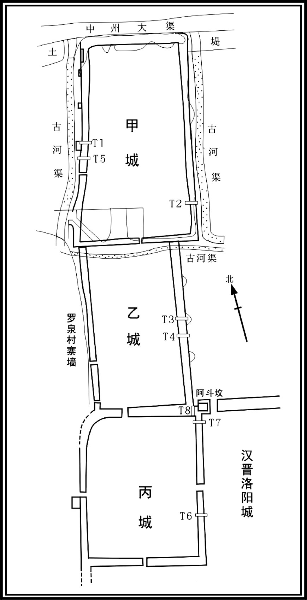 
金墉城甲、乙、丙三城平面示意图

## 【译文】

石勒对徐光说：“刘曜屯军成皋关，这是上策；在洛水设阻，这是次策；坐守洛阳，就等于束手就擒。”咸和三年（328年）十二月乙亥（初一日），后赵各路军队聚集于成皋，有步兵六万，骑兵二万七千。石勒观察到前赵没有守兵，十分高兴，举手指天又放到前额上说：“这是天意！”命令士兵卷起铠甲，口中衔枚，从秘密小道日夜兼行，由巩县、訾县之间穿行而出。

## 【原文】

**赵主曜专与嬖臣饮博，不抚士卒[1]。左右或谏，曜怒，以为妖言，斩之[2]。闻勒已济河，始议增荥阳戍，杜黄马关[3]。俄而洛水候者与后赵前锋交战，擒羯送之。曜问：“大胡自来邪？其众几何[4]？”羯曰：“王自来，军势甚盛。”曜色变，使摄金墉之围，陈于洛西，众十余万，南北十余里。勒望见，益喜，谓左右曰：“可以贺我矣。”勒帅步骑四万入洛阳城[5]。**

## 【注文】

[1]嬖臣：受宠幸的近臣。　　饮博：即饮酒下棋。

[2]妖言：指迷惑人的邪恶言论。妖言曾为古代罪名之一，指异端邪说。

[3]黄马关：又名黄马坡，在今河南荥阳汜水镇虎牢关村、成皋故城西。魏晋置关，地势险要，常为兵家必争之地。

[4]候者：军中任侦察之事、守望巡哨者。　　大胡：此处刘曜称石勒为大胡。

[5]洛阳城：汉魏洛阳城位于今河南洛阳东北。大体作南北长方形，东西北三面城垣都有几处曲折，保存较好；南面城垣因洛河北移被毁，已无遗迹可寻。皇宫主要是位于该城中部的南宫与北宫。南北两宫均略呈长方形，且南北纵列。皇宫内列满殿宇。洛阳城东部是贵族住宅区。太尉、司徒、司空三公衙门在南宫的东面。洛阳城的经济活动中心主要集中在三市，即金市、马市和南市。

## 【译文】

前赵主刘曜只顾与宠幸之臣饮酒下棋，不抚恤士卒。身边的人有时进行劝谏，刘曜还十分生气，认为这是妖言惑众，将他们处死。当他听说石勒已经渡过黄河，才开始商议增加荥阳守军，封锁黄马关。很快布置在洛水岸边的军队与后赵的前锋军队交战，将捉获的羯人俘虏送给刘曜。刘曜问道：“石勒自己来了吗？他带了多少军队？”羯人回答说：“大王亲自出征，军队的气势十分强盛。”刘曜立刻变了脸色，命令解除金墉城的包围，在洛水西面列阵，军队达十多万人，从南到北绵延十多里。石勒望见，越发高兴，对身边的人说：“可以祝贺我了。”石勒率领四万步兵、骑兵攻入洛阳城。

## 【原文】

**己卯，中山公虎引步卒三万自城北而西，攻赵中军，石堪、石聪等各以精骑八千自城西而北，击赵前锋，大战于西阳门。勒躬贯甲胄，出自阊阖门，夹击之[1]。曜少而嗜酒，末年尤甚，将战，饮酒数斗[2]。常乘赤马无故跼顿，乃乘小马。比出，复饮酒斗余。至西阳门，挥陈就平。石堪因而乘之，赵兵大溃。曜昏醉退走，马陷石渠，坠于冰上，被疮十余，通中者三，为堪所执。勒遂大破赵兵，斩首五万余级。下令曰：“所欲擒者一人耳，今已获之。其敕将士抑锋止锐，纵其归命之路。”曜见勒曰：“石王颇忆重门之盟否[3]？”勒使徐光谓之曰：“今日之事，天使其然，复云何邪！”乙酉，勒班师，使征东将军石邃将兵卫送曜[4]。邃，虎之子也。曜疮甚，载以马舆，使医李永与同载。己亥，至襄国，舍曜于永丰小城，给其妓妾，严兵围守。遣刘岳、刘震等从男女盛服以见之，曜曰：“吾谓卿等久为灰土，石王仁厚，乃全宥至今邪[5]！我杀石佗，愧之多矣！今日之祸，自其分耳。”留宴终日而去。勒使曜与其太子熙书，谕令速降[6]。曜但敕熙“与诸大臣匡维社稷，勿以吾易意也。”勒见而恶之，久之，乃杀曜。**

## 【注文】

[1]西阳门：汉魏洛阳故城内城西城墙北数第三门，与东城墙的东阳门相对，形成一条东西向大道，即西阳门—东阳门东西轴线大街，在这条中轴线上贯穿了东阳门、西阳门和宫城正门阊阖门，在阊阖门门前南与铜驼大街交会，是内城中极为重要的一条道路。2012年，西阳门遗址经考古发掘，与西城墙一段进行整体保护展示，成为汉魏故城国家考古遗址公园的入口和标志性建筑。　　甲胄：甲，铠甲；胄，头盔。甲胄即盔甲，是将士的防护兵器。它在冷兵器时代充当着极其重要的角色，类似于现代战争中的防弹服，可以较大程度地保护将士身体免遭敌方兵器的重创，进而能够增强战斗力并给敌方以更猛烈的回击。　　阊（chāng）阖（hé）门：洛阳城宫城正门。作为象征帝王威仪的礼仪性建筑，阊阖门是举行帝王登基或接见四方朝贡者等重大活动的地方，极少用于通行。

[2]嗜（shì）：喜好，爱好。　　斗：中国古代市制容量单位，十升为一斗，十斗为一石。

[3]跼（jú）顿：犹颠仆。　　重门之盟：据史书记载，刘曜、石勒曾于重门结盟，但他们结盟的具体时间、地点及其内容，由于史料缺乏，目前无可查证。

[4]石邃（？—337年）：十六国上党武乡（今山西榆社北）人，羯族，石虎之子。早年随石虎攻灭前赵。石勒即位后，封为冀州刺史、齐王。石勒死后，帮助父亲石虎控制新君石弘，官拜使持节、侍中、都督中外诸军事、大将军、录尚书事。石虎即位后，被封为天王皇太子，一度十分受宠。后因密谋杀害父亲石虎和石宣，事情败露，与门客党羽二百多人都被诛杀。

[5]李永：生卒年不详。十六国后赵随军医生。　　刘震：生卒年不详。十六国前赵宗室，被后赵所俘。　　宥（yòu）：宽容，饶恕，原谅。

[6]熙：即刘熙（？—329年），匈奴人，新兴（今山西忻州）人，十六国前赵主刘曜之子。公元319年，被册封为皇太子。公元328年，刘曜兵败被俘，他成为前赵实际上的统治者，但未登基称帝。次年，他放弃长安城逃跑，后被石虎擒获，不久被杀，前赵政权自此灭亡。　　谕令：专指皇帝的命令。

## 【译文】

晋成帝咸和三年（328年）十二月己卯（初五日），中山公石虎率领三万步兵从城北向西而行，攻打前赵中军。石堪、石聪等各自带领八千精锐骑兵从城西向北而行，进攻前赵前锋，在西阳门展开激烈战斗。石勒身穿铠甲，头戴头盔，从阊阖门出城，夹击前赵的军队。刘曜从小就喜欢喝酒，晚年尤其嗜酒，将要出战之前还喝了几斗酒。他平常乘的红马无缘无故颠仆，于是改乘小马。等到出门时，又饮了一斗多酒。到了西阳门，指挥军队向平坦的地方移动。石堪乘机发动进攻，前赵军队被打溃散。刘曜醉得昏昏沉沉地逃走，马足陷在石头砌成的沟渠之中，他从马背上坠落到冰上，受伤十多处，有三处被刺穿，被石堪抓住。石勒于是大败前赵军队，斩杀五万多人。下令说：“我们所要捉拿的不过刘曜一人而已，他现在已经被俘虏。于是发布命令，将士停止攻击，给前赵的士兵留出投降的生路。”刘曜见到石勒说：“石王，还记得我们的重门之盟吗？”石勒让徐光对他说：“今天的事情，是上天的安排，还有什么好说的呢！”乙酉（十一日），石勒班师回朝，命征东将军石邃率兵押送刘曜。石邃是石虎的儿子。刘曜伤势十分严重，用马车载着他，让医生李永和他同坐一辆车。己亥（二十五日），抵达襄国，让刘曜居住在永丰小城，给他妓妾，派兵在周围严加看守。同时派遣刘岳、刘震等穿着盛装来见刘曜，刘曜说：“我以为你们早已经死了呢，石王仁慈宽厚，竟然保全宽赦你们到今天啊！我杀了石佗，心中有愧！今日的灾祸，是我应得的报应啊。”刘曜留下他们宴饮一整天才离去。石勒让刘曜写信给他的太子刘熙，劝他马上投降。刘曜却让刘熙“同各位大臣匡正维护国家，不要因为我而改变了主意”。石勒看见书信十分厌恶，不久，就杀了刘曜。

## 【原文】

**四年春正月，赵太子熙闻赵主曜被擒，大惧，与南阳王胤谋西保秦州。尚书胡勋曰：“今虽丧君，境土尚完，将士不叛，且当并力拒之；力不能拒，走未晚也[1]。”胤怒，以为沮众，斩之。遂帅百官奔上邽，诸征、镇亦皆弃所守从之。关中大乱，将军蒋英、辛恕拥众数十万据长安，遣使降于后赵[2]。后赵遣石生帅洛阳之众赴之。**

## 【注文】

[1]胡勋（？—329年）：曾任十六国前赵尚书。前赵主刘曜被石勒擒获后，前赵太子刘熙及南阳王刘胤打算撤退，他主张暂且应当集中军力抵抗，等力量不足时再撤退，因此惹怒刘胤，被杀。

[2]蒋英：生卒年不详。十六国时前赵将军，前赵主刘曜被俘后，与辛恕拥众数十万据守长安，投降后赵。　　辛恕：生卒年不详。十六国时前赵将军，前赵主刘曜被俘后，与蒋英拥众数十万据守长安，投降后赵。

## 【译文】

晋成帝咸和四年（329年）春季正月，前赵太子刘熙听说前赵主刘曜被擒，非常惊恐，与南阳王刘胤商议向西保据秦州。尚书胡勋说：“现在虽然丧失了君主，国土仍然完整，将士并没有反叛，暂且应当集中军力抵抗石勒；力量不足时再撤退也不晚。”刘胤恼怒，认为胡勋扰乱众心，将他斩首。刘熙于是率领文武百官逃奔上邽，各个征、镇将军们也都放弃了自己镇守的地方跟随刘胤逃跑。关中地区大乱，将军蒋英、辛恕率领几十万军队据守长安，派遣使者向后赵投降。后赵派石生率领洛阳的军队前往长安。

## 【原文】

**秋八月，赵南阳王胤帅众数万自上邽趋长安，陇东、武都、安定、新平、北地、扶风、始平诸郡戎夏皆起兵应之[1]。胤军于仲桥，石生婴城自守，后赵中山公虎帅骑二万救之[2]。九月，虎大破赵兵于义渠，胤奔还上邽[3]。虎乘胜追击之，枕尸千里。上邽溃，虎执赵太子熙、南阳王胤及其将、王公、卿校以下三千余人，皆杀之，徙其台省文武、关东流民、秦雍大族九千余人于襄国，又阬五郡屠各五千余人于洛阳[4]。**

## 【注文】

[1]陇东：郡名，治所设在泾阳县（今甘肃平凉西北）。　　北地：郡名。治所设在富平县（今甘肃庆阳西南），辖境相当于今宁夏贺兰山、青铜峡、山水河以东及甘肃环江、马莲河流域。

[2]仲桥：地名，今陕西礼泉北。

[3]义渠：地名，今甘肃庆阳西南。

[4]台省文武：即朝廷中的文武百官。　　关东：古时称函谷关（今河南灵宝东北）或潼关以东地区为关东。　　屠各：匈奴部落名。

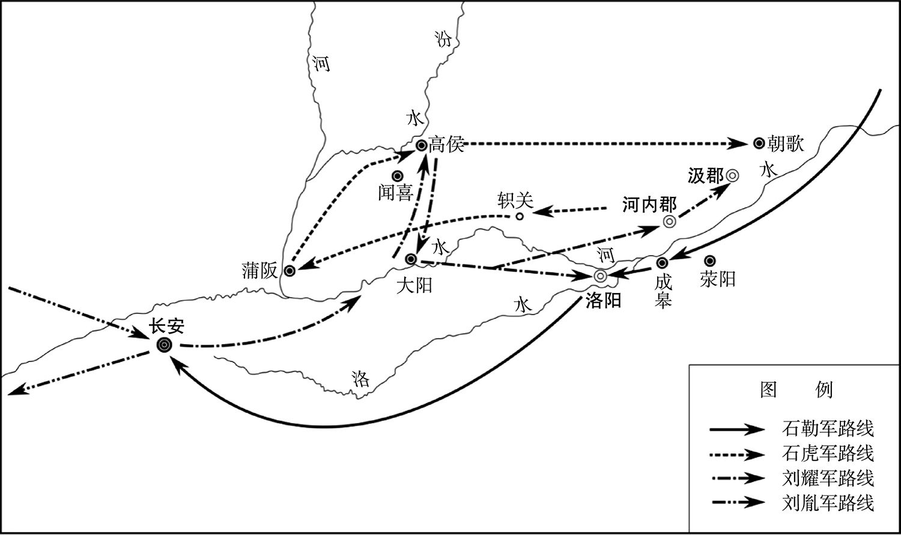 
后赵灭前赵战争示意图

## 【译文】

晋成帝咸和四年（329年）秋季八月，前赵南阳王刘胤率领几万军队从上邽赶赴长安，陇东、武都、安定、新平、北地、扶风、始平各郡的胡汉百姓都纷纷响应刘胤。刘胤屯军于仲桥，石生环城自守，后赵中山公石虎率领二万骑兵救援石生。九月，石虎在义渠大败前赵军队，刘胤逃奔上邽。石虎乘胜追击，前赵士兵的尸体绵延一千里。上邽城被攻破，石虎抓获了前赵太子刘熙、南阳王刘胤及其将军、王公、大臣、校尉以下三千多人，全部处死，把前赵的文武官员、关东地区的流民、秦州雍州的豪门大族九千多人迁徙到襄国，又在洛阳坑杀了五郡的五千多屠各部人。

## 【原文】

**五年春二月，后赵群臣请后赵王勒即皇帝位，勒乃称大赵天王，行皇帝事。立妃刘氏为王后，世子弘为太子[1]。以其子宏为骠骑大将军、都督中外诸军事、大单于，封秦王；斌为左卫将军，封太原王；恢为辅国将军，封南阳王[2]。以中山公虎为太尉、尚书令，进爵为王；虎子邃为冀州刺史，封齐王；宣为左将军；挺为侍中，封梁王[3]。又封石生为河东王，石堪为彭城王。以左长史郭敖为尚书左仆射，右长史程遐为右仆射、领吏部尚书，左司马夔安、右司马郭殷、从事中郎李凤、前中郎令裴宪皆为尚书，参军事徐光为中书令、领秘书监。自余文武，封拜各有差[4]。**

## 【注文】

[1]刘氏：石勒的结发妻子。石勒被汉国昭武帝刘聪封为征东大将军时，刘氏也被封为上党国夫人；石勒被前赵国君刘曜封为赵王时，刘氏也随之升格为王后。刘氏是一位有胆有略的女子，她经常为石勒出谋划策。在她的帮助下，消灭了前赵。公元330年，石勒称帝，刘氏被册封为皇后。公元333年，石勒死后，其子石弘即位，尊为皇太后。因不满石虎专权，于是与彭城王石堪谋划讨伐石虎。不久，石堪兵败被杀。刘太后被告发，遇害。　　弘：即石弘（311—334年），字大雅，上党武乡（今山西榆社北）人，羯族，十六国后赵君主，公元333年至334年在位。后被石虎杀害。

[2]宏：即石宏（？—334年），石勒之子。曾任骠骑大将军、都督中外诸军事、大单于，封秦王。公元334年，被石虎杀害。　　斌：即石斌（？—349年），十六国后赵宗室，石虎之子。石勒即位后，被授为左卫将军，封太原王。石勒死后，石虎控制新君石弘，被降封为章武王，曾参与镇压关中反对石虎的势力。石虎即位为天王后，被封为燕公。石虎临终时，被任命为大都督、丞相，总领尚书职事。　　恢：即石恢（？—335年），石勒幼子。石勒即位后，封辅国将军、南阳王。曾奉命镇守廪丘（今山东郓城西北）。　　辅国将军：将军名。始见于东汉末年，多授予外戚。魏晋沿置。

[3]宣：即石宣（？—348年），十六国时后赵宗室，石虎之子。公元333年，封车骑大将军、冀州刺史、河间王。公元337年，被石虎立为天王皇太子。后为石虎所杀。　　左将军：官名。秦汉有前、后、左、右将军，均为领兵官。魏晋不常置，通常仅为虚衔。　　挺：即石挺（？—333年）十六国时后赵宗室，石虎之子。石勒即位，任侍中，封为梁王，后被反石虎的将领所杀。

[4]郭敖：生卒年不详，曾任十六国时后赵左长史、尚书左仆射之职。　　夔安：生卒年不详，曾任十六国后赵左司马、尚书之职。　　郭殷：生卒年不详，曾任十六国时后赵右司马。　　李凤：生卒年不详，曾任十六国后赵从事中郎、尚书之职。　　秘书监：官名。汉桓帝刘志延熹二年（159年）置，掌禁中图书秘籍，校订异同。后省。三国魏文帝黄初年间复置，为秘书署长官，掌艺文图籍。西晋初罢。晋惠帝永平元年（291年）复置，为秘书寺长官，兼统著作局，掌修撰国史及管理中外三阁图书，三品。

## 【译文】

晋成帝咸和五年（330年）春季二月，后赵群臣请求后赵王石勒即皇帝位，石勒于是自称大赵天王，行使皇帝的权力。册立妃子刘氏为王后，世子石弘为太子。任命他的儿子石宏为骠骑大将军、都督中外诸军事、大单于，封为秦王；石斌为左卫将军，封为太原王；石恢为辅国将军，封为南阳王。任命中山公石虎为太尉、尚书令，晋升爵位为王；石虎的儿子石邃为冀州刺史，封为齐王；石宣为左将军；石挺为侍中，封为梁王。又封石生为河东王，石堪为彭城王。任命左长史郭敖为尚书左仆射，右长史程遐为右仆射、兼吏部尚书，左司马夔安、右司马郭殷、从事中郎李凤、前中郎令裴宪都担任尚书，参军事徐光为中书令、领秘书监。其余的文武官员，都得到不同等级的封官拜爵。

## 【原文】

**赵群臣固请正尊号，秋九月，赵王勒即皇帝位，大赦，改元建平[1]。文武封进各有差。立其妻刘氏为皇后，太子弘为皇太子。**

## 【注文】

[1]建平：十六国时后赵明帝石勒所用的第二个年号，共计四年，即公元330年至333年。建平四年（333年），石弘即位沿用。次年，改元延熙元年。

## 【译文】

后赵群臣坚决请求石勒正式称皇帝尊号，咸和五年（330年）秋季九月，后赵王石勒即帝位，大赦天下，改年号为建平。文武官员封官晋爵各有不同的等次。石勒册立自己的妻子刘氏为皇后，太子石弘为皇太子。

## 【原文】

**七年春正月，赵王勒大飨群臣，谓徐光曰：“朕可方自古何等主？”对曰：“陛下神武谋略过于汉高，后世无可比者。”勒笑曰：“人岂不自知，卿言太过！朕若遇汉高祖，当北面事之，与韩、彭比肩；若遇光武，当并驱中原，未知鹿死谁手[1]。大丈夫行事，宜礌礌落落，如日月皎然，终不效曹孟德、司马仲达欺人孤儿寡妇，狐媚以取天下也[2]。”群臣皆顿首称万岁。勒虽不学，好使诸生读书而听之，时以其意论今古得失，闻者莫不悦服。尝使人读汉书，闻郦食其劝立六国后，惊曰：“此法当失，何以遂得天下[3]？”及闻留侯谏，乃曰：“赖有此耳[4]。”**

## 【注文】

[1]韩：即韩信。　　彭：即彭越。　　光武：即东汉光武帝刘秀。

[2]礌（lěi）礌落落：形容胸怀坦荡，光明正大。礌，古同“磊”，磊落。　　曹孟德：即曹操，字孟德。　　司马仲达：即西晋高祖宣皇帝司马懿（179—251年），字仲达，河内温县（今河南温县西南）人，西晋王朝奠基人。曾任曹魏大都督、太尉、太傅，是辅佐魏国三代的托孤辅政重臣，后成为掌控魏国朝政的权臣。

[3]汉书：又称《前汉书》，东汉史学家班固编撰，是中国第一部纪传体断代史，与《史记》、《后汉书》、《三国志》并称为“前四史”。《汉书》主要记述了上起西汉高祖刘邦元年（前206年），下至新朝王莽地皇四年（23年），共二百三十年的历史。《汉书》包括纪十二篇，表八篇，志十篇，传七十篇，共一百篇，后人划分为一百二十卷，共八十万字。　　郦（lì）食（yì）其（jī）（？—前203年）：秦朝陈留县高阳乡（今河南杞县西南）人。少时爱好饮酒，常混迹于酒肆中，自称高阳酒徒。后投奔刘邦，献计攻下陈留（今河南开封东南），使刘邦的西征大军获得许多粮草和辎（zī）重物资，解除了后顾之忧。在楚汉两军相持苦战、难解难分、形势十分被动的局面下，建议刘邦夺取荥阳（今河南荥阳东北），占据敖仓（今河南荥阳东北敖山），获得巩固的据点和粮食补给，为日后形势的逆转及反败为胜奠定了基础。

[4]留侯：即张良（？—前189年），西汉初大臣，字子房。曾密谋刺杀秦始皇未遂，后更名改姓，藏匿于下邳（今江苏邳州西南）。公元前208年，投靠刘邦，为其重要谋士，辅佐刘邦建立汉朝，以功封留侯。

## 【译文】

晋成帝咸和七年（332年）春季正月，后赵皇帝石勒大摆宴席犒赏群臣，对徐光说：“朕可以和自古以来的哪一位君主相比？”徐光回答说：“陛下神武谋略超过汉高祖刘邦，后世没有可以相比的人。”石勒笑着说：“每个人最了解自己，你的话太过了！我如果遇上了汉高祖刘邦，将会面朝北方臣服于他，与韩信、彭越并肩而立；如果遇上汉光武帝刘秀，就会和他共同逐鹿中原，最终不知鹿死谁手。大丈夫做事，就应当磊磊落落，如同日月那样光明皎洁，最好不要仿效曹操和司马懿那样欺负人家孤儿寡母，以不正当的手段夺取天下。”群臣都磕头称“万岁”。石勒虽然不好学，但喜欢让儒生们给他读书听，时而用自己的观点议论古今得失，听到的人没有不心悦诚服的。他曾经让人读《汉书》，听到郦食其劝说立六国的后裔，吃惊地说：“这个办法太荒唐了，为什么后来还得到了天下？”等听到留侯张良规劝时，才说：“幸亏有了这个建议。”

* * *

(1)据陈垣《二十史朔闰表》，晋元帝大兴二年十一月戊戌朔，无戊寅日。

# 氐据仇池

## 【内容提要】

《氐据仇池》记载了从西晋末年至东晋中期氐族首领杨氏割据秦州（治今甘肃天水）仇（qiú）池（今甘肃成县西北）的历史。

杨氏家族本是略阳（治今甘肃秦安东南）清水（今甘肃清水西北）氐人，在秦、汉时一直定居在陇右（今甘肃陇山、六盘山以西和黄河以东一带）。东汉献帝刘协建安年间（196—220年），杨腾率领部众迁到仇池定居下来。三国时曾联合凉州（治今甘肃武威）马超、韩遂、杨秋等势力共同对抗曹操。后因战败，杨腾率少数将领投奔蜀汉，其余部众被曹操迁至扶风（今陕西兴平东南）、天水（今甘肃甘谷东南）一带。西晋武帝司马炎时，杨飞龙受晋封号，以假征西将军名义，率部迁回略阳地区。晋惠帝司马衷元康六年（296年），杨飞龙的外甥杨茂搜为躲避齐万年的祸乱，率部落四千家，重新回到仇池故地，自称辅国将军、右贤王。后受氐族部众拥戴而称王，始建前仇池国，称仇池公，其辖地有武都（今甘肃成县西）、阴平（今甘肃文县西北）二郡。晋愍帝司马邺任命他为骠骑将军、左贤王。

东晋元帝司马睿建武元年（317年），杨茂搜去世，他的长子杨难敌继位，号左贤王，屯下辨（今甘肃成县西）；少子杨坚头号右贤王，屯河池（今甘肃徽县西北）。杨难敌在位时，是仇池最兴盛的时期。他先后打败西晋梁州（治今陕西汉中）刺史张光和胡子序，攻下梁州，自称梁州刺史。晋元帝司马睿永昌元年（322年），前赵主刘曜发兵进攻仇池，杨难敌向前赵称臣，被封为武都王。不久，他又投降成汉，后来又反叛，成汉和前赵先后派兵讨伐，都被他打败。

晋成帝司马衍咸和九年（334年），杨难敌的儿子杨毅继位，又向东晋称臣。不久，杨毅被族兄杨初杀掉。杨初继位后，先投降前赵，后投降东晋，东晋正式封他为仇池公。杨初死后，他的儿子杨国和堂弟杨俊相继接受东晋封爵，继任仇池公。杨俊的儿子杨世继位后，前秦兴起，他除了向东晋称臣外，同时又向前秦投降，一身兼任两国官职。自此，仇池维持了将近四十年的和平安定。仇池这个小国，从杨难敌以来的几代人都用称臣投降的方式渡过困难处境。到了杨世的儿子杨纂（zuǎn）继位后，只向东晋称臣，与前秦断绝往来。晋简文帝司马昱咸安元年（371年），前秦苻坚攻下仇池，并将仇池地区的氐族部众全部迁往关中（泛指陕西秦岭北麓渭河平原区），仇池灭亡。

西晋时期的仇池国，包括秦州仇池（今甘肃成县西北）及其附近的下辨（今甘肃成县西）、河池（今甘肃徽县西北）等县，是五胡十六国时期一个很小的割据政权。在那个动荡不安的多事之秋，仇池并没有留下什么惊天动地的传奇，又因其国土狭小，以至于史家都没有把它列入十六国之内。自西晋惠帝司马衷元康六年（296年）杨茂搜从略阳率领氐族部落还保仇池起，至东晋简文帝司马昱咸安元年（371年）前秦灭仇池止，前后传九主，共七十余年。

## 【原文】

**晋惠帝元康六年。初，略阳清水氐杨驹始居仇池[1]。仇池方百顷，其旁平地二十余里，四面斗绝而高，为羊肠蟠道三十六回而上[2]。至其孙千万附魏，封为百顷王[3]。千万孙飞龙浸强盛，徙居略阳[4]。飞龙以其甥令狐茂搜为子，茂搜避齐万年之乱，十二月，自略阳帅部落四千家还保仇池，自号辅国将军、右贤王[5]。关中人士避乱者多依之，茂搜迎接抚纳，欲去者卫护资送之。**

## 【注文】

[1]清水：地名，在今甘肃清水西北。西晋时属秦州略阳郡管辖。东晋十六国时，前赵、后赵、前秦、后秦、西秦、大夏、仇池等少数民族政权先后把势力伸入清水境内。　　杨驹（jū）（？—230年）：氐族人，杨腾之子，仇池国君主之一，公元210年至230年在位。　　仇池：地名，位于今甘肃成县西北。氐族杨氏曾在此建立仇池政权（296—371年），它是五胡十六国时期一个很小的割据政权。自西晋惠帝司马衷元康六年（296年）杨茂搜从略阳率领氐族部落还保仇池起，至东晋简文帝司马昱咸安元年（371年）前秦灭仇池止，前后传九主，共七十余年。

[2]百顷：一万亩。泛指土地之广。　　羊肠蟠（pán）道：喻指狭窄曲折的小路。

[3]千万：即杨千万（？—263年），氐族人，杨驹之子，仇池国君主之一，公元230年至263年在位。投附曹魏后，曾被封为百顷氐王。　　百顷王：即杨千万。杨千万投附曹魏后被封此号。氐族杨氏世居之处仇池地方百顷，故而以百顷为号。

[4]飞龙：即杨飞龙（？—296年），杨千万之孙，仇池国君主之一，公元263年至296年在位。他执政时期，国力渐盛，被晋武帝司马炎封为假平西将军，还居略阳（治今甘肃秦安东南）。

[5]令狐茂搜（？—317年）：杨飞龙外甥，后被杨飞龙收为养子，改名为杨茂搜。西晋时期仇池王。公元296年，因齐万年反抗晋朝，发生战乱，他率部落四千家南返仇池故地，广纳流民，自号辅国将军、右贤王，建立前仇池国。　　右贤王：匈奴贵族封号，即右屠耆（qí）王，为匈奴单于之下最高职官，常以单于子弟担任。

## 【译文】

晋惠帝司马衷元康六年（296年）。当初，略阳清水氐族人杨驹最开始定居在仇池。仇池方圆一百顷，它的旁边有二十多里平地，四周是陡峭高耸的绝壁，有羊肠小道环绕盘旋三十六回方到顶上。此后杨驹的孙子杨千万归附魏国，被封为百顷王。到杨千万的孙子杨飞龙时势力逐渐强盛起来，迁居到略阳。杨飞龙把他的外甥令狐茂搜收为养子，令狐茂搜为了躲避齐万年之乱，十二月，从略阳率领部落四千家回到仇池自保，自称辅国将军、右贤王。关中地区躲避战乱的人士大多前去依附他，令狐茂搜接纳安抚，想要离去的也派人护送并赠给他们资财。

## 【原文】

**愍帝建兴元年。初，氐王杨茂搜之子难敌遣养子贩易于梁州，私卖良人子一人，梁州刺史张光鞭杀之[1]。难敌怨曰：“使君初来，大荒之后，兵民之命仰我氐活，氐有小罪，不能贳也[2]！”及光与杨虎相攻，各求救于茂搜，茂搜遣难敌救光[3]。难敌求货于光，光不与。杨虎厚赂难敌，且曰：“流民珍货，悉在光所，今伐我，不如伐光[4]。”难敌大喜。光与虎战，使张孟苌居前，难敌继后[5]。难敌与虎夹击孟苌，大破之，孟苌及其弟援皆死[6]。光婴城自守[7]。九月，光愤激成疾，僚属劝光退据魏兴[8]。光按剑曰：“吾受国重任，不能讨贼，今得死如登仙，何谓退也[9]！”声绝而卒。州人推其少子迈领州事，又与氐战没，众推始平太守胡子序领梁州[10]。**

## 【注文】

[1]难敌：即杨难敌。　　良人：古代指非奴婢的平民百姓，区别于奴、婢。

[2]贳（shì）：宽纵，赦免。

[3]杨虎：生卒年不详，约活动于两晋时期，巴氐人。公元313年，联合杨茂搜，大败张光军。次年，掳掠汉中（今陕西安康西北）官吏百姓后投奔成汉。

[4]流民：因受灾而流亡外地、生活没有着落的人。

[5]张孟苌（cháng）（？—313年）：张光之子，江夏钟武（今河南信阳东南）人。其父张光曾对李运、杨虎领导的流民军进行镇压，后流民军联合氐族首领杨茂搜攻打张光部将管邈，他奉命前去援救，结果战死。

[6]援：即张援（？—313年），张光之子。与其兄张孟苌一起被李运、杨虎领导的流民军打死。

[7]婴城自守：指环城自守。婴，缠绕、环绕之意。

[8]魏兴：郡名。三国魏以西城郡改名，治所设在西城县（今陕西安康西北）。后移治洵（xún）口（今陕西旬阳）。晋朝时治所屡有变动：晋武帝太康二年（281年）治所又迁至锡县（今陕西白河东）；次年又移治平阳县（今湖北郧［yún］县西）；晋惠帝元康年间还治锡县（今陕西白河东）；晋怀帝永嘉后治所再迁西城县（今陕西安康西北）。

[9]吾（wú）：我，但“吾”和“我”在语法上有区别，吾不用于动词后作宾语。

[10]迈：即张迈（？—313年），张光之子。晋愍帝建兴元年（313年），张光死后，被州里百姓推举代理梁州事务，不久便在与氐人交战中战死。　　领：治理，管辖。　　没（mò）：同“殁”，死。　　胡子序：生卒年不详。原为始平太守。晋愍帝建兴元年（313年），梁州刺史张光及其子张迈死后，被州里百姓推举兼管梁州事务。随后杨虎、杨难敌攻打梁州，他弃城逃跑。

## 【译文】

晋愍帝司马邺建兴元年（313年）。当初，氐王杨茂搜的儿子杨难敌派遣养子去梁州贩卖交易，私自卖了平民家的一个孩子，梁州刺史张光用鞭子将他养子抽死。杨难敌怨恨地说：“您刚刚来到这里，正是大饥荒过后，士兵和百姓的性命都是仰赖我们氐人才活下来的，氐人有了小罪过，难道不能宽恕？”等到张光与杨虎交战时，各自向杨茂搜求救，杨茂搜派遣杨难敌救援张光。杨难敌向张光索要货物，张光不给。杨虎却用厚礼贿赂杨难敌，并且说：“流民的珍宝奇货，都在张光那里，现在讨伐我，不如讨伐张光。”杨难敌十分高兴。张光与杨虎交战，让张孟苌打前阵，杨难敌做后援。杨难敌与杨虎夹击张孟苌，大败他的军队，张孟苌和他的弟弟张援全部战死。张光只能环城自守。九月，张光因愤怒染上疾病，属官们劝说张光撤退到魏兴据守。张光按着宝剑说：“我接受国家的重任，却不能讨贼，假如现在死了，就如同登天成仙一样，说什么撤退！”说完就死了。州里百姓推举他的小儿子张迈代理州中的事务，张迈也在与氐人的战斗中阵亡，大家推举始平太守胡子序兼管梁州事务。

## 【原文】

**冬十月，杨虎、杨难敌急攻梁州，胡子序弃城走，难敌自称刺史。**

## 【译文】

晋愍帝建兴元年（313年）冬季十月，杨虎、杨难敌加紧攻打梁州，胡子序弃城逃跑，杨难敌自称刺史。

## 【原文】

**二年春正月，杨虎掠汉中吏民以奔成，梁州人张咸等起兵逐杨难敌[1]。难敌去，咸以其地归成，于是汉嘉、涪陵、汉中之地皆为成有[2]。**

## 【注文】

[1]奔（bèn）：投奔。　　张咸：生卒年不详，西晋梁州（治今陕西汉中）人。梁州被氐人杨难敌攻陷后，张咸起兵驱逐了杨难敌，将梁州赠送给了成汉。

[2]归（kuì）：通“馈”，赠送。　　汉嘉：地名，今四川名山北。

## 【译文】

晋愍帝建兴二年（314年）春季正月，杨虎挟持汉中官民投奔成汉，梁州人张咸等人起兵驱逐杨难敌。杨难敌离去后，张咸把这片土地赠送给成汉，于是汉嘉、涪陵、汉中等地都被成汉占有。

## 【原文】

**元帝建武元年。氐王杨茂搜卒，长子难敌立，与少子坚头分领部曲[1]。难敌号左贤王，屯下辨；坚头号右贤王，屯河池[2]。**

## 【注文】

[1]坚头：即杨坚头，祖籍略阳清水（今甘肃清水西北），后迁居仇池（今甘肃成县西北），氐族，杨茂搜之子。公元317年，其父杨茂搜去世，他与哥哥杨难敌分领部曲，号右贤王，屯兵河池（今甘肃徽县西北）。公元321年，刘曜攻伐杨难敌，他与杨难敌一起投奔成汉主李雄。刘曜退兵后，复还仇池。

[2]下辨：地名，今甘肃成县西。　　河池：地名，今甘肃徽县西北。

## 【译文】

晋元帝司马睿建武元年（317年）。氐王杨茂搜去世，长子杨难敌即位，和小儿子杨坚头分别统领部曲。杨难敌号称左贤王，屯军下辨；杨坚头号称右贤王，屯军河池。

## 【原文】

**永昌元年春二月，赵主曜自将击杨难敌，难敌逆战不胜，退保仇池。仇池诸氐、羌及故晋王保将杨韬、陇西太守梁勋皆降于曜[1]。曜迁陇西万余户于长安，进攻仇池。会军中大疫，曜亦得疾，将引兵还，恐难敌蹑其后，乃遣光国中郎将王犷说难敌，谕以祸福[2]。难敌遣使称藩，曜以难敌为假黄钺、都督益宁南秦凉梁巴六州陇上西域诸军事、上大将军、益宁南秦三州牧，武都王[3]。**

## 【注文】

[1]梁勋：生卒年不详。西晋官员，曾任陇西太守。后降于十六国汉赵主刘曜。

[2]蹑（niè）：追随；追赶。　　光国中郎将：官名。十六国后赵置，曾受命出使仇池。　　王犷（guǎng）：生卒年不详。十六国时后赵时官员，曾任光国中郎将。　　谕（yù）：告诉，使人知道。

[3]称藩（fān）：亦作“称蕃”，自称藩属，向大国或宗主国承认自己的附庸地位。　　都督益宁南秦凉梁巴六州陇上西域诸军事：即都督益、宁、南秦、凉、梁、巴六州和陇上、西域地区军事事务的长官。“都督某某地区诸军事”是魏晋时期地方军事区划和军事组织制度。创立于东汉，发展完善于两晋时期，成为曹魏、两晋常设的地方军事区划制度，其数量逐步增加，职权也日趋扩张。　　南秦：州名。十六国前秦苻坚置，治所设在武都（今甘肃成县西），辖境相当今甘肃嶓冢（Bōzhǒng）山、祁山以南，及陕西凤县、略阳，四川平武等地。

## 【译文】

晋元帝司马睿永昌元年（322年）春季二月，前赵主刘曜亲自出征攻打杨难敌，杨难敌迎战没有取胜，撤退到仇池防守。仇池的氐族、羌族各部落以及前晋王司马保的部将杨韬、陇西太守梁勋全都投降了刘曜。刘曜把陇西的一万多户迁徙到长安，然后率军攻打仇池。适逢军中发生大规模的瘟疫，刘曜也染上了疾病，想要率军返回，但又担心杨难敌尾随其后。于是派遣光国中郎将王犷游说杨难敌，向他表明利害关系。杨难敌派遣使者向刘曜称藩臣，刘曜任命杨难敌为假黄钺、都督益宁南秦凉梁巴六州陇上西域诸军事、上大将军、益宁秦三州州牧，武都王。

## 【原文】

**明帝大宁元年。杨难敌闻陈安死，大惧，与弟坚头南奔汉中。赵镇西将军刘厚追击之，大获而还[1]。赵主曜以大鸿胪田崧为镇南大将军、益州刺史，镇仇池[2]。难敌送任请降于成，成安北将军李稚受难敌赂，不送难敌于成都[3]。赵兵退，即遣还武都，难敌遂据险不服[4]。稚自悔失计，亟请讨之[5]。雄遣稚兄侍中、中领军琀与稚出白水，征东将军李寿及琀弟玝出阴平，以击难敌[6]。群臣谏，不听。难敌遣兵拒之，寿、玝不得进。而琀、稚长驱至下辨，难敌遣兵断其归路，四面攻之。琀、稚深入无继，皆为难敌所杀，死者数千人。**

## 【注文】

[1]刘厚：生卒年不详。十六国前赵官员，曾任镇西将军，追击杨难敌，将其打得大败。

[2]田崧（sōng）（？—325年）：字子岱。曾任前赵大鸿胪、镇南大将军、益州刺史等，后被杨难敌杀害。　　镇南大将军：官名。为镇南、镇北、镇西、镇东“四镇将军”之一，统兵将领，掌征伐背叛、镇戍四方。位次四征将军。其中，镇南将军中以资深者为镇南大将军。

[3]送任（rèn）：送亲属去当人质。　　李稚（？—323年）：曾任成汉安北将军。晋明帝大宁元年（323年），杨难敌送去人质向成汉请求投降，他接受杨难敌的贿赂，而将杨难敌送回武都（今甘肃成县西），此后杨难敌据守险要不再服从于成汉。他为弥补放过杨难敌的失误，屡次请求率军讨伐杨难敌。后在与杨难敌交战中，战败被杀。　　成都：今四川成都。三国时蜀国迁都城至成都时，取周王迁岐“一年成聚，二年成邑，三年成都”，而取名成都，相沿至今。西晋时，属益州。

[4]遂（suì）：于是。

[5]亟（qì）：屡次。

[6]中领军：魏晋武官名。三国魏元帝曹奂咸熙二年（265年），司马炎分中卫将军置。西晋时属中军将军，后改中领军，掌管禁军，主持选拔武官，监督管制诸武将。晋以后，中领军一职废置无常，后改为中军。东晋元帝永昌元年（322年）改称北军中候，不久又复称领军，仍为禁军最高统帅，但不再统领护军，也无直属营兵。　　琀（hán）：即李琀（？—323年），曾任成汉侍中、中领军，安北将军李稚的哥哥。公元323年，奉李雄命攻打杨难敌，结果战败被杀。　　白水：地名，今四川广元西北。　　玝（wǔ）：即李玝，李琀之弟。生卒年不详，十六国成汉官员。曾与其兄李琀受命领兵攻打氐人杨难敌。　　阴平：郡名。治所设在阴平县（今甘肃文县西北），辖境相当于今甘肃文县、武都及四川平武等地。

## 【译文】

晋明帝司马绍大宁元年（323年）。杨难敌听到陈安的死讯，十分害怕，与弟弟杨坚头向南逃奔汉中。前赵镇西将军刘厚率军追击，缴获很多战利品后返回。前赵主刘曜任命大鸿胪田崧为镇南大将军、益州刺史，镇守仇池。杨难敌送去人质向成汉请求投降，成汉安北将军李稚接受了杨难敌的贿赂，没有将杨难敌送至成都。前赵军队撤退后，即刻遣送杨难敌回到武都，杨难敌于是据守险要不再服从于成汉。李稚对自己的失策感到非常后悔，屡次请求率军讨伐杨难敌。李雄派遣李稚的哥哥侍中、中领军李琀和李稚从白水出发，征东将军李寿和李琀的弟弟李玝从阴平出发，攻打杨难敌。成汉群臣极力劝谏，但李雄不听。杨难敌派兵抵御，李寿、李玝无法推进。而李琀、李稚的军队长驱直入抵达下辨，杨难敌派兵截断他们的退路，从四面发起攻击。李琀、李稚因孤军深入没有后援，都被杨难敌杀死，死者数千人。

## 【原文】

**三年春三月，杨难敌袭仇池，克之[1]。执田崧，立之于前，左右令崧拜[2]。崧瞋目叱之曰：“氐狗！安有天子牧伯而向贼拜乎[3]！”难敌字谓之曰：“子岱，吾当与子共定大业，子忠于刘氏，岂不能忠于我乎[4]！”崧厉色大言曰：“贼氐，汝本奴才，何谓大业！我宁为赵鬼，不为汝臣[5]！”顾排一人，夺其剑，前刺难敌，不中，难敌杀之。**

## 【注文】

[1]克：攻下，攻克。

[2]左右：近臣；随从。　　拜：下跪叩头。

[3]安：表示反问，相当于“怎么”“哪里”。　　牧伯：指州郡长官。

[4]字：人的别名。字和名常有意义上的联系，字往往是名的补充或解释。古人取字的主要依据有同义反复、反义相对或连义推想等。一般自称用名，表示谦虚；称人用字，表示尊敬。　　子岱：田崧字，此以字称呼其人。

[5]厉色：怒容；严厉的脸色。　　汝（rǔ）：你。　　奴才：亦作“奴材”，有鄙视之意。

## 【译文】

晋明帝大宁三年（325年）春季三月，杨难敌率军袭击仇池，攻下该城。抓住田崧，把他押送到自己面前，左右侍从命令他下拜。田崧瞪着眼睛骂道：“氐狗！哪有天子的地方官员向反贼下拜的！”杨难敌称呼田崧的字号对他说：“子岱，你和我一起共建大业吧，你能忠于刘氏，岂能不忠于我呢！”田崧声骂道：“氐贼，你本是奴才，谈什么大业！我宁可做赵国的鬼，也不做你的臣子！”说完转身推开一个人，夺下他的宝剑，上前刺杀杨难敌，没有刺中，杨难敌于是处死了田崧。

## 【原文】

**成帝咸和二年夏五月，赵武卫将军刘朗帅骑三万袭杨难敌于仇池，弗克，掠三千余户而归[1]。**

## 【注文】

[1]刘朗：生卒年不详。十六国时前赵官员，曾任武卫将军，受命进攻杨难敌。　　弗克：没有获胜。

## 【译文】

晋成帝司马衍咸和二年（327年）夏季五月，前赵武卫将军刘朗率领三万名骑兵到仇池袭击杨难敌，没能获胜，抢劫了三千多民户后撤退。

## 【原文】

**六年秋七月，成大将军寿攻阴平、武都，杨难敌降之。**

## 【译文】

晋成帝咸和六年（331年）秋季七月，成汉大将军李寿攻打阴平、武都，杨难敌投降。

## 【原文】

**九年春正月，仇池王杨难敌卒，子毅立，自称龙骧将军、左贤王、下辨公[1]。以叔父坚头之子盘为冠军将军、右贤王、河池公[2]。遣使来称藩。**

## 【注文】

[1]毅：即杨毅（？—337年），杨难敌之子，氐族，东晋时期仇池王，公元334年至337年在位。公元334年，杨难敌去世，杨毅继位，并派使者向晋朝称藩，被封为征南将军。公元337年，仇池内乱，被族兄杨初杀死。

[2]盘：指杨盘，生卒年不详，杨坚头之子，曾任冠军将军、右贤王、仇池公。

## 【译文】

晋成帝咸和九年（334年）春季正月，仇池王杨难敌去世，儿子杨毅即位，自称龙骧将军、左贤王、下辨公。任命叔父杨坚头的儿子杨盘为冠军将军、右贤王、仇池公。派遣使者向晋朝称藩臣。

## 【原文】

**咸康三年。仇池氐王杨毅族兄初袭杀毅，并有其众，自立为仇池公，称臣于赵[1]。**

## 【注文】

[1]族兄：同高祖兄弟的兄辈，亦泛指同族同辈中年纪较长者。　　初：即杨初（？—355年），氐人，仇池首领。公元337年，杀死杨毅，自立为仇池公，向后赵称臣。公元347年，又向东晋称藩，被任命为使持节、征南将军、雍州刺史、仇池公。公元354年，改封天水公。次年，被杨毅的弟弟杨宋奴杀死。　　赵：此指后赵。

## 【译文】

晋成帝咸康三年（337年）。仇池氐王杨毅的同族兄长杨初袭击并杀死杨毅，吞并了他的部众，自立为仇池公，向后赵称臣。

## 【原文】

**穆帝永和三年冬十月，武都氐王杨初遣使来称藩，诏以初为使持节、征南将军、雍州刺史、仇池公。**

## 【译文】

晋穆帝司马聃永和三年（347年）冬季十月，武都氐王杨初派遣使者向晋朝称藩，晋穆帝下诏任命杨初为使持节、征南将军、雍州刺史、仇池公。

## 【原文】

**十一年春正月，故仇池公杨毅弟宋奴使其姑子梁式王刺杀杨初，初子国诛式王及宋奴，自立为仇池公[1]。桓温表国为镇北将军、秦州刺史[2]。**

## 【注文】

[1]宋奴：即杨宋奴（？—355年），仇池氐族首领，杨难敌之子。公元355年，他指使梁式王刺杀杨初，但不久自己也被杨初的儿子杨国杀死。　　梁式王（？—355年）：仇池公杨初内侍。公元355年，他受杨宋奴指使刺杀杨初，由此引发仇池内乱。后被杨初的儿子杨国诛杀。　　国：即杨国（？—356年），杨初之子。其父杨初被梁式王刺杀后，他自立为仇池公。晋穆帝永和十二年（356年），被伯父杨俊杀死。

[2]桓温（312—373年）：东晋大将。字元子，谯（qiáo）国龙亢（今安徽怀远西北）人。初任琅邪太守，后改任徐州刺史。公元346年，他率众西伐，剿灭盘踞在蜀地的成汉政权。他曾经三次北伐（伐前秦、姚襄、前燕），军功显著。他担任都督中外诸军事、录尚书事，集军政大权于一身，权倾当朝。晚年欲废帝自立，但没有成功。

## 【译文】

晋穆帝永和十一年（355年）春季正月，已故仇池公杨毅的弟弟杨宋奴指使他姑姑的儿子梁式王刺杀杨初，杨初的儿子杨国诛杀梁式王和杨宋奴后，自立为仇池公。桓温上表奏请杨国为镇北将军、秦州刺史。

## 【原文】

**十二年。仇池公杨国从父俊杀国自立，以俊为仇池公[1]。国子安奔秦[2]。**

## 【注文】

[1]从父：父亲的兄弟，即伯父或叔父。　　俊：即杨俊（？—360年），氐人，公元356年至360年任仇池首领。

[2]安：即杨安，东晋时前秦仇池国将领。略阳清水（今甘肃清水西北）氐人，前仇池国君主杨初之孙，仇池公杨国之子。公元356年，其父杨国被杨俊杀死后，投奔前秦苻生。此后多次跟随前秦王猛等出征，屡立战功。　　秦：即前秦（351—394年），十六国之一，氐族苻健所建，都长安（今陕西西安西北）。盛时疆域东至大海，西抵葱岭，南控江淮，北极大漠，东南以淮、汉与东晋为界。历六主，共四十四年。

## 【译文】

晋穆帝永和十二年（356年）。仇池公杨国的伯父杨俊杀死杨国自立，东晋朝廷任命杨俊为仇池公。杨国的儿子杨安投奔前秦。

## 【原文】

**升平四年春正月，仇池公杨俊卒，子世立[1]。**

## 【注文】

[1]升平：东晋穆帝司马聃的第二个年号，共计五年，即公元357年至361年。升平五年（361年）五月，晋哀帝司马丕即位沿用，次年改年号为隆和元年。　　世：即杨世（？—370年），氐人，仇池首领杨俊之子，公元360年至370年间在位。公元368年，向东晋称臣，被任命为秦州刺史。之后又向前秦称臣。

## 【译文】

晋穆帝司马聃升平四年（360年）春季正月，仇池公杨俊去世，他的儿子杨世即位。

## 【原文】

**海西公太和三年[1]。以仇池公杨世为秦州刺史，世弟统为武都太守[2]。世亦称臣于秦，秦以世为南秦州刺史。**

## 【注文】

[1]海西公：即东晋废帝司马奕（yì）（342—386年），字延龄，晋哀帝司马丕之弟。初封东海王。晋哀帝司马丕死后，由皇太后扶立即位。在位仅六年（366—371年），便被权臣桓温借口其患病，而废为东海王，后又降封为海西县公。　　太和：东晋废帝司马奕的年号，共计六年，即公元366年至371年。

[2]统：即杨统，仇池首领杨世之弟。公元368年，被东晋授为武都太守。公元371年，前秦出兵攻打仇池，向前秦投降。

## 【译文】

海西公司马奕太和三年（368年）。东晋朝廷任命仇池公杨世为秦州刺史，杨世的弟弟杨统为武都太守。杨世也向前秦称藩，前秦任命杨世为南秦州刺史。

## 【原文】

**五年。仇池公杨世卒，子纂立，始与秦绝[1]。叔父武都太守统与之争国，起兵相攻。**

## 【注文】

[1]纂：即杨纂，仇池首领杨世之子，仇池国主，公元370年至371年在位。公元370年，他继位后与前秦绝交，只称臣于东晋，被东晋朝廷任命为平羌校尉、秦州刺史、仇池公。公元371年，前秦发兵攻打仇池，他以五万人抵抗，结果大败，于是归降前秦。

## 【译文】

海西公太和五年（370年）。仇池公杨世去世，他的儿子杨纂即位，开始与前秦断绝往来。他的叔父武都太守杨统与杨纂争夺权力，起兵相互攻打。

## 【原文】

**简文帝咸安元年春三月，秦西县侯雅、杨安、王统、徐成及羽林左监朱肜、扬武将军姚苌帅步骑七万伐仇池公杨纂[1]。夏四月，秦兵至鹫峡，杨纂帅众五万拒之[2]。梁州刺史弘农杨亮遣督护郭宝、卜靖帅千余骑助纂，与秦兵战于峡中。纂兵大败，死者什三四，宝等亦没，纂收散兵遁还[3]。西县侯雅进攻仇池，杨统帅武都之众降秦。纂惧，面缚出降，雅送纂于长安。以统为南秦州刺史，加杨安都督南秦州诸军事，镇仇池。**

## 【注文】

[1]简文帝：即司马昱（320—372年），字道万，河内温县（今河南温县西南）人，晋元帝司马睿幼子。公元371年，被桓温拥立为帝，改年号为咸安。次年七月病逝，在位仅约八个月，其间朝政完全被桓温掌控。　　咸安：东晋简文帝司马昱的年号，共计二年，即公元371年至372年。咸安二年（372年）七月晋孝武帝司马曜即位沿用，次年改年号为宁康元年。　　西县：今甘肃礼县。　　雅：即苻（fú）雅，生卒年不详，曾任前秦左卫将军、卫大将军、秦州刺史、西县侯、广平王。公元371年，奉苻坚命率军讨伐仇池氐王杨纂，杨纂投降，将仇池并入前秦。　　王统（？—392年）：生卒年不详，十六国时前秦将领。曾任南秦州刺史、益州刺史、凉州刺史等职。参与讨伐仇池战役。后来，投降后秦，被杀。　　徐成（？—392年）：十六国时前秦将领。曾任射声校尉、并州刺史、鹰扬将军、右将军等职。为人勇猛，曾参与了攻灭前燕、讨伐仇池、夺取东晋梁益二州的战争。后来，投降后秦，被杀。　　羽林左监：官名，东汉置，领羽林左骑，属光禄勋。晋沿置。　　朱肜（róng）：十六国时京兆（治今陕西西安西北）人，生卒年不详，与王猛一起驰名关中。被王猛推荐至前秦王苻坚，任尚书侍郎，领太子庶子，后迁秘书监。曾率军攻仇池（今甘肃成县西北），收降仇池公杨纂；后又攻东晋蜀地，陷汉中（今陕西安康西北），获梁（治今陕西汉中）、益（治今四川成都）二州。淝水之战前，他不顾权臣的劝谏，附和苻坚，以为出兵必胜，最终酿成淝水之败。　　扬武将军：官名。东汉光武帝刘秀时始置，为杂号将军，统兵出征。三国魏晋时沿置，四品。　　姚苌（330—393年）：字景茂，南安赤亭（今甘肃陇西）人，羌族首领姚弋（yì）仲第二十四子，姚襄之弟。十六国时后秦开国君主，公元384年至393年在位。

[2]鹫（jiù）峡：今甘肃西和东南。

[3]杨亮：生卒年不详，弘农（治今河南灵宝）人。东晋梁州刺史。　　郭宝（？—371）：生卒年不详。东晋官员，曾任督护，在援救仇池公杨纂时战死。　　卜靖：生卒年不详。东晋官员，曾任督护，在援救仇池公杨纂时战死。　　什三四：十分之三四。

## 【译文】

简文帝司马昱咸安元年（371年）春季三月，前秦西县侯苻雅、杨安、王统、徐成以及羽林左监朱肜、扬武将军姚苌率领七万步兵、骑兵讨伐仇池公杨纂。夏季四月，前秦军队抵达鹫峡，杨纂率领五万军队抵御。梁州刺史弘农人杨亮派遣督护郭宝、卜靖率领一千多名骑兵救援杨纂，与前秦军队在峡谷中交战。杨纂军队大败，阵亡将士达十分之三四，郭宝等人也都战死，杨纂收集残部逃了回来。西县侯苻雅进军攻打仇池，杨统率领武都的军队投降了前秦。杨纂十分恐慌，反绑双手出城投降，苻雅把杨纂押送到长安。前秦任命杨统为南秦州刺史，加授杨安为都督南秦州军事，镇守仇池。

## 【原文】

**［孝］武帝宁康元年秋八月，梁州刺史杨亮遣其子广袭仇池，与秦梁州刺史杨安战，广兵败，沮水诸戍皆委城奔溃[1]。亮惧，退守磬险[2]。九月，安进攻汉川。**

## 【注文】

[1]［孝］武帝：即司马曜（361—396年），字昌明，河内温县（今河南温县西南）人，晋简文帝司马昱第三子，东晋第九任皇帝，公元372年至396年在位。四岁时被封为会稽王。公元372年被立为太子，同年晋简文帝司马昱去世，年仅十一岁的他继位为帝。即位初由太后摄政，亲政后改年号为太元。他在位时曾改革赋税，被称为东晋末年的复兴。但谢安死后，东晋政局再度陷入混乱。　　宁康：或作康宁，东晋孝武帝司马曜的第一个年号，共计三年，即公元373年至375年。　　杨广：生卒年不详，东晋梁州刺史杨亮之子。曾受其父派遣袭击仇池，被前秦打得大败。　　沮（jù）水：即今陕西西南部汉江北源黑河。

[2]磬（qìng）险：地名。在今陕西洋县西。

## 【译文】

孝武帝司马曜宁康元年（373年）秋季八月，梁州刺史杨亮派遣他的儿子杨广率军袭击仇池，与前秦梁州刺史杨安交战，杨广军队战败，沮水一带的各支戍边队伍全都弃城逃散。杨亮十分恐惧，撤退到磬险防守。九月，杨安进军攻打汉川。

## 【原文】

**冬，秦王坚使益州刺史王统、秘书监朱肜帅卒二万出汉川，前禁将军毛当、鹰扬将军徐成帅卒三万出剑门，入寇梁、益[1]。梁州刺史杨亮帅巴獠万余拒之，战于青谷[2]。亮兵败，奔固西城，肜遂拔汉中[3]。徐成攻剑门，克之。杨安进攻梓潼，梓潼太守周虓固守涪城，遣步骑数千送母、妻自汉水趣江陵，朱肜邀而获之，虓遂降于安[4]。十一月，安克梓潼。荆州刺史桓豁遣江夏相竺瑶救梁、益，瑶闻广汉太守赵长战死，引兵退[5]。益州刺史周仲孙勒兵拒朱肜于绵竹，闻毛当将至成都，仲孙帅骑五千奔于南中[6]。秦遂取梁、益二州，邛、莋、夜郎皆附于秦[7]。秦王坚以杨安为益州牧，镇成都；毛当为梁州刺史，镇汉中；姚苌为宁州刺史，屯垫江；王统为南秦州刺史，镇仇池。**

## 【注文】

[1]坚：即苻坚（338—385年），字永固，十六国时前秦皇帝，公元357年至385年在位。在位前期励精图治，使前秦基本统一北方；但后来在伐晋的“淝水之战”中大败，自此一蹶不振，又遭到之前投降的鲜卑、羌人的背叛而出逃，最后被羌人姚苌所杀。　　前禁将军：将军名号。十六国前秦苻坚置，为四禁将军之一，统兵驻守京师，也率军征讨。　　毛当（？—384年）：前秦名将，武都（今甘肃成县西）人。曾任益州刺史。淝水之战后被慕容垂大将慕容凤击杀。　　剑门：地名，今四川剑阁东北。

[2]巴獠：巴蜀之地的少数民族。　　青谷：地名，今四川黑水东南。

[3]西城：地名，今陕西安康西北。　　拔：夺取。

[4]周虓（xiāo）：字孟威，生卒年不详，晋将。初任州祭酒，后官至西夷校尉，领梓潼太守。孝武帝司马曜宁康初年，他的母亲和妻子被苻坚俘获，不得已而投降前秦。苻坚打算任他为官，但他始终以晋臣自居，后被流放到太原（今山西太原西南），病死。　　涪城：地名，今四川绵阳东北。　　趣（qū）：通“趋”，趋向、奔向之意。

[5]桓豁（319—376年）：字朗子，谯国龙亢（今安徽怀远西北）人，桓彝（yí）之子。初仕晋简文帝司马昱，任抚军从事中郎。其兄桓温掌权时，被任命为督沔中七郡军事、建威将军、新野等郡太守、征西大将军，与苻秦在汉水和淮水一带长期交战。　　江夏：郡名。三国魏置，治所设在今湖北安陆西南。西晋时治所迁至今湖北云梦。　　竺瑶：生卒年不详，东晋将领，曾任桓温麾下水军督护。袁瑾据寿阳叛晋时，率水军大破燕援军二万于武丘。后奉桓温命逼废晋帝司马奕。　　赵长（？—373年）：东晋大臣，曾任广汉太守。

[6]周仲孙：生卒年不详，东晋大臣，曾任振武将军、宁州刺史。为官贪婪残暴。后因梁州（治今陕西汉中）、益州（治今四川成都）多有动乱，而被桓温任命转镇梁、益二州。公元373年，前秦大将杨安率众攻打益州，他兵败免官。后复官为光禄勋，死于任上。　　南中：今云南、贵州和四川西南部一带。

[7]邛：地名，亦作“筇（qióng）竹”，今四川西昌东南。　　莋（zuó）：县名，今四川汉源东北。　　夜郎：地名，位于今贵州关岭。

## 【译文】

孝武帝司马曜宁康元年（373年）冬季，前秦王苻坚命益州刺史王统、秘书监朱肜率领二万军队由汉川出发，前禁将军毛当、鹰扬将军徐成率领三万军队从剑门出发，进攻梁州、益州。梁州刺史杨亮率领一万多巴獠人抵抗，在青谷交战。杨亮兵败，逃奔到西城固守，朱肜于是攻陷汉中。徐成率军攻克剑门。杨安进攻梓潼，梓潼太守周虓坚守涪城，派遣几千名步兵、骑兵护送母亲、妻子从汉水前往江陵，朱肜在半路截击，俘虏了她们，周虓于是向杨安投降。十一月，杨安攻克梓潼。荆州刺史桓豁派遣江夏相竺瑶救援梁州、益州，竺瑶听说广汉太守赵长已经战死，便率军撤退。益州刺史周仲孙率军在绵竹抵抗朱肜，听说毛当将要抵达成都，周仲孙率领五千名骑兵逃奔南中。前秦于是占据梁、益二州，邛、莋、夜郎都归附于前秦。前秦王苻坚任命杨安为益州牧，镇守成都；任命毛当为梁州刺史，镇守汉中；任命姚苌为宁州刺史，镇守垫江；任命王统为南秦州刺史，镇守仇池。

# 附录：

## 西晋皇帝世系表

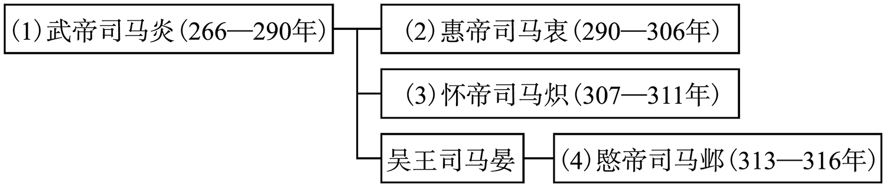 

## 东晋皇帝世系表

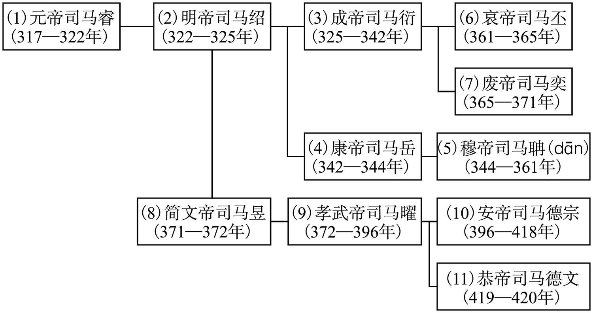 

## 刘渊家族世系表

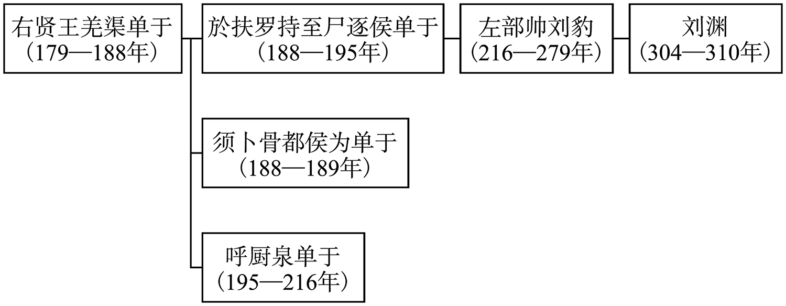 

## （汉）前赵世系表

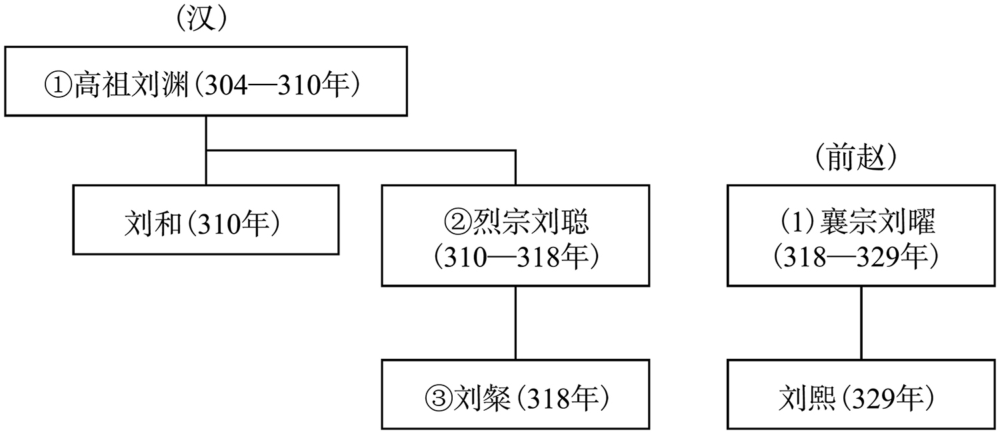 

## 前燕世系表

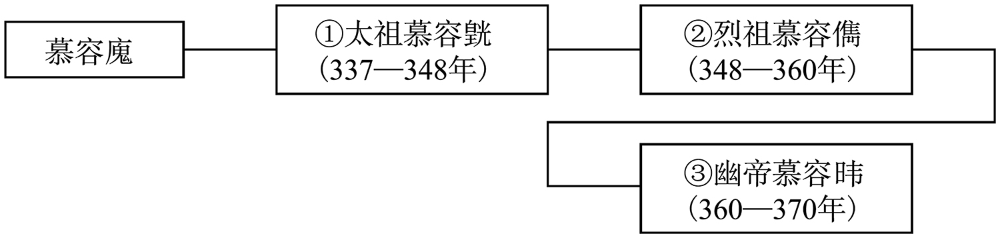 

## 成汉世系表

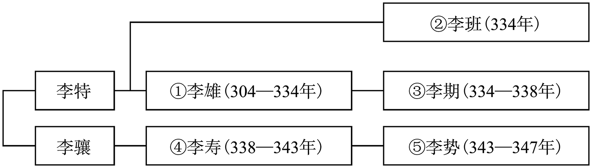 

## 前凉世系表

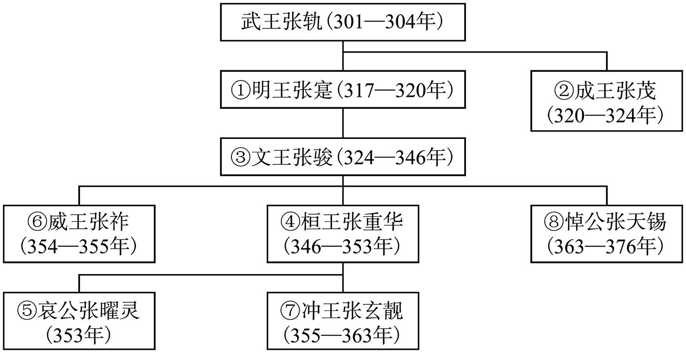 

## 后赵世系表

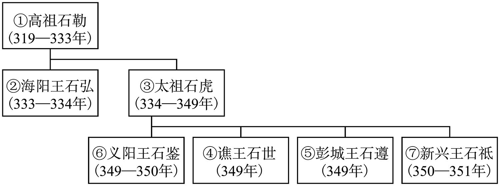 

## 仇池世系表

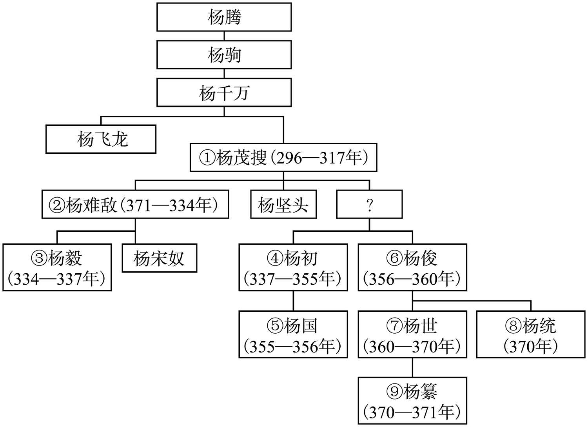

