# 目录

祖逖北伐

王敦之乱

苏峻之乱

燕讨段辽　讨宇文附

赵魏乱中原　冉闵灭石氏附

附录： 
西晋皇帝世系表

东晋皇帝世系表

刘渊家族世系表

（汉）前赵世系表

前燕世系表

成汉世系表

前凉世系表

后赵世系表

返回总目录

# 祖逖北伐

## 【内容摘要】

《祖逖（tì）北伐》叙述了东晋名将祖逖率军北伐，收复中原大批失地，最后却遭朝廷猜忌、饮恨而死的历史过程。

晋武帝司马炎称帝后，鉴于曹魏皇室孤立的教训，对皇叔、皇弟二十七人封王就国。司马炎死后，继承者晋惠帝司马衷昏庸无能，诸王争权夺利，最终爆发了历史上著名的“八王之乱”。这场皇室恶战，历时十六年之久，生产遭到严重破坏，各族百姓无法生存，于是纷纷起义。晋怀帝司马炽永嘉五年（311年），匈奴汉国刘聪派前军大将军呼延晏出兵攻打西晋都城洛阳（今河南洛阳东北），俘虏晋怀帝司马炽，并将他押送至汉国都城平阳（今山西临汾西南）。建兴元年（313年），晋愍（mǐn）帝司马邺在长安（今陕西西安西北）即位，以司马睿为左丞相。建兴四年（316年），刘聪又派军攻陷长安，晋愍帝司马邺投降，西晋至此灭亡。当时琅邪（Lángyá）王司马睿（ruì）在王导、王敦等贵族的支持下，逃到建康（今江苏南京），并于次年建立东晋政权，改年号为建武。此后，司马睿致力于开拓江南地区，无暇顾及北伐。祖逖出身北方大族，本也可以在偏安一隅（yú）的朝廷里安享荣华富贵，步步高升，但他不愿苟且偷安，不贪恋安定舒适的生活。在门阀士族热衷于新政权权力的再分配时，祖逖义正辞严地提出收复半壁河山，拯救中原的强烈要求。

祖逖是晋朝著名将领，“闻鸡起舞”“中流击楫”等历史典故即与他有关。当祖逖看到自己的国家失去北方大片领土，无数百姓处于侵略者的铁蹄之下，非常痛心。他决心收复失地，重振国威。建兴元年（313年），祖逖向晋愍帝司马邺请缨北伐，司马睿任命他为奋威将军、豫州刺史、前锋都督，但只给予他一千人的粮食和三千匹布作为北伐物资。祖逖驻屯淮阴（今江苏清江附近）、起冶铸兵、招兵买马。最终，恢复河南各州郡，取得了“克复九州之半”的重大胜利。但正当他营缮虎牢（今河南荥阳汜水镇），秣马厉兵，积蓄力量，准备继续向北推进时，东晋王朝内部矛盾激化，王敦擅权。同时，晋元帝司马睿听说祖逖在河南深得民心，屡建战功，怕将来不利于自己统治，便于大兴四年（321年）派遣戴渊为征西将军、都督司兖（yǎn）豫并雍冀六州诸军事、司州刺史，以监督祖逖。祖逖忧虑王敦和东晋政权对立，内乱爆发，北伐难成，当年，饮恨死于雍丘（今河南开封东南杞县），他收复的土地又被后赵石勒所攻占。祖逖死讯传出，百姓痛哭流涕，还自发为祖逖修建祠堂，纪念这位热爱祖国、热爱百姓、不畏强敌、百折不挠的爱国名将。

## 【原文】

**晋愍帝建兴元年[1]。初，范阳祖逖少有大志，与刘琨俱为司州主簿，同寝，中夜闻鸡鸣，蹴琨觉曰：“此非恶声也[2]！”因起舞[3]。及渡江，左丞相睿以为军谘祭酒[4]。逖居京口，纠合骁健，言于睿曰：“晋室之乱，非上无道而下怨叛也，由宗室争权，自相鱼肉，遂使戎狄乘隙，毒流中土。[5]今遗民既遭残贼，人思自奋，大王诚能命将出师，使如逖者统之以复中原，郡国豪杰必有望风响应者矣[6]。”睿素无北伐之志，以逖为奋威将军、豫州刺史，给千人廪，布三千疋，不给铠仗，使自召募[7]。［秋八月］，逖将其部曲百余家渡江，中流，击楫而誓曰：“祖逖不能清中原而复济者，有如大江[8]！”遂屯淮阴，起冶铸兵，募得二千余人而后进[9]。**

## 【注文】

[1]晋：朝代名（266—420年），共历一百五十五年，分为西晋与东晋。公元266年初，司马炎取代魏帝自立为皇帝，国号“晋”，定都洛阳（今河南洛阳东北），史称西晋。公元280年，西晋灭吴，三国鼎立的局面完全结束，晋武帝司马炎终于统一全国，结束了长达近百年的分裂局面。公元316年，西晋皇帝被匈奴汉国君主刘聪所俘。次年琅邪王司马睿在建业（今江苏南京）重建国家，史称东晋。　　愍帝：即司马邺（300—317年），字彦旗，河内温（今河南温县西南）人，晋武帝司马炎之孙，吴孝王司马晏之子，西晋第四任皇帝，也是最后一任皇帝，公元313年至316年在位。初封秦王。公元312年，刘曜陷洛阳（今河南洛阳东北），怀帝被俘，他被群臣拥立为皇太子。次年怀帝被杀，他即位于长安（今陕西西安西北），年号建兴。公元316年，刘曜围攻长安，切断长安粮运，他在粮食断绝的情况下出城投降前赵，西晋灭亡。次年被杀，谥孝愍皇帝。　　建兴：晋愍帝司马邺的年号，共计五年，即公元313年至317年，这也是西晋的最后一个年号。建兴四年（316年），晋愍帝投降匈奴汉国，西晋灭亡。次年，晋元帝司马睿在建康建立东晋，改年号为建武元年。

[2]初：当初。这是古文中追述往事的习惯用语。　　范阳：国名，今河北涿州、涞水一带。治所设在涿县（今河北涿州）。　　祖逖（266—321年）：东晋名将。字士雅，范阳遒（qiú）县（今河北涞水）人，士族出身。他为人豁落，讲义气，在东晋朝廷偏安一隅时，力主北伐，以收复半壁河山。因东晋朝廷内乱，北伐失败。后营建虎牢（今河南荥阳汜水镇），筑垒未竣工便病故于雍丘（今河南开封东南杞县），被东晋朝廷册赠为车骑将军。　　刘琨（kūn）（271—318年）：西晋将领，字越石，中山魏昌（今河北无极）人，西汉中山靖王刘胜的后裔。永嘉之乱发生后，担任并州刺史之职。他曾据太原（今山西太原西南）孤城抵御匈奴刘渊、刘聪和羯人石勒的围攻十余年，后败归辽东，欲与鲜卑合力恢复中原，被鲜卑猜忌而杀。　　司州：西晋时以京师周围地区为司州，位于今陕西中部、山西西南部及河南西部。治所设在洛阳（今河南洛阳东北）。东晋南迁不设。　　主簿：官名，初置于汉朝，主管文书簿籍及印鉴，即起草文件、管理档案以及各种印章等事务。魏晋以后，统兵大臣的幕府中，主簿为重要僚属，参与机要，总领府事。大致相当于现代秘书一职。　　恶（è）：不好。恶声，古代人认为半夜鸡叫是不吉之兆。

[3]因起舞：于是起床舞剑。因，于是。舞，指舞剑。成语“闻鸡起舞”即听到鸡叫就起来舞剑，后比喻有志之士及时奋发努力。

[4]及渡江：指当时北方陷于混乱，祖逖流亡到长江以南。　　左丞相：官名，辅助皇帝的最高政务长官。春秋时齐景公置左、右丞相各一人，后代多沿置。在古代中国，“左”尊还是“右”尊，在不同的时期，存在着不同的规定。秦汉时以“右”为尊。而从东汉至隋唐、两宋，又逐渐形成了左尊右卑的制度。此时，左丞相要高于右丞相。　　睿：即司马睿（276—323年），字景文，河内温县（今河南温县西南）人。初袭封琅邪王。后担任安东将军，都督扬州、江南诸军事，并镇守建康（今江苏南京）。他依靠中原南迁大族顾荣、贺循等人的支持，统治长江中下游和珠江流域。公元317年，刘曜攻占长安，时任西晋丞相的司马睿在建康称王，改元建武；次年称帝，成为东晋的开国皇帝。公元322年，王敦起兵攻入建康，他忧愤而死。　　军谘（zī）祭酒：晋代文武大臣皆开设幕府，军谘祭酒为幕府中幕僚之一。谘同“咨”，军谘祭酒的职责是参谋军事。祭酒本指年高而有声望的人。古时宴会，推一个年长的人举酒祭神，这人称为祭酒，后来就用“祭酒”作官名。有“首领”或“主管官”的意思。

[5]京口：地名，位于今江苏镇江，是长江下游军事重镇，建康的东大门。　　纠合骁（xiāo）健：集合勇猛健壮的人。纠合，集合。骁健，指勇猛健壮的人。　　宗室争权：指西晋皇族内部的争权夺利，史称“八王之乱”。　　戎狄：古时称西方少数民族为戎，称北方少数民族为狄。此指匈奴、羯等西北方少数民族。他们乘晋朝内乱，纷纷起兵，争城夺地，建立国家。　　毒流：犹言流毒。此指戎狄南侵。　　中土：又名中州、中原，黄河中下游河南的古称，意为华夏之中。

[6]中原：狭义“中原”指河南，而广义“中原”则是以河南四大古都（洛阳、开封、安阳、郑州）或河南六大历史文化名城（洛阳、开封、郑州、南阳、商丘、濮阳）为中心的黄河中下游一带，是中华文明的发源地。　　郡国：指全国各地。晋朝州统辖郡、国，郡、国统辖县。

[7]奋威将军：将军名号。西汉置，杂号将军。魏晋沿置，皆四品。南朝宋时，与建威、振威、扬威、广威将军合称“五威将军”。　　豫州：古九州之一，作为实际的行政区划，始于汉武帝时。西晋时治所在陈县（今河南淮阳），辖境包括今河南东南部、安徽西北部、湖北东部。　　刺史：官名，汉武帝把全国划分为十三州（部），每州为一个监察区，设置刺史一人，负责监察所在州部的郡国。刺史地位在郡国之上，同时也不受丞相制约，直接隶属于御史中丞和御史大夫。到南北朝时，刺史有单车、领兵之别，单车即不领兵之意，而领兵刺史多加将军号。西晋初年，曾一度停止刺史加将军号。但到西晋末年又再度恢复。　　廪（lǐn）：官府发的粮米，此指军粮。　　疋（pǐ）：同“匹”。

[8]部曲：泛指某人统率下的军队。魏晋南北朝时指家兵、私兵。部曲在汉代本是军队编制的名称，大将军营有五部，部下有曲。联称泛指某人统率下的军队。东汉末年，黄巾起义及其后的军阀混战时，许多苦于战乱的农民都跑去请求世家大族的保护，而世家大族为聚众自保或出师作战，也需要充实武装力量，这样部曲就大量出现，也成了世家大族私人武装的常用代称。魏晋以后，部曲地位卑微。　　击楫（jí）：敲打船桨。成语“中流击楫”即来源于此：比喻立志奋发图强。

[9]淮阴：今江苏清江附近。淮，指淮河，水名。古代水的南面称为阴，故淮阴指淮河的南面。

## 【译文】

晋愍帝司马邺建兴元年（313年）。当初，范阳人祖逖早在少年时代就胸怀大志，他和好友刘琨都任司州主簿，同床而睡。半夜里，祖逖听见鸡叫，急忙踢醒刘琨说：“这不是什么不祥的声音\!”于是二人起床开始舞剑练功。后来中原大乱，祖逖渡江来到建康，镇守建康的左丞相司马睿任命他为军谘祭酒。祖逖居住在京口，为了准备北伐，恢复中原，他集结了一些勇猛强壮的人在他的周围，然后对司马睿说：“晋朝之所以发生动乱，并不是因为皇上昏庸无道、臣下怨恨背叛引起的，而是由于皇族内部争权夺利，相互残杀，以致戎狄有机可乘，侵扰中原。现在北方的老百姓正处在苦难当中，人人都有奋起反抗之心，您若能任命将帅出兵北伐，派遣像我祖逖这样请缨杀敌的将领统率军队前去收复中原，北方的军民肯定会起来响应的。”但是司马睿只求在南方建立一个偏安政权，没有北伐中原的雄心壮志。司马睿任命祖逖为奋威将军、豫州刺史，率军北伐，但仅仅拨发给他一千人的粮草、三千匹布，还不给铠甲和武器，兵员也是祖逖自行招募。八月，祖逖率领随从及家兵、家将及其家属百余家渡过长江，当船行驶至江心时，他敲拍着船桨对天发誓道：“祖逖不能收复中原，重新渡江返回江南的话，就和这东逝的江水一样\!”表示出不收复中原誓不返回的决心。祖逖北上驻屯淮阴，建起冶铁作坊铸造兵器，招募二千多名士兵之后，立即沿淮河向西进军豫州。

## 【原文】

**元帝建武元年[1]。初，流民张平、樊雅各聚众数千人在谯，为坞主[2]。王之为丞相也，遣行参军谯国桓宣往说平、雅，平、雅皆请降[3]。及豫州刺史祖逖出屯芦州，遣参军殷乂诣平、雅[4]。乂意轻平，视其屋曰：“可作马厩[5]。”见大镬曰：“可铸铁器[6]。”平曰：“此乃帝王镬，天下清平方用之，奈何毁之！”乂曰：“卿未能保其头，而爱镬邪！”平大怒，于坐斩乂，勒兵固守。逖攻之，岁余不下，乃诱其部将谢浮使杀之[7]。逖进据太丘，樊雅犹据谯城，与逖相拒[8]。逖攻之不克，请兵于南中郎将王含[9]。桓宣时为含参军，含遣宣将兵五百助逖。逖谓宣曰：“卿信义已著于彼，今复为我说雅。”宣乃单马从两人诣雅曰：“祖豫州方欲平荡刘、石，倚卿为援，前殷乂轻薄，非豫州意也[10]。”雅即诣逖降。逖既入谯城，石勒遣石虎围谯，王含复遣桓宣救之，虎解去[11]。逖表宣为谯国内史[12]。**

## 【注文】

[1]元帝：即晋元帝司马睿。　　建武：东晋元帝司马睿的第一个年号，也是东晋的第一个年号，即建武元年（317年）三月至建武二年（318年）二月。公元317年，司马睿建立东晋，改元建武。次年正式登基，同时改元大兴元年。

[2]流民：因受灾而流亡外地、生活没有着落的人。　　张平：生卒年不详，流民起义首领。　　樊雅：生卒年不详，流民起义首领。　　谯：地名，在今安徽亳（bó）州。　　坞：又称庳（bēi）城，防卫用的小堡。

[3]行：兼任。中国古代官制有行、守、假之制。以官阶高的人担任较低职务的称“行某官”，以官阶低的人担任较高职务的官称“守某官”。　　参（cān）军：官名，即参谋军务之称，简称“参军”。最初是丞相的军事参谋。魏晋以后军府和王国始置此官员。　　谯国：今安徽亳县、涡阳、蒙城一带，晋初封宗室司马逊为谯王，改谯郡为谯国。谯国属豫州，桓宣任谯国内史，同豫州刺史祖逖是上下级的从属关系。　　桓宣（？—344年）：东晋将领。谯国铚（zhì）县（今安徽宿州西南）人，义阳太守桓诩（xǔ）之孙，冠军长史桓弼之子。他长期驻守边境，与北方后赵政权发生过多场战斗。曾经领兵协助收复襄阳（今湖北襄阳），后镇守、经营襄阳长达十余年。但最终因北伐时战事失利而遭贬职，由于受此打击，不久患病而死，追赠镇南将军。　　说（shuì）：说服；劝说。

[4]芦州：地名，今安徽亳州东，涡（guō）河北。　　：音yì。

[5]马厩（jiù）：即马棚，泛指牲口棚。

[6]镬（huò）：古代煮牲肉的大型烹饪铜器之一，无足的鼎。

[7]谢浮：流民起义军首领张平的部将，生卒年不详。

[8]太丘：县名，治所在今河南永城西北。

[9]南中郎将：武官名。西汉时设中郎将，统帅皇帝的侍卫。东汉末年，又增设东、南、西、北中郎将等，为统兵的军将，率师征伐。魏晋沿置。　　王含（？—324年）：琅邪临沂（yí）（今山东临沂北）人，字处弘，王敦之兄。累迁征东将军、都督扬州江西诸军事。王敦举兵时，他为王敦军元帅，与钱凤等率众攻打建康（今江苏南京）。后兵败逃奔荆州（治今湖北江陵），被荆州刺史王舒沉杀于长江。

[10]祖豫州：即祖逖，祖逖时任豫州刺史，在中国古代常常用官职称呼某人。　　刘：即刘聪（？—318年），字玄明，新兴（今山西忻州）人，匈奴汉国开创者刘渊第四子，十六国时汉国国君。公元310年，匈奴汉国君主刘渊去世，太子刘和继位，他随即杀死刘和自立，改元光兴。公元311年，他率大军俘虏晋怀帝司马炽，并将其押送至汉国都城平阳（今山西临汾西南）。公元316年，他派刘曜攻陷长安，晋愍帝司马邺投降，西晋灭亡。他共在位九年（310—318年），他统治期间是匈奴汉国最为强盛的时期。死后谥“昭武皇帝”。　　石：即石勒（274—333年），字世龙，原名匐（fú）勒，上党武乡（今山西榆社北）人，羯（jié）族，五胡十六国时后赵开国君主，公元319年至333年在位。初年投靠汉赵君主刘渊，后从汉赵分裂出去。在谋臣张宾辅助之下以襄国（今河北邢台）为根据地，陆续消灭王浚、邵续、段匹（dī）等西晋在北方的势力，继而消灭曹嶷（yí），进侵东晋以及消灭刘曜领导的汉赵，又北征代国，令后赵成为当时北方最强盛的国家。

[11]石虎（295—349年）：字季龙，上党武乡（今山西榆社北）人，羯族，后赵开国君主石勒的侄子，十六国时期后赵君主，公元334年至349年在位。公元333年，石勒去世，皇位由其子石弘继承。翌年，他废杀石弘，自称为居摄赵天王。公元335年，将都城由襄国（今河北邢台）迁至邺（今河北临漳西南）。公元337年，自称天王。公元349年，称帝。他在位期间，生活荒淫奢侈，对百姓施行暴政，是五胡十六国时期有名的暴君；不过他厚待来自西域的佛教僧侣佛图澄，客观上对当时佛教的传播有一定贡献。

[12]表：中国古代的一种特殊文体。是臣子写给君主的呈文。战国时统称为“书”。至汉代，这类文字又被分成章、表、奏、议四类，即臣下向皇帝进呈的上行文章。魏晋南北朝时，又统称为“表”。　　内史：官名。西周始置，协助天子管理国家政务。秦朝时，为京师政区行政长官官名。魏晋时，以内史代替太守出任特别重要郡的行政长官。

## 【译文】

晋元帝司马睿建武元年（317年）。当初，流民首领张平、樊雅各自在谯城聚集几千人，建立坞堡，自号坞主。司马睿担任左丞相时，曾派遣时任行参军的谯国人桓宣劝说张平、樊雅投降，他们都答应归顺。祖逖出任豫州刺史后，又派遣部下参军殷去见张平、樊雅。殷看不起张平，对他非常傲慢无礼，殷看了一眼张平的房子，说：“这屋只能用来养马。”看见大鼎，他说：“这可以用来铸造铁器。”张平说：“这是帝王用的鼎，天下太平时能使用，为何要毁掉呢！”殷说：“你的头都保不住了，还爱惜鼎干什么呢！”张平十分愤怒，于是杀死了殷，率领军队固守城堡。祖逖率军进攻，一年多都未能攻克，后来引诱张平的部将谢浮杀掉张平。祖逖率领军队进据谯城附近的太丘。此时樊雅仍然盘踞在谯城，与祖逖对峙。祖逖几次进攻都未能取胜，于是向南中郎将王含求援。桓宣当时是王含的参军，王含便派遣桓宣率领五百名士兵前去救援。祖逖对桓宣说：“您的诚信节义在这里早已出名，请再为我劝说劝说樊雅吧。”桓宣于是携带两名随从，单人匹马去见樊雅，说：“祖逖正准备平定刘聪、石勒，想依靠你的大力支援，先前殷轻视张平，这并不是祖逖的本意，与他没有关系。”樊雅听说后，立即归降。祖逖进驻谯城后，石勒派石虎率兵包围谯城，王含又派遣桓宣前去救援，石虎离去。祖逖于是上表朝廷推荐桓宣担任谯国内史。

## 【原文】

**六月己巳，晋王传檄天下，称[1]：“石虎敢帅犬羊，渡河纵毒，今遣琅邪王裒等九军，锐卒三万，水陆四道，径造贼场，授祖逖节度。[2]”寻复召裒还建康[3]。**

## 【注文】

[1]己巳（sì）：干支纪年是中国古代的一种纪年、纪月、纪日、纪时的方法。即以甲、乙、丙、丁、戊、己、庚、辛、壬、癸十天干和子、丑、寅、卯、辰、巳、午、未、申、酉、戌、亥十二地支按照顺序组合起来纪年、月、日，如甲戌、辛丑等。六十年（月、日）为一周期，周而复始，循环不已。　　晋王：司马睿原封琅邪王，晋愍帝被俘虏后称晋王，晋愍帝遇害后称皇帝。　　檄（xí）：古代文书、文告的一种，用于晓谕、征召、声讨等。

[2]琅邪：郡名，亦作琅琊，秦朝始置郡，为秦三十六郡之一，治所设在琅邪（今山东青岛黄岛）。东汉章帝刘炟（dá）建初五年（80年）移治开阳（今山东临沂），辖境为今山东半岛东南部。三国时，辖区有所缩小，仅有今山东临沂、临沭（shù）、苍山等地区。到西晋时，向北扩展到沂南、费县、蒙阴等地区。　　裒（póu）：即司马裒（300—317年），字道成，晋元帝司马睿之子，琅邪王。他曾率军随祖逖北伐，卒于北伐期间。　　九军：古代天子六军、诸侯三军，通称九军，这里当指军队的总称。

[3]建康：故城在今江苏南京。三国吴、东晋和南朝宋、齐、梁、陈先后在此建都，六朝政治、经济、文化中心。原名金陵。秦置县，名秣（mò）陵。东汉献帝建安十七年（212年），孙权在此筑石头城，改称建业。西晋统一全国后，仍名秣陵。晋武帝太康三年（282年），分秣陵北另置建邺县，治所设在今江苏南京。后避晋愍帝司马邺讳更名建康。东晋南朝相承不改。

## 【译文】

晋元帝建武元年（317年）六月己巳，晋王司马睿向全国发布征讨书，说：“石虎胆敢率领军队渡过黄河侵扰毒害百姓，今派遣琅邪王司马裒等率领精锐兵卒三万人，分水陆四路，直接开赴战场。并受祖逖的节制调动。”不久，又命琅邪王司马裒返回建康。

## 【原文】

**大兴二年[1]。初，蓬陂坞主陈川自称陈留太守，祖逖之攻樊雅也，川遣其将李头助之[2]。头力战，有功，逖厚遇之。头每叹曰：“得此人为主，吾死无恨。”川闻而杀之。头党冯宠帅其众降逖，川益怒，大掠豫州诸郡，逖遣兵击破之。夏四月，川以浚仪叛降石勒[3]。**

## 【注文】

[1]大兴：或作太兴，东晋元帝司马睿所用第二个年号，共计四年，即公元318年至321年。

[2]蓬陂（bēi）：即蓬关，又叫蓬泽，在今河南开封陈留东南。周显王二十六年（前343年），秦孝王曾派公子少官率师会诸侯于此。东晋名将祖逖，曾与石勒在此反复交战。　　陈留：国名，治所设在小黄县（今河南开封东北），辖境相当于今河南东至民权、宁陵，西至开封、尉氏，北至延津、长垣，南至杞县、睢县等地。　　太守：州郡最高行政长官。西汉景帝刘启时，郡守改称太守，为郡的最高行政长官。此后历代不变。南北朝时新增州渐多，郡的辖境缩小，太守权力为州刺史所夺。

[3]浚仪：县名，今河南开封附近。

## 【译文】

晋元帝司马睿大兴二年（319年）。当初，蓬陂的坞主陈川自称陈留太守。在祖逖率军进攻樊雅时，他曾派遣部将李头前去援助。李头在奋战中立下功绩，受到祖逖的优厚礼待。李头常常叹息说：“如果能做祖逖的手下，那我死而无憾啊。”陈川听后非常生气，于是杀死李头。李头的同党冯宠率领部下归降祖逖。陈川得知后更加愤怒，于是发兵侵扰祖逖收复的豫州所属各郡，祖逖派兵击破陈川。夏季四月，陈川在浚仪叛变，投降石勒。

## 【原文】

**祖逖攻陈川于蓬关，石勒遣石虎将兵五万救之。战于浚仪，逖兵败，退屯梁国[1]。勒又遣桃豹将兵至蓬关，逖退屯淮南[2]。虎徙川部众五千户于襄国，留豹守川故城[3]。**

## 【注文】

[1]梁国：晋初司马肜（róng）的封国，治所设在今河南商丘南。司马肜（？—302年），西晋宗室王。字子徽，司马懿之子。西晋建立后，封为梁王，后迁北中郎将。

[2]桃豹（？—339年）：字安世。或字安步。范阳（今河北涿州）人。十六国时期后赵石勒部将。石勒最初起家的十八骑之一。跟随石勒东征西讨，也是曾经和东晋大将祖逖斗智斗勇的老将，被封为豫州刺史。石虎时期，被任命为横海将军，官拜太保。　　淮南：即淮南郡，治所在寿春县（今安徽寿县），属扬州。辖境相当于今安徽怀远、凤台以南，寿县、肥西以东，凤阳、定远、来安以西及巢湖以北地区。咸和三年（328年），石勒控制淮南郡，辖寿春、阜陵、合肥、逡（qūn）遒（qiú）四县。

[3]襄国：地名，今河北邢台。后赵建国之后以此为首都，因石勒是羯人，皇帝又称单于，因此襄国城既有汉族皇宫风格，又有北方游牧民族风格。　　故城：此指蓬陂坞。

## 【译文】

祖逖在蓬关攻打陈川，石勒派遣石虎率领五万军队前去救援，双方在浚仪大战。祖逖兵败，退兵驻守梁国。石勒又派桃豹率兵至蓬关增援，祖逖又后退至淮南。石虎将陈川部下五千户迁徙到襄国，留桃豹镇守陈川原先占据的城池。

## 【原文】

**三年夏六月，祖逖将韩潜与后赵将桃豹分据陈川故城，豹居西台，潜居东台，豹由南门，潜由东门，出入相守四旬[1]。逖以布囊盛土如米状，使千余人运上台，又使数人担米息于道。豹兵逐之，弃担而走。豹兵久饥，得米，以为逖士众丰饱，益惧。后赵将刘夜堂以驴千头运粮馈豹，逖使韩潜及别将冯铁邀击于汴水，尽获之[2]。豹宵遁，屯东燕城，逖使潜进屯封丘以逼之[3]。冯铁据二台，逖镇雍丘，数遣兵邀击后赵兵，后赵镇戍归逖者甚多，境土渐蹙[4]。**

## 【注文】

[1]后赵：政权名（319—351年），十六国之一。为羯族人石勒所建，建都于襄国（今河北邢台），后迁都邺（今河北临漳西南）。公元329年，石勒率军攻破长安，消灭前赵政权。至此，后赵政权以淮水与东晋为界，初步形成南北对峙局面。公元349年，后赵内乱，诸子争立，互相残杀。次年，冉闵乘乱夺取后赵政权。后赵政权强盛时疆域有今河北、山西、陕西、河南、山东及江苏、安徽、甘肃、辽宁一部分。后赵共七主，历三十三年。　　西台、东台：均在陈川故城蓬陂坞内。

[2]馈：接济、救济。　　别将：主将以外的统兵官，即配合主力军队在他处作战的军队将领。正如唐代颜师古所解释的：“别将，谓小将别在他所者。”　　汴水：也称汴河、汲水、汴渠，即今河南荥阳至开封的索河及其下游，主要流经河南、安徽境内。

[3]遁（dùn）：逃避，躲闪。　　东燕城：地名，今河南延津东北。　　封丘：地名，今河南开封东南杞县。

[4]雍丘：地名，今河南开封东南杞县。　　蹙（cù）：收缩。

## 【译文】

晋元帝大兴三年（320年）夏季六月，祖逖部将韩潜与后赵石勒部将桃豹分别据守陈川所筑旧城，桃豹居城西之西台，韩潜居城东之东台，桃豹由南门出入，韩潜则由东门出入，两军对峙四十多天。祖逖用布袋装上泥土，酷似米袋一样，命令一千多名士兵将其运上台去，同时又让很多人担着米在路上歇息。遇见桃豹士兵追赶，他们丢下米袋就跑。后赵士兵长期饱受饥饿，抢到米袋后，以为晋军粮食充足，兵强马壮，十分恐惧。后赵将领刘夜堂用千头驴运粮接济桃豹，祖逖派遣韩潜和另一部将冯铁率军在汴河附近拦截，粮食均被缴获。桃豹率领部众连夜逃跑，退守东燕城，祖逖命令韩潜进驻封丘以威胁桃豹。另使冯铁驻守蓬关东西二台，祖逖自己则镇守雍丘，几次派兵出击，后赵戍守的军队纷纷投降，所占领土面积日益缩小。

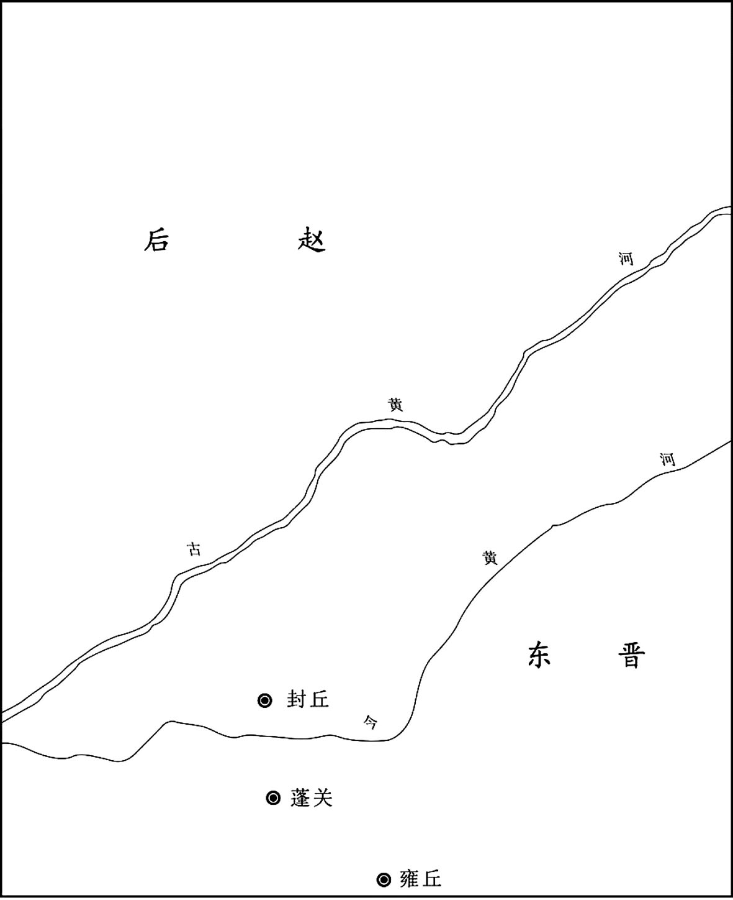 
石勒与祖逖对峙示意图

## 【原文】

**先是，赵固、上官巳、李矩、郭默互相攻击，逖驰使和解之，示以祸福，遂皆受逖节度[1]。秋七月，诏加逖镇西将军[2]。逖在军，与将士同甘苦，约己务施，劝课农桑，抚纳新附，虽疏贱者皆结以恩礼[3]。河上诸坞先有任子在后赵者，皆听两属，时遣游军伪抄之，明其未附[4]。坞主皆感恩，后赵有异谋，辄密以告，由是多所克获，自河以南多叛后赵归于晋[5]。**

## 【注文】

[1]李矩（？—325年）：东晋将领，平阳（今山西临汾西南）人。初为征西将军梁王司马肜牙门将，后在讨伐氐人齐万年的战斗中立下大功，而获封东明亭侯。晋元帝司马睿即位后，被任命为都督司州军事、司州刺史。　　郭默：晋朝将领，生卒年不详，河内怀县（今河南武陟西南）人。因作战英勇，被太守裴整任为督将。永嘉之乱时，他率众投奔河东太守李矩，共同抵御刘曜、石勒。晋明帝司马绍时，被任命为后将军，领屯骑校尉。后为部下所杀。

[2]诏：帝王颁发的命令，文告。　　镇西将军：官名。为镇西、镇东、镇南、镇北四镇将军之一，职掌征伐背叛、镇戍四方，权势颇重。晋时为三品，任持节都督者，则进为二品。资深者为镇西大将军。

[3]约己务施：严格要求自己，宽厚对待他人。　　劝课农桑：即劝谕人们勤勉于农事。中国古代在重农思想的指导下，统治者实行了一系列重农政策，劝课农桑是这一政策的重点。最高统治者经常颁布劝农诏书，要求地方官吏以劝课农桑为己任，在整个农忙时节要保证农民不违农时播种、收获。

[4]河上：指接近黄河一带、后赵与晋两国争夺的地区。　　任子：即人质。　　游军：无固定防地，随机作战的军队。

[5]辄（zhé）：总是，往往。

## 【译文】

在这之前，赵固、上官巳、李矩、郭默互相攻击，祖逖派遣使者前去调解，向他们指明利害关系。于是这几个将领都愿意接受祖逖的指挥调度。大兴三年（320年）秋季七月，朝廷下诏加封祖逖为镇西将军。祖逖在军中与将士们同甘共苦，严格约束自己，待人宽厚，奖励发展农业，对新来归附的人全力安抚，不论亲疏贵贱都一律以恩情礼遇相待。黄河两岸各坞坞主过去有人质在后赵的，许可他们可以同时归属于晋和后赵双方，并经常派一些游击的军队假意去抄掠，表示其并未降晋，以免后赵讨伐他们、杀其人质。这些坞主都很感恩戴德，后赵一有阴谋诡计，他们都秘密告知祖逖，所以祖逖在同后赵的战争中多次获胜，黄河以南各地很多人都叛逃后赵而归属东晋。

## 【原文】

**逖练兵积谷，为取河北之计[1]。后赵王勒患之，乃下幽州为逖修祖、父墓，置守冢二家，因与逖书，求通使及互市[2]。逖不报书，而听其互市，收利十倍。逖牙门童建杀新蔡内史周密降于后赵，勒斩之，送首于逖曰：“叛臣逃吏，吾之深仇。将军之恶，犹吾恶也[3]。”逖深德之。自是后赵人叛归逖者，逖皆不纳，禁诸将不使侵暴后赵之民，边境之间，稍得休息[4]。**

## 【注文】

[1]积谷：屯集粮食。　　河北：古代指黄河以北地区。

[2]幽州：古九州及汉十三刺史部之一。据《周礼》记载，幽州范围大致包括今河北北部及辽宁一带。周武王平殷，封召公于幽州故地，号燕。战国时，燕与其他六国并为七雄。秦始皇灭燕，在燕地置渔阳、上谷、右北平、辽西、辽东等郡。东汉幽州治所设在蓟（jì）县（故址在今北京城区西南部的广安门附近），辖境相当于今北京、河北北部、辽宁南部及朝鲜西北部。魏晋以后，辖境日渐缩小，至北魏时仅有燕、范阳、渔阳三郡。　　守冢（zhǒng）：守墓者。　　通使：互派使者。　　互市：即历史上中原王朝与周边各族之间，及中国与外国之间的贸易往来。各朝统治者在边境关口开设关市，作为与少数民族的互市市场。魏、晋以后，“互市”又称“交市”。当时陆路贸易更加繁荣，海上贸易也开始发展。

[3]牙门：官名，即牙门将，晋时负责统领守卫营门的军队。古时主帅或主将帐前竖牙旗以为军门，称“牙门”。　　新蔡：县名，治所在今河南新蔡。春秋蔡平侯自上蔡徙都于此，故名新蔡。　　首：即首级：古人对人头的别称。秦汉初年为褒奖军功，曾设立嘉奖制度，凡是斩下敌人的一颗人头，赐爵一级。古人称头为首，一“首”一级，故将人头称为首级。

[4]休息：即休养生息。春秋末，越国败于吴国后，经历“十年生聚”，终于转弱为强，战胜了吴国。后来人们把长期战争以后实行恢复生产、积聚财物的一系列政策，称为休养生息。

## 【译文】

祖逖操练士兵，囤积粮食，积极做好恢复黄河以北地区的准备。后赵王石勒对此十分担忧，于是设计笼络祖逖，下令幽州官吏修建祖逖的祖父、父亲的坟墓，安置守墓人两家，又写信给祖逖，请求通使往来并开设贸易市场。祖逖没有回信，但听任双方贸易往来，从中获得十倍利润。祖逖的牙门将童建杀死新蔡内史周密投降后赵，石勒将他斩首，命人将他的首级送还祖逖，说：“像童建这样的叛臣逃吏，我是最憎恶的。将军您所厌恶的，也就是我所憎恶的。”祖逖对此深表感激。从此以后，后赵来降者一概不接纳，同时严禁部将侵犯后赵百姓，于是晋赵边境民众稍得安宁。

## 【原文】

**四年秋七月甲戌，以尚书仆射戴渊为征西将军、都督司兖豫并雍冀六州诸军事、司州刺史，镇合肥[1]。八月，豫州刺史祖逖以戴渊吴士，虽有才望，无弘致远识，且已翦荆棘收河南地，而渊雍容一旦来统之，意甚怏怏[2]。又闻王敦与刘、刁构隙，将有内难[3]。知大功不遂，感激发病。九月壬寅(1)，卒于雍丘[4]。豫州士女若丧父母，谯、梁间皆为立祠[5]。王敦久怀异志，闻逖卒，益无所惮[6]。**

## 【注文】

[1]尚书仆射（yè）：晋制尚书仆射等级与尚书令同，尚书令缺时，由仆射主持尚书省事。仆是主管的意思。仆射起源很早，在秦代就有仆射的称谓。汉代的仆射本属武官之号，有主射之意，后来逐渐发展成为长官之意。魏晋南北朝至宋时仆射专指尚书仆射，即尚书省的长官。　　戴渊（？—322年）：广陵（今江苏扬州）人，字若思。琅邪王司马睿镇守江东时，他担任镇东右司马，为司马睿心腹。公元321年，任都督六州诸军事、司州刺史，镇守合肥（今安徽合肥西）。次年，王敦攻打建康，他还卫京师，结果战败被杀。　　征西将军：将军名号。东汉置，因西进征讨赤眉军而得名。晋沿置，三品，为持节都督时，升为二品。其中以资深者为征西大将军。　　都督司兖豫并雍冀六州诸军事：即都督司、兖（今河南东北部、山东西部一带）、豫、并（今山西大部）、雍（今陕西秦岭以北地区）、冀（今河北南部中部一带）六州的军事事务。两晋以都督一州或者数州诸军事为职权最高，督一州或者数州诸军事职权次之，监一州或者数州诸军事职权又次之。　　合肥：县名，治所在今安徽合肥西。

[2]吴士：戴渊为广陵（今江苏扬州）人。广陵为西汉时吴王刘濞的都城，故称戴渊为吴士。　　翦荆棘：剪除带刺的荆条杂木。此喻祖逖平定河南各部所作的种种努力。　　河南：即黄河以南的地区。　　怏怏：因不平或不满而郁郁不乐。

[3]王敦（266—324年）：字处仲，琅邪临沂（今山东临沂北）人，东晋丞相王导堂兄。他出身琅玡王氏，曾镇压湘州流民起义和平定杜曾叛乱，并协助司马睿建立东晋政权，成为当时权臣。但他一直有夺权之心，后发动政变，威胁晋室，历史上称之为“王敦之乱”。　　刘：即刘隗（wěi），生卒年不详，字太连，彭城（今江苏徐州）人。晋元帝司马睿即位后，他担任镇北将军，都督青、平、徐、幽四州诸军事，为王敦所妒忌。公元322年，王敦以诛杀他为名起兵进攻建康（今江苏南京），他战败投奔后赵。　　刁：即刁协，字玄亮，饶安（今河北盐山）人。公元318年，晋元帝司马睿为遏制王导兄弟势力，任命他担任尚书令，后为王敦所杀。

[4]卒：古代指大夫死亡，后为死亡通称。古代人们对“死”有诸多别称。《礼记》记载：“天子死曰崩，诸侯死曰薨（hōng），大夫死曰卒，士曰不禄，庶人曰死。”

[5]士女：意指百姓。　　祠：为纪念名士而修建的供舍（相当于纪念堂）。这点与庙有些相似，因此也常常把同族子孙祭祀祖先的处所叫“祠堂”。祠堂最早出现于汉代。

[6]异志：指叛变或篡国的意图。

## 【译文】

晋元帝大兴四年（321年）秋季七月甲戌（十七日），晋元帝司马睿任命尚书仆射戴渊为征西将军，都督司、兖、豫、并、雍、冀六州诸军事，司州刺史，镇守合肥。八月，豫州刺史祖逖认为戴渊是出生吴地的官吏，虽然有才能和声望，但却没有远见卓识，而且自己历尽艰难才收复的黄河以南各地，现在戴渊却非常轻松、悠闲自得地接收，祖逖心里十分不高兴。又听说王敦与刘隗、刁协之间矛盾日益加深，即将发生内部变乱。深感北伐事业难以成功，由此忧愤成疾。九月壬寅，祖逖在雍丘病逝。豫州百姓非常悲痛，如同失去了父母，谯、梁各地都建立了祭祀他的祠堂。王敦久怀代晋之心，听说祖逖已死，更是无所顾忌。

## 【原文】

**冬十月壬午(2)，以逖弟约为平西将军、豫州刺史，领逖之众[1]。约无绥御之才，不为士卒所附[2]。初，范阳李产避乱依逖，见约志趣异常，谓所亲曰：“吾以北方鼎沸，故远来就此，冀全宗族[3]。今观约所为，有不可测之志[4]。吾托名姻亲，当早自为计，无事复陷身于不义也，尔曹不可以目前之利而忘久长之策[5]。”乃帅子弟十余人间行归乡里。**

## 【注文】

[1]约：即祖约（？—330年），范阳遒县（今河北涞水）人，字士少，祖逖之弟。晋元帝大兴四年（321年）祖逖死后，他担任平西将军、豫州刺史。此后，石勒挥军南下，进攻祖逖所收复的河南故地，但他无力抵御。晋成帝司马衍咸和三年（328年），他与苏峻起兵反晋，失败后投奔后赵石勒，被杀。　　平西将军：将军名号，为三国所置平东、平西、平南、平北等“四平”将军之一，职掌征战讨伐。魏晋时期，多持节都督或监督某一地区的军事。在魏晋时期，将军的职权由高到低分别是四征、四镇、四安、四平将军，然后是前、后、左、右四将军，再后就是杂号将军。

[2]绥御：驾驭部下。

[3]李产：字子乔，生卒年不详。最初投靠祖逖，后投奔后赵，任后赵范阳太守。及前燕慕容儁（jùn）南征，他兵败投降，官任尚书。　　北方鼎沸：形容北方局势不安定，如鼎中沸腾的水。

[4]不可测之志：比喻怀有叛变和篡国的意图。

[5]托名：假借名义。　　姻亲：因婚姻关系而形成的亲戚关系。

## 【译文】

晋元帝大兴四年（321年）冬季十月壬午，东晋任命祖逖弟弟祖约为平西将军、豫州刺史，统领祖逖的军队。祖约没有安抚驾驭部下的才能，不为士兵所亲附。起初，范阳人李产为躲避战乱，南下投靠祖逖，祖逖逝世后，他发现祖约志向与常人相比有所不同，便对他的亲友说：“我因北方战乱，所以远道而来，希望能够保全宗族。现在观察祖约的所作所为，居心叵测。我是祖氏的亲戚，应当早些为自己打算，没有必要跟他做不义的事情，你们切不可只看到眼前的利益而忘掉作长远的计划。”于是率领他的子弟十余人绕道返回家乡。

## 【原文】

**永昌元年冬十月，祖逖既卒，后赵屡寇河南，拔襄城、城父，围谯[1]。豫州刺史祖约不能御，退屯寿春，后赵遂取陈留，梁、郑之间复骚然矣[2]。**

## 【注文】

[1]永昌：东晋元帝司马睿所用第三个年号，共计二年，即公元322年至323年。　　襄城：地名，今河南襄城。　　城父：地名，今安徽亳州东南。

[2]寿春：县名，治所在今安徽寿县。　　梁、郑之间：即今河南商丘至新郑之间。

## 【译文】

晋元帝司马睿永昌元年（322年）冬季十月，祖逖死后，后赵军队多次侵犯黄河以南地区，并攻占襄城、城父，围攻谯城。豫州刺史祖约抵御不了，于是退驻寿春，后赵又轻而易举地攻占了陈留，梁、郑一带又重新陷入动荡不安之中。

* * *

(1) 据陈垣《二十史朔闰表》，晋元帝大兴四年九月丁巳朔，无壬寅日。

(2) 据陈垣《二十史朔闰表》，晋元帝大兴四年十月丙戌朔，无壬午日。

# 王敦之乱

## 【内容摘要】

《王敦之乱》叙述了东晋初年王敦图谋夺取帝位、兴兵作乱、最终失败的历史。王敦之乱是东晋初年发生的一场政治动乱，爆发于晋元帝司马睿（ruì）永昌元年（322年），结束于晋明帝司马绍太宁二年（324年）。

东晋初年，皇权衰微，皇室凋零。晋元帝司马睿凭借王导、王敦兄弟的扶持，在江南建立了东晋政权，但中央大权主要控制在王氏家族的手中。东晋建立后，司马睿希望减弱琅邪王氏的影响力，于是提拔刘隗、刁协等其他士族人士，用以制衡王氏势力。司马睿忌惮掌握军事大权的王敦，疏远了曾经极力扶持自己的王导。同时，王敦逐渐专擅朝政，这让司马睿感到厌恶，而王敦亦对司马睿的反抗行为大为不悦。受司马睿重用的刘隗不喜欢见到王氏的独裁，要求司马睿削弱王敦的权力，并提议以宗室司马承担任湘州刺史，出镇湘州（今湖南长沙），后王敦写信劝刘隗与他修好，遭到拒绝。司马睿为防备王敦，让刘隗和戴渊以防备北方胡人为名领兵出镇，这都令王敦十分愤怒。晋元帝大兴四年（321年），豫州刺史祖逖病逝，王敦以为再无人可以在军事上威胁他，便决意举兵叛乱。永昌元年（322年），王敦以诛刘隗为名举兵向建康（今江苏南京）进发。王敦在石头城中拥兵，不入宫朝见司马睿，并且放纵士兵四处抢掠，当地大乱，官员逃走。司马睿只好向王敦求和，命令文武百官到石头城拜见王敦，又任命王敦为丞相、都督中外诸军、录尚书事、江州牧，封武昌郡公。不久，王敦返回武昌（今湖北鄂州），遥控朝政。司马睿忧愤成疾，最终病死，太子司马绍继位。明帝司马绍聪明而富有谋略才能，他知道王敦必然再次叛乱，于是下决心讨伐王敦。太宁元年（323年），晋明帝司马绍经过周密部署后，颁布诏书，历数王敦的罪状。王敦见到诏书后非常生气，但他病重已不能亲自领兵，面对晋明帝的讨伐，只得由兄长王含与部将钱凤等领军与朝廷军队作战，晋明帝命令将军段秀等带领军队，乘夜渡河，大破王敦军队。王敦听到战败的消息，忧愤而死。晋明帝命令诸军乘胜追击，王含父子逃奔荆州（今湖北江陵），荆州刺史王舒派人将他们投入长江。至此，王敦之乱终告平息。

王敦之乱期间，东晋集中解决内部叛乱，对于北方民族的侵扰疲于应付，导致后赵在王敦之乱期间夺取了东晋兖（yǎn）州（治今山东郓城西北）、徐州（治今江苏镇江）、豫州（治今河南淮阳）的大片土地。苏峻凭借平定王敦叛乱之机而获得封赏，威望逐渐高涨，军事力量也日益强大，这使得他骄傲自满，甚至怀有野心，以致后来又爆发了苏峻之乱。

## 【原文】

**晋元帝大兴二年。初，王敦患杜曾难制，谓梁州刺史周访曰：“若擒曾，当相论为荆州[1]。”及曾死而敦不用[2]。王廙在荆州，多杀陶侃将佐，以皇甫方回为侃所敬，责其不诣已，收斩之[3]。士民怨怒，上下不安。帝闻之，征廙为散骑常侍，以周访代廙为荆州刺史[4]。王敦忌访威名，意难之。从事中郎郭舒说敦曰：“鄙州虽荒弊，乃用武之国，不可以假人，宜自领之，访为梁州足矣[5]。”敦从之。六月丙子，诏加访安南将军，余如故[6]。访大怒，敦手书譬解，并遗玉环、玉椀以申厚意[7]。访抵之于地曰：“吾岂贾竖，可以宝悦邪[8]！”访在襄阳，务农训兵，阴有图敦之志，守宰有缺辄补，然后言上[9]。敦患之而不能制。**

## 【注文】

[1]杜曾（？—319年）：新野（今河南新野）人，原为晋新野王司马歆帐下司马。晋怀帝永嘉六年（312年）胡亢起兵，他被任命为竟陵太守，此后多次打败晋军。公元319年，兵败被杀。　　梁州：三国魏元帝曹奂（huàn）景元四年（263年）分益州置，治所设在沔（miǎn）阳县（今陕西勉县东）。晋武帝太康年间治所迁至南郑县（今陕西汉中）。辖境相当于今陕西汉中、四川东部、重庆全境、贵州北部的广大地区。　　周访（260—320年）：字士达，祖籍汝南安城（今河南汝南东南）。最初投靠琅邪王司马睿，担任参镇东军事。晋怀帝永嘉五年（311年），被任命为振武将军、寻阳太守。在任期间，务农训兵，善于抚纳，立志收复北方故土。　　荆州：古九州（冀、兖、青、徐、扬、荆、豫、梁、雍）及汉十三刺史部之一，因境内有荆山而得名。辖境相当于今湖南、湖北二省及河南、广西、广东、贵州一部分。东汉治所在汉寿县（今湖南常德东北）。东晋治所迁至江陵县（今湖北江陵），为当时长江中游重镇，有“七省通衢（qú）”之称，为当时长江中游重镇。

[2]不用：没有任用。此处指前文王敦答应推荐周访担任荆州刺史之事。

[3]王廙（yì）（276—322年）：字世将，琅邪临沂（今山东临沂北）人。曾与王导一起倡导晋室南渡。晋元帝永昌元年（322年），被任命为平南将军、荆州刺史。同年去世，谥（shì）“康”。　　陶侃（259—334年）：字士行，原籍鄱阳郡（今江西鄱阳），后迁居庐江郡寻阳县（今江西九江西南）。历任龙骧将军、武昌太守、荆州刺史。在东晋建立和稳定东晋初年政局上，颇有建树。是晋代著名诗人陶渊明的曾祖父。　　皇甫方回（？—319年）：晋安定朝那（今宁夏固原东南）人，后徙居新安（今浙江淳安北），皇甫谧（mì）之子。西晋末年，避乱荆州（治汉寿，今湖南常德东北），与荆州刺史陶侃友善。后陶侃被排挤到广州（今广东广州），他被荆州刺史王廙杀死。

[4]散骑常侍：官名。秦汉时设散骑（皇帝的骑从）和中常侍。三国魏文帝曹丕将散骑与中常侍合并为一官，即散骑常侍。两晋、南北朝沿置，初为散骑省长官，其职责是侍从皇帝左右、规谏过失、以备顾问，三品，多为加官。

[5]从事中郎：官名。大将军、车骑将军僚属，职参谋议，或主官吏，或分掌诸曹，或掌机密，或参谋议，地位较高。　　郭舒：字稚行，生卒年不详。曾任治中（掌管州郡文书）、别驾、从事中郎、梁州刺史等。任职期间常对王澄、王敦的过失进行劝谏。　　鄙州：此指荆州。

[6]安南将军：武官名号。曹操始置，与安西、安北、安东将军合称“四安将军”。位次四镇将军，掌征讨或镇戍。为出镇东方某一地区的军事长官，或作为刺史兼理军务的加官，权任较重。

[7]手书：亲笔写的书信。　　譬解：解释说明。

[8]贾（gǔ）：古代称行走贩卖货物为商，定点出售货物为贾。两字连用，泛指做买卖的商人。

[9]襄阳：郡名。因治所位于襄水之阳而得名。治所设在襄阳县（今湖北襄阳），辖境约为今湖北襄阳、南漳、宜城、当阳、远安等地。东晋时，因雍州（今陕西一带）人避难流入襄阳等地，为安置流民，晋孝武帝司马曜于太元十四年（389年）以襄阳为中心侨置雍州。所谓侨置是指中国古代政权在战争状态下，政府对沦陷地区迁出的移民进行异地安置，为其重建州郡县，仍用其旧名的行政管理制度。东晋时北方国土大片沦陷，侨置郡县在南方大量设置，历经南北朝延续，隋统一后废除。　　守宰：古代泛指地方官吏。

## 【译文】

晋元帝司马睿大兴二年（319年）。当初，王敦担心杜曾勇猛很难控制，于是对梁州刺史周访说：“如果你能抓获杜曾，我将奖赏你担任荆州刺史。”后来周访击败杜曾，并将其斩首，但王敦却没有兑现承诺。王廙在荆州时，对前任刺史陶侃部下幕僚大肆屠杀，因为皇甫方回受到陶侃的敬重，就责备他不来拜见自己，于是将他斩首。王廙的所作所为，引起荆州百姓的强烈怨愤，上上下下都感觉到不安。晋元帝司马睿听到这个消息后，征召王廙返回建康担任散骑常侍，任命周访代替王廙担任荆州刺史。王敦非常畏惧周访的威望和名声，但又不敢公然抗拒朝廷诏命，于是想刁难周访。王敦的幕僚从事中郎郭舒献计说：“荆州虽然经过战争后荒凉残破，但却是战略要地，不能轻易交给别人，应当自己兼领，周访当梁州刺史就已经足够了。”王敦听从了他的建议。六月丙子（初七日），司马睿下诏，任命周访为安南将军，其他职位照旧。周访大怒，王敦亲自写信解释，并送上玉环、玉碗以表达自己的深厚情谊。周访把这些礼品扔在地上说：“我岂是做买卖的小商贩，用宝物就能收买得了吗？”周访驻屯在襄阳，发展农业生产，训练士兵，暗中做好进攻王敦的准备。每逢郡县太守县令有空缺时，先挑选自己人补上，然后再向朝廷上报。王敦虽然不满，但畏惧周访，也无法控制。

## 【原文】

**三年秋八月辛未(1)，梁州刺史周访卒。访善于抚纳，士众皆为致死[1]。知王敦有不臣之心，私常切齿，敦由是终访之世，未敢为逆[2]。敦遣从事中郎郭舒监襄阳军，帝以湘州刺史甘卓为梁州刺史，督沔北诸军事，镇襄阳[3]。舒既还，帝征为右丞，敦留不遣[4]。**

## 【注文】

[1]抚纳：安抚招纳。

[2]不臣之心：不守臣子的本分，意指不忠于朝廷的想法，也指犯上作乱的野心。　　切齿：齿相磨切，表示极端愤怒。

[3]湘州：西晋怀帝永嘉元年（307年）分荆州的长沙、衡阳、湘东、邵陵、零陵、营阳、建昌及江州的桂阳等八郡置，治所设在临湘县（今湖南长沙），辖境大致相当于今湖南湘、资流域，湖北陆水流域及广西桂江、广东北江流域大部分。　　甘卓：生卒年不详，字季思，丹阳（今江苏南京）人。东吴名将甘宁孙子。司马睿中兴晋室后，他被任命为安南将军、镇南大将军。王敦之乱时曾起兵讨伐王敦，后被王敦秘密命人杀害。死后被追赠为骠（piào）骑将军，谥“敬”。　　督沔北诸军事：官名。即都督沔北地区军事事务的长官。晋代都督数州军事兼刺史者，地位高于一般带军职的刺史。沔北，即荆州北部的襄阳一带。沔：即沔水。汉水流经沔县（今陕西汉中勉县）后，又称沔水。其发源地在陕西西南部秦岭与米仓山之间的宁强嶓（bō）冢（zhǒng）山，而后向东南穿越陕南汉中、安康等地。《水经》中只称沔水，不称汉水；《水经注》中则“沔”“汉”共见。

[4]右丞：即丞相右丞。官名，辅助皇帝的最高政务长官。春秋时齐景公置左右丞相各一人。后代多沿置。

## 【译文】

晋元帝大兴三年（320年）秋季八月辛未，梁州刺史周访去世。周访平日善于安抚部下军民，将士们都愿意为他牺牲性命。周访知道王敦有夺取帝位的不轨之心，私下里常常对王敦恨得咬牙切齿，所以在周访在世时，王敦始终不敢发动叛乱。王敦派遣从事中郎郭舒监督襄阳驻军。晋元帝司马睿任命湘州刺史甘卓为梁州刺史，都督沔北诸军事，镇守襄阳。郭舒从襄阳回到荆州后，晋元帝任命他为右丞，王敦扣留他不让前去。

## 【原文】

**［冬十月］，王敦杀武陵内史向硕[1]。帝之始镇江东也，敦与从弟导同心翼戴，帝亦推心任之[2]。敦总征讨，导专机政，群从子弟布列显要[3]。时人为之语曰：“王与马，共天下[4]。”后敦自恃有功，且宗族强盛，稍益骄恣，帝畏而恶之，乃引刘隗、刁协等以为腹心，稍抑损王氏之权，导亦渐见疏外[5]。中书郎孔愉陈导忠贤，有佐命之勋，宜加委任[6]。帝出愉为司徒左长史[7]。导能任真推分，澹如也，有识皆称其善处兴废。而敦益怀不平，遂构嫌隙。**

## 【注文】

[1]武陵：即武陵郡。西汉时治所设在义陵（今湖南溆浦），辖境相当于今湖北长阳、五峰、鹤峰、来凤等地和湖南沅江、澧（lǐ）水流域及贵州东部，广西三江、龙胜等地。东汉时移治临沅（今湖南常德）。此后辖境逐渐缩小。　　向硕（？—320年）：曾任晋朝武陵内史。公元320年为王敦所杀。

[2]江东：古地区名。泛指今长江下游以南的江苏、上海、安徽、浙江地区。西晋灭亡后，司马睿于公元317年在建康（今江苏南京）重建晋室，史称东晋。故江东也常常代指东晋。　　从弟：古人以同曾祖父、不同父亲、年幼于己者的同辈男性称从弟。具体又分为两种：同曾祖父、不同祖父、年幼于己者的同辈男性为从祖弟；同祖父、不同父亲、年幼于己者的同辈男性为从父弟，即现在所谓的堂弟。两者统称为从弟。　　导：即王导（276—339年），东晋政权奠基者之一。字茂弘，琅邪临沂（今山东临沂北）人。永嘉元年（307年），晋怀帝司马炽任命司马睿为安东将军，出镇建邺（后改建康，今江苏南京）。他相随南渡，任安东将军司马。他主动出谋划策，联合南北士族，拥立司马睿为帝，建立东晋政权。他官居宰辅，总揽元帝司马睿、明帝司马绍、成帝司马衍三朝国政。

[3]机政：国家机要政务。

[4]王与马，共天下：王导因为有辅佐皇帝再造晋室之功，深得司马睿的信任。王导身为宰相，掌握中央的行政大权，哥哥王敦手握重兵，掌握军事大权。其他重要的官职，也被王家人占有。在东晋王朝，王家几乎和司马氏平起平坐，因此，当时民间流传一句话“王与马，共天下”，意思是说：王氏家族和司马睿共同掌握天下。

[5]宗族：通常以与皇帝的父系血缘亲疏关系来确定是否进入宗室之列，历代均专设官职来主管宗室事务，如“大宗伯”“宗正”“宗正寺”“宗人府”等。此外，古代也称大宗的庙为宗室。

[6]中书郎：即中书侍郎，中书监。晋代始置，为中书省长官“中书监”“中书令”的副职，参与朝政。魏晋以后历代相沿。　　孔愉（268—342年）：晋代大臣。字敬康，会稽山阴（今浙江绍兴）人。西晋惠帝司马衷末年隐居新安山中（今浙江淳安），改姓孙，以耕读为业。东晋成帝司马衍时，担任左仆射、会稽内史。

[7]司徒：官名。西周始置，与司马、司空、司士、司寇并称“五官”，负责掌管国家土地与百姓。汉哀帝刘欣时罢丞相之职，置大司徒，与大司马、大司空并称三公。东汉光武帝建武二十七年（51年）复称司徒，为三公之一，与太尉、司空同为宰相。魏晋南北朝时多为大臣加官，以示尊崇，但无实权，其府属仅处理户籍、督课官吏等日常事务。　　左长史：官名。最早设于汉代，当时丞相和将军幕府皆设有长史官，相当于现在的秘书长。除此之外，边地郡亦设长史，为太守的佐官。魏晋南北朝时王府、三公府、将军府多设左右长史。

## 【译文】

晋元帝大兴三年（320年）冬季十月，王敦杀掉武陵内史向硕。当初，晋元帝司马睿开始镇守江东地区时，王敦与其堂弟王导同心辅佐拥戴，晋元帝也推心置腹地信任他们。王敦统管军事征伐，王导则掌管机要政务。王敦、王导的同族子弟们也都担任显要官职。所以当时有“王氏与司马氏，共同拥有天下”的谚语。后来王敦居功自傲，自认为家族势力强盛，就更加骄傲专横、傲慢无礼，晋元帝对他既畏惧又憎恨，于是就征召刘隗、刁协等人作为心腹，逐渐削弱王氏家族的权力，王导也渐渐被疏远。中书郎孔愉上书称王导忠正贤良，有辅佐王室、中兴晋室的功勋，应当得到重用。晋元帝于是把孔愉调出掌管机密的中书省，任命为司徒左长史。王导能任其自然，安分守己，而且对名利很淡薄，有见识的人都佩服他善于处世，对兴衰能泰然处之。但是王敦却非常气愤，他同晋元帝司马睿之间产生了矛盾。

## 【原文】

**初，敦辟吴兴沈充为参军，充荐同郡钱凤于敦，敦以为铠曹参军[1]。二人皆巧谄凶狡，知敦有异志，阴赞成之，为之画策，敦宠信之，势倾内外[2]。敦上疏为导讼屈，辞语怨望[3]。导封以还敦，敦复遣奏之。左将军谯王氶，忠厚有志行，帝亲信之[4]。夜，召氶，以敦疏示之曰：“王敦以顷年之功，位仕足矣，而所求不已，言至于此，将若之何[5]？”氶曰：“陛下不早裁之，以至今日，敦必为患[6]。”**

## 【注文】

[1]辟：有时也称为特诏或特征。或是由皇帝指名征聘，或是由大臣推荐，此外，公卿或州郡高官也可以直接征召一些人才到自己的官衙里做属僚。　　吴兴：郡名。三国吴末帝孙皓宝鼎元年（266年）分吴郡、丹阳郡置，治所设在乌程（今浙江湖州南，东晋末移治今湖州），辖境相当于今浙江临安、余杭、德清一带西北及江苏宜兴等地。　　沈充（？—324年）：字士居，吴兴武康（今浙江德清西）人，王敦参军，曾向王敦举荐同乡钱凤，三人朋比为奸，共谋不轨。晋元帝司马睿永昌年间（322—323年），他协助王敦发动叛乱。晋明帝司马绍太宁二年（324年），王敦发动第二次叛乱时，他从吴兴（今浙江湖州南）起兵会合王敦攻取建康。不久王敦病死，叛军被镇压，他兵败逃回吴兴，被故将吴儒杀死。　　钱凤（？—324年）：字世仪，吴兴（今浙江湖州南）人。曾随沈充出仕王敦，任铠曹参军，三人朋比为奸，共谋不轨。晋明帝司马绍太宁二年（324年），王敦再次发动叛乱，他与周抚等率军攻打建康。不久王敦病死，叛军被镇压，他被周光击杀。　　铠曹参军：即铠曹的长官。铠曹为东汉末曹操丞相府所属掌管铠甲的机构。魏晋公府、将军府均置。长官为掾（yuàn）或属，西晋末改以参军为其长官。

[2]巧谄（chǎn）凶狡：谄媚、奉承、凶暴、奸诈、狡猾。　　内外：此处指大将军王敦府内外。王敦曾率军消灭江州刺史华轶，镇压以杜弢（tāo）为首的荆湘流民起义后，进位镇东大将军，故称大将军府。

[3]疏：朝廷官员专门上奏皇帝的一种文书形式。臣民上书可以分为“上书”“上疏”和“上封事”等三类。

[4]氶（chéng）：即司马氶（？—322年），字敬才。西晋惠帝司马衷之孙，嗣封谯王，领湘州刺史。晋元帝永昌元年（322年），王敦举兵反叛，他列数王敦罪恶，州内纷纷响应。随后王敦派魏义率军攻打他，他虽婴城固守，但最后仍然被俘，在押送至武昌途中遇害。

[5]顷年：近些年。此指王敦辅佐司马睿建立东晋政权，以及率军消灭江州刺史华轶，镇压以杜弢为首的荆湘流民起义等功绩。

[6]陛下：臣下对君主的尊称，秦朝以后只用来称皇帝，成为皇帝的专有称号。“陛”本指宫殿台阶。据东汉蔡邕（yōng）《独断》记载，大臣与皇帝对话，因距离较远，先呼立陛下，大臣之言，由彼上达。陛下之称，即由此而来。

## 【译文】

当初，王敦征召吴兴人沈充担任参军，沈充又举荐他的同郡人钱凤给王敦，王敦任用钱凤为掌管铠甲机构的参军。他们两人都是奸巧、阿谀奉承、凶险、狡诈之徒。他们明知王敦有夺取帝位的企图，暗中却怂恿赞成，为他出谋划策，所以两人深得王敦的宠信，他们的权势远远超过其他官员。王敦上奏为王导鸣冤叫屈，措辞中表现出怨恨、责怪之意。王导看后把奏章重新封好退还给了王敦。但王敦却再次把奏疏送呈给晋元帝。左将军、谯王司马氶，为人忠厚，有节操，为晋元帝所信任。夜晚，晋元帝召见司马氶，把王敦的奏疏给他看，对他说：“王敦凭借近些年的功绩，封赏他的官位已经足够酬谢他的功劳了。但是他却变得越来越贪得无厌，奏疏的语言公然傲慢无礼，我们应该怎么办呢？”司马氶说：“陛下没有及早制裁他，以至于发展到今天这样，将来王敦一定会成为祸患的。”

## 【原文】

**刘隗为帝谋，出心腹以镇方面[1]。会敦表以宣城内史沈充代甘卓为湘州刺史，帝谓氶曰：“王敦奸逆已著，朕为惠皇，其势不远。湘州据上流之势，控三州之会，欲以叔父居之，何如[2]？”氶曰：“臣奉承诏命，惟力是视，何敢有辞！然湘州经蜀寇之余，民物凋弊，若得之部，比及三年，乃可即戎；苟未及此，虽复灰身，亦无益也[3]。”十二月，诏曰：“晋室开基，方镇之任，亲贤并用，其以谯王氶为湘州刺史。”长沙邓骞闻之，叹曰：“湘州之祸，其在斯乎[4]！”氶行至武昌，敦与之宴，谓氶曰：“大王雅素佳士，恐非将帅才也[5]。”氶曰：“公未见知耳，铅刀岂无一割之用[6]。”敦谓钱凤曰：“彼不知惧而学壮语，足知其不武，无能为也。”乃听之镇。时湘土荒残，公私困弊，氶躬自俭约，倾心绥抚，甚有能名。**

## 【注文】

[1]方面：古指一个地方的军政要职或其长官。

[2]宣城：郡名。晋武帝太康二年（281年）置，治所设在宛陵县（今安徽宣城宣州），辖境相当于今安徽长江以东的宣州、宁国、黄山、广德、石台等地。　　朕：皇帝的自称。秦朝统一六国前，意为“我的”或“我”，自秦始皇起专用作皇帝自称。　　惠皇：即晋惠帝司马衷（259—306年），字正度，河内温县（今河南温县西南）人，晋武帝司马炎第二子，西晋第二任皇帝，公元290年至306年在位。他为人痴呆不任事，即位初期由太傅杨骏辅政，之后皇后贾南风杀害杨骏，掌握大权。在他统治期间发生了长达十六年之久的“八王之乱”，从此西晋开始走向衰败。公元306年，他因食物中毒而亡（相传是东海王司马越下毒），享年四十八岁。　　三州：此指荆州、广州、交州三州。广州，晋时治所在番禺（今广东广州），为东晋镇守长江中游地区的重镇。交州，包括今越南北、中部和广西一部分，有时还包括今广东、海南。公元前111年，汉武帝刘彻平南越国，在原南越国设交州。公元280年，晋朝统一中国，交州官吏降晋。　　叔父：司马氶是司马懿弟弟司马进的孙子，晋元帝司马睿是司马懿曾孙，辈分上应是司马睿的堂叔。

[3]奉承诏命：服从皇帝诏命。　　蜀寇：此指荆、湘地区杜弢领导的流民起义。

[4]长沙：郡名。秦置，治所设在临湘县（今湖南长沙）。西汉高帝刘邦五年（前202年）改为国。东汉复为郡。魏晋沿置。　　邓骞（qiān）：字长真，晋元帝司马睿时担任湘州主簿。王敦起兵谋反，他奉命前去说服梁州刺史甘卓乘虚袭击武昌。永昌元年（322年），王敦攻破长沙，他被俘获，押送武昌，王敦任命他为湘州别驾。王敦败死后，他又先后担任零陵太守、始兴太守、大司农。

[5]武昌：地名，今湖北鄂州。　　佳士：称赞品行或才学优良的人。

[6]铅刀岂无一割之用：铅刀，铅质的刀，指钝刀。虽然像铅刀那样不锋利，必要时也能派上用场。比喻才能虽然低弱，有时也能发挥应有作用。

## 【译文】

刘隗为晋元帝司马睿出谋划策，劝他任命自己的亲信担任州刺史。这时，王敦上表推荐宣城郡内史沈充代替甘卓担任湘州刺史。晋元帝对司马氶说：“王敦想要夺取帝位的野心已经很明显了。不久，我就要重蹈晋惠帝的覆辙，被权臣控制欺压。湘州地处长江上流，形势重要，可以控制荆、广、交三州的结合处，我想任命叔父您担任湘州刺史，您看如何？”司马氶说：“臣遵从陛下诏命，定当尽心尽力，这还有什么可说的呢！但是，湘州经过巴蜀杜弢流民起义之后，人口稀少，物资缺乏，若臣到任后，必须经过三年时间的休养生息，才能够应付战争需要。如果不到三年，我虽然粉身碎骨，也无济于事。”大兴三年（320年）十二月，晋元帝下诏：“晋朝从建国以来，镇守四方的重任，都是宗族和贤才同时并用，现在任命谯王司马氶为湘州刺史。”长沙人邓骞听得这个消息后，叹息说：“湘州又要遭受兵祸了。”司马氶到达武昌，王敦设宴款待，并对他说：“您是高雅的文士，恐怕不是将帅之才啊。”司马氶说：“您对我还不够了解，铅刀虽钝，难道连割一下东西都不行吗？”王敦私下对钱凤说；“他不知畏惧而说出这些狂言，可见他没有谋略，必定无所作为。”于是听任他到湘州去。当时湘州土地荒凉，经济残破，无论是官府还是百姓生活都很困难，司马氶从自身做起，带头厉行节约，全力安抚百姓，很快得到当地百姓的称赞。

## 【原文】

**四年秋七月甲戌，以尚书仆射戴渊为征西将军，都督司兖豫并雍冀六州诸军事、司州刺史，镇合肥；丹杨尹刘隗为镇北将军，都督青徐幽平四州诸军事、青州刺史，镇淮阴；皆假节领兵，名为讨胡，实备王敦也[1]。**

## 【注文】

[1]丹杨尹：亦为“丹阳尹”，官名，为东晋京畿长官。东晋定都于建康（今江苏南京），建康隶于原丹阳郡。为提高京都地位，显示天子之尊，参照两汉京兆、河南尹故事，晋元帝大兴元年（318年）改丹杨郡守为丹杨尹，职掌相当于郡太守，但参与朝议。　　镇北将军：官名。三国时始置，为镇南、镇北、镇东、镇西四镇将军之一，职掌征伐背叛、镇戍四方。　　都督青徐幽平四州诸军事：即都督青、徐（今山东东南和江苏长江以北地区）、幽（今北京、河北北部、辽宁南部及朝鲜西北部）、平（今铁岭以南的辽宁大部分地区）四州军事事务的长官。　　青州：古“九州”之一，传说大禹治水后，按照山川河流的走向，把全国划分为青、徐、扬、荆、豫、冀、兖、雍、梁九州，青州是其中之一。西汉武帝刘彻元封五年（前106年）置，治所设在临淄（zī）县（今山东淄博临淄北），辖境相当于今山东临邑临南以东的北部地区。　　假节：魏晋时期直接代表皇帝行使地方军政权力的职官名。“节”为古代常用信物，皇帝所遣使者规定持旌（jīng）节，使命完成后归还。东汉后期，根据“节”所加方式不同而分为“使持节”“持节”“假节”三种。到晋朝，明确规定“使持节”有权斩杀郡守级别的官员；“持节”可斩杀无官位的人，若战争时期，得与使持节同；“假节”可斩杀违反军令的人。　　胡：此指后赵政权。

## 【译文】

大兴四年（321年）秋季七月甲戌（十七日），晋元帝司马睿任命尚书仆射戴渊为征西将军，都督司兖豫并雍冀六州诸军事、司州刺史，镇守合肥；丹杨尹刘隗为镇北将军，都督青徐幽平四州诸军事、青州刺史，镇守淮阴；两人都被赐予皇帝信节统率军队，名义上是讨伐后赵，但实际上是防备王敦。

## 【原文】

**隗虽在外，而朝廷机事，进退士大夫，帝皆与之密谋[1]。敦遗隗书曰：“顷承圣上顾眄足下，今大贼未灭，中原鼎沸，欲与足下及周生之徒戮力王室，共静海内。若其泰也，则帝祚于是乎隆；若其否也，则天下永无望矣[2]。”隗作曰：“‘鱼相忘于江湖，人相忘于道术’，‘竭股肱之力，效之以忠贞’，吾之志也[3]。”敦得书，甚怒。**

## 【注文】

[1]士大夫：旧时指官吏或较有声望、地位的知识分子。在古代，通过竞争性考试选拔官吏的人事体制造成了一个特殊的士大夫阶层，即专门为做官而读书考试的知识分子阶层。“士大夫”出现于战国，他们是知识分子与官僚相结合的产物。

[2]顾眄（miǎn）：环视。形容神采奕奕。　　足下：在古代，下称谓上，或同辈相称，都用“足下”，意为“您”，是对对方的敬辞。　　中原鼎沸：形容中原局势不安定，如鼎水沸腾。　　周生：即周（yǐ）（269—322年），字伯仁，安城（今河南汝南东南）人。西晋末官至尚书吏部郎。司马睿出镇江东后，他受任为宁远将军、荆州刺史，参与镇压荆、湘流民起义。东晋初，复任吏部尚书。后被王敦杀害。　　帝祚（zuò）：即帝位、皇位。

[3]鱼相忘于江湖，人相忘于道术：语出《庄子·大宗师》，意思是说：鱼在江湖中遨游会互相忘记，人在道术上得志会互相忘却。　　竭股肱（gōng）之力，效之以忠贞：语出《左传》，股肱，即大腿和胳膊。此句即用来形容做事竭尽全力。

## 【译文】

刘隗虽然远在淮阴，但是朝廷机密要事，官吏的升迁罢免，晋元帝都同他秘密商定。王敦写信给刘隗说：“近来您承蒙皇帝垂青，如今势力强大的贼寇没有灭掉，中原地区混乱不堪，我想同您、周等人竭尽全力振兴皇室，平定海内的敌人。如果顺利的话，国家就可以兴旺发达；如果不幸失败，天下安定就永远没有希望了。”刘隗答复说：“‘鱼儿在江湖上游荡的时候，只是注意游水，忘记了同伴；人在道术上得志，也会互相忘却’，‘竭尽我的力气来辅佐、效忠于皇上’，这就是我的志向。”王敦看到这封回信后，非常生气。

## 【原文】

**壬午，以骠骑将军王导为侍中、司空、假节、录尚书、领中书监[1]。帝以敦故，并疏忌导[2]。御史中丞周嵩上疏，以为：“导忠素竭诚，辅成大业。不宜听孤臣之言，惑疑似之说，放逐旧德，以佞伍贤，亏既往之恩，招将来之患[3]。”帝颇感寤，导由是得全[4]。**

## 【注文】

[1]骠（piào）骑将军：将军名号。汉武帝刘彻元狩二年（前121年）霍去病征讨匈奴建立卓著功勋，被任命为骠骑将军。此后一些立有大功的高级军官或重臣，常被授予此称号，地位仅次于丞相，统领中央常备军，职掌征战讨伐。后来大将军逐渐成为常置官职，相当于军队总司令。　　侍中：官名。秦始置，以往来殿内东厢奏事，故名。两汉沿置，为正规官职外的加官之一，加此官者可出入宫廷，担任皇帝侍从。因此官身居君侧，侍从左右、常备顾问应对，逐渐变为亲信贵重之职。汉武帝以后，地位渐高。晋朝建立，侍中的地位和作用日益重要，不仅开始成为三公、执政的加衔，而且直接参与朝政。　　司空：官名。西周始置，与司马、司寇、司士、司徒并称“五官”，掌水利、营建之事。东汉将大司空改为司空，与太尉、司徒同为宰相，参议国家大政。魏晋时，权力逐渐削弱，多作为大臣的加官，无实际权力。　　录尚书：官名。初置时名为“领尚书事”。永平十八年（75年），东汉明帝刘庄以太傅赵熹、太尉牟融并录尚书事，自此，“领尚书事”更名为“录尚书事”。“录”为总领之意。录、领相比虽职事相近，但录权位更重。魏晋时期，掌大权之权臣均带“录尚书事”名号。　　中书监：官名。三国魏始置，魏文帝曹丕改秘书令为中书监，职掌机密，诏命多出于此。至魏明帝曹睿时，中书监已成为实质上的宰相。晋朝、南北朝沿置。

[2]疏忌：疏远顾忌。

[3]御史中丞：官名。秦汉时御史大夫主要属官，亦称御史中执法。其职掌殿中图籍秘书，内领侍御史，外督察刺史，以纠察百官，是协助御史大夫的主要官员。东汉御史中丞为御史台主，号称宪台，与尚书令、司隶校尉合称“三独坐”，地位显赫尊贵，为独立的监察系统的长官。　　周嵩（？—324年）：字仲智，周浚之子。初仕司马睿，为相府参军，后转御史中丞。后因与王敦有矛盾，而被王敦杀害。　　孤臣：个别大臣。　　佞（nìng）：奸邪谄媚。

[4]寤（wù）：同“悟”。理解，明白。

## 【译文】

晋元帝大兴四年（321年）七月壬午（二十五日），晋元帝司马睿下诏任命骠骑将军王导为侍中、司空、假节、录尚书、领中书监。晋元帝因为王敦跋扈的缘故，连王导也加以疏远。御史中丞周嵩上疏，称：“王导素来忠诚辅佐皇室，尽心竭力，完成东晋建国大业。不应该相信个别大臣的话，而被一些似是而非的说法所迷惑。放逐有功德的老臣，把王敦这样的奸佞之臣和王导这样的贤臣等同起来，既有损于过去君臣之间的恩情，又可能引起将来的后患。”晋元帝看完奏折后，恍然大悟，王导也因此保全了性命和官位。

## 【原文】

**永昌元年春正月，王敦以郭璞为记室参军[1]。璞善卜筮，知敦必为乱，已预其祸，甚忧之[2]。大将军掾颍川陈述卒，璞哭之极哀，曰：“嗣祖，焉知非福也[3]！”**

## 【注文】

[1]郭璞（276—324年）：字景纯，河东闻喜（今山西闻喜）人。他爱好经学，善于言论，好古文奇字，通占筮（shì）地理之术。晋元帝司马睿时担任著作佐郎，后为王敦所杀。　　记室：古代官府王公设置的秘书官名。东汉诸王三公及大将军、太尉等都设有属官记室令史。魏晋时诸王、三公及大将军幕府均设记室参军，负责撰拟章表、书记、文檄等各种文书。

[2]卜筮（shì）：古代占卜时，用龟甲卜卦称卜，用蓍（shī）草卜卦称筮，二者合称为卜筮，常泛指推算、预测。

[3]大将军掾：大将军府掌管公文事务的官员。　　颍（yǐng）川：郡名。秦王政十七年（前230年）置，郡治设在阳翟（今河南禹州）。两晋时治所迁至许昌县（今河南许昌东）。　　嗣祖：陈述的别名。

## 【译文】

晋元帝永昌元年（322年）春季正月，王敦任命郭璞为记室参军。郭璞擅长算命占卜，预知王敦必然发动叛乱，自己将卷入灾难中，非常忧虑。王敦的僚属颍川人陈述死去，郭璞非常伤心地哭述说：“嗣祖，怎能知道早死不是你的福气啊\!”

## 【原文】

**敦既与朝廷乖离，乃羁录朝士有时望者置已幕府，以羊曼及陈国谢鲲为长史[1]。曼，祜之兄孙也[2]。曼、鲲终日酣醉，故敦不委以事。敦将作乱，谓鲲曰：“刘隗奸邪，将危社稷，吾欲除君侧之恶，何如[3]？”鲲曰：“隗诚始祸，然城狐社鼠[4]。”敦怒曰：“君庸才，岂达大体！”出为豫章太守，又留不遣[5]。**

## 【注文】

[1]朝士：指朝廷之士，泛指朝廷官员。　　羊曼（274—328年）：东晋大臣。字祖延，泰山南城（今山东费县）人。避难渡江后，他被晋元帝司马睿任命为主簿，委以机密。不久，改任晋陵太守。后为王敦右长史，知道王敦怀有野心，便终日酣醉。王敦失败后，他代替阮孚担任丹阳尹。苏峻作乱时，他被任命为前将军，后被苏峻所害。　　陈国：国名，治所设在陈县（今河南淮阳），辖境相当于今河南东部淮阳周围一带。　　谢鲲（kūn）（280—323年）：两晋之际名士，字幼舆（yú），陈郡阳夏（今河南太康）人。因曾担任豫章太守，故世称“谢豫章”。他自幼接受儒学教育，后来又精心钻研《老子》《庄子》《易经》等书籍，由于他聪明颖悟，性格豁达开朗，成为玄学名士，受到当时名流王衍等人的赏识。　　长（zhǎng）史：官名，战国末秦国始置。西汉时丞相、太尉、御史大夫皆设长史，相当于相府中的事务主官。后历代均设此官职，成为幕僚之长，总管府内事务等。此外，西汉少数民族各郡太守下亦设长史，辅佐太守掌管一郡兵马。至魏晋时，凡刺史带将军称号者，其幕府亦设长史。

[2]祜（hù）：即羊祜（221—278年），西晋时期著名军事谋略家。字叔子，泰山南城（今山东费县）人。其祖辈皆为官吏，并且都以清廉有德操而闻名。他一生虽身居高位，但立身清俭成性，其高尚的品格一直为后来的名士所称道。他死后不久，晋武帝司马炎按照他生前的军事部署消灭了东吴政权，统一了中国。

[3]社稷（jì）：古代帝王、诸侯所祭的土神和谷神。后泛指国家。　　除君侧：即清除皇帝身边的邪臣，常被用作阴谋篡权的借口。

[4]城狐社鼠：比喻仗着别人的势力为非作歹的坏人。城狐：城墙上打洞做窝的狐狸。社鼠：土地庙里藏身的老鼠。人们要捕杀城狐社鼠，都不能不有所顾忌。因为捉城狐，恐怕要毁坏城墙，得罪君王；熏社鼠，恐怕要烧坏神庙，对神不敬。谢鲲这句话的实际意义是城狐社鼠是不容易清除的，因为狐狸可以借助城垣的保护，老鼠可以凭恃社神的威灵。

[5]豫章：郡名。治所设在南昌县（今江西南昌）。

## 【译文】

王敦已与朝廷离心离德，千方百计扣留有名望的朝臣在自己的幕府中任职，羊曼和陈国人谢鲲被任命为长史。羊曼是羊祜哥哥的孙子。羊曼同谢鲲整天饮酒酣醉不醒，所以王敦也不敢委托他们处理政务。王敦将要发动叛乱时，对谢鲲说：“刘隗奸诈邪恶，图谋危害社稷，我想清除掉这个皇帝身边的坏人，你看怎样？”谢鲲说：“刘隗当然是罪魁祸首，但他有皇帝的保护，好比城楼中掘土的狐狸和祭坛上挖洞的老鼠，不好清除。”王敦生气地说：“你真是个庸才，哪能够识大体。”王敦于是让谢鲲出任豫章太守，但又将他留在府中不予放行。

## 【原文】

**戊辰，敦举兵于武昌，上疏罪状刘隗，称:“隗佞邪谗贼，威福自由，妄兴事役，劳扰士民，赋役烦重，怨声盈路[1]。臣备位宰辅，不可坐视成败，辄进军致讨，隗首朝悬，诸军夕退[2]。昔太甲颠覆厥度，幸纳伊尹之忠，殷道复昌[3]。愿陛下深垂三思，则四海乂安，社稷永固矣[4]。”沈充亦起兵于吴兴以应敦，敦以充为大都督、督护东吴诸军事[5]。敦至芜湖，又上表罪状刁协[6]。帝大怒，乙亥，诏曰：“王敦凭恃宠灵，敢肆狂逆，方朕太甲，欲见幽囚[7]。是可忍也，孰不可忍！今亲帅六军以诛大逆，有杀敦者封五千户侯[8]。”敦兄光录勋含乘轻舟逃归于敦[9]。**

## 【注文】

[1]罪状：动词，即阐明犯罪行为。　　自由：随心所欲，横行无忌。

[2]宰辅：辅政的大臣。一般指宰相。

[3]太甲：商朝国王。商汤死后，伊尹立他为王。但他即位后统治残暴，不遵汤法，于是被伊尹放逐到桐宫（今河南偃师境）。他在桐宫被囚禁三年，悔过自责，有了很大转变，伊尹便释放并将政权重新交给他。他复位后，推行德政，方国诸侯都来归顺，统治阶级内部矛盾得以调整，商朝统治得以巩固起来。　　伊尹（约前1630—前1550年）：商初大臣，名挚（zhì）。本是汤妃陪嫁的奴隶，后辅佐汤灭掉夏桀，被尊为阿衡（宰相）。汤死后，汤的孙子太甲破坏商汤法制，伊尹便把他放逐到桐宫，令他悔过和重新学习汤的法令，三年后才迎他复位。伊尹为商朝理政安民五十余年，治国有方，权倾一时，世称贤相。　　殷道：指中国的商朝（约前16世纪—前11世纪）。约公元前16世纪，居住在黄河下游的商部落，在首领汤的领导下，乘夏桀统治危机之际起兵，灭掉夏朝，建立商朝，建都于亳（今河南商丘北、山东曹县南），此后都城时常迁徙，嚣（今河南郑州西北、荥阳东北）、相（今河南濮阳北、内黄南）、邢（今河北邢台）、庇（今山东郓城北、梁山西南）、奄（今山东曲阜）、殷（今河南安阳西北）等都曾作为商朝都城。商朝是中国第二个奴隶制王朝，其疆域包括以河南为中心，东到大海，西至陕西西部，东北到辽宁，南至长江流域的广大地区，是当时世界上的大国。商朝社会经济文化得到大力发展，其中最突出的是青铜器的大量生产和使用，还出现了成熟的文字——甲骨文。约在公元前11世纪，周武王率领各地诸侯兴兵伐纣，纣王被迫自杀，商朝灭亡。

[4]四海（yì）安：国家永远平安。

[5]大都督：官名。三国时吴国、魏国在征战时临时设置的统领重兵的高级军事主帅。魏末时成为常设职务，位在都督中外诸军事之上，地位极高。晋朝多以权臣担任大都督，职掌数州军事。“大都督”与“都督”有所不同，“大都督”一般是指统率诸军的大将，而“都督”一职是军中执法和办理事务的武官。　　东吴：即江东，今江苏南部太湖流域地区。

[6]芜湖：地名，今安徽芜湖。

[7]幽囚：拘禁、囚禁。

[8]是可忍也，孰不可忍：语出《论语》。春秋时期的鲁国自从宣公之后，政权便操纵在季孙、叔孙、孟孙三家大夫手上。孔子评论鲁国大夫季氏：“季氏在自己家庙的庭院，举行了天子所专享的八人八列的八佾（yì）之舞。如果这种僭（jiàn）礼之事都可以容忍，那么还有什么是不可以容忍的呢？”　　六军：指天子所统领的军队。晋代称领军、护军、左右二卫、骁骑、游击为“六军”。　　五千户侯：古代的封号，意为食邑五千户的侯爵。

[9]光录勋：即光禄勋。秦汉时期负责守卫宫殿门户的宿卫之臣，后逐渐演变为专掌宫廷杂务之官。本名郎中令，汉武帝刘彻太初元年（前104年）改名为光禄勋。

## 【译文】

晋元帝永昌元年（322年）正月戊辰（十四日），王敦在武昌叛乱，上疏列举刘隗的罪状。说：“刘隗谄佞奸邪、制造谗言、陷害忠良、作威作福，任意调发差役，使百姓受到扰乱，徭役繁重，以致怨声载道。臣作为国家宰辅，对于社稷的兴亡不能坐视不理，所以率军讨伐刘隗，只要是刘隗的首级早晨挂在了城门上，晚上臣的军队就撤退。从前商王太甲违背祖宗法制，幸而采纳伊尹的忠言，使商朝得以复兴。希望陛下您三思而后行，四海就能永远平安，国家将固若磐石。”在王敦发动叛乱时，沈充也在吴兴响应。王敦任命沈充为大都督，督护东吴诸军事。王敦率兵到达芜湖，又上表指控刁协的罪状。晋元帝司马睿大怒，乙亥（二十一日），下诏说：“王敦仗恃国家对他的宠爱与信任，公然肆无忌惮地兴兵叛变，把我比作太甲，想要囚禁起来，如果这可以忍耐的话，还有什么不能忍耐的呢！今我将亲自率领军队讨伐这个大逆不道之臣。凡杀掉王敦的可封为五千户侯。”王敦的兄长光禄勋王含乘坐一艘轻便的小船投奔王敦的军营。

## 【原文】

**太子中庶子温峤谓仆射周曰：“大将军此举似有所在，当无滥邪[1]？”曰：“不然。人主自非尧、舜，何能无失，人臣安可举兵以胁之[2]？举动如此，岂得云非乱乎！处仲狼抗无上，其意宁有限邪[3]？”**

## 【注文】

[1]太子中庶子：官名，太子属官，负责太子的教育管理。　　温峤（qiáo）（288—329年）：字泰真，太原祁县（今山西祁县）人。初任司隶都官从事。渡江后，为散骑侍郎。晋明帝司马绍即位后，担任侍中、中书令，参与平定王敦、苏峻叛乱。晋成帝司马衍即位后，担任江州刺史，持节都督平南将军，镇守武昌（今湖北鄂州）。　　大将军：武官。古代领兵的最高统帅。始置于战国时期，是将军的最高封号，职掌统兵征战。事实上多由贵戚担任，掌握政权，职位很高。三国至南北朝时，权臣秉政，多加以“大将军”之号，统领军队。

[2]尧：中国上古部落联盟首领。姓伊祁，名放勋，史称唐尧。他自幼聪明，十三岁时即到陶地（今山东菏泽南）任职，被封为唐侯，史称陶唐氏。他励精图治，经过几十年的综合治理，天下九族和睦，风调雨顺，五谷丰登。　　舜：中国上古部落联盟首领。名重华，号有虞氏，尧的继承者。即位后，他下令广开四方城门，招贤纳士，虚心听取民众呼声。尧在位时，黄河流域水灾不断，尧派鲧（gǔn）治水，九年无效。他继位后，亲临治水，大胆起用禹，终于平定水患。

[3]处仲：即王敦，此用字代称其人。

## 【译文】

太子中庶子温峤对尚书仆射周说：“大将军王敦这次出兵似乎是有原因的，如今皇上说是叛乱是不是有些过分了？”周说：“不是你想的这样。当帝王的并非都是尧、舜，怎能没有过失，臣下怎么能兴兵来威胁皇上呢？现在他的举动，能说不是兴风作乱嘛！王敦凶悍残暴，目无主上，他发兵叛乱难道还会有限制吗？”

## 【原文】

**敦初起兵，遣使告梁州刺史甘卓，约与之俱下，卓许之[1]。及敦升舟而卓不赴，使参军孙双诣武昌谏止敦[2]。敦惊曰：“甘侯前与吾语云何，而更有异，正当虑吾危朝廷耳。吾今但除奸凶，若事济，当以甘侯作公[3]。”双还报，卓意狐疑[4]。或说卓：“且伪许敦，待敦至都而讨之。”卓曰：“昔陈敏之乱，吾先从而后图之，论者谓吾惧逼而思变，心常愧之。今若复尔，何以自明[5]？”**

## 【注文】

[1]俱下：都顺江东下而进攻东晋。

[2]谏：古时指规劝君主或尊长，使其改正错误。

[3]公：中国古代五等爵位中的第一等。《礼记·王制》记载五等爵位分别是公、侯、伯、子、男凡五等。公爵为最尊者，后世王朝多沿袭。

[4]狐疑：狐性多疑。后用以称遇事犹豫不决。

[5]陈敏（？—307年）：字令通，庐江（今安徽霍邱西）人。他原是一个普通的郡吏，由于办事有能力，而任命为尚书仓部令史、合肥度支。又以军功迁任广陵相，转右将军。当时中原战乱，他图谋割据江东。晋惠帝永兴二年（305年），他占据历阳（今安徽和县），并勾结甘卓，假传皇太弟司马炽之命，自封扬州刺史、大司马、楚公。后甘卓倒戈，他也被杀死。

## 【译文】

王敦刚起兵时，曾派遣使臣通知梁州刺史甘卓，预定同他一起率军顺流东下，甘卓当时答应了。但到了王敦率领军队扬帆出发时，甘卓却没有去，而派遣参军孙双前往武昌去劝阻王敦。王敦大吃一惊，对孙双说：“甘侯之前是怎样对我说的，现在为何忽然反悔，他可能是害怕我威胁朝廷吧。我现在只是想帮助朝廷铲除奸臣，若取得成功，甘侯可以从侯爵晋升为公爵。”孙双返回禀告甘卓，甘卓迟疑不决。有人劝说甘卓：“暂且假意答应王敦，等王敦到达建康后，再兴兵讨伐他。”甘卓说：“从前陈敏叛乱时，我先是假装跟随他，后来又图谋对付他，有人议论我，说我惧怕威逼而叛乱，我心中常常为此感到惭愧。如果现在还是那样，我又怎样来表明自己的清白呢？”

## 【原文】

**卓使人以敦旨告顺阳太守魏该，该曰：“我所以起兵拒胡贼者，正欲忠于王室耳。今王公举兵向天子，非吾所宣与也[1]。”遂绝之。**

## 【注文】

[1]顺阳：郡名。西晋武帝太康十年（289年）改南乡郡置，郡治在南乡县（今河南淅川），辖境约为今河南西峡、淅川和湖北谷城、丹江口、老河口及十堰等地。东晋成帝咸康四年（338年）复名南乡郡。　　魏该（？—328年）：晋济北东阿（今山东阳谷）人。曾协助梁州刺史周访平定杜曾之乱，因功拜顺阳太守。王敦起兵叛乱，他拒不从乱。后苏峻亦反，时任平北将军、雍州刺史的他奉命率兵增援台城（今江苏南京），服从陶侃调遣，协助平定叛乱。　　天子：古代社会最高统治者皇帝的称呼。皇帝为了巩固自己的地位和政权，自称其权力出于神授，是秉承天意治理天下。一般认为，古代将最高统治者称为“天子”始于周代。

## 【译文】

甘卓派人把王敦的意图告诉了顺阳太守魏该，魏该说：“我之所以起兵抗拒胡人，正是为了忠于皇室。如今王公发兵指向天子，这不是我所应该参加的。”于是与甘卓断绝关系。

## 【原文】

**敦遣参军桓罴说谯王氶，请氶为军司[1]。氶叹曰：“吾其死矣！地荒民寡，势孤援绝，将何以济？然得死忠义，夫复何求？”氶檄长沙虞悝为长史，会悝遭母丧，氶往吊之，曰：“吾欲讨王敦而兵少粮乏，且新到，恩信未洽。卿兄弟湘中之豪俊，王室方危，金革之事，古人所不辞，将何以教之[2]？”悝曰：“大王不以悝兄弟猥劣，亲屈临之，敢不致死[3]。然鄙州荒弊，难以进讨。宜且收众固守，传檄四方，敦势必分，分而图之，庶可捷也。”氶乃囚桓罴，以悝为长史，以其弟望为司马，督护诸军，与零陵太守尹奉、建昌太守长沙王循、衡阳太守淮陵刘翼、舂陵令长沙易雄同举兵讨敦[4]。雄移檄远近，列敦罪恶，于是一州之内皆应氶[5]。惟湘东太守郑澹不从，氶使虞望讨斩之，以徇四境[6]。澹，敦姊夫也。**

## 【注文】

[1]桓罴（pí）：东晋将领，谯国龙亢（今安徽怀远西）人，生卒年不详。曾任参军、荆州督护等。　　军司：官名。西晋时为避司马师讳，改军师为军司。辅佐军中主帅管理军务，并负有监察的职责，多作为继任主帅的人选。

[2]虞悝（kuī）：长沙（今湖南长沙）人。他崇尚名节，在乡为众望所归。王敦发动叛乱后，他与司马氶都被王敦军队俘获，不久遇害。　　金革之事：借指战争。　　古人所不辞：古人在服丧期间也在所不辞。按照风俗，古人有服丧三年之制。《礼记》记载：“三年之丧哭卒，金革之事无辟者也。”此文是讲父母去世后，有为父母服丧三年的规定，如果遇到战争，就不必拘泥于此，可以去打仗了。

[3]猥（wěi）劣：鄙陋、卑劣、下流。

[4]望：即虞望（？—322年），虞悝之弟。西晋怀帝永嘉五年（311年），琅邪王司马睿逃奔建康，采纳王导建议，招揽南方人才，征召虞望为掾属。到王敦叛乱时，其兄虞悝被任命为湘州长史，他则被授为司马，兄弟二人分居文武要职。　　司马：武官，掌管军事之职。魏晋南北朝时，将军开府，府置司马一人，地位低于将军，掌本府军事，相当于现在军队的参谋长。　　督护：武官。晋朝军事与行政官员部下都设立督护，掌管军务，有时也奉命率领军队出征。如刺史所属的督护就有军事指挥权，统领部队。与监军有所不同的是，督护有直接指挥作战的权力。　　零陵：郡名。汉武帝元鼎六年（前111年）分桂阳郡置，治所设在零陵（今广西全州），辖境相当于今湖南西南部的资水上游和潇、湘江上游地区和广西桂林、永福以东，阳朔以北地区。东汉移治泉陵（今湖南永州）。魏晋沿置，辖境逐渐缩小。　　尹奉：生卒年不详，曾任晋朝零陵太守、宁州太守等。公元327年，他率部与成汉军队激战，兵败降于成汉，拜卫将军。李期即位之初，他被任命为右丞相。　　建昌：郡名，治所设在今湖北通城，属湘州。东晋成帝咸康元年（335年），并入长沙郡。　　王循：晋琅邪（今山东临沂北）人，生卒年不详。历任中军将军、建昌太守。　　衡阳：郡名。三国吴会稽王孙亮太平二年（257年）分长沙郡西部置，以在衡山之阳而得名。治所设在湘南县（今湖南湘潭），属荆州。辖境相当于今湖南安化，沅江以南，衡阳以北，宁乡及湘潭以西地区。西晋永嘉之乱后，改属湘州。　　淮陵：地名，今江苏盱眙（xūyí）。　　舂（chōng）陵：县名，今湖南宁远。　　易雄（？—322年）：字兴长，西晋刘阳县（今湖南浏阳）人。晋惠帝司马衷时，历任主簿、别驾。司马氶任湘州刺史时，他担任舂陵令。王敦叛乱时，被抓获，押至武昌（今湖北鄂州），遭杀害。

[5]一州：指湘州。

[6]湘东：郡名。三国吴分长沙郡置，治所设在酃（líng）（今湖南衡阳东酃湖）。晋代沿置。　　郑澹（dàn）（？—322年）：王敦姐夫，因拒不听从司马氶的命令，被处死。

## 【译文】

王敦派遣参军桓罴前往湘州游说谯王司马氶，请他担任军司。司马氶叹息说：“我将要死了。湘州土地荒凉，人口稀少，势单力孤，没有援军，怎么能渡过此难关呢？然而能够死于忠义，还有什么比这更高的要求呢？”于是，司马氶发布檄文征召长沙人虞悝担任长史。恰好此时虞悝正在为母亲办丧事，司马氶前去吊唁，对虞悝说：“我想要讨伐王敦，但是粮食、士兵都很缺乏，而且我刚到湘州，恩德还没有深入人心，威信也还没有树立起来。你们兄弟都是湘州的豪杰，现在皇室正处于危难之中，战争的事情就连古人在婚丧期间，也不会推辞的，你们可以给我什么建议呢？”虞悝回答说：“您不嫌弃我们兄弟卑贱平庸，亲自来到舍下吊唁家母，怎敢不为您战死疆场。但是现在湘州荒凉残破，没有力量进军讨伐叛逆，应当集中兵力坚守城池，发布讨贼檄文号召四方起兵。这样，王敦兵力必然会被分散，趁此机会出击，才有可能取得胜利。”司马氶于是囚禁了桓罴，起用虞悝为长史，他的弟弟虞望为司马，都督诸军，与零陵太守尹奉、建昌太守王循、衡阳太守淮陵人刘翼、舂陵县令长沙人易雄同时起兵讨伐王敦。易雄向远近各地发布檄文，列举王敦罪恶，于是湘州各地纷纷起兵响应司马氶。只有湘东太守郑澹没有服从，司马氶命令虞望率兵讨伐并斩杀了郑澹，并将郑澹首级示众。郑澹是王敦的姐夫。

## 【原文】

**氶遣主簿邓骞至襄阳说甘卓曰：“刘太连虽骄蹇失众心，非有害于天下[1]。大将军以其私憾，称兵向阙，此忠臣义士竭节之时也[2]。公受任方伯，奉辞伐罪，乃桓、文之功也[3]。”卓曰：“桓、文则非吾所能，然志在徇国，当共详思之[4]。”参军李梁说卓曰：“昔隗嚣跋扈，窦融保河西以奉光武，卒受其福[5]。今将军有重望于天下，但当案兵坐以待之[6]。使大将军事捷，当委将军以方面；不捷，朝廷必以将军代之。何忧不富贵，而释此庙胜，决存亡于一战邪[7]？”骞谓梁曰：“光武当创业之初，故隗、窦可以文服从容顾望[8]。今将军之于本朝，非窦融之比也；襄阳之于大府，非河西之固也[9]。使大将军克刘隗，还武昌，增石城之戍，绝荆、湘之粟，将军欲安归乎[10]？势在人手，而曰我处庙胜，未之闻也[11]。且为人臣，国家有难，坐视不救，于义安乎！”卓尚疑之。骞曰：“今既不为义举，又不承大将军檄，此必至之祸，愚智所见也。且议者之所难，以彼强而我弱也[12]。今大将军兵不过万余，其留者不能五千，而将军见众既倍之矣[13]。以将军之威名，帅此府之精锐，杖节鸣鼓，以顺讨逆，岂王含所能御哉[14]？溯流之众，势不自救，将军之举武昌，若摧枯拉朽，尚何顾虑邪[15]？武昌既定，据其军实，镇抚二州，以恩意招怀士卒，使还者如归，此吕蒙所以克关羽也[16]。今释必胜之策，安坐以待危亡，不可以言智矣[17]。”**

## 【注文】

[1]刘太连：即刘隗，字太连。　　骄蹇（jiǎn）：傲慢；不顺从，亦作“骄謇”。

[2]阙（què）：古时帝王所居住的宫殿。因宫门外有双阙，故称宫阙。

[3]方伯：古代诸侯中的领袖之称，谓一方之长。天子在所分封的诸侯国中，委任王室功臣、懿亲为诸侯之长，代表王室镇抚一方，称为“方伯”。后泛称地方长官。　　奉辞伐罪：奉朝廷诏命讨伐有罪叛逆。　　桓：即齐桓公（？—前643年），春秋时齐国国君，公元前685年至前643年在位。他在位期间任用管仲为相，使齐国国力逐渐强盛。公元前681年，他在甄（zhēn）（今山东鄄城）召集宋、陈等四国诸侯会盟，成为第一个充当盟主的诸侯。当时中原华夏各诸侯苦于戎狄等部落的攻击，于是他打出“尊王攘夷”的旗号，北击山戎，南伐楚国，成为中原第一个霸主，受到周天子赏赐。但他晚年昏庸，管仲去世后，任用易牙、竖刁等小人，最终在内乱中饿死。　　文：即晋文公（前697—前628年），姬姓，名重（chóng）耳，春秋中前期晋国国君，晋献公之子，晋惠公之兄，公元前636年至前628年在位。即位前，曾流亡国外十九年；后在秦国援助之下，于六十二岁时回国继位。继位后，在赵衰、狐偃、贾佗、先轸（zhěn）、魏武子、介之推等人的辅助下，晋国国力渐强。公元前633年（周襄王十九年），宋国都城商丘被楚军包围。公元前632年初，晋文公率兵救宋，为报答在他流亡国外时楚国的款待，下令军队退避三舍（九十里），在卫国的城濮（今河南范县）大败楚军。晋文公主持践土之盟，成为春秋时期又一霸主。

[4]徇国：为国家利益而献出生命。徇，通“殉”。

[5]隗（kuí）嚣（？—33年）：字季孟，天水成纪（今甘肃秦安）人。年轻时即在州郡为官，王莽末年，他挥军十万，占据天水、武都、金城（均在今甘肃）诸郡。公元30年，公孙述率军欲进取荆州，汉光武帝刘秀命他从天水伐蜀，但他拒绝从命，转而称臣于公孙述。此后他连战连败。公元33年，病死。　　跋扈（hù）：横行霸道、气焰嚣张、独断专行。　　窦融（前15—62年）：东汉功臣，字周公，扶风平陵（今陕西西安北）人。王莽时，为强弩将军司马，长期经营河西（今甘肃、青海黄河以西，即河西走廊与湟水流域）。　　河西：古地区名。大致范围在今甘肃、青海两省黄河以西地区，即今河西走廊及湟水流域一带。　　光武：即汉光武帝刘秀（前6—57年），字文叔，南顿（今河南项城）人，东汉开国皇帝。公元25年，他在河北登基称帝，为表刘氏重兴之意，仍以“汉”为其国号。经过数年的统一战争，他先后平定了更始、赤眉和关东、陇、蜀等诸多割据势力，使得自新莽末年以来分崩战乱的中国再次归于一统。死后葬于原陵（今河南洛阳东北汉魏洛阳故城西北），庙号世祖，谥号光武。

[6]案兵：止兵，屯兵不动。

[7]庙胜：指临战前朝廷克敌制胜的谋略。庙，即“庙堂”，亦即“宗庙明堂”。古代国君遇大事，常告于宗庙。也以庙堂代指朝廷。

[8]文服：即表面服从。　　顾望：犹豫观望。

[9]大府：即大将军王敦府。

[10]石城：地名，今湖北沔阳东南。　　粟（sù）：又称“稷”，即中国古代的主要粮食作物小米。

[11]人手：指命运掌握在王敦的手里。

[12]议者：即认为出兵讨伐王敦有很大困难的大臣。

[13]见众：指目前现有的兵力。

[14]杖节：执持旄（máo）节。古代帝王授予将帅兵权或遣使四方，给旄节以为凭信。　　鸣鼓：击鼓行军。中国古代军队前进击鼓，鸣金则表示收兵，主要作用是保持战斗队形，减少伤亡。所谓一鼓作气，就是交战时听到第一声鼓响，会士气大增。

[15]摧枯拉朽：摧：破坏；枯：枯草；拉：折断；朽：朽烂的木头。多指毫不费力地摧毁腐败势力；有时也用来形容不可阻挡的气势。原作“摧枯折腐”。

[16]吕蒙（178—219年）：东吴大将。字子明，汝南富陂（bēi）（今安徽阜南东南）人。曾随周瑜大破曹操于赤壁（今湖北赤壁西北）。后又擒杀关羽，因功封孱（chán）陵侯。　　关羽（约162—220年）：三国蜀汉大将。字云长，河东解（xiè）县（今山西临猗）人。东汉末亡命涿郡（今河北涿州），后从刘备起兵，忠心不二，深受刘备信任。刘备、诸葛亮等进入益州后，他镇守荆州。刘备夺取汉中后，他乘势北伐魏国，曾围襄樊、擒于禁、斩庞德，威震华夏，中原震动，后东吴偷袭荆州，他兵败被杀。谥壮缪（mù）侯。他去世后，逐渐被神化，被民间尊为“关公”。

[17]释：放弃、不采用。

## 【译文】

司马氶派遣主簿邓骞到襄阳游说甘卓，说：“刘太连虽骄傲失去人心，但并没有给国家带来灾难。大将军王敦只因自己的私怨，起兵进攻皇宫。此时正是忠臣义士尽忠尽节之时，您被任命为一州之主，如果能够奉朝廷诏命讨伐罪孽（niè）之臣，必将立下齐桓公、晋文公那样的丰功伟绩。”甘卓说：“齐桓公、晋文公不是我所能比拟的，但是我有尽职尽责的志向，请让我仔细周密地考虑这件事。”梁州参军李梁对甘卓说：“从前隗嚣跋扈无礼，不接受汉光武帝刘秀的诏命，而窦融据守河西数郡拥戴汉光武帝，终于享受到荣华富贵。如今将军在国家百姓心里有很高的威望，最好的办法就是按兵不动，等待时机。如果王敦取得成功，自当任用将军统辖一方；如果他战败，朝廷必然任命将军代替大将军的职位，富贵是不用担心的！难道要放弃这种不战而胜的策略，而去同王敦决一死战吗？”邓骞对李梁说：“汉光武帝那时刚刚创业，所以隗嚣、窦融表面上服从诏书，而实际上仍然从容不迫地观望形势，犹豫不决。如今将军对于本朝，情况同窦融完全不一样。将军所镇守的襄阳，在王敦的心中，也不如当年窦融所割据的河西地区那样坚固。若大将军王敦在建康消灭了刘隗，回到武昌，下令增加石城的守卫兵力，切断荆州、湘州通向梁州的运粮要道，将军又将怎么办呢？命运掌握在别人手中，而认为自己已有必胜的妙计，这是我没有听说过的事情。何况将军身为大臣，现在国家有难，反而坐视不救，在道义上您能心安理得吗？”甘卓听了这番话后仍然迟疑不定。邓骞接着说：“将军既不出兵扫除叛逆，又不接受大将军王敦的檄文，这种态度最终必然招致大祸，无论智者，还是愚者都能看到这一点。有些人认为出兵讨伐王敦有很大困难，主要理由就是强调王敦的强大而我军弱小。大将军王敦现有兵力不过仅仅一万余人，其中留守荆州的不超过五千人，但将军现有兵力数倍于他留守荆州的部队。凭借将军的威名，率领梁州的精锐部队，手持皇帝赐给的符节，敲响战鼓，以顺民意讨伐叛逆，留守武昌的王含岂能抵御！即使王敦率兵逆流而上，想要自救也来不及了。这样，将军就会轻而易举地攻克武昌，如同摧枯拉朽一样，还有什么好顾虑的呢？平定武昌后，占有王敦的军事物资，镇守安抚二州，然后用恩德善待王敦余部，使他们回到荆州如同归家一样，这就是吴将吕蒙攻克关羽所采取的办法。现在放弃了这一必胜的策略，安稳端坐在襄阳只能是等待死亡的到来，不能算是明智之举啊。”

## 【原文】

**敦恐卓于后为变，又遣参军丹阳乐道融往邀之，必欲与之俱东[1]。道融虽事敦，而忿其悖逆，乃说卓曰：“主上亲临万机，自用谯王为湘州，非专任刘隗也[2]。而王氏擅权日久，卒见分政，便谓失职，背恩肆逆，举兵向阙[3]。国家遇君至厚，今与之同，岂不违负大义，生为逆臣，死为愚鬼，永为宗党之耻，不亦惜乎[4]！为君之计，莫若伪许应命，而驰袭武昌，大将军士众闻之，必不战自溃，大勋可就矣[5]。”卓雅不欲从敦，闻道融之言，遂决，曰：“吾本意也。”乃与巴东监军柳纯、南平太守夏侯承、宜都太守谭该等露檄数敦逆状，帅所统致讨[6]。遣参军司马、孙双奉表诣台[7]。罗英至广州，约陶侃同进。戴渊在江西，先得卓书，表上之，台内皆称万岁[8]。陶侃得卓信，即遣参军高宝帅兵北下。武昌城中传卓军至，人皆奔散。**

## 【注文】

[1]乐道融（？—322年）：晋丹阳（今江苏南京）人，荆州刺史王敦参军。王敦叛乱时，他游说梁州刺史甘卓讨伐王敦，但甘卓反复，他忧愤而死。

[2]悖（bèi）逆：违背正道。

[3]擅权：专权、揽权。

[4]宗党：宗族、乡党。

[5]大勋：指平定王敦叛乱这件事。

[6]巴东：郡名。汉献帝刘协初平元年（190年）分巴郡部分地区置固陵郡，汉献帝建安六年（201年）改为巴东郡。治所设在鱼复县（三国蜀汉改为永安县，晋武帝太康时又改为鱼复县，今重庆奉节东），辖境相当于今重庆万州、云阳、奉节、开县、巫溪等地区。属益州。西晋武帝泰始三年（267年），改属梁州。　　监军：古代协理军务、监督军队的官员。春秋时齐景公使司马穰苴（ráng jū）统军出征，派庄贾为监军，这是监军一职首次出现在文献记载中。此后历代相沿。　　南平：郡名。西晋武帝太康元年（280年）置，治所设在江安县（后改为公安县，今湖北公安西北），时属荆州。　　夏侯承：字文子，夏侯淳之子，生卒年不详。西晋末年，因避战乱而南渡。东晋元帝大兴末年（321年），王敦举兵叛乱，他发兵声讨。　　宜都：郡名。东汉献帝刘协建安十五年（210年），刘备改临江郡置，治所在今湖北宜都。三国时，属荆州。晋沿置。　　谭该：东晋宜都太守，生卒年不详。王敦举兵叛乱后，他发布檄文，历数王敦的叛逆罪状，并率领军队征讨王敦。

[7]奉表诣台：把表文呈送给皇帝。

[8]台内：朝廷文武百官。　　万岁：本意为永远存在之意，是臣下对君主的祝贺之辞。此后，“万岁”一词逐渐成为皇帝的代名词。

## 【译文】

王敦十分担心甘卓在他的后方发动兵变，于是又派遣参军丹阳人乐道融去邀请甘卓，一定要同他顺流东下。乐道融虽是王敦幕僚，但他对王敦反叛朝廷的做法非常生气，于是对甘卓说：“皇上亲自主持国家大政，任用谯王司马氶为湘州刺史，并不专任刘隗。但王氏家族专权已久，发觉有人削弱他们的权力，便认为自己失去权势，肆行叛变，出兵进攻朝廷。国家对于您恩德深厚，如今同王敦一起反叛，岂不违背君臣大义。生为叛逆罪臣，死则成为愚蠢之鬼，永远给宗族亲友带来耻辱，这不令人惋惜吗？我替您设想，首先假意答应听从王敦的命令，然后快速率军对武昌发动袭击，王敦的士兵听到这个消息后，一定不战自溃，大功就可告成。”甘卓本就不想随王敦叛乱，听了乐道融的劝说后，决定讨伐王敦，对乐道融说：“这正是我的想法。”于是他同巴东监军柳纯、南平太守夏侯承、宜都太守谭该等发布檄文，列举王敦罪状，率领军队讨伐王敦。派遣参军司马、孙双带着表文呈送给朝廷。又派罗英到广州，邀约陶侃共同进军讨伐王敦。当时戴渊在合肥，首先看到甘卓上书，派人送往建康，朝廷文武百官听到消息，高呼万岁。陶侃得到甘卓书信后，派遣参军高宝率兵北上。武昌城中谣传甘卓大军即将到来，人们四处逃散。

## 【原文】

**敦遣从母弟南蛮校尉魏乂、将军李恒帅甲卒二万攻长沙[1]。长沙城池不完，资储又阙，人情震恐[2]。或说谯王氶南投陶侃，或退据零、桂[3]。氶曰：“吾之起兵，志欲死于忠义，岂可贪生苟免，为奔败之将乎？事之不济，令百姓知吾心耳。”乃婴城固守[4]。未几，虞望战死，甘卓欲留邓骞为参军，骞不可，卓乃遣参军虞冲与骞偕至长沙，遣谯王氶书，劝之固守，当以兵出沔口断敦归路，则湘围自解[5]。氶复书称：“江左中兴，草创始尔，岂图恶逆萌自宠臣[6]。吾以宗室受任，志在陨命，而至止尚浅，凡百茫然。足下能卷甲电赴，犹有所及；若其发疑，则求我于枯鱼之肆矣[7]。”卓不能从。**

## 【注文】

[1]从母弟：表弟。“从母”指母亲的姐妹。　　南蛮校尉：官名。始置于西晋武帝司马炎时，也称护南蛮校尉，主管荆州少数民族事务，统领地方武装。东晋初年废，后复置。

[2]人情：人心。

[3]桂：即湘州所属桂阳郡。西汉高帝置，治所设在郴（chēn）县（今湖南郴州）。辖境约相当于今湖南耒阳以南的耒（lěi）水、舂陵水流域，北至洣（mǐ）水入湘处附近，南面包括广东英德以北的北江流域。魏晋沿置。

[4]婴城固守：婴：围绕；婴城：据城。据守城池牢固设防。

[5]沔口：地名，今湖北武汉。

[6]江左：江，在古汉语中特指现在的长江。因长江在安徽境内向东北方向斜流，身处中原的古人以此段江为标准确定左右，故江左也称“江东”，也可指安徽芜湖以下的长江下游南岸地区，即今苏南、浙江及皖南部分地区。

[7]卷甲电赴：卷甲：收起盔甲。电赴：像闪电一样迅速赶到。谓轻装急进。　　枯鱼之肆：卖干鱼的店铺。枯鱼：干鱼。肆：市、店。比喻事情已到不可挽回的地步。

## 【译文】

王敦派遣表弟南蛮校尉魏、将军李恒率领两万士兵进攻长沙。长沙城池既不坚固，军需物资和粮食储备又很匮乏，人心恐慌。有人劝谯王司马氶向南投奔陶侃，或者退守湘州南境的零陵、桂阳等郡。司马氶说：“我起兵的时候就怀着为忠义而死的信念，现在岂能贪生怕死，苟且偷生，做四处逃跑的败将呢？即使讨伐王敦没有成功，我也要让百姓知道我的忠心。”于是环绕城池修筑防御工事，顽强防守。不久，虞望战死。甘卓想留邓骞担任参军，邓骞没有答应。甘卓于是派遣参军虞冲同邓骞一同到长沙，携带他写给谯王司马氶的书信，劝谯王坚守长沙，他自己准备出兵进攻沔口，截断王敦军队的退路，这样，长沙之围自然解除了。司马氶给甘卓回信说：“晋朝刚刚在江东建国，一切重新建设，没有料想叛乱会发生在最信赖的大臣中。我以宗室的身份被任命镇守湘州，决心为国捐躯，但因刚到湘州不久，许多事情还不太了解。如果您能立即出兵救援，可能还来得及，若迟疑不前，事情就不可挽回了。”甘卓没有听从。

## 【原文】

**帝征戴渊、刘隗入卫建康。隗至，百官迎于道，隗岸帻大言，意气自若[1]。及入见，与刁协劝帝尽诛王氏，帝不许，隗始有惧色[2]。**

## 【注文】

[1]岸帻（zé）：推起头巾，露出前额。形容态度洒脱，或衣着简率不拘。　　意气自若：不改常态，还像原来的样子。神情自然如常。比喻遇事神态自然。亦作“意气自如”。

[2]惧色：畏惧的神色。

## 【译文】

晋元帝司马睿征召戴渊、刘隗率军进入建康以加强朝廷的防卫。刘隗到来后，文武百官夹道欢迎。刘隗头戴高帽，大声说笑，意气昂扬、神情自若。入宫朝见皇帝时，他同刁协劝说晋元帝司马睿诛灭王氏家族，但元帝没有答应，刘隗这才露出畏惧的神色。

## 【原文】

**司空导帅其从弟中领军邃、左卫将军廙、侍中侃、彬及诸宗族二十余人，每旦诣台待罪[1]。周将入，导呼之曰：“伯仁，以百口累卿[2]。”直入不顾。既见帝，言导忠诚，申救甚至，帝纳其言[3]。喜饮酒，至醉而出，导犹在门，又呼之。不与言，顾左右曰：“今年杀诸贼奴，取金印如斗大，击肘后[4]。”既出，又上表明导无罪，言甚切至。导不之知，甚恨之。帝命还导朝服，召见之[5]。导稽首曰：“逆臣贼子，何代无之，不意今者近出臣族[6]。”帝跣而执其手曰：“茂弘，方寄卿以百里之命，是何言邪[7]！”**

## 【注文】

[1]中领军：魏晋武官名。三国魏元帝曹奂咸熙二年（265年），司马炎分中卫将军置。西晋属中军将军，后改中领军，掌管禁军、主持选拔武官、监督管制诸武将。晋代以后，中领军一职废置无常，后改为中军。东晋元帝司马睿永昌元年（322年）改称北军中候，寻复称领军，仍为禁军最高统帅，但不再统领护军，也无直属营兵。　　邃（suì）：即王邃，琅邪临沂（今山东临沂北）人，丞相王敦堂弟。先为中领军。晋元帝永昌元年（322年），被拜为尚书右仆射。次年免相，出任下邳内史。不久转征北将军，都督青、徐、幽、平四州诸军事。　　左卫将军：魏晋武官名。三国魏元帝咸熙二年（265年），司马炎分中卫将军置。西晋属中军将军，后改中领军（领军将军），职掌宫禁宿卫，是中央禁军主要将领。　　侃：即王侃，生卒年不详，东晋王氏家族成员，官任侍中。　　彬：即王彬（278—336年），字世儒，东渡长江后，任长史、参军、侍中等职。

[2]伯仁：周，字伯仁。　　累：寄托、托付。

[3]甚至：至极。达到极点。

[4]金印：古时帝王或高级官员的金质印玺；也借指官职。

[5]朝服：即帝王、臣子朝会、祭祀等正式场合穿的礼服。

[6]稽首：跪拜礼，九拜之一。行礼时，施礼者屈膝跪地，左手按右手（掌心向内），拱手于地，头也缓缓至于地。头至地须停留一段时间，手在膝前，头在手后。这是九拜中最隆重的拜礼，常为臣子拜见君王时所用。　　逆臣贼子：不忠不孝的反叛臣子。逆臣：叛乱之臣；贼子：忤逆之子。

[7]跣（xiǎn）：光着脚，不穿鞋袜。　　茂弘：即王导，字茂弘。　　百里之命：指国君的政令。百里，指诸侯国。

## 【译文】

司空王导率领他的堂弟中领军王邃、左卫将军王廙、侍中王侃、王彬以及其他宗族二十余人，每天早晨到宫门外等待皇上降罪。周将要进宫，王导大声喊他：“伯仁，我全家一百多口就托付给你了啊。”周没有回答，直入宫门。见到晋元帝司马睿后，周说王导忠诚可靠，竭力营救，晋元帝采纳了他的意见。周喜欢饮酒，喝醉后才走出宫门，此时王导还在宫门外等候，又大声喊周。周还不答话，但对身旁的人说：“今年杀掉那些贼子，我将得到斗大的金印系在胳膊肘后面。”出宫后，他又上表说明王导没有罪过，言辞非常恳切。但是王导不知道这些事情，非常痛恨周。晋元帝下令归还王导的朝服，召他进宫谒见。王导叩头谢罪说：“叛臣贼子，哪个朝代都有，想不到现在出在我们王氏家族。”晋元帝赤足拉着王导的手说：“茂弘，朕正要把国家政务委托给你，你说的这是什么话呢！”

## 【原文】

**三月，以导为前锋大都督，加戴渊骠骑将军[1]。诏曰：“导以大义灭亲，可以吾为安东时节假之[2]。”以周为尚书左仆射，王邃为右仆射[3]。帝遣王廙往谕止敦，敦不从而留之，廙更为敦用。征虏将军周札素矜险好利，帝以为右将军、都督石头诸军事[4]。敦将至，帝使刘隗军金城，札守石头，帝亲被甲徇师于郊外[5]。以甘卓为镇南大将军、侍中、都督荆梁二州诸军事，陶侃领江州刺史使各帅所统以蹑敦后[6]。**

## 【注文】

[1]前锋大都督：相当于前锋总司令官。

[2]大义灭亲：即为了君臣大义而不顾其亲属的气节。这里“亲”是指父母、儿子、母兄、兄弟等亲属。　　安东：即安东将军。三国魏晋南北朝时期的武官名号。曹操始置，与安西、安北、安南将军合称四安将军。地位低于四镇将军。掌征讨或镇戍。为出镇东方的军事长官，或作为刺史兼理军务的加官，权任较重。

[3]尚书左仆射：魏晋南北朝至宋时尚书省的长官。“仆”是主管的意思，古代重武，主射者掌事，故诸官之长称仆射。后来只有尚书仆射相承不改。魏晋南北朝的仆射，专指尚书仆射。汉献帝建安四年（199年）始分置左右仆射。左右仆射分领尚书诸曹，左仆射又有纠弹百官之权，权力大于右仆射。　　右仆射：参见前文“尚书左仆射”条。

[4]征虏将军：武官名号，负责统兵出征，下设长史、司马、记室掾（yuàn）、中兵参军、咨议参军、行参军和主簿等。两晋时位居三品。　　周札（？—324年）：字宣季，出身江南士族。东晋建立，他平定徐馥叛乱，授右将军、都督石头诸军事。此后周氏势力发展，引起王敦疑心，王敦于是联合另一江南士族沈充共同灭掉周札势力。　　矜（jīn）：自大、自夸。

[5]金城：地名，今江苏南京江宁北。　　石头：地名，即南京石头城（今江苏南京清凉山）。

[6]镇南大将军：官名，镇南将军中以资深者为镇南大将军。　　都督荆梁二州诸军事：即都督荆州、梁州二州军事事务的长官。　　江州：郡名。西晋惠帝司马衷元康元年（291年）置，治所设在南昌县（今江西南昌），辖今江西、福建绝大部分地区及湖北黄梅、武穴一带。东晋成帝司马衍咸康六年（340年）治所迁至寻阳县（今湖北黄梅西南），为东晋镇守长江中游地区的战略重镇。

## 【译文】

晋元帝永昌元年（322年）三月，晋元帝司马睿任命王导为前锋大都督，加授戴渊为骠骑将军。晋元帝下诏书说：“王导大义灭亲，可以把我任安东将军时的符节交给他。”又任命周为尚书左仆射，王邃为右仆射。晋元帝派遣王廙去劝告王敦停止进攻，王敦不听，把王廙扣留在军中，王廙即为王敦效力。征虏将军周札平素骄傲、阴险、贪图小利，晋元帝任命他为右将军、都督石头诸军事。王敦所率大军逼近建康，晋元帝命刘隗率兵驻守金城，周札率兵驻守石头城。晋元帝亲自披挂铠甲到郊外视察军队。又下诏任命甘卓为镇南大将军、侍中、都督荆梁二州诸军事，陶侃兼领江州刺史，命甘卓、陶侃各自统兵抄王敦的后路。

## 【原文】

**敦至石头，欲攻刘隗。杜弘言于敦曰：“刘隗死士众多，未易可克。不如攻石头，周札少恩，兵不为用，攻之必败。札败则隗自走矣。”敦从之，以弘为前锋，攻石头，札果开门纳弘[1]。敦据石头，叹曰：“吾不复得为盛德事矣[2]！”谢鲲曰：“何为其然也。但使自今已往，日忘日去耳[3]。”**

## 【注文】

[1]少恩：非常刻薄，少有恩情。　　开门：指投降。

[2]吾不复得为盛德事矣：王敦这句话的意思是说：在攻破石头城后，他同晋元帝司马睿之间的君臣关系已经无法弥补，叛逆名声已经昭著，再做好事也没有人称赞他是有德行的人了。

[3]但使自今已往，日忘日去耳：谢鲲这句话的意思是说：只要王敦从今往后遵守臣节，他同晋元帝司马睿之间的君臣关系是可以恢复的，过去发生的事情都会变淡，最后完全忘记。

## 【译文】

王敦军队抵达石头城，计划进攻刘隗。杜弘对王敦说：“在刘隗的军中，敢于替他拼命的士兵有很多，不容易取胜。不如进攻石头城，周札对待士兵非常刻薄，恩情又少，士兵们都不愿意为他拼命。攻打石头城，他必战败。周札失败后，刘隗就只能逃跑了。”王敦听从了杜弘提出的建议，任命他为先锋进攻石头城，周札果然开门投降。王敦占据石头城后，叹息说：“我不可能再做出被人称赞为有德行的事情了。”谢鲲在旁说：“您怎么这么说呢？只要从今开始，就会一天一天地忘记过去所发生的事情了。”

## 【原文】

**帝命刁协、刘隗、戴渊帅众攻石头，王导、周、郭逸、虞潭等三道出战，协等兵皆大败[1]。太子绍闻之，欲自帅将士决战[2]。升车将出，中庶子温峤执鞚谏曰：“殿下国之储副，奈何以身轻天下[3]！”抽剑斩鞅，乃止。**

## 【注文】

[1]虞潭（259—337年）：东晋将领。字思奥，余姚（今浙江余姚）人。历任右卫将军、宗正卿等职。王敦叛乱发生后，他率领军队进行抵抗。叛乱平定后，因功拜尚书，出任吴兴太守。苏峻谋反爆发后，他又率领军队讨伐，以功晋爵武昌侯。

[2]太子：已确定继承帝位或王位的帝王之子。太子地位仅次于皇帝，拥有类似于朝廷的东宫，东宫的官员配置完全仿照朝廷的制度，还拥有一支类似于皇帝禁军的卫队。太子的妻妾也如皇帝的妃嫔一样，有正式的封号，如太子妃、良娣（dì）、孺人等。　　绍：即晋明帝司马绍（298—325年），字道畿（jī），晋元帝司马睿之子，东晋第二任皇帝。晋元帝大兴元年（318年）三月被立为皇太子。晋元帝永昌元年（322年）十一月继位。在位期间曾平定王敦叛乱。太宁三年（325年），因病去世。

[3]鞚（kòng）：带嚼子的马笼头。　　殿下：原指殿阶之下，与“陛下”同义，也是对天子的敬称。但称谓对象随着历史的发展而有所变化。汉代以后，演变为对太子、亲王的尊称，后来又成为对皇族成员的尊称。

## 【译文】

晋元帝司马睿命令刁协、刘隗、戴渊率领军队进攻石头城，王导、周、郭逸、虞潭等分兵三路出击，结果刁协等人的军队大败而归。太子司马绍听说后，想要亲自率军与王敦决战。在登上车即将出发时，中庶子温峤拉着缰绳劝谏道：“殿下您是国家的储君，怎么能意气用事，亲自率军迎战，而不顾天下呢。”他立即抽剑砍断马鞅带，太子只好作罢。

## 【原文】

**敦拥兵不朝，放士卒劫掠，宫省奔散，惟安东将军刘超案兵直卫，及侍中二人侍帝侧[1]。帝脱戎衣，著朝服，顾而言曰：“欲得我处，当早言，何至害民如此[2]。”又遣使谓敦曰：“公若不忘本朝，于此息兵，则天下尚可共安；如其不然，朕当归琅邪以避贤路[3]。”**

## 【注文】

[1]宫省：指皇宫。“省”指皇宫内禁令所及范围之内。皇宫是皇帝居处及处理日常政务的地方。古代皇帝是国家最高统治者，拥有至高无上的权力。因此，皇宫作为皇帝威严的象征，一直是古代社会中最重要的建筑。　　直：通“值”，率兵防卫宫廷。

[2]戎衣：军服、战衣。

[3]当归琅邪以避贤路：晋元帝司马睿曾任琅邪王，因此这里说回琅邪，将皇位让给别人。

## 【译文】

王敦统率军队不朝见晋元帝，放纵部下士兵在建康大肆抢劫，宫中、府中官员全部逃奔离散，只有安东将军刘超按兵不动，并率兵防卫皇宫，另有侍中二人在元帝身旁陪伴。晋元帝脱去军装，穿上朝服，环顾四周说：“王敦想要当皇帝，应当早说，为什么要这样残害百姓！”又派遣使者对王敦说：“如果你还没有忘记本朝的恩情，那么就停止进攻，我们之间还可以相安无事；如果不是这样，我就回到琅邪，将皇位让给贤人。”

## 【原文】

**刁协、刘隗既败，俱入宫，见帝于太极东除[1]。帝执协、隗手，流涕呜咽，劝令避祸。协曰：“臣当守死，不敢有贰。”帝曰：“今事逼矣，安可不行。”乃令给协、隗人马，使自为计。协老，不堪骑乘，素无恩纪，募从者皆委之，行至江乘，为人所杀，送首于敦[2]。隗奔后赵，官至太子太傅而卒[3]。**

## 【注文】

[1]太极东：太极殿东。建康太极殿有东、西二堂。一般情况下，东堂是皇帝接见群臣之处，西堂是休息之所。　　除：指人工土石堆积物，如城墙、台阶。

[2]江乘：即江乘县。秦置，治所在今江苏句容北。三国吴时废。西晋武帝太康元年（280年）复置，为长江下游重要渡口，南北交通要冲。

[3]太子太傅：官名。负责辅导皇太子，与太子少傅合称“太子二傅”。

## 【译文】

刁协、刘隗战败后，回到宫中，在太极殿东阶朝见晋元帝。司马睿拉着他们的手，痛哭流泪，劝他们离开建康逃往外地，以避灾祸。刁协说：“臣愿为朝廷而死，不敢有二心。”元帝说：“现在大祸临头，怎么能不走呢。”于是下令给刁协、刘隗准备好马匹和随从人员，让他们自谋出路。刁协年老，无法承受长途乘马的劳累，而且他平素对待部下缺少恩情，招募来的随从人员都先后离开了他，他逃到建康以东的江乘县时被人杀掉，他的首级被送给了王敦。刘隗骑马北上，逃到后赵，后来官至太子太傅而死。

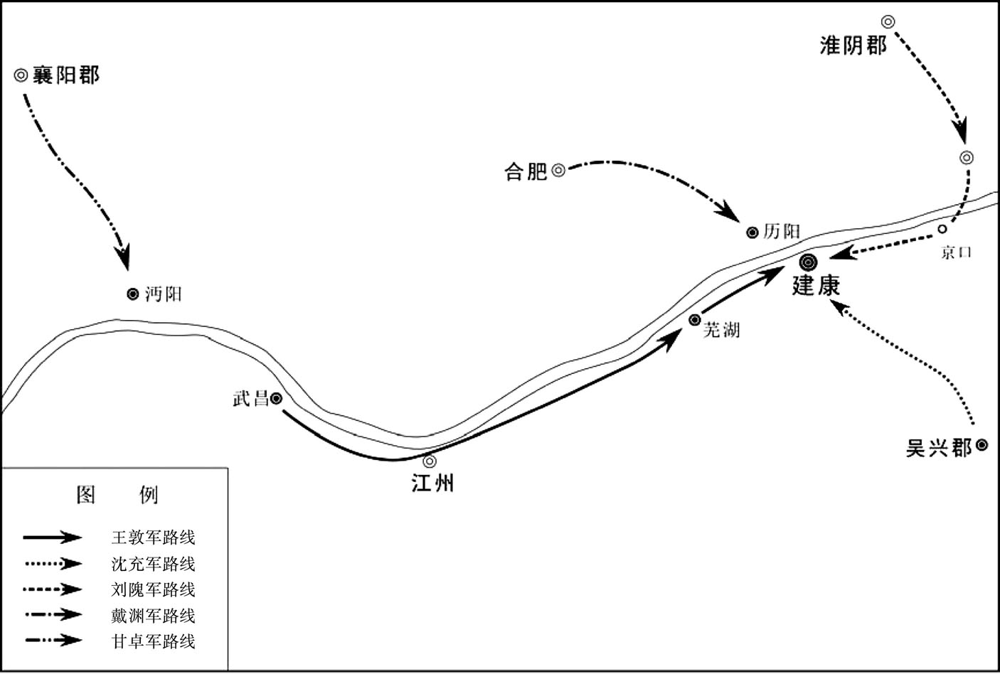 
王敦之乱示意图

## 【原文】

**帝令公卿百官诣石头见敦。敦谓戴渊曰：“前日之战，有余力乎？”渊曰：“岂敢有余，但力不足耳。”敦曰：“吾今此举，天下以为何如？”渊曰：“见形者谓之逆，体诚者谓之忠[1]。”敦笑曰：“卿可谓能言。”又谓周曰：“伯仁，卿负我[2]！”曰：“公戎车犯顺，下官亲帅六军，不能其事，使王旅奔败，以此负公。”**

## 【注文】

[1]见形：只看到表面的人。　　体诚：体会到诚心的人。

[2]伯仁：即周，字伯仁。　　卿负我：晋愍帝建兴元年（313年），周为杜詜拖延所困，到豫章投靠王敦，王敦以此为恩德，故认为周辜负了他。

## 【译文】

晋元帝命令朝廷文武百官到石头城谒见王敦。王敦问戴渊说：“经过前日的交战，现在你还有余力吗？”戴渊说：“岂敢留有余力，只是因力量不足，所以战败。”王敦又问：“我这次用兵，百姓们是怎样看待？”戴渊说：“只看到表面的人会说叛逆，但体会到诚心的人说是忠君。”王敦笑说：“你真会说话啊。”他又对周说：“周伯仁，你辜负了我啊。”周说：“您率兵进攻天子，我奉命亲率六军讨伐，不能取胜，以致朝廷军队战败奔逃，这就是我辜负您的地方。”

## 【原文】

**辛未，大赦。以敦为丞相、都督中外诸军、录尚书事、江州牧，封武昌郡公，并让不受[1]。**

## 【注文】

[1]丞相：也称宰相，官名，古代最高行政长官的通称，职责为典领百官，辅佐皇帝治理国政。　　都督中外诸军：官名。指节制宫城内外，总领京师的中央禁军。位高权重，全权代表天子执行征讨的一切大事。　　牧：古代治民之官，即各州的行政长官。汉武帝刘彻时设刺史，汉成帝刘骜（ào）改刺史为州牧。东汉灵帝刘宏时，为镇压农民起义，政府再次提高州牧的地位，居郡守之上，掌一州之军政大权。

## 【译文】

晋元帝永昌元年（322年）三月辛未（十八日），晋元帝司马睿宣布大赦。任命王敦为丞相、都督中外诸军、录尚书事、江州牧，封武昌郡公，王敦都推让而不接受。

## 【原文】

**初，西都覆没，四方皆劝进于帝，敦欲专国政，忌帝年长难制，欲更议所立，王导不从[1]。及敦克建康，谓导曰：“不用吾言，几至覆族。”**

## 【注文】

[1]西都：指长安（今陕西西安西北）。　　覆没：指晋怀帝永嘉六年（312年），刘曜攻陷洛阳（今河南洛阳东北），晋怀帝司马炽被俘，晋愍帝司马邺被拥立为皇太子。次年晋怀帝被杀，司马邺即位于长安，年号建兴。建兴四年（316年），刘曜围攻长安，晋愍帝出降，西晋至此灭亡。

## 【译文】

当初，西都长安失陷、晋愍帝被俘虏时，四方人士都劝琅邪王司马睿继承皇位。王敦一心想专权朝政，担心元帝年纪大难以控制，想要另立别的亲王，王导没有同意。到了王敦攻下建康以后，对王导说：“你不听从我的意见，几乎要使宗族覆灭。”

## 【原文】

**敦以太子有勇略，为朝野所向，欲诬以不孝而废之。[1]大会百官，问温峤曰：“皇太子以何德称？”声色俱厉[2]。峤曰：“钩深致远，盖非浅局所量。以礼观之，可谓孝矣[3]。”众皆以为信然，敦谋遂沮[4]。**

## 【注文】

[1]朝野：朝廷与民间。　　不孝：在古代“不孝”不仅是一种不道德的行为，而且在法律上被列为一种罪名，并且有相应的刑名。早在先秦，古人就认为罪莫大于不孝，凡是不孝之子都要受到法律制裁。魏晋南北朝时期尤其重视。魏律明确规定“五刑之罪，莫大于不孝”，晋律规定不孝则要被处死。

[2]声色俱厉：声色：说话时的声音和脸色；厉：严厉；俱：全，都。说话时声音和脸色都很严厉。

[3]钩深致远：致：招致。探取深处的，比喻探讨深奥的道理。

[4]沮（jǔ）：同“阻”。阻止，阻遏；终止。

## 【译文】

王敦认为太子司马绍有勇有谋，为官员百姓所拥戴，于是就想以“不孝”的罪名诬陷太子，将他废黜。在朝廷文武百官大会上，声色俱厉地问温峤说：“太子有什么德行可称？”温峤说：“太子对事情的观察非常深刻，不是我等见识浅薄的一般人所能知晓和理解的。从礼仪方面看来，太子的一言一行可以说都做到了孝。”文武百官都认为如此，王敦废太子的阴谋没有得逞。

## 【原文】

**帝召周于广室，谓之曰：“近日大事，二宫无恙，诸人平安，大将军固副所望邪[1]？”曰：“二宫自如明诏，臣等尚未可知[2]。”护军长史郝嘏等劝避敦，曰：“吾备位大臣，朝廷丧败，宁可复草间求活，外投胡、越邪[3]！”敦参军吕猗尝为台郎，性奸谄，戴渊为尚书，恶之[4]。猗说敦曰：“周、戴渊皆有高名，足以惑众，近者之言，曾无怍色，公不除之，恐必有再举之忧[5]。”敦素忌二人之才，心颇然之，从容问王导曰：“周、戴南北之望，当登三司无疑也[6]？”导不答。又曰：“若不三司，止应令仆邪[7]？”又不答。敦曰：“若不尔，正当诛尔。”又不答。丙子，敦遣部将陈郡邓岳收及渊[8]。先是，敦谓谢鲲曰：“吾当以周伯仁为尚书令，戴若思为仆射[9]。”是日，又问鲲：“近来人情何如[10]？”鲲曰：“明公之举，虽欲大存社稷，然悠悠之言实未达高义[11]。若果能举用周、戴，则群情帖然矣[12]。”敦怒曰：“君粗疏邪！二子不相当，吾已收之矣[13]。”鲲愕然自失。参军王峤曰：“‘济济多士，文王以宁’，奈何戮诸名士[14]。”敦大怒，欲斩峤，众莫敢言。鲲曰：“明公举大事，不戮一人。峤以献替忤旨，便以衅鼓，不亦过乎[15]？”敦乃释之，黜为领军长史[16]。峤，浑之族孙也。被收，路经太庙，大言曰：“贼臣王敦，倾覆社稷，枉杀忠臣[17]。神祇有灵，当速杀之！”收人以戟伤其口，血流至踵，容止自若，观者皆为流涕，并戴渊杀之于石头南门之外[18]。**

## 【注文】

[1]二宫：指皇帝和皇太子。

[2]自如明诏：确实如您所说的平安无事。

[3]护军长史：护军将军秘书长。魏晋时设护军将军，掌军职的选任，与中领军或领军将军同掌中央军队，为重要军事长官。　　嘏：音gǔ。　　备位大臣：即辅政大臣。辅政者或由在位皇帝的直系亲属担任，或由被称为摄政王的皇亲国戚担任，或由德高望重、深具资历经验的大臣担任。在摄政期间，摄政者给予建议，并让皇帝从各项建议与执行中进行学习，直至能亲自执政为止。　　草间：犹“草莽”“草棘”“草泽”。代指荒僻之地。　　越：即百越。古时居住在今江、浙、闽、粤一带的少数民族。

[4]台郎：“尚书郎”的旧称。尚书郎：官名。尚书的属官。东汉时取孝廉中有才能者入尚书台，在皇帝身边处理政务，初入台时称尚书郎中，满一年则称尚书郎，三年以后称侍郎。　　尚书：官名。战国时作“掌书”。秦属少府，为低级官员，在殿中主发布文书。秦及汉初与尚冠、尚衣、尚食、尚浴、尚席，合称“六尚”。汉武帝时，选拔尚书、中书、侍中组成“中朝”（或称内朝），成为实际上的中央决策机关，因系近臣，地位渐高。到魏、晋、南北朝时，为尚书省属下诸曹长官，都冠以曹名，下辖若干郎曹，是朝中重要大臣。

[5]近者之言：指前文周、戴渊在石头城回答王敦时所说的话。　怍（zuò）色：羞惭的神色。　

[6]南北之望：周，晋安城（今河南汝南东南）人，北方望族；戴渊，东晋广陵（今江苏扬州）人，南方望族。　　三司：中国古代朝廷中最尊贵显赫的三个官职的合称。即辅佐皇帝治国的丞相和御史大夫，最高军事长官太尉。三公位居极品，且开府置僚佐。

[7]令仆：即尚书令、尚书仆射。

[8]陈郡：郡名。秦置郡，西汉改为淮阳国。东汉章帝章和二年（88年）改为陈国，治所设在陈县（今河南淮阳）。汉献帝时改为陈郡。魏晋时或为国，或为郡。　　邓岳（？—369年）：字伯山，陈郡（今河南淮阳）人。东晋成帝咸康年间担任广东刺史。

[9]戴若思：戴渊，字若思。

[10]人情：古代是指民心的意思。

[11]明公：古人在日常交流中对称呼很讲究。“明公”即对地方割据长官的尊称，意为“贤能的主公”或“尊敬的主公”。　　悠悠之言：庸俗的言论。指人们对王敦举兵向建康的非议。

[12]群情帖然：犹言众心安定。帖然，安定、顺从的样子。

[13]不相当：指德识与官位不相称。

[14]王峤：生卒年不详，字开山。“永嘉之乱”后，避乱渡江，为王敦参军。王敦之乱，多次进谏无用。累迁御史中丞、秘书监。晋成帝咸和初年，出任庐陵太守，死于任上。　　济济多士，文王以宁：语出《诗·大雅·文王》。意思是说济济一堂的众多贤能之士，周文王依赖他们使国家安宁。这句话的意思就是贤才济济，礼贤下士是君王立功名、安国家的必由之路。

[15]献替：“献可替否”的略语。意思是进献其可行者，除去不可行者。这里用来指诤言进谏。　　忤（wǔ）旨：违背旨意。　　衅鼓：古代新制鼓成，杀牲以祭，因以其血涂抹缝隙。这里指杀王峤。

[16]黜（chù）：降职或罢免。　　领军长史：相当于领军将军的秘书长。王峤以大将军府参军黜为领军长史，可见王敦府地位高于诸府。

[17]浑：即王浑（223—297年），字玄冲，太原晋阳（今山西太原西南）人。魏国末期，曾为大将军曹爽的僚属。司马炎代魏建立晋朝后，他担任东中郎将、监淮北诸军事，镇守许昌（今河南许昌东）。后改任都督扬州诸军事，镇寿春（今安徽寿县）。曾在皖城（今安徽潜山附近）等地大败入寇吴军，声威更盛。此后，西晋大举伐吴，他率师直趋横江，攻城略地，所向披靡，斩获吴将多人。　　太庙：封建皇帝为祭拜祖先而营建的庙宇，即帝王的祖庙。

[18]踵（zhǒng）：脚后跟。

## 【译文】

晋元帝司马睿在广室殿召见周说：“近几天的这场大事，我和太子都安然无恙，文武百官也都平安，难道大将军的要求得到满足了吗？”周回答说：“正如陛下所说，您和太子是安全的，但我们这些人将会是怎样的结果现在还不得而知。”护军长史郝嘏劝周躲避一下王敦。周说：“我身为辅政大臣，朝廷遭到失败，我能躲在荒野保全性命，或者是投奔北方的胡人和南方的越人吗？”王敦所部参军吕猗曾经担任尚书郎，为人奸邪谄媚，戴渊为尚书时，非常讨厌他。吕猗乘机对王敦说：“周、戴渊都是南北很有名望的人，他们的言论足以蛊惑人心，最近他们毫无羞愧的意思，如果您不除掉他们，将会有再次起兵的后患。”王敦向来就非常忌妒周、戴渊的才能，认为吕猗的话很有道理。他闲暇时询问王导说：“周、戴渊在北方和南方人中都是很有声望的知名人士，应当担任三公吧。”王导不作回答。王敦又问：“若是不能当三公，就应该担任尚书令和尚书仆射吧？”王导又没有回答，王敦说：“要是不能用，就应当杀掉。”王导还是没有回答。永昌元年（322年）三月丙子（二十三日），王敦派遣他的部将陈郡人邓岳逮捕了周和戴渊。在此以前，王敦对谢鲲说：“我将任命周为尚书令，戴渊为尚书仆射。”这天，王敦又问谢鲲：“近来百姓舆论如何？”谢鲲回答说：“您这次大举出兵，虽说是为了国家社稷，但民间有很多议论对于您这种为国为民的心情不理解。如果能够起用周、戴二人，这样百姓就会心悦诚服了。”王敦生气地说：“你粗心大意了，周、戴是不能录用的，我已派人把他们逮捕了。”谢鲲听说后茫然不知所措。参军王峤劝谏王敦说：“有了如此众多的贤士，周文王统治下的西周才得到了安宁。为什么要杀戮这些名士呢？”王敦大怒，想斩王峤，众官都不敢开口。谢鲲说：“您自起兵以来，还没有杀过人。王峤因为献策不合您的意思，便杀掉他，用他的血涂战鼓，是否有点过分？”王敦听后才释放了王峤，贬官为领军长史。王峤是王浑的族孙。周被捕，经过太庙时，大声喊道：“叛贼王敦，颠覆国家政权，枉杀忠臣。若神有灵，必将把他除掉。”执行逮捕的人用戟砍伤他的口，鲜血一直流到足跟，但周容色不变。看到的人都感到伤心，为他流泪。王敦派人把周、戴渊杀死于石头城南门外。

## 【原文】

**帝使侍中王彬劳敦[1]。彬素与善，先往哭，然后见敦。敦怪其容惨，问之。彬曰：“向哭伯仁，情不能已。”敦怒曰：“伯仁自致刑戮，且凡人遇汝，汝何哀而哭之[2]？”彬曰：“伯仁长者，兄之亲友在朝，虽无謇愕，亦非阿党，而赦后加之极刑，所以伤惋也[3]。”因勃然数敦曰：“兄抗旌犯顺，杀戮忠良，图为不轨，祸及门户矣[4]！”辞气慷慨，声泪俱下。敦大怒，厉声曰：“尔狂悖乃至此，以吾为不能杀汝邪[5]！”时王导在坐，为之惧，劝彬起谢。彬曰：“脚痛不能拜，且此复何谢。”敦曰：“脚痛孰若颈痛？”彬殊无惧容，竟不肯拜。王导后料检中书故事，乃见救己之表，执之流涕曰：“吾虽不杀伯仁，伯仁由我而死，幽冥之中，负此良友[6]。”沈充拔吴国，杀内史张茂[7]。**

## 【注文】

[1]劳：犒劳。

[2]刑戮（lù）：受刑罚或被处死。

[3]謇（jiǎn）愕：坦率直说，不顾情面。　　阿党：指朝廷官吏结为死党，偏袒其犯罪行为而不检举弹劾。　　赦：指王敦进入石头城于三月十八日大赦天下一事。

[4]旌（jīng）：古代用牦牛尾与羽毛装饰的军旗，一般用以指挥和开道。

[5]狂悖（bèi）：狂妄悖逆。

[6]中书：官署，即中书省，为秉承君主意旨，掌管机要、发布政令的机构。中书令是中书省的长官。　　故事：指前文周上表营救王导一事。　　吾虽不杀伯仁，伯仁由我而死：前文中提到王敦问王导如何处理周时，王导三问而不答。而王导在整理中书省的文件时，却意外发现了周极力维护自己为他辩白的奏章，于是痛哭流涕说：“我虽然没有杀伯仁，但是伯仁却是因为我才死的啊！”此后，该句子也在历史上频繁出现，并衍生出后来的成语“伯仁由我”。

[7]吴国：故吴国，在晋为吴郡。治所设在吴县（今江苏苏州）。

## 【译文】

晋元帝派遣侍中王彬慰劳王敦。王彬素来同周关系好，先去哭祭周，然后才去见王敦。王敦见他的面容悲惨而感到奇怪，就问他为什么这副样子。王彬回答说：“刚去哭祭过周，情不自禁地流下了眼泪。”王敦生气地说：“周自作自受，罪有应得。何况他平日把你当普通人看待，你又为何哭他哭得这样悲哀呢？”王彬说：“周是长者，也是您的亲友，他在朝廷上即使算不上正直敢言，也未曾结党营私，却在宣布大赦后将他处死，这就是我感到悲伤和惋惜的原因。”王彬又突然历数王敦的罪恶说：“您违抗君命，杀害忠良，图谋篡位，闯下了灭族的大祸。”言辞慷慨激昂，声泪俱下。王敦非常生气，用极其严厉的声音说：“你竟然发狂到这样的地步，你以为我不敢杀你吗？”当时王导也坐在旁边，替王彬害怕，于是劝说他起来谢罪。王彬说：“我脚痛不能叩拜，何况也没有谢罪的必要。”王敦说：“脚痛怎能与脖子痛相提并论呢？”王彬毫无惧色，最终不肯拜谢而回。王导后来在清理中书省的文件时，才发现周救自己的表章，手持表章痛哭说：“我虽然没有杀周，但是周是因为我的缘故而死的，在九泉之下，我辜负了好友。”沈充率兵攻克吴国，杀吴国内史张茂。

## 【原文】

**初，王敦闻甘卓起兵，大惧。卓兄子卬为敦参军，敦使卬归说卓曰：“君此自是臣节，不相责也。吾家计急，不得不尔。想便旋军襄阳，当更结好[1]。”卓虽慕忠义，性多疑少决，军于猪口，欲待诸方同出军，稽留累旬不前[2]。敦既得建康，乃遣台使以驺虞幡驻卓军[3]。卓闻周、戴渊死，流涕谓卬曰：“吾之所忧，正为今日。且使圣上元吉，太子无恙，吾临敦上流，亦未敢遽危社稷[4]。适吾径据武昌，敦势逼，必劫天子以绝四海之望，不如还襄阳，更思后图[5]。”即命旋军。都尉秦康与乐道融说卓曰：“今分兵断彭泽，使敦上下不得相赴，其众自然离散，可一战擒也[6]。将军起义兵而中止，窃为将军不取[7]。且将军之下，士卒各求其利，欲求西还，亦恐不可得也[8]。”卓不从。道融昼夜泣谏，卓不听，道融忧愤而卒[9]。卓性本宽和，忽更强塞，径还襄阳，意气骚扰，举动失常，识者知其将死矣[10]。**

## 【注文】

[1]家计：家族之计。王敦是因晋元帝抑制王氏势力，才起兵攻入建康。　　旋军：立即回师。

[2]猪口：地名，今湖北仙桃北。　　稽（jī）留：耽搁、逗留。　　累旬：几十天。

[3]驺（zōu）虞幡（fān）：一种绘有驺虞图形的旗帜，用以传旨解兵。晋制有白虎幡、驺虞幡。以白虎威猛，主杀，故用于督战；而驺虞是仁兽，故在危急时，常用它来传旨解兵罢战。

[4]元吉：平安、安全。　　临敦上流：本句意思是甘卓占据襄阳，居上游，可以威慑处于下游的王敦。　　遽（jù）：马上、立即。

[5]径：直接。

[6]都尉：官名，战国始置，职位仅次于将军的武官。秦与汉初，每郡有郡尉，辅助太守主管军事。汉景帝刘启时改名为都尉。魏晋时期，除武职外，只有宗室外戚才能任命为都尉，且只在用兵时临时设置。　　彭泽：地名，今江西湖口东南，长江南岸，当武昌和建康之间的水路要冲。

[7]中止：半途停止。

[8]西还：向西回师襄阳。

[9]泣谏：哭着劝谏，也称哭谏。

[10]意气骚扰：神色不宁。

## 【译文】

当初，王敦听说甘卓起兵讨伐他，非常害怕。甘卓哥哥的儿子甘卬为王敦的参军，王敦于是派遣甘卬劝说甘卓：“你这次起兵已经尽到作为臣子的责任，我不责怪你。大将军王敦这次起兵也是因为王氏家族处在危急时刻所致。如果你能撤军襄阳，大将军将与您重新结好。”甘卓虽然心中仰慕忠义，但性情多疑，优柔寡断。于是驻扎在猪口，想要等待各路兵马到齐后同时出发，结果在那里耽搁了数十天，停留不前。王敦攻克建康后，用朝廷名义派遣使臣携带驺虞幡驻守在甘卓军中。甘卓听说周、戴渊已死，流着泪对甘卬说：“我所忧虑的，正是出现今天这种形势。只要皇上安康，太子平安，我占据有王敦上流地区，他不敢立即危害国家。但倘若我直接进占武昌，王敦为形势所逼，必定要劫持天子而号令天下，不如回到襄阳，再想别的办法。”于是下令军队撤回襄阳。甘卓都尉秦康和乐道融劝谏甘卓说：“如果现在出兵截断彭泽，使王敦的军队一分为二，东西失去联络，他的军队自然分崩离散，一次决战就能把王敦擒获。将军兴兵而半途而废，我私下认为将军您是不会这样做的。何况将军手下的将士各人都想得到自己的利益，出兵之后又忽然撤回，也恐怕是有困难的。”甘卓不肯听从。乐道融昼夜哭泣规劝，甘卓还是不听，乐道融最终忧愤成疾而死。甘卓性情本来宽厚和善，这一次却忽然变得强硬且毫不通融。甘卓率兵回到襄阳之后，情绪骚扰不安，举动失常，有见识的人都知道这些都是他将要死去的迹象。

## 【原文】

**王敦以西阳王羕为太宰，加王导尚书令，王廙为荆州刺史[1]。改易百官及诸军镇，转徙黜免者以百数，或朝行暮改，惟意所欲[2]。敦将还武昌，谢鲲言于敦曰：“公至都以来，称疾不朝，是以虽建勋而人心实有未达。今若朝天子，使君臣释然，则物情皆悦服矣。”敦曰：“君能保无变乎？”对曰：“鲲近日入觐，主上侧席，迟得见公，宫省穆然，必无虞也[3]。公若入朝，鲲请侍从。”敦勃然曰：“正复杀君等数百人，亦复何损于时。”竟不朝而去。夏四月，敦还武昌。**

## 【注文】

[1]西阳：郡名。西晋惠帝元康初年分弋阳国置，治所设在西阳县（今河南光山西南）。永嘉之乱后移治今湖北黄冈东。　　羕（yàng）：即司马羕（284—329年），字延年，河内温县（今河南温县西南）人。晋朝宗室，司马懿之孙，汝南王司马亮次子，受封西阳王。西晋末年南渡，受晋元帝尊崇，官至太宰。后来因弟弟司马宗图谋作乱而被免官。苏峻之乱时，他支持叛军，叛乱平定后被赐死。　　太宰：官名。殷商时已设，负责管理天下政务，辅佐君王。秦朝太宰负责皇帝饮食以及祭祀用品的供奉。至汉代，太宰是辅佐主管宗庙礼仪的太常属吏。西晋初年，为避司马师的名讳，以太宰之名代太师。东晋时多不实授，而用作重臣死后的赠官。

[2]徙黜免：调任、贬职、罢免。　　朝行暮改：朝令夕改。早上颁布的命令晚上就被修改。形容政令多变。

[3]觐（jìn）：泛指进见皇帝或者地位、辈分高的人。

## 【译文】

王敦任命西阳王司马羕为太宰，加授王导尚书令，又任命王廙为荆州刺史。更换文武百官和军镇长官，调任、降职、罢免的官吏数以百计，而且朝令夕改，随意更换。王敦将要回武昌时，谢鲲对他说：“您到达都城以来，一直声称身体不适而不朝见天子，虽然建立了功勋，但在百姓心目中还有不理解的地方。您若是朝见天子，使君臣之间消除分歧，那么，百姓自然就心悦诚服了。”王敦说：“你能保证不发生意外变故吗？”谢鲲说：“我最近朝见天子，皇帝坐立不安，希望能与您相见，朝廷现在都很安静，没有什么可担心的。您若是朝见天子，我愿意陪同你一起去。”王敦生气地说：“杀掉几百像你这样的人，对于国家也不会有什么损失。”王敦最终不朝见天子就离开了建康。永昌元年（322年）夏季四月，王敦回到了武昌。

## 【原文】

**初，宜都内史天门周级闻谯王氶起兵，使其兄子该潜诣长沙，申款于氶[1]。魏乂等攻湘州急，氶遣该及从事邵陵周崎间出求救，皆为逻者所得[2]。乂使崎语城中，称“大将军已克建康，甘卓还襄阳，外援阻绝”。崎伪许之，既至城下，大呼曰：“援兵寻至，努力坚守。”乂杀之。乂考该至死，竟不言其故，周级由是获免[3]。**

## 【注文】

[1]天门：郡名。三国吴景帝孙休永安六年（263年）以充县松梁山（今湖南张家界南天门山）自开如门，引为嘉祥，遂分武陵郡置。治所设在澧阳县（今湖南石门），属荆州。辖境相当于今湖南澧县以西的澧水流域。　　周级：生卒年不详，天门郡（治今湖南石门）人，曾任宜都内史。　　该：即周该（？—322年），天门郡（治今湖南石门）人。东晋初年，王敦围攻谯王司马氶，他受叔父之命与司马氶联系，被王敦俘虏后杀害。　　申款：表明诚意。

[2]邵陵：郡名，治所在邵陵县（今湖南邵阳），晋属荆州。　　周崎（？—322年）：邵陵（今湖南邵阳）人，曾任湘州刺史谯王司马氶从事。王敦围攻司马氶时，他受命出外求救，被王敦俘虏后杀害。

[3]获免：保全性命。

## 【译文】

当初，宜都内史天门人周级听说谯王司马氶起兵，于是派遣他兄长的儿子周该偷偷地到长沙去，向司马氶表示诚意。王敦部将魏等加紧围攻湘州时，司马氶派遣周该和从事邵陵人周崎抄偏僻小道外出求救，结果被魏的巡逻人员抓获。魏让周崎向城中喊话：“大将军已经攻克建康，甘卓已经回到襄阳，外援完全断绝。”周崎假意答应。但到了城下，周崎却大声呼喊说：“援军马上就要到了，大家要努力坚守城池。”魏大怒，立即杀死了周崎。魏又用酷刑拷问周该，周该到死都不肯招供为什么到长沙来，周级因此保全了性命。

## 【原文】

**乂等攻战日逼，敦又送所得台中人书疏，令乂射以示氶[1]。城中知朝廷不守，莫不怅惋。相持且百日，刘翼战死，士卒死伤相枕[2]。癸巳，乂抜长沙，氶等皆被执。乂将杀虞悝，子弟对之号泣，悝曰：“人生会当有死，今阖门为忠义之鬼，亦复何恨[3]。”**

## 【注文】

[1]台中：朝廷官员。　　书疏：书信和奏疏。

[2]朝廷：指都城建康。　　死伤相枕：死亡受伤者相互枕藉而卧。形容伤亡者多。

[3]阖（hé）门：指全家所有人。

## 【译文】

魏的加紧进攻，王敦又派人送来他得到的朝廷官员们的书信和奏疏，命魏用箭射入城中给司马氶。城中人得知建康失守的消息，都深感惆怅惋惜。双方相持将近一百天，刘翼战死，士兵伤亡惨重。永昌元年（322年）四月癸巳（初十日），魏攻占长沙，司马氶等人都被俘虏。魏将要处死虞悝，虞悝的子弟们号啕大哭，虞悝说：“人生终有一死，如今我全家都是忠义之人，还有什么遗恨呢！”

## 【原文】

**乂以槛车载氶及易雄送武昌，佐吏皆奔散，惟主簿桓雄、西曹书佐韩阶、从事武延毁服为僮从氶，不离左右[1]。乂见桓雄姿貌举止非凡人，惮而杀之。韩阶、武延执志愈固。荆州刺史王廙承敦旨，杀氶于道中，阶、延送氶丧至都，葬之而去[2]。易雄至武昌，意气忼慨，曾无惧容[3]。敦遣人以檄示雄而数之，雄曰：“此实有之，惜雄位微力弱，不能救国难耳[4]。今日之死，固所愿也。”敦惮其辞正，释之，遣就舍[5]。众人皆贺之，雄笑曰：“吾安得生。”既而，敦遣人潜杀之[6]。**

## 【注文】

[1]槛（jiàn）：用于囚禁犯人的车子。此车用栅栏封闭，常用于传送囚犯。汉代曾广泛使用，以后历代多沿用。　　佐吏：属下官吏。　　桓雄（？—322年）：长沙（今湖南长沙）人。时任湘州刺史谯王司马氶主簿。王敦围攻司马氶时，被俘杀害。　　西曹书佐：为郡守、县令的主要佐吏。功曹主管选举，下设门功曹书佐等协助处理选用人员等事。两晋、南北朝改“功曹”为“西曹”，下设有西曹书佐、西曹参军等。“曹”，古时分职治事的官署或部门。书佐：主办文书的佐吏。　　韩阶：生卒年不详，长沙（今湖南长沙）人。曾为湘州刺史谯王司马氶西曹书佐。谯王司马氶被王敦俘虏杀害后，他与武延等人护送司马氶的灵柩安葬于都城建康。

[2]道中：前往武昌的途中。

[3]意气忼慨：言辞慷慨。

[4]檄：当初易雄列举王敦罪状，起兵讨伐王敦时所写的檄文。

[5]舍：居住的房子。

[6]吾安得生：我怎么可能生存下来呢。

## 【译文】

魏用囚车将司马氶和易雄押送武昌，司马氶的幕僚和属官都逃奔离散，只有湘州刺史府主簿桓雄、西曹书佐韩阶和从事武延毁掉官服装扮成奴仆跟随司马氶，不离他的身旁。魏发现桓雄的容貌举止非同一般，感到恐惧，于是将他杀掉。韩阶、武延护送司马氶的决心更加坚固。荆州刺史王廙按照王敦的旨意，在前往武昌的途中把司马氶杀害，韩阶、武延护送司马氶的灵柩到达建康，安葬完毕后才离去。易雄到了武昌后，言辞慷慨，毫不畏惧。王敦派人把易雄当初起兵讨伐王敦时所写的檄文拿给他看，并历数他的罪过。易雄说：“这篇檄文确实是我写的，只可惜我职位低力量弱，不能挽救国家危难。今日一死，正合我的心愿。”王敦对这番义正词严的话感到害怕，于是放了易雄，把他送回住处。大家都向他表示祝贺，易雄笑着对大家说：“我怎么可能活下来呢！”不久，王敦便派人暗杀了他。

## 【原文】

**魏乂求邓骞甚急，乡人皆为之惧[1]。骞笑曰：“此欲用我耳。彼新得州，多杀忠良，故求我以厌人望也[2]。”乃往诣乂，乂喜曰：“君，古之解扬也[3]。”以为别驾[4]。诏以陶侃领湘州刺史，王敦止侃复还广州，加散骑常侍[5]。**

## 【注文】

[1]乡人：乡里的人。

[2]以厌人望：满足人们的愿望。

[3]解扬：生卒年不详，晋国（今山西繁峙）人，字子虎，春秋时晋国大夫。鲁宣公十五年（前594年），楚国攻打宋国。晋国派他前往宋国，让宋不要降楚，并表明晋国救兵不久即到。他途中被俘获，楚君以重金收买他，让他改口。他假装同意，等登上楼车后，便把晋君的意图告诉宋人。楚君感叹他的忠心，没有杀他。

[4]别驾：官名，全称为“别驾从事史”，或叫“别驾从事”。为州刺史的属吏。每当刺史出巡外出时，别驾都要驾车随行，因此得名。

[5]领：古代高级职务者担任较低官职时用“领某官”来表示。此外，中国古代官制有行、守、假之制。行：官缺则由职位低者兼代其事。守：试职，期限自初授起一年，到期称职者转正。假：暂时代理。

## 【译文】

魏非常急迫在各地搜寻邓骞，乡里的人都为他担忧。邓骞却含笑说：“大家不必担心，魏派人找我是想任用我。他刚刚取得湘州，杀害了不少的忠臣义士，所以找我去平定民愤。”于是就去拜见魏，魏高兴地说：“你就是古代的解扬。”于是任用为别驾。晋元帝下诏任命陶侃为湘州刺史，王敦派人阻止陶侃，让他回到广州，加授他散骑常侍一职。

## 【原文】

**甘卓家人劝卓备王敦，卓不从，悉散兵佃作，闻谏，辄怒[1]。襄阳太守周虑密承敦意，诈言湖中多鱼，劝卓遣左右悉出捕鱼[2]。五月乙亥，虑引兵袭卓于寝室，杀之，传首于敦，并杀其诸子[3]。敦以从事中郎周抚督沔北诸军事，代卓镇沔中[4]。抚，访之子也。**

## 【注文】

[1]散兵：分散到各地。　　佃（diàn）作：屯田耕种。

[2]周虑：东晋官吏，生卒年不详，曾任襄阳太守，遵从王敦旨意秘密杀死甘卓。　　密承：暗中接受密令。

[3]传首：传送首级。

[4]周抚（？—365年）：字道和，庐江寻阳（今江西九江西南）人，祖籍汝南安城（今河南汝南东南），晋梁州刺史、南中郎将周访之子。东晋时曾协助王敦叛乱，王敦失败后逃亡，后来获赦免并再度入仕，官至镇西将军、益州刺史。　　沔北：汉水上游中游一带被称为沔水，沔北主要指荆州北部的襄阳一带。　　沔中：即沔阳。以在沔水之阳而名。治所在今陕西勉县东，属汉中郡。

## 【译文】

甘卓家里人都劝说甘卓要早做防备王敦的打算，但甘卓不听，反而把部属分散到各地去屯田耕种。凡是有人劝谏，听后都会大发雷霆。襄阳太守周虑暗中接受王敦的指令，谎说是湖中鱼多，劝甘卓派身旁护卫人员出去捕鱼。永昌元年（322年）五月乙亥（二十三日），周虑乘机发动突然袭击，把甘卓杀死在他的寝室里，并把甘卓的人头送给了王敦，还把甘卓的儿子们也都杀害了。王敦任命从事中郎周抚为督沔北诸军事，代替甘卓镇守沔中。周抚，是周访的儿子。

## 【原文】

**敦既得志，暴慢滋甚，四方贡献多入其府，将相岳牧皆出其门[1]。以沈充、钱凤为谋主，唯二人之言是从，所谮无不死者[2]。以诸葛瑶、邓岳、周抚、李桓、谢雍为爪牙[3]。充等并凶险骄恣，大起营府，侵人田宅，剽掠市道，识者咸知其将败焉[4]。**

## 【注文】

[1]暴慢滋甚：更加凶暴骄傲。　　贡献：与现代汉语意思有所不同。这里表示进奉的贡品。　　将相岳牧：朝廷的文武大臣及地方长官。将相：泛称文武大臣。岳牧：相传为尧舜时代四岳十二州的合称。此指官吏大臣。

[2]谮（zèn）：说别人的坏话，诬陷，中伤。

[3]诸葛瑶、李桓、谢雍：东晋官吏，皆为王敦亲信。　　爪（zhǎo）牙：多比喻为坏人效力的人，他们的党羽、帮凶。原指动物的尖爪和利齿。

[4]剽（piào）掠市道：派人到市场和交通要道抢劫财物。

## 【译文】

王敦的野心得逞之后，变得更加凶暴骄傲，全国各地贡献朝廷的物品大部分被送到他的府第，上自朝廷文武大臣，下至各地地方长官都出自他的门下。他依靠沈充、钱凤等人为他出谋划策，这两人的意见王敦都一一听从，被这两人诬陷的人没有不死的。此外，他还任用诸葛瑶、邓岳、周抚、李桓、谢雍为爪牙。沈充等凶恶阴险、骄傲放纵，他们大肆修建豪宅，侵占别人田宅，甚至公然派人到市场和交通要道抢劫财物，有见识的人都预料到王敦将要失败了。

## 【原文】

**［秋七月］，王敦自领宁、益二州都督[1]。冬十月己丑，荆州刺史武陵康侯王廙卒[2]。王敦以下邳内史王邃都督青徐幽平四州诸军事，镇淮阴；卫将军王含都督沔南诸军事，领荆州刺史；武昌太守丹杨王谅为交州刺史[3]。使谅收交州刺史修湛、新昌太守梁硕杀之。谅诱湛斩之，硕举兵围谅于龙编[4]。**

## 【注文】

[1]宁：即宁州，晋十九州之一。晋武帝司马炎以益州所辖郡县太多，不便于管辖为由，将益州所辖南中七郡中的建宁、兴古、云南、永昌四郡划出来，单独设置宁州，治所设在滇池县（今云南晋宁东北）。至此，新建的宁州成为与益州同级的政区　　益：即益州。汉武帝所置十三刺史部之一。东汉时治所设在雒（luò）县（今四川广汉北），汉灵帝刘宏中平年间治所迁至绵竹县（今四川德阳东北），汉献帝刘协兴平年间治所再迁至成都县（今四川成都）。其辖境包括今四川盆地和贵州一带。三国时刘备占据此地并建立蜀汉政权。三国末年曹魏灭蜀汉，分割益州，另置梁州。

[2]武陵康侯：王廙官至荆州刺史，赠骠骑将军、武陵康侯。

[3]下邳：地名，今江苏清江附近。　　都督青徐幽平四州诸军事：即负责青州、徐州、幽州、平州四州军事事务的官员。徐：即徐州，古“九州”之一，范围大致在今天山东东南部和江苏长江以北的地区。东晋时期，由于淮河以北的地区被割据政权占领，徐州的州治改为京口（今江苏镇江）。平：即平州。三国魏分幽州东部地区置，治所设在襄平（今辽宁辽阳），辖境大致相当于今铁岭以南的辽宁大部分地区。不久废入幽州。晋武帝司马炎泰始十年（274年）复置。晋怀帝司马炽永嘉（307—313年）后移治昌黎（今辽宁义县）。　　卫将军：官名。汉文帝刘恒由代王入继帝位，始设卫将军一员，以亲信宋昌担任，统帅京城南军与北军等禁兵。魏晋南北朝沿置，为重号将军，多授予朝中大臣，为加官。　　都督沔南诸军事：即都督汉水流域南部地区军事事务的长官。　　王谅：生卒年不详，字幼成，丹阳（今江苏南京）人。少有才干和谋略，为王敦所器重，担任武昌太守。晋惠帝永兴三年（306年），担任交州刺史。后被梁硕杀害。

[4]修湛：生卒年不详，东晋官吏，曾任交州刺史。　　新昌：郡名。西晋武帝太康三年（282年）改新兴郡置，治所设在今越南永富。　　梁硕：生卒年不详，东晋官吏，曾任新昌太守。　　龙编：越南古地名，在今越南河内东，天德江北岸，为交州治所。

## 【译文】

晋元帝永昌元年（322年）秋季七月，王敦自封为宁州、益州二州都督。冬季十月己丑（初九日），荆州刺史武陵康侯王廙去世。王敦任命下邳内史王邃为都督青、徐、幽、平四州诸军事，镇守淮阴；任用卫将军王含都督沔南诸军事，兼任荆州刺史；还任命武昌太守丹杨人王谅为交州刺史。命令王谅搜捕交州刺史修湛和新昌太守梁硕，杀掉他们。王谅到任后，设法诱杀修湛，梁硕于是起兵反抗，把王谅包围在交州首府龙编。

## 【原文】

**十一月，以临颍元公荀组为太尉；辛酉，薨[1]。罢司徒，并丞相府[2]。王敦以司徒官属为留府[3]。**

## 【注文】

[1]荀组（258—322年）：晋朝官吏，字大章，颍川颍阴（今河南许昌）人。公元317年，司马睿建立东晋，他被任命为司徒、录尚书事。当时实权掌握在王导手中，他虽然位居宰相而没有实际权力。公元322年改任太尉，同年病逝。　　太尉：官名。秦朝以“丞相”“太尉”与“御史大夫”并为“三公”。太尉为中央掌武事的最高官员。魏晋以后，太尉位居极品而实权甚少，渐次演化成优宠宰相、亲王的加官、赠官或虚衔。

[2]罢司徒：取消司徒官。

[3]司徒官属：即司徒府属吏。王敦回到武昌，把原司徒府的官吏作为留府人员安置在建康，以此遥控朝政。　　留府：晋朝三公或将军出征，委任他人留守公府或军府事，称留府。

## 【译文】

晋元帝永昌元年（322年）十一月，朝廷任命临颍元公荀组为太尉；辛酉（十二日），荀组死去。晋元帝司马睿宣布撤销司徒府，并入丞相府。王敦用司徒府的官属作为他在建康的留府。

## 【原文】

**帝忧愤成疾，闰月己丑，崩[1]。司空王导受遗诏辅政[2]。帝恭俭有余而明断不足，故大业未复而祸乱内兴[3]。庚寅，太子即皇帝位，大赦[4]。**

## 【注文】

[1]闰月：阴历中的一种现象。阴历是按照月亮的圆缺安排大月和小月，一个月的长度约是29.5日，这样一年共354天，与阳历的一年相差11天。如果按上述规定制定历法，就会出现天时与历法不合、时序错乱颠倒的怪现象。为了克服这一缺点，古人在天文观测的基础上，找出了“闰月”的办法，即每隔二到四年，增加一个月，增加的这个月即为闰月。　　崩：古指皇帝死亡，为皇帝一人专用。

[2]遗诏辅政：在君主制下，已经即位的皇帝暂时不能管理国家时，由他人代替皇帝处理国政即为辅政。辅政者或由在位皇帝的直系亲属担任，或由被称为摄政王的皇亲国戚担任，或由德高望重、深具资历经验的大臣担任。在摄政期间，摄政者给予建议，并让皇帝从各项建议与执行中进行学习，直至能亲自执政为止。

[3]大业：指恢复中原的大业。　　祸乱内兴：指王敦之乱。

[4]皇帝：中国古代所称的“皇帝”是对“三皇五帝”的统称。三皇指天皇、地皇和人皇，是传说中的三个古代帝王；“帝”原来指宇宙万物至高无上的主宰者。秦始皇统一全国后，自认为是“德兼三皇，功过五帝”，将“皇”“帝”两个人间最高的称呼结合起来，为自己的帝号，从此天子称为皇帝。

## 【译文】

晋元帝司马睿忧愤成疾，永昌元年（322年）闰十一月己丑（初十日）逝世。司空王导接受遗诏辅佐晋明帝。晋元帝谦恭节俭有余，但不够英明、果断，所以恢复中原的大业没有取得成功，还爆发了内乱。庚寅（十一日），太子司马绍即位，宣布大赦。

## 【原文】

**明帝太宁元年[1]。王敦谋篡位，讽朝廷征已；帝手诏征之[2]。夏四月，加敦黄钺、班剑，奏事不名，入朝不趋，剑履上殿[3]。敦移镇姑孰，屯于湖[4]。以司空导为司徒，敦自领扬州牧[5]。敦欲为逆，王彬谏之甚苦。敦变色，目左右，将收之。彬正色曰：“君昔岁杀兄，今又杀弟耶[6]！”敦乃止，以彬为豫章太守。**

## 【注文】

[1]明帝：即晋明帝司马绍。　　太宁：又作“大宁”，晋明帝司马绍所用年号，共计四年，即公元323年至326年。太宁三年（325年）晋成帝司马衍即位沿用，次年二月改年号为咸和。

[2]篡（cuàn）位：古代大臣用非正常的手段来谋夺君主帝位的行为。　　讽：用含蓄的话暗示或劝告。

[3]黄钺（yuè）：古代重臣出征往往加有假黄钺的称号。黄钺，以黄金为饰，古代帝王所用，后世用为仪仗。以黄钺借给大臣，即有代表皇帝行使征伐之权的意思。　　班剑：有纹饰的剑。或以虎皮装饰。汉制，朝服带剑。晋易以木，谓之班剑，取装饰灿烂之义。后用作仪仗，由武士佩持，天子常用来赏赐功臣。　　奏事不名：有事启奏皇帝时不称姓名。下文“入朝不趋”“剑履上殿”也是帝王赐给亲信大臣的特殊待遇。　　入朝不趋：上朝时不用快步行走。　　剑履上殿：受赐者可以佩剑穿履朝见皇帝。

[4]姑孰：地名，今安徽当涂。　　于湖：县名，在今安徽当涂南。

[5]扬州：州名。三国吴置，治所设在建邺（后改称建康，今江苏南京），辖境约为今上海、浙江、江西、福建全部，安徽淮河以南地区，江苏长江以南部分地区，以及湖北、河南部分地区。晋沿置。

[6]杀兄：指王敦于晋怀帝永嘉六年（312年）杀死王澄一事。王澄、王彬皆王敦族人。

## 【译文】

晋明帝司马绍太宁元年（323年）。王敦阴谋篡位，示意朝廷征召自己。晋明帝于是亲自下诏征召王敦到建康。夏季四月，加授王敦黄钺、班剑，有事启奏皇帝时不用禀报姓名，上朝时不用快步行走，可以佩剑穿鞋朝见皇帝。王敦把他的军队从武昌移驻姑孰，驻军在于湖。晋元帝任命司空王导为司徒，王敦自己兼任扬州牧。王敦想要篡位，王彬苦苦劝谏，王敦为此非常生气，示意身旁亲信逮捕王彬。王彬严肃地说：“之前你杀了兄长王澄，如今又要杀弟弟我吗？”王敦这才罢休，任命王彬外出担任豫章郡太守。

## 【原文】

**帝畏王敦之逼，欲以郗鉴为外援，拜鉴兖州刺史，都督扬州江西诸军事，镇合肥[1]。王敦忌之，表鉴为尚书令。八月，诏征鉴还，道经姑孰，敦与之论西朝人士，曰：“乐彦辅短才耳，考其实，岂胜满武秋邪[2]？”鉴曰：“彦辅道韵平淡，愍怀之废，柔而能正。武秋失节之士，安得拟之[3]！”敦曰：“当是时，危机交急。[4]”鉴曰：“丈夫当死生以之[5]。”敦恶其言，不复相见，久留不遣。敦党皆劝敦杀之，敦不从。鉴还台，遂与帝谋讨敦。**

## 【注文】

[1]郗鉴（269—339年）：东晋将领。字道徽，高平金乡（今山东金乡北）人。官至车骑大将军、太尉，曾协助晋明帝司马绍平定王敦叛乱。虽然一生沉浮动荡，但他始终忠于朝廷，故后世称他为“乱世忠臣”。　　兖（yǎn）州：古“九州”之一，传说大禹治水后，按照山川河流的走向，把全国划分为青、徐、扬、荆、豫、冀、兖、雍、梁九州，兖州是其中之一。古兖州相当于今山东西南部地区。至汉武帝时，兖州为十三刺史部之一，约今山东西南部、河南东部。魏晋时，兖州治所设在廪（lǐn）丘（今山东郓城西北）。东晋末，刘裕平定河南，治所设在滑台（今河南滑县东）。

[2]西朝：东晋人称西晋都城洛阳为西朝。　　乐彦辅：即乐广（？—304年），字彦辅，南阳清阳（今河南南阳南）人，西晋大臣、学者、书法家。他少年时曾为夏侯玄所欣赏。王戎任荆州刺史时，他被举为秀才。他善于谈论，累迁侍中、河南尹，又迁吏部尚书、左仆射，官至尚书令。　　满武秋：即满奋，字武秋，山阳昌邑（今山东巨野南）人，封昌邑侯。他性格清静平和，有才识，体量通雅。晋惠帝元康年间官至尚书令、司隶校尉。

[3]愍怀之废，柔而能正：西晋惠帝太子司马遹（yù），死后谥为愍怀太子。惠帝元康九年（299年）冬，贾后、贾谧废太子司马遹为庶人。惠帝永康元年（300年），幽禁司马遹于许昌宫，下令宫臣不得辞送。江统、潘滔等冒禁至伊水拜辞涕泣。司隶校尉满奋收捕江统、潘滔等下狱，关押在河南监狱。后河南尹乐广释放江统、潘滔等人。都官从事孙琰担心压制太过会引发人们对太子的怀念，便劝贾谧释放所有在押人员，乐广因此未被治罪。所以郗鉴说乐广“柔而能正”。　　武秋失节：指满奋收捕江统、潘滔等给太子送行的东宫官员以及惠帝永宁元年（301年）赵王司马伦篡位时替赵王持节、奉玺绶等事。

[4]危机交急：指贾后、贾谧专权妄为，危害朝廷。王敦在这里似乎暗中以赵王司马伦自况，篡位之心已溢于言表。

[5]丈夫：有志气、有节操、有作为的男子。

## 【译文】

晋明帝司马绍对王敦军队步步进逼深感畏惧，想凭借郗鉴作为外援，于是任命他为兖州刺史，都督扬州江西诸军事，镇守合肥。王敦对郗鉴又怕又恨，上表朝廷推荐他为尚书令。太宁元年（323年）八月，朝廷下诏征召郗鉴返回建康，经过姑熟时，王敦同他一起评论西晋人士，王敦说：“乐彦辅缺少才能，考察他的真才实学，怎能比得上满武秋？”郗鉴说：“乐彦辅为人虽然性情平淡，但在愍怀太子有过失时，都能用温和的语气加以纠正，表现出刚正不阿的气节。满武秋是一个没有气节的人，怎能同他相比！”王敦说：“那个时候，危机非常严重。”郗鉴说：“危机严重时，大丈夫更应当舍生忘死。”王敦十分厌恶郗鉴的话，不再与他相见，但却把他留在姑熟，不让返回建康。王敦党羽劝他把郗鉴杀掉，王敦没有听从。郗鉴还朝后，同晋明帝密谋讨伐王敦。

## 【原文】

**王敦从子允之，方总角，敦爱其聪警，常以自随[1]。敦尝夜饮，允之辞醉先卧。敦与钱凤谋为逆，允之悉闻其言，即于卧处大吐，衣面并污。凤出，敦果照视，见允之卧于吐中，不复疑之。会其父舒拜廷尉，允之求归省父，悉以敦、凤之谋白舒[2]。舒与王导俱启帝，阴为之备[3]。敦欲强其宗族，陵弱帝室，冬十一月，徙王含为征东将军，都督扬州江西诸军事，王舒为荆州刺史，监荆州沔南诸军事，王彬为江州刺史[4]。**

## 【注文】

[1]从子：从祖兄弟或从父兄弟的儿子称之为从子。古人的家族观念很浓，通常会追溯到曾祖父，有共同曾祖父的从兄弟的孩子，称为从子。　　允之：即王允之，字深猷（yóu），生卒年不详，祖籍琅邪临沂（今山东临沂北）人。从小就为伯父王敦所喜爱。王敦策划叛乱时，他将此事设法报知父亲。后因平定苏峻之乱有功，被封为侯爵，授建武将军、钱塘令，领司盐都尉，负责食盐官营事务。　　总角：指古时未成年的人束发为两结，形状如角，故称。借指童年。

[2]舒：即王舒（294—333年），东晋大臣。字处明，琅邪临沂（今山东临沂北）人。晋明帝时，累迁安南将军、广州刺史。后苏峻之乱，他与庾冰等率兵赴难。平定苏峻之乱后，以功封彭泽县侯。　　廷尉：官名，主管司法的最高官吏，负责掌管每年全国断狱总数最后汇总、州郡疑难案件报请等事务。此外，常派员为地方处理某些重要案件。　　省（xǐng）父：回家看望父亲。

[3]阴：暗地里、秘密的。

[4]陵弱：削弱。　　征东将军：官名。始置于曹操时，与征西、征南、征北合称“四征将军”，权力很大。魏晋以后，多为持节都督。征东将军中资深者被加封为“征东大将军”。　　监荆州沔南诸军事：即监察荆州沔南地区军事事务的官员。

## 【译文】

王敦的堂侄王允之，还是个孩子，王敦喜欢他聪明机警，常常把他带在身边。王敦晚上经常饮酒，王允之推辞酒醉先回去睡觉。王敦同钱凤密谋叛乱，他们说的话都被王允之听见。允之假装喝醉，在卧榻上呕吐，弄得衣服上、脸上全是污秽之物。钱凤走后，王敦提灯前来查看，发现王允之躺在呕吐出的污物之中，也就不再怀疑他。这时，王允之的父亲王舒升为廷尉，王允之向王敦请求回家探望父亲。回家之后，他把王敦同钱凤的阴谋全部告诉了王舒。王舒同王导又将此事奏明皇帝，并暗中做好应战准备。王敦为了加强王氏家族势力，削弱皇族司马氏的势力，太宁元年（323年）冬季十一月，调任王含为征东将军，都督扬州江西诸军事，王舒为荆州刺史，监荆州沔南诸军事，王彬为江州刺史。

## 【原文】

**［是岁］，会稽内史周札一门五侯，宗族强盛，吴士莫与为比，王敦忌之[1]。敦有疾，钱凤劝敦早除周氏，敦然之。周嵩以兄之死，心常愤愤[2]。敦无子，养王含子应为嗣，嵩尝于众中言应不宜统兵，敦恶之[3]。嵩与札兄子莚皆为敦从事中郎[4]。会道士李脱以妖术惑众，士民颇信事之[5]。**

## 【注文】

[1]会稽（kuài jī）：郡名，秦置，郡治在吴县（今江苏苏州），辖今江苏苏州为中心的江浙地区。到西晋时，辖境渐小，仅辖今浙江绍兴、宁波一带。　　一门五侯：周札封东迁县侯；兄周靖之子周懋（mào），封清流亭侯；周懋弟周赞，封武康县侯；周赞弟周缙，封都乡侯；兄周圮之子周勰（xié），封乌程县侯。　　吴士：即吴郡一带士大夫。

[2]以兄之死：指前文中王敦杀周一事。

[3]应：即王应，字安期，生卒年不详，王含之子，后过继给王敦。他与生父王含都曾协助王敦对抗晋明帝司马绍。王敦死后，他势孤力薄，投奔荆州刺史王舒，结果被王舒沉入江中致死。　　嗣：君位或职位的继承人。

[4]莚（yán）：即周莚，生卒年不详，周札的侄子，累官至征虏将军、吴兴太守、黄门侍郎。王敦叛乱后，加冠军将军，都督会稽等五郡军事，率水军讨叛将沈充，兵败被杀。

[5]道士：道教的神职人员。他们自觉自愿地接受道教的教义和戒律。同时，道士作为道教文化的传播者，又以各种带有神秘色彩的方式，布道传教，为其宗教信仰尽职尽力。　　李脱（？—324年）：东晋道士。擅长妖术，百姓对他颇为崇拜。晋明帝太宁二年（324年）正月，因“造妖书惑众”罪被处斩。

## 【译文】

这一年，会稽内史周札家中有五人封侯，家族势力强盛，吴地大族没有谁能与他家相比。王敦为此十分嫉妒。王敦生病，钱凤劝他尽早铲除周氏，王敦也是这样想的。周嵩因为哥哥周被王敦所杀，心中常常愤恨不平。王敦没有儿子，于是收养哥哥王含的儿子王应作为他的继承人。周嵩经常当众数说王应不适合统率军队，王敦因此非常讨厌周嵩。周嵩和周札侄子周莚都是王敦的从事中郎。这时，道士李脱用妖术迷惑众人，有许多人因迷信而追随他。

## 【原文】

**二年春正月，王敦诬周嵩、周莚与李脱谋为不轨，收嵩、莚，于军中杀之[1]。遣参军贺鸾就沈充于吴，尽杀周札诸兄子[2]。进兵袭会稽，札拒战而死。**

## 【注文】

[1]谋为不轨：指准备谋划叛逆违法之事。

[2]就沈充于吴：吴郡、吴兴、会稽三郡本吴郡而一分为三，故称“三吴”。时沈充镇吴兴（今浙江湖州）。

## 【译文】

晋明帝太宁二年（324年）春季正月，王敦诬陷周嵩、周莚同李脱密谋造反，逮捕了周嵩、周莚，把他们杀死在军营中。又派遣参军贺鸾到吴地找沈充，把周札的侄子也全都杀害。然后立即出兵袭击会稽，周札率兵抗拒，兵败而死。

## 【原文】

**夏五月，王敦疾甚，矫诏拜王应为武卫将军以自副，以王含为骠骑大将军、开府仪同三司[1]。钱凤谓敦曰：“脱有不讳，便当以后事付应邪[2]？”敦曰：“非常之事，非常人所能为[3]。且应少年，岂堪大事。我死之后，莫若释兵散众，归身朝廷，保全门户，上计也[4]。退还武昌，收兵自守，贡献不废，中计也。及吾尚存，悉众而下，万一侥幸，下计也。”凤谓其党曰：“公之下计，乃上策也。”遂与沈充定谋，俟敦死，即作乱。又以宿卫尚多，奏令三番休二[5]。**

## 【注文】

[1]武卫将军：武官名号。三国魏文帝曹丕改武卫中郎将为武卫将军，职掌宿卫禁军，权力很大。　　骠骑大将军：官名。东汉置为临时统帅，统军出征，不常设。晋、南北朝时期成为正式官号，相当于军队总司令，位高于骠骑将军，多为朝廷重臣的加官。　　开府仪同三司：魏晋时期的高级官位。“开府”指开设府第，设置官吏。“仪同三司”即仪仗同于三司。“三司”指太尉、司空、司徒，亦称三公。汉朝官制，唯三公可开府。西晋时，“开府”与“仪同三司”连称较多，逐渐通用，因而别置开府仪同三司之职。

[2]脱有不讳：倘若您的病不能痊愈。

[3]非常之事：指出兵篡夺帝位。

[4]释兵散众：放弃兵权，交出军队，遣散部队。

[5]三番休二：宿卫分为三批，轮流值班，每次休息两批。

## 【译文】

晋明帝太宁二年（324年）夏季五月，王敦病势严重，于是假借朝廷名义任命王应为武卫将军，作自己的副手，又任命王含为骠骑大将军、开府仪同三司。钱凤对王敦说：“倘若您的病不能痊愈，所有后事全都托付给王应吗？”王敦说：“非常之事，不是常人所能够做到的。何况王应年轻，不能承担大事。我死之后，不如放弃兵权，遣散军队，归附朝廷，保全家族，这是上计。率领军队退回武昌，谨慎防守，不要中断向朝廷贡献礼物，这是中计。趁我还活着的时候，全部军队顺流东下，希望能够侥幸取得成功，这是下计。”钱凤对他的同党说：“王公的下计，实际上应当是上策。”于是与沈充密谋商定，等王敦死后，立即发动叛乱。又认为侍卫人员过多，上奏朝廷将侍卫分为三组，一组值勤，两组休假。

## 【原文】

**初，帝亲任中书令温峤，敦恶之，请峤为左司马[1]。峤乃缪为勤敬，综其府事，时进密谋以附其欲[2]。深结钱凤，为之声誉，每曰“钱世仪精神满腹[3]”。峤素有藻鉴之名，凤甚悦，深与峤结好[4]。会丹杨尹缺，峤言于敦曰：“京尹咽喉之地，公宜自选其才，恐朝廷用人，或不尽理[5]。”敦然之，问峤：“谁可者？”峤曰：“愚谓无如钱凤。”凤亦推峤，峤伪辞之，敦不听。六月，表峤为丹杨尹，且使觇伺朝廷[6]。峤恐既去而钱凤于后间止之，因敦饯别，峤起行酒，至凤，凤未及饮[7]，峤伪醉，以手版击凤帻坠，作色曰：“钱凤何人，温太真行酒而敢不饮[8]！”敦以为醉，两释之。峤临去与敦别，涕泗横流，出复入者再三[9]。行后，凤谓敦曰：“峤于朝廷甚密，而与庾亮深交，未可信也[10]。”敦曰：“太真昨醉，小加声色，何得便尔相谗。”峤至建康，尽以敦逆谋告帝，请先为之备，又与庾亮共画讨敦之谋[11]。敦闻之，大怒曰：“吾乃为小物所欺[12]！”与司徒导书曰：“太真别来几日，作如此事，当募人生致之，自拔其舌[13]。”**

## 【注文】

[1]中书令：协助皇帝在宫廷处理政务的官员。在中国古代，中书为内廷宦官机构，负责在皇帝书房整理宫内文书档案，与皇帝有频繁接触的机会，其长官称中书令。　　左司马：武官，为司马或大司马的属官，常与右司马并列，一般由王室贵族担任。平时负责军事行政工作，一旦发生战争，则奉命带兵出征。

[2]缪：同“谬”。伪装、假装。　　勤敬：恭敬，办事勤奋。

[3]深结：深入结交。　　钱世仪：即钱凤，字世仪。　　精神满腹：精神充满于身体之中。形容学识渊博，富有才智。精神：表现出来的活力，引申为才智充足。满腹：充满肚子，引申为掌握极多。

[4]藻鉴：又称“藻镜”。评价人的品德叫“藻”，评价人的美丑、风度叫“鉴”。魏晋南朝时，品评人物成为文人的一种时尚。

[5]京尹：都城所在地区的行政长官。　　咽喉之地：必经之地，要害之地，事关全局的位置。往往形容一个非常重要的军事地点，控制了这个地方就会获得一定的主动权。

[6]觇（chān）伺（sì）：窥察侦伺。

[7]饯（jiàn）别：备酒食为朋友送行。　　行酒：依次斟酒。

[8]手版：即“笏”。古代官吏上朝时所执，以备记事用。又作“手板”。　　帻（zé）：古代头巾。包裹头部，中间露出头发，帻前高后低，然后加冠。　　温太真：即温峤，字太真。

[9]涕泗：眼泪鼻涕满脸乱淌。形容极度悲伤。亦作“涕泗纵横”。　　：类似楼房的建筑物，供远眺、游憩、藏书和供佛之用。

[10]庾亮（289—340年）：东晋外戚、大臣。字元规，颍州鄢（yān）陵（今河南鄢陵北）人，其妹为晋明帝司马绍皇后。东晋初，被拜为中书郎，领著作，侍讲东宫，与太子交好。明帝司马绍即位后，任中书监。太宁三年（325年），明帝去世，他以外戚身份与王导一同接受遗命辅立成帝司马衍，任中书令，执掌朝政。公元328年，苏峻和祖约联合谋反作乱，但被他平定。之后担任征西将军，镇武昌，都督江荆豫益梁雍六州诸军事，领江荆豫三州刺史，仍遥制朝政。咸康五年（339年），后赵石勒去世，一时混乱，他趁机进军北伐。他工行书、草书，为四庾（庾亮、庾翼、庾怿、庾准）之一。

[11]共画：共同策划讨伐王敦的谋略。

[12]小物：小人，指温峤。

[13]自拔其舌：亲自把他的舌头拔出来。

## 【译文】

当初，晋明帝十分信任中书令温峤，王敦非常不满，于是建议朝廷调任温峤为左司马。温峤假意恭敬，办事勤奋，总管王敦府中的事务，经常向王敦出谋献策，迎合王敦的意思。温峤与钱凤结交更深，到处扩大钱凤的名声，常说：“钱世仪学识渊博，富有才智。”温峤素来以善于知人而著称，钱凤听到他的称赞，非常高兴，与温峤结为好友。恰好此时，丹杨尹一职空缺，温峤对王敦说：“丹杨是镇守京师的咽喉重地，您应该亲自选择合适的人担任，如果朝廷选派用人的话，可能无法完全处理好政事。”王敦深表同意，便问温峤：“你认为谁能胜任呢？”温峤说：“我认为没有谁比钱凤更合适的了。”钱凤也推荐温峤，温峤假意推辞，王敦不听。太宁二年（324年）六月，王敦上表任命温峤为丹杨尹，同时让他窥伺朝廷动静。温峤害怕他走后钱凤会在背后做小动作。于是在王敦饯行时，借斟酒之机，走到钱凤面前，钱凤还没来得及饮酒，温峤就假装酒醉，用手版击落钱凤的头巾，假装生气地说：“钱凤是什么人，温太真斟酒，还敢不喝！”王敦以为他喝醉了，便起来进行劝解。温峤临行前同王敦告别，泪流满面，走出阁楼后又往返三次。温峤离开之后，钱凤对王敦说：“温峤同朝廷的关系十分密切，又和庾亮交情很深，这个人是不可靠的。”王敦说：“他昨天喝醉了，所以冒犯了你，你怎么就说他的坏话呢？”温峤到了建康，把王敦想要篡夺帝位的阴谋禀报给了晋明帝，请求早做准备。后又同庾亮共同策划讨伐王敦事宜。王敦听说此事，大发雷霆说：“我被这个小人欺骗了。”他写信给司徒王导说：“温峤刚刚与我分别不久，却做出这种事，我要派人去活捉他，亲自把他的舌头拔出来。”

## 【原文】

**帝将讨敦，以问光禄勋应詹，詹劝成之，帝意遂决[1]。丁卯，加司徒导大都督、领扬州刺史，以温峤都督东安北部诸军事，与右将军卞敦守石头，应詹为护军将军，都督前锋及朱雀桥南诸军事，郗鉴行卫将军，都督从驾诸军事，庾亮领左卫将军；以吏部尚书卞壸行中军将军[2]。郗鉴以为军号无益事实，固辞不受，请召临淮太守苏峻、兖州刺史刘遐同讨敦[3]。诏征峻、遐及徐州刺史王邃、豫州刺史祖约、广陵太守陶瞻等入卫京师[4]。帝屯于中堂[5]。司徒导闻敦疾笃，帅子弟为敦发哀，众以为敦信死，咸有奋志[6]。于是尚书腾诏下敦府，列敦罪恶曰：“敦辄立兄息以自承代，未有宰相继体而不由王命者也[7]。顽凶相奖，无所顾忌，志骋凶丑，以窥神器[8]。天不长奸，敦以陨毙。凤承凶宄，弥复煽逆[9]。今遣司徒导等虎旅三万，十道并进；平西将军邃等精锐三万，水陆齐势；朕亲统诸军，讨凤之罪[10]。有能杀凤送首，封五千户侯。诸文武为敦所授用者，一无所问，无或猜嫌，以取诛灭。敦之将士，从敦弥年，违离家室，朕甚愍之。其单丁在军，皆遣归家，终身不调；其余皆与假三年，休讫还台，当与宿卫同例三番[11]。”**

## 【注文】

[1]应詹（274—326年）：东晋汝南南顿（今河南项城）人，字思远。晋惠帝太安二年（303年），刘弘镇守荆州，他担任长史、南平太守。曾与陶侃合力镇压杜弢起义。后为晋元帝司马睿所器重，官任益州刺史、吴国内史。

[2]都督东安北部诸军事：即都督建康秦淮河以北一带地区军事事务的官员。秦淮河水流经建康城中，西北入长江。　　卞敦：晋朝官吏，生卒年不详，字仲仁。初任太子舍人、尚书郎。曾率军讨伐杜弢，加封征讨大都督，赐爵安陵亭侯。平定王敦之乱后，拜尚书，以功封益阳侯，出为都督安南将军、湘州刺史。　　护军将军：官名。负责军职选用，掌管中央军队，是重要军事长官之一。　　都督前锋及朱雀桥南诸军事：即负责秦淮河以南一带地区军事事务的长官。朱雀桥南指秦淮河以南。朱雀桥为朱雀门外秦淮河上桥名。　　都督从驾诸军事：负责皇帝所率军队大营的军事事务长官。　　吏部尚书：官名。魏晋时称“吏部曹尚书”，掌管全国官吏之任免、考课、升降、调动、勋阶等事务。　　卞壸（kǔn）（281—328年）：字望之，济阴冤句（今山东菏泽）人，出身名门望族，官宦之家，永嘉年间（307—313年）继承其父爵位。公元317年，晋元帝在建康建立东晋，他被授为从事中郎，深得宠信。后历任太子中庶子、散骑常侍、太子詹事、御史中丞等。公元323年，晋明帝即位，他升任吏部尚书。公元325年，晋明帝病危，他与司徒王导同受顾命、辅佐幼主成帝执掌朝政，并被加封为给事中、尚书令。　　中军将军：官名。晋武帝泰始元年（265年）置，统率左卫、右卫、前军、后军、左军、右军及骁骑等宿卫七营禁军，主管京师及宫廷警卫。东晋亦置，但不统禁军。出外镇守时，加持节都督，权任较重。

[3]临淮：郡名。晋武帝太康元年（280年），分下邳国在淮河南岸诸县置临淮郡，治盱眙（今江苏盱眙）。　　苏峻（？—328年）：东晋将领，字子高。永嘉之乱时，他率所部数百家渡海南行，至于广陵（今江苏扬州），先后担任淮陵内史和兰陵相。晋元帝时被任命为鹰扬将军。王敦之乱平定后，庾亮执政，企图解除他的兵权。咸和三年（328年），他以讨庾亮为名，与祖约起兵反晋，攻入建康（今江苏南京），大肆杀掠。不久温峤、陶侃起兵讨伐，他战败被杀。　　刘遐（？—326年）：东晋将领。字正长，广平易阳（今河北永年）人。晋元帝时担任龙骧将军，后历任临淮太守、兖州刺史。太宁初年封泉陵公。

[4]广陵：郡名。魏晋时期长江北岸重要都市和军事重镇。西汉设广陵国，东汉改为广陵郡，以广陵县（今江苏扬州）为治所。西晋沿设广陵郡，隶属于徐州。初治淮阴，后移治所至射阳（今江苏宝应）。　　陶瞻（？—328年）：字道真，陶侃之子。历任广陵相、庐江等郡太守。苏峻叛乱爆发后，他被乱兵杀死，谥愍悼。　　京师：指首都及其附近地区。“京”最初是指非常壮观的高台建筑，有登高望远防御敌人的作用。“师”的本意为土堆，有屯聚的意思，因此“师”也常常用作屯聚军队的地点的称呼。后来“京师”逐步演化为地名并被作为首都的专称，成为最高统治者的所在地。

[5]中堂：正中的厅堂。此处指建康宣阳门外的中堂。

[6]疾笃（dǔ）：病情加重。　　为敦发哀：王导为王敦发哀，目的是使晋军将士误认为王敦已死，从而鼓舞士气。

[7]宰相：也称丞相，官名，古代最高行政长官的通称，职责为典领百官，辅佐皇帝治理国政。　　继体：继位。指王敦以王应作为自己的副手一事。

[8]神器：为了表达对神灵的敬仰，祖先把玉器逐步变成了神器，顶礼膜拜。文中的神器指皇帝的位置。

[9]陨毙：毙命。　　凶宄（guǐ）：指为非作歹的人。古代自内为乱叫奸，自外为乱叫宄。　　煽逆：煽动奸党发动叛乱。

[10]邃：指王邃。讨伐王敦的将领很多，帝诏单举王氏而言，欲以刺激王敦，使其速死，同前面说的“敦已陨毙”云云用意相同。

[11]单丁：独子。　　终身不调：终身不再服兵役。　　与假三年：休假三年。　　同例三番：按照宿卫军先例，分三班轮流服兵役。

## 【译文】

晋明帝准备讨伐王敦，询问光禄勋应詹的意见，应詹表示可以这么做，晋明帝于是下决心进行讨伐。太宁二年（324年）五月丁卯（二十七日），晋明帝下诏加授司徒王导为大都督、兼任扬州刺史，任命温峤为都督东安北部诸军事，同右将军卞敦一起驻守石头，应詹为护军将军、都督前锋及朱雀桥南诸军事，郗鉴代理卫将军，都督随从御驾大营诸军事，庾亮兼任左卫将军；又任命吏部尚书卞壸代理中军将军。郗鉴认为自己加授军衔没有多大实际意义，坚决辞谢不受，并请晋明帝征召临淮太守苏峻、兖州刺史刘遐一同讨伐王敦。晋明帝于是下诏书征召苏峻、刘遐和徐州刺史王邃、豫州刺史祖约、广陵太守陶瞻等率兵守卫京城。晋明帝则亲自率兵驻屯于中堂。司徒王导听说王敦病重，率领王氏子弟为王敦发丧，众人以为王敦真的死了，精神顿时振奋。于是尚书省传诏至王敦大将军府，列举王敦的罪恶：“王敦擅自立自己侄子继承自己的职位。自古至今，从来没有宰相职位的继承不通过皇帝任命的。王敦奸党，互相勾结，毫无顾忌，妄图篡夺帝位。上天不保佑奸党，王敦毙命。凶险奸宄的钱凤再次煽动奸党发动叛乱。现在派遣司徒王导等率领猛虎般威武的三万大军分十路并进，平西将军王邃等率领三万精兵锐卒分水、陆两路进讨，我亲自统率各路人马，声讨钱凤的罪行。谁能杀掉钱凤并送来首级的，封为五千户侯。文武百官由王敦任用的，概不追究，不必猜疑，以免自取灭亡。王敦的将士们，远离自己的妻子儿女，朕非常怜悯他们。他们中凡是独子从军的，遣返回家，终身不再服兵役，其余人等都给予休假三年，休假完毕回到朝廷，按照先例，分三班轮流服兵役。”

## 【原文】

**敦见诏甚怒，而病转笃，不能自将。将举兵寇京师，使记室郭璞筮之[1]。璞曰：“无成。”敦素疑璞助温峤、庾亮，及闻卦凶，乃问璞曰：“卿更筮吾寿几何？”璞曰：“思向卦，明公起事，必祸不久；若住武昌，寿不可测[2]。”敦大怒曰：“卿寿几何？”曰：“命尽今日日中。”敦乃收璞斩之[3]。**

## 【注文】

[1]筮：以蓍（shī）草数目的变化求卦象以推测吉凶的一种占卜法。

[2]寿不可测：年寿就会长得不可估量。

[3]日中：指中午。

## 【译文】

王敦看到诏书后非常气愤，病情进一步加剧，以致都有点支撑不住了。但他还准备率军进攻都城建康，命令府中掌管机要文书的记室郭璞为他卜卦。郭璞说：“成功不了。”王敦平时就怀疑郭璞暗中帮助温峤、庾亮，现在又听到郭璞算的卦不吉利，于是不满地问郭璞：“你再占卜一下，我还有多长寿命？”郭璞说：“从刚才的卦象上看，您若是出兵，不久将有灾祸；倘若留守武昌，你的寿命将会长得不可估量。”王敦气愤地又说：“那你的寿命又有多长呢？”郭璞说：“我的寿命在今天中午就要结束了。”王敦立即下令杀害了郭璞。

## 【原文】

**敦使钱凤及冠军将军邓岳、前将军周抚等帅众向京师[1]。王含谓敦曰：“此乃家事，吾当自行。”于是以含为元帅。凤等问曰：“事克之日，天子云何[2]？”敦曰：“尚未南郊，何得称天子。便尽卿兵势，保护东海王及裴妃而已[3]。”乃上疏，以诛奸臣温峤等为名。秋七月壬申朔，王含等水陆五万奄至江宁南岸，人情恟惧[4]。温峤移屯水北，烧朱雀桁以挫其锋，含等不得渡[5]。帝欲亲将兵击之，闻桥已绝，大怒。峤曰：“今宿卫寡弱，征兵未至，若贼豕突，危及社稷，宗庙且恐不保，何爱一桥乎[6]？”**

## 【注文】

[1]冠军将军：武官。东汉献帝建安年间设置，负责统兵。西晋时为三品，有营兵。　　前将军：官名。前、后、左、右四将军之一。职掌为典京师兵卫，或屯兵边境。地位高于其他杂号将军。

[2]天子：指晋明帝司马绍。

[3]南郊：古代京师南面的郊外筑圜丘以供皇帝祭天的地方。古人认为帝王之事莫大于郊祀，所以皇帝要到南郊圜（yuán）丘祭祀天帝，以完成天子的礼仪。王敦认为明帝尚未举行南郊之祀，所以不能称天子。　　东海王：指司马冲（311—341年）。字道让，河内温县（今河南温县西南）人，司马睿三子，继承原东海孝献王司马越爵位，原东海世子司马毗（pí）族子。司马毗因战乱失踪，元帝便以司马冲出继司马毗后，称东海世子。历任长水校尉、中军将军，加散骑常侍，累迁骠骑将军。司马越，字元超，司马懿的弟弟司马馗之孙。晋惠帝时封东海王。永嘉初年，司马越任命王敦为扬州刺史，加以信任，对王敦有恩。　　裴妃：东海王司马越的嫔妃。洛阳沦陷后，她逃到建康，晋明帝司马绍为了报答司马越对自己的恩情，于是把自己的儿子司马冲封为东海王，作为裴妃的养子。

[4]朔：新月。农（夏）历每月初一。　　江宁：县名。县治在今江苏江宁西南。

[5]移屯水北：温峤本都督秦淮河以北诸军，此时又将秦淮河以南之军移屯秦淮河以北。　　朱雀桁（háng）：东晋都城建康（今江苏南京）南城门朱雀门外的浮桥，横跨秦淮河上。晋称朱雀桁。桁为连船而成，因在台城南，又称“南航”。

[6]豕（shǐ）突：豕，猪。像受到惊吓的猪一样四处乱窜。比喻王敦的军队横冲直撞，流窜侵扰。

## 【译文】

王敦派遣钱凤同冠军将军邓岳、前将军周抚等率军进攻都城建康。王含对王敦说：“这是我们的家事，应当让我亲自率军。”王敦于是任命王含为元帅。钱凤等问王敦：“如果攻克建康，天子应如何处理？”王敦说：“司马绍还没有祭祀上天，不能算是天子。动用你们的全部力量进攻，保护好东海王和裴妃就可以了。”王敦上疏，以诛杀奸臣温峤等人为名出兵。太宁二年（324年）秋季七月壬申朔（初一日），王含等所率五万水军、陆军到达江宁秦淮河南岸，人心惶恐不安。温峤将军队驻扎在秦淮河北岸，放火烧掉朱雀桥，王含军队无法渡河。晋明帝司马绍想亲自率兵迎战，听说桥已被烧毁，大发雷霆。温峤解释说：“现在能护卫皇上的兵很少，势力单薄，各地征召的军队还没有到达，如果敌军迅速出军，国家就危急了，江山怕就保不住，还爱惜一座桥干什么呢？”

## 【原文】

**司徒导遗含书曰：“近承大将军困笃，或云已有不讳[1]。寻知钱凤大严，欲肆奸逆。谓兄当抑制不逞，还藩武昌，今乃与犬羊俱下[2]。兄之此举，谓可得如大将军昔年之事乎[3]？昔年佞臣乱朝，人怀不宁，如导之徒，心思外济[4]。今则不然。大将军来屯于湖，渐失人心，君子危怖，百姓劳弊[5]。临终之日，委重安期，安期断乳几日，又于时望，便可袭宰相之迹邪[6]？自开辟以来，颇有宰相以孺子为之者乎？诸有耳者，皆知将为禅代，非人臣之事也[7]。先帝中兴，遗爱在民。圣主聪明，德洽朝野。兄乃欲妄萌逆节，凡在人臣，谁不愤叹[8]。导门户小大受国厚恩，今日之事，明目张胆，为六军之首，宁为忠臣而死，不为无赖而生矣！”含不答。**

## 【注文】

[1]承：即探听问候的意思。　　困笃：病情严重。　　已有不讳：已经死去。

[2]藩：藩守、镇守。　　犬羊：贬义词，是对钱凤等人的蔑称。

[3]如大将军昔年之事乎：指前文所述元帝永昌元年（322年），王敦攻取石头城，成功诛杀刘隗、刁协等人之事。

[4]佞臣：此处指刘隗、刁协等人。

[5]君子危怖：正直的人感到危险而害怕。　　劳弊：疲劳不堪，生活困难。

[6]安期：指王应，字安期。

[7]禅（shàn）：中国古代统治者更迭的一种方式，指在位君主生前便将统治权让给他人。但是在中国历史上的王朝更替，也有以禅让之名，行夺权之实的。这些所谓的禅让，都是朝中权臣胁迫皇帝退位，而由于继承者是当政者的臣子，为避免“不忠”的骂名，便打着禅让的旗号，以取得正统性，实则即篡位。古代历史上的曹丕篡汉、司马炎篡魏皆是其例，曹丕称帝时三十四岁，司马炎称帝时三十岁，均是王导所称的孺子。

[8]妄萌逆节：兴兵反叛。

## 【译文】

司徒王导写信给王含说：“最近听说大将军王敦病危，有人还说他已经死了。不久前得知钱凤下令戒严，准备统军出征，篡夺皇位。我以为兄长你能够制止，使钱凤等人的阴谋不能得逞，然后回师武昌。没想到现在你却和这些犬羊之辈一起东下。兄长你这么做，难道就能同从前大将军东下一样成功吗？从前奸贼佞臣扰乱朝纲，人心不安，像我这样的人，心中都想求得外援。现在情况却大不一样了。大将军王敦率军进驻于湖，渐渐失去人心，正直的人们感到危险而恐怖不安，百姓们也是疲劳不堪，生活困难。大将军临终时，让王应继承他的官位，王应乳臭未干，又没有名望，能够继承宰相职位吗？自从天地开辟以来，哪有年纪幼小的孺子当宰相的？凡是明白事理的人，都知道这实际上是王敦逼迫天子禅让，他想夺取皇位，这不应该是臣子所做的事。先帝中兴晋朝，其恩情至今还留在百姓心中。当今皇帝英明，受到在朝官吏和在野百姓的拥护。兄长您妄图叛乱，作为臣子谁不为此而感到气愤叹息！王导家族受到国家恩德，今天你兴兵反叛，我明确地表示将统率六军来讨伐你，宁可做为国家牺牲的忠臣，也不愿当无赖而苟且偷生。”王含接到信后没有回信。

## 【原文】

**或以为“王含、钱凤众力百倍，苑城小而不固，宜及军势未成，大驾自出拒战[1]”。郗鉴曰：“群逆纵逸，势不可当，可以谋屈，难以力竞。且含等号令不一，抄盗相寻，吏民惩往年暴掠，皆人自为守。乘逆顺之势，何忧不克？且贼无经略远图，惟恃豕突一战，旷日持久，必启义士之心，令智力得展[2]。今以此弱力敌彼强寇，决胜负于一朝，定成败于呼吸，万一蹉跌，虽有申胥之徒，义存投袂，何补于既往哉[3]！”帝乃止。**

## 【注文】

[1]苑城：一名台城。在今江苏南京玄武湖边。实际上，苑城规模较大，孙吴会稽王孙亮曾在城中率领三千多名士兵习武，此处言苑城小而且不坚固，应当是相对于都城建康而言。　　大驾：指皇帝。

[2]经略远图：长远的作战计划。

[3]申胥：春秋时期楚国大夫，姓公孙，封于申，故号申胥。楚昭王十年（前506年），吴王用伍子胥之计攻破楚都郢。他至秦国求救，在秦庭痛哭七天七夜，终于使秦哀公出兵救楚，打败吴军。楚昭王对他予以奖赏，他表示搬请救兵是为了楚国百姓，拒受赏赐。随即隐居山中，以度余年。　　投袂（mèi）：挥袖，拂袖。形容由于愤怒而迅速做出反应。

## 【译文】

有人认为“王含、钱凤的兵力超过朝廷百倍，且苑城小又不坚固，应当乘敌军阵势未稳还比较混乱的时机，皇帝御驾亲征，迎战叛军”。郗鉴说：“叛军如同脱缰的野马，势不可当，只能智取，而不能强攻。何况王含等人号令不统一，四处抢劫，官民们鉴于往年被大肆掠夺的教训，都会奋勇防守。只要充分利用形势，何愁不能击败叛军呢！况且叛军没有长远的作战规划，只求盲目在一次决战中取得胜利。倘若旷日持久，必定会导致义士们的觉悟，使他们的智谋和力量得到充分发展。现在，如果用这样弱小的力量同强大的贼寇较量，期望在一朝决定胜负，瞬间决定成败，万一遭到失败，即使有申胥这样的忠臣义士作为后援，对于既成事实又有什么意义呢？”晋明帝听后方才罢休。

## 【原文】

**帝帅诸军出屯南皇堂。癸酉夜，募壮士，遣将军段秀、中军司马曹浑等帅甲卒千人渡水，掩其未备[1]。平旦，战于越城，大破之，斩其前锋将何康[2]。秀，匹之弟也[3]。**

## 【注文】

[1]段秀：晋朝幽州刺史段匹的弟弟，东晋将军。太宁二年（324年），王敦率军谋反，晋元帝命他与中军司马曹浑率兵讨伐。　　中军司马：即中军将军佐官。中军为魏晋南北朝军事编制之一。　　曹浑：东晋中军司马、广陵相，太宁二年（324年），王敦谋反，朝廷命令他和段秀一起率兵讨伐。后因罪病死狱中。

[2]越城：又名越王城、勾践城。在今江苏苏州西南郊，为越王勾践攻吴时所筑的土城。现存遗址呈不规则圆形，东西直径约一百米，南北约八十米。

[3]匹（dī）：即段匹（？—321年），西晋鲜卑族段部首领。西晋末，被封为左贤王，假抚军大将军。公元317年，与刘琨结盟，共讨石勒。后领幽州刺史，封勃海公。次年，他杀死刘琨，又多次被石勒、石虎击败，最终投降石氏。后因谋乱，事情败露被杀。

## 【译文】

晋明帝率领各路军队驻扎于南皇堂。太宁二年（324年）七月癸酉（初二日）这天夜间，晋明帝招募壮士，派遣将军段秀、中军司马曹浑等率领一千名身披铠甲的战士渡河，乘叛军不备，发起突然袭击。第二天黎明，双方战于越城，王敦军队大败，先锋何康被斩。段秀是段匹的弟弟。

## 【原文】

**敦闻含败，大怒曰：“我兄老婢耳。门户衰，世事去矣[1]。”顾谓参军吕宝曰：“我当力行。”因作势而起，困乏，复卧[2]。乃谓其舅少府羊鉴及王应曰：“我死，应便即位，先立朝廷百官，然后营葬事[3]。”敦寻卒，应秘不发丧，裹尸以席，蜡涂其外，埋于听事中[4]。与诸葛瑶等日夜纵酒淫乐。帝使吴兴沈桢说沈充，许以为司空。充曰：“三司具詹之重，岂吾所任。币厚言甘，古人所畏也[5]。且丈夫共事，终始当同，岂可中道改易，人谁容我乎？”遂举兵趣建康。宗正卿虞潭以疾归会稽，闻之，起兵余姚以讨充[6]。帝以潭领会稽内史。前安东将军刘超、宣城内史钟雅皆起兵以讨充[7]。义兴人周蹇杀王敦所署太守刘芳，平西将军祖约逐敦所署淮南太守任台[8]。**

## 【注文】

[1]老婢（bì）：年老的女仆，蔑视他人之词。　　世事去矣：大势已去。

[2]作势：装出做某种动作的姿势。

[3]少府：官名，秦汉时负责征收山川湖海收入和管理手工业制造，所领诸事均为皇帝私人财政事务。魏晋及南朝，少府部分权力转归殿中监，而专事工艺制造及钱币铸造。　　羊鉴：字景期，生卒年不详，匈奴中郎将羊济之子。晋元帝司马睿时，为征讨都督，征讨徐龛（kān），兵败被免官，后复官为少府。晋成帝司马衍时，因征讨苏峻有功，封侯，授光禄勋。

[4]秘不发丧：不对外宣布死讯。　　裹尸以席：用席子裹住王敦的尸体。　　蜡涂其外：在外面涂上一层蜡，用以防止腐烂。　　听事：议事大厅。

[5]币厚言甘：币：指礼物；甘：美好，动听。谓礼物丰厚，言辞美好动听。多指有意识地对人施展拉拢手段以收买人心。　　古人所畏：这是古人所最警惕的。

[6]宗正：官名。秦至东晋时掌管皇帝亲族或外戚勋贵等有关事务的官员，由皇族充任该职。宗正掌握皇族名籍簿，并根据他们的嫡庶身份或与皇帝在血缘上的亲疏关系，每年排出同姓诸侯王世系谱。此外，还负责关押服苦役的犯人，也常拘系宗室或外戚有罪者。东晋时，将宗正并入太常。　　余姚：县名，治所在今浙江余姚。

[7]钟雅：东晋大臣，字彦胄，颍川长社（今河南长葛东北）人，生卒年不详。初为东海王司马越参军，后迁尚书郎。晋元帝时，为丞相记室参军、临淮内史、振威将军、散骑侍郎、尚书右丞，屡屡升迁。明帝死后，升任御史中丞，严守朝纪。最终为苏峻所杀。苏峻之乱平定后，追赠为光禄勋。

[8]义兴：郡名。晋惠帝永兴元年（304年）置，治所设在阳羡（今江苏宜兴），属扬州。隋文帝开皇九年（589年）废。

## 【译文】

王敦听到王含兵败的消息，非常生气地说：“王含简真是个愚蠢无能的老女人，从此家门衰败，大势已去。”他回头对参军吕宝说：“我应当尽力到前线亲自指挥作战。”于是王敦用尽全力坐了起来，但感到困乏无力，只得又躺下。王敦对他的舅舅少府羊鉴和养子王应说：“我死后，王应立即称帝，先立朝廷百官，然后再办丧事。”不久，王敦死去，王应秘不发丧，尸体用席子裹住，外面涂抹一层蜡，埋在议事大厅里，然后整日同诸葛瑶饮酒作乐。晋明帝派遣吴兴人沈桢前去游说沈充投降，许诺任命他当司空。沈充说：“三司是大家都想当的重要官位，我不够资格。甜言蜜语、财物贿赂，这些都是古人们所担心害怕的。何况大丈夫做事应当一心一意，不能中途改变，如果那样的话，谁还能相信而接受我呢！”于是率领军队进攻建康。宗正卿虞潭因病回到了位于会稽的家中，听说沈充反叛，在余姚县起兵讨伐沈充。晋明帝任命他为会稽内史。前任安东将军刘超、宣城内史钟雅也都起兵讨伐沈充。义兴人周蹇杀掉王敦任命的义兴太守刘芳，平西将军祖约驱逐了王敦所任用的淮南太守任台。

## 【原文】

**沈充帅众万余人与王含军合，司马顾飏说充曰：“今举大事，而天子已扼其咽喉，锋摧气沮，相持日久，必致祸败[1]。今若决破栅塘，因湖水以灌京邑，乘水势，纵舟师以攻之，此上策也[2]。藉初至之锐，并东西军之力，十道俱进，众寡过倍，理必摧陷，中策也[3]。转祸为福，召钱凤计事，因斩之以降，下策也[4]。”充皆不能用，飏逃归于吴。**

## 【注文】

[1]扼（è）：把守、控制、扼守。

[2]栅（shān）塘：有栅栏围护的水塘。此指玄武湖。在建康城北，今南京城东北玄武门外。　　京邑：指京城建康。

[3]藉：借着、凭借。　　东西军：沈充自吴兴（今浙江湖州）起兵，为东军。王含、钱凤自于湖起兵，为西军。　　众寡过倍：言晋明帝军弱，王含、沈充的军队人数超过其一倍。　　摧陷：攻占某地。

[4]计事：讨论军事。

## 【译文】

沈充率领一万多名士兵与王含军队会合，司马顾飏向他献策说：“现在您已经起兵举事，但是皇帝已经占领咽喉要地，前锋军队战败受挫，士气沮丧，如果两军相持的话，我们必将以失败告终。现在要是决河堤破水闸，用湖水灌淹建康，乘着水流，出动全部军队发起进攻，这是上策。凭借刚刚到建康的锐气，合并东西两路兵力，分十路同时并进，凭借绝对优势兵力，按理当能将敌军摧毁，这是中策。召集钱凤商议军事，乘机斩杀他，并向朝廷投降，这是下策，也是转祸为福的方法。”这几条计策沈充都没有采纳，司马顾飏于是悄悄地逃回了吴郡。

## 【原文】

**丁亥，刘遐、苏峻等帅精卒万人至，帝夜见，劳之，赐将士各有差[1]。沈充、钱凤欲因北军初到疲困，击之。乙未夜，充、凤从竹格渚渡淮，护军将军应詹、建威将军赵胤等拒战，不利[2]。充、凤至宣阳门，拔栅，将战，刘遐、苏峻自南塘横击，大破之，赴水死者三千人[3]。遐又破沈充于青溪[4]。寻阳太守周光闻敦举兵，帅千余人来赴[5]。既至，求见敦，王应辞以疾。光退曰：“今我远来而不得见，公其死乎？”遽见其兄抚曰：“王公已死，兄何为与钱凤作贼？”众皆愕然。**

## 【注文】

[1]劳：犒劳。　　赐将士各有差（cī）：对将士们分等级加以赏赐。

[2]北军：刘遐、苏峻所率的军队。　　竹格渚：位于今江苏南京南。东晋明帝太宁二年（324年），沈充、钱凤进攻建康，在此渡过秦淮河。　　淮：即秦淮河。秦淮河的源头有两处，东部源头出自江苏句容宝华山，南部源头出自江苏南京溧水东庭山。　　建威将军：杂号将军，负责统兵征战，位居四品。魏晋时期，有军功者比比皆是，授予官职的难度加大。因此常在“将军”前冠以某个名号作为他的官职，这种名号并无一定，名号之间也无上下级关系，因此称为“杂号将军”。　　赵胤：东晋将领，字伯舒，生卒年不详。他曾协助王敦平定杜曾叛乱，因功任从事中郎、豫州刺史。

[3]宣阳门：建康外城的南门。建康外城皆用篱笆环绕，各城门均以西晋都城洛阳城门命名。　　南塘：晋在建康建都后，自秦淮河入江口起沿淮筑堤。南塘与清江的北塘相对，故称。

[4]青溪：水名。在今南京东。起源于钟山西南，为三国吴主孙权为泄玄武湖水而凿，称为东渠。青溪水穿过南京城后入秦淮河。今已不复存在。

[5]寻阳：郡名。本庐江、武昌两郡地。西晋惠帝永兴元年（304年）分置，属江州。治所在寻阳县（今湖北黄梅），其辖境相当于今江西九江以西，湖北武穴以东的长江两岸地区。东晋成帝咸和中，治所迁至柴桑县（今江西九江西南）。　　周光：周访之子，庐江寻阳（今江西九江西南）人，生卒年不详。苏峻叛乱发生后，他跟随温峤出兵平定有功，赐爵曲江男。

## 【译文】

晋明帝太宁二年（324年）七月丁亥（十六日），刘遐、苏峻等率领一万名精兵抵达建康，晋明帝深夜接见了他们，进行了犒劳，并对他们的部下将士分别给予不同的赏赐。沈充、钱凤想趁北军刚刚抵达而疲乏的机会发动进攻。乙未（二十四日）夜，沈充、钱凤从竹格渚渡过秦淮河，护军将军应詹、建威将军赵胤等迎战，失利。沈充、钱凤到达宣阳门，拔掉栅栏，将要继续进攻之际，刘遐、苏峻率领的军队从南塘拦腰截击，大破叛军，跳河而死的叛军就有三千余人。刘遐乘胜追击，又在青溪击败沈充部队。寻阳太守周光听说王敦出兵进攻建康，率千余名士兵前来参战。到达以后，请求谒见王敦，王应以王敦生病为由拒绝了周光。周光退出门外说：“今日我从远道而来，却不得相见，恐怕主公已经死了吧？”急忙去见他的哥哥周抚，说：“王敦已死，你为什么还要同钱凤同流合污呢？”众人都大吃一惊。

## 【原文】

**丙申，王含等烧营夜遁[1]。丁酉，帝还宫，大赦，惟敦党不原[2]。命庾亮督苏峻等追沈充于吴兴，温峤督刘遐等追王含、钱凤于江宁，分命诸将追其党与。刘遐军人颇纵虏掠，峤责之曰：“天道助顺，故王含剿绝，岂可因乱为乱也[3]！”遐惶恐拜谢。**

## 【注文】

[1]夜遁：乘夜逃走。

[2]不原：不予赦免。

[3]颇纵虏掠：纵容部下大肆抢掠。

## 【译文】

晋明帝太宁二年（324年）七月丙申（二十五日），王含等人烧掉营寨，乘夜逃走。丁酉（二十六日），晋明帝回到宫中，宣布大赦，唯有王敦的党羽不予赦免。诏命庾亮督促苏峻等人率军到吴兴追击沈充，命温峤督促刘遐等人率军到江宁追赶王含、钱凤，命其他将领分别追赶叛军的党羽。刘遐纵容部下大肆抢掠，温峤责备他说：“上天帮助正义，所以王含被灭，怎能利用混乱时机而作乱呢。”刘遐听了感到惶恐，赶忙向温峤谢罪。

## 【原文】

**王含欲奔荆州，王应曰：“不如江州。”[1]含曰：“大将军平素与江州云何而欲归之[2]？”应曰：“此乃所以宜归也。江州当人强盛时，能立同异，此非常人所及；今睹困厄，必有愍恻之心[3]。荆州守文，岂能意外行事邪！”含不从，遂奔荆州。王舒遣军迎之，沈含父子于江[4]。王彬闻应当来，密具舟以待之；不至，深以为恨[5]。钱凤走至阖庐洲，周光斩之，诣阙自赎[6]。沈充走失道，误入故将吴儒家[7]。儒诱充内重壁中，因笑谓充曰：“三千户侯矣[8]。”充曰：“尔以义存我，我家必厚报汝。若以利杀我，我死，汝族灭矣[9]。”儒遂杀之，传首建康。敦党悉平。充子劲当坐诛，乡人钱举匿之，得免[10]。其后劲竟灭吴氏[11]。**

## 【注文】

[1]荆州：此时为王舒所镇。　　江州：此时为王彬所镇。

[2]大将军平素与江州云何：指大将军王敦平素同王彬不和。

[3]能立同异：站在不同立场，发表不同意见。指元帝永昌元年王彬哭周、数王敦罪状和谏止王敦为逆一事。　　愍恻：怜悯之心。

[4]沈：同“沉”。　　江：指长江。

[5]密具：秘密准备。

[6]阖庐洲：在今江苏南京长江中。

[7]吴儒：沈充故将，曾杀死沈充，后被沈充之子沈劲所杀。

[8]重壁：室内的夹墙中。　　三千户侯：指吴儒杀掉沈充后能得到的赏赐。当时东晋政府悬赏捉拿钱凤和沈充，凡捉拿住钱凤的封五千户侯，擒获沈充的封三千户侯。

[9]以利杀我：为得到赏赐而杀掉我。

[10]劲：即沈劲（？—365年），东晋大臣，沈充之子。字世坚，吴兴武康（今浙江武康）人。父亲沈充曾在王敦叛乱失败后被杀。他本应受到株连，后被人保护，幸免一死。东晋穆帝升平年间，前燕慕容恪进攻洛阳，冠军将军陈佑率领两千余名士兵守城。他被任命为冠军长史，帮助陈佑攻击前燕军队。　　坐诛：因互相牵连而被杀。中国古代有连坐制度，即因他人犯罪而使与犯罪者有一定关系的人连带受刑的制度。又称相坐、随坐、从坐、缘坐等。

[11]吴氏：吴儒全家。

## 【译文】

王含失败后，想要投奔荆州刺史王舒，王应说：“应当投奔江州。”王含说：“大将军王敦向来同王彬不和，为什么要投奔江州呢？”王应说：“正因为如此才应该去投奔他。他在我们势力强盛时，坚持自己的不同意见，这不是一般人能够做到的。如今我们处境困难，他一定会有怜悯之心。荆州刺史王舒安分守己，岂能出人意料地接纳我们。”王含不听，投奔于荆州。王舒派军队迎接，把王含父子淹死在长江中。王彬听说王应打算前来，秘密准备好船只等待。后来王应没有来，王彬深感遗憾。钱凤逃到阖庐洲，被周光所杀，周光于是前往建康将功赎罪。沈充在逃跑途中迷了路，误入从前的部将吴儒家。吴儒虽然殷勤地接待了他，却把他引诱到室内的夹墙中，笑着对他说：“我要封三千户侯了。”沈充说：“你若以道义为重放了我，我定会给你优厚的报答。如果你贪图赏赐杀掉我，我死后，你家也会遭受灭族的惩罚。”吴儒杀掉沈充，将他的首级送到建康。至此王敦的党羽都被斩杀。沈充的儿子沈劲，按照法律应当连坐处死，但由于同乡人钱举把他藏了起来，才免于一死。后来沈劲果然为父报仇，最终杀了吴儒全家。

## 【原文】

**有司发王敦瘗，出尸，焚其衣冠，跽而斩之，与沈充首同悬于南桁[1]。郗鉴言于帝曰：“前朝诛杨骏等，皆先极官刑，后听私殡[2]。臣以为王诛加于上，私义行于下，宜听敦家收葬，于义为弘[3]。”帝许之。司徒导等皆以讨敦功，受封赏。**

## 【注文】

[1]瘗（yì）：掩埋，埋葬。这里指王敦的坟墓。　　出尸：挖出王敦的尸体。　　衣冠：指古代士以上戴冠，亦指士以上的服装。　　跽（jì）：长跪，挺直上身两膝着地。这也是犯死罪的人被斩首时的姿势。　　桁（háng）：浮桥。

[2]杨骏（？—291年）：西晋大臣。字文长，弘农华阴（今陕西华阴）人。累迁车骑将军，封临晋侯。因女儿为晋武帝皇后，受到宠信，与弟弟杨珧、杨济势倾天下，时称“三杨”。元康元年（291年），贾后发动政变，他被人杀死在马厩里。杨珧、杨济等都被逮捕下狱，诛灭三族。　　官刑：用以惩治官吏犯罪的刑法。　　私殡：家属收葬。

[3]私义：指允许亲友殡殓王敦等，对王敦来讲是私义。

## 【译文】

有关部门挖掘王敦的坟墓，挖出尸首，烧毁了他所穿戴的衣服、帽子，然后让尸身跪着斩首，与沈充的头颅一同悬挂在南桥上示众。郗鉴劝明帝说：“过去朝廷处死杨骏等人，都是先用官刑处斩，然后由家属殡葬。臣认为朝廷用王法处决王敦，可以让家属安葬王敦，以此来表示您的宽大为怀。”晋明帝听从了郗鉴的建议。司徒王导等都因讨伐王敦有功，受到朝廷的赏赐和封官。

## 【原文】

**周抚与邓岳俱亡，周光欲资给其兄而取岳[1]。抚怒曰：“我与伯山同亡，何不先斩我[2]？”会岳至，抚出门遥谓之曰：“何不速去！今骨肉尚欲相危，况他人乎！”岳回舟而走，与抚共入西阳蛮中[3]。明年，诏原敦党，抚、岳出首，得免死，禁锢[4]。**

## 【注文】

[1]亡：逃跑。　　其兄：指周光的哥哥周抚。

[2]伯山：即邓岳，字伯山。

[3]蛮：中国古代对南方各族的泛称。亦称南蛮。殷周时分布于今长江中游及其以南地区。秦汉之后，仍以蛮泛称南方少数民族。

[4]禁锢：中国古代免除有罪官员的官职，并终身禁止其本人或其亲属任官的刑罚。早在春秋时即已有此刑。秦时称籍门。《秦简·除吏律》对于禁锢的人称为废官。汉朝正式称为禁锢。

## 【译文】

周抚和邓岳一起逃亡。周光打算资助兄长逃脱，而逮捕邓岳。周抚生气地说：“我与邓岳一同逃亡，为什么你不先杀了我？”等到邓岳来到，周抚跑出门外立在远处对邓岳说：“你为何不赶快离去！如今同胞兄弟都要谋害，何况别人呢！”邓岳急忙掉转船头离去，同周抚一起藏匿于西阳少数民族聚居地区。第二年，朝廷下诏赦免王敦党羽，周抚、邓岳出来自首，得到朝廷赦免，但被禁止终身不许做官。

## 【原文】

**故吴内史张茂妻陆氏，倾家产，帅茂部曲为先登以讨沈充，报其夫仇[1]。充败，陆氏诣阙上书，为茂谢不克之责，诏赠茂太仆[2]。**

## 【注文】

[1]夫仇：即晋元帝永昌元年（322年），沈充攻下吴国，杀内史张茂。

[2]不克之责：指张茂没能遏止敌人的进攻，为国家守住郡邑，被沈充所杀，对国家负有罪责。　　太仆：官名，主管皇帝车辆、马匹以及畜牧业的官，位居三品。

## 【译文】

原吴郡内史张茂的妻子陆氏，倾家荡产，率领张茂的家兵家将作为先锋讨伐沈充，为她的丈夫报仇。沈充失败后，陆氏到朝廷上书替张茂没能战胜沈充而谢罪，晋明帝下诏追赠张茂为太仆。

## 【原文】

**有司奏：“王彬等敦之亲族，皆当除名[1]。”诏曰：“司徒导以大义灭亲，犹将百世宥之，况彬等皆公之近亲乎[2]！”悉无所问。**

## 【注文】

[1]有司：泛指有关部门。此指主管司法、弹劾的官员。　　除名：除去名籍，取消其原有身份。

[2]宥（yòu）：宽容，饶恕，原谅。

## 【译文】

有关官员启奏：“王彬等人是王敦的亲族，应当免除官职。”晋明帝下诏说：“司徒王导大义灭亲，即使他的亲属犯罪，百世之人都应当赦免，何况王彬是王导的近亲呢！”一律免罪，不加追究。

## 【原文】

**有诏：“王敦纲纪除名，参佐禁锢[1]。”温峤上疏曰：“王敦刚愎不仁，忍行杀戮，朝廷所不能制，骨肉所不能谏[2]。处其朝者，恒惧危亡，故人士结舌，道路以目，诚贤人君子道穷数尽，遵养时晦之辰也[3]。原其私心，岂遑晏处[4]。如陆玩、刘胤、郭璞之徒常与臣言，备知之矣[5]。必其赞导凶悖，自当正以典刑；如其枉陷奸党，谓宜施之宽贷[6]。臣以玩等之诚闻于圣听，当受同贼之责，苟默而不言，实负其心[7]。惟陛下仁圣裁之[8]。”郗鉴以为：“先王立君臣之教，贵于伏节死义[9]。王敦佐吏，虽多逼迫，然进不能止其逆谋，退不能脱身远遁，准之前训，宜加义责。”帝卒从峤议。**

## 【注文】

[1]纲纪：对公府、州、郡属吏中的高级人员的总称。

[2]刚愎：固执己见，不肯接受他人的意见。

[3]道路以目：在路上遇到不敢交谈，只能用眼睛示意。形容人民对残暴统治的憎恨和恐惧。　　辰：旧用作计时单位，指上午七时至九时。一昼夜分作十二时辰，一时辰合今两小时，用十二地支记名。半夜十一时至凌晨一时称“子时”，一时至三时称“丑时”，依次类推。

[4]晏处：谓安居、安处。

[5]陆玩（278—341年）：字士瑶，吴郡吴县（今江苏苏州）人，陆晔的弟弟。世出江东大族。初为大将军王敦长史，后拜侍中，迁吏部尚书，转尚书左仆射。苏峻之乱平定后，以功拜尚书令，授左光禄大夫。死后谥康侯，追赠太尉，故又称陆太尉。　　刘胤：字承胤，东莱掖县（今山东莱州）人，生卒年不详。避乱渡江后为司马睿丞相参军。后因平定苏峻有功，封为平南将军、江州刺史。在任时大肆贪污聚敛，后为郭默所杀。

[6]典刑：中国古代法律术语，指常行不变的法典，也指先王留下的法典。　　宽贷：饶恕。对象多是投诚人员、犯罪分子。

[7]闻于圣听：奏闻于皇帝。

[8]裁之：裁夺、裁定。

[9]君臣之教：有关君臣关系的准则。《论语》中说：“君君、臣臣，父父、子子。”大意是说，君应尽为君之道，臣应尽为臣之道。君义为仁，臣义为忠。即君要做仁君，臣要做忠臣。

## 【译文】

晋明帝司马绍下诏说：“王敦的幕僚全部免职，其他的终身不得为官。”温峤上疏说：“王敦为人刚愎不仁，凶暴残忍，杀害忠臣，既不服从朝廷命令，又不听从亲友劝阻。在其幕府当官的人，整天提心吊胆，随时有被杀的危险，以致有的人不敢说话，在路上相逢，也都用眼睛示意。正是贤人、君子的才智不得施展，明哲保身、隐晦不露而已。从内心来说，他们也不愿意这样安然无事。如陆玩、刘胤、郭璞等人常同我谈话，臣对他们知道得很清楚。如果在王敦叛乱中助纣为虐的，应当以国家的法律进行惩罚；若是不得已而陷于叛党之中，应当得到宽大处理。臣现在把陆玩等人的忠诚向陛下奏明，可能要受到同情贼党的指责，但若是沉默不语，实在是辜负了他们的忠诚之心。希望仁慈圣明的陛下裁夺。”郗鉴认为：“先王创立的君臣关系的准则，其中最可贵的是遵守臣节和为忠义而死。王敦的幕僚，虽有大多数受到他的逼迫，但是他们既不能制止王敦的叛乱阴谋，又没有离开王敦，按照先王的古训作为依据，是应当受到责备的。”晋明帝最终还是接受了温峤的建议。

## 【原文】

**冬十月，以司徒导为太保，领司徒，加殊礼，西阳王羕领太尉，应詹为江州刺史，刘遐为徐州刺史，代王邃镇淮阴，苏峻为历阳内史，加庾亮护军将军，温峤前将军[1]。导固辞不受。应詹至江州，吏民未安，詹抚而怀之，莫不悦服。**

## 【注文】

[1]太保：官名，商周时期与太师、太傅合称为“三公”，负责监护和辅佐年幼国君。　　加殊礼：特别的礼遇，如赞拜不名（臣子朝拜帝王时，赞礼官不直呼其姓名，只称官职。这是皇帝给予大臣的一种特殊礼遇）、入朝不趋（谓入朝不急步而行。古代臣子入朝必须趋步以示恭敬，入朝不趋是皇帝对大臣的一种殊遇）、剑履上殿（古代得到帝王特许的大臣，可以佩着剑穿着鞋上朝，被视为极大的优遇）等。　　应詹为江州刺史：即代替王彬。　　历阳：郡名。晋惠帝司马衷永兴元年（304年），东晋分淮南郡所辖历阳、乌江二县置历阳郡，治所在历阳（今安徽和县），属扬州。

## 【译文】

晋明帝太宁二年（324年）冬季十月，晋明帝下诏任命司徒王导为太保，领司徒职务，并赐给各种特殊礼遇；西阳王司马羕领太尉；任命应詹为江州刺史，刘遐为徐州刺史，代替王邃镇守淮阴，苏峻为历阳内史；加授庾亮为护军将军，温峤为前将军。王导坚决辞谢。应詹到江州后，江州官吏和百姓还没有安定下来，应詹安抚和关怀他们，没有不心悦诚服的。

## 【原文】

**三年春二月，赠故谯王氶、甘卓、戴渊、周、虞望、郭璞、王澄等官[1]。周札故吏为札讼冤[2]。尚书卞壸议，以为“札守石头，开门延寇，不当赠谥[3]”。司徒导以为“往年之事，敦奸逆未彰，自臣等有识以上皆所未悟，与札无异[4]。既悟其奸，札便以身许国，寻取枭夷[5]。臣谓宜与周、戴同例[6]”。郗鉴以为“周、戴死节，周札延寇，事异赏均，何以劝沮。如司徒议，谓往年有识以上皆与札无异，则谯王、周、戴皆应受责，何赠谥之有？今三臣既褒，则札宜受贬明矣[7]”。导曰：“札与谯王、周、戴虽所见有异同，皆人臣之节也。”鉴曰：“敦之逆谋，履霜日久，缘札开门，令王师不振。若敦前者之举，义同桓、文，则先帝可为幽、厉邪[8]！”然卒用导议，赠札卫尉[9]。**

## 【注文】

[1]赠故：追赠死者官职。

[2]为札讼冤：王敦忌周氏宗强，杀周札及其兄子四人。故周氏故吏为其鸣冤申诉。

[3]谥：即谥号，是古代帝王、贵族、大臣死后，依其生平事迹所给予的称号，例如“武”“哀”等。一般而言，帝王后妃的谥号由礼部官员议定，再由皇上颁赐；贵族、大臣、士大夫的谥号则由朝廷直接赐予。

[4]奸逆未彰：叛乱之情没有完全暴露出来。

[5]枭（xiāo）：鸟名，俗称猫头鹰。常用来比喻贪恶之人。古人曾言：“鸱枭食母之物。”吃完自己的父母，留一头悬挂于枝头，比喻忘恩负义之徒。

[6]同例：同等对待。笔者以为王导并非誓死为国捐躯之士，周札投降叛敌，开城门迎敌军入城，有目共睹，是非自明。王导此言，名为周札申诉，实为自己开脱。

[7]三臣：指司马氶、周、戴渊。

[8]桓、文：即春秋霸主齐桓公和晋文公，二人均打着尊王攘夷、屏藩周室的旗号称霸诸侯。　　幽：即周幽王（？—前771年），西周国王。姬姓，名宫湦（shēng）。他即位后，重用善谀好利的虢石父为卿，使西周王朝的危机越来越严重，国力趋于衰竭。他还沉迷于女色，宠爱褒姒，为博取她的欢心，竟无故点燃烽火，戏弄各路诸侯。他的种种倒行逆施激起天下共愤。最终，被入侵的犬戎杀死于骊山之下。　　厉：即周厉王（？—前828年），姬姓，名胡。他执政时，戎狄交侵，战乱不息，国势开始衰落，社会矛盾激化。此外，他任用奸佞小人实行“专利”政策，垄断社会财富和资源，引起国人的普遍不满，最终爆发了中国历史上第一次大规模的民众暴动，即“国人暴动”，他狼狈逃亡到彘（zhì）（今山西霍州）。

[9]卫尉：武官名号。统率卫士守卫宫禁之官，职责为昼夜巡警，检察门籍。属官有公车司马、卫士、旅贲（bēn）三令、丞。

## 【译文】

晋明帝太宁三年（325年）春季二月，东晋朝廷追赠谯王司马氶、甘卓、戴渊、周，虞望、郭璞、王澄等人官爵。周札过去的幕僚们替周札鸣冤申诉。尚书卞壸认为“周札驻守石头时，打开城门让王敦军队进来，不应当赠官和赐谥”。司徒王导认为：“过去的事情，王敦的奸逆还没有完全暴露出来，包括我在内的许多有见识的文武百官同周札一样都没有察觉出来。一旦察觉他的奸谋之后，周札便以身殉国。臣认为他应当与周、戴渊一样享有赠官赐谥资格。”郗鉴认为：“周、戴渊为忠于朝廷而死，而周札却开门迎接贼寇，事情完全不同，如果对他们的褒赏完全一样的话，将来如何劝善惩恶。如果像司徒所说的那样，认为有见识的文武百官对王敦的认识都和周札相同，那么，谯王、周、戴渊都应当受到责备，还能赠官赐谥吗？现在谯王等三人都受到表扬，那么周札就应当受到贬斥。”王导说：“周札同谯王、周、戴渊虽行为不同，但都是尽到当臣子应有的气节。”郗鉴说：“王敦图谋叛乱，不是一朝一夕的事情，但由于周札开门迎贼，以致朝廷军队一蹶不振。若是王敦前次的举动，如同齐桓公、晋文公一样从维护王室出发，那么，先帝不就和周幽王、厉王一样了吗？”最后晋明帝还是采纳了王导的意见，追赠周札为卫尉。

* * *

(1) 据陈垣《二十史朔闰表》，晋元帝大兴三年八月癸巳朔，无辛未日。

# 苏峻之乱

## 【内容摘要】

《苏峻之乱》记载了晋成帝司马衍时期苏峻、祖约为反对庾亮专权而发动的一场叛乱。成帝司马衍咸和二年（327年），东晋统治阶级内部继王敦之乱后，又发生苏峻之乱。

东晋元帝司马睿永昌元年（322年），王敦进逼建康，晋元帝征召苏峻讨伐王敦。明帝司马绍太宁二年（324年），王敦再次作乱，晋明帝再次征召苏峻、刘遐等入京护卫，苏峻率军大破王敦军，平定叛乱。太宁三年（325年），晋明帝死后，年仅五岁的晋成帝司马衍继位。即位之初，由于年幼，由母亲庾太后辅政。庾太后死后，由王导与庾亮辅政。庾亮出身东晋五大家族的颍川庾氏，他的妹妹庾文君是晋明帝的皇后、晋成帝的母亲。庾亮专权任势，刚愎自用。他为树立自己的个人威望，对内压抑宗室，对外削夺强藩。当时，荆州刺史陶侃、豫州刺史祖约、历阳内史苏峻都握有重兵，而且同庾亮互相猜疑。苏峻原是平定王敦之乱的有功之将，升任使持节、冠军将军、历阳内史、加散骑常侍，封邵陵公。苏峻威望日益提高，而且手握重兵、武器精良。他对于庾亮主持下的朝廷有轻视之意，又招纳亡命之徒，私藏他的好友南顿王司马宗的亲信卞阐，这些都引起了庾亮的猜忌。庾亮在做好军事部署后，便采取由近及远的策略，先从削夺苏峻兵权入手。咸和二年（327年），庾亮下诏任命苏峻为大司农、加散骑常侍。苏峻在听说庾亮有意征召他时，就已命司马何仍向庾亮表达想留镇地方的意愿，庾亮没有答应。苏峻担心庾亮要加害自己，于是在参军任让的建议之下拒绝受命，并派遣使臣与镇西将军、豫州刺史祖约联络，约定以讨庾亮为名，共同起兵。同年，苏峻联结镇西将军祖约以讨伐庾亮为名起兵进攻建康。一场东晋政权内部动乱又爆发了。

苏峻军队很快就攻占了东晋都城建康（今江苏南京），庾亮与他的弟弟则逃往寻阳。此后，庾亮、温峤、陶侃联合讨伐苏峻。咸和三年（328年），联军进攻苏峻占据的石头城（今江苏南京清凉山），苏峻战死。他的弟弟苏逸率军镇守石头城。次年春，温峤等攻破石头城，苏逸败死。苏峻部将张健、韩晃逃奔故鄣（今浙江安吉西北），郗鉴率军追击，并将其全部斩杀。咸和四年（329年），叛乱最终被平定。

苏峻、祖约叛乱，对东晋当政的门阀士族打击很大。此后直到孝武帝时，士族内争在方式上有所顾忌，不敢轻动干戈，因而东晋得以避免内战达七十年之久，社会经济也逐渐得以恢复。

苏峻之乱和王敦之乱的情况有所不同。王敦发动叛乱的目的，是为了夺取帝位，而苏峻发动叛变的目的则是为了反对掌权的士族门阀势力的代表人物庾亮，而且是在庾亮的逼迫下铤而走险的，并非预先蓄谋。

## 【原文】

**晋成帝咸和元年[1]。初，王导辅政，以宽和得众。及庾亮用事，任法裁物，颇失人心[2]。豫州刺史祖约，自以名辈不后郗、卞，而不豫顾命，又望开府复不得，及诸表请多不见许，遂怀怨望[3]。及遗诏褒进大臣，又不及约与陶侃，二人皆疑庾亮删之[4]。历阳内史苏峻有功于国，威望渐着，有锐卒万人，器械甚精，朝廷以江外寄之[5]。而峻颇怀骄溢，有轻朝廷之志，招纳亡命，众力日多，皆仰食县官，运漕相属，稍不如意，辄肆忿言[6]。亮既疑峻、约，又畏侃之得众，八月，以丹杨尹温峤为都督江州诸军事、江州刺史，镇武昌；尚书仆射王舒为会稽内史，以广声援；又修石头以备之[7]。**

## 【注文】

[1]成帝：即晋成帝司马衍（321—342年），字世根，晋明帝司马绍之子，东晋第三代皇帝，公元325年至342年在位。他即位时由于年幼，便由母亲庾（yǔ）太后辅政，庾太后死后由王导与庾亮辅政。他在位期间，任用外戚庾亮执政，试图排斥王导势力，振兴东晋皇室。死后葬于兴平陵（今江苏南京江宁鸡笼山）。　　咸和：东晋成帝司马衍所用第一个年号，共计九年，即公元326年至334年。

[2]用事：当政、执政。　　任法裁物：用法令规章处理一切事务。

[3]豫州刺史：豫州最高军政长官。　　郗：即郗鉴。　　卞：即卞壸。　　顾命：本为《尚书》一书的篇名，取其临终遗命之意。后代因此称帝王临终前的遗诏为顾命，即指帝王临终前选取若干顾命大臣辅佐幼主。　　开府：开设府第，设置官吏。按晋制，四征、四镇大将军方可开府，祖约为平西将军，所以不能开府。

[4]遗诏：古代皇帝临终前所下的诏书，称遗诏。当皇帝病危之际，或嗣君未定，或继位者年幼，皇帝多以遗诏形式立嗣，或授权亲信大臣辅助少主。　　褒进：褒奖与提拔。此指明帝死前降遗诏加封卞壸、庾亮、陆晔一事。

[5]历阳内史：历阳郡最高行政长官。　　有功于国：指在平定王敦之乱的过程中立下功劳。　　江外：历阳郡治所历阳县在今安徽和县，地处江北。故江外指长江下游以北地区。

[6]亡命：亡命之徒。指逃亡在外的人。　　仰食县官：军队开支都由政府供给。县官，古指天子，后来指朝廷、国家。　　运漕相属：运输船只前后相接。

[7]都督江州诸军事：官名。都督江州地区军事事务的长官。晋代都督数州军事兼刺史者，地位高于一般带军职的刺史。江州郡治所初在豫章（今江西南昌），后移治于今江西九江。

## 【译文】

晋成帝司马衍咸和元年（326年）。当初，王导辅政之时，强调宽容和睦，赢得百姓的拥护。到了庾亮当权时，用法令规章处理一切事务，逐渐失去人心。豫州刺史祖约认为自己的名望和资历都不在郗鉴、卞壸之下，却没能进入晋明帝遗诏任命的顾命大臣名单，他希望开府，朝廷也没有批准，他上表申请的事情大多没有得到批准，于是心怀不满。等到公布明帝遗诏中所表扬和晋升的大臣中，又没有祖约和陶侃的名字，他们都怀疑庾亮在遗诏中删除了他们的名字。历阳内史苏峻在平定王敦之乱的过程中立下功劳，威望逐渐提高，拥有精兵万余人，武器装备精良，朝廷把守卫长江以北地区的重任交给了他。但是，苏峻居功自傲，轻视朝廷，招收一些亡命之徒，士兵日益增多，但军费开支都由政府供给，运输船只，前后相接，稍有不满意的地方，苏峻就大声辱骂。庾亮既怀疑苏峻、祖约，又畏惧陶侃深得民心。八月，朝廷任命丹杨尹温峤为都督江州诸军事、江州刺史，镇守武昌；尚书仆射王舒为会稽内史，用来扩大自己的名望；同时又加强石头城的防守用来防备苏峻。

## 【原文】

**丹杨尹阮孚以太后临朝，政出舅族，谓所亲曰：“今江东创业尚浅，主幼时艰，庾亮年少，德信未孚，以吾观之，乱将作矣[1]。”遂求出为广州刺史。孚，咸之子也[2]。**

## 【注文】

[1]阮孚（278—326年）：字遥集，西晋陈留（今河南陈留）人。西晋末渡江为司马睿安东参军，转丞相从事中郎。咸和元年（326年），担任丹杨尹。　　太后临朝：古代中国在君主制时代由皇后、皇太后或太皇太后等女性统治者代理皇帝（即掌握国家最高权力、行使皇帝权力）称为“临朝”。古时后宫是不能上厅堂的，所以后妃要掌权就要“临朝”。女主临朝发布的命令，并不是直接使用懿旨，而仍是以幼帝的名义，用制书的形式颁行天下。　　政出舅族：朝廷政务大权落在太后兄长庾亮手中。

[2]咸：阮咸，西晋陈留（今河南陈留）人，字仲容，生卒年不详，为“竹林七贤”之一，官任散骑侍郎、始平太守等官职。

## 【译文】

丹杨尹阮孚看到庾太后临朝发号施令，政务多出自太后兄长庾亮之手，于是对他所亲近的人说：“如今东晋刚刚建立，皇帝年幼，朝廷艰难，庾亮年轻，恩德威信还没有建立起来。根据我的观察，乱事将要爆发了。”于是请求离开朝廷出任广州刺史。阮孚，是阮咸的儿子。

## 【原文】

**冬十月，南顿王宗自以失职怨望，又素与苏峻善，庾亮欲诛之，宗亦欲废执政[1]。御史中丞钟雅劾宗谋反，亮使右卫将军赵胤收之[2]。宗以兵拒战，为胤所杀，贬其族为马氏，三子绰、超、演皆废为庶人[3]。免太宰西阳王羕，降封弋阳县王，大宗正虞胤左迁桂阳太守[4]。宗，宗室近属[5]。羕，先帝保傅[6]。亮一旦翦黜，由是愈失远近之心[7]。宗党卞阐亡奔苏峻，亮符峻送阐，峻保匿不与[8]。宗之死也，帝不之知，久之，帝问亮曰：“常日白头公何在[9]？”亮对以谋反伏诛。帝泣曰：“舅言人作贼便杀之，人言舅作贼当如何？”亮惧，变色。**

## 【注文】

[1]宗：即司马宗（？—326年），晋宗室，汝南王司马亮之子。永嘉之乱后渡江，司马睿称制，拜散骑常侍。明帝司马绍太宁二年（324年），他率领军队讨伐王敦。晋明帝死后，庾太后临朝，他转为骠骑将军。咸和初年，他被指控谋反，庾亮派遣赵胤领兵抓捕，在交战的过程中司马宗兵败被杀。　　失职：失去官职。庾亮为了巩固自己的地位，夺去了南顿王司马宗的大权。

[2]右卫将军：官名。汉文帝初置卫将军一职，总领京城兵马。以后与骠骑将军、车骑将军皆开府，掌领禁兵，参与政务。晋武帝改为中卫，又分左右卫，虽也掌兵，已远不如汉时重要。

[3]绰、超、演：即司马宗的三个儿子，司马绰、司马超与司马演。　　庶人：指除奴婢外，无官、爵及秩品者。史籍中常见被罢官的官吏及削籍的宗室被免为“庶人”的记载。

[4]降封：由郡王降为县王。　　虞胤（？—335年）：晋济阳外黄（今河南民权西北）人，晋元帝元敬皇后之弟。初拜散骑常侍，迁步兵校尉，与南顿王司马宗同为明帝所宠信，共掌禁军。后因牵涉司马宗谋反事，被贬出朝为桂阳太守、庐陵太守等。　　左迁：降职。古制，左迁为降，右迁为升。　　桂阳：湘州所属之桂阳郡。

[5]宗室近属：司马宗是汝南王司马亮的儿子，汝南王司马亮是晋元帝祖父的同母兄长。因此，称之为宗室近属。

[6]先帝：指晋明帝司马绍。　　保傅：即太保和太傅。太保参见前文“太保”条，太傅为天子的辅佐大臣，掌管礼法的制定和颁行。历朝历代都设有太傅，但多为虚衔，并无实权。能够获得这个称号的，一般都是朝中的权臣。

[7]翦黜（chù）：或杀或贬。　　愈失远近之心：庾亮对宗室和官员均有所触动，故失远近人心。

[8]卞阐：卞姓家族成员之一，司马宗的亲信，生卒年不详。卞姓早期主要生活在今山东南部地区。至魏晋时期，在当地形成强宗望族，且名人众多。西晋末期，中国北方出现“五胡乱华”，居住在山东一带的卞姓族人，大部分随西晋朝廷南迁至建康（今江苏南京）。　　符：古代朝廷传达命令或征调兵将用的凭证，一般用金、铜、玉、竹、木制成，双方各执一半，能相合则证明有效。

[9]白头公：指司马宗。

## 【译文】

晋成帝咸和元年（326年）冬季十月，南顿王司马宗因为被免官而心怀怨恨，加之平时又同苏峻要好，庾亮打算杀掉他，司马宗同时也打算废黜以庾亮为首的当权派。御史中丞钟雅弹劾司马宗密谋造反，庾亮于是派遣右卫将军赵胤逮捕司马宗。司马宗率兵抗拒，结果被赵胤杀死。司马宗的家属被贬为姓马，他的三个儿子司马绰、司马超、司马演都被废黜为平民百姓。司马宗的兄长西阳王司马羕被免去太宰职务，贬为弋阳县王。大宗正虞胤也被降职为桂阳郡太守。司马宗是皇族近亲，司马羕曾经是晋明帝的太保、太傅。庾亮将他们或杀或贬，从此失去远近各地民心。司马宗的亲信卞阐投奔苏峻，庾亮要求苏峻把卞阐送至建康，但苏峻将他藏了起来，拒绝交出。司马宗死后，晋成帝并不知情，过了很长一段时间，晋成帝问庾亮：“往常那个白头公在哪里？”庾亮回答说，司马宗因密谋造反已被处死。晋成帝哭着说：“舅舅您说别人谋反，便把他处死，如果别人要说您谋反，又应当如何处理呢？”庾亮听后十分害怕，脸色大变。

## 【原文】

**二年冬十月，庾亮以苏峻在历阳，终为祸乱，欲下诏征之，访于司徒导[1]。导曰：“峻猜险，必不奉诏，不若且苞容之[2]。”亮言于朝曰：“峻狼子野心，终必为乱[3]。今日征之，纵不顺命，为祸犹浅；若复经年，不可复制，犹七国之于汉也[4]。”朝臣无敢难者，独光禄大夫卞壸争之曰：“峻拥强兵，逼近京邑，路不终朝，一旦有变，易为蹉跌，宜深思之[5]。”亮不从。壸知必败，与温峤书曰：“元规召峻意定，此国之大事[6]。峻已出狂意，而召之，是更速其祸也，必纵毒蠚以向朝廷[7]。朝廷威力虽盛，不知果可擒不？王公亦同此情。吾与之争，甚恳切，不能如之何[8]。本出足下以为外援，而今更恨足下在外，不得相与共谏止之，或当相从耳。”峤亦累书止亮[9]。举朝以为不可，亮皆不听。**

## 【注文】

[1]征（zhēng）：征召。

[2]猜险：猜忌、多疑与阴险、狡诈。　　苞容：包容。苞同“包”。

[3]狼子野心：狼崽子虽幼，却有凶恶的本性。比喻凶暴的人居心狠毒，习性难改。

[4]七国之于汉：即汉朝历史上的“七国之乱”。“七国之乱”是以吴王刘濞（pì）为首发动的一次同姓王联合大叛乱，参与叛乱的七国是吴王刘濞、楚王刘戊、赵王刘遂、济南王刘辟光、淄川王刘贤、胶西王刘昂、胶东王刘雄渠。公元前154年，汉景帝和晁错欲削诸侯势力，刘濞乘机串通六国，以“清君侧，诛晁错”的名义，发动叛乱。汉景帝于是命令太尉周亚夫与大将军窦婴率军抵御，经过十个月的战斗，最终平定叛乱。

[5]光禄大夫：官名。初期职掌顾问应对，隶属于光禄勋（负责皇宫保卫的官员）。魏晋以后皆为加官及褒赠之官。凡加金章紫绶者，称为金紫光禄大夫，加银章紫绶者，则称为银青光禄大夫。　　京邑：指都城建康。　　路不终朝：一个早上时间就能抵达都城，形容距离很近。历阳（今安徽和县）与建康（今江苏南京）只一江之隔，用不了一个早上即可到达。

[6]元规：庾亮，字元规。

[7]蠚（zhē）：蜂、蝎子等用毒刺刺。

[8]王公：指王导。

[9]累书：多次、连续写信。

## 【译文】

晋成帝咸和二年（327年）冬季十月，庾亮认为苏峻在历阳终究是祸害，打算征召他回朝，于是去征求司徒王导的意见。王导说：“苏峻为人猜忌阴险，一定不会服从诏令，不如暂且先容忍他。”庾亮对朝廷文武百官说：“苏峻，如狼一样的贪婪凶残，最终肯定会发动叛乱。现在征召他回朝，即使不接受命令，祸害还小。倘若再过几年，就无法制服他了，如同西汉时期的吴、楚七国之乱一样，祸害非同一般啊。”朝廷百官中没有谁敢于反对，只有光禄大夫卞壸同他争辩说：“苏峻拥有重兵，驻防地区又接近京城，一个早上的时间就能抵达京师。一旦发生事变，首都非常容易出现闪失，应当深思而后行。”庾亮没有听从他的意见。卞壸预料庾亮必定失败，于是写信给温峤说：“庾亮决定召苏峻回朝，这是国家的一件大事。苏峻已表现出骄傲之意，如果下诏征召，就会加速祸害的到来，苏峻一定会向朝廷进攻。朝廷的力量现在虽然很强大，不知是否能够擒拿苏峻？王导的意见和我相同。我同庾亮争论，言辞十分恳切，但也未能改变庾亮的主意。原来调任您到朝廷之外是想作为外援，可如今却因您调在外地，不能同我一起劝谏庾亮，也许我应该像你一样调任朝廷之外啊。”温峤接到卞壸书信后，也多次写信劝告庾亮。朝廷官员们都认为这件事不可行，但庾亮却一意孤行。

## 【原文】

**峻闻之，遣司马何仍诣亮曰：“讨贼外任，远近惟命，至于内辅，实非所堪[1]。”亮不许。召北中郎将郭默为后将军、领屯骑校尉，司徒右长史庾冰为吴国内史，皆将兵以备峻[2]。冰，亮之弟也。于是下优诏征峻为大司农，加散骑常侍，位特进，以弟逸代领部曲[3]。峻上表曰：“昔明皇帝亲执臣手，使臣北讨胡寇[4]。今中原未靖，臣何敢即安，乞补青州界一荒郡，以展鹰犬之用[5]。”复不许。峻严装将赴召，犹豫未决[6]。参军任让谓峻曰：“将军求处荒郡而不见许，事势如此，恐无生路，不如勒兵自守[7]。”阜陵令匡术亦劝峻反[8]。峻遂不应命[9]。**

## 【注文】

[1]外任：指刺史、太守、内史等地方官。由于身兼守土与讨伐的职责，故称“讨贼外任”。当时苏峻担任历阳内史。　　远近惟命：意思是朝廷的派遣，不论远近，都唯命是从。　　内辅：京官。

[2]北中郎将：与南中郎将、东中郎将、西中郎将，合成“四中郎将”。两晋时多授予司马氏及王氏皇亲国戚，职任较重。东晋时，四中郎将或领刺史，或持节。　　屯骑校尉：禁卫将领。汉武帝刘彻初置屯骑校尉，掌管京师骑兵部队。　　庾冰（296—344年）：东晋大臣。字季坚，颍州鄢陵（今河南鄢陵北部）人。庾亮的弟弟。他的女儿为晋废帝（海西公）之妃。他曾参与平定苏峻、祖约之乱，以功历任中书监、扬州刺史、征虏将军。　　吴国：郡名。东汉顺帝刘保永建四年（129年），分原会稽郡的浙江（钱塘江）以西部分设吴郡，治所在吴县（今江苏苏州）。

[3]大司农：官名。负责全国财政经济的官员，后逐渐演变为专掌国家仓廪或劝课农桑之官。本名治粟内史，汉武帝太初元年（前104年），改为大司农。魏晋以后，大司农之权为度支尚书所夺，逐渐变成不管财政、会计，主要掌国家仓廪之官，称司农卿。　　位特进：荣誉官衔，朝会之时，班位仅次于三公。汉制凡诸侯功德最盛者，得赐位特进。魏晋南北朝时沿置，皆为加官。　　逸：即苏逸（？—329年），东晋大臣，曾参与其兄苏峻的叛乱。咸和三年（328年），苏峻死后，他据石头城（今江苏南京清凉山）自守。次年正月，朝廷率军围攻石头城，他弃城逃亡，后被抓斩首。

[4]胡寇：这里指的是羯族石勒所建的后赵政权。公元329年，石勒率军攻破长安，消灭前赵政权。至此，后赵政权以淮水与东晋为界，初步形成南北对峙局面。公元349年，后赵内乱，诸子争立，互相残杀。次年，冉闵乘乱夺取后赵政权。后赵政权强盛之时疆域拥有今河北、山西、陕西、河南、山东及江苏、安徽、甘肃、辽宁一部分。

[5]鹰犬：田猎中用鹰和犬追逐猎物，魏晋时多用“鹰犬”来比喻供驱使奔走的人。

[6]严装：穿戴整齐。

[7]任让：生卒年不详，乐安（今山东博兴西南）人。他曾跟随苏峻发动叛乱，兵败后被杀。

[8]阜陵：地名，今安徽全椒（jiāo）东南，属扬州淮南郡。　　匡术：生卒年不详，苏峻的将领。苏峻逼迫晋成帝及百官迁往石头城后，命令他镇守苑城（今江苏南京）。

[9]应命：服从征召。

## 【译文】

苏峻听说此事后派遣司马何仍拜见庾亮说：“调我去北边讨伐贼寇，不论远近，唯命是从。但如果调到朝廷任职，实在无法胜任。”庾亮不许。征召北中郎将郭默回到朝廷，担任后将军，兼任屯骑校尉，司徒府右长史庾冰为吴国内史，统兵防备苏峻。庾冰，是庾亮的弟弟。朝廷于是下诏征召苏峻担任大司农，加授散骑常侍，位特进，由他的兄弟苏逸代替他统辖部下。苏峻上表说：“从前先帝亲自握着臣的手，嘱咐臣要讨伐胡寇。现在中原尚未安定，臣怎敢安居朝廷，请求调到青州任何一个荒凉的边郡去任职，使臣能够为国效劳。”庾亮仍然没有准许。苏峻穿戴整齐，准备前往建康接受朝廷征召，但还是犹豫不决。参军任让对苏峻说：“将军请求调任青州一个荒郡都没有得到许可，事情到了这样地步，到建康去恐怕也没有活路，不如集结军队自守。”阜陵县令匡术也劝苏峻起兵。苏峻于是决定不服从征召。

## 【原文】

**温峤闻之，即欲帅众下卫建康，三吴亦欲起义兵[1]。亮并不听，而报峤书曰：“吾忧西陲，过于历阳，足下无过雷池一步也[2]。”朝廷遣使谕峻，峻曰：“台下云我欲反，岂得活邪[3]！我宁山头望廷尉，不能廷尉望山头。往者国家危如累卵，非我不济[4]。狡兔既死，猎犬宜烹，但当死报造谋者耳[5]。”**

## 【注文】

[1]下卫：温峤为江州刺史，镇武昌（今湖北武昌），从武昌东至建康称下。　　三吴：指吴郡、吴兴郡、会稽郡。时庾冰为吴国内史，王舒为会稽内史，虞潭为吴兴太守。

[2]西陲：西部边疆。指陶侃。陶侃当时任荆州刺史，镇江陵。　　雷池：在今安徽望江南，池水源自大雷水，经安徽宿松，至望江西南积而为池，称“雷池”。在此流经望江南，至华阳注入长江。“不敢越雷池一步”，比喻不敢超越一定范围和界限。

[3]台下：指东晋朝廷。

[4]累卵：好像堆积起来即将摔破的鸡蛋，比喻非常危险。

[5]狡兔既死，猎犬宜烹：语出《史记·越王勾践世家》。狡猾的兔子死了，猎狗就被人烹食。比喻事成之后，给统治者效劳的人被抛弃或杀掉。古往今来，有识见的英雄功成名就，便拂袖而去，以免后来有“兔死狗烹”之祸。

## 【译文】

温峤听说此事，打算率领军队东下保卫建康，三吴地区也起兵声援朝廷，庾亮都不准许。他回信告诉温峤说：“我对西部边疆的担忧要超过历阳，请你留守江州，不要越过雷池一步。”朝廷派遣使臣劝告苏峻，苏峻说：“朝廷认定我必定反叛，我去朝廷，怎能有活路！我宁肯在山头望见打算惩罚我的廷尉，不肯到了建康被廷尉囚禁后去望山头。当初国家好像堆积起来即将摔破的鸡蛋一样，危在旦夕，没有我，便脱离不了险境。现在狡兔已经死掉，我们这些当猎狗的即将被人烹着吃了。但就是死，我也要报复那些蓄谋陷害我的人。”

## 【原文】

**峻知祖约怨朝廷，乃遣参军徐会推崇约，请共讨庾亮。约大喜，其从子智、衍并劝成之。谯国内史桓宣谓智曰：“本以强胡未灭，将戮力讨之。使君若欲为雄霸，何不助国讨峻，则威名自举[1]。今乃与峻俱反，此安得久乎！”智不从。宣诣约请见，约知其欲谏，拒而不内。宣遂绝约，不与之同[2]。十一月，约遣兄子沛内史涣、女婿淮南太守许柳以兵会峻[3]。逖妻，柳之姊也，固谏不从。诏复以卞壸为尚书令、领右卫将军，以会稽内史王舒行扬州刺史事，吴兴太守虞潭督三吴等诸郡军事[4]。**

## 【注文】

[1]使君：使君是对刺史的尊称，祖约继兄长祖逖任豫州刺史。

[2]不与之同：不和他同流合污，指不再和祖约一起行动。

[3]沛：郡名。西汉高帝改置，治所在相县（今安徽濉［suī］溪西北）。辖境大致相当于今安徽淮河以北、西肥河以东，河南夏邑、永城和江苏沛、丰等地。东汉时改为沛国。西晋因之。东晋时改为沛郡，治所移至沛县（今江苏沛县）。　　涣：即祖涣，祖沛之子，生卒年不详，曾担任沛国内史、骁骑将军等职。　　许柳（？—328年）：字季祖，祖逖之妻的弟弟，官任淮南太守。苏峻举兵反晋。祖约派遣他与祖涣合军两万余人协助苏峻。苏峻攻陷建康（今江苏南京）后，任命他为丹杨尹。苏峻失败后，他旋即被杀。

[4]尚书令：官名，始于秦汉。本为少府属官，掌管文书及群臣的奏章。东汉尚书令实际直接对皇帝负责，总揽事权，职权渐重。魏晋时期，担任此职者实际上即为宰相。　　吴兴太守：吴兴最高行政长官。　　督三吴等诸郡军事：负责吴郡、吴兴郡、会稽郡地区军事事务的长官。

## 【译文】

苏峻深知祖约怨恨朝廷，于是派遣参军徐会前去极力称赞祖约的功德，请求他一起讨伐庾亮。祖约听后非常高兴，他的侄儿祖智、祖衍也劝说祖约与苏峻共同行动。谯国内史桓宣对祖智说：“本来我认为强大的胡寇石勒还没有灭掉，想和你同心协力进行北伐。假如您想要称雄称霸，建立功名，为什么不帮助国家讨伐苏峻呢。这样，威望自然就建立起来了。而今，反而与苏峻发动叛变，这难道可以长久吗！”祖智不听。桓宣又去求见祖约，祖约知道他前来劝阻，拒绝见面。于是桓宣就同祖约断绝了关系，不和他同流合污。咸和二年（327年）十一月，祖约派遣他兄长的儿子沛国内史祖涣和他的女婿淮南太守许柳率军同苏峻会合。祖逖的妻子许氏是许柳的姐姐，再三劝阻许柳，但许柳不听。朝廷下诏任命卞壸为尚书令，兼任右卫将军，任命会稽内史王舒代理扬州刺史，吴兴太守虞潭督率三吴地区各郡军事。

## 【原文】

**尚书左丞孔坦、司徒司马丹杨陶回言于王导，请“及峻未至，急断阜陵守江西当利诸口，彼少我众，一战决矣[1]。若峻未来，可往逼其城。今不先往，峻必先至，峻至则人心危骇，难与战矣[2]。此时不可失也”。导然之，庾亮不从。十二月辛亥，苏峻使其将韩晃、张健等袭陷姑孰，取盐、米，亮方悔之[3]。**

## 【注文】

[1]尚书左丞：官名。汉成帝建始四年（前29年）置尚书。汉光武帝时，始分左、右丞。尚书左丞辅佐尚书令，总领纲纪；右丞佐掌钱谷等事。后代多沿置。在古代中国，究竟是“左”尊还是“右”尊，在不同的时期有不同的规定。秦汉以“右”为尊。而从东汉至隋唐、两宋，又逐渐形成了左尊右卑的制度。这时期，左丞要高于右丞。　　孔坦（286—336年）：字君平。东晋会稽山阴（今浙江绍兴）人。东晋建立以后，他曾担任太子舍人、尚书郎的职务。同时，他还协助朝廷先后平定了王敦和苏峻之乱。　　陶回（286—336年）：丹杨（治今江苏南京）人，西晋将领。王导执政时，他担任从事中郎。苏峻叛乱平定后，他因功受封康乐伯，后拜领军将军，加散骑常侍。　　江西：与江东相对称，指长江以西地区。江西古称“江南西道”，此处的江是指“长江”。　　当利：渡口，在今安徽巢湖。

[2]危骇：人心惶惶。

[3]韩晃（？—329年）：晋朝历阳内史苏峻的部将。晋成帝咸和二年（327年），苏峻联结豫州刺史祖约反晋，他与张健率领军队攻占了姑孰（今安徽当涂）。苏峻叛乱失败后，军心大乱。咸和四年（329年），他在与晋军的交战中，兵败被斩。　　张健：生卒年不详，晋朝官吏，苏峻的部将。晋成帝咸和二年（327年），苏峻联结豫州刺史祖约反晋，他与韩晃率领军队攻占了姑孰（今安徽当涂）。

## 【译文】

尚书左丞孔坦、司徒司马丹杨人陶回对王导说，请求“在苏峻还没有到来之前，先发制人，立即切断阜陵与各地交通，坚守长江以西的当利等各个渡口，苏峻军队数量比我军要少，一战就可决定胜负。如果苏峻没有率兵前来，我们可以发兵逼近他的城池。如果我们不抢先进军，苏峻的军队就要先到。一旦苏峻军队先到，必然会使人心惶惶，到那时候我们就很难同他对抗了。千万不要失去这个时机”。王导也认为如此，但是庾亮却不以为然。咸和二年（327年）十二月辛亥（初一日），苏峻命令他的部将韩晃、张健等突袭建康以西的姑孰，缴获了大量的盐、米，庾亮这时才感到后悔。

## 【原文】

**壬子，彭城王雄、章武王休叛奔峻[1]。雄，释之子也[2]。**

## 【注文】

[1]彭城王：东晋爵位名。彭城郡，郡治设在彭城县（今江苏徐州）。魏、晋时，均改为国。　　雄：即司马雄，生卒年不详，司马释的儿子，受封彭城王。晋成帝咸和二年（327年），他与章武王司马休反叛朝廷，投奔苏峻。　　章武王：东晋爵位名。章武郡：三国魏文帝黄初元年（220年）置章武郡，属冀州。晋泰始元年（265年）改郡为国。　　休：即司马休，生卒年不详，义阳王司马望的孙子，受封章武王。晋成帝咸和二年（327年），他与彭城王司马雄反叛朝廷，投奔苏峻。

[2]释：即司马释，生卒年不详，司马懿之弟司马权的儿子，受封彭城王。历任南中郎将、持节，后加平南将军。

## 【译文】

晋成帝咸和二年（327年）十二月壬子（初二日），彭城王司马雄、章武王司马休反叛朝廷，投奔苏峻。司马雄，是司马释的儿子。

## 【原文】

**庚申，京师戒严，假庾亮节，都督征讨诸军事[1]。以左卫将军赵胤为历阳太守，使左将军司马流将兵据慈湖以拒峻[2]。以前射声校尉刘超为左卫将军，侍中褚翜典征讨军事[3]。亮使弟翼以白衣领数百人备石头[4]。**

## 【注文】

[1]京师：指都城建康（今江苏南京）。　　都督征讨诸军事：官名，最早出现于东汉献帝延康元年（220年）。曹丕控制东汉朝政后，在地方上设置了五个“都督诸州诸军事”武官和管区，并任命亲信担任此职，以控制军事大权。西晋取代曹魏后，沿袭了“都督诸州诸军事”的建制。不过晋朝任用宗王为都督，这成为当时都督选任的一大特点。

[2]历阳太守：此指接替苏峻的历阳太守之职。　　慈湖：湖名，今安徽当涂慈湖峡。

[3]射声校尉：官名。西汉武帝置的八校尉之一，掌管在昏暗中按照声音射击目标的特种部队。射声，指善射，意为虽在冥冥之中，闻声即能射中。魏晋时期，射声校尉属领军将军。　　褚翜（shà）（275—341年）：晋河南阳翟（今河南禹州）人，字谋远。永嘉之乱发生后，晋王司马睿任命他为散骑郎，转太子中庶子，出为淮南内史。王敦叛乱爆发后，他受命率军赴难。晋成帝咸和三年（328年），苏峻叛乱，他又受命与司徒王导等保卫都城。苏峻之乱平定后，因功封长平县伯，迁丹杨尹。官至尚书左仆射。

[4]翼：即庾翼（305—345年），东晋大臣。字稚恭，颍川鄢陵（今河南鄢陵北）人，庾亮的弟弟。初任陶侃参军、从事中郎。庾亮死后，他开始控制朝政。此后，他为博取功名，建立业绩，一心想北伐收复江北失地。公元343年，他发兵北伐。但此时晋康帝病重而死，朝中立帝之争事关重大，他只得放弃北伐回朝。　　白衣：指无官爵的平民。庾翼没有官职，以平民的身份领兵防守石头城（今江苏南京清凉山）。

## 【译文】

晋成帝咸和二年（327年）十二月庚申（初十日），京城建康宣布戒严，朝廷任命庾亮为假节、都督征讨诸军事。任命左卫将军赵胤为历阳太守。命令左将军司马流率军据守慈湖抵御苏峻的进攻。任命前射声校尉刘超为左卫将军，侍中褚翜典征讨军事。庾亮派遣他的弟弟庾翼以平民身份率数百人驻防在石头。

## 【原文】

**宣城内史桓彝欲起兵以赴朝廷，其长史裨惠以郡兵寡弱，山民易扰，谓宜且案甲以待之[1]。彝厉色曰：“‘见无礼于其君者，若鹰鹯之逐鸟雀[2]。’今社稷危逼，义无宴安。”辛未，彝进屯芜湖，韩晃击破之，因进攻宣城。彝退保广德，晃大掠诸县而还[3]。徐州刺史郗鉴欲帅所领赴难，诏以北寇，不许[4]。**

## 【注文】

[1]桓彝（yí）（276—328年）：东晋将领。字茂伦，谯国龙亢（今安徽亳州）人。历任安东将军、丞相中兵属、中书郎、尚书吏部郎。他在职期间，协助晋明帝平定王敦之乱，以功封万宁县男、丹杨尹，后因温峤举荐，出任宣城内史。苏峻、祖约之乱爆发后，桓彝为苏峻部将韩晃所害。　　山民：山越之民。山越：古代南方的少数民族，魏晋时一支居住在宣城郡西南。　　案甲以待：集结军队，严阵以待。

[2]鹰鹯（zhān）之逐鸟雀：语出《左传》：“见无礼于君者，若鹰鹯之逐鸟雀。”看见对皇帝无礼的那些人，就应当像老鹰追赶鸟雀那样迅速诛杀他们。桓彝引用此语，表明自己嫉恶如仇。

[3]广德：县名，治所设在今安徽广德西。

[4]北寇：指石勒建立的后赵政权。

## 【译文】

宣城内史桓彝打算出兵保卫都城建康，长史裨惠认为，宣城郡兵少而弱，山地少数民族又经常出山扰乱，应当按兵不动，严阵以待，等待时机。桓彝严厉地说：“‘看见有人对皇帝没有礼貌，应当立即反击，如同老鹰追赶鸟雀那样迅速驱逐他们。’如今国家危急，臣下决不能安然处之。”咸和二年（327年）十二月辛未（二十一日），桓彝率军进驻芜湖，被苏峻部将韩晃打败。韩晃乘胜进攻宣城，桓彝退守广德，韩晃在宣城各县大肆掠夺后撤退。徐州刺史郗鉴打算率领所部南下援救建康，朝廷以需要防备石勒进攻为由，没有批准。

## 【原文】

**三年春正月，温峤入救建康，军于寻阳。韩晃袭司马流于慈湖。流素懦怯，将战，食炙不知口处，兵败而死[1]。**

## 【注文】

[1]懦怯：即怯懦、害怕。　　炙（zhì）：烤肉。

## 【译文】

晋成帝咸和三年（328年）春季正月，江州刺史温峤率军援救建康，从武昌进驻寻阳。韩晃率领军队袭击驻守慈湖的司马流军队。司马流平素胆小懦弱，临到战前，害怕得连吃烤肉都不知嘴在何处，最终兵败被杀。

## 【原文】

**丁未，苏峻帅祖涣、许柳等众二万人，济自横江，登牛渚，军于陵口[1]。台兵御之，屡败[2]。二月庚戌，峻至蒋陵覆舟山[3]。陶回谓庾亮曰：“峻知石头有重戍，不敢直下，必向小丹阳，南道步来[4]。宜伏兵邀之，可一战擒也。”亮不从。峻果自小丹阳来，迷失道，夜行，无复部分[5]。亮闻，乃悔之。朝士以京邑危逼，多遣家人入东避难，左卫将军刘超独迁妻孥入居宫内[6]。**

## 【注文】

[1]横江：即横江浦，在今安徽和县东南，为长江北岸的渡口。与江南的采石隔江相对。　　牛渚：山名。在今安徽马鞍山西南，为长江南岸重要渡口。　　陵口：即陵石戍，在今安徽当涂东北长江南岸牛渚山东北，为江滨戍守处。

[2]台兵：官兵。东晋时称朝廷禁省为台，所以称朝廷之兵为台兵。

[3]蒋陵：蒋山的陵阜。蒋山在今江苏南京中山门外，古名“金陵山”，又名“钟山”。三国吴孙权避祖讳，改“钟山”为“蒋山”。晋元帝渡江时，望山上有紫气，又改名紫金山。　　覆舟山：山名。在今江苏南京太平门内，北临玄武湖，与钟山形断而脉连。以山形如覆舟，故名“覆舟山”。

[4]小丹阳：地名，今安徽当涂东北。历史上最早称“丹阳”的就是这里。后来有了丹阳郡（治所今江苏南京），为了区别两者，这里才被称为“小丹阳”。其实“小丹阳”比丹阳郡的历史要悠久。

[5]迷失道：中途迷路。

[6]东：指都城建康以东的吴郡、会稽郡等地。　　孥（nú）：儿女。

## 【译文】

晋成帝咸和三年（328年）正月丁未（二十八日），苏峻率领祖涣、许柳等两万大军从横江渡河，在牛渚登岸，驻扎于陵口。东晋军队进行回击，但屡战屡败。二月庚戌（初一日），苏峻大军到达蒋陵覆舟山。陶回对庾亮说：“苏峻知道石头有大军驻守，不敢沿江而下，一定绕道经过小丹阳，从南道步行而来，应当在那里设下埋伏，可以一战就把苏峻擒获。”庾亮不听。苏峻果然是从小丹阳绕道而来，中途迷路，加上夜间行军，队伍部署十分凌乱。庾亮听说后，十分后悔。朝臣都认为此时都城危在旦夕，于是都让各自的家属逃往东部地区避难。只有左卫将军刘超把妻子儿女接进宫中居住。

## 【原文】

**诏以卞壸都督大桁东诸军事，与侍中钟雅帅郭默、赵胤等军及峻战于西陵[1]。壸等大败，死伤以千数。丙辰，峻攻青溪栅，卞壸帅诸军拒击，不能禁[2]。峻因风纵火，烧台省及诸营寺署，一时荡尽[3]。壸背痈新愈，创犹未合，力疾帅左右苦战而死；二子眕、盱随父后亦赴敌而死[4]。其母抚尸哭曰：“父为忠臣，子为孝子，夫何恨乎！”**

## 【注文】

[1]都督大桁（háng）东诸军事：负责都督朱雀桥以东地区军事事务的官员。“大桁”，即朱雀桁，都城建康（今江苏南京）南城门朱雀门外的浮桥，横跨秦淮河上。晋称朱雀桁。桁为连船而成，因在台城南，又称“南航”。　　西陵：地名，今江苏南京南。

[2]青溪栅：青溪上的栅栏。青溪，水名。三国吴在建业城东南凿东渠，称青溪。其源出今南京钟山西南麓，屈曲穿入城内，最后注入秦淮河。

[3]台省：即“三台五省”的简称。汉代尚书为中台，御史为宪台，谒者为外台，合称“三台”。晋以尚书、中书、门下、秘书、集书为“五省”。这里“台省”泛指朝廷各行政官署。　　诸营寺署：各官署衙门。自汉以后，三公所居谓之府，九卿所居谓之寺。

[4]痈（yōng）：毒疮。皮肤的毛囊和皮脂腺成群受细菌感染所致的化脓性炎。　　眕（zhěn）、盱（xū）：即卞眕（？—328年）、卞盱（？—328年），皆为卞壸之子。咸和三年（328年），他们跟随父亲卞壸讨伐苏峻，结果战败身亡。

## 【译文】

朝廷下诏任命卞壸为都督大桁东诸军事，和侍中钟雅率领郭默、赵胤等各路军队与苏峻在西陵交战，结果卞壸等大败，死伤的人数以千计。咸和三年（328年）二月丙辰（初七日），苏峻进攻青溪栅，卞壸率领各路军队抵御，却无法阻挡苏峻的进攻。苏峻利用风势放火，台省、朝廷及各官署衙门，瞬间化为灰烬。卞壸背上本来患有恶疮，刚刚痊愈，但伤口尚未愈合，强忍病痛率领身边将士奋战，最终战死沙场。他的儿子卞眕、卞盱跟随在父亲身后，也奋战而死。他们的母亲抚摸他们的尸体痛哭说：“父亲是忠臣，儿子是孝子，我还有什么遗恨的呢！”

## 【原文】

**丹杨尹羊曼勒兵守云龙门，与黄门侍郎周导、庐江太守陶瞻皆战死[1]。庾亮帅众将陈于宜阳门内，未及成列，士众皆弃甲走，亮与弟怿、条、翼及郭默、赵胤俱奔寻阳[2]。将行，顾谓钟雅曰：“后事深以相委[3]。”雅曰：“栋折榱崩，谁之咎也[4]！”亮曰：“今日之事，不容复言。”亮乘小船，乱兵相剥掠。亮左手射贼，误中柁工，应弦而倒[5]。船上咸失色，欲散，亮不动，徐曰：“此手何可使着贼[6]。”众乃安。**

## 【注文】

[1]云龙门：宫城正南门为云龙门。下文说羊曼战死云龙门，说明苏峻兵已从东面攻入建康城内。　　黄门侍郎：官名，又称黄门郎，即给事于宫门之内的郎官。宫禁之门称为黄闼（tà），故称黄门郎或黄门侍郎，负责侍从皇帝，传达诏命。魏、晋、南朝官名前均有“给事”二字。因掌管机密文字，职位日渐重要。　　庐江：郡名。最初治所在舒县（今安徽庐江西南）。辖境初有今安徽长江以南大部地区。西晋治所移至舒县（今安徽舒城）。

[2]宜阳门：东晋建康城（今江苏南京）南面正中为宜阳门。苏峻兵已从城东面渡过青溪，攻建康云龙门入城，又从城内杀至城南面的宜阳门，使庾亮腹背受敌，故庾亮军队未及成列便弃甲而逃。　　怿：即庾怿（293—342年），颍川鄢陵（今河南鄢陵西北）人，字叔预，庾亮的弟弟，曾参与讨平苏峻叛乱，以功封爵，历任太守、刺史、将军等职。后密谋毒死出身琅邪王氏的王允之，事情败露后王允之密奏晋成帝，庾怿自杀身亡。　　条（tiāo）：即庾条，生卒年不详，字幼序，颍川鄢陵（今河南鄢陵西北）人，庾亮的弟弟。历任黄门郎、豫章太守、秘书监、临川太守，赐爵乡亭侯。

[3]后事：指庾亮离开建康以后的军政大事。

[4]栋折榱（cuī）崩：栋梁折断、屋椽倒塌。栋：栋梁，房屋的大梁。折：断了。榱：椽子，架在梁上支撑屋面和瓦板的檩条。崩：崩塌。比喻国家政权的崩溃、倾覆。

[5]柁工：船上掌舵的人。

[6]着（zhuó）：围棋称下子为着，这里指射箭。

## 【译文】

丹杨尹羊曼率领军队固守云龙门，与黄门侍郎周导、庐江太守陶瞻皆战死沙场。庾亮率领将领们陈兵于宜阳门内，但还没有来得及列队，兵士们都丢弃铠甲四处逃走。庾亮同他的弟弟庾怿、庾条、庾翼以及郭默、赵胤等一起逃奔寻阳。临行时，庾亮回头对钟雅说：“后事完全委托给你了。”钟雅说：“今日国家的形势，好像栋梁倒塌的房屋一样，这究竟是谁的过错？”庾亮说：“今日之事，不要再说了。”庾亮等乘坐小船逃走，乱兵跑上来胡乱抢劫，庾亮用左手向敌人射箭，误中舵工，舵工应声倒地。船上的人都惊惶万分，脸色都变了，想要逃散，庾亮不动，慢慢说：“这样的手，怎么能抵御贼寇。”众人才安定下来。

## 【原文】

**峻兵入台城，司徒导谓侍中褚翜曰：“至尊当御正殿，君可启令速出[1]。”翜即入上合，躬自抱帝登太极前殿，导及光禄大夫陆晔、荀崧、尚书张闿共登御床，拥卫帝[2]。以刘超为右卫将军，使与钟雅、褚翜侍立左右，太常孔愉朝服守宗庙[3]。时百官奔散，殿省萧然[4]。峻兵既入，叱褚翜令下。翜正立不动，呵之曰：“苏冠军来觐至尊，军人岂得侵逼[5]！”由是峻兵不敢上殿，突入后宫，宫人及太后左右侍人皆见掠夺[6]。峻兵驱役百官，光禄勋王彬等皆被捶挞，令负担登蒋山[7]。裸剥士女，皆以坏席苫草自鄣，无草者坐地以土自覆，哀号之声，震动内外[8]。**

## 【注文】

[1]台城：又称苑城，在今江苏南京玄武湖南侧。本是三国吴的后苑城，晋成帝后来在城中作建康宫。东晋时谓朝廷禁省为台，故改称“台城”，实为建康城内城，是东晋政治、军事中心。　　至尊：指皇帝。　　正殿：宫殿或庙宇里位置在中间的主殿。古代国家有灾异急难之事，帝王避离正殿，表示自我贬责，以期消灾弥难。

[2]陆晔：晋朝官吏，生卒年不详，字士光，吴郡吴（今江苏苏州）人。晋元帝时，担任祭酒一职。不久，封平望亭侯，散骑常侍，后受顾命，辅佐皇太子。晋成帝即位后，拜左光禄大夫。苏峻之乱平定后，因功加卫将军，以勋进爵为公。　　荀崧（sōng）（263—329年）：字景猷（yóu），晋颍（yǐng）川颍阴（今河南许昌）人，晋朝名士。初任赵王司马伦相国参军，官至侍中、中护军。西晋灭亡后，随东晋朝廷渡江后，征拜尚书仆射。　　张闿（kǎi）：东晋大臣，生卒年不详，字敬绪。晋元帝时，任参军、丞相从事中郎、黄门侍郎，丹阳县侯。苏峻叛乱爆发后，王导与他一同入宫侍卫，商量讨伐苏峻之策。叛乱平定后，因功赐爵宜阳伯。

[3]太常：官名，掌管宗庙礼仪。原名奉常，汉景帝中元六年（前144年）改太常，其主要职责有二：一是主管社稷祭祀、宗庙和朝会、丧葬等礼仪，祭祀时充当皇帝的助手；二是主管皇帝的寝庙陵园及其所在的县。魏晋南北朝时太常职掌基本与汉代相同。　　宗庙：为古代帝王、诸侯或大夫为维护宗法制而设立的祭祀祖宗的处所，是国家的象征。

[4]殿省：犹“宫省”。设在皇宫内的官署。　　萧然：悄无声息。

[5]苏冠军：苏峻由于征讨沈充有功，晋升冠军将军，故称。

[6]后宫：帝王妻妾所生活的地方，通常指代生活在后宫的女性，古人常用“后宫佳丽三千人”来形容古代皇帝嫔妃之众。　　宫人：宫女的通称。　　太后：中国古代皇帝母亲的尊号。皇太后的称号自西汉开始启用，历代不改。

[7]捶挞（tà）：用棍子捶打，用鞭子抽打。

[8]苫（shān）：用茅草编成的覆盖物。　　鄣（zhāng）：掩盖。

## 【译文】

苏峻率军冲进宫城，司徒王导对侍中褚翜说：“皇上应当在正殿，你去启奏皇上赶快出来。”褚翜立即上楼进入内室，抱着皇帝登上太极前殿。王导和光禄大夫陆晔、荀崧、尚书张闿共同坐在御床，环坐四周，保护晋成帝。任命刘超为右卫将军，命他同钟雅、褚翜站立左右。太常孔愉穿着朝服守卫宗庙。当时文武百官四处逃散，皇宫、朝廷一片萧条景象。苏峻军队进宫后，责令褚翜下殿。褚翜毫无惧色，大声斥责说：“苏峻前来朝见皇帝，军人岂能进逼君主！”苏峻的士兵们不敢上殿，转而攻入后宫，宫人和太后身旁侍女都被掠夺。苏峻士兵还驱使文武百官服劳役，捶打光禄勋王彬等人，还命令他们挑着东西登上蒋山。另外，宫中妇女们还被剥去衣服，赤身露体。这些人只好用破席和野草掩盖身体，没有找到草的，就坐在地上用泥巴掩盖身上，悲哀哭泣之声，响彻建康城内外。

## 【原文】

**初，姑孰既陷，尚书左丞孔坦谓人曰：“观峻之势，必破台城，自非战士，不须戎服[1]。”及台城陷，戎服者多死，白衣者无他[2]。时官有布二十万匹，金银五十斤，钱亿万，绢数万匹，他物称是，峻尽费之，太官惟有烧余米数石以供御膳[3]。**

## 【注文】

[1]陷：沦陷、被占领。

[2]白衣者：此处是指穿平民服装的人。　　无他：安然无恙。

[3]绢：一种薄而坚韧的丝织物。　　太官：官名。秦始置。掌皇帝膳食。汉、魏沿置，隶属少府，晋改属光禄勋。　　石（dàn）：计量单位。十斗为一石。　　御膳：帝王世族所享用的饮食。

## 【译文】

当初，姑孰陷落时，尚书左丞孔坦对人说：“我观察现在苏峻军队的势头，一定能攻破建康城，如果不是战士，不必穿军装。”后来建康果然失守，穿军装的多被杀死，穿平民服装的却安然无恙。当时政府国库里，有布二十万匹，金银五千斤，钱一万亿，丝织品数万匹，其他物品的数量也不少，都被苏峻耗费一光。太官只能用残存的数石稻米作为皇帝的御膳。

## 【原文】

**或谓钟雅曰：“君性亮直，必不容于寇雠，盖早为之计[1]。”雅曰：“国乱不能匡，君危不能济，各遁逃以求免，何以为臣[2]！”**

## 【注文】

[1]寇雠（chóu）：指叛将苏峻。

[2]匡：匡助。　　遁逃：逃跑。

## 【译文】

有人对钟雅说：“你性格坦荡正直，苏峻一定不肯放过你，你应该早做打算啊？”钟雅回答说：“国家大乱而不能平定，皇帝有难而不能营救，只顾逃跑保全自己的性命，这还算什么臣子呢！”

## 【原文】

**丁巳，峻称诏大赦，惟庾亮兄弟不在原例[1]。以王导有德望，犹使以本官居己之右[2]。祖约为侍中、太尉、尚书令，峻自为骠骑将军、录尚书事，许柳为丹杨尹，马雄为左卫将军，祖涣为骁骑将军[3]。弋阳王羕诣峻，称述峻功，峻复以羕为西阳王、太宰、录尚书事。**

## 【注文】

[1]称诏：借皇帝的名义颁布命令。　　大赦：即以君主命令的方式对某个时期的特定罪犯或一般罪犯实行免除或减轻罪责或刑罚。古代封建帝王常在皇帝登基、更换年号、立皇后等情况下，以施恩为名，颁布赦令，赦免犯人。　　原例：不在赦免之列。

[2]居己之右：古人以右为尊，故“居右”表示地位在其上。

[3]骁（xiāo）骑将军：官名，列将军之一，多以功高者充任。晋代此官领营兵兼统宿卫，与领军、护军、左右卫、游击将军并为六军。

## 【译文】

晋成帝咸和三年（328年）二月丁巳（初八日），苏峻以皇帝的名义下诏宣布大赦天下，但庾亮兄弟不在赦免之列。苏峻认为王导德高望重，不但保持他的官职不变，而且地位在自己之上。任命祖约为侍中、太尉、尚书令；苏峻自封为骠骑将军、录尚书事，任命许柳为丹杨尹、马雄为左卫将军、祖涣为骁骑将军。弋阳王司马羕拜见苏峻，称赞他的功德，苏峻于是恢复了司马羕的西阳王、太宰、录尚书事等职务。

## 【原文】

**峻遣兵攻吴国内史庾冰，冰不能御，弃郡奔会稽，至浙江，峻购之甚急[1]。吴铃下卒引冰入船，以蘧蒢覆之，吟啸鼓枻，溯流而去[2]。每逢逻所，辄以杖叩船曰：“何处觅庾冰，庾冰正在此[3]。”人以为醉，不疑之，冰仅免[4]。峻以侍中蔡谟为吴国内史[5]。**

## 【注文】

[1]浙江：水名。即今浙江钱塘江。古代亦名“之江”，由于水流多曲折，故名“浙江”。水自富春县（今浙江富阳）以下称“富春江”，自钱塘县（今浙江杭州）以下称“钱塘江”。

[2]铃下卒：指侍从、门卒。由于在铃之下，有情况便掣（chè）铃呼叫，故名。　　蘧（qú）蒢（chú）：用苇或竹编成的粗席。　　吟啸：高声吟唱。　　鼓（gǔ）枻（yì）：划动船桨、敲打船桨。

[3]逻所：津渡处的巡逻哨所。

[4]仅免：保住了性命。

[5]蔡谟（mó）（281—356年）：字道明，东晋陈留考城（今河南兰考）人。晋元帝时曾担任中书侍郎、义兴太守、大将军王敦从事中郎、司徒左长史等职。苏峻叛乱发生后，他起兵讨伐苏峻。叛乱平定后，因功封济阳男。晋穆帝司马聃永和六年（350年），因固辞司徒而获罪，免为庶人。蔡谟博学多才，东晋礼仪宗庙制度大多都由他议定。

## 【译文】

苏峻派遣军队进攻吴国内史庾冰，庾冰抵御不住，丢弃城池逃奔会稽郡，到达钱塘江时，苏峻悬赏捉拿他。吴国士卒把庾冰带到船上，用芦苇草席盖上，高声唱歌，摇动船桨，沿江东下。每逢巡逻哨所，就用竹杖敲船说：“到什么地方去找庾冰，庾冰在这里。”人们都以为他喝醉了，谁也不怀疑，庾冰这才保住了性命。苏峻任命侍中蔡谟为吴国内史。

## 【原文】

**温峤闻建康不守，号恸[1]。人有候之者，悲哭相对[2]。**

## 【注文】

[1]号恸（tòng）：极度悲伤、悲痛号哭。

[2]候：守候在旁。

## 【译文】

温峤听说建康失守，悲伤号哭。遇见有人看望他，就两人相对哭泣。

## 【原文】

**庾亮至寻阳，宣太后诏，以峤为骠骑将军、开府仪同三司，又加徐州刺史郗鉴司空。峤曰：“今日当以灭贼为急，未有功而先拜官，将何以示天下！”遂不受。峤素重亮，亮虽奔败，峤愈推奉之，分兵给亮。**

## 【译文】

庾亮逃到寻阳后宣读太后诏令，任命温峤为骠骑将军，开府仪同三司，又加授徐州刺史郗鉴为司空。温峤说：“当务之急是消灭叛贼苏峻。尚未有功而先加官晋爵，怎么昭示天下啊！”温峤推辞不接受。温峤素来尊重庾亮，庾亮虽然兵败逃跑，但温峤却更加推崇他，将自己的军队分给庾亮。

## 【原文】

**三月，苏峻南屯于湖。**

## 【译文】

晋成帝咸和三年（328年）三月，苏峻率军向南屯兵于湖。

## 【原文】

**夏四月，庾亮、温峤将起兵讨苏峻，而道路断绝，不知建康声闻[1]。会南阳范汪至寻阳，言：“峻政令不壹，贪暴纵横，灭亡已兆，虽强易弱，朝廷有倒悬之急，宜时进讨[2]。”峤深纳之。亮辟汪参护军事[3]。**

## 【注文】

[1]道路断绝：指通往都城建康的道路断绝。　　声闻：消息。

[2]南阳：国名。治所在宛县（今河南南阳）。　　范汪（301—365年）：字玄平，东晋南阳顺阳（今河南淅［xī］川东）人，曾任庾亮平西参军、鹰扬将军、安远护军、武陵内史。桓温镇守荆州（治今湖北江陵）时，又任命他为安西长史。后因罪被免为平民。

[3]参护：犹参谋。

## 【译文】

晋成帝咸和三年（328年）夏季四月，庾亮、温峤打算起兵征讨苏峻，但通往都城的道路均被封锁，得不到建康的任何消息。此时，南阳人范汪来到寻阳，他说：“苏峻政令不统一、贪污残暴、放纵将士官兵胡作非为，现在已露出灭亡的征兆。虽然表面强大，实际却很虚弱。朝廷正处在危难之中，应当抓紧时机进军讨伐。”温峤深表赞同。庾亮于是征召范汪为参护军事。

## 【原文】

**亮、峤互相推为盟主[1]。峤从弟充曰：“陶征西位重兵强，宜共推之[2]。”峤乃遣督护王愆期诣荆州，邀陶侃与之同赴国难。侃犹以不预顾命为恨，答曰：“吾疆场外将，不敢越局[3]。”峤屡说不能回，乃顺侃意，使谓之曰：“仁公且守，仆当先下[4]。”使者去已二日，平南参军荥阳毛宝别使还，闻之，说峤曰：“凡举大事，当与天下共之[5]。师克在和，不宜异同[6]。假令可疑，犹当外示不觉，况自为携贰邪[7]。宜急追信改书，言必应俱进，若不及前信，当更遣使。”峤意悟，即追使者改书。侃果许之，遣督护龚登帅兵诣峤。峤有众七千，于是列上尚书，陈祖约、苏峻罪状，移告征镇，洒泣登舟[8]。**

## 【注文】

[1]盟主：古代诸侯盟会的领袖或主持者，泛指同盟领袖或倡导者，比喻主要事物的主宰者。本文中的盟主指的是讨伐苏峻的首领。

[2]陶征西：指陶侃。当时为征西大将军，都督荆、湘、雍、梁四州军事，控制长江上游地区。

[3]不预顾命为恨：晋明帝逝世时没有把陶侃任命为“顾命大臣”。

[4]仁公：魏晋时称呼宰辅、州牧为明公。今温峤称陶侃为仁公，是取天下归仁之意，表示晋各征镇都推崇陶侃。

[5]平南参军：即平南将军的参军。平南将军，为三国所置平东、平西、平南、平北“四平”将军之一，职掌征战讨伐。魏晋时期，多持节都督或监某一地区的军事。当时温峤为平南将军。　　荥阳：郡名，晋武帝泰始二年（266年），因荥阳地势险要，分河南郡置荥阳郡，治所在荥阳县（今河南郑州西北）。辖境相当于今河南巩义、新密以东，至原阳、中牟及开封西南部、偃师东南部地，属司州。　　毛宝：东晋将领，生卒年不详，字硕真，荥阳阳武（今河南原阳东南）人。曾为温峤之平南参军。苏峻、祖约发动叛乱后，他率领军队平定叛乱，因功授辅国将军、征虏将军、南中郎将等职。后参加庾亮北伐，在与后赵石虎的交战中，兵败身亡。

[6]师克在和，不宜异同：语出《左传·桓公十一年》。意思是说战争胜利的关键在于同心协力，而不应该在内部存在分歧。

[7]携贰：表示离心。

[8]列上尚书：意思是以陶侃为盟主，与庾亮、温峤列名上报尚书。这里“尚书”指代东晋政府。　　征镇：即征南、征北、征东、征西“四征将军”与镇南、镇北、镇东、镇西“四镇将军”。这里以“征镇”称地方方面长官。　　洒（sǎ）泣：挥泪。

## 【译文】

庾亮、温峤互相推举对方作为盟主。温峤堂弟温充说：“征西大将军陶侃官位重要、兵力强大，应当一起推举他为盟主。”温峤于是派遣部下督护王愆期到荆州邀请陶侃和他共赴国难。陶侃仍因晋明帝逝世时没有将他列为顾命大臣一事而感到怨恨，便回答说：“我是驻守边疆的将领，不敢过问超出职权范围的事情。”温峤一再劝说，也无法使他回心转意，于是只得顺从他的心意，派遣使臣对他说：“您暂且留守境内，我先前往建康。”使臣出发已经两天，平南将军参军荥阳人毛宝出使他处归来，听说此事，劝告温峤说：“凡是做大事，应当邀请天下豪杰共同参加，军队取胜主要在于团结一致，而不应内部存在分歧。即使彼此之间有猜疑之处，表面上也要装作不知道，怎么能使人离心呢！应当立即追回使者，改写书信，就说要同陶侃同时出兵。如果信使追不回来，应当再派遣使臣前去。”温峤顿时醒悟，立即派人追回使者，改写书信。陶侃接到书信后，果然答应，派遣督护龚登率兵拜见温峤。温峤有七千名士兵，于是陶侃同温峤联合上书给尚书，列举祖约、苏峻罪状，发文告通知四征、四镇将军，哭泣着登船进军。

## 【原文】

**陶侃复追龚登还[1]。峤遗侃书曰：“夫军有进而无退，可增而不可减。近已移檄远近，言于盟府，刻后月半大举，诸郡军并在路次，惟须仁公军至，便齐进耳[2]。仁公今召军还，疑惑远近，成败之由，将在于此。仆才轻任重，实凭仁公笃爱，远禀成规[3]。至于首启戎行，不敢有辞，仆与仁公，如首尾相卫，唇齿相依也[4]。恐或者不达高旨，将谓仁公缓于讨贼，此声难追[5]。仆与仁公并受方岳之任，安危休戚，理既同之[6]。且自顷之顾，绸缪往来，情深义重，一旦有急，亦望仁公悉众见救，况社稷之难乎[7]！今日之忧，岂惟仆一州，文武莫不翘企[8]。假令此州不守，约、峻树置官长于此，荆楚西逼强胡，东接逆贼，因之以饥馑，将来之危，乃当甚于此州之今日也[9]。仁公进当为大晋之忠臣，参桓、文之功；退当以慈父之情，雪爱子之痛[10]。今约、峻凶逆无道，痛感天地，人心齐壹，咸皆切齿[11]。今之进讨，若以石投卵耳，苟复召兵还，是为败于几成也[12]。愿深察所陈。”王愆期谓侃曰：“苏峻豺狼也，如得遂志，四海虽广，公宁有容足之地乎？”侃深感悟，即戎服登舟[13]。瞻丧至不临，昼夜兼道而进[14]。**

## 【注文】

[1]还：此言说陶侃忽然改变主意，召回龚登。

[2]盟府：古代掌管盟约的官府。这里指陶侃荆州刺史府。温峤、庾亮推陶侃为盟主，故称其府为盟府。　　刻：古代的计时单位。古人以铜漏计时，一昼夜分为一百刻。这里“刻”是约定日期的意思。

[3]笃（dǔ）爱：厚爱。

[4]不敢有辞：犹今言“没有二话”。　　唇齿相依：嘴唇和牙齿互相依傍。比喻双方关系密切，利害与共。

[5]或者：有的人，有些人。

[6]岳（yuè）：在王朝时代由朝廷确认的具有神圣意义的名山。有时也作为高山的泛称。古代天子巡狩至其方岳，则其方诸侯即会期于此。后因以方岳称地方长官，如州刺史等等。　　休戚：喜乐与忧伤，福与祸。

[7]绸缪：紧密缠缚。

[8]翘企：翘首企足，喻思慕深切。

[9]此州：指温峤镇守的江州（治今江西九江）。　　荆楚：荆楚之地位于今湖北中南部，地处长江中游和汉水下游的江汉平原腹地。据考古发现，早在五六千年前，人类就在荆州大地上繁衍生息，创造了灿烂的屈家岭文化和石家河文化。荆州自古为兵家必争之地。三国时，魏、蜀、吴为夺取荆州，不仅留下了“刘备借荆州”“关公大意失荆州”等许多动人的故事，而且留下了大量的三国遗迹。　　饥馑（jǐn）：灾荒之年，庄稼没有收成。

[10]雪爱子之痛：陶侃的儿子陶瞻在守卫建康云龙门时被苏峻杀害。

[11]切齿：齿相磨切，表示极端愤怒。

[12]以石投卵：用石头去砸鸡蛋。比喻以强攻弱，必胜无疑。

[13]戎服：穿上军装。

[14]不临：指亲属死后不奔丧。

## 【译文】

陶侃又紧急召回龚登。温峤写信给陶侃说：“军队只能前进不能后退，数量只能增加而不能减少。现在檄文已经发到各个州郡，盟约已经放在盟府之中，约定下半月大举出兵。现在各郡兵马正在途中，只等您的军队到达后便可同时进发。如今您要把军队调回去，使远近各路军队发生怀疑，这次起兵是成是败，就在此一举。我才疏学浅，责任重大，全仗您的厚爱，得以秉承立下的成规。至于要我率领军队充当前锋，不敢推辞。我同您之间，犹如首尾互相保卫，唇齿互相依赖。我非常担心有人不了解您的心意，将要批评您延缓讨贼，这种名声传出，便很难追回。我同您都担当独掌地方的重任，将来前途是安全，还是危险，是安乐，还是灾难，在道理上，我们已经不可能分开了。更何况最近以来，我们往来密切，情义深重，一旦形势危急，还盼望您前来援救，何况是国家危难临头呢！今天的忧愁，岂只是我一州的忧患，朝廷文武百官正殷切盼望着我们呢。如果江州失守，祖约、苏峻在这里设置百官，那么荆州地区西有强大的胡族，东同逆贼接境；再加上饥饿，将来的局势一定更加危险。若您率兵前进，将成为大晋的忠臣，足可以建立齐桓公、晋文公那样的功勋。退一步讲，您也应该用慈父的心情为爱子报仇雪恨。如今祖约、苏峻凶逆无道，使天地为之悲痛，百姓都对他们咬牙切齿。现在进军讨伐，如同以石击卵，假如撤回军队，结果只能功败垂成啊。请明公您深思熟虑我刚才说的话啊。”温峤派来的使臣王愆期也向陶侃进言说：“苏峻凶如豺狼，倘若他一旦得逞，四海之内虽广阔，但还能有您的容身之处吗？”陶侃深受感动，醒悟过来，立即穿上军装登上船。他的儿了陶瞻的灵柩到了荆州，他也顾不得哭吊致哀，不分昼夜向建康进发。

## 【原文】

**郗鉴在广陵，城孤粮少，逼近胡寇，人无固志[1]。得诏书，即流涕誓众，入赴国难，将士争奋[2]。遣将军夏侯长等间行谓温峤曰：“或闻贼欲挟天子东入会稽，当先立营垒，屯据要害，既防其越逸，又断贼粮运，然后清野坚壁以待贼。贼攻城不拔，野无所掠，东道既断，粮运自绝，必自溃矣[3]。”峤深以为然。**

## 【注文】

[1]广陵：郗鉴时为徐州刺史镇广陵。

[2]诏书：古代皇帝专用的布告臣民的下行文书，是历代皇帝颁发的命令文告，多数为皇帝对臣下的训示和答复上奏所用。

[3]挟天子：挟持皇帝，并冒用皇帝的名义向各方发号施令。挟：挟持，挟制。　　清野坚壁：壁：营垒，堡垒。坚壁：加固防御工事。清野：转移当地人口、物资，使敌人无所获取。这是对付敌人的一种作战方法，使敌人既攻不下据点，又抢不到物资。　　东道：建康粮运都仰仗三吴，所以运粮必走东道。

## 【译文】

郗鉴驻屯广陵，缺少粮食，又靠近胡族石勒势力，人们没有坚守的信心。郗鉴接得诏书，痛哭流泪，立即举行誓师大会，南下共赴国难，将士们振作起来奋勇前进。郗鉴派遣将军夏侯长等从小道到达寻阳，对温峤说：“有人传说苏峻打算挟持天子向东进入会稽郡。我们应当先修筑营垒，派兵驻守要害地区，既可以防备苏峻的逃脱，又可以截断逆贼的粮道，然后实行坚壁清野的办法，伺机消灭贼寇。苏峻攻城不下，野外又没有什么可以掠夺的，到东方的道路又被截断，粮食运输断绝，他们必定溃败。”温峤同意夏侯长的意见。

## 【原文】

**五月，陶侃帅众至寻阳。议者咸谓侃欲诛庾亮，以谢天下[1]。亮甚惧，用温峤计，诣侃拜谢。侃惊止之曰“庾元规乃拜陶士行邪[2]！”亮引咎自责，风止可观，侃不觉释然曰：“君侯修石头以拟老子，今日反见求邪[3]！”即与之谈宴终日，遂与亮、峤同趣建康。戎卒四万，旌旗七百余里，钲鼓之声震于远近[4]。**

## 【注文】

[1]议者：发表议论的人。

[2]陶士行：陶侃，字士行。

[3]引咎自责：承认过错，责怪自己。　　释然：形容疑虑消除而心中平静。　　拟：揣度，估量。这里指怀疑，乱猜测。　　老子：自称之词。同“老夫”。

[4]里：长度单位，在不同时代长度各不相同。汉魏时期一里等于1800尺，约为415.8米。　　钲（zhēng）鼓：古代行军作战时用的两种乐器。将帅用以传达命令、指挥军队。钲，又称丁宁。击钲，表示止兵、休战；击鼓，表示前进、进攻。

## 【译文】

晋成帝咸和三年（328年）五月，陶侃率领军队抵达寻阳。当时人们纷纷议论陶侃将要诛杀庾亮，向天下百姓谢罪。庾亮十分害怕，温峤为他出谋划策，让他求见陶侃并向他拜谢。陶侃非常吃惊地阻止他下拜，说：“庾元规居然会来叩拜陶士行！”庾亮向陶侃承认自己的过错，深深地责备自己，风度举止非常高雅，陶侃对庾亮的满腔怨恨，不觉之间已经消除，说：“你修筑石头城把矛头对准我，可今天反而来求我！”当即设宴款待了一整天。于是陶侃同庾亮、温峤一同率兵沿江东下前往建康。士兵四万名，旌旗延续七百余里，战鼓之声响彻远近四方。

## 【原文】

**苏峻闻西方兵起，用参军贾宁计，自姑孰还据石头，分兵以拒侃等[1]。乙未，峻逼迁帝于石头，司徒导固争，不从。帝哀泣升车，宫中恸哭[2]。时天大雨，道路泥泞，刘超、钟雅步侍左右，峻给马，不肯乘，而悲哀慷慨。峻闻而恶之，然未敢杀也。以其亲信许方等补司马督、殿中监，外托宿卫，内实防御超等[3]。峻以仓屋为帝宫，日来帝前肆丑言[4]。刘超、钟雅与右光禄大夫荀崧、金紫光禄大夫华恒、尚书荀邃、侍中丁潭侍从，不离帝侧[5]。时饥馑米贵，峻问遗，超一无所受。缱绻朝夕，臣节愈恭，虽居幽厄之中，超犹启帝授《孝经》《论语》[6]。**

## 【注文】

[1]西方：指陶侃的军队。

[2]升车：即登车。

[3]司马督：武官名。西晋设置，掌领禁军，殿内宿卫，位在殿中将军下。　　殿中监：官名。掌朝集礼仪之事，南北朝时期接管少府部分职责，兼管皇帝起居。

[4]丑（chǒu）言：恶语、难听的话。

[5]右光禄大夫：官名。三国魏齐王曹芳正始元年（240年）置。常常作为在朝显职的加官，以示优崇，或授予年老有病退休的官员，亦常用为死后赠官，无职掌。隋炀帝时左光禄大夫正二品，右光禄大夫次之、从二品。唐朝以后不设此官职。　　金紫光禄大夫：官名。光禄大夫加金章紫绶者，称金紫光禄大夫。　　华恒（267—335年）：平原高唐（今山东禹城西南）人，晋武帝司马炎的女婿。晋愍帝时，他担任尚书、颍川太守等职。晋元帝时，又出任太常、散骑常侍、国子祭酒等职。　　荀邃（suì）：字道玄，生卒年不详，颍川颍阴（今河南许昌）人，荀勖之孙。晋愍帝时，官至左将军，陈留相。东渡建康后，元帝任命他为军谘祭酒。苏峻之乱爆发后，他与王导、荀崧等侍卫皇帝左右，叛乱被平定后，他因功被授予金紫光禄大夫。　　丁潭（264—343年）：字世康，会稽山阴（今浙江绍兴）人。东晋初年，为驸马都尉，后为广武将军、东阳太守，以清廉见称。苏峻之乱平定之后，因护驾有功赐爵永安伯，累迁左光禄大夫、国子祭酒、散骑常侍等职务。

[6]缱（qiǎn）绻（quǎn）：不离散。　　幽厄（è）：囚禁，灾难。　　《孝经》：古代儒家的伦理学著作。传说是孔子自作。《孝经》以孝为中心，比较集中地阐发了儒家的伦理思想。它肯定可以用孝治理国家，臣民能够用孝立身理家，保持爵禄。　　《论语》：儒家学派的经典著作之一，由孔子的弟子及其再传弟子编撰而成。它记录了孔子及其弟子言行，集中体现了孔子的政治主张、伦理思想、道德观念及教育原则等。与《大学》《中庸》《孟子》《诗经》《尚书》《礼记》《易经》《春秋》并称“四书五经”。

## 【译文】

苏峻听说陶侃发兵，于是采用参军贾宁的计策，从姑孰返回驻守石头，分兵抵御陶侃所率各路兵马。咸和三年（328年）五月乙未（十八日），苏峻逼晋成帝迁居到石头，司徒王导再三劝阻，苏峻不听。晋成帝悲哀哭泣登上御车，宫中为之痛哭。当时天正下着大雨，道路泥泞。刘超、钟雅步行跟随在成帝身边，苏峻给他们马匹，他们不背乘坐，一路上悲哀痛苦，慷慨激昂。苏峻十分憎恨他们，但还不敢公开杀害他们。苏峻又任命他的亲信许方等人担任司马督、殿中监，表面上说是加强警卫，实际上是防备刘超等人。苏峻用仓库作为皇帝临时居所，每天来到皇帝面前肆无忌惮地说一些没有礼貌的话。刘超、钟雅和右光禄大夫荀崧、金紫光禄大夫华恒、尚书荀邃、侍中丁潭等担任侍从，不离左右。当时饥荒米贵，苏峻送来一些食物，刘超等拒不接受。刘超不分昼夜陪伴成帝，竭尽职责，虽处在困境之中，但还是坚持为成帝启蒙讲授《孝经》与《论语》。

## 【原文】

**峻使左光禄大夫陆晔守留台，逼近居民，尽聚之后苑，使匡术守苑城[1]。**

## 【注文】

[1]留台：指古代帝王因故离京，奉命留守京师之官及其机构。苏峻逼迫成帝及朝廷官员已从台城迁往石头城，故称朝廷留守台城的机构为“留台”。　　后苑：皇城后苑。

## 【译文】

苏峻命令左光禄大夫陆晔留守建康，又逼迫居民全部迁居皇城后苑，命令匡术率兵防守苑城。

## 【原文】

**尚书左丞孔坦奔陶侃，侃以为长史。**

## 【译文】

尚书左丞孔坦投奔陶侃，陶侃任命他为长史。

## 【原文】

**初，苏峻遣尚书张闿权督东军，司徒导密令以太后诏谕三吴吏士，使起义兵救天子[1]。会稽内史王舒以庾冰行奋武将军，使将兵一万西渡浙江[2]。于是吴兴太守虞潭、吴国内史蔡谟、前义兴太守顾众等，皆举兵应之[3]。潭母孙氏谓潭曰：“汝当舍生取义，勿以吾老为累[4]。”尽遣其家僮从军，鬻其环佩以为军资[5]。谟以庾冰当还旧任，即去郡以让冰[6]。**

## 【注文】

[1]东军：都城建康以东地区的军事。

[2]奋武将军：杂号将军，相当于各路军队中的总监军。

[3]顾众（274—346年）：东晋将领。字长始，吴郡吴（今江苏苏州）人。晋元帝时，担任骑马都尉，后因平定苏峻之乱有功，封鄱阳县伯。

[4]舍生取义：为了正义事业不惜牺牲生命。

[5]鬻（yù）：卖。

[6]旧任：庾冰本为吴国内史。

## 【译文】

当初，苏峻派遣尚书张闿督率建康以东军事，司徒王导密令把太后的诏书分别通知三吴地区的官吏和将士，希望他们发兵解救天子。会稽内史王舒任命庾冰为奋武将军，命他率领一万名士兵向西渡过钱塘江。于是，吴兴太守虞潭、吴国内史蔡谟、前义兴太守顾众等都起兵响应。虞潭的母亲孙氏对虞潭说：“你要为忠义而死，不要因为我年老而连累你。”于是把家中仆人都送到军营当兵，并卖掉自己的珠宝首饰作为军费。吴国内史蔡谟认为庾冰应当恢复吴国内史之职，自己则离开郡城，把官职让给了庾冰。

## 【原文】

**苏峻闻东方兵起，遣其将管商、张健、弘徽等拒之[1]。虞潭等与战，互有胜负，未能得前。**

## 【注文】

[1]管商、弘徽：皆为东晋官吏，生卒年不详，苏峻的部将，其他事迹有待考证。

## 【译文】

苏峻听说东方郡县起兵，于是派遣他的部将管商、张健、弘徽等率兵抵抗。虞潭等同他们交战，双方互有胜负，未能前进。

## 【原文】

**陶侃、温峤军于茄子浦[1]。峤以南兵习水，苏峻兵便步，令将士有上岸者死[2]。会峻送米万斛馈祖约，约遣司马桓抚等迎之[3]。毛宝帅千人为峤前锋，告其众曰：“兵法军令有所不从，岂可视贼可击，不上岸击之邪[4]？”乃擅往袭抚，悉获其米，斩获万计，约由是饥乏[5]。峤表宝为庐江太守。**

## 【注文】

[1]茄子浦：地名，今江苏南京西南。

[2]南兵：指陶侃、温峤的军队。　　习水：善于水上作战。

[3]斛（hú）：古代的容量单位。多用于粮食，一斛本为十斗，后来改为五斗。

[4]兵法军令有所不从：因温峤下令将士不得擅自上岸，故毛宝出此言。

[5]饥乏：饥饿困乏。

## 【译文】

陶侃、温峤率领军队驻扎在茄子浦。温峤因为军队都是南方士兵，所以习惯水战，而苏峻所率军队则习惯于陆战，温峤于是下令将士不得上岸，擅自上岸者处死。恰逢此时苏峻派兵护送一万斛米给祖约，祖约派遣司马桓抚等前去迎接。毛宝率领一千名士兵充当温峤军队的前锋，他对士兵说：“按照兵法，军令有时可以不用服从，岂能坐视失去可以打败逆贼的时机，不上岸攻击呢？”于是擅自做主袭击桓抚，截获所有粮米，斩杀俘虏敌军一万多人，祖约从此陷入饥饿困乏之中。温峤上表推荐毛宝担任庐江太守一职。

## 【原文】

**陶侃表王舒监浙东军事，虞潭监浙西军事，郗鉴都督扬州八郡诸军事，令舒、潭皆受鉴节度[1]。鉴帅众渡江，与侃等会于茄子浦，雍州刺史魏该亦以兵会之[2]。**

## 【注文】

[1]浙东：钱塘江以东地区。　　浙西：钱塘江以西地区。　　节度：调度；指挥。

[2]雍州：晋时治所在长安（今陕西西安），辖境相当于今陕西中部、甘肃东南部、宁夏南部及青海黄河以南一带。东晋时将雍州侨治襄阳县，即今湖北襄阳。

## 【译文】

陶侃上表推荐王舒为监浙东军事，虞潭为监浙西军事，郗鉴为都督扬州八郡诸军事，王舒、虞潭都接受郗鉴的节制。郗鉴率领军队渡过长江，同陶侃等在茄子浦会师，雍州刺史魏该也率军前来会合。

## 【原文】

**丙辰，侃等舟师直指石头，至于蔡洲[1]。侃屯查浦，峤屯沙门浦[2]。峻登烽火楼，望见士众之盛，有惧色，谓左右曰：“吾本知温峤能得众也[3]。”**

## 【注文】

[1]蔡洲：地名。在今江苏南京西南。原为长江中沙洲，今已与陆地连接。

[2]查浦：在今江苏南京西北秦淮河流入长江处。　　沙门浦：地名，今江苏南京西。

[3]烽火楼：古代边防作为瞭望及烽燧报警用的建筑。在石头城西南最高处。

## 【译文】

晋成帝咸和三年（328年）闰五月丙辰（初九日），陶侃等率领水军直指石头城，到达蔡洲。陶侃屯兵查浦，温峤进驻沙门浦。苏峻登上烽火楼，望见陶侃、温峤士兵强盛，脸上露出畏惧之色，对左右人说：“我原本就知道温峤是能够得人心的。”

## 【原文】

**庾亮遣督护王彰击峻党张曜，反为所败。亮送节传以谢侃，侃答曰：“古人三败，君侯始二[1]。当今事急，不宜数尔。”亮司马陈郡殷融诣侃谢曰：“将军为此，非融等所裁[2]。”王彰至曰：“彰自为之，将军不知也。”侃曰：“昔殷融为君子，王彰为小人；今王彰为君子，殷融为小人[3]。”**

## 【注文】

[1]古人三败：典故出自春秋时期，鲁国将领曹沫与齐军交战，三战三败，鲁公心怯，赶紧商议割地求和。齐桓公答应和鲁在柯地会盟。曹沫手执匕首劫持齐桓公，迫使齐桓公交还了曹沫三战所丢失的土地。曹沫以其忠诚勇气既要回了土地，又保全了性命。　　君侯始二：指庾亮兵败台城及派王彰袭击张曜失败二事。

[2]殷融（约296—357年）：字洪远，陈郡长平（今河南淮阳）人。晋成帝咸和初年为庾亮司马，后为丹杨尹，迁尚书。晋穆帝时，他又担任太常卿、吏部尚书等职。　　裁：裁断，决定。这里，殷融是在陶侃面前推卸责任。

[3]君子：古代指地位高的人，后指人格与道德高尚的人。君子应具有的道德品质是仁义礼智信，宽容忍让，虚怀若谷，侠义助人。

## 【译文】

庾亮派遣督护王彰征讨苏峻的部将张曜，反被张曜打败。庾亮于是把符节送还给陶侃，表示谢罪。陶侃回答说：“古人曾经有三战三败，后来终立战功，现在你才战败两次。如今事情紧急，不应当送回符节。”庾亮的司马陈郡人殷融求见陶侃谢罪说：“这次战败是按照庾将军命令行事，不是我们的主意。”王彰谒见陶侃说：“这次战败是我的失误，同庾将军无关。”陶侃说：“从前，殷融是君子，王彰是小人；如今，王彰是君子，殷融是小人。”

## 【原文】

**宣城内史桓彝闻京城不守，慷慨流涕，进屯泾县[1]。时州郡多遣使降苏峻，裨惠复劝彝宜且与通使，以纾交至之祸[2]。彝曰：“吾受国厚恩，义在致死，焉能忍耻与逆臣通问[3]。如其不济，此则命也。”彝遣将军俞纵守兰石，峻遣其将韩晃攻之[4]。纵将败，左右劝纵退军。纵曰：“吾受桓侯厚恩，当以死报。吾之不可负桓，犹桓侯之不负国也。”遂力战而死。晃进军攻彝，六月，城陷，执彝杀之。**

## 【注文】

[1]泾县：县名，治所在今安徽泾县西北。

[2]纾（shū）：缓和，解除。

[3]通问：往来，交往。

[4]俞纵（？—328年）：晋咸和初年，为桓彝的部将。苏峻叛乱发生后，他奉命守兰石（今安徽泾县东北），与苏峻部将韩晃相遇，最终战死，追赠兴古太守。　　兰石：地名，今安徽泾县东北。

## 【译文】

宣城内史桓彝听说京城建康失守，慷慨流泪，率兵进驻泾县。当时大多数州郡都派遣使者向苏峻投降，他的长史裨惠也劝说桓彝同苏峻往来，以消除祸害。桓彝说：“我受国家厚恩，按道理应誓死战斗，怎能忍受耻辱同逆臣苏峻互通使节。如果失败，这就是命中注定。”桓彝派遣将军俞纵据守兰石，苏峻则派遣部将韩晃率兵进攻。俞纵即将战败时，身旁随从皆劝他撤退。他说：“我受桓彝厚恩，应当以死相报。我不能辜负桓彝，如同桓彝不辜负国家一样。”于是力竭战死，韩晃于是攻击桓彝。咸和三年（328年）六月，泾县失陷，桓彝被韩晃抓住杀害。

## 【原文】

**诸军初至石头，即欲决战。陶侃曰：“贼众方盛，难与争锋，当以岁月，智计破之[1]。”既而屡战无功，监军部将李根请筑白石垒，侃从之[2]。夜筑垒，至晓而成。闻峻军严声，诸将咸惧其来攻。孔坦曰：“不然。若峻攻垒，必须东北风急，令我水军不得往救。今天清静，贼必不来。所以严者，必遣军出江乘，掠京口以东矣。”已而果然。侃使庾亮以二千人守白石，峻帅步骑万余四面攻之，不克[3]。王舒、虞潭等数与峻兵战，不利。孔坦曰：“本不须召郗公，遂使东门无限[4]。今宜遣还，虽晚犹胜不也。”侃乃令鉴与后将军郭默还据京口，立大业、曲阿、庱亭三垒以分峻之兵势，使郭默守大业[5]。**

## 【注文】

[1]岁月：时间。

[2]李根：生卒年不详，陶侃的部将，曾担任监军等职。　　白石垒：地名。本名“白石陂”，又名“白下城”，在其地筑垒，故名“白石垒”。在今江苏南京西。东晋咸和三年（328年）陶侃等攻苏峻于建康，筑此垒使庾亮据守。

[3]已而果然：后来事实果然如此。

[4]郗公：指郗鉴。　　东门：建康以东的军事要冲。

[5]大业：地名。位于今江苏丹阳北。　　曲阿：县名，治所设在今江苏丹阳。　　庱（chěng）亭：地名，位于今江苏丹阳东南。三国吴孙权曾“庱亭射虎”于此。

## 【译文】

陶侃、温峤率领各路军队刚抵达石头城，想同苏峻进行决战。陶侃说：“目前逆贼苏峻兵势强盛，难以同他决战。我们应当等候时机，用智谋攻破他。”后来多次交战，果然没有取得胜利。陶侃部将监军李根请求修筑白石垒，陶侃听从他的建议。晚上开始筑垒，到天亮之前就已经完成。听到苏峻军营有整装集结的声音，诸将领十分恐惧敌军前来进攻。孔坦说：“不用担心。苏峻进攻我军营垒，一定会等到东北风急吹之时，使我们的水军不能前来救援。今天风平浪静，敌军定不会来。我们听见敌营整装待发的声音，必是派遣营中一部分军队从江乘出发，攻掠京口以东地区。”后来，果然是那样。陶侃命令庾亮率领二千人守卫白石垒，苏峻亲自率领步兵、骑兵一万多人四面进攻，都未能攻克。王舒、虞潭等多次同苏峻军队交战，都被击败。孔坦说：“本来不应征召郗公来，以致东方门户大开。如今应当派遣他回去，时间虽然晚了一点，但总比不回去要好得多。”陶侃命令郗鉴和后将军郭默率兵回师据守京口，在京口外围修筑大业，曲阿、庱亭三座营垒，用来分散苏峻的兵力。命令郭默驻守大业。

## 【原文】

**壬辰，魏该卒。**

## 【译文】

晋成帝咸和三年（328年）六月壬辰（十五日），雍州刺史魏该去世。

## 【原文】

**祖约遣祖涣、桓抚袭湓口，陶侃闻之，将自击之[1]。毛宝曰：“义军恃公，公不可动，宝请讨之[2]。”侃从之，涣、抚过皖，因攻谯国内史桓宣，宝往救之，为涣、抚所败，箭贯宝髀，彻鞍，宝使人蹋鞍拔箭，血流满靴[3]。还击涣、抚，破走之，宣乃得出，归于温峤。宝进攻祖约军于东关，拔合肥戍，会峤召之，复归石头[4]。**

## 【注文】

[1]湓（pén）口：也叫“湓浦口”，湓水（今名龙开河）入长江之口。位于今江西九江西北。

[2]义军：指率领的讨伐苏峻的军队。

[3]皖：县名，治所在今安徽潜山。　　髀（bì）：一说指大腿之上端；一说为下肢膝上部分。　　鞍：套在马背上便于骑坐的东西。　　靴（xuē）：高到踝骨以上的长筒鞋。

[4]东关：关名。位于今安徽巢湖东南。

## 【译文】

祖约派遣祖涣、桓抚突袭湓口。陶侃听到消息后，打算亲自指挥军队迎击。毛宝说：“大军全靠您在指挥，您不可出动，请求允许我率军前去讨伐。”陶侃表示同意。祖涣、桓抚经过皖县，乘机进攻谯国内史桓宣。毛宝率兵前去援救，被祖涣、桓抚打败，箭矢射中他的大腿，一直穿过马鞍，毛宝让人脚踩马鞍，拔去箭矢，鲜血流满长靴。毛宝立即率兵反击祖涣、桓抚，将他们打败，桓宣于是突围出城，投奔温峤。毛宝乘胜在东关地区进攻祖约的军队，攻克军队戍守的合肥营垒。恰在此时，温峤下令召他，他又返回石头城。

## 【原文】

**祖约诸将阴与后赵通谋，许为内应[1]。后赵将石聪、石堪引兵济淮攻寿春[2]。秋七月，约众溃，奔历阳，聪等虏寿春二万余户而归。**

## 【注文】

[1]通谋：串通密谋。

[2]石聪（？—333年）：十六国时期后赵将领。本是汉族人，因被收养而改姓石。咸和八年（333年）因不满石虎专权而派使者来晋朝请降。晋朝派乔球带兵救援他，还未到达，就在豫州被石虎部队诛灭。　　石堪（？—333年）：十六国时期后赵将领。原为田氏子，因有功，被后赵主石勒收为养子。后赵太和元年（328年），他率领军队进攻晋豫州刺史祖约。后从中山公石虎攻前赵，俘虏了前赵主刘曜。建平元年（330年），以军功封彭城王。建平四年（333年），他与刘太后密谋诛杀石虎，消息泄露，遂南奔谯城，被石虎的部将郭太俘获，送都城襄国（今河北邢台）处死。

## 【译文】

祖约部将暗中同后赵通谋，答应充当内应。后赵将领石聪、石堪于是率兵渡过淮河进攻寿春。咸和三年（328年）秋季七月，祖约兵败，军队溃散，寿春陷落，祖约逃奔历阳。石聪等虏获寿春城中二万余户百姓返回后赵。

## 【原文】

**苏峻腹心路永、匡术、贾宁闻祖约败，恐事不济，劝峻尽诛司徒导等诸大臣，更树腹心。峻雅敬导，不许。永等更贰于峻，导使参军袁耽潜诱永，使归顺[1]。九月戊申，导携二子与永皆奔白石。耽，涣之曾孙也[2]。**

## 【注文】

[1]袁耽：生卒年不详，字彦道，陈郡阳夏（今河南太康）人。在讨平苏峻叛乱中担任王导参军，以功封秭（zǐ）归男，拜建威将军、历阳太守。

[2]涣：即袁涣，生卒年不详，字曜卿，陈郡扶乐（今河南太康西北）人。曾为曹操治理政事出谋划策，深得曹操的赏识，拜为郎中令，居官数年而逝。

## 【译文】

苏峻的心腹路永、匡术、贾宁，听说祖约兵败，担心事业不能成功，劝说苏峻把司徒王导等大臣全部杀掉，重新树立一批亲信。苏峻素来敬重王导，没有同意他们的意见。路永等人产生了背叛苏峻的念头，王导派遣参军袁耽暗中劝说路永归顺自己。咸和三年（328年）九月戊申（初三日），王导携带他的两个儿子偕同路永投奔白石垒。袁耽，是袁涣的曾孙。

## 【原文】

**陶侃、温峤等与苏峻久相持不决，峻分遣诸将东西攻掠，所向多捷，人情恟惧[1]。朝士之奔西军者皆曰：“峻狡黠有胆决，其徒骁勇，所向无敌[2]。若天讨有罪，则峻终灭亡；止以人事言之，未易除也。”温峤怒曰：“诸君怯懦，乃更誉贼[3]！”及累战不胜，峤亦惮之[4]。**

## 【注文】

[1]人情：人心。　　恟（xiōng）惧：惊惶动摇，恐惧不安。

[2]奔西军者：指投奔于陶侃、温峤的朝廷官员。

[3]怯懦：胆怯懦弱。

[4]累战：多次交战。

## 【译文】

陶侃、温峤等人同苏峻相持很久，未能决定胜负。苏峻于是派遣将领向东向西分别进行攻击掠夺，所进攻地区大多取胜，以致人心动摇，惊惶恐惧。投奔到陶侃、温峤的朝廷官员都说：“苏峻奸诈狡猾成性，又有胆量，行动果断，他手下的将士们骁勇善战，所向无敌。如果上天要惩罚有罪之人，那么，苏峻必然会灭亡；如果仅从人的力量方面考虑，他是不容易被除掉的。”温峤生气地说：“你们懦弱无能，竟然赞美逆贼！”后来同苏峻多次交战而不胜，温峤也产生了畏惧之心。

## 【原文】

**峤军食尽，贷于陶侃[1]。侃怒曰：“使君前云不忧无良将及兵食，惟欲得老仆为主耳[2]。今数战皆北，良将安在[3]？荆州接胡、蜀二虏，当备不虞，若复无食，仆便欲西归，更思良算，徐来殄贼，不为晚也[4]。”峤曰：“凡师克在和，古之善教也[5]。光武之济昆阳，曹公之拔官渡，以寡敌众，仗义故也[6]。峻、约小竖，凶逆滔天，何忧不灭[7]！峻骤胜而骄，自谓无前，今挑之战，可一鼓而擒也[8]。奈何舍垂立之功，设进退之计乎[9]！且天子幽逼，社稷危殆，乃四海臣子肝脑涂地之日[10]。峤等与公并受国恩，事若克济，则臣主同祚[11]；如其不捷，当灰身以谢先帝耳[12]。今之事势，义无旋踵，譬如骑虎，安可中下哉！公若违众独返，人心必沮。沮众败事，义旗将回指于公矣。”毛宝言于峤曰：“下官能留陶公。”乃往说侃曰：“公本应镇芜湖，为南北势援[13]。前既已下，势不可还。且军政有进无退，非直整齐三军，示众必死而已，亦谓退无所据，终至灭亡[14]。往者杜弢非不强盛，公克灭之，何至于峻独不可破邪[15]？贼亦畏死，非皆勇健，公可试与宝兵，使上岸断贼资粮，若宝不立效，然后公去，人心不恨矣[16]。”侃然之，加宝督护而遣之。竟陵太守李阳说侃曰：“今大事若不济，公虽有粟，安得而食诸[17]？”侃乃分米五万石以饷峤军。毛宝烧峻句容、湖孰积聚，峻军乏食[18]。侃遂留不去。**

## 【注文】

[1]贷：借、借贷。

[2]使君：这里指温峤。

[3]北：指打败仗。“北”的本义是“背”或“相背”。古时两军作战，打了败仗向后逃跑的一方，总是以背对敌的，所以“北”这个词，就增加了“失败”这一意思。

[4]胡：指匈奴族建立的前赵。前赵为十六国时期建立的第一个政权（304—329年），由匈奴贵族刘渊所建，都城设在长安（今陕西西安），自称为汉政权的继续，因此亦称汉赵。西晋永兴元年（304年）刘渊自称汉王，改年号为元熙，建立汉国。公元310年，其子刘聪即位，并于316年消灭了西晋政权。公元318年，刘聪病死，其子刘粲继立，不久便被匈奴贵族靳準所杀。镇守长安的刘聪族弟刘曜闻变，发兵进攻靳準。公元319年，刘曜迁都至长安，改国号为赵，史称“前赵”。公元329年，石勒率军诛杀刘熙，前赵政权至此灭亡。　　西归：回江陵。　　蜀：指巴氐族建立的成汉。成汉（304—347年），中国历史上五胡十六国时期十六国之一。公元301年，巴氐族领袖李特在蜀地领导西北难民反抗晋朝的统治，公元304年，其子李雄称成都王，两年后称帝，国号“成”，定都成都。公元338年李寿改国号为“汉”，据有今四川东部和云南、贵州一部。公元347年，成汉政权被东晋桓温所灭。

[5]和：和谐、团结协作。

[6]昆阳：地名，位于今河南叶县。昆阳之战是新朝末年在中原地区进行的一场战争，这场大战的主战场在昆阳一线，故称为昆阳之战。当时身为偏将军的刘秀不仅击败王莽，同时也为日后夺取天下奠定了基础。昆阳之战是中国历史上著名的以少胜多的战例之一。　　曹公：即曹操（155—220年），字孟德，沛国谯（qiáo）县（今安徽亳州）人，三国曹魏政权的奠基人。曹操出身低微，父亲为宦官养子。黄巾起义爆发后，曹操受命为骑都尉。建安元年（196年），迎汉献帝刘协于许昌（今河南许昌东），取得政治上的优势。之后相继击败袁术、吕布，逐渐统一北方。建安二十一年（216年），受封为魏王。延康元年（220年）正月，病死于洛阳（今河南洛阳）。曹丕称帝后，被追尊为武帝。　　官渡：地名，今河南中牟东北。官渡之战，是中国历史上著名的以弱胜强的战役之一。东汉献帝建安五年（200年），曹操军与袁绍军相持于官渡，在此展开决战。曹操奇袭袁军在乌巢的粮仓，继而击溃袁军主力，奠定了曹操统一北方的基础。

[7]小竖：贬义词，小子的意思。

[8]一鼓而擒：敲第一鼓时，便可活捉敌方主将，取得胜利。

[9]垂立之功：即将完成的功业。

[10]肝脑涂地：封建时代，此语常用作臣下对君主表示忠诚效劳的套语。原形容死亡惨重，不忍目睹。现在多用来比喻竭尽忠诚，任何牺牲也在所不惜。

[11]祚（zuò）：赐福。此指皇位。

[12]灰身：以死报国。

[13]势援：增援之势。芜湖在历阳和建康上游，且相距不远，随时可以增援。

[14]三军：即前、中、后三军。在中国古代，前军是先锋部队；中军是主将统率的部队，也是主力；后军主要担任掩护和警戒任务。

[15]杜弢（？—315年）：字景文，蜀郡成都（今四川成都）人。年轻时以才学著称，曾任醴陵令、广汉太守，为西晋末年荆、湘地区巴蜀流民起义军首领。

[16]上岸：此前，温峤因军队为南方士兵，习惯水战，而苏峻所率军队则习惯于陆战，温峤因此下令将士不得上岸，擅自上岸的处死。

[17]竟陵：地名，今湖北潜江西北。

[18]句容：县名。治所在今江苏句容。　　湖孰：县名。治所在今江苏江宁东南。

## 【译文】

温峤的军队粮食匮乏，只得向陶侃借粮。陶侃生气地说：“你以前说过起兵讨贼不用担心没有良将和粮草，只需要我当盟主就行了。而今，你多次交战都打了败仗，良将在哪里？荆州分别同胡、蜀两个政权接界，应当防备发生事变。如果现在再没有粮食，我打算回江陵去，另作打算，慢慢地消灭贼寇，为时不晚。”温峤说：“凡是军队能够取胜在于将领们团结一致，这是从古代战争中总结出来的宝贵经验。汉光武帝在昆阳之战中取得胜利，曹操在官渡之战中打败顽敌，能够以少胜多，就是因为他们依仗道义的缘故。苏峻、祖约这些小人，凶残叛逆，罪恶滔天，还用担心不能消灭他们吗！苏峻骤然取得胜利，骄傲自满，自以为战无不胜。倘若我们乘其骄傲轻敌、防备松懈的时候，发起进攻，可以一鼓作气将他擒获。为什么舍弃即将完成的功业，而退缩不前呢！何况目前皇帝遭到囚禁，国家陷于危亡的境地，正是朝廷大臣为国家社稷效忠的时候。我和您都曾蒙受国家恩惠，若讨逆大事能够成功，君臣们有福同享，如果失败，就只有粉身碎骨向先帝谢罪了。现在的形势没有回旋的余地，就如同骑在虎背，怎能中途跳下呢！您若是辜负众人的期望，独自返回荆州，必然动摇人心。人心沮丧必定会使事情失败，那么，讨逆的义旗就会回转过来指向明公您了。”毛宝对温峤说：“我能说服陶公留下。”于是毛宝前去劝说陶侃道：“您本来应当镇守芜湖，同时可以声援南北，现在既已东下，就没有撤回的理由了。军事上只有前进，不能后退，不仅是为了安定军队，表示必死的决心，同时也是因为后退没有可坚守的地方，最终必然会灭亡。从前，杜弢的兵力强盛，您最终还是消灭了他，为什么唯独不能消灭苏峻呢？贼兵也都怕死，并非都是勇士。您可以尝试分配给我一部分兵力，让我上岸断绝敌人的粮食供应。如果我没有成功，您再撤军，人们对您就不会有怨恨了。”陶侃答应了毛宝，加授他为督护。竟陵郡太守李阳也劝说陶侃说：“如果讨贼大事不能成功，您虽然有很多粮食，还能安稳地享用吗？”陶侃于是分五万石米接济温峤军队。后来毛宝率军于句容、湖孰烧掉了苏峻储藏的粮食，苏峻的军队因此缺乏食物。陶侃于是决定留下，不再打算返回荆州。

## 【原文】

**张健、韩晃等急攻大业，垒中乏水，人饮粪汁。郭默惧，深潜突围出外，留兵守之。郗鉴在京口，军士闻之皆失色。参军曹纳曰：“大业，京口之扞蔽也，一旦不守，则贼兵径至，不可当也[1]。请还广陵，以俟后举[2]。”鉴大会僚佐，责纳曰：“吾受先帝顾托之重，正复捐躯九泉，不足报塞[3]。今强寇在近，众心危逼，君腹心之佐，而生长异端，当何以帅先义众，镇壹三军邪！”将斩之，久乃得释。**

## 【注文】

[1]扞（gǎn）蔽：屏蔽。　　径：径直、直接。　　当：同“挡”。

[2]后举：指等待机会再次起兵。

[3]顾托之重：接受照顾年幼皇帝的重任。　　九泉：死人埋葬的地方，即阴间。“九泉”是数量词，九泉之下中的“九”是数字单数中最大的数字，所以有“极限”之意。“九泉”一词也是有来历的。古代劳动者从打井的经验中获知：当掘到地下深处时，就会有泉源。地下水从黄土里渗出来，常常带有黄色，所以古人就把很深的地下叫作“黄泉”。人们认为人死后要到“阴曹地府”去，“阴曹地府”在很深的地下，于是就把“九”字和“泉”字相搭配，成为“九泉”。

## 【译文】

张健、韩晃等对大业发起猛攻，营垒中缺水，兵士们只能饮用粪水。郭默十分害怕，悄悄突围逃走，留下士兵坚守。当时郗鉴驻扎在京口，士兵们听说此事后都惊慌变色。参军曹纳说：“大业是京口的屏障，一旦失守，就无法抵挡苏峻的军队。请求退回广陵，等待机会再次起兵。”郗鉴召集部下幕僚商议，责备曹纳说：“我受先帝托孤重任，即使死于九泉，也不能报答先帝恩惠。现在强大的叛军就在附近，军心惶恐不安，你是我的心腹，却提出奇谈怪论，让我如何统率军队、镇守各方统一三军呢？”于是打算将他斩首，过了好久才释放他。

## 【原文】

**陶侃将救大业，长史殷羡曰：“吾兵不习步战，救大业而不捷，则大事去矣。不如急攻石头，则大业自解。[1]”侃从之。羡，融之兄也。庚午，侃督水军向石头。庾亮、温峤、赵胤帅步兵万人从白石南上，欲挑战[2]。峻将八千人逆战，遣其子硕及其将匡孝分兵先薄赵胤军，败之。峻方劳其将士，乘醉望见胤走，曰：“孝能破贼，我更不如邪[3]！”因舍其众，与数骑北下突陈，不得入，将回趋白木陂；马踬，侃部将彭世、李千等投之以矛，峻坠马，斩首，脔割之，焚其骨，三军皆称万岁[4]。余众大溃。峻司马任让等共立峻弟逸为主，闭城自守。温峤乃立行台，布告远近，凡故吏二千石以下皆令赴台，于是至者云集[5]。韩晃闻峻死，引兵趣石头。管商、弘徽攻庱亭垒，督护李闳、轻车长史滕含击破之[6]。含，修之孙也[7]。商走诣庾亮降，余众皆归张健。**

## 【注文】

[1]殷羡：晋长平（今山西高平）人，生卒年不详。字洪乔，官至光禄勋，后被任命为豫章太守。成语“付诸洪乔”即与此人有关。史书记载，殷羡离开南京赴任的时候，很多人都托他带信，殷羡则将信都抛进了水里，并说我不能做邮递员。后人就把托人捎信捎不到的情况，叫作“付诸洪乔”。

[2]从白石南上：自白石垒以南朝北向石头城进军。

[3]走：在古代汉语中，走是跑、逃跑的意思。

[4]白木陂：地名，在今江苏南京西北。东晋咸和三年（328年），陶侃的部将彭世、李千等刺杀苏峻于此。　　踬（zhì）：被东西绊倒。　　矛：兵器。古代用来刺杀敌人的长柄兵器。长柄，有刃，用以刺敌。始于周代。矛的使用方法大多是用双手握柄，以直刺或戮为主。　　脔（luán）：切成小块的肉。

[5]行台：东汉以后，朝廷政务由三公改归尚书台，习惯上称朝廷为“台”。晋以后，朝官称台官，军称台军。出征时于其驻扎之地设立临时性机构称为行台，又称行尚书台或行台省。　　二千石（dàn）：中国古代官员常以俸禄多少来表明其职位之尊卑，所以职官名称往往又叫若干“石”。秦汉时，地方郡守的年禄是二千石，故后世常以二千石来指代地方郡守级别的官员。

[6]轻车：将军名号。西汉置，统兵出征。魏、晋皆五品。　　滕含：东晋官吏，初为庾冰轻车长史。晋成帝时，因讨苏峻有功，封侯，授平南将军、广州刺史等职。

[7]修：即滕修（？—289年），孙吴、西晋时将领，字显先，南阳鄂（今湖北鄂城）人。初封西鄂侯。孙皓时，代熊睦为广州刺史。西晋伐吴，他率众赴难。孙吴降晋后，晋武帝封他为武当侯。

## 【译文】

陶侃将要出兵援救大业，长史殷羡说：“我军不习惯陆战，援救大业万一失败，讨逆大事就会受到严重挫折。不如猛攻石头城，大业之围自然可解。”陶侃接受了他的意见。殷羡，是殷融的哥哥。咸和三年（328年）九月庚午（二十五日），陶侃督率水军向石头城发起进攻。庾亮、温峤、赵胤率领步兵一万人从白石垒南下，准备讨伐。苏峻率领八千人迎战，并派遣他的儿子苏硕和匡孝率领一部分军队先攻赵胤军，将他打败。当时苏峻正在犒劳将士，喝醉了，看见赵胤逃走，说：“匡孝能够打败贼兵，难道我不如他吗？”于是带领几名骑兵攻击陶侃的军阵，结果无法攻入，于是转向白木陂去。最终苏峻的坐骑被绊倒，陶侃部将彭世、李千等向苏峻投掷长矛，苏峻受伤坠马，被斩首，尸体被切成碎块，骨头也被焚烧。晋朝军队万众欢腾，高呼万岁。苏峻部下溃散。他的部将任让等共同推戴他的弟弟苏逸为主，关闭城门据守。温峤就在营地建立一个代表朝廷的行台，发出布告，通知远近各地，凡原朝廷九卿、太守以下的官员都到行台来。于是前来报到的络绎不绝。韩晃听说苏峻已死的消息后，率军逃奔石头城。管商、弘徽进攻庱亭垒，督护李闳、轻车长史滕含打败了他们。滕含，是滕修的孙子。管商投奔庾亮，余下的军队都归附了张健。

## 【原文】

**四年春正月，光禄大夫陆晔及弟尚书左仆射玩说匡术以苑城附于西军，百官皆赴之，推晔督宫城军事[1]。陶侃命毛宝守南城，邓岳守西城[2]。**

## 【注文】

[1]玩：即陆玩。　　督宫城军事：都督宫城的军务。东晋宫城又称建康宫、显阳宫，俗称台城，周围筑有两重城墙，设有五门。

[2]南城：指苑城的南城，即大司马门、阊阖门一侧的苑城南部。　　西城：指苑城的西城，即西掖门一侧的苑城西部。

## 【译文】

晋成帝咸和四年（329年）春季正月，光禄大夫陆晔和他的兄弟尚书左仆射陆玩劝说匡术将苑城献给陶侃。文武百官纷纷前来投奔，推举陆晔督率宫城军事。陶侃命毛宝驻守宫城的南城，邓岳驻守西城。

## 【原文】

**右卫将军刘超、侍中钟雅与建康令管旆等谋奉帝出赴西军，事泄，苏逸使其将平原任让将兵入宫收超、雅[1]。帝抱持悲泣曰：“还我侍中、右卫！”让夺而杀之。初，让少无行，太常华恒为本州大中正，黜其品[2]。及让为苏峻将，乘势多所诛杀，见恒辄恭敬，不敢纵暴。及钟、刘之死，苏逸欲并杀恒，让尽心救卫，恒乃得免[3]。**

## 【注文】

[1]建康令：官名，丹阳尹所属的首县长官。　　旆：音pèi。　　出赴西军：当时苑城已为陶侃军队所有，而成帝所居的石头城仍在苏逸的控制之中。　　平原：郡名。春秋战国时齐国的领土，秦始皇将其划分在齐郡之下。汉高祖从齐郡分置平原郡，晋朝改为平原国。治所设在平原县（今山东平原西南）。辖境相当于今山东平原、禹城、齐河、陵县、临邑、商河、阳信、惠民等地。

[2]大中正：魏晋时期负责评定士族内部品第、选拔人才的官员。三国魏齐王曹芳时在郡中正之上设州大中正，由司徒选授，主管州内士族品第的评定，并可推举和罢免郡中正。　　黜其品：由于其品行不好而贬退。

[3]救卫：尽力营救。　　得免：保住性命。

## 【译文】

右卫将军刘超、侍中钟雅同建康县令管旆等密谋护送成帝投奔陶侃的军队，不料事情泄露，苏逸命令部将平原人任让率兵进宫逮捕刘超、钟雅。成帝抱着他们痛哭说：“还我右卫侍中、将军！”任让把他们夺去斩首。当初，任让年轻时，品行不端正，太常卿华恒担任本州的大中正，对他的品行评价很低。后来任让投靠苏峻，大肆诛杀，但对华恒却非常尊敬，不敢有残暴行为。钟雅、刘超被杀时，苏逸打算也杀掉华恒，任让竭力保护，华恒才得以幸免。

## 【原文】

**冠军将军赵胤遣部将甘苗击祖约于历阳。戊辰，约夜帅左右数百人奔后赵，其将牵腾帅众出降[1]。**

## 【注文】

[1]牵腾：祖约的部将，生卒年不详。咸和三年（333年），曾担任沛郡太守一职。

## 【译文】

冠军将军赵胤派遣部将甘苗进攻驻守在历阳的祖约。咸和四年（329年）正月戊辰（二十五日），祖约乘夜色率领身旁的部下数百人投奔后赵，他的部将牵腾率领军队投降。

## 【原文】

**苏逸、苏硕、韩晃并力攻台城，焚太极东堂及秘阁，毛宝登城，射杀数千人[1]。晃谓宝曰：“君名勇果，何不出斗？”宝曰：“君名健将，何不入斗？”晃笑而退。**

## 【注文】

[1]秘阁：历代封建王朝宫中藏书校书处。亦称秘馆、秘府。

## 【译文】

苏逸、苏硕、韩晃共同进攻台城，放火焚烧太极殿东堂和储藏图书的秘阁。毛宝登上宫城，射死叛军数千人。韩晃对毛宝说：“你果然有勇有谋，为何不出城战斗？”毛宝说：“你素有骁勇善战的名声，为什么不进城战斗？”韩晃笑着率兵退走。

## 【原文】

**二月丙戌，诸军攻石头。建威长史滕含击苏逸，大破之[1]。苏硕帅骁勇数百渡淮而战，温峤击斩之。韩晃等惧，以其众就张健于曲阿，门隘不得出，更相蹈藉，死者万数[2]。西军获苏逸，斩之。滕含部将曹据抱帝奔温峤船，群臣见帝，顿首号泣请罪[3]。杀西阳王羕，并其二子播、充、孙崧及彭城王雄[4]。陶侃与任让有旧，为请其死[5]。帝曰：“是杀吾侍中、右卫者，不可救也。”乃杀之[6]。司徒导入石头，令取故节[7]。陶侃笑曰：“苏武节似不如是。”导有惭色。丁亥，大赦。**

## 【注文】

[1]建威：即建威将军。

[2]隘：狭窄。　　蹈藉：踩踏。

[3]顿首：九拜之一，跪而头叩地。古人席地而坐，姿势和跪差不多，行顿首拜时，取跪姿，先拱手下至于地，然后引头至地，便立即举起。因为头触地时间很短，只是略作停顿，所以叫顿首。通常用于下对上及平辈间的敬礼。古时人们在有重大的事情请求时也用“顿首”。

[4]播、充、崧：即司马羕的儿子司马播、司马充，孙子司马崧。

[5]有旧：有旧交、交情。　　请其死：请求免其死罪。

[6]是杀吾侍中、右卫者：指任让杀害侍中钟雅、右卫将军刘超一事。

[7]故节：王导讨伐王敦时曾假节，成帝咸和三年（328年）九月初三，王导从石头逃往白石时将节遗弃。　　苏武节：即苏武（前140—前60年），字子卿，西汉杜陵（今陕西西安东北）人。汉武帝天汉元年（前100年），以中郎将身份持节出使匈奴时被扣留。匈奴为逼他投降，将他流放到北海（今俄罗斯贝加尔湖地区）牧羊。他牧羊时始终手执汉节，十九年不屈。

## 【译文】

晋成帝咸和四年（329年）二月丙戌（十三日），各路大军围攻石头城。建威将军长史滕含攻击苏逸，并将他击败。苏硕率勇士数百人渡过秦淮河作战，温峤出兵迎击，斩杀了苏硕。韩晃等十分害怕，于是率领军队到曲阿投奔张健。但由于城门狭隘，出城困难，撤退时士卒争先恐后蜂拥而出，被践踏而死的数以万计。陶侃等人的军队擒获并斩杀了苏逸。滕含部将曹据抱着成帝投奔温峤的船中，文武百官谒见成帝，叩头号哭请罪。晋成帝诛杀了西阳王司马羕和他的两个儿子司马播、司马充以及孙子司马崧和彭城王司马雄。陶侃同任让是旧交，替他请求免死。成帝说：“他杀了我的侍中、右卫将军，不能留他。”于是下令把他杀掉。司徒王导进石头城后，派人取他的符节，陶侃微笑着说：“苏武所持的符节好像不如这个。”王导面带羞惭。丁亥（十四日），大赦天下。

## 【原文】

**张健疑弘徽等贰于己，皆杀之；帅舟师自延陵将入吴兴，乙未，扬烈将军王充之与战，大破之，获男女万余口[1]。健复与韩晃、马雄等轻军西趋故鄣，郗鉴遣参军李闳追之，及于平陵山，皆斩之[2]。**

## 【注文】

[1]贰：二心，引申为离心、背叛。　　延陵：县名。县治即今江苏丹阳西南延陵镇。　　扬烈将军：武官。东汉始置，掌征伐，晋代沿置，若以资浅者摄行，则称行扬烈将军。　　王充之：王舒之子，生卒年不详，曾担任扬烈将军等职。

[2]故鄣：县名。治所在今浙江安吉北。　　平陵山：山名。在今江苏溧阳西北。

## 【译文】

张健怀疑弘徽等人对自己有二心，于是将他们全部杀掉，然后率领水军从延陵进入吴兴。咸和四年（329年）二月乙未（二十二日），扬烈将军王充之同张健交战，结果大败张健，俘获男女一万多人。张健又同韩晃、马雄等会合，轻装向故鄣前进，郗鉴派遣参军李闳前去追击，追到平陵山，将张健等全都斩杀。

## 【原文】

**是时宫阙灰烬，以建平园为宫[1]。温峤欲迁都豫章，三吴之豪请都会稽，二论纷纭，未决。司徒导曰：“孙仲谋、刘玄德俱言‘建康王者之宅’[2]。古之帝王，不必以丰俭移都。苟务本节用，何忧雕弊！若农事不修，则乐土为墟矣[3]。且北寇游魂，伺我之隙，一旦示弱，窜于蛮越，求之望实，惧非良计[4]。今特宜镇之以静，群情自安。”由是不复徙都。以褚翜为丹杨尹。时兵火之后，民物雕残，翜收集散亡，京邑遂安。**

## 【注文】

[1]宫阙灰烬：苏峻及其党羽在攻陷建康（今江苏南京）后大肆破坏宫殿，宫阙毁坏。　　建平园：是孙吴时期的皇家园林。

[2]孙仲谋：即孙权（182—252年），三国时吴国的建立者，字仲谋，吴郡富春（今浙江富阳）人。东汉末年，各地军阀互相争战，割据一方。其父孙坚、兄长孙策逐步占据江东六郡（长江中下游的江南一带）。公元200年，孙策死后，他继承父兄基业，重用周瑜、鲁肃、吕蒙、陆逊等将领，后与刘备联合大败曹操于赤壁。公元222年，孙权称吴王。公元229年，称帝，都建业（今江苏南京），国号吴。　　刘玄德：即刘备（161—223年），字玄德，涿郡涿县（今河北涿州）人。三国魏黄初二年（221年），刘备在成都（今四川成都）称帝，以汉室宗亲的身份重新建立汉朝，继续东汉大统，改元章武元年。同年，刘备发兵讨伐东吴，意图夺回荆州，但在夷陵之战中被吴将陆逊打败，最终撤退到白帝城。章武三年（223年），病故，谥号为昭烈帝，庙号烈祖。

[3]雕弊：凋敝。

[4]北寇游魂：对前赵、后赵游骑和哨兵的蔑称。　　蛮：这里代指豫章郡。　　越：这里代指会稽郡。

## 【译文】

经过战乱，建康宫殿化为灰烬，只能暂时把建平园作为临时皇宫。温峤想要把都城迁徙到豫章，三吴地区的豪族请求迁都会稽，这两种意见相互争论，不能决断。司徒王导说：“孙仲谋、刘玄德都曾经说过‘建康是王者之宅’。古代帝王不能根据物产是否丰富来决定迁都事宜。如果能够发展农业，勤俭节约，何必担心生产凋敝呢？如果农业荒废，乐土也会变成废墟。而且北方贼寇正在窥伺我们，随时寻找可乘之机来犯。如果我们表现出虚弱，逃到蛮荒地方去，他们就有可能乘虚而入。所以，现在迁都恐怕不是很好的计策。现在应当保持镇静，人心自然就会安定下来。”从此不再讨论迁都之事。朝廷任命褚翜为丹杨尹。当时是战火之后百姓穷困，生产凋敝，一片残破，褚翜到任后，招集逃散在外的流亡百姓还乡生产，首都地区逐渐安定下来。

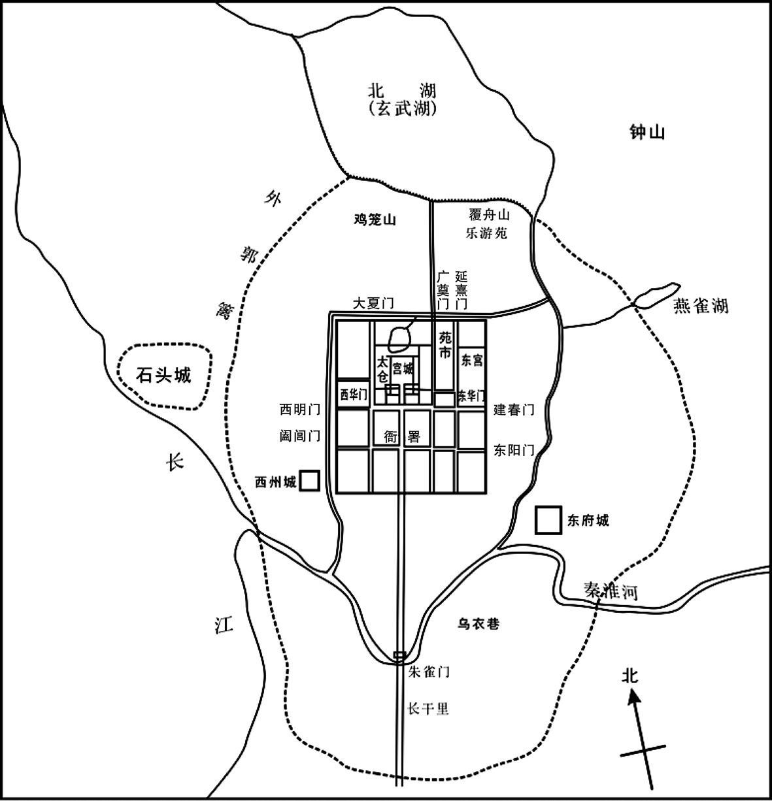 
东晋南朝建康示意图

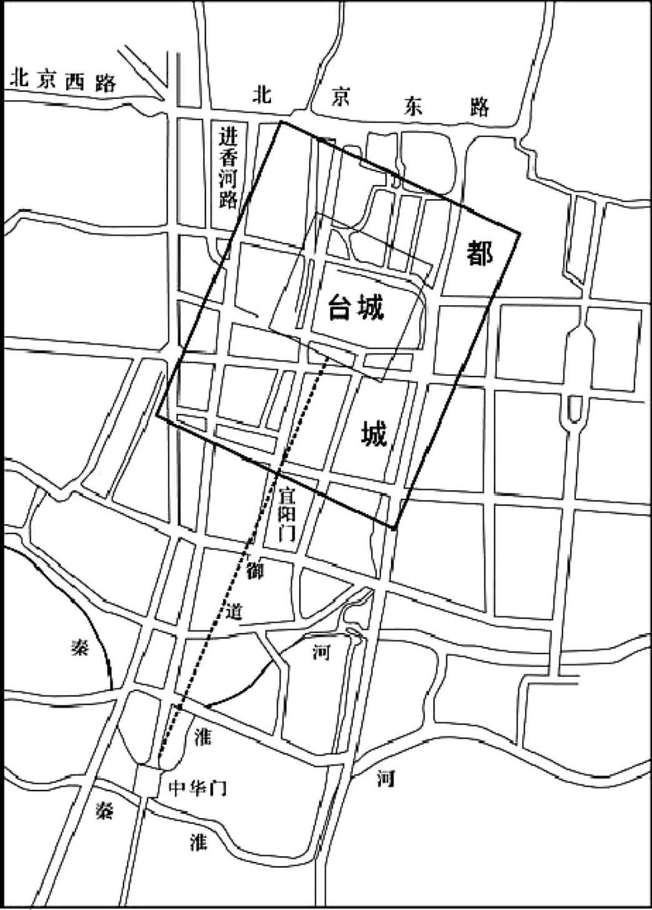 
建康城平面示意图

## 【原文】

**三月壬子，论平苏峻功，以陶侃为侍中、太尉，封长沙郡公，加都督交广宁州诸军事；郗鉴为侍中、司空、南昌县公；温峤为骠骑将军、开府仪同三司，加散骑常侍，始安郡公；陆晔进爵江陵公[1]。自余赐爵侯、伯、子、男者甚众[2]。卞壸及二子眕、盱、桓彝、刘超、钟雅、羊曼、陶瞻皆加赠谥[3]。路永、匡术、贾宁皆苏峻之党也，峻未败，永等去峻归朝廷。王导欲赏以官爵，温峤曰：“永等皆峻之腹心，首为乱阶，罪莫大焉[4]。晚虽改悟，未足以赎前罪，得全首领，为幸多矣，岂可复褒宠之哉[5]！”导乃止。**

## 【注文】

[1]长沙郡公：东晋爵位名。“公”为古代爵位中最高等级。　　南昌县公：东晋爵位名。南昌县始建于汉高帝五年（前202年），自建制以来就是“江西”历朝历代的郡治、道治、省会所在地，有着“江西首县”的美誉。　　始安郡公：东晋爵位名。始安郡，本属零陵，三国吴甘露元年（265年）分置，属广州，治所在始安县（今广西桂林），后属荆州。西晋隶属于广州。辖境相当今广西桂林、永福、阳朔、平乐、灌阳、荔浦等市县地。东晋成帝时属荆州。

[2]侯、伯、子、男：晋爵位名，晋代设置了王、公、侯、伯、子、男、开国郡公、开国县公、开国郡侯、开国县侯、开国侯、开国伯、开国子、开国男、乡侯、亭侯、关内侯、关外侯，共十八级，较为复杂。

[3]赠谥：古代帝王、官员死后，根据其生前事迹赠给一个表示褒贬的称号。

[4]乱阶：祸乱的根源，即挑起叛乱的人。

[5]得全首领：保全性命、保全头颅。　　褒宠：褒奖与赏赐。

## 【译文】

晋成帝咸和四年（329年）三月壬子（初十日），朝廷讨论平定苏峻之乱的功劳。任命陶侃为侍中、太尉，封长沙郡公，加授都督交州、广州、宁州诸军事；郗鉴为侍中、司空，封南昌县公；温峤为骠骑将军、开府仪同三司，加授散骑常侍，封始安郡公；陆晔晋升为江陵公。其他有功之臣，赐封爵位为侯爵、伯爵、子爵、男爵者很多。卞壸与他的两个儿子卞眕、卞盱及桓彝、刘超、钟雅、羊曼、陶瞻等都被追赠官爵，赐以谥号。路永、匡术、贾宁等都是苏峻的党羽，在苏峻还没有战败时，路永等人就脱离苏峻而归顺朝廷。王导打算赏赐他们官爵，温峤说：“路永等人都是苏峻心腹，首先挑起叛乱，犯有严重罪行。后来虽然改悔，但不足以赎抵从前的罪行，现在能够保全性命就已经是很幸运了，怎么能赏赐他们爵位官职呢\!”王导于是作罢。

## 【原文】

**陶侃以江陵偏远，移镇巴陵[1]。朝议欲留温峤辅政，峤以王导先帝所任，固辞还藩，又以京邑荒残，资用不给，乃留资蓄具器用而后旋于武昌。**

## 【注文】

[1]江陵：县名。治所在今湖北江陵。　　巴陵：郡名。晋武帝太康元年（280年）建立巴陵县。惠帝元康元年（291年）置巴陵郡。郡治设在巴陵（今湖南岳阳）。辖境相当于今湖南岳阳及湖北监利、通城、崇阳等县地。　　先帝：谓晋明帝。　　还藩：指回武昌。温峤本为江州刺史，镇武昌。

## 【译文】

陶侃因江陵偏远，于是移镇巴陵。朝廷商量打算把温峤留在建康辅政。温峤以为王导是先帝任命的辅政大臣，于是坚决推辞。又因为京城荒凉残破，物资短缺，于是把军中物资、器具都留下，然后率领军队返回武昌。

## 【原文】

**帝之出石头也，庾亮见帝，稽颡哽咽，诏亮与大臣俱升御座[1]。明日，亮复泥首谢罪，乞骸骨，欲阖门投窜山海[2]。帝遣尚书、侍中手诏慰喻曰：“此社稷之难，非舅之责也。”亮上疏自陈：“祖约、苏峻纵肆凶逆，罪由臣发，寸斩屠戮，不足以谢七庙之灵，塞四海之责[3]。朝廷复何理齿臣于人次，臣亦何颜自次于人理。愿陛下虽垂宽宥，全其首领，犹宜弃之，任其自存自没，则天下粗知劝戒之纲矣。”优诏不许。亮又欲遁逃山海，自暨阳东出，诏有司录夺舟船[4]。亮乃求外镇自效，出为都督豫州扬州之江西宣城诸军事，豫州刺史，领宣城内史，镇芜湖[5]。**

## 【注文】

[1]稽（qǐ）颡（sǎng）：古代一种跪拜礼，屈膝下拜，以额触地，表示极度虔诚。　　御座：皇帝的座位。

[2]泥首：用泥涂在头面上，表示自辱服罪。　　乞骸骨：古时官员因年老等原因自请退休。在封建社会，官员年纪大了不能继续为皇帝效力，就请求君主赐还自己的残躯，以归葬故里，故把请求退休叫做乞骸骨，也叫乞身。

[3]手诏：持皇帝亲自写的诏书。　　寸斩：把犯人一寸一寸地斩杀。　　七庙：庙是供祀祖宗的屋舍。从商朝开始，帝王死后，在太庙立室奉祀，并追尊以某祖、某宗的名号，称庙号。司马昭庙号太祖，司马炎为世祖，司马睿为中宗，司马绍为肃宗，而司马衷、司马炽、司马邺三帝无庙号。这里“七庙”代指以上七帝的亡灵。

[4]暨阳：县名，治所在今江苏江阴东。

[5]外镇：镇守一方的外任官。　　都督豫州扬州之江西宣城诸军事：都督豫州、扬州长江以西和宣城郡诸军事。

## 【译文】

晋成帝离开石头城回到建康，庾亮觐见成帝，叩头痛哭。晋成帝于是命他同大臣们一起登上御座。第二天，庾亮再次向成帝叩头谢罪，请求免去自己的职务，率领全家去到遥远的深山或是海滨隐居。晋成帝派遣尚书、侍中带着亲笔书写的诏书安慰他说：“苏峻叛乱是国家的灾祸，不是舅父的责任。”庾亮上疏陈述自己的罪过说：“祖约、苏峻叛逆一事都是因为臣的缘故而酿成的，就是寸寸斩割，也不足以向宗庙先帝们的神灵谢罪，难以平息天下人的指责。朝廷还有什么理由把我同无罪的人相提并论呢，臣还有什么脸面把自己同别人等同起来呢。陛下使我保全性命就已经很宽大了，对我还应当舍弃不用，任其自生自灭，这样，天下百姓就可大体知道劝勉告诫的纲要了。”晋成帝还是下诏安慰，不批准庾亮的要求。庾亮又想逃到山海之中，从暨阳出发向东。朝廷于是下诏让官员扣留他准备乘坐的船只。庾亮便请求调到地方任职。于是朝廷任命他为都督豫州以及扬州长江以西和宣城郡诸军事、豫州刺史，并兼任宣城刺史，镇守芜湖。

## 【原文】

**陶侃、温峤之讨苏峻也，移檄征镇，使各引兵入援。湘州刺史益阳侯卞敦拥兵不赴，又不给军粮，遣督护将数百人随大军而已，朝野莫不怪叹[1]。及峻平，陶侃奏敦阻军顾望，不赴国难，请槛车收付廷尉。王导以丧乱之后，宜加宽宥，转敦安南将军、广州刺史；病不赴，征为光禄大夫，领少府。敦忧愧而卒，追赠本官，加散骑常侍，谥曰敬。**

## 【注文】

[1]湘州刺史：湘州最高军政长官。

## 【译文】

陶侃、温峤讨伐苏峻时，发布檄文给各地负责军事的四征、四镇将军和州郡官吏，命令他们率兵救援。湘州刺史、益阳侯卞敦手握重兵，却不供给军粮，仅派遣部下督护率领数百人随从大军参战而已，朝廷内外官吏百姓莫不感到惊讶、叹息。苏峻之乱平定后，陶侃弹劾卞敦阻挠义军、坐观成败、不赴国难，请用囚车押到建康交付廷尉治罪。王导认为大乱之后应当实行宽大政策，于是调任卞敦为安南将军、广州刺史。卞敦因病不能上任。朝廷征召他为光禄大夫，兼任少府。不久，卞敦因忧愁惭愧发病而死，追赠他原有官职，加授散骑常侍，赐予谥号为“敬”。

## 【原文】

**臣光曰[1]：庾亮以外戚辅政，首发祸机，国破君危，窜身苟免[2]。卞敦位列方镇，兵粮俱足，朝廷颠覆，坐观胜负。人臣之罪，孰大于此。既不能明正典刑，又以宠禄报之，晋室无政，亦可知矣，任是责者，岂非王导乎！**

## 【注文】

[1]臣光曰：司马光编《资治通鉴》时，每写到重要处，便以“臣光曰”的形式，议论史事，品评人物。司马光（1019—1086年），字君实，号迂叟，北宋时期著名政治家、史学家、散文家。陕州夏县（今山西夏县）人。宋仁宗宝元年间进士。曾任馆阁校勘，同知谏院、龙图阁直学士、门下侍郎、尚书左仆射兼门下侍郎等职。他主持编纂了中国历史上第一部编年体通史《资治通鉴》。

[2]外戚：封建社会皇帝的母族妻族。在中国古代历史上，若皇帝年幼即位，皇太后往往让自己的父兄处理政务。外戚控制中央政权后，又将自己的子弟和亲戚派往中央和地方做官，形成外戚专权的局面。此处指庾亮为晋成帝的舅舅。

## 【译文】

史臣司马光评论说：庾亮以外戚地位辅佐朝政，引发祸端，以致国家残破，皇帝处于危险境地，而他自己却四处逃窜，只求活命。卞敦身为镇守一方的大臣，兵多将广，粮食充足，在朝廷颠覆的时候，却坐观成败。臣下的罪过，没有比这件事更为严重的了！朝廷既不能宣布他们的罪过，也不给予公正处分，反而还用高官厚禄来回报。晋朝国政败坏，由此可知，应当承担此责任的，难道不是王导吗！

# 燕讨段辽**  
****讨宇文附**

## 【内容摘要】

《燕讨段辽》记载了前燕慕容皝（huàng）平定内乱，联合后赵消灭鲜卑段部，然后打败后赵、消灭鲜卑宇文部的历史过程。

晋成帝司马衍咸和八年（333年），慕容廆（wěi）去世，慕容皝继位，在此之前深受慕容廆宠爱的征虏将军慕容仁和广武将军慕容昭害怕慕容皝不能容忍自己，于是在平郭（今辽宁盖州西南）举兵西行至棘城进攻慕容皝，并以慕容昭为内应。最初，慕容仁军队节节胜利，尽取辽东之地。同时段部首领段辽乘机东侵，与慕容仁遥相呼应，形成东西夹击之势。此时的慕容皝听取高诩等人的建议，对段部采用据城坚守的办法，集中力量讨伐慕容仁，最终出其不意平定辽东，消灭了慕容仁。这是燕讨段辽的第一阶段。

慕容仁失败后，段辽又联合宇文部首领宇文逸豆归进攻慕容皝，被慕容皝打败。阳裕劝说段辽与慕容皝讲和，段辽不仅不听，反而多次侵扰后赵边境。这时慕容皝遣使称藩于后赵，并以他的弟弟慕容汗为人质，请后赵发兵共讨段辽。后赵王石虎辞退回人质，约定次年共同发兵。此时，慕容翰劝段辽对燕暂时采取守势，集中兵力抵御后赵。段辽不听，集中兵力攻燕，结果遇挫，后赵乘机发起猛攻，段辽节节败退，主力被消灭。此后，段部所有辽西、北平等郡县分别为燕、赵瓜分。不久，段辽率领残部投降前燕，前燕尽得段辽余众和大量财物，段部至此灭亡。这是燕讨段辽的第二阶段。

后赵石虎以前燕在约定共同夹攻段辽中违约为借口，率军进攻前燕。燕王慕容皝听取部将慕舆根、刘佩、封奕的意见，采取坚守城池、等待有利时机大举出击的正确战略战术，终于扭转危局，取得全胜，后赵军队退回境内。此后，慕容皝在他的兄弟慕容翰的帮助和高诩的策划下，灭掉了宇文部。这是燕讨段辽的第三阶段。

平定宇文部为前燕进入中原奠定了基础。同时，慕容政权也获得了一个短暂的休兵时期。这时，前燕东边有高句丽和扶余，北边和柔然隔着沙漠遥遥相望，东边则和拓跋部鲜卑的代国接壤。公元342年，新都龙城（今辽宁朝阳）竣工，慕容皝于是将都城迁往龙城，兴造宫殿。慕容皝在位十五年，在他的领导下消灭了段部和宇文部，重创高句丽和扶余国，占据了东到朝鲜半岛北部，西到代郡，南到长城的广大领土，为前燕的建立奠定了坚实的基础。

## 【原文】

**晋明帝太宁三年冬十一月，慕容廆与段氏方睦，为段牙谋，使之徙都[1]。牙从之，即去令支，国人不乐[2]。段疾陆眷之孙辽欲夺其位，以徙都为牙罪，十二月，帅国人攻牙，杀之，自立[3]。段氏自务勿尘以来，日益强盛，其地西接渔阳，东界辽水，所统胡、晋三万余户，控弦四五万骑[4]。**

## 【注文】

[1]慕容廆（wěi）（269—333年）：鲜卑族，昌黎棘城（今辽宁义县西北）人，鲜卑慕容部首领慕容涉归之子，前燕建立者慕容皝之父。晋武帝司马炎太康四年（283年）慕容涉归去世，其弟慕容删篡夺政权，他被迫逃亡。太康六年（285年），部众杀死慕容删，他被迎立继位。太康十年（289年），被西晋封为鲜卑都督。晋怀帝司马炽永嘉元年（307年），时值五胡乱始，他自称鲜卑大单于。在位期间，他政事修明、招揽贤才，因此士大夫和民众大多归附他。晋成帝司马衍咸和八年（333年），去世，谥襄公。其孙慕容儁称帝时，追尊他为武宣皇帝。　　段氏：即段牙（？—325年），十六国时段部鲜卑的首领，辽西公。公元325年继位。同年，慕容廆建议迁都，他欣然接受，遂迁离都城令支（今河北迁安西），引起部将不满。此后，段牙的堂兄弟段辽以段牙迁都为罪名，率领军队杀死段牙，自立为首领。　　方睦：关系正和睦。当时慕容廆是鲜卑族慕容部首领，段牙是鲜卑族段部首领。慕容氏和段氏都曾接受晋朝的封爵，分别被封为辽东公、辽西公。

[2]令支：县名。治所在今河北迁安西。　　国人：古代指居住在城市内的人。

[3]段疾陆眷（？—318年）：十六国时期段部鲜卑首领，辽西公，前任首领段务勿尘之子。初期，他曾率军随西晋幽州刺史王浚与汉赵军队作战。公元312年，他受王浚之命，带领他的弟弟段匹（dī）、段文鸯、堂弟段末柸征讨汉赵，与汉赵将领石勒战于襄国（今河北邢台），最终惨败。于是与石勒和谈退兵，从此段部鲜卑改附石勒。　　辽：即段辽（？—339年），十六国时期段部鲜卑首领。公元325年，段牙因迁都导致部众不满，他便以此为借口率军进攻段牙，取胜后自立为首领。公元338年，在慕容皝和石虎两军夹击下，他向前燕投降，段部鲜卑政权至此覆灭。投降后，慕容皝以上宾之礼对待他。次年，他意图谋反，失败被杀。

[4]务勿尘：即段务勿尘，十六国时段部鲜卑首领，受晋朝册封为辽西公。公元310年，再被晋朝封为大单于。　　渔阳：郡名。治所在渔阳县（今北京密云西南）。辖境相当于今河北滦河上游以南，蓟运河以西，天津海河以北，北京怀柔、通州以东地区。　　辽水：即今辽河，东北地区南部大河。流经河北、内蒙古、吉林和辽宁等地区，在辽宁盘山注入渤海。

## 【译文】

晋明帝司马绍太宁三年（325年）冬季十一月，慕容廆同段氏十分和睦，他就为段牙出谋划策，建议迁都。段牙听从了他的建议，将都城从令支迁出，段部百姓对此十分不满。段疾陆眷的孙子段辽想要夺取权位，于是把迁都作为段牙的罪名，十二月，段辽率领段部军队进攻段牙，将他杀死，并自立为辽西公。段氏政权从段务勿尘以来，势力日益强大，统辖的地区西边同渔阳郡接界，东到辽水，所统辖的胡人、原西晋汉人有三万多户，拥有四五万名骑兵。

## 【原文】

**成帝咸和八年夏五月甲寅，辽东武宣公慕容廆卒[1]。六月，世子皝以平北将军行平州刺史，督摄部内[2]。**

## 【注文】

[1]辽东：郡名。始设于战国时燕国，是秦击败东胡后所设五郡之一，治所设在襄平县（今辽宁辽阳），因郡治在辽河之东故名“辽东”。辖境东南至今鸭绿江下游，西至今大凌河下游及细河左岸，北至今辽河上游，东界自今昌图东北。魏晋南北朝时沿置。

[2]世子：亲王、诸侯法定继承人的正式封号，多由嫡长子充任。周代时，天子、诸侯的嫡子称“世子”。汉初，亲王法定继承人的正式封号为王太子，后来为与皇太子相区别，改为世子，后世沿袭不改。　　皝：即慕容皝（297—348年），字元真，昌黎棘城（今辽宁义县西北）人，鲜卑族，慕容廆的第三子，前燕的创建者。咸康三年（337年），他自称燕王，史称前燕。此后，他先后打败了辽西段氏、宇文氏等割据势力，国势渐强。后迁都龙城（今辽宁朝阳）。他在位期间，招徕流民垦辟土地，鼓励学习汉族文化。　　平北将军：武官名号，与平东、平西、平南将军合称“四平将军”。此职多兼镇守地区的刺史，统掌军事、政务。　　平州刺史：平州最高军政长官。

## 【译文】

晋成帝司马衍咸和八年（333年）夏季五月甲寅（初六日），辽东武宣公慕容廆去世。六月，世子慕容皝以平北将军的身份代理平州刺史职位，监督管辖鲜卑慕容部事务。

## 【原文】

**慕容皝初嗣位，用法严峻，国人多不自安[1]。主簿皇甫真切谏，不听[2]。皝庶兄建威将军翰、母弟征虏将军仁，有勇略，屡立战功，得士心，季弟昭，有才艺；皆有宠于廆，皝忌之[3]。翰叹曰：“吾受事于先公，不敢不尽力，幸赖先公之灵，所向有功，此乃天赞吾国，非人力也。而人谓吾之所办，以为雄才难制，吾岂可坐而待祸邪[4]。”乃与其子出奔段氏。段辽素闻其才，冀收其用，甚爱重之。**

## 【注文】

[1]嗣位：继位。　　用法严峻：刑法严厉。

[2]皇甫真：生卒年不详，字楚季，十六国前燕安定朝那（今甘肃平凉西北）人。历任平州别驾、典书令等职。秦燕战争时期，被前秦评为燕国唯一的智谋之士。前秦灭亡前燕后，他又担任前秦奉车都尉一职。

[3]庶兄：旧称父妾所生年长者。　　翰：即慕容翰（？—344年），字元邕（yōng），昌黎棘城（今辽宁义县西北）人，鲜卑族首领慕容廆之子。他文武双全，足智多谋，膂（lǚ）力过人，深得父亲喜爱。慕容皝继位后，他因受猜忌而投奔宇文归，后思乡而归。晋康帝建元二年（344年），他随慕容皝讨伐宇文归。后被人诬告谋反，赐死。　　仁：即慕容仁（？—336年），慕容廆之子，慕容皝之弟，昌黎棘城（今辽宁义县西北）人。公元333年，慕容皝任辽东公后，他与慕容昭谋叛，事情败露，慕容仁急返平郭镇守。自此慕容部一分为二，相互攻击。公元336年，被慕容皝擒获，赐死。　　昭：即慕容昭（？—333年），慕容廆第四子。年少时曾随慕容廆征战，深受慕容廆疼爱。公元333年，他与慕容仁密谋叛变，由于慕容昭事发时在城内，因此很快便被慕容皝擒住，被赐自尽。

[4]先公：指慕容廆。

## 【译文】

慕容皝继位之初用法严厉，百姓都提心吊胆，感到不安。主簿皇甫真恳切劝谏，但慕容皝不听。慕容皝同父异母的哥哥建威将军慕容翰、同母兄弟征虏将军慕容仁，有勇有谋，屡立战功，深得士兵之心，三弟慕容昭，有才能技艺，他们都曾受到慕容廆的宠爱。慕容皝对此非常反感。慕容翰叹息道：“我接受先父的命令，尽我所能，凭仗先父神灵保佑，战无不克，攻无不胜。这是上天在帮助我们，不是我一人的力量就能办到的。但有人说这些都归功于我，认为我雄才大略，很难控制，我怎么能坐以待毙呢！”于是他就和儿子一起投奔段氏。段辽平日就听说慕容翰很有才能，也期望他能为自己效力，对他十分喜爱和器重。

## 【原文】

**［冬十月］，仁自平郭来奔丧，谓昭曰：“吾等素骄，多无礼于嗣君。嗣君刚严，无罪犹可畏，况有罪乎[1]！”昭曰：“吾辈皆体正嫡，于国有分[2]。兄素得士心，我在内未为所疑，伺其间隙，除之不难[3]。兄趣举兵以来，我为内应，事成之日，与我辽东[4]。男子举事，不克则死，不能效建威偷生异域也[5]。”仁曰：“善。”遂还平郭。闰月，仁举兵而西。**

## 【注文】

[1]平郭：地名，今辽宁盖州西南。　　奔丧：从外地急忙赶回去料理长辈亲属的丧事。汉族丧礼仪式之一，即子女在外，如父母去世，立即穿孝衣奔赴故乡，途中素食，到家则自门外号哭于堂上。如官员遇父母大丧，一般须去职赴丧，只有朝廷重臣或身在军中者，皇帝有权诏令不奔丧。在古代，不奔丧属大不孝行为。　　嗣君：刚刚继位的兄长。　　刚严：刚直严厉。

[2]正嫡（dí）：指嫡子。嫡庶制度是中国古代婚姻制度的核心内容。中国古代实行一夫一妻多妾制，妻妾之间的地位不平等。“嫡”是指正妻及其所生子女，而“庶”指姬妾及其所生子女。正妻与丈夫地位平等，在服装、车辆等礼仪制度方面享受同等待遇。除正妻以外的其他配偶就是庶妻，或称作姬妾。

[3]伺：等待。　　间隙：时机、机会。

[4]内应：从内部接应外部进攻的力量。

[5]男子：指大丈夫、君子。　　建威：指建威将军慕容翰。　　偷生异域：指慕容翰逃奔鲜卑段氏。

## 【译文】

晋成帝咸和八年（333年）冬季十月，慕容仁从平郭出发来为慕容廆奔丧。他对兄弟慕容昭说：“我们大家素来有些骄傲，对于刚刚继位的兄长慕容皝有一些不礼貌的表现。慕容皝性情刚直严厉，即使没有罪，都令人畏惧，何况我们有罪呢？”慕容昭说：“我们同慕容皝都是嫡子，国家也应该有我们的份。您平常深得士兵们的拥护，我在宫内，慕容皝对我没有怀疑，等候时机，除掉他并不困难。您赶快率兵前来，我立即在宫内响应。事成之后，你把辽东郡分给我就行了。男子汉大丈夫做事，如果不成功，一死了之，不能效法建威将军慕容翰逃奔外地，苟且偷生。”慕容仁说：“好！”于是返回平郭。闰月，慕容仁率兵西上。

## 【原文】

**或以仁、昭之谋告皝，皝未之信，遣使按验[1]。仁兵已至黄水，知事露，杀使者，还据平郭[2]。皝赐昭死。遣军祭酒封奕尉抚辽东[3]。以高诩为广武将军，将兵五千，与庶弟建武将军幼、稚、广威将军军、宁远将军汗、司马辽东佟寿共讨仁[4]。与仁战于汶城北，皝兵大败，幼、稚军皆为仁所获[5]。寿尝为仁司马，遂降于仁。前大农孙机等举辽东城以应仁，封奕不得入，与汗俱还[6]。东夷校尉封抽、护军平原乙逸、辽东相太原韩矫皆弃城走，于是仁尽有辽东之地，段辽及鲜卑诸部皆与仁遥相应援[7]。皝追思皇甫真之言，以真为平州别驾。**

## 【注文】

[1]按验：调查。

[2]黄水：水名。即“潢水”，今内蒙古西拉木伦河及其下游西辽河。　　事露：举兵讨伐慕容皝之事败露。

[3]军祭酒：即军谘（zī）祭酒。　　封奕（？—365年）：字子专，勃海蓨（tiáo）（今河北景县）人，封释之孙。他富有谋略，军事才能非凡，深得慕容皝赏识。公元337年，慕容皝称燕王，任命他为国相。慕容儁（jùn）称帝后，又拜他为太尉，封武平侯。不久进位太尉，领中书监，为定策元勋。公元365年，病死，谥匡公。

[4]高诩（xǔ）（？—344年）：初为慕容廆郎中。慕容皝继位后，担任玄菟（tù）太守，后因功封汝阴侯。公元344年，随慕容皝征伐宇文逸豆归，中箭而死。广武将军：军事职官名称。杂号将军之一，为刺史、太守的加衔。所属有长史、司马、正行参军和主簿等。　　庶弟：旧称父妾所生年幼者。　　建武将军：将军名号。东汉献帝刘协兴平（194—195年）年间曹操所置，统兵征战。　　幼：即慕容幼，生卒年不详，鲜卑人，慕容廆第五子。早年随慕容廆征战。慕容皝即位后，慕容仁、慕容昭叛变，慕容皝派遣他率领军队征讨，被慕容仁俘虏。慕容仁兵败后，他逃回慕容皝处，慕容皝念其兄弟手足，宽恕其罪。　　稚：即慕容稚，生卒年不详，慕容皝庶弟，早年随慕容廆征战。慕容皝即位后，慕容仁、慕容昭叛变，慕容皝于是派遣他前去征讨，但被慕容仁所俘。　　军：即慕容军，生卒年不详，慕容廆第六子。他曾追随慕容仁。慕容仁叛乱被平，他投降慕容皝。慕容儁建立前燕后，封他为襄阳王。　　宁远将军：武官名号。始置于三国魏。魏晋皆为五品官。　　汗：即慕容汗，生卒年不详，鲜卑人，慕容廆第七子。早年随慕容廆征战，慕容廆死后，慕容皝为燕主，后段辽进犯，慕容皝派他率军平叛。

[5]汶城：城名，在今辽宁营口东南。

[6]大农：即大司农。

[7]东夷校尉：又称“护东夷校尉”，曹魏时设立的辽东地区的最高军事长官。曹魏、西晋时期，主要负责维持王朝在东部少数民族地区的统治秩序。东晋初年撤销西部护乌桓校尉后，东北边疆少数民族事务都由东夷校尉管理。此外，东夷校尉还负责保护、扶持臣服中央王朝的地方民族与民族政权，打击破坏王朝边疆秩序、骚扰掳掠边郡的反叛势力，有权调集少数民族军队举行军事行动，并负有安抚、管理郡县内外归附的少数民族事务的职责，掌管郡县地区官民与塞外少数民族之间进贡、贸易等事务。　　乙逸：生卒年不详，十六国前燕平原（今山东平原西南）人。曾担任前燕东夷护军。慕容皝继位后，他出任玄菟太守、幽州刺史、左光禄大夫等职。乙逸以生活节俭、为官清廉著称。　　太原：郡国名。治所在晋阳（今山西太原西南）。辖境相当于今山西五台山和管涔山以南、霍山以北地区。　　鲜卑：中国古代东胡系民族。居于鲜卑山（今大兴安岭地区）。先秦时已活动于大兴安岭中部与北部，其语言、习俗与乌桓较为接近。秦汉之际，匈奴灭东胡，乌桓、鲜卑于是对匈奴称臣。汉武帝大败匈奴后，徙乌桓于上谷、渔阳、右北平、辽西、辽东五郡塞外，鲜卑人随之南迁至乌桓故地饶乐水（今西拉木伦河）流域，拓跋部则南迁至大泽（呼伦贝尔草原）。魏晋南北朝时期，内迁鲜卑慕容氏曾建立前燕、后燕、西燕、南燕；乞伏氏曾建立西秦；秃发氏曾建立南凉；拓跋氏先建代国，后改魏，最终统一北方地区。

## 【译文】

有人把慕容仁、慕容昭的密谋告诉了慕容皝，慕容皝最初不肯相信，于是派遣使臣前去调查。当时慕容仁的军队已经抵达黄水，见到慕容皝的使臣，知道事情已经暴露，于是杀掉使臣，退兵据守平郭。慕容皝于是赐慕容昭自尽，另外派遣军咨祭酒封奕到辽东郡进行慰问安抚。任命高诩为广武将军，率领五千名士兵，同庶弟建武将军慕容幼、慕容稚、广威将军慕容军、宁远将军慕容汗、司马辽东人佟寿共同讨伐慕容仁，与慕容仁的军队在汶城以北交战，结果慕容皝军队大败，慕容幼、慕容稚、慕容军被俘。佟寿曾经担任过慕容仁的司马，趁机归降慕容仁。前大司农孙机等人占据了辽东城，并献给了慕容仁，封奕不能进入辽东城，只好同慕容汗返回。东夷校尉封抽、护军平原人乙逸、辽东相太原人韩矫等都弃城而逃，慕容仁完全占有了辽东郡。段辽以及鲜卑各部落都同慕容仁互相呼应，互相支援。慕容皝回想起过去皇甫真对他的劝谏，任命他为平州别驾。

## 【原文】

**九年春二月，慕容仁以司马翟楷领东夷校尉，前平州别驾庞鉴领辽东相[1]。**

## 【注文】

[1]翟楷：生卒年不详，临洮（今甘肃岷县）人，慕容仁的部将，曾担任司马、东夷校尉等职，后封太原王。

## 【译文】

晋成帝咸和九年（334年）春季二月，慕容仁任命部将司马翟楷领东夷校尉，前任平州别驾庞鉴领辽东相。

## 【原文】

**段辽遣兵袭徒河，不克，复遣其弟兰与慕容翰共攻柳城[1]。柳城都尉石琮、城大慕舆埿并力拒守，兰等不克而退[2]。辽怒，切责兰等，必令拔之。休息二旬，复益兵来攻。士皆重袍蒙楯，作飞梯，四面俱进，昼夜不息[3]。琮、埿拒守弥固，杀伤千余人，卒不能拔[4]。慕容皝遣慕容汗及司马封奕等共救之。皝戒汗曰：“贼气锐，勿与争锋。”汗性骁果，以千余骑为前锋直进。封奕止之，汗不从。与兰遇于牛尾谷，汗兵大败，死者太半[5]。奕整陈力战，故得不没。**

## 【注文】

[1]徒河：县名。汉高帝刘邦元年（前206年）置，属辽西郡。治所设在今葫芦岛邰（tái）集屯镇小荒地村，另有学者认为在今辽宁锦州西北。东汉属辽东属国。西晋时隶属于昌黎郡，属平州。　　兰：即段兰，十六国时期段部鲜卑的首领，是段部鲜卑第一位首领段日陆眷之孙，段辽之弟。段辽为首领时，他数次率军出征邻近的政权。公元338年，段部鲜卑的辽西公国政权覆亡后，他率军逃亡。公元343年，他被宇文部鲜卑首领宇文逸豆归抓获，送至后赵，后赵石虎命他率领鲜卑部众五千人回到辽西的故都令支（今河北迁安西）屯驻。　　柳城：县名。治所在今辽宁朝阳西南。

[2]石琮（cóng）：前燕官吏，生卒年不详。公元334年，段辽派兵袭击鲜卑属地徒河、攻打柳城，时任柳城都尉的他和城主慕舆埿合力拒守。公元337年，慕容皝称燕王，封他为常伯。　　城大：一城之长，负责城内全部事务，相当于后世的城主、市长。　　慕舆埿（ní）：生卒年不详，前燕平北将军。公元334年，段氏首领段辽派兵袭击鲜卑属地徒河，后又派遣段兰等攻打柳城，他与柳城都尉石琮合力拒守，最后令段兰不克而退。公元339年，他和慕舆根等一同作战，对后赵边境辽西进行突袭，大获全胜。公元350年，他又跟随燕王慕容儁大举伐赵。

[3]重袍蒙楯（dùn）：身穿厚厚铠甲，手持盾牌挡住身体。

[4]拒守弥固：防守更加坚固。

[5]牛尾谷：地名。在柳城北，今辽宁朝阳西南。

## 【译文】

段辽派遣军队袭击徒河，没有成功，又派遣他的兄弟段兰同慕容翰一起率军进攻柳城。柳城都尉石琮、城主慕舆埿合力抵御，段兰等未能攻下，只好退兵。段辽大怒，严厉斥责段兰等，命令他们务必攻下。段兰休整二十天后，又增派军队，重新发起进攻。士兵们都身穿厚厚的铠甲，手持盾牌挡住身体，又制作飞梯，分四路不分昼夜轮番进攻柳城。石琮、慕舆埿防守更加坚固，杀伤、杀死段兰军队一千余人，段兰始终未能攻占柳城。慕容皝于是派遣慕容汗同司马封奕等前去援救。慕容皝告诫慕容汗说：“贼兵士气旺盛，不能同他们正面交锋。”慕容汗骁勇果敢，率领一千多名骑兵作为先锋径直前进，封奕加以劝阻，慕容汗不听。慕容汗同段兰军队在牛尾谷交战，结果慕容汗军队被打败，死伤大半。封奕整顿军队奋勇再战，避免了全军覆没。

## 【原文】

**兰欲乘胜穷追，慕容翰恐遂灭其国，止之曰：“夫为将当务慎重，审己量敌，非万全不可动[1]。今虽挫其偏师，未能屈其大势[2]。皝多权诈，好为潜伏，若悉国中之众自将以拒我，我县军深入，众寡不敌，此危道也[3]。且受命之日，正求此捷[4]。若违命贪进，万一取败，功名俱丧，何以返面[5]。”兰曰：“此已成擒，无有余理，卿正虑遂灭卿国耳。今千年在东，若进而得志，吾将迎之以为国嗣，终不负卿，使宗庙不祀也[6]。”千年者，慕容仁小字也[7]。翰曰：“吾投身相依，无复还理[8]。国之存亡，于我何有！但欲为大国之计，且相为惜功名耳[9]。”乃命所部欲独还，兰不得已而从之。**

## 【注文】

[1]遂灭其国：指就要消灭慕容部。　　审己量敌：仔细考虑敌我双方的军事力量。

[2]偏师：指全军的一部分，以别于主力。

[3]权诈：善于权谋，狡诈多端。　　潜伏：设置埋伏。　　县军：“县”通“悬”，深入敌境的孤军。

[4]受命：指段辽命令段兰无论如何要攻下柳城。

[5]返面：返回。

[6]卿国：指慕容部新建的国家。　　千年：慕容仁的小名。　　东：指东面的辽东。　　得志：满足意志，指消灭慕容皝。　　国嗣：国家的继承人。　　宗庙不祀：指国家灭亡。

[7]小字：小名。

[8]投身相依：决心投靠。

[9]大国：指段辽之国。

## 【译文】

段兰打算乘胜追击，慕容翰害怕段兰一举消灭掉慕容部，于是阻止段兰说：“凡是做将领的应当十分慎重，需要仔细考虑敌我双方的情况，假若不是万无一失，切忌轻举妄动。如今虽把敌军增援部队打败，但还没有摧毁他们主力军队。慕容皝善于权术，且狡诈多端，喜好设置埋伏，如果他出动全部兵力，亲自率领军队阻击，我军孤军深入，寡不敌众，这是非常危险的行动。况且奉命进攻柳城之时，所要求的就是今天的胜利。假若违背命令，贪功冒进，万一战败，前功尽弃，功名丧失，回去又如何交代呢？”段兰说：“现在慕容汗就要被生擒活捉，军队即将覆没，没有让他们保全下来的道理。你担心继续前进就会灭掉你们慕容部新建的国家而已。如今慕容仁在辽东，如果我们继续进军取得胜利的话，我将要迎接他继承父业，无论如何不会辜负你的，也不会使你们宗庙祭祀断绝。”千年，是慕容仁的小名。慕容翰说：“我既已决心前来投靠，没有再回去的道理。故国的兴衰存亡同我有何关系？我只不过是为贵国考虑而已，同时也是为珍惜我们二人的功名。”于是命令他统率的军队单独退回，段兰迫不得已只好跟他一起回师。

## 【原文】

**夏四月，慕容仁自称平州刺史、辽东公[1]。**

## 【注文】

[1]辽东公：前燕爵位名。在中国历史上，晋代爵位较为复杂，设置了王、公、侯、伯、子、男、开国郡公、开国县公、开国郡侯、开国县侯、开国侯、开国伯、开国子、开国男、乡侯、亭侯、关内侯、关外侯共十八级。

## 【译文】

晋成帝咸和九年（334年）夏季四月，慕容仁自称平州刺史、辽东公。

## 【原文】

**冬十一月，慕容皝讨辽东，甲申，至襄平[1]。辽东人王岌密信请降。师进入城，翟楷、庞鉴单骑走，居就、新昌等县皆降[2]。皝欲悉坑辽东民，高诩谏曰：“辽东之叛，实非本图，直畏仁凶威，不得不从。今元恶犹存，始克此城，遽加夷灭，则未下之城无归善之路矣[3]。”皝乃止。分徙辽东大姓于棘城[4]。以杜群为辽东相，安辑遗民[5]。**

## 【注文】

[1]襄平：县名，位于今辽宁辽阳。

[2]居就：县名，治所在今辽宁辽阳东南。现存城址为方形，土筑，残存遗迹为东墙和南北墙残段。　　新昌：地名，今辽宁海城东北。

[3]坑：古代军队作战的一项惯例，是指古代军队打仗，将敌军俘虏活埋的一种残暴行为。　　元恶：指元凶慕容仁。　　归善：指投降。

[4]大姓：指世家大族。一般认为大姓有两种含义：其一是社会地位高，历史影响大；其二是家丁兴旺，人口多。　　棘城：地名，今辽宁义县西。曾为古帝颛顼（Zhuānxū）之墟。公元294年，慕容廆率部移居至此。

[5]遗民：辽东遗留下的居民。

## 【译文】

晋成帝咸和九年（334年）冬季十一月，慕容皝进军辽东，讨伐慕容仁。甲申（十五日），慕容皝到达襄平。辽东人王岌秘密写信给慕容皝请求投降，于是慕容皝的军队进入城中，守将翟楷、庞鉴单人骑马逃走，居就、新昌等县都相继投降。慕容皝想要把辽东郡百姓全部坑杀，高诩劝谏说：“辽东叛变，并非辽东百姓本意，他们只是害怕慕容仁凶暴淫威，不得不屈从而已。如今元凶慕容仁尚在，刚刚攻下襄平这座城池，就要把百姓全部杀死，那尚未攻取的城池就没有投降的道路了。”慕容皝接受了他的建议，分批把辽东郡有势力的豪门大姓迁徙到棘城。同时，任命杜群为辽东相，安抚辽东遗留下的居民。

## 【原文】

**十二月，慕容仁遣兵袭新昌，督护新兴王寓击走之，遂徙新昌入襄平[1]。**

## 【注文】

[1]新兴：郡名，东汉建安二十年（215年）置，治所在九原县（今山西忻州）。东晋侨置，治所设在广牧县（今湖北江陵东），属荆州。

## 【译文】

晋成帝咸和九年（334年）十二月，慕容仁派遣军队进攻新昌，督护新兴人王寓将其打败。慕容皝于是把新昌的治所迁徙到襄平。

## 【原文】

**咸康二年春正月，慕容皝将讨慕容仁，司马高诩曰：“仁叛弃君亲，民神共怒[1]。前此海未尝冻，自仁反以来，连年冻者三矣[2]。且仁专备陆道，天其或者欲使吾乘海冰以袭之也[3]。”皝从之。群僚皆言涉冰危事，不若从陆道[4]。皝曰：“吾计已决，敢沮者斩[5]。”壬午，皝帅其弟军师将军评等自昌黎东，践冰而进，凡三百余里[6]。至历林口，舍辎重，轻兵趣平郭[7]。去城七里，候骑以告仁，仁狼狈出战[8]。张英之俘二使也，仁恨不穷追[9]。及皝至，仁以为皝复遣偏师轻出寇抄，不知皝自来，谓左右曰：“今兹当不使其匹马得返矣[10]。”乙未，仁悉众陈于城之西北，慕容军帅所部降于皝，仁众沮动，皝从而纵击，大破之[11]。仁走，其帐下皆叛，遂擒之[12]。皝先为斩其帐下之叛者，然后赐仁死。丁衡、游毅、孙机等皆仁所信用也，皝执而斩之。王冰自杀。慕容幼、慕容稚、佟寿、郭充、翟楷、庞鉴皆东走，幼中道而还。皝兵追及楷、鉴，斩之，寿，充奔高丽[13]。自余吏民为仁所诖误者，皝皆赦之[14]。封高诩为汝阳侯[15]。**

## 【注文】

[1]咸康：东晋成帝司马衍所用第二个年号，共计八年，即公元335年至342年。　　君亲：主上与兄长。

[2]前此：联系上下文，此处应当是指慕容仁背叛之前。

[3]海冰：海水结冰。

[4]涉冰：指从冰上进军。　　危事：危险的事情。

[5]沮（jǚ）：阻止、劝阻。

[6]军师将军：官名。是东汉初设置的杂号将军。三国蜀复置，蜀国曾以诸葛亮为军师将军，为全国最高军事统帅。慕容皝时期也设有此官。　　评：即慕容评（？—370年）：昌黎棘城（今辽宁义县西北）人，鲜卑族，慕容廆之子，慕容皝之弟。曾历任前燕前军师、上庸王、司徒、辅弼将军、太宰、太傅、镇南将军等职。慕容即位时，被任命为太傅，协助慕容恪辅政。公元367年，慕容恪去世，他代为执政，主持军国事务。但他嫉贤妒能，贪财好利，造成前燕政治腐败，社会矛盾急剧尖锐。公元370年，前秦王猛进攻前燕，他率领三十万大军对抗，但因其贪污腐败，导致军心涣散，士无战心，几乎全军覆没。同年，前燕灭亡，他逃往高句丽，被高句丽俘获，送往前秦，苻坚把他远放为范阳太守，后卒于任上。　　昌黎：郡名。西汉时，在今辽宁义县境内设交黎县，为辽西郡东部都尉治所所在地。东汉安帝刘祜（hù）元初二年（115年），改交黎县为昌黎县，为辽东属国治所。三国曹魏齐王曹芳正始五年（244年），恢复东汉辽东属国建制，不久后改称昌黎郡，范围大致包括今辽宁锦州、阜新、朝阳等地。魏晋时昌黎郡先后属幽州、平州，郡治在昌黎县（今辽宁义县）。

[7]历林口：地名。或说在今辽宁辽河下游以西一带。该地区当时是以汉族为主体聚居的区域。三国时称营口为辽口，东晋时叫“历林口”。　　辎（zī）重：行军时由运输部队携带的军械、粮草、被服等物资的总称。

[8]去：距离。　　候骑：担任侦察巡逻任务的骑兵。

[9]二使：指宇文部、段部的使臣。

[10]不使其匹马得返：意思是说要完全消灭掉慕容皝军队。

[11]沮动：士气低落、军心动摇。

[12]帐下：将帅的部下，同麾下。

[13]高丽（gōu lí）：亦作高句丽，位于中国东北地区和朝鲜半岛北部的一个民族政权（前37—668年），与百济、新罗合称朝鲜三国时代。公元前37年，扶余王子朱蒙因与其他王子不和，逃离扶余国到鸭绿江沿岸的卒本扶余，建立高句丽。建国后，逐步统一其周边的扶余、沃沮、东濊（huì），吞并汉四郡。5世纪时期，高句丽进入鼎盛时期，控制了朝鲜半岛和中国东北的大部分地区。隋唐年间，高句丽不断与唐军交战，国力衰落。公元668年，被唐朝与新罗联军所灭。

[14]诖（guà）误：因慕容仁叛变而连累犯罪的人。

[15]汝阳：郡名。治所在今河南商水西北。东晋咸康二年（336年），在今安徽和县、含山侨置汝阳郡，属豫州。

## 【译文】

晋成帝咸康二年（336年）春季正月，慕容皝计划讨伐慕容仁，司马高诩说：“慕容仁背叛主上和兄长已经引起了百姓和天神的愤怒。在叛变发生之前，海水从未冰冻过，自从慕容仁反叛以来，海水已经连续三年结冰。此外，慕容仁专门防备陆路，上天或许是想使我们利用冰冻从海上进攻他。”慕容皝听从了他的建议。但幕僚属官都认为踏冰进军是非常危险的事情，不如从陆路进军。慕容皝说：“我决心已定，谁敢阻挠，一律处斩。”壬午（十九日），慕容皝率领他的弟弟军师将军慕容评等从昌黎郡以东的海面上踏冰前进了三百余里登陆，到达历林口后，舍弃辎重物资，士兵们轻装向平郭前进。在距离平郭七里路的地方，侦察骑兵将慕容皝率军进攻的紧急情况报告慕容仁，慕容仁毫无防备，狼狈出战。当初张英突然袭击慕容仁时，把宇文部、段部的使臣俘虏走了，慕容仁悔恨当时没有追击。这次慕容皝率军来到，慕容仁最初以为是慕容皝派出的一支小部队前来骚扰劫掠，不知道是慕容皝亲自来到，于是对他身旁的将领说：“这次一定不要让他们的任何一匹马回去。”乙未（二月初三日），慕容仁出动全部军队在平郭城西北角摆开阵势，准备迎战。此时，慕容军却率领军队投降慕容皝，慕容仁军队军心动摇，慕容皝乘机发动猛攻，大破慕容仁军队。慕容仁逃走，但营帐中的亲兵却背叛了他，慕容仁最终被擒获。慕容皝先替慕容仁杀掉了营帐中背叛的人，然后赐他自杀。丁衡、游毅、孙机等都是慕容仁的亲信，慕容皝于是将他们斩首。王冰自杀。慕容幼、慕容稚、佟春、郭允、翟楷、庞鉴等都向东逃走，慕容幼中途回来，投降慕容皝。慕容皝于是派遣追兵追捕翟楷、庞鉴，并把他们斩杀，佟春、郭允逃奔高丽。其他官吏平民，凡是慕容仁叛变所涉及的人，慕容皝下令一概赦免。封高诩为汝阳侯。

## 【原文】

**夏六月，段辽遣中军将军李咏袭慕容皝。咏趣武兴，都尉张萌击擒之[1]。辽别遣段兰将步骑数万屯柳城西回水，宇文逸豆归攻安晋以为兰声援[2]。皝帅步骑五万向柳城，兰不战而遁。皝引兵北趣安晋，逸豆归弃辎重走，皝遣司马封奕帅轻骑追击，大破之。皝谓诸将曰：“二虏耻无功，必将复至，宜于柳城左右设伏以待之[3]。”乃遣封奕帅骑数千伏于马兜山[4]。三月，段辽果将数千骑来寇抄，奕纵击，大破之，斩其将荣伯保[5]。**

## 【注文】

[1]武兴：城名。在令支县东，位于今河北卢龙。

[2]回水：水名。在今辽宁朝阳西南。　　宇文逸豆归：东晋时期北方宇文部鲜卑的最后一位首领。宇文部鲜卑是中国古代鲜卑部族的一个支系，其部族最晚可能从东汉末年或三国初年即已形成，其后繁荣兴盛，直至五胡十六国前期为止。西晋以后较为强盛之时，其地约在濡源（今河北滦河上游）以东、柳城（今辽宁朝阳）以西。　　安晋：城名。在今辽宁朝阳西。

[3]二虏：指段氏、宇文氏。

[4]马兜山：即《汉书·地理志》柳城县条中的“马首山”。从汉、晋时代史书记载的方位勘定，马首山应在柳城之南，即今辽宁朝阳南袁台子汉柳城遗址之南的大柏山。

[5]三月：前文中已言及六月事，此“三月”疑似有误。据张敦仁《资治通鉴识误》，“三月”当作“七月”。

## 【译文】

晋成帝咸康二年（336年）夏季六月，段辽派遣中军将军李咏袭击慕容皝。李咏率兵到达武兴时，被都尉张萌活捉。段辽又派遣段兰率领步兵、骑兵数万人驻军在屯柳城以西的回水，遣宇文逸豆归进攻柳城附近的安晋城，声援段兰。慕容皝则率领五万名步兵、骑兵向柳城进军，段兰不战而逃跑。慕容皝于是率军北上直指安晋，宇文逸豆归丢弃辎重逃走，慕容皝派遣司马封奕率轻骑追击，大破宇文逸豆归军队。慕容皝对左右部将们说：“段氏、宇文氏这次出击没有取得成功，他们一定还会回来，我们应当在柳城附近设下埋伏。”于是派遣封奕率领数千名骑兵埋伏在马兜山。三月（疑为七月），段辽果然率领数千名骑兵前来侵扰，封奕纵兵出击，大破段辽，斩杀了段辽部将荣伯保。

## 【原文】

**三年春三月，慕容皝于乙连城东筑好城以逼乙连，留折冲将军兰勃守之[1]。夏四月，段辽以车数千两输乙连粟，兰勃击而取之。六月，辽又遣其从弟扬威将军屈云将精骑夜袭皝子遵于兴国城，遵击破之[2]。**

## 【注文】

[1]乙连：地名，《资治通鉴》卷九十五注：“乙连城，段国之东境也，在曲水之西。”据此，乙连城应在段部鲜卑的东境，曲水以西。也有学者认为其城应在今辽宁建昌或河北青龙一带。　　好城：地名，在今辽宁建昌或河北青龙一带。　　折冲将军：古代统兵将军名称。冲为古战车的一种。“折冲”有使敌人战车撤退，击溃敌军之意。折冲将军始置于东汉末年，前燕沿置。

[2]扬威将军：东汉末年曹操始置，为领兵军将。前燕沿置。　　屈云：即段屈云，生卒年不详，段辽的从弟，曾担任扬威将军等职。公元337年，他曾率骑兵夜袭慕容部边塞兴国城。次年正月，率军进攻后赵幽州（治所在今北京市）。　　遵：即慕容遵，生卒年不详，慕容皝第三子。　　兴国：地名，疑在今辽宁大陵河上游一带。

## 【译文】

晋成帝咸康三年（337年）春季三月，慕容皝在乙连城以东建筑好城，用以威逼乙连城，任命折冲将军兰勃防守城池。夏季四月，段辽派遣数千辆车运输粮食，接济乙连城。兰勃出兵攻击车队，截获了全部粮食。六月，段辽派遣他的堂弟扬威将军段屈云率领精锐骑兵乘夜袭击驻扎兴国城的慕容皝之子慕容遵军队，结果被慕容遵打败。

## 【原文】

**初，北平阳裕事段疾陆眷及辽五世，皆见尊礼[1]。辽数与皝相攻，裕谏曰：“‘亲仁善邻，国之宝也[2]。’况慕容氏与我世婚，迭为甥舅[3]。皝有才德，而我与之构怨，战无虚月，百姓彫弊，利不补害，臣恐社稷之忧将由此始[4]。愿两追前失，通好如初，以安国息民[5]。”辽不从，出裕为北平相[6]。**

## 【注文】

[1]北平：郡名。西晋时改右北平郡置，治所设在徐无县（今河北遵化东）。十六国后赵、前燕沿置。　　阳裕：字士伦，生卒年不详，十六国时期右北平无终（今天津蓟县）人。西晋末，担任治中从事。后投奔辽西鲜卑段部，担任郎中、中军将军。历事段氏五主，备受器重。其后，他被前燕慕容皝俘虏，深得慕容皝器重，授大将军司马，率领军队东破高句丽，北灭宇文归。　　五世：指从段疾陆眷到他的继承人段涉复辰、段末柸、段牙、段辽等五代人。段涉复辰（？—318年），十六国时期段部鲜卑的首领，辽西公。公元318年，段涉复辰继位。不久，段涉复辰为段末柸（？—325年）乘虚袭杀。公元325年段末柸去世，他的弟弟段牙继位。

[2]亲仁善邻：语出《左传》隐公六年。意思是说亲近仁爱百姓，善意对待邻国。

[3]世婚：世代为婚。　　甥舅：外甥和舅舅。犹言交替通婚。

[4]虚月：空闲的月份。　　彫弊：困弊、凋零。

[5]前失：以前的错误。　　安国：当时慕容氏、段氏虽然都接受晋朝官爵，没有称帝，算是晋朝的藩国，但实际上一切自主，所以他们的幕僚都把他们看成国君，把他们控制的地区称为国家。

[6]出：在中国古代指调到外地任职，离开都城。

## 【译文】

当初，北平人阳裕一直在鲜卑段部首领段氏手下任职，从段疾陆眷到他的继承人段辽之时，已经经历了五代。他都受到段氏的尊敬。段辽多次同慕容皝交战，阳裕劝谏说：“亲近仁爱百姓，善意对待邻国，是立国之本。况且慕容氏同段氏世代结为婚姻，长期以来就有舅甥的亲密关系，慕容皝又有才有德，但我们现在同他结下怨仇，几乎每月都发生战事，百姓因为战争而困苦，所获得的利益不足以弥补损失，恐怕国家的忧患将要从此开始了。希望双方能纠正从前的错误，如同过去一样友好往来，这才能使国家安定，休养生息。”段辽不听从他的意见，把他调到外地，担任北平郡相。

## 【原文】

**段辽数侵赵边，［冬十一月］，燕王皝遣扬烈将军宋回称藩于赵，乞师以讨辽，自请尽帅国中之众以会之，并以其弟宁远将军汗为质[1]。赵王虎大悦，厚加慰答，辞其质，遣还，密期以明年。**

## 【注文】

[1]燕王：慕容皝自称燕王，后来得到晋朝追封承认。前燕政权（337—370年）为十六国时期由鲜卑族首领慕容皝所建立的政权，建国初定都龙城（今辽宁朝阳），后迁都至邺城（今河北临漳西南）。盛时疆域包括今河北、山东和山西、河南、安徽、江苏、辽宁的一部分，西接前秦，与东晋以淮水为界。公元370年，被前秦所灭。历三主，共三十四年。　　称藩：亦作“称蕃”，自称藩属，向大国或宗主国承认自己的附庸地位。　　质：担保之意。“质”是我国最初的担保形式。设置这种“质”主要有两个目的：一是巩固和平友好，意思就是要是我们之间发生战争，你可以杀了我的人质；另一个是表示诚意，巩固联盟，一般是联合攻打别的国家或者抵抗别国入侵，护送人质表示诚意。

## 【译文】

段辽屡次侵犯后赵边境。咸康三年（337年）冬季十一月，燕王慕容皝派遣扬烈将军宋回出使后赵，表示归降，承认自己是后赵的藩属国家，请求后赵出兵讨伐段辽，他自己愿意率领全国军队前去会合，并答应把他的兄弟宁远将军慕容汗派到后赵去做人质。后赵王石虎听后十分高兴，重重赏赐慰问，并将人质送还，双方秘密约定第二年出兵讨伐段辽。

## 【原文】

**四年春正月，燕王皝遣都尉赵槃如赵，听师期[1]。赵王虎将击段辽，募骁勇者三万人，悉拜龙腾中郎[2]。会辽遣段屈云袭赵幽州，幽州刺史李孟退保易京[3]。虎乃以桃豹为横海将军，王华为渡辽将军，帅舟师十万出漂渝津；支雄为龙骧大将军，姚弋仲为冠军将军，帅步骑七万为前锋，以伐辽[4]。三月，赵槃还至棘城。燕王皝引兵攻掠令支以北诸城。段辽将追之，慕容翰曰：“今赵兵在南，当并力御之，而更与燕斗。燕王自将而来，其士卒精锐，若万一失利，将何以御南敌乎[5]！”段兰怒曰：“吾前为卿所误，以成今日之患，吾不复堕卿计中矣[6]。”乃悉将见众追之。皝设伏以待之，大破兰兵，斩首数千级，掠五千户及畜产万计以归。**

## 【注文】

[1]师期：出师讨伐的日期。

[2]龙腾中郎：后赵禁卫军的士兵称为龙腾中郎。他们大多由羯族人组成，是后赵军队的精锐，也是皇帝的禁卫军，其地位高于一般士兵，具有军官身份。

[3]易京：地名。位于今河北雄县西北附近。

[4]横海将军：杂号将军之一，汉武帝时置。十六国时期后赵石勒沿置。　　漂渝津：渡口名，位于今天津东。　　支雄：十六国后赵官吏，生卒年不详，月（ròu）支人，曾任后赵龙骧大将军、大司空等职务。　　龙骧（xiāng）大将军：将军名号，西晋设置，十六国后赵沿置。　　姚弋（yì）仲（280—352年）：南安赤亭（今甘肃陇西西）人，十六国时羌族首领，十六国后秦奠基人。西晋末年，他率部东徙榆眉（今陕西千阳东），自称扶风公。先后投靠前赵、后赵，曾任冠军大将军。晋穆帝司马聃永和七年（351年），他担任车骑大将军、大单于，封高陵郡公。次年，病故。姚苌建立后秦后，追尊他庙号为“始祖”，谥“景元皇帝”。

[5]南敌：指石虎的后赵兵。

[6]吾前为卿所误，以成今日之患：指上次慕容翰劝说段兰不要追击慕容皝军队，从而丧失歼灭慕容皝的有利机会。

## 【译文】

晋成帝咸康四年（338年）春季正月，燕王慕容皝派遣都尉赵槃前往后赵，打探后赵出师的具体日期。后赵石虎因为准备讨伐段辽，招募骁勇善战的士兵三万人，全部授予龙腾中郎。此时，正好段辽派遣段屈云袭击后赵所属的幽州，幽州刺史李孟退守易京。石虎于是任命桃豹为横海将军，王华为渡辽将军，率领十万名水军从漂渝津出发。石虎又任命支雄为龙骧大将军，姚弋仲为冠军将军，率领七万名步兵、骑兵担任前锋讨伐段辽。三月，赵槃回到棘城，燕王慕容皝率兵进攻令支以北的多座城池。段辽准备率兵袭击慕容皝，慕容翰说：“如今后赵军队在南边，我们应当全力抵御赵军，现在却同燕国交锋。燕王亲自率兵前来，多为精锐士卒，万一出战不利，如何去抵御南边的赵军呢！”段兰发怒说：“上次我被你耽误，以致酿成今天的祸患，这次我不能再上你的当了。”于是率领全军追击慕容皝。慕容皝设下埋伏等待段兰，最终，大败段兰军队，斩首数千人，掠夺居民五千户以及牲畜数万头返回燕国。

## 【原文】

**赵王虎进屯金台，支雄长驱入蓟，段辽所署渔阳、上谷、代郡守相皆降，取四十余城[1]。北平相阳裕帅其民数千家登燕山以自固[2]。诸将恐其为后患，欲攻之。虎曰：“裕儒生，矜惜名节，耻于迎降耳，无能为也[3]。”遂过之，至徐无[4]。段辽以弟兰既败，不敢复战，帅妻子、宗族、豪大千余家弃令支奔密云山[5]。将行，执慕容翰手泣曰：“不用卿言，自取败亡[6]。我固甘心，令卿失所，深以为愧。”翰北奔宇文氏[7]。**

## 【注文】

[1]金台：地名，今河北易县东南易水南岸，相传战国燕昭所筑，置千金于台上，以延请天下贤才，因名“金台”“黄金台”。　　蓟（jì）：地名，西周时曾封唐尧的后代于此地，到春秋战国时为燕国的首都。此后，蓟指古代北京地区（今北京西南）。　　上谷：郡名。始建于战国燕昭王二十九年（前283年），因建在大山谷上而得名。上谷郡为燕国北长城的起点。所辖范围大致包括今河北张家口怀来、宣化、涿鹿、赤城、沽源及北京延庆等地。秦始皇统一中国后，分天下为三十六郡，上谷郡名列其中。西晋时郡治在沮阳县（今河北怀来东南）。　　代郡：郡名，战国赵武灵王置，因以前为代国地，故名。治所在今河北蔚（yù）县东北。

[2]燕山：山名。指今河北和北京北部，由潮白河河谷直到山海关。东西走向,北面是内蒙古高原，南邻华北平原。燕山山脉，山势陡峭。地势西北高，东南低。

[3]儒生：儒家弟子。此指知识分子或读书人。　　矜惜：重视，珍惜。

[4]徐无：县名。治所设在今河北遵化东，汉时属右北平郡。西晋为北平郡治。

[5]密云山：山名。即今河北承德北武烈河上源诸山。

[6]卿：古代用为第二人称，表示尊敬。

[7]宇文氏：即宇文鲜卑部。

## 【译文】

后赵石虎率军进驻金台。支雄率领军队长驱直入到达蓟县。段辽所任命的渔阳郡、上谷郡、代郡长官全都投降，后赵夺取了四十多座城池。北平郡相阳裕率领数千家百姓登上燕山，修筑堡垒坚守。将领们担心将来是后患，打算发动进攻。石虎说：“阳裕是一个读书人，珍惜自己的名节，以归降为耻，不会有什么作为的。”于是大军越过燕山，抵达徐无。段辽因为他的兄弟段兰所率大军既已战败，不敢再战，只得带领妻子儿女、宗族和豪门贵族一千余人放弃令支，逃奔密云山。临行前，握着慕容翰的手哭泣着说：“我没有听从您的意见，结果自取灭亡。我咎由自取，但却使你失去了安身场所，深感惭愧。”慕容翰只好北上投奔宇文氏。

## 【原文】

**辽左右长史刘群、卢谌、崔悦等封府库请降[1]。虎遣将军郭太、麻秋帅轻骑二万追辽，至密云山，获其母妻，斩首三千级[2]。辽单骑走险，遣其子乞特真奉表及献名马于赵，虎受之[3]。**

## 【注文】

[1]卢谌（284—350年）：字子谅，东晋大臣。娶晋武帝司马炎的女儿荥阳公主为妻，授驸马都尉。永嘉末年，他与父亲卢志一起北依刘琨，被刘粲俘获，留为参军。后又依附于后赵石氏，历任中书侍郎、国子祭酒、侍中、中书监等官职。永和六年（350年），冉闵诛杀石氏后，他在襄国（今河北邢台）遇害。　　崔悦：生卒年不详，十六国后赵官吏、书法家。字道儒，东武城（今山东武城）人，官至司徒右长史。　　府库：旧指国家贮藏财物、兵甲的处所。

[2]将军：高级武官的泛称。　　麻秋（？—350年）：十六国时期将领，太原（今山西太原西南）人，羯族。曾任后赵征东将军、凉州刺史，以暴虐著称。后赵灭亡后，归附苻洪，后因谋杀苻洪而遭苻健的讨伐。

[3]乞特真：生卒年不详，段辽之子，前燕官吏。

## 【译文】

段辽的左、右长史刘群、卢谌、崔悦等封存了令支城的府库，向石虎投降。石虎派遣将军郭太、麻秋率领二万名轻骑兵追赶段辽，追到密云山，俘虏了段辽的母亲和妻子，斩杀三千余人。段辽单人骑马逃到深山险地，派遣他的儿子乞特真奉上表章，向后赵进献名马，石虎全部接受。

## 【原文】

**虎入令支宫，论功封赏各有差[1]。徙段国民二万余户于司、雍、兖、豫四州，士大夫之有才行者皆擢叙之。阳裕诣军门降，虎让之曰：“卿昔为奴虏走，今为士人来，岂识知天命，将逃匿无地邪[2]？”对曰：“臣昔事王公，不能匡济；逃于段氏，复不能全[3]。今陛下天网高张，笼络四海，幽、冀豪杰，莫不风从，如臣比肩，无所独愧[4]。生死之命，惟陛下制之。”虎悦，即拜北平太守[5]。**

## 【注文】

[1]令支宫：段氏建都于令支，以其所居为宫。

[2]军门：军营之门。古时行军，竖两旗为门。　　为奴虏走：指晋愍帝司马邺建兴二年（315年）石勒攻克蓟城，阳裕不应召，逃奔令支一事。　　士人：对古代官僚和知识分子的统称。　　识知天命：指识时务，归顺石虎。石虎自认为是天命所归，故言。

[3]王公：指幽州刺史王浚（253—314年），字彭祖，太原晋阳（今山西太原西南）人，王沈之子，后继承其父博陵公爵位。历任西晋员外散骑侍郎、越骑校尉、右军将军、河内太守、东中郎将、青州刺史、都督幽州诸军事、司空等。他为政苛暴，民不堪命。晋愍帝建兴二年（314年），石勒伪称前去幽州奉戴他称帝，但实际上却亲率轻骑兵乘其不备奇袭幽州，王浚被俘并被处死。

[4]冀：即冀州，古九州（即冀、兖、青、徐、扬、荆、豫、梁、雍）之一，历史悠久。到汉朝时，正式成为行政区划，为十三刺史部之一。晋武帝泰始元年（265年），冀州治所在信都（今河北冀州）。晋惠帝司马衷之后，北方的鲜卑、氐等民族入主中原，冀州先后属后赵、前燕、前秦和后燕，随所属国家的变换，冀州的治所经常变动。后赵时，将州治从信都迁至邺（今河北临漳西南）；前秦时又将治所迁至信都（今河北冀州），至后燕慕容垂沿袭下来。

[5]北平太守：北平郡最高行政长官。

## 【译文】

石虎进驻令支宫，按照功劳大小封官赐爵。迁段国二万余户到司、雍、兖、豫四州，士大夫中凡是有才德的都提拔录用。北平相阳裕到石虎军营请求投降，石虎责备他说：“你从前为段辽奔走，现在又以士大夫的身份前来归顺，难道你是知道天命，走投无路了吗？”阳裕说：“我过去在王浚处任职，不能扶持援救；后来逃归段氏，又不能使他保全。如今陛下天网高张，笼络天下有识之士，幽州、冀州一带豪杰，无不望风相从，如我与他们并肩同列，我不觉得有什么惭愧。我的生死由陛下来决定。”石虎听后很高兴，任命他为北平太守。

## 【原文】

**夏（四）［五］月，赵王虎以燕王皝不会赵兵攻段辽，而自专其利，欲伐之[1]。太史令赵揽谏曰：“岁星守燕分，师必无功[2]。”虎怒，鞭之[3]。皝闻之，严兵设备，罢六卿、纳言、常伯、冗骑常侍官[4]。赵戎卒数十万，燕人震恐。皝谓内史高诩曰：“将若之何？”对曰：“赵兵虽强，然不足忧，但坚守以拒之，无能为也。”**

## 【注文】

[1]自专其利：采取单独行动，独占其利。指慕容皝趁段氏败北之际，掠夺段氏人口、牲畜北归。

[2]太史令：官名。负责起草文书，为太史署的长官，隶属于太常。负责记载史事，编写史书，兼管国家典籍、天文历法、祭祀等。　　岁星：中国古代占星家十分注意观察岁星的活动。岁星即木星，是五大行星中最大的一颗，加上它光芒闪耀，每年在星空上出现的时间又很长，所以最引人注目。占星家从很早就开始观察岁星的活动，并以“岁星所在”来占卜吉凶。古人认为岁星十二年绕天一周，每年行经一个特定的星空区域，并据以纪年。古人为了说明日月五星的运行和节气的变化，把黄道附近一周天按由西向东的方向分为星纪、玄枵（xiāo）等十二个等分，叫十二次。每次都有二十八宿中的某些星宿作标志。换言之，星宿的分野即是以十二次为纲，而配以列国。“岁星守燕分”就是指岁星守候在尾宿、箕宿所配属的燕国上空。

[3]鞭：中国古代的鞭刑，即以皮鞭击打受刑人背部的刑罚。鞭刑据说起源于虞舜时代，相传为惩治违法官吏之用。

[4]六卿：官名。前燕慕容皝曾设置国相、司马、奉常、司隶、太仆、大理六卿。　　纳言：官名，掌奏章文书，负责上传下达。　　常伯：指王畿以内地方官。　　冗（rǒng）骑常侍：官名，十六国前燕慕容皝设置，职掌同“散骑常侍”，即侍从左右、规谏过失，多为加官。

## 【译文】

晋成帝咸康四年（338年）夏季五月，后赵石虎因为燕王慕容皝没有率领军队会同赵军一起征伐段辽，而是采取单独行动，获取私利，于是计划出兵讨伐他。太史令赵揽劝谏道：“今年岁星守护燕地，您如果出兵攻打燕国，一定不会取胜。”石虎大怒，命人鞭打赵揽。慕容皝听说这个消息，命令集结部队，加强戒备，撤销六卿、纳言、常伯、冗骑常侍等官职。石虎率领数十万军队征伐前燕，燕国人对此都感到非常震惊和恐慌。慕容皝于是咨询内史高诩说：“该怎么办啊？”高诩回答说：“赵军虽然强大，但不值得忧虑，只要坚守城池，赵军是没有什么作为的。”

## 【原文】

**虎遣使四出，招诱民夷，燕成周内史崔焘、居就令游泓、武原令常霸、东夷校尉封抽、护军宋晃等皆应之，凡得三十六城[1]。泓，邃之兄子也[2]。冀阳流寓之士共杀太守宋烛以降于赵[3]。烛，晃之从兄也[4]。营丘内史鲜于屈亦遣使降赵，武宁令广平孙兴晓谕吏民共收屈，数其罪而杀之，闭城拒守[5]。朝鲜令昌黎孙泳帅众拒赵，大姓王清等密谋应赵，泳收斩之，同谋数百人惶怖请罪，泳皆释之，与同拒守[6]。乐浪太守鞠彭以境内皆叛，选乡里壮士二百余人共还棘城[7]。**

## 【注文】

[1]成周：据《资治通鉴》记载，成周郡为幕容廆所设置，约在今辽宁西南部。当时慕容廆对待汉族大族人士虚怀若谷。他特地为前来归附的汉族人士成立侨郡，有冀州人的冀阳郡，豫州人的成周郡，青州人的营丘郡，并州人的唐国郡等。汉族人士能够在侨郡中继续享有各种特权。　　武原令：据《资治通鉴》卷九十六注：“武原，盖亦慕容氏所置县。”应在辽东郡境内。

[2]邃（suì）：即游邃。生卒年不详，十六国时广平（今河北鸡泽东南）人。曾任西晋昌黎太守。永嘉之乱后，他归附于慕容廆，被任命为长史。

[3]冀阳：冀阳郡为慕容廆安置冀州汉族人而设置。《魏书》记载冀阳郡置于北平郡平刚县（今辽宁凌源西南）。

[4]从兄：同曾祖伯叔之子年长于己者。略同堂兄。

[5]营丘：郡名。是慕容廆为安置青州汉族人而设置，在今辽宁营口。　　武宁：县名。系营丘郡属县，在今辽宁朝阳东。　　广平：郡名。西汉景帝中元元年（前149年）分邯郸郡置，治所设在广平县（今河北鸡泽东）。

[6]朝鲜：县名。本为汉时乐浪郡郡治，位于今朝鲜平壤南。但据《资治通鉴》记载：“乐浪，非汉古郡地也，慕容廆所置。”所以此处的朝鲜县疑在今辽宁西南部或河北东北部。

[7]乐浪：慕容廆所置郡名，在今辽宁朝阳南或河北卢龙附近。晋时，除今朝鲜境内的乐浪郡、朝鲜县外，在前燕境内也设有乐浪郡、朝鲜县。

## 【译文】

石虎派遣使者出使所属郡县，招降汉民和各少数民族。燕国成周郡内史崔焘、居就县令游泓、武原县令常霸、东夷校尉封抽、护军宋晃等都起兵响应。石虎因此一举获得了三十六座城池。游泓，是游邃的侄子。冀阳郡的流亡人士杀掉太守宋烛后投降后赵。宋烛，是宋晃的堂兄。营丘内史鲜于屈也派遣使臣投降后赵，武宁县令广平人孙兴晓命令郡中官吏百姓逮捕了鲜于屈，历数罪状后将其斩首，然后关闭城门，守卫城池。朝鲜县令昌黎郡人孙泳率领军队抵抗赵兵，县中豪强大族王清等密谋响应赵军，孙泳把他们逮捕处死。王清的党羽数百人都惶恐不安，他们向孙泳请罪，孙泳全都赦免了他们，让他们参加防守。乐浪太守鞠彭因为所属境内的人都已叛变，于是就选拔了二百多名壮士一起回到了棘城。

## 【原文】

**戊子，赵兵进逼棘城，燕王皝欲出亡，帐下将慕舆根谏曰：“赵强我弱，大王一举足，则赵之气势遂成，使赵人收略国民，兵强谷足，不可复敌[1]。窃意赵人正欲大王如此耳，奈何入其计中乎？今固守坚城，其势百倍，纵其急攻，犹足枝持，观形察变，间出求利；如事之不济，不失于走，奈何望风委去，为必亡之理乎[2]！”皝乃止，然犹惧形于色。玄菟太守河间刘佩曰：“今强寇在外，众心恟惧，事之安危，系于一人[3]。大王此际无所推委，当自强以厉将士，不宜示弱。事急矣，臣请出击之，纵无大捷，足以安众。”乃将敢死数百骑出冲赵兵，所向披靡，斩获而还，于是士气自倍。皝问计于封奕，对曰：“石虎凶虐已甚，民神共疾，祸败之至，其何日之有。今空国远来，攻守势异，戎马虽强，无能为患[4]。顿兵积日，衅隙自生，但坚守以俟之耳[5]。”皝意乃安。或说皝降，皝曰：“孤方取天下，何谓降也！”**

## 【注文】

[1]慕舆根（？—360年）：前燕折冲将军、领军将军、太师。燕帝慕容儁病重，由慕容恪、慕容评、阳骛、慕舆根参辅朝政。公元344年，慕舆根率兵大破宇文部。翌年，慕舆根又奔袭扶余国，俘走扶余国王。后来慕舆根自恃功高，伺机作乱，但被燕主慕容识破而逮捕。　　举足：指逃跑。只要脚稍微移动一下，就会影响两边的轻重。指处于重要地位，一举一动都足以影响全局。

[2]望风委去：远远望见对方的气势很盛，就吓得逃跑了。

[3]玄菟（tú）：郡名。汉武帝灭卫氏朝鲜后在其地所设立的郡，与乐浪郡、临屯郡和真番郡合称“汉四郡”，玄菟郡是汉四郡中面积最大，亦是四郡里最重要的一个。辖境相当于今辽宁东至朝鲜咸镜北道一带。　　河间：王国名。西汉文帝二年（前178年）改河间郡置，治所在乐成县（三国魏改乐城县，今河北献县东南）。辖境大致相当于今河北献县、交河、东光、阜城、武强等地。

[4]空国：出动全国兵力。

[5]衅（xìn）隙：裂缝。引申为意见不合，感情有裂痕。

## 【译文】

晋成帝咸康四年（338年）五月戊子（初九日），后赵军队逼近棘城，燕王慕容皝打算出城逃跑，部将慕舆根劝谏道：“赵国强大而我国弱小，只要大王您逃奔外地，赵国就形成了必胜的气势。如果赵国完全控制了我国的臣民，赵国军队就会更强大，军粮就会更加充足了，我们就无法再与之抗衡了。现在石虎正盼望您放弃棘城而逃走，我们怎么能落入他们的奸计呢？只要现在我们竭尽全力防守坚固的城池，战局的形势就会百倍有利于我们。即使他们发动猛攻，我们也还能够支持。然后观察形势的变化，伺机出击，夺取胜利。如果城池不守，出走也不为晚，为什么敌军还没有到来，我们就望风而逃呢！”慕容皝于是取消了弃城而逃的想法，但心中仍然有些害怕。玄菟太守河间人刘佩说：“现在城外有强大的敌人，大家都感到十分畏惧，社稷的安定与危亡，全寄托在您一人身上了。大王此时已经不能推卸责任了，应当发愤图强，激励将士，而不应示弱。现在战事非常紧急，臣请求出城迎击，即使不能取得大胜，也可以安定人心。”于是，刘佩率领数百骑兵冲击赵军兵营，所向披靡，斩杀不少敌军后返回营地。燕国将士士气大增。慕容皝向封奕问计，封奕说：“石虎凶恶残暴已极，天神、百姓都非常痛恨，他的灾祸马上就要降临。石虎如今出动全国兵力远来侵犯，然而攻难守易，虽然敌军兵强马壮，但只要坚守，不会对我们形成多大的威胁。赵军长时间驻守在城下，时间一久，他们必然产生内部矛盾。我们的办法就是坚守城池以等待时机。”慕容皝于是镇定了下来。有人劝他投降，慕容皝说：“我正要出兵，打算夺取天下，怎么能投降呢！”

## 【原文】

**赵兵四面蚁附缘城，慕舆根等昼夜力战，凡十余日，赵兵不能克，壬辰，引退。皝遣其子恪帅二千骑追击之，赵兵大败，斩获三万余级[1]。赵诸军皆弃甲逃溃，惟游击将军石闵一军独全[2]。**

## 【注文】

[1]恪：即慕容恪（？—367年），十六国时期前燕名将，字玄恭，鲜卑族，昌黎棘城（今辽宁义县西北）人，燕王慕容皝第四子。他一生屡立军功，累官至太宰。他与辅义将军阳骛、辅弼将军慕容评，号称“三辅”，又与阳骛、慕容评同为托孤重臣。

[2]游击将军：禁军将领，领宿卫营中之游击营兵，掌宫掖及京城宿卫。　　石闵：即冉闵（？—352年），字永曾，魏郡内黄（今河南内黄西北）人，十六国冉魏政权的建立者。公元349年，协助石遵政变推翻石世，因功担任中外诸军事、辅国大将军、录尚书事。次年，被任命为大将军，封武德王，并掌控大权。同年，冉闵改后赵国号为魏，建立冉魏政权。翌年，为慕容儁（jùn）俘虏，并被斩于遏陉山。后被追封为武悼天王。

## 【译文】

后赵士兵从四面八方像蚂蚁一样攀登城墙，慕舆根等人昼夜奋战，经过十多天，赵军始终未能攻破城池，不得已只好撤退。咸康四年（338年）五月壬辰（十三日），赵军全线后撤。慕容皝乘机派他的儿子慕容恪率领二千名骑兵追击，大破赵兵，斩杀俘虏三万余人。后赵军队丢盔弃甲，四处逃奔，只有游击将军石闵统率的军队得以保全。

## 【原文】

**赵之攻棘城也，燕右司马李洪之弟普以为棘城必败，劝洪出避祸[1]。洪曰：“天道幽远，人事难知，且当委任，勿轻动取悔。”普固请不已，洪曰：“卿意见明审者，当自行之。吾受慕容氏大恩，义无去就，当效死于此耳。”与普流涕而诀。普遂降赵，从赵军南归，死于丧乱。洪由是以忠笃著名。**

## 【注文】

[1]右司马：武官，为司马或大司马的属官，常与左司马并列，一般由王室贵族担任。平时负责军事行政工作，一旦发生战争，则奉命带兵出征。　　李洪：十六国前燕官员，生卒年不详，平阳（今山西临汾西南）人，最初随同流民到定陵（今河南郾城西北），王浚任命他为雍州刺史。后来投奔慕容皝，任大理、右司马等职。慕容儁攻打邓恒时，因功升为龙骑将军，后又进位司空。前秦灭前燕后，随同慕容前往长安（今陕西西安西北），被拜为驸马都尉。

## 【译文】

当后赵军队进攻棘城的时候，前燕右司马李洪的弟弟李普认为棘城一定会被攻占，于是劝告李洪出城避难。李洪说：“天道高深莫测，人间的事情复杂难知，况且受君主委托，不要轻举妄动，以免后悔。”李普再三请求，李洪却说：“你认为你的决定是经过深思熟虑的，就自己出去吧。我受慕容氏大恩大德，君臣道义不容我离去，应当在此效忠而死。”于是同李普流泪诀别。李普于是出城投降后赵，后来随赵军南下，死在战乱之中。李洪从此以忠诚笃信而闻名于世。

## 【原文】

**赵王虎遣渡辽将军曹伏将青州之众戍海岛，运谷三百万斛以给之，又以船三百艘运谷三十万斛诣高句丽，使典农中郎将王典帅众万余屯田海滨，又令青州造船千艘，以谋击燕[1]。**

## 【注文】

[1]典农中郎将：官名。三国魏置，隶属于大司农，掌管农业生产、民政和田租。

## 【译文】

后赵石虎派遣渡辽将军曹伏率领青州士兵戍守海岛，运输三百万斛粮食作为军粮，又派出三百艘运输船只运送三十万斛粮谷到高句丽，派遣典农中郎将王典率领一万多名士兵在海滨地区进行屯田，又令青州官吏建造一千艘战船，准备讨伐燕国。

## 【原文】

**十二月，段辽自密云山遣使求迎于赵，既而中悔，复遣使求迎于燕。赵王虎遣征东将军麻秋帅众三万迎之，敕秋曰：“受降如受敌，不可轻也[1]。”以尚书左丞阳裕，辽之故臣，使为秋司马。燕王皝自帅诸军迎辽，辽密与燕谋覆赵军。皝遣慕容恪伏精骑七千于密云山，大败麻秋于三藏口，死者什六七[2]。秋步走得免，阳裕为燕所执[3]。赵将军范阳鲜于亮失马，步缘山不能进，因止端坐[4]。燕兵环之，叱令起。亮曰：“身是贵人，义不为小人所屈。汝曹能杀亟杀，不能则去。”亮仪观丰伟，声气雄厉，燕兵惮之，不敢杀，以白皝。皝以马迎之，与语，大悦，用为左常侍，以崔毖之女妻之[5]。皝尽得段辽之众，待辽以上宾之礼，以阳裕为郎中令[6]。**

## 【注文】

[1]敕（chì）：告诫。

[2]三藏口：地名。在今河北承德北高寺台附近武烈河东、北、西三源会合处。

[3]执：俘虏、捕获。

[4]鲜于亮：生卒年不详，十六国前燕将领，范阳（今河北涿州）人。他曾协助前燕统一北方。公元350年，前燕王慕容儁大举讨伐后赵，他任前锋，攻战蓟城（今天津蓟县），威名显著，以功迁扬威将军。

[5]左常侍：即左散骑常侍。官名，三国魏将秦汉时的散骑与中常侍两职合为一体，即为此官，初为临时添派性质，后才成为有定员的正式官职。主要负责侍从皇帝左右，掌规谏。前燕设有此官。　　崔毖（bì）：生卒年不详，西晋末年平州刺史、东夷校尉。他于大兴初年（318年），联合宇文部鲜卑、段部鲜卑和高句丽三方军队进攻慕容廆，终被慕容廆以离间计击败。他逃亡高句丽，其部众全部被慕容廆接收。崔毖后人留居朝鲜，为朝鲜崔姓的始祖。　　妻：这里是动词，嫁给某人为妻的意思。

[6]郎中令：参见前文“光录勋”条。

## 【译文】

晋成帝咸康四年（338年）十二月，段辽从密云山派遣使臣向后赵投降，不久又后悔，于是又派遣使臣向前燕投降。后赵石虎派遣征东将军麻秋率领三万军队前去迎接。石虎告诫麻秋说：“接受敌军投降如同与敌军交战一样，不可掉以轻心。”因为尚书左丞阳裕曾经为段辽的官吏，石虎于是任命他担任麻秋的司马。燕王慕容皝亲自率领各路大军迎接段辽，段辽与他密谋准备消灭后赵军队。慕容皝派遣慕容恪率领七千精锐骑兵，埋伏在密云山，在三藏口大败麻秋军队，十分之六七的赵军战死。麻秋免于一死，成功逃脱，而阳裕被燕军俘获。后赵将军范阳人鲜于亮失去马匹，徒步沿山行走，走不动了，只好端坐在地。燕兵包围他后，呵斥他起来。鲜于亮说：“我是贵族，不能向你们这些小人屈服。你们要杀就快杀，不杀就快走开。”鲜于亮仪表堂堂、身材魁伟，气概非凡，燕兵有些害怕，不敢杀他，于是把此事禀告给慕容皝。慕容皝用马前去迎接，同他交谈后非常高兴，任用他为左常侍，把东夷校尉崔毖的女儿嫁给他。慕容皝获得段辽的军队，用上宾的礼节对待段辽，又任命阳裕为郎中令。

## 【原文】

**五年夏四月，段辽谋反于燕，燕人杀辽及其党与数十人，送辽首于赵。**

## 【译文】

晋成帝咸康五年（339年）夏季四月，段辽密谋反叛，前燕于是杀掉段辽以及他的党羽几十人，并把他的首级送给后赵。

## 【原文】

**冬，燕王皝遣长史刘翔参军鞠运来献捷论功[1]。**

## 【注文】

[1]献捷：战胜后进奉俘虏和战利品。

## 【译文】

晋成帝咸康五年（339年）冬季，燕王慕容皝派遣长史刘翔同参军鞠运到建康朝见皇帝，禀告战胜后赵的捷报，并奉献所获得的俘虏和战利品。

## 【原文】

**燕王皝使其子恪、霸击宇文别部。霸年十三，勇冠三军[1]。**

## 【注文】

[1]霸：又名慕容垂（326—396年），字道明，小字道业。昌黎棘城（今辽宁义县西北）人，鲜卑族，慕容皝第五子。前燕时，历任要职，曾在枋头（今河南浚县西南淇门渡）打败东晋桓温北伐军而威名大震，但却遭到太后与太傅慕容评的排挤谋害，于是投奔前秦苻坚，帮助苻坚攻灭前燕。前秦淝水之战失败后，便前往河内招兵买马，与丁零人翟斌联合，击杀前秦大将苻飞等。后南渡黄河至荥（xíng）阳，自称大将军、大都督、燕王。公元384年，攻克邺城而称帝，史称后燕。他在位期间，先后灭掉翟魏和西燕，国势大盛。又攻打东晋青、兖等州，大获全胜。公元395年，发兵进攻拓跋魏，大败而归。次年，亲自领兵进攻魏，克平城（今山西大同）。还至上谷沮（jù）阳（今河北怀来东南），因劳累病死，葬宣平陵，庙号世祖，谥（shì）成武。

## 【译文】

燕王慕容皝命令他的儿子慕容恪和慕容霸率兵征伐宇文部的别部。慕容霸年方十三，在三军将士中是最为勇猛的。

## 【原文】

**六年。宇文逸豆归忌慕容翰才名，翰乃阳狂酣饮，或卧自便利，或被发歌呼，拜跪乞食[1]。宇文举国贱之，不复省录，以故得行来自遂，山川形便，皆默记之[2]。燕王皝以翰初非叛乱，以猜嫌出奔，虽在它国，常潜为燕计，乃遣商人王车通市于宇文部以窥翰[3]。翰见车无言，抚膺颔之而已[4]。皝曰：“翰欲来也。”复使车迎之。翰弯弓三石余，矢尤长大，皝为之造可手弓矢，使车埋于道旁而密告之[5]。二月，翰窃逸豆归名马，携其二子过取弓矢，逃归。逸豆归使骁骑百余追之[6]。翰曰：“吾久客思归，既得上马，无复还理。吾向日阳愚以诳汝，吾之故艺犹在，无为相逼，自取死也[7]。”追骑轻之，直突而前。翰曰：“吾居汝国久恨恨，不欲杀汝[8]。汝去我百步立汝刀，吾射之，一发中者汝可还，不中者可来前[9]。”追骑解刀立之，一发，正中其环，追骑散走。皝闻翰至，大喜，恩遇甚厚。**

## 【注文】

[1]阳狂：假装发疯。阳，古同“佯”，假装。　　卧自便利：随地睡卧，随地大小便。　　被发歌呼：披头散发，大喊大叫地唱歌。

[2]省录：列入户口管理名册。　　自遂：自由，随便。

[3]猜嫌：猜忌和隔阂。　　通市：通商。古代在官府监督控制下进行的国家或民族之间的贸易。汉初与南越和匈奴的通商是中国最早的通市贸易。

[4]抚膺（yīng）颔之：抚胸点头。

[5]弓：射箭的器具，是古代最基本、最常用的作战器具。　　三石：一百二十斤为一石，三石，即三百六十斤。　　矢（shǐ）：箭矢，用弓或弩进行发射，结构上分为箭镞、箭杆、箭羽。矢最早起源于新石器时代，是历史最悠久的武器之一。

[6]骁骑：勇猛的骑兵。

[7]诳（kuáng）：欺骗。

[8]恨恨：抱恨不已，无比悲怨。

[9]刀：古代兵器的一种。东汉末年，刀已经广泛应用于军事，有短刀、长刀之分。

## 【译文】

晋成帝咸康六年（340年）。宇文逸豆归嫉妒慕容翰的才能和名望。慕容翰担心被害，于是假装疯狂，终日饮酒不醒，或是随地睡卧，随地大小便，或是披头散发，大声唱歌，乱喊乱叫，下跪向别人叩头讨饭。宇文部举国上下谁也看不起他，不再把他列入户口管理名册，所以慕容翰行动自由，各地山川地势都默记在心。燕王慕容皝认为当初慕容翰逃奔国外，并不是因为叛乱，而是因为猜忌与嫉妒，虽然他身在他国，但暗中却为燕国打算，于是派遣商人王车到宇文部经商，暗中窥视慕容翰。慕容翰见到王车，没有说话，只是捶胸点头。慕容皝听了王车的报告说：“慕容翰想要回来了。”于是又派王车去接他。慕容翰能拉动三石多重的强弓，所用箭头特别长大。慕容皝就替他打造了一副合手的弓和矢，命王车把弓箭埋在路旁并悄悄告知了慕容翰。二月，慕容翰偷走宇文逸豆归的名马，然后带着他的两个儿子，取出埋在路旁的弓箭，逃回燕国。宇文逸豆归于是派遣百余名骁勇的骑兵追捕。慕容翰对追兵说：“我在你们部落已生活很久了，现在想要回到故乡。我既然上了马，就没有再回去的道理。我平日装疯卖傻是愚弄你们的，但我的武艺尚在，你们不要逼我而自寻死路。”追兵们没有把慕容翰放在眼里，径直向前冲来。慕容翰说：“我在你们国家居住了很久，这次离开深感遗憾，所以我不想杀害你们。你们在百步之外立一把刀让我来射。如果一发射中，你们就回去；如果射不中，你们就可以上前来抓我。”追兵们把刀立起来，慕容翰射出一箭，正中刀环，追击的士兵立即逃散。慕容皝听说慕容翰归国，非常高兴，给予他非常深厚的恩情和丰厚的待遇。

## 【原文】

**八年冬十月，建威将军翰言于皝曰：“宇文强盛日久，屡为国患。今逸豆归篡窃得国，群情不附，加之性识庸暗，将帅非才，国无防卫，军无部伍[1]。臣久在其国，悉其地形。虽远附强羯，声势不接，无益救援[2]。今若击之，百举百克。然高句丽去国密迩，常有窥觎之志，彼知宇文既亡，祸将及己，必乘虚深入，掩吾不备[3]。若少留兵则不足以守，多留兵则不足以行。此心腹之患也，宜先除之。观其势力，一举可克。宇文自守之虏，必不能远来争利[4]。既取高句丽，还取宇文，如反手耳[5]。二国既平，利尽东海，国富兵强，无反顾之忧，然后中原可图也。”皝曰：“善。”将兵击高句丽，毁其城而还。**

## 【注文】

[1]篡窃得国：关于逸豆归如何成为宇文部首领，史籍有两种不同说法。《资治通鉴》记载：公元333年，当时身为宇文部东部首领的逸豆归驱逐宇文乞得龟而自立，慕容部鲜卑首领慕容皝出兵声讨，逸豆归惧而请和；而《魏书》则称：逸豆归杀乞得龟而自立。

[2]强羯：指后赵政权。

[3]窥觎：图谋侵犯。

[4]自守之虏：只能自保的少数民族。

[5]如反手耳：像翻一下手掌那样容易。比喻事情非常容易做。

## 【译文】

晋成帝咸康八年（342年）冬季十月，前燕建威将军慕容翰对慕容皝说：“宇文部日益强盛，已经成为我国的祸患。如今逸豆归篡夺政权，部下臣民都不服从他。加之他性情愚昧，才识平庸，所任用的将帅又多是无能之辈，现在他们是有国家而没有设防，有军队而缺乏训练。臣在宇文部居住很久，十分熟悉当地地形。虽然他们同强大的羯族后赵政权建立了密切的藩属关系，但现在后赵的威名和势力都与他们没有关系，不可能起到救援的作用。如果现在出兵进攻，可以百战百胜。但是高句丽离我们很近，常有图谋侵犯之意。他们深知宇文部一旦灭亡，灾难就会降临到自己头上。他们一定会乘虚深入偷袭我们。如果我们少留兵，防守力量就会薄弱；如果多留兵，就不能消灭宇文氏。所以高句丽现在是我们心头大患，应当先除掉它。估计我们一战便可消灭他。宇文部的力量现在也仅仅能守住自己，不可能远道而来同我们争夺高句丽。攻取高句丽之后，转而进攻宇文氏政权，就易如反掌了。高句丽和宇文部被平定之后，我们的势力就可以抵达东海，国富兵强，没有了后顾之忧，然后就可全力谋取中原了。”慕容皝说：“好。”立即率兵攻打高句丽，将高句丽打败并摧毁了它的都城，然后率军而回。

## 【原文】

**康帝建元元年春二月，宇文逸豆归遣其相莫浅浑将兵击燕[1]。诸将争欲击之，燕王皝不许。莫浅浑以为皝畏之，酣饮纵猎，不复设备。皝使慕容翰出击之，莫浅浑大败，仅以身免，尽俘其众。**

## 【注文】

[1]康帝：即司马岳（323—344年），字世同，晋成帝司马衍之弟。成帝咸和元年（326年），封吴王。后封琅邪王。公元342年，晋成帝死后，由于权臣庾冰与庾翼力主之故，他得以用兄终弟及的方式继承帝位，但不久便于公元344年患病去世，谥康皇帝。　　建元：东晋康帝司马岳所用年号，共计两年，即从公元343年至344年。建元二年九月，晋穆帝司马聃（dān）即位沿用，次年改元永和元年。　　莫浅浑：十六国时期宇文部鲜卑最后一位首领宇文逸豆归的丞相，后被前燕将领慕容翰打败。

## 【译文】

晋康帝司马岳建元元年（343年）春季二月，宇文逸豆归派遣丞相莫浅浑率兵进攻燕国。前燕将领们争先恐后要去迎战，慕容皝没有准许。莫浅浑以为慕容皝害怕他，于是整日饮酒打猎，不再设防。慕容皝于是命令慕容翰率军出击，结果莫浅浑大败，仅仅独自逃走，士兵全被俘虏。

## 【原文】

**二年春正月，燕王皝与左司马高诩谋伐宇文逸豆归，诩曰：“宇文强盛，今不取，必为国患。伐之必克，然不利于将。”出而告人曰：“吾往必不返，然忠臣不避也。”于是皝自将伐逸豆归，以慕容翰为前锋将军，刘佩副之，分命慕容军、慕容恪、慕容霸及折冲将军慕舆根将兵三道并进[1]。高诩将发，不见其妻，使人语以家事而行。**

## 【注文】

[1]前锋将军：将军名号，统兵出征，前燕、后赵皆设有此官。

## 【译文】

晋康帝建元二年（344年）春季正月，慕容皝同左司马高诩密谋讨伐宇文逸豆归，高诩说：“宇文部势力强盛，现在不攻取，将来必定是国家的祸患。讨伐逸豆归定能取胜，只是对将帅有所不利。”高诩出来后对人说：“这次出征，我是回不来了，但是作为忠臣不能躲避。”于是慕容皝亲自率兵讨伐逸豆归，任命慕容翰为前锋将军，刘佩做他的副手，分别命令慕容军、慕容恪、慕容霸和折冲将军慕舆根分兵三路进发。高诩出发之前，没有见妻子，而只是派人转告他对家事的嘱咐。

## 【原文】

**逸豆归遣南罗大涉夜干将精兵逆战，皝遣人驰谓慕容翰曰：“涉夜干勇冠三军，宜小避之[1]。”翰曰：“逸豆归扫其国内精兵以属涉夜干，涉夜干素有勇名，一国所赖也。今我克之，其国不攻自溃矣。且吾熟知涉夜干之为人，虽有虚名，实易与耳，不宜避之，以挫吾兵气。”遂进战。翰自出冲陈，涉夜干出应之，慕容霸从傍邀击，遂斩涉夜干[2]。宇文士卒见涉夜干死，不战而溃。燕兵乘胜逐之，遂克其都城。逸豆归走死漠北，宇文氏由是散亡[3]。皝悉收其畜产、资货，徙其部众五千余落于昌黎，辟地千余里[4]。更命涉夜干所居城曰威德城，使弟彪戍之而还[5]。高诩、刘佩皆中流矢卒[6]。**

## 【注文】

[1]南罗：城名。或说在今内蒙古西辽河上源西拉木伦河或老哈河流域一带。　　涉夜干：即宇文涉夜干（？—344年），鲜卑宇文部首领，联合段部与慕容部争锋，连年交战。公元344年，他在与慕容翰的交战中，兵败被杀。　　小避：稍稍避让。

[2]冲陈：率兵冲锋陷阵。　　邀击：拦击，截击。

[3]漠北：地理范围。自汉代以来，蒙古高原戈壁沙漠以北地区，常称之为“漠北”，也称“幕北”。与之对应，其戈壁大沙漠以南称“漠南”，亦称“幕南”。

[4]辟地：开辟土地。

[5]威德城：将宇文涉夜干居住的南罗城改为威德城。　　彪：即慕容彪，生卒年不详。鲜卑族，慕容廆第八子。起初跟随慕容廆与慕容皝四处征战，多有战功。前燕建立后，被封为武昌王。

[6]中流矢：被箭射中。流矢，就是射过来的箭；中，被射中。

## 【译文】

宇文逸豆归派遣南罗城主宇文涉夜干率领精锐部队迎战，慕容皝派人赶快告诉慕容翰：“宇文涉夜干勇冠三军，应当稍加躲避。”慕容翰说：“宇文逸豆归将全国精兵交给宇文涉夜干，宇文涉夜干素有勇悍之名，为宇文部所依仗。如果我们把他消灭，宇文部不用进攻便自行溃散了。而且我熟悉宇文涉夜干的为人，他虽有虚名，实际上并没有作战能力，无需躲避他，以免挫伤我军的士气。”于是双方进兵交战。慕容翰亲自率兵冲锋陷阵，宇文涉夜干也出城应战。慕容霸趁其不备，从侧面拦击，于是斩杀了宇文涉夜干。宇文部士卒看见宇文涉夜干已死，于是四处溃散。燕兵乘胜追击，攻克宇文部都城，首领宇文逸豆归逃跑，最后死在蒙古大沙漠以北，宇文氏自此灭亡。慕容皝尽数收缴了宇文部的牲畜、资产和财物等，把宇文部的五千多个部落迁徙到昌黎郡，开辟国土一千余里，并把宇文涉夜干之前居住的南罗城更名为威德城。慕容皝留下他的兄弟慕容彪率兵戍守，然后率军而回。高诩、刘佩都中流矢身亡。

## 【原文】

**诩善天文，皝尝谓曰：“卿有佳书而不见与，何以为忠尽[1]？”诩曰：“臣闻人君执要，人臣执职[2]。执要者逸，执职者劳。是以后稷播种，尧不预焉[3]。占候、天文，晨夜甚苦，非至尊之所宜亲，殿下将安用之[4]。”皝默然。**

## 【注文】

[1]天文：有关日、月、星辰等天体现象的通称。有史以前，人类就注意观察每天可见的天体和天象，发现天体在星空中的位置及其规律性对人类的生活和生产是有用的。　　佳书：指天文、占卜之书。

[2]人君执要：当国君的，掌握权力。　　人臣执职：当臣下的，执行任务。

[3]后稷（jì）：古代周族的始祖，名弃。传说有邰氏之女姜原踏巨人脚迹，怀孕而生，因一度被弃，所以他叫“弃”。善于种植各种粮食作物，曾在尧舜时代当农官，教民耕种，被认为是开始种稷和麦的人。

[4]占候：指根据天象变化预测自然界的灾异和天气变化，用以预言吉凶。　　晨夜：清晨黑夜。

## 【译文】

高诩通晓天文，慕容皝曾对他说：“你有好书也不给我看，怎么能说是忠心耿耿呢？”高诩说：“臣听说，当国君的要掌握国家权力，处理国家大事；当臣下的要掌握具体事务，处理执行任务。掌握权力的人悠闲，而执行任务的劳苦。所以后稷播种五谷，帝尧是不参加的。占卜算卦，天文气象，从早晨到夜晚都需要观察，十分辛苦，不是您应该亲自掌管的事情，殿下学习它有什么用处？”慕容皝听了，沉默无语。

## 【原文】

**初，逸豆归事赵甚谨，贡献属路[1]。及燕人伐逸豆归，赵王虎使右将军白胜、并州刺史王霸自甘松出救之[2]。比至，宇文氏已亡，因攻威德城，不克而还。慕容彪追击，破之。**

## 【注文】

[1]属（shǔ）路：络绎不绝于路。

[2]并州：汉武帝元封五年（前106年）置，为十三刺史部之一。东汉献帝刘协建安十八年（213年）并入冀州。三国魏文帝曹丕黄初元年（220年）复置。治所设在晋阳县（今山西太原西南），辖境约为今山西大部、陕西北部、内蒙古河套平原和鄂尔多斯高原。　　甘松：地名，约在今内蒙古赤峰与巴林右旗、克什克腾旗、多伦以及河北围场一带。

## 【译文】

当初，宇文逸豆归侍奉后赵十分恭谨，常派使臣贡献物产珍宝，络绎不绝。前燕征伐宇文逸豆归时，赵王石虎派遣右将军白胜、并州刺史王霸从甘松出兵救援。但等他们到达时，宇文氏已经灭亡，他们就进攻威德城，未能攻克，于是率军撤退。慕容彪出兵追击，打败了赵军。

## 【原文】

**慕容翰之与宇文氏战也，为流矢所中，卧病积时不出，后渐差，于其家试骋马[1]。或告翰称病而私习骑乘，疑欲为变[2]。燕王皝虽藉翰勇略，然中心终忌之，乃赐翰死。翰曰：“吾负罪出奔，既而复还，今日死已晚矣。然羯贼跨据中原，吾不自量，欲为国家荡壹区夏，此志不遂，没有遗恨，命矣夫[3]！”饮药而卒。**

## 【注文】

[1]积时：长时间。　　渐差（chài）：逐渐痊愈。　　骋马：练习骑马。

[2]私习：私自练习。　　骑乘：练习乘马。

[3]羯贼：指后赵政权。　　荡壹区夏：为国扫荡、平定羯人、统一中原。　　饮药：特指服毒。

## 【译文】

慕容翰在同宇文氏交战中被流矢射中，长期卧床，没有外出。后来伤势逐渐痊愈，于是就在家中练习骑马。有人向慕容皝揭发说慕容翰故意装病，私自在家练习乘马，恐怕是要发动变乱。慕容皝虽然想借用慕容翰的勇力与谋略，但内心一直嫉妒和怀疑他，于是就赐慕容翰自杀。慕容翰叹息说：“我背负罪名逃亡在外，然后又重新回国，现在才死已经很晚了。但是羯贼还占据着中原地区，我自不量力打算为国扫荡群雄统一华夏地区。这个大志虽然没有实现，但我死也没有什么遗憾的了，这是命中注定的。”于是饮毒酒而死。

# 赵魏乱中原**  
****冉闵灭石氏附**

## 【内容摘要】

《赵魏乱中原》详细记载了东晋十六国时期后赵石虎的残暴统治以及冉魏灭后赵、前燕灭冉魏的历史过程。

后赵石虎统治时代是十六国最黑暗的历史时期。石虎既是一名勇猛善战的统帅，为后赵的创建立下了汗马功劳，但同时又是一位穷凶极恶的暴君，为后赵的灭亡种下了祸根。他生性残暴，少年时喜欢用弹弓打人为乐。但由于武艺超凡、勇猛过人而受到石勒的宠爱，被封为征虏将军。石勒死后，石弘成为傀（kuǐ）儡（lěi）皇帝。晋成帝司马衍咸和九年（334年），石虎逼石弘让位，自称天王。夺取皇位后，他更是为所欲为，除在邺城（今河北临漳西南）、洛阳（今河南洛阳）、长安（今陕西西安西北）等地大兴土木，修建豪华宫殿外，又在中原地区开辟周围千里的猎场，畜养禽兽。石虎不仅是五胡十六国时期著名的暴君，同时也是一个荒淫无度的帝王。

晋穆帝司马聃永和五年（349年），石虎在惊恐不安中去世。石世随即继位。之后诸子争立，互相残杀。同年五月，石遵得到冉闵支持，发动政变推翻了石世。后来，冉闵又联合汉族将领李农推翻并诛杀了石遵，改立石鉴。冉闵担任大将军，掌控大权。石鉴即位后，胡汉两族间的矛盾逐步走向激化，胡人不断掀起暴动和兵变。次年，石鉴打算杀死冉闵，但事情败露，石鉴反被冉闵和李农杀死。随后，冉闵称帝，国号大魏，史称冉魏。

冉闵称帝后一边继续推行屠杀羯（jié）人的政策，一边进攻在襄国继承后赵帝位的石鉴之弟石祗（zhī）。永和七年（351年），冉闵灭亡后赵。然而，在后赵废墟上建立起来的冉魏政权连年征战，根基不稳，而且冉魏屠杀胡人的政策又使得这个新生的汉人政权陷入了四面楚歌、孤立无援的境地。永和八年（352年），鲜卑慕容氏占领幽州后，继续南进，图据中原。同年四月，冉闵与鲜卑慕容氏交战。冉闵终因寡不敌众，被燕王慕容儁（jùn）斩首于龙城（今辽宁朝阳）遏陉山，至此，轰轰烈烈的冉魏政权灭亡。同年十一月，慕容儁即位为皇帝，改年号为“元玺”，追尊慕容廆为前燕高祖武宣皇帝、慕容皝为太祖文明皇帝。

## 【原文】

**晋怀帝永嘉五年[1]。初，石勒之为人所掠卖也，与其母王氏相失，刘琨得之，遣使并其从子虎送于勒。时虎年十七，残忍无度，为军中患。勒白母曰：“此儿凶暴无赖，使军人杀之，声名可惜，不若自除之。”母曰：“快牛为犊，多能破车，汝小忍之[2]。”及长，便弓马，勇冠当时[3]。勒以为征虏将军，每屠城邑，鲜有遗类。然御众严而不烦，莫敢犯者，指授攻讨，所向无前，勒遂宠任之。**

## 【注文】

[1]怀帝：即西晋第三位皇帝司马炽（284—313年），司马炎的第二十五子。初封豫章王。晋惠帝时，授予镇北大将军，被立为皇太弟。光熙元年（306年）即皇帝位，改年号为“永嘉”。永嘉七年（313年）春正月被杀于平阳（今山西临汾附近），年三十岁，谥（shì）号“怀帝”。　　永嘉：西晋怀帝司马炽所用年号，共计七年，即从公元307年至313年。

[2]快牛为犊（dú），多能破车：快跑的牛，经常弄破车子。

[3]弓马：弯弓与骑马。

## 【译文】

晋怀帝司马炽永嘉五年（311年）。当初，石勒在家乡被人掠卖时，与他的母亲王氏走散。后来刘琨找到石勒的母亲，派人连同他的侄子石虎一起送还给石勒。当时，石虎十七岁，但性情十分残忍，已经成了军中的祸患。石勒对母亲说：“石虎生性凶恶残暴，如果将来被军人杀掉，这样会有损于我们的名誉与声望，不如我们自己把他除掉。”他的母亲说：“走路快的牛，在它还是牛犊的时候就往往把车颠簸坏了，你还是稍微容忍一下吧。”等到石虎成年后，擅长骑马射箭，勇猛程度在当时位列第一。石勒于是任命他为征虏将军，每当攻占一座城池时，石虎就会大肆屠杀，很少留下活口。但是他统率士兵严厉而不烦琐，军中没有违法乱纪的，凡是派遣他去攻取的城池，他总是战无不胜，因而得到石勒的宠爱和信任。

## 【原文】

**成帝咸和五年春二月，后赵王勒以其子宏为大单于[1]。中山王虎怒，私谓齐王邃曰：“主上自都襄国以来，端拱仰成，以吾身当矢石，二十余年，南擒刘岳，北走索头，东平齐、鲁，西定秦、雍，克十有三州[2]。成大赵之业者，我也。大单于当以授我，今乃以与黄吻婢儿，念之令人气塞，不能寝食[3]。待主上晏驾之后，不足复留种也[4]。”**

## 【注文】

[1]宏：即石宏（？—334年），上党武乡（今山西榆社北）人，羯族，十六国后赵骠骑大将军。公元334年，被石虎杀害。　　大单（chán）于（yú）：单于是匈奴人对他们部落联盟的首领的专称，意为广大之貌。单于始创于匈奴著名的冒顿单于的父亲头曼单于，之后这个称号一直继承下来，直到匈奴灭亡为止。而东汉三国之际，有乌丸、鲜卑的部落使用单于这个称号。至两晋十六国，皆改称为大单于的称号，但地位已不如以前。此外，如汉国（匈奴刘渊建立）以皇太子为大单于，后赵以及冉闵建立的冉魏政权也以太子为大单于。

[2]中山王：咸和五年（330年），石勒称帝，封石虎为中山王。中山：西汉景帝前三年（154年）置，治所在今河北定州，辖境相当于今河北保定、满城、新乐、无极、蠡（lǐ）县等地。是原中山国所在地和十六国后燕的都城。　　齐王：公元330年，石勒称帝后，封石邃为齐王。　　邃（suì）：即石邃（？—337年），十六国时上党武乡（今山西榆社北）人，羯族。石勒统治时，被封为冀州刺史、齐王。石勒死后，他帮助父亲石虎控制新君石弘。石虎即位后，封他为天王皇太子，一度十分宠信。公元337年，他密谋杀石虎和石宣，事情败露被诛杀。　　主上：古代臣子对君主的称呼。此指石勒。　　矢石：箭头、石块。　　索头：亦作“头虏”，即索虏，对北方民族的蔑称。此处指拓跋部代王拓跋纥那。拓跋纥那为鲜卑索头部人，于公元325年即位为代王。公元329年，贺兰部及其他各部酋长共立拓跋纥那的堂侄拓跋翳槐为代王，拓跋纥那只好投奔宇文部。后在与拓跋翳槐的战斗中，不知所终。此后拓跋珪称帝，追谥拓跋纥那为炀皇帝。　　秦：即秦州。西晋武帝泰始五年（269年）置，治所设在冀县（今甘肃甘谷东南）。晋武帝太康三年（282年）废。太康七年（286年）复置，并将治所迁至上邽县（今甘肃天水），辖境相当于今陕西、甘肃秦岭以北渭水平原的广大地区，以后辖境逐渐缩小。

[3]黄吻婢儿：指与奴婢生的小孩。

[4]晏驾：古时帝王死亡的讳称。

## 【译文】

晋成帝司马衍咸和五年（330年）春季二月。后赵王石勒封他的儿子石宏为大单于。中山王石虎对此非常气愤，私下对齐王石邃说：“主上自从建都襄国以来，悠闲自得，享受胜利成果，而用我去抵挡敌人的箭头、石块。二十余年来，我向南擒获了刘岳，向北打退索头，向东平定齐、鲁，向西平定秦、雍，总共攻克了十三州。缔造大赵帝王之业的应当是我。大单于职位也应当封给我，现在却封给了与婢女生的小儿，想起来就让人气愤，让我寝食难安。等主上死后，我一定要把他斩尽杀绝，绝不留活种。”

## 【原文】

**后赵皇太子弘好属文，亲敬儒素[1]。勒谓徐光曰：“大雅愔愔，殊不似将家子[2]。”光曰：“汉祖以马上取天下，孝文以玄默守之。圣人之后，必有胜残去杀者，天之道也[3]。”勒甚悦。光因说曰：“皇太子仁孝温恭，中山王雄暴多诈，陛下一旦不讳，臣恐社稷非太子所有也。宜渐夺中山王权，使太子早参朝政。”勒心然之，而未能从。**

## 【注文】

[1]皇太子：简称“太子”。　　弘：即石弘（311—334年），字大雅，上党武乡（今山西榆社北）人，羯族，受封海阳王，十六国后赵君主，公元333年至334年在位。在位仅两年即被石虎杀害。　　属（zhǔ）文：撰写文章。　　儒素：儒者的品德操行。

[2]徐光：生卒年不详，十六国时期后赵官吏。　　大雅：石弘，字大雅。　　愔愔（yīn）：安静和悦的样子。

[3]汉祖：即汉高祖刘邦（前256—前195年），沛郡（今江苏丰县）人，曾担任泗（sì）水亭长，起兵于沛（今江苏沛县），称沛公。秦亡后被封为汉王。后于楚汉战争中打败西楚霸王项羽，成为西汉开国皇帝，庙号为高祖，汉景帝时改为太祖。　　孝文：即汉文帝刘恒（前203—前157年），汉朝第三任皇帝，汉高祖刘邦第四子。刘恒最初被立为代王，分封于晋阳。高祖死后，吕后专权，诸吕掌握了朝廷军政大权。公元前180年，吕后去世，刘恒在周勃、陈平等人的支持下诛灭诸吕势力，登上皇帝宝座。汉文帝在位期间是汉朝从国家初定走向繁荣昌盛的过渡时期。他和他的儿子汉景帝刘启统治时期，政治稳定，经济生产得到显著发展，史称“文景之治”。　　天之道：中国古代天文学和中国古代哲学术语，一般指自然界及其规律。

## 【译文】

后赵皇太子石弘喜欢写文章，尊敬儒生，为人亲切而有教养。石勒对徐光说：“太子为人和善，不像将门子弟。”徐光说：“汉高祖在马上取得天下，他的儿子汉文帝实行清静无为政策治理国家。圣人的后代一定要生性仁慈而不残暴，这就是天道。”石勒听了，十分高兴。徐光乘机劝说石勒：“皇太子生性仁慈，孝敬父母，温和谦恭，中山王石虎凶恶残暴、诡计多端。倘若陛下发生意外，臣担心国家不能为太子所拥有。所以应当逐渐削弱中山王石虎的权力，使太子早日参与朝廷政事。”石勒虽然心中同意他的意见，但并未付诸行动。

## 【原文】

**七年夏四月，赵右仆射程遐言于赵主勒曰：“中山王勇悍权略，群臣莫及。观其志，自陛下之外，视之蔑如。加以残贼安忍，久为将帅，威振外内，其诸子年长，皆典兵权；陛下在，自当无他，恐非少主之臣也[1]。宜早除之，以便大计。”勒曰：“今天下未安，大雅冲幼，宜得强辅[2]。中山王骨肉至亲，有佐命之功，方当委以伊、霍之任，何至如卿所言[3]？卿正恐不得擅帝舅之权耳，吾亦当参卿顾命，勿过忧也[4]。”遐泣曰：“臣所虑者公家，陛下乃以私计拒之，忠言何自而入乎？中山王虽为皇太后所养，非陛下天属，虽有微功，陛下酬其父子恩荣亦足矣，而其志愿无极，岂将来有益者乎[5]！若不除之，臣见宗庙不血食矣[6]。”勒不听。**

## 【注文】

[1]程遐（？—334年）：十六国时后赵大臣。石勒时，历任长乐太守、右司马、宁朔将军、监冀州七郡诸军事。石勒称赵王后，迎娶程遐之妹为夫人，生世子石弘。程遐作为皇帝国戚，权势渐大。不久，程遐总揽后赵朝政。石勒死后，石虎下令收捕程遐入狱，不久被杀。　　典兵权：掌握兵权。　　少主：指皇太子石弘。

[2]冲幼：年幼、年轻。　　强辅：强有力的辅佐大臣。

[3]霍：即霍光（？—前68年），西汉大臣，字子孟，霍去病的同父异母弟，河东平阳（今山西临汾西南）人。曾跟随汉武帝刘彻近三十年，是武帝时期的重要谋臣。汉武帝死后，昭帝刘弗陵年幼即位，他与桑弘羊等同受武帝遗诏辅政。他前后执政约二十年，任大司马、大将军，封博陆侯，为汉室的安定和中兴建立了功勋，成为西汉历史发展中的重要政治人物，位列麒麟阁（汉朝供奉功臣的楼阁）十一功臣的首位。

[4]帝舅：程遐是石弘的舅父。

[5]天属：亲骨肉。指石虎并不是石勒的亲生儿子。　　志愿无极：这里指石虎有觊（jì）觎（yú）君位之志。

[6]血食：指因为无后嗣或国家灭亡而绝祀。古代祭祀用牲，称为血食。

## 【译文】

晋成帝咸和七年（332年）夏季四月，后赵右仆射程遐对赵主石勒说：“中山王石虎勇猛强悍，权谋策略，朝廷文武百官谁也超不过他。从他的志向上看，除了陛下您以外，他谁都不放在眼里，而且他凶恶残忍，长期担任将帅，声名威震内外，他的儿子们都已长大成人，且都掌握兵权。现在陛下您还健在，不会出现问题；但恐怕他不是太子的大臣。应当尽早除掉他，这是安定国家的大计。”石勒说：“现在天下还没有安定，石弘又很年轻，应当有一个强有力的辅佐大臣。中山王石虎同我是骨肉至亲，又有辅佐我建立政权的功劳，应当委任他伊尹、霍光般的重任，怎么会像你所说的那样呢？你是害怕无法以皇帝舅父的地位独掌大权罢了。我也会任命你为顾命大臣，不必过分担心。”程遐哭着说：“我忧虑的是国家的前途与命运，而陛下从个人私利的角度拒绝我的建议，如何才能让您接受忠言呢？中山王石虎虽然由皇太后抚养长大，但究竟不是您的亲生儿子。他虽然微有功劳，但陛下给予他们父子高官厚禄已经足够报答的了。然而，石虎的欲望没有止境，这对将来能有好处吗？如果不除掉他，臣将要看到宗庙有朝一日必会断了血食。”石勒不听。

## 【原文】

**遐退告徐光，光曰：“中山王常切齿于吾二人，恐非但危国，亦将为家祸也[1]。”他日，光承间言于勒曰：“今国家无事，而陛下神色若有不怡，何也[2]？”勒曰：“吴、蜀未平，吾恐后世不以吾为受命之王也[3]。”光曰：“魏承汉运，刘备虽兴于蜀，汉岂得为不亡乎[4]。孙权在吴，犹今之李氏也[5]。陛下包括二都，平荡八州，帝王之统，不在陛下，复当在谁[6]？且陛下不忧腹心之疾，而更忧四支乎[7]！中山王藉陛下威略，所向辄克，而天下皆言其英武亚于陛下[8]。且其资性不仁，见利忘义，父子并据权位，势倾王室，而耿耿常有自满之心[9]。近于东宫侍晏，有轻皇太子之色[10]。臣恐陛下万年之后，不可复制也[11]。”勒默然，始命太子省可尚书奏事，且以中常侍严震参综可否，惟征伐、断斩大事乃呈之[12]。于是严震之权过于主相，中山王虎之门可设雀罗矣[13]。虎愈怏怏不悦。**

## 【注文】

[1]切齿：齿相磨切，表示极端愤怒。　　二人：指程遐与徐光。

[2]承间：寻找机会。

[3]吴、蜀：石勒以三国曹魏自况，吴、蜀当指东晋和成国而言。

[4]魏：即魏国（220—265年），朝代名，共历六帝，为我国三国时期最为强大的国家。东汉建安十八年（213年），汉献帝刘协以冀州十郡封曹操为“魏公”，并在魏郡治所邺城建立宗庙。曹操在平定汉中后晋爵“魏王”，曹丕代汉后便称“魏”。以其皇室姓曹，故历史上又称“曹魏”。曹魏置司、豫、兖、青、徐、凉、雍、冀、幽、并、荆、扬等州，并且继承了东汉在西域的统治。此后，魏明帝曹叡为抵抗蜀汉诸葛亮的入侵，重用司马懿。司马懿死后，他的儿子司马师、司马昭相继掌握曹氏政权。最后，司马炎代魏称帝，建国号为“晋”，史称西晋，魏国至此灭亡。　　汉：朝代名，分为“西汉”（前202—9年）与“东汉”（25—220年）两个时期。西汉为汉高祖刘邦击败楚王项羽所建立，建都长安；东汉为汉光武帝刘秀所建立，建都洛阳。其间曾有王莽篡（cuàn）汉自立的短暂新朝（9—23年）。汉朝是中国历史上第二个大一统的封建王朝，中华各民族的主体民族汉族就是在这一时期出现的。　　蜀：即三国时期的蜀国（221—263年）。魏黄初二年（221年），刘备在四川（蜀地）成都称帝，国号“汉”，史称蜀汉。蜀汉始于昭烈帝刘备，终于后主刘禅，历二帝，共四十三年。蜀国鼎盛时期占据荆州、益州、汉中、南蛮等地（今四川及云南、贵州北部、陕西汉中一带）。

[5]吴：即三国时期孙权建立的政权（222—280年），史称“孙吴”或“东吴”。章武二年（222年），孙权称吴王。建兴七年（229年），孙权正式称帝，国号“吴”，改元黄龙，都城开始建于吴（今江苏苏州），后来孙权筑石头城于建业（今江苏南京）。辖境有扬、荆、交三州。太康元年（280年），东吴亡于西晋。吴历四帝，共五十九年。　　李氏：此指李雄（274—334年），字仲俊，李特第三子，成汉开国君主。李雄以勇烈闻名，曾击破荆州孙阜援军，挽救流民政权于危亡。西晋永兴元年（304年）十月，李雄称成都王，改元建兴，废除晋法。建兴三年（306年）六月，李雄称帝，改元晏平，国号大成，仿汉晋建立百官制度。李雄在位期间，品性宽简，虚己爱人，简刑约法，宽和政役。公元334年，李雄病重而亡，谥“武皇帝”，庙号“太宗”。

[6]二都：即长安（今陕西西安西北）与洛阳（今河南洛阳）。长安大致位于今陕西西安西北。先后有汉朝等十七个朝代及政权建都于此。它是中国历史上建都朝代最多和影响力最大的都城。洛阳因地处古洛水北岸而得名。以洛阳为中心的河洛地区是华夏文明的主要发祥地，位于中国腹地，是古人认为的“天下之中”。　　八州：即司州、雍州、冀州、幽州、并州、豫州、兖州、青州等八州。

[7]腹心之疾：指石虎的威胁。

[8]亚：仅次于。

[9]并据权位：一起占据重要的职位，掌握重要的权力。

[10]东宫：太子所居的宫殿。　　侍晏：侍奉饮宴。

[11]万年：指死亡。此处是对石勒去世的讳称。　　复制：控制。

[12]省（xǐng）可：审阅与批示。　　中常侍：皇帝近臣，服侍左右，职掌顾问应对，多以宦者担任此职。

[13]门外可设雀罗：出自《史记·汲郑列传》，指门外面可以设网捕雀，形容门庭冷落，宾客稀少。

## 【译文】

程遐退出后把事情告诉了徐光。徐光说：“中山王石虎对我们两人恨得咬牙切齿，这不仅危害国家，还将成为我们家族的祸患。”过了一段时间，徐光寻找机会向石勒进言说：“现在国家太平无事，但陛下的神色不大高兴，这是为什么呢？”石勒说：“吴地、蜀地还没有平定，恐怕后世不会认为我是承天受命的帝王。”徐光说：“魏朝继承汉朝天命，刘备虽然在蜀地兴起，但汉朝就能因此说没有灭亡吗？孙权割据吴地，如同现在蜀地的李氏。陛下取得长安、洛阳两座都城，平定了司、雍、冀、幽、并、豫、兖、青八州，帝王的正统，不在陛下，还能在谁的身上呢？而且陛下不忧虑内部的腹心大患，而担忧四肢疾病。中山王借助于陛下您的神威方略，攻无不克，所以天下人都说他的英武仅次于陛下您。而他这个人生性不仁，见利忘义，父子们享有高官厚禄，权势已经超过皇族，但他还是耿耿于怀，常常心存不满。最近中山王在东宫侍奉饮宴，有轻视皇太子的神色。臣担心陛下您将来升天后，没人能控制得住他。”石勒默不作声，开始命令太子批阅尚书台所奏奏章，并让中常侍宦官严震参与决断并提出意见，只有征伐、判死罪这类大事才呈送石勒作最后的决定。因此严震的权力超过了主管政事的丞相，中山王石虎门前冷落到可以网罗鸟雀的程度了。石虎更加怏怏不乐了。

## 【原文】

**八年夏六月，赵主勒寝疾，中山王虎入侍禁中，矫诏群臣、亲戚皆不得入，疾之增损，外无知者[1]。又矫诏召秦王宏、彭城王堪还襄国。勒疾小瘳，见宏，惊曰：“吾使王处藩镇，正备今日，有召王者邪？将自来邪？有召者当按诛之[2]。”虎惧曰：“秦王思慕暂还耳，今遣之。”仍留不遣。数日，复问之，虎曰：“受诏即遣，今已半道矣[3]。”广阿有蝗，虎密使其子冀州刺史邃帅骑三千游于蝗所[4]。**

## 【注文】

[1]寝疾：病重。　　禁中：皇宫内禁令所及范围之内。皇宫是皇帝居处之所及处理日常政务的地方。皇帝是国家最高统治者，拥有至高无上的权力。因此，皇宫作为皇帝威严的象征，一直是古代社会中最重要的建筑。禁中包括皇宫内太后、皇帝的居所以及皇帝日常活动之所。　　矫诏：假托或假传皇帝诏书，或者篡改皇帝的诏令。

[2]瘳（chōu）：病愈。

[3]半道：中途。

[4]广阿：县名。治所在今河北隆尧东。　　游于蝗所：石虎担心石勒死后发生变故，便派石邃率骑兵巡行蝗区，装作捕蝗，实为外应。

## 【译文】

晋成帝咸和八年（333年）夏季六月，赵王石勒卧病在床，中山王石虎入宫侍奉，他假传皇帝诏书，不许群臣和皇亲国戚入宫，有关石勒的病情，外人都不知道。石虎又假传皇帝诏书，征召秦王石宏、彭城王石堪回到襄国。石勒病情稍有好转，看见石宏，吃惊地说：“我命你出外镇守要地，正是为了防备今日，谁下令征召你回来的，还是你自己回来的？如果有人擅自发布命令征召你回来，应该立即斩杀此人。”石虎害怕，说：“秦王想念陛下，暂时回来看望一下您，现在我就命他回去。”但石虎仍然把他留在襄国。过了几天，石勒又问起此事，石虎说：“上次接诏命后，我立即就命令他回去了，现在已经走到中途了。”此时，广阿地区发生蝗灾，石虎秘密派遣他的儿子冀州刺史石邃率领三千骑兵在发生蝗灾的地方巡视。

## 【原文】

**秋七月，勒疾笃，遗命曰：“大雅兄弟，宜善相保，司马氏，汝曹之前车也。中山王宜深思周、霍，勿为将来口实[1]。”戊辰，勒卒。中山王虎劫太子弘使临轩，收右光禄大夫程遐、中书令徐光下廷尉，召邃使将兵入宿卫，文武皆奔散[2]。弘大惧，自陈劣弱，让位于虎[3]。虎曰：“君终，太子立，礼之常也。”弘涕泣固让，虎怒曰：“若不堪重任，天下自有大义，何足豫论！”弘乃即位，大赦。杀程遐、徐光。夜以勒丧潜瘗山谷，莫知其处。己卯，备仪卫，虚葬于高平陵，谥曰明帝，庙号高祖[4]。**

## 【注文】

[1]疾笃（dǔ）：病情加重、病危。　　司马氏：指西晋司马氏的八王之乱。西晋惠帝司马衷时，汝南王司马亮、楚王司马玮、赵王司马伦、齐王司马冏（jiǒng）、长沙王司马（yì）、成都王司马颖、河间王司马颙（yóng）、东海王司马越等八位诸侯王为争夺中央最高权力发生了一系列的相互残杀和战争，历史上称为“八王之乱”。八王之乱从元康元年（291年）开始到光熙元年（306年），共持续十六年。这场动乱祸及社会，加剧了西晋的统治危机，成为西晋迅速灭亡的重要因素。　　汝曹：汝辈，你们。多用于长辈称呼晚辈。　　前车：即前车之覆，后车之鉴。这里指要以晋武帝死后司马氏兄弟互相残杀为教训。　　周：即周公，西周时期政治家、军事家、思想家、教育家，周文王第四子，周武王同母弟。因采邑在周而被称为周公。周武王死后，其子周成王年幼，便由周公摄政当国。周公在摄政期间营建东都，制礼作乐，在巩固和发展周王朝统治上起了关键性的作用，对古代历史的发展产生了深远影响。

[2]临轩：古时皇帝不坐正殿之时，坐殿首平台上，称临轩。

[3]让位：让出王位给石虎。

[4]庙号：古代皇帝死后在太庙里立室奉祀时追尊的名号。学术界一般认为，庙号起源于商朝。庙号最初非常严格，按照“祖有功而宗有德”的标准，开国君主一般是祖，继嗣君主有治国才能者为宗。魏晋南北朝时庙号开始泛滥。

## 【译文】

晋成帝咸和八年（333年）秋季七月，石勒病危，颁布遗诏说：“石弘兄弟们应当和睦相处，互相爱护，司马氏诸王自相残杀是你们的前车之鉴。中山王石虎应当好好想想古时周公和霍光的故事，不要让后人留下可以攻击的口实。”戊辰（二十一日），石勒去世。中山王石虎劫持太子石弘亲临殿前，让他发布命令逮捕右光禄大夫程遐、中书令徐光，并把他们交付廷尉治罪。派人征召石邃率兵到襄国守卫都城，朝廷文武百官纷纷奔散。石弘非常恐惧，向石虎陈述自己无才无德，愿意把皇位让给石虎。石虎说：“国君逝世，太子即位，这是常礼。”石弘哀告请求让位，石虎大发雷霆说：“如果你不能承担重任，天下自有公正的处理，不必预先讨论。”石弘只好即位，宣布大赦。下诏斩杀程遐、徐光。石虎乘夜把石勒尸体悄悄埋葬在山谷，谁也不知道在什么地方。八月己卯（初二日），石虎准备齐仪仗队和卫队，把石勒虚葬在高平陵，谥为明帝，庙号高祖。

## 【原文】

**赵将石聪及谯郡太守彭彪各遣使来降。聪本晋人，冒姓石氏[1]。朝廷遣督护乔球将兵救之，未至，聪等为虎所诛。**

## 【注文】

[1]晋人：晋朝人。　　冒姓：假冒石氏。

## 【译文】

赵将石聪和谯郡太守彭彪各自派遣使臣投降晋朝。石聪本是晋朝人，假冒石氏。东晋朝廷于是派督护乔球率兵援救，但还没有赶到谯郡，石聪等人便被石虎诛杀了。

## 【原文】

**秋八月，赵主弘以中山王虎为丞相、魏王、大单于，加九锡，以魏郡等十三郡为国，总摄百揆[1]。虎赦其境内，立妻郑氏为魏王后；子邃为魏太子，加使持节、侍中、都督中外诸军事、大将军、录尚书事；次子宣为使持节、车骑大将军、冀州刺史，封河间王；韬为前锋将军、司隶校尉，封乐安王；遵封齐王；鉴封代王；苞封乐平王[2]。徙平原王斌为章武王[3]。勒文武旧臣皆补散任，虎之府寮亲党悉署台省要职[4]。以镇军将军夔安领左仆射，尚书郭殷为右仆射[5]。更命太子宫曰崇训宫，太后刘氏以下皆徙居之。选勒宫人及车马、服玩之美者，皆入丞相府[6]。**

## 【注文】

[1]九锡：古代“锡”通“赐”。九锡是古代皇帝赐给诸侯及有特殊功勋的大臣的九种礼器，即车马、衣服、乐、朱户、纳陛、虎贲（bēn）、斧钺（yuè）、弓矢、鬯（chàng）。这些礼器通常为天子使用，因而赏赐形式上的意义远大于使用价值，可以说这是最高礼遇的表示。　　魏郡：郡名。西汉高帝十二年（前195年）置，治所设在邺县（今河北临漳西南）。辖境大致相当于今天河北大名、磁县、涉县、武安、临漳、肥乡、魏县、邱县、成安、广平、馆陶，河南滑县、浚县、内黄及山东冠县等地。　　总摄百揆（kuí）：即总管百官。

[2]魏王后：石虎立其妻子郑氏为魏国王后。　　都督中外诸军事：官名。始于曹魏，指节制宫城内外，总领京师的中央禁军。曹魏时为实职武官。从西晋开始，其性质逐渐向虚衔、荣誉衔转化。东晋以后，京师中外诸军力量的削弱使其逐渐演化为虚职。　　宣：即石宣（？—348年），上党武乡（今山西榆社北）羯人，后赵太祖石虎次子。公元333年，受封为河间王。公元337年，太子石邃发动叛乱而被杀，他因此被封为皇太子。公元348年，他因石虎宠爱石韬而心生嫉妒，于是命人暗杀石韬，并且打算在石韬的丧礼上暗杀石虎，但被石虎发觉，最终受酷刑处死。　　车骑大将军：将军名号，将军中地位较高者，职掌京师兵卫。魏晋时以车骑将军中资深者为车骑大将军，地位相当于上卿。　　韬：即石韬（？—348年），上党武乡（今山西榆社北）羯人，石虎之子，历任前锋将军、司隶校尉、司徒、太尉等，封乐安王。石韬深得父亲石虎的宠爱，公元348年，被心生忌妒的石宣杀死。　　司隶校尉：监督京师和地方的监察官。始置于汉武帝征和四年（前89年），属官有从事、假佐等。　　乐安：郡名。东汉永元七年（95年）改千乘郡置国。三国魏改为郡，移治高苑（今山东博兴西南）。　　遵：即石遵（？—349年），上党武乡（今山西榆社北）羯人，石虎之子，彭城王。永和五年（349年），石虎病死，镇卫大将军张豺辅政。于是石遵起兵攻入邺都，诛杀石世、张豺等人，并自立为帝。后被部将石闵杀死，他在位仅一百八十三天。　　鉴：即石鉴（？—350年），十六国后赵国君主，字大郎，上党武乡（今山西榆社北）羯人，石虎第三子，石遵、石世之兄。石虎在位时，封他为义阳公，拥兵镇守关中；石世即位后，封右丞相；石遵在位时，担任侍中，封义阳王。公元349年，与冉闵合谋杀死石遵，随即被拥立为帝。但他即位后，处处受制于石闵。公元350年，石鉴打算杀死冉闵，但事情败露，反被冉闵杀死。　　苞：即石苞（？—349年），十六国时期后赵王，上党武乡（今山西榆社北）人，羯族。后赵延熙元年（333年），封乐平王。石遵即位后，封大司马。不久，谋诛辅国大将军冉闵，事情败露后，被杀。　　乐平：郡名，治所设在乐平县（今山西昔阳），领乐平县、沾县二县。

[3]平原：据严衍《资治通鉴补》，此处“平原”应当为“太原”。　　斌：即石斌（？—349年），石虎之子，上党武乡（今山西榆社北）人，羯族。石勒即位后，他被授予左卫将军，封太原王。石勒死后，他被降为章武王，参与镇压关中反对石虎的势力。石虎即位为天王，封他为燕公。石虎临终时，他被任命为大都督、丞相，总领尚书职事。　　章武：后赵五年（323年），后赵石勒曾以参军樊坦为章武内史。

[4]散任：散官，亦称阶官，指有官名而无实职的官。

[5]镇军将军：魏晋南北朝时期，设有中军、镇军、抚军三将军，地位仅次于骠骑将军、车骑将军、卫将军。　　夔（kuí）安（？—340年）：十六国时后赵官吏。初与石勒结为十八骑群盗，石勒建立后赵政权后，他被任命为左司马。曾帮助石勒向河北发展势力。石虎继位后，他被授为左仆射、侍中、太尉等职。

[6]服玩：服装与珍贵的宝贝。

## 【译文】

晋成帝咸和八年（333年）秋季八月，后赵石弘任命中山王石虎为丞相、魏王、大单于，加九锡，划出魏郡等十三个郡为魏国，由魏王总领文武百官。石虎宣布魏国境内大赦，立他的妻子郑氏为魏王后；立他的儿子石邃为魏太子，加授使持节、侍中、都督中外诸军事、大将军、录尚书台事；次子石宣为使持节、车骑大将军、冀州刺史，封河间王；石韬为前锋将军、司隶校尉，封乐安王；石遵封齐王；石鉴封代王；石苞封乐平王。又改封平原王石斌为章武王。石勒时的文武旧臣都调任没有实权的散官，石虎府中的幕僚以及他的亲戚、党羽等都安排到中央行政机关担任重要职务。任命镇军将军夔安兼左仆射，尚书郭殷为右仆射。把原有的太子宫改名为崇训宫，太后刘氏以下人等都徙居到这里。石虎挑选石勒宫女以及车马、衣服、玩物，都送到丞相府。

## 【原文】

**赵刘太后谓彭城王堪曰：“先帝甫晏驾，丞相遽相陵藉如此。帝祚之亡，殆不复久，王将若之何[1]？”堪曰：“先帝旧臣皆被疏斥，军旅不复由人，宫省之内，无可为者。臣请奔兖州，挟南阳王恢为盟主，据廪丘，宣太后诏于牧、守、征、镇，使各举兵以诛暴逆，庶几犹有济也[2]。”刘氏曰：“事急矣，当速为之。”九月，堪微服轻骑袭兖州，不克，南奔谯城[3]。丞相虎遣其将郭太追之，获堪于城父，送襄国，炙而杀之。征南阳王恢还襄国。刘氏谋泄，虎废而杀之，尊弘母程氏为皇太后，堪本田氏子，数有功，赵主勒养以为子。刘氏有胆略，勒每与之参决军事，佐勒建功业，有吕后之风，而不妬忌更过之[4]。**

## 【注文】

[1]甫：刚刚。　　陵藉：欺凌、践踏。

[2]恢：即石恢（？—335年），上党武乡（今山西榆社北）人，羯族，石勒幼子。后赵太和三年（330年），受封辅国将军，南阳王，曾奉命镇守廪丘（今山东郓城西北）。　　廪（lǐn）丘：县名。治所设在今山东郓城西北。时石恢镇此。　　牧、守、征、镇：即州牧、太守和四征、四镇将军，泛指镇守各地的军政长官。

[3]微服：改变常服以避人耳目。通常指帝王或高官为隐蔽身份而改穿平民服装。

[4]吕后（前241—前180年）：汉高祖皇后。名雉，字娥姁，单父（今山东单县）人。刘邦起兵时，嫁给刘邦。刘邦称帝后，被立为皇后。她曾帮助汉高祖刘邦诛杀韩信、彭越等异姓诸侯王。汉惠帝刘盈即位后，她把持朝政约十六年之久。　　妬（dù）：同“妒”，嫉妒。

## 【译文】

后赵刘太后对彭城王石堪说：“先帝刚刚病逝，丞相就这样欺压凌辱我们。帝运断绝不会等很久了，你将怎么办呢？”石堪说：“先帝旧臣都被疏远排斥，军权已经不在我们手里了，宫中和朝廷等机要部门已不能有所作为。臣请太后允许我投奔兖州，挟持南阳王石恢充当盟主，占据廪丘，并向州牧、太守和四征、四镇将军宣布太后的诏令，命令他们起兵诛杀石虎。这样，还有挽救国家的希望。”刘太后说：“目前情况十分紧急，你应当尽快办理这件事。”咸和八年（333年）九月，石堪穿着平民服装率轻骑偷袭兖州，没有成功，向南逃奔谯城。丞相石虎于是派遣部将郭太追击，郭太在城父俘获石堪，并将他送到襄国，用火将他烤杀。又把南阳王石恢征召到襄国。刘太后的密谋泄露，被石虎废黜杀害。石虎尊石弘母程氏为皇太后。石堪本来是田氏子弟，因多有战功，被石勒收为养子。刘太后有胆量有谋略，石勒常同她讨论、决策军事问题，并辅佐石勒建立功业，有西汉吕后的风范。但她不嫉妒他人，才德要超过吕后。

## 【原文】

**赵河东王生镇关中，石朗镇洛阳[1]。冬十月，生、朗皆举兵以讨丞相虎，生自称秦州刺史，遣使来降[2]。氐帅蒲洪自称雍州刺史，西附张骏[3]。**

## 【注文】

[1]河东：郡名，因在黄河之东，故名。晋朝时，治所设在蒲坂（bǎn）（今山西永济东南），辖境大致相当于今山西西南地区。　　生：即石生（？—333年）：十六国后赵将领，石勒养子。曾任卫将军，司州、雍州刺史等职，受封河东王。石勒死后，石虎专擅朝政，他自称秦州刺史，起兵攻讨石虎。后为部下所杀。　　关中：指陕西秦岭北麓渭河平原区，因其东有潼关，西有大散关，南有武关，北有萧关，居四关之内，故称关中。

[2]自称：自己任命自己职务。

[3]氐（dī）：古代少数民族名称。原在中国北部和西部的广大地区游牧。从东汉起陆续内迁，主要居住在今陕西、甘肃、四川等广大地区，从事畜牧业和农业。魏晋时，氐人已经遍布关中地区，今甘肃天水至陕西略阳一带成为氐人的主要聚居区。在中原汉族经济、文化的强烈影响下，氐人大量接受汉族文化和生产技术。历史上曾建立过仇池、前秦、后凉等政权。　　蒲洪（285—350年）：又名苻洪，字广世，略阳临渭（今甘肃南安东南）人。原姓蒲，后改为苻姓，是十六国时期前秦的奠基者。他原是氐族酋长，因为骁勇且多谋略而得氐人畏服。永嘉四年（310年），被前赵刘聪任命为平远将军，但他拒不接受，自称护氐权尉、秦州刺史、略阳公。咸康四年（338年），被石虎拜为使持节、都督六夷诸军事、冠军大将军，西平郡公。永和五年（349年），迁车骑大将军、开府仪同三司、都督雍秦二州诸军事、雍州刺史，晋封为略阳郡公。同年，石虎去世，石遵继位，削去蒲洪都督一职。此举触怒了蒲洪，于是愤而向东晋投降。次年，东晋朝廷以苻洪归降，封他为氐王、使持节、征北大将军、都督河北诸军事、冀州刺史、广川郡公。不久，他被麻秋毒死，享年六十六岁。苻健即位后，追谥他为惠武皇帝，庙号太祖。　　张骏（307—346年）：字公庭，前凉明王张寔（shì）之子，前凉成王张茂之侄。公元316年，封霸城侯。公元324年，张茂病死，张骏继位。羁留凉州的晋愍帝司马邺使节史淑以晋廷名义（时西晋已亡）拜张骏为大都督、大将军、凉州牧，领护羌校尉，西平公。同年，前赵主刘曜也遣使拜张骏为凉州牧、凉王。张骏接受任命，但仍沿用晋愍帝建兴年号。公元346年，张骏去世，葬大陵。张祚称凉王时，追谥张骏为文王，庙号世祖。

## 【译文】

后赵河东王石生镇守关中，石朗镇守洛阳。咸和八年（333年）冬季十月，石生、石朗都起兵讨伐丞相石虎。石生自称秦州刺史，派遣使臣向东晋投降。氐族首领蒲洪自称雍州刺史，派遣使臣依附张骏。

## 【原文】

**虎留太子邃守襄国，将步骑七万攻朗于金墉[1]。金墉溃，获朗，刖而斩之[2]。进向长安，以梁王挺为前锋大都督[3]。生遣将军郭权帅鲜卑涉璝众二万为前锋以拒之，生将大军继发，军于蒲阪[4]。权与挺战于潼关，大破之，挺及丞相左长史刘隗皆死，虎还奔渑池，枕尸三百余里[5]。鲜卑潜与虎通谋，反击生。生不知挺已死，惧，单骑奔长安[6]。权收余众退屯渭汭[7]。生遂弃长安，匿于鸡头山[8]。将军蒋英据长安拒守，虎进兵击英，斩之。生麾下斩生以降，权奔陇右[9]。**

## 【注文】

[1]金墉：城名，位于今河南洛阳东。

[2]刖（yuè）：中国古代的一种酷刑，又称剕刑，指砍去受罚者左脚、右脚或双脚。“刖”，古时与“剕”的意思相同，就是断足。早在殷商时代即有此刑。

[3]挺：即石挺，石虎之子。

[4]蒲阪：地名，位于今山西水济。

[5]潼关：地名，今陕西潼关。位于关中平原东部，是关中的东大门，雄踞秦晋豫三省要冲，地势非常险要，历来为兵家必争之地。　　渑（miǎn）池：县名，治所在今河南渑池西。“渑池”来源于古水池名，本名黾池，以池内注水生黾（一种水虫）而得名。

[6]单骑：一人一马，独自骑马。

[7]渭汭（ruì）：地名。指泾水流入渭水之处。汭，河流汇合或拐弯的地方。

[8]匿：藏匿。　　鸡头山：山名，位于今陕西户县东南，俗称“小武当山”。

[9]麾（huī）下：指部下或手下。　　陇右：古地区名。泛指陇山以西地区，大约相当于今甘肃六盘山以西、黄河以东地区。

## 【译文】

石虎命令太子石邃镇守襄国，自己则亲自率领七万名步兵、骑兵进攻驻守在金墉城的石朗。最终金墉城被攻破，石朗也被俘虏，石虎砍断了他的双脚，然后将他杀害。石虎继续向长安进军，任命梁王石挺为前锋大都督。石生派遣将军郭权率领鲜卑人涉璝的二万军队担当前锋，抵挡石挺的进攻，石生则亲率大军随后出发，进驻蒲阪。郭权同石挺在潼关发生激战，大破石挺军队，石挺与丞相左长史刘隗阵亡，石虎则逃回渑池，沿途三百余里到处都堆积着阵亡将士的尸体。鲜卑人暗中同石虎勾结，反戈进攻石生。此时，石生不知道石挺已经战死，非常害怕，于是抛弃军队单枪匹马逃回长安。郭权集结石生余部，后退到渭水与泾水的汇合处。石生又放弃长安，躲藏到鸡头山。将军蒋英占据长安抵抗石虎的进攻。之后，石虎进攻长安，斩杀蒋英。石生被部下所杀，郭权逃奔陇右。

## 【原文】

**虎还襄国，大赦。赵主弘命虎建魏台，一如魏武王辅汉故事[1]。**

## 【注文】

[1]魏武王：即曹操。　　故事：旧事、先例。

## 【译文】

石虎回到襄国，宣布大赦。赵主石弘命魏王石虎建立魏台，仿照当年魏武王曹操辅佐汉朝的先例。

## 【原文】

**十二月，郭权据上邽，遣使来降，京兆、新平、扶风、冯翊、北地皆应之[1]。**

## 【注文】

[1]上邽（guī）：地名，今甘肃天水附近。　　京兆：郡名，治所在长安县（今陕西西安西北）。西汉武帝太初元年（前104年）置京兆尹与右扶风、左冯翊，三郡合称三辅地区，是西汉的政治中心。三国魏改京兆尹为京兆郡，治所仍为长安县。　　新平：郡名。治所设在漆县（今陕西彬县），辖境在今陕西彬县、旬邑、长武等地。　　扶风：郡名。治所设在池阳（今陕西泾阳西北），辖境相当于今陕西麟游、干县以西，秦岭以北地区。　　冯（píng）翊（yì）：郡名。冯，意为辅；翊，意为佐；冯翊即辅佐之意。冯翊郡治所设在临晋（今陕西大荔），辖境相当于今陕西韩城、黄龙以南，白水、蒲城以东和渭河以北地区。　　北地：郡名。秦置，治所设在义渠县（今甘肃庆阳西南）。西汉时治所迁至马岭县（今庆阳西北马岭镇），东汉又移治富平县（今宁夏吴忠西南）。东汉末年地入羌胡，寄治冯翊郡界。三国魏时治所设在祋（duì）祤（yǔ）（今陕西铜川）。

## 【译文】

晋成帝咸和八年（333年）十二月，郭权占据上邽，派遣使臣向晋朝请求投降，京兆、新平、扶风、冯翊、北地等郡纷纷响应，一起投降东晋。

## 【原文】

**九年春三月，赵丞相虎遣其将郭敖及章武王斌帅步骑四万西击郭权军于华阴[1]。夏四月，上邽豪族杀权以降[2]。虎徙秦州三万余户于青、并二州。长安人陈良夫奔黑羌，与北羌王薄句大等侵扰北地、冯翊[3]。章武王斌、乐安王韬合击，破之，句大奔马兰山[4]。郭敖乘胜逐北，为羌所败，死者什七八[5]。斌等牧军还三城[6]。虎遣使诛郭敖。秦王宏有怨言，虎幽之[7]。**

## 【注文】

[1]郭敖（？—334年）：早年与石勒结交。后跟随石勒起兵，担任左长史一职。石勒称帝后，他担任尚书左仆射。石虎擅权后，大将石生起兵反抗，他奉石虎命前去讨伐，结果兵败，为石虎所杀。　　华阴：县名，治所在今陕西华阴东南。古人观察到太阳从东方升起，经由南方最后到西方落下。山的南面是向阳坡，山的北面是背光坡，南面日照较北面充足，故山的南边称为“阳”、山的北面称为“阴”。华阴即在华山北面。

[2]豪族：豪门大族。旧时指势力强大的家族。

[3]黑羌：羌民族的一个支派。　　北羌王：北羌部落酋长。北羌是十六国时期陕西关中渭北地区羌人的总称，分布地区西起陕西旬邑马兰山，东至大荔、合阳、李润堡、杏城等地。首领称王，有北羌王盆句除、北羌四角王薄句大等。曾掀起反抗前、后赵的斗争。　　薄句大（？—335年）：十六国时北羌四角王。后赵延熙二年（334年），他率羌族与后赵对抗，进攻北地、冯翊等地。在后赵章武王石斌、乐安王石韬大军的前后夹击下，他败退马兰山（今陕西铜川北）。后大败前赵将军郭敖。次年，被石斌镇压。

[4]马兰山：地名，今陕西铜川北。

[5]羌：中国西部一个古老的民族，散居在甘肃、新疆南部、青海、西藏东北部和四川西部。历史上因时代、地域的不同，羌人又被称为“羌”“氐羌”“羌戎”等。

[6]三城：即广武县故城，今山西代县西南的古城。

[7]幽：囚禁、软禁。

## 【译文】

晋成帝咸和九年（334年）春季三月，后赵丞相石虎派遣部将郭敖和章武王石斌率领四万名步兵、骑兵进攻华阴地区的郭权军队。夏季四月，上邽的豪门大族杀掉郭权，投降石虎。石虎将秦州三万余户人家迁到青州和并州。长安人陈良夫投奔黑羌部落，同北羌王薄句大等侵扰北地、冯翊等郡县。章武王石斌同乐安王石韬等联合进攻，将他打败。薄句大逃奔马兰山，郭敖乘胜追击，被羌人打败，阵亡将士达到了十分之七八。石斌等人收集余部回到三城。石虎派人诛杀了郭敖。秦王石宏对此颇有怨言，石虎于是把他囚禁起来。

## 【原文】

**冬十月，赵主弘自赍玺绶诣魏宫，请禅位于丞相虎[1]。虎曰：“帝王大业，天下自当有议，何为自论此邪！”弘流涕还宫，谓太后程氏曰：“先帝种真无复遗矣。”于是尚书奏：“魏台请依唐、虞禅让故事[2]。”虎曰：“弘愚暗，居丧无礼，不可以君万国，便当废之，何禅让也[3]！”十一月，虎遣郭殷持节入宫，废弘为海阳王。弘安步就车，容色自若，谓群臣曰：“庸昧不堪纂承大统，夫复何言[4]！”群臣莫不流涕，宫人恸哭。群臣诣魏台劝进，虎曰：“皇帝者，盛德之号，非所敢当，且可称居摄赵天王[5]。”幽弘及太后程氏、秦王宏、南阳王恢于崇训宫，寻皆杀之[6]。**

## 【注文】

[1]赍（jī）：怀抱着，携带。　　玺（xǐ）：专指皇帝的玉印。中国古代常用印信来表示信用。到秦朝，才有玺和印之分，皇帝用的印叫“玺”，臣民用的只能称为“印”。根据班固《汉书》记载，皇帝有六玺：皇帝行玺、皇帝之玺、皇帝信玺、天子行玺、天子之玺、天子信玺。六玺的用途各不相同，由符节令丞掌管。　　绶：用彩丝织成的长条形饰物，盖住装印的肇（zhào）囊或系于腹前及腰侧，故称印绶。古代服饰中，绶最初是作为连接玉器的实用物品，后来逐渐演变成附属于祭服、朝服等礼服上的装饰品，不同身份所佩绶带在颜色、长度、密度及构成要素上，都有严格区分。地位越高，绶带越长，颜色越繁丽，织品的质地也越紧密。

[2]唐、虞禅让故事：唐、虞，即唐尧、虞舜，均为传说中的五帝之一。传说尧晚年把帝位让于舜，舜晚年又把帝位让于禹。

[3]居丧无礼：丧葬期间，不遵礼节。

[4]安步就车：稳步走进马车。　　纂承：继承大统。

[5]居摄：指暂居皇帝之位，处理政务。

[6]崇训宫：即原太子宫。

## 【译文】

晋成帝咸和九年（334年）冬季十月，赵主石弘亲自携带着皇帝的玉玺、印绶来到魏宫，请求把帝位禅让给丞相石虎。石虎说：“帝王大业，天下人自有公论，为什么要你亲自提出呢！”石弘哭泣着回到宫中，对太后程氏说：“先帝的后代子孙真的要灭绝了。”于是尚书上奏石虎说：“魏国文武百官请求按照唐尧、虞舜禅让前例，举行禅让仪式。”石虎说：“石弘愚昧无知，在先帝丧葬期间，不遵守礼节，没有资格担任国君，应当废黜，还讲什么禅让！”十一月，石虎派遣郭殷手持符节进宫，宣布废黜石弘为海阳王。石弘安稳地走向马车，神情自若，对文武百官说：“我昏庸愚昧，没有资格继承皇位，还有什么可说的！”文武百官纷纷落泪，宫女们号啕大哭。文武百官到魏王石虎那里，请求石虎登基即位，石虎说：“皇帝是功德最高者的尊称，我不敢当，暂时称我为摄政赵天王吧。”石虎下令把石弘和程太后、秦王石宏、南阳王石恢都囚禁在崇训宫。不久，便把他们全部杀害了。

## 【原文】

**西羌大都督姚弋仲称疾不贺，虎累召之，乃至[1]。正色谓虎曰：“弋仲常谓大王命世英雄，奈何把臂受托而反夺之邪[2]？”虎曰：“吾岂乐此哉！顾海阳年少，恐不能了家事，故代之耳。”心虽不平，然察其诚实，亦不之罪。**

## 【注文】

[1]西羌大都督：负责西羌事务的军事长官。

[2]正色：庄重、严肃。　　把臂受托：先帝拉着您的手臂要您辅佐幼主。

## 【译文】

西羌大都督姚弋仲自称患病，不来朝贺石虎。石虎多次下令召见他，他才应召前来，并严肃地对石虎说：“我常说您是当今盖世英雄，为什么先帝拉着您的手臂把幼主石弘托付给您，您反而把石弘的帝位夺去呢？”石虎说：“难道我愿意这么做吗？这还不是因为海阳王太年轻，害怕他不能处理好国家政务，所以才代替他的。”石虎虽然对姚弋仲有怨气，但认为他确实是一片诚心，所以没有降罪于他。

## 【原文】

**虎以夔安为侍中、太尉、守尚书令，郭殷为司空，韩晞为尚书左仆射，魏郡申钟为侍中，郎闿为光禄大夫，王波为中书令[1]。文武封拜各有差。虎行如信都，复还襄国[2]。**

## 【注文】

[1]韩晞（xī）：生卒年不详，十六国后赵石虎的尚书左仆射。其余事迹不详。　　申钟：生卒年不详，十六国时后赵侍中、司徒。石虎晚年不理朝政，大兴土木，他对此屡加劝谏。冉闵灭后赵后，他与司空郎闿等上尊号给冉闵，冉闵建立“大魏”政权后，任命他为太尉。前燕灭魏，他被慕容评俘虏，送至蓟（今北京城西南），被燕主慕容儁任命为大将军右长史。

[2]信都：县名。治所在今河北冀州。

## 【译文】

石虎任命夔安为侍中、太尉、守尚书令，郭殷为司空，韩晞为尚书左仆射，魏郡人申钟为侍中，郎闿（kǎi）为光禄大夫，王波为中书令。文武百官封官授爵各有差别。石虎出行至信都，然后回到襄国。

## 【原文】

**咸康元年秋九月，赵王虎迁都于邺，大赦。奉天竺僧佛图澄[1]。**

## 【注文】

[1]天竺：古代中国以及其他东亚国家对当今印度和其他印度次大陆国家的统称。在天竺历史上相继出现了孔雀帝国、笈多帝国、德里苏丹国和莫卧儿帝国等四大帝国。　　佛图澄（232—348年）：后赵高僧。西域人，本姓帛氏。佛图澄能诵经数十万言，善解文义，通晓法术，兼善医术。永嘉四年（310年），来至洛阳，时年七十九岁。后来佛图澄来到襄国，投奔石勒，为他出谋划策，辅助石勒称帝，建立赵国。石勒登基后，对佛图澄十分崇敬，有事必先征询佛图澄意见，而后才发令行动。石勒死后，石虎自称天王，对佛图澄更加敬奉。后赵建武十四年（348年）卒于邺宫寺，终年一百一十七岁。

## 【译文】

晋成帝咸康元年（335年）秋季九月，赵王石虎把都城迁到邺城，宣布大赦。尊奉天竺僧人佛图澄。

## 【原文】

**二年冬十一月，赵王虎作太武殿于襄国，作东、西宫于邺，十二月皆成[1]。太武殿基高二丈八尺，纵六十五步，广七十五步，甃以文石[2]。下穿伏室，置卫士五百人[3]。以漆灌瓦，金珰、银楹，珠帘、玉壁，穷极工巧[4]。殿上施白玉床，流苏帐，为金莲华以冠帐顶[5]。又作九殿于显阳殿后，选士民之女以实之，服珠玉，被绮縠者万余人[6]。教宫人占星气、马步射[7]。置女太史及杂伎工巧，皆与外同[8]。以女骑千人为卤簿，皆着紫纶巾，熟锦袴，金银镂带，五彩织成靴，执羽仪，鸣鼓吹，游宴以自随[9]。于是赵大旱，金一斤直粟二斗，百姓嗷然[10]。而虎用兵不息，百役并兴[11]。使牙门将张弥徙洛阳钟虡、九龙、翁仲、铜驼、飞廉于邺，载以车轮缠网车，辙广四尺，深二尺[12]。一锺没于河，募浮没三百人入河，系以竹，用牛百头，鹿栌引之，乃出，造万斛之舟以济之[13]。既至邺，虎大悦，为之赦二岁刑，赉百官谷帛，赐民爵一级[14]。又用尚方令解飞之言，于邺南投石于河，以作飞桥，功费数千万亿，桥竟不成，役夫饥甚，乃止[15]。使令长帅民入山泽采橡及鱼以佐食，复为权豪所夺，民无所得[16]。**

## 【注文】

[1]太武殿：石虎在曹魏文昌殿的旧址上修建的朝会正殿。　　东、西宫：太子石邃居东宫，石虎居西宫。

[2]丈：古代长度单位，十尺为一丈。　　尺：古代长度单位。各朝代长度不同，商代一尺合今16.95厘米，按这一尺度，人高约一丈，故有“丈夫”之称。晋时一尺约为25.8厘米。　　步：古代长度单位，一步等于五尺。　　甃（zhòu）：以砖砌。

[3]伏室：藏兵用的地下室。

[4]瓦：铺屋顶用的建筑材料，一般用泥土烧成，形状有拱形、平形或半圆筒形等。　　金珰（dāng）：亦称黄金珰，是宦官及近臣冠上的黄金牌，其形似盾，中心饰蝉纹，边有连续纹，有的还嵌有宝石。通常加于冠前，以示恩宠。　　银楹（yíng）：银柱子。　　珠帘：用珍珠织成的帘幕。　　玉壁：用玉石砌成的墙壁。

[5]流苏：用五彩羽毛或丝线制成的穗子。用作帷帐、车马的垂饰。　　金莲华：用黄金做成的莲花。

[6]显阳殿：在今河北临漳西南邺北城内，为后赵石虎所建九华宫正殿。　　被：同“披”。　　绮（qǐ）：有文采的丝织品。

[7]占星气：以星象占验吉凶。早在周代就已设有专门的职官观测星象，记录二十八宿及行星的运行轨迹，用以占验人间祸福吉凶。

[8]女太史：女官名。十六国后赵观察天象灾异的女官。

[9]卤（lǔ）簿：仪卫名。古时凡天子出行，前后都有车驾器仗，按次序陈列随行，以壮其仪。又有兵卫甲盾作为导从和护卫。卤：亦作大盾之意，泛指兵卫器仗。先后次序均着之于簿籍，故谓卤簿。　　紫纶（guān）巾：古时用青丝带编的头巾，又名“诸葛巾”。相传为三国时诸葛亮所创。　　袴（kù）：同“裤”。　　镂（lòu）：雕刻。

[10]斗：中国古代市制容量单位，十升为一斗，十斗为一石（dàn）。　　嗷然：嗷嗷待哺。形容饥饿时急于求食的样子。

[11]役：指劳役。统治者强迫人民出劳力当差服役。

[12]牙门将：官名，简称“牙将”。　　钟虡（jǜ）：洛阳城的大钟和钟架。虡，古时悬钟鼓木架的两侧立柱。　　九龙：指龙生的九个儿子，分别是赑屃（bì xì）、螭吻（chī wěn）、蒲牢（pú láo）、狴犴（bì'àn）、饕餮（tāo tiè）、蚣蝮（bā xià）、睚眦（yá zì）、狻猊（suān ní）、椒图（jiāo tú）。　　翁仲：原是秦始皇时的一名大力士。相传他身长一丈三尺，英勇异于常人，秦始皇令翁仲带兵守卫临洮，威震匈奴。翁仲死后，秦始皇为其铸铜像，置于咸阳宫司马门外。后来“翁仲”多指铜像或墓道石像。此指三国魏明帝曹叡景初元年（237年）用铜所铸的两尊巨人像。　　铜驼：铜铸的骆驼，古代置于宫门外。　　飞廉：一种鹿身雀头、豹纹蛇尾的怪兽，又称风伯，为会兴风的神。以上五物均为魏明帝所铸。

[13]（gēng）：粗绳子。　　鹿栌（lú）：轱（gū）辘（lu）。

[14]赉（lài）：赏赐。　　帛：在古代，绢帛和铜钱一样，能作为货币流通使用。　　民爵：古代君王赐给民间有功者的爵位。

[15]尚方令：官名。属少府，掌御用刀剑珍玩等物。　　河：指漳河。在河北、河南两省边境。古有清漳河、浊漳河两源，均出自山西东南部，在河北南部边境汇合后称漳河，东南流入卫河。

[16]令长：指县令、县长。战国末年，郡县两级制形成，县属于郡，县的行政长官则成为郡守的下属。秦汉政府规定，人口万户以上的县，县官称县令；万户以下的称县长。隋唐以后，县官一律称令。

## 【译文】

晋成帝咸康二年（336年）冬季十一月，赵王石虎大造宫殿，在襄国建造太武殿，在邺城建造东、西二宫，到十二月建成。太武殿殿基高二丈八尺，长六十五步，宽七十五步，用有花纹的大理石砌成。殿下挖出用于藏兵的地下室，安置了五百名卫士。用油漆将瓦涂成彩色，用黄金装饰椽头，用白银装饰柱子，用珍珠织成帘幕，用玉石砌成墙壁，十分精巧。殿上摆设有白玉床，装着流苏帐，帐顶用黄金做成的莲花作为装饰。石虎又在显阳殿后建筑了九殿，挑选士民家美女入宫居住，身披绫罗绸缎，佩戴珠宝，达一万多人。派人教宫女学习占卜算命和骑马射箭。又在宫殿中设置了女太史以及精通各种工艺技术的女工匠，一切都同外殿一样。石虎还挑选了全副武装的一千名女骑兵充当他的仪仗队，她们头戴紫色丝巾，身穿锦缎衣裤，腰系金银刻成的腰带，脚蹬五彩丝线织成的靴子，手持羽仪，演奏乐曲，随从石虎外出巡游和宴会。这时候，后赵发生了严重的旱灾，黄金一斤仅能买粟米二斗，百姓饥饿穷苦，但石虎仍然不停地东征西讨，而且兵役劳役非常繁重。石虎又派牙门将张弥把放在洛阳城的大钟和钟架、九条雕龙、铜人翁仲、铜骆驼、风神飞廉这些用铜铸成的物品搬到邺城来。这些巨型铜制品都是用四个轮子缠着丝网的大车载运，车轮压过的车辙宽四尺、深二尺。有一口钟掉到黄河里，石虎于是招募善于潜泳的三百人进入水中，用竹片织成绳索把它捆住，岸上还用一百头牛拉动辘轳，才把钟拉出来，然后再修造可以运一万斛重量的大船把它载运过河。运到邺城后，石虎非常高兴，于是下令赦免了两年的刑罚，赐文武百官谷米布帛，又赐给百姓爵位一级。采纳尚方令解飞的建议，在邺城以南，把石头投入漳河，修建飞桥，花费数千万亿钱，但桥最终还是没有建成。此时，服劳役的工人饥饿过甚，石虎这才宣告停止建桥。因当时饥荒，石虎命各县县令、县长率领百姓到山中采集橡树果实，到河里捕捞鱼虾来补充食物，结果这些食物又被有权的豪强抢夺了，百姓一无所得。

## 【原文】

**三年春正月庚辰(1)，赵太保夔安等文武五百余人入上尊号，庭燎油灌下盘，死者二十余人[1]。赵王虎恶之，腰斩成公段[2]。辛巳，虎依殷、周之制称大赵天王，即位于南郊，大赦[3]。立其后郑氏为天王皇后，太子邃为天王皇太子，诸子为王者皆降为郡公，宗室为王者降为县侯。百官封署各有差。**

(1) 据陈垣《二十史朔闰表》，晋成帝咸康三年正月戊子朔，无庚辰、辛巳等日。

## 【注文】

[1]尊号：古代皇帝在世时的称号。上尊号是指在某种特定的政治环境下所采取的改朝换代措施。　　庭燎（liáo）：宫廷中照亮的火炬。

[2]腰斩：古代刑罚，即用重斧将犯人的身体拦腰砍成两截。　　成公段（？—337年）：十六国时后赵左校令，曾在十丈高的旗杆上建造“双重铁盘”（上盘里灌满油，点燃成火炬，下盘则可站人）。公元337年，在石虎举行即位大赵天王的仪式时，“双重铁盘”的上盘发生倾斜，上盘的热油灌到下盘里，导致二十多人死亡，成公段因此被石虎处死。

[3]殷：即商朝。　　周：朝代名（前1046—前256年），分为“西周”（前1046—前771年）与“东周”（前770—前256年）两个时期。西周由周武王姬发建立，定都镐（hào）京（今陕西西安西部），史称西周；东周由周平王姬宜臼（jiù）建立，定都洛邑，史称东周。周朝是中国历史上继商朝之后的又一个奴隶制王朝。

## 【译文】

晋成帝咸康三年（337年）春季正月庚辰，后赵太保夔安等文武官员五百余人，请求石虎正式登基称帝。这时，“双重铁盘”的上盘发生倾斜，上盘的热油灌到下盘里，二十多名卫士被活活烫死。石虎对此非常厌恶，于是把双重铁盘的设计者成公段腰斩。辛巳，石虎按照商朝、周朝旧制，自称大赵天王，在邺城南郊即位，宣布大赦。立王后郑氏为天王皇后，立太子石邃为天王皇太子，其他儿子凡是封王的都降封为郡公，皇族封王的都降封为县公。文武百官加官晋爵各有差别。

## 【原文】

**赵太子邃素骁勇，赵王虎爱之，常谓群臣曰：“司马氏父子兄弟自相残灭，故使朕得至此，如朕有杀阿铁理否[1]？”既而邃骄淫残忍，好妆饰美姬，斩其首洗血置盘上，与宾客传观之，又烹其肉共食之[2]。河间公宣、乐安公韬皆有宠于虎，邃疾之如雠[3]。虎荒耽酒色，喜怒无常。使邃省可尚书事，每有所关白，虎恚曰：“此小事，何足白也[4]。”时或不闻，又恚曰：“何以不白[5]！”诮责笞捶，月至再三[6]。邃私谓中庶子李颜等曰：“官家难称，吾欲行冒顿之事，卿从我乎[7]？”颜等伏不敢对。秋七月，邃称疾不视事，潜帅宫臣文武五百余骑饮于李颜别舍，因谓颜等曰：“我欲至冀州杀河间公，有不从者斩[8]。”行数里，骑皆逃散，颜叩头固谏，邃亦昏醉而归。其母郑氏闻之，私遣中人诮让邃，邃怒杀之[9]。佛图澄谓虎曰：“陛下不宜数往东宫。”虎将视邃疾，思澄言而还。既而瞋目大言曰：“我为天下主，父子不相信乎[10]！”乃命所亲信女尚书往察之，邃呼前与语，因抽剑击之[11]。虎怒，收李颜等诘问，颜具言其状，杀颜等三十余人。幽邃于东宫，既而赦之，引见太武东堂，邃朝而不谢，俄顷即出[12]。虎使谓之曰：“太子应朝中宫，岂可遽去[13]。”邃径出不顾。虎大怒，废邃为庶人。其夜，杀邃及其妃张氏，并男女二十六人，同埋于一棺[14]。诛其宫臣支党二百余人。废郑后为东海太妃。立其子宣为天王皇太子，宣母杜昭仪为天王皇后[15]。**

## 【注文】

[1]阿铁：太子石邃的小名。

[2]美姬：长得好看的姬妾。

[3]雠：同“仇”。

[4]省（xǐng）可尚书事：批阅处理尚书台的奏章。

[5]恚（huì）：愤怒、生气。

[6]诮（qiào）责：谴责辱骂。　　笞捶：鞭笞捶打。

[7]官家：此指石虎。称天子为官家始见于此。　　行冒顿（dú）之事：即西汉初年匈奴王太子冒顿杀死父亲、自立为单于一事。冒顿（？—前174年），匈奴族，单于头曼的长子。公元前209年，他发动政变，刺杀父亲，登上单于宝座。当时正值中原楚汉之争时期，他乘机东占东胡，西击月氏（ròu zhī），南并楼烦、白羊河南王，最终统一了整个北疆，把一个处于四分五裂的草原，第一次统一在匈奴族奴隶主的政权之下。

[8]别舍：正宅以外的住所。

[9]中人：指宦官。宦官是中国古代专供皇帝、君主及其家族役使的官员。自东汉开始，中人均为被阉割后失去性能力的成年男性。

[10]瞋（chēn）目：瞪大眼睛表示愤怒。

[11]女尚书：宫内女官名。后赵石虎宫中有女尚书，管理批阅奏章、文书等。

[12]太武东堂：即太武殿东堂。

[13]中宫：古代皇后居住的宫殿，称为中宫，亦常用作皇后的代称。

[14]棺：棺材，用以装殓尸体。

[15]昭仪：帝王妃嫔的称号。魏制：王后、夫人之下有昭仪，爵比县侯。昭仪，言昭显其仪，以示尊宠。

## 【译文】

后赵太子石邃素来骁勇善战，石虎十分宠爱他。石虎常对朝廷文武官员说：“晋朝司马氏父子兄弟自相残杀，宗室覆灭，所以朕才登上皇位。那么，我有杀死太子的道理吗？”不久，石邃骄奢淫逸、残忍凶暴。他经常把貌美的姬妾打扮得很漂亮，然后把她的头砍下来，洗去血污放在盘上，与宾客们互相传观，继而又把她的肉煮熟，与宾客一同食用。河间公石宣、乐安公石韬都深得石虎宠爱，石邃痛恨他们，将他们视同仇敌。石虎荒废政事，荒淫无道，贪杯好色，喜怒无常。他命石邃批阅尚书台奏章。石邃向他禀报时，石虎发怒说：“这等小事，还要报告我吗？”但过了一段时间，石邃没有向石虎禀告，石虎又发怒说：“为什么不报告我？”于是对石邃连骂带打，每月都有两三次。石邃私下对他的中庶子李颜等人说：“皇上很难侍奉，我准备仿效冒顿杀死父亲那样的做法，你们愿意跟随我吗？”李颜等人伏在地上，不敢回答。咸康三年（337年）秋季七月，石邃自称有病，不过问政事，私下率领文武官员五百余人在李颜的别墅里饮酒作乐。石邃对李颜等说：“我计划到冀州去杀河间公石宣，凡不跟随我的一律斩首。”走了几里路，部下纷纷逃散，李颜叩头极力劝阻，石邃也昏醉不已，于是中途返回宫中。石邃的母亲郑皇后听说这件事后，私下派遣宦官责备石邃，石邃非常生气，杀死了这个宦官。佛图澄对石虎说：“陛下最好别经常去东宫。”石虎本想去东宫探视石邃的病情，却想起佛图澄的话，于是中途回宫了。过了一会，瞪大双眼，大声说道：“我是一国之主，难道父子之间都不能相信吗？”于是派女尚书前去探病。石邃叫她上前来问话，却忽然拔出宝剑把她刺死。石虎大怒，逮捕李颜等人审问，李颜把石邃的所作所为一一招认，石虎于是把李颜等三十余人全部斩杀，并把石邃囚禁在东宫。但没过多久，又赦免了他，并在太武殿东堂予以召见。石邃只行了朝见礼，并不请罪谢恩，不久就出殿而去。石虎派人对他说：“太子应该到中宫朝见皇后，怎能马上就出去呢！”石邃头也不回走了出去。石虎大怒，废石邃为庶民。当晚，杀死石邃和他的妃子张氏，并把他的男男女女二十六人全部处死，同埋在一个棺材里。此外，还斩杀了东宫太子的文武官员及其党羽二百多人，废黜郑后为东海太妃，立次子石宣为天王皇太子，石宣的生母杜昭仪为天王皇后。

## 【原文】

**五年秋七月，赵王虎以太子宣为大单于，建天子旌旗[1]。**

## 【注文】

[1]天子旌旗：天子所用的旗帜。

## 【译文】

晋成帝咸康五年（339年）秋季七月，赵主石虎任命太子石宣为大单于，使用天子旌旗。

## 【原文】

**六年春三月，赵王虎以秦公韬为太尉，与太子宣迭日省可尚书奏事，专决赏刑，不复启白[1]。司徒申钟谏曰：“赏刑者，人君之大柄，不可以假人，所以防微杜渐，消逆乱于未然也[2]。太子职视膳，不当预政[3]。庶人邃以预政致败，覆车未远也。且二政分权，鲜不阶祸，爱之不以道，适所以害之也[4]。”虎不听。中谒者令申扁以慧悟辩给有宠于虎，宣亦昵之，使典机密[5]。虎既不省事，而宣、韬皆好酣饮畋猎，由是除拜、生杀皆决于扁，自九卿以下率皆望尘而拜[6]。太子詹事孙珍病目，求方于侍中崔约，约戏之曰：“溺中则愈[7]。”珍曰：“目何可溺？”约曰：“卿目睕睕，正耐溺中[8]。”珍恨之，以白宣。宣于兄弟中最胡状目深，闻之怒，诛约父子。于是公卿以下畏珍侧目。**

## 【注文】

[1]迭日：隔日，轮流。　　启白：禀告。

[2]假人：给予他人。

[3]视膳：父母进餐时，子女必在旁侍候，这是古代子女侍奉父母的礼节。

[4]二政分权：指太尉石韬同太子石宣每隔一天轮流批阅尚书台奏章。

[5]中谒（yè）者令：官名，掌侍皇帝左右，宣传皇令等事。

[6]除拜：用新职替换旧职叫除，如同新年旧年之交称为岁除一样；拜，用一定的礼节授予某种名义或职位。　　九卿：秦汉时掌管政务。魏晋南北朝以后，逐渐成为不具实权的朝廷诸官的泛称。各代“九卿”不一。西汉时九卿是列卿或众卿之意。先秦文献中有三公九卿之说，但秦并没有这种制度，西汉初也不见九卿名称。到宣帝、元帝时，九卿称谓出现于诏书中。但《汉书》中所见的卿，有太常、光禄勋、太仆、廷尉、大行、大鸿胪、宗正、大司农、少府、卫尉、执金吾、右内史、左内史、主爵都尉、太子太傅等十几种官。将九卿定为九种官职，则始于新，其制中以中二千石为卿。即以大司马司允、大司徒司直、大司空司若、羲和、作士、秩宗、典乐、共工、予虞为九卿，分属于三公。东汉和新一样，中央政府中设有九卿的官职。《续汉书》将太常、光禄勋、卫尉、太仆、廷尉、大鸿胪、宗正、大司农、少府定为九卿。九卿固定为九官后，和九卿相近的其他重要官员被排斥在九卿之外。　　尘：灰尘。

[7]太子詹（zhān）事：官名，总管皇太子宫政务。　　崔约（？—344年）：十六国时后赵官吏，字道恭。当时后赵中谒者令申扁深得石虎宠信，权倾朝野内外。崔约与卢谌等十余人与申扁抗争，后因一句戏言而被太子石宣杀害。

[8]睕（wān）睕：眼睛凹陷的样子。

## 【译文】

晋成帝咸康六年（340年）春季三月，石虎任命秦公石韬为太尉，同太子石宣每隔一天轮流批阅尚书台奏章，他们可以独断赏罚之事，不用向石虎禀报。司徒申钟劝谏道：“赏赐和刑罚是国君应当掌握的大权，不能轻易交给别人，这是为了防微杜渐，把祸乱消灭在摇篮里。皇太子的职责在于侍奉君父的饮食起居，不应当参与政事。庶民石邃就是因为干预政事而招致失败，前车之鉴刚刚过去没多久啊。况且由两个人分掌政务，很少有不酿成祸患的。宠爱子弟而方法不当，反而会害了他们。”石虎不听。中谒者令申扁因聪明有悟性、能言善辩而受到石虎的宠信。石宣同他也很亲密，于是命他管理机要。石虎不过问政事，石宣、石韬又都爱好饮酒打猎，因此官员的任免与生杀都由申扁决定，九卿以下的文武官员望见申扁乘坐车辆扬起的灰尘，就跪在道旁叩头下拜。太子詹事孙珍得了眼病，于是向侍中崔约求教药方，崔约开玩笑说：“向你的眼中撒尿，病就可以痊愈。”孙珍说：“眼中如何撒尿？”崔约说：“你的眼骨高眼眶深，正适合撒尿。”孙珍自此对崔约怀恨在心，并将此事告诉了石宣。石宣的相貌在兄弟中长得最像胡人，眼眶最深，听说此事后，勃然大怒，立即下令诛杀崔约及其儿子。于是朝廷文武百官从公卿以下没有不畏惧孙珍的，就连见着他都不敢抬眼直看。

## 【原文】

**八年冬十二月，赵王虎作台观四十余所于邺，又营长安、洛阳二宫，作者四十余万人[1]。又欲自邺起阁道至襄国[2]。敕河南四州治南伐之备，并、朔、秦、雍严西讨之资，青、冀、幽州为东征之计，皆三五发卒[3]。诸州军造甲者五十余万人，船夫十七万人，为水所没、虎狼所食者三分居一。加之公侯、牧宰竞营私利，百姓失业愁困[4]。贝丘人李弘因众心之怨，自言姓名应谶，连结党与，署置百僚[5]。事发，诛之，连坐者数千家[6]。**

## 【注文】

[1]台观：泛指楼台馆阁等高大建筑。

[2]阁道：复道，楼阁之间以木架空的通道，专供皇帝车辇行驶。

[3]河南四州：即豫州、洛州、兖州、徐州。洛州：治所最初设在宜阳县（今河南洛阳宜阳西），后移到陕县（今河南三门峡），再后来又移到洛阳县（今河南洛阳东北），最后迁到丰阳县（今陕西商洛）。　　南伐：南征东晋政权。　　朔：即朔州。今内蒙古河套地区。　　西讨：此指西讨前凉。晋愍帝司马邺建兴二年（314年），凉州刺史张轨病死，他的长子张寔（shí）继任为凉州刺史、西平公。西晋灭亡后，张氏世守凉州，长期使用晋愍帝的建兴年号，虽然名义上为晋臣，但实际上却是一个独立的割据政权。晋元帝司马睿大兴三年（320年），张寔被部下阎涉杀死，长子张骏即位。太宁三年（325年），张骏称凉王，建都姑臧（zàng），以所在地凉州为国号“凉”，史称“前凉”。此后，张氏宗室内乱不绝，国势大衰。太元元年（376年），前秦苻坚率领十三万大军进攻前凉，凉王张天锡被迫出降，前凉至此灭亡。　　东征：即东征前燕。　　三五发卒：即每家三个成年男子，征召两人从军，每家五个成年男子，征召三人从军。

[4]牧宰：古代对州县长官的泛称。州官称牧，县官称宰。

[5]贝丘：地名，今山东临清东南。　　应谶（chèn）：应和图谶。谶，能应验的预言、预兆。谶是秦汉间巫师、方士编造的预示吉凶的隐语。　　百僚：指文武百官。

[6]连坐：因互相牵连而受到惩罚。古时一人犯法，其家属、亲友、邻里等都要连带受罚。又称相坐、随坐、从坐、缘坐。

## 【译文】

晋成帝咸康八年（342年）冬季十二月，石虎在邺城建造四十多所亭台楼阁，又征发四十多万人营建长安、洛阳两座宫殿。还打算从邺城修建一条上下两层的阁道直通襄国。又下令黄河以南的豫州、洛州、兖州、徐州等四州准备南伐东晋，并州、朔州、秦州、雍州等四州准备西讨前凉，青州、冀州、幽州三州准备东征前燕，各州郡都要按照“三五发卒”的征兵原则征兵。各州制造铠甲武器的工匠达到五十余万人，造船的船夫达十七万人，这些人当中被水淹死或是被虎狼吞食而死的占到了三分之一。加上王公贵族以及各州郡县官吏的营私舞弊，百姓纷纷破产失业。贝丘人李弘利用百姓心中的怨恨，自称姓名应验谶书上的预言，有帝王福分，便结党聚众，设置文武百官。事情泄露，李弘被杀，受牵连而被处以刑罚的达数千家之多。

## 【原文】

**虎畋猎无度，晨出夜归，又多微行，躬察作役[1]。侍中京兆韦谏曰：“陛下忽天下之重，轻行斤斧之间，猝有狂夫之变，虽有智勇，将安所施？又兴役无时，废民耘获，吁嗟盈路，殆非仁圣之所忍为也[2]。”虎赐谷帛，而兴缮滋繁，游察自若。**

## 【注文】

[1]躬察作役：亲自考察工程兴建和百姓服劳役的情况。

[2]韦（xiǎo）（？—350年）：字宪道，十六国后赵官吏，京兆（今陕西西安）人。初仕前赵，任黄门郎。后投奔后赵，历任黄门郎、散骑常侍、廷尉。　　吁（yù）嗟（jiē）：表示忧伤或有所触动。

## 【译文】

石虎外出打猎，毫无节制，常常早出晚归。又经常微服出行，亲自考察工程兴建和百姓服劳役的情况。侍中京兆人韦劝谏道：“陛下您不顾天下的重任，常随意地行走于危险之地，万一遇着狂妄的人兴风作浪，即便您有大智大勇，又有什么用呢？再有，您征发徭役不分时节，耽误了百姓耕种、收获的时机，以致怨声载道，这恐怕不是有仁德的君主所能忍心做的事。”石虎赐给韦谷米和布帛，但修建工程更加繁多，游巡察看依然如故。

## 【原文】

**秦公韬有宠于虎，太子宣恶之。右仆射张离领五兵尚书，欲求媚于宣，说之曰：“今诸侯吏兵过限，宜渐裁省，以壮本根[1]。”宣使离为奏：“秦、燕、义阳、乐平四公，听置吏一百九十七人，帐下兵二百人。自是以下，三分置一，余兵五万，悉配东宫[2]。”于是诸公咸怨，嫌衅益深矣[3]。**

## 【注文】

[1]张离（？—349年）：十六国后赵石虎时尚书右仆射，领五兵尚书。　　五兵尚书：官名。三国时魏始置，掌管全国军政。五兵是兵的种类，即中兵、外兵、骑兵、别兵、都兵等五兵。　　本根：诸侯为枝叶，太子为本根。

[2]义阳：郡名。三国魏文帝置，治所在安昌（今湖北枣阳东南），不久废。西晋复置国，治所在新野（今河南新野南）。其后屡有迁移，东晋末改为郡，治所迁至平阳（今河南信阳）。　　四公：即秦公石韬、燕公石斌、义阳公石鉴、乐平公石苞。　　三分置一：按三分之一的比例配置。

[3]嫌衅（xìn）：由猜疑而形成的仇怨。衅，古代用牲畜的血涂在器物的缝隙，后指缝隙、裂痕、争端。

## 【译文】

秦公石韬深得石虎的宠爱，太子石宣非常嫉恨他。右仆射张离兼领五兵尚书，想讨好石宣，于是对他说：“如今各位公侯拥有的将士都超出了限度，应当逐渐裁减，以加强朝廷的势力。”于是石宣指使张离上奏：“秦公、燕公、义阳公、乐平公，准许设置官吏一百九十七人，帐下卫士二百人。由此而下，依据等位高低，按三分之一的比例配置官吏、士卒，余下的五万人马全部配给东宫。”于是各位王公莫不怨恨，隔阂与仇恨也更深了。

## 【原文】

**青州上言：“济南平陵城北石虎一夕移于城东南，有狼狐千余迹随之，迹皆成蹊[1]。”虎喜曰：“石虎者，朕也。自西北徙而东南者，天意欲使朕平荡江南也[2]。其敕诸州兵明年悉集，朕当亲董六师以奉天命[3]。”群臣皆贺，上《皇德颂》者一百七人。制：“征士五人出车一乘，牛二头，米十五斛，绢十匹，调不办者斩”。民至鬻子以供军须，犹不能给，自经于道树者相望[4]。**

## 【注文】

[1]济南：郡名。西汉初分齐郡置，治所在东平陵县（今山东章丘西北）。晋时治所迁至历城县（今山东济南）。辖境大致相当于今山东济南、章丘、济阳、邹平等地。　　平陵城：城名，即今山东章丘西的平陵城。平陵县本为魏晋的东平陵县，济南郡治所在地。永嘉以后，济南郡移治历城县（今山东济南），东平陵县改为平陵县，仍属济南郡。

[2]江南：此指东晋政权。

[3]六师：指后赵政权的主力部队。

[4]制：亦作“制敕”，即皇帝的诏令。　　自经于道树：在大路旁边的树上上吊自杀。

## 【译文】

青州上报说：“济南郡平陵县城北的石雕老虎，一夜之间从城北迁徙到城东南角，有千余只狼、狐跟随着石虎一起移动，都踩出了小路。”石虎听到这个消息后十分高兴，说：“石雕老虎就是我。它所以从西北移动到东南，是天意想要我平定江南。现在下令各州军队明年集结，我将亲自率领六军，奉天命南伐东晋。”文武百官纷纷庆贺，有一百〇七人呈上了《皇德颂》。石虎颁发诏令：“出征战士，每五人出车一辆，牛两头，米十五斛，绢布十匹，凡有违抗命令者，一律处死。”百姓卖儿卖女也不够供给军需物资，在路边树上上吊自尽的比比皆是。

## 【原文】

**康帝建元二年。初，赵领军王朗言于赵主虎曰：“盛冬雪寒，而皇太子使人伐宫材，引于漳水，役者数万，吁嗟满道。陛下宜因出游罢之[1]。”虎从之。太子宣怒。会荧惑守房，宣使太史令赵揽言于虎曰：“房为天王，今荧惑守之，其殃不细。宜以贵臣王姓者当之[2]。”虎曰：“谁可者？”揽曰：“无贵于王领军[3]。”虎意惜朗，使揽更言其次，揽无以对，因曰：“其次唯中书监王波耳。”虎乃下诏，追罪波前议楛矢事，腰斩之，及其四子，投尸漳水[4]。既而愍其无罪，追赠司空，封其孙为侯。**

## 【注文】

[1]领军：即领军将军，执掌中央禁军，护卫皇帝及宫廷。

[2]荧惑：即火星。由于火星呈红色，荧荧像火，亮度常有变化，且运动的方向不定，令人迷惑，故称它为“荧惑”，有“荧荧火光，离离乱惑”之意。荧惑守房的天象在古代被视为大凶之兆，因心宿二象征帝王，若火星在心宿附近停留或逆行则被视为侵犯帝王，帝王恐有亡故之灾。

[3]王领军：即王朗。

[4]楛（hù）矢：用楛木杆制作的箭。

## 【译文】

晋康帝司马岳建元二年（344年）。当初，后赵领军将军王朗对石虎说：“隆冬雪深天寒，皇太子却派人砍伐树木以修建宫殿，并通过漳水运抵京城，服役者数万人，以致怨声载道。陛下应当乘出游的机会前去阻止。”石虎采纳了他的建议。然而太子石宣很生气。这时恰逢火星停留在房宿，于是石宣命令太史令赵揽对石虎说：“房宿为天王，如今荧惑在这里停留，灾祸不小。应当用王姓的贵臣来作为替身，承担罪责。”石虎说：“谁能承担呢？”赵揽说：“最尊贵的莫过于王朗了。”石虎爱惜王朗，便让赵揽再推荐一个王姓大官。赵揽无法回答，只好说：“那就是中书监王波了。”于是石虎下诏，追究王波从前建议将“楛矢石盘”馈赠给成汉，自取其辱一事的罪责，腰斩王波，还一同处死了他的四个儿子，并将他们的尸体投入漳水。不久，石虎怜悯王波并无罪过而遭极刑，便追赠他为司空，并封他的孙子为侯。

## 【原文】

**虎作桥于灵昌津，用功五百余万不成，斩匠而罢[1]。**

## 【注文】

[1]灵昌津：延津的别名。在今河南卫辉东古黄河上，现已湮没。

## 【译文】

石虎在灵昌津建造黄河渡桥，用了五百多万工也没有建成，最后把造桥工匠全部斩杀后下令停工。

## 【原文】

**穆帝永和元年春正月，赵王虎以乐平公苞代镇长安，发雍、洛、秦、并州十六万人治长安未央宫[1]。**

## 【注文】

[1]穆帝：即晋穆帝司马聃（343—361年），字彭子，东晋第五任皇帝。公元344年，晋康帝司马岳去世，年仅一岁的他继位为帝。由于他年龄太小便由褚（chǔ）太后执政，并由何充辅政。何充过世后改由蔡谟（mó）与司马昱（yù）辅政。他在位期间，桓温消灭了在四川立国的成汉政权，并于公元356年夺回洛阳，虽然不久就因粮运不继而撤退，但东晋的版图仍然有所扩大。　　永和：东晋穆帝司马聃所用第一个年号，共计十二年，即从公元345年至356年。　　未央宫：宫殿名。位于今陕西西安西北。是汉高祖刘邦在秦章台基础上修建而成的，它由承明、清凉、金华等四十多个宫殿组成。汉惠帝刘盈即位后，这里开始成为汉朝君臣朝会的地方。此后，王莽、西晋、前赵、前秦、后秦、西魏、北周都以此作为中央政府的行政中心。隋朝末年，被毁。

## 【译文】

晋穆帝司马聃永和元年（345年）春季正月，石虎派乐平公石苞代替义阳公石鉴镇守长安。征发雍州、洛州、秦州、并州士民十六万人修造长安未央宫。

## 【原文】

**虎好猎，晚岁体重不能跨马，乃造猎车千乘，刻期校猎[1]。自灵昌津南至荥阳，东极阳都为猎场，使御史监察其中禽兽，有犯者罪至大辟[2]。民有美女、佳牛马，御史求之不得，皆诬以犯兽，论死者百余人[3]。发诸州二十六万人修洛阳宫[4]。发百姓牛二万头配朔州牧官。增置女官二十四等，东宫十二等，公侯七十余国皆九等，大发民女三万余人，料为三等以配之[5]。太子、诸公私令采发者又将万人。郡县务求美色，多强夺人妻，杀其夫及夫自杀者三千余人。至邺，虎临轩简第，以使者为能，封侯者十二人[6]。荆楚、扬、徐之民流叛略尽，守令坐不能绥怀，下狱诛者五十余人[7]。金紫光禄大夫逯明因侍切谏，虎大怒，使龙腾拉杀之[8]。**

## 【注文】

[1]刻期：定期。　　校猎：设栅栏圈围野兽，然后猎取。

[2]阳都：县名。县治在今山东沂水南。　　御史：官名。先秦时为负责记录的史官、秘书官。秦汉时御史成为监察性质的官职，负责纠弹百官朝仪。　　大辟：死刑的总称。古代死刑方法很多，如枭首、车裂、弃市、腰斩、戮等，都很残酷。

[3]犯兽：古代封建王朝多开辟皇家狩猎围场，任何人都不许向围场内野兽掷石头，否则就是“犯兽”，要处死刑。官员们遂用“犯兽”作为敲诈勒索的工具，一个人如果被指控犯兽，就会被判处死刑。

[4]洛阳宫：东汉的都城位于洛阳，皇宫分南宫和北宫，分别位于洛阳城南北，中间用复道连接起来。南宫的正殿是德阳殿，殿中可容纳万人。后洛阳宫毁于战火，魏文帝黄初元年（220年）时曾营建洛阳宫，但是仅修复了北宫的部分建筑。

[5]三等：分为三等，分别配给皇宫、东宫、公侯国。

[6]临轩简第：亲临金殿平台上评定等级。

[7]荆楚、扬、徐：此指荆州、扬州、徐州三州北部的后赵统治地区。即今河南南部，湖北、安徽、江苏北部一带。　　绥（suí）怀：平定安抚。

[8]龙腾：即龙腾中郎，是石虎招募的勇士。　　拉杀：拉裂而死。

## 【译文】

石虎爱好打猎，晚年因身体发胖而不能骑马，于是就制造了一千辆猎车，定期比赛打猎。从灵昌津南到荥阳，东到阳都都划为狩猎区，并命御史监察狩猎区的禽兽，如果有人胆敢侵犯禽兽，最重的可处死。哪个平民有美女或健壮的牛马，御史如果得不到，便诬陷其侵犯猎区的禽兽，论罪处死的有一百多人。石虎又征发各州二十六万人修筑洛阳宫。调发百姓两万头耕牛配给朔州长官。又增设宫中女官，分置二十四等，东宫十二等，七十多个侯国都分为九等，大举征选民女三万余人，分为三等，配给皇宫、东宫、侯国充当女官。太子、公侯又私自下令征选民女将近一万人。各郡县寻求美女，经常强行掠夺他人妻子，杀掉她们的丈夫，被杀和自杀的丈夫达三千多人。这些美女被送到邺城后，石虎站在大殿上亲自评定等级，因选美有功，被封侯的有十二人。荆楚、扬州、徐州的百姓纷纷逃亡，这里人烟几乎断绝，当地的太守、县令因不能安抚百姓而遭指控，被逮捕入狱并处死的有五十多人。金紫光禄大夫逯（lù）明乘侍奉石虎的机会恳切规劝，石虎大怒，命龙腾中郎把他拉裂至死。

## 【原文】

**二年夏五月，赵中黄门严生恶尚书朱轨，会久雨，生谮轨不修道路，又谤讪朝政，赵王虎囚之[1]。蒲洪谏曰：“陛下既有襄国邺宫，又修长安、洛阳宫殿，将以何用？作猎车千乘，环数千里以养禽兽，夺人妻女十万余口以实后宫，圣帝明王之所为，固若是乎！今又以道路不修，欲杀尚书。陛下德政不修，天降淫雨，七旬乃霁[2]。霁方二日，虽有鬼兵百万，亦未能去道路之涂潦，而况人乎[3]。政刑如此，其如四海何，其如后代何！愿止作徒，罢苑囿，出宫女，赦朱轨，以副众望[4]。”虎虽不悦，亦不之罪，为之罢长安、洛阳作役，而竟诛朱轨。又立私论朝政之法，听吏告其君，奴告其主。公卿以下，朝觐以目相顾，不敢复相过从谈语[5]。**

## 【注文】

[1]中黄门：官名，由宦官担任。平时担任皇宫内宿卫，值守门户。皇帝出行时，则骑马随从。其长官称中黄门冗从仆射。　　谤（bàng）讪（shàn）：毁谤讥刺。

[2]旬：十日。　　霁（jì）：放晴，晴天。

[3]涂潦：道路泥泞积水。

[4]止作徒，罢苑囿，出宫女：此处指石虎建造长安、洛阳宫殿，建造一千辆猎车并将周围数千里辟为猎场豢养禽兽，掠夺百姓妻女十余万充实后宫这三件事。

[5]朝觐：指觐见皇帝。《周礼·春官·宗伯》记载：“春见曰朝，秋见曰觐”。春秋两季朝见天子，合称为朝觐。

## 【译文】

晋穆帝永和二年（346年）夏季五月，后赵中黄门严生非常讨厌尚书朱轨，适逢阴雨绵绵，于是乘机诬陷朱轨不修道路，还诽谤、讥讽朝政，后赵王石虎立即下令将朱轨囚禁起来。蒲洪劝谏道：“陛下既然已在襄国、邺城修建了宫殿，又要在长安、洛阳修筑宫殿，您将来拿它们做什么用呢？建造一千辆猎车，把周围数千里地作为狩猎区，掠夺百姓妻女十余万人充实后宫，圣明君主所做的事情，难道就是这样的吗？！如今又因道路不修的罪名想要杀掉尚书。陛下您没有施行德政，上天才下了这么长时间的大雨，过了七十天才晴。天刚刚晴了两天，即便有百万神兵，也不可能把道路上的污水浊泥完全扫除，何况人呢！陛下的政事刑罚如此，怎么对天下人交代，又怎么向子孙后代交代呢？希望您早日停止修建宫殿，取消猎场，放出宫女，赦免朱轨，满足百姓的愿望。”石虎听了，虽然不高兴，也没有降罪，为此还停止修建长安、洛阳的宫殿，但最终还是把朱轨杀了。石虎又设立了臣民私下议论朝廷政事的法令，听任下级官吏告发上级长官，奴婢可以告发主人。从此，自公卿以下文武百官朝见天王时，只能彼此以目光示意，不敢再互相往来交谈了。

## 【原文】

**三年。赵王虎据十州之地，聚敛金帛及外国所献珍异，府库财物，不可胜纪，犹自以为不足，悉发前代陵墓，取其金宝[1]。**

## 【注文】

[1]十州之地：指幽州、并州、冀州、司州、豫州、兖州、青州、徐州、雍州、秦州。　　陵墓：古代皇帝的坟墓。陵寝多封土为丘，雕石仪仗，筑墙护卫，构成庞大庄严的陵园，显示了古代帝王权贵富有的地位和崇尚厚葬的习俗。周代陵墓集中在陕西西安和河南洛阳附近，尚未发现确切地点，陵制不详。战国时期陵墓开始形成巨大坟丘，设有固定陵区。秦始皇陵在陕西临潼县，规模巨大，封土很高，围绕陵丘设内外二城及享殿、石刻、陪葬墓等。据记载，地下寝宫装饰华丽，随葬各种奇珍异宝，其建筑规模对后世陵墓影响很大。汉代帝王陵墓多于陵侧建城邑，称为陵邑。

## 【译文】

晋穆帝永和三年（347年）。赵王石虎已经占据十州之地，聚敛金银布帛和外国所献的奇珍异宝，仓库中积蓄的财物，不可胜数，但石虎仍然不满足，于是掘开前代帝王的陵墓，盗取墓中的金银财宝。

## 【原文】

**沙门吴进言于虎曰：“胡运将衰，晋当复兴，宜苦役晋人以厌其气[1]。”虎使尚书张群发近郡男女十六万人，车十万乘，运土筑华林苑及长墙于邺北，广袤数十里[2]。申钟、石璞、赵揽等上疏陈天文错乱，百姓雕弊[3]。虎大怒曰：“使苑、墙朝成，吾夕没，无恨矣。”促张群使然烛夜作；暴风大雨，死者数万人[4]。郡国前后送苍麟十六，白鹿七，虎命司虞张曷柱调之以驾芝盖，大朝会列于殿庭[5]。**

## 【注文】

[1]沙门：梵语，意为勤息、净志，指佛教弟子。魏晋南北朝时期，佛教高僧被称为“菩萨”，一般僧人则称为“沙门”。　　吴进：生卒年不详，十六国时后赵僧人。

[2]乘：指古代兵车，一车四匹马拉叫“一乘”。一乘有甲士（带盔甲的士兵）三人，步卒七十二人。　　华林苑：后赵石虎所筑。原址在邺城，现已无遗址可寻。据载，公元347年，石虎征发男女役夫筑苑。华林苑有围墙，开辟四门。苑中有池名天泉，为石虎和皇后及百官宴赏之用。　　袤（mào）：长度，特指南北距离的长度。

[3]石璞：生卒年不详，十六国时期后赵大臣。字玄真，勃海南皮（今河北南皮北）人，晋大司马石苞的曾孙。西晋末年，刘聪攻陷洛阳，石璞被迁到赵国。后赵石虎即位后，石璞被任命为侍中。后被石祗（dī）杀害。

[4]然烛夜作：夜间点着蜡烛，继续劳作。

[5]麟（lín）：即麒麟。古代传说中的一种神兽，像鹿，全身有鳞甲，有尾。古代以其象征祥瑞，亦用来比喻杰出的人物。　　白鹿：白色的鹿，古时以为祥瑞。　　司虞：官名。十六国时后赵所置官，掌牧养白鹿、苍麟，以作为驾乘。　　芝盖：车盖或伞盖，此指帝王之车。芝，一种菌类，其形似盖。盖，立在车上像伞的一种东西。　　朝会：即百官朝见天子。因诸侯、百官朝见天子的时间在早晨，故称为“朝会”。

## 【译文】

僧人吴进对石虎说：“胡人的国运行将衰落，而晋朝将要复兴，应该让晋人服艰苦的劳役，以压制他们的气势。”石虎于是命令尚书张群征发附近各郡县的男女十六万，车十万辆，运土到邺城以北，修筑华林苑和一道长墙，占地方圆数十里。申钟、石璞、赵揽等人上奏疏，陈述目前日月星辰错乱，百姓穷困潦倒。石虎非常生气地说：“即便华林苑和长墙早晨修成，而我晚上就死去，也没有什么可遗恨的。”于是督促张群让人们点燃烛火，连夜劳作；结果遇到暴风雨的袭击，死亡数万人。各郡国先后送来十六只苍麟，七只白鹿，石虎命令司虞张曷柱训练它们来驾芝盖车，在举行盛大朝会时陈列在殿前庭院。

## 【原文】

**九月，命太子宣出祈福于山川，因行游猎。宣乘大辂，羽葆华盖，建天子旌旗，十有六军戎卒十八万出自金明门，虎从其后宫升陵霄观望之，笑曰：“我家父子如是，自非天崩地陷，当复何愁。但抱子弄孙，日为乐耳[1]。”**

## 【注文】

[1]辂（lù）：古代的一种大车。主要指诸侯乘坐的车子，有时也指天子所乘的车。　　羽葆华盖：有五彩鸟羽为饰的华盖。建有这种华盖的车子，称为羽葆盖车，为皇帝的车驾。　　金明门：《水经注》记载邺城有七门，南为凤阳门，中为中阳门，次为广阳门，东为建春门，北为广德门，次为厩门，西为金明门。建春门至金明门是全城唯一的东西大道，它将邺城南北分开，北半部主要建筑宫城、衙署等，南半部主要分布一般官署和里坊。　　陵霄观：殿名，在今河北临漳西南故邺城中。

## 【译文】

晋穆帝永和三年（347年）九月，石虎派太子石宣到各地山川祈求福祉，顺便巡游打猎。石宣乘坐着一辆饰以鸟羽华盖的大车，车上竖着只有天子才能使用的旌旗，十八万名士兵分成十六路军队从金明门出发，石虎从后宫登上陵霄观眺望，笑着说：“我们父子如此，若不是天崩地裂，还有什么可愁的。我只需要抱儿子逗孙子，享受天伦之乐就可以了。”

## 【原文】

**宣所舍，辄列人为长围，四面各百里，驱禽兽，至暮皆集其所[1]。使文武跪立，重行围守，烜火如昼[2]。命劲骑百余驰射其中，宣与姬妾乘辇临观，兽尽而止[3]。或兽有迸逸，当围守者，有爵则夺马，步驱一日，无爵则鞭之一百[4]。士卒饥冻死者万有余人，所过三州十五郡，资储皆无孑遗[5]。**

## 【注文】

[1]舍：住宿。

[2]烜（xuǎn）：盛大、显著。

[3]姬（jī）妾：又称姨太、陪房，主要指一夫多妻制结构中，地位低于正妻的女性配偶。是中国传统一夫多妻制下的产物。　　辇（niǎn）：即辇车，是古代宫中使用的一种便车，多指天子或王室坐的车子。

[4]迸（bèng）逸：逃跑、逃逸。

[5]资储：储存的粮食和其他物资。　　孑（jié）遗：遗留、残存。

## 【译文】

石宣每到一个地方住宿，都要将人排列成一个直径百里的围墙，然后命他们驱赶禽兽，到晚上又将禽兽聚集到石宣的住处附近。还命令文武百官跪在地上，组成围墙包围禽兽，点燃火把，火光照耀四周，如同白昼。又命令一百多名彪悍的骑兵在围圈内骑马射猎，石宣同他的姬妾们一起乘坐辇车观看，直到禽兽被全部捕杀完才停止。假如有禽兽逃脱，负责围守这个地段的官员有封爵的则被夺去马匹，让他步行一天，没有封爵的则鞭打一百下。士兵挨饿受冻致死的多达一万多人，石宣所经过的三州十五郡，物资储备都被抢尽吃光了。

## 【原文】

**虎复命秦公韬继出，自并州至于秦、雍亦如之。宣怒其与己钧敌，愈嫉之[1]。宦者赵生得幸于宣，无宠于韬，微劝宣除之，于是始有杀韬之谋矣[2]。**

## 【注文】

[1]钧敌：待遇相当。

[2]宦者：亦称阉人、阉宦、宦者、中官、内臣、内侍、太监、内监等。古代宫廷内侍奉帝王及其家族的奴仆及官员，东汉以后由阉割之人充任。　　幸：宠爱。

## 【译文】

石虎又派秦公石韬出外祈福、打猎，从并州到秦州、雍州，沿途祸害百姓的情况，同石宣的所作所为几乎一样。石宣对石韬竟然与他有同样的排场而恼怒不已，对他越发嫉恨。宦官赵生得到石宣的宠信，却没有受宠于石韬，因此暗中劝说石宣除掉石韬，于是石宣开始有了杀石韬的图谋。

## 【原文】

**四年。赵秦公韬有宠于赵王虎，欲立之，以太子宣长，犹豫未决。宣尝忤旨，虎怒曰：“悔不立韬也。”韬由是益骄，造堂于太尉府，号曰宣光殿，梁长九丈[1]。宣见而大怒，斩匠，截梁而去[2]。韬怒，增之至十丈。宣闻之，谓所幸杨柸、牟成、赵生曰：“凶竖傲愎敢尔，汝能杀之，吾入西宫，当尽以韬之国邑分封汝等。韬死，主上必临丧，吾因行大事，蔑不济矣[3]。”柸等许诺。**

## 【注文】

[1]宣光殿：石韬在太尉府营造的宫殿，殿上的大梁长九丈，超过太子的标准。

[2]截梁：截断殿梁。宣光殿触犯太子宣名讳，故太子大怒。

[3]西宫：即前文提到的石虎造太武殿于襄国，并造东、西宫于邺城，石虎居西宫。此句“入西宫”即指继位为赵王。　　国邑：诸侯的封地。　　临丧：亲临丧礼。　　大事：指密谋杀死赵主石虎。

## 【译文】

晋穆帝永和四年（348年）。后赵秦公石韬受到赵王石虎的宠爱，石虎打算立他为皇太子，但因为现任太子石宣年长而犹豫不决。石宣经常违背石虎的旨意，石虎生气地说：“我真后悔当初没有立石韬当太子。”石韬因此更加骄傲，在太尉府修建了一座殿堂，命名为宣光殿，横梁长达九丈。石宣看见后勃然大怒，斩杀了工匠，截断大梁而去。石韬对此也怒不可遏，于是把横梁又增至十丈。石宣听说后，对他的亲信杨柸（bēi）、牟成、赵生说：“这小子如此傲慢无礼，你们如能把他杀了，等我入主西宫后，一定把他的封地全部赏赐给你们。石韬死后，主上一定会亲临悼念，我乘机杀掉主上，必定会成功。”杨柸等人答应了。

## 【原文】

**秋八月，韬夜与僚属宴于东明观，因宿于佛精舍[1]。宣使杨柸等缘猕猴梯而入，杀韬，置其刀箭而去[2]。旦日，宣奏之，虎哀惊气绝，久之方苏[3]。将出临其丧，司空李农谏曰：“害秦公者未知何人，贼在京师，銮舆不宜轻出[4]。”虎乃止，严兵发哀于太武殿。宣往临韬丧，不哭，直言“呵呵”，使举衾观尸，大笑而去[5]。收大将军记室参军郑靖、尹武等，将委之以罪[6]。**

## 【注文】

[1]东明观：据《水经注》记载，石氏立东明观于邺东城上，即今河北临漳西南故邺城东侧。　　佛精舍：僧人修炼居住之所，即佛寺。

[2]猕猴梯：小而长的梯子。以人如猕猴攀援而上，故称。

[3]旦日：第二天天明。

[4]銮（luán）舆：皇帝的车驾，也叫銮驾。

[5]衾（qīn）：尸体入殓时盖尸的东西。

[6]记室参军：官名。掌管军队文书的起草、记录等重要事务。

## 【译文】

晋穆帝永和四年（348年）秋季八月，石韬在东明观与幕僚属官夜宴，宴会结束后就住在了佛寺。石宣派杨柸等人爬着梯子越墙而入，杀死了石韬，扔下杀人刀箭潜逃而去。第二天天一亮，石宣向石虎禀报了石韬被杀的消息，石虎听后悲惊交加，顿时昏死过去，过了很久才苏醒过来。石虎准备亲自去石韬府上凭吊，司空李农劝谏道：“杀害秦公石韬的凶手现在还不知道是谁，凶手现在就在京城，陛下不宜轻率外出。”石虎于是取消了参加石韬丧礼的计划，命令兵士严加戒备，只在太武殿举行了丧礼。石宣前往参加葬礼，不仅不哭，反而“呵呵”窃笑，让人揭开被子观看石韬尸首后，大笑而去。他又下令逮捕大将军记室参军郑靖、尹武等人，想把暗杀石韬的罪名加在他们身上。

## 【原文】

**虎疑宣杀韬，欲召之，恐其不入，乃诈言其母杜后哀过危惙，宣不谓见疑，入朝中宫，因留之[1]。建兴人史科知其谋，告之[2]。虎使收杨柸、牟成，皆亡去；获赵生，诘之，具服[3]。虎悲怒弥甚，囚宣于席库，以铁环穿其颔而之[4]。取杀韬刀箭舐其血，哀号震动宫殿[5]。佛图澄曰：“宣、韬皆陛下之子，今为韬杀宣，是重祸也。陛下若加慈恕，福祚犹长，若必诛之，宣当为彗星下扫邺宫[6]。”虎不从。积柴于邺北，树标其上，标末置鹿卢，穿之以绳，倚梯柴积，送宣其下，使韬所幸宦者郝稚、刘霸拔其发，抽其舌，牵之登梯[7]。郝稚以绳贯其颔，鹿卢绞上，刘霸断其手足，斫眼溃肠，如韬之伤[8]。四面纵火，烟炎际天。虎从昭仪已下数千人登中台以观之[9]。火灭，取灰分置诸门交道中[10]。杀其妻子九人。宣小子才数岁，虎素爱之，抱之而泣，欲赦之，其大臣不听，就抱中取而杀之。儿挽虎衣大叫，至于绝带，虎因此发病[11]。又废其后杜氏为庶人，诛其四率已下三百人，宦者五十人，皆车裂节解，弃之漳水[12]。洿其东宫，以养猪牛。东宫卫士十余万人皆谪戍凉州[13]。先是，散骑常侍赵揽言于虎曰：“宫中将有变，宜备之。”及宣杀韬，虎疑其知而不告，亦诛之。**

## 【注文】

[1]杜后：石宣、石韬生母杜氏。咸康三年（337年），杜氏以昭仪立为天王皇后。　　危惙（chuò）：即病危。

[2]建兴：郡名。治所在今山西阳城西北。

[3]诘（jié）：盘问。

[4]席库：古代储藏草席的仓库。　　（suǒ）：同“锁”。

[5]舐（shì）：舔。

[6]彗星：太阳系中的一类小天体，运动时后面好像有个形状像扫把的尾巴，因此又俗称“扫把星”。按迷信说法，如果彗星出现，预示将有战事或灾害发生。

[7]鹿卢：即辘轳。提起重物的起重装置。

[8]斫（zhuó）眼溃肠：挖去眼珠，砍开肠肚。

[9]中台：即铜雀台，为三国时曹魏在国都邺城所筑三台（另两台为金凤台、冰井台）之一，位于今河北临漳西南，为魏武帝曹操所建。相传曹操消灭袁绍后，夜里留宿邺城，半夜见到金光由地而起，隔日挖出铜雀一只，谋士荀攸巧妙地解道：“昔日舜母梦见玉雀入怀而生舜，今得铜雀，亦吉祥之兆也！”曹操听了大喜，于是决意在彰水之上修建铜雀台，以彰显他平定四海的丰功伟绩。

[10]交道：一纵一横的十字大道，也称干道。

[11]绝带：拉断衣带。

[12]四率：即太子左、右、前、后卫率，掌管皇太子东宫卫士。　　车裂：中国古代的一种酷刑，即把人的头和四肢分别绑在五辆马车上，驱赶马匹，分别向不同的方向拉，这样把人的身体硬撕裂为五块，所以名为“车裂”。有时，执行这种刑罚时不用车，而直接用五条牛或马来拉，所以车裂俗称“五马分尸”。战国时秦国商鞅变法失败后便被车裂。　　节解：一种断四肢、分解骨节的酷刑。

[13]洿（wū）：挖掘。　　谪（zhé）：封建时代特指官吏因罪被降职或调往边地任职。　　凉州：中国古代的地名之一，为汉代十三刺史部之一。辖域大致在今甘肃及宁夏、青海东北部、新疆东南部及内蒙古阿拉善盟一带。当时后赵未得凉州，置凉州于金城郡（今甘肃兰州西北黄河南岸）。

## 【译文】

石虎怀疑石宣暗杀了石韬，想召他入宫，又害怕他不来，于是诈称他的母亲杜皇后因悲伤过度而病情危急。石宣未加怀疑，入朝来到中宫，石虎趁机扣留了他。建兴人史科知道石宣暗杀石韬的阴谋，告发了他们，石虎于是派人逮捕杨柸、牟成，但这二人已经逃走，只抓到了赵生。石虎亲自审问，赵生供认不讳。石虎听后更加悲愤，把石宣囚禁在储藏草席的仓库中，用铁环刺穿石宣的下颔，把他锁了起来。然后拿出杀死石韬的刀箭，舐去上面的血迹，悲痛的哭声震动宫殿。佛图澄劝说石虎：“石宣、石韬都是陛下的儿子，如今因石韬被杀而再杀了石宣，这便是祸上加祸啊。陛下若以慈悲为怀，赦免石宣，您和国家的命运将会长久，但如果杀掉石宣，他死后将会变成彗星横扫邺宫。”石虎不听。他下令在邺城北郊，堆上木柴，上立一横杆，在横杆的末端安装上辘轳，穿上绳索，把长梯靠在柴堆上，把石宣押到长梯旁边。然后命石韬亲信的宦官郝稚、刘霸揪着石宣的头发，拽着石宣的舌头，拉着他登上长梯。郝稚用绳索穿过石宣的下颔，用辘轳把他绞到柴堆上。刘霸再砍断他的手足，挖去他的眼珠，刺穿他的肠子，如同石韬死时的情形。最后在柴堆四面放火点燃木柴，浓烟烈火冲天而起。石虎同昭仪以下数千人登上邺城铜雀台观看。火灭之后，把灰烬分别撒在邺城各城门的交通路口。又把石宣的妻子儿女等九人全部杀掉。石宣的小儿子才几岁，石虎平时十分疼爱，想要赦免他，但大臣们却不肯听从，从石虎怀中抢过来杀掉了。当时小孩拉着石虎的袍带不放，大声哭喊，以致把石虎的衣带都拉断了，石虎因此而得了大病。之后，石虎下令废黜皇后杜氏为庶人，诛杀四率以下东宫官属三百人，宦官五十人，全都处以车裂酷刑，还把尸体抛入漳水。把石宣居住的东宫改为饲养猪牛的地方。原来的东宫卫士十余万人全被贬出邺城戍守凉州。在谋杀石韬事发之前，散骑常侍赵揽曾对石虎说：“宫中将会发生变故，应当加以防备。”等到石宣杀死石韬之后，石虎怀疑他知情不报，于是把他也杀了。

## 【原文】

**秋九月，赵王虎议立太子。太尉张举曰：“燕公斌有武略，彭城公遵有文德，惟陛下所择。”虎曰：“卿言正起吾意。”戎昭将军张豺曰：“燕公母贱，又尝有过[1]。彭城公母前以太子事废，今立之，臣恐不能无微恨[2]。陛下宜审思之。”初，虎之拔上邽也，张豺获前赵主曜幼女安定公主，有殊色，纳于虎，虎嬖之，生齐公世[3]。豺以虎老病，欲立世为嗣，冀刘氏为太后，已得辅政。乃说虎曰：“陛下再立太子，其母皆出于倡贱，故祸乱相寻。今宜择母贵子孝者立之[4]。”虎曰：“卿勿言，吾知太子处矣。”虎再与群臣议于东堂，虎曰：“吾欲以纯灰三斛自涤其肠，何为专生恶子，年逾二十辄欲杀父。今世方十岁，比其二十，吾已老矣。”乃与张举、李农定议，令公卿上书请立世为太子。大司农曹莫不肯署名，虎使张豺问其故，莫顿首曰：“天下重器，不宜立少，故不敢署[5]。”虎曰：“莫忠臣也，然未达朕意。张举、李农知朕意矣，可令谕之。”遂立世为太子，以刘昭仪为后。**

## 【注文】

[1]过：指咸康六年（340年）燕公石斌欲杀张贺度一事。

[2]戎昭将军：将军名号。十六国后赵石虎置，位在左、右卫将军之上。　　张豺（？—349年）：十六国时后赵官吏。石虎病危时，任命他为镇卫大将军、吏部尚书，共同受诏辅政。公元349年，石世继立后，拜他为丞相。此后，石虎之子石遵率军攻进邺城，张豺为相未满一月，便被石遵杀死。　　彭城公母：指前太子石邃与彭城公石遵的母亲郑樱桃。初为天王皇后，咸康三年（337年）因太子石邃一事，被废为东海太妃。

[3]曜：即刘曜（？—328年），匈奴族，字永明，新兴（今山西忻州）人，十六国前赵国君，也是汉赵最后一位君主。曾参与消灭西晋的战争，并于西晋灭亡后驻镇长安（今陕西西安西北）。他在位期间多次出兵平定和招降仇池、前凉等割据势力，但终被石勒所杀，前赵政权随后灭亡。　　嬖（bì）：宠幸。　　齐公世：即石世（339—349年），上党武乡（今山西榆社北）人，羯族，石虎之子，后赵国君。初封齐公，建武十四年（348年）被立为太子，次年即位。由皇太后刘氏临朝听政，并以张豺为丞相辅佐朝政。他在位仅三十三日，便被其兄石遵废为谯王。

[4]倡贱：指出身微贱。

[5]重器：犹言大器，比喻关系国家、社稷的重要人物。

## 【译文】

晋穆帝永和四年（348年）秋季九月，后赵王石虎与群臣商议册立太子的事情。太尉张举说：“燕公石斌有武略，彭城公石遵有品德文才，请陛下您最终作出选择。”石虎说：“你的意见正合我意。”戎昭将军张豺说：“燕公石斌的母亲出身微贱，他本人又曾有过过错。彭城公石遵的母亲因为太子石邃的事情而被废黜。如今再立彭城公石遵为太子，臣恐怕她心中不可能不记恨您。请陛下慎重考虑。”当初，石虎攻克上邽时，张豺俘获了前赵主刘曜的小女儿安定公主，因容貌美丽，张豺将她献给石虎为妾，深受石虎的宠爱，生下了齐公石世。张豺认为石虎年老有病，想立石世为继承人，希望刘氏当太后，这样自己便能辅政，于是劝石虎说：“陛下以前两次册立太子，都因为他们的母亲出身微贱，所以才导致了灾祸的发生。如今应当选择母贵子孝的皇子立为太子。”石虎说：“你不要再说了，我知道应当立谁为太子了。”之后，石虎再次同群臣在东堂商议。石虎说：“我真想用三斛纯净的灰来洗涤自己内脏的秽恶，否则为什么会生下这些凶恶之子啊，刚刚年满二十，就要杀父。如今石世年仅十岁，等到他二十岁时，我已经老了。”于是他同张举、李农决定，命令公卿大臣们上书，请求立石世为太子。大司农曹莫不肯签名，石虎让张豺去询问原因。曹莫叩头答道：“治理天下这样的重任，不应当选择年纪幼小者，所以我不敢签名。”石虎说：“曹莫的确是一位忠臣，但他不了解我的用意。张举、李农深知我意，可以请他们去解释一下。”于是册立石世为太子，他的母亲刘昭仪为皇后。

## 【原文】

**五年春正月，赵王虎即皇帝位，大赦，改元太宁，诸子皆进爵为王[1]。**

## 【注文】

[1]改元：皇帝即位时或在位期间改换年号。每个年号开始的第一年称元年。新皇帝即位后，一般都要改变纪年的年号，称为“改元”。　　太宁：或作泰宁，十六国时期后赵武帝石虎所用第二个年号，共计一年，即公元349年。同年四月，石世即位沿用；五月石遵即位沿用，十一月石鉴即位沿用。公元350年，改元青龙元年。

## 【译文】

晋穆帝永和五年（349年）春季正月，后赵王石虎即皇帝位，大赦天下，改年号为太宁，各位皇子都晋爵为王。

## 【原文】

**冠军大将军姚弋仲至邺，求见虎[1]。虎病，弋仲让虎曰：“儿死愁邪？何为而病？儿幼时不择善人教之，使坐于为逆，既为逆而诛之，又何愁焉！且汝久病，所立儿幼，汝若不愈，天下必乱，当先忧此，勿忧贼也[2]。”**

## 【注文】

[1]冠军大将军：军事官职。十六国后赵置，权任颇重。

[2]贼：此指梁犊（？—349年），十六国时后赵戍卒起义军领袖。公元349年，他乘机反叛石虎，自称晋征东大将军。后兵败被杀。

## 【译文】

冠军大将军姚弋仲到达邺城，请求朝见石虎。此时石虎正值生病，姚弋仲责备他说：“你是否因为儿子死了而发愁呢？要不然为什么生病呢？儿子年幼时不选择好老师教导他，以致长大成人后做出叛逆之事，既然是因为干了叛逆之事而杀了他，还有什么可忧愁的呢！再说您病了很久了，又立幼小的儿子为太子，如果您久病不愈，天下必定大乱，这才是您应当首先担忧的大事，而不是去担忧那些乱贼啊。”

## 【原文】

**夏四月乙卯，赵王虎病甚，以彭城王遵为大将军，镇关右，燕王斌为丞相，录尚书事，张豺为镇卫大将军、领军将军、吏部尚书，并受遗诏辅政[1]。**

## 【注文】

[1]关右：古地区名。即关西，泛指函谷关或潼关以西的地区。古人曾以西为右。　　镇卫大将军：武官名。十六国后赵时置，在武职中地位仅次于大将军，执掌全国兵权，地位极高，多由宗室人员担任。

## 【译文】

晋穆帝永和五年（349年）夏季四月乙卯（初九日），后赵王石虎病危，任命彭城王石遵为大将军，镇守关右地区，任命燕王石斌为丞相，录尚书事，任命张豺为镇卫大将军、领军将军、吏部尚书，他们都接受遗诏辅佐幼主处理政务。

## 【原文】

**刘后恶斌辅政，恐不利于太子，与张豺谋去之。斌时在襄国，遣使诈谓斌曰：“主上疾已渐愈，王须猎者，可小停也。”斌素好猎、嗜酒，遂留猎，且纵酒。刘氏与豺因矫诏称斌无忠孝之心，免官归第，使豺弟雄帅龙腾五百人守之[1]。**

## 【注文】

[1]无忠孝之心：不忠不孝。在中国古代，不忠不孝被视为大逆不道、十恶不赦的罪状，要处以极刑。　　免官归第：免职回家。

## 【译文】

刘皇后厌恶石斌辅佐朝政，担心他对太子不利，于是同张豺密谋除掉他。当时石斌在襄国，刘皇后派遣使者欺骗石斌说：“如今皇上的病已经逐渐好转，您若是想打猎，可以在外暂时停留一段时间。”石斌素来喜好打猎喝酒，听到这个消息后，便又开始打猎纵酒。刘皇后同张豺乘机假传石虎诏令，说石斌不忠不孝，将他免职回家，并派遣张豺的弟弟张雄率领五百名龙腾卫士看守他。

## 【原文】

**乙丑，遵自幽州至邺，敕朝堂受拜，配禁兵三万遣之，遵涕泣而去[1]。是日，虎疾小瘳，问：“遵至未[2]？”左右对曰：“去已久矣。”虎曰：“恨不见之。”虎临西合，龙腾中郎二百余人列拜于前，虎问“何求？”皆曰：“圣体不安，宜令燕王入宿卫，典兵马。”或言：“乞为皇太子。”虎曰：“燕王不在内邪？召以来。”左右言：“王酒病，不能入。”虎曰：“促持辇迎之，当付玺绶。”亦竟无行者。寻惛眩而入[3]。张豺使张雄矫诏杀斌。**

## 【注文】

[1]朝堂：指公卿百官议政之处，亦泛指朝廷。　　受拜：接受封拜。　　禁兵：古代皇帝的亲兵，即侍卫宫中及扈从的部队。

[2]小瘳（chōu）：略有好转。

[3]惛（hūn）眩：惛同“昏”，头昏眼花。

## 【译文】

晋穆帝永和五年（349年）四月乙丑（十九日），石遵从幽州回到邺城，传诏让他到朝堂接受封拜，给他配备了三万禁卫军，便让他回去，石遵流着眼泪走了。这天，石虎的病情略有好转，便问道：“石遵到了没有？”身旁的人告诉他说：“石遵已离开很久了。”石虎说：“非常遗憾没有见到他。”石虎登上太极殿西阁，二百多龙腾中郎排列在阁前下拜，石虎问：“你们有什么请求？”他们说：“皇上圣体欠安，应当命令燕王回宫护卫，统率兵马。”有人还说：“应当立燕王为皇太子。”石虎说：“燕王不在宫中吗？”身旁的官员说：“燕王饮酒过多生病了，不能前来。”石虎说：“赶快派人用辇车去接他，我要把皇帝玉玺绶带交给他。”但最终也没有人前去。不久，石虎感到昏眩，只得回宫。张豺命令张雄假传石虎诏命，杀掉了石斌。

## 【原文】

**戊辰，刘氏复矫诏以豺为太保、都督中外诸军，录尚书事，如霍光故事。侍中徐统叹曰：“乱将作矣，吾无为预之[1]。”仰药而死。**

## 【注文】

[1]徐统（？—349年）：十六国后赵官吏，历任司隶校尉、侍中。

## 【译文】

晋穆帝永和五年（349年）四月戊辰（二十二日），刘皇后又假传石虎诏令任命张豺为太保、都督中外诸军，录尚书事，如同霍光辅佐汉昭帝先例。侍中徐统叹息道：“祸乱就要发生了，我却没有力量阻止。”于是服毒自杀身亡。

## 【原文】

**己巳，虎卒，太子世即位，尊刘氏为皇太后。刘氏临朝称制，以张豺为丞相。豺辞不受，请以彭城王遵、义阳王鉴为左右丞相，以慰其心。刘氏从之。**

## 【译文】

晋穆帝永和五年（349年）四月己巳（二十三日），石虎病逝，太子石世即位，尊奉刘皇后为皇太后。刘太后临朝行使皇帝权力，任命张豺为丞相。张豺推辞不肯接受，请求任命彭城王石遵、义阳王石鉴为左右丞相，以此来安抚他们。刘太后听从了张豺的建议。

## 【原文】

**豺与太尉张举谋诛司空李农，举素与农善，密告之。农奔广宗，帅乞活数万家保上白[1]。刘氏使张举统宿卫诸军围之。豺以张离为镇军大将军，监中外诸军事，以为己副[2]。彭城王遵至河内，闻丧。姚弋仲、蒲洪、刘宁及征虏将军石闵、武卫将军王鸾等共说遵曰：“殿下长且贤，先帝亦有意以殿下为嗣，正以末年惛惑，为张豺所误[3]。今女主临朝，奸臣用事，上白相持未下，京师宿卫空虚，殿下若声张豺之罪，鼓行而讨之，其谁不开门倒戈而迎殿下者[4]？”遵从之。**

## 【注文】

[1]广宗：县名。治所在今河北威县东。　　乞活：西晋末至东晋活跃于黄河流域的武装流民集团。晋惠帝司马衷光熙元年（306年），并州饥荒，刺史司马腾率并州诸将及部众到冀州求食，形成号为乞活的流民集团。他们在黄河两岸先后为各方镇如司马越、苟晞等所驱使，而其主要活动是抗击羯胡石氏。　　上白：地名，在今河北威县南。

[2]镇军大将军：将军名号。三国魏文帝曹丕黄初六年（225年）置，不常设，权任很重。　　监中外诸军事：两晋以都督一州或数州诸军事为职权最高，督一州或数州诸军事次之，监一州或者数州诸军事又次之。监中外诸军事大约和都督中外诸军事是同时存在的，监的地位低于都督。张豺为都督中外诸军事，故称张离为副。

[3]河内：郡名。治所设在野王县（今河南泌阳），辖境大致相当于今河南西部、黄河以北地区武陟西南一带。

[4]鼓行：击鼓行军。　　倒戈：掉转武器，表示投降对方。

## 【译文】

张豺同太尉张举秘密商议准备诛杀司空李农，张举平时与李农关系密切，就把这个消息悄悄告诉了李农。李农闻讯后逃奔到广宗，率领乞活数万家驻扎在上白。刘太后命令张举统率各路京师禁卫军包围了他们。张豺任命张离为镇军大将军，监中外诸军事，作为自己的副将。彭城王石遵到达河内郡时，听到了石虎死去的消息。姚弋仲、蒲洪、刘宁和征虏将军石闵、武卫将军王鸾等都劝说石遵：“殿下您年长而且又有贤德，先帝曾经有意立您为皇太子。只因为他晚年年老糊涂，被张豺所欺骗。如今女主临朝，奸臣把持政事，在上白两军相持不下，京城防卫必然空虚。殿下若以声讨张豺罪名出兵讨伐，有谁不打开城门倒戈迎接殿下您呢？”石遵听从了他们的意见。

## 【原文】

**五月，遵自李城举兵，还趣邺，洛州刺史刘国帅洛阳之众往会之[1]。檄至邺，张豺大惧，驰召上白之军。丙戌，遵军于荡阴，戎卒九万，石闵为前锋[2]。豺将出拒之，耆旧、羯士皆曰：“彭城王来奔丧，吾当出迎之，不能为张豺守城也[3]。”逾城而出，豺斩之，不能止。张离亦帅龙腾二千，斩关迎遵。刘氏惧，召张豺入，对之悲哭曰：“先帝梓宫未殡，而祸难至此[4]。今嗣子冲幼，托之将军，将军将若之何？欲加遵重位，能弭之乎[5]？”豺惶怖不知所出，但云“唯唯[6]”。乃下诏，以遵为丞相，领大司马、大都督、督中外诸军，录尚书事，加黄钺、九锡。己丑，遵至安阳亭，张豺惧而出迎，遵命执之[7]。庚寅，遵擐甲曜兵，入自凤阳门，升太武前殿，擗踊尽哀，退如东合[8]。斩张豺于平乐市，夷其三族[9]。假刘氏令曰：“嗣子幼冲，先帝私恩所授，皇业至重，非所克堪，其以遵嗣位。”于是遵即位，大赦，罢上白之围。辛卯，封世为谯王，废刘氏为太妃，寻皆杀之[10]。**

## 【注文】

[1]李城：地名，在今河南温县附近。

[2]荡阴：县名，治所在今河南汤阴西南。

[3]耆（qí）旧：年高望重者。

[4]梓（zǐ）宫：古代帝王、皇后所用梓木制作的棺材。后世也借指已死而未入葬的皇帝灵柩。此指石虎的灵柩。　　殡：停放灵柩或把灵柩送到墓地去。

[5]弭（mǐ）：平息，停止，消除。

[6]惶怖：惊慌恐惧。　　唯唯：应答词。应答而不表示可否，这是人在惊慌失措时的表现。

[7]大司马：中央政府武职最高长官的称呼，类似于后世的“天下兵马大元帅”，即现代的“武装部队总司令”。　　安阳亭：地名，位于今河北临漳西南故邺城附近。

[8]擐甲曜兵：穿上铠甲，率领军队，形容全副武装。　　凤阳门：古代建筑。即今河北临漳西南故邺县城西南门，现已无存。　　前殿：正殿。　　擗踊（pǐ yǒng）：擗，捶胸；踊，以脚顿地。形容极度悲哀。

[9]夷其三族：即夷灭三族。古代一人有罪，往往牵连其他亲属共同受刑。尽管族刑非中国古代所独有，但中国可能是有史可载的族刑制度实施范围最广、时间最长、程度最严厉的国家之一。除“夷三族”外，中国古代还有更残酷的“诛九族”等刑罚。

[10]太妃：对皇帝的父亲遗留下来的妃嫔的称呼。中国古代历史上，皇帝的遗孀，以及丧夫的诰命夫人，受封为各级太妃，通称“太妃”。

## 【译文】

晋穆帝永和五年（349年）五月，石遵从李城起兵，掉头进攻邺城，洛州刺史刘国率领洛阳军队前去与石遵会合。石遵的讨伐檄文传到邺城，张豺十分恐惧，立即召回围攻上白的禁军。丙戌（十一日），石遵大军进驻荡阴，士兵达九万人，石闵充当前锋。张豺出兵迎战，但军中年长的石虎旧臣和羯族士兵们都说：“彭城王前来奔丧，我们应当出城迎接，不能为张豺守城了。”他们纷纷翻过城墙跑出去，张豺斩杀了一些人，但也无法制止。同时，张离也率领二千名龙腾武士打开城门，迎接石遵。刘氏非常恐惧，于是召张豺进宫，悲悲戚戚地边哭边说：“先帝灵柩还没有入土，竟然发生如此祸患。如今，继位的太子年纪幼小，只能依靠将军了，您打算怎么办？我想加授石遵显赫官职，这样是否能平息这场祸乱呢？”张豺这时也惊惶害怕，不知如何是好，只知道回答“是，是”。于是刘氏下诏，任命石遵为丞相，兼领大司马、大都督、督中外诸军、录尚书事，并加授黄钺、九锡。己丑（十四日），石遵到达安阳亭，张豺虽然恐惧，但也只好出城迎接，石遵命人逮捕了他。庚寅（十五日），石遵身披铠甲，在卫士护卫下，从凤阳门进入邺城，登上太武前殿，在石虎灵柩前捶胸顿足，哭泣尽哀，然后退到东阁。接着下令把张豺押到邺城平乐市斩首，并灭了他三族。又假托刘氏诏令说：“太子年纪太小，之所以立他，完全是出于先帝的私人恩情。但是皇家基业，至关重要，不是他所能担任的，应当由石遵继承皇位。”于是石遵即位为皇帝，宣布大赦，并解除了对上白的包围。辛卯（十六日），石遵下诏封石世为谯王，废黜刘后为太妃。不久，便把他们全都杀了。

## 【原文】

**李农来归罪，使复其位。尊母郑氏为皇太后，立妃张氏为皇后，故燕王斌子衍为皇太子[1]。以义阳王鉴为侍中、太傅，沛王冲为太保，乐平王苞为大司马，汝阴王琨为大将军，武兴公闵为都督中外诸军事、辅国大将军[2]。**

## 【注文】

[1]衍：即石衍（？—349年），十六国后赵石虎之孙，上党武乡（今山西榆社北）人，燕王石斌之子。石虎死后，刘太后和张豺杀死了石斌。后石遵杀死刘太后和石世，自立为皇帝，他被立为太子。不久石鉴、冉闵篡位，他随后被杀。

[2]冲：即石冲，石虎之子。　　汝阴：郡名。治所在汝阴县（今安徽阜阳），属豫州。辖境大致相当于今安徽颍河流域以西和河南新蔡、淮滨等地。　　琨：即石琨（？—352年），十六国时期后赵汝阴王，上党武乡（今山西榆社北）人。后赵太宁元年（349年），石遵即位，他被封为大将军。次年，冉闵废石鉴自立。石虎之子石祗纠合后赵残余势力在襄国重建后赵，并任命他为相国，命他率军攻打冉魏，但被冉闵击败。　　武兴：郡名。西晋永宁元年（301年）置，治所在今甘肃永昌。前凉时治所迁至今甘肃武威西北。　　辅国大将军：官名。三国魏晋时期设置的将军名称，位在“四镇将军”之上。

## 【译文】

李农从上白回到邺城向石遵请罪，石遵让他官复原职。石遵下诏尊奉他的母亲郑氏为皇太后，立妃张氏为皇后，又立原燕王石斌的儿子石衍为皇太子。任命义阳王石鉴为侍中、太傅，沛王石冲为太保，乐平王石苞为大司马，汝阴王石琨为大将军，武兴公石闵为都督中外诸军事、辅国大将军。

## 【原文】

**甲午，邺中暴风拔树，震雷，雨雹大如盂升[1]。太武晖华殿灾，及诸门观阁荡然无余，乘舆服御烧者太半，金石皆尽，火月余乃灭[2]。**

## 【注文】

[1]盂（yú）：古代盛饭的食器，亦用以盛水。形制有方形与圆形两种。　　升：量粮食的器具。

[2]晖华殿：宫殿名。在今河北临漳西南古邺城北宫室区太武殿旁，后赵时建。

## 【译文】

晋穆帝永和五年（349年）五月甲午（十九日），邺城暴风刮倒大树，雷声大作，冰雹像盂、升那样大。太武殿旁的晖华殿又发生火灾，各宫门以及宫中楼台亭阁全都烧成灰烬，皇帝御用车舆衣服大半被烧毁，金银珠宝也都烧尽，大火燃烧了一个多月才被扑灭。

## 【原文】

**时沛王冲镇蓟，闻遵杀世自立，谓其僚佐曰：“世受先帝之命，遵辄废而杀之，罪莫大焉。其敕内外戒严，孤将亲讨之[1]。”于是留宁北将军沐坚戍幽州，帅众五万自蓟南下，传檄燕、赵，所在云集[2]。比至常山，众十余万，军于苑乡[3]。遇遵赦书，冲曰：“皆吾弟也。死者不可复追，何为复相残乎？吾将归矣。”其将陈暹曰：“彭城篡弑自尊，为罪大矣。王虽北斾，臣将南辕，俟平京师，擒彭城，然后奉迎大驾[4]。”冲乃复进。遵驰遣王擢以书喻冲，冲弗听[5]。遵使武兴公闵及李农等帅精卒十万讨之，战于平棘，冲兵大败[6]。获冲于元氏，赐死，坑其士卒三万余人[7]。**

## 【注文】

[1]孤：古代帝王的自称。

[2]宁北将军：将军名号，多兼任并、青等州刺史，为镇守一方的军事长官。十六国时后赵、前燕、后凉、西凉亦设置此官。

[3]常山：郡名。西汉文帝时置，治所设在元氏县（今河北元氏西北）。辖境大致相当于今河北唐河以南，京广铁路线以西，内丘以北地区。西晋将治所迁至真定县（今河北正定南）。　　苑乡：县名。治所在今河北任县东北。

[4]暹：音xiān。　　篡弑（shì）：封建时代特指臣子杀君夺位，即篡位弑君。　　斾（pèi）：古时末端形状像燕尾的旗，泛指旌旗。斾，古同“旆”。　　南辕：车辕向南。谓车向南行。

[5]王擢：生卒年不详，后赵西中郎将。石虎时，他曾担任镇远将军、西中郎将。后赵建武中，多次奉石虎命令进攻前凉。后赵灭亡后，他遣使请降于东晋，被拜为征西将军、秦州刺史，盘踞在陇西郡（治今甘肃临洮西南）。

[6]平棘：县名。治所在今河北赵县东南。

[7]元氏：县名。治所在今河北元氏西北。

## 【译文】

当时沛王石冲镇守蓟城。听说石遵杀掉石世自立为帝，就对他的幕僚们说：“石世是秉承先帝旨意继位的，石遵却把他废黜并杀掉，罪大至极。现在我命令内外戒严，并亲自率军讨伐石遵。”于是留宁北将军沐坚戍守幽州，自己则亲自率领五万大军从蓟城南下，并向燕、赵各地发布声讨石遵的檄文，各郡纷纷响应。军队到达常山时，士兵已达十多万人，大军驻扎在苑乡城。这时，石遵送来宣布大赦的诏书，石冲说：“石遵、石世都是我的弟弟。人死不能复生，现在我们为什么还要再互相残杀呢？我准备退兵回蓟城。”他的部将陈暹说：“彭城王石遵篡位弑君，自立为帝，罪恶滔天。虽然您准备举旗北返，但臣将继续南下，等到平定邺城，生擒彭城王后，再来迎接您的大驾。”听到这话，石冲于是继续前进。石遵立即派王擢快马加鞭送信劝说石冲，但石冲不听。于是石遵命令武兴公石闵和李农等率领十万精兵讨伐石冲，双方在平棘交战，结果石冲的军队大败。石冲在元氏被俘，石遵下诏赐他自尽，并坑杀了他的将士三万余人。

## 【原文】

**燕平狄将军慕容霸上书于燕王儁曰：“石虎穷凶极暴，天之所弃，余烬仅存，自相鱼肉。今中国倒悬，企望仁恤，若大军一振，势必投戈[1]。”北平太守孙兴亦表言：“石氏大乱，宜以时进取中原。”儁以新遭大丧，弗许。霸驰诣龙城，言于儁曰：“难得而易失者，时也[2]。万一石氏衰而复兴，或有英雄据其成资，岂惟失此大利，亦恐更为后患。”儁曰：“邺中虽乱，邓恒据安乐，兵强粮足[3]。今若伐赵，东道不可由也，当由卢龙[4]。卢龙山径险狭，虏乘高断要，首尾为患，将若之何？”霸曰：“恒虽欲为石氏拒守，其将士顾家，人怀归志，若大军临之，自然瓦解。臣请为殿下前驱，东出徒河，潜趣令支，出其不意，彼闻之势必震骇，上不过闭门自守，下不免弃城逃溃，何暇御我哉！然则殿下可以安步而前，无复留难矣。”儁犹豫未决，以问五材将军封奕，对曰：“用兵之道，敌强则用智，敌弱则用势[5]。是故以大吞小，犹狼之食豚也；以治易乱，犹日之消雪也。大王自上世以来，积德累仁，兵强士练，石虎极其残暴，死未瞑目，子孙争国，上下乖乱。中国之民坠于涂炭，延颈企踵以待振拔[6]。大王若扬兵南迈，先取蓟城，次指邺都，宣耀威德，怀抚遗民，彼孰不扶老提幼以迎大王？凶党将望旗冰碎，安能为害乎！”从事中郎黄泓曰：“今太白经天，岁集毕北，天下易主，阴国受命，此必然之验也。宜速出师，以承天意[7]。”折冲将军慕舆根曰：“中国之民，困于石氏之乱，咸思易主，以救汤火之急，此千载一时，不可失也。自武宣王以来，招贤养民，务农训兵，正俟今日[8]。今时至不取，更复顾虑，岂天意未欲使海内平定邪？将大王不欲取天下也？”儁笑而从之。以慕容恪为辅国将军，慕容评为辅弼将军，左长史阳骛为辅义将军，谓之“三辅[9]”。慕容霸为前锋都督、建锋将军，选精兵二十余万，讲武戒严，为进取之计[10]。**

## 【注文】

[1]平狄将军：将军名号，领兵作战。　　儁（jùn）：即慕容儁（319—360年）（又作慕容隽），字宣英，昌黎棘城（今辽宁义县西北）人，慕容皝次子，十六国前燕皇帝。公元348年，即燕王位；公元352年，正式称帝。他在位期间消灭了冉魏，占据原本由后赵所占领的中原地区，并迁都邺城（今河北临漳西南），前燕由此进入鼎盛时期，终与南方的东晋、关中的前秦政权三足鼎立。公元360年，他病死于龙城宫，葬于龙陵。　　中国：本意为居中之国，得天地之正。不同时期有不同的含义。“中国”一词最早出现在周代《诗经》中，如《大雅·民劳》“惠此中国”。但《诗经》中的此类“中国”实为“京城”。春秋战国时期，华夏概念形成，这时“中国”指华夏民族生活的区域，大致相当于今陕西大部、山西西南部、河南西北部一带。自秦始皇统一全国后，中国开始指中原地区。　　倒悬：头向下脚向上被倒挂，比喻处境极其困苦危急。　　企望：举足翘望，盼望。企，也作“跛”，踮起脚后跟。　　投戈：丢下兵器，表示投降。

[2]大丧：指慕容皝（297—348年）刚刚去世。　　龙城：地名，位于今辽宁朝阳。

[3]邓恒（？—351年）：后赵征东将军，善于领兵。太宁二年（350年）二月，前燕乘后赵大乱，分兵三路向后赵进攻，他和幽州刺史王午一起协同作战，保卫蓟城。　　安乐：据胡三省注，当作乐安。乐安：城名。在今河北昌黎西南。

[4]卢龙：古塞道名。即卢龙塞，在今河北迁西北喜峰口一带。

[5]五材将军：慕容氏所置将军名号。

[6]涂炭：比喻极其艰难困苦。涂，泥淖；炭，炭火。　　延颈企踵：伸长脖子，踮起脚跟。形容盼望殷切。

[7]黄泓：生卒年不详，字始长，晋魏郡斥丘（今河北成安）人。曾跟随父亲黄沈学习天文知识，博览经史。永嘉之乱时，他迁至幽州，后率宗族投奔慕容廆，深受重视，历任参军、左常侍、从事中郎等职。　　太白：即“金星”，又名“启明星”。俗指太白星宿，因为金星在夜晚的天空出现时，“大而能白，故曰太白”。古时传说太白星主杀伐，故人们多以之应兵戎。　　岁集毕北：即前燕将有战争。岁：即岁星，又名木星。毕：星宿名，二十八宿之一，有星八颗。昴、毕二宿是赵国和冀州的分野。而燕国正在毕北。　　阴国：昴（mǎo）、毕二宿间为主国界的天街二星。天街西南为阴国，正下应燕，而岁集毕北，说明阴国当受命而王。

[8]武宣王：即慕容廆（wěi）的谥号。

[9]辅国将军：将军名，统兵出征。与下面的辅弼将军、辅义将军、建锋将军，都是慕容儁创置。　　阳骛（wù）：字士秋，阳耽之子，右北平无终人（今河北蓟县）。曾任前燕左长史、郎中令、司隶、尚书令、军师、辅义将军、司空、太保等。与辅国将军慕容恪、辅弼将军慕容评，合称“三辅”。　　三辅：即辅国将军、辅弼将军、辅义将军。

[10]前锋都督：官名。晋及十六国前燕有此官职。　　建锋将军：武官加衔称号，十六国前燕时设置。

## 【译文】

前燕平狄将军慕容霸上书燕王慕容儁说：“石虎穷凶极恶，如今已被上天抛弃。他现在仅剩的几个后代还自相残杀。当今，中原地区形势危急，当地百姓迫切期望仁君圣主前去救援。如果我们军队前去讨伐，他们一定倒戈投降我们。”北平郡守孙兴也上表说：“目前后赵内部大乱，应当抓住这次有利时机进取中原。”慕容儁认为他的父亲慕容皝刚刚去世，不宜出征，便没有答应。慕容霸立即骑马赶赴龙城，对慕容儁说：“难以得到而又容易失去的就是时机。如果石氏政权衰弱之后重新振兴，或是另有英雄占据石氏政权，这样我们不仅仅失去了有利时机，恐怕还会留下后患。”慕容儁说：“邺城现在虽然内部混战，但后赵征东将军邓恒据守乐安，兵强粮足。如果讨伐赵国，不能走东道，只能经由卢龙。然而卢龙山道险要狭窄，如果敌军居高临下拦腰截断要道，我军首尾同时受到袭击，不能相顾，那该怎么办呢？”慕容霸说：“邓恒虽想要替石氏政权坚守，但他部下将士想念家乡，人心希望早日回家。如果我军压境，他们自会土崩瓦解。臣请为殿下充当前锋，从徒河往东出兵，暗中奔赴令支，出其不意，攻其不备。敌军听说我军忽然到达，势必震惊畏惧，这时他们的上策不过是闭城自守，下策就不免要弃城逃跑了，哪里还能抵御我们进攻呢？这样，殿下就可以率领军队安全前进，不会再遇到什么困难了。”慕容儁还是犹豫不决，又去咨询五材将军封奕，封奕说：“用兵之道在于，碰到强大的敌人，我们就用智取；如果敌人弱小，我们就用势夺。所以以大吞小，如同野狼吞猪那样简单。用治世代替乱世，如同日光化雪那样容易。大王您从先帝在世以来，积德行义，兵强马壮，训练有方。石虎却极其残暴，刚刚去世子孙就争权夺利，内乱不断。现在，中原百姓犹如掉在泥淖里、坠在火坑里，他们伸长脖子、踮起脚尖殷切地盼望有人能把他们拯救出来。您如果能兴兵南下，首先夺取蓟城，然后占据邺都，宣扬国家威力恩德，安抚战乱后的亡国之民，他们难道不扶老携幼来迎接大王您吗？石氏那些残害百姓的凶恶之徒必将望风而逃，还怎么能伤害我们呢！”从事中郎黄泓说：“如今太白横跨天际，木星聚集在毕星之北，这种天象显示出天下即将改朝换代，北方国家应当接受天命，迅速出兵，以秉承天意。”折冲将军慕舆根说：“中原地区的百姓，在石氏内乱中深受困苦，都希望改朝换代，把他们从水深火热中解救出来。这是千载难逢的好机会，万万不可失掉啊。从武宣王慕容廆以来，我们招纳贤才，与民休息，发展农业，训练兵士，正是等待今天这个时机。现在机会来了，但大王却不抓住，还犹豫不决，难道这是天意不想让海内平定？还是大王您不打算夺取天下啊？”慕容儁听从了大家的建议，点头大笑，决定出兵。于是，任命慕容恪为辅国将军，慕容评为辅弼将军，左长史阳骛为辅义将军，称为“三辅”。任命慕容霸为前锋都督、建锋将军，挑选二十余万精兵练习武艺，积极备战，为进攻中原夺取天下做好一切准备。

## 【原文】

**初，赵主遵之发李城也，谓武兴公闵曰：“努力，事成以尔为太子。”既而立太子衍。闵恃功，欲专朝政，遵不听。闵素骁勇，屡立战功，夷夏宿将皆惮之。既为都督，总内外兵权，乃抚循殿中将士，皆奏为殿中员外将军，爵关外侯，遵弗之疑，而更题名善恶以挫抑之，众咸怨怒[1]。中书令孟准、左卫将军王鸾劝遵稍夺闵兵权，闵益恨望，准等咸劝诛之[2]。**

## 【注文】

[1]殿中员外将军：将军名号，职掌殿内宿卫。朝会宴飨，则戎服值侍左右。“员外”为定员外增置之意。　　关外侯：爵位名。为汉献帝刘协建安二十年（215年）曹操所置的名号侯，无国邑，位在关内侯下。　　题名善恶：在爵位前加上表明善恶的字样。

[2]孟准（zhǔn）（？—349年）：后赵官吏。石虎末年，他曾担任中书令一职。石遵即位后，被杀。

## 【译文】

当初，后赵主石遵从李城出发时，对武兴公石闵说：“你好好努力，事成之后我立你为太子。”但石遵即位后，却立石衍为太子。石闵自恃功高，想专制朝廷政事，然而石遵又不听他。石闵素来骁勇善战，多次建立功勋，无论少数民族将领还是汉族将领都非常惧怕他。石闵担任都督后，总揽朝廷内外兵权，于是安抚殿中将士，上奏要求授予他们殿中员外将军的官衔，并赐爵关外侯，石遵虽然没有怀疑，但却在将士名单上注明他们的优缺点来加以贬抑，这引起了将士们的怨恨和愤怒。中书令孟准、左卫将军王鸾都劝告石遵逐渐削弱石闵的兵权，于是石闵更加怨恨，孟准等又劝石遵杀掉石闵。

## 【原文】

**十一月，遵召义阳王鉴、乐平王苞、汝阴王琨、淮南王昭等入议于郑太后前，曰：“闵不臣之迹渐著，今欲诛之，如何？”鉴等皆曰：“宜然。”郑氏曰：“李城还兵，无棘奴，岂有今日。小骄纵之，何可遽杀[1]！”鉴出，遣宦者杨环驰以告闵，闵遂劫李农及右卫将军王基密谋废遵，使将军苏彦、周成帅甲兵三千人执遵于南台[2]。遵方与妇人弹碁，问成曰：“反者谁也[3]？”成曰：“义阳王鉴当立。”遵曰：“我尚如是，鉴能几时？”遂杀之于琨华殿，并杀郑太后、张后、太子衍、孟准、王鸾及上光禄张斐[4]。**

## 【注文】

[1]棘奴：即冉闵，小字棘奴。

[2]南台：即金凤台。河北邺城有铜雀台、金凤台、冰井台等“三台”，均建在邺城城基之上。

[3]弹碁（qí）：即弹棋，古代的一种博戏。碁，同“棋”。起于汉成帝刘骜之时，最初主要在宫廷和士大夫中盛行。弹棋游戏一般两人对局，黑白棋子六枚，一方执黑，一方执白。黑白双方的棋子分列在特制的棋盘两侧，双方按照规定排好棋子，然后对击，击中者记分。到魏时改用十六枚棋子，至唐时又增为二十四枚棋子。

[4]琨华殿：据史书记载，邺城宫殿区内建有琨华殿、晖华殿、金华殿、御龙观、宣武观、东明观、凌霄观、如意观、披云楼等宫室楼观。　　上光禄：官名，即上光禄大夫。为侍从皇帝、职掌议论的高级官员。十六国后赵石虎置，位在左、右光禄大夫之上。

## 【译文】

晋穆帝永和五年（349年）十一月，石遵召集义阳王石鉴、乐平王石苞、汝阴王石琨、淮南王石昭等人到郑太后宫中商议。石遵说：“石闵叛逆的迹象已经逐渐暴露出来，现在我打算把他杀死，你们的意见如何？”石鉴等人都说：“应当诛杀。”郑太后说：“李城回师时，如果没有石闵，哪里会有今天的成就。现在他稍微有些骄傲放纵，怎能立即杀死他呢！”石鉴出宫后，立即派遣宦官杨环迅速告知石闵。石闵于是劫持李农和右卫将军王基，秘密策划废黜石遵，命令将军苏彦、周成率领身披铠甲的三千名士兵在南台逮捕了石遵。这时，石遵正在和宫女玩弹棋游戏，他问周成：“谋反的人是谁？”周成说：“义阳王石鉴将即位。”石遵说：“我尚且是这样下场，石鉴能当多久的皇帝？”石闵于是在琨华殿下令处死了石遵，郑太后、张皇后、太子石衍、孟准、王鸾与上光禄大夫张斐也一同被处死。

## 【原文】

**鉴即位，大赦，以武兴公闵为大将军，封武德王，司空李农为大司马，并录尚书事；郎闿为司空，秦州刺史刘群为尚书左仆射，侍中卢谌为中书监。**

## 【译文】

石鉴即位后，宣布大赦天下，并任命武兴公石闵为大将军，封武德王，司空李农为大司马，同时管辖尚书台事务；任命郎闿（kǎi）为司空，秦州刺史刘群为尚书左仆射，侍中卢谌为中书监。

## 【原文】

**赵主鉴使乐平王苞、中书令李松、殿中将军张才夜攻石闵、李农于琨华殿，不克，禁中扰乱[1]。鉴惧，伪若不知者，夜斩松、才于西中华门，并杀苞[2]。**

## 【注文】

[1]殿中将军：官名。皇帝近卫侍从武官，掌殿内宿卫。

[2]西中华门：宫门。后赵石虎时，铜爵园内建九华宫，宫中有显阳殿、逍遥楼、晖华殿、金华殿等九座殿堂、四十余所台观，宫城向外开阊阖门和西中华门两道宫门。

## 【译文】

后赵主石鉴命乐平王石苞、中书令李松、殿中将军张才乘夜前往琨华殿攻击石闵与李农，但没有成功，结果宫中混乱。石鉴感到害怕，于是假装不知道事情的真相，当晚就在西中华门斩杀了李松和张才，同时还杀死了石苞。

## 【原文】

**新兴王祗，虎之子也，时镇襄国，与姚弋仲、蒲洪等连兵，移檄中外，欲共诛闵、农[1]。闵、农以汝阴王琨为大都督，与张举及侍中呼延盛帅步骑七万分讨祗等[2]。**

## 【注文】

[1]祗：即石祗（？—351年），十六国时期后赵国君，公元350年至351年在位，上党武乡（今山西榆社北）人，羯族，石虎之子。冉闵杀石虎诸孙，建立冉魏政权。他于是自立，并联合氐、羌族进攻冉魏，兵败。次年改称赵王。不久，被部将刘显所杀。

[2]呼延盛：生卒年不详，十六国时期后赵官吏，官任侍中。呼延，姓氏，又作呼衍、胡掖氏，后改呼氏，为匈奴四大姓之一。

## 【译文】

新兴王石祗是石虎的儿子，当时镇守襄国，他同姚弋仲、蒲洪等联合起兵，向全国发布檄文，打算诛杀石闵与李农。石闵、李农则任命汝阴王石琨为大都督，与张举和侍中呼延盛率领七万名步兵、骑兵分多路讨伐石祗等人。

## 【原文】

**中领军石成、侍中石启、前河东太守石晖谋诛闵、农，闵、农皆杀之。龙骧将军孙伏都、刘铢等结羯士三千伏于胡天，亦欲诛闵、农[1]。鉴在中台，伏都帅三千余人将升台挟鉴以攻之。鉴见伏都毁阁道，临问其故。伏都曰：“李农等反，已在东掖门，臣欲帅卫士以讨之，谨先启知[2]。”鉴曰：“卿是功臣，好为官陈力，朕从台上观，卿勿虑无报也[3]。”于是伏都、铢帅众攻闵、农，不克，屯于凤阳门。闵、农帅众数千毁金明门而入。鉴惧闵之杀己，驰招闵、农开门内之，谓曰：“孙伏都反，卿宜速讨之。”闵、农攻斩伏都等，自凤阳至琨华，横尸相枕，流血成渠。宣令内外，六夷敢称兵仗者斩[4]。胡人或斩关、或逾城而出者，不可胜数。**

## 【注文】

[1]龙骧将军：将军名号，晋武帝司马炎意图伐吴，拜益州刺史王浚为龙骧将军，使造船备战，龙骧之号始于此。后赵亦设有此官。　　孙伏都（？—350年）：后赵官吏，曾任征西将军、龙骧将军，为三朝老臣。公元350年，孙伏都准备在邺城挟持石鉴，再诱杀冉闵、李农，结果事败被诛。　　胡天：石氏宫中署舍名。

[2]掖门：皇宫或殿正门两旁的门及别的侧门都称掖门。东掖门：即石氏宫东旁门。

[3]官：石鉴自称。魏、晋以后常称皇帝为官，皇帝有时也用来自称。

[4]六夷：即胡、羯、鲜卑、氐、羌、巴蛮六族。另一说法无“巴蛮”而有“乌丸”。

## 【译文】

中领军石成、侍中石启、前任河东太守石晖密谋诛杀石闵、李农，结果事情泄露，石闵、李农把他们全部杀了。龙骧将军孙伏都、刘铢等人联合三千羯族士兵埋伏在胡天，也打算诛杀石闵、李农。石鉴当时正在中台，孙伏都率领三千余人准备登台挟持石鉴，去进攻石闵、李农。石鉴看见孙伏都要毁掉台中阁道，便上前询问缘由。孙伏都说：“李农等人谋反，现在已经到了东掖门，臣等准备率领卫士讨伐他们，所以前来禀报。”石鉴说：“你是功臣，好好地为朝廷出力，我从台上观看，你不要担心我不给你奖赏。”于是孙伏都、刘铢率兵征讨石闵和李农，但没能成功，于是退军驻屯于凤阳门。石闵、李农则率几千名士兵毁掉金明门后进入宫中。石鉴担心石闵杀他，立即派人打开宫门把石闵、李农迎接进来，并对他们说：“孙伏都谋反，你们赶快去讨伐他。”石闵、李农立即率兵斩杀了孙伏都等人，从凤阳门到琨华殿，到处都堆积着尸体，血流成河。石闵向六种夷族人发布禁令，胆敢拿起武器的，一律处斩。于是，胡族人或劈开城门、或越过城墙而逃，逃亡者不计其数。

## 【原文】

**闵使尚书王简、少府王郁帅众数千守鉴于御龙观，悬食以给之[1]。下令城中曰：“近日孙、刘构逆，支党伏诛，良善一无预也。今日已后，与官同心者留，不同者各任所之，敕城门不复相禁[2]。”于是赵人百里内悉入城，胡羯去者填门[3]。闵知胡之不为己用，班令内外，赵人斩一胡首送凤阳门者，文官进位三等，武官悉拜牙门[4]。一日之中，斩首数万。闵亲帅赵人以诛胡羯，无贵贱、男女、少长皆斩之，死者二十余万，尸诸城外，悉为野犬豺狼所食。其屯戍四方者，闵皆以书命赵人为将帅者诛之，或高鼻多须，滥死者半。**

## 【注文】

[1]御龙观：石虎所建宫殿。据史书记载，原邺城宫殿区内建有琨华殿、晖华殿、金华殿、御龙观、宣武观、东明观、凌霄观、如意观等宫殿。

[2]构逆：发动叛乱，密谋叛逆。　　官：指石闵主持下的政府。

[3]赵人：指长期居住赵地的汉族百姓。　　填门：堵住了城门，形容出城人数之多。

[4]班令：即历史上有名的“杀胡令”。公元350年，冉闵推翻了胡人建立的石赵，建立冉魏政权。冉闵要求各胡族退出中原，结果被众胡联军围攻。冉闵于是发布“杀胡令”，致书各地，号召汉人扫清中原，河南、山东、山西、河北、安徽、江苏等地被杀的胡人不计其数。

## 【译文】

石闵命尚书王简、少府王郁率领几千名士兵把石鉴软禁在御龙观，用绳索将食品吊入观中给他吃。石闵对城中的百姓发布命令说：“最近，孙伏都、刘铢谋反，现在他们的党羽全部被诛杀，善良的百姓没有一个参加叛乱的。从今以后，凡是与官府同心的可以留在邺城，凡有不同见解的可以出城到任何地方去，我已下令守城兵士，不再禁止出入。”于是邺城附近一百里内的赵地汉族百姓全都涌进城内，而胡人和羯人却纷纷离去，以致城门都被堵住了。石闵知道胡人不肯拥护他，立即对京城内外发布命令：“凡是杀掉一个胡人，并把首级送到凤阳门的汉人，文官晋升三级，武官则都授予牙门将的称号。”结果一天之内，被斩杀的胡人多达数万人。石闵又亲自率领赵地汉人搜杀邺城附近的胡人和羯人，不论贵贱、男女、老少全部斩杀，被杀死的总共有二十余万。尸体都抛弃在城外，全被野狗、豺狼吃了。对于驻屯在京城以外的胡人、羯人，石闵就命令军队中的汉人将帅把他们全部诛杀，以至于长得高鼻梁、多胡须的人，大半被滥杀而死。

## 【原文】

**六年春正月，赵大将军闵欲灭去石氏之迹，托以谶文有“继赵李”，更国号曰卫，易姓李氏，大赦，改元青龙[1]。太宰赵庶、太尉张举、中军将军张春、光禄大夫石岳、抚军石宁、武卫将军张季及公、侯、卿、校、龙腾等万余人出奔襄国，汝阴王琨奔冀州[2]。抚军将军张沈据滏口，张贺度据石渎，建义将军段勤据黎阳，宁南将军杨群据桑璧，刘国据阳城，段龛据陈留，姚弋仲据滠头，蒲洪据枋头，众各数万，皆不附于闵[3]。勤，末柸之子；龛，兰之子也[4]。**

## 【注文】

[1]青龙：后赵石鉴年号，仅一年，即公元350年。

[2]抚军：即抚军将军，权任颇重，多授予朝中大臣。　　石宁：生卒年不详，十六国后赵官吏，曾担任中书监、征西将军、抚军将军。冉魏时，被授予骠骑将军。　　出奔襄国：指投奔石祗。

[3]滏（fǔ）口：地名。在今河北磁县西北鼓山。滏阳河发源于此，为太行八陉（xíng）之第四陉，故又名滏口陉。古为自邺西出的要道。　　石渎：地名。位于今河北临漳西南故邺城东。　　建义将军：将军名号，后赵设有此官。　　段勤（？—359年）：十六国时期段部鲜卑首领，段末柸之子。公元350年，后赵冉闵建立冉魏，中原大乱，时为后赵建义将军的他据守黎阳（今河南浚县东北），翌年自称赵帝。不久，前燕将领慕容霸率军抵达，他随即投降。　　黎阳：地名，今河南浚县东北。　　宁南将军：将军名号，十六国后赵设置。　　桑璧：指汉桑中县故城，俗称石勒城。桑中故城在今河北平山东南。　　阳城：城名，遗址位于今河南内黄东北。　　段龛：鲜卑族。晋永和六年（350年）据守广固（今山东青州西北），自称齐王。次年降晋，授镇北将军，封齐公。　　滠（shè）头：地名，今河北枣强东北。　　枋头：地名，今河南浚县西南。东晋南北朝时期的重要军事要地。

[4]末柸（pēi）：即段末柸（？—325年），十六国时段部鲜卑首领，辽西公。段疾陆眷、段匹的堂兄弟，前任首领段涉复辰的堂侄。公元312年，他随段疾陆眷进攻汉赵，与汉赵将领石勒战于襄国，兵败被俘。最后，段疾陆眷与石勒达成和解。公元318年，段疾陆眷去世后，因他的儿子都还小，段涉复辰于是自己宣布继位。不久，段末柸宣称段匹将率兵夺位，乘虚袭杀段涉复辰自称单于，不久再称幽州刺史。其后主要与段匹对立，相互攻击。

## 【译文】

晋穆帝永和六年（350年）春季正月，后赵大将军石闵想要清除石氏统治的痕迹，假托谶文有“继赵李”字样，于是把国号改为卫，改姓李氏，大赦天下，并改年号为青龙。太宰赵庶、太尉张举、中军将军张春、光禄大夫石岳、抚军石宁、武卫将军张季以及公、侯、卿、校尉、龙腾卫士等一万多人逃奔襄国，汝阴王石琨逃奔冀州。抚军将军张沈据守滏口，张贺度据守石渎，建义将军段勤据守黎阳，宁南将军杨群据守桑璧，镇南将军刘国据守阳城，段龛据守陈留，姚弋仲据守滠头，蒲洪据守枋头，他们各有兵力数万，都不归附于石闵。段勤，是段末柸的儿子；段龛，是段兰的儿子。

## 【原文】

**王朗、麻秋自长安赴洛阳。秋承闵书，诛朗部胡千余人，朗奔襄国[1]。秋帅众归邺，蒲洪使其子龙骧将军雄迎击，获之，以为军师将军[2]。**

## 【注文】

[1]闵书：即前文提到的石闵的“杀胡令”。

[2]雄：即蒲雄（319—354年），又名苻雄，字元才，略阳临渭（今甘肃秦安东南）氐人，苻洪（蒲洪）之子，苻坚之父。他少时喜读兵书，又善武艺。其兄苻健打算夺取关中时，他率军入关，攻城略地，累立战功，为前秦的建立奠定了基础。公元351年，苻健在长安建立前秦，他被任命为丞相、都督中外诸军事。次年，力劝苻健称帝。桓温北伐入关中，他数次率军打败桓温，巩固了前秦在关中的统治。他身为开国元勋，位兼将相，但不以功高位尊而骄人，谦恭守法，泛爱民众。故苻健常说：“元才是我的周公。”公元354年，病死于军中。其子苻坚称帝后，他被追谥为文桓皇帝。

## 【译文】

王朗与麻秋从长安出发奔赴洛阳。麻秋接到石闵的命令，诛杀了王朗部队中的一千多胡人，王朗逃奔襄国。麻秋则率领军队返回邺城，蒲洪命他的儿子龙骧将军蒲雄率领军队迎击，俘获了麻秋，任用他为军师将军。

## 【原文】

**汝阴王琨及张举、王朗帅众七万伐邺，大将军闵帅骑千与战于城北。闵操两刃矛，驰骑击之，所向摧陷，斩首三千级，琨等大败而去。闵与李农帅骑三万讨张贺度于石渎。**

## 【译文】

汝阴王石琨和张举、王朗率领七万军队进攻邺城，大将军石闵则率领一千多名骑兵同他们在邺城之北激战。石闵手持双刃矛，骑马驰骋，所向披靡，斩杀三千人，石琨等大败而去。石闵和李农率领三万名骑兵讨伐驻扎在石渎的张贺度。

## 【原文】

**闰月，卫主鉴密遣宦者赍书召张沈等，使乘虚袭邺[1]。宦者以告闵、农，闵、农驰还，废鉴，杀之，并杀赵王虎三十八孙，尽灭石氏[2]。姚弋仲子曜武将军益、武卫将军若，帅禁兵数千斩关奔滠头[3]。弋仲帅众讨闵，军于混桥[4]。**

## 【注文】

[1]卫主：指石鉴。永和六年（350年），石闵改国号为卫。

[2]尽灭石氏：把石氏子孙全部消灭。

[3]益、若：即姚益、姚若，皆为姚弋仲之子，南安赤亭（今甘肃陇西）人。

[4]混桥：桥名，位于今河北临漳西南故邺城东北。

## 【译文】

晋穆帝永和六年（350年）闰正月，卫主石鉴秘密派宦官给张沈等人送去书信，让他们趁虚前来袭击邺城。结果送信的宦官把这个消息告诉了石闵与李农，石闵、李农于是立即返回邺城，废黜了石鉴，并将他杀死，同时还杀掉了后赵王石虎的三十八个孙子，把石氏家族全部消灭。姚弋仲的儿子曜武将军姚益、武卫将军姚若率领几千名禁军杀开城门投奔滠头。姚弋仲率领军队讨伐石闵，驻扎在混桥。

## 【原文】

**司徒申钟等上尊号于闵，闵以让李农，农固辞。闵曰：“吾属故晋人也，今晋室犹存，请与诸君分割州郡，各称牧守公侯，奉表迎晋天子还都洛阳，何如[1]？”尚书胡睦进曰：“陛下圣德应天，宜登大位。晋氏衰微，远窜江表，岂能总驭英雄，混壹四海乎[2]！”闵曰：“胡尚书之言，可谓识机知命矣。”乃即皇帝位，大赦，改元永兴，国号大魏[3]。**

## 【注文】

[1]晋人：石闵为汉族，魏郡内黄（今河南内黄西北）人。　　牧守公侯：即州牧、太守、王公侯爵，都是地方最高行政官员。

[2]江表：长江以南地区，从中原看，地处长江之外，故称江表。

[3]永兴：十六国时期冉魏政权冉闵所用年号，共计三年，即从公元350年至352年。　　大魏：即冉魏（350—352年）政权，是十六国时汉人冉闵（石闵）所建立的政权。公元350年，冉闵在后赵政局混乱的情况下杀死当时的君主石鉴，夺取后赵政权并称帝，定都邺城（今河北临漳西南），国号大魏，史称冉魏。公元352年，冉闵被前燕君主慕容儁擒获并处斩，后来邺都也被攻破，冉魏至此灭亡。

## 【译文】

司徒申钟等人向石闵进献皇帝尊号，石闵让给李农，李农坚决推辞。石闵说：“我们本是晋人，现在晋朝皇室尚在，我请求与诸位一起分割州郡而治，分别自称州牧、太守、公侯，上表建康迎接晋朝天子还都洛阳，如何呢？”尚书胡睦进言说：“陛下的圣德顺应天意，理应登基即位。如今晋朝国势衰弱，远逃江南，怎么能够驾驭统一全国呢！”石闵说：“胡尚书的话，可以说是识时务、知天命啊。”于是即帝位，宣布大赦天下，改年号为永兴，改国号为大魏。

## 【原文】

**二月，燕王儁使慕容霸将兵二万自东道出徒河，慕舆于自西道出蠮螉塞，儁自中道出卢龙塞以伐赵[1]。以慕容恪、鲜于亮为前驱，命慕舆埿槎山通道[2]。留世子晔守龙城，以内史刘斌为大司农，与典书令皇甫真留统后事[3]。**

## 【注文】

[1]蠮（yē）螉（wēng）塞：关口，今北京昌平居庸关（或说在今北京密云东）。

[2]槎（zhà）：斜砍、开凿。

[3]晔（yè）：即慕容晔（？—356年），前燕皇太子，慕容儁与可足浑氏的儿子。因是嫡长子，慕容儁称帝后立他为世子，但不久病逝，谥号献怀太子，他的弟弟慕容继任太子。　　典书令：官名，掌地方王国教令。

## 【译文】

晋穆帝永和六年（350年）二月，燕王慕容儁派慕容霸率领二万军队从东道出徒河，慕舆于从西道出蠮螉塞，慕容儁自己则从中道出卢龙塞，兵分三路讨伐后赵。又派慕容恪、鲜于亮为前锋，命令慕舆埿开凿山道。同时，命令世子慕容晔留守龙城，任用内史刘斌为大司农，同典书令皇甫真一起统管后方事务。

## 【原文】

**霸军至三陉，赵征东将军邓恒惶怖，焚仓库，弃安乐遁去，与幽州刺史王午共保蓟[1]。徒河南部都尉孙泳急入安乐，扑灭余火，籍其谷帛[2]。霸收安乐、北平兵粮，与儁会临渠[3]。**

## 【注文】

[1]三陉：地名。在今河北滦县北的横山。　　王午（？—352年）：后赵幽州刺史。永和六年（350年），前燕乘后赵大乱，分兵三路向后赵进攻，他与征东将军邓恒一起保卫蓟城。永和八年（352年），他占据鲁口割据一方，自称安国王，继续对抗前燕。同年十月，被部将秦兴杀死。

[2]孙泳：生卒年不详，十六国前燕将领，历任广武将军、广宁太守等职。

[3]临渠：城名。一名临沟城，以临沟渠得名。在今河北三河东。

## 【译文】

慕容霸率领的东路军抵达三陉，后赵征东将军邓恒惶恐害怕，焚烧仓库，丢弃乐安城逃走，与幽州刺史王午一同保卫蓟城。徒河南部都尉孙泳立即进驻乐安，扑灭余火，没收了粮谷布帛。慕容霸收取了安乐和北平郡的武器粮饷后，同慕容儁在临渠会师。

## 【原文】

**三月，燕兵至无终，王午留其将王佗以数千人守蓟，与邓恒走保鲁口[1]。乙巳，儁拔蓟，执王佗，斩之。儁欲悉坑其士卒千余人，慕容霸谏曰：“赵为暴虐，王兴师伐之，将以拯民于涂炭而抚有中州也。今始得蓟而坑其士卒，恐不可以为王师之先声也。”乃释之。儁入都于蓟，中州士女降者相继。**

## 【注文】

[1]无终：县名。治所在今天津蓟县。　　鲁口：城名。今河北饶阳西南。

## 【译文】

晋穆帝永和六年（350年）三月，前燕军队到达无终，王午留下部将王佗率领数千人驻守蓟城，自己则同邓恒退守鲁口。乙巳（初五日），慕容儁攻克蓟城，俘获王佗，并将其斩首。慕容儁打算把俘获的一千多名士兵全部活埋，慕容霸劝谏道：“赵主暴虐无道，大王您兴兵讨伐，目的是想把百姓从水深火热中拯救出来，进而平定中原。如今刚刚攻下蓟城，就要把俘虏的士兵全部活埋，恐怕不利于大王军队的声誉吧。”于是慕容儁把后赵士兵都释放了。之后，慕容儁把都城从龙城迁到蓟城，中原地区的士人百姓纷纷前来归降。

## 【原文】

**燕兵至范阳，范阳太守李产欲为石氏拒燕，众莫为用，乃帅八城令长出降，儁复以产为太守[1]。产子绩为幽州别驾，弃其家从王午在鲁口[2]。邓恒谓午曰：“绩乡里在北，父已降燕，今虽在此，恐终难相保，徒为人累，不如去之。”午曰：“此何言也！夫以当今丧乱，而绩乃能立义捐家，情节之重，虽古烈士无以过。乃欲以猜嫌害之，燕、赵之士闻之，谓我直相聚为贼，了无意识。众情一散，不可复集，此为坐自屠溃也[3]。”恒乃止。午犹虑诸将不与己同心，或致非意，乃遣绩归[4]。绩始辞午往见燕王儁，儁让之曰：“卿不识天命，弃父邀名，今日乃始来邪！”对曰：“臣眷恋旧主，志存微节，官身所在，何事非君。殿下方以义取天下，臣未谓得见之晚也。”儁悦，善待之。**

## 【注文】

[1]八城：即涿、良乡、方城、长乡、遒、故安、范阳、容城等八城。

[2]绩：即李绩，生卒年不详，范阳（今河北涿州）人，初仕后赵，后投奔前燕，曾担任幽州别驾一职。

[3]坐自屠溃：坐等着受宰割被瓦解。

[4]或致非意：做出违背自己本意的事。此指杀李绩一事。

## 【译文】

燕军抵达范阳，范阳太守李产打算为石氏抗拒燕兵，但手下士兵却不听他指挥，无奈之下李产只得率领所辖八县的县令县长出来投降，慕容儁又任用李产为范阳太守。李产的儿子李绩为幽州别驾，此时他远离家乡，跟随王午驻守在鲁口。邓恒对王午说：“李绩的家乡在鲁口之北，他的父亲李产已经投降前燕国，如今他虽然身在此地，但恐怕很难保证他没有二心，留下只能是个累赘，不如现在就把他除掉。”王午说：“这是说的什么话！如今天下大乱，李绩却能为了大义抛弃家乡，如此重情重节操的人，即使是古代的烈士也未必能超过他。如果现在仅凭猜疑就杀掉他，燕、赵地区的将士们听说了，就会认为我们是一群贼寇而已，毫无见识。一旦大家的情义离散，就再也难以重聚起来，只有等待屠杀自取灭亡了。”邓恒于是放弃了杀死李绩的念头。但王午还是害怕手下将领不同意他的意见，而擅自杀害李绩，于是决定遣送李绩回家。李绩辞别王午去见燕王慕容儁。慕容儁责备他说：“你不知天命，抛弃父母，追求名誉，为何今天才来见我呢！”李绩回答说：“臣留恋旧主，想要尽忠保节，但我的身体是官家的，所有事情都由君主决定。现在殿下您用仁义来平定天下，臣以为现在来求见您也为时不晚。”慕容儁听后十分高兴，于是厚待李绩。

## 【原文】

**儁以弟宜为代郡城郎，孙泳为广宁太守，悉置幽州郡县守宰[1]。甲子，儁使中部俟厘慕舆句督蓟中留事，自将击邓恒于鲁口[2]。军至清梁，恒将鹿勃早将数千人夜袭燕营，半已得入，先犯前锋都督慕容霸，突入幕下，霸起奋击，手杀十余人，早不能进，由是燕军得严[3]。儁谓慕舆根曰：“贼锋甚锐，宜且避之。”根正色曰：“我众彼寡，力不相敌，故乘夜来战，冀万一获。今求贼得贼，正当击之，复何所疑！王但安卧，臣等自为王破之。”儁不能自安，内史李洪从儁出营外，屯高冢上。根帅左右精勇数百人从中牙直前击早，李洪徐整骑队还助之，早乃退走[4]。众军追击四十余里，早仅以身免，所从士卒死亡略尽。儁引兵还蓟。**

## 【注文】

[1]城郎：官名。十六国时鲜卑政权置此官，以为一城主帅，职务相当于太守。　　广宁：郡名。晋武帝司马炎泰始十年（274年），分幽州上谷郡的属地置广宁郡，治所设在下洛县（今河北涿鹿）。

[2]俟厘（lí）：前燕所设官员，为鲜卑中部部落长官。　　慕舆句：生卒年不详，鲜卑慕容廆时期官吏，曾掌握府库财政。　　留事：即留守，留办州事。

[3]清梁：城名，又作清凉，在今河北保定西南。　　鹿勃早：生卒年不详，后赵征东将军邓恒麾下猛将。晋永和六年（350年）二月，他奉命率领数千名精兵，穿行太行山，奔赴清梁，夜袭前燕军营。

[4]中牙：慕容儁所居衙署。牙，通“衙”。

## 【译文】

慕容儁让他的弟弟慕容宜担任代郡城郎，孙泳为广宁太守，又在幽州所属各郡县设置地方官。永和六年（350年）三月甲子（二十四日），慕容儁命中部俟厘慕舆句掌管蓟城的留守事务，自己则亲率军队进攻驻扎在鲁口的邓恒。当军队到达清梁时，邓恒部将鹿勃早率领数千人乘夜向燕军兵营发动袭击，其中半数已进入军营，首先攻击前锋都督慕容霸，慕容霸奋起还击，亲手杀死十余人，鹿勃早军队受阻，燕军得以争取到整装备战的时间。慕容儁对慕舆根说：“敌军来势凶猛，应该暂时躲避才好。”慕舆根严肃地说：“我众敌寡，力量悬殊，所以敌军才发动夜袭，希望能够侥幸取胜。如今他们自己送上门来，我们应当予以迎头痛击，还有什么可疑虑的！请大王您安心睡觉，臣等自当奋力消灭贼兵。”慕容儁仍然坐立不安，由内史李洪陪着走出营外，在一座高大的坟冢上停了下来。慕舆根率领身旁精悍善战的数百名勇士从中营出发，猛冲向鹿勃早。李洪从容不迫地整顿骑兵队前去助战，鹿勃早抵御不住只得退走。前燕军队追击四十多里，鹿勃早只身逃脱，其他随从将士死亡殆尽。慕容儁于是率兵回师蓟城。

## 【原文】

**魏主闵复姓冉氏。初，闵父瞻，内黄人，本姓冉，赵主勒破阵午，获之，命虎养以为子[1]。闵骁勇善战，多策略，虎爱之，比于诸孙。尊母王氏为皇太后，立妻董氏为皇后，子智为皇太子，胤、明、裕皆为王[2]。以李农为太宰、领太尉、录尚书事，封齐王，其子皆封县公。遣使者持节赦诸军屯，皆不从[3]。**

## 【注文】

[1]瞻：即石瞻（300—328年），十六国时魏郡内黄（今河南内黄西北）人，本姓冉，名良，字弘武。他骁勇善战，担任将兵都尉，多次率兵攻陷东晋淮北州郡，位至左积射将军，封西华侯。石勒太和元年（328年），他随石虎进攻前赵刘曜，兵败而死。　　内黄：地名，今河南内黄西北。

[2]智：即冉智（？—353年），十六国时魏郡内黄（今河南内黄西北）人。公元350年，冉闵称帝，他被立为太子。公元352年，他奉冉闵命留守邺城（今河北临漳西南）。廉台决战，冉闵战败后，慕容儁进攻邺城，他紧闭城门固守，但终因实力悬殊，城破被俘。后赐封海宾侯。次年，冉魏降将企图拥立他复国，事败，被杀。　　胤：即冉胤（？—351年），十六国时魏郡内黄（今河南内黄西北）人，冉闵之子，受封为太原王，后为大单于、骠骑大将军。　　明：即冉明，十六国时魏郡内黄（今河南内黄西北）人，冉闵之子，受封彭城王。　　裕：即冉裕。十六国时魏郡内黄（今河南内黄西北）人，冉闵之子，受封武兴王。

[3]诸军屯：指屯驻在外的各位后赵将领，如张沈、蒲洪等。

## 【译文】

魏主石闵恢复冉姓。当初，冉闵的父亲石瞻，是内黄人，本姓冉，后赵主石勒在攻破内黄附近的阵午时，将其俘获，于是命令石虎把他收为养子。冉闵骁勇善战，且有谋略，深得石虎宠爱，把他当亲孙子一样看待。冉闵即位后，尊母亲王氏为皇太后，立妻子董氏为皇后，长子冉智为皇太子，其他诸子冉胤、冉明、冉裕都封为王。任命李农为太宰、领太尉、录尚书事，封齐王，他的儿子都封县公。派遣使者手持符节向驻屯在各地的将领通报任命，但他们都不服。

## 【原文】

**赵新兴王祗即皇帝位于襄国，改元永宁[1]。以汝阴王琨为相国[2]。六夷据州都拥兵者皆应之。祗以姚弋仲为右丞相、亲赵王，待以殊礼。**

## 【注文】

[1]永宁：十六国时期后赵石祗所用年号，共计两年，即从公元350年至351年。

[2]相国：官名。丞相与相国均为宰相的正式官称，但又稍有不同。“丞相”之称初见于战国秦、燕等国，秦又有左、右之分，称相国则地位稍尊。西汉朝会时，相国仅次于诸侯王，排在太师、太傅、太保之前，而丞相则在太保之后。魏晋南北朝时期，相国、丞相已变成一种特殊的官职，既非三公，又非宰相，多为权臣而设，或权臣自命。

## 【译文】

后赵新兴王石祗在襄国宣布即皇帝位，改年号为永宁。任命汝阴王石琨为相国。占据州郡的六夷将领们纷纷响应。石祗任命姚弋仲为右丞相、亲赵王，以特殊的礼遇对待他。

## 【原文】

**夏四月，赵王祗遣汝阴王琨将兵十万伐魏。**

## 【译文】

晋穆帝永和六年（350年）夏季四月，赵主石祗派遣汝阴王石琨率领十万大军讨伐冉魏。

## 【原文】

**魏主闵杀李农及其三子，并尚书令王谟、侍中王衍、中常侍严震、赵升。闵遣使临江告晋曰：“逆胡乱中原，今已诛之，能共讨者，可遣军来也。”朝廷不应。**

## 【译文】

魏主冉闵杀死了李农和他的三个儿子，还一并杀掉了尚书令王谟、侍中王衍和中常侍严震、赵升。冉闵派使臣到长江北岸向晋朝朝廷报告说：“叛乱的胡人扰乱中原，如今已被诛杀，倘若能共同讨伐乱军，可以派军队前来。”但东晋朝廷没作回应。

## 【原文】

**六月，赵汝阴王琨进据邯郸，镇南将军刘国自繁阳会之[1]。魏卫将军王泰击琨，大破之，死者万余人。刘国还繁阳。**

## 【注文】

[1]邯郸：县名。治所在今河北邯郸西南。　　镇南将军：官名，与镇北、镇西、镇东合称为四镇将军，统兵将领，掌征伐背叛、镇戍四方，位次四征将军。　　繁阳：县名，治所在今河南内黄东北。

## 【译文】

晋穆帝永和六年（350年）六月，后赵汝阴王石琨出兵占领邯郸，镇南将军刘国从繁阳出发同他会合。冉魏卫将军王泰率兵迎击，大败石琨军队，死亡的士兵达一万多人。刘国只好退回繁阳。

## 【原文】

**冬十一月，魏主闵帅步骑十万攻襄国。署其子太原王胤为大单于、骠骑大将军，以降胡一千配之为麾下。光禄大夫韦谏曰：“胡羯皆我之仇敌，今来归附，苟全性命耳；万一为变，悔之何及。请诛屏降胡，去单于之号，以防微杜渐。”闵方欲抚纳群胡，大怒，诛及其子伯阳[1]。**

## 【注文】

[1]伯阳：即韦伯阳（？—350年），十六国后赵京兆（今陕西西安西北）人。韦之子，与其父一同被冉闵所杀。

## 【译文】

晋穆帝永和六年（350年）冬季十一月，魏主冉闵率领十万名步兵、骑兵进攻襄国。委任他的儿子太原王冉胤为大单于、骠骑大将军，把投降的一千名胡族士兵分配给他作为部下。光禄大夫韦劝谏道：“胡人、羯人都是我们的仇敌，现在来投降我们，只不过是为了保全性命而已；万一发生叛变，追悔莫及啊。请诛杀或是驱逐这些投降的胡族士兵，废去单于称号，以防微杜渐。”这时冉闵正想安抚胡族，听了韦的话非常生气，将他与他的儿子韦伯阳一同斩首。

## 【原文】

**七年春二月，魏主闵攻围襄国百余日。赵主祗危急，乃去皇帝之号称赵王，遣太尉张举乞师于燕，许送传国玺[1]。中军将军张春乞师于姚弋仲。弋仲遣其子襄帅骑二万八千救赵，诫之曰：“冉闵弃仁背义，屠灭石氏[2]。我受人厚遇，当为复雠，老病不能自行[3]。汝才十倍于闵，若不枭擒以来，不必复见我也。”弋仲亦遣使告于燕，燕王儁遣御难将军悦绾将兵三万往会之[4]。**

## 【注文】

[1]乞师：请求出兵援助。　　传国玺：即传国玉玺，为中国古代皇帝信物。相传秦始皇灭六国、统一中国后获得和氏璧（一说是蓝田玉，非和氏璧），将其琢为传国玉玺，命丞相李斯在和氏璧上写“受命于天，既寿永昌”八个篆字，由玉工孙寿刻于其上。后为历代王朝正统的象征。

[2]襄：即姚襄（？—357年），十六国时期羌族首领。南安赤亭（今甘肃陇西）人，字景国，姚弋仲之子。受封东晋并州刺史、丘县公。公元352年，他率领军队西入关中，驻守谯城（今安徽亳州）。公元355年，自称大将军、大单于。公元357年，被前秦苻坚所率领的羌军击杀。姚苌建立后秦后，追谥他为魏武王。　　屠灭石氏：指杀石鉴及赵主石虎孙子、尽灭石氏一事。

[3]厚遇：厚待、厚恩。

[4]悦绾（wǎn）（？—368年）：十六国前燕尚书右仆射。公元358年，他由右仆射出为安西将军、并州刺史。前燕末年慕容评执政时期，政治腐败，官僚贵族大肆占有土地。慕容接受他的建议，下令“一切罢断诸荫户，尽还郡县”，由此引起王公贵族的嫉恨。不久慕容评派人暗杀了他。

## 【译文】

晋穆帝永和七年（351年）春季二月，魏主冉闵围攻襄国已有一百余天。后赵主石祗深感形势危急，于是取消皇帝尊号，改称赵王，并派遣太尉张举向燕国乞求救援，答应送给前燕皇帝传国玉玺。同时还派中军将军张春向姚弋仲求救。姚弋仲派遣他的儿子姚襄率领二万八千名骑兵前去援救，临行前告诫他说：“冉闵不仁不义，屠杀石氏一族。我曾受石虎的厚待，应当替他复仇，但我年老有病，不能亲自率军前去。你的才能胜过冉闵十倍，如果不能捉住冉闵并砍下他的头颅，就不要再回来见我了。”姚弋仲也派使臣前去通告前燕，燕王慕容儁于是派遣御难将军悦绾率领三万将士与姚襄的军队会合。

## 【原文】

**冉闵闻儁欲救赵，遣大司马从事中郎广宁常炜使于燕，儁使封裕诘之曰：“冉闵，石氏养息，负恩作逆，何敢辄称大号[1]？”炜曰：“汤放桀，武王伐纣，以兴商、周之业[2]。曹孟德养于宦官，莫知所出，卒立魏氏之基[3]。苟非天命，安能成功。推此而言，何必致问[4]！”裕曰：“人言冉闵初立，铸金为己像以卜成败，而像不成，信乎？”炜曰：“不闻。”裕曰：“南来者皆云如是，何故隐之？”炜曰：“奸伪之人，欲矫天命以惑人者，乃假符瑞、托蓍龟以自重。魏主握符玺，据中州，受命何疑，而更反真为伪，取决于金像乎[5]！”裕曰：“传国玺果安在？”炜曰：“在邺。”裕曰：“张举言在襄国。”炜曰：“杀胡之日，在邺者殆无孑遗，时有迸漏者，皆潜伏沟渎中耳，彼安知玺之所在乎！彼求救者为妄诞之辞，无所不可，况一玺乎[6]！”**

## 【注文】

[1]大司马从事中郎：即相当于大司马的参谋。　　常炜：生卒年不详，广宁郡（治今河北涿鹿）人，冉魏政权官吏，知识渊博，通晓经史，素有文名，曾任大司马从事中郎。永和七年（351年）二月，受冉闵派遣，出使前燕，舌战燕臣，大义凛然。　　养息：养子。冉闵父冉瞻为石虎养子，从姓石氏。冉闵篡弑建立魏国后，始复姓冉氏。

[2]汤：即商汤（？—前1588年），又称成汤、成唐、天乙、太乙，子姓，名履，商族著名首领之一。他任用贤臣伊尹和仲虺（huǐ）为左右相，积极治国，经过多年战争，一举灭夏，在亳（今河南商丘）建立商朝。　　桀（jié）：即夏桀，姓姒（sì），名癸，夏朝末代国王。他文武双全，但荒淫暴虐，致使天下怨声载道，各诸侯纷纷背叛他而投奔商汤。后商汤起兵伐桀，夏朝灭亡，他亦被放逐而饿死。　　武王：即周武王姬发，西周王朝开国君主，周文王次子。因其兄伯邑考被商纣王所杀，故得以继位。他继承父亲遗志，消灭商朝，夺取全国政权，建立西周王朝，表现出卓越的军事、政治才能，成为中国历史上的一代明君。死后谥号“武”，史称周武王。　　纣（？—前1046年）：即帝辛，本名受德，商朝最后一任君主，公元前1075年至公元前1046年在位。他天资聪颖，才力过人。他在位前期，重视农桑，大力发展生产；政治清明，选贤任能，不再屠杀奴隶和俘虏；征讨东夷、徐夷、东南夷，扩展了商朝国土，保卫了商朝安全；统一东南后，把中原先进的生产技术和文化向东南传播，推动了社会进步和经济发展，促进了民族融合。但到后期，他耽于酒色、穷奢极欲，拒谏饰非、刚愎自用，加之长期对东夷用兵，导致国力衰竭。公元前1046年，在牧野之战中被周武王率领的西周军队打得大败，他自焚于鹿台，商朝灭亡。

[3]曹孟德养于宦官：曹操父曹嵩，本姓夏侯，过继给大宦官曹腾为养子，改姓曹氏。　　魏氏之基：曹魏帝国的基石。东汉末年，天下大乱，群雄逐鹿，曹操在军阀混战中势力逐渐增强，并且控制了东汉朝廷，为曹魏的建立奠定了基础。

[4]推：推论。冉闵既是以臣弑君，又以养子为乱，所以常炜引汤、武、曹操为据。

[5]蓍（shī）龟：即算卦和占卜。算卦用蓍草，故也称筮；占卜用龟甲，故也称龟。古人遇到疑难，便去占卜，以便事前知晓吉凶，决定取舍。占卜时，先在龟甲上刻一个小凹洞，然后用火烤灼龟甲和骨板，甲骨受热便爆成裂纹，这种裂纹，就是“兆”，也就是卦象。占卜者按裂纹的走向、长短、宽窄等来判定吉凶。

[6]迸（bèng）漏：漏网逃脱。

## 【译文】

冉闵听说慕容儁准备出兵救后赵，就派大司马从事中郎广宁人常炜出使前燕。慕容儁命封裕质问常炜说：“冉闵是石氏的养子，但他忘恩负义，叛逆作乱，怎敢自称皇帝呢？”常炜回答：“商汤放逐夏桀，武王讨伐商纣，从而兴建商、周基业。曹操为宦官所收养，就连自己的身世都弄不清楚，但最终奠定了曹魏帝业的基石。如果不是顺应天命，怎么能成功呢？照此类推下去，还有什么可以责备的呢！”封裕说：“有人说冉闵当初即位时，曾经为自己铸造金像用以占卜成败，结果铸像没有成功，这是真的吗？”常炜说：“没听说这件事。”封裕又说：“从南方来的人都这样说，为什么要隐瞒呢？”常炜说：“那些奸邪作伪的人想假借天命来迷惑百姓，才假造祥瑞提升自己的地位。魏主手握传国玉玺，又据有中原地区，他承受天命是毫无疑问的，为什么还要反真作假，取决于金像是否铸成呢！”封裕说：“传国玉玺究竟在哪里？”常炜说：“在邺城。”封裕说：“张举说是襄国。”常炜说：“魏主杀戮胡人的时候，邺城的胡人几乎被杀尽了。偶尔有漏网的，也都是藏在洞穴、水沟中，他们怎能知道玉玺在什么地方呢！那些奸诈之人弄虚作假，什么假话都敢说，何况一个传国玉玺呢！”

## 【原文】

**儁犹以张举之言为信，乃积柴其旁，使裕以其私诱之曰：“君更孰思，无为徒取灰灭[1]。”炜正色曰：“石氏贪暴，亲帅大兵攻燕国都，虽不克而返，然志在必取[2]。故运资粮、聚器械于东北者，非以相资，乃欲相灭也[3]。魏主诛翦石氏，虽不为燕，臣子之心，闻仇雠之灭，义当如何？而更为彼责我，不亦异乎！吾闻死者骨肉下于土，精魂升于天。蒙君之惠，速益薪纵火，使仆得上诉于帝足矣。”左右请杀之，儁曰：“彼不惮杀身以徇其主，忠臣也。且冉闵有罪，使臣何预焉。”使出就馆。夜，使其乡人赵瞻往劳之，且曰：“君何不以实言？王怒，欲处君于辽、碣之表，奈何[4]？”炜曰：“吾结发以来，尚不欺布衣，况人主乎！曲意苟合，性所不能；直情尽言，虽沉东海，不敢避也[5]。”遂卧向壁，不复与瞻言。瞻具以白儁，儁乃囚炜于龙城。**

## 【注文】

[1]孰思：深思熟虑。

[2]攻燕国都：指晋成帝司马衍咸康四年（338年），石虎率军攻取燕都棘城一事。

[3]运资粮、聚器械于东北：指咸康六年（340年），石虎聚五十万兵，备船万艘，自河通海，运谷一千一百万斛于乐安城之事。

[4]碣：即碣石山，在今河北昌黎北，跨越昌黎、卢龙、抚宁三县境内，连绵起伏有大小上百座奇险峻峭的峰峦，其主峰仙台顶（又名汉武台，俗称娘娘顶）突起于靠近昌黎的屏峰嶂岭正中，顶尖呈圆柱形，远望如碣似柱，极像直插云霄的天桥柱石，故得名“碣石”。

[5]结发：束发，结扎头发，古代男子二十岁束发而冠，女子十五岁束发而笄（jī），表示成年。　　布衣：原指平民百姓的最普通的廉价衣服，后泛指平民百姓。

## 【译文】

慕容儁还是认为张举的话是真的，于是下令在常炜的身旁堆上木柴，派封裕私下对他说：“请你深思熟虑，没必要使自己白白化为一堆灰烬啊。”常炜厉言正色道：“石氏贪婪凶暴，曾亲率大军进攻燕国首都，虽未攻下，但他征服燕国的野心并没有改变。他们运输大量的粮食、物资、武器到东北边境，并不是为了援助燕国，而是为了消灭你们。魏主诛灭石氏，虽不是为燕国复仇，但作为臣子，听到仇敌灭亡，按道义应该怎么做呢？现在你反而替仇敌来责备我们，这不是很奇怪的事情吗？！我听说人死之后，骨肉埋在土里，而灵魂却升到天上。承蒙您的恩惠，请赶快加柴燃火，使我能快点升天去向上帝诉冤，这样我就心满意足了！”慕容儁身旁的人都请求诛杀常炜。慕容儁说：“常炜不惜牺牲自己来完成使命，不愧是忠臣。冉闵有罪，与他的使臣有什么关系呢！”于是下令将他安顿进馆舍。夜间，慕容儁派常炜的同乡赵瞻前去慰劳，并对他说：“你为什么不讲实话？大王发怒，打算把你放逐到辽东、碣石山一带，该怎么办呢？”常炜说：“我自成年以来对布衣百姓都不敢欺骗，何况主上呢！违背自己意愿去迎合别人，这不是我的秉性。我说的都是真话，即使把我沉在东海，我也不会躲避。”说完面向墙壁，不再同赵瞻交谈。赵瞻把情况报告给慕容儁，慕容儁下令把常炜囚禁在龙城。

## 【原文】

**三月，姚襄及赵汝阴王琨各引兵救襄国。冉闵遣车骑将军胡睦拒襄于长芦，将军孙威拒琨于黄丘，皆败还，士卒略尽[1]。**

## 【注文】

[1]长芦：即长芦水，今河北新河境内。自今河北新河西承古漳水，东北经新河南及冀州、衡水西，东北复入古漳水，今已湮没。　　黄丘：地名。在今河北辛集东南旧东鹿城南。

## 【译文】

晋穆帝永和七年（351年）三月，姚襄和后赵汝阴王石琨各自率军援救襄国。冉闵派车骑将军胡睦在长芦抵御姚襄，派将军孙威在黄丘抵抗石琨，两人都大败而归，士兵死亡殆尽。

## 【原文】

**闵欲自出击之，卫将军王泰谏曰：“今襄国未下，外救云集，若我出战，必腹背受敌，此危道也[1]。不若固垒以挫其锐，徐观其衅而击之。且陛下亲临行陈，如失万全，则大事去矣[2]。”闵将止，道士法饶进曰：“陛下围襄国经年，无尺寸之功，今贼至又避不击，将何以使将士乎！且太白入昴，当杀胡王，百战百克，不可失也[3]。”闵攘袂大言曰：“吾战决矣，敢沮众者斩[4]！”乃悉众出与襄、琨战。悦绾适以燕兵至，去魏兵数里，疏布骑卒，曳柴扬尘，魏人望之恟惧[5]。襄、琨、绾三面击之，赵王祗自后冲之，魏兵大败，闵与十余骑走还邺。降胡栗特康等执大单于胤及左仆射刘琦以降赵，赵王祗杀之[6]。胡睦及司空石璞、尚书令徐机、中书监卢谌等并将士死者凡十余万人[7]。闵潜还，人无知者。邺中震恐，讹言闵已没[8]。射声校尉张艾请闵亲郊以安众心，闵从之，讹言乃息[9]。闵支解法饶父子，赠韦大司徒[10]。姚襄还滠头，姚弋仲怒其不擒闵，杖之一百[11]。**

## 【注文】

[1]危道：非常危险的做法。

[2]行陈：军队行列阵势。此指战斗前线。陈，同“阵”。

[3]昴：星名，二十八宿之一。古人认为此星在星象中代表蛮族。太白星进入昴宿，预示着胡人首领有被杀之灾。

[4]袂（mèi）：衣袖，袖口。

[5]曳柴扬尘：拖着扫帚，扬起灰尘。

[6]栗特康：栗特人的祖先原居中亚以撒马尔罕为中心的阿姆河东北地区。在锡尔河东北者古称康居国，其国人移居中土多以康为姓。十六国时有栗特康。

[7]徐机（？—351年）：十六国冉魏尚书令。公元350年，冉闵建魏后，任命他为尚书令，主理朝政。翌年，冉闵率军攻打石祗，战于襄国，魏军大败，他亦被杀。

[8]讹（é）言：谣言。　　没（mò）：死亡。

[9]亲郊：亲自出城祭祀天地。古代郊和祀是有区别的。郊即大祀，为帝王最隆重的祭礼，祭天地、宗庙等。祀即小祀、群祀，为古代大祀、中祀以下列在祀典的祭祀，如祭司中、司命、风伯、雨师、诸星、山林、川泽等。

[10]支解：古代碎裂肢体的一种酷刑。　　大司徒：官名。西周始置，负责掌管国家土地与人民。汉哀帝刘欣时罢丞相之职，置大司徒，与大司马、大司空，并称“三公”。

[11]杖：中国古代刑法之一，即用大竹板或大荆条拷打犯人脊背、臀部、腿部的刑罚。

## 【译文】

冉闵准备亲自率兵迎击姚襄、石琨。卫将军王泰劝谏说：“现在襄国还未攻下，外围救兵已经纷纷赶到。如果我军出战，必定腹背受敌，这是非常危险的做法。不如我们坚守堡垒，挫伤敌人援军的锐气，等待他们内部发生分歧和矛盾时再大举进攻。况且陛下亲临战场，万一发生危险，我们的宏图大业将毁于一旦。”冉闵听后打算放弃亲征。道士法饶进言说：“陛下围攻襄国已经一年多了，现在却一无所获。如今贼兵到来却躲避起来不去迎击，您还怎么号令将士呢！况且观察天象，太白星已进入昴宿，这正是斩杀胡王的征兆，一定百战百胜，不可错过良机啊。”冉闵于是卷起袖子，大声说道：“我已下定决心出战，胆敢劝阻者一律处斩！”于是出动所有军队与姚襄、石琨交战。这时悦绾率领的燕军到达，距离魏军只有几里路。悦绾命令骑兵分散开，拖着树枝，扬起灰尘，魏军望见这个阵势，非常惊惶恐惧。姚襄、石琨、悦绾乘机三面夹击，赵王石祗也从后面冲击，魏兵大败，冉闵同十余名骑兵逃回邺城。投降冉闵的胡族将领栗特康等俘获大单于冉胤和左仆射刘琦后投降后赵，后赵王石祗把他俩都处斩。魏军众将士连同车骑将军胡睦、司空石璞、尚书令徐机、中书监卢谌等，死亡的共达十多万人。冉闵悄悄回到邺城，没有人知道。邺城官民十分震惊，谣传冉闵已经阵亡。射声校尉张艾劝冉闵亲自去郊祀，以安定人心。冉闵听从了他的建议，谣言这才平息。冉闵肢解了法饶父子，追赠韦为大司徒。姚襄回到滠头后，姚弋仲因他没能生擒冉闵而十分气愤，打了他一百大板。

## 【原文】

**初，闵之为赵相也，悉散仓库以树私恩，与羌胡相攻，无月不战。赵所徙青、雍、幽、荆四州之民及氐、羌、胡、蛮数百万口，以赵法禁不行，各还本土，道路交错，互相杀掠，其能达者什有二三，中原大乱，因以饥疫，人相食，无复耕者。**

## 【译文】

当初，冉闵担任后赵宰相时，把仓库里的粮食物资全部散发出去，用来树立自己的恩誉，与羌人、胡人互相攻击，每月都有战争。后赵时迁徙来的青、雍、幽、荆四州百姓，以及氐族、羌族、胡族、蛮族数百万人，因为后赵不能执行法令，纷纷回到自己的家乡，沿途你来我往，互相抢劫残杀，最后能够回到家乡的，不过十分之二三，中原地区大乱，因此导致饥荒遍野、瘟疫横行，出现了人吃人的现象，再也没有人耕种田地了。

## 【原文】

**赵王祗使其将刘显帅众七万攻邺，军于明光宫，去邺二十三里[1]。魏主闵恐，召王泰，欲与之谋。泰恚前言之不从，辞以疮甚[2]。闵亲临问之，泰固称疾笃。闵怒，还宫，谓左右曰：“巴奴，乃公岂假汝为命邪！要将先灭群胡，却斩王泰[3]。”乃悉众出战，大破显军，追奔至阳平，斩首三万余级[4]。显惧，密使请降，求杀祗以自效，闵乃引归。会有告王泰欲叛入秦者，闵杀之。夷其三族。**

## 【注文】

[1]刘显（？—352年）：十六国时后赵将领。永和七年（351年）称帝于襄国（今河北邢台）。次年，为冉闵所杀。　　明光宫：位于邺城（今河北临漳西南）附近，为石虎时期建造的离宫。

[2]恚（huì）：愤怒。

[3]巴奴：冉闵对王泰的侮辱性称呼，据史书记载，王泰为巴郡蛮族，故被称为“巴奴”。　　乃公：你爸爸，这里是冉闵自大的骂人话。

[4]阳平：县名。治所在今山东莘（xīn）县。

## 【译文】

后赵王石祗命令刘显率领七万大军进攻邺城，驻扎在明光宫，此处距离邺城只有二十三里。魏主冉闵感到害怕，征召王泰，想同他商议对策。王泰对冉闵上次不听他的建议而心怀怨恨，于是推辞有病在身不能进宫。冉闵亲自到王泰那里询问对策，王泰坚称病情很重，不予回答。冉闵大怒，回到宫里，对随从说：“王泰这个巴蛮奴才，难道没有你，我就不能活命吗？！我先灭掉那些胡人，然后再来杀你。”于是集结所有兵力迎战，大破刘显军队，一直追到阳平，斩杀敌军三万余人。刘显十分害怕，派遣密使请求投降，并答应回到襄国后杀掉石祗来效忠，冉闵这才率兵回到邺城。这时，有人告发王泰想要叛变投奔前秦，冉闵于是杀掉王泰，还诛灭了他的三族。

## 【原文】

**夏四月，勃海人逄约因赵乱，拥众数千家附于魏，魏以约为勃海太守[1]。故太守刘准，隗之兄子也；土豪封放，奕之从弟也；别聚众自守。闵以准为幽州刺史，与约中分勃海。**

## 【注文】

[1]勃海：郡名，治所在南皮县（今河北南皮东北），辖境相当于今天津、河北安次以南，文安、交河、阜城、宁津以东，河北景县、安平以北地区。　　逄（páng）：姓氏。

## 【译文】

晋穆帝永和七年（351年）夏季四月，勃海人逄约乘后赵大乱，带领数千家民众归附冉魏，魏主任命他为勃海太守。原勃海太守刘准，是刘隗哥哥的儿子；当地豪强封放是封奕的堂弟；他们分别聚集部众自守。冉闵任命刘准为幽州刺史，同逄约分勃海而治。

## 【原文】

**燕王儁使封奕讨约，使昌黎太守高开讨准、放[1]。开，瞻之子也[2]。奕引兵直抵约垒，遣人谓约曰：“相与乡里，隔绝日久，会遇甚难。时事利害，人各有心，非所论也。愿单出一相见，以写伫结之情[3]。”约素信重奕，即出见奕于门外，各屏骑卒，单马交语。奕与论叙平生毕，因说之曰：“与君累世同乡，情相爱重，诚欲君享祚无穷。今既获展奉，不可不尽所怀，冉闵乘石氏之乱，奄有成资，是宜天下服其强矣，而祸乱方始，固知天命不可力争也。燕王奕世戴德，奉义讨乱，所征无敌，今已都蓟，南临赵、魏，远近之民，襁负归之[4]。民厌荼毒，咸思有道。冉闵之亡，匪朝伊夕，成败之形，昭然易见。且燕王肇开王业，虚心贤隽。君能翻然改图，则功参绛、灌，庆流苗裔，孰与为亡国将，守孤城以待必至之祸哉[5]！”约闻之，怅然不言。奕给使张安有勇力，奕豫戒之，俟约气下，安突前持其马鞚因挟之而驰[6]。至营，奕与坐，谓曰：“君计不能自决，故相为决之，非欲取君以邀功，乃欲全君以安民也。”高开至勃海，准、放迎降。儁以放为渤海太守，准为右司马，约参军事[7]。以约诱于人而遇获，更其名曰钓。**

## 【注文】

[1]高开（？—352年）：东晋勃海郡（治今河北南皮东北）人。后徙居辽东（今辽宁辽阳），任前燕昌黎太守。

[2]瞻：即高瞻（？—约320年），字子前，勃海郡（治今河北南皮东北）人。公元306年，为尚书郎。永嘉之乱后，他为避战乱还归乡里。后与叔父高隐依附于幽州刺史王浚。后又因王浚骄奢淫逸，刑苛政酷，而归降慕容廆，受慕容廆礼遇。

[3]相与：封奕本为勃海人，于晋永嘉五年（311年）依附于慕容廆。　　伫（zhù）结：思念之情，积集于心。

[4]襁（qiǎng）：包裹婴儿的被、毯等。古时的襁褓一般长一尺二至二尺，宽八寸。

[5]绛（jiàng）：即绛侯周勃（？—前169年），沛县（今江苏沛县）人，秦末汉初军事家、政治家，西汉开国功臣。公元前201年，受封为绛侯。后因讨平韩信叛乱有功，升为太尉。吕后死后，他与陈平等合谋智夺吕禄军权，一举歼灭吕氏诸王，拥立汉文帝刘恒即位，后官至右丞相。　　灌：即颍阴侯灌婴（前250—前176年），睢（suī）阳（今河南商丘睢阳）人。公元前208年，参加刘邦所率领的军队，以骁勇著称。公元前201年，受封为颍（yǐng）阴侯。后任车骑将军，相继参加平定臧（zāng）荼、韩王信、陈豨（xī）、英布叛汉的战争。吕后死后，因与周勃等拥立汉文帝有功，升为太尉。

[6]给使：在左右供差遣的人。

[7]参军事：参谋军务之称，简称“参军”。

## 【译文】

燕王慕容儁命令封奕讨伐逄约，命令昌黎太守高开讨伐刘准、封放。高开，是高瞻的儿子。封奕率兵直抵逄约的营垒，派遣使者对逄约说：“我和你是同乡，离别已久，很难见面。现在事情的利害得失，每个人都有自己的看法，不必多说。但愿能同你出营单独一谈，以表达长期以来的思念之情。”逄约素来敬重信任封奕，于是立即走出营门，同封奕相见，各自命令身边骑兵退下，单独骑马交谈。寒暄之后，封奕叙述了自己的平生遭遇，趁机劝告逄约说：“我同你世代同乡，情谊深厚，真诚希望你能够享受幸福。现在既然有了见面承教的机会，我不能不把我的想法告诉你。冉闵乘石氏内乱的机会，占据后赵的一切物资，想要天下人都服从他。但是祸乱也从此开始，由此可见天命是不因人力而改变的。燕王世世代代积德行善，奉行大义讨伐叛乱，所向披靡，如今已经迁都蓟城，南边逼近赵地、魏地。无论远近，百姓莫不扶老携幼，争先恐后前去归附。百姓痛恨残暴的昏君，思念有道的明君。冉闵的灭亡就在眼前，成败之势已经非常清楚了。况且燕王刚刚开创帝业，虚心招募贤才，你如果能够改变主意，则功劳好比汉朝的绛侯周勃和颍阴侯灌婴，可永世享受荣华富贵，何必要做亡国之将，困守一座孤城，等待即将到来的灾祸呢！”逄约听后，惆怅不语。封奕的随从张安勇气与力量俱佳，封奕事先同他做过交代。等逄约心神不定时，张安突然向前抓住逄约的马缰，挟持他奔驰到燕营。到了营中，封奕对逄约说：“我看你犹豫不决，所以替你决策，我并不是要擒住你去邀功请赏，而是为了保全你，也使勃海百姓得以安定。”高开率兵抵达勃海，刘准、封放先后出降。慕容儁任命封放为勃海太守，刘准为右司马，逄约为参军事。因为逄约是受封奕诱骗才归附的，于是命他改名为逄钓。

## 【原文】

**刘显弑赵王祗及其丞相乐安王炳、太宰赵庶等十余人，传首于邺[1]。骠骑将军石宁奔柏人[2]。魏主闵焚祗首于通衢，拜显上大将军、大单于、冀州牧[3]。**

## 【注文】

[1]炳：即石炳（？—351年），羯族，十六国后赵石祗时任丞相。公元351年，被刘显杀死。

[2]柏人：县名。治所在今河北隆尧。

[3]通衢（qú）：四通八达的道路。　　上大将军：官名，位在大将军之上，为军队最高统帅。

## 【译文】

刘显杀掉后赵王石祗和他的丞相乐安王石炳、太宰赵庶等十余人，把他们的首级送到邺城。骠骑将军石宁逃奔到柏人。魏主冉闵把石祗的首级悬挂在交通要道，用火焚烧，授予刘显为上大将军、大单于、冀州牧。

## 【原文】

**秋七月，刘显复引兵攻邺，魏主闵击败之。显还，称帝于襄国。**

## 【译文】

晋穆帝永和七年（351年）秋季七月，刘显又起兵进攻邺城，结果被魏主冉闵打败。刘显回到襄国后，自立为帝。

## 【原文】

**八月，燕王儁遣慕容恪攻中山，慕容评攻王午于鲁口[1]。魏中山太守上谷侯龛闭城拒守[2]。恪南徇常山，军于九门，魏赵郡太守辽西李邽举郡降，恪厚抚之，将邽还围中山，侯龛乃降[3]。恪入中山，迁其将帅、土豪数十家诣蓟，余皆安堵，军令严明，秋毫不犯。慕容评至南安，王午遣其将郑生拒战，评击斩之[4]。**

## 【注文】

[1]王午：当时王午已归附冉魏。

[2]侯龛（kān）：生卒年不详，上谷（今河北怀来）人，冉魏中山太守、上谷相。

[3]九门：县名。县治在今河北藁（gǎo）城西北。　　赵郡：郡名，治所在房子县（今河北高邑西南）。　　辽西：郡名。秦汉时期的辽西郡治所设在阳乐（今辽宁义县西），辖境大致相当于今河北迁西、乐（lào）亭以东，长城以南，辽宁松岭山以东、大凌河下游以西地区。三国以后，治所先后移至令支城（今河北迁安西南）、肥如（今河北迁安东北）等地。

[4]南安：地名，今河北饶阳东北。

## 【译文】

晋穆帝永和七年（351年）八月，慕容儁派慕容恪进攻中山，派慕容评在鲁口进攻王午。冉魏中山太守上谷郡人侯龛闭城坚守。慕容恪向南进攻常山，驻军于九门，冉魏赵郡太守辽西人李邽献出城池投降前燕，慕容恪给予他优厚的待遇，然后同他一起率军返回去包围中山，侯龛于是投降。慕容恪进驻中山后，把原有将领和豪门大族数十家迁徙到蓟城，其余的百姓则全都就地安居，慕容恪军队纪律严明，秋毫无犯。慕容评率兵到南安，王午派他的部将郑生迎战，慕容评发起猛攻，斩杀了郑生。

## 【原文】

**悦绾还自襄国，儁乃知张举之妄而杀之[1]。常炜有四男二女在中山，儁释炜之囚，使诸子就见之。炜上疏谢恩，儁手令答曰：“卿本不为生计，孤以州里相存耳[2]。今大乱之中，诸子尽至，岂非天之意邪。天且念卿，况于孤乎。”赐妾一人，谷三百斛，使居凡城[3]。以北平太守孙兴为中山太守，兴善能绥抚，中山遂安。**

## 【注文】

[1]妄：指张举之前所说的传国玉玺在襄国的谎话。

[2]州里：慕容儁是昌黎郡（治今辽宁锦州）人，常炜是广宁郡（治今河北涿鹿）人，昌黎、广宁二郡原来同属幽州，所以是同州的乡亲。

[3]凡城：城名，位于今河北平泉南。

## 【译文】

悦绾从襄国回到蓟城，于是慕容儁知道了张举所说的传国玉玺在襄国是谎话，于是将张举斩首。常炜有四个儿子和两个女儿在中山郡，慕容儁下令释放常炜，命他与子女前来相见。常炜上书谢恩，慕容儁亲自回信说：“你的行动本来不是为了活命考虑的，但我因为和你有同乡情分，所以才保全你的性命。如今天下大乱，你的子女们能够来看你，岂不是上天对你的恩赐。上天都恩赐你，何况我呢！”慕容儁赏赐常炜妾一人，谷米三百斛，命他定居凡城。慕容儁任命北平太守孙兴为中山太守，孙兴善于安抚百姓，中山于是安定下来。

## 【原文】

**冬十一月，逄钓亡归勃海，招集旧众以叛燕。乐陵太守贾坚使人告谕乡人，示以成败，钓部众稍散，遂来奔[1]。**

## 【注文】

[1]乐陵：郡名。最初治所设在乐陵县（今山东乐陵），后移至厌次县（今山东德州陵城东南）。　　贾坚：生卒年不详，勃海郡（治今河北南皮东北）人，时任乐陵太守。

## 【译文】

晋穆帝永和七年（351年）冬季十一月，逄钓逃回勃海，招集旧部背叛前燕。乐陵太守贾坚则派人劝说百姓，为他们分析成败大势，逄钓的部众逐渐离散，于是逄钓逃奔东晋。

## 【原文】

**八年春正月，刘显攻常山，魏主闵留大将军蒋干使辅太子智守邺，自将八千骑救之。显大司马清河王宁以枣强降魏[1]。闵击显，败之，追奔至襄国。显大将军曹伏驹开门纳闵，闵杀显及其公卿已下百余人，焚襄国宫室，迁其民于邺[2]。赵汝阴王琨以其妻妾来奔，斩于建康市，石氏遂绝[3]。**

## 【注文】

[1]清河：郡名，西汉高帝时置，治所设在清河县（今河北清河东南）。辖境相当于今河北清河及枣强、南宫各一部分，山东临清、夏津、武城及高唐、平原各一部分地。东汉改为国，治所迁至甘陵县（后改为清河县，今山东临清东北）。　　枣强：县名。治所在今河北枣强东南。

[2]曹伏驹：生卒年不详，十六国后赵将领。晋永和七年（351年），刘显杀石祗后自称为帝，任命他为大将军。

[3]建康市：此指建康城的市场。古代都城作为全国的政治、经济中心，不仅聚集了高官权贵、文人雅士，还吸引了大批商人。为确保城市的统治秩序，市场中有专门管理交易秩序的官署，称为“市楼”。此外，中国古代刑场多设于人多繁华的地带。市场地区来往的老百姓众多，可以对围观的老百姓起到警示、震慑作用。　　石氏遂绝：石勒、石虎家族从此全被消灭。

## 【译文】

晋穆帝永和八年（352年）春季正月，刘显进攻常山，魏主冉闵留下大将军蒋干辅佐太子冉智留守邺城，自己则亲自率领八千名骑兵前去援救。刘显的大司马清河王刘宁献出枣强城投降冉魏。冉闵出兵打败刘显，一直追到襄国。刘显大将军曹伏驹打开城门迎接冉闵，冉闵杀死刘显及其公卿以下的官吏一百余人，烧掉了襄国宫殿，把城中百姓迁徙到邺城。后赵汝阴王石琨带着他的妻妾来投奔东晋，被斩杀在建康街头，自此石氏家族彻底灭绝了。

## 【原文】

**魏主闵既克襄国，因游食常山、中山诸郡[1]。赵立义将军段勤聚胡羯万余人保据绎幕，自称赵帝[2]。夏四月甲子，燕王儁遣慕容恪等击魏，慕容霸等击勤。**

## 【注文】

[1]游食：当时粮食供应困难，军队便在各地流动以谋取食物，这样可以减少京城的负担。

[2]立义将军：将军名号。建安年间曹操设置，十六国时期后赵亦设此将军名号。　　绎幕：县名。治所在今山东平原西北。

## 【译文】

魏主冉闵攻克襄国后，就在常山、中山等地游动谋食。后赵立义将军段勤聚集胡族、羯族一万余人据守绎幕，并自称赵帝。永和八年（352年）夏季四月甲子（初五日），燕王慕容儁派遣慕容恪进攻冉魏，慕容霸等进攻段勤。

## 【原文】

**魏主闵将与燕战，大将军董闰、车骑将军张温谏曰：“鲜卑乘胜锋锐，且彼众我寡，请且避之，俟其骄惰，然后益兵以击之[1]。”闵怒曰：“吾欲以此众平幽州，斩慕容儁，今遇恪而避之，人谓我何！”司徒刘茂、特进郎闿相谓曰：“吾君此行，必不还矣。吾等何为坐待戮辱[2]！”皆自杀。**

## 【注文】

[1]董闰：据《晋书》卷一〇七《石季龙载记》载，董闰即董闵。

[2]坐待戮辱：坐着等候被人诛杀羞辱。

## 【译文】

魏主冉闵即将与燕军交战，大将军董闰、车骑将军张温劝谏道：“鲜卑人乘胜而来，锋芒锐利，而且敌众我寡，不如暂且躲避他们的锋芒，等他们骄傲懈怠之时，再增加兵力去攻打他们。”冉闵生气地说：“我本打算利用这支军队来平定幽州，斩杀慕容儁，如今遇见慕容恪就要躲避，百姓会怎样议论我呢！”司徒刘茂、特进郎闿相说：“国君此次亲征，必定回不来了。我们为什么要坐等被人诛杀的羞辱呢！”说完他们两人都自杀了。

## 【原文】

**闵军于安喜，慕容恪引兵从之[1]。闵趣常山，恪追之，丙子，及于魏昌之廉台[2]。闵与燕兵十战，燕兵皆不胜。闵素有勇名，所将兵精锐，燕人惮之。慕容恪巡陈，谕将士曰：“冉闵勇而无谋，一夫敌耳。其士卒饥疲，甲兵虽精，其实难用，不足破也[3]。”闵以所将多步卒，而燕皆骑兵，引兵将趣林中。恪参军高开曰：“吾骑兵利平地，若闵得入林，不可复制。宜亟遣轻骑邀之，既合而阳走，诱致平地，然后可击也[4]。”恪从之。魏兵还就平地，恪分军为三部，谓诸将曰：“闵性轻锐，又自以众少，必致死于我。我厚集中军之陈以待之，俟其合战，卿等从旁击之，无不克矣[5]。”乃择鲜卑善射者五千人，以铁锁连其马，为方陈而前。闵所乘骏马曰朱龙，日行千里。闵左操双刃矛，右执钩戟，以击燕兵，斩首三百余级[6]。望见大幢，知其为中军，直冲之[7]。燕两军从旁夹击，大破之，围闵数重。闵溃围东走二十余里，朱龙忽毙，为燕兵所执。燕人杀魏仆射刘群，执董闵、张温及闵皆送于蓟。闵子操奔鲁口[8]。高开被创而卒。慕容恪进屯常山，儁命恪镇中山。**

## 【注文】

[1]安喜：县名。治所在今河北定州东。

[2]魏昌：县名。治所在今河北无极东北。　　廉台：地名。位于今河北无极东北。

[3]谕：旧时指上对下的文告、指示。

[4]阳：通“佯”，假装，伪装。

[5]中军：主力大部队。

[6]钩戟（jǐ）：兵器名，带钩的铁戟。

[7]大幢（chuáng）：古代作仪仗用的以羽毛为饰的一种旗帜。在军中为主帅所设。

[8]操：即冉操，生卒年不详，冉闵之子，魏郡内黄（今河南内黄西北）人。

## 【译文】

冉闵率领军队驻屯在安喜，慕容恪也率兵赶到此地。冉闵向常山开进，慕容恪则率兵追赶。永和八年（352年）四月丙子（十七日），在魏昌的廉台赶上冉闵。冉闵同燕军交战十次，燕军都未能取胜。冉闵素来以骁勇善战闻名，他所率领的也是精锐部队，前燕的人很惧怕他。慕容恪巡视军队，对将士们说：“冉闵有勇无谋，一个人就能将他打败。他所率领的兵士饥饿疲劳，武器装备虽然精良，但实际上发挥不了多大作用，打败他们不是难事。”冉闵认为自己所率领的多是步兵，而燕军全都是骑兵，于是准备率兵向树林中前进。慕容恪参军高开说：“我军骑兵在平地作战较为有利，倘若冉闵军队进入树林，就很难再制服他们了，现在应当派轻骑兵阻击，交战后假装逃走，把他们引诱到平地，然后率军攻击，定能取胜。”慕容恪听从了他的意见，果然把魏军引到平地。慕容恪把军队分成三路，对将领们说：“冉闵作战虽然勇猛，但也浮躁，自认为兵力比我们少，必定会同我们决一死战，我们在中军集中强大兵力来阻击他的突击。等到两军合战时，你们就从旁边夹击，没有不能取胜的。”于是挑选五千名善于射箭的鲜卑人，用铁链连环锁住战马，结成方阵，向前推进。冉闵所乘战马称为朱龙，一天可以跑一千里。冉闵左手拿着带双刃的长矛，右手拿着带钩的铁戟，率众攻击燕军阵地，斩杀三百余人。他看到中军大旗，知道是燕军主力，于是向前直冲。燕军则从左右两旁夹击，大破魏军，冉闵被重重包围。冉闵突出重围之后向东走了二十余里，他的战马忽然倒地死去，冉闵最终被燕兵擒获。燕军杀掉冉魏仆射刘群，将董闵、张温和冉闵押到蓟城。冉闵的儿子冉操逃奔鲁口。高开受伤而死。慕容恪率兵进驻常山，慕容儁命他镇守中山。

## 【原文】

**己卯，冉闵至蓟。儁大赦。立闵而责之曰：“汝奴仆下才，何得妄称帝[1]！”闵曰：“天下大乱，尔曹夷狄禽兽之类犹称帝，况我中土英雄，何为不得称帝邪[2]！”儁怒，鞭之三百，送于龙城。**

## 【注文】

[1]奴仆下才：奴仆庸才。

[2]尔曹：你们这些人。

## 【译文】

晋穆帝永和八年（352年）四月己卯（二十日），冉闵被押送到蓟城。慕容儁实行大赦。慕容儁让冉闵站着，并责骂他说：“你本是一个奴仆蠢才，怎么能妄自称帝！”冉闵说：“如今天下大乱，你们这些夷族禽兽之辈尚可称帝，何况我是中原英雄，为什么不可以称帝！”慕容儁大怒，鞭打冉闵三百下，然后将他押送至龙城。

## 【原文】

**慕容霸军至绎幕，段勤与弟思聪举城降。甲申，儁遣慕容评及中尉侯龛帅精骑万人攻邺[1]。癸巳，至邺，魏蒋干及太子智闭城拒守，城外皆降于燕。刘宁及弟崇帅胡骑三千奔晋阳[2]。**

## 【注文】

[1]中尉：负责京师保安的军事官员。《汉书·百官公卿表》记载：“中尉，秦官，掌徼循京师。”中尉掌京师治安，兼管消防，是首都的卫戍长官。中尉署有丞、左右中侯、千牛等官佐。属官有武库令、武库丞，掌兵器制造、贮存；有静室令，皇帝出巡时负责担任清道夫。

[2]刘宁：生卒年不详，原为刘显大司马，清河王，后降冉魏。　　崇：即刘崇，刘宁的弟弟。　　晋阳：地名，在今山西太原西南。

## 【译文】

慕容霸率领军队到达绎幕，段勤同他的弟弟段恩聪献出城池投降。永和八年（352年）四月甲申（二十五日），慕容儁派遣慕容评和中尉侯龛率领精锐骑兵进攻邺城。五月癸巳（初五），燕军到达邺城，冉魏蒋干和太子冉智关闭城门坚守，城外军民都已投降燕军。刘宁同他的弟弟刘崇率领三千名胡族骑兵逃奔晋阳。

## 【原文】

**五月，邺中大饥，人相食，故赵时宫人被食略尽。蒋干遣侍中缪嵩、詹事刘猗奉表请降，且求救于谢尚[1]。庚寅，燕王儁遣广威将军慕容军、殿中将军慕舆根、右司马皇甫真等帅步骑二万助慕容评攻邺[2]。**

## 【注文】

[1]谢尚（308—357年）：字仁祖，东晋陈郡阳夏（今河南太康）人。出身世家大族，谢鲲之子，谢安堂兄。历任江州、豫州刺史。永和四年（348年），进位安西将军。永和九年（353年），拜尚书仆射，后进号镇西将军，世称“谢镇西”。

[2]广威将军：杂号将军之一，为领兵刺史、太守的加官、加衔。

## 【译文】

晋穆帝永和八年（352年）五月，邺城发生严重饥荒，甚至出现了人吃人的现象，后赵的宫女都被吃光了。蒋干于是派侍中缪嵩、詹事刘猗奉送降表，请求向东晋投降，并向谢尚求救。庚寅（初二日），燕王慕容儁派遣广威将军慕容军、殿中将军慕舆根、右司马皇甫真等率领二万名步兵、骑兵协助慕容评攻打邺城。

## 【原文】

**辛卯，燕人斩冉闵于龙城。会大旱、蝗，燕王儁谓闵为祟，遣使祀之，谥曰悼武天王[1]。**

## 【注文】

[1]祟（suì）：谓鬼怪妖物害人。后亦指人或某种因素作怪、捣乱。

## 【译文】

晋穆帝永和八年（352年）五月辛卯（初三日），前燕人在龙城斩杀了冉闵。恰好这时发生了旱灾、蝗灾，慕容儁认为这是冉闵死后作祟，于是派人到龙城祭祀冉闵，追谥他为悼武天王。

## 【原文】

**初，谢尚使戴施据枋头，施闻蒋干求救，乃自仓垣徙屯棘津，止干使者求传国玺[1]。刘猗使缪嵩还邺白干，干疑尚不能救，沉吟未决。**

## 【注文】

[1]仓垣：地名，今河南开封西北。　　棘津：渡口名。在今河南滑县西南古黄河上。一名南津，亦名石济津。今湮。

## 【译文】

当初，谢尚派遣部将戴施据守枋头，戴施听到蒋干求救的消息，就从仓垣移驻到棘津，拦截蒋干的使臣，要求他们送来传国玉玺。刘猗派遣缪嵩回到邺城禀报蒋干，蒋干怀疑谢尚不能援救，对于是否献出传国玉玺，沉思良久，不能决定。

## 【原文】

**六月，施帅壮士百余人入邺，助守三台，绐之曰：“今燕寇在外，道路不通，玺未敢送也[1]。卿且出以付我，我当驰白天子。天子闻玺在吾所，信卿至诚，必多发兵粮以相救饷。”干以为然，出玺付之。施宣言使督护何融迎粮，阴令怀玺送于枋头[2]。甲子，蒋干帅锐卒五千及晋兵出战，慕容评大破之，斩首四千级，干脱走入城[3]。**

## 【注文】

[1]三台：即铜雀、金凤、冰井三台，均位于今河北临漳境内。

[2]阴令：暗中命令。　　怀玺送于枋头：传国玺至此始归晋。此前东晋无玺，中原称之为“白版天子”。

[3]脱走：逃走。

## 【译文】

晋穆帝永和八年（352年）六月，戴施率领一百多名壮士进入邺城，协助防守三台，他骗蒋干说：“如今燕贼就驻扎城外，道路堵塞不通，传国玉玺无法送出。你不如把它交给我，我立即派人快马加鞭将它送到建康呈报天子。天子听说传国玉玺在我们这里，就会相信你的诚意，一定会发救兵和粮食来援救你。”蒋干信以为真，就把玉玺交给了戴施。戴施表面宣称命令督护何融出城迎接粮草，暗中却命令他把传国玉玺送到枋头。甲子（初六日），蒋干率领五千名精兵及前来援救的晋军出城与燕军交战，但被慕容评打得大败，四千余人阵亡，蒋干逃进城内。

## 【原文】

**秋七月，王午闻魏败，时邓恒已死，午自称安国王。八月戊辰，燕王儁遣慕容恪、封奕、阳骛攻之，午闭城自守，送冉操诣燕军，燕人掠其禾稼而还[1]。**

## 【注文】

[1]禾稼：泛指庄稼。禾在秦汉以前皆指粟，即今之小米，后世始以稻为禾。

## 【译文】

晋穆帝永和八年（352年）秋季七月，王午听说冉魏败亡的消息，这时邓恒已经死去，王午便自称安国王。八月戊辰（十一日），燕王慕容儁派慕容恪、封奕、阳骛率兵进攻王午，王午关闭城门坚守，命人把冉操送到燕军营中，燕人把他们的庄稼砍掠一空后就回师了。

## 【原文】

**庚午，魏长水校尉马愿等开邺城纳燕兵，戴施、蒋干悬缒而下，奔于仓垣[1]。慕容评送魏后董氏、太子智、太尉申钟、司空条攸等及乘舆、服御于蓟[2]。尚书令王简、左仆射张亁、右仆射郎肃皆自杀。燕王儁诈云董氏得传国玺献之，赐号奉玺君，赐冉智爵海宾侯，以申钟为大将军右长史，命慕容评镇邺[3]。**

## 【注文】

[1]长水校尉：为汉武帝所置京师屯兵八校尉之一，秩二千石，银印青绶，掌长水宣曲胡骑（即屯驻宣曲的长水胡骑兵）。属官有丞、司马。东汉沿置，为五校之一，秩比二千石，掌宿卫兵。魏、晋仍沿置。　　悬缒（zhuì）：从高处缘绳索而下。

[2]乘舆、服御：泛指帝王所用的衣服车马之类。

[3]诈云董氏得传国玺献之：历代帝王均以得传国玺为福瑞。慕容儁诈称得玺，是为表明天命所在，为登帝位制造舆论。　　赐号：赐给名号、封号。

## 【译文】

晋穆帝永和八年（352年）八月庚午（十三日），冉魏长水校尉马愿等人打开邺城城门迎接燕军，戴施、蒋干从城上用绳索吊下，逃出城外，投奔仓垣。慕容评派人护送魏后董氏、太子冉智、太尉申钟、司空条攸等以及后赵宫中的车舆、服饰到蓟城。冉魏尚书令王简、左仆射张乾、右仆射郎肃都自杀身亡。燕王慕容儁诈称董氏已经把传国玺献给了他，封她为奉玺君，封冉智为海宾侯，任命申钟为大将军右长史，命令慕容评镇守邺城。

## 【原文】

**谢尚自枋头迎传国玺至建康，百僚毕贺。**

## 【译文】

谢尚从枋头迎接传国玺到达建康，文武百官表示祝贺。

## 【原文】

**冬十月，故赵将拥兵据州郡者各遣使降燕，燕王儁以王擢为益州刺史，夔逸为秦州刺史，张平为并州刺史，李历为兖州刺史，高昌为安西将军，刘宁为车骑将军[1]。**

## 【注文】

[1]安西将军：武官，为出镇西方的军事长官，或作为刺史兼理军务的加官，权任颇重。魏晋时，与安东、安南、安北将军合称“四安将军”。

## 【译文】

晋穆帝永和八年（352年）冬季十月，原后赵拥兵割据州郡的将领纷纷派遣使臣向前燕投降，燕王慕容儁任命王擢为益州刺史，夔逸为秦州刺史，张平为并州刺史，李历为兖州刺史，高昌为安西将军，刘宁为车骑将军。

## 【原文】

**慕容恪屯安平，积粮治攻具，将讨王午。丙戌，中山苏林起兵于无极，自称天子[1]。恪自鲁口还讨林。闰月戊子，燕王儁遣广威将军慕舆根助恪攻林，斩之。王午为其将秦兴所杀。吕护杀兴，复自称安国王。**

## 【注文】

[1]安平：县名，治所设在今河南安平。　　丙戌：十月丁巳朔，无丙戌，下月即闰月朔日为丙戌，此处时序疑有误。　　无极：县名，治所设在今河北无极西。

## 【译文】

慕容恪在安平驻军，储存粮食，准备攻城的武器，将要讨伐王午。永和八年（352年）闰十月丙戌（初一日），中山人苏林在无极起兵，自称天子。慕容恪从鲁口回师讨伐苏林。闰十月戊子（初三日），燕王慕容儁派遣广威将军慕舆根帮助慕容恪进攻苏林，最终斩杀了苏林。王午被他的部将秦兴杀死。吕护杀死秦兴，又自称安国王。

## 【原文】

**燕群僚共上尊号于燕王儁，儁许之。十一月丁卯，始置百官，以国相封奕为太尉，左长史阳骛为尚书令，右司马皇甫真为尚书左仆射，尚书令张悕为右仆射，其余文武拜授有差。戊辰，儁即皇帝位，大赦。自谓获传国玺，改元元玺[1]。追尊武宣王为高祖武宣皇帝，文明王为太祖文明皇帝[2]。时晋使适至燕，儁谓曰：“汝还白汝天子，我承人乏，为中国所推，已为帝矣[3]。”改司州为中州，建留台于龙都[4]。以玄菟太守乙逸为尚书，专委留务。**

## 【注文】

[1]元玺：十六国时前燕慕容儁所用第一个年号，共计六年，即从公元352年至357年。公元348年，慕容儁即位，并未使用年号。直至公元352年称帝，才改元元玺。

[2]追尊：嗣位皇帝或开国皇帝尊崇先辈的礼仪。嗣位皇帝追尊前皇帝为太上皇，尊前皇后为皇太后。　　文明王：慕容皝的谥号。

[3]承人乏：谦辞。表示所任职位一时无适当人选，暂由自己担任。

[4]司州：州名。十六国后赵置，治所在邺城（今河北临漳西南）。　　龙都：即龙城（今辽宁朝阳）。

## 【译文】

前燕文武官员共同请求燕王慕容儁接受皇帝尊号，慕容儁答应了他们的请求。永和八年（352年）十一月丁卯（十二日），慕容儁设置文武百官，任命国相封奕为太尉，左长史阳骛为尚书令，右司马皇甫真为尚书左仆射，典书令张悕为右仆射，其余文武官员授予的官职各有差别。戊辰（十三日），慕容儁即位称帝，宣布大赦。自称获得传国玉玺，改年号为元玺。追尊武宣王慕容廆为高祖武宣皇帝，文明王慕容皝为太祖文明皇帝。当时晋朝使臣恰好来到燕都蓟城，慕容儁就对使臣说：“你回到建康禀报你的天子，因现在中原无主，我承中原人士推举，已经登基即位了。”慕容儁改司州为中州，在旧都龙都设置留台。任命玄菟太守乙逸为尚书，委托他专门管理留守事务。

# 附录：

## 西晋皇帝世系表

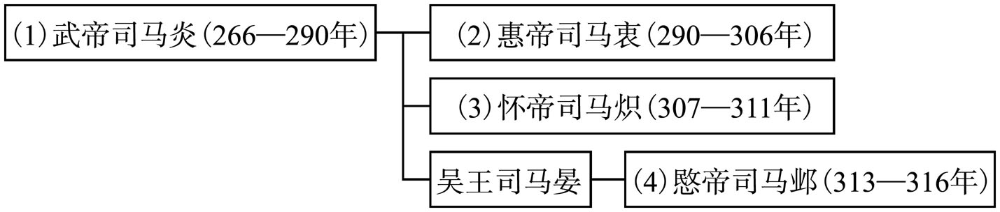 

## 东晋皇帝世系表

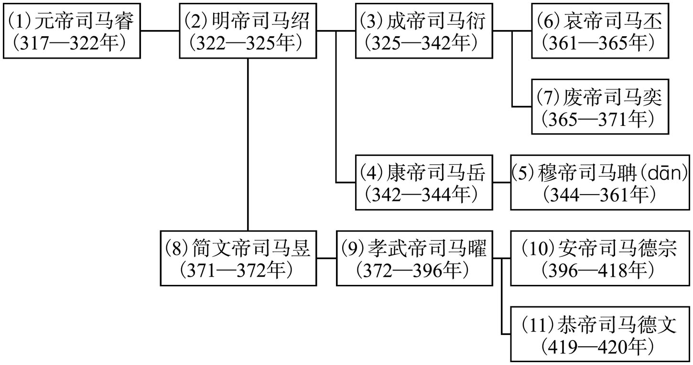 

## 刘渊家族世系表

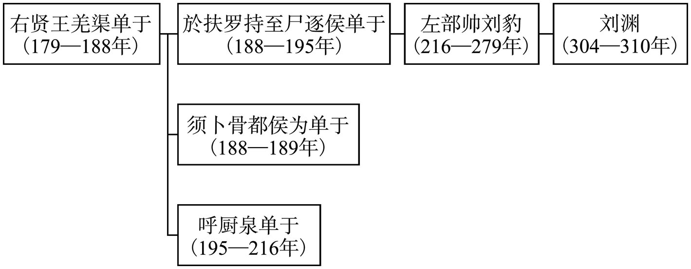 

## （汉）前赵世系表

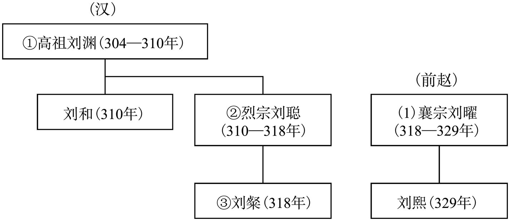 

## 前燕世系表

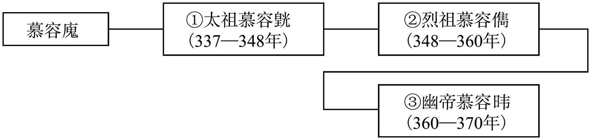 

## 成汉世系表

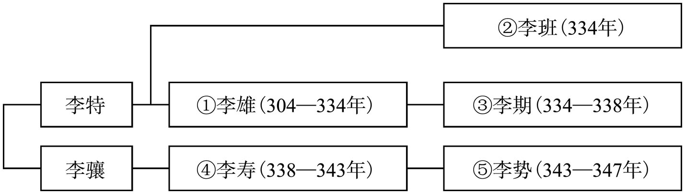 

## 前凉世系表

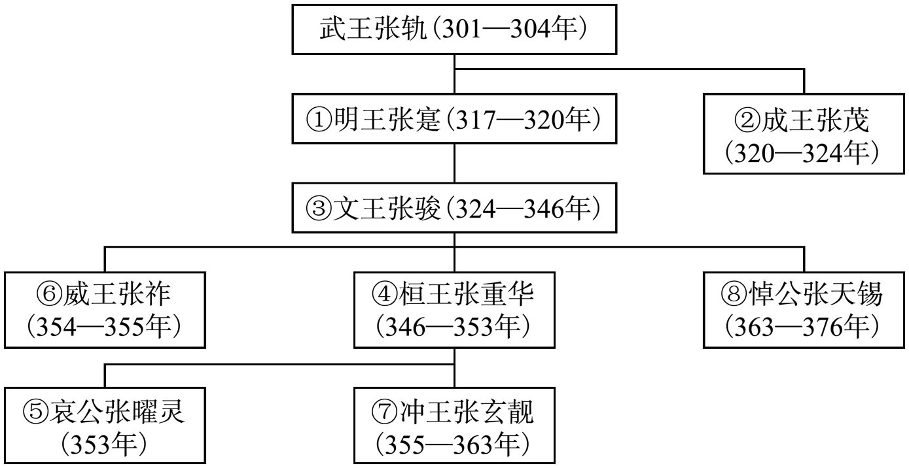 

## 后赵世系表

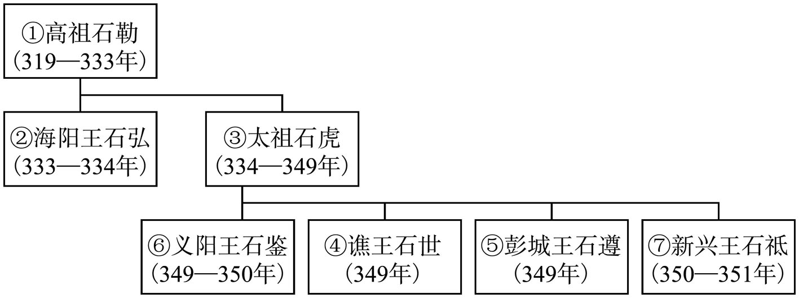

