# 目录

江左经略中原

桓温伐燕

桓温灭蜀

桓温废立

苻氏据长安　苻坚篡立

苻秦灭凉

苻秦灭燕

附录： 
东晋皇帝世系表

成汉世系表

（汉）前赵世系表

后赵世系表

前燕世系表

前秦世系表

前凉世系表

返回总目录

# 江左经略中原

## 【内容摘要】

《江左经略中原》叙述了东晋谋划出兵北伐、收复中原的历史。东晋建立后，中原地区已沦陷于胡人之手。虽然皇室只想偏安江南，但是爱国将士仍以北伐中原为己任，先后有庾（yǔ）亮北伐、褚（chǔ）裒（póu）北伐、殷浩北伐以及桓温的二次北伐。

祖逖（tì）死后，东晋政权经过王敦和苏峻两次内乱，无力北伐，反而遭到后赵的连年进攻，中原之地尽失。此后，东晋太尉陶侃（kǎn）乘机收复了襄（xiāng）阳（今湖北襄阳）和新野（今河南新野南）地区，稳定了长江中上游地区的局面。东晋成帝咸康五年（339年），庾亮得知后赵石勒已死，意图夺回北方失地，于是上书请求北伐。在进行了一系列准备工作后，决定移镇所至石城（今湖北钟祥），但没有得到朝廷同意。此时，邾（zhū）城（今湖北黄冈西北）突然被后赵攻陷，北伐计划无奈搁浅。东晋穆帝永和二年（346年），东晋任命桓温为荆州刺史，掌管镇守长江中游的军事大权。次年，桓温乘成汉政权内部不稳之际，率军攻蜀。永和四年（348年），桓温灭亡成汉，俘获成汉皇帝李势，声威大振。永和五年（349年），后赵石虎病死，后赵宗室争权，国内大乱，桓温认为这又是兴师北伐的大好机会，于是屡次要求出兵北伐。当时执掌朝政的司马昱（yù）不便直接阻拦，于是派遣褚裒出兵北伐，结果遭到后赵攻击，全军覆没。次年，后赵大将军冉（rǎn）闵（mǐn）杀戮（lù）后赵宗室，自称魏国皇帝，建立冉魏政权。东晋朝廷看到中原大乱，决定再次北伐，于是以扬州刺史殷浩为中军将军，委以北伐重任。最终，殷浩大败而回，被免职为庶人。此后，东晋大权集于桓温一身。

东晋穆帝永和十年（354年），桓温首次北伐前秦，他亲自率领四万多名步兵、骑兵，连破苻（fú）健军队，直抵灞（bà）上（今陕西西安东）。但最终因军粮不继，未能攻克长安（今陕西西安），退返襄阳（今湖北襄阳）。翌（yì）年，桓温第二次北伐，打败羌（qiāng）族姚襄，成功收复洛阳（今河南洛阳东北）。东晋哀帝隆和元年（362年），桓温建议还都洛阳，并将西晋末年南迁的士庶人等一律迁返故乡。但东晋朝廷上自皇帝下至达官贵人都偏安于江南一隅（yú），不愿北还，纷纷反对。桓温的建议最终未被采纳。前燕趁东晋内部相互猜忌和牵制，又夺回洛阳。桓温的两次北伐，尽管取得了一些军事上的胜利，但总的来看，仍然没有达到恢复中原的目的。

纵观东晋王朝，虽曾“屡屡兴师北伐”，但“每每功败垂成”，始终未能恢复中原地区。其中一个重要原因就是东晋内乱频发不断。东晋偏安江南，大权多掌握在重臣悍将之手，致使内乱频发，如王敦之乱、苏峻之乱以及桓玄篡立等，这都影响到北伐的根本大计。

## 【原文】

**晋成帝咸康五年春三月，征西将军庾亮欲开复中原，表桓宣为都督沔北前锋诸军事、司州刺史，镇襄阳[1]。又表其弟临川太守怿为监梁雍二州诸军事、梁州刺史，镇魏兴；西阳太守翼为南蛮校尉，领南郡太守，镇江陵；皆假节[2]。又请解豫州，以授征虏将军毛宝[3]。诏以宝监扬州及江西诸军事、豫州刺史，与西阳太守樊峻帅精兵万人戍邾城[4]。以建威将军陶称为南中郎将、江夏相，入沔中[5]。称将二百人下见亮，亮素恶称轻狡，数称前后罪恶，收而斩之[6]。后以魏兴险远，命庾怿徙屯半洲[7]。更以武昌太守陈嚣为梁州刺史，趣汉中，遣参军李松攻汉巴郡、江阳[8]。夏四月，执汉荆州刺史李闳、巴郡太守黄植送建康[9]。汉主寿以李奕为镇东将军，代闳守巴郡[10]。**

## 【注文】

[1]晋：朝代名（266—420年），共历一百五十五年，分为西晋与东晋。公元266年初，司马炎取代魏帝自立为皇帝，国号“晋”，定都洛阳（今河南洛阳东北），史称西晋。公元280年，西晋灭吴，三国鼎立的局面完全结束，晋武帝司马炎终于统一全国，结束了长达近百年的分裂局面。时至公元316年，西晋皇帝被匈奴汉国所俘。次年琅（láng）邪（yá）王司马睿（ruì）在建业（今江苏南京）重建国家，史称东晋。　　成帝：即晋成帝司马衍（321—342年），字世根，东晋明帝司马绍之子，东晋第三代皇帝，公元325年至342年在位。他即位时由于年幼，便由母亲庾（yǔ）太后辅政，庾太后死后由王导与庾亮辅政。他重用外戚庾亮，试图排斥王导势力，振兴东晋皇室。司马衍死后葬于兴平陵（今江苏南京江宁区鸡笼山）。　　咸康：东晋成帝司马衍所用年号，即公元335年至342年。　　征西将军：将军名号。东汉置，因西进征讨赤眉军而得名，与征东、征南、征北将军合成“四征将军”。晋沿置，三品，为持节都督时，升为二品。其中以资深者为征西大将军。　　庾亮（289—340年）：东晋外戚、大臣，字元规，颍川鄢（yān）陵（今河南鄢陵北）人，他的妹妹为晋明帝司马绍皇后。东晋初，被拜为中书郎，领著作，侍讲东宫，与太子交好。明帝司马绍即位后，任命他为中书监。东晋成帝太宁三年（325年），明帝司马绍去世，庾亮以外戚身份与王导一同接受遗命辅立成帝司马衍，任中书令，执掌朝政。公元328年，苏峻和祖约联合谋反作乱，但都被他成功平定。此后，他历任征西将军，镇武昌，都督江、荆、豫、益、梁、雍六州诸军事，领江、荆、豫三州刺史，仍遥制朝政。东晋成帝咸康五年（339年），后赵石勒去世，一时混乱，庾亮趁机进军北伐。庾亮工行书、草书，为“四庾”（庾亮、庾翼、庾怿、庾准）之一。　　中原：狭义“中原”指今河南一带，广义“中原”则是指黄河中下游一带。中原是中国历史上绝大部分时间的政治、经济和文化中心所在地，也是中华文明的发源地。　　表：古代的一种特殊文体，为大臣写给君主的呈文。　　桓宣（？—344年）：谯（qiáo）国铚（zhì）县（今安徽濉溪西南）人。东晋将领，义阳太守桓诩（xǔ）之孙，冠军长史桓弼（bì）之子。长期驻守边境，与北方后赵政权发生过多次战争。曾领兵协助收复襄阳（今湖北襄阳），之后镇守、经营襄阳长达十余年。但最终因北伐战事失利而遭贬职，因受此打击，不久患病而死，追赠镇南将军。　　都督沔（miǎn）北前锋诸军事：官名，即都督沔北前锋军事事务的统帅。两晋以都督一州或数州诸军事为职权最高，督一州或数州诸军事次之，监一州或数州诸军事又次之。沔北，即东晋时荆州北部的襄阳一带。　　司州：西晋以京师周围地区为司州，位于今陕西中部，山西西南部及河南西部。东晋南迁不设，后赵置司州于邺城（今河北临漳西南）。　　刺史：官名，州最高军政长官。汉武帝把全国划分为十三州，每州设置刺史一人，负责监察所在州部的郡国，同时也不受丞相制约，直接隶属于中央的御史中丞和御史大夫。到魏晋南北朝时，刺史有单车、领兵之别，单车即不领兵之意，而领兵刺史多加将军号，如使持节都督（某某等州）诸军事（即任一州刺史同时还都督数州军事）。西晋统一之初，曾一度停止刺史加将军号。但到西晋末年天下大乱，又再度恢复。　　襄阳：县名，隶属于荆州襄阳郡，因治所在襄水之北而得名。东晋时，因雍州百姓避难流入襄阳等地，为安置流民，东晋孝武帝司马曜（yào）于太元十四年（389年）以襄阳为中心侨置雍州。

[2]临川：郡名，治所临汝（rǔ）县（今江西临川），辖境相当于今江西抚州的绝大部分，并囊括庐陵、豫章、瓯（ōu）闽部分地区。东连吴越，西接潇湘，南控闽粤，北襟江湖，横跨吴、越、楚三地，为古代通往闽粤沿海地区的要冲。　　太守：州郡最高行政长官。汉景帝刘启将郡守改称太守，为郡的最高行政长官。此后历代不变。南北朝时新增州渐多，郡的辖境缩小，太守权力逐渐为州刺史所夺。　　怿（yì）：即庾怿（293—342年），字叔豫，颍川鄢陵（今河南鄢陵北）人，庾亮的弟弟。曾参与讨平苏峻叛乱，以功封广饶男。后密谋毒杀江州刺史王允之，但事情败露，王允之将此事密奏晋成帝司马衍，成帝大怒，庾怿心存恐惧而饮鸩（zhèn）自杀。　　监梁雍二州诸军事：即监管梁州、雍州两州的军事事务。梁州：州名。三国魏元帝景元四年（263年）分益州置，治所设在沔阳县（今陕西勉县东）。晋武帝太康年间治所迁至南郑县（今陕西汉中）。辖境相当于今陕西汉中、四川东部、重庆全境、贵州北部的广大地区。雍州：东汉兴平元年（194年）分凉州置，治所设在姑臧县（今甘肃武威）。东汉建安十八年（213年），治所迁至长安（今陕西西安西北），辖境相当于今陕西中部、甘肃东南部、宁夏南部及青海黄河以南一带。西晋沿置，东晋时将雍州侨治襄阳县（今湖北襄阳）。　　魏兴：郡名。治所西城县（今陕西安康西北汉江北岸）。　　西阳：郡名。西晋元康初年分弋阳置国，治所设在西阳县（今河南光山西南）。永嘉之乱后，治所迁至今湖北黄冈东。东晋改为西阳郡，治所设在西阳县（今湖北黄冈）。　　翼：即庾翼（305—345年），东晋将领、书法家。字稚恭，颍川鄢陵（今河南鄢陵北）人，庾亮的弟弟。初为陶侃太尉府参军，累迁南蛮校尉，领南郡太守。庾亮死后，他出任都督江、荆、司、雍、梁、益六州诸军事，荆州刺史。庾翼很有才能，他以北伐为己任，一心想收复江北失地。公元343年，他率领军队开始北伐，但不久晋康帝司马岳病重而死，因朝中立帝之争事关重大，他只好放弃北伐回朝。庾翼书法造诣很深，为“四庾”（庾亮、庾翼、庾怿、庾准）之一，年轻时与王羲（xī）之齐名。　　南蛮校尉：两晋南朝时管理荆楚一带少数民族事务的武官，亦称护南蛮校尉。　　领：古代指高级职务者担任较低官职时用“领某官”来表示。此外，中国古代官制有行、守、假之制。行：官缺则由职位低者兼代其事。守：试职，期限自初授起一年，到期称职转正。假：暂时代理。　　南郡：郡名。始置于秦朝，三国时刘备设郡治于公安（今湖北公安东北）。晋代郡治移至江陵（今湖北荆州市荆州区）。　　江陵：地名，今湖北江陵。　　假节：魏、晋时期直接代表皇帝行使地方军政权力的职官名。“节”为古代常用信物，皇帝所遣使者须持旌节，使命完成后归还。根据“节”所加方式不同，可分为“使持节”“持节”“假节”三种。“使持节”可以杀郡守级别的官员；“持节”可杀无官位之人；“假节”可杀违反军令的人。

[3]豫州：古九州之一。汉武帝元封五年（前106年），将全国除中央之外的地域分为十三个州刺史部，豫州辖境约今淮河以北、伏牛山以东的豫东、皖北与江苏丰、沛两地。东汉灵帝中平五年（188年），州成为一级行政区域，其中豫州治所设在谯县（今安徽亳州），辖区在河南东部和安徽西部。三国曹魏时期，治所迁至安城县（今河南正阳东北）。西晋时期，豫州治所设在陈县（今河南淮阳）。东晋治所屡有迁徙，辖境伸缩无常。　　征虏将军：武官名号，负责统兵出征，下设长史、司马、记室掾（yuàn）、中兵参军、咨议参军、行参军和主簿等。　　毛宝（？—339年）：东晋名将，字硕真，荥（xíng）阳阳武（今河南原阳东南）人。苏峻、祖约叛乱后，他劝说温峤与陶侃共同出兵征讨，并率军为温峤前锋。平定叛乱后，因功升任辅国将军、征虏将军、南中郎将等职。后参加庾亮北伐，结果为后赵石虎重兵包围，最终突围失败身亡。

[4]诏：天子下达臣属的文体，分即位诏、遗诏、表诏、伏诏、密诏、手诏、口诏等。始于秦始皇，是一种命令文体。　　监扬州及江西诸军事：即监管扬州及江西郡军事事务的官员。　　樊（fán）峻（？—339年）：东晋西阳太守。庾亮北伐时，他和征虏将军毛宝共同守卫战略要地邾城（今湖北黄冈西北），与后赵对峙，后被后赵石虎重兵包围，最终突围失败而死。　　邾城：城名。汉邾城县故城，在今湖北黄冈西北。

[5]建威将军：官名，杂号将军之一，负责统兵征战。“杂号将军”又称列将军，中国古代武职官衔的一种统称，始于汉代，盛行于南北朝。魏晋时期，有军功者比比皆是，授予官职的难度加大。因此常在“将军”前冠以某个名号以作为他的官职，这种名号并无一定，名号之间也无上下级关系，因此称为“杂号将军”。　　陶称（？—339年）：庐江寻阳（今江西九江）人，名将陶侃之子，官至南平太守、建威将军。东晋成帝司马衍末年，为庾亮所忌，获罪被杀。　　南中郎将：官名，负责率师征伐，其地位高于一般将领，职任颇重。　　江夏：郡名。西汉置，治所设在西陵（今湖北武汉新洲西）。三国时，魏、吴各置江夏郡，魏江夏郡治所设在上昶（chǎng）城（今湖北云梦西南），吴江夏郡治武昌县（今湖北鄂州）。晋灭吴（280年）后，改吴江夏郡为武昌郡，并将原魏江夏郡治所迁至安陆旧城（今湖北云梦）。　　沔中：即沔阳，以在沔水之北而名。

[6]轻狡：轻薄狡猾。

[7]半洲：地名，今江西九江西，时属江州。

[8]武昌：县名，三国吴置，治所设在今湖北鄂州。　　趣（qū）：前往、赶赴。　　汉中：郡名。北倚秦岭，南屏大巴山，中部是汉中盆地。治所设在南郑县（今陕西汉中）。它是华夏文明的源头，自公元前312年秦惠文王首置汉中郡，迄今已有两千余年历史。“汉族”的称谓与汉中也有密不可分的关系。西晋末年，汉中地区归于成汉。桓温平定蜀地后，复设汉中郡，属梁州。　　参（cān）军：官名，即参谋军务之称，简称“参军”。最初是丞相的军事参谋。魏晋以后军府和王国始置此官员。大致相当于现在政府军事参议官一职。　　汉：又称“成汉”“大成”，中国历史上五胡十六国时期十六国之一。公元301年，巴氐（dī）族领袖李特在蜀地领导流民反抗晋朝的统治。公元304年，他的儿子李雄称成都王。两年后称帝，国号“成”，定都成都。公元338年，李寿改国号为“汉”，据有今四川东部、重庆全部和云南、贵州一带。公元347年，被东晋桓温所灭。　　巴郡：初为巴国领地。秦朝时设郡，辖今四川东部和重庆。到西晋时，只辖四县，基本都在今重庆。巴郡也与蜀郡合称“巴蜀”，至今仍是对四川、重庆地区的别称。　　江阳：郡名，治所江阳县（今四川泸州）。

[9]荆州：古九州（即冀、兖、青、徐、扬、荆、豫、梁、雍）之一，西汉十三刺史部之一，因境内有荆山而得名。自古就有“七省通衢（qú）”之称，历来为兵家必争之地。东汉治所设在汉寿县（今湖南常德东北），辖境约为今湖南、湖北二省及河南、广西、广东、贵州一部分。汉末以后辖境渐小。东晋治所迁至江陵（今湖北荆州市荆州区），为当时长江中游重镇。　　李闳（hóng）（生卒年不详）：十六国时成汉荆州刺史。晋成帝司马衍咸康五年（339年），被东晋军擒获，随后押送至建康。　　黄植（生卒年不详）：十六国时成汉巴郡太守。东晋成帝咸康五年（339年），被东晋军擒获，随后押送至建康。　　建康：故城在今江苏南京。三国吴、东晋、南朝宋、齐、梁、陈先后在此建都，是六朝政治、经济、文化中心。原名金陵。秦置县，名秣（mò）陵。东汉献帝建安十七年（212年），孙权在此筑石头城，改称建业。西晋统一全国后，仍名秣陵。西晋武帝太康三年（282年），分秣陵北另置建邺县，治所设在今江苏南京。后避晋愍帝司马邺讳更名建康。东晋南朝相承不改。

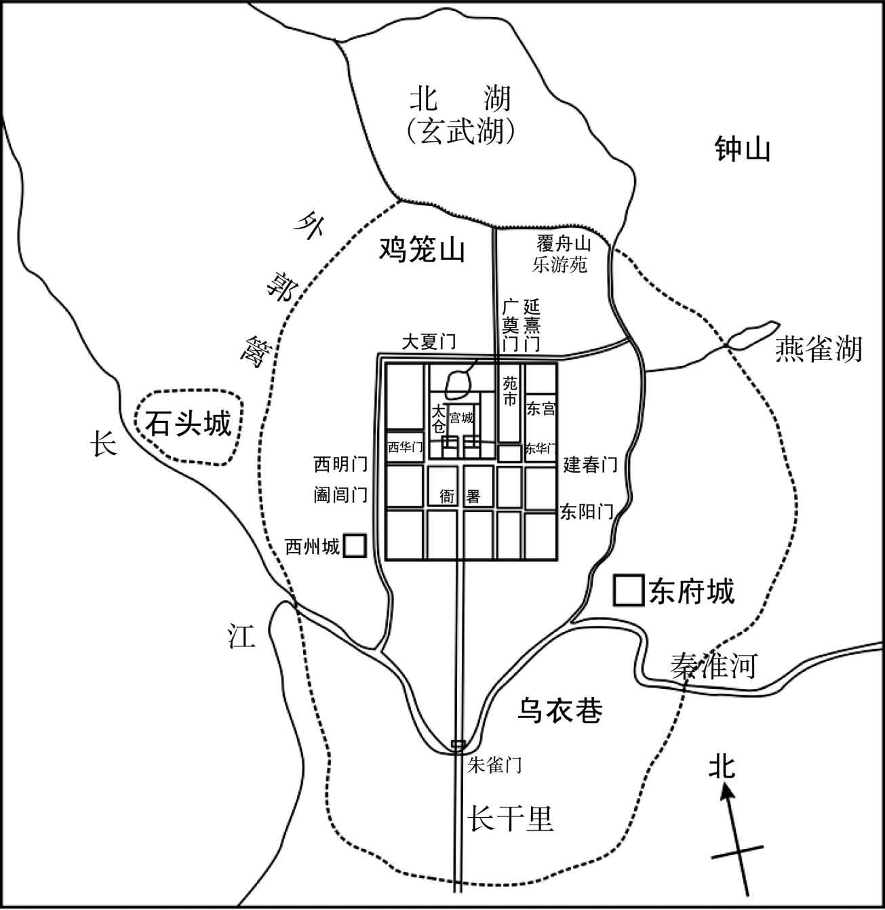 
东晋南朝建康示意图

[10]寿：即李寿（300—343年），十六国成汉政权皇帝，字武考，李骧（xiāng）之子、李特之弟，公元338年至343年在位。他聪明好学，豁达大度，深受武帝李雄器重，先后担任前将军、征东将军、大将军、大都督、侍中等职。成幽公李期玉恒四年（338年），他攻陷成都（今四川成都），废成幽公李期为邛（qióng）都县公，自立为皇帝，改元汉兴，改国号为汉。　　李奕（？—346年）：李寿部将。公元338年，李寿率军进攻成都，他被任命为先锋。李寿废黜李期后，他受封为西夷校尉。公元339年，出任镇东大将军。公元346年，他起兵反叛李势，却被士兵射死。　　镇东将军：将军名号，为东汉末临时设置的镇东、镇南、镇西、镇北“四镇”将军之一。职掌征伐镇戍，位在常设将军之下。魏晋时期，镇东将军统领兖（yǎn）、青、徐、扬等四州，屯驻扬州（治今江苏扬州）。地位低于征东、征南、征西、征北等“四征将军”。资深者为镇东大将军。

## 【译文】

东晋成帝咸康五年（339年）春季三月，征西将军庾亮想要收复中原地区，于是上表朝廷奏请任命桓宣为都督沔北前锋诸军事、司州刺史，镇守襄阳。又上表奏请他的弟弟临川太守庾怿（yì）担任监梁雍二州诸军事、梁州刺史，镇守魏兴；西阳太守庾翼为南蛮校尉，兼任南郡太守，镇守江陵；均被授予假节。又请求解除自己豫州刺史的职务，转授予征虏将军毛宝。朝廷于是诏令任命毛宝为监扬州及江西诸军事、豫州刺史，与西阳太守樊峻率领精兵一万人戍守邾城。任命建威将军陶称为南中郎将、江夏相，进入沔中地区。陶称率领二百人顺流而下面见庾亮，庚亮厌恶陶称轻浮狡猾，于是历数陶称的各种罪恶，收捕并杀了他。后因魏兴地处偏远，地势险恶，于是命令庾怿将军队驻扎在半洲。改任武昌太守陈嚣为梁州刺史，奔赴汉中，派遣参军李松攻打成汉的巴郡、江阳郡。夏季四月，擒获成汉荆州刺史李闳、巴郡太守黄植并将他们押送至建康。成汉君主李寿任命李奕为镇东将军，代替李闳镇守巴郡。

## 【原文】

**庾亮上疏言：“蜀甚弱而胡尚强，欲帅大众十万移镇石城，遣诸军罗布江、沔，为伐赵之规[1]。”帝下其议。丞相导请许之[2]。太尉鉴议，以为“资用未备，不可大举”[3]。太常蔡谟议，以为：“时有否泰，道有屈伸，苟不计强弱而轻动，则亡不终日，何功之有[4]。为今之计，莫若养威以俟时。时之可否撃胡之强弱，胡之强弱系石虎之能否[5]。自石勒举事，虎常为爪牙，百战百胜，遂定中原，所据之地，同于魏世[6]。勒死之后，虎挟嗣君，诛将相，内难既平，翦削外寇，一举而拔金墉，再战而禽石生，诛石聪如拾遗，取郭权如振槁，四境之内，不失尺土[7]。以是观之，虎为能乎，将不能也？论者以胡前攻襄阳不能拔，谓之无能为[8]。夫百战百胜之强，而以不拔一城为劣，譬诸射者百发百中而一失，可以谓之拙乎？且石遇，偏师也，桓平北，边将也，所争者疆场之土，利则进，否则退，非所急也[9]。今征西以重镇名贤，自将大军欲席卷河南，虎必自帅一国之众来决胜负，岂得以襄阳为比哉[10]。今征西欲与之战，何如石生？若欲城守，何如金墉？欲阻沔水，何如大江[11]？欲拒石虎，何如苏峻[12]？凡此数者，宜详校之。石生猛将，关中精兵，征西之战，殆不能胜也[13]。金墉险固，刘曜十万众不能拔，征西之守，殆不能胜也[14]。又当是时，洛阳、关中皆举兵击虎，今此三镇反为其用，方之于前，倍半之势也[15]。石生不能敌其半，而征西欲当其倍，愚所疑也。苏峻之强不及石虎，沔水之险不及大江，大江不能御苏峻，而欲以沔水御石虎，又所疑也。昔祖士稚在谯，佃于城北界，胡来攻，豫置军屯以御其外[16]。谷将熟，胡果至，丁夫战于外，老弱获于内，多持炬火，急则烧谷而走。如此数年，竟不得其利。当是时，胡唯据河北，方之于今，四分之一耳，士稚不能捍其一，而征西欲以御其四，又所疑也[17]。然此但论征西既至之后耳，尚未论道路之虑也。自沔以西，水急岸高，鱼贯泝流，首尾百里[18]。若胡无宋襄之义，及我未阵而击之，将如之何[19]？今王土与胡，水陆异势，便习不同[20]。胡若送死，则敌之有余，若弃江远进，以我所短击彼所长，惧非庙胜之算也。”朝议多与谟同，乃诏亮，不听移镇。**

## 【注文】

[1]蜀：此指成汉政权。　　胡：此指后赵（319—351年），十六国之一。为羯（jié）族人石勒所建，建都于襄国（今河北邢台），后迁都邺（今河北临漳西南）。公元329年，石勒率军攻破长安（今陕西西安西北），消灭前赵政权。至此，后赵政权以淮水与东晋为界，初步形成南北对峙局面。公元349年，后赵内乱，诸子争立，互相残杀。次年，冉闵乘乱夺取后赵政权，后赵政权至此灭亡。后赵强盛时疆域东起大海，南至淮河流域，西至今宁夏银川，北至今长城沿线，包括今河北、山西、陕西、河南、山东及江苏、安徽、甘肃、辽宁一部分。　　石城：地名，今湖北钟祥。

[2]丞相：也称宰相，古代最高行政长官的通称，职责为典领百官，辅佐皇帝治理国政。两晋南北朝时期，常以此职授予权臣，独揽军政大权。　　导：即王导（276—339年），东晋政权的奠基者之一。字茂弘，琅邪临沂（今山东临沂北）人。永嘉元年（307年），晋怀帝司马炽任命司马睿为安东将军，出镇建邺（后改建康，今江苏南京），他相随南渡，任安东将军司马。此后，他主动出谋划策，联合南北士族，拥立司马睿为帝，建立东晋政权。他在位期间，官居宰辅，总揽晋元帝、晋明帝、晋成帝三朝国政。

[3]太尉：官名。秦朝以“丞相”“太尉”与“御史大夫”并为“三公”。太尉为中央掌武事的最高官员。魏晋以后，太尉位居极品而实权甚少，渐次演化成优宠宰相、亲王的加官、赠官或虚衔。　　鉴：即郗（xī）鉴（269—339年），东晋重臣。字道徽，高平金乡（今山东嘉祥阿城铺）人。官至车骑大将军、太尉。曾协助晋明帝司马绍平定王敦叛乱。他一生中虽然宦海沉浮，但始终忠于皇室，所以人称“乱世忠臣”。

[4]太常：官名，掌宗庙礼仪，兼掌选试博士。原名奉常，西汉景帝时改称太常。其主要职责是主管社稷祭祀、宗庙和朝会、丧葬等礼仪，祭祀时充当皇帝的助手。　　蔡谟（mó）（281—356年）：字道明，陈留考城（今河南民权东北）人。晋元帝司马睿时历任中书侍郎、义兴太守、大将军从事中郎、司徒左长史等职。苏峻叛乱爆发后，他曾参与讨伐苏峻。叛乱被平定后，以功封济阳男。后改任太常卿，领秘书监。东晋穆帝永和六年（350年），因固辞司徒而获罪，免为庶人。　　否（pǐ）泰：本为《周易》两卦名。否：坤下乾上，表示天地不交，上下隔阂，闭塞不通之象。泰：乾下坤上，为上下交通之象。引申为通畅、安宁。后人们把命运的好坏、事情的顺逆，皆称为“否泰”。

[5]石虎（295—349年）：字季龙，上党武乡（今山西榆社北）人，羯族，后赵开国君主石勒侄子，十六国时期后赵君主。公元333年，石勒死后，他的儿子石弘继位。次年，石虎废杀石弘，自称为居摄赵天王。公元335年，石虎将都城由襄国（今河北邢台）迁至邺城（今河北临漳西南）。公元337年，自称天王。公元349年，称帝。石虎在位期间，生活十分荒淫奢侈，对百姓施行暴政，是五胡十六国时期有名的暴君。

[6]石勒（274—333年）：字世龙，原名（bèi），小字匐（fú）勒，上党武乡（今山西榆社北）人，羯族，五胡十六国时后赵开国君主，公元319年至333年在位。早年曾投靠汉赵君主刘渊，后从汉赵分裂出去。在谋臣张宾辅助之下以襄国（今河北邢台）为根据地，陆续消灭王浚、邵续、段匹（dī）等西晋在北方的势力，继而消灭曹嶷（yí），进侵东晋以及消灭刘曜领导的汉赵，又北征代国，使后赵成为当时北方最强盛的国家。　　魏世：指三国时期的魏国（220—265年），以其皇室姓曹，历史上又称“曹魏”。公元220年由魏文帝曹丕建立，都洛阳（今河南洛阳东北）。魏元帝咸熙二年（265年）十二月，司马炎代魏称帝，建国号为“晋”，史称西晋，魏国灭亡，共历五帝。它是三国时期最为强大的国家，它开创的九品中正制，对魏晋时代的政治产生深远影响。

[7]嗣（sì）君：君位或职位的继承人。此指石弘。石勒死后，石弘成为傀儡皇帝。东晋成帝咸和九年（334年），石虎逼石弘让位，自称天王，夺取皇位。　　金墉（yōng）：地名，位于今河南洛阳东。　　石生（？—333年）：十六国后赵官吏，上党武乡（今山西榆社北）人，羯族，石勒养子。曾任卫将军、司州刺史、雍州刺史等，后封河东王。石勒死后，石虎专擅朝政，石生自称秦州刺史，起兵攻讨石虎，后被部下杀死。　　石聪（？—333年）：十六国后赵将领，石勒养子，曾任汲郡内史等职。后赵建平四年（333年），石勒去世，石虎专权，石聪向东晋请降求援，援军还未到达，石聪便被石虎杀死。　　振槁（gǎo）：击落枯叶。比喻事情极容易办成。

[8]不能拔：指公元335年，后赵征虏将军石遇向驻守在襄阳的桓宣发动进攻，结果未能攻下襄阳（今湖北襄阳）一事。

[9]石遇（生卒年不详）：十六国后赵征虏将军，其余事迹有待进一步的考证。　　平北：即平北将军，与平东、平西、平南将军合称“四平将军”。平北将军多兼任镇守地区的刺史，统掌军事、政务。

[10]河南：古地区名，泛指黄河以南地区。

[11]沔：即沔水。汉水流经沔县后，又称沔水。其发源地在陕西西南部秦岭与米仓山之间的宁强嶓（bō）冢（zhǒng）山，而后向东南穿越陕南汉中、安康等地区。《水经》中只称沔水，不称汉水，《水经注》中则“沔”、“汉”共见。

[12]苏峻（？—328年）：东晋将领，字子高。永嘉之乱，他率自己的军队泛海南行，行至广陵（今江苏扬州），先后担任淮陵内史和兰陵相。东晋元帝时，他被任命为鹰扬将军。王敦之乱平定后，庾亮执政，企图解除他的兵权。东晋咸和三年（328年），他以讨伐庾亮为名，与祖约起兵反晋，攻入建康（今江苏南京），大肆杀掠并专擅朝政。不久温峤、陶侃起兵讨伐，他战败被杀。

[13]关中：指陕西秦岭北麓（lù）渭河平原区。因其东有潼（tóng）关，西有大散关，南有武关，北有萧关，居四关之内，故称关中。

[14]刘曜（yào）（？—329年），匈奴族，字永明，新兴（今山西忻州）人，十六国前赵国君，也是汉赵最后一位君主。曾参与覆灭西晋的战争，并于西晋灭亡后驻镇长安（今陕西西安）。后于靳准之乱中登上帝位，但登位不久，将领石勒自立，于是国家分裂。他在位期间，多次出兵平定和招降仇池、前凉等割据势力，但终被石勒所杀，前赵政权随后灭亡。

[15]当是时：指东晋成帝咸和八年（333年），石生、石朗、郭权举兵反石虎一事。　　洛阳：古都，因地处古洛水之北岸而得名。东汉、曹魏、西晋、北魏（孝文帝以后）、隋（炀帝）、五代唐等政权定都于此；新莽、唐、五代梁晋汉周、北宋、金（宣宗以后）皆以经后陪都。以洛阳为中心的河洛地区是华夏文明的主要发祥地，位于中国腹地，古人认为处“天下之中”。　　三镇：指石生所据守的关中，石朗所据守的洛阳（今河南洛阳东北）与郭权所据守的上邽（guī）县（今甘肃天水）。

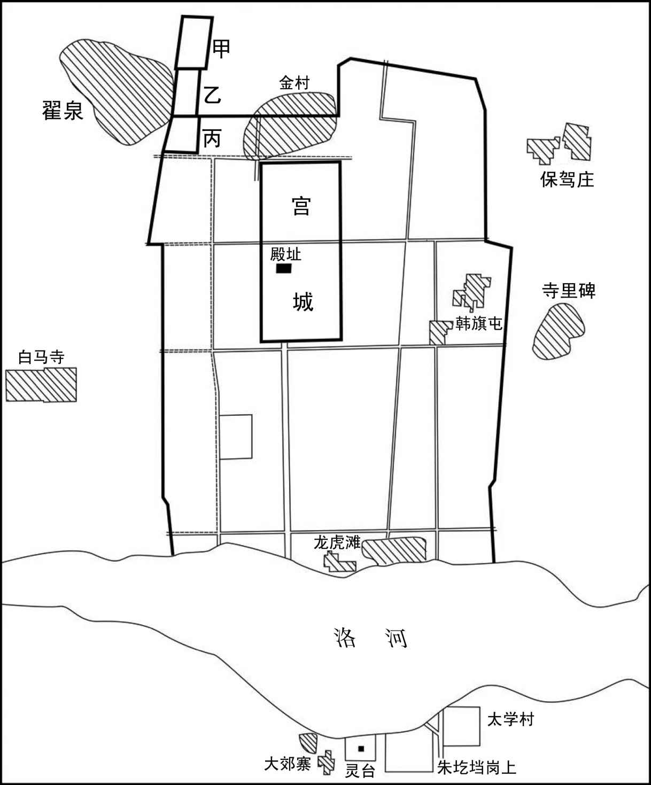 
汉魏洛阳遗址示意图

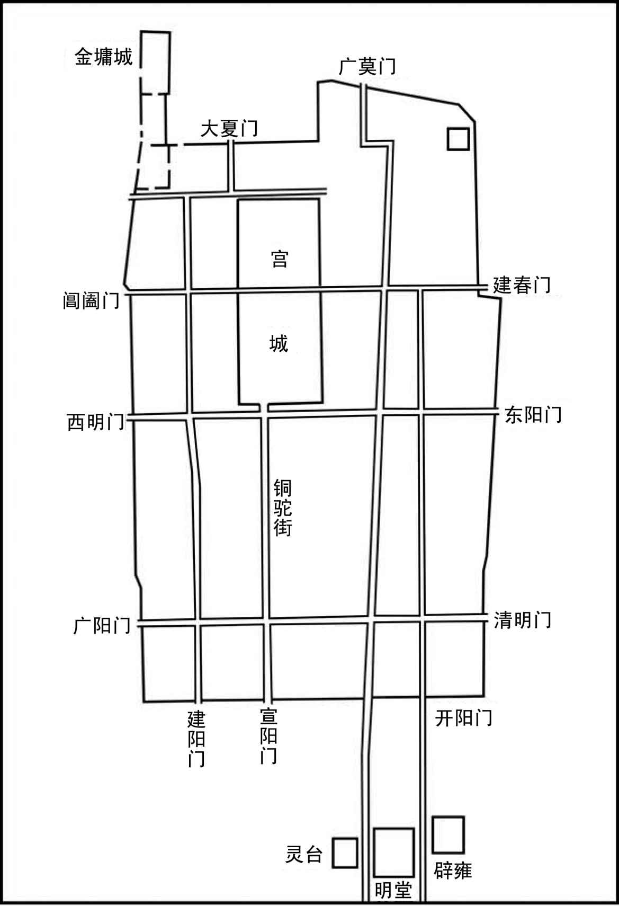 
晋朝洛阳城布局示意图

[16]祖士稚：即祖逖（tì）（266—321年），字士稚，范阳遒（qiú）县（今河北涞水）人，东晋名将。他为人豁达，讲义气，与司空刘琨（kūn）交好，著名的“闻鸡起舞”讲的就是他和刘琨的故事。他虽力主北伐，但因东晋朝廷内乱，北伐失败，病故于雍丘（今河南杞县），册赠为车骑将军。　　谯：即谯县，今安徽亳（bó）州。　　军屯：汉代以来，政府利用军队开垦土地，以为军饷（xiǎng），战时又可使军队迅速进入战斗，这种方式就是军屯。

[17]河北：地区范围名，古代泛指黄河以北地区。

[18]里：长度单位，在不同时代长度各不相同。汉魏时期一里等于1800尺，约为415.8米。现今的市里一里为500米。则知汉魏的一里为今市里的83.16%。

[19]宋襄：即宋襄公（？—前637年），春秋时宋国国君。子姓，名兹父。公元前642年，霸主齐桓公死，内臣易牙、寺人貂等杀群吏而立公子无亏。齐国内乱，齐太子昭逃至宋国避难，宋襄公认为此时正是自己称霸的好时机。于是他以送齐太子昭回国继位为名，率诸侯伐齐。齐人恐惧，杀其君无亏，立太子昭，是为齐孝公，宋齐之间发生战争，以宋军胜利而告终。公元前638年，宋襄公率领军队与楚国在泓水（今河南柘城西北）交战，结果宋军大败，次年宋襄公因重伤而亡。

[20]便习：所熟悉的作战技能。此指南方便于用船，北方便于用马。

## 【译文】

庾亮上疏说：“蜀地的成汉国很弱小，而后赵却很强大，我打算率领十万军队驻军在石城，派遣各路军队沿长江、沔水流域布阵，做好征讨后赵的准备。”晋成帝（司马衍）把庾亮的奏疏交给群臣商议，丞相王导同意庾亮的建议。然而太尉郗鉴却认为“军资费用尚未准备充足，不能大举行动”。太常蔡谟则认为：“时运有背有顺，事理有曲有伸。如果不考虑力量的强弱而轻举妄动，那么会迅速败亡，还谈什么功业呢！现在最好的计策莫过于积蓄力量等待时机。时机成熟与否则取决于胡虏的强弱，而胡虏的强弱又在于石虎的能力。自从石勒起兵以来，石虎作为干将，百战百胜，最终平定中原地区，所占据的土地，与当年的曹魏相当。石勒死后，石虎挟持刚刚继位的幼主，诛杀将相，内部祸乱刚刚平定，又开始剪灭和削弱外部敌寇，一举攻占金墉城，再战又生擒石生，诛杀石聪如同拾起遗弃在路上的物品，战胜郭权好比摇摆枯朽的树叶那么容易，国境四周，没有丧失一尺土地。由此看来，石虎到底是有才能，还是没有才能呢？议论者因为后赵先前攻打襄阳没能攻下，就说他没有能力。然而百战百胜的强将只因没有攻下一座城池就被认为才能低劣，就好比射手百发百中却只有一次失误，就说他技艺拙劣吗？况且石遇率领的只是后赵的非主力军队，平北将军桓宣也仅是一名戍边将领，他们所争夺的只是领土，有利则进攻，否则就退却，并不是急迫的事情。现在征西将军庾亮以军事重镇统帅的地位，想要亲率大军席卷黄河以南地区，石虎必定会亲自率领全国的军队来决一胜负，难道可以用襄阳之战来作比较吗？现在征西将军想要与石虎交战，比起石生又怎么样呢？若想要坚守城池，比起金墉城又如何？想要借助沔水设阻，比起长江又怎么样？想要抵御石虎，比起苏峻又如何呢？这几个问题，我们应当仔细比较。石生是位猛将，拥有关中地区的精锐士卒，庾亮前去进攻，恐怕难以取胜。金墉城险要坚固，刘曜十万大军都没能攻下，征西将军的防守能力，恐怕不能胜过。况且那时洛阳、关中地区都起兵攻打石虎，现在这三镇反被石虎所用，比起从前，石虎现在的实力有超出一倍的势头。石生不能抵敌石虎一半的兵力，而征西将军却想抵挡石虎相当于从前一倍的兵力，这不得不让我怀疑。苏峻的强盛比不上石虎，沔水的天险比不上长江，长江都不能阻挡住苏峻，却想用沔水来阻挡石虎，这又是我所怀疑的。以前祖逖在谯县城北开荒种田，担心胡虏前来进攻，预先在外围布置军队驻守。等到谷子将要成熟的时候，胡虏果然来了，于是强壮的民夫在外围作战，年老体弱的百姓则在田内收割谷物，并携带很多火炬，战况紧急时就焚烧谷物逃走。这样连续几年下来，最终也没有得到屯田的益处。在那时，胡虏仅仅占据黄河以北的地区，和现在相比，仅拥有四分之一的土地，祖逖无法抵御胡虏当初的一，而征西将军却想抵御胡虏现在的四，这又是我所疑惑的。然而，这还只是讨论征西将军到达中原之后的事情罢了，还没有讨论行军路途上所担忧的问题。从沔水往西，水流湍急，两岸高耸，战船溯流鱼贯而上，船只首尾相连绵延百余里。如果胡人没有宋襄公那样的仁义，趁我军还没有列好阵势就进行攻击，我们将怎么办呢？现在我们与胡虏的情况不同，双方军队的作战习惯与技能也不同。胡虏若前来送死，我们抵抗他们还有余力，倘若我们放弃长江天险远征北方，用我们的短处攻击敌人的长处，这恐怕不是朝廷取胜敌人的谋略。”朝臣们的议论大多与蔡谟相同，于是朝廷诏令庾亮不许迁移镇所。

## 【原文】

**秋八月，南昌文成公郗鉴疾笃，以府事付长史刘遐，上疏乞骸骨，且曰：“臣所统错杂，率多北人，或逼迁徙，或是新附，百姓怀土，皆有归本之心[1]。臣宣国恩，示以好恶，处与田宅，渐得少安。闻臣疾笃，众情骇动，若当北渡，必启寇心。太常臣谟，平简贞正，素望所归，谓可以为都督、徐州刺史[2]。”诏以蔡谟为太尉军司，加侍中[3]。辛酉(1)，鉴薨，即以谟为征北将军、都督徐兖青三州诸军事、领徐州刺史、假节[4]。**

## 【注文】

[1]南昌文成公：东晋爵位名，此指郗鉴。东晋成帝咸和二年（327年），苏峻发动叛乱，攻入建康（今江苏南京）。他率领军队渡江，与陶侃等奋力平叛。因功拜司空、加侍中，改封南昌县公。　　疾笃（dǔ）：病重。　　长（zhǎng）史：官名，战国末期秦国始置。西汉时丞相、太尉、御史大夫府及主要将军幕府皆设长史，相当于相府中的事务主官。此后历代均设此官，成为幕僚之长，总管府内事务等。此外，西汉少数民族各郡太守下亦设长史，辅太守掌一郡兵马。至魏晋，凡刺史带将军称号者，其幕府亦设长史。　　刘遐（xiá）（？—326年）：东晋将领。字正长，广平易阳（今河北永年）人。历任龙骧将军、临淮太守、兖州刺史等，封泉陵公。　　疏：朝臣向皇帝陈述意见的奏章。古代臣子向皇帝上奏政务有“疏”和“奏”两种方式，这两种方式略有区别。一般宋以前常称“疏”。疏是臣下向皇帝陈述意见的奏章。而奏是臣下向皇帝进言或上书，是一种公文程式，即奏本，根据官员言事内容及章疏形式不同，又有奏片、奏书、奏折等名称。　　乞骸（hái）骨：古时官员因年老等原因自请退休。在封建社会，官员年纪大了不能继续为君效力，便请求君主赐还自己的残躯，以归葬故里，故把请求退休叫作乞骸骨，也叫乞身。

[2]都督：古代军事长官。最初作为监督军队的官员。汉光武帝刘秀建武元年（25年），因征伐四方，于出征时暂时设置督军御史以监督诸军，事成回师后则罢官。魏晋后，发展为地方军事长官。　　徐州：州名。辖境范围大致相当于在今山东东南和江苏长江以北地区。东晋时由于淮河以北地区被割据政权占领，州治迁至京口（今江苏镇江丹陡区）。

[3]太尉军司：相当于太尉的参谋长。军司，即军师，西晋时因避司马师名讳而改称。系军队出征时主帅的主要僚佐，职掌监察诸军，辅佐主帅统领军队，常为主帅的继任人选。　　侍中：官名。秦始置，以往来殿中奏事，故名。两汉沿置，为正规官职外的加官之一，加此官者可出入宫廷，担任皇帝侍从。因此官身居君侧，侍从左右、常备顾问应对，逐渐变为亲信贵重之职。汉武帝以后，地位渐高。晋朝建立，侍中的地位和作用日益重要，不仅开始成为三公、执政的加衔，而且直接参与朝政。

[4]薨（hōng）：古时各等级人去世时的称谓有所不同：天子曰崩；诸侯死曰薨；大夫死曰卒；士（知识分子）曰不禄；庶人曰死。　　征北将军：武官名号。与征西、征南、征东合称“四征将军”，权任甚重，多为持节都督。征北将军中以资深者为征北大将军。　　都督徐兖青三州诸军事：即都督徐州、兖州、青州地区军事事务的统帅。兖州：古“九州”之一。传说大禹（yǔ）治水后，按照山川河流的走向，把全国划分为青、徐、扬、荆、豫、冀、兖、雍、梁九州，兖州是其中之一。至汉武帝时，兖州为十三刺史部之一，约今山东西南部、河南东部。魏晋时，治所设在廪（lǐn）丘（今山东郓城西北）。晋惠帝司马衷永熙元年（290年），兖州全境沦陷，附属后赵。东晋末，刘裕平定河南，治所设在滑台（今河南滑县东）。青州：古“九州”之一。汉武帝元封五年（前106年），设青州刺史部，治所设在临淄（zī）县（今山东淄博北），辖境大致相当于今山东除东南部以外的地区。

## 【译文】

东晋成帝咸康五年（339年）秋季八月，南昌文成公郗鉴病重，于是把府中事务交付给长史刘遐，上奏请求退休，并说：“臣所统领的军队来源错综复杂，大多是北方人，其中有的是受到逼迫而迁徙来的，有的则是新近归附的，百姓怀念故土，都有返回家乡的愿望。臣宣扬国家恩德，指明正义与邪恶，赐给他们田地和宅院，才逐渐使得他们安定下来。听说我病重之后，众人的情绪惊骇骚动，如果此时北渡长江，必然诱发叛乱之心。太常蔡谟，忠贞正直，众望所归，可以任命为都督、徐州刺史。”朝廷于是下诏任命蔡谟为太尉军司，加授侍中。辛酉日，郗鉴病死。朝廷立即任命蔡谟为征北将军、都督徐兖青三州诸军事、兼徐州刺史、假节。

## 【原文】

**时左卫将军陈光请伐赵，诏遣光攻寿阳[1]。谟上疏曰：“寿阳城小而固。自寿阳至琅邪，城壁相望，一城见攻，众城必救[2]。又王师在路五十余日，前驱未至，声息久闻，贼之邮驿，一日千里，河北之骑，足以来赴[3]。夫以白起、韩信、项籍之勇，犹发梁焚舟，背水而阵[4]。今欲停船水渚，引兵造城，前对坚敌，顾临归路，此兵法之所诫。若进攻未拔，胡骑猝至，惧桓子不知所为，而舟中之指可掬也[5]。今光所将皆殿中精兵，宜令所向有征无战，而顿之坚城之下，以国之爪士击寇之下邑，得之则利薄而不足损敌，失之则害重而足以益寇，惧非策之长者也。”乃止。**

## 【注文】

[1]左卫将军：武官名。三国魏元帝咸熙二年（265年），司马炎分中卫将军置，职掌宫禁宿卫，是中央禁军主要将领。晋、南朝宋皆四品。　　寿阳：县名，治所设在今安徽寿县。本为寿春县，孝武帝时因避简文帝之母祁太后讳而改名。

[2]琅邪：郡名，亦作琅琊，为秦朝所设置的三十六郡之一，治所设在琅邪（今山东胶南）。东汉建初五年（80年）治所迁至开阳（今山东临沂），辖境大致相当于今山东半岛东南部。三国时，辖区有所缩小，仅有今山东临沂、临沭（shù）、苍山等地区。晋时，向北扩展到沂南、费县、蒙阴等地区。

[3]邮驿：即驿站，是古代供传递官府文书和军事情报的人或来往官员途中食宿、换马的场所。

[4]夫以白起、韩信、项籍之勇：白起攻打楚国时，率领军队深入敌境，一路上破坏桥梁，焚烧船只，打消士兵撤退的心理；项羽与秦军作战时，破釜沉舟，以激发士兵的斗志；韩信同田广交战时，也曾背水列阵。白起（？—前257年）：战国秦昭王时名将，曾为秦国攻取七十余座城池。因战功被封为武安君。后为相国范雎（jū）所妒忌，被逼自杀。韩信（约前231—前196年）：西汉开国功臣，为汉朝的建立立下赫赫战功，先后被封为齐王、楚王，后遭到刘邦的猜忌，最后以谋反的罪名处死。项籍（前232年—前202年）：字羽，即项羽，秦末起义军领袖。秦亡后自立为西楚霸王，统治黄河及长江下游的梁、楚九郡。后在楚汉战争中为汉王刘邦打败，在乌江（今安徽和县）自刎（wěn）而死。

[5]桓子：即荀林父（？—前593年），春秋时晋国正卿、中军元帅。晋文公扩编步卒分为左、中、右三行（háng）（军队的名称，皆为徒兵，不用战车），他率领中行，故称中行桓子。　　舟中之指可掬（jū）：公元前597年，晋楚交战，楚军向晋军进攻，晋军统帅荀林父惊慌失措，下令撤退，并说“先逃到河对面的将士有奖赏”。士兵们争相逃命，船中的士兵担心船体过重，于是挥刀向士兵们攀着船沿的手砍去，结果满船都是被砍断的手指，多得可用手捧起来。

## 【译文】

当时左卫将军陈光请求讨伐后赵，朝廷下诏派遣陈光攻打寿阳。蔡谟上疏说：“寿阳城虽小却很坚固，从寿阳到琅邪，可以互相望见城墙，此城被攻，其余各城必定会来救援。另外，我们的前驱部队要在路上行军五十余日，军队还没有到达战场，消息已经传出去了，敌人的驿马邮递，一日千里，黄河以北的骑兵完全可以赶来救援。以白起、韩信、项籍那样的勇将，还要拆毁桥梁，焚烧战船，背水而战。现在我军打算把舰船停泊在水中的小岛上，率兵前往敌人城下，前面面对着敌人，还要回头看退路，这是兵法的大忌。如果进攻没能得手，胡人的骑兵突然到来，恐怕就连中行桓子也不知道该怎么办了，到时士兵争相渡河以致船里被砍断的手指多得可以捧起来的局面又将重演。现在陈光所率领的都是朝廷的精兵，应当让他们所到之处，不会遇到抵抗，而现在却要让他们停留在坚固的城池之下，用国家的精锐士卒去攻打敌人的一个小城，即使获胜也是利益微薄，不足以重创敌人，但倘若失败则会损失惨重，让敌人更加猖狂，这不是上策啊。”讨伐后赵的事这才作罢。

## 【原文】

**初，陶侃在武昌，议者以江北有邾城，宜出兵戍之[1]。侃每不答，而言者不已。侃乃渡水猎，引将佐语之曰：“我所以设险而御寇者，正以长江耳。邾城隔在江北，内无所倚，外接群夷。夷中利深，晋人贪利，夷不堪命，必引虏入寇。此乃致祸之由，非御寇也。且吴时戍此城用三万兵，今纵有兵守之，亦无益于江南，若羯虏有可乘之会，此又非所资也[2]。”及庾亮镇武昌，卒使毛宝、樊峻戍邾城。赵王虎恶之，以夔安为大都督，帅石鉴、石闵、李农、张貉、李菟等五将军，兵五万人，寇荆、扬北鄙，二万骑攻邾城[3]。毛宝求救于庾亮，亮以城固，不时遣兵。**

## 【注文】

[1]陶侃（259—334年）：字士行，晋代著名诗人陶渊明的曾祖父，原籍东晋鄱阳郡（治今江西鄱阳），后迁居庐江郡寻阳县（今江西九江）。历任龙骧将军、武昌太守、荆州刺史。在东晋建立和稳定东晋初年政局上，颇有建树。

[2]吴：即三国时期孙权所建立的政权（221—280年），史称孙吴或东吴。221年，孙权称吴王。229年，孙权正式称帝，国号“吴”，改元黄龙，最初建都于吴县（今江苏苏州），后移至建业（今江苏南京）。西晋太康元年（280年），东吴被西晋消灭，三国时代至此结束。吴国历四帝，共五十九年。　　江南：泛指长江以南地区。　　羯虏：此指后赵。后赵是羯族建立的政权，称其为“羯虏”含有贬义。

[3]夔（kuí）安（？—340年）：十六国时后赵官吏。曾帮助石勒向河北发展势力，为追随石勒起事的十八骑之一。石勒称赵天王后，他被任命为左司马。石弘继立后，又任命他以镇军将军领左仆射。后石虎废石弘自立后，他被授为侍中、太尉、守尚书令、太保，曾带领文武百官力劝石虎称帝。公元339年，他受命担任征讨大都督，率军攻打东晋荆、扬二州北部，大胜而归。　　大都督：官名。三国时吴国、魏国在征战时临时设置的统领重兵的高级军事主帅。魏末成为常设职务，地位极高。晋朝多以权臣担任大都督，职掌数州军事。“大都督”与“都督”有所不同，“大都督”一般是统帅诸军的大将，而“都督”一职是军中执法和办理事务的武官。　　石鉴（？—350年）：十六国后赵国君主，字大郎，石虎第三子，石遵、石世之兄。石虎在位时，他受封义阳公，拥兵镇守关中。石世即位后，他又被任命为右丞相。石遵在位时，他担任侍中，封义阳王。公元349年，他与石（冉）闵合谋杀死石遵，自立为帝。但即位后的他时时受制于石闵。公元350年，石鉴打算杀死冉闵，但事情败露，石鉴反被冉闵杀死。　　石闵：即冉闵（？—352年），字永曾，魏郡内黄（今河南内黄西北）人，十六国时期冉魏政权建立者，公元350年至352年在位。公元350年，趁后赵内乱之时，他自立称帝，建立冉魏政权。公元352年，他被慕容儁（jùn）俘虏，并被斩首。后被追封为武悼天王。　　张貉（hé）：后赵将领，生卒年不详，以善战闻名。　　扬：即扬州。古“九州”之一，当时范围相当于淮河以南地区。治所设在会（kuài）稽（jī）（今浙江绍兴）。东汉时治所迁至历阳（今安徽和县）。汉献帝时，曹操又将治所移至寿春（今安徽寿县），后又移至合肥（今安徽合肥），曹魏建国后，再度移至寿春。西晋灭吴后，治所设在建邺（原称建业，即今江苏南京）。

## 【译文】

当初，陶侃驻守在武昌，参议政事的人认为长江北岸有邾城，应当分兵戍守。陶侃总是不予回答，但是却总有人提及此事。陶侃于是渡江狩猎，召集将佐们并对他们说：“我之所以能够设置险阻抵御敌寇，正是因为有长江的缘故。邾城在长江之北，对内没有所能依仗的地势，对外同各夷族接壤。夷人居住地区的物产丰富，如果晋朝人再贪图财物，夷族不堪忍受，必然招领贼寇领兵入侵。这是招灾惹祸的根本原因，不是用以抵御贼寇的好方法。况且三国东吴时只用三万士兵戍守这座城池，现在即使有士卒守卫，对长江以南来说也没有太大的好处，如果羯寇获得可乘之机，占据这座小城又没有什么太大的好处。”等到庾亮镇守武昌，最终还是派遣毛宝、樊峻戍守邾城。后赵石虎对此感到憎恶，于是任命夔安为大都督，率领石鉴、石闵、李农、张貉、李菟等五位将军，以及军队共五万人，进犯荆州、扬州的北部边境，另外派遣二万骑兵攻打邾城。毛宝向庾亮求救，庾亮认为邾城城池坚固，没有迅速派兵增援。

## 【原文】

**九月，石闵败晋兵于沔阴，杀将军蔡怀；夔安、李农陷沔南；朱保败晋兵于白石，杀郑豹等五将军；张貉陷邾城，死者六千人，毛宝、樊峻突围出走，赴江溺死[1]。夔安进据胡亭，寇江夏，义阳将军黄冲、义阳太守郑进皆降于赵[2]。安进围石城，竟陵太守李阳拒战，破之，斩首五千余级，安乃退[3]。遂掠汉东，拥七千余户迁于幽、冀[4]。**

## 【注文】

[1]沔阴：即沔水南岸。古人观察太阳从东方升起经由南方最后落到西方，因而山的南面、水的北面的日照比山的北面、水的南面充足，故称山南、水北为阳，山北、水南为阴。　　蔡怀（？—339年）：东晋将军。公元339年，被石闵斩杀。　　沔南：即沔水以南。　　白石：地名，在今安徽含山西南地区。　　郑豹（？—339年）：东晋将军。公元339年，被后赵将领朱保斩杀。

[2]胡亭：地名，在今安徽阜（fù）阳西北。　　义阳：郡名，西晋时治所在新野（今河南新野南），辖境大致包括今河南信阳、罗山、桐柏、唐河、新野、邓州，湖北广水、枣阳、随州等地。东晋末，治所迁至平阳（今河南信阳）。

[3]竟陵：郡名。西晋惠帝元康九年（299年）分江夏郡置，治所设在石城（今湖北钟祥）。　　级：古人对人头的别称。秦商鞅变法时，实行军功爵制：士兵每斩获一个敌人的头颅，则获爵一级。古人称头为首，一“首”对应一“级”，久而久之，人们就将头颅称为“首级”。

[4]汉东：即汉水以东地区。汉水为长江最长支流，发源于陕西西南部宁强县，流经陕西南部及湖北，在武汉注入长江。　　幽：即幽州，古九州及汉十三刺史部之一。据《周礼》记载，辖境大致包括今北京市、河北北部及辽宁一带。东汉时幽州治所设在蓟（jì）县（故址在今北京城区西南部的广安门附近），辖境大致相当于今北京、山西小部、河北北部、辽宁南部及朝鲜西北部。魏晋以后，幽州辖境日渐缩小。　　冀：即冀州，古九州之一，汉武帝元封五年（前106年）置，十三刺史部之一。治所初设高邑（yì）县（今河北柏乡北），后迁至邺县（今河北临漳西南）。三国魏文帝黄初年间治所迁至信都县（今河北冀州）。西晋又移治房子县（今河北高邑西南）。辖境大致包括今河北中南部、河南北部、山东最西部的一部分，这里是中华民族的主要发源地。

## 【译文】

东晋成帝咸康五年（339年）九月，石闵在沔水南岸打败了晋军，斩杀了将军蔡怀；夔安、李农攻陷了沔水以南地区；朱保在白石打败了晋军，斩杀了郑豹等五位将军；张貉攻陷邾城，杀死东晋六千名士兵，毛宝、樊峻突围逃走，渡江时溺水而亡。夔安进而占据胡亭，入侵江夏地区，义阳将军黄冲、义阳太守郑进都相继投降后赵。夔安进而包围了石城，竟陵太守李阳奋起抵抗，大败夔安，斩杀五千多人，夔安方才撤退。后赵军队于是乘势抢掠汉水以东地区，挟持七千多户百姓迁往幽州、冀州。

## 【原文】

**是时庾亮犹上疏欲迁镇石城，闻邾城陷，乃止。上表陈谢。自贬三等，行安西将军[1]。有诏复位。以辅国将军庾怿为豫州刺史，监宣城、庐江、历阳、安丰四郡诸军事、假节，镇芜湖[2]。**

## 【注文】

[1]行：官缺时由职位低者兼代其事即称“行”。　　安西将军：武官，为出镇西方的军事长官，或作为刺史兼理军务的加官，权任颇重。与安东、安南、安北将军合称“四安将军”。晋朝地方官员兼任将军者，等级依次为征、镇、安、平等几个等级。庾亮原为征西将军，现请求贬为安西将军，等于降低了三级。

[2]辅国将军：将军名。始见于东汉末年，多授予外戚，魏晋沿置。位在“四镇”将军之上。　　监宣城、庐江、历阳、安丰四郡诸军事：即监管宣城郡、庐江郡、历阳郡以及安丰郡等四郡军事事务的长官。宣城：治所设在宛陵县（今安徽宣城市宣州区）；庐江：治所设在舒县（今安徽庐江西南）；历阳：治所设在历阳（今安徽和县）；安丰：治所设在安风县（今安徽霍邱）。　　芜（wú）湖：县名，今安徽芜湖东北。

## 【译文】

这时庾亮还在上奏，打算把镇所迁至石城，听说邾城失陷，方才停止。于是上表请求治罪。请求自行贬官三等，暂时代理安西将军。朝廷诏令他官复原位。任命辅国将军庾怿为豫州刺史，监宣城、庐江、历阳、安丰四郡诸军事，赐予符节，镇守芜湖。

## 【原文】

**六年春正月庚子朔，都亭文康侯庾亮薨[1]。以护军将军、录尚书何充为中书令[2]。庚戌，以南郡太守庾翼为都督江荆司雍梁益六州诸军事、安西将军、荆州刺史、假节，代亮镇武昌[3]。时人疑翼年少，不能继其兄。翼悉心为治，戎政严明，数年之间，公私充实，人皆称其才。**

## 【注文】

[1]朔（shuò）：指农历每月初一。　　文康：庾亮的谥（shì）号。谥号是古代帝王、贵族、大臣等死后，依其生前事迹所给予的称号。一般而言，帝王后妃的谥号由礼部官员议定，再由皇上颁赐；贵族、大臣、士大夫的谥号则由朝廷直接赐予。

[2]护军将军：官名。魏、晋时，负责军职选用，掌管中央军队，是重要军事长官之一。　　录尚书：即录尚书事。官名。初置时名为“领尚书事”。东汉永平十八年（75年），以太傅赵熹、太尉牟融并录尚书事，自此，“领尚书事”更名为“录尚书事”。“录”为总领之意。录、领相比虽职事相近，但“录”的权位更重。魏晋时期，权臣均带“录尚书事”名号。　　何充（292—346年）：东晋大臣，字次道，庐江郡灊（qián）县（今安徽霍山）人，以文章德行著称。初为王敦幕僚，敢于直言。东晋成帝司马衍时，任命他为给事黄门侍郎、吏部尚书等。曾参与平定苏峻叛乱，因功封都乡侯。晋穆帝司马聃（dān）即位时年仅两岁，他与大臣庾（yú）冰共同辅佐幼主。他身居宰相之位，执掌国政时刚强果敢，选任官员时功臣优先。但酷爱佛典，崇修佛寺，供养僧人数以百计，却从不对贫困亲友给予帮助，因此遭到时人的讥讽。　　中书令：官名。三国魏文帝黄初年间（220—226年）置，与中书监并为中书省长官，位在中书监下，掌皇帝诏命的起草与发布，并典尚书奏事，权任颇重。晋朝沿置，但东晋以后，发布诏命的权力或归他省，或移到中书侍郎、舍人，中书令位居三品，位望虽高，但权任渐轻。

[3]都督江荆司雍梁益六州诸军事：即都督江州、荆州、司州、雍州、梁州、益州六州军事事务的统帅。

## 【译文】

晋成帝咸康六年（340年）春季正月庚子朔（初一日），都亭文康侯庾亮去世。朝廷任命护军将军、录尚书何充为中书令。庚戌（十一日），朝廷任命南郡太守庾翼为都督江荆司雍梁益六州诸军事、安西将军、荆州刺史，赐予符节，代替庾亮镇守武昌。当时有人怀疑庾翼年轻，没有能力继承他哥哥的事业。但庾翼尽心治理，军政严正分明，几年之间，官府和百姓的积蓄都很充实，人们都称赞他的才能。

## 【原文】

**八年［春三月］，庾翼在武昌，数有妖怪，欲移镇乐乡[1]。征虏长史王述与庾冰笺曰：“乐乡去武昌千有余里，数万之众，一旦移徙，兴立城壁，公私劳扰[2]。又江州当溯流数千里供给军府，力役增倍[3]。且武昌实江东镇戍之中，非但捍御上流而已，缓急赴告，骏奔不难[4]。若移乐乡，远在西陲，一朝江渚有虞，不相接救。方岳重将，固当居要害之地，为内外形势，使窥觎之心不知所向。昔秦忌亡胡之谶，卒为刘、项之资[5]。周恶檿弧之谣，而成褒姒之乱[6]。是以达人君子，直道而行，禳避之道，皆所不取，正当择人事之胜理，思社稷之长计耳。”朝议亦以为然，翼乃止。**

## 【注文】

[1]乐乡：地名，今湖北松滋东北长江南岸。

[2]征虏长史：即征虏将军的长史。参见前文“征虏将军”“长史”条注。　　王述（303—368年）：东晋大臣，字怀祖，太原晋阳（今山西太原）人，东海太守王承之子。封蓝田侯，人称王蓝田。历任征虏长史、临海太守、建威将军、会稽内史、扬州刺史、卫将军、散骑常侍、尚书令等。　　庾冰（296—344年）：字季坚，颍（yǐng）川鄢（yān）陵（今河南鄢陵北）人，庾亮之弟，曾参与平定苏峻、祖约之乱。东晋成帝司马衍咸康五年（339年）拜相，任中书监、录尚书事、扬州刺史。他为相期间，廉洁奉公、勤于政事、选贤任能，时称贤相。东晋咸康八年（342年）免相，迁任车骑将军，后出镇武昌兼江州刺史。终年四十九岁，赠侍中、司空，谥“忠成”。

[3]江州：州名，治所设在寻阳（今江西九江西南），辖境相当于今江西、福建一带，为东晋镇守长江中游的重要战略地区。

[4]江东：古地区名，泛指今长江下游以南的江苏、上海、安徽、浙江地区。此指东晋政权。

[5]秦忌亡胡之谶（chèn）：方士卢生曾向秦始皇进献图谶：“亡秦者胡也。”秦始皇非常忌讳，便派大将军蒙恬（tián）重兵防守北方，以抵御胡人。但国内矛盾逐渐激化，秦朝政权最终被刘邦、项羽推翻。胡：中国古代称北方边地与西域的民族为胡。谶：预言吉凶得失的文字、图记。　　刘：即汉高祖刘邦（前256或前247—前195年），沛县（今江苏沛县）人，曾担任泗（sì）水亭长，后起兵于沛（今江苏沛县），称沛公。秦亡后，被封为汉王。于楚汉战争中打败西楚霸王项羽，成为西汉开国皇帝，庙号为高祖，西汉景帝刘启时改为太祖。公元前195年，讨伐英布叛乱，被流矢射中，不久去世。

[6]周恶檿（yǎn）弧之谣：檿弧，山桑木做的弓。根据《国语》记载，周宣王时，有童谣唱道：“檿弧萁（qí）服，实亡周国。”即山桑木做的弓和箕草编成的箭袋，将会使周朝灭亡，于是周宣王禁止民间买卖这些物品，有一对夫妇无意中触犯了这个禁令，结果妻子被杀，丈夫逃亡。在逃亡的路上，丈夫捡到一个被遗弃的女婴，即后来嫁给周幽王的褒（bāo）姒（sì）。古代史家把周幽王时的衰落归咎到褒姒身上，而推究其根源，又认为由宣王时的童谣所引起。　　褒姒之乱：褒姒为周幽王的宠妃。周幽王宠爱褒姒，从此不理朝政，还为博取褒姒一笑，不惜采用虢（guó）国石父的“烽火戏诸侯”奇计，最终导致失信于诸侯。公元前771年，犬戎兵至，周幽王被杀，褒姒被掳，西周王朝至此灭亡。

## 【译文】

东晋成帝咸康八年（342年）春季三月，庾翼驻守在武昌，常有妖异荒诞的事情发生，于是计划把镇所迁移到乐乡。征虏长史王述写信给庾冰说：“乐乡距离武昌一千余里，数万军队，一旦迁徙，则要兴建城池堡垒，官府、百姓都会受到劳累，不得安宁。此外，江州需要溯流几千里供给军府物资，所费的劳役将会加倍。况且，武昌地处江东镇戍地的中心位置，不仅可抵御从上流而下的敌寇，而且一旦发生紧急情况或有需要快速向朝廷禀报的事情，快马扬鞭便可及时达到。如果把镇所迁至乐乡，地处遥远的西部边陲（chuí），一旦长江沿岸出现危险，就不能立刻前去救援。镇守一方的重要将领，本来就应当居住在要害之地，成为对内对外的有利屏障，让那些伺机而动的敌人不知从哪里下手。从前秦始皇忌惮秦朝将被胡人灭亡的谶言，结果被刘邦、项羽所利用。周宣王厌恶檿弧的童谣，却造成了褒姒之乱。明晓事理的正人君子依据正道行事，不采用驱凶避祸的歪门邪道，只是在人事方面选择合理的处置，思考国家的长久计划而已。”朝臣们的议论也都认为这种说法有理，庾翼这才作罢。

## 【原文】

**秋七月己未，以何充为骠骑将军，都督徐州扬州之晋陵诸军事、领徐州刺史，镇京口，避诸庾也[1]。**

## 【注文】

[1]骠（piào）骑（jì）将军：将军名号。汉武帝元狩二年（前121年），霍去病征伐匈奴，建立卓著功勋，被任命为骠骑将军。此后一些立有大功的高级军官或重臣，常被授予此称号，地位仅次于大将军，统领中央常备军，职掌征战讨伐。东汉以后各代沿置，有时加“骠骑大将军”。　　都督徐州扬州之晋陵诸军事：即负责都督徐州和扬州的晋陵郡地区军事事务的统帅。晋陵：郡名。西晋末年改毘（pí）陵郡置，治所设在丹徒（今江苏镇江东丹陡镇），东晋时治所迁至京口（今江苏镇江）。西晋末年，中原大乱，徐州、淮北流民相继逃到江南，居于晋陵郡界。咸和四年（329年），郗鉴又将淮南流民迁徙至晋陵各县，并设立侨郡加以统辖。徐州在江北实际上只有广陵、堂邑、钟离三郡，而扬州境内的晋陵郡由于迁徙过来的徐州流民太多，因而也属徐州，即所谓都督徐州、扬州之晋陵诸军事。　　京口：地名，今江苏镇江。

## 【译文】

东晋成帝咸康八年（342年）秋季七月己未（初四日），朝廷任命何充为骠骑将军，都督徐州、扬州的晋陵郡诸军事，兼徐州刺史，镇守京口，以避开庾氏家族。

## 【原文】

**康帝建元元年[1]。庾翼为人慷慨，喜功名，不尚浮华。琅邪内史桓温，彝之子也，尚南康公主，豪爽有风概，翼与之友善，相期以宁济海内[2]。翼尝荐温于成帝曰：“桓温有英雄之才，愿陛下勿以常人遇之，常婿畜之，宜委以方、邵之任，必有弘济艰难之勋[3]。”时杜乂、殷浩并才名冠世，翼独弗之重也，曰：“此辈宜束之高阁，俟天下太平，然后徐议其任耳[4]。”浩累辞征辟，屏居墓所，几将十年，时人拟之管、葛[5]。江夏相谢尚、长山令王濛常伺其出处，以卜江左兴亡[6]。尝相与省之，知浩有确然之志。既返，相谓曰：“深源不起，当如苍生何[7]！”尚，鲲之子也[8]。翼请浩为司马；诏除侍中、安西军司，浩不应[9]。翼遗浩书曰：“王夷甫立名非真，虽云谈道，实长华竞。明德君子，遇会处际，宁可然乎[10]？”浩犹不起。**

## 【注文】

[1]康帝：即晋康帝司马岳（322—344年），字世同，晋成帝司马衍之弟，先后获封吴王、琅邪王。咸康八年（342年）六月，晋成帝去世，司马岳即帝位，由中书监庾冰、录尚书事何充辅政。建元二年（344年），去世，葬崇平陵（今江苏南京），谥康皇帝。　　建元：东晋康帝司马岳所用年号，即公元343年至344年。建元二年（344年）九月，晋穆帝司马聃即位沿用，次年改元永和元年（345年）。

[2]内史：官名，京师行政长官。魏晋时期以内史代替太守出任特别重要郡的行政长官。　　桓温（312—373年）：东晋名将，字元子，谯国龙亢（今安徽怀远西北）人，晋明帝司马绍女婿。历任琅邪内史、徐州刺史、安西将军、荆州刺史、征西大将军、侍中、大司马、都督中外诸军事等。他曾率军剿灭盘踞在蜀地的“成汉”政权，又三次出兵北伐（前秦、姚襄、前燕），战功累累，威名赫赫。自公元361年至373年独揽朝政，晚年欲废帝自立，未果而死。　　彝（yí）：即桓彝（276—328年），东晋将领，字茂伦，谯国龙亢（今安徽怀远西北）人。历任安东将军、散骑常侍等。曾参与平定王敦叛乱，因功封万宁县男。苏峻叛乱时，他率军前去讨伐，并在芜湖（今安徽芜湖）打败叛军，后被苏峻部将韩晃所害。朝廷追赠为廷尉，谥“简”。　　南康公主：即司马兴男，晋明帝司马绍与明穆皇后庾文君所生女儿，后嫁给桓温。

[3]陛（bì）下：臣下对君主的尊称，秦朝以后只用来称皇帝，成为皇帝的专有称号。“陛”本指宫殿台阶。据东汉蔡邕（yōng）《独断》记载，大臣与皇帝对话，因距离较远，要先呼立在陛下的侍者，由彼上达。陛下之称，即由此而来。　　方、邵：方即方叔，邵即邵虎，两人都是周宣王时的名臣，辅佐周宣王，使得西周得以中兴。

[4]殷浩（303—356年）：东晋大臣，字渊源（一作深源），陈郡长平（今河南西华）人。他曾任建武将军、扬州刺史等职，后因司马昱提拔而一度与桓温于朝中抗衡。东晋穆帝永和五年（349年），后赵皇帝石虎去世，后赵随即就因诸子夺位而大乱，东晋朝廷亦决定乘后赵大乱而收复中原和关中地区，统一全国。殷浩于是在永和六年（350年）被任命为中军将军、假节、都督扬豫徐兖青五州诸军事，率师北伐，但作战不力，被废为庶人。　　束之高阁：捆起来后放在高高的架子上，比喻放着不用，也比喻把某事或某种主张、意见、建议等搁置起来，不予理睬和办理。束，捆扎起来。之，代词。高阁：储藏书籍、器物的高架子。

[5]征辟：又称特诏或特征，即征召名望显赫的人士出来做官，皇帝征召称“征”，官府征召称“辟”。这是擢（zhuó）用人才的一种制度，其意义在于通过皇帝征聘和高官辟除的方式给予应征者以特殊礼遇，可以使得一些本不愿为官的名儒加入到统治阶层中来。　　管：即管仲（约前723或前716—前645年），春秋时期齐国著名政治家、军事家。名夷吾（wú），颍上（颍水之滨）人。管仲少时丧父，生活贫苦，经常受到鲍（bào）叔牙的接济。后经鲍叔牙力荐，被任为齐国上卿（即丞相）。他在齐国任相四十余年，实行一系列革新，辅佐齐桓公成为春秋时期第一个霸主，有“春秋第一相”的美誉。　　葛：即诸葛亮（181—234年），三国蜀汉政治、军事家。字孔明，东汉末年琅邪阳都（今山东沂南南）人。早年隐居邓县隆中（今湖北襄阳西），被称为“卧龙”。公元207年，在徐庶的推荐下，刘备请诸葛亮帮助自己实现统一。诸葛亮便向刘备提出占据荆（今湖南、湖北）、益（今四川）两州，联合孙权，对抗曹操，统一全国的建议（即著名的“隆中对”），从此成为刘备的得力助手。公元221年，刘备称帝，建立蜀汉政权，诸葛亮被任为丞相。公元223年，刘备去世，刘禅即位，诸葛亮被加封为武乡侯，领益州牧，辅佐刘禅，治理蜀国。后病死于五丈原军中，谥“忠武侯”。

[6]谢尚（308—357年）：字仁祖，东晋陈郡阳夏（今河南太康）人，世家大族出身。精通音律，善于舞蹈，工书法，尚清谈。曾任江州刺史、豫州刺史、安西将军、尚书仆射等职，后进号镇西将军，累官至散骑常侍、卫将军，并开府仪同三司。世称“谢镇西”。　　长山令：即长山县令。长山：县名，治所在今浙江金华。　　王濛（309—347年）：字仲祖，太原晋阳（今山西太原西南）人。曾任长山县令、中书郎等。　　江左：江，指长江。因长江在安徽境内向东北方向斜流，身处中原的古人以此段江为标准确定左右，故江左也称“江东”，包括安徽芜湖以下的长江下游南岸地区，即今苏南、浙江及皖南部分地区。东晋及南朝各代的根据地都在江左，故当时人亦称其统治下的全部地区为江左。

[7]深源：即殷浩，“深源”是他的表字。

[8]鲲（kūn）：即谢鲲（280—323年），两晋之际玄学名士。字幼舆（yú），陈郡阳夏（今河南太康）人。曾官至豫章太守，世称“谢豫章”。

[9]司马：官名，州、郡佐官。魏晋南北朝，诸将军开府，府置司马一人，位次将军，掌本府军事，相当于现在军队的参谋长。　　军司：官名，又称司马、军司马。总管将军府的具体事务。

[10]王夷甫：即王衍（256—311年），西晋大臣。字夷甫，琅邪临沂（今山东临沂北）人，士族出身，善清谈。累居显职，历任尚书令、司空、司徒、太尉等。他虽身负重要官职，但专谋自保，不关心国家大事。永嘉五年（311年），为石勒所杀。

## 【译文】

东晋康帝建元元年（343年）。庾翼为人慷慨，喜好建立功业，谋取名声，不推崇华而不实的事情。琅邪内史桓温是桓彝的儿子，娶南康公主为妻，为人豪爽而又有风采气概，庾翼与他关系友善，两人相约共同平定天下。庾翼曾向晋成帝司马衍推荐桓温，说：“桓温是位英才，希望陛下不要把他当一般人对待，也不要把他当作寻常的女婿看待，应当委派他如周宣王时方叔、邵虎那样的重任，他一定能建立拯救世间的功勋。”当时杜（yì）、殷浩二人才气、名望冠绝于世，唯独庾翼轻视他们，说：“这类人应束之高阁，等到天下太平后，再慢慢来商议他们的职位。”殷浩多次拒绝朝廷的征召，隐居陵园将近十年，当时人把他比作管仲、诸葛亮。江夏相谢尚、长山县令王濛经常窥探他的举动，以推测晋朝的兴亡。他们曾一同前去探望殷浩，得知殷浩有隐居的志向。回来后相互说：“殷浩不出来为官，黎民百姓们该怎么办啊！”谢尚，是谢鲲的儿子。庾翼邀请殷浩担任司马；朝廷下诏任命他为侍中、安西军司，殷浩均不应召。庾翼致信殷浩说：“王衍的名声偏离事实，虽说表面上谈论老子、庄子之道，但实际上是助长了竞相浮华之风。有智慧德行的君子，遇到建立功勋的机会时能这样吗？”殷浩依然不肯出来为官。

## 【原文】

**殷羡为长沙相，在郡贪残，庾冰与翼书属之[1]。翼报曰：“殷君骄豪，亦似由有佳儿，弟故小令物情容之[2]。大较江东之政，以妪煦豪强，常为民蠹，时有行法，辄施之寒劣[3]。如往年偷石头仓米一百万斛，皆是豪将辈，而直杀仓督监以塞责[4]。山遐为余姚长，为官出豪强所藏二千户，而众共驱之，令遐不得安席[5]。虽皆前宰之惛谬，江东事去，实此之由[6]。兄弟不幸，横陷此中，自不能拔足于风尘之外，当共明目而治之。荆州所统二十余郡，唯长沙最恶，恶而不黜，与杀督监者复何异邪！”遐，简之子也[7]。**

## 【注文】

[1]殷羡（？—348年）：字洪乔，东晋陈郡长平（今河南西华）人，出身世家大族，喜读《老子》《庄子》，好玄学清谈。曾担任光禄勋等职，后被任命为豫章太守。成语“付诸洪乔”即与此人有关。史书记载，殷羡离开南京赴任的时候，很多人都托他带信拉关系，殷羡则将信都抛进了水里，并说我不能做邮递员。后人就把托人捎信捎不到的情况，叫作“付诸洪乔”。　　长沙：郡名，治所设在临湘县（今湖南长沙）。辖境大致涵盖了今湖南大部分地区。

[2]佳儿：有个好儿子，此指殷浩。

[3]大较：大概。　　妪（yù）煦（xù）：生养抚育。妪，指地赋物以形体；煦，指天降气以养物。

[4]斛（hú）：古代量器名，亦是容量单位，多用于粮食，一斛本为十斗，后改为五斗。

[5]山遐（生卒年不详）：字彦林，河内怀县（今河南武陟西南）人，西晋名士山简之子。担任余姚县令时，以严刑峻法闻名。　　余姚长：即余姚县令。余姚，今浙江余姚。

[6]前宰：此指王导（276—339年）。　　惛（hūn）谬（miù）：糊涂荒谬。

[7]简：即山简（253—312年），字季伦，“竹林七贤”之一的山涛之子，河内怀县（今河南武陟西南）人。曾任太子舍人、侍中、雍州刺史、镇西将军、征南将军等。西晋末年，任都督荆、湘、交、广四州诸军事。当时战乱不断，他却不理政务，终日饮酒游乐。永嘉六年（312年）去世，死后追赠征南大将军。

## 【译文】

殷羡担任长沙相，在郡中贪婪残暴，庾冰写信给庾翼，托他关照殷羡。庾翼回信说：“殷羡骄横放任，也似是因为有个好儿子，所以我也从人情出发对他稍加宽容。大概晋朝朝政由于纵容豪强，常常成为侵害百姓的蠹虫，执行法令时仅仅针对平民百姓而已。比如往年有人偷石头城粮仓一百万斛谷米，都是豪强之流，却只诛杀了仓库督监来搪塞罪责。山遐担任余姚县令，为官府搜出豪强隐藏的二千户佃户，于是众豪强共同驱逐他，使山遐日夜不得安宁。这虽然都是由于前任宰相的昏庸、荒谬所致，但晋朝大业日渐衰微，也正是因为这个原因。你我兄弟不幸，陷入其中，既然自己无法从尘世中脱身而出，就应当共同擦亮眼睛惩治那些贪污腐败的事件。荆州所辖的二十多个郡，只有长沙郡的官吏最为凶恶，凶恶而不加贬黜，这与诛杀仓库督监有什么不同呢！”山遐，是山简的儿子。

## 【原文】

**翼以灭胡取蜀为己任，遣使东约燕王皝，西约张骏，刻期大举[1]。朝议多以为难，唯庾冰意与之同，而桓温、谯王无忌皆赞成之[2]。无忌，氶之子也[3]。**

## 【注文】

[1]燕：此指前燕（337—370年），十六国之一，鲜卑族首领慕容皝（huàng）所建。东晋成帝咸康三年（337年），慕容皝自称燕王，前燕自此建立。建国初期定都龙城（今辽宁朝阳），后迁都至邺城（今河北临漳西南）。盛时疆域包括今河北、山东和山西、河南、安徽、江苏、辽宁的一部分，西接前秦，与东晋以淮水为界。公元366年，前燕重臣慕容恪（kè）病死，前燕王朝走向衰落。公元369年，东晋桓温北伐，燕军连败失地，国力更加衰落。公元370年，前秦军队攻破前燕都城邺城（今河北临漳西南），前燕幽帝慕容（wěi）被俘，前燕至此宣布灭亡。前燕共历三主、三十四年。　　皝（huàng）：即慕容皝（297—348年），字元真，小字万年，昌黎棘城（今辽宁义县西北）人，鲜卑族，慕容廆（wěi）第三子，十六国时前燕创建者。东晋成帝咸康三年（337年），他自称燕王，史称前燕。此后，他先后击败辽西段氏、宇文氏等割据势力，国势渐强。后迁都龙城（今辽宁朝阳）。在位期间，招徕（lái）流民，垦辟土地，鼓励学习汉族文化。　　张骏（307—346年）：字公庭，前凉明王张寔（shì）之子，前凉成王张茂之侄。公元316年，封霸城侯。公元324年，张茂病死，张骏继位。羁（jī）留凉州的西晋愍帝司马邺使节史淑以晋廷名义（时西晋已亡）拜张骏为大都督、大将军、凉州牧、领护羌校尉、西平公。同年，前赵主刘曜也遣使拜张骏为凉州牧、凉王。张骏接受任命，但仍沿用晋愍帝建兴年号。他秉（bǐng）政期间，极度扩大版图，尽有陇西之地，先后打败龟（qiū）兹（cí）、鄯（shàn）善等国，称霸西域，军力强盛。又发展经济，减轻刑罚。公元346年，去世，葬大陵。其子张祚（zuò）称凉王时，追谥他为文王，庙号世祖。

[2]谯王：东晋爵位名。谯，今安徽亳州、涡阳、蒙城一带。晋初封宗室司马逊为谯王，改谯郡为谯国。　　无忌：即司马无忌（？—350年），字公寿，谯王司马氶（chéng）之子。袭封谯王。历任散骑侍郎、屯骑校尉、中书侍郎、黄门侍郎、辅国将军、南郡太守等。曾跟随桓温伐蜀，以功加前将军。公元350年，去世，赠卫将军，谥“烈”。

[3]氶：即司马氶（264—322年），氶亦作“承”。晋朝宗室。字敬才，晋惠帝司马衷之孙，嗣封谯王，领湘州刺史。东晋元帝永昌元年（322年），王敦举兵反晋，他联合建昌、零陵等太守共同声讨王敦。后在与王敦军队的交战中，兵败被俘，在押送至武昌的途中遇害。王敦叛乱平定后，被追赠为车骑将军。

## 【译文】

庾翼以消灭胡虏、夺取蜀地为己任，派使者东约前燕王慕容皝，西约前凉张骏，商定日期开展大规模行动。朝臣的议论大多认为这样做会很困难，只有庾冰的意见和庾翼相同，而桓温、谯王司马无忌也都赞成这个建议。司马无忌，是司马氶的儿子。

## 【原文】

**秋七月，赵汝南太守戴开帅数千人诣翼降[1]。丁巳，下诏议经略中原[2]。翼欲悉所部之众北伐，表桓宣为都督司雍梁三州荆州之四郡诸军事、梁州刺史，前趣丹水；桓温为前锋小督、假节，帅众入临淮，并发所统六州奴及车牛驴马，百姓嗟怨[3]。**

## 【注文】

[1]汝南：郡名，本秦陈郡地。西汉高祖四年（前203年）分陈郡颍河中下游以西地置。治所在上蔡县（今河南上蔡西南）。辖境相当于今河南淮河以北，遂平、西平、商水以南，汝、洪、颍三河流域及潢川等地。东汉徙治平舆县（今河南平舆北）。东晋时治所设在悬瓠（hù）城（今河南汝南）。

[2]经略中原：即收复、筹划、治理中原地区。

[3]都督司雍梁三州荆州之四郡诸军事：即都督司州、雍州、梁州三州以及荆州四郡军事事务的官员。荆州四郡是指南阳、新野、襄阳、南乡四郡。　　丹水：县名，治所在今河南淅川西南。　　前锋小督：晋代军事职官名，桓温曾任此职。据严衍《资治通鉴补》，“小”为“都”字。　　临淮：郡名，治所设在盱（xū）眙（yí）县（今江苏盱眙东北）。　　六州：庾翼为都督江州、荆州、司州、雍州、梁州、益州诸军事。

## 【译文】

东晋康帝司马岳建元元年（343年）秋季七月，后赵汝南太守戴开率领几千人向庾翼投降。丁巳（初八日），朝廷下诏论议收复中原的事宜。庾翼打算率领自己的部队北伐，上表奏请桓宣为都督司、雍、梁三州和荆州四郡诸军事及梁州刺史，前往丹水；举荐桓温为前锋小督、假节，率领军队进入临淮，同时调发他所统辖的六州奴仆和车牛驴马，百姓叹息怨恨。

## 【原文】

**八月，庾翼欲移镇襄阳，恐朝廷不许，乃奏云移镇安陆[1]。帝及朝士皆遣使譬止翼，翼遂违诏北行。至夏口，复上表请镇襄阳[2]。翼时有众四万，诏加翼都督征讨诸军事[3]。先是，车骑将军、扬州刺史庾冰屡求出外，辛巳，以冰都督荆江宁益梁交广七州豫州之四郡诸军事、领江州刺史、假节，镇武昌，以为翼继援[4]。征徐州刺史何充为都督扬豫徐州之琅邪诸军事、领扬州刺史，录尚书事，辅政[5]。以琅邪内史桓温为都督青徐兖三州诸军事、徐州刺史[6]。征江州刺史褚裒为卫将军，领中书令[7]。**

## 【注文】

[1]安陆：县名，秦置，治所在今湖北云梦。东晋时，治所迁至今湖北安陆。

[2]夏口：地名，为汉水入江之口，因汉水自沔阳以下称为夏水，故称夏口。即今湖北武汉的汉口。

[3]都督征讨诸军事：官名，为征讨军队最高统帅。

[4]都督荆江宁益梁交广七州豫州之四郡诸军事：即负责荆州、江州、宁州、益州、梁州、交州、广州等七州和豫州四郡军事事务的官员。晋武帝司马炎将益州所管辖的建宁、兴古、云南、永昌四郡划分出来，设置为宁州，其辖境范围较之今云南略小；交州，治所在交趾（今越南境内）；广州，治所在番（pān）禺（yú）（今广东广州）；豫州之四郡指宣城、历阳、庐江、安丰四郡。

[5]都督扬豫徐州之琅邪诸军事：即负责扬、豫二州和徐州所辖琅邪郡军事事务的官员。　　辅政：在君主制下，已经即位的皇帝暂时不能管理国家时，由他人代替皇帝处理国政即为辅政。辅政者或由在位皇帝的直系亲属担任，或由被称为摄政王的皇亲国戚担任，或由德高望重、深具资历经验的大臣担任。在摄政期间，摄政者给予建议，并让皇帝从各项建议与执行中进行学习，直至能亲自执政为止。

[6]都督青徐兖三州诸军事：即都督青州、徐州、兖州三州军事事务的统帅。

[7]褚裒（póu）（303—349年）：字季野，河南阳翟（dí）（今河南禹州）人，他的女儿为东晋康帝司马岳的皇后。东晋穆帝司马聃继位之初，他因不肯以皇太后父的地位执政，而受到时人的推重。穆帝永和五年（349年），他乘后赵石虎病死之机，率领军队北伐，进驻彭城（今江苏徐州），最终失利退兵，不久病死。　　卫将军：官名。西汉文帝刘恒由代王入继帝位，始设卫将军，由亲信宋昌担任，统帅京城南北军等禁兵。魏晋南北朝沿置，为重号将军，多授予朝中大臣为加官。

## 【译文】

东晋康帝司马岳建元元年（343年）八月，庾翼打算把镇所移到襄阳，担心朝廷不准许，于是上奏说打算迁到安陆。晋康帝司马岳和朝廷大臣都派遣使者晓谕阻止庾翼，庾翼于是违抗诏令向北行进。到夏口后，又上表请求镇守襄阳。庾翼当时拥有四万军队，朝廷下诏加授庾翼为都督征讨诸军事。在此之前，车骑将军、扬州刺史庾冰屡次请求外出任职。辛巳（初二日），朝廷任命庾冰为都督荆江宁益梁交广七州和豫州四郡诸军事、兼江州刺史，授予符节，镇守武昌，作为庾翼的后援。征召徐州刺史何充为都督扬豫二州和徐州琅邪郡诸军事、兼扬州刺史，录尚书事，辅佐朝政。任命琅邪内史桓温为都督青、徐、兖三州诸军事、徐州刺史。征召江州刺史褚裒任卫将军，兼中书令。

## 【原文】

**二年夏四月，征西将军庾翼使梁州刺史桓宣击赵将李罴于丹水，为罴所败，翼贬宣为建威将军[1]。宣惭愤成疾，秋八月庚辰，卒。翼以长子方之为义城太守，代领宣众。又以司马应诞为襄阳太守，参军司马勋为梁州刺史，戍西城[2]。**

## 【注文】

[1]罴：音pí。

[2]司马勋（？—366年）：东晋权臣，字伟长。曾以梁州刺史一职北伐，但被前秦苻（fú）雄打败。他为政暴酷，有谋位之心。东晋哀帝兴宁三年（365年），他拥兵入剑阁，自号梁益二州牧、成都王。次年，被桓温部将朱序杀死。　　西城：县名，治所设在今陕西安康。

## 【译文】

东晋康帝建元二年（344年）夏季四月，征西将军庾翼派遣梁州刺史桓宣前往丹水攻打后赵将领李罴，但被李罴打败，庾翼于是把桓宣贬为建威将军。桓宣愤恨成疾，秋季八月庚辰（初七日），去世。庾翼任用他的长子庾方之为义城太守，接管桓宣的军队。又任用司马应诞为襄阳太守，参军司马勋为梁州刺史，戍守西城。

## 【原文】

**中书令褚裒固辞枢要，闰月丁巳，以裒为左将军，都督兖州徐州之琅邪诸军事、兖州刺史，镇金城[1]。**

## 【注文】

[1]闰月：阴历中的一种现象。阴历是按照月亮的圆缺安排大月和小月，一个月的长度约为29.5日，这样一年共354天，与阳历的一年相差11天。如果按上述规定制定历法，就会出现天时与历法不合、时序错乱颠倒的怪现象。为克服这一缺点，古人在天文观测的基础上，找出了“闰月”的办法，即每隔二到四年，增加一个月，增加的这个月为闰月。　　左将军：官名。秦汉时有前、后、左、右将军，均为领兵官。魏晋不常置，通常仅为虚衔。　　金城：古城名，位于今江苏句容北。曾为侨置琅邪郡治所。

## 【译文】

中书令褚裒坚持辞让中枢重任，建元二年（344年）闰八月丁巳（十四日），朝廷任命褚裒为左将军，都督兖州及徐州琅邪郡诸军事、兖州刺史，镇守金城。

## 【原文】

**秋九月，帝崩，穆帝即位[1]。以裒为侍中、卫将军、录尚书事，持节、督、刺史如故。裒以近戚，惧获讥嫌，上疏固请居藩，改授都督徐兖青三州扬州之二郡诸军事、卫将军、徐兖二州刺史，镇京口[2]。**

## 【注文】

[1]穆帝：即东晋穆帝司马聃（343—361年），字彭子，晋康帝之子，东晋第五代皇帝。公元344年，东晋康帝司马岳去世，东晋穆帝即位，当时年仅一岁。由于年幼，便由褚太后执政、何充辅政。何充去世后，改由蔡谟（mó）与司马昱（yù）辅政。晋穆帝在位期间，桓温消灭了成汉政权，并于公元356年夺回洛阳（今河南洛阳东北），虽然不久就因为粮运不继而撤退，但东晋的版图仍然有所扩大。

[2]都督徐兖青三州扬州之二郡诸军事：即负责徐、兖、青三州和扬州二郡军事事务的官员。扬州二郡是指晋陵、义兴二郡。

## 【译文】

东晋康帝建元二年（344年）秋季九月，晋康帝司马岳去世，晋穆帝司马聃即位。朝廷任命褚裒为侍中、卫将军、录尚书事，依旧持节，担任都督、刺史。褚裒因为是近臣外戚，害怕遭到讥讽和嫌疑，便上奏请求出任藩镇长官，朝廷改授他为都督徐兖青三州和扬州二郡诸军事、卫将军、徐兖二州刺史，镇守京口。

## 【原文】

**冬十月，江州刺史庾冰有疾，太后征冰辅政，冰辞，十一月庚辰，卒。庾翼以家国情事，留子方之为建武将军，戍襄阳[1]。方之年少，以参军毛穆之为建武司马以辅之[2]。穆之，宝之子也。翼还镇夏口。诏翼复督江州，又领豫州刺史。翼辞豫州，复欲移镇乐乡，诏不许。翼仍缮修军器，大佃积谷，以图后举。**

## 【注文】

[1]家国情事：指从兄弟的情谊上讲，庾翼应当给庾冰奔丧，而从国家大事上讲，庾翼则应整顿军队北伐，以图收复中原。　　建武将军：将军名号。东汉献帝兴平（194—195年）间曹操置，负责统兵征战。魏晋沿置，四品。

[2]毛穆之（？—380年）：东晋将领。字宪祖，小字虎生（《晋书》因避讳作武生），荥阳阳武（今河南原阳）人，毛宝长子。初为安西将军庾翼参军。后跟随桓温平定成汉，收复洛阳（今河南洛阳东北），因功授冠军将军，封建安侯，累迁益州刺史，后在巴东（今重庆奉节东）去世。　　建武司马：即建武将军的司马。

## 【译文】

东晋康帝建元二年（344年）冬季十月，江州刺史庾冰患病，太后征召庾冰入朝辅佐朝政，庾冰辞让，十一月庚辰（初九日），庾冰去世。庾翼因为家事、国事难以兼顾，于是留下儿子庾方之担任建武将军，戍守襄阳。因庾方之年轻，便任用参军毛穆之为建武将军司马，辅佐庾方之。毛穆之，是毛宝之子。庾翼返回夏口镇守。朝廷下诏让庾翼恢复督统江州，并兼任豫州刺史。庾翼辞让豫州刺史一职，想把镇所迁到乐乡，朝廷没有同意。庾翼于是修缮兵器，大规模屯田，积蓄粮食，以便日后行事。

## 【原文】

**穆帝永和元年春正月，诏征卫将军褚裒欲以为扬州刺史、录尚书事[1]。吏部尚书刘遐、长史王胡之说裒曰：“会稽王令德雅望，国之周公也，足下宜以大政授之[2]。”裒乃固辞，归藩。壬戌(2)，以会稽王昱为抚军大将军、录尚书六条事[3]。**

## 【注文】

[1]永和：东晋穆帝司马聃所用年号，即公元345年至356年。

[2]吏部尚书：官名。吏部长官，掌管全国官吏的任免、考课、升降、调动、封勋等事务。　　王胡之（？—348年）：字修龄，东晋琅邪临沂（今山东临沂北）人，书法家王廙次子。年少时就很有声誉。初为褚裒（póu）部将，后历任郡守、侍中、丹阳尹，颇有作为。后赵石虎死后，关中大乱，东晋朝廷欲乘机安抚河、洛，他被任命为西中郎将、司州刺史，却不幸于临行前去世。　　说（shuì）：说服、劝说。　　会稽王：晋朝爵位名。会稽：位于今浙江绍兴及周边地区。　　周公：姓姬（jī），名旦，西周时期政治家、军事家，被尊为“元圣”。周文王第四子，周武王同母弟。因采邑在周，而被称为周公。周武王死后，他的儿子成王继位，因成王年幼，于是周公摄政当国，在巩固和发展周王朝的统治上起了关键性作用。　　足下：古代下称上或同辈相称的敬词。

[3]昱：即司马昱（320—372年），字道万，晋元帝司马睿少子。晋废帝司马奕太和六年（371年）十一月，他被桓温拥立为帝，改年号为咸安。次年七月病逝，在位仅约八个月，朝政完全控制在桓温手中。　　抚军大将军：将军名号，三国时曹魏置，位在大将军之下、三公之上。　　录尚书六条事：官名，录尚书事之下。尚书有吏部、三公、客曹、驾部、屯田、度支六曹。录尚书六条事，即录尚书六曹事。

## 【译文】

东晋穆帝永和元年（345年）春季正月，朝廷下诏征召卫将军褚裒，打算任命他为扬州刺史、录尚书事。吏部尚书刘遐、长史王胡之劝说褚裒：“会稽王司马昱德行美善，声望高尚，是当代的周公，足下您应该把大政交给他。”褚裒于是坚决辞让朝廷的授官，返回藩镇。壬戌日，朝廷任命会稽王司马昱为抚军大将军、录尚书六条事。

## 【原文】

**都亭肃侯庾翼疽发于背，表子爰之行辅国将军、荆州刺史，委以后任；司马义阳朱焘为南蛮校尉，以千人守巴陵[1]。秋七月庚午，卒。**

## 【注文】

[1]都亭肃侯：即庾翼，都亭侯是他的爵位名，肃为他的谥号。　　疽（jū）：一种毒疮。　　爰（yuán）之：即庾爰之，生卒年不详，庾翼之子。他曾跟随父亲庾翼出兵北伐。桓温执政后，被免官，徙居豫章（今江西南昌）。　　巴陵：郡名。治所在巴陵县（今湖南岳阳）。辖境相当于今湖南岳阳及湖北监利、通城、崇阳等地。

## 【译文】

都亭肃侯庾翼背上的毒疮发作，上表朝廷推荐他的儿子庾爰之为代理辅国将军、荆州刺史，把后任委托给他；推荐司马义阳人朱焘为南蛮校尉，率领一千人镇守巴陵。永和元年（345年）秋季七月庚午（初三日），庾翼故去。

## 【原文】

**庾翼既卒，朝议皆以诸庾世在西藩，人情所安，宜依翼所请，以庾爰之代其任[1]。何充曰：“荆楚，国之西门，户口百万，北带强胡，西邻劲蜀，地势险阻，周旋万里[2]。得人则中原可定，失人则社稷可忧，陆抗所谓‘存则吴存，亡则吴亡’者也，岂可以白面少年当之哉[3]！桓温英略过人，有文武器干，西夏之任，无出温者[4]。”议者又曰：“庾爰之肯避温乎？如令阻兵耻惧，不浅。[5]”充曰：“温足以制之，诸君勿忧。”**

## 【注文】

[1]西藩：西部藩镇。

[2]荆楚：即荆楚之地。泛指今湖北中南部，长江中游和汉水下游的江汉平原腹地。

[3]陆抗（226—274年）：三国时吴国名将，字幼节，吴郡吴县（今江苏苏州）人。陆逊之子。历任建武校尉、立节中郎将、奋威将军等。三国吴孙皓凤凰元年（272年），他率领军队打退晋将羊祜（hù）的进攻，并攻杀叛将西陵督步阐。后拜大司马、荆州牧。　　存则吴存，亡则吴亡：出自陆抗临死时给皇帝上的奏书。吴国即三国时孙权建立的政权（222—280年），史称孙吴或东吴。　　白面少年：指缺乏经验的年轻人。

[4]西夏：华夏西部，此指荆州西部。

[5]耻惧：指万一控制不了庾爰之，将是国家的耻辱，而后果却令人担忧。

## 【译文】

庾翼死后，朝臣们议论都认为庾氏家族世代驻守在西部藩镇，已经习以为常，应当依照庾翼的请求，让庾爰之接替他父亲的职位。何充说：“荆楚地区是国家西部门户，有一百万户，北边与强大的胡虏接壤，西边与强劲的成汉为邻，地势险要，要应付万里军机。用人得当可以平定中原，用人失当就会因此招致祸患，正如陆抗所说‘荆楚存则东吴存，荆楚亡则东吴亡’的道理，怎么能够让缺乏经验的年轻人来担当这个重任呢！桓温英武谋略过人，具有文武才干，驻守西部的重任没有比桓温更合适的人了。”参议政事的人又说：“庾爰之肯让给桓温吗？如果庾爰之率兵抗拒，就会给国家带来不小的耻辱和恐慌。”何充说：“桓温完全可以制伏他，各位不必担忧。”

## 【原文】

**丹杨尹刘惔每奇温才，然知其有不臣之志，谓会稽王昱曰：“温不可使居形胜之地，其位号常宜抑之[1]。”劝昱自镇上流，以己为军司，昱不听；又请自行，亦不听。**

## 【注文】

[1]丹杨尹：又作丹阳尹。官名，东晋丹阳郡最高行政长官。东晋都城建康（今江苏南京）隶属于原丹阳郡。为提高京都地位，显示天子之尊，参照两汉京兆、河南尹旧制，东晋元帝太兴元年（318年）改丹阳郡守为丹阳尹，职掌相当于郡太守，并参与朝议。　　刘惔（dàn）（生卒年不详）：东晋政治家、玄学家，字真长，沛国相（今安徽淮北市相山区）人。东晋穆帝永和三年（347年），他被任命为丹阳尹。他为政清廉，两袖清风，年仅三十六岁，便卒于任所。

## 【译文】

丹阳尹刘惔对桓温的才能常常感到惊讶，同时也知道桓温有不甘做人臣的野心，于是对会稽王司马昱说：“不能让桓温驻守在地势优越便利的地方，他的官位、名号应当加以抑制。”劝说司马昱亲自镇守长江上游，任用他本人为军司，司马昱不听；刘惔又请求自己前往，也没有获得批准。

## 【原文】

**［八月］庚辰(3)，以徐州刺史桓温为安西将军、持节、都督荆司雍益梁宁六州诸军事、领护南蛮校尉、荆州刺史，爰之果不敢争[1]。又以刘惔监沔中诸军事，领义成太守，代庾方之[2]。徙方之、爰之于豫章[3]。**

## 【注文】

[1]都督荆司雍益梁宁六州诸军事：都管荆州、司州、雍州、益州、梁州、宁州等六州军事事务的统帅。

[2]监沔中诸军事：监管沔阳地区军事事务的长官。　　义成：郡名，为东晋孝武帝时设置，治所设在襄阳（今湖北襄阳）。

[3]豫章：郡名。楚汉之际置。辖境与今江西大致相当，治所设在南昌县（今江西南昌）。三国吴以后辖境缩小，大致相当于今江西彭泽、星子、永修、南昌、丰城、新干、安福等以西地区。

## 【译文】

东晋穆帝永和元年（345年）八月庚辰日，朝廷任命徐州刺史桓温为安西将军、持节，都督荆州、司州、雍州、益州、梁州、宁州等六州诸军事，兼护南蛮校尉、荆州刺史，庾爰之果然不敢相争。朝廷又任命刘惔为监沔中诸军事，兼义成太守，代替庾方之。将庾方之、庾爰之迁徙到豫章。

## 【原文】

**桓温尝乘雪欲猎，先过刘惔，惔见其装束甚严，谓之曰：“老贼欲持此何为[1]？”温笑曰：“我不为此，卿安得坐谈乎[2]？”**

## 【注文】

[1]尝乘雪欲猎：曾趁着下雪去打猎。　　老贼：此指桓温。

[2]卿：您。古代用于第二人称，表示尊敬。

## 【译文】

桓温曾经趁着下雪出去狩猎，出发时经过刘惔那里，刘惔看到他装束十分整齐，对他说：“老贼这身打扮，想干什么？”桓温笑着说：“我不这样，您怎么能坐着闲谈呢？”

## 【原文】

**二年春二月，褚裒荐前光禄大夫顾和、前司徒左长史殷浩[1]。三月丙子，以和为尚书令，浩为建武将军、扬州刺史[2]。和有母丧，固辞不起，谓所亲曰：“古人有释衰绖从王事者，以其才足干时故也[3]。如和者，正足以亏孝道，伤风俗耳。”识者美之。浩亦固辞。会稽王昱与浩书曰：“属当厄运，危弊理极，足下沈识淹长，足以经济[4]。若复深存挹退，苟遂本怀[5]。吾恐天下之事于此去矣。足下去就，即时之废兴，则家国不异，足下宜深思之。”浩乃就职。**

## 【注文】

[1]光禄大夫：官名。初期职掌顾问应对，隶属于光禄勋（负责皇宫保卫工作的官员）。魏晋以后皆为加官及褒赠之官。凡加金章紫绶者，称为金紫光禄大夫，加银章紫绶者，则称为银青光禄大夫。　　顾和（288—351年）：字孝君，吴郡（今江苏苏州）人，初为扬州从事、车骑参军。后累迁光禄大夫，加散骑常侍，领尚书令。　　司徒左长史：官名，三国魏分司徒长史置。与司徒右长史并为司徒府僚属之长，协助司徒总管府内各部。两晋南北朝及隋初治置。

[2]尚书令：官名，始于秦汉。本为少府属官，掌管文书及群臣的奏章。东汉时，尚书令直接对皇帝负责，总揽事权，职权渐重。魏晋时，担任此职者实际上即为宰相。

[3]衰（cuī）绖（dié）：居丧之服。衰是缀在胸前的麻布，绖是头上及腰间的散麻绳。

[4]经济：经国济民。

[5]挹（yì）退：谦抑，退让。

## 【译文】

东晋穆帝永和二年（346年）春季二月，褚裒（póu）推荐前任光禄大夫顾和、前任司徒左长史殷浩。三月丙子（十二日），朝廷任命顾和为尚书令，殷浩为建武将军、扬州刺史。顾和正在为母亲服丧，坚决推辞不去，并对亲近的人说：“古人有脱下丧服跟随君王建功立业的人，是因为他们的才干足以扭转时势的缘故。像我这样的人如果那样做，只会有损于孝道，伤风败俗了。”有识之士都称赞他。殷浩也坚决辞让。会稽王司马昱（yù）写信给殷浩说：“现在国家正处于艰难困苦之时，足下见多识广，可以使社会繁荣，百姓安居。如果总持有退避的想法，苟且满足了自己个人的心愿。我担心害怕国家的事情就无法挽回了。您的去留事关时局的衰败与兴盛，而且个人和国家的命运没有什么不同，请您认真考虑这个问题。”殷浩于是就职。

## 【原文】

**四年（夏四月）［秋八月］，会稽王昱以扬州刺史殷浩有盛名，朝野推服，乃引为心膂，与参综朝权，欲以抗温；由是与温浸相疑贰[1]。浩以征北长史荀羡、前江州刺史王羲之夙有令名，擢羡为吴国内史，羲之为护军将军，以为羽翼[2]。羡，蕤之弟；羲之，导之从子也。羲之以为内外协和，然后国家可安，劝浩及羡不宜与温构隙，浩不从[3]。**

## 【注文】

[1]心膂（lǚ）：比喻得力的武将、亲信或近侍武臣。膂，指脊骨。　　浸相疑贰：渐渐地产生猜疑和隔阂。

[2]征北长史：征北将军的长史。　　荀羡（322—359年）：字令则，东晋颍川郡颍阴（今河南许昌）人，荀崧之子。少年时即有大志，后拜驸马都督，累立战功。二十八岁时已官至徐州、兖州二州刺史。是东晋立国以来最年轻的刺史。　　王羲之（303—361年），一作（307—365年）：东晋书法家。字逸少，琅邪临沂（今山东临沂北）人。王导之侄，初为秘书郎，为征西将军庾亮参军，累迁长史，进宁远将军，江州刺史，至右军将军、会稽内史。世称王右军，又称王会稽，后称病去职，与东土诸名士优游自适以终。王羲之出身于两晋名门望族，自十二岁开始，经父亲传授笔法论，少时师从著名女书法家卫夫人学习书法。以后他渡江北游名山，博采众长，草书师法张芝，正书得力于钟繇（yáo）。观摩学习“兼撮（cuō）众法，备成一家”，达到了“贵越群品，古今莫二”的高度。

[3]蕤（ruí）：即荀蕤（生卒年不详），金紫光禄大夫荀崧之子，字令远。初为秘书郎，稍迁尚书左丞。此后，他逐渐为简文帝司马昱器重，先后担任散骑常侍、东阳太守、建威将军、吴国内史等。　　构隙：结怨、结下隔阂。

## 【译文】

东晋穆帝永和四年（348年）秋季八月，会稽王司马昱因为扬州刺史殷浩久负盛名，朝廷内外推崇敬佩，于是拉拢他为心腹骨干，让他参与总揽朝廷大权，想要以此来与桓温抗衡。从此，司马昱与桓温之间渐渐地产生了猜疑和隔阂。殷浩因为征北长史荀羡、前江州刺史王羲之素来就有好名声，于是擢升荀羡为吴国内史，王羲之为护军将军，作为羽翼。荀羡，是苟蕤的弟弟。王羲之，是王导的侄子。王羲之认为朝廷内外应当同心协作，然后国家才可以安宁，于是劝说殷浩和荀羡不要与桓温结怨，殷浩没有听从。

## 【原文】

**五年夏六月，桓温闻赵乱，出屯安陆，遣诸将经营北方。赵扬州刺史王浃举寿春降，西中郎将陈逵进据寿春[1]。征北大将军褚裒上表请伐赵，即日戒严，直指泗口[2]。朝议以裒事任贵重，不宜深入，宜先遣偏师。裒奏言：“前已遣前锋督护王颐之等径造彭城，后遣督护麋嶷进据下邳，今宜速发，以成声势[3]。”**

【注文】

[1]王浃（jiā）（生卒年不详）：十六国时期后赵官吏，官至扬州刺史一职。东晋永和五年（349年），他率领军队投降晋朝。　　寿春：魏晋南北朝时期淮南军事重镇，即今安徽寿县。　　西中郎将：官名。与南中郎将、东中郎将、北中郎将，合称“四中郎将”。两晋时多授予司马氏及王氏皇亲国戚，职任较重，镇所设在历阳（今安徽和县）。　　陈逵（kuí）（生卒年不详）：晋朝官吏，字大义，长城（今浙江长兴）人。历任太子洗马、西中郎将等。

[2]征北大将军：将军名号，将军中地位较高者。三国时期，与征南、征西、征东将军合称四征将军。征北将军中以资深者为征北大将军。晋朝沿置。　　泗口：又名清口，即古泗水入淮水之口，今江苏淮安西南。

[3]彭城：地名，位于今江苏徐州。　　督护：官名。晋朝置，为州、郡及军府僚属，掌管军务，有时也奉命率领军队出征。如刺史所属的督护就有军事指挥权，能统领部队。因其所隶官府级别而地位高低不同，一般隶军府者地位较高。与监军有所不同的是，督护有直接指挥作战的权力。　　麋（mí）嶷（yí）：晋朝官吏，生卒年不详，曾任督护。　　下邳（pī）：地名，位于今江苏睢（suī）宁西北。

## 【译文】

东晋穆帝永和五年（349年）夏季六月，桓温听说后赵发生内乱，便率领军队驻扎安陆，并派遣众将领开拓北方。后赵扬州刺史王浃献出寿春投降，西中郎将陈逵进兵占据了寿春。征北大将军褚裒上表朝廷请求讨伐后赵，当天实行戒严，率兵直奔泗口。朝臣们认为褚裒身份高贵、责任重大，不应当亲自率领军队深入敌境，应派遣偏师先行。褚裒上奏说：“先前已派遣前锋督护王颐之等人直达彭城，后又派遣督护麋嶷进兵占据下邳，现在应当迅速发兵，以造成强大声势。”

## 【原文】

**秋七月，加裒征讨大都督、督徐兖青扬豫五州诸军事。裒帅众三万，径赴彭城，北方士民降附者日以千计。朝野皆以为中原指期可复，光禄大夫蔡谟独谓所亲曰：“胡灭诚为大庆，然恐更贻朝廷之忧[1]。”其人曰：“何谓也？”谟曰：“夫能顺天乘时济群生于艰难者，非上圣与英雄不能为也，自余则莫若度德量力[2]。观今日之事，殆非时贤所及，必将经营分表，疲民以逞[3]。既而材略疏短，不能副心，财殚力竭，智勇俱困，安得不忧及朝廷乎！”**

## 【注文】

[1]朝野：朝廷内外。　　贻（yí）：导致、带来。

[2]顺天乘时：顺应天意，利用时机。

[3]时贤：此指褚裒等人。　　经营分表：经营自己能力以外的事情。分表指分量之外，即力量所达不到的事。

## 【译文】

东晋穆帝永和五年（349年）秋季七月，朝廷加授褚裒为征讨大都督，都督徐、兖、青、扬、豫五州诸军事。褚裒率领三万军队直趋彭城，北方官吏与百姓投降归附的人日以千计。朝廷内外都认为中原光复指日可待，但唯独光禄大夫蔡谟（mó）对他亲近的人说：“消灭胡虏确实是大庆，但只怕会给朝廷带来更多的忧患。”那些亲近的人说：“这话是什么意思呢？”蔡谟说：“凡是能够顺应天意，利用有利时机，把百姓从艰难困苦中拯救出来的人，不是圣人和英雄是做不到的，其他的人最好掂量自己的德行，衡量自己的力量谨慎从事。观察今日的事情，恐怕不是现在的贤才所能办到的。如果一定要处理自己能力以外的事情，便只会烦扰百姓而逞强。不久之后，才疏智浅，力不从心，财力耗尽，智慧和勇气全都枯竭，怎能不祸及朝廷呢？”

## 【原文】

**鲁郡民五百余家相与起兵附晋，求援于褚裒，裒遣部将王龛、李迈将锐卒三千迎之[1]。赵南讨大都督李农帅骑二万与龛等战于代陂，龛等大败，皆没于赵[2]。八月，裒退屯广陵，陈逵闻之，焚寿春积聚，毁城遁还[3]。裒上疏乞自贬，诏不许，命裒还镇京口，解征讨都督[4]。时河北大乱，遗民二十余万口渡河欲来归附，会裒已还，威势不接，皆不能自拔，死亡略尽[5]。**

## 【注文】

[1]鲁郡：即兖州。参见前文“兖州”条注。

[2]代陂（bēi）：地名，位于今山东滕（téng）州。

[3]广陵：地名，今江苏扬州。

[4]乞自贬：请求降职。　　征讨都督：官名。两晋时职掌征伐的都督，不同于都督诸州军事、都督中外诸军事。西晋末年始置征讨都督，以利于各地都督诸州军事相互配合。东晋时期，征讨都督开始在征讨战争中广泛使用。

[5]遗民：晋朝遗留的百姓。

## 【译文】

鲁郡百姓五百多家共同起兵归附晋朝，向褚裒求援，褚裒于是派遣部将王龛（kān）、李迈率领三千名精锐士卒前去营救。后赵南讨大都督李农率领二万名骑兵与王龛等人在代陂交战，王龛大败，全军覆没。永和五年（349年）八月，褚裒撤退驻扎在广陵，陈逵听到这个消息后，焚烧掉寿春的储备，毁坏城池后逃回。褚裒上奏请求降低自己官职，朝廷不准，命令褚裒返回京口镇守，解除征讨都督的职务。当时黄河以北地区大乱，二十多万晋朝遗民渡过黄河打算前来归附朝廷，恰巧此时，褚裒已经撤退，威势不在，遗民无法自救，几乎全部死亡。

## 【原文】

**冬十一月，都乡元穆侯褚裒还至京口，闻哭声甚多，以问左右[1]。对曰：“皆代陂死者之家也。”裒惭愤发疾。十二月己酉，卒。以吴国内史荀羡为使持节、监徐兖二州扬州之晋陵诸军事、徐州刺史，时年二十八，中兴方伯未有如羡之少者[2]。**

## 【注文】

[1]都乡元穆侯：此指褚裒。都乡侯，是其爵位名；元穆，是其谥号。

[2]中兴：建武元年（317年）三月，司马睿在建康（今江苏南京）重建政权，史称东晋，亦称“晋朝中兴”。　　方伯：古代诸侯中的领袖之称，谓一方之长。唐代后泛称地方长官。

## 【译文】

东晋穆帝永和五年（349年）冬季十一月，都乡元穆侯褚裒回到京口，听到很多哭声，便询问左右随从。回答说：“这些都是代陂死难者的家属。”褚裒羞愧忧郁而病。十二月己酉（初七日），褚裒去世。朝廷任命吴国内史荀羡为使持节、监徐兖二州和扬州的晋陵郡诸军事、徐州刺史。当时荀羡年仅二十八岁，晋朝中兴以来的地方高级长官中没有像荀羡这样年轻的。

## 【原文】

**六年春正月，朝廷闻中原大乱，复谋进取。己丑，以扬州刺史殷浩为中军将军、假节、都督扬豫徐兖青五州诸军事，以蒲洪为氐王、使持节、征北大将军、都督河北诸军事、冀州刺史、广川郡公，蒲健为假节、右将军、监河北征讨前锋诸军事、襄国公[1]。**

## 【注文】

[1]中军将军：官名。西晋武帝泰始元年（265年）置，统率左卫、右卫、前军、后军、左军、右军及骁骑等宿卫七营禁军，负责京师及宫廷警卫。东晋亦置，但不统禁军。出外镇守时，加持节都督，权任较重。　　蒲洪（285—350年）：又名苻洪，字广世，略阳临渭（今甘肃秦安东南）人。原姓蒲，后改为苻姓，是十六国时期前秦的奠基者。他原是氐族酋长，因为骁勇而多谋略而得氐人畏服，西晋永嘉四年（310年），被前赵刘聪任命为平远将军，但蒲洪不受，自称护氐校尉、秦州刺史、略阳公。东晋咸康四年（338年），被石虎拜为使持节、都督六夷诸军事、冠军大将军，西平郡公。东晋永和五年（349年），迁车骑大将军、开府仪同三司、都督雍秦二州诸军事、雍州刺史，进封为略阳郡公。同年，石虎去世，石遵继位，削去蒲洪都督一职。此举触怒了蒲洪，于是愤而向东晋投降。次年，东晋朝廷以苻洪归降，封他为氐王、使持节、征北大将军、都督河北诸军事、冀州刺史、广川郡公。不久，被降将麻秋设计毒杀，享年六十六岁。他的儿子苻健称帝后，追谥他为惠武皇帝，庙号太祖。　　氐：古代少数民族名称。原在中国北部和西部的广大地区游牧。从东汉起陆续内迁，主要居住在今陕西、甘肃、四川等地区，主要从事畜牧业和农业。在中原汉族经济、文化的强烈影响下，氐人大量接受汉族文化和生产技术。历史上曾建立过仇池、前秦、后凉等政权。　　蒲健（317—355年）：又名苻健，略阳临渭（今甘肃秦安东南）人，氐族，字建业，蒲（苻）洪第三子，十六国时期前秦高祖景明皇帝。苻洪死后，他据有关中，建立前秦。在位期间，东扰关东，西击前凉，推行省刑薄赋，修尚儒学，使关中稍得复苏。庙号世宗，后改称高祖，陵号原陵。　　襄国公：晋朝爵位名。襄国：封邑，位于今河北邢台。

## 【译文】

东晋穆帝永和六年（350年）春季正月，东晋朝廷得知中原地区大乱，再次谋划进军收复失地。己丑（十七日），任命扬州刺史殷浩为中军将军、假节、都督扬、豫、徐、兖、青五州诸军事；任命蒲洪为氐王、使持节，征北大将军、都督河北诸军事、冀州刺史、广川郡公；任命蒲健为假节、右将军、监河北征讨前锋诸军事、襄国公。

## 【原文】

**七年。初，桓温闻石氏乱，上疏请出师经略中原，事久不报[1]。温知朝廷仗殷浩以抗己，甚忿之，然素知浩之为人，亦不之惮也。以国无他衅，遂得相持弥年，虽有君臣之迹，羁縻而已，八州士众资调殆不为国家用[2]。屡求北伐，诏书不听。十二月辛未，温拜表辄行，帅众四五万顺流而下，军于武昌，朝廷大惧。殷浩欲去位以避温，又欲以邹虞幡驻温军[3]。吏部尚书王彪之言于会稽王昱曰：“此属皆自为计，非能保社稷，为殿下计也[4]。若殷浩去职，人情离骇，天子独坐，当此之际，必有任其责者，非殿下而谁乎？”又谓浩曰：“彼若抗表问罪，卿为之首[5]。事任如此，猜衅已成，欲作匹夫，岂有全地邪[6]！且当静以待之，令相王与手书，示以款诚，为陈成败，彼必旋师；若不从，则遣中诏；又不从，乃当以正义相裁，奈何无故怱怱，先自猖獗乎[7]！”浩曰：“决大事正自难，顷日来欲使人闷。闻卿此谋，意始得了。”彪之，彬之子也[8]。**

## 【注文】

[1]石氏乱：此指公元351年，石祗联合鲜卑、羌人夹击冉闵，冉闵因屡胜而轻敌，导致大败，伤亡惨重。　　经略：治理，收复。桓温上疏当在东晋永和五年（349年）驻军于安陆（今湖北安陆）时，于此已两年有余。

[2]相持：此指殷浩与桓温对峙。　　羁（jī）縻（mí）：指维系松散的关系。“羁縻政策”是中央王朝笼络少数民族而实行的一种地方统治政策。通过这种政策，处理中央与地方少数民族之间关系，以维系中央集权制度的统治。“羁”是用军事和政治的压力加以控制。“縻”是以经济和物质利益给以抚慰。　　八州：即桓温所管辖的荆州、司州、雍州、益州、梁州、宁州、交州、广州等八州。

[3]邹（zōu）虞（yú）幡（fān）：一种绘有邹虞图形的旗帜，用以传旨解兵。晋制有白虎幡、邹虞幡。以白虎威猛，主杀，故用于督战；邹虞乃仁兽之名，每于危急时，用以传旨解兵罢战。

[4]王彪之（305－377年）：王彬之子，字叔武，晋代琅邪临沂（今山东临沂北）人。简文帝司马昱死后，他出任尚书仆射，曾力阻桓温夺取帝位。桓温死后，他又改任尚书令，与谢安共掌朝政。　　此属：这帮人，这些人。此指殷浩、桓温等。　　殿下：原指殿阶之下，与“陛下”同义，也是对天子的敬称。但称谓对象随着历史的发展而有所变化。汉代以后，演变为对太子、亲王的尊称。后来成为对皇族成员的尊称。

[5]问罪：宣布对方罪状，加以讨伐。此指问殷浩专权之罪。

[6]匹夫：古代指平民中的男子。亦泛指平民百姓。

[7]相王：即会稽王司马昱。　　中诏：宫中不经主管官吏而直接发出的帝王亲笔诏令。

[8]彬：即王彬（278—336年），字世儒，琅邪临沂（今山东临沂北）人。晋朝官员，东晋初年权臣王敦和王导的堂弟，荆州刺史王廙（yì）的弟弟。他先后担任光禄勋和度支尚书等职。东晋成帝咸和四年（329年）苏峻之乱被平定后，因宫殿在战乱中被毁而以王彬为将作大匠，负责改筑新宫。后迁尚书右仆射。东晋咸康二年（336年）二月，死于任上，享年五十九岁。朝廷追赠他为特进、卫将军，加散骑常侍。谥号为“肃”。

## 【译文】

东晋穆帝永和七年（351年）。当初，桓温听说石氏发生内乱，于是上奏朝廷请求再次出师北伐中原，过了很久都没有得到答复。桓温知道朝廷倚仗殷浩来对抗自己，非常愤恨，然而他一向知道殷浩的为人，也不惧怕他。因为没有发生其他的祸患，朝廷与桓温平静地相处了一年，虽然名义上保持着君臣关系，实际上仅仅是维持松散的关系而已。西部八州的财政赋税，国家几乎不能征用。桓温屡次要求北伐，朝廷下诏皆不允许。十二月辛未（十一日），桓温向朝廷上表后即刻踏上征程，率领四五万军队顺长江而下，驻军于武昌，朝廷大为震动。殷浩想要辞职以避让桓温，又想用邹虞幡来让桓温军队停止前进。吏部尚书王彪之对会稽王司马昱说：“他们这些人都是为自己考虑，而不能保全国家，更不可能为殿下考虑。如果殷浩辞职，人心离散惊骇，天子独自一人坐在宫中，到这时候，必然要有承担起责任的人，这人不是殿下还能是谁呢？”又对殷浩说：“他如果态度强硬地上表兴师问罪，您是首当其冲的。这是由您所担任的职务决定的，与桓温猜忌和隔阂已经筑成，您现在想要做平民，哪里还有保全之地呢？暂且应当冷静地对待桓温。让宰相写封亲笔信给桓温，向他表明诚意，分析成败的利害，他一定回师；如果不听从，就送去皇帝的诏书；若还不听从，就用正义的礼法制裁他。为何要无故匆忙，自己先败下阵来呢！”殷浩说：“我正为决定大事为难，近日来非常烦闷。听到您的这个计谋，我才明白了您的意思。”王彪之，是王彬的儿子。

## 【原文】

**抚军司马高崧言于昱曰：“王宜致书，谕以祸福，自当返旆[1]。如其不尔，便六军整驾，逆顺于兹判矣[2]。”乃于坐为昱草书曰：“寇难宜平，时会宜接。此实为国远图，经略大算，能弘斯会，非足下而谁？但以比兴师动众，要当以资实为本。运转之艰，古人所难，不可易之于始而不熟虑。顷所以深用为疑，惟在此耳。然异常之举，众之所骇，游声噂，想足下亦少闻之[3]。苟患失之，无所不至，或能望风振扰，一时崩散[4]。如此则望实并丧，社稷之事去矣[5]。皆由吾暗弱，德信不著，不能镇静群庶，保固维城，所以内愧于心，外惭良友[6]。吾与足下虽职有内外，安社稷，保家国，其致一也。天下安危，系之明德。当先思宁国而后图其外，使王基克隆，大义弘著。所望于足下，区区诚怀，岂可复顾嫌而不尽哉！”温即上疏，惶恐致谢，回军还镇。**

## 【注文】

[1]抚军司马：古代官名。抚军将军府掌管军事的属官。当时司马昱为抚军大将军，以高崧为司马。　　高崧（sōng）（生卒年不详）：字茂琰（yǎn），广陵（今江苏扬州西北）人。简文帝司马昱辅政时，他为抚军司马。公元1998年，考古工作者在今江苏南京太平门的东郊约十公里的仙鹤山，挖掘了六座墓葬。其中二号墓的主人就是高崧。　　旆（pèi）：古代旗末端状如燕尾的垂旒（liú），泛指旌旗。

[2]六军：泛指皇帝的禁军。

[3]异常之举：此指桓温率领四五万军队顺长江而下，驻军武昌（今湖北鄂州）这个举动。　　噂（zǔn）（tà）：指相对谈笑或议论纷纷。

[4]苟患失之，无所不至：语出《论语·阳货》，意思是说假若害怕失去，便什么事都做得出来。此患失之语是指桓温而言。

[5]社稷（jì）：古代帝王、诸侯所祭的土神和谷神。后泛指国家。若桓温失败，名利皆无，国家亦失去倚靠，只能两败俱伤，所以说“社稷之事去矣”。

[6]暗弱：愚昧软弱。

## 【译文】

抚军司马高崧对司马昱说：“您应当写信给桓温，向他说明利害关系，他自然就会率军返回了。如果他不这样做，朝廷就要整顿军队出兵讨伐，叛逆和忠顺就会明朗了。”于是就在座位上为司马昱起草书信，写道：“敌寇发难应当被平定，有利的机会应该抓住。北伐的确是为国家长远打算，也是光复中原的远大宏图，能够抓住这个时机，除了足下您还能有谁呢？但因接连兴师动众，需要以财力、物力为基础。辗转运输的艰辛，古人也常常感到困难，不能刚开始的时候就轻视它而不加反复考虑。近来朝廷对您北伐的行动深感疑虑，原因只在这里啊。然而您非同寻常的举动，众人都感到惊骇，路人的流言蜚语，议论纷纷，想必足下也有所耳闻了。假如百姓担心失去自己的既得利益，就会做出任何事情来，或许有的人观望乘机起兵扰乱，您的军队就有可能崩溃逃散。倘若这样，您的名望和实力将全部丧失，国家的大业也就无法挽回了。这一切都是由于我昏庸懦弱，没有表现出崇高的道德和信誉，无法安定民众，无法保卫国家，所以对内有愧，对外辜负好友。我和足下虽然有内外职务之分，但安定朝廷，保家卫国的目标是一致的。天下安危，掌握在贤明仁德的人手中。应当先考虑安定国内，然后再谋取向外扩展，以使帝王的基业兴隆昌盛，道义弘扬彰显。我寄希望于足下，这颗诚挚之心，怎么还能再顾虑嫌疑而不把话说完呢！”桓温接到信后立即呈上奏章，承认自己的过错，率军返回原来的镇所。

## 【原文】

**八年春正月，尚书左丞孔严言于殷浩曰：“比来众情，良可寒心，不知使君当何以镇之[1]？愚谓宜明受任之方，韩、彭专征伐，萧、曹守管籥，内外之任，各有攸司[2]。深思廉、蔺屈身之义，平、勃交欢之谋，令穆然无间，然后可以保大定功也[3]。观顷日降附之徒，皆人面兽心，贪而无亲，恐难以义感也[4]。”浩不从。严，愉之从子也[5]。**

## 【注文】

[1]孔严（？—370年）：晋朝官吏，字彭祖。历任司徒掾、尚书殿中郎、尚书左丞。晋废帝太和年间，拜为吴兴太守。　　使君：汉时称刺史为使君。汉以后成为对州郡长官的尊称。此指殷浩。

[2]韩、彭：即韩信和彭越，均为刘邦部将，汉初功臣。彭越（？—前196年），昌邑（今山东巨野南）人。西汉开国功臣，拜魏相国、建成侯，楚汉战争结束后又被封为梁王。与韩信、英布并称汉初三大名将，后因被告发谋反，为刘邦所杀。　　萧、曹：即萧何和曹参，均为汉初开国功臣。萧何（前257—前193年），沛郡丰邑（今江苏丰县）人。楚汉战争时，他留守关中，使关中成为汉军的巩固后方，不断地输送士卒粮饷支援作战，对刘邦战胜项羽，建立汉政权起了重要作用。刘邦称帝后，他重新制定律令制度，又协助高祖消灭韩信、英布等异姓诸侯王。公元前193年去世，谥文终侯。曹参（？—前190年），字敬伯，泗水沛（今江苏沛县）人，西汉开国功臣，是继萧何后的汉代第二位相国。赐爵平阳侯，西汉惠帝时官至丞相。　　管籥（yuè）：钥匙。此指掌管后方的日常事务。萧何在楚汉战争中，为汉丞相，留守关中，掌管府库，输送士卒粮饷，支援作战。汉朝建立后，又与曹参相继为相。故曰“守管籥”。

[3]廉、蔺（lìn）：即战国时期赵国的廉颇、蔺相如。廉颇（生卒年不详），赵国名将，与白起、王翦、李牧并称“战国四大名将”。他的主要军事生涯在赵惠文王、赵孝成王、赵悼襄王时期，也就是公元前298年至前244年间。蔺相如（生卒年不详），战国赵国上卿，著名的政治家、外交家。根据《史记·廉颇蔺相如列传》所载，他的重要事迹有完璧归赵、渑池之会与负荆请罪等。孔严所谓“廉蔺屈身之义”即指“负荆请罪”而言。　　平、勃：即陈平、周勃，均为西汉开国功臣。陈平（？—前178年），阳武（今河南原阳东南）人。在楚汉相争时，他曾多次献计帮助刘邦平定天下。吕后死后，他与太尉周勃合谋平定诸吕之乱，迎立代王为文帝。周勃（？—前169年），沛（今江苏沛县）人。西汉高祖六年（前201年），受封绛（jiàng）侯。继因讨平韩信叛乱有功，升为太尉，后官至右丞相。

[4]降附之徒：指当时投降东晋的张遇、姚襄、段龛（kān）等人。

[5]愉：即孔愉（268—342年），字敬康，会稽山阴（今浙江绍兴）人，三国吴湘东太守孔恬之子。历任镇军将军、会稽内史，加散骑常侍等。　　从子：从祖兄弟或从父兄弟的儿子称为从子。

## 【译文】

东晋穆帝永和八年（352年）春季正月，尚书左丞孔严对殷浩说：“近来众人的情绪确实非常令人寒心，不知您将会用什么办法安定人心呢？我认为应当明确每个人接受委任的职责，韩信、彭越专管征伐，萧何、曹参掌管国库的钥匙，对内外的责任，各有管辖的范围。深深缅怀廉颇、蔺相如委曲求全的道义，陈平、周勃相互交好的谋略，使大家和睦相处，然后可以保平定天下的功业。观察近日来投降归附的那些人，都是人面兽心，贪婪成性，残酷无情，恐怕很难用大义来感化他们。”殷浩不听。孔严，是孔愉的侄子。

## 【原文】

**浩上疏请北出许、洛，诏许之[1]。以安西将军谢尚、北中郎将荀羡为都统，进屯寿春[2]。谢尚不能抚慰张遇，遇怒，据许昌叛，使其将上官恩据洛阳，乐弘攻督护戴施于仓垣，浩军不能进[3]。三月，命荀羡镇淮阴，寻加监青州诸军事，又领兖州刺史，镇下邳[4]。**

## 【注文】

[1]许：即许昌，今河南许昌东。位于河南中部，历来是群雄逐鹿之地。　　洛：即洛阳，今河南洛阳东北。

[2]北中郎将：又称“匈奴中郎将”，领兵屯于今内蒙古托克托东北地区，以护卫南匈奴。与南中郎将、东中郎将、西中郎将，合称“四中郎将”。　　都统：武官名号，为率领青年士兵的将官。

[3]仓垣（yuán）：城名。一名仓垣亭，位于今河南长垣西。

[4]淮阴：古县名。治今江苏淮安市淮阴区。

## 【译文】

殷浩上奏请求出兵许昌、洛阳，朝廷下诏批准。任命安西将军谢尚、北中郎将荀羡为都统，驻军寿春。谢尚没有能够安抚好张遇，张遇恼怒，占据许昌反叛，让他的部将上官恩占据洛阳，乐弘攻打在仓垣的戴施，殷浩的军队无法前进。东晋穆帝永和八年（352年）三月，朝廷命令荀羡镇守淮阴，不久加授监青州诸军事，又兼兖州刺史，镇守下邳。

## 【原文】

**姚弋仲卒，子襄帅归晋[1]。襄单骑渡淮，见谢尚于寿春[2]。尚闻其名，命去仗卫，幅巾待之，欢若平生[3]。襄博学，善谈论，江东人士皆重之[4]。**

## 【注文】

[1]姚弋（yì）仲（280—352年）：南安赤亭（今甘肃陇西西）人，十六国时羌族首领，十六国后秦奠基人。西晋末年，他率部东徙榆眉（今陕西千阳东），自称扶风公。先后投靠前赵、后赵，曾任冠军大将军。东晋穆帝永和七年（351年）任车骑大将军、大单于，封高陵郡公。次年，病故。姚苌（cháng）建立后秦后，追尊他庙号为始祖，谥景元皇帝。　　襄：即姚襄（331—357年），字景国，南安赤亭（今甘肃陇西西）人，羌族，姚弋仲第五子，后秦开国皇帝姚苌之兄。曾随姚弋仲归附后赵。姚弋仲死后，他率部众西入关中，被苻生打败，于是转而归附东晋，因与东晋大臣殷浩不合而反叛东晋，但被桓温击破。后在三原（今陕西三原东北）与前秦军作战时因战马倒地而被杀。姚苌称后秦帝时，他被追谥为魏武王。

[2]单骑：一人一马，独自骑马。　　淮：即今淮河，源自今河南境内的桐柏山，东经河南、安徽等省，自江苏汇流于洪泽湖。

[3]幅巾：古代男子束发的巾。因多裁取一幅长度和幅度各三尺的丝帛（bó）做成，故名。东汉后期王公名士多以戴幅巾为风雅。此风一直延续至魏晋时期。

[4]江东：此指吴越地区。东晋王朝正处于春秋时代的吴越两国的故土上。

## 【译文】

姚弋仲去世后，他的儿子姚襄率领军队归附晋朝。姚襄单人匹马渡过淮河，到寿春去谒见谢尚。谢尚听说过他的名声，于是命令撤去仪仗侍卫，头上用丝巾束发来接待他，欢快得就像老朋友一样。姚襄博学，善于谈论，江东的人士都很敬重他。

## 【原文】

**夏四月，秦以张遇为征东大将军、豫州牧[1]。六月，谢尚、姚襄共攻张遇于许昌。秦主健遣丞相东海王雄、卫大将军平昌王菁略地关东，帅步骑二万救之[2]。丁亥，战于颍水之诫桥，尚等大败，死者万五千人[3]。尚奔还淮南，襄弃辎重，送尚于芍陂，尚悉以后事付襄[4]。殷浩闻尚败，退屯寿春。秋七月，秦丞相雄徙张遇及陈、颍、许、洛之民五万余户于关中，以右卫将军杨群为豫州刺史，镇许昌[5]。谢尚降号建威将军。**

## 【注文】

[1]秦：此指前秦（351—394年），十六国时期氐族苻健所建政权，建都长安（今陕西西安）。疆域东至大海，西抵葱岭，南控江淮，北极大漠，东南以淮﹑汉与东晋为界。历六主，共四十四年。前秦是中国历史上第一个统一北方的少数民族政权，同时也是十六国时期汉化程度最深的国家。　　张遇（？—353年）：十六国时后赵豫州（今安徽芜湖）刺史。公元350年，冉闵灭后赵，他据许昌（今河南许昌）降晋，因得不到谢尚安抚，又叛晋。次年被前秦苻健击败，苻健任命他为司空、豫州刺史。苻健把张遇的继母纳为自己的夫人，并对张遇经常加以侮辱。张遇于是阴谋起兵叛变，结果事情败露被杀。　　征东大将军：武官名号。始置于曹操，与征西、征南、征北合称“四征将军”，权力很大。魏晋后，多为持节都督。征东将军中资深者加为“征东大将军”。　　豫州牧：豫州的最高地方官员。古代将州的长官称为“牧”，掌握军政实权。“牧”是管理人民之意。

[2]雄：即苻雄（319—354年），字元才，略阳临渭（今甘肃秦安东南）人，氐族，苻洪之子，苻坚之父，十六国时期前秦宗室、将领。他熟读兵书、富于谋略，为前秦政权的建立立下汗马功劳。苻健建立前秦后，他被任命为丞相、都督中外诸军事、车骑将军、领雍州刺史。他虽然具有辅国元勋的身份，权力接近君主，然而却态度谦恭，爱民奉法，因此深得苻健倚重，被比作周公。公元354年，苻雄病逝，谥“敬武”。公元357年，其子苻坚即位后，他被追尊为文桓皇帝。　　菁（jīng）：即苻菁（？—355年），略阳临渭（今甘肃秦安东南）人，氐族，苻健侄子。公元351年，苻健在长安自称天王，他以取长安之功进位为大将军，封平昌公。苻健称帝后，他晋爵为王。他帮助苻健掠地关中，打败晋军，击退凉兵，后官至太尉。公元355年，他乘苻健病重时发动宫廷政变，欲杀太子苻生自立，最终兵败被杀。　　关东：地区名。古代称函谷关或潼关以东地区为关东。

[3]诫桥：地名，今河南许昌东。

[4]淮南：淮河以南地区。　　辎（zī）重：行军时携带的军械、粮草、被服等物资。　　芍（què）陂（bēi）：古代淮河流域水利工程。在今安徽寿县南。

[5]陈：即陈留郡。汉武帝元狩元年（前122年）置，治所设在陈留县（今河南开封东南陈留城），时属兖州刺史部，辖境大致相当于今河南民权、宁陵以西，开封、尉氏以东，延津、长垣以南，杞（qǐ）县、睢县以北地区。西晋时，治所迁至小黄（今河南开封东北）。　　颍：即颍川郡。秦朝始置，原韩国旧地，范围大致包括今河南许昌、平顶山、漯（luò）河、登封等地，治所设在阳翟（dí）（今河南禹州）。曹丕代汉后，治所迁至许昌（今河南许昌东）。　　右卫将军：官名。公元265年，晋王司马炎分中卫将军置。两晋南北朝沿置，与左卫将军共同掌管宫禁宿卫，为禁军主要将领之一。

## 【译文】

东晋穆帝永和八年（352年）夏季四月，前秦任命张遇为征东大将军、豫州牧。六月，谢尚、姚襄在许昌共同攻打张遇。前秦主苻健派遣丞相东海王苻雄、卫大将军平昌王苻菁出兵关东地区，率领二万名步兵、骑兵救援张遇。丁亥（二十八日），双方在颍水的诫桥交战，谢尚等人大败，将士阵亡一万五千余人。谢尚逃回淮南，姚襄则抛弃军用物资，将谢尚送到芍陂，谢尚把后事全都托付给姚襄。殷浩听说谢尚战败的消息，退回寿春驻扎。秋季七月，前秦丞相苻雄把张遇和陈留、颍川、许昌、洛阳的五万多户迁徙到关中地区，任命右卫将军杨群为豫州刺史，镇守许昌。谢尚降职为建威将军。

## 【原文】

**殷浩之北伐也，中军将军王羲之以书止之，不听。既而无功，复谋再举。［八月］，羲之遗浩书曰：“今以区区江左，天下寒心，固已久矣，力争武功，非所当作[1]。自顷处内外之任者，未有深谋远虑，而疲竭根本，各从所志，竟无一功可论，遂令天下将有土崩之势，任其事者岂得辞四海之责哉[2]！今军破于外，资竭于内，保淮之志，非所复及[3]。莫若还保长江，督将各复旧镇，自长江以外，羁縻而已。引咎责躬，更为善治，省其赋役，与民更始，庶可以救倒悬之急也[4]。使君起于布衣，任天下之重，当董统之任，而败丧至此，恐阖朝群贤未有与人分其谤者[5]。若犹以前事为未工，故复求之于分外，宇宙虽广，自容何所[6]？此愚智所不解也。”又与会稽王昱笺曰：“为人臣者，谁不愿尊其主比隆前世，况遇难得之运哉？顾力有所不及，岂可不权轻重而处之也。今虽有可喜之会，内求诸己，而所忧乃重于所喜。功未可期，遗黎歼尽，劳役无时，征求日重，以区区吴、越，经纬天下十分之九，不亡何待[7]？而不度德量力，不弊不已，此封内所痛心叹悼而莫敢吐诚者也。‘往者不可谏，来者犹可追[8]。’愿殿下更垂三思，先为不可胜之基，须根立势举，谋之未晚。若不行，恐麋鹿之游，将不止林薮而已[9]。愿殿下暂废虚远之怀，以救倒悬之急，可谓以亡为存，转祸为福也。”不从。**

## 【注文】

[1]江左：此指东晋。

[2]处内外之任者：指担任朝官和地方官的人。　　任其事者：犹谓当权的人。此指殷浩等人。

[3]保淮之志：指以淮河为界并加以守卫的设想。

[4]倒悬之急：国家生死存亡的危急局势，比喻处境极端危险。

[5]布衣：原指平民百姓所穿的衣服，后泛指普通百姓。　　董统之任：督察百官和总理朝政的重任。

[6]前事：指殷浩派遣谢尚、姚襄进攻许昌（今河南许昌东）一事。

[7]遗黎：亡国之民。即遗留在中原的汉族百姓。　　吴、越：指吴越地区。东晋王朝正处于春秋时代的吴越两国的故土上。

[8]往者不可谏，来者犹可追：出自《论语·微子》，意思是说已往的事情不可挽回，未来的却还来得及。这是春秋战国时楚国人接舆（春秋时代楚国著名隐士）走过孔子身边时劝告孔子不要再从政而唱出的歌。

[9]麋鹿之游，不止林薮（sǒu）：指国家一片荒凉，到处是野兽出没。薮，有草无水的沼泽，或者是长满水草的湖泊。

## 【译文】

殷浩北伐时，中军将军王羲之写信劝阻他，殷浩不听。最终北伐没有成功，但殷浩却又策划第二次北伐。永和八年（352年）八月，王羲之写信给殷浩说：“现在我们凭借区区江左地区，天下人感到寒心，这种情况本来已经很久了，力争建立功勋不是现在应当做的事情。近来占据着朝廷内外重要职务的人没有深谋远虑，但却竭尽资财，使国家的根基受损，以满足各自的心愿，最终没有一项功勋值得论说，就使国家有土崩瓦解的趋势，担任要职的人怎么能推卸责任呢？现在，对外军队大败，对内资财用光，保卫淮河的想法不再是力所能及的事情了。不如退回来确保长江，督促将领们各自回到原来镇守的地区，长江以外的地区，维持松散的约束就可以了。勇于承担罪责，进行深刻检讨，再从善治国，减免百姓的赋税和劳役，给百姓迎换一个新的良好开端，或许可以解救国家存亡的危急局势。使君您出身平民百姓，肩负着天下的重任，身居督统的要职，却使国家败亡到如此地步，恐怕满朝的贤臣们没有一个肯为别人分担责任的。如果您还认为以前的事情做得不够完美，因而要求再次寻找机会，那么宇宙虽然广阔，哪里还能容身呢？这是我所不能理解的。”又去信给会稽王司马昱说：“作为臣子，谁不愿意尊奉自己的君主比前代王朝更加兴隆，何况又遇上了难得的机会？只是在顾虑力所不及的情况下，怎么可以不权衡轻重缓急而行事。现在虽然有了可喜的机会，但是扪心自问，忧患要大于喜庆。成功的日子遥遥无期，遗留在中原的百姓已经被屠杀得所剩无几，劳役没有时间的限制，赋税一天比一天沉重，依靠区区的吴越之地想谋取天下十分之九的土地，这不是自取灭亡吗？不揣度自己的德行、能力，不到彻底失败不罢休，这就是百姓们感到哀叹却不敢实话实说的问题。‘以往的行为无法挽回，未来的事情还能补救。’希望殿下您再三思，先奠定不可战胜的基础，等到根基稳固，势力壮大的时候，再商议北伐的事情也不算晚。如果不这样做，恐怕麋鹿的游荡将会不仅仅限于山林水泽的范围之内了（而是在朝廷的废墟上了）。希望殿下暂且放弃北伐的想法，来解救百姓的危急，这可以说是亡而复存，转祸为福了。”司马昱不听。

## 【原文】

**九月，浩屯泗口，遣河南太守戴施据石门，荥阳太守刘遯戍仓垣[1]。浩以军兴，罢遣太学生徒，学校由此遂废[2]。**

## 【注文】

[1]河南：郡名。西汉高祖二年（前205年），改秦三川郡置，治所设在雒（luò）阳县（今河南洛阳东北），辖境相当于今河南黄河以南洛水、伊水下游，双洎（jì）河、贾鲁河上游地区及黄河以北原阳县，其后辖境渐小。　　石门：地名，今河南荥阳北。　　荥阳：郡名。三国时，曹魏正始三年（242年），分河南郡置，不久废除。西晋武帝泰始二年（266年），因荥阳地势险要，复置荥阳郡，治所设在荥阳（今河南荥阳东北），辖境相当于今河南巩义、新密以东，至原阳、中牟及开封西南部、偃师东南部地，时属司州。　　刘遯（dùn）（生卒年不详）：晋朝官吏，曾任荥阳太守。

[2]罢遣：废除和遣散。　　太学：设在京师的全国最高教育机构。太学的学生分经受业，经考试及格，任用为官吏。太学以《诗经》《尚书》《礼记》《周易》《春秋》等儒家经典为教材。

## 【译文】

东晋穆帝永和八年（352年）九月，殷浩屯军泗口，派遣河南太守戴施据守石门，荥阳太守刘遯戍守仓垣。殷浩因为兴兵出征，停办太学，把太学学生遣送回去，学校从此就关闭了。

## 【原文】

**冬十月，谢尚遣冠军将军王侠攻许昌，克之[1]。秦豫州刺史杨群退屯弘农。征尚为给事中，戍石头[2]。**

## 【注文】

[1]冠军将军：武官名。负责统兵。西晋时定为三品，有营兵。

[2]弘农：郡名。汉武帝元鼎四年（前113年）置，治所设在弘农县（今河南灵宝北），辖境约为今河南新安、嵩县以西及陕西商洛地区。魏晋沿置，但只领有河南西部范围。十六国前秦时治所迁至陕县（今河南陕县）。　　给事中：加官。加此号得给事宫禁，服侍皇帝左右，备顾问应对。每日上朝谒（yè）见，分平尚书奏事，负责实际政务，为中朝要职，多以宗亲充任。晋以后为正官。　　石头：地名，在今江苏南京清凉山。石头城以清凉山西坡天然峭壁为城基，环山筑造，是保卫都城的军事要塞。

## 【译文】

东晋穆帝永和八年（352年）冬季十月，谢尚派遣冠军将军王侠攻打许昌，攻占了该城。前秦豫州刺史杨群撤退到弘农驻扎。东晋朝廷征召谢尚为给事中，戍守石头城。

## 【原文】

**九年秋七月，张遇叛秦，伏诛。九月，姚襄屯历阳，以燕、秦方强，未有北伐之志，乃夹淮广兴屯田，训厉将士。殷浩在寿春，恶其强盛，囚襄诸弟，屡遣刺客刺之，刺客皆以情告襄。安北将军魏统卒，弟憬代领部曲[1]。浩潜遣憬帅众五千袭之，襄斩憬，并其众。浩愈恶之，使龙骧将军刘启守谯，迁襄于梁国蠡台，表授梁国内史[2]。**

## 【注文】

[1]安北将军：武官名号，与安南、安西、安东将军合称“四安将军”。为出镇北方某一地区的军事长官。或作为刺史兼理军务的加官，权势较大。　　魏统（？—353年）：原为魏兖州刺史，东晋穆帝永和七年（351年）八月降晋。永和九年（353年）去世。　　憬（jǐng）：即魏憬（？—353年），魏统兄弟。魏统死后，他代管其部下。公元353年，奉殷浩命，率军袭击姚襄，结果反被姚襄杀死，其军队也被姚襄兼并。　　部曲：原为军队编制的名称，泛指某人统率下的军队。到东汉末期，部曲逐渐成为世家大族的私人武装。部曲绝对服从主人的命令，并对主人效忠。主人对部曲同时也有“保护”的责任。魏晋南北朝时，部曲专指家兵与私兵。

[2]龙骧（xiāng）将军：将军名号。西晋武帝司马炎意图伐吴，因吴童谣“不畏岸上兽，但畏水中龙”之语，于是拜益州刺史王濬（jùn）为龙骧将军，使造船备战，龙骧之号始此。龙骧将军位居三品，两晋时沿置。　　刘启（？—353年）：殷浩部将，曾任龙骧将军。公元353年，奉殷浩命攻打姚益，结果遭到姚襄反击，最终兵败身亡。　　梁国：西汉高祖五年（前202年）置，治所设在睢阳县（今河南商丘南），辖境相当于今河南商丘、宁陵、虞城、夏邑，安徽砀（dàng）山，山东曹县、成武、单（shàn）县等地。三国魏改为梁郡，西晋时复为梁国。　　蠡（lǐ）台：地名，今河南商丘南。

## 【译文】

东晋穆帝永和九年（353年）秋季七月，张遇反叛前秦，遭到诛杀。九月，姚襄驻军历阳，因为前燕、前秦实力正是强盛之时，没有北伐的想法，于是在淮河两岸大兴屯田，勉励将士、训练士兵。殷浩在寿春，厌恶姚襄的强盛，于是囚禁了姚襄的弟弟们，并屡次派遣刺客行刺姚襄，而刺客们都把内情转告给了姚襄。安北将军魏统死后，兄弟魏憬代管他的部下。殷浩暗中派遣魏憬率领五千军队袭击姚襄，姚襄杀了魏憬，兼并了他的军队。殷浩因此更加憎恶姚襄，命令龙骧将军刘启守卫谯城，把姚襄迁徙到梁国蠡台，上表请求授予姚襄为梁国内史。

## 【原文】

**魏憬子弟数往来寿春，襄益疑惧，遣参军权翼使于浩[1]。浩曰：“身与姚平北共为王臣，休戚同之。平北每举动自专，甚失辅车之理，岂所望也[2]。”翼曰：“平北英姿绝世，拥兵数万而远归晋室者，以朝廷有道，宰辅明哲故也。今将军轻信谗慝之言，与平北有隙，愚谓猜嫌之端，在此不在彼也[3]。”浩曰：“平北姿性豪迈，生杀自由，又纵小人掠夺吾马，王臣之体，固若是乎？”翼曰：“平北归命圣朝，岂肯妄杀无辜。奸宄之人，亦王法所不容也，杀之何害！”浩曰：“然则掠马何也？”翼曰：“将军谓平北雄武难制，终将讨之，故取马欲以自卫耳。”浩笑曰：“何至是也。”**

## 【注文】

[1]权翼（生卒年不详）：字子良，十六国时略阳（治今甘肃秦安东南）豪门，曾任姚襄参军。姚襄兵败被杀后，他投奔前秦苻坚，历任给事黄门侍郎、司隶校尉、侍中、尚书右仆射等。淝水之战前，力谏苻坚不要伐晋；淝水之战失败后，投靠后秦姚苌，任太常。

[2]姚平北：姚襄曾担任平北将军一职，故称姚平北，古人常用官职来称呼某人。　　辅车：古代车辆车轴两旁用以夹持车轴、不使倾侧的方木。“辅”与“车”互相依存，因用以比喻一种互相支持的形势。

[3]谗慝（tè）：邪恶奸佞。

## 【译文】

魏憬的子弟屡次往来于寿春，姚襄越来越疑虑、担心，于是派遣参军权翼为使，面见殷浩。殷浩说：“我与姚襄同是皇帝的臣下，休戚与共。但是姚襄的举动总是独断专行，完全失去了辅车相依的道理，这难道是我所期望的吗？”权翼说：“姚襄英姿盖世，拥有军队数万人却远归晋朝皇室，是因为朝廷有道，辅政大臣贤明的缘故。如今将军轻信谗言恶语，与姚襄产生了误会与隔阂，我认为猜忌的开端在您这里而不是其他方面。”殷浩说：“姚襄生性豪放不羁，随意杀人，又纵容小人掠夺我的马匹，君王臣下之间的体统，原本就是这样的吗？”权翼说：“姚襄归顺朝廷，怎么肯滥杀无辜。奸恶作乱之徒，皇帝的法律是不能容忍的，杀了他们有什么错误吗？”殷浩说：“那为什么要掠夺我的马匹呢？”权翼说：“将军认为姚襄雄强威武，难以控制，最终会去讨伐他，所以他夺取马匹想要自卫而已。”殷浩笑着说：“哪里会到这种地步。”

## 【原文】

**初，浩阴遣人诱秦梁安、雷弱儿，使杀秦主健，许以关右之任[1]。弱儿等伪许之，且请兵应接。浩闻张遇作乱，健兄子辅国将军黄眉自洛阳西奔，以为安等事已成[2]。冬十月，浩自寿春帅众七万北伐，欲进据洛阳，修复园陵。吏部尚书王彪之上会稽王昱笺，以为：“弱儿等容有诈伪，浩未应轻进。”不从。浩以姚襄为前驱。襄引兵北行，度浩将至，诈令部众夜遁，阴伏甲以邀之。浩闻而追襄至山桑，襄纵兵击之，浩大败，弃辎重走保谯城[3]。襄俘斩万余，悉收其资仗，使兄益守山桑，襄复如淮南。会稽王昱谓王彪之曰：“君言无不中，张、陈无以过也[4]。”**

## 【注文】

[1]梁安（？—355年）：略阳（今甘肃秦安东南）人，前秦左仆射。他曾与雷弱儿以诈降计大破晋殷浩军，并受苻健遗命辅政。公元355年，被刚刚即位的苻生杀害。　　雷弱儿（？—355年）：十六国时前秦丞相，南安（今甘肃陇西东南）人，羌人首领。公元354年，他以诈降计大破东晋殷浩军队，因功拜为丞相。次年，受遗诏辅佐朝政。他性情刚烈直爽，因赵韶、董荣扰乱朝政，他常在朝廷中公开发表言论，因而得罪赵韶、董荣。后遭赵韶、董荣诬陷，而被苻生杀害。　　关右：古时泛指函谷关以西地区。

[2]张遇作乱：张遇投靠前秦后，前秦皇帝苻健把张遇的继母纳为自己的夫人，并对张遇经常加以侮辱。张遇于是阴谋起兵叛变，事情败露被杀。　　黄眉：即苻黄眉（？—357年），前秦名将。略阳临渭（今甘肃秦安东南）人，氐族，苻健之侄，苻生堂兄。苻生即位后，他受封广平王。曾任卫大将军，一生屡建功勋。后因劝谏苻生杀戮，为苻生所忌。公元357年，他谋反未果，为苻生所杀。

[3]山桑：县名，治所在今安徽蒙城北。

[4]张、陈：即张良、陈平。张良（？—前189年或前190年），西汉初大臣，字子房，曾密谋刺杀秦始皇未遂，后更名改姓。公元前208年，投靠刘邦，成为其重要谋士，辅佐刘邦建立汉朝，以功封留侯。

## 【译文】

当初，殷浩暗中派人引诱前秦的梁安、雷弱儿，让他们刺杀前秦主苻健，并许诺事成之后封给他们关右地区的最高职位。雷弱儿等人假装答应，并且请求派兵接应。殷浩听说张遇作乱，苻健哥哥的儿子辅国将军苻黄眉从洛阳往西逃奔，以为梁安等人答应的事情已经成功。永和九年（353年）冬季十月，殷浩率领七万军队从寿春出发北伐，计划进军洛阳，修复先帝陵园。吏部尚书王彪之向会稽王司马昱上书，认为：“雷弱儿等人或许有诈，殷浩不应当轻易进军。”司马昱不听。殷浩让姚襄作为前锋。姚襄率兵向北进发，估计殷浩将到，假装下令让军队趁夜色逃亡，暗中却设下伏兵截击殷浩。殷浩得到消息后，就追赶姚襄到达山桑之后，姚襄出兵攻击殷浩，殷浩大败，丢弃军用物资逃跑到谯城防守。姚襄俘虏斩杀敌军一万多人，收缴了所有的军资兵器，并派遣哥哥姚益守卫山桑，姚襄则又回到了淮南。会稽王司马昱对王彪之说：“您的预言不幸而言中，张良、陈平也不如您。”

## 【原文】

**冬十一月，殷浩使部将刘启、王彬之攻姚益于山桑，姚襄自淮南击之，启、彬之皆败死[1]。襄进据芍陂。十二月，姚襄济淮，屯盱眙，招掠流民，众至七万，分置守宰，劝课农桑[2]。遣使诣建康罪状殷浩，并自陈谢。诏以谢尚都督江西、淮南诸军事、豫州刺史，镇历阳[3]。**

## 【注文】

[1]王彬之（？—353年）：殷浩部将。公元353年，奉殷浩命攻打姚益，结果遭到姚襄反击，最终兵败身亡。

[2]盱（xū）眙（yí）：古县名，治所在今江苏盱眙东北。　　劝课农桑：即劝谕人们勤勉于农事。最高统治者时有劝农诏发布，责成地方官吏以劝农桑为己任，在整个农忙时节要保证农民不违农时播种、收获。

[3]都督江西、淮南诸军事：负责长江以西地区、淮河以南地区军事事务的统帅。江西，与江东相对称，指长江以西地区。

## 【译文】

东晋穆帝永和九年（353年）冬季十一月，殷浩命令部将刘启、王彬之进军山桑，攻打姚益，姚襄从淮南出击，刘启、王彬之都兵败身亡。姚襄占据了芍陂。十二月，姚襄渡过淮河，驻扎盱眙，招募或强行掠夺流民，人数达七万余人，分别设置地方长官，鼓励和督责他们种田生产。同时，还派遣使者到都城建康控告殷浩的罪行，同时也承认了自己的过错。朝廷于是下诏任命谢尚为都督江西、淮南诸军事及豫州刺史，镇守历阳。

## 【原文】

**十年。故魏降将周成反，自宛袭洛阳[1]。**

## 【注文】

[1]魏：即冉魏政权（350—352年），十六国时期汉人冉闵所建立的政权。公元350年，冉闵杀死后赵君主石鉴，自立为帝，定都邺（今河北临漳），国号大魏，史称冉魏。公元352年，冉闵被前燕君主慕容儁（jùn）擒获并处斩，冉魏灭亡。　　周成（生卒年不详）：原为冉闵部将。公元351年，降于东晋。　　宛（wǎn）：古城名，位于今河南南阳宛城区一带，至今仍保留有残存的城门和护城河、城河桥。

## 【译文】

东晋穆帝永和十年（354年）。归降东晋的前冉魏将领周成反叛，由宛城袭击洛阳。

## 【原文】

**殷浩连年北伐，师徒屡败，粮械都尽。征西将军桓温因朝野之怨，上疏数浩之罪，请废之。朝廷不得已，免浩为庶人，徙东阳之信安[1]。自此，内外大权一归于温矣。**

## 【注文】

[1]庶人：原指平善之人，后泛指无官爵的平民。　　徙：古代的一种流放刑罚。　　东阳：郡名。三国吴宝鼎元年（266年）置，以郡在瀔（gǔ）水（即衢江）之东、长山之阳而得名，治所设在长山县（今浙江金华），属扬州。　　信安：县名。西晋太康元年（280年，一说太康三年）改东阳郡的新安县置，治所在今浙江衢州。

## 【译文】

殷浩连年北伐，屡战屡败，粮食吃光了、兵器用尽了。征西将军桓温利用朝野百姓对他的怨声，上书皇帝历数殷浩的罪状，请求废黜他。朝廷不得已，免去殷浩的官职，将他贬为平民，流放到东阳郡信安县。从此，朝廷内外的大权都集中到桓温一人之手了。

## 【原文】

**春二月乙丑(4)，桓温统步骑四万发江陵，水军自襄阳入均口，至南乡，步兵自淅川趣武关，命司马勋出子午道以伐秦[1]。**

## 【注文】

[1]均口：地名，今湖北老河口，均水（今丹江）入江汉之口。　　南乡：郡名。治所南乡县（今河南淅川西南）。　　淅（xī）川：县名，治所在今河南淅川东。　　武关：关名。在今陕西丹凤东南武关镇。　　子午道：古隘（ài）道名。是关中到汉中的南北通道。古人以“北”为“子”，“南”为“午”，故名。

## 【译文】

东晋穆帝永和十年（354年）春季二月乙丑，桓温统率四万步兵、骑兵由江陵出发，水军从襄阳进入均口，抵达南乡；步兵从淅川奔赴武关；命令司马勋经由子午道出发讨伐前秦。

## 【原文】

**姚襄遣使降燕。三月，桓温别将攻上洛，获秦荆二州刺史郭敬，进击青泥，破之[1]。司马勋掠秦西鄙，凉秦州刺史王擢攻陈仓以应温[2]。秦主健遣太子苌、丞相雄、淮南王生、平昌王菁、北平王硕帅众五万，军于峣柳以拒温[3]。夏四月己亥，温与秦兵战于蓝田[4]。秦淮南王生单骑突陈，出入以十数，杀伤晋将士甚众。温督众力战，秦兵大败，将军桓冲又败秦丞相雄于白鹿原[5]。冲，温之弟也。温转战而前，壬寅，进至灞上[6]。秦太子苌等退屯城南，秦主健与老弱六千固守长安小城，悉发精兵三万，遣大司马雷弱儿等与苌合兵以拒温[7]。三辅郡县皆来降，温抚谕居民，使安堵复业[8]。民争持牛酒迎劳，男女夹路观之，耆老有垂泣者，曰：“不图今日复睹官军[9]！”**

## 【注文】

[1]别将：主将以外的统兵官，即配合主力军队在其他地方作战的军队将领。　　上洛：地名，位于今陕西商洛。　　秦州：州名。西晋武帝泰始五年（269年）置，治所在冀县（今甘肃甘谷东南）。西晋武帝太康三年（282年）废。太康七年（286年）复置，并移治上邽（guī）县（今甘肃天水），辖境相当于今陕西、甘肃秦岭以北渭水平原的广大地区，以后辖境逐渐缩小。　　青泥：城名，今陕西蓝田。

[2]凉：十六国时期张寔（shí）建立的前凉政权（320—376年，一说314—376年）。公元301年，凉州汉族大姓张轨被晋朝任命为凉州刺史。公元314年，张轨病死，张寔袭位后据守凉州，使用西晋愍帝司马邺的建兴年号，成为地方割据政权。公元320年，张茂改元永元，前凉遂成为独立政权。公元345年，张寔之子张骏称凉王，以所在地凉州为国号，史称“前凉”。自张轨开始至张曜灵，前凉一直自称晋臣，奉行晋朝年号，爵位仅为公爵。直到张祚（zuò）即位后才称帝。故司马光在《资治通鉴》记载前凉历史，开始一概不称国名，而为晋朝藩属。前凉都城设在姑臧（今甘肃武威），鼎盛时有今甘肃、新疆及宁夏、青海部分地区，它是十六国中存在时间最久的国家。　　王擢（zhuó）（生卒年不详）：后赵将领，曾任西中郎将。公元352年，他投靠东晋，被拜为秦州刺史，盘踞在陇西郡（治今甘肃临洮）。同年十月，他又投靠前燕，受封益州刺史。十一月，他被苻雄打败后又转投前凉，被前凉王张重华委任为秦州刺史。公元354年，因受凉主排挤，又投向前秦。　　陈仓：县名。因山得名，治所在今陕西宝鸡东，为关中、汉中间的交通要冲。

[3]太子：已确定继承帝位或王位的帝王之子。太子地位仅次于皇帝，拥有类似于朝廷的东宫，官员配置完全仿照朝廷制度，还拥有一支类似于皇帝禁军的卫队。　　苌（cháng）：即苻苌（？—354年），略阳临渭（甘肃秦安东南）人，氐族，苻健太子。公元354年，他在征讨反秦大族乔秉的战斗中，因箭疮突发而卒，谥号为献哀太子。　　生：即苻生（335—357年），十六国时期前秦皇帝，略阳临渭（今甘肃秦安东南）人，苻健第三子，氐族。他即位后暴虐至极，以残忍手段杀人无数，尽诛顾命大臣。后欲杀苻坚兄弟，结果反被苻坚杀死。　　硕：即苻硕，生卒年不详，前秦开国皇帝苻健第六子，略阳临渭（今甘肃秦安东南）人，受封北平王。曾领军拒战晋朝桓温于峣柳（今陕西蓝田东南）。　　峣（yáo）柳：地名，今陕西蓝田东南。

[4]蓝田：地名，今陕西蓝田西。

[5]桓冲（328—384年）：东晋大将，字幼子，谯国龙亢（今安徽怀远西北）人，桓温弟弟。曾跟从桓温讨伐成汉，担任宁朔将军，镇守襄阳（今湖北襄阳）。东晋孝武帝宁康元年（373年），代替哥哥桓温掌握兵权。　　白鹿原：地名，一名灞陵原。位于今陕西西安东蓝田西灞、浐（chǎn）二水之间，南连秦岭，北抵灞岸。

[6]灞上：也作霸上。古地区名，在今陕西西安东南，蓝田西，为古代咸阳、长安附近军事要地。

[7]大司马：中国古代对中央政府武职最高长官的称呼。晋代大司马在武官中排名第一，根据《晋书》记载，魏晋大司马位在三公之上，居第一品。

[8]三辅郡县：西汉时管辖首都长安地区的三个职官分别是京兆尹、左冯（píng）翊（yì）、右扶风，称为三辅。后来就把三辅所管辖的地区称为三辅地区。

[9]耆（qí）老：指六七十岁的老人。在中国古代，六十岁曰耆，七十岁曰老。

## 【译文】

姚襄派遣使者归降前燕。永和十年（354年）三月，桓温别将率领军队进攻上洛，俘获秦、荆二州刺史郭敬，进而又进攻青泥，攻占了该城。司马勋劫掠前秦的西部边境地带，前凉秦州刺史王擢攻打陈仓以响应桓温。前秦主苻健派遣太子苻苌、丞相苻雄、淮南王苻生、平昌王苻菁、北平王苻硕率领五万军队，驻扎于峣柳以抵抗桓温。夏季四月己亥（二十二日），桓温与前秦的军队在蓝田地区交战。前秦淮南王苻生单枪匹马冲入桓温军阵，往返出入达十余次，杀死、杀伤了很多东晋将士。桓温督促军队奋力苦战，前秦军队被打得大败，将军桓冲又在白鹿原打败了前秦丞相苻雄。桓冲，是桓温的弟弟。桓温转战向前，壬寅（二十五日），军队抵达灞上地区。前秦太子苻苌等人退兵驻扎在城南，前秦主苻健与年老体弱的六千名士兵固守长安小城，调发全部三万精兵，派遣大司马雷弱儿等人与苻苌合兵用以抵御桓温。三辅地区的郡县全都前来归降东晋，桓温安抚晓谕居民，让他们安居并恢复生产。百姓争着手持牛肉美酒来慰劳东晋将士，男女老少夹道欢迎，有的老人流下了热泪，说：“没有想到今日又见到朝廷的军队了！”

## 【原文】

**夏五月，北海王猛，少好学，倜傥有大志，不屑细务，人皆轻之[1]。猛悠然自得，隐居华阴[2]。间桓温入关，披褐诣之，扪虱而谈当世之务，旁若无人[3]。温异之，问曰：“吾奉天子之命，将锐兵十万为百姓除残贼，而三秦豪杰未有至者，何也[4]？”猛曰：“公不远数千里，深入敌境，今长安咫尺而不度灞水，百姓未知公心，所以不至[5]。”温嘿然无以应，徐曰：“江东无卿比也[6]。”乃署猛军谋祭酒[7]。**

## 【注文】

[1]北海：郡、国名。西汉景帝中元二年（前148年）始置，治所设在营陵县（今山东昌乐东南）。东汉改为国，治所移至剧县（今山东昌乐西）。魏、晋沿置。辖境相当于今山东潍坊及安丘、昌乐、寿光、昌邑等地。　　王猛（325—375年）：字景略。初为桓温高官督护。前秦永兴元年（357年），他进见苻坚，倍受重用。历任始平令、京兆尹、尚书令，官至丞相。执政十六年，整顿吏治、打击豪强、兴复儒学、选拔人才、劝课农桑、整军经武、严明法令，为苻坚统一北方奠定基础。在军中历任辅国将军、车骑大将军、都督中外诸军事。他善于治军，军纪严明，且用兵精于谋略。

[2]华阴：县名。在西岳华山之北，故名。治所在今陕西华阴东南，是进入关中的门户。

[3]褐（hè）：粗布或粗布衣服。　　扪（mén）虱（shī）：手捉虱子，形容不拘细节。

[4]三秦：指潼关以西的秦朝故地关中地区。项羽灭秦后曾将此地封给秦军三位降将，故而得名。

[5]咫（zhǐ）尺：比喻距离很近。咫：古代长度单位，周制八寸，合今市尺六寸二分二厘。　　灞水：水名。本作“霸水”，在今陕西西安东。

[6]无卿比：即“无比卿”，意为没有比得上你的。

[7]军谋祭酒：即军师祭酒，军中文职，职掌参谋、礼仪等事务。因避讳司马师之讳，所以改“师”为“谋”。

## 【译文】

东晋穆帝永和十年（354年）夏季五月，北海人王猛，从小好学，胸有大志，不屑于做细小琐碎的事务，人们都轻视他。王猛悠然自得，隐居在华阴。听说桓温已入函谷关，便穿着粗布衣服去见桓温，一边捉虱子一边谈论当世的事务，旁若无人。桓温觉得他与众不同，问道：“我奉天子的命令，率领十万精兵为百姓扫除残余的寇贼，而三秦地区的豪杰却没有人前来迎接，这是为什么呢？”王猛说：“您不畏数千里的路途，深入敌境，现在长安近在咫尺却不渡过灞水，百姓不了解您的意图，所以不来。”桓温默然无话可答，慢慢地说：“江东没有一人能与您相比。”于是任命王猛为军谋祭酒。

## 【原文】

**温与秦丞相雄等战于白鹿原，温兵不利，死者万余人。初，温指秦麦以为粮，既而秦人悉芟麦，清野以待之，温军乏食[1]。六月丁丑，徙关中三千余户而归。以王猛为高官督护，欲与俱还，猛辞不就[2]。呼延毒帅众一万从温还[3]。秦太子苌等随温击之，比至潼关，温军屡败，失亡以万数[4]。温之屯灞上也，顺阳太守薛珍劝温径进逼长安，温弗从[5]。珍以偏师独济，颇有所获。及温退，乃还，显言于众，自矜其勇而咎温之持重，温杀之。**

## 【注文】

[1]芟（shān）：割草，引申为除去。　　清野：指战时在前线转移人口物资，使入侵之敌无所掠夺。

[2]高官督护：职务是督护，但又加封了高官的头衔。

[3]呼延毒（生卒年不详）：东晋将领。初为前秦将领，后率领三秦豪族起兵反秦，屯于长安之东的霸城。公元354年，东晋桓温率军北伐，曾与他联络。次年，桓温兵败退兵，他于是率领军队归属东晋。

[4]潼关：古关名，在今陕西潼关县。潼关位于关中平原东部，是关中的东大门，雄踞秦晋豫三省要冲之地，地势非常险要，历来为兵家必争之地。

[5]顺阳：郡名。治所设在南乡县（今河南淅川南），辖境约为今河南西峡、淅川、老河口、丹江口和湖北谷城以及十堰、郧（yún）县以东地区，属荆州。　　薛珍（？—354年）：东晋官吏，曾任顺阳太守。公元354年，他跟随桓温征讨前秦，屡立战功。桓温北伐失败退军后，他将失败责任归咎于桓温。公元354年，被桓温杀害。

## 【译文】

桓温与前秦丞相苻雄等人在白鹿原交战，桓温军队失利，阵亡一万多人。当初，桓温指望抢夺前秦的麦子作为军粮。过后，前秦人收割了全部麦子，清理完了田野，让桓温无所掠夺，桓温军队军粮匮乏。永和十年（354年）六月丁丑（初一日），桓温迁徙关中地区三千多户返回东晋。任命王猛为高官督护，想要与他一同返回，王猛推辞没有接受。呼延毒率领一万军队跟随桓温返回东晋。前秦太子苻苌等人尾随而至，对桓温发动攻击，等到了潼关，桓温军队屡次失败，丧失了一万多人。桓温屯军灞上时，顺阳太守薛珍劝说桓温直接进攻长安，桓温不听。薛珍则率领自己的军队独自渡过灞水，收获颇丰。等到桓温撤退时，薛珍才返回。薛珍在大家面前高谈阔论，自夸他的勇敢而怪罪桓温的慎重，最终桓温杀了薛珍。

## 【原文】

**秋九月，桓温还自伐秦，帝遣侍中黄门劳温于襄阳[1]。**

## 【注文】

[1]黄门：宦官。黄门侍郎、给事黄门侍郎的简称。职掌侍奉皇帝及其家族，皆以宦官充任。故后世亦称宦官为黄门。

## 【译文】

东晋穆帝永和十年（354年）秋季九月，桓温从讨伐前秦的前线返回，晋穆帝派遣侍中黄门在襄阳慰劳桓温。

## 【原文】

**十一年夏四月，姚襄所部多劝襄北还，襄从之。五月，襄攻冠军将军高季于外黄，会季卒，襄进据许昌[1]。**

## 【注文】

[1]高季（？—355年）：曾任冠军将军，其余事迹不详。　　外黄：县名，治所在今河南民权西北。

## 【译文】

晋穆帝永和十一年（355年）夏季四月，姚襄的部下都劝姚襄返回北方，姚襄听从了他们的意见。五月，姚襄进攻驻扎在外黄的冠军将军高季，恰巧此时高季死去，姚襄进军占据了许昌。

## 【原文】

**冬十月，以豫州刺史谢尚督并冀幽三州，镇寿春[1]。**

## 【注文】

[1]并（bīng）：即并州。汉武帝元封五年（前106年）置，为十三刺史部之一。东汉献帝建安十八年（213年）并入冀州。三国魏文帝黄初元年（220年）复置。治所设在晋阳县（今山西太原西南），辖太原、上党、西河、雁门、乐平、新兴等六郡，辖境约为今山西大部、陕西北部、内蒙古河套平原和鄂尔多斯高原，后辖境日渐缩小。

## 【译文】

东晋穆帝永和十一年（355年）冬季十月，朝廷任命豫州刺史谢尚督统并、冀、幽三州，镇守寿春。

## 【原文】

**十二年春二月，桓温请移都洛阳，修复园陵，章十余上，不许[1]。拜温征讨大都督、督司冀二州诸军事，以讨姚襄。**

## 【注文】

[1]修复园陵：因西晋建都于洛阳（今河南洛阳东北），西晋皇帝的陵墓分布在洛阳附近，随着晋王室的东迁，皇帝陵墓多毁于战火。

## 【译文】

东晋穆帝永和十二年（356年）春季二月，桓温请求迁都洛阳，修复先帝的陵园，奏章呈上十余次，朝廷都没有准许。朝廷任命他为征讨大都督、督司冀二州诸军事，以便讨伐姚襄。

## 【原文】

**夏（四）［五］月，姚襄自许昌攻周成于洛阳。**

## 【译文】

东晋穆帝永和十二年（356年）夏季五月，姚襄从许昌出兵攻打驻守在洛阳的周成。

## 【原文】

**秋七月，姚襄攻洛阳，逾月不克。长史王亮谏曰：“明公英名盖世，兵强民附。今顿兵坚城之下，力屈威挫，或为他寇所乘，此危亡之道也[1]。”襄不从。**

## 【注文】

[1]明公：古人在日常交流中对称呼很讲究，“明公”即对地方割据长官的尊称，意为“贤能的主公”，或“尊敬的主公”。

## 【译文】

东晋穆帝永和十二年（356年）秋季七月，姚襄攻打洛阳，一个多月也没有攻下。长史王亮劝谏道：“您英名盖世，军队强盛，百姓归附。现在军队停顿在坚固的洛阳城之下，军力受到损失，威势受到挫折，假如被其他敌寇偷袭，这是非常危险的做法。”姚襄不听。

## 【原文】

**桓温自江陵北伐，遣督护高武据鲁阳，辅国将军戴施屯河上，自帅大兵继进[1]。与寮属登平乘楼，望中原，叹曰：“遂使神州陆沈，百年丘墟，王夷甫诸人不得不任其责[2]！”记室陈郡袁宏曰：“运有兴废，岂必诸人之过[3]。”温作色曰：“昔刘景升有千斤大牛，啖刍豆十倍于常牛，负重致远，曾不若一羸牸，魏武入荆州杀以享军[4]。”**

## 【注文】

[1]鲁阳：地名，今河南鲁山。　　河：此指黄河。

[2]平乘楼：大船中的楼。

[3]记室：古代官衙中的秘书部门。当时三公、州、郡府中皆设有记室，处理文书，内有记室令史、记室督、阁下记室令、记室省事令等名目的秘书官吏。　　陈郡：郡名，三国魏时辖今河南太康、西华、商水、淮阳、郸城、柘（zhè）城等地，西晋时陈郡并入梁国。　　袁宏（生卒年不详）：字彦伯，小字虎，陈郡阳夏（今河南太康）人。初为安西将军谢尚参军，累迁大司马桓温府记室。他为人刚直不阿，官至东阳太守。

[4]刘景升：即刘表（142—208年），字景升，东汉至三国时期人，山阳郡高平（今山东微山）人，汉室宗亲，曾任荆州牧。在东汉末年群雄割据时代，他占据湖南、湖北大部分地区。刘表在任期间，开经立学，爱民养士，从容自保。远交袁绍，近结张绣，内纳刘备，先杀江东孙坚，后又常抗曹操，是曹操强敌之一。然而刘表为人性多疑忌，后更宠溺后妻蔡氏。　　啖（dàn）：吃或给人吃。　　刍（chú）豆：草和豆。指牛马的饲料。　　羸（léi）牸（zì）：瘦弱的母牛。牸，雌性的牲畜。　　魏武：即曹操（155—220年），字孟德，沛国谯县（今安徽亳州）人，杰出的政治家和文学家，三国曹魏政权奠基人。他出身低微，父亲为宦官养子。黄巾起义爆发后，他受任为骑都尉，参加了平定黄巾起义和董卓之乱的战争。在汉末群雄混战中，他逐渐崭露头角，并于东汉建安元年（196年）迎汉献帝都许昌（今河南许昌东），“挟天子以令诸侯”，取得政治上的优势。又先后败袁术、灭吕布、平张绣，逐渐统一了北方。建安二十一年（216年），受封为魏王。东汉献帝延康元年（220年）正月，在洛阳（今河南洛阳东北）病逝。曹丕称帝后，追尊他为武帝。

## 【译文】

桓温从江陵出兵北伐，派遣督护高武占据鲁阳，辅国将军戴施驻军于黄河岸边，自己则率领大军随后出发。桓温与幕僚们登上大船的高楼，遥望中原，叹息说：“神州大地沉沦，成为百年废墟，王衍等人负有不可推卸的责任。”记室陈郡人袁宏说：“时运有兴衰，难道一定是这些人的罪过吗？”桓温脸色一沉说：“从前刘表有一头千斤重的大牛，吃的草料和豆子是一般牛的十倍，但是背负重物走远路，还不如一头瘦弱的母牛，魏武帝（曹操）进入荆州后，杀掉大牛来犒劳军队。”

## 【原文】

**八月己亥，温至伊水，姚襄撤围拒之，匿精锐于水北林中，遣使谓温曰：“承亲帅王师以来，襄今奉身归命，愿敕三军小却，当拜伏路左[1]。”温曰：“我自开复中原，展敬山陵，无预君事。欲来者便前，相见在近，何烦使人？”襄据水而战，温结陈而前，亲被甲督战，襄众大败，死者数千人。襄帅麾下数千骑奔于洛阳北山，其夜，民弃妻子随襄者五千余人[2]。襄勇而爱人，虽战屡败，民知襄所在，辄扶老携幼奔驰而赴之。温军中传言襄病创已死，许、洛士女为温所得者，无不北望而泣。襄西走，温追之不及。弘农杨亮自襄所来奔，温问襄之为人，亮曰：“襄神明器宇，孙策之俦，而雄武过之[3]。”**

## 【注文】

[1]伊水：古水名，今名伊河。源出熊耳山，东北流至偃师市杨村注入洛河。桓温即至洛阳城南的伊水。　　路左：古代尊右，以左为较低级的位置。

[2]洛阳北山：即北邙（máng）山，又称郏（jiá）山，位于今河南洛阳北。

[3]孙策（175—200年）：字伯符，吴郡富春（今浙江杭州市富阳区）人，孙坚长子，孙权长兄。东汉末年割据江东，为三国时期吴国的奠基者。后在一次狩猎中为刺客所伤，不久身亡，年仅二十六岁。他的弟弟孙权接掌孙策势力，孙权称帝后，追谥孙策为长沙桓王。

## 【译文】

东晋穆帝永和十二年（356年）八月己亥（初六日），桓温抵达伊水，姚襄撤回包围洛阳的军队来抵抗桓温，把精锐士卒隐藏在伊水北边的树林之中，并派遣使者对桓温说：“承蒙您亲自率军前来，姚襄现在以身归顺，希望您敕命三军稍稍后退，我要恭敬地在路边跪拜。”桓温说：“我独自恢复中原，祭扫先帝的陵园，与您不相干。如果想来就到面前，何必麻烦使者呢？”姚襄凭借伊水而战，桓温列阵向前推进，亲自穿着铠甲督战，最终姚襄军队大败，数千人阵亡。姚襄于是率领手下几千名骑兵逃到洛阳北山。当天夜里，抛弃妻子儿女跟随姚襄而去的有五千余人。姚襄作战勇敢而又爱戴百姓，虽然屡战屡败，百姓只要知道姚襄在何处，便会扶老携幼跑来归附。桓温军中谣传姚襄因受伤已死，被桓温迁徙而来的许昌、洛阳的男女老幼，没有一人不遥望北方哭泣的。姚襄向西逃走，桓温没有追赶上。弘农人杨亮从姚襄那里前来投奔，桓温询问他姚襄的为人如何，杨亮说：“姚襄的智慧、度量，与孙策匹敌，而雄才武略却超过孙策。”

## 【原文】

**周成帅众出降，温屯故太极殿前，既而徙屯金墉城[1]。己丑(5)，谒诸陵，有毁坏者修复之，各置陵令[2]。表镇西将军谢尚都督司州诸军事，镇洛阳[3]。以尚未至，留颍川太守毛穆之、督护陈午、河南太守戴施以二千人戍洛阳，卫山陵[4]。徙降民三千余家于江、汉之间，执周成以归[5]。**

## 【注文】

[1]太极殿：洛阳皇宫内建有太极殿。洛阳（今河南洛阳东北）是东汉旧都，宫廷及苑囿（yòu）都毁于汉末董卓之手。曹魏自邺城迁都洛阳之后，就原来的旧址予以重建、改建和扩建。西晋时仍建都洛阳，利用原有宫殿和御苑。另有太极殿东堂，为皇帝议政之所；太极殿西堂，为皇帝休息之所。

[2]陵令：官名，负责皇帝陵墓的管理和护卫，隶属于太常。

[3]镇西将军：军事职官名称，为镇西、镇东、镇南、镇北等四镇将军之一，职掌征伐背叛、镇戍四方，权势颇重。资深者为镇西大将军。

[4]陈午（生卒年不详）：晋朝官吏，曾任督护，后奉桓温命率军戍守洛阳。

[5]江、汉：即长江、汉江之间。

## 【译文】

周成率领所属军队出城投降，桓温驻军于原来的太极殿前，不久又迁移驻地至金墉城。永和十二年（356年）八月己丑日，桓温拜谒先帝的陵墓，有毁坏的都重新修复，各处陵墓分别设置了守陵官。上表奏请镇西将军谢尚为都督司州诸军事，镇守洛阳。因为谢尚还没有到任，于是留下颍川太守毛穆之、督护陈午、河南太守戴施率领二千军队戍守洛阳，护卫陵园。把三千多家归降东晋的百姓迁徙到长江、汉水流域之间，押送周成返回。

## 【原文】

**姚襄奔平阳，秦并州刺史尹赤复以众降襄，襄遂据襄陵[1]。秦大将军张平击之，襄为平所败，乃与平约为兄弟，各罢兵。**

## 【注文】

[1]平阳：郡名。三国魏齐王正始八年（247年）分河东郡置，治所设在平阳县（今山西临汾西南），辖境相当于今山西霍州以南的汾河流域及其以西地区。　　尹赤（生卒年不详）：羌族人。本是姚弋仲、姚襄父子的部下。公元352年，投降前秦，任前秦并州刺史。公元356年，又降于姚襄。　　襄陵：县名。治所在今山西临汾东南。

## 【译文】

姚襄逃往平阳，前秦并州刺史尹赤又率领军队投降姚襄，姚襄于是占据襄陵。前秦大将军张平率军进攻姚襄，姚襄被张平打败，于是同张平结拜为兄弟，双方各自罢兵。

## 【原文】

**冬十一月，诏遣兼司空、散骑常侍车灌等持节如洛阳，修五陵[1]。十二月庚戌，帝及群臣皆服缌，临于太极殿三日[2]。**

## 【注文】

[1]散骑常侍：官名。秦汉时设散骑和中常侍。三国魏文帝曹丕将散骑与中常侍合并为一官，即散骑常侍。初为临时性质，后才成为有定员的正式官职。两晋、南北朝沿置，其职责是侍从皇帝左右、规谏过失、以备顾问。东晋时参掌机密，地位与侍中相当。　　车灌（生卒年不详）：东晋官吏，曾任尚书、司空、散骑常侍等。桓温收复洛阳（今河南洛阳东北）后，他曾和其他大臣持节前往洛阳（今河南洛阳东北），修整先帝的五座陵墓，并纂《晋修复山陵故事》五卷。　　五陵：指晋宣帝司马懿、晋景帝司马师、晋文帝司马昭、晋武帝司马炎、晋惠帝司马衷五人的陵墓，怀、愍二帝为匈奴所俘而害，无陵。

[2]缌（sī）：细麻布。这是守丧时穿的一种丧服。

## 【译文】

东晋穆帝永和十二年（356年）冬季十一月，朝廷下诏派遣司空、散骑常侍车灌等人手持符节前往洛阳，修缮先帝的五座陵墓。十二月庚戌（十九日），晋穆帝和群臣都穿着麻布做的丧服，在太极殿祭吊先帝三日。

## 【原文】

**司州都督谢尚以疾不行，以丹杨尹王胡之代之，未行而卒。胡之，廙之子也[1]。**

## 【注文】

[1]廙（yì）：即王廙（276—322年），字世将，琅邪临沂（今山东临沂北）人。他曾与王导一起倡导晋室南渡。东晋元帝永昌元年（322年），他被任命为平南将军、荆州刺史，同年卒，谥“康”。

## 【译文】

司州都督谢尚因病不能前往，朝廷让丹杨尹王胡之代替他，王胡之还没有来得及出发就去世了。王胡之，是王廙的儿子。

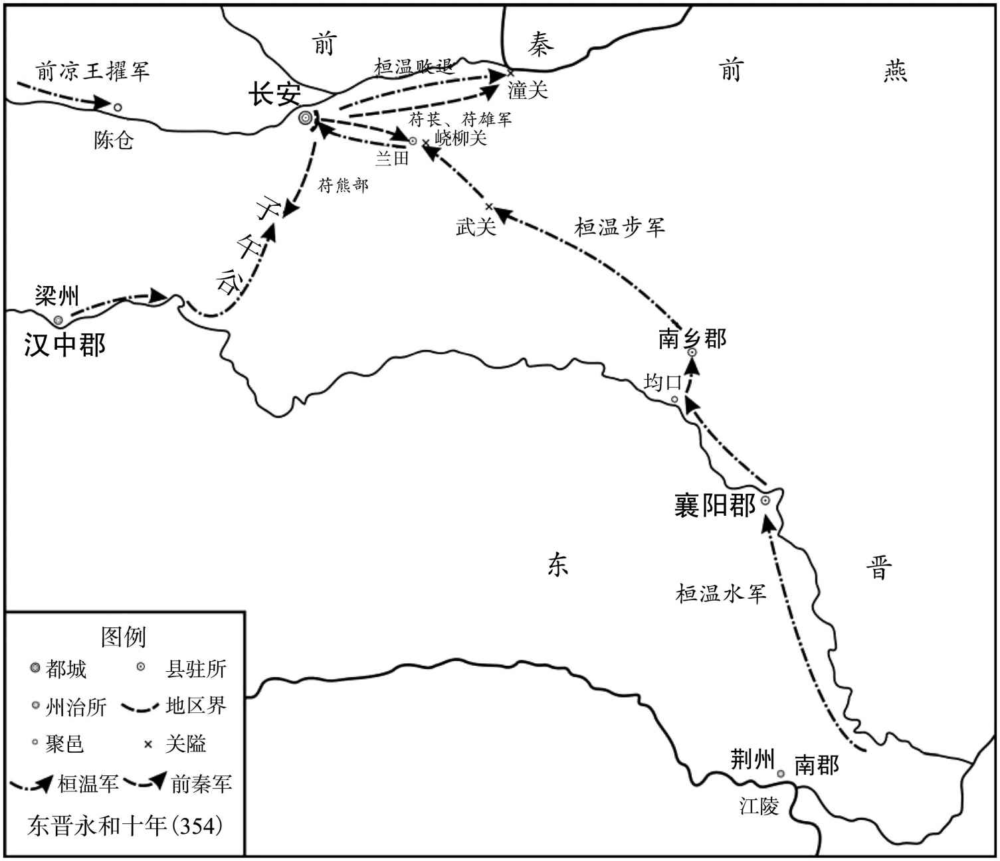 
桓温第一次北伐示意图

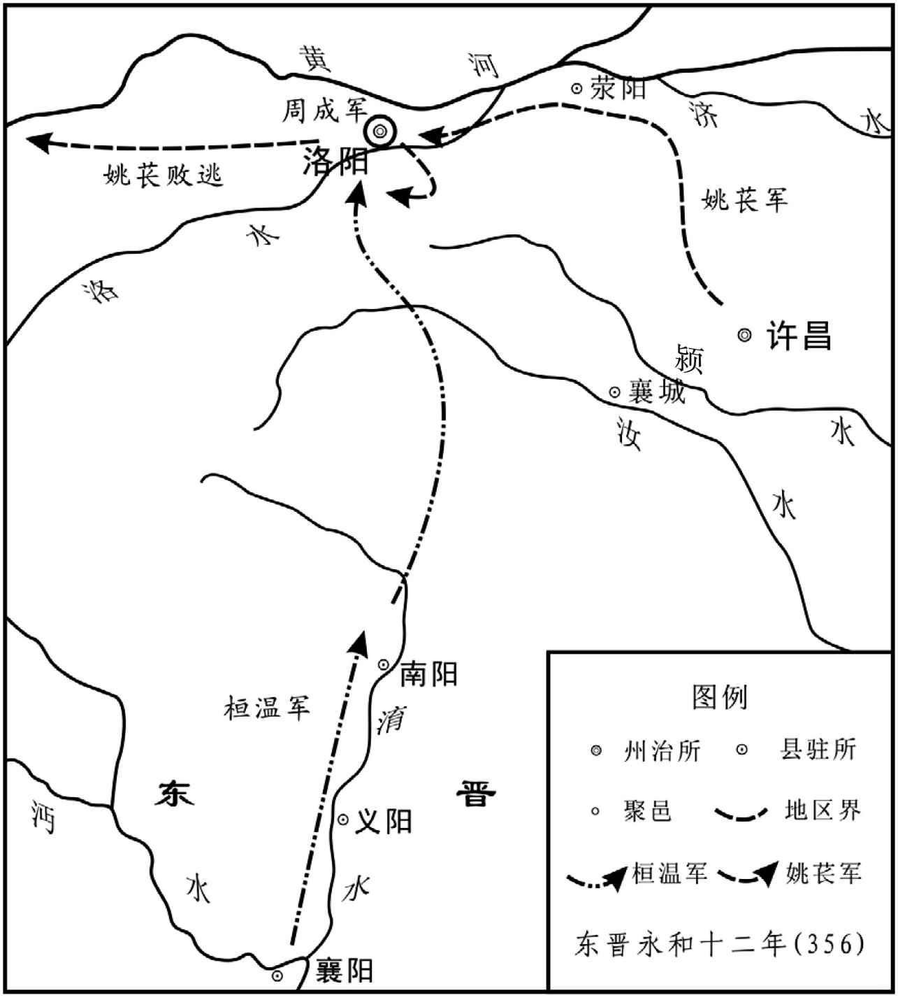 
桓温第二次北伐示意图

* * *

(1) 据陈垣《二十史朔闰表》，东晋成帝咸康五年（339年）八月癸酉朔，无辛酉日。

(2) 据陈垣《二十史朔闰表》，东晋穆帝永和元年（345年）正月辛未朔，无壬戌日。

(3) 据陈垣《二十史朔闰表》，东晋穆帝永和元年（345年）八月戊戌朔，无庚辰日。

(4) 据陈垣《二十史朔闰表》，东晋穆帝永和十年（354年）二月己卯朔，无乙丑日。

(5) 据陈垣《二十史朔闰表》，东晋穆帝永和十二年（356年）八月甲午朔，无己丑日，己丑当为九月二十六日。

# 桓温伐燕

## 【内容摘要】

《桓温伐燕》记载了东晋桓温第三次出兵北伐前燕的历史。桓温在他的戎马生涯中曾三次出兵北伐，这次出兵，是他北伐的最后一次，也是失败最惨重的一次。

桓温在第二次北伐成功收复洛阳（今河南洛阳东北）后声望提高，于东晋穆帝升平四年（360年）进爵南郡公。东晋哀帝司马丕兴宁元年（363年），又升任大司马、都督中外诸军事、录尚书事，正式掌握朝政，并掌握京畿（jī）地区军事大权。东晋废帝太和二年（367年），前燕慕容恪（kè）去世，桓温决定抓住时机进行北伐。太和四年（369年）四月，桓温率领五万步兵、骑兵从姑孰（今安徽当涂）出发，兵分两路。西路由袁真率领，计划穿过谯、梁二郡，打通石门水道，把粮草运到黄河前线。桓温则亲自率领主力军队，从东线水路进入黄河，沿河西上与袁真会合。东路大军出境不久就打败了前来拦截的前燕军队。此后前燕大将慕容垂率领八万大军前来抵御，再次被桓温打败。晋军进入黄河前，曾在下一步战略上发生争论。谋士郗超献上两策，一是原地驻防，积聚军需，等过了冬天再继续前进。另一计是直捣前燕首都，逼燕军主力决战。桓温认为前计太缓，后计太急，坚持按原定计划沿河而上与袁真会合。但是袁真一直打不开石门一带的水道，桓温在行进至枋头（今河南浚县）一带时因军粮不济，只得烧毁船只，向南撤退，途中被前燕的精骑追击，惨遭失败。

桓温第三次北伐大败而归，令桓温的威望大降，所收复的淮北土地再次丧失。只因其权倾朝野，促使他放弃利用北伐来提升自己的名望，转而对内实施废立，并于太和六年（371年）废黜（chù）司马奕。然而，由于北伐失利，桓温不但没能实现他的篡位计划，而且始终受制于谢安等门阀士族。同时，因为桓温北伐，促使前燕与前秦互派使者，进行合作。当初，为抵御晋朝军队的进攻，慕容（wěi）许诺割虎牢（今河南荥阳西北）以西土地给予前秦而请求增援。然而，战争结束后，慕容反悔了对前秦的承诺，前秦苻坚于是率领军队进攻前燕。最终，由鲜卑族建立的前燕政权被前秦消灭。

桓温的第三次北伐动用了大量的人力、物力，加重了南方地区百姓的经济负担，百姓怨声载道。尽管如此，北伐也在一定程度上打击了前秦、后赵和前燕的统治。

## 【原文】

**晋穆帝升平二年[1]。赵之亡也，其将高昌遣使降燕，已而降晋，又降秦，各受爵位，欲中立以自固[2]。燕主儁使司空阳骛讨昌于东燕[3]。**

## 【注文】

[1]升平：东晋穆帝司马聃的年号，即从公元357年至361年。升平五年（361年）五月晋哀帝即位沿用，次年改元隆和元年。

[2]赵：此指羯族石勒所建的后赵政权（319—351年）。　　高昌（？—361年）：后赵将领。后赵灭亡时，他派遣使者向前燕投降，不久又降于东晋，继而又向前秦投降，分别接受各国的爵位，想要利用中立的办法来达到稳固自己地位的目的。　　燕：此指前燕（337—370年）。　　秦：此指前秦（351—394年）。

[3]儁（jùn）：即十六国时期前燕国君慕容儁（319—360年），昌黎棘城（今辽宁义县西北）人，字宣英，慕容皝（huàng）次子。公元348年，即燕王位；公元352年，正式称帝。他在位期间，消灭了冉魏，占据原本由后赵所占领的中原地区，并迁都邺城（今河北临漳西南），前燕进入鼎盛时期，终与南方的东晋、关中的前秦政权三足鼎立。公元360年，因病去世，葬于龙陵（今辽宁朝阳）。　　司空：官名。西周始置，与司马、司寇、司士、司徒并称“五官”，掌水利、营建事宜。东汉将大司空改为司空，与太尉、司徒同为宰相，参议国家大政。魏晋时，权力逐渐削弱，多作为大臣的加官，无实际权力。　　阳骛（wù）（生卒年不详）：字士秋，阳耽之子，右北平无终（今天津蓟县）人。曾任十六国前燕左长史、郎中令、尚书令、辅义将军、司空、太保等。与辅国将军慕容恪、辅弼将军慕容评，合称“三辅”。　　东燕：县名，治所在今河南延津东北。

## 【译文】

东晋穆帝升平二年（358年）。后赵灭亡的时候，后赵将领高昌派遣使者向前燕投降，不久又投降了东晋，继而又投降了前秦，分别接受各国的爵位，想要利用中立的办法来达到稳固自己地位的目的。前燕主慕容儁派遣司空阳鹜讨伐驻扎在东燕的高昌。

## 【原文】

**三年（夏六月），高昌不能拒燕，秋七月，自白马奔荥阳[1]。**

## 【注文】

[1]白马：县名，治所在今河南滑县东。

## 【译文】

东晋穆帝升平三年（359年），高昌不能抵御前燕的进攻，秋季七月，高昌从白马逃奔到荥阳。

## 【原文】

**五年春二月，高昌卒，燕河内太守吕护并其众，遣使来降，拜护冀州刺史[1]。护欲引晋兵以袭邺[2]。三月，燕太宰恪将兵五万，冠军将军皇甫真将兵万人，共讨之[3]。燕兵至野王，护婴城自守[4]。护军将军傅颜请急攻之，以省大费[5]。恪曰：“老贼经变多矣，观其守备，未易猝攻。顷攻黎阳，多杀精锐，卒不能拔，自取困辱[6]。护内无蓄积，外无救援，我深沟高垒，坐而守之，休兵养士，离间其党，于我不劳而贼势日蹙，不过十旬，取之必矣，何为多杀士卒以求旦夕之功乎[7]？”乃筑长围守之。**

## 【注文】

[1]卒：古代指大夫死亡，后为死亡的通称。古时各个等级的人去世时的称谓有所不同，据《礼记》记载：天子曰崩，诸侯死曰薨（hōng），大夫死曰卒，士（知识分子）曰不禄，庶人（平民）曰死。　　河内：郡名，治所在野王县（今河南沁阳），辖境相当于今河南黄河以北，京汉铁路以西地区。　　吕护（？—362年）：十六国前燕官吏，曾担任河内太守。东晋升平五年（361年）春季二月，高昌去世，他吞并高昌军队，并派遣使者向东晋投降，被东晋任命为冀州刺史。后又反叛东晋，投奔前燕，被任为广州刺史。东晋哀帝隆和元年（362年），被流箭射死。

[2]邺：即邺城，为后赵都城，位于今河北临漳西南。

[3]太宰：官名。殷商时已设，负责管理天下政务，辅佐君王。西晋初年，为避司马师名讳，以太宰之名代太师。东晋十六国时多不实授，而用作重臣死后的赠官。　　恪：即慕容恪（？—368年），十六国时期前燕名将，字玄恭，鲜卑族，昌黎棘城（今辽宁义县西北）人，燕王慕容皝第四子。他一生屡立军功，累官至太宰。他与辅义将军阳骛（wù）、辅弼将军慕容评，号称“三辅”，又与阳骛、慕容评同为托孤重臣。　　皇甫真：字楚季，生卒年不详，十六国前燕官吏。历任平州别驾、典书令等职。前燕灭亡后，他又出任前秦奉车都尉一职。

[4]野王：地名，今河南沁阳。

[5]傅颜（生卒年不详）：前燕将领，曾任右卫将军、护军将军、长乐太守等。

[6]黎阳：地名，今安徽休宁东南。

[7]蹙（cù）：紧迫。

## 【译文】

东晋穆帝升平五年（361年）春季二月，高昌去世，前燕河内太守吕护吞并了他的军队，并派遣使者向东晋投降，东晋任命他为冀州刺史。吕护打算带领东晋的军队袭击邺城。三月，前燕太宰慕容恪率领五万精兵，冠军将军皇甫真率领一万精兵，共同讨伐吕护。前燕的军队抵达野王，吕护环城据守。护军将军傅颜请求猛攻吕护，以便节省庞大的损耗。慕容恪则说：“吕护老贼经历过的变故很多，观察他的守卫情形，不容易发动急攻。之前攻打黎阳，就已经牺牲了许多精锐士卒，最终还是没有攻下该城，反而自取困窘和耻辱。吕护城内没有粮食积蓄，城外没有救援，我军深挖壕沟高筑营垒，坐在这里围困他，休整军队保养士兵，离间吕护的党羽，对我军来说则不受烦劳而吕护的情势日渐紧迫，不超过百天，一定能够夺取城池，为什么要牺牲士卒来获取眼前的成功呢？”于是筑起了长长的土围子围困吕护。

## 【原文】

**夏四月，桓温以其弟黄门郎豁督沔中七郡诸军事，兼新野、义城二郡太守，将兵取许昌，破燕将慕容尘[1]。**

## 【注文】

[1]黄门郎：官名，又称黄门侍郎，即给事于宫门之内的郎官。宫禁之门称为黄闼（tà），故称黄门郎或黄门侍郎，负责侍从皇帝，传达诏命。魏、晋、南朝官名前均有“给事”二字。因掌管机密文字，职位日渐重要。　　豁（huò）：即桓豁（320—377年），字朗子，桓彝之子。初仕司马昱为抚军从事中郎，其兄桓温掌权之后，任命他为督沔中七郡军事、建威将军、新野太守、义城太守。此后，他与前秦苻秦在汉水和淮水一带长期交战。　　督沔中七郡诸军事：即都督沔中七郡军事事务的军事统帅。两晋以都督一州或者数州诸军事为职权最高，督一州或者数州诸军事次之，监一州或者数州诸军事又次之。沔中，即沔阳，以在沔水之阳而得名。七郡是指魏兴、新城、上庸、襄阳、义城、竟陵、江夏等七郡。　　新野：郡名。西晋惠帝永宁元年（301年）置，治所设在新野县（今河南新野），辖境相当于今河南邓州和新野等地。　　义城：疑为“义成”。郡名，治所设在今湖北襄阳。　　慕容尘（生卒年不详）：前燕官吏。昌黎棘城（今辽宁义县西北）人。历任镇南将军、青州刺史等。

## 【译文】

东晋穆帝升平五年（361年）夏季四月，桓温任用他的弟弟黄门郎桓豁为督沔中七郡诸军事，兼新野、义城二郡太守，率兵攻取许昌，打败了前燕将领慕容尘。

## 【原文】

**燕人围野王数月，吕护遣其将张兴出战，傅颜击斩之，城中日蹙[1]。皇甫真戒部将曰：“护势穷奔突，必择虚隙而投之。吾所部士卒多羸，器甲不精，宜深为之备[2]。”乃多课橹楯，亲察行夜者[3]。［秋七月］，护食尽，果夜悉精锐趋真所部，突围，不得出。太宰恪引兵击之，护众死伤殆尽，弃妻子奔荥阳。恪存抚降民，给其廪食，徙士人将帅于邺，自余各随所乐[4]。以护参军广平梁琛为中书著作郎[5]。**

## 【注文】

[1]张兴（？—361年）：东晋吕护部将。东晋穆帝升平五年（361年），他在与前燕军队的交战中，兵败被杀。

[2]羸（léi）：瘦弱。

[3]橹（lǔ）楯（dùn）：大盾。橹，拨水使船前进的工具，置于船边，比桨长，用于摇动；楯，同“盾”。

[4]廪（lǐn）食：仓储的粮食。

[5]广平：郡名，西汉景帝中元元年（前149年）置，治所设在广平县（今河北鸡泽东南）。北魏将治所迁至曲梁县（今河北永年东南）。　　梁琛（chēn）（生卒年不详）：前燕官吏。广平（今河北鸡泽东南）人。曾任给事黄门侍郎、主簿、记室督、中书著作郎等。东晋废帝太和四年（369年），桓温伐燕，他曾作为燕国使节前往前秦求援。前燕灭亡后，他投奔前秦。　　中书著作郎：官名。掌禁中图书秘籍，校订异同。西晋武帝时，将秘书府并于中书省，置中书著作郎（又称大著作郎）一人，专掌撰写历史和起居注修撰。晋惠帝即位后，改中书著作郎为秘书著作郎，从中书省改隶于秘书监。

## 【译文】

前燕军队围困野王城几个月，吕护派遣他的部将张兴出城交战，傅颜迎战并斩杀了张兴，城中形势日益紧迫。皇甫真告诫他的部将们说：“吕护势孤力穷，必定会在我们防守空虚、防备不严的地方突围。我们所率领的士卒大多瘦弱，兵器和铠甲也不精良，应当深加防备，以防万一。”于是经常检验武器，并亲自检查巡夜的哨兵。升平五年（361年）秋季七月，吕护的粮食吃完了，果然趁夜色率领全部精锐的士卒直扑皇甫真的军队进行突围，但没有成功。太宰慕容恪率兵进攻，吕护的军队死伤殆尽，于是抛下自己的妻子儿女逃奔荥阳。慕容恪安抚归降的百姓，供给他们粮食，把官吏和将帅都迁徙到邺城，其余的人则可以随意选择去处。任命吕护的参军广平人梁琛为中书著作郎。

## 【原文】

**冬十月，吕护复叛，奔燕，燕人赦之，以为广州刺史[1]。**

## 【注文】

[1]赦（shè）：赦免。　　广州：州名。东吴政权分东汉的交州为交、广两州，北部为广州，治所在番禺（今广东广州），辖境相当于今广西、广东地区，只有南部今湛江、北海、玉林、钦州范围属于交州，北部桂林、贺州、韶关范围属于荆州。两晋基本沿用三国建置。

## 【译文】

东晋穆帝升平五年（361年）冬季十月，吕护又反叛了东晋，投奔了前燕。前燕赦免了他，让他担任广州刺史。

## 【原文】

**哀帝隆和元年春正月，燕豫州刺史孙兴请攻洛阳，曰：“晋将陈佑弊卒千余，介守孤城，不足取也[1]。”燕人从其言，遣宁南将军吕护屯河阴[2]。**

## 【注文】

[1]哀帝：即东晋哀帝司马丕（341—365年），公元361年至公元365年在位。东晋成帝咸康八年（342年），封琅邪王。升平五年（361年），晋穆帝去世，皇太后褚氏立他为帝。次年改元隆和。他在位期间，由桓温长期执掌国政。死后葬安平陵（今江苏南京附近）。　　隆和：或作崇和，东晋哀帝司马丕所用，即公元362年至363年。

[2]宁南将军：将军名号，十六国时后赵始置，负责统兵征战。与宁东、宁西、宁北将军，合称“四宁将军”。前燕、后秦等亦置此官。　　河阴：县名，治所设在今河南孟津东北。

## 【译文】

东晋哀帝隆和元年（362年）春季正月，前燕豫州刺史孙兴请求进攻洛阳，说：“晋朝将领陈佑仅有疲惫困乏的一千多名士卒，独守孤城，攻取它轻而易举。”前燕人听了他的话，派遣宁南将军吕护驻军于河阴。

## 【原文】

**二月辛未，以吴国内史庾希为北中郎将、徐兖二州刺史，镇下邳，龙骧将军袁真为西中郎将、监护豫司并冀四州诸军事、豫州刺史，镇汝南，并假节[1]。希，冰之子也。**

## 【注文】

[1]吴国内史：吴国最高行政长官。　　庾希（？—372年）：字始彦，颍川鄢陵（今河南鄢陵北）人，庾冰之子。东晋官员，官至北中郎将、徐兖二州刺史。后因庾氏被大司马桓温诬陷谋反而出逃，在京口（今江苏镇江丹徒区）举兵讨伐桓温，兵败被杀。　　袁真（？—370年）：东晋官吏，初为庐江太守。公元350年，担任龙骧将军。后持节前往洛阳（今河南洛阳东北）修复五陵。不久，转西中郎将，监护豫、司、并、冀四州诸军事，豫州刺史。公元369年，他跟随桓温北伐，晋朝军队战败后，他被贬为平民。后因怨桓温诬陷自己，于是在寿春（今安徽寿县）反叛，投降前燕，被任命为征南大将军、扬州刺史。　　监护豫司并冀四州诸军事：监管豫州、司州、并州、冀州军事事务的长官。

## 【译文】

东晋哀帝隆和元年（362年）二月辛未（初十日），东晋任命吴国内史庾希为北中郎将、徐兖二州刺史，镇守下邳，龙骧将军袁真为西中郎将、监护豫司并冀四州诸军事、豫州刺史，镇守汝南，全都授予符节。庾希，是庾冰的儿子。

## 【原文】

**燕吕护攻洛阳。三月乙酉(1)，河南太守戴施奔宛，陈祐告急。五月丁巳，桓温遣庾希及竟陵太守邓遐，帅舟师三千人助祐守洛阳[1]。遐，岳之子也[2]。**

## 【注文】

[1]邓遐（生卒年不详）：东晋骁将，字应远，邓岳之子。桓温辅政时，他担任参军，多次跟随桓温南征北战，立有战功，被封为冠军将军。领数郡太守，号为名将。枋头之战，桓温失败后，他被免官。不久病故。

[2]岳（生卒年不详）：即邓岳，字伯山，东晋官吏，初为王敦参军，后转从事中郎、西阳太守。司徒王导在任时，又被任命为从事中郎，后复为西阳太守。

## 【译文】

前燕吕护攻打洛阳。隆和元年（362年）三月乙酉日，河南太守戴施逃奔宛城，陈祐告急。五月丁巳（二十七日），桓温派遣庾希和竟陵太守邓遐，率领三千名水军援助陈祐守卫洛阳。邓遐，是邓岳的儿子。

## 【原文】

**温上疏请迁都洛阳，自永嘉之乱播流江表者，请一切北徙，以实河南[1]。朝廷畏温，不敢为异，而北土萧条，人情疑惧，虽并知不可，莫敢先谏。散骑常侍领著作郎孙绰上疏曰：“昔中宗龙飞，非惟信顺协于天人，实赖万里长江画而守之耳[2]。今自丧乱已来，六十余年，河、洛丘墟，函夏萧条[3]。士民播流江表，已经数世，存者老子长孙，亡者丘陇成行，虽北风之思感其素心，目前之哀实为交切[4]。若迁都旋轸之日，中兴五陵即复缅成遐域[5]。泰山之安，既难以理保，烝烝之思，岂不缠于圣心哉[6]。温今此举，诚欲大览始终，为国远图，而百姓震骇，同怀危惧，岂不以反旧之乐赊，而趋死之忧促哉！何者？植根江外，数十年矣，一朝顿欲拔之，驱踧于空荒之地，提挈万里，逾险浮深，离坟墓，弃生业，田宅不可复售，舟车无从而得，舍安乐之国，适习乱之乡，将顿仆道涂，飘溺江川，仅有达者[7]。此仁者所宜哀矜，国家所宜深虑也。臣之愚计，以为且宜遣将帅有威名资实者，先镇洛阳，扫平梁、许，清壹河南[8]。运漕之路既通，开垦之积已丰，豺狼远窜，中夏小康，然后可徐议迁徙耳[9]。奈何舍百胜之长理，举天下而一掷哉！”绰，楚之孙也，少慕高尚，尝著《遂初赋》以见志[10]。温见绰表，不悦，曰：“致意兴公，何不寻君《遂初赋》，而知人家国事邪。”**

## 【注文】

[1]永嘉之乱：指西晋怀帝永嘉年间发生的祸乱。西晋惠帝永兴元年（304年），匈奴贵族刘渊在左国城（今山西离石）起兵，逐步控制并州部分地区，自称汉王。光熙元年（306年），晋怀帝司马炽继位，改元永嘉。此时，刘渊派遣石勒等大举南侵，屡破晋军，势力日益强大。永嘉二年（308年），刘渊正式称帝。永嘉四年（310年）刘渊病死，他的儿子刘聪继位。次年，刘聪派遣石勒、王弥、刘曜等率军攻晋，在平城（今河南鹿邑西南）歼灭十万晋军，又杀死太尉王衍及诸王公。不久攻入京师洛阳（今河南洛阳东北），掳走晋怀帝，杀死王公士民三万余人，史称“永嘉之乱”。　　江表：即江外，长江以南地区。从中原看，地处长江之外，故称江表。此指东晋政权。　　河南：此指河南郡。桓温上疏建议迁都洛阳，所以要求永嘉之乱时流亡到江南的百姓都迁回河南郡，以充实京师。

[2]中宗：即晋元帝司马睿（276—323年）的庙号。公元317年，时任西晋丞相的司马睿在建康（今江苏南京）称王，改元建武；次年称帝，成为东晋开国皇帝。永昌元年（322年），王敦起兵攻入建康，司马睿忧愤而死，庙号中宗。　　龙飞：比喻皇帝的兴起和即位。

[3]丧乱：指八王之乱、五胡乱华。　　六十余年：指从西晋惠帝永平元年（291年）的八王之乱至东晋哀帝隆和元年（362年）。　　河、洛：指黄河和洛水，即东都洛阳一带。洛水：发源于华山之阳，进入豫西后流经卢氏、洛宁、宜阳、洛阳，在偃师东与源于豫西栾川，流经嵩山、伊川、洛阳的伊河交汇，至巩义后向北注入黄河。　　函夏：指中原地区。

[4]数世：几代。古代以三十年为一代。

[5]旋轸（zhěn）：车马回转。轸：古代指车箱底部四周的横木，借指车辆。　　中兴五陵：即晋元帝司马睿建平陵、晋明帝司马绍武平陵、晋成帝司马衍兴平陵、晋康帝司马岳崇平陵、晋穆帝司马聃（dān）永平陵，皆在江南。

[6]烝烝（zhēng）：淳厚的样子。

[7]驱踧（cù）：驱逐。　　提挈（qiè）：带领、携带。

[8]梁：即梁国地区，今河南商丘西南地区。　　清壹：完全统一。

[9]小康：中原稍稍康宁、安定。

[10]绰（chuò）：即孙绰（314—371年），字兴公，太原中都（今山西平遥）人，孙楚之孙。他博学善文，是东晋玄言诗的代表作家。历任著作佐郎、永嘉太守等，官至廷尉卿，领著作。明人辑有《孙廷尉集》。　　楚：即孙楚（？—293年），字子荆，西晋诗人，太原中都（今山西平遥）人。三国魏末，已四十多岁的他才入仕为镇东将军石苞参军，后为晋扶风王司马骏征西参军。晋惠帝即位后，他出任冯翊太守，直至去世。他给后人留下了众多诗赋、书信等，清朝人严可均编辑的《全上古三代秦汉三国六朝文》共收录他的赋十七篇。　　《遂初赋》：赋名，其内容大致是希望实现隐遁（dùn）的初衷。

## 【译文】

桓温上奏请求还都洛阳，自从永嘉之乱以来流散到长江以南的百姓，全部北迁，以便充实黄河以南地区。朝廷畏惧桓温，不敢提出异议，而北方的土地萧条荒凉，人心恐惧不安，虽然都知道这样做不行，但没有一个人敢提出反对意见。散骑常侍兼著作郎孙绰上奏说：“从前中宗皇帝即位重建政权，不仅仅是上顺天意、下合民心，而且是依赖万里长江划地防守。自从八王之乱、五胡乱华以来，已经六十多年了，黄河、洛水流域变为废墟，中原大地一片荒凉。士兵和百姓迁徙到长江以南地区，已经有好几代了，活着人的儿子已经年老，孙子已经长大成人。死去人的坟丘已经成排成列，虽然北风常常撩起百姓固有的思乡之情，但眼前的哀痛实在是更为交融深切。倘若迁都返回故地，车驾返回那一天，中兴以来的五座陵墓即刻又会留在遥远的地域，使人们缅怀。迁都后是否有泰山般的安定，既然从道理上难以保证，而缅怀江南五帝的悠悠情思，怎能不在圣主心中缠绕？桓温现在这一举动，诚然是想把光复中原的大业全部承担下来，为国家的长远利益考虑，然而百姓感到震动惊骇，人人怀有恐惧不安之心，难道不是因为返回故乡的欢乐迟缓，而走向死亡的忧虑紧迫吗？为什么这样说呢？扎根江南的北方百姓，已经过了几十年了，一旦想要迁徙他们，匆忙地把他们驱赶到空旷荒凉的土地上，使他们扶老携幼跋涉万里，跋山涉水，离开祖先的坟墓，扔下赖以为生的产业，田地和宅院不能重新出售再卖，舟船和车乘无处得到，舍弃安宁欢乐的国度，前往久经战乱的异乡，将会困顿跌倒在路途，葬身于江中，很少有人能到达目的地。这是仁慈的人所应当怜悯，国家所应当深思的。以我的看法，暂且应当派遣有威名、实力雄厚的将帅，先去镇守洛阳，扫平梁国、许昌，统一全部黄河以南的地区。等到水运的道路已然通畅，垦荒积攒的粮食已经丰足，狼豺敌寇远远地逃窜，中原稍稍的康宁，然后才可以慢慢地商议迁都的事情。为什么要舍弃必胜的长远之理，用天下来孤注一掷？”孙绰，是孙楚的孙子，他从小就仰慕高尚的情操，曾经著《遂初赋》来表现他的志向。桓温见到孙绰的表文，不大高兴，说：“告诉孙绰，为什么不去探究《遂初赋》，而来管国家的大事了。”

## 【原文】

**时朝廷忧惧，将遣侍中止温。扬州刺史王述曰：“温欲以虚声威朝廷耳，非事实也。但从之，自无所至。”乃诏温曰：“在昔丧乱，忽涉五纪，戎狄肆暴，继袭凶迹，眷言西顾，慨叹盈怀[1]。知欲躬帅三军，荡涤氛秽，廓清中畿，光复旧京[2]。非夫外身徇国，孰能若此？诸所处分，委之高算。但河、洛丘墟，所营者广，经始之勤，（政）［致］劳怀也[3]。”事果不行。温又议移洛阳钟虡，述曰：“永嘉不竞，暂都江左，方当荡平区宇，旋轸旧京[4]。若其不尔，宜改迁园陵，不应先事钟虡[5]。”温乃止。朝廷以交、广辽远，改授温都督并司冀三州，温表辞不受[6]。**

## 【注文】

[1]五纪：六十年，古代以十二年为一纪。从西晋惠帝永兴元年（304年）刘渊起兵以来，至今已五十九年。　　戎（róng）狄（dí）：古时称西方少数民族为戎，称北方少数民族为狄。戎狄常用以泛称除华夏族以外的各少数民族。

[2]三军：古代设上、中、下三军。上军是先锋部队；中军是主将统率的部队，也是主力；下军主要担任掩护和警戒任务。此外，有时三军也指步、车、骑三军。　　中畿（jī）：古称天子所领之地，又称王畿，后指京师地区。据《周礼》记载：古代有九畿，即侯、甸、男、采、卫、蛮、夷、镇、蕃。王畿方千里，在九畿之中，故称中畿。

[3]经始：开始经营。语出《诗经·大雅·灵台》：“经始灵台，经之营之。”大意为：开始规划建造灵台，仔细经营巧妙安排。

[4]钟虡（jù）：钟和钟架。虡，悬挂钟或磬（qìng）的木架。钟虡为国家重器，故桓温要将它由洛阳（今河南洛阳东北）移往建康（今江苏南京）。

[5]园陵：泛指皇帝的陵墓。

[6]交：即交州。东汉改交趾刺史部置，治所设在今广西梧州，不久迁至今广东广州，辖境包括今越南北、中部和广东、广西大部分。三国吴景帝永安七年（264年）交、广分州后，交州治所迁至今越南河北仙游东，辖境缩至今越南中部、北部及广西钦州地区、广州雷州半岛。晋沿置。

## 【译文】

当时朝廷忧虑恐惧，将要派遣侍中阻止桓温。扬州刺史王述说：“桓温是想虚张声势来威胁朝廷罢了，并不是真的要迁都。只要依从他，自然就不会像他说的那样做。”于是朝廷下诏给桓温说：“昔日死丧祸乱，转眼已经过了五十多年了，戎狄恣意暴虐，后继者重蹈他们的凶恶轨迹，回头西望旧都，心中充满感慨与叹息。得知将军打算亲率三军，扫荡凶恶邪气，肃清中原，光复故都。如果不是誓死报国、为国捐躯，谁能如此呢？各种事务的处置完全仰仗将军的谋算。但是黄河、洛水流域一片废墟，需要处理的事务太多，开始经营的要务非常辛苦，还要有劳将军您了。”迁都的事情果然没有实行。桓温于是又提议迁移洛阳的编钟，王述说：“永嘉年间国家不济，暂时迁都江东，正应当扫平寰宇，掉转车驾返回故都。如果不能这样，也应当改迁先帝的陵园，不应当先搬迁编钟。”桓温于是作罢。朝廷因为交州、广州遥远，改授桓温为都督并州、司州、冀州三州诸军事。桓温上表辞让，没有接受。

## 【原文】

**秋七月，吕护退守小平津，中流矢而卒[1]。燕将段崇收军北渡，屯于野王。邓遐进屯新城[2]。八月，西中郎将袁真进屯汝南，运米五万斛以馈洛阳。冬十二月，庾希自下邳退屯山阳，袁真自汝南退屯寿阳[3]。**

## 【注文】

[1]小平津：渡口名，在今河南孟津东北黄河上。　　矢（shǐ）：箭矢，用弓或弩（nǔ）发射，结构上分为箭镞（zú）、箭杆、箭羽。矢最早起源于新石器时代，是历史最悠久的武器之一。

[2]新城：县名，治所在今河南伊川西南。

[3]山阳：地名，位于今江苏淮安。

## 【译文】

东晋哀帝隆和元年（362年）秋季七月，吕护撤退到小平津防守，被流箭射死。前燕将领段崇收编了他的军队，并向北渡河，驻军于野王。邓遐进军驻扎在新城。八月，西中郎将袁真进军驻扎在汝南，运送五万斛米到洛阳。冬季十二月，庾希从下邳退到山阳驻扎，袁真从汝南撤退到寿阳驻扎。

## 【原文】

**兴宁元年夏四月，燕宁东将军慕容忠攻荥阳太守刘远，远奔鲁阳[1]。五月，以西中郎将袁真都督司冀并三州诸军事，北中郎将庾希都督青州诸军事[2]。癸卯，燕人拔密城，刘远奔江陵[3]。冬十月，燕镇南将军慕容尘攻陈留太守袁披于长平；汝南太守朱斌乘虚袭许昌，克之[4]。**

## 【注文】

[1]兴宁：东晋哀帝司马丕的年号，即从公元363年至365年。公元365年，前燕夺取洛阳（今河南洛阳东北），哀帝病死，废帝司马奕即位，次年改元太和。　　宁东将军：参见前文“宁南将军”条。　　慕容忠（？—386年）：鲜卑族。昌黎棘城（今辽宁义县西北）人，慕容泓之子，西燕国君。公元386年，西燕内乱，他趁机杀死慕容瑶后即位，改元建武，太尉、尚书令慕容永实际执掌朝政。数月后，慕容忠又被将军刁云所杀。

[2]都督青州诸军事：都督青州地区军事事务的长官。

[3]密城：密县县治，即今河南新密东南古密城。

[4]镇南将军：官名，统兵将领，掌征伐背叛、镇戍四方。与镇北、镇西、镇东合称“四镇将军”，地位低于“四征将军”。其中，镇南将军中以资深者为镇南大将军。东晋十六国时期地方官员兼任将军的，等级依次为征、镇、安、平等几个等级。　　长平：县名，治所在今河南西华东北。

## 【译文】

东晋哀帝兴宁元年（363年）夏季四月，前燕宁东将军慕容忠进攻荥阳太守刘远，刘远逃奔至鲁阳。五月，东晋朝廷任命西中郎将袁真为都督司、冀、并三州诸军事，北中郎将庾希为都督青州诸军事。癸卯（十九日），前燕军队攻陷密城，刘远逃奔江陵。冬季十月，前燕镇南将军慕容尘攻打驻军于长平的陈留太守袁披；汝南太守朱斌乘虚袭击许昌，攻下了该城。

## 【原文】

**二年春二月，燕太傅评、龙骧将军李洪略地河南[1]。夏四月甲辰，燕李洪攻许昌、汝南，败晋兵于悬瓠，颍川太守李福战死，汝南太守朱斌奔寿春，陈郡太守朱辅退保彭城[2]。大司马温遣西中郎将袁真等御之，温帅舟师屯合肥[3]。燕人遂拔许昌、汝南、陈郡，徙万余户于幽、冀二州，遣镇南将军慕容尘屯许昌。秋八月，燕太宰恪将取洛阳，先遣人招纳士民，远近诸坞皆归之[4]。乃使司马悦希军于盟津，豫州刺史孙兴军于成皋[5]。**

## 【注文】

[1]太傅：官名，商周时与太师、太保合称“三公”，为天子的辅佐大臣，掌管礼法的制定和颁行。除秦朝短时间被废止外，以后各朝代都有设置，但多为虚衔，并无实权。能够获得这个称号的，一般都是朝中重臣。　　评：即慕容评（？—370年），十六国时前燕慕容廆（wěi）之子，前燕将领，历任司徒、辅弼将军、太宰、太傅等职，受封上庸王。他与辅国将军慕容恪、辅义将军阳骛，号称“三辅”。他在任期间内杀忠臣，致使吴王慕容垂出奔前秦。前秦消灭前燕后，苻坚将他远放为范阳太守。

[2]悬瓠（hú）：城名，即今河南汝南。东晋、南北朝时为南北军事要地，置重兵戍守于此。　　李福（？—364年）：东晋将领，曾任颍川太守。公元364年，在与前燕李洪军队交战中战死。　　朱辅（？—371年）：东晋陈郡太守。东晋哀帝兴宁二年（364年），与前燕军交战，被打败，撤退到彭城（今江苏徐州）防守。后向前燕投诚，被前燕任命为荆州刺史。简文帝咸安元年（371年），向前秦求援，被前秦任命为交州刺史。但前秦王鉴、张蚝援军仍未能挡住桓温军的进攻，他被桓温军擒获，随后被押送至都城建康斩首。

[3]合肥：地名，即今安徽合肥。

[4]坞（wù）：小障蔽物，防卫用的小堡。西晋末年，战乱频繁，北方各地坞堡林立，由有势力的豪族地主担任坞主，战乱中的流民成为坞主的佃客、部曲。

[5]盟津：渡口名，今河南孟州西。　　成皋（gāo）：关名，位于今河南荥阳西北。古为黄河南岸东西交通的咽喉之地和战争要塞。

## 【译文】

东晋哀帝兴宁二年（364年）春季二月，前燕太傅慕容评、龙骧将军李洪抢掠黄河以南地区。夏季四月甲辰（二十五日），前燕李洪进攻许昌、汝南，在悬瓠打败了东晋军队，颍川太守李福战死，汝南太守朱斌逃奔寿春，陈郡太守朱辅撤退到彭城防守。大司马桓温派遣西中郎将袁真等人抵御前燕军队，桓温则率领水师驻扎在合肥。前燕军队攻下许昌、汝南、陈郡，把一万多户百姓迁徙到幽、冀二州，派遣镇南将军慕容尘驻军于许昌。秋季八月，前燕太宰慕容恪准备进攻洛阳，先派人招纳士民，远近各个土堡中的百姓都归附了他。于是就让司马悦希在盟津驻军，豫州刺史孙兴则驻军于成皋。

## 【原文】

**初，沈充之子劲，以其父死于逆乱，志欲立功以雪旧耻，年三十余，以刑家不得仕[1]。吴兴太守王胡之为司州刺史，上疏称劲才行，请解禁锢，参其府事，朝廷许之[2]。会胡之以病，不行。及燕人逼洛阳，冠军将军陈祐守之，众不过二千。劲自表求配祐效力，诏以劲补冠军长史，令自募壮士，得千余人以行[3]。劲屡以少击燕众，摧破之。而洛阳粮尽援绝，祐自度不能守，乃以救许昌为名，九月，留劲以五百人守洛阳，祐帅众而东。劲喜曰：“吾志欲致命，今得之矣。”祐闻许昌已没，遂奔新城。燕悦希引兵略河南诸城，尽取之。**

## 【注文】

[1]沈充（？—324年）：字士居，吴兴武康（今浙江德清西）人，为王敦参军。他把同乡钱凤举荐给王敦，三人朋比为奸，图谋不轨。东晋元帝永昌年间（322—323年），助王敦叛乱。东晋明帝太宁二年（324年），王敦发动第二次叛乱时，他从吴兴起兵会合王敦攻取建康。不久王敦病死，叛军被镇压，他兵败逃回吴兴，被故将吴儒杀死。　　劲：即沈劲（？—365年），字世坚，吴兴武康（今浙江德清西）人，沈充之子。其父沈充在王敦叛乱时，起兵反晋，兵败出逃时被部下所杀，他本应同被问罪，幸好被乡人藏匿（nì），才保住性命。此后，他杀死仇人为其父报仇。东晋穆帝升平年间（357—361年），前燕慕容恪进攻洛阳，冠军将军陈祐率领两千军队守城。他被任命为冠军长史，协助陈祐抵御前燕军队。东晋哀帝兴宁三年（365年），洛阳被慕容恪军攻破，他也被前燕军俘杀。　　逆乱：叛逆作乱。

[2]吴兴：郡名。三国吴宝鼎元年（266年）分吴郡、丹阳郡置，治所设在乌程（今浙江湖州南），辖境相当于今浙江临安、余杭、德清一线西北，兼有江苏宜兴地区。东晋安帝义熙元年（405年），治所迁至今浙江湖州，辖境自此日渐缩小。　　禁锢（gù）：中国古代终身禁止犯罪官吏本人及其亲友为官的制度。

[3]冠军长（zhǎng）史：即冠军将军的秘书长。长史：战国末期秦国始置。西汉时丞相、太尉、御史大夫皆设长史，相当于相府中的事务主官。后历代均设此官，成为幕僚长，总管府内事务等。

## 【译文】

当初，沈充的儿子沈劲，因为他的父亲叛乱被杀，立志要建立功勋来洗刷过去的耻辱，但已经三十多岁了，因为出身于受过刑罚的家庭而不得出任官职。吴兴太守王胡之担任司州刺史，上奏称赞沈劲有才干品行，请求解除他的禁锢，让他参与本州事务，朝廷同意了他的请求。恰巧此时王胡之生病，不能成行。等到前燕军队迫近洛阳时，冠军将军陈祐守卫该城，士兵还不到两千。沈劲于是上表朝廷请求到陈祐处为国效力，朝廷下诏任命他为冠军长史，命令他自行招募壮士，于是招募了一千多名士兵后便启程了。沈劲多次以少胜多，打败了前燕军队。但是洛阳城中粮食吃尽，援军断绝，陈祐认为已无法守住城池，于是以救援许昌为名，九月，留下沈劲等五百人守卫洛阳，自己则率领军队向东逃跑。沈劲高兴地说：“我的志向就是要献出生命，今日就要实现了。”陈祐听说许昌已经沦陷，于是逃奔新城。前燕悦希率兵攻占了黄河以南地区的众城池。

## 【原文】

**三年春正月，大司马温移镇姑孰[1]。二月乙未，以其弟右将军豁监荆州扬州之义城雍州之京兆诸军事、领荆州刺史，加江州刺史桓沖监江州及荆豫八郡诸军事，并假节[2]。**

## 【注文】

[1]姑孰（shú）：地名，即今安徽当涂。

[2]右将军：官名。秦汉时有前、后、左、右将军，均为领兵官。位次大将军及骠骑、车骑、卫将军。有兵事则典掌禁兵，戍卫京师，或任征伐。魏晋十六国时不常置，通常仅为虚衔。　　监荆州扬州之义城雍州之京兆诸军事：监管荆州、扬州的义城郡、雍州的京兆军事事务的统帅。荆州扬州之义成、雍州之京兆：侨置郡名（即西晋末年某地民众流亡到新的地区，仍保留原郡县名，或虽然沿用新郡县名，但仍管辖原来某地的民众），治所设在襄阳（今湖北襄阳）。当初桓宣曾随祖约退屯淮南郡（属扬州），后镇襄阳（属荆州），陶侃便将他们带到襄阳的淮南部曲安置在谷城，置义成郡（故治在今湖北老河口西北），又在郡下侨置淮南郡的平阿、下蔡二县，这就使本属于荆州的义成郡又统领扬州淮南的平阿、下蔡二县，故称荆州、扬州之义成。　　监江州及荆豫八郡诸军事：监管江州和荆州、豫州八郡军事事务的统帅。当时桓冲为江州刺史，领西阳、谯二郡太守。今又加监荆州的江夏、随郡，豫州的汝南、西阳、新蔡、颍川，加上所镇寻阳，共八郡。

## 【译文】

东晋哀帝兴宁三年（365年）春季正月，大司马桓温迁移到姑孰镇守。二月乙未（二十一日），任用他的弟弟右将军桓豁为监荆州扬州的义城郡、雍州的京兆郡诸军事，兼荆州刺史，加授江州刺史桓冲为监江州和荆州、豫州八郡诸军事，全部授予符节。

## 【原文】

**司徒昱闻陈祐弃洛阳，会大司马温于洌洲，共议征讨[1]。丙申，帝崩于西堂，事遂寝[2]。**

## 【注文】

[1]司徒：官名。西周始置，与司马、司空、司士、司寇并称“五官”，负责掌管国家土地与百姓。西汉哀帝时罢丞相之职，置大司徒，与大司马、大司空，并称三公。东汉光武帝建武二十七年（51年）复称司徒，为三公之一，与太尉、司空同为宰相，参议国家大政。魏晋南北朝时多为大臣加官，以示尊崇，但无实权，其府属仅处理户籍、督课官吏等日常事务。　　昱：即东晋简文帝司马昱（320—372年）。　　洌（liè）洲：位于今江苏南京江宁镇西南长江中的小岛。此岛可泊舟以避烈风，故名烈洲，又称洌州。洲上有山，山形如栗，因此亦称溧（lì）洲。

[2]崩：皇帝去世。　　西堂：太极殿西堂，为皇帝休息之所。

## 【译文】

司徒司马昱听说陈祐弃守洛阳，与大司马桓温在洌洲会面，共同商议征讨事宜。兴宁三年（365年）二月丙申（二十二日），东晋哀帝司马丕在太极殿西堂去世，征讨的事情于是被搁置起来。

## 【原文】

**燕太宰恪、吴王垂共攻洛阳[1]。恪谓诸将曰：“卿等常患吾不攻。今洛阳城高而兵弱，易克也，勿更畏懦而怠惰[2]。”遂攻之。三月，克之，执扬武将军沈劲[3]。劲神气自若，恪将宥之[4]。中军将军慕舆虔曰：“劲虽奇士，观其志度，终不为人用，今赦之，必为后患[5]。”遂杀之。恪略地至崤、渑，关中大震，秦王坚自将屯陕城以备之[6]。燕人以左中郎将慕容筑为洛州刺史，镇金墉；吴王垂为都督荆扬洛徐兖豫雍益凉秦十州诸军事，征南大将军，荆州牧，配兵一万，镇鲁阳[7]。**

## 【注文】

[1]垂：即慕容垂（326—396年），本名慕容霸，字道明，小字道业。昌黎棘城（今辽宁义县西北）人，鲜卑族，慕容皝（huàng）第五子。前燕时，历任要职，曾在枋（fāng）头（今河南浚县西南淇门渡）打败东晋桓温北伐军而威名大震，但却遭到太后与太傅慕容评的排挤谋害，于是投奔前秦苻坚，帮助苻坚攻灭前燕。前秦淝水之战失败后，便前往河内（今河南沁阳）招兵买马，与丁零人翟斌联合，击杀前秦大将苻飞等。后南渡黄河至荥阳，自称大将军、大都督、燕王。公元384年，攻克邺城而称帝，史称后燕。公元384年至396年在位，年号燕元、建兴。他在位期间，先后灭掉翟魏和西燕，国势大盛。又攻打东晋青、兖（yǎn）等州，大获全胜。公元395年，发兵进攻拓跋魏，大败而归。次年，亲自领兵击魏，克平城（今山西大同）。还至上谷沮（jù）阳（今河北怀来东南），因劳累病死，庙号世祖，谥“成武”。

[2]怠惰：畏惧怯懦、懈怠懒惰。

[3]扬武将军：官名，杂号将军，统兵出征。

[4]宥（yòu）：宽容，饶恕，原谅。

[5]慕舆虔（生卒年不详）：曾任前燕中军将军、零陵公。《晋书·忠义·沈劲传》“舆”字作“容”。

[6]崤（xiāo）：即崤山，位于今河南洛宁，西接陕西界，东接渑池。崤山是秦岭山脉东段的支脉，隔黄河与山西的中条山相望，共同构成一段岩石峡谷，有著名的三门峡。　　渑（miǎn）：即渑池，位于今河南渑池西。渑池之名来源于古水池名，本名黾池，以池内注水生黾（一种水虫）而得名。三国魏始改县名为渑池。　　坚：即苻坚（338—385年），十六国前秦皇帝，字永固，略阳临渭（今甘肃秦安东南）人，前秦苻健之侄，受封东海王。公元357年，他杀死苻生后自立为帝。他在位期间，先后攻灭前燕、前凉、代国，基本统一了北方。公元383年，集中全国兵力大举进攻东晋，结果在淝水之战中惨败。北方各族首领乘机反秦自立，前秦渐告瓦解。公元385年，他被羌族首领姚苌所杀。　　陕城：城名，今河南三门峡西。

[7]左中郎将：武官名。秦始置，汉代相沿。为郎中令（汉武帝改称光禄勋）属官，主宿卫宫殿门户。统领若干中郎、侍郎、郎中等郎官。　　慕容筑（生卒年不详）：前燕官吏，曾担任洛州刺史、荆州刺史、征虏将军、左中郎将等职，受封武威王，曾受命镇守洛阳（今河南洛阳东北）。公元368年，因援军不至，上下分心，被前秦王猛俘虏。　　洛州：前秦初置，治所屡迁不定，最初在宜阳县（今河南宜阳西），后移到陕县（今河南三门峡市陕州区），后又移至洛阳县（今河南洛阳东北），再移丰阳县（今陕西山阳）。　　都督荆扬洛徐兖豫雍益凉秦十州诸军事：即都督荆、扬、洛、徐、兖、豫、雍、益、凉、秦十州军事事务的统帅。益：即益州。汉武帝所置十三刺史部之一。东汉时治所设在雒（luò）县（今四川广汉北），东汉灵帝中平年间治所迁至绵竹县（今四川德阳东北），东汉献帝兴平年间治所再迁至成都县（今四川成都）。其辖境包括今四川盆地和贵州一带。三国时刘备占据此地并建立蜀汉政权。三国末年曹魏灭蜀汉，分割益州，另置梁州。凉：即凉州。西汉置，为汉武帝所置十三刺史部之一。因在中国西部，故称西凉，意为“地处西方，常寒凉也”。东汉治所设在陇县（今甘肃张家川），辖境约为今甘肃及宁夏全境、青海东北部、新疆东南部及内蒙古阿拉善盟一带。三国魏文帝黄初元年（220年），治所迁至姑臧（zāng）县（今甘肃武威）。魏晋以后辖境渐小，仅为今甘肃黄河以西地区。东晋十六国时期，前凉、北凉、后凉等都曾在此建立政权。　　征南大将军：武官官号。征南将军与征西、征东、征北将军合称“四征将军”，始置于曹操。魏晋后，多为持节都督。征南将军中以资深者为征南大将军。　　牧：古代治民之官，即各州的行政长官。汉武帝时设刺史，汉成帝改刺史为州牧。东汉灵帝时，为镇压农民起义，政府再次提高州牧的地位，居郡守之上，掌一州之军政大权。

## 【译文】

前燕太宰慕容恪、吴王慕容垂一起进攻洛阳。慕容恪对将领们说：“你们经常抱怨我不进攻。现在洛阳城墙虽高而兵力薄弱，容易攻克，决不再畏惧怯懦了。”于是向洛阳发起进攻。兴宁三年（365年）三月，燕军攻克洛阳，抓获了扬武将军沈劲。沈劲神态自若，慕容恪想赦免他。中军将军慕舆虔说：“沈劲虽为不寻常的将领，但观察他的志向态度，终究不会为我们所用，现在赦免了他，将来一定会成为后患。”于是杀了沈劲。慕容恪进攻崤谷、渑池，关中十分惊恐，前秦王苻坚亲自率领军队屯驻于陕城，以防备慕容恪。前燕任命左中郎将慕容筑为洛州刺史，镇守金墉；吴王慕容垂为都督荆州、扬州、洛州、徐州、兖州、豫州、雍州、益州、凉州、秦州十州诸军事，征南大将军，荆州牧，配备一万军队，镇守鲁阳。

## 【原文】

**海西公太和元年冬十月，燕抚军将军下邳王厉寇兖州，拔鲁、高平数郡，置守宰而还[1]。十二月，南阳督护赵亿据宛城降燕，太守桓澹走保新野[2]。燕人遣南中郎将赵盘自鲁阳戍宛。**

## 【注文】

[1]海西公：即东晋废帝司马奕（342—386年），字延龄，晋哀帝司马丕之弟。初封东海王。晋哀帝司马丕死后，由皇太后扶立即位。在位仅六年（366—371年），便被权臣桓温借口其患病，而废为东海王，后又降封为海西县公。　　太和：东晋废帝司马奕的年号，即公元366年至371年。　　抚军将军：官名。三国蜀、吴始置，权任颇重。晋朝置为重号将军，授予朝中大臣，三品。　　厉：即慕容厉，生卒年不详，前燕抚军将军，受封下邳王。公元369年，东晋大司马桓温北伐前燕，他奉命与桓温在黄墟（今河南开封东，一说今河南兰考东南）交战，结果大败而归。　　鲁：今山东曲阜。　　高平：郡名。西晋武帝泰始元年（265年）改山阳郡为高平国，治昌邑县（今山东巨野南），辖境相当于今山东嘉祥、金乡、巨野、邹（zōu）城等地。　　守宰：泛指地方长官。

[2]南阳：郡名，治所设在宛县（今河南南阳）。西晋改为南阳国。南朝宋时复为郡。　　桓澹（dàn）（生卒年不详）：东晋官吏，曾任南阳太守。东晋废帝太和元年（366年），东晋南阳督护投降前燕慕容氏，时任南阳太守的他被驱逐出南阳。

## 【译文】

东晋海西公太和元年（366年）冬季十月，前燕抚军将军下邳王慕容厉进攻兖州，攻下鲁、高平等数郡，设置地方官吏后返回。十二月，南阳督护赵亿占据宛城投降了前燕，太守桓澹逃到新野自保。前燕派遣南中郎将赵盘从鲁阳前来戍守宛城。

## 【原文】

**二年夏四月，燕慕容尘寇竟陵，太守罗崇击破之[1]。**

## 【注文】

[1]罗崇（生卒年不详）：东晋将领，曾任竟陵太守。公元367年，他率军击退前燕慕容尘对竟陵（今湖北钟祥）的进攻。

## 【译文】

海西公太和二年（367年）夏季四月，前燕慕容尘进攻竟陵，太守罗崇打败了他。

## 【原文】

**荆州刺史桓豁、竟陵太守罗崇攻宛，拔之，赵亿走，赵盘退归鲁阳。豁追击盘于雉城，擒之，留兵戍宛而还[1]。秋九月，以会稽内史郗愔为都督徐兖青幽扬州之晋陵诸军事、徐兖二州刺史，镇京口[2]。**

## 【注文】

[1]雉（zhì）城：雉县县治，今河南南召东南。

[2]会稽内史：会稽郡最高行政长官。　　郗（xī）愔（yīn）（313—384年）：字方回，高平金乡（今山东嘉祥阿城铺）人，东晋大臣，太尉郗鉴长子，王羲之妻弟，官至平北将军、徐兖二州刺史。　　都督徐兖青幽扬州之晋陵诸军事：即都督徐州、兖州、青州、幽州、扬州的晋陵军事事务的长官。西晋永嘉之乱后，北方百姓大量流亡到淮南或江南，其中被安置到晋陵的很多，东晋政府于是设立侨郡县以便管理。郗愔所督统的徐州、兖州、青州、幽州等四州皆为侨立于淮南的四州。

## 【译文】

荆州刺史桓豁、竟陵太守罗崇进攻宛城，攻下了该城，赵亿逃走，赵盘向鲁阳撤退。桓豁追击到雉城，擒获赵盘，留下士兵戍守宛城后返回。太和二年（367年）秋季九月，东晋朝廷任命会稽内史郗愔为都督徐、兖、青、幽州和扬州的晋陵郡诸军事、徐兖二州刺史，镇守京口。

## 【原文】

**四年春三月，大司马温请与徐兖二州刺史郗愔、江州刺史桓冲、豫州刺史袁真等伐燕。初，愔在北府，温常云“京口酒可饮，兵可用”，深不欲愔居之[1]。而愔暗于事机，乃遗温笺，欲共奖王室，请督所部出河上[2]。愔子超为温参军，取视，寸寸毁裂，乃更作愔笺，自陈非将帅才，不堪军旅，老病，乞闲地自养，劝温并领己所统[3]。温得笺大喜，即转愔冠军将军、会稽内史，温自领徐兖二州刺史[4]。夏四月庚戌，温帅步骑五万发姑孰。**

## 【注文】

[1]北府：东晋时京口（今江苏镇江）的别称。东晋定都建康（今江苏南京），以京口为北府，历阳为西府，姑孰为南州，北府兵是东晋最精锐的部队。

[2]暗：糊涂、迟钝。　　笺（jiān）：书信。

[3]超：即郗超（336—378年），字景兴（或作敬舆），高平金乡（今山东嘉祥阿城铺）人，东晋大臣郗鉴孙子，郗愔儿子，大书法家王羲之的夫人是他的姑姑。曾任桓温参军，深获信任。桓温专权后，他被任命为中书侍郎，参与废立密谋，是桓温的主要谋臣。桓温死后去职。

[4]转：调任，此处指升任。

## 【译文】

东晋海西公太和四年（369年）春季三月，大司马桓温请求与徐兖二州刺史郗愔、江州刺史桓冲、豫州刺史袁真等人共同讨伐前燕。当初，郗愔在北府时，桓温常说“京口的酒可饮，兵可用”，十分不愿意郗愔驻守在京口。但郗愔不明白事情的奥秘，还写信给桓温，想要共同辅佐皇室，请求率领自己所属的军队渡过黄河北上。郗愔的儿子郗超是桓温的参军，看过信之后，把信撕得粉碎，重新替父亲写了一封信，信中述说自己不是将帅之才，不能胜任军中的职务，同时因为年老有病，请求调任到闲散的地方自我调养，劝说桓温统领自己所属的军队。桓温看到书信后十分高兴，立即调任郗愔为冠军将军、会稽内史，桓温自己则兼任徐、兖二州刺史。夏季四月庚戌（初一日），桓温率领五万名步兵、骑兵从姑孰出发，开始北伐。

## 【原文】

**大司马温自兖州伐燕。郗超曰：“道远，汴水又浅，恐漕运难通[1]。”温不从。六月辛丑(2)，温至金乡，天旱，水道绝，温使冠军将军毛虎生凿钜野三百里，引汶水会于清水[2]。虎生，宝之子也。温引舟自清水入河，舳舻数百里[3]。郗超曰：“清水入河，难以通运[4]。若寇不战，运道又绝，因敌为资，复无所得，此危道也。不若尽举见众，直趋邺城，彼畏公威名，必望风逃溃，北归辽、碣[5]。若能出战，则事可立决。若欲城邺而守之，则当此盛夏，难为功力，百姓布野，尽为官有，易水以南必交臂请命矣[6]。但恐明公以此计轻锐，胜负难必，欲务持重，则莫若顿兵河、济，控引漕运，俟资储充备，至来夏乃进兵，虽如赊迟，然期于成功而已[7]。舍此二策，而连军北上，进不速决，退必愆乏[8]。贼因此势以日月相引，渐及秋冬，水更涩滞。且北土早寒，三军裘褐者少，恐于时所忧，非独无食而已[9]。”温又不从。**

## 【注文】

[1]汴（biàn）水：河流名，自今河南荥阳东北接黄河，东南经今开封南、民权与商丘北，复东南经今安徽砀山、萧县北，至江苏徐州北入泗水。魏晋时为中原通往东南沿海地区的重要水运干道。　　漕运：水道运粮。

[2]金乡：县名，治所在今山东嘉祥南，晋朝属高平郡。　　毛虎生（生卒年不详）：东晋将领。荥阳阳武（今河南原阳）人，毛宝之子。历任东晋淮阴太守、冠军将军、益州刺史、右将军、东燕太守等。　　钜野：县名。西汉置，治所在今山东巨野东北。此外，还有巨野泽，位于今山东巨野北。　　汶（wèn）水：河流名，即今山东西部大汶河，流经山东东平，至梁山东南流注入济水。　　清水：河流名，古济水下游别名，故道起今山东梁山，东北经东阿、平阴、长清、厉城、济阳、博兴等，东流注入渤海。

[3]舳（zhú）舻（lú）：首尾衔接的船只。舳，船尾；舻，船头。

[4]难以通运：从清水进入黄河，为逆流，道路又迂回遥远，故言难以通运。

[5]辽、碣（jié）：即辽东碣石，今辽宁大部、河北东北部，为慕容氏早期根据地。

[6]易水：河流名，水道共三条，称北易、中易、南易，皆发源于今河北易县。本条中当指南易，即流经今徐水境的水道（今称瀑河）。

[7]济：即济水，古水名，发源于今河南，流经山东入渤海。现在黄河下游的河道就是原来济水的河道。今河南济源、山东济南、山东济宁、山东济阳都是因济水而得名。　　赊（shē）：迟缓。

[8]愆（qiān）乏：指因失误而导致匮竭。

[9]裘（qiú）褐（hè）：泛指御寒衣服。

## 【译文】

大司马桓温从兖州出发征讨前燕。郗超说：“道路遥远，汴水又浅，恐怕运粮的水路难以通畅。”桓温不听。太和四年（369年）六月辛丑日，桓温率军抵达金乡，因天气干旱，水道断绝，桓温派冠军将军毛虎生在钜野挖通运河三百里，引汶水汇入清水。毛虎生，是毛宝的儿子。桓温率领船队从清水进入黄河，舰船前后绵延几百里。郗超说：“从清水进入黄河，运输难以通畅。如果敌寇不战，运输水道又断绝不通，靠抢夺敌人的粮食作为军用物资，又没有其他来源，这是很危险的做法。不如出动现有的军队开赴邺城，燕国畏惧您的威名与声势，必然望风逃回到北方的辽东碣石。倘若他们出城交战，那么胜负则立刻可以明了。倘若他们想在邺城修筑城池来固守，那么值此盛夏，很难取得成功。百姓遍布旷野，全部会被官府控制，易水以南地区的百姓一定会拱手听从我们的指令。只怕您认为这条计策轻率、锋芒太露，胜负难以肯定。如果务必稳重从事，那不如把军队驻扎在黄河、济水一带，控制水路粮食运输，等到军用物资储备充足，到了明年夏天再进军，虽说有些迟缓，然而成功指日可待啊。不采用这两条计策，而让军队集结北上，如果进军中不能迅速解决战斗，撤退时则必然因失误而导致粮食匮乏。寇贼利用这种形势来拖延时日，逐渐地到了秋季、冬季，水路则更加不畅通。而且北方地区寒冷来得早，三军将士身穿皮或粗麻防寒冬装的非常少，恐怕到了那时我们所忧虑的就不仅仅是缺乏食物而已。”桓温又没有听从。

## 【原文】

**温遣建威将军檀玄攻湖陆，拔之，获燕宁东将军慕容忠[1]。燕主以下邳王厉为征讨大都督，帅步骑二万逆战于黄墟，厉兵大败，单马奔还[2]。高平太守徐翻举郡来降。前锋邓遐、朱序败燕将傅颜于林渚[3]。复遣乐安王臧统诸军拒温，臧不能抗，乃遣散骑常侍李凤求救于秦[4]。**

## 【注文】

[1]湖陆：县名，治所在今山东鱼台东南。

[2]（wěi）：即十六国时前燕末代皇帝慕容（350—384年），字景茂，昌黎棘城（今辽宁义县西北）人，鲜卑族，慕容儁（jùn）第三子，母可足浑氏。初封中山王，后立为太子。公元360年，年仅十一岁的他继位，皇太后可足浑氏临朝称制。他继位前期在慕容恪摄政之下仍能保持国家稳定，但后期在慕容评主政下渐渐衰落。公元370年，前燕被前秦所灭，苻坚封他为尚书、新兴侯。淝水之战后，他随苻坚回长安。公元384年，他准备联合长安城内千余名鲜卑人发动政变，不料走漏风声，被苻坚处死，谥幽皇帝。　　黄墟：地名。即黄城之墟，在今河南民权北。

[3]朱序（？—393年）：字次伦，义阳平氏（今河南桐柏西）人，东晋重要将领，屡建战功。公元377年，担任梁州刺史，镇守襄阳（今湖北襄阳）。前秦军攻城，他率众固守。后因部将叛变，城破被俘，苻坚任命他为度支尚书。淝水之战时，他协助东晋战胜前秦，之后又继续为东晋抵抗后燕、西燕等北方民族政权的侵袭。　　林渚（zhǔ）：地名，今河南新郑东北。

[4]臧（生卒年不详）：即慕容臧，十六国时期前燕宗室，昌黎棘城（今辽宁义县西北）人。鲜卑族，受封乐安王。公元370年，他受命抵御前秦进攻，为秦将梁成等击败。同年十一月，前燕都城为前秦军队攻陷，前燕灭亡。

## 【译文】

桓温派遣建威将军檀玄进兵攻取了湖陆，抓获前燕宁东将军慕容忠。前燕慕容于是任命下邳王慕容厉为征讨大都督，率领二万步兵、骑兵在黄墟迎战，结果慕容厉的军队被打得大败，慕容厉只身匹马逃了回去。高平太守徐翻献城投降。前锋邓遐、朱序在林渚打败前燕将领傅颜。慕容于是又派遣乐安王慕容臧统领各路军队抵御桓温，慕容臧抵御不住，于是派遣散骑常侍李凤向前秦求救。

## 【原文】

**秋七月，温屯武阳，燕故兖州刺史孙元帅其族党起兵应温[1]。温至枋头，及太傅评大惧，谋奔和龙[2]。吴王垂曰：“臣请击之，若其不捷，走未晚也。”乃以垂代乐安王臧为使持节、南讨大都督，帅征南将军范阳王德等众五万以拒温[3]。垂表司徒左长史申胤、黄门侍郎封孚、尚书郎悉罗腾皆从军[4]。胤，钟之子；孚，放之子也[5]。**

## 【注文】

[1]武阳：县名，全称为“东武阳”，治所设在今山东莘（xīn）县西南。

[2]枋头：地名，今河南浚县西南淇门渡。　　和龙：地名，即龙城，今辽宁朝阳。

[3]使持节：魏晋十六国时期直接代表皇帝行使地方军政权力的职官名。“节”为古代常用信物，皇帝所遣使者规定持旌节，使命完成后归还。“使持节”者可以杀郡守级别的官员。　　征南将军：官名。始置于曹操，与征西、征东、征北合称“四征将军”，权任甚重。魏晋后，多为持节都督。征南将军中资深者加为“征南大将军”。　　范阳王：前燕爵位名。范阳：国名，今河北涿州、涞水一带，治所设在涿县（今河北涿州）。　　德：即慕容德（336—405年），字玄明，昌黎棘城（今辽宁义县西北）人，鲜卑族，前燕主慕容皝之子。慕容皝去世时，他才十二岁，没有获封。慕容儁称帝后，被封为梁公。慕容在位时，被封为范阳王，征南将军。公元398年，称燕王，史称“南燕”。次年，迁都广固（今山东青州西北）。公元400年，正式称帝，改元建平。公元405年去世，谥“献武皇帝”，庙号世宗。

[4]申胤（yìn）（生卒年不详）：曾任前燕给事黄门侍郎、司徒左长史。　　封孚（337—407年）：十六国时期渤海蓨（tiáo）县（今河北景县）人，字处道。他天资聪颖，有士君子之称。后燕慕容宝时，任吏部尚书。慕容宝被杀后，他南奔投晋，被任命为渤海太守。公元399年，又归降于慕容德，被任命为尚书左仆射，外总机事，内参密谋，深得慕容德信赖。慕容超继立后，被拜为太尉。当时政治悖乱，他多次上疏匡救，但都不被慕容超采纳，于是他当面斥责慕容超为“桀纣之主”，最终被免官，不久便于家中去世。死后追赠太师，谥“文穆”。　　尚书郎：官名。西汉始置四人，分掌尚书事务，初入台者称“守尚书郎中”，满一年称“尚书郎”，满二年称“侍郎”。魏晋以后，尚书省分曹理事，各曹有“侍郎”“郎中”等官，通称为“尚书郎”。　　悉罗腾（？—384年）：复姓悉罗、名腾。十六国前燕慕容的部将。前燕灭亡后，他跟随慕容降于前秦。后欲助慕容谋杀苻坚，最终事情败露，与慕容等一同被杀。

[5]钟：即申钟，生卒年不详，十六国时期后赵司徒。公元334年，石虎杀石弘自立，称居摄赵天王时，他被任命为侍中，后迁司徒。冉闵灭后赵，他与司空郎闿（kǎi）等上尊号于闵，闵遂建“大魏”政权，他被授为太尉。公元352年，前燕灭冉魏，他与诸王公卿被俘送于蓟（今北京城西南隅）。燕主慕容儁任命他为大将军右长史。

## 【译文】

海西公太和四年（369年）秋季七月，桓温驻军于武阳，前燕的前兖州刺史孙元率领他的宗族与亲属起兵响应桓温。桓温抵达枋头，慕容暐和太傅慕容评十分恐惧，商议逃奔和龙。吴王慕容垂说：“臣请求攻打桓温，若不能获胜，再逃也不迟。”慕容于是任命慕容垂代替乐安王慕容臧出任使持节、南讨大都督，率领征南将军范阳王慕容德等五万军队抵御桓温。慕容垂上表请求司徒左长史申胤、黄门侍郎封孚、尚书郎悉罗腾随军。申胤，是申钟的儿子；封孚，是封放的儿子。

## 【原文】

**又遣散骑侍郎乐嵩请救于秦，许赂以虎牢以西之地[1]。秦王坚引群臣议于东堂，皆曰：“昔桓温伐我，至灞上，燕不我救，今温伐燕，我何救焉[2]？且燕不称藩于我，我何为救之[3]？”王猛密言于坚曰：“燕虽强大，慕容评非温敌也。若温举山东，进屯洛邑，收幽、冀之兵，引并、豫之粟，观兵崤、渑，则陛下大事去矣[4]。今不如与燕合兵以退温，温退，燕亦病矣，然后我承其弊而取之，不亦善乎？”坚从之。八月，遣将军苟池、洛州刺史邓羌帅步骑二万以救燕，出自洛阳，军至颍川[5]。又遣散骑侍郎姜抚报使于燕。以王猛为尚书令。**

## 【注文】

[1]散骑侍郎：官名，掌顾问应对，职位低于散骑常侍。　　乐嵩（生卒年不详）：鲜卑人，前燕官吏，慕容时为散骑侍郎。　　虎牢：关隘名，位于今河南荥阳西北。

[2]昔桓温伐我：东晋穆帝永和十年（354年），桓温率军连破前秦苻健军队，直抵灞上（今陕西西安东）。

[3]称（chēng）藩（fān）：亦作“称蕃”，自称藩属，向宗主国承认自己的附庸地位。

[4]山东：古代指崤山以东的地区。　　洛邑：即今河南洛阳。

[5]苟池（？—385年）：前秦左将军、领军将军。曾参与前秦伐前凉之战，又率军与诸将一起攻打襄阳。后被西燕慕容永杀死。　　邓羌（？—379年）：前秦名将。安定（今甘肃泾川北）人，历任并州刺史、建节将军等。曾参与前秦灭前燕、平定四公（苻柳、苻双、苻武、苻廋）之乱、前秦灭代国等战事，他作战勇猛，被称为“万人敌”。他在政治上也颇有作为，曾担任御史中丞，与王猛协作，斩豪强、贵戚二十余人，整肃长安治安，大见成效。

## 【译文】

慕容再次派遣散骑侍郎乐嵩向前秦请求救援，许诺把虎牢以西的土地作为回报赠送给他们。前秦王苻坚召集群臣在东堂商议，群臣都说：“昔日桓温讨伐我们，军队已到灞上，燕都不救援我们。现在桓温讨伐燕，我们为什么要援救他呢？而且燕并没有称臣于我们，我们为什么要去救他呢？”王猛悄悄地对苻坚说：“燕虽然强大，但慕容评不是桓温的对手。倘若桓温占领了崤山以东地区，进而驻军洛邑，招收幽州、冀州军队，调用并州、豫州的粮食，在崤山、渑池一带阅兵以显示军威，那么陛下您统一天下的事业就终结了。现在不如与燕国合兵击退桓温，桓温撤退，燕国也元气大伤、疲惫不堪，然后我们在他疲惫的时候前去攻取他，不也是很好的事情吗？”苻坚听从了他的意见。太和四年（369年）八月，苻坚派遣将军苟池、洛州刺史邓羌率领二万步兵、骑兵救援前燕，从洛阳出发，到颍川后扎营。又派遣散骑侍郎姜抚出使前燕。任命王猛为尚书令。

## 【原文】

**太子太傅封孚问于申胤曰：“温众强士整，乘流直进，今大军徒逡巡高岸，兵不接刃，未见克殄之理，事将何如[1]？”胤曰：“以温今日声势，似能有为，然在吾观之，必无成功。何则？晋室衰弱，温专制其国，晋之朝臣，未必皆与之同心。故温之得志，众所不愿也，必将乖阻以败其事[2]。又温骄而恃众，怯于应变。大众深入，值可乘之会，反更逍遥中流，不出赴利，欲望持久，坐取全胜[3]。若粮廪愆悬，情见势屈，必不战自败，此自然之数也[4]。”**

## 【注文】

[1]大军：此指燕军。　　高岸：指黄河北岸。　　太子太傅：官名，职掌辅导太子，与太子少傅合称“太子二傅”。　　逡（qūn）巡：有所顾虑而徘徊或不敢前进。

[2]乖阻：从中阻挠破坏。乖，背离、不一致。

[3]中流：指黄河中游。

[4]粮廪（lǐn）：粮食供给。　　愆悬：军粮因运送延误而断绝。　　数：规律。

## 【译文】

太子太傅封孚问申胤说：“桓温军队强盛严整，本应当顺流直下，现在大军却徘徊在黄河岸边，兵不交锋，看不出有胜败的道理，事情将会怎样发展呢？”申胤说：“以桓温现在的声势，似乎是能有所作为的，然而在我看来，必然不能成功。为何这么说呢？晋朝皇室衰微软弱，桓温独断专行，朝臣未必都和他同心。所以桓温虽然志在必得，但这正是众人所不愿意看到的，一定会从中阻挠，让他不得成事。同时桓温本人又依仗军队骄傲自大，不善于应变。孤军深入，遇上可乘之机，反而在中途逍遥自在，不主动出击，希望长久相持下去，坐等全面胜利。如果粮食因运输延误而断绝，有利形势就会遇到挫折，桓温必定不战自败，这是自然法则。”

## 【原文】

**温以燕降人段思为乡导，悉罗腾与温战，生擒思[1]。温使故赵将李述徇赵、魏，腾又与虎贲中郎将染干津共击斩之；温军夺气[2]。初，温使豫州刺史袁真攻谯、梁，开石门以通水运，真克谯、梁而不能开石门，水运路塞。**

## 【注文】

[1]乡（xiānɡ）导：带路的人，即熟悉山川地理情况的人。“乡”通“向”。

[2]李述（？—369年）：初为后赵将领，后归顺东晋。公元369年，奉桓温命与前燕军队交战，结果战败被杀。　　徇：通“殉”，攻取。　　赵：即今河北地区。　　魏：即今河南中、北部地区。　　虎贲（bēn）中郎将：官名。皇宫禁卫军队的将领，负责皇帝的宿卫，兼管宫禁内办公机构及官员的警卫。　　染干津（生卒年不详）：鲜卑族，前燕将领，曾任虎贲中郎将。染干氏为鲜卑族的一支。　　夺气：丧失了士气。

## 【译文】

桓温派遣前燕投降过来的段思作为向导，悉罗腾与桓温交战，活捉了段思。桓温于是派遣前后赵将领李述攻取赵地、魏地，悉罗腾又和虎贲中郎将染干津共同攻打并斩杀了李述；桓温的军队士气受挫。当初，桓温派遣豫州刺史袁真攻打谯郡、梁国，在石门挖掘运河以便疏通水运，袁真虽然攻克谯郡、梁国，却无法开通石门，水上运输道路堵塞。

## 【原文】

**九月，燕范阳王德帅骑一万、兰台治书侍御史刘当帅骑五千屯石门，豫州刺史李邽帅州兵五千断温粮道[1]。当，佩之子也。德使将军慕容宙帅骑一千为前锋，与晋兵遇，宙曰：“晋人轻剽，怯于陷敌，勇于乘退[2]。宜设饵以钓之。”乃使二百骑挑战，分余骑为三伏。挑战者兵未交而走，晋兵追之，宙帅伏以击之，晋兵死者甚众。**

## 【注文】

[1]兰台：西汉中央档案库，位于皇宫中，隶属于御史府，由御史中丞主管。兰台典藏十分丰富，包括皇帝诏令、臣僚章奏、国家重要律令、地图和郡县计簿等。后称御史台为兰台。　　治书侍御史：官名，亦称持书侍御史。魏晋南北朝时，辅佐御史中丞掌管御史台事务，监察高级官员。　　刘当（生卒年不详）：前燕官吏，曾担任兰台侍御史，后奉命率领精兵屯驻于石门（今河南荥阳东北）。

[2]慕容宙（？—398年）：鲜卑族，昌黎棘城（今辽宁义县西北）人。任后燕征虏将军、章武王、乐浪威王。曾护送后燕君主慕容垂及成哀小段皇后的灵柩到龙城（今辽宁朝阳）安葬。他作战很有谋略，曾设计大败晋军军队。公元398年，他被慕容隆的旧将段速骨、宋赤眉等杀死。

## 【译文】

海西公太和四年（369年）九月，前燕范阳王慕容德率领一万骑兵，兰台治书侍御史刘当率领五千骑兵驻扎在石门，豫州刺史李邽率领本州五千军队截断桓温的运粮通道。刘当，是刘佩的儿子。慕容德派遣将军慕容宙率领一千骑兵作为先锋，与晋朝军队交战，慕容宙说：“晋军轻浮急躁，害怕冲入敌阵，勇于乘胜追击退兵。应当设下诱饵使他们上钩。”于是派遣二百名骑兵前去挑战，把剩余的骑兵分为三处埋伏。挑战的士兵还没有交战就向后逃走，晋兵追赶，慕容宙率领伏兵出击，晋兵死伤众多。

## 【原文】

**温战数不利，粮储复竭，又闻秦兵将至，丙申，焚舟，弃辎重、铠仗，自陆道奔还。以毛虎生督东燕等四郡诸军事，领东燕太守[1]。**

## 【注文】

[1]督东燕等四郡诸军事：负责督统东燕郡等四郡的军事事务长官。东燕郡：治所设在东燕县（今河南延津东北），辖境相当于今河南延津、滑县等地。

## 【译文】

桓温屡战屡败，粮食储备濒临用尽，又听说前秦的军队将要赶来，太和四年（369年）九月丙申（十九日），桓温焚毁船只，丢弃军用物资、铠甲仪仗，由陆路往回逃窜。任命毛虎生为督东燕等四郡诸军事，兼任东燕太守。

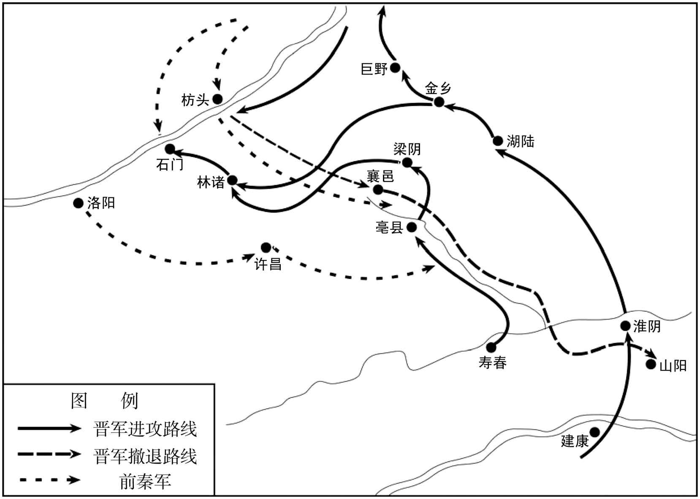 
东晋桓温北伐前燕枋头之战示意图

## 【原文】

**温自东燕出仓垣，凿井而饮，行七百余里[1]。燕之诸将争欲追之，吴王垂曰：“不可。温初退惶恐，（以）［必］严设警备，简精锐为后拒，击之未必得志，不如缓之。彼幸吾未至，必昼夜疾趋，俟其士众力尽气衰，然后击之，无不克矣。”乃帅八千骑徐行蹑其后[2]。温果兼道而进。数日，垂告诸将曰：“温可击矣。”乃急追之，及温于襄邑[3]。范阳王德先帅劲骑四千伏于襄邑东涧中，与垂夹击温，大破之，斩首三万级[4]。秦苟池邀击温于谯，又破之，死者复以万计。孙元遂据武阳以拒燕，燕左卫将军孟高讨擒之[5]。**

## 【注文】

[1]凿井而饮：汴水、济水都是由北向南流动，桓温害怕追兵在上游放毒，所以命人凿井饮用。

[2]徐行：慢慢行进。

[3]襄邑：县名，治所在今河南睢县。

[4]首：古人对人头的别称。秦汉初年，为褒奖军功，曾设立嘉奖制度，凡是斩下敌人一个人头，赐爵一级。古人称头为首，一“首”一级，故将人头称为首级。

[5]孟高（？—370年）：前燕左卫将军。公元370年，前燕国主慕容逃出邺城时，他随从护卫，途中不幸遭遇强盗，被杀身亡。

## 【译文】

桓温从东燕经仓垣逃走，一路上挖井饮水，走了七百余里。前燕的将领们争相要追赶桓温，吴王慕容垂说：“不可追赶。桓温刚刚撤退，心存惶恐，必会严加戒备，并挑选精锐的士卒作为后盾，攻打他们不一定能够成功，不如暂缓攻击。桓温庆幸我们没有追击，必然昼夜兼行，等到他们军队力量耗尽，士气衰落之时，我们再攻打他们，必定会取得胜利。”慕容垂于是率领八千骑兵慢慢行走，跟在桓温的后面。桓温果然加倍行进。几天后，慕容垂告诉将领们说：“可以进攻了。”于是急速追击，在襄邑追上了桓温。范阳王慕容德预先率领四千精锐骑兵埋伏在襄邑东部的山涧中，和慕容垂夹击桓温，大败桓温军队，斩首三万余人。前秦苟池在谯郡截击桓温，又打败晋兵，被杀死的晋军数以万计。孙元于是占据武阳抵抗前燕，前燕左卫将军孟高讨伐并捉获了他。

## 【原文】

**冬十月己巳，大司马温收散卒屯于山阳。温深耻丧败，乃归罪于袁真，奏免真为庶人，又免冠军将军邓遐官。真以温诬己，不服，表温罪状；朝廷不报[1]。真遂据寿春叛降燕，且请救，亦遣使如秦。温以毛虎生领淮南太守，守历阳[2]。**

## 【注文】

[1]不报：不予答复。

[2]淮南：郡名。永嘉之乱爆发后，淮南流民南渡江南，加上苏峻、祖约叛乱，淮南流民大批渡江。东晋成帝咸和四年（329年），东晋政府侨置淮南郡，治所设在今安徽当涂南，辖境相当于今安徽当涂、芜湖、繁昌、南陵、铜陵等地。

## 【译文】

海西公太和四年（369年）冬季十月己巳（二十二日），大司马桓温召集逃散的士卒驻扎在山阳。桓温对这次失败深感耻辱，于是把罪责都推到袁真身上，奏请免去他的官职，把他贬为平民，还免去了冠军将军邓遐的官职。袁真认为桓温诬陷自己，心中不服，于是上表陈说桓温的罪状；朝廷没有答复。袁真于是占据寿春反叛，投降了前燕，并向前燕请求救援，又派使者前往前秦。桓温任命毛虎生兼任淮南太守，镇守历阳。

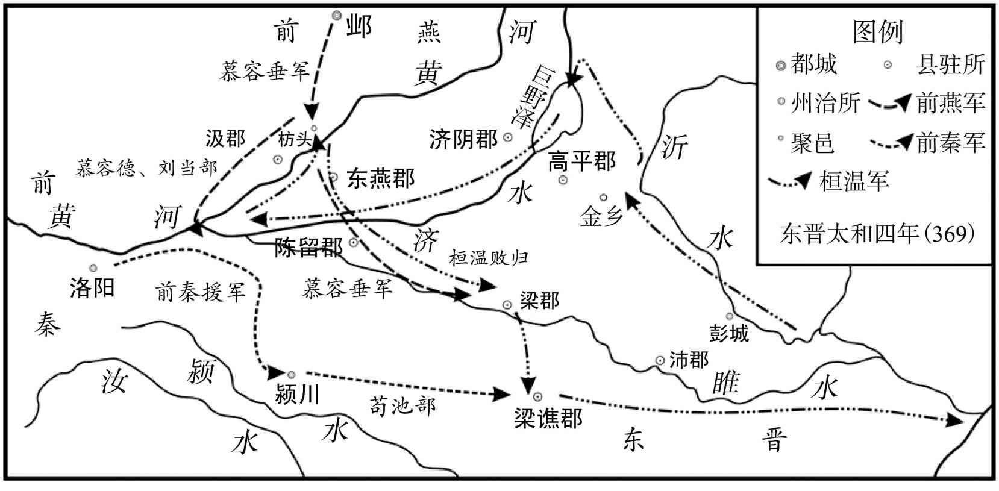 
桓温第三次北伐示意图

## 【原文】

**燕主遣大鸿胪温统拜袁真使持节、都督淮南诸军事、征南大将军、扬州刺史，封宜城公[1]。统未逾淮而卒。**

## 【注文】

[1]温统（？—369年）：前燕官吏，曾任大鸿胪。　　大鸿胪（lú）：古代朝廷掌管诸侯及少数民族事务的官员。秦称典客。汉景帝时更名大行令，汉武帝太初元年（前104年），改名大鸿胪。汉成帝时，将典属国所辖职务并入。因所辖诸王入朝、郡国上计、封拜诸侯及少数民族首领等，多与礼仪有关，后遂变为襄赞礼乐之官。魏晋时，大鸿胪在掌一般殿廷礼仪的同时，还负责夺爵削地事务，其余权力分归尚书省吏部、礼部、刑部。

## 【译文】

前燕主慕容派遣大鸿胪温统授予袁真使持节、都督淮南诸军事、征南大将军、扬州刺史官职，加封宜城公。结果温统还没有渡过淮河就去世了。

## 【原文】

**冬十一月辛丑，丞相昱与大司马温会涂中，以谋后举[1]。以温世子熙为豫州刺史、假节[2]。十二月，大司马温发徐、兖州民筑广陵城，徙镇之[3]。时征役既频，加之疫疠，死者什四五，百姓嗟怨[4]。秘书监太原孙盛作《晋春秋》，直书时事[5]。大司马温见之，怒，谓盛子曰：“枋头诚为失利，何至乃如尊君所言[6]？若此史遂行，自是关君门户事[7]。”其子遽拜谢，请改之。时盛年老家居，性方严，有轨度，子孙虽班白，待之愈峻。至是诸子乃共号泣稽颡，请为百口切计[8]。盛大怒，不许，诸子遂私改之。盛先已写别本，传之外国[9]。及孝武帝购求异书，得之于辽东人，与见本不同，遂两存之[10]。**

## 【注文】

[1]涂（chú）中：地名，指今安徽滁（chú）州市区一带。

[2]世子：亲王、诸侯法定继承人的正式封号，多由嫡、长充任。汉初，亲王法定继承人的正式封号为王太子，后来为与皇太子相区别，改为世子，后世沿袭不改。　　熙：即桓熙，生卒年不详，字伯道，谯国龙亢（今安徽怀远）人，桓温长子。东晋穆帝升平四年（360年）时封为临贺县公，后官至给事中。东晋海西公太和四年（369年），担任征虏将军、豫州刺史。后被立为世子。因能力平平，桓温派遣桓冲接替他统领军队。桓熙于是密谋杀死桓冲，事情泄露，被发配长沙（今湖南长沙）。

[3]广陵城：城名，位于今江苏扬州。

[4]疫疠（lì）：瘟疫。

[5]秘书监：官名。东汉桓帝延熹二年（159年）置，掌禁中图书秘籍，校订异同。后省。三国魏文帝黄初年间复置，为秘书署长官，掌艺文图籍。西晋初罢。西晋惠帝永平元年（291年）复置，为秘书寺长官，兼统著作局，掌修撰国史及管理中外三阁图书，三品。　　太原：郡名，治所设在晋阳（今山西太原西南），辖境相当于今山西五台山和管涔（cén）山以南、霍山以北地区。魏晋时期，太原郡先后被前赵、后赵、前燕、前秦、后燕等五国交替统治。　　孙盛（302—373年）：东晋将领、史学家，字安国，晋代太原中都（今山西平遥）人。曾任长沙太守、秘书监加给事中等。同时，著有《魏氏春秋》《魏氏春秋异同》《晋春秋》等书，是一位“词直而理正”的历史学家。　　《晋春秋》：书名。东晋孙盛撰。因东晋简文帝母郑太后名春，为避讳改为《晋阳秋》。该书为编年体东晋史，目前已佚。

[6]枋头：此指桓温被前燕慕容垂打败的事情。　　尊君：对别人父亲的尊称。

[7]君门户事：关系到家族满门性命的事情。

[8]稽（qǐ）颡（sǎng）：古代一种跪拜礼，屈膝下拜，以额触地，表示极度的虔诚。　　百口：全家或近亲一族。

[9]外国：东晋以外的国家。

[10]孝武帝：即东晋孝武帝司马曜（362—396年），字昌明，河内温县（今河南温县西南）人，晋简文帝司马昱第三子，东晋第九位皇帝，公元372年至公元396年在位。四岁时被封为会稽王，公元372年被立为太子，同年晋简文帝逝，他继位，当时年仅十一岁。第二年改年号为宁康。一开始由太后摄政。十四岁时开始亲政，改年号为太元。他改革收税的方法，还试图加强皇帝的权力和地位，并在淝水之战中打败前秦军队，被称为东晋末年的复兴。但谢安死后司马道子当国，再加上他嗜酒成性，优柔寡断，导致东晋政局再度陷入混乱。因他开玩笑说要废弃当时宠信的张贵人，导致当晚张贵人一怒之下杀了他。死后葬于今江苏南京的隆平。　　辽东：郡名。始设于战国时燕国，是秦击败东胡后所设五郡之一，治所设在襄平县（今辽宁辽阳老城区），因郡治在辽河之东故名“辽东”。辖今辽宁大凌河以东地区。魏晋南北朝时沿置。

## 【译文】

海西公太和四年（369年）冬季十一月辛丑（二十五日），丞相司马昱和大司马桓温在涂中会面，商议以后出兵的事宜。任命桓温的世子桓熙为豫州刺史、假节。十二月，大司马桓温征发徐州、兖州的百姓修筑广陵城，并移镇于此。当时劳役征发非常频繁，加上瘟疫流行，死亡的人数占到了十分之四五，百姓怨声载道。秘书监太原人孙盛著《晋春秋》，直言不讳地记载了当时的事情。大司马桓温看见此书后，大怒，对孙盛的儿子说：“枋头之战确实是失利了，但何至于像你父亲所说的那样？如果这部史书最终流传下来，会关系到你们家族的存亡。”孙盛的儿子急忙叩拜谢罪，请求修改此书。当时孙盛年老居家，性格刚正严厉，办事有法度准则，虽然子孙头发已经半白，但对待他们更加严厉。到这时儿子们便一起号哭叩首，请求他为一家百口的性命考虑。孙盛非常生气，坚决不肯修改，儿子们于是私自修改了史书。孙盛预先已经抄写了副本，流传到了其他国家。等到晋孝武帝收购此书，从辽东人的手中得到了这部副本，发现与现行的版本不同，于是就把两本书都收藏起来。

## 【原文】

**五年春二月癸酉，袁真卒。陈郡太守朱辅立真子瑾为建威将军、豫州刺史，以保寿春[1]。遣其子乾之及司马爨亮如邺请命[2]。燕人以瑾为扬州刺史，辅为荆州刺史。**

## 【注文】

[1]瑾（jǐn）：即袁瑾（？—371年），东晋名将袁真之子。桓温第三次北伐失败后，其父袁真反叛，向前秦和前燕投降。袁真死后，他被陈郡太守朱辅立为建威将军、豫州刺史，继续占据寿春（今安徽寿县），随后被前燕正式任命为扬州刺史。东晋简文帝咸安元年（371年），他在与桓温军队交战中兵败被俘，随后被押送至都城建康斩首。

[2]乾之：即朱乾之（生卒年不详），东晋陈郡太守朱辅之子。　　爨：音cuàn。

## 【译文】

东晋海西公太和五年（370年）春季二月癸酉（二十八日），袁真去世。陈郡太守朱辅立袁真的儿子袁瑾为建威将军、豫州刺史，继续据守寿春。派遣自己的儿子朱乾之和司马爨亮前往邺城请求任命。前燕于是任命袁瑾为扬州刺史，任命朱辅为荆州刺史。

## 【原文】

**夏四月，燕、秦皆遣兵助袁瑾，大司马温遣督护竺瑶等御之[1]。燕兵先至，瑶等与战于武（兵）［丘］，破之[2]。南顿太守桓石虔克南城[3]。石虔，温之弟子也。**

## 【注文】

[1]竺瑶（生卒年不详）：东晋桓温部将，曾任水军督护。袁瑾叛晋时，他率领水军大破前燕援军。公元371年，他又奉桓温命逼废晋帝司马奕。

[2]武丘：地名，今河南沈丘东南。

[3]南顿：郡名。晋惠帝置，治所设在南顿县（今河南项城西南）。南顿历史悠久，目前保存有南顿夏商时代遗址、南顿故城遗址。南顿故城现存城墙、南顿故城古墓群、光武台遗址、光武庙等历史遗迹和文物。　　桓石虔（qián）（？—388年）：东晋大将，谯国龙亢（今安徽怀远西北）人，桓温之弟桓豁长子，以勇猛矫捷闻名，官至豫州刺史，曾以宁远将军、南顿太守率兵平定袁真之乱。

## 【译文】

海西公太和五年（370年）夏季四月，前燕、前秦都派遣军队援助袁瑾，大司马桓温派遣督护竺瑶等率领军队抵御他们。前燕的军队先到，竺瑶在武丘与之交战，并打败了他们。南顿太守桓石虔攻克寿春南城。桓石虔，是桓温弟弟的儿子。

## 【原文】

**秋（七）［八］月，大司马温自广陵帅众二万讨袁瑾，以襄城太守刘波为淮南内史，将五千人镇石头[1]。波，隗之孙也[2]。癸丑，温败瑾于寿春，遂围之。燕左卫将军孟高将骑兵救瑾，至淮北，未渡，会秦伐燕，燕召高还[3]。**

## 【注文】

[1]襄城：古郡名。永嘉之乱后，豫民南徙。东晋元帝建武元年（317年），在春谷城（今安徽繁昌）侨置襄城郡，领侨置繁昌、定陶二县。东晋孝武帝宁康二年（374年），废襄城郡，并入繁昌县。

[2]隗（wěi）：即刘隗（273—333年），东晋大臣。字大连，彭城（今江苏徐州）人。初任秘书郎，不久迁任冠军将军、彭城内史。“八王之乱”后，他避乱渡江，受到司马睿赏识，被任为从事中郎，不久又迁丞相司直。他为官刚正，不畏权贵，先后上书弹劾戴渊、王籍之、梁龛等人，还为淳于伯申冤鸣屈，迫使王导引咎辞职。后迁侍中，封都乡侯。司马睿称帝后，他与尚书令刁协同为司马睿心腹。不久迁丹阳尹，拜镇北将军，都督青、徐、幽、平四州军事，率军镇泗口（今江苏淮阴）以抑制王敦。公元322年，王敦以讨伐他为名起兵攻占建康（今江苏南京），他被迫投奔石勒。后官至从事中郎、太子太傅。公元333年，随石挺讨石生，战死。

[3]淮北：泛指淮河以北地区。

## 【译文】

海西公太和五年（370年）秋季八月，大司马桓温从广陵率领二万军队征讨袁瑾，任命襄城太守刘波为淮南内史，率领五千军队镇守石头。刘波，是刘隗的孙子。癸丑（十一日），桓温在寿春打败袁瑾，进而包围了寿春。前燕左卫将军孟高率领骑兵救援袁瑾，军队刚刚到达淮河以北，还没有渡河，此时前秦讨伐前燕，前燕于是召回孟高。

## 【原文】

**简文帝咸安元年春正月，袁瑾、朱辅求救于秦[1]。秦王坚以瑾为扬州刺史，辅为交州刺史，遣武卫将军武都王鉴、前将军张蚝帅步骑二万救之[2]。大司马温遣淮南太守桓伊、南顿太守桓石虔等击鉴、蚝于石桥，大破之，秦兵退屯慎城[3]。伊，宣之子也。丁亥，温拔寿春，擒瑾及辅，并其宗族送建康斩之。**

## 【注文】

[1]咸安：东晋简文帝司马昱的年号，即从公元371年至372年。咸安二年（372年）七月孝武帝司马曜即位沿用，次年改元宁康元年。

[2]武卫将军：武官名。三国魏文帝黄初年间（220—226年）置，掌宿卫禁军，权任颇重。西晋武帝泰始三年（267年）罢。西晋惠帝永康年间（300—301年）复置，四品，但权任渐轻。东晋时省时置。　　武都：郡名。汉武帝元鼎六年（前111年）置，治所设在武都县（今甘肃西和西南），辖境相当于今甘肃西和、陇南、康县、成县、徽县、两当，陕西略阳、凤县等地。东汉移治下辨道（今甘肃成县西）。三国两晋沿置，三国时属蜀汉，西晋末属仇（qiú）池国。　　前将军：将军名号。有战事时负责戍卫京师，亦率军出征。魏晋南北朝时地位略高于一般杂号将军，三品。　　张蚝（háo）：十六国前秦大将。本姓弓，上党泫（xuàn）氏（今山西高平）人，生卒年不详，后赵并州刺史张平养子。曾参与前秦灭前燕之战、前秦灭代国之战及淝水之战等重要战事，官至太尉。苻丕时又封为上党郡公。他臂力过人，被人称为“万人敌”。

[3]桓伊（生卒年不详）：字叔夏，小字野王（一作子野），东晋谯国铚（zhì）县（今安徽濉溪西南）人，桓宣族子。曾任淮南太守、都督豫州诸军事、西中郎将、豫州刺史等。前秦苻坚率军南下攻晋，他与谢玄在淝水大破秦军，因功进位右将军，封永修县侯。　　石桥：地名，今安徽寿县一带。　　慎城：晋时属汝阴郡，在今安徽阜阳境内。

## 【译文】

东晋简文帝咸安元年（371年）春季正月，袁瑾、朱辅向前秦求救。前秦王苻坚任命袁瑾为扬州刺史，任命朱辅为交州刺史，并派遣武卫将军武都人王鉴、前将军张蚝率领二万步兵、骑兵前去救援。大司马桓温则派遣淮南太守桓伊、南顿太守桓石虔等人在石桥迎击王鉴、张蚝，并大败王鉴、张蚝。前秦军队撤退到慎城。桓伊，是桓宣的儿子。丁亥（十七日），桓温攻占寿春，擒获了袁瑾和朱辅，连同他们的宗族人一起押送至都城建康斩首。

* * *

(1) 据陈垣《二十史朔闰表》，东晋哀帝隆和元年（362年）三月壬辰朔，无乙酉日。

(2) 据陈垣《二十史朔闰表》，太和四年（369年）六月庚戌朔，无辛丑日。

# 桓温灭蜀

## 【内容摘要】

《桓温灭蜀》主要记载了成汉后期的腐朽统治和桓温平定巴蜀的历史过程。

成汉政权的奠基者，原是魏晋时期著名的流民起义领袖李特，他曾经率领略阳、天水等六郡流民和巴蜀百姓与晋朝进行斗争。李特牺牲后，他的兄弟李流和儿子李雄继续与晋朝军队作战。西晋惠帝太安二年（303年），李雄终于攻下成都（今四川成都），驱逐了晋朝益州刺史罗尚，并于翌（yì）年建立政权，国号“大成”，史称“成汉”，年号建兴。李雄在位期间为政宽和，与民休息，轻徭薄赋，经济有所发展，百姓富实，西蜀出现了少有的太平局面。李雄临终时，把帝位传给了自己的侄儿李班，而没有传给自己的儿子。李雄死后，他的儿子李越、李期作乱，合谋杀害李班，李期随后称帝。李期统治时期，荒淫无道，李雄的另一个侄子李寿借机发动兵变，逼死李期，取而代之。

东晋康帝建元元年（343年），李势在成汉继位。李势在位期间，骄奢淫逸，不理政事，刑法苛滥，恰逢饥荒，国势衰落。东晋桓温趁成汉内部不稳，国主荒淫无道的有利时机，决心西征。东晋穆帝永和二年（346年），桓温用江夏相袁乔“宜先攻弱”之策，率领益州刺史周抚、南郡太守司马无忌征讨成汉。李势依仗蜀道险阻，不作战备。次年，桓温长驱深入，已经到达离成都不远的平原地区。此时李势才如梦方醒，紧急命令叔父李福、堂兄李权、将军昝（zǎn）坚等领兵迎战。桓温三战三胜，直逼成都。李势于是在笮（zuó）桥（今四川成都西南）率所有军队进行抵抗。桓温前锋初战不利，参军龚护战死，士兵恐惧想要撤退，但当时擂鼓手却误击鼓命士兵进攻，袁乔于是拔剑与成汉军激战，最终打败了成汉军队。桓温行至成都城下并烧了城门。李势乘夜弃城逃至葭（jiā）萌（今四川广元西南）。不久，李势投降，桓温将李势及成汉宗室送到建康。至此，成汉灭亡，蜀地尽归东晋。后李势被封为归义侯，在建康病故。

桓温留驻成都三十余天后，班师返回江陵（今湖北荆州市荆州区）。巴蜀平定之后，东晋统一了南方的广大国土，为防止北方各族政权的南侵，创造了十分有利的形势。同时，由于桓温战功卓著，于东晋穆帝永和四年（348年），升任征西大将军、开府仪同三司，封临贺郡公。自此桓温逐渐掌握了东晋的军政大权，同时也助长了他后来企图篡夺东晋最高统治权的政治野心。

## 【原文】

**晋明帝太宁二年[1]。成主雄，后任氏无子，有妾子十余人，雄立其兄荡之子班为太子，使任后母之[2]。群臣请立诸子，雄曰：“吾兄，先帝之嫡统，有奇材大功，事垂克而早世，朕常悼之[3]。且班仁孝好学，必能负荷先烈[4]。”太傅骧、司徒王达谏曰：“先王立嗣必子者，所以明定分而防篡夺也[5]。宋宣公、吴余祭足以观矣[6]。”雄不听。骧退而流涕曰：“乱自此始矣。”班为人谦恭下士，动遵礼法，雄每有大议，辄令豫之。**

## 【注文】

[1]明帝：即东晋明帝司马绍（298—325年），字道畿（jī），晋元帝司马睿之子，东晋第二任皇帝。东晋元帝大兴元年（318年）三月立为皇太子。永昌元年（322年）十一月继位。在位期间曾平定王敦叛乱。东晋成帝太宁三年（325年），因病去世，庙号肃宗。　　太宁：或为大宁，东晋明帝司马绍所用年号，即公元323年至326年。太宁三年（325年）晋成帝司马衍即位沿用，次年二月改年号为咸和。

[2]雄：即李雄（274—334年），字仲俊，巴西宕渠（今四川渠县东北）人，成汉奠基人李特第三子，成汉开国君主。以勇烈闻名，曾击破荆州孙阜援军，挽救流民政权于危亡。西晋惠帝太安二年（303年），李特被益州刺史罗尚击杀，李雄以大都督名义继续领导流民作战，驱逐罗尚，攻占成都。西晋惠帝永兴元年（304年）十月，称成都王，改元建兴，废除晋法。两年后称帝，改元晏（yàn）平，国号大成，仿汉晋立百官制度。在位期间，宽简爱人，刑法简约，政役宽和。东晋成帝咸和九年（334年）六月，因病去世，谥武皇帝，庙号太宗。　　后：即皇后，古代皇帝拥有众多妻妾，其中正妻称为皇后，在后宫的地位如同天子，是众妃之主。　　妾子：姬妾所生的儿子。　　荡：即李荡（？—303年），李特次子，巴西宕渠（今四川渠县东北）人。公元302年，担任镇军将军。次年，李特战败被杀，李流接管他的军队，他和三弟李雄成了李流的臂膀。后战死。　　班：即李班（288—334年），十六国成汉国君，字世文，巴西宕渠（今四川渠县东北）人，成汉国武帝李雄侄子，李荡之子。他深得李雄信任，被立为太子。他为人谦逊，尊贤尚儒，十分节俭。李雄去世后，李班即位。公元334年，他被李雄之子李越密谋杀害。

[3]嫡（dí）：指嫡系。中国古代实行一夫一妻多妾制，妻妾之间的地位是不平等的，这种不平等便体现在嫡庶之分上。“嫡”指正妻及其所生子女，“庶”指姬妾及其所生子女。　　朕（zhèn）：从秦始皇时起，专用做皇帝自称。

[4]先烈：祖先。

[5]骧（xiāng）：即李骧（？—328年），字玄龙，巴西宕渠（今四川渠县东北）人，后迁居略阳（今甘肃秦安东南），西晋末流民起义首领之一。李特建立军政府后，他担任骁骑将军。李雄称帝后，被封为太傅，后因功进封大将军。西晋怀帝永嘉五年（311年），他聚集众人在乐乡（今湖北松滋东北）起义，但被南平太守应詹（zhān）与醴（lǐ）陵县令杜弢（tāo）击败。后荆州刺史王澄（chéng）派成都内史王机讨伐他，他请求投降，王澄假装接受投降，却突然袭击已经投降的李骧军队，并将他杀死。谥汉献王，李寿即位后，被追谥为献皇帝。　　先王立嗣必子者：嫡长子继承制是中国古代实行时间最长的继承制度，即王位和财产必须由嫡长子继承。

[6]宋宣公、吴余祭：分别是春秋宋国的国君宋宣公与吴国的国君余祭。宋宣公传位于弟，吴国余祭接替兄长樊诸的王位。不久都引起王位的激烈争夺、国内大乱。

## 【译文】

东晋明帝太宁二年（324年）。成汉国主李雄的皇后任氏没有儿子，但姬妾们生了十多个儿子，李雄立他哥哥李荡的儿子李班为太子，让任后做他的养母。群臣请求在妾生的儿子们当中选立太子，李雄说：“我哥哥是先帝的嫡长子继承人，具有奇才和功勋，在事业即将成功之际却过早去世，我常常怀念他。况且李班仁慈、孝顺、好学，必能担负起祖先开创的大业。”太傅李骧、司徒王达劝谏说：“先王立继承人之所以要从儿子当中选择，为的是明确固定的身份地位，防止篡权夺位。宋宣公、吴国余祭不立子而引起大乱的事例，足以成为前车之鉴啊。”李雄不听。李骧退出后流着泪说：“祸乱就要从此开始了。”李班为人谦虚恭敬，礼贤下士，遵守礼法，李雄每逢有重要事情商议，总是让他参与。

## 【原文】

**成帝咸和九年夏六月，成主雄生疡于头[1]。身素多金创，及病，旧痕皆脓溃，诸子皆恶而远之，独太子班昼夜侍侧，不脱衣冠，亲为吮脓[2]。雄召大将军建宁王寿受遗诏辅政[3]。丁卯，雄卒，太子班即位。以建宁王寿录尚书事，政事皆委于寿及司徒何点、尚书令王瓌，班居中行丧礼，一无所预。**

## 【注文】

[1]咸和：东晋成帝司马衍所用的年号，即公元326年至334年。

[2]衣冠：指古代士以上戴冠。

[3]大将军：古代领兵的最高统帅。始于战国，是将军的最高封号。汉代沿置，职掌统兵征战。事实上多由贵戚担任，掌握政权，职位甚高。三国至南北朝时，大臣秉政，多加以“大将军”之号，统领军队。　　建宁王：成汉爵位名。建宁：成汉在今云南设置的行政区划，郡治设在味县（今云南曲靖）。　　遗诏辅政：指已经即位的皇帝暂时不能管理国家时，由他人代替皇帝处理国政。辅政者多由在位皇帝的直系亲属担任，如太子或母亲，或是通常被称为摄政王的皇亲国戚，也有由德高望重、深具资历经验的大臣担任的。辅政期直至能亲自执政为止。

## 【译文】

东晋成帝咸和九年（334年）夏季六月，成主李雄头部生疮。由于身上原来就有很多旧伤，这时全部化脓溃烂，儿子们都嫌弃而躲得远远的，只有太子李班昼夜守在身边侍候，不脱衣帽，并亲自为李雄吸吮脓水。李雄征召大将军建宁王李寿接受遗诏辅佐朝政。丁卯（二十五日），李雄逝世，太子李班即位。任命建宁王李寿为录尚书事，政事都委托给李寿和司徒何点、尚书令王瓌（guī），自己则在宫中履行丧葬之礼，所有朝政都不处理。

## 【原文】

**秋九月，成主雄之子车骑将军越屯江阳，奔丧至成都[1]。以太子班非雄所生，意不服，与其弟安东将军期谋作乱[2]。班弟玝劝班遣越还江阳，以期为梁州刺史，镇葭萌[3]。班以未葬，不忍遣，推心待之，无所疑间，遣玝出屯于涪[4]。冬十月癸亥朔，越因班夜哭，弑之于殡宫，并杀班兄领军将军都，矫太后任氏令，罪状班而废之[5]。**

## 【注文】

[1]车骑将军：官名。西汉置，为重号将军之一，仅次于大将军、骠骑将军，金印紫绶，位居二品，地位相当于上卿，职掌京师兵卫，皇宫宿卫，是战车部队的统帅。魏晋南北朝多沿置。　　越：即李越（？—338年），十六国时期成汉李雄之子。公元334年，太子李班继位。他与李期不服，于是合谋杀死李班并拥立李期为帝，他因功被封为相国、建宁王。公元338年，李寿发动政变，将他杀死。　　奔丧：古代丧礼仪式之一，即子女在外时遇到父母去世，立即穿丧服急归故乡奔丧，途中素食，到家则自门外号哭于堂上。如官员遇父母大丧，一般皆须去职赴丧，只有朝廷重臣或身在军中者，皇帝有权诏令不奔。在古代，不奔丧属大不孝行为。　　成都：地名，位于今四川成都。

[2]安东将军：三国魏晋南北朝时武官名号。曹操始置，与安西、安北、安南将军合称“四安将军”。位次四镇将军，三品，掌征讨或镇戍。为出镇东方地区的军事长官，或作为刺史兼理军务的加官，权任较重。　　期：即李期（314—338年），字世运，巴氐族，巴西宕渠（今四川渠县东北）人，后迁居略阳（今甘肃秦安东南），李雄第四子，继李班后为成国国君，公元334年至338年在位。公元334年，李雄病死，太子李班即位。随即他与回成都奔丧的李雄之子李越合伙将李班秘密杀死，之后即皇帝位，改元玉恒，封李越为建宁王。他称帝后，重用尚书令景骞、尚书姚华和田褒，国势日益衰败。公元338年，李寿率军攻破成都，他被废为邛（qióng）都县公，软禁在别宫，不久自杀。

[3]玝（wǔ）：即李玝（？—347年），十六国时期成汉李荡第四子，曾任征北将军、梁州刺史等。后投奔晋朝，被任命为巴郡太守。　　葭（jiā）萌：县名，治所设在今四川广元西南。

[4]涪（fú）：县名，治所设在今四川绵阳东北。

[5]殡（bìn）宫：皇宫内停放灵柩（jiù）的宫殿。“殡”指停放灵柩或把灵柩送到墓地去，“宫”则专指帝王的住所。　　领军将军：官名。曹操执政时始置，执掌中央禁军，护卫皇帝及宫廷。公元207年，曹操将之改称中领军，下辖长史、司马等官员。晋沿置，为禁军统帅。　　都：即李都（？—334年），巴西宕渠（今四川渠县东北）人，李班哥哥，曾任十六国时成汉领军将军。公元334年，被李雄之子李越杀害。

## 【译文】

东晋成帝咸和九年（334年）秋季九月，成主李雄的儿子车骑将军李越驻军江阳，赶到成都奔丧。因为太子李班不是李雄所生，心中不服，于是与他的弟弟安东将军李期密谋作乱。李班的弟弟李玝劝李班命李越返回江阳，任命李期为梁州刺史，镇守葭萌。李班因为李雄的灵柩还没有安葬，不忍心遣送他回去，就推心置腹地对待他们，没有任何的猜疑和隔阂，而且派遣李玝前去镇守涪城。冬季十月癸亥朔（初一日），李越趁着李班夜间哭丧之机，把他杀死在停放李雄灵柩的宫殿中，同时又杀死李班的哥哥领军将军李都，假传任太后的命令，列举李班的罪状并将他废黜。

## 【原文】

**初，期母冉氏贱，任氏母养之[1]。期多才艺，有令名[2]。及班死，众欲立越，越奉期而立之。甲子，期即皇帝位，谥班曰戾太子[3]。以越为相国，封建宁王；加大将军寿大都督，徙封汉王；皆录尚书事[4]。以兄霸为中领军、镇南大将军，弟保为镇西大将军、汶山太守；从兄始为征东大将军，代越镇江阳[5]。丙寅，葬雄于安都陵，谥曰武皇帝，庙号太宗[6]。**

## 【注文】

[1]贱：出身卑微。

[2]有令名：有好的名声。

[3]戾（lì）：暴恶，罪过，乖张。

[4]相国：官名，或称“相邦”“丞相”。魏晋南北朝时期，常以此职授予朝中权臣，独揽军政大权。

[5]霸：即李霸（？—334年），李雄之子，巴西宕渠（今四川渠县东北）人。李期即位后，将他杀死。　　中领军：武官名。汉末曹操改领军置。三国魏时又置领军将军。西晋时属中军将军，后改中领军，掌管禁军、主持选拔武官、监督管制诸武将。晋以后，中领军一职废置无常，后改为中军。东晋元帝永昌元年（322年）改称北军中候，不久又复称领军，仍为禁军最高统帅，但不再统领护军，也无直属营兵。　　镇南大将军：镇南将军中以资深者为镇南大将军。镇南将军为镇南、镇北、镇西、镇东“四镇将军”之一，统兵将领，掌征伐背叛、镇戍四方。位次四征将军。　　镇西大将军：官名。三国时蜀汉置，职掌征伐背叛、出镇西面，权势颇重。晋沿置，二品，开府者升为一品。　　汶山：郡名。治所设在汶山县（今四川茂县以北），辖境相当于今四川北川、汶川、茂县等地。　　从兄始：李始为李特长子，当是李期伯父、李寿从兄。

[6]庙号：古代皇帝死后在太庙里立室奉祀时追尊的名号。学术界一般认为，庙号起源于商朝，如太甲为太宗、太戊为中宗、武丁为高宗。庙号最初非常严格，按照“祖有功而宗有德”的标准，开国君主一般是祖、继嗣君主有治国才能者为宗。到魏晋南北朝时庙号开始泛滥。

## 【译文】

当初，李期的母亲冉氏身份低贱，任氏像生母那样去抚养李期。李期多才多艺，有好的声望。等到李班死去，众人想要拥立李越，但李越却尊奉李期立其为帝。咸和九年（334年）十月甲子（初二日），李期即皇帝位，为李班定谥号为戾太子。任命李越为相国，封为建宁王；加授大将军李寿为大都督，改封为汉王；二人都录尚书事。任命哥哥李霸为中领军、镇南大将军，弟弟李保为镇西大将军、汶山太守；堂兄李始为征东大将军，代替李越镇守江阳。丙寅（初四日），将李雄安葬在安都陵，谥号为武皇帝，庙号为太宗。

## 【原文】

**始欲与寿共攻期，寿不敢发。始怒，反谮寿于期，请杀之[1]。期欲藉寿以讨李玝，故不许，遣寿将兵向涪[2]。寿先遣使告玝以去就利害，开其去路。玝遂来奔，诏以玝为巴郡太守。期以寿为梁州刺史，屯涪。**

## 【注文】

[1]谮（zèn）：说别人的坏话、诬陷、中伤。

[2]藉（jiè）：同“借”，凭借、借助。

## 【译文】

李始想和李寿共同进攻李期，但李寿不敢发兵。李始为此非常恼怒，于是向李期诬陷李寿，请求杀掉他。李期想借助李寿来讨伐李玝，所以没有答应，派遣李寿率兵进攻涪城。李寿预先派遣使者告知李玝利害关系，并且为他逃走让开道路。李玝于是投奔晋朝，被任命为巴郡太守。李期任命李寿为梁州刺史，驻守涪城。

## 【原文】

**咸康元年秋九月，成太子班之舅罗演与汉王相天水上官澹谋杀成主期，立班子[1]。事觉，期杀演、澹及班母罗氏。期自以得志，轻诸旧臣，信任尚书令景骞、尚书姚华、田褒、中常侍许涪等，刑赏大政，皆决于数人，希复关公卿[2]。褒无他才，尝劝成主雄立期为太子，故有宠。由是纪纲隳紊，雄业始衰[3]。**

## 【注文】

[1]罗演（？—335年）：李班舅舅。东晋成帝咸康元年（335年），他与上官澹谋划杀死李期，拥立李班的儿子为国主，结果事情泄露被杀。　　汉王：李寿曾受封汉王。　　天水：郡名。汉武帝元鼎三年（前114年）置，当时此地有湖与天河相通，名为“天水井”，汉武帝就命令将新设的郡建在湖旁，取名“天水郡”。治所设在平襄县（今甘肃通渭西北），辖境相当于今甘肃定西、甘谷、通渭、静宁、秦安、清水、庄浪、张家川、天水等地。东汉明帝永平十七年（74年）改名为汉阳郡，治所迁至冀县（今甘肃甘谷东南）。三国魏复称天水郡。西晋治所移治上邽（guī）县（今甘肃天水）。　　上官澹（dàn）（？—335年）：复姓上官，名澹，天水（今甘肃天水）人。东晋成帝咸康元年（335年），他与太子李班的舅舅罗演谋划杀死李期，拥立李班的儿子为国主，事情泄露，被杀。

[2]景骞（qiān）（？—338年）：成汉官吏，历任司隶校尉、尚书令等职。公元338年，在李寿政变中被杀。　　尚书：官名。魏、晋、南北朝时为尚书省属下诸曹长官，都冠以曹名，下辖若干郎曹，是朝中重要大臣。　　姚华（？—338年）：成汉官吏，曾任尚书，为李期所宠信。公元338年，在李寿政变中被杀。　　田褒（？—338年）：成汉官吏，曾任尚书。因劝说成汉国主李雄立李期为太子，而深得李期宠信。公元338年，在李寿政变中被杀。　　中常侍：西汉时皇帝近臣，服侍左右，职掌顾问应对，是仅有虚衔的加官。西汉前期只有常侍之名，获此号者多为皇帝宠信之臣。中常侍之名出现于西汉晚期到东汉时，此时中常侍已非加官，而成为有具体职掌的官职，多以宦者担任此职。居此位的宦官有时竟可权倾朝野。　　许涪（fú）（？—338年）：成汉官吏，曾任中常侍，为李期所宠信。公元338年，在李寿政变中被杀。

[3]隳（huī）紊（wěn）：败坏紊乱。　　雄业：李雄的大业，指成汉政权。

## 【译文】

东晋成帝咸康元年（335年）秋季九月，成汉太子李班的舅舅罗演与汉王相、天水人上官澹谋划杀死李期，拥立李班的儿子为国主。事情泄露，李期杀死罗演、上官澹以及李班的母亲罗氏。李期自以为得志，看不起各位旧臣，宠信尚书令景骞，尚书姚华、田褒以及中常侍许涪等人，凡是刑罚和奖赏等重大政事都由这几个人决定，很少再与百官公卿商议。田褒没有其他的才干，曾经劝说成汉国主李雄立李期为太子，所以得到宠信。从此，成汉法度逐渐败坏紊乱，李雄的大业开始衰落。

## 【原文】

**四年。成主期骄虐日甚，多所诛杀，而籍没其资财、妇女，由是大臣多不自安。汉王寿素贵重，有威名，期及建宁王越等皆忌之。寿惧不免，每当入朝，常诈为边书，辞以警急[1]。初，巴西处士龚壮，父、叔皆为李特所杀[2]。壮欲报仇，积年不除丧[3]。寿数以礼辟之，壮不应，而往见寿[4]。寿密问壮以自安之策，壮曰：“巴、蜀之民本皆晋臣，节下若能发兵西取成都，称藩于晋，谁不争为节下奋臂前驱者[5]？如此，则福流子孙，名垂不朽，岂徒脱今日之祸而已。”寿然之，阴与长史略阳罗恒、巴西解思明谋攻成都[6]。期颇闻之，数遣许涪至寿所，伺其动静，又鸩杀寿养弟安北将军攸[7]。**

## 【注文】

[1]边书：报告边境紧急军情的信件。

[2]巴西：郡名，意为“巴郡以西”，郡治所设在阆（làng）中（今四川阆中）。东汉献帝建安六年（201年）改巴郡置，辖阆中、安汉、西充国、南充国、宕（dàng）渠、汉昌、宣汉等七县，相当于今四川阆中、武胜以东，广安、渠县以北，万源、开江以西地区。　　处士：古时称有德才而隐居不愿做官的人为处士，后泛指没有做过官的读书人。　　龚壮（？—346年）：字子伟，巴西郡（治今四川阆中）人。因李特杀死龚壮之父、叔，遂假手报仇，说服李寿袭取成都（今四川成都），尽杀李特宗族十余人。李寿称帝后，曾想拜他为太师，但他固辞未受。　　李特（？—303年）：字玄休，巴西宕渠（今四川渠县东北）人，（cóng）人李氏家族成员之一，成汉政权主要奠基人。公元301年，益州刺史罗尚镇压流民，他率领三万人起义，后战死。公元306年，成都王李雄称帝，被追谥为景皇帝，庙号始祖。

[3]除丧：由着丧服变着吉服或由着重丧服改着轻丧服。

[4]辟：征召名望显赫的人士出任官员。皇帝征召称“征”，官府征召称“辟”，这是选拔人才的一种制度。

[5]节下：对将领的敬称。古代授节予将帅以加重职权，故敬称将领为“节下”。后对使臣或地方疆吏亦称“节下”。

[6]略阳：郡名。西晋武帝泰始年间（265—274年）改广魏郡置，治所设在临渭县（今甘肃秦安东南），辖境约为今甘肃天水市、秦安、通渭、清水等地，属秦州。东晋元帝大兴二年（319年），郡地属前赵，仍治临渭县（今甘肃秦安东南）。　　罗恒（生卒年不详）：十六国时略阳（今甘肃秦安东南）人，氐族。初为李雄将领，后为李寿长史，曾协助李寿进攻成都废黜李期。事成后，被任命为尚书令。　　解思明（？—345年）：巴西（治今四川阆中）人，曾任十六国时成汉广汉太守。他富有智慧谋略，敢于直言劝谏。曾多次劝说成汉国主李寿向东晋称臣。东晋穆帝永和元年（345年），他劝谏成汉国主李势立其弟李广为皇太弟，而被李势怀疑与李广暗中密谋，随后遭斩首，并诛灭三族。

[7]鸩（zhèn）：传说中一种有毒的鸟，喜欢吃蛇，羽毛为紫绿色，放在酒中可毒死人。这里指用毒酒杀人。　　攸（yōu）：即李攸（？—338年），李寿养弟，曾任安北将军。公元338年，被李期毒死。

## 【译文】

东晋成帝咸康四年（338年）。成主李期日益骄横暴虐，不但经常杀人，而且还没收死者的资财、妇女，因此朝廷中的大臣们感到不安。汉王李寿素来位尊任重，富有威名，李期和建宁王李越等人都忌怕他。李寿害怕被害，每逢应当入朝参见天子时，常常伪造边关文书，以边防紧急为由推辞入朝。当初，巴西隐士龚壮的父亲、叔叔都被李特杀害。龚壮想要报仇，多年以来一直未脱丧服。李寿几次征召他为官，龚壮都没有答应，此时龚壮主动要求面见李寿。李寿悄悄问龚壮自保之策，龚壮说：“巴、蜀地区的百姓原本都是晋朝的臣民，如果您能起兵向西夺取成都，向晋称臣，谁不争着为您向前冲杀呢？这样，就会造福子孙，英名永垂不朽，哪里仅仅是逃脱今日的祸患而已。”李寿认为说得很对，于是暗中和长史略阳人罗恒、巴西人解思明谋划攻打成都。李期对此也有所耳闻，几次派遣许涪到李寿的住地察看他的动静，又用鸩酒毒死了李寿的养弟、安北将军李攸。

## 【原文】

**〔夏四月〕，寿乃诈为妹夫任调书，云期当取寿，其众信之[1]。遂帅步骑万余人自涪袭成都，许赏以城中财物；以其将李奕为前锋。期不意其至，初不设备[2]。寿世子势为翊军校尉，开门纳之[3]。遂克成都，屯兵宫门。期遣侍中劳寿。寿奏建宁王越、景骞、田褒、姚华、许涪及征西将军李遐、将军李西等怀奸乱政，皆收杀之，纵兵大掠，数日乃定[4]。寿矫以太后任氏令，废期为邛都县公，幽之别宫，追谥戾太子曰哀皇帝[5]。**

## 【注文】

[1]诈为：伪造。任调当时在成都（今四川成都），故李寿伪造他的来信以激怒部下。　　任调（生卒年不详）：李寿妹夫。曾与司马蔡兴、侍中李艳等人劝李寿自称皇帝。李寿称帝后，他被任命为镇北将军、梁州刺史。

[2]设备：设置防备。

[3]势：即李势（？—361年），字子仁，巴西宕渠（今四川渠县东北）人，后迁居略阳（今甘肃秦安东南），李寿长子，继李寿后成为成汉国君，公元343年至347年在位。他在位期间，昏庸残暴，不理政事。公元347年，东晋大司马桓温率军进兵成都，他兵败投降，成汉政权至此灭亡。　　翊（yì）军校尉：武官名号。皇帝出行时，与五校护驾并行。

[4]李遐（xiá）（？—338年）：成汉官吏，曾任征西将军。公元338年，在李寿政变中被杀。　　将军：高级武官的泛称。春秋时晋国以卿为军将，遂有将军之称。战国始为武官之名，位高者称大将军，皆主征伐之事。两汉时，逐渐成为正式官称，如大将军、卫将军等。将军作为统帅之官，受命指挥京师禁兵；出征时则任主帅，统率诸将军。魏晋南北朝时期，将军名号繁多，权位各异。　　李西（？—338年）：成汉官吏，曾任将军。公元338年，在李寿政变中被杀。

[5]邛都县公：成汉爵位名。邛都县，西汉元鼎六年（前111年）置，治今四川西昌东南。　　追谥：追加谥号。

## 【译文】

东晋成帝咸康四年（338年）［夏季四月］，李寿伪造妹夫任调的书信，说李期将要攻取李寿，李寿的军队信以为真。李寿于是率领一万多名步兵、骑兵由涪城出发进攻成都，并许诺把成都城中的财物作为赏赐；任命他的部将李奕为先锋。李期没有想到李寿会进攻，当初并没有设防。李寿的世子李势担任翊军校尉，打开城门迎接李寿。李寿于是攻克成都，驻军在皇宫门前。李期派遣侍中慰劳李寿。李寿上奏说建宁王李越、景骞、田褒、姚华、许涪和征西将军李遐、将军李西等人都怀有奸心，扰乱朝政，把他们全部收捕杀掉，放纵士兵大肆抢掠，数日后才安定下来。李寿假托任太后的命令，废黜李期为邛都县公，幽禁在其他宫中，追赠戾太子谥号为哀皇帝。

## 【原文】

**罗恒、解思明、李奕等劝寿称镇西将军、益州牧、成都王，称藩于晋，送邛都公于建康[1]。任调及司马蔡兴、侍中李艳等劝寿自称帝。寿命筮之，占者曰：“可数年天子[2]。”调喜曰：“一日尚足，况数年乎？”思明曰：“数年天子，孰与百世诸侯？”寿曰：“朝闻道，夕死可矣[3]。”遂即皇帝位，改国号曰汉，大赦，改元汉兴[4]。以安车束帛征龚壮为太师，壮誓不仕，寿所赠遗，一无所受[5]。**

## 【注文】

[1]益州牧：即益州最高行政长官。

[2]筮（shì）：指用龟甲、筮草等工具预测未来。古人常在龟板或兽骨上钻刻，再用火灼，观察裂纹来定吉凶。

[3]朝闻道，夕死可矣：春秋时孔子之语，见《论语·里仁篇》，大意是说，如果早上明白了人生的意义，那么，就算晚上会死去，也是值得的。李寿引用此语，意在说明称帝的决心。

[4]大赦：以君主命令的方式对某个时期的特定罪犯或一般罪犯实行免除或减轻罪责或刑罚。古代帝王常在皇帝登基、更换年号、立皇后等情况下，以施恩为名，颁布赦令，赦免犯人。　　改元：指皇帝即位时或在位期间改换年号。每个年号开始的一年称元年。新皇帝即位后，一般都要改变纪年的年号，称为“改元”。　　汉兴：十六国时期成汉政权李寿所用年号，即从公元338年至343年。汉兴六年（343年）八月李势即位沿用，次年改元太和元年。

[5]安车：用马拉的可以坐乘的小车。　　束帛：古时聘任的礼物，帛五匹为束。　　太师：官名。西周置，为辅弼国君之官。秦废。汉复置。晋代避司马师讳，曾改名太宰。晋之后复称太师，多为重臣加衔，作为最高荣典以示恩宠，并无实职。

## 【译文】

罗恒、解思明、李奕等人劝李寿称镇西将军、益州牧、成都王，向东晋称臣，将邛都公押送到建康。任调和司马蔡兴、侍中李艳等人劝李寿自称皇帝。李寿命人占卜此事，卜卦的人告诉李寿说：“可以做几年天子。”任调高兴地说：“一天就足够了，何况几年呢？”解思明说：“几年的天子，怎么能比得上世代做诸侯呢？”李寿说：“早上明白了人生的意义，就算晚上会死去，也是值得的。”于是即皇帝位，改国号为汉，大赦罪犯，改年号为汉兴。用安车、束帛征召龚壮为太师，龚壮誓不做官，对李寿馈赠的礼物一概不接受。

## 【原文】

**寿改立宗庙，追尊父骧曰献皇帝，母昝氏为皇太后，立妃阎氏为皇后，世子势为皇太子[1]。更以旧庙为大成庙，凡诸制度，多所改易[2]。以董皎为相国，罗恒为尚书令，解思明为广汉太守，任调为镇北将军、梁州刺史，李奕为西夷校尉，从子权为宁州刺史[3]。公卿、州郡，悉用其僚佐代之。成氏旧臣、近亲及六郡士人皆见疏斥[4]。邛都县公期叹曰：“天下主乃为小县公，不如死。”五月，缢而卒[5]。寿谥曰幽公，葬以王礼。**

## 【注文】

[1]改立：改李特、李雄一支的宗庙，而另立李骧（xiāng）一支的宗庙。　　宗庙：古代帝王、诸侯或大夫为维护宗法制而设立的祭祀祖宗的场所。　　皇太后：中国古代皇帝母亲的尊号。

[2]旧庙：原来祭祀李特、李雄的宗庙。

[3]董皎（生卒年不详）：十六国时成汉相国，汉兴元年（338年）至嘉宁二年（347年）在职。在任期间，他曾劝李势为李特、李雄立庙祭祀，以收民心。　　广汉：郡名，位于四川腹心，是成都以北的重镇，治所在今四川射洪南。　　镇北将军：官名，为镇南、镇北、镇东、镇西四镇将军之一，职掌征伐背叛、镇戍北方。魏晋时期，统领幽、冀、并三州，资深者称为镇北大将军。　　西夷校尉：官名。西晋　　武帝司马炎太康三年（282年）置，持节，统兵，并负责管理宁州（治今云南晋宁东北）少数民族事务。宁州并入益州后，以益州刺史兼领，掌管益州境内少数民族事务，四品。　　宁州：晋十九州之一。西晋武帝司马炎以益州所辖郡县太多，不便于管辖，将益州所辖的建宁、兴古、云南、永昌四郡划出来，单独设置宁州，治所设在滇池县（今云南晋宁东北）。至此，新建的宁州成为与益州同级的政区，其辖境范围较之近代云南略小。

[4]六郡士人：指当初和李特兄弟一同入蜀的略阳、天水等六郡流民后代。

[5]缢（yì）：上吊而死，用绳子勒死。

## 【译文】

李寿改立宗庙，追尊父亲李骧为献皇帝，母亲昝（zǎn）氏为皇太后，立妃子阎氏为皇后，世子李势为皇太子。又把原来祭祀李特、李雄的宗庙更名为大成庙，所有前朝的各种制度，多有改变。任命董皎为相国，罗恒为尚书令，解思明为广汉太守，任调为镇北将军、梁州刺史，李奕为西夷校尉，侄子李权为宁州刺史。公卿、州牧郡守全部被李寿的幕僚参佐所取代。成汉政权原来的旧臣、近亲和六郡士人全部遭到疏远和排斥。邛都县公李期叹息说：“我这个天下之主却成为小县公，不如一死。”咸康四年（338年）五月，李期上吊自杀。李寿给他定谥号为幽公，用诸侯王的礼节将他安葬。

## 【原文】

**夏六月，汉李奕从兄广汉太守乾告大臣谋废立[1]。秋七月，汉主寿使其子广与大臣盟于前殿[2]。徙乾为汉嘉太守；以李闳为荆州刺史，镇巴郡[3]。**

## 【注文】

[1]乾：即李乾，生卒年不详，李奕堂兄，曾任成汉广汉太守、汉嘉太守等。

[2]广：即李广（？—345年），十六国时期成汉昭文帝李寿之子，成汉后主李势之弟，官至大将军。因李势没有儿子，他便要求当皇太弟，但未获李势同意。晋穆帝永和元年（345年），被李势贬黜为临邛侯，随后自杀。

[3]汉嘉：郡名，今四川名山北。

## 【译文】

东晋成帝咸康四年（338年）夏季六月，成汉李奕的堂兄、广汉太守李乾告发大臣们谋划废黜旧主，拥立新君。秋季七月，汉主李寿命令他的儿子李广和大臣们在前殿盟誓。调任李乾为汉嘉太守，任命李闳为荆州刺史，镇守巴郡。

## 【原文】

**八月，蜀中久雨，百姓饥疫，寿命群臣极言得失。龚壮上封事称：“陛下起兵之初，上指星辰，昭告天地，歃血盟众，举国称藩，天应人悦，大功克集，而论者未谕，权宜称制[1]。今淫雨百日，饥疫并臻，天其或者将以监示陛下故也[2]。愚谓宜遵前盟，推奉建康，彼必不爱高爵重位以报大功。虽降阶一等，而子孙无穷，永保福祚，不亦休哉[3]！论者或言二州附晋则荣，六郡人事之不便[4]。昔公孙述在蜀，羁客用事，刘备在蜀，楚士多贵[5]。及吴、邓西伐，举国屠灭，宁分客主[6]。论者不达安固之基，苟惜名位，以为刘氏守令方仕州郡，曾不知彼乃国亡主易，岂同今日义举，主荣臣显哉[7]！论者又谓臣当为法正[8]。臣蒙陛下大恩，恣臣所安，至于荣禄，无问汉、晋，臣皆不处，复何为效法正乎！”寿省书内惭，秘而不宣。九月，汉仆射任颜谋反，诛[9]。颜，任太后之弟也。汉主寿因尽诛成主雄诸子。**

## 【注文】

[1]封事：密封的奏章。古代百官上疏奏请机密的事情，为防泄露，用皂囊封缄呈上，故称封事。　　歃（shà）血：古代举行盟会时，微饮牲血，或含于口中，或涂于口旁，以示信守誓言的诚意。　　应（yìng）：古人讲天人感应，这种观念最早从《尚书·洪范》发展而来，把人事的“貌、言、视、听、思”和天气的“雨、旸、燠（yù，炎热）、寒、风”合在一起，认为天气变化，灾异产生，都与君主的举动及人事政治有关。

[2]臻（zhēn）：到，来到。

[3]降阶一等：从皇帝降一等称王。

[4]二州：此指梁州、益州。　　六郡人事之不便：指客居成都在李寿手下做事的六郡的异乡人不便附晋。

[5]公孙述（？—36年）：字子阳，扶风茂陵（今陕西兴平东北）人。西汉末，补清水县长。王莽篡汉，他受任为江卒正（即蜀郡太守）。王莽末年，天下纷扰，群雄竞起，他在蜀地起兵，依仗地险众附，多次击败朝廷军队，由此威震四方，吸引众多人前来归附，由此势力大增。公元25年，与刘秀同年自立为帝，国号“成家”，改年号为龙兴元年。但他并无远志，任人唯亲，只知效法西汉皇帝的礼仪制度，导致部下多有怨恨。公元36年，东汉大司马吴汉攻破成都，他也被杀死。　　蜀：今四川成都。　　羁客：寄居作客之人。此指公孙述部将。　　刘备（161—223年）：字玄德，涿郡涿县（今河北涿州）人。魏文帝黄初二年（221年），在成都称帝，改元章武元年，以汉室宗亲的身份重新建立汉朝，继续东汉大统，史称蜀汉。同年，发兵讨伐东吴，意图夺回荆州（今湖北荆州市荆州区江陵古城），但在夷陵之战中被吴将陆逊打败，最终撤退到白帝城（今重庆奉节东白帝山上）。章武三年（223年）四月病亡，谥号昭烈帝，庙号烈祖。

[6]吴：即吴汉（？—44年），字子颜，东汉南阳宛（今河南南阳）人，受封舞阳侯。在东汉刘秀攻蜀之战中，他率部直驱成都（今四川成都），为东汉王朝的统一立下了卓越战功。　　邓：即邓艾（197—264年），三国时魏国名将。字士载，义阳棘（jí）阳（今河南南阳南）人。曾被司马懿（yì）召为掾（yuàn）属，后又迁尚书郎。他曾建议在两淮屯田，为灭蜀、吴作准备。公元249年，与征西将军郭淮击败蜀将姜维，赐爵关内侯，加讨寇将军，迁城阳太守。后随镇东大将军诸葛诞（dàn）击退吴将孙峻（jùn），任安西将军，封方城亭侯。公元255年，率军再败蜀将姜维，并多次击退蜀军进攻，因功迁镇西将军、都督陇右诸军事，封邓侯。公元263年，率西路军攻打蜀国，接连收降蜀将马邈（miǎo）、诸葛瞻（zhān），并进军蜀国都城成都（今四川成都），刘禅（shàn）率领太子诸王及群臣投降，蜀国至此灭亡。因他严整军纪，且妥善安置归降官吏，而得到蜀人拥护。后遭钟会诬告谋反而被杀。

[7]刘氏：明指三国蜀汉刘备、刘禅父子，暗指李寿。刘禅（207—271年）：字公嗣，涿（zhuō）郡涿县（今河北涿州）人，刘备长子。公元223年，刘备去世，刘禅时年十七，继位于成都（今四川成都），由丞相诸葛亮辅政。他为人懦（nuò）弱，不懂政事。诸葛亮死后，宠信宦官黄皓（hào），朝政完全为其所控制。公元263年，蜀汉为曹魏所灭，投降曹魏，被封为安乐公。一次，司马昭问刘禅：“您还想念蜀地吗？”刘禅答道：“这里挺快活，我不想念蜀地了。”成语“乐不思蜀”即源于此。

[8]法正（176—220年）：刘备谋士，字孝直，扶风郿（今陕西眉县）人。东汉献帝建安初入蜀，依附益州牧刘璋。后奉命迎刘备入蜀，北拒张鲁。私下劝刘备夺取成都，又献策夺取汉中。刘备称汉中王后，他被任命为尚书令、护军将军。

[9]仆射（yè）：官名。“仆”是主管的意思，古代重武，以善射者掌事，故诸官之长称仆射。后来只有尚书仆射相承不改。魏晋南北朝的仆射专指尚书仆射，尚书省长官。　　任颜（？—338年）：十六国成汉官吏。李寿称帝后，他被任命为尚书仆射。后因不满李寿所为，欲设计诛杀李寿，结果事情败露被杀。

## 【译文】

东晋成帝咸康四年（338年）八月，蜀地大雨连绵不断，百姓饥饿患病，李寿于是下令群臣可以直言不讳地指出朝政的得失。龚壮呈上密奏说：“陛下起兵之初，上指星辰，告知天地，与众歃血盟誓，向晋朝称藩臣，上天感应，下民欢悦，大功方才告成，然而议论政事的人不明白这个道理，认为用权宜之计称帝。现在大雨连绵百日，饥馑与瘟疫一起降临，或许是上天将要以此告诫、明示陛下。我认为应当遵守从前的盟约，推戴尊奉建康，晋朝廷一定不会吝惜高官厚爵来报答立有大功的人。虽然降级一等，然而子孙享用会无穷无尽，永远拥有幸福，不是也很好吗！议论政事的人或许会说益州、梁州依附晋朝必将受宠，但是六郡的人侍奉晋朝则不会获利。从前公孙述在蜀地，作客的人管理政事，刘备在蜀地，楚地的人士大多显贵。等到吴汉、邓艾向西征伐蜀汉时，全都遭到屠杀，难道还分客人和主人吗！议论政事的人不懂得巩固根基的重要性，只是苟且吝惜名望与地位，认为蜀汉刘氏的太守、县令正在州郡中任职，却不知他们是国家灭亡、君主更换，怎能与今日的义举同日而语，这将是主上荣耀，臣下显赫啊！议论政事的人又说臣应当效法当年开城门迎接刘备当皇帝的法正。臣蒙陛下的恩宠，听任臣安居，至于荣誉俸禄，无论是成汉，还是晋朝，臣都不会接受，又为何要效法法正呢！”李寿看到奏折后，内心惭愧，秘藏起来没有宣布。九月，汉国仆射任颜谋反被杀。任颜，是任太后的弟弟。汉主李寿借此将成主李雄的儿子们全数诛杀了。

## 【原文】

**五年秋九月，汉主寿疾病，罗恒、解思明复议奉晋，寿不从。李演复上书言之，寿怒，杀演[1]。寿常慕汉武、魏明之为人，耻闻父兄时事，上书者不得言先世政教，自以为胜之也[2]。舍人杜袭作诗十篇，托言应璩以讽谏[3]。寿报曰：“省诗知意。若今人所作，乃贤哲之话言；若古人所作，则死鬼之常辞耳。”**

## 【注文】

[1]李演（？—339年）：十六国时成汉大臣。东晋成帝咸康五年（339年），因向李寿提议尊奉晋朝，惹怒李寿而遭诛杀。

[2]汉武：即汉武帝刘彻（前156—前87年），汉朝第七任皇帝，汉景帝刘启第十子。他在位期间开疆拓土，大破匈奴，通使西域，独尊儒术，首创年号，功业辉煌。死后葬于茂陵，谥号孝武，庙号世宗。　　魏明：即魏明帝曹叡（ruì）（206—239年），字元仲，沛国谯（今安徽亳州）人，曹丕之子。继位后指挥曹真、司马懿等人成功防御了吴、蜀的多次攻伐，并且平定鲜卑，攻灭公孙渊，颇有建树。

[3]舍人：官名。战国秦时贵戚官僚属员，类似宾客。至汉代发展成为正式官职，三国、两晋、南北朝王国、公府、将军府皆设，掌管文书。　　应璩（qú）（190—252年）：三国时曹魏文学家，字休琏，汝南南顿（今河南项城西南）人。三国魏文帝、明帝时，担任散骑常侍。曹芳即位后，任侍中、大将军长史。

## 【译文】

东晋成帝咸康五年（339年）秋季九月，汉主李寿病重，罗恒、解思明再次上书提议尊奉晋朝，李寿不听。李演又上奏说这件事，李寿发怒，诛杀了李演。李寿常常仰慕汉武帝、魏明帝的作为，以听到父兄时期的事迹为耻辱，要求上书的人不许谈及先世时的政治教化，自以为胜过了他们。舍人杜袭作了十首诗，假托是应璩所作，用委婉的语言来规谏李寿。李寿回答说：“看过这些诗篇之后知道它的含义。如果是今人所作，就是圣贤之语；如果是古人所作，那就是死鬼的老生常谈。”

## 【原文】

**七年冬十二月，汉主寿以其太子势领大将军、录尚书事。初，成主雄以俭约宽惠得蜀人心。及李闳、王嘏还自邺，盛称邺中繁庶，宫殿壮丽，且言赵王虎以刑杀御下，故能控制境内[1]。寿慕之，徙旁郡民三丁以上者以实成都，大修宫室，治器玩，人有小过，辄杀以立威[2]。左仆射蔡兴、右仆射李嶷皆坐直谏死[3]。民疲于赋役，吁嗟满道，思乱者众矣。**

## 【注文】

[1]嘏：音gǔ。　　赵：此指羯族石勒所建的后赵政权（319—351年）。

[2]丁：壮年男子。

[3]左仆射：魏晋南北朝的仆射，专指尚书仆射，尚书省长官。汉献帝建安四年（199年）始分置左右仆射。左右仆射分领尚书诸曹，左仆射又有纠弹百官之权，权力大于右仆射。　　蔡兴（？—341年）：十六国成汉官吏，曾任尚书左仆射。李寿在位期间，他曾多次直言纳谏，后下狱被杀。　　右仆射：官名。魏晋南北朝时尚书省次官，与尚书令、左仆射同居宰相之任，有“朝右”之称，负责出纳王命，协理全国政务。　　李嶷（yí）（？—341年）：十六国成汉官吏，曾任尚书左仆射。李寿在位期间，他曾多次直言纳谏，后下狱被杀。

## 【译文】

东晋成帝咸康七年（341年）冬季十二月，成汉国主李寿任命太子李势兼任大将军、录尚书事。当初，成汉国主李雄因勤俭节约、宽厚仁慈，深得蜀地人心。等到李闳、王嘏（gǔ）从邺城回来，极力称赞邺城的繁荣富庶，宫殿壮丽，并且说后赵石虎凭借严刑诛杀来掌控臣下，所以能够控制国家。李寿羡慕后赵，于是迁成都附近郡县家里有超出三个以上壮年男子的百姓人家来充实成都，大修宫殿，制作娱乐器物，人若有小过，就立即杀死，以树立威信。左仆射蔡兴、右仆射李嶷都因直言劝谏被杀死。百姓因为赋税和徭役过重而困苦不堪，叹息之声充满道路，很多百姓想要作乱。

## 【原文】

**康帝建元元年秋八月，汉主寿卒，谥曰昭文，庙号中宗。太子势即位，大赦。**

## 【译文】

东晋康帝司马岳建元元年（343年）秋季八月，成汉国主李寿逝世，谥号为昭文，庙号为中宗。太子李势即皇帝位，大赦天下。

## 【原文】

**二年夏四月，汉太史令韩皓上言：“荧惑守心，乃宗庙不修之谴[1]。”汉主势命群臣议之。相国董皎、侍中王嘏以为：“景武创业，献文承基，至亲不远，无宜疏绝[2]。”势乃更命祀成始祖、太宗，皆谓之汉[3]。**

## 【注文】

[1]太史令：古代掌管天文历法的官名。最初掌管起草文书，册命诸侯卿大夫，记载史事，编写史书，兼管国家典籍、天文历法、祭祀等。东汉之后，仅掌管推算历法。　　荧惑守心：指火星运行到心宿之中。“荧惑”是指火星，由于其荧荧似火，行踪不定，因此中国古代称它为“荧惑”。心：星宿名。二十八宿之一，苍龙七宿的第五宿，有星三颗。“荧惑守心”的天象在古代被视为大凶之兆。

[2]景：谥号。指成汉始祖景皇帝李特。　　武：谥号。指成汉武皇帝李雄。　　献：谥号。指成汉献皇帝李骧。　　文：谥号。指成汉昭文皇帝李寿。　　至亲不远：李特、李骧均是李慕之子，为兄弟；李特之子李雄，李骧之子李寿为堂兄弟，故为至亲。

[3]始祖：庙号。指成汉始祖李特。　　太宗：庙号。指成汉太宗李雄。　　皆谓之汉：东晋成帝咸康四年（338年），李寿改国号为汉，更立汉宗庙，以李特、李雄旧庙为大成庙。此时始以大成庙为汉宗庙，一并祭祀。

## 【译文】

东晋康帝建元二年（344年）夏季四月，成汉太史令韩皓上书说：“出现火星守候在心星近旁不离去的天象，这是对我们不修宗庙的谴责。”成汉国主李势于是下令群臣讨论这件事。相国董皎、侍中王嘏认为：“景皇帝、武皇帝开创国家基业，献皇帝、昭文皇帝继承国家基业，至为亲近，血缘关系并不遥远，不应当疏远、断绝宗庙祭祀。”李势于是重新下令祭祀成始祖李特、太宗李雄，称他们为汉国的皇帝。

## 【原文】

**穆帝永和元年秋八月，汉主势之弟大将军广以势无子，求为太弟，势不许[1]。马当、解思明谏曰：“陛下兄弟不多，若复有所废，将益孤危[2]。”固请许之。势疑其与广有谋，收当、思明斩之，夷其三族[3]。遣太保李奕袭广于涪城，贬广为临邛侯，广自杀[4]。思明被收，叹曰：“国之不亡，以我数人在也。今其殆矣！”言笑自若而死。思明有智略，敢谏诤，马当素得人心，及其死，士民无不哀之。**

## 【注文】

[1]太弟：皇帝诸弟中被定为继承皇位的人。

[2]马当（？—345年）：十六国时成汉大臣。东晋穆帝永和元年（345年），他劝谏成汉国主李势立其弟李广为皇太弟，而被李势怀疑与李广暗中密谋，随后遭斩首，并诛灭三族。

[3]夷其三族：即诛灭三支亲族的严酷刑罚。关于“三族”的定义，有四种解释：其一，“三族”指父族、母族、妻族；其二，“三族”指父、子孙；其三，“三族”指父母、兄弟、妻子；其四，“三族”指父昆弟、己昆弟、子昆弟。

[4]太保：官名，与太师、太傅合称为“三公”，负责监护和辅佐年幼国君。

## 【译文】

东晋穆帝永和元年（345年）秋季八月，成汉国主李势的弟弟大将军李广因为李势没有儿子，请求立自己为皇太弟，李势没有答应。马当、解思明劝谏说：“陛下兄弟不多，倘若再有废免，将会更加孤立危险。”并坚决请求同意李广的要求。李势怀疑他们俩和李广暗中密谋，于是收捕马当、解思明斩首，诛灭三族。李势派遣太保李奕率军进攻驻守在涪城的李广，贬黜李广为临邛侯，李广自杀。解思明被捕时叹息说：“国家没有灭亡是因为有我们几个人在，如今国家就危险了！”谈笑自如而死。解思明富有智慧谋略，敢于直言劝谏，马当素来深得民心，他们死时，百姓和士兵没有不哀痛的。

## 【原文】

**二年冬，汉太保李奕自晋寿举兵反，蜀人多从之，众至数万[1]。汉主势登城拒战，奕单骑突门，门者射而杀之，其众皆溃。势大赦境内，改年嘉宁[2]。势骄淫，不恤国事，多居禁中，罕接公卿，疏忌旧臣，信任左右，谗谄并进，刑罚苛滥，由是中外离心[3]。蜀土先无獠，至是始从山出，自巴西至犍为、梓潼，布满山谷，十余万落，不可禁制，大为民患[4]。加以饥馑，四境之内，遂至萧条。**

## 【注文】

[1]晋寿：地名，今四川广元附近。

[2]嘉宁：十六国成汉政权李势所用第二个年号，即从公元346年至347年。这也是成汉政权的最后一个年号。公元347年，李势向东晋桓温投降，成汉灭亡。

[3]禁中：又称“省中”，指皇宫内禁令所及范围之内。皇宫是皇帝居处及处理日常政务的地方。古代皇帝是国家最高统治者，拥有至高无上的权力。因此，皇宫作为皇帝威严的象征，一直是古代社会中最重要的建筑。具体而言，禁中包括静态与动态两种形态：静态禁中为皇宫内皇帝居所；动态禁中为皇帝日常活动之所。

[4]獠（lǎo）：古代西南（今四川、贵州、云南一带）地区的少数民族。　　犍（qián）为：郡名。西汉建元六年（前135年）置，辖境相当于今四川简阳和新津以南，重庆大足、四川合江、贵州绥（suí）阳以西，岷江下游、大渡河下游和金沙江下游以东，云南会泽、贵州水城以北地区。郡治屡有变动，晋朝治所在武阳县（今四川彭山东）。　　梓（zǐ）潼（tóng）：郡名，治今四川梓潼，以“东倚梓林，西枕潼水”而得名。

## 【译文】

东晋穆帝永和二年（346年）冬季，成汉太保李奕从晋寿起兵反叛，蜀地很多人都响应他，军队很快就达到了几万人。成汉国主李势登上城墙指挥抵抗，李奕单枪匹马冲击城门，被守卫城门的士兵射死，军队全部溃散。李势在境内实行大赦，改年号为嘉宁。李势骄纵荒淫，身居宫中，不理朝政，很少接见公卿百官，疏远猜忌旧臣，信任他身边的人，于是进谗言和谄媚者蜂拥而至，刑罚苛刻泛滥，由此朝廷内外纷纷离心。蜀地先前没有獠族人，到这时他们开始从山中出来，从巴西到犍为、梓潼，布满山谷，拥有十余万个聚集地，已经无法控制，成为百姓的大患。加上饥荒流行，成汉境内，于是处于一片萧条之中。

## 【原文】

**安西将军桓温将伐汉，将佐皆以为不可。江夏相袁乔劝之曰：“夫经略大事，固非常情所及，智者了于胸中，不必待众言皆合也[1]。今为天下之患者，胡、蜀二寇而已[2]。蜀虽险固，比胡为弱，将欲除之，宜先其易者。李势无道，臣民不附，且恃其险远，不修战备。宜以精卒万人轻赍疾趋，比其觉之，我已出其险要，可一战擒也。蜀地富饶，户口繁庶，诸葛武侯用之抗衡中夏，若得而有之，国家之大利也[3]。论者恐大军既西，胡必窥觎，此似是而非。胡闻我万里远征，以为内有重备，必不敢动。纵有侵轶，缘江诸军足以拒守，必无忧也。”温从之。乔，瓌之子也[4]。十一月辛未，温帅益州刺史周抚、南郡太守谯王无忌伐汉，拜表即行[5]。委安西长史范汪以留事，加抚督梁州之四郡诸军事，使袁乔帅二千人为前锋[6]。**

## 【注文】

[1]袁乔（生卒年不详）：字彦叔，陈郡阳夏（今河南太康）人。以辅佐桓温伐蜀有功，进号龙骧将军，封湘西伯。

[2]胡、蜀：此指后赵、成汉政权。

[3]诸葛武侯：即诸葛亮（181—234年），“武侯”是其谥号。

[4]瓌（guī）：即袁瓌（生卒年不详），字山甫。他随晋室南渡后，历任治书御史、庐江太守、临川太守等。苏峻之乱爆发后，礼乐、教育废弛，他上疏请备学徒博士，得到晋成帝支持。

[5]周抚（？—365年）：字道和，庐江寻阳（今江西九江西南）人，祖籍汝南安城（今河南汝南东南），东晋梁州刺史、南中郎将周访之子。东晋时曾协助王敦叛乱，王敦失败后逃亡，后来获赦免并再度入仕，官至镇西将军、益州刺史。

[6]安西长史：即安西将军长史。　　范汪（生卒年不详）：字玄平，东晋南阳顺阳（今河南淅川南）人。曾任庾亮平西参军、鹰扬将军、安远护军、武陵内史等。在桓温平蜀的过程中，因功封武兴县侯。　　梁州之四郡：指梁州巴西、巴郡、巴东、涪陵四郡。

## 【译文】

安西将军桓温将要征讨成汉，部将僚佐们都认为不可行。江夏相袁乔劝说桓温：“谋取天下的大事，本来就不是常人的见解能够认识得到的，有智谋的人胸有成竹，不必等众人的意见完全一致。现在成为天下祸患的，只有后赵、成汉两个敌人而已。成汉虽然地势险要，但与后赵相比力量薄弱，想要除掉祸患，应当先选择容易夺取的一方。李势无道，臣民离心，而且依仗国家险要偏远，平时不做战争准备。应当派出一万精锐士兵轻装急行，待到他们发觉时，我军已经越过了险要地带，只要一战就可以将李势擒获。蜀地富饶，户口繁多，诸葛亮曾凭借它与中原抗衡，如果我们占据此地，就是国家的最大收获。议论政事的人还怕我军西征之后，后赵必然会乘虚而入，这实际上是似是而非的说法。后赵听说我们万里远征的消息，定会认为我国国内有重兵守备，必不敢轻举妄动，纵然后赵有所侵犯，沿江的各路军队也足以能够抵抗防守，绝不会有什么后患。”桓温听从了袁乔的意见。袁乔，是袁瓌的儿子。永和二年（346年）十一月辛未（十一日），桓温率领益州刺史周抚、南郡太守谯王司马无忌征讨成汉，呈上表文后即刻出行。委任安西长史范汪负责留守事务，授予周抚都督梁州四郡诸军事，派遣袁乔率领二千人为前锋。

## 【原文】

**三年春二月，桓温军至青衣[1]。汉主势大发兵，遣叔父右卫将军福、从兄镇南将军权、前将军昝坚等将之，自山阳趣合水[2]。诸将欲设伏于江南以待晋兵，昝坚不从，引兵自江北鸳鸯碕渡向犍为[3]。**

## 【注文】

[1]青衣：县名，治所在今四川雅安北。

[2]山阳：青衣山之南。约在今四川峨眉山南，岷江龚嘴水库之北。　　合水：地名。为青衣江注入岷江处，在今四川乐山东南。

[3]江南：此指岷江之南。　　鸳鸯碕（qí）：地名，在今四川彭山东。

## 【译文】

东晋穆帝永和三年（347年）春季二月，桓温的军队抵达青衣。成汉国主李势调集大军，派遣叔父右卫将军李福、堂兄镇南将军李权、前将军昝（zǎn）坚等人统帅军队从山阳赶赴合水。众将领准备在长江以南设下伏兵等待东晋的军队，但昝坚不听，率军从长江北岸的鸳鸯碕渡江，向犍（qián）为进发。

## 【原文】

**三月，温至彭模[1]。议者欲分为两军，异道俱进，以分汉兵之势。袁乔曰：“今悬军深入万里之外，胜则大功可立，不胜则噍类无遗[2]。当合势齐力，以取一战之捷；若分两军，则众心不一，万一偏败，大事去矣。不如全军而进，弃去釜甑，赍三日粮，以示无还心，胜可必也[3]。”温从之。留参军孙盛、周楚将羸兵守辎重，温自将步卒直指成都[4]。楚，抚之子也。**

## 【注文】

[1]彭模：地名，今四川彭山东南岷江东岸。

[2]噍（jiào）类：能吃东西的动物，特指活着的人。

[3]釜（fǔ）甑（zèng）：古炊煮器名。釜：炊具，敛口，圆底，有的有两耳，放在炉灶之上，类似现代的铁锅。甑：蒸食饮具。底部有许多透气的小孔。可以把它放在釜上蒸煮。类似现代的蒸笼。　　赍（jī）：怀抱着、带着。

[4]周楚（？—371年）：东晋将领，庐江寻阳（今江西九江西南）人，周抚之子。曾跟从父亲入蜀，监梁、益二州，袭爵建城公。

## 【译文】

东晋穆帝永和三年（347年）三月，桓温抵达彭模。有人建议把军队分为两支，分道一起前进，以便分散成汉军队的势力。袁乔说：“如今我军孤军深入万里之外，胜利就可以建立功勋，不胜则不会留下一个活人。应当集中兵力，一齐用力，争取一战取胜；如果分为两支军队，那么众人之心就不会统一，倘若一支军队失利，消灭成汉的事情就失败了。不如全军一起前进，扔掉釜甑等饮具，只携带三日军粮，以显示毫不后退的决心，必定能够取胜。”桓温听从了他的意见。留下参军孙盛、周楚率领老弱士兵守卫军用物资，桓温则亲自率领步兵直指成都。周楚，是周抚的儿子。

## 【原文】

**李福进攻彭模，孙盛等奋击，走之[1]。温进，遇李权，三战三捷，汉兵散走归成都，镇东将军李位都迎诣温降。昝坚至犍为，乃知与温异道，还，自沙头津济，比至，温已军于成都之十里陌，坚众自溃[2]。**

## 【注文】

[1]走：在古代汉语中，“走”是“逃跑”的意思。

[2]沙头津：渡口名，在今四川彭山北岷江上。　　十里陌：当在今成都南石羊场附近。距城十里，故称“十里陌”。

## 【译文】

李福进攻彭模，孙盛等人奋力反击，赶跑了李福。桓温率军前进，遭遇李权，三战三胜，成汉军队溃散逃回成都，镇东将军李位都前来桓温军中归降。昝坚到了犍为，才知道和桓温走的不是同一条路，急忙返回，从沙头津渡江，等赶到战场时，桓温的军队已经驻扎在了成都的十里陌，昝坚的军队不战自溃。

## 【原文】

**势悉众出战于笮桥，温前锋不利，参军龚护战死，矢及温马首[1]。众惧，欲退，而鼓吏误鸣进鼓，袁乔拔剑督士卒力战，遂大破之[2]。温乘胜长驱至成都，纵火烧其城门。汉人惶惧，无复斗志。势夜开东门走，至葭萌，使散骑常侍王幼送降文于温，自称“略阳李势叩头死罪”。寻舆榇面缚诣军门，温解缚、焚榇，送势及宗室十余人于建康；引汉司空谯献之等以为参佐，举贤旌善，蜀人悦之[3]。**

## 【注文】

[1]笮（zuó）桥：桥名。在今四川成都西南郊外。因以竹索制成，故名笮桥。　　龚护（？—347年）：东晋将领，曾任桓温参军。公元347年，在讨伐成汉的战斗中战死。

[2]进鼓：击鼓行军。中国古代军队前进击鼓，鸣金则表示收兵，主要作用是保持战斗队形，减少伤亡。所谓一鼓作气，就是交战时听到第一声鼓响，会士气大增。

[3]舆榇（chèn）面缚：表示不再抵抗，自请受刑。这是古代君主战败投降的仪式。面缚，反绑着手面向胜利者，表示放弃抵抗；舆榇，把棺材装在车上。　　军门：军营之门。古时行军，树两旗为门。　　谯献之（生卒年不详）：初为成汉国司空，后随李势投降晋朝，被任命为参佐。　　旌（jīng）：表扬。

## 【译文】

李势率领全部军队在笮桥与晋军交战，桓温的前锋部队失利，参军龚护战死，飞箭射中了桓温的马头。士兵畏惧，想要撤退，可是鼓手却误敲了进军的战鼓，袁乔拔出宝剑督促士卒奋力苦战，最终大败敌军。桓温乘胜长驱直抵成都，放火焚烧城门。成汉人惶恐畏惧，不再有斗志。李势趁夜色打开城门向东逃走，到了葭萌，派散骑常侍王幼向桓温送来了投降的文书，自称“略阳人李势叩头死罪”。不久李势抬着棺材并反绑着双手来到桓温的军营门前投降。桓温解开绳索，烧掉棺材，押送李势和王族亲属十余人前往建康；任命成汉国司空谯献之等人为参佐，推举贤人表彰善事，蜀人非常高兴。

## 【原文】

**汉故尚书仆射王誓、镇东将军邓定、平南将军王润、将军隗文等皆举兵反，众各万余[1]。桓温自击定，使袁乔击文，皆破之。温命益州刺史周抚镇彭模，斩王誓、王润。温留成都三十日，振旅还江陵。李势至建康，封归义侯。**

## 【注文】

[1]尚书仆射：参见前文“仆射”条注。　　王誓（？—347年）：十六国时成汉大臣，曾任尚书仆射。公元347年，起兵反晋，却被东晋桓温军杀死。　　平南将军：古代武官名号，东汉献帝建安初江东孙氏置。魏晋时与平东、平西、平北将军合称“四平将军”。负责统兵征战，或作为刺史兼理军务的加官，统掌所在州的军事、政务。三国两晋前期地位较高。　　王润（？—347年）：十六国时成汉平南将军。公元347年，起兵反晋，却被东晋桓温军杀死。

## 【译文】

成汉前尚书仆射王誓、镇东将军邓定、平南将军王润、将军隗（kuí）文等人起兵反叛，各有军队万余人。桓温自己攻打邓定，派袁乔攻打隗文，两人都取得了胜利。桓温于是命令益州刺史周抚镇守彭模，斩杀王誓、王润。桓温在成都停留三十天后，率领军队返回江陵。李势被押送到建康后，封为归义侯。

## 【原文】

**夏四月丁巳，邓定、隗文等入据成都。隗文、邓定等立故国师范长生之子贲为帝而奉之，以妖异惑众，蜀人多归之[1]。**

## 【注文】

[1]国师：中国古代帝王对于一些学德兼备的佛教徒和道教徒所给予的称号。　　范长生（？—318年）：涪陵丹兴（今重庆黔江）人，西晋末居于益州青城山（今四川都江堰西南），为天师道首领，拥有部曲千余家。后担任大成政权丞相，封为天地太师、西山侯。任相十二年，公元318年病卒。　　贲（bēn）：即范贲（？—349年），十六国成汉丞相范长生之子，曾任成汉侍中一职。公元347年，成汉灭亡后，成汉将领推举他为帝。公元349年，东晋周抚、朱焘奉命率军征讨，他兵败被杀。

## 【译文】

东晋穆帝永和三年（347年）夏季四月丁巳（初五日），邓定、隗文等人占据成都。隗文、邓定等人拥立前国师范长生的儿子范贲为帝，尊奉他，并用妖言和怪事来迷惑百姓，蜀人大多归附他们。

## 【原文】

**五年夏四月，益州刺史周抚、龙骧将军朱焘击范贲，斩之，益州平。**

## 【译文】

东晋穆帝永和五年（349年）夏季四月，益州刺史周抚、龙骧将军朱焘率军进攻范贲，将他斩杀，至此益州完全平定。

# 桓温废立

## 【内容摘要】

《桓温废立》记载了桓温晚年为了树立威权，废晋帝司马奕，立会稽王司马昱为帝，后又图谋夺取帝位未成而死的历史过程。

桓温生活的东晋时代，执政的门阀士族终日奢侈享乐，满足于建康朝廷歌舞升平的偏安局面。桓温虽然出身于士族大官僚家庭，但他有志收复中原，平定西蜀。东晋康帝司马岳时，庾翼镇守荆州（治今湖北荆州市荆州区江陵右城），准备北伐，但士族官僚中唯独桓温积极赞成。庾翼北伐终因受到阻挠而未能实现。桓温接替庾翼镇守荆州后，利用手中掌握的重兵，首先率兵西征，出奇制胜，以少胜多，一举灭亡成汉政权，建立大功。平蜀之后，他先后两次北伐，先伐前秦，后伐前燕。但这两次北伐都以先胜后败而告终。

桓温自认为才干威望盖世，于是开始了第三次北伐，并想借此建立功业以提高他的政治威望。然而第三次北伐，枋头（今河南浚县）之战惨败，使桓温的声望江河日下。参军郗超建议他废帝以重立威权，他认为此计可行。东晋海西公太和六年（371年），桓温统帅大军抵达都城建康（今江苏南京），派人把以太后名义写好的诏书送呈褚太后。太后无奈，被迫签字赞同废立之举。于是，桓温召集文武百官于朝堂，宣示太后的废立诏令，并派散骑侍郎刘亨进宫收缴国玺，逼司马奕离宫。司马奕回到原东海王府，降封为海西公。同时，桓温改立丞相、会稽王司马昱为帝，是为简文帝。桓温废帝使本来不太稳定的东晋政局再次出现危机，简文帝司马昱也终日生活在忧虑与恐惧之中。

桓温拥立新帝后，开始迫害一些政见与他不合的皇族和大臣。司马昱的哥哥武陵王司马晞（xī）有军事才干，遭到桓温猜忌。不久，桓温就诬陷司马晞谋反而将他免官，后来更是逼迫新蔡王司马晃自诬与司马晞及庾倩等人谋反，以求翦灭陈郡殷氏和颍川庾氏在朝廷中的势力。东晋简文帝咸安二年（372年）六月，桓温既行废立，亦诛灭了与司马皇室关系密切的殷氏和庾氏，威势达到顶峰。简文帝去世后，桓温原本希望司马昱能够在临终前将帝位禅让给自己，或者让他像周公摄政般行事。但司马昱的遗诏终令桓温大失所望，桓温于是拒绝入朝。东晋孝武帝宁康元年（373年），桓温带兵前往建康朝见孝武帝，群臣惊慌失措。此时吏部尚书谢安洞悉桓温的野心，忠心匡扶朝廷，竭力不让桓温篡权的图谋得逞。同年三月，桓温退兵。七月，桓温病死，终年六十一岁。桓温死后，谢安担任宰相，桓温的弟弟桓冲担任荆州刺史，两人同心协力辅佐孝武帝，东晋王朝出现了少有的团结气氛。

## 【原文】

**晋穆帝永和二年冬十一月，安西将军桓温伐汉。朝廷以蜀道险远，温众少而深入，皆以为忧，惟刘惔以为必克。或问其故，惔曰：“以博知之。温善博者也，不必得则不为。但恐克蜀之后，温终专制朝廷耳[1]。”**

## 【注文】

[1]博：古代指下棋。　　蜀：此指成汉政权。　　专制：凭自己的意志独断专行，操纵一切。

## 【译文】

东晋穆帝永和二年（346年）冬季十一月，安西将军桓温策划讨伐成汉。朝廷认为去往蜀地的道路艰险而又遥远，桓温所率军队人少而深入敌后，都为之担忧，只有刘惔认为桓温必定成功。有人问他怎么知道的，刘惔说：“我从下棋中知道的。桓温是个善于下棋的人，不是志在必得就不会出手。但是担心他攻克成汉之后，最终会渐渐独掌朝廷。”

## 【原文】

**三年。汉主势降于温。事见《桓温灭蜀》[1]。**

## 【注文】

[1]《桓温灭蜀》：记载了成汉后期的腐朽统治和桓温平定巴蜀的历史。

## 【译文】

东晋穆帝永和三年（347年）。成汉国主李势投降桓温。此事参见《桓温灭蜀》。

## 【原文】

**四年秋八月，朝廷论平蜀之功，欲以豫章郡封桓温。尚书左丞荀蕤曰：“温若复平河、洛，将何以赏之[1]？”乃加温征西大将军、开府仪同三司，封临贺郡公；加谯王无忌前将军；袁乔龙骧将军，封湘西伯[2]。蕤，崧之子也[3]。温既灭蜀，威名大振，朝廷惮之。**

## 【注文】

[1]尚书左丞：官名。西汉成帝建始四年（前29年）置尚书。东汉光武帝时，始分左、右丞。左丞辅佐尚书令，总领尚书台庶务，主管吏民章奏及台内小吏。在古代，“左”尊还是“右”尊，在不同的时期有不同的规定。秦汉以“右”为尊。而从东汉至隋唐、两宋，又逐渐形成了左尊右卑的制度，左丞要高于右丞。

[2]征西大将军：将军名号。负责统领军队，地位很高，常都督数州诸军事，出镇在外。两晋时为二品，开府者则升为一品。　　开府仪同三司：三国魏置为大臣加号，享有开设府署、自辟僚属的特权及与三司（太尉、司徒、司空）相同的礼仪待遇。晋沿置。　　临贺郡公：东晋爵位名。临贺郡：三国东吴黄武五年（226年）分苍梧郡置，治所设在临贺县（今广西贺州东南），辖境大致包括今广西贺州、富川、钟山，湖南江华、江永地区。　　谯王：东晋爵位名。谯：国名，辖境相当于今安徽亳（bó）州、涡（guō）阳、蒙城一带。晋初封宗室司马逊为谯王，改谯郡为谯国。　　湘西伯：东晋爵位名。据《礼记·王制》载：“王者之制禄爵，公、侯、伯、子、男，凡五等。”爵位是世袭的。

[3]崧（sōng）：即荀崧（263—329年），晋朝名士。字景猷（yóu），晋颍（yǐng）川颍阴（今河南许昌）人，一说临颍（今河南临颍西北）人。初任赵王司马伦相国参军，官至侍中、中护军。西晋灭亡后，随东晋朝廷南渡，征拜尚书仆射。

## 【译文】

东晋穆帝永和四年（348年）秋季八月，朝廷议论平定成汉的功劳，打算将豫章郡封给桓温。尚书左丞荀蕤（ruí）说：“如果桓温再平定黄河、洛水流域，朝廷将要用什么来赏赐他呢？”朝廷于是授予桓温征西大将军、开府仪同三司，封为临贺郡公；授予谯王司马无忌为前将军；袁乔为龙骧将军，封为湘西伯。荀蕤，是荀崧的儿子。桓温灭蜀之后，威名大振，朝廷也惧怕他。

## 【原文】

**升平四年冬十一月，封桓温为南郡公，温弟冲为丰城县公，子济为临贺县公[1]。**

## 【注文】

[1]南郡公：东晋爵位名。　　丰城县公：东晋爵位名。丰城县，故城在今江西丰城南。　　济：即桓济，生卒年不详，字仲道，谯国龙亢（今安徽怀远）人，桓温次子，曾任给事中，以父勋封临贺县公。由于桓温将后事托付予桓冲，他便在父亲病重时与兄长桓熙密谋诛杀桓冲。事情失败后，与桓熙一同被发配到长沙（今湖南长沙）。　　临贺县公：东晋爵位名。临贺县，治所在今广西贺州东南。

## 【译文】

东晋穆帝升平四年（360年）冬季十一月，朝廷封桓温为南郡公，桓温的弟弟桓冲为丰城县公，儿子桓济为临贺县公。

## 【原文】

**哀帝兴宁元年夏五月，加征西大将军桓温侍中、大司马、都督中外诸军、领尚书事，假黄钺[1]。温以抚军司马王坦之为长史[2]。坦之，述之子也。又以征西掾郗超为参军，王珣为主簿，每事必与二人谋之[3]。府中为之语曰：“髯参军，短主簿，能令公喜，能令公怒[4]。”温气概高迈，罕有所推，与超言，常自谓不能测，倾身待之，超亦深自结纳[5]。珣，导之孙也，与谢玄皆为温掾，温俱重之[6]。曰：“谢掾年四十必拥旄杖节，王掾当作黑头公，皆未易才也[7]。”玄，奕之子也[8]。**

## 【注文】

[1]都督中外诸军：官名，节制宫城内外，总领京师中央禁军，掌管全国军事。从西晋开始，其性质逐渐向虚衔、荣誉衔转化。　　领尚书事：即以他官兼领尚书政事，参与政务。或称“录尚书事”。魏晋时凡掌握重权的大臣常带“录尚书事”名号，总揽政务大权。　　假黄钺（yuè）：古代重臣出征时所加称号。黄钺：以黄金为饰，古代帝王所用，后世用为仪仗。借之以增威重，有代表皇帝亲征之意。

[2]王坦之（330—375年）：东晋名臣，字文度，太原晋阳（今山西太原）人。初为抚军将军司马昱掾属，后为桓温长史，袭父爵为蓝田侯。桓温死后，他与谢安共同辅佐幼主孝武帝，迁中书令。

[3]征西掾：征西将军的属官。掾，属官，辅佐的助手。　　王珣（xún）（349—400年）：东晋官吏。字元琳，王导之孙，王羲之之侄。历任左仆射、征虏将军、太子詹事等。　　主簿：官名。初置于汉朝，主管文书簿籍及印鉴，起草文件、管理档案及各种印章等事务，大致相当于现代秘书一职。魏晋以后，统兵大臣的幕府中，主簿为重要僚属，参与机要，总领府事。

[4]髯（rán）：胡子。

[5]结纳：结交。

[6]谢玄（343—388年）：字幼度，陈郡阳夏（今河南太康）人，东晋名将，出身名门望族，父谢奕曾任安西将军，叔父谢安为当朝宰相。他初为大司马桓温部将，后官至都督徐兖青司冀幽并七州诸军事。有经国才略，善于治军。东晋孝武帝太元二年（377年），为抵御前秦袭扰，他经谢安举荐被任命为建武将军、兖州刺史，领广陵相，监江北诸军事。他招募北来民众中的骁勇之士，组建训练一支精锐部队，号为“北府兵”。

[7]旄（máo）：古代用牦牛尾系在竿头上做成的器物，用以指挥军队。　　节：古代将帅或使臣统率军队时所持的凭证。　　黑头公：即头发不白，已经位在公侯之列。

[8]奕：即谢奕（？—358年），字无奕，陈郡阳夏（今河南太康）人，东晋大臣，谢安之兄，车骑将军谢玄之父。他初为桓温幕府司马，官至安西将军、豫州刺史。公元358年，在任内去世，朝廷追赠为镇西将军。

## 【译文】

东晋哀帝兴宁元年（363年）夏季五月，朝廷授予征西大将军桓温侍中、大司马、都督中外诸军、兼管尚书事务，假黄钺。桓温任命抚军司马王坦之为长史。王坦之，是王述之子。又任命征西掾郗超为参军，王珣为主簿，桓温每事必定要和这两个人商议。征西大将军府中的官员为此编歌谣说：“胡子参军，矮子主簿，能让桓公欢喜，能让桓公恼怒。”桓温气概清高不凡，很少有受他推崇的人，但与郗超交谈，常常自以为深不可测，因而推心置腹地对待郗超，郗超也竭力与桓温结交。王珣，是王导的孙子，与谢玄同为桓温的属官，桓温都很看重他们。说：“谢玄年龄四十岁的时候必定会手持令旗和符节，王珣头发还黑的时候就会位及三公，都是不可多得的人才。”谢玄，是谢奕的儿子。

## 【原文】

**二年夏五月戊辰，加大司马温扬州牧、录尚书事[1]。壬申，使侍中召温入参朝政，温辞不至。**

## 【注文】

[1]扬州牧：扬州的最高官员。扬州：治所设在建康（今江苏南京），为东晋京畿之地。

## 【译文】

东晋哀帝兴宁二年（364年）夏季五月戊辰（二十日），朝廷任命大司马桓温为扬州牧、录尚书事。壬申（二十四日），派遣侍中征召桓温返回都城参预朝政，桓温推辞不来。

## 【原文】

**秋七月丁卯，诏复征大司马温入朝。八月，温至赭圻，诏尚书车灌止之[1]。温遂城赭圻居之固，让内录，遥领扬州牧[2]。**

## 【注文】

[1]赭（zhě）圻（qí）：城名，位于今安徽繁昌西。

[2]内录：指录尚书事。

## 【译文】

晋哀帝兴宁二年（364年）秋季七月丁卯（二十日），朝廷再次诏令大司马桓温入朝。八月，桓温行军至赭圻，朝廷又诏令尚书车灌让桓温停止前进。桓温于是修筑赭圻城居住了下来，坚决辞让朝廷授予的录尚书事官职，只是名义上兼任扬州牧。

## 【原文】

**三年。大司马温移镇姑孰。二月丙申，帝崩于西堂[1]。帝无嗣，皇后诏以琅邪王奕承大统[2]。百官奉迎于琅邪第，是日即皇帝位，大赦。**

## 【注文】

[1]崩：此指晋哀帝司马丕死亡。

[2]琅邪王：东晋爵位名。

## 【译文】

东晋哀帝兴宁三年（365年）。大司马桓温转而镇守姑孰。二月丙申（二十二日），晋哀帝司马丕在西堂去世。晋哀帝没有儿子，皇太后下诏由琅邪王司马奕继承帝位。朝廷文武百官奉命前往琅邪王府迎接，司马奕当天即皇帝位，大赦罪犯。

## 【原文】

**海西公太和三年冬十二月，加大司马温殊礼，位在诸侯王上[1]。**

## 【注文】

[1]殊礼：特别的礼遇。如赞拜不名、入朝不趋、剑履上殿等特权。

## 【译文】

东晋海西公太和三年（368年）冬季十二月，朝廷授予大司马桓温特殊礼遇，地位在诸侯王之上。

## 【原文】

**简文帝咸安元年[1]。大司马温恃其材略位望，阴蓄不臣之志，尝抚枕叹曰：“男子不能流芳百世，亦当遗臭万年！”术士杜炅能知人贵贱，温问炅以己禄位所至[2]。炅曰：“明公勋格宇宙，位极人臣。”温不悦。温欲先立功河朔以收时望，还受九锡[3]。及枋头之败，威名顿挫[4]。既克寿春，谓参军郗超曰：“足以雪枋头之耻乎？”超曰：“未也。”久之，超就温宿，中夜，谓温曰：“明公都无所虑乎？”温曰：“卿欲有言邪？”超曰：“明公当天下重任，今以六十之年，败于大举，不建不世之勋，不足以镇惬民望[5]。”温曰：“然则奈何？”超曰：“明公不为伊、霍之举者，无以立大威权，镇压四海[6]。”温素有心，深以为然，遂与之定议。以帝素谨无过，而床笫易诬，乃言“帝早有痿疾，嬖人相龙、计好、朱灵宝等参侍内寝，二美人田氏、孟氏生三男，将建储立王，倾移皇基”[7]。密播此言于民间，时人莫能审其虚实。**

## 【注文】

[1]简文帝：即司马昱（320—372年）。

[2]不臣之志：不守臣节，不合臣道的心思，指想谋反篡位。　　术士：指以占卜、星相等为职业的人。　　杜炅（jiǒng）（生卒年不详）：字子恭，钱塘（今浙江杭州西）人，东晋道士。奉行五斗米道，有秘术，能为人治病。

[3]河朔：泛指黄河以北地区。　　九锡：古代天子赐给诸侯、大臣的九种器物，是最高的礼遇。根据《礼记》记载九种特赐用物分别是车马、衣服、乐（定音、校音器具）、朱户（红漆大门）、纳陛、虎贲（bēn）（守门之军）、斧钺、弓矢、鬯（chàng）（供祭礼用的香酒）。

[4]枋头之败：枋头，今河南浚县东南淇门渡。公元369年，桓温第三次北伐，结果在枋头被前燕打败。

[5]六十之年：六十岁的高龄。　　惬（qiè）：满足、称心。

[6]伊、霍：指历史上的伊尹与霍光。伊尹是商朝初年大臣，他曾把纵欲无度的商王太甲废黜并流放；霍光是西汉大臣，他曾废除即位后淫乱不堪的皇帝刘贺，另立汉宣帝刘询。

[7]床笫（zǐ）：床和垫在床上的竹席，指男女房中之事。　　痿（wěi）疾：阳痿。无法过正常的夫妻生活。　　嬖（bì）人：或称佞幸，嬖臣。一般指官僚士大夫的宠幸。　　相龙、计好、朱灵宝：生卒年不详，均为简文帝宠幸之人。　　侍内寝：皇后或妃嫔陪同皇帝安歇。又称“侍寝”。　　建储：确立皇位继承人。　　倾移皇基：改变皇家血统。

## 【译文】

东晋简文帝咸安元年（371年）。大司马桓温凭借他的才智谋略与地位声望，暗中积聚不臣野心，他曾经抚摸着车后的横木叹息道：“男子不能够流芳百世，也应当遗臭万年！”方术之士杜炅能够预知人的贵贱，桓温问他自己能够做到什么官位。杜炅说：“您的功勋大如宇宙，您的地位在人臣极点。”桓温听了不大高兴。桓温想先在河朔建立功勋，从而赢得名望，然后再返回朝廷接受赐予九锡的最高礼遇。但是枋头之战的失败，使桓温的威名遭受挫折。攻克寿春之后，桓温对参军郗超说：“这次胜利可以洗刷枋头的耻辱吗？”郗超说：“不能。”很长一段时间后，郗超到桓温处留宿，半夜时分对桓温说：“您都没有需要顾虑的了吗？”桓温说：“你有话要对我说吗？”郗超说：“您担负着天下重任，而今已六十岁高龄，但在北伐燕国的战争中遭受挫败，倘若不建立非同寻常的功勋，就不足以保持和提高您在百姓中的威望。”桓温说：“那怎么办呢？”郗超说：“如果您不做伊尹、霍光那样的事，就无法建立强大的权威，镇服天下。”桓温素来就有这种想法，对郗超的建议非常赞同，于是就和他策划此事。因为皇帝（司马奕）平素谨慎没有过失，而床上的事情最容易诬陷，桓温于是编造说“皇上患有阳痿的疾病，他所宠爱的男子相龙、计好、朱灵宝等人参与服侍寝卧，他们与田氏、孟氏两个美人生了三个男孩，准备将这三个男孩立为皇位继承人和加封王位，倾覆皇家基业。”然后把这些话秘密地散布到民间，当时的百姓都无法辨别此话的真假。

## 【原文】

**十一月癸卯，温自广陵将还姑孰，屯于白石。丁未，诣建康，讽褚太后，请废帝立丞相会稽王昱，并作令草呈之[1]。太后方在佛屋烧香，内侍启云“外有急奏”，太后出，倚户视奏数行，乃曰：“我本自疑此[2]。”至半，便止，索笔益之曰：“未亡人不幸罹此百忧，感念存没，心焉如割[3]。”**

## 【注文】

[1]建康：东晋都城，位于今江苏南京。　　褚太后（？—384年）：名蒜子，出身于世代官宦家庭。其祖父褚洽是武昌太守，父亲褚裒（póu）官拜左将军、兖州刺史。她天生丽质，加上家庭良好的文化修养，从小就见识开阔，气度宽宏。十多岁便被选为琅邪王司马岳的妃子。公元343年，司马岳即帝位，她被立为皇后。此后，她曾三度临朝，扶立了六位皇帝。

[2]内侍：在宫廷侍奉皇帝的官员。

[3]未亡人：古代寡妇的自称。　　存没：谓活着的人及其已去世的亲人。指海西公、自己和已故东晋诸帝。

## 【译文】

简文帝咸安元年（371年）十一月癸卯（初九日），桓温准备从广陵出发返回姑孰，驻军在白石。丁未（十三日），桓温抵达都城建康，婉言暗示褚太后，请求废黜司马奕，拥立丞相、会稽王司马昱，并且还起草了诏令的草稿进呈褚太后。太后此时正在佛堂里烧香，内侍启奏说“外面有紧急奏章”，太后走出佛堂，靠着门看了几行奏章，说：“我本来就疑心是这件事。”看到一半，就叫人拿来笔，在诏令上加上几句话：“我这个未亡人不幸遭受这样的百般忧患，感怀生者与死者，心如刀割。”

## 【原文】

**己酉，温集百官于朝堂[1]。废立既旷代所无，莫有识其故典者，百官震栗[2]。温亦色动，不知所为。尚书仆射王彪之知事不可止，乃谓温曰：“公阿衡皇家，当倚傍先代[3]。”乃命取《霍光传》，礼度仪制，定于须臾[4]。彪之朝服当阶，神彩毅然，曾无惧容，文武仪准，莫不取定，朝廷以此服之[5]。于是宣太后令，废帝为东海王，以丞相、录尚书事会稽王昱统承皇极[6]。百官入太极前殿，温使督护竺瑶、散骑侍郎刘亨收帝玺绶[7]。帝著白帢单衣，步下西堂，乘犊车出神虎门，群臣拜辞，莫不歔欷[8]。侍御史、殿中监将兵百人卫送东海第[9]。温帅百官具乘舆法驾，迎会稽王于会稽邸[10]。王于朝堂变服，著平巾帻、单衣，东向流涕，拜受玺绶[11]。是日，即皇帝位，改元。温出次中堂，分兵屯卫。温有足疾，诏乘舆入殿。温撰辞，欲陈述废立本意，帝引见，便泣下数十行，温兢惧，竟不能一言而出。**

## 【注文】

[1]朝堂：朝廷议政之处。国有大事，均在朝堂商议。

[2]旷代：当代无人能及。　　故典：此指废立国君的先例。　　震栗（lì）：震惊害怕。

[3]阿衡：商代官名，伊尹曾任此职。后引申为辅导帝王，主持国政。桓温主持国政，又欲行伊尹之事，故说他阿衡皇家。

[4]《霍光传》：即《汉书·霍光传》。《汉书》为东汉史学家班固编撰，是第一部纪传体断代史。该书叙述了上起西汉汉高祖元年（前206年），下至新朝王莽地皇四年（23年），共二百三十余年的史事。书中记载了霍光废黜西汉第九位皇帝刘贺的旧例。　　定于须臾：按照霍光废昌邑王刘贺的先例，片刻制定。

[5]当阶：站在皇宫台阶上。

[6]东海王：东晋爵位名。

[7]玺（xǐ）：专指皇帝的玉印。中国古代常用印信来表示信用。到秦朝时又有玺和印之分，皇帝用的印叫“玺”，臣民用的称为“印”。“玺”由符节令丞掌管。　　绶（shòu）：用彩丝织成的长条形饰物，盖住装印的肇（zhào）囊或系于腹前及腰侧，故称印绶。古代绶最初是作为连接玉器的实用物品，后来逐渐演变成附属于祭服、朝服等礼服上的装饰品。不同的身份所佩绶带在颜色、长度、密度及构成要素上都有严格区分。

[8]白帢（qià）：古代身居官位的读书人戴的一种帽子。　　单衣：仅次于朝服的盛装。东晋江东人士晋见尊贵的人时常穿这种服装。　　犊（dú）车：牛车。　　歔欷（xū xī）：悲泣，抽噎。

[9]侍御史：官名。西汉在御史大夫之下，负责接受公卿奏事，弹劾非法之举；有时也受命办案。魏、晋、南北朝时，又增设殿中侍御史一职。两晋侍御史共九人，下设吏曹、课第曹、直事曹、印曹、中都督曹、外都督曹、媒曹、符节曹、水曹、中垒曹、营军曹、法曹、算曹等十三曹。　　殿中监：官名，多以皇亲、贵臣担任，掌管皇帝生活起居之事。

[10]乘舆法驾：天子车驾仪仗。

[11]平巾帻（zé）：“帻”本是古时的头巾。东汉时用一种平顶的帻做戴冠时的衬垫物，称为平巾帻。西晋末，出现了一种小冠，前面呈半圆形平顶，后面升起呈斜坡形尖突，戴时不能覆盖整个头顶，只能罩住发髻，称平巾帻，也称小冠。

## 【译文】

简文帝咸安元年（371年）十一月己酉（十五日），桓温召集文武百官到朝堂中。废旧主、立新君这件事因为很久都没有经历过了，没有人知道这方面的旧例，百官震惊恐惧。桓温神色也有所改变，不知所措。尚书仆射王彪之知道此事已经无法阻止，于是对桓温说：“您仿效伊尹整顿皇家，应当效法前代的规矩。”于是命令取出《汉书·霍光传》，废立的礼仪很快就制定出来了。王彪之身穿朝服站在皇宫台阶之上，神情坚定，毫无惧色，文武官员行动的礼仪都依据《霍光传》作出裁定，朝廷百官没有不服从他的。于是宣布皇太后的诏令，废黜司马奕为东海王，让丞相、录尚书事会稽王司马昱继承皇位。百官进入太极前殿，桓温命令督护竺瑶、散骑侍郎刘亨收回了司马奕的玉玺绶带。司马奕头戴白色便帽，身穿日常服装，走下西堂，乘着牛车出了神虎门，群臣叩拜辞别，没有人不叹息流泪的。侍御史、殿中监率兵一百人护送司马奕到东海王府。桓温率领百官准备好御用的车马，到会稽王府邸迎接会稽王司马昱。会稽王在朝堂里更换了服装，头戴平顶冠，身穿日常服装，向东流泪叩拜，接受了皇帝玉玺绶带。当日，即皇帝位，更改年号。桓温出宫，居住在中堂，分派士兵屯驻守卫。桓温有脚病，朝廷诏令他可以乘车进入宫殿。桓温想要撰写辞章陈述废黜和拥立皇帝的本意，简文帝接见桓温，立刻就流下眼泪。桓温谨慎恐惧，竟没有说一句话就退了出去。

## 【原文】

**太宰武陵王晞好习武事，为温所忌，欲废之，以事示王彪之[1]。彪之曰：“武陵亲尊，未有显罪，不可以猜嫌之间便相废徙[2]。公建立圣明，当崇奖王室，与伊、周同美。此大事，宜更深详[3]。”温曰：“此已成事，卿勿复言。”乙卯，温表：“晞聚纳轻剽，息综矜忍[4]。袁真叛逆，事相连染。顷日猜惧，将成乱阶。请免晞官，以王归蕃。”从之，并免其世子综、梁王等官。温使魏郡太守毛安之帅所领宿卫殿中[5]。安之，虎生之弟也。庚戌，尊褚太后曰崇德太后。**

## 【注文】

[1]武陵王：东晋爵位名。武陵郡，西汉高帝改黔中郡置，治所设在义陵县（今湖南溆浦南），汉元帝以后辖境约当今湖南沅（yuán）江流域以西，贵州东部，湖北长阳、五峰、鹤峰、来凤等地，以及广西三江、龙胜等地。东汉治所迁至临沅县（今湖南常德西）。　　晞（xī）：即司马晞（316—381年），字道叔，晋元帝司马睿之子。东晋穆帝司马聃时，官至镇军大将军、太宰。东晋简文帝时，桓温告发他谋反，奏请逮捕他并处以死刑，简文帝不答应。后流放到扬州（治今江苏扬州）。

[2]武陵亲尊：司马晞是晋元帝司马睿的儿子，出继武陵王司马喆（zhé），故地位“亲尊”。

[3]周：即周公姬旦，周文王第四子，周武王同母弟，西周时期政治家、军事家，被尊为“元圣”。因采邑在周，故称周公。周武王死后，即位的成王年幼，于是由他摄政，在巩固和加强周王朝的统治上起了关键性作用。

[4]聚纳轻剽（piāo）：召集轻浮急躁之徒。　　息综：其子司马综。　　矜（jīn）忍：傲慢残忍。

[5]魏郡：郡名。西汉高祖十二年（前195年）置，治所设在邺县（今河北临漳西南），辖境大致相当于今河北大名、磁县、涉县、武安、临漳、肥乡、魏县、邱县、成安、广平、馆陶，河南滑县、浚县、内黄及山东冠县等地。　　毛安之（生卒年不详）：字仲祖，荥阳阳武（今河南原阳）人，东晋官吏。简文帝时，先后担任游击将军、右卫将军、魏郡太守、宿卫殿中等职。

## 【译文】

太宰武陵王司马晞爱好习武，桓温对此非常忌恨，想要废黜他，于是把这件事告诉了王彪之。王彪之说：“武陵王是皇亲国戚，没有明显的罪过，不能因为猜忌就把他废黜。您要建立贤明声望，就应当尊崇辅佐皇家，与伊尹、周公媲美。这是大事，应该再进行深入详细的考虑。”桓温说：“这事已经定了，您不要再说了。”咸安元年（371年）十一月乙卯（二十一日），桓温上奏说：“司马晞聚集招纳轻浮之士，儿子司马综傲慢残忍。袁真反叛，事情与他有牵连。近日司马晞心怀疑惧，必将酿成祸乱。请免去司马晞的官职，并以诸侯王的身份遣返藩镇。”朝廷听从了桓温的建议，同时还免去了他的世子司马综、梁王司马等人的官职。桓温派遣魏郡太守毛安之率军在皇宫中担任警卫的任务。毛安之，是毛虎生的弟弟。庚戌（十六日），尊奉褚太后为崇德太后。

## 【原文】

**初，殷浩卒，大司马温使人赍书吊之。浩子涓不答，亦不诣温，而与武陵王晞游[1]。广州刺史庾蕴，希之弟也，素与温有隙[2]。温恶殷、庾宗强，欲去之。辛亥，使其弟秘逼新蔡王晃诣西堂叩头自列，称与晞及子综、著作郎殷涓、太宰长史庾倩、掾曹秀、舍人刘强、散骑常侍庾柔等谋反[3]。帝对之流涕，温皆收付廷尉[4]。倩、柔，皆蕴之弟也。癸丑，温杀东海王三子及其母[5]。甲寅，御史中丞谯王恬承温旨，请依律诛武陵王晞[6]。诏曰：“悲惋惶怛，非所忍闻，况言之哉[7]！其更详议。”恬，（承）［氶］之孙也。乙卯，温重表固请诛晞，词甚酷切。帝乃赐温手诏曰：“若晋祚灵长，公便宜奉行前诏；如其大运去矣，请避贤路。”温览之，流汗变色，乃奏废晞及三子，家属皆徙新安郡[8]。丙辰，免新蔡王晃为庶人，徙衡阳[9]。殷涓、庾倩、曹秀、刘强、庾柔皆族诛，庾蕴饮酖死[10]。蕴兄东阳太守友子妇，桓豁之女也，故温特赦之[11]。庾希闻难，与弟会稽王参军邈及子攸之逃于海陵陂泽中[12]。温既诛殷、庾，威势翕赫，侍中谢安见温遥拜[13]。温惊曰：“安石，卿何事乃尔？”安曰：“未有君拜于前，臣揖于后。”**

## 【注文】

[1]涓：即殷涓（？—371年），陈郡长平（今河南西华）人，殷浩之子，曾任著作郎。公元371年，在殷氏遭到桓温清肃时被杀。

[2]庾蕴（？—371年）：东晋官员，颍川鄢陵（今河南鄢陵西北）人，庾冰之子，北中郎将庾希之弟，官至广州刺史。公元371年，在庾氏遭到桓温清肃时自杀身亡。

[3]秘：即桓秘（生卒年不详），东晋将领，字穆子，谯国龙亢（今安徽怀远）人。宣城内史桓彝第四子，桓温之弟，官至散骑常侍。　　著作郎：官名，掌编纂国史及起居注。　　庾倩（？—371年）：字小彦，颍川鄢陵（今河南鄢陵西北）人，庾冰之子，官至太宰长史。公元371年，在庾氏遭到桓温清肃时被杀。　　曹秀（？—371年）：东晋官吏。公元371年，被桓温诬陷谋反而被杀。　　刘强（？—371年）：东晋官吏。公元371年，被桓温诬陷谋反而被杀。　　庾柔（？—371年）：东晋官员，曾任散骑常侍。公元371年，在庾氏遭到桓温清肃时被杀。

[4]廷尉：官名，主管司法的最高官吏。战国秦始置，秦、西汉沿置，西汉景帝时改名大理，西汉武帝时恢复旧称。职掌天下刑狱，还负责掌管每年全国断狱总数汇总、州郡疑难案件报请等事务。此外，常派员为地方处理某些重要案件。魏晋南北朝时廷尉职掌与两汉无太大区别。

[5]东海王三子及其母：即田氏、孟氏二美人及其所生三子。

[6]御史中丞：官名。西汉时为御史大夫主要属官，亦称御史中执法，掌管图书档案，内领侍御史，外督部刺史，以纠察百官，并参治刑狱。东汉御史中丞为御史台长官，号称宪台，主管监察、执治，与尚书令、司隶校尉合称“三独坐”，权任颇重，隶属少府，成为一独立的监察系统的主要长官。魏晋时四品。　　恬：即司马恬（？—390年），字元瑜，河内温（今河南温县）人，谯王司马氶（zhěng）之孙，官至镇北将军、兖青二州刺史。

[7]惶怛（dá）：惶恐痛苦。

[8]新安郡：郡名。西晋太康元年（280年）改新都郡置，治所设在始新县（今浙江淳安西），辖境大致相当于今安徽黄山、绩溪，江西婺（wù）源，浙江淳安等地。

[9]衡阳：郡名。三国吴太平二年（257年）分长沙郡西部置，治所设在湘南县（今湖南湘潭西）。以在衡山之阳得名。辖境相当今湖南安化、益阳以南，衡阳以北，湘江以西，双峰、涟源等以东地区。西晋永嘉以后改属湘州。南朝宋移治湘西县（今湖南株洲西南），南部辖境略为缩小。隋文帝开皇九年（589年）废。

[10]酖（dān）：同“鸩”，传说中的一种毒鸟，把它的羽毛放在酒里，可以毒杀人。

[11]友：即庾友，生卒年不详，字玉台，颍川鄢陵（今河南鄢陵北）人，庾冰第三子，曾任中书郎、东阳太守等。　　子妇：即儿媳妇。

[12]邈：即庾邈（？—372年），庾希之弟，颍川鄢陵（今河南鄢陵北）人。因庾氏被大司马桓温诬陷谋反而出逃，后在京口（今江苏镇江）举兵讨伐桓温，兵败被杀。　　海陵：县名，治所设在今江苏泰州。

[13]谢安（320—385年）：字安石，东晋宰相。他在任期间，成功挫败桓温篡位阴谋，并且以总指挥的身份在淝水之战中打败号称百万的前秦军队，致使前秦一蹶不振，为东晋赢得几十年的安静和平局面。但战后功名太盛而被皇帝猜忌，于是前往广陵（今江苏扬州）避祸，后病死。

## 【译文】

当初，殷浩去世的时候，大司马桓温派人带去祭吊的书信。殷浩的儿子殷涓既没有答复，也没有上门还礼，而与武陵王司马晞交游。广州刺史庾蕴是庾希的弟弟，素来与桓温有隔阂。桓温厌恶殷姓、庾姓宗族强盛，想要除掉他们。咸安元年（371年）十一月辛亥（十七日），桓温命令他的弟弟桓秘逼迫新蔡王司马晃到西堂叩头自首，声称与司马晞和他的儿子司马综、著作郎殷涓、太宰长史庾倩、掾史曹秀、舍人刘强、散骑常侍庾柔等人谋反。简文帝流下了眼泪，桓温把他们全都收捕并交付廷尉。庚倩、庾柔，都是庾蕴的弟弟。癸丑（十九日），桓温诛杀了东海王司马奕的三个儿子和他们的母亲。甲寅（二十日），御史中丞谯王司马恬禀承桓温旨意，请求依照法律诛杀武陵王司马晞。简文帝于是下诏说：“悲痛惋惜，惶恐惨痛，不忍心听，何况说出这些事！再详细地商议吧。”司马恬是司马氶的孙子。乙卯（二十一日），桓温重新上表坚决请求诛杀司马晞，言词非常严厉迫切。简文帝便赐给桓温手书说：“若晋朝能够绵延长久，您就应奉行前诏；如果晋朝的大运已去，请求让我为贤才让路。”桓温看过诏书后，汗流满面，惊慌失措，于是奏请废黜司马晞及他的三个儿子、家属皆迁徙到新安郡。丙辰（二十二日），免去新蔡王司马晃官职，贬为平民，迁徙到衡阳。殷涓、庾倩、曹秀、刘强、庾柔皆满族抄斩，庾蕴喝毒酒自尽。庾蕴的哥哥东阳太守庾友的儿媳是桓豁的女儿，所以桓温特赦了她。庾希听说这场灾难后，与弟弟会稽王参军庾邈和儿子庚攸之逃到海陵郡的水泽之中。桓温杀了殷姓、庾姓两家之后，威势显赫，侍中谢安看见桓温远远地就行叩拜礼。桓温吃惊地说：“安石，您为何要这样做？”谢安说：“没有君主在前面叩拜，臣下在后面作揖的。”

## 【原文】

**戊午，大赦，增文武位二等。己未，温如白石，上书求归姑孰。庚申，诏进温丞相，大司马如故，留京师辅政。温固辞，仍请还镇。辛酉，温自白石还姑孰。**

## 【译文】

简文帝咸安元年（371年）十一月戊午（二十四日），实行大赦，增加文臣武将的官位二等。己未（二十五日），桓温前往白石，上书朝廷请求返回姑孰。庚申（二十六日），朝廷诏令晋升桓温为丞相，大司马的官职如旧，留在京师辅佐朝政。桓温坚决辞让，请求返回原来镇守的地方。辛酉（二十七日），桓温从白石返回姑孰。

## 【原文】

**秦王坚闻温废立，谓群臣曰：“温前败灞上，后败枋头，不能思愆自贬以谢百姓，方更废君以自说[1]。六十之叟，举动如此，将何以自容于四海乎[2]？谚曰‘怒其室而作色于父’，其桓温之谓矣[3]。”**

## 【注文】

[1]秦：此指前秦（351—394年）。

[2]叟（sǒu）：年老的男人。

[3]怒其室而作色于父：本来生妻子的气，却把脸色给父亲看。比喻大逆不道。

## 【译文】

前秦王苻坚听说桓温废立之事，对群臣说：“桓温之前在灞上打了败仗，后又在枋头战败，不反省过失自请贬官来向百姓谢罪，反而废黜君主来自我开脱。六十岁的老翁，如此办事，将靠什么在天下容身呢？谚语说‘恼怒自己的妻子却对父亲做出脸色’，大概说的就是桓温吧。”

## 【原文】

**十二月，大司马温奏：“废放之人，屏之以远，不可以临黎元[1]。东海王宜依昌邑故事，筑第吴郡[2]。”太后诏曰：“使为庶人，情有不忍，可特封王。”温又奏：“可封海西县侯[3]。”庚寅，封海西县公。**

## 【注文】

[1]黎元：即百姓。

[2]昌邑：指霍光废昌邑王之事。公元前74年，汉昭帝病死。因其无后，霍光以皇太后的名义立昌邑王刘贺继位。刘贺入朝后，霍光又以其行淫乱、失帝王礼仪、乱汉制度为名，率群臣上奏皇太后将其废黜。　　故事：在古代汉语中表示先例、典故。　　吴郡：郡名。治所设在吴县（今江苏苏州）。

[3]海西县侯：东晋爵位名。海西县：治在今江苏灌南县。

## 【译文】

东晋简文帝咸安元年（371年）十二月，大司马桓温上奏说：“废黜流放的人，应该把他们流放到偏远的地方，不能让他们接近黎民百姓。东海王应该依照昌邑王的前例，在吴郡修筑府第。”皇太后下诏说：“倘若让东海王做平民，于心不忍，可以特别封他一个王位。”桓温又上奏：“可以封为海西县侯。”庚寅（二十六日），封司马奕为海西县公。

## 【原文】

**温威振内外，帝虽处尊位，拱默而已，常惧废黜[1]。先是，荧惑守太微端门，逾月而海西废[2]。辛卯，荧惑逆行入太微，帝甚恶之[3]。中书侍郎郗超在直，帝谓超曰：“命之修短，本所不计，故当无复近日事邪[4]？”超曰：“大司马臣温，方内固社稷，外恢经略，非常之事，臣以百口保之[5]。”及超请急省其父，帝曰：“致意尊公，家国之事，遂至于此，由吾不能以道匡卫，愧叹之深，言何能谕[6]。”因咏庾阐诗云：“志士痛朝危，忠臣哀主辱[7]。”遂泣下沾襟[8]。帝美风仪，善容止，留心典籍，凝尘满席，湛如也。虽神识恬畅，然无济世大略，谢安以为惠帝之流，但清谈差胜耳[9]。**

## 【注文】

[1]拱默：拱手沉默不言。形容任人摆布，毫无实权。

[2]荧惑守太微端门：荧惑为火星别名，因隐现不定，令人迷惑，故名。太微为星名，属三大星区之一的太微垣，在北斗之南，张、轸、翼三宿以北，有星十颗。其中南藩两星，东称左执法，西称右执法。左、右执法之间叫“端门”。古人认为“荧惑守太微端门”是皇帝不祥征兆。　　逾（yú）月：十一月司马奕被废为东海王，今为十二月，故称。

[3]荧惑逆行入太微：古人以星象定吉凶。荧惑出现在太微星当中，是皇帝不祥的征兆。所以简文帝感到厌恶。

[4]中书侍郎：官名。是中书省的副长官，协助中书监、令管理中书省的事务。　　在直：在朝值班。直同“值”。

[5]以百口保之：此指以全家性命担保桓温无此打算。

[6]请急：请假。按晋制，五日为一急，一年请假以六十日为限。　　尊公：对别人父亲的尊称。郗超的父亲郗愔，为司空。

[7]庾阐（生卒年不详）：东晋文学家，字仲初，颍川鄢陵（今河南鄢陵西北）人。西晋末随舅父南渡。苏峻叛乱发生后，他出奔郗鉴，为司空参军，以功赐爵吉阳县男，拜彭城内史。后为散骑常侍，领大著作。有文才，作《扬都赋》传世。

[8]沾襟：泪湿衣襟。

[9]惠帝：即西晋惠帝司马衷（259—306年），字正度，河内温县（今河南温县西南）人，西晋武帝司马炎第二子，西晋第二任皇帝，公元290年至306年在位。他为人痴呆不任事，即位初期由太傅杨骏辅政，之后皇后贾南风杀害杨骏，掌握大权。在他统治期间发生了长达十六年之久的“八王之乱”，从此西晋开始走向衰败。公元306年，他因食物中毒而死（相传是东海王司马越下毒）。　　清谈：魏晋时社会上出现的一种崇尚老庄思想，空谈高深玄理，脱离现实的风气，这种不切合实际的谈论被称为“清谈”。

## 【译文】

桓温威震朝廷内外，简文帝虽然身处皇帝的地位，但也只是拱手默认而已，还常常害怕被废黜。当初，荧惑星守候在太微星端门，一个月后，海西公司马奕就被废黜。咸安元年（371年）十二月辛卯（二十七日），荧惑星反向运行进入太微星，简文帝非常厌恶这个征兆。中书侍郎郗超此时正在殿中值班，简文帝对郗超说：“寿命的长短，朕本来并不计较，不会再出现废立的事情了吧？”郗超说：“大司马桓温，对内巩固国家，对外开疆拓土，臣用一家百口性命担保不会再发生。”等到郗超请假回去探望父亲时，简文帝说：“请把我的意思带给令尊，朝廷的事情最后到了这种地步，都是由于我不能用道义匡正守卫，惭愧感叹，言语都无法表达。”接着朗诵庾阐的诗句说：“有志之士痛心朝廷的危殆，忠心之臣悲哀君主的耻辱。”吟罢便泪流满面沾湿了衣襟。简文帝仪表堂堂，风度优美，言谈举止得体，专心阅读典籍，席上落满了灰尘，也怡然自得。他虽然神情恬淡，学识通达，然而没有拯救时世的雄才大略，谢安认为他是像西晋惠帝司马衷一样的皇帝，只是在清谈方面略胜一筹而已。

## 【原文】

**郗超以温故，朝中皆畏事之。谢安尝与左卫将军王坦之共诣超，日旰未得前，坦之欲去，安曰：“独不能为性命忍须臾邪[1]！”**

## 【注文】

[1]日旰（gàn）：天色晚，日暮。

## 【译文】

郗超因为结交桓温的缘故，朝廷大臣都怀着畏惧的心情去事奉他。谢安曾经与左卫将军王坦之一起到郗超那里，天色已晚还没有得到接见，王坦之便想离去，谢安说：“你不能为了保全性命再忍耐一会儿吗？”

## 【原文】

**二年春三月戊午，遣侍中王坦之征大司马温入辅，温复辞[1]。**

## 【注文】

[1]王坦之（330－375年）：东晋太原晋阳（今山西太原）人，字文度，东晋名臣、尚书令王述之子。简文帝司马昱为抚军将军时，辟王坦之为掾，累迁参军、从事中郎，加散骑常侍，后为大司马桓温长史。公元368年，他的父亲王述逝世，王坦之离职守丧。事后被征拜为侍中，并袭父爵蓝田侯。公元371年，桓温废黜司马奕，王坦之领左卫将军。

## 【译文】

东晋简文帝咸安二年（372年）春季三月戊午（二十五日），朝廷派遣侍中王坦之征召大司马桓温入朝辅政，桓温再次推辞。

## 【原文】

**夏四月，徙海西公于吴县西柴里，敕吴国内史刁彝防卫，又遣御史顾允监察之[1]。彝，协之子也[2]。**

## 【注文】

[1]西柴里：地名，位于今江苏苏州。　　敕（chì）：皇帝的命令或诏书。　　刁彝（yí）（生卒年不详）：东晋将领，字大伦，尚书令刁协之子，渤海饶安（今河北盐山）人。他的父亲被王敦杀害时，他年龄尚小。等到王敦被诛后，他斩杀其私党，以祭奠父墓，然后自己请罪。朝廷赦免了他，并被任命为尚书吏部郎、吴国内史、北中郎将。　　御史：官名。先秦时为负责记录的史官、秘书官。到秦汉时，成为监察官。三国曹魏时设置殿中侍御史，负责记录朝廷动静，纠弹百官朝议。至西晋，御史名目很多，有督运御史、符节御史、检校御史等。

[2]协：即刁协（？—322年），渤海饶安（今河北盐山）人，字玄亮。初任濮阳王文学，后任渤海郡大中正等。避江南渡后，司马睿（东晋元帝）为相时，他被任命为左长史。元帝即位后，升尚书左仆射。当时东晋初立各项制度，皆由他草创。东晋元帝大兴初年，升尚书令，在职数年，加金紫光禄大夫。后被王敦部将杀死。

## 【译文】

东晋简文帝咸安二年（372年）夏季四月，海西公被迁徙到吴县西柴里，敕令吴国内史刁彝负责防卫，又派遣御史顾允监视海西公。刁彝，是刁协的儿子。

## 【原文】

**六月，庾希、庾邈与故青州刺史武沈之子遵聚众夜入京口城，晋陵太守卞眈逾城奔曲阿[1]。希诈称受海西公密旨诛大司马温。建康震扰，内外戒严。卞眈发诸县兵二千人击希，希败，闭城自守。温遣东海内史周少孙讨之[2]。秋七月壬辰，拔其城，擒希、邈及其亲党皆斩之。眈，壼之子也[3]。**

## 【注文】

[1]京口城：晋陵郡治所，在今江苏镇江丹徒区。　　曲阿：县名，治所在今江苏丹阳。

[2]东海内史：东海郡最高行政长官。东海郡：秦置，治所设在郯（tán）县（今山东郯城北）。东晋元帝初侨置，治所设在今江苏常熟北，东晋穆帝永和中迁至今江苏镇江。

[3]壼（kǔn）：即卞壼（281—328年），字望之，济阴冤句（今山东菏泽）人，出身名门望族，官宦之家。公元318年，东晋元帝司马睿在建康即位，他被召为从事中郎，负责官员选拔，深受宠信。后历任太子中庶子、散骑常侍、太子詹事、御史中丞等。公元323年，明帝司马绍即位，他被任命为吏部尚书。公元325年，明帝病危，他又被任命为宰相，与司徒王导同受顾命，辅佐幼主成帝司马衍执掌朝政，并被加封为给事中、尚书令。

## 【译文】

东晋简文帝咸安二年（372年）六月，庾希、庾邈与前青州刺史武沈的儿子武遵聚集军队，趁夜色攻入京口城，晋陵太守卞眈翻过城墙逃奔曲阿。庾希假称自己接到海西公的密旨，诛杀大司马桓温。晋都建康震动恐慌，内外戒严。卞眈出动各县二千多名士兵进攻庾希，庾希战败，关闭城门自守。桓温于是派遣东海内史周少孙讨伐庾希。秋季七月壬辰（初一日），周少孙攻陷京口城，擒获并斩杀庾希、庾邈及其亲信党羽。卞眈，是卞壼的儿子。

## 【原文】

**甲寅，帝不豫，急召大司马温入辅，一日一夜发四诏，温辞不至[1]。初，帝为会稽王，娶王述从妹为妃，生世子道生及弟俞生[2]。道生疏躁无行，母子皆以幽废死。余三子，郁、朱生、天流，皆早夭[3]。诸姬绝孕将十年，王使善相者视之，皆曰：“非其人。”又使视诸婢媵，有李陵容者，在织坊中，黑而长，宫人谓之“昆仑”，相者惊曰：“此其人也[4]。”王召之侍寝，生子昌明及道子[5]。己未，立昌明为皇太子，生十年矣。以道子为琅邪王，领会稽国，以奉帝母郑太妃之祀[6]。遗诏：“大司马温依周公居摄故事[7]。”又曰：“少子可辅者辅之，如不可，君自取之。”侍中王坦之自持诏入，于帝前毁之。帝曰：“天下，傥来之运，卿何所嫌[8]！”坦之曰：“天下，宣、元之天下，陛下何得专之[9]？”帝乃使坦之改诏曰：“家国事一禀大司马，如诸葛武侯、王丞相故事[10]。”是日，帝崩。**

## 【注文】

[1]不豫：身体不舒服。

[2]从妹：堂妹。　　道生：即司马道生（生卒年不详），字延长，东晋简文帝司马昱之子。司马昱封会稽王时，立他为世子。曾担任散骑侍郎、给事中等职。后举止失礼，废黜而死。

[3]早夭：早年夭折。

[4]婢媵（yìng）：婢妾。　　昆仑：古代泛称今中印半岛南部及南洋诸岛之地或其居民为昆仑。昆仑的居民皮肤很黑，故李陵容被比喻为“昆仑”。

[5]昌明：即东晋孝武帝司马曜（362—396年）。　　道子：即司马道子（364—402年），简文帝司马昱幼子，会稽王。他在职期间昏庸无道，擅权纳贿，宠信奸佞小人。

[6]郑太妃（？－326年）：即会稽太妃。简文帝司马昱封琅邪王时，生母郑夫人去世。后徙封会稽王，又追奉郑夫人为会稽太妃。以司马道子领会稽国，是让他奉会稽太妃之祀。

[7]周公居摄：西周时周公旦在武王去世后，摄政辅佐年幼的周成王。

[8]傥（tǎng）来：无意中得到。简文帝原本为王，只因司马奕被废，才得以登位。皇位于他确属“傥来之运”。

[9]宣：即晋宣帝司马懿（179—251年），字仲达，河内温县（今河南温县西南）人，西晋王朝奠基人。曾任曹魏大都督、太尉、太傅，是辅佐魏国三代的托孤辅政重臣，后成为掌控魏国朝政的权臣。司马炎称帝后，他被追尊为宣皇帝。　　元：即晋元帝司马睿（276—323年），字景文，河内温县（今河南温县西南）人。初袭封琅邪王。后担任安东将军、都督扬州江南诸军事，并镇守建康（今江苏南京）。他依靠中原南迁大族顾荣、贺循等人的支持，统治长江中下游和珠江流域。公元317年，刘曜攻占长安，时任西晋丞相的司马睿在建康称王，改元建武；次年称帝，成为东晋的开国皇帝。公元322年，王敦起兵攻入建康，他忧愤而死，庙号中宗。

[10]诸葛武侯、王丞相：即诸葛亮、王导，二人均是辅佐君主的名臣。

## 【译文】

简文帝咸安二年（372年）七月甲寅（二十三日），简文帝司马昱身体不适，急宣大司马桓温入朝辅政，一天之内连续发出四道诏令，桓温都推辞不来。当初，简文帝任会稽王的时候，娶王述的堂妹为妃，生下世子司马道生和弟弟司马俞生。司马道生粗鲁急躁，品行不好，母子都因此被幽禁废黜而死。其余三个儿子，司马郁、司马朱生、司马天流都早年夭折。众妃妾们将近十年都没有怀孕，会稽王让善于相面的人观察她们，相面的人都说：“他们都不是生儿子的人。”又让他观察各个婢女和随嫁女，有一个名叫李陵容的女子，在纺织作坊里，因皮肤黝黑，身材高大，被宫人称为“昆仑”，相面人看见她后，吃惊地说：“她就是生儿子的人。”会稽王于是把她召来陪宿，生下儿子司马昌明和司马道子。己未（二十八日），朝廷立司马昌明为皇太子，这时他已经十岁了。任命司马道子为琅邪王，兼领会稽国，以尊奉简文帝的母亲郑太妃的祭祀。简文帝留下遗诏说：“大司马桓温依照周公处理朝政的前例。”又说：“皇太子可以辅佐就辅佐，如果不行，您可以取代他自立为帝。”侍中王坦之拿着诏书入宫，在简文帝的面前把它撕毁。简文帝说：“天下对我来说是偶然得到的，您有什么不满！”王坦之说：“天下是宣帝司马懿、元帝司马睿的天下，陛下怎能独自决定呢？”简文帝于是让王坦之修改诏书说：“皇族和国家的事务一概禀承大司马，如同诸葛亮、王导辅政的前例。”当日，简文帝驾崩。

## 【原文】

**群臣疑惑，未敢立嗣，或曰“当须大司马处分”[1]。尚书仆射王彪之正色曰：“天子崩，太子代立，大司马何容得异？若先面谘，必反为所责。”朝议乃定。太子即皇帝位，大赦。崇德太后令，以帝冲幼，加在谅闇，令温依周公居摄故事[2]。事已施行，王彪之曰：“此异常大事，大司马必当固让，使万机停滞，稽废山陵，未敢奉令，谨具封还[3]。”事遂不行。**

## 【注文】

[1]立嗣：册立皇太子。嗣子在封建时代有很高的法律地位，不仅能够继承所嗣者的财产，而且更重要的是能够继承所嗣者在家族中的身份和地位。

[2]崇德太后：即康帝后褚蒜子。穆帝时归政，居崇德宫。简文帝即位后，尊她为崇德太后。　　冲幼：年幼。　　谅闇（àn）：居丧时所住的房子，借指居丧，多用于皇帝。

[3]稽废：停止和废黜。　　山陵：山岳高原。山陵高而固，故用来比喻帝王陵墓。

## 【译文】

群臣疑虑困惑，不敢确立皇位继承人，有人说“应当等大司马桓温来处理”。尚书仆射王彪之表情严肃地说：“天子驾崩，太子接替皇位，大司马还会提出什么异议吗？如果向他询问，一定会被他责备。”于是经过朝臣讨论就决定了。太子即皇帝位，大赦天下。崇德太后下令，因为皇帝年幼，加上正在服丧，命令桓温依照周公辅佐朝政的前例行事。命令已经公布，王彪之说：“这是异乎寻常的大事，大司马桓温会坚决辞让，致使政事停顿滞留，先帝安葬的事情也要被搁置，所以我不敢奉命，谨把诏书原封送还。”于是让桓温辅政的事情最终没有实行。

## 【原文】

**温望简文临终禅位于己，不尔便当居摄[1]。既不副所望，甚愤怨，与弟冲书曰：“遗诏使吾依武侯、王公故事耳。”温疑王坦之、谢安所为，心衔之。诏谢安征温入辅，温又辞。冬十月，彭城妖人卢悚自称大道祭酒，事之者八百余家[2]。十一月，遣弟子许龙如吴，晨到海西公门，称太后密诏，奉迎兴复[3]。公初欲从之，纳保母谏而止[4]。龙曰：“大事垂捷，焉用儿女子言乎！”公曰：“我得罪于此，幸蒙宽宥，岂敢妄动。且太后有诏，便应官属来，何独使汝也？汝必为乱。”因叱左右缚之，龙惧而走。甲午，悚帅众三百人晨攻广莫门，诈称海西公还，由云龙门突入殿庭，略取武库甲仗，门下吏士骇愕不知所为[5]。游击将军毛安之闻难，帅众直入云龙门，手自奋击[6]。左卫将军殷康、中领军桓秘入止车门，与安之并力讨诛之，并党与死者数百人[7]。海西公深虑横祸，专饮酒，恣声色，有子不育，时人怜之。朝廷以其安于屈辱，故不复为虞。**

## 【注文】

[1]禅位：古代君主实行的王位禅让。

[2]妖人：以邪说迷惑众人的人。　　祭酒：本指宴会时推一名年长的人举酒祭神，称为祭酒，后来成为官名。

[3]兴复：恢复帝位。

[4]保母：古代宫廷中为帝王抚养子女的女妾。

[5]广莫门：建康（今江苏南京）城北门。　　云龙门：建康宫门。　　武库：古代储藏武器的仓库。

[6]游击将军：官名。西汉始置，统兵出征，为杂号将军。三国魏为禁军将领，领宿卫营中游击营兵，掌宫掖及京城宿卫。晋沿置，四品。

[7]止车门：建康宫门。也有学者认为此门是宫廷前大臣停车之处。

## 【译文】

桓温期望简文帝临终时把皇位禅让给自己，不能这样的话，也应当执掌朝政。这个希望没有实现，桓温十分愤怒，于是写信给弟弟桓冲说：“遗诏只让我依照诸葛亮、王导的前例而已。”桓温怀疑这是王坦之、谢安所为，于是对他们怀恨在心。朝廷诏令谢安征召桓温入朝辅政，桓温再次推辞。咸安二年（372年）冬季十月，彭城妖人卢悚自称大道祭酒，信仰他的人有八百余家。十一月，卢悚派遣他的弟子许龙前往吴郡，许龙清晨来到海西公的门前，声称皇太后密诏，迎接海西公恢复皇位，振兴皇室。海西公最初想听从他，后来接受女妾的劝谏才打消了这个念头。许龙说：“大事就要成功，怎么能够听信妇孺的话呢！”海西公说：“我获罪被流放到这里，幸而蒙受宽恕，怎敢妄自行动。况且皇太后有诏，就应该让属官前来，为什么只派你一个人来呢？你一定是要作乱。”于是命令身边的人去捆绑许龙，许龙惊恐逃走。甲午（初五日），卢悚率领三百人在清晨攻打都城广莫门，假称海西公回来了，从云龙门冲入宫廷，抢掠武库的铠甲兵器，守卫云龙门的将士惊骇愕然，不知所措。游击将军毛安之听说宫中发生变乱，率领军队直接冲入云龙门，亲自奋力搏击。左卫将军殷康、中领军桓秘从止车门入宫，与毛安之合力讨伐诛杀了卢悚，一同被杀死的还有其党羽几百人。海西公担心惹来横祸，一味饮酒，纵情于音乐和美女，有儿子也不养育，当时的人很可怜他。朝廷认为他安心屈辱，所以不再防备他。

## 【原文】

**［孝］武帝宁康元年春二月，大司马温来朝[1]。辛巳，诏吏部尚书谢安、侍中王坦之迎于新亭[2]。是时，都下人情恟恟，或云欲诛王、谢，因移晋室[3]。坦之甚惧。安神色不变，曰：“晋祚存亡，决于此行。”温既至，百官拜于道侧。温大陈兵卫，延见朝士，有位望者皆战慑失色，坦之流汗沾衣，倒执手板[4]。安从容就席，坐定，谓温曰：“安闻诸侯有道，守在四邻，明公何须壁后置人邪[5]？”温笑曰：“正自不能不（然）尔。”遂命左右撤之，与安笑语移日[6]。郗超常为温谋主，安与坦之见温，温使超卧帐中听其言。风动帐开，安笑曰：“郗生可谓入幕之宾矣。”时天子幼弱，外有强臣，安与坦之尽忠辅卫，卒安晋室。**

## 【注文】

[1]［孝］武帝：即司马曜。　　宁康：东晋孝武帝司马曜的年号，即从公元373年至375年。

[2]新亭：地名，在今江苏南京南。

[3]恟（xiōng）恟：同“汹汹”，骚乱不安。

[4]手板：即笏（hù）板，又称玉板、朝笏或朝板。古时文武百官朝见君王时，双手执笏以记录君命或旨意，也可将要对君王上奏的话记在笏板上，以防止遗忘。至清朝，笏板才废弃不用。

[5]诸侯有道，守在四邻：语出《左传》昭公二十三年：“诸侯守在四邻，诸侯卑，守在四境。”意即守法的封疆大吏，应以防守边疆为己任。谢安引此，意在讥讽桓温威胁同僚是为政不道，别有用心。　　壁后置人：桓温准备随时收捕谢安、王坦之等。

[6]移日：日影移动。比喻时间长久。

## 【译文】

东晋孝武帝宁康元年（373年）春季二月，大司马桓温前来朝见。辛巳（二十四日），诏令吏部尚书谢安、侍中王坦之在新亭迎接桓温。这时，京城人心惶惶，有人说桓温想要诛杀王坦之、谢安，取代晋朝政权。王坦之十分恐惧。谢安神色不变，说：“晋朝的存亡取决于此行。”桓温来到新亭，文武百官在道路上叩拜。桓温陈列很多士兵警卫，接见朝臣，有地位和名望的人都惊恐失色，王坦之汗流浃背，连笏板都拿倒了。谢安从容不迫地入座，坐稳以后，对桓温说：“我听说诸侯有道，军队驻守在与邻国交界的边境上，您何必在墙壁后面设置卫兵呢？”桓温笑着说：“正是由于不得不这样做。”于是命令左右侍从撤走墙壁后面的人，与谢安谈笑甚欢。郗超经常充当桓温的主要谋臣，谢安与王坦之会见桓温，桓温让郗超藏在围帐里窃听他们谈话。微风吹来吹开了围帐，谢安笑着说：“郗超真可以说是进入帐幕的宾客了。”当时天子年幼，外有强权之臣，谢安与王坦之尽心竭力辅佐，最终稳定了晋朝皇室。

## 【原文】

**三月，温有疾，停建康十四日，甲午，还姑孰。**

## 【译文】

东晋孝武帝宁康元年（373年）三月，桓温患病，在建康停留了十四天，甲午（初七日），返回姑孰。

## 【原文】

**秋七月己亥，南郡宣武公桓温薨[1]。**

## 【注文】

[1]南郡宣武公：公元360年，朝廷封桓温为南郡公。后来他的儿子桓玄建立了桓楚政权，追谥桓温为宣武皇帝，庙号“太祖”。

## 【译文】

东晋孝武帝宁康元年（373年）秋季七月己亥（十四日），南郡宣武公桓温逝世。

## 【原文】

**初，桓温疾笃，讽朝廷求九锡，屡使人趣之[1]。谢安、王坦之故缓其事，使袁宏具草。宏以示王彪之，彪之叹其文辞之美，因曰：“卿固大才，安可以此示人！”谢安见其草，辄改之，由是历旬不就[2]。宏密谋于彪之，彪之曰：“闻彼病日增，亦当不复支久，自可更少迟回[3]。”宏从之。**

## 【注文】

[1]讽：暗示或劝告。

[2]历旬不就：十天后都没有写好。

[3]支久：再支撑多久。

## 【译文】

当初，桓温病重，暗示朝廷请求赐予自己九锡，并屡次派人催促。谢安、王坦之故意拖延，让袁宏草拟诏令。袁宏把草拟好的诏书给王彪之看，王彪之感叹他的文辞优美，于是说：“您本来是个杰出的人才，怎么能够写这样的诏书给人家看呢！”谢安看过袁宏草拟的诏书，就进行了修改，因此十几天也没有定稿。袁宏和王彪之秘密商议，王彪之说：“听说桓温的病情日益加重，不能再支持多久，自然可以再稍稍地迟缓一点。”袁宏听从了王彪之的意见。

## 【原文】

**温弟江州刺史冲问温以谢安、王坦之所任，温曰：“渠等不为汝所处分[1]。”其意以为，己存，彼必不敢立异，死则非冲所制；若害之，无益于冲，更失时望故也。**

## 【注文】

[1]渠等：他们，古代吴地方言。

## 【译文】

桓温的弟弟江州刺史桓冲向桓温询问谢安、王坦之应该担任的职务，桓温说：“他们不用你安排。”桓温的意思是，自己活着，他们一定不敢公开抗衡，自己死了之后就不是桓冲所能控制的了；如果害死他们，对桓冲毫无裨益，更会失去当时的声望。

## 【原文】

**温以世子熙才弱，使冲领其众。于是桓秘与熙弟济谋共杀冲。冲密知之，不敢入。俄顷，温薨，冲先遣力士拘录熙、济而后临丧[1]。秘遂被废弃，熙、济俱徙长沙。诏葬温依汉霍光及安平献王故事[2]。冲称温遗命，以少子玄为嗣，时方五岁，袭封南郡公[3]。**

## 【注文】

[1]俄顷：不久。　　临丧：治丧，参加葬礼。

[2]安平献王：此指西晋安平献王司马孚死后皇帝特赐用部分天子礼仪治丧。

[3]玄：即桓玄（369—404年），字敬道，桓温幼子，谯国龙亢（今安徽怀远）人，也是东晋末期桓楚政权的建立者。曾铲除了掌握朝政的司马道子父子，篡位建立桓楚政权。但三个月后不敌刘裕军队而逃奔江陵，后被益州督护冯迁杀害。

## 【译文】

桓温因为世子桓熙能力平平，便命令桓冲统领他的军队。于是桓秘与桓熙的弟弟桓济谋划刺杀桓冲。桓冲暗中知道了这件事，不敢入府。不久，桓温去世，桓冲抢先派力士拘捕了桓熙、桓济，然后再为桓温吊丧。桓秘被废黜，桓熙、桓济都被迁徙到了长沙。朝廷诏令依照汉朝霍光和安平献王司马孚的先例安葬桓温。桓冲声称桓温留下遗嘱，让幼子桓玄作为继承人，当时桓玄才五岁，便继承了南郡公的封爵。

## 【原文】

**庚戌，加右将军荆州刺史桓豁征西将军、督荆扬雍交广五州诸军事[1]。以江州刺史桓冲为中军将军、都督扬豫江三州诸军事、扬豫二州刺史，镇姑孰[2]。竟陵太守桓石秀为宁远将军、江州刺史，镇寻阳[3]。石秀，豁之子也。冲既代温居任，尽忠王室。或劝冲诛除时望，专执时权，冲不从。始温在镇，死罪皆专决不请，冲以为生杀之重，当归朝廷，凡大辟皆先上，须报，然后行之[4]。**

## 【注文】

[1]督荆扬雍交广五州诸军事：负责督统荆、扬、雍、交、广五州军事事务的统帅。

[2]都督扬豫江三州诸军事：都督扬、豫、江三州军事事务的长官。

[3]桓石秀（生卒年不详）：谯国龙亢（今安徽怀远）人，东晋征西大将军桓豁之子。桓豁任荆州刺史时，他被任命为鹰扬将军、竟陵太守。不久，他代叔父桓冲担任宁远将军、江州刺史、领镇蛮护军、西阳太守。　　寻阳：又为“浔阳”，县名，西汉置，治所在今湖北黄梅西南。东晋咸和中治所迁至今江西九江西南。义熙八年（412年）废入柴桑县。

[4]大辟：中国古代的一种死刑。其执行方法主要是斩首。

## 【译文】

东晋孝武帝宁康元年（373年）七月庚戌（二十五日），朝廷任命右将军荆州刺史桓豁为征西将军、都督荆扬雍交广五州诸军事。任命江州刺史桓冲为中军将军、都督扬豫江三州诸军事、扬州刺史、豫州刺史，镇守姑孰。任命竟陵太守桓石秀为宁远将军、江州刺史，镇守寻阳。桓石秀，是桓豁的儿子。桓冲代替桓温的职位以后，竭尽效忠王室。有人劝桓冲诛杀当时有名望的人，独揽大权，桓冲不听。起初桓温在镇所时，处死罪犯都独自决定不加以请示，桓冲认为生杀这样重要权力应当归属朝廷，凡是死刑都预先上奏，等到朝廷批复后才执行。

## 【原文】

**谢安以天子幼冲，新丧元辅，欲请崇德太后临朝[1]。王彪之曰：“前世人主幼在襁褓，母子一体，故可临朝；太后亦不能决事，要须顾问大臣。今上年出十岁，垂及冠婚，反令从嫂临朝，示人君幼弱，岂所以光扬圣德乎[2]？诸公必欲行此，岂仆所制，所惜者大体耳。”安不欲委任桓冲，故使太后临朝，己得以专献替裁决，遂不从彪之之言[3]。八月壬子(1)，太后复临朝摄政。**

## 【注文】

[1]新丧元辅：此指桓温去世。

[2]襁（qiǎng）褓（bǎo）：背负婴儿用的宽带和包裹婴儿的被子。后亦指婴儿。成帝年幼登基，由庾太后临朝。穆帝嗣位时年龄尚小，由褚太后摄政。　　冠婚：古时贵族男子成年举行的礼仪。　　从嫂临朝：孝武帝司马曜和康帝司马岳都是东晋元帝司马睿的孙子，康帝是孝武帝的从兄（堂兄），而褚太后是康帝的皇后，故褚太后于孝武帝为从嫂。

[3]献替：为“献可替否”的略语，意为诤言进谏。

## 【译文】

谢安因为皇帝年幼，首辅大臣刚刚去世，想请崇德太后临朝听政。王彪之说：“前代人主年幼尚在襁褓之中，母子一体难以分开，所以太后可以临朝听政；即使这样，太后也不能决定政事，还必须询问大臣们的意见。现在皇上已经十岁，马上就要到加冠结婚的年龄，反而要让堂嫂崇德太后临朝听政，显露出皇帝年幼怯弱，难道这就是发扬光大圣德的行为吗？诸位一定想要这么做，岂是我能阻止的，所遗憾的是有伤国家体统而已。”谢安不想委任桓冲重任，所以让太后临朝听政，自己得以拥有进谏、决断的权力，于是没有听从王彪之的话。宁康元年（373年）八月壬子日，太后再次临朝听政。

## 【原文】

**太元二年冬十二月，临海太守郗超卒[1]。初，超党于桓氏，以父愔忠于王室，不令知之。及病甚，出一箱书授门生曰：“公年尊，我死之后，若以哀惋害寝食者，可呈此箱；不尔，即焚之[2]。”既而愔果哀惋成疾，门生呈箱，皆与桓温往返密计。愔大怒曰：“小子死已晚矣！”遂不复哭。**

## 【注文】

[1]太元：东晋孝武帝司马曜的年号，即从公元376年至396年。太元二十一年（396年），晋安帝即位沿用，次年改元隆安元年。　　临海：郡名。三国吴太平二年（257年）置，治所设在临海（今浙江临海）。后迁至章安（今浙江台州市椒江区北）。隋文帝开皇中废。

[2]门生：魏晋南北朝时世家豪族的依附人口。

## 【译文】

东晋孝武帝太元二年（377年）冬季十二月，临海太守郗超去世。当初，郗超与桓氏结为党羽，因为父亲郗愔（yīn）效忠皇家，就没让他知道实情。等到郗超病重，取出一箱书信交给门生说：“父亲年高，我死之后，如果父亲因为哀痛、惋惜而影响到了睡觉、吃饭，可以呈上这个箱子；如果没有，就把它烧掉吧。”郗超死后，郗愔果然哀痛惋惜，以致病倒，门生呈上箱子，里面都是郗超与桓温密谋的往来书信。郗愔愤怒地说：“这小子死得太晚了！”于是不再悲伤。

## 【原文】

**十一年冬十月甲申，海西公奕薨于吴[1]。**

## 【注文】

[1]薨：此指司马奕作为诸侯死去时的称谓。

## 【译文】

东晋孝武帝太元十一年（386年）冬季十月甲申（十六日），海西公司马奕死于吴郡。

* * *

(1) 据陈垣《二十史朔闰表》，东晋孝武帝宁康元年八月丙辰朔，无壬子日。

# 苻氏据长安**  
****苻坚篡立**

## 【内容摘要】

《苻氏据长安》主要记载了前秦王朝的兴起与苻坚取得前秦政权的历史。

魏晋时期，氐族是中国西北地区的一支少数民族。在首领蒲洪（苻洪）统一了氐族各部后，先后依附于前赵、后赵。前赵、后赵为了扩大自己的霸权地位，都希望蒲洪归顺自己，而蒲洪为了发展自己的力量，更希望得到大国的扶持，于是双方形成了相互依托的关系，这就为蒲洪的发展提供了良好的外部环境。在取得后赵石虎的信任之后，蒲洪提出了把氐族各部迁徙到中原的请求，得到石虎的准许后，他迈出了争霸中原的第一步。而后，他又帮助后赵对外讨伐前燕，对内镇压梁犊起义，为后赵立下了汗马功劳，同时自己的军事力量也得到了更加迅速的发展。东晋成帝咸康四年（338年），蒲洪被石虎拜为使持节、都督六夷诸军事、冠军大将军，西平郡公。东晋穆帝永和五年（349年），蒲洪迁车骑大将军、开府仪同三司、都督雍秦二州诸军事、雍州刺史，进封为略阳郡公。同年，石虎去世，石遵继位，石闵提出对付蒲洪的建议，石遵于是削去蒲洪都督一职。此举触怒了蒲洪，于是愤而向东晋投降。次年，东晋朝廷以蒲洪归降，封他为氐王、使持节、征北大将军、都督河北诸军事、冀州刺史、广川郡公。

东晋穆帝永和六年（350年），苻洪被毒死，他的儿子苻健继续统帅军队，去大都督、三秦王称号，称晋朝官号，并策划夺取长安（今陕西西安西北）。长安当时由自称晋征北将军的杜洪据守。起初，苻健为麻痹杜洪，掩饰自己即将西进长安的战略企图，先接受了后赵石祗的封爵，并在枋头（今河南浚县西南）营造宫室，命令其吏民种植小麦，显示出一副长期驻屯枋头无意西入关中的假象。开始进军时，苻健又自称晋征西大将军、都督关中诸军事、雍州刺史，率军由孟津（今河南孟津东）渡过黄河，并命令他的弟弟辅国将军苻雄率军直入潼关，以扬武将军苻菁率军自轵（zhǐ）关（今河南济源西北）西进。苻健军队势如破竹，攻克长安。杜洪率部逃往司竹园（今陕西周至东南）。这样，关中及其以西地区皆为苻健所占。东晋穆帝永和七年（351年）正月，苻健自称天王大单于，建国号大秦。次年四月，苻健称帝，史称前秦。

苻健死后，苻生即位。他在位期间暴虐无道，被苻健的侄子苻坚推翻。此后，在朝臣的一致拥戴下，苻坚在太极殿登位，号称“大秦天王”，改年号永兴，实行大赦。

## 【原文】

**晋怀帝永嘉四年[1]。略阳临渭氐酋蒲洪，骁勇多权略，群氐畏服之[2]。汉主聪遣使拜洪平远将军，洪不受，自称护氐校尉、秦州刺史、略阳公[3]。**

## 【注文】

[1]怀帝：即西晋第三位皇帝司马炽（284—313年），字丰度，河内温（今河南温县西南）人，西晋武帝司马炎第二十五子。初封豫章王。晋惠帝司马衷在位时，任镇北大将军，被立为皇太弟。西晋惠帝光熙元年（306年）即皇帝位，改年号为“永嘉”。永嘉五年（311年），匈奴攻陷洛阳，被掳走。永嘉七年（313年）春正月被杀于平阳（今山西临汾西南），谥怀帝。　　永嘉：晋怀帝所用年号，即公元307年至313年。

[2]临渭：县名，三国魏置，治所在今甘肃秦安东南。

[3]汉：即汉国（304—329年），亦称汉赵，是西晋时少数民族建立的第一个政权，由匈奴贵族刘渊所建。都长安（今陕西西安西北），自称为汉政权的延续。公元304年，刘渊自称汉王，改年号为元熙，追尊刘禅为孝怀皇帝，设置文武百官，建立汉国，史称“匈奴汉国”。公元310年，其子刘聪即位，316年灭亡西晋。公元318年，刘聪死，其子刘粲（càn）继立，不久便被匈奴贵族靳（jìn）准所杀。镇守长安的刘聪族弟刘曜（yào）闻变，发兵进攻靳准。公元319年，刘曜徙都长安（今陕西西安西北），改国号为赵，史称“前赵”。公元328年，刘曜、石勒两军大战于洛阳，刘曜兵败被擒，前赵主力被消灭。次年，石勒杀刘熙，前赵灭亡。　　聪：即刘聪（？—318年），字玄明，新兴郡（治今山西忻州）人，匈奴汉国开创者刘渊第四子，十六国时汉国国君，310－318年在位。公元310年，匈奴汉国君主刘渊去世，太子刘和继位，他随即杀死刘和自立，改元光兴。公元311年，他率大军俘虏晋怀帝司马炽，并将其押送至汉国都城平阳（今山西临汾西南）。公元316年，他派刘曜攻陷长安，晋愍（mǐn）帝司马邺投降，西晋灭亡。他统治期间是匈奴汉国最为强盛的时期。死后谥昭武皇帝。　　平远将军：将军名号，十六国前秦置，负责统兵。　　护氐校尉：武官名号，掌管境内氐族事务，当为仿照汉朝护羌校尉而设置。

## 【译文】

西晋怀帝永嘉四年（310年）。略阳郡临渭县氐族酋长蒲洪，骁勇善战，机智应变，富有谋略，氐族各个部落都敬畏服从他。汉主刘聪派遣使者授予蒲洪为平远将军，蒲洪不接受，自称护氐校尉、秦州刺史、略阳公。

## 【原文】

**元帝大兴二年[1]。蒲洪降赵，赵主曜以洪为率义侯。**

## 【注文】

[1]大兴：或作太兴，东晋元帝司马睿所用年号，即公元318至321年。

## 【译文】

东晋元帝大兴二年（319年）。蒲洪归降前赵，前赵主刘曜封蒲洪为率义侯。

## 【原文】

**成帝咸和四年秋八月，后赵中山公虎攻集木且羌于河西，克之[1]。氐王蒲洪、羌酋姚弋仲俱降于虎，虎表洪监六夷军事[2]。**

## 【注文】

[1]中山公：东晋咸和五年（330年），石勒称帝，封石虎为中山王、尚书令。中山：西汉景帝三年（前154年）置国，治所在今河北定州，辖境相当于今河北保定、满城、新乐、无极、蠡（lǐ）县等地。　　集木且：古代西北民族，羌族的一支。东汉时活动于河西地区，即今甘肃、青海两地黄河以西地区到河西走廊和湟水流域。　　河西：黄河以西之地，即今甘肃、青海两地黄河以西地区到河西走廊和湟水流域。

[2]羌：中国西部一个古老的少数民族，散居在今甘肃、新疆南部、青海、西藏东北部和四川西部。历史上因时代、地域的不同，羌人又被称为“氐羌”“羌戎”“西羌”等。　　监六夷军事：监管六个少数民族地区军事事务的官员。六夷是指胡、羯、鲜卑、氐、羌、巴蛮六族。另一说法无“巴蛮”而有“乌丸”。按照魏晋时期军事等级制度，都督一州或者数州诸军事的职权最高，督一州或者数州诸军事为其次，监一州或者数州诸军事为再次。

## 【译文】

东晋成帝咸和四年（329年）秋季八月，后赵中山公石虎在河西进攻并打败了集木且羌族部落。氐王蒲洪、羌族酋长姚弋仲投降于石虎，石虎上表举荐蒲洪为监六夷军事。

## 【原文】

**八年冬十月，氐帅蒲洪自称雍州刺史，西附张骏。丞相虎分命诸将屯汧、陇，遣将军麻秋讨蒲洪[1]。洪帅户二万降于虎，虎迎拜洪光烈将军、护氐校尉[2]。洪至长安，说虎徙关中豪杰及氐、羌以实东方，曰：“诸氐皆洪家部曲，洪帅以从，谁敢违者[3]？”虎从之，徙秦、雍及氐、羌十余万户于关东。以洪为龙骧将军、流民都督，使居枋头[4]。**

## 【注文】

[1]汧（qiān）：水名，又作汧川，即今陕西西部渭水支流千水。此外，秦朝曾于此设县，位于今陕西陇县东南。　　陇：即陇山，位于今陕西陇县、宝鸡与甘肃清水、张家川之间。北入沙漠，南止渭河，为关中平原西部屏障。　　麻秋（？—350年）：十六国后赵将领，太原（治今山西太原西南）人，羯族。曾任后赵征东将军、凉州刺史。后赵灭亡后归附苻洪，后因谋杀苻洪而遭苻洪之子苻健的讨伐。

[2]光烈将军：官名。十六国后赵石虎置，授予归降的氐人首领。

[3]长安：古都，意为“长治久安”。大致位于今陕西西安西北。先后有汉朝等十七个朝代及政权建都于此。它是中国历史上建都朝代最多和影响力最大的都城。列中国四大古都之首，同时也是与雅典、罗马和开罗齐名的世界四大文明古都之一。

[4]流民都督：十六国后赵统辖迁徙流民之官。公元333年，石虎迁关中豪强及氐、羌各族至关东，设流民都督统辖。

## 【译文】

东晋成帝咸和八年（333年）冬季十月，氐族首领蒲洪自称雍州刺史，向西依附于张骏。后赵丞相石虎分别命令军队屯军于汧水、陇山，并派遣将军麻秋讨伐蒲洪。蒲洪率领二万户百姓投降石虎，石虎授予他光烈将军、护氐校尉。蒲洪抵达长安，劝说石虎迁徙关中豪杰以及氐人、羌人来充实东方，说：“各氐族部落都是我的部属，我率领他们迁移，谁还敢违背？”石虎听从了他的意见，迁徙秦州、雍州以及氐人、羌人十多万户到关东地区。任命蒲洪为龙骧将军、流民都督，让他居住在枋头。

## 【原文】

**咸康四年。赵王虎之攻燕，蒲洪以功拜使持节、都督六夷诸军事、冠军大将军，封西平郡公[1]。石闵言于虎曰：“蒲洪雄俊，得将士死力，诸子皆有非常之才，且握强兵五万，屯据近畿[2]。宜密除之，以安社稷。”虎曰：“吾方倚其父子以取吴、蜀，奈何杀之[3]？”待之愈厚。**

## 【注文】

[1]燕：此指前燕政权（337—370年）。　　冠军大将军：官名，秦末置，三国魏沿置，十六国后赵、前凉、后凉、西秦亦置，权任颇重。

[2]畿（jī）：即京畿，京城及其附近地区。

[3]吴：指吴地的东晋政权。　　蜀：此指中国历史上五胡十六国时期由巴氐族建立的成汉（304—347年）政权。

## 【译文】

东晋成帝咸康四年（338年）。后赵王石虎进攻前燕的时候，蒲洪因功被授予使持节、都督六夷诸军事、冠军大将军，封为西平郡公。石闵对石虎说：“蒲洪雄武，才智过人，得到将士拼死效忠，儿子们都有非同寻常的才干，又手握五万强兵，而且屯军在都城附近。您应秘密地除掉他，以保证国家安定。”石虎说：“我正想依靠他们父子来夺取东晋、成汉政权，为什么要杀死他们呢？”石虎对他们更加厚待、信任。

## 【原文】

**穆帝永和五年。高力督定阳梁犊作乱，赵王虎以车骑将军蒲洪讨灭，进封蒲洪为侍中、车骑大将军、开府仪同三司、都督雍秦州诸军事、雍州刺史，进封略阳郡公[1]。**

## 【注文】

[1]高力督：后赵选拔大力士保卫东宫，所以东宫卫兵号称“高力”，高力督是东宫卫兵的首领。　　定阳：县名，秦置，故城在今陕西延安东南。　　梁犊（？—349年）：十六国后赵东宫高力护卫都督，定阳（今陕西延安东南）人。公元349年，他率领旧部起兵，并自称晋征东大将军。石虎急忙调遣军队前往镇压，梁犊兵败被杀。　　车骑大将军：将军名号，将军中地位较高者。魏晋时以车骑将军中资深者为车骑大将军，地位相当于上卿。职掌京师兵卫，掌管皇宫戍（shù）卫。

## 【译文】

东晋穆帝永和五年（349年）。高力督定阳人梁犊作乱，后赵国主石虎命令车骑将军蒲洪率军征讨并消灭了梁犊，石虎于是晋升蒲洪为侍中、车骑大将军、开府仪同三司、都督雍州秦州诸军事、雍州刺史，进封为略阳郡公。

## 【原文】

**夏四月，赵王虎病卒，太子世即位，以彭城王遵为丞相，遵杀世自立[1]。**

## 【注文】

[1]世：即石世（339—349年），羯族，石虎之子，后赵国君。他即位后，皇太后刘氏临朝，以张豺为丞相，辅政。在位仅三十三天，就被石遵废为谯王。　　彭城王：后赵爵位名。公元349年，石虎称帝后，石遵被封为彭城王。　　遵：即石遵（？—349年），字大祗（zhī），十六国时期后赵国君主，石虎第九子，石世之兄。后赵建平四年（333年），后赵石勒去世，石虎掌控大权，石遵当时被封为齐王。后赵建武三年（337年），石虎改称天王后，被降封为彭城公。后赵太宁元年（349年），石虎称帝后，被进封为彭城王。石虎本有意立他为太子，然而因昭仪刘氏及将领张豺从中作梗，石虎遂立石世为太子。石虎去世后，石世即位，大权握于刘太后及张豺之手。石遵于是与姚弋仲、蒲洪、石闵等人联合率军攻占邺城（今河北临漳西南）。数日后，石遵废石世，自登帝位。石遵当初在谋反前，曾答应事成后以石闵为太子，可他登帝位后，却立石衍为太子，引起石闵不满。不久，石闵即率军入宫，石遵被擒杀。在位仅一百八十三天。

## 【译文】

东晋穆帝永和五年（349年）夏季四月，后赵国主石虎病死，太子石世即位，石世任命彭城王石遵为丞相，后来石遵杀死石世自立为王。

## 【原文】

**武兴公闵言于遵曰：“蒲洪，人杰也[1]。今以洪镇关中，臣恐秦、雍之地非复国家之有。此虽先帝临终之命，然陛下践祚，自宜改图[2]。”遵从之，罢洪都督，余如前制。洪怒，归枋头。**

## 【注文】

[1]武兴公：后赵爵位名。武兴：郡名。十六国前凉置，隶属于凉州，治所设在晏然县（今甘肃武威西北）。

[2]践祚（zuò）：即位、登基。

## 【译文】

武兴公石闵对石遵说：“蒲洪是杰出的人才。现在让蒲洪镇守关中，臣恐怕秦州、雍州的土地不再为国家所控制了。这虽然是先帝临终遗命，然而陛下登基，自然可以改变。”石遵听从了他的建议，于是罢免了蒲洪都督的官职，其他的官爵与从前一样。蒲洪对此感到十分愤怒，回到了枋头。

## 【原文】

**冬十一月，秦、雍流民相帅西归，路由枋头，共推蒲洪为主，众至十余万[1]。洪子健在邺，斩关出奔枋头。侍中王鉴惧洪之逼，欲以计遣之，乃以洪为都督关中诸军事、征西大将军、雍州牧、领秦州刺史。洪会官属，议应受与不。主簿程朴请且与赵连和，如列国分境而治[2]。洪怒曰：“吾不堪为天子邪，而云列国乎？”引朴斩之。**

## 【注文】

[1]流民：因受灾而流亡在外的百姓。魏晋时期统治者采取种种措施预防流民产生，流民产生后则采用安抚、镇压两面手法，努力使流民重新安定在土地上。

[2]程朴（？—349年）：前秦官吏，安定（今甘肃泾川北）人，曾任主簿。与胞弟程肱、程延合称为“程氏三杰”。他生性耿直，后因触怒蒲洪而被处死。

## 【译文】

晋穆帝永和五年（349年）冬季十一月，秦州、雍州的流民结伴返回西部，路经枋头时，共同推举蒲洪为首领，拥有军队达到十余万。蒲洪的儿子蒲健在邺城也冲出城门关卡投奔枋头。侍中王鉴害怕蒲洪逼近自己，想要用计将他调开，于是任命蒲洪为都督关中诸军事、征西大将军、雍州牧，兼秦州刺史。蒲洪召集部将商议是否接受官位。主簿程朴请求暂且与后赵连和，如同列国划疆而治。蒲洪非常生气地说：“难道我就不能做天子吗，要不为何要说列国分疆而治呢？”于是将程朴斩首。

## 【原文】

**六年春正月，姚弋仲、蒲洪各有据关右之志。弋仲遣其子襄帅众五万击洪，洪迎击，破之，斩获三万余级。洪自称大都督、大将军、大单于、三秦王，改姓苻氏[1]。以南安雷弱儿为辅国将军；安定梁楞为前将军，领左长史；冯翊鱼遵为后将军，领右长史；京兆段陵为左将军，领左司马；王堕为右将军，领右司马；天水赵俱、陇西牛夷、北地辛牢皆为从事中郎，氐酋毛贵为单于辅相[2]。**

## 【注文】

[1]大单（chán）于：西晋末、南北朝时，入居内地之匈奴、鲜卑、羯、氐、羌等北方和西方少数民族首领多自称或被中原王朝封为“大单于”，一般有大单于封号就有权力号令少数民族。　　三秦王：爵位名。

[2]南安：郡名，东汉中平五年（188年）分汉阳郡置，治所设在今甘肃陇西渭水东岸。辖境相当于今甘肃陇西东部及武山、定西等地。　　安定：古郡名。西汉武帝元鼎三年（前114年）置，治所设在平高县（今宁夏固原），辖境约为今宁夏中南部及甘肃东部地区。东汉时治所迁至临泾县（今甘肃镇原东南）。十六国时，治所又迁至安定县（今甘肃泾川北）。十六国时期安定郡先后属前赵、后赵、前秦的雍州。　　梁楞（？—355年）：前秦官吏，曾担任左长史、左仆射、前将军、司隶校尉、车骑将军、尚书令等职。苻生在位时，他与鱼遵、雷弱儿等八人同为辅政大臣。后被苻生杀害。　　左长（zhǎng）史：官名，多为幕僚性质的官员。长史最早设于汉代，当时丞相和将军幕府皆设有长史官，相当于现在的秘书长。除此之外，边地的郡亦设长史，为太守的佐官。东汉末曹操为丞相时分长史为左、右长史。魏晋南北朝时期沿置。　　冯（píng）翊（yì）：郡名。三国魏改左冯翊置冯翊郡，长官称冯翊太守，治所设在临晋（今陕西大荔），辖境相当于今陕西韩城、黄龙以南，白水、蒲城以东和渭河以北地区。两晋时沿置。　　鱼遵（？—357年）：前秦官吏。苻健病逝前遗命他与雷弱儿、毛贵等辅政，封广宁公。后被苻生杀害。　　后将军：官名。东汉时常设的前、后、左、右四将军之一。位次于九卿，负责京师兵卫，或屯兵边境。　　右长史：参见前“左长史”条注。　　京兆：郡名，治所在长安县（今陕西西安西北）。西汉武帝太初元年（前104年）置京兆尹与右扶风、左冯翊，三郡合称三辅地区，是西汉的政治中心。三国魏改京兆尹为京兆郡，治所仍为长安县。　　左司马：武官名，为司马或大司马的属官，常与右司马并列，一般由王室贵族担任。平时负责军事行政工作，一旦发生战争，则奉命带兵出征。　　王堕（？—356年）：字安生，京兆霸城（今陕西临潼西）人。因博学多才，深得苻洪、苻健赏识，官至宰相。他性情刚烈严厉，对苻生的宠臣董荣、强国专务谄媚奉承极为不满，结果遭到董荣、强国的诬陷而被处死。　　右司马：参见“左司马”条注。　　赵俱（？—355年）：十六国时前秦大臣，天水（今甘肃天水）人，羌族。曾任从事中郎、河内太守、光禄大夫、洛州刺史等。苻生即位后，欲任命他为尚书令，但他称病拒不受命，最后忧虑而卒。　　陇西：郡名。战国秦置，为秦朝三十六郡之一，治所设在狄道（今甘肃临洮），辖今甘肃天水、甘谷、武山、岷县、陇西、临洮（táo）等地。三国魏迁治至襄武县（今甘肃陇西东南）。　　牛夷（？—357年）：陇西（今甘肃陇西东南）人，前秦官吏，曾任从事中郎、绥集将军等。公元357年，自杀身亡。　　北地：郡名。辖境相当于今宁夏贺兰山、青铜峡、山水河以东及甘肃环江、马莲河流域。　　辛牢（？—356年）：前秦开国元勋，曾任从事中郎、右司马、尚书令、吏部尚书、丞相等。后为苻生所杀。　　从事中郎：官名。东汉大将军、车骑将军僚属，参预谋议。三国、魏晋南北朝沿置。职掌各异，或主官吏，或掌诸曹，或掌机密。　　毛贵（？—355年）：前秦太傅，曾受苻健遗命辅政。公元355年，被苻生杀害。

## 【译文】

东晋穆帝永和六年（350年）春季正月，姚弋仲、蒲洪都有占据关右的想法。姚弋仲派遣他的儿子姚襄率领五万军队进攻蒲洪。蒲洪迎击，将姚襄打败，斩首和俘虏三万余人。蒲洪自称大都督、大将军、大单于、三秦王，改姓苻氏。任命南安人雷弱儿为辅国将军；安定人梁楞为前将军，兼左长史；任命冯翊人鱼遵为后将军，兼右长史；任命京兆人段陵为左将军，兼左司马；任命王堕为右将军，兼右司马；任命天水人赵俱、陇西人牛夷、北地人辛牢为从事中郎，氐族酋长毛贵为单于辅相。

## 【原文】

**三月，麻秋说苻洪曰：“冉闵、石祗方相持，中原之乱未可平也[1]。不如先取关中，基业已固，然后东争天下，谁能敌之。”洪深然之。既而秋因宴鸩洪，欲并其众，世子健收秋斩之。洪谓健曰：“吾所以未入关者，以为中州可定[2]。今不幸为竖子所困[3]。中州非汝兄弟所能办，我死，汝急入关。”言终而卒。健代统其从众，乃去大都督、大将军、三秦王之号，称晋官爵，遣其叔父安来告丧，且请朝命[4]。**

## 【注文】

[1]石祗（？—351）：十六国时期后赵国君，公元350年至351年在位，羯族，石虎之子。初封新兴王。公元350年，冉闵杀石虎诸孙，建立冉魏政权。他于襄国（今河北邢台）自立，并联合氐族、羌族进攻冉魏，兵败。次年改称赵王。不久，被部将刘显杀死。

[2]中州：又名中土、中原，黄河中下游河南的古称，意为国之中，华夏之中。

[3]竖子：小子，蔑称。

[4]安：即苻安，生卒年不详，略阳临渭（今甘肃秦安东南）人，前秦苻洪弟弟。历任大司马、骠骑大将军、并州刺史、太尉、武都王、司空等。　　且请朝命：请求东晋王朝的诰命。

## 【译文】

东晋穆帝永和六年（350年）三月，麻秋劝说苻洪：“冉闵、石祗正在相持，中原之乱不能平静下来。您不如先夺取关中，等到基业稳固之后再向东争夺天下，到那时谁还能抵挡我们呢。”苻洪深表赞同。不久麻秋利用宴会的机会用毒酒毒死了苻洪，打算吞并他的军队，苻洪的世子苻健收捕并杀死了麻秋。苻洪对苻健说：“我之所以没有入关，是认为中州可以平定。现在我不幸被麻秋这小子困住。平定中州不是你们兄弟所能办到的，我死之后你要马上入关。”说完就死去了。苻健代替他的父亲掌管军队，撤掉大都督、大将军、三秦王的称号，改用东晋的官位爵名，并派遣他的叔父苻安到建康报告丧讯，请求东晋朝廷的任命。

## 【原文】

**秋八月，京兆杜洪据长安，自称晋征北将军、雍州刺史，以冯翊张琚为司马，关西夷、夏皆应之[1]。苻健欲取之，恐洪知之，乃受赵官爵。以赵俱为河内太守，戍温；牛夷为绥集将军，戍怀[2]。治宫室于枋头，课民种麦，示无西意。有知而不种者，健杀之以徇。既而自称晋征西大将军、都督关中诸军事、雍州刺史。以武威贾玄硕为左长史，略阳梁安为右长史，段纯为左司马，辛牢为右司马，京兆王鱼、安定程肱、胡文等为军谘祭酒[3]。悉众而西，以鱼遵为先锋，行至盟津，为浮梁以济。遣弟辅国将军雄帅众五千自潼关入，兄子扬武将军菁帅众七千自轵关入[4]。临别，执菁手曰：“若事不捷，汝死河北，我死河南，不复相见[5]。”既济，焚桥，自帅大众随雄而进。**

## 【注文】

[1]杜洪（？—352年）：京兆（今陕西西安西北）人，原是后赵长安守将车骑将军王朗的军中司马，后赵末年占据长安，自称东晋征北将军、雍州刺史。公元352年，被他的部将张琚杀死。　　张琚（jū）（？—352年）：冯翊（今陕西大荔）人，后赵车骑司马。公元352年，乘后赵灭亡混乱之机，自称秦王。不久为前秦苻健所杀。　　关西：汉唐时期泛指函谷关（今河南灵宝东北）或今潼关以西地区。

[2]温：县名。西汉置，治所在今河南温县西南。　　怀：县名。秦置，治所在今河南武陟（zhì）西。

[3]武威：古郡名。西汉武帝元狩二年（前121年）置，治所设在姑臧县（今甘肃武威），十六国前凉、后凉、北凉相继建都于此。　　贾玄硕（？—351年）：武威（今甘肃武威）人，前秦官吏。苻健在位时，担任左长史、军师将军、中书令等。因未主动进献皇帝尊号，而让苻健一直怀恨在心。公元351年，被苻健诬告与司马勋勾结而被杀。　　段纯（？—355年）：前秦尚书、右仆射、太保。苻生时，他与鱼遵、雷弱儿等八人同为辅政大臣。公元355年，被刚刚即位的苻生杀害。　　王鱼（生卒年不详）：前秦官吏，京兆（今陕西西安西北）人。曾任中书令。　　程肱（gōng）（？—356年）：安定（今甘肃泾川北）人，前秦军谘祭酒、金紫光禄大夫。与其兄程朴、弟程延，合称“程氏三杰”。公元356年，前秦主苻生调发三辅地区的百姓修造渭桥，他认为妨碍农业生产而进行规劝，却被苻生杀死。　　胡文（？—约357年）：前秦官吏，历任博士、军谘祭酒、中书监。　　军谘（zī）祭酒：谘同“咨”，祭酒是古代主管国子监或太学的教育行政长官，相当于现在大学校长。军谘祭酒的职责是参谋军事。

[4]轵（zhǐ）关：古关隘，位于河南济源西北，为太行八陉第一陉，是古轵道上的咽喉，为历代军事险要。

[5]河北：黄河以北地区。　　河南：黄河以南地区。

## 【译文】

东晋穆帝永和六年（350年）秋季八月，京兆人杜洪占据长安，自称晋朝征北将军、雍州刺史，任命冯翊人张琚为司马。关西地区的夷人、汉人都响应他。苻健准备夺取长安，又怕杜洪知道此事，于是就接受了后赵官爵。任命赵俱为河内太守，驻守温县；任命牛夷为绥集将军，驻守怀县。在枋头修筑宫室，督促百姓种植麦子，以显示出没有西向的意图。知道内情而不去种麦的人，苻健把他们全部斩杀示众。不久苻健自称晋朝征西大将军、都督关中诸军事、雍州刺史。任命武威人贾玄硕为左长史，略阳人梁安为右长史，段纯为左司马，辛牢为右司马，京兆人王鱼、安定人程肱、胡文等人为军谘祭酒。率领军队向西挺进，任命鱼遵为先锋，行至孟津时，搭设浮桥渡过黄河。苻健派遣他的弟弟辅国将军苻雄率领五千军队从潼关入，侄子扬武将军苻菁率领七千军队从轵关入。临别的时候，苻健握着苻菁的手说：“如果事情不成功，你死在黄河以北，我死在黄河以南，我们不再相见。”苻健渡过黄河以后，烧毁了浮桥，亲自率领大军跟随苻雄前进。

## 【原文】

**杜洪闻之，与健书，侮嫚之[1]。以张琚弟先为征虏将军，帅众万三千逆战于潼关之北，先兵大败，走还长安。洪悉召关中之众以拒健。洪弟郁劝洪迎健，洪不从，郁帅所部降于健[2]。**

## 【注文】

[1]侮嫚（màn）：轻蔑，侮辱。

[2]郁：即杜郁（？—356年），京兆（今陕西西安西北）人，杜洪弟弟，王堕外甥，曾任洛州刺史。因遭左仆射赵韶诬陷怀有贰心，而被苻生杀死。

## 【译文】

杜洪听到消息后，写信给苻健，对他进行侮辱和谩骂。同时又任命张琚的弟弟张先为征虏将军，率领一万三千军队到潼关的北面迎战苻健的军队，结果张先的军队大败，逃回长安。杜洪召集所有关中地区的军队来抵抗苻健。杜洪的弟弟杜郁劝说杜洪迎接苻健，杜洪不听，杜郁于是率领他的军队投降了苻健。

## 【原文】

**健遣苻雄徇渭北[1]。氐酋毛受屯高陵，徐磋屯好畤，羌酋白犊屯黄白，众各数万，皆斩洪使，遣子降于健[2]。苻菁、鱼遵所过城邑，无不降附。洪惧，固守长安。**

## 【注文】

[1]渭北：渭河以北地区。

[2]高陵：县名，战国秦置，治所在今陕西高陵西南。　　好畤：县名，秦置，治所在今陕西乾县东。　　黄白：城名。本秦曲梁宫。今陕西三原东北。

## 【译文】

苻健派遣苻雄攻占渭北地区。氐族酋长毛受驻军于高陵，徐磋驻军于好畤，羌族酋长白犊驻军于黄白，各有军队几万人，他们都杀了杜洪的使者，派遣自己的儿子向苻健投降。苻菁、鱼遵所经过的城邑无不投降归附。杜洪非常恐惧，于是固守长安。

## 【原文】

**九月，苻菁与张先战于渭北，擒之，三辅郡县堡壁皆降[1]。冬十月，苻健长驱至长安，杜洪、张琚奔司竹[2]。**

## 【注文】

[1]堡壁：战时供防御用的土筑小城寨。

[2]司竹：地名，即司竹园，今陕西周至东南。

## 【译文】

晋穆帝永和六年（350年）九月，苻菁和张先在渭北交战，苻菁活捉了张先，三辅地区的郡、县、土堡、营垒全部投降。冬季十月，苻健长驱直抵长安，杜洪、张琚逃奔到司竹园。

## 【原文】

**十一月甲午(1)，苻健入长安，以民心思晋，乃遣参军杜山伯诣建康献捷，并修好于桓温[1]。于是秦、雍夷、夏皆附之。赵凉州刺史石宁独据上邽不下，十二月，苻健击斩之[2]。**

## 【注文】

[1]诣（yì）：到，旧时特指到尊长那里去。

[2]石宁（？—350）：十六国后赵官吏。公元347年，任中书监。不久迁任征西将军、抚军将军。冉魏政权时，为骠骑将军。公元350年，在与苻健的交战中兵败被杀。　　上邽（guī）：县名，秦置，治所设在今甘肃天水。

## 【译文】

晋穆帝永和六年（350年）十一月甲午日，苻健进入长安，因为民心思念晋朝，就派遣参军杜山伯到建康进献战俘和战利品，并且和桓温建立友好关系。于是秦州、雍州的夷人、汉人都来归附苻健。唯独后赵凉州刺史石宁占据上邽不肯投降，十二月，苻健率军进攻并斩杀了石宁。

## 【原文】

**七年春正月，苻健左长史贾玄硕等请依刘备称汉中王故事，表健为都督关中诸军事、大将军、大单于、秦王。健怒曰：“吾岂堪为秦王邪！且晋使未返，我之官爵，非汝曹所知也。”既而密使梁安讽玄硕等上尊号，健辞让再三，然后许之[1]。丙辰，健即天王、大单于位，国号大秦，大赦，改元皇始[2]。追尊父洪为武惠皇帝，庙号太祖[3]。立妻强氏为天王后，子苌为太子，靓为平原公，生为淮南公，觌为长乐公，方为高阳公，硕为北平公，腾为淮阳公，柳为晋公，桐为汝南公，廋为魏公，武为燕公，幼为赵公[4]。以苻雄为都督中外诸军事、丞相、领车骑大将军、雍州牧、东海公，苻菁为卫大将军、平昌公，宿卫二宫[5]。雷弱儿为太尉，毛贵为司空，略阳姜伯周为尚书令，梁楞为左仆射，王堕为右仆射，鱼遵为太子太师，强平为太傅，段纯为太保，吕婆楼为散骑常侍[6]。伯周，健之舅；平，王后之弟；婆楼，本略阳氐酋也。**

## 【注文】

[1]尊号：古代皇帝在世时的称号。由群臣讨论后，经皇帝批准并向臣民公布。一般用于礼仪、祭祀等。魏晋时，尊号成为某种特定的政治环境下所采取的改朝换代措施。

[2]皇始：十六国时期前秦景明帝苻健的年号，即公元351年至355年。皇始五年（355年）六月，苻生即位，改元寿光元年。

[3]武惠皇帝：追尊苻洪为武惠皇帝。

[4]靓：即苻靓，苻健次子，略阳临渭（今甘肃秦安东南）人，受封平原公。　　觌（dí）：即苻觌，苻健第四子，略阳临渭（今甘肃秦安东南）人，受封长乐公。　　方：即苻方（？—385年），略阳临渭（今甘肃秦安东南）人，前秦开国皇帝苻健第五子，受封高阳公。苻坚时，任抚军大将军，戍守骊（lí）山（今陕西临潼东南）。公元385年，在骊山被慕容冲杀死。　　腾：即苻腾（？—364年），苻健第七子，略阳临渭（今甘肃秦安东南）人，受封淮阳公。公元364年，谋反被诛。　　柳：即苻柳（？—368年），苻健第八子，略阳临渭（今甘肃秦安东南）人，受封晋公。公元368年，谋反失败被杀。　　桐：即苻桐，苻健第九子，略阳临渭（今甘肃秦安东南）人，受封汝南公。　　廋（sōu）：即苻廋（？—368年），氐族，略阳临渭（今甘肃秦安东南）人，苻健第十子，受封魏公。公元368年，与苻柳等人谋反，失败被杀。　　武：即燕公苻武（？—368年），苻健第十一子，略阳临渭（今甘肃秦安东南）人。公元368年，与苻柳等人谋反，失败被杀。　　幼：即苻幼（？—365年），苻健第十二子，略阳临渭（今甘肃秦安东南）人，受封赵公。公元365年，他趁苻坚北巡而袭击长安（今陕西西安西北），被守军杀死。

[5]都督中外诸军事：官名。始于曹魏，指节制宫城内外，总领京师的中央禁军。曹魏时为实职武官。从西晋开始，其性质逐渐向虚衔、荣誉衔转化。东晋以后，京师中外诸军力量的削弱使其逐渐演化为虚职。　　东海公：爵位名。　　二宫：皇宫及皇太子宫。

[6]姜伯周（生卒年不详）：十六国前秦尚书令，略阳临渭（今甘肃秦安东南）人，苻健舅父。苻健自立为天王时，他被拜为尚书令。　　太子太师：官名，与太子太傅、太子太保并称为“东宫三师”。多为虚衔无实职。主要是追赠死去的重臣。　　强平（？—356年）：前秦大臣，强太后之弟，苻生之舅。他为人清素刚严。后因谏苻生缓刑崇德，于公元356年被杀。　　吕婆楼（生卒年不详）：略阳（今甘肃秦安东南）人，氐族，前秦司隶校尉、尚书、太尉。辅助苻坚杀苻生夺位并统一北方。公元386年，他的儿子吕光建立后凉称王，他被追尊为景昭帝。

## 【译文】

东晋穆帝永和七年（351年）春季正月，苻健左长史贾玄硕等人请求依照刘备称汉中王的先例，上表东晋朝廷，请求授予苻健都督关中诸军事、大将军、大单于、秦王。苻健生气地说：“我岂能只做秦王呢！现在派往晋朝的使者还没有回来，我的官爵不是你们所能知道的。”不久又让梁安暗示贾玄硕等人献上皇帝尊号，苻健辞让再三，然后同意接受。丙辰（二十日），苻健即天王、大单于位，国号大秦，大赦天下，改年号为皇始。追尊其父苻洪为武惠皇帝，庙号太祖。立妻子强氏为天王后，儿子苻苌（cháng）为太子，苻靓为平原公，苻生为淮南公，苻觌为长乐公，苻方为高阳公，苻硕为北平公，苻腾为淮阳公，苻柳为晋公，苻桐为汝南公，苻廋为魏公，苻武为燕公，苻幼为赵公。任命苻雄为都督中外诸军事、丞相兼车骑大将军、雍州牧、东海公，苻菁为卫大将军、平昌公，负责皇帝及太子宫的夜间警卫。任命雷弱儿为太尉，毛贵为司空，略阳人姜伯周为尚书令，梁楞为左仆射，王堕为右仆射，鱼遵为太子太师，强平为太傅，段纯为太保，吕婆楼为散骑常侍。姜伯周，是苻健的舅舅；强平，是天王后的弟弟，吕婆楼，本是略阳氐族酋长。

## 【原文】

**三月，秦王健分遣使者问民疾苦，搜罗俊异[1]。宽重敛之税，弛离宫之禁，罢无用之器，去侈靡之服，凡赵之苛政不便于民者，皆除之[2]。**

## 【注文】

[1]俊异：才能出众的人。

[2]离宫：皇帝正官之外临时居住的宫殿。

## 【译文】

东晋穆帝永和七年（351年）三月，前秦王苻健分别派遣使者了解百姓的疾苦，搜罗才能出色的人才。减轻赋税，放宽后赵有关离宫的禁令，停止了无用器物的生产，去除了豪华奢侈的服装，凡是后赵实行的不利于百姓的苛刻政令，全部废除。

## 【原文】

**杜洪、张琚遣使召梁州刺史司马勋。夏四月，勋帅步骑三万赴之，秦王健御之于五丈原[1]。勋屡战皆败，退归南郑[2]。健以中书令贾玄硕始者不上尊号，衔之，使人告玄硕与司马勋通，并其诸子皆杀之[3]。**

## 【注文】

[1]五丈原：地名。在今陕西岐山县南斜谷口西侧。三国时期，诸葛亮屯兵五丈原与司马懿对阵，后因积劳成疾病死于此，五丈原由此闻名于世。

[2]南郑：县名。战国秦置，治所在今陕西汉中。

[3]始者：最初。此指永和七年（351年）正月。

## 【译文】

杜洪、张琚派遣使者征召梁州刺史司马勋。永和七年（351年）夏季四月，司马勋率领三万步兵、骑兵奔赴长安，前秦王苻健在五丈原抵御司马勋的军队。司马勋屡战屡败，只好退回南郑。苻健因中书令贾玄硕开始的时候没有主动进献皇帝尊号，一直怀恨在心，于是使人诬告贾玄硕与司马勋勾结，最终贾玄硕同他的儿子们一起被杀掉。

## 【原文】

**八年春正月，秦丞相雄等请秦王健正尊号，依汉、晋之旧，不必效石氏之初[1]。健从之，即皇帝位，大赦。诸公皆进爵为王。且言单于所以统壹百蛮，非天子所宜领，以授太子苌[2]。**

## 【注文】

[1]汉：朝代名，分为“西汉”（前202—9年）与“东汉”（25—220年）两个历史时期，后世史学家亦称两汉。西汉为汉高祖刘邦击败楚王项羽所建立，建都长安（今陕西西安西北）；东汉为汉光武帝刘秀所建立，建都洛阳（今河南洛阳东北）。其间曾有王莽篡汉自立的短暂新朝（9—23年）。汉朝是中国历史上第二个大一统的封建王朝，是中华民族发展史上的一个重要时期，中华民族的主体民族汉族就是在这一时期出现的。　　石氏之初：后赵石虎兄弟称帝之前，都先称天王。

[2]单（chán）于：匈奴部落联盟首领的专称，意为广大之貌。始创于匈奴著名的冒顿（mòdú）单于的父亲头曼单于，之后这个称号一直继承下去，直到匈奴灭亡为止。而东汉三国之际，乌丸、鲜卑的部落也使用单于这个称号。至两晋时期，皆改称为大单于的称号，但地位已不如以前。　　百蛮：古代南方少数民族的总称，后也泛称其他少数民族。

## 【译文】

东晋穆帝永和八年（352年）春季正月，前秦丞相苻雄等人请求苻健正式使用皇帝的尊号，依照汉朝、晋朝的旧例，不必效法石氏当初先称天王，然后再即皇位的做法。苻健听从了苻雄等人的意见，于是即皇帝位，大赦天下。各位公爵全都晋升为王爵。而且苻雄等人认为单于是用来统一百蛮等少数民族的，不是天子应当兼任的，所以把单于的官号授予了太子苻苌。

## 【原文】

**司马勋既还汉中，杜洪、张琚屯宜秋。洪自以右族，轻琚，琚遂杀洪，自立为秦王，改元建昌[1]。夏五月，秦主健攻张琚于宜秋，斩之。**

## 【注文】

[1]宜秋：城名，今陕西泾阳西北。　　右族：豪门大族。　　建昌：后赵张琚年号，即建昌元年（352年）正月至五月。

## 【译文】

司马勋回到汉中之后，杜洪、张琚驻军于宜秋。杜洪自以为名门望族，轻视张琚，张琚于是杀掉杜洪，自立为秦王，改年号为建昌。永和八年（352年）夏季五月，前秦主苻健率军进攻在宜秋的张琚，杀了他。

## 【原文】

**十年夏六月丙申，秦东海敬武王雄卒，秦主健哭之呕血，曰：“天不欲吾平四海邪？何夺吾元才之速也[1]！”赠魏王。雄以佐命元勋，位兼将相，权侔人主，而谦恭泛爱，遵奉法度，故健重之，常曰：“元才，吾之周公也。”子坚袭爵。坚性至孝，幼有志度，博学多能，交结英豪，吕婆楼、强汪及略阳梁平老皆与之善[2]。**

## 【注文】

[1]元才：即苻雄，元才是其字。

[2]强汪（生卒年不详）：前秦官吏，曾担任领军将军、光禄大夫等职。公元357年，他与梁平老、王猛、吕婆楼、薛赞、权翼等人跟随苻坚发动云龙门之变，杀死苻生。　　梁平老（？—372年）：略阳临渭（今甘肃秦安东南）人，氐族，前秦御史中丞，封朔方侯。公元372年，积劳成疾而死，谥曰“桓”。

## 【译文】

东晋穆帝永和十年（354年）夏季六月丙申（二十日），前秦东海敬武王苻雄逝世，前秦主苻健哭得吐了血，说：“上天不想让我平定四海吗？为什么这么快就夺去了我的苻雄！”追赠苻雄为魏王。苻雄是辅佐苻健的首功之臣，官至将相，权力可同君主相比，但他却谦恭博爱，遵守法度，所以苻健很敬重他，常说：“元才是我的周公。”苻雄的儿子苻坚承袭了父亲的爵位。苻坚天性孝顺，幼年时就有远大的志向和不凡的气度，博学多才，善于结交英雄豪杰，吕婆楼、强汪以及略阳人梁平老都与他友善。

## 【原文】

**十一年。秦淮南王苻生，幼无一目，性粗暴[1]。其祖父洪尝戏之曰：“吾闻瞎儿一泪，信乎？”生怒，引佩刀自刺出血，曰：“此亦一泪也。”洪大惊，鞭之[2]。生曰：“性耐刀槊，不堪鞭棰[3]。”洪谓其父健曰：“此儿狂悖，宜早除之，不然必破人家。”健将杀之，健弟雄止之曰：“儿长自应改，何可遽尔！”及长，力举千钧，手格猛兽，走及奔马，击刺骑射，冠绝一时。献哀太子卒，强后欲立少子晋王柳[4]。秦主健以谶文有“三羊五眼”，乃立生为太子[5]。以司空平昌王菁为太尉，尚书令王堕为司空，司隶校尉梁楞为尚书令[6]。**

## 【注文】

[1]淮南王：前秦爵位名。

[2]鞭：中国古代的一种刑罚，即以皮鞭击打受刑人背部的刑罚。鞭刑据说起源于虞舜时代，相传为惩治违法“官吏”之用。

[3]刀：古代兵器的一种。东汉时期，刀已经广泛应用于军事当中，有短刀、长刀之分。　　槊（shuò）：古时兵器。即长矛。

[4]献哀太子：即苻苌。

[5]谶（chèn）文：古代巫师、方士编造的预示吉凶的隐语。或为具有预示性质的图箓或文字。　　三羊五眼：三只羊本应有六只眼睛，现在却只有五只，可见是瞎了一只眼睛。

[6]司隶校尉：官名，监督京师和地方的监察官。始置于汉武帝征和四年（前89年），秩二千石，属官有从事、假佐等。

## 【译文】

东晋穆帝永和十一年（355年）。前秦淮南王苻生，幼年时就瞎了一只眼睛，性情粗暴。他的祖父苻洪曾经与他开玩笑说：“我听说瞎孩子只有一只眼睛能流泪，这是真的吗？”苻生听了非常生气，拔出佩刀刺向自己的瞎眼，顿时鲜血流出，说：“这也是一只眼睛的泪水。”苻洪大为吃惊，用鞭子打他。苻生说：“我生性能够忍耐刀砍矛刺，但不能忍受鞭打锤击。”苻洪对苻生的父亲苻健说：“苻生狂妄背理，应当早点把他除掉，否则必然会家破人亡。”苻健于是要杀掉苻生，但苻健的弟弟苻雄劝阻说：“苻生长大之后自然会改，怎么能这样迫不及待呢！”等到长大成人后，苻生力举千钧，徒手可以与猛兽格斗，跑起来赶得上奔驰的骏马，戈砍、矛刺、骑马、射箭各种武艺，样样精通，当时没有人能比得上他的。献哀太子苻苌死后，强皇后想立小儿子晋王苻柳为太子。前秦主苻健因为谶文中有“三羊五眼”的字句，就立苻生为太子。任命司空平昌王苻菁为太尉，尚书令王堕为司空，司隶校尉梁楞为尚书令。

## 【原文】

**夏六月丙子，秦主健寝疾。庚辰，平昌王菁勒兵入东宫，将杀太子生而自立[1]。时生侍疾西宫，菁以为健已卒，攻东掖门[2]。健闻变，登端门，陈兵自卫[3]。众见健，惶惧，皆舍仗逃散。健执菁，数而杀之，余无所问。**

## 【注文】

[1]平昌王：苻健诸子在公元351年封公，公元352年封王。但因苻坚称天王，公元357年又被降为公。　　东宫：太子的宫殿。在朝廷中，太子的地位仅次于皇帝，拥有类似于朝廷的东宫。官员配置完全仿照朝廷制度，还拥有一支类似于皇帝禁军的卫队。

[2]西宫：秦主所居之宫。　　东掖（yè）门：东宫的东门。掖门，宫中的旁门。

[3]端门：即汉长安城的覆盎（àng）门，又称下杜门或杜门，为长安城偏东的南门。在汉长乐宫南。

## 【译文】

晋穆帝永和十一年（355年）夏季六月丙子（初六日），前秦主苻健生病，卧床不起。庚辰（初十日），平昌王苻菁率兵杀入东宫，准备杀死太子苻生自立为帝。当时苻生正在西宫服侍患病的父亲，苻菁以为苻健已经死去，于是率军进攻东掖门。苻健听说发生了变乱，登上端门，列兵自卫。苻菁的军队看见苻健，惶恐畏惧，全部扔下兵器逃散。苻健逮捕苻菁，列举罪状，将他处死，其余的人一概不再追问。

## 【原文】

**壬午，以大司马武都王安都督中外诸军事[1]。甲申，健引太师鱼遵、丞相雷弱儿、太傅毛贵、司空王堕、尚书令梁楞、左仆射梁安、右仆射段纯、吏部尚书辛牢等受遗诏辅政。健谓太子生曰：“六夷酋帅及大臣执权者，若不从汝命，宜渐除之。”**

## 【注文】

[1]武都王：前秦爵位名。

## 【译文】

东晋穆帝永和十一年（355年）六月壬午（十二日），前秦任命大司马、武都王苻安为都督中外诸军事。甲申（十四日），苻健召集太师鱼遵、丞相雷弱儿、太傅毛贵、司空王堕、尚书令梁楞、左仆射梁安、右仆射段纯、吏部尚书辛牢等人接受遗诏辅佐朝政。苻健对太子苻生说：“六夷酋长以及掌权的大臣，如果不听从你的命令，就应该逐渐地把他们除掉。”

## 【原文】

**臣光曰[1]：顾命大臣，所以辅导嗣子，为之羽翼也。为之羽翼，而教使翦之，能无毙乎[2]！知其不忠，则勿任而已矣；任以大柄，又从而猜之，鲜有不召乱者也[3]。**

## 【注文】

[1]臣光曰：是主持编写《资治通鉴》的司马光针对书中所记某些史事发表的评论，也就是“史论”。它是《资治通鉴》的重要内容，既突显了司马光的政治意识、历史观点，又表明了他“穷探治乱之迹，上助圣明之鉴”的编书意图。《资治通鉴》对史事的评论，除标明“臣光曰”之外，也引载司马光赞同的很多前人的评论。

[2]翦（jiǎn）：消灭。

[3]其：指受顾命的六夷酋帅和执政大臣。

## 【译文】

史臣司马光评论说：“临终对大臣托付遗命是为了让他们辅佐指导幼主，做幼主的羽翼。既然让他们做了幼主的羽翼，却还告诉太子，让他诛杀这些大臣，这样国家能不灭亡吗！倘若知道他不忠诚，那么不要委以重任就行了；既然委任他们以权柄，却又猜忌他们，这种做法必将招来祸乱。”

## 【原文】

**乙酉，健卒。谥曰景明皇帝，庙号高祖。丙戌，太子生即位，大赦，改元寿光[1]。群臣奏曰：“未逾年而改元，非礼也[2]。”生怒，穷推议主，得右仆射段纯，杀之。**

## 【注文】

[1]寿光：十六国时期前秦厉王苻生所用年号，即从公元355年至357年。寿光三年（357年）六月苻坚即位，改元永兴元年。

[2]未逾年而改元：因为一年有十二个月，而新旧年号的更改，不可能总是发生在两个自然年的更替之际。“改元”的本义中，“改”是更改之意；而“元”是指元月。这个元月是指第二年的元月。原来按古礼，国君死，世子即位，改元应在次年正月初一。苻生六月即要改元，故曰未逾年。

## 【译文】

东晋穆帝永和十一年（355年）六月乙酉（十五日），苻健去世。谥号为景明皇帝，庙号为高祖。丙戌（十六日），太子苻生即位，大赦天下，改年号为寿光。群臣上奏说：“即位后不跨年份就改换年号，不合礼法。”苻生非常生气，追究发表这种议论的主谋，查出是右仆射段纯，就把他杀了。

## 【原文】

**秋七月，秦主生尊母强氏曰皇太后，立妃梁氏为皇后。梁氏，安之女也。以其嬖臣太子门大夫南安赵韶为右仆射，太子舍人赵诲为中护军，著作郎董荣为尚书[1]。**

## 【注文】

[1]嬖臣：指君主的宠臣。　　太子门大夫：官名，掌管太子东宫禁卫的官员，属太子太傅、太子少傅。　　赵韶（？—357年）：南安（今甘肃陇西东南）人，前秦皇帝苻生的嬖臣，曾任太子门大夫、尚书右仆射等。公元357年，为苻坚所杀。　　太子舍人：官名，最初执掌东宫宿卫，后来兼管秘书、侍从之职。　　赵诲（？—357年）：前秦官吏，曾担任太子舍人、中护军、司隶校尉等职。公元357年，为苻坚所杀。　　中护军：官名。晋时与中领军同掌禁军，三品。其中，资历威望重者为护军将军。　　董荣（？—357年）：又名董龙。前秦苻生的佞臣，曾任右仆射。公元357年六月，被苻坚杀死。

## 【译文】

东晋穆帝永和十一年（355年）秋季七月，前秦主苻生尊母亲强氏为皇太后，立妃子梁氏为皇后。梁氏，是梁安的女儿。任命他的宠臣太子门大夫南安人赵韶为右仆射，太子舍人赵诲为中护军，著作郎董荣为尚书。

## 【原文】

**八月，秦主生封卫大将军黄眉为广平王，前将军飞为新兴王，皆素所善也[1]。征大司马武都王安领太尉。以晋王柳为征东大将军、并州牧，镇蒲坂；魏王廋为镇东大将军、豫州牧，镇陕城[2]。中书监胡文、中书令王鱼言于生曰：“比有星孛于大角，荧惑入东井[3]。大角帝座，东井，秦分[4]。于占，不出三年，国有大丧，大臣戮死。愿陛下修德以禳之[5]。”生曰：“皇后与朕对临天下，可以应大丧矣。毛太傅、梁车骑、梁仆射受遗辅政，可以应大臣矣。”九月，生杀梁后及毛贵、梁楞、梁安。贵，后之舅也。右仆射赵韶、中护军赵诲，皆洛州刺史俱之从弟也，有宠于生，乃以俱为尚书令。俱固辞以疾，谓韶、诲曰：“汝等不复顾祖宗，欲为灭门之事！毛、梁何罪，而诛之？吾何功，而代之？汝等可自为，吾其死矣。”遂以忧卒。**

## 【注文】

[1]广平王：前秦爵位名。　　飞：即苻飞（生卒年不详），前秦将领，曾任左卫将军、前将军等，受封新兴王。有关羽、张飞之勇。　　新兴王：前秦爵位名。新兴：郡名，东汉建安二十年（215年）置，治所设在九原县（今山西忻州）。

[2]并州牧：并州最高行政长官。　　蒲坂：地名，在今山西永济西南。　　镇东大将军：将军名号。镇东将军为统兵将领，东汉末年临时设置的“四镇”（镇东、镇南、镇西、镇北）将军之一。职掌征战讨伐，位在常设将军之下。三国时改为常设将军。魏晋时期，镇东将军统领青、兖、徐、扬等四州，屯驻扬州。资深者为镇东大将军。

[3]中书监：官名。三国魏始置，魏文帝曹丕改秘书令为中书监，职掌机密，诏命多出于此。至魏明帝曹睿时，中书监已成为实质上的宰相。晋朝、南北朝沿置。　　孛（bèi）：星名。即彗星，俗名扫帚星。古人认为“有星孛于大角”，将有战事，对统治者不利。　　大角：星名，北部天际的亮星，属亢宿，古代星象学家认为大角为“天王帝廷”。　　荧惑：火星别名，因隐现不定，令人迷惑，故名。　　东井：星宿名，即井宿。井宿在参宿东，故称东井。井宿是雍州、秦国的分野。这说明秦国礼失，将有大丧，大臣被杀戮。

[4]分：分野。从春秋战国时代开始，人们根据地上的区域来划分天上的星宿，把天上的星宿分别指配于地上的州、国，使它们互相对应。就天文说称分星；就地上说称分野。

[5]大丧：指帝王、皇后及其嫡长子的丧礼。

## 【译文】

东晋穆帝永和十一年（355年）八月，前秦国主苻生封卫大将军黄眉为广平王，前将军苻飞为新兴王，这两人都是他平素所亲近的人。征召大司马武都王苻安兼任太尉。任命晋王苻柳为征东大将军、并州牧，镇守蒲坂；魏王苻廋为镇东大将军、豫州牧，镇守陕城。中书监胡文、中书令王鱼对苻生说：“近来出现彗星扫过大角星，荧惑星进入东井星宿。大角是帝王的星座，东井是古秦国地域的分野。依照占卜，不出三年，国家将有大丧，大臣遭杀戮。希望陛下修养德行来消灾免祸。”苻生说：“皇后与朕对治天下，可以应验大丧的凶兆了。太傅毛贵、车骑将军梁楞、仆射梁安接受遗诏辅佐朝政，可以应验大臣的凶兆了。”九月，苻生诛杀梁皇后以及毛贵、梁楞、梁安。毛贵是梁皇后的舅舅。右仆射赵韶、中护军赵诲都是洛州刺史赵俱的堂弟，得到苻生的宠信，于是任命赵俱为尚书令。赵俱以病为由坚决辞让，对赵韶、赵诲说：“你们不顾念祖宗，想要做灭门的事吗！毛贵、梁楞、梁安有何罪过，却诛杀了他们？我有什么功劳，能够代替他们？你们尽可以去做，我是快死的人了。”最后因为忧虑而死。

## 【原文】

**冬十一月，秦以辛牢守尚书令，赵韶为左仆射，尚书董荣为右仆射，中护军赵诲为司隶校尉[1]。**

## 【注文】

[1]守：官吏未正式任用前的试用制度称“试守”，用以考察官员的才能，相当于现在的试用期。一般是试守一岁（即试用期为一年），称职者才能转正。

## 【译文】

东晋穆帝永和十一年（355年）冬季十一月，前秦任命辛牢试职尚书令，任命赵韶为左仆射，任命尚书董荣为右仆射，任命中护军赵诲为司隶校尉。

## 【原文】

**十二月，秦丞相雷弱儿性刚直，以赵韶、董荣乱政，每公言于朝，见之常切齿。韶、荣谮之于秦主生，生杀弱儿及其九子、二十七孙。于是诸羌皆有离心。**

## 【译文】

晋穆帝永和十一年（355年）十二月，前秦丞相雷弱儿性情刚烈直爽，因为赵韶、董荣扰乱朝政，常常在朝廷中公开发表言论，一见到他俩就恨得咬牙切齿。赵韶、董荣于是在前秦主苻生面前诬陷雷弱儿，苻生于是斩杀了雷弱儿和他的九个儿子、二十七个孙子。从此，羌族各部都有离叛之心。

## 【原文】

**生虽在谅阴，游饮自若[1]。弯弓露刃以见朝臣，锤钳锯凿，可以害人之具，备置左右[2]。即位未几，后妃公卿已下至于仆隶，凡杀五百余人，截胫、拉胁、锯项、刳胎者，比比有之[3]。**

## 【注文】

[1]谅阴：为死去的帝王守丧。

[2]锤钳锯凿：即锤子、钳子、锯子、凿子。

[3]截胫（jìng）：截断小腿。　　拉胁：拉断肋骨。　　锯项：锯断脖子。　　刳（kū）胎：剖开孕妇的肚子取出胎儿。

## 【译文】

苻生虽然正在守丧期间，却游乐宴饮从容自若。公然身挎弓箭、佩带腰刀，接见朝臣，锤子、钳子、锯子、凿子，凡是可以残害人的工具他都放在身边。即位没有多久，皇后、妃子、公卿以下直到奴仆，一共杀了五百多人。截断小腿，拉断肋骨，锯断脖子，剖开孕妇的肚子取出胎儿等坏事，比比皆是。

## 【原文】

**十二年。秦司空王堕性刚峻，右仆射董荣、侍中强国皆以佞幸进，堕疾之如仇，每朝见荣，未尝与之言[1]。或谓堕曰：“董君贵幸无比，公宜小降意接之。”堕曰：“董龙是何鸡狗，而令国士与之言乎[2]？”会有天变，荣与强国言于秦主生曰：“今天谴甚重，宜以贵臣应之。”生曰：“贵臣唯有大司马及司空耳[3]。”荣、国曰：“大司马国之懿亲，不可杀也[4]。”乃杀王堕。将刑，荣谓之曰：“今日复敢比董龙于鸡狗乎？”堕瞋目叱之[5]。洛州刺史杜郁，堕之甥也，左仆射赵韶恶之，谮于生，以为贰于晋而杀之。［春正月］壬戌(2)，生宴群臣于太极殿，以尚书令辛牢为酒监，酒酣，生怒曰：“何不强人酒而犹有坐者[6]！”引弓射牢，杀之。群臣惧，莫敢不醉，偃仆失冠，生乃悦。三月，秦主生发三辅民治渭桥，金紫光禄大夫程肱谏，以为妨农，生杀之[7]。**

## 【注文】

[1]强国（？—357年）：氐族，前秦官吏，苻生宠臣，曾任侍中。　　佞（nìng）幸：以谄媚而得到宠幸。

[2]董龙：即董荣，“龙”是董荣的乳名。

[3]大司马：此指武都王苻安。

[4]懿（yì）亲：皇室宗亲。

[5]瞋（chēn）目：瞪圆眼睛。

[6]酒监：指酒筵（yán）之上监督饮酒的人。行令时，除了令官之外，往往另设“酒监”，专门监督行令诸人遵守“酒约”，如有违反酒约的，即使是令官也不能放过。一旦违约，酒监有权处罚。　　坐者：即指头脑清醒没有醉倒的人。

[7]渭桥：长安城附近渭水上的桥，共有三座：其一，中渭桥，本名横桥，今陕西西安北。秦都咸阳，渭南有兴乐宫，渭北有咸阳宫，因此建桥以通二宫。其二，东渭桥，又名渭桥渡，今陕西西安东北，汉景帝时建。其三，西渭桥，又名便桥，便门桥，今陕西咸阳南。　　金紫光禄大夫：光禄大夫中加金章紫绶者，称为金紫光禄大夫。光禄大夫掌顾问应对，隶属于光禄勋（负责皇宫保卫工作的官员）。魏晋以后为加官及褒赠之官。

## 【译文】

东晋穆帝永和十二年（356年）。前秦司空王堕性情刚烈严厉，右仆射董荣、侍中强国都靠谄媚奉承得到了提升，王堕憎恨他们如同仇敌，每次朝会看见董荣，从来没有和他说过话。有人对王堕说：“董荣宠幸显贵，与他接触时您应当稍微抑制一点自己的意气。”王堕说：“董荣是什么鸡狗，而让朝中才能出众的人和他交谈？”此时恰逢天象发生变故，董荣和强国对前秦主苻生说：“现在遭受上天谴责，应当找出显贵的大臣以应对上天。”苻生说：“显贵的大臣只有大司马苻安和司空了。”董荣、强国说：“大司马是皇亲国戚，不能杀。”于是就杀了王堕。临刑之前，董荣对王堕说：“今天还敢把董龙比作鸡狗吗？”王堕瞪圆眼睛怒斥董荣。洛州刺史杜郁是王堕的外甥，左仆射赵韶憎恶他，就在苻生面前进谗言，诬陷其对晋朝怀有贰心，苻生于是将他杀死。［春季正月］壬戌日，苻生在太极殿宴请群臣，让尚书令辛牢做酒监，酒正喝到酣畅的时候，苻生发怒地说：“为什么不尽最大的努力劝人喝酒，竟然还有坐着没醉的。”于是拉开弓用箭射向辛牢，杀了他。群臣恐惧，没有谁敢不醉，前躺后卧，帽子失落，苻生这才高兴。三月，前秦主苻生调发三辅地区的百姓修造渭桥，金紫光禄大夫程肱规劝，认为妨碍农业生产，苻生就杀了他。

## 【原文】

**夏四月，长安大风，发屋拔木。秦宫中惊扰，或称贼至，宫门昼闭，五日乃止。秦主生推告贼者，刳出其心。左光禄大夫强平谏曰：“天降灾异，陛下当爱民事神，缓刑崇德以应之，乃可弭也[1]。”生怒，凿其顶而杀之。卫将军广平王黄眉、前将军新兴王飞、建节将军邓羌，以平，太后之弟，叩头固谏；生弗听，出黄眉为左冯翊，飞为右扶风，羌行咸阳太守，犹惜其骁勇，故皆弗杀[2]。五月，太后强氏以忧恨卒，谥曰明德。**

## 【注文】

[1]左光禄大夫：官名。三国魏时置，作为在朝显职的加官，以示优崇，或授予年老有病致仕官，亦常用为大臣死后的赠官，无职掌，位在金紫光禄大夫之上。　　灾异：阴阳五行家所指的自然灾害和反常的自然现象。

[2]左冯翊：官名，职掌长安（今陕西西安西北）政务。西汉时将京兆尹、左冯翊、右扶风称“三辅”，即把京师附近地区归三个地方官分别管理。　　右扶风：官名，职掌长安（今陕西西安西北）政务。最早为秦时主爵都尉，掌列侯，西汉景帝中元六年（前144年）更名都尉，西汉武帝太初元年（前104年）更名右扶风，取扶助风化之意。　　咸阳：郡名。为前秦所置，治所设在今陕西咸阳东北。

## 【译文】

东晋穆帝永和十二年（356年）夏季四月，长安刮起大风，掀掉了房瓦，拔起了树木。前秦宫中惊慌扰乱，有人说贼寇来了，宫门白天也紧闭不开，五天后才重新安定下来。前秦主苻生追查发布贼寇来了消息的人，剖开他的胸部挖出了他的心。左光禄大夫强平劝谏说：“上天降下灾祸，陛下应该爱护百姓，敬事神灵，减缓刑罚，崇尚德行，来应答上天，只有这样才可以消除灾祸。”苻生恼怒，凿开了强平的头顶把他杀死。卫将军广平王苻黄眉、前将军新兴王苻飞、建节将军邓羌，认为强平是强太后的弟弟，叩头执意求情；苻生不听，调任苻黄眉到朝廷外任左冯翊，苻飞任右扶风，邓羌代理咸阳太守，因爱惜他们骁勇，苻生才没有杀掉他们。五月，强太后因为忧伤气愤而死，谥号为明德。

## 【原文】

**六月，秦主生下诏曰：“朕受皇天之命，君临万邦，嗣统已来，有何不善，而谤讟之音，扇满天下[1]。杀不过千，而为之残虐。行者比肩，未足为希。方当峻刑极罚，复如朕何[2]！”**

## 【注文】

[1]讟（dú）：诽谤、怨言。　　扇满：张扬迷漫。

[2]复如朕何：又奈我何，意即又能对我怎么样。

## 【译文】

东晋穆帝永和十二年（356年）六月，前秦国主苻生下诏说：“朕接受皇天之命，以君主的身份统治天下，自从即位以来，有什么不好，而诽谤的声音竟然四处煽起，布满天下。杀人不超过一千，而说是残忍暴虐，路上的行人摩肩接踵，不能说稀少。我正要施行严刑酷罚，谁又能把我怎么样呢！”

## 【原文】

**自去春以来，潼关之西至于长安，虎狼为暴，昼则继道，夜则发屋，不食六畜，专务食人，凡杀七百余人[1]。民废耕桑，相聚邑居，而为害不息。秋七月，秦群臣奏请禳灾。生曰：“野兽饥则食人，饱当自止，何禳之有。且天岂不爱民哉，正以犯罪者多，故助朕杀之耳。”**

## 【注文】

[1]去春：已经过去的春天，指本年的春天。如果作为去年春天，似乎有些不妥。此段记载的怪异现象，认为是苻生暴虐造成的。而苻生是去年六月才登基的，因此这里应当是指过去的春天。　　六畜：六种家畜的合称，即：马、牛、羊、猪、狗、鸡。

## 【译文】

自从过了春天，潼关的西面直到长安，虎狼肆暴，白天不断出现在道路上，夜晚闯进百姓的房屋，不吃六畜，专吃人类，一共杀死了七百多人。百姓荒废了耕田植桑，相聚在一起过着群居的生活，而虎狼为害仍然不止。永和十二年（356年）秋季七月，前秦群臣上奏请求祭祀神灵消除虎狼造成的灾害。苻生说：“野兽饿了就要吃人，饱了自然会停止，有什么可祷告消灾的。况且上天难道不爱护百姓吗？正因为犯罪的人多，所以帮助我诛杀他们而已。”

## 【原文】

**冬十月，秦主生夜食枣多，旦而有疾，召太医令程延使诊之[1]。延曰：“陛下无它疾，食枣多耳。”生怒曰：“汝非圣人，安知吾食枣？”遂斩之。**

## 【注文】

[1]太医令：古代皇宫医官，指掌管太医署或太医院的行政首长。　　程延（？—356年）：安定（今甘肃泾川北）豪门，前秦太医令。其与兄弟程朴、程肱一起，称为“程氏三杰”。公元356年，为苻生所杀。

## 【译文】

东晋穆帝永和十二年（356年）冬季十月，前秦主苻生夜间吃枣过多，第二天早上有些不舒服，召太医令程延前来诊断。程延说：“陛下没有其他病，只不过是枣吃多了而已。”苻生生气地说：“你又不是圣人，怎么会知道我吃了枣？”于是就杀了他。

## 【原文】

**升平元年春二月，太白入东井[1]。秦有司奏：“太白罚星，东井秦分，必有暴兵起京师[2]。”秦主生曰：“太白入井，自为渴耳，何所怪乎？”**

## 【注文】

[1]太白：即“金星”，又名“启明星”。俗指太白星宿，因为金星在夜晚的天空出现时，“大而能白，故曰太白”。

[2]有司：谓主管官吏。古代设官分职，事各有专司，故称有司。　　罚星：古人认为太白星主杀伐，故称罚星。　　东井秦分：东井是秦国的分星。

## 【译文】

东晋穆帝升平元年（357年）春季二月，太白星进入东井星宿。前秦分管天象的官署上奏：“太白是惩罚之星，东井是古秦国地域的分野，一定有叛军在京师暴动。”前秦主苻生说：“太白星进入东井星宿，不过是因为渴了，有什么大惊小怪的？”

## 【原文】

**夏五月，秦主生梦大鱼食蒲，又长安谣曰：“东海大鱼化为龙，男皆为王女为公[1]。”生乃诛太师、录尚书事广宁公鱼遵，并其七子、十孙[2]。金紫光禄大夫牛夷惧祸，求为荆州，生不许，以为中军将军，引见，调之曰：“牛性迟重，善持辕轭，虽无骥足，动负百石[3]。”夷曰：“虽服大车，未经峻壁，愿试重载，乃知勋绩。”生笑曰：“何其快也！公嫌所载轻乎，朕将以鱼公爵位处公。”夷惧，归而自杀。**

## 【注文】

[1]大鱼食蒲：前秦国主原本姓“蒲”，故梦见大鱼食“蒲”，令其不安。

[2]广宁公：前秦官爵名。广宁：西晋置，治所设在下洛县（今河北涿鹿）。

[3]辕（yuán）轭（è）：车前驾牲口的直木和套在牲口脖子上的曲木，借指车子。　　石（dàn）：古代容量单位，约十斗为一石。

## 【译文】

东晋穆帝升平元年（357年）夏季五月，前秦国主苻生梦见大鱼吃蒲草，另外长安城中有童谣说：“东海大鱼化作龙，男的做王女的做公。”苻生于是诛杀了太师、录尚书事广宁公鱼遵，一同被杀的还有他的七个儿子、十个孙子。金紫光禄大夫牛夷害怕祸及自己，于是请求去荆州地区任职，苻生没有准许，任命他为中军将军，召见时，戏弄他说：“牛的性情迟缓稳重，善于驾辕，虽然没有骏马的腿脚，但走起来能够负担百石。”牛夷说：“虽然拉着大车，但是没有经过险峻的峭壁，希望尝试载重方才知道我的功绩。”苻生笑着说：“回答得多么爽快啊！您嫌载负的轻了吗？朕将用鱼遵的爵位安置你。”牛夷非常恐惧，回去后就自杀了。

## 【原文】

**生饮酒无昼夜，或连月不出，奏事不省，往往寝落[1]。或醉中决事，左右因以为奸，赏罚无准。或至申酉乃出视朝，乘醉多所杀戮[2]。自以眇目，讳言“残、缺、偏、只、少、无、不具”之类，误犯而死者不可胜数[3]。好生剥牛羊驴马，鸡豚鹅鸭，纵之殿前，数十为群[4]。或剥人面皮，使之歌舞，临观以为乐。尝问左右曰：“自吾临天下，汝外间何所闻？”或对曰：“圣明宰世，赏罚明当，天下唯歌太平。”怒曰：“汝媚我也。”引而斩之。它日，又问，或对曰：“陛下刑罚微过。”又怒曰：“汝谤我也。”亦斩之。勋旧亲戚，诛之殆尽，群臣得保一日，如度十年。**

## 【注文】

[1]省（xǐng）：察看，检阅。　　寝落：“落”应作“格”，留下的意思。寝格，搁置。

[2]申酉：干支记时法，申时和酉时。十五时至十七时为申时，十七时至十九时为酉时。申酉，即相当于现在下午的三点到七点。

[3]眇（miǎo）目：瞎眼。

[4]（xún）：用开水烫后去毛。

## 【译文】

苻生不分昼夜饮酒，有时甚至一连几个月不上朝处理政事，呈上的奏章也不审阅，常常被搁置起来。有时在沉醉中决定政事，左右亲信就乘机为非作歹，奖赏惩罚没有标准。有时到了下午或者傍晚才出宫上朝，乘着醉意杀了很多人。自己因为瞎了一只眼睛，所以忌讳说“残、缺、偏、只、少、无、不具”之类的话，因为误犯了忌讳而被杀的人数不胜数。苻生爱好活剥牛、羊、驴、马的皮，用开水褪去鸡、猪、鹅、鸭的毛，随意把它们赶到宫殿前面，数十为一群。有时剥下人的脸皮，让他唱歌跳舞，自己则在高处观赏，以此为乐。他曾经问左右的人：“自从我统治天下以来，你们在外面听到什么议论？”有人回答说：“圣明的君主主宰世间，赏罚分明，天下只歌颂太平盛世。”苻生生气地说：“你谄媚我。”把人拉出去斩了。另一天，又问这个问题，有人回答说：“陛下的刑罚稍微有些过分。”苻生又生气地说：“你诽谤我。”也把这人斩了。有功劳的旧臣和亲戚几乎都被杀光了，群臣能够保全性命一天，好像度过十年。

## 【原文】

**东海王坚，素有时誉，与故姚襄参军薛讃、权翼善[1]。讃、翼密说坚曰：“主上猜忍暴虐，中外离心。方今宜主秦祀者，非殿下而谁？愿早为计，勿使他姓得之。”坚以问尚书吕婆楼，婆楼曰：“仆，刀镮上人耳，不足以办大事[2]。仆里舍有王猛者，其人谋略不世出，殿下宜请而咨之。”坚因婆楼以招猛，一见如旧友。语及时事，坚大悦，自谓如刘玄德之遇诸葛孔明也[3]。**

## 【注文】

[1]坚：即前秦世祖宣昭皇帝苻坚。　　薛讃（zàn）（生卒年不详）：初为姚襄参军，后投靠前秦。苻坚即位后，被拜为光禄大夫。淝水之战失败后，他与文武数百人投奔姚苌。

[2]刀镮（huán）上人：“镮”通“环”。魏晋时流行用刀环把人杀死。吕婆楼说自己随时可能被苻生杀死，故称为“刀镮上人”。

[3]诸葛孔明：即诸葛亮（181—234年）。

## 【译文】

前秦东海王苻坚素来得到当时人的赞誉，与姚襄原来的参军薛讃、权翼友善。薛讃、权翼秘密地对苻坚说：“现在主上猜忌残忍、行为暴虐，朝廷内外已经离心。而今应当主持秦国宗庙祭祀的人除了殿下您还有谁呢？希望您早作谋划，不要让国家落入异姓人手中。”苻坚向吕婆楼咨询此事，吕婆楼说：“我不过是挂在刀环上的人了，不足以办大事。我家有个叫王猛的人，此人谋略世间少见，殿下您应当向他咨询。”苻坚于是让吕婆楼召来王猛，二人一见如故。王猛谈到当时有关国家政事，苻坚非常高兴，自认为如同刘备遇上了诸葛亮。

## 【原文】

**六月，太史令康权言于秦主生曰：“昨夜三月并出，孛星入太微，连东井[1]。自去月上旬沈阴不雨以至于今，将有下人谋上之祸。”生怒，以为妖言，扑杀之[2]。特进、领御史中丞梁平老等谓坚曰：“主上失德，上下嗷嗷，人怀异志，燕、晋二方，伺隙而动，恐祸发之日，家国俱亡[3]。此殿下之事也，宜早图之。”坚心然之，畏生趫勇，未敢发[4]。**

## 【注文】

[1]康权（？—357年）：前秦太史令。公元357年，被苻生杀死。　　三月：同时出现三个月亮。　　太微：星名，即太微垣，在北斗之南，轸宿和翼宿之北，有星十颗。古人认为是天子之星。　　连东井：孛星连东井，不利于秦国。

[2]妖言：邪说，蛊惑人心的言论。　　扑杀：古代把犯人从高处掷到地上的刑罚。

[3]特进：官名，西汉始置，以赐列侯中有特殊地位者，朝会时位仅次三公。　　嗷（áo）嗷：哀怨或愁叹声。

[4]趫（qiáo）：矫健。

## 【译文】

东晋穆帝升平元年（357年）六月，太史令康权对前秦主苻生说：“昨天夜里三个月亮一起出现，彗星进入太微星，又连接着东井星。自从上月上旬以来，天阴沉着不下雨，一直持续到今日，这样的天象表明将有臣下图谋主上的灾祸。”苻生恼怒，认为这是妖言，将他摔死。特进兼御史中丞梁平老等人对苻坚说：“主上丧失德行，朝廷上下怨声载道，人人各怀不同的想法，燕国、晋国也伺机而动，恐怕祸难爆发的时候，家族和国家将一起灭亡。这是殿下的事情，应当尽早谋划。”苻坚赞同他的意见，但是畏惧苻生骁勇，不敢轻举妄动。

## 【原文】

**生夜对侍婢言曰：“阿法兄弟亦不可信，明当除之[1]。”婢以告坚及坚兄清河王法[2]。法与梁平老及特进、光禄大夫强汪帅壮士数百潜入云龙门，坚与吕婆楼帅麾下三百人鼓噪继进，宿卫将士皆舍仗归坚[3]。生犹醉寐，坚兵至，生惊问左右曰：“此辈何人？”左右曰：“贼也。”生曰：“何不拜之？”坚兵皆笑。生又大言：“何不速拜？不拜者斩之！”坚兵引生置别室，废为越王，寻杀之，谥曰厉王。**

## 【注文】

[1]侍婢：侍女，女婢。　　阿法兄弟：指苻坚与苻法。苻法（？—357年），十六国时前秦将领，字永则，小字阿法，略阳临渭（今甘肃秦安东南）人，氐族，苻雄庶长子。原为苻生后将军，受封清河王。后与苻坚、吕婆楼等起兵废杀苻生。

[2]清河王：前秦爵位名。清河：郡名，西汉高帝时置，治所设在清阳（今河北清河东南）。西汉元帝以后辖境相当于今河北清河及枣强、南宫各一部分，山东临清、夏津、武城及高唐、平原各一部分地。东汉改为国，治所迁至甘陵县（今山东临清东北）。

[3]云龙门：魏明帝时建洛阳宫，把宫门正南门称为云龙门，苻氏占据长安（今陕西西安西北）后，遂仿其例。　　鼓：击鼓行军。中国古代军队前进击鼓，鸣金则表示命令收兵。

## 【译文】

苻生夜里对服侍他的婢女说：“苻法、苻坚也不可信，明天就把他们除掉。”婢女把这件事告诉了苻坚和苻坚的哥哥清河王苻法。苻法与梁平老以及特进、光禄大夫强汪率领几百壮士偷偷进入云龙门，苻坚与吕婆楼则率领三百军队擂鼓呐喊，守卫皇宫的将士全都扔下武器归附苻坚。苻生此时还在沉醉昏睡，苻坚的军队进来，苻生吃惊地问左右侍从：“他们是什么人？”左右回答说：“是贼寇。”苻生说：“你们为什么不叩拜？”苻坚士兵们大笑。苻生又大声说：“你们为什么还不快叩拜？不叩拜就斩了你们！”苻坚的士兵把苻生拉起来带到别的宫室，废黜他为越王，不久将他杀死，谥号为厉王。

## 【原文】

**坚以位让法，法曰：“汝嫡嗣，且贤，宜立[1]。”坚曰：“兄年长，宜立。”坚母苟氏泣谓群臣曰：“社稷重事，小儿自知不能，他日有悔，失在诸君。”群臣皆顿首请立坚[2]。坚乃去皇帝之号，称大秦天王，即位于太极殿。诛生幸臣中书监董荣、左仆射赵韶等二十余人。大赦，改元永兴[3]。追尊父雄为文桓皇帝。母苟氏为皇太后，妃苟氏为皇后，世子宏为皇太子[4]。以清河王法为都督中外诸军事、丞相、录尚书事、东海公。诸王皆降爵为公[5]。以从祖右光禄大夫永安公侯为太尉，晋公柳为车骑大将军、尚书令[6]。封弟融为阳平公，双为河南公，子丕为长乐公，晖为平原公，熙为广平公，叡为钜鹿公[7]。以汉阳李威为左仆射，梁平老为右仆射，强汪为领军将军，吕婆楼为司隶校尉，王猛为中书侍郎[8]。**

## 【注文】

[1]嫡嗣：嫡子。苻坚的母亲苟氏，是苻雄的正妃，故苻法称苻坚为“嫡嗣”。

[2]顿首：九拜之一，跪而头叩地。古人席地而坐，姿势和跪差不多，行顿首拜时，取跪姿，先拱手下至于地，然后引头至地，便立即举起。因为头触地时间很短，只是略作停顿，所以叫顿首。古时人们在有重大的事情请求时也用“顿首”。

[3]永兴：十六国时期前秦宣昭帝苻坚所用的年号，即从公元357年至359年。永兴三年（359年）六月改元甘露元年。

[4]苟氏：即前秦太后，她的丈夫是开国皇帝苻健的弟弟东海王苻雄。公元357年，她的儿子苻坚杀死苻生自称天王。尊奉她为太后。　　宏：即苻宏（？—405年），氐族，略阳临渭（今甘肃秦安东南）人，苻坚之子。前秦永兴元年（357年），被册封为太子。淝水之战失败后，前秦分崩离析。他只得投奔东晋，被安置在江州（治今江西九江），官至辅国将军。

[5]诸王皆降爵为公：苻健诸子在公元351年封公，公元352年封王。但因苻坚称天王，公元357年苻健诸子又全部被降为公。

[6]从祖：称父亲的堂伯叔。　　侯：即苻侯（？—359年），氐族，苻洪堂弟，受封为永安威公，历任右光禄大夫、太尉等。

[7]融：即苻融（？—383年），氐族，字博休，略阳临渭（今甘肃秦安东南）人，苻坚弟弟。累官征南大将军、录尚书事等，封阳平公。他力阻苻坚发动对东晋的战争，但苻坚没接受。后在淝水之战中战死，赠大司马，谥哀公。　　双：即苻双（？—368年），氐族，略阳临渭（今甘肃秦安东南）人，苻坚的幼弟，赵公。公元367年，前秦发生内乱，他举兵反对苻坚，次年兵败被杀。　　丕（pī）：即苻丕（354—386年），字永叔，略阳临渭（今甘肃秦安东南）人，氐族，苻坚之子。苻坚时，被封为长乐公，先后奉命镇守襄阳（今湖北襄阳）、邺城（今河北临漳西南）。他为人无大略，但能宽厚待人笼络部下。淝水之战后曾与后燕慕容垂一度相持于邺城。公元385年，苻坚在淝水之战失败后被杀，他继承帝位，继续与后秦、西燕及后燕势力对抗，最终在进攻洛阳时被东晋扬威将军冯该杀死，死后被追谥为哀平皇帝。　　晖：即苻晖（？—385年），氐族，略阳临渭（今甘肃秦安东南）人，前秦苻坚之子，平原公、豫州牧。淝水之战后，他率领洛阳等地民众归于长安，前秦政权稍为安定。后抵御慕容冲，屡次被慕容冲打败，被苻坚斥责，愤而自杀。　　熙：即苻熙，生卒年不详，氐族，略阳临渭（今甘肃秦安东南）人，苻坚之子，苻丕、苻晖之弟。前秦广平公、镇东大将军、雍州刺史，镇蒲坂（今山西永济西南）。　　叡（ruì）：即苻叡，氐族，略阳临渭（今甘肃秦安东南）人，苻坚第四子，受封钜鹿公，曾任弘农太守、卫大将军、司隶校尉、录尚书事等，后为西燕慕容泓所杀。

[8]汉阳：郡名。东汉永平十七年（74年）置，治所设在冀县（今甘肃甘谷东）。

## 【译文】

苻坚把王位推让给苻法，苻法说：“您是嫡子，而且贤能，应当即位。”苻坚说：“哥哥年长，应当即位。”苻坚的母亲哭着对群臣说：“国家的事情责任重大，我的儿子自己知道不能胜任，以后如果后悔，过失在各位身上。”群臣都叩头请求拥立苻坚。苻坚于是去掉皇帝的名号，称大秦天王，在太极殿即位。诛杀了苻生的宠臣中书监董荣、左仆射赵韶等二十多人。大赦天下，改年号为永兴。追尊父亲苻雄为文桓皇帝。母亲苟氏为皇太后，妃子苟氏为皇后，世子苻宏为皇太子。任命清河王苻法为都督中外诸军事、丞相、录尚书事、东海公。各王都降爵位为公。任命叔祖父右光禄大夫永安公苻侯为太尉，晋公苻柳为车骑大将军、尚书令。封弟弟苻融为阳平公，苻双为河南公，儿子苻丕为长乐公，苻晖为平原公，苻熙为广平公，苻叡为钜鹿公。任命汉阳人李威为左仆射，梁平老为右仆射，强汪为领军将军，吕婆楼为司隶校尉，王猛为中书侍郎。

## 【原文】

**融好文学，明辩过人，耳闻则诵，过目不忘。力敌百夫，善骑射击刺，少有令誉，坚爱重之，常与共议国事。融经综内外，刑政修明，荐才扬滞，补益弘多。丕亦有文武才干，治民断狱，皆亚于融[1]。**

## 【注文】

[1]断狱：旧指审理判决案件。

## 【译文】

苻融爱好文献经典，聪明善辩超过常人，听到的就能朗诵，看见的就不会忘记。勇力能够与百人匹敌，善于骑马、射箭、击剑、刺杀，年轻时候就有好的声誉，苻坚很喜爱他，并很看重他，经常和他共同商议国事。苻融总理朝廷内外事务，刑罚政令清明，举荐贤能，提拔怀才不遇的人才，对苻坚有很多补充增益之处。苻丕也有文武才干，治理百姓、决断狱讼仅次于苻融。

## 【原文】

**威，苟太后之姑子也，素与魏王雄友善，生屡欲杀坚，赖威营救得免[1]。威得幸于苟太后，坚事之如父。威知王猛之贤，常劝坚以国事任之。坚谓猛曰：“李公知君，犹鲍叔牙之知管仲也[2]。”猛以兄事之。**

## 【注文】

[1]姑子：姑姑的儿子。

[2]鲍（bào）叔牙（约前723或前716—前644年）：亦称“鲍叔”“鲍子”，春秋齐国大夫，管仲好友。早期管仲贫困，鲍叔牙时常接济他。后来管仲侍奉齐襄公的儿子公子纠，他则侍奉公子纠的弟弟公子小白。齐国内乱，管仲随公子纠出奔鲁，鲍叔牙则随公子小白出奔莒（jǔ）（今山东莒县），小白返国继承君位之后，公子纠被杀，管仲被囚车运送回国。鲍叔牙推荐管仲当上了宰相，被时人誉为“管鲍之交”“鲍子遗风”。

## 【译文】

李威，是苟太后姑姑的儿子，素来与魏王苻雄友情深重，苻生屡次想要杀掉苻坚，依靠李威营救才得以幸免。李威得到苟太后的宠幸，苻坚像对待父亲一样对待他。李威深知王猛贤能，经常劝说苻坚把国家大事委任给他。苻坚对王猛说：“李威了解你，就像鲍叔牙了解管仲一样。”王猛对待李威像对待兄长一样。

## 【原文】

**秋八月，秦王坚以权翼为给事黄门侍郎，薛讃为中书侍郎，与王猛并掌机密[1]。九月，追复太师鱼遵等官，以礼改葬，子孙存者皆随才擢叙[2]。**

## 【注文】

[1]给事黄门侍郎：官名。东汉置，侍从在皇帝左右，负责宫禁内外联系。魏晋南北朝置为门下省（侍中省）次官，辅佐侍中掌管门下诸事，权任颇重，五品。

[2]擢（zhuó）叙：提拔叙用。

## 【译文】

东晋穆帝升平元年（357年）秋季八月，前秦国主苻坚任命权翼为给事黄门侍郎，薛讃为中书侍郎，与王猛共同掌管国家机要。九月，追认恢复了太师鱼遵等人的官职，按照礼仪重新安葬，幸存下来的子孙都根据他们才能的大小依次提拔授予官职。

## 【原文】

**冬十一月，秦太后苟氏游宣明台，见东海公法之第门车马辐凑，恐终不利于秦王坚，乃与李威谋赐法死[1]。坚与法诀于东堂，恸哭欧血[2]。谥曰献哀公，封其子阳为东海公，敷为清河公[3]。**

## 【注文】

[1]宣明台：台名。位于长安城内（今陕西西安西北）。　　第门：宅门，家门。　　辐凑：车轮辐条集中于轴心，喻人或物聚集一处，也作“辐辏”。

[2]诀：诀别。　　欧血：吐血。欧，呕吐。

[3]阳：即苻阳（？—385年），前秦苻法之子，官至大司农，东海公。公元382年，他与前秦已故丞相王猛的儿子员外散骑侍郎王皮反叛，失败后徙于高昌（今新疆吐鲁番东南），被鄯善王所杀。　　敷：即苻敷，生卒年不详，前秦苻法之子，受封清河公。

## 【译文】

东晋穆帝升平元年（357年）冬季十一月，前秦苟太后到宣明台游玩，看见东海公苻法的府第门前车水马龙，苟太后担心终将会对前秦王苻坚不利，于是就与李威商议赐死苻法。苻坚与苻法在东堂诀别，二人失声痛哭，以致口吐鲜血。苻法死后，定谥号为献哀公，封他的儿子苻阳为东海公，苻敷为清河公。

## 【原文】

**十二月，秦王坚行至尚书，以文案不治，免左丞程卓官，以王猛代之[1]。坚举异才，修废职，课农桑，恤困穷，礼百神，立学校，旌节义，继绝世，秦民大悦[2]。**

## 【注文】

[1]尚书：官署名，即尚书台。又称中台，与外台（谒者）、宪台（御史）合称为三台。尚书二字是主管文书的意思。东汉时，尚书台成为总理国家政务的中枢。南北朝时，改尚书台为尚书省，其长官尚书令即为事实上的宰相。　　文案：文书案卷。　　不治：掌管处理得不好。　　左丞：主持尚书台并掌监察百官。

[2]异材：特殊人才。　　修废职：指完善或整顿荒废的政府部门。　　课：督促。　　恤（xù）：抚恤。　　继绝世：恢复已灭绝的贤者的世祀。古时卿大夫的封邑采地由子孙世世享有。绝世，即卿大夫子孙之失去世禄者。

## 【译文】

东晋穆帝升平元年（357年）十二月，前秦王苻坚来到尚书省，看见文牍案卷凌乱，便罢免了尚书左丞程卓的官职，任命王猛取代他。苻坚任用贤才，整治废弛政事，劝勉农桑，抚恤贫困，礼敬百神，设立学校，表彰节义，恢复已经断绝的世祀，前秦的百姓十分高兴。

* * *

(1) 据陈垣《二十史朔闰表》，东晋穆帝永和六年（350年）十一月戊戌朔，无甲午日。

(2) 据陈垣《二十史朔闰表》，东晋穆帝永和十二年（356年）正月丁卯朔，无壬戌日。

# 苻秦灭凉

## 【内容摘要】

《苻秦灭凉》记载了前凉统治阶级内部争权夺利的斗争和被前秦灭亡的经过。前凉政权是十六国中汉族张氏建立的地方割据政权，据有今甘肃西部、宁夏西部和新疆东部一带，都城建在姑臧（今甘肃武威）。

原东晋散骑常侍张轨，于“八王之乱”后，为避免卷入战乱，便自请出任凉州刺史。到任后，张轨打败反对势力，励精图治，将凉州（治今甘肃武威）治理得井然有序，实力逐渐增强。张轨去世后，他的儿子张寔（shì）割据凉州，政治相对稳定。但到张寔的曾孙张曜灵即位时，统治阶级内部争权夺利的斗争日趋激烈。张曜灵即位时年仅十岁，他的伯父张祚（zuò）取而代之。公元354年，凉王张祚称帝，改元和平。此后张氏宗室内乱不绝，争权夺位斗争使国势大衰。最终，张祚被族人张瓘（guàn）和宋混杀死，张曜灵的兄弟张玄靓被拥立为凉王，但实际权力掌握在张瓘手中。此后宋混铲除了张瓘势力，掌握前凉政权。宋混病死后，他的兄弟宋澄继续当政，宋澄很快便被张玄靓的族人张邕（yōng）杀死，前凉政权从此由张邕和张曜灵的叔父张天锡共同掌握。公元363年，张天锡暗杀了傀儡凉王张玄靓，取而代之。张天锡即位后，沉溺于酒色，不理政事，不关心百姓疾苦，国力日趋下降。

此时前秦苻坚却任用贤相王猛，励精图治，国富兵强，先后灭亡了前燕政权，攻占了东晋辖地仇池和梁、益二州。当时前凉张天锡荒于酒色，慑于前秦的强盛，称藩于秦。苻坚认为有机可乘，遂借口张天锡怀有反叛之心，召他入朝，并派遣使持节、武卫将军苟苌（cháng），左将军毛盛、中书令梁熙、步兵校尉姚苌等率兵进临西河（今宁夏、内蒙古至甘肃境内之黄河河段），又命秦州刺史苟池、河州刺史李辩、凉州刺史王统率三州军队为后续部队。前凉张天锡以效忠晋朝，志在保境为由，下令斩杀两名前秦使者，并派遣龙骧将军马建率领军队抵御前秦。前秦军听说使者被杀，即出兵征讨前凉。姚苌、苟苌先后击败前凉骁烈将军梁济、梁熙。最后，张天锡亲自指挥军队出金昌城（一说在今甘肃武威东南；一说在今甘肃永昌北）迎战，结果城内发生叛变，张天锡逃奔姑臧。前秦军追至，最终张天锡投降，前凉至此灭亡。

从西晋惠帝永宁元年（301年）张轨出任凉州刺史始至前秦苻坚建元十二年（376年）张天锡出降前秦，前凉历五世九主，共七十六年。凉州既是当时中国北方较为安定的地区，也是中国北部保存汉族传统文化最多和接受西域文化最早的一个重要地区，都城姑臧在当时还是西北地区政治、经济和文化中心。

## 【原文】

**晋穆帝永和九年冬十月，西平敬烈公张重华有疾，子曜灵才十岁，立为世子，赦其境内[1]。重华庶兄长宁侯祚，有勇力吏干，而倾巧善事内外，与重华嬖臣赵长、尉缉等结异姓兄弟[2]。都尉常据请出之，重华曰：“吾方以祚为周公，使辅幼子，君是何言也！”**

## 【注文】

[1]西平敬烈公：晋穆帝永和二年（346年）张重华自称西平公。死后赐谥“敬烈”。　　张重华（327—353年）：安定乌氏（今宁夏固原东南）人，十六国时前凉王，凉王张骏次子。东晋穆帝永和二年（346年）五月，张骏病死后继位。永和四年（348年）自称凉王。即位之初，对内减轻赋税，对外曾两次打败后赵军队。永和九年（353年）十月，病故，谥昭公，后改谥桓公。　　曜（yào）灵：即张曜灵（344—355年），十六国时期前凉政权君主，前凉桓王张重华长子，安定乌氏（今宁夏固原东南）人。十岁即位，不久就被伯父张祚（zuò）废为宁凉侯。公元355年，张瓘等试图废黜张祚，迎他复位，但最终失败，张曜灵随即被张祚暗杀。

[2]庶兄：古时正妻所生的嫡子称父亲的妾所生年龄又比自己大的儿子。　　长宁侯：前凉爵位名。长宁：古郡名，东晋安帝时侨置，治所设在长宁县（今湖北荆门西北）。“侨置”是魏晋南北朝时期，朝廷对沦陷地区迁出的移民进行异地安置，为其重建州郡县，仍用其旧名的行政管理制度。　　祚：即张祚（？—355年），十六国时期前凉政权君主，字太伯，安定乌氏（今宁夏固原东南）人。公元354年，他废黜侄子张曜灵后，自立为凉王。他在位期间，暴戾成性，淫虐无度，残害忠良，使上下离心，众叛亲离。次年，河州刺史张瓘起兵讨伐，他在姑臧（今甘肃武威）城破后被杀。　　赵长（？—355年）：前凉官吏，前凉张重华宠臣。曾任右长史、领军将军等。　　尉缉（生卒年不详）：前凉张重华宠臣，后被宋混斩杀。

## 【译文】

东晋穆帝永和九年（353年）冬季十月，西平敬烈公张重华患病，儿子张曜灵才十岁，被立为世子，大赦境内的罪犯。张重华的同父异母哥哥长宁侯张祚，具有果敢勇猛的禀性和处理政务的才干，然而为人狡诈，善于拉拢朝廷内外的重臣，与张重华的宠臣赵长、尉缉等人结拜为异姓兄弟。都尉常据请求把张祚调出都城，张重华说：“我正想让张祚担任周公那样的重任，让他辅佐幼子，你这是说的什么话啊！”

## 【原文】

**谢艾以枹罕之功，有宠于重华，左右疾之，谮艾出为酒泉太守[1]。艾上疏言：“权幸用事，公室将危，乞听臣入侍。”且言：“长宁侯祚及赵长等将为乱，宜尽逐之。”十一月己未，重华疾甚，手令征艾为卫将军，监中外诸军事，辅政[2]。祚、长等匿而不宣。丁卯，重华卒，世子曜灵立，称大司马、凉州刺史、西平公。赵长等矫重华遗令，以长宁侯祚为都督中外诸军事、抚军大将军，辅政[3]。**

## 【注文】

[1]谢艾（？—354年）：敦煌（治今甘肃敦煌西）人，十六国前凉酒泉太守、福禄侯。公元346年，后赵乘前凉王张骏去世、张重华新立之际，率军攻打前凉，他出任中坚将军，多次击败后赵军。公元354年，被张祚杀死。　　枹（bāo）罕（hǎn）之功：保卫枹罕（今甘肃临夏）的功劳。公元347年，后赵开始进攻凉州，麻秋以所有兵力围攻黄河以南的枹罕城，遭到守将谢艾的重挫。枹罕：县名，治所在今甘肃临夏。　　酒泉：以“城下有泉”“其水若酒”而得名，是中国西部土地开发利用最早的区域之一。西汉元狩二年（前121年），汉武帝刘彻派霍去病进军河西，将驻扎在酒泉地区长达五十余年的匈奴部族驱逐到玉门关外，并设置酒泉郡，将西汉几十万人迁来此地居住耕种。酒泉郡一直沿至北魏太武帝太延元年（435年）。

[2]手令：亲手书写的命令。　　监中外诸军事：两晋以都督一州或者数州诸军事为职权最高，督一州或者数州诸军事次之，监一州或者数州诸军事又次之。监中外诸军事大约和都督中外诸军事是同时存在的，监的地位低于都督。南北朝沿置。

[3]西平公：爵位名。西平：郡名。东汉献帝建安年间分金城郡置，治所设在西都县（今青海西宁）。魏晋十六国时沿置，隶属于凉州。

## 【译文】

谢艾因为枹罕之战的功劳，得到张重华的宠信，从而引起周围人的嫉妒，于是这些人就诬陷谢艾，直到张重华把他调出都城担任酒泉太守。谢艾上奏说：“有权势而又得到宠幸的奸人当政，政权将要出现危险，请允许臣回宫侍卫。”并且说：“长宁侯张祚和赵长等人将要作乱，应当把他们全都驱逐出都城。”永和九年（353年）十一月己未（初十日），张重华病重，亲手书写命令，征召谢艾为卫将军，监中外诸军事，辅佐朝政。张祚、赵长等人将命令藏匿起来而不向外宣布。丁卯（十八日），张重华去世，世子张曜灵即位，称大司马、凉州刺史、西平公。赵长等人篡改、伪造张重华的遗令，任命张祚为都督中外诸军事、抚军大将军，辅佐朝政。

## 【原文】

**冬十二月，凉右长史赵长等建议，以为“时难未夷，宜立长君。曜灵冲幼，请立长宁侯祚”[1]。张祚先得幸于重华之母马氏，马氏许之，乃废张曜灵为凉宁侯，立祚为大都督、大将军、凉州牧、凉公[2]。祚既得志，恣为淫虐，杀重华妃裴氏及谢艾。**

## 【注文】

[1]凉：此指前凉。

[2]马氏：此段本意是说张祚得到马氏的宠爱，实际上不够准确，因为《晋书》记载：“祚先烝重华母马氏。”此意是说张祚之前已和马氏通奸（下淫上曰烝）。　　凉宁侯：前凉爵位名。凉宁：治所设在今甘肃玉门西北。

## 【译文】

东晋穆帝永和九年（353年）冬季十二月，前凉右长史赵长等人提出建议，认为“现在的祸难还没有平息，应当立年长者作为君主。张曜灵年幼，请立长宁侯张祚。”张祚先前得到张重华母亲马氏的宠幸，马氏同意了赵长的建议，于是废黜张曜灵为凉宁侯，拥立张祚为大都督、大将军、凉州牧、凉公。张祚掌权之后，随心所欲地做淫乱暴虐之事，并且杀了张重华的妃子裴氏和谢艾。

## 【原文】

**十年春正月，张祚自称凉王，改建兴四十二年为和平元年[1]。立妻辛氏为王后，子太和为太子[2]。封弟天锡为长宁侯，子庭坚为建康侯，曜灵弟玄靓为凉武侯[3]。置百官，郊祀天地，用天子礼乐[4]。尚书马岌切谏，坐免官[5]。郎中丁琪复谏曰：“我自武公以来，世守臣节，抱忠履谦，五十余年，故能以一州之众，抗举世之虏，师徒岁起，民不告疲[6]。殿下勋德未高于先公，而亟谋革命，臣未见其可也[7]。彼士民所以用命，四远所以归向者，以吾能奉晋室故也。今而自尊，则中外离心，安能以一隅之地，拒天下之强敌乎！”祚大怒，斩之于阙下[8]。**

## 【注文】

[1]建兴：前凉自张轨至张曜灵一直自称晋臣，奉行西晋愍帝建兴年号。建兴是西晋的最后一个年号，即公元313年至316年。建兴四年（316年），晋愍帝投降前赵，西晋灭亡。次年，晋元帝司马睿在建康建立东晋，改元建武。　　和平：前凉张祚所用年号，即从公元354年至355年。这是前凉政权唯一没有袭用晋朝的年号。和平二年（355年），前凉张玄靓即位，复改建兴四十三年，继续沿用晋愍帝年号。

[2]太和：即张太和，生卒年不详，安定乌氏（今宁夏固原东南）人，张祚之子，曾被立为太子。

[3]天锡：即张天锡（346—406年），十六国时期前凉国君，安定乌氏（今宁夏固原东南）人，字纯嘏（gǔ），小名独活，前凉文王张骏少子，前凉桓王张重华之弟。东晋哀帝兴宁元年（363年），入宫潜弑他的侄子张玄靓后自立，自称大将军、大都督、督陇右关中诸军事、西平公。继续割据河西、陇右。他执政期间，荒于声色，政事颓废。东晋废帝司马奕太和六年（371年）称臣于苻坚。孝武帝司马曜太元元年（376年）八月，苻坚进攻凉州，他战败后降，前凉灭亡。后被封为归义侯。淝水之战后，归于东晋，复西平郡公，拜金紫光禄大夫。桓玄当政时，用为护羌校尉、凉州刺史。　　建康侯：前凉爵位名。建康：郡名。十六国前凉置，治所在今甘肃高台西南。　　玄靓（jìng）：即张玄靓（350—363年），十六国前凉政权国君，字元安，安定乌氏（今宁夏固原东南）人，张重华之子。张祚被杀时，七岁的他被推为持节大都督、太尉、凉州牧、西平公，领护羌校尉。次年，称藩于苻坚。东晋哀帝兴宁元年（363年）八月，被张天锡杀死。

[4]郊祀：古代天子于郊外祭祀天地，南郊祭天，北郊祭地。

[5]马岌（jí）（生卒年不详）：十六国前凉官员。曾为张茂参军，张骏时担任酒泉太守。东晋明帝太宁元年（323年），他说服张茂出兵击退前赵刘曜，收复陇西。

[6]郎中：官名。战国时为郎官通称。侍从君主左右，参与谋议，执兵宿卫。西汉武帝以郎官供尚书署差遣。东汉尚书台三十六郎亦称“郎中”，协助诸曹尚书处理事务，职显权重。魏晋南北朝为尚书省郎曹长官。　　丁琪（？—354年）：前凉郎中。公元354年，张祚自称凉王，他劝谏张祚尊奉晋朝皇室，结果惹怒张祚被杀。　　武公：张轨的谥号。张轨（255—314年），字士彦，安定乌氏（今宁夏固原东南）人，自称西汉常山王张耳十七世孙。晋朝时担任凉州牧，是前凉政权实质上的建立者。西晋惠帝元康元年（291年），“八王之乱”爆发，天下大乱，他想占据河西之地（今甘肃西部、新疆东部一带），便请求调任凉州。西晋惠帝永宁元年（301年），被任命为护羌校尉、凉州刺史。到任后，立刻领兵击败当时在凉州叛乱的鲜卑族，又消灭横行当地的盗贼，从此威震西土，凉州自此逐渐安定下来。西晋愍帝建兴二年（314年），因病去世，谥武公。至其曾孙张祚时，被追谥为武王，庙号太祖。　　抱忠履谦：恪守忠信，保持谦逊。履，施行，执行。此句指张轨自西晋惠帝永宁元年（301年）担任凉州刺史算起，至本年已有五十三年。

[7]革命：实施变革以应天命。古代认为帝王受命于天，因称朝代更替为革命。

[8]阙（què）：古时帝王所居住的宫殿。因宫门外有双阙，故称宫阙。

## 【译文】

东晋穆帝永和十年（354年）春季正月，张祚自称凉王，改西晋愍帝建兴四十二年为和平元年。立妻辛氏为王后，儿子张太和为太子。封弟弟张天锡为长宁侯，儿子张庭坚为建康侯，张曜灵的弟弟张玄靓为凉武侯。设置百官，并在城郊祭祀天地，使用天子的礼仪制度。尚书马岌恳切劝谏，获罪免官。郎中丁琪又劝谏道：“凉州自从武公张轨以来，世代恪守藩臣的礼节，胸怀忠贞，履职谦恭，已五十余年，所以能够凭着一州兵力来抵抗天下贼寇，虽然连年兴兵，百姓不抱怨疲劳。殿下您的功德未必超过武公，然而却急迫地实施变革以应天命，臣没有看见这样做的可行性。那些士兵百姓之所以能够服从命令，远方的部族之所以能够归顺我们，都是因为我们能够尊奉晋朝皇室的缘故。现在却要自尊为帝，就会引起内外离心，怎能凭借区区边陲之地抗拒天下的强敌呢！”张祚大怒，在宫殿门前把丁琪杀了。

## 【原文】

**十一年秋七月，凉王祚淫虐无道，上下怨愤。祚恶河州刺史张瓘之强，遣张掖太守索孚代瓘守枹罕，使瓘讨叛胡，又遣其将易揣、张玲帅步骑万三千以袭瓘[1]。张掖人王鸾知术数，言于祚曰：“此军出，必不还，凉国将危[2]。”并陈祚三不道。祚大怒，以鸾为妖言，斩以徇。鸾临刑曰：“我死，军败于外，王死于内，必矣。”祚族灭之[3]。瓘闻之，斩孚，起兵击祚，传檄州郡，废祚，以侯还第，复立凉宁侯曜灵[4]。易揣、张玲军始济河，瓘击破之[5]。揣等单骑奔还，瓘军蹑之，姑臧振恐[6]。骁骑将军敦煌宋混兄修与祚有隙，惧祸[7]。八月混与弟澄西走，合众万余人以应瓘，还向姑臧[8]。祚遣杨秋胡将曜灵于东苑，拉其腰而杀之，埋于沙坑，谥曰哀公[9]。**

## 【注文】

[1]河州：张瓘所置，治所设在枹罕县（今甘肃临夏）。　　张瓘（guàn）（？—359年）：安定乌氏（今宁夏固原东南）人，曾任前凉河州刺史。张祚废张曜灵自立后，深忌张瓘士众强盛，便于公元355年遣兵攻打他。他率部众杀死张祚，立张玄靓为凉王，并自立为凉州牧，专断军政要务。他猜忌成性，苛刻暴虐，以自己的爱憎进行赏罚。公元359年，辅国将军宋混等起兵讨伐，他被打得大败，随后自杀身亡。　　张掖：郡名，西汉武帝元鼎六年（前111年）分武威郡置。治所设在（lù）得县（今甘肃张掖西北），其辖境大致相当于今甘肃永昌以西、高台以东地区。张掖是历代中原王朝在西北地区的政治、经济、文化和外交活动中心。　　索孚（？—355年）：前凉官吏，曾任伊吾都尉、张掖太守等。东晋穆帝永和十一年（355年），为张瓘所杀。　　易揣（生卒年不详）：前凉张祚部将。

[2]王鸾（？—355年）：张掖（今甘肃张掖西北）人，前凉官吏，精通术数。东晋穆帝永和十一年（355年），以妖言罪被斩。　　术数：用阴阳五行生克制化的数理，来推断人事吉凶，如占候、卜筮、星命等。

[3]族灭：古代刑罚，对犯有造反、投敌或严重贪污以及外戚擅权、政变未遂等重罪的处罚，通常叫作株连九族，就是把犯人的直系旁系三代以内的亲属全部杀死，有时甚至连仆人也不放过。

[4]檄（xí）：古代文书、文告的一种，用于晓谕、征召、声讨等。

[5]河：此指黄河。

[6]姑臧：县名，治所在今甘肃武威。十六国时期前凉、后凉、北凉皆定都于此地。

[7]骁骑将军：官名。为杂号将军，负责统军出征。三国魏时置为中军，统营兵。两晋时为禁军主要将领，护卫宫廷，四品。　　敦煌：郡名，西汉武帝元鼎六年（前111年）置，治所设在敦煌县（今甘肃敦煌西），辖境相当于今甘肃疏勒河以西及以南地区。　　宋混（？—361年）：字玄一，祖籍敦煌（今甘肃敦煌西），前凉骠骑大将军、尚书令。张重华统治时，曾任职辅国将军，以刚毅忠直著称。他曾与张瓘共同起兵讨灭张祚，并立张玄靓为主。他出任尚书仆射，加辅国将军，专理国政。后张瓘欲废主自立，他又与弟弟宋澄率众将其诛杀，继而出任都督中外诸军事、骠骑大将军，封酒泉郡侯，辅政。公元361年，病卒。

[8]澄：即宋澄（？—361年），祖籍敦煌（今甘肃敦煌西），宋混弟弟。曾与其兄宋混一起率军讨伐张瓘。宋混病死后，他被张玄靓任命为领军将军，代替其兄宋混继续辅佐朝政。公元361年，被前凉右司马张邕杀死。

[9]将（jiāng）：劫持。　　拉：摧折，折断。

## 【译文】

东晋穆帝永和十一年（355年）秋季七月，前凉王张祚荒淫无道，境内上下怨恨愤怒。张祚厌恶河州刺史张瓘的强盛，于是派遣张掖太守索孚代替张瓘守卫枹罕，派遣张瓘前去讨伐反叛的胡人，然后又派遣他的部将易揣、张玲率领一万三千名步兵、骑兵袭击张瓘。张掖人王鸾通晓阴阳五行相生相克的占卜之术，对张祚说：“此次军队出征，必定不会胜利回来，凉国将要危亡。”并且陈述了张祚三条不合道义的事。张祚非常生气，认为王鸾是在散布妖言，将其斩首示众。王鸾临刑时说：“我死后，军队战败于外，君王横死在内，必然如此。”张祚于是诛杀了王鸾的宗族。张瓘听说这个消息，斩杀了索孚并起兵讨伐张祚，他向各州郡传发檄文，宣布废黜张祚，让他以侯爵的身份返回家中，重新拥立凉宁侯张曜灵。易揣、张玲的军队刚刚渡过黄河，就被张瓘的军队打败。易揣等人单人匹马逃回，张瓘的军队紧随其后，姑臧城里一片惊慌。骁骑将军敦煌人宋混的哥哥宋修和张祚素有隔阂，宋混害怕张祚加祸于他。八月，宋混和他的弟弟宋澄向西逃走，聚集一万余人来响应张瓘，率兵返回姑臧城。张祚派遣杨秋胡把张曜灵带到东苑，腰斩了他，将尸体埋在沙坑里，谥号为哀公。

## 【原文】

**九月，凉宋混军于武始大泽，为曜灵发哀[1]。闰月，混军至姑臧，凉王祚收张瓘弟琚及子嵩，将杀之[2]。琚、嵩闻之，募市人数百，扬言“张祚无道，我兄大军已至城东，敢举手者诛三族[3]”。遂开西门纳混兵。领军将军赵长等惧罪，入阁呼张重华母马氏出殿，立凉武侯玄靓为主[4]。易揣等引兵入殿，收长等，杀之。祚按剑殿上，大呼，叱左右力战。祚素失众心，莫肯为之斗者，遂为兵人所杀。混等枭其首，宣示内外，暴尸道左，城内咸称万岁[5]。以庶人礼葬之，并杀其二子。混、琚上玄靓为大将军、凉州牧、西平公，赦境内，复称建兴四十三年。时玄靓始七岁。**

## 【注文】

[1]武始大泽：古地名，在今甘肃境内，确址待考。

[2]琚：即张琚（？—359年），安定乌氏（今宁夏固原东南）人，张瓘弟弟。公元359年，自杀身亡。

[3]诛三族：即诛灭三支亲族的严酷刑罚。关于“三族”的定义，学术界有四种解释：其一，“三族”指父族、母族、妻族；其二，“三族”指父、子、孙三族；其三，“三族”指父母、兄弟、妻子；其四，“三族”指父昆弟、己昆弟、子昆弟。

[4]赵长等惧罪：赵长等因请求立张祚为国君而担心治罪。

[5]枭（xiāo）：把头割下来悬挂在木杆上。

## 【译文】

东晋穆帝永和十一年（355年）九月，前凉宋混的军队驻扎在武始的大湖边，为张曜灵举行哀悼仪式。闰月，宋混军队抵达姑臧，前凉张祚于是搜捕张瓘的弟弟张琚和儿子张嵩，准备杀掉他们。张琚、张嵩听到了这个消息，招募城中几百人，公开宣称“张祚无道，我哥哥的军队已经抵达城东了，胆敢举手反抗的都要被诛灭三族”。于是打开西城门迎接宋混的军队。领军将军赵长等人担心被问罪，于是进入张重华的母亲马氏的住处，逼迫马氏登上大殿，立凉武侯张玄靓为主。易揣等人带兵器进入大殿，逮捕并诛杀了赵长等人。张祚在大殿上握着宝剑，大声呼喊，喝令左右的士卒奋力苦战。张祚素来不得人心，这时没有一个愿意为他战斗的人，于是被士兵杀死。宋混等人砍下张祚的首级高悬示众，把张祚的尸体暴露在道路旁，城内的百姓都高呼万岁。按照普通百姓的礼节将张祚安葬，同时杀了他的两个儿子。宋混、张琚上书请求立张玄靓为大将军、凉州牧、西平公，赦免境内的罪犯，同时又恢复年号为建兴四十三年。这时张玄靓仅仅七岁。

## 【原文】

**张瓘至姑臧推玄靓为凉王，自为使持节、都督中外诸军事、尚书令、凉州牧、张掖郡公，以宋混为尚书仆射[1]。陇西人李俨据郡，不受瓘命，用江东年号，众多归之[2]。瓘遣其将牛霸讨之，未至，西平人卫亦据郡叛，霸兵溃，奔还[3]。瓘遣弟琚击，败之。酒泉太守马基起兵以应，瓘遣司马张姚、王国击斩之[4]。**

## 【注文】

[1]推：推尊，推举。

[2]李俨（生卒年不详）：陇西（今甘肃陇西东南）人，初为前凉将领，后于寿光元年（355年）归附前秦。　　江东年号：指东晋穆帝司马聃永和年号。

[3]牛霸（生卒年不详）：前凉官吏，曾担任秦州刺史、平东将军、奋威将军等职。

[4]马基（？—355年）：酒泉太守。公元355年，被张瓘部将斩杀。　　张姚（生卒年不详）：前凉官吏，曾担任尚书令、凉州牧等职务。

## 【译文】

张瓘达到姑臧后，推举张玄靓为凉王，自任使持节、都督中外诸军事、尚书令、凉州牧、张掖郡公，任命宋混为尚书仆射。陇西人李俨据守所在的郡城，不接受张瓘的命令，使用东晋年号，百姓都归附他。张瓘于是派遣部将牛霸讨伐李俨，还没有到达，西平人卫也占据所在的郡城反叛，最终牛霸的军队溃散，逃回姑臧。张瓘于是派遣他的弟弟张琚攻打卫，将其打败。酒泉太守马基起兵响应卫，张瓘派遣司马张姚、王国攻打并斩杀了他。

## 【原文】

**十二年春正月，秦征东大将军晋王柳遣参军阎负、梁殊使于凉，以书说凉王玄靓[1]。负、殊至姑臧，张瓘见之曰：“我晋臣也，臣无境外之交，二君何以来辱[2]？”负、殊曰：“晋王与君邻藩，虽山河阻绝，风通道会，故来修好，君何怪焉[3]？”瓘曰：“吾尽忠事晋，于今六世矣[4]。若与苻征东通使，是上违先君之志，下隳士民之节，其可乎[5]！”负、殊曰：“晋室衰微，坠失天命，固已久矣，是以凉之先王，北面二赵，唯知机也[6]。今大秦威德方盛，凉王若欲自帝河右，则非秦之敌，欲以小事大，则曷若舍晋事秦，长保福禄乎[7]。”瓘曰：“中州好食言，向者石氏使车适返，而戎骑已至，吾不敢信也[8]。”负、殊曰：“自古帝王居中州者，政化各殊，赵为奸诈，秦敦信义，岂得一概待之乎[9]？张先、杨初，皆阻兵不服，先帝讨而擒之，赦其罪戾，宠以爵秩，固非石氏之比也[10]。”瓘曰：“必如君言，秦之威德无敌，何不先取江南，则天下尽为秦有，征东何辱命焉[11]。”负、殊曰：“江南文身之俗，道污先叛，化隆后服[12]。主上以为江南必须兵服，河右可以义怀，故遣行人先申大好[13]。若君不达天命，则江南得延数年之命，而河右恐非君之土也[14]。”瓘曰：“我跨据三州，带甲十万，西苞葱岭，东距大河，伐人有余，况于自守，何畏于秦[15]？”负、殊曰：“贵州山河之固，孰若崤、函[16]？民物之饶，孰若秦、雍？杜洪、张琚因赵氏成资，兵强财富，有囊括关中，席卷四海之志。先帝戎旗西指，冰消云散，旬月之间，不觉易主[17]。主上若以贵州不服，赫然奋怒，控弦百万，鼓行而西，未知贵州将何以待之[18]？”瓘笑曰：“兹事当决之于王，非身所了。”负、殊曰：“凉王虽英睿夙成，然年在幼冲[19]。君居伊、霍之任，国家安危，系君一举耳。”瓘惧，乃以玄靓之命，遣使称藩于秦，秦因玄靓所称官爵而授之。**

## 【注文】

[1]秦：此指前秦（351—394年）。　　晋王：指前秦晋王苻柳（？—368年）。　　阎负（？—376年）、梁殊（？—376年）：二人均为前秦尚书郎。公元356年，前秦主苻生派遣他们出使凉州劝降，二人舌战前凉群臣，经过努力，终于使凉王张玄靓归附，二人也因功被封为尚书郎。公元376年，苻坚再次派遣他们出使前凉，劝说叛秦降晋的张天锡来归。恼羞成怒的张天锡拒绝投降，并将他们俩杀害。

[2]辱：受辱。

[3]邻藩：苻柳镇守蒲坂（今山西永济西南），并不与前凉接壤，称“邻藩”不过是因为游说的需要。　　风通道会：谓彼此不相接壤，却能得到对方的消息。苻柳镇蒲坂，与凉州并不相邻，故以风通道会为言。

[4]六世：指张轨、张寔、张茂、张骏、张重华、张曜灵六世，张祚不在其内。

[5]苻征东：指征东大将军苻柳。　　隳（huī）：毁坏。

[6]凉之先王：指张茂和张骏。　　北面：旧时君见臣，尊长见卑幼，面向南坐，故以北面指向人称臣。　　二赵：指张茂称藩于前赵（304—329年），张骏称藩于后赵（319—351年）。　　知机：犹识时务。机，事物变化的迹象，征兆。

[7]帝河右：在河西自立为帝。　　曷（hé）若：何若，何如。

[8]石氏使车适返：此句指东晋永和二年（346年）张重华嗣位，遣使称藩于石虎，石虎随后派遣王擢进犯凉州。

[9]一概待之：同等对待，不分高下。概，量米粟时刮平斗斛用的木板。

[10]张先（生卒年不详）：冯翊（今陕西大荔）人，张琚弟弟，曾任征虏将军等。公元350年，与前秦苻菁的交战中，兵败被擒。　　杨初（？—355年）：略阳清水（今甘肃清水西北）人，公元337年，他杀死仇池首领、族弟杨毅，自立为仇池公，向后赵称臣。公元347年，又遣使向东晋称藩，晋以他为使持节、征南将军、雍州刺史、仇池公。公元354年，改封为天水公。　　爵秩：爵位和俸禄。

[11]何辱命焉：意谓何劳你来教训我。

[12]文身：古代吴、越一带有断发文身的风俗，即截短头发，在身体上刺画有色的图案或花纹，据说可以逃避蛟龙的伤害。不过，东晋时江南已基本上废除了这种风俗，此处是阎负、梁殊对江南的贬低之辞。　　道污先叛，化隆后服：意谓若朝廷道德沦丧，则此处率先叛乱；若朝廷教化隆盛，则此处最后顺服，极言其生性之坏。

[13]主上：指前秦主苻生。　　河右：河西，指张氏凉州政权。　　行人：使者。

[14]不达天命：古代帝王以天命自居，自称受命为帝。

[15]三州：指凉州（治今甘肃武威）、河州（治今甘肃临夏东北）、沙州（治今甘肃敦煌西），均为张茂、张骏所分置。　　苞：包括。　　葱岭：山名，即今帕米尔高原和喀喇昆仑山脉的总称。

[16]函：即函谷关，位于今河南灵宝东北。

[17]旬：十天为一旬。　　不觉易主：此指苻健以仁义得天下，使百姓未受惊扰。

[18]控弦：拉弓，引申称士兵。　　鼓行：擂鼓前进，极言其气势之足。

[19]夙（sù）成：早熟。

## 【译文】

东晋穆帝永和十二年（356年）春季正月，前秦征东大将军晋王苻柳派遣参军阎负、梁殊出使前凉，带着书信游说凉王张玄靓。阎负、梁殊抵达姑臧后，张瓘接见了他们，说：“我是晋朝的臣属，臣属不能与国境以外的国家交往，二位为何要前来受辱呢？”阎负、梁殊说：“晋王苻柳与您是邻近的藩国，虽然被山河阻挡隔断，但是风俗相通，道路相连，所以前来建立友好关系，您对此有何奇怪呢？”张瓘说：“我竭尽忠心事奉晋朝，到现在已有六代了。如果与苻柳互通使节，对上违背先辈的志向，对下毁坏士人百姓的气节，怎么能这么做呢！”阎负、梁殊说：“晋朝皇室衰微，丧失天命已经很久了，所以凉国的先王，对前赵、后赵面北称臣，这是明智之举。而今大秦国的威力恩德正当强盛的时候，凉王如果打算在黄河以西的地方自立为帝，那么不是秦国的敌手，如果打算以小国事奉大国，那么为什么不舍弃晋朝而事奉秦国，以求长久保有福禄呢。”张瓘说：“中原人好自食其言，不讲信誉，之前赵国石氏使者的车子刚刚返回，而进攻的骑兵已经到达，我不敢相信你们。”阎负、梁殊说：“自古以来居住在中原的帝王，政治教化各有不同，赵国好为奸诈，秦国笃守信义，怎么能够一概而论呢？张先、杨初都曾率兵抵抗，拒不臣服，先帝讨伐并擒获了他们，然后赦免他们的罪状，并授予他们官爵和俸禄，以示宠待，这本来就不是石氏能比的。”张瓘说：“倘若确实像您所说的那样，秦国的威力恩德所向无敌，为什么不先取东晋，那么天下就全都归秦国所有，征东大将军苻柳何必屈尊派使者来传达命令呢。”阎负、梁殊说：“江南是有文身之俗的蛮夷之地，当中原道德蒙尘时，他们最先反叛，当中原教化兴旺时，他们最后臣服。主上认为长江以南必须用武力才能征服，黄河以西地区则可以用道义感化，所以派遣我们前来申明大义。如果您没有认识到天命，那么长江以南得以延续数年的寿命，而黄河以西地区恐怕就不是您的领土了。”张瓘说：“我拥有凉州、河州、沙州等三州之地，全副武装的十万军队，西境包括葱岭，东疆到达黄河，这样的力量足以讨伐他人，而且还有余力，何况自我守卫，为什么要畏惧秦国呢？”阎负、梁殊说：“前凉山河坚固，比起崤山、函谷关怎么样呢？物产富饶，比起秦州、雍州又怎么样？杜洪、张琚虽然占据了赵氏的基业，兵强财丰，有吞并关中、席卷天下的野心。然而秦国先帝向西挥动军旗，顷刻间冰消云散，仅仅十天一月之间，不知不觉就更换了君主。主上若因为凉州不服，愤然发兵，百万士兵，击鼓向西进军，不知您将要如何应对呢？”张瓘笑着说：“这件事应当由凉王决断，不是本人所能决定的。”阎负、梁殊说：“凉王虽然天生英明睿智，然而尚在幼年。您身负伊尹、霍光的重任，国家安危取决于您的决断了。”张瓘非常害怕，于是就以张玄靓的名义发布命令，派遣使者向前秦称藩臣，前秦依照张玄靓所称的官号爵位重新授予。

## 【原文】

**升平三年。凉州牧张瓘，猜忌苛虐，专以爱憎为赏罚。郎中殷郇谏之，瓘曰：“虎生三日，自能食肉，不须人教也。”由是人情不附。辅国将军宋混性忠鲠，瓘惮之，欲杀混及弟澄，因废凉王玄靓而代之，征兵数万集姑臧[1]。混知之，［夏六月］，与澄帅壮士杨和等四十余骑奄入南城，宣告诸营曰：“张瓘谋逆，被太后令诛之[2]。”俄而众至二千。瓘帅众出战，混击破之。瓘麾下玄胪刺混，不能穿甲，混擒之，瓘众悉降[3]。瓘与弟琚皆自杀，混夷其家族。玄靓以混为使持节、都督中外诸军事、骠骑大将军、酒泉郡侯，代瓘辅政[4]。混乃请玄靓去凉王之号，复称凉州牧。混谓玄胪曰：“卿刺我，幸而不伤，今我辅政，卿其惧乎？”胪曰：“胪受瓘恩，唯恨刺节下不深耳，窃无所惧。”混义之，任为心膂。**

## 【注文】

[1]郇：音xún。　　忠鲠（gěng）：忠诚耿直。

[2]南城：姑臧（今甘肃武威）城中的政治中心，前凉统治者张氏的住地。

[3]麾（huī）：古代指挥军队的旗子。常用“麾下”代称部下。

[4]骠骑大将军：武官名。东汉置为临时统帅，统军出征，不常设。晋、南北朝时成为正式官号，相当于军队最高统帅，位高于骠骑将军，多为朝廷重臣的加官。

## 【译文】

东晋穆帝升平三年（359年）。凉州牧张瓘猜忌成性，苛刻暴虐，以自己的爱憎进行赏罚。郎中殷郇劝谏，张瓘说：“老虎出生三天后就学会了吃肉，不需要别人教导。”因此人心都不归附他。辅国将军宋混秉性忠贞耿直，张瓘十分畏惧他，于是打算杀掉宋混和他的弟弟宋澄，并趁机废黜凉王张玄靓，自己取而代之，于是征兵数万人集结在姑臧城。宋混知道消息后，夏季六月，与宋澄率领壮士杨和等四十多名骑兵突入南城，向各个军营宣布：“张瓘阴谋叛逆，奉太后命令前去诛杀他。”不久军队就达到二千人。张瓘率军出来交战，宋混将其打败。张瓘的部将玄胪刺杀宋混，没能穿透铠甲，宋混活捉了玄胪，张瓘的军队全部投降。张瓘和弟弟张琚都自杀身亡，宋混诛灭了张瓘家族。张玄靓于是任命宋混为使持节、都督中外诸军事、骠骑大将军、酒泉郡侯，代替张瓘辅佐朝政。宋混请求张玄靓去凉王的称号，复称凉州牧。宋混对玄胪说：“你刺杀我，幸运的是没有刺伤我，现在我辅佐朝政，你害怕吗？”玄胪说：“我蒙受张瓘的恩德，只遗憾刺你刺得不够深，我没有什么好害怕的。”宋混认为他深明大义，于是把他当作心腹。

## 【原文】

**五年夏四月，凉骠骑大将军宋混疾甚，张玄靓及其祖母马氏往省之，曰：“将军万一不幸，寡妇孤儿将何所托？欲以林宗继将军，可乎[1]？”混曰：“臣子林宗幼弱，不堪大任。殿下傥未弃臣门，臣弟澄政事愈于臣，但恐其儒缓，机事不称耳[2]。殿下策励而使之，可也。”混戒澄及诸子曰：“吾家受国大恩，当以死报，无恃势位以骄人。”又见朝臣，皆戒之以忠贞。及卒，行路为之挥涕。玄靓以澄为领军将军，辅政[3]。**

## 【注文】

[1]林宗：即宋林宗，生卒年不详，前凉宋混之子，祖籍敦煌（今甘肃敦煌西）。

[2]傥（tǎng）：同“倘”。　　儒缓：迂缓迟钝。古代儒生，大都行动舒缓，不能见机行事建立奇功，故称儒缓。

[3]挥涕：哭泣、流泪。

## 【译文】

东晋穆帝升平五年（361年）夏季四月，前凉骠骑大将军宋混病重，张玄靓和他的祖母马氏前去看望，说：“将军万一不幸去世，我们寡妇孤儿将依靠谁呢？想以宋林宗继承将军，可以吗？”宋混说：“臣的儿子林宗年幼怯弱，不能担当起这个重任。殿下倘若还不嫌弃臣的家族，臣的弟弟宋澄处理政务的能力超过我，只是担心他迂缓迟钝，难以适应随机应变的事务。殿下对他鞭策鼓励并加以使用，就可以。”宋混告诫宋澄和儿子们说：“我们家族蒙受国家厚恩，应当以死报效国家，不要依仗权势而傲慢对待别人。”接着宋混又会见朝臣，告诫他们要忠贞不二。等到宋混去世，路上的行人都为他流泪。张玄靓任命宋澄为领军将军，辅佐朝政。

## 【原文】

**秋九月，凉右司马张邕恶宋澄专政，起兵攻澄，杀之，并灭其族[1]。张玄靓以邕为中护军，叔父天锡为中领军，同辅政[2]。**

## 【注文】

[1]张邕（yōng）（？—361年）：前凉官吏，安定乌氏（今宁夏固原东南）人，张瓘弟弟。初为张玄靓右司马。公元361年，起兵杀死宋澄，随即被任命为中护军，与张天锡共辅朝政。他在任期间，自以功大，骄矜淫纵，树党专权。同年十一月，张天锡亲信刘肃、赵白驹刺杀他未果，他逃脱后，随即率军攻打张天锡，但未能成功，其士兵全部溃散，他便自杀而亡。

[2]天锡：即十六国时期前凉政权的最后一位君主张天锡。

## 【译文】

东晋穆帝升平五年（361年）秋季九月，前凉右司马张邕憎恨宋澄专断朝政，起兵进攻宋澄，杀了他，并诛灭了他的家族。张玄靓任命张邕为中护军，叔父张天锡为中领军，一同辅佐朝政。

## 【原文】

**凉张邕骄矜淫纵，树党专权，多所刑杀，国人患之。张天锡所亲敦煌刘肃谓天锡曰：“国家事欲未静[1]！”天锡曰：“何谓也？”肃曰：“今护军出入，有似长宁[2]。”天锡惊曰：“我固疑之，未敢出口。计将安出？”肃曰：“正当速除之耳。”天锡曰：“安得其人？”肃曰：“肃即其人也。”肃时年未二十。天锡曰：“汝年少，更求其助。”肃曰：“赵白驹与肃二人足矣。”十一月，天锡与邕俱入朝，肃与白驹从天锡值邕于门下，肃斫之不中，白驹继之又不克，二人与天锡俱入宫中[3]。邕得逸走，帅甲士三百余人攻宫门[4]。天锡登屋大呼曰：“张邕凶逆无道，既灭宋氏，又欲倾覆我家[5]。汝将士世为凉臣，何忍以兵相向邪？今所取者止张邕耳，他无所问。”于是邕兵悉散走，邕自刎死，尽灭其族党。玄靓以天锡为使持节、冠军大将军、都督中外诸军事，辅政。十二月，始改建兴四十九年，奉升平年号[6]。诏以玄靓为大都督、都陇右诸军事、凉州刺史、护羌校尉、西平公[7]。**

## 【注文】

[1]国家事：指国家局势。

[2]护军：此指中护军张邕。公元361年，张玄靓任命张邕为中护军。　　长宁：此指张祚。

[3]斫（zhuó）：大锄；引申为用刀、斧等砍。

[4]逸走：逃走、逃跑。

[5]宋氏：指宋混家族。公元361年，前凉右司马张邕憎恨宋澄专断朝政，起兵攻杀宋澄及其家族。

[6]奉升平年号：奉行晋朝年号。升平为东晋穆帝的年号。前凉除张祚在位的一年外，其余都使用的是西晋愍帝的年号，至本年才使用东晋的年号。

[7]都陇右诸军事：负责陇右（古人以西为右，故称陇山以西为陇右，或称陇西）地区军事事务的官员。　　护羌校尉：官名。汉武帝元鼎六年（前111年），西羌联合匈奴围攻枹罕（今甘肃临夏），汉朝政府派遣李息、徐自为率兵击破西羌，并设置护羌校尉，掌管西羌事务。魏晋沿置。

## 【译文】

前凉张邕骄傲自负，荒淫放纵，树立朋党，独揽朝政，滥施刑罚，多有杀戮，国人把他当作祸患。张天锡的亲信敦煌人刘肃对张天锡说：“国家的事情尚未平息！”张天锡说：“为何这么说？”刘肃说：“如今中护军张邕的行为酷似当年的长宁侯张祚。”张天锡吃惊地说：“我本来就怀疑是这样，但没有敢说出口。有什么办法来解决吗？”刘肃说：“应该迅速把他除掉。”张天锡说：“哪里能得到除掉他的人呢？”刘肃说：“我就是这个人。”刘肃当时年龄还不满二十。张天锡说：“你太年轻了，还得寻找一个助手。”刘肃说：“赵白驹与我二人足够矣。”升平五年（361年）十一月，张天锡和张邕一同入朝，刘肃与赵白驹跟随张天锡，正好在宫门口遇上张邕，刘肃上前砍杀张邕，但没有砍中，赵白驹继续再砍又没有成功，二人同张天锡一同进入宫中。张邕得以逃跑，于是率领身披铠甲的三百多名士兵攻打宫门。张天锡登上屋顶大声喊道：“张邕凶暴大逆不道，屠杀宋氏之后，又想颠覆我家。你们这些将士世代是凉国的臣属，怎么能忍心用刀来对付我呢？现在所要擒获的只是张邕而已，其他的人概不追究。”于是张邕的士兵全部溃散，张邕自杀而死，他的宗族、同党全被诛灭。张玄靓于是任命张天锡为使持节、冠军大将军、都督中外诸军事，辅佐朝政。十二月，前凉放弃建兴四十九年的纪年，使用东晋升平年号。东晋朝廷下诏任命张玄靓为大都督、督陇右诸军事、凉州刺史、护羌校尉、西平公。

## 【原文】

**哀帝兴宁元年秋八月，张玄靓祖母马氏卒，尊庶母郭氏为太妃[1]。郭氏以张天锡专政，与大臣张钦等谋诛之[2]。事泄，钦等皆死。玄靓惧，以位让天锡，天锡不受。右将军刘肃等劝天锡自立。闰月，天锡使肃等夜帅兵入宫，弑玄靓，宣言暴卒，谥曰冲公[3]。天锡自称使持节、大都督、大将军、凉州牧、西平公，时年十八。尊母刘美人曰太妃[4]。遣司马纶骞奉章诣建康请命，并送御史俞归东还[5]。**

## 【注文】

[1]庶母：中国古代子女对父亲的妾的称呼。　　太妃：称皇帝父亲遗留下的妃嫔为太妃。

[2]张钦（？—363年）：前凉大臣。东晋哀帝兴宁元年（363年），因张天锡专擅朝政，便与郭太妃谋划诛杀张天锡，结果事情泄露被杀。

[3]闰月：此为闰八月。　　暴卒：得暴病而死。

[4]刘美人（生卒年不详）：前凉君主张骏妃子。公元363年，张天锡（张骏庶子）自称使持节、大都督、大将军、凉州牧、西平公，她被尊奉为太妃。

[5]俞归（生卒年不详）：东晋官吏。公元347年，他奉命前往凉州，授予张重华侍中、大都督、督陇右关中诸军事、大将军、凉州刺史、西平公。但张重华欲称凉王，于是不肯接受诏书。　　东还：御史俞归于东晋穆帝永和三年（347年）出使凉州，至本年才返回东晋。羁留长达十七年之久。

## 【译文】

东晋哀帝兴宁元年（363年）秋季八月，张玄靓的祖母马氏去世，张玄靓尊奉庶母郭氏为太妃。郭氏认为张天锡专擅朝政，于是与大臣张钦等人谋划诛杀张天锡。事情泄露，张钦等人被处死。张玄靓十分害怕，想把王位让给张天锡，张天锡不肯接受。右将军刘肃等人劝说张天锡自立为王。闰八月，张天锡派遣刘肃等人趁夜色率兵进入宫中，杀死张玄靓，对外宣布是暴病而亡，定谥号为冲公。张天锡自称使持节、大都督、大将军、凉州牧、西平公，他当时年仅十八岁。尊奉母亲刘美人为太妃。派遣司马纶骞携带奏章前往东晋都城建康请求任命，同时送东晋御史俞归返回建康。

## 【原文】

**二年夏六月，秦王坚遣大鸿胪拜张天锡为大将军、凉州牧、西平公。**

## 【译文】

东晋哀帝兴宁二年（364年）夏季六月，前秦王苻坚派遣大鸿胪授予张天锡大将军、凉州牧、西平公。

## 【原文】

**海西公太和元年冬十月，张天锡遣使至秦境上，告绝于秦[1]。**

## 【注文】

[1]告绝：宣布断绝关系。

## 【译文】

东晋海西公太和元年（366年）冬季十月，张天锡派遣使者前往前秦边境，宣布与前秦断绝关系。

## 【原文】

**简文帝咸安元年［夏四月］，秦王坚命王猛为书谕天锡曰：“昔贵先公称藩刘、石者，惟审于强弱也[1]。今论凉土之力则损于往时，语大秦之德则非二赵之匹，而将军翻然自绝，无乃非宗庙之福也欤？以秦之威，旁振无外，可以回弱水使东流，返江、河使西注[2]。关东既平，将移兵河右，恐非六郡士民所能抗也[3]。刘表谓汉南可保，将军谓西河可全，吉凶在身，元龟不远，宜深算妙虑，以求多福，无使六世之业一旦而坠地也[4]。”天锡大惧，遣使谢罪称藩。坚拜天锡使持节、都督河右诸军事、骠骑大将军、开府仪同三司、凉州刺史、西平公。**

## 【注文】

[1]刘：此指刘氏所建立的前赵政权。　　石：此指石氏所建立的后赵政权。

[2]弱水：古籍中以弱水为名的河流很多，确址有待进一步考证，一般认为是指今甘肃山丹河及其与甘州河合流后的黑河（汇北大河后，称额济纳河）。

[3]六郡：指张轨初镇河西时的武威、张掖、酒泉、敦煌、西郡、西海六郡。此后，前凉所置郡已超出此数。

[4]汉南：汉水以南地区。　　元龟：比喻可资借鉴的往事。　　六世：自张轨至张天锡，前凉已有九个统治者，此处未将张曜灵、张祚、张玄靓计算在内。

## 【译文】

东晋简文帝咸安元年（371年）夏季四月，前秦王苻坚命令王猛写信晓谕张天锡说：“以往您的先祖之所以向前赵、后赵称藩，只是考虑到力量的强弱。现在凉国的实力比过去有所削弱，但大秦的恩德，不是前赵、后赵所能匹敌的，而将军却要同秦国断绝，这恐怕不是您宗庙的福分吧？凭着秦国的威力，只要一行动周边各国的疆界就会消失，可以让弱水掉头向东流，可以让长江、黄河向西淌。关东平定以后，我将调遣军队到黄河以西地区，恐怕不是凉国六郡士民所能抵抗的。刘表认为汉水以南可以防守，将军认为黄河以西可以保全，是凶是吉全部取决于您，可作为前车之鉴的往事并不遥远，将军应当深思熟虑，寻求长远多福，不要让六代先祖的基业毁于一旦。”张天锡十分害怕，派遣使者向前秦认罪称藩。苻坚授予张天锡使持节、都督河右诸军事、骠骑大将军、开府仪同三司、凉州刺史、西平公。

## 【原文】

**冬十二月，秦以河州刺史李辩领兴晋太守，还镇枹罕，徙凉州治金城[1]。张天锡闻秦有兼并之志，大惧，立坛于姑臧南，刑三牲，帅其官属，遥与晋三公盟[2]。遣从事中郎韩博奉表送盟文，并献书于大司马温，期以明年夏同大举，会于上邽。**

## 【注文】

[1]兴晋：郡名。十六国前凉置，治所不详，有学者认为其治所先在今甘肃临夏附近，后迁至枹罕县（今甘肃临夏）。　　治：古代指地方政权的政府驻地。　　金城：西郡名。西汉昭帝始元六年（前81年）置，治所设在允吾县（今甘肃永靖西北，湟水南岸）。十六国前凉移治金城县（今甘肃兰州西北，黄河南岸）。

[2]三牲：亦称太牢，是古代祭祀用的供品。指用于祭祀的牛、羊、猪。后来也有称鸡、鱼、猪为三牲的。

## 【译文】

东晋简文帝咸安元年（371年）冬季十二月，前秦任命河州刺史李辩兼任兴晋太守，返回镇守枹罕，把凉州的治所迁徙到金城。张天锡听说前秦有兼并自己的野心，十分恐惧，于是在姑臧城南设立祭坛，宰杀了牛、羊、猪三牲，率领他的官属遥望东晋，向东晋的三公致意起誓结盟。派遣从事中郎韩博到建康递上表章送达盟约，同时还写信给东晋大司马桓温，约定明年夏天共同行动，在上邽盟会。

## 【原文】

**［孝］武帝太元元年。初，张天锡之杀张邕也，刘肃及安定梁景皆有功，二人由是有宠，赐姓张氏，以为己子，使预政事。天锡荒于酒色，不亲庶务，黜世子大怀而立嬖妾焦氏之子大豫，以焦氏为左夫人，人情愤怨[1]。从弟从事中郎宪舆榇切谏，不听[2]。**

## 【注文】

[1]庶务：古时指各种政务。　　黜（chù）：降职或罢免。　　大怀：即张大怀（生卒年不详），安定乌氏（今宁夏固原东南）人，前凉末代君主张天锡之子，受封高昌公，后被立为世子。公元376年，被废。　　大豫：即张大豫（？—386年），张天锡之子。公元376年，被立为世子。张天锡投降东晋时，他自称凉州牧、凉王。在位不足一年，他的死亡宣告了由张轨建立的前凉政权结束。　　左夫人：古代谓第二夫人为左夫人。古代视右为贵，左为卑，因有此称。

[2]从弟：古人以同曾祖父，不同父亲，年幼于自己的同辈男性为从弟。　　舆榇（chèn）：把棺材装在车上。

## 【译文】

东晋孝武帝太元元年（376年）。当初，张天锡诛杀张邕的时候，刘肃和安定人梁景都有功劳，二人因此得到张天锡的宠信，被赐予张氏的姓氏，张天锡把他们当作自己的儿子，让他们参与政事。张天锡沉迷于酒色，不亲自处理各种政务，废黜世子张大怀而立宠妾焦氏的儿子张大豫，封焦氏为左夫人，人们心里都很愤怒、怨恨。堂弟从事中郎张宪用车拉着棺材以死进谏，但张天锡不听。

## 【原文】

**［夏五月］，秦王坚下诏曰：“张天锡虽称藩受位，然臣道未纯，可遣使持节武卫将军武都苟苌、左将军毛盛、中书令梁熙、步兵校尉姚苌等将兵临西河，尚书郎阎负、梁殊奉诏征天锡入朝，若有违王命，即进师扑讨[1]。”是时，秦步骑十三万，军司段铿谓周虓曰：“以此众战，谁能敌之[2]！”虓曰：“戎狄以来，未之有也。”坚又命秦州刺史苟池、河州刺史李辩、凉州刺史王统帅三州之众为苟苌后继。**

## 【注文】

[1]受位：指接受前秦给予的官爵。　　臣道：指为臣的操守、本分。　　苟苌（生卒年不详）：前秦将领，武都（今甘肃陇南市武都区）人。曾与姚苌攻灭前凉张天锡；苻丕攻襄阳（今湖北襄阳）时，曾建议切断粮道，以围困襄阳。　　毛盛（？—392年）：十六国前秦将领。苻坚时，历任左将军、镇军将军、右禁将军等。因剿灭前凉政权有功，任平东将军、兖州刺史。苻丕攻晋襄阳（今湖北襄阳）时，他率军进攻淮南，打败晋将谢石。苻坚淝水之战失败后，姚苌叛秦，他因战败被俘，后被姚兴所杀。　　梁熙（？—385年）：前秦官吏，略阳（今甘肃秦安东南）人，担任中书令、凉州刺史等职。曾奉前秦苻坚的命令率军讨伐前凉，因功被任命为使持节、西中郎将、凉州刺史，领护西羌校尉，镇守姑臧（今甘肃武威）。后被吕光杀害。　　步兵校尉：官名。汉武帝置，掌上林苑门屯兵。魏晋南北朝均置，属领军将军。　　姚苌（cháng）（330—393年）：字景茂，南安赤亭（今甘肃陇西）人，羌族首领姚弋（yì）仲第二十四子，姚襄之弟。十六国时后秦开国君主，公元384年至393年在位。　　西河：指今黄河流经甘肃、宁夏境内的河段。　　扑讨：挞伐，征讨。扑，压服，打击。

[2]段铿（kēng）（生卒年不详）：初为前秦扶风太守。淝水之战失败后，与司隶校尉权翼等人投奔姚苌。　　周虓（xiāo）（？—382年）：字孟威，东晋汝南安成（今河南汝南东南）人。初为州祭酒，后迁西夷校尉，领梓潼太守。东晋孝武帝宁康初，母亲与妻子被苻坚俘获，不得已投降前秦。苻坚欲赐尚书郎，他始终以晋臣自居。后被流放到太原（今山西太原西南），病死。

## 【译文】

东晋孝武帝太元元年（376年）夏季五月，前秦国主苻坚颁布诏令：“张天锡虽然称藩臣于我，接受我们的官位，然而他为臣之道并不纯，可以派遣使持节武卫将军武都人苟苌、左将军毛盛、中书令梁熙、步兵校尉姚苌等人率领军队逼近西河驻扎，尚书郎阎负、梁殊尊奉诏书，征召张天锡入朝觐见，如果他违抗王命，立即出兵征伐。”这时，前秦拥有十三万步兵、骑兵，军司段铿对周虓说：“凭着这样的军队作战，谁能抵挡呢！”周虓说：“自从戎族、狄族起兵入主中原以来，确实没有过。”苻坚又命令秦州刺史苟池、河州刺史李辩、凉州刺史王统率领三州的军队作为苟苌后续增援部队。

## 【原文】

**秋七月，阎负、梁殊至姑臧。张天锡会官属谋之，曰：“今入朝，必不返。如其不从，秦兵必至。将若之何？”禁中录事席仂曰：“以爱子为质，赂以重宝，以退其师，然后徐为之计，此屈伸之术也[1]。”众皆怒曰：“吾世事晋朝，忠节著于海内。今一旦委身贼庭，辱及祖宗，丑莫大焉[2]。且河西天险，百年无虞，若悉境内精兵，右招西域，北引匈奴以拒之，何遽知其不捷也[3]。”天锡攘袂大言曰：“孤计决矣，言降者斩[4]。”使谓阎负、梁殊曰：“君欲生归乎？死归乎？”殊等辞气不屈，天锡怒，缚之军门，命军士交射之，曰：“射而不中，不与我同心者也[5]。”其母严氏泣曰：“秦主以一州之地横制天下，东平鲜卑，南取巴、蜀，兵不留行，所向无敌[6]。汝若降之，犹可延数年之命。今以蕞尔一隅，抗衡大国，又杀其使者，亡无日矣[7]。”天锡使龙骧将军马建帅众二万拒秦。**

## 【注文】

[1]禁中录事：官名。禁中，即宫中。录事，为掌文书之官。十六国时前凉张氏置，总管记录禁中之事。　　席仂（lè）（？—376年）：前凉官吏，曾任禁中录事。后率军抵御前秦进攻，兵败被杀。　　屈伸之术：弯曲与伸展。此指能进能退。

[2]委身：托身，以身事人。

[3]无虞：安然无恙、没有忧患。　　西域：汉以后对玉门关、阳关以西地区的总称。有广义、狭义之分。狭义专指葱岭以东而言。广义上的西域是指凡通过狭义西域所能到达的地区，包括亚洲中、西部，印度半岛，欧洲东部和非洲北部在内。　　匈奴：古代北方民族，又称“胡”。战国时分布在燕、赵、秦以北地区。秦始皇时，被蒙恬击败，于是从河套地区向北迁徙。秦汉之际，冒顿单于乘中原楚汉相争之机，吞并东胡、月氏（ròu zhī）、楼烦、白羊、丁零等部，势力日渐强盛，不断侵扰汉朝边境。公元前71年，遭丁零、乌桓、乌孙围击，势力逐渐衰弱。之后出现五单于纷立混战的局面。公元前52年，呼韩邪单于臣服于汉。公元48年，匈奴分裂为南北二部。其中，北匈奴屡次被南匈奴和东汉击败，部分西迁，部分留居漠北，后被鲜卑吞并；南匈奴也分裂为数支，其中内迁中原的南匈奴在五胡十六国时期建立汉、前赵、夏等政权。

[4]攘（rǎng）袂（mèi）：捋袖出臂，奋起之状。袂，袖子。

[5]辞气：言词声调。

[6]横制：肆意荡平。　　鲜卑：中国古代东胡系民族。因居于鲜卑山（今大兴安岭地区）而得名。先秦时已活动于大兴安岭中部与北部，其语言、习俗与乌桓较为接近。秦汉之际，匈奴灭东胡，乌桓、鲜卑，于是对匈奴称臣。汉武帝大败匈奴之后，徙乌桓于上谷、渔阳、右北平、辽西、辽东五郡塞外，鲜卑人随之南迁至乌桓故地饶乐水（今内蒙古西拉木伦河）流域，拓跋部则南迁至大泽（呼伦贝尔草原）。魏晋南北朝时期，内迁鲜卑慕容氏曾建立前燕、后燕、西燕、南燕；乞伏氏曾建立西秦；秃发氏曾建立南凉；拓跋氏先建代，后改魏，最终统一北方地区。　　巴、蜀：自东晋穆帝永和三年（347年）三月，桓温率军灭亡成汉之后，蜀地便置于东晋王朝的控制之下。前秦建元九年（373年）十一月，前秦攻占梁、益二州。　　兵不留行：指攻伐顺利，所向披靡。

[7]蕞（zuì）尔：形容小。　　无日：不久。

## 【译文】

东晋孝武帝太元元年（376年）秋季七月，阎负、梁殊抵达姑臧。张天锡召集文武百官商议此事，说：“如果我前去入秦，必定回不来了。但若不听从他们的命令，秦国的军队必然前来进攻，该怎么办呢？”禁中录事席仂说：“用爱子作为人质，并赠送贵重的礼物，以此让秦国退军，然后再慢慢商议对付的办法，这是以屈为伸、随时进退的办法。”众人听后都非常愤怒，说：“我朝世代事奉晋朝，忠心气节闻名海内。今日一旦置身贼寇门下，列祖列宗将蒙受耻辱，没有比这更大的羞辱了。况且河西地区有天然险阻，百年不会有祸患，如果出动境内的全部精兵，向西招来西域各国的军队，向北引来匈奴大军，共同抵抗前秦，怎么就知道我们不能取胜呢！”张天锡捋起袖子大声说道：“我意已定，凡说投降者一律斩首。”张天赐派遣使者对阎负、梁殊说：“你们想活着回去呢？还是死着回去？”梁殊等人丝毫没有屈服的样子，张天锡非常生气，把他们捆绑在军营的门口，命令士兵将他们用乱箭射死，并说：“没有射中的，就是与我不同心。”他的母亲严氏哭着说：“秦国君主凭借一州土地横扫天下，向东平定鲜卑，向南攻取巴、蜀，军队所向披靡，战无不胜。你如果投降他们，还能延长几年寿命。现在凭借这小小的一个地方，与大国抗衡，又杀掉他们的使者，离灭亡的日子没有几天了。”张天锡派遣龙骧将军马建率领二万军队抵抗前秦。

## 【原文】

**秦人闻天锡杀阎负、梁殊，八月，梁熙、姚苌、王统、李辩济自清石津，攻凉骁烈将军梁济于河会城，降之[1]。甲申，苟苌济自石城津，与梁熙等会攻缠缩城，拔之[2]。马建惧，自杨非退屯清塞[3]。天锡又遣征东将军掌据帅众三万军于洪池，天锡自将余众五万军于金昌城[4]。安西将军敦煌宋皓言于天锡曰：“臣昼察人事，夜观天文，秦兵不可敌也，不如降之。”天锡怒，贬皓为宣威护军[5]。广武太守辛章曰：“马建出于行陈，必不为国家用[6]。”苟苌使姚苌帅甲士三千为前驱。庚寅，马建帅万人迎降，余兵皆散走。辛卯，苟苌及掌据战于洪池，据兵败，马为乱兵所杀，其属董儒授之以马，据曰：“吾三督诸军，再秉节钺，八将禁旅，十总外兵，宠任极矣[7]。今卒困于此，此吾之死地也，尚安之乎！”乃就帐免胄，西向稽首，伏剑而死[8]。秦兵杀军司席仂。癸巳，秦兵入清塞，天锡遣兵司赵充哲帅众拒之[9]。秦兵与充哲战于赤岸，大破之，俘斩三万八千级，充哲死[10]。天锡出城自战，城内又叛，天锡与数千骑奔还姑臧。甲午，秦兵至姑臧，天锡素车白马，面缚舆榇，降于军门[11]。苟苌释缚、焚榇，送于长安。凉州郡县悉降于秦。**

## 【注文】

[1]清石津：渡口名，大致在今甘肃永靖北黄河上，具体位置有待考证。　　骁烈将军：官名。十六国前凉置，负责统兵征战。　　梁济（生卒年不详）：前凉将领，曾任骁烈将军。东晋孝武帝太元元年（376年），投降于前秦。　　河会城：城名，位于今甘肃永登南湟水入黄河处。

[2]石城津：渡口名，在今甘肃兰州西北黄河渡口。　　缠缩城：城名，位于今甘肃永登南。

[3]杨非：地名，在今甘肃永登西北庄浪河西岸，其地有杨非亭。　　清塞：城名。在今甘肃古浪，也有学者认为在今青海大通西北。

[4]掌据（？—376年）：即掌璩，《晋书》又作“常据”。曾任前凉征东将军。东晋孝武帝太元元年（376年），与前秦苟苌交战，兵败自杀。　　洪池：岭名，在今甘肃武威东南。　　金昌城：城名。一说在今甘肃武威东南；一说在今甘肃永昌北。

[5]宣威护军：十六国前凉置。曹魏时在诸州设置都督以管理地方军事，并随之设置护军，后来在要镇及将军出征时亦设置护军。

[6]广武：郡名，十六国前凉置，治所设在广武县（今甘肃永登东南）。隋文帝开皇三年（583年）废。

[7]再秉：两次掌握。　　节钺（yuè）：符节与斧钺。帝王拜大将时授予的象征权力的信物。　　禁旅：即禁军、禁兵，皇帝的亲兵。　　总：统领。　　外兵：京畿外的军队。

[8]免胄（zhòu）：脱去头盔。　　稽（qǐ）首：古代跪拜礼之一。行礼时，施礼者屈膝跪地，左手按右手（掌心向内）拱手于地，头也缓缓至于地。头至地须停留一段时间，手在膝前，头在手后。这是九拜中最隆重的拜礼，常为臣子拜见君王时所用。

[9]兵司：前凉特设的官职，掌管军事，相当于晋朝的五兵尚书。　　赵充哲（？—376年）：前凉兵司。东晋孝武帝太元元年（376年），在与前秦军队交战中战死。

[10]赤岸：地名。在今甘肃临夏西南，也有学者认为在今甘肃武威东南。

[11]素车白马、面缚舆榇：均用来表示投降。素车白马：古时丧事使用的白色车辆和白色马匹。面缚：脸朝前，双手反绑于身后。

## 【译文】

前秦人听说张天锡杀死阎负、梁殊，太元元年（376年）八月，梁熙、姚苌、王统、李辩从清石津渡过黄河，在河会城进攻前凉骁烈将军梁济，梁济兵败投降。甲申（十七日），苟苌从石城津渡过黄河，与梁熙等人共同攻打缠缩城，攻占了该城。前凉马建十分恐惧，从杨非撤退到清塞驻扎。张天锡又派遣征东将军掌据率领三万军队驻军于洪池，张天锡则亲自率领剩下的五万军队驻守在金昌城。安西将军敦煌人宋皓对张天锡说：“臣白天观察人际表现，夜晚观测天象，秦国的军队不可抵抗，不如归降。”张天锡大怒，把宋皓贬为宣威护军。广武太守辛章说：“马建出身行伍，一定不会为国家效力。”苟苌派遣姚苌率领身披铠甲的三千名士兵作为前锋。庚寅（二十三日），马建率领一万人投降，剩下的士卒全部溃散逃亡。辛卯（二十四日），苟苌和掌据在洪池交战，掌据战败，战马被乱兵杀死，他的属下董儒把自己的马让给掌据，掌据说：“我三次督统各路军马，二次手持符节斧钺，八次掌管宫廷禁军，十次统领地方军队，受到的宠信达到了顶峰。如今被困在这里，这就是我葬身之处，还往哪里去呢！”于是回到营帐里摘下头盔，向西跪拜，拔剑自杀。前秦军队杀死军司席仂。癸巳（二十六日），前秦军队进入清塞，张天锡又派遣兵司赵充哲率军抵抗。前秦军队与赵充哲在赤岸交战，彻底攻破了他们，俘虏和斩杀三万八千余人，赵充哲战死。张天锡出城亲自迎战，城内又发生反叛，张天锡与几千名骑兵逃回姑臧。甲午（二十七日），前秦军队抵达姑臧，张天锡素车白马，双手反绑在背后，车上拉着棺材，在军营门前投降。苟苌为他松绑，焚毁棺材，把他送到前秦都城长安。凉州的郡县全部投降了前秦。

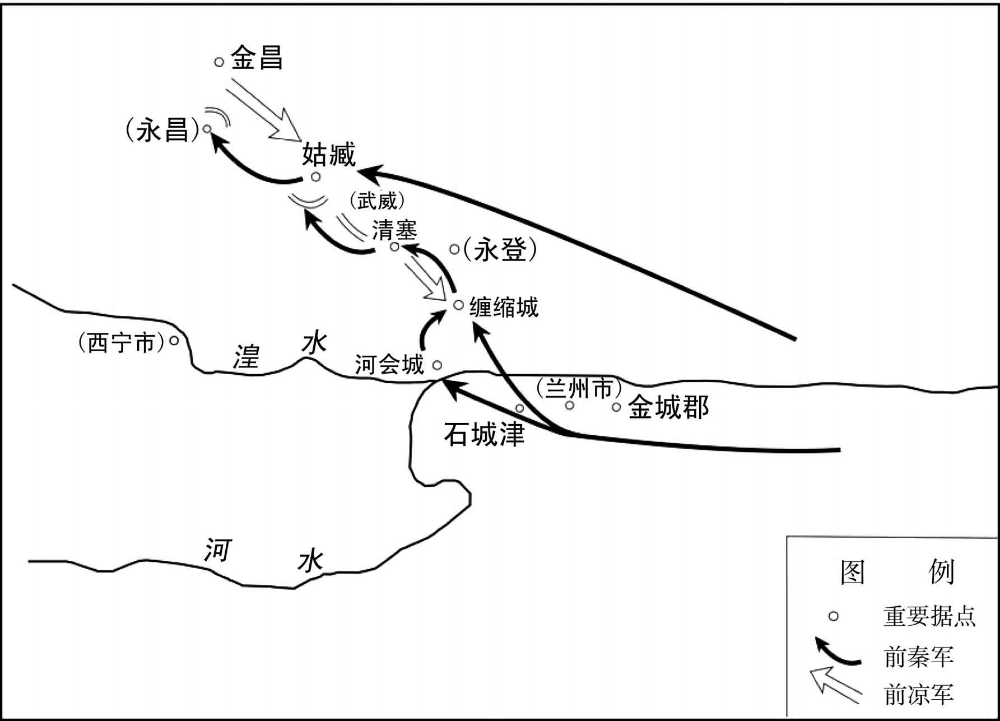 
前秦灭前凉之战示意图

## 【原文】

**九月，秦王坚以梁熙为凉州刺史，镇姑臧。徙豪右七千余户于关中，余皆按堵如故[1]。封天锡为归义侯，拜北部尚书[2]。初，秦兵之出也，先为天锡筑第于长安，至则居之。以天锡晋兴太守陇西彭和正为黄门侍郎，治中从事武兴苏膺、敦煌太守张烈为尚书郎，西平太守金城赵凝为金城太守，高昌杨干为高昌太守，余皆随才擢叙[3]。**

## 【注文】

[1]豪右：豪强大族。　　按堵：安居，安定。

[2]北部尚书：官名。苻秦所置，掌北蕃事务。

[3]晋兴：郡名。西晋怀帝永嘉五年（311年）张轨置，治所设在今青海民和西北。　　彭和正（生卒年不详）：陇西（今甘肃陇西东南）人，前凉官吏，曾担任晋兴太守。后随张天锡投降前秦，被任命为黄门侍郎。　　黄门侍郎：官名，又名黄门郎，因宫禁之门称为黄闼（tà）而得名。这是给事于宫门之内的郎官，负责侍从皇帝，传达诏命。魏、晋、南朝官名前均有“给事”二字。因掌管机密文字，职位日渐重要。　　治中从事：官名，亦称治中从事史，汉朝置，为州刺史的高级属官之一，地位虽低，但权任颇重。可以省称为治中。魏晋南北朝沿置，地位渐高。　　高昌：地名，为两汉魏晋时期戊己校尉驻所，故城在今新疆吐鲁番东南。根据目前的考古发掘资料，高昌故城城墙为夯（hāng）土筑成，略呈正方形，城周约为五公里，分外城、内城、宫城三部分，全城有九个城门。　　随才擢叙：根据才能选拔录用。

## 【译文】

东晋孝武帝太元元年（376年）九月，前秦王苻坚任命梁熙为凉州刺史，镇守姑臧。把豪门大族七千多户迁徙到了关中地区，其余的平民百姓都让他们在原地居住。封张天锡为归义侯，授予北部尚书的官职。当初，前秦军队出征的时候，预先在长安城里为张天锡修筑了府第，张天锡到达长安后就居住于此。任命张天锡的晋兴太守陇西人彭和正为黄门侍郎，治中从事武兴人苏膺、敦煌太守张烈为尚书郎，西平太守金城人赵凝为金城太守，高昌人杨干为高昌太守，其余的人都根据他们的才干提拔授予不同官职。

# 苻秦灭燕

## 【内容摘要】

《苻秦灭燕》主要记述了幕容（wěi）即位后前燕国势由盛而衰，最终被前秦所灭的历史。前秦灭亡前燕之战，指的是公元369年至370年，前秦辅国将军王猛率军攻占前燕都城邺（yè）（今河北临漳西南）并灭亡前燕的战役。

前燕建熙十年（369年）四月，东晋大司马桓温率领五万大军从姑孰（今安徽当涂）出发，开始北伐前燕。同年七月，晋军直取距前燕都城仅几十里的枋头（今河南浚县西南），威逼前燕都城。前燕皇帝慕容非常恐慌，于是派出使者以割让武牢（今河南荥阳西北）以西之地归前秦为代价，向前燕的西方强邻前秦请求援军以退晋军，前秦王苻坚派遣苟池、邓羌率领两万军队援燕。前秦援军尚未到达之前，桓温所率领的晋军在枋头驻军，遭遇前燕军队的殊死抵抗，又因粮道断绝，被迫撤军，途中先是被前燕慕容垂和慕容德设伏打败，又被赶来支援前燕的前秦将领苟池、邓羌所败。战争结束后，前燕反悔，没有将许诺的武牢以西之地给予前秦，苻坚于是率军讨伐前燕。

前秦建元五年（369年），前秦以未兑现割武牢以西之地的诺言为借口，派遣王猛统领将军梁成、邓羌以及三万军队进攻前燕。同年十二月，秦军进攻洛州刺史慕容筑镇守的洛阳（今河南洛阳东北）。慕容派遣卫大将军慕容臧率精兵十万救援。王猛于是派遣梁成等率精锐万人，轻装兼程奔袭，于石门大败慕容臧军队，歼灭一万多人。洛州刺史慕容筑因援军不至，于次年正月投降前秦。慕容臧被迫退军至新乐（今河南新乡）。前秦军队占领洛阳、荥阳要地后，王猛留邓羌驻军于金墉（今河南洛阳东北），自己率军返回长安（今陕西西安西北）。次年六月，苻坚命令王猛率领六万名步、骑兵再次进攻前燕。王猛阵前誓师，与燕军交战，燕军惨败，太傅慕容评单骑逃归邺城。此时，苻坚亲自率精兵十万攻克邺城，慕容出奔被俘，前燕政权至此灭亡。

前燕政权历三世三主，立国三十四年。前秦苻坚消灭前燕政权后，又相继灭仇池氐杨氏，攻取东晋梁、益二州，灭前凉张氏政权，中原地区尽为前秦所有，只有东南一隅的东晋政权与其继续对峙。

## 【原文】

**晋穆帝永和九年春二月庚子，燕王儁立其妃可足浑氏为皇后，世子晔为皇太子，皆自龙城迁于蓟宫[1]。**

## 【注文】

[1]燕：此指前燕政权（337—370年）。　　可足浑氏（？—384年）：前燕景昭帝慕容儁皇后，慕容之母。公元352年，慕容儁自称前燕皇帝，她被封为皇后。慕容继位后，她以太后身份多次干政，撕毁与前秦的协议，致使燕秦关系破裂。最终，她与慕容被前秦俘虏。慕容策划暗杀苻坚，不料走漏了消息，她和慕容均被赐死。　　晔：即慕容晔（？—356年），前燕皇太子，慕容儁与可足浑氏的儿子。因是嫡长子，慕容儁称帝后，他被立为世子，但不久病逝，谥号献太子。　　龙城：城名，又名和龙城、黄龙城、龙都，前燕慕容皝（huàng）建，位于今辽宁朝阳。次年前燕将都城从棘城（今辽宁义县西北）迁至此。　　蓟（jì）：地名，西周曾封唐尧的后代于此地，到春秋战国时为燕国的首都。此后，蓟指古代北京地区（今北京西南）。

## 【译文】

东晋穆帝永和九年（353年）春季二月庚子（十七日），前燕王慕容儁立妃子可足浑氏为皇后，世子慕容晔为皇太子，都从龙城迁移到蓟城皇宫。

## 【原文】

**十年夏四月戊申(1)，燕主儁命冀州刺史吴王霸徙治信都[1]。初，燕王皝奇霸之才，故名之曰霸，将以为世子，群臣谏而止，然宠遇犹逾于世子。由是儁恶之，以其尝坠马折齿，更名曰，寻以其应谶文，更名曰垂，迁侍中，录留台事，徙镇龙城[2]。垂大得东北之和，儁愈恶之，复召还。**

## 【注文】

[1]霸：即慕容霸，又名慕容垂（326—396年）。　　信都：县名，治所在今河北冀州。

[2]（quē）：同“缺”。　　录留台事：官名，主持留守朝廷机要。此指旧都龙城（今辽宁朝阳）的机要政务。

## 【译文】

东晋穆帝永和十年（354年）夏季四月戊申日，前燕主慕容儁命令冀州刺史吴王慕容霸将治所迁移到信都。当初，前燕王慕容皝认为慕容霸才能卓越，于是给他取名为“霸”，准备立他为世子，因为群臣极力反对才作罢，然而宠爱的程度仍然超过世子。慕容儁由此很嫉恨他，由于慕容霸曾经从马上摔下来摔坏了牙齿，所以给他改名为“”，不久又因为他与谶文应和，又给他改名为“垂”，慕容垂升迁为侍中，总领留台事务，转而镇守龙城。慕容垂深得东北百姓的爱戴，慕容儁于是更加憎恶慕容垂，又把他召回都城。

## 【原文】

**十二年秋七月丙子，燕献太子晔卒[1]。**

## 【注文】

[1]献太子：前燕太子慕容晔的谥号。

## 【译文】

东晋穆帝永和十二年（356年）秋季七月丙子（十二日），前燕献太子慕容晔去世。

## 【原文】

**升平元年春二月癸丑，燕主儁立其子中山王为太子[1]。**

## 【注文】

[1]中山王：前燕爵位名。

## 【译文】

东晋穆帝升平元年（357年）春季二月癸丑（二十三日），前燕国主慕容儁立他的儿子中山王慕容为太子。

## 【原文】

**二年。燕吴王垂娶段末柸女，生子令宝[1]。段氏才高性烈，自以贵姓，不尊事可足浑后，可足浑氏衔之[2]。燕主儁素不快于垂，中常侍涅皓因希旨告段氏及吴国典书令辽东高弼为巫蛊，欲以连污垂[3]。儁收段氏及弼下大长秋、廷尉考验，段氏及弼志气确然，终无桡辞[4]。掠治日急，垂愍之，私使人谓段氏曰：“人生会当一死，何堪楚毒如此，不若引服[5]。”段氏叹曰：“吾岂爱死者邪？若自诬以恶逆，上辱祖宗，下累于王，固不为也[6]。”辩答益明，故垂得免祸，而段氏竟死于狱中[7]。出垂为平州刺史，镇辽东[8]。垂以段氏女弟为继室，可足浑氏黜之，以其妹长安君妻垂[9]。垂不悦，由是益恶之。**

## 【注文】

[1]段末柸（pēi）（？—325年）：十六国时段部鲜卑首领，辽西公。段疾陆眷、段匹（dī）的堂兄弟，前任鲜卑首领段涉复辰的堂侄。公元312年，他随段疾陆眷攻打汉赵，与石勒战于襄国（今河北邢台），结果兵败被俘。后段疾陆眷与石勒达成和解而被释放。公元318年，段疾陆眷去世，因他的儿子年龄尚小，段涉复辰于是宣布自己继位。不久，段末柸宣称段匹将率兵夺位，乘虚袭杀段涉复辰，自称单于，不久再称幽州刺史。其后主要与段匹对立，相互攻击。　　令：即慕容令（？—370年），《晋书》作慕容全，慕容垂嫡长子。公元369年，慕容垂抵挡东晋桓温北伐有功，但受到皇兄慕容儁（jùn）和可足浑太后、太傅慕容评的忌恨，他屡次为父亲出谋划策，后与父亲一起投奔前秦，受到苻坚宠信。次年，他跟随前秦丞相王猛讨伐前燕，在王猛的策动下，他返回前燕，却被慕容怀疑为奸细，将他放逐到沙城（今河南沁阳东北），于是他再反前燕，因慕容麟告密，兵败被杀。慕容垂建立后燕后，他被追封为献庄太子。慕容盛即位后，被追尊为献庄皇帝。　　宝：即慕容宝（355—398年），字道祐，小字库勾，昌黎棘城（今辽宁义县西北）人，鲜卑族，慕容垂第四子。曾任前秦苻坚太子洗马、万年令。公元383年淝水之战后，慕容垂称燕王，立其为太子。公元396年，慕容垂死，他继位为王。即位后，遵父遗令，校阅户口，罢除鲜卑贵族因军功所取的封户，归属郡县；重定士族旧籍，明其官仪。公元398年，他南伐北魏兵败，投奔兰汗，到龙城（今辽宁朝阳）时被杀，谥为惠愍帝。

[2]贵姓：段氏与慕容氏均为鲜卑大族，两国又为抗衡之国，故自以为贵姓。　　不尊事：没有恭恭敬敬地事奉。

[3]涅皓（生卒年不详）：前燕中常侍。慕容儁时，曾诬告慕容垂妻段氏及典书令高弼为巫蛊（巫术）。　　典书令：官名。晋置，为王国属官。十六国前燕也设有此官，职掌同晋朝吏部尚书。　　高弼（bì）（生卒年不详）：前燕典书令、郎中令。公元369年，跟随慕容垂从洛阳（今河南洛阳东北）逃奔到前秦。　　巫蛊（gǔ）：古代民俗信仰。即用以加害仇敌的巫术，包括诅咒、射偶人和毒蛊等。自汉代开始，历代法律都明令禁止使用巫蛊之术。

[4]大长秋：官名。秦朝称“将行”，西汉景帝时改称大长秋。为皇后宫内高级官员，多由宦官担任，负责宣达皇后旨意，管理后宫宦官。魏晋南北朝沿置。　　桡（ráo）辞：屈从的言辞。

[5]楚毒：本作“焚炙”，即古代炮烙之刑，这里泛指酷刑。　　引服：根据揭发者的罪状招认。

[6]恶逆：古代刑律十恶大罪之一。指殴打及谋杀祖父母、父母，杀死伯叔父母、姑、兄、姊、外祖父母、夫、夫之祖父母、父母的人。

[7]免祸：免于灾祸。

[8]平州：三国魏分幽州东部地区置，治所设在襄平（今辽宁辽阳），不久仍废入幽州。西晋武帝泰始十年（274年）复置。西晋怀帝永嘉后移治昌黎（今辽宁义县西）。

[9]继室：指元配死后续娶的妻子。汉以后称续娶之妻为继室，即续弦。

## 【译文】

东晋穆帝升平二年（358年）。前燕吴王慕容垂娶段末柸的女儿，生下儿子慕容令与慕容宝。段氏才华出众，秉性刚烈，自认为出身于名门贵姓，没有恭敬事奉可足浑皇后，可足浑皇后对此怀恨在心。前燕国主慕容儁素来不喜欢慕容垂，中常侍涅皓于是乘机迎合慕容儁的意旨，告发段氏和吴国典书令辽东人高弼做巫蛊邪术，并想以此株连慕容垂。慕容儁收捕了段氏和高弼，交给大长秋、廷尉检察验证，段氏和高弼意志坚定，始终没有屈打成招。严刑拷打日甚一日，慕容垂怜悯他们，私下里派人对段氏说：“人生总会面临一死，何必忍受这般痛苦，不如认罪。”段氏叹息说：“我难道是甘愿去死的人吗？如果诬告自己恶逆，上则污辱了祖宗，下则牵累了大王，我绝不能这样做。”此后辩驳回答越发明确，慕容垂因此得以免遭迫害，然而段氏最后却死在了狱中。慕容儁把慕容垂调出都城担任平州刺史，镇守辽东。慕容垂娶段氏的妹妹作为继室，可足浑氏下令废黜了她，把自己的妹妹长安君嫁给慕容垂做妻子。慕容垂十分不满，可足浑氏因此更加憎恶慕容垂。

## 【原文】

**三年春二月，燕主儁宴群臣于蒲池，语及周太子晋，潸然流涕曰：“才子难得[1]。自景先之亡，吾鬓发中白。卿等谓景先何如[2]？”司徒左长史李绩对曰：“献怀太子之在东宫，臣为中庶子，太子志业，敢不知之[3]。太子大德有八，至孝一也，聪敏二也，沉毅三也，疾谀喜直四也，好学五也，多艺六也，谦恭七也，好施八也[4]。”儁曰：“卿誉之虽过，然此儿在，吾死无忧矣。景茂何如[5]？”时太子侍侧，绩曰：“皇太子天资岐嶷，虽八德已闻，然二阙未补，好游畋而乐丝竹，此其所以为损也[6]。”儁顾谓曰：“伯阳之言，药石之惠也，汝宜诫之[7]。”甚不平。**

## 【注文】

[1]周太子晋：即姬晋（生卒年不详），东周灵王姬泄心的太子。他聪慧过人，但不幸早年夭折，后来他的兄弟姬景继承了王位。　　潸（shān）然流涕：流泪。

[2]景先：前燕太子慕容晔，字景先。　　中白：半白。

[3]李绩（生卒年不详）：前燕官吏，字伯阳，曾任司徒左长史。　　中庶子：官名。汉代以后为东宫属官。历代沿置。

[4]沉毅：深沉刚毅。　　谀（yú）：谄媚、奉承。　　好施：喜欢给予别人恩惠。

[5]景茂：即前燕太子慕容，字景茂。

[6]岐嶷（yí）：峻茂的样子。后多借以形容幼年聪慧。　　阙：同“缺”，缺点。　　游畋（tián）：出游田猎。　　丝竹：弦乐器和竹管乐器。这里泛指音乐。

[7]伯阳：即李绩，字伯阳。　　药石：药物的总称。药，方药；石，砭（biān）石。皆用来治病。后人多以药石比喻规诫、劝谏。

## 【译文】

东晋穆帝升平三年（359年）春季二月，前燕慕容儁在蒲池宴请群臣，席间谈到周朝太子姬晋，潸然泪下，说道：“有才能的儿子不容易得到啊。自从景先去世之后，我的两鬓和头发白了一半。诸位认为景先怎么样？”司徒左长史李绩回答说：“献怀太子慕容晔在东宫时，臣担任中庶子，太子的志向和事业怎能不知道。太子的杰出品德有八项，一是非常孝顺，二是聪明敏捷，三是沉着刚毅，四是厌恶奉承，欣赏直言，五是爱好学习，六是多才多艺，七是谦虚恭谨，八是乐善好施。”慕容儁说：“你的评价虽然有些过分，但如果这个儿子在世，我死后就没有忧虑了。景茂怎么样？”当时太子慕容正在身旁陪从，李绩说：“皇太子天资聪明，虽然八德已经闻名，然而有两条缺点还没有弥补，就是爱好游玩打猎和沉湎于器乐，这就是当今太子慕容有所不如的原因。”慕容儁看着慕容说：“李绩的话是苦口良药，你应当引以为戒。”慕容却愤愤不平。

## 【原文】

**儁梦赵主虎啮其臂，乃发虎墓，求尸不获，购以百金[1]。邺女子李菟知而告之，得尸于东明观下，僵而不腐[2]。儁蹋而骂之曰：“死胡，何敢怖生天子[3]！”数其残暴之罪而鞭之，投于漳水，尸倚桥柱不流[4]。及秦灭燕，王猛为之诛李菟，收而葬之[5]。冬十二月辛酉，燕主儁寝疾，谓大司马太原王恪曰：“吾病必不济[6]。今二方未平，景茂冲幼，国家多难，吾欲效宋宣公，以社稷属汝，何如[7]？”恪曰：“太子虽幼，胜残致治之主也[8]。臣实何人，敢干王统[9]。”儁怒曰：“兄弟之间，岂虚饰邪！”恪曰：“陛下若以臣能荷天下之任者，岂不能辅少主乎？”儁喜曰：“汝能为周公，吾复何忧。李绩清方忠亮，汝善遇之[10]。”召吴王垂还邺。**

## 【注文】

[1]赵：此指后赵（319—351年）。

[2]李菟（tú）（326—370年）：十六国时期邺城女子，逃散民间的石虎宫嫔，赵主石虎尸体的告密者。公元370年，被王猛诛杀。

[3]蹋：踩踏。　　生天子：活着的天子。

[4]漳水：又称“漳河”，即今漳河。有清漳水（今清漳河）、浊漳水（今浊漳河）两支上源，均出山西省东南部，二源在今河北省南部边境合漳村汇合后合称漳河，东南流入卫河。

[5]秦：此指前秦（351—394年）。

[6]太原王：前燕爵位名。

[7]二方：分别指前秦、东晋政权。　　宋宣公（？—前729年）：春秋时宋国国君。子姓，名力，宋武公之子。临死时他没有传位给儿子，而传给了弟弟。

[8]胜残致治：遏制凶残以使天下太平。

[9]王统：正统，嫡系子孙。

[10]清方忠亮：廉洁公正，忠贞诚信。

## 【译文】

慕容儁梦见后赵主石虎咬他的胳膊，于是挖开石虎的坟墓，寻找他的尸体，但没有找到，于是就悬赏百两黄金搜求。邺城女子李菟知道尸体的下落，报告了慕容儁，结果在东明观找到了石虎的尸体，此时石虎的尸体虽然僵硬但没有腐烂。慕容儁用脚踩着尸体骂道：“死胡人，怎敢恐吓活着的天子！”列举了石虎的残暴罪行后用鞭子抽打他的尸体，然后把尸体投入了漳水，尸体倚靠在桥柱子上而没有流走。等到前秦灭亡前燕后，王猛诛杀了李菟，把石虎的尸体收拾起来安葬了。升平三年（359年）冬季十二月辛酉（十七日），前燕慕容儁病重，卧床不起，对大司马太原王慕容恪说：“我的病难以痊愈了。现在前秦、东晋还没有平定，而景茂又年幼，国家多难，我想仿效宋宣公，把国家托付给你，怎么样？”慕容恪说：“太子虽然幼小，却是遏制凶残实现大治的君主。我怎敢冒犯嫡系皇位继承人。”慕容儁愤怒地说：“兄弟之间，怎能虚伪掩饰呢！”慕容恪说：“陛下如果认为臣能担负起天下重任，难道就不认为我是辅佐少主的人吗？”慕容儁高兴地说：“你能做周公，我还有何忧虑。李绩清廉方正，忠诚亮节，你要好好待他。”慕容儁征召慕容垂返回邺城。

## 【原文】

**四年春正月癸巳，燕主儁疾笃，召大司马恪等受遗诏辅政。甲午，卒。戊子(2)，太子即位，年十一。大赦，改元建熙[1]。**

## 【注文】

[1]建熙：十六国时期前燕幽帝慕容所用年号，即从公元360年至370年。

## 【译文】

东晋穆帝升平四年（360年）春季正月癸巳（二十日），前燕主慕容儁病重，征召大司马慕容恪等人接受遗诏辅佐朝政。甲午（二十一日），慕容儁去世。戊子（十五日），太子慕容即位，年仅十一岁。实行大赦，改年号为建熙。

## 【原文】

**二月，燕人尊可足浑氏为皇太后。以太原王恪为太宰，专录朝政。上庸王评为太傅，阳骛为太保，慕舆根为太师，参辅朝政[1]。根性木强，自恃先朝勋旧，心不服恪，举动倨傲[2]。时太后可足浑氏颇预外事，根欲为乱，乃言于恪曰：“今主上幼冲，母后干政，殿下宜防意外之变，思有以自全[3]。且定天下者，殿下之功也。兄亡弟及，古今成法，俟毕山陵，宜废主上为王，殿下自践尊位，以为大燕无穷之福[4]。”恪曰：“公醉邪？何言之悖也[5]！吾与公受先帝遗诏，云何而遽有此议[6]。”根愧谢而退。恪以告吴王垂，垂劝恪诛之。恪曰：“今新遭大丧，二邻观衅，而宰辅自相诛夷，恐乖远近之望，且可忍之[7]。”秘书监皇甫真言于恪曰：“根本庸竖，过蒙先帝厚恩，引参顾命[8]。而小人无识，自国哀已来，骄很日甚，将成祸乱[9]。明公今日居周公之地，当为社稷深谋，早为之所。”恪不听。根又言于可足浑氏及燕主曰：“太宰、太傅将谋不轨，臣请帅禁兵以诛之[10]。”可足浑氏将从之，曰：“二公，国之亲贤，先帝选之，托以孤嫠，必不肯尔[11]。安知非太师欲为乱也。”乃止。根又思恋东土，言于可足浑氏及曰：“今天下萧条，外寇非一，国大忧深，不如还东[12]。”恪闻之，乃与太傅评谋，密奏根罪状，使右卫将军傅颜就内省诛根，并其妻子党与。不赦。**

## 【注文】

[1]上庸王：前秦爵位名。上庸：郡名。东汉建安中分汉中郡置，治所设在上庸县（今湖北竹山西南）。　　慕舆根（？—360年）：前燕折冲将军、领军将军、太师。慕容儁病重时，他与慕容恪、慕容评、阳骛共同参辅朝政。公元344年，率兵大破宇文部。翌年，又奔袭扶馀国，俘走扶馀国王。后来他自恃功高，欲伺机作乱，终被慕容识破而被杀。

[2]木强：质朴而倔强。　　勋旧：有功勋的老臣。

[3]外事：指朝政。

[4]兄亡弟及：王位由哥哥传给弟弟继承。中国古代的夏朝、商朝以及鲁国、宋国等均实行这种继承制度。　　毕山陵：安葬完毕。毕，结束，完成。山陵，帝王的陵墓。

[5]悖（bèi）：违背道德、谬误。

[6]遽（jù）：就。

[7]二邻：指东晋、前秦。　　诛夷：诛杀，杀戮。

[8]庸竖：见识浅陋的卑贱小人。为鄙夷之词。

[9]小人：此指慕舆根。

[10]不轨：图谋造反。　　禁兵：中国古代皇帝的亲兵。

[11]亲：指关系密切。慕容恪、慕容评二人均为慕容儁的弟弟。　　托以孤嫠（lí）：以孤嫠相托。孤嫠，孤儿寡妇。丧父叫孤，丧夫叫嫠。

[12]东土：指龙城。在邺城东北，故称东土。

## 【译文】

东晋穆帝升平四年（360年）二月，前燕尊奉可足浑后为皇太后。任命太原王慕容恪为太宰，总揽朝政。上庸王慕容评为太傅，阳骛为太保，慕舆根为太师，参与辅佐朝政。慕舆根性格质朴而倔强，依仗是前朝功臣，心里不服慕容恪，行动举止傲慢自大。当时，太后可足浑氏经常干预政务，慕舆根想要作乱，于是就对慕容恪说：“现在主上年幼，母后干预政事，殿下应该提防意外变故，考虑好自我保全的办法。而且平定天下是殿下的功劳。哥哥死了弟弟继承是古往今来的既定制度，等到把安葬先帝的事情结束，应当废黜主上为王，殿下自己登上皇位，为大燕国带来无尽的福泽。”慕容恪说：“您喝醉了吧？为何说出这样违背伦理的话！我与您共同接受先帝遗诏，您为什么突然有这样的建议。”慕舆根惭愧地谢罪退去。慕容恪把这件事告诉了吴王慕容垂，慕容垂劝慕容恪除掉慕舆根。慕容恪说：“现在先王刚刚去世，前秦、东晋这两个强邻正在寻找可乘之机，而我们辅政大臣之间自相残杀，这恐怕会使百姓失望，暂且容忍他。”秘书监皇甫真对慕容恪说：“慕舆根本来就是个平庸之辈，承蒙先帝过分恩典，让他参与临终托孤辅政。然而这小人自从先王去世以来，骄横日益严重，终将要造成祸乱。您今日处在周公的地位，应当为国家的长远利益考虑，早点将他除掉。”慕容恪不听。慕舆根又对可足浑氏和前燕主慕容说：“太宰（慕容恪）、太傅（慕容评）将要图谋不轨，臣请求率领禁兵诛杀他们。”可足浑氏想要依从他的意见，慕容说：“这两位是国家的近亲和贤才，先帝选择他们，并把我们孤儿寡母托付给他们，他们绝不会做这样的事。怎知不是太师慕舆根想要作乱呢。”事情方才作罢。慕舆根又思念东部龙城，对可足浑氏和慕容说：“现在天下萧条，外敌不止一个，国家忧患较深，不如回到东部龙城。”慕容恪听说这件事，于是与太傅慕容评商量，秘密上奏慕舆根的罪状，派遣右卫将军傅颜在宫内诛杀慕舆根，同时杀掉的还有他的妻子儿女和党羽。绝不赦免。

## 【原文】

**哀帝兴宁二年。燕侍中慕舆龙诣龙城，徙宗庙及所留百官皆诣邺。**

## 【译文】

东晋哀帝兴宁二年（364年）。前燕侍中慕舆龙来到龙城，把祭祀祖先的宗庙和留守在那里的文武百官都迁徙到邺城。

## 【原文】

**海西公太和二年夏四月，燕太原桓王恪言于燕主曰：“吴王垂将相之才，十倍于臣，先帝以长幼之次，臣得先之[1]。臣死之后，愿陛下举国以听吴王。”五月壬辰(3)，恪疾病，亲视之，问以后事。恪曰：“臣闻报恩莫大于荐贤，贤者虽在板筑，犹可为相，况至亲乎？[2]吴王文武兼资，管、萧之亚，陛下若任以大政，国家可安；不然，秦、晋必有窥窬之计[3]。”言终而卒。**

## 【注文】

[1]先之：位次在他之前。

[2]板筑：筑墙的用具。板，墙板；筑，杵（chǔ）。筑墙时，以两板夹土，用杵夯（hāng），使之坚固。相传殷高宗武丁曾举傅说（yuè）于板筑之间，使为相。后世常以板筑指隐遁之士或地位低微的人。　　至亲：慕容垂为慕容之父慕容儁之弟。

[3]管、萧：即管仲、萧何。两人分别辅佐春秋时期齐国和西汉王朝。

## 【译文】

东晋海西公太和二年（367年）夏季四月，前燕太原桓王慕容恪对前燕主慕容说：“吴王慕容垂有将相才干，胜过臣十倍，先帝依照年龄的大小次序，臣才得以排在他的前面。臣死以后，希望陛下把整个国家都委任给吴王慕容垂。”五月壬辰日，慕容恪病重，慕容亲自去看望他，并向他询问身后的事情。慕容恪说：“臣听说报答恩德没有大过推荐贤才的，贤才即使是筑墙的工匠，也可以做宰相，何况是血缘关系最近的至亲呢？吴王文武兼备，仅次于历史上的管仲、萧何，陛下如果把朝政委任给他，国家就可以安定；不然的话，秦国、晋朝一定会伺机而动。”慕容恪说完后就去世了。

## 【原文】

**秦王坚闻恪卒，阴有图燕之计，欲觇其可否，命匈奴曹毂发使如燕朝贡，以西戎主簿冯翊郭辩为之副[1]。燕司空皇甫真兄腆及从子奋、覆皆仕秦，腆为散骑常侍。辩至燕，历造公卿，谓真曰：“仆本秦人，家为秦所诛，故寄命曹王[2]。贵兄常侍及奋、覆兄弟，并相知有素。”真怒曰：“臣无境外之交，此言何以及我？君似奸人，得无因缘假托乎[3]！”白，请穷治之，太傅评不许。辩还，为坚言：“燕朝政无纲纪，实可图也[4]。鉴机识变，唯皇甫真耳[5]。”坚曰：“以六州之众，岂不得使有智士一人哉[6]！”曹毂寻卒，秦分其部落为二，使其二子分统之，号东、西曹[7]。**

## 【注文】

[1]觇（chān）：偷偷地察看。　　曹毂（gǔ）（？—367年）：东晋时匈奴右贤王。公元365年举兵反前秦，后为苻坚所败，归降，仍统本部。　　西戎主簿：西戎校尉副手，参与机要并总领府事。西戎校尉是统辖西戎少数民族事务的军事长官。

[2]历造：依次拜访。　　寄命：使生命有所寄托，这里是“依附”的意思。

[3]奸人：奸细，密探。

[4]纲纪：治理与管理。

[5]鉴机识变：即鉴识机变。意思是善于识别局势而迅速作出适当的反应。

[6]六州：指燕国统辖的幽州、并州、冀州、司州、兖州、豫州等六州。

[7]东、西曹：曹毂去世后，前秦把他的部落分为二支，让他的两个儿子曹玺、曹寅分别统领，号称东曹、西曹。

## 【译文】

前秦国主苻坚听说慕容恪去世的消息，暗中制定了进攻前燕的计划，想侦探看看这个计策是否可行，于是命令匈奴人曹毂作为使者启程前往前燕朝拜进贡，并派遣西戎主簿冯翊人郭辩作为曹毂的副使。前燕司空皇甫真的哥哥皇甫腆和侄子皇甫奋、皇甫覆都在前秦担任官职，皇甫腆担任散骑常侍。郭辩抵达前燕，一一拜访公卿百官，对皇甫真说：“我本是秦国人，家人被秦国诛杀，所以寄身在曹毂那里。您的兄长皇甫腆和皇甫奋、皇甫覆兄弟都和我是多年的挚友。”皇甫真生气地说：“臣没有国境以外的交往，您说的这些为什么要涉及我？您看上去像是邪恶之人，是不是想借此来刺探虚实呢！”皇甫真把这件事告诉了慕容，请求严惩郭辩，但是太傅慕容评没有同意。郭辩回去以后，对苻坚说：“燕朝政治没有纲纪，可以谋取。有见识而且能随机应变的只有皇甫真。”苻坚说：“凭借六州的土地，难道不能让他们有一个智士贤才吗！”曹毂不久就去世了，前秦把他的部落分为两支，让他的两个儿子分别统领，号称东曹、西曹。

## 【原文】

**三年。初，燕太宰恪有疾，以燕主幼弱，政不在己，太傅评多猜忌，恐大司马之任不当其人，谓兄乐安王臧曰：“今南有遗晋，西有强秦，二国常蓄进取之志，顾我未有隙耳[1]。夫国之兴衰，系于辅相。大司马总统六军，不可任非其人，我死之后，以亲疏言之，当在汝及冲[2]。汝曹虽才识明敏，然年少，未堪多难。吴王天资英杰，智略超世，汝曹若能推大司马以授之，必能混壹四海，况外寇，不足惮也[3]。慎勿冒利而忘害，不以国家为意也[4]。”又以语太傅评。及恪卒，评不能用其言，三月，以车骑将军中山王冲为大司马。冲，之弟也。以荆州刺史吴王垂为侍中、车骑大将军、仪同三司[5]。**

## 【注文】

[1]不在己：不在慕容自己。　　不当其人：不称职的人。　　乐安王：前燕爵位名。乐安：东汉置，治所先在临济县（今山东高青西北），辖境相当于今山东博兴、高青、桓台、广饶、寿光等地。魏晋时，治所移至高苑（今山东邹平东北）。

[2]冲：即慕容冲（359—386年），鲜卑族，昌黎棘城（今辽宁义县西北）人，慕容泓之弟，小字凤皇。前燕时封中山王。公元370年，前燕被前秦所灭，他迁至关中，授平阳太守。淝水之战后，投奔慕容泓起兵反秦。公元384年，慕容泓被杀，他被拥立为皇太弟，次年，继位为西燕国君，公元385年至386年在位。他在位期间生活荒淫，赏罚不明，群臣怨愤。公元386年，被部将乱刀砍死。后被其子慕容瑶追谥为威皇帝。

[3]混壹四海：统一天下。壹，同“一”。

[4]冒利：冒昧争利。此指夺兵权，争当大司马职位。

[5]仪同三司：即开府仪同三司。“开府”指开设府第，设置官吏。“仪同三司”即仪仗同于三司（太尉、司空、司徒）。古代官制规定唯有三公可开府。东晋十六国时“开府”与“仪同三司”连称较多。

## 【译文】

东晋海西公太和三年（368年）。当初，前燕大宰慕容恪病重，因为前燕主慕容年幼怯弱，自己不能主持朝政，太傅慕容评为人又好猜忌，慕容恪恐怕大司马的职位选择不到合适的人，便对慕容的哥哥乐安王慕容臧说：“现在南面有残留下来的晋朝，西面有强大的秦国，两国常常有侵占我们的野心，只是我们没有出现可乘之机而已。国家的兴衰取决于宰辅。大司马总领六军，不能委任给不合适的人，我死以后，以亲疏关系来论，应该在你和慕容冲之间选择。你们虽然才能出众，聪明敏锐，然而年轻，没有经历过多的磨难。吴王（慕容垂）天资英雄豪杰，智谋才略盖世，你们如果能够把大司马的职位让给他，必定能够统一天下，何况是外敌，就更不值得害怕了。千万不要因权力的诱惑而忘记祸患，不把国家的安危放在心上。”又把这些话说给了太傅慕容评。等到慕容恪去世，慕容评没有按照慕容恪的话去做，三月，任命车骑将军中山王慕容冲为大司马。慕容冲，是慕容的弟弟。任命荆州刺史吴王慕容垂为侍中、车骑大将军、仪同三司。

## 【原文】

**秦镇东将军洛州刺史魏公廋据陕城举兵反，以陕城降燕，请兵应接。秦人大惧，盛兵守华阴。燕魏尹范阳王德上疏，以为：“先帝应天受命，志平六合，陛下纂统，当继而成之[1]。今苻氏骨肉乖离，国分为五，投诚请援，前后相寻，是天以秦赐燕也[2]。天与不取，反受其殃，吴、越之事，足以观矣[3]。宜命皇甫真引并、冀之众径趋蒲（陕）［阪］，吴王垂引许、洛之兵驰解廋围，太傅总京师虎旅，为二军后继，传檄三辅，示以祸福，明立购赏，彼必望风响应，浑壹之期，于此乎在矣[4]。”时燕人多请救陕，因图关中者，太傅评曰：“秦，大国也，今虽有难，未易可图。朝廷虽明，未如先帝，吾等智略，又非太宰之比[5]。但能闭关保境足矣，平秦非吾事也。”**

## 【注文】

[1]魏尹：前燕把都城设在魏郡的治所邺城（今河北临漳西南），故将魏郡太守称为“魏尹”。　　应天受命：顺应上天，受命为帝。　　六合：常用于指上下和四方，泛指天地或宇宙。此指全国。

[2]乖离：背离，冲突。　　国分为五：指苻柳据蒲坂（今山西永济西南），苻双据上邽（今甘肃天水），苻廋据陕城（今河南三门峡西），苻武据安定（今甘肃泾川北），苻坚都长安（今陕西西安西北）。

[3]吴、越之事：公元前494年，吴国大败越军。吴王夫差不听伍子胥的劝告，同意越王勾践入臣于吴。勾践回国后，卧薪尝胆，发奋图强，转弱为强。公元前482年，勾践乘夫差北上黄池（今河南封丘西南）与晋争霸之机，攻入吴都，消灭了吴国。

[4]三辅：指京兆、冯翊、扶风三郡，是秦汉时期的京畿地区。

[5]先帝：指慕容儁。　　太宰：此指慕容恪。

## 【译文】

前秦镇东将军、洛州刺史、魏公苻廋（sōu）占据陕城起兵反叛前秦，献出陕城归降前燕，同时请求前燕出兵援助。前秦恐惧，派遣重兵驻守华阴。前燕魏尹、范阳王慕容德上奏说：“先帝顺应上天，接受天命，志在平定天下，陛下继承国统，应当继续完成祖先未竟之业。现在苻氏骨肉背离，国家一分为五，向我们投诚并请求援兵，前后接连不断，是上天把秦国赐给燕国。上天给予却不接受，必将遭受祸殃，吴、越国的事例足以为鉴啊。您应当命令皇甫真率领并州、冀州的军队直趋蒲坂，吴王慕容垂率领许昌、洛阳的军队迅速出发为苻廋解围，太傅（慕容评）总领京师禁军，可以作为两军的后续部队，向三辅地区传递檄文，晓示福祸利害，明确悬赏，他们一定会望风而动，统一天下的机会就在于这次行动了。”当时，前燕的很多人都请求救援陕城，乘势谋取关中地区，太傅慕容评说：“秦国是大国，现在虽然有难，但也不容易谋取。朝廷虽然英明，但不如先帝，我们的智谋才略，又无法和太宰（慕容恪）相比。只要能够闭关保全国境就已经足够了，平定前秦不是我们的事情。”

## 【原文】

**魏公廋遣吴王垂及皇甫真笺曰：“苻坚、王猛，皆人杰也，谋为燕患久矣。今不乘机取之，恐异日燕之君臣，将有甬东之悔矣[1]。”垂谓真曰：“方今为人患者，必在于秦。主上富于春秋，观太傅识度，岂能敌苻坚、王猛乎[2]？”真曰：“然。吾虽知之，如言不用何。”**

## 【注文】

[1]甬（yǒng）东之悔：甬东，即今浙江舟山岛。春秋时代，吴国攻下越国，越王派使者与吴王讲和，吴王应允。吴国大臣伍子胥从旁规劝，吴王不听。后来越国攻下吴国，把吴王安排在越国的边城甬东居住，吴王说：“后悔不听伍子胥的话，自己反而困陷在这里。”最后自缢而死。

[2]富于春秋：指年纪轻。　　识度：见识与度量。

## 【译文】

魏公苻廋写信给吴王慕容垂和皇甫真，说：“苻坚、王猛都是杰出的人才，他们图谋祸害燕国已经很久了。现在不乘此机会攻取秦国，恐怕他日燕国的君臣，将有春秋时吴王甬东的悔恨了。”慕容垂对皇甫真说：“现在成为我们祸患的一定是秦国。如今主上年纪还轻，观察太傅（慕容评）的见识和度量难道能与苻坚、王猛匹敌吗？”皇甫真说：“是这样。我虽然知道，可是我的建议不被采用，又有什么办法。”

## 【原文】

**四年。晋大司马温伐燕，下邳王厉与温战，败于黄墟[1]。燕又使乐安王臧拒温，臧不能抗。温至枋头，与太傅评谋奔龙城。吴王垂自请击之，又使乐嵩请救于秦，许赂以虎牢以西之地。秦遣苟池、邓羌帅步骑救燕，范阳王德、李邽断温粮道。温数战不利，粮储复竭，闻秦兵将至，弃辎重、铠仗奔还。吴王垂追及温于襄邑，大破之。事见《桓温伐燕》[2]。**

## 【注文】

[1]下邳王：前燕爵位名。

[2]《桓温伐燕》：此文记载了公元369年东晋桓温第三次出兵北伐前燕的历史。桓温曾三次出兵北伐。这次出兵前燕，是他最后一次北伐，也是失败最惨重的一次。

## 【译文】

东晋海西公太和四年（369年）。东晋大司马桓温讨伐前燕，下邳王慕容厉与桓温交战，在黄墟被桓温打败。前燕又派遣乐安王慕容臧抵御桓温，慕容臧无法抵抗。桓温抵达枋头，慕容与太傅慕容评商议逃奔龙城。吴王慕容垂自荐请求率军抵御桓温，又派遣乐嵩向前秦请求救兵，许诺割让虎牢以西的土地给前秦。前秦于是派遣苟池、邓羌率领步兵、骑兵救援前燕，范阳王慕容德、李邽截断了桓温的粮道。桓温多次作战不利，粮食储备又已耗尽，当听说前秦军队将要到来，于是扔掉军用物资、铠甲兵器逃奔回去。吴王慕容垂追上桓温，在襄邑大败桓温的军队。事情参见《桓温伐燕》。

## 【原文】

**燕、秦既结好，使者数往来。燕散骑侍郎太原郝晷、给事黄门侍郎梁琛相继如秦[1]。晷与王猛有旧，猛接以平生，问晷东方之事[2]。晷见燕政不修，而秦大治，知燕将亡，阴欲自托于猛，颇泄其实[3]。［冬十月］，琛至长安，秦王坚方畋于万年，欲引见琛[4]。琛曰：“秦使至燕，燕之君臣朝服备礼，洒扫宫庭，然后敢见。今秦主欲野见之，使臣不敢闻命[5]。”尚书郎辛劲谓琛曰：“宾客入境，惟主人所以处之，君焉得专制其礼[6]。且天子称乘舆，所至曰行在所，何常居之有[7]。又《春秋》亦有遇礼，何为不可乎[8]？”琛曰：“晋室不纲，灵祚归德，二方承运，俱受明命[9]。而桓温猖狂，窥我王略，燕危秦孤，势不独立，是以秦主同恤时患，要结好援。东朝君臣，引领西望，愧其不竞，以为邻忧，西使之辱，敬待有加[10]。今强寇既退，交聘方始，谓宜崇礼笃义，以固二国之欢[11]。若忽慢使臣，是卑燕也，岂修好之义乎？夫天子以四海为家，故行曰乘舆，止曰行在。今海县瓜裂，天光分曜，安得以乘舆行在为言哉[12]。礼，不期而见曰遇，盖因事权行，其礼简略，岂平居容与之所为哉[13]。客使单行，诚势屈于主人，然苟不以礼，亦不敢从也[14]。”坚乃为之设行宫，百僚陪位，然后延客，如燕朝之仪。事毕，坚与之私宴，问“东朝名臣为谁[15]？”琛曰：“太傅上庸王评，明德茂亲，光辅王室[16]。车骑大将军吴王垂，雄略冠世，折冲御侮[17]。其余或以文进，或以武用，官皆称职，野无遗贤。”**

## 【注文】

[1]郝晷（guǐ）（生卒年不详）：太原（今山西太原西南）人，曾任前燕散骑侍郎。公元369年，东晋桓温举兵北伐，割据北方的前燕和前秦两国暂时结成联盟，挫败了桓温的进攻。从此，前燕和前秦双方使者数次往来。他就曾作为使者前往前秦。前燕灭亡后，他相继投奔前秦、东晋、翟魏、后燕。

[2]有旧：有老交情。　　接以平生：用老朋友的礼节接待。

[3]实：实情，内幕。

[4]万年：古县名。西汉高祖刘邦时置，治长安城（今陕西西安东北）。

[5]野见：在郊外接见。野：野外，郊外，与朝相对。

[6]惟主人所以处之：根据主人居住的地点来安排他。惟，语气词，用来强调地点。　　专制其礼：在礼仪上自己决定。

[7]所至：指皇帝所到的地方。　　行在所：也简称“行在”。

[8]《春秋》：古代中国的儒家典籍，被列为“五经”（《周易》《尚书》《诗经》《礼记》《春秋》）之一。《春秋》是鲁国的编年史，据传是由孔子修订的。该书记载了从鲁隐公元年（前722年）到鲁哀公十四年（前481年）的历史，是中国现存最早的一部编年体史书。书中用于记事的语言极为简练，然而几乎每个句子都暗含褒贬之意，被后人称为“春秋笔法”。由于《春秋》的记事过于简略，因而后来出现了很多对《春秋》所记载的历史进行详细记录的“传”，较为有名的是被称为“春秋三传”的《左传》《公羊传》和《穀梁传》。

[9]灵祚归德：神灵的福佑归依于有德的一方。

[10]东朝：此指燕国。　　引领：伸着脖子。形容盼望殷切。　　愧其不竞，以为邻忧：燕国深愧自己不够强大，从而使邻国秦国为自己担忧。　　敬待有加：即有待加敬。意思是希望受到更隆重的礼遇。

[11]交聘（pìn）：两国互派使节问候，互访。　　崇礼笃义：尊重礼仪，忠守信义。

[12]海县：天下。在古代，中国有赤县神州之称，而神州外有大海环绕，故称天下为海县。　　天光分曜：日光分别照耀。比喻全国分裂，各自为政。

[13]平居容与：安逸无事。

[14]客使：出访的使者。此指给事黄门侍郎梁琛。

[15]私宴：苻坚设私宴与梁琛相见。

[16]茂亲：有才德的亲属。

[17]折冲：使敌人的战车后撤，即击退敌军。冲，战车的一种。

## 【译文】

前燕、前秦结成友好关系以后，两国使者多次往来。前燕散骑侍郎太原人郝晷、给事黄门侍郎梁琛先后前往前秦。郝晷与王猛有交情，王猛按朋友那样的礼仪接待郝晷，向郝晷询问前燕的事情。郝晷看到前燕的政治混乱，而前秦治理得井井有条，知道前燕必将灭亡，暗中想投奔王猛，就泄露了燕国的很多实情。太和四年（369年）冬季十月，梁琛抵达长安，前秦王苻坚正在万年县打猎，想就地接见他。梁琛说：“秦国的使者抵达燕国，燕国的君臣都身穿朝服准备好礼仪，洒扫宫廷，然后才敢相见。现在秦主苻坚打算在野外接见我，我不敢听命。”前秦尚书郎辛劲对梁琛说：“客人进入其他国家，只能是听从主人的安排，您怎么可以专断秦国的礼仪呢。况且天子称为‘乘舆’，所到的地方叫‘行在所’，天子哪会有经常居住的地方。另外《春秋》也记载有君臣突然相见的礼仪，为什么不可以在野外接见呢？”梁琛说：“晋朝失去纲纪，皇位归属于有德行的人，于是前燕、前秦承接天运，共同接受了神明的赐命。然而桓温放肆猖狂，窥视我国国土，燕国危险，秦国就会孤立，两国均难以独存，所以我们邀请结成友好的同盟。前燕的君臣向西翘望，惭愧自己不够强大，而给邻国带来了忧患，前秦使者屈尊前来，倍加恭敬礼待。现在强敌已经退去，两国的友好交往刚刚开始，我认为应当崇尚礼仪，恪守道义，来巩固两国的友好关系。如果忽视怠慢使臣，就是藐视燕国，难道这就是两国关系的大义吗？天子以四海为家，所以出行叫乘舆，停驻叫行在。现在天下四分五裂，各自为政，怎么还能够用‘乘舆’‘行在’来作为推辞呢。依照礼法，没有约定时间而相互见面称为‘遇’，是随事权宜施行，礼节简略，难道是平日闲居时所应该采用的礼仪吗。我作为使臣，只身一人前来，确实要屈从于主人，然而如果不以礼相待，我也不敢从命。”苻坚于是为梁琛特设行宫，百官陪坐，然后迎接客人入内，如同前燕的礼仪。事情结束以后，苻坚与梁琛私下宴饮，问道：“前燕的名臣有谁？”梁琛说：“太傅上庸王慕容评，德行完美，皇家至亲，辅佐皇室。车骑大将军吴王慕容垂，雄才盖世，抗击敌人，抵御海外。其他官员或者因为文才得到提拔，或者因为武略受到重用，他们都很称职，没有遗漏在民间的贤才。”

## 【原文】

**琛从兄奕为秦尚书郎，监使典客，馆琛于奕舍，琛曰：“昔诸葛瑾为吴聘蜀，与诸葛亮惟公朝相见，退无私面，余窃慕之[1]。今使之即安私室，所不敢也。”乃不果馆。奕数来就邸舍，与琛卧起，间问琛东国事[2]。琛曰：“今二方分据，兄弟并蒙荣宠，论其本心，各有所在。琛欲言东国之美，恐非西国之所欲闻；欲言其恶，又非使臣之所得论也。兄何用问为[3]？”**

## 【注文】

[1]从兄：同曾祖伯叔之子年长于己者。略同堂兄。　　奕：即梁奕，梁琛堂兄，前秦尚书郎。　　典客：官名。秦朝始置，掌管接待少数民族诸侯来朝等事务。汉代改称大行令，后又改名大鸿胪。此非官名，特指临时负责接待客人。　　诸葛瑾（174—241年）：字子瑜，三国时期吴国大臣，琅邪阳都（今山东沂南南）人，诸葛亮之兄，诸葛恪之父。经鲁肃推荐，为东吴效力。他胸怀宽广，温厚诚信，深得孙权信赖，努力缓和蜀汉与东吴的关系。东汉建安二十五年（220年）吕蒙病逝，他代替吕蒙领南郡太守。孙权称帝后，他被任命为大将军，领豫州牧。　　蜀：即三国时期的蜀国（221—263年）政权。公元221年，刘备在成都（今四川成都）称帝，国号“汉”，史称蜀汉。鼎盛时期辖境大致相当于今四川、重庆及云南、贵州、陕西汉中一带。后被曹魏所灭。历二帝，共四十三年。

[2]邸（dǐ）：古代为外国来朝官员准备的住所。

[3]东国：此指前燕政权。　　西国：此指前秦政权。

## 【译文】

梁琛的堂兄梁奕担任前秦尚书郎，苻坚命令他主管接待来客，于是把梁琛安排在梁奕的馆舍，梁琛说：“过去诸葛瑾作为吴国的使者出访蜀国，与诸葛亮只在朝廷中相见，退朝后私下里从来没有会面，我内心对此充满仰慕。现在我出使到秦国，你把我安排在你的私人馆舍，我不敢接受。”最终梁琛也没有去堂兄的馆舍。梁奕多次来到梁琛的下榻之处，与梁琛同睡同起，间或向梁琛询问前燕的事情。梁琛说：“现在双方分别割据，你我都蒙受荣耀和宠信，然而论我们的本心，各有自己的效忠对象。如果我说燕国的好处，恐怕不是秦国所想要听的；倘若说燕国的坏处，又不是使臣所应该评说的。兄长您还用问这些吗？”

## 【原文】

**坚使太子延琛相见，秦人欲使琛拜太子，先讽之曰：“邻国之君，犹其君也；邻国之储君，亦何以异乎[1]？”琛曰：“天子之子视元士，欲其由贱以登贵也[2]。尚不敢臣其父之臣，况他国之臣乎？苟无纯敬，则礼有往来，情岂忘恭，但恐降屈为烦耳[3]。”乃不果拜。**

## 【注文】

[1]储君：泛称已确定为继承皇位的人，指皇太子。

[2]元士：周代职官名，地位在公侯伯子男之下。《仪礼·士冠礼》：“天子之元子，犹士也，天下无生而贵者也。”这段话是梁琛的理论依据，大意是，太子开始的地位同于元士，人无一出生就高贵的，太子也得经过低贱阶段。

[3]礼有往来：指自己参拜秦太子，秦太子按礼也应当答拜。

## 【译文】

苻坚派太子邀请梁琛相见，前秦想要让梁琛对太子行拜礼，于是婉转地暗示梁琛说：“邻国的君主，犹如自己的君主一样；邻国的太子，和自己的太子又有什么不同呢？”梁琛说：“天子的儿子被视为一般的士人，臣下都希望太子由低贱进升登上高贵的地位。太子尚且不敢把父王的臣子当作自己的臣子，何况是其他国家的臣子呢？倘若是真正敬意，则要礼尚往来，内心岂能忘记恭敬，只是恐怕两国的臣子多了一份俯身屈膝的麻烦而已。”梁琛最终没有叩拜前秦太子。

## 【原文】

**王猛劝坚留琛，坚不许。**

## 【译文】

王猛劝说苻坚留下梁琛，苻坚没有答应。

## 【原文】

**吴王垂自襄邑还邺，威名益振，太傅评愈忌之。垂奏“所募将士忘身立效，将军孙盖等椎锋陷陈，应蒙殊赏”[1]。评皆抑而不行。垂数以为言，与评廷争，怨隙愈深。太后可足浑氏素恶垂，毁其战功，与评密谋诛之。太宰恪之子楷及垂舅兰建知之，以告垂曰：“先发制人，但除评及乐安王臧，余无能为矣[2]。”垂曰：“骨肉相残而首乱于国，吾有死而已，不忍为也。”顷之，二人又以告曰：“内意已决，不可不早发[3]。”垂曰：“必不可弥缝，吾宁避之于外，余非所议[4]。”**

## 【注文】

[1]椎锋：攻击敌人的军锋。

[2]楷：即慕容楷（？—395年），昌黎棘城（今辽宁义县西北）人，前燕太原王慕容恪之子。公元384年，趁前秦国势衰退之际，他跟随时仿司马睿前例建制称王的慕容垂从事复国大业，任职征西大将军并受封太原王。初奉燕王慕容垂之令，会同时任镇南将军的陈留王慕容绍，出军讨伐在馆陶（今河北馆陶）兴兵抗拒的东胡人王晏。他为了顺应局势，增强国力，遂请慕容绍前去游说招抚王晏，而自率军进驻辟阳（今河北冀州东南）。王晏降伏后，连带吸引附近自卫堡寨数十万人投靠。慕容楷遂加以管理整编，率领十余万生力军前往邺城（今河北临漳西南）外郊，与慕容垂会合。后来成为后燕重臣之一。

[3]内意：此指可足浑太后之意。

[4]弥缝：指弥补缝合骨肉间的裂痕。

## 【译文】

吴王慕容垂从襄邑回到邺城，威名越来越大，太傅慕容评也更加忌恨他。慕容垂于是上奏说“所招募的将领、士兵舍生忘死，报效国家，将军孙盖等人冲锋陷阵，应当受到特别的嘉赏”。慕容评则全都搁置下来，不予办理。慕容垂多次提到这件事，甚至与慕容评在朝廷中争论，两人的怨恨隔阂也越来越深。太后可足浑氏素来厌恶慕容垂，诋毁他的战功，与慕容评密谋诛杀慕容垂。太宰慕容恪的儿子慕容楷和慕容垂的舅舅兰建得知消息后，就劝慕容垂：“先发制人，只要除掉慕容评和乐安王慕容臧，其余的人就没有反抗的能力了。”慕容垂说：“骨肉之间相残必然会首先在国内制造动乱，我宁可一死，也不忍心去做这样的事情。”不久，二人又劝说道：“太后已经下定决心，不能不早动手了。”慕容垂说：“倘若隔阂一定不能弥合，我宁愿到外边去躲避他们，其余的就不必商议了。”

## 【原文】

**垂内以为忧，而未敢告诸子[1]。世子令请曰：“尊比者如有忧色，岂非以主上幼冲，太傅疾贤，功高望重，愈见猜邪[2]？”垂曰：“然。吾竭力致命以破强寇，本欲保全家国，岂知成功之后，反令身无所容。汝既知吾心，何以为吾谋？”令曰：“主上暗弱，委任太傅，一旦祸发，疾于骇机[3]。今欲保族全身，不失大义，莫若逃之龙城，逊辞谢罪，以待主上之察，若周公之居东，庶几可以感寤而得还，此幸之大者也[4]。如其不然，则内抚燕、代，外怀群夷，守肥如之险以自保，亦其次也[5]。”垂曰：“善。”**

## 【注文】

[1]内：内心，心中。

[2]尊：父亲的称呼。　　比者：近来。

[3]暗弱：懦弱不明事理。　　骇机：突然触发的弩机。比喻突然发生的灾难。

[4]周公之居东：据《尚书·金腾》记载：周武王病重，他的弟弟周公姬旦祈求祖先的在天之灵，请求以自身代替武王去死，祝辞收藏于金滕中。武王去世，成王继位，周公辅政。为平定国内叛乱，周公东征洛阳，驻守二年。成王受人挑唆，怀疑周公。后上帝以狂风暴雨示警，成王从金滕中见到周公的祝辞，消除了对周公的疑心，迎接周公从东方回到京城。　　感寤（wù）：有所感而悔悟，此指燕王慕容。

[5]燕、代：指春秋战国时燕国、代国所辖区域。燕地，在今河北北部。代地，在今山西北部。　　肥如：县名。西汉置，治所在今河北卢龙北。

## 【译文】

慕容垂心中感到担忧，但没敢告诉他的儿子们。世子慕容令请安说：“父亲您近来好像面带忧色，是不是因为主上年幼，太傅妒贤嫉能，您功劳大声望重，而越来越被猜忌呢？”慕容垂说：“是的。我竭尽所能不顾性命来抗击强敌，本是想保全宗族和国家，哪知功成之后，反而使自己没有容身之处。你既然知道我的心思，我该怎么办呢？”慕容令回答说：“主上昏庸怯弱，把朝政委托给太傅，一旦灾祸发生，就好似弩机发射那么快。若想要保全宗族和自身，而不失大义，不如逃往龙城，用谦逊的言辞道歉认罪，等待主上的明察，就好像周公居住在东方那样，或许主上可以感悟而请我们返回，这是最好的结果了。如果主上不这样做，那么我们对内安抚燕、代地区的民众，对外笼络夷族各部，固守肥如以自保，这是其次的策略。”慕容垂说：“好！”

## 【原文】

**十一月辛亥朔，垂请畋于大陆，因微服出邺，将趋龙城[1]。至邯郸，少子麟素不为垂所爱，逃还告状，垂左右多亡叛[2]。太傅评白燕主，遣西平公强帅精骑追之，及于范阳[3]。世子令断后，强不敢逼[4]。会日暮，令谓垂曰：“本欲保东都以自全，今事已泄，谋不及设[5]。秦主方招延英杰，不如往归之。”垂曰：“今日之计，舍此安之？”乃散骑灭迹，傍南山复还邺，隐于赵之显原陵[6]。俄有猎者数百骑四面而来，抗之则不能敌，逃之则无路，不知所为。会猎者鹰皆飞扬，众骑散去，垂乃杀白马以祭天，且盟从者[7]。**

## 【注文】

[1]辛亥朔：疑误。十一月丁丑朔，无辛亥。辛亥，十二月初五。　　大陆：又名巨鹿泽、广阿泽，位于今河北隆尧、巨鹿、任县三县之间，汇集太行山区之水，下流泄入漳水。今已为平地。

[2]邯郸：县名。治所在今河北邯郸。　　麟：即慕容麟（？—398年），一作慕容驎，小字贺麟，鲜卑族，昌黎棘城（今辽宁义县西北）人，后燕成武帝慕容垂之子，惠愍帝慕容宝之弟。他最初不受慕容垂宠爱，后因屡进奇策，才开始受到赏识。慕容垂即皇帝位后，他被授为卫大将军，封赵王。公元397年，攻杀开封公慕容详，在中山（今河北定州）自立为帝。不过他在位仅三月，便被北魏军所败。于是前往邺城（今河北临漳西南）投靠范阳王慕容德，后因图谋夺位，被慕容德逼令自杀。

[3]强：即慕容强，生卒年不详，本名慕容彊，字元修，前燕慕容廆之弟慕容运的长子，曾任左护将军，先后受封西平公、洛阳王。　　范阳：地名，今河北涿州。

[4]断后：为后拒，押后阵。

[5]东都：燕国迁都到邺城（今河北临漳西南）后，以龙城（今辽宁朝阳）为东都。

[6]傍南山：从范阳沿南山行至邺城，当是从中山、常山山谷向南行走的。　　显原陵：后赵国君石虎的假墓。

[7]飞扬：飞走。

## 【译文】

东晋海西公太和四年（369年）十一月辛亥（初一日），慕容垂请求去大陆打猎，借机换上百姓的服装逃出邺城，准备前往龙城。到了邯郸，慕容垂的小儿子慕容麟素来不被慕容垂喜爱，于是逃回邺城告发了他的情况，慕容垂身边的大多数人都叛逃了。太傅慕容评将此事禀报给前燕主慕容，并派遣西平公慕容强率领精锐骑兵追赶慕容垂，在范阳追上了慕容垂。世子慕容令在后面掩护，慕容强不敢逼近。到了黄昏，慕容令对慕容垂说：“本来打算到龙城来保全自己，现在事情已经泄露，原定的计划已经来不及实施了。秦主正在招揽英雄豪杰，我们不如前往归附。”慕容垂说：“现在想想，除了前秦这条路还能往哪里去呢？”于是解散骑兵隐藏踪迹，沿着南山又回到邺城，隐藏在后赵的显原陵。不久有几百名猎人骑着马从四面赶来，慕容垂如果抵抗他们，则不是对手，若逃跑，又没有道路，正在不知所措之时，恰巧狩猎者的猎鹰全部飞走，猎人也分散离去，慕容垂于是杀掉白马来祭祀上天，并同跟随着他的人盟誓。

## 【原文】

**世子令言于垂曰：“太傅忌贤疾能，构事以来，人尤忿恨[1]。今邺城之中，莫知尊处，如婴儿之思母，夷、夏同之，若顺众心，袭其无备，取之如指掌耳[2]。事定之后，革弊简能，大匡朝政，以辅主上，安国存家，功之大者也。今日之便，诚不可失，愿给骑数人，足以办之。”垂曰：“如汝之谋，事成诚为大福，不成悔之何及。不如西奔，可以万全。”子马奴潜谋逃归，杀之而行[3]。至河阳，为津吏所禁，斩之而济[4]。遂自洛阳，与段夫人、世子令、令弟宝、农、隆、兄子楷、舅兰建、郎中令高弼俱奔秦，留妃可足浑氏于邺[5]。乙泉戍主吴归追及于閺乡，世子令击之而退[6]。**

## 【注文】

[1]构事：指策划谋杀慕容垂之事。

[2]指掌：指手掌。比喻事情极易办。

[3]马奴：慕容垂之子的马夫。

[4]河阳：县名。治所在今河南孟州西。　　津吏：古代管理渡口﹑桥梁的官吏。

[5]段夫人：慕容垂前妃之妹。　　农：即慕容农（？—398年），后燕开国皇帝慕容垂之子。公元384年，慕容垂建立后燕，他被任命为骠骑大将军。　　隆：即慕容隆（？—397年），后燕开国皇帝慕容垂之子，十六国时期后燕名将。淝水之战前秦战败后，他起兵反秦，被任命为冠军大将军。屡有战功，受封高阳王。公元389年，任都督幽、平二州诸军事，征北大将军，幽州牧，后任为录留台尚书事。慕容宝即位后，他被任命为尚书右仆射。后被慕容会袭杀。　　郎中令：官名。秦九卿之一，掌守卫宫殿门户，为皇帝左右亲近的高级官职。东晋十六国沿置，此指吴王封国内的郎中令。　　可足浑氏：可足浑太后之妹。

[6]乙泉戍：坞壁名，即一泉坞。在今河南洛宁东北洛河北岸。　　閺（wén）乡：地名，今河南灵宝西北。

## 【译文】

世子慕容令对慕容垂说：“太傅慕容评嫉贤妒能，自从策划刺杀您以来，百姓对他尤其愤恨。现在邺城中百姓，没有谁知道您的去处，他们就像婴儿思念母亲那样思念您，无论夷人、汉人都有同感，如果能够顺从众心，趁慕容评毫无防备之时发动袭击，活捉他将易如反掌。事成之后，革除弊政，选拔贤能，匡正朝政，辅佐主上，安邦定国，保存宗族，这是最大的功劳。这个机会万万不能失去，希望您交给我数名骑兵，便能办成此事。”慕容垂说：“按照你的计谋，事情成功确实是大福，不成功则后悔莫及啊。不如向西逃奔，可以万无一失。”慕容垂儿子的马夫暗中策划逃回去，慕容垂把他杀死后就出发了。当抵达河阳，正准备渡河时被守卫渡口的官员挡住，慕容垂杀掉他们后渡河。慕容垂与段夫人、世子慕容令，慕容令的弟弟慕容宝、幕容农、慕容隆，以及侄子慕容楷、舅父兰建、郎中令高弼一起从洛阳出发投奔前秦，留王妃可足浑氏在邺城。乙泉戍官员吴归在閺乡追上慕容垂，世子慕容令将他打败。

## 【原文】

**初，秦王坚阴有图燕之志，惮吴王垂，不敢发。及闻垂至，大喜，郊迎，执手与语，乃以垂为冠军将军，封宾徒侯，楷为积弩将军[1]。事见《慕容叛秦复燕》[2]。**

## 【注文】

[1]郊迎：到郊外迎接，以示隆重。　　宾徒侯：前秦爵位名。宾徒：县名。治所在今辽宁锦州北。　　积弩将军：将军名号，领禁卫营兵。

[2]《慕容叛秦复燕》：记载了从慕容垂投奔前秦至后燕灭亡西燕共二十六年间的历史。

## 【译文】

当初，前秦王苻坚暗中有谋取前燕的志向，因为害怕吴王慕容垂而不敢发兵。听说慕容垂前来投奔非常高兴，亲自到郊外迎接，握着他的手与他交谈，于是任命慕容垂为冠军将军，封为宾徒侯，慕容楷为积弩将军。事情参见《慕容叛秦复燕》。

## 【原文】

**秦留梁琛月余，乃遣归。琛兼程而进，比至邺，吴王垂已奔秦。琛言于太傅评曰：“秦人日阅军旅，多聚粮于陕东，以琛观之，为和必不能久[1]。今吴王又往归之，秦必有窥燕之谋，宜早为之备。”评曰：“秦岂肯受叛臣而败和好哉！”琛曰：“今二国分据中原，常有相吞之志，桓温之入寇，彼以计相救，非爱燕也[2]。若燕有衅，彼岂忘其本志哉？”评曰：“秦主何如人？”琛曰：“明而善断。”问王猛，曰：“名不虚得。”评皆不以为然。琛又以告燕主，亦不然之。以告皇甫真，真深忧之，上疏言：“苻坚虽聘问相寻，然实有窥上国之心，非能慕乐德义不忘久要也[3]。前出兵洛川，及使者继至，国之险易虚实，彼皆得之矣[4]。今吴王垂又往从之，为其谋主，伍员之祸，不可不备[5]。洛阳、太原、壶关皆宜选将益兵，以防未然[6]。”召太傅评谋之，评曰：“秦国小力弱，恃我为援。且苻坚庶几善道，终不肯纳叛臣之言，绝二国之好。不宜轻自惊扰，以启寇心。”卒不为备。**

## 【注文】

[1]陕东：即河南陕县以东。

[2]以计：从自身利益考虑。计，谋划，盘算。

[3]上国：此指燕国。古代诸侯称朝廷为上国。

[4]出兵洛川：指苟池、邓羌出兵洛阳，至颍川救燕之事。洛川，指洛水流域。

[5]伍员（yún）（？—前484年）：春秋时楚国人，其父为国事直谏被杀，他逃到吴国，辅助吴王整军经武，一举攻灭楚国京城郢（yǐng）都（今湖北江陵北）。

[6]壶关：县名，治所在今山西长治。境内有壶关山，跨今山西壶关，地势险要。

## 【译文】

梁琛在前秦住了一个多月，方才被遣返前燕。梁琛日夜兼程赶路，等到了邺城，吴王慕容垂已经投奔前秦。梁琛对太傅慕容评说：“秦国每日检阅军队，在陕县东部聚集了很多粮食。依我来看，两国之间的和平共处一定不能持久。现在吴王慕容垂归附了他们，秦国一定有窥视兼并燕国的阴谋，应该早作防备为宜。”慕容评说：“秦国怎么愿意接受燕国的叛臣而破坏两国的友好呢！”梁琛说：“现在两国分别割据中原，常有相互吞并的志向，桓温入侵时，他们因为有自己的打算才来相救，不是因为爱护燕国。如果燕国出现内乱，秦国怎能放弃他们的志向呢？”慕容评说：“秦国君主是怎样的人？”梁琛说：“聪明而且善于决断。”慕容评又询问王猛的情况，梁琛说：“名不虚传。”慕容评对梁琛所说的话不以为然。梁琛于是又把这些情况告诉了前燕主慕容，慕容也不以为然。梁琛又告诉了皇甫真，皇甫真对此深感担忧，上奏说：“苻坚虽然不断派使者出访我国，然而实有窥探我国的野心，绝对不是仰慕礼乐恩德和不忘旧日盟约。之前秦国出兵洛川，以及使者相继到来，国家的险阻平川，军事实力的虚实，他们全都掌握了。现在吴王慕容垂又投奔他们，充当他们的主要谋臣，春秋伍员带领吴国军队攻入楚国首都的祸患，不可不防备。洛阳、太原、壶关都应当选拔将帅增加士卒，以防患于未然。”慕容召集太傅慕容评商议此事，慕容评说：“秦国国小力弱，依靠我们作为救援。况且苻坚也能与邻国友好相处，最终是不会采纳叛臣的建议而断绝两国的友好关系的。不应当自相惊扰，从而开启前秦的入侵之心。”结果没有作防备。

## 【原文】

**秦遣黄门郎石越聘于燕，太傅评示之以奢，欲以夸燕之富盛[1]。高泰及太傅参军河间刘靖言于评曰：“越言诞而视远，非求好也，乃观衅也[2]。宜耀兵以示之，用折其谋。今乃示之以奢，益为其所轻矣。”评不从，泰遂谢病归[3]。**

## 【注文】

[1]石越（？—384年）：前秦名将，始平（今陕西兴平东南）人。前秦苻坚时历任黄门郎、屯骑校尉。曾参与前秦攻伐襄阳之战。苻坚打算大举攻晋时，他极力劝阻。淝水之战失败后，奉苻坚命，戍守邺城（今河北临漳西南）以助苻丕，曾屡次向苻丕进献良计，但苻丕不听。后与慕容农交战，因军心动荡，大败，被斩。

[2]河间：郡、国名。西汉高帝置郡，西汉文帝二年（前178年）改河间郡为国，治所设在乐城县（今河北献县东南）。西汉平帝时辖境大致相当于今河北献县、泊头、东光、阜城、武强等地。　　言诞：言辞虚妄。　　观衅：寻找破绽，伺隙而动。

[3]病归：以疾病为由辞职回家。

## 【译文】

前秦派遣黄门郎石越出访前燕，太傅慕容评向他显示奢侈豪华，想以此来夸耀前燕的富庶强盛。高泰和太傅参军河间人刘靖对慕容评说：“石越言辞怪诞，眼睛窥视远方，我看不是来寻求友好的，而是来观察我们的弱点来了。应当炫耀兵力让他看，用以挫败秦国的阴谋。现在却向他展示奢侈，这就更加让秦国人轻视了。”慕容评不听，高泰于是托词有病，辞职回乡。

## 【原文】

**是时太后可足浑氏侵桡国政，太傅评贪昧无厌，货赂上流，官非才举，群下怨愤[1]。尚书左丞申绍上疏，以为：“守宰者，致治之本[2]。今之守宰，率非其人，或武人出于行伍，或贵戚生长绮纨，既非乡曲之选，又不更朝廷之职[3]。加之黜陟无法，贪惰者无刑罚之惧，清修者无旌赏之劝[4]。是以百姓困弊，寇盗充斥，纲颓纪紊，莫相纠摄。又官吏猥多，逾于前世，公私纷然，不胜烦扰。大燕户口，数兼二寇，弓马之劲，四方莫及[5]。而比者战则屡北，皆由守宰赋调不平，侵渔无已，行留俱窘，莫肯致命故也[6]。后宫之女四千余人，僮侍厮役尚在其外，一日之费，厥直万金，民士承风，竞为奢靡[7]。彼秦、吴僭僻，犹能条治所部，有兼并之心，而我上下因循，日失其序[8]。我之不修，彼之愿也。谓宜精择守宰，并官省职，存恤兵家，使公私两遂，节抑浮靡，爱惜用度，赏必当功，罚必当罪[9]。如此则温、猛可枭，二方可取，岂特保境安民而已哉。又索头什翼犍疲病昏悖，虽乏贡御，无能为患，而劳兵远戍，有损无益[10]。不若移于并土，控制西河，南坚壶关，北重晋阳，西寇来则拒守，过则断后，犹愈于戍孤城守无用之地也[11]。”疏奏，不省。**

## 【注文】

[1]侵桡（ráo）：侵害。　　货赂：用财货贿赂人。

[2]申绍（生卒年不详）：前燕官吏，历任尚书右丞、左丞等职。　　致治之本：治国达到太平的根本。

[3]行（háng）伍：古代军队编制，五人为伍，二十五人为行。后用“行伍”来泛指军队。　　贵戚：君主的显要大臣。　　绮纨（qǐ wán）：富贵人家子弟。　　乡曲：乡下，乡里。

[4]黜陟（chù zhì）：贬退和提升。　　清修：廉洁勤勉。　　旌赏：表彰奖励。

[5]大燕户口：燕国户口相当于东晋、前秦两国的总和。

[6]北：指逃跑。　　赋调：赋税，为古代税收的一种。赋，旧指田地税。　　侵渔：侵夺吞没。谓掠夺财物就像渔民捕鱼。　　行留：“行”指离家从军，“留”谓居乡务农。

[7]僮侍：仆婢。　　厮役：干粗杂活的奴隶。

[8]秦、吴僭（jiàn）僻：即秦僭吴僻。吴，指晋国，因地处东南三吴之地而称之为吴。全句大意为秦国僭号，晋国僻处一隅。

[9]并官省职：精简机构，罢免冗（rǒng）官。

[10]索头：鲜卑拓跋部以编发为辫，故称。　　什翼犍：即拓跋什翼犍（318—376年），鲜卑族，拓跋郁律之子，十六国时期代国国君，公元338年至376年在位。他在位期间大力改革代国陋习，设置百官，分掌众职，并委任汉人燕凤、许谦等为官，制定系列法令，使代国的政局得到稳定。又多次攻伐邻国，势力扩展至今内蒙古中南部和山西北部，部众达数十万，达到代国的鼎盛时期。公元376年，代国发生叛乱，他被叛军乱刀砍死。

[11]并土：即并州。　　西河：地域名。黄河流域的一段，本处指今山西、陕西之间黄河河段。　　晋阳：县名。治所设在今山西太原西南。

## 【译文】

这时可足浑太后干扰国家政事，太傅慕容评贪得无厌，百官靠贿赂就能登上高位，官吏并不是按照才能任用，下层人士都怨恨气愤。尚书左丞申绍上奏，他认为：“郡守县令，是天下达到太平盛世的根本。现在的郡守县令，大多不是适当的人选，有的是出身于行伍的武官，有的是生长在富贵家庭的皇亲国戚，既不是乡里推举出来的，又没有担任过朝廷的官职。加上升降没有准则，贪婪懒惰的没有刑罚惩治的畏惧，清廉高洁的没有嘉奖赏赐的勉励。所以百姓穷困凋敝，盗贼遍地分布，法度颓废紊乱，不能纠举威慑。另外官吏众多，超过前代，公私关系混乱，烦乱和骚扰无穷无尽。大燕的户口，数额是两个敌国的总和，兵马的强壮，四方没有赶得上的。可是近来作战却屡次失败，这都是因为郡守县令征收赋税不公平，侵吞剥削没有休止，出征的和留在家中的都生计窘迫，没有谁愿意为国家效命的缘故。后宫中的宫女有四千多人，奴仆差役还在这个数额以外，一天的费用，就需要一万斤黄金，官吏民众接续这种风气，竞相奢侈浪费。像秦僭称国号，晋僻处一隅，还能井井有条地治理所辖区域，有兼并别国的志向，而我们却上下因循苟且，一天比一天失去秩序。我国治理不好，正是他们的心愿。我认为应该精心地选择郡守县令，合并官职，裁减冗员，优待充当兵士的家庭，使公私两方都顺心如意，抑制浮华奢靡，节省开支，奖赏一定和功劳相符，惩罚一定和罪恶相应。这样桓温、王猛的首级就可斩下示众，前秦、东晋两个敌国就可以攻取，岂止是保国安民而已。另外，索头拓跋什翼犍年老多病，昏庸狂悖，虽然很少进献贡品，但不会成为祸患，然而我们却劳烦士卒戍守远方，只有损害没有益处。不如把戍守的军队调到并州，控制西河地区，南面使壶关更加坚固，北面使晋阳地位得到加强，西方的敌寇前来进犯时可以抵御防守，撤离时可以截断他们的退路，这要胜过戍守孤立的城池和保卫没有用处的土地。”奏疏呈递上去，但没有被审阅。

## 【原文】

**初，燕人许割虎牢以西赂秦。晋兵既退，燕人悔之，谓秦人曰：“行人失辞。有国有家者，分灾救患，理之常也。”秦王坚大怒，遣辅国将军王猛、建威将军梁成、洛州刺史邓羌帅步骑三万伐燕。十二月，进攻洛阳。**

## 【译文】

当初，前燕许诺割让虎牢以西的土地赠送给前秦。东晋的军队撤退之后，前燕后悔，于是对前秦说：“那是使者说错了话。有国有家的人相互分担灾难，救助祸患，这都是常理。”前秦王苻坚大怒，于是派遣辅国将军王猛、建威将军梁成、洛州刺史邓羌率领三万步兵、骑兵讨伐前燕。太和四年（369年）十二月，前秦攻打洛阳。

## 【原文】

**五年春正月，秦王猛遗燕荆州刺史武威王筑书曰：“国家今已塞成皋之险，杜盟津之路，大驾虎旅百万，自轵关取邺都，金墉穷戍，外无救援，城下之师，将军所监，岂三百弊卒所能支也[1]。”筑惧，以洛阳降，猛陈师受之。燕卫大将军乐安王臧城新乐，破秦兵于石门，执秦将杨猛[2]。**

## 【注文】

[1]武威王：前燕爵位名。　　大驾：帝王出行的车驾。常用作帝王的代称。此指苻坚。　　金墉：城名，今河南洛阳东。

[2]新乐：地名。东晋海西公太和五年（370年）十六国前燕慕容臧筑，即今河南新乡。

## 【译文】

东晋海西公太和五年（370年）春季正月，前秦王猛写信给前燕荆州刺史、武威王慕容筑说：“我国如今已占据成皋险要，截断了盟津的通路，秦王亲自统率百万雄师，从轵关直取邺城，金墉城的穷困戍守，外无援兵，我们城外的军队，将军亲眼所见，岂能是三百名疲惫的士卒所能抵挡得住的。”慕容筑十分惊慌，于是献出洛阳投降，王猛列好阵势接受投降。前燕卫大将军乐安王慕容臧在新乐筑城，在石门打败前秦军队，活捉了前秦将领杨猛。

## 【原文】

**王猛之发长安也，请慕容令参其军事，以为乡导。将行，造慕容垂饮酒，从容谓垂曰：“今当远别，卿何以赠我？使我睹物思人。”垂脱佩刀赠之。猛至洛阳，赂垂所亲金熙，使诈为垂使者，谓令曰：“吾父子来此，以逃死也。今王猛疾人如仇，谗毁日深，秦主虽外相厚善，其心难知。丈夫逃死而卒不免，将为天下笑[1]。吾闻东朝比来始更悔寤，主、后相尤[2]。吾今还东，故遣告汝，吾已行矣，便可速发。”令疑之，踌躇终日，又不可审覆。乃将旧骑，诈为出猎，遂奔乐安王臧于石门[3]。猛表令叛状，垂惧而出走，及蓝田，为追骑所获。秦王坚引见东堂，劳之曰：“卿家国失和，委身投朕[4]。贤子心不忘本，犹怀首丘，亦各其志，不足深咎[5]。然燕之将亡，非令所能存，惜其徒入虎口耳。且父子兄弟，罪不相及，卿何为过惧而狼狈如是乎[6]？”待之如旧。燕人以令叛而复还，其父为秦所厚，疑令为反间，徙之沙城，在龙都东北六百里[7]。**

## 【注文】

[1]丈夫：即大丈夫。指有志气、有节操、有作为的男子。

[2]主、后：指燕王慕容及可足浑太后。　　相尤：互相指责，归罪。

[3]旧骑：自燕奔秦时随行的燕骑。

[4]东堂：前秦皇宫内建有太极殿。另有太极殿东堂，为皇帝议政之所；太极殿西堂，为皇帝休息之所。

[5]贤子：此指慕容令。　　首丘：头向山丘。出自《礼记·檀弓篇》：“古之人有言曰：狐死正丘首，仁也。”“狐死正丘首”是说狐狸死时总是把头朝向自己生长的那个山丘。比喻人们永远怀念故乡。

[6]狼狈：形容困苦或受窘的样子。

[7]反间：间谍，奸细。　　沙城：城名，在今辽宁朝阳东北。

## 【译文】

王猛从长安出发时，邀请慕容令参与他的军事行动，并让他作为向导。临行前，王猛前往慕容垂的住处饮酒，从容不迫地对慕容垂说：“如今就要远别，您能否赠送给我什么东西？让我看见了赠物就想到您。”慕容垂于是取下佩刀赠给了王猛。王猛到达洛阳后，贿赂了慕容垂的亲信金熙，让他伪装是慕容垂的使者，对慕容令说：“我们父子来到这里，是为了逃命。现在王猛憎恨我们如同仇敌，谗言诋毁日益严重，秦王虽然表面上宽厚慈善，但他的内心很难揣测。大丈夫逃命而最终未能幸免，将被天下人耻笑。我听说前燕近来开始悔悟，主上、皇后相互抱怨。我现在返回燕国，所以派人告诉你，我已经出发了，你得到消息也可以马上出发。”慕容令对此感到怀疑，犹豫了整整一天，也不能核实真假。于是率领旧日的骑兵，假装出去打猎，前往石门投奔乐安王慕容臧。王猛于是上表苻坚列举慕容令的反叛罪状，慕容垂因害怕而出逃至蓝田，被追赶的骑兵抓获。前秦王苻坚在太极殿东堂接见了慕容垂，安慰他说：“您的宗族和朝廷不和睦，才委身投靠于我。您的儿子内心一直没有忘记根本，仍然依恋故土，也是人各有志，不必深加怪罪。然而燕国终要灭亡，不是慕容令所能保全的，只可惜他白白地投入了虎口。而且父子兄弟，犯罪也不相互株连，您为什么要过分害怕而如此狼狈呢？”对待慕容垂还像过去那样。前燕人因为慕容令反叛之后又重新回到燕国，而他的父亲仍然受到前秦的厚待，于是怀疑慕容令是来实施反间的，就把他迁往沙城，该城位于龙城东北六百里处。

## 【原文】

**臣光曰：昔周得微子而革商命，秦得由余而霸西戎，吴得伍员而克强楚，汉得陈平而诛项籍，魏得许攸而破袁绍[1]。彼敌国之材臣来为己用，进取之良资也[2]。王猛知慕容垂之心久而难信，独不念燕尚未灭，垂以材高功盛，无罪见疑，穷困归秦，未有异心，遽以猜忌杀之，是助燕为无道而塞来者之门也，如何其可哉[3]！故秦王坚礼之以收燕望，亲之以尽燕情，宠之以倾燕众，信之以结燕心，未为过矣[4]。猛何汲汲以杀垂，至乃为市井鬻卖之行，有如嫉其宠而谗之者，岂雅德君子所宜为哉[5]！**

## 【注文】

[1]周得微子而革商命：微子是商朝暴君纣王的哥哥，他曾反复规劝纣王，都遭到拒绝，于是他抱着祭祀祖先的器具逃奔周部落。周武王灭商后，以微子统率殷族，封于宋，为宋国的始祖。　　秦得由余而霸西戎：春秋时期，戎部落酋长派遣由余出使秦国，秦穆公留下由余，送给戎部落酋长美女。戎酋长非常高兴，于是荒废朝政。由余屡次劝谏，戎酋长拒不听从，由余于是归降了秦国，秦国终于拓展疆域千余里，称霸西戎。　　汉得陈平而诛项籍：陈平曾随项羽入关，任都尉。后投奔刘邦，任护军中尉。数出奇计，用反间计使项羽疏远谋士范增，并以爵位笼络大将军韩信，为刘邦消灭项羽立下大功。　　魏得许攸而破袁绍：许攸初为袁绍谋士。官渡之役，劝袁绍勿与曹操相攻，未被采纳。许攸于是投曹操，并为曹军打败袁绍、夺取冀州立下功劳。

[2]材臣：有才干的大臣。

[3]来者：指投奔来的贤者。

[4]收燕望：收买燕人之心，使燕人期望于己。　　尽燕情：使燕人的感情得到满足。　　倾燕众：使燕人都倾向自己。　　结燕心：结纳燕人的心。

[5]汲（jí）汲：急切。　　市井鬻（yù）卖：比喻只图眼前利益而不作长远打算。

## 【译文】

史臣司马光评论说：从前周朝得到微子而推翻商朝，秦国得到由余而称霸西戎，吴国得到伍员而制服强大的楚国，汉朝得到陈平而诛杀项籍，曹魏得到许攸而打败袁绍。那些敌国有才能的臣子，前来为自己效力，是攻取敌国的可贵资本。王猛知道慕容垂的心时间一长就难以信赖，却不考虑燕国还没灭掉，慕容垂因为才能高功劳大，没有罪而被猜疑，走投无路时才归附秦国，本来没有不轨的心意，突然因猜疑厌恶而杀掉他，这是帮助燕国做没有道义的事，堵塞前来投奔者的门路，怎么能行呢！所以秦王苻坚厚待他，来博取燕国人的仰望；亲近他，来满足燕国人的心情；宠爱他，来吸引燕国的民众；信任他，来结交燕国人诚心，是不过分的。王猛为什么急迫地要杀掉慕容垂，竟然做出街头生意人的勾当，就如同那些忌妒他受宠幸而诋毁他的人一样，这哪里是有美好德行的正人君子所应该做的事情呢？

## 【原文】

**乐安王臧进屯荥阳，王猛遣建威将军梁成、洛州刺史邓羌击走之。留羌镇金墉，以辅国司马桓寅为弘农太守，代羌戍陕城而还[1]。**

## 【注文】

[1]辅国司马：辅国将军的参谋长。司马，掌管军事之职，掌将军府军事，相当于后世的参谋长。

## 【译文】

乐安王慕容臧驻扎于荥阳，王猛派遣建威将军梁成、洛州刺史邓羌打败赶走了他。王猛留下邓羌镇守金墉城，任命辅国司马桓寅为弘农太守，代替邓羌戍守陕城，自己则率军返回。

## 【原文】

**秦王坚以王猛为司徒、录尚书事，封平阳郡侯[1]。猛固辞曰：“今燕、吴未平，戎车方驾，而始得一城，即受三事之赏，若克殄二寇，将何以加之[2]？”坚曰：“苟不暂抑朕心，何以显卿谦光之美[3]。已诏有司权听所守，封爵酬庸，其勉从朕命[4]。”**

## 【注文】

[1]平阳郡侯：前秦爵位名。

[2]三事：即周代司徒、司马、司空。此后，“三事”多指居位辅政的三公或宰相。

[3]谦光：因谦让而愈具光彩。

[4]守：即以低职而掌管高官事务。

## 【译文】

前秦苻坚任命王猛为司徒、录尚书事，封为平阳郡侯。王猛坚决辞让，说：“现在前燕、东晋尚未平定，战争正在进行，刚刚攻下一座城池，就被授予三公等级的奖赏，如果消灭了东晋、前燕，将用什么来加赏呢？”苻坚说：“如果不暂时抑制朕的心意，怎么能显示你谦让的美德呢。我已经诏令主管官吏满足你的心愿，封爵是酬劳你的战功，请你还是尽量顺从我吧。”

## 【原文】

**秦王坚复遣王猛督镇南将军杨安等十将步骑六万以伐燕[1]。夏六月乙卯，秦王坚送王猛于灞上，曰：“今委卿以关东之任，当先破壶关，平上党，长驱取邺，所谓‘疾雷不及掩耳’[2]。吾当亲督万众继卿星发，舟车粮运，水陆俱进，卿勿以为后虑也[3]。”猛曰：“臣仗威灵，奉成算，荡平残胡，如风扫叶[4]。愿不烦銮舆亲犯尘雾，但愿速敕所司部置鲜卑之所[5]。”坚大悦。**

## 【注文】

[1]杨安（生卒年不详）：东晋时前秦将领。略阳清水（今甘肃清水西北）人，氐族，前仇池国君主杨初之孙，杨国之子。东晋穆帝永和十二年（356年），其父杨国被杨俊杀死后，他投奔前秦苻生。此后屡随前秦王猛等出征，多有战功。

[2]上党：郡名。战国时韩国始置。西汉治所设在长子县（今山西长子西南），辖境相当于今山西和顺、榆社以南，沁水流域以东地区。东汉末治所移至壶关县（今山西长治）。西晋时治所移至潞（lù）县（今山西黎城南古城）。　　疾雷不及掩耳：急猛的雷使人来不及捂住耳朵。比喻突然袭来，使人来不及防备。现常作“迅雷不及掩耳”。

[3]星发：指披星戴月兼程而行。

[4]成算：制定好的计谋、策略。　　荡平：扫平，清除干净。

[5]銮（luán）舆：同“銮驾”。天子的车驾。此指天子。　　亲犯尘雾：即亲临战争前线。尘雾：灰尘和烟雾。比喻战场。　　所司部：指自己所统领的部队。　　鲜卑之所：安置鲜卑族俘虏的住所。

## 【译文】

前秦苻坚再次派遣王猛督统镇南将军杨安等十名将领率领六万步兵、骑兵征讨前燕。太和五年（370年）夏季六月乙卯（十二日），苻坚送王猛于灞上，说：“如今把平定关东的任务委托给您，应当先攻破壶关，平定上党，然后长驱直入夺取邺城，就像人们所说的‘迅雷不及掩耳’。我则亲自率领一万军队跟进，日夜兼程，用车船运送粮食，水陆并进，您不必有后顾之忧。”王猛说：“臣仰仗陛下神威，遵奉陛下已定的谋划，扫平残留的前燕，如同秋风扫落叶一般。但愿不烦劳御驾亲征，只希望马上命令有关部门设置鲜卑俘虏的住所。”苻坚听后非常高兴。

## 【原文】

**秋七月，秦王猛攻壶关，杨安攻晋阳。八月，燕主命太傅上庸王评将中外精兵三十万以拒秦。以秦寇为忧，召散骑侍郎李凤、黄门侍郎梁琛、中书侍郎乐嵩问曰：“秦兵众寡何如？今大军既出，秦能战乎？”凤曰：“秦国小兵弱，非王师之敌。景略常才，又非太傅之比[1]。不足忧也。”琛、嵩曰：“胜败在谋，不在众寡。秦远来为寇，安肯不战？且吾当用谋以求胜，岂可冀其不战而已乎？”不悦。王猛克壶关，执上党太守南安王越，所过郡县皆望风降附，燕人大震[2]。**

## 【注文】

[1]景略：即王猛，字景略。

[2]南安王：前燕爵位名。　　越：即慕容越，生卒年不详，曾任前燕上党太守、南安王。公元370年七月，王猛攻克壶关（今山西长治一带），他被王猛俘获而归降前秦。公元379年二月，他率军攻取顺阳（今河南淅川南），俘虏顺阳太守丁穆。

## 【译文】

东晋海西公太和五年（370年）秋季七月，前秦王猛率军攻打壶关，杨安攻打晋阳。八月，前燕慕容派遣太傅、上庸王慕容评率领朝廷内外三十万精兵抵御前秦。慕容对前燕的入侵感到十分忧虑，于是征召散骑侍郎李凤、黄门侍郎梁琛、中书侍郎乐嵩，问他们：“秦国的军队有多少？如今大军已经出征，能与秦国交战吗？”李凤说：“秦国国小兵弱，不是我们的对手。王猛才能平庸，也不能和太傅慕容评相比。不值得忧虑。”梁琛、乐嵩则说：“胜败在于谋略，而不在于军队的多少。秦国远道而来，怎么肯不战而退呢？况且我们应当用谋略来求得胜利，难道可以寄希望于敌人不战就停战吗？”慕容听后不高兴。此时，王猛攻克壶关，俘虏了上党太守南安王慕容越，所经过的郡县全都望风投降归附，前燕朝野大为震惊。

## 【原文】

**秦杨安攻晋阳，晋阳兵多粮足，久之未下。王猛留屯骑校尉苟苌戍壶关，引兵助安攻晋阳，为地道，使虎牙将军张蚝帅壮士数百潜入城中，大呼斩关，纳秦兵[1]。辛巳，猛、安入晋阳，执燕并州刺史东海王庄[2]。太傅评畏猛不敢进，屯于潞川[3]。冬十月辛亥，猛留将军武都毛当戍晋阳，进兵潞川，与慕容评相持[4]。壬戌，猛遣将军徐成觇燕军形要，期以日中，及昏而返，猛怒，将斩之[5]。邓羌请之曰：“今贼众我寡，诘朝将战，成大将也，宜且宥之[6]。”猛曰：“若不杀成，军法不立。”羌固请曰：“成，羌之郡将也，虽违期应斩，羌愿与成效战以赎之[7]。”猛弗听。羌怒，还营，严鼓勒兵，将攻猛。猛问其故，羌曰：“受诏讨远贼，今有近贼自相杀，欲先除之。”猛谓羌义而有勇，使语之曰：“将军止，吾今赦之。”成既免，羌诣猛谢，猛执其手曰：“吾试将军耳。将军于郡将尚尔，况国家乎[8]？吾不复忧贼矣。”**

## 【注文】

[1]屯骑校尉：官名，西汉武帝置八校尉之一，掌管京师骑兵，后代沿置。　　虎牙将军：将军名称，掌征伐。前秦亦置此官，是安置勋戚的虚衔。

[2]东海王：前燕爵位名。　　庄：即慕容庄，生卒年不详，前燕并州刺史、东海王。公元370年，在与前秦军队交战中，兵败被俘。

[3]潞川：水名，即今山西浊漳河，位于今山西黎城。

[4]毛当（？—384年）：前秦名将，武都（今甘肃陇南市武都区）人，曾担任益州刺史。淝水之战后，为慕容垂部将慕容凤所杀。

[5]日中：正午。

[6]诘（jié）朝：明旦，明早。

[7]效战：效力决战。

[8]尚尔：尚且如此。

## 【译文】

东晋海西公太和五年（370年）九月份，前秦杨安率领军队进攻晋阳，然而晋阳兵多粮足，久攻不下。王猛于是留下屯骑校尉苟苌戍守壶关，自己则带领军队协助杨安攻打晋阳，前秦军队挖地道，并派虎牙将军张蚝率领百余名壮士暗中进入城中，大声呐喊着打开了城门，接应秦军入城。辛巳（初十日），王猛、杨安进入晋阳，俘虏了前燕并州刺史东海王慕容庄。太傅慕容评因畏惧王猛而不敢前进，于是屯军于潞川。冬季十月辛亥（初十日），王猛留下将军武都人毛当戍守晋阳，自己则率领军队前往潞川，与慕容评对峙。壬戌（二十一日），王猛派遣将军徐成前去窥探前燕虚实，约定中午时分返回，但到黄昏时徐成才回来，王猛大怒，要把他斩首。邓羌为徐成求情说：“如今敌众我寡，明天早上将要交战，徐成是大将，姑且宽恕他吧。”王猛说：“如果不杀掉他，军法就无法树立起来。”邓羌坚决请求说：“徐成是我本郡的将领，虽然失期应当斩首，我愿意同徐成一起在战斗中效力来赎他的罪过。”王猛没有答应。邓羌大怒，回到军营，急促地敲响战鼓整兵，将要进攻王猛。王猛询问其中的缘故。邓羌说：“我们接受主上的诏令征讨燕国，现在却一味地自相残杀，想要先把他除掉。”王猛认为邓羌讲义气而又有勇气，派人告诉他说：“将军不用这样做，我现在就赦免他。”徐成被赦免以后，邓羌到王猛那里谢罪，王猛拉着他的手说：“我不过是考验将军而已。将军对本郡的将领尚且如此，何况对待国家呢？我不再忧虑敌人了。”

## 【原文】

**太傅评以猛悬军深入，欲以持久制之[1]。评为人贪鄙，鄣固山泉，鬻樵及水，积财帛如丘陵，士卒怨愤，莫有斗志[2]。猛闻之笑曰：“慕容评真奴才，虽亿兆之众不足畏，况数十万乎[3]？吾今兹破之必矣。”乃遣游击将军郭庆帅骑五千，夜从间道出评营后，烧评辎重，火见邺中[4]。燕主惧，遣侍中兰伊让评曰：“王，高祖之子也，当以宗庙社稷为忧，奈何不抚战士而榷卖樵水，专以殖货为心乎[5]！府库之积，朕与王共之，何忧于贫？若贼兵遂进，家国丧亡，王持钱帛，欲安所置之？”乃命悉以其钱帛散之军士，且趋使战[6]。评大惧，遣使请战于猛。**

## 【注文】

[1]悬军：深入敌境的孤军。

[2]鄣（zhāng）固：占据，垄断。　　鬻（yù）：卖。　　樵（qiáo）：柴薪。卖柴卖水，牟取暴利。　　帛：在古代，绢帛和铜钱一样，能作为货币流通使用。

[3]亿兆：极言其多。兆，数目，百万为兆。旧也以万万为亿，万亿为兆。

[4]火见邺中：形容火势极盛，邺城内都可以望见。

[5]高祖：慕容廆（wěi）的庙号。慕容廆（269—333年），鲜卑族，昌黎棘城（今辽宁义县西北）人，鲜卑慕容部首领慕容涉归之子，前燕建立者慕容皝（huàng）之父。西晋武帝太康四年（283年）慕容涉归死，其弟慕容删篡夺政权，慕容廆被迫逃亡。太康六年（285年），部众杀死慕容删，他被迎立继位。太康十年（289年），被西晋封为鲜卑都督。西晋怀帝永嘉元年（307年），时值五胡乱始，他自称鲜卑大单于。他在位期间政事修明，招揽贤才，因此士大夫和民众大多归附他。东晋成帝咸和八年（333年），去世，谥襄公。其孙慕容儁（jùn）称帝时，追尊慕容廆为武宣皇帝。　　殖货：即货殖，经商、做买卖。意思是聚积财货，经营生利。

[6]趋：通“促”。催促。

## 【译文】

太傅慕容评以为王猛孤军深入，想要用持久战的办法来制服前秦军队。慕容评为人贪婪卑鄙，竟然在驻军地圈占山林与泉水，贩卖木柴和清水给士兵，积攒的金银布帛如同堆积的小山一样，士兵们都很怨恨愤怒，没有谁愿意为他效命。王猛听说后笑着说：“慕容评真是个庸才，他即使拥有亿万军队也不值得畏惧，何况几十万呢？我今天在这里打败他是确定无疑的。”于是派遣游击将军郭庆率领五千名骑兵，夜间从小道绕到慕容评军营后面，焚烧慕容评的军用物资，火光在邺城中都能看见。前燕慕容十分害怕，派遣侍中兰伊责备慕容评说：“您是高祖慕容廆的儿子，应当为宗庙和国家的安全担忧，为什么不抚恤战士而卖柴卖水，只将敛财放在心上呢！府库里的积蓄，朕与您共享，何必担心贫穷呢？如果秦国军队最终攻占我国，国破家亡，您拿着金银绸缎，想要存放在哪里呢？”于是命令把慕容评的所有金银布帛分发给士兵，并且催促他出战。慕容评非常恐惧，于是派遣使者向王猛请战。

## 【原文】

**甲子，猛陈于渭源而誓之曰：“王景略受国厚恩，任兼内外[1]。今与诸君深入贼地，当竭力致死，有进无退，共立大功，以报国家，受爵明君之朝，称觞父母之室，不亦美乎[2]！”众皆踊跃，破釜弃粮，大呼竞进[3]。猛望燕兵之众，谓邓羌曰：“今日之事，非将军不能破勍敌，成败之机，在兹一举，将军勉之[4]。”羌曰：“若能以司隶见与者，公勿以为忧[5]。”猛曰：“此非吾所及也[6]。必以安定太守、万户侯相处[7]。”羌不悦而退。俄而兵交，猛召羌，羌寝弗应[8]。猛驰就许之，羌乃大饮帐中，与张蚝、徐成等跨马运矛，驰赴燕阵，出入数四，旁若无人，所杀伤数百。及日中，燕兵大败，俘斩五万余人，乘胜追击，所杀及降者又十万余人。评单骑走还邺。**

## 【注文】

[1]渭源：地名。渭水不流经今山西黎城，地名恐有误。司马光《稽古录》中作“清原”，杜佑《通典》中作“潞源”，都与前秦王猛当日列阵处不合。　　任兼内外：身兼朝廷内外要职。

[2]觞（shāng）：古时盛酒的器具。

[3]破釜弃粮：表示决一死战，不胜不归。釜，一种无脚锅。

[4]勍（qíng）：强大，强劲。

[5]司隶见与：即把司隶一职授予我。司隶：即司隶校尉，汉武帝时始置，本是督察官。到魏晋时期，成为京畿所在州的最高行政长官。

[6]非吾所及：不是我力所能及，不是我职权范围之内可以办得到的。

[7]万户侯：中国古代食邑万户的侯爵。此处泛指达官权贵。万户侯拥有很高的社会地位，掌握着大量的社会资源（包括人力、物力、财力、关税及自然资源），后成为高官贵爵的代名词。

[8]寝弗应：睡觉而不理睬。

## 【译文】

东晋海西公太和五年（370年）十月甲子（二十三日），王猛列阵于渭源，誓师说：“王猛蒙受国家厚恩，肩负着朝廷内外重任。今日与诸君深入敌人腹地，应当竭尽全力、拼死效力，有进无退，共立大功，以此来报效国家，在朝廷中接受圣明君主的封爵，在家里与父母亲举觞庆贺，不也是非常美好的事情吗？”军队一片欢腾，砸破铁釜，抛弃粮食，大声呐喊，争相奋进。王猛遥望众多的前燕军队，对邓羌说：“今日这场战争，如果不是将军是无法攻破劲敌的，成败的关键，在此一举，将军要尽最大的努力啊！”邓羌说：“如果能把司隶校尉授予我，您就不必为此担忧了。”王猛说：“这不是我所能够办到的事。我一定把安定太守、万户侯封给你。”邓羌不高兴地退下去了。不久双方军队交战，王猛召唤邓羌，但邓羌躺在床上没有回应。王猛急忙快马赶到邓羌住处答应了他的要求，邓羌于是在营帐中开怀畅饮，与张蚝、徐成等人跨上战马，舞动长矛，快马奔赴前线，四次出入燕国军阵，旁若无人，杀死、杀伤燕国军队几百人。到了中午，前燕军队大败，前秦俘虏斩杀五万多人，前秦军队乘胜追击，前燕被杀死和投降的又有十万多人。慕容评单人匹马逃回了邺城。

## 【原文】

**崔鸿曰：邓羌请郡将以桡法，徇私也[1]。勒兵欲攻王猛，无上也。临战豫求司隶，邀君也。有此三者，罪孰大焉。猛能容其所短，收其所长，若驯猛虎，驭悍马，以成大功。《诗》云“采葑采菲，无以下体”[2]，猛之谓矣。**

## 【注文】

[1]崔鸿（478—525年）：字彦鸾，清河（治今山东临清东北）人，北魏史学家。历任给事黄门侍郎、散骑常侍、齐州大中正。北魏孝明帝时诏以纂修国史。　　请郡将以桡（náo）法：指前文邓羌救徐成一事。桡法，乱法。桡，同“挠”。

[2]《诗》：中国最早的一部诗歌汇编，编集自西周初年（前11世纪）至春秋中叶（前6世纪）大约五百年间的诗歌共计三百零五篇，又称《诗三百》。其体制分风（即各诸侯国的土风歌谣）、雅（即西周王畿地区的正声雅乐）、颂（即宗庙祭祀的舞曲歌辞）三大类，从不同角度不同层面，反映出西周和春秋时期的政治动态和社会生活。西汉时被尊为儒家经典，即《诗经》，为六经（《易》《书》《诗》《礼》《乐》《春秋》）之一。　　采葑（fēng）采菲，无以下体：语出《诗经·国风·谷风篇》。葑，菜名，即蔓菁，俗称大头菜；菲，菜名，即蒠（xī）菜，是萝卜一类的菜。下体，菜的根部。葑菜、菲菜既可吃叶，又可吃根，但根部时好时坏，故采集者往往丢弃根部。全句诗大意是说：“采葑菜采菲菜，叶好不管根部坏。”

## 【译文】

北魏史臣崔鸿评论说：邓羌请求宽赦本郡将领而违反军法，这是屈从私情。率领军队打算进攻王猛，这是目无上级。临战预先要求封司隶校尉，这是要挟上级。有这三种行为，还有什么罪名比这更大的呢。王猛能容忍邓羌的短处，发挥他的长处，好像驯服猛虎，驾驭烈马，从而成就伟业。《诗经》说“采葑采菲，无以下体”，说的正是王猛。

## 【原文】

**秦兵长驱而东，丁卯，围邺。猛上疏称：“臣以甲子之日，大歼丑类[1]。顺陛下仁爱之志，使六州士庶，不觉易主，自非守迷违命，一无所害[2]。”秦王坚报之曰：“将军役不逾时，而元恶克举，勋高前古[3]。朕今亲帅六军，星言电赴[4]。将军其休养将士，以待朕至，然后取之。”**

## 【注文】

[1]甲子：周武王灭商也在甲子日（见《尚书·牧誓篇》）。王猛特地标举“甲子之日”，是将灭燕与周武王灭商相提并论。　　丑类：对燕人的蔑称。

[2]守迷违命：执迷不悟，违抗圣命。命，指秦主苻坚的命令。

[3]不逾时：没超过三个月。古人以三月为一时。　　元恶：元凶，首恶。指慕容评。

[4]星言电赴：语出《诗经·国风·定之方中篇》：“星言夙驾，说于桑田”，形容行军迅疾。星：即星行，戴星而行。言：语气词，同“焉”。

## 【译文】

前秦军队向东长驱直入，太和五年（370年）十月丁卯（二十六日），包围邺城。王猛上奏说：“臣在甲子（二十三日）歼灭大量的敌军。遵守陛下仁爱的意旨，使六州的士民在不知不觉中更换了君主，除非是执迷不悟、违抗命令的人，此外无一人受害。”前秦王苻坚答复说：“将军出征没超过三个月，而战胜了元凶慕容评，功高前无古人。朕现在亲自率领六军，昼夜兼程，火速赶赴。将军请休整将士，等待朕来后攻取邺城。”

## 【原文】

**猛之未至也，邺旁剽劫公行，及猛至，远近帖然，号令严明，军无私犯，法简政宽，燕民各安其业，更相谓曰：“不图今日复见太原王[1]。”猛闻之，叹曰：“慕容玄恭信奇士也，可谓古之遗爱矣[2]。”设太牢以祭之[3]。**

## 【注文】

[1]剽劫：抢劫。　　帖（tiē）然：安定、顺从的样子。　　太原王：此指前燕太原王慕容恪。

[2]慕容玄恭：即慕容恪，字玄恭。　　古之遗爱：据《左传》记载：“及子产卒，仲尼闻之，出涕曰：‘古之遗爱也。’”这里指遗留及于后世的恩泽。

[3]太牢：用牛、羊、猪祭祀叫太牢，这是古代最隆重的祭祀所用物品。

## 【译文】

王猛没到邺城的时候，邺城附近的盗贼公开抢劫，等到王猛来到，远近秩序井然，号令严明，士兵没有私自侵犯百姓的事，法律简明，政令宽和，燕国的百姓各自安居乐业，又相互议论说：“想不到今日又见到了太原王慕容恪。”王猛听到这些话，感叹地说：“慕容恪的确是个才能出众的人，可以称得上是把仁爱遗留给了后人。”于是设置太牢来祭祀慕容恪。

## 【原文】

**十一月，秦王坚留李威辅太子守长安，阳平公融镇洛阳，自帅精锐十万赴邺[1]。七日而至安阳，宴祖父时故老[2]。猛潜如安阳谒坚，坚曰：“昔周亚夫不迎汉文帝，今将军临敌而弃军，何也[3]？”猛曰：“亚夫前却人主以求名，臣窃少之[4]。且臣奉陛下威灵，击垂亡之虏，譬如釜中之鱼，何足虑也[5]。监国冲幼，銮驾远临，脱有不虞，悔之何及[6]！陛下忘臣灞上之言邪？”**

## 【注文】

[1]阳平公：前秦爵位名。阳平：古郡名，三国魏文帝黄初二年（221年）置。治所设在馆陶（今河北馆陶）。西晋时辖境大致相当于今河北馆陶、大名东部以及山东冠县、莘（xīn）县及聊城市堂邑镇等地。

[2]安阳：古县名。治所在今河南安阳西南。　　祖父时故老：指苻洪、苻健、苻雄父子屯驻枋头时的故旧。苻洪父子曾屯驻枋头，那时的父老尚有活下来的，听说苻坚到来，到安阳迎接，所以宴请他们。

[3]潜如：秘密前往。如：到，往。　　周亚夫不迎汉文帝：汉文帝到细柳（今陕西咸阳西南渭河北岸）周亚夫营地犒劳军队，军门都尉挡驾，文帝于是命人通知周亚夫才得进入。进入营地后，周亚夫持兵器而揖以军礼见，说：“穿戴铠甲头盔的军人不行跪拜之礼，请求用军礼拜见。”皇帝手抚车前横木说：“皇帝尊敬地慰劳将军。”完成劳军的礼节就离开了。出了军营门以后，汉文帝说：“这才是真正的将军啊！”

[4]却：使退后，不接纳。

[5]垂亡：将亡，临近死亡。

[6]监国：指太子。古时君王外出，太子留守，代行处理国政，即监国。　　不虞：意外，预料不到的事。

## 【译文】

东晋海西公太和五年（370年）十一月，前秦王苻坚留下李威辅佐太子守卫长安，阳平公苻融镇守洛阳，自己率领十万精锐部队赶赴邺城。七天后抵达安阳，宴请祖父、父亲时的故旧。王猛暗中前往安阳谒见苻坚，苻坚说：“从前周亚夫不迎接汉文帝，今日将军面临敌人却扔下军队，这是为什么呢？”王猛说：“周亚夫不迎接汉文帝是为了求取名誉，臣私下里很看不起他。况且臣凭借陛下神威，奋力消灭即将灭亡的敌军，敌军好像釜中的小鱼，有什么值得忧虑的。留守的太子苻宏年幼，您御驾远征，倘若有什么不测，后悔都来不及啊！陛下忘记了臣在灞上说的话了？”

## 【原文】

**初，燕宜都王桓帅众万余屯沙亭，为太傅评后继，闻评败，引兵屯内黄[1]。坚使邓羌攻信都。丁丑，桓帅鲜卑五千奔龙城。戊寅，燕散骑侍郎余蔚帅扶馀、高句丽及上党质子五百余人，夜开邺北门，纳秦兵[2]。燕主与上庸王评、乐安王臧、定襄王渊、左卫将军孟高、殿中将军艾朗等奔龙城[3]。辛巳，秦王坚入邺宫。**

## 【注文】

[1]桓：即慕容桓（？—370年），鲜卑族，昌黎棘城（今辽宁义县西北）人，十六国时前燕慕容皝之子，慕容儁之弟，宜都王。公元370年，奉慕容命，慕容评率大军正面抵御前秦，他则率军驻扎在沙亭（今河北临漳西南）作为后援。慕容评被前秦王猛打败后，他撤退至龙城（今辽宁朝阳），但辽东太守韩稠已经投降前秦，他不能进入辽东城。公元370年，被朱嶷（yí）杀死。　　沙亭：地名。又名沙鹿邑、五鹿墟。在今河北大名东。　　内黄：地名，今河南内黄西北。

[2]扶馀（yú）：又称“夫馀”。古国名，扶馀族所建。起源于今黑龙江松花江流域，今辽宁昌图、洮（táo）南以北，至吉林双城以南，皆其国土。扶馀最强盛时，疆域达到长城以北，南达高句丽、东达挹（yì）娄、西接鲜卑。扶馀国后来发展成四个国家，即北扶馀、东扶馀、卒本扶馀（即高句丽）、南扶馀（即百济）。扶馀国从公元前2世纪立国到公元494年东扶馀国被高句丽灭国为止，历时约七百年。　　高句（gōu）丽（lí）：亦作高句骊，位于中国东北地区和朝鲜半岛北部的一个民族政权（前37—668年），与百济、新罗合称朝鲜三国时代。公元前37年，扶馀王子朱蒙因与其他王子不和，逃离扶馀国到鸭绿江沿岸的卒本扶馀，建立高句丽。建国后，逐步统一其周边的扶馀、沃沮、东濊（huì），吞并汉四郡。5世纪时期，高句丽进入鼎盛时期，控制了朝鲜半岛和中国东北的大部分地区。隋唐年间，高句丽不断与唐军交战，国力衰落。公元668年，被唐朝与新罗联军所灭。　　上党质子：燕国派兵戍守上党，把子弟留在邺都作为人质。

[3]渊：即慕容渊（？—402年），昌黎棘城（今辽宁义县西北）人，鲜卑族，慕容宝之子、后燕国主慕容盛之弟。公元399年，被封为章武公。公元402年，后燕皇帝慕容熙任命他为尚书令，后因密谋废黜慕容熙，最终失败被杀。　　殿中将军：官名。皇帝近卫侍从武官，掌殿内宿卫。　　艾朗（？—370年）：前燕殿中将军。公元370年，跟随前燕国主慕容逃出邺城途中不幸遭遇强盗，被杀身亡。

## 【译文】

当初，前燕宜都王慕容桓率领一万军队驻扎在沙亭，作为太傅慕容评的后援，当听说慕容评兵败的消息后，慕容桓便率军驻扎在内黄。苻坚派遣邓羌攻打信都。太和五年（370年）十一月丁丑（初六日），慕容桓率领五千名鲜卑族士兵逃奔龙城。戊寅（初七日），前燕散骑侍郎余蔚率领扶馀、高句丽和上党的五百多名人质趁晚打开邺城北门，迎接前秦军队。前燕主慕容和上庸王慕容评、乐安王慕容臧、定襄王慕容渊、左卫将军孟高、殿中将军艾朗等人逃奔龙城。辛巳（初十日），前秦王苻坚进入邺城皇宫。

## 【原文】

**燕主之出邺也，卫士犹千余骑，既出城，皆散，惟十余骑从行。秦王坚使游击将军郭庆追之。时道路艰难，孟高扶侍，经护二王，极其勤瘁[1]。又所在遇盗，转斗而前[2]。数日，行至福禄，依冢解息，盗二十余人猝至，皆挟弓矢，高持刀与战，杀伤数人[3]。高力极，自度必死，乃直前抱一贼，顿击于地，大呼曰：“男儿穷矣！”余贼从旁射高，杀之。艾朗见高独战，亦还趋贼，并死。失马步走，郭庆追及于高阳[4]。部将巨武将缚之，曰：“汝何小人，敢缚天子[5]。”武曰：“我受诏追贼，何谓天子？”执以诣秦王坚。坚诘其不降而走之状，对曰：“狐死首丘，欲归死于先人坟墓耳[6]。”坚哀而释之，令还宫，帅文武出降。称孟高、艾朗之忠于坚，坚命厚加敛葬，拜其子为郎中[7]。**

## 【注文】

[1]经护：保卫，护持。　　二王：指乐安王慕容臧、定襄王慕容渊。

[2]转斗：转战。转徙战斗，边战边行。

[3]福禄：地名，今址不详，有待考证。　　冢（zhǒng）：坟墓。　　解息：休息。解，通“懈”，松弛的意思。

[4]高阳：县名。治所在今河北高阳东。

[5]巨武：本名“巨虎”，为前秦游击将军郭庆部将。公元370年，在前秦讨伐前燕的战役中生擒前燕皇帝慕容，立下大功。

[6]先人坟墓：慕容氏先人皆埋葬在昌黎（今辽宁义县西）。

[7]敛葬：装殓，埋葬。

## 【译文】

前燕国主慕容逃出邺城时，身边还有一千多名骑兵卫士，等到出城后，全部逃散，只有十多名骑兵随行。前秦王苻坚于是派遣游击将军郭庆追击慕容等人。当时道路十分难走，孟高搀扶着慕容，保护着慕容臧、慕容渊二王，非常辛苦。途中又遇上强盗，只能一边搏斗一边向前。几天之后，到了福禄地区，正倚靠着墓坟歇息的时候，突然出现了二十多名手持弓箭的强盗，孟高拿着刀与强盗交战，杀死、杀伤多名强盗。孟高力气用尽，料想自己必死无疑，于是上前抱住一个盗贼，把他摔倒在地上，大声喊道：“男儿已尽全力了！”其他盗贼从旁边向孟高射箭，杀死了孟高。艾朗见孟高独自一人搏斗，也返回扑向盗贼，同孟高一同被射死。慕容丢失了马匹，只能徒步逃跑，郭庆在高阳追上了他们。部将巨武要把慕容捆起来，慕容说：“你是什么人，胆敢捆绑天子。”巨武说：“我接受诏令追贼，谁敢称是天子？”于是逮捕了慕容，并把他押往苻坚处。苻坚询问慕容不投降而跳跑的情况，慕容回答说：“狐狸死后头还要朝着自己出生的土丘，我不过是想要回去死在祖先的坟墓旁边罢了。”苻坚怜悯他，于是释放了他，让他回宫，率领前燕的文武官员出城投降。慕容向苻坚叙述了孟高、艾朗的忠心，苻坚厚葬了他们，并授予他们的儿子郎中官职。

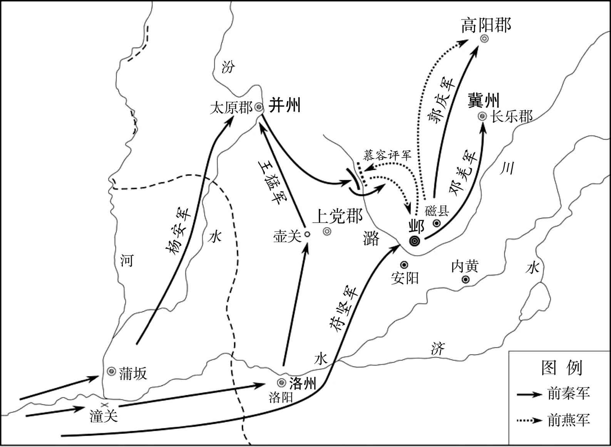 
前秦灭前燕示意图

## 【原文】

**郭庆进至龙城，太傅评奔高句丽，高句丽执评送于秦。宜都王桓杀镇东将军勃海王亮，并其众，奔辽东[1]。辽东太守韩稠先已降秦，桓至不得入，攻之不克。郭庆遣将军朱嶷击之，桓弃众单走，嶷获而杀之。**

## 【注文】

[1]勃海王：前燕爵位名。勃海：郡名。西汉置，治所设在浮阳县（今河北沧州东南）。西汉宣帝刘询后辖境相当于今天津、河北廊坊以南，河北文安、泊头、阜城、山东宁津以东，山东乐陵、河北景县、安平以北地区。东汉移治南皮县（今河北南皮东北），后辖境逐渐变小。　　亮：即慕容亮（？—370年），前燕镇东将军，昌黎棘城（今辽宁义县西北）人，慕容儁之子。公元354年，受封勃海王。公元370年，被宜都王慕容桓杀害。

## 【译文】

郭庆进入龙城，太傅慕容评逃奔高句丽，高句丽逮捕了他并将他送交前秦。宜都王慕容桓杀死了镇东将军勃海王慕容亮，吞并了他的军队，逃奔辽东郡。辽东太守韩稠在这之前已经归降于前秦，慕容桓到达之后未能入城，攻城又没有取胜。郭庆于是派遣将军朱嶷进攻慕容桓，慕容桓丢下军队只身逃走，朱嶷活捉并杀死了他。

## 【原文】

**诸州牧守及六夷渠帅尽降于秦，凡得郡百五十七，户二百四十六万，口九百九十九万[1]。以燕宫人、珍宝分赐将士。下诏大赦曰：“朕以寡薄，猥承休命，不能怀远以德，柔服四维，至使戎车屡驾，有害斯民，虽百姓之过，然亦朕之罪也[2]。其大赦天下，与之更始[3]。”**

## 【注文】

[1]牧守：州郡的长官。州官称牧，郡官称守。　　六夷：即胡、羯、鲜卑、氐、羌、巴蛮六族。另一说法无“巴蛮”而有“乌丸”。　　渠帅：首领。

[2]寡薄：寡德少恩的人。自谦之词。　　猥（wěi）承：承受，接受。　　休命：美善之命。此指天命。　　四维：四角、四隅。东、西、南、北叫四方；四方之隅东南、西南、东北、西北叫四维。

[3]更始：重新开始。

## 【译文】

前燕各州的州牧、郡守以及六夷首领全都投降了前秦，前秦共得一百五十七个郡，二百四十六万户，九百九十九万人口。苻坚命令把前燕的宫女、珍宝分别赐给将士。颁布诏令，实行大赦，说：“朕以微薄的才能，辱承上天的命令，不能用仁慈安抚远方，使天下归顺服从，以至于使战车多次出动，危害普通百姓，虽然这是百姓的过错，然而也是朕的罪恶。现在大赦天下，与百姓一起除旧立新。”

## 【原文】

**初，梁琛之使秦也，以侍辇苟纯为副[1]。琛每应对，不先告纯[2]。纯恨之，归言于燕主曰：“琛在长安与王猛甚亲善，疑有异谋。”琛又数称秦王坚及王猛之美，且言“秦将兴师，宜为之备”。已而秦果伐燕，皆如琛言，乃疑琛知其情。及慕容评败，遂收琛系狱[3]。秦王坚入邺而释之，除中书著作郎，引见，谓之曰：“卿昔言上庸王、吴王皆将相奇材，何为不能谋画，自使亡国[4]？”对曰：“天命废兴，岂二人所能移也。”坚曰：“卿不能见几而作，虚称燕美，忠不自防，反为身祸，可谓智乎[5]？”对曰：“臣闻‘几者动之微，吉凶之先见者也’[6]。如臣愚暗，实所不及。然为臣莫如忠，为子莫如孝，自非有一至之心者，莫能保忠孝之始终。是以古之烈士，临危不改，见死不避，以徇君亲。彼知几者，心达安危，身择去就，不顾家国，臣就使知之，尚不忍为，况非所及邪。”坚闻悦绾之忠，恨不及见，拜其子为郎中[7]。**

## 【注文】

[1]侍辇（niǎn）：官名。慕容氏所置在御车之中侍奉皇帝的官员。　　苟纯（生卒年不详）：前燕官吏，曾担任侍辇一职。

[2]应对：此指应对秦王苻坚。

[3]系狱：下狱，囚禁于牢狱。

[4]除：拜官授职。

[5]见几而作：即见机行事，观风使舵。几：事情发展的苗头和预兆。

[6]几者动之微，吉凶之先见者也：语出《易·系辞》：“几者动之微，吉之先见者也。君子见几而作，不俟终日。”意为征兆是一切行为、事物的精微之处，是预先显示吉凶的。

[7]悦绾（wǎn）（？—368年）：十六国前燕尚书右仆射。公元358年，他由右仆射出为安西将军、并州刺史。前燕末年慕容评执政，政治腐败，官僚贵族大肆占有土地。慕容接受他的建议，下令“一切罢断诸荫户，尽还郡县”，由此引起王公贵族的嫉恨。不久慕容评派人暗杀了他。

## 【译文】

当初，梁琛出使前秦时，侍辇苟纯担任副使。梁琛每次应答，从未事先告诉苟纯。苟纯于是怨恨梁琛，回去后便对前燕主慕容说：“梁琛在长安与王猛非常亲近友善，臣怀疑他另有反叛的阴谋。”梁琛又多次称赞前秦王苻坚和王猛的优点，并且说“秦国将要起兵，应当提前做好防备”。后来前秦果然出兵讨伐前燕，正如梁琛所说的，慕容于是怀疑梁琛知道内情。等到慕容评兵败，慕容就收捕了梁琛，把他拘禁在狱中。前秦王苻坚进入邺城后将他释放，授予中书著作郎的官职，派人召来相见，对他说：“您过去说上庸王慕容评、吴王慕容垂都是不同凡人的将相奇才，为什么不能出谋划策，眼看着自己的国家灭亡呢？”梁琛回答说：“上天所授之命有兴有废，难道是这两个人能够改变的？”苻坚说：“您不能预见到燕国的危亡而采取行动，谎言赞美燕国的美好，虽然忠心而不知道自我防卫，反而遭到祸殃，这可以说是明智之举吗？”梁琛回答说：“臣听说‘几者动之微，吉凶之先见者也’。像臣这样愚钝昏暗，确实不能意识到。然而作为人臣没有什么能与忠心相比，做儿子没有什么能与孝顺相比，如果不是专一的人，没有谁能保持自始至终的忠孝。所以古代的刚烈之士面临危险不改初衷，遇到死亡从不躲避，为君主、父母献出生命。那些善于察知征兆的人心里明达安危，马上选择去留，不顾国家与宗族，臣即使预先观察到征兆，尚且不忍心背弃国家，何况我没能察觉到。”苻坚听说悦绾的忠心后，遗憾没有能够见到他，于是授予他儿子郎中的官职。

## 【原文】

**坚以王猛为使持节、都督关东六州诸军事、车骑大将军、开府仪同三司、冀州牧，镇邺，进爵清河郡侯，悉以慕容评第中之物赐之[1]。赐杨安爵博平县侯[2]。以邓羌为持节、征虏将军、安定太守，赐爵真定郡侯；郭庆为持节、都督幽州诸军事、幽州刺史，镇蓟，赐爵襄城侯[3]。其余将士封赏各有差。坚以京兆韦锺为魏郡太守，彭豹为阳平太守，其余州县牧守令长，皆因旧而授之。以燕常山太守申绍为散骑侍郎，使与散骑侍郎京兆韦儒俱为绣衣使者，循行关东州郡，观省风俗，劝课农桑，振恤穷困，收葬死亡，旌显节行，燕政有不便于民者，皆变除之[4]。**

## 【注文】

[1]都督关东六州诸军事：都督关东地区军事事务的长官。关东六州指司、冀、幽、豫、并、青，即今河北、河南、山东、山西、辽宁的全部或大部，江苏、安徽的部分地区。魏晋南北朝以都督一州或者数州诸军事为职权最高，督一州或者数州诸军事次之，监一州或者数州诸军事又次之。　　清河郡侯：前秦爵位名。

[2]博平县侯：前秦爵位名。博平：县名，西汉置。在山东茌（chí）平西北。

[3]真定郡侯：前秦爵位名。真定：古郡、国名。西汉元鼎三年（前114年）置国，治所设在真定县（今河北正定南），辖境大致相当于今河北石家庄及藁（gǎo）城、正定等地。　　都督幽州诸军事：都督幽州地区军事事务的长官。　　襄城侯：前秦爵位名。

[4]常山：古郡、国名。西汉文帝时置，治所设在元氏县（今河北元氏西北），西汉末辖境相当于今河北唐河以南、京广铁路线以西、内丘以北地区。三国魏将治所迁至真定县（今河北正定南）。　　绣衣使者：官名。即绣衣直指或绣衣御史，简称“绣衣”，为御史大夫属官。朝廷常派他们身穿绣衣前往地方，持节发兵，负责镇压地方上的叛乱和农民起义，并有权诛杀镇压叛乱不力的地方官员。　　循行：巡行。

## 【译文】

苻坚任命王猛为使持节、都督关东六州诸军事、车骑大将军、开府仪同三司、冀州牧，镇守邺城，授爵清河郡侯，把慕容评府中的财产全部赏赐给了他。赐予杨安博平县侯。任命邓羌为持节、征虏将军、安定太守，授予真定郡侯；郭庆为持节、都督幽州诸军事、幽州刺史，镇守蓟城，授予襄城侯。其余将士封官赏赐各有等差。苻坚任命京兆人韦锺为魏郡太守，彭豹为阳平太守，其余州县的州牧、郡守、县令、县长，全都根据过去已有的人选重新加以任命。又任命前燕常山太守申绍为散骑侍郎，让他同散骑侍郎京兆人韦儒一同担任绣衣使者，巡视关东州郡，观察风俗，鼓励耕种，赈济抚恤穷苦百姓，收敛安葬死者，表彰贞节行为，前燕政令有不利于百姓的，全都进行修改、废除。

## 【原文】

**十二月，秦王坚迁慕容及燕后妃、王公、百官并鲜卑四万余户于长安。**

## 【译文】

东晋海西公太和五年（370年）十二月，前秦王苻坚将慕容以及前燕的后妃、王公、文武百官连同四万多户鲜卑族人迁至长安。

## 【原文】

**王猛表留梁琛为主簿，领记室督[1]。他日，猛与僚属宴语及燕朝使者，猛曰：“人心不同。昔梁君至长安专美本朝，乐君但言桓温军盛，郝君微说国弊[2]。”参军冯诞曰：“今三子皆为国臣，敢问取臣之道何先[3]？”猛曰：“郝君知几为先。”诞曰：“然则明公赏丁公而诛季布也[4]。”猛大笑。**

## 【注文】

[1]记室督：职官名，为三公等一品官员僚属，负责章表书记文檄之类事务。

[2]梁君：此指梁琛。　　乐君：此指乐嵩。　　郝君：此指郝晷。　　国弊：燕国的弊政。梁琛、乐嵩、郝晷三人都曾为燕国出使前秦。

[3]国臣：指秦国之臣。　　取臣之道：选择大臣的条件。

[4]赏丁公而诛季布：丁公、季布兄弟二人都是楚汉相争期间的人物，为项羽将领，曾多次打败刘邦，但丁公在一次战役中对刘邦手下留情。刘邦夺得天下后却赦免了季布，而杀了丁公，理由是丁公为臣不忠。冯诞引用这一典故在于说明王猛的选臣之道与刘邦不同。

## 【译文】

王猛上表朝廷请求留梁琛担任主簿，兼记室督。有一天，王猛与僚佐宴饮，席间谈到燕朝的使者，王猛说：“人心不同。之前梁琛出使长安专门赞美自己的朝廷，乐嵩只说桓温军队的强盛，郝晷隐约说出一些本国的弊端。”参军冯诞说：“现在这三个人都是秦国的臣子，敢问根据选任官员的标准，谁应当放在首位呢？”王猛说：“郝君能够察知征兆，应当放在首位。”冯诞说：“您这是奖赏不忠于职守的丁公，而诛杀忠于职守的季布了。”王猛听后大笑。

## 【原文】

**秦王坚自邺如枋头，宴父老，改枋头为永昌，复之终世[1]。甲寅，至长安，封慕容为新兴侯，以燕故臣慕容评为给事中，皇甫真为奉车都尉，李洪为驸马都尉，皆奉朝请；李邽为尚书，封衡为尚书郎，慕容德为张掖太守，燕国平叡为宣威将军，悉罗腾为三署郎；其余封授各有差。衡，裕之子也[2]。**

## 【注文】

[1]复：免除赋税徭役。　　终世：即终秦王之世。意思是直到苻坚死为止。

[2]新兴侯：前秦爵位名。　　奉车都尉：官名，出行时掌管皇帝的车马，与驸马都尉、骑都尉并称“三都尉”。魏晋南北朝时多作为加官。　　驸马都尉：官名，与奉车都尉均为陪奉皇帝乘车的近臣。三国时期魏国的何晏以皇帝女婿的身份授予驸马都尉。魏晋以后，皇帝女婿照例都加驸马都尉称号，简称驸马，非实官。以后驸马即用以称帝婿。　　奉朝请：古代诸侯春季朝见天子叫朝，秋季朝见天子叫请，称为春朝秋请。魏晋南北朝时以奉车、驸马、骑三都尉奉朝请，使得参加朝会。　　封衡（生卒年不详）：字百华，勃海蓨（tiáo）县（今河北景县）人，封裕之子，曾任前秦尚书郎。　　三署郎：职官名。汉代有五官署郎、左署郎、右署郎，其后因称为三署郎。　　裕：即封裕，生卒年不详，勃海蓨（今河北景县）人，封抽之子，前燕记室监参军、太尉领中书监。曾上书提出轻徭薄赋、劝课农桑等进步的经济政策，对当时朝政产生了积极的影响。

## 【译文】

前秦王苻坚从邺城前往枋头，宴请父老，把枋头改名为永昌，终秦王之世免除这里的赋税和徭役。太和五年（370年）十二月甲寅（十四日），苻坚抵达长安，封慕容为新兴侯，任命前燕旧臣慕容评为给事中，皇甫真为奉车都尉，李洪为驸马都尉，都能参与朝会；任命李邽为尚书，封衡为尚书郎，慕容德为张掖太守，燕国人平叡为宣威将军，悉罗腾为三署郎；其余的人都受封不同等级的爵位官职。封衡，是封裕的儿子。

## 【原文】

**简文帝咸安二年春二月，冠军将军慕容垂言于秦王坚曰：“臣叔父评，燕之恶来（革）［辈］也，不宜复污圣朝，愿陛下为燕戮之[1]。坚乃出评为范阳太守，燕之诸王悉补边郡。**

## 【注文】

[1]叔父评：慕容评为慕容廆之子、慕容皝之弟，于慕容垂为叔父。　　恶来：商纣王的宠臣。以陷害贤臣、挑拨离间著称。　　圣朝：指苻秦。

## 【译文】

东晋简文帝咸安二年（372年）春季二月，冠军将军慕容垂对前秦王苻坚说：“臣的叔父慕容评在燕国是像商朝奸臣恶来一类的人物，不应当还让他玷污圣朝，希望陛下替燕国杀了他。”苻坚于是把慕容评调出都城担任范阳太守，前燕的各王全都委派到远郡任职。

## 【原文】

**臣光曰：古之人，灭人之国而人悦，何哉[1]？为人除害故也。彼慕容评者，蔽君专政，忌贤疾功，愚暗贪虐，以丧其国，国亡不死，逃遁见擒[2]。秦王坚不以为诛首，又从而宠秩之，是爱一人而不爱一国之人也，其失人心多矣[3]。是以施恩于人而人莫之恩，尽诚于人而人莫之诚，卒于功名不遂，容身无所，由不得其道故也[4]。**

## 【注文】

[1]古之人：指古代改朝换代的人物。例如商汤、周武王、刘邦等。

[2]见擒：被活捉。

[3]诛首：首先诛杀的人。　　宠秩：宠爱并授以官秩。

[4]莫之恩：即“莫恩之”的倒装，不认为他有恩，不感激他。　　莫之诚：句式同上，即不认为他真诚。　　容身无所：就苻坚下场而言。

## 【译文】

史臣司马光评论说：古时候的人，消灭别人的国家而别国百姓感到欢悦，这是为什么呢？这是因为替百姓铲除祸害的缘故。慕容评蒙蔽君主、专擅朝政，妒忌贤能、憎恨功臣，愚昏无知、贪婪暴虐，从而使自己的国家灭亡，亡国还不以死谢罪，逃亡之后又被敌人擒获。秦王苻坚不但没有诛杀他，反而放纵并且宠待他，授予他官职，这是爱一个人而不爱一国人，失去的人心太多了。所以施舍给别人恩惠而别人没有对他感恩，向别人竭尽诚意而别人没有对他以诚相待，导致不能功成名就，无处容身，这些都是由于统治不合道义的缘故。

* * *

(1) 据陈垣《二十史朔闰表》，东晋穆帝永和十年（354年）四月戊寅朔，无戊申日。

(2) 据陈垣《二十史朔闰表》，东晋穆帝升平四年（360年）正月甲戌朔，戊子为十五日，在癸巳日前，疑戊子为戊戌之误，戊戌为二十五日。

(3) 海西公太和二年（367年）五月壬戌朔，无壬辰。

# 附录：

## 东晋皇帝世系表

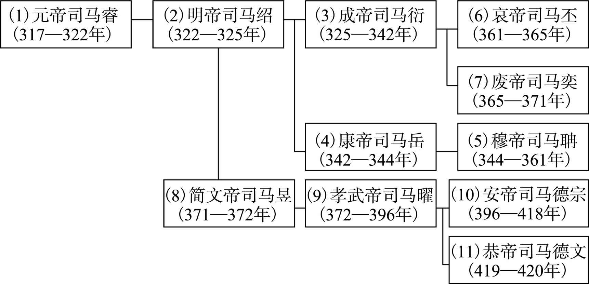 

## 成汉世系表

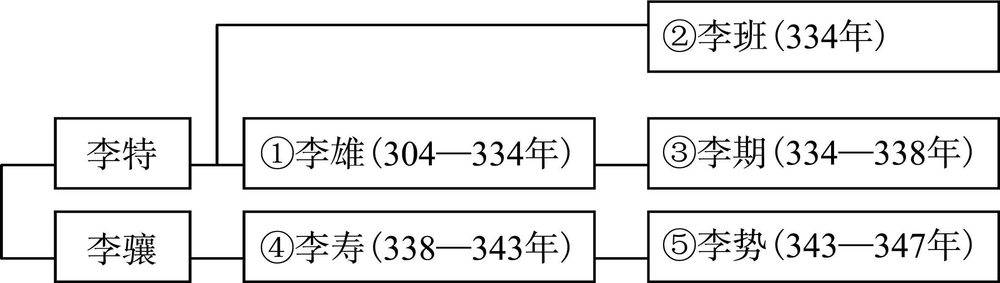 

## （汉）前赵世系表

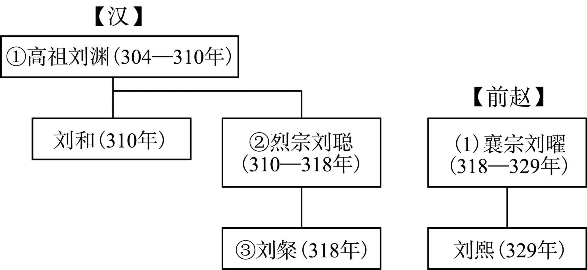 

## 后赵世系表

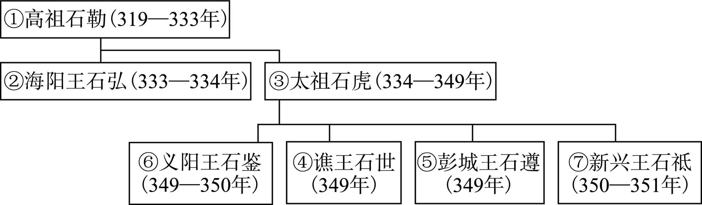 

## 前燕世系表

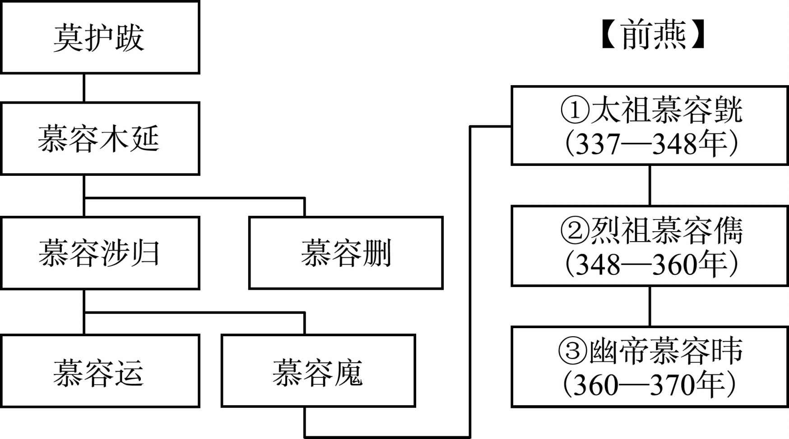 

## 前秦世系表

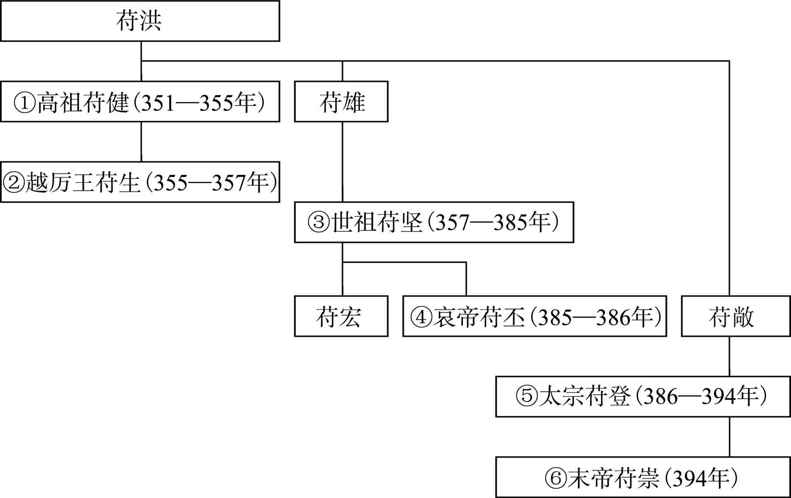 

## 前凉世系表

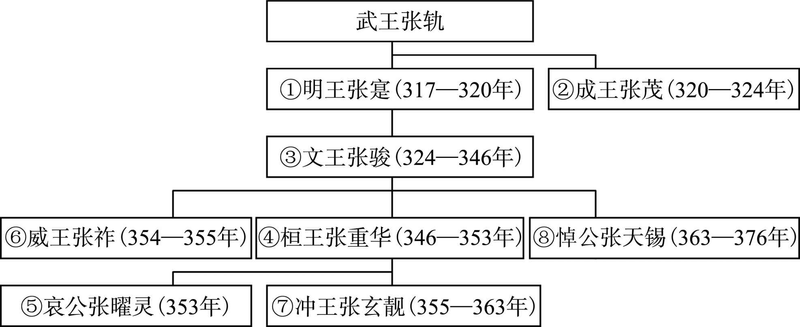

