# 目录

慕容叛秦复燕　肥水之役　姚苌灭秦　慕容灭西燕

丁零叛燕

拓跋兴魏

魏伐后燕　慕容德据广固附

附录： 
前燕世系表

前秦世系表

后赵世系表

仇池世系表

后燕世系表

后秦世系表

翟魏世系表

西燕世系表

（汉）前赵世系表

南燕世系表

北魏、东魏、西魏世系表

返回总目录

# 慕容叛秦复燕**  
****肥水之役(1)　姚苌灭秦　慕容灭西燕**

## 【内容提要】

《慕容叛秦复燕》记载了从慕容垂投奔前秦（369年）到后燕灭亡西燕（394年）共二十六年间的历史。

西晋灭亡后，我国北方和巴蜀先后建立了十几个政权，史称“十六国”。公元4世纪后期，氐（dī）族贵族苻（fú）氏建立的前秦政权暂时统一了北方。前秦苻坚为攻灭东晋，一举统一全国，发动了著名的淝（féi）水之战。公元383年，前秦王苻坚率兵八十七万，大举进攻东晋。东晋宰相谢安力主抵抗，他派遣谢石、谢玄等领兵八万迎击前秦军队。战争开始，东晋派精兵五千，歼灭了前秦一万五千人的先头部队，在淝水东岸，同前秦军队隔岸对峙。苻坚在寿阳（今安徽寿县）城楼上望见晋兵阵营严整，又远眺八公山（今安徽寿县北）上草木，以为都是晋兵，便深感畏惧。谢玄遣使劝前秦将领苻融向后稍移军队，让晋军渡过淝水决战。苻坚企图趁晋军半渡时，用骑兵冲击，以一举消灭晋军，于是接受谢玄的要求，下令军队后退。不料前秦军队一后退，谢玄众将领便率军渡河猛攻，朱序又在前秦军阵后高呼：“秦军已败！”苻融力图阻止退却，结果马被挤倒，自己也被晋军杀死，于是前秦军队全线崩溃。晋军乘势追击，前秦兵溃不成军，苻坚狼狈逃回北方。

淝水之战后，鲜卑慕容氏率先起兵反秦。公元384年，慕容泓（hóng）在华阴（今陕西华阴东）称王，苻坚派苻睿（ruì）、姚苌（cháng）前往讨伐。前秦兵败，苻睿被杀。姚苌派人向苻坚谢罪，苻坚怒诛使者，姚苌畏罪逃回渭北，关陇羌（qiāng）族豪强尹纬等率众投奔姚苌，推举他为盟主。姚苌于是自称“大将军”“大单于”“万年秦王”。当时，关中地区有鲜卑慕容冲与前秦苻坚互相攻战，姚苌进据北地（今陕西铜川耀州东），附近羌胡纷纷前来归附，部众达十多万，势力逐渐变大，之后陆续攻战新平（今陕西彬州）、安定（今甘肃泾川北）等地。前秦苻坚因受鲜卑慕容冲围攻，放弃长安（今陕西西安西北）逃到五将山（今陕西岐山东北），被姚苌杀死，长安被西燕慕容冲占据。公元386年三月，西燕鲜卑数十万人放弃长安东归，姚苌顺利取得长安。四月，姚苌称帝，改元建初，定国号为大秦，史称后秦。

淝水之战中，前秦军队大都溃败，只有慕容垂所率三万部众得以保全。苻坚率残部投奔慕容垂，众部将都劝慕容垂杀掉苻坚自立。但慕容垂深念苻坚旧恩，且虑及苻氏在关西仍有实力和威望，自立时机尚不成熟，于是力排众议，率部依旧归于苻坚。慕容垂随苻坚来到洛阳（今河南洛阳东北）后，慕容农再次劝慕容垂脱离前秦，这次慕容垂同意了。前秦军行至渑（miǎn）池（今河南渑池西），苻坚派慕容垂镇守北边州郡，权翼提醒苻坚提防慕容垂，但苻坚不听。权翼秘密派人前去行刺慕容垂，慕容垂十分警觉，让部将程同冒充自己带僮仆赴河桥，他则在凉马台（今河南偃师北）乘草筏过河，使权翼的计划落空。慕容垂回到邺（yè）城（今河北临漳西南）后，丁零翟（dí）斌起兵反秦，苻坚命慕容垂率军讨伐，但苻丕仅派给慕容垂二千老弱病残士兵及残破盔甲兵器，又派苻飞龙率一千氐兵监视其行动。于是慕容垂借口兵力不足，在河内（今河南沁阳）招募兵马，又杀死苻飞龙，将军队扩充到三万人，翟斌及北方各少数民族首领纷纷率众依附慕容垂。公元384年正月，慕容垂抵达荥（xíng）阳（今河南荥阳），称大将军、大都督、燕王。公元386年正月，慕容垂自称皇帝，定都中山（今河北定州），改元建兴，史称后燕。

听到慕容垂起兵关东的消息后，慕容泓和慕容冲也起兵响应。但东归的西燕鲜卑在途中频频发生内乱，五易其主，最终立慕容永为主。公元386年十月，西燕、前秦两军会战于襄陵（今山西临汾东南），前秦军大败，慕容永乘胜占据长子（今山西长子西南）即皇帝位，西燕政局渐趋稳定。在此期间，西燕一直与后燕争夺地盘。公元393年十月，后燕主慕容垂动议讨伐西燕慕容永。十一月，慕容垂派五万军队由井陉（xíng）关（今河北井陉西北）进攻晋阳（今山西太原西南）。次年二月，慕容垂兵分三路，一路出滏（fǔ）口（今河北磁县西北），一路出壶关（今山西长治一带），慕容垂自率一路出沙亭（今河北临漳西南），合击西燕。慕容永则分兵拒守，且将军粮屯于台壁（今山西襄垣），派万余军队戍守。后燕军队一个多月按兵不动，慕容永怀疑后燕主力将从南路进军，于是将西燕军主力都调往轵（zhǐ）关（今河南济源西北），仅留台壁一军未动。慕容垂趁虚率大军直捣台壁。慕容永急忙派兵回援，被后燕军击退。慕容永又亲率五万精兵赶往台壁，却因中埋伏而大败。慕容永逃回长子。八月，后燕军攻克长子，杀死慕容永，西燕灭亡。

## 【原文】

**晋海西公太和四年[1]。燕车骑大将军吴王垂奔秦[2]。初，秦王坚闻太宰恪卒，阴有图燕之志，惮垂威名，不敢发[3]。及闻垂至，大喜，郊迎，执手曰：“天生贤杰，必相与共成大功，此自然之数也。要当与卿共定天下，告成岱宗，然后还卿本邦，世封幽州，使卿去国不失为子之孝，归朕不失事君之忠，不亦美乎[4]！”垂谢曰：“羇旅之臣，免罪为幸，本邦之荣，非所敢望[5]。”坚复爱世子令及慕容楷之才，皆厚礼之，赏赐巨万，每进见，属目观之[6]。关中士民素闻垂父子名，皆向慕之[7]。王猛言于坚曰：“慕容垂父子譬如龙虎，非可驯之物，若借以风云，将不可复制，不如早除之[8]。”坚曰：“吾方收揽英雄以清四海，奈何杀之？且其始来，吾已推诚纳之矣，匹夫犹不弃言，况万乘乎[9]！”乃以垂为冠军将军，封宾徒侯，楷为积弩将军[10]。**

## 【注文】

[1]晋：朝代名（266—420年），共历一百五十五年，分为西晋与东晋。公元266年初，司马炎取代魏帝自立为皇帝，国号“晋”，定都洛阳（今河南洛阳东北），史称西晋。公元280年，西晋灭吴，三国鼎立的局面完全结束，晋武帝司马炎终于统一全国，结束了近百年的分裂局面。公元316年，西晋怀、愍（mǐn）二帝被匈奴汉国君主刘聪所俘。次年（láng）琅邪（yá）王司马睿（ruì）在建业（今江苏南京）重建晋朝，史称东晋。　　海西公：即东晋废帝司马奕（yì）（342—386年），字延龄，晋哀帝司马丕之弟。初封东海王。晋哀帝司马丕死后，由皇太后扶立即位。在位仅六年（366—371年），便被权臣桓温借口其患病，而废为东海王，后又降封为海西县公。　　太和：东晋废帝司马奕的年号，共计六年，即公元366年至371年。

[2]燕：此指前燕（337—370年），十六国之一。鲜卑族首领慕容皝（huàng）所建，建国初定都龙城（今辽宁朝阳），后迁都至邺城（今河北临漳西南）。盛时疆域包括今河北、山东和山西、河南、安徽、江苏、辽宁的一部分，西接前秦，与东晋以淮水为界。公元370年，被前秦所灭。历三主，共三十四年。　　车骑大将军：将军名号，将军中地位较高者。魏晋时以车骑将军中资深者为车骑大将军，地位相当于上卿。职掌京师兵卫，掌管皇宫戍卫。　　吴王：前燕爵位名。　　垂：即慕容垂（326—396年），又名慕容霸，字道明，小字道业。昌黎棘城（今辽宁义县西北）人，鲜卑族，慕容皝第五子。前燕时，历任要职，曾在枋（fāng）头（今河南浚县西南淇门渡）打败东晋桓温北伐军而威名大震，但却遭到太后与太傅慕容评的排挤谋害，于是投奔前秦苻坚，帮助苻坚攻灭前燕。前秦淝水之战失败后，便前往河内招兵买马，与丁零人翟斌联合，击杀前秦大将苻飞等。后南渡黄河至荥阳，自称大将军、大都督、燕王。公元384年，攻克邺城而称帝，史称后燕。公元384年至396年在位，年号燕元、建兴。他在位期间，先后灭掉翟魏和西燕，国势大盛。又攻打东晋青、兖（yǎn）等州，大获全胜。公元395年，发兵进攻拓跋魏，大败而归。次年，亲自领兵击魏，克平城（今山西大同）。还至上谷沮（jù）阳（今河北怀来东南），因劳累病死，庙号世祖，谥（shì）成武。　　秦：即前秦（351—394年），十六国之一，氐族苻健所建，都长安（今陕西西安西北）。盛时疆域东至大海，西抵葱岭，南控江淮，北极大漠，东南以淮、汉与东晋为界。历六主，共四十四年。

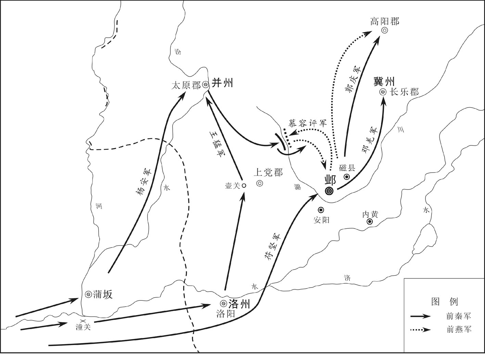 
前秦灭前燕示意图

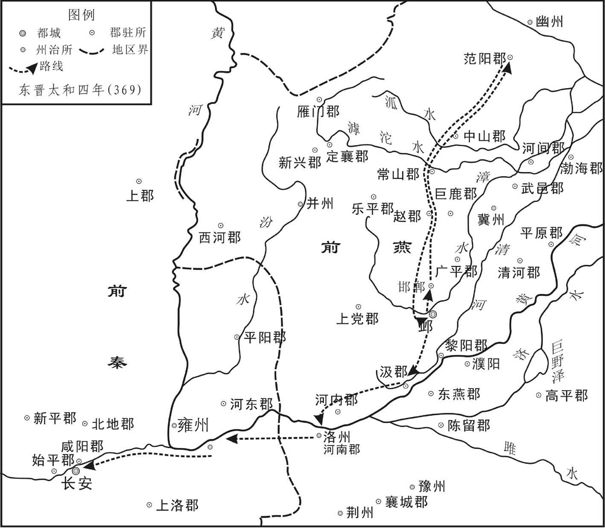 
慕容垂投奔前秦路线图

[3]坚：即苻坚（338—385年），字永固，十六国前秦皇帝，公元357年至385年在位。他在位前期励精图治，使前秦基本统一北方；但后来在伐晋的“淝水之战”中大败，自此一蹶不振，又遭到之前投降的鲜卑、羌人的背叛而出逃，最后被羌人姚苌所杀。　　太宰：官名。相传殷商时即已设置，负责管理天下政务，辅佐君王；秦朝太宰负责皇帝饮食以及祭祀用食物供奉；汉代太宰是辅佐太常（九卿之一，主管宗庙礼仪）的属吏。西晋初年，设立太师、太傅、太保“三公”之职，为避司马师名讳，以太宰之名代太师，才恢复其重要地位。东晋、南朝时多不实授，而用作重臣死后的赠官。　　恪（kè）：即慕容恪（？—367年），十六国时前燕名将，字玄恭，鲜卑族，昌黎棘城（今辽宁义县西北）人，燕王慕容皝第四子。与辅义将军阳骛（wù）、辅弼将军慕容评合称“三辅”，又与阳骛、慕容评同为托孤重臣。

[4]郊迎：到郊外迎接，以示隆重。　　告成：将成事上报，此处指把灭燕的业绩禀报上天。　　岱（dài）宗：即泰山。岱，泰山的别名，以泰山为四岳所宗，故称岱宗。古人以泰山最高，距天最近，故登泰山告成功于上天。　　幽州：古九州（冀、兖、青、徐、扬、荆、豫、梁、雍）及汉十三刺史部之一。据《周礼》记载：幽州范围大致包括今河北北部及辽宁一带。周武王平殷，封召公于幽州故地，号燕。战国时，燕与其他六国并为七雄。秦始皇灭燕，在燕地置渔阳、上谷、右北平、辽西、辽东等郡。东汉幽州治所设在蓟（jì）县（故址在今北京城区西南部的广安门附近），辖境相当于今北京、河北北部、辽宁南部及朝鲜西北部。魏晋以后，辖境日渐缩小，至北魏时仅有燕、范阳、渔阳三郡。　　朕（zhèn）：皇帝的自称。秦朝统一六国前，意为“我的”或“我”，自秦始皇起专用做皇帝自称。

[5]羇（jī）旅：　长久寄居他乡。

[6]世子：亲王、诸侯法定继承人的正式封号，多由嫡（dí）、长充任。周代时，天子、诸侯的嫡子称“世子”。汉初，亲王法定继承人的正式封号为王太子，后来为与皇太子相区别，改为世子，后世沿袭不改。另外，对于贵族、高官的儿子们习惯上也称世子，以示尊重，但不是正式的称呼。　　令：即慕容令（？—370年），慕容垂嫡长子。公元369年，慕容垂抵挡东晋桓温北伐有功，但受到皇兄慕容儁（jùn）和可足浑太后、太傅慕容评的忌恨，他屡次为父亲出谋划策，后与父亲一起投奔前秦，受到苻坚宠信。次年，他跟随前秦丞相王猛讨伐前燕，在王猛的策动下，他返回前燕，却被慕容暐（wěi）怀疑为奸细，将他放逐到沙城（今河南沁阳东北），于是他再反前燕，因慕容麟告密，兵败被杀。慕容垂建立后燕后，他被追封为献庄太子。慕容盛即位后，被追尊为献庄皇帝。　　慕容楷（？—395年）：昌黎棘城（今辽宁义县西北）人，前燕太原王慕容恪之子，袭封太原王。在前秦国势衰退之际，曾跟随燕王慕容垂从事复国大业，后成为后燕重臣之一。　　属（zhǔ）目：同“瞩目”，注视。

[7]关中：指陕西秦岭北麓渭河平原区，因其东有潼关，西有大散关，南有武关，北有萧关，居四关之内，故称关中。

[8]王猛（325—375年）：字景略，东晋北海郡剧县（今山东潍坊寿光东南）人，后移家魏郡（今河北临漳西南）。前秦丞相、大将军，著名政治家、军事家。曾辅佐苻坚扫平群雄，统一北方，被称作“功盖诸葛第一人”。　　风云：比喻有利的时机。

[9]万乘（shèng）：指帝王、天子。

[10]冠军将军：军事职官名。东汉献帝刘协建安年间（196—220年）置，负责统兵。西晋时定为三品，有营兵。　　宾徒侯：前秦爵位名。宾徒：县名。东汉改宾从县置，汉属辽西郡，晋属昌黎郡，县治在今辽宁锦州北。　　积弩（nǔ）将军：三国、晋朝将军名号，领禁卫营兵。

## 【译文】

东晋海西公太和四年（369年）。前燕车骑大将军、吴王慕容垂逃奔前秦。当初，前秦王苻坚得知前燕太宰慕容恪的死讯后，暗中怀有侵略前燕的打算，但慑于慕容垂的威名，才不敢付诸行动。等到听说慕容垂前来投奔，苻坚非常高兴，亲自去城郊迎接，紧紧握着慕容垂的手说：“天生贤士豪杰，必定共同建成大功，这是自然规律。我要与你共同平定天下，功成后登上泰山，向上天告捷，然后让你荣归本国，世代封在幽州，使你离开故国，却不失为孝子，归附于我，却也不失为忠臣，不也是一件美事吗？”慕容垂拜谢道：“流亡在外的人，得以免罪已是万幸，至于衣锦还乡，不是我敢奢望的。”苻坚又喜爱世子慕容令和慕容楷的才气，对他们都厚礼相待，赏赐金钱达巨万之多，每次进见，都注目端详他们。关中士民向来就听说过慕容垂父子的大名，全都向往仰慕他们。王猛向苻坚进言说：“慕容垂父子犹如龙虎，不是可以驯服的动物，如果他们得到了有利的时机，将不能再控制得住，不如趁早除掉他们。”苻坚说：“我正在收揽英雄，以廓清天下，怎么能杀他们呢？况且他们初来之时，我已经开诚接纳他们了，匹夫尚且不食言，何况大国君主呢！”于是任命慕容垂为冠军将军，封为宾徒侯，任命慕容楷为积弩将军。

## 【原文】

**五年。秦王猛之克壶关也，黄门侍郎封孚问司徒长史申胤曰：“事将何如[1]？”胤叹曰：“邺必亡矣，吾属今兹将为秦虏[2]。然越得岁而吴伐之，卒受其祸[3]。今福德在燕，秦虽得志，而燕之复建，不过一纪耳[4]。”**

## 【注文】

[1]壶关：今山西长治一带。　　黄门侍郎：官名，又名黄门郎，因宫禁之门称为黄闼（tà）而得名。这是给事于宫门之内的郎官，负责侍从皇帝，传达诏命。魏、晋、南朝官名前均有“给事”二字。因掌管机密文字，职位日渐重要。　　封孚（337—407年）：十六国时期渤海蓨（tiáo）县（今河北景县）人，字处道。他天资聪颖，有士君子之称。后燕慕容宝时，任吏部尚书。慕容宝被杀后，他南奔投晋，被任命为渤海太守。公元399年，又归降于慕容德，被任命为尚书左仆射，不久迁尚书令，外总机事，内参密谋，深得慕容德信赖。慕容超继立后，被拜为太尉。当时政治悖乱，他多次上疏匡救，但都不被慕容超采纳，于是他当面斥责慕容超为“桀纣之主”，最终被免官，不久便于家中去世。　　司徒：官名。西周始置，与司马、司空、司士、司寇并称“五官”，负责掌管国家土地与百姓。汉哀帝刘欣时罢丞相之职，置大司徒，与大司马、大司空，并称三公。东汉光武帝建武二十七年（51年）复称司徒，为三公之一，与太尉、司空同为宰相。魏晋南北朝时多为大臣加官，以示尊崇，但无实权，其府属仅处理户籍、督课官吏等日常事务。　　长（zhǎng）史：古代武官名，战国末秦国始置。西汉时丞相、太尉、御史大夫皆设长史，相当于相府中的事务主管。后历代均设此官，成为幕僚之长，总管府内事务等。此外，西汉边疆民族各郡太守下亦设长史，辅太守掌一郡兵马。至魏晋，凡刺史带将军称号者，其幕府亦设长史。　　申胤（yìn）：生卒年不详，曾任前燕给事黄门侍郎、司徒左长史。

[2]邺：即邺城，今河北临漳西南邺镇。　　吾属：我们这些人。　　今兹（zī）：现在。

[3]越得岁：越：此指春秋时越国；岁：岁星，即木星；古人把上天划分成若干个区域（即星野）。每个星野在下界都有它们的实际对应区域。一旦吉星进入上天中的某个星野，它在地上所代表的区域便会得到福分。春秋时代的吴、越两国同在一个星野，当岁星光临他们的星野时，吴国却逆天讨伐越国，最终遭致亡国祸殃。此处指前燕正值岁星降临之时，前秦前来讨伐，虽前燕暂受屈辱，但终会像越国一样，总有复兴之日。　　吴：此指春秋时吴国，姬（jī）姓，其国境位于今苏皖两省长江以南部分，后扩张到苏皖两省全境及赣东北部分地区。公元前473年，被越国所灭。　　卒受其祸：据《左传》昭公三十二年及杜预《注》，吴伐越时岁星在星纪（星纪为十二次之一。古人把黄道附近一周天按由西向东的方向分为星纪、玄枵（xiāo）等十二个等分，叫十二次。每次都有二十八宿中的某些星宿作为标志，星纪有斗、牛两宿，是越国的分星），因此吴用兵伐越，虽然开始取得胜利，但最终反被越国所灭。

[4]一纪：十二年为一纪。

## 【译文】

东晋海西公太和五年（370年）。前秦王猛率军攻克壶关，前燕黄门侍郎封孚询问司徒长史申胤说：“局势发展将会如何？”申胤叹息说：“邺城必然会败亡，我们眼下就要成为前秦的俘虏了。然而岁星在越国时，吴国逆天讨伐，终于遭受大祸。现在福星在燕国，前秦虽然能够得志，但燕国的复兴，不会超过十二年。”

## 【原文】

**初，秦王坚入邺宫，慕容垂见燕公卿、大夫及故时僚吏，有愠色[1]。高弼密言于垂曰：“大王凭祖宗积累之资，负英杰高世之略，遭值迍阨，栖集外邦[2]。今虽家国倾覆，安知其不为兴运之始邪？愚谓国之旧人，宜恢江海之量，有以慰结其心，以立覆篑之基，成九仞之功，奈何以一怒捐之，愚窃为大王不取也[3]。”垂悦，从之。**

## 【注文】

[1]公卿：三公九卿的合称，常用以指朝廷高官。　　大（dà）夫：此处指一般官员。　　愠（yùn）色：怨怒的神色。

[2]高弼（bì）（生卒年不详）：曾任前燕典书令、郎中令。　　迍（zhūn）阨（è）：又作“边厄”。灾难；挫折。

[3]覆篑（kuì）：倒一筐土。谓积小成大，积少成多。　　九仞（rèn）：六十三尺，一说七十二尺，常用以形容极高或极深。

## 【译文】

当初，前秦王苻坚进入邺城宫殿，慕容垂见到前燕的公卿、大夫和过去的幕僚官吏，面有怒色。高弼秘密地对慕容垂说：“大王凭借祖宗积累下来的资本，胸怀英雄盖世的韬略，遭遇坎坷，暂时寄身外国。现在虽然国破家亡，但怎么知道这不是复兴机遇的开始呢？鄙人以为，对待故国的旧人，应当具有江海一样宽广的度量，用来宽慰结纳他们的心，以便在倾覆的故土上一点点积累根基，最终建成九仞之高的大功。怎么能因一时的怒气而把他们全部抛弃？我私下里认为，大王这样做是很不可取的。”慕容垂很高兴，听从了他的建议。

## 【原文】

**燕故太史黄泓叹曰：“燕必中兴，其在吴王乎？恨吾老，不及见耳[1]。”汲郡赵秋曰：“天道在燕而秦灭之，不及十五年，秦必复为燕有[2]。”**

## 【注文】

[1]太史：官名，太史令的省称。秦置，为奉常属官，掌管天文、历法及修撰（zhuàn）史书。魏晋以后，太史令修史的职务划归著作郎，仅掌管推算历法。　　黄泓：字始长，生卒年不详，十六国时著名星相学家。他自幼跟从父亲黄沈学习天文知识，精妙逾深，且博览经史。永嘉之乱时，他迁至幽州（治今北京西南），后率宗族投奔慕容廆（wěi），深受慕容廆重视，历任参军、左常侍、从事中郎、谋将军等。

[2]汲（jí）郡：晋武帝泰始二年（266年）置，治所设在汲县（今河南卫辉西南），辖汲县、朝歌（今河南淇县）、共县（今河南辉县）、获嘉（今河南新乡）。　　赵秋：汲郡（治今河南卫辉西南）人，生卒年不详，曾任后燕冠军行参军。

## 【译文】

前燕以前的太史黄泓感叹说：“燕国必定中兴，这恐怕是应在吴王身上吧？只可惜我已经老了，见不到那一天了。”汲郡人赵秋说：“天命在燕而前秦灭亡它，不到十五年，前秦必然再被燕国占有。”

## 【原文】

**慕容桓之子凤，年十一，阴有复仇之志，鲜卑、丁零有气干者皆倾身与之交结[1]。权翼见而谓之曰：“儿方以才望自显，勿效尔父不识天命[2]。”凤厉色曰：“先王欲建忠而不遂，此乃人臣之节。君侯之言，岂奖劝将来之义乎[3]？”翼改容谢之，言于秦王坚曰：“慕容凤忼慨有才器，但狼子野心，恐终不为人用耳[4]。”**

## 【注文】

[1]慕容桓（？—373年）：鲜卑族，昌黎棘城（今辽宁义县西北）人，十六国时前燕慕容皝之子、慕容儁之弟，宜都王。公元370年，奉慕容暐命，慕容评率大军正面抵御前秦，他则率军驻扎在沙亭（今河北临漳西南）作为后援。慕容评被前秦王猛打败后，他撤退至龙城（今辽宁朝阳），但辽东太守韩稠已经投降前秦，他不能进入辽东城。公元373年，被朱嶷（yí）杀死。　　凤：即慕容凤，生卒年不详，字道翔，鲜卑族，昌黎棘城（今辽宁义县西北）人，宜都王慕容桓之子。前燕灭亡，其父被杀，当时他年仅十一岁，便立志为父报仇。他极力与鲜卑、丁零有才能者交结，慕容垂起兵反前秦时，他劝丁零翟斌拥戴慕容垂为主，并率众归附慕容垂，被任命为建策将军。因屡建战功，深受慕容垂喜爱。慕容宝即位后，被任命为冀州刺史，镇信都（今河北冀州），任职期间惠威显著，深受百姓拥戴。　　鲜卑：中国古代东胡系民族。居于鲜卑山（今大兴安岭地区），因此而得名。先秦时已活动于大兴安岭中部与北部，其语言、习俗与乌桓较为接近。秦汉之际，匈奴灭东胡，乌桓、鲜卑于是对匈奴称臣。汉武帝刘彻大败匈奴后，徙乌桓于上谷、渔阳、右北平、辽西、辽东五郡塞外，鲜卑人随之南迁至乌桓故地饶乐水（今内蒙古西拉木伦河）流域，拓跋部则南迁至大泽（呼伦贝尔草原）。魏晋南北朝时期，内迁鲜卑慕容氏曾建立前燕、后燕、西燕、南燕；乞伏氏曾建立西秦；秃发氏曾建立南凉；拓跋氏先建代国，后改魏，最终统一北部地区。　　丁零：又名“丁灵”“钉灵”“丁令”，古族名。春秋、战国时分布在东起贝加尔湖北，西到阿尔泰山以北地区。公元前后，东部游牧于贝加尔湖之南，西部游牧于额尔齐斯河和巴尔喀什湖之间。曾数次被匈奴征服，两汉时联合乌桓、鲜卑等夹击匈奴，后又联合鲜卑、西域诸部，共迫北匈奴西迁。东汉时，部分丁零人南迁。至南北朝，有一部分丁零人南迁到山西、甘肃、河北、河南等地定居，逐渐与其他民族融合。留在漠北的大部分丁零人后被称为“敕勒”“铁勒”等。

[2]权翼：生卒年不详，十六国时略阳（治今甘肃秦安东南）豪门，曾任姚襄参军。姚襄兵败被杀后，他投奔前秦苻坚，历任给事黄门侍郎、司隶校尉、侍中、尚书左仆射等。淝水之战前，力谏苻坚不要伐晋；淝水之战失败后，投靠后秦姚苌，任太常。

[3]君侯：汉以后，用作对达官贵人的敬称。

[4]忼（kāng）慨（kǎi）：愤激；激昂。

## 【译文】

慕容桓的儿子慕容凤，年仅十一岁，暗藏复仇之志，鲜卑族、丁零族中有气节、有才干的人，都乐意与他倾心交结。权翼见到慕容凤后，对他说：“你正以才能和名望崭露头角，不要仿效你父亲不识天命。”慕容凤正色说道：“我父亲打算为君主尽忠而没有成功，这是臣子应有的节操。您所说的话，难道有勉励后辈的意义吗？”权翼改变态度，向慕容凤道歉，但却对前秦王苻坚说：“慕容凤心胸开阔、有才干，但是狼子野心，恐怕最终也不会被他人所用。”

## 【原文】

**简文帝咸安元年春正月，秦王坚徙关东豪杰及杂夷十五万户于关中，处乌桓于冯翊、北地，丁零翟斌于新安、渑池[1]。**

## 【注文】

[1]简文帝：即司马昱（yù）（320—372年），字道万，河内温县（今河南温县西南）人，晋元帝司马睿幼子。公元371年，他被桓温拥立为帝，改年号为咸安。次年七月病逝，在位仅约八个月，其间朝政完全被桓温掌控。　　咸安：东晋简文帝司马昱的年号，共计二年，即公元371年至372年。咸安二年（372年）七月晋孝武帝司马曜（yào）即位沿用，次年改年号为宁康元年。　　元年：指帝王改换年号的第一年。　　关东：地区名。古代称函谷关或潼关以东地区为关东。　　夷（yí）：中囯古代对东部各民族的统称。　　乌桓：亦作“乌丸”“古丸”“乌延”，为古代东胡系民族之一。语言与鲜卑相同，属东胡语言的分支。秦汉之际，乌桓活动于饶乐水（今内蒙古西拉木伦河）一带。东邻高句（gōu）丽（lí），西连匈奴，鲜卑居北，南与幽州刺史所部相接。魏晋以后，乌桓与其他诸族错居杂处，民族成分发生变化，形成所谓“杂胡”。　　冯（píng）翊（yì）：郡名。冯，意为辅；翊，意为佐；冯翊即辅佐之意。冯翊由秦内史发展而来。汉景帝刘启二年（前155年）分内史为左、右内史。汉武帝刘彻太初元年（前104年）改左内史为左冯翊。三国魏改左冯翊，置冯翊郡，长官称冯翊太守，治所设在临晋（今陕西大荔），辖境相当于今陕西韩城、黄龙以南，白水、蒲城以东和渭河以北地区。两晋时沿置。　　北地：郡名。治所在今陕西铜川耀州东。　　翟斌（？—384年）：十六国时丁零部首领之一。公元330年，他被后赵封为“句（gōu）町（dīng）王”。公元371年，前秦苻坚初定华北，他被安置于新安（今河南新安）、渑池（今河南渑池西）一带。公元383年，前秦于淝水之战失败后，他背叛前秦，拥护慕容垂为反秦盟主，被任命为建义大将军，封河南王。次年，慕容垂建后燕，此时他恃功而骄，贪得无厌；又因丁零部随后燕军攻打邺城（今河北临漳西南），久攻不下，开始有贰心。他求尚书令一职，未获慕容垂应允，于是与前秦军密谋叛乱，因事泄被杀。　　新安：今河南新安。　　渑（miǎn）池：今河南渑池西。渑池之名来源于古水池名，本名黾（miǎn）池，以池内注水生黾（一种水虫）而得名。三国魏始改县名为渑池，隶属于恒农郡。晋代隶属于弘农郡。

## 【译文】

东晋简文帝咸安元年（371年）春季正月，前秦王苻坚把关东豪杰以及夷族各部十五万户迁徙到关中，把乌桓族安置在冯翊、北地，把丁零族翟斌安置在新安、渑池。

## 【原文】

**孝武帝宁康元年[1]。有彗星出于尾、箕，长十余丈，经太微，扫东井，自四月始见，及秋冬不灭[2]。秦太史令张孟言于秦王坚曰：“尾、箕燕分，东井秦分也。今彗起尾、箕而扫东井，十年之后，燕当灭秦，二十年之后，代当灭燕[3]。慕容暐父子兄弟，我之仇敌，而布列朝廷，贵盛莫二，臣窃忧之，宜剪其魁杰者以消天变[4]。”坚不听。**

## 【注文】

[1]孝武帝：即司马曜（361—396年），字昌明，河内温县（今河南温县西南）人，晋简文帝司马昱第三子，东晋第九任皇帝，公元372年至396年在位。四岁时被封为会稽王。公元372年被立为太子，同年晋简文帝司马昱去世，年仅十一岁的他继位为帝。即位初由太后摄政，亲政后改年号为太元。他在位时曾改革赋税，被称为东晋末年的复兴。但谢安死后，东晋政局再度陷入混乱。　　宁康：或作康宁，东晋孝武帝司马曜的第一个年号，共计三年，即公元373年至375年。

[2]彗星：太阳系中的一类小天体，运动时后面好像有个形状像扫把的尾巴，因此又俗称“扫把星”。按迷信说法，如果彗星出现，预示将有战事或灾害发生。　　尾：星宿名，有星九颗。　　箕（jī）：星宿名，有星四颗。尾、箕二宿为燕国及幽州的分星。　　太微：古代星官名，三垣（yuán）（上垣即太微垣、中垣即紫微垣、下垣即天市垣）之一。位于北斗之南，被古人视为天子之庭。　　东井：星宿名，即井宿，二十八宿之一，在参宿东，故称东井。井宿是南方“朱雀”七宿之首，有八星，此星明亮，则代表国富民安、天下太平，如色变则动荡不安。为秦国及雍州的分星。

[3]太史令：参见前文“太史”条注。　　张孟：生卒年不详，曾任前秦太史令。　　燕：此应指后来兴起的后燕。　　代：十六国时鲜卑拓跋氏在初期建立的政权，北魏前身。自公元315年建立，至公元376年被前秦所灭，代国共历拓跋猗卢、拓跋普根、拓跋郁律、拓跋贺傉（nù）、拓跋纥那、拓跋翳（yì）槐、拓跋什翼犍七主。其中拓跋猗卢、拓跋郁律、拓跋什翼犍死于内讧（hòng），拓跋普根、拓跋贺傉、拓跋翳槐病死，拓跋纥那战败逃亡不知所终。公元386年四月，拓跋珪复兴代国，称魏王，改国号为“魏”，史称北魏，又称后魏、拓跋魏、元魏。

[4]慕容暐（350—384年）：字景茂，昌黎棘城（今辽宁义县西北）人，慕容儁第三子，母可足浑氏。初封中山王，后立为太子。公元360年，年仅十一岁的他继位，皇太后可足浑氏临朝称制。他即位后，军政大事全由太宰慕容恪代管。公元370年，前燕被前秦所灭，苻坚封他为尚书、新兴侯。淝水之战后，他随苻坚回长安。公元384年，他准备联合长安城内千余名鲜卑人发动政变，不料走露风声，被苻坚处死，谥“幽皇帝”。　　魁（kuí）杰：杰出。

## 【译文】

东晋孝武帝宁康元年（373年）。彗星在尾星、箕星附近出现，尾长达十多丈，经由太微星，扫过东井星，从四月份开始出现，到秋冬时节仍没消亡。前秦太史令张孟对前秦王苻坚说：“尾星、箕星代表燕国地区的分野，东井星代表秦国地区的分野。如今彗星起自尾星、箕星而尾巴横扫东井星，十年之后，燕国会灭亡秦国，二十年之后，代国会灭亡燕国。慕容暐父子兄弟，是我们的仇敌，然而却布满了朝廷，显贵无与伦比，我私下里很是担忧，应当剪灭他们的魁首，以消除天变所预示的灾难后果。”苻坚不听。

## 【原文】

**阳平公融上疏曰：“东胡跨据六州，南面称帝，陛下劳师累年，然后得之[1]。本非慕义而来，今陛下亲而幸之，使其父子兄弟森然满朝，执权履职，势倾勋旧。臣愚以为狼虎之心，终不可养，星变如此，愿少留意[2]。”坚报曰：“朕方混六合为一家，视夷狄为赤子，汝宜息虑，勿怀耿介。夫惟修德可以禳灾，苟能内求诸己，何惧外患乎[3]？”**

## 【注文】

[1]阳平公：前秦爵位名。阳平：郡名。治所在今河北邯郸大名东北，辖境相当于今河北馆陶、大名部分地区，山东冠县、莘（shēn）县及河南清丰、濮（pú）阳、范县、台前等地。　　融：即苻融（？—383年），字博休，临渭（今甘肃秦安东南）人，苻坚弟弟。累官司隶校尉、冀州刺史等，封阳平公。他力阻苻坚发动对东晋的战争，但苻坚没接受。后在淝水之战中战死，赠大司马，谥哀公。　　疏：朝臣向皇帝陈述意见的奏章。古代臣子向皇帝上奏政务有“疏”和“奏”两种方式，这两种方式略有区别。一般宋以前常称“疏”。疏是臣下向皇帝陈述意见的奏章。而奏是臣下向皇帝进言或上书，是一种公文程式，即奏本。根据官员言事内容及章疏形式不同，又有奏片、奏书、奏折等名称。　　东胡：此处特指鲜卑族慕容氏。　　六州：即幽州、并州、冀州、青州、兖州、豫州。　　陛下：臣下对君主的尊称，秦朝以后只用来称皇帝，成为皇帝的专有称号。“陛”本指宫殿台阶。据东汉蔡邕（yōng）《独断》记载，大臣与皇帝对话，因距离较远，先呼立陛下，大臣之言，由彼上达。陛下之称，即由此而来。

[2]少（shāo）：稍稍，稍微。

[3]六合：天、地、东、南、西、北，即指全国。　　夷（yí）狄（dí）：古称东方部族为夷、北方部族为狄。夷狄常用以泛称除华夏族以外的各族。　　赤子：婴儿。　　耿（gěng）介：原意为正直，不同于流俗；光明正大。此处指耿耿于怀。　　禳（ráng）灾：除灾。古代消除灾祸的祝祷活动称禳。　　内求诸己：即自己要能容人，以诚信对待别人。

## 【译文】

阳平公苻融上疏说：“鲜卑族慕容氏曾经占有的领土横跨六州，面向南方自称皇帝，陛下连年用兵，才平定了他们。他们本来就不是仰慕礼义而来，现在陛下却亲近和宠信他们，使他们父子兄弟布满朝廷，执掌政权，身居高位，势力超过了功勋旧臣。我愚昧地认为，虎狼之心终究不能驯化，星辰异变，如此清楚，希望您稍加留意。”苻坚回答说：“我正要统一天下合为一家，把夷人狄人当作赤子看待，你应该打消顾虑，对他们不要总是耿耿于怀。只有修好自己的德行，才能化解灾难，如果能够在内心对自己严格要求，还怕什么外来的灾患呢？”

## 【原文】

**二年冬十二月，有人入秦明光殿大呼曰：“甲申、乙酉，鱼羊食人，悲哉无复遗[1]！”秦王坚命执之，不获。秘书监朱肜、秘书侍郎略阳赵整固请诛诸鲜卑，坚不听[2]。整，宦官也，博闻强记，能属文，好直言，上书及面谏前后五十余事[3]。慕容垂夫人得幸于坚，坚与之同辇游于后庭，整歌曰：“不见雀来入燕室，但见浮云蔽白日[4]。”坚改容谢之，命夫人下辇。**

## 【注文】

[1]明光殿：前秦长安殿名。　　甲申：即公元384年，慕容垂称燕王。　　乙酉：即公元385年，慕容冲称帝。　　鱼羊食人：“鱼羊”合成“鲜”字，即指代鲜卑族慕容氏将复仇。

[2]秘书监：官名。汉桓帝刘志延熹二年（159年）置，掌典禁中图书秘籍，校订异同。后省。三国魏文帝黄初年间复置，掌艺文图籍。西晋初罢。晋惠帝永平元年（291年）复置，为秘书寺长官，兼统著作局，掌修撰国史及管理中外三阁图书，三品。　　朱肜（róng）：十六国时京兆（治今陕西西安西北）人，生卒年不详，与王猛一起驰名关中。被王猛推荐给秦主苻坚，任尚书侍郎，领太子庶子，后迁秘书监。曾率军攻仇（qiú）池（今甘肃成县西北），收降仇池公杨纂（zuǎn）；后又攻东晋蜀地，陷汉中（今陕西安康西北），获梁（治今陕西汉中）、益（治今四川成都）二州。淝水之战前，他不顾权臣的劝谏，附和苻坚，以为出兵必胜，最终酿成淝水之败。　　秘书侍郎：官名。十六国前秦苻坚置，掌秘书事，并随侍皇帝左右，由宦官充任。　　略阳：郡名。西晋武帝司马炎于泰始（265—274年）年间改广魏郡置，治所设在临渭县（今甘肃秦安东南），辖境约为今甘肃秦安、通渭、清水等地，属秦州。东晋元帝司马睿大兴二年（319年），郡地属前赵，仍治临渭县（今甘肃秦安东南）。　　赵整（？—423年）：一作赵正，字文业，略阳清水（今甘肃清水西北）人，一说济阴（今山东定陶西北）人。仕前秦苻坚，历任著作郎、秘书侍郎、黄门侍郎、武威太守等，参修过前秦国史，有诗文传世。他为人正直，敢于直谏，曾多次向苻坚上书或面谏。苻坚去世后，他出家为僧，更名为道整，潜心研究经律。

[3]宦官：又称太监、公公、寺人、阉人、内官、内侍、中官、中涓、内竖及中贵人等，是古代宫廷内侍奉帝王及其家族的奴仆及官员，东汉以后均以被阉割后失去性能力的男子充任。宦官为宫内侍从，虽地位卑贱，但由于接近帝王、后妃，往往能专权显贵，中国历史上多次发生过宦官专权的事例。　　属（zhǔ）文：写作。

[4]慕容垂夫人：即段元妃（？—396年），段仪之女。公元358年，慕容垂结发妻先段皇后去世，便立段元妃为妻。她深得慕容垂恩宠，生下勃海王慕容朗和博陵王慕容鉴两个儿子。公元369年，她随慕容垂一起投奔前秦苻坚，苻坚被其美貌深深打动，为了维护丈夫的安全，段元妃便离开慕容垂，投入苻坚怀抱，深得苻坚宠爱。公元383年，慕容垂趁苻坚淝水之战失败之机，起兵反秦，并于公元386年建立后燕。公元388年，她被册封为皇后。因太子慕容宝缺乏才干，她便建议慕容垂另立有才能的皇子为皇太子，又建议慕容垂将他奸诈的儿子赵王慕容麟处死，但遭慕容垂拒绝，她也因此与慕容宝、慕容麟结下深仇。公元396年，慕容垂去世，她便被慕容宝逼迫自杀，谥“成哀皇后”。　　辇（niǎn）：帝王所乘之车。　　雀来入燕室：取门可罗雀之意。门庭冷落，来客绝少，以至能张罗捕雀。　　浮云蔽白日：比喻苻坚被段氏所迷惑。

## 【译文】

东晋孝武帝宁康二年（374年）冬季十二月，有人进入前秦的光明殿，大声喊道：“甲申年、乙酉年，鱼羊吃人，可悲啊，不留活口！”前秦王苻坚下令抓住此人，但没抓到。秘书监朱肜、秘书侍郎略阳人赵整坚决要求诛杀这些鲜卑官员，苻坚不听。赵整，是一位宦官，学识渊博，记忆力强，善写文章，喜好直言，上书及当面向苻坚直谏，前后有五十多件事。慕容垂的夫人得到苻坚的宠幸，苻坚与她同坐辇车游览后宫，赵整喝道：“不见麻雀飞入燕巢，只见浮云遮住太阳。”苻坚改变脸色，向赵整道歉，命夫人下车。

## 【原文】

**三年夏六月，秦清河武侯王猛寝疾，秦王坚亲为之祈南、北郊及宗庙、社稷，分遣侍臣遍祷河、岳诸神[1]。猛疾少瘳，为之赦殊死以下[2]。猛上疏曰：“不图陛下以臣之命而亏天地之德，开辟已来，未之有也[3]。臣闻报德莫如尽言，谨以垂没之命，窃献遗款[4]。伏惟陛下威烈振乎八荒，声教光乎六合，九州百郡，十居其七，平燕、定蜀，有如拾芥[5]。夫善作者不必善成，善始者不必善终，是以古先哲王知功业之不易，战战兢兢，如临深谷[6]。伏惟陛下追踪前圣，天下幸甚[7]。”坚览之悲恸[8]。秋七月，坚亲临猛第视疾，访以后事。猛曰：“晋虽僻处江南，然正朔相承，上下安和，臣没之后，愿勿以晋为图。鲜卑、西羌，我之仇敌，终为人患，宜渐除之，以便社稷[9]。”言终而卒。坚比敛，三临哭，谓太子宏曰：“天不欲使吾平壹六合耶，何夺吾景略之速也[10]？”葬之如汉霍光故事[11]。**

## 【注文】

[1]清河：国名，治所在今山东临清东北。　　武侯：王猛谥号。　　寝疾：卧病。　　南、北郊：即南郊与北郊，分别为古代皇帝祭天、祭地之处。　　宗庙：古代帝王、诸侯或大夫为维护宗法制而设立的祭祀祖宗的处所。　　社稷（jì）：古代帝王、诸侯所祭的土神和谷神。亦用作国家的代称。　　河、岳诸神：河神，常指黄河水神，是中国古代最有影响的河流神；岳神，即山神。

[2]少瘳（chōu）：病情稍有好转。　　殊死：处决死刑犯人。其死刑执行方式主要有三种：枭（xiāo）首，斩首后悬竿示众；腰斩，拦腰斩决；弃市，在闹市处死，暴尸三日。

[3]不图：不料。　　开辟：指天地初开，世界刚刚形成。

[4]垂没：接近死亡。没，同“殁（mò）”，死。　　遗款：最后的忠诚。

[5]伏惟：伏在地上想，一种下对上的敬词。　　八荒：古时把东、西、南、北、东南、东北、西南、西北等八方之外称为“八荒”，此指遥远的四面八方，泛指全国。　　声教：声威和教化。　　拾芥（jiè）：芥，小草。拾芥，即俯身拾起小草，形容极其容易。

[6]善作者不必善成，善始者不必善终：出自乐毅《报燕惠王书》（参见《史记》卷八十《乐毅列传》）。不必：不一定，此处是不一定能的意思。　　哲王：圣明的君主。　　战战兢（jīng）兢，如临深谷：语出《诗·小雅·小宛》：“惴惴小心，如临于谷。战战兢兢，如履薄冰。”形容恐惧小心。

[7]前圣：古代圣贤。

[8]悲恸（tòng）：悲伤痛哭。

[9]僻处：置身于或处于偏远的地方。　　正朔（shuò）相承：　正朔，旧历每年的第一月叫“正”，每月的第一天叫“朔”。正朔通常指帝王新颁布的历法。古时改朝换代，新王朝表示“应天承运”，须重定正朔，以表示是正统所在。　　图：指谋取的对象。　　鲜卑：此指鲜卑慕容氏。　　西羌：此指西羌姚氏。　　社稷：此处代称国家。

[10]比敛：等到王猛殡（bìn）敛。　　临哭：哭吊。　　太子：已确定继承帝位或王位的帝王之子。太子地位仅次于皇帝，拥有类似于朝廷的东宫，东宫的官员配置完全仿照朝廷的制度，还拥有一支类似于皇帝禁军的卫队。太子的妻妾也如皇帝的妃嫔一样，有正式的封号，如太子妃、良娣（dì）、孺人等。　　宏：即苻宏（356—405年），氐族人，前秦苻坚之子。公元357年，苻坚即天王位，他当即被封为太子。淝水之战大败，前秦分崩离析。他走投无路，只得投奔东晋，被司马曜安置在江州（今湖北黄梅西南），后来官至辅国将军。　　景略：即王猛，此处用字代称其人。

[11]汉：朝代名，分为“西汉”（前202—9年）与“东汉”（25—220年）两个历史时期，后世史学家亦称两汉。西汉为汉高祖刘邦击败楚王项羽所建立，建都长安（今陕西西安西北）；东汉为汉光武帝刘秀所建立，建都洛阳（今河南洛阳东北）。其间曾有王莽篡（cuàn）汉自立的短暂新朝（9—23年）。汉朝是中国历史上第二个大一统的封建王朝，是中华民族发展史上的一个重要时期，中华民族的主体民族汉族就是在这一时期出现的。　　霍光（？—前68年）：河东平阳（今山西临汾西南）人，字子孟，霍去病异母弟。汉武帝刘彻时任奉车都尉；汉昭帝刘弗陵年幼即位，他与桑弘羊等同受武帝遗诏辅政，封博陆侯，任大司马、大将军，掌管国家政事；汉昭帝刘弗陵去世后，迎立昌邑（yì）王刘贺为帝，后因其淫乱又将他废掉，改立宣帝刘询，仍掌握国家大权。公元前68年去世，谥宣成。　　故事：即先例、典故。

## 【译文】

东晋孝武帝宁康三年（375年）夏季六月，前秦清河武侯王猛患病卧床，前秦王苻坚亲自去南郊、北郊及宗庙、社稷为他祈祷，又派遣大臣分头去黄河、华岳请求河神、山神保佑。王猛的病稍有好转，为此苻坚特赦了死罪以下的犯人。王猛上疏说：“没想到陛下因为救臣的命而损害了天地运行法则，这是开天辟地以来从未有过的事情。臣听说报答恩德，最好的办法莫过于把自己的心里话全部说出来，因此我想在生命的残存时刻，私下里向陛下献出我最后的忠诚。陛下的声威震撼全国，声名教化遍及海内，九个州一百个郡，十分之七归属于您，扫平燕国，夺取蜀地，如同拾起小草那样容易。但善于起事的人不一定善于守成，善于开拓的人不一定善于收尾，所以古代的圣明君主知道建功立业不容易，因此每做一事都战战兢兢，如临深谷。陛下如果能够追随前朝圣王，那么天下百姓就非常幸运了。”苻坚看完王猛的奏章悲痛不已。秋季七月，苻坚亲自到王猛家探视病情，并向王猛请教后事。王猛说：“晋朝虽然处于偏僻的江南，但他们承继了正统的年号，上下安然和睦，臣死后，希望您不要图谋晋朝。鲜卑、西羌，是我们的仇敌，终究会成为我们的祸患，应当逐步除掉他们，以对我们国家有利。”说完便去世了。等到王猛入殓安葬，苻坚多次前往哭吊，他对太子苻宏说：“上天不想让我统一天下吗，为什么这样快夺去了我的王猛啊？”按照汉朝安葬霍光的前例，安葬了王猛。

## 【原文】

**太元元年[1]。阳平国常侍慕容绍私谓其兄楷曰：“秦恃其强大，务胜不休，北戍云中，南守蜀、汉，转运万里，道殣相望，兵疲于外，民困于内，危亡近矣。冠军叔仁智度英拔，必能恢复燕祚，吾属但当爱身以待时耳[2]。”**

## 【注文】

[1]太元：东晋孝武帝司马曜所用第二个年号，共计二十一年，即公元376年至396年。太元二十一年（396年）九月，晋安帝司马德宗即位沿用，次年改元隆安元年。

[2]阳平国：地名，治所在馆陶县（今河北馆陶）。　　常侍：官名。魏晋南北朝时为各王、公的属官，负责谏诤、礼仪。　　慕容绍（？—395年）：昌黎棘城（今辽宁义县西北）人，前燕太原王慕容恪之子。前燕被前秦所灭后，他归附前秦。慕容垂建立后燕后，他被任命为镇南将军。公元395年，魏王拓跋珪反叛。在后燕伐魏的战争中，他兵败被杀。　　云中：今内蒙古呼和浩特西南托克托附近。　　蜀、汉：此指益州和汉中。　　殣（jìn）：通“馑”，饿死。　　冠军叔仁：即冠军将军慕容垂。据胡注，“叔仁”当作“叔父”。为慕容绍、慕容楷叔父。　　英拔：超群出众。　　祚（zuò）：帝位。

## 【译文】

东晋孝武帝太元元年（376年）。阳平国常侍慕容绍偷偷地对他的哥哥慕容楷说：“前秦倚仗它的强大，打仗务求获胜，否则就不休止，北方驻守云中，南方戍守蜀、汉，转运粮草，行程万里，路上饿死的人前后相望，士兵在外疲惫不堪，百姓在内穷困潦倒，前秦的危亡已经临近了。冠军将军叔父慕容垂智谋、气度出类拔萃，一定能复兴燕国，我们应当保重身体，等待时机。”

## 【原文】

**二年春，高句丽、新罗、西南夷皆遣使入贡于秦[1]。赵故将作功曹熊邈屡为秦王坚言石氏宫室器玩之盛，坚以邈为将作长史，领尚方丞，大修舟舰、兵器，饰以金银，颇极精巧[2]。慕容农私言于慕容垂曰：“自王猛之死，秦之法制日以颓靡，今又重之以奢侈，殃将至矣，图识之言，行当有验。大王宜结纳英杰以承天意，时不可失也[3]。”垂笑曰：“天下事非尔所及[4]。”**

## 【注文】

[1]高句丽：或作高氏高丽、高句骊（前37—668年）。公元前37年，扶馀王子朱蒙因与其他王子不和，逃离扶馀国，建立高句丽。建国后，逐步统一其周边的扶馀、沃沮、东濊（huì），并吞并汉四郡。5世纪时期，高句丽进入鼎盛时期，控制了中国东北大部分地区及朝鲜半岛北部。隋唐时，高句丽不断与唐军交战，国力陷落。公元668年，被唐朝与新罗联军所灭。　　新罗：也称斯罗、鸡林，朝鲜古国名，居于朝鲜半岛南部的辰韩地。　　西南夷：中国古代西南地区诸民族的总称。

[2]赵：此指后赵，政权名（319—351年），十六国之一。为羯（jié）族人石勒所建，建都于襄国（今河北邢台），后迁都邺（今河北临漳西南）。公元329年，石勒率军攻破长安，消灭前赵政权。至此，后赵政权以淮水与东晋为界，初步形成南北对峙局面。公元349年，后赵内乱，诸子争立，互相残杀。次年，冉闵乘乱夺取后赵政权。后赵政权强盛时疆域有今河北、山西、陕西、河南、山东及江苏、安徽、甘肃、辽宁一部分。后赵共七主，历三十三年。　　将作功曹：官名。为皇帝制作器具部门里的掌事官员。　　熊邈（miǎo）：生卒年不详，先后担任后赵将作功曹、前秦将作长史。　　将作长史：官名。将作大匠属官，掌修建宗庙、路寝、宫室、陵园等事。晋将作大匠只有丞，长史为苻秦所置。　　领：兼任较低级的职务。　　尚方丞：官名。尚方令的副职，属少府，掌管御用刀剑珍玩等物。

[3]慕容农（？—398年）：字道厚，小字恶奴，昌黎棘城（今辽宁义县西北）人，鲜卑族，后燕开国皇帝慕容垂之子，惠愍（mǐn）帝慕容宝之弟，辽西公。他是后燕的宗室将领，能力突出，深受士民爱戴；镇守龙城（今辽宁朝阳）时，创立法制，轻徭薄赋，劝课农桑，万余名流民归附他。公元398年，他率兵攻打邺城（今河北临漳西南）时，因部下叛乱而被杀。　　颓（tuí）靡（mǐ）：精神不振。

[4]及：至。此指明白，理解。

## 【译文】

东晋孝武帝太元二年（377年）春季，高句丽、新罗、西南地区的夷人都派来使者向前秦进贡。后赵前将作功曹熊邈，屡次向前秦王苻坚描述后赵石氏宫室中器物玩好的盛况，苻坚任命熊邈为将作长史，兼尚方丞，大修船舰、兵器，并用金银装饰，极尽精巧。慕容农暗地里对慕容垂说：“自从王猛死后，秦国的法制日渐颓废，如今又加上奢侈，灾难马上就会到来，图谶上的预言，将要验证了。大王应当结交英雄豪杰，顺应天意，机不可失。”慕容垂笑道：“天下的事情不是你所能想到的。”

## 【原文】

**荆州刺史桓豁表兖州刺史朱序为梁州刺史，镇襄阳[1]。**

## 【注文】

[1]荆州：古九州及汉十三刺史部之一，因境内有荆山而得名。辖境相当于今湖南、湖北二省及河南、广西、广东、贵州一部分。东汉治所在汉寿县（今湖南常德东北）。东晋治所迁至江陵县（今湖北江陵），为当时长江中游重镇，有“七省通衢”之称。　　刺史：古代官名，汉武帝刘彻时始置。汉武帝把全国划分为十三州（部），每州为一个监察区，设置刺史一人，负责监察所在州部的郡国。刺史地位在郡国之上，同时也不受丞相制约，直接隶属于中央的御史中丞和御史大夫。到魏晋南北朝时，刺史有单车、领兵之别，单车即不领兵之意，而领兵刺史多加将军号，如使持节都督（某某等州）诸军事（即任一州刺史同时还都督数州军事）。西晋统一之初，曾一度停止刺史加将军号。但到西晋末年天下大乱，又再度恢复。　　桓豁（320—377年）：字朗子，谯（qiáo）国龙亢（今安徽怀远西北）人，桓彝（yí）之子。初仕晋简文帝司马昱，任抚军从事中郎。其兄桓温掌权时，被任命督沔（miǎn）中七郡军事、建威将军、新野等郡太守、征西大将军，曾与苻秦在汉水和淮水一带长期交战。　　表：古代的一种特殊文体。是臣子写给君主的呈文。战国时期统称为“书”。至汉代，这类文字又被分成四类，即章、表、奏、议，即臣下向皇帝进呈的上行文章。魏晋南北朝时期，则又统称为“表”。　　兖州：古九州之一，传说大禹（yǔ）治水后，按照山川河流的走向，把全国划分为青、徐、扬、荆、豫、冀、兖、雍、梁九州，兖州是其中之一。古兖州相当于今山东西南部地区。至汉武帝时，兖州为十三刺史部之一，约今山东西南部、河南东部。魏晋时，兖州治所设在廪（lǐn）丘（今山东郓城西北）。东晋末，刘裕平定河南，治所设在滑台（今河南滑县东）。　　朱序（？—393年）：字次伦，义阳平氏（今河南桐柏西）人，东晋重要将领，屡建战功。公元377年，担任梁州刺史，镇守襄阳（今湖北襄阳）。前秦军攻城，他率众固守。后因部将叛变，城破被俘，苻坚任命他为度支尚书。淝水之战时，他协助东晋战胜前秦，之后又继续为东晋抵抗后燕、西燕等北方民族政权的侵袭。　　梁州：三国魏元帝曹奂（huàn）景元四年（263年）分益州置，治所设在沔阳县（今陕西勉县东）。晋武帝太康年间治所迁至南郑县（今陕西汉中）。辖境相当于今陕西汉中、四川东部、重庆全境、贵州北部的广大地区。　　襄阳：郡名。因治所位于襄水之阳而得名。治所设在襄阳县（今湖北襄阳），辖境约为今湖北襄阳、南漳、宜城、当阳、远安等地。

## 【译文】

荆州刺史桓豁上表推荐兖州刺史朱序担任梁州刺史，镇守襄阳。

## 【原文】

**秋七月丁未(2)，以尚书仆射谢安为司徒，安让不拜，复加侍中、都督扬豫徐兖青五州诸军事[1]。丙辰，征西大将军荆州刺史桓豁卒[2]。冬十月辛丑，以桓冲都督江荆梁益宁交广七州诸军事、领荆州刺史；以冲子嗣为江州刺史[3]。又以五兵尚书王蕴都督江南诸军事、假节、领徐州刺史；征西司马领南郡相谢玄为兖州刺史、领广陵相、监江北诸军事[4]。**

## 【注文】

[1]尚书仆射（yè）：官名。魏晋南北朝时为尚书省副职，辅佐尚书令处理朝政，兼纠弹百官，权任甚重，三品。　　谢安（320—385年）：字安石，东晋宰相，成功挫败桓温篡位阴谋，并且以总指挥的身份在淝水之战中打败号称百万的前秦军队，致使前秦一蹶不振，为东晋赢得几十年的安宁和平局面，战后功名太盛而被皇帝猜忌，于是前往广陵（今江苏扬州）避祸，后病死。　　侍中：官名。秦始置，以往来殿内东厢奏事，故名。两汉沿置，为正规官职外的加官之一，加此官者可出入宫廷，担任皇帝侍从。因此官身居君侧，侍从左右、常备顾问应对，逐渐变为亲信贵重之职。汉武帝以后，地位渐高。到晋朝时，侍中的地位和作用日益重要，不仅开始成为三公、执政的加衔，而且直接参与朝政。　　都督扬豫徐兖青五州诸军事：官名。最早出现于汉献帝刘协延康元年（220年）。曹丕控制东汉朝政后，在地方上设置了“都督某州诸军事”的武官和辖区，并任命亲信担任此职，以控制军事大权。西晋取代曹魏后，沿承了“都督某州诸军事”的建制。不过晋朝任用宗王为都督，这成为当时都督选任的一大特点。此外，司马氏政权的重要将领也是都督诸州军事的重要人选。都督扬、豫、徐、兖、青五州诸军事，即掌管扬、豫、徐、兖、青六州军事事务的武官。

[2]征西大将军：将军名号，征西将军中资深者加为“征西大将军”。征西将军，官名，东汉置，因西进征讨赤眉军而得名。晋沿置，三品，为持节都督时，升为二品。

[3]桓冲（328—384年）：东晋大将，字幼子，谯国龙亢（今安徽怀远西北）人，桓温弟弟。曾跟从桓温伐成汉，担任宁朔将军，镇守襄阳（今湖北襄阳）。公元373年，代替哥哥桓温掌握兵权。　　都督江荆梁益宁交广七州诸军事：即掌管江、荆、梁、益、宁、交、广七州军事事务的武官。　　嗣（sì）：即桓嗣，字恭祖，谯国龙亢（今安徽怀远西北）人，桓冲之子。曾任江州刺史、建威将军、督荆豫二州七郡军事。后转任西阳、襄城二郡太守。死于任上，追赠南中郎将，谥靖。　　江州：晋惠帝司马衷元康元年（291年）置，治所设在南昌县（今江西南昌），辖今江西、福建绝大部分地区及湖北黄梅、武穴一带。东晋成帝司马衍咸康六年（340年）治所迁至寻阳县（今湖北黄梅西南）。

[4]五兵尚书：官名。尚书台（省）五兵曹长官，三品。　　王蕴（303—384年）：晋室外戚，孝武帝司马曜皇后王法慧之父。字叔仁，太原晋阳（今山西太原西南）人。初为佐著作郎，累迁尚书吏部郎。后因事免官，降为晋陵太守。王法慧立为皇后后，他被任命为光禄大夫，领五兵尚书，封建昌侯，又授都督京口诸军事、左将军、徐州刺史。但他拒绝接受任命，后在谢安的劝说下才同意就任。他为人平和，不压制寒门之士，任内颇有政德，深得民心。　　都督江南诸军事：即掌管江南军事事务的武官。江南：指今湖北长江以南和湖南、江西一带。　　假（jiǎ）节：汉末与魏晋南北朝时，掌地方军政的官往往加“假节”的称号。“假节”的官员可杀犯军令者。　　徐州：古九州之一，范围大致在今山东东南和江苏长江以北地区。东汉时，治所设在郯（tán）县（今山东郯城）。三国曹魏时，治所迁至彭城（今江苏徐州）。东晋时，由于淮河以北地区被割据政权占领，徐州州治遂改为京口（今江苏镇江）。　　征西司马：即征西大将军府司马。司马：官名，州、郡佐官。魏晋南北朝，诸将军开府，府置司马一人，位次将军，掌本府军事，相当于后世的参谋长。　　南郡相：即南郡的地方长官。封国的地方长官一般称“相”。南郡：封国名，治所在江陵县（今湖北江陵西北纪南城）。　　谢玄（343—388年）：字幼度，陈郡阳夏（今河南太康）人。东晋名将，曾在淝水之战中大败苻坚。他出身名门望族，父亲谢奕曾任安西将军，叔父谢安乃当朝宰相。　　广陵：封国名，治所在今江苏扬州，为东晋、南朝时的大镇。　　监江北诸军事：官名，一个地区或一个方面的军事统帅。两晋十六国时以都督一州或者数州诸军事为职权最高，督一州或者数州诸军事次之，监一州或者数州诸军事又次之。监江北诸军事即监管江北军事事务的统帅。江北：指今江苏、安徽的长江以北之地。

## 【译文】

秋季七月丁未（八月十六日），东晋朝廷任命尚书仆射谢安为司徒，谢安推让不就职，又授予他侍中、都督扬豫徐兖青五州诸军事的职位。丙辰（八月二十五日），征西大将军、荆州刺史桓豁去世。冬季十月辛丑（十一日），东晋朝廷任命桓冲为都督江荆梁益宁交广七州诸军事，兼荆州刺史；任命桓冲的儿子桓嗣为江州刺史。又任命五兵尚书王蕴为都督江南诸军事、假节，兼徐州刺史；征西司马兼南郡国相谢玄为兖州刺史，兼广陵国相、监江北诸军事。

## 【原文】

**桓冲以秦人强盛，欲移阻江南，奏自江陵徙镇上明，使冠军将军刘波守江陵，谘议参军杨亮守江夏[1]。**

## 【注文】

[1]江南：即长江以南。　　江陵：荆州治所所在地，即今湖北江陵。　　上明：城名。今湖北松滋西北长江南岸。由于江陵在江北，所以桓冲打算将荆州治所移至江南的上明城。　　刘波：生卒年不详，曾任东晋冠军将军。　　谘（zī）议参军：即“谘议参军事”，谘同“咨”，官名，府属僚佐之一。两晋公府皆置谘议参军，掌咨询谋议军事、参谋军务，其位在诸参军之上。　　杨亮：生卒年不详，曾任东晋谘议参军。　　江夏：郡名，治所在安陆县（今湖北云梦）。

## 【译文】

桓冲因为前秦强盛，打算把大营迁徙到长江以南据守天险，便奏请将荆州治所从江陵迁到上明，派冠军将军刘波守卫江陵，谘议参军杨亮守卫江夏。

## 【原文】

**王蕴固让徐州，谢安曰：“卿居后父之重，不应妄自菲薄，以亏时遇[1]。”蕴乃受命。初，中书郎郗超自以其父愔位遇应在谢安之右，而安入掌机权，愔优游散地，常愤邑形于辞色，由是与谢氏有隙[2]。是时朝廷方以秦寇为忧，诏求文武良将可以镇御北方者，谢安以兄子玄应诏。超闻之，叹曰：“安之明，乃能违众举亲；玄之才，足以不负所举。”众咸以为不然。超曰：“吾尝与玄共在桓公府，见其使才，虽履屐间未尝不得其任，是以知之[3]。”玄募骁勇之士，得彭城刘牢之等数人[4]。以牢之为参军，常领精锐为前锋，战无不捷，时号“北府兵”，敌人畏之[5]。**

## 【注文】

[1]后父：王蕴为孝武帝司马曜皇后王法慧之父。

[2]中书郎：官名，亦称中书侍郎。是中书省的副长官，协助中书令起草发布诏令、管理中书省的事务，是中书省固定编制的宰相。　　郗（xī）超（336—378年）：字景兴，高平金乡（今山东嘉祥西阿城铺）人，东晋开国功臣郗鉴的孙子。晋哀帝司马丕兴宁元年（363年），担任参军一职。晋废帝司马奕太和六年（371年），桓温废海西公司马奕，改立简文帝司马昱，把持朝政，他入朝担任中书侍郎。　　愔（yīn）：即郗愔（313—384年），字方回，高平金乡（今山东嘉祥西阿城铺）人，东晋大臣，太尉郗鉴长子，官至平北将军、徐、兖二州刺史。孝武帝司马曜太元九年（384年）逝世，被朝廷追赠为侍中、司空，谥号为文穆。　　右：古人尊右，以右为较尊贵的地位。　　散地：指会稽。海西公司马奕太和四年（369年），郗超伪造父亲笔迹写信给桓温，请求解除徐、兖二州刺史，桓温于是转郗愔为冠军将军、会稽内史。　　愤邑：愤恨抑郁。

[3]桓公府：即桓温府第。　　履屐（jī）间：比喻极其普通细小的事情上。履屐，鞋。皮制的叫履，木制的叫屐。

[4]骁（xiāo）勇：勇猛。　　彭城：郡名，治所在今江苏徐州。　　刘牢之（？—402年）：字道坚，彭城（今江苏徐州）人，东晋北府军将领。曾任征西将军，都督兖、青、冀、幽、并、徐、扬州和晋陵诸军事。他出身将门，骁勇善战。曾在淝水之战中大败并斩杀前秦将领梁成，帮助东晋取得淝水之战的胜利。晋安帝司马德宗在位期间，东晋朝廷内乱频生，他因率领精锐的北府军而先后受到王恭和司马元显倚重，但他先后背叛两人，最终桓玄借助其倒戈消灭了司马元显。后桓玄削夺其军权，他再图叛变，但因数度反叛，得不到僚属支持，于是打算带家属北走广陵（今江苏扬州），却因以为家属被桓玄所杀而在路上自杀。

[5]参（cān）军：官名，即参谋军务之称，简称“参军”。最初是丞相的军事参谋。魏晋以后军府和王国始置此官员。　　北府兵：谢玄曾镇守京口（今江苏镇江），而晋人称京口为北府，因此谢玄组建训练的这支军队号为北府兵。

## 【译文】

王蕴坚决辞让徐州刺史的职务，谢安说：“您处于皇后父亲的重要地位，不要妄自菲薄，而辜负了目前局势对您的要求。”王蕴这才接受任命。当初，中书郎郗超自认为他的父亲郗愔，地位待遇应在谢安之上，而谢安进入朝廷执掌机要大权，郗愔却在闲散之地无所事事，所以愤怒之情经常表现在言谈举止上，由此与谢氏产生隔阂。当时朝廷上下都担心前秦来侵，皇帝下诏征求能镇守北方的文武良将，谢安推荐自己侄子谢玄应诏。郗超听说此事后，感叹地说：“谢安的英明，竟能不避众人的非议，举荐自己的亲人；谢玄的才干，足能不辜负举荐他的人。”大家都不以为然。郗超说：“我曾经在桓温府与谢玄共过事，亲眼见他使用人才，即使才能的区别好比只是皮鞋与木屐之间的区别，都能得到适当安排，从不错位，因此我对他有深刻的了解。”谢玄招募骁勇善战的将士，获得彭城人刘牢之等数人。谢玄任刘牢之为参军，刘牢之经常率领精锐部队为前锋，战无不胜，当时号称“北府兵”，敌人很害怕这支军队。

## 【原文】

**三年春二月，秦王坚遣征南大将军都督征讨诸军事守尚书令长乐公丕、武卫将军苟苌、尚书慕容暐帅步骑七万寇襄阳[1]。以荆州刺史杨安帅樊邓之众为前锋，征虏将军始平石越帅精骑一万出鲁阳关，京兆尹慕容垂、扬武将军姚苌帅众五万出南乡，领军将军苟池、右将军毛当、强弩将军王显帅众四万出武当，会攻襄阳[2]。夏四月，秦兵至沔北，梁州刺史朱序以秦无舟檝，不以为虞[3]。既而石越帅骑五千浮渡汉水，序惶骇，固守中城，越克其外郭，获船百余艘以济余军[4]。长乐公丕督诸将攻中城。序母韩氏闻秦兵将至，自登城履行，至西北隅，以为不固，帅百余婢及城中女丁筑邪城于其内[5]。及秦兵至，西北隅果溃，众移守新城，襄阳人谓之夫人城[6]。**

## 【注文】

[1]征南大将军：武官官号。征南将军与征西、征东、征北将军合称“四征将军”，始置于曹操。魏晋后，多为持节都督。征南将军中以资深者为征南大将军。　　都督征讨诸军事：即负责征讨的武官。具体参见前文“督扬豫徐兖青五州诸军事”条注。　　守：以官阶低的人任较高职务的称“守某官”，以官阶高的人任较低职务的称“行某官”。　　尚书令：官名。始于秦，西汉沿置，本为少府属官，掌文书及群臣的奏章。东汉国家政务均归尚书台。尚书令作为尚书台的长官，直接对皇帝负责，总揽事权，职权渐重。魏晋时期，尚书令为尚书省长官，参议军国大事，总领日常政务，担任此职者实际上即为宰相。　　长乐公：前秦爵位名，此指苻丕。长乐：国名。晋武帝司马炎太康五年（284年）改安平国置，治所设在信都县（今河北冀州）。　　丕：即苻丕（354—386年），字永叔，略阳临渭（今甘肃秦安东南）人，氐族，苻坚之子。苻坚时，被封为长乐公，先后奉命镇守襄阳（今湖北襄阳）、邺城（今河北临漳西南）。他为人无大略，但能宽厚待人、笼络部下。淝水之战后曾与后燕慕容垂一度相持于邺城。公元385年，苻坚在淝水之战失败后被杀，他继承帝位，继续与后秦、西燕及后燕势力对抗，最终在进攻洛阳时被东晋扬威将军冯该杀死，死后被追谥为哀平皇帝。　　武卫将军：武官名号。三国魏文帝曹丕黄初年间（220—226年）置。魏文帝改武卫中郎将为武卫将军，职掌宿卫禁军，四品，权任颇重。西晋武帝司马炎泰始三年（267年）罢。晋惠帝司马衷永康年间（300—301年）复置，亦为四品。　　苟苌：前秦将领，武都（今甘肃成县西）人，生卒年不详。曾与姚苌攻灭西凉张天锡；苻丕攻襄阳（今湖北襄阳）时，曾建议切断粮道，以围困襄阳。　　尚书：官名。魏、晋、南北朝时为尚书省属下诸曹长官，都冠以曹名，下辖若干郎曹，是朝中重要大臣。

[2]杨安：东晋时前秦仇池国将领。略阳清水（今甘肃清水西北）氐人，生卒年不详，前仇池国君主杨初之孙，仇池公杨国之子。东晋穆帝司马聃永和十二年（356年），其父杨国被杨俊杀死后，他投奔前秦苻生。此后屡随前秦王猛等出征，多有战功。　　樊（fán）：即樊城，今湖北襄阳汉水北岸。　　邓：即邓县，在今河南新野与湖北襄阳之间。　　征虏将军：武官名号，负责统兵出征，下设长史、司马、记室掾（yuàn）、中兵参军、谘议参军、行参军和主簿等。两晋时位居三品。　　始平：地名，今陕西兴平。　　石越（？—384年）：前秦名将，始平（今陕西兴平）人。前秦苻坚时历任黄门郎、屯骑校尉。曾参与前秦攻伐襄阳之战。苻坚打算大举攻晋时，他极力劝阻。淝水之战失败后，奉苻坚命，戍守邺城（今河北临漳西南）以助苻丕，曾屡次向苻丕进献良计，但苻丕不听。后与慕容农交战，因军心动荡，大败，被斩。　　鲁阳关：关名，一作鲁关，在鲁阳县（今河南鲁山西南，南召东北）。　　京兆尹：官名，为三辅（治理京畿地区的三位官员，即京兆尹、左冯翊、右扶风）之一，相当于现在首都的市长。　　扬武将军：官名。东汉光武帝刘秀置，为杂号将军，统兵出征。三国魏晋时四品。　　姚苌（330—393年）：字景茂，南安赤亭（今甘肃陇西西）人，羌族首领姚弋（yì）仲的第二十四子，姚襄之弟。十六国时后秦开国君主，公元384年至393年在位。　　南乡：今湖北丹江口东。　　领军将军：官名。曹操执政时始置，执掌中央禁军，护卫皇帝及宫廷。公元207年，曹操将之改称中领军，下辖长史、司马等官员。晋沿置，为禁军统帅。　　苟池（？—385年）：前秦左将军、领军将军。曾参与秦伐西凉之战，又率军与诸将一起攻打襄阳。后被西燕慕容永杀死。　　右将军：古代武官称谓。秦汉有前、后、左、右将军，均为领兵官。魏晋不常置，通常仅为虚衔。　　毛当（？—384年）：前秦名将，武都（今甘肃成县西）人。曾任益州刺史。淝水之战后为慕容垂大将慕容凤击杀。　　强弩（nǔ）将军：将军名号。西汉武帝刘彻元狩元年（前122年）置，统兵征伐匈奴。两汉为杂号将军，废置无常。三国魏末，司马昭受封晋王后置以掌宿卫亲军。西晋武帝司马炎太康十年（289年），为弩营长官，护卫宫廷，员一人。东晋末桓玄篡立后，增置员数。魏、晋时皆四品。　　王显（生卒年不详）：曾任前秦强弩将军。　　武当：县名，今湖北丹江口西北。

[3]沔：即沔水。汉水流经沔县（今陕西汉中勉县）后，又称沔水。其发源地在陕西西南部秦岭与米仓山之间的宁强嶓（bō）冢（zhǒng）山，而后向东南穿越陕南汉中、安康等地。《水经》中只称沔水，不称汉水；《水经注》中则“沔”“汉”共见。　　舟檝（jí）：泛指船只。檝通“楫”，船桨。　　虞（yú）：戒备。

[4]汉水：长江最长支流，发源于陕西南部米仓山，流经陕西南部及湖北，在武汉注入长江。　　惶骇（hài）：恐慌，害怕。　　中城：即内城。　　外郭：即外城。一般内城称城，外城称郭。

[5]履（lǚ）行：步行，巡行。此指率众守城。　　隅（yú）：城角。　　女丁：成年女子。　　邪城：即斜城，横斜于城中西北角的城墙。

[6]新城：即前文中韩氏所筑斜城。

## 【译文】

东晋孝武帝太元三年（378年）春季二月，前秦王苻坚派遣征南大将军、都督征讨诸军事、守尚书令、长乐公苻丕，武卫将军苟苌，尚书慕容暐，率领七万步、骑兵入侵襄阳。命荆州刺史杨安率领樊城、邓县的军队作为前锋，征虏将军始平人石越率领一万名精锐骑兵从鲁阳关出发，京兆尹慕容垂、扬武将军姚苌率领五万军队从南乡出发，领军将军苟池、右将军毛当、强弩将军王显率领四万军队从武当出发，各路大军，会攻襄阳。夏季四月，前秦军队抵达沔水以北，梁州刺史朱序因为前秦军队没有舰船，因此未作防备。不久，石越率领五千骑兵渡过汉水，朱序才惶恐惊骇，固守中城，石越攻克了襄阳外城，缴获一百多艘船，运载尚未渡河的军队。长乐公苻丕督促诸将进攻中城。朱序的母亲韩氏，听说前秦军队将到，亲自登上城墙巡视，来到城墙的西北角，认为那里不够坚固，便率领一百多名婢女和城中青壮年妇女，在城内又斜着修筑了一道城墙，等到前秦军队进攻时，西北角果然崩溃，大家转移到新城墙上据守，襄阳人称之为“夫人城”。

## 【原文】

**桓冲在上明，拥众七万，惮秦兵之强不敢进。丕欲急攻襄阳，苟苌曰：“吾众十倍于敌，糗粮山积，但稍迁汉、沔之民于许、洛，塞其运道，绝其援兵，譬如网中之禽，何患不获？而多杀将士，急求成功哉[1]！”丕从之。慕容垂拔南阳，执太守郑裔，与丕会襄阳[2]。**

## 【注文】

[1]糗（qiǔ）粮：干粮。　　许：即许昌，今河南许昌东。　　洛：即洛阳，古都，位于河南西部、黄河南岸，因地处古洛水北岸而得名。先后有夏、商、西周、东周、东汉、曹魏、西晋、北魏、隋、唐等政权定都于此，为十五朝古都，历二十二个政权。以洛阳为中心的河洛地区是华夏文明的主要发祥地，位于中国腹地，古人认为处“天下之中”。　　譬（pì）如：比如。

[2]南阳：国名，治所在宛县（今河南南阳）。　　太守：州郡最高行政长官。西汉景帝刘启时，郡守改称太守，为郡的最高行政长官。此后历代不变。南北朝时新增州渐多，郡的辖境缩小，太守权力为州刺史所夺。　　郑裔（yì）：生卒年不详，曾任东晋南阳太守。

## 【译文】

桓冲驻守上明，拥有七万军队，因为畏惧前秦军队强大，不敢向前。苻丕打算急攻襄阳，苟苌说：“我军部众是敌人的十倍，军粮堆积如山，只要逐渐把汉水、沔水流域的百姓迁徙到许昌、洛阳，堵塞敌人的运输道路，断绝敌人的增援部队，襄阳就像网中的鸟，还担心捉不住吗？而非要牺牲许多将士，急于求成呢！”苻丕听从了他的建议。慕容垂攻下南阳，俘获了太守郑裔，与苻丕会师襄阳。

## 【原文】

**秋七月，秦兖州刺史彭超请攻沛郡太守戴逯于彭城，且曰：“愿更遣重将攻淮南诸城，为征南棋劫之势，东西并进，丹阳不足平也[1]。”秦王坚从之，使都督东讨诸军事[2]。后将军俱难、右禁将军毛盛、洛州刺史邵保帅步骑七万寇淮阳、盱眙[3]。超，越之弟；保，羌之从弟也[4]。八月，彭超攻彭城。诏右将军毛虎生帅众五万镇姑孰以御秦兵[5]。秦梁州刺史韦钟围魏兴太守吉挹于西城[6]。**

## 【注文】

[1]彭超（？—379年）：东晋十六国时安定卢水（今甘肃武威北）胡人。曾任前秦广武将军、兖州刺史等，封关内侯。公元378年，他建议苻坚重点进攻淮南，以便直取建康（今江苏南京），消灭东晋。于是被苻坚任命为都督东讨诸军事，率军直趋淮南进攻东晋，同时与荆州方面的苻丕策应。次年，因战事失利与部将俱难结怨。不久被俱难告发作战指挥不当，而被捕入狱，随后幽愤自尽。　　沛郡：治今江苏沛县，隶徐州。　　戴逯（lù）：生卒年不详，曾任东晋沛郡太守。曾跟随谢玄征战有功，封广信侯，位至大司农。　　重将：重要将领、大将。　　征南：此指苻丕。苻丕任前秦征南大将军。　　棋劫：围棋术语，又叫“劫争”。黑白双方在同一处各自围住对方一子，黑方如先提吃白方一子，白方须在他处下子，待黑方应后，才可在原处提回黑方一子，如此往复提吃。用来比喻攻敌一方，待敌应战，后再攻其另一方，使其首尾不相顾以取胜的战术。此处是说，前秦派兵攻打淮河以南各城，把东晋的兵力调动过来，而使苻丕得以乘虚而入，取得西部战场上的胜利。　　丹阳：此指东晋都城建康（今江苏南京）。

[2]都督东讨诸军事：即东征大军总司令官。

[3]后将军：官名。东汉时常设的前、后、左、右四将军之一。位次于九卿，职掌京师兵卫，或屯兵边境。　　俱难（生卒年不详）：前秦后将军。曾与彭超等人一起攻打淮南。后因战事失利，被削去爵位降为平民。　　右禁将军：官名。十六国前燕始置，负责统兵镇守龙城（今辽宁朝阳）。前秦沿置，统兵驻守京师，有时也率军出征，与前禁、后禁、左禁将军合称四禁将军。　　毛盛（？—392年）：前秦苻坚时历任左将军、镇军将军、右禁将军。曾随梁熙等攻灭前凉。苻丕攻晋襄阳（今湖北襄阳）时，他率军进攻淮南，打败晋将谢石，任平东将军、兖州刺史。苻坚淝水之战失败后，姚苌叛秦，他因战败被俘，后被姚兴所杀。　　洛州：前秦初置，治所多有变动。初在宜阳县（今河南宜阳西），不久移到陕县（今河南三门峡市陕州区），后又移到洛阳县（今河南洛阳东北），再移丰阳县（今陕西山阳）。　　邵保（？—379年）：前秦洛州刺史。公元379年，在前秦南伐之战中战死。　　淮阳：县名。据《晋书》卷一百十三《苻坚载记》上及胡三省注，当作“淮阴”。淮阴县治即今江苏淮安淮阴西南甘罗城。　　盱（xū）眙（yí）：县名，今江苏盱眙东北。

[4]彭：即彭越。　　羌：即邵羌，生卒年不详，曾任前秦南安太守。公元367年，与辅国将军王猛、陇西太守姜衡等率兵讨伐敛岐，他擒获敛岐，并将他送往长安。　　从弟：古人以同曾祖父、不同父亲、年幼于己者的同辈男性称为从弟。具体又分为两种：同曾祖父，不同祖父，年幼于己者的同辈男性为从祖弟；同祖父，不同父亲，年幼于己者的同辈男性为从父弟，即现在所谓的堂弟。二者统称为从弟。

[5]毛虎生（生卒年不详）：东晋将领。荥阳阳武（今河南原阳）人，毛宝之子。历任东晋淮阴太守、冠军将军、益州刺史、右将军、东燕太守等。　　姑孰（shú）：今安徽当涂附近。

[6]韦钟（？—385年）：京兆（治今陕西西安西北）人，生卒年不详，历任前秦魏郡太守、梁州刺史、青州刺史等。曾奉命攻打魏兴，俘获东晋太守吉挹（yì），牵制西部晋军。公元385年，被西燕主慕容冲俘虏，随后自杀。　　魏兴：郡名，治所在西城县（今陕西安康西北汉江北岸）。　　吉挹：东晋大将，字祖冲，冯翊莲芍（今陕西渭南）人。初任魏兴太守，后因抗击苻坚有功，累拜员外散骑侍郎。曾多次挫败苻坚部将韦钟的进攻。后城陷被俘，绝食而死。　　西城：县名，今陕西安康西北汉江北岸。

## 【译文】

秋季七月，前秦兖州刺史彭超，请求进攻沛郡太守戴逯所在的彭城，并且说：“希望再派大将攻打淮河以南各城，配合征南大将军苻丕的西部战场，从而形成类似于围棋中‘劫争’的形势，东西齐头并进，丹阳就很容易平定了。”前秦王苻坚听从了他的建议，让他担任都督东讨诸军事。后将军俱难、右禁将军毛盛、洛州刺史邵保率领七万步兵、骑兵入侵淮阳、盱眙。彭超，是彭越的弟弟；邵保，是邵羌的堂弟。八月，彭超进攻彭城。东晋孝武帝司马曜下诏，命右将军毛虎生率领五万军队镇守姑孰，用来防御前秦军队。前秦梁州刺史韦钟在西城围攻东晋魏兴太守吉挹。

## 【原文】

**冬十二月，秦御史中丞李柔劾奏：“长乐公丕等拥众十万，攻围小城，日费万金，久而无效，请征下廷尉[1]。”秦王坚曰：“丕等广费无成，实宜贬戮，但师已淹时，不可虚返，其特原之，令以成功赎罪[2]。”使黄门侍郎韦华持节切让丕等，赐丕剑曰：“来春不捷，汝可自裁，勿复持面见吾也[3]。”**

## 【注文】

[1]御史中丞：官名。秦及西汉时为御史大夫主要属官，亦称御史中执法，掌管图书档案，内领侍御史，外督部刺史，以纠察百官，并参治刑狱。东汉御史中丞为御史台长官，号称宪台，主管监察、执治，与尚书令、司隶校尉合称“三独坐”，权任颇重，隶属少府，成为一个独立的监察系统的主要长官。魏晋时四品。　　李柔（生卒年不详）：曾任前秦御史中丞。　　劾（hé）奏：向皇帝检举官吏的过失或罪行。　　征下廷尉：诏令廷尉审讯判罪。廷尉：官名，主管司法的最高官吏。秦始皇时始置，汉景帝刘启时改名大理，汉武帝刘彻时恢复旧称。职掌全国司法刑狱，以及修订法律，直接审理重大案件，收捕犯罪大臣，还负责掌管每年全国断狱总数的最后汇总、州郡疑难案件报请等事务。魏晋南北朝时廷尉职掌与两汉无太大区别。

[2]贬（biǎn）戮（lù）：贬斥；责罚。　　淹时：延期。

[3]韦华：生卒年不详，曾任前秦黄门侍郎。　　持节：“节”代表皇帝的身份地位，凡持有节的使臣，即代表皇帝亲临，可行使皇帝权力。魏晋时期，掌管地方军政的官员往往加“持节”的称号。“持节”的官吏可杀无官职的人，战时则可斩杀郡守以下的官员。　　切让：严厉斥责。　　自裁：自杀。　　持面：活着。

## 【译文】

冬季十二月，前秦御史中丞李柔上奏弹劾苻丕：“长乐公苻丕等人有十万军队，围攻一座小城，每天耗费巨额军费，历时长久却毫无功效，请征召回朝，交给廷尉治罪。”前秦王苻坚说：“苻丕等人耗资巨大而没有成功，确实应该责罚，但军队已经滞留很久了，不能无功而返，可以特别原谅他们一次，让他们以功赎罪。”他派黄门侍郎韦华手持符节，狠狠责备了苻丕等人，又赐给苻丕一把宝剑，说：“到明年春天，如果还不见捷报，你可以用它自杀，不要再回来见我。”

## 【原文】

**四年春正月，秦长乐公丕等得诏惶恐，乃命诸军并力攻襄阳。秦王坚欲自将攻襄阳，诏阳平公融以关东六州之兵会寿春，梁熙以河西之兵为后继[1]。阳平公融谏曰：“陛下欲取江南，固当博谋熟虑，不可仓猝[2]。若止取襄阳，又岂足亲劳大驾乎？未有动天下之众而为一城者，所谓‘以随侯之珠，弹千仞之雀’也[3]。”梁熙谏曰：“晋主之暴，未如孙皓，江山险固，易守难攻[4]。陛下必欲廓清江表，亦不过分命将帅，引关东之兵南临淮、泗，下梁、益之卒东出巴、峡，又何必亲屈銮辂，远幸沮泽乎[5]！昔汉光武诛公孙述，晋武帝擒孙皓，未闻二帝自统六师，亲执枹鼓，蒙矢石也[6]。”坚乃止。**

## 【注文】

[1]寿春：今安徽寿县西北。　　梁熙（？—385年）：前秦凉州刺史。　　河西：今甘肃、青海两省黄河以西地区，即今河西走廊与湟水流域一带。　　后继：后续部队。

[2]博谋：深思，多方面考虑。

[3]以随侯之珠，弹千仞（rèn）之雀：语出《庄子·让王》：“今且有人于此，以随侯之珠，弹千仞之雀，世必笑之。是何也？则其所用者重，而所要者轻也。”用来比喻小题大作，做事不当，得不偿失。随侯珠：是春秋战国时期随国的珍宝，也称为“随和璧”，与“和氏璧”并称为“春秋二宝”。

[4]孙皓（242—284年）：字元宗，吴郡富春县（今浙江富阳）人，孙权之孙，孙和之子，三国吴末代皇帝，公元264年至280年在位。他在位初期曾施行过善政，但不久便沉溺酒色，变得专横残暴。公元280年，吴国被西晋所灭，他投降西晋，被封为归命侯。

[5]廓（kuò）清：肃清，澄清。　　江表：江南，代指东晋政权。　　淮：淮水，即今淮河，源自今河南境内的桐柏山，东经河南、安徽，自江苏汇流于洪泽湖。洪泽湖以下的主流自三河流出，经江苏扬州江都三江营，汇流入长江。另外的支流经洪泽大堤北端的高良闸，沿苏北灌溉总渠，经扁担港，汇流于黄海。　　泗（sì）：即泗河，又名泗水，是山东中部较大河流，发源于沂（yí）蒙山区新泰太平顶西麓，西南流入泗水县境后改向西行，至曲阜和兖州边境又折向西南，于济宁东南鲁桥镇注入京杭大运河。　　下：向东进发称下。　　益：即益州。汉武帝所置十三刺史部之一。东汉时治所设在雒（luò）县（今四川广汉北），汉灵帝刘宏中平年间治所迁至绵竹县（今四川德阳东北），汉献帝刘协兴平年间治所再迁至成都县（今四川成都）。其辖境包括今四川盆地和贵州一带。三国时刘备占据此地并建立蜀汉政权。三国末年曹魏灭蜀汉，分割益州，另置梁州。　　巴：即巴山，今湖北松滋西南。　　峡：即三峡，今长江上游瞿塘峡、巫峡和西陵峡的省称。　　銮（luán）辂（lù）：天子之车。　　幸：皇帝到某处去称幸。　　沮泽：水草丛生的沼泽地带，此处代指地势低湿的江南。

[6]汉光武：即汉光武帝刘秀（前6—57年），字文叔，南顿（今河南项城）人，东汉开国皇帝。公元25年，他在河北登基称帝，为表刘氏重兴之意，仍以“汉”为其国号。经过数年的统一战争，他先后平定了更始、赤眉和关东、陇、蜀等诸多割据势力，使得自新莽末年以来分崩战乱的中国再次归于一统。死后葬于原陵（今河南洛阳东北汉魏洛阳故城西北），庙号世祖，谥号光武。　　公孙述（前7—36年）：字子阳，扶风茂陵（今陕西兴平东北）人。王莽篡汉，他受任为江卒正（即蜀郡太守）。王莽末年，天下纷扰，群雄竞起，他在蜀地起兵，依仗地险众附，多次击败朝廷军队，由此威震四方，吸引众多人前来归附，由此势力大增。公元25年，与刘秀同年自立为帝，国号“成家”，改年号为龙兴元年。但他并无远志，任人唯亲，只知效法西汉皇帝的礼仪制度，导致部下多有怨恨。公元36年，东汉大司马吴汉攻破成都，他也被杀死。　　晋武帝：即司马炎（236—290年），字安世，河内温（今河南温县西南）人，晋朝开国皇帝，公元265年至290年在位。公元265年继承父亲司马昭晋王之位，数月后逼迫魏元帝曹奂将帝位禅让给自己，国号大晋，建都洛阳（今河南洛阳东北）。公元279年，又命杜预、王浚（jùn）等人分兵伐吴，并于次年灭吴，统一全国。建国后采取一系列经济措施以发展生产。太康（280—289年）年间出现一片繁荣景象，史称“太康之治”。公元290年病逝，谥号武皇帝，庙号世祖，葬峻阳陵（在今河南偃师境内首阳山）。　　枹（fú）鼓：战鼓。　　矢（shǐ）石：箭和垒石，古时守城的武器。

## 【译文】

东晋孝武帝太元四年（379年）春季正月，前秦长乐公苻丕等人得到诏书，心中惶恐不安，便命令各路军队合力进攻襄阳。前秦王苻坚打算亲自率兵攻打襄阳，诏令阳平公苻融率领关东六州的军队会师寿春，梁熙率领河西的军队作为后援。阳平公苻融劝谏道：“陛下打算平定江南，本应深思熟虑，不可仓促行事。如果只取襄阳，又怎么值得您亲劳大驾呢？没有为得到一座小城而动用天下军队的，就像是‘用随侯珠去射千仞高的燕雀’。”梁熙规劝说：“晋朝君主的残暴程度，不如吴国孙皓，而且江山险固，易守难攻。陛下一定想要肃清江南，也不过分别派出将帅，率领关东的军队向南进逼淮河、泗水，让梁州、益州的军队向东从巴山、三峡而出。又何必您亲自屈尊皇舆，远征江南呢！以前汉光武帝刘秀诛杀公孙述，晋武帝司马炎生擒孙皓，没有听说二帝自己统帅六军，亲擂战鼓，蒙受飞石流箭的。”苻坚这才打消了亲征的念头。

## 【原文】

**诏冠军将军南郡相刘波帅众八千救襄阳，波畏秦，不敢进。朱序屡出战，破秦兵，引退稍远，序不设备。二月，襄阳督护李伯护密遣其子送款于秦，请为内应[1]。长乐公丕命诸军进攻之。戊午(3)克襄阳，执朱序送长安[2]。秦王坚以序能守节，拜度支尚书；以李伯护为不忠，斩之[3]。**

## 【注文】

[1]督护：官名。晋朝置，为州、郡及军府僚属，掌管军务，有时也奉命率领军队出征。如刺史所属的督护就有军事指挥权，能统领部队。因其所隶官府级别而地位高低不同，一般隶军府者地位较高。与监军有所不同的是，督护有直接指挥作战的权力。　　李伯护（？—379年）：曾任东晋襄阳督护。公元379年，向前秦投诚，但因其不忠而被前秦王苻坚杀死。　　送款：表示款服，诚心归服。款，真诚、恳挚。

[2]长安：古都，意为“长治久安”。大致位于今陕西西安、咸阳附近。先后有汉朝等十七个朝代及政权建都于此。它是中国历史上建都朝代最多和影响力最大的都城。列中国四大古都之首，同时也是与雅典、罗马和开罗齐名的世界四大文明古都之一。

[3]度支尚书：官名。尚书台属官，唐代户部尚书前身。三国魏始置，掌财政收支。

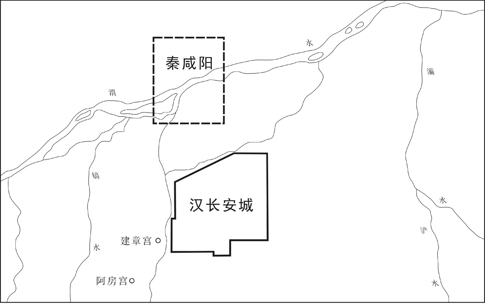 
长安遗址位置示意图

## 【译文】

东晋孝武帝司马曜下诏命令冠军将军南郡相刘波率八千军队救援襄阳，刘波畏惧前秦，不敢前进。朱序屡次出战，打败前秦军队，前秦军队撤退渐渐远去，朱序不设防备。二月，襄阳督护李伯护秘密派遣他的儿子向前秦投诚，并请求作内应。长乐公苻丕命令各路大军进攻襄阳。戊午攻克襄阳，抓获了朱序，把他押送长安。前秦王苻坚认为朱序能够坚守节操，任命他为度支尚书；认为李伯护不忠，将他杀掉了。

## 【原文】

**秦将军慕容越拔顺阳，执太守谯国丁穆[1]。坚欲官之，穆固辞不受。坚以中垒将军梁成为荆州刺史，配兵一万镇襄阳，选其才望，礼而用之[2]。**

## 【注文】

[1]将军：高级武官的泛称。春秋时晋国以卿为军将，遂有将军之称。战国始为武官之名，位高者称大将军，皆主征伐之事。两汉时，逐渐成为正式官称，如大将军、卫将军等。将军作为统率之官，受命指挥京师禁兵；出征时则任主帅，统率诸将军。魏晋南北朝时期，将军名号繁多，权位各异。　　慕容越：生卒年不详，曾任前燕上党太守、南安王。公元370年七月，王猛攻克壶关（今山西长治一带），他被王猛俘获而归降前秦。公元379年二月，他率军攻取顺阳（今河南淅川东南），俘虏顺阳太守丁穆。　　顺阳：县名，今河南淅川东南。　　谯国：今安徽亳（bó）州。　　丁穆（？—约379年）：东晋大将，字彦远，谯国（今安徽亳州）人。因功累迁顺阳太守、振武将军、梁州刺史。东晋孝武帝司马曜太元四年（379年），苻坚攻打顺阳（今河南淅川东南），他战败被俘，送至长安，假称有病而不愿侍奉苻坚。后苻坚率兵南下，他与关中人士谋划袭取长安，事情败露被杀。

[2]中垒将军：官名。三国魏置，是禁军的主要将领之一，担任宫禁宿卫，四品。晋沿置。　　梁成（？—383年）：前秦将领。公元383年，在前秦与东晋洛涧之战中战败身亡。

## 【译文】

前秦将军慕容越攻下顺阳，俘获了太守谯国人丁穆。苻坚打算封他为官，丁穆坚决辞让不接受。苻坚任中垒将军梁成为荆州刺史，配给一万军队镇守襄阳，并选拔本地有才气和名望的人，对他们以礼相待，加以任用。

## 【原文】

**桓冲以襄阳陷没，上疏送章、节，请解职，不许[1]。诏免刘波官，俄复以为冠军将军。**

## 【注文】

[1]章、节：即印章和符节。均为皇帝赐予的作为凭信和表明身份的信物。

## 【译文】

桓冲因襄阳陷落，上疏朝廷，并呈上官印、符节，请求免职，朝廷没有准许。诏令免去刘波的官职，但不久又任命他为冠军将军。

## 【原文】

**兖州刺史谢玄帅众万余救彭城，军于泗口，欲遣间使报戴逯而不可得[1]。部曲将田泓请没水潜行趣彭城，玄遣之[2]。泓为秦人所获，厚赂之，使云南军已败。泓伪许之，既而告城中曰：“南军垂至，我单行来报，为贼所得，勉之[3]！”秦人杀之。彭超置辎重于留城，谢玄扬声遣后军将军东海何谦向留城[4]。超闻之，释彭城围，引兵还保辎重。戴逯帅彭城之众随谦奔玄，超遂据彭城，留兖州治中徐褒守之，南攻盱眙[5]。俱难克淮阴，留邵保戍之[6]。**

## 【注文】

[1]泗口：又名清口，即古泗水入淮水之口，今江苏淮安西南。　　间使：秘密使者。

[2]部曲将：私人部队将领。　　田泓（？—379年）：东晋兖州刺史谢玄部曲将。公元379年，被前秦军俘杀。　　没（mò）水：潜水。　　趣（qū）：通“趋”，前往、赶赴。

[3]告城中：指在城外秦军阵中向城里人报告。　　垂至：将至。

[4]辎（zī）重：军用物资，如粮草、衣被、武器、装备等。　　留城：即留县县城，今江苏沛县东南。　　后军将军：将军名号。负责宿卫，前、后、左、右四军将军之一。　　东海：郡名，治所在京口（今江苏镇江），其时辖地在今山东费县、临沂、江苏赣榆南部，山东枣庄、江苏邳（pī）州东部和江苏宿迁、灌南北部地区。

[5]治中：官名，治中从事史的省称。汉朝初置，为州刺史属官，主管诸曹文书。治中一般由刺史自行任命，地位虽低，但权任颇重。魏晋南北朝沿置，地位渐高。

[6]淮阴：今江苏淮阴西南甘罗城。

## 【译文】

兖州刺史谢玄率领一万多部众救援彭城，屯军泗口，打算派遣一名间谍前去通报戴逯，但没找到合适人选。部曲将田泓请求潜水游向彭城，于是谢玄派他前往。田泓被前秦军俘获，前秦用重金贿赂他，让他对城内说南方援军已经失败了。田泓假装答应了他们，不久向城中宣告说：“南方援军马上就到，我一人前来报信，被贼军抓获，你们努力守城吧！”前秦军杀掉了田泓。彭超把军用物资安置在留城，谢玄扬言将派遣后军将军东海人何谦向留城进军。彭超听到这个消息，撤去彭城的包围，退兵回去保护军用物资。戴逯率领彭城的部众跟随何谦投奔谢玄，于是彭超占据了彭城，命兖州治中徐褒留守，自己率军向南攻打盱眙。俱难攻克淮阴，留下邵保守城。

## 【原文】

**夏四月，秦毛当、王显帅众二万自襄阳东会俱难、彭超攻淮南。五月乙丑，难、超拔盱眙，执高密内史毛璪之[1]。秦兵六万围幽州刺史田洛于三阿，去广陵百里[2]。朝廷大震，临江列戍，遣征虏将军谢石帅舟师屯涂中[3]。石，安之弟也。**

## 【注文】

[1]高密：县名，今山东高密西南。　　内史：官名。西周始置，协助天子管理国家政务。秦朝时为京师政区行政长官名。魏晋时，以内史代替太守出任特别重要郡的行政长官。　　毛璪（zǎo）之：生卒年不详，曾任东晋高密内史。

[2]三阿：地名，今江苏金湖东南平阿西村。东晋于此侨置幽、冀、青、并四州。

[3]谢石（327—388年）：东晋将领，字石奴，陈郡阳夏（今河南太康）人，东晋宰相谢安之弟，出身士族。初任秘书郎，后升任尚书仆射，曾与谢玄等击败前秦俱难，因功封兴平县伯。公元383年，前秦苻坚南征东晋时，他被任命为征讨大都督，与谢玄所率北府兵以少胜多，在淝水大败前秦军队，因功升任中军将军、尚书令，封南康郡王。公元385年，谢安死后，他担任卫将军，加散骑常侍。他身居高位，但贪得无厌，聚敛过度，声名狼藉。后与吏部郎王恭不和，称病辞官，未获批准，最终病死任上，追赠司空。　　涂中：地名，位于今安徽、江苏境内滁（chú）河流域的滁州、全椒（jiāo）与南京六（lù）合一带。

## 【译文】

夏季四月，前秦毛当、王显率领两万军队，从襄阳向东进发，与俱难、彭超会合，一起攻打淮河以南各郡县。五月乙丑（十四日），俱难、彭超攻下盱眙，抓获高密内史毛璪之。前秦六万军队在三阿围攻东晋幽州刺史田洛，三阿距广陵只有一百里。东晋朝廷大为震惊，沿长江设防，派遣征虏将军谢石率领水军屯驻涂中。谢石，是谢安的弟弟。

## 【原文】

**右卫将军毛安之等帅众四万屯堂邑[1]。秦毛当、毛盛帅骑二万袭堂邑，安之等惊溃。兖州刺史谢玄自广陵救三阿。丙子，难、超战败，退保盱眙。六月戊子，玄与田洛帅众五万进攻盱眙，难、超又败，退屯淮阴。玄遣何谦等帅舟师乘潮而上，夜焚淮桥，邵保战死，难、超退屯淮北[2]。玄与何谦、戴逯、田洛共追之，战于君川，复大破之，难、超北走，仅以身免[3]。谢玄还广陵，诏进号冠军将军，加领徐州刺史。秦王坚闻之，大怒。秋七月，槛车征超下廷尉，超自杀[4]。难削爵为民。以毛当为徐州刺史，镇彭城；毛盛为兖州刺史，镇胡陆；王显为扬州刺史，戍下邳[5]。**

## 【注文】

[1]右卫将军：官名。公元265年，晋王司马炎分中卫将军置。两晋南北朝沿置，与左卫将军共同掌管宫禁宿卫，为禁军主要将领之一。　　毛安之：东晋将领。字仲祖，荥阳阳武（今河南原阳）人，生卒年不详，毛宝次子。简文帝司马昱辅政时，他被委任为幕僚抚军参军，后历任游击将军、右卫将军、魏郡太守、宿卫殿中等；简文帝即位后，被调进京守卫皇宫，后因平叛有功，追封光禄勋。　　堂邑：郡名，治所在今江苏南京六合北。

[2]淮桥：前秦为渡兵而在淮河上架设的桥梁。

[3]君川：水名，在今江苏盱眙东北，为君山之川。

[4]槛（jiàn）车：古代押运囚犯的车。

[5]胡陆：县名，今山东鱼台东南。　　扬州：州名。三国吴置，治所设在建邺（后改称建康，今江苏南京），辖境约为今上海、浙江、江西、福建全部，安徽淮河以南地区，江苏长江以南部分地区及湖北、河南部分地区。晋沿置。　　下邳：地名，约在今江苏邳州西南，自古为淮北战场。

## 【译文】

右卫将军毛安之等人率四万军队屯驻堂邑。前秦毛当、毛盛率领二万骑兵袭击堂邑，毛安之等人惊慌溃散。兖州刺史谢玄从广陵出发救援三阿。丙子（五月二十五日），俱难、彭超战败，撤退到盱眙守卫。六月戊子（初七），谢玄与田洛率领五万军队进攻盱眙，俱难、彭超再次败阵，撤退到淮阴驻扎。谢玄派何谦等率领水军，趁着涨潮逆淮河而上，夜晚纵火烧毁淮河桥，邵保战死，俱难、彭超撤退到淮河以北驻扎。谢玄与何谦、戴逯、田洛共同追击，与前秦军战于君川，再次大败前秦军队，俱难、彭超向北逃跑，仅仅保住性命。谢玄回到广陵，晋孝武帝司马曜下诏，晋升他为冠军将军，兼徐州刺史。前秦王苻坚听到这个消息，非常生气。秋季七月，用囚车把彭超征召回来，交给廷尉问罪，彭超自杀。俱难被削去爵位降为平民。苻坚任毛当为徐州刺史，镇守彭城；毛盛为兖州刺史，镇守胡陆；王显为扬州刺史，戍守下邳。

## 【原文】

**谢安为宰相，秦人屡入寇，边兵失利，众心危惧，安每镇之以和静[1]。其为政，务举大纲，不为小察。时人比安于王导，而谓其文雅过之[2]。**

## 【注文】

[1]宰相：官名，古代最高行政长官通称，职责为典领百官，辅佐皇帝治理国政。

[2]小察：即在细微的事情上斤斤计较。　　王导（276—339年）：东晋政权奠基者之一。字茂弘，瑯邪临沂（今山东临沂北）人。他与琅琊王司马睿交往密切。永嘉元年（307年），晋怀帝司马炽任命司马睿为安东将军，出镇建邺（后改建康，今江苏南京）。他相随南渡，任安东将军司马。他主动出谋划策，联合南北士族，拥立司马睿为帝，建立东晋政权。他官居宰辅，总揽元帝司马睿、明帝司马绍、成帝司马衍三朝国政。

## 【译文】

谢安担任宰相期间，前秦军队屡次入侵，边境部队失利，众人便心怀恐惧，谢安每次都以安静平和的态度镇定大家的情绪。他从事政务，全力抓住大纲，不追查小事。当时的人都把他比做王导，又称他的文雅超过王导。

## 【原文】

**五年夏五月，朝廷以秦兵之退为谢安、桓冲之功，拜安卫将军，与冲皆开府仪同三司[1]。**

## 【注文】

[1]卫将军：官名。汉文帝刘恒由代王入继帝位，始设卫将军一员，由亲信宋昌担任，统率京城南军与北军等禁兵。魏晋南北朝沿置，为重号将军，多授予朝中大臣为加官。　　开府仪同三司：三国魏置为大臣加号，享有开设府署、自辟僚属的特权及与三司（太尉、司空、司徒）相同的礼仪待遇。晋沿置。

## 【译文】

东晋孝武帝太元五年（380年）夏季五月，东晋朝廷认为前秦军队败退是谢安、桓冲的功劳，授予谢安卫将军，与桓冲皆为开府仪同三司。

## 【原文】

**六月，秦王坚召阳平公融为侍中、中书监、车骑大将军、司隶校尉、录尚书事，以征南大将军守尚书令长乐公丕为都督关东诸军事、征东大将军、冀州牧[1]。坚以诸氐种类繁滋，秋七月，分三原、九嵕、武都、汧、雍氐十五万户，使诸宗亲各领之，散居方镇，如古诸侯[2]。长乐公丕领氐三千户，以仇池氐酋射声校尉杨膺为征东左司马，九嵕氐酋长水校尉齐午为右司马，各领一千五百户，为长乐世卿[3]。长乐国郎中令略阳垣敞为录事参军，侍讲扶风韦干为参军事，申绍为别驾[4]。膺，丕之妃兄也[5]。午，膺之妻父也[6]。八月，分幽州置平州，以石越为平州刺史，镇龙城[7]。中书令梁谠为幽州刺史，镇蓟城[8]。抚军将军毛兴为都督河秦二州诸军事、河州刺史，镇枹罕[9]。长水校尉王腾为并州刺史，镇晋阳[10]。河、并二州，各配氐户三千。兴、腾并苻氏婚姻，氐之崇望也[11]。平原公晖为都督豫洛荆南兖东豫扬六州诸军事、镇东大将军、豫州牧，镇洛阳；移洛州刺史治丰阳；以巨鹿公睿为雍州刺史，镇蒲坂；各配氐户三千二百[12]。**

## 【注文】

[1]中书监：官名。三国魏始置，魏文帝曹丕改秘书令为中书监，职掌机密，诏命多出于此。至魏明帝曹睿时，中书监已成为实质上的宰相。晋朝、南北朝沿置。　　司隶校尉：官名，监督京师和地方的监察官。始置于汉武帝征和四年（前89年），属官有从事、假佐等。　　录尚书事：官名。初置时名为“领尚书事”。东汉明帝刘庄永平十八年（75年），以太傅赵熹（xī）、太尉牟（móu）融并录尚书事，自此，“领尚书事”更名为“录尚书事”。“录”为总领之意。录、领相比虽职事相近，但权位更重。魏晋时期，掌大权之大臣均带“录尚书事”名号。　　都督关东诸军事：即掌管关东军事事务的武官。　　征东大将军：武官名号。始置于曹操，与征西、征南、征北合称“四征将军”，权任甚重。魏晋后，多为持节都督。征东将军中资深者加为“征东大将军”。　　冀州：古九州（即冀、兖、青、徐、扬、荆、豫、梁、雍）之一，历史悠久。到汉朝时，正式成为行政区划，为十三刺史部之一。晋武帝泰始元年（265年），分全国为冀州等诸州（相当于今省级），治所在信都（今河北冀州旧城）。晋惠帝司马衷之后，北方的鲜卑、氐等民族入主中原，冀州先后属后赵、前燕、前秦和后燕，随所属国家的变换，冀州的治所经常变动。后赵时，将州治从信都迁至邺（今河北临漳西南）；前秦时又将治所迁至信都（今河北冀州旧城），至后燕慕容垂沿袭下来。　　牧：古代治民之官，即各州的行政长官。汉武帝刘彻时设刺史，汉成帝刘骜（áo）改刺史为州牧。东汉灵帝刘宏时，为镇压农民起义，政府再次提高州牧的地位，居郡守之上，掌一州之军政大权。

[2]氐：古代西北民族。原在中国北部和西部的广大地区游牧。从东汉起陆续内迁，主要居住在今陕西、甘肃、四川等广大地区，主要从事畜牧业和农业。魏晋时期，氐人已经遍布关中地区，今甘肃天水至陕西略阳一带成为氐人的主要聚居区。在中原汉族经济、文化的强烈影响下，氐人大量接受汉族文化和生产技术。历史上曾建立过仇池、前秦、后凉等政权。　　三原：地名，今陕西淳化东。　　九嵕（zōng）：今陕西礼泉东北。　　武都：郡名。汉武帝元鼎六年（前111年）置，治所设在武都县（今甘肃西和西南），辖境相当于今甘肃西和、武都、康县、成县、徽县、两当，陕西略阳、凤县等地。东汉移治下辨（今甘肃成县西）。三国两晋沿置，三国时属蜀汉，西晋末属仇池国。　　汧（qiān）：县名，今陕西陇县东南。　　雍（yōng）：即雍州。晋时治所设在长安（今陕西西安西北），辖境相当于今陕西中部、甘肃东南部、宁夏南部及青海黄河以南一带。　　宗亲：指同宗的亲属。此特指苻氏宗族。　　方镇：指握有兵权、镇守一方的军事长官。　　诸侯：古代帝王所分封的各国君主。在其统辖区域内，世代掌握军政大权，但要服从王命，定期向朝廷贡献述职，并有出军赋和服役的义务。

[3]仇（qiú）池：地名，位于今甘肃陇南、陕西南、川北之间。氐族杨氏曾在此建立仇池政权（296—371年），辖境包括秦州武都郡仇池山（今甘肃成县西）及其附近的下辨、河池等县，是五胡十六国时期的一个很小的割据政权。自西晋惠帝元康六年（296年）杨茂搜从略阳率领氐族部落还保仇池起，至东晋简文帝司马昱成安元年前秦灭仇池止，前后传九主，共七十余年。　　氐酋（qiú）：即氐族首领。　　射声校尉：官名。保卫京师的八校尉之一。　　杨膺（yīng）（？—385年）：东晋十六国时仇池氐族首领，武都仇池（今甘肃成县西北）人。最初依附于前秦苻坚，历任射声校尉、征东左司马，封长乐世卿。淝水之战后，前秦衰败，他劝苻丕降晋，并与参军焦逵（kuí）、姜让等谋迎东晋大将刘牢之，后事情败露被杀。　　征东左司马：即征东大将军府左司马。左司马：官名，为军中执法官。　　长（cháng）水校尉：官名。汉武帝置，八校尉之一，掌屯于长水（关中河名）与宣曲（亦河名）的乌桓人、胡人骑兵，属官有丞及司马。魏、晋沿置，属领军将军。　　右司马：军事长官，负责指挥军事作战，统率和管理军队。　　世卿：世代承袭的卿大夫。

[4]郎中令：官名。汉朝置，为诸王国属官，负责戍卫王宫。魏晋南北朝沿置，为王国三卿之一，品秩随国主地位而高下不等。　　录事参军：官名。为王公府、军府、州的佐吏。西晋始置，掌总录众曹文簿、举弹善恶。　　侍讲：官名。侍从皇帝或太子讲授典籍经义，多以博学者担任该职。　　扶风：郡名。汉武帝太初元年（前104年）置，与京兆尹、左冯翊合称三辅，是西汉的政治中心。三国魏时改为扶风郡，治所设在槐里（今陕西兴平东南），相当于今陕西麟游、乾县以西，秦岭以北地区。西晋时治所迁至池阳（今陕西泾阳西北）。　　参军事：官名，简称参军。参见前文“参军”条注。　　别驾：官名，全称为“别驾从事史”，或叫“别驾从事”。汉代始置，为州刺史的属吏。每当刺史出巡外出时，别驾都要驾车随行，因此得名。魏晋时职权益重。

[5]丕之妃：即苻丕妃子杨氏（？—386年），武都仇池人，杨膺之妹。约在公元380年，她成为苻丕夫人。公元385年，苻坚被后秦姚苌杀死，苻丕登基称帝，不久她便被立为皇后。公元386年，苻丕截击西燕慕容永，失利，她也被俘虏。慕容永想纳她为上夫人，但她试图刺杀慕容永，未果被杀。

[6]妻父：即岳父。

[7]平州：州名。三国魏分幽州东部地区置，治所设在襄平（今辽宁辽阳），辖境相当于今铁岭以南的辽宁大部分地区。不久废入幽州。晋武帝司马炎泰始十年（274年）复置。晋怀帝司马炽永嘉（307—313年）后移治昌黎（今辽宁义县）。　　龙城：地名，又名和龙城、黄龙城、龙都，位于今辽宁朝阳地区。公元341年，慕容皝修建此城。次年将都城从棘城（今辽宁义县西北）迁至此。前燕建国迁都蓟（今北京西南）后，建留后于此。公元397年，后燕慕容宝亦以此为都。

[8]中书令：官名。西汉年间归属于内廷宦官机构，负责在皇帝书房整理宫内文库档案。汉元帝刘奭（shì）时，中书令权势很大，甚至超过丞相。三国魏文帝曹丕时，改秘书为中书，分设中书监与中书令，掌握机要。两晋沿设。司马迁是中国历史上第一位中书令。　　梁谠（dǎng）：十六国前秦大臣。字伯言，略阳（今甘肃秦安东北）人，生卒年不详，氐族。他博学多才，历任著作郎、中书令、侍中等。他与其弟梁熙都以文藻清丽而被时人所称颂。　　蓟城：地名，今北京西南。

[9]抚军将军：官名。三国吴、蜀始置，权任颇重。晋朝置为重号将军，授予朝中大臣，三品。　　毛兴（？—386年）：氐族豪强，前秦河州刺史。淝水之战后，他所统领的河州（治今甘肃临夏东北）是抗击后秦姚苌和后燕慕容垂的重要据点。公元385年，他与后秦将领姚硕德交战，互有胜负。次年，被氐人中的主和派杀死。　　都督河秦二州诸军事：即掌管河州、秦州军事事务的武官。　　河州：十六国前凉分兴晋、金城、武始、南安、永晋、大夏、武成、汉中八郡置，治所设在枹罕县（今甘肃临夏东北）。　　枹罕：县名，今甘肃临夏东北。

[10]王腾：燕郡（治今北京西南）人，生卒年不详。慕容垂起兵反叛前秦时，丁零首领翟斌响应，他与鲜卑段延等各率部曲投奔他，后转投慕容垂。慕容盛即位后，被任命为尚书右仆射。　　并（bīng）州：州名。汉武帝元封五年（前106年）置，为十三刺史部之一。东汉献帝刘协建安十八年（213年）并入冀州。三国魏文帝曹丕黄初元年（220年）复置。治所设在晋阳县（今山西太原西南），辖境约为今山西大部、陕西北部、内蒙古河套平原和鄂尔多斯高原。晋沿置。　　晋阳：县名，并州治所，位于今山西太原西南。

[11]崇望：高门望族。

[12]平原公：前秦爵位名。平原：郡名，治所设在平原县（今山东平原西南），辖境相当于今山东平原、禹（yǔ）城、齐河、陵县、临邑、商河、阳信、惠民等地。　　晖：即苻晖（？—385年），前秦苻坚之子，平原公、豫州牧。淝水之战后，他率领洛阳等地民众归于长安，前秦政权稍为安定。后抵御慕容冲，屡次被慕容冲打败，被苻坚斥责，愤而自杀。　　都督豫洛荆南兖东豫扬六州诸军事：即掌管豫州、洛州、荆州、南兖、东豫、扬州六州军事事务的武官。南兖：州名，苻秦置，镇湖陆（在今山东鱼台东南）。东豫：州名，十六国时置，治所在颍（yǐng）川郡（今河南许昌东）。　　镇东大将军：将军名号。镇东将军为统兵将领，东汉末年临时设置的“四镇”将军之一。职掌征战讨伐，位在常设将军之下。魏晋时期，镇东将军统领青、兖、徐、扬等四州。资深者为镇东大将军。　　豫州：古九州之一，而作为实际的行政区划，始于汉武帝刘彻时。晋时豫州治所设在陈县（今河南淮阳），辖境包括今河南东南部、安徽西北部、湖北东部。　　丰阳：县名，今陕西山阳。　　巨鹿公：前秦爵位名。巨鹿：今河北宁晋西南。　　睿：即苻睿（？—384年），前秦苻坚第四子，巨鹿公，曾任弘农太守、卫大将军、司隶校尉、录尚书事等。后被西燕慕容泓杀死。　　蒲坂（bǎn）：今山西永济东南。

## 【译文】

六月，前秦王苻坚征召阳平公苻融为侍中、中书监、车骑大将军、司隶校尉、录尚书事，任征南大将军、守尚书令、长乐公苻丕为都督关东诸军事、征东大将军、冀州牧。苻坚因氐族各部种类繁多，秋季七月，将三原、九嵕、武都、汧、雍等地十五万户氐族人，划分开来，让各位宗亲分别统领他们，分散居住在各方镇守，如同古代的诸侯。长乐公苻丕统领氐族三千户，任命仇池氐族首领射声校尉杨膺为征东左司马，九嵕氐族首领长水校尉齐午为右司马，各自掌管一千五百户，成为长乐国的世袭卿大夫。长乐国郎中令略阳人垣敞为录事参军，侍讲扶风人韦干为参军事，申绍为别驾。杨膺，是苻丕妃子的哥哥。齐午，是杨膺的岳父。八月，分割幽州设置平州，任石越为平州刺史，镇守龙城。中书令梁谠为幽州刺史，镇守蓟城。抚军将军毛兴为都督河秦二州诸军事、河州刺史，镇守枹罕。长水校尉王腾为并州刺史，镇守晋阳。河、并二州，各配氐族三千民户。毛兴、王腾都是苻氏姻亲，是氐族中的高门望族。任平原公苻晖为都督豫洛荆南兖东豫扬六州诸军事、镇东大将军、豫州牧，镇守洛阳；将洛州刺史治所移到丰阳；任巨鹿公苻睿为雍州刺史，镇守蒲坂；各配氐族三千二百民户。

## 【原文】

**坚送丕至灞上，诸氐别其父兄，皆恸哭，哀感路人[1]。赵整因侍宴，援琴而歌曰：“阿得脂，阿得脂，博劳舅父是仇绥，尾长翼短不能飞。远徙种人留鲜卑，一旦缓急当语谁[2]？”坚笑而不纳。冬十二月，秦以左将军都贵为荆州刺史，镇彭城[3]。置东豫州，以毛当为刺史，镇许昌[4]。**

## 【注文】

[1]灞（bà）上：今陕西西安东。

[2]援：执，持。　　阿得脂：有音无意。　　博劳：伯劳鸟的别名。　　绥：音suí。　　远徙种人留鲜卑：意即远迁氐族诸氏，而留鲜卑慕容氏。　　缓急：危急之事。　　当语谁：该和谁商量。

[3]左将军：官名。秦汉有前、后、左、右将军，均为领兵官。魏晋不常置，通常仅为虚衔。

[4]东豫州：州名。苻秦初以豫州刺史镇许昌（今河南许昌东），灭燕后，徙镇洛阳；在许昌置东豫州。　　镇彭城：前秦荆州刺史应当是镇襄阳，此处“镇彭城”疑为误。

## 【译文】

苻坚送苻丕到灞上，各部氐人将要告别父兄，都痛哭不已，路上的行人都为之感到哀怜。赵整趁陪同宴席的机会，抚琴唱道：“阿得脂，阿得脂，博劳鸟的舅舅仇绥，尾巴长，翅膀短，不能飞。远迁同族，留下鲜卑，一旦遇到紧急之事，应当告诉谁？”苻坚笑笑而已，没有当回事。冬季十二月，前秦任左将军都贵为荆州刺史，镇守彭城。设置东豫州，任命毛当为刺史，镇守许昌。

## 【原文】

**六年春正月丁酉，以尚书谢石为仆射[1]。冬十一月，秦荆州刺史都贵遣其司马阎振、中兵参军吴仲帅众二万寇竟陵[2]。桓冲遣南平太守桓石虔、卫军参军桓石民等，帅水陆二万拒之[3]。石民，石虔之弟也。十二月甲辰，石虔袭击振、仲，大破之，振、仲退保管城[4]。石虔进攻之，癸亥，拔管城，获振、仲，斩首七千级，俘虏万人。诏封桓冲子谦为宜阳侯，以桓石虔领河东太守[5]。**

## 【注文】

[1]仆射：官名。秦始置。汉成帝刘骜建始四年（前29年），初置尚书五人，一人为仆射，位仅次尚书令，职权渐重。魏晋以后，仆射已处于副相地位。

[2]中兵参军：两晋南北朝诸公、军府僚属。掌管本府中兵曹，备府主咨询。其品位随府主地位而定，有以将军、太守兼领者。　　竟陵：地名，在今湖北潜江西北。

[3]南平：郡名。晋武帝太康元年（280年）置，治所设在江安县（后改为公安县，今湖北公安西北），时属荆州。　　桓石虔（qián）（？—388年）：东晋大将，谯国龙亢（今安徽怀远西北）人，桓豁长子，以勇猛矫捷闻名，官至豫州刺史，曾以宁远将军、南顿太守率兵平定袁真之乱。　　卫军参军：即卫将军的参军。　　桓石民：东晋重要将领，生卒年不详，谯国龙亢（今安徽怀远西北）人，桓豁之子，桓石虔之弟。曾历任显职，多次击败敌国。

[4]管城：城名，位于今河南郑州。

[5]谦：即桓谦（？—404年），东晋将领。字敬祖，谯国龙亢（今安徽怀远西北）人，桓冲次子。最初因父亲的功劳而获封宜阳县开国侯，后升为辅国将军、吴国内史及抚军大将军。桓玄篡权后，他被任命为扬州刺史、侍中、卫将军、录尚书事，封新安王。不久桓振作乱，他保护桓玄，颇有战功。桓玄死后，依附后秦姚兴，曾奉姚兴命到西蜀，为益州割据势力谯纵募兵，并与谯纵联兵侵扰东晋，后被刘道规杀死。　　宜阳侯：东晋爵位名。宜阳：县名，今河南宜阳西。　　河东：东晋侨置郡名，全称为南河东郡，治今湖北松滋西北。

## 【译文】

东晋孝武帝太元六年（381年）春季正月丁酉（二十六日），东晋朝廷任命尚书谢石为仆射。冬季十一月，前秦荆州刺史都贵派遣司马阎振、中兵参军吴仲率领二万军队侵犯竟陵。桓冲派遣南平太守桓石虔、卫军参军桓石民等，率领水陆军二万人进行抵御。桓石民，是桓石虔的弟弟。十二月甲辰（初八日），桓石虔袭击阎振、吴仲，大败前秦军队，阎振、吴仲撤退到管城防守。桓石虔向他们进攻，癸亥（二十七日），攻下管城，俘获阎振、吴仲，杀敌七千多人，俘虏一万人。晋孝武帝司马曜下诏，封桓冲之子桓谦为宜阳侯，桓石虔兼任河东太守。

## 【原文】

**七年夏四月，秦王坚以阳平公融为司徒，融固辞不受。坚方谋伐晋，乃以融为征南大将军、开府仪同三司。**

## 【译文】

东晋孝武帝太元七年（382年）夏季四月，前秦王苻坚任命阳平公苻融为司徒，苻融坚决辞让不接受。苻坚正在谋划进攻东晋，于是任命苻融为征南大将军、开府仪同三司。

## 【原文】

**秋八月，秦王坚以谏议大夫裴元略为巴西、梓潼二郡太守，使密具舟师[1]。**

## 【注文】

[1]谏议大夫：官名。负责议论政事得失。　　裴元略：生卒年不详，曾任前秦尚书郎、谏议大夫、陵江将军、西南夷校尉及巴西、梓橦二郡太守等。　　巴西：郡名，意为“巴郡以西”，郡治所设在阆（làng）中（今四川南充阆中附近）。东汉献帝刘协建安六年（201年）改巴郡置，辖阆中、安汉、西充国、南充国、宕（dàng）渠、汉昌、宣汉等七县，相当于今四川阆中，广安、渠县以北，武胜以东，万源、开江以西地区。　　梓（zǐ）潼（tóng）：地名，以“东倚梓林，西枕潼水”而得名，位于今四川梓潼地区。

## 【译文】

秋季八月，前秦王苻坚任命谏议大夫裴元略为巴西、梓潼二郡太守，让他秘密筹办水师。

## 【原文】

**九月，桓冲使扬威将军朱绰击秦荆州刺史都贵于襄阳，焚践沔北屯田，掠六百余户而还[1]。**

## 【注文】

[1]扬威将军：官名。东汉末曹操始置，为领兵军将，负责统兵征战。魏晋时沿置，四品。　　朱绰（？—384年）：东晋大将，字祖明，沛（今江苏沛县）人，朱宪之弟。袁真在寿阳（今安徽寿县）发动叛乱，朱宪被袁真杀死，他逃奔桓温。桓温平定寿阳后，他打开袁真棺材戮其尸体，桓温对这一行为深表愤怒，打算杀掉他。后因桓冲求情他才得以幸免，从此，他忠心侍奉桓冲，历任西阳、广平太守，扬威将军等。桓冲死后，他也吐血而亡。

## 【译文】

九月，桓冲派扬威将军朱绰攻打在襄阳的前秦荆州刺史都贵，焚烧和践踏了前秦在沔水以北的屯田，掠得六百多户后返回。

## 【原文】

**冬十月，秦王坚会群臣于太极殿，议曰：“自吾承业垂三十载，四方略定，唯东南一隅未霑王化。今略计吾士卒，可得九十七万，吾欲自将以讨之，何如[1]？”秘书监朱肜曰：“陛下恭行天罚，必有征无战，晋主不衔璧军门，则走死江海，陛下返中国士民，使复其桑梓，然后回舆东巡，告成岱宗，此千载一时也[2]。”坚喜曰：“是吾志也。”尚书左仆射权翼曰：“昔纣为无道，三仁在朝，武王犹为之旋师[3]。今晋虽微弱，未有大恶，谢安、桓冲皆江表伟人，君臣辑睦，内外同心。以臣观之，未可图也。”坚嘿然良久曰：“诸君各言其志[4]。”太子左卫率石越曰：“今岁镇守斗，福德在吴，伐之必有天殃。且彼据长江之险，民为之用，殆未可伐也[5]。”坚曰：“昔武王伐纣，逆岁违卜，天道幽远，未易可知[6]。夫差、孙皓皆保据江、湖，不免于亡[7]。今以吾之众，投鞭于江，足断其流，又何险之足恃乎[8]？”对曰：“三国之君，皆淫虐无道，故敌国取之，易于拾遗。今晋虽无德，未有大罪，愿陛下且案兵积谷，以待其衅[9]。”于是群臣各言利害，久之不决。坚曰：“此所谓筑室道旁，无时可成。吾当内断于心耳[10]。”**

## 【注文】

[1]太极殿：前秦长安皇宫的正殿。　　承业：继承帝位。　　垂三十载：垂，将近；载，年。公元357年，苻坚杀死秦王苻生自立为大秦天王，到公元382年已有二十六年，故云“垂三十载”。　　略定：大都已经平定。苻坚取得政权后，任用王猛，打击豪强，加强中央集权，注意农桑，改进农耕技术，使前秦成为北方最强大的国家，先后攻灭前燕、前凉、代国，统一了北方大部分地区。　　东南一隅：此指东晋。　　未霑（zhān）王化：霑，同“沾”，润泽；王化，君主的德化。此处指东晋还没受前秦的统治。

[2]恭行天罚：即代替上天执行对东晋的惩罚。语出《尚书·甘誓》“今予惟恭行天之罚”一句。　　有征无战：出兵征讨，不用作战就能取得胜利。以喻双方实力相差悬殊。　　衔璧军门：双手反缚，口衔玉璧，到军门来投降。这是古代战败国君主请求投降的仪式。　　中国士民：此指“永嘉之乱”时南渡避难的北方士大夫和庶民子孙。　　桑梓：古人在住宅旁边往往种植桑树和梓树，后用作故乡的代称。　　回舆（yú）：回车。

[3]尚书左仆射：官名，亦称左仆射。东汉末置，为尚书台副长官，位在右仆射之上，辅佐尚书令掌管尚书台事务。魏晋南北朝时沿置。　　纣：即帝辛（？—前1046年），本名受德，商朝最后一任君主，共在位五十二年。他天资聪颖，才力过人，在位前期，重视农桑，大力发展生产；政治清明，选贤任能，不再屠杀奴隶和俘虏；征讨东夷、徐夷、东南夷，扩展了商朝国土，保卫了商朝安全；统一东南后，把中原先进的生产技术和文化向东南传播，推动了社会进步和经济发展，促进了民族融合。但到后期，耽于酒色、穷奢极欲；拒谏饰非、刚愎自用；加之长期对东夷用兵，导致国力衰竭。公元前1046年，在牧野之战中被周武王率领的西周军队打得大败，商纣王自焚于鹿台，商朝灭亡。　　三仁：即纣王手下三位贤臣：微子、箕子、比干。微子见纣王昏乱残暴而离去，箕子、比干劝谏纣王而遭辱被杀，孔子称他们为三仁人，见《论语·微子》。　　武王：即周武王姬发，西周王朝开国君主，周文王次子。因其兄伯邑考被商纣王所杀，故得以继位。他继承父亲遗志，消灭商朝，建立西周王朝，表现出卓越的军事、政治才能，成为中国历史上的一代明君。死后谥号“武”，史称周武王。　　旋师：回师。此句指周武王即位后九年，在盟津（即孟津，今河南孟州南）大会诸侯，诸侯到来的有八百多国，大家都劝武王伐纣。武王认为时机未到，退兵而回。后来比干被杀，箕子被囚，微子离去，武王才伐封灭商。

[4]嘿（mò）：同“默”，沉默不语。

[5]太子左卫率：官名。与太子右卫率分领东宫兵马，护卫太子，也受命出征。　　岁镇守斗：岁，岁星，即木星；镇，镇星（或填星），即土星。古人迷信，认为岁、镇两星运行到什么地方，那里就当运。斗，星宿名，二十八宿之一，斗宿是吴地的分星。岁镇守斗即岁星和镇星居于斗宿，福德应在吴地，该地吉星高照，不可侵犯。因此下文说“福德在吴（指东晋）”。

[6]逆岁：武王伐纣时，鱼辛曾劝告说：“岁星在北方，不可北伐。”但武王没有听从。　　违卜：据《史记·齐世家》记载，武王准备伐纣时，去占卜问吉凶，结果占得凶卦，暴风雨骤至，大家都害怕起来，只有姜太公劝武王按计划出征。于是武王就不顾一切地出发了。

[7]夫差（？—前473年）：春秋时吴国国君，阖（hé）闾（lǘ）之子，公元前495年至前473年在位。公元前473年，越王勾践灭吴，夫差自杀。

[8]投鞭于江，足断其流：把马鞭投到江中，足以截断江流。形容人马极多。

[9]三国之君：指商纣王、夫差、孙皓。　　案兵：止兵，息兵。

[10]筑室道旁，无时可成：语出《诗经·小曼》：“如彼筑室于道谋，是用不溃于成。”意思是，好像造房子时因各人看法不同而向过路人征求意见，因此房子造不成。用以比喻自己没有主见，而与众多的人共谋，莫衷一是，必难成功。

## 【译文】

冬季十月，前秦王苻坚在太极殿召见群臣，商议说：“从我继承王业到现在已将近三十年了，四方基本平定，只有东南一角，还没有蒙受王家的教化。现在大概估计一下我的士兵，能有九十七万，我打算亲自率领他们，讨伐东晋，怎么样？”秘书监朱肜说：“陛下恭敬地替上天行使对东晋的惩罚，一定会不战而胜，晋朝君主不是口衔玉璧到军门前投降，就是逃亡死在江海之中，陛下遣返中原的士民，让他们重回故乡，然后回车东巡，登泰山告捷，这是千年不遇的好机会。”苻坚高兴地说：“这正是我的志向。”尚书左仆射权翼说：“昔日纣王暴虐无道，因朝中有三位仁人，周武王尚且为此还师。现在晋朝虽然国势衰微，但却没有大的罪恶，谢安、桓冲都是江南的伟人，君臣和睦，内外同心。以微臣看来，东晋还不能图谋。”苻坚沉默了很长时间，然后说道：“各位都谈谈自己的看法。”太子左卫率石越说：“现在岁星、镇星守卫着斗宿，福德应在吴地，我们讨伐东晋，必遭天灾。况且他们据有长江天险，百姓又乐意为他们效力，恐怕不可以讨伐。”苻坚说：“从前周武王讨伐商纣王，违背岁星和占卜的兆示，也取得了成功。上天的意旨幽深遥远，不容易预知。夫差、孙皓都据守江南一带，也免不了灭亡。现在以我的部众，往长江投掷马鞭，足以截断长江水流，又有什么险要足以依仗呢？”石越回答说：“三国君主，全都骄奢淫逸、暴虐无道，所以敌国攻取他们，就像俯身拾物那样容易。现在晋朝虽然没有德行，但也没有大罪，希望陛下暂且按兵不动，广积粮食，以等待可乘之机。”于是群臣各自陈说利害，久久不能决断。苻坚说：“这正像所说的在道路旁建造房屋，众人各执一词，没有能建成的那一天。我要自己作出决断。”

## 【原文】

**群臣皆出，独留阳平公融，谓之曰：“自古定大事者，不过一二臣而已。今众言纷纷，徒乱人意，吾当与汝决之。”对曰：“今伐晋有三难：天道不顺，一也；晋国无衅，二也；我数战兵疲，民有畏敌之心，三也[1]。群臣言晋不可伐者，皆忠臣也，愿陛下听之。”坚作色曰：“汝亦如此，吾复何望！吾强兵百万，资仗如山[2]。吾虽未为令主，亦非暗劣[3]。乘累捷之势，击垂亡之国，何患不克？岂可复留此残寇，使长为国家之忧哉！”融泣曰：“晋未可灭，昭然甚明。今劳师大举，恐无万全之功。且臣之所忧，不止于此。陛下宠育鲜卑、羌、羯，布满畿甸，此属皆我之深仇[4]。太子独与弱卒数万留守京师，臣惧有不虞之变生于腹心肘腋，不可悔也[5]。臣之顽愚，诚不足采，王景略一时英杰，陛下常比诸葛武侯，独不记其临没之言乎[6]？”坚不听。于是朝臣进谏者众，坚曰：“以吾击晋，校其强弱之势，犹疾风之扫秋叶，而朝廷内外皆言不可，诚吾所不解也。”太子宏曰：“今岁在吴分，又晋君无罪，若大举不捷，恐威名外挫，财力内竭，此群下所以疑也。”坚曰：“昔我灭燕，亦犯岁而捷，天道固难知也。秦灭六国，六国之君岂皆暴虐乎[7]？”**

## 【注文】

[1]数战兵疲：公元376年苻坚出兵灭前凉；公元378年至379年又分军两路攻打东晋襄阳和淮南各城，遭到晋军顽强抵抗，襄阳虽然最后被攻下，但攻打淮南各城的秦军却大败而归。由于连年用兵，兵疲财竭，加深了境内的社会矛盾。

[2]资仗：指军用的粮食和武器。

[3]令主：贤明的君主。　　暗劣：昏庸无能。

[4]羯：此指石氏。　　畿（jī）甸：古代天子直接管辖的地区称王畿。古制王畿千里，千里之内称甸服，距王城五百里。后泛指京城地区。

[5]腹心肘腋：此指京城附近的重要地区。

[6]诸葛武侯：即诸葛亮，武侯是他死后的谥号“忠武侯”的省称。诸葛亮（181—234年），三国蜀汉政治、军事家。字孔明，东汉末年琅琊阳都（今山东沂南南）人。早年隐居邓县隆中（今湖北襄阳西），被称为“卧龙”。公元207年，在徐庶的推荐下，刘备三顾茅庐，请他帮助自己实现统一。他向刘备提出占据荆（今湖南、湖北）、益（今四川）两州，联合孙权，对抗曹操，统一全国的建议（即著名的“隆中对”），从此成为刘备的得力助手。公元221年，刘备称帝，建立蜀汉政权，他被任为丞相。公元223年，刘备去世，刘禅即位，他被加封为武乡侯，领益州牧，辅佐刘禅，治理蜀国。后病死于五丈原（今陕西眉县西南）军中，谥“忠武侯”。

[7]燕：此指前燕。　　犯岁而捷：公元370年，苻坚令王猛率军攻灭前燕。而该年岁星正在燕地的分野。　　秦：朝代名（前221—前206年）。公元前221年，秦国灭掉齐国，统一中国。公元前206年，秦王子婴投降刘邦，秦朝宣告灭亡。秦朝共传三帝（秦始皇、秦二世、秦王子婴），历十六年。秦朝结束了自春秋起五百年来分裂割据的局面，是中国历史上第一个统一的多民族的中央集权制国家。　　六国：即齐、楚、燕、赵、韩、魏六个诸侯国。

## 【译文】

群臣都走后，苻坚单独留下阳平公苻融，对他说：“自古以来决定大事的，不过是一二位大臣而已。现在众人议论纷纷，只会扰乱人的意志，我应当和你共同决定此事。”苻融回答说：“现在讨伐晋朝有三大困难：第一，不顺应天道；第二，晋国无机可乘；第三，我们屡次作战，士卒疲惫，百姓有畏敌心理。群臣之中说不能讨伐晋朝的，都是忠臣，希望陛下听从他们的建议。”苻坚变了脸色说：“你也这样，我还能指望谁！我拥有百万强兵，军资兵器堆积如山。我虽然不是英明君主，但也不昏庸无能。乘着接连获胜的势头，攻击濒临灭亡的国家，还怕攻克不了吗？难道还留下这一残敌，让他长期成为国家的忧患吗？”苻融哭泣着说：“晋朝不能灭亡，道理昭然若揭。现在调动军队大举进攻，恐怕也不能百分之百地成功。况且臣所担忧的，还不只是这一点。陛下宠幸鲜卑人、羌人、羯人，让他们布满京师，这些人和我们都有深仇大恨。只让太子和几万名老弱病残的士兵留守京师，恐怕有不测之祸将发生在腹心腋肘，到时后悔都来不及了。臣顽钝愚笨，意见不值得采纳，王猛是一时英杰，陛下常把他比作诸葛亮，难道不记得他临终的遗言了吗？”苻坚不听。这时，朝臣上言劝谏的很多，苻坚说：“以我的力量攻打晋朝，比较双方的强弱形势，就像秋风扫落叶，而朝廷内外的人都说不可行，这确实让我不得其解。”太子苻宏说：“今年岁星在吴地的分野，另外晋朝国君又无罪过，如果大规模进攻不能获胜，恐怕在外威名受挫，在内财力空竭，这就是群臣产生疑虑的原因。”苻坚说：“以前我灭亡前燕，也违背了岁星的兆示，却取得了胜利，天道本来就难以预知。秦朝灭亡六国，六国的君主都暴虐吗？”

## 【原文】

**冠军、京兆尹慕容垂言于坚曰：“弱并于强，小并于大，此理势自然，非难知也[1]。以陛下神武应期，威加海外，虎旅百万，韩、白满朝，而蕞尔江南，独违王命，岂可复留之，以遗子孙哉[2]！《诗》云‘谋夫孔多，是用不集’，陛下断自圣心足矣，何必广询朝众[3]。晋武平吴，所仗者张、杜二三臣而已，若从朝众之言，岂有混壹之功乎[4]？”坚大悦曰：“与我共定天下者，独卿而已。”赐帛五百匹[5]。**

## 【注文】

[1]冠军：即冠军将军。

[2]韩、白满朝：形容前秦良将很多。韩，即韩信（约前231—前196年），淮阴（今江苏淮安）人，西汉开国功臣，“汉初三杰”之一。曾先后为齐王、楚王，后贬为淮阴侯。为汉朝的建立立下赫赫功劳。后遭刘邦疑忌，被安上谋反的罪名处死。白，即白起（？—前257年），战国末期秦国名将，善于用兵，为秦国的发展强大做出很大贡献。　　蕞（zuì）尔：形容小。　　江南：此指东晋。

[3]《诗》：即《诗经》，六经（《易》《书》《诗》《礼》《乐》《春秋》）之一。它是中国最早的一部诗歌汇编，编集自西周初年（前11世纪）至春秋中叶（前6世纪）大约五百年间的诗歌共计三百零五篇，分风（即各诸侯国的土风歌谣）、雅（即西周王畿地区的正声雅乐）、颂（即宗庙祭祀的舞曲歌辞）三大类，从不同角度不同层面，反映出西周和春秋时期的政治动态和社会生活。　　谋夫孔多，是用不集：语出《诗·小雅·小曼》，意思是说出谋划策的人太多，所以没有成功。孔，甚，很；是用，因此；集，成功。

[4]吴：即三国时期孙权建立的政权（222—280年），史称孙吴或东吴。公元222年，孙权称吴王。公元229年，孙权正式称帝，国号“吴”，改元黄龙。都城开始建于吴（今江苏苏州），后迁至建业（今江苏南京）。公元280年，东吴亡于西晋，三国结束。吴国历四帝，共五十九年。　　张：即张华（232—300年），字茂先，西晋范阳方城（今河北固安西南）人。他以博学有文才著称，曾为武帝司马炎灭吴出谋划策。晋初担任中书令、散骑常侍；统一后遭贾充、荀勖（xù）所忌，出为都督幽州诸军事；惠帝司马衷时，历任侍中、中书监、司空。后来被赵王司马伦所杀。　　杜：即杜预（222—284年），字元凯，西晋京兆杜陵（今陕西西安东北）人，司马昭妹夫。晋武帝司马炎咸宁四年（278年），继羊祜（hù）担任镇南大将军、都督荆州诸军事。次年，晋武帝想出兵攻打吴国，大臣们都不赞成，只有张华与他二人积极支持。晋武帝太康元年（280年），率兵攻克江陵（今湖北江陵），招降南方州郡，因功封当阳县侯。　　混壹之功：指统一天下的功业。

[5]帛（bó）：丝织品的总称。

## 【译文】

冠军将军、京兆尹慕容垂对苻坚说：“弱者被强者吞并，小者被大者吞并，这是自然的道理和趋势，并不难理解。凭借陛下的神勇武功，应接时运，声威远播海外，雄师百万，韩信、白起一样的大将济济满朝，而小小江南，独违王命，哪能再把他留给子孙后代？《诗经》说‘出谋划策的人太多，由此意见不合，所以凡事不能成功’，陛下您自己决断就够了，何必广泛征询朝中众臣的意见。晋武帝司马炎平定孙吴，所倚仗的只有张华、杜预两三个大臣而已，如果听从了朝中众臣的话，哪能取得统一天下的功业？”苻坚十分高兴地说：“与我共同平定天下的人，只有你一个人而已。”于是赏赐慕容垂五百匹帛。

## 【原文】

**坚锐意欲取江东，寝不能旦[1]。阳平公融谏曰：“‘知足不辱，知止不殆’，自古穷兵极武，未有不亡者[2]。且国家本戎狄也，正朔曾不归之[3]。江东虽微弱仅存，然中华正统，天意必不绝之。”坚曰：“帝王历数，岂有常邪[4]？惟德之所在耳。刘禅岂非汉之苗裔邪[5]？终为魏所灭[6]。汝所以不如吾者，正病此不达变通耳。”**

## 【注文】

[1]锐意：意志坚决，专心一意。　　江东：此指东晋。

[2]知足不辱，知止不殆：语出《老子》四十四章，意思是说，知道满足就不会遭受侮辱，知道适可而止就不会遇到危险。

[3]戎（róng）狄（dí）：古称西方部族为戎，北方部族为狄。戎狄常用以泛指汉族以外的西方和北方各少数民族。前秦是由氐族建立的政权，因此这样说。

[4]历数：天道，也指朝代更替的次序。　　常：常规，不变的法则。

[5]刘禅（207—271年）：字公嗣，刘备长子，三国时蜀汉第二位皇帝，公元223年至263年在位。公元263年蜀汉被曹魏所灭，他投降曹魏，被封为安乐公。　　苗裔：后代。

[6]魏：指三国时期的魏国（220—265年），以其皇室姓曹，历史上又称“曹魏”。公元220年由魏文帝曹丕建立，都洛阳（今河南洛阳东北）。公元265年，司马炎代魏称帝，建国号为“晋”，史称西晋，魏国灭亡，共历五帝。它是三国时期最为强大的国家，它开创的九品中正制，对魏晋时代的政治产生深远影响。

## 【译文】

苻坚一心想要夺取江东，每天都睡不到天亮。阳平公苻融劝谏道：“‘知道满足就不会受到耻辱，知道止步就不会遇到危险’，自古以来，穷兵黩武的人，没有一个不灭亡的。况且我们国家本来是戎狄民族建立的，正统的地位不属于我们。江东虽然衰弱残存，但它是中华正统所在，天意一定不会灭亡他。”苻坚说：“帝王的历数，怎会一成不变？只有有德行的人才能承受。刘禅难道不是汉朝的后裔吗？最终被魏国灭亡。你所以不如我，症结就在于你不懂变通而已。”

## 【原文】

**坚素信重沙门道安，群臣使道安乘间进言[1]。十一月，坚与道安同辇游于东苑，坚曰：“朕将与公南游吴、越，泛长江，临沧海，不亦乐乎[2]？”安曰：“陛下应天御世，居中土而制四维，自足以比隆尧、舜，何必栉风沐雨，经略遐方乎？且东南卑湿，沴气易构，虞舜游而不归，大禹往而不复，何足以上劳大驾也[3]。”坚曰：“天生烝民而树之君，使司牧之，朕岂敢惮劳，使彼一方独不被泽乎！必如公言，是古之帝王皆无征伐也[4]。”道安曰：“必不得已，陛下宜驻跸洛阳，遣使者奉尺书于前，诸将总六师于后，彼必稽首入臣，不必亲涉江、淮也[5]。”坚不听。**

## 【注文】

[1]沙门：亦作“桑门”，梵（fàn）文音译，指僧人。　　道安（314—385年）：东晋、前秦时高僧，本姓卫，常山扶柳（今河北冀州西北）人。十二岁出家受戒后，游学至邺（今河北临漳西南），师从佛图澄受业。后在襄阳宣扬佛教。公元378年，前秦军攻破襄阳，他被送往长安，深得苻坚宠信。　　乘间（jiàn）：趁机。

[2]苑（yuàn）：古代多指帝王的花园。

[3]应天御世：顺应天命，治理天下。　　中土：又名中州、中原、中国。上古时，中国华夏族建国于黄河流域一带，以为居天下之中，故称中国，而把中国周围其他地区称为四方。苻坚此时已经统一了中国北方，故言居中土。　　四维：即东南、东北、西南、西北。　　尧（yáo）（前2377—前2259年）：姓伊祁，名放勋，史称唐尧。起初被封于陶，后迁至唐县（今山西临汾和襄汾），所以又称“陶唐氏”。尧是中国历史传说中的人物，五帝之一，在位七十年，于九十岁时禅让给舜（shùn）。　　舜：姚姓，有虞氏，名重华，史称虞舜。中国传说中父系氏族社会后期部落联盟领袖，五帝之一。相传因四岳推举，尧命他摄政。尧去世后继位，又咨询四岳，挑选贤人治理民事，并选拔治水有功的禹为继承人。　　栉（zhì）风沐雨：栉，梳头发。栉风沐雨本意为风梳发雨洗头，常用来形容人经常在外面不顾风雨地辛苦奔波。　　经略：谋取。　　遐（xiá）方：远方。　　沴（lì）气：南方山林之间，湿热郁闷、致人疾病的一种气体。　　虞舜游而不归：相传虞舜到南方巡视，死在苍梧（即今湖南宁远东南九嶷山）。　　大禹往而不复：相传大禹到东方巡视，死在会稽（今浙江绍兴东南会稽山）。禹：姒（sì）姓，夏后氏，名文命，号禹，后世尊称大禹，夏后氏首领，传说为帝颛顼（Zhuānxū）的曾孙，黄帝轩辕（Xuānyuán）氏第六代玄孙。相传禹治黄河水患有功，受舜禅让继帝位。禹的儿子启建立了夏朝，因此后人也称他为夏禹。他是中国传说中与尧、舜齐名的贤圣帝王。

[4]烝（zhēng）民：众民。　　树之君：为他们设置国君。　　司牧：管理统治。　　被泽：受到国君的恩泽。

[5]驻跸（bì）：帝王出行时中途暂住。跸，指帝王车驾。　　尺书：书信。古时书信长约一尺，故称。文中指招降书。　　总六师：统领六军。六师，即六军。古时天子有六军，后作为军队的统称。　　彼：此指东晋。　　稽（qǐ）首入臣：即叩头称臣。

## 【译文】

苻坚一向信任敬重僧人道安，群臣请道安寻找机会进言规劝。十一月，苻坚和道安同坐辇车在东苑游览。苻坚说：“我将与您南游吴、越之地，泛舟长江，临观沧海，不也是一件快乐的事情吗？”道安说：“陛下顺应天意统御全国，居住在中原，控制着四方，盛况足以和尧、舜相比，何必在外辛苦奔波，谋取远方呢？况且东南地势低洼潮湿，恶气容易积聚生成，虞舜到那里巡游而不能回还，大禹到那里巡狩而不能复返，怎么值得烦劳您的大驾呢。”苻坚说：“上天造就民众而为他们树立君主，统治他们，我岂敢害怕操劳，使东南一方的百姓唯独得不到恩泽呢！一定如您所说的那样，那么古时的帝王就没有征伐之事了。”道安说：“一定要出征的话，陛下应该驻扎在洛阳，派遣使者在前面送去劝降文书，各位大将总领六军在后，他们一定会跪下投降称臣的，不必亲自渡过长江、淮河。”苻坚不听。

## 【原文】

**坚所幸张夫人谏曰：“妾闻天地之生万物，圣王之治天下，皆因其自然而顺之，故功无不成[1]。是以黄帝服牛乘马，因其性也；禹浚九川，障九泽，因其势也；后稷播殖百谷，因其时也；汤、武帅天下而攻桀、纣，因其心也：皆有因则成，无因则败[2]。今朝野之人皆言晋不可伐，陛下独决意行之，妾不知陛下何所因也。《书》曰‘天聪明自我民聪明’，天犹因民，而况人乎[3]！妾又闻王者出师，必上观天道，下顺人心。今人心既不然矣，请验之天道。谚云：‘鸡夜鸣者不利行师，犬群嗥者宫室将空，兵动马惊军败不归[4]。’自秋冬以来，众鸡夜鸣，群犬哀嗥，厩马多惊，武库兵器自动有声，此皆非出师之祥也[5]。”坚曰：“军旅之事，非妇人所当预也。”**

## 【注文】

[1]张夫人（？—385年）：前秦苻坚宠妃，封为夫人。她很有见解，性格刚烈。公元382年，苻坚准备大举攻打东晋，她极力劝阻，但苻坚不听。淝水之战苻坚大败，她与苻坚走失，投往慕容暐处，后被慕容暐护送回苻坚身边。公元385年，苻坚被姚苌抓住，被逼自缢，她也随后自杀。

[2]黄帝：又作缙（jìn）云氏、帝鸿氏、有熊氏、轩辕氏，本姓公孙，中原地区部落联盟首领，传说是中原各族共同祖先，五帝之首。　　服牛：驾牛车。服，使用，驾驭。　　浚：疏通河道。　　九川：九条大川。《史记·夏本纪》索隐以弱、黑、河、漾、江、沈、淮、渭、洛为九川。　　障：筑堤防卫。　　九泽：也作“九薮（sǒu）”。据《周礼·夏官·职方》，九泽指扬州具区、荆州云梦、豫州圃田、青州望诸、兖州大野、雍州弦蒲、幽州冀养、冀州杨纡（yū）、并州昭余祁。　　后稷：名弃，古代周族的始祖，由于善于种植各种粮食作物，在尧、舜时代做农官，教民耕种。　　汤：即商汤，又称成汤、成唐、天乙、太乙，姓子，名履，商族著名首领，中国历史上第二个奴隶制王朝——商的缔造者。　　桀（jié）：即夏桀，姓姒（sì），名癸，夏朝末代国王，共在位五十三年（前1818—前1766年）。他文武双全，但荒淫暴虐，致使天下怨声载道，各诸侯纷纷背叛他而投奔商汤。公元前1766年，商汤起兵伐桀，夏朝灭亡，他被放逐而饿死。

[3]《书》：又称《尚书》《书经》，分为《虞书》《夏书》《商书》《周书》，它是中国最古老的一部著作，也是第一部有关上古历史文献和部分追述古代事迹著作的汇编，它保存了商周特别是西周初期的一些重要史料，是中国现存最早的史书。　　天聪明自我民聪明：语出《尚书·皋陶谟》。意思是说，上天以人民的视听作为自己的视听，也就是天意决定于民意。

[4]嗥（háo）：哭叫。

[5]厩（jiù）：牲口棚。

## 【译文】

苻坚宠幸的张夫人进谏说：“妾听说天地生成万物，圣王治理天下，都是顺其自然，所以没有不成功的。因此黄帝驾牛乘马，是顺应它们的习性；大禹疏通九条河流，堵塞九大湖泽，是顺应那里的地势；后稷播种百谷，是顺应了它们的生长季节；商汤、周武王率领天下诸侯讨伐夏桀、商纣王，是顺应了人心：凡事顺应就会成功；不顺应就会失败。现在朝廷内外的人都说晋朝不能讨伐，唯独陛下决心采取行动，妾不知陛下要顺应的是什么？《尚书》说：‘上天的耳聪目明，是来自于百姓的耳聪目明。’上天还要顺应民意，何况是人呢！妾又听说，帝王出师，一定要上观天道，下顺人心。现在人心已经不顺应了，请用天道验证一下。谚语说：‘鸡在夜间鸣叫则不利于出师；狗成群嚎叫则宫室将会变空；军队出动战马受惊则会兵败不能回还。’从秋冬以来，群鸡夜鸣，群犬哀号，厩中战马多次受惊，武库里的兵器自动出声，这些都不是出师的好兆头。”苻坚说：“军中之事，不是女人所应当参与的。”

## 【原文】

**坚幼子中山公诜最有宠，亦谏曰：“臣闻国之兴亡，系贤人之用舍。今阳平公，国之谋主，而陛下违之，晋有谢安、桓冲，而陛下伐之，臣窃惑之[1]。”坚曰：“天下大事，孺子安知[2]。”**

## 【注文】

[1]中山公：前秦爵位名。中山，治所在今河北定州，辖境相当于今河北保定、满城、新乐、无极、蠡（lǐ）县等地。　　诜（shēn）：即苻诜（？—385年），苻坚之子，封中山公，深得苻坚宠爱。苻坚准备攻打东晋时，他曾进言劝阻，但苻坚不听。公元385年，苻坚被后秦姚苌杀死，他也随后自杀。　　阳平公：此指苻融。

[2]孺（rú）子：小孩子。

## 【译文】

苻坚的幼子中山公苻诜最受宠爱，他也劝谏道：“我听说国家的兴亡，关键在于能否任用贤能之人。如今阳平公苻融是国家的主要谋臣，而陛下却不听从他的建议，晋朝有谢安、桓冲，而陛下要讨伐他们，我私下里对此感到疑惑不解。”苻坚说：“天下大事，小孩子怎么知道。”

## 【原文】

**八年夏五月，桓冲帅众十万伐秦，攻襄阳。遣前将军刘波等攻沔北诸城[1]。辅国将军杨亮攻蜀，拔五城，进攻涪城[2]。鹰扬将军郭铨攻武当[3]。六月，冲别将攻万岁、筑阳，拔之[4]。秦王坚遣征南将军巨鹿公睿、冠军将军慕容垂等帅步骑五万救襄阳，兖州刺史张崇救武当，后将军张蚝、步兵校尉姚苌救涪城[5]。睿军于新野，垂军于邓城[6]。桓冲退屯沔南。秋七月，郭铨及冠军将军桓石虔败张崇于武当，掠二千户以归。巨鹿公睿遣慕容垂为前锋，进临沔水。垂夜命军士人持十炬系于树枝，光照数十里。冲惧，退还上明。张蚝出斜谷，杨亮引兵还[7]。冲表其兄子石民领襄城太守，戍夏口[8]。冲自求领江州刺史，诏许之。**

## 【注文】

[1]前将军：将军名号。有战事时负责戍卫京师，亦率军出征。魏晋南北朝时地位略高于一般杂号将军，三品。

[2]辅国将军：将军名。始见于东汉末年，多授予外戚。魏晋沿置。　　涪（fú）城：今四川绵阳东。

[3]鹰扬将军：武官名，将军名号。东汉献帝刘协建安年间（196—220年）曹操置，为杂号将军中地位较高者。两晋南北朝时多设此官，居五品。此官在晋朝为加官、散官性质的将军，多为兼领刺史的方镇，地位较高。　　郭铨（quán）（？—406年）：东晋益州刺史、鹰扬将军、前将军、梁州刺史，后因攀附桓玄，结党被杀。

[4]万岁：今湖北谷城附近。　　筑阳：今湖北谷城北。

[5]征南将军：武官名号。始置于曹操，与征西、征东、征北合称四征将军，权任甚重。三国魏文帝黄初年间（220—226年），位仅次于三公。魏晋后，多为持节都督。　　张蚝（háo）：十六国前秦大将。本姓弓，上党泫（xuàn）氏（今山西高平）人，生卒年不详，前秦并州刺史张平养子。曾跟随王猛攻灭前燕，因功封前将军，苻丕时又封为上党郡公。他膂力过人，被人称为“万人敌”。　　步兵校尉：官名，前秦时属领军将军。

[6]新野：地名，今河南新野。

[7]斜谷：地名，今陕西眉县西南。

[8]襄城：据张敦仁《资治通鉴刊本识误》，“城”应作“阳”。　　夏口：今湖北武汉。

## 【译文】

东晋孝武帝太元八年（383年）夏季五月，桓冲率领十万大军讨伐前秦，进攻襄阳。派遣前将军刘波等人攻打沔水以北各城。辅国将军杨亮进攻蜀地，接连攻克五座城池后，又进攻涪城。鹰扬将军郭铨攻打武当。六月，桓冲派另路将帅率军攻打万岁、筑阳，攻下了二城。前秦王苻坚派遣征南将军巨鹿公苻睿、冠军将军慕容垂等率领五万步兵、骑兵救援襄阳，兖州刺史张崇救援武当，后将军张蚝、步兵校尉姚苌救援涪城。苻睿在新野驻军，慕容垂在邓城驻军。桓冲撤退到沔水以南驻扎。秋季七月，郭铨和冠军将军桓石虔在武当打败了张崇，掠取了二千户百姓后返回。巨鹿公苻睿派遣慕容垂为前锋，进军来到沔水岸边。慕容垂夜晚命士兵每人拿十支火把绑在树枝上，火光照到几十里外。桓冲害怕，于是撤回上明。张蚝出了斜谷，杨亮率兵返回。桓冲上书朝廷，请求任命他的侄子桓石民兼任襄阳太守，戍守夏口。桓冲自己则请求兼任江州刺史，朝廷下诏批准。

## 【原文】

**秦王坚下诏大举入寇，民每十丁遣一兵，其良家子年二十已下有材勇者，皆拜羽林郎[1]。又曰：“其以司马昌明为尚书左仆射，谢安为吏部尚书，桓冲为侍中；势还不远，可先为起第[2]。”良家子至者三万余骑，拜秦州主簿金城赵盛之为少年都统[3]。是时朝臣皆不欲坚行，独慕容垂、姚苌及良家子劝之。阳平公融言于坚曰：“鲜卑、羌虏，我之仇雠，常思风尘之变以逞其志，所陈策画，何可从也[4]！良家少年皆富饶子弟，不闲军旅，苟为谄谀之言，以会陛下之意耳[5]。今陛下信而用之，轻举大事，臣恐功既不成，仍有后患，悔无及也。”坚不听。**

## 【注文】

[1]良家子：清白人家的男子，此指贵族子弟。古代除医、巫、商贾、百工、囚徒，均属良家。　　羽林郎：羽林军（禁卫军）军官。

[2]司马昌明：即东晋孝武帝司马曜，此处以字代称其人。　　吏部尚书：官名。为吏部最高长官，负责掌管全国官吏的任免、考课、升降、调动、封勋等事务。　　势还不远：即从形势看，灭晋还师，为期不远。　　先为起第：即预先为孝武帝司马曜、谢安、桓冲等三人在长安修建府第。

[3]秦州：西晋武帝泰始五年（269年）置，治所设在冀县（今甘肃甘谷东南）。晋武帝太康三年（282年）废。太康七年（286年）复置，并移治上邽（guī）县（今甘肃天水），辖境相当于今陕西、甘肃秦岭以北渭水平原的广大地区，以后辖境逐渐缩小。　　主簿：官名，主管文书簿籍。　　金城：今甘肃兰州西北。　　赵盛之：金城（今甘肃兰州西北）人，生卒年不详，曾任前秦秦州主簿、建威将军、少年都统。　　少年都统：官名，苻坚所置，即统率良家子的指挥官。

[4]鲜卑：此指慕容垂，鲜卑族。　　羌虏：此指姚苌，羌族。　　风尘之变：比喻局势动荡和战乱。

[5]闲：通“娴”，熟习。　　谄（chǎn）谀（yú）：巴结。　　会：迎合。

## 【译文】

前秦王苻坚下诏大举进攻东晋，每十名成年男子中，派出一人当兵，那些良家子弟年龄在二十岁以下，有才能和勇气的，全都授予羽林郎。又说：“可以让东晋皇帝司马曜为尚书左仆射，谢安为吏部尚书，桓冲为侍中；从现在的形势来看，灭晋还师，为期不远，可以预先为他们建造府第。”前来投军的良家子弟，有三万多名，于是任命秦州主簿金城人赵盛之为少年都统。这时朝中大臣都不想让苻坚伐晋，只有慕容垂、姚苌及良家子弟劝苻坚出征。阳平公苻融对苻坚说：“鲜卑人、羌人，本是我们的仇敌，常希望突生变乱，以实现他们的野心，他们提出的计策，怎么能够听从！这些良家少年都是富豪子弟，不熟悉军事，随便说说阿谀奉承的话，以迎合陛下的心意。现在陛下听信并任用他们，轻率地发起大事，臣担心大功不成，还会带来后患，到时反悔就来不及了。”苻坚不听。

## 【原文】

**八月戊午，坚遣阳平公融督张蚝、慕容垂等步骑二十五万为前锋；以兖州刺史姚苌为龙骧将军，督益梁州诸军事[1]。坚谓苌曰：“昔朕以龙骧建业，未尝轻以授人，卿其勉之[2]！”左将军窦冲曰：“王者无戏言，此不祥之征也[3]。”坚默然。**

## 【注文】

[1]龙骧（xiāng）将军：将军名号。三国魏置，司马炎意图伐吴，因吴童谣“不畏岸上兽，但畏水中龙”之语，于是拜益州刺史王浚为龙骧将军，使造船备战，龙骧之号始此。龙骧将军位居三品，两晋时沿置。　　督益梁州诸军事：即掌管益州、梁州军事事务的武官。

[2]以龙骧建业：苻坚当初即以龙骧将军的身份杀死堂兄苻生（苻健之子）而取得帝位。

[3]窦冲（？—394年）：曾任前秦右丞相、左将军。公元393年，因前秦国势衰败而自立为秦王，建年号天光，与前秦太宗苻登兵锋相向。次年被后秦太祖姚苌所灭。　　此不祥之征：这是不吉祥的征兆。意思是姚苌也将以龙骧将军反秦。

## 【译文】

八月戊午（初二日），苻坚派遣阳平公苻融统率张蚝、慕容垂等二十五万步兵、骑兵为前锋；任兖州刺史姚苌为龙骧将军，都督益州、梁州诸军事。苻坚对姚苌说：“以前我以龙骧将军的官位建成帝业，从不轻易把这个官位授给别人，你要努力啊！”左将军窦冲说：“君主不说开玩笑的话，这是不吉祥的征兆。”苻坚沉默不语。

## 【原文】

**慕容楷、慕容绍言于慕容垂曰：“主上骄矜已甚，叔父建中兴之业，在此行也[1]。”垂曰：“然。非汝，谁与成之！”**

## 【注文】

[1]骄矜（jīn）：骄傲自负。　　建中兴之业：此指恢复鲜卑族建立的燕政权。

## 【译文】

慕容楷、慕容绍对慕容垂说：“主上骄傲自负已经到了极点，叔父建立复国大业，关键就在这次行动了。”慕容垂说：“说得对。但没有你们，谁能和我一起成就大业呢！”

## 【原文】

**甲子，坚发长安戎卒六十余万，骑二十七万，旗鼓相望，前后千里。九月，坚至项城，凉州之兵始达咸阳，蜀、汉之兵方顺流而下，幽、冀之兵至于彭城，东西万里，水陆齐进，运漕万艘[1]。阳平公融等兵三十万，先至颍口[2]。**

## 【注文】

[1]项城：今河南沈丘。　　凉州：州名。西汉置，为汉武帝所置“十三刺史部”之一。因在中国西部，故称西凉，意为“地处西方，常寒凉也”。东汉治所设在陇县（今甘肃张家川），辖境约为今甘肃及宁夏全境、青海东北部、新疆东南部及内蒙古阿拉善盟一带。三国魏文帝黄初元年（220年），治所迁至姑臧（zāng）县（今甘肃武威）。魏晋以后辖境渐小，仅为今甘肃黄河以西地区。东晋十六国时期，前凉、西凉、后凉等都曾在此建立政权。　　咸阳：今陕西咸阳东北。　　蜀：今四川一带地区。　　汉：今湖北汉水上游一带地区。　　顺流而下：即顺汉水、长江东下。　　运漕：运粮船。漕，利用水道转运粮食叫“漕”。

[2]颍口：地名，即颍水入淮之口，在今安徽颍上东南。

## 【译文】

甲子（初八日），苻坚出动长安士兵六十多万，骑兵二十七万，旌旗战鼓前后相望，长达千里。九月，苻坚到达项城，凉州的军队刚到咸阳，蜀、汉的军队正顺流而下，幽、冀两州的军队到达彭城，东西相距万里，水军陆军齐进，运粮船有上万艘。阳平公苻融等率三十万军队，率先抵达颍口。

## 【原文】

**诏以尚书仆射谢石为征虏将军、征讨大都督，以徐兖二州刺史谢玄为前锋都督，与辅国将军谢琰、西中郎将桓伊等众共八万拒之，使龙骧将军胡彬以水军五千援寿阳[1]。琰，安之子也。**

## 【注文】

[1]征讨大都督：西晋末年始置，专掌征伐，与都督诸州军事不同。因西晋末年国内战乱频仍、外族势力进逼中原，为应对战乱形势，方便各地都督诸州军事相互配合，而设置此职。东晋时，征讨大都督广泛使用于征讨战争中，并成为国家设置的都督的一个重要类别。　　徐兖二州：指晋东渡后所置的南徐州（今江苏镇江一带）和南兖州（今江苏扬州一带）。　　前锋都督：武官名。　　谢琰（yǎn）（？—400年）：东晋重要将领。字瑗（yuàn）度，陈郡阳夏（今河南太康）人，宰相谢安次子。曾任著作郎、散骑常侍、侍中等。淝水之战时担任辅国将军，与谢玄一起率八千精锐，大败前秦苻坚，因功封望蔡公，又拜征虏将军、会稽内史。后参与镇压王恭起兵和孙恩之乱，在对抗孙恩的战事中兵败，后因部下叛变而被杀。　　西中郎将：官名。魏晋时位在一般杂号将军之上，负责镇守西部，四品。　　桓伊：字叔夏，小字野王（一作子野），东晋谯国经县（今安徽宿州西）人，生卒年不详，桓宣族子。曾任淮南太守、都督豫州诸军事、西中郎将、豫州刺史等。前秦苻坚率军南下攻晋，他与谢玄在淝水大破秦军，因功进位右将军，封永修县侯。　　寿阳：今安徽寿县。

## 【译文】

东晋孝武帝司马曜下诏，任尚书仆射谢石为征虏将军、征讨大都督，任徐、兖二州刺史谢玄为前锋都督，与辅国将军谢琰、西中郎将桓伊等部众共八万人，抗击前秦军队，让龙骧将军胡彬率五千水军援救寿阳。谢琰，是谢安的儿子。

## 【原文】

**是时秦兵既盛，都下震恐[1]。谢玄入问计于谢安，安夷然，答曰：“已别有旨。”既而寂然。玄不敢复言，乃令张玄重请[2]。安遂命驾出游山墅，亲朋毕集，与玄围棋赌墅[3]。安棋常劣于玄，是日玄惧，便为敌手而又不胜[4]。安遂游陟，至夜乃还[5]。桓冲深以根本为忧，遣精锐三千入援京师[6]。谢安固却之，曰：“朝廷处分已定，兵甲无阙，西藩宜留以为防[7]。”冲对佐吏叹曰：“谢安石有庙堂之量，不闲将略。今大敌垂至，方游谈不暇，遣诸不经事少年拒之，众又寡弱，天下事已可知，吾其左衽矣[8]！”**

## 【注文】

[1]都下：此指东晋京城建康（今江苏南京）。

[2]张玄：即张玄之，封晋宁侯，与谢玄齐名，有“南北二玄”之称。

[3]山墅：指郊外的别墅。

[4]为敌手而又不胜：敌手，即对手，双方棋艺相当；此句意思是说张玄平日常胜谢安，这天因心情慌乱，只能下成平手，不能取胜。

[5]游陟（zhì）：登山游玩。

[6]根本：此指京师。

[7]处分：安排、部署。　　无阙（quē）：不缺。阙同“缺”。　　西藩：即西面的边防。桓冲时为荆州刺史，荆州在建康的西面，故称“西藩”。

[8]佐吏：指府中参佐、幕僚。　　谢安石：即谢安，此处用字代称其人。　　庙堂：太庙的明堂，这是古代帝王祭祀、议事的地方。此处代指朝廷。　　将略：即统兵作战的谋略。　　不经事少年：没有经验的年轻人。此指谢玄、谢琰等人。　　天下事：指战争的结局。　　左衽（rèn）：古代少数民族的服装衣襟开在左边。此指受异族统治。

## 【译文】

这时前秦军队已经非常强大，京城建康的百姓都震惊恐惧。谢玄入朝向谢安询问应对之策，谢安表情平静，回答说：“我已另有主意。”然后就默不作声了。谢玄不敢再说什么，于是派张玄再次请示。谢安于是命令驾车，到山中别墅去游玩，亲朋好友会聚一堂，谢安以别墅作为赌注，与张玄下起了围棋。谢安的棋艺平时比张玄差，这天张玄恐惧，一个棋步也没让，也没能取胜。谢安于是登山游玩，直到晚上才返回。桓冲对京城深为担忧，于是派遣三千精锐部队进入京师支援。谢安坚决不接纳，说：“朝廷部署已经确定，士兵和武器都不缺乏，这些士兵应当留在西部，以加强防备。”桓冲对身边的官吏感叹道：“谢安有主持朝廷的度量，却不熟悉统兵作战的谋略。如今大敌将到，他却还忙着游玩闲谈，派遣一些没有经验的年轻人去抵抗强敌，军队又势单力薄，天下事的结局已经可以预见，我们不久将要沦为亡国奴了！”

## 【原文】

**冬十月，秦阳平公融等攻寿阳，癸酉，克之，执平虏将军徐元喜等[1]。融以其参军河南郭褒为淮南太守[2]。慕容垂拔郧城[3]。胡彬闻寿阳陷，退保硖石，融进攻之[4]。秦卫将军梁成等帅众五万屯于洛涧，栅淮以遏东兵[5]。谢石、谢玄等去洛涧二十五里而军，惮成，不敢进。胡彬粮尽，潜遣使告石等曰：“今贼盛粮尽，恐不复见大军。”秦人获之，送于阳平公融。融驰使白秦王坚曰：“贼少易擒，但恐逃去，宜速赴之。”坚乃留大军于项城，引轻骑八千兼道就融于寿阳。遣尚书朱序来说谢石等以“强弱异势，不如速降”。序私谓石等曰：“若秦百万之众尽至，诚难与为敌。今乘诸军未集，宜速击之。若败其前锋，则彼已夺气，可遂破也。”**

## 【注文】

[1]平虏将军：官名，为统兵将领。

[2]河南：郡名。西汉高帝刘邦二年（前205年）改三川郡置，治所设在雒（luò）阳县（今河南洛阳东北），辖境约为今河南黄河以南洛河、伊水下游，双洎（jì）河、贾鲁河上游地区及黄河以北的原阳一带，以后辖境渐小。　　淮南：郡名。东晋成帝司马衍咸和（326—334年）年间侨置，治所在今安徽当涂南，辖境相当今安徽当涂、芜湖、繁昌、南陵、铜陵等地。

[3]郧（yún）城：今湖北安陆附近。

[4]硖（xiá）石：山名，今安徽寿县西北淮河两岸。淮河流经山峡中，当时两岸各筑一城，是屏障淮南的重要据点。

[5]洛涧：古水名，又名洛水、清洛河，即今安徽淮南东淮河支流洛河。源出今安徽定远东南，西北流至淮南东注入淮河。其入淮之口称洛口。　　栅淮：在淮河设置栅栏，构筑防御工事。　　遏（è）：阻止。　　东兵：此指谢石、谢玄率领的从东面来增援胡彬的军队。

## 【译文】

冬季十月，前秦阳平公苻融等人攻打寿阳，癸酉（十八日），攻克该城，俘虏平虏将军徐元喜等人。苻融任命他的参军河南人郭褒为淮南太守。慕容垂攻克郧城。胡彬听说寿阳陷落，便率军退守硖石，苻融便率军向硖石发起进攻。前秦卫将军梁成等人率领五万部众驻扎在洛涧，在淮河岸边设置栅栏，以阻击从东面前来增援的晋军。谢石、谢玄等人在距离洛涧二十五里处驻军，因畏惧梁成而不敢前进。胡彬军粮已尽，暗中派遣使者向谢石等人报告说：“如今敌军强盛而我军粮尽，恐怕再见不到大军了。”前秦军人俘获了东晋使者，将他送交给阳平公苻融。苻融派人快马前去告诉前秦王苻坚说：“敌军人少容易擒拿，只怕他们逃走，应该火速赶赴寿阳。”苻坚于是把大部队留在项城，自己则率领八千轻骑兵，加速赶路，到寿阳和苻融会师。又派遣尚书朱序来游说谢石等人，说“强弱势力相差悬殊，不如马上投降”。朱序私下里对谢石等人说：“如果前秦百万大军全部到达，确实难以与他们匹敌。如今趁各路大军尚未完全集结，应该赶快出击。如果击败了前秦前锋部队，那么敌人的士气就已经被夺去，我们便可攻破敌军了。”

## 【原文】

**石闻坚在寿阳，甚惧，欲不战以老秦师[1]。谢琰劝石从序言。十一月，谢玄遣广陵相刘牢之帅精兵五千趣洛涧，未至十里，梁成阻涧为陈以待之[2]。牢之直前渡水，击成，大破之，斩成及弋阳太守王咏[3]。又分兵断其归津，秦步骑崩溃，争赴淮水，士卒死者万五千人，执秦扬州刺史王显等，尽收其器械军实[4]。于是谢石等诸军，水陆继进。秦王坚与阳平公融登寿阳城望之，见晋兵部阵严整，又望见八公山上草木皆以为晋兵，顾谓融曰：“此亦勍敌，何谓弱也[5]！”怃然始有惧色。**

## 【注文】

[1]老：使疲惫。

[2]阻涧为陈：即在洛涧边列阵，阻止秦军。

[3]弋阳：郡名，三国魏分汝南、江夏两郡置，治所在弋阳（今河南潢川西）。

[4]归津：撤退的渡口。

[5]八公山：又名北山，山名，今安徽寿县北。　　勍（qíng）敌：强敌。

## 【译文】

谢石听说苻坚在寿阳，十分害怕，想用坚守不战的方法，拖延时日，使前秦军队疲惫不堪、丧失斗志。谢琰劝谢石听从朱序的话。十一月，谢玄派遣广陵相刘牢之率领五千精兵向洛涧进军，还差十里到达时，梁成已经在洛涧边列阵以待。刘牢之径直向前渡水，攻击梁成，大败敌军，杀掉梁成及弋阳太守王咏。又分兵切断前秦军逃归必经的渡口，前秦步兵、骑兵全部崩溃，争相跳入淮河，死亡的士兵有一万五千人，俘虏了前秦扬州刺吏王显等人，缴获了敌军所有的军用器械和军粮。于是谢石等各路军马，水陆接续前进。前秦王苻坚与阳平公苻融登上寿阳城，远远望去，只见东晋军队阵列严整，又望见八公山上的草木，以为都是晋兵，回头对苻融说：“这也是劲敌啊，怎么能说他们弱呢？”怅然若失，脸上开始流露出畏惧的神色。

## 【原文】

**秦兵逼肥水而陈，晋兵不得渡[1]。谢玄遣使谓阳平公融曰：“君悬军深入，而置陈逼水，此乃持久之计，非欲速战者也。若移陈小却，使晋兵得渡，以决胜负，不亦善乎？”秦诸将皆曰：“我众彼寡，不如遏之，使不得上，可以万全。”坚曰：“但引兵少却，使之半渡，我以铁骑蹙而杀之，蔑不胜矣[2]。”融亦以为然，遂麾兵使却[3]。秦兵遂退，不可复止。谢玄、谢琰、桓伊等引兵渡水击之。融驰骑略陈，欲以师退者，马倒，为晋兵所杀，秦兵遂溃。玄等乘胜追击，至于青冈，秦兵大败，自相蹈藉而死者，蔽野塞川[4]。其走者闻风声鹤唳，皆以为晋兵且至，昼夜不敢息，草行露宿，重以饥冻，死者什七八[5]。初，秦兵小却，朱序在陈后呼曰：“秦兵败矣！”众遂大奔。序因与张天锡、徐元喜皆来奔，复取寿阳，执其淮南太守郭褒[6]。**

## 【注文】

[1]肥水：也作“淝水”，水名，即今东肥河。发源于今安徽合肥西南紫蓬山，向北分流为二，一支流入巢湖，一支则由西北流至寿县经八公山南入淮水。当时秦晋两军作战的地点在后一条水上。

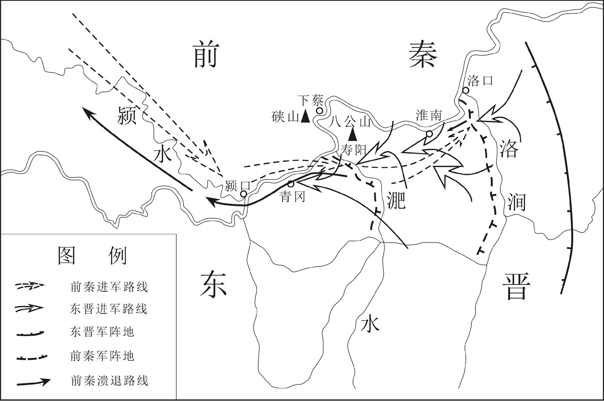 
淝水之战示意图

[2]铁骑：人、马均披铁甲的骑兵，即精锐的骑兵。　　蹙（cù）：逼迫；追逼。

[3]麾（huī）兵：指挥军队。

[4]青冈：今安徽凤台西北。　　蔽野塞川：遮蔽旷野，堵塞河流。形容死者极多。

[5]唳（lì）：鹤、雁等高亢的鸣叫。

[6]张天锡（346—406年）：字纯嘏（gǔ），小名独活，安定乌氏（今甘肃平凉西北）人，张骏之子。公元363年，他杀死前凉王张玄靓，自立为凉王。公元376年，苻坚派兵攻凉州，他战败投降，前凉灭亡。淝水之战中，随苻融征战前线，后逃至东晋，任庐江太守。桓玄篡晋，被任命为凉州刺史。公元406年病死，被追赠为金紫光禄大夫。

## 【译文】

前秦军队逼近肥水列阵，晋兵无法渡过。谢玄派遣使者对阳平公苻融说：“您孤军深入，却临水列阵，这是打持久战的办法，不是想速战速决啊。如果移动军阵稍微往后撤几步，让晋兵能够渡河，来一决胜负，不是很好吗？”前秦各将领都说：“我军人多而敌军人少，不如阻拦住他们，使他们不能上岸，可以万无一失。”苻坚说：“只是率军稍微退后，让他们渡过一半人马，我用铁骑兵突然冲杀他们，就没有不胜利的。”苻融也认为如此，于是指挥军队往后退。前秦军队一退，就停不下来了。谢玄、谢琰、桓伊等人率兵渡河攻打前秦的军队。苻融骑马巡视军阵，想要制止后退士卒，但是他战马倒地，被晋兵杀死，于是前秦军队崩溃。谢玄等人乘胜追击，抵达青冈，前秦军队大败，自相践踏而死的士兵遍布旷野，阻塞河流。那些逃跑的士兵听到风声鹤唳，都以为晋兵将到，于是昼夜不敢歇息，穿行草地，露宿星空，加上饥寒交迫，死亡的士兵达十分之七八。当初，前秦的军队稍微退后，朱序在阵后大喊道：“秦兵大败了！”前秦部众于是狂跑起来。朱序乘机与张天锡、徐元喜都来投奔东晋，晋兵又夺回了寿阳，并俘获了前秦淮南太守郭褒。

## 【原文】

**坚中流矢，单骑走至淮北，饥甚，民有进壶飧、豚髀者，坚食之，赐绵帛[1]。辞曰：“陛下厌苦安乐，自取危困。臣为陛下子，陛下为臣父，安有子饲其父而求报乎！”弗顾而去[2]。坚谓张夫人曰：“吾今复何面目治天下乎！”潸然流涕[3]。**

## 【注文】

[1]流矢：无端飞来的乱箭。　　壶飧（sūn）：用壶盛的汤饭熟食。　　豚（tún）髀（bì）：小猪大腿。

[2]弗（fú）：不。

[3] 潸（shān）然：流泪的样子。

## 【译文】

苻坚身中流箭，单人匹马，逃到淮河北岸，非常饥饿，有百姓献上一壶热饭和猪大腿肉，苻坚吃完，赏赐给他绵帛。那人推辞说：“陛下厌烦安乐生活，而自取危难困苦。我是陛下的子民，陛下是我的君父，哪有儿子请父亲吃饭，还要求报偿的呢！”头也不回地离去了。苻坚对张夫人说：“我现在还有什么脸面来治理天下呢！”说完泪流满面，悲凉不已。

## 【原文】

**是时，诸军皆溃，惟慕容垂所将三万人独全，坚以千余骑赴之。世子宝言于垂曰：“家国倾覆，天命人心皆归至尊，但时运未至，故晦迹自藏耳[1]。今秦主兵败，委身于我，是天借之便以复燕祚。此时不可失也，愿不以意气微恩忘社稷之重[2]。”垂曰：“汝言是也。然彼以赤心投命于我，若之何害之！天苟弃之，何患不亡。不若保护其危以报德，徐俟其衅而图之，既不负宿心，且可以义取天下[3]。”奋威将军慕容德曰：“秦强而并燕，秦弱而图之，此为报仇雪耻，非负宿心也。兄奈何得而不取，释数万之众以授人乎[4]？”垂曰：“吾昔为太傅所不容，置身无所，逃死于秦，秦王以国士遇我，恩礼备至[5]。后复为王猛所卖，无以自明，秦主独能明之。此恩何可忘也！若氐运必穷，吾当怀集关东以复先业耳，关西会非吾有也[6]。”冠军行参军赵秋曰：“明公当绍复燕祚，著于图谶[7]。今天时已至，尚复何待？若杀秦主，据邺都，鼓行而西，三秦亦非苻氏之有也[8]。”垂亲党多劝垂杀坚，垂皆不从，悉以兵授坚。平南将军慕容暐屯郧城，闻坚败，弃其众遁去[9]。至荥阳，慕容德复说暐起兵以复燕祚，暐不从[10]。**

## 【注文】

[1]宝：即慕容宝（354—398年），字道祐，小字库句，昌黎棘城（今辽宁义县西北）人，鲜卑族，慕容垂第四子。曾任前秦苻坚太子洗马、万年令。公元383年淝水之战后，慕容垂称燕王，立其为太子。公元396年，慕容垂死，他继位为王。即位后，遵父遗令，校阅户口，罢除鲜卑贵族因军功所取的封户，归属郡县；重定士族旧籍，明其官仪。公元398年，他南伐北魏兵败，投奔兰汗，到龙城（今辽宁朝阳）时被杀，谥为惠愍帝。　　至尊：帝王。此指慕容垂。　　晦迹：隐声匿迹。

[2]意气微恩：此指苻坚对慕容垂父子的礼遇。

[3]徐俟（sì）：慢慢等待。　　宿心：平素的恩遇。

[4]奋威将军：官名。西汉置，为杂号将军，统兵征战，不常设。晋时四品。　　慕容德（336—405年）：字玄明，昌黎棘城（今辽宁义县西北）人，鲜卑族，前燕主慕容皝之子。慕容皝去世时，他才十二岁，没有获封。慕容俊称帝后，被封为梁公。慕容暐在位时，被封为范阳王，征南将军。公元398年，称燕王，史称“南燕”。次年，迁都广固（今山东青州西北）。公元400年，正式称帝，改元建平。公元405年去世，谥“献武皇帝”，庙号世宗。

[5]太傅：官名。商周时，与太师、太保合称为“三公”，为天子的辅佐大臣，掌管礼法的制定和颁行。除秦朝短时间被废止外，以后各朝代都有设置，但多为虚衔，并无实权。能够获得这个称号的，一般都是朝中的权臣。此指慕容评。

[6]关东：此指前燕故地。

[7]冠军行参军：冠军将军下面的代理参军。非正式的职务即称“行”。　　绍复：承继和恢复。　　著于图谶（chèn）：写在记载预言的图书上。谶，古代占验术数，伪造预言的迷信书籍。

[8]鼓行：古人行军，击鼓则进，鸣金则止，因此称进军为鼓行。　　三秦：今陕西大部。项羽灭秦，分关中为三国，从此有三秦的名称。

[9]平南将军：武官名号，曹操始置。与平东、平西、平北将军合称四平将军。负责统兵征战，或作为刺史兼理军务的加官，统掌所在州的军事、政务。三国两晋前期地位较高。　　遁（dùn）去：逃跑。

[10]荥阳：郡名。三国魏置，治所设在荥阳县（今河南荥阳）。

## 【译文】

这时，前秦各路军马都溃散了，只有慕容垂所率领的三万军队独自保全，苻坚率领一千多骑兵赶到他那里。世子慕容宝对慕容垂说：“我们国破家亡，天命和人心都归属于您，只是时机未到，所以才隐声匿迹，暗藏复国大计罢了。现在前秦君主兵败，前来投奔我们，这是天赐良机，让我们恢复燕国的国统。这个时机不可错过，希望您不要因为前秦君主曾对您有些小恩小惠而意气用事，忘记了国家的重大使命。”慕容垂说：“你说得对，但是他怀着一片赤诚的心，把性命交给我，我怎么能害他呢！上天如果要抛弃他，则不必担心他不灭亡。因此我们不如在他危难时保护他，以报答他的恩德，慢慢再寻找机会图谋他，这样既没辜负往日的恩遇，又可以仁义来取得天下。”奋威将军慕容德说：“秦国强大，吞并燕国；秦国衰弱，我们就图谋它，这是报仇雪耻，不是辜负往日的恩情。兄长为什么到手的东西不取，放弃数万军队，拱手交给他人呢？”慕容垂说：“我过去被太傅慕容评所不容，无处藏身，为逃避一死来到秦国，前秦君主用国士的礼节对待我，恩义礼遇无微不至。后来又被王猛所陷害，我无法表明自己的清白，只有秦王能够明察一切。这样大的恩德怎么可以忘记！如果氐人的国运一定要结束了，我将感怀聚集关东的士民来恢复祖先的基业而已，至于关西地区，是不归我们所有的。”冠军行参军赵秋说：“明公您应当继承和恢复燕国的国统，这已经在图谶预言书中写得很明白了。现在天时已到，还要等什么？如果杀掉秦主，占据邺都，向西击鼓行进，那么三秦地区也不是苻姓的地盘了。”慕容垂的亲信党羽大多劝说慕容垂杀掉苻坚，慕容垂都不听从，把军队全都交给苻坚。平南将军慕容暐屯军郧城，听说苻坚失败，便抛弃部众逃跑了。到了荥阳，慕容德又劝说慕容暐起兵恢复燕国国统，慕容暐也没有听从。

## 【原文】

**谢安得驿书，时方与客围棋，摄书置床上，了无喜色，围棋如故[1]。客问之，徐答曰：“小儿辈遂已破贼。”既罢，还内，过户限，不觉屐齿之折[2]。丁亥，谢石归建康[3]。乙未，以张天锡为散骑常侍，朱序为琅邪内史[4]。**

## 【注文】

[1]驿书：驿站传递的文书，类似今“快件”。此指战报。　　摄书：拿起文书。　　床：在古代，床是供人坐卧的器具，与今天只用作睡卧不同。

[2]户限：门槛（kǎn）。

[3]建康：故城在今江苏南京。三国吴、东晋、南朝宋齐梁陈先后在此建都，六朝政治、经济、文化中心。原名金陵。秦置县，名秣（mò）陵。东汉献帝建安十七年（212年），孙权在此筑石头城，改称建业。西晋统一全国后，仍名秣陵。晋武帝太康三年（282年），分秣陵北另置建邺县，治所设在今江苏南京。后避晋愍帝司马邺讳更名建康。东晋南朝相承不改。

[4]散骑常侍：官名。秦汉时设散骑（皇帝的骑从）和中常侍。三国魏文帝曹丕将散骑与中常侍合并为一官，即散骑常侍。两晋、南北朝沿置，初为散骑省长官，其职责是侍从皇帝左右、规谏过失、以备顾问，三品，多为加官。其中，资深者称祭酒散骑常侍。魏末增加员额，新增者为员外散骑常侍。晋武帝时设员外散骑常侍二人，与散骑常侍共同轮流值班，称通直散骑常侍。东晋后为集书省长官，参掌机密，地位与侍中相当。　　琅邪：今山东临沂北。

## 【译文】

谢安收到驿站送来的战报，当时正在与客人下围棋，他拿过战报放在床上，脸上没显露出一点高兴的神色，仍旧下着围棋。客人问他什么事，谢安慢慢回答说：“小孩子们已经击败寇贼了。”下完棋后，谢安回到屋里，跨过门槛，木屐底下的钉齿被折断了都不知道。丁亥（初二日），谢石回到建康。乙未（初十日），任命张天锡为散骑常侍，朱序为琅邪内史。

## 【原文】

**秦王坚收集离散，比至洛阳，众十余万，百官、仪物、军容粗备。慕容农与慕容垂曰：“尊不迫人于险，其义声足以感动天地[1]。农闻秘记曰‘燕复兴当在河阳[2]’。夫取果于未熟与自落，不过晚旬日之间，然其难易美恶，相去远矣[3]。”垂心善其言，行至渑池，言于坚曰：“北鄙之民，闻王师不利，轻相扇动，臣请奉诏书以镇慰安集之，因过谒陵庙[4]。”坚许之。权翼谏曰：“国兵新破，四方皆有离心，宜征集名将，置之京师，以固根本，镇枝叶。垂勇略过人，世豪东夏，顷以避祸而来，其心岂止欲作冠军而已哉[5]！譬如养鹰，饥则附人，每闻风飙之起，常有陵霄之志，正宜谨其绦笼，岂可解纵，任其所欲哉[6]！”坚曰：“卿言是也，然朕已许之，匹夫犹不食言，况万乘乎！若天命有废兴，固非智力所能移也[7]。”翼曰：“陛下重小信而轻社稷，臣见其往而不返，关东之乱，自此始矣。”坚不听，遣将军李蛮、闵亮、尹国帅众三千送垂[8]。又遣骁骑将军石越帅精卒三千戍邺，骠骑将军张蚝帅羽林五千戍并州，镇军将军毛当帅众四千戍洛阳[9]。权翼密遣壮士邀垂于河桥南空仓中，垂疑之，自凉马台结草筏以渡，使典军程同衣己衣，乘己马，与僮仆趣河桥[10]。伏兵发，同驰马获免。**

## 【注文】

[1]尊：慕容农对父亲慕容垂的尊称。

[2]秘记：指谶纬一类的书籍。　　河阳：黄河以北。

[3]取果于未熟与自落：比喻用武力取秦复燕与让秦自灭后再取两种途径。　　旬：一旬十天。

[4]北鄙：北部边境。　　扇动：同“煽动”，鼓动。　　过谒（yè）：顺道拜访。　　陵庙：指慕容氏在邺城（今河北临漳西南）的陵寝和祖庙。

[5]东夏：华夏之东，即中国东部。

[6]飙（biāo）：暴风。　　陵霄：高入云霄，比喻志气高远。　　绦（tāo）：用来系鹰的丝绳。

[7]智力：指个人的智慧和力量。

[8]李蛮：前秦将军，生卒年不详。　　闵亮：前秦将军，生卒年不详。　　尹国：前秦将军，生卒年不详。

[9]骁（xiāo）骑将军：官名。两晋时为禁军主要将领，护卫宫廷，四品。骁骑，勇猛的骑兵。　　骠骑将军：将军名号。汉武帝刘彻元狩二年（前121年）霍去病征匈奴建立卓著功勋，被命为骠骑将军。此后一些立有大功的高级军官或重臣，常被授予此称号，地位仅次于丞相，统领中央常备军，职掌征战讨伐。后来大将军逐渐成为常置官职，相当于军队总司令。　　羽林：即羽林军，皇帝的禁卫军。　　镇军将军：官名。三国时魏国置，曹丕以陈群为镇军大将军，镇军之号始此。其地位仅低于骠骑将军、车骑将军、卫将军。

[10]河桥：西晋武帝司马炎泰始十年（274年），杜预在富平津上所建，位于今河南孟州西南黄河上。　　凉马台：在富平津黄河南岸桥西，今河南偃师北。　　典军：官名。主管营兵，位在护军之下。　　僮（tóng）仆：仆人。

## 【译文】

前秦王苻坚收集离散的将士，到洛阳时，部众仍有十多万人，文武百官，仪仗饰物，军队阵容，大致完备。慕容农对慕容垂说：“父亲您不乘人之危，这种仁义的名声足以感动天地。我听图谶预言书上说‘燕国复兴，应当在河阳’。摘取没有成熟的果实和等它瓜熟蒂落，不过晚十天左右，但它的难易好坏，却相差太远了。”慕容垂在心里很赞同慕容农的话，走到渑池，他对苻坚说：“北方边远地区的百姓，听说国家军队出师不利，轻率地相互煽动，我请求奉诏前去镇服、宽慰、安抚和收拢他们，并借此机会去拜谒一下祖宗的陵墓、庙宇。”苻坚答应了他。权翼劝谏道：“国家的军队刚失败，四方都有离叛之心，应当征集名将，将他们安置在京城，以稳固根本，镇定枝叶。慕容垂勇气谋略超过常人，世代称雄于东方，从前是因避祸而来，他心里哪里只是想做一名冠军将军而已！好比养鹰，鹰饥饿时就依附人类，每次听到暴风突起，它常常会产生凌驾云霄的志向，这时正应该谨慎地系紧绳索、关上笼子，怎么可以解开放纵它，听任他为所欲为呢！”苻坚说：“你说得对，但我已经答应了他，匹夫还不食言，何况君主呢！如果天命中有兴有废，本来就不是人的智谋与力量所能改变的。”权翼说：“陛下看重小小的信诺而轻视整个国家，我看他必将一去不返，关东的变乱，从此开始了。”苻坚不听，派遣将军李蛮、闵亮、尹国率领三千部众护送慕容垂。又派遣骁骑将军石越率领三千精兵，戍守邺城，骠骑将军张蚝率领五千羽林军，防守并州，镇军将军毛当率领部众四千，戍守洛阳。权翼秘密派遣壮士，在河桥南边的一座空仓库中截击慕容垂，慕容垂猜到会有这种事，便用草编成筏子，从凉马台渡过黄河，让典军程同穿着自己的衣服，骑着自己的马，与仆人们直趋河桥。快到河桥时，便有伏兵出击，程同快马逃脱了。

## 【原文】

**十二月，秦王坚至长安，哭阳平公融而后入，谥曰哀公。大赦，复死事者家[1]。**

## 【注文】

[1]复：免除赋税。　　死事者家：战死者之家。

## 【译文】

十二月，前秦王苻坚抵达长安，为阳平公苻融哭丧后进入城中，给苻融加谥号为“哀公”。大赦天下，免除在战争中死难者家属的全部徭役。

## 【原文】

**庚午，大赦。以谢石为尚书令。进谢玄号前将军，固让不受。**

## 【译文】

庚午（十五日），大赦天下。任命谢石为尚书令。晋升谢玄官号为前将军，谢玄坚持辞让不接受。

## 【原文】

**慕容垂至安阳，遣参军田山修笺于长乐公丕[1]。丕闻垂北来，疑其欲为乱，然犹身自迎之。赵秋劝垂于座取丕，因据邺起兵，垂不从。丕谋袭击垂，侍郎天水姜让谏曰：“垂反形未著，而明公擅杀之，非臣子之义。不如待以上宾之礼，严兵卫之，密表情状，听敕而后图之[2]。”丕从之，馆垂于邺西。垂潜与燕之故臣谋复燕祚。会丁零翟斌起兵叛秦，谋攻豫州牧平原公晖于洛阳，秦王坚驿书使垂将兵讨之。石越言于丕曰：“王师新败，民心未安，负罪亡匿之徒，思乱者众，故丁零一唱，旬日之中，众已数千，此其验也。慕容垂燕之宿望，有兴复旧业之心，今复资之以兵，此为虎傅翼也[3]。”丕曰：“垂在邺，如藉虎寝蛟，常恐为肘腋之变[4]。今远之于外，不犹愈乎？且翟斌凶悖，必不肯为垂下，使两虎相毙，吾从而制之，此卞庄子之术也[5]。”乃以羸兵二千及铠仗之弊者给垂，又遣广武将军苻飞龙帅氐骑一千为垂之副[6]。密戒飞龙曰：“垂为三军之帅，卿为谋垂之将，行矣，勉之！”**

## 【注文】

[1]安阳：县名，今河南安阳西南。　　修笺（jiān）：写信。

[2]侍郎：官名，为皇帝侍从之官。　　天水：郡名。汉武帝刘彻元鼎三年（前114年）置，当时此地有湖与天河相通，名为“天水井”，汉武帝就命令将新设的郡建在湖旁，取名“天水郡”。治所设在平襄县（今甘肃通渭西北），辖境相当今甘肃定西、甘谷、通渭、静宁、秦安、清水、庄浪、张家川、天水等地。东汉明帝刘庄永平十七年（74年）改名为汉阳郡，治所迁至冀县（今甘肃甘谷东南）。三国魏复称天水郡。西晋治所移至上邽县（今甘肃天水）。　　明公：对权贵长官的尊称。此称苻丕。　　敕（chì）：皇帝的命令或诏书。

[3]唱：古同“倡”，倡导。　　宿望：素有声望的人。　　为虎傅翼：替老虎安上翅膀。傅，通“附”，附着。

[4]藉（jiè）虎寝蛟：坐卧的猛虎，睡着的蛟龙，比喻十分危险。藉，坐卧在某物上。寝，卧、睡。

[5]凶悖（bèi）：凶恶逆乱。　　相毙：互相残杀。　　卞庄子之术：卞庄子又名管庄子、辨庄子，春秋时鲁国勇士。据《史记·张仪列传》，卞庄子曾遇到两只虎，于是巧妙地挑动两只虎互相搏斗，待其双双疲惫时，才一举将他们杀死。常用此以喻一举两得。

[6]羸（léi）兵：老弱病残的士兵。　　广武将军：军事职官名称。杂号将军之一，三国魏始置，四品，为刺史、太守的加衔，其属吏有长史、司马、正行参军和主簿等。东晋南北朝沿置。　　苻飞龙（？—383年）：略阳临渭（今甘肃秦安东南）人，氐族，前秦广武将军。淝水之战后，翟斌发动叛乱，苻丕命令他担任慕容垂副手，讨伐翟斌，并试图谋取慕容垂。但事情败露，他也被慕容垂杀死。

## 【译文】

慕容垂抵达安阳，派遣参军田山写信给长乐公苻丕。苻丕听说慕容垂北上的消息，怀疑他想作乱，但还是亲自去迎接他。赵秋劝说慕容垂在会见苻丕时在座位上拿下他，并趁机占据邺城起兵，慕容垂不听。苻丕谋划袭击慕容垂，侍郎天水人姜让劝谏道：“慕容垂反叛的迹象还不明显，而明公您擅自杀掉他，这不合乎作为臣子的道义。不如用贵宾的礼节对待他，派兵严加守卫，并秘密上表说明情况，听到敕令后再处置他。”苻丕听从了他的意见，把慕容垂安置在邺城西郊的馆舍。慕容垂暗中与前燕旧臣图谋恢复燕国。正好此时丁零族人翟斌起兵反叛前秦，图谋进攻在洛阳的豫州牧平原公苻晖，前秦王苻坚通过驿站送信给慕容垂，命他率兵讨伐翟斌。石越对苻丕说：“国家军队刚遭失败，民心还没有安定下来，负罪逃亡的那些人，想借机作乱的很多，所以丁零人一倡导，十天之间，叛乱的便达数千人，这就是明证。慕容垂在燕国一向很有声望，又有复兴旧有基业的雄心，现在还送给他军队，这真是为虎添翼。”苻丕说：“慕容垂在邺城，如同坐卧的猛虎、睡着的蛟龙，我常常担心他在腹心腋肘发生叛乱。现在把他派遣在外，不是更好吗？况且翟斌凶狠悖逆，一定不会甘心败在慕容垂之下，让他们两虎相斗，我再随后制服他们，这是卞庄子的战术。”于是把二千老弱病残的士兵和破旧的铠甲兵器交给慕容垂，又派遣广武将军苻飞龙率领一千氐族骑兵作为慕容垂的副手。苻丕秘密告诫苻飞龙说：“慕容垂是三军统帅，你是谋取他的部将，去吧，好好努力！”

## 【原文】

**垂请入邺城拜庙，丕弗许，乃潜服而入[1]。亭吏禁之，垂怒，斩吏烧亭而去。石越言于丕曰：“垂敢轻侮方镇，杀吏烧亭，反形已露，可因此除之。”丕曰：“淮南之败，垂侍卫乘舆，此功不可忘也[2]。”越曰：“垂尚不忠于燕，安能尽忠于我？失今不取，必为后患。”丕不从。越退告人曰：“公父子好为小仁，不顾大计，终当为人擒耳。”**

## 【注文】

[1]潜服：外披便服，内穿铠甲。

[2]淮南之败：指淝水战败之事。　　侍卫乘舆：侍从护卫。乘舆：皇帝用的车子，后来用作皇帝的代称。此指苻坚。

## 【译文】

慕容垂请求进入邺城祭拜祖先的宗庙，苻丕不同意，慕容垂便乔装混入城中。守亭小吏禁止他进入，慕容垂非常生气，杀掉小吏，烧了亭子而去。石越对苻丕说：“慕容垂胆敢轻视侮辱地方重镇，杀死官吏，烧毁守亭，反叛的行迹已经显露，可以因此除掉他。”苻丕说：“淮南失败时，慕容垂侍卫皇帝，这个功劳不能忘记。”石越说：“慕容垂对前燕尚不忠诚，怎能对我们尽忠？失去现在这个机会，不杀掉他，必然成为后患。”苻丕不听。石越退下去告诉他人说：“苻坚、苻丕父子喜欢对人施小仁义，却不顾国家大计，终究会被他人所擒。”

## 【原文】

**垂留慕容农、慕容楷、慕容绍于邺，行至安阳之汤池，闵亮、李毗自邺来，以丕与苻飞龙所谋告垂[1]。垂因激怒其众曰：“吾尽忠于苻氏，而彼专欲图吾父子，吾虽欲已，得乎！”乃托言兵少，停河内募兵，旬日间有众八千[2]。**

## 【注文】

[1]汤池：地名，在安阳城外，即今河南安阳。

[2]托：假托。　　河内：郡名，治所在野王县（今河南泌阳）。

## 【译文】

慕容垂把慕容农、慕容楷、慕容绍留在邺城，自己率军出征，当他行军到安阳的汤池，闵亮、李毗从邺城赶来，把苻丕与苻飞龙的阴谋告诉了慕容垂。慕容垂借机激怒他的部众说：“我对苻氏尽忠，而他们却想图谋我们父子，我虽然想罢手，但能行吗？”于是以兵少为借口，停留在河内招募士兵，十天时间便招募到八千人。

## 【原文】

**平原公晖遣使让垂，趣使进兵[1]。垂谓飞龙曰：“今寇贼不远，当昼止夜行，袭其不意。”飞龙以为然。壬午夜，垂遣世子宝将兵居前，少子隆勒兵从己，令氐兵五人为伍[2]。阴与宝约，闻鼓声，前后合击氐兵及飞龙，尽杀之，参佐家在西者皆遣还，并以书遗秦王坚，言所以杀飞龙之故。[3]**

## 【注文】

[1]趣（cù）：古同“促”，催促。

[2]少（shào）子：指最小的儿子。　　隆：即慕容隆（？—397年），昌黎棘城（今辽宁义县西北）人，鲜卑族，后燕开国皇帝慕容垂之子，十六国后燕名将，高阳王。　　令氐兵五人为伍：将氐兵化整为零，使其丧失协同作战能力。伍：古代军队的编制，一伍为五人。

[3] 参佐：部下；僚属。　　遗（wèi）：送交；交付。

## 【译文】

平原公苻晖派遣使者去责备慕容垂，催促他进军平叛。慕容垂对苻飞龙说：“现在离贼寇已经不远了，应当白天休息，夜晚行军，出其不意地袭击他们。”苻飞龙认为很对。壬午（二十七日）夜晚，慕容垂派世子慕容宝率兵在前，小儿子慕容隆率兵跟随自己，令氐族士兵五人为一伍。暗中与慕容宝相约，听到鼓声，前后夹击氐族士兵和苻飞龙，把他们全部杀死，家在函谷关以西的参佐全部遣返，并写信给前秦王苻坚，说明杀死苻飞龙的原因。

## 【原文】

**初，垂从坚入邺，以其子麟屡尝告变于燕，立杀其母，然犹不忍杀麟，置之外舍，希得侍见[1]。及杀苻飞龙，麟屡进策画，启发垂意，垂更奇之，宠待与诸子均矣。**

## 【注文】

[1]麟：即慕容麟（？—398年），昌黎棘城（今辽宁义县西北）人，鲜卑族，十六国后燕世祖慕容垂之子，惠愍帝慕容宝之弟。他最初不受慕容垂宠爱，后因屡进奇策，才开始受到赏识。慕容垂即皇帝位后，他被授为卫大将军，封赵王。公元397年，攻杀开封公慕容详，在中山（今河北定州）自立为帝。不过他在位仅三月，便被北魏军所败。于是前往邺城（今河北临漳西南）投靠范阳王慕容德，后因图谋夺位，被慕容德逼令自杀。　　告变于燕：向燕国告发慕容垂想反叛的事。

## 【译文】

当初，慕容垂跟随苻坚进入邺城，因为他的儿子慕容麟曾经屡次向前燕告发他叛变，便立即杀死了他的母亲，但还不忍心杀慕容麟，把他安排在外边的房舍，很少相见。等到杀掉苻飞龙时，慕容麟屡次献计，对慕容垂多有启发，于是慕容垂转变成见，认为他非同寻常，对他的宠爱和其他儿子们一样了。

## 【原文】

**慕容凤及燕故臣之子燕郡王腾、辽西段延等闻翟斌起兵，各帅部曲归之[1]。平原公晖使武平武侯毛当讨斌[2]。慕容凤曰：“凤今将雪先王之耻，请为将军斩此氐奴[3]。”乃擐甲直进，丁零之众随之，大败秦兵，斩毛当，遂进攻陵云台戍，克之，收万余人甲仗[4]。**

## 【注文】

[1]燕郡：郡名，治所在蓟县（今北京西南）。　　辽西：郡名。秦汉辽西郡治所设在阳乐（今辽宁义县西），辖境相当于今河北迁西、乐（lào）亭以东、长城以南，辽宁松岭山以东、大凌河下游以西地区。三国以后，治所先后移至令支城（今河北迁安西南）、肥如（今河北迁安东北）等地。　　部曲：最初为军队编制的名称，泛指某人统率下的军队。魏晋南北朝时指家兵、私兵。

[2]武侯：毛当谥号。

[3]先王：即慕容凤之父慕容桓。

[4]擐（huàn）甲：穿甲。　　陵云台：台名。位于今河南洛阳东北汉魏洛阳故城内。

## 【译文】

慕容凤及前燕旧臣的儿子燕郡人王腾、辽西人段延等人，听说翟斌起兵，便分别率领部曲前去归附。平原公苻晖命武平武侯毛当讨伐翟斌。慕容凤说：“我现在将要为先王雪耻，请为将军杀掉这个氐人的奴才。”于是穿上铠甲径直向前，丁零族的部众跟随他，大败前秦军队，杀掉毛当，于是进而攻打驻守在陵云台的士兵，攻下陵云台后，缴获了可供一万多人使用的铠甲和兵器。

## 【原文】

**癸未，慕容垂济河焚桥，有众三万，留辽东鲜卑可足浑谭集兵于河内之沙城[1]。垂遣田山如邺，密告慕容农等使起兵相应。时日已暮，农与慕容楷留宿邺中，慕容绍先出，至蒲池，盗丕骏马数百匹以待农、楷[2]。甲申晦，农、楷将数十骑微服出邺，遂同奔列人[3]。**

## 【注文】

[1]辽东：郡名。始设于战国时燕国，是秦击败东胡后所设五郡之一，治所设在襄平县（今辽宁辽阳老城区），因郡治在辽河之东，故名“辽东”。辖境东南至今鸭绿江下游，西至今大凌河下游及细河左岸，北至今辽河上游，东界自今昌图东北。魏晋南北朝时沿置。　　可足浑谭（？—397年）：鲜卑人，后燕新平公，可足浑健之子。　　沙城：今河南沁阳东北。

[2]蒲池：地名，今河北临漳西南故邺城郊外。

[3]晦（huì）：农历每月的最后一天。　　列人：县名，今河北肥乡东北。

## 【译文】

癸未（二十八日），慕容垂渡过黄河，烧毁河桥，拥有部众三万人，留下辽东鲜卑人可足浑谭在河内郡的沙城募集军队。慕容垂派遣田山前往邺城，秘密告诉慕容农等人，让他们起兵响应。这时太阳已落山，慕容农与慕容楷留在邺城过夜，慕容绍先出门，到了蒲池，偷走苻丕几百匹骏马，等待慕容农、慕容楷。甲申晦（二十九日），慕容农、慕容楷率领几十名骑兵乔装溜出邺城，于是他们一起逃奔到列人。

## 【原文】

**九年春正月乙酉朔，秦长乐公丕大会宾客，请慕容农不得，始觉有变，遣人四出求之，三日，乃知其在列人，已起兵矣[1]。**

## 【注文】

[1]朔（shuò）：即农历每月初一。

## 【译文】

晋孝武帝太元九年（384年）春季正月乙酉朔（初一日），前秦长乐公苻丕大会宾客，请慕容农参加聚会但没有找到他，才察觉到发生了变故，于是派人四处寻找他，三日后，才知道他在列人，已经起兵了。

## 【原文】

**慕容凤、王腾、段延皆劝翟斌奉慕容垂为盟主，斌从之。垂欲袭洛阳，且未知斌之诚伪，乃拒之曰：“吾来救豫州，不来赴君。君既建大事，成享其福，败受其祸，吾无预焉[1]。”丙戌，垂至洛阳，平原公晖闻其杀苻飞龙，闭门拒之。翟斌复遣长史郭通往说垂，垂犹未许。通曰：“将军所以拒通者，岂非以翟斌兄弟山野异类，无奇才远略，必无所成故邪？独不念将军今日凭之，可以济大业乎[2]！”垂乃许之。于是斌帅其众来与垂会，劝垂称尊号[3]。垂曰：“新兴侯，吾主也，当迎归返正耳[4]。”**

## 【注文】

[1]救豫州：前秦平原公苻晖为豫州牧，镇洛阳，故此处“救豫州”实指“救洛阳”。

[2]异类：古时对异族的蔑称。

[3]尊号：古代皇帝在世时的称号。由群臣讨论后，经皇帝批准并向臣民公布。一般用于外交、礼仪、祭祀等。尊号起于秦汉时期，如汉哀帝称“陈圣刘太平皇帝”。魏晋以后，尊号成为只是在某种特定的政治环境下所采取的改朝换代措施。

[4]新兴侯：即慕容暐。公元370年，前燕被前秦所灭，慕容暐被苻坚封为新兴侯。

## 【译文】

慕容凤、王腾、段延都劝翟斌拥戴慕容垂为盟主，翟斌听从了他们的建议。慕容垂想袭击洛阳，但他不知道翟斌的拥戴到底是真是假，于是拒绝他说：“我此行是来救援豫州，而不是来投奔您的。您既然要干大事，成功就享受福分，失败就遭受灾祸，我不参与。”丙戌（初二日），慕容垂抵达洛阳，平原公苻晖听说他杀了苻飞龙，便关门拒绝慕容垂。翟斌又派遣长史郭通前往游说慕容垂，慕容垂还是不答应。郭通说：“将军之所以拒绝我，是不是认为翟斌兄弟是居住在山野中的异族，没有奇异才能、长远谋略，必定不能有所成就的缘故？将军难道没想到今天凭借他们的力量，可以建成大业吗！”慕容垂这才答应。于是翟斌率领他的部众来和慕容垂会师，并劝慕容垂称帝。慕容垂说：“新兴侯慕容暐，是我的主公，应该迎接他回来将帝位交还给他。”

## 【原文】

**垂以洛阳四面受敌，欲取邺而据之，乃引兵而东。故扶馀王余蔚为荥阳太守，及昌黎鲜卑卫驹各帅其众降垂[1]。垂至荥阳，群下同请上尊号，垂乃依晋中宗故事，称大将军、大都督、燕王，承制行事，谓之统府[2]。群下称臣，文表奏诰，封拜官爵，皆如王者[3]。以弟德为车骑大将军，封范阳王；兄子楷为征西大将军，封太原王；翟斌为建义大将军，封河南王；余蔚为征东将军、统府左司马，封扶馀王；卫驹为鹰扬将军；慕容凤为建策将军[4]。帅众二十余万，自石门济河，长驱向邺[5]。**

## 【注文】

[1]扶馀：古国名，扶馀族所建。起源于今黑龙江松花江流域，今辽宁昌图、洮（táo）南以北，至吉林双城以南，皆其国土。扶馀最强盛时，疆域达到长城以北，南达高句丽、东达挹（yì）娄、西接鲜卑。扶馀国后来发展成四个国家，即北扶馀、东扶馀、卒本扶馀（即高句丽）、南扶馀（即百济）。扶馀国从公元前2世纪立国到公元494年东扶馀国被高句丽灭国为止，历时约七百年。　　余蔚：生卒年不详，十六国时扶馀国王，荥阳太守。后投降慕容垂，任后燕征东大将军、统府左长史，封为扶馀王；慕容宝时，被任命为太傅。　　昌黎：郡名。西汉时，在今辽宁义县境内设交黎县，为辽西郡东部都尉治所所在地。东汉安帝刘祜（hù）元初二年（115年），改交黎县为昌黎县，为辽东属国治所。三国曹魏齐王曹芳正始五年（244年），恢复东汉辽东属国建制，不久后改称昌黎郡，范围大致包括今辽宁锦州、阜新、朝阳等地。魏晋时昌黎郡先后属幽州、平州，郡治在昌黎县（今辽宁义县）。

[2]晋中宗故事：晋元帝司马睿庙号中宗。公元317年，晋西阳王司马莱及官属等共劝司马睿上尊号，但司马睿不许，仍称晋王。　　大将军：古代领兵的最高统帅。始于战国，是将军的最高封号，汉代沿置，职掌统兵征战。事实上多由贵戚担任，掌握政权，职位甚高。三国至南北朝时，大臣秉政，多加以“大将军”之号，统领军队。　　大都督：官名。三国时吴国、魏国在征战时临时设置的统领重兵的高级军事主帅。魏末时成为常设职务，位在都督中外诸军事之上，地位极高。晋朝多以权臣担任大都督，职掌数州军事。“大都督”与“都督”有所不同，“大都督”一般是统率诸军的大将，而“都督”一职是军中执法和办理事务的武官。　　承制：秉承皇帝意旨，实即代行皇帝职权。　　统府：统率辖区之内各地方政权的中央政府，规格较皇帝主持的朝廷低。

[3]诰（gào）：古代帝王对臣子的命令。

[4]范阳王：前燕本封慕容德为范阳王，今恢复其爵位。范阳：地名，今河北涿州。　　太原王：前燕封慕容恪为太原王，因此慕容楷承袭父亲爵位。太原：郡名，治所在晋阳（今山西太原西南），辖境相当于今山西五台山和管涔（cén）山以南、霍山以北地区。　　建义大将军：将军名号，东汉末董卓置。　　统府左司马：参见前文“征东左司马”条注。　　建策将军：官名。慕容垂创置，为临时设置的杂号将军。

[5]石门：地名，今河南荥阳北。

## 【译文】

慕容垂认为洛阳四面容易受到敌人的攻击，想夺取邺城据守，于是率领军队向东进发。前扶馀王余蔚担任荥阳太守，他与昌黎郡鲜卑人卫驹分别率领自己的部众投降了慕容垂。慕容垂抵达荥阳，手下人一同请求他称尊号，慕容垂于是依照晋中宗司马睿过去所实行的办法，称大将军、大都督、燕王，行使皇帝职权，称为统府。众属下都称臣，行文上表、奏章诰书，封官拜爵，都仿效帝王。任命弟弟慕容德为车骑大将军，封为范阳王；侄子慕容楷为征西大将军，封为太原王；翟斌为建义大将军，封为河南王；余蔚为征东将军、统府左司马，封为扶馀王；卫驹为鹰扬将军；慕容凤为建策将军。慕容垂率领二十多万军队，从石门渡过黄河，长驱直入，向邺城进发。

## 【原文】

**慕容农之奔列人也，止于乌桓鲁利家，利为之置馔，农笑而不食[1]。利谓其妻曰：“恶奴，郎贵人，家贫无以馔之，奈何[2]？”妻曰：“郎有雄才大志，今无故而至，必将有异，非为饮食来也。君亟出远望，以备非常[3]。”利从之。农谓利曰：“吾欲集兵列人以图兴复，卿能从我乎？”利曰：“死生唯郎是从。”农乃诣乌桓张骧，说之曰：“家王已举大事，翟斌等咸相推奉，远近响应，故来相告耳[4]。”骧再拜曰：“得旧主而奉之，敢不尽死。”于是农驱列人居民为士卒，斩桑榆为兵，裂襜裳为旗[5]。使赵秋说屠各毕聪，聪与屠各卜胜、张延、李白、郭超及东夷余和、敕勃、易阳乌桓刘大，各帅部众数千赴之[6]。农假张骧辅国将军，刘大安远将军，鲁利建威将军[7]。农自将攻破馆陶，收其军资器械，遣兰汗、段赞、赵秋、慕舆悕略取康台牧马数千匹[8]。汗，燕王垂之从舅；赞，聪之子也[9]。于是步骑云集，众至数万，骧等共推农为使持节、都督河北诸军事、骠骑大将军，监统诸将，随才部署，上下肃然[10]。农以燕王垂未至，不敢封赏将士。赵秋曰“军无赏，士不往。今之来者，皆欲建一时之功，规万世之利，宜承制封拜，以广中兴之基[11]。”农从之，于是赴者相继，垂闻而善之。农西招库傉官伟于上党，东引乞特归于东阿，北召光烈将军平睿及睿兄汝阳太守幼于燕国，伟等皆应之[12]。又遣兰汗等攻顿丘，克之[13]。农号令整肃，军无私掠，士女喜悦。**

## 【注文】

[1]鲁利：乌桓人，生卒年不详。　　置馔（zhuàn）：准备饭菜。

[2]恶奴：鲁利骂其妻的话。　　郎：对主人的尊称，此处指称慕容农。

[3]有异：有非同寻常的事情。　　亟（jí）出：急出。

[4]诣（yì）：到，旧时特指到尊长那里去。　　张骧：乌桓人，生卒年不详。曾任后燕辅国将军，后降北魏。　　家王：即慕容垂。

[5]斩：砍，剁断。　　桑榆：即桑树与榆树。　　兵：兵器。　　襜（chān）：遮至膝前的短衣，即围裙。　　裳：古称裙为裳，男女皆服。

[6]屠各：又作休屠各，匈奴部落之一。东汉至西晋杂居西北沿边诸郡，为南匈奴各部落中最高贵的部落。　　东夷：中囯古代对东部非华夏各民族的统称。　　敕勃：即乞伏敕勃，生卒年不详，西秦国主乞伏乾归之子。公元395年七月，吕光率十万大军进攻西秦，在西秦左辅密贵周和左卫将军莫者羖（gǔ）羝（dī）的劝说下，他被作为人质送往西平（今青海西宁）。　　易阳：今河北永年东南。

[7]假（jiǎ）：授予；给予。　　安远将军：官名。东汉末置，授予边远地区地方长官。后燕沿置。　　建威将军：官名。西汉置，为杂号将军，统兵征战，不常设。魏晋后为常设武职，四品。

[8]馆陶：县名。治所在今河北馆陶。　　兰汗（？—398年）：鲜卑族，十六国时期后燕国君，慕容垂舅父，曾封顿丘王。公元398年，杀死慕容宝，自称大都督、大单于、昌黎王，改元青龙。不久便被慕容宝之子慕容盛杀死。　　段赞（？—401）：段思之子，仕后燕。公元401年谋反，被杀。　　慕舆悕（xī）：生卒年不详，后燕将领。　　略：通“掠”，掠夺、夺取。　　康台：地名，今河北丘县附近。

[9]从舅：母亲的叔伯兄弟。

[10]使持节：魏、晋时期直接代表皇帝行使地方军政权力的职官名。“节”为古代常用信物，皇帝所遣使者规定持旌节，使命完成后归还。东汉后期，根据“节”所加方式不同而分为“使持节”“持节”“假节”三种。到晋朝，则明确规定“使持节”为上，可以杀郡守级别的官员；“持节”次之，能杀无官位人，若战争时期，得与使持节同；“假节”为下，只可杀违反军令的人。　　都督河北诸军事：即掌管河北军事事务的武官。　　骠骑大将军：官名。东汉置为临时统帅，统军出征，不常设。晋、南北朝时成为正式官号，相当于军队总司令，位高于骠骑将军，多为朝廷重臣的加官。　　随才部署：按照才能安排官职。

[11]规：谋求。

[12]库傉（nù）官伟（？—约397年）：鲜卑族，前燕时为岷（mín）山公。前燕灭亡后归服前秦。后燕慕容垂时，他历任左长史、太尉，并封为安定王。慕容宝即位后，被任命为太师、征南将军。公元397年，在中山与慕容详交战，兵败被杀。　　上党：郡名。战国时韩国置，治所设在长子县（今山西长子西南），辖境相当于今山西和顺、榆社以南，沁水流域以东地区。东汉末治所移至壶关县（今山西长治北）。西晋时治所移至潞（lù）县（今山西黎城南古城）。　　乞特归：十六国后期东阿一带鲜卑部落首领，生卒年不详。　　东阿：今山东东阿西南。　　光烈将军：官名。十六国后赵石虎置，授予归降的氐人首领。　　平睿：生卒年不详，前秦宣威将军，后燕光烈将军。　　汝阳：今河南商水西北。　　幼：即平幼，生卒年不详，平睿之兄。曾任后燕汝阳太守、护军将军、征北长史。　　燕国：今北京。

[13]顿丘：县名，今河南清丰西南。

## 【译文】

慕容农逃奔到列人，在乌桓人鲁利的家中落脚，鲁利为他准备饭菜，慕容农笑而不吃。鲁利对他的妻子说：“恶奴才，郎君是贵人，家中贫穷，没有可供给他吃的美食，怎么办？”他妻子说：“郎君有雄才大志，今日无缘无故地来了，一定有非同寻常的事情，不是为了吃喝而来的。您快出门向远处看看，以防万一。”鲁利听从了妻子的建议。慕容农对鲁利说：“我想在列人募集军队以谋求复兴，你能跟随我吗？”鲁利说：“不管是死是活，都跟随您。”慕容农于是又去乌桓人张骧那里，劝他说：“家王慕容垂已经举兵打算复国，翟斌等人全都推戴尊奉他，远方和附近的人也都响应，所以来告诉您一下。”张骧再三拜谢道：“能够得到旧主而尊奉他，怎敢不尽死力？”于是慕容农驱使列人的百姓为士兵，砍桑树、榆树作为兵器，撕开衣襟作为军旗。派赵秋游说屠各部毕聪，毕聪与屠各部卜胜、张延、李白、郭超以及东夷人余和、敕勃，易阳县乌桓人刘大，各自率领部众数千人赶赴列人。慕容农授予张骧为辅国将军，刘大为安远将军，鲁利为建威将军。慕容农亲自率军攻克馆陶，缴获了他们的军资器械，派遣兰汗、段赞、赵秋、慕舆悕劫掠康台牧马几千匹。兰汗，是慕容垂的表舅；段赞，是段聪的儿子。于是步兵骑兵云集，部众达数万人，张骧等人共同推举慕容农为使持节、都督河北诸军事、骠骑大将军，监督统辖各位将领，并根据他们的才干安排合适的职位，上上下下恭敬顺从。慕容农因燕王慕容垂未到，不敢封赏将士。赵秋说：“军中没有奖赏，士兵不会勇往向前。现在前来的人，都想建立一时的功业，以图万世的利益，应当禀承燕王的旨意，封官拜爵，以增广中兴的基础。”慕容农听从了他的建议，于是前来投奔的人络绎不绝，慕容垂听说此事后，大为赞赏。慕容农向西招引上党的库傉官伟，向东招抚东阿的乞特归，向北招来燕国的光烈将军平睿以及他的哥哥汝阳太守平幼，库傉官伟等人全都响应。又派遣兰汗等人进攻顿丘，并攻克了此城。慕容农号令严明，军队整齐肃穆，军中没有敢私自劫掠的，士人妇女们都非常高兴。

## 【原文】

**长乐公丕使石越将步骑万余讨之。农曰：“越有智勇之名，今不南拒大军而来此，是畏王而陵我也，必不设备，可以计取之[1]。”众请治列人城，农曰：“善用兵者，结士以心，不以异物。今起义兵，唯敌是求，当以山河为城池，何列人之足治也。”辛卯，越至列人西，农使赵秋及参军綦毋滕击越前锋，破之[2]。参军太原赵谦言于农曰：“越甲仗虽精，人心危骇，易破也，宜急击之[3]。”农曰：“彼甲在外，我甲在心。昼战，则士卒见其外貌而惮之，不如待暮击之，可以必克[4]。”令军士严备以待，毋得妄动。越立栅自固，农笑谓诸将曰：“越兵精士众，不乘其初至之锐以击我，方更立栅，吾知其无能为也[5]。”向暮，农鼓噪出，陈于城西[6]。牙门刘木请先攻越栅，农笑曰：“凡人见美食，谁不欲之，何得独请！然汝猛锐可嘉，当以先锋惠汝[7]。”木乃帅壮士四百腾栅而入，秦兵披靡，农督大众随之，大败秦兵，斩越，送首于垂[8]。越与毛当，皆秦之骁将也，故秦王坚使助二子镇守；既而相继败没，人情骚动，所在盗贼群起[9]。**

## 【注文】

[1]王：此指慕容垂。　　陵：欺凌，欺侮。

[2]綦（qí）毋（wú）：复姓。

[3]危骇：畏惧惊恐。

[4]甲在心：指士心欲战，虽无甲胄，而勇于赴战。

[5]栅：指军营外作防卫用的栅栏。

[6]向暮：傍晚。　　鼓噪：古代作战时常擂鼓呐喊，以壮声势。

[7]牙门：官名，全称为“牙门将”。西晋时统领担任护卫的军队。因古时主帅或主将帐前竖牙旗以为军门，故称“牙门将”。　　惠汝：优先给你。惠，赐、赠。

[8]腾栅：跳越栅栏。　　披靡：本指草木随风倒伏。比喻军队惊慌溃败。

[9]骁将：勇猛善战的将军，也作“枭将”。　　二子：即苻丕、苻晖。

## 【译文】

长乐公苻丕命石越率一万多步兵、骑兵讨伐慕容农。慕容农说：“石越有智勇双全的名声，现在不南下抵御燕王大军，而来到这里，这是畏惧燕王而欺凌我，因此一定不会设防，可用计策智取他。”众人请求修筑列人城，慕容农说：“善于用兵的人，用心来结交士卒，不靠别的东西。现在我们兴举义兵，只想寻找敌人，应当把山河作为城池，列人城哪里值得修筑呢。”辛卯（初七日），石越抵达列人城西，慕容农命赵秋和他的参军綦毋滕攻打石越的前锋部队，打败了他们。参军太原人赵谦对慕容农说：“石越的铠甲兵器虽然精良，但军心畏惧惊恐，容易攻破，应当赶快攻打他们。”慕容农说：“他们的铠甲穿在外面，而我们的铠甲在士兵们的心中。如果白天作战，士卒们见到敌军的外表就会害怕他们，不如等到晚上攻打他们，一定能够取得胜利。”于是下令军中严加戒备，等待命令，不得妄自行动。石越建立栅栏加固防守，慕容农笑着对众将领们说：“石越兵器精良、士兵众多，不趁着初来的锐气来攻打我们，反而立起了栅栏，我知道他没什么作为了。”傍晚，慕容农率军擂鼓呐喊而出，在列人城西列阵。牙门刘木请求率先攻打石越的栅栏，慕容农笑着说：“凡是人见到美味佳肴，谁不想吃掉它，怎么可能只有你请求前往！但你的勇猛和锐气值得嘉奖，就把先锋优先授予给你吧。”刘木于是率四百壮士越过木栅，进入敌军营寨，前秦军队惊慌溃败，慕容农督统大军随后赶到，大败前秦军队，杀掉石越，把他的首级送交给慕容垂。石越和毛当，都是前秦的骁勇将领，所以前秦王苻坚派他们协助自己的两个儿子镇守；但他们相继战败战死，因此人心骚动，他们所在的地方盗贼蜂起云涌。

## 【原文】

**庚戌，燕王垂至邺，改秦建元二十年为燕元年，服色朝仪皆如旧章[1]。以前岷山公库傉官伟为左长史，前尚书段崇为右长史，荥阳郑豁等为从事中郎[2]。慕容农引兵会垂于邺，垂因其所称之官而授之[3]。立世子宝为太子，封从弟拔等十七人及甥宇文输、舅子兰审皆为王，其余宗族及功臣封公者三十七人，侯、伯、子、男者八十九人[4]。可足浑谭集兵得二万余人，攻野王，拔之，引兵会攻邺[5]。平幼及弟叡、规亦帅众数万会垂于邺[6]。**

## 【注文】

[1]建元：十六国时前秦宣昭帝苻坚所用第三个年号，共计二十一年，即建元元年（365年）六月至建元二十一年（385年）七月。建元二十一年（385年）八月，前秦哀平帝苻丕即位，改元太安元年。　　燕：即后燕（384—407年），十六国之一，都中山（今河北定州），盛时疆域包括今河北、山东及辽宁、山西、河南大部，历七主，共二十六年，是十六国后期中原地区最强盛的一个王国。公元383年，前秦淝水之战大败。次年，投降前秦的前燕贵族慕容垂集合鲜卑旧众复国。公元394年，灭西燕。公元407年，被北燕所灭。　　服色：古代王朝所定不同于其他朝代车马、服饰、祭牲的颜色。如夏尚黑，商尚白，周尚赤之类。

[2]前：指前燕。下同。　　岷山公：前燕爵位名。岷山：郡名，治所在汶山县（今四川茂县北）。　　左长史：官名。最早设于汉代，当时丞相和将军幕府皆设有长史官，相当于现在的秘书长。除此之外，边地郡亦设长史，为太守的佐官。魏晋南北朝时王府、三公府、将军府多设左右长史。　　段崇：鲜卑人，生卒年不详。历任前燕尚书，后燕右长史、太保等。　　右长史：参见前文“左长史”条。　　从事中郎：官名。东汉大将军、车骑将军僚属，参与谋议。三国魏、晋、南北朝沿置。职掌各异，或主官吏，或掌诸曹，或掌机密。

[3]因其所称之官而授之：因：根据，按照。即慕容垂按照慕容农所授的官职而实授给他们。

[4]拔：慕容拔（？—407年），鲜卑慕容部人，后燕中垒将军。　　宇文输：据严衍《资治通鉴补》“输”改“翰”。　　兰审：生卒年不详，兰建之子，慕容垂的表兄弟，后燕北平王。　　公：古代爵位。爵位是古代皇帝对贵戚功臣的封赐，历代爵称和爵位制度各有不同，因时而异。两晋时，设置了王、公、侯、伯、子、男、开国郡公、开国县公、开国郡侯、开国县侯、开国侯、开国伯、开国子、开国男、乡侯、亭侯、关内侯、关外侯共十八级爵位。其中，王爵一般封给皇子；公、侯、伯、子、男五等爵专封宗室；功臣封爵为“开国”诸爵及乡侯、亭侯、关内侯、关外侯。诸侯王能专制其国；五等爵中公国之制同下等王国，侯国不满五千户，置一军，兵千人。其余诸爵与开国爵封地称国但封君不治国事，乡侯至关外侯无封邑。诸王之子除嗣王外，依次按公、侯、伯、子、男递降世袭。　　侯：封建制度五等爵位的第二等。　　伯：封建制度五等爵位的第三等。　　子：封建制度五等爵位的第四等。　　男：封建制度五等爵位的第五等。

[5]野王：今河南沁阳。

[6]规：即平规，生卒年不详，曾任后燕宁朔将军、征东将军。

## 【译文】

庚戌（二十六日），燕王慕容垂到达邺城，改前秦建元二十年为后燕元年，官员们的服装颜色、上朝的礼仪，都遵循前燕。任命前岷山公库傉官伟为左长史，前尚书段崇为右长史，荥阳人郑豁等人为从事中郎。慕容农率兵与慕容垂相会于邺城，慕容垂按照慕容农先前所自称的官号原样授予。立世子慕容宝为太子，封堂弟慕容拔等十七人以及外甥宇文输、舅舅的儿子兰审都为王，其他宗族以及功臣，被封为公爵的共有三十七人，封为侯、伯、子、男爵的共有八十九人。可足浑谭募集军队二万多人，进攻野王，攻克该城，率兵与慕容垂等会师，攻打邺城。平幼和他的弟弟平叡、平规也率部众数万在邺城与慕容垂会师。

## 【原文】

**长乐公丕使姜让诮让燕王垂，且说之曰：“过而能改，今犹未晚也[1]。”垂曰：“孤受主上不世之恩，故欲安全长乐公，使尽众赴京师，然后修复国家之业，与秦永为邻好[2]。何故暗于机运，不以邺城见归[3]？若迷而不复，当穷极兵势，恐单马求生亦不可得也。”让厉色责之曰：“将军不容于家国，投命圣朝，燕之尺土，将军岂有分乎？主上与将军风殊类别，一见倾心，亲如宗戚，宠逾勋旧，自古君臣际遇有如是之厚者乎[4]？一旦因王师小败，遽有异图[5]。长乐公，主上元子，受分陕之任，宁可束手输将军以百城之地乎[6]？将军欲裂冠毁冕，自可极其兵势，奚更云云[7]。但惜将军以七十之年，悬首白旗，高世之忠，更为逆鬼耳[8]。”垂默然。左右请杀之，垂曰：“彼各为其主耳，何罪？”礼而归之，遗丕书及上秦王坚表，陈述利害，请送丕归长安。坚及丕怒，复书切责之。**

## 【注文】

[1]诮（qiào）让：谴责。

[2]京师：此指长安。

[3]暗于机运：在机运方面糊涂。机运：指事物发展变化的关键和气数。　　见归：归还我。

[4]主上：此指苻坚。　　风殊类别：风俗和种族都有差别。　　宗戚：宗室国戚。　　勋旧：有功勋的旧臣。

[5]遽（jù）：就。

[6]元子：皇帝的嫡长子。苻坚的嫡长子应为太子苻宏。姜让以元子称苻丕，是以突出其重要。　　分陕之任：相传西周初，周公与召公分陕（今河南三门峡市陕州区）而治，周公治陕以东，召公治陕以西。此指中央官员出任高级地方长官。　　输：献纳，奉送。

[7]裂冠毁冕：指背叛王室，犹如自毁冠冕。语出《左传》昭公九年：“王使桓伯辞于晋，曰：‘……我在伯父，犹衣服之有冠冕，木水之有本原，民人之有谋主也。伯父若裂冠毁冕，拔本塞原，专弃谋主，虽戎狄，其何有余一人。’”　　极其兵势：动用全部兵力。　　奚（xī）更云云：何用再说什么。云云：如此如此。此指慕容垂上面所说的那些话。

[8]悬首白旗：斩首后悬挂示众。据《逸周书·世俘》载，周武王斩纣，悬首白旗。　　高世：高出于世人。　　更（gēng）为：变为。

## 【译文】

长乐公苻丕派姜让谴责后燕王慕容垂，并且让他劝说慕容垂道：“知错能改，现在还不算晚。”慕容垂说：“我蒙受主上苻坚莫大的恩惠，所以才想要保全长乐公，让他带领所有的部众赶赴京师，然后恢复国家的大业，与秦国永远结为友好邻邦。你们为什么不识时务，不把邺城归还给我？如果执迷不悟，我就会率领全部军队作战到底，恐怕到那时想单人匹马逃生也不可能了。”姜让厉声斥责慕容垂说：“将军在自己的家族和国家之中无处容身，逃命到我们圣朝，前燕的每一尺土地，哪有将军的分？主上与将军风俗不同、种族有别，却一见倾心，亲如宗族亲属，宠幸超过功勋旧臣，自古以来，君臣之间的交往礼遇，有如此深厚的吗？一旦因国家的军队遭到一点失败，将军马上就有别的打算。长乐公，是主上的长子，接受分陕而统治一方的重任，怎么能把一百多座城池的土地束手让给将军呢？将军如果想要背叛主上，当然可以动用全部兵力抵抗到底，何必再说这些。只可惜将军在七十岁高龄的时候，却要在白旗杆上悬挂头颅，盖世的忠诚，反而变为叛逆之鬼。”慕容垂沉默不语。身边的人请求杀掉姜让，慕容垂说：“彼此各为自己的君主，有什么罪！”于是对姜让以礼相待，并将他放回去，慕容垂写信给苻丕，又向前秦王苻坚上表，陈述利害，请求送苻丕回长安。苻坚和苻丕见表后大怒，回信狠狠责备慕容垂。

## 【原文】

**壬子，燕王垂攻邺，拔其外郭，长乐公丕退守中城。关东六州郡县多送任请降于燕[1]。癸丑，垂以陈留王绍行冀州刺史，屯广阿[2]。**

## 【注文】

[1]送任：送亲属去当人质。

[2]陈留王：后燕爵位名。陈留，国名，治所设在小黄县（今河南开封东北），辖境相当于今河南东至民权、宁陵，西至开封、尉（wèi）氏，北至延津、长垣，南至杞（qǐ）县、睢（suī）县等地。　　行（xíng）：代理。　　广阿：今河北隆尧东。

## 【译文】

壬子（二十八日），后燕王慕容垂攻打邺城，攻取了外城，长乐公苻丕撤退到内城防守。关东六州的郡县纷纷送来人质，请求向后燕投降。癸丑（二十九日），慕容垂任命陈留王慕容绍为代理冀州刺史，屯军广阿。

## 【原文】

**桓冲闻谢玄等有功，自以失言，惭恨成疾而卒[1]。**

## 【注文】

[1]失言：指之前“吾其左衽”之言。

## 【译文】

桓冲听到谢玄等人成功的消息，自己因为失言，惭愧悔恨得病而死。

## 【原文】

**二月，燕王垂引丁零、乌桓之众二十余万，为飞梯、地道以攻邺，不拔，乃筑长围守之，分处老弱于肥乡，筑新兴城以置辎重[1]。燕范阳王德击秦枋头，取之，置戍而还[2]。东胡王晏据馆陶，为邺中声援，鲜卑、乌桓及郡县民据坞壁不从燕者尚众[3]。燕王垂遣太原王楷与镇南将军陈留王绍讨之[4]。楷谓绍曰：“鲜卑、乌桓及冀州之民本皆燕臣，今大业始尔，人心未洽，所以小异。唯宜绥之以德，不可震之以威[5]。吾当止一处，为军声之本，汝巡抚民夷，示以大义，彼必当听从[6]。”楷乃屯于辟阳[7]。绍帅骑数百往说王晏，为陈祸福，晏随绍诣楷降。于是鲜卑、乌桓及坞民降者数十万口。楷留其老弱，置守宰以抚之，发其丁壮十余万，与王晏诣邺[8]。垂大悦曰：“汝兄弟才兼文武，足以继先王矣[9]。”**

## 【注文】

[1]飞梯：即“云梯”，攻城工具。　　肥乡：县名，今河北肥乡西南。　　新兴城：城名，今河北肥乡东南。

[2]枋（fāng）头：今河南淇（qí）县东南。

[3]东胡：古代东北民族。因居于匈奴（胡）以东，而得此名。　　坞壁：古代为防御而修建的小城堡。魏晋南北朝时，多以血缘和地域来结集，以宗族与乡里作为团聚的纽带。此外也有以流民结集的方式出现的坞壁。

[4]镇南将军：官名，统兵将领，东汉末所置镇南、镇北、镇西、镇东“四镇将军”之一，掌征伐背叛、镇戍四方。

[5]绥（suí）：安抚。

[6]为军声之本：以大军造声势作为绥抚的保障。

[7]辟阳：城名，在今河北冀州东南。

[8]守宰：泛指地方官。

[9]先王：此指慕容楷、慕容绍之父前燕太原王慕容恪。

## 【译文】

二月，后燕王慕容垂率领丁零、乌桓部众二十多万，造云梯、挖地道，攻打邺城，没有攻下，于是修筑起长长的围墙，守在那里，挑出年老体弱的人，把他们安置在肥乡，修筑新兴城来存放军用物资。后燕范阳王慕容德攻打前秦的枋头，夺取了它，安排好戍卒后返回。东胡人王晏占据馆陶，声援邺城中的守军，鲜卑、乌桓以及郡县中据守坞壁的民众，不服从后燕的还有很多。后燕王慕容垂派遣太原王慕容楷与镇南将军陈留王慕容绍讨伐他们。慕容楷对慕容绍说：“鲜卑人、乌桓人以及冀州的百姓，本来都是前燕的臣民，现在大业刚刚开始，民心还不融洽，所以会出现一些小小分歧。我们只能以恩德安抚他们，不能靠威力震慑他们。我应该停驻在一个地方，作为扩大军队声威的本源，你可以巡视安抚百姓以及各族中不服从的人，向他们晓以大义，他们一定会听从的。”慕容楷于是屯军辟阳。慕容绍率领数百名骑兵前去说服王晏，向他陈述祸福，王晏跟随慕容绍到慕容楷那里投降。于是鲜卑、乌桓以及坞壁中的民众，投降的达数十万人。慕容楷留下他们中年老体弱的人，设置地方官吏安抚他们，征发他们中的壮丁十多万人，与王晏一起去邺城。慕容垂非常高兴地说：“你们兄弟文武双全，足以继承先王慕容恪的遗志了！”

## 【原文】

**三月，秦北地长史慕容泓闻燕王垂攻邺，亡奔关东，收集鲜卑，众至数千，还屯华阴，败秦将军强永，其众遂盛，自称都督陕西诸军事、大将军、雍州牧、济北王[1]。推垂为丞相、都督陕东诸军事、领大司马、冀州牧、吴王[2]。**

## 【注文】

[1]慕容泓（？—384年）：鲜卑族，昌黎棘城（今辽宁义县西北）人，慕容儁之子。前燕时，封济北王。前燕灭亡后，仕苻秦为北地长史。公元384年，趁苻坚攻东晋失败，在华阴称济北王，创建西燕，起兵反苻秦，但不久便因持法苛峻，被部下杀死。　　华阴：今陕西华阴东。　　都督陕西诸军事：即掌管陕西军事事务的武官。陕西，指陕县（即今河南三门峡市陕州区）以西地区。

[2]丞相：也称宰相。官名，古代最高行政长官的通称，职责为典领百官，辅佐皇帝治理国政。　　都督陕东诸军事：即掌管陕东军事事务的武官。陕东，指陕县（即今河南三门峡市陕州区）以东地区。　　大司马：中国古代对中央政府武职最高长官的称呼。晋代基本沿袭前朝官制特点，大司马在武官中排名第一。根据《晋书》记载魏晋大司马，位在三公之上，居第一品。

## 【译文】

三月，前秦北地长史慕容泓听说后燕王慕容垂攻打邺城，便逃奔到关东，募集鲜卑人，部众达数千人，回到华阴驻扎，打败前秦将军强永，他的势力于是强盛起来，慕容泓自称都督陕西诸军事、大将军、雍州牧、济北王。推举慕容垂为丞相、都督陕东诸军事，兼大司马、冀州牧、吴王。

## 【原文】

**秦王坚谓权翼曰：“不用卿言，使鲜卑至此。关东之地，吾不复与之争，将若泓何？”乃以广平公熙为雍州刺史，镇蒲坂[1]。征雍州牧巨鹿公叡为都督中外诸军事、卫大将军、录尚书事，配兵五万，以左将军窦冲为长史，龙骧将军姚苌为司马，以讨泓[2]。**

## 【注文】

[1]广平公：前秦爵位名。广平，郡名，治广平（今河北鸡泽东）。　　熙：即苻熙，生卒年不详。苻坚之子，苻丕、苻晖之弟。前秦广平公、镇东大将军、雍州刺史，镇蒲坂（今山西永济东南）。

[2]都督中外诸军事：官名。始于曹魏，指节制宫城内外，总领京师的中央禁军。曹魏时为实职武官。从西晋开始，其性质逐渐向虚衔、荣誉衔转化。东晋以后，京师中外诸军力量的削弱使其逐渐演化为虚职。　　卫大将军：官名。十六国时置，位在卫将军之上。

## 【译文】

前秦王苻坚对权翼说：“没听您的话，让鲜卑人到如此地步。关东的土地，我不再与他们争了，但怎么对付慕容泓呢？”于是任命广平公苻熙为雍州刺史，镇守蒲坂。征召雍州牧巨鹿公苻叡为都督中外诸军事、卫大将军、录尚书事，配给军队五万，任左将军窦冲为长史，龙骧将军姚苌为司马，讨伐慕容泓。

## 【原文】

**平阳太守慕容冲亦起兵于平阳，有众二万，进攻蒲坂[1]。坚使窦冲讨之。**

## 【注文】

[1]平阳：郡名，治平阳县（今山西临汾西南金殿村）。　　慕容冲（359—386年）：鲜卑族，昌黎棘城（今辽宁义县西北）人，慕容泓之弟，小字凤凰。前燕时封中山王。公元370年，前燕被前秦所灭，他迁至关中，授平阳太守。淝水之战后，投奔慕容泓起兵反秦。公元384年，慕容泓被杀，他被拥立为皇太弟，次年，继位为西燕国君。他在位二年，即公元385年至386年，在位期间生活荒淫，赏罚不明，群臣怨愤。公元386年，被部将乱刀砍死。后被其子慕容瑶追谥为威皇帝。

## 【译文】

平阳太守慕容冲也在平阳起兵，拥有部众二万人，进攻蒲坂。苻坚命窦冲讨伐他。

## 【原文】

**库傉官伟帅营部数万至邺，燕王垂封伟为安定王[1]。**

## 【注文】

[1]安定王：后燕爵位名。安定，郡名。治所设在安定县（今甘肃泾川北泾河北岸）。

## 【译文】

库傉官伟率领部众数万抵达邺城，后燕王慕容垂封他为安定王。

## 【原文】

**秦冀州刺史阜城侯定守信都，高城男绍在其国，高邑侯亮、重合侯谟守常山，固安侯鉴守中山[1]。燕王垂遣前将军乐浪王温督诸军攻信都，不克；夏四月丙辰，遣抚军大将军麟益兵助之[2]。定、鉴，秦王坚之从叔；绍、谟从弟；亮，从子也。温，燕王之弟子也[3]。**

## 【注文】

[1]阜城侯：前秦爵位名。阜城，县名，治所在今河北阜城东。　　定：即苻定（？—386年），前秦奠基人苻洪之弟苻安长子，苻坚堂叔，阜城侯、征东将军。苻丕时任冀州牧，后降于后燕慕容楷部。　　信都：地名，今河北冀州。　　高城男：前秦爵位名。高城，县名，今河北盐山东南。　　绍：即苻绍，生卒年不详，苻坚堂弟，前秦高城男。后向后燕投降。　　国：封国。　　高邑侯：前秦爵位名。高邑，县名，治所在今河北柏乡北。　　亮：即苻亮，生卒年不详，苻坚侄子。前秦幽州都督、平州都督、高邑侯。　　重合侯：前秦爵位名。重合，县名，治所在今山东乐陵西北。　　谟（mó）：即苻谟（？—397年），苻坚堂弟，重合侯、征西将军、幽州牧、中山尹。公元397年，担任后燕都城中山太守，随后被慕容详杀害。　　常山：今河北正定西南。　　固安侯：前秦爵位名。固安，县名，治所在今河北易县东南。　　鉴：即苻鉴（？—385年），前秦政权奠基者苻洪弟苻安之子，苻坚堂叔，固安侯，淝水之战后镇守中山，后被慕容麟杀死。

[2]乐浪王：后燕爵位名。乐浪，郡名。公元前108年，汉武帝在并吞卫氏朝鲜后以古朝鲜地区为中心所设置的郡，“汉四郡”之一。治所设在朝鲜县（故卫氏朝鲜都城王险城，今朝鲜平壤大同江南岸），辖境约当今朝鲜平安南道、平安北道及黄海北道各一部分，对朝鲜、日本诸部落有很大的影响力。乐浪郡沿袭至西晋末。八王之乱后，中原大乱，高句丽南下屯兵乐浪郡。　　温：即慕容温（？—389年），鲜卑族，十六国前燕昌黎棘城（今辽宁义县西北）人，前燕慕容儁第四子。慕容垂时，被封为乐浪王，屯据中山（今河北定州）。虽然他兵力甚弱，但他劝课农桑，善于安抚人心，因此归顺者相继争送军粮。翟真夜袭中山时，被其击败，并遣兵运粮发饷，受到慕容垂的表彰。公元389年，被丁零人故堤刺杀身亡。　　抚军大将军：将军名号，三国时曹魏置，位在大将军之下、三公之上。　　益兵：增加兵力。

[3]从叔：父辈堂弟。　　从子：兄弟的儿子，即侄子。

## 【译文】

前秦冀州刺史阜城侯苻定据守信都，高城男苻绍守卫在他的封国内，高邑侯苻亮、重合侯苻谟据守常山，固安侯苻鉴据守中山。后燕王慕容垂派遣前将军乐浪王慕容温率领各路兵马攻打信都，没有攻下；夏季四月丙辰（初三日），派遣抚军大将军慕容麟增加军队，帮助攻城。苻定、苻鉴，是前秦王苻坚的堂叔；苻绍、苻谟，是苻坚的堂弟；苻亮，是苻坚的侄子。慕容温，是后燕王慕容垂的侄子。

## 【原文】

**慕容泓闻秦兵且至，惧，帅众将奔关东。秦巨鹿愍公叡粗猛轻敌，欲驰兵邀之[1]。姚苌谏曰：“鲜卑皆有思归之志，故起而为乱，宜驱令出关，不可遏也。夫执鼷鼠之尾，犹能反噬于人，彼自知困穷，致死于我，万一失利，悔将何及[2]。可鸣鼓随之，彼将奔败不暇矣。”叡弗从。战于华泽，叡兵败，为泓所杀[3]。苌遣龙骧长史赵都、参军姜协诣秦王坚谢罪，坚怒杀之[4]。苌惧，奔渭北马牧，于是天水尹纬、尹详、南安庞演等纠扇羌豪，帅其户口归苌者五万余家，推苌为盟主[5]。苌自称大将军、大单于、万年秦王，大赦，改元白雀[6]。以尹详、庞演为左、右长史，南安姚晃及尹纬为左、右司马，天水狄伯支等为从事中郎，姜训等为掾属，王据等为参军，王钦卢、姚方成等为将帅[7]。**

## 【注文】

[1]巨鹿愍公叡：即苻叡。“巨鹿公”是他的封号，“愍”是他的谥号。

[2]鼷（xī）鼠：一种小老鼠，亦称“耳鼠”。一说为小家鼠。　　反噬（shì）：回头咬。　　致死：拼命。

[3]华泽：今陕西华阴附近。

[4]龙骧长史：即龙骧将军姚苌的长史。

[5]渭北马牧：即渭水北岸的牧马场。　　尹纬：字景亮，天水（今甘肃天水）人。初仕苻秦为吏部令史。苻坚末，拥立姚苌为主，建立后秦。姚兴继位后，被封为清河侯。历任右司马、辅国将军、司隶校尉、尚书仆射等。后卒于任上，谥忠成侯。　　南安：郡名。东汉灵帝中平五年（188年）分汉阳郡置，治所在今甘肃陇西东南、渭水东岸，辖境相当于今甘肃陇西东部及定西等地。　　纠扇：纠集煽（shān）动。

[6]大单（chán）于：西晋末年、南北朝时期，少数民族首领的一种虚衔，一般有大单于封号就有权力号令少数民族。　　万年秦王：公元384年，姚苌自称万年秦王，后秦自此建立。　　改元：皇帝即位时或在位期间改换年号。每个年号开始的一年称元年。　　白雀：十六国时期后秦君主姚苌的第一个年号，也是后秦的第一个年号，共计三年，即白雀元年（384年）四月至白雀三年（386年）四月。

[7]姚晃（生卒年不详）：十六国时南安赤亭（今甘肃陇西西）人，羌族。公元384年，姚苌建立后秦，他被任命为左司马；姚苌称帝后，迁任尚书右仆射。姚苌临终时，他与姚旻（mín）等共同受遗诏辅政。姚兴即位后，被拜为尚书令。　　狄伯支（生卒年不详）：天水（今甘肃天水）人，后秦大臣，历任司马、尚书、征虏将军。　　掾（yuàn）属：佐治的官吏。汉时由主官自选，不由朝廷任命。魏晋以后，改由吏部任免。　　王钦卢：陇西（今甘肃陇西东南）人，生卒年不详。早年随姚弋仲归顺后赵，担任左将军。后随姚苌投降前秦。淝水之战后，与张干等人力推姚苌为盟主。　　姚方成（生卒年不详）：曾任后秦左将军、征南将军，为姚苌初叛苻坚时最早的追随者之一。

## 【译文】

慕容泓听说前秦军队即将到来，心中害怕，于是率领部将们打算逃奔关东。前秦巨鹿愍公苻叡粗暴勇猛，轻视敌人，想快速进军截击慕容泓。姚苌劝谏道：“鲜卑人都有回故乡的念头，所以起兵作乱，应当把他们驱逐出关，不能阻拦。抓住鼷鼠的尾巴，它还能反咬人一口，他们自知走投无路，而与我们拼命，万一失败，后悔都来不及了。我们只要擂鼓随他们之后，到时敌人奔逃败退都来不及呢。”苻叡不听。在华泽与慕容泓交战，苻叡兵败，被慕容泓杀死。姚苌派遣龙骧长史赵都、参军姜协到前秦王苻坚那里请罪，苻坚气得杀了他们。姚苌害怕，逃奔到渭水北岸的牧马场，于是天水人尹纬、尹详，南安人庞演等纠集煽动羌族豪强，率领他们所辖的五万多家归附了姚苌，推举姚苌为盟主。姚苌自称大将军、大单于、万年秦王，大赦，改年号为白雀。任命尹详、庞演为左、右长史，南安人姚晃和尹纬为左、右司马，天水人狄伯支等人为从事中郎，姜训等人为掾属，王据等人为参军，王钦卢、姚方成等人为将帅。

## 【原文】

**秦窦冲击慕容冲于河东，大破之，冲帅鲜卑骑八千奔慕容泓。泓众至十余万，遣使谓秦王坚曰：“吴王已定关东，可速资备大驾，奉送家兄皇帝，泓当帅关中燕人翼卫乘舆，还返邺都，与秦以虎牢为界，永为邻好[1]。”坚大怒，召慕容暐责之曰：“今泓书如此，卿欲去者，朕当相资。卿之宗族，可谓人面兽心，不可以国士期也。”暐叩头流血，涕泣陈谢。坚久之曰：“此自三竖所为，非卿之过[2]。”复其位，待之如初。命暐以书招谕泓、冲及垂[3]。暐密遣使谓泓曰：“吾笼中之人，必无还理，且燕室之罪人也，不足复顾。汝勉建大业，以吴王为相国，中山王为太宰、领大司马，汝可为大将军、领司徒，承制封拜，听吾死问，汝便即尊位[4]。”泓于是进向长安，改元燕兴[5]。**

## 【注文】

[1]家兄皇帝：此指慕容暐。慕容暐，是慕容泓的哥哥。　　翼卫：护卫。　　虎牢：今河南巩义东北。

[2]三竖：此指慕容垂、慕容泓、慕容冲。竖，对人的蔑称。

[3]招谕（yù）：指帝、王招抚敌对势力的谕旨。

[4]相国：官名，或称“相邦”“丞相”。西汉初置丞相，后改为相国。东汉末，改司徒为丞相。两晋南北朝时，常以此职授予权臣，独揽军政大权。　　中山王：即慕容冲，慕容冲在前燕时封中山王。

[5]燕兴：西燕慕容泓所用年号，共计九个月，即燕兴元年（384年）四月至十二月。

## 【译文】

前秦窦冲在河东攻打慕容冲，把慕容冲打得大败，慕容冲率领鲜卑八千骑兵投奔慕容泓。慕容泓的部众达到十多万人，他派使者对前秦王苻坚说：“吴王慕容垂已平定关东，要赶紧准备好大驾，送还我家兄慕容暐皇帝，我将率领关中的燕国人护卫皇舆，返回邺都，与前秦在虎牢划分国界，永远结为友好邻邦。”苻坚大怒，召来慕容暐，责备他说：“现在慕容泓的信竟然这样说，你如果想回去，我会给你资助。而你的宗族，可以说人面兽心，不能把他们当作国士来期望。”慕容暐吓得叩头流血，并流泪道歉。过了很久，苻坚才说：“这都是那三个小子做的，不是你的过错。”于是又恢复了他的官位，待他还像从前一样。苻坚命慕容暐写信招抚慕容泓、慕容冲及慕容垂。慕容暐秘密派使者对慕容泓说：“我是笼子里的人，已经没有回去的希望，况且我还是前燕王室的罪人，不值得你们再挂念。你要努力建立大业，用吴王慕容垂为相国，中山王慕容冲为太宰兼大司马，你可以做大将军兼司徒，并按皇帝授权封官拜爵，待听到我的死讯后，你就可以即皇帝位。”于是，慕容泓向长安进军，改年号为燕兴。

## 【原文】

**燕王垂以邺城犹固，会僚佐议之[1]。右司马封衡请引漳水灌之，从之[2]。垂行围，因饮于华林园，秦人密出兵掩之，矢下如雨，垂几不得出，冠军大将军隆将骑冲之，垂仅而得免[3]。**

## 【注文】

[1]僚（liáo）佐：属官。

[2]封衡：十六国时期后燕大臣。字百华，生卒年不详，勃海蓨县（今河北景县）人，前燕大臣封裕之子。历任右司马、安东将军、中山尹、吏部尚书等。慕容垂久攻邺城不下，他建议引漳水灌城，从而顺利攻下邺城。　　漳水：即今漳河，位于河北、河南之间，是今安阳和邯郸的分界线，卫河支流。源出晋东南山地，有清漳河与浊漳河两支上源，两源在河北西南边境的合漳村汇合后称漳河，向东流至馆陶入卫河。

[3]华林园：园名。在今河北临漳西南古邺城北。曹操始建，十六国后赵扩建。园周数十里，起三观，建四门，构筑豪华。　　冠军大将军：官名。十六国后赵置，后燕、前凉、后凉、西秦亦置，权任颇重。

## 【译文】

后燕王慕容垂因邺城防守还很牢固，于是会集僚佐商议对策。右司马封衡建议引漳水灌城，慕容垂采纳了该建议。慕容垂巡视围城的军队，顺便在华林园饮酒，前秦守军秘密出兵突袭，箭如雨下，慕容垂几乎无法逃出，冠军大将军慕容隆率领骑兵冲击敌军，慕容垂这才得以脱身。

## 【原文】

**五月，秦苻定、苻绍皆降于燕。燕慕容麟领兵西攻常山。后秦王苌进屯北地，秦华阴、北地、新平、安定羌胡降之者十余万[1]。**

## 【注文】

[1]后秦王苌：称姚苌为后秦王，以别于苻秦。　　新平：今陕西彬州。　　羌胡：本指中国古代的羌族和匈奴族，也用以泛称中国古代西北民族。

## 【译文】

五月，前秦苻定、苻绍都向后燕投降。后燕慕容麟率兵向西攻打常山。后秦王姚苌进驻北地，前秦华阴、北地、新平、安定的羌人胡人，向他投降的达十多万人。

## 【原文】

**六月，秦王坚自帅步骑二万以击后秦军于赵氏坞，使护军将军杨璧等分道攻之[1]。后秦兵屡败，斩后秦王苌之弟镇军将军尹买。后秦军中无井，秦人塞安公谷，堰同官水以困之[2]。后秦人忷惧，有渴死者。会天大雨，后秦营中水三尺，绕营百步之外，寸余而已，后秦军复振。秦王坚叹曰：“天亦佑贼乎！”**

## 【注文】

[1]赵氏坞：地名。今陕西铜川耀州附近。　　护军将军：官名。负责军职选用，掌管中央军队，是重要军事长官之一。

[2]安公谷：水名，在今陕西铜川。　　堰（yàn）：堵。　　同官水：水名，在今陕西铜川。

## 【译文】

六月，前秦王苻坚亲自率领二万步兵骑兵进攻驻扎在赵氏坞的后秦军队，并派护军将军杨璧等人分路进攻。后秦军队屡次失败，后秦王姚苌的弟弟镇军将军姚尹买被杀。后秦军营中没有水井，前秦军堵塞了安公谷，筑堤坝截断了同官水，来围困他们。后秦军中惊慌恐惧，甚至有渴死的士兵。适好天降大雨，后秦军营中水深三尺，军营周围一百步之外，雨水只有一寸而已，后秦军队士气由此重新振作起来。前秦王苻坚叹息说：“难道上天也保佑贼寇吗！”

## 【原文】

**慕容泓谋臣高盖等以泓德望不如慕容冲，且持法苛峻，乃杀泓立冲为皇太弟，承制行事，置百官，以高盖为尚书令[1]。后秦王苌遣其子嵩为质于冲以请和[2]。**

## 【注文】

[1]高盖（生卒年不详）：曾任西燕尚书令。公元384年六月，和宿勤崇等人一起杀死慕容泓，推立中山王慕容冲为皇太弟。次年十月，被派去攻打姚苌，大败，投降于姚苌。　　皇太弟：简称太弟，储君的一种，经选定继承皇位的皇弟。

[2]嵩（sōng）：即姚嵩（？—416年），十六国时后秦大臣，姚苌之子，姚兴之弟，羌族，南安赤亭（今甘肃陇西西）人。曾任镇西将军、秦州刺史、司空，封安成侯。公元416年，被氐王杨盛杀死。

## 【译文】

慕容泓的谋臣高盖等人，认为慕容泓的品德名望不如慕容冲，且执法严峻苛刻，于是杀死慕容泓，而立慕容冲为皇太弟，代行皇帝职权，设置百官，任用高盖为尚书令。后秦王姚苌派遣他的儿子姚嵩作为人质，向慕容冲请求和解。

## 【原文】

**后秦王苌帅众七万击秦。秦王坚遣杨璧等拒之，为苌所败，获杨璧及右将军徐成、镇军将军毛盛等将吏数十人，苌皆礼而遣之[1]。**

## 【注文】

[1]徐成（？—392年）：十六国时前秦大将，琅邪（今山东临沂北）人。曾跟随邓羌讨伐前燕，因功被任命为右将军。后秦姚苌进攻前秦时，战败被俘，投降于后秦，后被姚兴杀死。

## 【译文】

后秦王姚苌率领七万军队进攻前秦。前秦王苻坚派遣杨璧等人进行抵御，被姚苌击败，杨璧及右将军徐成、镇军将军毛盛等将帅官吏几十人被俘，姚苌对他们全都以礼相待，并遣送他们回去。

## 【原文】

**燕慕容麟拔常山，秦苻亮、苻谟皆降。麟进围中山，秋七月，克之，执苻鉴。麟威声大振，留屯中山。**

## 【译文】

后燕慕容麟攻克常山，前秦苻亮、苻谟全部投降。慕容麟又进兵包围中山，秋季七月，攻克中山，俘虏了苻鉴。慕容麟声威大振，留在中山驻扎。

## 【原文】

**秦幽州刺史王永、平州刺史苻冲帅二州之众以击燕[1]。燕王垂遣宁朔将军平规击永，永遣昌黎太守宋敞逆战于范阳，敞兵败，规进据蓟南[2]。**

## 【注文】

[1]王永（？—386年）：十六国时前秦大臣，北海郡剧县（今山东潍坊寿光东南）人，名相王猛之子。苻坚时曾任扶风太守、幽州刺史；苻丕时历任侍中、都督中外诸军事、尚书令、司徒、左丞相。公元386年，在与慕容永交战中，战败而死。　　苻冲（生卒年不详）：十六国时前秦大臣，氐族。苻丕时历任尚书左仆射、车骑大将军、尚书令、仪同三司，封西平王。

[2]宁朔将军：将军名号。三国魏置，负责统兵出征。两晋时沿置，四品。　　蓟南：即蓟县南。蓟县县治在今北京西南。

## 【译文】

前秦幽州刺史王永、平州刺史苻冲，率领二州的部众进攻后燕。后燕王慕容垂派遣宁朔将军平规攻击王永，王永派遣昌黎大守宋敞在范阳迎战平规，宋敞兵败，平规进军占据蓟南。

## 【原文】

**秦平原公晖帅洛阳、陕城之众七万归于长安[1]。**

## 【注文】

[1]陕城：今河南三门峡西旧陕县县城。

## 【译文】

前秦平原公苻晖率领洛阳、陕城的部众七万人回到长安。

## 【原文】

**秦王坚闻慕容冲去长安浸近，乃引兵归，遣抚军大将军高阳公方戍骊山，拜平原公晖为都督中外诸军事，配兵五万以拒冲[1]。冲与晖战于郑西，大破之[2]。坚又遣前将军姜宇与少子河间公琳帅众三万拒冲于灞上，琳、宇皆败死[3]。冲遂据阿房城[4]。**

## 【注文】

[1]浸近：渐近。　　高阳公：前秦爵位名。高阳，东汉桓帝置高阳郡，治高阳（今河北高阳）。西晋武帝泰始元年（265年）治所改为博陆县（今河北蠡县南）。西晋愍帝建兴四年（316年）被后汉攻占。从东晋元帝建武元年（317年）至东晋孝武帝太元二十年（395年），高阳先后被前赵、后赵、前燕、后燕等所据，归属不定。　　方：即苻方（？—385年），前秦开国皇帝苻健第五子。苻坚时，任抚军大将军，戍守骊（lí）山（今陕西临潼东南）。公元385年，在骊山被慕容冲杀死。　　骊山：一作郦山，在今陕西临潼东南。

[2]郑西：即郑县之西，郑县县治在今陕西渭南市华州区北。

[3]姜宇（？—384年）：前秦南巴校尉、尚书、前将军。公元384年，慕容冲大举进攻长安，他奉苻坚命，在灞上（今陕西西安东）进击慕容冲，战败而死。　　河间公：前秦爵位名。河间：今河北献县东南。　　琳：即苻琳（？—384年），字永瑶，苻坚第五子。公元384年，慕容冲大举进攻长安，他奉苻坚命，在灞上（今陕西西安东）进击慕容冲，结果战败，受伤致死。

[4]阿房城：即阿房宫城，在今陕西西安西郊阿房村、古城村一带。

## 【译文】

前秦王苻坚听说慕容冲离长安越来越近，于是率军返回，并派遣抚军大将军高阳公苻方戍守骊山，任命平原公苻晖为都督中外诸军事，配给他五万军队以抵御慕容冲。慕容冲与苻晖在郑西交战，慕容冲大败苻晖。苻坚又派遣前将军姜宇与小儿子河间公苻琳，率军三万在灞上抵御慕容冲，苻琳、姜宇全都战死。慕容冲于是占据了阿房城。

## 【原文】

**燕翟斌与秦长乐公丕通谋，垂杀斌，翟真奔邯郸[1]。事见《丁零叛燕》。**

## 【注文】

[1]翟真（？—385年）：十六国时丁零部首领之一，前任首领翟斌的侄子。公元384年，翟斌与前秦苻丕密谋背叛后燕，然而事泄被杀。他率部众逃至中山（今河北定州）附近，并结交其他势力。次年，翟真被部下鲜于乞所杀。　　邯（hán）郸（dān）：县名，治所在今河北邯郸西南。

## 【译文】

后燕翟斌与前秦长乐公苻丕暗中勾结，慕容垂杀掉翟斌，翟真逃奔邯郸。事见《丁零叛燕》。

## 【原文】

**八月，邺中刍粮俱尽，削松木以饲马[1]。燕王垂谓诸将曰：“苻丕穷寇，必无降理。不如退屯新城，开丕西归之路，以谢秦王畴昔之恩，且为讨翟真之计[2]。”丙寅夜，垂解围趋新城，遣慕容农徇清河、平原，征督租赋。农明立约束，均适有无，军令严整，无所侵暴，由是谷帛属路，军资丰给[3]。**

## 【注文】

[1]刍（chú）粮：多指供军队用的饲料和粮食。

[2]新城：即肥乡的新兴城，在今河北肥乡南。　　畴（chóu）昔：往昔；以前。

[3]属（zhǔ）路：在路上络绎不绝。

## 【译文】

八月，邺城中牲口吃的饲料粮食全部用完，只好削松木屑来饲养战马。后燕王慕容垂对部将们说：“苻丕这个走投无路的敌人，一定不会投降。我们不如撤退到新城驻扎，打开苻丕逃回西方的道路，以报答前秦王以前的恩德，而且也为讨伐翟真做打算。”丙寅（十五日）夜晚，慕容垂解除包围赶赴新城，派遣慕容农巡行清河、平原，督促征收田租赋税。慕容农明确制定征收法规，使有无均衡适宜，军令严明，对百姓没有侵暴行为，因此上交粮谷布帛的百姓络绎不绝，军用物资供给丰足。

## 【原文】

**秦王永求救于振威将军刘库仁，库仁遣其妻兄公孙希帅骑三千救之，大破平规于蓟南，乘胜长驱，进据唐城，与慕容麟相持[1]。九月，慕容冲进逼长安，秦王坚登城观之，叹曰：“此虏何从出哉！”大呼责冲曰：“奴何苦来送死！”冲曰：“奴厌奴苦，欲取汝为代耳[2]。”冲少有宠于坚，坚遣使以锦袍称诏遗之[3]。冲遣詹事称皇太弟令答之曰：“孤今心在天下，岂顾一袍小惠。苟能知命，君臣束手，早送皇帝，自当宽贷苻氏以酬曩好[4]。”坚大怒曰：“吾不用王景略、阳平公之言，使白虏敢至于此[5]。”**

## 【注文】

[1]振威将军：官名。两晋时为常设高级统兵将领，四品。　　刘库仁（？—384年）：又名洛垂，字没根，刘虎同宗，拓跋郁律外孙，铁弗部首领。拓跋什翼犍时任南部大人。拓跋什翼犍去世后，受苻坚命，担任陵江将军、关内侯、广武将军、振威将军等，统领云中（今内蒙古呼和浩特西南）、雁门（今山西代县西南）等地。他尽忠奉事，善待来投奔他的拓跋珪母子。此后他又帮助苻坚之子苻丕抵抗慕容垂，但被慕舆文等袭杀。　　唐城：城名，位于今河北定州北。亦名尧城，相传唐尧曾定都于此，故而得名。

[2]奴厌奴苦：前一“奴”字是就苻坚的话用来指自己；后一“奴”字指奴仆。

[3]称诏：以皇帝的名义。称：声称。

[4]詹（zhān）事：官名。两晋时置于太子宫中，因此又称太子詹事，主管东宫事务，三品。　　皇太弟：此指慕容冲。　　皇帝：此指慕容暐。　　曩（nǎng）好：旧好，从前的恩遇。

[5]白虏：当时前秦人普遍称呼鲜卑人为“白虏”。

## 【译文】

前秦王永向振威将军刘库仁请求援助，刘库仁派遣自己妻子的哥哥公孙希，率领三千骑兵前去救援，在蓟城之南大败平规，乘胜长驱直入，占领唐城，与慕容麟对峙。九月，慕容冲进逼长安，前秦王苻坚登城观望，叹道：“这帮匪徒是从哪里出来的呢！”他大声斥责慕容冲说：“奴才你何苦来送死！”慕容冲说：“奴才厌恶了做奴才的困苦，打算取代你罢了。”慕容冲小时候曾受到苻坚的宠爱，苻坚派使者把锦袍送到慕容冲处，宣称是皇帝诏令赠给他。慕容冲派遣詹事，宣称奉皇太弟的命令，回答苻坚说：“我现在的志向是夺取天下，怎能顾念一件锦袍这点小恩惠。如果你能知道天命，君臣束手就擒，尽早送前燕皇帝慕容暐出来，我自然会宽恕苻氏家族，以报答你以前的恩遇。”苻坚大怒道：“我后悔没有听从王猛、阳平公苻融的话，让你们这帮‘白虏’竟敢猖獗到如此地步。”

## 【原文】

**冬十月，秦长乐公丕遣宦者冗从仆射清河光祚将兵数百赴中山，与燕叛将翟真相结[1]。又遣阳平太守邵兴将数千骑招集冀州故郡县，与光祚期会襄国[2]。是时燕军疲弊，秦势复振，冀州郡县皆观望成败。赵郡人赵栗等起兵柏乡以应兴[3]。燕王垂遣冠军大将军隆、龙骧将军张崇将兵邀击兴，命骠骑大将军农自清河引兵会之。隆与兴战于襄国，大破之，兴走至广阿，遇农，执之。光祚闻之，循西山走归邺。隆遂击赵栗等，皆破之，冀州郡县复从燕。**

## 【注文】

[1]冗（rǒng）从仆射：官名。统领营兵，侍卫皇宫，五品。　　光祚（生卒年不详）：前秦苻坚冗从仆射。他颇有政治头脑，曾对苻坚说慕容垂迟早会反叛。淝水之战后，慕容垂果然发动叛乱，他于是奉苻丕命对付慕容垂的后燕势力。

[2]襄国：地名，今河北邢台。

[3]赵郡：郡名，治所在房子县（今河北高邑西南）。　　柏乡：今河北柏乡西南。

## 【译文】

冬季十月，前秦长乐公苻丕派遣宦官冗从仆射清河人光祚，率领军队数百人赶赴中山，与后燕叛将翟真结盟。又派遣阳平太守邵兴率领几千骑兵，招集冀州各郡县的旧部，与光祚约定在襄国会师。这时，后燕军队疲惫不堪，而前秦军势重新振作起来，冀州各郡县都在观望双方的成败。赵郡人赵栗等人在柏乡起兵，以响应邵兴。后燕王慕容垂派遣冠军大将军慕容隆、龙骧将军张崇率兵截击邵兴，命令骠骑大将军慕容农从清河率兵与他们会师。慕容隆与邵兴在襄国交战，大败邵兴，邵兴逃到广阿，遇上慕容农，被俘。光祚听到这个消息，沿着西山逃回邺城。慕容隆于是攻击赵栗等人，将他们全部击败，冀州各郡县又归服后燕。

## 【原文】

**刘库仁闻公孙希已破平规，欲大举兵以救长乐公丕，发雁门、上谷、代郡兵屯繁畤[1]。燕太子太保慕舆句之子文、零陵公慕舆虔之子常时在库仁所，知三郡兵不乐远征，因作乱，夜攻库仁，杀之，窃其骏马奔燕[2]。公孙希之众闻乱自溃。**

## 【注文】

[1]雁门：今山西代县西南。　　上谷：郡名。始建于战国燕昭王二十九年（前283年），因建在大山谷上而得名。上谷郡为燕国北长城的起点。所辖范围大致包括今河北张家口怀来、宣化、涿鹿、赤城、沽（gū）源及北京延庆等地。秦始皇统一中国后，分天下为三十六郡，上谷郡名列其中。西晋时郡治在沮阳县（今河北怀来东南）。　　代郡：郡名，治所在平城县（今山西大同东北）。　　繁畤（zhì）：今山西浑源西南。

[2]太子太保：东宫官职，负责教习太子，保护太子安全。不过太子太保有时只是一个荣誉称号。　　慕舆句（生卒年不详）：曾任前燕太子太保。慕容廆积极招揽人才，且知人善用。他因“勤恪廉清”而被任命掌握府库财政。　　文：即慕舆文，生卒年不详，慕舆句之子。曾与慕舆常一起将刘库仁杀死。　　零陵公：前燕爵位名。零陵：郡名。魏晋南北朝时治所在泉陵县（今湖南永州）。　　慕舆虔（生卒年不详）：曾任前燕中军将军、零陵公。　　常：即慕舆常，生卒年不详，慕舆虔之子。曾与慕舆文一起将刘库仁杀死。

## 【译文】

刘库仁听说公孙希已经击败平规，便想大规模发兵，救援长乐公苻丕，出动雁门、上谷、代郡的军队，驻扎在繁畤。前燕太子太保慕舆句的儿子慕舆文、零陵公慕舆虔的儿子慕舆常，当时在刘库仁那里，他们知道三郡的士兵不愿意远征，于是乘机作乱，趁夜进攻刘库仁，将他杀死，偷了他的骏马逃奔后燕。公孙希的部众听到叛乱的消息后，便自动溃散了。

## 【原文】

**秦长乐公丕遣光祚及参军封孚召骠骑将军张蚝、并州刺史王腾于晋阳以自救，蚝、腾以众少不能赴。丕进退路穷，谋于僚佐。司马杨膺请自归于晋，丕未许[1]。会谢玄遣龙骧将军刘牢之等据碻磝，济阳太守郭满据滑台，将军颜肱、刘袭军于河北，丕遣将军桑据屯黎阳以拒之[2]。［刘袭夜袭据，走之，遂克黎阳。］丕惧，乃遣从弟就与参军焦逵请救于玄，致书称“欲假途求粮，西赴国难，须援军既接，以邺与之[3]。若西路不通，长安陷没，请帅所领保守邺城”。逵与参军姜让密谓杨膺曰：“今丧败如此，长安阻绝，存亡不可知。屈节竭诚以求粮援，犹惧不获，而公豪气不除，方设两端，事必无成[4]。宜正书为表，许以王师之至，当致身南归；如其不从，可逼缚与之[5]。”膺自以力能制丕，乃改书而遣之。**

## 【注文】

[1]晋：此指东晋。

[2]碻（qiāo）磝（áo）：城名。在今山东茌（chí）平西南古黄河南岸。　　济阳：郡名，治所在今河南兰考东北堌（gù）阳镇。　　滑台：城名，今河南滑县东旧滑县城。　　河北：此指位于滑台附近的古黄河北岸。　　黎阳：县名。县治在今河南浚县东北。

[3]假（jiǎ）途：借路。　　须：等待。　　援军：此指谢玄军队。

[4]屈节：降低身份顺从，对人谦恭。　　设两端：指非真心求援，而持两种态度。

[5]正书为表：此指以臣子的身份给东晋皇帝上奏章。正书，即楷书。古时给皇帝上表，均写楷书，以示恭敬。　　致身南归：献身出任，南归东晋。　　其：此指苻丕。　　逼缚与之：此指用武力捆绑，交与东晋。

## 【译文】

前秦长乐公苻丕派遣光祚和参军封孚前往晋阳，征召骠骑将军张蚝、并州刺史王腾来救援，张蚝、王腾因部众不足而不能赴援。苻丕进退无路，同僚佐们商议。司马杨膺请求归附东晋，苻丕不同意。适逢谢玄派遣龙骧将军刘牢之等人占据碻磝，济阳太守郭满占据滑台，将军颜肱、刘袭屯军于黄河以北，苻丕派遣将军桑据屯驻黎阳以抵御晋军。［刘袭夜晚偷袭桑据，桑据逃走，于是晋军攻克了黎阳。］苻坚害怕，于是派遣堂弟苻就与参军焦逵向谢玄求救，给谢玄的信上说“我们打算向您借路求粮，向西奔赴国难，等援军到达以后，就把邺城让给你们。如果向西道路不通，长安陷落，就请您率领您的部众来保卫邺城”。焦逵与参军姜让秘密对杨膺说：“现在惨败到如此地步，长安道路阻隔、消息断绝，是存是亡都无法知道。屈尊折节、竭尽诚意以乞求粮食和救援，还恐怕得不到，而长乐公苻丕高傲的气派不去掉，还有两方面的打算，事情一定不会成功。应当把书信改为表章，答应他们只要晋军一到，我们就向南归顺晋朝；如果长乐公苻丕不听，可以捆绑着他交给晋军。”杨膺自以为有能力制服苻丕，便将信件修改后送走了。

## 【原文】

**后秦王苌闻慕容冲攻长安，会群僚议进止，皆曰：“大王宜先取长安，建立根本，然后经营四方。”苌曰：“不然。燕人因其众有思归之心以起兵，若得其志，必不久留关中，吾当移屯岭北，广收资实，以待秦亡燕去，然后拱手取之耳[1]。”乃留其长子兴守北地，使宁北将军姚穆守同官川，自将其众攻新平[2]。**

## 【注文】

[1]岭北：此指九嵕（zōng）山以北。九嵕山，在今陕西礼泉东北。

[2]兴：即姚兴（366—416年），字子略，南安赤亭（今甘肃陇西西）人，羌族，姚苌长子。前秦苻坚时任太子舍人。姚苌称帝后，被立为皇太子。公元393年，姚苌去世，此时正值苻登攻打后秦，于是他秘不发丧，自称大将军。直至次年攻灭苻登后才即帝位，改元皇初。他在位二十三年，即公元394年至416年。他是一个很有作为的君主，即位后，励精图治，奖励清廉官吏，严惩贪污，并在长安设立律学，训练郡县狱吏；抑杀羌汉豪强，释放奴婢，大力发展农业；提倡佛教和儒学。他统治期间，国力日渐强盛，先后灭掉前秦、西秦及后凉，与北魏、东晋抗衡。公元399年，率兵攻打东晋，一举攻陷洛阳，迫使晋军南撤，使统治疆域迅速扩大，几乎控制了整个黄河、淮河、汉水流域。后因连年出征，国力不足，增收杂税，导致社会矛盾日趋激化，再加上姚兴诸子不和，政局出现动荡。公元416年，病逝，谥文桓皇帝，庙号高祖。　　宁北将军：官名。宁东、宁西、宁南、宁北四宁将军之一，负责统兵征战。　　同官川：今陕西铜川北。

## 【译文】

后秦王姚苌听说慕容冲攻打长安，便召集群臣商议是进取还是停止，大家都说：“大王应该首先夺取长安，建立根基，然后再经营四方。”姚苌说：“不对。燕人利用他们部众的思归之心而起兵，如果他们目的达到，一定不会长久留在关中，我们应当移军屯驻九嵕山以北，广泛收聚军需物资，等待秦国灭亡燕人离去，然后拱手取得长安。”于是姚苌留下他的长子姚兴守卫北地，命宁北将军姚穆守卫同官川，自己则率军攻打新平。

## 【原文】

**初，新平人杀其郡将，秦王坚缺其城角以耻之，新平民望深以为病，欲立忠义以雪之[1]。及后秦王苌至新平，新平太守南安苟辅欲降之，郡人辽西太守冯杰、莲勺令冯羽、尚书郎赵义、汶山太守冯苗谏曰：“昔田单以一城存齐。今秦之州镇犹连城过百，奈何遽为叛臣乎[2]？”辅喜曰：“此吾志也，但恐久而无救，郡人横被无辜。诸君能尔，吾岂顾生哉！”于是凭城固守。后秦为土山地道，辅亦于内为之，或战地下，或战山上，后秦之众死者万余人。辅诈降以诱苌，苌将入城，觉之而返。辅伏兵邀击，几获之，又杀万余人。**

## 【注文】

[1]新平人杀其郡将，秦王坚缺其城角以耻之：据《晋书》卷一百十四《苻坚载记》下，石虎末年，清河人崔悦担任新平相，被郡人所杀。崔悦之子崔液后来在苻坚手下任尚书郎，自表父仇不共天地，请求返回冀州。苻坚怜悯他，为他处罚新平人，勒令新平人不准作官，并拆毁新平城角以羞辱他们。

[2]苟辅（？—385年）：十六国时前秦将领，南安（今甘肃陇西东南）人，苻坚时曾任新平太守。公元385年，他与后秦姚苌交战，因弹尽粮绝、外援未到，再加上姚苌的诱降，于是投降，但被姚苌杀死。后被苻坚追谥为节愍侯。　　莲勺令：即莲勺县令。莲勺，县名，今陕西渭南市渭河北部与蒲城南部地区。　　尚书郎：官名。魏晋时为尚书省属下诸郎曹长官的通称，多冠以曹名，掌管本曹事务。　　汶山：郡名。治所在汶山县（今四川茂县北）。　　田单（生卒年不详）：战国时齐国临淄（今山东淄博东北临淄城）人，是战国时田齐宗室远房亲属。公元前284年，燕将乐毅攻破齐都临淄，他率族人退保即墨（今山东平度东南），被推为将军，据城抗燕。燕昭王死后，他对新即位的燕惠王施反间计，用骑劫代乐毅为将。他屡以奇计抵御燕军，后用火牛阵大败燕军，乘胜收复齐国七十余城，迎襄王复位，因功封安平君。后入赵任将、相，受封平都君。　　以一城存齐：此城指即墨城。齐，春秋、战国时诸侯国，有姜齐和田齐之分，此为田齐。

## 【译文】

当初，新平人杀了他们本郡的将领，前秦王苻坚毁坏了新平城墙的一角，以此来羞辱他们，新平郡内具有一定声望的人们把这件事视作一块心病，便想建立忠义以洗雪这一耻辱。等到后秦王姚苌抵达新平，新平太守南安人苟辅打算投降，本郡人辽西太守冯杰、莲勺令冯羽、尚书郎赵义、汶山太守冯苗劝谏道：“从前田单凭借一座城池挽救了齐国。现在秦国的州、镇城城相连，超过一百，为什么要急着做叛臣呢？”苟辅高兴地说：“这正是我的想法，只是害怕长时间得不到救援，郡中百姓将遭受无辜灾难。各位若能如此，我难道还会顾惜自己的生命吗？”于是据城固守。后秦军堆土山、挖地道，苟辅也在城内依样仿效，有时在地下作战，有时在山上作战，后秦军死亡一万多人。苟辅诈降引诱姚苌，姚苌将要进城，发觉情况不对，便马上返回。苟辅埋伏的军队拦击，差一点俘获了姚苌，又杀死后秦军一万多人。

## 【原文】

**鲜卑在长安城中者犹千余人，慕容绍之兄肃与慕容暐阴谋结鲜卑为乱[1]。十二月，暐白坚以其子新昏，请坚幸其家，置酒，欲伏兵杀之[2]。坚许之，会天大雨，不果往。事觉，坚召暐及肃，肃曰：“事必泄矣，入则俱死。今城内已严，不如杀使者驰出，既得出门，大众便集。”暐不从，遂俱入。坚曰：“吾相待何如，而起此意？”暐饰辞以对[3]。肃曰：“家国事重，何论意气！”坚先杀肃，乃杀暐及其宗族，城内鲜卑无少长、男女皆杀之。燕王垂幼子柔养于宦者宋牙家，为牙子，故得不坐，与太子宝之子盛乘间得出，奔慕容冲[4]。**

## 【注文】

[1]肃：即慕容肃（？—384年），昌黎棘城（今辽宁义县西北）人，慕容绍哥哥。公元384年，他与慕容暐准备联合长安城内千余名鲜卑人发动政变，不料走露风声，被苻坚处死。

[2]昏：古同“婚”。

[3]饰辞：托词掩饰。

[4]柔：即慕容柔（？—393年），昌黎棘城（今辽宁义县西北）人，其生父为慕容垂，养父为宋牙。后燕阳平王，谥“孝”。　　坐：即连坐，古代因他人犯罪而使与犯罪者有一定关系的人连带受刑的制度。　　盛：即慕容盛（373—401年），字道运，昌黎棘城（今辽宁义县西北）人，慕容宝之子。淝水之战后，苻坚诛杀慕容氏，他投奔慕容垂，被封为长乐公；慕容宝即位后，晋爵为王。公元398年，慕容宝被兰汗杀死，他用计斩杀兰汗，并以长乐王称制，不久称帝。公元400年，又去皇帝称号，称庶民大王。他在位期间讨伐高句丽、库莫奚有功，但管治严厉，刑罚残忍，导致禁军叛变。平定叛乱时，他本人也受伤致死。庙号中宗，谥昭武皇帝。

## 【译文】

鲜卑族在长安城中还有一千多人，慕容绍的哥哥慕容肃与慕容暐暗中密谋联结鲜卑人作乱。十二月，慕容暐告诉苻坚说他的儿子新婚，邀请苻坚到他家里，安排酒宴，想埋伏士兵乘机杀掉苻坚。苻坚接受了邀请，适逢天降大雨，苻坚没有前往。不料事情败露，苻坚召慕容暐和慕容肃，慕容肃说：“事情一定是泄漏了，入宫就会一同被杀死。现在城内已经全部戒严，不如杀掉使者，快马奔驰而出，逃出城门之后，大家便会聚集起来。”慕容暐不听，于是两人一同进宫。苻坚说：“我对待你们怎样？你们怎么会生出如此念头？”慕容暐编造假话进行诡辩。慕容肃说：“家族邦国事情重大，谈什么情感意气！”苻坚首先杀掉慕容肃，然后杀了慕容暐及其宗族成员，城中鲜卑人不论男女老少全部杀掉。后燕王慕容垂的幼子慕容柔寄养在宦官宋牙家中，做了宋牙的养子，所以没有被连坐，他与后燕太子慕容宝的儿子慕容盛乘机逃出城外，投奔慕容冲。

## 【原文】

**燕王垂以秦长乐公丕犹据邺不去，乃更引兵围邺，开其西走之路。焦逵见谢玄，玄欲征丕任子然后出兵[1]。逵固陈丕款诚，并述杨膺之意，玄乃遣刘牢之、滕恬之等帅众二万救邺。丕告饥，玄水陆运米二千斛以馈之[2]。**

## 【注文】

[1]任子：即质子，以儿子为人质。

[2]斛（hú）：旧量器名，亦是容量单位，一斛本为十斗，后来改为五斗。

## 【译文】

后燕王慕容垂因前秦长乐公苻丕仍然占据着邺城不肯离去，于是再次率兵包围邺城，但为苻丕留下西逃之路。焦逵见到谢玄，谢玄想让苻丕派送儿子为人质，然后才肯出兵相救。焦逵坚持陈述苻丕的诚心，并说明杨膺的意思，谢玄这才派遣刘牢之、滕恬之等人率领二万军队救援邺城。苻丕请求粮食以解救饥荒，谢玄派兵从水、陆两路运来二千斛米馈赠给他们。

## 【原文】

**十年春正月，秦王坚朝飨群臣[1]。时长安饥，人相食，诸将归，吐肉以饲妻子[2]。**

## 【注文】

[1]朝飨（xiǎng）：在朝廷宴请。一说祭祀太庙称朝飨。

[2]妻子：古代指妻子儿女。

## 【译文】

东晋孝武帝太元十年（385年）春季正月，前秦王苻坚在朝廷中宴请群臣。当时长安发生饥荒，出现人吃人的惨象，部将们回家后，把含在口中的肉吐出来给妻子儿女吃。

## 【原文】

**慕容冲即皇帝位于阿房，改元更始[1]。冲有自得之志，赏罚任情[2]。慕容盛年十三，谓慕容柔曰：“夫十人之长，亦须才过九人，然后得安。今中山王才不逮人，功未有成，而骄汰已甚，殆难济乎[3]！”**

## 【注文】

[1]阿房：宫名，又名阿城、阿房城。参见前“阿房城”条注。　　更始：西燕君主慕容冲的年号，共计两年，即公元385年至386年。

[2]任情：凭感情用事。

[3]逮：及，赶得上。　　济：成功。

## 【译文】

慕容冲在阿房城即皇帝位，改年号为更始。慕容冲有些洋洋自得，赏罚随情绪好坏而定。慕容盛年龄只有十三岁，他对慕容柔说：“做十人之长，才能必须超过九人，然后才能心安理得。如今中山王才能不及他人，功业还未建成，却已经傲慢得很过分了，恐怕难成大事啊！”

## 【原文】

**后秦王苌留诸将攻新平，自引兵击安定，擒秦安西将军勃海公珍，岭北诸城悉降之[1]。**

## 【注文】

[1]安西将军：魏晋南北朝时武官名号，曹操始置。与安东、安北、安南将军合称“四安将军”。为出镇西方的军事长官，或作为刺史兼理军务的加官，权任很重。魏、晋时三品。　　勃海公：前秦爵位名。勃海，郡名。汉高帝刘邦五年（前202年）置，治所设在浮阳县（今河北沧州东南）。汉宣帝刘询后辖境相当于今天津、河北廊坊安次以南，河北文安、泊头、阜城和山东宁津以东，山东乐陵、河北景县、安平以北地区。东汉移治南皮县（今河北南皮东北），后辖境逐渐变小。　　珍：即苻珍（生卒年不详），曾任前秦安西将军、渤海公，镇守安定（今甘肃泾川北）。公元385年，被姚苌擒获。

## 【译文】

后秦王姚苌留下部将们继续攻打新平，自己则率兵攻打安定，擒获了前秦安西将军勃海公苻珍，岭北各城全部归降。

## 【原文】

**甲寅(4)，秦王坚与西燕主冲战于仇班渠，大破之[1]。乙卯，战于雀桑，又破之[2]。甲子，战于白渠，秦兵大败，西燕兵围秦王坚，殿中将军邓迈等力战却之，坚乃得免[3]。壬申，冲遣尚书令高盖夜袭长安，入其南城，左将军窦冲、前禁将军李辩等击破之，斩首八百级，分其尸而食之[4]。乙亥，高盖引兵攻渭北诸垒，太子宏与战于成贰壁，大破之，斩首三万[5]。二月癸未，秦王坚与西燕主冲战于城西，大破之，追奔至阿城，诸将请乘胜入城，坚恐为冲所掩，引兵还[6]。**

## 【注文】

[1]西燕：十六国时期（不在十六国之列）鲜卑族慕容泓所建政权，都长子（今山西长子西南），盛时疆域包括今山西、河南各一部分。西燕历七主，共十一年（384—394年）。　　仇班渠：渠名，在今陕西西安西北。

[2]雀桑：地名，在今陕西泾（jīng）阳西北。

[3]白渠：即白公渠，从今陕西礼泉西北的谷口引泾水东南流，经高陵和临潼的栎阳镇，至渭南下邽镇南注入渭河，全长约二百里。　　殿中将军：官名。三国魏始置。晋时负责侍卫皇帝左右、夜间监管宫门，六品。

[4]前禁将军：将军名号。十六国前秦苻坚置，为四禁将军之一，统兵驻于京师，亦率军征讨。

[5]成贰壁：坞壁名，在今陕西咸阳。成贰，人名，关中大乱时立坞壁自保，并以其名命名该坞壁。

[6]城西：指长安城西。　　阿城：宫名，又名阿房、阿房城。参见前“阿房城”条注。　　掩：乘其不备突然袭击。

## 【译文】

甲寅日，前秦王苻坚与西燕主慕容冲在仇班渠交战，大败西燕军。乙卯日，在雀桑交战，再次打败了慕容冲。甲子日，在白渠再次交战，前秦军大败，西燕兵包围了前秦王苻坚，殿中将军邓迈等人奋力苦战，打退了西燕兵，苻坚才得以逃出重围。壬申日，慕容冲派遣尚书令高盖夜袭长安，进入长安南城，前秦左将军窦冲、前禁将军李辩等人击败高盖军，杀掉八百人，将敌人尸体分给部下吃掉。乙亥日，高盖率兵攻打渭水以北各个营垒，前秦太子苻宏与他在成贰壁交战，大败西燕军，杀敌三万名。二月癸未日，前秦王苻坚与西燕主慕容冲在长安城西交战，大败西燕军，并追赶逃敌到阿房城，部将们请求乘胜入城，苻坚担心遭到慕容冲的突然袭击，于是率兵返回。

## 【原文】

**刘牢之至枋头，杨膺、姜让谋泄，长乐公丕收杀之，牢之闻之，盘桓不进[1]。**

## 【注文】

[1]盘桓：逗留。

## 【译文】

刘牢之到达枋头，杨膺、姜让阴谋败露，长乐公苻丕逮捕并杀掉了他们，刘牢之听到消息后，停在枋头不再进兵。

## 【原文】

**秦平原悼公晖数为西燕主冲所败，秦王坚让之曰：“汝，吾之才子也，拥大众与白虏小儿战而屡败，何用生为[1]！”三月，晖愤恚自杀[2]。**

## 【注文】

[1]平原悼公：即苻晖。“平原公”是他的封号，“悼”是他的谥号。

[2]愤恚（huì）：愤怒。

## 【译文】

前秦平原悼公苻晖屡次被西燕主慕容冲打败，前秦王苻坚责备他说：“你是我有才能的儿子，统率大军与‘白虏’小儿交战，竟然屡次失败，活着还有什么用！”三月，苻晖愤恨自杀。

## 【原文】

**西燕主冲攻秦高阳愍公方于骊山，杀之，执秦尚书韦钟，以其子谦为冯翊太守，使招集三辅之民[1]。冯翊垒主邵安民等责谦曰：“君雍州望族，今乃从贼，与之为不忠不义，何面目以行于世乎[2]？”谦以告钟，钟自杀，谦来奔[3]。**

## 【注文】

[1]高阳愍公：即苻方。“高阳公”是他的封号，“愍”是他的谥号。　　三辅：即京兆尹、左冯翊、右扶风，因所辖皆京畿之地，故合称“三辅”。

[2]望族：有声望的世家豪族。韦氏为西汉丞相韦贤之后，曾出过七相、五公。

[3]来奔：来投奔（东晋）。

## 【译文】

西燕主慕容冲攻打在骊山的前秦高阳愍公苻方，并杀掉了他，俘虏了前秦尚书韦钟，任韦钟的儿子韦谦为冯翊太守，派他招抚三辅地区的百姓，冯翊营垒首领邵安民等人斥责他说：“你出身于雍州的名门望族，现在竟然跟随贼寇，与他们一起做不忠不义的事情，还有什么脸面在世上做人呢？”韦谦把这些话告诉了韦钟，韦钟自杀，韦谦投奔了东晋。

## 【原文】

**秦左将军苟池、右将军俱石子与西燕主冲战于骊山，兵败[1]。西燕将军慕容永斩苟池，俱石子奔邺[2]。永，廆弟运之孙；石子，难之弟也[3]。秦王坚遣领军将军杨定击冲，大破之，虏鲜卑万余人而还，悉阬之[4]。**

## 【注文】

[1]俱石子（？—386年）：苻坚时任右将军，苻丕时任尚书左仆射、卫大将军。淝水之战后，慕容冲等起兵叛变，他与左将军苟池率军与慕容冲在骊山（今陕西临潼东南）交战，后兵败投奔苻丕。公元386年，他率军攻打西燕慕容永，兵败而死。

[2]慕容永（？—394年）：字叔明，鲜卑人，昌黎棘城（今辽宁义县西北）人，前燕建立者慕容皝堂侄，十六国时期西燕国主，公元386年至394年在位。他是西燕历朝宿臣，曾仕慕容冲、慕容顗（yǐ）、慕容忠，被授为小将军、武卫将军、太尉、录尚书事等，慕容忠在位时，还被封为河东公。公元386年，刁云杀慕容忠后，他被群臣拥立为大都督，大将军，大单于，雍、秦、梁、凉四州牧，执掌朝政。不久，正式称帝。公元394年，后燕慕容垂率大军进攻西燕，他率部与后燕军相持四十余日，后因叛军引后燕军入城，他被慕容垂擒杀，西燕遂告灭亡。

[3]廆：即慕容廆（269—333年），鲜卑族，昌黎棘城（今辽宁义县西北）人，鲜卑慕容部首领慕容涉归之子，前燕建立者慕容皝之父。西晋武帝司马炎太康四年（283年）慕容涉归死，其弟慕容删篡夺政权，他被迫逃亡。太康六年（285年），部众杀死慕容删，他被迎立继位。太康十年（289年），被西晋封为鲜卑都督。西晋怀帝永嘉元年（307年），时值五胡乱始，他自称鲜卑大单于。他在位期间政事修明、招揽贤才，因此士大夫和民众大多归附他。东晋成帝咸和八年（333年）去世，谥襄公。其孙慕容儁称帝时，追尊慕容廆为武宣皇帝。　　运：即慕容运，生卒年不详，鲜卑人，昌黎棘城（今辽宁义县西北）人，前燕西平王。慕容涉归之子，慕容廆之弟，西燕慕容永祖父。

[4]杨定（？—394年）：氐族，仇池（今甘肃成县西北）人。初仕苻坚，与慕容冲交战，兵败被俘。后逃至陇右，收集旧部。苻丕即位后，被任命为雍州牧。后自称龙骧将军、仇池公，向东晋称藩。不久又自称秦州刺史、陇西王。到苻登时，他历任益州牧，左丞相，都督中外诸军事，秦、梁二州牧。公元394年，苻登被后秦攻杀，太子苻崇前来投奔他。后被西秦军打败，他与苻崇也被西秦乞伏乾归杀死。其堂弟杨盛即位后，追谥他为“武王”。　　阬（kēng）：同“坑”。即战胜方将战败一方的俘虏全部活埋。

## 【译文】

前秦左将军苟池、右将军俱石子，与西燕主慕容冲在骊山交战，前秦军失败。西燕将军慕容永杀了苟池，俱石子逃奔邺城。慕容永，是慕容廆弟弟慕容运的孙子；俱石子，是俱难的弟弟。前秦王苻坚派遣领军将军杨定进攻慕容冲，大败西燕军，抓回鲜卑俘虏一万多人，把他们全部活埋了。

## 【原文】

**三月，燕王垂攻邺，久不下，将北诣冀州，乃命抚军大将军麟屯信都，乐浪王温屯中山，召骠骑大将军农还邺。于是远近闻之，以燕为不振，颇怀去就[1]。农至高邑，遣从事中郎眭邃近出，违期不还[2]。长史李攀言于农曰：“邃目下参佐，敢欺罔不还，请回军讨之[3]。”农不应，敕备假版，以邃为高阳太守，参佐家在赵北者，悉假署遣归[4]。凡举补太守三人，长史二十余人，退谓攀曰：“君所见殊误，当今岂可自相鱼肉。俟吾北还，邃等自当迎于道左，君但观之[5]。”**

## 【注文】

[1]去就：去留，指犹豫观望。

[2]眭（suī）邃（suì）（生卒年不详）：十六国时后燕大臣。字怀道，赵郡高邑（今河北高邑）人。慕容垂时任从事中郎，慕容宝时任中书令。慕容宝因太后段氏建议慕容垂废掉自己太子之位而心怀怨恨，于是遣人迫使太后自杀，并不肯为她举行丧礼。在群臣附和的情况下，他从大义出发，力排众议，劝谏慕容宝，慕容宝这才同意为段后举行丧礼。

[3]目下参佐：眼前僚佐。　　欺罔（wǎng）：欺骗。

[4]假版：即假署之版。用来书写暂时授予官职命令的手版。　　赵北：即赵国以北。当时赵国治所房子县（今河北高邑西南）。　　假署：使暂时代理官职。

[5]自相鱼肉：比喻内部自相残杀。　　道左：古代尚右，故以左为较低的地位。迎尊者均于道左。

## 【译文】

三月，后燕王慕容垂攻打邺城，久攻不下，他打算北上冀州，于是命抚军大将军慕容麟屯军信都，乐浪王慕容温屯军中山，征召骠骑大将军慕容农返回邺城。于是远近听到这个消息的人，都认为后燕兵势不振，很多人都在考虑去留的问题。慕容农到了高邑，派遣从事中郎眭邃到附近外出办事，眭邃过期未归。长史李攀对慕容农说：“眭邃是您身边的僚佐，竟敢欺骗您，不按时回来，请回军讨伐他。”慕容农没有答应，命令准备好临时委任状，任眭邃为高阳太守，凡是家在赵地北部的僚佐，全部委派临时官职，遣送他们回家。总共提拔补充太守三人，长史二十多人，慕容农退下来后对李攀说：“你的见解是非常错误的，目前怎么能自相残杀？等我回到了北方，眭邃等人自然会在道路左侧迎接我，你只管看着吧。”

## 【原文】

**乐浪王温在中山，兵力甚弱，丁零四布，分据诸城。温谓诸将曰：“以吾之众，攻则不足，守则有余。骠骑、抚军，首尾连兵，会须灭贼，但应聚粮厉兵以俟时耳。”于是抚旧招新，劝课农桑，民归附者相继，郡县壁垒争送军粮，仓库充溢。翟真夜袭中山，温击破之，自是不敢复至。温乃遣兵一万运粮以饷垂，且营中山宫室[1]。**

## 【注文】

[1]饷（xiǎng）：供给。

## 【译文】

乐浪王慕容温在中山城内，兵力十分薄弱，丁零族人遍布四方，分别占据周围各城。慕容温对部将们说：“凭着我们的军队，进攻力量不足，防守则有余力。骠骑大将军、抚军大将军，两支军队首尾相连，不久就能消灭贼寇，我们只需聚积粮食、磨利兵器，等待时机。”于是安抚旧部，招纳新兵，鼓励督促农业生产，前来归附的百姓络绎不绝，各个郡县和营垒争先恐后送来军粮，于是仓库很快充实起来了。翟真夜间偷袭中山，慕容温把他击败，从此以后他不敢再来了。于是，慕容温派遣一万士兵运送军粮，以供应慕容垂，同时在中山城营建宫室。

## 【原文】

**刘牢之攻燕黎阳太守刘抚于孙就栅，燕王垂留慕容农守邺围，自引兵救之[1]。秦长乐公丕闻之，出兵乘虚夜袭燕营，农击败之。刘牢之与垂战，不胜，退屯黎阳，垂复还邺。**

## 【注文】

[1]孙就栅：地名，在黎阳县界（今河南浚县）。孙就，人名，曾立栅于此。

## 【译文】

刘牢之在孙就栅攻打后燕黎阳太守刘抚，后燕王慕容垂留下慕容农围困邺城，自己则率兵去救援刘抚。前秦长乐公苻丕听到这个消息，夜间乘虚出兵，偷袭后燕军营，但被慕容农击败。刘牢之与慕容垂交战，没有取胜，撤退到黎阳驻扎，慕容垂重新回到邺城。

## 【原文】

**夏四月，刘牢之进兵至邺，燕王垂逆战而败，遂撤围，退屯新城。乙卯，自新城北遁。牢之不告秦长乐公丕，即引兵追之。丕闻之，发兵继进。庚申，牢之追及垂于董唐渊[1]。垂曰：“秦、晋瓦合，相待为强，一胜则俱豪，一失则俱溃，非同心也。今两军相继，势既未合，宜急击之[2]。”牢之军疾趋二百里，至五桥泽，争燕辎重，垂邀击，大破之，斩首数千级[3]。牢之单马走，会秦救至，得免。**

## 【注文】

[1]董唐渊：地名，在今河北曲周、鸡泽、广宗一带。

[2]秦：此指前秦（351—394年）。　　晋：此指东晋。　　瓦合：比喻临时凑合或勉强结盟。　　相待为强：由于彼此依靠而暂时强大。待，依靠。　　势：兵势。此指两支军队的力量。

[3]五桥泽：泽名，在今河北临漳北。

## 【译文】

夏季四月，刘牢之进军抵达邺城，后燕王慕容垂迎战失败，于是撤去围兵，退到新城驻扎。乙卯（初八日），又从新城向北逃跑。刘牢之没告诉前秦长乐公苻丕，便带兵追击慕容垂。苻丕听得这个消息，也派兵跟在后面追击。庚申（十三日），刘牢之在董唐渊追上了慕容垂。慕容垂说：“前秦、东晋就像瓦片一样结合在一起，相互依靠才强大起来，一方得胜双方都有威力，一方失败就会全部溃散，不是一条心。现在两军相继而来，趁他们的兵力还没合到一起，应当马上攻击他们。”刘牢之的军队快速行军二百里，到达五桥泽，争抢后燕军丢下的军用物资，被慕容垂迎面截击，晋军大败，几千人被杀。刘牢之单人匹马逃走，适逢前秦援军赶到，才幸免于难。

## 【原文】

**邺中饥甚，秦长乐公丕帅众就晋谷于枋头。刘牢之入屯邺城，收集亡散，兵复少振[1]。坐军败，征还[2]。**

## 【注文】

[1]少（shāo）：稍微。

[2]坐：定罪。

## 【译文】

邺城内饥荒十分严重，前秦长乐公苻丕率领部众去枋头寻找东晋粮谷食用。刘牢之进入邺城驻扎，收集逃散的将士，军势又稍有振作。但他因作战失败，被东晋朝廷征召回去。

## 【原文】

**燕、秦相持经年，幽、冀大饥，人相食，邑落萧条[1]。燕之军士多饿死，燕王垂禁民养蚕，以桑椹为军粮[2]。**

## 【注文】

[1]经年：经过一年。从慕容垂攻邺，至此时已有一年有余。　　邑落：城邑村落。

[2]桑椹：又名“桑葚”，桑树的果实。

## 【译文】

后燕、前秦军队对峙了一年多，幽、冀两州发生大饥荒，出现了人吃人的惨状，城邑村落一片萧条。后燕士兵有很多饿死了，于是后燕王慕容垂禁止百姓养蚕，把桑椹作为军粮。

## 【原文】

**垂将北趣中山，以骠骑大将军农为前驱，前所假授吏眭邃等皆来迎候，上下如初，李攀乃服农之智略[1]。**

## 【注文】

[1]假授吏：暂时授予官职的官吏。

## 【译文】

慕容垂准备向北奔中山，任命骠骑大将军慕容农为先头部队，之前暂时委派的官吏眭邃等人都来迎候，上上下下还和当初一样，李攀这才佩服慕容农的才智和谋略。

## 【原文】

**新平粮竭矢尽，外救不至，后秦王苌使人谓苟辅曰：“吾方以义取天下，岂雠忠臣邪！卿但帅城中之人还长安，吾正欲得此城耳。”辅以为然，帅民五千口出城，苌围而阬之，男女无遗。独冯杰子终得脱，奔长安。秦王坚追赠辅等官爵，皆谥曰节愍侯，以终为新平太守[1]。**

## 【注文】

[1]谥：即谥号，是古代帝王、贵族、大臣等死后，依其生平事迹所给予的称号，如“武”帝、“哀”公等。一般而言，帝王后妃的谥号由礼部官员议定，再由皇上颁赐；贵族、大臣、士大夫的谥号则由朝廷直接赐予。

## 【译文】

新平城内箭尽粮绝，城外援军也没到，后秦王姚苌派人对苟辅说：“我正以仁义夺取天下，怎么能仇恨忠臣呢！您尽管率城中的人回到长安，我只是想得到这座城池而已。”苟辅认为姚苌说的有道理，便带领五千百姓出城，结果姚苌把他们包围起来并全部活埋，不论男女一概不留。只有冯杰的儿子冯终得以逃脱，投奔长安。前秦王苻坚追赠苟辅等人官爵，全都取谥号为节愍侯，任命冯终为新平太守。

## 【原文】

**五月，西燕主冲攻长安，秦王坚身自督战，飞矢满体，流血淋漓。冲纵兵暴掠，关中士民流散，道路断绝，千里无烟。有堡壁三十余，推平远将军赵敖为主，相与结盟，冒难遣兵粮助坚，多为西燕兵所杀[1]。坚谓之曰：“闻来者率不善达，此诚忠臣之义[2]。然今寇难殷繁，非一人之力所能济也，徒相随入虎口，何益[3]？汝曹宜为国自爱，畜粮厉兵，以俟天时，庶几善不终否，有时而泰也[4]。”**

## 【注文】

[1]平远将军：官名。十六国前秦置，负责统兵。

[2]率：一般。　　不善达：不能顺利到达。这是对赵敖将士为西燕截杀而未能到达长安的婉称。

[3]殷繁：繁多，频仍。

[4]汝（rǔ）曹：你们。汝，你；曹，辈、们、类。　　庶几：或许可以，表示希望或推测。　　否（pǐ）：六十四卦中的卦名，是预示不好的卦。　　泰：六十四卦中的卦名，是预示吉祥的卦。

## 【译文】

五月，西燕主慕容冲进攻长安，前秦王苻坚亲自督战，身上多处被飞箭射中，鲜血淋漓。慕容冲放纵士兵，施暴抢掠，关中百姓四处流亡，道路断绝，千里之内断绝人烟。有三十多个堡寨壁垒，大家推举平远将军赵敖为主，结成联盟，冒着危险，派遣军队运送粮食，援助苻坚，但大多数人被西燕军杀死。苻坚对他们说：“听说你们来这里的大都不能顺利到达，这确实是忠臣的义举。但现在贼寇侵扰频繁，不是一个人的力量所能解救的，白白地接二连三投入虎口，有什么好处？你们应该为了国家爱惜自己，积蓄粮食，磨利兵器，以等待天时。不会始终运气不好的，终有时来运转的时候。”

## 【原文】

**三辅之民为冲所略者，遣人密告坚，请遣兵攻冲，欲纵火为内应。坚曰：“甚哀诸卿忠诚[1]。然吾猛士如虎豹，利兵如霜雪，困于乌合之虏，岂非天乎[2]！恐徒使诸卿坐自夷灭，吾不忍也[3]。”其人固请不已，乃遣七百骑赴之。冲营纵火者，反为风火所烧，其得免者什一二，坚祭而哭之。**

## 【注文】

[1]哀：怜悯，同情。

[2]霜雪：比喻兵刃锋利，寒光四射。

[3]坐自：白白招致。坐，表示无缘无故。　　夷灭：杀戮，灭亡。

## 【译文】

遭到慕容冲抢劫的三辅百姓，派人秘密告知苻坚，请求派兵攻打慕容冲，他们想放火做内应。苻坚说：“十分哀怜你们的忠诚。但我的猛士如同虎豹，利刃如同霜雪，却被这乌合之众围困，难道不是天命吗？我担心你们白白招来杀身之祸，我不忍心这样做。”来人不停地坚决请求出兵，苻坚这才派遣七百名骑兵前去。在慕容冲军营中放火的人，却因风向改变而被火烧着，他们中幸免于难的仅有十分之一二，苻坚设祭坛哭吊他们。

## 【原文】

**卫将军杨定与冲战于城西，为冲所擒。定，秦之骁将也。坚大惧，以谶书云“帝出五将久长得”，乃留太子宏守长安，谓之曰：“天其或者欲导予出外。汝善守城，勿与贼争利，吾当出陇收兵、运粮以给汝[1]。”遂帅骑数百与张夫人及中山公诜、二女宝、锦出奔五将山，宣告州郡，期以孟冬救长安[2]。**

## 【注文】

[1]谶（chèn）书：据《晋书·苻坚载记》下，此书名《古符传贾录》。　　争利：指争斗、决胜负。　　陇：此指陇山。

[2]宝：即苻宝（？—385年），前秦公主，为苻坚和张氏所生。淝水之战后，苻坚带着夫人张氏、幼子苻诜及女儿苻宝、苻锦一起逃到五将山（今陕西岐山东北），但很快被姚苌部将吴忠包围。为保苻氏清白，苻坚亲手杀死了她。　　锦：即苻锦（？—385年），前秦公主，为苻坚和张氏所生。公元385年，与苻宝一起被苻坚亲手杀死。　　五将山：山名，在今陕西岐山东北。　　孟冬：农历一年四季中的每个季节都按“孟”“仲”“季”排列。孟冬即农历十月。

## 【译文】

卫将军杨定与慕容冲在长安城西交战，被慕容冲擒获。杨定，是前秦骁勇善战的将领。苻坚大为恐惧，依据谶书所说“帝王出城到五将山，江山才能永久长存”，于是留下太子苻宏守卫长安，对他说：“上天或许是想引导我外出。你好好守城，不要与贼寇争胜负，我将前往陇地招募军队，运送粮食来供应你。”于是率领数百名骑兵与张夫人、中山公苻诜及两个女儿苻宝、苻锦出城，奔向五将山，并向各州郡宣告，约定在十月回军救援长安。

## 【原文】

**六月，秦太子宏不能守长安，将数千骑与母、妻、宗室西奔下辨[1]。百官逃散，司隶校尉权翼等数百人奔后秦[2]。西燕主冲入据长安，纵兵大掠，死者不可胜计。**

## 【注文】

[1]下辨：县名，治所在今甘肃成县西。

[2]奔后秦：投奔后秦。权翼本是姚襄僚属，苻氏失败，故投奔姚苌。

## 【译文】

六月，前秦太子苻宏没能守住长安，率领数千名骑兵与母亲、妻子、宗室向西逃往下辨。百官逃散，司隶校尉权翼等数百人逃奔后秦。西燕主慕容冲占据长安城，放纵士兵抢掠，死的人不计其数。

## 【原文】

**秋七月，秦王坚至五将山，后秦王苌遣骁骑将军吴忠帅骑围之。秦兵皆散走，独侍御十数人在侧，坚神色自若，坐而待之，召宰人进食[1]。俄而忠至，执之，送诣新平，幽于别室。**

## 【注文】

[1]宰人：掌管膳食的官员。

## 【译文】

秋季七月，前秦王苻坚抵达五将山，后秦王姚苌派遣骁骑将军吴忠率领骑兵包围了他。前秦士兵全部逃散，只有十几名侍从留在苻坚身边，苻坚神色自如，坐在那里等待，招呼厨师送上饭菜。不久吴忠来到，俘虏了苻坚，把他送到新平，幽禁在另外的房子内。

## 【原文】

**太子宏至下辨，南秦州刺史杨璧拒之[1]。璧妻，坚之女顺阳公主也，弃其夫从宏[2]。宏奔武都，投氐豪强熙，假道来奔，诏处之江州[3]。长乐公丕帅众自枋头将归邺城，龙骧将军檀玄击之，玄兵败，丕复入邺城[4]。**

## 【注文】

[1]南秦州：州名。十六国前秦苻坚置，治所设在武都（今甘肃成县西），辖境相当今甘肃嶓冢山、祁山以南，及陕西凤县、略阳，四川平武等地。

[2]顺阳公主（生卒年不详）：前秦苻坚长女，苟皇后所生，后嫁给杨璧。

[3]强熙（生卒年不详）：前秦氐族豪强，后秦安南将军。　　假道：借路。

[4]檀（tán）玄（生卒年不详）：曾任东晋龙骧将军。

## 【译文】

太子苻宏到达下辨，南秦州刺史杨璧拒绝他入城。杨璧的妻子，是苻坚的女儿顺阳公主，她抛弃她的丈夫，跟随苻宏。苻宏逃奔武都，投靠氐族土豪强熙，然后借路投奔东晋，晋孝武帝司马曜下诏，将他安置在江州。长乐公苻丕率领军队从枋头将要返回邺城，龙骧将军檀玄攻击他们，檀玄兵败，苻丕重新进入邺城。

## 【原文】

**八月，后秦王苌使求传国玺于秦王坚曰：“苌次应历数，可以为惠[1]。”坚瞋目叱之曰：“小羌，敢逼天子[2]！五胡次序，无汝羌名[3]。玺已送晋，不可得也。”苌复遣右司马尹纬说坚，求为禅代[4]。坚曰：“禅代圣贤之事，姚苌叛贼，何得为之？”坚与纬语，问纬：“在朕朝何官？”纬曰：“尚书令史[5]。”坚叹曰：“卿王景略之俦，宰相才也，而朕不知卿，宜其亡也[6]。”坚自以平生遇苌有恩，尤忿之，数骂苌求死，谓张夫人曰：“岂可令羌奴辱吾儿[7]。”乃先杀宝、锦。辛丑，苌遣人缢坚于新平佛寺，张夫人、中山公诜皆自杀[8]。后秦将士皆为之哀恸。苌欲隐其名，谥坚曰壮烈天王。**

## 【注文】

[1]传国玺（xǐ）：中国古代皇帝的信物，相传由和氏璧雕成。　　次：次序。此指称帝的先后顺序。　　应：顺应。　　可以为惠：即苻坚可以做件好事。惠：恩惠，给以好处。

[2]瞋（chēn）目：生气时睁大眼睛。

[3]五胡次序：指匈奴、羯、鲜卑、氐、羌等五胡的次序。　　无汝羌名：指谶文而言。据《晋书·苻坚载记》下，坚瞠目叱苌曰：“……图纬符命，何所依据？五胡次序，无汝羌名。违天不祥，其能久乎！”

[4]禅代：古代以帝位让授于贤者称禅让，而经禅让得到帝位则称禅代。后来禅代变成一种冠冕堂皇的篡夺帝位的形式。

[5]尚书令史：官名。尚书的佐吏，主管文书。

[6]俦（chóu）：同类，一样的人。

[7]忿（fèn）：生气，恨。

[8]缢（yì）：吊死，用绳子勒死。

## 【译文】

八月，后秦王姚苌派人向前秦王苻坚要传国玉玺，说：“姚苌按次序承接天命，传国玺可惠赠给我了。”符坚怒目斥责来人说：“小羌，竟敢威逼天子！五胡次序中，没有你小羌的名字。传国玺已经送给了晋朝，你是得不到了。”姚苌又派遣右司马尹纬去游说苻坚，要求进行禅让。苻坚说：“禅让是圣贤们的事情，姚苌是叛臣逆贼，怎么能将帝位禅让给他？”苻坚与尹纬交谈，问他：“你在我的朝廷里是什么官？”尹纬说：“尚书令史。”苻坚感叹道：“你是王猛一类的人，具有宰相的才干，而我却不知道你，是该灭亡了。”苻坚自以为平生对待姚苌有恩，因此更觉得忿恨，屡次大骂姚苌以求一死，苻坚对张夫人说：“怎能让羌奴污辱了我的女儿？”于是先杀了苻宝、苻锦。辛丑（二十六日），姚苌派人在新平佛寺将苻坚吊死，张夫人、中山公苻诜都自杀了。后秦将士全都为他们悲恸不已。姚苌想掩饰自己杀死苻坚的罪名，便给苻坚取谥号为“壮烈天王”。

## 【原文】

**臣光曰：论者皆以为秦王坚之亡，由不杀慕容垂、姚苌故也，臣独以为不然。许劭谓魏武帝治世之能臣，乱世之奸雄[1]。使坚治国无失其道，则垂、苌皆秦之能臣也，乌能为乱哉？坚之所以亡，由骤胜而骄故也。魏文侯问李克，吴之所以亡，对曰：“数战数胜[2]。”文侯曰：“数战数胜，国之福也，何故亡？”对曰：“数战则民疲，数胜则主骄，以骄主御疲民，未有不亡者也。”秦王坚似之矣。**

## 【注文】

[1]许劭（shào）（150—195年）：字子将，东汉汝南平舆（今河南平舆北）人。喜评论人物，每月更换评论主题，当时人称为“月旦评”。　　魏武帝：即曹操（155—220年），字孟德，沛国谯县（今安徽亳州）人，杰出的政治家和文学家，三国曹魏政权奠基人。他出身低微，父亲为宦官养子。黄巾起义爆发后，他受任为骑都尉，参加了平定黄巾起义和董卓之乱的战争。在汉末群雄混战中，他逐渐崭露头角，并于建安元年（196年）迎汉献帝都许昌（今河南许昌东），“挟天子以令诸侯”，取得政治上的优势。又先后败袁术、灭吕布、平张绣，逐渐统一了北方。建安二十一年（216年），受封为魏王。汉献帝延康元年（220年）正月，在洛阳（今河南洛阳东北）病逝。曹丕称帝后，追尊他为武帝。

[2]魏文侯（？—前396年）：名斯，谥文，魏桓公之子，战国时魏国建立者，公元前445年至前396年在位。曾任用李悝（kuī）为相，吴起为将，西门豹为邺令，奖励耕战，进行改革，西取秦之河西（今黄河与北洛水间），向北越过赵国而灭中山。公元前403年，被周威烈王命为诸侯。　　李克：战国初政治家，子夏弟子。经由翟璜（huáng）推荐，而担任中山相。曾向魏文侯提出选拔相国的标准及赏罚的原则。一说李克和李悝是同一人。

## 【译文】

史臣司马光评论说：“论史者都认为，秦王苻坚之所以灭亡，是由于不杀慕容垂、姚苌的缘故，我唯独不认为如此。许劭说魏武帝曹操是太平盛世的能臣，动乱时代的奸雄。如果苻坚治国不违法则，那么慕容垂、姚苌都会是前秦的能臣，怎么能作乱呢？苻坚之所以灭亡，是因为他骤然取胜而产生骄傲情绪的缘故。魏文侯问李克吴国灭亡的原因，李克回答道：‘屡战屡胜。’魏文侯说：‘屡战屡胜，是国家的福分，为什么会灭亡？’李克回答说：‘屡战则百姓疲惫；屡胜则君主骄横，让骄横的君主统御疲惫的百姓，国家没有不灭亡的。’秦王苻坚就与此相似。”

## 【原文】

**长乐公丕在邺，将西赴长安，幽州刺史王永在壶关，遣使招丕，丕乃帅邺中男女六万余口西如潞川，骠骑将军张蚝、并州刺史王腾迎之入晋阳[1]。王永留平州刺史苻冲守壶关，自帅骑一万会丕于晋阳。丕始知长安不守，坚已死，乃发丧，即皇帝位[2]。追谥坚曰宣昭皇帝，庙号世祖[3]。大赦，改元大安[4]。**

## 【注文】

[1]潞川：一作潞水，今山西浊漳河。

[2]发丧：将死讯公告于众。

[3]庙号：古代皇帝死后在太庙里立室奉祀时追尊的名号。学术界一般认为，庙号起源于商朝，如太甲为太宗、太戊为中宗、武丁为高宗。庙号最初非常严格，按照“祖有功而宗有德”的标准，开国君主一般是祖、继嗣君主有治国才能者为宗。到魏晋南北朝时庙号开始泛滥。

[4]大安：一作太安，前秦苻丕所用年号，共计两年，即公元385年至386年。

## 【译文】

长乐公苻丕在邺城，打算向西赶赴长安，幽州刺史王永在壶关，派遣使者招纳苻丕，苻丕于是率领邺城中的男女老少共六万多人向西到达潞川，骠骑将军张蚝、并州刺史王腾迎接他们进入晋阳。王永留下平州刺史苻冲守卫壶关，自己则率领一万名骑兵到晋阳与苻丕会师。苻丕此时才知道长安失守，苻坚已经死去，于是为苻坚发丧，自己即皇帝位。追赠苻坚谥号为宣昭皇帝，庙号世祖。大赦，改年号为大安。

## 【原文】

**燕王垂以鲁王和为南中郎将，镇邺[1]。**

## 【注文】

[1]鲁王：一作鲁阳王，后燕爵位名。鲁阳，县名，治所即今河南鲁山。　　和：即慕容和（？—399年），后燕鲁阳王，南中郎将；南燕鲁阳王，抚军将军。　　南中郎将：官名。魏晋以后为镇守南面的大员，位在一般杂号将军之上，四品。

## 【译文】

后燕王慕容垂任命鲁王慕容和为南中郎将，镇守邺城。

## 【原文】

**九月，秦王丕以张蚝为侍中、司空，王永为侍中、都督中外诸军事、车骑大将军、尚书令，王腾为中军大将军、司隶校尉，苻冲为尚书左仆射，封西平王[1]。又以左长史杨辅为右仆射，右长史王亮为护军将军[2]。立妃杨氏为皇后，子宁为皇太子，寿为长乐王，锵为平原王，懿为渤海王，昶为济北王[3]。**

## 【注文】

[1]司空：官名。西周始置，与司马、司寇、司士、司徒并称“五官”，掌水利、营建之事。东汉将大司空改为司空，与太尉、司徒同为宰相，参议国家大政。魏晋时，权力逐渐削弱，多作为大臣的加官，无实际权力。　　中军大将军：官名。位在诸将军之上，权任很重，不常置，二品。　　西平王：前秦爵位名。西平，郡名，治所在西都县（今青海西宁）。

[2]右仆射：官名。魏晋南北朝时尚书省副长官，与尚书令、左仆射同居宰相之任，有“朝右”之称，负责出纳王命，协理全国政务。

[3]杨氏：参见前“丕之妃”条注。　　宁：即苻宁，生卒年不详，氐族，苻丕太子。公元386年，苻丕被东晋扬威将军冯该杀死，他也一同被俘，不久送至建康（今江苏南京）。后东晋朝廷将他送到降晋的前秦苻宏处安置。　　皇太子：简称为“太子”，参见前“太子”条注。　　寿：即苻寿，生卒年不详，氐族，前秦苻丕之子，长乐王。公元386年，他与苻宁、苻懿等兄弟一同被东晋扬威将军冯该俘获，被送至建康（今江苏南京）。后东晋将他送到降晋的前秦太子苻宏处安置。　　长乐王：前秦爵位名，此指苻寿。　　锵（qiāng）：即苻锵，生卒年不详，前秦苻丕之子，平原王。　　平原王：前秦爵位名，此指苻锵。　　懿（yì）：即苻懿（？—388年），苻丕之子，勃海王。公元386年，苻丕被西燕皇帝慕容永打败后，不久便被东晋扬威将军冯该斩杀，他在大臣的护送下，与弟弟济北王苻昶（chǎng）投奔到苻登处。公元387年，被苻登封为皇太弟。次年去世，谥号为献哀皇太弟。　　渤海王：渤又作勃，前秦爵位名，此指苻懿。　　昶：即苻昶，生卒年不详，苻丕幼子，济北王。苻丕失败后，与苻懿一起投奔到苻登处。　　济北王：前秦爵位名，此指苻昶。济北，郡名，治所在卢子城（今山东平阴县旧东阿东北）。

## 【译文】

九月，前秦王苻丕任命张蚝为侍中、司空，王永为侍中、都督中外诸军事、车骑大将军、尚书令，王腾为中军大将军、司隶校尉，苻冲为尚书左仆射，封为西平王。又任左长史杨辅为右仆射，右长史王亮为护军将军。立妃子杨氏为皇后，儿子苻宁为皇太子，苻寿为长乐王，苻锵为平原王，苻懿为渤海王，苻昶为济北王。

## 【原文】

**秦尚书令魏昌公纂自关中奔晋阳，秦王丕拜纂太尉，封东海王[1]。**

## 【注文】

[1]魏昌公：前秦爵位名。魏昌，县名，治所在今河北定州东南。　　纂：即苻纂（？—387年），略阳临渭（今甘肃秦安东南）人，氐族。前秦苻坚时任尚书令，封魏昌公。苻坚死后，苻丕即位于晋阳（今山西太原西南），他自关中投奔苻丕，被任命为太尉，不久又迁为大司马，封东海王。苻登即位，他被任命为使持节、侍中、都督中外诸军事、太师，进封鲁王。曾在泾阳（今甘肃平凉西北）击败后秦大将姚硕德。公元387年，其弟苻师奴劝其称尊号，他没有听从，后被苻师奴杀死。　　太尉：官名。秦朝以“丞相”“太尉”“御史大夫”并称“三公”。太尉为中央掌管军事的最高官员。魏晋以后，太尉位居极品而实权甚少，渐次演化成优宠宰相、亲王、使相的加官、赠官或虚衔。　　东海王：前秦爵位名，此指苻纂。

## 【译文】

前秦尚书令魏昌公苻纂从关中逃奔晋阳，前秦王苻丕任命苻纂为太尉，封为东海王。

## 【原文】

**冬十月，西燕主冲遣尚书令高盖帅众五万伐后秦，战于新平南，盖大败，降于后秦。苻定、苻绍、苻谟、苻亮闻秦主丕即位，皆自河北遣使谢罪[1]。中山太守王兖，本新平氐也，固守博陵，为秦拒燕[2]。十一月，丕以兖为平州刺史，定为冀州牧，绍为冀州都督，谟为幽州牧，亮为幽平二州都督，并进爵郡公[3]。左将军窦冲据兹川，有众数万，与秦州刺史王统、河州刺史毛兴、益州刺史王广、南秦州刺史杨璧、卫将军杨定皆自陇右遣使邀丕，共击后秦[4]。丕以定为雍州牧，冲为梁州牧，加统镇西大将军，兴车骑大将军，璧征南大将军，并开府仪同三司，加广安西将军，皆进位州牧[5]。**

## 【注文】

[1]谢罪：此指谢降燕之罪。

[2]王兖（？—385年）：新平（今陕西彬州）氐人，前秦中山太守。公元385年十一月，被苻丕任命为平州刺史，兼平东将军，固守博陵郡（今河北安平），抵御西燕军。十二月，后燕赵王慕容麟攻打博陵。因城中弹尽粮绝，博陵陷落，他也被杀死。　　博陵：郡名，治所安平县（今河北安平）。

[3]都督：地方军政长官，兼理军、民二政，多带将军名号，领州刺史，有假节、持节、使持节等。

[4]兹（zī）川：又名“灞川”“灞水”。源出陕西蓝田，经西安东，过灞桥，向北流入渭河。　　王统（？—392年）：原为苻坚秦州刺史，苻坚败死后投降姚苌，后被姚兴杀死。　　王广（？—392年）：王统之弟。为苻坚旧臣，后归依姚苌。公元392年，被姚兴杀死。　　陇右：泛指陇山以西地区，约在今甘肃陇山、六盘山以西和黄河以东一带。

[5]镇西大将军：官名。多持节出镇西面，权势颇重，二品，其中开府者进位从公，一品。

## 【译文】

冬季十月，西燕主慕容冲派遣尚书令高盖率领五万军队讨伐后秦，在新平南郊交战，高盖大败，向后秦投降。苻定、苻绍、苻谟、苻亮听说前秦主苻丕已即皇帝位，都从河北派使者来请罪。中山太守王兖，本是新平的氐族人，坚守博陵，为前秦抵抗后燕。十一月，苻丕任命王兖为平州刺史，苻定为冀州牧，苻绍为冀州都督，苻谟为幽州牧，苻亮为幽、平二州都督，都晋爵为郡公。左将军窦冲据守兹川，拥有军队几万人，与秦州刺史王统、河州刺史毛兴、益州刺史王广、南秦州刺史杨璧、卫将军杨定，都从陇右派来使者邀请苻丕，共同攻打后秦。苻丕任命杨定为雍州牧，窦冲为梁州牧，加授王统为镇西大将军，毛兴为车骑大将军，杨璧为征南大将军，全都开府仪同三司，加授王广为安西将军，全都晋升官位为州牧。

## 【原文】

**慕容麟攻王兖于博陵，城中粮竭矢尽，功曹张猗逾城出，聚众以应麟[1]。兖临城数之曰：“卿是秦民，吾是卿君，卿起兵应贼，自号‘义兵’，何名实之相违也？古人求忠臣必于孝子之门，卿母在城，弃而不顾，吾何有焉！今人取卿一切之功则可矣，宁能忘卿不忠不孝之事乎？不意中州礼义之邦，乃有如卿者也[2]！”十二月，麟拔博陵，执兖及苻鉴，杀之。昌黎太守宋敞帅乌桓、索头之众救兖，不及而还[3]。秦主丕以敞为平州刺史。**

## 【注文】

[1]功曹：官名，亦称功曹史，西汉始置。为郡守、县令的主要佐吏，除掌人事外，得以参与一郡政务。此后历代沿置。

[2]中州：中原；中国；华夏地区。

[3]索头：鲜卑部落之一，因其民众有辫发之俗而得名。魏晋时活动于河北北部等地。公元336年，其首领率众归降后赵，部众被分散安置在河北、山东等地，后逐渐与当地民族融合。

## 【译文】

慕容麟在博陵攻打王兖，城中箭尽粮绝，功曹张猗翻墙出城，聚集众人响应慕容麟。王兖登上城墙数落他说：“你是秦国的臣民，我是你的君长，你起兵响应贼寇，自己号称‘义兵’，为什么名义与实际如此相违背？古人寻求忠臣一定要到孝子家中，你母亲在城中，你却抛弃她不顾，对我更不会在意！现在人们看你取得的一切功劳倒还可以，但怎能忘记你不忠不孝的事情呢？没想到在中州礼仪之邦，竟有像你这样的人！”十二月，慕容麟攻陷博陵，俘获王兖及苻鉴，并杀了他们。昌黎太守宋敞率领乌桓、索头部众救援王兖，没有及时赶到，只得返回。前秦主苻丕任命宋敞为平州刺史。

## 【原文】

**十二月，燕王垂北如中山，谓诸将曰：“乐浪王招流散，实仓廪，外给军粮，内营宫室，虽萧何何以加之[1]！”丙申，垂始定都中山。**

## 【注文】

[1]乐浪王：此指慕容温。　　仓廪：储藏米谷之所。仓，谷藏为仓。廪，米藏为廪。　　萧何（前257—前193年）：西汉开国功臣。楚汉战争时，他留守关中，使关中成为汉军的巩固后方，不断地输送士卒粮饷支援作战，对刘邦战胜项羽，建立汉政权起到重要作用。刘邦称帝后，他重新制定律令制度，又协助高祖消灭韩信、英布等异姓诸侯王。惠帝刘盈二年（前193年）卒，谥号“文终侯”。

## 【译文】

十二月，后燕王慕容垂北上中山，对部将们说：“乐浪王慕容温招抚流亡逃散百姓，充实粮仓，对外供给军粮，对内营造宫室，即使是萧何，也没有能超过他！”丙申（二十三日），慕容垂开始定都中山。

## 【原文】

**秦苻定据信都以拒燕，燕王垂以从弟北地王精为冀州刺史，将兵攻之[1]。**

## 【注文】

[1]北地王：后燕爵位名。此指慕容精。　　精：即慕容精（？—397年），后燕冀州刺史、禁军统领、北地王。公元397年，北魏进围后燕都城中山，慕容麟谋叛，以武力威胁他，命他率领禁军谋杀慕容宝，他没有从命而被慕容麟杀害。

## 【译文】

前秦苻定据守信都抗拒后燕，后燕王慕容垂任用堂弟北地王慕容精为冀州刺史，让他率兵攻打苻定。

## 【原文】

**十一年春正月，燕王垂即皇帝位。后秦王苌如安定。秦益州牧王广自陇右引兵攻河州牧毛兴于枹罕，兴遣建节将军卫平帅其宗人一千七百夜袭广，大破之[1]。二月，秦州牧王统遣兵助广攻兴，兴婴城自守[2]。**

## 【注文】

[1]建节将军：官名，负责统兵征战。

[2]婴城：环城。

## 【译文】

晋孝武帝太元十一年（386年）春季正月，后燕王慕容垂即皇帝位。后秦王姚苌前往安定。前秦益州牧王广从陇右率兵进攻在枹罕的河州牧毛兴，毛兴派遣建节将军卫平率领他的宗族一千七百人趁夜偷袭王广，大败王广军队。二月，秦州牧王统派兵帮助王广攻打毛兴，毛兴据城自守。

## 【原文】

**燕大赦，改元建兴，置公卿尚书百官，缮宗庙、社稷[1]。**

## 【注文】

[1]建兴：十六国时后燕慕容垂所用第二个年号，共计十一年，即公元386年至396年。建兴十一年（396年）四月改元永康元年。　　缮（shàn）：修整，营建。

## 【译文】

后燕大赦，改年号为建兴，设置公卿尚书文武百官，修缮宗庙和土神谷神祭坛。

## 【原文】

**西燕主冲乐在长安，且畏燕主垂之强，不敢东归，课农筑室，为久安之计。鲜卑咸怨之，左将军韩延因众心不悦，攻冲杀之，立冲将段随为燕王，改元昌平[1]。**

## 【注文】

[1]段随（？—386年）：初为西燕将领。公元386年，西燕内乱，左将军韩延攻杀慕容冲，他被立为燕王，但不久又被仆射慕容恒、尚书慕容永杀死。　　昌平：西燕君主段随所用年号，共计两个月，即昌平元年（386年）二月至三月。

## 【译文】

西燕主慕容冲喜欢住在长安，而且畏惧后燕主慕容垂的强大，不敢回到东方，于是督促农业生产，修筑房屋宫室，作长时间安居的打算。鲜卑人都很怨恨他，左将军韩延利用众人不满的情绪，进攻慕容冲，将他杀掉，立慕容冲的部将段随为燕王，改年号为昌平。

## 【原文】

**三月，西燕左仆射慕容恒、尚书慕容永袭段随杀之，立宜都王子为燕王，改元建明，帅鲜卑男女四十余万口去长安而东[1]。恒弟护军将军韬诱顗杀之于临晋，恒怒，舍韬去[2]。永与武卫将军刁云帅众攻韬，韬败，奔恒营[3]。恒立西燕主冲之子瑶为帝，改元建平，谥冲曰威皇帝[4]。众皆去瑶奔永，永执瑶，杀之，立慕容泓子忠为帝，改元建武[5]。忠以永为太尉，守尚书令，封河东公[6]。永持法宽平，鲜卑安之。至闻喜，闻燕主垂已称尊号，不敢进，筑燕熙城而居之[7]。**

## 【注文】

[1]左仆射：官名，亦称尚书左仆射。具体参见前“尚书左仆射”条注。　　慕容恒（生卒年不详）：曾任西燕左仆射。　　宜都王：前燕爵位名，此指慕容桓。宜都，郡名，治所在今湖北宜都。　　：即慕容（？—386年），宜都王慕容桓之子。燕王段随被杀后，他被拥立为王，但在位不足一月，便被慕容韬刺杀。　　建明：西燕君主慕容所用年号，共计一个月，即建明元年（386年）三月。

[2]韬：即慕容韬，生卒年不详，慕容恒弟弟，曾任西燕护军将军。　　临晋：县名。县治在今陕西大荔。

[3]刁云（？—394年）：西燕武卫将军。公元386年四月，与慕容永一起攻打慕容韬。六月，杀死西燕君主慕容忠。公元394年五月，后燕慕容垂包围台壁（今山西襄垣），他率部下投降。同年八月，西燕灭亡，他也被后燕军杀死。

[4]瑶：即慕容瑶（？—386年），又名慕容望，慕容冲之子，昌黎棘城（今辽宁义县西北）人，鲜卑族。公元386年，西燕连续数起政变后，他被左仆射慕容恒等拥立为帝，但不久便被慕容永杀死。　　建平：西燕君主慕容瑶的年号，仅使用一个月，即建平元年（386年）三月。

[5]忠：即慕容忠（？—386年），慕容泓之子。公元386年，西燕内乱，慕容瑶被杀，他被慕容永立为燕帝，并改元建武。但不久便被刁云等杀死。　　建武：西燕君主慕容忠所用年号，共计七个月，即建武元年（386年）三月至九月。

[6]河东公：西燕爵位名，此指慕容永。

[7]闻喜：县名，县治在今山西闻喜。　　燕熙城：城名，在今山西闻喜北。

## 【译文】

三月，西燕左仆射慕容恒、尚书慕容永袭击段随，把他杀死，立宜都王的儿子慕容为燕王，改年号为建明，率领鲜卑男女四十多万人离开长安东归。慕容恒的弟弟护军将军慕容韬在临晋诱杀了慕容，慕容恒非常生气，离开了慕容韬。慕容永与武卫将军刁云率军攻打慕容韬，慕容韬战败，投奔到慕容恒营内。慕容恒立西燕主慕容冲的儿子慕容瑶为皇帝，改年号为建平，为慕容冲取谥号为威皇帝。众人都离开慕容瑶，投奔慕容永，慕容永抓住慕容瑶，把他杀了，另立慕容泓的儿子慕容忠为皇帝，改年号为建武。慕容忠任慕容永为太尉，守尚书令，封为河东公。慕容永执法宽松公平，鲜卑人因此安定下来。慕容忠到达闻喜，听说后燕主慕容垂已经称帝，便不敢前进，于是修筑燕熙城居住下来。

## 【原文】

**鲜卑既东，长安空虚，前荥阳太守高陵赵穀等招杏城卢水胡郝奴帅户四千入于长安，渭北皆应之，以穀为丞相[1]。扶风王驎有众数千，保据马嵬，奴遣弟多攻之[2]。夏四月，后秦王苌自安定伐之，驎奔汉中[3]。苌执多而进，奴惧，请降，拜镇北将军、六谷大都督[4]。**

## 【注文】

[1]高陵：县名。县治在今陕西高陵西南。　　杏城：地名，今陕西黄陵西南故邑。　　卢水胡：卢水一带的民族。卢水：地名，在今甘肃武威北石平河。　　郝奴（生卒年不详）：十六国时卢水胡首领。公元386年三月，趁西燕主慕容冲率众东下，长安（今陕西西安西北）空虚之机，率众入据长安称帝。四月，长安被后秦军包围，他投降，被封为镇北将军、六谷大都督。公元398年四月，又率众归附北魏。

[2]马嵬（wéi）：地名，在今陕西兴平西马嵬坡。

[3]汉中：地名，位于今陕西西南部，北倚秦岭，南屏大巴山，中部是汉中盆地。汉中是华夏文明的源头，自公元前312年秦惠文王首置汉中郡，迄今已有两千多年历史。“汉族”的称谓与汉中也有密不可分的关系。西晋末年，汉中地区归于成汉。桓温平定蜀地后，复设汉中郡，属梁州。

[4]镇北将军：官名。与镇东、镇南、镇西合称“四镇将军”，地位低于四征将军，掌征伐背叛、镇戍四方。　　六谷：指今陕西关中通往汉中的六个秦岭山谷。

## 【译文】

鲜卑人东归以后，长安空虚，前荥阳太守高陵人赵穀等人，招引杏城卢水胡人郝奴率领四千户进入长安，渭水以北的百姓都响应他，郝奴任命赵穀为丞相。扶风人王驎拥有部众几千人，据守马嵬，郝奴派弟弟郝多攻打他。夏季四月，后秦王姚苌从安定出发讨伐他们，王驎逃奔汉中。姚苌俘虏了郝多，继续进军，郝奴恐惧，请求投降，被姚苌任命为镇北将军、六谷大都督。

## 【原文】

**毛兴袭击王广，败之，广奔秦州，陇西鲜卑匹兰执广送于后秦[1]。兴复欲攻王统于上邽，枹罕诸氐皆厌苦兵事，乃共杀兴，推卫平为河内刺史，遣使请命于秦[2]。**

## 【注文】

[1]陇西：郡名。战国秦置，为秦朝三十六郡之一，治所设在狄道县（今甘肃临洮），辖今甘肃天水、甘谷、武山、岷县、陇西、临洮等地。三国魏治所迁至襄武县（今甘肃陇西东南）。

[2]上邽：古县名，位于今甘肃天水。

## 【译文】

毛兴袭击王广，打败了他，王广逃奔秦州，陇西鲜卑人匹兰抓住王广送给后秦。毛兴又想攻打在上邽的王统，在枹罕的氐族各部都厌恶战争，于是共同杀掉毛兴，推举卫平为河内刺史，派遣使者去前秦请求任命。

## 【原文】

**秦大赦，以卫平为抚军将军、河州刺史，使者没于后秦，不能达[1]。**

## 【注文】

[1]没（mò）：陷没，被扣押。

## 【译文】

前秦大赦，任命卫平为抚军将军、河州刺史，但使者被后秦抓住，诏令无法送达。

## 【原文】

**后秦王苌即皇帝位于长安，大赦，改元建初，国号大秦[1]。追尊其父弋仲为景元皇帝[2]。立妻虵氏为皇后，子兴为太子[3]。置百官。苌与群臣宴，酒酣，言曰：“诸卿皆与朕北面秦朝，今忽为君臣，得无耻乎[4]？”赵迁曰：“天不耻以陛下为子，臣等何耻为臣[5]。”苌大笑。**

## 【注文】

[1]建初：十六国时后秦君主姚苌所用第二个年号，共计九年，公元386年至394年。建初九年（394年）五月，后秦文桓帝姚兴即位，改元皇初元年。

[2]弋仲：即姚弋仲（280—352年），南安赤亭（今甘肃陇西西）人，十六国时羌族首领，十六国后秦奠基人。西晋末年，他率部东徙榆眉（今陕西千阳东），自称扶风公。先后投靠前赵、后赵，曾任冠军大将军。晋穆帝司马聃永和七年（351年）任车骑大将军、大单于，封高陵郡公。次年，病故。姚苌建立后秦后，追尊他庙号为“始祖”，谥“景元皇帝”。

[3]虵（shé）氏（？—397年）：姚苌皇后，姚兴母亲。

[4]北面秦朝：即向秦朝称臣。古代君见臣，面朝南坐，故以面朝北代指向人称臣。

[5]赵迁（生卒年不详）：天水（今甘肃天水）人。初仕前秦苻坚，任洛州刺史、南巴校尉、尚书等。后慕容冲攻打前秦都城长安（今陕西西安西北）时，他投奔后秦姚苌，被任命为尚书左仆射。

## 【译文】

后秦王姚苌在长安即皇帝位，大赦，改年号为建初，国号为大秦。追尊他的父亲姚弋仲为景元皇帝。立妻子虵氏为皇后，儿子姚兴为太子。设置文武百官。姚苌宴请群臣，酒正喝到兴头上，说道：“你们全都与我一起在前秦朝做过官，现在突然转为君臣关系，有没有耻辱感呀？”赵迁说：“上天认陛下做儿子都不觉得羞耻，我们这些人为什么要对做您的臣子感到耻辱呢？”姚苌听后大笑。

## 【原文】

**六月，西燕刁云等杀西燕主忠，推慕容永为使持节、大都督中外诸军事、大将军、大单于、雍秦梁凉四州牧、录尚书事、河东王，称藩于燕[1]。**

## 【注文】

[1]大都督中外诸军事：全国最高军事统帅。　　河东王：西燕爵位名。　　称藩：亦作“称蕃”，指向大国或宗主国承认自己的附庸地位。

## 【译文】

六月，西燕刁云等人杀死西燕主慕容忠，推举慕容永为使持节、大都督中外诸军事、大将军、大单于、雍秦梁凉四州州牧、录尚书事、河东王，向后燕称臣。

## 【原文】

**燕主垂遣太原王楷、赵王麟、陈留王绍、章武王宙攻秦苻定、苻绍、苻谟、苻亮等[1]。楷先以书与之，为陈祸福，定等皆降。垂封定等为侯，曰：“以酬秦主之德。”**

## 【注文】

[1]赵王：后燕爵位名。赵，郡名，治所在房子县（今河北高邑西南）。　　章武王：后燕爵位名。章武，国名。西晋武帝泰始元年（265年）置，治所在东平舒县（今河北大城），辖境相当于今河北大清河、海河以南，文安、大城以东、沧州、海兴以北地区。　　宙：即慕容宙（？—398年），曾任后燕征虏将军、章武王、乐浪威王。曾护送后燕君主慕容垂及成哀小段皇后的灵柩到龙城（今辽宁朝阳）安葬。他作战很有谋略，曾设计大败晋军。后被段速骨杀死。

## 【译文】

后燕主慕容垂派遣太原王慕容楷、赵王慕容麟、陈留王慕容绍、章武王慕容宙进攻前秦苻定、苻绍、苻谟、苻亮等人。慕容楷事先写信给他们，向他们陈述祸福，苻定等人全部投降。慕容垂封苻定等人为侯，说：“以此来报答前秦君主苻坚的恩德。”

## 【原文】

**秦主丕以都督中外诸军事、司徒、录尚书事王永为左丞相，太尉东海王纂为大司马，司空张蚝为太尉，尚书令咸阳徐义为司空，司隶校尉王腾为骠骑大将军、仪同三司[1]。永传檄四方公侯、牧守、垒主、民豪，共讨姚苌、慕容垂，令各帅所统，以孟冬上旬会大驾于临晋[2]。于是天水姜延、冯翊寇明、河东王昭、新平张晏、京兆杜敏、扶风马朗、建忠将军高平牧官都尉扶风王敏等，咸承檄起兵，各有众数万，遣使诣秦，丕皆就拜将军、郡守，封列侯[3]。冠军将军邓景拥众五千据彭池，与窦冲为首尾，以击后秦[4]。丕以景为京兆尹。景，羌之子也[5]。**

## 【注文】

[1]左丞相：官名，辅助皇帝的最高政务长官。春秋时齐景公置左、右丞相各一人，后代多沿置。在古代中国，“左”尊还是“右”尊，在不同的时期，有不同规定。秦汉时以“右”为尊。而从东汉至隋唐、两宋，又逐渐形成了左尊右卑的制度。这时期，左丞相要高于右丞相。　　徐义（生卒年不详）：十六国时前秦大臣。苻坚时，任征东参军；苻丕时，历任吏部尚书、尚书令、右光禄大夫、司空、右丞相，封县公。曾随苻丕攻打西燕，但被慕容永俘获，后被人救护得以逃脱，投奔至东晋雍州刺史杨佺（quán）期处，被任命为洛阳令。

[2]檄（xí）：古代文书、文告的一种。写在木简上，用于晓谕、征召、声讨等。　　大驾：天子的车驾，代指天子。此指苻丕。

[3]京兆：郡名，治所在长安县（今陕西西安西北）。西汉武帝太初元年（前104年）置京兆尹与右扶风、左冯翊合称三辅地区，是西汉的政治中心。三国魏改京兆尹为京兆郡，治所仍为长安县。　　建忠将军：官名，负责统兵征战。　　高平：郡名。治所设在昌邑县（今山东巨野南），辖境相当于今山东独山湖与巨野、邹（zōu）城、金山等地。　　牧官都尉：官名，掌管边郡苑马牧养。　　承檄：响应。　　列侯：爵位名。秦汉魏晋时期以二十等爵赏有功者，其最高级叫彻侯。后因避汉武帝刘彻讳，改为通侯，后又改列侯。

[4]彭池：又作“彪池”“彪池水”，在今陕西西安西北。窦冲据兹川（灞水），在今西安东南，与邓景正相首尾。

[5]羌：即邓羌（？—约379年），安定（今甘肃泾川北）人，前秦名将，历任并州牧、建节将军、尚书左仆射等。曾参与前秦灭前燕、平定四公（苻柳、苻双、苻武、苻廋）之乱、前秦灭代国等战事，他作战勇猛，被称为“万人敌”。他在政治上也颇有作为，曾担任御史中丞，与王猛协作，斩豪强、贵戚二十余人，整肃长安治安，大见成效。

## 【译文】

前秦主苻丕任命都督中外诸军事、司徒、录尚书事王永为左丞相，太尉东海王苻纂为大司马，司空张蚝为太尉，尚书令咸阳人徐义为司空，司隶校尉王腾为骠骑大将军、仪同三司。王永向四方公、侯、州牧郡守、营垒首领、民间豪族发布檄文，共同讨伐姚苌、慕容垂，命令他们率领各自部众，在十月上旬到临晋，与前秦主苻丕大驾会师。于是天水人姜延、冯翊人寇明、河东人王昭、新平人张晏、京兆人杜敏、扶风人马朗、建忠将军高平县牧官都尉扶风人王敏等人，全都接受檄文，起兵响应，各有部众数万人，派使者到前秦，苻丕全都就地授予他们将军、郡守，封为列侯。冠军将军邓景率领部众五千人据守彭池，与窦冲前后相应，攻击后秦。苻丕任命邓景为京兆尹。邓景，是邓羌的儿子。

## 【原文】

**后秦主苌徙安定五千余户于长安。**

## 【译文】

后秦主姚苌迁徙安定百姓五千多户到长安。

## 【原文】

**秋七月，秦平凉太守金熙、安定都尉没奕干与后秦左将军姚方成战于孙丘谷，方成兵败[1]。后秦主苌以其弟征虏将军绪为司隶校尉，镇长安，自将至安定击熙等，大破之[2]。金熙本东胡之种，没奕干鲜卑多兰部帅也[3]。**

## 【注文】

[1]平凉：县名。县治在今甘肃平凉西北。　　都尉：武官名。战国始置，职位次于将军。　　没奕干（？—407年）：鲜卑人。曾仕前秦，任骠骑将军；后转投后秦，任秦州刺史、车骑将军，封高平公。公元407年，被其女婿赫连勃勃袭杀，其部众也被吞并。　　孙丘谷：地名。在今甘肃平凉东南，泾川附近。

[2]绪：即姚绪（？—399年），南安赤亭（今甘肃陇西西）羌人，姚苌之弟，十六国时后秦丞相，公元394年至399年在职。

[3]东胡：时人对辽东鲜卑的称呼。

## 【译文】

秋季七月，前秦平凉太守金熙、安定都尉没奕干与后秦左将军姚方成在孙丘谷交战，姚方成兵败。后秦主姚苌任命他的弟弟征虏将军姚绪为司隶校尉，镇守长安。自己则率军前往安定，攻击金熙等人，大败他们。金熙本来属东胡种族，没奕干是鲜卑多兰部的首领。

## 【原文】

**枹罕诸氐以卫平衰老，难以成功，议废之，而惮其宗强，累日不决。氐啖青谓诸将曰：“大事宜时定，不然变生。诸君但请卫公为会，观我所为[1]。”会七夕大宴，青抽剑而前曰：“今天下大乱，吾曹休戚同之，非贤主不可以济大事[2]。卫公老，宜返初服，以避贤路[3]。狄道长苻登，虽王室疏属，志略雄明，请共立之，以赴大驾[4]。诸君有不同者，即下异议。”乃奋剑攘袂，将斩异已者[5]。众皆从之，莫敢仰视。于是推登为使持节、都督陇右诸军事、大将军、雍河二州牧、略阳公，帅众五万，东下陇，攻南安，拔之，驰使请命于秦[6]。登，秦主丕之族子也[7]。**

## 【注文】

[1]啖（dàn）：姓。

[2]七夕：即农历七月初七夜。据民间传说，牛郎和织女此夜在天河相会。　　吾曹：我们。

[3]返初服：辞官归田。　　避贤路：给贤者让路。

[4]狄道：地名，今甘肃临洮。　　苻登（343—394年）：十六国时前秦皇帝，字文高，氐族，苻坚族孙。他雄勇慓悍，博览群书，初拜殿上将军，不久迁羽林监、扬武将军、长安令。苻丕时，被封为南安王。曾在秦州（今甘肃天水）大败姚苌。公元386年，苻丕去世，他继而称帝。在位期间，与后秦姚苌争战多年，互有胜负。公元393年，右丞相窦冲反叛，联合后秦军队攻讨苻登，他败走平凉（今甘肃平凉西北）。次年被后秦姚兴杀死，谥高皇帝，庙号太宗。　　疏属：血缘疏远的亲属。　　赴大驾：指奔赴临晋会秦主苻丕。

[5]攘（rǎng）袂（mèi）：捋（luō）起袖子。

[6]都督陇右诸军事：即掌管陇右军事事务的武官。　　略阳公：前秦爵位名，此指苻登。

[7]族子：同族兄弟之子。在宗族关系上，比从子远。一般曾祖以下三代称从子，自高祖四世以上则称族子。

## 【译文】

枹罕的众氐族部落，认为卫平年老体衰，难以成就功业，于是商议废掉他，但害怕他宗族强大，因此好多天都没有决定下来。氐人啖青对众将领说：“大事应该及时决定，不然就会发生变故。各位只要能请卫平来参加宴会就行了，到时看我的行动。”恰好七月初七举行宴会，啖青拔出宝剑走上前，说道：“现在天下大乱，我们休戚与共，不是贤明的君主无法成就大事。卫公已经年老，应该辞去官职，以给贤人让路，狄道首领苻登，虽然是王室的远亲，但他的志向才略宏伟英明，请大家共同拥立他为首领，以赶赴临晋，与秦主苻丕会师。各位如有不同意的，请当场发表异议。”于是挥动宝剑，挽起袖子，准备斩杀持不同意见的人。大家全都服从了他，没人敢抬头看。于是推举苻登为使持节、都督陇右诸军事、大将军、雍州河州牧、略阳公，苻登率领五万军队，东下陇山，攻打南安，攻克了它，然后迅速派使者到前秦请示。苻登，是前秦主苻丕同族兄弟的儿子。

## 【原文】

**八月，秦主丕以苻登为征西大将军、开府仪同三司、南安王，持节、州牧、都督，皆因其所称而授之[1]。又以徐义为右丞相[2]。留王腾守晋阳，右仆射杨辅戍壶关，帅众四万进屯平阳。**

## 【注文】

[1]南安王：前秦爵位名，此指苻登。

[2]右丞相：参见前“左丞相”条注。

## 【译文】

八月，前秦主苻丕任命苻登为征西大将军、开府仪同三司、南安王，持节、州牧、都督，全都根据他所自称的官职而加以正式任命。又任命徐义为右丞相。留下王腾镇守晋阳，右仆射杨辅戍守壶关，自己率领四万军队，进军到平阳屯驻下来。

## 【原文】

**初，后秦主苌之弟硕德统所部羌居陇上，闻苌起兵，自称征西将军，聚众于冀城以应之[1]。以兄孙详为安远将军，据陇城；从孙训为安西将军，据南安之赤亭，与秦秦州刺史王统相持[2]。苌自安定引兵会硕德攻统，天水屠各、略阳羌胡应之者二万余户[3]。秦略阳太守王皮降之[4]。**

## 【注文】

[1]硕德：即姚硕德（生卒年不详），十六国时期南安赤亭（今甘肃陇西西）人，羌族，姚弋仲之子，姚苌之弟。公元386年，姚苌称帝，他在秦州（今甘肃天水）举兵响应，拜为都督陇右诸军事、征西将军、秦州刺史、领护东羌校尉。姚兴即位后，获封陇西王。他治军严明，深受民众拥护；在后秦朝廷中受到特殊礼遇，国家行政大事执行前都先征询他的意见。　　冀城：城名，在今甘肃甘谷南。

[2]详：即姚详（生卒年不详），十六国时期后秦将领，南安赤亭（今甘肃陇西西）人，羌族，姚襄之孙。姚苌时，任安远将军，屯兵陇城（今甘肃清水北）。公元393年，姚苌去世，姚兴继位，前秦苻登趁机兵犯后秦，他率军大败苻登。　　陇城：城名，在今甘肃清水北。　　从孙：兄弟的孙子。　　赤亭：地名，在今甘肃陇西西。

[3]攻统：此指攻上邽县，当时王统镇守此地。

[4]王皮（生卒年不详）：前秦丞相王猛次子。曾任前秦员外散骑侍郎、略阳太守。公元382年，与苻阳一道起兵反秦失败。淝水之战后，投向后秦姚苌。

## 【译文】

当初，后秦主姚苌的弟弟姚硕德统领他的羌族部众驻守陇上，听到姚苌起兵的消息后，就自称征西将军，在冀城聚集军队以响应姚苌。姚苌任命哥哥的孙子姚详为安远将军，据守陇城；任命侄孙姚训为安西将军，据守南安的赤亭，与前秦秦州刺史王统相对峙。姚苌从安定率军与姚硕德相会，进攻王统，天水屠各人、略阳羌人胡人响应他的有二万多户。前秦略阳太守王皮投降了姚苌。

## 【原文】

**九月，王统以秦州降于后秦，后秦主苌以姚硕德为使持节、都督陇右诸军事、秦州刺史，镇上邽。**

## 【译文】

九月，王统献出秦州向后秦投降，后秦主姚苌任命姚硕德为使持节、都督陇右诸军事、秦州刺史，镇守上邽。

## 【原文】

**冬十月，西燕慕容永遣使诣秦主丕求假道东归，丕弗许，与永战于襄陵，秦兵大败，左丞相王永、卫大将军俱石子皆死[1]。初，东海王纂自长安来，麾下壮士三千余人，丕忌之，既败，惧为纂所杀，帅骑数千南奔东垣，谋袭洛阳[2]。扬威将军冯该自陕邀击之，杀丕，执其太子宁、长乐王寿送建康，诏赦不诛，以付苻宏[3]。纂与其弟尚书永平侯师奴帅秦众数万走据杏城，其余王公百官皆没于永[4]。永遂进据长子，即皇帝位，改元中兴[5]。将以秦后杨氏为上夫人，杨氏引剑刺永，为永所杀。**

## 【注文】

[1]襄陵：县名，在今山西临汾东南古城庄。

[2]东垣：地名，在今河南新安东。

[3]冯该（生卒年不详）：东晋大将。公元386年十月，前秦苻丕攻击洛阳，时任洛阳守将的他杀死苻丕并俘获前秦太子苻宁、长乐王苻寿。　　陕：县名，在今河南三门峡西旧陕县。

[4]永平侯：前秦爵位名。永平，县名，治所在今江苏溧（lì）阳南古县桥。　　师奴：即苻师奴（？—391年），苻纂之弟。曾任前秦抚军大将军、并州牧、朔方公，后被后秦姚苌打败而逃奔鲜卑人。

[5]长子：县名，在今山西长子西南。　　中兴：西燕君主慕容永所用年号，共计九年，即中兴元年（386年）十月至中兴九年（394年）八月。

## 【译文】

冬季十月，西燕慕容永派遣使者到前秦主苻丕那里，请求借路东归，苻丕不答应，与慕容永在襄陵交战，前秦军大败，左丞相王永、卫大将军俱石子全都战死。当初，东海王苻纂从长安来，手下有壮士三千多人，苻丕猜忌他，这次失败后，他怕被苻纂杀掉，便率领几千骑兵向南逃奔到东垣，图谋袭击洛阳。扬威将军冯该从陕县半路截击他，杀死苻丕，俘虏了前秦太子苻宁、长乐王苻寿，送往建康，晋孝武帝司马曜下诏赦免他们死罪，把他们交给苻宏处置。苻纂和他的弟弟尚书永平侯苻师奴，率领前秦军数万人逃到杏城据守，其余王公百官全被慕容永俘获。慕容永于是进驻长子，即皇帝位，改年号为中兴。打算立前秦皇后杨氏为上夫人。杨氏拔剑刺向慕容永，但被慕容永杀死。

## 【原文】

**后秦主苌还安定。**

## 【译文】

后秦主姚苌返回安定。

## 【原文】

**秦南安王登既克南安，夷夏归之者三万余户，遂进攻姚硕德于秦州，后秦主苌自往救之。登与苌战于胡奴阜，大破之，斩首二万余级[1]。将军啖青射苌，中之。苌创重，走保上邽，姚硕德代之统众。**

## 【注文】

[1]胡奴阜（fù）：地名，在今甘肃天水西。

## 【译文】

前秦南安王苻登攻克南安后，夷、汉百姓归附他的有三万多户，于是进攻在秦州的姚硕德，后秦主姚苌亲自率兵前往救援。苻登与姚苌在胡奴阜交战，大败姚苌，杀死后秦军二万多人。将军啖青射中了姚苌。姚苌伤势很重，逃奔到上邽自保，姚硕德代替姚苌统率军队。

## 【原文】

**十一月，秦尚书寇遗奉勃海王懿、济北王昶自杏城奔南安，南安王登发丧行服，谥秦主丕曰哀平皇帝[1]。登议立懿为主，众曰：“勃海王虽先帝之子，然年在幼冲，未堪多难。今三虏窥觎，宜立长君，非大王不可[2]。”登乃为坛于陇东，即皇帝位，大赦，改元太初，置百官[3]。**

## 【注文】

[1]寇遗（生卒年不详）：曾任前秦尚书。襄陵之战后，苻丕兵败逃走，他护送苻丕之子渤海王苻懿、济北王苻昶投奔苻登。　　行服：服丧，守孝。

[2]幼冲：年龄幼小。　　三虏：此指姚苌、慕容垂、慕容永。　　窥（kuī）觎（yú）：趁机图谋。

[3]坛：祭坛。古代新皇帝登基时要登祭坛以告天地。　　陇东：郡名，治所泾阳县（今甘肃平凉西北）。　　太初：十六国时前秦苻登所用年号，共计九年，即公元386年至394年。太初九年（394年）七月，前秦末主苻崇即位，改元延初元年。

## 【译文】

十一月，前秦尚书寇遗护送勃海王苻懿、济北王苻昶从杏城投奔南安，南安王苻登为苻丕发丧、穿丧服，谥号为哀平皇帝。苻登提议立苻懿为君主，大家说：“勃海王苻懿虽然是先帝的儿子，但他年龄太小，没有经过乱世磨难。现在姚苌、慕容垂、慕容永这三支敌寇虎视眈眈，应该拥立年长的君主，除了大王，没有人能够担当此任。”苻登于是在陇东设祭坛，即皇帝位，大赦，改年号为太初，设置文武百官。

## 【原文】

**慕容柔、慕容盛及盛弟会皆在长子，盛谓柔、会曰：“主上已中兴幽、冀，东西未壹，吾属居嫌疑之地，为智为愚，皆将不免。不若以时东归，无为坐待鱼肉也[1]。”遂相与亡归燕。后岁余，西燕主永悉诛燕主雋及燕主垂之子孙，男女无遗[2]。**

## 【注文】

[1]会：即慕容会（？—397年），字道通，鲜卑族，十六国时昌黎棘城（今辽宁义县西北）人，慕容垂之孙，慕容宝庶子。曾被封为征北大将军、幽平二州牧、清河公。因才华出众，深得慕容垂器重，慕容垂病危时，遗命慕容宝立他为继承人。但慕容宝却立慕容策为皇太子，于是他心生怨恨。公元397年，北魏围困中山（今河北定州）时，慕容宝诏令他率军支援，但他消极对待，出兵迟缓。后在蓟北大破魏兵，于是恃功自矜，但屡遭训责，加上之前求太子不成，于是图谋作乱，进攻龙城（今辽宁朝阳），未成功，逃入开封（今河南开封西南），后被慕容详杀死。　　东西未壹：东指后燕王慕容垂，西指西燕主慕容永。未壹，未统一。

[2]雋（jùn）：即慕容雋（319—360年），又作慕容儁，字宣英，昌黎棘城（今辽宁义县西北）人，慕容皝次子。公元348年，即燕王位；公元352年，正式称帝。他在位期间消灭冉魏，占据中原地区，并迁都邺城（今河北临漳西南），前燕进入鼎盛时期，终与南方的东晋、关中的前秦政权三足鼎立。公元360年，病死于龙城（今辽宁朝阳）宫中，葬于龙陵（今辽宁朝阳）。

## 【译文】

慕容柔、慕容盛以及慕容盛的弟弟慕容会都在长子，慕容盛对慕容柔、慕容会说：“主上已在幽州、冀州中兴燕国，东西还没统一，我们居住在这被人猜疑的地方，无论做得明智还是愚蠢，都将免不了灾难。不如及时东归，不能坐等被人宰割。”于是一同逃回后燕。一年多以后，西燕主慕容永，杀掉了前燕主慕容雋和后燕主慕容垂的全部子孙，男女一个不留。

## 【原文】

**十二月，秦主登立世祖神主于军中，载以辎，建黄旗青盖，以虎贲三百人卫之，凡所欲为，必启主而后行[1]。引兵五万，东击后秦。将士皆刻、铠为“死”“休”字[2]。每战以剑矟为方圆大阵，知有厚薄，从中分配，故人自为战，所向无前[3]。**

## 【注文】

[1]世祖：苻坚庙号。　　神主：即牌位，也简称“主”。古代宗庙内均为已死的国君设牌位，牌位一般由木或石制成。　　辎（zī）（píng）：泛指有帷幕的车。　　虎贲（bēn）：守卫王宫、护卫君主的卫士。

[2]（máo）、铠（kǎi）为“死”“休”字：在长矛和铠甲上刻上“死”“休”二字，表明前秦将士们要报仇雪恨，到死方休的决心。，古同“矛”，长矛。

[3]矟（shuò）：古同“槊”，古兵器名，即长矛。　　厚薄：指军阵中各处实力的强与弱。

## 【译文】

十二月，前秦主苻登在军中立起世祖苻坚的牌位，牌位用四面围着帐子的车载，并建立黄色旗帜、青色盖子，让勇猛武士三百人护卫，凡想做的事情，一定先向牌位启奏，然后再进行。苻登率兵五万，向东攻打后秦。将士们都在长矛和铠甲上刻着“死”“休”二字。每次作战时，用短剑和长矛，布成方圆大阵，让士兵知道阵里哪些地方人多哪些地方人少，从而利于调配兵力，因此士兵们能各自为战，所向无敌。

## 【原文】

**初，长安之将败也，中垒将军徐嵩、屯骑校尉胡空各聚众五千，结垒自固[1]。既而受后秦官爵。后秦主苌以王礼葬秦主坚于二垒之间。及登至，嵩、空以众降之。登拜嵩雍州刺史，空京兆尹，改葬坚以天子之礼。**

## 【注文】

[1]徐嵩（？—387年）：字元高，徐盛之子。曾任前秦郎中、长安令、始平太守、中垒将军等。后被后秦将领姚方成俘虏并杀死，谥“忠武”。　　屯骑校尉：官名，掌管禁卫骑兵。

## 【译文】

当初，长安将要陷落时，中垒将军徐嵩、屯骑校尉胡空各自聚集部众五千人，构筑营垒自保。不久，接受了后秦的官职和爵位。后秦主姚苌以王的礼仪，把苻坚埋葬在两个营垒之间。等苻登来到后，徐嵩、胡空率领自己的部众向他投降。苻登任命徐嵩为雍州刺史，胡空为京兆尹，以天子的礼仪改葬了苻坚。

## 【原文】

**十二年春正月，秦主登立妃毛氏为皇后，勃海王懿为太弟[1]。后，兴之女也。遣使拜东海王纂为使持节、都督中外诸军事、太师、领大司马，封鲁王；纂弟师奴为抚军大将军、并州牧，封朔方公[2]。纂怒，谓使者曰：“勃海王先帝之子也，南安王何以不立而自立乎[3]？”长史王旅谏曰：“南安已立，理无中改。今寇虏未灭，不可宗室之中自为仇敌也。”纂乃受命。于是卢水胡彭沛穀、屠各董成、张龙世、新平羌雷恶地等皆附于纂，有众十余万[4]。**

## 【注文】

[1]毛氏（362—389年）：前秦苻登皇后，毛兴之女。她自幼习武，善于骑射。在前秦、后秦两军交战时，曾统军一万，驻守苻登辎重粮草集中的大界营（今陕西彬州、甘肃泾川之间），与苻登一起夹击并大败前来偷袭大界营的后秦军。不久姚苌亲自率军再次偷袭大界营，她终因兵少且在夜间被袭，即便奋力抵抗，却仍被后秦军擒获并押送至姚苌处。姚苌见她美貌出众，想纳她为妃，但她誓死不从，最后被污辱致死。

[2]太师：官名。西周置，为辅弼国君之官。秦废。汉复置。晋代避司马师讳，曾改作太宰。晋之后复称太师，多为重臣加衔，作为最高荣典以示恩宠，并无实职。　　鲁王：前秦爵位名。鲁，郡名，治所在今山东曲阜东古城。　　朔方公：前秦爵位名。朔方，地名，今河套地区。

[3]南安王：即苻登，未称帝前为南安王。

[4]新平羌：新平郡的羌族人。　　雷恶地（生卒年不详）：新平羌人首领。为人勇猛多智，曾几次反复于苻登与姚苌之间。

## 【译文】

东晋孝武帝太元十二年（387年）春季正月，前秦主苻登立妃子毛氏为皇后，勃海王苻懿为太弟。毛皇后，是毛兴的女儿。派遣使者授予东海王苻纂为使持节、都督中外诸军事、太师、兼大司马，封为鲁王；任命苻纂的弟弟苻师奴为抚军大将军、并州牧，封为朔方公。苻纂生气地对使者说：“勃海王是先帝苻丕的儿子，南安王苻登凭什么不立他而自立为帝呢？”长史王旅劝谏说：“南安王已经自立为皇帝，就没有中途改换的道理。现在敌寇没有消灭，不能在皇族之中自己人互为仇敌。”苻纂这才接受任命。于是，卢水胡人彭沛穀，屠各人董成、张龙世，新平羌人雷恶地等都归附苻纂，苻纂拥有部众十多万人。

## 【原文】

**后秦主苌徙秦州豪杰三万户于安定[1]。**

## 【注文】

[1]后秦主苌徙秦州豪杰三万户于安定：去年姚苌曾让安定的百姓东迁长安，现在又让秦州的豪杰东迁安定，因为安定是姚苌起兵的根据地，同时他又想建都长安，此两地都很重要，因此姚苌便让人们依次向东搬迁。

## 【译文】

后秦主姚苌迁徙秦州豪门大族三万户到安定。

## 【原文】

**三月，秦主登以窦冲为南秦州牧，杨定为益州牧，杨璧为司空、梁州牧。**

## 【译文】

三月，前秦主苻登任命窦冲为南秦州牧，杨定为益州牧，杨璧为司空、梁州牧。

## 【原文】

**夏四月，后秦征西将军姚硕德为杨定所逼，退守泾阳[1]。定与秦鲁王纂共攻之，战于泾阳，硕德大败。后秦主苌自阴密救之，纂退屯敷陆[2]。**

## 【注文】

[1]泾阳：地名，在今甘肃平凉西北。

[2]阴密：县名。县治在今甘肃灵台西南。　　敷陆：县名。县治在今陕西洛川东南。

## 【译文】

夏季四月，后秦征西将军姚硕德被杨定逼得撤到泾阳据守。杨定与前秦鲁王苻纂一起攻打姚硕德，在泾阳交战，姚硕德大败。后秦主姚苌从阴密前来救援姚硕德，苻纂撤退到敷陆驻扎。

## 【原文】

**燕主垂自碻磝还中山，慕容柔、慕容盛、慕容会来自长子。庚辰，垂为之大赦。垂问盛：“长子人情何如，为可取乎[1]？”盛曰：“西军扰扰，人有东归之志，陛下唯当修仁政以俟之耳。若大军一临，必投戈而来，若孝子之归慈父也[2]。”垂悦。癸未，封柔为阳平王，盛为长乐公，会为清河公[3]。**

## 【注文】

[1]人情：人心，人们的愿望。

[2]西军：此指慕容水的西燕军。　　扰扰：骚动不安的样子。

[3]阳平王：后燕爵位名，此指慕容柔。　　长乐公：后燕爵位名，此指慕容盛。　　清河公：后燕爵位名，此指慕容会。

## 【译文】

后燕主慕容垂从碻磝返回中山，慕容柔、慕容盛、慕容会也从长子赶来。庚辰（四月十五日），慕容垂为庆祝他们的到来而大赦天下。慕容垂问慕容盛：“长子民情怎样，你认为可以夺取吗？”慕容盛说：“西燕军中人心骚动，百姓都有东归的念头，陛下应当施行仁政以等待时机。一旦大军来到，将士们一定会放下武器而来，就像孝子回来见慈父一样。”慕容垂很高兴。癸未（十八日），封慕容柔为阳平王，慕容盛为长乐公，慕容会为清河公。

## 【原文】

**秋七月，秦主登军于瓦亭[1]。后秦主苌攻彭沛穀堡，拔之，穀奔杏城[2]。苌还阴密，以太子兴镇长安。**

## 【注文】

[1]瓦亭：地名，在今甘肃平凉西北。

[2]彭沛穀堡：胡人彭沛穀的城堡。彭沛穀是卢水胡人，其城堡在贰县（今陕西黄陵西北）。

## 【译文】

秋季七月，前秦主苻登屯军于瓦亭。后秦主姚苌进攻彭沛穀堡垒，攻下了它，彭沛穀逃奔杏城。姚苌返回阴密，让太子姚兴镇守长安。

## 【原文】

**八月，秦冯翊太守兰椟帅众二万自频阳入和宁，与鲁王纂谋攻长安[1]。纂弟师奴劝纂称尊号，纂不从。师奴杀纂而代之，椟遂与师奴绝。西燕主永攻椟，椟遣使请救于秦。后秦主苌欲自救之，尚书令姚旻、左仆射尹纬曰：“苻登近在瓦亭，将乘虚袭吾后[2]。”苌曰：“苻登众盛，非旦夕可制。登迟重少决，必不能轻军深入[3]。比两月间，吾必破贼而返，登虽至，无能为也[4]。”九月，苌军于泥源[5]。师奴逆战，大败，亡奔鲜卑[6]。后秦尽收其众，屠各董成等皆降。**

## 【注文】

[1]频阳：县名。县治在今陕西富平东北。　　和宁：县名。县治在今陕西黄陵东南。

[2]姚旻：南安赤亭（今甘肃陇西西）羌人，历任后秦尚书令、留守事、太尉等，封赵公。姚苌去世后，他受遗诏辅佐姚兴。

[3]迟重少决：反应迟钝，不能迅速作出判断。

[4]比：及，等到。

[5]泥源：应作“泥阳”，泥阳县治在今陕西铜川耀州东南。

[6]鲜卑：此时西燕、前燕、后燕、北魏等皆为鲜卑族所建，苻师奴逃亡到何处，交代不详。

## 【译文】

八月，前秦冯翊太守兰椟率领二万部众从频阳出发进入和宁，与鲁王苻纂谋划攻打长安。苻纂的弟弟苻师奴劝苻纂称帝，苻纂不听。苻师奴杀死苻纂，自己取而代之，兰椟于是与苻师奴断绝了关系。西燕主慕容永攻打兰椟，兰椟派使者向后秦求救。后秦主姚苌打算亲自率军前往救援，尚书令姚旻、左仆射严纬说：“苻登近在瓦亭，将会乘虚袭击我们的背后。”姚苌说：“苻登部众强盛，不是一朝一夕所能制服的。苻登迟疑稳重，优柔寡断，一定不会轻易率军深入。等过了两个月，我一定能打败贼寇，胜利返回，那时苻登即使到了，也无能为力了。”九月，姚苌屯军泥源（应为泥阳）。苻师奴迎战，被打得大败，逃奔到鲜卑。后秦收编了他的所有部众，屠各人董成等全部归降。

## 【原文】

**秦主登进据胡空堡，戎夏归者十余万[1]。**

## 【注文】

[1]胡空堡：东晋十六国时坞壁，在今陕西彬州西南。　　戎夏：即当时的汉族与其他各族。

## 【译文】

前秦主苻登攻占胡空堡，戎人、汉人归附他的有十多万人。

## 【原文】

**后秦主苌进击西燕主永于河西，永走[1]。兰椟复列兵拒守，苌攻之。十二月，禽椟，遂如杏城[2]。**

## 【注文】

[1]河西：此指陕西韩城至华阴一带的黄河西岸地区。

[2]禽：通“擒”，捕捉。

## 【译文】

后秦主姚苌在河西一带攻打西燕主慕容永，慕容永逃走。兰椟又列兵据守，姚苌攻打兰椟。十二月，俘虏了兰椟，于是姚苌到达杏城。

## 【原文】

**后秦姚方成攻秦雍州刺史徐嵩垒，拔之，执嵩而数之[1]。嵩骂曰：“汝姚苌罪当万死，苻黄眉欲斩之，先帝止之[2]。授任内外，荣宠极矣。曾不如犬马识所养之恩，亲为大逆[3]。汝羌辈，岂可以人理期也！何不速杀我，早见先帝，取姚苌于地下治之。”方成怒，三斩嵩，悉阬其士卒，以妻子赏军[4]。后秦主苌掘秦主坚尸，鞭挞无数，剥衣倮形荐之以棘，坎土而埋之[5]。**

## 【注文】

[1]数（shǔ）：一件件地列举其罪状。

[2]苻黄眉（？—356年）：氐族，略阳临渭（今甘肃秦安东南）人，苻健侄子，苻生堂兄弟，十六国时前秦将领。曾打败姚襄，俘虏姚苌。后因密谋推翻苻生未果而被杀。　　先帝：此指苻坚。苻坚当时也是苻生的部将。

[3]亲为大逆：指淝水之战后姚苌叛变俘获苻坚，并在新平佛寺缢死苻坚一事。

[4]三斩：古代的一种酷刑，即先斩足，再斩腰，最后斩颈。

[5]鞭挞（tà）：鞭打。　　倮（luǒ）：古同“裸”。　　荐之以棘：让尸体躺在荆棘上。这是古人对死者极大的报复性侮辱。荐，垫。　　坎（kǎn）土：挖坑。苻坚原葬于徐嵩、胡空二堡之间，如今徐嵩堡被攻陷，因此姚苌得以肆意淫威。

## 【译文】

后秦姚方成进攻前秦雍州刺史徐嵩的营垒，攻下了它，俘虏了徐嵩，并数落他的罪状。徐嵩骂道：“你们姚苌罪该万死，当初苻黄眉想杀掉他，被先帝苻坚劝止了。并且授予他朝廷内外的重要官职，恩荣宠爱到了极点。可是他竟不如狗马那样知道主人的恩德，做出大逆不道的事情。你们这些羌族人，怎么能用人的伦理标准来指望你们！为什么不快点杀了我，让我早见先帝，在地下抓住姚苌惩治他。”姚方成发怒，先砍去徐嵩的脚，再斩断腰，最后斩断脖子，还将他的士兵全部活埋，把他们的妻子儿女赏赐给士兵。后秦主姚苌挖出前秦主苻坚的尸体，鞭抽无数次，剥去衣服裸体放在荆棘上，然后挖一土坑埋了他。

## 【原文】

**十三年春二月，秦主登军朝那，后秦主苌军武都[1]。秋七月，秦、后秦自春相持，屡战，互有胜负，至是各解归。关西豪杰以后秦久无成功，多去而附秦[2]。**

## 【注文】

[1]朝那：县名。县治在今宁夏固原东南。　　武都：郡名。东汉移治下辨（今甘肃成县西）。

[2]关西：泛指函谷关或潼关以西的今陕西中部一带地区。

## 【译文】

东晋孝武帝太元十三年（388年）春季二月，前秦主苻登屯军朝那，后秦主姚苌屯军武都。秋季七月，前秦、后秦从春季开始对峙，屡次交战，互有胜负，到这时才各自休战撤军。关西地区的豪门大族因为后秦长时间交战没有成功，大多离开后秦转而归附前秦。

## 【原文】

**八月，秦主登立子崇为皇太子[1]。**

## 【注文】

[1]崇：即苻崇（？—394年），略阳临渭（今甘肃秦安东南）人，氐族，苻登长子。苻登即位后，被封为尚书左仆射、东平王。公元388年，立为皇太子。公元394年，苻登战死，他逃奔湟中（今青海湟中），随即称帝。同年十月，与杨定合攻乞伏乾归，兵败被杀，前秦灭亡。

## 【译文】

八月，前秦主苻登立儿子苻崇为皇太子。

## 【原文】

**冬十月，后秦主苌还安定[1]。秦主登就食新平，帅众万余围苌营，四面大哭，苌命营中哭以应之，登乃退[2]。**

## 【注文】

[1]还安定：当时姚苌从武都（今甘肃成县西）返回安定（今甘肃泾川北）。

[2]四面大哭：企图以此瓦解姚苌军的斗志。

## 【译文】

冬季十月，后秦主姚苌返回安定。前秦主苻登去新平寻求军粮，率领部众一万多人包围姚苌军营，苻登士兵在姚苌的军营四周放声大哭，姚苌命令他的士兵在营中也大哭相应，苻登这才退去。

## 【原文】

**十四年春正月，后秦主苌以秦战屡胜，谓得秦王坚之神助，亦于军中立坚像而祷之，曰：“臣兄襄敕臣复仇，新平之祸，臣行襄之命，非臣罪也[1]。苻登陛下疏属，犹欲复仇，况臣敢忘其兄乎[2]？且陛下命臣以龙骧建业，臣敢违之？今为陛下立像，陛下勿追计臣过也。”秦主登升楼遥谓苌曰：“为臣弑君，而立像求福，庸有益乎[3]？”因大呼曰：“弑君贼姚苌，何不自出？吾与汝决之！”苌不应。久之，以战未有利，军中每夜数惊，乃斩像首以送秦。**

## 【注文】

[1]襄：即姚襄（331—357年），字景国，南安赤亭（今甘肃陇西西）人，羌族，姚弋仲第五子，后秦开国皇帝姚苌之兄。曾随姚弋仲归附后赵。姚弋仲死后，他率部众西入关中，被苻生打败，于是转而归附东晋，因与东晋大臣殷浩不和而反叛东晋，但被桓温击破。后在三原（今陕西三原东北）与前秦军作战时因战马倒地而被杀。　　复仇：因姚苌之兄姚襄于公元357年被苻坚杀死，故说“复仇”。　　新平之祸：指公元385年苻坚在新平（今陕西彬州）佛寺被姚苌杀死一事。

[2]疏属：疏远的亲属。苻登是苻坚的同族孙辈。

[3]弑（shì）：古代称臣杀君、子杀父母为弑。　　庸（yōng）：岂。

## 【译文】

东晋孝武帝太元十四年（389年）春季正月，后秦主姚苌以为前秦屡战屡胜，是得到了前秦王苻坚的神灵帮助，便也在军中树起苻坚的神像并向他祈祷说：“我的哥哥姚襄命我复仇，新平的祸事，是我奉行姚襄的命令，并不是我的罪过。苻登是陛下的远亲，还想复仇，何况我怎敢忘记自己的哥哥？而且陛下命我以龙骧将军的身份建功立业，我怎敢违背？现在为陛下设立神像，请陛下不要追究计较我的罪过了。”前秦主苻登登上新平城楼，远远地对姚苌说：“作为人臣却杀掉君主，又立像求福，难道能得到什么好处吗？”并趁机大声喊道：“杀害国君的逆贼姚苌，为什么不亲自出来？我要与你决一死战！”姚苌不回应。此后过了很长时间，因打仗时从没得到好处，军中每天夜里仍然发生数次惊乱，于是姚苌就砍下神像的头送给前秦。

## 【原文】

**夏五月，后秦主苌与秦主登战，数败，乃遣中军将军姚崇袭大界，登邀击之于安丘，又败之[1]。**

## 【注文】

[1]中军将军：官名。掌管宫廷及京城警卫。　　姚崇（生卒年不详）：南安赤亭（今甘肃陇西西）人，姚苌之子，姚兴之弟，曾任后秦中军将军。　　大界：地名，位于今陕西彬州、甘肃泾川之间。　　安丘：地名，在今甘肃灵台境内。

## 【译文】

夏季五月，后秦主姚苌与前秦主苻登交战，屡次失败。于是派遣中军将军姚崇袭击大界，苻登在安丘拦截姚崇，又一次打败了后秦军队。

## 【原文】

**秋七月，秦主登攻后秦右将军吴忠等于平凉，克之。八月，登据苟头原以逼安定[1]。诸将劝后秦主苌决战，苌曰：“与穷寇竞胜，兵家之忌也，吾将以计取之。”乃留尚书令姚旻守安定，夜帅骑三万袭秦辎重于大界，克之，杀毛后及南安王弁、北海王尚，擒名将数十人，驱掠男女五万余口而还[2]。毛氏美而勇，善骑射，后秦兵入其营，毛氏犹弯弓跨马，帅壮士数百力战，杀七百余人，众寡不敌，为后秦所执。苌将纳之，毛氏骂且哭曰：“姚苌，汝先已杀天子，今又欲辱皇后，皇天后土宁汝容乎[3]！”苌杀之。诸将欲因秦军骇乱击之，苌曰：“登众虽乱，怒气犹盛，未可轻也。”遂止。登收余众屯胡空堡。苌使姚硕德镇安定，徙安定千余家于阴密，遣其弟征南将军靖镇之。**

## 【注文】

[1]苟头原：地名，在今甘肃泾川西北。

[2]毛后（？—389年）：即毛皇后，苻登之妻，公元389年被后秦主姚苌杀死。　　南安王：前秦爵位名。　　弁（biàn）：即苻弁（？—389年），前秦国君苻登之子，南安王，公元389年被姚苌杀死。　　北海王：前秦爵位名。北海，郡名。治所在今山东昌乐附近。　　尚：即苻尚（？—389年），苻登之子，北海王，公元389年被姚苌杀死。

[3]已杀天子：指四年前姚苌在新平佛寺杀死苻坚一事。　　皇天后土：对天地或天地神灵的总称。皇天：古代指天，天帝；后土：古代指地，土神。

## 【译文】

秋季七月，前秦主苻登在平凉攻打后秦右将军吴忠等人，攻克了平凉。八月，苻登占据苟头原，逼近安定。众将领都劝后秦主姚苌决战，姚苌说：“与走投无路的敌寇决一胜负，是兵家的大忌，我将用计智取他们。”于是就留下尚书令姚旻守卫安定，夜晚率三万骑兵偷袭在大界的前秦军用物资，攻克大界，杀了毛皇后以及南安王苻弁、北海王苻尚，俘虏名将几十人，驱赶掳掠了男男女女五万多人后返回。毛皇后既美丽又勇敢，善于骑马射箭，后秦军进入她的军营，她还弯弓跨马，率领壮士数百人奋力苦战，杀死敌人七百多名，终因寡不敌众，被后秦俘虏。姚苌想纳她为妃，毛皇后边骂边哭道：“姚苌，你先前已经杀了天子，现在又想污辱皇后，皇天后土怎能容你！”于是姚苌杀了她。部将们打算趁前秦军队惊骇混乱时发动攻击，姚苌说：“苻登的部众虽然混乱，但怒气还很强烈，不可轻视。”于是作罢。苻登收罗残兵屯驻在胡空堡。姚苌命姚硕德镇守安定，迁徙安定一千多户百姓到阴密，派遣他的弟弟征南将军姚靖镇守阴密。

## 【原文】

**秦主登之东也，后秦主苌使姚硕德置秦州守宰，以从弟常戍陇城，邢奴戍冀城，姚详戍略阳[1]。杨定攻陇、冀，克之，斩常，执邢奴。详弃略阳，奔阴密。定自称秦州牧、陇西王，秦因其所称而授之。**

## 【注文】

[1]东：此指向东退守胡空堡。

## 【译文】

前秦主苻登向东进军后，后秦主姚苌命姚硕德设置秦州的地方官吏，让堂弟姚常戍守陇城，邢奴戍守冀城，姚详戍守略阳。杨定进攻陇城、冀城，攻陷之后，杀掉姚常，俘虏了邢奴。姚详放弃略阳，逃奔阴密。杨定自称秦州牧、陇西王，前秦依照他自称的官号予以任命。

## 【原文】

**冬十月，秦主登以窦冲为大司马、都督陇东诸军事、雍州牧，杨定为左丞相、都督中外诸军事、秦梁二州牧，杨璧为都督陇右诸军事、南秦益二州牧，约与共攻后秦[1]。又约监河西诸军事并州刺史杨政、都督河东诸军事冀州刺史杨楷，各帅其众会长安[2]。政、楷皆河东人，秦主丕既败，政、楷收集流民数万户，政据河西，楷据湖、陕之间，遣使请命于秦，登因而授之[3]。**

## 【注文】

[1]都督陇东诸军事：即掌管陇东军事事务的武官。

[2]监河西诸军事：即监管河西军事事务的统帅。河西，指今陕西东部与山西交界的黄河以西地区。　　都督河东诸军事：即掌管河东军事事务的武官。河东，指今山西西南部黄河以东地区。

[3]湖：县名。县治在今河南灵宝西北。

## 【译文】

冬季十月，前秦主苻登任命窦冲为大司马、都督陇东诸军事、雍州牧，杨定为左丞相、都督中外诸军事、秦梁二州州牧，杨璧为都督陇右诸军事、南秦益二州州牧，约定和他们一起进攻后秦。又约定监河西诸军事并州刺史杨政、都督河东诸军事冀州刺史杨楷，率领各自的军队在长安会师。杨政、杨楷都是河东人，前秦主苻丕失败后，杨政、杨楷招集流民几万户，杨政据守河西，杨楷据守湖县、陕县一带，派遣使者向前秦请求任命，苻登依照他们现有的官职予以任命。

## 【原文】

**十二月，后秦主苌使其东门将军任瓮诈遣使招秦主登，许开门纳之[1]。登将从之，征东将军雷恶地将兵在外，闻之，驰骑见登，曰：“姚苌多诈，不可信也。”登乃止。苌闻恶地诣登，谓诸将曰：“此羌见登，事不成矣。”登以恶地勇略过人，阴惮之。恶地惧，降于后秦，苌以恶地为镇军将军。**

## 【注文】

[1]东门将军：官名。十六国后秦姚苌置，掌守护安定（当时后秦都城）东门。

## 【译文】

十二月，后秦主姚苌让他的东门将军任瓮假装派使者招前秦主苻登，答应开城门放他进来。苻登差点听从了他的话，这时征东将军雷恶地率兵在外，听说此事，快马赶来晋见苻登，说：“姚苌诡计多端，他的话不可信。”苻登这才作罢。姚苌听说雷恶地到苻登那里去了，对部将们说：“这个羌族人去见了苻登，事情不能成功了。”苻登因雷恶地智勇过人，暗中害怕他。雷恶地恐惧，于是向后秦投降，姚苌任雷恶地为镇军将军。

## 【原文】

**十五年春正月，西燕主永引兵向洛阳，朱序自河阴北济河，击败之[1]。**

## 【注文】

[1]河阴：县名，县治在今河南洛阳东北。

## 【译文】

东晋孝武帝太元十五年（390年）春季正月，西燕主慕容永率兵向洛阳进攻，朱序从河阴向北渡过黄河，击败了慕容永。

## 【原文】

**三月，后秦主苌攻秦扶风太守齐益男于新罗堡，克之，益男走[1]。秦主登攻后秦天水太守张业生于陇东，苌救之，登引去。**

## 【注文】

[1]新罗堡：堡寨名，在今陕西眉县东南。

## 【译文】

三月，后秦主姚苌在新罗堡攻击前秦扶风太守齐益男，新罗堡被攻下，齐益男逃走。前秦主苻登在陇东攻打后秦天水太守张业生，姚苌前来救援，苻登率军退去。

## 【原文】

**秋七月，冯翊人郭质起兵于广乡以应秦，移檄三辅曰：“姚苌凶虐，毒被神人[1]。吾属世蒙先帝尧、舜之仁，非常伯、纳言之子，即卿校、牧守之孙也[2]。与其含耻而存，孰若蹈道而死[3]。”于是三辅壁垒皆应之[4]。独郑县人苟曜不从，聚众数千，附于后秦[5]。秦以质为冯翊太守，后秦以曜为豫州刺史。冬十二月，郭质及苟曜战于郑东，质败，奔洛阳。**

## 【注文】

[1]广乡：地名，在今陕西渭南市华州区西部。

[2]常伯：本是西周时畿内地方官，后多以侍中比常伯。　　纳言：本指尚书等近臣所用帻（zé）巾（古代的头巾），此处代指尚书。　　卿校：朝廷的列卿与军中的校尉。

[3]蹈道：履行正道。

[4]三辅壁垒：京畿的民间自卫堡寨。

[5]郑县：县名，县治在今陕西渭南市华州区。　　苟曜（？—391年）：郑县（今陕西渭南市华州区）人，后秦将领。曾暗中与前秦苻登相勾结，却被姚苌发觉，后姚苌设计将他杀死。

## 【译文】

秋季七月，冯翊人郭质在广乡起兵以响应前秦，向三辅地区传递檄文说：“姚苌凶狠暴虐，流毒遍及神人。我们大家世代都蒙受先帝如同尧、舜一样的仁爱，不是常伯、纳言的儿子，就是九卿校尉、州牧郡守的孙子。与其忍受耻辱而生，不如为了正义而死。”于是，三辅地区的坞壁营垒全都响应。只有郑县人苟曜不服从，聚集部众数千人，归附后秦。前秦任命郭质为冯翊太守，后秦任命苟曜为豫州刺史。冬季十二月，郭质与苟曜在郑县东郊交战。郭质战败，逃奔洛阳。

## 【原文】

**十六年春三月，秦主登自雍攻后秦安东将军金荣于范氏堡，克之[1]。遂渡渭水，攻京兆太守韦范于段氏堡，不克，进据曲牢[2]。**

## 【注文】

[1]安东将军：官名，安西、安东、安南、安北四安将军之一。负责统兵征战或出镇东面，也可作为刺史兼理军务的加官，权任颇重，位居三品。　　堡：当时村民修筑的自卫堡寨。

[2]渭水：发源于甘肃，经陕西向东流入黄河。　　曲牢：地名，在今陕西西安东。

## 【译文】

东晋孝武帝太元十六年（391年）春季三月，前秦主苻登由雍县出兵攻打后秦安东将军金荣据守的范氏堡，把它攻下。于是渡过渭水，进攻京兆太守韦范据守的段氏堡，没能攻下，便进军占据了曲牢。

## 【原文】

**夏四月，燕兰汗破贺染干于牛都[1]。**

## 【注文】

[1]贺染干（生卒年不详）：北魏道武帝拓跋珪的舅舅。拓跋什翼犍死后，拓跋珪归附他的哥哥贺讷。贺染干为人粗暴，不服拓跋珪，多次想杀他，但都未成功。后帮助吐突邻部对抗拓跋珪，被击溃，于是投靠慕容垂。不久又反叛后燕，被慕容垂之子慕容麟打败，被迁至中山（今河北定州）。　　牛都：地名，约在今内蒙古乌兰察布集宁、兴和一带。

## 【译文】

夏季四月，后燕兰汗在牛都击败贺染干。

## 【原文】

**苟曜有众一万，密召秦主登，许为内应。登自曲牢向繁川，军于马头原[1]。五月，后秦主苌引兵逆战，登击破之，斩其右将军吴忠。苌收众复战，姚硕德曰：“陛下慎于轻战，每欲以计取之，今战失利而更前逼贼，何也[2]？”苌曰：“登用兵迟缓，不识虚实。今轻兵直进，遥据吾东，此必苟曜竖子与之有谋也[3]。缓之则其谋得成，故及其交之未合，急击之，以败散其事耳。”遂进战，大破之，登退屯于郿[4]。**

## 【注文】

[1]繁川：即樊川，今陕西西安东南。　　马头原：确址不详，约在今陕西西安东南。

[2]慎于轻战：指不轻率进攻。

[3]东：此指马头原。　　竖子：小子，对人的蔑称。

[4]郿（méi）：县名，治在今陕西眉县东。

## 【译文】

苟曜拥有部众一万人。秘密招呼前秦主苻登，答应作内应。苻登从曲牢向繁川挺进，屯军马头原。五月，后秦主姚苌率军迎战，苻登击败了他，斩了他的右将军吴忠。姚苌收兵再战，姚硕德说：“陛下一向谨慎，从不轻易作战，常想要用计智取他，现在战斗失利反而还要进逼贼寇，这是为什么？”姚苌说：“苻登用兵迟缓，不了解对方虚实。现在士兵轻装向前直进，远远占据我军东部，这一定是苟曜那小子与苻登有密谋。假如我们行动稍有迟缓，他们的阴谋就会得逞，所以要在他们还没有会集在一起的时候，赶快攻打他，以破坏他们的阴谋。”于是进军交战，大败苻登军队，苻登撤退到郿县驻扎。

## 【原文】

**秦兖州刺史强金槌据新平降后秦，以其子逵为质[1]。后秦主苌将数百骑入金槌营，群下谏之。苌曰：“金槌既去苻登，又欲图我，将安所归乎？且彼初来款附，宜推心以结之，奈何复以不信疑之乎[2]？”既而群氐欲取苌，金槌不从。**

## 【注文】

[1]强金槌（生卒年不详）：氐族，原是苻登的同族亲党。

[2]款附：投诚、归附。

## 【译文】

前秦兖州刺史强金槌据新平投降后秦，让自己的儿子强逵为人质。后秦主姚苌率领数百名骑兵进入强金槌营中，群臣进行劝阻。姚苌说：“强金槌既然离开苻登，又想谋害我，那他将归附谁呢？况且他刚来投诚，应当推心置腹地结交他，为什么要不信任他而怀疑他呢？”不久，氐人们都想杀姚苌，强金槌不准许。

## 【原文】

**秋七月，秦主登攻新平，后秦主苌救之，登引去。**

## 【译文】

秋季七月，前秦主苻登进攻新平，后秦主姚苌前去救援，苻登率兵退去。

## 【原文】

**冬十二月，秦主登攻安定，后秦主苌如阴密以拒之。谓太子兴曰：“苟曜闻吾北行，必来见汝，汝执诛之[1]。”曜果见兴于长安，兴使尹纬让而诛之。苌败登于安定城东，登退据路承堡[2]。苌置酒高会，诸将皆曰：“若值魏武王，不令此贼至今，陛下将牢太过耳[3]。”苌笑曰：“吾不如亡兄有四：身长八尺五寸，臂垂过膝，人望而畏之，一也；将十万之众，与天下争衡，望麾而进，前无横阵，二也；温古知今，讲论道艺，收罗英雋，三也；董帅大众，上下咸悦，人尽死力，四也。所以得建立功业，驱策群贤者，正望算略中有片长耳[4]。”群臣咸称万岁。**

## 【注文】

[1]北行：从长安前往阴密（今甘肃华亭东）是向北行。　　必来见汝：当时苟曜驻兵郑县（今陕西渭南市华州区），反复叛附于苻氏与姚氏之间。

[2]路承堡：堡寨名。路承，人名，曾在此筑堡自守，并以其名命名。

[3]置酒高会：设酒宴办盛会。　　魏武王：此指姚苌的哥哥姚襄。姚襄被姚苌追谥为魏武王。　　将牢：拘谨沉稳，指不打没有绝对把握的仗。

[4]八尺五寸：东晋十六国时一尺约合今0.242米，因此八尺五寸约合今2.057米。　　麾（huī）：古时用做指挥军队的旗帜。　　前无横陈：前面无人敢阻挡。陈，同“阵”。　　道艺：学问和技能。　　英雋：同“英俊”，才智出众的人。　　董帅：董，监督管理；董帅即统领。　　算略：谋略。　　片长：某一方面的长处。

## 【译文】

冬季十二月，前秦主苻登进攻安定，后秦主姚苌前往阴密来抗拒苻登。姚苌对太子姚兴说：“苟曜听说我北上，一定会来见你，你抓住他，把他杀了。”苟曜果然来到长安见姚兴，姚兴命尹纬责备他并杀了他。姚苌在安定城东打败了苻登，苻登撤退到路承堡据守。姚苌设置酒宴进行庆祝，部将们都说：“如果遇上魏武王姚襄，便不会让此贼活到现在，陛下过于谨慎了。”姚苌笑着说：“我不如死去的哥哥有四条：他身高八尺五寸，手臂下垂超过膝盖，人们望见他都会畏惧，这是其一；他率领十万部众，与天下争雄抗衡，将士们在他的指挥下冲锋陷阵，所向无敌，这是其二；他温习古代事情，熟知当今时势，能谈论道艺，收罗英雄俊杰，这是其三；他统率大军，上下都很高兴，人人愿意拼死效力，这是其四。我之所以能够建功立业，领导各位贤杰，正是依靠在谋略上有一点比他高而已。”群臣齐呼万岁。

## 【原文】

**十七年春三月，后秦主苌寝疾，命姚硕德镇李润，尹纬守长安，召太子兴诣行营[1]。征南将军姚方成言于兴曰：“今寇敌未灭，上复寝疾。王统等皆有部曲，终为人患，宜尽除之。”兴从之，杀王统、王广、苻胤、徐成、毛盛。苌怒曰：“王统兄弟，吾之州里，实无他志。徐成等皆前朝名将，吾方用之，奈何辄杀之[2]！”**

## 【注文】

[1]李润：地名，在今陕西大荔北。　　行营：出征时的军营。当时姚苌的行营在安定（今甘肃泾川北）。

[2]苻胤（？—392年）：前秦名将，公元392年，被姚兴杀死。　　州里：古代二千五百家为州，二十五家为里。本为行政建制，后泛指乡里或本土。此指同乡的人。　　前朝：此指苻氏前秦。　　辄（zhé）：立即，就。

## 【译文】

东晋孝武帝太元十七年（392年）春季三月，后秦主姚苌病重卧床不起，命令姚硕德镇守李润，尹纬守卫长安，征召太子姚兴到行营。征南将军姚方成对姚兴说：“现在敌寇还没有消灭，皇上又卧病不起。王统等人都拥有部曲，终究会成为我们的祸患，应当把他们全部除掉。”姚兴听从了他的建议，杀掉了王统、王广、苻胤、徐成、毛盛。姚苌生气地说：“王统兄弟，是我的州里同乡，实在没有其他野心。徐成等人都是前朝名将，我正要任用他们，你怎么把他们都杀了！”

## 【原文】

**秋七月，秦主登闻后秦主苌疾病，大喜，告祠世祖神主，大赦，百官进位二等，秣马厉兵，进逼安定，去城九十余里[1]。八月，苌疾小瘳，出兵拒之。登引兵出营，将逆战，苌遣安南将军姚熙隆别攻秦营，登惧而还[2]。苌夜引兵旁出以蹑其后，旦而候骑告曰：“贼诸营已空，不知所向[3]。”登惊曰：“彼为何人，去令我不知，来令我不觉，谓其将死，忽然复来。朕与此羌同世，何其厄哉[4]！”登遂还雍，苌亦还安定。**

## 【注文】

[1]告祠：祭祀禀告。　　秣马厉兵：磨好兵器，喂好马。形容准备战斗。

[2]安南将军：魏晋南北朝时武官名号，曹操始置。与安东、安西、安北将军合称“四安将军”。为出镇南方的军事长官，或作为刺史兼理军务的加官，权任很重。魏、晋时三品。　　别攻：率军从另一个方向进攻。

[3]蹑（niè）：追踪，跟随。　　候骑（jì）：侦察骑兵。

[4]厄（è）：困苦、灾难。

## 【译文】

秋季七月，前秦主苻登听说后秦主姚苌病重的消息，非常高兴，便焚香禀告世祖苻坚的牌位，大赦，文武百官都晋升两级职位，秣马厉兵，进军直逼安定，距城只有九十多里。八月，姚苌的病情稍有好转，便出兵抵抗苻登。苻登率兵出营，将要迎战，姚苌派遣安南将军姚熙隆从另外一条路进攻前秦军营，苻登害怕，于是率军撤退。姚苌晚上率兵从旁边出营，跟在前秦军后，早晨侦察骑兵报告说：“贼军的各个兵营都已经空了，不知到什么地方去了。”苻登吃惊地说：“他们是什么人，离去让我不知，来时让我不觉，人们都说他将要死了，可突然又出来了。我与这个羌族人同在一个世上，是何等的灾难啊！”苻登于是返回雍县，姚苌也回到安定。

## 【原文】

**巴、蜀人在关中者皆叛后秦，据弘农以附秦[1]。秦主登以窦冲为左丞相，冲徙屯华阴。郗恢遣将军赵睦守金墉，河南太守杨佺期帅众军湖城，击冲，走之[2]。**

## 【注文】

[1]弘农：郡名，治在今河南灵宝北。

[2]郗恢（？—398年）：字道胤，小字阿乞，东晋高平金乡（今山东嘉祥西阿城铺）人。历任东晋给事黄门侍郎、征虏将军、雍州刺史、秦州刺史等。因与桓玄、殷仲堪有过节，而被殷仲堪手下刺杀身亡，死后获赠镇军将军。他也是东晋有名的书法家。　　金墉（yōng）：古城名。三国时魏明帝曹叡所筑，在当时洛阳城的西北角（今河南洛阳东北）。　　杨佺（quán）期（？—399年）：东晋将领，弘农华阴（今陕西华阴东）人。历任龙骧将军、雍州刺史等。王恭、庾楷等人反对朝廷时，他举兵响应。后与荆州刺史殷仲堪一同对抗桓玄，兵败战死。　　湖城：县名，县治在今河南灵宝西。

## 【译文】

居住在关中的巴、蜀人全都反叛了后秦，据弘农归附前秦。前秦主苻登任窦冲为左丞相，窦冲移到华阴驻扎。郗恢派遣将军赵睦守卫金墉，河南太守杨佺期率军驻扎湖城，攻打窦冲，把窦冲赶跑了。

## 【原文】

**十八年夏五月，秦右丞相窦冲矜才尚人，自请封天水王，秦主登不许[1]。六月，冲自称秦王，改元元光[2]。**

## 【注文】

[1]尚人：好（hào）居人之上。

[2]元光：十六国时期前秦右丞相窦冲自立的年号，共计两年，即公元393年至394年。

## 【译文】

东晋孝武帝太元十八年（393年）夏季五月，前秦右丞相窦冲自负才高，想凌驾于他人之上，请求封自己为天水王，前秦主苻登不答应。六月，窦冲自称秦王，改年号为元光。

## 【原文】

**秋七月，秦主登攻窦冲于野人堡，冲求救于后秦[1]。尹纬言于后秦主苌曰：“太子仁厚之称著于远近，而英略未著，请使击苻登以著之。”苌从之。太子兴将兵攻胡空堡，登解冲围以赴之。兴因袭平凉，大获而归。苌使兴还镇长安。**

## 【注文】

[1]野人堡：地名，应在今甘肃天水附近。

## 【译文】

秋季七月，前秦主苻登在野人堡攻打窦冲，窦冲向后秦求救。尹纬对后秦主姚苌说：“太子仁爱宽厚的名声远近闻名，但雄才大略还没明显表现出来，请让他率军攻打苻登，以扬名立威。”姚苌听从了他的建议。于是，派太子姚兴率兵进攻胡空堡，苻登解除对窦冲的包围，赶赴胡空堡。姚兴趁机偷袭平凉，缴获大量战利品后返回。姚苌命姚兴仍回来镇守长安。

## 【原文】

**冬十月，后秦主苌疾甚，还长安。**

## 【译文】

冬季十月，后秦主姚苌病情十分严重，返回长安。

## 【原文】

**燕主垂议伐西燕，诸将皆曰：“永未有衅，我连年征讨，士卒疲弊，未可也。”范阳王德曰：“永既国之枝叶，又僭举位号，惑民视听，宜先除之，以壹民心。士卒虽疲，庸得已乎[1]！”垂曰：“司徒意正与吾同。吾比老，叩囊底智，足以取之，终不复留此贼以累子孙也[2]。”遂戒严。**

## 【注文】

[1]国之枝叶：慕容永是慕容垂的同族兄弟，因此称他为“国之枝叶”。　　僭（jiàn）举位号：指自己称皇帝。僭，超越本分。

[2]司徒：此指慕容德，用官名代称其人。　　比老：虽已年老。　　叩囊底智：搜寻智囊袋里剩余的一点智慧。

## 【译文】

后燕主慕容垂商议讨伐西燕，部将们都说：“慕容永没有可乘之机，我军连年征战，士卒疲惫不堪，不能再出兵了。”范阳王慕容德说：“慕容永既是皇族的旁系亲属，又超越本分夺取皇帝尊位，迷惑百姓的视听，应首先除掉他，以便统一民意。士卒虽然疲惫，但难道就此罢休吗？”慕容垂说：“司徒的意思，正好和我相同。我虽然老了，搜求智囊底下剩余的计谋，足可以消灭他，终究不能再留下这个贼来拖累子孙。”于是戒严。

## 【原文】

**十一月，垂发中山步骑七万，遣镇西将军丹阳王缵、龙骧将军张崇出井陉，攻西燕武乡公友于晋阳，征东将军平规攻镇东将军段平于沙亭[1]。西燕主永遣其尚书令刁云、车骑将军慕容钟帅众五万守潞川[2]。友，永之弟也。十二月，垂至邺。**

## 【注文】

[1]镇西将军：官名。四镇将军之一，多持节出镇西面，权势颇重。三品，若担任持节都督，则进位为二品。　　丹阳王：后燕爵位名。　　缵（zuǎn）：即慕容缵，又作慕容瓒（zàn），生卒年不详，字买德，后燕丹阳王，镇西将军，并州刺史。　　井陉（xíng）：今河北井陉西北。　　武乡公：西燕爵位名。武乡：今山西榆社西北社城。　　友：即慕容友，昌黎棘城（今辽宁义县西北）人，生卒年不详，慕容永之弟，西燕武乡公。　　镇东将军：参见前“镇东大将军”条注。　　沙亭：地名，在今河北临漳西南。

[2]车骑将军：官名，西汉置，为重号将军之一，仅次于大将军、骠骑将军，金印紫绶，位居二品，地位相当于上卿，职掌京师兵卫、皇宫宿卫，是战车部队的统帅。魏晋南北朝多沿置。　　慕容钟（生卒年不详）：字道明，昌黎棘城（今辽宁义县西北）人，慕容德堂弟。年少时便有胆有识，喜怒不形于色，深得慕容德器重。曾被封为司徒、大都督、都督中外诸军事、录尚书事、青州牧等。慕容德称王时，他是主要支持者。后来武卫将军公孙五楼想要把持权力，担心他压制自己，便劝慕容超（慕容德继任者）杀了他。他被逼谋反，但事情败露，于是投奔到后秦，被姚兴拜为始平太守、归义侯。

## 【译文】

十一月，慕容垂出动中山步兵、骑兵七万人，派遣镇西将军丹阳王慕容缵、龙骧将军张崇越过井陉，进攻在晋阳的西燕武乡公慕容友，征东将军平规进攻在沙亭的西燕镇东将军段平。西燕主慕容永派遣尚书令刁云、车骑将军慕容钟率领五万军队固守潞川。慕容友，是慕容永的兄弟。十二月，慕容垂抵达邺城。

## 【原文】

**己亥(5)，后秦主苌召太尉姚旻，仆射尹纬、姚晃，将军姚大目，尚书狄伯支入禁中，受遗诏辅政[1]。苌谓太子兴曰：“有毁此诸公者，慎勿受之。汝抚骨肉以恩，接大臣以礼，待物以信，遇民以仁，四者不失，吾无忧矣。”姚晃垂涕问取苻登之策，苌曰：“今大业垂成，兴才智足办，奚所复问？”庚子，苌卒。兴秘不发丧，以其叔父绪镇安定，硕德镇阴密，弟崇守长安。或谓硕德曰：“公威名素重，部曲最强，今易世之际，必为朝廷所疑，不如且奔秦州，观望事势[2]。”硕德曰：“太子志度宽明，必无他虑。今苻登未灭，而骨肉相攻，是自亡也，吾有死而已，终不为也。”遂往见兴，兴优礼而遣之。兴自称大将军，以尹纬为长史，狄伯支为司马，帅众伐秦。**

## 【注文】

[1]禁中：又称“省中”，指皇宫内禁令所及范围之内。皇宫是皇帝居住及处理日常政务的地方。古代皇帝是国家最高统治者，拥有至高无上的权力。因此皇宫作为皇帝威严的象征，一直是古代社会中最重要的建筑。具体而言，禁中包括静态与动态：静态禁中为皇宫内皇帝居所；动态禁中为皇帝日常行止活动之所。

[2]易世：换代，帝王的新旧交替。

## 【译文】

己亥日，后秦主姚苌征召太尉姚旻，仆射尹纬、姚晃，将军姚大目，尚书狄伯支进入皇宫，接受遗诏辅佐朝政。姚苌对太子姚兴说：“若有诋毁这几位大臣的谗言，千万不要听信。你能用恩德抚育骨肉，用礼仪对待大臣，用信誉处理事务，用仁爱对待百姓，以上四条都能做到，我就不再担忧了。”姚晃流着泪请教攻取苻登的计策，姚苌说：“现在大功即将告成，姚兴的才能智谋足以处理此事，何必再问？”庚子日，姚苌去世。姚兴秘密封锁死讯，派他的叔父姚绪镇守安定，姚硕德镇守阴密，弟弟姚崇守卫长安。有人对姚硕德说：“您的威望名声一直来深受敬重，部曲最为强盛，现在正是换代之际，必然被朝廷所猜疑，不如暂且投奔秦州，观察事态的发展。”姚硕德说：“太子心志度量宽宏明察，一定不会有其他的想法。现在苻登还未消灭，如果骨肉亲人自相残杀，这是自取灭亡，我最多去死而已，终究不会做这样的事。”于是前去见姚兴，姚兴对他以礼相待，并送他回去。姚兴自称大将军，任命尹纬为长史，狄伯支为司马，率领部队讨伐前秦。

## 【原文】

**十九年春正月，秦主登闻后秦主苌卒，喜曰：“姚兴小儿，吾折杖笞之耳[1]。”乃大赦，尽众而东，留司徒安成王广守雍，太子崇守胡空堡[2]。**

## 【注文】

[1]笞（chī）：用棍棒打人。

[2]安成王：前秦爵位名。　　广：即苻广（？—399年），苻登之弟，十六国时前秦中书监、司徒。公元394年，苻登东击后秦，他留守后方据点，听说苻登失败，便投降南燕主慕容德，被任命为冠军将军。公元399年，他听信前秦必定复兴之说，于是自称秦王，大败慕容德部将慕容钟，但随后便被慕容德率众攻杀。

## 【译文】

东晋孝武帝太元十九年（394年）春季正月，前秦主苻登听说后秦主姚苌已经死了，高兴地说：“姚兴小孩子，我折下一根树枝就可以抽打他。”于是大赦，率领所有部队向东挺进，留下司徒、安成王苻广守卫雍城，太子苻崇守卫胡空堡。

## 【原文】

**二月，燕主垂留清河公会镇邺，发司、冀、青、兖兵，遣太原王楷出滏口，辽西王农出壶关，垂自出沙庭，以击西燕，标榜所趣，军各就顿[1]。西燕主永闻之，严兵分道拒守，聚粮台壁，遣从子征东将军小逸豆归、镇东将军王次多、右将军勒马驹帅众万余人戍之[2]。**

## 【注文】

[1]司：即司州，辖今陕西中部、山西西南部及河南西部。　　青：即青州，汉武帝元封五年（前106年）置，治所设在临淄（zī）县（今山东淄博临淄北），辖境相当于今山东德州、平原、高唐以东，河北吴桥及山东马颊河以南，济南、临胊、安丘、即墨、莱阳等市县以北地。　　滏口：“太行八陉”之一，位于今河北磁县西北石鼓山上，是从邺县向西翻越太行山的重要通道。　　辽西王：后燕爵位名，此指慕容农。　　沙庭：疑为“沙亭”，参见前“沙亭”条注。　　标榜所趣：公开亮明自己要去的地方，目的是迷惑敌人。趣，同“趋”。　　就顿：各就各位。

[2]台壁：地名，在今山西襄垣附近。　　小逸豆归：即慕容逸豆归（生卒年不详），慕容永侄子，西燕征东将军。因当时西燕还有一个“逸豆归”，故此处以“小”来区别。　　王次多（生卒年不详）：西燕镇东将军，后投降北魏。　　勒马驹（？—394年）：西燕右将军。公元394年，被后燕军杀死。

## 【译文】

二月，后燕主慕容垂留下清河公慕容会镇守邺城，征发司、冀、青、兖四州的军队，派遣太原王慕容楷越过滏口，辽西王慕容农越过壶关，慕容垂自己率军越过沙庭，攻打西燕，公开标明所要进攻的路线，各路军队就地停宿。西燕主慕容永听说这个消息，派兵分路严加防守，并把粮食聚集到台壁，派遣侄子征东将军小逸豆归、镇东将军王次多、右将军勒马驹率领一万多军队戍守。

## 【原文】

**夏四月，秦主登自六陌趣废桥，后秦始平太守姚详据马嵬堡以拒之[1]。太子兴遣尹纬将兵救详，纬据废桥以待秦。秦兵争水，不能得，渴死者什二三，因急攻纬。兴驰遣狄伯支谓纬曰：“苻登穷寇，宜持重以挫之。”纬曰：“先帝登遐，人情扰惧，今不因思奋之力以禽敌，大事去矣[2]。”遂与秦战，秦兵大败。其夜，秦众溃，登单骑奔雍。太子崇及安成王广闻败，皆弃城走。登至，无所归，乃奔平凉，收集遗众，入马毛山[3]。**

## 【注文】

[1]六陌：地名，在今陕西乾县东。　　废桥：地名，今陕西兴平附近。　　马嵬堡：地名，在今陕西兴平西。

[2]登遐（xiá）：本指死者升天而去，后常用作对人死的讳称。此处特指帝王之死。　　禽：古通“擒”，抓住。

[3]马毛山：也称马鬃（zōng）岭，在今宁夏固原南。

## 【译文】

夏季四月，前秦主苻登从六陌赶赴废桥，后秦始平太守姚详据守马嵬堡以抵抗前秦军队。太子姚兴派遣尹纬率兵救援姚详，尹纬据守废桥，等待前秦军队的到来。前秦士兵争夺水源，但没得到，渴死的士兵有十分之二三，于是赶快攻打尹纬。姚兴快速派狄伯支对尹纬说：“苻登是走投无路的贼寇，我军应用稳重来挫败他。”尹纬说：“先帝刚去世，人心纷乱恐惧，现在不趁士兵想奋勇杀敌的机会来擒获敌人，国家大业就会失去了。”于是便与前秦交战，前秦军大败。当晚，前秦部众溃散，苻登单人匹马逃奔雍城。太子苻崇和安成王苻广听到失败的消息，全都弃城逃走。苻登到达雍城后，找不到归宿，于是又逃奔平凉，收拢剩下的部众，进入马毛山。

## 【原文】

**燕主垂顿军邺西南，月余不进。西燕主永怪之，以为太行道宽，疑垂欲诡道取之，乃悉敛诸军屯轵关，杜太行口，惟留台壁一军[1]。甲戌，垂引大军出滏口，入天井关[2]。五月乙酉，燕军至台壁，永遣从兄太尉大逸豆归救之，平规击破之[3]。小逸豆归出战，辽西王农又击破之。斩勒马驹，禽王次多，遂围台壁。永召太行军还，自将精兵五万以拒之[4]。刁云、慕容钟震怖，帅众降燕，永诛其妻子。己亥，垂陈于台壁南，遣骁骑将军慕容国伏千骑于涧下[5]。庚子，与永合战，垂伪退，永众追之，行数里，国骑从涧中出，断其后，诸军四面俱进，大破之，斩首八千余级，永走归长子。晋阳守将闻之，弃城走。丹杨王瓒等进取晋阳[6]。**

## 【注文】

[1]太行：即太行山，位于今山西与河北、河南交界处。　　诡道：捷径。　　轵关：“太行八陉”之一，在今河南济源西北，是豫北进入山西的要道。　　杜：堵住。

[2]天井关：在今山西晋城南的太行山上，因关南有天井泉而得名。

[3]从兄：古代从兄分两种：同曾祖父但不同祖父不同父亲，年长于己者，称为“从祖兄”；同祖父但不同父亲，年长于己者，称为“从父兄”，即当今所说的堂兄。两者统称从兄。　　大逸豆归（？—394年）：即慕容逸豆归，慕容永堂兄，西燕太尉。公元394年，后燕慕容垂攻灭西燕，他也被杀死。因当时西燕还有一个“逸豆归”，故此处以“大”来区别。

[4]太行军：即前文所述屯驻轵关的军队。

[5]慕容国（？—401年）：历任后燕骁骑将军、左将军。

[6]丹杨王瓒：即丹阳王慕容缵。杨疑为“阳”；瓒疑为“缵”。

## 【译文】

后燕主慕容垂扎营在邺城西南，一个多月不进军。西燕主慕容永对此感到奇怪，以为太行山道路宽阔，怀疑慕容垂想要用诡计来攻取他，于是召集各路军马驻扎在轵关，封锁太行山口，只留下守卫台壁的一支军队。甲戌（二十日），慕容垂率领大军越过滏口，进入天井关。五月乙酉（初一日），后燕军抵达台壁，慕容永派遣堂兄太尉大逸豆归前去救援，但被平规打败。小逸豆归出战，辽西王慕容农又打败了他。杀了勒马驹，俘虏王次多，于是包围台壁。慕容永召回太行山的守军，自己则率领五万精兵抗击后燕军。刁云、慕容钟感到震惊恐惧，于是率领部众投降后燕，慕容永杀掉了他们的妻子儿女。己亥（十五日），慕容垂在台壁南列阵，并派遣骁骑将军慕容国率领一千骑兵埋伏在山涧下。庚子（十六日），与慕容永会战，慕容垂假装退走，慕容永的部众追击他，走了几里，慕容国的骑兵从山涧中冲出，截断西燕军退路，后燕各路军队从四面齐进，大败西燕军，杀死八千多人，慕容永逃回长子。晋阳守将听到这个消息，便弃城逃走。丹杨（阳）王慕容瓒等进军夺取了晋阳。

## 【原文】

**五月，后秦太子兴始发丧，即皇帝位于槐里，大赦，改元皇初[1]。遂如安定，谥后秦主苌曰武昭皇帝，庙号太祖。**

## 【注文】

[1]槐里：县名，县治在今陕西兴平东南，当时也是始平郡的郡治所在地。　　皇初：十六国时后秦姚兴所用第一个年号，共计六年，即公元394年至399年。

## 【译文】

五月，后秦太子姚兴才为姚苌举行丧礼，在槐里即皇帝位，大赦，改年号为皇初。于是前往安定，给后秦主姚苌取谥号为武昭皇帝，庙号太祖。

## 【原文】

**六月，燕主垂进军围长子，西燕主永欲奔后秦。侍中兰英曰：“昔石虎伐龙都，太祖坚守不去，卒成大燕之基。今垂七十老翁，厌苦兵革，终不能顿兵连岁以攻我也，但当城守以疲之[1]。”永从之。**

## 【注文】

[1]石虎（295—349年）：字季龙，上党武乡（今山西榆社北）人，羯族，后赵开国君主石勒的侄子，十六国时期后赵君主，公元334年至349年在位。公元333年，石勒去世，皇位由其子石弘继承。翌年，他废杀石弘，自称为居摄赵天王。公元335年，将都城由襄国（今河北邢台）迁至邺（今河北临漳西南）。公元337年，自称天王。公元349年，称帝。他在位期间，生活荒淫奢侈，对百姓施行暴政，是五胡十六国时期有名的暴君；不过他厚待来自西域的佛教僧侣佛图澄，客观上对当时佛教的传播有一定贡献。　　龙都：地名，又名龙城，参见前“龙城”条注。　　太祖：慕容皝庙号。慕容皝（297—348年），字元真，小字万年，昌黎棘城（今辽宁义县西）人，鲜卑族，慕容廆第三子，五胡十六国时前燕创建者。东晋成帝咸康三年（337年），他自称燕王，史称前燕。此后他先后击败辽西段氏、宇文氏等割据势力，国势渐强。后迁都龙城（今辽宁朝阳）。在位期间，招徕流民垦辟土地，鼓励学习汉族文化。

## 【译文】

六月，后燕主慕容垂进军包围长子，西燕主慕容永打算投奔后秦。侍中兰英说：“以前石虎讨伐龙城，太祖坚守不离去，终于成就大燕基业。现在慕容垂是七十岁的老翁，厌倦害怕战争，终究不会驻军连年攻打我们，我们只管坚守城池来拖垮他们。”慕容永听从了他的建议。

## 【原文】

**秦主登遣其子汝阴王宗为质于河南王乾归以请救，进封乾归梁王，纳其妹为梁王后[1]。乾归遣前军将军乞伏益州等帅骑一万救之[2]。秋七月，登引兵出迎乾归兵，后秦主兴自安定如泾阳，与登战于山南，执登，杀之[3]。悉散其部众，使归农业。徙阴密三万户于长安。以李后赐姚晃[4]。益州等闻之，引兵还。秦太子崇奔湟中，即帝位，改元延初，谥登曰高皇帝，庙号太宗[5]。**

## 【注文】

[1]汝阴王：前秦爵位名。汝阴：郡名。治所在汝阴县（今安徽阜阳）。　　宗：即苻宗，生卒年不详，前秦苻登之子，汝阴王。　　河南王：西秦爵位名。　　乾归：即乞伏乾归（？—412年），鲜卑族，西秦烈祖乞伏国仁之弟。公元388年，乞伏国仁去世，因其子年幼，他被群臣推立为大都督、大将军、大单于、河南王，改元太初，并迁都金城（今甘肃兰州西北）。前秦苻登也拜他为大将军、大单于、金城王，不久又进封为梁王。公元394年，正式称秦王，史称西秦。公元400年，后秦姚兴讨伐西秦，他率军迎战，被姚兴打败，投降于后秦，拜为都督河南诸军事、镇远将军、河州刺史，封归义侯，并受命统率旧部镇守苑川（今甘肃榆中大营川）。公元409年，他从后秦逃回本部，复称（西）秦王。他在位期间，占据了陇西全境。公元412年，被侄子乞伏公府杀死，死后庙号为高祖，谥号为武元王。　　梁王：前秦对乞伏乾归的封号。　　纳：送交，以物给人。　　梁王后：即前秦苻登妹妹东平公主，生卒年不详。西秦乞伏乾归第二任王后。

[2]前军将军：将军名号。为护卫皇帝宫廷的主要将领之一，与后军、左军、右军将军合称四军将军。　　乞伏益州（生卒年不详）：乞伏乾归之子，曾任西秦前军将军。

[3]山南：即马毛山之南。

[4]李后：苻登之妻，生卒年不详。

[5]湟中：地区名，即今青海湟水流域。　　延初：十六国时期前秦苻崇所用年号，这也是前秦政权的最后一个年号。共计四个月，即延初元年（394年）七月至十月。

## 【译文】

前秦主苻登派他的儿子汝阴王苻宗作人质向西秦河南王乞伏乾归请求救兵，并晋封乞伏乾归为梁王，把自己的妹妹嫁给梁王做王后。乞伏乾归派遣前军将军乞伏益州等率领一万骑兵前去救援苻登。秋季七月，苻登率兵出山迎接乞伏乾归援军，后秦主姚兴从安定前往泾阳，与苻登在马毛山南交战，俘虏苻登，杀了他。遣散了他的所有部众，让他们回家种地。迁徙阴密三万户百姓到长安。把李皇后赏赐给姚晃。乞伏益州等人听到这个消息，便率军返回。前秦太子苻崇逃奔湟中，即皇帝位，改年号为延初，给苻登取谥号为高皇帝，庙号太宗。

## 【原文】

**八月，西燕主永困急，遣其子常山公弘等求救于雍州刺史郗恢，并献玉玺一纽[1]。恢上书言：“垂若并永，为患益深，不如两存之，可以乘机双毙。”帝以为然，诏青兖二州刺史王恭、豫州刺史庾楷救之[2]。楷，亮之孙也[3]。永恐晋兵不出，又遣其太子亮来为质，平规追亮及于高都，获之[4]。永又告急于魏，魏王珪遣陈留公虔、将军庾岳帅骑五万东渡河，屯秀容以救之[5]。晋、魏兵皆未至，大逸豆归等部将伐勤等开门纳燕兵，燕人执永，斩之，并斩其公卿、大将刁云、大逸豆归等三十余人，得永所统八郡七万余户及秦乘舆、服御、妓乐、珍宝甚众[6]。九月，垂自长子如邺。**

## 【注文】

[1]常山公：西燕爵位名。　　弘：即慕容弘（？—394年），昌黎棘城（今辽宁义县西北）人，慕容永之子，西燕常山公。　　玉玺：专指皇帝的玉印。

[2]王恭（？—398年）：字孝伯，小字阿宁，太原晋阳（今山西太原西南）人，东晋外戚大臣。曾任前将军，青、兖二州刺史。先后两度起兵讨伐朝臣，但第二次起兵时因刘牢之叛变而失败，后被捕并被处死。桓玄执政时，追赠他为侍中、太保，谥“忠简”。　　庾楷（？—402年）：东晋将领，征西将军庾亮之孙。历任侍中、西中郎将、豫州刺史、左将军。曾投靠掌控朝政的会稽王司马道子，后因其豫州之权被剥夺，转而支持王恭讨伐司马道子。随后遭朝廷军攻击，他兵败投奔桓玄，被任命为武昌太守。后以为桓玄必败，害怕对己不利，便暗中在桓玄军中为朝廷当内应，但事情败露，被桓玄杀死。

[3]亮：即庾亮（289—340年），东晋外戚，字元规，颍川鄢（yān）陵（今河南鄢陵西北）人。历任元帝司马睿、明帝司马绍、成帝司马衍三朝大臣。公元324年，参与讨平王敦之乱，攻灭吴兴豪族沈充，为东晋王朝建功立勋。次年，受遗诏与王导等辅立成帝司马衍，任中书令，执掌朝政。

[4]亮：即慕容亮（？—394年），昌黎棘城（今辽宁义县西北）人，慕容永之子，慕容弘之兄，西燕太子。　　高都：县名，县治在今山西晋城。

[5]魏：朝代名（386—557年）。公元386年四月，拓跋珪称魏王，改国号“魏”，史称北魏，又称后魏、拓跋魏、元魏。公元398年，迁都平城（今山西大同）。公元439年，拓跋焘统一北方。公元493年，拓跋宏迁都洛阳（今河南洛阳东北），改姓元，并大力进行改革。公元534年，北魏孝武帝元修兵败逃往长安（今陕西西安西北），投奔宇文泰，北魏分裂为东魏与西魏。公元550年，高洋废孝静帝元善见，代东魏自立，建立北齐。公元557年，在权臣宇文护的逼迫下，西魏皇位禅位于其侄宇文觉，北魏历史正式宣告结束。　　珪：即北魏道武帝拓跋珪（371—409年），又称拓跋圭，字涉圭，鲜卑族拓跋部人，拓跋什翼犍之孙，北魏开国皇帝，公元386年至409年在位。公元376年，前秦灭代国，他被迫出逃。公元386年，年仅十六岁的他趁北方混乱之机重建代国，并改国号为魏，史称北魏。他在位期间任用贤能，励精图治，使鲜卑人分地定居，从事耕作，建立太学，任用汉人。但他晚年因服食寒食散，刚愎自用、猜忌多疑，被其子拓跋绍杀死。　　陈留公：北魏爵位名，此指拓跋虔。　　虔：即拓跋虔（？—396年），拓跋什翼犍之孙，拓跋纥根之子，拓跋珪堂弟。他武力绝伦，追随拓跋珪征讨时，身先士卒，勇冠当时，无人能敌。因战功被封为陈留公。后随拓跋珪与后燕作战，因轻敌战死，被追谥为陈留桓王。　　庾岳（？—407年）：北魏大臣，鲜卑族，本名业延，原姓浑庾，代（治今山西大同北）人。道武帝拓跋珪时，担任外朝大人，参与军国大事。公元397年，镇压鲜卑纥奚部帅叱奴根等起兵；次年又镇压离石胡帅呼延铁等起兵。因功赐爵西昌公，进号征虏将军，任相州刺史，后又升任司空。公元407年，被道武帝拓跋珪所杀。　　秀容：县名，县治在今山西忻（xīn）州。

[6]秦乘舆、服御、妓乐、珍宝：此指苻坚昔日称帝时的各种财产器物。当时慕容冲攻进长安，苻坚战败逃走，这些东西便都归慕容冲所有。慕容冲死后，慕容永杀掉慕容冲之子而自立为西燕王，因此苻秦旧物又到了慕容永手下。乘舆，帝王的车驾。

## 【译文】

八月，西燕主慕容永被包围得困窘危急，派他的儿子常山公慕容弘等向东晋雍州刺史郗恢求救，并献上一枚玉玺。郗恢上书朝廷说：“慕容垂如果吞并了慕容永，带来的祸患会更重，不如让他们两国并存，可以趁机一箭双雕。”东晋孝武帝司马曜认为有理，于是下诏让青州、兖州刺史王恭、豫州刺史庾楷救援慕容永。庾楷，是庾亮的孙子。慕容永担心晋兵不出兵救援，又派遣他的太子慕容亮去东晋做人质，平规在高都追上了慕容亮，俘虏了他。慕容永又向北魏告急，北魏王拓跋珪派遣陈留公拓跋虔、将军庾岳率领五万骑兵东渡黄河，屯军秀容以救援西燕。东晋、北魏援兵都还未到，大逸豆归的部将伐勤等人已打开城门，迎接后燕军队入城，后燕军抓住慕容永，杀掉了他，同时杀死了西燕的公卿大臣，如刁云、大逸豆归等三十多人，获得慕容永所统领的八郡七万多户百姓，以及前秦大量的车辆、服饰、乐器、珍宝等。九月，慕容垂从长子前往邺城。

## 【原文】

**十月，秦主崇为梁王乾归所逐，奔陇西王杨定。定留司马邵强守秦州，帅众二万，与崇共攻乾归。乾归遣凉州牧轲弹、秦州牧益州、立义将军诘归帅骑三万拒之[1]。益州与定战，败于平州，轲弹、诘归皆引退[2]。轲弹司马翟瑥奋剑怒曰：“主上以雄武开基，所向无敌，威振秦、蜀[3]。将军以宗室居元帅之任，当竭力致命以佐国家。今秦州虽败，二军尚全，奈何望风退衄，将何面以见主上乎[4]？瑥虽无任，独不能以便宜斩将军乎[5]！”轲弹谢曰：“向者未知众心何如耳。果能若是，吾敢爱死。”乃帅骑进战，益州、诘归亦勒兵继之，大败定兵，杀定及崇，斩首万七千级。乾归于是尽有陇西之地。**

## 【注文】

[1]轲（kē）弹：即乞伏轲弹，一作乞伏轲殚，十六国时陇西（今甘肃陇西东南）人，鲜卑族，生卒年不详，西秦主乞伏乾归堂弟，曾任西秦凉州牧。公元394年，前秦苻崇与陇西氐王杨定合攻乞伏乾归，他率军大败苻、杨联军，并斩杀苻崇、杨定。后因与秦州牧乞伏益州不和，而投奔后凉吕光。　　立义将军：将军名号，曹操始置。　　诘归：即越质诘归，鲜卑人，生卒年不详，越质叱黎之子。公元387年，苑川王乞伏国仁在平襄（今甘肃通渭）击败越质叱黎。他闻讯后举兵反击，被乞伏国仁打败，于是投降西秦。西秦国主乞伏乾归将宗室女嫁给他为妻，并任用他为立义将军。

[2]平州：疑作“平川”，今甘肃华池东南。

[3]瑥：音wēn。

[4]秦州：此指秦州牧乞伏益州。　　退衄（nǜ）：退败逃跑。衄，战败。

[5]无任：没有使命。　　以便（biàn）宜：使用司马官的临时处置之权。

## 【译文】

十月，前秦主苻崇被梁王乞伏乾归驱赶，投奔陇西王杨定。杨定留下司马邵强守卫秦州，自己率领二万军队，与苻崇一起进攻乞伏乾归。乞伏乾归派遣凉州牧乞伏轲弹、秦州牧乞伏益州、立义将军越质诘归，率领三万骑兵抵抗苻崇、杨定联军。乞伏益州与杨定交战，在平州被打得大败，乞伏轲弹、越质诘归都率兵后退。乞伏轲弹的司马翟瑥挥动宝剑，愤怒地说：“主上凭借雄才武略开创基业，所向无敌，威震秦、蜀地区。将军因身为皇族宗亲的缘故而担任元帅，应当竭尽全力拼死辅佐国家。现在秦州军队虽然失败，但其他两支军队尚且保全，怎么能望风而逃，有什么脸面去见主上呢？我虽然没有职位，难道就不能根据军情需要而斩杀将军吗！”乞伏轲弹道歉说：“先前不知道大家的想法怎样，如果真能这样，我怎敢贪生怕死呢。”于是率领骑兵进军交战，乞伏益州、越质诘归也率兵紧跟其后，大败杨定军队，杀了杨定和苻崇，杀死敌军一万七千人。乞伏乾归于是全部占有了陇西地区。

## 【原文】

**定无子，其叔父佛狗之子盛先守仇池，自称征西将军、秦州刺史、仇池公，谥定为武王，仍遣使来称藩[1]。秦太子宣奔盛，盛分氐、羌为二十部护军，各为镇戍，不置郡县[2]。**

## 【注文】

[1]盛：即杨盛（364—425年），略阳清水（今甘肃清水西北）人，后迁居仇池（今甘肃成县西北），氐族。曾割据仇池，自号秦州刺史、仇池公。后向东晋称藩臣，被授为北秦州刺史。　　来称藩：指来投靠东晋，做东晋的属国。

[2]宣：即苻宣（387—431年），氐族，字舆周，前秦王苻登之孙，苻崇之子。公元394年，西秦灭前秦，他先投奔仇池氐王杨盛，后又称藩于东晋，曾任东晋平北将军、梁州督护。　　二十部护军：此二十部护军为军政一体，由军帅直接统民。

## 【译文】

杨定没有儿子，他的叔父杨佛狗的儿子杨盛以前据守仇池，这时他自称征西将军、秦州刺史、仇池公，给杨定取谥号为武王，仍派遣使者向东晋称臣。前秦太子苻宣投奔杨盛，杨盛把氐族人、羌族人划分为二十部护军，各自镇守自己的区域，不再设置郡县。

* * *

(1) “肥”即“淝”。

(2) 据《晋书》卷九《孝武帝纪》，七月当为八月之误。

(3) 据陈垣《二十史朔闰表》，太元四年二月甲申朔，无戊午日。

(4) 据陈垣《二十史朔闰表》，太元十年正月己卯朔，无甲寅、乙卯、甲子、壬申、乙亥等日；二月己酉朔，亦无癸未日。疑《二十史朔闰表》有误。

(5) 据陈垣《二十史朔闰表》，东晋孝武帝太元十八年十二月丁巳朔，无己亥、庚子日。

# 丁零叛燕

## 【内容提要】

《丁零叛燕》记载了丁零翟（dí）氏反叛后燕和被后燕灭亡的一段历史。

公元383年淝水之战后，丁零翟斌起兵反秦，慕容凤与前燕旧臣之子王腾、段延等纷纷率部前来归附他。前秦王苻坚派慕容垂率军前去讨伐，当时慕容垂被苻丕猜疑，于是翟斌乘机推慕容垂为盟主，一起对抗苻氏。

此后，翟斌自恃功高，骄横情绪滋长，又见慕容垂久攻邺城（今河北临漳西南）不下，于是渐生反叛之心。后燕众大臣都劝说慕容垂杀掉翟斌，但慕容垂认为此时还不是除掉翟斌的最好时机，他反而更加礼待翟斌，有意培养他的骄傲情绪，只等他忘乎所以时自取灭亡。不久，翟斌派人暗示慕容垂，希望得到尚书令的高官，慕容垂婉言谢绝，翟斌一怒之下，便与前秦苻丕暗中勾结，此时慕容垂便名正言顺地除掉了翟斌。

之后翟斌侄子翟真率部众逃往邯郸（今河北邯郸西南），与后燕对峙，互有胜负。后翟真被其司马鲜于乞杀死，翟真堂兄翟辽逃往黎阳（今河南浚县东北），投奔东晋魏郡太守滕恬之。滕恬之爱好狩猎，不抚恤士卒，大失人心。公元386年，翟辽杀死滕恬之，据黎阳自守，张愿、翟畅等都前来归降。于是翟辽占据河北，对后燕的威胁日益严重。

公元387年五月，后燕主慕容垂亲征翟辽，任命太原王慕容楷（前燕慕容恪之子）为前锋都督。翟辽部众都来自幽（治今北京西南）、冀（治今河北临漳西南）二州，对慕容恪十分敬慕，闻讯后纷纷投降慕容楷。翟辽见大势已去，只得向慕容垂投降。慕容垂到黎阳后，对翟辽极力安抚，任命翟辽为徐州牧，封河南公。

## 【原文】

**晋［孝］武帝太元八年。丁零翟斌起兵叛秦，慕容凤及燕故臣之子燕郡王腾、辽西段延等各帅部曲归之[1]。初，丁零翟斌世居康居，后徙中国[2]。**

## 【注文】

[1]秦：此指前秦（351—394年）。　　燕：此指前燕（337—370年）。

[2]初：当初。这是古文中追述往事的习惯用语。　　康居：又名者舌国，古西域国名，约今巴尔喀什湖与咸海之间。　　中国：本意为居中之国，得天地之正。不同时期有不同的含义。“中国”一词最早出现在《诗经·大雅·民劳》“惠此中国”。但《诗经》中的此类“中国”实为“京城”，在当时人的眼里，京师以外非中国。春秋战国时期，华夏概念形成，这时“中国”指华夏民族生活区，大致相当于今陕西大部、山西西南部、河南西北部一带。自秦始皇统一六国后开始，中国开始指中原地区，广义的“中原”是以河南为中心，向河南临近省份的部分地区渗透的一个广阔区域。

## 【译文】

东晋孝武帝太元八年（383年）。丁零族翟斌起兵反叛前秦，慕容凤以及前燕旧臣的儿子燕郡人王腾、辽西人段延等，各自率领自己的部曲家兵去归附他。当初，丁零族翟斌世代居住在康居，后来迁徙到中原。

## 【原文】

**九年。慕容凤、王腾、段延皆劝翟斌奉慕容垂为盟主，斌从之。垂至洛阳，斌帅其众来与垂会，劝垂称尊号。垂至荥阳，称大将军、大都督、燕王。承制以翟斌为建义大将军，封河南王。事见《慕容叛秦复燕》。**

## 【译文】

东晋孝武帝太元九年（384年）。慕容凤、王腾、段延都劝翟斌尊奉慕容垂为盟主，翟斌听从了他们的建议。慕容垂到了洛阳，翟斌率领自己的部众来与慕容垂会合，劝慕容垂称皇帝尊号。慕容垂抵达荥阳，自称大将军、大都督、燕王。用皇帝名义任命翟斌为建义大将军，封为河南王。事见《慕容叛秦复燕》。

## 【原文】

**燕翟斌恃功骄纵，邀求无厌。又以邺城久不下，潜有贰心[1]。太子宝请除之，燕王垂曰：“河南之盟，不可负也。若其为难，罪由于斌。今事未有形而杀之，人必谓我忌惮其功能。吾方收揽豪杰以隆大业，不可示人以狭，失天下之望也。藉彼有谋，吾以智防之，无能为也。”范阳王德、陈留王绍、骠骑大将军农皆曰：“翟斌兄弟恃功而骄，必为国患。”垂曰：“骄则速败，焉能为患！彼有大功，当听其自毙耳。”礼遇弥重。**

## 【注文】

[1]燕：此指后燕（384—407年）。　　邺城：今河北临漳西南邺镇。

## 【译文】

后燕翟斌自恃有功，骄横放纵，邀官求赏，贪得无厌。又因邺城久攻不下，暗地里怀有背叛之心。太子慕容宝请求除掉他，后燕王慕容垂说：“河南的盟约，不能背弃。如果他要发难，罪过则在翟斌。现在事情还没有发生就把他杀掉，人们一定会说我嫉妒害怕他的功劳和才能。我正在招揽豪杰以隆兴大业，不能向人们表现出来狭隘，而失去天下人的期望。假若他有阴谋，我用智谋防范他，他也无所作为。”范阳王慕容德、陈留王慕容绍、骠骑大将军慕容农都说：“翟斌兄弟居功自傲，一定会成为国家的祸患。”慕容垂说：“骄傲定会导致迅速失败，怎么能成为祸患！他有大功，应当听凭他自取灭亡。”慕容垂对翟斌的礼遇更加优厚。

## 【原文】

**斌讽丁零及其党请斌为尚书令，垂曰：“翟王之功，宜居上辅，但台既未建，此官不可遽置耳[1]。”斌怒，密与前秦长乐公丕通谋，使丁零决堤溃水[2]。事觉，垂杀斌及其弟檀、敏，余皆赦之[3]。**

## 【注文】

[1]上辅：宰相的尊称。　　台：此指官署。　　遽（jù）：仓猝。

[2]前秦：《通鉴纪事本末》中记载苻氏秦国相关事件时，都称“秦”，此处称“前秦”，“前”当为衍（yǎn）文（即古籍因传抄、刻印等误加的文字）。

[3]檀：即翟檀（？—384年），十六国时丁零部首领翟斌的兄弟。公元384年，与翟斌一起，联合前秦军密谋反叛后燕慕容垂，结果事泄被杀。　　敏：即翟敏（？—384年），十六国时丁零部首领翟斌的兄弟。公元384年，与翟斌一起，联合前秦军密谋反叛后燕慕容垂，结果事泄被杀。

## 【译文】

翟斌暗示丁零族首领及其部众请求让他担任尚书令一职，慕容垂说：“以翟斌的功劳，应该位居宰相，但官署尚未建立起来，此官不能仓猝设置。”翟斌恼怒，暗中与前秦长乐公苻丕勾结，让丁零人决开堤坝放水。事情败露，慕容垂杀掉翟斌和他的兄弟翟檀、翟敏，其余的人全都赦免了。

## 【原文】

**斌兄子真，夜将营众北奔邯郸，引兵还向邺围，欲与丕内外相应。太子宝与冠军大将军隆击破之，真还走邯郸。太原王楷、陈留王绍言于垂曰：“丁零非有大志，但宠过为乱耳。今急之则屯聚为寇，缓之则自散，散而击之，无不克矣。”垂从之。秋八月，翟真自邯郸北走，燕王垂遣太原王楷、骠骑大将军农帅骑追之，甲寅，及于下邑[1]。楷欲战，农曰：“士卒饥倦，且视贼营不见丁壮，殆有他伏。”楷不从，进战，燕兵大败。真北趋中山，屯于承营[2]。冬十月，翟真在承营，与公孙希、宋敞遥相首尾。**

## 【注文】

[1]下邑：古县名，治所在今安徽砀（dàng）山东。

[2]承营：今河北定州东南。

## 【译文】

翟斌哥哥的儿子翟真，夜晚率领军营里的部众向北逃往邯郸，途中又率兵掉头转向包围邺城的后燕军队，打算与苻丕里应外合。太子慕容宝与冠军大将军慕容隆把他打败，翟真逃回邯郸。太原王慕容楷、陈留王慕容绍对慕容垂说：“丁零人并没有太大的野心，只因过分受宠而背叛作乱罢了。目前紧急攻打他们，那他们就会聚集起来，成为贼寇；如果暂缓进攻，他们就会自行离散，等离散之后再攻打他们，没有不取胜的。”慕容垂听从了他们的建议。秋季八月，翟真从邯郸向北逃窜，后燕王慕容垂派遣太原王慕容楷、骠骑大将军慕容农率领骑兵追击，甲寅（初三日），到下邑时追上了。慕容楷想要交战，慕容农说：“士兵饥饿疲倦，而且贼寇的营中看不见身强力壮的士卒，恐怕另有埋伏。”慕容楷不听，进军交战，后燕的军队大败。翟真向北开赴中山，驻扎在承营。冬季十月，翟真在承营，与公孙希、宋敞首尾遥相呼应。

## 【原文】

**十一月，燕慕容农自信都西击丁零翟辽于鲁口，破之[1]。辽退屯无极，农屯藁城以逼之[2]。辽，真之从兄也。十二月，燕慕容麟、慕容农合兵袭翟辽，大破之，辽单骑奔翟真。**

## 【注文】

[1]翟辽（？—391年）：丁零部首领之一，十六国时翟魏开国皇帝，公元388年至391年在位。他为人凶暴，反复无常。公元385年，翟真被属下鲜于乞杀死，他逃奔东晋。次年又反叛晋朝，据守黎阳（今河南浚县东北）一带。公元387年，后燕慕容垂亲征黎阳，他遣使请降，被任命为徐州牧，封河南公。不久复叛，抢掠四周郡县。公元388年，他复向后燕谢罪；慕容垂以他数度反复，而与他断绝关系。其后数年，他数度与后燕、东晋交战。　　鲁口：地名，今河北饶阳附近。

[2]无极：地名，今河北无极。　　藁（gǎo）城：地名，今河北柏乡北。

## 【译文】

十一月，后燕慕容农从信都向西到鲁口发兵攻打丁零人翟辽，并将他击败。翟辽撤退到无极屯守，慕容农屯军藁城以威逼翟辽。翟辽，是翟真的堂兄。十二月，后燕慕容麟、慕容农会合军队袭击翟辽，把翟辽打得大败，翟辽只身匹马投奔翟真。

## 【原文】

**十年春二月，慕容农引兵会慕容麟于中山，与共攻翟真。麟、农先帅数千骑至承营，观察形势。翟真望见，陈兵而出。诸将欲退，农曰：“丁零非不劲勇，而翟真懦弱。今简精锐，望真所在而冲之，真走，众必散矣，乃邀门而蹙之，可尽杀也。[1]”使骁骑将军慕容国帅百余骑冲之，真走，其众争门，自相蹈藉，死者太半，遂拔承营外郭[2]。**

## 【注文】

[1]邀门：堵住城门。邀，拦住、堵住。　　蹙（cù）：紧迫。

[2]蹈藉（jí）：践踏。　　太半：大半，多半。

## 【译文】

东晋孝武帝太元十年（385年）春季二月，慕容农率兵与慕容麟在中山会合，共同攻打翟真。慕容麟、慕容农先率领数千名骑兵来到承营，观察地势。翟真远远望见，部署军队出动。将领们想要撤退，慕容农说：“丁零人不是不强劲勇猛，但翟真懦弱。现在应当挑选精锐士兵，朝翟真所在的位置发起冲击，翟真一逃，其部众必然溃散，就可以堵截城门，步步进逼，可以将他们全部歼灭。”于是命骁骑将军慕容国率领一百多名骑兵冲击翟真，翟真逃跑，他的部众夺门而逃，自相践踏，死亡了一大半，后燕军队于是攻下了承营的外城。

## 【原文】

**夏四月，翟真自承营徙屯行唐，真司马鲜于乞杀真及诸翟自立为赵王[1]。营人共杀乞，立真从弟成为主，其众多降于燕[2]。**

## 【注文】

[1]行唐：地名，今河北行唐北。　　鲜于乞（？—385年）：十六国时鲜于赵君主。原为丁零部首领翟真司马，公元385年，他杀死翟真及翟氏族人，自立为赵王。但不久便被丁零部众杀死。　　赵王：鲜于乞自立的封号。公元385年，鲜于乞自立为赵王，建立鲜于赵政权，定都行唐（今河北行唐北）。但不久鲜于乞便被丁零部众杀死，鲜于赵政权也不复存在。

[2]成：即翟成（？—385年），十六国时丁零部首领之一，前任首领翟真堂弟。公元385年，翟真被鲜于乞杀死，随后丁零人又将鲜于乞杀死，他被拥立为首领。不久，后燕军包围他据守的行唐（今河北行唐北），他被其长史鲜于得斩杀。

## 【译文】

夏季四月，翟真从承营迁移到行唐屯守，翟真的司马鲜于乞杀死翟真以及翟氏族人，自立为赵王。军营里的人一起杀死了鲜于乞，拥立翟真的堂弟翟成为主，部众大多投降了后燕。

## 【原文】

**闰五月庚戌，燕王垂至常山，围翟成于行唐[1]。命带方王佐镇龙城[2]。秋七月癸酉，翟成长史鲜于得斩成出降，垂屠行唐，尽阬成众。**

## 【注文】

[1]闰：即闰月。阴历是以月球绕地球而定的历法，每年和回归年相差约十日，积以置闰，所以每三年要闰一个月，每五年闰两个月，每十九年闰七个月。这样每逢闰年所加的一个月，称为闰月。闰月加在某月之后，就叫闰某月。

[2]带方：郡名。东汉末置，治所设在带方县（今朝鲜黄海道凤山郡附近），辖境约为今朝鲜黄海南道、黄海北道一带。公元313年，治所迁至棘城（今辽宁义县西北）附近。

## 【译文】

闰五月庚戌（初四日），后燕王慕容垂抵达常山，把翟成围困在行唐。命令带方王慕容佐镇守龙城。秋季七月癸酉（二十八日），翟成长史鲜于得杀了翟成后出城投降，慕容垂在行唐大肆屠杀，把翟成的部众全部活埋。

## 【原文】

**十一年。鲜于乞之杀翟真也，翟辽奔黎阳，黎阳太守滕恬之甚爱信之。恬之喜畋猎，不爱士卒，辽潜施奸惠以收众心[1]。恬之南攻鹿鸣城，辽于后闭门拒之，恬之东奔鄄城，辽追执之，遂据黎阳[2]。豫州刺史朱序遣将军秦膺、童斌与淮、泗诸郡共讨之[3]。春三月，泰山太守张愿以郡叛降翟辽[4]。秋八月，翟辽寇谯，朱序击走之[5]。**

## 【注文】

[1]畋（tián）猎：打猎。

[2]鹿鸣城：地名，今河南浚县东南。　　鄄（juàn）城：地名，今山东鄄城北。

[3]膺：音yīng。

[4]泰山：郡名，治所在今山东泰安附近。

[5]谯（qiáo）：古县名，在今安徽亳州。

## 【译文】

东晋孝武帝太元十一年（386年）。鲜于乞杀死翟真的时侯，翟辽逃奔到黎阳，黎阳太守滕恬之十分宠爱和信任他。滕恬之喜欢打猎，不爱护士兵，翟辽暗中施行奸诈的恩惠，以收买众人之心。滕恬之向南攻打鹿鸣城，翟辽在他背后关闭城门，不让他返回，滕恬之向东逃奔鄄城，翟辽追击并抓住了他，于是占据了黎阳。豫州刺史朱序派遣将军秦膺、童斌和淮河、泗水一带的各郡共同讨伐翟辽。春季三月，泰山太守张愿献出郡城，投降翟辽。秋季八月，翟辽进犯谯城，朱序击退了他。

## 【原文】

**十二年春正月，翟辽遣其子钊寇陈、颍，朱序遣将军秦膺击走之[1]。夏四月，高平人翟畅执太守徐含远，以郡降翟辽。燕主垂谓诸将曰：“辽以一城之众，返覆（二）［三］国之间，不可不讨[2]。”五月，以章武王宙监中外诸军事，辅太子宝守中山[3]。垂自帅诸将南攻辽，以太原王楷为前锋都督。辽众皆燕、赵之人，闻楷至，皆曰：“太原王子，吾之父母也[4]。”相帅归之。辽惧，遣使请降。垂以辽为徐州牧，封河南公。前至黎阳，受降而还。井陉人贾鲍招引北山丁零翟遥等五千余人，夜袭中山，陷其外郭[5]。章武王宙以奇兵出其外，太子宝鼓噪于内，合击，大破之，尽俘其众，唯遥、鲍单马走免[6]。冬十月，翟辽复叛燕，遣兵与王祖、张申寇抄清河、平原。**

## 【注文】

[1]钊：即翟钊（？—393年），丁零人，翟辽之子，十六国时翟魏末代皇帝。他曾受翟辽之命，劫掠四周郡县。公元391年，翟辽去世，他继位，并改元定鼎。公元392年，后燕慕容垂亲征翟魏，大败魏军，他逃奔西燕，被西燕皇帝慕容永任命为车骑大将军、兖州牧，封东郡王，翟魏自此灭亡。次年，他企图谋反，被人告发，为慕容永所杀。　　陈：即陈留。　　颍（yǐng）：即颍川郡，两晋时治所设在许昌县（今河南许昌东）。

[2]返覆：变化无常。　　［三］国：此指后燕、西燕和东晋。

[3]监中外诸军事：官名。始于曹魏，指节制宫城内外，总领京师的中央禁军。曹魏时为实职武官。从西晋开始，其性质逐渐向虚衔、荣誉衔转化。东晋以后，京师中外诸军力量的削弱使其逐渐演化为虚职。

[4]太原王：此指前燕太原王慕容恪（？—367年）。慕容恪曾担任前燕宰相，有德于民，燕、赵地区的百姓都很怀念他，因此乐意归顺于他的儿子慕容楷。

[5]贾鲍：井陉（今河北井陉西北）人。公元387年，他招引北山丁零部五千余人趁夜偷袭后燕都城中山（今河北定州），但被后燕军队打得大败，仅他及翟遥二人单骑逃走，其余全被俘获。　　北山：今太行山六岭关、黑山关一带山区。

[6]走：与现在意义不同，古代的“走”即“跑”。

## 【译文】

东晋孝武帝太元十二年（387年）春季正月，翟辽派他的儿子翟钊进犯陈留、颍川二郡，朱序派将军秦膺击退了翟钊。夏季四月，高平人翟畅抓住了太守徐含远，并率郡投降翟辽。后燕主慕容垂对他的部将们说：“翟辽仅凭一座城池的部众，却在三国之间反复叛附，不可以不讨伐。”五月，慕容垂命章武王慕容宙为监中外诸军事，辅佐太子慕容宝镇守中山；慕容垂亲自率领众部将向南攻打翟辽，任命太原王慕容楷为前锋都督。翟辽的部众都是燕赵一带的人，听说慕容楷到了，都说：“太原王的儿子，是我们的父母。”于是一起归附了慕容楷。翟辽恐惧，派使者请求投降；慕容垂任命翟辽为徐州牧，并封为河南公。前往黎阳，办理受降后返回。井陉人贾鲍招引北山丁零部翟遥等五千余人，趁夜偷袭中山，攻陷中山外城。章武王慕容宙派遣一支奇兵出城，太子慕容宝让士兵们在城内擂鼓呐喊，内外合击，把丁零打得大败，并将其全部俘虏，只有翟遥、贾鲍单人匹马逃走。冬季十月，翟辽再次反叛后燕，派兵与王祖、张申一起在清河、平原一带侵扰劫掠。

## 【原文】

**十三年春二月，翟辽遣司马眭琼诣燕谢罪，燕主垂以其数反覆，斩琼以绝之[1]。辽乃自称魏天王，改元建光，置百官[2]。夏五月，翟辽徙屯滑台。**

## 【注文】

[1]眭琼（？—388年）：翟辽司马。公元388年，他奉翟辽命前往后燕谢罪，却因翟辽屡次反复，而被后燕主慕容垂斩杀。

[2]魏天王：公元388年，翟辽自称魏天王，建都滑台（今河南滑县东），改元建光，翟魏政权自此建立。自公元388年翟辽开国至公元392年翟钊被杀，翟魏共历二主五年。　　建光：十六国时翟魏君主翟辽的年号，也是翟魏的第一个年号，共计四年，即公元388年至391年。

## 【译文】

东晋孝武帝太元十三年（388年）春季二月，翟辽派遣司马眭琼前往后燕谢罪，后燕主慕容垂因翟辽屡次反复，便斩了眭琼，和翟辽断绝关系。翟辽于是自称魏天王，改年号为建光，设置百官。夏季五月，翟辽徙屯滑台。

## 【原文】

**十四年夏四月，翟辽寇荥阳，执太守张卓。冬十月，燕乐浪悼王温为冀州刺史，翟辽遣丁零故堤诈降于温，为温帐下[1]。乙酉，刺温，杀之，并其长史司马驱，帅守兵二百户奔西燕[2]。辽西王农邀击于襄国，尽获之，惟堤走免。**

## 【注文】

[1]乐浪悼王：即慕容温，“乐浪王”是他的封号，“悼”是他的谥号。　　帐下：营帐中，即将帅的部下。

[2]司马驱（？—389年）：慕容温长史。公元389年，被丁零人故堤刺杀身亡。

## 【译文】

东晋孝武帝太元十四年（389年）夏季四月，翟辽侵扰荥阳，抓住了太守张卓。冬季十月，后燕乐浪悼王慕容温任冀州刺史，翟辽派遣丁零人故堤向慕容温诈降，成为慕容温的属官。乙酉（初四日），故堤刺杀了慕容温和他的长史司马驱，然后率领守兵二百户逃奔西燕。辽西王慕容农在襄国对刺杀慕容温的人进行截击，并将他们全部俘虏，只有故堤一人逃走而幸免。

## 【原文】

**十五年秋八月，刘牢之击翟钊于鄄城，钊走河北。又败翟辽于滑台，张愿来降。**

## 【译文】

东晋孝武帝太元十五年（390年）秋季八月，刘牢之在鄄城攻打翟钊，翟钊逃往黄河以北。刘牢之又在滑台打败翟辽，张愿投降东晋。

## 【原文】

**十六年冬十月，翟辽卒，子钊代立，改元定鼎[1]。攻燕邺城，燕辽西王农却之。**

## 【注文】

[1]卒：古时为避讳起见，人们对“死”取了诸多别称。据《礼记》记载，古时各个等级人去世时的称谓有所不同：天子死曰崩；诸侯死曰薨（hōng）；大夫死曰卒；士（知识分子）死曰不禄；庶人（百姓）死曰死。　　定鼎：亦作神鼎，十六国时翟魏翟钊所用年号，也是翟魏的第二个年号，共计两年，即公元391年至392年。

## 【译文】

东晋孝武帝太元十六年（391年）冬季十月，翟辽去世，儿子翟钊继位，改年号为定鼎。翟钊率兵攻打后燕邺城，后燕辽西王慕容农把他击退。

## 【原文】

**十七年春二月壬寅，燕主垂自鲁口如河间、勃海、平原。翟钊遣其将翟都侵馆陶，屯苏康垒[1]。三月，垂引兵南击钊。燕主垂进逼苏康垒。夏四月，翟都南走滑台，翟钊求救于西燕。西燕主永谋于群臣，尚书郎勃海鲍遵曰：“使两寇相弊，吾承其后，此卞庄子之策也。”中书侍郎太原张腾曰：“垂强钊弱，何弊之承？不如速救之，以成鼎足之势[2]。今我引兵趋中山，昼多疑兵，夜多火炬，垂必惧而自救。我冲其前，钊蹑其后，此天授之机，不可失也。”永不从。**

## 【注文】

[1]苏康垒：今河北馆陶东北。

[2]中书侍郎：官名。中书省的副长官，协助中书令管理中书省的事务。　　鼎足：鼎，古代烹煮用的器物，一般三足两耳。鼎足常用来比喻三方并峙之势。

## 【译文】

东晋孝武帝太元十七年（392年）春季二月壬寅（初五日），后燕主慕容垂从鲁口前往河间、勃海、平原。翟钊派遣他的部将翟都侵犯馆陶，屯军苏康垒。三月，慕容垂率军向南攻打翟钊。后燕主慕容垂进逼苏康垒。夏季四月，翟都向南逃往滑台，翟钊向西燕求救。西燕主慕容永与大臣们商议，尚书郎勃海人鲍遵说：“让这两支敌寇相互消耗，我们等在他们后面，坐收渔翁之利，这是卞庄子的计策。”中书侍郎太原人张腾说：“慕容垂强大，而翟钊弱小，怎么会有好处让我们得到！不如赶快前往救援，以形成三足鼎立的局势。现在我们率兵赶赴中山，白天多设疑兵，夜间多点火把，慕容垂一定害怕而赶回来解围。到时我们迎面痛击，翟钊跟随其后，这是上天赐予的绝好机会，一定不要失去。”慕容永没有听从他的建议。

## 【原文】

**六月，燕主垂军黎阳，临河欲济，翟钊列兵南岸以拒之。辛亥，垂徙营就西津，去黎阳西四十里，为牛皮船百余艘，伪列兵仗，溯流而上[1]。钊亟引兵趣西津，垂潜遣中垒将军桂林王镇等自黎阳津夜济，营于河南，比明而营成[2]。钊闻之，亟还，攻镇等营，垂命镇等坚壁勿战。钊兵往来疲暍，攻营不能拔，将引去[3]。镇等引兵出战，骠骑将军农自西津济，与镇等夹击，大破之。钊走还滑台，将妻子，收遗众，北济河，登白鹿山，凭险自守，燕兵不得进[4]。农曰：“钊无粮，不能久居山中。”乃引兵还，留骑候之。钊果下山，还兵掩击，尽获其众，钊单骑奔长子。西燕主永以钊为车骑大将军、兖州牧，封东郡王[5]。岁余，钊谋反，永杀之。**

## 【注文】

[1]西津：渡口名，在今河南浚县东北古黄河上。　　溯（sù）流而上：逆水流的方向行进。

[2]亟（jí）：急切。　　趣（qū）：通“趋”。　　镇：即慕容镇（？—410年），十六国后燕、南燕桂林王。曾跟随慕容垂征讨翟钊；之后又跟随慕容德对抗北魏，建立南燕。慕容超为皇帝时，他被封为太尉、开府仪同三司，帮助慕容超平定反叛的北地王慕容钟。在刘裕北伐时，他主张与其决一死战，但慕容超反对，而是将希望寄托于后秦，最终导致亡国，他也一起被杀。　　黎阳津：渡口名，在今河南浚县东南古黄河上。

[3]暍（yē）：暑热。

[4]白鹿山：山名，今河南获嘉北。

[5]东郡：十六国前燕时治所设在鄄城县（今山东鄄城北旧城），北魏时治所迁至滑台（今河南滑县东）。

## 【译文】

六月，后燕主慕容垂的军队抵达黎阳，来到黄河岸边准备渡河，翟钊在黄河南岸布兵列阵进行抵抗。辛亥（十六日），慕容垂把大营迁往距离黎阳以西四十里的西津，制造牛皮战船一百多艘，假装往船中装满士兵和兵器，逆水而上。翟钊急忙率兵赶赴西津，慕容垂暗中派遣中垒将军桂林王慕容镇等人夜间从黎阳渡口渡过黄河，在黄河南岸扎下大营，到天亮时，营垒已全部建成。翟钊听到这个消息后，急忙返回，攻打慕容镇等人的军营，慕容垂命令慕容镇等人坚守防备，不准应战。翟钊的士兵往来疲惫，多有中暑，攻打敌方营垒又不能取胜，于是打算率兵退走。不料这时慕容镇等人率兵出战，骠骑将军慕容农从西津渡过黄河，与慕容镇等人一起夹击翟钊，将他打得大败。翟钊逃回滑台，带着妻子儿女，收集残余部众，向北渡过黄河，登上白鹿山，依靠险峻山势严加防守，后燕军队无法前进。慕容农说：“翟钊没有粮食，不能长时间待在山中。”于是率军返回，留下骑兵守候。翟钊果然下山，慕容农回兵突袭，把他的部众全部俘获，只有翟钊单人匹马逃奔长子。西燕主慕容永任命翟钊为车骑大将军、兖州牧，并封他为东郡王。一年多以后，翟钊谋反，慕容永将他杀了。

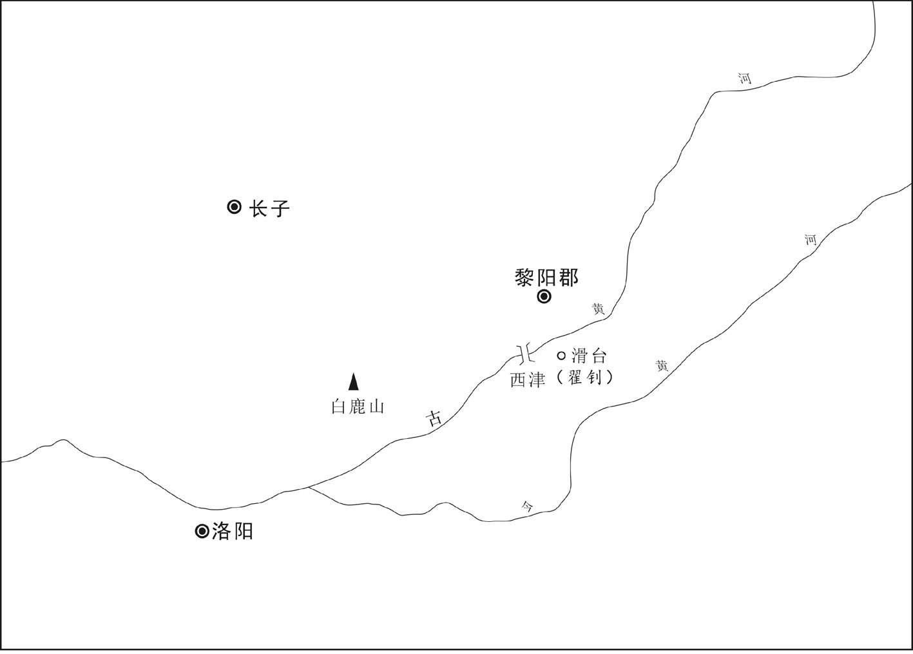 
翟钊之灭示意图

## 【原文】

**初，郝晷、崔逞及清河崔宏、新兴张卓、辽东夔腾、阳平路纂皆仕于秦，避秦乱来奔，诏以为冀州诸郡，各将部曲营于河南[1]。既而受翟氏官爵，翟氏败，皆降于燕，燕主垂各随其材而用之。钊所统七郡三万余户，皆按堵如故[2]。以章武王宙为兖豫二州刺史，镇滑台。徙徐州民七千余户于黎阳，以彭城王脱为徐州刺史，镇黎阳[3]。脱，垂之弟子也。垂以崔荫为宙司马[4]。**

## 【注文】

[1]郝晷（guǐ）（生卒年不详）：曾任前燕散骑侍郎，后仕前秦、东晋、翟魏、后燕。　　崔逞（chěng）：字叔祖，东武城（今山东武城西）人。初仕前燕慕容，前燕灭亡后转投北魏，被授予尚书、御史中丞等。后因事被赐死。　　崔宏（？—418年）：北魏大臣。字玄伯，清河东武城（今山东武城西）人，出身于山东门阀士族。他自小才华横溢，被誉为冀州神童。初仕前秦，为著作佐郎；后仕后燕，历任吏部郎、尚书左丞、高阳内史。到拓跋珪时，任黄门侍郎，执掌机要，草创典章。公元398年，议改国号为魏，为道武帝拓跋珪采纳。后升任吏部尚书，晋爵白马侯。明元帝拓跋嗣即位后，被拜为天部大人，晋爵白马公。曾奉诏查处不法官吏、疏决刑狱，还建议明元帝拓跋嗣以安民为本。公元418年病逝，赠司空，谥“文贞公”。他虽权倾朝野，但为人俭约，竭诚辅佐北魏前两任皇帝，为北魏政权的建设以及封建化立下汗马功劳。　　新兴：郡名，治所在今山西忻州。　　夔（kuí）：姓。

[2]按堵如故：形容秩序良好，百姓和原来一样安居乐业。

[3]脱：即慕容脱（生卒年不详），昌黎棘城（今辽宁义县西北）人，鲜卑族，慕容垂侄子，曾任后燕徐州刺史、彭城王。

[4]崔荫（生卒年不详）：字世禄，十六国时后燕大臣。慕容垂时担任长史，曾辅佐章武王慕容宙、陈留王慕容绍、太原王慕容楷、乐浪王慕容温，因他为人刚强正直、明智果断、善于劝谏，四王都十分敬畏他。他所到之处，减省刑罚，轻徭薄赋，因此很多流民都前来归附他。

## 【译文】

当初，郝晷、崔逞以及清河人崔宏、新兴人张卓、辽东人夔腾、阳平人路纂等人都在前秦做官，后来为躲避前秦战乱，前来投奔东晋，晋孝武帝司马曜下诏，任命他们为冀州各郡郡守，并率领他们各自的队伍驻扎在黄河南岸。不久，他们又接受了翟辽的官职和爵位，翟氏失败后，他们又都投降了后燕，后燕主慕容垂根据他们的才干而各尽其用。翟钊统管的七郡三万余户人家，也都和原来一样安居乐业。后燕主慕容垂任命章武王慕容宙为兖、豫二州刺史，镇守滑台。把徐州居民七千多户迁徙到黎阳，任命彭城王慕容脱为徐州刺史，镇守黎阳。慕容脱，是慕容垂的侄子。慕容垂任命崔荫为慕容宙的司马。

## 【原文】

**初，陈留王绍为镇南将军，太原王楷为征西将军，乐浪王温为征东将军，垂皆以荫为之佐[1]。荫才干明敏强正，善规谏，四王皆严惮之；及至简刑法，轻赋役，流民归之，户口滋息[2]。**

## 【注文】

[1]征西将军：将军名号。东汉置，因西进征讨赤眉军而得名。晋沿置，三品，为持节都督时，升为二品。其中以资深者为征西大将军。　　征东将军：武官名号。始置于曹操，与征西、征南、征北合称“四征将军”，权任甚重。魏晋后，多为持节都督。征东将军中资深者加为“征东大将军”。

[2]四王：即章武王慕容宙、陈留王慕容绍、太原王慕容楷、乐浪王慕容温。

## 【译文】

当初，陈留王慕容绍任镇南将军，太原王慕容楷任征西将军，乐浪王慕容温任征东将军，慕容垂曾委派崔荫辅佐他们。崔荫为人明智果断、刚强正直，善于规劝上司，四王都十分敬畏他；崔荫每到一个地方，减省刑法，轻徭薄赋，流民都来归附，于是当地的人口不断增加。

## 【原文】

**秋七月，以太原王楷为冀州牧，右光禄大夫余蔚为左仆射[1]。**

## 【注文】

[1]右光禄大夫：官名。始置于晋朝，光禄大夫外加置。　　左仆射：尚书台副长官，位在右仆射之上。参见前“尚书左仆射”条注。

## 【译文】

秋季七月，慕容垂任命太原王慕容楷为冀州牧，右光禄大夫余蔚为左仆射。

# 拓跋兴魏

## 【内容提要】

《拓跋兴魏》记载了鲜卑拓跋部崛起和建立北魏的一段历史。

鲜卑拓跋部是发源于中国东北的一个古老民族。拓跋推寅任可汗时，该部曾向南迁移到“大泽”（今内蒙古呼伦贝尔的呼伦湖区）一带游牧；到拓跋力微即位后，又迁居到定襄盛乐县（今内蒙古和林格尔西北），从此部众逐渐强盛，其他各部落都畏惧臣服于他。

公元261年，拓跋力微开始派遣儿子拓跋沙漠汗向中原王朝进贡，从此鲜卑拓跋部与中原王朝有了联系。公元278年，拓跋力微病逝，诸部在卫瓘（guàn）的挑拨下纷纷离叛。公元294年，拓跋力微之子拓跋禄官即位。次年，他将国土分为中、东、西三部，自领东部。公元307年，拓跋禄官去世，他的兄子拓跋猗（yī）卢统一了拓跋三部。之后在永嘉之乱中依附西晋，抗击匈奴刘聪、羯（jié）赵石勒。公元310年，拓跋猗卢因功被西晋怀帝司马炽封为代公；公元315年，又进封为代王，拓跋部从此便有了国号。公元316年，因内部夺权斗争，拓跋猗卢被其长子拓跋六修杀死，拓跋部陷入分崩离析的境地之中。

公元338年，拓跋什翼犍（qián）即代王位，设置百官，制订法律。公元340年，定都云中盛乐宫（今内蒙古和林格尔西北），后又在故城南修筑盛乐新城。因其雄健勇悍而有智谋，国人大都归附他，代国于是再度复兴。公元376年，前秦苻坚发兵攻击代国。拓跋什翼犍兵败，被叛军杀害，部众离散，代国至此灭亡，共存在六十二年（315—376年）。代国灭亡后，苻坚将代国百姓分作东、西两部，由刘库仁、刘卫辰分别统率。拓跋什翼犍幼子拓跋窟咄（duō）被俘至长安（今陕西西安西北），拓跋珪（guī）则跟随母亲辗转流徙于独孤部与贺兰部。

公元386年淝水之战后，前秦势力瓦解，拓跋珪乘机重建代国，又改国号为魏，史称北魏。

拓跋珪即位后五年之间，北面击败高车与柔然，东北面击败库莫奚，扫除了后顾之忧。南面联合慕容垂，占领了刘库仁、刘卫辰后裔所盘踞的地区，平定河套以南诸部，获得马三十余万匹、牛羊四百余万头。

公元398年，经群臣商定，正式定国号为“魏”。之后，拓跋珪命尚书吏部郎邓渊创立官制，仪曹郎董谧（mì）制定礼仪，三公郎王德制定律令，太史令晃崇考察天象，由吏部尚书崔宏负责总管裁定。

鲜卑拓跋氏建立的北魏王朝是中国历史上的一个重要朝代，它统一北方，结束了西晋八王之乱以来战乱扰攘的局面，为胡汉各族的融合创造了条件。

## 【原文】

**魏元皇帝景元二年[1]。鲜卑索头部大人拓跋力微始遣其子沙漠汗入贡，因留为质[2]。力微之先，世居北荒，不交南夏[3]。至可汗毛，始强大，统国三十六，大姓九十九[4]。后五世至可汗推寅，南迁大泽[5]。又七世至可汗邻，使其兄弟七人及族人乙旃氏车惃氏分统部众为十族[6]。邻老，以位授其子诘汾，使南迁遂居匈奴故地[7]。诘汾卒，力微立，复徙居定襄之盛乐，部众浸盛，诸部皆畏服之[8]。**

## 【注文】

[1]元皇帝：即魏元帝曹奂（246—302年），本名曹璜，字景明，魏武帝曹操之孙，燕王曹宇之子。初封安次县常道乡公。公元260年，被司马昭拥立为帝，共在位六年（260—265年），但实际上手中并无权力，在大臣和军队中也没有任何势力，完全是司马氏的傀儡。公元265年，被废为陈留王，迁居邺（yè）城（今河北临漳西南），魏国灭亡。　　景元：三国时曹魏元帝曹奂所用第一个年号，共计五年，即公元260年至264年。景元五年（264年）五月改元咸熙元年。

[2]大人：北方部落首领名。鲜卑、乌桓、契丹各族部落与部落联盟首领皆称大人，经选举产生，负责处理部落或部落联盟事务。　　拓跋力微（175—278年）：三国至西晋初年鲜卑族索头部首领，公元220年至277年在位。他在位期间，率部从上谷（今河北怀来）以西一带迁到盛乐城（今内蒙古和林格尔西北）。北魏建国后，被追封为神元皇帝。　　沙漠汗：即拓跋沙漠汗（？—277年），三国后期至西晋初年鲜卑索头部人，拓跋力微之子，拓跋猗（yí）、拓跋猗卢、拓跋弗之父。公元261年，受拓跋力微委派去曹魏作人质，西晋取代曹魏后，仍为人质，直到公元267年才北返归国。公元277年，各部酋长向拓跋力微进谗言，最终他在拓跋力微的默许下被各部酋长杀死。虽然他未曾任索头部首领，但北魏道武帝拓跋珪称帝时，仍将其追谥（shì）为文皇帝。

[3]南夏：指南方的中原王朝。

[4]可（kè）汗（hán）：又称大汗、汗，鲜卑语称“可寒”，原意是“神灵”“上天”。最初，是部落里一般部众对首领的尊称。后才作为古代北亚游牧民族所建汗国最高统治者的称号。　　毛：即拓跋毛（生卒年不详），鲜卑索头部首领，在位时统一了索头各部。北魏道武帝拓跋珪称帝时，追谥其为成皇帝，这也是北魏追尊的第一位始祖。　　大姓：指世家大族。一般认为大姓有两种含义：其一是社会地位高，历史影响大；另一是家丁兴旺，人口数量多。如果符合了这两个标准，则可算作大姓。

[5]推寅：即拓跋推寅（生卒年不详），鲜卑索头部首领。他在位期间，将鲜卑族南迁大泽（今内蒙古呼伦贝尔），使鲜卑族由狩猎走向游牧生活。北魏道武帝拓跋珪称帝时，追谥他为宣皇帝，这是北魏追尊的第六位始祖。　　大泽：今内蒙古呼伦贝尔的呼伦湖区。

[6]邻：即拓跋邻（生卒年不详），鲜卑索头部首领，北魏道武帝拓跋珪称帝时，追谥他为献皇帝，这是北魏追尊的第十三位始祖。　　乙旃（zhān）氏：鲜卑氏族之一。鲜卑首领拓跋邻时，分其部众，该部由其叔父统率。后改为叔孙氏。　　车惃（gǔn）氏：鲜卑氏族之一。是鲜卑王族远亲氏族，后改为车氏。

[7]诘汾（fén）：即拓跋诘汾（生卒年不详），拓跋力微之父，南北朝时期北魏先祖。　　匈奴：古代北方民族，又称“胡”。战国时分布在燕、赵、秦以北地区。秦始皇时，被蒙恬击败，于是从河套地区向北迁徙。秦汉之际，冒（mò）顿（dú）单（chán）于（yú）乘中原楚汉相争之机，吞并东胡、月（ròu）氏（zhī）、楼烦、白羊、丁零等部，势力日渐强盛，不断侵扰汉朝边境。公元前71年，遭丁零、乌桓、乌孙围击，势力逐渐衰弱。之后出现五单于纷立混战的局面。公元前52年，呼韩邪单于臣服于汉。公元48年，匈奴分裂为南北二部。其中，北匈奴屡次被南匈奴和东汉击败，部分西迁，部分留居漠北，后被鲜卑吞并；南匈奴也分裂为数支。

[8]定襄：郡名。西汉置，治所设在盛乐县（今内蒙古和林格尔西北）。东汉时治所迁至善无县（今山西右玉南）。　　盛乐：县名，今内蒙古和林格尔西北。

## 【译文】

魏元帝景元二年（261年）。鲜卑索头部首领拓跋力微开始派遣他的儿子拓跋沙漠汗到中原王朝进贡，于是就留下来做人质。拓跋力微的祖先，世代居住在北方荒凉之地，从来不与南方的中原王朝接触。到可汗拓跋毛时，势力开始强大起来，统领三十六国、九十九个部落。五代以后到了可汗拓跋推寅，向南迁徙到了一个大湖旁边（今内蒙古呼伦贝尔的呼伦湖区）。又过了七代到可汗拓跋邻，让他的七个兄弟及同族人乙旃氏、车惃氏，分别统领部众，共有十个部族。拓跋邻年老，传位给他的儿子拓跋诘汾，让他南迁，于是定居在匈奴故地。拓跋诘汾死后，拓跋力微即位，又迁居到定襄郡的盛乐县，从此部众逐渐强盛，其他各部落都畏惧臣服于他。

## 【原文】

**晋武帝泰始三年[1]。遣鲜卑拓跋沙漠汗归其国。**

## 【注文】

[1]泰始：西晋武帝司马炎所用第一个年号，共计十年，即公元265年至274年，这也是西晋第一个年号。

## 【译文】

晋武帝司马炎泰始三年（267年）。东晋朝廷送鲜卑拓跋沙漠汗回国。

## 【原文】

**咸宁元年夏六月，鲜卑拓跋力微复遣其子沙漠汗入贡，将还，幽州刺史卫瓘表请留之，又密以金赂其诸部大人离间之[1]。**

## 【注文】

[1]咸宁：因含义吉祥，“咸宁”曾多次被皇帝用作年号。此年号为西晋武帝司马炎所用第二个年号，共计六年，即公元275年至280年。咸宁六年（280年）四月改元太康元年。　　卫瓘（220—291年）：三国时曹魏、西晋大臣。字伯玉，河东安邑（今山西夏县北）人，魏国侍中卫觊（jì）之子。年轻时在魏国担任廷尉、镇西将军等。曾参与讨伐蜀汉的战争。到西晋时，历任青州、幽州刺史，征东大将军及司空。晋惠帝司马衷即立后，他与贾后对立。不久在“八王之乱”中与其子孙共九人被贾后诛杀。

## 【译文】

晋武帝咸宁元年（275年）夏季六月，鲜卑拓跋力微又派他的儿子拓跋沙漠汗到晋朝进贡，拓跋沙漠汗将要返回时，幽州刺史卫瓘上表奏请把他留下，又暗中用金子贿赂鲜卑各部落首领，挑拨他们和拓跋沙漠汗之间的关系。

## 【原文】

**三年冬十二月，卫瓘遣拓跋沙漠汗归国。自沙漠汗入质，力微可汗诸子在侧者多有宠。及沙漠汗归，诸部大人共谮而杀之[1]。既而力微疾笃，乌桓王库贤亲近用事，受卫瓘赂，欲扰动诸部，乃砺斧于庭，谓诸大人曰：“可汗恨汝曹谗杀太子，欲尽收汝曹长子杀之。”诸大人惧，皆散走。力微以忧卒，时年一百。四子悉禄立，其国遂衰[2]。初，幽、并二州皆与鲜卑接，东有务桓，西有力微，多为边患[3]。卫瓘密以计间之，务桓降而力微死，朝廷嘉瓘功，封其弟为亭侯[4]。**

## 【注文】

[1]谮（zèn）：诬陷，中伤。

[2]悉禄：即拓跋悉禄（？—286年），又作拓跋悉鹿，拓跋力微之子，西晋初年鲜卑索头部首领，公元277年至286年在位。北魏道武帝拓跋珪称帝时，他被追谥为章皇帝。

[3]务桓：即刘务桓（？—356），一名豹子，刘虎之子。公元341年，刘虎去世，他继任为匈奴部落首领。曾遣使归附代国，后又暗中与后赵石虎通好，被后赵任命为平北将军，封为左贤王。

[4]亭侯：爵位名。秦汉魏晋时以二十等爵赏有功者，其最高级叫彻侯。后因避汉武帝讳，改为通侯，后又改列侯。列侯中封邑在亭的称亭侯，次于乡侯一级。

## 【译文】

晋武帝咸宁三年（277年）冬季十二月，卫瓘送拓跋沙漠汗回国。自从拓跋沙漠汗进入中原王朝做人质，可汗拓跋力微身边的其他儿子大多受到宠爱。拓跋沙漠汗回来后，各部落首领一起诬陷并且杀了他。不久拓跋力微病重，乌桓王库贤因与可汗亲近而当权处理政事，他接受了卫瓘的贿赂，想把各部落搅乱，于是在朝堂上磨斧子，对各部落首领说：“可汗憎恨你们进谗言杀了太子，打算把你们的长子都抓起来杀掉。”各部落首领害怕，全部逃散。拓跋力微忧虑而死，享年一百岁。他的四儿子拓跋悉禄继位，鲜卑国势从此衰落下来。当初，幽州、并州都与鲜卑接壤，东有刘务桓，西有拓跋力微，常常侵扰边关。卫瓘暗中用计离间鲜卑各部，结果刘务桓归降，拓跋力微死去，晋朝为表彰卫瓘的功劳，封他的弟弟为亭侯。

## 【原文】

**太康七年[1]。鲜卑拓跋悉鹿卒，弟绰立[2]。**

## 【注文】

[1]太康：晋武帝司马炎的第三个年号，共计十年，即公元280年至289年。

[2]绰：即拓跋绰（？—293年），拓跋力微之子。公元286年，因其兄拓跋悉鹿去世而继位为鲜卑索头部首领。他在位八年，即公元286年至293年。北魏道武帝拓跋珪称帝时，追谥他为平皇帝。

## 【译文】

晋武帝太康七年（286年）。鲜卑拓跋悉鹿（即拓跋悉禄）去世，他的弟弟拓跋绰继位。

## 【原文】

**惠帝元康三年夏六月，拓跋绰卒，弟子弗立[1]。**

## 【注文】

[1]惠帝：即晋惠帝司马衷（259—306年），字正度，河内温县（今河南温县西南）人，晋武帝司马炎第二子，西晋第二任皇帝，公元290年至306年在位。他为人痴呆不任事，即位初期由太傅杨骏辅政，之后皇后贾南风杀害杨骏，掌握大权。在他统治期间发生了长达十六年之久的“八王之乱”，从此西晋开始走向衰败。公元306年，他因食物中毒而亡（相传是东海王司马越下毒），享年四十八岁。　　元康：晋惠帝司马衷所用第三个年号，共计九年，即公元291年至299年。　　弗：即拓跋弗（？—294年），拓跋沙漠汗之子，拓跋绰侄子。公元293年，因拓跋绰去世而继位为鲜卑索头部首领。北魏道武帝拓跋珪称帝时，追谥他为思皇帝。

## 【译文】

晋惠帝元康三年（293年）夏季六月，拓跋绰去世，侄子拓跋弗即位。

## 【原文】

**四年。拓跋弗卒，叔父禄官立[1]。**

## 【注文】

[1]禄官：即拓跋禄官（？—307年），拓跋力微之子。公元294年，前任首领拓跋弗去世，他继位为鲜卑索头部首领。次年，将国土分为三部：自己统治东部；拓跋猗统治中部；拓跋猗卢统治西部。北魏道武帝拓跋珪称帝时，追谥他为昭皇帝。

## 【译文】

晋惠帝元康四年（294年）。拓跋弗去世，叔父拓跋禄官继位。

## 【原文】

**五年冬十二月，拓跋禄官分其国为三部：一居上（俗）［谷］之北，濡源之西，自统之；一居代郡参合陂之北，使兄沙漠汗之子猗统之；一居定襄之盛乐故城，使猗弟猗卢统之[1]。猗卢善用兵，西击匈奴、乌桓诸部，皆破之。代人卫操与从子雄及同郡箕澹往依拓跋氏，说猗、猗卢招纳晋人[2]。猗悦之，任以国事，晋人附者稍众。**

## 【注文】

[1]濡（rú）源：地名，今河北沽源北。　　参（cān）合陂（bēi）：地名，今内蒙古凉城东北岱海。　　猗：即拓跋猗（？—305年），拓跋沙漠汗之子。　　猗卢：即拓跋猗卢（？—316年），西晋末年鲜卑索头部首领、代王，十六国时代国创立者。他最初统领拓跋西部，居于云中盛乐（今内蒙古和林格尔西北）；晋怀帝永嘉二年（308年），继任为鲜卑拓跋部首领，重新统一各部落，结束长期分裂状态，并任用汉族士人卫雄、箕澹等管理事务，支持西晋并州刺史刘琨（kūn）对抗匈奴汉国、前赵的进攻；永嘉四年（310年），应刘琨之请，击败铁弗匈奴刘虎和白部鲜卑，因军功被晋愍帝司马邺封为代公。晋愍帝建兴三年（315年），进封为代王。他在位期间严刑峻法，实行连坐。建兴四年（316年）因内部夺权斗争，被其长子拓跋六修杀死，王位由侄子拓跋普根继承。北魏道武帝拓跋珪称帝时，被追谥为穆皇帝。

[2]卫操（？—310年）：字德元，西晋代郡（今河北蔚县东北）人。他年少时就显示出过人才气，由于家住北地，自小便与鲜卑、乌桓等少数民族多有交往。曾任晋征北将军卫瓘牙门将。公元295年，居于代郡一带的鲜卑拓跋氏开始强盛，他带着侄子卫雄、同乡箕澹等十几个人前去投奔。他建议部族首领拓跋猗、拓跋猗卢兄弟招纳晋人。在他的影响下，很多晋人前来投靠拓跋氏，他也因功被封为辅相。他为拓跋鲜卑政权的确立、法律的制定和官吏的设置等贡献了才智，因此北魏建国后他被视为第一功臣。公元305年，刘渊、石勒起兵反晋，他力劝拓跋猗匡助晋室，因此被晋朝授予右将军，并封为定襄侯。　　雄：即卫雄，字世远，西晋代郡（今河北蔚县东北）人。曾随卫操投奔拓跋猗卢，常率军作战。拓跋猗卢被拓跋六修杀害后，他与箕澹率乌丸及汉人数万归附刘琨。后在与石勒作战中败死。　　箕（jī）澹（dàn）（？—316年）：一作姬澹，字世雅，西晋代郡（今河北蔚县东北）人，十六国代国官吏。西晋时，任州从事。后与卫操、卫雄等人投奔鲜卑拓跋猗卢，四出征讨，筹谋划策，深得信任。拓跋猗卢被拓跋六修杀害后，部族大乱，他率晋人及乌丸数万人，转投晋并州刺史刘琨。后刘琨命其率军攻取石勒，兵败被杀。　　说（shuì）：说服；劝说。

## 【译文】

晋惠帝元康五年（295年）冬季十二月，拓跋禄官把他的国土分为三部分：一部分在上谷以北、濡源以西，由其亲自统领；一部分在代郡参合陂以北，派他哥哥拓跋沙漠汗的儿子拓跋猗统领；一部分居住在定襄的盛乐旧城，命拓跋猗的弟弟拓跋猗卢统领。拓跋猗卢善于用兵，向西攻打匈奴、乌桓各部落，将他们全部打败。代郡人卫操与他的侄子卫雄以及同郡人箕澹前往投奔拓跋氏，劝说拓跋猗、拓跋猗卢招纳晋人。拓跋猗很欣赏他们，委任以国家大事，前来归附的晋人逐渐多起来了。

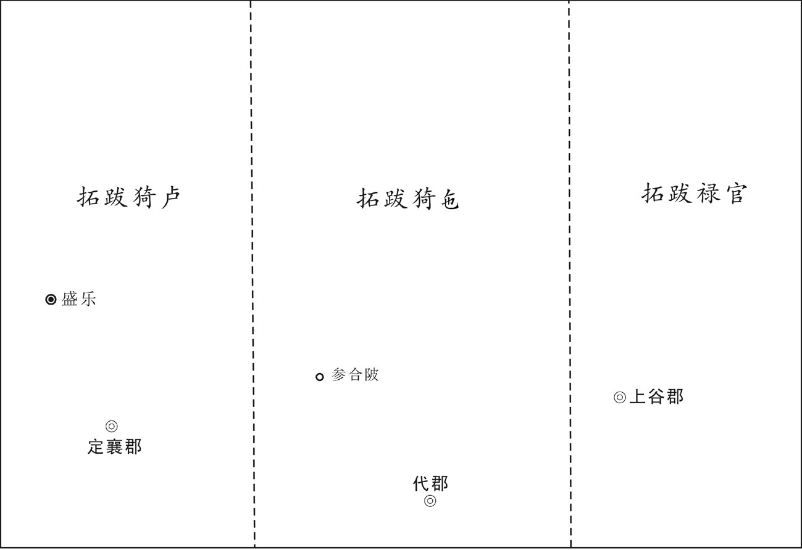 
公元3世纪末拓跋部落三分示意图

## 【原文】

**七年秋九月，拓跋猗度漠北巡，因西略诸国，积五岁，降附者三十余国。**

## 【译文】

晋惠帝元康七年（297年）秋季九月，拓跋猗越过沙漠北巡视，乘机向西劫掠各国，用了五年，投降归附他的有三十多个国家。

## 【原文】

**永兴元年秋七月，东嬴公腾乞师于拓跋猗，以击刘渊，猗与弟猗卢合兵击渊于西河，破之，与腾盟于汾东而还[1]。**

## 【注文】

[1]永兴：西晋惠帝司马衷所用年号，共计三年，即公元304年至306年。永兴三年（306年）六月改元光熙元年。　　东嬴公：西晋爵位名。　　腾：即司马腾（？—307年），字元迈，河内温县（今河南温县西南）人，西晋宗室，高密王司马泰次子，东海王司马越之弟。公元306年，司马越等率军击败司马颙（yóng），迎接晋惠帝返回洛阳，他获封东燕王。次年，改封新蔡王，同年被李丰杀害，谥武哀王。　　刘渊（？—310年）：字元海，新兴（今山西忻州）人，南匈奴单于於扶罗之孙，匈奴左贤王刘豹之子。十六国匈奴汉国的创立者，公元304年至310年在位（公元308年称帝）。刘渊是汉化的匈奴贵族后裔，他在西晋日趋衰败、各地流民纷纷起义反晋的浪潮中，趁势在中原建立了第一个少数民族政权——“匈奴汉国”政权。　　西河：郡名，治所在今山西离石。　　汾：即汾河，位于山西境内，源出山西宁武管涔（cén）山麓，贯穿山西南北，流经静乐、古交、太原、清徐、祁县、介休、霍州、洪洞、临汾、侯马，在河津附近汇入黄河。

## 【译文】

晋惠帝永兴元年（304年）秋季七月，东嬴公司马腾向拓跋猗请求援兵，攻打刘渊，拓跋猗与弟弟拓跋猗卢联合在西河进攻刘渊，把他打败，与司马腾在汾河东部结盟后返回。

## 【原文】

**二年夏六月，汉王渊攻东嬴公腾，腾复乞师于拓跋猗，卫操劝猗助之[1]。猗帅轻骑数千救腾，斩汉将綦毋豚。诏假猗大单于，加操右将军[2]。甲申，猗卒，子普根代立[3]。**

## 【注文】

[1]汉：即汉国（304—329年），亦称汉赵，是西晋时少数民族建立的第一个政权，由匈奴贵族刘渊所建。都长安（今陕西西安西北），自称为汉政权的继续。公元304年，刘渊自称汉王，改年号为元熙，追尊刘禅为孝怀皇帝，设置文武百官，建立汉国，史称“匈奴汉国”。公元310年，其子刘聪即位。316年，灭亡西晋。公元318年，刘聪死，其子刘粲（càn）继立，不久便被匈奴贵族靳准所杀。镇守长安的刘聪族弟刘曜（yào）闻变，发兵进攻靳准。刘曜徙都长安（今陕西西安西北），改国号为赵，史称“前赵”。公元328年，刘曜、石勒两军大战于洛阳城，刘曜兵败被擒，前赵主力被消灭。次年，石勒军杀刘熙，前赵灭亡。

[2]诏：天子下达臣属的文体，分为即位诏、遗诏、表诏、伏诏、密诏、手诏、口诏等。始于秦始皇，是一种命令文体。

[3]普根：即拓跋普根（？—316年），拓跋猗之子。公元305年，拓跋猗去世，他继其位统治索头部中部国土。到公元316年，代王拓跋猗卢被其子拓跋六修杀死，他听说后，率军平定叛乱，诛杀拓跋六修，自立为代王，不久因病去世。北魏道武帝拓跋珪称帝时，追谥他为文平皇帝。

## 【译文】

晋惠帝永兴二年（305年）夏季六月，汉王刘渊攻打东嬴公司马腾，司马腾又向拓跋猗请求援助，卫操劝说拓跋猗援助他。拓跋猗率领数千名轻骑兵去救援司马腾，杀了汉将綦毋豚。诏令封拓跋猗为大单于，并授予卫操右将军一职。甲申（二十四日），拓跋猗去世，儿子拓跋普根继位。

## 【原文】

**怀帝永嘉元年[1]。拓跋禄官卒，弟猗卢总摄三部。**

## 【注文】

[1]怀帝：即西晋第三位皇帝司马炽（284—313年），字丰度，河内温（今河南温县西南）人，司马炎第二十五子。初封豫章王。晋惠帝司马衷在位时，任镇北大将军，被立为皇太弟。晋惠帝光熙元年（306年）即皇帝位，改年号为“永嘉”。永嘉五年（311年），匈奴攻陷洛阳，他被掳走。永嘉七年（313年）春正月被杀于平阳（今山西临汾西南），谥“怀帝”。　　永嘉：晋怀帝司马炽所用年号，共计七年，即公元307年至313年。

## 【译文】

晋怀帝永嘉元年（307年）。拓跋禄官去世，弟弟拓跋猗卢总管三部。

## 【原文】

**四年冬十月，刘琨之讨刘虎、白部也，遣使卑辞厚礼说鲜卑拓跋猗卢以请兵[1]。猗卢使其弟弗之子郁律帅骑二万助之，遂破刘虎、白部，屠其营[2]。琨与猗卢结为兄弟，表猗卢为大单于，以代郡封之为代公。猗卢以封邑去国悬远，民不相接，乃帅部落万余家自云中入雁门，从琨求陉北之地[3]。琨不能制，且欲倚之为援，乃徙楼烦、马邑、阴馆、繁畤、崞五县民于陉南，以其地与猗卢，由是猗卢益盛[4]。**

## 【注文】

[1]刘琨（271—318年）：西晋将领。字越石，中山魏昌（今河北无极）人，西汉中山靖王刘胜的后裔。永嘉之乱发生时，担任并州刺史。他曾占据太原孤城抵御匈奴刘渊、刘聪和羯人石勒的围攻十余年，后败归辽东，欲与鲜卑合力恢复中原，后遭鲜卑猜忌而被杀。　　刘虎（？—341年）：又名乌路孤、铁弗刘虎，十六国时北方匈奴部落首领。最初臣服代国，随着势力的逐渐强大，反叛代国，遭到代王拓跋郁律与晋并州刺史刘琨的合力讨伐，他逃到朔方（今河套地区）据守。后向前赵刘聪称臣，被任命为安北将军、监鲜卑诸军事。拓跋什翼犍为代王时，他率军攻打代国，兵败战死。　　白部：古代东北部落，因汉代时活动于白山（约今长白山）一带而得名。白部是当时鲜卑重要部落之一，之后在北方各地都有分布。

[2]郁律：即拓跋郁律（？—321年），鲜卑拓跋部人，拓跋弗之子，拓跋猗卢之侄，代国国君，公元316年至321年在位。他即位初年，率军击败铁弗匈奴刘虎部，迫使刘虎堂弟刘路孤归附，又向西兼并乌孙故地，向东吞并勿吉以西，一度称雄北境，颇有声势。公元321年，惟氏（拓跋猗卢之嫂）因嫉恨他深得民心，担心不利于其子，暗中收买部属，乘他不备时，将他杀死。

[3]陉（xíng）：陉岭，位于今山西代县西北。

[4]楼烦：今山西宁武。　　马邑：今山西朔州。　　阴馆：今山西朔州东南。　　繁畤（zhì）：今山西浑源西南。　　崞（guō）：今山西浑源西北。

## 【译文】

晋怀帝永嘉四年（310年）冬季十月，刘琨率兵讨伐刘虎及白部鲜卑时，曾派遣使者携带丰厚的礼物用谦卑的言辞劝说鲜卑拓跋猗卢出兵相助。拓跋猗卢派他的弟弟拓跋弗之子拓跋郁律率领二万骑兵援助刘琨，于是攻破刘虎、白部鲜卑的营垒，并屠杀了全部敌军。刘琨与拓跋猗卢结拜为兄弟，上表奏请朝廷任命拓跋猗卢为大单于，把代郡封给他，让他做代公。拓跋猗卢因为封邑距离自己的国家太远，百姓居住得又很分散，不能相互联通，于是率领他的部落一万多家从云中进入雁门，向刘琨索求陉岭以北地区。刘琨已经无法控制他，况且还指望他作为自己的后援，于是把楼烦、马邑、阴馆、繁畤、崞等五县百姓迁徙到陉岭以南，把这些地方让给拓跋猗卢，从此拓跋猗卢的势力愈发强盛起来。

## 【原文】

**五年。刘琨遣子遵请兵于代公猗卢，猗卢遣其子六修将兵助琨，戍新兴[1]。事见《石勒寇河朔》。**

## 【注文】

[1]遵：即刘遵（生卒年不详），中山魏昌（今河北无极）人，刘琨之子。曾奉刘琨命，前往拓跋猗卢处做人质。他在猗卢部颇有威信，部众都愿意归附于他。拓跋猗卢被杀后，他与拓跋猗卢部将箕澹率众投奔刘琨，刘琨由此重新振作。　　六修：即拓跋六修（？—316年），鲜卑拓跋部首领拓跋猗卢长子，西晋末年曾数次率军援救刘琨，大败刘粲。拓跋猗卢称代王后，内部发生混乱，他率军杀死拓跋比延及拓跋猗卢。不久被族弟拓跋普根擒杀。

## 【译文】

晋怀帝永嘉五年（311年）。刘琨派遣儿子刘遵向代公拓跋猗卢请求援兵，拓跋猗卢派遣他的儿子拓跋六修率兵援助刘琨，戍守新兴。其事参见《石勒寇河朔》。

## 【原文】

**六年。汉靳冲等攻刘琨于晋阳，猗卢遣兵救琨，击走之。刘粲等复攻晋阳，拔之[1]。猗卢自将破粲等，琨复入晋阳。事并见《西晋之乱》。**

## 【注文】

[1]刘粲（？—318年）：字士光，匈奴族，新兴（今山西忻州）人，刘聪之子，十六国时期汉国国君。他即位后沉醉于酒色，又大杀辅政大臣，将军国大事全交给靳准。之后靳准在平阳（今山西临汾西南）叛乱，他也被靳准杀害。

## 【译文】

晋怀帝永嘉六年（312年）。汉靳冲等人在晋阳攻打刘琨，拓跋猗卢派兵救援刘琨，击退了靳冲。刘粲等人再次进攻晋阳，晋阳城被攻克。拓跋猗卢亲自率兵击败刘粲等人，刘琨重新进入晋阳。此事参见《西晋之乱》。

## 【原文】

**愍帝建兴元年[1]。代公猗卢城盛乐，以为北都，治故平城为南都[2]。又作新平城于灅水之阳，使右贤王六修镇之，统领南部[3]。**

## 【注文】

[1]愍帝：即晋愍帝司马邺（300—317年），字彦旗，河内温（今河南温县西南）人，晋武帝司马炎之孙，吴孝王司马晏之子，西晋第四任皇帝，也是最后一任皇帝，公元313年至316年在位。初封秦王。公元312年，刘曜陷洛阳（今河南洛阳东北），怀帝被俘，他被群臣拥立为皇太子。次年怀帝被杀，他即位于长安（今陕西西安西北），年号建兴。公元316年，刘曜围攻长安，切断长安粮运，他在粮食断绝的情况下出城投降前赵，西晋灭亡。次年被杀，谥孝愍皇帝。　　建兴：西晋愍帝司马邺的年号，共计四年，即公元313年至316年，这也是西晋的最后一个年号。建兴四年（316年），晋愍帝投降前赵，西晋灭亡。次年（317年）三月，晋元帝司马睿建立东晋，改年号为建武元年。

[2]平城：今山西大同东北古城。

[3]新平城：今山西山阴北。　　灅（lěi）水：古水名，即今河北遵化沙河。源出县北长城外，南流经县东折西南注入庚水（今沽河）。　　阳：山的南面或水的北面。　　右贤王：匈奴贵族封号，即右屠耆（qí）王，为匈奴单于之下最高职官，常以单于子弟担任。此指拓跋六修的爵位。

## 【译文】

晋愍帝建兴元年（313年）。代公拓跋猗卢在盛乐修筑城池，作为北都，修复平城故城，作为南都。又在灅水以北兴建新平城，命右贤王拓跋六修镇守，统领南部地区。

## 【原文】

**三年春二月，诏进拓跋猗卢爵为代王，置官属，食代、常山二郡[1]。猗卢请并州从事雁门莫含于刘琨，琨遣之[2]。含不欲行，琨曰：“以并州单弱，吾之不材而能自存于胡羯之间者，代王之力也[3]。吾倾身竭赀，以长子为质而奉之者，庶几为朝廷雪大耻也[4]。卿欲为忠臣，奈何惜其事之小诚，而忘徇国之大节乎？往事代王，为之腹心，乃一州之所赖也。”含遂行。猗卢甚重之，常与参大计。猗卢用法严，国人犯法者或举部就诛，老幼相携而行，人问何之，曰：“往就死。”无一人敢逃匿者。**

## 【注文】

[1]爵：即爵位、爵号，是古代皇帝对贵戚功臣的封赐，历代爵称和爵位制度各有不同，因时而异。两晋时，设置了王、公、侯、伯、子、男、开国郡公、开国县公、开国郡侯、开国县侯、开国侯、开国伯、开国子、开国男、乡侯、亭侯、关内侯、关外侯共十八级爵位。其中，王爵一般封给皇子；公、侯、伯、子、男五等爵专封宗室；功臣封爵为“开国”诸爵及乡侯、亭侯、关内侯、关外侯。诸侯王能专制其国；五等爵中公国之制同下等王国，侯国不满五千户，置一军，兵千人。其余诸爵与开国爵封地称国但封君不治国事，乡侯至关外侯无封邑。诸王之子除嗣（sì）王外，依次按公、侯、伯、子、男递降世袭。　　代王：公元315年，拓跋部首领拓跋猗卢接受西晋代王封号，代国自此建立。代国建都盛乐（今内蒙古和林格尔西北），据有今内蒙古中部和山西北部。西晋灭亡后成为割据政权。公元376年，被前秦所灭。代国共历拓跋猗卢、拓跋普根、拓跋郁律、拓跋贺傉（nù）、拓跋纥（hé）那、拓跋翳（yì）槐、拓跋什翼犍七主。其中拓跋猗卢、拓跋郁律、拓跋什翼犍死于内讧，拓跋普根、拓跋贺傉、拓跋翳槐病死，拓跋纥那战败逃亡不知所终。公元386年四月，拓跋珪复兴代国，称魏王，改国号为“魏”，史称北魏，又称后魏，拓跋魏，元魏。

[2]从事：官名，又称从事史。西汉时始置，为中央三公和州郡县自辟的属吏，秩百石（dàn），主要职责是主管文书、察举非法。晋沿置。　　莫含（生卒年不详）：西晋时繁畤（今山西浑源西南）人。曾任并州刺史刘琨从事。后因才能出众，深受代王拓跋猗卢赏识，官至左将军、关中侯。

[3]羯：古代北方民族，源于小月支，曾附属匈奴，魏晋时散居上党郡（今山西潞城附近），与汉人杂处。羯人石勒于公元319年建立赵国，史称后赵。公元351年为冉魏所灭。

[4]赀（zī）：同“资”，财货。

## 【译文】

晋愍帝建兴三年（315年）春季二月，朝廷下诏将拓跋猗卢晋爵为代王，设置官属，以代郡、常山郡作为他的封邑。拓跋猗卢向刘琨请求借调并州从事雁门人莫含，刘琨派莫含去。莫含不想去，刘琨说：“并州势单力薄，我又缺乏才干，却能在胡人、羯人之间生存，这全靠代王的力量。我之所以竭尽财产，并把长子作为人质去侍奉他，就是希望能为朝廷洗雪耻辱。您想要做忠臣，为什么只顾惜我们在一起共事的小小忠诚，而忘却为国献身的大节呢？请您前去侍奉代王，成为他的心腹，这是全州百姓所依赖的啊。”莫含于是去了。拓跋猗卢十分倚重他，常让他参与制定大计。拓跋猗卢用法严峻，国人中若有犯法的，有时整个部落的人都要被处死，只见老老少少相互搀扶而行，有人问：“去哪儿？”回答说：“去接受死刑。”没有一人敢逃跑躲藏。

## 【原文】

**四年。初，代王猗卢爱其少子比延，欲以为嗣，使长子六修出居新平城，而黜其母[1]。六修有骏马，日行五百里，猗卢夺之，以与比延。六修来朝，猗卢使拜比延，六修不从。猗卢乃坐比延于其步辇，使人导从出游，六修望见，以为猗卢，伏谒路左，至，乃比延，六修惭怒而去[2]。猗卢召之不至，大怒，帅众讨之，为六修所败。猗卢微服逃民间，有贱妇人识之，遂为六修所弑。拓跋普根先守外境，闻难来赴，攻六修，灭之。**

## 【注文】

[1]比延：即拓跋比延（？—316年），鲜卑拓跋部首领拓跋猗卢幼子。他深得拓跋猗卢宠爱，引起其兄拓跋六修的嫉恨，后被拓跋六修杀死。　　嗣：君位或职位的继承人。　　黜（chù）：废除；取消。

[2]步辇（niǎn）：帝王所乘坐的代步工具。最初，通常称为“辇”，本来和车一样是有轮子的。秦以后，帝王、皇后所乘的辇车去轮为舆（轿子），由马拉改由人抬，由是称作步辇。　　谒（yè）：拜见。

## 【译文】

晋愍帝建兴四年（316年）。当初，代王拓跋猗卢偏爱他的小儿子拓跋比延，打算立他为继承人，便让长子拓跋六修到新平城居住，并且废黜了他的母亲。拓跋六修有骏马，能日行五百里，拓跋猗卢把它夺过来送给拓跋比延。拓跋六修前来朝见，拓跋猗卢让他给拓跋比延下拜，拓跋六修不答应。拓跋猗卢于是让拓跋比延乘坐自己的步辇，并派人陪同一道外出游玩，拓跋六修远远看见，以为是拓跋猗卢，便跪在路的左侧伏首拜见；来到面前，原来是拓跋比延，拓跋六修羞愧愤怒而去。拓跋猗卢召他却不来，大怒，率领部众去讨伐他，结果反被拓跋六修打败。拓跋猗卢换上便装逃往民间，有一个贫贱的妇女认出了他，于是被拓跋六修杀了。拓跋普根原先在边境镇守，听说发生祸难便赶赴前来，率兵攻打拓跋六修，把他消灭了。

## 【原文】

**普根代立，国中大乱，新旧猜嫌，迭相诛灭。左将军卫雄、信义将军箕澹，久佐猗卢，为众所附，谋归刘琨，乃言于众曰：“闻旧人忌新人悍战，欲尽杀之，将奈何？[1]”晋人及乌桓皆惊惧，曰：“死生随二将军。”乃与琨质子遵帅晋人及乌桓三万家、马牛羊十万头归于琨。琨大喜，亲诣平城抚纳之，琨兵由是复振。**

## 【注文】

[1]信义将军：武官名。

## 【译文】

拓跋普根代立为首领，国中大乱，新旧部众之间相互猜忌，不断相互残杀。左将军卫雄、信义将军箕澹，辅佐拓跋猗卢已久，大家都依附他俩，他们谋划投奔刘琨，于是对大家说：“听说旧人忌恨新人强悍善战，想要把新人全部杀掉，怎么办？”晋人与乌桓人都很惊慌恐惧，说：“不论生死都跟随二位将军。”于是卫雄、箕澹与刘琨派在这做人质的儿子刘遵，率领晋人及乌桓人三万家、马牛羊十万头归附刘琨。刘琨非常高兴，亲自去到平城安抚接纳他们，刘琨的军队从此重新振作起来。

## 【原文】

**夏四月，普根卒，其子始生，普根母惟氏立之[1]。十二月，拓跋普根之子又卒，国人立其从父郁律[2]。**

## 【注文】

[1]惟氏（？—324年）：又作祁夫人，十六国代国拓跋猗的正妻，她生有三个儿子：拓跋普根、拓跋贺傉、拓跋纥那。公元321年，她谋害拓跋郁律，立拓跋贺傉为主，自己摄政，时人称代国为“女国”。

[2]从父：父亲的兄弟，即伯父或叔父。

## 【译文】

夏季四月，拓跋普根去世，他的儿子刚刚出生，拓跋普根的母亲惟氏立他为主。十二月，拓跋普根的儿子又去世了，国人拥立他的叔父拓跋郁律为首领。

## 【原文】

**元帝大兴元年夏六月，刘虎自朔方侵拓跋郁律西部[1]。秋七月，郁律击虎，大破之，虎走出塞，从弟路孤帅其部落降于郁律[2]。于是郁律西取乌孙故地，东兼勿吉以西，士马精强，雄于北方[3]。**

## 【注文】

[1]元帝：即东晋元帝司马睿（276—323年），字景文，河内温县（今河南温县西南）人。初袭封琅邪王。后担任安东将军，都督扬州、江南诸军事，并镇守建康（今江苏南京）。他依靠中原南迁大族顾荣、贺循等人的支持，统治长江中下游和珠江流域。公元317年，刘曜攻占长安，时任西晋丞相的司马睿在建康称王，改元建武；次年称帝，成为东晋的开国皇帝。公元322年，王敦起兵攻入建康，他忧愤而死。　　大兴：或作太兴，晋元帝司马睿所用第二个年号，共计四年，即公元318至321年。

[2]路孤：即刘路孤（生卒年不详），晋朝铁弗匈奴人，刘虎堂弟。公元318年七月，拓跋郁律击败刘虎，刘虎率少部分人逃到塞外，他则率剩余部落投降拓跋郁律。

[3]乌孙故地：今伊犁河流域。乌孙：西域国名。　　勿吉：今吉林、黑龙江东部，乌苏里江流域。

## 【译文】

东晋元帝大兴元年（318年）夏季六月，刘虎从朔方侵犯拓跋郁律的西部地区。秋季七月，拓跋郁律攻打刘虎，大获其胜，刘虎逃到塞外，他的堂弟刘路孤率领部众投降了拓跋郁律。于是拓跋郁律向西夺取了乌孙故土，向东兼并了勿吉以西地区，兵强马壮，称雄于北方。

## 【原文】

**四年。拓跋猗妻惟氏忌代王郁律之强，恐不利于其子，乃杀郁律而立其子贺傉，大人死者数十人[1]。郁律之子什翼犍幼在襁褓，其母王氏匿于袴中，祝之曰：“天苟存汝，则勿啼。[2]”久之，不啼，乃得免。惟氏专制国政，遣使聘后赵，后赵人谓之“女国使”[3]。**

## 【注文】

[1]贺傉：即拓跋贺傉（？—325年），拓跋猗之子，鲜卑索头部首领、十六国时期代国国君，公元321年至325年在位。公元321年，他的母亲惟氏发动政变，杀死索头部首领拓跋郁律，将他扶立继位。政变后，惟氏掌握国家大政，直到公元324年惟氏去世，他才得以亲政。但他为人懦弱，无理政之才，亲政后群臣怀有二心，他束手无策，徙居东木根山（今内蒙古兴和西北），倚险筑城，以求自保。因长期担心遭各部首领攻杀，以致忧虑成疾，亲政次年病死。北魏道武帝拓跋珪称帝时，追谥他为惠皇帝。

[2]什翼犍（qián）：即拓跋什翼犍（320—376年），拓跋郁律之子，十六国时期代国国君，公元338年至376年在位。他在位期间大力改革代国陋习，设置百官，分掌众职，并委任汉人燕凤、许谦等为官，制定系列法令，使代国的政局得到稳定。又多次攻伐邻国，势力扩展至今内蒙古中南部和山西北部，部众达数十万，达到代国的鼎盛时期。公元376年，代国发生叛乱，他也被叛军乱刀砍死。　　襁（qiǎng）褓（bǎo）：本指背负婴儿用的宽带和包裹婴儿的被子，借指婴幼儿。　　袴（kù）：同“裤”。

[3]聘：访问。

## 【译文】

东晋元帝大兴四年（321年）。拓跋猗的妻子惟氏忌恨拓跋郁律势力强盛，怕对自己的儿子不利，于是杀死拓跋郁律，立儿子拓跋贺傉为主，还杀了数十名部落首领。拓跋郁律的儿子拓跋什翼犍年龄幼小，还在襁褓之中，他的母亲王氏把他藏匿在裤子里，祈祷说：“上天如果想让你活下去，就不要啼哭。”果然过了许久，婴儿都没有哭，于是得以逃脱。惟氏把持了国家大权，派遣使者访问后赵，后赵人称使者为“女国使”。

## 【原文】

**明帝大宁二年[1]。代王贺傉始亲国政，以诸部多未服，乃筑城于东木根山，徙居之[2]。**

## 【注文】

[1]明帝：即晋明帝司马绍（298—325年），字道畿（jī），晋元帝司马睿之子，东晋第二任皇帝。晋元帝大兴元年（318年）三月被立为皇太子。晋元帝永昌元年（322年）十一月继位。在位期间曾平定王敦叛乱。太宁三年（325年），因病去世。　　大宁：或作太宁，晋明帝司马绍所用年号，即大宁元年（323年）三月至大宁四年（326年）一月。大宁三年（325年）闰八月晋成帝司马衍即位沿用，大宁四年（326年）二月改年号为咸和。

[2]东木根山：今内蒙古兴和西北。

## 【译文】

东晋明帝大宁二年（324年）。代王拓跋贺傉开始亲政，因各部落大多还没有臣服，于是就在东木根山修筑城池，移居到那里。

## 【原文】

**三年十二月，代王贺傉卒，弟纥那立[1]。**

## 【注文】

[1]纥那：即拓跋纥那（生卒年不详），拓跋猗之子，拓跋贺傉之弟。公元325年，拓跋贺傉去世，他继立为代王。他为人勇武剽悍，迅速威服各部首领，使代国一度出现稳定局面。公元327年，他被后赵石虎击败，迁都至大宁（今河北张家口）。公元329年，贺兰部及其他各部首领共立他的堂侄拓跋翳槐为代王，他只好投奔宇文部。公元335年，拓跋翳槐欲杀其舅父贺兰部首领贺兰蔼头，各部因此叛变，此时他自宇文部返回，再次被拥立为代王。公元337年，拓跋翳槐在后赵将领李穆保护下来到大宁，其旧部纷纷归附，他因此再次出奔前燕，其后不知所终。后来拓跋珪称帝，追谥他为炀（yáng）皇帝。

## 【译文】

东晋明帝大宁三年（325年）十二月，代王拓跋贺傉去世，他的弟弟拓跋纥那继位。

## 【原文】

**成帝咸和二年[1]。代王郁律之子翳槐居于其舅贺兰部，纥那遣使求之，贺兰大人蔼头拥护不遣[2]。纥那与宇文部共击蔼头，不克[3]。**

## 【注文】

[1]成帝：即晋成帝司马衍（321—342年），字世根，晋明帝司马绍之子，东晋第三代皇帝，公元326年至342年在位。他即位时由于年幼，便由母亲庾（yǔ）太后辅政，庾太后死后由王导与庾亮辅政。他在位期间，任用外戚庾亮执政，试图排斥王导势力，振兴东晋皇室。死后葬于兴平陵（今江苏南京江宁鸡笼山）。　　咸和：东晋成帝司马衍所用第一个年号，共计九年，即公元326年至334年。

[2]翳槐：即拓跋翳槐（？—338年），拓跋郁律之子，十六国时期代国国君，公元329年至338年在位。他为人沉毅，富有权略，在位十年，代国较为稳定。　　贺兰部：高车（丁零）属部之一，原居地在代北一带，前秦消灭代国后，刘库仁控制代北地区，贺兰部被迁徙至大宁（今河北张家口）一带。后随着民族融合的历史进程而最终融入汉民族共同体之中。

[3]宇文部：古代鲜卑部族的一个支系，其部族最晚可能从东汉末年或三国初年即已形成，其后繁荣兴盛一直至五胡十六国前期为止。西晋以后较为强盛之时，其地约在濡源（今河北滦河上游）以东、柳城（今辽宁朝阳）以西。五胡十六国时，宇文部与鲜卑慕容部之间不断争斗，宇文部数位首领都被慕容部所败。公元344年，宇文部被慕容部后来建立的前燕政权灭亡，部众被迁移后散灭。

## 【译文】

东晋成帝咸和二年（327年）。代王拓跋郁律的儿子拓跋翳槐居住在舅舅的贺兰部，拓跋纥那派遣使者索要他，贺兰部首领蔼头保护拓跋翳槐不送他走。拓跋纥那与宇文部联手进攻蔼头，没有取胜。

## 【原文】

**四年。贺兰部及诸大人共立拓跋翳槐为代王，代王纥那奔宇文部。翳槐遣其弟什翼犍质于赵以请和[1]。**

## 【注文】

[1]赵：此指后赵。

## 【译文】

东晋成帝咸和四年（329年）。贺兰部及各部落首领共同拥立拓跋翳槐为代王，代王拓跋纥那逃奔宇文部。拓跋翳槐派遣他的弟弟拓跋什翼犍去后赵做人质，请求和好。

## 【原文】

**咸康三年[1]。赵将李穆纳拓跋翳槐于大宁，其故部落多归之[2]。代王纥那奔燕，国人复奉翳槐为代王，翳槐城盛乐而居之[3]。**

## 【注文】

[1]咸康：东晋成帝司马衍所用第二个年号，共计八年，即公元335年至342年。

[2]大宁：十六国时期代国都城，位于今河北张家口。

[3]燕：此指前燕（337—370年）。

## 【译文】

东晋成帝咸康三年（337年）。后赵将领李穆在大宁收留了拓跋翳槐，拓跋翳槐原来统领的部落大多前来归附他。代王拓跋纥那逃奔前燕，国内人再次尊奉拓跋翳槐为代王，于是拓跋翳槐在盛乐筑城居住下来。

## 【原文】

**四年。代王翳槐之弟什翼犍质于赵，翳槐疾病，命诸大人立之。翳槐卒，诸大人梁盖等以新有大故，什翼犍在远，来未可必，比其至，恐有变乱，谋更立君[1]。而翳槐次弟屈，刚猛多诈，不如屈弟孤仁厚，乃相与杀屈而立孤[2]。孤不可，自诣邺迎什翼犍，请身留为质，赵王虎义而俱遣之。十一月，什翼犍即代王位于繁畤北，改元曰建国，分国之半以与孤[3]。**

## 【注文】

[1]更（gēng）：更换；替代。

[2]屈：即拓跋屈（？—338年），拓跋郁律之子，拓跋翳槐、拓跋什翼犍之弟。公元338年，代王拓跋翳槐病逝，各部落首领在谋立新君时，认为他为人刚猛多诈，便将他杀死，而拥立性格仁慈忠厚的拓跋孤为代王。　　孤：即拓跋孤，拓跋郁律第四子，拓跋翳槐、拓跋什翼犍、拓跋屈之弟。他为人仁义，公元338年，其兄拓跋翳槐去世，群臣一致推举他继位，但他却力主迎接在后赵作人质的兄长拓跋什翼犍回来即位，并亲自到邺城（今河北临漳西南）会见石虎，请求代替拓跋什翼犍留在后赵作人质。石虎被他的仁义所感动，于是将他和拓跋什翼犍一同放还。拓跋什翼犍即位后，将一半国土分封给他。后被拓跋珪追封为高凉王。

[3]建国：十六国时期代国拓跋什翼犍自立的年号，这也是代国唯一的年号，共计三十九年，即公元338年至376年。

## 【译文】

东晋成帝咸康四年（338年）。代王拓跋翳槐的兄弟拓跋什翼犍在后赵做人质，拓跋翳槐病重，命各部落首领拥立拓跋什翼犍为王。拓跋翳槐死后，各部落首领梁盖等人认为国家最近发生了重大变故，拓跋什翼犍离得远，不一定能够返回，即便等到他回来了，恐怕会有变乱，于是谋议重立新君。拓跋翳槐的二弟拓跋屈，刚猛多诈，不如拓跋屈的弟弟拓跋孤仁慈忠厚，于是共同杀死拓跋屈，拥立拓跋孤为王。拓跋孤不同意，亲自去邺城迎接拓跋什翼犍，并请求自己留下来做人质。后赵王石虎十分赞赏他的义举，于是将他们兄弟俩一同放还。十一月，拓跋什翼犍在繁畤北部即代王位，改年号为建国，并分出国土的一半给拓跋孤。

## 【原文】

**初，代王猗卢既卒，国多内难，部落离散，拓跋氏寝衰。及什翼犍立，雄勇有智略，能修祖业，国人附之。始置百官，分掌众务。以代人燕凤为长史，许谦为郎中令[1]。始制反逆、杀人、奸盗之法，号令明白，政事清简，无系讯连逮之烦。百姓安之。于是东自濊貊，西及破落那，南距阴山，北尽沙漠，率皆归服，有众数十万人[2]。**

## 【注文】

[1]燕凤（？—428年）：字子章，十六国时代国大臣。拓跋什翼犍时任左长史，参与军国谋划。拓跋珪建立北魏后，他历任给事黄门侍郎、行台尚书等，参与制定北魏初年的各项制度，并教授拓跋贵族儒家经典。太武帝拓跋焘（tāo）时，任镇远将军，被封为平舒侯。　　许谦（334—396年）：字元逊，代郡（今山西大同东北）人，十六国时期代国大臣。拓跋什翼犍时任郎中令，兼掌文记，并与同乡燕凤一起负责教授太子儒家经典。拓跋珪时任右司马，参与朝廷大事。公元395年，后燕大举进攻北魏，他出使后秦求兵，击败后燕军队，因功被赐爵关内侯。次年，后燕慕容垂去世，他上书劝拓跋珪称帝。他屡为朝廷出良策，且战功显赫，被封为阳曲护军、安远将军等，并赐爵平舒侯。公元396年去世，被追封为平东将军、左光禄大夫、幽州刺史、高阳公，谥号文。

[2]濊（huì）貊（mò）：古代东北民族，居住在今朝鲜东北部地区。该族由濊和貊两个民族融合而成，之后又分立出扶馀、高句丽、沃沮、小水貊等族。　　破落那：古西域国名，位于今吉尔吉斯一带。　　阴山：即今内蒙古西北阴山山脉。

## 【译文】

当初，代王拓跋猗卢死后，国家内乱频发，部落离散，拓跋氏逐渐衰弱。等到拓跋什翼犍即位，雄健勇悍而有智谋，能够继续发展祖先留下的基业，国人都归附他。拓跋什翼犍开始设置文武百官，分别掌管各种政务。任命代郡人燕凤为长史，许谦为郎中令。又开始制定惩治反叛、杀人、奸盗的法律，律令明确，政事简洁，没有囚禁株连的烦扰。百姓安居乐业。这时，东起濊貊，西至破落那，南接阴山，北达沙漠，民众全都归顺，拓跋什翼犍拥有部众数十万人。

## 【原文】

**五年五月，代王什翼犍会诸大人于参合陂，议都灅源川[1]。其母王氏曰：“吾自先世以来，以迁徙为业。今国家多难，若城郭而居，一旦寇来，无所避之。”乃止。代人谓他国之民来附者皆为乌桓，什翼犍分之为二部，各置大人以监之，弟孤监其北，子寔君监其南[2]。什翼犍求昏于燕，燕王皝以其妹妻之。**

## 【注文】

[1]灅（lěi）源川：今山西朔州一带。

[2]寔（shí）君：即拓跋寔君（？—376年），鲜卑族，十六国时期代王拓跋什翼犍之子。公元376年，他听信拓跋斤的谗言，将父亲拓跋什翼犍、弟弟拓跋阏婆、拓跋寿鸠（jiū）、拓跋纥根等杀死，后被前秦苻坚俘获，并在长安（今陕西西安西北）车裂处死，代国自此灭亡。

## 【译文】

东晋成帝咸康五年（339年）五月，代王拓跋什翼犍在参合陂会见各部落首领，商议定都于灅源川。他的母亲王氏说：“我们自祖先以来，就以游牧为业。现在国家多难，如果筑城定居，一旦敌寇进犯，就没有躲避的地方了。”于是定都的事情就此中止。代国人把前来归附的其他国家的人们统称为乌桓，拓跋什翼犍把他们划分为两个部落，每部各设一名贵族首领监察，弟拓跋孤监察北部，儿子拓跋寔君监察南部。拓跋什翼犍向前燕求婚，前燕王慕容皝把自己的妹妹嫁给他。

## 【原文】

**六年春三月，代王什翼犍始都云中之盛乐宫[1]。**

## 【注文】

[1]盛乐宫：位于盛乐（今内蒙古和林格尔西北）城中。

## 【译文】

东晋成帝咸康六年（340年）春季三月，代王拓跋什翼犍开始建都于云中的盛乐宫。

## 【原文】

**七年秋九月，代王什翼犍筑盛乐城于故城南八里。代王妃慕容氏卒。冬十月，匈奴刘虎寇代西部，代王什翼犍遣军逆击，大破之。虎卒，子务桓立，遣使求和于代，什翼犍以女妻之。务桓又朝贡于赵，赵以务桓为平北将军、左贤王[1]。**

## 【注文】

[1]平北将军：武官名号，东汉末曹操始置。与平东、平西、平南将军合称“四平将军”。此职多兼镇守地区的刺史，统掌军事、政务。三国两晋前期地位较高。　　左贤王：匈奴贵族封号。在匈奴诸王侯中，地位最高，常由太子担任。乌珠留单于时，任左贤王者相继死亡，认为此号不祥，曾改称“护于”。与左谷蠡（lǐ）王、右贤王、右谷蠡王合称“四角”。

## 【译文】

东晋成帝咸康七年（341年）秋季九月，代王拓跋什翼犍在旧城南边八里外修建盛乐城。代王妃慕容氏去世。冬季十月，匈奴人刘虎侵扰代国西部地区，代王拓跋什翼犍派军迎击，大败刘虎。刘虎去世，儿子刘务桓继位，派遣使者向代王求和，拓跋什翼犍把自己的女儿嫁给他为妻。刘务桓又向后赵朝贡，后赵委任他为平北将军、左贤王。

## 【原文】

**康帝建元元年[1]。代王什翼犍复求婚于燕，燕王皝使纳马千匹为礼，什翼犍不与，又倨慢无子壻礼[2]。八月，皝遣世子雋帅前军师评等击代[3]。什翼犍帅众避去，燕人无所见而还。**

## 【注文】

[1]康帝：即司马岳（323—344年），字世同，晋成帝司马衍之弟。晋成帝咸和元年（326年）封吴王，次年徙封琅邪王。咸康八年（342年），晋成帝司马衍死后，他即帝位，由中书监庾冰、录尚书事何充辅政。建元二年（344年），因病去世，葬崇平陵（今江苏南京），谥康皇帝。　　建元：东晋康帝司马岳所用年号，共计两年，即公元343年至344年。建元二年（344年）九月，晋穆帝司马聃（dān）即位沿用，次年改元永和元年。

[2]倨（jù）慢：傲慢。　　子壻（xù）：壻古同“婿”，子壻即女婿。

[3]前军师：官名。丞相府主要属官，负责参议军国大事，位在中军师之下。　　评：即慕容评，昌黎棘城（今辽宁义县西北）人，生卒年不详，鲜卑族，慕容廆之子，慕容皝之弟。历任前燕前军师、上庸王、司徒、辅弼将军、太宰、镇南将军等。慕容暐即位时，被任命为太傅，协助慕容恪辅政。公元367年，慕容恪去世，他代为执政，主持军国事务。但他身为宰辅，却嫉贤妒能，贪财好利，造成前燕政治腐败，社会矛盾尖锐。公元370年，前秦王猛进攻前燕，他率领三十万大军对抗，但因其贪污腐败，导致军心涣散，士无战心，几乎全军覆没。同年，前燕灭亡，他逃往高句丽，被高句丽俘获，送往前秦。

## 【译文】

东晋康帝建元元年（343年）。代王拓跋什翼犍又向前燕求婚，前燕王慕容皝让他献出一千匹马作为聘礼，什翼犍不给，而且态度傲慢，毫无女婿的礼节。八月，慕容皝派遣世子慕容雋率领前军师慕容评等人进攻代国。拓跋什翼犍率领部众躲开，前燕军没有遇见敌人，于是返回。

## 【原文】

**二年春正月，代王什翼犍遣其大人长孙秩迎妇于燕。**

## 【译文】

东晋康帝建元二年（344年）春季正月，代王拓跋什翼犍派遣他的部落首领长孙秩到前燕迎娶新娘。

## 【原文】

**穆帝永和十二年春正月，匈奴大人刘务桓卒，弟阏头立，将贰于代[1]。二月，代王什翼犍引兵西巡，临河，阏头惧，请降。**

## 【注文】

[1]穆帝：即晋穆帝司马聃（343—361年），字彭子，东晋第五任皇帝。公元344年，晋康帝司马岳去世，年仅一岁的他继位为帝。由于他年龄太小，便由褚（chǔ）太后执政，并由何充辅政。何充过世后改由蔡谟（mó）与司马昱（yù）辅政。他在位期间，桓温消灭了在四川立国的成汉政权，并于公元356年夺回洛阳，虽然不久就因粮运不继而撤退，但东晋的版图仍然有所扩大。　　永和：晋穆帝司马聃的第一个年号，共计十二年，即公元345年至356年。　　阏（yān）头：即刘阏头，一作刘阏陋头，生卒年不详，十六国时期匈奴支系铁弗部首领，刘虎之子、刘务桓之弟。公元356年，刘务桓去世，他继立为王。继位后，意图背叛代国，但不久受代国逼迫投降。公元358年，因其领导无方，部落多叛，于是率残部向东逃走，乘黄河结冰之际渡河，但部众半渡时冰便已融化，未渡的部众尽归其侄刘悉勿祈，他本人则逃亡至代，后不知所终。　　贰（èr）：变节，背叛。

## 【译文】

东晋穆帝永和十二年（356年）春季正月，匈奴首领刘务桓去世，他的弟弟刘阏头即位，意图背叛代国。二月，代王拓跋什翼犍率兵向西巡视，来到黄河岸边，刘阏头害怕，于是请求投降。

## 【原文】

**升平二年冬十二月，匈奴刘阏头部落多叛，惧而东走，乘冰渡河，半度而冰解，后众尽归刘悉勿祈，阏头奔代[1]。悉勿祈，务桓之子也。**

## 【注文】

[1]升平：晋穆帝司马聃的第二个年号，共计五年，即公元357年至361年。升平五年（361年）五月，晋哀帝司马丕即位沿用，次年改元隆和元年。　　刘悉勿祈（？—359年）：十六国时期匈奴支系铁弗部首领，刘务桓之子，刘阏头之侄。曾收编刘阏头残部。公元359年去世，其弟刘卫辰杀其子自立为王。

## 【译文】

东晋穆帝升平二年（358年）冬季十二月，匈奴族刘阏头部落的部众大多反叛，刘阏头由于害怕，于是向东逃窜，到达黄河时正值河水结冰，于是士卒们踩着冰过河，刚渡过一半，河冰化开，留在后面的部众全部归附了刘悉勿祈，刘阏头投奔代国。刘悉勿祈，是刘务桓的儿子。

## 【原文】

**三年夏四月，匈奴刘悉勿祈卒，弟卫辰杀其子而代之[1]。**

## 【注文】

[1]卫辰：即刘卫辰（？—391年），十六国时期匈奴支系铁弗部首领，刘务桓之子，刘悉勿祈之弟，胡夏建立者刘勃勃之父。公元359年，刘悉勿祈去世，他杀死其子后自立为王。在位期间周旋于前秦及代国之间，叛换无常。因其居于朔方（今河套地区），且兵强马壮，便成为诸势力争取的对象。公元391年，他派军偷袭北魏失败，自己也在逃亡途中被部下杀死。后来其子刘勃勃建立胡夏，他被追谥为桓皇帝，庙号太祖。

## 【译文】

东晋穆帝升平三年（359年）夏季四月，匈奴人刘悉勿祈去世，他的弟弟刘卫辰杀了他的儿子，取代他做了部落首领。

## 【原文】

**四年。匈奴刘卫辰遣使降秦，请田内地，春来秋返[1]。秦王坚许之。夏四月，云中护军贾雍遣司马徐赟帅骑袭之，大获而还[2]。坚怒曰：“朕方以恩信怀戎狄，而汝贪小利以败之，何也！”黜雍以白衣领职，遣使还其所获，慰抚之[3]。卫辰于是入居塞内，贡献相寻。六月，代王什翼犍妃慕容氏卒。秋七月，刘卫辰如代会葬，因求婚，什翼犍以女妻之。**

## 【注文】

[1]秦：此指前秦（351—394年）。　　田：古同“畋（tián）”，打猎。

[2]护军：武官名。魏、晋时，负责军职选用，掌管中央军队，是重要军事长官之一。　　贾雍（生卒年不详）：曾任前秦云中护军。公元360年，他派遣司马徐赟（yūn）帅骑袭击匈奴左贤王刘卫辰部，大胜而还。

[3]白衣：古代平民身着白衣，因此称无功名的人。此处是指受处分官员的身份。

## 【译文】

东晋穆帝升平四年（360年）。匈奴人刘卫辰派遣使者向前秦投降，并请求到内地狩猎，春天来秋天走。前秦王苻坚同意了。夏季四月，云中护军贾雍派遣司马徐赟率领骑兵袭击刘卫辰，大获其胜。苻坚恼怒地说：“朕正在用恩德信义安抚外族，而你却贪图小利，把他打败，这是为什么！”于是废除了贾雍的特权地位，让他以平民百姓的身份代领官职，派使者将他缴获的战利品归还刘卫辰，并对刘卫辰加以慰问安抚。刘卫辰自此进入塞内定居，进贡不断。六月，代王拓跋什翼犍的妃子慕容氏去世。秋季七月，刘卫辰来到代国参加葬礼，借便求婚，拓跋什翼犍把女儿嫁给了他。

## 【原文】

**五年春正月，刘卫辰掠秦边民五十余口为奴婢以献于秦，秦王坚责之，使归所掠[1]。卫辰由是叛秦，专附于代。**

## 【注文】

[1]奴婢：此指丧失人身自由、为主人无偿服劳役的人。其来源有罪人、俘虏及其家属，亦有从贫民家购得者。通常男称奴，女称婢。

## 【译文】

东晋穆帝升平五年（361年）春季正月，刘卫辰掳掠前秦边境居民五十多人为奴婢，献给了前秦。前秦王苻坚责备了他，让他把掳掠来的百姓送回去。刘卫辰于是背叛了前秦，一心归附于代国。

## 【原文】

**哀帝兴宁三年[1]。刘卫辰复叛代，代王什翼犍东渡河击走之。**

## 【注文】

[1]哀帝：即司马丕（341—365年），字千龄，东晋第六代皇帝，晋成帝司马衍长子，晋穆帝司马聃堂兄弟。初封琅琊王，后拜散骑常侍，迁骠骑将军。公元361年，晋穆帝司马聃去世，因其无子嗣，便由他继位为帝。但他在位时并无实权，朝政全由大将桓温把持。他迷恋长生术，结果因服食丹药中毒昏迷而不能听政，褚太后再次临朝摄政。公元365年，终因药物中毒而死，葬安平陵（今江苏南京江宁鸡笼山南），谥“哀皇帝”。　　兴宁：晋哀帝所用第二个年号，共计三年，即公元363年至365年。

## 【译文】

东晋哀帝兴宁三年（365年）。刘卫辰再次背叛代国，代王拓跋什翼犍向东渡过黄河击退了他。

## 【原文】

**海西公太和元年。代王什翼犍遣左长史燕凤入贡于秦[1]。**

## 【注文】

[1]海西公：即晋废帝司马奕（342—386年），公元365—371年在位。晋成帝司马衍次子，晋哀帝司马丕同母弟，东晋第七位皇帝。兴宁三年（365年）二月司马丕死后即位，太和六年（371年）十一月被桓温所废。被废后降为东海王。咸安二年（372年），又降为海西公。　　太和：晋废帝所用年号，共计六年，即公元366年至371年。

## 【译文】

海西公太和元年（366年）。代王拓跋什翼犍派遣左长史燕凤到前秦进贡。

## 【原文】

**二年冬十月，代王什翼犍击刘卫辰，河冰未合，什翼犍命以苇约流澌[1]。俄而冰合，然犹未坚，乃散苇于其上，冰草相结，有如浮梁，代兵乘之以渡。卫辰不意兵猝至，与宗族西走，什翼犍收其部落什六七而还[2]。卫辰奔秦，秦王坚送卫辰还朔方，遣兵戍之。**

## 【注文】

[1]（gēng）：即大绳索。　　约（yuē）：阻止。　　流澌（sī）：流动的冰块。

[2]什六七：十分之六七。

## 【译文】

海西公太和二年（367年）冬季十月，代王拓跋什翼犍进攻刘卫辰，此时黄河还没有完全结冰，拓跋什翼犍命令士卒用苇草拧成粗大的绳索，阻拦流动的冰块。不久，两旁的河冰就冻合起来了，但还冻得不够坚固，于是又把苇草铺散在冰面上，冰块和苇草相互冰结，就像浮桥一样，代国士兵踏着它渡过了黄河。刘卫辰没料到敌人这么快就到了，便和自己的族人向西逃窜，拓跋什翼犍俘获了刘卫辰部落中十分之六七的人后返回。刘卫辰投奔前秦，前秦王苻坚把刘卫辰送回朔方，并派兵去戍守。

## 【原文】

**简文帝咸安元年春三月，代将长孙斤谋弑代王什翼犍，世子寔格之，伤胁，遂执斤杀之[1]。夏五月，代世子寔病伤而卒。秋七月，代世子寔娶东部大人贺野干之女，有遗腹子，甲戌，生男，代王什翼犍为之赦境内，名曰涉圭[2]。**

## 【注文】

[1]长孙斤（？—371年）：代国将领。简文帝咸安元年（371年），他图谋刺杀代王拓跋什翼犍，却被拓跋什翼犍之子拓跋寔杀死。　　寔：即拓跋寔（？—371年），鲜卑族，十六国时期代王拓跋什翼犍长子，北魏道武帝拓跋珪之父。曾被立为拓跋部世子。公元371年，部将长孙斤谋刺其父拓跋什翼犍，他与之格斗，受伤致死。后被追谥为献明皇帝。　　胁：从腋下到肋骨尽处的部分。

[2]贺野干（生卒年不详）：代人，匈奴贺兰部首领，东部大人，北魏道武帝拓跋珪的外公。早年他与匈奴铁弗部刘卫辰、南部大人刘库仁一起守卫代国三面，为代国的重兴立下汗马功劳。　　遗腹子：指怀孕妇人在丈夫死后所生的孩子。　　涉圭：即北魏道武帝拓跋珪（371—409年）。

## 【译文】

东晋简文帝咸安元年（371年）春季三月，代国将领长孙斤图谋刺杀代王拓跋什翼犍，世子拓跋寔与他格斗，伤了肋骨，但终于抓住了长孙斤，并将他杀死。夏季五月，代国世子拓跋寔因伤势过重而死。秋季七月，代国世子拓跋寔所娶东部大人贺野干的女儿，有了遗腹子，甲戌（初七日），生下一个儿子，代王拓跋什翼犍为此在境内实行大赦，并给孩子取名叫涉圭。

## 【原文】

**［孝］武帝宁康元年夏，代王什翼犍使燕凤入贡于秦[1]。**

## 【注文】

[1]宁康：东晋孝武帝司马曜的第一个年号，公元373年至375年。

## 【译文】

东晋孝武帝宁康元年（373年）夏季，代王拓跋什翼犍派遣燕凤前往前秦进贡。

## 【原文】

**二年。代王什翼犍击刘卫辰南走。**

## 【译文】

东晋孝武帝宁康二年（374年）。代王拓跋什翼犍攻打刘卫辰，刘卫辰向南逃走。

## 【原文】

**太元元年冬十月，刘卫辰为代所逼，求救于秦[1]。秦王坚以幽州刺史行唐公洛为北讨大都督，帅幽、冀兵十万击代，使并州刺史俱难、镇军将军邓羌、尚书赵迁、李柔、前将军朱肜、前禁将军张蚝、右禁将军郭庆帅步骑二十万东出和龙，西出上郡，皆与洛会，以卫辰为乡道[2]。十一月，代王什翼犍使白部、独孤部南御秦兵，皆不胜，又使南部大人刘库仁将十万骑御之[3]。库仁者，卫辰之族。什翼犍之甥也。与秦战，战于石子岭，库仁大败[4]。什翼犍病，不能自将，乃帅诸部奔阴山之北。高车杂种尽叛，四面寇钞，不得刍牧，什翼犍复度漠南[5]。闻秦兵稍退，十二月，什翼犍还云中。**

## 【注文】

[1]太元：东晋孝武帝司马曜的第二个年号，共计二十一年，即公元376至396年。

[2]洛：即苻洛（？—385年），氐族，略阳临渭（今甘肃秦安东南）人，苻坚堂弟，十六国时前秦名将。他勇猛多力，尤善骑射，历任北讨大都督、安北将军、幽州刺史、征北将军等，封行唐公。后因求开府仪同三司未成，心生怨恨，便举兵反叛苻坚，自称大都督、大将军、秦王。但谋反失败，被徙至凉州（治今甘肃武威）。后为梁熙所杀。　　和龙：又名龙城，十六国时前燕、后燕、北燕都城，故址在今辽宁朝阳。　　上郡：十六国前秦置，治所在今陕西延安西。　　乡道：向导，带路的人。乡，通“向”。

[3]独孤部：十六国末期出现的北方游牧部落之一，匈奴后裔。　　南部大人：官名。原是边疆各族首领称号，十六国代国拓跋什翼犍时设为官名。负责掌管归附的南方诸部族。北魏初沿置，与天部、地部、东部、西部、北部大人合称为六部大人，共同执掌国政。太武帝拓跋焘建立尚书省后，该职废除。

[4]石子岭：地名，在今内蒙古乌审旗北。

[5]高车：魏晋南北朝时对丁零（敕勒）的他称，因其多乘高轮车而得名。高车由六大部落组成：狄氏、袁纥氏、斛（hú）律氏、解批氏、护骨氏、异奇斤氏，主要活跃于中国北部和西北部。　　杂种：古代对少数民族的蔑称。　　刍（chú）：割草。

## 【译文】

东晋孝武帝太元元年（376年）冬季十月，刘卫辰受到代国的威胁，向前秦求救。前秦王苻坚任命幽州刺史、行唐公苻洛为北讨大都督，率领幽州、冀州十万军队进攻代国，命并州刺史俱难、镇军将军邓羌、尚书赵迁、李柔、前将军朱肜、前禁将军张蚝、右禁将军郭庆率领二十万步兵、骑兵，向东从和龙而出，向西从上郡而出，最后都与苻洛会合，让刘卫辰做向导。十一月，代王拓跋什翼犍命白部、独孤部向南抵御前秦军队，都没有取胜，又命南部大人刘库仁率领十万骑兵抵御。刘库仁和刘卫辰同族，是拓跋什翼犍的外甥。他与前秦军队在石子岭交战，刘库仁大败。拓跋什翼犍患病，不能亲自带兵上阵，于是率领各部落逃奔到阴山以北。高车各部族全都反叛，四处劫掠，无法割草放牧，拓跋什翼犍重新回到沙漠以南。听说前秦的军队逐渐撤退，十二月，拓跋什翼犍回到云中。

## 【原文】

**初，什翼犍分国之半以授弟孤，孤卒，子斤失职怨望[1]。世子寔及弟翰早卒，寔子珪尚幼，慕容妃之子阏婆、寿鸠、纥根、地干、力真、窟咄皆长，继嗣未定[2]。时秦兵尚在君子津，诸子每夜执兵警卫[3]。斤因说什翼犍之庶长子寔君曰：“王将立慕容妃之子，欲先杀汝，故顷来诸子每夜戎服，以兵绕庐帐，伺便将发耳[4]。”寔君信之，遂杀诸弟，并弑什翼犍。是夜诸子妇及部人奔告秦军，秦李柔、张蚝勒兵趋云中，部众逃溃，国中大乱。珪母贺氏以珪走依贺讷[5]。讷，野干之子也。**

## 【注文】

[1]斤：即拓跋斤（？—376年），拓跋孤之子，拓跋什翼犍侄子。拓跋孤去世后，拓跋什翼犍收其部众，他心怀怨恨，于是与拓跋什翼犍之子拓跋寔君相勾结，乘拓跋什翼犍病重时将其杀死。后被苻坚俘获并处死。

[2]翰：即拓跋翰（？—352年），十六国代国将领，拓跋什翼犍第三子，曾封秦王。他擅长统兵，号令严明，多有战功。后病逝，谥号“明”。　　阏婆：即拓跋阏婆（？—376年），鲜卑族，拓跋什翼犍之子、拓跋珪叔父。公元376年，由于拓跋斤进献谗言，他被拓跋寔君杀死。　　寿鸠：即拓跋寿鸠（？—376年），鲜卑族，拓跋什翼犍之子、拓跋珪叔父。公元376年，由于拓跋斤进献谗言，他被拓跋寔君杀死。　　纥根：即拓跋纥根（？—376年），鲜卑族，拓跋什翼犍之子、拓跋珪叔父。公元376年，由于拓跋斤进献谗言，他被拓跋寔君杀死。　　地干：即拓跋地干（？—376年），鲜卑族，拓跋什翼犍之子、拓跋珪叔父。公元376年，由于拓跋斤进献谗言，他被拓跋寔君杀死。　　力真：即拓跋力真（？—376年），鲜卑族，拓跋什翼犍之子、拓跋珪叔父。公元376年，由于拓跋斤进献谗言，他被拓跋寔君杀死。　　窟咄：即拓跋窟咄（？—386年），鲜卑族，拓跋什翼犍之子、拓跋珪叔父。公元376年，前秦灭代国，他被迁徙到长安（今陕西西安西北），苻坚对他以礼相待，并教他书学。后叛乱，随慕容永东迁，被任命为新兴太守。公元386年，拓跋珪建立北魏，他在刘亢埿的帮助下企图复国，被拓跋珪及后燕联军打败，投奔刘卫辰，结果被刘卫辰杀死。

[3]君子津：今内蒙古准格尔旗东北黄河上。

[4]庶（shù）长子：妾所生的儿子，其中年龄最大的就是庶长子。封建世袭制的继承原则是把自己的爵位、封邑、官职、财产传给自己的嫡长子（正妻所生的大儿子），有时庶长子年纪比嫡长子还大，但也不能享有继承权，因此常会产生权利之争。

[5]贺讷（nè）：代郡人，鲜卑族，生卒年不详，道武帝拓跋珪之舅，匈奴贺兰部首领、北魏大臣。代王拓跋什翼犍去世后，诸部内乱，他总摄东部为大人，并拥立拓跋珪为代王。后随拓跋珪征伐中原，被任命为安远将军。

## 【译文】

当初，拓跋什翼犍分出国土的一半给弟弟拓跋孤，拓跋孤去世后，他的儿子拓跋斤没能继承父亲的职位，因而心怀不满。世子拓跋寔和弟弟拓跋翰早逝，拓跋寔的儿子拓跋珪（即拓跋涉圭）年龄尚小，慕容妃的儿子拓跋阏婆、拓跋寿鸠、拓跋纥根、拓跋地干、拓跋力真、拓跋窟咄都已长大成人，继承人还没有确定。当时前秦的军队还在君子津，拓跋什翼犍的儿子们每天夜里都手执兵器警卫。拓跋斤借机劝说拓跋什翼犍的庶长子拓跋寔君说：“大王将要立慕容妃的儿子为继承人，打算先杀掉你，所以最近慕容妃的儿子们每到夜晚都全副武装，绕着帐篷巡逻，准备寻找机会动手。”拓跋寔君相信了他的话，于是杀死了他的弟弟们，把拓跋什翼犍也杀了。当晚，慕容妃的儿媳们以及部属逃奔到前秦军中去报告，前秦李柔、张蚝率兵直奔云中，拓跋寔君的部众逃散，国内大乱。拓跋珪的母亲贺氏带着他投奔了贺讷。贺讷，是贺野干的儿子。

## 【原文】

**秦王坚召代长史燕凤，问代所以乱故，凤具以状对。坚曰：“天下之恶一也。”乃执寔君及斤至长安，车裂之[1]。坚欲迁珪于长安，凤固请曰：“代王初亡，群下叛散，遗孙冲幼，莫相统摄。其别部大人刘库仁勇而有智，铁弗卫辰狡滑多变，皆不可独任[2]。宜分诸部为二，令此两人统之，两人素有深仇，其势莫敢先发。俟其孙稍长，引而立之，是陛下有存亡继绝之德于代，使其子子孙孙永为不侵不叛之臣，此安边之良策也。”坚从之。分代民为二部，自河以东属库仁，自河以西属卫辰，各拜官爵，使统其众。贺氏以珪归独孤部，与南部大人长孙嵩、元佗等皆依库仁[3]。行唐公洛以什翼犍子窟咄年长，迁之长安。刘库仁招抚离散，恩信甚著，奉事拓跋珪，恩勤周备，不以废兴易意。常谓诸子曰：“此儿有高天下之志，必能恢隆祖业，汝曹当谨遇之。”秦王坚赏其功，加广武将军，给幢麾鼓盖[4]。刘卫辰耻在库仁之下，怒杀秦五原太守而叛[5]。库仁击卫辰，破之，追至阴山西北千余里，获其妻子。又西击库狄部，徙其部落，置之桑乾川[6]。久之，坚以卫辰为西单于，督摄河西杂类，屯代来城[7]。**

## 【注文】

[1]车裂：又称（huàn），古代刑罚之一，即用车分裂人体的酷刑，俗称五马分尸。

[2]铁弗：亦称“铁弗氏”“铁伐氏”，俗称“铁弗匈奴”，为南匈奴部落名。北方人称匈奴父鲜卑母者为“铁弗”，故以此得名。因单于曾娶汉宗室女，其子孙于是姓刘，西晋时刘虎始称铁弗氏。原居新兴郡虑虒（sī）县（今山西五台北）之北，相继依附于代、前赵、后赵、前秦、后秦、西燕。该族原以游牧为业，后在汉族影响下逐渐发展农业。公元407年，铁弗首领刘勃勃自称天王、大单于；公元418年，称帝。公元431年，被吐谷（yù）浑所灭。

[3]长孙嵩（358—437年）：北魏大臣。十四岁时便代父统军，因军功累迁刺史、侍中、司徒等。北魏明元帝拓跋嗣时与奚斤、安同等共同辅政，号为“八公”。太武帝拓跋焘即位后，官至太尉、柱国大将军，封北平王。在皇帝出征时，常以元老身份留镇京师。

[4]幢（chuáng）：古时用作仪仗的旗帜。　　麾：军旗。　　盖：伞。

[5]五原：郡名。汉武帝元朔二年（前127年）改秦九原郡置，治所设在九原县（今内蒙古包头西北），辖境相当于今内蒙古河套平原的前套地区。东汉末废。十六国前秦复置。

[6]库狄部：古代东北部落。魏晋初，被拓跋力微征服，成为鲜卑诸部之一；公元399年，被拓跋珪派军攻灭。　　桑乾川：地名，在今山西山阴东。

[7]代来城：地名，在今内蒙古包头西南。

## 【译文】

前秦王苻坚召见代国长史燕凤，问他代国为何发生内乱，燕凤把事情的原委都详细地告诉了他。苻坚说：“天下的罪恶都是一样的。”于是抓住拓跋寔君和拓跋斤，并将他们押送至长安，用车裂的酷刑将他们处死。苻坚打算把拓跋珪迁到长安，燕凤坚持请求说：“代王拓跋什翼犍刚刚去世，群臣反叛离散，留下来的一个孙子年龄还小，没有人能够统领部众。代国的别部大人刘库仁勇猛而有智谋；铁弗部刘卫辰狡猾多变，他们都不能单独掌权。应当把各部落一分为二，让他们两人分别统领，他们两人历来就有深仇大恨，这种情势谁也不敢首先发难。等到代王的孙子逐渐长大，再扶立他继承王位，这样，陛下对代国就有保存亡君、延续绝世的恩德，使代国的子子孙孙永远成为不侵边不反叛的臣属，这才是安定边疆的良策。”苻坚听从了他的意见，把代国百姓分为两部分，黄河以东属于刘库仁，黄河以西属于刘卫辰，分别授予他们官爵，让他们统治部众。贺讷带着拓跋珪返回独孤部，与南部大人长孙嵩、元佗等人都归附了刘库仁。行唐公苻洛考虑到拓跋什翼犍之子拓跋窟咄年龄较大，于是将他迁到长安。刘库仁招纳安抚离散部众，恩德信义十分显著，事奉拓跋珪殷勤周到，不因为拓跋珪的废立而改变主意。刘库仁常对儿子们说：“这孩子有高于天下人的志向，一定能振兴祖先的基业，你们应当谨慎小心地对待他。”前秦王苻坚奖赏刘库仁的功绩，任命他为广武将军，并赐给他幢、麾、战鼓和伞盖。刘卫辰对位居刘库仁之下而感到耻辱，愤怒地杀死前秦五原太守反叛。刘库仁攻打刘卫辰，并将他打败，一直追到阴山西北一千多里的地方，俘获了刘卫辰的妻子儿女。又向西进攻库狄部，把他们的部落迁徙到桑乾川。过了许久，苻坚任命刘卫辰为西单于，都督统领河西的各部族，屯军代来城。

## 【原文】

**九年冬十月，燕太子太保慕舆句之子文、零陵公慕舆虔之子常攻杀刘库仁，库仁弟头眷代领库仁部众[1]。**

## 【注文】

[1]头眷（juàn）：即刘头眷（？—385年），鲜卑人，刘库仁的弟弟。刘库仁被杀后代替刘库仁统领部众。公元385年，他在善无（今山西右玉南）击败贺兰部，又在意亲山（今内蒙古二连浩特西南）打败柔然人。但不久被刘库仁的儿子刘显杀死。

## 【译文】

东晋孝武帝太元九年（384年）冬季十月，前燕太子太保慕舆句的儿子慕舆文、零陵公慕舆虔的儿子慕舆常进攻并杀死了刘库仁，刘库仁的弟弟刘头眷代替刘库仁统领部众。

## 【原文】

**十年秋八月，鲜卑刘头眷击破贺兰部于善无，又破柔然于意亲山[1]。头眷子罗辰言于头眷曰：“比来行兵，所向无敌，然心腹之疾，愿早图之[2]。”头眷曰：“谁也？”罗辰曰：“从兄显，忍人也，必将为乱[3]。”头眷不听。显，库仁之子也。顷之，显果杀头眷自立。又将杀拓跋珪，显弟亢埿妻，珪之姑也，以告珪母贺氏[4]。显谋主梁六眷，代王什翼犍之甥也，亦使其部人穆崇、奚牧密告珪，且以其爱妻、骏马付崇曰：“事泄，当以此自明[5]。”贺氏夜饮显酒，令醉，使珪阴与旧臣长孙犍、元佗、罗结轻骑亡去[6]。向晨，贺氏故惊厩中群马，使显起视之。贺氏哭曰：“吾子适在此，今皆不见，汝等谁杀之邪？”显以故不急追，珪遂奔贺兰部，依其舅贺讷。讷惊喜曰：“复国之后，当念老臣。”珪笑曰：“诚如舅言，不敢忘也。”**

## 【注文】

[1]善无：今山西右玉南。　　柔然：又名“蠕蠕”“芮芮”“茹茹”“蝚蠕”等，古代北方民族，主要由鲜卑、敕勒、匈奴、突厥等民族和部落组成，其统辖的姓氏共有六十余种。它最强盛时（约410—425年）势力遍及大漠南北，北达贝加尔湖畔，南抵阴山北麓，东北到大兴安岭，与地豆于（出现于北魏时期的一个民族）相接，东南与西拉木伦河的库莫奚及契丹为邻，西边远及准噶尔盆地和伊犁河流域，并曾进入塔里木盆地，使天山南路诸国服属。　　意亲山：地名，在今内蒙古二连浩特西南。

[2]罗辰：即刘罗辰，生卒年不详，代人，刘头眷之子，拓跋珪刘皇后之兄。刘库仁之子刘显杀刘头眷并夺其部众，被拓跋珪击败，他率骑归附拓跋珪。后因军功任征东将军、定州刺史，赐爵永安公。

[3]显：即刘显，生卒年不详，刘库仁之子，十六国时期北方匈奴首领。公元385年，他杀死叔父刘头眷，自立为王。又打算谋杀拓跋珪，迫使拓跋珪逃奔贺兰部。公元387年，被拓跋珪与后燕慕容麟的联军打败，于是投奔西燕慕容永，其部众都归附后燕。

[4]亢埿（ní）：即刘亢埿（？—396年），又作刘亢泥，拓跋珪的姑父，刘库仁的小儿子。前秦灭代后，贺氏带着儿子拓跋珪向北迁徙。他的哥哥刘显想谋害拓跋珪，他的妻子（即拓跋珪的姑姑）将此事告知贺氏，使得拓跋珪得以逃到其舅舅所在的贺兰部。刘显打算杀掉贺氏，他举家为她求情，贺氏才免去一死。后来他与堂弟刘罗辰、刘肺泥一起反抗刘显，刘显被后燕和北魏联军击败后，他向后燕投降，获封乌桓王，并率部迁往中山（今河北定州）。后在与北魏作战时阵亡。

[5]穆崇（？—406年）：北魏大臣。历任征虏将军、散骑常侍、太尉、侍中等，先后获封历阳公、安邑公、宜都公。　　奚牧：为人忠厚有勇，深得拓跋珪宠信，被称为仲兄。刘显企图谋害拓跋珪时，他将此事暗中告知拓跋珪。拓跋珪即位后，因功被任命为治民长，负责上奏政事，参与国事谋划。拓跋珪征伐慕容宝时，他被任命为辅国将军，成功擒获丹阳王慕容买得及离石护军高秀和，因军功显赫，被授为并州刺史，并赐爵任城公。后因通姚兴之罪，被诛杀。

[6]罗结（317—436年）：北魏大臣。刘显企图谋害拓跋珪时，他侍卫拓跋珪左右，一起投奔贺兰部，后因功赐爵屈蛇侯；明元帝拓跋嗣时，任持节、散骑常侍、宁南将军、河内镇将；太武帝拓跋焘时，任侍中，兼外都大官，总三十六曹事。他精爽不衰、老当益壮，年满110岁时，朝廷每有大事仍向他征询意见。公元436年去世，享年120岁，追赠宁东将军、幽州刺史，谥号“贞”。

## 【译文】

东晋孝武帝太元十年（385年）秋季八月，鲜卑人刘头眷在善无击败贺兰部，又在意亲山打败了柔然人。刘头眷的儿子刘罗辰对父亲说：“近来征战，所向无敌，但是心腹之患，希望尽早解决。”刘头眷说：“谁是心腹之患？”刘罗辰说：“堂兄刘显，是一个无情无义的人，必将要作乱。”刘头眷不听。刘显，是刘库仁的儿子。不久，刘显果然杀死刘头眷并自立为主。又准备杀掉拓跋珪，刘显弟弟刘亢埿的妻子，是拓跋珪的姑姑，她把这一消息告诉了拓跋珪的母亲贺氏。刘显的主要谋臣梁六眷，是代王拓跋什翼犍的外甥，他也派部下穆崇、奚牧把消息秘密告诉了拓跋珪，并且把自己的爱妻、骏马交给穆崇，说：“如果事情泄露出去，就用这些来证明我的无罪。”贺氏当晚请刘显饮酒，把他灌醉，让拓跋珪暗中与旧臣长孙犍、元佗、罗结骑马轻装逃走。第二天早上，贺氏故意惊动马厩中的马匹，让刘显起身察看。贺氏哭着说：“我的儿子刚刚还在这里，现在却不见了，你们谁杀了他？”刘显因此没有马上去追赶，拓跋珪于是逃奔到贺兰部，投靠他的舅舅贺讷。贺讷惊喜地说：“复兴国家之后，一定要想着老臣。”拓跋珪笑着说：“如果确实像舅舅所说的那样，我一定不会忘记。”

## 【原文】

**显疑梁六眷泄其谋，将囚之。穆崇宣言曰：“六眷不顾恩义，助显为逆，我掠得其妻、马，足以解忿。”显乃舍之。贺氏从弟外朝大人贺悦举所部以奉珪[1]。显怒，将杀贺氏，贺氏奔亢埿家，匿神车中三日，亢埿举家为之请，乃得免[2]。**

## 【注文】

[1]外朝大人：北魏前期执政大臣。公元386年始置，负责参议军国大事及奉命出使，并统领侍中以下至中散等职。等尚书省设立后，此职废除。　　贺悦（生卒年不详）：贺讷堂弟。道武帝拓跋珪迁居贺兰部时，他举部跟随。后位至北新公。

[2]神车：放置神像的车辆。

## 【译文】

刘显怀疑梁六眷泄露了他的计谋，准备将梁六眷囚禁起来。穆崇大声说：“梁六眷不顾恩义，帮助刘显干出叛逆之事，我掠夺了他的妻子、骏马，才足以解恨。”刘显才把梁六眷放了。贺氏的堂弟外朝大人贺悦，率领自己的部众尊奉拓跋珪。刘显很愤怒，准备杀掉贺氏，贺氏逃奔到刘亢埿家中，在神车中躲了三日，刘亢埿全家人都为她求情，贺氏才免去一死。

## 【原文】

**故南部大人长孙嵩帅所部七百余家叛显，将奔五原。时拓跋寔君之子渥亦聚众自立，嵩欲归之[1]。乌渥谓嵩曰：“逆父之子，不足从也，不如归珪。”嵩从之。久之，刘显所部有乱，故中部大人庾和辰奉贺氏奔珪。**

## 【注文】

[1]渥（wò）：即拓跋渥，生卒年不详，拓跋寔君之子。

## 【译文】

原南部大人长孙嵩率领部众七百多家背叛了刘显，打算逃奔到五原。当时拓跋寔君的儿子拓跋渥也聚众自立，长孙嵩想去归附他。乌渥对长孙嵩说：“叛逆父亲的儿子不值得追随，不如归附拓跋珪。”长孙嵩听从了他的建议。过了很久，刘显部族内发生动乱，原中部大人庾和辰护送贺氏投奔拓跋珪。

## 【原文】

**贺讷弟染干以珪得众心，忌之，使其党侯引七突杀珪。代人尉古真知之，以告珪，侯引七突不敢发[1]。染干疑古真泄其谋，执而讯之，以两车轴夹其头，伤一目，不伏，乃免之。染干遂举兵围珪，贺氏出谓染干曰：“汝等欲于何置我，而杀吾子乎？”染干惭而去。**

## 【注文】

[1]尉古真（生卒年不详）：十六国时北魏将领。拓跋珪在贺兰部时，贺染干打算加害拓跋珪。他得知此事后暗中告诉拓跋珪。事情泄露后，他遭到贺染干怀疑，被抓起来拷问，致使一只眼睛受伤，但他仍不屈服。拓跋珪即位后，他追随拓跋珪四处征战，因功赐爵束州侯，加建节将军。后迁鸿飞将军、定州刺史。

## 【译文】

贺讷的弟弟贺染干因拓跋珪深得人心，而心生忌恨，于是派自己的党羽侯引七突谋害拓跋珪。代国人尉古真知道后，告诉了拓跋珪，侯引七突不敢动手。贺染干怀疑是尉古真泄的密，于是将他抓起来审问，用两个车轮夹住他的脑袋，弄伤了他的一只眼睛，但尉古真拒不承认，贺染干这才把他放了。贺染干于是率兵包围拓跋珪，贺氏出来对贺染干说：“你们想要把我置于何地，要杀我的儿子吗？”贺染干惭愧地离开了。

## 【原文】

**冬十二月，拓跋珪从曾祖纥罗与其弟建及诸部大人共请贺讷推珪为主[1]。**

## 【注文】

[1]纥罗：即拓跋纥罗，生卒年不详，拓跋力微的曾孙。曾跟随拓跋珪投奔贺兰部，并召集三百家旧户，共同推戴拓跋珪为主。拓跋珪称代王后，他被封为上谷公。　　建：即拓跋建，生卒年不详，拓跋珪的弟弟。

## 【译文】

冬季十二月，拓跋珪的叔伯曾祖父拓跋纥罗与他的弟弟拓跋建以及各部落首领，一起请求贺讷推举拓跋珪为主。

## 【原文】

**十一年春正月戊申，拓跋珪大会于牛川，即代王位，改元登国[1]。以长孙嵩为南部大人，叔孙普洛为北部大人，分治其众[2]。以上谷张衮为左长史，许谦为右司马，广宁王建、代人和跋、叔孙建、庾岳等为外朝大人，奚牧为治民长，皆掌宿卫及参军国谋议[3]。长孙道生、贺毗等侍从左右，出纳教命[4]。王建娶代王什翼犍之女。岳，和辰之弟。道生，嵩之从子也。二月，代王珪徙居定襄之盛乐，务农息民，国人悦之。**

## 【注文】

[1]牛川：地名，在今内蒙古锡拉木林河、呼和浩特东南。　　登国：北魏道武帝拓跋珪所用年号，历时十一年，即公元386年至396年。

[2]北部大人：官名。北魏前期置，负责掌管北部州郡各项事务，权任颇重。

[3]张衮（gǔn）（338—410年）：北魏大臣。字洪龙，北魏上谷沮阳（今河北怀来东南）人。他才智高远、人品敦厚，最初担任五官掾（yuàn）（郡吏）。拓跋珪为代王时，被选为左长史，参与军政，深受器重。曾追随拓跋珪四处征战，屡立军功。后迁给事黄门侍郎，又因功被任命为奋武将军、幽州刺史，赐爵临渭侯。公元398年，被调回京师任职。后因过失被贬为尚书令史，但他仍不计嫌疑，竭诚尽职。晚年闭门守静，孜孜读书。公元410年，因病去世，被太武帝拓跋焘追赠为太保，谥“文康公”。他在北魏建立之初尽力辅佐拓跋珪，为北魏的统一作出了贡献。　　广宁：郡名。晋武帝司马炎太康年间（280—289年）始置，治所设在下洛县（今河北涿鹿）。　　王建（？—397年）：北魏大臣，广宁（治今河北涿鹿）人。曾追随道武帝拓跋珪征伐前秦和后燕等。北魏平定中山（今河北定州）后，被封为濮阳公。因讨伐乌丸有功，升任太仆，拜真定公，后又迁任散骑常侍，位至冀州、青州刺史。他为人刚直不阿、秉公执法，曾大义灭亲，检举揭发其兄王迥的贪污罪行。公元397年，被慕容宝部将慕舆腾杀死。　　和跋：北魏大臣，鲜卑族，代（今山西大同东北）人。拓跋珪时，任外朝大人，参与军国大政，赐爵江南公。后因平定中原之功被任命为尚书，镇守邺城（今河北临漳西南）。他才能显著，深得拓跋珪宠信，但后来因生活奢淫，屡教不改，被拓跋珪杀死。　　叔孙建（365—437年）：北魏名将。年轻时便以智勇著称。拓跋珪时，侍从左右，参与军国大政的谋划，后迁任中领军。明元帝拓跋嗣时，拜楚兵将军、徐州刺史，都督前锋诸军事等，因功赐爵寿光公。太武帝拓跋焘即位，拜为平原镇大将，封丹杨王，加征南大将军。他治军严整，礼贤下士，绥怀内外，时称名将。　　治民长：官名。北魏道武帝拓跋珪时置，参与军国大事谋划。

[4]长孙道生（370—451年）：南平公长孙嵩侄子。道武帝拓跋珪时，掌管机密，内侍左右，出入诏命；明元帝拓跋嗣时，任南统将军、冀州刺史；太武帝拓跋焘时，任司空、侍中，封上党王。公元451年去世，追赠太尉。他一生忠厚清俭，曾有歌曲称颂他——“廉如道生”。

## 【译文】

东晋孝武帝太元十一年（386年）春季正月戊申（初六日），拓跋珪在牛川举行重大集会，即代王位，改年号为登国。任命长孙嵩为南部大人，叔孙普洛为北部大人，分别治理自己的部众。任命上谷人张衮为左长史，许谦为右司马，广宁人王建、代人和跋、叔孙建、庾岳等人为外朝大人，奚牧为治民长，全都掌管王宫警卫以及参与军国大事谋划。长孙道生、贺毗等人在代王拓跋珪身边侍奉，负责传递命令。王建娶了代王拓跋什翼犍的女儿。庾岳，是庾和辰的弟弟。长孙道生，是长孙嵩的侄子。二月，代王拓跋珪迁到定襄的盛乐居住，发展农业，让百姓休养生息，国内的人因此十分高兴。

## 【原文】

**三月，刘显自善无南走马邑，其族人奴真帅所部降于代[1]。奴真有兄犍，先居贺兰部，奴真言于代王珪，请召犍，而以所部让之，珪许之[2]。犍既领部，遣弟去斤遗贺讷金马[3]。贺染干谓去斤曰：“我待汝兄弟厚，汝今领部，宜来从我。”去斤许之。奴真怒曰：“我祖父以来，世为代忠臣，故我以部让汝等，欲为义也。今汝等无状，乃谋叛国，义于何在！”遂杀犍及去斤。染干闻之，引兵攻奴真，奴真奔代。珪遣使责染干，染干乃止。**

## 【注文】

[1]奴真：即刘奴真，生卒年不详，北魏时匈奴独孤部首领。最初侍奉刘显，公元386年，刘显被拓跋珪逼走后，他率部众投降拓跋珪。此后，他请求拓跋珪将居住在贺兰部的哥哥刘犍召来，将自己的部落交给他管理，但刘犍却反叛拓跋珪改从贺兰部，于是他杀死刘犍。贺染干闻讯后，率军攻打他，他率部逃奔拓跋珪。不久又遭刘显弟弟刘肺泥袭击，部众被掠。

[2]犍：即刘犍（？—386年），刘奴真之兄，曾居贺兰部。公元386年，应其弟刘奴真请求，拓跋珪将他召来管理部落，但他却反叛拓跋珪，改从贺兰部，终被刘奴真杀死。

[3]去斤：即刘去斤（？—386年），刘犍之弟。公元386年，受其兄刘犍之托，向贺兰部示好，却被刘奴真杀死。

## 【译文】

三月，刘显从善无向南逃奔到马邑，他的同族人刘奴真率部众向代国请求归降。刘奴真的哥哥刘犍，以前居住在贺兰部，刘奴真向代王拓跋珪进言，请求征召刘犍前来，把自己的部众交给他统领，拓跋珪同意了。刘犍掌管了部众以后，派遣弟弟刘去斤给贺讷送去黄金和骏马。贺染干对刘去斤说：“我对待你们兄弟很优厚，你现在掌管了部众，应该来归附我。”刘去斤答应了。刘奴真愤怒地说：“自从我祖父以来，世代都是代国忠臣，所以我才将部众让给你们，想要弘扬道义。如今你们没有德行，反而阴谋叛国，道义何在！”于是杀了刘犍和刘去斤。贺染干听说后，率兵攻打刘奴真，刘奴真逃奔到代国。拓跋珪派使者责备贺染干，贺染干这才作罢。

## 【原文】

**夏四月，代王珪初改称魏王[1]。魏王珪东如陵石，护佛侯部帅侯辰、乙佛部帅代题皆叛走[2]。诸将请追之，珪曰：“侯辰等累世服役，有罪且当忍之。方今国家草创，人情未壹，愚者固宜前却，不足追也。”秋七月己酉，魏王珪还盛乐，代题复以部落来降，十余日又奔刘显。珪使其孙倍斤代领其众。刘显弟肺泥帅众降魏。**

## 【注文】

[1]魏王：公元386年四月，拓跋珪称魏王，改国号“魏”，史称北魏，又称后魏、拓跋魏、元魏。

[2]陵石：地名，今内蒙古和林格尔东。　　护佛侯部：古代北方部落，为拓跋鲜卑属部，北魏时该部首领曾叛魏。　　乙佛部：古代北方和西北部落，为鲜卑部落之一，北魏时该部帅曾叛魏。

## 【译文】

夏季四月，代王拓跋珪开始改称魏王。魏王拓跋珪到东面的陵石，护佛侯部首领侯辰、乙佛部首领代题，全都反叛逃走。部将们请求追击他们，拓跋珪说：“侯辰等人世代为代王效劳，有罪也应当暂且容忍。如今国家刚刚建立，人心还未统一，愚昧的人本来就是进退无常，不值得一追。”秋季七月己酉（初十日），魏王拓跋珪返回盛乐，代题又率领部落前来投降，十多天之后，又投奔了刘显。拓跋珪让他的孙子代倍斤代替他统领部众。刘显的弟弟刘肺泥率众归降了魏国。

## 【原文】

**初，秦灭代，迁代王什翼犍少子窟咄于长安，从慕容永东徙，（亢）［永］以窟咄为新兴太守。刘显遣其弟亢埿迎窟咄，以兵随之，逼魏南境，诸部骚动。魏王珪左右于桓等与部人谋执珪以应窟咄，幢将代人莫题等亦潜与窟咄交通[1]。桓舅穆崇告之，珪诛桓等五人，莫题等七姓悉原不问。珪惧内难，北逾阴山，复依贺兰部，遣外朝大人辽东安同求救于燕，燕主垂遣赵王麟救之[2]。**

## 【注文】

[1]幢将：南北朝时禁卫军将领。　　莫题：拓跋猗卢时代国大臣莫含之孙。最初归附拓跋窟咄；道武帝拓跋珪时任幢将，统领禁兵；因功迁左将军、中山太守，封高邑公。后来有人告发他僭（jiàn）越犯上，再加上当初归附拓跋窟咄时，曾藐视拓跋珪，于是拓跋珪将他杀死。

[2]安同（？—429年）：北魏大臣。他为人严谨，富有计谋，道武帝拓跋珪时，担任外朝大人，出入禁中，因功赐妻妾以及隶户；拓跋珪征伐后秦时，他进献良计，顺利平定后秦，因功封北新侯。明元帝拓跋嗣时，负责掌管诉讼。太武帝拓跋焘临朝听政时，被任命为左辅；拓跋焘正式即位后，晋爵高阳公，领冀州、青州刺史。他在任时能明察事理，家法严整，为世人所称道；但他晚年时聚敛财货，大修佛寺，百姓深受其苦。他去世后，被追赠为高阳王，谥“恭惠”。　　燕：此指后燕（384—407年）。

## 【译文】

当初，前秦消灭了代国，把代王拓跋什翼犍的小儿子拓跋窟咄迁徙到长安，后来拓跋窟咄又跟随慕容永向东迁徙，慕容永任命他为新兴太守。刘显派遣他的弟弟刘亢埿迎接拓跋窟咄，并带领军队跟随他，进逼魏国南部边境，各部落骚乱不安。魏王拓跋珪的侍从于桓等人与部落中的一些人谋划抓捕拓跋珪，以响应拓跋窟咄，幢将代人莫题等也暗中与拓跋窟咄勾结。于桓的舅舅穆崇告发了他们，拓跋珪诛杀了于桓等五人，莫题等七人全都原谅不予追究。拓跋珪害怕发生内乱，便向北翻过阴山，再次投靠贺兰部，派遣外朝大人辽东人安同向后燕求救，后燕主慕容垂派遣赵王慕容麟前来救援他们。

## 【原文】

**冬十月，燕赵王麟军未至魏，拓跋窟咄稍前逼魏王珪，贺染干侵魏北部以应之。魏众惊扰，北部大人叔孙普洛亡奔刘卫辰。麟闻之，遽遣安同等归魏。人知燕军在近，众心少安。窟咄进屯高柳，珪引兵与麟会，击之，窟咄大败，奔刘卫辰，卫辰杀之[1]。珪悉收其众，以代人库狄干为北部大人[2]。麟引兵还中山。刘卫辰居朔方，士马甚盛。后秦主苌以卫辰为大将军、大单于、河西王、幽州牧，西燕主永以卫辰为大将军、朔州牧[3]。十二月，燕主垂以魏王珪为西单于，封上谷王，珪不受。**

## 【注文】

[1]高柳：县名，治所在今山西阳高西北。

[2]库狄干（生卒年不详）：北魏大臣，善无（今山西右玉南）人。曾因功被授予定州刺史一职，后又晋封为章武郡王，迁任太宰。他为人清廉简约，被时人所称道。

[3]后秦：十六国之一。羌族姚苌所建，都长安（今陕西西安西北），盛时疆域包括今陕西、甘肃、宁夏及山西、河南的一部分。共三主，历三十四年（384—417年）。　　河西：北朝时泛指今山西吕梁山以西的黄河东西两岸地区。　　朔州：治所设在盛乐县（今内蒙古和林格尔西北土城子），后移治归顺县（今山西文水东）。北魏孝武帝永熙年间（532—534年）改为云州。

## 【译文】

冬季十月，后燕赵王慕容麟的军队还没有抵达魏国，拓跋窟咄逐渐向前逼近魏王拓跋珪，贺染干侵犯魏国北部边境以响应他。魏国部众惊恐慌乱，北部大人叔孙普洛逃奔到刘卫辰那里。慕容麟听说后，急忙派安同等人返回。魏国人得知后燕军队就在附近，众人的心中稍微安定了一些。拓跋窟咄进军驻扎在高柳，拓跋珪率军与慕容麟会合攻打拓跋窟咄，拓跋窟咄大败，投奔刘卫辰，刘卫辰把他杀死。拓跋珪收编了拓跋窟咄的所有部众，任命代人库狄干为北部大人。慕容麟率兵返回中山，刘卫辰驻军于朔方，兵强马壮。后秦主姚苌任命刘卫辰为大将军、大单于、河西王、幽州牧，西燕主慕容永任命刘卫辰为大将军、朔州牧。十二月，后燕主慕容垂任命魏王拓跋珪为西单于、上谷王，拓跋珪没有接受。

## 【原文】

**十二年。刘显地广兵强，雄于北方。会其兄弟乖争，魏长史张衮言于魏王珪曰：“显志在并吞，今不乘其内溃而取之，必为后患。然吾不能独克，请与燕共攻之。[1]”珪从之，复遣安同乞师于燕[2]。**

## 【注文】

[1]乖争：纷争。

[2]燕：此指后燕。

## 【译文】

东晋孝武帝太元十二年（387年）。刘显属地广大、兵力强壮，称雄于北方。此时恰逢他们兄弟之间发生权力争斗，于是魏长史张衮便对魏王拓跋珪说：“刘显志在吞并我们，现在如果不趁着他们内部崩溃而消灭他们，一定会成为后患。但是仅凭我们的一己之力又不能战胜他，恳请联合燕国一起攻打他们。”拓跋珪听从了他的建议，又派安同向后燕请求出兵。

## 【原文】

**秋七月，刘卫辰献马于燕，刘显掠之。燕主垂怒，遣太原王楷将兵助赵王麟击显，大破之，显奔马邑西山。魏王珪引兵会麟击显于弥泽，又破之，显奔西燕[1]。麟悉收其部众，获马牛羊以千万数。**

## 【注文】

[1]弥泽：地名，在今山西朔州南。

## 【译文】

秋季七月，刘卫辰向后燕进献马匹，被刘显抢走。后燕主慕容垂大怒，派遣太原王慕容楷率兵协助赵王慕容麟进攻刘显，把刘显打得大败，刘显逃奔到马邑的西部山区。魏王拓跋珪率兵与慕容麟会合，在弥泽再次大败刘显，刘显逃奔到西燕。慕容麟接收了他的全部兵马，缴获马牛羊数以千万计。

## 【原文】

**十三年。魏王珪破库莫奚于弱落水南[1]。秋七月，库莫奚复袭魏营，珪又破之。库莫奚者，本属宇文部，与契丹同类而异种，其先皆为燕王皝所破，徙居松漠之间[2]。**

## 【注文】

[1]库莫奚：古代东北民族，是宇文部的别部。宇文部被前燕攻破后，余众奔走隐匿，后来集结在松漠（今内蒙古翁牛特旗）一带，形成库莫奚部。公元388年，被拓跋珪所破。以后逐渐恢复生息，多次向北魏朝贡。5世纪末，一部分人进到塞内居住，在辽宁西部、河北北部与当地民族混居。隋以后发展为奚。　　弱落水：地名，在今内蒙古西拉木伦河。

[2]契（qì）丹：古代东北民族，北魏时始见于史籍。为鲜卑的一支。分布于今内蒙古西拉木伦河和老哈河一带，以游牧、狩猎和捕鱼为业。隋朝时，契丹各部已形成松散的部落联盟。唐朝初年，正式形成大贺氏为首的部落联盟。唐太宗时，契丹归附唐朝。唐太宗贞观二十二年（648年），唐朝在契丹住地设置松漠都督府，以契丹首领窟哥为松漠都督，并赐姓李氏。唐玄宗时，契丹内部动乱不已，再加对唐朝战争的失败，使氏族部落组织大部溃散。唐哀帝天祐四年（907年），耶律阿保机成为部落联盟首领，他在位期间统率契丹军马，连年对外掠夺，俘掠大批奴隶和牲畜，不断扩大统治地区，使契丹的势力逐渐强大起来。后梁末帝贞明二年（916年）建立契丹国（后改称辽）。　　松漠：今内蒙古翁牛特旗一带。

## 【译文】

东晋孝武帝太元十三年（388年）。魏王拓跋珪在弱落水的南岸击败了库莫奚。秋季七月，库莫奚又来袭击魏营，拓跋珪又将他击败。库莫奚，本来属于宇文部，与契丹同属一个民族，但不是一个支派，他们的祖先都曾被前燕王慕容皝打败，迁徙到松漠一带居住。

## 【原文】

**十四年春正月甲寅(1)，魏王珪袭高车，破之。二月癸巳，魏王珪击吐突邻部于女水，大破之，尽徙其部落而还[1]。**

## 【注文】

[1]吐突邻部：古代东北部落。魏晋十六国时活动于今内蒙古西拉木伦河以西一带。公元389年，被拓跋珪打败，其部众也被迁徙到其他地方。之后大部分融入鲜卑之中。　　女水：今内蒙古武川附近。

## 【译文】

东晋孝武帝太元十四年（389年）春季正月甲寅日，魏王拓跋珪袭击高车部，并将他们打败。二月癸巳（初九日），魏王拓跋珪在女水攻打吐突邻部，大败他们，并把他们的部落全部迁走，方才返回。

## 【原文】

**十五年夏四月丙寅(2)，魏王珪会燕赵王麟于意辛山，击贺兰、纥突邻、纥奚三部，破之，纥突邻、纥奚皆降于魏[1]。秋七月，刘卫辰遣子直力鞮攻贺兰部，贺讷困急，请降于魏[2]。丙子，魏王珪引兵救之，直力鞮退。珪徙讷部落，处之东境。**

## 【注文】

[1]意辛山：今内蒙古西拉木伦河北。　　纥突邻：古代北方部落，鲜卑的一支，游牧于意辛山（今内蒙古西拉木伦河北）一带，又名“纯突邻”“纥豆陵”，窦姓。公元390年，被拓跋珪征服；公元397年，举兵反魏，但不久便被消灭，其中一部分并入北魏，仍姓窦氏，一部分与柔然融合。　　纥奚：古代北方部落，鲜卑的一支，游牧于意辛山（今内蒙古西拉木伦河北）一带，与纥突邻同部，其首领称“大人长帅”。公元390年，被拓跋珪征服，大人库寒率部归降北魏；公元397年，部帅叱奴根举兵反魏，不久被消灭，其中一部分并入北魏，改姓嵇（jī）氏，一部分与柔然融合。

[2]直力鞮（dī）：即刘直力鞮，又名“力俟提”“右地代”，生卒年不详，铁弗匈奴首领之一，刘卫辰之子。公元390年，他奉命围攻贺兰部，迫使贺讷归降北魏，听说拓跋珪率兵救援后，方才退兵。次年，率兵攻击北魏南部，但被击败。之后居住在悦跋城（今内蒙古准格尔及达拉特境内）时遭袭击而外逃，在木根山（今内蒙古鄂托克西南）被魏将伊谓抓获。

## 【译文】

东晋孝武帝太元十五年（390年）夏季四月丙寅日，魏王拓跋珪与后燕赵王慕容麟在意辛山会合，一起攻打贺兰、纥突邻、纥奚三个部落，并大败他们。纥突邻、纥奚都向魏国投降。秋季七月，刘卫辰派遣他的儿子刘直力鞮攻打贺兰部，贺讷处境窘困急迫，向魏国请求投降。丙子（三十日），魏王拓跋珪率兵前去救援，击退刘直力鞮。拓跋珪将贺讷的部落迁徙到东部边境。

## 【原文】

**十六年冬十月，刘卫辰遣子直力鞮帅众八九万攻魏南部。十一月己卯，魏王珪引兵五六千人拒之，壬午，大破直力鞮于铁岐山南，直力鞮单骑走[1]。乘胜追之，戊子，自五原金津南济河，径入卫辰国，卫辰部落骇乱[2]。辛卯，珪直抵其所居悦跋城，卫辰父子出走[3]。壬辰，分遣诸将轻骑追之，将军伊谓禽直力鞮于木根山，卫辰为其部下所杀[4]。十二月，珪军于盐池，诛卫辰宗党五千余人，皆投尸于河[5]。自河以南诸部悉降，获马三十余万匹，牛羊四百余万头，国用由是遂饶。**

## 【注文】

[1]铁岐山：位于今内蒙古固阳西北。

[2]金津：今内蒙古乌拉特前旗东，黄河北岸。

[3]悦跋城：即代来城，位于今内蒙古准格尔及达拉特境内。

[4]木根山：位于今内蒙古鄂托克西南。

[5]盐池：今内蒙古乌拉特前旗西。

## 【译文】

东晋孝武帝太元十六年（391年）冬季十月，刘卫辰派遣儿子刘直力鞮率领部众八九万人进攻魏南部。十一月己卯（初十日），魏王拓跋珪率兵五六千人迎战，壬午（十三日），在铁歧山南部大败刘直力鞮，刘直力鞮骑马逃走。北魏军队乘胜追击，戊子（十九日），从五原的金津向南渡过黄河，直趋刘卫辰国界，刘卫辰部落惊骇不已。辛卯（二十二日），拓跋珪直达刘卫辰所居住的悦跋城，刘卫辰父子出城逃走，壬辰（二十三日），拓跋珪分别派遣部将率领轻骑兵追击，将军伊谓在木根山抓获了刘直力鞮，刘卫辰被他的部下杀死。十二月，拓跋珪在盐池驻扎，诛杀刘卫辰的宗族部众五千多人，把尸体全部扔进黄河。从此，黄河以南的各部全都投降，缴获三十多万匹马、四百多万头牛羊，魏国的经济实力于是充裕起来。

## 【原文】

**卫辰少子勃勃亡奔薛干部，珪使人求之[1]。薛干部帅太悉伏出勃勃以示使者曰：“勃勃国破家亡，以穷归我，我宁与之俱亡，何忍执以与魏[2]。”乃送勃勃于没弈干，没弈干以女妻之。**

## 【注文】

[1]勃勃：即刘勃勃（381—425年），后改名为赫连勃勃，字屈孑，匈奴族，刘卫辰之子，十六国时夏国创建者，公元407年至425年在位。前秦灭亡后，他归附后秦姚兴，被拜为骁骑将军、奉车都尉，参议军国大事，深得姚兴器重。不久迁任安远将军，封阳川侯；后再迁使持节、安北将军、五原公。公元407年，拥兵自立，称天王、大单于，大夏国自此建立。公元413年，定都统万城（今陕西靖边东北白城子），设置百官，并改姓赫连。公元418年，攻占长安，称皇帝。公元425年病死，庙号世祖，谥号武烈皇帝。

[2]薛干部：古代北方部落，鲜卑部落之一，魏晋南北朝时活动于今内蒙古黄河河套地区。　　太悉伏（生卒年不详）：又作“他斗伏”“达头”，南北朝时期鲜卑薛干部首领，原居于三城（今陕西延安东南）。公元391年，铁弗匈奴首领刘卫辰被魏国击败，刘卫辰之子刘勃勃逃脱，集合残部归附于他；拓跋珪命他交出刘勃勃，但他没有从命。公元393年，他率军出击曹覆寅，拓跋珪乘机攻破三城，他转而投奔后秦姚兴。不久率部逃入岭北。公元408年，被赫连勃勃征服而并入大夏。公元431年，北魏太武帝拓跋焘消灭大夏，其部众并入北魏。

## 【译文】

刘卫辰的小儿子刘勃勃逃奔到薛干部，拓跋珪派人到薛干部索要刘勃勃。薛干部首领太悉伏把刘勃勃叫出来，当面对使者说：“刘勃勃国破家亡，走投无路才归附于我，我宁可与他一起死，怎么能忍心把他抓起来送给魏国呢。”于是把刘勃勃护送到没弈干那里，没弈干把女儿嫁给了他。

## 【原文】

**十八年秋七月，魏王珪以薛干太悉伏不送刘勃勃，八月，袭其城，屠之，太悉伏奔秦[1]。**

## 【注文】

[1]秦：此指后秦（384—417年）。

## 【译文】

东晋孝武帝太元十八年（393年）秋季七月，魏王拓跋珪因为薛干部首领太悉伏拒绝送交刘勃勃，八月，袭击太悉伏的城池，大肆屠杀，太悉伏逃奔到后秦。

## 【原文】

**二十一年秋七月，魏群臣劝魏王珪称尊号，珪始建天子旌旗，出警入跸，改元皇始[1]。**

## 【注文】

[1]出警入跸（bì）：出入时警戒清道，闲人回避，禁止行人。　　皇始：北魏道武帝拓跋珪所用年号，即皇始元年（396年）七月至皇始三年（398年）十一月。

## 【译文】

东晋孝武帝太元二十一年（396年）秋季七月，北魏群臣劝说魏王拓跋珪称皇帝尊号，拓跋珪于是开始设置天子所用的旌旗，出入肃清道路，禁止行人通行，并改年号为皇始。

## 【原文】

**安帝隆安二年夏六月丙子，魏王珪命群臣议国号，皆曰：“周、秦以前，皆自诸侯升为天子，因以其国为天下号[1]。汉氏以来，皆无尺土之资。中国家百世相承，开基代北，遂抚有方夏，今宜以代为号[2]。”黄门侍郎崔宏曰：“昔商人不常厥居，故两称殷、商[3]。代虽旧邦，其命维新，登国之初，已更曰魏。夫魏者，大名，神州之上国也，宜称魏如故。”珪从之。**

## 【注文】

[1]安帝：即司马德宗（382—418年），孝武帝司马曜长子。公元387年，被立为皇太子；公元396年，孝武帝去世，他继位为帝。他性格愚痴，口不能言，朝政由司马道子把持。他在位二十三年（396—418年），朝政腐败，内战不断；朝廷实际控制的地区只有会稽、临海、吴兴等八郡；暴乱此起彼伏。公元402年，桓玄攻入建康；次年，桓玄自立为帝，他被废为平固王，囚禁在寻阳（今江西九江西南），之后又被挟持至江陵（今湖北江陵）。公元405年，刘裕讨平桓玄，他返回建康，但受制于刘裕，后被缢死。　　隆安：东晋安帝所用第一个年号，共计五年，即公元397年至401年。　　周：朝代名（前1046—前256年），分为“西周”（前1046—前771年）与“东周”（前770—前256年）两个时期。西周是由周武王姬发灭商后所建立，定都于镐（hào）京（今陕西西安西南），共传十二王，历时276年。东周由周平王姬宜臼（jiù）建立，定都洛邑（今河南洛阳），共传二十五王，历时515年，最后为秦所灭。周朝是中国历史上继商朝之后的又一个奴隶制王朝。

[2]方夏：与“四夷”相对，指中国，华夏。

[3]黄门侍郎：官名，又名“黄门郎”。负责侍从皇帝，传达诏命。　　商：朝代名（约前16—前11世纪）。约公元前16世纪，居住在黄河下游的商部落，在首领汤的领导下，乘夏桀统治危机之际起兵，灭掉夏朝，建立商朝，建都于亳（今河南商丘北、山东曹县南），此后都城时常迁徙，嚣（今河南郑州西北、荥阳东北）、相（今河南濮阳北、内黄南）、邢（今河北邢台）、庇（今山东郓城北、梁山西南）、奄（今山东曲阜）、殷（今河南安阳西北）等都曾作为商朝都城。商朝是中国第二个奴隶制王朝，其疆域包括以河南为中心，东到大海，西至陕西西部，东北到辽宁，南至长江流域的广大地区，是当时世界上的大国。商朝社会经济文化得到大力发展，其中最突出的是青铜器的大量生产和使用，还出现了成熟的文字——甲骨文。约在公元前11世纪，周武王率领各地诸侯兴兵伐纣，纣王被迫自杀，商朝灭亡。　　厥（jué）：文言代词，相当于“其”。　　殷：公元前14世纪到前11世纪，商王盘庚迁都至殷（今河南安阳西北小屯村），因此又称商代后期为“殷”。

## 【译文】

东晋安帝隆安二年（398年）夏季六月丙子（十六日），魏王拓跋珪命令大臣们商议用什么国号，大家都说：“周朝、秦朝以前，都是从诸侯升为天子，因此他们就用原来封国国号作为天下的国号。汉代以后，开国帝王没有一尺土地作为资本。我们国家百世以来，子孙相承，在代郡以北开创基业，这才夺取了中原的大片土地，所以我们应当用‘代’来作国号。”黄门侍郎崔宏说：“过去商朝人不长期住在一个地方，所以便有殷、商两个国号。代虽然是个古老的国家，但是我们最近才接受天命治理天下，登国初年，已经更名为魏。魏，是个宏大的名号，是神州之中的强国，因此应该沿用‘魏’这一称号。”拓跋珪听从了他的建议。

## 【原文】

**秋七月，魏王珪迁都平城，始营宫室，建宗庙，立社稷。宗庙岁五祭，用分、至及腊[1]。**

## 【注文】

[1]分：此指春分、秋分。　　至：此指夏至、冬至。　　腊：即腊日，古时岁终祭祀百神之日，通常为农历十二月初八。

## 【译文】

秋季七月，魏王拓跋珪迁都平城，开始营建宫殿，筑造宗庙，设立土神、谷神祭坛。宗庙每年祭祀五次，时间为春分、夏至、秋分、冬至和腊日。

## 【原文】

**魏王珪命有司正封畿，标道里，平权衡，审度量[1]。遣使循行郡国，举奏守宰不法者，亲考察黜陟之[2]。**

## 【注文】

[1]封畿：古指都城周围的地区。　　权衡：称量物体轻重的器具。权，秤锤；衡，秤杆。

[2]陟（zhì）：晋升，进用。

## 【译文】

魏王拓跋珪命令有关部门划定京畿范围，标明道路名称及里程，统一度量衡。派遣特使到各个郡国巡行视察，举报不法地方官吏，以便拓跋珪亲自考察，决定他们的废黜与提升。

## 【原文】

**冬十一月辛亥，魏王珪命尚书吏部郎邓渊立官制，协音律，仪曹郎清河董谧制礼仪，三公郎王德定律令，太史令晁崇考天象，吏部尚书崔宏总而裁之，以为永式[1]。渊，羌之孙也。**

## 【注文】

[1]尚书吏部郎：官名。魏晋南北朝时尚书台（或名尚书省）吏部郎曹长官的通称，又称郎中或侍郎。负责掌管官吏选拔晋封等事，为诸曹郎之首。　　邓渊（？—403年）：字彦海，雍州安定（今甘肃泾川北）人，前秦名将邓羌之孙。他为人淳朴敦厚，谨言慎行，博览经书，尤其精通《周易》。北魏平定中原后，被提拔为著作郎。不久又出任蒲丘县令，之后转任尚书吏部郎。曾跟随拓跋珪征讨平阳（今山西临汾西南），因功被赐为汉昌子，后改为下博子，并加官中垒将军。他历时数年整理出一部代国史——《代记》，保存了北魏历史不少珍贵资料，成为《魏书·序纪》的蓝本。　　仪曹郎：官名，掌管吉凶礼制。　　董谧（生卒年不详）：北魏大臣，清河（今山东临清东北）人。拓跋珪时，担任仪曹郎，参预制定礼仪。　　三公郎：官名，主管断狱事务。　　晁（cháo）崇（生卒年不详）：字子业，辽东襄平（今辽宁辽阳）人，北魏天文学家、天文仪器制造家。曾仕慕容垂，任太史郎；投附拓跋珪后，因精通天文星占之术而受到重用，历任太史令、中书侍郎等，后因被怀疑有背叛行为而赐死。在担任太史令期间，曾受命制造浑仪用以观测星象。

## 【译文】

冬季十一月辛亥（二十三日），魏王拓跋珪命令尚书吏部郎邓渊制定官制，协调音乐旋律；命令仪曹郎清河人董谧制定国家礼仪；命令三公郎王德制定法律规章；命令太史令晁崇考察天象；并派吏部尚书崔宏统管裁定，成为永久不变的制度。邓渊，是邓羌的孙子。

## 【原文】

**十二月己丑，魏王珪即皇帝位，大赦，改元天兴[1]。命朝野皆束发加帽。追尊远祖毛以下二十七人皆为皇帝，谥六世祖力微曰神元皇帝，庙号始祖；祖什翼犍曰昭成皇帝，庙号高祖；父寔曰献明皇帝[2]。魏之旧俗，孟夏祀天及东庙，季夏帅众却霜于阴山，孟秋祀天于西郊[3]。至是始依仿古制，定郊庙朝飨礼乐，然惟孟夏祀天亲行，其余多有司摄事[4]。又用崔宏议，自谓黄帝之后，以土德王[5]。徙六州二十二郡守宰、豪杰二千家于代都，东至代郡，西及善无，南极阴馆，北尽参合，皆为畿内，其外四方、四维置八部帅以监之[6]。**

## 【注文】

[1]天兴：北魏道武帝拓跋珪所用年号，共计七年，即公元398年至404年。

[2]追尊：为死去的皇帝追加尊号。　　远祖毛以下二十七人：依次分别为成帝拓跋毛、节帝拓跋贷、庄帝拓跋观、明帝拓跋楼、安帝拓跋越、宣帝拓跋推寅、景帝拓跋利、元帝拓跋俟、和帝拓跋肆、定帝拓跋机、僖帝拓跋盖、威帝拓跋侩、献帝拓跋邻、圣武帝拓跋诘汾、神元帝拓跋力微、文帝拓跋沙漠汗、章帝拓跋悉鹿、平帝拓跋绰、思帝拓跋弗、昭帝拓跋禄官、桓帝拓跋猗、穆帝拓跋猗卢、平文帝拓跋郁律、惠帝拓跋贺傉、炀帝拓跋纥那、烈帝拓跋翳槐、昭成帝拓跋什翼犍。

[3]孟夏：农历一年四季中的每个季节都按“孟”“仲”“季”排列。孟夏即农历四月。　　季夏：即农历六月。　　孟秋：农历七月。

[4]郊庙：此指古代天子祭天地与祖先。

[5]土德：战国时流行“五德终始说”，即以水、火、木、金、土五种物质的相生相克和终而复始的循环论，来比喻历史上王朝的兴衰。拓跋珪在此宣称自己的王朝属于土德。

[6]参合：今内蒙古凉城西南。　　四方：泛指东、南、西、北四个方向。　　四维：泛指西北、西南、东南、东北四个方向。

## 【译文】

十二月己丑（初二日），魏王拓跋珪正式登上皇帝位，实行大赦，改年号为天兴。命令所有官员百姓都把头发扎起来，戴上帽子。把远祖拓跋毛以下的二十七人追尊为皇帝，尊奉六世祖拓跋力微谥号为神元皇帝，庙号为始祖；尊奉祖父拓跋什翼犍谥号为昭成皇帝，庙号为高祖；父亲拓跋寔谥号为献明皇帝。按照北魏的旧习俗，每年农历四月要去祭祀天神以及祖宗庙，六月要率领部众到阴山祈祷上天晚降霜冻，七月则要去西郊祭祀上天。直至这一年，才开始仿效中原王朝古代传统，制定了祭祀和朝会时的礼仪和音乐，但是只有四月祭天是天子亲自前去，其他几次祭祀则由有关部门负责执行。又采纳崔宏的建议，自称是黄帝的后裔，以土德为王。把六州二十二郡二千多家官员、豪族迁徙到代国都城居住，东到代郡，西到善无，南到阴馆，北到参合，都划入京畿范围之内，京畿之外的东、南、西、北四方和东南、东北、西南、西北四维，设置八部帅加以监管。

* * *

(1) 据陈垣《二十史朔闰表》，太元十四年正月丙辰朔，无甲寅日。

(2) 据陈垣《二十史朔闰表》，太元十五年四月己卯朔，无丙寅日。

# 魏伐后燕**  
****慕容德据广固附**

## 【内容提要】

《魏伐后燕》记载了北魏讨伐后燕、后燕逐渐衰亡和慕容德建立南燕并定都广固（今山东青州西北）的一段历史。

公元395年，北魏王拓跋珪背叛后燕，侵扰威胁后燕边塞附近的各部落。于是，后燕主慕容垂派慕容宝、慕容农、慕容麟等率军讨伐北魏，又派慕容德、慕容绍等率军作为后援。魏军接获消息后，先将主力部队后撤，然后在五原（今内蒙古包头西北）一带的黄河与魏军隔岸对峙。又向慕容宝谎称慕容垂已病死，扰乱后燕军心。之后，后燕军中又有将领阴谋发动兵变，进一步导致军心涣散，慕容宝不得已只好趁夜撤退。然而，时值严冬，气温急降，河水结冰，拓跋珪立即率二万多精锐骑兵渡河追击后燕军队。魏军日夜赶路，而燕军疏于戒备，不久魏军便在参（cān）合陂（bēi）（今内蒙古凉城东北岱海）西部追上燕军主力，在后燕军毫无防备的情况下发动攻击，只有包括太子慕容宝及部分亲王在内的数千人逃走，其余燕军四五万人全部投降。

参合陂之战后，后燕国力大损。后燕主慕容垂不久病死，太子慕容宝继位。北魏王拓跋珪为夺取中原，乘机于公元396年八月，率步骑四十余万人大举攻燕，南出马邑（今山西朔州），翻越句注山（今山西代县西北），遣左将军李栗率五万骑兵作为先锋，另派将军封真等从东道出军都山（今北京昌平西北），袭击后燕幽州（今北京西南）。九月，南进魏军在晋阳（今山西太原西南）城外大败慕容农，慕容农只身逃归中山（今河北定州）。从军都出发的北魏军也攻克渔阳（今北京密云）。拓跋珪攻取并州（治今山西太原西南）后，继续率军东进，直指后燕国都中山。后燕王慕容宝修城贮粮坚守中山，并派慕容农出兵安喜（今河北定州东南）作为警戒，而军中一切事务全部交给慕容麟处理。十月，拓跋珪派于栗（dī）、公孙兰率二万步骑兵，偷偷地从晋阳循韩信旧道，直奔井陉（xíng）关（今河北井陉西北）。拓跋珪率军攻取常山（今河北正定南），常山以东各郡县地方官吏或逃或降，只有中山、邺城（今河北临漳西南）、信都（今河北冀州旧城）三城为燕军所守。十一月，拓跋珪命东平公拓跋仪率五万骑兵攻邺，冠军将军王建、左将军李栗攻信都，自己则率大军攻中山，但没攻下，于是率军南向。

而此时，北魏内部也发生动乱，别部大人没根率新兵数十人降燕，其侄子丑提也在并州率部众作乱。公元397年二月，后燕王慕容宝听说北魏发生内乱，便拒绝了拓跋珪的请和，并调集军队屯兵柏肆（今河北藁城附近），在滹（hū）沱（tuó）水（今山西、河北境内）北筑军营，向魏军挑战。拓跋珪率军到柏肆，在滹沱河南筑营。慕容宝派勇士万余人为先锋夜渡滹沱河，袭击魏营，亲率大军在魏营之北布阵，作为后援。燕军夜到魏营，凭借风势放起大火猛攻魏营，魏军大乱。但拓跋珪很快召集军队，大败燕军。慕容宝率军渡河退回。次日拓跋珪整军渡河，与燕军相持。慕容宝见燕军士气被夺，只得率军向中山败退。拓跋珪回国平定内乱后，再次向中山发起进攻。三月，后燕发生内乱，后燕尚书慕舆（yú）皓谋杀燕主慕容宝未遂，逃奔北魏。慕容宝等走保龙城（今辽宁朝阳），分派西河公库傉（nù）官骥（jì）率兵三千帮助慕容详镇守中山。但不久库傉官骥便与慕容详发生内讧，库傉官骥被杀，慕容详在中山自立为帝。随后，慕容麟又率众偷袭中山，斩慕容详自立。后来因中山城中缺粮，慕容麟便率领二万骑兵进驻新市（今河北新乐南），结果遭到拓跋珪攻击，慕容麟被打得大败，于是逃奔邺城。拓跋珪乘势攻入中山，燕降魏的公卿尚书将士达二万余人。

拓跋珪攻克中山后，派骑兵三万增援拓跋仪以攻取邺城。公元398年正月，拓跋仪率军进入邺城，随即追慕容德至黄河而归，北魏攻伐后燕的战争结束。通过这场战争，北魏消灭了后燕主力，后燕从此一蹶不振，而北魏后来统一了北方，成为北方最强大的政权。

后燕范阳王慕容德从邺城南徙滑台（今河南滑县东），自立为燕王，史称南燕。但滑台处于北魏和东晋之间，南北两面受敌，南燕所能控制的不到十城，滑台还一度被魏军占领。于是慕容德东进夺取青州（治今山东淄博临淄北），并于公元400年称帝，定都广固。

## 【原文】

**晋［孝］武帝太元十三年。魏王珪密有图燕之志，遣九原公仪奉使至中山[1]。燕主垂诘之曰：“魏王何以不自来[2]？”仪曰：“先王与燕并事晋室，世为兄弟，臣今奉使，于理未失[3]。”垂曰：“吾今威加四海，岂得以昔日为比？”仪曰：“燕若不修德礼，欲以兵威自强，此乃将帅之事，非使臣所知也。”仪还言于珪曰：“燕主衰老，太子暗弱，范阳王自负材气，非少主臣也。燕主既没，内难必作，于时乃可图也，今则未可[4]。”珪善之。仪，珪母弟翰之子也。**

## 【注文】

[1]珪：即北魏道武帝拓跋珪（371—409年）。　　燕：此指后燕（384—407年）。　　九原公：北魏爵位名。一般来说爵位名前均以其封地为名号。九原，地名。　　仪：即拓跋仪（？—409年），拓跋什翼犍之孙，拓跋珪同祖兄弟。北魏道武帝拓跋珪时，赐爵九原公，后因战功改封平原公，不久再封东平公，进封卫王。他曾任尚书令、都督中外诸军事、左丞相等。公元409年，因谋反罪被杀。

[2]诘（jié）：追问。

[3]“先王”句：魏国、燕国同属鲜卑，两国统治者的先人拓跋力微、慕容涉归都曾为晋朝臣子。

[4]暗弱：懦弱不明事理。　　范阳王：此指慕容德（336—405年）。　　少（shào）主：年轻的君主。　　没（mò）：同“殁”，死。

## 【译文】

东晋孝武帝太元十三年（388年）。魏王拓跋珪暗中有谋取后燕的野心，派遣九原公拓跋仪担任使者来到中山。后燕主慕容垂追问他说：“魏王为什么不亲自来？”拓跋仪说：“先王与燕国曾一起侍奉晋朝，世代情同兄弟，我今天奉命出使，并无失理之处。”慕容垂说：“现在我的声威已经名扬四海，怎么能与昔日相比？”拓跋仪说：“燕国如果不注重德行、礼仪的修养，只打算依靠军威来使自己强大，那只是将帅们的事情，不是我这个使臣所应当知道的。”拓跋仪回国后对拓跋珪说：“燕主慕容垂已经年老体衰，而太子又昏庸懦弱，范阳王慕容德倚仗自己的才气，绝不会甘为年轻君主臣属。燕主一旦去世，必然发生内乱，到那时就可以谋取他们了，只是现在还不行。”拓跋珪对拓跋仪的见解大为赞赏。拓跋仪，是拓跋珪叔父拓跋翰的儿子。

## 【原文】

**十六年春正月，贺染干谋杀其兄讷，讷知之，举兵相攻。魏王珪告于燕，请为乡导以讨之[1]。二月甲戌(1)，燕主垂遣赵王麟将兵击讷[2]。夏六月甲辰，燕赵王麟破贺讷于赤城，禽之，降其部落数万[3]。燕主垂命麟归讷部落，徙染干于中山。麟归，言于垂曰：“臣观拓跋珪举动，终为国患，不若摄之还朝，使其弟监国事。”垂不从。秋七月，魏王珪遣其弟觚献见于燕[4]。燕主垂衰老，子弟用事，留觚以求良马。魏王珪弗与，遂与燕绝，使长史张衮求好于西燕。觚逃归，燕太子宝追获之，垂待之如初。**

## 【注文】

[1]乡导：向导，带路的人。乡，通“向”。

[2]赵王麟：即慕容麟（？—398年）。

[3]赤城：地名，在今内蒙古托克托东南黄河西岸。

[4]觚（gū）：即拓跋觚（？—397年），十六国时期北魏大臣，鲜卑族。他勇略有胆气，年少时便追随拓跋珪，侍卫左右。公元391年，出使后燕被扣留，试图逃走但未成功。他留居中山（今河北定州）时，留心学业，诵读经书数十万言，受到后燕国人的盛赞。后来拓跋珪征讨中山时，他被后燕慕容详所杀，拓跋珪平定中山后，追谥他为“秦愍王”。

## 【译文】

东晋孝武帝太元十六年（391年）春季正月，贺染干准备谋杀哥哥贺讷，贺讷得知消息后，率兵攻打贺染干。魏王拓跋珪把这个消息告诉了后燕，请求担任向导，带兵讨伐他们。二月甲戌日，后燕主慕容垂派遣赵王慕容麟率兵袭击贺讷。夏季六月甲辰（初三日），后燕赵王慕容麟在赤城击败贺讷军队，并俘获了贺讷，迫降他的部众几万人。后燕主慕容垂命令慕容麟把贺讷送回他的部落，并把贺染干迁徙到中山。慕容麟回来后，对慕容垂说：“我观察拓跋珪的一举一动，他终将成为国家的祸患，不如强行将他带回朝中，让他的弟弟代他处理魏国国事。”慕容垂不同意。秋季七月，魏王拓跋珪派遣他的弟弟拓跋觚向后燕进贡。后燕主慕容垂已经年老体衰，他的子弟当权处理政事，把拓跋觚扣留下来，向拓跋珪索要好马。魏王拓跋珪没有给他们，于是同后燕断绝了交往，并派遣长史张衮去西燕请求结为同盟。拓跋觚逃走，中途又被后燕太子慕容宝抓住，慕容垂对待他还像过去一样。

## 【原文】

**二十年。魏王珪叛燕，侵逼附塞诸部。夏五月甲戌(2)，燕主垂遣太子宝、辽西王农、赵王麟帅众八万自五原伐魏，范阳王德、陈留王绍别将步骑万八千为后继。散骑常侍高湖谏曰：“魏与燕世为昏姻，彼有内难，燕实存之，其施德厚矣，结好久矣[1]。间以求马不获而留其弟，曲在于我，奈何遽兴兵击之[2]？拓跋涉圭沈勇有谋，幼历艰难，兵精马强，未易轻也[3]。皇太子富于春秋，志果气锐，今委之专征，必小魏而易之，万一不如所欲，伤威毁重[4]。愿陛下深图之。”言颇激切，垂怒，免湖官。湖，泰之子也[5]。**

## 【注文】

[1]高湖（生卒年不详）：字大渊，勃海蓨（tiáo）县（今河北景县）人，后燕司空高庆之孙，吏部尚书高泰之子。他从小机敏，颇有器度。不满二十便担任散骑常侍。公元395年，因劝阻后燕主慕容垂向拓跋珪进兵，被免官。慕容宝即位后，他被起用为征虏将军、燕郡太守。公元400年，后燕濒临亡国，他率户三千投奔北魏，被任命为右将军，并获封东阿侯。拓跋焘即位后，被任命为宁西将军、凉州镇都大将，镇姑臧（zāng）（今甘肃武威），有惠政之名。死后追赠为镇西将军、秦州刺史，谥号敬。　　昏姻：昏，古同“婚”。昏姻，指姻亲关系。

[2]曲（qū）：无理。

[3]拓跋涉圭：即拓跋珪。　　沈（chén）：同“沉”，沉着。

[4]富于春秋：年少，年轻。

[5]泰：即高泰，生卒年不详，勃海蓨县（今河北景县）人，后燕司空高庆之子，曾任吏部尚书。

## 【译文】

东晋孝武帝太元二十年（395年）。魏王拓跋珪背叛后燕，侵扰威胁后燕边塞附近的各部落。夏季五月甲戌日，后燕主慕容垂派遣太子慕容宝、辽西王慕容农、赵王慕容麟，率领八万大军，从五原出发讨伐北魏，范阳王慕容德、陈留王慕容绍另外率领步兵、骑兵一万八千人作为后援。散骑常侍高湖劝谏道：“魏国与燕国世代联姻，他们内部发生动乱时，实际上是燕国把他们的国家保存下来的，我们对北魏的恩德已经够深厚的了，两国结成的友好关系也已经很久。中间因索求良马遭拒而扣留了拓跋珪的弟弟，错在我方，为什么匆忙兴兵攻打他们？拓跋涉圭（即拓跋珪）沉着勇敢，富有谋略，从小便历尽艰难，现在又兵强马壮，不可以轻视。皇太子年轻气盛，现在把指挥大权完全交给他，必然会藐视魏国而认为可以轻易打败他们，万一不像我们想象的那样，便会挫伤军威，坏了大事。希望陛下再仔细考虑这件事。”他的言辞十分激烈，慕容垂十分生气，罢免了他的官职。高湖，是高泰的儿子。

## 【原文】

**秋七月，魏张衮闻燕军将至，言于魏王珪曰：“燕狃于滑台、长子之捷，竭国之资力以来，有轻我之心，宜羸形以骄之，乃可克也[1]。”珪从之，悉徙部落畜产，西渡河千余里以避之。燕军至五原，降魏别部三万余家，收穄田百余万斛，置黑城，进军临河，造船为济具[2]。珪遣右司马许谦乞师于秦[3]。**

## 【注文】

[1]狃（niǔ）：贪图。　　羸（léi）形：虚弱的样子。

[2]穄（jì）：一种粮食作物，又叫“糜子”，形状与大黄米相似，但籽实不黏。　　黑城：今内蒙古包头北。　　济具：渡河的交通工具。

[3]秦：此指后秦（384—417年）。

## 【译文】

秋季七月，北魏张兖听说后燕的军队即将到来，便对魏王拓跋珪说：“后燕国被滑台、长子两次战役的胜利冲昏了头脑，这次竭尽全国的人力物力来进攻我们，有轻视我们的心理，我们应当表现出虚弱的样子，麻痹敌人，使他们更加骄傲，这样就可以打败他们了。”拓跋珪听从了他的意见，将所有部落的家畜财产迁徙到黄河以西一千多里以外的地方躲避起来。后燕军队抵达五原，收降了北魏其他部落的居民三万多家，收割田中的穄子一百多万斛，兴建黑城，然后大军来到黄河岸边，赶造船只，作为渡河的用具。拓跋珪派遣右司马许谦向后秦请求援兵。

## 【原文】

**八月，魏王珪治兵河南，九月，进军临河[1]。燕太子宝列兵将济，暴风起，漂其船数十艘泊南岸[2]。魏获其甲士三百余人，皆释而遣之。**

## 【注文】

[1]河：此指黄河。

[2]济：渡河。

## 【译文】

八月，魏王拓跋珪在黄河南岸整顿军队，九月，军队开进到黄河岸边。后燕太子慕容宝整顿好队伍准备渡河，忽然刮起暴风，把他们的几十艘战船刮到黄河南岸。北魏军队俘虏了全副武装的后燕士兵三百多人，又把他们全部释放送回。

## 【原文】

**宝之发中山也，燕主垂已有疾，既至五原，珪使人邀中山之路，伺其使者，尽执之[1]。宝等数月不闻垂起居，珪使所执使者临河告之曰：“若父已死，何不早归？”宝等忧恐，士卒骇动。**

## 【注文】

[1]邀：拦截。

## 【译文】

慕容宝从中山出发的时候，后燕主慕容垂已经患病，到达五原之后，拓跋珪派人截断通往中山的道路，后燕送信人一经过，便把他们全部抓起来。慕容宝等了几个月也没有得到慕容垂身体状况的消息，拓跋珪命令被俘获的后燕信差在河对岸对慕容宝说：“您的父亲已经死了，为什么还不早点回去？”慕容宝等人忧虑恐慌，士兵们也惊骇不已。

## 【原文】

**珪使陈留公虔将五万骑屯河东，东平公仪将十万骑屯河北，略阳公遵将七万骑塞燕军之南[1]。遵，寿鸠之子也。秦主兴遣杨佛嵩将兵救魏[2]。**

## 【注文】

[1]东平：郡、国名。治所曾设在须昌县（今山东东平西北）。　　遵：即拓跋遵（？—407年），拓跋什翼犍之孙，拓跋寿鸠（jiū）之子，拓跋珪堂兄。他年少时壮勇，不拘小节。拓跋珪登位之初，因功封略阳公。公元395年，他率领骑军切断后燕军南归之路，促成参合陂大捷。攻陷中山后，被任命为尚书左仆射，加侍中。之后博陵（治今河北安平）、勃海（治今河北南皮东北）等地纷纷爆发反魏暴动，都被他镇压。因功迁任州牧，封常山王。公元407年，因酒醉失礼被赐死，以庶人之礼安葬。

[2]杨佛嵩（？—397年）：东晋十六国时氐族首领之一。原为东晋平远将军、护氐校尉。后降后秦，为镇东将军、雍州刺史、尚书等。公元397年，被夏主赫连勃勃击败，自杀。

## 【译文】

拓跋珪派陈留公拓跋虔率领五万骑兵驻扎在黄河东岸，派东平公拓跋仪率领十万骑兵屯据在黄河北岸，略阳公拓跋遵率领七万骑兵堵塞在后燕军队的南面。拓跋遵，是拓跋寿鸠的儿子。后秦主姚兴也派遣杨佛嵩率兵前来救援北魏军。

## 【原文】

**燕术士靳安言于太子宝曰：“天时不利，燕必大败，速去可免[1]。”宝不听。安退告人曰：“吾辈皆当弃尸草野，不得归矣。”**

## 【注文】

[1]术士：即方术之士，专讲天象与阴阳灾异。

## 【译文】

后燕术士靳安对太子慕容宝说：“天时不利，燕国一定大败，如果赶快撤退，可以免祸。”慕容宝不听。靳安退出后，对人说：“我们的尸首都要被抛弃在这荒郊野外了，不能再回到自己的国家了。”

## 【原文】

**燕、魏相持积旬，赵王麟将慕舆嵩等以垂为实死，谋作乱，奉麟为主。事泄，嵩等皆死。宝、麟等内自疑。冬十月辛未，烧船夜遁。时河冰未结，宝以魏兵必不能渡，不设斥候[1]。十一月己卯，暴风，冰合，魏王珪引兵济河，留辎重，选精锐二万余骑急追之。**

## 【注文】

[1]斥候：即古代的侦察兵，起源于汉代，因其直属王侯手下而得名。

## 【译文】

后燕、北魏相持了十多天，赵王慕容麟的部将慕舆嵩等人以为慕容垂确实已经死了，于是图谋作乱，准备拥戴慕容麟为后燕国主。不料走漏了消息，慕舆嵩等人全被处死。慕容宝、慕容麟等人内部自相猜疑。冬季十月辛未（二十五日），后燕军焚烧战船，趁夜逃走。当时黄河还没有结冰，慕容宝认为北魏军队一定不能渡河，便没有布置侦察兵。十一月己卯（初三日），突然狂风大作，黄河上的冰很快合拢，魏王拓跋珪率兵渡过黄河，留下军用物资，挑选二万多精锐骑兵火速追赶后燕军队。

## 【原文】

**燕军至参合陂，有大风，黑气如堤，自军后来，临覆军上。沙门支昙猛言于宝曰：“风气暴迅，魏兵将至之候，宜遣兵御之。”宝以去魏军已远，笑而不应。昙猛固请不已，麟怒曰：“以殿下神武，师徒之盛，足以横行沙漠，索虏何敢远来。而昙猛妄言惊众，当斩以徇[1]。”昙猛泣曰：“苻氏以百万之师败于淮南，正由恃众轻敌，不信天道故也[2]。”司徒德劝宝从昙猛言，宝乃遣麟帅骑三万居军后以备非常。麟以昙猛为妄，纵骑游猎，不肯设备。宝遣骑还诇魏兵，骑行十余里，即解鞍寝[3]。**

## 【注文】

[1]殿下：原是对天子的敬称，但称谓对象随着历史的发展而有所变化。汉代以后，演变为对太子、亲王的尊称。古人的尊称有四种：陛下、殿下、阁下、足下。　　师徒：士卒，亦借指军队。　　索虏：索，即索头部落；虏，对敌方的蔑称。此指北魏军队。

[2]苻氏：即前秦苻坚。　　以百万之师败于淮南：即指前秦淝水之战失败一事。

[3]诇（xiòng）：侦察。　　鞍（ān）：套在马背上便于骑坐的东西。

## 【译文】

后燕军队到了参合陂，大风突起，一片黑气好像一道堤坝，从后燕军队的后面压了过来，将后燕军全部罩住。佛门高僧支昙猛对慕容宝说：“大风、黑气凶暴迅猛，这是魏国军队将要到来的征兆，应当派兵抵御他们。”慕容宝认为离开北魏军队已经很远，于是笑而不答。支昙猛坚持请求不止，慕容麟大怒说：“凭着殿下（即慕容宝）的神勇威武，加上军队强大，足以在沙漠之间横行，索虏怎么敢跑这么远来追击我们。支昙猛胡说八道，扰乱军心，应当斩首示众。”支昙猛哭着说：“苻家拥有百万雄师，却大败于淮南，这是因为他们依仗人多势众轻视敌人，不相信天道的缘故啊。”司徒慕容德劝慕容宝听从支昙猛的建议，慕容宝这才派遣慕容麟率领三万骑兵走在大军的后面，以防万一。慕容麟认为支昙猛所言纯属虚妄，于是放纵他手下骑兵游玩狩猎，不肯设防。慕容宝派遣骑兵返回去打探北魏军队的动静，这些骑兵也才走出十多里地，就解鞍下马，倒头睡觉去了。

## 【原文】

**魏军晨夜兼行，乙酉暮，至参合陂西。燕军在陂东，营于蟠羊山南水上[1]。魏王珪夜部分诸将，掩覆燕军，士卒衔枚束马口潜进[2]。丙戌，日出，魏军登山，下临燕营，燕军将东引，顾见之，士卒大惊扰乱。珪纵兵击之，燕兵走赴水，人马相腾蹑，压溺死者以万数。略阳公遵以兵邀击其前，燕兵四五万人，一时放仗敛手就禽，其遗迸去者不过数千人，太子宝等皆单骑仅免[3]。杀燕右仆射陈留悼王绍，生禽鲁阳王倭奴、桂林王道成、济阴公尹国等文武将吏数千人，兵甲、粮货以巨万计[4]。道成，垂之弟子也。**

## 【注文】

[1]蟠羊山：地名，在今山西阳高东。

[2]衔枚：古代军队夜行，为防止士兵在行军时交谈而暴露行踪，将军会将一种叫作枚的器具，发给每个士兵，让他们衔在嘴里，这样就可以保持肃静，以利奇袭。

[3]遗迸：战败而奔散的残兵。

[4]倭奴：即慕容倭奴（？—395年），慕容垂之子，后燕鲁阳王，参合陂之战中被北魏俘杀。　　道成：即慕容道成，生卒年不详，慕容垂侄子，后燕桂林王。　　济阴：郡名，治所设在定陶（今山东定陶西北），相当于今山东菏泽附近，辖区南至定陶、北至濮（pú）城。　　尹（yǐn）国：即慕容尹国，生卒年不详，后燕济阴公。

## 【译文】

北魏军队日夜兼程，乙酉（初九日）黄昏，追到参合陂西边。这时后燕军队在参合陂东部，扎营于蟠羊山南面的河旁。魏王拓跋珪连夜部署将领们，偷袭后燕军队，士兵们口中衔枚，勒紧马口，暗中向前挺进。丙戌（初十日），太阳一出来，北魏军队就登上山顶，俯瞰燕军大营，后燕军队正准备向东行进，回头发现北魏大军，惊慌失措，乱成一团。拓跋珪率兵出击，后燕军奔跑落水，人马相互践踏，压死溺死者数以万计。略阳公拓跋遵又率兵在前面截击，后燕士兵四五万人，全都放下武器，束手就擒，逃出去的不过数千人，太子慕容宝等人都单人匹马逃走，仅免一死。北魏军队杀死了后燕右仆射陈留悼王慕容绍，活捉了鲁阳王慕容倭奴、桂林王慕容道成、济阴公慕容尹国等文武官员数千人，缴获兵器铠甲、粮食、杂货等数以万计。慕容道成，是慕容垂的侄子。

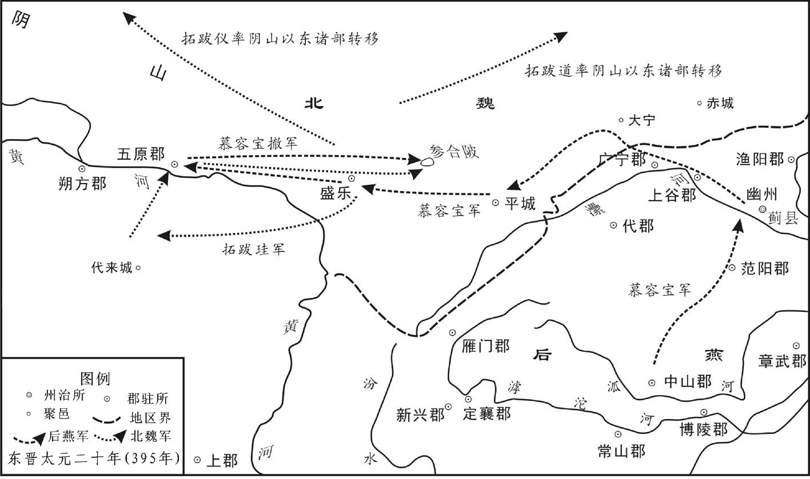 
参合陂之战示意图

## 【原文】

**魏王珪择燕臣之有才用者代郡太守广川贾闰、闰从弟骠骑长史昌黎太守彝、太史郎辽东晁崇等留之，其余欲悉给衣粮遣还，以招怀中州之人[1]。中部大人王建曰：“燕众强盛，今倾国而来，我幸而大捷，不如悉杀之，则其国空虚，取之为易。且获寇而纵之，无乃不可乎[2]？”乃尽阬之。十二月，珪还云中之盛乐。**

## 【注文】

[1]广川：郡名。十六国后燕慕容垂分清河郡置，治所设在枣强（今河北枣强东南）。　　骠骑长史：官名，即骠骑将军府参谋长。　　彝（yí）：即贾彝，字彦伦，生卒年不详。曾任慕容农记室参军。后被慕容垂赏识，为骠骑长史，兼昌黎太守。参合陂之战后，被拓跋珪招抚，拜为尚书左丞，参与国政，加给事中。曾与尚书和跋镇守邺都行台，后又召还。约在公元408年，被叛胡抓获，送给后秦姚兴，几年以后又逃回。后来又被夏国赫连屈丐所扣留，拜为秘书监。　　太史郎：官名。三国吴置，属太史令。掌观测天文气象，推算历法。

[2]中部大人：官名。公元308年，拓跋猗卢统摄三部后始置。负责统领中部，居于代郡参合陂（今内蒙古凉城东北岱海）北。

## 【译文】

魏王拓跋珪挑选后燕大臣中有才干可用的人，如代郡太守广川人贾闰、贾闰的堂弟骠骑长史昌黎太守贾彝、太史郎辽东人晁崇等人留下来，其余的打算全部发给衣服粮食，遣送回家，以招徕感怀中原百姓。中部大人王建说：“燕国部众强盛，这次动用全部国力来进攻，我们侥幸获得这么大的胜利，不如把他们全部杀掉，那么他们的国内就一片空虚，以后夺取它就容易了。况且俘虏了敌寇而又把他们放了，恐怕也不行吧？”于是把俘虏的后燕将士全部活埋了。十二月，拓跋珪返回云中的盛乐城。

## 【原文】

**燕太子宝耻于参合之败，请更击魏。司徒德言于燕主垂曰：“虏以参合之捷，有轻太子之心，宜及陛下神略以服之，不然将为后患。”垂乃以清河公会录留台事、领幽州刺史，代高阳王隆镇龙城，以阳城王兰汗为北中郎将，代长乐公盛镇蓟，命隆、盛悉引其精兵还中山，期以明年大举击魏[1]。**

## 【注文】

[1]录留台事：官名，主管留守朝廷机要。　　北中郎将：官名。出镇北方的地方军事长官，常为刺史加官。　　蓟（jì）：地名，西周曾封唐尧的后代于此地，到春秋战国时期为燕国的首都。此后，蓟指古代北京地区（今北京西南）。

## 【译文】

后燕太子慕容宝认为参合陂大败是自己的耻辱，请求再次攻打北魏。司徒慕容德对后燕主慕容垂进言道：“魏虏因为参合陂大捷，一定会产生轻视太子的心理，陛下应当运用神机妙计制服他们，不然将成为后患。”慕容垂于是任命清河公慕容会为录留台事、兼幽州刺史，代替高阳王慕容隆镇守龙城，任命阳城王兰汗为北中郎将，代替长乐公慕容盛镇守蓟城，命令慕容隆与慕容盛率领他们全部精锐部队返回中山，打算明年大举进攻北魏。

## 【原文】

**二十一年春正月，燕高阳王隆引龙城之甲入中山，军容精整，燕人之气稍振。三月庚子，燕主垂留范阳王德守中山，引兵密发，逾青岭，经天门，凿山通道，出魏不意，直诣云中[1]。魏陈留公虔帅部落三万余家镇平城。垂至猎岭，以辽西王农、高阳王隆为前锋以袭之[2]。是时燕兵新败，皆畏魏，惟龙城兵勇锐争先。虔素不设备，闰月乙卯，燕军至平城，虔乃觉之，帅麾下出战，败死，燕军尽收其部落[3]。魏王珪震怖欲走，诸部闻虔死，皆有贰心，珪不知所适。**

## 【注文】

[1]青岭：今河北涞（lái）源东。　　天门：关隘（ài）名，即今北京门头沟西北的天津关。

[2]猎岭：位于今山西代县和句注山相接的夏屋山东北。

[3]麾（huī）下：麾，将帅用以指挥的旗帜。麾下即指将帅的部下。

## 【译文】

东晋孝武帝太元二十一年（396年）春季正月，后燕高阳王慕容隆率领驻扎在龙城的军队进入中山，军容雄壮整齐，后燕人的士气逐渐振作起来。三月庚子（二十六日），后燕主慕容垂留下范阳王慕容德镇守中山，自己率领军队秘密出发，翻过青岭，经过天门，凿山开路，出乎北魏军的意料之外，直奔云中。北魏陈留公拓跋虔率领部落三万多家镇守平城。慕容垂抵达猎岭，让辽西王慕容农、高阳王慕容隆作为前锋突袭拓跋虔。这时，后燕军队刚刚遭到惨败，都很害怕北魏军队，只有龙城来的军队奋勇争先。拓跋虔向来不设防，闰三月乙卯（十二日），后燕军来到平城，拓跋虔这才发觉，率领部下出城抵抗，战死，后燕军收编了他的所有部落。北魏王拓跋珪非常震惊，打算逃走，其他各部听说了拓跋虔的死讯，都产生了贰心，拓跋珪不知道应该怎么办才好。

## 【原文】

**垂之过参合陂也，见积骸如山，为之设祭，军士皆恸哭，声震山谷。垂惭愤呕血，由是发疾，乘马舆而进，顿平城西北三十里[1]。太子宝等闻之，皆引还。燕军叛者奔告于魏，云“垂已死，舆尸在军。”魏王珪欲追之，闻平城已没，乃引还阴山。**

## 【注文】

[1]舆：本指车中装载东西的部分，后泛指车。

## 【译文】

慕容垂路过参合陂时，看见那里尸骨堆积如山，于是摆上香案，为死难将士祭奠，士兵们都放声痛哭，哭声震动山谷。慕容垂心中惭愧愤怒交加，以致口吐鲜血，从此发病，只得乘马车继续前行，在平城西北三十里处停顿下来。太子慕容宝等人听到这个消息，都率军返回。后燕军中叛逃的人跑到北魏说：“慕容垂已经死了，他的尸体放在军中的一辆车里。”北魏王拓跋珪打算追击后燕军队，听说平城已经沦陷，于是率兵返回阴山。

## 【原文】

**垂在平城积十日，疾转笃，乃筑燕昌城而还[1]。夏四月癸未，卒于上谷之沮阳，秘不发丧[2]。丙申，至中山。戊戌，发丧，谥曰成武皇帝，庙号世祖。壬寅，太子宝即位，大赦，改元永康[3]。**

## 【注文】

[1]燕昌城：今山西大同北。

[2]沮阳：县名，今河北怀来东南。

[3]永康：十六国时期后燕君主慕容宝所用年号，也是后燕的第三个年号，共计三年，即公元396年至398年。

## 【译文】

慕容垂在平城待了十天，病情加重，于是在这修筑了燕昌城，然后返回。夏季四月癸未（初十日），慕容垂在上谷的沮阳去世，后燕封锁了死讯。丙申（二十三日），大军抵达中山。戊戌（二十五日），发布慕容垂已死的消息，追谥慕容垂为成武皇帝，庙号世祖。壬寅（二十九日），太子慕容宝即位，实行大赦，改年号为永康。

## 【原文】

**五月辛亥，以范阳王德为都督冀兖青徐荆豫六州诸军事、车骑大将军、冀州牧，镇邺；辽西王农为都督并雍益梁秦凉六州诸军事、并州牧，镇晋阳[1]。又以安定王库傉官伟为太师，夫馀王蔚为太傅[2]。甲寅，以赵王麟领尚书左仆射，高阳王隆领右仆射，长乐公盛为司隶校尉，宜都王凤为冀州刺史。**

## 【注文】

[1]都督冀兖青徐荆豫六州诸军事：官名。即掌管冀、兖、青、徐、荆、豫六州军事事务的武官。　　都督并（bīng）雍益梁秦凉六州诸军事：即掌管并、雍、益、梁、秦、凉六州军事事务的武官。

[2]夫馀：古国名，又作“扶馀”。见前“扶馀”条注。

## 【译文】

五月辛亥（初九日），后燕任命范阳王慕容德为都督冀兖青徐荆豫六州诸军事、车骑大将军、冀州牧，镇守邺城；辽西王慕容农为都督并雍益梁秦凉六州诸军事、并州牧，镇守晋阳。又任命安定王库傉官伟为太师，夫馀王余蔚为太傅。甲寅（十二日），任命赵王慕容麟兼任尚书左仆射，高阳王慕容隆兼任右仆射，长乐公慕容盛为司隶校尉，宜都王慕容凤为冀州刺史。

## 【原文】

**初，燕主垂先段后生子令、宝，后段后生子朗、鉴，爱诸姬子麟、农、隆、柔、熙[1]。宝初为太子，有美称，已而荒怠，中外失望。后段后尝言于垂曰：“太子遭承平之世，足为守成之主。今国步艰难，恐非济世之才。辽西、高阳二王，陛下之贤子，宜择一人付以大业。赵王麟奸诈强愎，异日必为国家之患，宜早图之[2]。”宝善事垂左右，左右多誉之，故垂以为贤，谓段氏曰：“汝欲使我为晋献公乎[3]？”段氏泣而退，告其妹范阳王妃曰：“太子不才，天下所知。吾为社稷言之，主上乃以吾为骊姬，何其苦哉！观太子必丧社稷，范阳王有非常器度，若燕祚未尽，其在王乎[4]？”宝及麟闻而恨之。**

## 【注文】

[1]先段后：段末柸（bēi）之女，慕容垂结发妻子，生慕容令、慕容宝。因其才高性烈，与景昭皇帝慕容儁（jùn）皇后可足浑氏不和。后被可足浑氏诬陷，下狱而死。公元386年，慕容垂建立后燕，追封为成昭皇后，她的两个儿子先后被立为太子。　　后段后：即段元妃（？—396年）。见前“慕容垂夫人”条注。　　朗：即慕容朗（？—398年），慕容垂之子，后燕勃海王。公元398年，段速骨叛乱，他被杀死。　　鉴：即慕容鉴（？—398年），慕容垂之子，慕容朗之弟，后燕博陵王。公元398年，段速骨叛乱，他也一同被杀。　　姬（jī）：古代对帝王妾的称呼。　　熙：即慕容熙（385—407年），字道文，昌黎棘城（今辽宁义县西北）人，慕容垂之子。初封河间王。慕容盛即位后，降爵为公，拜都督中外诸军事、骠骑大将军、尚书左仆射、领中领军。公元401年，慕容盛被部下杀死，因太子年幼，他被太后丁氏迎立为帝。他在位七年（401—407年），其间大兴土木，政事暴虐；攻袭高句丽，死伤惨重。公元407年，被慕容云杀死，后燕灭亡。

[2]愎（bì）：固执任性。

[3]晋献公（？—前651年）：姬姓，晋氏，名佹（guǐ）诸（一作诡诸），春秋时晋国国君，公元前676年至前651年在位。因桓叔、庄伯之族强大，威胁公室，于是听从士蒍（wěi）之计，先除去富子（群公子之一，富为氏族之称），又杀游氏之二子，继又尽杀群公子，桓、庄之族几乎消灭殆尽。公元前661年，灭掉耿（今山西河津东南）、霍（今山西霍州西南）、魏（今山西芮城北）等国。之后又从虞（今山西平陆北）借道，攻灭北虢（guó）（今河南三门峡和山西平陆一带），回师又灭掉虞。从此晋国逐渐强大，西有河西，和秦接境，北与翟接壤，东到河内。后因宠信骊姬，迫使太子申生自杀，驱逐公子重耳和夷吾，死后引起内乱。

[4]骊（lí）姬（？—前650年）：春秋时代骊戎（今陕西临潼）首领的女儿。公元前672年，被晋献公姬佹诸虏入晋国纳为妃子。她工于心计，曾设计离间晋献公与申生、重耳、夷吾父子兄弟之间感情，并设计杀死太子申生，引起晋国内乱。

## 【译文】

当初，后燕主慕容垂的前妻段皇后生了儿子慕容令、慕容宝，后妻小段皇后又生下儿子慕容朗、慕容鉴，其他姬妾生慕容麟、慕容农、慕容隆、慕容柔、慕容熙。慕容宝刚当上太子时，有很好的声誉，但不久便开始荒废懈怠起来，朝廷内外的人都对他很失望。小段皇后曾对慕容垂说：“太子如果遇到太平盛世，一定能成为一个安守祖业的君主。但是，如今国家举步维艰，太子恐怕不是一个能够拯世济民的人才。辽西王慕容农与高阳王慕容隆，都是陛下贤能的儿子，应当从他们之中选择一个，把国家的大业托付给他。赵王慕容麟奸佞狡诈、强势刚愎，以后必然会成为国家的祸患，应当早日除掉他。”慕容宝平时善于结交慕容垂身边的侍从，于是侍从们经常赞誉他，所以慕容垂认为他很贤能，便对小段皇后说：“你难道想让我成为晋献公吗？”小段皇后哭着退了出去，告诉她的妹妹范阳王慕容德的妃子说：“太子无才，这是天下人都知道的事。我为了国家而向主上进言，主上却把我当成骊姬，我是多么痛苦啊！我看太子一定会把国家断送，范阳王有非凡的气度，如果燕国的气数还没有尽，恐怕要应在范阳王身上吧！”慕容宝和慕容麟听说后，对小段皇后非常仇恨。

## 【原文】

**乙丑，宝使麟谓段氏曰：“后常谓主上不能守大业，今竟能不？宜早自裁，以全段宗。”段氏怒曰：“汝兄弟不难逼杀其母，况能守先业乎！吾岂爱死，但念国亡不久耳。”遂自杀。宝议以“段后谋废嫡统，无母后之道，不宜成丧[1]。”群臣咸以为然。中书令眭邃飏言于朝曰：“子无废母之义。汉安思阎后亲废顺帝，犹得配飨太庙，况先后暧昧之言，虚实未可知乎[2]？”乃成丧。**

## 【注文】

[1]嫡统：即正统。

[2]飏（yáng）言：大声讲话，多用于臣下奏辞。　　安思阎后：即阎姬（？—126年），荥阳（今河南荥阳）人，汉安帝刘祜皇后。她曾将太子刘保废为济阴王。安帝去世后，谋立年幼的刘懿（yì）为帝，企图长久专权，掌管国政。但不久小皇帝刘懿便病死，刘保在中黄门孙程等人的拥护下即位为皇帝，她被迁居离宫。　　顺帝：即刘保（115—144年），汉安帝刘祜之子，公元120年被立为皇太子，后废为济阴王。公元125年，少帝刘懿死后，时年十一的他被中黄门孙程等人拥立为帝。他在位期间，宦官外戚交相掌权，官吏贪暴，朝政昏暗，加上自然灾害频发，导致各地民变迭起。公元144年病死，谥为顺帝，庙号敬宗。　　配飨（xiǎng）：帝王于郊外祭祀天地时，以先祖配祭；也指以功臣配祀于帝王宗庙。　　太庙：古代皇帝为祭拜祖先而营建的庙宇，即帝王的祖庙。　　暧（ài）昧（mèi）：含糊；模糊。

## 【译文】

乙丑（二十三日），慕容宝让慕容麟对小段皇后说：“您常说主上不能安守祖上大业，今日您说能不能守住？您最好早日自行裁决，以保全你们段氏宗族。”小段皇后大怒道：“你们兄弟这样轻易逼死自己的母亲，还谈什么能安守祖业！我难道是贪生怕死，只是忧虑不久之后国家将要灭亡罢了。”于是自杀。慕容宝认为小段皇后曾谋划废黜嫡传正统的太子，失去了做母后的道义，因此不应当为她举办丧事。朝中的文武百官都表示赞同。只有中书令眭邃在朝廷上大声说：“儿子没有废黜母亲的道理。东汉安思皇后阎氏亲自废黜了顺帝，死后牌位还能进入太庙，何况先皇后说了几句含混不清的话，这事是真是假都无法证实呢！”慕容宝这才为小段皇后举行丧礼。

## 【原文】

**夏六月癸酉，魏王珪遣将军王建等击燕广宁太守刘亢泥斩之，徙其部落于平城。燕上谷太守开封公详弃郡走[1]。详，皝之曾孙也。**

## 【注文】

[1]开封公：后燕爵位名。开封，县名，治所在今河南开封西南。　　详：即慕容详（？—397年），本为后燕宗室，开封公。公元397年，北魏围攻后燕都城中山（今河北定州），燕主慕容宝出逃，他受命镇守中山。不久魏军因缺粮而撤退，他便自行称帝，设置百官，改元建始。他为人残暴，生活荒淫，杀戮无度，导致民心大失，不久便被慕容宝之弟慕容麟杀死。

## 【译文】

夏季六月癸酉（初一日），魏王拓跋珪派遣将军王建等人袭击后燕广宁太守刘亢泥，并将他杀死，还把他的部落迁徙到平城。后燕上谷太守开封公慕容详舍弃郡城逃走。慕容详，是慕容皝的曾孙。

## 【原文】

**燕主宝定士族旧籍，分辨清浊，校阅户口，罢军营封阴之户悉属郡县[1]。由是士民嗟怨，始有离心[2]。**

## 【注文】

[1]士族：又称“世族”，即东汉以来大官僚地主依靠政治、经济特权，逐渐形成的大姓豪族。不属于士族出身的官吏则称“寒族”“庶族”。　　清浊：即清官与浊官。清官指那些地位显赫、事务较少的官职，大多由门阀士族担任；浊官则指那些地位卑微、事务冗繁的官职，多由寒门庶族担任。　　军营封阴之户：即后燕各个军营庇护的私户。这些私户一般只为庇护自己的军营从事各种杂役，不负担国家的赋税劳役。

[2]嗟（jiē）怨：悲叹；怨恨。

## 【译文】

后燕主慕容宝下令核定士族的旧有户籍，区分清官与浊官，审查校阅住户与人口，撤销军营的封荫户，让他们归属郡县管辖。从此，士民叹息怨恨，开始离心离德。

## 【原文】

**上谷张恂劝珪进取中原，珪善之[1]。**

## 【注文】

[1]张恂（xún）（348—416年）：字洪让，上谷沮阳（今河北怀来东南）人。北魏大臣，历任中书郎、镇远将军、广平常山二郡太守、太中大夫等，获封平皋（gāo）子。他担任郡太守期间，招集离散流民，劝课农桑，开办学校，优待儒士，清正仁恕，深得当地百姓称道。公元416年去世，被明元帝拓跋嗣追赠为征虏将军、并州刺史、平皋侯，谥号“宣”。　　中原：狭义“中原”指河南，广义“中原”则是以河南四大古都（洛阳、开封、安阳、郑州）为中心的黄河中下游一带。中原是中国历史上绝大部分时期的政治、经济和文化中心所在地，也是中华文明的发源地。

## 【译文】

上谷人张恂劝说拓跋珪发兵夺取中原，拓跋珪深表赞同。

## 【原文】

**燕辽西王农悉将部曲数万口之并州。并州素乏储偫，是岁早霜，民不得供其食[1]。又遣诸部护军分监诸胡[2]。由是民夷俱怨，潜召魏军[3]。八月己亥，魏王珪大举伐燕，步骑四十余万南出马邑，逾句注，旌旗二千余里，鼓行而进[4]。左将军雁门李栗将五万骑为前驱，别遣将军封真等从东道出军都，袭燕幽州[5]。**

## 【注文】

[1]储偫（zhì）：即储备，特指储存物资以备需用。

[2]胡：古人对汉人以外部族的称呼，通常是指中国北方以及西方的游牧民族，主要包括匈奴、鲜卑、氐、羌、吐蕃、突厥、蒙古、契丹、女真等部落。

[3]民夷：指汉族与少数民族。

[4]句注：即句注山，位于今山西代县西北。

[5]李栗（？—400年）：北魏将领，雁门（今山西代县西南）人。拓跋珪投奔贺兰部时，他是其随从二十一人之一。虽然他不是亲族，但因才干突出，而深得拓跋珪信任。后因征伐后燕有功而被拜为左军将军。他为人傲慢不拘礼节，公元400年被拓跋珪杀死。　　军都：即军都山，属燕山山脉，位于今北京昌平西北。

## 【译文】

后燕辽西王慕容农率领自己所统属的几万口部曲前往并州。并州向来缺乏粮食储备，这一年又早降霜冻，百姓无法供给他们粮食。慕容农又派遣各部护军分别监视各部胡人。从此汉人和夷人对他都深怀怨恨，暗地里招引北魏军队前来。八月己亥（二十八日），魏王拓跋珪大规模讨伐后燕，步兵、骑兵共约四十多万人，从马邑向南出发，翻越句注山，军旗绵延两千多里，在战鼓声中向前行进。左将军雁门人李栗率领五万骑兵作为先锋，又另派将军封真等人从东路翻过军都山，袭击后燕的幽州。

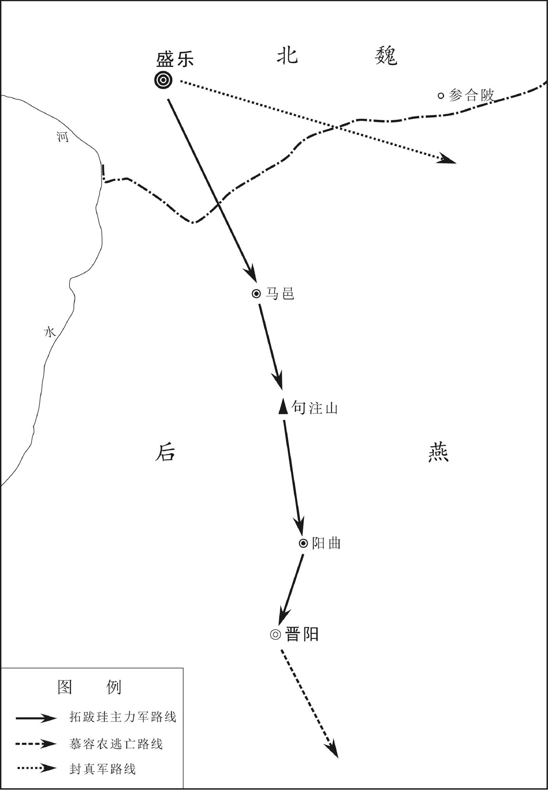 
北魏并吞并州路线图

## 【原文】

**燕征北大将军、幽平二州牧、清河公会母贱，而年长，雄俊有器艺，燕主垂爱之[1]。宝之伐魏也，垂命会摄东宫事、总录，礼遇一如太子。及垂伐魏，命会镇龙城，委以东北之任，国官府佐，皆选一时才望[2]。垂疾笃，遗言命宝以会为嗣。而宝爱少子濮阳公策，意不在会[3]。长乐公盛与会同年，耻为之下，乃与赵王麟共劝宝立策，宝从之。乙亥(3)，立妃段氏为皇后，策为皇太子，会、盛皆进爵为王[4]。策年十一，素憃弱，会闻之，心愠怼[5]。**

## 【注文】

[1]征北大将军：将军名号，将军中地位较高者。三国时期，征北、征南、征西、征东将军合称四征将军。征北将军中以资深者为征北大将军。晋朝沿置。

[2]国官：藩王的属官。　　府佐：高级官署中的佐治官吏。

[3]濮阳公：后燕爵位名。濮阳，郡名，西晋末改濮阳国置，治所在今河南濮阳西南，辖境相当于今河南滑县、濮阳、范县，山东郓（yùn）城、鄄（juàn）城等地。北魏移治今山东鄄城北。　　策：即慕容策（386—398年），慕容宝嫡子，公元396年被册立为太子。公元398年，被兰汗杀死。慕容盛即位后，被追封为献哀太子。

[4]段氏（？—399年）：后燕慕容宝皇后，深得宠爱，生子慕容策。公元398年，慕容宝被兰汗杀死，慕容盛（慕容宝儿子、兰汗女婿）又杀兰汗自立，封她为皇太后。次年，去世，谥“惠德皇后”。

[5]憃（chōng）弱：愚笨懦弱。　　愠（yùn）怼（duì）：恼怒怨恨。

## 【译文】

后燕征北大将军、幽平二州牧、清河公慕容会，母亲出身低贱，但他在兄弟中年龄最大，雄伟俊逸，器宇不凡，后燕主慕容垂很喜爱他。慕容宝讨伐北魏时，慕容垂命慕容会代管东宫事务、全权处理政事，礼仪、待遇和太子相同。到慕容垂征伐北魏时，又命慕容会镇守龙城，把东北方面的所有军政事务都委托给他，无论是藩国属官还是府衙佐吏，都是从当时有才干和声望的人中选拔。慕容垂病重时，留下遗言，命慕容宝立慕容会为继承人。但是慕容宝却喜爱小儿子濮阳公慕容策，而不看重慕容会。长乐公慕容盛与慕容会同岁，觉得做他的臣下是自己的耻辱，于是便和赵王慕容麟一起劝说慕容宝立慕容策为太子，慕容宝听从了他们的意见。乙亥（初四日），立妃子段氏为皇后，慕容策为皇太子，慕容会、慕容盛都晋爵为王。慕容策这年才十一岁，一向愚笨懦弱，慕容会听到这个消息后，心中恼怒怨恨不已。

## 【原文】

**九月，章武王宙奉燕主垂及成哀段后之丧葬于龙城宣平陵。宝诏宙悉徙高阳王隆参佐、部曲、家属还中山。会违诏，多留部曲不遣[1]。宙年长属尊，会每事陵侮之，见者皆知其有异志。**

## 【注文】

[1]成哀段后：即段元妃。　　宣平陵：后燕主慕容垂陵墓，今地不详。

## 【译文】

九月，章武王慕容宙护送后燕国主慕容垂和成哀小段皇后的灵柩到龙城宣平陵安葬。慕容宝诏令慕容宙，把高阳王慕容隆的参佐、部曲、家眷等全部迁回中山。慕容会违背诏令，留下很多部曲没有遣返。慕容宙年长辈尊，慕容会却经常借机欺凌侮辱他，看见这种事的人都知道慕容会心怀不轨。

## 【原文】

**戊午，魏军至阳曲，乘西山，临晋阳，遣骑环城大噪而去[1]。燕辽西王农出战，大败，奔还晋阳，司马慕舆嵩闭门拒之。农将妻子帅数千骑东走，魏中领将军长孙肥追之，及于潞川，获农妻子[2]。燕军尽没，农被创，独与三骑逃归中山。**

## 【注文】

[1]阳曲：县名，治所在今山西太原北阳曲镇。　　西山：即北魏平城西山，约在今山西大同西北。

[2]中领将军：官名。北魏初置，职掌皇宫禁军和统率全国军队，多由权臣担任该职。　　长孙肥（？—408年）：代（今山西大同东北）人，北魏将领。十三岁时便担任拓跋什翼犍内侍。后追随拓跋珪征讨刘显、攻伐贺兰部、平定中山等，他善于策谋，每次出战都身先士卒，从未失败过。因此深得拓跋珪重用，位至镇远将军、兖州刺史，赐爵卢乡公。公元408年去世，谥号“武”。

## 【译文】

戊午（十八日），北魏军到达阳曲，登上西山，逼近晋阳，派遣骑兵围绕着晋阳城大声呐喊后又退了回去。后燕辽西王慕容农出城交战，被打得大败，逃回晋阳，司马慕舆嵩关闭城门，拒绝他进城。慕容农带着妻子儿女，率领几千名骑兵向东逃去，北魏中领将军长孙肥追击他们，终于在潞川抓获了慕容农的妻子儿女。后燕军队全部被消灭，慕容农受了伤，仅和三名骑兵一起逃回中山。

## 【原文】

**魏王珪遂取并州。初建台省，置刺史、太守、尚书郎以下官，悉用儒生为之[1]。士大夫诣军门者，无少长，皆引入存慰，使人人尽言，少有才用，咸加擢叙[2]。己未，遣辅国将军奚收略地汾川，获燕丹杨王买得及离石护军高秀和[3]。以中书侍郎张恂等为诸郡太守，招抚离散，劝课农桑。**

## 【注文】

[1]台省：即政府的中央机构。汉的尚书台、三国魏的中书省，都是代表皇帝发布政令的中枢机关，因此后世常以“台省”代指中央机构。　　儒生：指读书人。

[2]士大夫：旧时指官吏或较有声望、地位的知识分子。在古代，通过竞争性考试选拔官吏的人事体制形成了一个特殊的士大夫阶层，即专门为做官而读书考试的知识分子阶层。“士大夫”出现于战国，他们是知识分子与官僚相结合的产物。　　擢（zhuó）叙：提拔叙用。

[3]汾川：即今汾河流域。　　丹杨王：后燕爵位名。丹杨，又作丹阳。　　买得：即慕容买得，生卒年不详，曾侍后燕慕容宝。公元396年，在北魏与后燕的大战中，被俘降魏。　　离石：地名，大致在今山西离石。

## 【译文】

魏王拓跋珪于是夺取了并州。开始组建朝廷，设置刺史、太守、尚书郎等官职，全部由读书人来担任这些职务。凡是来到军营门口拜见的士大夫，不论年龄大小，都领进营中，尽心抚慰，让他们都能畅所欲言，凡是稍有才能的人，都加以任用。己未（十九日），拓跋珪派遣辅国将军奚收去攻取汾川，俘虏了后燕丹杨王慕容买得和离石护军高秀和。任命中书侍郎张恂等人为各郡太守，招徕和安置离散的流民，鼓励他们种田植桑。

## 【原文】

**燕主宝闻魏军将至，议于东堂[1]。中山尹苻谟曰：“今魏军众强，千里远斗，乘胜气锐，若纵之使入平土，不可敌也，宜杜险以拒之[2]。”中书令眭邃曰：“魏多骑兵，往来剽速，马上赍粮，不过旬日[3]。宜令郡县聚民千家为一堡，深沟高垒，清野以待之，彼至无所掠，不过六旬，食尽自退。”尚书封懿曰[4]：“今魏兵数十万，天下之勍敌也。民虽筑堡，不足以自固，是聚兵及粮以资之也。且动摇民心，示之以弱，不如阻关拒战，计之上也。”赵王麟曰：“魏今乘胜气锐，其锋不可当，宜完守中山，待其弊而乘之。”于是修城、积粟，为持久之备[5]。命辽西王农出屯安喜，军事动静，悉以委麟[6]。**

## 【注文】

[1]东堂：殿堂名。

[2]中山尹：十六国后燕都城行政长官，慕容垂置。

[3]剽（piāo）速：　轻捷迅速。　　赍（jī）：携带。　　旬：十日为一旬。

[4]封懿（？—417年）：字处德，勃海蓨（tiáo）（今河北景县）人。曾仕后燕慕容宝，任中书令、民部尚书等。后燕灭亡后，转投北魏，被授为给事黄门侍郎、都坐大官、宁朔将军等，晋爵章安子。曾撰写《燕书》。

[5]粟（sù）：古代泛称谷类。

[6]安喜：今河北定州东南。

## 【译文】

后燕主慕容宝听说北魏军就要来到，在东堂商议对策。中山尹苻谟说：“现在北魏军队人数众多，力量强大，从千里之外前来作战，乘胜前进，锐不可当，如果放他们进入平原，我们就无法抵挡了，应当依据险要地形来抵抗他们。”中书令眭邃说：“北魏大多是骑兵，往来轻捷迅速，但是他们马上携带的干粮，仅能支持十天左右而已。我们应当下令各郡县，聚集民众，以每千家为一堡，深挖壕沟，高筑堡垒，使原野上既无人烟又无粮草可取，以等待敌军的进犯。他们来到这里后，没有东西可以掠夺，最多不超过六十天，就会因为粮食用完而撤退。”尚书封懿说：“如今北魏军队有数十万人，这是天下的劲敌。民众即使修筑寨堡，也不能保卫自己的安全，这相当于聚积军队和粮食来资助敌人。况且这样做容易动摇民心，向敌人暴露出自己的虚弱，不如据守关隘，顽强抵抗，这才是上策啊。”赵王慕容麟说：“魏军如今乘胜而来，气势旺盛，锋芒锐不可当，我们应当全面防守中山，等待敌人疲惫的时候，再乘机反击。”于是开始修筑城墙、储备粮食，做持久战的准备。又命令辽西王慕容农出城驻扎在安喜，军中的一切行动，则交给慕容麟全权掌管。

## 【原文】

**冬十月，魏王珪使冠军将军代人于栗、宁朔将军公孙兰，帅步骑二万，潜自晋阳开韩信故道[1]。己酉(4)，珪自井陉趋中山。李先降魏，珪以为征东左长史[2]。**

## 【注文】

[1]于栗（dī）：北魏将领，代（今山西大同东北）人。少时从军，武艺过人。拓跋珪时，任冠军将军，曾率军攻击后燕都城中山有功，被拓跋珪比做英布、彭越一样的人物。后又镇压关东、西河、弘农等地起义。刘裕军进入关中时，他在黄河边修筑堡垒，防止刘裕军北进，因其手持黑矟，容貌非凡，刘裕称其为“黑矟公”，明元帝拓跋嗣曾授予他“黑矟将军”名号。公元423年，他攻占洛阳，担任豫州刺史。太武帝拓跋焘征讨夏时，他进军长安。平定夏后，历官蒲坂镇将、虎牢镇大将、枋头都将，镇守南线。他一生戎马，又多年镇守在南方前线，不但治军有方，还善于施政，刑罚不滥，深受当地百姓爱戴。　　韩信故道：指公元前204年韩信穿过井陉，消灭赵国时所走的道路。

[2]李先（335—429年）：北魏大臣，字容仁，中山庐奴（今河北定州）人。前秦苻坚时担任尚书郎，后被西燕慕容永纳为谋士，担任黄门郎，后转秘书监，管理全国图书、档案。西燕灭亡后，归顺北魏，历任征东左长史、尚书右中兵郎等官。他富有谋略，每逢出战时，道武帝拓跋珪都要先征询李先的建议。　　征东左长史：官名。主管征东将军府中的具体事务。

## 【译文】

冬季十月，魏王拓跋珪派冠军将军代人于栗、宁朔将军公孙兰，率领二万步兵、骑兵，偷偷从晋阳开凿当年韩信破赵的旧道。己酉日，拓跋珪从井陉直奔中山。李先投降北魏，拓跋珪任命他为征东左长史。

## 【原文】

**魏王珪进攻常山，拔之，获太守苟延。自常山以东守宰，或走或降，诸郡县皆附于魏，惟中山、邺、信都三城为燕守。十一月，珪命东平公仪将五万骑攻邺，冠军将军王建、左将军李栗攻信都。戊午，珪进军中山，己未，攻之。燕高阳王隆守南郭，帅众力战，自旦至晡，杀伤数千人，魏兵乃退[1]。珪谓诸将曰：“中山城固，宝必不肯出战。急攻则伤士，久围则费粮，不如先取邺、信都，然后图之。”丁卯，珪引兵而南。**

## 【注文】

[1]晡（bū）：本意指申时，即午后三点至五点。常泛指傍晚。

## 【译文】

魏王拓跋珪进军攻打常山，顺利拿下，并俘虏了太守苟延。常山以东各郡县，地方官吏们或逃走，或投降，都归附了北魏，只有中山、邺城、信都三城还为后燕坚守。十一月，拓跋珪命东平公拓跋仪率领五万骑兵攻打邺城，冠军将军王建、左将军李栗攻打信都。戊午（十九日），拓跋珪进军中山，己未（二十日），发起进攻。后燕高阳王慕容隆据守南城，率领部众奋力苦战，从早晨到黄昏，杀伤敌兵几千名，北魏军队才败退下去。拓跋珪对部将们说：“中山城非常坚固，慕容宝一定不肯出城来与我们交战。我们急攻便会损伤士卒，长期包围就会耗费大量粮草，不如先去夺取邺城、信都，然后再想办法对付它。”丁卯（二十八日），拓跋珪率军南下。

## 【原文】

**章武王宙自龙城还，闻有魏寇，驰入蓟，与镇北将军阳城王兰乘城固守[1]。兰，垂之从弟也。魏别将石河头攻之，不克，退屯渔阳[2]。**

## 【注文】

[1]兰：即慕容兰，生卒年不详，慕容垂堂弟，后燕镇北将军、阳城王。

[2]渔阳：今北京密云。

## 【译文】

章武王慕容宙从龙城返回，听说北魏大军进犯，于是赶快进入蓟城，与镇北将军阳城王慕容兰一起据城坚守。慕容兰，是慕容垂的堂弟。北魏的别将石河头率军攻城，没有攻克，便撤退到渔阳驻扎。

## 【原文】

**珪军于鲁口，博陵太守申永奔河南，高阳太守崔宏奔海渚[1]。珪素闻宏名，遣吏追求，获之，以为黄门侍郎，与给事黄门侍郎张衮对掌机要，创立制度。博陵令屈遵降魏，珪以为中书令，出纳号令，兼总文诰[2]。**

## 【注文】

[1]海渚（zhǔ）：即海岛。

[2]令：县一级的行政长官。　　屈遵（329—398年）：字子度，昌黎徒河（今辽宁锦州）人。他博学多才，闻名于世。西燕慕容永时，任尚书仆射；后燕慕容垂灭西燕后，他被任命为博陵令。后又归顺北魏道武帝拓跋珪，被拜为中书令，并赐爵下蔡子。　　文诰（gào）：古代帝王对臣子下达命令的文书。

## 【译文】

拓跋珪屯兵鲁口，后燕博陵太守申永逃奔到黄河以南，高阳太守崔宏逃奔到海岛。拓跋珪早就听说过崔宏的名声，便派遣官吏前去追赶，终于找到了他，任命他为黄门侍郎，与给事黄门侍郎张衮一起掌管国家机要大事，并制订国家的各项法令制度。博陵县令屈遵投降了北魏，拓跋珪任命他为中书令，负责收发国家的公文和法令函件，同时兼管皇帝文诰。

## 【原文】

**燕范阳王德使南安王青等夜击魏军于邺下，破之，魏军退屯新城[1]。青等请追击之，别驾韩曰：“古人先计而后战。魏军不可击者四：悬军远客，利在野战，一也；深入近畿，顿兵死地，二也；前锋既败，后阵方固，三也；彼众我寡，四也[2]。官军不宜动者三：自战其地，一也；动而不胜，众心难固，二也；城隍未修，敌来无备，三也[3]。今魏无资粮，不如深垒固军以老之。”德从之，召青还。青，详之兄也。**

## 【注文】

[1]南安王：后燕爵位名。　　青：即慕容青，生卒年不详，慕容详哥哥，后燕南安王。

[2]韩（zhuó）（生卒年不详）：曾任后燕别驾。　　畿（jī）：指京城所管辖的地区。

[3]城隍（huáng）：“城”即挖土筑的高墙，“隍”指没有水的护城壕。

## 【译文】

后燕范阳王慕容德派遣南安王慕容青等人，趁夜在邺城下面突然袭击，打败了北魏军队，魏军撤退到新城驻扎。慕容青等人请求继续追击，别驾韩说：“古人先谋划好后，才按计划作战。这次不能追击北魏军队的原因有四点：第一，敌人远道而来，在原野上作战对他们有利；第二，敌人孤军深入到邺城近郊，交战时势必以死相拼；第三，敌军的先锋部队虽已遭到失败，但他们后面的军阵仍很稳固；第四，敌众我寡。我军不应当出动的理由也有三点：第一，我们是在自己的国土上作战；第二，如果我军出战却不能取胜的话，很容易动摇军心；第三，城池还没有来得及修整加固，如果敌军来犯，我们无法防备。现在魏军缺乏军用物资和粮食，我们不如深挖战壕，高筑堡垒，稳住阵脚，安定军心，用时间将敌人拖垮。”慕容德听从了他的建议，将慕容青召回。慕容青，是慕容详的哥哥。

## 【原文】

**十二月，魏辽西公贺赖卢帅骑二万会东平公仪攻邺[1]。赖卢，讷之弟也。**

## 【注文】

[1]贺赖卢（生卒年不详）：贺讷之弟，拓跋珪之舅。北魏辽西公、广川太守；南燕并州刺史、辅国将军、广宁王。入南燕后，又称慕容贺赖卢。

## 【译文】

十二月，北魏辽西公贺赖卢率领二万名骑兵，会同东平公拓跋仪一起，攻打邺城。贺赖卢，是贺讷的弟弟。

## 【原文】

**魏别部大人没根有胆勇，魏王珪恶之。没根惧诛，己丑，将亲兵数十人降燕，燕主宝以为镇东大将军，封雁门公。没根求还袭魏，宝难与重兵，给百余骑。没根效其号令，夜入魏营，至中仗，珪乃觉之，狼狈惊走。没根以所从人少，不能坏其大众，多获首虏而还。**

## 【译文】

北魏另一支部落的首领没根既有胆量，又作战骁勇，魏王拓跋珪非常厌恶他。没根害怕拓跋珪杀自己，己丑（二十日），便率领几十个亲信士兵投降了后燕，后燕主慕容宝任命他为镇东大将军，封为雁门公。没根请求回军袭击北魏，慕容宝不肯交给他大批军队，只给了他一百多名骑兵。没根模仿敌人的番号军令，夜晚进入北魏军营，来到中央大帐旁，拓跋珪这才发觉，狼狈不堪，惊慌逃走。没根因为自己所带领的士兵太少，不能大批杀伤敌人，只得多抓些魏兵便撤回去了。

## 【原文】

**安帝隆安元年春正月，燕范阳王德求救于秦，秦兵不出，邺中忷惧[1]。贺赖卢自以魏王珪之舅，不受东平公仪节度，由是与仪有隙[2]。仪司马丁建阴与德通，从而构间之，射书入城中，言其状[3]。甲辰，风霾，昼晦，赖卢营有火，建言于仪曰：“赖卢烧营为变矣[4]。”仪以为然，引兵退。赖卢闻之，亦退。建帅其众诣德降，且言仪师老，可击。德遣桂阳王镇、南安王青帅骑七千追击魏军，大破之[5]。燕主宝使左卫将军慕舆腾攻博陵，杀魏所置守宰王建等[6]。**

## 【注文】

[1]恟：恐惧；惊骇。

[2]节度：此指调度；指挥。

[3]丁建（生卒年不详）：北魏东平公拓跋仪司马，后投降慕容德。　　构间：挑拨离间。

[4]霾（mái）：乱风刮来时空中降下沙土，尘土飞扬。

[5]桂阳王：后燕爵位名。

[6]左卫将军：武官名号。职掌宫禁宿卫，是中央禁军主要将领。　　慕舆腾（？—398年）：后燕左卫将军、抚军将军。公元398年，受慕容宝命，与慕容盛一起到冀州收集残兵败将。但因其暴虐专横，遭民众怨恨，后被慕容盛杀死，谥“扶风忠公”。

## 【译文】

东晋安帝隆安元年（397年）春季正月，后燕范阳王慕容德向后秦求救，后秦不出兵，邺城军民恐慌不已。贺赖卢自以为是拓跋珪的舅舅，不听从东平公拓跋仪的指挥，从此与拓跋仪产生了矛盾。拓跋仪的司马丁建暗中与慕容德勾结，挑拨贺赖卢与拓跋仪的关系，并把这种情况写成密信，用箭射入城中告知慕容德。甲辰（初六日），大风刮起尘土，白昼如同黑夜，贺赖卢的营中出现火光，丁建对拓跋仪说：“贺赖卢火烧军营，已经发动叛乱了。”拓跋仪认为丁建说得对，便迅速率兵后退。贺赖卢听说这个消息后，也跟着退兵了。丁建则率领他的部众向慕容德投降，并且告诉慕容德说，拓跋仪的军队已经拖得疲惫不堪，可以向他们发动攻击了。慕容德派遣桂阳王慕容镇、南安王慕容青率领七千名骑兵前去追击北魏军队，把他们打得大败。后燕主慕容宝派遣左卫将军慕舆腾进攻博陵，杀掉北魏所设的地方官吏王建等人。

## 【原文】

**攻信都六十余日不下，士卒多死。庚申，魏王珪自攻信都。壬戌夜，燕宜都王凤逾城奔中山。癸亥，信都降魏。**

## 【译文】

北魏军队攻打信都，六十多天都没能攻下，士兵死了很多。庚申（二十二日），魏王拓跋珪亲自率军攻打信都。壬戌（二十四日）夜晚，后燕宜都王慕容凤出城逃往中山。癸亥（二十五日），信都向北魏投降。

## 【原文】

**燕主宝闻魏王珪攻信都，出屯深泽，遣赵王麟攻杨城，杀守兵三百[1]。宝悉出珍宝及宫人募郡县群盗以击魏。**

## 【注文】

[1]深泽：县名，治所在今河北深泽东南。　　杨城：地名，在今河北宁晋。

## 【译文】

后燕主慕容宝听说魏王拓跋珪率军攻打信都，于是出兵驻扎在深泽，又派遣赵王慕容麟进攻杨城，杀死守城士兵三百人。慕容宝拿出所有的珍宝和宫女作为奖赏，招募各郡县的盗贼来抗击北魏。

## 【原文】

**二月己巳朔，珪还屯杨城。没根兄子丑提为并州监军，闻其叔父降燕，惧诛，帅所部兵还国作乱[1]。珪欲北还，遣其国相涉延求和于燕，且请以其弟为质[2]。宝闻魏有内难，不许，使冗从仆射兰真责珪负恩，悉发其众步卒十二万，骑三万七千屯于曲阳之柏肆，营于滹沱水北以邀之[3]。丁丑，魏军至，营于水南。宝潜师夜济，募勇敢万余人袭魏营，宝陈于营北以为之援。募兵因风纵火，急击魏军，魏军大乱，珪惊起，弃营跣走[4]。燕将军乞特真帅百余人至其帐下，得珪衣靴。既而募兵无故自惊，互相斫射，珪于营外望见之，乃击鼓收众，左右及中军将士稍稍来集，多布火炬于营外，纵骑冲之，募兵大败，还赴宝陈[5]。宝引兵复渡水北。戊寅，魏整众而至，与燕相持，燕军夺气。宝引还中山，魏兵随而击之，燕兵屡败。宝惧，弃大军，帅骑二万奔还，时大风雪，冻死者相枕[6]。宝恐为魏军所及，命士卒皆弃袍仗、兵器数十万，寸刃不返[7]。燕之朝臣将卒降魏及为魏所系虏者甚众。**

## 【注文】

[1]监军：地方军政长官，是监诸州军事的省称。代表朝廷协理军务，督察将帅，但地位稍低于都督。

[2]国相：指宰相等大臣。

[3]兰真（生卒年不详）：鲜卑人。后燕慕容宝时，任冗从仆射。　　曲阳：县名，治所在今河北晋州西。　　柏肆：坞名，位于今河北藁（gǎo）城附近。　　滹（hū）沱（tuó）水：即今山西、河北境内的滹沱河。

[4]跣（xiǎn）：光着脚，不穿鞋袜。

[5]斫（zhuó）：用刀、斧等砍劈。　　中军：魏晋南北朝时期的军事编制。汉代中央军称南北军，魏晋改称中军，掌管宿卫宫殿、保护都城，兼掌四方征伐事，为国家重兵所在。魏晋中军总数约十万人，主帅为皇帝心腹武将。此外，西晋各王国皆置军，分为上、中、下军，置有军将统领。

[6]相忱：彼此枕藉，形容很多。

[7]袍仗：战袍和兵器。

## 【译文】

二月己巳朔（初一日），拓跋珪回到杨城驻扎。没根的侄子丑提担任并州监军，听说他的叔父归降了后燕，害怕遭到诛杀，于是率领部众回国发动叛乱。拓跋珪想要回到北方，派遣国相拓跋涉延前去后燕求和，并且请求让自己的弟弟做人质。慕容宝听说北魏内部发生动乱，便没答应和解，派冗从仆射兰真责备拓跋珪忘恩负义，并集结了步兵十二万人，骑兵三万七千人，驻扎在曲阳境内的柏肆坞，在滹沱河北岸结营扎寨，以拦截北魏军队。丁丑（初九日），北魏的军队来到，扎营在滹沱河南岸。慕容宝秘密派遣一支军队趁夜渡河，招募一万多敢死队袭击北魏军营，慕容宝在北魏大营北面列阵作为后援。后燕招募来的这些士兵借风放火，发起急攻，北魏军一片大乱，拓跋珪从睡梦中惊醒，光着脚弃营而逃。后燕将军乞特真率领一百多人来到拓跋珪的帐中，只搜到他的衣服和皮靴。不久，招募来的士兵不知什么原因便突然大乱，互相劈砍射杀，拓跋珪在营外远远望见这种情况，于是击鼓召集溃散部众，左右侍从和中军将士陆续前来集合，在营外布置了许多火炬，并派骑兵冲击后燕军队，招募的士兵大败，逃回慕容宝的军阵。慕容宝率兵再次渡到滹沱河北岸。戊寅（初十日），北魏整顿好军队前来，与后燕相对峙，后燕军士气大失。慕容宝只得率军返回中山，但北魏军紧随其后追击，后燕军几次应战均告失败。慕容宝心怀畏惧，抛下大军，自己率领二万骑兵逃奔回去，这时正遇上狂风暴雪，路上都是冻死的战士。慕容宝害怕被北魏军队追上，便命令兵士丢下铠甲武器，几十万件兵器全部丢弃，连一寸长的短刃都没带回来。后燕的大臣将士投降或被俘的非常多。

## 【原文】

**先是，张衮尝为魏王珪言燕秘书监崔逞之材，珪得之，甚喜，以逞为尚书，使录三十六曹，任以政事[1]。**

## 【注文】

[1]三十六曹：隶属于尚书省的官僚机构，分别主管三十六个方面的具体事务。

## 【译文】

之前，张兖曾向魏王拓跋珪说过后燕秘书监崔逞的才干，这次拓跋珪得到他，非常高兴，任命崔逞为尚书，让他掌管三十六曹，把政事委任给他来处理。

## 【原文】

**己卯夜，燕尚书郎慕舆皓谋弑燕主宝，立赵王麟，不克，斩关出奔魏[1]。麟由是不自安。**

## 【注文】

[1]慕舆皓（？—397年）：后燕尚书郎，因政变失败被杀。

## 【译文】

己卯（十一日）夜里，后燕尚书郎慕舆皓谋划行刺后燕主慕容宝，拥立赵王慕容麟，但没能成功，于是慕舆皓便冲出城门，逃奔北魏。慕容麟从此心中不安。

## 【原文】

**初，燕清河王会闻魏军东下，表求赴难，燕主宝许之。会初无去意，使征南将军库傉官伟、建威将军余崇将兵五千为前锋[1]。崇，嵩之子也。伟等顿卢龙近百日，无食；啖马牛且尽，会不发[2]。宝怒，累诏切责。会不得已，以治行简练为名，复留月余。时道路不通，伟欲使轻军前行通道，侦魏强弱，且张声势。诸将皆畏避不欲行。余崇奋曰：“今巨寇滔天，京都危逼，匹夫犹思致命以救君父，诸君荷国宠任，而更惜生乎？若社稷倾覆，臣节不立，死有余辱。诸君安居于此，崇请当之。”伟喜，简给步骑数百人[3]。崇进至渔阳，遇魏千余骑。崇谓其众曰：“彼众我寡，不击则不得免。”乃鼓噪直进，崇手杀十余人。魏骑溃去，崇亦引还，斩首获生，具言敌中阔狭，众心稍振。会乃上道徐进，是月始达蓟城。**

## 【注文】

[1]余崇（？—398年）：余嵩之子，后燕建威将军、中坚将军，谥“颍阴烈公”。

[2]卢龙：今河北遵化东北。　　啖（dàn）：吃。

[3]简：挑选。

## 【译文】

当初，后燕清河王慕容会听说北魏军队东下，上表请求带兵出征，以救国难，后燕主慕容宝同意了他的请求。然而，慕容会原本并没前去的意思，只是派遣征南将军库傉官伟、建威将军余崇两人率兵五千作为前锋。余崇，是余嵩的儿子。库傉官伟等人在卢龙一带停留了将近一百天，没有粮食，军中的牛马都快被吃光了，而慕容会还没有出发。慕容宝大怒，接连下诏严厉斥责他，慕容会不得已，就以准备行装、训练军队为名，又滞留了一个多月。这时道路不通，库傉官伟打算派遣轻装部队先行探路，侦察北魏军队的虚实强弱，并且借以扩张自己的声势。部将们都因畏惧而不愿去。余崇激奋地说：“现在强敌猖獗至极，京都危急紧迫，普通人都还想着舍命去救君主，你们深受国家的重任和宠信，却如此贪生怕死！如果国家遭到颠覆，臣子的节操就不能保全，即便死了，也会留下耻辱。你们安安稳稳地待在这里，我请求前去抵挡敌人。”库傉官伟很高兴，马上挑选数百名步兵、骑兵交给他。余崇到达渔阳后，遇到北魏一千多名骑兵。余崇对他的部众说：“敌众我寡，不主动出击，我们免不了一死。”于是擂鼓呐喊，向敌军杀去，余崇亲手杀了十多人。北魏骑兵溃散而逃，余崇也率部返回。这次出击既杀死了一些敌人，又捕获了一些俘虏，余崇还详细介绍了敌军内部虚实，于是军心逐渐振作起来。慕容会这才带兵上路，慢慢向前开进，一个月才到达蓟城。

## 【原文】

**魏围中山既久，城中将士皆思出战。征北大将军隆言于宝曰：“涉圭虽屡获小利，然顿兵经年，凶势沮屈，士马死伤太半，人心思归，诸部离解，正是可破之时也[1]。加之举城思奋，若因我之锐，乘彼之衰，往无不克。如其持重不决，将卒气丧，日益困逼，事久变生，后虽欲用之，不可得也。”宝然之。而卫大将军麟每沮其议，隆成列而罢者，前后数四[2]。**

## 【注文】

[1]沮屈：受挫而收敛。沮，沮丧，神色败坏。

[2]沮：阻止。　　成列：形成队列，排好队列。

## 【译文】

北魏军队围困中山已经很久，城中的将士们都想要出城与敌人一战。征北大将军慕容隆对慕容宝说：“拓跋涉圭（即拓跋珪）虽然多次获得一些小胜利，但大军在这里已经羁留了一年，往日凶猛的气势已经萎靡衰落，人马死伤大半，人心思归，各部落正分崩瓦解，这正是我们破敌的大好时机。再加上全城将士都渴望奋勇杀敌，如果利用我军的锐气，趁着敌人的衰势，就没有不胜利的。如果过于谨慎，犹豫不决，等到将士们的锐气耗尽，一天比一天困窘紧迫，时间久了形势就会发生变化，到那时，再想利用这样的机会，也不能得到了。”慕容宝认为他说得很对。但卫大将军慕容麟多次阻止慕容隆的建议，慕容隆整顿好队伍却又被迫解散，前后有四次之多。

## 【原文】

**宝使人请于魏王珪，欲还其弟觚，割常山以西皆与魏以求和。珪许之。既而宝悔之。己酉，珪如卢奴，辛亥，复围中山[1]。燕将士数千人俱自请于宝曰：“今坐守穷城，终于困弊。臣等愿得一出乐战，而陛下每抑之，此为坐自摧败也。且受围历时，无他奇变，徒望积久寇贼自退。今内外之势，强弱悬绝，彼必不自退明矣。宜从众一决。”宝许之。隆退而勒兵，召诸参佐谓之曰：“皇威不振，寇贼内侮，臣子同耻，义不愿生。今幸而破贼，吉还固善，若其不幸，亦使吾志节获展。卿等有北见吾母者，为吾道此情也。”乃被甲上马，诣门俟命[2]。麟复固止。宝众大忿恨，隆涕泣而还。**

## 【注文】

[1]卢奴：地名，在今河北定州。

[2]被（pī）：古同“披”。　　俟命：等待命令。

## 【译文】

慕容宝派人向魏王拓跋珪请求，打算将他的弟弟拓跋觚护送回去，并割让常山以西地区给北魏，向北魏求和。拓跋珪同意了。但不久慕容宝又反悔了。己酉（十一日），拓跋珪前往卢奴，辛亥（十三日），他再次包围中山。后燕几千名将士都主动向慕容宝请战说：“现在我们坚守在这座已经山穷水尽的城中，终究会被困死。我们愿意出城，与敌人大战一场，但陛下却每每阻止我们，这是坐以待毙啊。况且我们被围时间这么长了，都没出现什么奇迹，只是希望时间一久，贼寇自动撤退。现在城内城外的形势，敌强我弱，力量悬殊，敌人一定不会自动撤退，这是显而易见的。所以陛下应当听从大家的意见，出城与敌人决一死战。”慕容宝答应了。慕容隆退出去后，立即整顿军队，召集参谋佐将，对他们说：“皇上的声威不振作，敌寇内侵，但凡做臣子的都感到耻辱，因此我们应当置生死于度外。如果今日有幸打败敌人凯旋，当然最好；如果不幸，至少也让我们的志向和节操得以展示。你们之中如果有回到北方见到我母亲的，请把我这个心愿转告给她。”于是就披上铠甲，跨上战马，来到城门旁等候命令。慕容麟再次出面阻拦。慕容宝的部众大为愤恨，慕容隆也流着眼泪回去了。

## 【原文】

**是夜，麟以兵劫左卫将军北地王精，使帅禁兵弑宝[1]。精以义拒之，麟怒，杀精出奔西山，依丁零余众。于是城中人情震骇。**

## 【注文】

[1]禁兵：古代皇帝的亲兵，即侍卫宫中及扈（hù）从的部队。

## 【译文】

当天夜里，慕容麟派兵劫持了左卫将军、北地王慕容精，让他率禁兵去刺杀慕容宝。慕容精用大义拒绝了他，慕容麟大怒，杀死慕容精，出城逃奔西山，投靠丁零人的残余部众。从此中山城中军民的情绪更加震动惊慌。

## 【原文】

**宝不知麟所之，以清河王会军在近，恐麟夺会军，先据龙城，乃召隆及骠骑大将军农谋去中山，走保龙城。隆曰：“先帝栉风沐雨以成中兴之业，崩未期年而天下大坏，岂得不谓之孤负邪[1]？今外寇方盛而内难复起，骨肉乖离，百姓疑惧，诚不可以拒敌，北迁旧都，亦事之宜然[2]。龙川地狭民贫，若以中国之意取足其中，复朝夕望有大功，此必不可[3]。若节用爱民，务农训兵，数年之中，公私充实，而赵、魏之间，厌苦寇暴，民思燕德，庶几返旆，克复故业[4]。如其未能，则凭险自固，犹足以优游养锐耳。”宝曰：“卿言尽理，朕一从卿意耳。”**

## 【注文】

[1]期（jī）年：一周年。　　孤负：同“辜负”，对不住。

[2]乖离：分离；背离。

[3]龙川：此指龙城地区。

[4]旆（pèi）：本意指古代旗帜末端状如燕尾的垂旒（liú），后泛指旌旗。

## 【译文】

慕容宝不知慕容麟的去向，总以为清河王慕容会的援军已经在附近驻扎，因此害怕慕容麟夺走慕容会的军队，抢先占据龙城，于是召见慕容隆和骠骑大将军慕容农商议放弃中山，逃奔回去保卫龙城。慕容隆说：“先帝慕容垂历经千辛万苦才完成中兴大业，他去世还不到一年便天下大乱，怎么能说我们没有辜负先帝的期望？现在，外敌力量正当强盛，而我们内部又发生了危难，亲生骨肉背离，百姓惊疑恐惧，这样确实不可能抗拒强敌，向北迁回我们的旧都，也是理所当然。但龙城一带地方狭小，百姓贫穷，如果我们把那里当成中原来自我满足，并且还希望一朝一夕能够建成大功，这是绝对做不到的。如果我们节俭开支，爱惜民力，鼓励农耕，训练军队，那么几年之内，公私府库充实，而赵地、魏地一带的百姓，一定对敌寇的暴虐深恶痛绝，从而怀念燕国往日的恩德，我们也许有机会举着旗帜重新返回，恢复旧日的帝业。即便不能这样，那么据险自守，还足以让我们在那里安闲度日，养精蓄锐了。”慕容宝说：“你说的话句句在理，我完全听从你的意见。”

## 【原文】

**辽东高抚善卜筮，素为隆所信厚，私谓隆曰：“殿下北行，终不能达，太妃亦不可得见。若使主上独往，殿下潜留于此，必有大功[1]。”隆曰：“国有大难，主上蒙尘，且老母在北，吾得北首而死，犹无所恨，卿是何言也[2]！”乃遍召僚佐，问其去留，唯司马鲁恭、参军成岌愿从，余皆欲留，隆并听之。**

## 【注文】

[1]卜（bǔ）筮（shì）：古代占卜时，用龟甲卜卦称卜，用蓍（shī）草卜卦称筮，二者合称为卜筮。常泛指推算、预测。　　太妃：此指慕容隆的母亲。

[2]蒙尘：指皇帝被驱逐出宫廷，在外流亡。

## 【译文】

辽东人高抚善于占卜算卦，一向得到慕容隆的信任和厚待，他私下里对慕容隆说：“殿下此次向北撤退，最终不能到达目的地，也不能见到太妃。如果让主上（慕容宝）独自前往，殿下偷偷留在这里，一定能建成伟大功业。”慕容隆说：“国家有大难，主上遭受颠沛流离之苦，而且我的老母亲还在北方，我能够头朝着北方而死，都不感到遗憾，你怎么能说出这种话！”于是召集所有的官吏僚属，询问他们的去留，只有司马鲁恭、参军成岌愿意跟从，其余的人都打算留下，慕容隆全部听任他们自己拿主意。

## 【原文】

**农部将谷会归说农曰：“城中之人，皆涉圭参合所杀者父兄子弟，泣血踊跃欲与魏战而为卫军所抑[1]。今闻主上当北迁，皆曰：‘得慕容氏一人奉而立之，以与魏战，死无所恨！’大王幸而留此，以副众望，击退魏军，抚宁畿甸，奉迎大驾，亦不失为忠臣也[2]。”农欲杀归而惜其材力，谓之曰：“必如此以望生，不如就死。”**

## 【注文】

[1]谷会归（生卒年不详）：后燕辽西王慕容农部将。　　泣血：无声痛哭，泪如血涌。　　卫军：即慕容麟，此处用官职代称其人。

[2]甸（diàn）：古代指郊外的地方。

## 【译文】

慕容农的部将谷会归劝告慕容农说：“中山城里的人，都是拓跋涉圭（即拓跋珪）在参合陂所杀将士的父兄子弟，他们无声痛哭，泪如血涌，激愤奔走，想要和北魏决一死战，却被卫大将军慕容麟压制下来。现在听说主上（慕容宝）打算向北迁移，都说：‘能够找到慕容家族中的一人来拥戴他为主，以便同魏军交战，那么即便死了也不遗憾了！’大王最好留在这里，以不辜负大家的期望，等击退魏军，安抚平定京畿内外，再迎接皇上大驾归来，也不失为一名忠臣啊。”慕容农想杀了谷会归，却又爱惜他的才干，便对他说道：“一定要这样才有求生的希望，那还不如去死。”

## 【原文】

**壬子夜，宝与太子策、辽西王农、高阳王隆、长乐王盛等万余骑出赴会军，河间王熙、勃海王朗、博陵王鉴皆幼，不能出城，隆还入迎之，自为鞁乘，俱得免[1]。燕将王沈等降魏。乐浪王惠、中书侍郎韩范、员外郎段宏、太史令刘起等帅工伎三百奔邺[2]。**

## 【注文】

[1]河间王：后燕爵位名。　　勃海王：后燕爵位名。　　博陵王：后燕爵位名。　　鞁（bèi）乘（chéng）：装备车马。

[2]惠：即慕容惠，生卒年不详，十六国时南燕司徒、乐浪王。东晋刘裕伐燕时，他苦心支撑，但仍未能挽救燕国灭亡的结局。　　员外郎：官名，为两晋南北朝时期员外散骑侍郎的省称。西晋始置，最初是正员之外临时添派的散骑侍郎，之后才有定员。南北朝沿置。

## 【译文】

壬子（十四日）夜晚，慕容宝与太子慕容策、辽西王慕容农、高阳王慕容隆、长乐王慕容盛等率领一万多名骑兵，出城投奔慕容会的军营，河间王慕容熙、勃海王慕容朗、博陵王慕容鉴都还年幼，不能出城，慕容隆又回到城中去迎接他们，亲自驾车，终于使他们全部逃脱。后燕将领王沈等人投降了北魏。乐浪王慕容惠、中书侍郎韩范、员外郎段宏、太史令刘起等人，率领工匠、歌舞艺人等三百人逃奔邺城。

## 【原文】

**中山城中无主，百姓惶惑，东门不闭。魏王珪欲夜入城，冠军将军王建志在虏掠，乃言恐士卒盗府库物，请俟明旦，珪乃止。燕开封公详从宝不及，城中立以为主，闭门拒守。珪尽众攻之，连日不拔。使人登巢车临城谕之曰：“慕容宝已弃汝走，汝曹百姓空自取死，欲谁为乎[1]？”皆曰：“群小无知，恐复如参合之众，故苟延旬月之命耳。”珪顾王建而唾其面。使中领将军长孙肥、左将军李东将三千骑追宝至范阳，不及，破其新城戍而还。**

## 【注文】

[1]巢车：古代一种专供观察敌情用的瞭望车。

## 【译文】

中山城中没有首领，百姓惶惑惊恐，东城门也没有关闭。魏王拓跋珪打算连夜进城，冠军将军王建一心想要抢掠，于是说担心士卒盗窃库府的财物，请求等到明日天亮再进城，拓跋珪于是停止进城。后燕开封公慕容详没来得及跟随慕容宝逃走，城中军民便立他为统帅，关闭城门抗拒魏军。拓跋珪出动所有军队攻城，接连几天都没能攻下。于是派人登上巢车，靠近城墙，对城内的人说：“慕容宝已经丢下你们逃走了，你们这些老百姓白白送死，打算为谁效忠呢？”城中的老百姓都说：“我们这群小民没有知识，只是害怕还会像参合陂那些人一样的命运，所以苟延残喘，希望延续一个月的性命罢了。”拓跋珪回头冲着王建的脸吐口唾沫。命令中领将军长孙肥、左将军李东，率领三千名骑兵追击慕容宝，到了范阳，没有赶上，攻破新城的戍守据点后便返回。

## 【原文】

**燕主宝出中山，与赵王麟遇于城[1]。麟不意宝至，惊骇，帅其众奔蒲阴，复出屯望都，土人颇供给之[2]。慕容详遣兵掩击麟，获其妻子，麟脱走入山。甲寅，宝至蓟，殿中亲近散亡略尽，惟高阳王隆所领数百骑为宿卫。清河王会帅骑卒二万迎于蓟南，宝怪会容止怏怏有恨色，密告隆及辽西王农。农、隆俱曰：“会年少，专任方面，习骄所致，岂有他也，臣等当以礼责之。”宝虽从之，然犹诏解会兵以属隆。隆固辞，乃减会兵分给农、隆。又遣西河公库傉官骥帅兵三千助守中山[3]。**

## 【注文】

[1]（qiān）城：城名，今址不详，待考。

[2]蒲阴：县名，治所在今河北顺平东南。　　望都：县名，治所在今河北唐县东北。

[3]西河公：后燕爵位名。　　库傉官骥（？—397年）：后燕西河公。公元397年被开封公慕容详杀死。

## 【译文】

后燕主慕容宝逃出中山，在城与赵王慕容麟相遇。慕容麟没想到慕容宝来到这里，大为惊恐，便率领部众逃奔到蒲阴，然后又到望都驻扎，当地人还给他提供粮草。慕容详派兵突然袭击慕容麟，抓获了他的妻子儿女，慕容麟自己得以逃脱，进入山中。甲寅（十六日），慕容宝抵达蓟城，宫中的亲信近臣几乎全部逃散，只有高阳王慕容隆所率领的数百名骑兵担任护卫。清河王慕容会率领二万骑兵在蓟城南部迎接慕容宝，慕容宝对慕容会面容举止充满愤恨的样子感到奇怪，偷偷告诉了慕容隆和辽西王慕容农。慕容农、慕容隆都说：“慕容会年纪轻轻，便担负起独当一面的职务，骄纵惯了便成这样子了，怎么会有其他意思！我们将依据礼仪制度的道理来责备他。”慕容宝虽然听了他们的话，但还是下诏解除了慕容会的兵权，转交给慕容隆。慕容隆坚持推辞，于是削减慕容会的兵力，分给慕容农、慕容隆。又派遣西河公库傉官骥率兵三千帮助守卫中山。

## 【原文】

**丙辰，宝尽徙蓟中府库北趣龙城[1]。魏石河头引兵追之，戊午，及宝于夏谦泽[2]。宝不欲战，清河王会曰：“臣抚教士卒，惟敌是求。今大驾蒙尘，人思效命，而虏敢自送，众心忿愤。兵法曰‘归师勿遏’，又曰‘置之死地而后生’[3]。今我皆得之，何患不克？若其舍去，贼必乘入，或生余变。”宝乃从之。会整陈与魏兵战，农、隆等将南来骑冲之，魏兵大败，追奔百余里，斩首数千级[4]。隆又独追数十里而还，谓故吏留台治书阳璆曰：“中山城中积兵数万，不得展吾意，今日之捷，令人遗恨[5]。”因慷慨流涕。**

## 【注文】

[1]趣（qū）：通“趋”。

[2]夏谦泽：地名，又分别作夏泽、谦泽。位于今河北三河西南、香河以北的大厂一带。

[3]兵法：此指《孙子兵法》。

[4]陈：同“阵”。

[5]留台治书：即留台治书侍御史。官名，隶属于御史中丞。主管监察地方政务、弹劾违法官员等。　　璆：音qiú。

## 【译文】

丙辰（十八日），慕容宝带走蓟城府库里的所有财物，向北直奔龙城。北魏石河头率兵追击他们，戊午（二十日），在夏谦泽追上了慕容宝。慕容宝本不打算交战，清河王慕容会说：“我管教、训练的部队，是只要能找到敌人，就要与之交战。现在您在外颠沛流离，我们人人都盼望着舍命为您尽忠，而贼子竟敢前来送死，大家心中都很愤怒。兵法说‘逃回去的军队，千万不能阻止’，又说‘把军队置于绝境，才能逼迫他求得生存’。现在这两点我们都具备，何必担心不能取胜？如果这次把敌人放过，贼寇必然乘机追赶，也许会发生其他变故。”慕容宝这才听从他的意见。慕容会调整好阵势与魏军交战，慕容农、慕容隆等人也率领南来的骑兵冲杀敌军，把北魏军队打得大败，并追击一百多里，杀死敌兵几千人。慕容隆又独自追击了几十里之后才返回，对老部下留台治书阳璆说：“中山城中集结的部队达几万人，却不能实现我的意愿，今日这次胜利，仍让我怀有遗憾。”因此感慨万分，流下了眼泪。

## 【原文】

**会既败魏兵，矜很滋甚，隆屡训责之，会益忿恚[1]。会以农、隆皆尝镇龙城，属尊位重，名望素出己右，恐至龙城权政不复在己，又知终无为嗣之望，乃谋作乱。**

## 【注文】

[1]矜（jīn）：骄傲，自尊自大。　　忿恚（huì）：愤怒，怨恨。

## 【译文】

慕容会打败了北魏军队以后，骄傲情绪严重滋长，慕容隆几次训斥责备他，慕容会更加怨恨。慕容会想到慕容农、慕容隆都曾经镇守过龙城，辈分高，权位重，名声威望一向在自己之上，担心到了龙城，权力政事不会再让自己掌握，再加上知道自己终究没有当太子的希望，于是就阴谋发动叛乱。

## 【原文】

**幽、平之兵皆怀会恩，不乐属二王，请于宝曰：“清河王勇略高世，臣等与之誓同生死，愿陛下与皇太子、诸王留蓟宫，臣等从王南解京师之围，还迎大驾[1]。”宝左右皆恶会，言于宝曰：“清河王不得为太子，神色甚不平。且其才武过人，善收人心，陛下若从众请，臣恐解围之后，必有卫辄之事[2]。”宝乃谓众曰：“道通年少，才不及二王，岂可当专征之任！且朕方自统六师，仗会以为羽翼，何可离左右也[3]。”众不悦而退。**

## 【注文】

[1]二王：即慕容隆、慕容农。

[2]卫辄（zhé）之事：即春秋时卫国公室内讧之事。公元前496年，卫灵公太子卫蒯（kuǎi）聩（kuì）谋杀灵公宠妾南子失败，逃奔宋国。公元前493年，灵公去世，卫蒯聩之子卫辄继位。卫蒯聩打算返回，却被卫辄拒绝。此处慕容宝近臣以此事告诫慕容宝，如果慕容会解了中山之围，慕容宝也会像卫蒯聩一样回不到中山。

[3]道通：即慕容会，此处以字称呼其人。

## 【译文】

幽州和平州的士兵都怀念慕容会的恩德，不愿意归属于慕容隆、慕容农，便向慕容宝请求说：“清河王慕容会智勇盖世，我们与他发誓要同生共死，希望陛下与皇太子、各位亲王留在蓟城宫中，我们跟随清河王南下解除京师的包围，然后迎接陛下大驾还朝。”慕容宝身边的侍臣都讨厌慕容会，对慕容宝说：“清河王当不上太子，神态之间表现出极大的不满。而且他的才干和勇武又超过常人，善于收买人心，陛下如果答应了这些人的请求，我们担心解除中山之围后，一定会发生类似卫辄那样的事情。”慕容宝于是对士兵们说：“慕容会年纪还小，他的才干赶不上慕容隆、慕容农，怎么可以担当起独立带兵打仗的重任！何况我正要亲自统率六军，依靠慕容会作为我的助手，他怎么可以离开我的身边。”士兵们不高兴地退回去了。

## 【原文】

**左右劝宝杀会，侍御史仇尼归闻之，告会曰：“大王所恃者父，父已异图；所仗者兵，兵已去手；欲于何所自容乎？不如诛二王，废太子，大王自处东宫，兼将相之任，以匡复社稷，此上策也[1]。”会犹豫未许。**

## 【注文】

[1]侍御史：官名。秦汉始置，在御史大夫之下，职责是接受公卿奏事，弹劾非法之举；有时也受命办案。职权大致相当于现在的监察部门。曹魏时期，又增设殿中侍御史一职。　　仇尼归（生卒年不详）：曾任后燕侍御史。　　匡（kuāng）：拯救。

## 【译文】

左右侍臣劝说慕容宝杀掉慕容会，侍御史仇尼归听说后，劝慕容会说：“大王所依靠的是自己的父亲，而您的父亲已经另有打算；大王所依靠的是军队，但兵权却不在您手中，你打算到哪里去容身呢？您不如诛杀慕容隆、慕容农，废黜太子，自己处于东宫的位置，兼任将相的职位，以匡复国家，这才是上策。”慕容会犹豫不决，没有答应。

## 【原文】

**宝谓农、隆曰：“观道通志趣，必反无疑，宜早除之。”农、隆曰：“今寇敌内侮，中土纷纭，社稷之危，有如累卵[1]。会镇抚旧都，远赴国难，其威名之重，足以震动四邻。逆状未彰而遽杀之，岂徒伤父子之恩，亦恐大损威望。”宝曰：“会逆志已成，卿等慈恕，不忍早杀，恐一旦为变，必先害诸父，然后及吾，至时勿悔自负也。”会闻之，益惧。**

## 【注文】

[1]累卵：堆叠的蛋，比喻极其危险。

## 【译文】

慕容宝对慕容农、慕容隆说：“我看慕容会的志向，必定会谋反，应及早除掉他。”慕容农、慕容隆说：“如今敌寇入侵，中原大乱，国家危在旦夕。慕容会本来镇守旧都，这次从远处赶来解救国家危难，他的威名之高，足以震动四方邻国。况且他谋反的迹象还不明显，就突然把他杀掉，这不只会损伤父子之间的恩情，恐怕也会大损您的威望。”慕容宝说：“慕容会谋反之心已定，你们这样仁慈宽恕，不忍心早点杀掉他，恐怕他一旦发动变乱，一定会首先害死你们几位叔父，然后就会轮到我，到那时可不要后悔自己当时的自负啊。”慕容会听说后，更加害怕。

## 【原文】

**夏四月癸酉，宝宿广都黄榆谷，会遣其党仇尼归、吴提染干帅壮士二十余人分道袭农、隆，杀隆于帐下，农被重创，执仇尼归逃入山中[1]。会以仇尼归被执，事终显发，乃夜诣宝曰：“农、隆谋逆，臣已除之。”宝欲讨会，阳为好言以安之，曰：“吾素疑二王久矣，除之甚善。”**

## 【注文】

[1]广都：县名，治所在今辽宁北镇。　　黄榆谷：地名，在今辽宁建昌附近。

## 【译文】

夏季四月癸酉（初六日），慕容宝夜宿广都黄榆谷，慕容会派遣他的党羽仇尼归、吴提染干率领壮士二十多人，分两路袭击慕容农、慕容隆，把慕容隆杀死在营帐中，慕容农则身负重伤，抓住仇尼归逃入山中。慕容会因为仇尼归被抓，谋反的事情终于败露，于是当夜去见慕容宝说：“慕容农、慕容隆图谋叛逆，我已经将他们除掉。”慕容宝打算讨伐慕容会，表面上用好话来稳住他，说道：“我怀疑慕容隆、慕容农已经很久了，除掉他们很好。”

## 【原文】

**甲戌旦，会立仗严备，乃引道。会欲弃隆丧，余崇涕泣固请，乃听载随军。农出，自归，宝呵之曰：“何以自负邪？”命执之。行十余里，宝顾召群臣食，且议农罪。会就坐，宝目卫军将军慕舆腾使斩会，伤其首，不能杀[1]。会走赴其军，勒兵攻宝。宝帅数百骑驰二百里，晡时，至龙城[2]。会遣骑追至石城，不及[3]。**

## 【注文】

[1]卫军将军：武官名。

[2]晡（bū）时：中国古代把一天二十四小时分为十二个时辰，每个时辰等于两个小时。辅时是十二时辰之一，即申时，相当于下午三时至下午五时。

[3]石城：地名，在今辽宁朝阳南。

## 【译文】

甲戌（初七日）清晨，慕容会命令士兵手持兵器，严密戒备，然后才上路。慕容会打算遗弃慕容隆的灵柩，余崇流着眼泪坚持请求，才允许他随军运载灵柩。慕容农从深山中出来，回到军营，慕容宝呵斥他说：“你为什么要自作聪明呢？”下令把他抓了起来。走了十几里路，慕容宝回头召集群臣一起吃饭，并且商议怎样给慕容农定罪。慕容会就座，慕容宝给卫军将军慕舆腾使眼色，让他杀了慕容会，慕舆腾打伤了慕容会的头，但没能把他杀死。慕容会逃回到自己的军中，马上率兵进攻慕容宝，慕容宝率领几百名骑兵飞奔二百里，黄昏时分，抵达龙城。慕容会派遣骑兵追到石城，没有赶上。

## 【原文】

**乙亥，会遣仇尼归攻龙城，宝夜遣兵袭击，破之。会遣使请诛左右佞臣，并求为太子，宝不许[1]。会尽收乘舆器服，以后宫分给将帅，署置百官，自称皇太子、录尚书事，引兵向龙城，以讨慕舆腾为名。丙子，顿兵城下。宝临西门，会乘马遥与宝语，宝责让之[2]。会命军士向宝大噪以耀威，城中将士皆愤怒，向暮出战，大破之。会兵死伤太半，走还营。侍御郎高云夜帅敢死士百余人袭会军，会众皆溃[3]。会将十余骑奔中山，开封公详杀之。宝杀会母及其三子。丁丑，宝大赦，凡与会同谋者皆除罪，复旧职。论功行赏，拜将军、封侯者数百人。**

## 【注文】

[1]佞（nìng）臣：奸臣。

[2]责让：斥责。

[3]侍御郎：相当于助理执法监察官。　　高云：即慕容云，参见前“慕容云”条注。

## 【译文】

乙亥（初八日），慕容会派遣仇尼归攻打龙城，慕容宝夜晚派兵袭击，打败了仇尼归。慕容会派遣使者请求慕容宝诛杀身边的奸臣，并且册立自己为太子，慕容宝没有答应。于是慕容会将皇帝用的车马服装器具等全部据为己有，把后宫中的姬妾宫女都分给了将帅，并设置百官，自称皇太子、录尚书事，率军直奔龙城，以讨伐慕舆腾为名。丙子（初九日），在城下驻扎下来。慕容宝来到西门，慕容会骑马远远地与慕容宝对话，慕容宝斥责他。慕容会命令士兵向慕容宝大声呐喊以显示自己的威势，城中的将士都很愤怒，傍晚时分，出城与慕容会交战，将他们打得大败。慕容会的士兵死伤一大半，他自己也逃回了大营。侍御郎高云连夜率领一百多名敢死壮士袭击慕容会的军队，慕容会的部众全部溃散。慕容会率领十多名骑兵逃跑回中山，被开封公慕容详杀死。慕容宝还杀了慕容会的母亲和他的三个儿子。丁丑（初十日），慕容宝实行大赦，凡是和慕容会同谋的人一律免罪，官复原职。然后论功行赏，授予将军、加封侯爵的达数百人。

## 【原文】

**魏王珪以军食不给，命东平公仪去邺，徙屯巨鹿，积租杨城。慕容详出步卒六千人，伺间袭魏诸屯，珪击破之，斩首五千，生擒七百人，皆纵之。**

## 【译文】

魏王拓跋珪因为军粮供应不足，便命令东平公拓跋仪离开邺城，迁到巨鹿驻扎，将军粮积聚在杨城。慕容详派出六千步兵，寻找时机，袭击北魏军队的各个驻点，但都被拓跋珪击败，杀死了五千人，活捉了七百人，不过又把这些俘虏都放了。

## 【原文】

**五月，燕库傉官骥入中山，与开封公详相攻。详杀骥，尽灭库傉官氏，又杀中山尹苻谟，夷其族。中山城无定主，民恐魏兵乘之，男女结盟，人自为战。**

## 【译文】

五月，后燕库傉官骥进入中山城，与开封公慕容详相互攻打。慕容详杀了库傉官骥，并把库傉官氏家族全部杀掉，又杀了中山尹苻谟，灭了苻谟家一族。中山城中没有一个固定的统帅，老百姓担心北魏军队乘虚而入，于是男女结盟，人人各自为战。

## 【原文】

**甲辰，魏王珪罢中山之围，就谷河间，督诸郡义租。甲寅，以东平公仪为骠骑大将军、都督中外诸军事、兖豫雍荆徐扬六州牧、左丞相，封卫王。**

## 【译文】

甲辰（初七日），北魏王拓跋珪解除了对中山城的包围，前往河间征粮，督促各郡县义务献粮。甲寅（十七日），任命东平公拓跋仪为骠骑大将军、都督中外诸军事、兖豫雍荆徐扬六州牧、左丞相，封为卫王。

## 【原文】

**慕容详自谓能却魏兵，威德已振，乃即皇帝位，改元建始，置百官[1]。以新平公可足浑潭为车骑大将军、尚书令[2]。杀拓跋觚以固众心。**

## 【注文】

[1]建始：慕容详所用年号，仅存在三个月，即建始元年（397年）五月至七月。

[2]新平公：后燕爵位名。　　可足浑潭（？—397年）：鲜卑人，后燕新平公，可足浑健之子。公元397年，被慕容详杀死。

## 【译文】

慕容详自认为能够赶走北魏军队，自己的声威与恩德已经建立，于是即皇帝位，改年号为建始，并设置了文武百官。任命新平公可足浑潭为车骑大将军、尚书令。杀掉拓跋觚以稳定人心。

## 【原文】

**邺中官属劝范阳王德称尊号，会有自龙城来者，知燕主宝犹存，乃止。**

## 【译文】

邺城中的官员都劝范阳王慕容德称皇帝尊号，正巧有人从龙城来，得知后燕主慕容宝仍然活着，这才作罢。

## 【原文】

**秋七月，慕容详杀可足浑潭。详嗜酒奢淫，不恤士民，刑杀无度，所诛王公以下五百余人，群下离心。城中饥窘，详不听民出采稆，死者相枕，举城咨谋迎赵王麟[1]。详遣辅国将军张骧帅五千余人督租于常山，麟自丁零入骧军，潜袭中山，城门不闭，执详，斩之。麟遂称尊号，听人四出采稆。人既饱，求与魏战，麟不从，稍复穷馁[2]。魏王珪军鲁口，遣长孙肥帅骑七千袭中山，入其郛[3]。麟追至泒水，为魏所败而还[4]。**

## 【注文】

[1]窘（jiǒng）：穷困。　　稆（lǚ）：一种野生稻。

[2]穷馁（něi）：贫困饥饿。

[3]郛（fú）：古代城外面围着的大城。

[4]泒（gū）水：古河名，流经今河北定州南、献县北。

## 【译文】

秋季七月，慕容详杀了可足浑潭。慕容详嗜酒如命，骄奢淫逸，从不体恤士民，刑罚屠杀没有节度，王公大臣以下被诛杀的人有五百多，以致臣民们都与他离心离德。城中饥荒困窘，慕容详不允许老百姓出城采集野生稻谷，导致饿死的人比比皆是，于是全城的百姓开始密谋迎接赵王慕容麟回来。慕容详派遣辅国将军张骧率领五千多人前往常山，督促百姓缴纳粮租，慕容麟从丁零部落出发来到张骧军中，偷袭中山城，城门没有关闭，慕容麟抓住了慕容详，杀了他。慕容麟于是自己做了皇帝，准许人们出城到处采集野生稻谷。人们吃饱后，请求与北魏交战，慕容麟不同意，不久城中再次发生饥荒。魏王拓跋珪屯军鲁口，派遣长孙肥率领七千骑兵袭击中山，攻进外城。慕容麟追击北魏军队到泒水，被北魏军队打败，返回中山。

## 【原文】

**八月丙寅朔，魏王珪徙军常山之九门[1]。军中大疫，人畜多死，将士皆思归。珪问疫于诸将，对曰：“在者才什四五。”珪曰：“此固天命，将若之何？四海之民，皆可为国，在吾所以御之耳，何患无民。”群臣乃不敢言。遣抚军大将军略阳公遵袭中山，入其郛而还。**

## 【注文】

[1]九门：地名，今河北藁城西北。

## 【译文】

八月丙寅朔（初一日），魏王拓跋珪迁至常山的九门驻扎。军中出现严重的瘟疫，人畜死了很多，将士们都想回家。拓跋珪向部将们询问瘟疫的情况，部将们答道：“活着的只有十分之四五。”拓跋珪说：“这本来是天意，有什么办法？四海之内的百姓，都可以把他们组织起来建立国家，关键要看我如何统治他们罢了，何必担心没有百姓。”群臣于是不敢多言。拓跋珪派遣抚军大将军略阳公拓跋遵进攻中山，进入外城后返回。

## 【原文】

**中山饥甚，慕容麟帅二万余人出据新市[1]。九月甲子晦，魏王珪进军攻之。太史令晁崇曰：“不吉。昔纣以甲子亡，谓之疾日，兵家忌之[2]。”珪曰：“纣以甲子亡，周武不以甲子兴乎？”崇无以对。冬十月丙寅，麟退阻泒水。甲戌，珪与麟战于义台，大破之，斩首九千余级[3]。麟与数十骑驰取妻子入西山，遂奔邺。**

## 【注文】

[1]新市：今河北新乐南。

[2]疾日：不吉之日。

[3]义台：今河北新乐附近。

## 【译文】

中山城中饥荒严重，慕容麟率领二万多人，出城据守新市。九月甲子晦（二十九日），魏王拓跋珪率军攻打慕容麟。太史令晁崇说：“今日不吉利。过去纣王在甲子这天灭亡，因此人们称这天为凶日，用兵之人都忌讳这一天。”拓跋珪说：“纣王在甲子日灭亡，周武王不是在这天兴起的吗？”晁崇无言以对。冬季十月丙寅（初二日），慕容麟撤到泒水据守。甲戌（初十日），拓跋珪在义台与慕容麟交战，大败后燕军队，杀死九千多人。慕容麟与几十名骑兵飞奔救出妻子儿女逃入西山，随后又投奔邺城。

## 【原文】

**甲申，魏克中山，燕公卿、尚书、将吏、士卒降者二万余人。**

## 【译文】

甲申（二十日），北魏攻克中山城，后燕的公卿、尚书、将领、士兵等投降的有二万多人。

## 【原文】

**燕人有自中山至龙城者，言拓跋涉圭衰弱，司徒德完守邺城。会德表至，劝燕主宝南还。十二月，宝遣将军启仑视形势[1]。**

## 【注文】

[1]启仑（生卒年不详）：慕容宝部将。

## 【译文】

后燕有从中山来到龙城的人，说拓跋涉圭（拓跋珪）的势力已经衰弱，司徒慕容德守卫的邺城完好无损。正好这时慕容德的奏章送到，劝说后燕主慕容宝返回南方。十二月，慕容宝派遣将军启仑南下观察形势。

## 【原文】

**乙亥，慕容麟至邺，说范阳王德曰：“魏既克中山，将乘胜攻邺。邺中虽有蓄积，然城大难固，且人心恇惧，不可守也，不如南趣滑台[1]。”时鲁阳王和镇滑台，亦遣使迎德。**

## 【注文】

[1]恇（kuāng）：惊恐。

## 【译文】

乙亥（十二日），慕容麟来到邺城，劝范阳王慕容德说：“魏国已经攻克了中山，将要乘胜攻打邺城。邺城之中虽然有一些储备，但是城大难以固守，而且人心慌乱恐惧，不可能守住，不如南下去滑台。”这时镇守滑台的鲁阳王慕容和也派来使者迎接慕容德。

## 【原文】

**二年春正月，范阳王德自邺徙滑台。魏卫王仪入邺，追德至河，弗及。赵王麟上尊号于德，德称燕王，以统府行帝制，置百官，以赵王麟为司空，领尚书令[1]。**

## 【注文】

[1]燕王：公元397年，北魏军攻破中山（今河北定州），后燕被一分为二。慕容德率众南迁滑台（今河南滑县东），自称燕王，史称南燕。公元399年，滑台被北魏攻占，慕容德率众向东，攻取青、兖两州（今山东、河南的一部分），入据广固（今山东青州西北），并定都于此。公元400年，慕容德改称皇帝。南燕历两主，共十三年（398—410年）。公元410年，被东晋刘裕所灭。

## 【译文】

东晋安帝隆安二年（398年）春季正月，范阳王慕容德从邺城迁到滑台。北魏卫王拓跋仪进入邺城，追击慕容德到黄河，但没有赶上。赵王慕容麟向慕容德奉上皇帝尊号，慕容德自称燕王，通过统府代行皇帝职权，设置百官，任命赵王慕容麟为司空，兼任尚书令。

## 【原文】

**燕启仑还至龙城，言中山已陷，燕主宝命罢兵，辽西王农言于宝曰：“今迁都尚新，未可南征，宜因成师袭库莫奚，取其牛马以充军资，更审虚实，俟明年而议之。”宝从之。己未，北行。庚申，渡浇洛水，会南燕王德遣侍郎李延诣宝，言“涉圭西上，中国空虚”，延追宝及之，宝大喜，即日引还[1]。**

## 【注文】

[1]浇洛水：即今西辽河。　　西上：西行，西去。中国地势西高东低，因此称上。

## 【译文】

后燕启仑回到龙城，说中山城已经陷落，后燕主慕容宝下令停止出兵，辽西王慕容农对慕容宝说：“如今刚迁都不久，不宜向南出征，但应当利用已经整顿好的军队，进攻库莫奚部落，夺取他们的牛马以充实我们的军备物资，然后再仔细观察敌方虚实，等到明年再商议这件事。”慕容宝听从了他的意见。己未（二十六日），发动军队向北进发。庚申（二十七日），渡过浇洛水，正好南燕王慕容德派遣侍郎李延来到慕容宝这里，说“拓跋涉圭（拓跋珪）去西边了，中原地区非常空虚”，李延追上了慕容宝，慕容宝听说此言后非常高兴，当天便率军返回了。

## 【原文】

**燕主宝还龙城宫，诏诸军就顿，不听罢散，文武将士皆以家属随驾。辽西王农、长乐王盛切谏，以为“兵疲力弱，魏新得志，未可与敌，宜且养兵观衅”。宝将从之，抚军将军慕舆腾曰：“百姓可与乐成，难与图始。今师众已集，宜独决圣心，乘机进取，不宜广采异同，以沮大计。”宝乃曰：“吾计决矣，敢谏者斩。”二月乙亥，宝出就顿，留盛统后事。己卯，燕军发龙城，慕舆腾为前军，司空农为中军，宝为后军，相去各一顿，连营百里[1]。**

## 【注文】

[1]前军：即先头部队。　　后军：即殿后部队，主要担任掩护和警戒任务。　　顿：里程单位，一顿当在三十至五十里之间。

## 【译文】

后燕主慕容宝返回龙城宫中，诏令各路大军就地安顿，不准解散，文武官员及将士都携带家属跟随皇帝圣驾。辽西王慕容农、长乐王慕容盛恳切规劝，认为“军队疲惫，力量薄弱，而魏国近来得志，不能与它敌对，应当暂且休整军队等待时机”。慕容宝正要听从他们的劝谏，抚军将军慕舆腾说：“只可同老百姓分享成功后的欢乐，却难以同他们商议开创大业。现在各路人马已经集结完毕，您应当独自决断，抓住机会发动进攻，不应该广泛地听取相同或不同的意见，以免破坏国家大计。”慕容宝于是说：“我的计划已经决定了，再有人胆敢劝阻，一律斩首。”二月乙亥（十三日），慕容宝离开皇宫，进驻行营，留下慕容盛统管后事。己卯（十七日），后燕军队从龙城出发，慕舆腾率领先头部队，司空慕容农率领中军，慕容宝率领后军，各军之间相距三十多里，兵营前后相连达一百多里。

## 【原文】

**壬午，宝至乙连，长上段速骨、宋赤眉等因众心之惮征役，遂作乱[1]。速骨等皆高阳王隆旧队，共逼立隆子高阳王崇为主，杀乐浪威王宙、中牟熙公段谊及宗室诸王[2]。河间王熙素与崇善，崇拥佑之，故独得免。燕主宝将十余骑奔司空农营，农将出迎，左右抱其腰止之，曰：“宜小澄清，不可便出[3]。”农引刀将斫之，遂出见宝，又驰信追慕舆腾。癸未，宝、农引兵还趣大营讨速骨等。农营兵亦厌征役，皆弃仗走，腾营亦溃。宝、农奔还龙城。长乐王盛闻乱，引兵出迎，宝、农仅而得免。**

## 【注文】

[1]乙连：疑今辽宁建昌一带。　　长上：武官名。保卫皇帝的禁卫军士兵，一般过一定时期便会轮番替代。其中，长久担任宫廷警卫而不轮番更替者则称长上。　　段速骨（？—398年）：后燕慕容隆部属。公元398年，慕容宝出征。他利用众人畏惧征战徭役的心理，起兵反叛后燕，逼慕容隆长子高阳王慕容崇为主，杀死乐浪威王慕容宙、中牟熙公段谊和宗室诸王。但不久便被后燕尚书兰汗杀死。

[2]崇：即慕容崇（？—398年），慕容隆之子，后燕骠骑将军、高阳王。　　乐浪威王：即慕容宙。乐浪王是其爵位名，威是其谥号。　　中牟熙公：即段谊。中牟公是其爵位名，熙是其谥号。中牟：县名。治所在今河南中牟东。　　段谊（？—398年）：后燕中牟公，谥“熙”，故又称中牟熙公。公元398年二月，被段速骨杀死。　　宗室：又称皇族、帝宗、天潢（huáng），指国君或皇帝的宗族。通常以与皇帝的父系血缘亲疏关系来确定是否列入宗室之列，历代均专设官职来主管宗室事务，如“大宗伯”“宗正”“宗正寺”“宗人府”等。此外，古代也称大宗的庙为宗室。

[3]小：稍，略。

## 【译文】

壬午（二十日），慕容宝到达乙连，长上段速骨、宋赤眉等利用众人畏惧征战徭役的心理，反动叛乱。段速骨等人都是高阳王慕容隆的旧部下，于是一起逼迫慕容隆的儿子高阳王慕容崇为主，杀死乐浪威王慕容宙、中牟熙公段谊及其他一些皇族亲王。河间王慕容熙一向与慕容崇关系很好，在慕容崇的保护下，只有他免遭一死。后燕主慕容宝率领十多名骑兵逃奔司空慕容农的大营，慕容农刚要出营迎接，身边的侍臣抱住他的腰，阻止他说：“应当等外面的形势稍为明朗一些，现在不能随便出营。”慕容农拔出佩刀要砍他们，才得以出营迎见慕容宝，又赶紧派人送信给慕舆腾。癸未（二十一日），慕容宝、慕容农率兵返回大营讨伐段速骨等人。慕容农营中的士兵也厌倦打仗，都扔下武器逃走了，慕舆腾的军营也溃散了。慕容宝、慕容农逃回龙城。长乐王慕容盛听说发生叛乱，率军出城迎接，慕容宝、慕容农这才得免一死。

## 【原文】

**燕尚书顿丘王兰汗阴与段速骨等通谋，引兵营龙城之东[1]。城中留守兵至少，长乐王盛徙内近城之民，得丁夫万余，乘城以御之。速骨等同谋才百余人，余皆为所驱胁，莫有斗志。三月甲午，速骨等将攻城，辽西桓烈王农恐不能守，且为兰汗所诱，夜潜出赴之，冀以自全[2]。明旦，速骨等攻城，城上拒战甚力，速骨之众死者以百数。速骨乃将农循城，农素有忠节威名，城中之众恃以为强，忽见在城下，无不惊愕丧气，遂皆逃溃[3]。速骨入城，纵兵杀掠，死者狼藉。宝、盛与慕舆腾、余崇、张真、李旱、赵恩等轻骑南走。速骨幽农于殿内。长上阿交罗，速骨之谋主也，以高阳王崇幼弱，更欲立农。崇亲信鬷让、出力犍等闻之，丁酉，杀罗及农[4]。速骨即为之诛让等。农故吏左卫将军宇文拔亡奔辽西[5]。**

## 【注文】

[1]顿丘王：后燕爵位名。

[2]辽西桓烈王：即慕容农，辽西王是其爵位名，桓烈是其谥号。

[3]循：通“巡”。

[4]鬷（zōng）让（？—398年）：慕容崇亲信。公元398年，被段速骨杀死。

[5]宇文拔（生卒年不详）：曾任后燕中领军、左卫将军、大宗正。

## 【译文】

后燕尚书顿丘王兰汗暗地里与段速骨等人勾结，率兵驻扎在龙城的东面。城中留守的军队非常少，长乐王慕容盛把龙城附近的居民迁入城内，获得壮丁一万多人，让他们登上城墙，抵御叛军。段速骨的同谋仅有一百多人，其他人都是被驱赶胁迫而来的，毫无斗志。三月甲午（初二日），段速骨等人将要攻城，辽西桓烈王慕容农担心守不住，加上受到兰汗的劝诱，于是当夜悄悄出城投奔段速骨，希望以此保全自己的性命。第二天早晨，段速骨等率军攻城，但城上的抵抗十分顽强，段速骨的部众死了数百人。段速骨于是带着慕容农环城巡视，慕容农历来有忠贞守节的威名，城中的部众都是依仗他的声威才顽强抵抗，忽然看见他在城下，都很吃惊丧气，于是兵众们全部出逃溃散。段速骨进入龙城，放纵士卒杀人抢掠，尸首横陈遍地，一片狼藉。慕容宝、慕容盛与慕舆腾、余崇、张真、李旱、赵恩等人骑马轻装向南逃走。段速骨把慕容农幽禁在宫殿之内。长上阿交罗，是段速骨的主要谋臣，因为高阳王幕容崇年小体弱，于是打算另立慕容农为主。慕容崇的亲信鬷让、出力犍等人听说了这个消息，丁酉（初五日），杀了阿交罗和慕容农。段速骨立即杀了鬷让等人。慕容农的老部下左卫将军宇文拔逃奔到辽西。

## 【原文】

**庚子，兰汗袭击速骨，并其党尽杀之，废崇，奉太子策，承制大赦。遣使迎宝，及于蓟城。宝欲还，长乐王盛等皆曰：“汗之忠诈未可知，今单骑赴之，万一汗有异志，悔之无及。不如南就范阳王，合众以取冀州，若其不捷，收南方之众徐归龙都，亦未晚也。”宝从之。**

## 【译文】

庚子（初八日），兰汗袭击段速骨，连同他的党羽，全部杀掉，又废黜了慕容崇，拥戴太子慕容策，让他代行皇帝权力，实行大赦。派遣使者迎接慕容宝，在蓟城赶上了慕容宝。慕容宝打算回去，长乐王慕容盛等人都说：“兰汗是忠是奸现在还不清楚，您单人匹马去他那里，万一兰汗别有用心，后悔也来不及了。不如向南去范阳王慕容德那里，集合兵力夺取冀州，假如不能获胜，收编南方的部众，再慢慢返回龙城，也不算晚。”慕容宝听从了他们的意见。

## 【原文】

**夏四月，燕主宝过邺，邺人请留，宝不许。南至黎阳，伏于河西，遣中黄门令赵思告北地王钟曰：“上以二月得丞相表，即时南征，至乙连，会长上作乱，失据来此。王亟白丞相奉迎[1]。”钟，德之从弟也，首劝德称尊号，闻而恶之，执思付狱，以状白南燕主德。德谓群下曰：“卿等以社稷大计，劝吾摄政，吾亦以嗣帝播越，民神乏主，故权顺群议，以系众心。今天方悔祸，嗣帝得还，吾将具法驾奉迎，谢罪行阙，何如[2]？”黄门侍郎张华曰：“今天下大乱，非雄才无以宁济群生[3]。嗣帝暗懦，不能绍隆先统[4]。陛下若蹈匹夫之节，舍天授之业，威权一去，身首不保，况社稷其得血食乎[5]？”慕舆护曰：“嗣帝不达时宜，委弃国都，自取败亡，不堪多难，亦已明矣[6]。昔蒯聩出奔，卫辄不纳，《春秋》是之[7]。以子拒父犹可，况以父拒子乎？今赵思之言，未明虚实，臣请为陛下驰往诇之。”德流涕遣之。**

## 【注文】

[1]黄门令：官名。主管皇宫中的事务，一般由宦官担任。　　赵思（？—398年）：十六国时后燕宦官，慕容宝时，任中黄门令。公元398年，段速骨发动叛乱，慕容宝逃奔到黎阳时，派遣他到慕容德处，诏令慕容德前去迎接慕容宝。但此时慕容德已自称为王，没有遵从诏令，还将他抓住。慕容德想要授予他官职，但他没有接受，还请求回到慕容宝处，于是被慕容德杀死。

[2]播越：流亡。　　法驾：皇帝专用的仪仗队。　　行阙（quē）：行宫前的阙门，也借指行宫。

[3]张华（生卒年不详）：十六国时期南燕大臣，清河东武（今河北清河）人。慕容德时任给事黄门侍郎、中书令；慕容超继位后，官至左仆射。他为人机敏，敢于直言。公元410年，东晋灭掉南燕，他被刘裕俘虏。

[4]暗懦：愚昧懦弱。

[5]血食：指用于祭祀的食品，也用以借指国家的延续。

[6]慕舆护（生卒年不详）：曾任十六国南燕尚书右仆射。

[7]蒯（kuǎi）聩（kuì）（？—前478年）：即卫庄公，春秋时期卫国第三十代君主，卫灵公的妾生子，姬姓。因与灵公宠妾南子有仇，公元前496年，蒯聩试图谋害南子，事情败露后逃到晋国依附赵简子。公元前493年，灵公去世，蒯聩之子卫辄（卫出公）继位。蒯聩打算回来，卫辄拒绝。公元前480年，在卫大夫孔悝帮助下回国即位。公元前478年，因得罪晋国而遭到赵简子讨伐，蒯聩被迫出逃，后被部下杀死。　　《春秋》：儒家经书，“五经”（《周易》《尚书》《诗经》《礼记》《春秋》）之一。又是一部鲁国编年史，记载了从鲁隐公元年（前722年）到鲁哀公十四年（前481年）的历史，是中国现存最早的一部编年体史书。《春秋》一书的史料价值很高，但不完备。

## 【译文】

夏季四月，后燕主慕容宝路过邺城，邺城人请求他留下，慕容宝没有答应。他继续南下，来到黎阳，躲在黄河西岸，派遣中黄门令赵思告知北地王慕容钟说：“主上二月份收到了丞相的表章，便立马向南进军，抵达乙连时，遇上长上一干人发动兵变，失势后来到这里。请您立即告知丞相，前来迎接。”慕容钟，是慕容德的堂弟，曾第一个劝说慕容德称皇帝尊号，听到这些话，十分厌恶，于是将赵思抓起来，投进监狱，并把刚才的情况报告给南燕主慕容德。慕容德对大臣们说：“你们为了国家大计，劝我代理朝政，我也因为继任的皇帝在外流亡，民众与神灵没有主心骨，所以权且顺从大家的建议，以维系民心。现在，上天正后悔它降下的灾祸，继任的皇帝得以回还，我将准备法驾迎接，并去行宫请求责罚，怎么样？”黄门侍郎张华说：“如今天下大乱，不是盖世英雄便无法拯救苍生。继任皇帝昏庸懦弱，不能隆兴祖业。陛下如果要恪守平民百姓所谓的节操，而舍弃上天授予的大业，那么您的权力和声威一旦丧失，自己的性命安全都无法保证，更何况延续江山社稷？”慕舆护说：“继任皇帝不识时务，抛弃国都，自取灭亡，他承受不起过多的磨难，这已经是很明白的了。昔日蒯聩出逃在外，卫辄拒绝让他回国，《春秋》肯定了他的做法。儿子拒绝父亲尚且可以，何况叔父拒绝侄儿呢？现在赵思的话不知真假，我请求陛下准许我火速前往打探真实情况。”慕容德流下眼泪，派他去了。

## 【原文】

**护帅壮士数百人随思而北，声言迎卫，其实图之。宝既遣思诣钟，于后得樵者，言德已称制，惧而北走。护至无所见，执思以还。德以思练习典故，欲留而用之，思曰：“犬马犹知恋主，思虽刑臣，乞还就上。[1]”德固留之，思怒曰：“周室东迁，晋、郑是依。殿下亲则叔父，位为上公，不能帅先群后，以匡帝室，而幸本根之倾，为赵王伦之事，思虽不能如申包胥之存楚，犹慕龚君宾不偷生于莽世也[2]。”德斩之。**

## 【注文】

[1]练习：熟悉谙（ān）习。　　典故：即典制和掌故。　　刑臣：古时指受过宫刑的阉人，即宦官、太监。

[2]周室东迁：周幽王时，关中地区自然灾害严重，但周幽王不仅不抚恤灾民，反而更加奢侈腐化，还专宠褒（bāo）姒（sì），甚至决定废去王后申氏，杀掉太子宜臼（jiù），另立褒姒为王后，立褒姒的儿子伯服为太子。于是申后的父亲申侯联合西方部族犬戎，举兵攻打周幽王，在骊山下杀死幽王。到宜臼即位时，关中遭受兵火洗劫，破败不堪，加上犬戎又不时前来骚扰，于是周平王宜臼只得将都城迁到洛邑，史称“平王东迁”，东周自此开始。　　晋：周代诸侯国，疆域约为今山西南部一带。公元前403年，晋国卿大夫韩虔、赵籍、魏斯三家自立为诸侯，韩国、赵国、魏国三家分晋，晋国灭亡。　　郑：周代诸侯国，疆域约为今河南新郑一带。　　上公：指位在三公以上的公，亦泛指高官显爵。　　赵王伦：即司马伦（？—301年），字子彝，晋宣帝司马懿第九子，西晋八王之乱中的一王。晋初封琅琊郡王，后转封赵王。曾担任征西将军，镇守关中，但因刑赏不公，统治残暴，引起氐羌反叛，于是被调任为车骑将军、太子太傅。公元299年，贾后废掉太子司马通，次年，又将太子杀害，他与梁王司马肜（róng）借机发动政变，废杀贾后，他自任相国、都督中外诸军事。公元301年，又逼迫晋惠帝司马衷禅位，自己篡位称帝，改元建始。不久，齐王司马冏（jiǒng）、成都王司马颖、河间王司马顒（yóng）起兵讨伐，他战败赐死。　　申包胥：春秋时期楚国大夫。春秋末年，吴国攻下楚国都城，他到秦国求救，在宫廷之上哭了七天七夜，才请到秦国援兵，赶走了吴军。　　楚：春秋战国时代诸侯国，后被秦国所灭。辖地大致为今湖北全部，湖南、重庆、河南、安徽、江苏、江西部分地区。　　龚君宾：即龚胜（前68—11年），字君宾，西汉彭城（今江苏徐州）人。少好学，通五经。初为郡吏，州举茂才，为重泉县令。汉哀帝刘欣时征召为谏议大夫，多次上书，抨击刑罚严酷、赋敛苛重。后迁丞相司直，又徙光禄大夫。因不满汉哀帝刘欣宠幸董贤，而出为渤海太守，托病辞官。后又被征为光禄大夫。哀帝去世，王莽秉政，他归老乡里。新朝建立后，王莽多次派人征召，拜他为上卿，他拒不受命，后绝食十四日而死。他与龚舍相友善，并著名节，被时人称为“二龚”。　　莽：即王莽（前45—23年），字巨君，汉元帝皇后王政君侄子。平帝刘衎（kàn）时任大司马、大将军，以外戚掌握朝政。平帝去世后，他立年仅两岁的刘婴为帝，自为“假（代）皇帝”。公元8年，废掉刘婴，自立为帝，改国号为“新”，并宣布推行新政，史称“王莽改制”。在他统治末期，社会矛盾尖锐，最终导致绿林、赤眉起义爆发。公元23年，绿林军攻入长安，他死于乱军之中。他在位十五年，所建立的新朝是中国历史上最短命的朝代之一。

## 【译文】

慕舆护率领数百名壮士跟随赵思向北去，扬言是迎接和护卫后燕主慕容宝，但实际上是想趁机谋害他。慕容宝派遣赵思到慕容钟那里去之后，遇见一个砍柴的人，说慕容德已经代行皇帝职权了，慕容宝心生畏惧，于是向北逃去。慕舆护到达后，什么也没看见，便押着赵思回去了。慕容德因为赵思熟悉前朝的典章礼仪等，所以打算留用他，赵思说：“犬马尚且知道留恋主人，我虽然是受了宫刑的臣子，但还是乞求您放我回去追随主上。”慕容德再三挽留他，赵思大怒道：“当年周朝东迁，全靠晋国、郑国扶持。论血缘亲属关系，您是主上的叔父；论官位，您居于三公之上。但您却不能带头率领群臣，匡扶帝室，反而庆幸朝廷的根基倾覆，做出类似晋朝赵王司马伦那样的事情，我虽不能像申包胥那样保全楚国，但仍仰慕龚君宾绝不在王莽之世苟且偷生。”慕容德杀了赵思。

## 【原文】

**宝遣扶风忠公慕舆腾与长乐王盛收兵冀州[1]。盛以腾素暴横，为民所怨，乃杀之。行至巨鹿、长乐，说诸豪杰，皆愿起兵奉宝。宝以兰汗祀燕宗庙，所为似顺，意欲还龙城，不肯留冀州。乃北行，至建安，抵民张曹家[2]。曹素武健，请为宝合众，盛亦劝宝宜且驻留，察汗情状。宝乃遣冗从仆射李旱先往见汗，宝留顿石城。会汗遣左将军苏超奉迎，陈汗忠款。宝以汗燕主垂之舅，盛之妃父也，谓必无他，不待旱返，遂行。盛流涕固谏，宝不听，留盛在后，盛与将军张真下道避匿。**

## 【注文】

[1]扶风忠公：即慕舆腾，扶风公是其爵位名，忠是其谥号。

[2]建安：地名，今河北迁安北。

## 【译文】

慕容宝派遣扶风忠公慕舆腾与长乐王慕容盛前往冀州，收容失散的残兵。慕容盛因慕舆腾平日凶暴蛮横，遭到百姓怨恨，于是把他杀了。慕容盛来到巨鹿、长乐，游说各位豪杰，这些人都愿意起兵拥护慕容宝。慕容宝因兰汗仍然祭祀燕国宗庙，所作所为似乎还很忠顺，便打算返回龙城，不肯再在冀州停留。于是北上，抵达建安，来到百姓张曹家中。张曹向来勇武豪健，请求为慕容宝聚合部众，慕容盛也劝说慕容宝应当暂且留驻这里，观察兰汗的真实想法。慕容宝于是派冗从仆射李旱先去面见兰汗，自己则留驻石城。这时正遇上兰汗派遣左将军苏超前来迎接，并陈述兰汗的一片忠心诚意。慕容宝因兰汗是慕容垂的舅父，又是慕容盛妃子的父亲，觉得他绝对不会另有图谋，于是不等李旱返回，便随即上路。慕容盛流着眼泪坚持劝阻，但慕容宝不听，把慕容盛留在后面，慕容盛与将军张真离开大道，躲藏起来。

## 【原文】

**丁亥，宝至索莫汗陉，去龙城四十里，城中皆喜[1]。汗惶怖，欲自出请罪，兄弟共谏止之。汗乃遣弟加难帅五百骑出迎，又遣兄堤闭门止仗，禁人出入[2]。城中皆知其将为变，而无如之何。加难见宝于陉北，拜谒已，从宝俱进。颍阴烈公余崇密言于宝曰：“观加难形色，祸变甚逼，宜留三思，奈何径前？[3]”宝不从。行数里，加难先执崇，崇大呼骂曰：“汝家幸缘肺附，蒙国宠荣，覆宗不足以报。今乃敢谋篡逆，此天地所不容，计旦暮即屠灭，但恨我不得手脍汝曹耳！[4]”加难杀之，引宝入龙城外邸，弑之。汗谥宝曰灵帝。杀献哀太子策及王、公、卿、士百余人[5]。自称大都督、大将军、大单于、昌黎王，改元青龙[6]。以堤为太尉，加难为车骑将军。封河间王熙为辽东公，如杞、宋故事[7]。**

## 【注文】

[1]索莫汗陉：地名，在今辽宁朝阳西南。

[2]加难：即兰加难（？—398年），兰汗之弟，后燕车骑将军。公元398年，被慕容盛杀死。

[3]颍（yǐng）阴烈公：即余崇，“颍阴公”是他的封号，“烈”是谥号。

[4]肺附：同“肺腑”，以喻亲戚。　　篡：古代特指臣子夺取君位。　　脍（kuài）：切肉成丝。

[5]王：古代皇帝以下的最高爵位。　　卿：古时高级长官或爵位的称谓。　　士：古代统治阶级中次于卿大夫的一个阶层。

[6]昌黎王：爵位名。　　青龙：十六国时期后燕君主兰汗年号，仅一年，即公元398年。

[7]辽东公：爵位名。　　杞（qǐ）、宋故事：周王朝建立后，封夏王朝的后代做杞国国君，商王朝的后代做宋国国君，以表示对前朝的优待。

## 【译文】

丁亥（二十六日），慕容宝来到索莫汗陉，距离龙城还有四十里路，城中的人都很高兴。兰汗惶恐，打算自己出城请罪，兄弟们一起劝阻他。兰汗这才派遣弟弟兰加难率领五百名骑兵出城迎接，又委派哥哥兰堤关闭城门，禁止携带武器，不许行人出入。城中的人都知道兰汗将要发动兵变，但是也无可奈何。兰加难在索莫汗陉的北部见到了慕容宝，行完拜见礼，便跟随慕容宝一起前行。颍阴烈公余崇暗中对慕容宝说：“我观察兰加难的神色举止，祸难与突变即将发生，请您务必三思而后行，为什么一味前行呢？”慕容宝没有听从劝告。又走了几里路，兰加难先抓住了余崇，余崇大声骂道：“你们兰家侥幸攀上皇亲，蒙受国家的恩宠和荣耀，全族为国捐躯也不足以报答这种恩德。今日却敢图谋篡国反叛，这是天地所不容的，我看你们早晚就要被斩尽杀绝，只遗憾我不能亲手宰了你们这些人！”兰加难杀了余崇，又把慕容宝带到龙城郊外的宅邸，杀了。兰汗追谥慕容宝为灵帝。诛杀献哀太子慕容策以及其他王公贵族和官员一百多人。自称大都督、大将军、大单于、昌黎王，改年号为青龙。任命兰堤为太尉，兰加难为车骑将军。封河间王慕容熙为辽东公，就像周武王封夏王朝的后代做杞国国君、商王朝的后代做宋国国君一样。

## 【原文】

**长乐王盛闻之，驰欲赴哀，张真止之。盛曰：“我今以穷归汗，汗性愚浅，必念婚姻，不忍杀我。旬月之间，足以展吾情志。”遂往见汗。汗妻乙氏及盛妃皆泣涕请盛于汗，盛妃复顿头于诸兄弟，汗恻然哀之，乃舍盛于宫中，以为侍中、左光禄大夫，亲待如旧[1]。堤、加难屡请杀盛，汗不从。堤骄很荒淫，事汗多无礼，盛因而间之，由是汗兄弟浸相嫌忌[2]。**

## 【注文】

[1]盛妃：即兰汗女儿，慕容盛妃子。　　顿头：磕头。　　左光禄大夫：官名。三国魏齐王曹芳正始元年（240年）置，作为在朝显职的加官，以示优崇，或授予年老有病致仕官，亦常用为卒后赠官，无职掌，位在光禄大夫之上。

[2]很：通“狠”。　　间（jiàn）：挑拨使人不和。　　浸：逐渐。

## 【译文】

长乐王慕容盛听到这个消息，打算跑去奔丧，张真劝阻他。慕容盛说：“我现在走投无路而投奔兰汗，兰汗生性愚鲁浅薄，一定会念及我与他的翁婿情分，而不忍心杀我。只要一个月的时间，就足够实现我的志向。”于是前去面见兰汗。兰汗的妻子乙氏和慕容盛的兰妃都痛哭流涕，请求兰汗免慕容盛一死，慕容盛的兰妃又在兰汗的那些兄弟们面前逐个叩头求情，兰汗起了恻隐之心，于是让慕容盛在宫中住下，任命他为侍中、左光禄大夫，还和往常一样亲待他。兰堤、兰加难屡次请求杀掉慕容盛，兰汗都没有听从。兰堤骄横荒淫，对待兰汗也经常失礼，慕容盛便借机从中挑拨离间，从此兰汗兄弟之间逐渐相互猜忌起来。

## 【原文】

**燕太原王奇，楷之子，兰汗之外孙也，汗亦不杀，以为征南将军[1]。得入见长乐王盛，盛潜使奇逃出起兵。奇起兵于建安，众至数千，汗遣兰堤讨之。盛谓汗曰：“善驹小儿，未能办此，岂非有假讬其名，欲为内应者乎？太尉素骄，难信，不宜委以大众[2]。”汗然之，罢堤兵，更遣抚军将军仇尼慕将兵讨奇[3]。**

## 【注文】

[1]太原王：后燕爵位名。　　奇：即慕容奇（？—398年），昌黎棘城（今辽宁义县西北）人，慕容楷之子，慕容恪之孙，慕容盛堂兄弟，兰汗外孙。

[2]善驹：慕容奇小名。

[3]仇尼慕（生卒年不详）：曾任后燕抚军将军。

## 【译文】

后燕太原王慕容奇，是慕容楷的儿子，兰汗的外孙，兰汗也没杀他，任命他为征南将军。他得以进宫面见慕容盛，慕容盛暗中让他逃出城外起兵。慕容奇在建安起兵，部众达到几千人，兰汗派遣兰堤前去讨伐。慕容盛对兰汗说：“慕容奇还是个小孩子，不可能做出这样的事来，是不是有人假冒他的名字，想要做内应呢？太尉兰堤一向骄横，很难让人信任，不应当把这么多的部队交给他。”兰汗认为他说得对，于是解除了兰堤的兵权，改派抚军将军仇尼慕率兵去讨伐慕容奇。

## 【原文】

**于是龙城自夏不雨至于秋七月，汗日诣燕诸庙及宝神座顿首祷请，委罪于兰加难。堤及加难闻之，怒，且惧诛，乙巳，相与帅所部袭仇尼慕军，败之。汗大惧，遣太子穆将兵讨之[1]。穆谓汗曰：“慕容盛我之仇雠，必与奇相表里，此乃腹心之疾，不可养也，宜先除之。”汗欲杀盛，先引见察之，盛妃知之，密以告盛。盛称疾不出，汗亦止不杀。**

## 【注文】

[1]穆：即兰穆（？—398年），兰汗之子。公元398年，被慕容盛杀死。

## 【译文】

这时龙城从夏季到秋季七月一直都没下雨，兰汗每天都去后燕的各个皇家祖庙以及慕容宝的牌位前叩头祈祷，把罪责都推到兰加难身上。兰堤和兰加难听说后大怒，但又畏惧遭到诛杀，乙巳（十五日），二人便一起率领各自的部众袭击仇尼慕的军队，把他打得大败。兰汗非常恐惧，于是派遣太子兰穆率兵讨伐。兰穆对兰汗说：“慕容盛是我们的仇敌，一定与慕容奇里应外合，这是我们的心腹之患，不能姑息啊，应当首先把他除掉。”兰汗打算杀掉慕容盛，便先召见他，准备对他进行一番观察，慕容盛的兰妃得知后便偷偷告诉了慕容盛。慕容盛声称有病，没有去见兰汗，兰汗也打消了这种想法，没杀慕容盛。

## 【原文】

**李旱、卫双、刘忠、张豪、张真，皆盛素所厚也，而穆引以为腹心，旱、双得出入至盛所，潜与盛结谋。丁未，穆击堤、加难等，破之。庚戌，飨将士，汗、穆皆醉，盛夜如厕，因逾垣入于东宫，与旱等共杀穆。时军未解严，皆聚在穆舍，闻盛得出，呼跃争先，攻汗，斩之。汗子鲁公和、陈公扬分屯令支、白狼，盛遣旱、真袭诛之[1]。堤、加难亡匿，捕得，斩之。于是内外帖然，士女相庆。宇文拔帅壮士数百来赴，盛拜拔为大宗正[2]。**

## 【注文】

[1]鲁公：爵位名。　　和：即兰和（？—398年），兰汗之子，鲁公。公元398年，被慕容盛部将李旱、张真袭杀。　　陈公：爵位名。陈：郡名，治所在陈县（今河南淮阳）。　　扬：即兰扬（？—398年），兰汗之子，陈公。公元398年，被慕容盛部将李旱、张真袭杀。　　令支：地名，今河北迁安西。　　白狼：地名，今辽宁喀喇沁左翼西南。

[2]大宗正：管理皇族事务的长官。

## 【译文】

李旱、卫双、刘忠、张豪、张真，都是慕容盛平时最厚待的人，而兰穆也把他们当成自己的心腹，因此李旱、卫双得以出入慕容盛的住所，暗中与慕容盛商量计策。丁未（十七日），兰穆出击兰堤、兰加难等人，把他们打败了。庚戌（二十日），兰汗大宴将士，兰汗、兰穆都醉了，慕容盛夜里去厕所，乘机翻墙进入东宫，与李旱等人一起杀死兰穆。当时军队还没有解除戒严，都聚集在兰穆的住所，听说慕容盛得以逃出，都欢呼跳跃，争先恐后地进攻兰汗，把他杀掉了。兰汗的儿子鲁公兰和、陈公兰扬分别驻扎在令支、白狼，慕容盛派遣李旱、张真前去袭击并杀掉了他们。兰堤、兰加难逃跑藏了起来，也被抓住，杀了。于是内外安定，男女相互庆贺。宇文拔率领几百名壮士前来投奔，慕容盛任命他为大宗正。

## 【原文】

**辛亥，告于太庙，令曰：“赖五祖之休，文武之力，宗庙社稷幽而复显。不独孤以眇眇之身免不同天之责，凡在臣民皆得明目当世[1]。”因大赦，改元建平[2]。盛谦不敢称尊号，以长乐王摄行统制，诸王皆降称公。以东阳公根为尚书左仆射，卫伦、阳璆、鲁恭、王腾为尚书，悦真为侍中，阳哲为中书监，张通为中领军，自余文武各复旧位[3]。改谥宝曰惠闵皇帝，庙号烈宗。群臣固请上尊号，盛不许。**

## 【注文】

[1]五祖：即慕容涉归、慕容廆、慕容皝、慕容儁、慕容垂。慕容暐是慕容盛堂兄，因此不在五祖之列。　　眇（miǎo）：微小。　　不同天：语出《礼记·曲礼》“父之仇弗与共戴天”，意思是对杀害父母的仇人，应杀之而后已。

[2]建平：慕容盛所用年号，共计三个月，即建平元年（398年）十月至十二月。

[3]东阳公：后燕爵位名。　　根：即慕容根（？—399年），原封东阳王，慕容盛即位后，普降封号，其封号也随之降为东阳公。历任尚书左仆射、尚书令等。公元399年，因牵涉昌黎尹留忠谋反，而被诛杀。　　卫伦：生卒年不详，十六国后燕慕容盛朝大臣，历任尚书、尚书右仆射等。　　阳哲（生卒年不详）：十六国后燕慕容盛朝大臣，曾任中书令、中书监等。　　张通（？—398年）：十六国后燕慕容盛朝中领军。公元398年，与幽州刺史慕容豪、昌黎尹张顺等谋反，未遂，被杀。　　中领军：魏晋武官名。三国魏元帝咸熙二年（265年），司马炎分中卫将军置。西晋属中军将军，后改中领军，掌管禁军、主持选拔武官、监督管制诸武将。晋代以后，中领军一职废置无常，后改为中军。东晋元帝永昌元年（322年）改称北军中候，寻复称领军，仍为禁军最高统帅，但不再统领护军，也无直属营兵。

## 【译文】

辛亥（二十一日），慕容盛到太庙祭告列祖列宗祸乱已经平定，然后下令：“我仰仗五位祖先的洪福保佑，以及文武大臣们的鼎力相助，使得濒临灭亡的宗庙和国家得以复兴。这不仅仅使我这个渺小的人，免除了不报不共戴天之仇的责难，而且所有的臣民，都得以堂堂正正地活在世上。”于是实行大赦，并改年号为建平。慕容盛谦虚而不敢称皇帝尊号，只是以长乐王的身份代理朝政，各位亲王都降级称呼为公。任命东阳公慕容根为尚书左仆射，卫伦、阳璆、鲁恭、王腾为尚书，悦真为侍中，阳哲为中书监，张通为中领军，其他文武官员也都恢复了先前的官位。改慕容宝的谥号为惠闵皇帝，庙号为烈宗。群臣极力请求慕容盛称皇帝尊号，慕容盛不答应。

## 【原文】

**八月，燕以河间公熙为侍中、车骑大将军、中领军、司隶校尉，城阳公元为卫将军[1]。元，宝之子也。又以刘忠为左将军，张豪为后将军，并赐姓慕容氏。**

## 【注文】

[1]城阳公：后燕爵位名。城阳：县名，治所在今山东菏泽东北。　　元：即慕容元（？—401年），字道光，昌黎棘城（今辽宁义县西北）鲜卑人，慕容宝之子。初为城阳公，后改为平原公。公元398年，慕容盛即位，他被任命为辅国将军。次年迁任司徒。慕容盛死后，群臣都想立他为帝，但丁太后却主张拥立慕容垂小儿子慕容熙。公元401年，慕容熙登位，他被赐死。

## 【译文】

八月，后燕任命河间公慕容熙为侍中、车骑大将军、中领军、司隶校尉，城阳公慕容元为卫将军。慕容元，是慕容宝的儿子。又任命刘忠为左将军，张豪为后将军，并赐他们改姓慕容。

## 【原文】

**冬十月癸酉，燕群臣复上尊号，丙子，长乐王盛始即皇帝位，大赦。尊皇后段氏曰皇太后，太妃丁氏曰献庄皇后[1]。**

## 【注文】

[1]太妃：古代皇帝去世后，其遗孀（shuāng）可享受晋爵待遇，如妃则可受封为太妃。　　丁氏（？—402年）：十六国时期后燕慕容令的妻子，慕容盛的伯母。慕容令是慕容垂的嫡长子。公元370年，慕容令死在部下手中，慕容垂追封他为献庄太子。公元398年，慕容盛即皇帝位，追封伯父慕容令为“献庄皇帝”，她也被封为“献庄皇后”。次年，慕容盛的嫡母段太后病死，她被尊为皇太后。公元401年，慕容盛在兵变中被杀，她利用其国母威仪，将丈夫的弟弟河间公慕容熙扶上帝位。但慕容熙即位后便将她一脚踢开，公元402年，心怀怨恨的她，伙同侄子丁信谋废慕容熙，但事情败露，她被逼自杀，谥“献幽皇后”。

## 【译文】

冬季十月癸酉（十四日），后燕大臣们再次请求慕容盛称帝，丙子（十七日），长乐王慕容盛开始即皇帝位，实行大赦。尊奉皇后段氏为皇太后，太妃丁氏为献庄皇后。

## 【原文】

**三年。初，秦主登之弟广帅众三千依南燕王德，德以为冠军将军，处之乞活堡[1]。会荧惑守东井，或言秦当复兴，广乃自称秦王，击南燕北地王钟，破之[2]。是时滑台孤弱，土无十城，众不过一万，钟既败，附德者多去德而附广。德乃留鲁阳王和守滑台，自帅众讨广，斩之。**

## 【注文】

[1]秦：此指前秦（351—394年）。　　乞活堡：西晋末并州地区流亡到太行山以东的流民群所筑城堡。

[2]荧惑：即火星。因火星荧荧似火、行踪捉摸不定而得名。火星常被认为是战争、死亡的代表。　　东井：星宿名，即井宿。参见前“东井”条注。

## 【译文】

东晋安帝隆安三年（399年）。当初，前秦主苻登的弟弟苻广率领三千部众投靠了南燕王慕容德，慕容德任命他为冠军将军，安置在乞活堡。此时正好遇上荧惑星紧紧守在井宿旁边，有人说这种星象预示前秦将会复兴，苻广便自称秦王，进攻南燕北地王慕容钟，把他打败。这时滑台势单力弱，管辖的土地不到十个城池，军队也不到一万人，慕容钟兵败以后，依附慕容德的人大多离开他而归附了苻广。慕容德于是留下鲁阳王慕容和守卫滑台，自己率领部众讨伐苻广，把苻广杀了。

## 【原文】

**燕主宝之至黎阳也，鲁阳王和长史李辩劝和纳之，和不从。辩惧，故潜引晋军至管城，欲因德出战而作乱。既而德不出，辩愈不自安。及德讨苻广，辩复劝和反，和不从，辩乃杀和以滑台降魏。魏行台尚书和跋在邺，帅轻骑自邺赴之[1]。既至，辩悔之，闭门拒守。跋使尚书郎邓晖说之，辩乃开门内跋。跋悉收德宫人、府库。德遣兵击跋，跋逆击，破之，又破德将桂阳王镇，俘获千余人。陈、颍之民多附于魏。**

## 【注文】

[1]行台尚书：官名。北魏初期置，为行台长官。北魏末在未设行台尚书令、仆射时，仍主管行台事务，如已设立尚书令、仆射，则为行台属官，分曹理事。

## 【译文】

后燕主慕容宝来到黎阳时，鲁阳王慕容和的长史李辩劝说慕容和接纳慕容宝，慕容和不同意。李辩心怀恐惧，于是暗中招引东晋军队来到管城，打算趁慕容德出城交战时，发动叛乱。后来慕容德没有出城，李辩心中更加恐惧不安。等到慕容德讨伐苻广，李辩再次劝说慕容和反叛，慕容和仍然不听，李辩于是杀掉慕容和，献出滑台，投降了北魏。北魏行台尚书和跋正在邺城，便率领轻骑兵赶赴滑台。北魏军队到达后，李辩又后悔了，关闭城门不让他们进城。和跋派遣尚书郎邓晖前去劝说，李辩才打开城门让和跋进来。和跋把慕容德宫中的宫女，府库中的金银财宝，全部收走。慕容德派兵攻打和跋，和跋迎击，打败了慕容德，又击败了他的部将桂阳王慕容镇，俘虏一千多人。陈郡、颍川郡的百姓大多都归附了北魏。

## 【原文】

**南燕右卫将军慕容云斩李辩，帅将士家属二万余口出滑台赴德[1]。德欲攻滑台，韩范曰：“向也魏为客，吾为主人；今也吾为客，魏为主人。人心危惧，不可复战，不如先据一方，自立基本，乃图进取。”张华曰：“彭城，楚之旧都，可攻而据之[2]。”北地王钟等皆劝德攻滑台。尚书潘聪曰：“滑台四通八达之地，北有魏，南有晋，西有秦，居之未尝一日安也。彭城土广人稀，平夷无崄，且晋之旧镇，未易可取[3]。又密迩江、淮，夏秋多水，乘舟而战者，吴之所长，我之所短也[4]。青州沃野二千里，精兵十余万，左有负海之饶，右有山河之固，广固城曹嶷所筑，地形阻峻，足为帝王之都[5]。三齐英杰，思得明主以立功于世久矣[6]。辟闾浑昔为燕臣，今宜遣辩士驰说于前，大兵继踵于后，若其不服，取之如拾芥耳[7]。既得其地，然后闭关养锐，伺隙而动，此乃陛下之关中、河内也[8]。”德犹豫未决。沙门竺朗素善占候，德使牙门苏抚问之[9]。朗曰：“敬览三策，潘尚书之议，兴邦之言也。且今岁之初，彗星起奎、娄，扫虚、危[10]。彗者除旧布新之象，奎、娄为鲁，虚、危为齐，宜先取兖州，巡抚琅邪，至秋乃北徇齐地，此天道也[11]。”抚又密问以年世，朗以《周易》筮之，曰：“燕衰庚戌，年则一纪，世则及子。[12]”抚还报德，德乃引师而南，兖州北鄙诸郡县皆降之[13]。德置守宰以抚之，禁军士无得虏掠，百姓大悦，牛酒属路。**

## 【注文】

[1]慕容云（？—409年）：字子雨，又名高云，高丽族。因武艺高强，被慕容宝收为养子，赐姓慕容氏，并任命为侍御郎。后燕末年，慕容熙为政苛暴，民心怨怒。公元407年，他被将军冯跋等拥立为主。他自知无功而登大位，因此培养一批禁卫作为心腹保护自己，然而两年后（409年），他却被禁卫离班、桃仁杀死。

[2]楚：此指秦末项羽所建楚国。

[3]崄（xiǎn）：同“险”。

[4]密迩（ěr）：很近，多指地理上的距离。　　江：即长江。　　吴：位于今江苏长江以南及浙江杭嘉湖平原一带。

[5]广固城：城名。西晋怀帝司马炽永嘉末年筑，在今山东青州西北。南燕慕容德曾定都于此。　　曹嶷（yí）（？—323年）：山东东莱（今山东莱州）人，西晋末参加王弥暴动，因屡建战功，升为左长史。后归附后赵，担任征东大将军、青州刺史等。

[6]三齐：秦汉之际项羽以齐国故地封田都为齐王，都临淄（今山东淄博东北）；田市为胶东王，都即墨（今山东平度东北）；田安为济北王，都博阳（今山东泰安东南），合称三齐，相当于今山东大部地区。

[7]辟（pì）闾（lǘ）浑（？—399年）：初为前秦平原太守，前秦淝水之战失败后，归附东晋。公元394年，被后燕辽西王慕容农打败，向后燕称臣。后燕衰落，又归附东晋，任青州刺史。后被慕容德杀死。辟闾：复姓。　　继踵（zhǒng）：跟随。踵，脚后跟。　　芥：小草。比喻轻微纤细的事物。

[8]关中、河内：关中：今陕西，西汉开国皇帝刘邦曾以关中为根据地；河内：今河南北部，东汉开国皇帝刘秀曾以河内为根据地，统一全国。后世常把关中、河内作为创立统一大业基地的代名词。

[9]占候：指视天象变化以附会人事，预言吉凶。

[10]奎（kuí）：星名，二十八宿中西方白虎七宿之一，为西方第一宿，有天之府库的意思，故奎宿多吉。　　娄：星名，二十八宿之一，西方七宿之二，有三星，其星明，象征国泰民安，否则兵乱四起。　　虚：星名，二十八宿之一，为北方第四宿，古人称为“天节”。当半夜虚宿居于南中正是冬至节令。冬至一阳初生，为新的一年即将开始，如同子时一阳初生意味着新的一天开始一样，给人以美好的期待和希望，故虚宿多吉。　　危：星名，二十八宿之一，为北方第五宿，居龟蛇尾部之处，故此得名“危”。危宿多凶。

[11]鲁：即古鲁国地区，位于今山东西南部。　　齐：即古齐国地区，位于今山东北部、东北部。

[12]《周易》：中国古代的一部卜筮（shì）书，其内容分为“经”和“传”两部分。其中，“经”由卦、卦辞和爻（yáo）辞（即组成八卦中每一卦的长短横道）组成，“传”共计七种十篇，即《彖（tuàn）传》上下、《象传》上下、《系辞》上下、《文言》、《说卦》、《序卦》、《杂卦》，又称“十翼”，是对《经》的解释和发挥。由于在内容上涉及古代的宇宙生成论、天人合一论，并具有丰富的朴素辩证法思想，所以一般认为它又是一部具有丰富内容的哲理书。

[13]鄙：边远的地方。

## 【译文】

南燕右卫将军慕容云斩了李辩，率领将士们的家属共二万多人，逃出滑台，去投奔慕容德。慕容德打算攻打滑台，韩范说：“过去魏是客人，我们是主人；现在我们成了客人，魏却成了主人。我们人人心怀恐惧，不能再去打仗了，不如先占据一个地方，建立自己的根基，再考虑进一步发展。”张华说：“彭城，是楚国的故都，可以攻下来占据它。”北地王慕容钟等人都劝慕容德进攻滑台。尚书潘聪说：“滑台是一个四通八达的地方，北有魏国，南有晋朝，西有秦国，待在那里没有一天会是安宁的。彭城地广人稀，地势平坦，无险可守，而且是晋朝的重镇，不容易攻取。另外，又距长江、淮河很近，夏秋两季雨水很多，乘船作战，那是吴地人的长处，却是我们的短处。青州拥有二千里的肥沃田野，又有十多万精锐士卒，左面背靠物产富饶的大海，右面连接固若金汤的山川，广固城是当年曹嶷兴建的，地势险峻，足可以作为帝王的都城。三齐地区的英雄豪杰，都盼望着一个英明的君主，使自己能够在世上建功立业，已经有很长时间了。辟闾浑以前是燕国的臣子，现在应当派遣一名能言善辩的人，赶到他那去游说，然后再派大军跟在后面，若是他不降服，击败他不过像捡起一根小草一样容易。得到青州以后，关闭城门，养精蓄锐，等待时机建功立业，这里是陛下的关中和河内啊。”慕容德犹豫不决。一个叫竺朗的和尚平素善于占卜征候，慕容德派牙门苏抚向他询问，竺朗说：“我拜读过他们提出的三条计策，潘尚书的建议，才是兴邦立国的言论。而且今年年初，彗星起自奎宿、娄宿，彗尾横扫虚宿、危宿。彗星的出现，是辞旧迎新的象征，奎宿、娄宿代表的是鲁国地区，虚宿、危宿代表的是齐国地区，应该先夺取兖州，再巡行安抚琅邪，到秋天时再向北攻取齐地，这是天意啊。”苏抚又偷偷询问燕国的寿命如何，竺朗根据《周易》占卜后说：“燕国将在庚戌年（410年）衰亡，论年头，则为一纪；论世系，则传位到儿子。”苏抚回去向慕容德禀报，慕容德于是率领军队南下，兖州以北偏远地区的各个郡县都归降了他。慕容德设置地方官吏安抚百姓，严禁士卒抢夺掳掠，百姓非常欢喜，慰劳大军的牛肉和美酒一路不断。

## 【原文】

**秋七月，南燕王德遣使说幽州刺史辟闾浑，欲下之。浑不从，德遣北地王钟帅步骑二万击之。德进据琅邪，徐、兖之民归附者十余万。德自琅邪引兵而北，以南海王法为兖州刺史，镇梁父[1]。进攻莒城，守将任安委城走，德以潘聪为徐州刺史，镇莒城[2]。兰汗之乱，燕吏部尚书封孚南奔辟闾浑，浑表为勃海太守。及德至，孚出降，德大喜曰：“孤得青州不为喜，喜得卿耳。”遂委以机密。北地王钟传檄青州诸郡，谕以祸福。辟闾浑徙八千余家入守广固，遣司马崔诞戍薄荀固，平原太守张豁戍柳泉，诞、豁承檄皆降于德[3]。浑惧，携妻子奔魏。德遣射声校尉刘纲追之，及于莒城，斩之[4]。浑子道秀自诣德，请与父俱死[5]。德曰“父虽不忠，而子能孝。”特赦之。浑参军张瑛为浑作檄，辞多不逊，德执而让之[6]。瑛神色自若，徐曰：“浑之有臣，犹韩信之有蒯通。通遇汉祖而生，臣遭陛下而死，比之古人，窃为不幸耳[7]。”德杀之。遂定都广固。**

## 【注文】

[1]南海王：爵位名。　　法：即慕容法，生卒年不详，南燕大臣。慕容德时，任中军将军、兖州刺史，封为南海王；慕容超时，任征南将军、都督徐兖扬南兖四州诸军事。因与慕容超结怨，总疑心慕容超对自己不利，公元406年，他与慕容钟等谋反，但不久便被平定，他也逃奔至北魏。　　梁父：地名，今山东泰安东南。

[2]莒（jǔ）城：地名，今山东莒县。

[3]薄荀固：薄荀，人名；固，太行山以东对坞堡的称呼。薄荀固，即薄荀堡之意。　　柳泉：地名，今山东昌乐东南。

[4]射声校尉：官名，保卫京师的八校尉之一。

[5]道秀：即辟闾道秀（？—415年），辟闾浑之子。公元399年，慕容德攻占广固，辟闾浑被杀，他便请求慕容德让他与父亲一块赴死。慕容德念其孝心，特地赦免了他。公元415年，他与司马道赐、王猛子等谋刺东晋青、冀二州刺史刘敬宣，虽成功刺杀了刘敬宣，但他也被刘敬宣手下杀死。

[6]张瑛（？—399年）：曾任辟闾浑参军。公元399年，被慕容德杀死。

[7]蒯（kuǎi）通：本名蒯彻，因避汉武帝之讳而改为通。秦末汉初辩士，曾建议韩信与刘邦、项羽三分天下。　　汉祖：即汉高祖刘邦（前256—前195年），西汉开国皇帝。字季，沛（治今江苏沛县）人，平民出身。秦朝时担任泗（sì）水亭长。公元前209年响应陈胜起义，起兵于沛（今江苏沛县），人称沛公。陈胜失败后，他领导的义军，成为反秦主力之一。秦亡后被封为汉王，占有巴蜀、汉中之地。后与项羽争夺天下达五年之久。公元前202年，垓（gāi）下（今安徽灵璧东南）一战击败楚军，项羽自杀，他遂即皇帝位，建立汉朝。他在位期间，继承秦制，加强中央集权；消灭异姓王割据势力；将各地豪强迁徙至关中；实行休养生息政策，减轻赋税，重农抑商，鼓励农业生产，为汉初政治安定、经济繁荣奠定了基础。

## 【译文】

秋季七月，南燕王慕容德派遣使者前去游说幽州刺史辟闾浑，打算拿下广固城。辟闾浑没有听从他们的劝告，慕容德派遣北地王慕容钟率领二万步兵、骑兵进攻辟闾浑。慕容德进军占据了琅邪，徐州、兖州的百姓归附他的有十多万人。慕容德率兵从琅邪向北进发，任命南海王慕容法为兖州刺史，镇守梁父。进军攻打莒城，守将任安弃城逃走，慕容德任命潘聪为徐州刺史，镇守莒城。当年兰汗叛乱时，后燕吏部尚书封孚向南投奔了辟闾浑，辟闾浑奏请东晋朝廷任命他为勃海太守。等慕容德来到时，封孚出城投降，慕容德非常高兴地说：“我得到青州不觉得高兴，高兴的是得到了你。”于是把机密事务全部交给他处理。北地王慕容钟向青州各郡传布檄文，晓谕他们祸福、利害关系。辟闾浑把八千多家迁徙到广固去据守，又派遣司马崔诞戍守薄荀固，平原太守张豁戍守柳泉，崔诞、张豁接到檄文后，都归降了慕容德。辟闾浑非常害怕，便携带着妻子儿女投奔北魏。慕容德派遣射声校尉刘纲前去追击，在莒城追上，把他杀了。辟闾浑的儿子辟闾道秀自己来到慕容德这里，请求与父亲一同去死。慕容德说：“父亲虽然不忠，儿子却有孝道。”于是特地赦免了他。辟闾浑参军张瑛曾为辟闾浑撰写檄文，言辞大多无礼，慕容德把他抓住后谴责他。但张瑛神色自然，慢慢地说：“辟闾浑有了我，好像韩信有了蒯通。蒯通遇到汉高祖刘邦而能生存，我遇到陛下却要死，比起古人，我感到不幸啊。”慕容德把张瑛杀了。于是定都在广固。

## 【原文】

**四年。南燕王德即皇帝位于广固，大赦，改元建平[1]。更名备德，欲使吏民易避。追谥燕主暐曰幽皇帝。以北地王钟为司徒，慕舆拔为司空，封孚为左仆射，慕舆护为右仆射[2]。立妃段氏为皇后[3]。**

## 【注文】

[1]建平：十六国时期南燕慕容德所用年号，共计六年，即公元400年至405年。

[2]慕舆拔（生卒年不详）：慕容德称燕王时，被任命为左仆射；慕容德称帝后，进位为司空。

[3]段氏：即段季妃，后燕光禄大夫段仪之女，慕容垂成哀皇后段元妃之妹，南燕国主慕容德皇后。公元405年，慕容德突然病倒，一直未育的她拥立慕容德的侄子慕容超为太子。慕容超即位后，她被尊为皇太后。公元406年九月，她卷入北地王慕容钟、将军慕容法、徐州刺史段宏推翻慕容超的阴谋。但她因害怕，而向慕容超泄露了整个阴谋，使得这场未遂政变得以很快平定。

## 【译文】

东晋安帝隆安四年（400年）。南燕王慕容德在广固登上帝位，大赦境内，改年号为建平。改名为慕容备德，以便让官吏民众容易避讳。追谥前燕主慕容暐为幽皇帝。任命北地王慕容钟为司徒，慕舆拔为司空，封孚为左仆射，慕舆护为右仆射。立妃子段氏为皇后。

* * *

(1) 据陈垣《二十史朔闰表》，太元十六年二月甲辰朔，无甲戌日。

(2) 据陈垣《二十史朔闰表》，太元二十年五月己卯朔，无甲戌日。

(3) 案：乙亥为初四日，前文已有八月己亥（二十八日），或时序错乱，或乙亥为己亥之误。

(4) 据陈垣《二十史朔闰表》，东晋孝武帝太元二十一年十月辛未朔，无己酉日。

# 附录：

## 前燕世系表

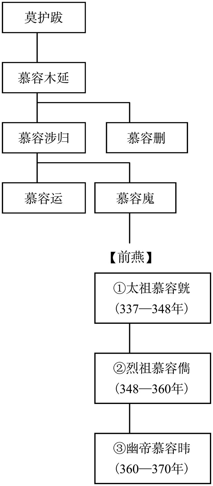 

## 前秦世系表

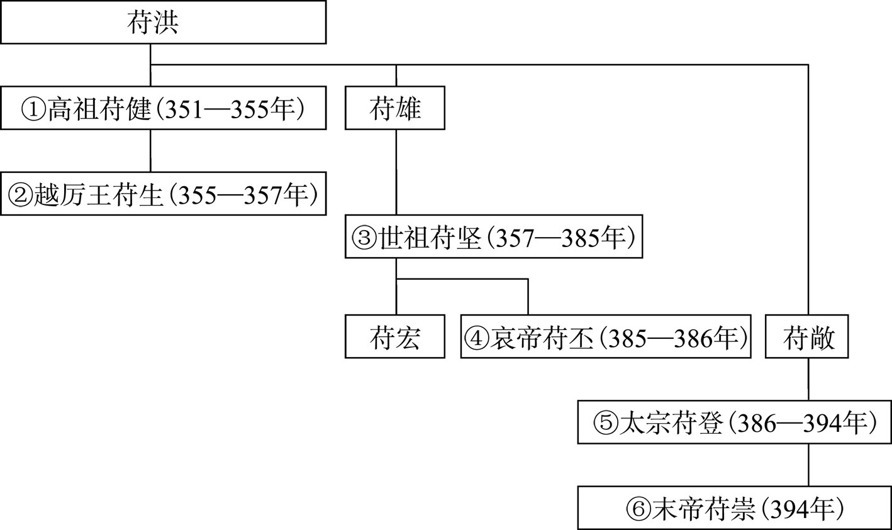 

## 后赵世系表

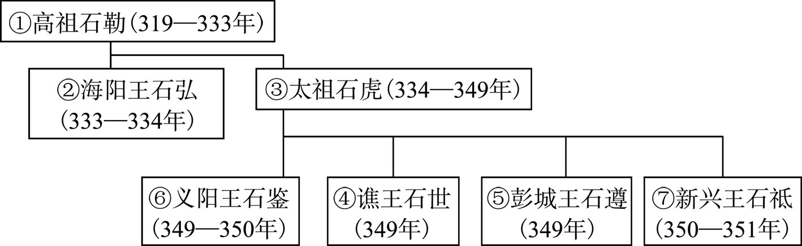 

## 仇池世系表

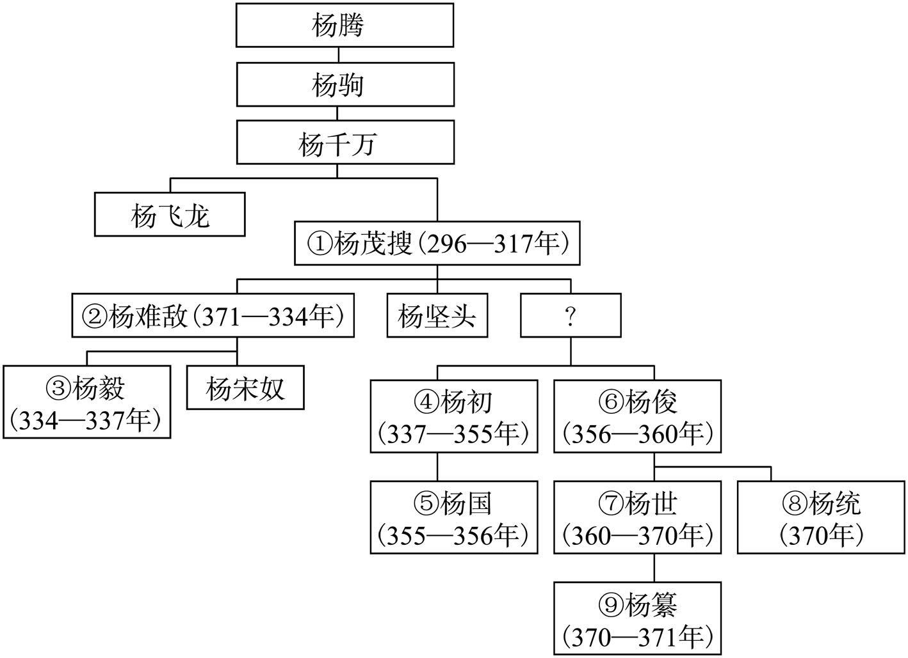 

## 后燕世系表

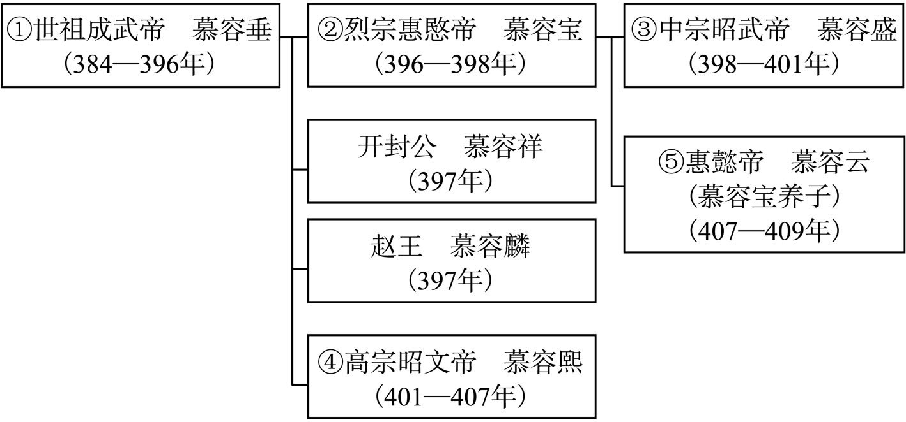 

## 后秦世系表

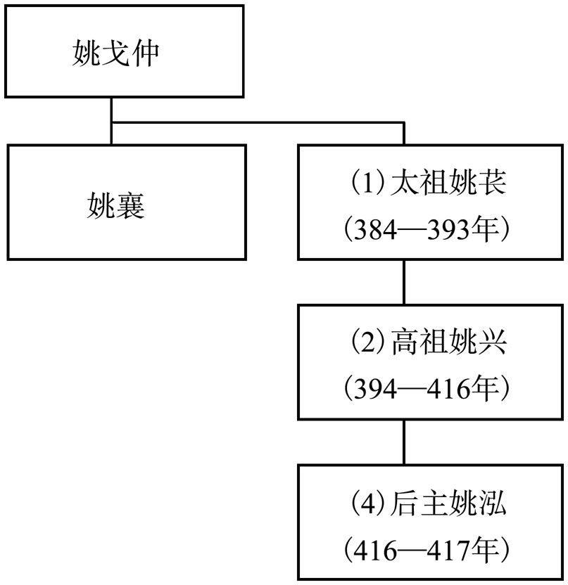 

## 翟魏世系表

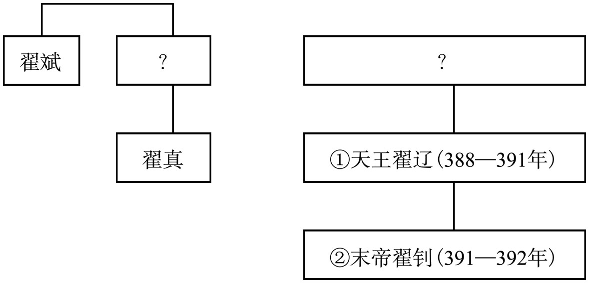 

## 西燕世系表

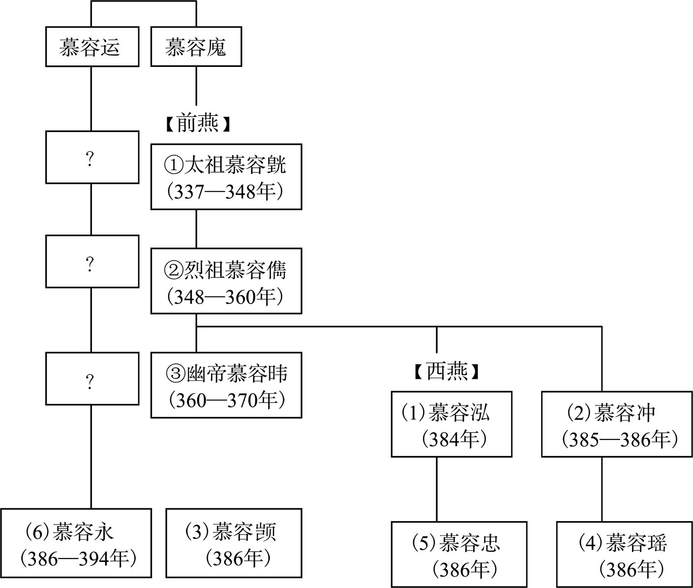 

## （汉）前赵世系表

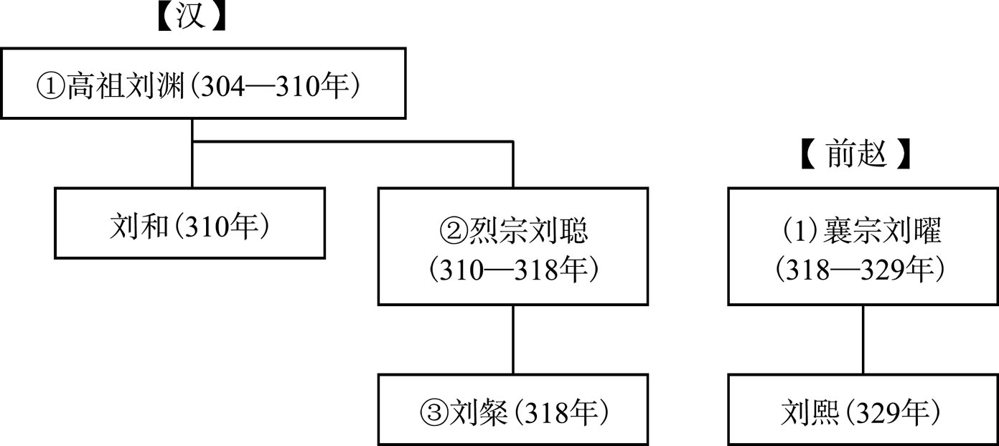 

## 南燕世系表

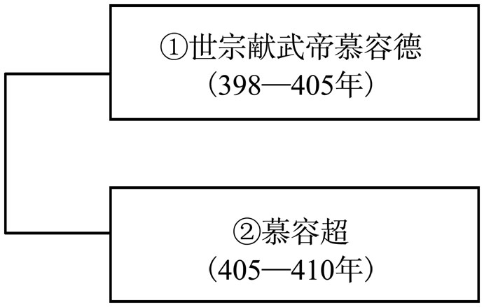 

## 北魏、东魏、西魏世系表

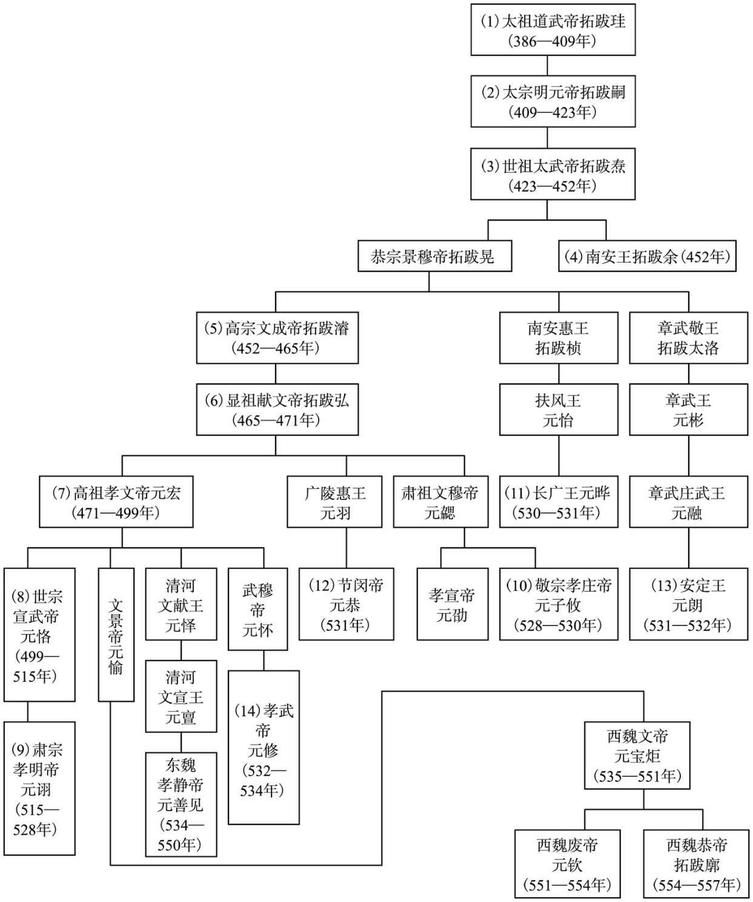

