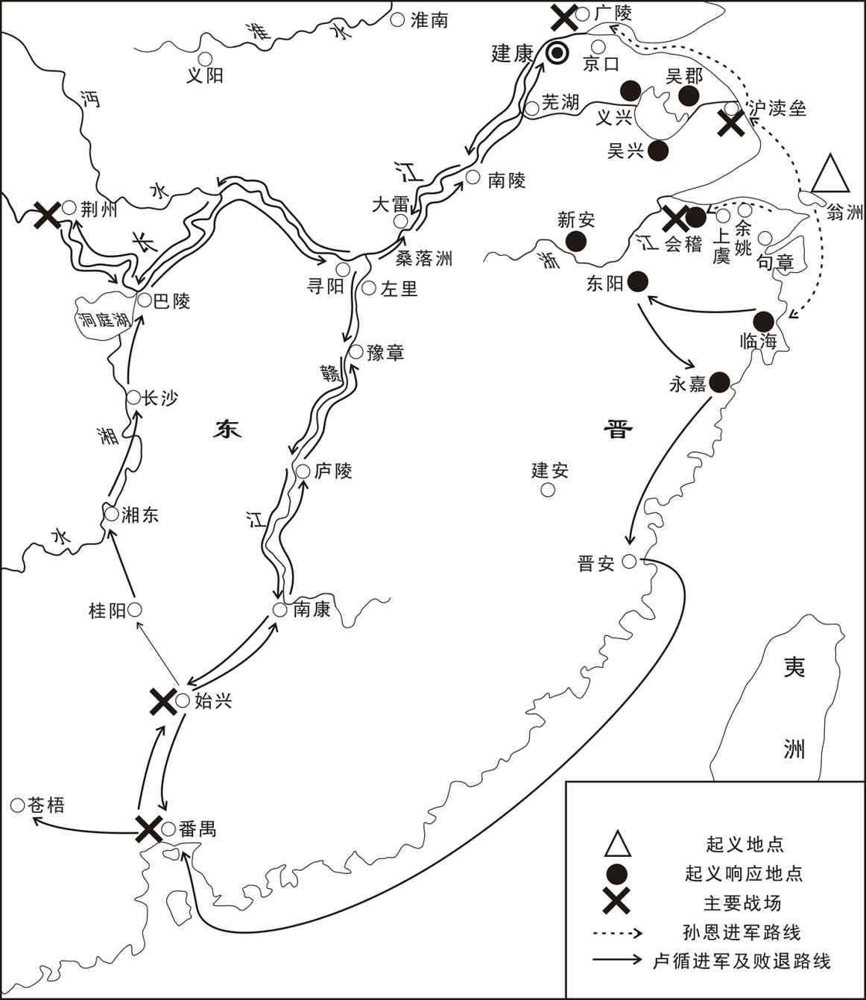
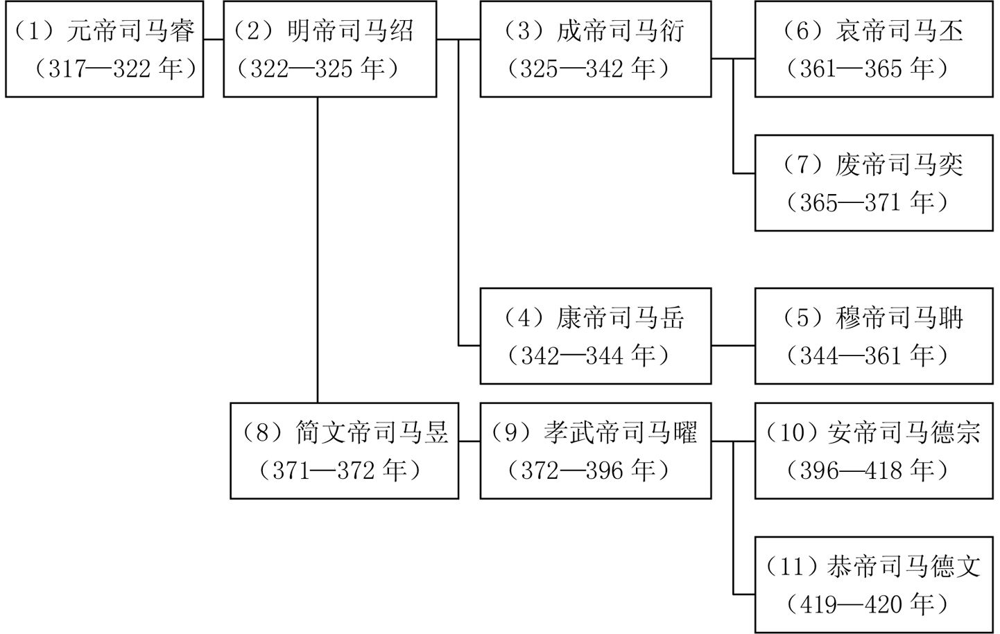
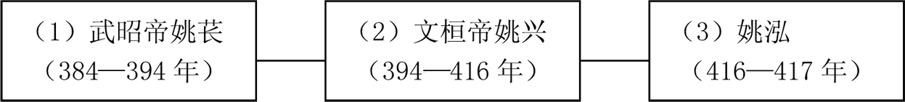
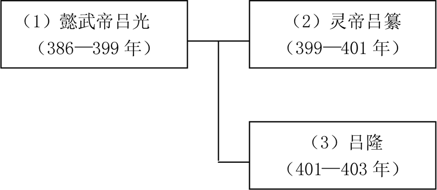
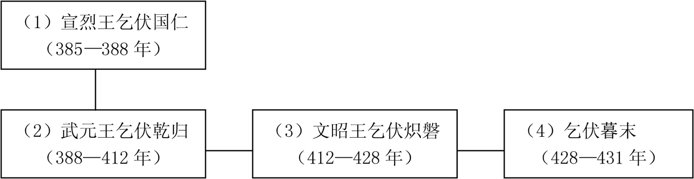
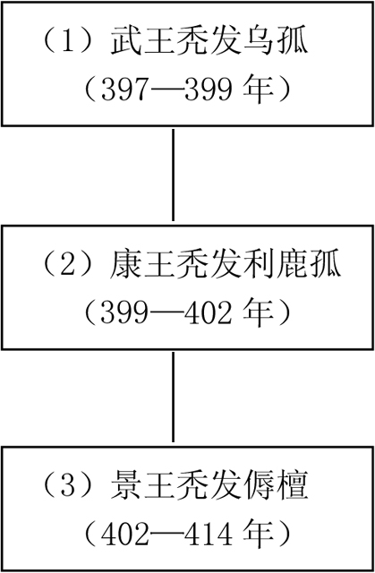
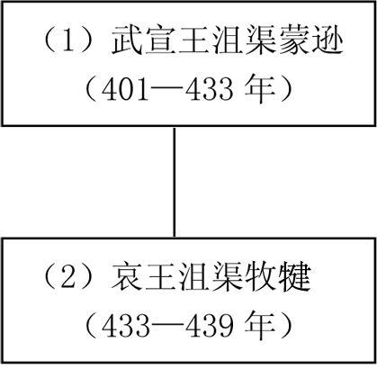

# 目录

伪楚之乱

卢循之乱

谯纵之乱

吕光据姑臧

乞伏据金城

秃发据广武

蒙逊据张掖

秦灭后凉

附录： 
东晋皇帝世系表

后秦世系表

后凉世系表

西秦世系表

南凉世系表

北凉世系表

返回总目录

# 伪楚之乱

## 【内容提要】

《伪楚之乱》叙述了东晋末年围绕着争夺东晋皇权而引发的错综复杂的政治斗争。这一斗争过程大致可分为三个阶段。

第一阶段是反司马道子擅权的斗争。晋孝武帝司马曜（yào）执政时期，其胞弟司马道子及其亲信王国宝专权，遭到孝武帝的反感，孝武帝重用青兖（yǎn）二州刺史王恭和荆州刺史殷（yīn）仲堪（kān）对付司马道子。计划还未实施，孝武帝被张贵人所杀。孝武帝之子安帝司马德宗继位，安帝几乎是个白痴，大权仍握于司马道子之手。王恭入朝参与孝武帝葬礼，斥责了司马道子乱政，但司马道子没有收敛（liǎn）。397年，王恭与殷仲堪以清除王国宝为借口，起兵叛乱，司马道子只好无奈地答应了王恭退兵的要求，杀掉了王国宝。之后，司马道子为对付王恭、殷仲堪等强藩重用王愉，但因强割庾（yǔ）楷之地给王愉，引起庾楷不满，庾楷联合王恭、殷仲堪、桓（huán）玄再次叛乱。司马道子对叛乱无能为力，把朝廷大权交给长子司马元显，纵酒逃避。此时王恭大将刘牢之反戈（gē）杀王恭投降司马道子。司马道子听信桓修的建议，拉拢桓玄和殷仲堪的大将杨佺（quán）期，贬（biǎn）黜（chù）殷仲堪。殷仲堪得知这个阴谋，怕二人反戈，于是解散了他们的部队，桓玄和杨佺期为保存自己实力和相互利用，只好用交换人质为条件再次联合。桓玄趁荆州水灾之机进攻殷仲堪，杀杨佺期，殷仲堪兵败逃走后也被擒杀。荆州和襄州归入桓玄囊中。402年，司马元显采用谋士张法顺的建议，派刘牢之率兵讨伐桓玄，刘牢之担心消灭掉桓玄后司马元显无人能制，因此隐而不发，桓玄派人说服刘牢之倒戈，先后杀掉司马道子父子，执掌朝政。

第二阶段是桓玄专权并篡（cuàn）位建楚。首先，消灭了司马元显父子的势力后，为树立权威、独掌朝权，桓玄夺去刘牢之的兵权，刘牢之愤怒之极欲起兵讨伐桓玄，但因消息外泄而逃，在逃亡途中自缢（yì）而亡。接着，桓玄多方笼络朝臣，并制造符命，谋划篡位。先后任职大将军、相国，封楚王，加九锡等，一步步迈开称帝的步伐，终于在403年逼晋安帝禅（shàn）让退位，建立楚政权。

第三阶段是刘裕讨伐桓玄，消灭楚国，恢复东晋政权。刘裕听到桓玄篡位建楚，与刘毅、何无忌等在京口起兵，占领京口、广陵二城，发布讨伐桓玄檄（xí）文。刘裕杀掉桓玄的大将吴甫（fǔ）之、皇甫敷（fū），桓玄败逃被益州兵所杀，楚政权灭亡。此后，刘裕成为东晋政权的实际操纵者。

本篇通过细致的描述，生动地勾勒出了历史人物的性格，如司马道子的懦弱、司马元显的自负、王恭的义气、殷仲堪的多疑、杨佺期的粗犷、刘牢之的反复无常、桓玄的凶狠、刘裕的狡猾等。通过三个阶段的叙述，为读者再现了东晋末年错综复杂的政治斗争。

## 【原文】

**晋武帝太元十四年[1]。初，帝既亲政事，威权己出，有人主之量[2]。已而溺于酒色，委事于琅邪王道子[3]。道子亦嗜酒，日夕与帝以酣歌为事[4]。又崇尚浮屠，穷奢极费，所亲昵者皆姏姆、僧尼[5]。左右近习，争弄权柄，交通请托，贿赂公行，官赏滥杂，刑狱谬乱[6]。尚书令陆纳望宫阙叹曰：“好家居，纤儿欲撞坏之邪[7]！”左卫领营将军会稽许营上疏曰：“今台府局吏、直卫武官及仆隶婢儿取母之姓者，本无乡邑品第，皆得为郡守县令，或带职在内，及僧尼乳母，竞进亲党，又受货赂；辄临官领众，政教不均，暴滥无罪，禁令不明，劫盗公行[8]。昔年下书敕群下尽规，而众议兼集，无所采用[9]。臣闻佛者清远玄虚之神，今僧尼往往依傍法服，五诫粗法尚不能遵，况精妙乎[10]？而流惑之徒，竞加敬事，又侵渔百姓，取财为惠，亦未合布施之道也[11]。”疏奏，不省[12]。**

## 【注文】

[1]晋：朝代名（266—420年），共历一百五十五年，分为西晋与东晋。公元266年初，司马炎取代曹魏政权自立为皇帝，国号“晋”，定都洛阳（今河南洛阳），史称西晋。公元280年，西晋灭吴，结束了三国鼎立的局面，晋武帝司马炎终于统一全国，结束了长达近百年的分裂局面。公元316年，西晋怀、愍（mǐn）二帝被匈奴汉国所俘。次年琅（láng）邪（yá）王司马睿（ruì）在建业（今江苏南京）重建晋朝，史称东晋。　　武帝：即司马曜（yào）（362—396年），东晋第九任皇帝（372—396年在位）。字昌明，简文帝司马昱（yù）第三子，初封会稽（Kuàijī）王，后被立为太子，十一岁继位，由太后摄（shè）政，376年始亲政，改革税收，任用谢安，加强皇权，淝（féi）水之战大败前秦，后任用司马道子，政治昏乱，导致政局再度混乱，被张贵人所杀。庙号烈宗，谥（shì）号孝武，葬隆平陵（今江苏南京江宁区蒋山西南）。　　太元十四年：太元是东晋孝武帝司马曜在位期间所用的年号，共计二十一年，即公元376年至396年。太元十四年即389年。

[2]初：当初。　　既：已经。　　亲政事：亲自主持朝政。　　威权：威势和权力。　　人主：即人君，君主，古代专指一国之主，帝王。　　量（liàng）：器度，气度，风度。

[3]已而：不久，后来。　　溺（nì）：沉溺，迷恋。　　委：委托，托付。　　琅邪：郡国名。秦始皇始置，治琅琊（今山东胶南西北）。西汉移治东武（今山东诸城），约今山东半岛东南部。章帝改置琅邪国，治开阳（今山东临沂北）。东晋后复为郡。北魏移治即丘（今山东临沂西）。东晋侨置，初无实土，咸康元年（335年）分江乘之地立郡，治金城（今江苏句容北）。南朝宋初年改称南琅邪郡。萧齐侨置，治朐（qú）山城（今江苏连云港西南海州镇），属青州。郡名。亦作琅琊、琅玡。秦置。晋治开阳，今山东临沂北。　　道子：即司马道子（364—402年），简文帝司马昱的幼子，孝武帝司马曜同母弟，封琅邪王，后代谢安把持朝政，广树党羽，宠信奸臣，卖官鬻（yù）爵，崇信佛教，致使政刑紊乱、兄弟失和。晋安帝司马德宗继位后改封其为会稽王。辅政期间，先后受到王恭、桓玄兵谏，元兴元年（402年）被桓玄贬至安成郡，后被毒死。

[4]嗜（shì）酒：喝酒成瘾。　　酣（hān）歌：尽兴歌唱。

[5]浮屠：又称浮图、佛陀。佛教为佛所创，故称佛教徒为浮图。又并称佛塔为佛屠。这里指司马道子佞佛。　　姏（gān）姆：又称姏母，指能说会道的婆子。　　僧尼：佛教徒的统称。僧指男性信徒，尼指女性信徒。

[6]近习：身边亲近的人。　　交通：结交、勾结。　　请托：以私事相托，走门路。　　贿赂：用财物买通别人。　　公行：公然进行。　　刑狱：即刑罚。　　谬（miù）乱：错乱，悖乱。

[7]尚书令：官职名。始于秦，西汉沿置，原为少府的属官，专掌文书及群臣的奏章。汉武帝时以宦官提任，汉成帝时改用士人。东汉政务归尚书，尚书令成为对君主负责、总揽政令的首脑。　　陆纳：东晋大臣。生卒年不详。字祖言，吴郡吴县（今江苏苏州姑苏区）人，司空陆玩之子，少有清操，州举秀才，历任建威长史、黄门侍郎、尚书吏部郎、吴兴太守、左民尚书、太常、吏部尚书、尚书仆射、左仆射、尚书令。　　宫阙（què）：古代帝王所居住的宫殿，宫门外有双阙，称宫阙。这里泛指皇宫。　　家居：即家业。　　纤（xiān）儿：小儿，小孩子，此含鄙视之意。

[8]左卫领营将军：武官名。品级不详。　　会稽：郡国名。治吴县（今江苏苏州姑苏区），汉初先后属韩信楚国、刘贾荆国、刘濞吴国。汉成帝时领二十六县，人口逾百万，隶属扬州刺史部。东汉分割北部十三县置吴郡。三国吴时分会稽郡置临海郡、建安郡、东阳郡。西晋初会稽郡领十县，仅辖今绍兴、宁波一带，至南朝末年，会稽郡辖境不变。唐肃宗时改为越州，会稽郡不复存在。　　许营：东晋将领。生卒年不详。曾任东晋左卫领营将军。　　疏：朝臣向皇帝陈述意见的奏章。古代臣子向皇帝上奏政务有“疏”和“奏”两种方式，这两种方式略有区别。一般宋以前常称“疏”。疏是臣下向皇帝陈述意见的奏章。而奏是臣下向皇帝进言或上书，是一种公文程式，即奏本，根据官员言事内容及章疏形式不同，又有奏片、奏书、奏折等名称。　　台府：泛指古代中央政府机构。　　品第：指门第等级。　　郡守：官职名。郡的行政长官，始置于战国。战国各国在边地设郡，派官防守，官名为“守”。本系武职，后渐成为地方行政长官。秦统一后，实行郡、县两级地方行政区划制度，每郡置守，治理民政。汉景帝中元二年（前148年），改称太守。后世唯北周称郡守，余均以太守为正式官名，郡守为习称。明清则专称知府。　　县令：官职名。战国末年，郡县两级制形成，县属于郡，县的行政长官则成为郡守的下属。秦汉政府规定，人口万户以上的县，县官称县令；万户以下的称县长。隋唐以后，县官一律称令。　　辄（zhé）：副词。立即，就。　　临官：即任职。临：管理、统治、治理。

[9]昔年：往年，从前。　　敕（chì）：帝王的诏书、命令。　　群下：古代泛指僚属或群臣。　　尽规：竭力谋划。　　众议兼集：百官提出的建议和意见。

[10]清远：清明，高远。　　玄虚：原指道家玄妙虚无的道理，后引申为神秘莫测之意。　　依傍：依赖，依靠。　　五诫：即五戒，佛教的五条基本戒律或行为准则。一不杀生，二不偷盗，三不邪淫，四不妄语，五不饮酒。　　粗法：佛教基本的戒法，此指五戒。　　精妙：精致巧妙，指佛教精深的佛法。

[11]流惑：流于迷惑。　　侵渔：侵夺，从中侵吞牟（móu）利。　　布施：将金钱、实物布散施舍给别人。布施是大乘佛教六度中的一项，有法施、财施和无畏施三种。

[12]不省（xǐng）：不理会。

## 【译文】

晋孝武帝太元十四年（389年）。当初，孝武帝司马曜亲自处理国家政事，权力和威信都出于他的手中，很有君主的器度。但不久就沉迷于酒色，把朝廷的政事委托给其胞弟琅邪王司马道子。司马道子也是个嗜酒之徒，从早到晚与孝武帝一起饮酒作乐和欣赏歌舞。孝武帝崇信佛教，极度奢侈浪费，他所亲昵的人都是三姑六婆、和尚尼姑，因此身边的亲贵乘机争权夺利，相互勾结，公开进行贿赂行为，封官加赏杂乱不堪，冤假错案层出不穷。尚书令陆纳望着皇宫叹息道：“好端端的一个家业，就要被这个毛头小儿毁掉了啊！”左卫领营将军会稽人许营上奏章说：“现在朝廷部属小官小吏、禁卫武官以及男女仆隶中姓母亲之姓的人，本来没有官品，但都做到郡守县令，有的甚至挂职继续留在朝廷里。至于和尚尼姑、皇帝的奶妈等人，更是争先恐后安置亲党，收受贿赂。以至于任用官吏、治理百姓、政治教化没有了规范，无罪之人受到暴行，朝廷禁令不明，抢劫、偷盗者公然而行。前些年，陛下诏敕要求群臣要积极进谏，但群臣的建议并没有被采纳。我听说佛是清净高远、玄妙虚幻的神祇，但现在这些僧尼虽然身披袈裟，但连佛教中最基本的五戒都不能遵守，更何况精妙的佛理呢！而流于世俗的信徒竞相崇敬佛事，侵害抢夺百姓的钱财，这些抢夺来的财物为自己带来了实惠，也不合乎佛教布施的教义。”奏章呈给朝廷后，没有了回音。

## 【原文】

**道子势倾内外，远近奔凑，帝渐不平，然犹外加优崇[1]。侍中王国宝以谗佞有宠于道子，扇动朝众，讽八座启道子宜进位丞相、扬州牧，假黄钺，加殊礼[2]。护军将军南平车胤曰：“此乃成王所以尊周公也[3]。今主上当阳，非成王之比；相王在位，岂得为周公乎[4]？”乃称疾不署[5]。疏奏，帝大怒，而嘉胤有守[6]。**

## 【注文】

[1]势倾内外：形容权势极大，压倒朝廷内外一切人。　　奔凑：会合，会聚，聚集。　　不平：愤慨，不满。　　优崇：优待而尊崇。

[2]侍中：官职名。秦始置，为丞相属官，因往来东厢奏事，故称侍中。两汉沿置，为正规官职外的加官之一。因侍从皇帝左右，出入宫廷，预闻朝政，逐渐变为亲信贵重之职。晋以后，曾相当于宰相。南朝宋文帝以侍中掌机要，梁、陈相沿，往往成为事实上的宰相，晋朝开始也把侍中作为三公的加衔。北魏时地位尤其高。隋朝时称纳言，唐恢复为侍中，为门下省长官，位居正二品，与尚书仆射、中书令同居宰相之职。南宋后废。　　王国宝（？—397年）：东晋大臣。太原晋阳（今山西太原西南）人，父王坦之，曾与谢安制止了桓温篡位。谢安之婿，但被谢安轻视。当时受权臣会稽王司马道子所宠信。晋安帝即位后，任秘书丞、琅邪内史，后官至中书令、尚书左仆射，与司马道子共擅朝政。力主削弱方镇势力，贪婪纵欲，隆安元年（397年），在王恭、殷仲堪的武力逼迫下，被司马道子诛杀。　　谗（chán）佞（nìng）：说人坏话与用花言巧语谄媚。　　讽：用含蓄的话劝告。　　八座：封建时代中央政府的八种高级官员。东汉以六曹尚书并令、仆射为“八座”，三国至齐以五曹尚书、二仆射、一令为“八座”，隋唐以六尚书、左右仆射及令为“八座”。　　启：开导，启发，暗示。　　丞相：职官名。又称宰相、相国，春秋战国时已出现，齐置左、右相各一人。秦置左、右丞相各一人。秦汉因之。为皇帝下面的最高行政官，辅佐皇帝总理百政。　　扬州：州名。古九州之一，汉武帝所置十三刺史部之一。东汉治历阳（今安徽和县），后移治寿春（今安徽寿县）、合肥（今安徽合肥西北）。三国魏、吴各置扬州，魏治寿春，吴治建业（今江苏南京）。西晋灭吴后复合，治建邺（建业改名，后又改建康）。其后辖境渐小。　　牧：官职名。夏代已有，商周沿置。汉武帝设十三州部，每部设一刺史，汉成帝时改刺史为州牧。后废置无常。东汉灵帝时为镇压农民起义，再设州牧，并提高其地位，居郡守之上，掌一州之军政大权。以后历代设都督、总管、节度使等，州牧之名即废。　　假黄钺（yuè）：魏晋南北朝当位高权重之大臣出征时，往往加以“假黄钺”的称号，即代表皇帝亲征的意思。假：借、授予、给予。黄钺：以黄金为饰的斧。　　加殊礼：增加特别的礼遇。

[3]护军将军：武官名。始于汉代，盛行于南北朝，唐以后逐渐衰微。　　南平：郡名。西晋武帝太康元年（280年）灭吴后建郡，治作唐县（故治在今湖南安乡县安全乡槐树村），属荆州，后迁江安（由公安改名）。东晋建武元年（317年）复以作唐为郡治，属湘州，太元二十年（395年）湘州并入荆州，属荆州，后有反复。隋开皇九年（589年）平陈后郡废。　　车胤（yìn）（约333—约401年）：东晋大臣。字武子，南平江安（今湖北公安曾埠头乡）人。自幼聪颖好学，家境贫寒，常无油点灯，夏夜就捕捉萤火虫，用以照明夜读，学识与日俱增。历任中书侍郎、侍中、国子监博学、骠骑长史、太常、护军将军、丹阳尹、吏部尚书。为人公正、不畏强权，后被会稽王司马道子等逼令自杀，死后追谥忠烈王。　　成王：即姬诵（前1055—前1021年），西周第二位君主（前1042—前1021年在位）。周武王之子，年幼继位，由其叔父周公（武王弟）辅政，平定三监之乱。亲政后，营造新都洛邑、大封诸侯，还命周公东征、编写礼乐，加强了西周王朝的统治。死后谥号成王。周成王与其子周康王姬钊统治期间，社会安定、百姓和睦，史称“成康之治”。　　周公：即姬旦，西周宗室、大臣。周文王姬昌第四子。因封地在周（今陕西岐山北），故称周公或周公旦，西周初期杰出的政治家、军事家和思想家，被尊为儒学奠基人，孔子最崇敬的古代圣人之一。

[4]主上：指孝武帝司马曜。　　当阳：皇帝南面向阳而治。这里指孝武帝已经亲政。　　相王：指司马道子。

[5]称疾：称病，借口生病。　　署：署名，签字。

[6]嘉：夸奖，赞许。

## 【译文】

司马道子的权势在朝廷内外都达到顶点，朝野内外的人都想投靠于他。面对这种情景，孝武帝心中渐渐有点不高兴，但表面上却格外优待崇敬司马道子。侍中王国宝利用奸佞、谄媚的本事，得到司马道子的宠信。王国宝煽动朝臣，委婉劝说朝廷高官联名上书皇帝，请求提拔司马道子为丞相、扬州牧，假黄钺，并加以特别尊崇的礼节等。护军将军南平人车胤反对说：“这是周成王姬诵尊崇其叔父周公旦的做法。而现在皇上亲理朝政，和年幼的周成王不同，司马道子作为辅臣又怎么能和周公旦相比呢！”于是，车胤以生病为由，没有在奏疏上签名。奏章呈上后，孝武帝勃然大怒，但夸奖了车胤品行高洁。

## 【原文】

**中书侍郎范宁、徐邈为帝所亲信，数进忠言，补正阙失，指斥奸党[1]。王国宝，宁之甥也，宁尤疾其阿谀，劝帝黜之[2]。陈郡袁悦之有宠于道子，国宝使悦之因尼支妙音致书于太子母陈淑媛云：“国宝忠谨，宜见亲信[3]。”帝知之，发怒，托以他事斩悦之。国宝大惧，与道子共谮范宁，出为豫章太守[4]。宁临发，上疏言：“今边烽不举，而仓库空匮[5]。古者使民岁不过三日，今之劳扰，殆无三日之休，至有生儿不复举养，鳏寡不敢嫁娶[6]。臣恐社稷之忧，厝火积薪，不足喻也[7]。”**

## 【注文】

[1]中书侍郎：官职名。晋代始置，为中书省长官中书监、令的副手。隋代改称内史或内书侍郎。唐初曾改称西台侍郎、凤阁侍郎。唐宋时多以中书侍郎同中书门下平章事为宰相职衔。因中书令不轻易授人，故中书侍郎也等于中书省的长官。南宋废。　　范宁（339—401年）：东晋大臣、经学家。字武子，南阳顺阳（今河南淅川县）人，徐兖二州刺史范汪之子，也是《后汉书》作者范晔的祖父。年少专心勤学，博览群书，后任余杭县令六年，兴办学校，培养学生，施行儒家礼教，历任临淮太守、中书侍郎、豫章太守，封阳遂县侯。因施行学校制度改革被弹劾免官。　　徐邈（miǎo）（343—397年）：东晋大臣。字仙民，莒北境人，永嘉之乱南渡，落户京口（今江苏镇江）。经太傅谢安的举荐补中书舍人，历任散骑常侍、祠部郎、中书侍郎，负责起草诏书。后任东宫前卫率，辅导年幼的太子，虽身在东宫，仍入朝参议朝政，安帝继位后升任骁骑将军，隆安元年（397年）病逝。著有《正五经音训》《谷梁传注》《五经同异评》等。　　阙（quē）失：缺漏遗失，失误错误。　　指斥：指责，斥责。　　奸党：指背叛国家或君主的人物或小集体。

[2]疾：憎恨。　　阿谀（yú）：说别人爱听的话迎合奉承。　　黜（chù）：降职或罢免。

[3]陈郡：郡名。秦始置，东晋咸和五年（330年）在合肥侨置，治汝阴，属豫州。　　袁悦之（？—389年）：东晋臣僚。字元礼，陈郡阳夏（今河南太康）人。善言谈，有精理，始为谢玄参军，推崇《战国策》，后受会稽王司马道子所宠爱，劝其专揽朝权，被晋安帝所诛。　　支妙音：尼姑法名。生卒年不详，幼年出家，博学善文，受到孝武帝、司马道子等敬信，立简静寺以其为寺主，权倾一朝，威行内外。　　陈淑媛（yuàn）：即陈归女（？—390年），孝武帝司马曜的妃子。松滋浔阳（今江西九江）人，父平昌太守陈广，晋安帝司马德宗和晋恭帝司马德文之母，原为教坊歌女，有美色，善弹唱，后应召入宫，受孝武帝宠幸，封淑媛。死后追赠为夫人。司马德宗即位后追谥为安德太后。淑媛：古代妃嫔称号之一。三国曹魏时始置。两晋时期的妃嫔等级由晋武帝司马炎依据汉魏制度稍加修改而成，设三夫人：贵嫔、夫人、贵人；九嫔：淑妃、淑媛、淑仪、修华、修容、修仪、婕妤、容华、充华。

[4]谮（zèn）：说别人的坏话，诬陷，中伤。　　豫章：郡名。汉高帝初年（约前202）始设，治南昌，下辖十八县，地域范围与今江西省大致相当。莽新时易名九江郡。东汉、三国、晋、南北朝还名豫章，仍治南昌。隋开皇九年（589年）罢郡置洪州，唐至德元年（756年）改称章郡。

[5]边烽（fēng）不举：边烽：古代边防报警的烟火，比喻战争。举：发起，发动。　　空匮（kuì）：穷乏；财用不足。

[6]劳扰：劳苦烦扰。　　殆（dài）：相当于“大概”“几乎”，表示推测。　　鳏（guān）：无妻或丧妻的男人。　　寡：丈夫死去后未再嫁的女人。　　举养：同“鞠（jū）养”，抚养，养育。

[7]社稷（jì）：古代帝王、诸侯所祭的土神和谷神。常用为国家的代称。　　厝（cuò）火积薪：厝：放置。薪：柴草。意指把火放到柴堆下面，比喻潜伏着很大危险。语出西汉贾谊《新书·数宁》：“夫抱火厝之积薪之下，而寝其上，火未及燃，因谓之安，偷安者也。”

## 【译文】

中书侍郎范宁、徐邈受到孝武帝的亲近和信任，多次进谏忠言，弥补朝政的缺失和漏洞，指责奸邪臣子。王国宝是范宁的外甥，范宁特别反感和讨厌王国宝阿谀奉承的行为，劝说孝武帝罢免他的官职。陈郡袁悦之受到司马道子的宠信，王国宝就让袁悦之请尼姑支妙音给太子司马德宗之母、孝武帝宠幸的妃子陈淑媛写信，说：“王国宝忠臣谨慎，可以作为亲信之臣。”孝武帝知道这件事，大发雷霆，找了个借口就把袁悦之杀了。王国宝知道后非常害怕，伙同司马道子诬陷范宁，范宁被贬为豫章太守。范宁离京前再次上疏说：“现在边防没有战争，而府库空乏。古时候人民服役一年内不超过三天，而如今民众辛苦烦扰，大概一年连三天的休息时间都没有。以至于百姓生儿养不起，独身男女不敢考虑嫁娶。我为国家的未来担忧，用把火放到柴堆下面来比喻这种危险也不过分啊！”

## 【原文】

**十五年[1]。琅邪王道子恃宠骄恣，侍宴酣醉，或亏礼敬[2]。帝浸不能平，欲选时望为藩镇以潜制道子[3]。问于太子左卫率王雅曰：“吾欲用王恭、殷仲堪何如[4]？”雅曰：“王恭风神简贵，志气方严；仲堪谨于细行，以文义著称。然皆峻狭自是，且干略不长，若委以方面，天下无事足以守职，若其有事必为乱阶矣[5]。”帝不从。恭，蕴之子；仲堪，融之孙也[6]。二月，以中书令王恭为都督青兖幽并冀五州诸军事、兖青二州刺史，镇京口[7]。九月，以侍中王国宝为中书令，俄兼中领军[8]。**

## 【注文】

[1]十五年：即太元十五年，公元390年。

[2]骄恣（zī）：骄纵无度。　　酣（hān）醉：比喻大醉。　　亏：缺损，缺失。

[3]浸（jìn）：逐渐，渐渐。　　时望：当时有名望的人。　　藩镇：封建时代称属国属地或分封的土地，借指边防重镇。　　潜制：暗中制约。

[4]太子左卫率：官职名。分太子左卫率七人和太子右卫率二人。二率职如二卫。秦时直称卫率，汉因之。掌管门卫。西晋初改称中卫率，后增左、右、前、后、中卫率，合称五卫率。东晋初省前后二率。南朝宋时置左右二率。秩四百石。　　王雅（？—400年）：东晋大臣。字茂达，东海郯（tán，今山东郯县）人。少知名，举秀才，初任永兴令，以干练有理事之才著称。历任尚书左右丞、廷尉、侍中、左卫将军、丹阳尹，领太子左卫率。深受孝武帝礼遇，朝廷大事多所参谋。后任尚书、散骑常侍、左仆射。卒后追赠光禄大夫、仪同三司。　　殷仲堪（kān）（？—399年）：东晋大将。陈郡长平（今河南西华东北）人，殷融之孙。先任谢玄参军、长史等职，后受到晋孝武帝的亲信，授其都督荆州、益州、宁今州三州军事、荆州刺史。晋安帝时，在与桓玄的战争中被俘，桓玄在柞溪（今湖北江陵北）逼其自杀。　　王恭（？—398年）：东晋权臣。字孝伯，太原晋阳（今山西太原西南）人，王蕴之子，孝武帝皇后之兄。起家任著作郎，后历任吏部郎、建威将军等职。孝武帝时任兖州、青州二州刺史。多次严肃批评司马道子辅政的失误。晋安帝隆安元年（397年）兵谏，逼使司马道子赐死宠臣王国宝、诛杀王绪。面对司马道子削弱方镇的措施，王恭联合庾楷、桓玄、殷仲堪共同起兵。由于王恭大将刘牢之阵前倒戈，致使王恭兵败被杀。

[5]风神简贵：风度神韵优雅高贵。　　志气方严：志向气质方正严肃。　　谨于细行：对细节特别谨慎。　　峻狭自是：心胸狭窄，自以为是。方面：地方军政要职。　　阶：缘由、根源。

[6]蕴（yùn）：即王蕴（？—478年），南朝宋大臣。字彦深，琅邪临沂（今山东临沂）人，历任宁朔将军，建安王刘休仁司徒参军、黄门郎，晋陵、义兴太守，东阳太守，在位贪婪放纵。曾参与平定桂阳王刘休范之乱，后任侍中、湘州刺史。后因参与沈攸之叛乱被萧道成所杀。　　融：即殷融，东晋大臣。生卒年不详。字洪远，陈郡长平（今河南西华东北）人，晋成帝咸和初,为庾亮都督府司马，后历任丹阳尹、尚书、太常卿、吏部尚书等职。

[7]中书令：官职名。汉武帝时以宦者为之，掌传宣诏命。西汉后期改为中书谒者令。曹丕称帝后，以幕僚分任中书监及中书令，此后历代相沿，非君主亲信不居此职，成为事实上的宰相，到南朝末，中书令权任更重。隋避讳改为内史令，成为三省长官之首。唐代曾改称右相。宋以后仅存其名无实职，明代废。　　都督青兖（yǎn）幽并冀五州诸军事：指挥青州、兖州、幽州、并州、冀州等地的最高军事长官。　　青：即青州，古九州之一，汉武帝所置十三刺史部之一，辖境相当于今山东德州、齐河以东，马颊河以南，济南、临朐、安丘、高密、莱阳、栖霞、乳山等以北、以东和河北吴桥等地。东汉治临淄（今山东临淄北），东晋移治东阳城（北齐置益都县）。东晋初于广陵（今江苏扬州西北）置侨置州，南朝宋初并入南兖州。　　兖：即兖州，古九州之一，汉武帝所置十三刺史部之一，辖境相当于今山东省西南部，北至茌平、淄博，东至沂河流域，东南以莒县、平邑并泗水东岸为界，及河南东部的南乐、濮阳、延津、开封、尉氏以东、扶沟、淮阳、鹿邑等地。东汉治昌邑（今山东金乡西北），其后屡有迁移，辖境逐渐缩小。南朝宋移治瑕丘城。东晋时于京口（今江苏镇江）侨置兖州。义熙六年（410年），刘裕灭南燕，复兖州旧地，因南方已有兖州，改旧兖州为北兖州。治滑台（今河南滑县），辖境相当于今山东泰山以南汶、泗流域及鲁西平原，河南滑台、延津、杞县以东地区。南朝宋初复名兖州。　　幽：即幽州，汉武帝所置十三刺史部之一，东汉治蓟县（今北京西南），辖境相当于今河北北部、辽宁大部分及朝鲜大同江流域。魏、晋以后渐缩小。东晋时曾于三阿侨置幽州。　　并：即并州，汉武帝所置十三刺史部之一，辖境相当于今山西大部和内蒙古、河北的一部分。东汉治晋阳（隋改太原，今山西太原西南），辖境扩大，包括今陕西北部与河套地区。三国后渐小。东晋曾侨置，治所不详。　　冀：即冀州，古九州之一，汉武帝十三刺史部之一，辖境相当于今河北中南部，山东西端及河南北端。东汉治高邑（今河北柏乡北），末年移治邺县（今河北临漳西南）。三国魏移治信都（今河北冀州），晋移治房子（今河北高邑西南），辖境渐小。东晋时曾侨置，治所不详。刺史：官职名。西汉武帝分全国为十三部（州），部置刺史，以六条察问郡县，本为监察官性质，其官阶低于郡守。成帝时刺史为州牧。东汉初复称刺史，灵帝时再改称州牧，位居郡守之上，掌握一州的军政大权。三国至南北朝各州也多置刺史，一般以都督兼任，并加将军之号，权力很大。　　京口：地名。六朝时长江下游军事重镇。原属扬州丹阳郡丹徒县。东汉建安中，孙权治此称“京城”，后迁建业改名“京口”。西晋属扬州毗陵郡。东晋南渡，曾为徐州、东海等侨郡治所。今江苏镇江。

[8]俄：短时间，突然间。　　中领军：武官名。汉末曹操为丞相时设领军，为相府属官，后更名中领军。魏晋时有领军将军，均统率禁军。南朝沿设，北朝略同。与护军将军或中护军同掌中央军队，为重要军事长官之一。隋代设左右领军府。唐代左右领军卫在十六卫之内，各设上将军、大将军及将军，宿卫宫禁。

## 【译文】

晋孝武帝太元十五年（390年），琅邪王司马道子凭借孝武帝的宠信骄傲放纵，常常陪孝武帝饮酒喝得大醉，有时甚至对孝武帝缺少应有的礼节。孝武帝渐渐不满，因此打算选择几位当时有名望的人担任地方大员，以暗中牵制司马道子。孝武帝向太子左卫率王雅询问道：“我想重用王恭、殷仲堪，你看怎么样？”王雅答：“王恭气度神韵优雅高贵，志向气质方正严肃；殷仲堪对细节特别谨慎，因文章义气而著称。但是，这两个人都是心胸狭窄、自以为是的人，而且才干和谋略都不是他们的特长，如果任命他们做地方大员，国内没有动乱的话，是可以尽忠职守的，但如果国家发生动乱，他们一定会成为祸乱的根源。”孝武帝没有听从王雅的分析。王恭是王蕴的儿子；殷仲堪是殷融的孙子。二月，孝武帝任命中书令王恭为都督青、兖、幽、并、冀五州诸军事，兖州、青州二州刺史，镇守北府京口。九月，孝武帝任命侍中王国宝为中书令，不久又让其兼任中领军。

## 【原文】

**十六年秋九月癸未，以尚书右仆射王珣为左仆射[1]。珣，桓温之故吏也[2]。**

## 【注文】

[1]癸（guǐ）未：干支记日，即农历九月十四日。干支是天干、地支的总称，公元纪年出现之前，古人用干支纪年、纪月、纪日。天干有十，分别是甲、乙、丙、丁、戊、己、庚、辛、壬、癸；地支有十二，分别是子、丑、寅、卯、辰、巳、午、未、申、酉、戌、亥。以一个天干和一个地支相配，排列起来，天干在前，地支在后，天干由甲起，地支由子起，共有六十个组合。这也就是俗语“六十甲子”。　　尚书右仆射（yè）：官职名。尚书仆射西汉置，为尚书令之副，定员一人。东汉献帝建安四年（199年）尚书仆射始分左右，为二人。三国两晋时不常置。凡置二人则称左、右仆射；如果置一人则仅称尚书仆射；若尚书令缺则以左仆射为尚书省长官；若左右仆射都缺则置尚书仆射执掌左仆射之事，祠部尚书掌右仆射之职。南朝宋、齐、梁皆置尚书左、右仆射。右仆射与左仆射同居宰相之任，有“朝右”之称。掌出纳王命，协理全国政务。　　王珣（xún）（349—400年）：东晋大臣。字元琳，琅玡临沂（今山东临沂）人，王导之孙，王洽之子，王羲之之侄。与殷仲堪、徐邈（miǎo）、王恭、郗（xī）恢等均以才学文章受知于孝武帝，累官左仆射，加征虏将军，并领太子詹（zhān）事，安帝隆安元年（397年）迁尚书令，加散骑常侍，谥“献穆”。

[2]桓（huán）温（312—373年）：东晋杰出军事家、权臣，谯国桓氏代表人物。字符子，谯国龙亢（今安徽怀远龙亢镇）人，历任征西大将军、侍中、大司马、扬州牧、录尚书事等职，封南郡公。因剿灭“成汉”政权声名大振，又三次出兵北伐（伐前秦、姚襄、前燕），战功累累，威名赫赫。公元361年至373年独揽朝政，欲行篡位之事，后因病而死。谥宣武公。　　故吏：过去的属吏。

## 【译文】

晋孝武帝太元十六年（391年），秋季九月癸未（十四日），朝廷任命尚书右仆射王珣为左仆射。王珣是桓温的老部下。

## 【原文】

**十七年冬十一月癸酉，以黄门郎殷仲堪为都督荆益宁三州诸军事、荆州刺史，镇江陵[1]。仲堪虽有英誉，资望犹浅，议者不以为允[2]。到官，好行小惠，纲目不举[3]。**

## 【注文】

[1]黄门郎：官职名。又称黄门侍郎，秦始置，汉因袭。东汉并给事中与黄门侍郎为一官，始设专职，故或称给事黄门侍郎，出入禁中，省尚书事，侍从皇帝，传达诏令。魏晋时为侍卫之官。南朝以来因掌管机密文件，备黄帝顾问，职位日渐重要。唐初曾改称东台侍郎、鸾台侍郎。天宝元年改名为门下侍郎。　　荆：州名。古九州之一，汉武帝所置十三刺史部之一，辖境相当于今湖北、湖南两省及河南、贵州、广东、广西的一部分。东汉治汉寿（今湖南常德东北），其后屡迁，东晋时定治江陵（今湖北江陵），晋以后辖境渐小。它是东晋、南朝时长江中游的政治军事重镇，其重要性仅次于首都所在地扬州。　　益：州名。汉武帝所置十三刺史部之一，辖境相当于今四川折多山、云南怒山、哀牢山以东，甘肃武都、两当、陕西秦岭以南，湖北郧县、保康西北，贵州除东部以外地区。东汉治雒（今四川广汉北），后移治绵竹（今四川德阳东北）、成都（今四川成都）。东汉以后辖境渐小。　　宁：州名。晋泰始七年（271年）分益州置，治味县（今云南曲靖），一说在滇池（今云南晋宁东）。辖境约相当于云南大部和贵州、广西一小部分，其后东部扩大至贵州大部。南朝齐时治所移至同乐（今云南陆良东北），梁大宝以后废。　　江陵：郡名。荆州治所，今湖北江陵。

[2]英誉：才能出众的美誉。　　资望：资历和声望。　　允：公平得当。

[3]小惠：小小的恩惠。　　纲目：大纲和细目。　　举：提出。

## 【译文】

晋孝武帝太元十七年（392年）冬季十一月癸酉（初十日），朝廷任命黄门郎殷仲堪为都督荆、益、宁三州诸军事，荆州刺史，镇守江陵。殷仲堪虽有英名美誉，但还是有很多人因他资历和威望不足，认为这个任命决定不太公平合理。殷仲堪到任后，喜欢对下属施以小恩小惠，提不出提纲挈领的方针政策。

## 【原文】

**南郡公桓玄负其才地，以雄豪自处，朝廷疑而不用，年二十三始拜太子洗马[1]。玄尝诣琅邪王道子，值其酣醉，张目与众客曰：“桓温晚涂欲作贼，云何[2]？”玄伏地流汗，不能起，由是益不自安，常切齿于道子[3]。后出补义兴太守，郁郁不得志，叹曰：“父为九州伯，儿为五湖长[4]。”遂弃官归国，上疏自讼曰：“先臣勤王匡复之勋，朝廷遗之，臣不复计[5]。至于先帝龙飞，陛下继眀，请问谈者，谁之由邪[6]？”疏寝不报[7]。**

## 【注文】

[1]公：爵位名。周代有五等封爵制，即公、侯、伯、子、男。后代相沿，多以“公”作为“王”以下的最高爵号。汉代封爵仅有王、侯两级，其他均废。魏晋恢复五等封爵制，晋有上公（太宰、太傅、太保）、三公（太尉、司徒、司空）、郡公等爵。魏晋以后相沿。唐宋有开国公、郡国公、开国郡公、开国县公等爵。清代置公、侯、伯爵，为超品，一般以公爵为最高爵位（分一、二、三等），公前又加以美名，如嘉勇、忠勇等公。　　桓玄（369—404年）：东晋权臣。字敬道，一名灵宝，谯国龙亢（今安徽怀远龙亢镇）人，桓温之子，袭南郡公之爵，因其父晚年有篡位之嫌，不受朝廷重用。隆安二年（398年），因平定司马休之、王愉之功升任江州刺史。后消灭劲敌殷仲堪、杨佺期，兼任荆、江二州刺史，尽占长江中游地区。元兴元年（402年），杀司马元显，自任太尉、扬州牧，控制朝政。次年，自任大将军，加授相国，封楚王，加九锡，准备篡位。十二月称帝，建国号楚，改元永始，后被刘裕所灭。本篇“伪楚之乱”就是以桓玄为中心展开的。　　拜：用一定的礼节授予某种名义或职位，或结成某种关系。　　太子洗马：官职名。秦称洗马，汉称先马，为太子太傅、太子少傅的属官。太子出行则为前导，为先驱、侍从、使者之意。晋时改掌图籍，隋唐于司经局置洗马，成为掌管书籍的官，历代沿置。

[2]诣（yì）：到，古代特指到尊长那里去拜访。　　张目：瞪大眼睛，愤怒之貌。　　晚涂：即“晚途”，晚年。

[3]益：更加。　　切齿：牙齿磨切，表示极端愤怒。

[4]义兴：郡名。晋永嘉四年（310年）分吴兴、丹阳二郡置，治阳羡（今江苏宜兴），辖境相当于今江苏宜兴、溧阳等地。隋开皇九年（589年）废。　　太守：官职名。又称郡守，战国时期，各诸侯国在边地置郡，其长官称守，尊称为太守。秦始皇嬴政统一六国后，推行郡县制，每郡置郡守，为郡的最高行政长官。汉景帝刘启时更名为太守，为一郡之最高行政长官。隋初，废州存郡，以刺史为郡长官。　　九州伯：全国的盟主。　　五湖长：五湖指太湖流域附近的几个小湖。意指权力范围很小。

[5]自讼（sòng）：替自己申诉。　　勤王匡复之勋：指桓玄之父桓温消灭蜀地的“成汉”政权，三次北伐（讨伐前秦、姚襄、前燕）的功勋。

[6]先帝：指简文帝司马昱（320—372年），371—372年在位。晋元帝少子，先后封琅邪王、会稽王，桓温废司马奕后被拥立为帝，听命于桓温，形同傀儡。公元372年病死，庙号太宗，谥号“简文”。　　陛（bì）下：“陛”指帝王宫殿的台阶。“陛下”原来指的是站在台阶下的侍者。臣子向天子进言时，不能直呼天子，必须先呼台下的侍者而告之。后来就成为对帝王的敬称。　　龙飞：指发迹。　　谈：谈论、评议。此处专指对桓氏说三道四、评头论足的行为。

[7]寝（qǐn）：停止，搁置。

## 【译文】

南郡公桓玄因其才能和地位非常自负，以英雄豪杰自居，朝廷鉴于其父桓温晚年有篡权倾向，对他也不放心，所以一直没有重用他，直到二十三岁，他才做了太子洗马。桓玄曾经拜访司马道子，当时司马道子正大醉不醒，他张开眼睛对身边的宾客说：“桓温晚年想篡夺皇位，是不是？”桓玄吓得趴在地上，汗流浃背，几乎站不起来。于是桓玄越来越担心，经常对司马道子咬牙切齿怀恨在心。后来，朝廷补任桓玄做义兴太守，但他嫌官位太小，郁郁不得志，叹息道：“父亲做了全国的盟主，而我却只做了这么个小官！”于是弃官回到南郡国，并呈上奏章说：“我的父亲为朝廷平定祸乱、匡复晋室的功劳，恐怕朝廷已经忘掉了，我也不再计较。但是，请问那些非议的人，先帝登基、陛下承继帝位，是凭什么实现的呢？”奏章被搁置下来，并没有上报。

## 【原文】

**玄在江陵，仲堪甚敬惮之。桓氏累世临荆州，玄复豪横，士民畏之，过于仲堪[1]。尝于仲堪厅事前戏马，以矟拟仲堪[2]。仲堪中兵参军彭城刘迈谓玄曰：“马矟有余，精理不足[3]。”玄不悦，仲堪为之失色。玄出，仲堪谓迈曰：“卿狂人也[4]。玄夜遣杀卿，我岂能相救邪？”使迈下都避之。玄使人追之，迈仅而获免。征虏参军豫章胡藩过江陵，见仲堪，说之曰：“桓玄志趣不常，每怏怏于失职，节下崇待太过，恐非将来之计也[5]。”仲堪不悦。藩内弟同郡罗企生为仲堪功曹，藩退谓企生曰：“殷侯倒戈以授人，必及于祸[6]。君不早图去就，后悔无及矣[7]。”**

## 【注文】

[1]累世临荆州：桓氏在荆州的势力达数十年之久，桓氏历任荆州刺史的有桓温、桓豁、桓冲、桓石民、桓修、桓玄等。　　豪横：仗势欺人，强暴蛮横。

[2]厅事：官署视事问案的厅堂。　　戏马：驰马取乐。　　矟（shuò）：长矛。　　拟：比拟，比划，模仿。

[3]中兵参军：官职名。参军或参军事，本参谋军务之称。东汉末始设。南北朝随其职司，称谘议参军、中兵参军等，亦单称参军、参军事，从此为诸曹之长的官名。　　彭城：郡名。传说帝尧封彭祖于此地，为大彭氏国。秦时设县。西汉地节元年（前69年）改楚国为彭城郡，治彭城（今江苏徐州），辖境相当于今山东微山、江苏徐州、铜山、沛县东南部、邳县西北部及安徽濉溪东部。南朝宋仍为郡，隋初废。　　刘迈（？—404年）：东晋臣僚。彭城沛（今江苏徐州）人，字伯群。少有才干，历任殷仲堪中兵参军、桓玄刑狱参军、竟陵太守等职，因参与刘裕等讨伐桓玄时做内应，被桓玄所杀。

[4]卿：古代用为第二人称，表尊敬或爱意。

[5]征虏参军：即征虏将军的参军。征虏将军，武官名。汉代始置，魏晋南朝沿置，是重要的统兵将领之一，秩三品。下设长史、司马、记室掾（yuàn）、中兵参军、咨议参军、行参军和主簿等。　　胡藩（372—433年）：东晋南朝大臣。字道序，南昌（今江西南昌）人。为人重义气，性刚直，通武善射，足智多谋。初参郗恢、殷仲堪军事，转投桓玄。桓玄灭亡后归故里。南朝宋武帝刘裕召为员外散骑侍郎，参镇军军事，从征鲜卑，攻讨卢循，有战功，升为正员郎。复伐羌征魏，皆率先力战。以功封阳山县男，食邑五百户。官至太子左卫率。卒谥“壮侯”。说（shuì）：用话劝说别人，使其听从自己的意见。　　志趣：志向、兴趣。　　不常：不是常人，非常。　　　每：常常，经常。　　怏（yàng）怏：不高兴，不满意。　　失职：没有好职位。　　节下：对将领的敬称。古代授节予将帅以加重职权，故敬称将领为节下。后对使臣或地方疆吏亦称节下。

[6]内弟：妻子的弟弟，相当于今之小舅子。古代男人谦称自己的妻子为贱内，后引申把妻子的弟弟称内弟。　　罗企生（362—399年）：东晋臣僚。字宗伯，一字孟子，豫章（今江西南昌）人。自幼多才多艺，历任著作郎、临汝县令、州别驾、殷仲堪功曹、咨议参军、武陵太守，后被桓玄所杀。　　功曹：吏职名。辅助郡守、县令，主管选署。东汉各州有功曹，而名称略有变更，属司隶校尉者称功曹从事，下设门功曹、书佐等协助处理选用人员等事。其他的功曹从事改称治中从事，属员仍称功曹书佐。历代沿置。两晋、南北朝多改称西曹，也有并设西曹、功曹的，官名有功曹从事、功曹史、西曹书佐、西曹参军等。　　倒戈以授人：把戈的手柄交结别人，倒持武器。

[7]图：考虑，思考。　　去就：去留。

## 【译文】

桓玄在江陵时，荆州刺史殷仲堪对他既恭敬又非常害怕。桓氏家族几代都做过荆州刺史，根基很深，而且桓玄本人也是个强横的人，所以当地官民都非常怕他，甚至超过怕殷仲堪。桓玄曾经在殷仲堪官署视事问案的厅堂外骑马玩乐，并且用长矛假装刺向殷仲堪。殷仲堪的中兵参军、彭城人刘迈对桓玄说：“马术精湛、长矛有力，但做人的道理还不太懂。”桓玄不高兴，殷仲堪听到这些话大惊失色。桓玄走后，殷仲堪对刘迈说：“你真是疯了啊！桓玄夜里派人来杀你，我哪能救得了你啊！”于是，殷仲堪让刘迈到京城避难，桓玄果然派人追杀他，刘迈九死一生躲过一劫。征虏参军、豫章人胡藩路过江陵，见到殷仲堪，劝说道：“桓玄志向兴趣不同常人，对他的职位常常表现出不满，您对他尊敬太过分了，这恐怕不是一个长久的解决办法啊！”殷仲堪听后不高兴。胡藩的妻弟罗企生是殷仲堪的功曹，胡藩见到罗企生后，对他说：“殷大人掉转长戈，授人以柄，将来一定会遭遇灾难。你不如早点考虑去留，以免后悔来不及啊！”

## 【原文】

**庚寅,立皇子德文为琅邪王,徙琅邪王道子为会稽王[1]。**

## 【注文】

[1]德文：即晋恭帝司马德文（386—421年），东晋末代皇帝（418—420年在位）。晋孝武帝之子，晋安帝之弟。最早封琅邪王，之后被封为中军将军、散骑常侍、卫将军、开府仪同三司，加侍中，领司徒、录尚书六条事等职。晋安帝被桓玄所废时，司马德文与晋安帝都居于浔阳；桓玄败死后被迁至江陵。刘裕当政后于义熙十四年（418年）立司马德文为皇帝，次年改年号为元熙。　　徙（xǐ）：调职。　　会稽：郡国名。治吴县（今江苏苏州姑苏区），汉初先后属韩信楚国、刘贾荆国、刘濞吴国。汉成帝时领二十六县，人口逾百万，隶属扬州刺史部。东汉分割北部十三县置吴郡。三国吴时分会稽郡置临海郡、建安郡、东阳郡。西晋初会稽郡领十县，仅辖今绍兴、宁波一带，至南朝末年，会稽郡辖境不变。唐肃宗时改为越州，会稽郡不复存在。

## 【译文】

晋孝武帝太元十七年（392年）十一月庚寅（二十七日），孝武帝立其子司马德文为琅邪王，把原琅邪王司马道子改封为会稽王。

## 【原文】

**二十年春三月，皇太子出就东宫，以丹杨尹王雅领少傅[1]。时会稽王道子专权奢纵，嬖人赵牙本出倡优，茹千秋本钱塘捕贼吏，皆以谄赂得进[2]。道子以牙为魏郡太守，千秋为骠骑谘议参军[3]。牙为道子开东第，筑山穿池，功用钜万。帝常幸其第，谓道子曰：“府内乃有山，甚善，然修饰太过。”道子无以对。帝去，道子谓牙曰：“上若知山是人力所为，尔必死矣。”牙曰：“公在，牙何敢死。”营作弥甚[4]。千秋卖官招权，聚货累亿。博平令吴兴闻人奭上疏言之，帝益恶道子，而逼于太后，不忍废黜[5]。乃擢时望及所亲幸王恭、郗恢、殷仲堪、王珣、王雅等使居内外要任，以防道子[6]。道子亦引王国宝及国宝从弟琅琊内史绪以为腹心[7]。由是朋党竞起，无复向时友爱之欢矣[8]。太后每和解之。中书侍郎徐邈从容言于帝曰：“汉文明主，犹悔淮南；世祖聪达，负愧齐王[9]。兄弟之际，实为深慎[10]。会稽王虽有酣媟之累，宜加宏贷，消散群议，外为国家之计，内慰太后之心[11]。”帝纳之，复委任道子如故。**

## 【注文】

[1]皇太子：又称皇储、储君或太子。这里指孝武帝司马曜长子司马德宗。　　东宫：这里指太子所居的宫殿。也常代指太子。　　丹杨：郡名。汉武帝建元二年（前141年）改秦鄣郡置，治宛陵（今安徽宣城）。西晋太康二年（281年），移治建邺（今江苏南京）。领建邺、秣陵、丹杨（今安徽当涂）、江宁、永（今江苏溧阳）、溧阳、湖熟、句容、于湖（今属安徽当涂）、芜湖、江乘等县。相当于今安徽宣城、池州、铜陵、芜湖、马鞍山、黄山，江苏南京，浙江杭州、湖州等地。　　丹杨尹：官职名。东晋南朝皆定都于建康（今江苏南京），建康隶于原丹杨郡（晋治建康）。为提高京都地位，显天子之尊，参照两汉京兆、河南尹故事，晋元帝太兴元年（318年）改丹杨太守为丹杨尹，职掌相当于郡太守，但参与朝议。　　领：兼任，兼职。　　少傅：官名，太子少傅的省称，是负责教导太子道德文章的官职。

[2]嬖（bì）：宠信。　　赵牙：人名。生卒年不详。艺伎出身，东晋时因贿赂得到司马道子的宠信和提拔，任魏郡太守，是司马道子营建府第、寻欢作乐的帮凶。　　倡优：古代称以音乐歌舞或杂技戏谑娱人的艺人。娼妓及优伶的合称。倡，指乐人；优，指伎人。　　茹千秋：人名。生卒年不详。出身于捕贼小吏，东晋时因贿赂得到司马道子的赏识，提拔为骠骑谘议参军，在任贪赃弄权，为非作歹。　　钱塘：县名。又称钱唐。秦置，治今浙江杭州西灵隐山麓，隋移今杭州市，唐代讳“唐字”，改为钱塘。西汉时为会稽郡治所。南朝为钱唐郡治所。　　谄赂：奉承贿赂。　　得进：得以晋升。

[3]魏郡：郡名。西汉高祖始置，治邺，属冀州，汉末三国时，曹操以邺为据点，建安十七年（212年）分魏郡置东、西部都尉，建安十八年（213年）割河内、东郡、巨鹿郡、安平郡、赵郡等十四县入魏郡。曹丕建魏代汉后，魏郡北部被划归广平郡。西晋时统八县，仍治邺。最大范围包括今河北南部邯郸以南，及河南北部安阳一带，其中心在邺城。　　骠（piào）骑：即骠骑将军，武官名。汉武帝元狩二年（前121年）始置，以霍去病为之，金印紫绶，位同三公，东汉各代沿置，有时称骠骑大将军。由汉至三国，军号泛滥，但始终以骠骑、四征、前后左右为最高。历代沿置，有时加大将军，虽位高望高，但多为褒赠性质，属虚衔加官。

[4]营作：建造，营造。　　弥：更加。

[5]博平：县名。汉高帝六年（前201年）始置，治博陵（今山东茬平博陵镇），因县境广阔且平得名，属东郡。莽新时改名嘉睦。东汉建武元年（25年）复名。三国魏属平原郡，晋属平原国。南朝宋永初元年（420年）属魏郡。　　吴兴：郡名。三国吴甘露二年（266年），吴主孙皓取“吴国兴盛”之意改乌程为吴兴，并设吴兴郡，辖地相当于今浙江湖州、杭州、宜兴等地。隋代因地濒太湖而更名湖州。　　闻人奭（shì）：东晋臣僚。生卒年不详。曾任博平令，上奏折弹劾司马道子。闻人：复姓。　　太后：即李陵容（351—400年），东晋简文帝司马昱的妃子，出身微贱，身体强壮，容貌丑陋，生孝武帝司马曜、会稽王司马道子、鄱阳长公主。司马曜继位先后封为淑妃、贵人、夫人、皇太妃、皇太后，司马德宗继位后封太皇太后，死后谥文皇太后，葬于修平陵。

[6]擢（zhuó）：提拔。　　郗（xī）恢（？—398年）：东晋将领。字道胤，郗昙之子，历任散骑侍郎、给事黄门侍郎，领太子右卫率、梁秦雍司荆扬并等州诸军事、建威将军、雍州刺史、征虏将军、秦州刺史、尚书，后被殷仲堪所杀，追赠镇军将军。

[7]内史：官职名。西周始置，原为中央官职。西汉诸侯王国掌民政之官亦称内史。晋沿置，为王国的地方行政长官。魏晋要郡亦有以内史代太守者，如东晋会稽郡、彭城郡即是其例。南北朝沿袭。　　绪：即王绪（？—397年），东晋臣僚。太原晋阳（今山西太原西南）人，字仲业，王国宝的堂弟，曾任琅邪内史，深受会稽王司马道子宠爱，后与王国宝同时被杀。

[8]朋党：原指一些人为自私的目的而互相勾结，朋比为奸，后来泛指士大夫结党，即结成利益集团。　　向时：先前，从前。

[9]从容：斡旋，周旋。

[10]之际：之间。　　深慎：特别慎重。

[11]酣媟（xiè）：酣，醉酒；媟，轻慢，傲慢。　　累：连及、连带。　　宏贷：宽大对待。贷同“待”，担待，优待。

## 【译文】

晋孝武帝太元二十年（395年），春季三月，皇太子司马德宗搬到太子的东宫居住，孝武帝任命丹阳尹王雅兼任太子少傅。当时会稽王司马道子大权独揽，奢侈放纵，他的亲信赵牙出身优伶，茹千秋出身钱塘抓捕犯人的小吏，都是凭着谄媚贿赂得到提拔。司马道子任命赵牙为魏郡太守，茹千秋为骠骑府谘议参军。赵牙为司马道子建造东第，堆起了假山，挖掘了水池，耗费了巨大的人力和费用。孝武帝曾到过司马道子的东第，看到后对司马道子说：“你的府中竟然有山，很好，但是修筑和装饰得太过分了。”司马道子无法回答。孝武帝离开后，司马道子对赵牙说：“皇帝要是知道这座山是用人力堆积而成，你必死无疑啊！”赵牙说：“有您在，赵牙怎么能死了呢？”于是加紧为司马道子营建东第。茹千秋则卖官鬻爵，招揽权贵，收受贿赂，搜刮的钱财多达数亿。博平县令吴兴人闻人奭上奏章报告了这些事，孝武帝越发憎恨司马道子，但迫于李太后的面子，不忍心罢黜他。于是，孝武帝只好提拔当时有名望、自己所亲信的王恭、郄恢、殷仲堪、王珣、王雅等人，派他们担任朝廷内外的重要职位，以制约司马道子。司马道子也把王国宝及王国宝的堂弟、琅邪内史王绪作为心腹。从此以后，东晋朝廷内外拉帮结派，不再像过去那样团结友爱。李太后也经常会调解孝武帝与司马道子的矛盾。中书侍郎徐邈从中斡旋说：“汉文帝刘恒可谓英明皇帝，还后悔杀掉了庶弟淮南王刘长；晋世祖司马炎聪明通达，对贬废胞弟齐王司马攸也后悔过。兄弟之间的关系，应该慎重考虑。会稽王虽然有嗜酒轻慢的坏毛病，您应该加以宽容和担待，消散大臣们议论。这样做对外是为了朝廷的长久之计，对内也可以安慰太后的爱子之心。”孝武帝采纳了徐邈的劝告，还是像原来一样信任司马道子。

## 【原文】

**二十一年。帝嗜酒，流连内殿，醒治既少，外人罕得进见[1]。张贵人宠冠后宫，后宫皆畏之[2]。秋九月庚申，帝与后宫宴，妓乐尽侍。时贵人年近三十，帝戏之曰：“汝以年亦当废矣，吾意更属少者[3]。”贵人潜怒，向夕，帝醉，寝于清暑殿[4]。贵人遍饮宦者酒，散遣之，使婢以被蒙帝面，弑之，重赂左右，云“因魇暴崩”[5]。时太子暗弱，会稽王道子昏荒，遂不复推问[6]。王国宝夜叩禁门，欲入为遗诏，侍中王爽拒之曰：“大行晏驾，皇太子未至，敢入者斩[7]。”国宝乃止。爽，恭之弟也。辛酉，太子即皇帝位，大赦[8]。**

## 【注文】

[1]流连：留连，依恋而舍不得离去。

[2]张贵人：东晋孝武帝司马曜宠妃。生卒年及出身皆不详，年十四入宫，年纪略小于司马曜，据说因千杯不醉而受宠日隆，后怕被废黜，趁司马曜酒醉熟睡将其闷死，事后重金贿赂及威胁左右侍从，谎称“因魇（yǎn）暴崩”，朝廷也无人追究，后不知所终。　　后宫：帝王妻妾所生活的地方，通常指代生活在后宫的女性，古人常用“后宫佳丽三千人”来形容古代皇帝嫔妃之众。

[3]意更属：意属即属意，指在意，归心。　　　少：年轻。

[4]潜怒：内心愤怒。　　向：临，近。　　清暑殿：宫殿名。东晋都城建康皇宫的宫殿，孝武帝司马曜被妃子张贵人暗杀于此殿。

[5]弑（shì）：中国古代称臣杀君、子杀父母为弑。　　魇（yǎn）：梦中遇可怕的事而呻吟、惊叫。　　暴：又猛又急，突然而来。　　崩：古代指皇帝死亡。古时为避讳起见，人们对“死”有诸多别称。据《礼记》记载，古时各个等级的人去世时的称谓有所不同：天子曰崩；诸侯曰薨（hōng）；大夫曰卒；士（知识分子）曰不禄；庶人（百姓）曰死。这反映出古代社会严格的等级制度。皇帝地位至高无上，连“死”也有专称，除“崩”外，还有诸如驾崩、晏驾等。如果是一般官员和平民百姓的死亡，则称殁（mò）、殒（yǔn）命、终等。

[6]暗弱：懦弱无能。　　昏荒：昏乱荒谬。　　推问：审问，追究。

[7]遗诏：古代皇帝驾崩之后，为后人留下的遗书，遗言等。诏：中国古代帝王诏令文书的文体名称之一。战国以前，上下相告常用“诏”字；秦始皇统一六国后，规定“诏”字为皇帝发布命令的专用词，他人不得使用，诏书亦成为皇帝布告臣民的专用文书。汉承秦制，凡皇帝即位或去世，或颁布其他重要命令，都以诏书布告天下。魏晋以后直到唐初，诏书一直是皇帝发布政令的主要方式。　　王爽（？—398年）：东晋大臣。字季明，太原晋阳（今山西太原西南）人，王蕴之子，王恭之弟，历任黄门侍郎、侍中。后参与王恭起兵，王恭兵败后被诛杀。　　大行：古代称刚死而尚未定谥号的皇帝﹑皇后。取一去不返之意。　　晏驾：是古时帝王死亡的讳称。

[8]大赦（shè）：以君主命令的方式对某个时期的特定罪犯或一般罪犯实行免除或减轻罪责或刑罚。古代帝王常在登基、更换年号、册立皇后等情况下，以施恩为名，颁布赦令，赦免犯人。

## 【译文】

晋孝武帝太元二十一年（396年）。孝武帝经常醉酒，留连内殿，头脑清醒的时候很少，宫外很少人能被允许觐见。张贵人是孝武帝最宠爱的妃子，后宫里的人们都很怕她。秋季九月庚申（二十日），孝武帝在后宫和嫔妃宴饮，伎女乐队侍候在侧。当时张贵人年近三十，孝武帝对张贵人开玩笑说：“以年龄来说，应当废掉你，我更喜欢年轻一点的女人。”张贵人心中暗暗发怒，临近晚上，孝武帝喝醉，在清暑殿中睡觉，张贵人把酒赏赐给孝武帝身边的宦官，把他们遣散，让贴身的侍女用被子蒙住孝武帝的脸，杀掉了他，并用重金贿赂身边的侍从，声称“睡梦中惊悸突然死亡”。当时太子司马德宗愚昧孱弱，会稽王司马道子昏庸迷乱，于是没有继续追究孝武帝的真实死因。王国宝夜间敲打宫门，想进入宫内替孝武帝撰写遗诏，侍中王爽拒绝了他的请求，说：“皇帝去世，皇太子还没有赶到，胆敢闯入者，格杀勿论！”王国宝才没有得逞。王爽是王恭的弟弟。辛酉（二十一日），太子司马德宗即皇位，宣布大赦。

## 【原文】

**癸亥，有司奏会稽王道子宜进位太傅、扬州牧，假黄钺，诏内外众事动静咨之[1]。安帝幼而不慧，口不能言，至于寒暑饥饱亦不能辨，饮食寝兴皆非己出[2]。母弟琅邪王德文性恭谨，常侍左右，为之节适，始得其宜[3]。**

## 【注文】

[1]有司：指官吏。古代设官分职,各有专司,故称有司。　　太傅：官名。起始于春秋时期的晋国，是君主的辅佐大臣，掌管礼法的制定和颁行，国三公之一。秦朝废止。东汉长期设立该职，以后各代均有设置，但多为虚衔。

[2]安帝：即晋安帝司马德宗（382—418年），397—418年在位。孝武帝长子，继位后昏庸懦弱，先后由司马道子、司马德文揽权。在位期间，爆发孙恩、卢循起义。公元403年，楚王桓玄自称皇帝，被废为平固王（今江西赣州东），移居寻阳（今江西九江），东晋中绝。公元404年，大将刘裕消灭桓玄后复位。公元418年12月，被刘裕谋杀，伪称暴病而死，谥号安帝。　　寝：睡觉。　　兴：起床。

[3]母弟：同母兄弟，胞弟。　　节适：调节安排。　　宜：适当，恰当，合理。

## 【译文】

晋孝武帝太元二十一年（396年）九月癸亥（二十三日），有关部门上奏说：会稽王司马道子应当晋升为太傅、扬州牧，假黄钺，诏令朝廷内外一切事务都要请示司马道子。晋安帝司马德宗从小就是个白痴，有嘴不会说话，甚至天气冷热、肚子饥饱都不能分辨，他的饮食起居都不能自理。他的同母弟司马德文性情恭敬谨慎，经常在身边侍候他，调节安排恰到好处，这样才能使他正常生活。

## 【原文】

**初，王国宝党附会稽王道子，骄纵不法，屡为御史中丞禇粲所纠[1]。国宝起斋，侔清暑殿，孝武帝甚恶之[2]。国宝惧，遂更求媚于帝而疏道子，帝复宠昵之[3]。道子大怒，尝于内省面责国宝，以剑掷之，旧好尽失[4]。及帝崩，国宝复事道子，与王绪共为邪谄，道子更惑之，倚为心腹，遂参管朝权，威震内外，并为时之所疾[5]。**

## 【注文】

[1]党附：结党阿附。党：名词动用，结党。　　御史中丞：官职名。秦始置。汉为御史大夫之副，秩千石。汉哀帝废御史大夫，以御史中丞为御史台长官，后历代相沿，唯官名时有变动，掌纠弹百官朝仪之事。　　禇粲（Chǔ Càn）：东晋大臣。生卒年不详。曾任御史中丞。　　纠：纠察，纠正。

[2]起斋：修建府第。　　侔（móu）：相等，齐。　　清暑殿：宫殿名。东晋都城建康台城中的宫殿，孝武帝太元二十一年（396年）营建。殿前重楼复道通华林园，奇丽无比，虽暑月常有清风，故以为名。

[3]疏：疏远。

[4]内省：犹言禁省，指宫中。　　面责：当面指责。　　旧好：过去的交情。

[5]倚：靠，依仗。　　参管：参与管理。　　疾：痛恨。

## 【译文】

当初，王国宝作为司马道子的死党，依仗着司马道子的势力，骄横放纵，违法乱纪，多次被御史中丞褚粲所纠察。王国宝修建的房屋，可以与孝武帝清暑殿相媲美，孝武帝非常憎恶他。王国宝知道了非常害怕，于是便调转方向，向孝武帝大献谄媚而疏远了司马道子，孝武帝重新宠信了他。司马道子大发脾气，曾在中书省内当面指责王国宝，并把佩剑掷向他，他们两个的交情算是彻底结束。等到孝武帝去世后，王国宝再次投靠了司马道子，他和王绪一起谄媚巴结司马道子，司马道子受其迷惑，再次把他当作心腹倚重。于是，王国宝开始参与、掌管朝政，威风震动了朝野内外，与此同时，王国宝也遭到了当时人们的痛恨。

## 【原文】

**王恭入赴山陵，每正色直言，道子深惮之[1]。恭罢朝叹曰：“榱栋虽新，便有黍离之叹[2]。”绪说国宝，因恭入朝，劝相王伏兵杀之，国宝不许[3]。道子欲辑和内外，乃深布腹心于恭，冀除旧恶，而恭每言及时政，辄厉声色[4]。道子知恭不可和协，遂有相图之志[5]。**

## 【注文】

[1]入：入朝。　　山陵：皇帝陵墓。

[2]罢朝：帝王退朝或臣子朝罢退归。　　榱（cuī）栋：榱，房屋的椽子。栋，房屋的脊檩。　　黍（shǔ）离之叹：典故。出自《诗经》的《黍离》篇。周大夫行役路过镐京，目睹埋没在荒草中的旧时宗庙遗址，有感于周室灭亡，悲伤而作此诗。后泛指对国家残破，今不如昔的哀叹，也指国家破亡之痛。

[3]相王：即司马道子，因其任丞相和会稽王，故称。

[4]辑和：和睦。　　深：深入，彻底。　　布：宣布，对众陈述。　　冀：希望，期望。

[5]和协：同心协力。　　相图之志：谋划消灭王恭的想法。

## 【译文】

王恭从京口入朝参加孝武帝葬礼时，多次严肃直言告诫，司马道子为此很怕王恭。王恭退朝后，叹息着说：“宫殿的梁椽虽然都是新的，但我却有亡国的担忧啊！”王绪游说王国宝，乘王恭入朝之机，请司马道子埋伏军队杀了他，王国宝不同意。司马道子也想使朝廷内外和谐，于是对王恭推心置腹，希望能消除以往的仇怨，而王恭每次谈及朝政，经常声色俱厉。司马道子知道王恭不会妥协合作，于是产生了除掉他的念头。

## 【原文】

**或劝恭因入朝以兵诛国宝，恭以豫州刺史庾楷士马甚盛，党于国宝，惮之，不敢发[1]。王珣谓恭曰：“国宝虽终为祸乱，要之罪逆未彰，今遽先事而发，必大失朝野之望[2]。况拥强兵窃发于京辇，谁谓非逆？国宝若遂不改，恶布天下，然后顺众心以除之，亦无忧不济也[3]。”恭乃止。既而谓珣曰：“比来视君一似胡广[4]。”珣曰：“王陵廷争，陈平慎黙，但问岁晏何如耳[5]。”**

## 【注文】

[1]或：有人。　　因：乘着，顺着。　　豫州：州名。古九州之一，汉武帝所置十三刺史部之一，辖境相当于今淮河以北伏牛山以东豫东、皖北地。东汉治谯（今安徽亳州），三国魏以后屡有移徙，辖境也伸缩不常。东晋、南朝时治所最北在悬瓠（hù）城（今河南汝南），最南在邾城（今湖北黄冈西北），辖境最大时相当于今江苏、安徽长江以西，安徽望江以北的淮河南北地区。　　庾楷（Yǔ Kǎi）（？—402年）：东晋将领。表字不详，颍川鄢（yān）陵（今河南鄢陵）人，庾亮之孙，官至西中郎将、豫州刺史。庾楷曾依附辅政的司马道子，后转而支持王恭讨伐朝廷，事后欲转依桓玄，作为朝廷内应，遭到揭发被杀。　　盛：强大。

[2]要之：总的来说。　　彰：明显，显著。　　遽（jù）：急，仓猝。　　朝野：指朝廷和民间；中央和地方。

[3]窃发：私自发动。　　京辇（niǎn）：指国都。　　济：成功。

[4]既而：紧接着。　　彼来：近来，最近。　　胡广（91—172年）：东汉末大臣。字伯始，南郡华容（今湖南岳阳西）人。历安帝、顺帝、冲帝、质帝、桓帝、灵帝六朝，为官三十多年，清廉正直，明辨是非，主张无拘选才，反对外戚梁冀专权，博学多闻，学究五经，著有《百官箴》等。

[5]“王陵”句：王陵是汉高祖刘邦起事建国的元从，刚正不阿，不依附权贵，后代曹参为相辅政，因不满吕后封吕姓子弟为王，朝堂之上指斥吕后，被吕后罢相。陈平也是刘邦起事的元从，王陵罢相后，吕后以陈平代相，吕后封诸吕为王时，陈平默不作声，等吕后去世后，陈平与太尉周勃合谋诛杀诸吕，拥立文帝刘恒继位。　　岁晏（yàn）：原指一年中的岁末，引申为“最终”“结果”。　　何如：即“如何”。

## 【译文】

有人劝说王恭趁前去朝见皇帝之机，动用军队杀掉王国宝，王恭因为豫州刺史庾楷兵强马壮，且与王国宝结交，所以害怕不敢发兵。王珣对王恭说：“王国宝虽然最终会叛乱，但目前还没有明显的罪行，如果现在就仓猝起兵，必定会导致朝廷内外的失望。况且你私发京城之兵，哪个人会认为你不是反叛？王国宝如果还不思悔改，罪恶一定会大白于天下，到那时你再顺应人心起兵诛杀他，就不用担心不会成功。”王恭听从王珣话，停止了行动。后来，王恭对王珣说：“最近以来，我看你越来越像胡广了。”王珣说：“王陵在皇帝面前争执，陈平却谨慎沉默，只管看最终结果如何就可以了。”

## 【原文】

**冬十月甲申，葬孝武帝于隆平陵[1]。王恭还镇，将行，谓道子曰：“主上谅暗，冢宰之任，伊、周所难，愿大王亲万机，纳直言，放郑声，远佞人[2]。”国宝等愈惧。**

## 【注文】

[1]隆平陵：帝陵名。东晋孝武帝司马曜的陵墓，在今江苏江宁蒋山西南。

[2]谅暗：借指居丧。多用于皇帝。　　冢（zhǒng）宰：官名，太宰的别称，原为掌管王家财务及宫内事务的官，《周礼》中作为天官，成为六卿之首，总管全国大事。　　尹：即伊尹（前1630—前1550年），商初大臣。名伊，一说名挚。一生对中国古代的政治、军事、文化、教育等都作出过卓越贡献，是杰出的思想家、政治家、军事家，中国历史上第一个贤能相国、帝王之师、中华厨祖。　　周：即周公。　　郑声：又称郑音。原指春秋、战国时郑国的音乐。因与孔子等提倡的雅乐不同，故受儒家排斥。此后，凡与雅乐相背的音乐，甚至一般的民间音乐，均为崇“雅”黜“俗”者斥为“郑声”。　　佞（nìng）人：巧言令色、工于谄媚的人。

## 【译文】

晋孝武帝太元二十一年（396年）冬季十月甲申（十四日），埋葬孝武帝于隆平陵。王恭准备返回藩镇京口，出发前，对司马道子说：“新皇帝正在守丧期间，宰相的职责，就算是伊尹、周公也很难履行好，希望您亲理朝政，采纳忠言，放弃淫靡之音，远离身边的奸佞小人。”王国宝等人更加害怕王恭。

## 【原文】

**安帝隆安元年春正月己亥朔，帝加元服，改元[1]。以左仆射王珣为尚书令；领军将军王国宝为左仆射，领选，仍加后将军、丹阳尹[2]。会稽王道子悉以东宫兵配国宝，使领之。**

## 【注文】

[1]隆安元年：隆安是东晋安帝司马德宗的年号，即公元397年至401年。隆安元年即公元397年。　　朔（shuò）：天文学名词。又称新月，月球与太阳的黄经相等的时刻，也指当时的月相。此时地面观测者看不到月面任何明亮的部分。古代农历指每月初一。　　元服：古代男子成年开始戴冠的仪式。内容是改变发型和服饰，加冠，废止幼名，起正式的名字。这里指司马德宗刚满十五岁，穿元服，行冠礼，表示成人。　　改元：指中国封建时期皇帝即位时或在位期间改换年号。每个年号开始的第一年称元年。

[2]领军将军：武官名。三品资深将军。　　领选：兼管荐举官吏的职责。　　后将军：武官名。战国已出现，秦代因袭。汉不常置，金印紫绶，位次于上卿。掌京师兵卫，或屯兵边境。汉末以后，将军名号繁多，名称之前增加前、后、左、右之类，逐渐废弃。但十六国的少数民族政权中仍袭用。地位高于杂号将军。　　尹（yǐn）：官职名。商、西周时为辅弼之官。春秋时楚国长官多称尹。汉代始以都城的行政长官称尹，有京兆尹、河南尹。元代州、县长官也称尹。

## 【译文】

晋安帝隆安元年（397年）春季正月己亥朔（初一日），东晋安帝穿上元服，举行成人礼仪，改年号为隆安。任命左仆射王珣为尚书令；领军将军王国宝为左仆射，兼管官吏的选任，仍兼任后将军、丹阳尹。会稽王司马道子把东宫全部的兵马交给王国宝统领。

## 【原文】

**夏四月，仆射王国宝、建威将军王绪依附会稽王道子，纳贿穷奢，不知纪极[1]。恶王恭、殷仲堪，劝道子裁损其兵权，中外汹汹不安[2]。恭等各缮甲勒兵，表请北伐[3]。道子疑之，诏以盛夏妨农，悉使解严[4]。**

## 【注文】

[1]建威将军：武官名。四品杂号将军。始见于西汉。魏晋南北朝时诸政权多设此官，魏、晋、宋实际兵权，多为刺史或郡守兼职的方镇。　　不知纪极：纪极：终极，极限。形容贪得无厌。

[2]裁损：解除，减少。　　汹（xiōng）汹：形容动荡不安或骚乱不宁。

[3]缮甲：修补盔甲。　　勒（lè）兵：统率操练军队。　　表请：上奏请求。　　北伐：泛指中国历史上由南向北的大规模战略攻击。此指南方的东晋对北方十六国的进攻。

[4]疑之：对……怀疑。　　盛夏：时令节气名词。又称仲夏。古代按时间先后分夏季为孟夏、仲夏、季夏，仲夏最热。　　解严：解除戒严状态。

## 【译文】

晋安帝隆安元年（397年）夏季四月，左仆射王国宝、建成将军王绪依附司马道子，收受贿赂、穷奢极欲，毫无极限。他们憎恨王恭、殷仲堪，于是游说司马道子裁掉二人兵权。朝廷内外，骚动不安。王恭等人各自修补盔甲，操练军队，上奏章请求出兵北伐。司马道子对他们的请求表示怀疑，下诏以夏季出兵有碍农事为由，命令解除集结。

## 【原文】

**恭遣使与仲堪谋讨国宝等。桓玄以仕不得志，欲假仲堪兵势以作乱，乃说仲堪曰[1]：“国宝与君诸人素已为对，唯患相毙之不速耳[2]。今既执大权，与王绪相表里，其所回易，无不如志[3]。孝伯居元舅之地，必未敢害之[4]。君为先帝所拔，超居方任，人情皆以君为虽有思致，非方伯才[5]。彼若发诏征君为中书令，用殷觊为荆州，君何以处之[6]？”仲堪曰：“忧之久矣,计将安出[7]？”玄曰：“孝伯疾恶深至，君宜潜与之约，兴晋阳之甲以除君侧之恶，东西齐举，玄虽不肖，愿帅荆、楚豪杰荷戈先驱，此桓、文之勋也[8]。”仲堪深然之[9]。乃外结雍州刺史郗恢，内与从兄南蛮校尉觊、南郡相陈留江绩谋之[10]。觊曰：“人臣当各守职分，朝廷是非，岂藩屏之所制也。晋阳之事，不敢预闻[11]。”仲堪固邀之，觊怒曰：“吾进不敢同，退不敢异[12]。”绩亦极言其不可[13]。觊恐绩及祸，于坐和解之。绩曰：“大丈夫何至以死相胁邪！江仲元行年六十，但未获死所耳[14]。”仲堪惮其坚正，以杨佺期代之[15]。朝廷闻之，征绩为御史中丞。觊遂称疾散发，辞位[16]。仲堪往省之，谓觊曰：“兄病殊为可忧[17]。”觊曰：“我病不过身死，汝病乃当灭门[18]。宜深自爱，勿以我为念！”郗恢亦不肯从。仲堪疑未决，会王恭使至，仲堪许之。恭大喜。甲戌，恭上表罪状国宝，举兵讨之。**

## 【注文】

[1]欲：想要。　　假（jiǎ）：凭借，依靠。

[2]素：平时。　　对：对手，敌人。　　速：疾，快。

[3]表里：外面和里面。　　回易：改变，更改，变换。　　志：意愿。

[4]孝伯：即王恭，字孝伯。　　元舅：长（zhǎng）舅。王恭是晋安帝司马德宗之母（非生母）孝武皇后王法慧的兄长。王法慧（360—380年）：东晋孝武帝司马曜皇后。太原晋阳（今山西太原西南）人，王蕴之女，母刘氏，王恭之妹，375年被立为皇后，嗜酒粗鲁，举止不端。380年因病去世，葬于隆平陵，谥号“孝武定皇后”。

[5]超居方任：超越常规提拔而且位掌一方大任。　　思致：指人的思想意趣或性情、才思。　　方伯：古代诸侯中的领袖之称，谓一方之长。

[6]殷觊（jì）（？—398年）：东晋将领。字伯通，陈郡长平（今河南西华东北）人，殷融之孙。性通率有才气，与从弟殷仲堪俱知名。历任中书郎、南蛮校尉，莅政清明，政绩肃举。曾阻止殷仲堪兴兵作乱未果，忧愤而卒，追赠冠军将军，有文集十一卷传于世。

[7]安：疑问代词，如何。

[8]晋阳之甲：典故名。春秋时期，晋国内政混乱，争权夺利的杀戮时常出现。大夫赵鞅不满时政，兴晋阳之甲，打着“清君侧”的旗号举兵反叛，杀入国都，驱逐了当年晋王身边的宠臣荀寅、士吉射等。典故出自《公羊传》定公十三年。后泛指地方官吏因不满朝廷而举兵对抗中央。　　不肖：谦词，不才，不贤。　　荷（hè）：用肩扛或担，背负。　　戈（gē）：古代的一种兵器，横刃，用青铜或铁制成，装有长柄。　　桓、文之勋：桓是指齐桓公，文是指晋文公。齐桓公和晋文公都曾经为周王朝的统治立下过功勋。齐桓公北伐戎狄，南攻楚国，尊王攘夷，受到周天子的赏赐；晋文公建立霸业后，率大军勤王，平定了周襄王胞弟叔带等人的叛乱，迎周襄王归都。齐桓公（前716—前643年）：春秋时齐国国君（前685—前643年在位），春秋五霸之首。姜姓，吕氏，名小白，僖公第三子，襄公之弟。在位时任用管仲改革，选贤任能，加强武备，发展生产，号召“尊王攘夷”，多次会盟诸侯，成为中原霸主。晚年昏庸，信用易牙、竖刁等小人，最终在内乱中饿死。晋文公：即重耳（前671—628年，或前697—628年），春秋晋国诸侯王，春秋五霸之一。汉族，姬姓，名重耳。初为公子，谦而好学，善交贤能，因受迫害逃至齐国十九年，后杀晋怀公称王。在位期间，对内以狐偃为相，先轸为帅，赵衰、胥臣辅政，栾枝、冀缺佐事；郤溱、霍伯将兵；贾佗、阳子制礼；魏犨、荀伯御戎，使晋国逐渐强盛。对外联合秦齐，尊王攘楚，在城濮大败楚军，会盟诸侯，开创晋国长达百年的霸业。

[9]深：副词，很，甚。　　然：认为对，同意。

[10]雍（yōng）州：州名。古九州之一。东汉献帝兴平元年（194年）分凉州置。三国魏治长安（今陕西西安北）。辖境相当于今陕西中部、甘肃东南部、宁夏南部及青海黄河以南的一部分。其后逐渐缩小。东晋孝武帝太元中（376—384年）在襄阳（今湖北襄阳）侨置。南朝宋文帝元嘉二十六年（449年），割荆州北部为境，治所不变。南朝梁以后逐渐缩小。东晋、南朝时控扼南北，为汉水上游重镇。　　从兄：堂兄。　　南蛮校尉：武官名。始置于西晋武帝年间，亦称护南蛮校尉，主持荆州少数民族事务，典统地方武装，立府置僚佐，治于襄阳（今湖北襄阳）。东晋初省，后复置，改治江陵（今湖北荆州）。晋、南宋皆四品。宋孝武帝孝建年间省。南齐高帝建元（479—482年）初复置，三年（481年）省。后置省不定。　　校尉：武官名。秦末已有。西汉略次于将军，随职务冠以名号，武帝初置中垒、屯骑、步兵、越骑、长水、胡骑、射声、虎贲，总称八校尉，为西汉掌管特种军队的将领。又有城门、司隶校尉等。东汉略同。汉以后掌管少数民族地区的长官，也有称校尉的，如护羌、乌桓校尉等。隋唐以后为武散官。　　觊（jì）：即郗（xī）觊，东晋臣僚。生卒年不详。郗恢堂兄，曾任南蛮校尉等职。　　南郡：郡名。秦朝始置，治江陵（今湖北荆州）。唐代更名为江陵郡，后又改为江陵府。参见李步嘉《汉末魏晋南朝江陵城又称“荆州城”“南郡城”考释》，《武汉大学学报》1997年第3期。　　陈留：郡名。汉武帝元狩元年（前122年）置，治陈留（今河南开封东南陈留城），属兖州刺史部，领十七县，辖境相当于今河南民权、宁陵以西，开封、尉氏以东，延津、长垣以南，杞县、睢县以北之地。　　江绩：东晋臣僚。生卒年不详。字仲元，陈留圉（yǔ）（今河南杞县圉镇）人。江灌之子，有志气，历任秘书郎、骠骑主簿、谘议参军、南郡相、御史中丞，为官正直，不屈不挠，严辞拒绝与殷仲堪起兵。

[11]预闻：谓参与其事并得知内情。

[12]固：坚持，坚决。　　同：同意，答应。　　异：反对，接纳。

[13]极言：竭力陈说。

[14]行年：年龄，年岁。　　死所：值得死的地方。

[15]坚正：坚决、正派。　　杨佺（quán）期（？—399年）：东晋将领。弘农华阴（今陕西华阴东）人。东汉太尉杨震八世孙，官至龙骧将军、雍州刺史，曾参与王恭举兵讨伐朝臣的行动，亦与荆州刺史殷仲堪一同对抗桓玄，但因殷仲堪对其畏惧而不信任，终被桓玄先发制人，杨佺期兵败被擒，后遇害。

[16]散发：魏晋南北朝以来上层社会流行的一种贵族病。当时，贵族多服食“寒食散”（又称“五石散”）。东晋葛洪认为它是由丹砂、雄黄、白矾、曾青、慈石合成，隋代名医巢元方则认为是由钟乳、硫黄、白石英、紫石英、赤石脂合成。尽管“五石”配方不同，但药性都燥热、有毒，人服食后全身发热、迷迷糊糊，实际上是慢性中毒。服用后伴随毒性发作，产生巨大的内热，因此需一整套极其细微而烦琐的程序，将药中的毒性和热力散发掉，即所谓“散发”。如果散发得当，体内疾病会随毒热一起发出。如果散发不当，则五毒攻心，后果不堪设想，即使不死，也将终身残废。因为服药，必须冷食、温酒、冷浴、散步、薄衣，故称寒食散。

[17]省（xǐng）：看望，探视。

[18]灭门：全家人都被杀尽。

## 【译文】

王恭派使者去和殷仲堪商议讨伐王国宝等的事情。桓玄因仕途不顺，想凭借殷仲堪的军势发动叛乱，于是劝谏殷仲堪说：“王国宝平时已经与诸位成为死对手，只嫌消灭你们速度太慢。现在既然王国宝执掌朝廷大权，与王绪里应外合，他们想要改变的事情，没有达不到的。王恭是安帝司马德宗的长舅，王国宝未必敢加害于他。您是先帝破格提拔起来的一方大员，人们都认为您虽然有才思，但并非具有封疆大吏之才。如果他们下诏召您回朝做中书令，而改任殷觊为荆州刺史，您怎么处理呢？”殷仲堪说：“这个问题我担忧了很久，你觉得怎么办才好？”桓玄说：“王恭对王国宝等人恨之入骨，您应该暗中与他约定，效仿当年赵鞅晋阳起兵，以‘清君侧’为名，出兵讨伐，东西夹击，我虽然没有什么才能，也愿意率领荆楚之地的勇士，手拿武器充当先锋，这是在建立像齐桓公、晋文公一样的伟业啊！”殷仲堪心里认同了桓玄的说法，于是对外结交雍州刺史郄恢，在内与堂兄南蛮校尉殷觊、南郡相陈留人江绩谋划起事。殷觊说：“人臣应当各自遵守自己的职责和本分，朝廷的对错，地方官员怎么可以制约呢！效仿晋阳起兵之事，我不敢提前听到。”殷仲堪坚持邀请他参与，殷觊生气地说：“我既不敢同意，也不敢反对。”江绩也竭力劝说殷仲堪不可起兵。殷觊担心江绩的反对招致灾祸，便坐下来调解。江绩说：“大丈夫怎么可以用死来威胁？我江绩活了六十岁，还没有找到值得我去死的地方呢！”殷仲堪被他的坚决正派所吓住，于是任命杨佺期代替江绩的南郡相之职。朝廷听到这个消息，把江绩征诏回朝任命为御史中丞。于是，殷觊借口服寒食散后药性发作，辞去了官职。殷仲堪听说后去探视殷觊，问殷觊道：“兄长的病特别令人担忧。”殷觊说：“我的病不过是个人生死，您的病可能会招致灭门之祸的。您应该好好爱惜自己，不要再为我操心了！”郄恢也不愿意和殷仲堪起兵。殷仲堪犹豫不决之时，正好王恭派使者来到，殷仲堪答应王恭起兵之事，王恭非常高兴。隆安元年（397年）四月甲戌（初七日），王恭上奏章列举了王国宝的罪状，起兵讨伐。

## 【原文】

**初，孝武帝倚任王珣，及帝暴崩，不及受顾命，珣一旦失势，循然而已[1]。丁丑，王恭表至，内外戒严。道子问珣曰：“二藩作逆，卿知之乎？”珣曰：“朝政得失，珣勿之预。王、殷作难，何由可知！”王国宝惶惧，不知所为，遣数百人戍竹里，夜遇风雨，各散归[2]。王绪说国宝矫相王之命召王珣、车胤杀之，以除时望，因挟君相发兵以讨二藩。国宝许之。珣、胤至，国宝不敢害，更问计于珣。珣曰：“王、殷与卿素无深怨，所竞不过势利之间耳。”国宝曰：“将曹爽我乎[3]？”珣曰：“是何言欤？卿宁有爽之罪，王孝伯岂宣帝之俦邪[4]？”又问计于胤，胤曰：“昔桓公围寿阳，弥时乃克[5]。今朝廷遣军，恭必城守。若京口未拔，而上流奄至，君将何以待之[6]？”国宝尤惧，遂上疏解职，诣阙待罪，既而悔之，诈称诏复其本官[7]。道子暗懦，欲求姑息，乃委罪国宝，遣骠骑谘议参军谯王尚之收国宝付廷尉[8]。尚之，恬之子也[9]。甲申,赐国宝死，斩绪于市，遣使诣恭深谢愆失[10]。恭乃罢兵还京口。国宝兄侍中恺、骠骑司马愉并请解职，道子以恺、愉与国宝异母，又素不协，皆释不问[11]。戊子，大赦。**

## 【注文】

[1]顾命：临终遗命。　　循然：依照沿袭的样子。　　一旦：用于已然，表示“忽然有一天”。　　而已：罢了。

[2]竹里：地名。今江苏句容北，是京口通往京城建康的必经之路。

[3]曹爽（？—249）：三国曹魏宗室。字昭伯，明帝曹叡晚期任大将军，假节钺。齐王曹芳即位后，加任侍中，封武安侯。曹爽起初谦虚谨慎，后来任用亲信，独断专权。249年司马懿发动政变，将曹爽诛族。

[4]欤（yú）：文言助词。表示疑问、感叹、反诘等语气。　　宣帝：即司马懿（179—251年），三国曹魏大臣、西晋王朝的奠基人。字仲达，司州河内郡温县（今河南温县招贤镇）人，士族家庭出身，历任大都督、大将军、太尉、太傅，是魏国三代托孤重臣，后为掌控朝政的权臣，善谋奇策，最著名的战功是对抗诸葛亮北伐和远征平定辽东，在屯田、水利等方面也有贡献。其孙司马炎建晋称帝后，追尊为高祖宣皇帝。　　俦（chóu）：同类，同辈。　　邪：疑问词。古同“耶”。

[5]桓公围寿阳：此指桓温夺取寿阳，平定袁真、袁瑾父子反叛的典故。桓温第三次北伐失败后，把责任推到负责运粮草的将领袁真头上，袁真上疏申诉无果，于是投靠前秦和前燕，占据寿阳反叛，袁真死后，其子袁瑾继续割据，永和五年（349年）桓温从广陵率兵讨伐袁瑾，大败前秦与袁瑾联军，收复寿阳，生擒袁瑾。　　寿阳：县名。秦置，治今安徽寿县。东晋改名寿阳，南朝宋又改睢阳，北魏复原名。秦汉时为九江郡治所，隋唐为寿州治所。濒淮水南岸，又当南北交通要冲，为南北分裂时代淮南的重要军事重镇。　　弥（mí）时：历时很久。弥：满。

[6]奄（yǎn）：忽然，突然。

[7]上疏：臣下向朝廷进呈奏章。　　解职：解除职务；辞去职务。　　诣（yì）阙（quē）：到皇宫门外拜见皇帝。　　既而：副词。不久，表转折。　　诈称：谎称，谎说。　　本官：原来的官职。

[8]暗懦：愚昧懦弱。　　姑息：苟且求安，无原则地宽恕别人。　　尚之：即司马尚之（？—402年），东晋宗室、大臣。字伯道，河内温县（今河南温县西南）人，司马恬长子，历任秘书郎、散骑侍郎、振威将军、广陵相、骠骑将军、会稽王谘议参军、前将军、豫州刺史等职，袭封谯（qiáo）王。曾为朝廷对抗王恭等反叛和孙恩起事，协助守护建康。后因讨伐桓玄失败被杀。　　廷尉：官职名。秦汉至北齐主管司法的最高官吏。

[9]恬（tián）：即司马恬（？—390年），东晋宗室。字元愉，河内温县（今河南温县西南）人，袭父谯王爵，有勋望才略，受孝武帝重用，任命都督兖、青、冀、幽并扬州之晋陵、徐州之南北郡军事，领镇北将军、兖青二州刺史、假节。有四子：司马尚之、司马恢之、司马允之、司马休之，其四子在东晋晚期都是比较重要的人物。

[10]赐死：古代皇帝对有过错的罪人赐其物品，让其自行了断。常见有赐毒酒、赐剑、赐绫、赐绳等。　　谢：道歉，认罪。　　愆（qiān）失：罪过，过失。

[11]恺：即王恺，东晋大臣。生卒年不详。字茂仁，太原晋阳（今山西太原西南）人，中书令王坦之之子，少践清阶，袭父爵，官至侍中、右卫将军，王恭等讨王国宝，自请解职。后任吴郡内史、丹阳尹，死后追赠“太常”。　　司马：官职名。西周始置，春秋战国沿置，掌军政和军赋。汉武帝时罢太尉设大司马，掌宫廷实权。东汉大司马改称太尉，大将军营各部均设司马一人。魏晋至宋代，司马均为军府之官，在将军之下，综理一府事务，参与军事计划。　　愉：即王愉（？—404年），东晋大臣。字茂和，太原晋阳（今山西太原西南）人。王坦之次子，历任骠骑将军、会稽王司马道子的司马、辅国将军，官至尚书左仆射，后被刘裕诛杀。　　不协：不一致，不和睦。　　问：审讯，追究。

## 【译文】

先前，晋孝武帝重用王珣，孝武驾崩后，他没有来得及接受顾命大臣之命，失势后循规因袭、默默不语。隆安元年（397年）四月丁丑（初十日），王恭的奏疏到达朝廷，京城内外戒严。司马道子问王珣说：“王恭、殷仲堪要发动叛乱，你知道吗？”王珣答：“朝政的得失，我不敢参与，我怎么会知道他们将发动叛乱呢？”王国宝异常恐惧，不知道怎么办才好，派几百军士到竹里防守，因为夜间遇到大风雨，都跑回自己的家里。王绪劝说王国宝假借司马道子的命令召集王珣、车胤，先把他们杀掉，除去了那些有声望的人，然后可以胁迫安帝和司马道子讨伐王恭和殷仲堪这两个不臣之藩。王国宝同意王绪的建议。王珣、车胤到了以后，王国宝不敢杀害他们，而是向王珣咨询如何解决问题。王珣说：“王、殷二人与您平常并没有什么深仇大恨，他们所要争夺的只是一些权力罢了。”王国宝说：“难道他们要把我当成三国时的曹爽杀掉吗？”王珣说：“这是什么话啊？您哪有曹爽那么重的罪，再说，王恭哪里会是司马懿那类人呢？”王国宝又问车胤，车胤说：“以前桓温兵围寿阳，用了很长时间才攻克。现在朝廷如果派兵攻打二藩，王恭一定死守。如果京口没有攻克，而上游荆州的殷仲堪又率兵而至，您将如何应付呢？”国宝更加害怕，于是上疏请求解除职务到宫门口待罪。不久又反悔了，欺骗人说朝廷让他官复原职。司马道子昏庸懦弱，只是一味姑息迁就，于是把罪责都推到王国宝身上，派遣骠骑府谘议参军、谯王司马尚之把王国宝拘捕入狱。司马尚之是司马恬的儿子。甲申（十七日），安帝司马德宗下诏赐死王国宝，并在建康街市中斩首，然后派遣使者前去拜访王恭，对自己的过失深深地表示歉意。王恭罢兵退回京口。王国宝之兄侍中王恺、骠骑司马王愉都请求解除职务，司马道子认为王恺和王愉同王国宝是异母兄弟，而且平时意气并不相投，所以没有继续追究。戊子（二十一日），宣布大赦。

## 【原文】

**殷仲堪虽许王恭，犹豫不敢下，闻国宝等死，乃始抗表举兵，遣杨佺期屯巴陵[1]。道子以书止之，仲堪乃还[2]。**

## 【注文】

[1]许：答应，同意。　　抗表：向皇帝上奏章。　　巴陵：郡县名。晋武帝太康元年（280年）设巴陵县。惠帝元康元年（291年）置巴陵郡，治巴陵（今湖南岳阳），辖境相当于今湖南岳阳及湖北监利、通城、崇阳等地。后废。南朝宋元嘉十年（433年）重置巴陵郡。隋文帝开皇九年（589年）废郡，改为巴州。

[2]书：信件，信函。

## 【译文】

殷仲堪虽然答应与王恭一同起兵，但仍然犹豫不决，不敢率兵东下，此时听说王国宝已被朝廷处死，才开始上奏朝廷，准备发动大军，派遣杨佺期驻守巴陵。司马道子回信阻止发兵，殷仲堪才回师荆州。

## 【原文】

**会稽世子元显，年十六，有隽才，为侍中，说道子以王、殷终必为患，请潜为之备[1]。道子乃拜元显征虏将军，以其卫府及徐州文武悉配之[2]。**

## 【注文】

[1]世子：周代时，指天子、诸侯的嫡子；后世则是继承王爵、诸侯爵位者的正式封号，多由嫡长子充任。汉初，亲王法定继承人的正式封号为“王太子”，后为与皇太子相区别，改为世子，后代沿袭不改。另外，对于贵族、高官之子，也习尊称为世子，但非正式称呼。　　元显：即司马元显（382—402年），东晋宗室、权臣。司马道子之子，历任中书令、尚书令。执政期间搜括百姓，富过帝室。隆安三年（399年），征调江南诸郡已免奴为客者，到建康服兵役，称为“乐属”，激起孙恩起义。又任用刘牢之为前锋讨桓玄，桓玄起兵东下，牢之倒戈，兵败被桓玄所杀。　　隽（jùn）才：亦作“隽材”，隽通“俊”，才智出众的人。　　潜：暗中，暗地。

[2]拜：用一定的礼节授予某种名义或职位，或结成某种关系。　　征虏将军：武官名。三品杂号将军。汉代始置，下设长史、司马、记室掾、中兵参军、咨议参军、行参军和主簿等职。　　徐州：州名。古九州之一，汉武帝所置十三刺史部之一，辖境相当于今江苏长江以北和山东东南部地区。东汉治郯（tán）（今山东郯城），三国魏移治彭城（今江苏徐州）。东晋失淮北，治所南迁，后得淮北，义熙七年（411年）乃分淮北为北徐州，治彭城，淮南仍为徐州，治京口（今江苏镇江）。刘宋永初二年（421年）又改徐州为南徐州，北徐州为徐州。东晋、北朝以后辖境缩小。

## 【译文】

会稽王司马道子的长子司马元显，当时十六岁，聪明有才略，担任侍中之职，劝说司马道子，认为王恭和殷仲堪终究会成为朝廷的祸患，请暗中做些准备。于是，司马道子任命司马元显为征虏将军，并把自己的卫队以及徐州文武官员都交给司马元显统领。

## 【原文】

**司徒左长史王廞，导之孙也，以母丧居吴[1]。王恭之讨王国宝也，版廞行吴国内史，使起兵于东方[2]。廞使前吴国内史虞啸父等入吴兴、义兴召募兵众，赴者万计[3]。未几，国宝死，恭罢兵，符廞去职，反丧服[4]。廞以起兵之际，诛异已者颇多，势不得止，遂大怒，不承恭命，使其子泰将兵伐恭，笺征于会稽王道子，称恭罪恶[5]。道子以其笺送恭。五月，恭遣司马刘牢之帅五千人击泰，斩之[6]。又与廞战于曲阿，众溃，廞单骑走，不知所在[7]。收虞啸父下廷尉，以其祖潭有功，免为庶人[8]。**

## 【注文】

[1]司徒：官职名。西周以大司徒为地官之长，西汉元寿二年（前1年），改丞相为大司徒。西汉末，以大司马、大司徒、大司空为三公。汉光武帝建武二十七年（51年），省大司马，又置太尉，而与司徒、司空并为三公。汉献帝建安十三年（208年）罢三公，置丞相、御史大夫，三国魏黄初元年（220年）复置司徒，魏晋之后所授多系虚衔，以示尊崇，南北朝时又主持“九品中正制”。　　左长（zhǎng）史：官职名。秦始置，西汉丞相下设两长史，将军幕府亦设。东汉太尉、司徒、司空三公府亦设。三国、晋、南北朝沿置。魏、晋以后，州、郡刺史中带将军称号开府者亦设，多兼任首郡太守。十六国少数民族政权也有长史，掌兵马。长史又分为左、右，职重。　　王廞（xīn）：东晋臣僚、书法家。生卒年不详。字伯舆，王导之孙，官至太子中庶子、司徒左长史，后因反对王恭，兵败逃亡。　　导：即王导（276—339年），东晋政权的奠基者之一。字茂弘，琅琊临沂（今山东临沂）人，历晋元帝、晋明帝和晋成帝三代，历任骠骑大将军、仪同三司、侍中、司空、中书监、太傅、都督中外诸军事、丞相等职，封武冈侯。曾参与平定王敦、苏峻之乱，为东晋的统一作出了重大贡献。谥“文献公”。　　吴：即吴郡（国），郡国名。楚汉之际分会稽郡置。汉武帝后废。东汉永建四年（129年）复置，治吴县（今苏州姑苏区），领吴县、海盐（今海盐一带）、乌程（今湖州市境内）、余杭（今杭州市市区内）、毗陵（今常州市市区内）、丹徒（今镇江市境内）、曲阿（今镇江丹阳市境内）、由拳（今嘉兴市境内）、安县（所在不明）、富春（今杭州富阳、桐庐境内）、阳羡（今宜兴境内）、无锡（今无锡市区内）、娄县（今昆山境内）等十三县。三国吴后辖境渐小。东晋咸和元年（326年），司马岳被封为吴王，曾改称吴国，后废。隋开皇九年（589年）废。

[2]版：授职，任命。　　行（xíng）：代理。在中国古代官制中，以官阶低的人担任较高职务的称“守某官”，以官阶高的人担任较低职务的称“行某官”。

[3]虞（yú）啸父：东晋大臣。生卒年不详。会稽余姚（今浙江余姚）人，历任吴国内史、尚书、侍中等职，后因反对王恭专兵被捕，废为庶人。

[4]反：通“返”，回，归。　　丧服：指服丧或服丧的期限。

[5]泰：即王泰（？—397年），生卒年不详，王廞之子，后因与其父讨伐王恭专兵，兵败被杀。　　笺（jiān）：一种古代文体，指写给尊贵者的书信。　　征：证明，验证。

[6]刘牢之（？—402年）：东晋北府名将。字道坚，因“淝水之战”立功任龙骧将军，后随谢玄北伐。东晋后期内争激烈，王恭﹑司马元显﹑桓玄等为争权夺利，都想拉拢手握强兵的刘牢之，刘牢之对他们反复无常，致使将佐逐渐离散，后兵权为桓玄所夺。元兴元年（402年）讨伐桓玄失败被逼自缢。

[7]曲阿：县名。战国始置，初为云阳邑。秦改云阳邑设云阳县，后更名曲阿县。新莽又改曲阿县为凤美县。东汉初复云阳县，后复曲阿县。即今江苏丹阳。　　单骑：一人一马，独自骑马。

[8]潭：即虞潭（约263—341年），东晋将领。字思奥，余姚（今浙江余姚）人，经学大师虞翻之孙，历任庐陵太守、屯骑校尉、右卫将军、冠军将军、会稽内史、吴兴太守、辅国将军、侍中、卫将军、右光禄大夫、开府仪同三司，封武昌县侯。参与平定王敦之乱、苏竣之乱等战争，为维护东晋统一屡立战功，修筑“沪渎垒”，以防海盗。追赠左光禄大夫，谥号孝烈。　　庶人：泛指无官爵的平民百姓。秦朝以后，除奴婢外，无官、爵及秩品者均泛称庶人。史籍中常见夺官的官吏及削籍的宗室被免为“庶人”的记载。魏晋南北朝时，门阀士族兴起，他们自恃清显，不仅歧视无官爵者，将一些位卑职微的小吏或门第不显的品官亦贬为“寒庶”“寒素”。

## 【译文】

司徒左长史王廞是王导的孙子，正在吴地为母亲守丧。王恭起兵讨伐王国宝时，任命王廞为吴国内史，并让其在东方起兵配合王恭。王廞派前吴国内史虞啸父等进入吴兴、义兴征募士兵，征召了几万名士兵。不久，王国宝被杀，王恭罢兵，他写信告知王廞去职回家继续守丧。王廞因为在起兵之时杀掉了许多异己分子，已经无法停止，于是怒气冲冲，拒绝接受王恭之命，并派其子王泰率兵讨伐王恭，并写信给会稽王司马道子，报告王恭的罪行。司马道子把王廞的信件送给王恭看。隆安元年（397年）五月，王恭派遣司马刘牢之率五千人回击，杀掉了王泰。又和王廞在曲阿大战，王廞兵败单独逃走，下落不明。刘牢之拘捕虞啸父入狱，因其祖父虞潭之功免死，贬为百姓。

## 【原文】

**二年。会稽王道子忌王、殷之逼，以谯王尚之及弟休之有才略，引为腹心[1]。尚之说道子曰：“今方镇强盛，宰相权轻，宜密树腹心于外以自藩卫[2]。”道子从之，以其司马王愉为江州刺史，都督江州及豫州之四郡军事，用为形援，日夜与尚之谋议，以伺四方之隙[3]。**

## 【注文】

[1]休之：即司马休之（？—417年），东晋宗室、大臣。字季豫，河内温县（今河南温县西南）人，司马恬第四子，历任平西将军、荆州刺史。桓玄之乱时曾逃奔南燕慕容德，后还，复任荆州刺史。415年被刘裕所逐，投奔后秦姚兴，417年刘裕灭后秦后，又投奔北魏，卒于军中。　　腹心：心腹之人。

[2]方镇：指掌握兵权﹑镇守一方的军事长官。　　宰相：官职名。辅助皇帝、统领群僚、总揽政务的最高行政长官。历代宰相均另有正式官名，其职权广狭程度、行使权力的方式都不同。秦汉称相国或丞相，东汉称司徒，魏晋以后中书监、中书令、侍中、尚书令、仆射及重要的将军等官执政者均称宰相，无定名也无定员。隋唐定制，以中书、门下、尚书三省长官（中书令、侍中、尚书令、仆射）为宰相，唐中期以后，由君主选他官加以参知政事或同中书门下平章事的职衔者为宰相，后历代相沿。　　密树：秘密安排。　　藩卫：捍卫，保卫。

[3]江州：州名。西晋元康元年（291年），分荆、扬二州置，治豫章（今江西南昌），其后或治柴桑（今江西九江西南），或治半洲城（今江西九江西），或治湓口城（今江西九江），东晋辖境相当于今江西、福建两省，湖北陆水以东、长江以南及湖南舂陵水中上游以东地区。其后渐小。　　形援：指军事布局上的声援、呼应。　　伺（sì）：观察，侦候。　　隙：机会。

## 【译文】

晋安帝隆安二年（398年），会稽王司马道子痛恨王恭、殷仲堪对他的威逼，把有才略的司马尚之及其弟司马休之引为心腹。尚之对道子说：“现在外面方镇强大，宰辅权力变小，应该暗中在方镇安排心腹之人，用来防止藩镇。”道子听从了司马尚之的意见，派其司马王愉担任江州刺史，都督江州及豫州四郡的军事，引为援手。司马道子昼夜与司马尚之谋划商议，等待藩镇出现可乘之机。

## 【原文】

**秋七月，桓玄求为广州，会稽王道子忌玄，不欲使居荆州，因其所欲，以玄为督交广二州军事、广州刺史[1]。玄受命而不行。豫州刺史庾楷以道子割其四郡使王愉督之，上疏言：“江州内地，而西府北带寇戎，不应使愉分督[2]。”朝廷不许。楷怒，遣其子鸿说王恭曰：“尚之兄弟复秉机权，过于国宝；欲假朝威削弱方镇，惩艾前事，为祸不测[3]。今及其谋议未成，宜早图之。”恭以为然，以告殷仲堪、桓玄。仲堪、玄许之，推恭为盟主，刻期同趣京师[4]。**

## 【注文】

[1]广州：州名。三国吴永安七年（264年）分交州置，治番禺（今广东广州），辖境相当于今广东、广西两省区（除广东廉江以西）、海南岛、广西桂江中上游、容县、北流以南、宜山西北以外的大部分地区。南朝以后渐小。　　交：即交州，州名。东汉建安八年（203年）改交趾刺史部为交州，治广信（今广西梧州），旋移番禺，辖境相当于今广东、广西的大部，越南承天以北诸省。三国吴分交州为交、广二州，交州治龙编（今越南河内东），辖境限于今越南部分及广西钦州地区、广东雷州半岛。

[2]西府：东晋咸和四年（329年）侨立豫州于历阳（今安徽和县）,置军府于此,蔚为重镇。以在建康之西,故称西府。东晋以京口为北府,历阳为西府。豫州治历阳,在江西,故云“北带寇戎”。戎：指戎人，泛指中国古代西部、北部少数民族，又称西戎。常用为非华夏民族泛称。春秋时期戎人相当活跃，其中以允姓、姜氏、犬戎最为著名。经春秋战国长时期的民族交往，逐渐与华夏民族融合。

[3]鸿：即庾鸿，人名。庾楷之子，生平事迹不详。　　惩艾（yì）：吸取过去教训，以前失为戒。

[4]刻期：又作克期，在严格规定的期限内。　　趣（cù）：古通“促”，督促，催促。

## 【译文】

晋安帝隆安二年（398年）秋季七月，桓玄请求任广州刺史。会稽王司马道子憎恨桓玄，但也不想让他一直驻守荆州，于是就答应了他的请求，任命桓玄为督交广二州军事、广州刺史。桓玄接到诏书后并没有出发赴任。豫州刺史庾楷对司马道子割其四郡给王愉不满，上奏章说：“江州地处内地，而西府历阳与北方贼寇相接，就不应该让王愉分统。”朝廷没采纳他的意见。庾楷大怒，派遣其子庾鸿游说王恭说：“司马尚之兄弟独揽朝政，已经超过了王国宝的程度，想借朝廷的威势来削弱我们方镇，回顾前面发生过的事情，他们一定会给我们带来灾难。现在乘他们的谋划还没有完成，应当早点想办法对付。”王恭同意，并把这些想法告诉了殷仲堪、桓玄。殷、桓二人答应，并推举王恭作为盟主，约定好时间，一起督军前往京师。

## 【原文】

**时内外疑阻，津逻严急，仲堪以斜绢为书，内箭干中，合镝漆之，因庾楷以送恭[1]。恭发书，绢文角戾，不复能辨仲堪手书，疑楷诈为之，且谓仲堪去年已违期不赴，今必不动，乃先期举兵[2]。司马刘牢之谏曰：“将军，国之元舅，会稽王，天子叔父也。会稽王又当国秉政，向为将军戮其所爱王国宝、王绪，又送王廞书，其深伏将军已多矣[3]。顷所授任，虽未允惬，亦非大失[4]。割庾楷四郡以配王愉，于将军何损？晋阳之甲，岂可数兴乎？”恭不从，上表请讨王愉、司马尚之兄弟。**

## 【注文】

[1]疑阻：疑惑，惑乱。　　津逻（luó）：古代渡口上巡逻的士卒。　　内：名词动用，放在……内。　　干：同“杆”。　　镝（dí）：箭头。　　漆（qī）：名词动用，涂上漆。　　因：通过，特指通过某种关系。

[2]发书：打开信件。　　角戾（lì）：乖戾，古怪。

[3]谏（jiàn）：对君主、尊长或朋友进言规劝。言谏是中国古代规劝君主并促其改正过失的一种制度。进谏需要大智大勇，有胆有识。在古代，大臣向帝王进谏，往往被视为藐视朝廷，冒犯君威，常常要冒杀头危险。　　戮（lù）：杀死，斩杀。　　伏：通“服”。屈服，顺从。

[4]顷：不久之前。　　允惬（qiè）：妥帖，适当。

## 【译文】

当时，东晋朝野内外互相猜疑，长江各口岸派重兵守卫，殷仲堪用斜纹绢写好信，藏在箭杆中，装上箭头，涂上漆，委托庾楷送达王恭。王恭拆开书信，发现绢上纹理怪异，不能辨别出是否为殷仲堪的手书，怀疑庾楷欺骗了他。再联想到去年殷仲堪延误军期不赴战场，以为这次他也会这样，于是提前发兵起事。司马刘牢之劝谏说：“您是皇帝的长舅，会稽王司马道子是皇帝的叔叔。会稽王现在又执掌国政，以前为了您杀掉了他所宠信的王国宝、王绪，又把王廞背叛的书信给您看，他惧怕您的表现已经很多次了。不久之前的任命，虽然不能说非常公允合理，但也没有什么大错。割掉庾楷四郡给王愉，对您有什么损失？晋阳起兵这样的事，哪能一次又一次使用呢？”王恭不听从，上表请求讨伐王愉和司马尚之兄弟。

## 【原文】

**道子使人说楷曰：“昔我与卿，恩如骨肉，帐中之饮，结带之言，可谓亲矣。卿今弃旧交，结新援，忘王恭畴昔陵侮之耻乎？若欲委体而臣之，使恭得志，必以卿为反覆之人，安肯深相亲信[1]。身首且不可保，况富贵乎？”楷怒曰：“王恭昔赴山陵，相王忧惧无计，我知事急，寻勒兵而至，恭不敢发。去年之事，我亦俟命而动[2]。我事相王，无相负者。相王不能拒恭，反杀国宝及绪，自尔以来，谁敢复为相王尽力者[3]？庾楷实不能以百口助人屠灭。”时楷已应恭檄，正征士马[4]。信返，朝廷忧惧，内外戒严[5]。**

## 【注文】

[1]畴（chóu）昔：往昔，以前。　　陵侮：凌辱，欺压。

[2]俟（sì）命：等待命令。

[3]尔：那，其（指时间）。

[4]檄（xí）：檄文，古代用以征召或声讨的文书。

[5]戒严：在战时或其他非常情况下所采取的严密防备措施。

## 【译文】

司马道子派人游说庾楷说：“以前我们的恩情像骨肉兄弟，在帷帐中痛饮美酒，结带谈论，可以说再亲近不过了。您现在抛弃往日的交情，结交新的帮手，难道忘记了王恭以前欺凌和污辱的羞耻了吗？如果您计划屈就而臣服于王恭，当他达到目的后，一定认为你是一个反复的小人，哪里会深信于你？性命恐怕都保不住，还谈什么富贵呢！”庾楷大怒，回信说：“之前，王恭参加孝武帝的葬礼，您担心害怕无计可施，我知道了这个紧急情况后，马上率兵而去，致使王恭不敢发兵。去年桓玄等人起兵，我也一直原地待命。我侍奉您，没有对不起的地方。而您对抗不过王恭，反而杀掉自己的宠臣王国宝和王绪，从此以后，谁还敢为您卖命！庾楷实在不能把一家几百口人的性命拿来让别人屠杀。”当时，庾楷已响应了王恭的檄文，正在征召兵马。司马道子看到回信，更加忧虑害怕，下令京城内外戒严。

## 【原文】

**会稽世子元显言于道子曰：“前不讨王恭，故有今日之难。今若复从其欲，则太宰之祸至矣[1]。”道子不知所为，悉以事委元显，日饮醇酒而已[2]。元显聪警，颇渉文义，志气果锐，以安危为己任[3]。附会之者，谓元显神武，有眀帝之风[4]。**

## 【注文】

[1]太宰：官职名。不同朝代职责及地位不同。甲骨文中已出现“宰”的官名。西周始设太宰，又称大冢宰、大宰，掌国家六种典籍（治典、教典、礼典、政典、刑典、事典），辅佐国王，为百官之首，春秋地位下降，被排除于三公（太师、太傅、太保）之外。秦朝为负责皇帝饮食、祭祀食物的官员。汉朝为太常（主管宗庙礼仪的九卿之一）的辅官。晋朝改太师为太宰，地位才恢复。此指司马道子。

[2]醇（chún）酒：味浓香郁的纯正美酒。

[3]聪警：聪明机警。　　果锐：果断敏锐。

[4]神武：英明威武之意，多用以称颂帝王将相。语出《易经·系辞上》：“古之聪明睿知，神武而不杀者夫。”　　明帝：即司马绍（shào）（299—325年），东晋第二任皇帝（322—325年在位）。字道畿，晋元帝司马睿长子，在位时平定王敦之叛，重用王导，与江东大族保持和谐的关系。325年病死，年仅27岁，葬于武平陵，谥号明帝，庙号肃祖。

## 【译文】

会稽王司马道子的长子司马元显对道子说：“以前不讨伐王恭，因此才有了今天的灾难。如果现在再次满足王恭的条件，那么您的杀身之祸就即将来临了。”道子不知道怎么办，把这个困难委托给了元显，整天饮酒。司马元显聪明机警，通晓文章道理，志向风度果敢敏锐，把朝廷的安危当成责任。依附他的人都说他英明威武，有明帝司马绍的气度。

## 【原文】

**殷仲堪闻恭举兵，自以去岁后期，乃勒兵趣发[1]。仲堪素不习为将，悉以军事委南郡相杨佺期兄弟[2]。使佺期帅舟师五千为前锋，桓玄次之，仲堪帅兵二万相继而下[3]。佺期自以其先汉太尉震至父亮，九世皆以才德著名，矜其门地，谓江左莫及[4]。有以比王珣者，佺期犹恚恨[5]。而时流以其晚过江，婚宦失类，佺期及兄广、弟思平、从弟孜敬皆粗犷，每排抑之[6]。佺期常慷慨切齿，欲因事际以逞其志，故亦赞成仲堪之谋[7]。八月，佺期、玄奄至湓口，王愉无备，惶遽奔临川，玄遣偏将军追获之[8]。**

## 【注文】

[1]去岁：去年。　　后期：延误期限。

[2]相：官职名。郡守的辅官，品级不详。

[3]舟师：水军。春秋后期，相互争霸的楚、吴、越等国，为适应在江河水网地区作战的需要，各自建立了舟师。后代普遍沿置。

[4]震：即杨震（59—124年），东汉大臣。字伯起，弘农华阴（今陕西华阴东）人。出身名门，年少好学，博览群书，时誉“关西孔子”。东汉初历任荆州刺史、东莱太守、太尉等职，刚正不阿，为官清廉，兴办教育，唯才是举，成为历代为官为学者的楷模。　　亮：即杨亮，东晋将领。生卒年不详。杨佺期之父，西晋灭亡后留在北方，曾仕于姚襄政权，永和十二年（356年）桓温北伐时投奔东晋，累任梁州刺史等职，是东晋重要的边防将领。　　矜（jīn）：自尊，自大，自夸。　　门地：即门第。古代指家庭在社会上的地位等级和家庭成员的文化程度等。　　江左：地理名词。一般指江东，即长江下游江南地区。古人习惯以东为左，以西为右。

[5]恚（huì）：恨，怒。

[6]婚宦：婚姻和仕途。　　失类：不伦不类。　　广：即杨广（？—399年），东晋臣僚。弘农华阴（今陕西华阴东）人，杨佺期之兄，强犷粗暴，历任南蛮校尉，宜都、建平二郡太守，后与杨佺期皆被桓玄将领所擒并被杀。　　思平：即杨思平，东晋臣僚。生卒年不详。弘农华阴（今陕西华阴东）人，杨佺期之弟，强犷粗暴，杨佺期死后逃到北方，刘裕起兵讨伐桓玄时归国，后因罪被杀。　　孜（zī）敬（？—399年）：即杨孜敬，东晋臣僚。弘农华阴（今陕西华阴东）人，杨佺期堂弟，原为江夏相，后被桓玄所擒，为其谘议参军。杨佺期死后逃到北方，刘裕起兵讨伐桓玄时归国。后因擅杀雍州刺史鲁宗之参军而被处死。　　粗犷（guǎng）：粗率豪放。　　排抑：排挤，抑制。

[7]慷慨：情绪激昂。　　切齿：齿相磨切，表示极端愤怒。　　事际：时会，情势。　　逞：炫耀，卖弄。

[8]奄（yǎn）：忽然，突然。　　湓（pén）口：地名。以地当湓水入长江口而得名。汉初灌婴始筑此城，后改名湓城，唐初又改浔阳，为沿江镇守要地。故址在今江西九江。　　惶遽（huángjù）：惊恐慌张。　　临川：郡名。三国吴太平二年（257年）置，治临汝，今江西抚州临川区。

## 【译文】

殷仲堪听说王恭起兵，认为去年自己延误军期，于是也督兵出发。仲堪对带兵打仗并不熟悉，把军权委托给杨佺期兄弟二人，命杨佺期率领水军五千人作为先锋部队，桓玄继其后，自己也亲自帅兵二万，前后顺流而下。杨佺期认为自己的先祖，从汉朝的太尉杨震到父亲杨亮，九代都以才略和德行著称，以其门第而自傲，不是江南士族所能企及的。有的人把他与左仆射王珣相比，他还特别生气。当时东晋的名流都因为其先祖过江较晚，婚姻和仕途都不伦不类。杨佺期及其兄长杨广、弟弟杨思平、堂弟杨孜敬都是豪爽之人，常常受到别人的排挤和抑制。杨佺期经常对那些看不起他的人咬牙切齿，想做出点大事以显示自己的远大志向，所以非常赞同殷仲堪的计划。隆安二年（398年）八月，杨佺期突然到达湓口，王愉没有防备，急忙仓惶逃奔临川，桓玄的偏军追击抓获了他。

## 【原文】

**秋九月辛卯，加会稽王道子黄钺，以世子元显为征讨都督。遣卫将军王珣、右将军谢琰将兵讨王恭，谯王尚之将兵讨庾楷[1]。己亥，谯王尚之大破庾楷于牛渚，楷单骑奔桓玄[2]。会稽王道子以尚之为豫州刺史，弟恢之为骠骑司马、丹阳尹，允之为吴国内史，休之为襄城太守，各拥兵马，以为己援[3]。乙巳，桓玄大破官军于白石[4]。玄与杨佺期进至横江，尚之退走，恢之所领水军皆没[5]。丙午，道子屯中堂，元显守石头；己酉，王珣守北郊，谢琰屯宣阳门以备之[6]。**

## 【注文】

[1]卫将军：汉高祖时就已出现，掌南北军。汉文帝时，设一员，总领京城各军，是防卫部队的统帅，二品。后与骠骑将军、车骑将军皆开府（即设将军府），置官属，掌握禁兵，预闻政务。　　右将军：武官名。战国已有，秦沿袭，汉代不常置，金印紫绶，位仅次于上卿，职务或典京师兵卫、或屯兵边境。汉末以后，将军名号繁多，逐渐废弃。　　谢琰（yǎn）（？—400年）：东晋将领。字瑗度，陈郡阳夏（今河南太康）人，宰相谢安次子。淝水之战时任辅国将军，与谢玄以精锐八千渡淝水，大败前秦苻（fú）坚，有功封望蔡公，镇守会稽，后参与平定王恭、孙恩的叛乱，讨伐孙恩中兵败遇害。有子谢肇、谢峻、谢混。

[2]牛渚（zhǔ）：地名。今安徽马鞍山西南采石矶。

[3]恢之：即司马恢之，东晋宗室、臣僚。生卒年不详。字季明，河内温县（今河南温县西南）人，司马恬次子，历官骠骑司马、丹阳尹。桓玄除掉司马尚之后，贬其于广州途中杀害。安帝反正，追赠抚军将军。　　允之：即司马允之，东晋宗室、臣僚。生卒年不详。字季度，河内温县（今河南温县西南）人，司马恬第三子，出继叔父司马愔（yīn），袭爵广晋伯，历任辅国将军，吴国、宣城、谯、梁内史。桓玄贬其于广州，途中被杀害。追赠太常卿。　　襄城：侨郡名。今安徽繁昌。

[4]白石：地名。今安徽安庆东北。

[5]横江：地名。今安徽和县东南长江入口。

[6]石头：地名。今南京西北清凉山后，地势险峻，为魏晋南北朝时期的重要军事重镇。　　宣阳门：宫门名。东晋都城建康城的南门，又名白门。

## 【译文】

晋安帝隆安二年（398年）秋季九月辛卯（初二日），朝廷给会稽王司马道子加黄钺，任命其子司马元显为征讨都督，派遣卫将军王珣、右将军谢琰率兵讨伐王恭，谯王司马尚之率兵讨伐庾楷。己亥（初十日），司马尚之在牛渚大破庾楷军，庾楷骑马单独逃奔桓玄。司马道子任命司马尚之为豫州刺史，其弟司马恢之为骠骑司马、丹阳尹，其弟司马允之为吴国内史，其弟司马休之为襄城太守，各自率兵作为司马道子的外援。乙巳（十六日），桓玄在白石大败朝廷军队，并与杨佺期进驻横江，司马尚之退兵，司马恢之率领的水军全军覆没。丙午（十七日），司马道子驻屯中堂，司马元显驻防石头。己酉（二十日），王珣守卫京师北郊，谢琰在京师宣阳门重兵驻守。

## 【原文】

**王恭素以才地陵物，既杀王国宝，自谓威无不行[1]。仗刘牢之为爪牙，而但以部曲将遇之，牢之负其才，深怀耻恨[2]。元显知之，遣庐江太守高素说牢之，使叛恭，许事成即以恭位号授之[3]。又以道子书遗牢之，为陈祸福。牢之谓其子敬宣曰：“王恭昔受先帝大恩，今为帝舅，不能翼戴王室，数举兵向京师[4]。吾不能审恭之志，事捷之日，必能为天子、相王之下乎？吾欲奉国威灵以顺讨逆，何如[5]？”敬宣曰：“朝廷虽无成、康之美，亦无幽、厉之恶，而恭恃其兵威，暴蔑王室[6]。大人亲非骨肉，义非君臣，虽共事少时，意好不协，今日讨之，于情义何有？”恭参军何澹之知其谋，以告恭[7]。**

## 【注文】

[1]才地：才能和门第。　　陵物：藐视人，看不起人。

[2]爪（zhǎo）牙：本意指动物的尖爪和利牙。古代则用之比喻得力帮手，现多比喻为坏人效力的党羽、帮凶。　　部曲：魏晋南北朝时指家兵、私兵，隋唐时期指介于奴婢与良人之间属于贱口的社会阶层。部曲在汉代本是军队编制的名称，大将军营有五部，部下有曲。联称泛指某人统率下的军队。以后，部曲地位卑微化。在南北朝前期，主人视部曲为贱口，但并未得到法律上的认可。　　负：仗恃，依靠。

[3]庐江：郡名。西汉始置，治舒城（今安徽庐江西南），汉末徙治今安徽潜山，三国至隋治所屡有迁变，唐代废。　　高素：东晋臣僚。生卒年不详。曾任庐江太守、刘牢之司马，曾受司马道子之命劝降王恭大将刘牢之。

[4]敬宣：即刘敬宣（？—415年），东晋将领。字万寿，彭城（今江苏徐州）人，镇北将军刘牢之之子。先任王恭前军参军，后因平定王恭之乱封宁朔将军，破孙恩加临淮太守、辅国将军。桓玄之乱时投奔姚兴，又奔南燕慕容德。桓玄之乱平定后，回国任晋陵太守、建威将军、江州刺史等职。后因伐蜀无功被免官，后参与征讨慕容超、卢循有功，任淮西诸军郡事、北青州刺史、冀州刺史等职。后被其下属王猛之子所杀。　　翼戴：辅佐拥戴。

[5]审：知道，知悉。　　威灵：威望。

[6]成：即西周成王姬诵。　　康：即周康王，西周第三任君主（前1020—前996年在位）。生卒年不详。姬姓，名钊，周成王姬诵之子，当成王将崩之时，担心太子钊不胜任，乃命召公、毕公率诸侯以相太子而立之。康王即位之初，在召公、毕公辅佐之下，遍告诸侯，申之以文武之业，继续推行成王的政策，进一步加强了统治，同时先后平定东夷大反，北征略地，西伐鬼方。天下安宁，国家富强，史称“成康之治”。　　幽：即周幽王姬宫湦（shēng）（前795—前771年），西周末代君王（前781—前771年在位）。周宣王姬静之子，为政昏庸，任用佞臣虢石父为卿，废申皇后和太子姬宜臼，宠幸妃子褒姒（sì），烽火戏诸侯，后被西夷犬戎杀死于骊山，谥号幽王。　　厉：即周厉王姬胡（？—前828年），西周第十任君王（前877—841年在位）。姬姓，名胡，周夷王姬燮之子，在位期间，重用奸佞荣夷公，不听贤臣周定公、召穆公等人劝阻，实行残暴的“专利”政策奴役百姓，民众没有丝毫的言论自由，行人来往只能以目光、眼神示意。国势衰落，朝政腐败，怨声载道、民不聊生。前842年，“国人暴动”时逃跑，政权由共伯和执政（一说是周定公及召公代为执政），史称“共和行政”。前828年，厉王死，周定公及召公立厉王之子静，是为宣王。　　暴蔑：欺罔蔑视。

[7]大人：对父母叔伯等长辈的敬称。　　何澹（dàn）之：东晋将领。生卒年不详。曾任王恭参军，后依附桓玄，历任游击将军、龙骧将军等职，刘裕平定桓玄之乱后逃往后秦。

## 【译文】

王恭平常恃才傲物，很轻视别人，逼杀王国宝后，认为自己声威已无人敢抗，所以任用刘牢之为党羽，但对他却又像私家奴隶一样。刘牢之以才略自负，认为王恭的做法侮辱了他，因此非常怨恨他。司马元显知道这个情况后，派庐江太守高素游说刘牢之，让他背叛王恭，答应事成之后把王恭的职位和封号授予他，又让刘牢之看了司马道子的亲笔信，向他陈述了祸福利害关系。刘牢之对其子刘敬宣说：“王恭以前受到先帝的恩宠，如今又是帝舅，不能拥戴王室，还多次起兵攻进京师，我猜测不出王恭的野心有多大，如果他的计划得以实现，还能屈就于皇帝和司马道子之下吗？我准备遵奉朝廷威力，以顺应民心的行为来讨伐叛逆，你看怎么样？”刘敬宣说：“现在朝廷虽然比不上周代的成康之治，但也没有周幽王、周厉王时那么昏庸，而王恭凭借其兵力强大，粗暴、蔑视朝廷。父亲您与王恭既没有骨肉之情，又不是君臣关系，虽然以前共事过一小段时间，但脾性爱好并不投机，现在你去讨伐他，就情理来说，有什么关系？”王恭的参军何澹之得知刘牢之的想法后，报告给了王恭。

## 【原文】

**恭以澹之素与牢之有隙，不信，乃置酒请牢之，于众中拜之为兄，精兵坚甲，悉以配之，使帅帐下督顔延为前锋[1]。牢之至竹里，斩延以降。遣敬宣及其婿东莞太守高雅之还袭恭[2]。恭方出城曜兵，敬宣纵骑横击之，恭兵皆溃[3]。恭将入城，雅之已闭城门，恭单骑奔曲阿，素不习马，髀中生疮[4]。曲阿人殷确，恭故吏也，以船载恭，将奔桓玄[5]。至长塘湖，为人所告，获之，送京师，斩于倪塘[6]。恭临刑，犹理须鬓，神色自若，谓监刑者曰：“我暗于信人，所以至此[7]。原其本心，岂不忠于社稷邪！但令百世之下，知有王恭耳[8]。”并其子弟党与皆死。以刘牢之为都督兖青冀幽并徐扬州晋陵诸军事，以代恭[9]。**

## 【注文】

[1]隙：感情上的裂痕。　　悉：全部，全都。　　帐下督：武官名。军队中的佐官。三国时将军开府者，其属官有帐下督一人，第七品。　　颜延：人名。生卒年不详。曾在王恭军中任帐下督之职。

[2]东莞（guān）：郡县名。春秋时的东郓改，西汉设县，东汉末设郡，治莒（今山东莒县），后世沿置。东晋侨置于晋陵（今江苏常州）东南，南齐末废。今山东莒县东莞镇。　　高雅之（？—404年）：东晋名将。刘牢之女婿，曾任东莞太守，参与刘牢之讨伐王恭和孙恩起事，后据守山阳抗击桓玄，失败后与刘敬宣北逃，投靠南燕慕容德。后欲谋杀南燕主慕容备德，事泄被南燕追杀。

[3]曜（yào）兵：炫耀武力。

[4]髀（bì）：大腿，亦指大腿骨。

[5]殷确：人名。生卒年不详。东晋时曾为王恭故吏。

[6]长塘湖：地名。今地不详。　　倪（ní）塘：地名。今江苏南京江宁区方山附近。

[7]临刑：即将受死刑。　　须鬓（bìn）：胡须和鬓发。　　神色自若：神情脸色毫无异样，形容态度镇静。自若：如常，像原来的样子。　　暗：糊涂，愚昧。

[8]原：推究，追究。　　但令：但愿。

[9]晋陵：郡名。西晋永嘉五年（311年），因避东海王越世子司马毘讳，由毘陵改名，治丹徒（今江苏镇江东南丹徒镇），东晋初移治京口，东晋义熙九年（413年）移治晋陵（今江苏常州），辖今江苏常州、无锡、镇江及丹阳、金坛、江阴、武进、无锡等地。南朝宋以后渐小。隋开皇九年（589年）废。

## 【译文】

王恭因何澹之平时与刘牢之有矛盾，不相信他的话。于是，王恭置办酒席宴请刘牢之，当众结拜为兄弟，并把精兵锐甲分配给刘牢之，让他率领自己的亲兵，以帐下督颜延作为前锋。刘牢之到达竹里，杀死了帐下督颜延，投降了朝廷军，并派其子刘敬宣及女婿东莞太守高雅之回军偷袭王恭。王恭正好出城检阅部队，刘敬宣命令骑兵横冲直撞地攻击，王恭部队溃散。王恭正要入城，高雅之已经关闭了城门。王恭单枪匹马逃奔曲阿，因为平时不熟悉骑马，大腿被磨破生了疮。曲阿人殷确是王恭以前的下属，准备用船搭载王恭投奔桓玄，行至长塘湖，被人告密，朝廷抓获后押送京师，在倪塘斩首。王恭即将被杀时，从容地梳理着胡须，神情自然地对监斩者说：“我昏了头相信别人，才落得今天的地步。究我的本心，哪有不忠于王室呢！但愿百代之后能有人知道我王恭。”朝廷把王恭的儿子、兄弟及其党羽全部杀掉。任命刘牢之代替王恭，担任都督兖、青、冀、幽、并、徐、扬州晋陵诸军事的职务。

## 【原文】

**俄而杨佺期、桓玄至石头，殷仲堪至芜湖[1]。元显自竹里驰还京师，遣丹阳尹王恺等发京邑士民数万人据石头以拒之[2]。佺期、玄等上表理王恭，求诛刘牢之[3]。牢之帅北府之众驰赴京师，军于新亭，佺期、玄见之失色，回军蔡洲[4]。朝廷未知西军虚实，仲堪等拥众数万充斥郊畿，内外忧逼[5]。**

## 【注文】

[1]芜湖：地名。今安徽芜湖。

[2]王恺（kǎi）：东晋大臣。生卒年不详。字君夫，东海郯（tán）（今山东郯城）人，名儒王肃之子，晋武帝司马炎的母舅，官至龙骧将军、骁骑将军、散骑长侍，生活极其奢侈，曾得武帝之助，与石崇斗富。

[3]理：对别人的言行作出反应，申辩。

[4]北府：东晋建都建康，军府设在建康之北的广陵（今江苏扬州），故称军府为北府。　　新亭：位于今南京市雨花台区。地名。三国吴筑。东晋时为朝士游宴之所，地位江滨，依山为城垒，为军事及交通重地。南朝宋孝武帝即位于此，因改名中兴亭，通常仍称新亭。南宋建炎四年（1130年）岳飞大破金兀术于此。后废。　　蔡洲：岛屿名。今江苏南京西南江中小岛。

[5]郊畿（jī）：京城郊外王畿之地。

## 【译文】

不久，杨佺期、桓玄到达石头，殷仲堪到达芜湖。司马元显从竹里飞奔回京师，派遣丹阳尹王恺等征发京城内外百姓几万人，在石头驻守以抵挡叛军的进攻。杨佺期、桓玄等上疏替王恭申辩，要求朝廷诛杀刘牢之。刘牢之率北府兵奔赴京师，驻扎于新亭，杨佺期、桓玄见到朝廷防守严密，大惊失色，退军蔡洲。朝廷军也不知道西部殷仲堪军队的虚实，看到殷仲堪等人拥军几万，布防于京郊，朝廷上下忧虑恐慌。

## 【原文】

**左卫将军桓修，冲之子也，言于道子曰：“西军可说而解也[1]。修知其情矣。殷、桓之下，专恃王恭，恭既破灭，西军沮恐。今若以重利啖玄及佺期，二人必内喜，玄能制仲堪，佺期可使倒戈取仲堪矣[2]。”道子纳之，以玄为江州刺史，召郗恢为尚书，以佺期代恢为都督梁雍秦三州诸军事、雍州刺史[3]。以修为荆州刺史，权领左卫文武之镇，又令刘牢之以千人送之[4]。黜仲堪为广州刺史，遣仲堪叔父太常茂宣诏，敕仲堪回军[5]。**

## 【注文】

[1]左卫将军：武官名。三国魏元帝咸熙二年（265年），司马炎分中卫将军置。西晋属中军将军，后改中领军（领军将军），职掌宫禁宿卫，是中央禁军主要将领。晋、南朝宋皆四品。　　桓修（？—404）：东晋将领。字承祖，谯国龙亢（今安徽怀远龙亢镇）人，简文帝武昌公主的驸马，历任吏部郎、振武将军，桓玄篡位后任抚军大将军，封安成王，刘裕起兵后被杀。　　冲：即桓冲（328—384年），东晋将领。字幼子，小字买德郎，谯国龙亢（今安徽怀远龙亢镇）人，桓温之弟。历征虏将军、振威将军、江州刺史，封丰城公。桓温死后，历中军将军、徐州刺史、车骑将军、荆州刺史、江州刺史等职。忠于晋室，以国家为重，牺牲宗族利益，与谢氏和谐相处。死后追赠太尉，谥号宣穆。桓玄称帝后追赠太傅、宣城王。

[2]啖（dàn）：拿利益引诱人。　　倒戈：掉转武器向己方攻击。

[3]纳：采纳。　　尚书：官职名。战国始置，或称掌书。秦代为少府属官，掌殿内文书，地位很低。汉武帝时设尚书五人，分曹治事，因侍从于皇帝身边，地位渐重。东汉时正式成为协助皇帝处理政务的官员。魏晋以后事务繁杂。隋代设尚书省，下分六部，各部长官均称尚书，职权更重。　　梁：即梁州，州名。古九州之一。三国魏景元四年（263年）分益州置，治沔阳（今陕西勉县东），晋太康中移治南郑（今陕西汉中），辖境相当于今陕西秦岭以南，子午河、任河以西，青川、江油、中江、遂宁、璧山、綦江等以东，大溪、分水河以西和贵州桐梓、正安等地。其后逐渐缩小。　　秦：即秦州，州名。晋泰始五年（269年）分雍、凉、梁三州置。初治冀县（今甘肃甘谷东），后移上邽（今甘肃天水），辖境相当于今甘肃定西、静宁以南、清水县以西，陕西凤县、略阳，四川平武及青海黄河以南、贵德以东等地。其后渐小。

[4]权领：暂且代理。

[5]黜（chù）：降职或罢免。　　太常：官职名。秦置奉常，汉景帝中元六年（前144年）改名太常，为九卿之一，掌礼乐社稷、宗庙礼仪，兼掌选试博士，历代相沿，其职权则专为司祭礼乐之官。北魏称太常卿。北齐设太常寺，置太常寺卿和少卿各一人。北周称大宗伯，隋至清皆称太常寺卿，清末废。　　茂：即殷茂，东晋臣僚。生卒年不详。殷仲堪的叔父，曾任太常。

## 【译文】

左卫将军桓修是桓冲的儿子，他对司马道子说：“西军可以劝说而分化的，我知道他们的内情。殷、桓之下的人主要依靠王恭，既然王恭已经被杀，西军将会失望恐慌。现在如果用重赏去收买桓玄和杨佺期，他们两个内心一定高兴。桓玄能制约殷仲堪，杨佺期可能投降，并擒获殷仲堪。”司马道子采纳桓修的建议，任命桓玄为江州刺史，征诏郗恢回朝任尚书，任命杨佺期代替郗恢担任雍州刺史，都督梁、雍、秦三州军事，任命桓修为荆州刺史，暂领左卫将军下属的文武官员镇守江陵，又派刘牢之率一千人护送他。贬殷仲堪为广州刺史，派仲堪叔父、太常殷茂去宣读诏书，并下令让殷仲堪退军。

## 【原文】

**冬十月，殷仲堪得诏书，大怒，趣桓玄、杨佺期进军。玄等喜于朝命，欲受之，犹豫未决。仲堪闻之，遽自芜湖南归，遣使告谕蔡洲军士曰[1]：“汝辈不各自散归，吾至江陵，尽诛汝余口。”佺期部将刘系帅二千人先归[2]。玄等大惧，狼狈西还，追仲堪至寻阳，及之[3]。仲堪既失职，倚玄等为援，玄等亦资仲堪兵，虽内相疑阻，势不得不合[4]。乃以子弟交质，壬午，盟于寻阳，俱不受朝命，连名上疏申理王恭，求诛刘牢之及谯王尚之，并诉仲堪无罪，独被降黜[5]。朝廷深惮之，内外骚然，乃复罢桓修，以荆州还仲堪，优诏慰谕，以求和解，仲堪等乃受诏[6]。御史中丞江绩劾奏桓修专为身计，疑误朝廷，诏免修官[7]。**

## 【注文】

[1]遽（jù）：急，仓猝。　　谕（yù）：告诉，使人知道（一般用于上对下）。

[2]刘系：人名。生卒年不详，东晋时曾任殷仲堪部将。

[3]狼狈：形容困苦或受窘的样子。　　寻阳：郡名。晋永兴元年（304年），划庐江之寻阳、武昌之柴桑二县置，治寻阳（今江西九江境内），隶江州。南朝梁武帝太清年间（547—549年），郡治迁湓城（今江西省九江市区），太平二年（557年），分江州为二，属西江州，陈天嘉六年（565年）复江州。隋开皇九年（589年），废寻阳郡。

[4]疑阻：疑惑隔阂。

[5]子弟：儿子和兄弟。　　交质：交换人质。　　盟：盟誓，结盟。　　申理：为受冤屈的人昭雪。

[6]优诏：褒美嘉奖的诏书。　　慰谕：解释宽慰。

[7]身计：为自身打算。　　劾（hé）：揭发罪状。　　疑误：迷惑贻（yí）误。

## 【译文】

晋安帝隆安二年（398年）冬季十月，殷仲堪接到朝廷的诏书，怒火冲天，催促桓玄、杨佺期向京师进发。桓玄等对朝廷任命非常满意，正在犹豫着准备接受。仲堪听到近况，立即从芜湖南撤，派人告诉桓玄和杨佺期率领的驻守在蔡洲的军士说：“如果你们还不散伙回家的话，等我回到江陵，会把你们的家属全部杀死。”杨佺期的部将刘系首先率军二千撤离蔡洲。桓玄等人非常害怕，也只好匆匆忙忙向西撤退，追赶殷仲堪，一直到达寻阳时才追上。殷仲堪已经失去荆州刺史之职，只能依靠桓玄等人，桓玄等人也以殷仲堪的部队为资本，虽然说他们相互猜忌，但形势所逼又不得不联合。于是相互交换儿子兄弟做人质，壬午（二十三日），在寻阳结盟，宣称他们不接朝廷的诏命，联合上奏章为王恭申辩，要求诛杀刘牢之和谯王司马尚之，又质问朝廷为什么殷仲堪无罪而被降职。朝廷非常担心害怕，朝野内外骚动不安。于是朝廷宣布罢免桓玄荆州之职，把荆州归还给殷仲堪，并下诏安抚慰问，希望求得和平解决。殷仲堪等人这才接受诏命。御史中丞江绩弹劾桓修为了自己的利益，迷惑耽误朝政，下诏免去桓修荆州刺史之职。

## 【原文】

**初，桓玄在荆州，所为豪纵，仲堪亲党皆劝仲堪杀之，仲堪不听[1]。及在寻阳，资其声地，推玄为盟主，玄愈自矜倨[2]。杨佺期为人骄悍，玄每以寒士裁之，佺期甚恨，密说仲堪以玄终为患，请于坛所袭之[3]。仲堪忌佺期兄弟勇健，恐既杀玄，不可复制，苦禁之[4]。于是各还所镇。玄亦知佺期之谋，阴有取佺期之志，乃屯于夏口，引始安太守济阳卞范之为长史，以为谋主[5]。是时诏书独不赦庾楷，玄以楷为武昌太守[6]。**

## 【注文】

[1]豪纵：豪放不羁，跋扈而不守法纪。

[2]资：以……为资本。　　声地：名声和地位。　　矜（jīn）倨（jù）：矜夸倨傲。

[3]骄悍（hàn）：骄横凶悍。　　寒士：魏晋南北朝时称门第不高、出身低微之人，与门阀士族相对。　　裁：节制，抑制。　　坛（tán）：古代举行祭祀、誓师、结盟等大典用的土和石筑的高台。

[4]复制：重新控制。　　苦：有耐心地，尽力地。　　禁：制止。

[5]阴：暗中，暗地里。　　夏口：地名。位于汉水下游入长江处，由于汉水自沔阳以下古称夏水，故名。夏口在江北，三国吴置夏口督屯于江南，北筑城于黄鹄（hú）山上，与夏口隔江相对。今湖北武汉汉口区。　　始安：郡名。三国吴甘露元年（265年）分零陵郡南部都尉置，治始安城（今广西桂林）。晋咸和四年（329年）为始安公国。南朝宋仍为郡。隋开皇九年（589年）废，置桂州总管府。唐天宝元年（742年）改桂州为始安郡，乾元元年（758年）恢复桂州建制，后不复置。　　济阳：郡名。西晋分陈留郡置济阳国，后改为郡，治济阳（今河南兰考东北），辖境相当于今河南兰考、民权一带。东晋郡废。　　卞（biàn）范之（？—405年）：东晋臣僚。字敬祖，济阴冤句（今山东菏泽西南）人。识悟聪敏，见美于当世。历任丹阳丞、始安太守、桓玄江州长史，桓玄篡位后任侍中、后将军，封临汝县公。桓玄兵败后被斩于江陵。著有文集五卷。

[6]是时：当时。　　赦（shè）：免除和减轻刑罚。　　武昌：郡名。三国魏黄初二年（221年）分江夏、豫章、庐陵三郡置郡，治武昌（今湖北鄂州市区），属荆州。晋元康元年（291年），划属江州。东晋建武元年（317年），为江州治所。南朝宋时改属郢州，陈时隶属北新州。隋开皇九年（589年）废。

## 【译文】

当初，桓玄在荆州时，行为放纵蛮横，殷仲堪的党羽都劝殷仲堪杀死他，殷仲堪没有听从。等寻阳结盟时，因桓玄的声望和地位又被推选为盟主，于是更为傲慢。杨佺期为人也很傲慢骄悍，桓玄常常以其出身寒微而轻慢他，杨佺期非常怨恨，暗中劝说殷仲堪，认为桓玄终究会成为祸害，请求祭坛结盟时袭杀他。殷仲堪知道杨佺期兄弟英勇劲健，担心杀了桓玄后，再没有人能制约杨氏兄弟，就苦口婆心地劝阻。于是回到各自的领地。桓玄也得知了杨佺期的阴谋，暗中准备消灭杨氏势力。于是桓玄屯兵夏口，引进始安太守、济阴人卞范之担任长史，为其出谋划策。当时，诏命中唯独没有赦免庾楷，桓玄就任命庾楷为武昌太守。

## 【原文】

**三年夏四月，以世子元显为扬州刺史。元显以庐江太守张法顺为谋主[1]。**

## 【注文】

[1]张法顺（？—402年）：东晋臣僚。会稽（今浙江绍兴）人，曾任庐江太守，司马元显的重要谋士，后被桓玄所杀。

## 【译文】

晋安帝隆安三年（399年）夏季四月，司马道子任命长子司马元显为扬州刺史。司马元显任用卢江太守张法顺作为自己的谋士。

## 【原文】

**冬十二月，殷仲堪恐桓玄跋扈，乃与杨佺期结婚为援[1]。佺期屡欲攻玄，仲堪毎抑止之。玄恐终为殷、杨所灭，乃告执政，求广其所统[2]。执政亦欲交构，使之乖离，乃加玄都督荆州四郡军事，又以玄兄伟代佺期兄广为南蛮校尉[3]。佺期忿惧[4]。杨广欲拒桓伟，仲堪不听，出广为宜都、建平二郡太守[5]。杨孜敬先为江夏相，玄以兵袭而劫之，以为谘议参军[6]。**

## 【注文】

[1]跋扈（hù）：专横暴戾（lì）。

[2]执政：掌握国家大权的人，此指司马道子。　　广：扩大。　　统：统治地盘。

[3]交构：离间，搬弄是非。　　乖离：分离，离散。　　伟：即桓伟（？—403），东晋将领。字幼道，谯国龙亢（今安徽怀远龙亢镇）人，桓温之子，桓玄之兄，平厚笃实，居藩为士庶所怀，其弟桓玄欲篡晋，桓伟却被委以方镇重任，历任使持节、都督荆益宁秦梁五州诸军事、安西将军、南蛮校尉、荆州刺史，封西昌侯。死后赠骠骑将军、开府仪同三司。

[4]忿（fèn）：生气，恨。

[5]宜都：郡名。东汉建安十五年（210年），刘备改临江郡为宜都郡，治宜都（今湖北枝城，一说宜都），三国时期属吴荆州，晋朝时属荆州，隋开皇七年（587年）废。　　建平：郡名。三国吴永安三年（260年）分宜都西部置，治巫县（今重庆巫山北）。

[6]江夏：郡名。汉武帝元狩二年（前121年）置。西汉时郡治不详，或云西陵（今湖北武汉新洲区一带），或云安陆（今湖北云梦）。东汉治西陵，属荆州刺史部。三国时分属魏、吴两国。晋太康元年（280年）灭吴后移治安陆，改吴国所置江夏郡为武昌郡。南朝宋时移治夏口，为郢州州治。隋开皇中废，置鄂州。大业年间，复改鄂州为江夏郡，治江夏。唐至德以后废。

## 【译文】

晋安帝隆安三年（399年）冬季十二月，殷仲堪担心桓玄专横，于是和杨佺期结为亲家，互相支援。杨佺期多次计划攻打桓玄，都被殷仲堪制止了。桓玄担心最终被殷、杨所消灭，于是向朝廷请求扩大统治地盘。朝廷也希望在他们内部之间制造矛盾，以瓦解他们的联盟体系，于是加封桓玄都督荆州四郡军事，又任命桓玄兄桓伟代替杨佺期之兄杨广为南蛮校尉。杨佺期又气又怕。杨广想武装抗拒桓伟赴任，但殷仲堪不同意这样做，而是调任杨广为宜都、建平二郡太守。杨佺期的堂弟杨孜敬原任江夏相，桓玄出兵袭击并劫持了他，让他做了自己的谘议参军。

## 【原文】

**佺期勒兵建牙，声云援洛，欲与仲堪共袭玄[1]。仲堪虽外结佺期，而内疑其心，苦止之，犹虑弗能禁，遣从弟遹屯于北境以遏佺期[2]。佺期既不能独举，又不测仲堪本意，乃解兵。**

## 【注文】

[1]建牙：原为古代出师前树立的军旗，后引申为武臣出镇外省。

[2]弗（fú）：不。　　遹（yù）：即殷遹，人名。殷仲堪堂弟，生平事迹不详。　　遏（è）：抑制，阻止，制止。

## 【译文】

杨佺期操练军队，树起军旗，声称要去救援洛阳，实际上想和殷仲堪一起袭击桓玄。殷仲堪虽然表面上结盟于杨佺期，但内心却怀疑他的用心，于是苦苦劝阻其行动，但还是担心制止不了，又派其堂弟殷遹驻守北境，以阻止杨佺期的行动。杨佺期既无法独自起兵，又猜不出殷仲堪的真实意图，只好取消行动。

## 【原文】

**仲堪多疑少决，谘议参军罗企生谓其弟遵生曰[1]：“殷侯仁而无断，必及于难。吾蒙知遇，义不可去，必将死之[2]。”**

## 【注文】

[1]遵生：即罗遵生（365—？），东晋臣僚。字永伯，好学尚义，历任州祭酒、侍御史，与其兄罗企生以忠孝之举闻名后世。

[2]蒙（méng）：受到。　　知遇：因赏识他人的才华，认为相遇恨晚，从而提携重用。　　　义：道义。　　死之：为之而死。

## 【译文】

殷仲堪生性多疑，少决断，谘议参军罗企生对其弟罗遵生说：“殷侯为人仁慈，却少决断，祸患一定会波及到他。我承蒙殷侯的知遇之恩，从道义上讲，不能离他而去，必将因他而死。”

## 【原文】

**是岁，荆州大水，平地三丈，仲堪竭仓廪以赈饥民[1]。桓玄欲乘其虚而伐之，乃发兵西上，亦声言救洛，与仲堪书曰：“佺期受国恩而弃山陵，宜共罪之。今当入沔讨除佺期，已顿兵江口[2]。若见与无贰，可收杨广杀之；如其不尔，便当帅兵入江[3]。”时巴陵有积谷，玄先遣兵袭取之。梁州刺史郭铨当之官，路经夏口，玄诈称朝廷遣铨为己前锋，乃授以江夏之众，使督诸军并进，密报兄伟令为内应[4]。伟遑遽不知所为，自赉疏示仲堪[5]。仲堪执伟为质，令与玄书，辞甚苦至。玄曰：“仲堪为人无决，常怀成败之计，为儿子作虑，我兄必无忧也。”**

## 【注文】

[1]是岁：这一年。　　仓廪（lǐn）：储藏米谷之所，藏谷之所为仓，藏米之所为廪。

[2]沔（miǎn）：即沔水，又称汉水、汉江、襄河，初名漾（yàng）水，亦名漾川。发源于陕西汉中，在湖北武汉汉口汇入长江，是长江最长的支流。　　顿兵：驻屯军队。

[3]无贰：没有二心。　　尔：如此，这样。

[4]郭铨（quán）（？—406年）：东晋臣僚。历任益州刺史、鹰扬将军、前将军、梁州刺史等职，曾投降桓玄，以数千人守湓口。桓玄的“桓楚国”被平定后，郭铨占据蜀地反叛，被殷仲堪斩杀。　　当之官：正当到任的路上。之：到，往。

[5]遑遽（jù）：惊惧不安。　　赉（lài）疏：手持书信。

## 【译文】

当年，荆州发洪水，地面上水深三丈，殷仲堪竭尽仓库里的粮食以赈济灾民。桓玄想乘这个机会进攻殷仲堪，于是举兵向西进攻，也声称援救洛阳，并写信给殷仲堪说：“杨佺期蒙受朝廷恩宠而置先帝于不顾，我们应该一起向他问罪。您应该从沔水进发讨伐杨佺期，我已经屯兵江口了。如果您同意我的意见，可以先把杨广抓获杀掉；如果不这样做，我将率兵进攻您的江陵地区。”当时巴陵有积存的粮食，桓玄派兵偷袭获取。梁州刺史郭铨在赴任路上，正经过夏口，桓玄欺骗殷仲堪说郭铨是朝廷给他派来的前锋部队，于是把江夏的部队交给他，并命令其统领军队前进。同时，暗中又告知其兄桓伟作为内应。桓伟仓惶不知所措，把桓玄写给他的信送到殷仲堪的手里。殷仲堪拘押桓伟作为人质，命令他给桓玄写信，描述了他受到的苦处。桓玄说：“殷仲堪生性少决断，常常计划成败，又为自己的儿子考虑，我不会担心兄长的安全。”

## 【原文】

**仲堪遣殷遹帅水军七千至西江口，玄使郭铨、苻宏击之，遹等败走[1]。玄顿巴陵，食其谷。仲堪遣杨广及弟子道护等拒之，皆为玄所败[2]。江陵震骇[3]。**

## 【注文】

[1]西江口：地名。今湖北监利西南。　　苻（fú）宏（356—405年）：前秦宗室、东晋将领。氐族人，前秦帝苻坚太子。淝水之战大败，前秦分崩离析，投奔东晋，官至辅国将军。桓玄称楚帝后，任梁州刺史，桓玄败死后，继续对抗东晋朝廷，被晋将檀祗讨灭。

[2]道护：即殷道护（？—399年），人名。陈郡长平（今河南西华）人，殷仲堪侄子，曾参加对抗桓玄的战争，兵败被杀。

[3]震骇（hài）：震动，惊惧。

## 【译文】

殷仲堪派殷遹率水军七千人驻守西江口，桓玄派郭铨、苻宏攻击殷遹，殷遹战败逃走。桓玄屯驻巴陵，吃掉巴陵的粮食。殷仲堪派杨广及其侄子殷道护等抵挡，都被桓玄打败。江陵地区震惊恐惧。

## 【原文】

**城中乏食，以胡麻廪军士[1]。玄乘胜至零口，去江陵二十里，仲堪急召杨佺期以自救[2]。佺期曰：“江陵无食，何以待敌？可来见就，共守襄阳[3]。”仲堪志在全军保境，不欲弃州逆走，乃绐之曰：“比来收集，已有储矣[4]。”佺期信之，帅步骑八千，精甲耀日，至江陵，仲堪唯以饭饷其军[5]。佺期大怒曰：“今兹败矣[6]。”不见仲堪，与其兄广共击玄。玄畏其锐，退军马头[7]。明日，佺期引兵急击郭铨，几获之，会玄兵至，佺期大败，单骑奔襄阳[8]。仲堪出奔酂城[9]。玄遣将军冯该追佺期及广，皆获而杀之，传首建康[10]。佺期弟思平、从弟尚保、孜敬逃入蛮中[11]。仲堪闻佺期死，将数百人将奔长安，至冠军城，该追获之，还至柞溪，逼令自杀，并杀殷道护[12]。仲堪奉天师道，祷请鬼神，不吝财贿，而啬于周急[13]。好为小惠以悦人，病者自为诊脉分药。用计倚伏烦密，而短于鉴略，故至于败[14]。**

## 【注文】

[1]胡麻：植物名。汉时张骞通西域引进，可入药。　　廪（lǐn）：名词动用，供给食物。

[2]零口：地名。今湖北江陵境内。　　去：距离。

[3]见：会晤。　　就：屈就，降低身份。　　襄阳：郡县名。西汉初置县，以县治位于襄水（今南渠）之阳而得名。东汉建安十三年（208年）置郡，治所在襄阳城内（今湖北襄阳）。东晋为雍州治所。隋开皇初废除。

[4]绐（dài）：古通“诒”，欺骗，欺诈。　　比来：近来。

[5]饷（xiǎng）：招待提供吃喝。

[6]兹（zī）：这个，此。

[7]马头：地名。即马头戍。今湖北公安北，与长江中的江津戍相对，为江防要地。

[8]几（jī）：将近，差一点。　　会：恰巧。

[9]酂（cuó）城：地名。今湖北光化。

[10]冯该（？—405年）：东晋将领。曾任洛阳城守将，抵抗前秦的进攻，后追随桓玄，桓玄死后，投靠割据江陵的桓振，在灵溪大败刘道规、刘毅军，后被刘怀肃讨斩于石城（今湖北钟祥）。　　建康：南京古称，曾做过三国吴、东晋、南朝宋、齐、梁、陈六朝的都城，是六朝时期政治、经济、文化的中心，也是世界上第一个人口超过百万的大城市。

[11]尚保：即杨尚保，人名。生卒年不详。杨佺期堂弟，后参与反抗桓玄的战争，兵败逃亡。

[12]冠军城：地名。今河南邓州西北。　　柞（zhà）溪：地名。今湖北江陵北。

[13]天师道：又称五斗米教，早期道教的重要流派。它的起源有两说，一说是张陵于公元126年至144年（东汉顺帝时）在四川鹤鸣山创立，一说是张修在184年（东汉灵帝中平元年）之前在汉中创立。该道以《老子》为经典，信徒多为贫苦农民，教主自称“天师”“师君”，各地分设“祭酒”领导徒众，并设有“义舍”救济贫苦教徒。魏晋南北朝时期，民众多次利用该教组织起义。　　啬（sè）：小气。　　周急：周济急需。

[14]倚：偏，歪。　　伏：起伏。　　鉴略：见识才略。

## 【译文】

江陵城中粮食短缺，只好让士兵用胡麻充饥。桓玄乘胜到达零口，距江陵只有二十里，殷仲堪紧急向杨佺期求援。杨佺期说：“江陵没有军粮，用什么抵抗敌人！请您屈尊到我这里，共守襄阳。”殷仲堪想保全自己的部队和地盘，不愿意放弃荆州逃走，于是欺骗杨佺期说：“最近收集粮食，已经有储备了。”杨佺期相信了，率步兵、骑兵八千人，崭新的铠甲金光闪闪，到达江陵后，殷仲堪仅能用米饭供给兵士。杨佺期非常生气地说：“这次必败无疑了！”杨佺期连与殷仲堪的面都不见，就与其兄杨广进攻桓玄，桓玄怕其锐气，退军驻守马头。第二天，杨佺期带兵急攻郭铨，差点抓获了他。此时正好桓玄大兵到达，杨佺期大败，独自骑马逃回襄阳。殷仲堪也逃奔酂城。桓玄派将军冯该追击杨佺期和杨广，抓获并杀掉二人，把他们的人头送至京城建康。杨佺期弟弟杨思平，堂弟杨尚保、杨孜敬逃跑到了蛮族地区。殷仲堪听到杨佺期被杀的消息，率领数百人计划奔走长安，到达冠军城，被冯该抓获，带到柞溪，被逼自杀，同时殷道护也被杀。殷仲堪信奉天师道，向鬼神祈祷祀奉，从不吝啬钱财，但对需要周济的人却很小气。喜欢用小恩小惠以取悦别人，亲自为病人诊治抓药。他运用计谋常有偏差、烦琐细密，但缺乏远见卓识和雄才大略，因此导致了他的失败。

## 【原文】

**仲堪之走也，文武无送者，惟罗企生从之。路经家门，弟遵生曰：“作如此分离，何可不一执手！”企生旋马授手，遵生有力，因牵下之，曰：“家有老母，去将何之？”企生挥泪曰：“今日之事，我必死之，汝等奉养，不失子道。一门之中，有忠与孝，亦复何恨。”遵生抱之愈急，仲堪于路待之，见企生无脱理，策马而去。及玄至，荆州人士无不诣玄者，企生独不往，而营理仲堪家事[1]。或曰：“如此，祸必至矣。”企生曰：“殷侯遇我以国士，为弟所制，不得随之共殄丑逆，复何面目就桓求生乎[2]！”玄闻之怒，然待企生素厚，先遣人谓曰：“若谢我，当释汝[3]。”企生曰：“吾为殷荆州吏，荆州败不能救，尚何谢为[4]？”玄乃收之，复遣人问企生欲何言[5]。企生曰：“文帝杀嵇康，嵇绍为晋忠臣[6]。从公乞一弟以养老母。”玄乃杀企生而赦其弟。**

## 【注文】

[1]诣（yì）：到，拜访。　　营理：料理。

[2]遇：对待。　　国士：本指一国中最勇敢、最有力量的人。后引申指一国中才能最优秀、最出众的人物。　　殄（tiǎn）：尽，绝。　　丑逆：指叛逆的人。　　就：靠近，凑近。

[3]谢：认错，道歉。

[4]为：语气词，用于句末，表示反诘，疑问，多与“何”配合使用。

[5]收：逮捕，拘押。

[6]“文帝”句：指三国曹魏时期，司马昭专权杀死嵇（jī）康。晋代曹魏，惠帝当政，八王之乱中，嵇康之子嵇绍以身守护惠帝，被乱箭射死，史称嵇绍是西晋忠臣。　　文帝：即司马昭（211—265年），三国曹魏权臣、西晋王朝的奠基人之一。字子上，河内温（今河南温县）人，司马懿次子，司马师之弟，西晋开国皇帝司马炎之父。司马昭继承父兄的权力，弑魏帝曹髦，彻底控制曹魏政权，派钟会、邓艾灭蜀。司马炎称帝后，追尊为文皇帝。有著名的成语“司马昭之心，路人皆知”。　　嵇（jī）康（224—263年）：魏晋名士。字叔夜，谯郡铚县（今安徽濉溪临涣镇）人，正始末年与阮籍等竹林名士共倡玄学，主张“越名教而任自然”，是“竹林七贤”的精神领袖之一。精通音律，其创作的《广陵散》是我国十大古琴曲之一。　　嵇绍（253—304年）：西晋大臣。字延祖，谯国铚县（今安徽宿州）人，嵇康之子，历任秘书丞、汝阴太守、豫章内史、徐州刺史、黄门侍郎、散骑常侍、国子祭酒、侍中，后在“八王之乱”中舍身保卫晋惠帝司马衷时被杀。司马睿即位后，追谥曰忠穆。为彰显其忠勇，位《晋书·忠义传》之首。

## 【译文】

殷仲堪逃走时，下属的文武官员除了罗企生跟从他之外没有送行者。罗企生经过家门口时，他的弟罗遵生说：“作这样的分别，怎么可以不握一下手呢！”罗企生转过马头把手伸出去，罗遵生气力很大，把罗企生拉下马来，说：“家里有年迈的母亲，你要跑到哪里去？”罗企生挥泪说：“今天的事，我一定会去死，你奉养母亲，不失去孝道。我们一家之中，有忠臣有孝子，还有什么遗憾！”罗遵生把他抱得更紧了，殷仲堪在路上等他，看到罗企生脱不了身，于是策马而走。等到桓玄到达荆州，当地的士人都去拜访桓玄，唯独罗企生没有去，而在处理殷仲堪家里的后事。有人说：“你这样的话，灾祸就会降临！”罗企生说：“殷侯用国士的礼遇对待我，我被弟弟所阻止，不能跟殷侯去诛杀叛逆，还有何脸面去桓玄那里求生呢？”桓玄听到后大怒，但对企生还算厚道，先是派人对他说：“如果承认自己的错误，我就释放你。”罗企生说：“我是殷侯的属下，殷侯战败，我救不了他，怎么会向桓玄你认错呢！”桓玄拘捕了他，再次派人问他有何话说。罗企生说：“虽然司马昭杀了嵇康，但嵇康之子嵇绍却是晋国的忠臣。我请求桓公留下我的弟弟，让他奉养老母！”于是，桓玄杀掉罗企生而赦免了其弟罗遵生。

## 【原文】

**四年春三月，桓玄既克荆、雍，表求领荆、江二州。诏以玄为都督荆司雍秦梁益宁七州诸军事、荆州刺史，以中护军桓修为江州刺史[1]。玄上疏固求江州，于是进玄督八州及扬豫八部诸军事，复领江州刺史。玄辄以兄伟为雍州刺史，朝廷不能违。又以从子振为淮南太守[2]。**

## 【注文】

[1]司：即司州，州名。三国魏置司隶校尉部，通称为司州，西晋成为正式名称，治所洛阳县（今河南洛阳市东），辖今陕西中部、山西西南部及河南西部。西晋、北朝以京师周围地区为司州，东晋曾在徐县（今江苏泗洪）、合肥（今安徽合肥）、襄阳侨置司州。此处指南朝侨置司州，始治悬瓠城（今河南汝南），再置治平阳县（今河南信阳），辖今河南淮河以南及湖北北部部分地区。　　中护军：官职名。古代高级军事长官的官名。秦代始置，两汉、魏晋发展到顶峰。唐末神策军亦置中护军，位次于护军中尉，由宦官充任。宋以后逐渐消失。

[2]从子：侄子。　　振：即桓振（？—405年），东晋将领。字道全，谯国龙亢（今安徽怀远龙亢镇）人。桓豁之孙，桓石虔之子，桓玄之侄。历任扬武将军、淮南太守、江夏相，因凶横被黜免。桓玄败死后，桓振割据江陵，领导桓玄余部继续对抗东晋朝廷，兵败被杀。　　淮南：郡名。东汉献帝兴平元年（194年），袁术改九江郡为淮南郡。后代沿置，治寿春，今安徽寿县。

## 【译文】

晋安帝隆安四年（400年）春季三月，桓玄攻克荆州、雍州后，上疏朝廷请求管辖荆州、江州二州。安帝司马德宗下诏任命桓玄为都督荆、司、雍、秦、梁、益、宁七州诸军事，荆州刺史，任命中护军桓修为江州刺史。桓玄上疏再次请求加领江州刺史，于是朝廷升桓玄为都督八州及扬州、豫州诸军事，再兼领江州刺史。桓玄便让其兄桓伟任雍州刺史，朝廷也不敢反对。桓玄又任命其侄子桓振为淮南太守。

## 【原文】

**五年冬十二月，桓玄表其兄伟为江州刺史，镇夏口；司马刁畅为辅国将军，督八郡军事，镇襄阳[1]。遣其将皇甫敷、冯该戍湓口[2]。移沮、漳蛮二千户于江南，立武宁郡[3]。更招集流民，立绥安郡[4]。诏征广州刺史刁达、豫章太守郭昶之，玄皆留不遣[5]。**

## 【注文】

[1]刁（diāo）畅（？—404年）：东晋臣僚。字仲远，渤海饶安（今河北孟村南）人。刁彝之子。晋安帝时任始兴相，以货殖为务。桓玄篡位后任辅国将军、右卫将军，后被刘裕所杀。　　辅国将军：武官名。始见于汉末。南朝宋曾改为辅师将军，旋复旧称。北魏、北齐沿置。明、清时为爵名。三品杂号将军。

[2]皇甫敷（fū）（？—404年）：人名。东晋将领桓玄部下，曾任右卫将军，参与抗击刘裕、保卫桓楚政权的战争。

[3]沮（jǔ）漳（zhāng）：地区名。指陕西南部的沮水和湖北中部的漳水流域。　　蛮：先秦非华夏民族的泛称之一，秦汉至魏晋南北朝为南方少数民族的泛称。字面上有粗野、凶恶、不通情理的意思。　　武宁郡：郡名。东晋时设郡，治编县（今湖北荆门北）。

[4]流民：因受灾而流亡外地、生活没有着落的人。　　绥（suí）安：郡名。东晋时设郡。今地不详。

[5]刁达：人名。生卒年不详。东晋臣僚，曾任广州刺史。　　郭昶（chǎng）之：东晋臣僚。生卒年不详。历任豫章太守、江州刺史，曾匡助安帝复位。

## 【译文】

晋安帝隆安五年（401年）冬季十二月，桓玄上表请求任命其兄桓伟为江州刺史，镇守夏口。任命其司马刁畅为辅国将军，都督八郡军事，镇守襄阳。派遣大将皇甫敷、冯该守卫湓口。把沮、漳一带的少数民族二千户迁到江南，设置了武宁郡。又把流浪的百姓召集在一起，增设了绥安郡。朝廷下诏书，征调广州刺史刁逵、豫章太守郭昶之回京城任职，但桓玄截留了他们。

## 【原文】

**玄自谓有晋国三分之二，数使人上己符瑞，欲以惑众[1]。又致笺于会稽王道子曰：“贼造近郊，以风不得进，以雨不致火，食尽故去耳，非力屈也[2]。昔国宝死后，王恭不乘此威入统朝政，足见其心非侮于眀公也，而谓之不忠。今之贵要腹心，有时流清望者谁乎[3]？岂可云无佳胜，直是不能信之耳[4]。尔来一朝一夕，遂成今日之祸[5]。在朝君子，皆畏祸不言，玄忝任在远，是以披写事实[6]。”元显见之，大惧。**

## 【注文】

[1]符瑞：吉祥的征兆。多指帝王受命的征兆。

[2]贼：指孙恩。孙恩（？—402年）：东晋五斗米道道士和起义军首领。字灵秀，祖籍琅琊，家族世奉五斗米道，是永嘉南渡世族。东晋隆安二年（398年），爆发王恭之乱，孙泰欲乘乱起义被杀，孙恩逃，聚众百余名立志为孙泰复仇。元兴元年（402年）三月，孙恩进攻临海失败，跳海自杀。　　造：造访，到达。　　力屈：力竭。

[3]清望：美好的名望。

[4]佳胜：指有名望地位的人。　　直：通“只”，只是。

[5]尔来：从那以来。

[6]忝（tiǎn）：辱，有愧于，常用作谦辞。　　披写：倾吐，抒发，揭露。

## 【译文】

桓玄自以为拥有了晋国三分之二的地盘，多次派人向自己献上称帝的祥瑞征兆，希望可以迷惑百姓。他又写信给会稽王司马道子说：“孙恩等叛贼逼近京郊时，因逆风不能前进，因大雨不能用火攻，所以粮食吃完就撤退了，并不是他们的军队没有战斗力。过去，王国宝被诛后，王恭没有乘其军队的强大而统领朝政，完全可以说明他的内心并没有想辱慢您，而您却认为他不忠于朝廷。现在朝廷的心腹之臣，谁是有声望、威信的人呢？怎么能说没有忠臣呢？只是您不能信任罢了！从那以后的一天天积累，终于酿成了今天的祸患。朝中的臣子们因为害怕引来灾祸都不敢说话，我桓玄任职于外地，因此敢披露事实。”司马元显见到信后，非常害怕。

## 【原文】

**张法顺谓元显曰：“桓玄承藉世资，素有豪气，既并殷、杨，专有荆、楚，第下之所控引，止三吴耳[1]。孙恩为乱，东土涂地，公私困竭，玄必乘此纵其奸凶，窃用忧之[2]。”元显曰：“为之奈何？”法顺曰：“玄始得荆州，人情未附，方务绥抚，未暇他图[3]。若乘此际使刘牢之为前锋，而第下以大军继进，玄可取也。”元显以为然。会武昌太守庾楷以玄与朝廷构怨，恐事不成，祸及于己，密使人自结于元显，云“玄大失人情，众不为用[4]。若朝廷遣军，己当为内应[5]”。元显大喜，遣张法顺至京口谋于刘牢之，牢之以为难。法顺还谓元显曰：“观牢之言色，必贰于我，不如召入杀之，不尔，败人大事。”元显不从。于是大治水军，征兵装舰，以谋讨玄。**

## 【注文】

[1]承藉（jiè）：凭藉，凭借。　　世资：世代的资望，先代的功业。　　第下：尊称，指司马元显。　　控引：控制，统治。　　三吴：地域名。即吴郡、吴兴郡、会稽郡等三郡辖地，由于这三郡都是从同一个会稽郡中析置，因此三郡地区被合称为“三吴”。

[2]涂地：彻底败坏而不可收拾。　　窃：谦辞，指自己。　　用：连词。表示结果，相当于“因而”“于是”。

[3]附：归附，依从。　　绥抚：安抚。　　暇（xiá）：空闲。

[4]武昌：郡名。三国魏黄初二年（221年）分江夏、豫章、庐陵三郡置郡，治武昌（今湖北鄂州），属荆州。晋元康元年（291年）划属江州。东晋建武元年（317年），江州治所设于此郡。南朝宋时改属郢州，州治移夏口（今湖北武汉武昌区）。陈时属北新州，隋开皇九年（589年）废。　　构怨：结怨，结仇。

[5]内应：隐藏在内部起事策应。亦指为对方做策应工作的人。

## 【译文】

张法顺对司马元显说：“桓玄凭借家族的名望，向来就有一股霸气，现在已经吞并了殷仲堪和杨佺期，独占荆楚大地，您所控制的地盘不过仅有三吴之地。孙恩之乱又使东部地区遭受损失，朝野困苦枯竭，桓玄一定会乘此机会放纵自己的不法行径，我觉得这是值得忧虑的事。”司马元显说：“那该怎么办呢？”张法顺说：“桓玄刚刚占领荆州，人心还没有归附，他正在安抚当地的民众，没有时间去想扩大地盘的事情。如果乘此机会派刘牢之做前锋，您率大军跟进，桓玄就可以消灭掉了。”司马元显认为有道理。正好武昌太守庾楷担心桓玄与朝廷对立，恐怕事情越弄越僵，而使灾祸降临到自己头上，于是暗中派人主动向司马元显投靠，说“桓玄大失人心，部下也不听他的话，如果朝廷派兵进攻桓玄，我可以作为内应”。司马元显非常高兴，派张法顺到京口，与刘牢之谋划此事，刘牢之认为有很大的困难。张法顺回来后对司马元显说：“我观察刘牢之的言谈表情，一定怀有二心，不如把他召来京师杀掉算了。不然的话，他会坏我们的大事。”司马元显没有听从。于是，司马元显开始大力操练水军，招收士兵，武装战舰，准备讨伐桓玄。

## 【原文】

**元兴元年春正月庚午朔，下诏罪状桓玄[1]。以尚书令元显为骠骑大将军、征讨大都督、都督十八州诸军事，加黄钺[2]。又以镇北将军刘牢之为前锋都督，前将军谯王尚之为后部[3]。因大赦，改元，内外戒严。加会稽王道子太傅。**

## 【注文】

[1]元兴元年：元兴是东晋安帝司马德宗在位期间所用的年号，共计三年，即公元402年至404年。元兴元年即公元402年。

[2]骠（piào）骑大将军：武散官名。西汉始置，历代沿置，品级不同，明废。　　大都督：武官名。古代军事统帅。曹魏置，第一品，不常置，属加官。魏晋南北朝时称“都督中外诸军事”或“大都督”者，即为全国最高军事统帅。

[3]镇北将军：武官名。为统兵将领，四镇（东、西、南、北）将军之一，位次四征（东、西、南、北）将军。掌征伐背叛、镇戍四方。三国时期曹魏始置，位第二品，统领幽、冀、并三州，屯驻蓟州，资深者为大将军。十六国沿置。　　前将军：武官名。战国已出现，秦代因袭。汉不常置，金印紫绶，位次于上卿。掌京师兵卫，或屯兵边境。汉末以后，将军名号繁多，名称之前增加前、后、左、右之类，遂渐废弃。但十六国的少数民族政权中仍袭用。地位高于杂号将军。

## 【译文】

晋安帝元兴元年（402年）春季正月庚午朔（初一日），朝廷下诏宣布桓玄罪状，任命尚书令司马元显为骠骑大将军、征讨大都督、都督十八州诸军事，加黄钺，又任命镇北将军刘牢之为前锋都督，前将军谯王司马尚之为后卫部队。下令全国大赦，更改年号，都城内外戒严。任命会稽王司马道子为太傅。

## 【原文】

**元显欲尽诛诸桓。中护军桓修，骠骑长史王诞之甥也，诞有宠于元显，固陈修等与玄志趣不同，元显乃止[1]。诞，导之曾孙也。**

## 【注文】

[1]王诞（［dàn］，375—413年）：东晋臣僚。字茂世，琅琊临沂（今山东临沂）人。曾祖王导，祖父王恬，早年曾依附司马元显势力，曾任琅琊内史，桓玄专权时遭流放。后返回建康投奔刘裕，历任谘议参军、长史、齐郡太守、吴国内史等职，随军征战，后封唐县五等侯。　　固陈：反复陈说。　　志趣：志向和兴趣。

## 【译文】

司马元显打算把桓姓家族全部杀死。中护军桓修是骠骑府长史王诞的外甥，王诞很受司马元显的宠信，所以，他向元显反复陈说，桓修等人与桓玄志向兴趣完全不同，元显才打消这个想法。王诞是王导的曾孙。

## 【原文】

**张法顺言于元显曰：“桓谦兄弟每为上流耳目，宜斩之以杜奸谋[1]。且事之济不，系在前军，而牢之反覆，万一有变，则祸败立至[2]。可令牢之杀谦兄弟，以示无贰心，若不受命，当逆为之所[3]。”元显曰：“今非牢之无以敌玄，且始事而诛大将，人情不安。”再三不可。又以桓氏世为荆土所附，桓冲特有遗惠，而谦，冲之子也，乃自骠骑司马除都督荆益宁梁四州诸军事、荆州刺史，欲以结西人之心[4]。**

## 【注文】

[1]桓谦（？—410年）：东晋将领。字敬祖，谯国龙亢（今安徽怀远龙亢镇）人，车骑将军桓冲次子，官至西中郎将、荆州刺史；桓楚政权时任侍中、卫将军。桓玄败死后继续与东晋相抗，兵败投奔后秦。后又因支持西蜀王谯纵对抗东晋而入蜀，再度与东晋作战，被刘道规击杀。　　上流：原指河流的上游，此专指以桓玄为主的长江中游地方势力。

[2]济不：成功与否。不，古通“否”。　　系：与……有关系，关联。

[3]逆：提前，预先。　　为之所：替其作出安排。为：替，给。所：名词动用，安排。

[4]遗惠：留予后世的恩惠。　　除：这是古代擢（zhuó）用人才的一种制度，即由皇帝或高级官吏直接征聘人才。对特别有名望的人才，由皇帝派人去聘任。中央各部门主要官吏聘用属员称公府辟除，州、郡地方长官聘用属员称州郡辟除。

## 【译文】

张法顺对司马元显说：“桓谦常充当上游桓玄的耳目，应该先斩掉他以防止计谋泄露。况且这次出兵能否成功的关键是在先头部队，而刘牢之是个反复的人，万一他叛变了，就会立即战败，可以下令让刘牢之杀掉桓谦兄弟以表示他的忠心，如果刘牢之不执行命令，那我们就应当提前作出安排。”司马元显说：“现在除了刘牢之，没有人能对付得了桓玄；况且刚开始行动就诛杀大将，我怕军心动摇。”再三说明这个方案行不通。然后又因桓氏家族受到荆州士民的拥戴，桓冲执政时给荆州人留下过许多恩惠，而桓谦是桓冲的儿子，于是把桓谦由骠骑府司马升任都督荆、益、宁、梁四州诸军事，荆州刺史，希望以此笼络荆州民心。

## 【原文】

**东土遭孙恩之乱，因以饥馑，漕运不继[1]。桓玄禁断江路，商旅俱绝，公私匮乏，以粰、橡给士卒[2]。玄谓朝廷方多忧虞，必未暇讨己，可以蓄力观衅[3]。及大军将发，从兄太傅长史石生密以书报之[4]。玄大惊，欲完聚保江陵[5]。长史卞范之曰：“明公英威振于远近，元显口尚乳臭，刘牢之大失物情，若兵临近畿，示以祸福，土崩之势，可翘足而待，何有延敌入境，自取穷蹙者乎[6]？”玄从之，留桓伟守江陵，抗表传檄，罪状元显，举兵东下[7]。檄至，元显大惧。二月丙子(1)，帝饯元显于西池，元显下船而不发[8]。**

## 【注文】

[1]饥馑（jǐn）：饥荒的书面用法。　　漕运：中国古代王朝将征自田赋的部分粮食经水路解往京师或其他指定地点的运输方式。粮称漕粮，运输方式称漕运，有河运、水陆递运和海运三种。狭义的漕运仅指通过运河并沟通天然河道转运漕粮的河运。

[2]粰（fū）：古同“稃”。谷壳,粗糠。　　橡：即橡树，又名栎（lì）树，产坚果。　　给（jǐ）：提供。

[3]忧虞（yú）：忧虑。　　蓄力：积蓄力量。　　观衅（xìn）：窥伺敌人的间隙以便行动。

[4]从兄：堂兄。　　石生：即桓石生，东晋臣僚。生卒年不详。谯国龙亢（今安徽怀远龙亢镇）人，桓豁之子，桓石虔、桓石秀之弟，曾任司徒左长史、侍中、长史。司马元显将讨伐桓玄时，桓石生致信通知桓玄，桓玄万分感激。桓玄篡晋建楚，封其为前将军、江州刺史。后卒于任上。

[5]完聚：修葺城郭，聚集粮食。

[6]明公：对地方割据长官的尊称，意为“贤能的主公”或“尊敬的主公”。　　乳臭：奶腥气，多指人年少无知。　　物情：众情，民心。　　土崩：比喻崩溃破败，无法收拾。　　翘足：抬起脚，形容时间短暂。　　延：引进，请。　　穷蹙（cù）：窘迫,困厄。

[7]抗表：向皇帝上奏章。　　传檄（xí）：传布讨伐檄文。

[8]饯（jiàn）：饯行，设酒食送行。

## 【译文】

东晋东部地区由于孙恩之乱，造成了民众饥饿困苦，水陆不通。桓玄又禁断了长江航线，使得官民物资缺乏，部队军士也只能吃些稃皮和橡果。桓玄认为朝廷正处于内忧外患之中，一定没有工夫来讨伐自己，正好可以积蓄力量、寻找时机。等到朝廷大军就要出发之时，桓玄的堂兄、太傅长史桓石生才把消息暗中通报给了他。桓玄大惊失色，准备据守江陵。长史卞范之说：“您的英名威望震于四方，司马元显只是一个年少无知的小子，刘牢之已经失掉了军心。如果您率兵能攻到京郊，向朝廷表明祸福，官军土崩瓦解之势，我们踮起脚尖就可以等到，怎么可以引敌进入自己的地盘，自找窘迫和穷困呢？”桓玄听从了他的话，留下桓伟守卫江陵，上奏章揭发司马元显的罪行，然后挥军沿江东下。檄文传到京师，司马元显非常害怕。元兴元年（402年）二月丙子，安帝司马德宗在西池为司马元显饯行，元显登船后却没有出发。

## 【原文】

**桓玄发江陵，虑事不捷，常为西还之计[1]。及过寻阳，不见官军，意甚喜，将士之气亦振。庾楷谋泄，玄囚之。**

## 【注文】

[1]捷：战胜，胜利。

## 【译文】

桓玄从江陵出发，担心行动不能取胜，时常准备撤军西退的计划，等到大军过了寻阳，还没有看到朝廷的军队，心中非常高兴，将士们的士气和斗志也才激发出来。庾楷做朝廷内应的阴谋泄露后，桓玄拘禁了他。

## 【原文】

**丁巳，诏遣齐王柔之以驺虞幡宣告荆、江二州，使罢兵，玄前锋杀之[1]。柔之，宗之子也。丁卯，玄至姑孰，使其将冯该等攻历阳，襄城太守司马休之婴城固守[2]。玄军断洞浦，焚豫州舟舰[3]。豫州刺史谯王尚之帅步卒九千阵于浦上，遣武都太守杨秋屯于横江[4]。秋降于玄军。尚之众溃，逃于涂中，玄捕获之[5]。司马休之出战而败，弃城走。**

## 【注文】

[1]柔之：即司马柔之（？—402年），东晋宗室。司马宗之子，封齐王，后被桓玄军所杀。　　驺（zōu）虞幡（fān）：一种绘有驺虞图形的旗帜，用以传旨解兵。驺虞：古代传说中的仁兽，非自死之兽不食。

[2]姑孰（shú）：地名。当涂县治所，今安徽当涂。　　历阳：郡名。西晋永兴元年（304年）分淮南郡的历阳、乌江置，治历阳（今安徽和县历阳镇），属扬州，后改属豫州，南朝宋时先后改属南豫州、豫州、东豫州，梁时改属扬州。　　襄城：郡名。西晋泰始二年（266年）置，治襄城（今河南襄城）。东晋建武元年（317年），在春谷城（今安徽繁昌）侨置。　　婴城：指环城而守。婴，环绕。

[3]洞浦：地名。今安徽和县南。

[4]武都：郡名。汉武帝元鼎六年（前111年）置，治所设在武都县（今甘肃西和西南），辖境相当于今甘肃西和、武都、康县、成县、徽县、两当，陕西略阳、凤县等地。东汉移治下辨（今甘肃成县西）。三国两晋沿置，三国时属蜀汉，西晋末属仇（qiú）池国。　　杨秋：东晋臣僚。生卒年不详。曾任武都太守，后降桓玄。　　横江：地名。今安徽和县东南，采石对岸渡口。

[5]涂中：地区名。今安徽滁州一带。涂，涂水，东晋及以前称涂水，即今滁河。

## 【译文】

晋安帝元兴元年（402年）二月丁巳（十八日），朝廷下诏派齐王司马柔之手持表示退兵的驺虞幡到达荆、江二州，下令让桓玄罢兵归镇。桓玄的前锋部队杀掉了司马柔之。司马柔之是司马宗的儿子。丁卯（二十八日），桓玄军到达姑孰，派大将冯该等进攻历阳，襄城太守司马休之环城坚守。桓玄军队切断通往洞浦的道路，焚毁豫州的船舰。豫州刺史谯王司马尚之率步兵九千人驻守浦上，派武都太守杨秋驻屯横江，杨秋却投降了桓玄。司马尚之军队溃散，他在逃跑途中被桓玄抓获。司马休之迎战也失利了，弃城逃走。

## 【原文】

**刘牢之素恶骠骑大将军元显，恐桓玄既灭，元显益骄恣，又恐己功名愈盛，不为元显所容[1]。且自恃材武，拥强兵，欲假玄以除执政，复伺玄之隙而自取之，故不肯讨玄[2]。元显日夜昏酣，以牢之为前锋，牢之骤诣门，不得见，及帝出饯元显，遇之公坐而已[3]。**

## 【注文】

[1]骄恣（zī）：骄傲放纵。

[2]材武：有才能而且勇武。

[3]昏酣（hān）：沉醉，大醉。　　骤：急速，突然。　　公坐：公众场合。

## 【译文】

刘牢之平时痛恨骠骑大将军司马元显，害怕攻灭桓玄后，司马元显会更加骄纵，又怕自己赢得战功后，元显不能容忍。再加上他自恃才能武功高强，拥有强大的军队，还希望借用桓玄的军队除掉司马元显，然后再等机会消灭桓玄，所以不愿意讨伐桓玄。司马元显整日整夜地喝酒，任命刘牢之作为前锋后，刘牢之贸然到达元显住所，也没有被他接见，一直等到安帝司马德宗为元显出征饯行时，才在公开场合看到了他。

## 【原文】

**牢之军溧州，参军刘裕请击玄，牢之不许[1]。玄使牢之族舅何穆说牢之曰：“自古戴震主之威，挟不赏之功而能自全者，谁邪？越之文种，秦之白起，汉之韩信，皆事明主，为之尽力，功成之日，犹不免诛夷，况为凶愚者之用乎？君如今日战胜则倾宗，战败则覆族，欲以此安归乎？不若翻然改图，则可以长保富贵矣[2]。古人射钩斩祛，犹不害为辅佐，况玄与君无夙昔之怨乎[3]。”时谯王尚之已败，人情愈恐，牢之颇纳穆言，与玄交通[4]。东海中尉东海何无忌，牢之之甥也，与刘裕极谏，不听[5]。其子骠骑从事中郎敬宣谏曰：“今国家衰危，天下之重在大人与玄[6]。玄藉父、叔之资，据有全楚，割晋国三分之二，一朝纵之，使陵朝廷，玄威望既成，恐难图也，董卓之变，将在今矣[7]。”牢之怒曰：“吾岂不知，今日取玄如反覆手耳，但平玄之后，令我奈骠骑何[8]？”三月乙巳朔(2)，牢之遣敬宣诣玄请降。玄阴欲诛牢之，乃与敬宣宴饮，陈名书画共观之，以安悦其意。敬宣不知觉，玄佐吏莫不相视而笑[9]。玄板敬宣为谘议参军[10]。**

## 【注文】

[1]溧（lì）州：地名。今江苏溧阳。　　刘裕（363—422年）：南朝宋王朝的开国皇帝（420—422年在位）。字德舆，小名寄奴，汉族，彭城绥舆里（今江苏徐州）人。东晋隆安三年（399年），参军起义，对内先后消灭刘毅、卢循、司马休之等分裂割据势力，对外致力于北伐，消灭桓楚、西蜀、南燕、后秦等国。执政期间，抑制豪强兼并，实施土断，整顿吏治，重用寒门，轻徭薄赋，废除苛法，改善了政治和社会状况，对江南经济的发展，汉文化的保护发扬有重大贡献，被誉为“南朝第一帝”。　　何穆：人名。刘牢之族舅，生平事迹不详。

[2]震主之威：震动君主的威势，形容臣子的威势极大。语出西汉司马迁《史记·淮阴侯列传》：“今足下戴震主之威，挟不赏之功，归楚，楚人不信；归汉，汉人震恐。足下欲持是安归乎？夫势在人臣之位而有震主之威，名高天下，窃为足下危之。”　　文种（？—前472年）：春秋末期著名谋略家，越王勾践谋臣，和范蠡（lǐ）一起为最终打败吴国立下功劳。灭吴后，自觉功高，不听从范蠡劝告继续留下为臣，被勾践不容，赐剑自刎。　　白起（？—前257年）：战国秦国名将，战功卓著，长平之战坑杀赵国降卒四十余万，后被秦昭王赐剑自刎。　　韩信（约前231—前196年）：字重言，淮阴（今江苏淮阴）人。西汉开国功臣、杰出的军事家。与萧何、张良并称为“汉初三杰”。曾先后被封为齐王、楚王，后贬为淮阴侯。为汉朝夺取全国立下赫赫功劳，但后来却遭到刘邦的猜忌，最后被安上谋反的罪名而遭处死。　　诛夷：杀戮，诛杀。　　凶愚：凶顽愚昧。　　翻然改图：迅速改变过来，另作打算。出自西晋陈寿《三国志·蜀志·吕凯传》：“将军若能翻然改图，易迹更步，古人不难追，鄙土何足宰哉！”

[3]射钩：齐襄公时期，齐国动乱，公子纠和小白都欲赶回继位，管仲为使纠当上国君，射杀小白，箭射在小白的衣带钩上，小白假死。在鲍叔牙的帮助下回国继位，史称齐桓公。桓公即位后杀死纠，又想杀死管仲，在鲍叔牙的劝阻下，重用管仲，终成霸业。　　斩祛（qū）：晋献公宠妃骊姬想改立其子为太子，杀害原太子申，公子夷吾与重耳被迫外逃。为不留后患，骊姬派杀手寺人披追杀重耳，但只斩断了重耳的袖子。重耳即位后，宽容了寺人披。　　不害：不影响，对……不利。　　夙（sù）昔：泛指昔日，往日。

[4]交通：交往，往来。引申为勾结、串通。

[5]东海：郡名。秦朝时置郯郡，后改称东海郡，治郯邑（今山东郯城），属徐州刺史部。东晋于海虞县（今江苏常熟）侨置，后移治所到京口，辖地即今山东费县、临沂、枣庄及江苏赣榆南部、邳州东部、宿迁、灌南北部一带。　　中尉：官职名。战国时赵国曾置，掌选贤任能之职。秦汉时为武职，掌京城巡察缉捕，汉武帝时更名执金吾。汉各诸侯王国亦置，维持治安。　　何无忌（？—410年）：东晋将领。东海郯县（今山东郯城城北）人。刘牢之之甥，酷似其舅。曾与刘裕等起兵讨伐篡位的桓玄，后官至江州刺史，在卢循之乱中与徐道覆作战时战死。

[6]从事中郎：官职名。郎官的一种，即省中之郎，为帝王近侍官。战国始设，汉代沿置，秩为比六百石，属光禄勋，习称中郎，负责管理车、骑、门户及担任皇帝侍卫和随从。初分为车郎、户郎、骑郎三类，长官则设有车、户、骑三将，后渐不加区分。东汉除三署外又分属虎贲、羽林中郎将。曹魏仍有中郎将。晋、南北朝又有从事中郎，为将帅之幕僚。

[7]董卓之变：历史事件。东汉中平六年（189年），董卓率兵进入洛阳，废少帝，立陈留王刘协为帝，自为相国，独揽朝政。次年关东诸侯推袁绍为盟主讨伐董卓，董卓兵败，挟持献帝西走长安，并驱使洛阳数百万口西迁长安。临行前，董卓的士卒大肆烧掠，洛阳周围二百里内尽成瓦砾。192年董卓被王允、吕布所杀。

[8]反覆手：把手反过来覆下去，比喻事情容易办到。

[9]佐吏：指古代地方长官的僚属。　　相视而笑：双方互相看着，发出会心的微笑。形容二者情合意洽的情态。

[10]板：同“颁”，册封，任命。　　谘议参军：官职名。东汉末曹操以丞相总揽军政，其僚属往往以参丞相军事为名，即参谋军务，简称参军。位任颇重。晋以后，凡诸王及将军开府者皆置参军，始定为正式官名。有单称的，有冠以职名的，如谘议、记室、录事及诸曹参军等。

## 【译文】

刘牢之驻军溧州，参军刘裕请求进击桓玄，刘牢之不同意。桓玄派刘牢之的族舅何穆劝说刘牢之：“从古至今，戴着震慑君主的威望，建立无法再赏赐的功劳而能够保全性命的人有谁呢？越国的文种，秦国的白起，汉朝的韩信，这些人侍奉的都是明智之主，为朝廷尽心尽力，但功成之后，仍逃不出被诛杀夷族的下场，况且你侍奉的是凶残、愚蠢的皇帝呢！您如果今天打了胜仗，全家都会被杀掉，如果战败了家族都会被诛灭，你还可能安全地归国吗？不如彻底改变，另作他图，那么就可以永远保持家族的富贵了。古人管仲为了公子纠去射杀齐桓公，射中了衣带钩，后来管仲仍然做了齐桓公的宰相，寺人披为晋献公去杀晋文公，砍下了一截衣袖，仍然不影响他们做到宰辅，况且我桓玄与您没有宿仇世怨呢！”当时谯王司马尚之已经战败，人们情绪恐慌。刘牢之采纳了何穆的劝告，与桓玄相互来往。东海中尉、东海人何无忌是刘牢之的外甥，与刘裕一起劝阻他，但刘牢之根本不听。他的儿子骠骑府从事中郎将刘敬宣劝谏说：“现在国家面临衰亡的危险，决定天下人命运的关键在于您和桓玄。桓玄凭借父亲、叔父给他留下的资本，占据了荆楚之地，分割了晋国三分之二的国土，如果放纵他凌辱朝廷，那么桓玄威望形成之后，恐怕消灭他就更加困难了。像东汉末年董卓之变的灾难，即将重新上演了。”刘牢之生气地说：“我怎么会不知道这个道理呢！今天我们消灭桓玄易如反掌，但平定桓玄之后，让我用什么去对付司马元显呢！”元兴元年（402年）三月己巳朔（初一日），刘牢之派儿子刘敬宣到桓玄的军营中投降。桓玄心里想杀刘牢之，于是为刘子敬宣摆酒设宴，把名字名画都拿出来让刘敬宣鉴赏，希望他能放下心来。刘敬宣并没有任何察觉，桓玄手下的属吏们见此情景相视暗笑。桓玄任命刘敬宣为谘议参军。

## 【原文】

**元显将发，闻玄已至新亭，弃船退屯国子学[1]。辛未，陈于宣阳门外。军中相惊，言玄已至南桁，元显引兵欲还宫[2]。玄遣人拔刀随后大呼曰：“放仗！”军人皆崩溃，元显乘马走入东府，唯张法顺一骑随之[3]。元显问计于道子，道子但对之涕泣。玄遣太傅从事中郎毛泰收元显送新亭，缚于舫前而数之；元显曰：“为王诞、张法顺所误耳[4]。”**

## 【注文】

[1]国子学：中国古代教育管理机关和最高学府。西晋咸宁二年（276年）始设，与太学并立。南北朝或设国子学，或设太学，或同设。北齐更名国子寺。隋文帝以国子寺总辖国子学、太学、四门学等，炀帝改国子寺为国子监。唐宋沿置。元代设国子学、蒙古国子学、回回国子学。明清仅设国子监。清光绪三十一年（1905年）废，改设学部。一般设博士五人，正五品上，掌教三品以上及国公子孙、从二品以上曾孙为生者；助教五人，从六品上，掌佐博士分经教授；直讲四人，掌佐博士、助教以经术讲授。

[2]南桁（héng）：桥梁名。位于建康秦淮河上。三国孙吴时称南津桥，因在朱雀门南，也称朱雀桥。又因在台城南，也称南桁。

[3]东府：府第名。又名东城府。东晋义熙十年（414年）冬建，原为简文帝司马昱任会稽王时的旧府第，后为会稽王司马道子居宅，时人称东府。后刘裕重修并居此，东、南、西三面开门，城周三里九十步。东晋以宰相领扬州牧，东府城既是相府，又是扬州刺史治所。形势险要，为防卫都城建康的必守之地。后改名为未央宫、齐王宫。梁敬帝时在兵火中焚毁。故址在今江苏南京。属权臣独立的办事机构。

[4]毛泰（？—402年）：东晋僚属。曾任桓玄从事中郎，桓玄之乱时被杀。　　舫（fǎng）：船只。　　数（shǔ）：数落，责备。

## 【译文】

司马元显准备出发时，听到桓玄的军队已经到达新亭，马上放弃船只，退守到国子学。元兴元年（402年）三月辛未（初三日），又在宣阳门外列阵。军队中惊传桓玄已经到达南桁，司马元显率兵退回皇宫。这时，桓玄派人拔刀追击，大声叫喊：“放下武器！”朝廷军彻底崩溃，司马元显骑马逃入东府，当时只有张法顺一个人骑马跟从着他。司马元显让父亲司马道子想个办法，司马道子只是面对着他哭泣。桓玄派太傅从事中郎将毛泰拘捕司马元显送至新亭，绑在船头历数他的罪状。司马元显说：“我只不过被王诞、张法顺所迷惑和误导罢了。”

## 【原文】

**壬申，复隆安年号[1]。帝遣侍中劳玄于安乐渚[2]。玄入京师，称诏解严，以玄总百揆，都督中外诸军事、丞相、录尚书事、扬州牧、领徐荆江三州刺史，假黄钺[3]。玄以桓伟为荆州刺史，桓谦为尚书左仆射，桓修为徐兖二州刺史，桓石生为江州刺史，卞范之为丹杨尹。**

## 【注文】

[1]年号：帝王正统的标志。公元前113年，汉武帝以当年为元鼎四年，正式创立年号。此后，每位新皇帝登基的时候，均会改元纪年，并同时改变年号。古代分裂时期，一个政权使用另一个政权的年号，被认为是藩属、臣服的标志之一。年号的发明对日本、越南、朝鲜、蒙古等东亚国家产生直接的影响。

[2]劳：慰劳，慰问。　　安乐渚（zhǔ）：地名。在新亭之东，今江苏南京附近。渚，水中小块陆地。

[3]总百揆（kuí）：百揆是商周之前的官名，后世多引喻为丞相、相国等总揽朝政的官员，也代指百官及天下各种政务。　　都督中外诸军事：职官名。三国魏置，为最高军事长官，仅次于大都督。盛行于魏晋时期，南北朝时期达到顶峰。　　录尚书事：官职名。初称领尚书事，西汉置。东汉时始有录尚书事之名，位在三公以上。三国魏晋南北朝时，凡掌重权的大臣常加此名号。南齐始有单拜此职者。隋以后废。

## 【译文】

晋安帝元兴元年（402年）三月壬申（初四日），东晋恢复了隆安的年号。安帝司马德宗派侍中到安乐渚去慰劳桓玄。桓玄进入京师，宣称皇帝下诏解除戒严，朝廷委任桓玄统领百官，任命他为都督中外诸军事、丞相、录尚书事、扬州牧，兼任徐、荆、江三州刺史，假黄钺。桓玄任命桓伟为荆州刺史，桓谦为尚书左仆射，桓修为徐、兖二州刺史，桓石生为江州刺史，卞范之为丹阳尹。

## 【原文】

**初，玄之举兵，侍中王谧奉诏诣玄，玄亲礼之[1]。及玄辅政，以谧为中书令。谧，导之孙也。新安太守殷仲文，觊之弟也，玄姊为仲文妻[2]。仲文闻玄克京师，弃郡投玄，玄以为谘议参军。刘迈往见玄，玄曰：“汝不畏死，而敢来邪？”迈曰：“射钩斩祛，并迈为三。”玄悦，以为参军。**

## 【注文】

[1]王谧（mì）（360—407年）：东晋大臣。字稚远，琅邪临沂（今山东临沂）人，王导之孙。少有美誉，历任秘书郎、秘书丞、中军长史、黄门郎、中书令、侍中、司徒等职。桓玄篡位时奉玺册，封武昌县开国公。桓玄败亡后，任扬州刺史、录尚书事。卒后谥“文恭”。有文集十卷。

[2]新安：郡名。西晋太康元年（280年）改新都郡置，治始新（今浙江淳安西），辖境相当于今浙江淳安以西、安徽新安江流域、祁门及江西婺源等地，南朝梁渐小。隋开皇九年（589年）废。　　殷仲文（？—407年）：东晋臣僚。陈郡长平（今河南西华东北）人，殷融孙，殷康子，南蛮校尉殷觊弟，殷仲堪堂弟，少有才藻，容貌俊美。历任司马道子骠骑参军、新安太守等职，后为桓玄心腹并助其篡位，但桓玄败走时就投归东晋。殷仲文回东晋后自感不得志，无意间开罪了何无忌，终被指谋反而被杀。　　姊（zǐ）：姐姐。

## 【译文】

当初桓玄起兵，侍中王谧奉朝廷诏书到达桓玄那里，桓玄亲自以礼相待。等到了桓玄辅政，任命王谧为中书令。王谧是王导的孙子。新安太守殷仲文是殷觊的弟弟，桓玄的姐姐是殷仲文的妻子。殷仲文听说桓玄攻克京师，放弃新安郡投靠了桓玄，桓玄任命他做了谘议参军。刘迈前去拜访桓玄，桓玄说：“你还敢来，不怕我杀了你？”刘迈说：“管仲射中带钩，寺人披斩断晋文公衣袖，再加上我，正好三个。”桓玄很高兴，任命他为参军。

## 【原文】

**癸酉，有司奏：“会稽王道子酣纵不孝，当弃市[1]。”诏徙安成郡[2]。斩元显及东海王彦璋、谯王尚之、庾楷、张法顺、毛泰等于建康市[3]。桓修为王诞固请，得流岭南[4]。**

## 【注文】

[1]弃市：酷刑名。在闹市执行死刑并暴尸街头。始于商、周，终于隋。

[2]徙（xǐ）：刑罚名。古代流放犯人到边远地区的一种刑罚。　　安成：郡名。三国吴宝鼎二年（267年）分豫章、庐陵、长沙等郡置，治平都（今江西安福东南），辖境相当于今江西新余以西的袁水流域和永新、安福等地。隋开皇九年废。

[3]彦璋（zhāng）：即司马彦璋（？—402年），一作司马彦章，东晋宗室。河内温县（今河南温县西南）人，晋简文帝司马昱曾孙，司马道子之孙，司马元显第二子，隆安三年（399年），封东海王。后被桓玄所杀。

[4]流：即流放，刑罚名。古代把犯人流放到荒远地方的一种刑罚。　　岭南：地区名。指五岭之南，五岭由越城岭、都庞岭、萌渚岭、骑田岭、大庾岭五座山组成。大体分布在福建（含武夷山）、广西东部至广东东部和湖南、江西五省区交界处。

## 【译文】

晋安帝元兴元年（402年）三月癸酉（初五日），有关部门上奏章说：“会稽王司马道子犯有纵酒不孝的罪行，应该斩首弃市。”朝廷下诏流徙安成郡。在京城建康诛杀了司马元显以及东海王司马彦璋、谯王司马尚之、庾楷、张法顺、毛泰等人。桓修为王诞尽力求情后，朝廷把他流放到了岭南的荒芜之地。

## 【原文】

**玄以刘牢之为会稽内史。牢之曰：“始尔，便夺我兵，祸其至矣[1]。”刘敬宣请归谕牢之使受命，玄遣之。敬宣劝牢之袭玄，牢之犹豫不决，移屯班渎，私告刘裕曰：“今当北就高雅之于广陵，举兵以匡社稷，卿能从吾去乎[2]？”裕曰：“将军以劲卒数万，望风降服，彼新得志，威震天下，朝野人情皆已去矣，广陵岂可得至邪？裕当反服还京口耳[3]。”何无忌谓裕曰：“我将何之？”裕曰：“吾观镇北必不免，卿可随我还京口[4]。桓玄若守臣节，当与卿事之；不然，当与卿图之。”**

## 【注文】

[1]尔：助词，相当于“然”。　　其：句中助词，无义，只增加一个音节。

[2]班渎（dú）：地名。今地不详。　　广陵：郡县侯国名。秦始皇统一中国后，设县，其地在今江苏扬州广陵区。西汉武帝元狩三年（前120年）设广陵国，治广陵县。王莽始建国元年（9年），改为江平郡。东汉光武帝建武（25—56年）初改为广陵郡。隋开皇九年（589年）废。　　匡（kuāng）：拯救，挽救。

[3]反服：脱戎装而穿常服。

[4]镇北：古代常用官职代指人名，此指镇北将军刘牢之。

## 【译文】

桓玄任命刘牢之为会稽内史。刘牢之说：“刚开始就夺取了我的兵权，大祸就要来临了。”刘敬宣请求回京口规劝父亲刘牢之接受朝廷的任命，桓玄同意了。刘敬宣回去后劝说刘牢之袭击桓玄，刘牢之犹豫不决，只把军队移驻到了班渎，私底下对刘裕说：“现在我们应该北上广陵投靠高雅之，再兴兵拯救朝廷，您能跟我一起去吗？”刘裕说：“将军您拥兵几万，听到风声就投降了桓玄，他刚刚实现自己的愿望，威名震动国内，朝廷内外的人心已经归附于他，你哪里能到达广陵呢？我打算脱去军装，回京口老家去了。”何无忌对刘裕说：“我该怎么办？”刘裕说：“据我观察，刘牢之一定不会被免死，您可以跟随我回京口。如果桓玄遵守臣子的礼节，我们一起侍奉他，否则的话，我们一起想办法对付他。”

## 【原文】

**于是牢之大集僚佐，议据江北以讨玄。参军刘袭曰：“事之不可者莫大于反。将军往年反王兖州，近日反司马郎君，今复反桓公，一人三反，何以自立[1]？”语毕，趋出，佐吏多散走。牢之惧，使敬宣之京口迎家，失期不至[2]。牢之以为事已泄，为玄所杀，乃帅部曲北走，至新洲，缢而死[3]。敬宣至，不暇哭，即渡江奔广陵[4]。将吏共殡敛牢之，以其丧归丹徒[5]。玄令斫棺斩首，暴尸于市[6]。**

## 【注文】

[1]刘袭（？—402年）：东晋将领。东平（今山东东平）人，曾任刘牢之参军、辅国将军，后被桓玄所杀。　　王兖州：古代常用官职代指人名，此指兖州刺史王恭。

[2]之：动词，到，去。　　失期：耽误规定的期限，没按照约定的日期。

[3]新洲：地名。今江苏南京北长江中的小岛。　　缢（yì）：吊死，用绳子勒死。

[4]不暇（xiá）：没有空闲；来不及。

[5]殡（bìn）敛（liǎn）：停放灵柩或把灵柩送到墓地去。敛：即葬礼中的入敛。“吊唁”完毕后，就要对死者进行入殓仪式。入殓有“小敛”和“大敛”之分。“小敛”指在亡后第二天早晨在卧室里为死者穿衣服；“大敛”则指收尸入棺，这就意味着死者从此与世隔绝，所以大殓仪式一般非常隆重。　　丹徒：县名。位于今江苏镇江丹徒。

[6]斫（zhuó）：大锄，引申为用刀、斧等砍。　　暴尸：酷刑名。为惩罚死者生前的行为，将其尸体暴露在公共场所，未经许可不得收殓。

## 【译文】

此时，刘牢之动员将领僚属，商议凭靠江北讨伐桓玄。参军刘袭说：“不能做的最大事情就是谋反。您以前背叛王恭，最近又背叛了司马元显，现在又要背叛桓玄，一个人三次反叛，如何在朝中立脚！”说完话，急步离开，刘牢之的将吏们也都离开了他。刘牢之非常害怕，派儿子刘敬宣到京口去接家属，过了约定期限还没有回来，他以为谋反之事已经泄露，儿子刘敬宣等人已被桓玄所杀，于是率领自己的家兵向北面逃跑，到达新洲，上吊自杀。刘敬宣赶到后，顾不上哭泣，马上渡过长江逃奔广陵。刘牢之的下属把他装敛起来，然后把他的棺椁归葬丹徒。桓玄下令劈开棺椁，砍下刘牢之的头颅，扔到街头示众。

## 【原文】

**桓玄让丞相、荆江徐三州，改授太尉、都督中外诸军事、扬州牧、领豫州刺史，总百揆[1]。司马休之、刘敬宣、高雅之俱奔洛阳，求救于秦[2]。**

## 【注文】

[1]让：退让，谦让。　　太尉：官职名。秦始置，汉代沿置，为辅佐皇帝实行统治的最高武官，与丞相、御史大夫并称三公。汉武帝时改称大司马。东汉复称太尉，与司徒、司空并称三公。历代多沿置，但一般为加官，无实权。

[2]洛阳：中国古都之一。西周营建雒邑，战国改称雒阳，三国改称洛阳。秦置县，为三川郡置。汉以后为河南郡、司州等治所。东汉、三国魏、西晋、北魏、隋、武周、五代唐先后定都于此；新莽，唐，五代梁、晋、汉、周，北宋，金，皆以此为陪都。　　秦：即后秦（384—417年），十六国时期的政权之一。羌族姚苌（cháng）所建，都长安，极盛时辖有今陕西、甘肃、宁夏及山西、河南的一部分，占据关中绝大多数的重要政治、经济城镇和关东大片领土，威服陇右、河西诸国。历3主（姚苌、姚兴、姚泓），共三十四年。

## 【译文】

桓玄辞退了丞相和荆、江、徐三州刺史之职，改任太尉、都督中外诸军事、扬州牧，兼领豫州刺史，总领朝廷内外之事。司马休之、刘敬宣、高雅之一起逃奔洛阳，向后秦求救。

## 【原文】

**夏四月，太尉玄出屯姑孰，辞录尚书事，诏许之；而大政皆就谘焉，小事则决于尚书令桓谦及卞范之。自隆安以来，中外之人厌于祸乱。及玄初至，黜奸佞，擢隽贤，京师欣然，冀得少安[1]。既而玄奢豪纵逸，政令无常，朋党互起，陵侮朝廷，裁损乘舆供奉之具，帝几不免饥寒，由是众心失望[2]。三吴大饥，户口减半，会稽减什三四，临海、永嘉殆尽，富室皆衣罗纨，怀金玉，闭门相守饿死[3]。**

## 【注文】

[1]擢（zhuó）：提拔。　　隽（jùn）贤：指才德杰出的人。　　冀：希望。

[2]裁损：裁汰，削减。　　乘舆（chéngyú）：泛指皇帝用的器物，如车马、衣服、器械、百物等。

[3]临海：郡名。三国吴太平二年（257年）分会稽郡置，治临海（今浙江临海），不久移治章安（今浙江台州椒江），辖境相当于今浙江象山港以南，天台、缙云、丽水、龙泉以东地区。东晋以后南部辖境缩小。隋开皇九年（589年）废。　　永嘉：郡名。东晋太宁元年（323年）分临海郡置，治永宁（今浙江温州），辖境相当于今浙江温州、永嘉、乐清、云飞江流域及其以南地区。隋开皇九年（589年）废。　　衣：名词动用。穿着。　　罗纨（wán）：泛指精美的丝织品。　　怀：胸口，怀抱，此处名词动用，抱在胸口。

## 【译文】

晋安帝元兴元年（402年）夏季四月，太尉桓玄离开京城，驻屯姑孰，辞去录尚书事之职，安帝下诏同意。但是凡是朝廷大事还要向桓玄请示，小事就由尚书令桓谦和卞范之定夺。从隆安以来，朝野民众厌恶了战争、动乱。等桓玄执政之初，罢免奸凶佞臣，选拔贤臣君子，京城出现了欣欣向荣的景象，人们都获得了希望中的安宁社会。但是，不久之后，桓玄就开始奢侈、横暴、纵情享乐，政令变化无常，党派纷争，欺凌侮辱朝廷，甚至裁减了皇帝的车马、供奉用品，连晋安帝司马德宗都不能避免饥饿寒冷，因此民众大失所望。三吴地区出现了大饥荒，户口减少了一半，会稽地区减少了百分之三四十，临海、永嘉两地人口则几乎全部死亡。富贵之家的人穿着绫罗绸缎、怀里抱着金玉珠宝，关上门饿死在一起。

## 【原文】

**秋八月，太尉玄讽朝廷以玄平元显功，封豫章公，平殷、杨功，封桂阳公，并本封南郡如故[1]。玄以豫章封其子昇，桂阳封其兄子俊[2]。**

## 【注文】

[1]讽：用含蓄的话劝告或讥刺。　　桂阳：郡名。汉高帝二年（前205年）置，一说五年立长沙国后分南部地区置，治郴（chēn）县（今湖南郴州），辖境相当于今湖南桂东、郴州、嘉禾、宁远、道县以南，广东连县、乐昌及广西兴安等县地。其后屡有变化。后辖境渐小。隋开皇九年（589年）废。

[2]昇（shēng）（？—404年）：即桓昇，人名。谯国龙亢（今安徽怀远龙亢镇）人，桓玄之子，桓玄专政时封豫章公（王），桓玄死后被捕，于江陵被杀。　　俊：即桓俊，人名。生卒年不详。谯国龙亢（今安徽怀远龙亢镇）人，桓玄侄子，桓玄专政时封桂阳公，后被杀。

## 【译文】

晋安帝元兴元年（402年）秋季八月，太尉桓玄向朝廷含蓄地表示，应该以其平司马元显之功封为豫章公，以其平殷仲堪、杨佺期之功封为桂阳公，并且应该保留原封的南郡公之爵。桓玄把豫章公封给了他的儿子桓昇，把桂阳公封给他的侄子桓俊。

## 【原文】

**冬十月，太尉玄杀吴兴太守高素、将军竺谦之及谦之从兄朗之、刘袭并袭弟季武，皆刘牢之北府旧将也[1]。袭兄冀州刺史轨邀司马休之、刘敬宣、高雅之等共据山阳，欲起兵攻玄，不克而走[2]。将军袁虔之、刘寿、高长庆、郭恭等皆往从之，将奔魏[3]。至陈留南，分为二辈，轨、休之、敬宣奔南燕，虔之、寿、长庆、恭奔秦[4]。**

## 【注文】

[1]高素（？—402年）：东晋将领。曾任吴兴太守，后被桓玄所杀。　　竺（zhú）谦之（？—402年）：东晋将领。曾任辅国将军，后被桓玄所杀。　　朗之：即竺朗之（？—402年），东晋将领。竺谦之堂兄，曾任高平相，后被桓玄所杀。　　季武：即刘季武（？—402年），东晋将领。刘袭之弟，曾任彭城内史，后被桓玄所杀。

[2]轨：即刘轨（？—404年），东晋、南燕将领。东平（今山东东平）人，刘袭之兄，曾任北府兵将领、冀州刺史。元兴元年（402年），与刘敬宣、高雅之等于山阳起兵反抗桓玄，兵败投靠南燕慕容备德，官至司空。后欲谋杀南燕主，事泄被杀。　　山阳：侨置郡名。东晋义熙中分广陵郡置，治山阳（今江苏淮安），辖境相当于今江苏清江、淮安、宝应、建湖、盐城等地。隋开皇初废。

[3]袁虔（qián）之：东晋将领。生卒年不详。曾任辅国将军，反抗桓玄兵败后投奔后秦。　　刘寿：东晋将领。生卒年不详。反抗桓玄兵败后投奔后秦。　　高长庆：东晋将领。生卒年不详。反抗桓玄兵败后投奔后秦。　　郭恭：东晋将领。生卒年不详。反抗桓玄兵败后投奔后秦。　　魏：即北魏（386—534年），是南北朝时代位于北方的第一个王朝，又称后魏、拓跋魏、元魏。鲜卑族拓跋珪（Tuòbá Guī）建立，都平城（今山西大同）。公元439年统一北方，493年起迁都洛阳，改姓元。534年，分裂为东、西魏。共传十四帝，历一百四十九年。

[4]陈留：郡国名。西汉元狩元年（前122年）置，治陈留（今河南开封东北），辖境相当于今河南东至民权、宁陵，西至开封、尉氏，北至延津、长垣，南至杞县、睢县等地。西晋改为国，移治小黄（今河南开封东北）。南朝复为郡。北魏移治浚仪（今开封西北）。隋开皇初废。　　南燕（398—410年）：十六国政权之一。鲜卑慕容德所建，都广固（今山东益都）。397年，北魏攻后燕，慕容德从邺城（今河北临漳）逃至滑台（今河南滑县东）后，建立南燕。北魏攻占滑台，慕容德迁都广固。慕容德病死后，其侄慕容超继位。慕容超喜好游猎，委政宠幸，诛杀功臣，赋役繁多。410年，慕容超被东晋大将刘裕俘斩，南燕灭亡。共传二主，历十三年。

## 【译文】

晋安帝元兴元年（402年）冬季十月，太尉桓玄杀掉吴兴太守高素、将军竺谦之及竺谦之的堂兄竺朗之、刘袭及刘袭之弟刘季武，这几个人都是刘牢之北府兵中原来的将领。刘袭之兄冀州刺史刘轨和司马休之、刘敬宣、高雅之等约定一起占据山阳，准备起兵进攻桓玄，兵败后逃走了。将军袁虔之、刘寿、高长庆、郭恭等人都投奔他们，准备一起到北魏避难。到了陈留以南，分为两路：刘轨、司马休之、刘敬宣投奔南燕，而袁虔之、刘寿、高长庆、郭恭投奔姚秦。

## 【原文】

**冬十二月，太尉玄使御史杜林防卫会稽文孝王道子至安成，林承玄旨，酖道子，杀之[1]。**

## 【注文】

[1]御史：官职名。秦代以前为本官，汉代以后多指侍御史，职权专主纠察。　　杜林：东晋臣僚。生卒年不详，曾任御史，奉桓玄之命杀司马道子。　　酖（zhèn）：鸩的异体字，毒酒，用毒酒害人。

## 【译文】

晋安帝元兴元年（402年）冬季十二月，太尉桓玄派御史杜林到安城郡，去监控会稽王司马道子。杜林接受桓玄的命令，用毒酒杀掉了司马道子。

## 【原文】

**袁虔之等至长安，秦王兴问曰：“桓玄才略何如其父，卒能成功乎[1]？”虔之曰：“玄乘晋室衰乱，盗据宰衡，猜忌安忍，刑赏不公，以臣观之，不如其父远矣[2]。玄今已执大柄，其势必将簒逆，正可为他人驱除耳[3]。”兴善之，以虔之为广州刺史。**

## 【注文】

[1]卒：最终，终了。　　兴：姚兴（366—416年），十六国时期后秦政权的第二任君主（394—416年在位）。姚苌长子，在位期间，勤于政事，治国安民，重视发展经济，兴修水利，关心农事；加强文化建设，尊崇佛教，广建寺院，翻译佛经，同时提倡儒学，发展儒家教育。

[2]宰衡：汉平帝时加给王莽的官名,莽因伊尹为阿衡、周公为太宰，故合二人称号以自尊。位上公，又改诸侯王上，后常用以指宰相。　　安忍：安于做残忍的事。

[3]势必：副词。表示事物发展的必然趋势。　　簒（cuàn）逆：篡夺叛逆。

## 【译文】

袁虔之等人到达长安后，秦王姚兴问道：“桓玄与他的父亲桓温相比，才能和谋略怎么样呢？最终能够成就相功伟业吗？”袁虔之说：“桓玄趁东晋皇室衰微动荡之机，盗取占据了宰辅高位，但他生性猜忌，安心做残忍的事情，刑罚和赏赐不公平，以我的观察，远远不如他的父亲。桓玄现在已经掌握朝廷大权，势态的发展是要篡夺东晋皇位，这也正好给了别人驱除他的借口。”姚兴赞同袁虔之的看法，任命他为广州刺史。

## 【原文】

**二年二月乙卯，以太尉玄为大将军[1]。丁巳，玄杀冀州刺史孙无终[2]。**

## 【注文】

[1]大将军：武官名。中国古代领兵统帅，是将军的最高封号，多为高级军事指挥甚至最高军事统帅。始于战国，汉代沿置，职掌统兵征战。多由贵戚担任，掌握政权，职位甚高。各朝经常设置。三国至南北朝大臣秉政，亦多兼此官号。从东汉以后，名号增多，如车骑、辅国、冠军等。

[2]孙无终（？—403年）：东晋名将。晋陵（今江苏常州）人，出身北府兵，曾参与桓玄、王恭、殷仲堪等反叛，历任冀州刺史等职，后被桓玄所杀。

## 【译文】

晋安帝元兴二年（403年）二月乙卯（二十二日），朝廷封太尉桓玄为大将军。丁巳（二十四日），桓玄诛杀冀州刺史孙无终。

## 【原文】

**玄上表请帅诸军扫平关、洛，既而讽朝廷下诏不许，乃云“奉诏故止”[1]。玄初欲饬装，先命作轻舸载服玩、书画，或问其故[2]。玄曰：“兵凶战危，脱有意外，当使轻而易运[3]。”众皆笑之。**

## 【注文】

[1]关、洛：地区名。关中和洛阳一带。泛指北方地区。

[2]饬（chì）装：整理行装。　　轻舸（gě）：快船，小船。

[3]兵凶战危：成语。指战事凶险可怕。语出西汉晁错《言兵事疏》：“虽然，兵，凶器；战，危事也。故以大为小，以强为弱，在俛昂之间耳。”　　脱：倘若，或许。

## 【译文】

桓玄上表请求率领大军北伐，扫平关中和洛阳地区，不久又暗示朝廷下诏书不允许北伐，于是称：“遵照诏书，停止北伐。”桓玄上表北伐后，开始整理行装，先下令制造一些小的快船，装上服饰、古玩、书画。有人问他这样做的原因，桓玄说：“战争凶残危险，倘若出现意外，用这些快船可以轻轻松松地运走。”听到这话的人都讥笑他。

## 【原文】

**秋八月，荆州刺史桓伟卒，大将军玄以桓修代之。从事中郎曹靖之说玄曰：“谦、修兄弟专据内外，权势太重[1]。”玄乃以南郡相桓石康为荆州刺史[2]。石康，豁之子也[3]。**

## 【注文】

[1]曹靖（jìng）之：人名。生卒年不详，曾任东晋桓玄从事中郎、吏部郎。　　说（shuì）：用话劝说别人，使其听从自己的意见。

[2]桓石康（？—404年）：东晋将领。谯国龙亢（今安徽怀远龙亢镇）人，桓豁之子，桓玄堂弟，历任振威将军、南郡相、荆州刺史、西中郎将、右将军，封武陵王。桓玄被刘裕击败后，与桓玄继续割据对抗东晋，后在枚回洲之战中被杀。

[3]桓豁（huò）：东晋名将。生卒年不详。字郎子，谯郡龙亢（今安徽怀远龙亢镇）人，桓彝之子，桓温之弟。曾击败西燕国大将慕容屈尘，进号右将军，历任荆扬雍三州军事、南蛮校尉、荆州刺史、征西将军、大将军，死后追赠司空，谥“敬”。

## 【译文】

晋安帝元兴二年（403年）秋季八月，荆州刺史桓伟去世，大将军桓玄任命桓修代替。从事中郎曹靖之劝说桓玄：“桓谦、桓修兄弟在朝中和地方上都手握重权，权势太大了。”于是，桓玄任命南郡相桓石康为荆州刺史。桓石康是桓豁的儿子。

## 【原文】

**九月，侍中殷仲文、散骑常侍卞范之劝大将军玄早受禅，阴撰九锡文及册命[1]。以桓谦为侍中、开府、录尚书事，王谧为中书监、领司徒，桓胤为中书令，加桓修抚军大将军[2]。胤，冲之孙也。丙子，册命玄为相国，总百揆，封十郡为楚王，加九锡，楚国置丞相以下官[3]。**

## 【注文】

[1]受禅（shàn）：它是中国上古时期推举部落首领的一种方式，部落集体表决，以多数决定。但其真实性存在争议。后来中国古代王朝更替，也有以禅让之名，行夺权之实的。　　阴：暗地里，暗中。　　九锡（xī）文：古代帝王赐九锡予权臣时的诏书，内容皆谀颂权臣功德之词。九锡指九种礼器，是天子赐给诸侯、大臣有殊勋者的九种器用之物，是最高礼遇的表示。据《礼记》载，包括车马、衣服、乐器、朱户、纳陛（bì）、虎贲（bēn）、（fū）钺（yuè）、弓矢（shǐ）、秬（jù）鬯（chàng）。魏晋六朝权臣夺取政权﹑建立新王朝率皆袭王莽谋汉先邀九锡故事，后以九锡为权臣篡位先声。　　册命：古代帝王封立继承人﹑后妃及诸王大臣的命令。

[2]开府：指有权建立府署并自选僚属的高级官职。　　中书监：官职名。魏晋时与中书令职务相当而位次略高，同掌机要，为事实上的宰相。因地位重要，接近皇帝，有凤凰池之称。隋唐以后，只存中书令，不再设监。　　桓胤（yìn）（？—407年）：东晋大臣。字茂远，谯国龙亢（今安徽怀远龙亢镇）人，桓冲之孙。恬静谦退，历任秘书丞、中书郎、秘书监、中书令。桓玄称帝后任吏部尚书，桓玄败死后归降东晋，被流放。后因卷入殷仲文谋反事件被杀。　　抚军大将军：职官名。三国曹魏时设立，位在大将军之下。魏晋南北朝时期，与中军、镇军为三将军，地位仅次于骠骑将军、车骑将军、卫将军。唐不置。

[3]相国：官职名。即宰相。

## 【译文】

晋安帝元兴二年（403年）九月，侍中殷仲文、散骑常侍卞范之劝说大将军桓玄尽早举行受禅之礼，暗中撰写九锡文及让位文书。任命桓谦为侍中、开府、录尚书事，任命王谧为中书监，兼任司徒，任命桓胤为中书令，另授桓修为抚军大将军。桓胤是桓冲的孙子。丙子（十六日），朝廷册封桓玄为相国，统辖文武百官，封地十郡，封为楚王，加授九锡，楚国内可以设置丞相以下的官吏。

## 【原文】

**桓谦私问彭城内史刘裕曰：“楚王勋德隆重，朝廷之情，咸谓宜有揖让，卿以为何如[1]？”裕曰：“楚王，宣武之子，勋德盖世[2]。晋室微弱，民望久移，乘运禅代，有何不可？”谦喜曰：“卿谓之可即可耳。”**

## 【注文】

[1]私问：私下请问或询问。　　咸谓：都认为，都以为。　　揖（yī）让：即禅让。

[2]宣武：即桓温，谥宣武公。

## 【译文】

桓谦私下里问彭城内史刘裕说：“楚王功勋德行卓著，朝廷的官员都认为应该举行禅让之礼，您觉得怎么样？”刘裕说：“楚王是宣武公桓温之子，功勋德行举世无双，东晋皇室衰微，民众的意愿早已转移了，乘着这个机会举行禅让大典，有什么不可以的呢？”桓谦高兴地说：“您说可以，那一定就可以的。”

## 【原文】

**新野人庾仄，殷仲堪之党也，闻桓伟死，石康未至，乃起兵袭雍州刺史冯该于襄阳，走之[1]。仄有众七千，设坛祭七庙，云“欲讨桓玄”，江陵震动[2]。石康至州，发兵攻襄阳，仄败，奔秦。**

## 【注文】

[1]新野：郡县名。西汉初置县，约在今河南新野。西晋惠帝元康八年（298年），置郡，治所棘阳（约在今河南新野东），辖新野、棘阳、穰、朝阳、安昌五县。南朝宋武帝永初年间（420—422年），徙治新野。宋文帝元嘉三十年（453年），废；宋孝武帝大明元年（457年）复置。隋开皇三年（583年）废。　　庾仄（zè）：东晋臣僚。生卒年不详。新野（今河南新野）人，任南阳太守，后为荆州刺史殷仲堪余党，曾引兵攻襄阳，被桓石康所败，投奔后秦。

[2]七庙：本指四亲（父、祖、曾祖、高祖）庙、二祧（tiāo）（高祖的父和祖父）庙和始祖庙。后泛指帝王的宗庙。

## 【译文】

新野人庾仄是殷仲堪的党羽，听说桓伟死了，继任者桓石康还没有到任，于是发兵到襄阳袭击雍州刺史冯该，并赶跑了他。庾仄有兵七千人，设祭坛祭祀司马皇族的七代祖先，宣称“准备讨伐桓玄”，消息震惊了江陵地区。桓石康到荆州上任后，出兵攻打襄阳，庾仄大败，逃奔到后秦。

## 【原文】

**冬十月，楚王玄上表请归藩，使帝作手诏固留之[1]。又诈言钱塘临平湖开，江州甘露降，使百僚集贺，用为己受命之符[2]。又以前世皆有隐士，耻于己时独无，求得西朝隐士安定皇甫谧六世孙希之，给其资用，使隐居山林，征为著作郎，使希之固辞不就，然后下诏旌礼，号曰“高士”，时人谓之“充隐”[3]。又欲废钱用谷帛及复肉刑，制作纷纭，志无一定，变更回复，卒无所施行[4]。性复贪鄙，人士有法书、好画及佳园宅，必假蒲博而取之，尤爱珠玉，未尝离手[5]。**

## 【注文】

[1]归藩：指回到封地。

[2]受命：受上天之命。　　符：即符瑞，古代指祥瑞的征兆。

[3]西朝：指前朝西晋（265—316年）。　　隐士：隐居不仕之士。　　安定：郡名。西汉元鼎三年（前114年）置，治高平（今宁夏固原），辖境相当于今甘肃景泰、靖远、会宁、平凉、泾川、镇原及宁夏中宁、中卫、固原等地。东汉移治临泾（今甘肃镇原东南）。东晋又称治安定（今甘肃泾川北）。隋开皇初废。　　皇甫谧（mì）（215—282年）：西晋学者、医学家。字士安，幼名静，自号玄晏先生，安定朝那（今宁夏彭阳）人，曾祖东汉太尉皇甫嵩。少家贫，边耕边读，博览儒家经典，淡于名利，举孝廉、朝廷征辟固辞，终身不仕，潜心著述，编写了针灸学名著《黄帝三部针灸甲乙经》十卷，晚年因风痹而卒，另著《帝王世纪》《高士传》《列女传》《玄晏春秋》《年历》等。　　希之：即皇甫希之。生卒年不详。安定朝那（今甘肃灵台）人，皇甫谧六世孙。桓玄欲纂东晋时，曾利用其冒充隐士，以装点门面。　　征：召请，邀请。　　著作郎：官职名。三国魏始置，隶于中书省，主管编修国史，为专职史官。晋代改属秘书省，称为秘书著作郎。唐代主管著作局，曾改称司文郎中。其下属官有著作佐郎、校书郎、正字等。　　旌（jīng）礼：表彰，表扬。

[4]肉刑：广义的肉刑，古指墨（或黥qíng，刺面并着墨）、劓（yì，割鼻）、刖（yuè，斩足）、宫（破坏生殖器）、大辟（死刑）等五种刑罚。狭义上的则指死刑以外的其他刑罚。因其侵刻肌肤、残害人体，故名肉刑。

[5]贪鄙：贪婪卑鄙。　　蒲博：古代的一种博戏。亦泛指赌博。

## 【译文】

晋安帝元兴二年（403年）冬季十月，楚王桓玄上奏章请求回到封地，然后又让安帝亲手下诏坚决挽留他。他又造谣说钱塘临平湖的湖水突然涨满，江州地区天降甘露，召集文武百官庆贺，以此作为承受天命接受禅让的吉兆。他又因为前代禅让之际都有隐士出世，而自己却没有，于是求访到西晋时的隐士、安定人皇甫谧的六世孙皇甫希之，供给他一切费用，让他隐居山林，之后又征诏他为著作郎，又让皇甫希之坚决推辞职位，然后再下诏书，表彰他为“高士”。当时人们称他为冒充隐士的“充隐”。桓玄又计划废除钱币，使用谷帛作为流通工具，又准备恢复肉刑，各种法令制定了不少，没有一种具有可行性，而且经常变来变去，最终没有一种施行下去。桓玄还是个性情贪婪的人，别人有好的书法、绘画作品，或者别致的花园宅院，他一定要通过赌博的手段据为己有，尤其是珍珠美玉更是爱不释手。

## 【原文】

**十一月，诏楚王玄行天子礼乐，妃为王后，世子为太子[1]。丁丑，卞范之为禅诏，使临川王宝逼帝书之[2]。宝，晞之曾孙也[3]。庚辰，帝临轩，遣兼太保、领司徒王谧奉玺绶，禅位于楚[4]。壬午，帝出居永安宫[5]。癸未，迁太庙神主于琅邪国[6]。穆章何皇后及琅邪王德文皆徙居司徒府[7]。百官诣姑孰劝进[8]。十二月庚寅朔，玄筑坛于九井山北，壬辰，即皇帝位[9]。册文多非薄晋室，或谏之，玄曰：“揖让之文，正可陈之于下民耳，岂可欺上帝乎[10]！”大赦，改元永始[11]。以南康之平固县封帝为平固王，降何后为零陵县君，琅邪王德文为石阳县公，武陵王遵为彭泽侯[12]。追尊父温为宣武皇帝，庙号太祖，南康公主为宣皇后[13]。封子昇为豫章王。以会稽内史王愉为尚书仆射，愉子相国左长史绥为中书令[14]。绥，桓氏之甥也。戊戌，玄入建康宫，登御坐而床忽陷，群下失色。殷仲文曰：“将由圣德深厚，地不能载[15]。”玄大悦。梁王珍之国臣孔朴奉珍之奔寿阳[16]。珍之，晞之曾孙也。辛亥，桓玄迁帝于寻阳。癸丑，纳桓温神主于太庙。桓玄临听讼观阅囚徒，罪无轻重，多得原放，有干舆乞者，时或恤之[17]。其好行小惠如此。**

## 【注文】

[1]天子：中国古代最高统治者的称呼之一，自周朝以来就是对最高君主的尊称。其意即君主是上天的儿子，其权力来源于上天。　　礼乐：礼就是指各种礼节规范，乐则包括音乐和舞蹈。礼乐制度是中国儒家文化的重要内容。　　王后：即皇后。古代皇帝拥有众多妻妾，其中，皇帝的正妻称为皇后，皇后在后宫的地位如同天子，是众妃之首。

[2]临川：郡名。三国吴太平二年（257年）分豫章郡置，治南城（今江西临川东南），辖境相当于今江西抚州以南的旴（xū）江及宜黄水流域，西至乐安境。西晋移治临汝（今江西抚州南）。隋开皇九年（589年）废。　　宝：即司马宝，东晋宗室、大臣。生卒年不详。字弘文，司马晞曾孙，历任秘书监、太常、左将军、散骑常侍、护军将军等职，封临川王。南朝宋时任金紫光禄大夫，降为西丰侯。

[3]晞（xī）：即司马晞（316—381年），字道叔，晋元帝司马睿第四子，母王才人，晋明帝司马绍异母弟，晋简文帝司马昱异母兄。司马晞过继给堂伯叔父武陵王司马喆（zhé）为嗣子，袭封武陵王。官至太宰，因桓温所忌，贬废新安郡，病死。孝武帝司马曜时追封武陵王，谥号威王。

[4]临轩（xuān）：皇帝不坐正殿而御前殿。殿前堂陛之间近檐处两边有槛楯，如车之轩，故称。　　太保：官职名。古代三公之一，位次于太傅，与太师、太傅合称三公。置于西周，春秋后废，秦无此官。汉平帝元始元年（1年）复置，东汉废。西晋得置，与太傅同执朝政，共当宰相之任。此后多为勋戚、文武大臣的加衔赠官，无实职。自晋以后，太子官属有太子太保，辅导太子。　　玺绶（xǐ shòu）：古代印玺上所系的彩色丝带。借指印玺。

[5]永安宫：宫殿名。东晋都城建康皇宫内的宫殿。

[6]太庙：封建皇帝为祭拜祖先而营建的庙宇。　　神主：古代为已死的君主、诸侯做的牌位，用木或石制成。

[7]何皇后（339—404年）：即何法倪，晋穆帝司马聃（dān）皇后。庐江灊（qián）（今安徽霍山北）人，何准之女。

[8]劝进：指劝说实际上已经掌握政权而有意做皇帝的人做皇帝。

[9]九井山：山名。位于姑孰，因山上有九井而得名，今安徽当涂南。

[10]非薄：非难鄙薄。

[11]永始：永始（初作建始）是东晋晋安帝时桓玄篡立（桓楚）后所使用的年号，即403年至404年。

[12]南康：郡名。西晋太康三年（282年）置，治雩（yú）都（今江西于都东北），东晋移治赣县（今江西赣州）。辖境相当于今江西南康、赣县、兴国、宁都以南地。隋开皇九年废。　　平固：县名。三国吴嘉禾五年（236年）析赣县置平阳县，属庐陵郡南部都尉。晋太康元年（280年）,改平阳为平固，太康三年,罢庐陵南部都尉，置南康郡（治雩都），平固县属之。东晋、宋、齐、梁、陈因之。隋开皇九年（589年）并入赣县。今江西兴国县。　　零陵：县名。秦置，治今广西全州西南，为零陵郡治所。东汉因郡治移于泉陵，又称小零陵。隋初废入湘州。　　石阳：县名。东汉永元八年（96年）分新淦（gàn）县置，治今江西吉水东北。晋太康中移庐陵郡治此。隋开皇十年（590年）改名庐陵。　　遵：即司马遵（374—408年），晋朝宗室、将领。字茂远，河内温县（今河南温县）人，晋元帝司马睿之孙，封武陵王，历任散骑常侍、秘书监、太常、中领军，桓玄篡位后被贬。义熙元年（405年），安帝复位，任侍中、大将军、太保，追赠太傅，谥“忠敬”。　　彭泽：县名。今江西彭泽。

[13]庙号：专用名词，中国古代帝王死后在太庙里立室奉祀时追尊的名号。　　南康公主：即司马兴男，东晋公主。生卒年不详。晋明帝司马绍之女，母明穆皇后庾文君，下嫁桓温。　　皇后：在周朝以前，天子之妻皆称为“妃”，周朝开始则称为“后”。秦始皇统一六国之后，改天子为皇帝，皇帝的正妻为皇后。

[14]绥（suí）：即王绥（？—404年），东晋臣僚。字彦猷（yóu），王坦之之孙，王愉之子，桓玄外甥，少有美称，桓玄篡位后任中书令，后历任冠军将军、荆州刺史等职，其父王愉谋叛事泄，与父同时被杀。擅长隶书和行书。

[15]将：副词。必，必定。

[16]珍之：即司马珍之，东晋宗室。生卒年不详。武陵王司马晞曾孙，嗣梁王。桓玄篡位时逃走，后历任直散骑郎、游击将军、左卫、太常、谘议参军，后被刘裕诬杀。　　孔朴：人名。东晋人，生平事迹不详。

[17]原：谅解，宽容。　　放：释放。　　干：触犯，冒犯。　　舆（yú）：此指皇帝的车马。　　恤（xù）：救济。

## 【译文】

晋安帝元兴二年（403年）十一月，诏命楚王桓玄可以施行天子所用的礼乐，其妃可称王后，其嫡长子可称太子。丁丑（十八日），卞范之草拟禅让诏书，命临川王司马宝逼迫安帝抄录。司马宝是司马晞的曾孙。庚辰（二十一日），安帝司马德宗登临朝堂，派兼太保、领司徒王谧奉玉玺印绶交给桓玄，举行禅位之礼。壬午（二十三日），安帝搬出皇宫，移居永安宫。癸未（二十四日），东晋太庙先祖的牌位被迁移到琅邪国，穆章何皇后以及琅邪王司马德文都被移居到司徒府。朝廷的文武百官一起到姑孰劝桓玄尽快登基。十二月庚寅朔（初一日），桓玄在九井山北侧建祭坛，壬辰（初三日），正式承继皇位。在登基的册文中，桓玄对东晋政权非难鄙薄，有人劝谏不该这样，桓玄说：“禅让文书，正是要把这些东西陈述给百姓的，怎么可以欺骗上天呢！”桓玄下令天下大赦，改年号为永始。把南康的平固县封给安帝，称其为平固王，把穆章何皇后降为零陵县君，琅邪王司马德文降为石阳县公，武陵王司马遵降为彭泽县侯。追尊其父桓温为宣武皇帝，庙号太祖，南康公主为宣皇后，封其子桓昇为豫章王。任命会稽内史王愉为尚书仆射，王愉之子、相国左长史王绥为中书令。王绥是桓氏家族的外甥。戊戌（初九日），桓玄进驻建康宫，登上皇帝宝座时，宝座忽然塌陷，文武百官大惊失色。殷仲文说：“一定是因为皇帝的恩德太重，连大地也承载不了。”桓玄听后非常高兴。梁王司马珍之在其属下孔朴护送下逃奔寿阳。司马珍之是司马晞的曾孙。辛亥（二十二日），桓玄把安帝迁往寻阳。癸丑（二十四日），桓玄把他父亲桓温的牌位迁移到太庙供奉。桓玄亲自观看审查犯人，不管罪行轻重，大多数都得到赦免。有冒犯皇帝乘舆乞讨之人，桓玄也会不时地救济。桓玄就是这样一个好行小恩小惠的人。

## 【原文】

**三年春正月，桓玄立其妻刘氏为皇后[1]。刘氏，乔之曾孙也[2]。玄以其祖彝以上名位不显，不复追尊立庙[3]。散骑常侍徐广曰“‘敬其父则子悦[4]。’请依故事立七庙[5]。”玄曰：“礼，太祖东向，左昭右穆[6]。晋立七庙，宣帝不得正东向之位，何足法也。”秘书监卞承之谓广曰：“若宗庙之祭果不及祖，有以知楚德之不长矣[7]。”广，邈之弟也。**

## 【注文】

[1]刘氏：桓玄妻。名字及生卒年不详。南阳（今河南南阳宛城）人，名士刘乔曾孙女，度支尚书刘耽之女。永始二年（404年）正月，桓玄废黜晋安帝，自称大楚皇帝，封为皇后。刘皇后认为北府军的将领刘裕是个威胁，建议桓玄把他除掉，桓玄没有听从。最后就是刘裕起兵反对桓玄，桓玄兵败被杀，晋朝光复，刘皇后不知所终。

[2]乔：即刘乔（249—311年），西晋初大臣。字仲彦，南阳（今河南南阳宛城）人。历任秘书郎、参军、荥阳令、太子洗马、尚书右丞、左将军、豫州刺史、镇东将军等职，曾参与平定杨骏之乱、贾后之乱及义阳张昌之乱，为维护西晋初期的统一作出了贡献。

[3]桓彝（yí）（276—328年）：东晋初名将。字茂伦，东晋谯国龙亢（今安徽怀远龙亢镇）人。世族家庭出身，聪明好学，能文善武，历任主簿、骑都尉、中书郎、尚书吏部郎、散骑常侍、宣城内史。因平定王敦之乱战功，封万宁县男；治理宣城颇有政声，后在平定苏峻之乱时遇难。为维护西晋的统一作出了贡献，也为东晋一朝桓氏的崛起奠定了基础，其子桓温、孙桓玄都是东晋历史上重要的人物。

[4]散骑常侍：官职名。西汉有散骑、中常侍，作为皇帝侍从。东汉取消散骑，并让宦官任中常侍。魏文帝曹丕合并散骑、中常侍称散骑常侍，以士人任职。入则规谏过失，备皇帝顾问，出则骑马散从。魏、晋时期散骑常侍多为显职。　　徐广（351—425年，一说352—425年）：东晋大臣。字野民，东莞姑幕人（今山东莒［jǔ］县），徐邈之弟。家世好学，尤精百家、数术。谢玄任兖州刺史时辟为从事，孝武帝时，除秘书郎，典校秘书。后为散骑常侍。桓玄篡位，陪安帝出宫，悲感左右。刘裕受禅，恭帝逊位，再次哀感涕零。后辞官乞归。撰《车服仪注》及《晋纪》共四十六卷，《答礼问》百余条，有文集十五卷。　　敬其父则子悦：出自《孝经》第十二《广要道章》。

[5]故事：先例，旧时的典章制度。

[6]左昭右穆：帝王设七庙供奉祖先，太祖庙位居正中，其左右各为三昭三穆。晋宣帝司马懿庙号高祖，不能面向东方，那么左右三昭三穆也相应地排错了。意指司马氏政权不合礼制。

[7]秘书监：官职名。东汉延熹二年（159年）始置，属太常寺，典司图籍。后省。魏文帝复置，掌世文图籍，初属少府，晋初并入中书。西晋永平（291年）时复置，统著作局，掌三阁图书。南朝梁时为秘书省长官，北朝亦置。隋炀帝时曾称秘书省令。唐高宗时曾改称太史，旋复旧。西夏、金秘书监为官署秘书监长官。元、明不设，遂废。　　卞承之（？—407年）：东晋臣僚。济阴冤句（今山东菏泽西南）人。桓玄篡位后任秘书监、光禄勋。桓玄败死，卞承之复与殷仲文等潜相交结，欲反刘裕，反被刘裕所杀。　　有以：有因，有道理，有规律。

## 【译文】

晋安帝元兴三年（404年）春季正月，桓玄立其妻刘氏为皇后。刘氏是刘乔的曾孙。桓玄因为他的祖父桓彝以上的先祖名声地位不显赫，不再追封给他们尊贵的庙号。散骑常侍徐广说：“‘尊敬他的父亲，那么儿子就会高兴’，请您按照常规设立七庙。”桓玄说：“礼制规定，太祖牌位朝东，然后按照左昭右穆的次序排列。晋朝设立的七庙，司马懿因庙号高祖不能排在正东的位置，这有什么可以效法的！”秘书监卞承之对徐广说：“如果宗庙的祭祀果真不能祭及先祖，按照规律，我们知道楚国的寿命不会长久的。”徐广是徐邈的弟弟。

## 【原文】

**玄自即位，心常不自安。二月己丑朔，夜，涛水入石头，流杀人甚多，哗震天[1]。玄闻之惧，曰：“奴辈作矣[2]！”**

## 【注文】

[1]流：流水，洪水。　　（huān）哗：喧哗。

[2]作：南方方言，为造反之意。

## 【译文】

桓玄自从登基以来，心里常常觉得不安。元兴三年（404年）二月己丑朔（初一日），长江波汹浪巨，大水冲进石头城中，洪水卷走了很多人，喧哗声震天响。桓玄听到喧哗声非常害怕，说：“是老百姓造反啦！”

## 【原文】

**玄性苛细，好自矜伐[1]。主者奏事，或一字不体，或片辞之谬，必加纠挞，以示聪眀[2]。尚书答诏误书“春蒐”为“春菟”，自左丞王纳之以下，凡所关署，皆被降黜[3]。或手注直官，或自用令史，诏令纷纭，有司奉答不暇；而纲纪不治，奏案停积，不能知也[4]。又性好游畋，或一日数出[5]。迁居东宫，更缮宫室，土木并兴，督迫严促。朝野骚然，思乱者众。**

## 【注文】

[1]苛细：要求严格且琐碎。　　矜（jīn）伐：矜，骄傲，傲慢。伐，自夸，自负。

[2]谬（miù）：错误。　　挞（tà）：用鞭棍等打人。

[3]蒐（sōu）：通“搜”。　　菟：音tù。　　左丞：即尚书左丞，官职名。汉成帝建始四年（前29年）置尚书，员五人，丞四人。汉光武帝时，减二人，始分左右丞。尚书左丞佐尚书令，总领纲纪；右丞佐仆射，掌钱谷等事，秩均四百石。历代沿置，为尚书令及仆射的属官，品级逐渐提高，隋唐时至正四品。宋、辽、金亦置。明洪武十三年（1380年）废。　　王纳：东晋臣僚。生卒年不详。桓玄建楚时曾任尚书左丞。　　关署：签署的人。

[4]直官：值宿皇宫的官员。　　有司：官吏。古代设官分职，各有专司，故称有司。

[5]游畋（tián）：出游打猎。

## 【译文】

桓玄性情苛严细琐，喜欢自夸。官员的奏疏中，偶尔有一个字写得不合体，或者用词不当，他一定都会纠察，甚至用鞭棍处罚，以显示他的聪明。尚书答复诏书时误写“春蒐”为“春菟”，自左丞王纳以下凡签署过的人，全部被降级或免职。桓玄有时还亲自挑选入宫值班的官员，或不通过主管机构自己找人做事，所以各种诏令重复冲突，有关部门应答不过来。朝中法令混乱，奏疏无人管理，他也不知道这种情况。桓玄生性喜欢出游打猎，有时一天出去好多次。他迁居东宫，修缮皇宫，大兴土木，而且监督工期严格，朝廷内外骚动不安，希望叛乱的人越来越多了。

## 【原文】

**玄遣使加益州刺史毛璩散骑常侍、左将军[1]。璩执留玄使，不受其命。璩，宝之孙也[2]。玄以桓希为梁州刺史，分命诸将戍三巴以备之[3]。璩传檄远近，列玄罪状，遣巴东太守柳约之、建平太守罗述、征虏司马甄季之击破希等，仍帅众进屯白帝[4]。**

## 【注文】

[1]毛璩（qú）（？—405年）：东晋名将。荥阳阳武（今河南原阳）人，父毛穆之，担任过谢安父子和谯王司马恬的参军、幕僚，参加过淝水之战，就是负责追击，把苻坚赶得风声鹤唳的将领。后任益州刺史，与武陵王司马尊等共同起兵反对桓玄篡位，被谯纵叛军杀害。　　左将军：武官名。战国已有，秦因之，汉不常置，金印紫绶，位仅次于上卿，或典京师兵卫、或屯兵边境。汉末以后，将军名号繁多，遂渐废弃。

[2]宝：即毛宝（？—359年），东晋将领。阳武（今河南原阳）人，因平定苏峻之乱战功封征西将军、州陵侯，擢升豫州刺史，在参与庾亮北伐后赵时兵败，投水而死。

[3]桓希（？—404年）：谯国龙亢（今安徽怀远龙亢镇）人，东晋桓氏宗族成员，桓玄纂晋后任梁州刺史，桓玄兵败后，被毛璩所杀。　　三巴：蜀汉以后巴郡（今重庆）、巴东郡（今四川奉节）、巴西郡（今四川阆中）的合称。

[4]巴东：郡名。秦置巴郡，东汉建安六年（201年）益州牧刘璋改固陵郡置巴东郡，蜀汉政权依置，治永安（又称白帝城，今重庆奉节东），辖境相当于今重庆开县、万州区以东，巫山西部以西的长江南北和大宁河中上游一带。晋朝改永安为鱼复，仍治巴东。南北朝期间，郡州多有变革，隋开皇三年（583年）废郡。　　柳约之（？—404年）：东晋臣僚。曾任东晋巴东太守，参与平定桓玄之乱的战争，桓玄兵败后，欲袭击桓谦，事泄被杀。　　建平：郡名。今地不详。　　罗述：东晋臣僚。生卒年不详。曾任建平太守，参与平定桓玄之乱的战争。　　征虏：即征虏将军，武官名。汉代始置，魏晋南朝沿置，是重要的统兵将领之一，秩三品。下设长史、司马、记室掾（yuàn）、中兵参军、咨议参军，行参军和主簿等。　　甄（zhēn）季之：东晋臣僚。生卒年不详。曾任征虏司马，参与平定桓玄之乱的战争。　　白帝：地名。西汉末公孙述营建，今重庆奉节东。

## 【译文】

桓玄派遣使节加授益州刺史毛璩散骑常侍、左将军。毛璩捉住并扣留了桓玄的使节，不接受他的任命。毛璩是毛宝的孙子。桓玄任命桓希为梁州刺史，分别命令几位大将戍卫三巴地区以防备毛璩。毛璩传布檄文，罗列桓玄的罪行，派巴东太守柳约之、建平太守罗述、征虏司马甄季之攻破桓希等人的防线，然后率军进屯白帝。

## 【原文】

**玄以桓弘为青州刺史，镇广陵；刁逵为豫州刺史，镇历阳[1]。弘，修之弟；逵，彝之子也[2]。**

## 【注文】

[1]桓弘（？—404年）：东晋将领。谯国龙亢（今安徽怀远龙亢镇）人，桓修之弟，桓玄称帝时曾任青州刺史，后被刘裕派兵所杀。　　刁逵（kuí）（？—404年）：东晋臣僚。字迫道，渤海饶安（今河北孟村南）人，刁协之孙。任广州刺史、平越中郎将，与弟刁杨、刁弘等皆不重名节，喜殖财货，广置田产万顷，奴婢数千人。元兴三年（404年）桓玄叛晋称帝后，任西中郎将、豫州刺史，镇历阳（今安徽和县）。刘裕起兵时弃城出逃，为部下所执，斩于石头城（今江苏南京西）。

[2]刁彝（yí）：东晋臣僚。生卒年不详。字大伦，渤海饶安（今河北孟村南）人，刁协之子，历任尚书吏部郎、吴国内史、北中郎将、徐兖二州刺史等职。

## 【译文】

桓玄任命桓弘为青州刺史，镇守广陵，任命刁逵为豫州刺史，镇守历阳。桓弘是桓修的弟弟，刁逵是刁彝的儿子。

## 【原文】

**初，太原王元德及弟仲德为苻氏起兵攻燕主垂，不克，来奔，朝廷以元德为弘农太守[1]。仲德见桓玄称帝，谓人曰：“自古革命诚非一族，然今之起者，恐不足以成大事[2]。”**

## 【注文】

[1]太原：郡国名。战国秦庄襄王四年（前246年）置，治晋阳（今山西太原西南），秦辖境相当于今山西五台山和管涔山以南，霍山以北地区。汉以后渐小。汉文帝改为国，不久复郡。晋又为国。北魏复为郡，辖境相当于今山西阳曲、交城、平遥、和顺间的晋中地区。隋初废，大业时又曾改并州为太原郡。　　王元德（？—404年）：东晋臣僚。太原（今山西太原西南）人，前秦将领，后投东晋，任弘农太守，因与刘裕起兵，被桓玄所杀。　　王仲德：东晋臣僚。生卒年不详。太原（今山西太原西南）人，王元德之弟，曾任中兵参军等职。　　苻氏：指前秦。前秦（351—394年）：又称苻秦，十六国时期氐族人苻健建立的少数民族政权之一。都长安（今陕西西安）。最盛时疆域东至大海，西抵葱岭，南控江淮，北极大漠，东南以淮河﹑汉水与东晋为界。历六主，共四十四年，是中国历史上第一个统一北方的非汉族政权。　　燕：即后燕（384—407年），十六国时期鲜卑慕容氏建立的国家，建立者为前燕文明帝慕容皝的第五子慕容垂，定都中山（今河北定州），后又迁往龙城（今辽宁朝阳）。盛时有今河北、山东及辽宁、山西、河南大部。384年，慕容垂在荥阳（今河南荥阳）自称燕王，建立后燕。395年参合陂之战后，后燕被一分为二，开始衰落。407年被北燕所取代。后燕历七主，共二十四年。　　垂：即慕容垂（326—396年），又名慕容霸，十六国时期后燕政权的建立者（384—396年在位）。字道明，昌黎棘城（今辽宁义县西北）人，鲜卑族，慕容皝第五子，前燕封吴王。后被慕容评等排挤，投奔前秦。前秦淝水战败后，乘机复燕，定都中山（今河北定州），年号建兴，史称后燕。晚年出兵攻北魏，于军中病死。在位期间南征北战，把南疆推进至淮河，北方收复清河、渤海，征服贺兰部，击败高句丽占领辽东，使后燕成为北方第一大国。　　弘农：郡名。西汉武帝元鼎四年（前113年）置。治弘农，故址在今河南灵宝东北。

[2]诚：实在，的确。

## 【译文】

当初，太原人王元德和他的弟弟王仲德参加了前秦讨伐后燕王慕容垂的战斗，兵败之后逃到南方，投奔了东晋，朝廷任命王元德为弘农太守。王仲德看到桓玄篡位称帝后，对别人说：“自古以来改朝换代的家族，确实有很多，并不只是一个，但是如今这个称帝的人，恐怕做不了大事。”

## 【原文】

**平昌孟昶为青州主簿，桓弘使昶至建康，玄见而悦之，谓刘迈曰：“素士中得一尚书郎，卿与共州里，宁相识否[1]？”迈素与昶不善，对曰：“臣在京口，不闻昶有异能，唯闻父子纷纷更相赠诗耳[2]。”玄笑而止。昶闻而恨之。既还京口，裕谓昶曰：“草间当有英雄起，卿颇闻乎[3]？”昶曰：“今日英雄有谁，正当是卿耳。”**

## 【注文】

[1]平昌：地名。今山东临邑东北。　　孟昶（chǎng）（？—410年）：东晋大臣。字彦远，平昌安丘（今山东潍坊）人，曾任吏部尚书，与刘裕一同起兵讨伐桓玄，后官至尚书左仆射。卢循之乱时因奉帝北渡长江的建议未被刘裕采纳而自杀。　　主簿（bù）：官职名。汉始置，汉代以后为中央和地方郡县官署主管文书簿籍和印鉴的官吏，乃掾史之首。魏晋以后，渐为统兵开府之大臣幕府中的重要僚属，参与机要，总领府事。历代或罢或设。分公府、寺监、州县、杂主簿四类。　　素士：指贫寒的读书人。　　尚书郎：官职名。东汉始置，选拔孝廉中有才能者入尚书台，在皇帝左右处理政务，初从尚书台令史中选拔，后从孝廉中选取。初入台称“守尚书郎中”，满一年称“尚书郎”，三年称“侍郎”。魏晋以后，尚书省分曹，各曹有侍郎、郎中等官，综理政务，通称为尚书郎。晋时为清要之职，号为大臣之副。　　宁（nìng）：岂，难道。

[2]异能：指常人不具备的特殊能力。

[3]草间：民间。　　颇：副词。略为，稍微。

## 【译文】

平昌人孟昶是青州刺史桓弘的主簿，桓弘派孟昶出使建康，桓玄见到他后非常欣赏，对刘迈说：“在贫寒的读书人中挑选到一个尚书郎，你与他是同州老乡，难道你不认识他？”刘迈之前与孟昶关系不好，于是回答说：“我在京口时，没有听说孟昶有什么特殊的才能，只听说他家父子之间经常赠诗唱和罢了。”桓玄笑而不答。孟昶听到刘迈的话后，对他怀恨在心。回到京口后，刘裕对孟昶说：“民间应该有英雄崛起，你稍微听到了点风声吗？”孟昶说：“今天称为英雄的还能有谁呢，正应该是您呀！”

## 【原文】

**于是裕、毅、无忌、元德、仲德、昶及裕弟道规、任城魏咏之、髙平檀凭之、琅邪诸葛长民、河内太守陇西辛扈兴、振威将军东莞童厚之，相与合谋起兵[1]。道规为桓弘中兵参军，裕使毅就道规及昶于江北，共杀弘，据广陵[2]。长民为刁逵参军，使长民杀逵，据历阳。元德、扈兴、厚之在建康，使之聚众攻玄，为内应。刻期齐发[3]。**

## 【注文】

[1]毅：即刘毅（？—412年），东晋末将领。字希乐，小字盘龙，沛国沛县（今江苏沛县）人。刚强勇猛，深沉果断，曾与刘裕和何无忌等一同举义兵消灭桓玄，后又参与讨伐卢循的战事。在东晋官至卫将军、荆州刺史。因不服刘裕，被刘裕所攻，兵败自缢而亡。　　道规：即刘道规（370—412年），东晋、南朝大臣。字道则，彭城绥里（今江苏徐州）人，刘裕少弟。少有大志，历任征虏中兵参军、荆州刺史。武帝受禅，追封临川王，谥“烈武”。　　任城：郡国名。东汉元和元年（84年），分东平国置国，国都任城（今山东微山）。三国魏置郡。西晋复任城国。南朝宋省。北魏神龟元年（518年）分高平郡一部复置，治所移于今济宁市任城区，隶兖州。北齐天保七年（556年）移治鲁县（今山东曲阜）。隋开皇三年（583年）废。　　魏咏之（？—405年）：东晋末大臣。字长道，任城（今山东济宁东南）人。家世贫素，躬耕为事，好学不倦。历任州主簿、建威将军、豫州刺史、征虏将军、吴国内史、荆州刺史、持节都督六州，领南蛮校尉。不以贫贱为耻，不以富贵骄人。卒于官任，追封江陵县公，谥曰桓。　　高平：郡名。西晋泰始元年（265年）改山阳郡置，治昌邑（今山东巨野南），辖境相当于今山东独山湖、金乡、巨野、邹县之间。其后屡有变迁。南朝宋移治高平（今山东微山西北）。北齐移治任城（今山东济宁）。隋开皇初废。　　檀（tán）凭之（？—404年）：东晋将领。字庆子，高平金乡（今山东金乡）人。历任司马道子行参军、东莞太守、宁远将军，元兴三年（404年），在与刘裕讨伐桓玄的战争中兵败被杀，追赠散骑常侍，追封曲阿县公。　　诸葛长民（？—413年）：东晋将领。琅琊阳都（今山东沂南）人。曾与刘裕举兵讨伐篡位的桓玄，后来又在卢循之乱中参与防卫京师建康。先后迁任青州和豫州刺史，后意图谋反，被刘裕派人所杀。工于书法，尤其是行书和草书。　　河内：郡名。楚汉之际置，治怀县（今河南武陟西南），辖境相当于今河南黄河以北，京广铁路线以西地区。西晋移治野王（今河南沁阳），辖境渐小。隋开皇初废。　　陇西：郡名。战国秦昭襄王二十七年（前280年）置，因在陇山之西得名，治狄道（今甘肃临洮南）。西汉时辖境相当于今甘肃东乡以东的洮河中游、武山以西的渭河上游、礼县以北的西汉水上游及天水东部地区。东汉以后屡有增缩。三国魏移治襄武（今甘肃陇西南）。北魏时辖境相当于今陇西附近地。隋开皇初废。　　辛扈（hù）兴（？—404年）：东晋臣僚。陇西（今甘肃陇西南）人，曾任河内太守，后被桓玄所杀。　　振威将军：武官名。为四品杂号将军。东汉始置。南北朝废置不常。　　童厚之（？—404年）：东晋将领。东莞（今江苏常州）人，曾任振威将军，因与刘裕起兵，被桓玄所杀。　　相与：共同，一起。

[2]就：到，到达。

[3]刻期：克期，在严格规定的期限内。

## 【译文】

于是刘裕、刘毅、何无忌、王元德、王仲德、孟昶以及刘裕之弟刘道规、任城人魏咏之、高平人檀凭之、琅邪人诸葛长民、河内太守陇西人辛扈兴、振威将军东莞人童厚之，互相联系，共同谋划联合起兵讨伐桓玄。刘道规是桓弘的中兵参军，刘裕派刘毅到长江以北与刘道规及孟昶会合，一起杀掉桓弘，占据广陵。诸葛长民是刁逵的参军，刘裕让他杀掉刁逵，占据历阳。王元德、辛扈兴、童厚之此时正在都城建康，刘裕命令他们聚集民众进攻桓玄，作为内应，约好时间，准备一起发起进攻。

## 【原文】

**孟昶妻周氏富于财，昶谓之曰：“刘迈毁我于桓公，使我一生沦陷，我决当作贼[1]。卿幸早离绝，脱得富贵，相迎不晚也[2]。”周氏曰：“君父母在堂，欲建非常之谋，岂妇人所能谏[3]。事之不成，当于奚官中奉养大家，义无归志也[4]。”昶怆然，久之而起[5]。周氏追昶坐曰：“观君举措，非谋及妇人者，不过欲得财物耳。”因指怀中儿示之曰：“此而可卖，亦当不惜[6]。”遂倾赀以给之[7]。昶弟妻，周氏之从妹也，周氏绐之曰：“昨夜梦殊不祥，门内绛色物宜悉取以为厌胜[8]。”妹信而与之，遂尽缝以为军士袍。**

## 【注文】

[1]沦陷：沦落，衰败。

[2]幸：副词。表敬，表明对方的行为使自己感到幸运。

[3]非常：异乎寻常。

[4]奚（xī）官：官署名。南朝﹑隋﹑唐皆置，属内侍省，掌守宫人疾病﹑罪罚﹑丧葬等事，多以犯罪者家属为之。　　大家：妇称夫之父母。　　归：返回，回到娘家。

[5]怆（chuàng）然：悲伤的样子。

[6]而：同“儿”，儿子。

[7]倾：用尽，竭尽。　　赀（zī）：同“资”，财货。

[8]（yǐ）：即孟，东晋臣僚。生卒年不详。平昌安丘（今山东潍坊）人，孟昶之弟，曾任会稽太守，精心崇佛。　　从妹：堂妹。　　绐（dài）：古同“诒”，欺骗，欺诈。　　厌（yā）胜：即“厌而胜之”，古代巫术，指用法术诅咒或祈祷以达到制胜所厌恶的人、物或魔怪的目的。

## 【译文】

孟昶的妻子周氏有丰厚的家产，孟昶对她说：“刘迈在桓玄面前毁掉了我，使得我一生沉沦，我决心做一个叛逆之人。你尽早地跟我断绝夫妻关系，如果以后我富贵了，再把你迎接进家门也不晚啊。”周氏说：“夫君父母健在，您就算是有反叛之谋，这哪是我一个妇道人家能劝阻了的！如果您的行动失败，我就算沦为奚官中的奴婢也会侍奉您的父母，决无离开您回到娘家的想法。”孟昶悲伤了很久才起身离开。周氏追上孟昶让他坐下，说：“我看到你现在的行为举止，并不是想与我这个妇人商量的，不过是想得到钱财罢了。”于是，指着怀里抱着的儿子说：“就算是连儿子卖掉，我也不会可惜的。”于是把所有财货都给了孟昶。孟昶的弟弟孟的妻子是周氏的堂妹。周氏骗她说：“昨天晚上我做了一个不吉利的梦，你把你家里绛红色织物都拿出来，我用它来驱除邪恶。”堂妹相信了她的话，并把这些东西都给了她，于是周氏把这些织物全都做成了兵士的战袍。

## 【原文】

**何无忌夜于屏风里草檄文，其母刘牢之姊也，登橙密窥之，泣曰：“吾不及东海吕母明矣，汝能如此，吾复何恨[1]！”问所与同谋者，曰：“刘裕。”母尤喜，因为言玄必败，举事必成之理以劝之[2]。**

## 【注文】

[1]草：草拟，起稿。　　橙（dèng）：通“凳”，凳子。　　吕母（？—18年）：人名。山东日照（今山东日照）人，是西汉末年一位代子报仇、反抗王莽政权的女英雄。

[2]举事：指起兵，夺取政权。

## 【译文】

何无忌夜间在屏风里草拟檄文，他的母亲，即刘牢之的姐姐，站到凳子上偷偷地窥视他的行为后，哭泣着说：“我虽然赶不上东海吕母那样明事理，但是你既然能这样做，我还有什么遗憾！”又讯问同谋者是哪些人。何无忌说：“刘裕。”何母特别高兴，于是给他讲桓玄一定会失败，他们的讨伐必定成功的道理，以鼓励他们起兵讨伐。

## 【原文】

**乙卯，裕托以游猎，与无忌收合徒众，得百余人。丙辰，诘旦，京口城开，无忌著传诏服，称敕使，居前，徒众随之齐入，即斩桓修以徇[1]。修司马刁弘帅文武佐吏来赴，裕登城谓之曰：“郭江州已奉乘舆返正于寻阳，我等并被密诏诛除逆党，今日贼玄之首已当枭于大航矣[2]。诸君非大晋之臣乎？今来欲何为？”弘等信之，收众而退。**

## 【注文】

[1]诘（jí）旦：平明，清晨。　　徇（xùn）：当众宣示。

[2]刁弘（？—404年）：人名。渤海饶安（今河北孟村南），刁彝之子，东晋曾任桓修司马，与兄刁逵、刁畅等皆不重名节，喜殖财货，后被刘裕所杀。　　郭江州：指江州刺史郭昶之。　　返正：即反正，指复归于正统或正道。　　枭（xiāo）：酷刑名。即枭首，砍掉犯人首级并悬挂起来示众。　　大航：桥梁名。又名朱雀桥，今江苏南京南秦淮河上。

## 【译文】

晋安帝元兴三年（404年）二月乙卯（二十七日），刘裕以外出打猎为借口，与何无忌召集同谋，率领部众，得到百余人。丙辰（二十八日）清晨，京口城门开后，何无忌身穿传诏使的服装，自称是使者，在队伍前面入城，手下的兵士随后一齐拥入城中，立即斩杀了徐、兖二州刺史桓修并当众宣示。桓修的司马刁弘率领文武百官、僚佐属吏前来参加战斗。刘裕登上城墙，对他们说：“江州刺史郭昶之已经在寻阳城拥立皇帝，恢复了晋朝的统治，我们都是接到皇帝的秘密诏书，来诛杀叛逆党羽，现在叛贼桓玄已经应该被枭首示众在大航桥上了。诸位君子难道不是晋朝的臣子吗？”刁弘等人相信了刘裕的话，率领手下的人退走。

## 【原文】

**裕问无忌曰：“今急须一府主簿，何由得之[1]？”无忌曰：“无过刘道民。”道民者，东莞刘穆之也[2]。裕曰：“吾亦识之。”即驰信召焉[3]。时穆之闻京口噪声，晨起出陌头，属与信会[4]。穆之直视不言者久之，既而返室，坏布裳为袴，往见裕[5]。裕曰：“始举大义，方造艰难，须一军吏甚急，卿谓谁堪其选[6]？”穆之曰：“贵府始建，军吏实须其才，仓卒之际，略当无见逾者[7]。”裕笑曰：“卿能自屈，吾事济矣。”即于坐署主簿。**

## 【注文】

[1]何由：即由何，从何处，从什么途径。

[2]刘穆之（？—417）：东晋大臣。字道和，别名道民，东莞莒（今山东莒县）人，世居京口（今江苏镇江）。后为刘裕主簿和心腹之臣，东晋末官至左仆射，赠侍中、司徒，封南昌县侯。刘裕建宋后，追封南康郡公，谥号文宣。

[3]焉：兼有介词“于”加代词“此”的语法功能,相当于“于是”“于此”。

[4]陌头：路上，路旁。　　属（zhǔ）：恰好遇到。

[5]袴（kù）：同“裤”。

[6]方：正在，正当。　　造（cù）：通“猝”，忽然，仓猝。　　堪：能，可以，足以。

[7]略：副词。大约，大致。　　逾（yú）：超过，超越。

## 【译文】

刘裕问何无忌说：“现在急需一个主簿，从何处得到呢？”何无忌说：“没有比刘道民更为合适的人选了。”刘道民就是东莞人刘穆之。刘裕说：“我也认识这个人。”于是，立即派信使骑马前去召征。当时刘穆之听到京口喧噪之声，早晨起来，出来路口，正好遇到信使。刘穆之不言不语地直视前方了很久，然后返回家中，把布衣改为裤子，跟信使一起去见刘裕。刘裕说：“我们刚刚举起了义旗，正在仓猝困难的时候，急需一名负责文书的人才，您看谁足以担当此任？”刘穆之说：“您的军府刚刚建立，在这个仓猝的时刻，恐怕没有比我更合适的人选了。”刘裕笑着说：“您能屈尊担当此任，我的大事一定能够成功啊！”说罢，立即坐下签署了主簿任命书。

## 【原文】

**孟昶劝桓弘其日出猎，天未眀，开门出猎人。昶与刘毅、刘道规帅壮士数十人直入，弘方噉粥，即斩之，因收众济江[1]。裕使毅诛刁弘。**

## 【注文】

[1]噉（dàn）：同“啖”，吃喝。　　济：渡，渡过。

## 【译文】

那一天，孟昶劝说桓弘外出打猎，天还没有亮，便打开城门放打猎的人出城。孟昶和刘毅、刘道规率领数十个壮士直接冲进青州刺史府，桓弘正在喝粥，立即把他杀掉，然后召集部众渡过长江。刘裕派刘毅杀掉了刁弘。

## 【原文】

**先是，裕遣同谋周安穆入建康报刘迈，迈虽酬许，意甚惶惧，安穆虑事泄，乃驰归[1]。玄以迈为竟陵太守，迈欲亟之郡，是夜，玄与迈书曰：“北府人情云何？卿近见刘裕何所道？”迈谓玄已知其谋，晨起，白之[2]。玄大惊，封迈为重安侯[3]。既而嫌迈不执安穆，使得逃去，乃杀之，悉诛元德、扈兴、厚之等[4]。**

## 【注文】

[1]周安穆：人名。生卒年不详。东晋时曾与刘裕同谋起兵反抗桓玄。　　酬许：答应，允许。

[2]竟陵：郡名。西晋元康九年（299年）分江夏郡置，治石城（南朝宋置苌寿，西魏改长寿，今湖北钟祥），南朝宋辖境相当于今湖北钟祥、天门、京山、潜江、沔阳等地，齐以后辖境渐小，治所屡迁，北周武帝改名石城。隋大业及唐天宝时又曾分别改郢州、复州为竟陵郡。　　亟（jí）：急切。　　之：到。　　白：动词。禀告，报告。

[3]重安：地名。三国时有重安侯国，治今湖南衡阳西渡镇。

[4]嫌：厌恶，不满意。　　执：捕捉，逮捕。

## 【译文】

在此之前，刘裕派同谋者周安穆潜入建康向刘迈告知，刘迈虽然答应了，但心中很害怕，周安穆担心此事泄露，于是骑马回来。桓玄任命刘迈为竟陵太守，刘迈急切地想到郡任职。当夜，桓玄写信给刘迈说：“北府那边的情况怎么样？你最近见到刘裕说了点什么话？”刘迈以为桓玄已经知道他们的密谋，早晨起来，便把刘裕派人来联系他的事报告了桓玄。桓玄大惊失色，封刘迈为重安侯。随后又对刘迈没有捕捉周安穆而让他逃走的事极为不满，杀掉了刘迈，并诛杀了与刘裕同谋的王元德、辛扈兴、童厚之等人。

## 【原文】

**众推刘裕为盟主，总督徐州事。以孟昶为长史，守京口，檀凭之为司马。彭城人应募者，裕悉使郡主簿刘钟统之[1]。丁巳，裕帅二州之众千七百人，军于竹里，移檄远近，声言益州刺史毛璩已定荆、楚，江州刺史郭昶之奉迎主上返正于寻阳，镇北参军王元德等并帅部曲保据石头，扬武将军诸葛长民已据历阳[2]。**

## 【注文】

[1]刘钟（377—419年）：东晋将领。字世之，彭城（今江苏徐州）人，少孤有志向，后为北府兵，历任参军、主簿、南齐国内史、振武将军、中兵参军、宁朔将军、下邳太守、给事中、龙骧将军、高阳内史、右卫将军，封安丘县五等侯。曾参与讨伐孙恩、卢循起事，平定谯纵、刘毅、司马休之、桓玄等内争以及北伐南燕等战争。

[2]移檄（xí）：发布文告，多用于征召、晓谕和声讨。　　声言：声称。　　保据：据守。　　扬武将军：武官名。东汉光武帝刘秀时始置，为杂号将军，统兵出征。三国魏晋时沿置，四品。

## 【译文】

大家推举刘裕做盟主，总督徐州事务，刘裕任命孟昶任长史，镇守京口，任命檀凭之任司马。彭城人中所有前来应募的人，刘裕都让郡主簿刘钟统领。元兴三年（404年）二月丁巳（二十九日），刘裕率领徐州和兖州两个州的兵力一千七百人，驻军于竹里，并把出师的告示宣传到远近各地，声称益州刺史毛璩已经平定了荆楚地区，江州刺史郭昶之已经在寻阳重新拥立安帝司马德宗复位，镇北将军参军王元德等人一起统率部下据守石头，扬武将军诸葛长民已经占据历阳。

## 【原文】

**玄移还上宫，召侍官皆入止省中[1]。加扬州刺史新安王桓谦征讨都督，以殷仲文代桓修为徐兖二州刺史。谦等请亟遣兵击裕，玄曰：“彼兵锐甚，计出万死，若有蹉跌，则彼气成而吾事去矣，不如屯大众于覆舟山以待之[2]。彼空行二百里，无所得，锐气已挫，忽见大军，必惊愕[3]。我案兵坚阵，勿与交锋，彼求战不得，自然散走，此策之上也[4]。”谦等固请击之，乃遣顿丘太守吴甫之、右卫将军皇甫敷相继北上[5]。**

## 【注文】

[1]止：居住。　　省中：宫禁之中。东汉蔡邕《独断》载：“禁中者，门户有禁，非侍御者不得入，故曰禁中。孝元皇后父大司马阳平侯名禁，当时避之，故曰省中。”

[2]计出万死：指谋划来自必死的决心。　　蹉跌：失足跌倒，比喻失误、差错。　　去：失掉，失去。　　覆舟山：山名。即今小九华山，今南京城东北玄武湖畔。山形狭长，顶呈平行，两头渐低，因其像一只翻置的木船而得名。

[3]空：副词。徒然，白白地。

[4]案：通“按”，控制，抑制。

[5]顿丘：郡名。①西晋泰始二年（266年）置，治顿丘（今河南清丰西南），辖境相当于今河南清丰、濮阳、内黄、南乐、范县等地。北齐废。②东晋元帝在滁州（今安徽滁州）侨置。南朝宋废。　　吴甫之（？—404年）：东晋将领。桓玄部下，曾任顿丘太守，在参加桓玄与刘裕的战争中被杀。　　右卫将军：武官名。三国魏元帝曹奂（huàn）咸熙二年（265年），司马炎分中卫将军为左、右卫将军。北齐时为右卫府长员，员一人，三品。隋初，为十二卫中右卫副长军，员二人，从三品，协助右卫大将军掌皇宫禁卫。

## 【译文】

桓玄从东宫转移回皇宫，把侍从官员全部召入宫中居住。加授扬州刺史、新安王桓谦为征讨都督，任命殷仲文代替桓修任徐州、兖州二州刺史。桓谦等人请求马上派兵讨伐刘裕，桓玄说：“他们的士气正锐，一定有必死的决心，万一战斗时我们有点失误，那么他们士气会更盛，而我们的江山也将会失去，倒不如我们把部队驻屯在覆舟山，等待他们的进攻。他们白白地跑了二百多里，没有任何收获，那时锐气将大受挫折，当看到我们的大军前来，必然惊奇震愕。我们按兵不动，坚守阵地，切切不可与他们交战，他们求战不得，自然会崩溃逃跑，这是上策。”桓谦等人再三请求出兵抗击刘裕大军，桓玄才派顿丘太守吴甫之、右卫将军皇甫敷相继向北进发。

## 【原文】

**玄忧惧特甚。或曰：“裕等乌合微弱，势必无成，陛下何虑之深[1]？”玄曰：“刘裕足为一世之雄[2]；刘毅家无担石之储，樗蒲一掷百万[3]；何无忌酷似其舅。共举大事，何谓无成[4]？”**

## 【注文】

[1]乌合：形容人群没有严密组织而临时凑合，如群乌暂时聚合。

[2]足：足够，足以。

[3]担石：一担一石的粮食。　　樗（chū）蒲：古代博戏。博戏中用于掷采的投子最初是用樗木制成，故称樗蒲。类似于今天的掷色（shǎi）子。

[4]酷似：极为相似。

## 【译文】

桓玄又担心又害怕。有人说：“刘裕等人是乌合之众，兵力微弱，一定没有成功的可能，您为什么担心得如此厉害？”桓玄说：“刘裕足以称为一世的英雄；刘毅家中贫困得连一担粮食都没有，而赌博时却敢一掷百万；何无忌与他的舅舅刘牢之极为相似。这些人集合在一起造反，哪能说不会成功呢！”

## 【原文】

**初，袁真杀朱宪，宪弟绰逃奔桓温[1]。温克寿阳，绰辄发真棺，戮其尸[2]。温怒，将杀之，桓冲请而免之。绰事冲如父，冲薨，绰呕血而卒[3]。刘裕克京口，以绰子龄石为建武参军[4]。三月戊午朔，裕军与吴甫之遇于江乘[5]。将战，龄石言于裕曰：“龄石世受桓氏厚恩，不欲以兵刃相向，乞在军后。”裕义而许之。甫之，玄骁将也，其兵甚锐[6]。裕手执长刀大呼以冲之，众皆披靡，即斩甫之[7]。进至罗落桥，皇甫敷帅数千人逆战，宁远将军檀凭之败死[8]。裕进战弥厉，敷围之数重，裕倚大树挺战[9]。敷曰：“汝欲作何死？”拔戟将刺之，裕瞋目叱之，敷辟易[10]。裕党俄至，射敷中额而踣，裕援刀直进[11]。敷曰：“君有天命，以子孙为托。”裕斩之，厚抚其孤[12]。裕以檀凭之所领兵配参军檀祗[13]。祗，凭之从子也。**

## 【注文】

[1]袁真（？—370）：东晋将领。历任寻阳太守、庐江太守、龙骧将军、豫州刺史。桓温北伐失败后归罪于袁真，袁真怨恨，据寿阳降前燕。不久去世。　　朱宪：东晋臣僚。生卒年不详。沛郡沛（今江苏沛县）人，曾任梁国内史。　　绰：即朱绰，东晋将领。生卒年不详。字祖明，沛郡沛（今江苏沛县）人，朱宪之弟，朱龄石之父。随桓温平定据守寿阳的叛将袁真，随桓冲讨伐后秦，屡立战功。其子朱龄石、朱超石俱为晋末名将。

[2]辄（zhé）：副词。立即，就。　　发：打开，开启。　　戮（lù）：杀。

[3]薨（hōng）：古代称诸侯、君主或有爵位的大官之死为薨。　　呕（ǒu）：吐。

[4]龄石：即朱龄石（377—417年），东晋大将。字伯儿，沛郡沛（今江苏沛县）人，刘裕手下大将，自幼轻佻（tiāo）好武，后随刘裕平定桓玄、卢循之乱，受命为元帅讨伐占领四川的谯蜀，威名甚著，任右将军，封丰城侯。后以都督关中诸军事之职北伐后秦，功成后镇守要地。赫连夏南下掠地关中，刘宋势力全线崩溃，朱龄石因水道被断遭擒，押解至长安被杀。　　建武：即建武将军，武官名。四品杂号将军。曹魏置，第五品。管辖内地小县军权。

[5]江乘（shèng）：县名。秦置，治今江苏句容北。三国吴废。西晋复置，隋开皇初又废。为长江下游重要渡口，南北交通要冲。

[6]骁（xiāo）：勇健。

[7]披靡（mǐ）：草木倒伏，比喻军队溃败。

[8]罗落桥：地名。今江苏南京东北长江南岸。　　逆战：迎战。　　宁远将军：武官名。三国魏始设，正五品。两晋南北朝及隋时为杂号、散号将军之一。隋为从七品武官散号。唐、五代和宋时为武散官阶称号，正五品。

[9]弥：副词。更加，越发。　　厉：凶猛。　　挺：支撑。

[10]戟（jǐ）：兵器名。青铜制，将戈、矛合成一体，既能直刺，又能横击。瞋（chēn）目：瞪大眼睛表示愤怒。　　叱（chì）：大声呵斥。　　辟（bì）易：退避。

[11]踣（bó）：跌倒，倒下。　　援：执，持。

[12]厚：优厚，优待。　　孤：幼年死去父亲或父母双亡。此指皇甫敷的子女。

[13]檀祗（zhī）（369—419年）：东晋、南朝宋将领。字恭叔，高平金乡（今山东金乡）人，檀歆之弟，檀凭之侄子，早年任将领孙无终、王诞参军。征孙恩，讨桓玄，平江陵，屡有战功。后历任振武将军、龙骧将军、秦郡太守、宁朔将军、竟陵太守、中书侍郎、辅国将军、右卫将军、宣城内史、青州刺史、广陵相、征虏将军、右将军，封西昌县侯。宋初任领军将军、散骑常侍。追赠散骑常侍、抚军将军，谥曰威侯。

## 【译文】

当初，袁真杀死朱宪，朱宪的弟弟朱绰逃到桓温那里。桓温攻克寿阳后，朱绰立即掘开袁真的坟墓，乱砍袁真的尸骨。桓温大怒，准备杀掉朱绰，桓冲为朱绰求情，朱绰才避免一死。于是朱绰便像侍奉父亲一样侍奉桓冲，桓冲去世后，朱绰悲痛至极，吐血而死。刘裕攻克京口后，任命朱绰之子朱龄石为建武参军。元兴三年（404年）三月戊午朔（初一日），刘裕的军队与桓玄将领吴甫之的部队在江乘遭遇。开战前，朱龄石对刘裕说：“我累代受到桓氏深厚的恩情，不想用刀枪指向他们，乞求安排在军队的后部。”刘裕认为朱龄石有情有义，就答应了他。吴甫之是桓玄的勇将，他的部队战斗力很强。刘裕手持长刀，大声呼喊着冲向吴甫之的阵营，吴甫之队列溃散，于是刘裕斩杀吴甫之，进攻罗落桥。皇甫敷率几千人迎头和刘裕军大战，刘裕的宁远将军檀凭之战败被杀。之后，刘裕在战斗中冲击得更加凶猛，皇甫敷把刘裕层层围住，刘裕靠着大树坚持战斗。皇甫敷说：“你想怎么个死法！”说罢举着长戟刺向刘裕，刘裕怒目圆睁，大声呵斥，皇甫敷向后退避。不久，刘裕的同盟军到达，用箭射中了皇甫敷的前额，皇甫敷倒地，刘裕持刀冲向皇甫敷。皇甫敷说：“你是个有天子之命的人，我把子孙托付给你了。”刘裕斩杀了皇甫敷，但对其遗孤特别优待。檀凭之阵亡后，刘裕把檀凭之所率领的部队调配给檀祗，檀祗是檀凭之的侄子。

## 【原文】

**玄闻二将死，大惧，召诸道术人推算及为厌胜[1]。问群臣曰：“朕其败乎[2]？”吏部郎曹靖之对曰：“民怨神怒，臣实惧焉[3]。”玄曰：“民或可怨，神何以怒？”对曰：“晋氏宗庙飘泊江滨，大楚之祭上不及祖，此其所以怒也。”玄曰：“卿何不谏？”对曰：“辇上君子皆以为尧、舜之世，臣何敢言[4]。”玄黙然。使桓谦及游击将军何澹之屯东陵，侍中、后将军卞范之屯覆舟山西，众合二万[5]。**

## 【注文】

[1]道术：道士的自身修行称为道术，包括内丹、外丹、服食、房中术等内容。道术修炼方法中以茅山道术流传最广。　　推算：对命运的测算。

[2]朕：皇帝的自称。秦朝统一六国前，意为“我的”或“我”，自秦始皇起专用作皇帝自称。　　其：通“岂”，难道，表示诘（jié）问。

[3]吏部郎：帝王侍从官的通称。“郎”即古“廊”字，指宫殿的廊。郎官原为护卫陪从，以备顾问及差遣。战国始置，秦汉相沿，有议郎、中郎、侍郎、郎中等名。秦汉初属郎中令，后改属光禄勋，无定员。西汉时为入仕的重要途径。东汉时，以尚书台为政务中枢，分曹任事的人通称为尚书郎，作为正式朝官，以文士任之，职任渐重。后世遂以侍郎、郎中、员外郎为各部的要职。

[4]辇（niǎn）上：代指朝廷。辇，特指君后所乘的车。　　尧：传说中父系氏族社会后期部落联盟领袖。陶唐氏，名放勋，史称唐尧。传曾设官掌管时令，制定历法，咨询四岳，推选舜为其继承人，对舜进行三年考核后，命舜摄位行政。他死后，即由舜继位。一说尧到了晚年，德衰，为舜所囚，其位也为舜所夺。　　舜：传说中父系氏族社会后期部落联盟领袖。姚姓，有虞氏，名重华，史称虞舜。相传因四岳推举，尧命他摄政。他巡行四方，除去鲧（gǔn）、共工、（huān）兜和三苗等四人。尧去世后继位，又咨询四岳，挑选贤人，治理民事，并选拔治水有功的禹为继承人。一说舜为禹所放逐，死在南方的苍梧。

[5]游击将军：武官名。西汉始置，统兵出征，为杂号将军。三国魏为禁军将领，领宿卫营中游击营兵，掌宫掖及京城宿卫。晋沿置，第四品。　　东陵：地名。今南京小九华山东北。

## 【译文】

桓玄听到二位大将战死的消息，非常恐惧，征召各种有道术的人推算福祸，并希望采用法术制服刘裕。桓玄向群臣询问说：“难道我真的要失败了吗？”吏部郎曹靖之回答说：“百姓怨声载道，上天也发怒了，我实在害怕啊！”桓玄说：“百姓或者可以说有怨气，可是上天为什么发怒呢？”曹靖之答说：“东晋皇室宗庙的先祖，还在长江边上漂泊；而楚国宗室的祭庙里，连祖父以上的牌位也没有，这就是为什么上天会发怒的原因。”桓玄说：“你为什么不早点上谏呢？”曹靖之答：“朝廷上下的官员都认为现在就像尧、舜的盛世一样，我哪敢再说别的！”桓玄默不作声。桓玄派桓谦以及游击将军何澹之屯驻东陵，侍中、后将军卞范之屯驻覆舟山西侧，部队兵力两万人。

## 【原文】

**己未，裕军食毕，悉弃其余粮，进至覆舟山东，使羸弱登山，张旗帜为疑兵，数道并前，布满山谷[1]。玄侦候者还，云“裕军四塞，不知多少”[2]。玄益忧恐，遣武卫将军庾赜之帅精卒副援诸军[3]。谦等士卒多北府人，素畏伏裕，莫有斗志[4]。裕与刘毅等分为数队，进突谦陈[5]。裕以身先之，将士皆殊死战，无不一当百，呼声动天地。时东北风急，因纵火焚之，烟炎熛天，鼓噪之音，震动京邑，谦等诸军大溃[6]。**

## 【注文】

[1]羸（léi）弱：瘦弱，衰弱。　　张：张开，展开。　　疑兵：虚张声势以迷惑敌人的军阵。

[2]侦候：侦察，侦探。　　四塞：到处充塞。

[3]武卫将军：武官名。三国魏文帝曹丕黄初（220—226年）年间置，掌宿卫禁军，权任颇重。西晋武帝司马炎泰始三年（267年）罢。晋惠帝司马衷永康（300—301年）年间复置，四品，但权任渐轻。东晋时省时置。　　庾赜（zé）之（？—404年）：东晋将领。桓玄部下，曾任武卫将军，后在作战中被刘裕所杀。

[4]畏伏：伏，通“服”，敬服。

[5]进突：进攻突击。　　陈：通“阵”，阵营。

[6]熛（biāo）：火焰。　　鼓噪（zào）：古代指战时擂鼓呐喊，以壮声势。

## 【译文】

晋安帝元兴三年（404年）三月己未（初二日），刘裕部队吃完饭后，把剩下的军粮全部扔掉，向前行进到覆舟山东侧，派体弱者登上覆舟山，让他们展开旗帜作为疑兵，并且分兵几路行进，旗帜布满山谷。桓玄的侦探回来汇报，说“刘裕大军到处都是，不知道人数有多少”。桓玄更加害怕，派遣武卫将军庾赜之率领精兵去增援前线部队。桓谦等所率的士兵大多数原来隶属于北府，平时就害怕刘裕，没有多少斗志。刘裕与刘毅等人分兵几路，冲进桓谦的阵地。刘裕身先士卒，将士都是拼死而战，没有一个不是以一当百，呼喊声震天动地。当时东北风突起，于是刘裕乘风放火，焚烧了桓谦的阵营，烟焰直冲云天，响亮的战鼓声震惊了京城，桓谦等各路大军相继溃败。

## 【原文】

**玄时虽遣军拒裕，而走意已决，潜使领军将军殷仲文具舟于石头[1]。闻谦等败，帅亲信数千人，声言赴战，遂将其子昇兄子濬出南掖门[2]。遇前相国参军胡藩，执马鞚谏曰：“今羽林射手犹有八百，皆是义故[3]。西人受累世之恩，不驱令一战，一旦舍此，欲安之乎？”玄不对，但举策指天，因鞭马而走，西趋石头，与殷仲文等浮江南走[4]。经日不食，左右进粗饭，玄咽不能下，昇抱其胸而抚之，玄悲不自胜[5]。**

## 【注文】

[1]领军将军：武官名。领军中资重者之称。资轻者为中领军。掌禁兵。魏及南北朝末期，领军为高级将军，从一品。护军将军略低。　　具：准备，具备。

[2]将（jiàng）：带领。　　濬（jùn）：即桓濬（？—404年），东晋桓氏成员。谯国龙亢（今安徽怀远龙亢镇）人，桓玄侄子，曾参与桓玄之乱，在枚回洲之战中兵败被杀。　　南掖门：宫门名。东晋南朝都城建康的第一重门，是台城南门，在大司马门东侧，又先后称阊（chāng）阖（hé）门、天门、南掖门、端门，是南朝宋孝武帝大明五年（461年）九月所修南驰道的北端起点，常为帝后灵柩出丧之城门。

[3]鞚（kòng）：带嚼子的马笼头。　　羽林：皇帝禁卫军名。汉武帝时设置，初名建章营骑，后改羽林之名，意思是“为国羽翼，如林之盛”，后代屡有因袭。　　义故：以恩义相结的故旧。

[4]但：只，只是。　　策：古代的一种马鞭子，头上有尖刺。

[5]经日：多日，多天。　　悲不自胜：胜：经受得住。悲伤得使自己经受不住了。形容伤感至极；情难自禁。

## 【译文】

桓玄虽然派出大军抵御刘裕，但逃走的主意已经拿定，他暗中派领军将军殷仲文在石头准备好逃跑的船只。听到桓谦等军大败的消息，率领亲信几千人，声称参加战斗，然后带着儿子桓昇、侄子桓濬从南掖门逃走。途中碰到前相国参军胡藩，胡藩握住桓玄马笼头劝谏说：“现在羽林军射手还有八百人，都是有恩义的荆州故旧，他们世世代代受到桓氏家族的恩惠，不命令他们去决一死战，一旦放弃他们，哪里还能找到安全呢？”桓玄没有回答，只是拿马鞭指了指天空，然后抽马而去，向西直奔石头，和殷仲文等渡江向南逃去。桓玄整天都没有吃饭，侍从把粗糙的米饭捧给他，他咽不下去，儿子桓昇抱着他，为他抚摸胸口，桓玄悲痛万分，无法克制。

## 【原文】

**裕入建康，王仲德抱元德子方回出候裕，裕于马上抱方回与仲德对哭，追赠元德给事中，以仲德为中兵参军[1]。裕止桓谦故营，遣刘钟据东府。庚申，裕屯石头城，立留台百官，焚桓温神主于宣阳门外，造晋新主纳于太庙[2]。遣诸将追玄，尚书王嘏帅百官奉迎乘舆[3]。诛玄宗族在建康者。裕使臧熹入宫收图书、器物，封闭府库[4]。有金饰乐器，裕问熹：“卿得无欲此乎？”熹正色曰：“皇上幽逼，播越非所，将军首建大义，劬劳王家，虽复不肖，实无情于乐[5]。”裕笑曰：“聊以戏卿耳[6]。”熹，焘之弟也[7]。**

## 【注文】

[1]追赠：在人死后授予某种官职或称号。　　给事中：官职名。秦始置，常侍皇帝左右，备顾问应对，负责实际政务，为中朝要职，多以名儒国亲充任。

[2]留台：原指古代帝王因故离京，奉命留守京师之官及其机构。此指刘裕入建康城后，为东晋朝廷设立的机构。　　神主：供奉祖先的牌位。　　纳：放进，供奉。

[3]王嘏（gǔ）：东晋将领。生卒年不详。字伟世，琅琊临沂（今山东临沂）人，王导曾孙，王混长子，王诞之兄，袭父爵为始兴郡公，娶鄱阳公主，历任左卫将军、尚书、中领军、侍中、左户尚书等职，曾参加平定桓玄之乱、孙恩之乱等战争。

[4]臧熹（365—413年）：东晋大臣。字义和，东莞莒（今山东莒县）人，好经学，东晋隆安初年跟随刘裕起兵始习骑射，志立功名。因平定桓玄之乱有功，封始兴县五等侯，后跟随刘裕征广固，平南燕，入蜀地，平谯纵之乱。死后追赠光禄勋。

[5]播越：流亡。　　劬（qú）劳：劳苦，受累。　　复：再，就算。　　实：副词。确实。

[6]聊：副词。姑且，暂且。

[7]臧焘（353—422年）：东晋、南朝宋大臣。字德仁，东莞莒（今山东莒县）人，武敬皇后（刘裕发妻臧爱亲）之兄，东晋时历任助教、临沂令、太学博士、参军、尚书度支郎、侍中等职，封高陵侯。南朝宋时任太常，追赠左光禄大夫，加散骑常侍。

## 【译文】

刘裕攻入建康城，王仲德抱着王元德的儿子王方回出来迎接。刘裕在马上抱着王方回与王仲德相对而泣。刘裕追赠王元德为给事中，任命王仲德为中兵参军。刘裕驻扎在原来桓谦的营地，派遣刘钟占领东府。元兴三年（404年）三月庚申（初三日），刘裕屯驻石头城，署置东晋留台的文武百官，在宣阳门外焚烧了桓温的牌位，又重新制作了东晋朝廷先祖的牌位，供奉于太庙中，同时，刘裕又派遣各路大将追击桓玄。尚书王嘏率领文武百官奉迎皇帝的车驾。诛杀了桓玄留在建康城里的家族成员。刘裕派臧熹进入皇宫，收检图书、器物，查封朝廷的仓库。其中有金银装饰的乐器，刘裕问臧熹：“你不想得到这些东西吗？”臧熹严肃地说：“皇上被逼迫被幽禁，流亡到他不该去的地方，将军您首先站出来维护正义，为东晋王室吃苦受累。我即使再不成器，确实也没有心情去享受音乐。”刘裕笑着说：“只不过是跟你开个玩笑罢了。”臧熹是臧焘的弟弟。

## 【原文】

**壬戌，玄司徒王谧与众议推裕领扬州，裕固辞。乃以谧为侍中、领司徒、扬州刺史、录尚书事，谧推裕为使持节、都督扬徐兖豫青冀幽并八州诸军事、徐州刺史，刘毅为青州刺史，何无忌为琅邪内史，孟昶为丹杨尹，刘道规为义昌太守[1]。**

## 【注文】

[1]使持节：魏、晋时直接代表皇帝行使地方军政权力的职官名。“节”为古代常用信物，皇帝所遣使者规定持旌（jīng）节，使命完成后归还。东汉后期，根据“节”所加方式不同而分为“使持节”“持节”“假节”三种。到晋朝时，则明确规定“使持节”最为尊贵，可以杀郡守级别的官员；其次为“持节”，能杀无官位的人，若战争时期，得与使持节同；然后是“假节”，只可杀违反军令的人。　　义昌：郡名。东晋太元八年（383年）侨置（今安徽寿县境内），属南梁郡（今安徽寿县）。南朝宋大明八年（464年），升置义昌郡。次年（465年）废。

## 【译文】

晋安帝元兴三年（404年）三月壬戌（初五日），桓玄府司徒王谧与大臣商议推举刘裕统领扬州，刘裕坚决推辞。朝廷任命王谧为侍中，兼领司徒、扬州刺史、录尚书事，王谧又推举刘裕为使持节，都督扬、徐、兖、豫、青、冀、幽、并八州诸军事，徐州刺史，推举刘毅为青州刺史，何无忌为琅邪内史，孟昶为丹杨尹，刘道规为义昌太守。

## 【原文】

**裕始至建康，诸大处分皆委于刘穆之，仓猝立定，无不允惬[1]。裕遂托以腹心，动止谘焉[2]。穆之亦竭节尽诚，无所遗隐。时晋政宽弛，纲纪不立，豪族陵纵，小民穷蹙，重以司马元显政令违舛，桓玄虽欲厘整，而科条繁密，众莫之从[3]。穆之斟酌时宜，随方矫正，裕以身范物，先以威禁内外，百官皆肃然奉职，不盈旬日，风俗顿改[4]。**

## 【注文】

[1]处分：处理，安排。　　允惬（qiè）：妥帖，恰当。

[2]托以腹心：状语后置，即以腹心相托。　　动止：行为举止。

[3]陵纵：放纵无忌，任意欺辱百姓。　　重：加上，加之。　　违舛（chuǎn）：错误，错乱。　　厘整：治理整顿。

[4]斟（zhēn）酌（zhuó）：思考，思量。　　时宜：当时的需要或风尚。　　随方：依据情势。　　范物：示范于人。　　威禁：法令，禁令。　　肃然：严肃认真。　　盈：满，充满。　　旬：计时单位，十日为一旬。

## 【译文】

刘裕刚入建康城，把那些需要处理的大事全部委托给主簿刘穆之，虽然都是仓猝之间确定下来的，但是政策措施都很恰当。于是，刘裕把刘穆之当作心腹之臣，有什么行动都向他咨询。刘穆之也竭尽全力忠心耿耿，不敢有任何遗漏或隐瞒的地方。当时东晋的政令松弛，大政方针不能确立，豪门大族放纵不逊，凌驾于朝廷之上，而平民百姓则贫穷困苦，再加上司马元显执政时政令错乱，桓玄虽然曾经进行过整顿，但出台的政令条例繁琐杂密，民众无所适从。刘穆之仔细研究了当时的实际情况，依据现状进行了合理纠正。刘裕本人也能以身作则，严守法纪，朝廷内外的官员也都能谨慎地奉行职守，不满十天，风气大有改观。

## 【原文】

**初，诸葛长民至豫州，失期，不得发。刁逵执长民，槛车送桓玄[1]。至当利而玄败，送人共破槛出长民，还趣历阳[2]。逵弃城走，为其下所执，斩于石头。子侄无少长皆死，唯赦其季弟给事中骋[3]。逵故吏匿其弟子雍送洛阳，秦王兴以为太子中庶子[4]。裕以魏咏之为豫州刺史，镇历阳，诸葛长民为宣城内史[5]。**

## 【注文】

[1]槛（jiàn）车：囚车，用栅栏封闭的车，用于囚禁犯人。

[2]当利：地名。今安徽和县东南。

[3]无：无论，不论。　　少长（zhǎng）：年少的和年长的。　　季弟：末弟，季指兄弟排行次序最小。　　骋（chěng）：即刁骋，东晋臣僚。生卒年不详。渤海饶安（今河北孟村南）人，刁逵末弟，曾任给事中。

[4]故吏：古代官僚旧时的属吏和由他们辟举为官者。　　匿（nì）：隐藏，躲藏。　　雍：即刁雍（390—484年），北魏大臣。字淑和，渤海饶安（今河北孟村南）人，后迁京口（今江苏镇江），刁协曾孙，其伯父刁逵被刘裕所杀后，逃往后秦，任太子中庶子。后秦灭，逃往北魏，历任青州刺史、平南将军、徐州刺史、征南将军、徐豫二州刺史，封东安侯。卒后赠仪同三司、冀州刺史，谥曰简。笃信佛教，著《教诫》二十余篇。　　兴：即姚兴，后秦君主。　　太子中庶子：官职名。战国时为国君、太子、相国的侍从之臣。秦、汉为太子侍从官。历代沿置，北齐领门下坊，后唯元代有此官。

[5]宣城：郡名。东汉始置。汉顺帝永和四年（139年）至汉桓帝建和元年（147年）在丹阳郡南部置宣城郡，治宣城（今安徽宣城），区域包括今安徽芜湖、铜陵、池州、宣城一带，不久废。晋太康元年（280年）复置。隋开皇九年（589年）废。

## 【译文】

当初，诸葛长民到达豫州时已超过了约定时间，不能按期发动起义。豫州刺史刁逵拘捕了诸葛长民，并用囚车把他送往桓玄那里。走到当利时，桓玄军队溃败，押送的人一起打破囚车把诸葛长民放出，重新返回历阳。刁逵弃城而逃，被他的部下所捕获，斩杀于石头，刁逵的儿子、侄儿无论年幼的还是年长的都被杀掉了，只赦免了他的幼弟、给事中刁骋。刁逵的老部下把他的侄子刁雍送到洛阳，后秦王姚兴任命他为太子中庶子。刘裕任命魏咏之为豫州刺史，镇守历阳，任命诸葛长民为宣城内史。

## 【原文】

**初，裕名微位薄，轻狡无行，盛流皆不与相知，惟王谧独奇贵之[1]。谓裕曰：“卿当为一代英雄。”裕尝与刁逵樗蒲，不时输直，逵缚之马枊，谧见之，责逵而释之，代之还直[2]。由是裕深憾逵而德谧[3]。**

## 【注文】

[1]轻狡（jiǎo）：轻佻而狡诈。　　盛流：即胜流，有名望地位的人士。

[2]不时：时常，经常。　　直：通“值”，钱财。　　枊（àng）：拴马的桩子。

[3]憾：怨恨。　　德：感激。

## 【译文】

当初，刘裕名声不扬官位不高，轻浮诡诈，没有德行，上流人士都不想和他交往，只有王谧特别看重他，王谧对刘裕说：“你应当成为一代英雄。”刘裕曾与刁逵玩博戏，常常输掉大量钱财还不起赌债，刁逵把他绑在马桩上。王谧看到后，斥责刁逵让他释放了刘裕，并且替刘裕还上了赌债。因此，刘裕非常憎恨刁逵而感激王谧。

## 【原文】

**萧方等曰：夫蛟龙潜伏，鱼虾亵之，是以汉高赦雍齿，魏武免梁鹄，安可以布衣之嫌而成万乘之隙也[1]。今王谧为公，刁逵亡族，酬恩报怨，何其狭哉！**

## 【注文】

[1]萧方等（528—549年）：南朝萧梁宗室、大臣。字实相，梁元帝萧绎长子，母为正妃徐昭佩。聪敏有俊才，善骑射长巧思。因其母失宠，父见其恶，乃著论以述其志。后来在征讨河东王萧誉时兵败，溺水而死，谥“忠壮”。著有《三十国春秋》《静住子》，又尝注范晔《后汉书》，未成。　　亵（xiè）：轻慢，亲近而不庄重。　　汉高：即西汉高祖刘邦（前256—前195年），西汉开国皇帝（前206—前195年在位）。字季，沛郡丰邑中阳里（今江苏徐州丰县）人，出身平民，参与秦末的推翻暴秦行动，公元前206年首先进入关中要地，灭亡秦朝。后灭项羽，统一中国，建立西汉王朝。在位期间，平定诸侯王叛乱，建章立制，休养生息，恢复发展经济。庙号太祖，谥号高皇帝。　　雍齿（？—前192年）：西汉初将领。秦二世二年（前208年），跟随刘邦起兵反秦，在此期间，多次背叛刘邦，最后归附刘邦，刘邦因其战功，赦免其死罪。　　魏武：即曹操（155—220年），东汉末著名政治家、军事家、文学家与书法家，三国曹魏奠基人和主要缔造者。字孟德，小字阿瞒，沛国谯县（今安徽亳州）人。历任大将军、丞相，后为魏王。一生以汉朝丞相的名义征讨四方，为统一中原作出重大贡献，同时在北方广泛屯田，对当时的农业生产恢复有一定作用。曹操文学作品的特色、创新对中国文学史的发展有着不可替代的作用。汉献帝封其为魏王，其子曹丕称帝建立魏国，追谥为“武皇帝”，庙号“太祖”，史称魏武帝。在后世的文学著作或史书中，常简称其为“魏武”。　　梁鹄（hú）：东汉书法家。生卒年不详。东汉灵帝时任选部尚书、幽州刺史。汉末天下大乱，群雄割据，梁鹄归附刘表。曹操平定荆州后，不因其归附荆州而轻慢他，反而委以洛阳令、假司马等职。　　安：疑问词，怎么。　　布衣：古代贫民的衣着。　　嫌：厌恶，仇怨。　　万乘：原指万辆兵车，后常用以代指皇帝、天子。　　隙：怨恨。

## 【译文】

史臣萧方等评论说：蛟龙潜伏在海底时，连鱼虾都要轻慢它。所以汉高祖赦免了雍齿，魏武帝赦免了梁鹄，怎么可以因为在当老百姓时候结下的怨恨，到当上了帝王之后还要报复呢！如今王谧做了公卿，而刁逵遭到灭族，这样明显的感恩报怨，可见刘裕是个心胸多么狭窄的人啊！

## 【原文】

**丁卯，刘裕迁镇东府。**

## 【译文】

晋安帝元兴三年（404年）三月丁卯（初十日），刘裕回到东府镇守。

## 【原文】

**桓玄至寻阳，郭昶之给其器用、兵力。辛未，玄逼帝西上，刘毅帅何无忌、刘道规等诸军追之。玄留龙骧将军何澹之、前将军郭铨与郭昶之守湓口[1]。**

## 【注文】

[1]龙骧（xiāng）将军：武官名。龙骧将军最早见于东汉末年，南北朝时开始广泛沿置，北魏、北齐均第三品。

## 【译文】

桓玄逃到寻阳，郭昶之向他提供了武器，补充了兵力。元兴三年（404年）三月辛未（十四日），桓玄逼迫安帝向长江上游西方逃去，刘毅率领何无忌、刘道规等几路大军追击。桓玄留下龙骧将军何澹之、前将军郭铨与郭昶之一起据守湓口。

## 【原文】

**丙戌，刘裕称受帝密诏，以武陵王遵承制总百官行事，因大赦，惟桓玄一族不宥[1]。**

## 【注文】

[1]承制：秉承皇帝旨意而便宜行事。　　宥（yòu）：赦免，饶恕。

## 【译文】

晋安帝元兴三年（404年）三月丙戌（二十九日），刘裕宣称受到密诏，遵照安帝的旨意，任命武陵王司马遵总领朝廷文武百官，治理国家大事，然后宣布全国大赦，只对桓玄家族不宽恕。

## 【原文】

**刘敬宣、高雅之谋杀南燕王备德，推司马休之为主[1]。雅之邀刘轨同谋，轨不从。谋颇泄，敬宣等南走，南燕人收轨杀之，追及雅之，又杀之[2]。敬宣、休之至淮、泗间，闻桓玄败，遂来归，刘裕以敬宣为晋陵太守[3]。**

## 【注文】

[1]南燕（398—410年）：十六国时期的政权之一。鲜卑慕容德所建，都广固（今山东益都）。397年，北魏攻后燕，慕容德从邺城（今河北临漳）逃至滑台（今河南滑县东）后，建立南燕。北魏攻占滑台，慕容德迁都广固。慕容德病死后，其侄慕容超继位。慕容超喜好游猎，委政宠幸，诛杀功臣，赋役繁多。410年，慕容超被东晋大将刘裕俘斩，南燕灭亡。共传二主，历十三年。　　备德：即慕容德（336—405年），又称慕容备德，十六国南燕的创建者（398—405年在位）。字玄明，昌黎棘城（今辽宁义县西北）人，前燕主慕容皝（huàng）幼子。博观群书，儒雅有谋略，先后仕前燕、前秦、后燕，建立南燕，是一位比较成熟的政治家。在位期间，知人善任，重视教育，发展经济，使南燕成为乱世中相对安宁的政权。

[2]颇：略微，稍微。　　收：逮捕，拘押。

[3]淮、泗：地区名。淮河与泗水地区。淮水，水名。发源于今河南与湖北交界的桐柏山，大体自西向东流过河南南部、安徽北部、江苏北部，至江苏江都三江营注入长江，全长1000多公里。泗水，水名。又名淇（qí）水，发源于今山东蒙山南麓，流经山东、安徽，在泗口（又名清口，今淮安淮阴区）注入淮河。历史上长期是联系中原与江淮地区的交通孔道。

## 【译文】

逃到南燕的刘敬宣、高雅之谋划杀掉南燕王慕容备德，然后推选司马休之为南燕君主。高雅之邀请刘轨一起行动，刘轨不同意。他们的阴谋稍微泄露后，刘敬宣等人向南逃走，南燕人捉住刘轨并杀掉了他，又追上了高雅之，也把他杀掉。刘敬宣、司马休之到达淮水、泗水之间，听说桓玄军大败，于是返回东晋，刘裕任命刘敬宣为晋陵太守。

## 【原文】

**夏四月己丑，武陵王遵入居东宫，内外毕敬。迁除百官称制书，教称令书[1]。以司马休之监荆益梁宁秦雍六州诸军事、领荆州刺史[2]。**

## 【注文】

[1]迁除：升降官职。迁：贬谪，放逐。除：任命官职。　　制书：用以颁布皇帝重要的法制命令的专用文书。

[2]监：督察、监察。

## 【译文】

晋安帝元兴三年（404年）夏季四月己丑（初二日），东晋武陵王司马遵进入东宫居住，朝廷内外都对他毕恭毕敬。司马遵规定，把任免文武官员的文体称为制书，把传达政令的文体称为令书。任命司马休之为都督荆、益、梁、宁、秦、雍六州诸军事，兼领荆州刺史。

## 【原文】

**庚寅，桓玄挟帝至江陵，桓石康纳之。玄更署置百官，以卞范之为尚书仆射[1]。自以奔败之后，恐威令不行，乃更增峻刑罚，众益离怨[2]。殷仲文谏，玄怒曰：“今以诸将失律，天文不利，故还都旧楚，而群小纷纷，妄兴异议[3]。方当纠之以猛，未可施之以宽也。”荆江诸郡闻玄播越，有上表奔问起居者，玄皆不受，更令所在贺迁新都[4]。初，王谧为玄佐命元臣，玄之受禅，谧手解帝玺绶[5]。及玄败，众谓谧宜诛，刘裕特保全之。刘毅尝因朝会，问谧玺绶所在[6]。谧内不自安，逃奔曲阿。裕笺白武陵王，迎还复位。**

## 【注文】

[1]署置：部署设置。

[2]奔败：溃败，覆败。　　威令：指政令、军令。

[3]失律：违反纪律。　　天文：天象。

[4]起居：指日常生活作息。　　更（gèng）：副词。表示跟上一层意思相反或出乎意料和常情之外,相当于“反而”“竟然”。　　所在：指桓玄所在的地方，即江陵。

[5]佐命：古代帝王得天下，自称是上应天命，故称辅佐帝王创业为“佐命”。也指辅助帝王创业的功臣。　　元臣：重臣，老臣。元，即首、头、始之意。

[6]因：趁着，就着。　　朝会：即百官朝见天子。因诸侯、百官朝见天子的时间是在早晨，故称之为“朝”。朝会既是一种礼制，也是天子对诸侯的一种约束。朝会时，百官身着朝服，依文武品阶班立。

## 【译文】

晋安帝元兴三年（404年）四月庚寅（初三日），桓玄挟持安帝司马德宗到达江陵，桓石康收留了他们。桓玄重新设置了文武百官，任命卞范之为尚书仆射。自从失败逃跑以来，桓玄害怕政令施行不下去，于是又增加了严峻的刑罚，部下越发疏远、怨恨他。殷仲文劝谏不可以这样，桓玄大怒，说：“现在各部将领不守军队的纪律，天象对我们也不利，所以我们只好再回到江陵。但是这帮属下议论纷纷，狂妄地提出不同意见，正应该用强硬的手段来纠正他们，不能再像原来那样地宽容他们了。”荆州、江州等郡的长官听说桓玄逃亡，有些人上奏章关心地询问他生活情况，桓玄都不予接受，反而命令他们赶快来江陵庆贺乔迁新都。当初，王谧为桓玄开国元勋，桓玄受禅是王谧亲手解开安帝玉玺的绶带的。等桓玄败逃后，朝廷官员们都认为应该诛杀王谧，但刘裕特别保全了他的性命。刘毅曾经乘朝会之时，询问王谧玉玺在哪里。王谧内心非常不安，逃跑到曲阿。刘裕写信告诉武陵王司马遵，要他把王谧接回京城并官复原职。

## 【原文】

**桓玄兄子歆引氐帅杨秋寇历阳，魏咏之帅诸葛长民、刘敬宣、刘钟共击破之，斩杨秋于练固[1]。**

## 【注文】

[1]歆（xīn）：即桓歆，东晋将领。生卒年不详。字书道，谯国龙亢（今安徽怀远龙亢镇）人。祖父桓彝，父桓温，桓玄侄子，官至尚书。　　氐（dī）：即氐族，民族名。从先秦至南北朝时，分布在今陕西、甘肃、四川等地，从事畜牧和农业。魏晋时，大量接受汉族文化和生产技术，说汉话，穿汉服，从汉姓。两晋年间，仇池、前秦、后凉等政权皆为氐人所建，对当时的历史有重大的影响。南北朝以后，逐渐融合于汉族等民族中。　　杨秋（？—404年）：氐族首领。曾应桓玄请求救援，兵败被刘裕军所杀。　　练固：地名。今地不详。

## 【译文】

桓玄的侄子桓歆引来氐族首领杨秋进犯历阳，魏咏之率诸葛长民、刘敬宣、刘钟一起还击，并大败桓歆军，在练固斩杀了杨秋。

## 【原文】

**玄使武卫将军庾稚祖、江夏太守桓道恭帅数千人就何澹之等共守湓口[1]。何无忌、刘道规至桑落洲，庚戌，澹之等引舟师逆战[2]。澹之常所乘舫，羽仪旗帜甚盛[3]。无忌曰：“贼帅必不居此，欲诈我耳，宜亟攻之。”众曰：“澹之不在其中，得之无益。”无忌曰：“今众寡不敌，战无全胜，澹之既不居此舫，战士必弱，我以劲兵攻之必得之，得之，则彼气沮而我气倍，因而薄之，破贼必矣[4]。”道规曰：“善。”遂往攻而得之，因传呼曰：“已得何澹之矣。”澹之军中惊扰，无忌之众亦以为然，乘胜进攻澹之等，大破之。无忌等克湓口，进据寻阳，遣使奉送宗庙主祏还京师[5]。加刘裕都督江州诸军事。**

## 【注文】

[1]庾稚祖：人名。生卒年不详。曾任桓楚武卫将军。　　桓道恭：人名。生卒年不详。谯国龙亢（今安徽怀远龙亢镇）人，桓玄族人，曾任桓楚江夏太守，善谏。

[2]桑落洲：地名。今江西九江北长江中的小岛。　　引：引领，招来。

[3]羽仪：仪仗中以羽毛装饰的旌旗之类。

[4]沮（jǔ）：丧失。　　薄：通“迫”，迫近，接近。

[5]祏（shí）：古代宗庙中藏宗庙神主牌位的石匣。

## 【译文】

桓玄派武卫将军庾稚祖、江夏太守桓道恭率领几千人到何澹之等人那里去，与他们共同据守湓口。何无忌、刘道规到达桑落洲。元兴三年（404年）四月庚戌（二十三日），何澹之等各路大军率领水军抵御。何澹之平常所乘的战船装饰精美，布满旗帜。何无忌说：“敌军头目一定不在这条船上，这是想欺骗我们罢了，应该赶快攻击它。”下属问：“既然何澹之不在这条船上，攻击它没有什么用处。”何无忌说：“现在敌众我寡，我们能否胜利没有把握，何澹之既然不在此船，那此船上的武装力量必定比较虚弱，我们用精兵攻击它，一定会缴获它。缴获它之后，那么敌人的气势就会受到抑制，而我军的气势就会倍增，这样迫近他们，我们必定能打败他们。”刘道规说：“好！”于是前去进攻此船，并缴获了它，然后趁机大声呼叫：“已经抓住了何澹之！”何澹之的军队受到惊扰，何无忌的部众也以为真的抓住了何澹之，乘胜进攻何澹之的军队，终于打败他们。何无忌等人攻克湓口，进而占据寻阳，派使臣护送东晋宗室神主的牌位回到京城建康。朝廷加授刘裕都督江州诸军事。

## 【原文】

**桑落之战，胡藩所乘舰为官军所烧，藩全铠入水，潜行三十许步，乃得登岸[1]。时江陵路已绝，乃还豫章。刘裕素闻藩为人忠直，引参领诸军事[2]。**

## 【注文】

[1]许：大约，大概。　　步：中国古代的长度单位。一步约等于五尺，历代有变化。

[2]忠直：忠诚正直。

## 【译文】

桑落之战，胡藩所乘坐的战舰被何无忌等军烧毁，胡藩全身穿着铠甲跳入水中，潜水游了三十多步，才登上岸。当时返回江陵的道路已经被朝廷军截断，于是他只好又回到豫章郡。刘裕听说胡藩平时为人忠诚正直，把他征召来做了参领诸军事。

## 【原文】

**桓玄收集荆州兵，曾未三旬，有众二万，楼船、器械甚盛。甲寅，玄复帅诸军挟帝东下，以苻宏领梁州刺史，为前锋。又使散骑常侍徐放先行，说刘裕等曰：“若能旋军散甲，当与之更始，各授位任，令不失分[1]。”刘裕以诸葛长民都督淮北诸军事，镇山阳；以刘敬宣为江州刺史。**

## 【注文】

[1]徐放：人名。生卒年不详。桓楚时任散骑常侍。　　旋军：撤回军队。　　散甲：解散武装。　　更始：重新开始。　　令：使，使得。　　分（fèn）：名位、职责、权利的限度。

## 【译文】

桓玄在荆州招募士兵，不到一个月时间，就达二万人，并且高大的战舰和精良的武器也都很多。元兴三年（404年）四月甲寅（二十七日），桓玄再次率各路大军挟持着安帝司马德宗顺江东下，任命苻宏为梁州刺史作为前锋部队，又派散骑常侍徐放先行出发，去劝说刘裕等人，说：“如果你们能撤回部队，解散武装，恢复我们原来的样子，我将授予你们各自原来的职位，不会使你们丢失自己的身份。”刘裕任命诸葛长民都督淮北诸军事，镇守山阳，任命刘敬宣为江州刺史。

## 【原文】

**刘毅、何无忌、刘道规、下邳太守平昌孟怀玉帅众自寻阳西上，五月癸酉，与桓玄遇于峥嵘洲[1]。毅等兵不满万人，而玄战士数万，众惮之，欲退还寻阳。道规曰：“不可。彼众我寡，强弱异势，今若畏懦不进，必为所乘，虽至寻阳，岂能自固？玄虽窃名雄豪，内实恇怯，加之已经奔败，众无固心[2]。决机两阵，将雄者克，不在众也[3]。”因麾众先进，毅等从之[4]。玄常漾舸于舫侧以备败走，由是众莫有斗心[5]。毅等乘风纵火，尽锐争先，玄众大溃，烧辎重夜遁[6]。郭铨诣毅降。**

## 【注文】

[1]下邳（pī）：郡国名。战国时期，齐威王封邹忌于下邳，始称其地为“下邳”。秦设县。东汉永平十五年（72年）改临淮郡置国，治下邳（今江苏睢宁西北），辖境北至江苏新沂、邳州，南至盱眙和安徽嘉山，东至江苏涟水、淮安和清江。南朝宋改为郡。隋初废。故址在今江苏睢（suī）宁古邳镇。　　孟怀玉（386—415年）：东晋末将领。东莞安丘（今山东潍坊）人，出身官宦，世居京口，任刘裕建武司马，参与镇压孙恩、卢循起事和反抗桓玄的战争，封鄱阳县侯。后历任下邳太守、西阳太守、中书侍郎、辅国将军、南中郎将、江州刺史等。卒后追赠平南将军。　　峥（zhēng）嵘（róng）洲：地名。今湖北武汉的新洲双柳地。

[2]乘：乘机，利用。　　虽：连词。即使……也，纵使。　　窃（qiè）名：以不正当手段获得名声。　　恇（kuāng）怯（qiè）：惊恐害怕。

[3]决机：决通“抉”，依据时机作出适宜决策。

[4]麾（huī）：指挥。

[5]漾（yàng）：飘荡，晃动。

[6]辎（zī）重：指随军运载的军用器械、粮食等。　　遁（dùn）：逃避，逃脱。

## 【译文】

刘毅、何无忌、刘道规、下邳太守平昌人孟怀玉率领部队从寻阳沿长江西上，元兴三年（404年）五月癸酉（十七日），与桓玄军在峥嵘洲相遇。刘毅等人所率的兵力不足一万人，而桓玄有士兵几万人，大家非常害怕，想撤回寻阳。刘道规说：“千万不行！敌众我寡，兵力强弱的对比造成了不同的士气，现在如果懦弱害怕不敢前进，必定被敌人抓住机会，即使回到了寻阳，难道我们能够固守住寻阳城？桓玄虽然窃取了英雄豪杰之名，但内心其实还是惊恐害怕的，再加上他是在兵败的逃亡中，军心一定不稳固。两军阵前决定胜败的关键是要勇敢，勇敢者一定会胜利，并不在于兵力的多少。”于是刘道规指挥军队率先前进，刘毅等各路大军也紧随其后。桓玄常常让小船漂荡在战舰旁，以防备失败时能快速逃跑，因此他的部下没有高昂的斗志。刘毅等利用大风放火，精兵强将争先恐后地冲锋，桓玄军被打得彻底崩溃，桓玄烧掉随船的军用物资后乘夜间逃跑。桓玄的前将军郭铨前往刘毅军营投降。

## 【原文】

**玄故将刘统、冯稚等聚党四百人袭取寻阳城，毅遣建威将军刘怀肃讨平之[1]。怀肃，怀敬之弟也[2]。**

## 【注文】

[1]刘统：东晋将领。桓玄部下，生平事迹不详。　　冯稚（zhì）：东晋将领。桓玄部下，生平事迹不详。　　刘怀肃（357—407年）：东晋末将领。彭城（今江苏徐州）人，刘裕表兄，刘怀敬之弟，家世贫贱，躬耕好学。初任刘敬宣宁朔司马，因平孙恩之功，升任龙骧司马、费县令。因平定桓玄集团，升任辅国将军，淮南、历阳二郡太守，封东兴县侯。后因政见不一，被刘裕罢官。追赠左将军。

[2]刘怀敬：东晋、南朝宋大臣。生卒年不详。彭城（今江苏徐州）人，刘裕从母弟，刘怀肃之兄，涩讷无才能，因其母乳养育刘裕之恩，累见刘裕优宠，位至会稽太守、尚书，赐金紫光禄大夫。

## 【译文】

桓玄过去的将领刘统、冯稚等聚集党羽四百人袭击并占据了寻阳城，刘毅派建威将军刘怀肃讨伐并平定了他们。刘怀肃是刘怀敬的弟弟。

## 【原文】

**玄挟帝单舸西走，留永安何皇后及王皇后于巴陵[1]。殷仲文时在玄舰，求出别船收入散卒，因叛玄，奉二后奔夏口，遂还建康[2]。**

## 【注文】

[1]单舸（gě）：乘驾一条船。舸：小船。

[2]因：连词。于是，就。　　遂：副词。终于，最终。

## 【译文】

桓玄挟持安帝司马德宗乘坐一条小船向西逃走，把永安何皇后以及王皇后留在巴陵。殷仲文当时坐在桓玄的船上，请求到别的船上收集逃散的兵士，于是乘机叛离了桓玄，护送二位皇后直奔夏口，最终辗转抵达建康。

## 【原文】

**己卯，玄与帝入江陵。冯该劝使更下战，玄不从，欲奔汉中就桓希，而人情乖沮，号令不行[1]。庚辰夜中，处分欲发，城内已乱，乃与亲近腹心百余人乘马出城西走[2]。至城门，左右于暗中斫玄，不中，其徒更相杀害，前后交横。玄仅得至船，左右分散，惟卞范之在侧。**

## 【注文】

[1]汉中：郡名。秦惠王时置，治南郑（今陕西汉中东），辖境相当于今陕西秦岭以南，留坝、勉县以东，乾祐河流域以西和湖北郧县、保康以西，粉青河、珍珠岭以北地。西汉移治西城（今陕西安康西北）。东汉复还旧治，建安后辖境屡减。魏晋南北朝为军事重镇，并历为梁州、北梁州治所，东晋、南朝时，曾侨置秦州及其所属郡县于此。　　乖沮：背离沮丧。

[2]处分：安排，处理。

## 【译文】

晋安帝元兴三年（404年）五月己卯（二十三日），桓玄挟持安帝司马德宗返回江陵。冯该劝说桓玄再次攻城，桓玄不同意。他想投奔在汉中的桓希，但人心背离、人情沮丧，号令没有人执行。庚辰（二十四日）深夜，桓玄安排出发时，城内已经大乱，于是，桓玄与亲近的百余名心腹骑马出城向西而行。走到城门口时，桓玄的侍从在暗处砍杀他，但没有砍中，之后侍从之间又发生了火并，自相残杀，尸横遍地。桓玄乘机得以跑到船上，手下的侍卫亲兵几乎都跑光了，只有卞范之一个人护卫在他的身旁。

## 【原文】

**辛巳，荆州别驾王康产奉帝入南郡府舍，太守王腾之帅文武为侍卫[1]。**

## 【注文】

[1]别驾：职官名。又称别驾从事史，汉代为州刺史出巡的佐吏，另乘一车，故称别驾。魏、晋时因州郡不甚分别，故于诸州置，总理众务，职权甚重。　　王康产（？—404年）：东晋臣僚。曾任荆州别驾，后被桓谦所杀。　　王腾之（？—404年）：东晋臣僚。曾任太守，后被桓谦所杀。

## 【译文】

晋安帝元兴三年（404年）五月辛巳（二十五日），荆州别驾王康产把安帝司马德宗接到南郡府的官邸，太守王腾之率领文武百官做了安帝的侍卫。

## 【原文】

**玄将之汉中，屯骑校尉毛修之，璩之弟子也，诱玄入蜀，玄从之[1]。宁州刺史毛璠，璩之弟也，卒于官[2]。璩使其兄孙祐之及参军费恬帅数百人送璠丧归江陵，壬午，遇玄于枚回洲[3]。祐之、恬迎击玄，矢下如雨，玄嬖人丁仙期、万盖等以身蔽玄，皆死[4]。益州督护汉嘉冯迁抽刀前欲击玄，玄拔头上玉导与之，曰：“汝何人，敢杀天子[5]！”迁曰：“我杀天子之贼耳。”遂斩之。又斩桓石康、桓濬、庾颐之，执桓昇送江陵，斩于市[6]。乘舆反正于江陵，以毛修之为骁骑将军[7]。甲申，大赦，诸以畏逼从逆者一无所问。戊寅，奉神主于太庙。刘毅等传送玄首，枭于大桁[8]。**

## 【注文】

[1]之：动词。到，往。　　屯骑校尉：职官名。汉武帝置，八校尉之一。掌骑士，秩比二千石。所属有丞及司马，领兵七百人。东汉时属北军中候，校尉秩比二千石。魏、晋、南朝及北朝魏、齐均置，属领军将军，北齐时属左右卫府。隋不置。　　毛修之（375—446年）：东晋、北魏将领。字敬之，荥阳阳武（今河南原阳）人，毛璩侄子，出身将门，读史习乐，骑马射箭，文武双全，先任荆州刺史殷仲堪的宁远参军，后为桓玄相国参军，在平桓玄、卢循、谯纵之乱中均立功，刘裕北伐后秦任冠军将军戍守洛阳，因保护刘义真受伤而被夏国赫连勃勃所俘，夏灭后入仕北魏，随魏主拓跋焘伐柔然，征平凉、和龙立功，任散骑常侍、前将军、光禄大夫等职。

[2]毛璠（fán）（？—404年）：东晋臣僚。荥阳阳武（今河南原阳）人，毛璩之弟，曾任宁州刺史，病卒于任上。

[3]祐之：即毛祐之，东晋末将领。毛璩侄孙，曾参与平定桓玄之乱的战争。　　费恬（tián）：东晋末将领。曾任毛璩参军，参与平定桓玄之乱的战争。　　枚回洲：地名。今湖北江陵西南。

[4]丁仙期（？—404年）：人名。桓玄的宠臣，后因为桓玄挡刀被杀。　　万盖：（？—404年）：人名。桓玄的宠臣，后因为桓玄挡刀被杀。

[5]督护：晋朝设立的专职军事职务。名目众多，有前锋督护、义军督护、大督护等，军事官员和行政官员部下都设立督护，比如州刺史也有督护，有军事指挥权，统领部队，类似现代军队中的政委，与监军不同，有直接指挥作战的权力。　　汉嘉：郡名。三国蜀章武元年（221年）改蜀郡属国置，治汉嘉县（今四川芦山），属益州，辖境相当于今四川雅安、芦山、名山、天全、荣经、汉源等地。西晋永嘉后废。　　冯迁：东晋将领。汉嘉（今四川芦山）人，曾任益州督护，桓玄即死于此人之手。　　玉导：冠饰名。用以引发入冠帻（zé）之内。

[6]庾颐（yí）之（？—404年）：东晋臣僚。曾任桓玄征虏参军，参与桓玄之乱，在枚回洲之战中兵败被杀。

[7]骁（xiāo）骑将军：武官名。汉朝置，为杂号将军，负责统军出征。三国魏时置为中军，统营兵。两晋时为禁军主要将领，护卫宫廷，四品常设将军。

[8]枭（xiāo）：悬头示众。　　大桁（háng）：又称大航、朱雀航、朱雀桁、朱雀桥。六朝都城建康（今江苏南京）南城门朱雀门外的浮桥，横跨秦淮河上。三国吴时称南津桥，晋改名“朱雀桁”。桁为连船而成，长九十步，广六丈。因在台城南，又称“南航”。秦淮河上二十四航，此为最大，故称“大航”。

## 【译文】

桓玄准备逃至汉中。毛璩的侄子屯骑校尉毛修之引诱桓玄去蜀地，桓玄听从了他。宁州刺史毛璠是毛璩的弟弟，死在任上。毛璩派他兄长的孙子毛祐之及参军费恬率领几百人护送毛璠的灵柩归葬江陵。元兴三年（404年）五月壬午（二十六日），他们在枚回洲与桓玄相遇。毛祐之、费恬迎头袭击桓玄，箭如雨下，桓玄的宠臣丁仙期、万盖等人用身体替桓玄挡箭，都被射死了。益州督护汉嘉人冯迁拔刀，向前冲去准备杀死桓玄，桓玄从头上拔下玉导给冯迁看，说：“你是什么人，竟敢来杀天子！”冯迁说：“我是杀天子的仇敌罢了！”于是斩杀了桓玄，又杀掉了桓石康、桓濬、庾颐之，收捕桓玄之子桓昇，送至江陵街市中斩杀。安帝司马德宗在江陵重新复位，任命毛修之为骁骑将军。甲申（二十八日），安帝下令大赦，对那些因害怕而被桓玄所逼而反叛的人，一律免予追究。戊寅（二十二日），安帝将司马氏祖先的牌位重新供奉到太庙。刘毅等人把桓玄的首级送到京城建康，悬挂到大桁桥头示众。

## 【原文】

**毅等既战胜，以为大事已定，不急追蹑，又遇风，船未能进，玄死几一旬，诸军犹未至[1]。时桓谦匿于沮中，扬武将军桓振匿于华容浦[2]。玄故将王稚徽戍巴陵，遣人报振云：“桓歆已克京邑，冯稚复克寻阳，刘毅诸军并中路败退[3]。”振大喜，聚党得二百人，袭江陵，桓谦亦聚众应之。闰月己丑，复陷江陵，杀王康产、王腾之[4]。振见帝于行宫，跃马奋戈，直至阶下，问桓昇所在[5]。闻其已死，瞋目谓帝曰：“臣门户何负国家，而屠灭若是[6]！”琅邪王德文下床谓曰：“此岂我兄弟意邪[7]。”振欲杀帝，谦苦禁之，乃下马敛容，致拜而出[8]。壬辰，振为玄举哀，立丧庭，谥曰武悼皇帝[9]。**

## 【注文】

[1]追蹑（niè）：跟踪追寻，追踪。　　几：副词。将近，差一点。

[2]沮中：地区名。沮水流域，今陕西南部。　　华容浦：地名。今湖北监利。

[3]王稚徽（？—404年）：东晋将领。桓玄部下，在桓玄之乱时镇守巴陵，后兵败被刘毅所杀。

[4]闰：即闰月。阴历是以月球绕地球而定的历法，它按照月亮的圆缺安排大月和小月，一个月的长度约是29.5日，这样一年共354天，与阳历的一年相差11天。如果按上述规定制定历法，就会出现天时与历法不合、时序错乱颠倒的怪现象。对此，古人在天文观测的基础上，找出了“闰月”的办法，即每三年闰一个月，每五年闰两个月，每十九年闰七个月。这样每逢闰年所加的一个月，称为闰月。闰月加在某月之后，就叫闰某月。

[5]行宫：古代京城以外供帝王出行时居住的宫室，也指帝王出京后临时寓居的官署或住宅。　　跃马奋戈：与“横戈跃马”同义，形容将士威风凛凛，准备冲杀作战的英勇姿态。奋：挥舞。戈：兵器名，横刃，用青铜或铁制成，装有长柄。

[6]门户：原意是指正门、房屋的出入口；后来引申为派别、宗派、门第、家族等。　　若是：如此，这样。

[7]床：古代床是供人坐卧的器具，与今天只用作睡卧不同。

[8]敛（liǎn）容：正容，显出端庄的脸色。

[9]举哀：丧礼用语，指高声号哭。　　丧庭：灵堂。　　谥（shì）：古代帝王或大官死后评给的称号。

## 【译文】

刘毅等人在峥嵘洲之战中大败桓玄军，认为大局已定，没有迫切地追击他们，正好又遇上江风，船只不能前进，一直到桓玄被杀死后将近十天，刘毅等军还没有赶到。当时桓谦藏在沮水地区，扬武将军桓振藏在华容浦。桓玄原来的将领王稚徽驻屯在巴陵，他派人告诉桓振说：“桓歆已经攻克京都，冯稚也攻克了寻阳，刘毅几路大军都在中途溃败撤退。”桓振非常高兴，召集兵士二百人，袭击江陵，桓谦也聚集徒众响应桓振。元兴三年（404年）闰五月己丑（初三日），桓振等再次攻占江陵，杀死王康产、王腾之。桓振去行宫中拜见安帝司马德宗，骑着战马挥舞着长戈，一直到宫门石阶下才停住，他问安帝桓昇在哪里。听到桓昇已死的消息后，桓振瞪着眼睛质问安帝：“我们桓氏家族有什么对不起朝廷的，而你们却这样屠灭我们！”琅邪王司马德文从座上站起来说：“这哪里是我们兄弟二人的本意呢！”桓振打算杀掉安帝，桓谦苦苦劝说，桓振才下了马，改敛怒容对安帝礼拜之后退出宫门。壬辰（初六日），桓振为桓玄举办丧事，设立了灵堂，追谥为武悼皇帝。

## 【原文】

**癸巳，谦等帅群臣奉玺绶于帝曰：“主上法尧禅舜，今楚祚不终，百姓之心复归于晋矣[1]。”以琅邪王德文领徐州刺史，振为都督八州诸军事、荆州刺史，谦复为侍中、卫将军，加江豫二州刺史。帝侍御左右，皆振之腹心[2]。**

## 【注文】

[1]楚祚（zuò）：即桓玄建立的桓楚政权。祚：皇位。

[2]侍御：侍奉。

## 【译文】

晋安帝元兴三年（404年）闰五月癸巳（初七日），桓谦等人率领文武百官把玉玺和绶带归还于安帝司马德宗，说：“主上您效法尧舜禅让，现在楚国天命不终，老百姓的心重又回归于晋国了。”安帝任命琅邪王司马德文兼任徐州刺史，任命桓振为都督八郡诸军事、荆州刺史，桓谦恢复侍中、卫将军之职，加授江州、豫州二州刺史，安帝的左右侍卫，都是桓振的心腹之人。

## 【原文】

**振少薄行，玄不以子侄齿之，至是叹曰：“公昔不早用我，遂致此败。若使公在，我为前锋，天下不足定也。今独作此，安归乎[1]？”遂纵意酒色，肆行诛杀。谦劝振引兵下战，己守江陵，振素轻谦，不从其言[2]。**

## 【注文】

[1]薄行：品行不端，轻薄无行。　　齿：谈到，提及。　　安：疑问代词，哪里。　　归：归途，归处。

[2]轻：轻视，看不起。

## 【译文】

桓振小时候品行很差，桓玄从来也不愿谈起这个侄儿。到了这个时候，桓振叹息地说：“桓玄过去不早点重用我，终于导致这次的失败。假如您活在这个世上，我做您的先锋，足以平定天下。今天让我做这个官，哪里是我的归途呢？”于是纵情于酒色之中，放肆地实行杀戮。桓谦劝说桓振带兵征战下游，自己据守江陵，桓振平时看不起桓谦，没有听他的话。

## 【原文】

**刘毅至巴陵，诛王稚徽。何无忌、刘道规进攻桓谦于马头，桓蔚于龙泉，皆破之[1]。蔚，秘之子也[2]。**

## 【注文】

[1]桓蔚：人名。生卒年不详。谯国龙亢（今安徽怀远龙亢镇）人，桓秘之子，桓温侄子，历任散骑常侍、游击将军，桓玄篡晋建楚后封醴陵王，桓玄败亡后，与桓振共同反抗东晋，兵败后逃亡后秦。　　龙泉：地名。今地不详。

[2]桓秘：东晋将领。生卒年不详。字穆子，谯国龙亢（今安徽怀远龙亢镇）人，桓彝第四子，桓温之弟。历任秘书郎、辅国将军、宣城内史、散骑常侍、中领军，后卷入桓温家族内争，无心政事，以山水田园为乐。

## 【译文】

刘毅军到达巴陵，杀掉王稚徽。何无忌、刘道规进攻驻守在马头的桓谦和驻守在龙泉的桓蔚，都取得了胜利。桓蔚是桓秘的儿子。

## 【原文】

**无忌欲乘胜直趣江陵，道规曰：“兵法屈申有时，不可苟进[1]。诸桓世居西楚，群小皆为竭力，振勇冠三军，难与争锋[2]。且可息兵养锐，徐以计策縻之，不忧不克[3]。”无忌不从。振逆战于灵溪，冯该以兵会之，无忌等大败，死者千余人[4]。退还寻阳，与刘毅等上笺请罪。刘裕以毅节度诸军，免其青州刺史。桓振以桓蔚为雍州刺史，镇襄阳。**

## 【注文】

[1]屈申：即屈伸。“申”通伸。　　苟（gǒu）：马虎，随便。

[2]勇冠三军：成语。冠：位居第一；三军：军队的统称。指勇敢或勇猛是全军第一。语出西汉李陵《答苏武书》：“陵先将军功略盖天地，义勇冠三军。”

[3]且：表示选择关系,相当于“抑或”“或者”。　　息：停止，歇息。　　养锐：保养锐气。　　徐：慢慢，缓慢。　　縻（mí）：通“靡”，消耗。

[4]灵溪：地名。今湖北江陵东。　　会：相会，遭遇。

## 【译文】

何无忌想乘胜进发江陵，刘道规说：“兵法中说，作战时进退都有时机，不可随便进攻。桓氏世代居住在西楚之地，那里的百姓也为他们竭尽全力，桓振又异常勇猛，与他们战场上交锋也很困难的。或许我们可以选择停止战斗，养兵蓄锐，慢慢用计谋消耗他们，不怕战胜不了他们。”何无忌不听从。桓振在灵溪迎战何无忌，冯该也率兵与桓振会合，一起作战，何无忌等军大败，一千多人战死，撤退回寻阳，与刘毅等人上疏请罪。刘裕因刘毅节度诸军不力之责，免去他青州刺史的职务。桓振任命桓蔚为雍州刺史，镇守襄阳。

## 【原文】

**柳约之、罗述、甄季之闻桓玄死，自白帝进军至枝江，闻何无忌等败于灵溪，亦引兵退[1]。俄而述、季之皆病，约之诣桓振伪降，欲谋袭振，事泄，振杀之。约之司马时延祖、涪陵太守文处茂收其余众保涪陵[2]。**

## 【注文】

[1]枝江：地名。今湖北枝江。

[2]时延祖（？—410年）：东晋臣僚。曾任柳约之司马，桓玄之乱后归降，后在平定谯纵之乱中被谯道福所杀。　　涪（fú）陵：郡名。汉献帝建安十九年（214年）刘备置，治所设在涪陵县（今重庆彭水），辖境约为今重庆彭水、酉阳、黔（qián）江等地。西晋时治所迁至汉复县（今贵州务川东北）。晋怀帝永嘉（307—313年）后废。东晋穆帝永和（345—356年）中复置，并移治枳（zhǐ）县（今重庆涪陵东北），辖境不详。隋初废。　　文处茂：东晋臣僚。生卒年不详。任涪陵太守、辅国将军等职，曾参加平定谯纵之乱的战争。

## 【译文】

柳约之、罗述、甄季之听说桓玄被杀，从白帝进军到达枝江，听说何无忌等人被桓振军在灵溪打败，也带兵撤退。不久，罗述、甄季之都得了病，柳约之到桓振那里假装投降，准备袭击他，计划泄露，桓振杀掉了柳约之。柳约之的司马时延祖、涪陵太守文处茂接收了他的余部，据守涪陵。

## 【原文】

**六月，毛璩遣将攻汉中，斩桓希，璩自领梁州。**

## 【译文】

晋安帝元兴三年（404年）六月，毛璩派遣将领进攻汉中，杀掉刺史桓希，毛璩自己兼管梁州事务。

## 【原文】

**刘敬宣在寻阳，聚粮缮船，未尝无备，故何无忌等虽败退，赖以复振[1]。［冬十月］，桓玄兄子亮自称江州刺史，寇豫章，敬宣击破之[2]。刘毅、何无忌、刘道规复自寻阳西上，至夏口。桓振遣镇东将军冯该守东岸，扬武将军孟山图据鲁山城，辅国将军桓仙客守偃月垒，众合万人，水陆相援[3]。毅攻鲁山城，道规攻偃月垒，无忌遏中流，自辰至午，二城俱溃，生擒山图、仙客，该走石城[4]。**

## 【注文】

[1]未尝：即未曾，用于否定词前，构成双重否定，使语气委婉。犹并非，未必。　　赖：依靠，依赖。

[2]亮：即桓亮（？—405年），桓氏宗族成员。字景真，谯国龙亢（今安徽怀远龙亢镇）人，桓温之孙，桓玄之侄，桓济之子。东晋末年割据者之一，后被郭弥所杀死于益阳。　　寇：进犯，侵犯。

[3]孟山图：东晋将领。生卒年不详。曾任桓振扬武将军，后被刘毅军所俘。　　鲁山城：地名。今湖北武汉龟山。　　桓仙客：东晋将领。生卒年不详。曾任桓振辅国将军，后被刘道规所俘。　　偃（yǎn）月垒（lěi）：城戍名。又名却月城，东汉末所筑，形如却月，故名。故址在今湖北汉阳月湖附近，是武汉历史上第一座具有军事城堡功能的城池。

[4]辰：即辰时，7:00至9:00。　　午：即午时，11:00至13:00。　　石城：地名。今湖北钟祥。

## 【译文】

刘敬宣在寻阳，聚集粮食，修补船只，并不是没有防备，所以何无忌等军虽然溃败撤退，依靠刘敬宣的兵力和物资重新振作起来。元兴三年（404年）［冬季十月］，桓玄侄子桓亮自署为江州刺史，进犯豫章，刘敬宣打败了他们。刘毅、何无忌、刘道规再次从寻阳沿江西上，到达夏口。桓振派镇东将军冯该在东岸防守，扬武将军孟山图据守鲁山城，辅国将军桓仙客驻守偃月垒，兵力合起来达一万人，并且水路和陆路相互支援。刘毅进攻鲁山城，刘道规进攻偃月垒，何无忌控制江面，从早上一直打到中午，这两城全部崩溃，生擒了孟山图、桓仙客，冯该兵败后逃到了石城。

## 【原文】

**冬十二月，刘毅等进克巴陵。毅号令严整，所过百姓安悦[1]。刘裕复以毅为兖州刺史。桓振以桓放之为益州刺史，屯西陵，文处茂击破之，放之走还江陵[2]。**

## 【注文】

[1]严整：（队伍）严明整齐。　　安悦：安宁喜悦。

[2]桓放之：东晋臣僚。生卒年不详。曾任鄱阳太守，后任桓振益州刺史。　　西陵：郡名。今湖北宜昌。

## 【译文】

晋安帝元兴三年（404年）冬季十二月，刘毅等军进攻并攻克了巴陵。刘毅纪律严明，所经过的地方百姓都平安喜悦。刘裕重新任命刘毅为兖州刺史。桓振任命桓放之为益州刺史，屯驻西陵，文处茂进击并大败桓放之，桓放之逃回江陵。

## 【原文】

**是岁，晋民避乱，襁负之淮北者道路相属[1]。**

## 【注文】

[1]襁（qiǎng）：包婴儿的被、毯，此处动用，指用被子包着婴儿。　　负：驮着，背着，担着。　　之：动词。到，往。　　淮北：地区名。指淮河以北的地区。　　属（zhǔ）：相连接，相继。

## 【译文】

当年，东晋的老百姓到处躲避战乱，一路上，抱着婴儿、担着行李逃往淮北避难的人们相继不断。

## 【原文】

**义熙元年春正月，南阳太守扶风鲁宗之起兵袭襄阳，桓蔚走江陵[1]。己丑，刘毅等诸军至马头。桓振挟帝出屯江津，遣使求割江、荆二州，奉送天子，毅等不许[2]。辛卯，宗之击破振将温楷于柞溪，进屯纪南[3]。振留桓谦、冯该守江陵，引兵与宗之战，大破之。刘毅等击破冯该于豫章口，桓谦弃城走。毅等入江陵，执卞范之等斩之。桓振还，望见火起，知城已陷，其众已溃，振逃于涢川[4]。**

## 【注文】

[1]义熙元年：义熙是东晋安帝司马德宗在位期间所用的年号，共计十四年，即公元405年至418年。义熙元年即405年。　　南阳：郡名。战国秦昭襄王三十五年（前272年）置，治宛县（今河南南阳）。汉辖境相当于今河南熊耳山以南叶县、内乡间和湖北大洪山以北应山、郧县间地。其后渐小。隋初废。　　扶风：郡名。三国魏以右扶风改置，治槐里（今陕西兴平东南），辖境相当于今陕西麟游、乾县以西，秦岭以北地区。西晋移治池阳（今陕西泾阳西北），其后屡有增减。北魏移治好畤（今陕西乾县东），西魏移治始平（今陕西兴平东北）。隋开皇初废。　　鲁宗之（？—416年）：东晋大臣。字彦仁，雍州扶风郿（今陕西眉县）人。先任南郡太守，因平桓玄之功升任雍州刺史，封霄城县侯。后因平江陵桓振之功，升为平北将军。后随刘裕平江陵刘毅之功，升为镇北将军，南阳郡公。后助司马休之，与刘裕对抗，被刘裕所败逃往后秦，率军攻打襄阳时中途病死。

[2]江津：地名。今湖北江陵东南。　　奉送：指把安帝归还给东晋朝廷。

[3]温楷：东晋将领。生卒年不详。桓振部将，桓氏失败后逃往后秦。　　柞（zhà）溪：地名。湖北江陵北。　　纪南：地名。今湖北江陵北。

[4]涢（yún）川：地名。今湖北安陆。

## 【译文】

晋安帝义熙元年（405年）春季正月，南阳太守、扶风人鲁宗之发动起义，袭击襄阳，桓玄委任的雍州刺史桓蔚逃跑到江陵。己丑（初七日），刘毅等几路大军到达马头。桓振挟持安帝出兵屯据江津，派人以割据江州和荆州作为奉还安帝司马德宗的条件，刘毅等人不同意。辛卯（初九日），鲁宗之在柞溪打败了桓振的大将温楷，进兵屯驻纪南。桓振留下桓谦、冯该防守江陵，自己率军与鲁宗之交战，大败鲁宗之。刘毅等军在豫章口击败冯该，桓谦弃城而逃。刘毅等军进入江陵城，拘捕了卞范之等人，然后把他们全部杀掉。桓振回到江陵，看到城中火光冲天，知道江陵城已被朝廷军攻陷，将士们也都溃散逃跑，只好逃奔涢川。

## 【原文】

**乙未，诏大处分悉委冠军将军刘毅[1]。戊戌，大赦，改元，惟桓氏不原。以桓冲忠于王室，特宥其孙胤。以鲁宗之为雍州刺史，毛璩为征西将军、都督益梁秦凉宁五州诸军事，璩弟瑾为梁秦二州刺史，瑗为宁州刺史，刘怀肃追斩冯该于石城[2]。桓谦、桓怡、桓蔚、桓谧、何澹之、温楷皆奔秦。怡，弘之弟也[3]。**

## 【注文】

[1]冠军将军：武官名。东汉献帝刘协建安（196—220年）年间置，负责统兵。西晋时定为三品，有营兵。

[2]征西将军：武官名。为四征（东、南、西、北）将军之一。诸征将军之名最早出现于汉代，当时的地位与偏裨杂号将军相同。东汉末年丞相曹操因战乱经常征伐四方，乃常置四征将军，秩二千石。魏文帝时将官职定为九品，四征将军为第二品，地位次于三公，晋朝时则为第三品，加“大”并开府则位同诸公，乃成为常设的高级将军官名。南北朝时亦为次于大将军的高级将军。唐朝之后废除。　　凉：即凉州，州名。西汉置，为汉武帝时所设十三刺史部之一。东汉治陇县（今甘肃张家川），辖境相当于今甘肃、宁夏和青海湟水流域，陕西定边、吴旗、凤县、略阳等地。三国魏移治姑臧（今甘肃武威）。魏、晋以后辖境渐小，只限于今甘肃黄河以西地区。十六国时期前凉、后凉、北凉皆在此建国。　　瑾（jǐn）：即毛瑾，东晋将领。生卒年不详。曾任梁秦二州刺史。　　瑗（yuàn）：即毛瑗，东晋将领。生卒年不详。曾任宁州刺史。

[3]桓怡（yí）：生卒年不详。谯国龙亢（今安徽怀远龙亢镇）人，桓弘之弟，桓氏败亡后逃往后秦。　　桓谧：生卒年不详。谯国龙亢（今安徽怀远龙亢镇）人，桓氏家族成员，桓氏败亡后逃往后秦。

## 【译文】

晋安帝义熙元年（405年）正月乙未（十三日），安帝司马德宗下诏把国家大事都委托于冠军将军刘毅处理。戊戌（十六日），全国大赦，改年号为义熙，只有桓氏家族不在赦免范围。因为桓冲忠于皇室，特殊宽宥了他的孙子桓胤。朝廷任命鲁宗之为雍州刺史，毛璩为征西将军，都督益、梁、秦、凉、宁五州诸军事，毛璩之弟毛瑾为梁、秦二州刺史，毛瑗为宁州刺史。刘怀肃追上冯该后，在石城斩杀了他，桓谦、桓怡、桓谧、何澹之、温楷都逃奔后秦。桓怡是桓弘的弟弟。

## 【原文】

**二月丁巳，留台备法驾迎帝于江陵，刘毅、刘道规留屯夏口，何无忌奉帝东还[1]。**

## 【注文】

[1]法驾：天子车驾的一种。天子车驾分大驾、法驾、小驾三种，三种仪卫繁简各有不同。

## 【译文】

晋安帝义熙元年（405年）二月丁巳（初五日），东晋留台准备了皇帝专用的仪仗车马，到江陵迎接安帝司马德宗，刘毅、刘道规留下来驻屯于夏口，何无忌护送安帝向东返回京城建康。

## 【原文】

**三月，桓振自郧城袭江陵，荆州刺史司马休之战败，奔襄阳，振自称荆州刺史[1]。建威将军刘怀肃自云杜引兵驰赴，与振战于沙桥，刘毅遣广武将军唐兴助之，临阵斩振，复取江陵[2]。**

## 【注文】

[1]郧城：地名。今湖北安陆。

[2]云杜：地名。今湖北仙桃西。　　沙桥：地名。今湖北江陵西。　　广武将军：武官名。四品杂号将军。三国魏始置，为刺史、太守的加衔。所属有长史、司马、正行参军和主簿等。东晋南北朝沿置。　　唐兴：东晋将领。生卒年不详。曾任广武将军。

## 【译文】

晋安帝义熙元年（405年）三月，桓振从郧城前来袭击江陵，荆州刺史司马休之战争失利，逃奔襄阳，桓振自命为荆州刺史。建威将军刘怀肃从云杜带兵奔赴江陵，与桓振军在沙桥大战，刘毅派广武将军唐兴前来助战，在交战中斩杀了桓振，再次收复江陵。

## 【原文】

**甲午，帝至建康。乙未，百官诣阙请罪，诏令复职。**

## 【译文】

晋安帝义熙元年（405年）三月甲午（十三日），安帝司马德宗到达京城建康。乙未（十四日），文武百官前往皇宫门口请罪，安帝下诏命令他们官复原职。

## 【原文】

**尚书殷仲文以朝廷音乐未备，言于刘裕，请治之。裕曰：“今日不暇给，且性所不解[1]。”仲文曰：“好之自解[2]。”裕曰：“正以解则好之，故不习耳。”**

## 【注文】

[1]日不暇给（jǐ）：成语。暇：空闲。给：丰足，够。每天都没有一点空闲。形容非常繁忙。语出西汉司马迁《史记·封禅书》：“虽受命而功不至，至梁父矣而德不洽，洽矣而日有不暇给，是以即事用希。”　　且：连词。况且，并且。　　解：理解，懂得。

[2]好（hào）：喜爱，喜好。

## 【译文】

尚书殷仲文认为朝廷音乐不完备，把情况告诉了刘裕，请求整理礼乐。刘裕说：“现在没有时间做这些，况且我也不懂音乐。”殷仲文说：“如果你现在开始喜欢，自然也就懂了。”刘裕说：“正因为懂了它就会喜欢上，所以不想去弄懂它。”

## 【原文】

**庚子，以琅邪王德文为大司马，武陵王遵为太保，刘裕为侍中、车骑将军、都督中外诸军事，徐青二州刺史如故，刘毅为左将军，何无忌为右将军、督豫州扬州五郡军事、豫州刺史，刘道规为辅国将军、督淮北诸军事、并州刺史，魏咏之为征虏将军、吴国内史。裕固让不受，加录尚书事，又不受，屡请归藩[1]。诏百僚敦劝，帝亲幸其第，裕惶惧，复诣阙陈请，乃听归藩[2]。以魏咏之为荆州刺史代司马休之。**

## 【注文】

[1]大司马：官职名。《周礼·夏官》载，大司马掌邦政。秦汉置三公，即丞相、御史大夫、太尉。汉武帝时改太尉为大司马，东汉又改为太尉。东汉末年又别置大司马，位在三公之上。魏晋为上公之一，一品官。南北朝置否更替，北朝是“二大”（大将军、大司马）之一，典武事，位在三公之上。明清时为兵部尚书的别称。　　车骑将军：官职名。汉代仅次于大将军、骠骑将军，金印紫绶，地位相当于上卿，或比三公。典京师兵卫，掌宫卫。第二品，是战车部队的统帅。

[2]敦（dūn）劝：敦促劝勉。　　幸：指封建帝王到达某地。　　第：府第，封建社会官僚贵族的大宅子。

## 【译文】

晋安帝义熙元年（405年）三月庚子（十九日），朝廷任命琅邪王司马德文为大司马，武陵王司马遵为太保，刘裕为侍中、车骑将军、都督中外诸军事，保留徐州、青州二州刺史之职，刘毅为左将军，何无忌为右将军，都督豫州、扬州五郡军事，豫州刺史，刘道规为辅国将军、都督淮北诸军事、并州刺史，魏咏之为征虏将军、吴国内史。刘裕再三推辞不受，加授录尚书事，还是不接受，多次请求回到他的封地。安帝司马德宗下诏让文武百官劝说刘裕接受封职，安帝还亲自来到他的府第，刘裕惶恐害怕，再次前往宫门去拜见安帝，陈述理由请求回到封地，最终安帝同意了他的请求。朝廷任命魏咏之为荆州刺史代替司马休之。

## 【原文】

**初，刘毅尝为刘敬宣宁朔参军，时人或以雄杰许之[1]。敬宣曰：“夫非常之才自有调度，岂得便谓此君为人豪邪[2]？此君之性，外宽而内忌，自伐而尚人，若一旦遭遇，亦当以陵上取祸耳[3]。”毅闻而恨之。及敬宣为江州，辞以无功，不宜授任先于毅等，裕不许。毅使人言于裕曰：“刘敬宣不豫建义[4]。猛将劳臣，方须叙报，如敬宣之比，宜令在后[5]。若使君不忘平生，正可为员外常侍耳[6]。闻已授郡，实为过优，寻复为江州，尤为骇惋[7]。”敬宣愈不自安，自表解职，乃召还为宣城内史。**

## 【注文】

[1]或：有时，不时。　　许：称赞，赞许。

[2]调度：格调和气度。

[3]自伐：自夸。　　尚：矜夸，自负。　　遭遇：际遇，遇到好机会。　　陵上：凌驾于他人之上。

[4]豫：同“预”，参与，参加。

[5]须：同“需”，需要。　　叙报：根据功劳大小给予奖励提拔。　　比：类，同类。

[6]使君：汉代太守刺史的一种称呼，汉以后用作对州郡长官的尊称。　　员外：指正员以外的官员。

[7]骇（hài）惋（wǎn）：惊叹，惊异。

## 【译文】

原先刘毅曾经做过刘敬宣的宁朔参军，当时就有一些人常常把刘毅当作英雄豪杰，非常佩服他。刘敬宣说：“能成大事的人自有格调和气度，怎能称这个人为英雄豪杰呢！这个人的外表宽容，但内心狭隘、自负，总想在别人之上，如果有一天手握重权，也会因为犯上而招来灾难罢了。”刘毅听到后，心里非常恨他。等到刘敬宣被任命为江州刺史时，借口没有功勋坚决推辞，他认为不应该在刘毅等人之前接受此任，刘裕不同意他的辞职。刘毅派人对刘裕说：“刘敬宣没有勤王讨逆的义举。平叛中的勇将和忠臣正需要朝廷根据其功劳的大小来酬报，像刘敬宣之类的人，他们的酬报应该靠后点。如果您不能忘记往日的交情，给他一个员外常侍即可。听说您任命他为郡守，实在过于优宠了。时间不长又一次提拔为江州刺史，尤其让人们觉得吃惊。”刘敬宣心中越来越不安，亲自上奏章请求解除江州刺史之职，于是，朝廷把他征召回来，改任宣城内史。

## 【原文】

**桓玄余党桓亮、苻宏等，拥众寇乱郡县者以十数，刘毅、刘道规、檀祗等分兵讨灭之，荆、湘、江、豫皆平。［夏五月］，诏以毅为都督淮南等五郡军事、豫州刺史，何无忌为都督江东五郡军事、会稽内史。**

## 【译文】

桓玄的余党桓亮、苻宏等人，募集兵士对周边的郡县进行了十几次的侵扰，刘毅、刘道规、檀祗等人分几路出兵讨伐并消灭了他们，荆州、湘州、江州、豫州等地区的叛乱也全部被平定。义熙元年（405年）夏季五月，朝廷下诏任命刘毅为都督淮南等五郡军事、豫州刺史，何无忌为都督江东五郡军事、会稽内史。

## 【原文】

**二年冬十月，尚书论建义功，奏封刘裕豫章郡公，刘毅南平郡公，何无忌安城郡公，自余封赏有差[1]。**

## 【注文】

[1]安城：郡名。三国孙吴宝鼎二年（267年）设置，治安福（今江西安福）。　　自余：其余。　　有差：不一，有区别。

## 【译文】

晋安帝义熙二年（406年）冬季十月，东晋尚书评定勤王讨逆的功劳，奏请封刘裕为豫章郡公，何无忌为安城郡公，此外，其他的人也都获得了高低不同、数量不等的封赏。

* * *

(1) 据陈垣《二十史朔闰表》，晋安帝元兴元年二月庚子朔，无丙子日。

(2) 据陈垣《二十史朔闰表》，为晋安帝元兴元年三月己巳朔，非乙巳。

# 卢循之乱

## 【内容提要】

《卢循之乱》叙述了东晋末年东南沿海地区民众起义及东晋政权镇压起义的始末。内容分为两个阶段：第一阶段以孙恩为首，时间从399年至402年；第二阶段以卢循为首，时间从402年至411年。

孙恩世代信奉道教五斗米道，其叔父孙泰拜钱塘高道杜子恭为师学习道术。杜子恭死，孙泰继传，在东南沿海引诱民众信奉道术。398年，孙泰乘王恭之乱欲率领徒众起义，但事泄被司马道子诱杀，其六个儿子也全部被杀。侥幸逃到海岛上的孙恩，聚徒百余人，谋划为孙泰复仇。399年，孙恩借口司马元显辅政不力，引起三吴地区的动荡不安，从海岛登陆起事，先后攻占上虞（yú）、会稽（Kuàijī）诸郡，三吴八郡的民众也纷纷斩杀各郡长吏，响应孙恩。孙恩占据会稽，自称征东将军，称其党徒为“长生人”，烧杀劫掠，诛杀异己。

东晋朝廷混乱不堪，听闻孙恩在东南沿海起兵反叛，立即派遣大将谢琰（yǎn）、刘牢之率兵清剿，孙恩虏掠江浙一带20多万人逃回海岛。400年，孙恩再攻余姚、上虞，谢琰兵败被杀，晋廷急派桓不才、高雅之继讨，孙恩再逃海岛。401年，孙恩进攻峡口，败高雅之，但被刘牢之追击，复逃入海。之后，孙恩又多次在东南沿海一带活动，最终在刘裕、刘敬宣的截杀下走投无路，于402年投海自杀。

孙恩死后，其妹夫卢循被推举为首领。此时，东晋政权被桓玄所垄断，桓玄还一度建立了“桓楚”政权。为了集中力量对付东晋的各强权藩镇，桓玄任命卢循为永嘉太守，以示安抚。卢循表面受命，但暗地却扩张势力，准备再度起兵。403年，卢循与其姐夫徐道覆等进攻东阳、永嘉等郡，被刘裕率军击败。卢循辗转向南，攻占番禺、始兴，自称平南将军，统治广州。405年，刘裕平定桓玄之乱执掌东晋政权后，为安定政局，任命卢循为广州刺史，徐道覆为始兴相。但就在406年刘裕北伐南燕时，卢循和徐道覆再度举兵向北，分东西二路进攻湘州与江州诸郡，擒斩镇南将军何无忌，大败荆州刺史刘道规、豫州刺史刘毅等。徐道覆力主东进，逼近兵力不过数千的都城建康，但卢循优柔寡断，停兵不前。听到卢循斩杀了其心腹大将何无忌，刘裕立即从北伐前线返回京城部署防卫，并派兵进攻。卢循军兵疲粮乏，在大雷、左里相继战败，被迫向南退据始兴、番禺。411年，东晋大将孟怀玉攻破始兴城，斩杀徐道覆。卢循率余部欲退守番禺，但番禺城已被晋军从海道袭取，只好再退交州，途中又遭晋军火攻，兵败投水自杀。

孙恩、卢循起义，是东晋末年政局极端不稳固的集中表现。从响应起义民众的积极性来看，反映了东晋政权不能体恤民生、赢得民心的事实；从孙恩、卢循的信仰来看，这次起义又具有利用宗教组织反对封建政权的意味。

 
孙恩、卢循起义示意图

## 【原文】

**晋安帝隆安二年[1]。初，琅邪人孙泰学妖术于钱唐杜子恭，士民多奉之[2]。王珣恶之，流泰于广州[3]。王雅荐泰于孝武帝，云知养性之方，召还，累官至新安太守[4]。泰知晋祚将终，因王恭之乱，以讨恭为名，收合兵众，聚货巨亿，三吴之人多从之[5]。识者皆忧其为乱，以中领军元显与之善，无敢言者[6]。［冬十二月］，会稽内史谢发其谋，己酉，会稽王道子使元显诱而斩之，并其六子[7]。兄子恩逃入海，愚民犹以为泰蝉蜕不死，就海中资给恩[8]。恩乃聚合亡命，得百余人，以谋复雠[9]。**

## 【注文】

[1]隆安二年：隆安是东晋安帝司马德宗的年号，即公元397年至公元401年，共计五年。隆安二年即公元398年。

[2]孙泰（？—398年）：道教五斗米道教主。字敬远，祖籍琅琊（今山东临沂北），永嘉之乱时南渡，家族世奉五斗米道，为五斗米教主杜子恭之徒，受人敬信。东晋隆安二年（398年），爆发王恭之乱，孙泰以讨王恭为名，私合徒众数千人，准备起事，事泄，司马道子父子诱斩孙泰及其六子。其侄孙恩逃入海岛，聚众百余名立志为孙泰复仇。　　妖术：指道教神仙之术。此含贬义。　　杜子恭：道教人物。生卒年不详。名炅（jiǒng），以字行，吴郡钱唐（今浙江杭州）人。有秘术，善治病，传五斗米道，江南士庶为其徒者甚众，著名弟子有孙泰、孔灵产、沈警等。　　奉：信奉。

[3]广州：州名。三国吴永安七年（264年）分交州置，治番禺（今广东广州），辖境相当于今广东、广西两省区的大部分地区。南朝以后渐小。

[4]孝武帝：即司马曜（yào）（362—396年），东晋第九任皇帝（372—396年在位）。　　养性之方：道家的养生术语。指精神情志调养与道德修养的方法。　　累官：指积功升官。　　新安：郡名。西晋太康元年（280年）改新都郡置，治始新（今浙江淳安西），辖境相当于今浙江淳安以西、安徽新安江流域、祁门及江西婺（wù）源等地。南朝梁一度缩小。隋开皇九年（589年）废。

[5]祚（zuò）：皇位。

[6]识者：有见识的人。　　元显：即司马元显（382—402年），东晋宗室、大臣。

[7]谢（yóu）：东晋谢氏家族成员。生卒年不详。在任会稽内史时曾揭发孙泰谋叛之事。　　发：揭发。　　道子：即司马道子（364—402年），东晋权臣。

[8]恩：即孙恩（？—402年），东晋五斗米道道士和起义军首领。字灵秀，祖籍琅琊（今山东临沂北），永嘉南渡世族，孙泰侄子，家族世奉五斗米道。隆安二年（398年），王恭之乱爆发，孙泰欲乘乱起义被诱杀后，孙恩逃至海岛，聚众百余名立志为孙泰复仇。元兴元年（402年），兵败跳海自杀。　　蝉（chán）蜕（tuì）：原指蝉自幼虫变为成虫时脱下的壳。喻指脱胎换骨，多指修道成真或羽化仙去。　　就：到，到达。

[9]亡命：指铤而走险不顾性命的人。　　雠（chóu）：通“仇”，仇恨。

## 【译文】

东晋安帝司马德宗隆安二年（398年）。当初，琅邪人孙泰向钱唐人杜子恭学习道教神仙之术，士族百姓都很信奉他。左仆射王珣却很讨厌孙泰，把他流放到广州。广州刺史王雅将孙泰推荐给孝武帝，说他懂得修身养性之术，孝武帝把他召回朝廷，并多次升官做到了新安太守之职。孙泰知道东晋王朝即将灭亡，于是借口讨伐王恭之乱，征募兵马，聚集财货，累积数亿，三吴地区吴郡、吴兴郡、会稽郡的民众大多数都依附于他。有见识的人都担心孙泰将会作乱，但因为他与中领军司马元显关系亲密，所以没有人敢说出这个想法。［冬季十二月］，会稽内史谢揭发了孙泰的阴谋，己酉（二十二日），会稽王司马道子指使其子司马元显诱杀了孙泰，并杀掉他的六个儿子。孙泰的侄子孙恩侥幸逃入海岛上，愚昧的百姓认为孙泰并没有死，而是羽化成仙，纷纷到海岛上给孙恩送粮送钱，资助孙恩。于是，孙恩聚集了百余名亡命之徒，图谋为孙泰复仇。

## 【原文】

**三年。会稽世子元显，性苛刻，生杀任意，发东土诸郡免奴为客者，号曰“乐属”，移置京师，以充兵役，东土嚣然苦之[1]。**

## 【注文】

[1]苛刻：过于严厉；刻薄。　　任意：随意，没有约束。　　乐属：东晋时对免除奴隶身份为佃客者的称呼。　　嚣（xiāo）然：扰攘不宁的样子。　　苦之：形容词动用。以之为苦。

## 【译文】

晋安帝隆安三年（399年）。会稽王司马道子的长子司马元显，生性过于严厉刻薄，随意屠杀民众。他还征发东部各郡的奴户，把他们释放为佃客，称为“乐属”，并把他们迁移到京师，以补充兵源的不足，东部诸郡扰攘不宁，人们都认为服兵役是个苦差事。

## 【原文】

**［冬十月］，孙恩因民心骚动，自海岛帅其党杀上虞令，遂攻会稽[1]。会稽内史王凝之，羲之之子也，世奉天师道，不出兵亦不设备，日于道室稽颡跪咒[2]。官属请出兵讨恩，凝之曰：“我已请大道，借鬼兵守诸津要，各数万，贼不足忧也[3]。”及恩渐近，乃听出兵，恩已至郡下。甲寅(1)，恩陷会稽，凝之出走，恩执而杀之，并其诸子。凝之妻谢道韫，奕之女也，闻寇至，举措自若，命婢肩舆，抽刀出门，手杀数人乃被执[4]。吴国内史桓谦、临海太守新秦王崇、义兴太守魏隐皆弃郡走[5]。于是会稽谢鍼、吴郡陆环、吴兴丘尫、义兴许允之、临海周胄、永嘉张永等及东阳、新安凡八郡人，一时起兵，杀长吏以应恩，旬日之中，众数十万[6]。吴兴太守谢邈，永嘉太守司马逸，嘉兴公顾胤，南康公谢明慧，黄门郎谢冲、张琨，中书郎孔道等皆为恩党所杀[7]。邈、冲皆安之弟子也[8]。时三吴承平日久，民不习战，故郡县兵皆望风奔溃[9]。**

## 【注文】

[1]上虞（yú）：县名。秦王政二十五年（前222年）置，属会稽郡。新莽始建国元年（9年），废上虞入会稽县，属会稽郡。东汉建武（25—56年）初恢复上虞县，属会稽郡。今浙江绍兴上虞区。

[2]王凝（níng）之（？—399年）：东晋臣僚。字叔平，祖籍琅琊（今山东临沂），王羲之次子，善草书、隶书。历任江州刺史、左将军、会稽内史。深信天师道，孙恩攻会稽，不设防备，祷告“鬼兵”助阵，因而与诸子并遇害。　　羲（xī）之：即王羲之（303—361年），东晋大臣、书法家。字逸少，号澹斋，琅琊（今山东临沂）人，历任秘书郞、宁远将军、江州刺史、会稽内史，领右将军，晚年隐居。擅长书法，博采众长，精研体势，一变汉魏以来波挑用笔，独创圆转流利之风格，隶、草、正、行各体皆精，有“书圣”之誉，行书《兰亭集序》、草书《初月帖》、正书《黄庭经》《乐毅论》最著名。作品真迹无存，传世者均为临摹本。　　天师道：道教流派。又称五斗米教，早期道教的重要流派。它的起源有两说，一说是张陵于公元126年至144年（东汉顺帝时）在四川鹤鸣山创立，一说是张修在184年（东汉灵帝中平元年）之前在汉中创立。该道以《老子》为经典，信徒多为贫苦农民，教主自称“天师”“师君”，各地分设“祭酒”领导徒众，并设有“义舍”救济贫苦教徒。魏晋南北朝时期，民众多次利用该教组织起义。　　设备：设置防备。　　道室：道教修行场所。　　稽（jī）颡（sǎng）：古代一种跪拜礼仪，屈膝下跪，以额触地。　　咒（zhòu）：旧时僧、道、方士等自称可以驱鬼降妖的口诀，某些宗教或巫术中的密语。此处作动词用。

[3]官属：官员的属吏。　　津要：水陆要冲，比喻显要的地理位置。

[4]谢道韫（349—409年）：东晋著名才女。陈郡阳夏（今河南太康）人，安西将军谢奕（yì）之女，王凝之之妻。聪明能干，长于诗文。孙恩起义杀王凝之后，其集合家丁武装，亲自出城冲杀孙恩军，勇而不敌被俘。孙恩服其行为，送返故居，后寡居于会稽。　　谢奕（？—358年）：东晋大臣。字无奕，陈郡阳夏（今河南太康）人，太常卿谢裒（póu）之子，太保谢安之兄，车骑将军谢玄之父。曾任桓温幕府司马，官至安西将军、豫州刺史。　　自若：镇定自如。　　肩舆（yú）：即古轿子，用肩扛着。

[5]崇：即司马崇，东晋臣僚。生卒年不详。曾任临海太守，封新秦王。　　魏隐：东晋臣僚。生卒年不详。曾任义兴太守。

[6]谢鍼（zhēn）：人名。生卒年不详。东晋会稽（今浙江绍兴）人，生平事迹不详。　　吴郡：郡名。楚汉之际分会稽郡置。汉武帝后废。东汉永建四年（129年）复置，治吴县（今江苏苏州）。隋开皇九年（589年）废。　　陆环（？—399年）：东晋臣僚。吴郡（今江苏苏州）人，孙恩起事时任吴郡太守，后被东晋将领高素所杀。　　吴兴：郡名。三国吴宝鼎元年（266年）置，治乌程（今浙江吴兴南，晋义熙初移今吴兴），辖境相当于今浙江临安、余杭、德清一线西北，兼有江苏宜兴地，其后略有缩小。隋开皇九年（589年）废。　　丘尫（wāng）（？—399年）：东晋臣僚。吴兴（今浙江湖州吴兴区）人，孙恩起事时任吴兴太守，后被东晋将领高素所杀。　　许允之（？—399年）：人名。东晋义兴（今江苏宜兴）人，响应孙恩叛乱，后被谢琰所杀。　　周胄（zhòu）：人名。东晋临海（今浙江临海）人，生平事迹不详。　　张永：人名。东晋永嘉（今浙江温州）人，生平事迹不详。　　东阳：郡名。三国吴宝鼎元年（266年）分会稽郡置，治长山（今浙江金华），辖境相当于今浙江金华江、衢江流域各县地。南朝陈天嘉三年（562年）后改名金华。

[7]谢邈（miǎo）（？—399）：东晋大臣。字茂度，祖籍陈郡阳夏（今河南太康）人，谢安侄子，历任侍中、吴兴太守等职。孙恩起兵，攻占吴兴时被杀。　　司马逸（？—399年）：东晋臣僚。曾任永嘉太守，后被孙恩所杀。　　顾胤（yìn）（？—399年）：东晋臣僚。曾任嘉兴太守，后被孙恩所杀。　　谢明慧（？—399年）：东晋臣僚。封南康公，后被孙恩所杀。　　谢冲（？—399年）：东晋臣僚。祖籍陈郡阳夏（今河南太康），谢安侄子，曾任黄门郎，后被孙恩所杀。　　张琨（kūn）（？—399年）：东晋臣僚。曾任黄门郎，后被孙恩所杀。中书郎：官职名。三国魏始置，属中书省，为编修国史之任。晋惠帝时起，改属秘书监，称大著作郎。南朝末期为贵族子弟初任之官。至唐代，主管秘书省属下之著作局，高宗龙朔间一度改称司文郎中。其下设著作佐郎、校书郎、正字等官。宋代沿置，掌修纂“日历”。明代废。　　孔道（？—399年）：东晋臣僚。曾任中书郎，后被孙恩所杀。

[8]安：即谢安（320—385年），东晋宰相。字安石，汉族，祖籍陈郡阳夏（今河南太康）。少以清谈知名，初仕仅月余便辞职隐居，其间常与王羲之、孙绰等游山玩水，教育谢家子弟，四十余岁复仕，官至宰相，挫败桓温篡位，指挥淝水之战大败前秦，因功名太盛被皇帝猜忌，逃往广陵避祸，后病死。

[9]承平：太平，平安。　　望风：听到风声；见到动静、气势。

## 【译文】

晋安帝隆安三年（399年）［冬季十月］，孙恩乘着民心骚动不安，率领其部队从海岛出发，杀掉上虞县令，进攻会稽郡。会稽内史王凝之是王羲之的儿子，世代信奉天师道，他不出兵迎战，也不设置防备，每天在道室中磕头跪拜，口念咒语。下属请求出兵讨伐孙恩，王凝之说：“我已经请来了大道人，借助鬼兵的力量守护了各个水陆要道，兵力达数万名，孙恩贼寇不值得担忧。”等到孙恩军队越来越近了，他才同意出兵迎战，此时孙恩已经进至会稽郡城下。甲寅，孙恩攻克会稽城，王凝之从城中逃出。孙恩捉住并杀掉了他，同时还杀掉了他的几个儿子。王凝之的妻子谢道韫是谢奕之女，听说贼兵已到，行为举止镇定自如，命令家丁用轿子把她抬出大门应战，抽出佩刀，亲手杀死多人后才被抓住。吴国内史桓谦、临海太守新秦王司马崇、义兴太守魏隐全都放弃郡城逃跑。此时，会稽人谢鍼、吴郡人陆环、吴兴人丘尫、义兴人许允之、临海人周胄、永嘉人张永等以及东阳、新安等八郡民众同时起兵，杀掉各自地方的长官以响应孙恩，不到十天的时间，参加的人数达到几十万。吴兴太守谢邈，永嘉太守司马逸，嘉兴公顾胤，南康公谢明慧，黄门郎谢冲、张琨，中书郎孔道等都被孙恩军杀死。谢邈、谢冲都是谢安的侄子。当时三吴之地已经太平很久了，民众不习惯战争，所以这些郡县的兵士听到风声，都逃奔溃散。

## 【原文】

**恩据会稽，自称征东将军，逼人士为官属，号其党曰“长生人”，民有不与之同者，戮及婴孩，死者什七八[1]。醢诸县令以食其妻子，不肯食者，辄支解之[2]。所过掠财物，烧邑屋，焚仓廪，刊木，堙井，相帅聚于会稽[3]。妇人有婴儿不能去者，投于水中，曰：“贺汝先登仙堂，我当寻后就汝[4]。”恩表会稽王道子及世子元显之罪，请诛之。**

## 【注文】

[1]征东将军：武官名。汉代始设，二品四征（征东、征西、征南、征北）将军之一。　　长生：指道家求长生的法术。　　同：随同，跟从。　　婴孩：婴儿和孩子。　　什：通“十”。

[2]醢（hǎi）：酷刑名。将人剁成肉酱。　　妻子：妻子和儿子。　　辄（zhé）：副词。立即，就。　　支解：即肢解，酷刑名。分解四肢。支，同“肢”。

[3]刊木：砍伐树木。刊，同“砍”。　　堙（yīn）：古同“湮”，埋没。

[4]去：离开，离去。　　仙堂：天堂。

## 【译文】

孙恩占据了会稽郡，自称征东大将军，强迫士人担任他的僚属，号称他的手下都是“长生人”，百姓中有不愿跟随他的，孙恩就把他们及其婴儿、孩子一起杀掉，这些被杀掉的人占会稽郡人口的十分之七八。孙恩下令把郡内几个县的县令剁成肉酱，让他们的妻子和儿子吃，如果不吃，就会被施以肢解的酷刑。孙恩军队所经过的地方，财物被抢劫一空，房屋、粮仓被烧毁无存，树木被砍，水井被填，孙恩军逼迫当地民众一起到会稽郡集合，有些妇女舍不得婴儿，不愿离开，孙恩就把婴儿扔到水里，并说：“祝贺你先行去了天堂，我随后跟你去天堂会合。”孙恩上奏东晋朝廷，罗列了司马道子和他儿子司马元显的种种罪行，请求朝廷诛杀他俩。

## 【原文】

**自帝即位以来，内外乖异，石头以南皆为荆、江所据，以西皆豫州所专，京口及江北皆刘牢之及广陵相高雅之所制，朝政所行，惟三吴而已[1]。及孙恩作乱，八郡皆为恩有，畿内诸县，盗贼处处蜂起，恩党亦有潜伏在建康者，人情危惧，常虑窃发，于是内外戒严[2]。加道子黄钺，元显领中军将军，命徐州刺史谢琰兼督吴兴、义兴军事以讨恩[3]。刘牢之亦发兵讨恩，拜表辄行[4]。**

## 【注文】

[1]乖异：不一致，背离。

[2]畿（jī）：古代称靠近国都的地方。　　蜂起：像蜂飞一样成群地起来。　　窃发：暗中发生，偷偷地发生。

[3]中军将军：武官名。亦称中将军，汉武帝时设。魏、晋、南北朝，中军、镇军、抚军三将军，地位常仅次于骠骑将军、车骑将军、卫将军。隋避杨忠讳，改称内军将军。唐不置。

[4]拜表：上奏章。

## 【译文】

自从安帝司马德宗即位以来，朝廷内外离心离德，京城建康以南都被荆州、江州所割据，以西都被豫州所占领，京口以及长江以北都被刘牢之以及广陵相高雅之所占，东晋朝廷政令所达之地，仅有三吴地区而已。等到孙恩在东部作乱，三吴八郡又都被孙恩所占有，京畿地区的许多县内，盗贼像蜂群一样到处祸乱，孙恩的党羽也有人潜伏在京城建康的，所以民众内心恐惧，常常担心哪天动乱就会悄悄发生，朝廷宣布全城内外戒严。东晋朝廷加授司马道子黄钺，任命司马元显为中军将军，任命徐州刺史谢琰兼领都督吴兴、义兴的军事行动，讨伐孙恩；刘牢之也发江北大军讨伐孙恩，向朝廷上奏后立即出发。

## 【原文】

**冬十二月，谢琰击斩许允之，迎魏隐还郡，进击丘尫，破之，与刘牢之转斗而前，所向辄克[1]。琰留屯乌程，遣司马高素助牢之，进临浙江[2]。诏以牢之都督吴（都）［郡］诸军事。**

## 【注文】

[1]转斗：转战。　　克：攻克，胜利。

[2]乌程：县名。秦置，治所在今浙江吴兴南。晋义熙初移治今浙江吴兴。　　高素：东晋臣僚。

## 【译文】

晋安帝隆安三年（399年）冬季十二月，谢琰军进攻义兴，杀死许允之，迎回太守魏隐，归还本郡，随后进攻并打败占据吴兴的丘尫，与刘牢之转战向前，所到之处很快攻克。谢琰留下来屯驻乌程，派遣其司马高素前去为刘牢之助战，朝廷军前进至浙江。朝廷下诏任命刘牢之都督吴郡诸军事。

## 【原文】

**牢之引刘裕为参军事，使将数十人觇贼[1]。遇贼数千人，即迎击之，从者皆死，裕坠岸下。贼临岸欲下，裕奋长刀仰斫杀数人，乃得登岸，仍大呼逐之，贼皆走，裕所杀伤甚众[2]。刘敬宣怪裕久不返，引兵寻之，见裕独驱数千人，咸共叹息[3]。因进击贼，大破之，斩获千余人。**

## 【注文】

[1]引：荐举，提拔。　　参军事：官职名。简称参军。东汉末曹操以丞相总揽军政，其僚属往往以参丞相军事为名，即参谋军务，简称参军。位任颇重。晋以后，凡诸王及将军开府者皆置参军，始定为正式官名。有单称的，有冠以职名的，如咨议、记室、录事及诸曹参军等，沿至隋唐，如兼为郡官。元废。中兵参军是指掌京畿军队的参谋。　　将（jiàng）：统率，率领。　　觇（chān）：窥探，侦察。

[2]斫（zhuó）：本义指斧，此处动用，砍杀。

[3]怪：觉得奇怪，惊异。　　叹息：赞叹，惊叹。

## 【译文】

刘牢之提拔刘裕做自己的参军事，让他率领几十人去侦察敌情。中途遭遇到几千人的敌军，立即迎头还击，随从的士兵全都战死，刘裕也坠入河岸下面。叛军到河边准备跟着下去，刘裕手持长刀砍杀，杀死多人，才又重新登上河岸，上岸后大声呼喊追击叛军，叛军混乱溃逃，刘裕乘胜追杀了许多贼兵。刘牢之奇怪刘裕很长时间还没有返回军营，于是派兵去寻找，这些士兵亲眼看到刘裕一个人追杀数千人的场面，大家都非常惊叹。于是趁机进攻叛军，把他们打得大败，杀死和俘虏了一千多人。

## 【原文】

**初，恩闻八郡响应，谓其属曰：“天下无复事矣，当与诸君朝服至建康[1]。”既而闻牢之临江，曰：“我割浙江以东，不失作句践[2]。”戊申，牢之引兵济江，恩闻之曰：“孤不羞走[3]。”遂驱男女二十余万户东走，多弃宝物、子女于道，官军竞取之，恩由是得脱，复逃入海岛。高素破恩党于山阴，斩恩所署吴郡太守陆环、吴兴太守丘尫、余姚令吴兴沈穆夫[4]。**

## 【注文】

[1]复：再，再次。　　朝服：即帝王、臣子朝会、祭祀等正式场合穿的礼服。尊卑异制，历代异制。魏晋时，朝服大抵承袭汉制，最大的区别体现在朝服颜色上，汉朝服用黑色，以绛饰边，而魏晋朝服则为红色，称绛纱袍。

[2]不失：还算得上，不愧。　　句（gōu）践（约前520—前465年）：春秋时期越国君主。在位期间，用范蠡之计向吴国称臣乞和，后卧薪尝胆，任用范蠡、文种等人，改革内政，休养生息。后来句践利用夫差北上争霸、国内空虚之机，一举攻灭吴国，吴王夫差自杀，后参与诸侯争霸，与齐、晋会盟，周元王正式承认越王为霸主。

[3]孤：古代帝王的自称。　　羞：形容词动用。以……为羞。　　走：逃跑。

[4]山阴：县名。秦置，因在会稽山阴（北）而得名，治所在今浙江绍兴。隋改称会稽。　　余姚：县名。秦置，治所在今浙江余姚。　　沈穆夫（？—399年）：东晋臣僚。孙恩叛乱时委任为余姚令，后被东晋将领高素所杀。

## 【译文】

当初，孙恩听到三吴八郡都起来响应他时，对下属说：“天下再也不会有什么大事了，我将与诸位穿着朝服到京城建康去。”不久，听说刘牢之将要攻到长江对岸，说：“我割据浙江以东的地区，也算能做个像句践一样的越王。”隆安三年（399年）十二月戊申（二十六日），刘牢之率军渡过浙江，孙恩听到消息说：“我不以为逃走是件羞耻的事。”于是驱赶着二十余万男女向东逃走，路上扔掉了许多宝物和孩子、妇女，官军竞相争抢，于是孙恩乘机逃脱，再次跑回海岛上。高素在山阴大破孙恩部队，斩杀孙恩所任命的吴郡太守陆环、吴兴太守丘尫、余姚县令吴兴人沈穆夫。

## 【原文】

**东土遭乱，企望官军之至，既而牢之等纵军士暴掠，士民失望，郡县城中无复人迹，月余乃稍有还者[1]。朝廷忧恩复至，以谢琰为会稽太守，都督五郡军事，帅徐州文武戍海浦[2]。**

## 【注文】

[1]企望：乞求，盼望。　　纵：放纵。　　暴掠：抢劫，掠夺。

[2]忧：担忧，担心。　　海浦：海湾，海滨。

## 【译文】

自东部地区遭遇叛乱以来，百姓都乞求盼望朝廷的军队能赶快到来，后来，刘牢之又放纵所率官军粗暴地抢掠百姓，当地士民都对朝廷军感到失望，郡县城中再没有人敢居住，一个多月后才有人陆续回到城中。朝廷担心孙恩再次进攻，任命谢琰为会稽太守，都督东部五郡的军事，率领徐州文武百官戍守海浦。

## 【原文】

**四年夏五月，谢琰以资望镇会稽，不能绥怀，又不为武备[1]。诸将咸谏曰：“贼近在海浦，伺人形便，宜开其自新之路[2]。”琰不从，曰：“苻坚之众百万，尚送死淮南，孙恩小贼，败死入海，何能复出？若其果出，是天欲杀之也[3]。”既而恩寇浃口，入余姚，破上虞，进及邢浦，琰遣参军刘宣之击破之，恩退走[4]。少日，复寇邢浦，官军失利，恩乘胜径进[5]。己卯，至会稽，琰尚未食，曰：“要当先灭此贼而后食。”因跨马出战，兵败，为帐下都督张猛所杀[6]。吴兴太守庾桓恐郡民复应恩，杀男女数千人[7]。恩转寇临海。朝廷大震，遣冠军将军桓不才、辅国将军孙无终、宁朔将军高雅之拒之[8]。**

## 【注文】

[1]资望：资历和声望。　　绥怀：绥靖，安抚。　　武备：武装防备。

[2]伺（sì）：观察，侦探。　　形便：指形势发展的有利时机。　　自新：自己改正错误，重新做人。

[3]苻（fú）坚（338—385年）：十六国时期前秦皇帝（357—385年在位）。字永固，一名文玉，小名坚头，氐族，略阳临渭（今甘肃秦安）人，苻雄之子，苻洪之孙，苻健之侄。初封东海王，后发动政变推翻堂兄苻生即位。在位期间重用汉人王猛，推行与民休息，加强生产措施，成功统一北方，与东晋南北对峙。383年淝水之战大败后，国内混乱，鲜卑、羌各民族纷纷叛变独立，苻坚也被羌人姚苌（cháng）杀害，谥号宣昭，庙号世祖。

[4]浃（jiá）口：即浃江口，今浙江省甬江古名浃江，源出四明山，东北流至镇海入海。东晋时为海防要地。　　邢浦：地名。今浙江绍兴东。　　刘宣之：东晋臣僚。生卒年不详。曾任谢琰参军，参与平定孙恩之乱。

[5]径进：直接进攻。

[6]张猛：东晋将领。生卒年不详。曾任谢琰帐下都督，手杀谢琰。

[7]庾桓：东晋臣僚。生卒年不详。曾任吴兴太守。

[8]桓不才：东晋将领。生卒年不详。桓伊之弟，官至冠军将军。　　宁朔将军：武官名。四品杂号将军。

## 【译文】

晋安帝隆安四年（400年）夏季五月，谢琰凭借自己的资历和声望，镇守会稽，但他既不能安抚百姓，又不着手武装防备。手下将领都劝谏说：“孙恩军队近在海滨，正在窥伺着有利的时机，应该给他们一个改过自新的机会。”谢琰根本不听，说：“当年苻坚率领百万大军，还是在淮南大败；孙恩这样的小贼，败后逃入海岛上，怎么可能再跑回来！如果果真跑出来，那就是上天将要灭他。”不久，孙恩登岸攻陷浃口，进入余杭，攻破上虞，向邢浦进攻，谢琰派参军刘宣之大败孙恩军，孙恩兵败逃走。过了几天，孙恩军再攻邢浦，这次谢琰大军失利，孙恩乘胜进发。己卯（三十日），到达会稽。谢琰还没有吃饭，说：“我要先消灭了他们再吃饭。”于是，谢琰骑马出战，兵败后被手下的都督张猛杀死。吴兴太守庾桓害怕郡内的百姓再次响应孙恩，于是杀掉了郡内百姓千余人。孙恩调转部队进攻临海。朝廷上下大震，派冠军将军桓不才、辅国将军孙无终、宁朔将军高雅之前去抵御孙恩军。

## 【原文】

**冬十一月，高雅之与孙恩战于余姚，雅之败，走山阴，死者什七八。诏以刘牢之都督会稽等五郡，帅众击恩，恩走入海。牢之东屯上虞，使刘裕戍句章，吴国内史袁崧筑沪渎垒以备恩[1]。**

## 【注文】

[1]句章：县名。秦置，治所在今浙江余姚东南。东汉为会稽东部都尉治所。东晋移治宁波南，并改筑县城。唐武德八年（625年）废。　　袁崧（sōng）（？—401年）：东晋臣僚。陈郡阳夏（今河南太康）人。少有才名，博学能文，善音乐。曾任吴郡太守，与孙恩作战，城陷被杀。　　沪渎（dú）垒：古垒名。东晋虞潭﹑袁崧先后所筑。故址在今上海市旧青浦镇西，宋代已沦入江中。

## 【译文】

晋安帝隆安四年（400年）冬季十一月，宁朔将军高雅之与孙恩在余姚大战，高雅之大败，退到山阴，兵士十分之七八都阵亡了。朝廷下诏任命刘牢之为都督会稽等五郡军事，率领将士进攻孙恩，孙恩再度逃回海岛上。刘牢之屯驻上虞，派刘裕戍守句章。吴国内史袁崧修建沪渎垒，以防备孙恩。

## 【原文】

**五年春二月丙子，孙恩出浃口，攻句章，不能拔[1]。刘牢之击之，恩复走入海。**

## 【注文】

[1]拔：夺取，攻占。

## 【译文】

晋安帝隆安五年（401年）春季二月丙子（初一日），孙恩率军登岸，从浃口出发，进攻句章，没能夺取该城。刘牢之派军出击，孙恩再次逃入海岛中。

## 【原文】

**三月，孙恩北趣海盐，刘裕随而拒之，筑城于海盐故治[1]。恩日来攻城，裕屡击破之，斩其将姚盛[2]。城中兵少不敌，裕夜偃旗匿众，明晨开门，使羸疾数人登城[3]。贼遥问刘裕所在，曰：“夜已走矣。”贼信之，争入城，裕奋击，大破之。恩知城不可拔，乃进伺沪渎，裕复弃城追之。**

## 【注文】

[1]趣：通“趋”，趋向，奔向。　　海盐：县名。秦汉已置，治所在今上海金山境，晋移治今浙江海盐境内。　　故治：原来的治所。

[2]姚盛（？—400年）：人名。孙恩将领，后被刘裕所杀。

[3]偃（yǎn）旗：放倒军旗。偃：放倒。　　羸（léi）疾：瘦弱生病的人。

## 【译文】

晋安帝隆安五年（401年）三月，孙恩登岸后直奔北方的海盐，刘裕随后派兵抵御，在海盐原来的治所筑城防御。孙恩每天攻城，刘裕多次击退他的进攻，并斩杀了他的大将姚盛。海盐城中兵力很少，难以抵挡孙恩军队的连续进攻，晚上，刘裕放倒军旗，藏匿了士兵，第二天早晨打开城门，派了几个体弱多病的士兵登上城楼。孙恩军在远处打听刘裕的下落。城上的人说：“昨天夜里已经逃走了。”敌军信以为真，争先恐后进城。刘裕突然向他们发起进攻，孙恩军被打得大败。孙恩知道无法攻下此城，于是转向进攻沪渎垒，刘裕放弃海盐城又继续追击孙恩军。

## 【原文】

**海盐令鲍陋遣子嗣之帅吴兵一千，请为前驱[1]。裕曰：“贼兵甚精，吴人不习战，若前驱失利，必败我军，可在后为声势[2]。”嗣之不从。裕乃多伏旗鼓[3]。前驱既交，诸伏皆出，裕举旗鸣鼓，贼以为四面有军，乃退[4]。嗣之追之，战没[5]。裕且战且退，所领死伤且尽，至向战处，令左右脱取死人衣以示闲暇[6]。贼疑之，不敢逼[7]。裕大呼更战，贼惧而退，裕乃引归。**

## 【注文】

[1]鲍（bào）陋（？—410年）：曾任东晋海盐令、益州刺史等职，曾参与平定谯纵之乱，后病卒。　　嗣之：即鲍嗣之（？—401年），人名。鲍陋之子，东晋时在平定孙恩之乱中阵亡。　　前驱：先头部队，先锋。

[2]声势：声援，后援。

[3]伏：埋伏。　　旗鼓：指旗手和鼓手。

[4]既交：开始交战。

[5]没（mò）：通“殁”，死。

[6]且战且退：一边作战，一边退却。　　向：原来，先前。　　闲暇：优闲从容。

[7]逼：进逼，进攻。

## 【译文】

海盐令鲍陋派他的儿子鲍嗣之率领吴兵一千人，请求作为先锋兵。刘裕说：“敌军非常精锐，而吴地的人又不习惯打仗，万一先锋部队失利，必定会使全军大败，可以在后面作为声援。”鲍嗣之没有听从刘裕的安排。刘裕只好在战场埋伏了许多旗手和鼓手。先前部队刚刚交战，伏兵全都出现，刘裕高举军旗，鸣响战鼓，敌军以为战场四周都是埋伏，所以赶忙后撤。鲍嗣之追击孙恩，战死。刘裕一边战斗，一边撤退，所率领的兵士几乎全部伤亡，退到先前交战的地方，刘裕命令手下的人脱取死人身上的衣服，以显示悠然从容的样子。敌军怀疑还有埋伏，不敢进逼。刘裕大声呼喊继续战斗，敌军恐惧退缩，刘裕才率领余下的兵士回到了军营。

## 【原文】

**夏五月，孙恩陷沪渎，杀吴国内史袁崧，死者数千人。**

## 【译文】

晋安帝隆安五年（401年）夏季五月，孙恩攻陷了沪渎垒，杀死了吴国内史袁崧，朝廷军队在这次交战中有几千人阵亡。

## 【原文】

**六月甲戌，孙恩浮海奄至丹徒，战士十余万，楼船千余艘，建康震骇[1]。乙亥，内外戒严，百官入居省内[2]。冠军将军高素等守石头，辅国将军刘袭栅断淮口，丹阳尹司马恢之戍南岸，冠军将军桓谦等备白石，左卫将军王嘏等屯中堂[3]。征豫州刺史谯王尚之入卫京师[4]。**

## 【注文】

[1]奄（yǎn）：突然，忽然。　　震骇（hài）：震动，惊惧。

[2]省内：宫禁之中。

[3]栅（zhà）：用竹木铁条等做成的阻拦物，此处动用。

[4]谯：音qiáo。

## 【译文】

晋安帝隆安五年（401年）六月甲戌（初一日），孙恩乘船从海上突然到达丹徒，有兵士十余万，战舰一千多艘，建康城为此震动惊惧。乙亥（初二日），建康城内外戒严，文武百官全部集中转移到台省机构内居住。冠军将军高素等人据守石头，辅国将军刘袭用栅栏截断淮河入口，丹阳尹司马恢之戍守长江南岸，冠军将军桓谦等人在白石防备，左卫将军王嘏屯驻中堂，征召豫州刺史谯王司马尚之入朝保卫京师建康。

## 【原文】

**刘牢之自山阴引兵邀击恩，未至而恩已过，乃使刘裕自海盐入援[1]。裕兵不满千人，倍道兼行，与恩俱至丹徒[2]。裕众既少，加以涉远疲劳，而丹徒守军莫有斗志，恩帅众鼓噪，登蒜山，居民皆荷担而立[3]。裕帅所领奔击，大破之，投崖赴水死者甚众，恩狼狈仅得还船。然恩犹恃其众，寻复整兵径向京师。后将军元显帅兵拒战，频不利[4]。会稽王道子无他谋略，唯日祷蒋侯庙[5]。恩来渐近，百姓忷惧，谯王尚之帅精锐驰至，径屯积弩堂[6]。恩楼船高大，溯风不得疾行，数日乃至白石[7]。恩本以诸军分散，欲掩不备，既而知尚之在建康，复闻刘牢之已还，至新洲，不敢进而去，浮海北走郁洲[8]。恩别将攻陷广陵，杀三千人[9]。宁朔将军高雅之击恩于郁洲，为恩所执。**

## 【注文】

[1]邀击：拦击，截击。

[2]倍道兼行：成语。倍、兼：加倍；道：指行程。每天加倍行进，一天走两天的路程。形容加速急行。语出《孙子·军争》：“日夜不处，倍道兼行，百里而争利，则擒三将军。”

[3]蒜山：山名。因山上多野蒜而得名，民间也俗称云台山。今江苏镇江银台山。　　荷（hè）担（dān）：用肩负物，挑担。

[4]频：多次，连续。

[5]蒋侯庙：祭礼蒋子文的庙堂。蒋子文：生卒年不详。东汉广陵（今江苏扬州）人，东汉末秣（mò）陵尉，逐盗时战死于钟山。嗜酒好色，自认骨相清奇，死后会羽化成仙。东吴初年多次显灵，乘白马、执羽扇，孙权封为钟山之神，并改钟山为蒋山，立庙堂，据说曾现神迹，解救旱灾。南朝帝王对蒋屡屡封赠，南齐东昏侯时被封为帝。传说为十殿阎罗的第一殿秦广王。

[6]忷（xiōng）惧：惊恐。　　积弩（nǔ）堂：宫殿名。东晋都城建康（台城）训练射击的宫殿。

[7]溯（sù）风：逆风。　　疾：快速，急速。　　白石：山名。即白石山，今江苏南京白石山。参见刘宗意《东晋王氏墓志之“白石”考》，《江苏地方志》2002年第2期。

[8]建康：即六朝古都南京。　　郁洲：地名。本在海中，今已连于大陆，南朝宋时侨置青、冀二州于此。今江苏灌云西北。

[9]别将：秦、汉时，配合主力军作战的部队将领称别将，如重将、厩将、城将、弩将、亚将。魏中期以后，与主帅都督别道辅翼而行的将领渐称别将，北魏、北齐、北周之别将，隶属总管，正六品，与都将、统军、军主、幢主并称五职。唐折冲府中有别将之职。别将一般用作偏将的代称。

## 【译文】

刘牢之从山阴率兵前来截击孙恩，但孙恩部队已过去，没能截住，于是邀请刘裕从海盐入援。刘裕兵力不足千人，日夜兼程，到丹徒才追上了孙恩的部队。刘裕兵力很少，再加上长途跋涉而疲劳，而且丹徒的守军又没有斗志，孙恩率军擂鼓而行，登上蒜山，当地的居民背负肩挑正准备逃离。刘裕率领部队向孙恩发起攻击，大败其军，摔下悬崖、落到水中的兵士很多，孙恩一个人仓惶逃回战船。但孙恩仍然凭借充足的兵力，不久再次整顿部队，直接向京师建康进发。后将军司马元显率兵抵御，但接连多次都失败了。会稽王司马道子也没有其他计谋，只是每天在蒋侯庙祈祷。孙恩军越来越近，百姓人心惶惧，谯王司马尚之率领精锐部队赶到，直接屯驻在积弩堂。孙恩战舰高大，逆风不能快速前进，几天后才到达了白石。孙恩本来以为东晋军队布置分散，准备乘其不备发动突然袭击。但得知司马尚之已驻扎在都城建康，又听说刘牢之也已经还军到新洲，因此不敢贸然进击，乘船从水上退走郁洲。孙恩的别将攻破了广陵城，杀掉朝廷军三千多人。宁朔将军高雅之进攻孙恩驻扎在郁洲的部队，被孙恩抓获。

## 【原文】

**秋八月，诏以刘裕为下邳太守，讨孙恩于郁州，累战，大破之[1]。恩由是衰弱，复缘海南走，裕亦随而邀击之[2]。**

## 【注文】

[1]累（lěi）：连续，多次。

[2]缘：沿着，顺着。

## 【译文】

晋安帝隆安五年（401年）秋八月，朝廷下诏任命刘裕为下邳太守，派他前去郁州讨伐孙恩军，刘裕连续战斗，大败孙恩军。此后，孙恩兵力衰弱，再次沿海路向南逃走，刘裕也跟随其后，追击孙恩。

## 【原文】

**冬十一月，刘裕追孙恩至沪渎、海盐，又破之，俘斩以万数[1]。恩遂自浃口远窜入海[2]。**

## 【注文】

[1]数（shǔ）：一个一个的计算；查点数目。

[2]窜（cuàn）：乱逃，流窜。

## 【译文】

晋安帝隆安五年（401年）冬季十一月，刘裕追击孙恩军到达沪渎、海盐一带，再一次大败孙恩，俘虏和斩杀的兵士数目以万来计算。于是，孙恩从浃口向大海深处逃窜。

## 【原文】

**元兴元年春三月，孙恩寇临海，临海太守辛景击破之[1]。恩所虏三吴男女，死亡殆尽，恩恐为官军所获，乃赴海死，其党及妓妾从死者以百数，谓之“水仙”。余众数千人复推恩妹夫卢循为主[2]。循，谌之曾孙也，神采清秀，雅有材艺[3]。少时，沙门惠远尝谓之曰：“君虽体涉风素，而志存不轨，如何[4]？”太尉玄欲抚安东土，乃以循为永嘉太守。循虽受命，而寇暴不已[5]。**

## 【注文】

[1]元兴元年：元兴是东晋安帝司马德宗在位期间所用的年号，共计三年，即公元402年至404年。元兴元年即402年。　　辛景：东晋臣僚。生卒年不详。曾任临海太守，参与平定孙恩之乱。

[2]卢循（？—411年）：东晋起义军首领。字于先，小名元龙，范阳涿（今河北涿州）人。出身门阀士族范阳卢氏，卢谌曾孙。东晋末年孙恩以五斗米道起事被平定后，卢循统孙恩余众继续反抗晋廷，后为交州刺史杜慧度所破，自杀而亡。

[3]卢谌（chén）（284—350年）：西晋、十六国大臣。字子谅，范阳涿（今河北涿州）人，世出高门大族，卢志之子。清敏有才思，好老庄之学。州举秀才，始任太尉掾。洛阳失陷后，先后投靠刘琨、刘粲、段匹（dī）、石虎等，历任主簿、从事中郎、幽州别驾、中书侍郎、国子祭酒、侍中、中书监等。后冉闵灭后赵时在襄国遇害。　　雅：素常，向来。　　材：通“才”。

[4]沙门：又称桑门、僧，是佛教信徒的称呼。　　惠远（334—416年）：亦作慧远，雁门（今山西代县）人，俗姓贾，东晋著名佛教大师。从小资质聪颖，勤思敏学，幼年随舅父游学许昌、洛阳等地，精通儒学，旁通老庄。二十一岁随从道安出家修行。后入庐山东林寺修道，精通般若、阿毗昙、戒律、禅法等佛理；首次倡导佛教净土结社实践，后世称为净土宗初祖。提出“沙门不敬王者”的主张，为佛教的中国化作出了重要贡献。　　风素：风采素养。　　志：志向，野心。

[5]寇暴：侵夺劫掠。　　已：停止。

## 【译文】

晋安帝元兴元年（402年）春季三月，孙恩进犯临海，临海太守辛景还击并打败了他，孙恩所掳掠的三吴地区的男女，在战斗中几乎全部死光。孙恩害怕被朝廷军抓获，于是跳海自杀，他的党羽以及妓妾跟随着他自杀的人数达百人以上，他们把这种自杀称为“水仙”。余下的几千部众推选孙恩的妹夫卢循为首领。卢循是卢谌的曾孙。卢循本人清新俊秀，向来多才多艺。小时候，高僧慧远曾经对他说：“你虽然表面上看有风采有素养，但是怀有不守法度的志向，对不对？”太尉桓玄打算用怀柔的办法稳定东部的局势，于是推荐卢循为永嘉太守。卢循虽然接受朝命，但是依然侵夺劫掠，并未停止。

## 【原文】

**夏五月，卢循自临海入东阳，太尉桓玄遣抚军中兵参军刘裕将兵击之，循败走永嘉[1]。**

## 【注文】

[1]抚军：即抚军将军，武官名。魏、晋、南北朝，中军、镇军、抚军三将军，地位仅次于骠骑将军、车骑将军、卫将军。唐始不置。

## 【译文】

晋安帝元兴元年（402年）夏季五月，卢循从临海进入东阳，太尉桓玄派抚军府中兵参军刘裕率兵讨伐卢循，卢循战败逃向永嘉。

## 【原文】

**二年春正月，卢循使司马徐道覆寇东阳[1]。二月辛丑，建武将军刘裕击破之。道覆，循之姊夫也[2]。**

## 【注文】

[1]徐道覆（？—411年）：东晋起义军首领。卢循的姐夫，随孙恩、卢循举兵起义，义熙六年（410年），与卢循以十万之众北伐东晋，次年，被东晋将领刘藩、孟怀玉等军斩杀。

[2]建武将军：武官名。四品杂号将军。曹魏置，第五品。管辖内地小县军权。　　姊（zǐ）夫：姐夫。

## 【译文】

晋安帝元兴二年（403年）春季正月，卢循派遣其司马徐道覆进犯东阳。二月辛丑（初八日），建武将军刘裕攻打并击败徐道覆。徐道覆是卢循的姐夫。

## 【原文】

**秋八月，刘裕破卢循于永嘉，追至晋安，屡破之，循浮海南走[1]。**

## 【注文】

[1]晋安：郡名。西晋太康三年（282年）分建安郡置，治侯官（今福建福州），辖境相当于今福建东部及南部，其后略有缩小。隋开皇九年（589年）废。

## 【译文】

晋安帝元兴二年（403年）秋季八月，刘裕在永嘉大败卢循军，一直向南追至晋安郡，多次把卢循军打得大败，卢循只好渡海向南逃走。

## 【原文】

**三年。卢循寇南海，攻番禺[1]。广州刺史濮阳吴隐之拒守百余日，冬十月壬戌，循夜袭城而陷之，烧府舍、民室俱尽，执吴隐之[2]。循自称平南将军，摄广州事，聚烧骨为共冢，葬于洲上，得髑髅三万余枚[3]。又使徐道覆攻始兴，执始兴相阮腆之[4]。**

## 【注文】

[1]南海：郡名。秦始皇三十三年（前214年）置，治番禺（今广东广州）。秦汉之际入南越，汉元鼎六年（前111年）平定南越后复置，辖境相当于今广东滃（wēng）江、大罗山以南，珠江三角洲及绥江流域以东。其后渐小。隋开皇九年（589年）废。　　番（pān）禺（yú）：县名。亦作蕃禺、蕃隅，秦始皇三十三年（前214年）设县，汉时为南海郡郡治。后代沿置。故址在今广州老城区而非番禺区。

[2]濮（pú）阳：郡国名。晋咸宁三年（277年）改东郡置国，治濮阳（今河南濮阳西南），辖境相当于今河南滑县、濮阳、范县，山东郓（yùn）城、鄄（juàn）城等地。西晋末改为郡。北魏移治鄄城。隋初废。今河南濮阳西。　　吴隐之（？—414）：东晋大臣。字处默，濮阳鄄城（今山东鄄城）人，历任中书侍郎、左卫将军、广州刺史、度支尚书，东晋著名廉吏。

[3]平南将军：武官名。东汉末置，三国沿置。为三品四平（平东、平西、平南、平北）将军之一。　　摄：即代国君处理政事。古代国君年幼，或由于其他原因而不能亲自处理政事时，由其亲族暂代执政。摄政者可能是太后、皇后，或摄政王、外戚权臣、辅政大臣等。　　冢（zhǒng）：坟墓。　　髑（dú）髅（lóu）：又称骷（kū）髅，人体头骨。

[4]始兴：郡名。三国吴甘露元年（265年）分桂阳郡置，治曲江（今广东韶关南，晋末移今韶关，唐初复旧）。辖境相当于今广东连江、滃江流域以北地区。南朝宋末一度改名广兴，梁时辖境渐小。陈时有今北江上游地区。隋开皇九年（589年）废。　　阮腆（tiǎn）之：东晋臣僚。生卒年不详。曾任始兴相。

## 【译文】

晋安帝兴元三年（404年），卢循侵犯南海郡，进攻郡治番禺城。广州刺史、濮阳人吴隐之抵抗百余天，冬季十月壬戌（初九日），卢循乘夜间袭击并攻陷了南海郡城，把郡内官府和百姓的房屋几乎焚烧干净，抓获了刺史吴隐之。卢循自任平南将军，代理广州刺史，把焚烧的尸骨聚集到小岛上堆起了一座大坟墓，光骷髅就有三万多个。卢循又派徐道覆进攻始兴郡，捕获始兴相阮腆之。

## 【原文】

**义熙元年[1]。卢循遣使贡献[2]。时朝廷新定，未暇征讨[3]。夏四月壬申，以循为广州刺史，徐道覆为始兴相。循遗刘裕益智粽，裕报以续命汤[4]。**

## 【注文】

[1]义熙元年：义熙是东晋安帝司马德宗的年号，即公元405年至公元418年。义熙元年即公元405年。

[2]贡献：进奉或赠予他人，一般指下级向上级的贡献，多为无偿。

[3]新定：指刚刚平定了桓玄的伪楚政权。

[4]遗（wèi）：给予，馈赠。　　益智粽：益智拌米做成的粽子。胡三省注引顾微《交州记》：“益智叶如蘘荷，茎如竹箭。子从心出，一枝有十子。子肉白滑，四破去之，蜜煮为粽，味辛。”益智粽和续命汤的赠送是一种外交手段，表示势不两立的含意。　　续命汤：一种传统中药。

## 【译文】

晋安帝义熙元年（405年）。卢循派使节向东晋朝廷贡献特产。当时朝廷刚刚平定了桓玄之乱，暂时顾不上去征讨卢循。夏季四月壬申（二十一日），朝廷任命卢循为广州刺史，徐道覆为始兴相。卢循赠给刘裕益智粽，刘裕回赠给卢循续命汤。

## 【原文】

**循以前琅邪内史王诞为平南长史[1]。诞说循曰：“诞本非戎旅，在此无用[2]。素为刘镇军所厚，若得北归，必蒙寄任，公私际会，仰答厚恩[3]。”循甚然之[4]。刘裕与循书，令遣吴隐之还，循不从。诞复说循曰：“将军今留吴公，公私非计。孙伯符岂不欲留华子鱼邪？但以一境不容二君耳[5]。”于是循遣隐之与诞俱还。**

## 【注文】

[1]王诞（dàn）（375—413年）：东晋臣僚。

[2]戎（róng）旅：军旅，这里动用，指出身军旅。

[3]刘镇军：古代常以姓加在职务前的称呼，表示尊敬。此指镇军将军刘裕。　　厚：重视，推崇。　　寄任：寄托重任，委任重要职位。　　际会：机遇，时机。　　仰答：旧时公文用语。上行文中用在“请、祈、恳、答”等字之前，表示恭敬。

[4]然：认为……对。

[5]“孙伯符”句：孙伯符指孙策，华子鱼指华歆。东汉末年，国内大乱，孙策经略江东，知华歆名声显赫，才气出众，想留他做谋士，但华歆劝说东汉朝廷征召之命不可违，后孙策同意华歆回到北方。孙策（175—200年）：汉末群雄之一，三国时期吴国的奠基者之一。字伯符，吴郡富春（今浙江富阳）人，孙坚长子，孙权长兄。为继承父亲孙坚的遗业而屈事袁术，后脱离袁术，统一江东。后在狩猎时被刺杀身亡，年仅26岁，其弟孙权称帝建吴后，追谥长沙桓王。华歆（xīn）（157—232年）：汉末魏初名士、曹魏重臣。字子鱼，平原高唐（今山东德州禹城）人，汉灵帝时被举为孝廉，历任郎中、尚书郎、豫章太守、尚书、侍中、尚书令。后为曹操的军师，曹丕代汉建魏后，历任司徒、太尉，死后谥曰敬侯。有文集三十卷，今佚失，散见《全三国文》。

## 【译文】

卢循任命前琅邪内史王诞为平南长史。王诞劝说卢循说：“我本来不是军旅出身，在您这里我没有多大用处。我平时被刘裕所推重，如果能够回到北方，必定能被托以重任，从公私两方面来说都是个好机会，我一定报答您的深情厚意。”卢循认为王诞说得对。刘裕写信给卢循，要求把吴隐之也放回来，卢循不答应。王诞又规劝卢循说：“将军您今天留着吴隐之，对公对私都不是个好主意。孙策当年难道不想留住华歆吗？只是一个州不能容下两个刺史罢了。”因此，卢循释放了吴隐之，并让他同王诞一起北返建康。

## 【原文】

**六年。初，徐道覆闻刘裕北伐，劝卢循乘虚袭建康，循不从[1]。道覆自至番禺说循曰：“本住岭外，岂以理极于此，传之子孙邪？正以刘裕难与为敌故也[2]。今裕顿兵坚城之下，未有还期，我以此思归死士，掩击何、刘之徒，如反掌耳[3]。不乘此机而苟求一日之安，朝廷常以君为腹心之疾，若裕平齐之后，息甲岁余，以玺书征君，裕自将屯豫章，遣诸将帅锐师过岭，虽复以将军之神武，恐必不能当也[4]。今日之机，万不可失。若先克建康，倾其根蒂，裕虽南还，无能为也[5]。君若不同，便当帅始兴之众直指寻阳。”循甚不乐此举，而无以夺其计，乃从之[6]。**

## 【注文】

[1]刘裕北伐：指刘裕在公元409年至417年间，先后平定北方的南燕、后秦政权之事。刘裕北伐与桓温北伐一样，具有利用北伐扩大自己在东晋政权中实力和影响的意味。此次北伐对象是南燕。

[2]岭外：又称岭南，指五岭以南地区。五岭由越城岭、都庞岭、萌渚岭、骑田岭、大庾岭五座山组成，地处今广东、广西、湖南、江西、福建五省区交界处。　　理极：最符合道理。

[3]死士：敢死的勇士。古代大多死士是江湖侠客，基本从事突击和暗杀两种任务。　　反掌：反过手掌来，比喻事情容易办到。

[4]苟（gǒu）：姑且，暂且。　　疾：仇恨。　　齐：指古“齐国”之地，即南燕政权，南燕建都广固，今山东青州，故称平南燕为“平齐”。　　息：停止，停息。　　甲：原指士兵铠甲，这里代指战争。　　玺（xǐ）书：古代以泥封加印的文书。古代长途递送的文书易于破损，所以书于竹简木牍，两片合一，缚以绳，在绳结上用泥封固，钤（qián）以玺，故称玺书。秦以后专指皇帝的诏书。　　当：通“挡”，阻挡，抵抗。

[5]倾（qīng）：使动用法，使倒塌。　　　根蒂（dì）：根基，根本，基地。

[6]夺：夺志，改变。

## 【译文】

晋安帝义熙六年（410年）。当初，徐道覆听说刘裕北伐南燕，劝说卢循乘朝廷空虚袭击都城建康，卢循没有听从。徐道覆亲自来到番禺劝说卢循：“我们住在五岭以外，难道你以为理应如此，将来就这样传给子孙后代吗？这些都是因为刘裕难以力敌的缘故。现在刘裕大军顿守坚固的城下，不知道何时才能回来，如果我们利用思念北归的死士袭击何无忌、刘牢之之流，那将会是易如反掌的事情。您不乘这个机会进攻，而是得过且过以求平安，但朝廷又时时刻刻把您当成他们的心腹之患。如果刘裕平定南燕归来后，停息战事一两年时间，再用诏书征召您回朝，而刘裕率兵驻屯豫章，派遣几路大军率领精锐部队越过五岭进攻我们，将军您就是有再大的本领，恐怕也无法抵挡得住。所以说，今天的机会万万不可失去。如果能攻下都城建康，使朝廷根基倒塌，刘裕即使撤军回师，也无能为力了。如果您不同意的话，我就要率领始兴郡的兵士直接进攻寻阳。”卢循虽然并不乐意徐道覆的举事，但又不能说服他改变计划，只好听从了他。

## 【原文】

**初，道覆使人伐船材于南康山，至始兴，贱卖之，居人争市之，船材大积而人不疑[1]。至是，悉取以装舰，旬日而办。循自始兴寇长沙，道覆寇南康、庐陵、豫章，诸守相皆委任奔走[2]。道覆顺流而下，舟楫甚盛。时克燕之问未至，朝廷急征刘裕[3]。裕方议留镇下邳，经营司、雍，会得诏书，乃以韩范为都督八郡军事、燕郡太守，封融为勃海太守，檀韶为琅邪太守，戊申，引兵还[4]。韶，祗之兄也。久之，刘穆之称范、融谋反，皆杀之。**

## 【注文】

[1]市：动词。购买。

[2]长沙：郡名。秦始置，治临湘（今湖南长沙），辖境相当于今湖南东部、南部和广西全州，广东连县、阳山等地。西汉改郡为国。东汉仍改为郡。辖境渐小。隋初废。　　庐陵：郡名。东汉兴平二年（195年），孙策分豫章郡置，治石阳（今江西吉水东北），三国吴移治高昌（今江西泰和西北），辖境相当于今江西永新、峡江、乐安、石城以南地区。晋复移治石阳，南部辖境渐小。隋开皇九年（589年）废。　　委任：弃职，弃官。

[3]问：信息，消息。

[4]韩范（？—410年）：南燕、东晋臣僚。十六国时任南燕中书令、尚书令、中书侍郎，敢于言事。409年，刘裕进攻南燕，韩范至后秦求援，在求援无望后投降于东晋，任燕郡太守，后被刘穆之以谋反罪而杀。　　燕（yān）郡：郡国名。楚汉之际为燕国。汉初为异姓七国之一，又为同姓九国之一，辖有战国时燕全部领土，都于蓟（jì）（今北京西南隅）。吴楚之乱后但领秦广阳一郡之地。元凤初改广阳郡。三国魏太和末又改燕国。十六国后赵改为郡。隋开皇三年（583年）废。　　封融（？—410年）：南燕、东晋大臣。勃海（治南皮，今河北南皮东北）人，原来南燕中郎将，公孙五楼擅政，大杀朝臣时逃奔北魏。刘裕北伐南燕时投降东晋，任勃海太守，后被刘穆之以谋反罪所杀。　　勃海：郡名。一作渤海。汉高帝五年（前202年）分巨鹿、济北郡置，以地滨勃海得名，治浮阳（今河北沧县东南东关），辖境相当于今天津、河北安次以南，文安、交河、阜城、宁津以东，山东乐陵、无棣以北地区。东汉移治南皮（今河北南皮东北），其后渐缩小。隋开皇初废。　　檀韶（366—421年）：东晋、南朝宋大臣。字令孙，高平金乡（今山东金乡）人，世居京口，从征讨桓玄，历任参军、东海太守、建武将军、龙骧将军、秦郡太守，封巴丘县侯，从征南燕、讨卢循，进封宁朔将军、江州刺史。嗜酒贪横，政无业绩，因其弟檀道济有大功而受优宠。死后追赠安南将军，加散骑常侍。

## 【译文】

当初，徐道覆派人到南康郡的山里砍伐造船的木材，到始兴后把它们低价卖掉，当地百姓争先恐后地购买，造船的木材堆积了很多却没人怀疑，到了这时候，徐道覆把这些木材聚集到一起制造战舰，十天左右就完成了。卢循从始兴进攻长沙，徐道覆进攻南康、庐陵、豫章，当地的文武百官都弃郡而逃。徐道覆顺赣江而下，船舰精良，士气旺盛。当时刘裕攻灭南燕的消息还没有到达朝廷，面对卢循、徐道覆的进攻，朝廷紧急征诏刘裕回朝。刘裕正在商议留人驻守下邳，经营司州和雍州的事务，此时接到朝廷的诏书，于是任命韩范为都督八郡军事、燕郡太守，任命封融为勃海太守，任命檀韶为琅邪太守。义熙六年（410年）二月戊申（二十六日），回兵建康。檀韶是檀祗的哥哥。后来，刘穆之借口韩范、封融谋反，把他们两个杀掉了。

## 【原文】

**安成忠肃公何无忌自寻阳引兵拒卢循[1]。长史邓潜之谏曰：“国家安危，在此一举[2]。闻循兵舰大盛，势居上流，宜决南塘，守［二］城以待之，彼必不敢舍我远下[3]。蓄力养锐，俟其疲老，然后击之，此万全之策也[4]。今决成败于一战，万一失利，悔将无及[5]。”参军殷阐曰：“循所将之众，皆三吴旧贼，百战余勇，始兴溪子，拳捷善斗，未易轻也[6]。将军宜留屯豫章，征兵属城，兵至合战，未为晚也[7]。若以此众轻进，殆必有悔[8]。”无忌不听。三月壬申，与徐道覆遇于豫章，贼令强弩数百登西岸小山邀射之[9]。会西风暴急，飘无忌所乘小舰向东岸，贼乘风以大舰逼之，众遂奔溃。无忌厉声曰：“取我苏武节来[10]！”节至，执以督战。贼众云集，无忌辞色无挠，握节而死[11]。于是中外震骇。朝议欲奉乘舆北走就刘裕，既而知贼未至，乃止[12]。**

## 【注文】

[1]安成公：何无忌的封爵号。　　　忠肃：何无忌死后的谥号。

[2]邓潜之：东晋臣僚。生卒年不详。曾任何无忌长史，参加平定卢循叛乱的战争。

[3]南塘：河塘名。温州城南至瑞安城的古海塘，即今浙江瑞安温瑞塘河的东塘岸。

[4]俟（sì）：等待，等候。　　万全之策：成语。策：计策、办法。极其周到的计谋、办法。语出《韩非子·饰邪》：“而道法万全，智能多失。夫悬衡而知平，设规而知圆，万全之道也。”

[5]无及：来不及。

[6]殷阐：东晋臣僚。生卒年不详。曾任何无忌参军，参加平定卢循叛乱的战争。　　溪子：指居住于始兴的五溪蛮人。　　未易：不易，难于。　　轻：轻视。

[7]属城：郡下所属的县邑。

[8]轻进：轻率冒进。　　殆（dài）：副词，表示推测，大概。

[9]弩（nǔ）：兵器名。一种用机械力量射箭的弓，泛指弓箭。

[10]苏武节：朝廷颁发的符节，因苏武忠贞而得名。苏武（前140—前60年）：西汉大臣。字子卿，汉族，杜陵（今陕西西安）人，武帝时为郎，天汉元年（前100年）奉命以中郎将持节出使匈奴，被扣留。匈奴贵族多次威胁利诱，欲使其投降；后将他迁到北海（今俄罗斯贝加尔湖）边牧羊，扬言要公羊生子方可释放他回国。苏武历尽艰辛，留居匈奴十九年持节不屈。至始元六年（前81年），方被释返回。苏武去世后，汉宣帝将其列为麒麟阁十一功臣之一，彰显其节操。

[11]辞色：指神态壮烈。　　挠（náo）：屈服。

[12]乘舆（chéngyú）：泛指皇帝用的器物，如车马、衣服、器械、百物等。此处代指东晋安帝司马德宗。

## 【译文】

安成忠肃公何无忌从寻阳率兵抵御卢循军。何无忌的长史邓潜之劝谏说：“国家的安危存亡，就在此次行动。听说卢循兵力强盛，战舰精良，而且占据上游的优势，我们应该决开南塘之水，紧守豫章、寻阳两城静待其军，敌军一定不敢放弃我们继续进攻更远的地方。我军养精蓄锐，等待他们疲惫不堪之时再还击他们，这是万全之策。现在以一战决定胜败，万一失利，后悔就来不及了。”参军殷阐说：“卢循所率领的兵士都是三吴一带的盗贼，身经百战，勇气不竭，始兴一带的溪族蛮人，拳脚敏捷，善于战斗，不宜轻视。将军您应该留下屯驻豫章，向下属的县邑征召兵士，等各路兵士到齐后再会合作战那也不迟。如果以现在的兵力轻易冒进，恐怕将来必定后悔。”何无忌没有听从他们的建议。义熙六年（410年）三月壬申（二十日），何无忌军与徐道覆军在豫章遭遇，徐道覆下令几百名弓弩手登到西岸的小山上射箭，以拦击何无忌军队。恰好西风狂起，把何无忌所乘坐的小船吹到东岸。徐道覆乘风用大战舰逼近，何无忌的部队溃散而逃。何无忌厉声大叫道：“拿来我的苏武节！”他手持苏武节亲自督战。敌兵聚集得越来越多，何无忌神情壮烈，不屈不挠，最终持节战死。这个消息传到建康后，朝廷内外震动惊惧，朝臣中有人提议护送安帝司马德宗往北逃走，去投奔北方的刘裕。后来知道叛军并没有打到建康才作罢。

## 【原文】

**刘裕至下邳，以船载辎重，自帅精锐步归。至山阳，闻何无忌败死，虑京邑失守，卷甲兼行，与数十人至淮上，问行人以朝廷消息[1]。行人曰：“贼尚未至，刘公若还，便无所忧。”裕大喜。将济江，风急，众咸难之[2]。裕曰：“若天命助国，风当自息。若其不然，覆溺何害[3]？”即命登舟，舟移而风止。过江至京口，众乃大安。夏四月癸未，裕至建康。以江州覆没，表送章绶，诏不许[4]。**

## 【注文】

[1]虑：担心，担忧。　　卷甲：卷起铠甲。形容轻装疾进。　　以：介词。目的在于。

[2]难：以动用法。以为……很难。

[3]覆溺：指翻船淹死的情况。　　害：害怕。

[4]章绶（shòu）：旌旗绶带。

## 【译文】

刘裕到达下邳，用船运载军用物资，自己亲率精锐部队从陆路往回赶。到了山阳，听说何无忌战败而亡，非常担忧京城建康失守，于是卷起铠甲日夜兼行，他与几十个人首先赶到淮北，向行人打听朝廷的消息。行人说：“叛军还没有打到京城，如果刘裕将军能及时赶回来，便没有什么可担忧的了。”刘裕非常高兴。刘裕计划渡江，江风太大，下属都认为现在渡江很困难。刘裕说：“如果上天帮助我们的国家，江风就会自己平息。如果江风不平息，那船翻淹死了又怕什么！”说完命令立刻登船渡江，船刚刚启动，江风果然停止。渡过长江，到达京口后，大家才放下心来。义熙六年（410年）夏季四月癸未（初二日），刘裕到达京城建康。因为江州陷落，刘裕上奏章交回了江州的印绶，请求朝廷惩罚其罪责，朝廷下诏不许。

## 【原文】

**青州刺史诸葛长民、兖州刺史刘藩、并州刺史刘道怜各将兵入卫建康[1]。藩，豫州刺史毅之从弟也。毅闻卢循入寇，将拒之而疾作[2]。既瘳，将行，刘裕遗毅书曰：“吾往习击妖贼，晓其变态[3]。贼新获奸利，其锋不可轻。今修船垂毕，当与弟同举[4]。克平之日，上流之任，皆以相委。”又遣刘藩往谕止之[5]。毅怒，谓藩曰：“往以一时之功相推耳，汝便谓我真不及刘裕邪！”投书于地，帅舟师二万发姑孰[6]。**

## 【注文】

[1]刘藩（？—412）：东晋将领。彭城沛（今江苏沛县）人，荆州刺史刘毅堂弟。早年随刘裕在京口起兵，击灭桓玄。南燕灭亡后，刘藩出任兖州刺史。412年，刘毅病重，刘藩前往荆州继任，临行前入朝时被刘裕逼迫自杀。　　刘道怜（368—422）：东晋、南朝宋大臣。彭城绥里（今江苏徐州）人，刘裕之弟。初为国子监学生，谢琰命为徐州从事史，东晋义熙初任堂邑太守，江陵平定后任荆州刺史。刘裕代晋建宋后，封长沙王。

[2]疾作：疾病发作。

[3]瘳（chōu）：病愈。　　习：熟悉，通晓。　　变态：不正常的状态。

[4]垂毕：将要完毕，将近完毕。　　举：发动进攻。

[5]谕：通知，告知。

[6]投：扔，掷。　　姑孰：地名。当涂县治所，今安徽马鞍山当涂。

## 【译文】

青州刺史诸葛长民、兖州刺史刘藩、并州刺史刘道怜，分别率领自己的部队到达京城建康。刘藩是豫州刺史刘毅的堂弟。刘毅听说卢循率兵反叛，准备带兵抵御，但因为疾病发作而作罢。等到病愈后正计划出发。此时收到刘裕写给他的信，说：“我有以往作战经验，熟悉攻击卢循这些妖贼的办法，通晓他们的不正常状态。他们刚刚侥幸获得胜利，气势不容轻视。如今我的战舰都将修缮完毕，应当与老弟一起进攻。平定敌军之后，建康上游的全部防守大任就交给你了。”刘裕又派遣刘毅堂弟刘藩亲自前往，告谕并劝阻刘毅不要单独出兵。刘毅大怒，对刘藩说：“以前我是因为刘裕有一些军功而推重他，你真的以为我不如他吗？”说罢，把书信扔到地上，然后亲率水军二万从姑孰出发。

## 【原文】

**循之初入寇也，使徐道覆向寻阳，循自将攻湘中诸郡[1]。荆州刺史刘道规遣军逆战，败于长沙。循进至巴陵，将向江陵。徐道覆闻毅将至，驰使报循曰：“毅兵甚盛，成败之事，系之于此。宜并力摧之，若此克捷，江陵不足忧也[2]。”循即日发巴陵，与道覆合兵而下。五月戊午，毅与循战于桑落洲，毅兵大败，弃船以数百，人步走，余众皆为循所虏，所弃辎重山积[3]。**

## 【注文】

[1]湘：州名。晋永嘉元年（307年）分荆、广两州置，治临湘（今湖南长沙），辖境相当于今湖南湘、资二水流域，广西桂江、广东北江流域大部分及湖北陆水流域。南朝宋以后逐渐缩小。隋开皇九年（589年）改为潭州。

[2]摧：挫败，打败。

[3]山积：堆积如山，指数量很多。

## 【译文】

卢循起初反叛时，派徐道覆向寻阳方向进发，卢循亲自率兵进攻湘中各郡。荆州刺史刘道规派兵抵抗，在长沙被卢循击败。卢循前进到巴陵，正计划向江陵进发。徐道覆听说刘毅率大军将至，派使者快马送信给卢循说：“刘毅兵势很盛，我们胜利和失败的关键就在这一场战役，我们应该会合部队一起挫败刘毅。如果这场战役胜利了，攻陷江陵地区就不是什么难事了。”卢循当天从巴陵出发，与徐道覆的部队汇合，一起顺流而下，进攻刘毅。义熙六年（410年）五月戊午（初七日），刘毅和卢循两军在桑落洲大战，刘毅兵败，放弃了数百条船，人从陆路逃走，没有逃走的士兵都成为了卢循的俘虏，刘毅丢弃的军用物资堆积如山。

## 【原文】

**初，循至寻阳，闻裕已还，犹不信；既破毅,乃得审问，与其党相视失色[1]。循欲退还寻阳，攻取江陵，据二州以抗朝廷。道覆谓宜乘胜径进，固争之[2]。循犹豫累日，乃从之[3]。**

## 【注文】

[1]犹：迟疑。　　相视失色：成语。彼此相看，变了脸色。形容惊慌、惊诧的情状。

[2]固：坚决，坚持。

[3]累日：连续多天。

## 【译文】

当初，卢循到达寻阳时，听说刘裕已经率领大军回来了，还迟疑不信。打败刘毅军后，在审问俘虏中证实了此事，卢循和他的下属相互看着，吓得脸色都变了。卢循准备撤退回到寻阳城，再攻打江陵城，然后据守这两城与东晋朝廷抗衡。徐道覆认为应该乘胜直接进攻，并固执地坚持自己的想法。卢循犹豫不决了好多天，最终才听从了他的意见。

## 【原文】

**己未，大赦。裕募人为兵，赏之同京口赴义之科[1]。发民治石头城[2]。议者谓宜分守诸津要，裕曰：“贼众我寡，若分兵屯守，则测人虚实，且一处失利，则沮三军之心[3]。今聚众石头，随宜应赴，既令彼无以测多少，又于众力不分[4]。若徒旅转集，徐更论之耳[5]。”**

## 【注文】

[1]科：规定，规则。

[2]治：整治，修治。

[3]测：使动用法。使……探测。　　沮（jǔ）：使动用法。使……丧气。

[4]宜：适合，适当。　　　应：应变，应付。　　令：使，让。　　　无以：没有（办法）。

[5]徒旅：徒众，士兵。　　转集：辗转集合。　　徐：缓慢，随后。

## 【译文】

晋安帝义熙六年（410年）五月己未（初八日），东晋朝廷大赦全国。刘裕招募百姓当兵，报酬和当年刘裕在京口招募平定桓玄之乱时的待遇一样。刘裕发动百姓整治石头城。有人认为应该分散兵力防守各个水道关口，刘裕说：“敌众我寡，如果分散兵力屯驻防守，则容易使敌人探知我方的虚实，况且一个地方失守，会使全体将士的意志颓丧。现在我们聚集兵力在石头城，随着实际情况应变行动，这样做，既使敌军无法探测到我们兵力的多少，又使军队力量不分散。如果随后有更多的兵力能够辗转集结起来，再讨论改变防守策略吧。”

## 【原文】

**朝廷闻刘毅败，人情恟惧。时北师始还，将士多创病，建康战士不盈数千[1]。循既克二镇，战士十余万，舟车百里不绝，楼船高十二丈，败还者争言其强盛。孟昶、诸葛长民欲奉乘舆过江，裕不听。初，何无忌、刘毅之南讨也，昶策其必败，已而果然[2]。至是，又谓裕必不能抗循，众颇信之，（为）［惟］龙骧将军东海虞丘进廷折昶等，以为不然[3]。中兵参军王仲德言于裕曰：“明公命世作辅，新建大功，威震六合，妖贼乘虚入寇，既闻凯还，自当奔溃[4]。若先自遁逃，则势同匹夫，号令何以威物[5]？此谋若立，请从此辞。”裕甚悦。昶固请不已，裕曰：“今重镇外倾，强寇内逼，人情危骇，莫有固志。若一旦迁动，便自土崩瓦解，江北岂可得至？设令得至，不过延日月耳[6]。今兵士虽少，自足一战。若其克济，则臣主同休；苟厄运必至，我当横尸庙门，遂其由来以身许国之志，不能窜伏草间苟求存活也[7]。我计决矣，卿勿复言。”昶恚其言不行，且以为必败，因请死[8]。裕怒曰：“卿且申一战，死复何晚[9]？”昶知裕终不用其言，乃抗表自陈曰：“臣裕北讨，众并不同，唯臣赞裕行计，致使强贼乘间，社稷危逼，臣之罪也[10]。谨引咎以谢天下[11]。”封表毕，仰药而死[12]。**

## 【注文】

[1]创：受伤，刀伤。　　盈：满，足。

[2]策：同“测”，预测。　　已而：后来。　　果然：确实如此。

[3]虞丘进（363—422年）：东晋、南朝将领。字豫之，东海郯（今山东郯城）人，早年因随谢玄讨伐苻坚之功，封关内侯，后跟随刘裕征讨孙恩、卢循，北伐南燕，讨代刘毅、司马休之，连续作战，立下战功，历任燕国内史、龙骧将军、鄱阳太守、宁蛮护军、寻阳太守、振威将军、辅国将军、山阳太守，封龙川县五等侯等爵。南朝宋时任太子右卫率，任职期间去世。　　廷折（zhé）：在朝廷上当众折辱。

[4]明公：古代对有名位者的尊称。　　命世：典故名。典出《汉书》卷三十六《楚元王列传》：“圣人不出，其间必有命世者焉。”后用“命世”称著名于当世。多用以称誉有治国之才者。　　六合：上下及东南西北四方为六合。泛指天地或宇宙。　　凯还：即凯旋，胜利归来。

[5]遁（dùn）：逃避，躲避。　　匹夫：古代指平民中的男子，亦泛指平民百姓。

[6]迁动：迁移，移动。此指北逃江北。　　设令：假使，即使。　　延：延缓。　　日月：时光，时间。

[7]休：吉庆，福禄。　　厄（è）运：灾难。　　横尸：陈尸。　　窜伏：逃匿，隐藏。

[8]恚（huì）：怨恨。　　请死：请求赐死。

[9]申：施行，采用。

[10]抗表：上疏表示抗争。　　自陈：自我陈述。

[11]谨：恭敬。　　引咎（jiù）：把过失归于自己。　　谢：谢罪，认罪。

[12]封：密封，封闭。　　仰药：服毒药。

## 【译文】

朝廷听说刘毅战败，人心恐惧。当时北伐的军队刚刚回来，而且将军士兵有不少受伤和生病的，京城建康的士兵还不超过几千人。卢循已经攻陷了江州和豫州二镇，士兵达十多万人，战车战舰延绵一百里还不到尽头，战船高达十二丈，战败后回来的将士你争我抢地讲述叛军的强盛。孟昶、诸葛长民打算护卫着安帝司马德宗北渡长江，刘裕不同意。当初，何无忌、刘毅去南方讨伐叛军，孟昶就预测他必定失败，后来果然失败了。此时，又认为刘裕也一定无法抵抗住卢循的进攻，大家都很相信他说的话，只有龙骧将军东海人虞丘进在朝廷上指责孟昶等人，他认为孟昶等人的观点不对。中兵参军王仲德对刘裕说：“明公您上承天命担任辅政大臣，又刚刚建立了战功，威信声震全国，叛军乘着您北伐之机进犯，听到您率兵回来了，自己就会崩溃而散。如果您自己首先想到逃避，那与老百姓的见识有何不同，对老百姓的号令，有什么威信可言！如果一定要实施北渡避难的计划，我请求辞官。”刘裕听后很高兴。孟昶坚持自己的观点，刘裕说：“现在京城之外强藩战败，叛军又向京城逼近，人心恐慌，没有斗志。此时如果渡江北逃，军心民心立刻就会崩溃瓦解，又怎么可能到达江北！即使侥幸到达江北，也不过是延缓时日罢了。现在兵士虽然人数不多，但也足以最后一搏。如果胜利了，我们君臣同庆，万一失败了，我会在东晋太庙门前自杀，以实现我多年以来以身报国的志向，决不能逃窜蛰伏于荒野之中苟延残喘。我已经下定了决心，您再不用多说了！”孟昶怨恨刘裕所说的话，而且认为必然会失败，因而请求赐死。刘裕大怒说：“您让我们打完这一仗再死也不晚！”孟昶知道刘裕最终不会听取自己的意见，于是上奏章表明了自己的想法，他说：“刘裕北伐时，大家都不同意，只有我一个人支持刘裕北伐的计划，这造成了今天叛贼乘机进攻，国家安全受到威胁的局面，这是我的罪过。我恭敬地向天下人认罪。”把奏疏封好后，服毒自杀。

## 【原文】

**乙丑，卢循至淮口，中外戒严。琅邪王德文都督宫城诸军事，屯中堂皇，刘裕屯石头，诸将各有屯守[1]。裕子义隆始四岁，裕使谘议参军刘粹辅之，镇京口[2]。粹，毅之族弟也。**

## 【注文】

[1]德文：即晋恭帝司马德文（386—421年），东晋末代皇帝（419—420年在位）。

[2]义隆：即刘义隆（407—453年），南朝宋第三任皇帝（424—453年在位）。刘裕第三子，在位三十年间，清理户籍、免除赋役，实行劝学、兴农、招贤等一系列措施，使百姓得以休养生息，社会生产有所发展，经济文化日趋繁荣，是东晋南北朝国力最为强盛的历史时期，因年号为元嘉，故史称“元嘉之治”。　　刘粹：东晋、南朝宋大将。生卒年不详。字道冲，沛郡萧（今安徽萧县）人，刘毅之弟。少有志向，曾任刘裕征参军事、建武将军、下邳太守。因征广固、讨卢循之功，升任建威将军、江夏相。宋永初元年封建安县侯。后任豫州刺史、雍州刺史等职。

## 【译文】

晋安帝义熙六年（410年）五月乙丑（十四日），卢循抵达淮河口，东晋朝廷内外戒严。安帝司马德宗委任琅邪王司马德文都督宫城诸军事，屯守皇宫的中堂，刘裕屯驻石头，其余大将都被安排到各处屯守。刘裕的儿子刘义隆当年只有四岁，刘裕派谘议参军刘粹辅佐他，镇守京口。刘粹是刘毅的族弟。

## 【原文】

**裕见民临水望贼，怪之，以问参军张劭[1]。劭曰：“若节钺未反，民奔散之不暇，亦何能观望？今当复无恐耳[2]。”裕谓将佐曰：“贼若于新亭直进，其锋不可当，宜且回避，胜负之事，未可量也[3]。若回泊西岸，此成禽耳[4]。”**

## 【注文】

[1]张劭（shào）：东晋臣僚。生卒年不详。字茂宗，吴郡吴（今江苏苏州）人，历任府功曹、刘裕参军、雍州刺史，精于政事，有善政，因贪贿被免官，后复为吴兴太守，逝于任上。

[2]节钺（yuè）：此指刘裕，刘裕加黄钺。　　反：通“返”，指北伐返回。

[3]当：通“挡”，阻挡。

[4]禽：通“擒”，擒获。

## 【译文】

刘裕行军途中看到老百姓在江边观望叛军，非常奇怪，问参军张劭，张劭说：“如果将军您没有返回来的话，老百姓连逃奔都来不及，又哪有工夫观望？现在当然是不再恐慌了。”刘裕对手下的将佐们说：“如果叛军从新亭直接进攻，那么锋芒不可阻挡，我们应该回避，胜负还不能估量出来。如果敌军撤回停泊西岸的话，我们就可以擒获他了。”

## 【原文】

**徐道覆请于新亭至白石焚舟而上，数道攻裕。循欲以万全为计，谓道覆曰：“大军未至，孟昶便望风自裁；以大势言之，自当计日溃乱[1]。今决胜负于一朝，干没求利，既非必克之道，且杀伤士卒，不如案兵待之[2]。”道覆以循多疑少决，乃叹曰：“我终为卢公所误，事必无成。使我得为英雄驰驱，天下不足定也[3]。”**

## 【注文】

[1]万全：万无一失，绝对安全。　　自裁：自杀。　　计日：数着日子，指时间不长。

[2]干（gān）没（mò）：冒险侥幸。　　案：通“按”，停止，搁下。

[3]使：假使，假如。　　驰驱：奔走，效力。

## 【译文】

徐道覆请求从新亭进军白石，焚毁战船登岸，几路大军同时攻击刘裕。卢循想万无一失，对徐道覆说：“我们的大部队还没有到达这里，孟昶听到我们进攻就已经吓得自杀身亡了，从大趋势来看，朝廷不会坚持几天就会混乱崩溃。现在把决定胜负限定在短时间内，是冒险侥幸求胜的做法，既不是必胜之法，又会使兵士杀伤太多，不如按兵不动静观其变。”徐道覆认为卢循犹豫不决，于是叹息道：“我最终会被卢公所耽误，大事将会失败。如果我是为英雄卖命效力的话，天下大事早就平定了。”

## 【原文】

**裕登石头城望循军，初见引向新亭，顾左右失色，既而回泊蔡洲，乃悦[1]。于是众军转集。裕恐循侵轶，用虞丘进计，伐树栅石头淮口，修治越城，筑查浦、药园、廷尉三垒，皆以兵守之[2]。**

## 【注文】

[1]顾：回头看，泛指看。

[2]侵轶（yì）：突然袭击。　　栅：栅栏，此处动用，围成栅栏。　　越城：城名。南京建造最早的一座城，公元前472年越王句践派范蠡修筑，因而得名。又因范蠡主持建造，又称范蠡城。它是南京地区有确切年代可考的最早古城。　　查浦、药园、廷尉：军垒名。在今江苏南京附近。

## 【译文】

刘裕登上石头城观望卢循军队的情况，刚开始看见部队向新亭方向移动，刘裕回头与下属相视，大惊失色。不久，又看到他们的船只撤回停靠在蔡洲，于是非常高兴。这个时候，刘裕调动军队集结。刘裕害怕卢循发动突然袭击，于是采用虞丘进的计谋，砍伐树木在石头和淮河口围成栅栏，同时修理整治古越城，加固查浦、药园、廷尉三座防御堡垒，并全部派重兵防守。

## 【原文】

**刘毅经涉蛮、晋，仅能自免，从者饥疲，死亡什七八[1]。丙寅，至建康，待罪。裕慰勉之，使知中外留事[2]。毅乞自贬，诏降为后将军。**

## 【注文】

[1]经涉：经历，涉历。　　自免：求得脱身。

[2]慰勉：安慰鼓励。　　知：主持，管理。　　留事：指留守、留后一类的官职。

## 【译文】

刘毅兵败后逃经蛮族和东晋地区，仅仅保住了一条命，随从的兵士饥饿疲惫，十个中有七八个都死了。义熙六年（410年）五月丙寅（十五日），刘毅回到京城建康，等着朝廷定罪。刘裕安慰鼓励了他一番，并让他担任中外留守之职。刘毅主动请求贬官认罪，朝廷下诏把他贬为后将军。

## 【原文】

**卢循伏兵南岸，使老弱乘舟向白石，声言悉众自白石步上[1]。刘裕留参军沈林子、徐赤特戍南岸，断查浦，戒令坚守勿动[2]。裕及刘毅、诸葛长民北出拒之。林子曰：“妖贼此言，未必有实，宜深为之防[3]。”裕曰：“石头城险，且淮栅甚固，留卿在后，足以守之。”林子，穆夫之子也。**

## 【注文】

[1]声言：声称，扬言。　　悉：全、尽。

[2]沈林子（387—422年）：东晋、南朝宋大将。字敬士，吴兴武康（今浙江德清武康镇）人。沈穆夫之子，沈田子之弟，南朝史学家、文学家沈约（著《宋书》）的祖父。因才智而受到刘裕重用，参与了讨伐南燕、卢循、司马休之及后秦等战役，威名甚盛。历任建熙令、建威将军、河南太守、辅国将军等职，累封资中县五等侯、汉寿县伯等爵。宋武帝永初三年（422年）去世，追赠征虏将军，谥“怀伯”。　　徐赤特（？—410年）：东晋将领。曾任刘裕参军，后因在讨伐卢循叛乱的战争中失误被刘裕斩杀。

[3]深：副词。细致地，彻底地。

## 【译文】

卢循在长江南岸布置伏兵，同时派老弱病残乘战船向白石进发，扬言率领全部的兵力从白石登岸进攻。刘裕派遣参军沈林子、徐赤特留下来在南岸防守，切断通往查浦的道路，而且严令坚守而不要轻举妄动。刘裕和刘毅、诸葛长民向北出发抵御卢循军。沈林子说：“卢循放出的信息，不一定是真实意图，应该细致地防备。”刘裕说：“石头城地形险峻，并且淮河口栅栏坚固，留下你守后方，足可以守得住了。”沈林子是沈穆夫的儿子。

## 【原文】

**庚辰，卢循焚查浦，进至张侯桥[1]。徐赤特将击之，林子曰：“贼声往白石而屡来挑战，其情可知。吾众寡不敌，不如守险，以待大军。”赤特不从，遂出战，伏兵发，赤特大败，单舸奔淮北。林子及将军刘钟据栅力战，朱龄石救之，贼乃退[2]。循引精兵大上，至丹阳郡。裕帅诸军驰还石头，斩徐赤特，解甲久之，乃出陈于南塘[3]。**

## 【注文】

[1]张侯桥：桥梁名。建于东晋都城建康城外。故址不详。

[2]力战：努力奋战。

[3]陈：通“阵”，排兵布阵。

## 【译文】

晋安帝义熙六年（410年）五月庚辰（二十九日），卢循焚烧查浦，率军进至张侯桥。徐赤特准备迎击卢循军，沈林子说：“卢循军声称从白石登岸进攻，但不断在这里挑起战事，我们可以知道他的真正用心。我们与敌军兵力悬殊，无法抵挡，不如坚守险要之地等待大军回来。”徐赤特不听从，于是出兵交战。敌人的伏兵突然出现，徐赤特军战败，他本人坐着小船逃向淮北。沈林子与将军刘钟据守栅栏，奋力战斗，朱石龄派兵援救，卢循军才撤退回去。卢循率领精兵强将着陆进攻，到达丹阳郡。刘裕率各路大军急驰返回石头城，斩杀了徐赤特，解甲休战了很长时间后，才在南塘排兵布阵，准备战斗。

## 【原文】

**卢循寇掠诸县无所得，谓徐道覆曰：“师老矣，不如还寻阳，并力取荆州，据天下三分之二，徐更与建康争衡耳[1]。”秋七月庚申，循自蔡洲南还寻阳，留其党范崇民将兵五千人据南陵[2]。甲子，裕使辅国将军王仲德、广川太守刘钟、河间内史兰陵蒯（思）［恩］、中军谘议参军孟怀玉等帅众追循[3]。**

## 【注文】

[1]师老：指军队征战时间太长。　　争衡：争强斗胜，比试高低。

[2]范崇民：人名。生卒年不详。曾任卢循将领。　　南陵：县名。秦始置，今安徽南陵。

[3]广川：郡国名。汉景帝二年（前155年）改信都国置国，治信都（今河北冀县），辖境相当于今河北武邑、景县以南，南宫、故城以北，滏阳河西岸以东，以及山东德州地。　　河间：郡国名。汉高帝置，文帝改国，其后或为郡，或为国，治乐城（今河北献县东南）。东汉初并入信都，永元初复置国，辖境扩大至今河北雄县及大清河以南，南运河以西，高阳、肃宁以东，交河、阜城以北地。三国魏改为郡。西晋复为国。北魏初复改为郡，隋开皇初废。　　兰陵：郡名。①西晋元康元年（291年）分东海郡置，治丞县（今山东枣庄峄城镇），辖境相当于今山东枣庄及滕县东部、东南部。隋开皇三年（583年）废。②东晋初侨置，治兰陵。南朝宋改名南兰陵。　　蒯（kuǎi）恩：东晋、南朝宋将领。生卒年不详。字道恩，兰陵（今山东枣庄峄城镇）人，勇敢忠诚，曾参与讨孙恩、平北燕、灭后秦等战争，迁龙骧将军、兰陵太守、谘议参军、辅国将军、淮陵太守等职。为人谦虚谨慎，抚待士卒，纪纲严明，民众亲附，后在保护刘义真返回江南的战斗中被赫连勃勃俘杀。

## 【译文】

卢循在各县侵扰掠夺一无所获，对徐道覆说：“军队征战时间太长了，不如撤回寻阳，休整后全力夺取荆州，占领天下三分之二的地盘，慢慢再与东晋争夺天下。”义熙六年（410年）秋季七月庚申（初十日），卢循从蔡洲南撤退回寻阳，留下部将范崇民率领五千人据守南陵。甲子（十四日），刘裕派遣辅国将军王仲德、广川太守刘钟、河间内史兰陵人蒯恩、中军府谘议参军孟怀玉等率兵追击卢循。

## 【原文】

**八月，刘裕还东府，大治水军，遣建威将军会稽孙处、振武将军沈田子帅众三千，自海道袭番禺[1]。田子，林子之兄也。众皆以为“海道艰远，必至为难，且分撤见力，非目前之急[2]”。裕不从，敕处曰：“大军十二月之交必破妖虏，卿至时，先倾其巢窟，使彼走无所归也[3]。”**

## 【注文】

[1]孙处（359—411年）：东晋将领。字季高，会稽永兴（今浙江萧山）人。曾随刘裕平定孙恩、卢循之变，北伐南燕，升任振武将军，封新夷县五等侯。死后追赠龙骧将军、南海太守，封侯官县侯。　　振武将军：武官名。四品杂号将军。　　沈田子（383—418年）：东晋大将。字敬光，武康（今浙江德清武康镇）人，沈穆之之子，沈林子之兄，从刘裕克京城，平建邺，封营道县五等侯。后随刘裕讨北燕、破广州，因功升太尉参军、淮陵内史，赐爵都乡侯。从刘裕伐刘毅、司马休之，因功进振武将军、扶风太守。416年以奇兵大败后秦姚泓，授咸阳、始平二郡太守，历任安西中兵参军、龙骧将军、始平太守。418年被其长史王修所杀。　　海道：海路。

[2]见力：指现有兵力。

[3]敕（chì）：下令。　　巢窟：敌人或盗贼盘踞之地。

## 【译文】

晋安帝义熙六年（410年）八月，刘裕撤回东府，大规模治理水军，派遣建威将军会稽人孙处、振武将军沈田子率领三千人从海路出发，袭击番禺。沈田子是沈林子的哥哥。大家都认为“海路艰难路途遥远，一定难以到达，况且分散现在的兵力进攻，也不是目前我们最紧急的事”。刘裕没有听从，向孙处下命令说：“官军在十一、十二月之间必定打败叛军，到那个时候，你们要先倾覆了他们的盘踞之地，让他们战败后无家可归。”

## 【原文】

**江州刺史庾悦以鄱阳太守虞丘进为前驱，屡破卢循兵，进据豫章，绝循粮道[1]。**

## 【注文】

[1]庾悦：东晋将领。生卒年不详。字仲豫，颍川焉陵（今河南鄢陵）人，晋太尉庚亮曾孙，历任参军、司马、主簿、右长史、别驾从事史、骁骑将军。桓楚时任中书侍郎，桓楚被灭后任宁远将军、安远护军、武陵内史、建威将军、江州刺史。曾参与刘裕北伐广固、平定卢循之乱等战争，后因不得志而死，追封征虏将军、新阳县五等男。　　鄱（pó）阳：郡名。东汉建安十五年（210年）孙权分豫章郡置，治鄱阳（今江西鄱阳），辖境相当于今江西鄱阳湖东岸、进贤以东及信江、乐安江流域（婺源除外）。晋移治广晋（今江西鄱阳北），南朝齐复治鄱阳。隋开皇九年（589年）废。

## 【译文】

江州刺史庾悦命令鄱阳太守虞丘进任前锋，多次打败卢循军，把部队推进到豫章，切断了卢循的运粮通道。

## 【原文】

**九月，刘毅固求追讨卢循，长史王诞密言于刘裕曰：“毅既丧败，不宜复使立功[1]。”裕从之。冬十月，裕帅兖州刺史刘藩、宁朔将军檀韶、冠军将军刘敬宣等南击卢循，以刘毅监太尉留府，后事皆委焉[2]。癸巳，裕发建康。**

## 【注文】

[1]密言：暗中劝说。　　丧败：因失败而受损失。

[2]留府：即留守处理府中事务。　　后事：指后方的事情。

## 【译文】

晋安帝义熙六年（410年）九月，刘毅坚决请求去追讨卢循军，长史王诞暗中劝说刘裕：“刘毅已经丧师战败，不应该再给他立功的机会。”刘裕听从了他的话。冬季十月，刘裕率领兖州刺史刘藩、宁朔将军檀韶、冠军将军刘敬宣等向南进攻卢循，任命刘毅担任太尉府留守，后方的事情都委任给他。癸巳（十四日），刘裕大军从京城建康出发。

## 【原文】

**徐道覆帅众三万趣江陵，奄至破冢[1]。时鲁宗之已还襄阳，追召不及，人情大震[2]。或传循已平京邑，遣道覆来为刺史，江、汉士民感刘道规焚书之恩，无复贰志[3]。道规使刘遵别为游军，自拒道覆于豫章口，前驱失利[4]。遵自外横击，大破之，斩首万余级，赴水死者殆尽，道覆单舸走还湓口。初，道规使遵为游军，众咸以为强敌在前，唯患众少，不应分割见力，置无用之地。及破道覆，卒得游军之力，众心乃服。**

## 【注文】

[1]奄（yǎn）：突然，忽然。　　破冢（zhǒng）：地名。今湖北江陵东南，长江东岸一带。

[2]鲁宗之（？—416年）：东晋大臣。

[3]或：有人。　　焚书之恩：桓玄败死后，同党桓谦逃至后秦。在后秦主姚兴支持下，与蜀地谯纵联合攻江陵。因桓氏久任荆州刺史，受到士民的支持，江陵城中士民多写信欢迎桓谦，并承做内应。刘道规打败桓谦后，看到这些交通信件，用火烧掉，而没有惩罚江陵士民，因此赢得了江陵民心。　　贰志：异志，二心。

[4]刘遵：东晋将领。生卒年不详。临淮（今江苏灌南境内）人，曾任刘道规谘议参军，在平定卢循、徐道覆、谯纵之乱中立有战功。　　别：特别，另外。　　游军：流动作战的军队。

## 【译文】

徐道覆率兵三万向江陵进发，突然到达破冢。当时鲁宗之已经回到襄阳，来不及召回，江陵百姓大为震动。有人传言卢循已经攻陷了京城建康，派徐道覆做荆州刺史，长江、汉水地区的士民感激刘道规焚烧信件的恩情，没有人再有外心。刘道规派刘遵别立流动作战军，自己在豫章口抵挡徐道覆的军队，但前锋部队失利。此时刘遵从侧面攻击徐道覆军，打败了他们，杀死敌军万余人，其他落水淹死的士兵也很多，徐道覆几乎全军覆灭，他本人也仅仅乘坐小船逃到了湓口。当初，刘道规派刘遵别立流动部队，大家都认为在强大的敌人面前，只怕兵力太少，不应该分散兵力，把他们安置在没有用的地方。等到打败了徐道覆，大家终于认识到了流动部队的作用和贡献，心中很是佩服刘道规。

## 【原文】

**王仲德等闻刘裕大军且至，进攻范崇民于南陵[1]。崇民战舰夹屯两岸。十一月，刘钟自行觇贼，大雾，贼钩得其舸[2]。钟因帅左右攻舰户，贼遽闭户拒之，钟乃徐还，与仲德共攻崇民，崇民走[3]。**

## 【注文】

[1]且：将要，将近。

[2]自行：亲自前往。　　觇（chān）：侦察，侦探。

[3]徐：缓慢，缓缓，从容状。

## 【译文】

王仲德等人听说刘裕大军将要到达，于是进攻防守南陵的范崇民。范崇民战舰分布于长江两岸，呈夹峙状态。义熙六年（410年）十一月，刘钟亲自去侦察敌情，天空大雾弥漫，敌军用钩子钩住了刘钟的小船。于是，刘钟率领左右大军攻击敌船的舱门，敌军仓猝关上舱门应战，刘钟率军从容而归，他与王仲德联合起来进攻范崇民，范崇民逃走。

## 【原文】

**卢循兵守广州者不以海道为虞[1]。庚戌，孙处乘海奄至，会大雾，四面攻之，即日拔其城[2]。处抚其旧民，戮循亲党，勒兵谨守，分遣沈田子等击岭表诸郡[3]。**

## 【注文】

[1]虞（yú）：忧虑，忧患。

[2]会：恰好，正好。

[3]勒兵：统率军队。　　谨守：谨慎防守。　　岭表：即岭外。

## 【译文】

卢循派去防守广州的军队，认为海路方面没有什么可忧虑的。义熙六年（410年）十一月庚戌（初二日），孙处等人率军乘船从海路突然到达，当时正好大雾满天，便从四面围攻广州，当天就攻陷了广州城。孙处安抚当地的民众，杀死卢循的亲信党羽，统率部队小心防守，同时派遣沈田子等人北击岭外各郡。

## 【原文】

**刘裕军雷池，卢循扬声不攻雷池，当乘流径下[1]。裕知其欲战，十二月己卯，进军大雷[2]。庚辰，卢循、徐道覆帅众数万塞江而下，前后莫见舳舻之际[3]。裕悉出轻舰，帅众军齐力击之，又分步骑屯于西岸，先备火具。裕以劲弩射循军，因风水之势以蹙之[4]。循舰悉泊西岸，岸上军投火焚之，烟炎张天；循兵大败，走还寻阳[5]。将趣豫章，乃悉力栅断左里[6]。丙申，裕军至左里，不得进。裕麾兵将战，所执麾竿折，幡沈于水，众并怪惧[7]。裕笑曰：“往年覆舟之战，幡竿亦折，今者复然，贼必破矣。”即攻栅而进，循兵虽殊死战，弗能禁[8]。循单舸走，所杀及投水死者凡万余人。纳其降附，宥其逼略，遣刘藩、孟怀玉轻军追之[9]。循收散卒，尚有数千人，径还番禺，道覆走保始兴。裕版建威将军褚裕之行广州刺史[10]。裕之，裒之曾孙也[11]。裕还建康。刘毅恶刘穆之，每从容与裕言穆之权太重，裕益亲任之[12]。**

## 【注文】

[1]雷池：地名。今安徽望江南，池水源自大雷水，东入长江。　　扬声：扬言。

[2]大雷：地名。今安徽望江。

[3]塞：充满，填塞。　　舳（zhú）舻（lú）：指船头尾相接。舳指船尾，舻指船头。

[4]蹙（cù）：逼迫，追逼。

[5]张：布满，充满。

[6]悉力：全力，尽力。　　左里：地名。今江西九江都昌左里镇。

[7]麾（huī）：指挥。　　幡（fān）：旗帜。　　沈：通“沉”，落入，沉入。

[8]殊死：决死，拼命。　　弗（fú）：不。　　禁：阻止，阻挡。

[9]纳：接收。　　宥（yòu）：宽恕，赦免。　　逼略：逼迫和掠抢的士兵。略，通“掠”。

[10]版：授职，任命。　　褚（chǔ）裕之（381—424年）：东晋、南朝宋大臣。字叔度，河南阳翟（今河南禹县）人，褚裒（póu）曾孙。历任太宰参军、车骑参军、司徒左西属、中军咨议参军、建威将军、广州刺史。曾随刘裕北伐南燕，平定卢循之乱。刘裕称帝建宋，历任右卫将军、散骑常侍、征虏将军、雍州刺史、宁蛮校尉、襄阳义成太守，封番禺县男。历任以清简著称。　　行：暂理，代理。

[11]裒：即褚裒（303—350年），东晋外戚、将领。字季野，河南阳翟（今河南禹县）人。官至征北大将军、徐兖二州刺史。曾经组织北伐，因失败而归，忧愤而卒。唐朝中书令褚遂良是其九世孙。

[12]从容：同“怂恿”。劝说和鼓动别人去做事。

## 【译文】

刘裕在雷池驻扎下来。卢循扬言不从雷池进攻，而是要顺流直接东下。刘裕知道他想进行决战，义熙六年（410年）十二月己卯（初一日），刘裕率大军进至大雷。庚辰（初二日），卢循、徐道覆率领数万名将士顺江而下，战船把长江的江面都塞得满满的，船头船尾连在一起，看不到船队的尽头。刘裕出动自己全部的轻型战舰，率领水军齐心协力战斗。同时又分出步兵和骑兵部队屯驻在长江西岸，事先准备好了火攻的工具。刘裕用强弩射击卢循军，借着风向和水流方向逼迫敌军。卢循只好把战舰停泊在长江西岸，西岸上的刘裕将士把火把投向卢循的战舰，烟火弥漫于天际。卢循水军大败，退至寻阳。他们准备逃至豫章，于是让全部兵士用栅栏截断通往左里的道路。丙申（十八日），刘裕大军到达左里，因栅栏阻挡而无法继续前进。刘裕指挥军队准备战斗，他手持的旗杆突然折断，旗帜落入水中，将士们见此情景都感到怪异和恐惧。刘裕笑着说：“当年在覆舟山之战中，旗杆也折断了，今天又出现这种情况，看来必定能平定叛军。”于是，立即火烧栅栏，向前挺进，卢循军队虽然拼死战斗，也阻挡不了刘裕大军的进攻。卢循乘坐小船逃走，被刘裕杀死和落水而死的卢循兵士达一万多人，刘裕接纳了俘虏和投降者，赦免了那些被卢循胁迫叛乱的人，派刘藩、孟怀玉率精兵轻装追击卢循。卢循收拾逃散的士兵，还有几千人，率领他们直接撤退回番禺。徐道覆逃据始兴。刘裕任命建威将军禇裕之代理广州刺史。禇裕之是禇裒的曾孙。刘裕回到建康。刘毅讨厌刘穆之，常常怂恿刘裕说刘穆之的权力太大，刘裕却更加亲任刘穆之。

## 【原文】

**七年春正月，刘藩帅孟怀玉等诸将追卢循至岭表。二月壬午，怀玉克始兴，斩徐道覆。**

## 【译文】

晋安帝义熙七年（411年）春季正月，刘藩率领孟怀玉等几路大军追击卢循到岭外。二月壬午（初五日），孟怀玉攻陷了始兴城，斩杀了徐道覆。

## 【原文】

**三月，卢循行收兵至番禺，遂围之，孙处拒守二十余日。沈田子言于刘藩曰：“番禺城虽险固，本贼之巢穴，今循围之，或有内变[1]。且孙季高众力寡弱，不能持久，若使贼还据广州，凶势复振矣[2]。”夏四月，田子引兵救番禺，击循破之，所杀万余人。循走，田子与处共追之，又破循于苍梧、郁林、宁浦[3]。会处病，不能走，循奔交州。**

## 【注文】

[1]险固：险阻坚固。　　内变：内部变乱。

[2]孙季高：即孙处，孙处字季高。　　凶势：凶恶势力。　　振：崛起。

[3]苍梧：郡名。西汉元鼎六年（前111年）置，治广信（今广西梧州），辖境相当于今广西都庞岭、大瑶山以东，广东肇庆、罗定以西，湖南江永、江华以南，广西藤县、广东信宜以北。南朝时辖境减缩，相当于今广西梧州、苍梧及蒙江下游地区。隋开皇九年（589年）废。　　郁林：郡名。西汉元鼎六年（前111年）置，治布山（今广西桂平西故城），辖境相当于今广西除桂林、梧州及一部分玉林地区以外的广大地区。三国以后逐渐缩小。隋开皇九年（589年）废。　　宁浦：郡名。西晋太康七年（286年）改合浦北部都尉置，一说东汉建安二十三年（218年）吴分郁林郡置，治宁浦县（今广西横县南），一说治平山县（今广西横县东北），属广州，辖境相当于今广西横县地。南朝宋移治涧阳县（今横县西南）。齐移治安广县（今广西横县西北）。后复移治宁浦县。隋开皇十一年（591年）废。

## 【译文】

晋安帝义熙七年（411年）三月，卢循边撤退边收拾散兵游勇，到达番禺，然后包围了番禺城，孙处在城中抵抗了二十多天。沈田子对刘藩说：“番禺城虽然险阻坚固，但它是原来卢循的老巢。现在卢循包围了番禺城，或许城内会发生变乱。况且孙处兵力不足，也不可能坚持太久，如果让叛军再次占据广州，那他们的凶恶势力将会再次崛起。”夏季四月，沈田子率兵援救番禺，进攻卢循军并打败了他们，杀掉了一万多名士兵。卢循逃走，沈田子和孙处一起追击卢循，又在苍梧郡、郁林郡、宁浦郡多次击败卢循。此时正好孙处病倒，不能继续追击，卢循乘机逃奔到了交州。

## 【原文】

**初，九真太守李逊作乱，交州刺史交趾杜瑗讨斩之[1]。瑗卒，朝廷以其子慧度为交州刺史[2]。诏书未至，循袭破合浦，径向交州，慧度帅州府文武拒循于石碕，破之[3]。循余众犹三千人，李逊余党李脱等结集俚獠（三）［五］千余人以应循[4]。庚子，循晨至龙编南津，慧度悉散家财以赏军士，与循合战，掷雉尾炬焚其舰，以步兵夹岸射之，循众舰俱然，兵众大溃[5]。循知不免，先鸩妻子，召妓妾问曰：“谁能从我死者[6]？”多云：“雀鼠贪生，就死实难。”或云：“官尚当死，某岂愿生。”乃悉杀诸辞死者，因自投于水[7]。慧度取其尸斩之，并其父子及李脱等，函七首送建康[8]。**

## 【注文】

[1]九真：郡名。公元前3世纪末，南越赵佗（tuō）所置。西汉元鼎六年（前111年）入汉。辖境相当于今越南清化、河静两省及义安省东部地区。三国吴末以后辖境逐渐缩小。隋平陈后废。　　李逊（？—405年）：东晋臣僚。曾任九真太守，属交趾地方豪强势力，暗使其子率地方势力阻止晋安帝派来的交州刺吏赴任,后被杜瑗讨杀。　　交趾：地区名。①泛指五岭以南。②汉武帝所置十三刺史部之一，辖境相当于今广东、广西的大部和越南的北部、中部。东汉末改为交州。③公元前2世纪初，南越赵佗置。公元前111年归汉。辖境相当于今越南北部。西汉治羸娄（今越南河内西北）。东汉移治龙编。后辖境渐小，限于红河三角洲一带。隋平陈废。　　杜瑗（yuàn）（327—？年）：东晋臣僚。祖籍京兆（今陕西西安），杜元之子，聪明好学，才学著名，历任交趾太守、日南太守、九德太守、交州刺史、龙骧将军、冠军将军，封龙编县侯。曾平定李逊、林邑王范胡达之叛，为保卫东晋南部边防作出了贡献。

[2]慧度：即杜慧度（374—423年），东晋、南朝将领。祖籍京兆（今陕西西安），其曾祖移居交阯。初为交州主簿、流民督护。义熙七年（411年）迁交州刺史。卢循率军围交州城，他以宗族私财赏军，率水军、步军与卢循合战，临阵杀卢循，以功封龙编县侯。南朝宋时率军讨伐林邑。景平元年卒，追赠左将军。

[3]合浦：郡名。西汉元鼎六年（前111年）置，治合浦（今广西合浦东北），辖境相当于今广东新兴、开平以西以南（海南岛除外），广西容县、横县以南地区。三国吴后逐渐缩小。隋开皇九年（589年）废。　　石碕（qí）：地名。今越南河内境内。

[4]李脱（？—405年）：人名。李逊之子，曾据交趾反叛东晋朝廷，后被晋将杜慧度斩杀。　　狸（lí）獠（liáo）：古代中原王朝对南方土著民族的贬称。

[5]龙编：县名。西汉置，治所在今越南河内东天德江北岸。东汉至南朝曾为交州及交趾郡治所。　　雉（zhì）尾炬：古时一种能发火燃烧的箭。射出后因摩擦作用而使燃料燃烧，形成火炬，状如雉尾，故称。　　然：通“燃”，燃烧。

[6]鸩（zhèn）：用毒酒、毒药杀人。

[7]辞：躲避，推托。

[8]函（hán）首：用匣子或封套装首级。函：名词动用，用匣子或封套装盛。

## 【译文】

当初，九真太守李逊起兵反叛，交州刺史、交趾人杜瑗讨伐并杀掉了他。杜瑗死后，朝廷任命他的儿子杜慧度继任交州刺史。朝廷任命诏书还没有到达，卢循已经袭击并攻陷了合浦郡，直接向交州奔来。杜慧度率领州府的文武百官在石碕抵抗卢循，打败了他。卢循还余下残兵三千人，李逊的余党李脱等人勾结俚獠等少数民族五千多人响应卢循。义熙七年（411年）四月庚子（二十四日）早晨，卢循到达龙编以南渡口。杜慧度把全部的家财分发给兵士作为犒赏，与卢循大战，杜慧度投掷雉尾炬焚毁了卢循的战船，并派步兵在两岸夹击射击卢循，卢循的战船都被大火所焚，军队溃散。卢循知道难免一死，于是先用毒酒毒杀了妻子，又召集妓妾问道：“谁愿意随我去死？”多数妓妾说：“连麻雀和老鼠都会贪生，我们随您去死太难了。”有的人说：“连您都要死了，我们哪里愿意活呢！”于是，卢循把刚才那些不愿意去死的女人全部杀掉，然后跳水自杀。杜慧度把卢循的头割下来，又把他父亲、儿子以及李脱等人的头割下来，把七个首级装在匣子里送到了京城建康。

* * *

(1) 据陈垣《二十史朔闰表》，晋安帝隆安三年十月甲申朔，无甲寅日。

# 谯纵之乱

## 【内容提要】

《谯（qiáo）纵之乱》叙述了东晋末年西南地区以谯纵为首的地方势力对抗中央政府的一次叛乱以及平定叛乱的整个过程。尽管这次反叛属于地方势力对抗中央政权的性质，但其中也牵涉到其他割据势力甚至国外的势力，因此时间跨度比较长，从405年一直延续到413年，历时九年。叛乱及平叛的过程大致分为四个阶段。

第一阶段，从反叛到称成都王。义熙元年（405年），益州刺史毛璩（qú）起兵攻击盘踞江陵的桓振，派其弟西夷校尉毛瑾、蜀郡太守毛瑗领兵从岷江出发，另派参军谯纵、将军侯晖顺涪（fú）江东下。至五城水口，将军侯晖发动兵变，用武力逼迫谯纵称梁、秦二州刺史，反戈回攻。毛瑾闻变回守成都，并派参军王琼及其弟毛瑗率兵讨伐谯纵。谯纵之弟谯明子于广汉大败王琼、毛瑗，进兵成都，杀毛璩、王琼、毛瑗等人，自称成都王，并派遣亲军防守各要道。

第二阶段，晋蜀对抗。谯纵自称成都王后，东晋朝廷多次派兵进攻蜀地。406年，东晋派益州刺史司马荣期、龙骧（xiāng）将军毛修之及文处茂、时延祖等联合讨伐，官军到达宕（dàng）渠时，内部发生变乱，参军杨承祖杀司马荣期自立，毛修之等人退走。407年，毛修之与汉嘉太守冯迁击杀杨承祖后，欲再度进兵讨伐谯纵，因益州刺史鲍陋反对而终止。408年，刘裕派刘敬宣率军征蜀，谯纵一面派辅国将军谯道福拒险死守，一面向后秦求得外援，黄虎之战，两军相持六十余日，东晋军队因疫疾流行、军粮不济、死亡太多，只好退兵。

第三阶段，谯纵建蜀，联军攻晋。409年，谯纵向后秦称藩，后秦封谯纵为蜀王。410年，谯纵向后秦索回桓玄之乱中逃入后秦的桓谦，并任命他为荆州刺史，提拔谯道福为梁州刺史，率兵进攻东晋的荆州。与此同时，谯纵向后秦请来前将军苟林，还联合了反叛东晋政权的卢循等外援势力，配合进攻，企图一举灭亡东晋。起初，谯道福攻占巴东，桓谦进占枝江，苟林占领江津，形势对谯纵非常有利，但不久形势发生变化，在东晋雍州刺史鲁宗之和荆州刺史刘道规的鼎力配合下，迅速击败桓谦、苟林，取得战争的初步胜利。

第四阶段，晋平蜀地，谯纵败亡。蜀军进攻荆州失败后，义熙八年（412年），刘裕破格提拔朱龄石为益州刺史，率领宁朔将军臧熹、河间太守蒯（kuǎi）恩、下邳（pī）太守刘钟，再次派重兵征讨蜀地。刘裕与朱龄石总结前几次失败的教训，制订了诱蜀防内水，主力从外水进攻的速战取胜计划。为了防止计策提前泄露，刘裕使用“锦函之计”，在周密的策划下，朱龄石一鼓作气攻陷成都。谯纵狼狈逃跑，朱龄石屠其亲属。走投无路之时谯纵欲投靠谯道福，却被其羞辱，自杀身亡。谯道福重金赏赐将士，想与东晋决战，但将士领赏后都纷纷逃走，谯道福无奈逃亡被抓获。至此谯纵叛乱彻底平定。

谯纵叛乱是东晋政权内部动荡不安历史史实的反映，也体现了东晋十六国南北对抗的尖锐性。谯纵能够挑起长达九年的叛乱，既有东晋政权内部中央集权衰弱的因素，又有后秦、桓氏、孙恩等东晋敌对势力支持的原因。

## 【原文】

**晋安帝义熙元年[1]。初，毛璩闻桓振陷江陵，帅众三万顺流东下，将讨之，使其弟西夷校尉瑾、蜀郡太守瑗出外水，参军巴西谯纵、侯晖出涪水[2]。蜀人不乐远征，晖至五城水口，与巴西阳昧谋作乱[3]。纵为人和谨，蜀人爱之，晖、昧共逼纵为主。纵不可，走投于水，引出，以兵逼纵登舆。纵又投地，叩头固辞，晖缚纵于舆。还，袭毛瑾于涪城，杀之，推纵为梁、秦二州刺史[4]。［春二月］，璩至略城，闻变，奔还成都，遣参军王琼将兵讨之，为纵弟明子所败，死者什八九[5]。益州营户李腾开城纳纵兵，杀璩及弟瑗，灭其家[6]。纵称成都王，以从弟洪为益州刺史，以明子为巴州刺史，屯白帝[7]。于是蜀大乱，汉中空虚，氐王杨盛遣其兄子平南将军抚据之[8]。**

## 【注文】

[1]义熙元年：义熙是东晋安帝司马德宗的年号，即公元405年至公元418年。义熙元年即公元405年。

[2]西夷校尉：官职名。晋武帝司马炎太康三年（282年）置，持节，统兵，并负责管理宁州（治今云南晋宁东北）少数民族事务。宁州并入益州后，以益州刺史兼领，掌管益州境内少数民族事务，第四品。　　蜀郡：郡名。①古蜀国地。战国秦置，治成都（今四川成都）。西汉辖境相当于今四川松潘以南，北川、彭县、洪雅以西，峨边、石棉以北，邛崃山、大渡河以东，以及大渡河与雅砻江之间康定以南、冕宁以北地。其后渐小。隋开皇初废。②东汉延光元年（122年）改蜀郡西部都尉置蜀郡国都尉，治汉嘉（今四川名山北），辖境相当于今四川小金川以南，名山以西的原西汉蜀郡南境地。三国蜀汉章武元年（221年）改汉嘉郡。　　外水：指岷江。　　巴西：郡名。①东汉建安六年（201年）刘璋改巴郡置，治阆（làng）中（今四川阆中），辖境相当于今四川阆中、武胜以东，广安、渠县以北，万源、开江以西地区。其后缩小。东晋末改北巴西郡。②西晋永嘉后侨置，与梓潼郡同治涪县（今四川绵阳东），合称巴西梓潼二郡。　　谯纵（？—413年）：东晋十六国时期西蜀王（405—413年在位）。巴西充国（今四川南充北）人，出身世家大族，初为东晋西安府参军，义熙元年反叛，自称梁、秦二州刺史，自称成都王。后多次打败东晋军，并向后秦姚兴称臣，被封蜀王。义熙九年（413年），被朱龄石所败，自缢而亡，西蜀灭亡。　　侯晖（？—413年）：东晋臣僚。曾任毛璩参军、秦州刺史，后参加谯纵叛乱，兵败后被朱龄石所杀。　　涪水：即涪江，嘉陵江的支流，长江的二级支流，流域宽广。发源于四川松潘与九寨沟之间的岷山主峰雪宝顶。

[3]五城水：地名。今四川中江。　　阳昧：人名。生卒年不详。东晋巴西（今四川阆中）人，生平事迹不详。

[4]涪城：即涪县城。涪县，县名。西汉置，治所在今四川绵阳东、涪江东岸。西魏时改名巴西。地当成都东北要冲，东晋、南朝时皆为巴西、梓潼二郡治所。

[5]略城：地名。今四川盐亭。　　王琼（？—405年）：东晋臣僚。曾任毛璩参军，后在讨伐谯纵叛乱中被杀。　　明子：即谯明子，人名。生卒年不详。谯纵之弟，曾参与谯纵之乱。

[6]营户：两晋南北朝时期，各族统治者出于生产和战争的需要，把掳掠和投募来的民户配置各地，隶属于军府，称为营户。主要从事耕田、畜牧、匠作等生产劳动，以供养军队。其身份低于平民，高于奴隶，须世代服役。　　李腾：人名。生卒年不详。益州营户，曾参与谯纵之乱。

[7]洪：即谯洪，人名。生卒年不详。谯纵堂弟，曾参加谯纵叛乱。　　巴州：州名。东汉永元三年（91年），分宕渠北境置汉昌县。北魏正始二年（505年），于汉昌县治置大谷郡。延昌三年（514年），于大谷郡北置巴州。其后州郡更迭。　　白帝：城名。今重庆奉节东瞿塘峡口。

[8]氐：民族名。　　杨盛（364—425年）：十六国时期仇池王（396—425年在位）。氐族，先监国，守仇池，396年自称持节、征西将军、秦州刺史，仇池公；分诸氐、羌二十部护军，镇戍各地，不置郡县，称藩于晋，399年起东晋任命其为仇池公、征西大将军、北秦州刺史。后称藩于南朝宋，任车骑大将军，封武都王。425年去世，其子杨玄继位。　　抚：即杨抚，人名。生卒年不详。杨盛之弟，曾任平南将军，乘蜀地谯纵之乱，占领汉中。

## 【译文】

晋安帝义熙元年（405年）。当初，毛璩听说桓振攻陷江陵，率兵三万顺长江东下，讨伐桓振，同时一面派其弟弟西夷校尉毛瑾、蜀郡太守毛瑗从外水出兵，一面派参军巴西人谯纵、侯晖从涪水出兵，几路进攻桓振。蜀地的人都不愿意到远方征战，侯晖军到达五城水口时，与巴西人阳昧谋划叛乱。谯纵为人谦和谨慎，受到蜀地人的爱戴，侯晖、阳昧一起强逼谯纵做盟主。谯纵不答应，逃走跳入河里自杀，但被打捞上来，自杀没有成功，侯晖等又用兵器胁迫谯纵登车。谯纵叩头再次拒绝，侯晖绑住谯纵押到车上。然后回军涪城，袭杀了西夷校尉毛瑾，推举谯纵为梁州、秦州二州刺史。春季二月，毛璩率军到达略城，听说发生了叛乱，赶紧奔回成都，派参军王琼率兵讨伐叛军，但王琼被谯纵之弟谯明子打败，王琼军士战死者达十分之八九。益州营户李腾打开城门迎接谯纵叛军，杀掉毛璩和他的弟弟毛瑗，并屠灭了毛氏家族。谯纵号称成都王，任命他的弟弟谯洪为益州刺史，又任命他的另一个弟弟谯明子为巴州刺史，驻屯白帝城。从此以后，蜀地动乱，汉中兵力空虚，氐王杨盛派遣他的侄子平南将军杨抚占据了汉中地区。

## 【原文】

**二年春正月，益州刺史司马荣期击谯明子于白帝，破之[1]。秋九月，刘裕闻谯纵反，遣龙骧将军毛修之将兵与司马荣期、文处茂、时延祖共讨之[2]。修之至宕渠，荣期为其参军杨承祖所杀，承祖自称巴州刺史，修之退还白帝[3]。**

## 【注文】

[1]司马荣期（？—406年）：东晋臣僚。曾任梁、益二州刺史，在平定谯纵之乱时被其参军杨承祖所杀。

[2]毛修之（375—446年）：东晋、北魏将领。　　文处茂：东晋臣僚。　　时延祖（？—410年）：东晋臣僚。

[3]宕渠：郡县名。①县名。西汉置，治所在今四川渠县东北。南朝宋废。东汉以后，屡为宕渠郡治所。②郡名。东汉建安二十三年（218年）刘备分巴西郡置，治宕渠（今四川渠县东北），辖境相当于今四川南江、营山、渠县以东，城口、开江、大竹以西，邻水以北地区。其后屡有废置，南朝宋废。　　杨承祖（？—407年）：东晋臣僚。曾任司马荣期参军，在讨伐谯纵叛乱时杀司马荣期反叛，自称巴州刺史，后被毛修之和冯迁合击斩杀。

## 【译文】

晋安帝义熙二年（406年）春季正月，东晋益州刺史司马荣期攻打屯据白帝城的谯明子并打败了他。秋季九月，刘裕听说谯纵反叛的消息，派遣龙骧将军毛修之率兵与司马荣期、文处茂、时延祖等共同讨伐谯纵。毛修之进军至宕渠，司马荣期被其参军杨承祖杀死，杨承祖自称巴州刺史，毛修之退还白帝城。

## 【原文】

**三年秋八月，毛修之与汉嘉太守冯迁合兵击杨承祖，斩之[1]。修之欲进讨谯纵，益州刺史鲍陋不可。修之上表言：“人之所以重生，实有生理可保[2]。臣之情地，生涂已竭，所以借命朝露者，庶凭天威诛夷雠逆[3]。今屡有可乘之机，而陋每违期不赴，臣虽效死寇庭，而救援理绝，将何以济[4]？”刘裕乃表襄城太守刘敬宣帅众五千伐蜀，以刘道规为征蜀都督[5]。九月，谯纵称藩于秦[6]。**

## 【注文】

[1]汉嘉：郡名。三国蜀章武元年（221年）改蜀郡属国置，治汉嘉（今四川芦山），属益州，辖境相当于今四川雅安、芦山、名山、天全、汉源等地。西晋永嘉后废。　　冯迁：东晋将领。

[2]重生：重视生命。　　生理：生存的理由。　　保：保证，保障。

[3]涂：通“途”，道路，途径。　　借命：偷生之意。　　朝露：像早晨的露水一样。　　者：助词，作为定语后置的标志。　　庶（shù）：副词。也许，或许。　　诛夷：杀戮，诛杀。夷：铲除，诛灭，消灭。　　雠（chóu）：通“仇”。

[4]理：使者，此指救援部队。　　济：成功，胜利。

[5]襄城：郡名。西晋泰始二年（266年）置，治襄城（今河南襄城）。东晋建武元年（317年），在春谷城（今安徽繁昌）侨置。　　刘敬宣（？—415年）：东晋将领。　　刘道规（370—412年）：东晋、南朝大臣。

[6]称藩：自称藩属。向大国或宗主国承认自己的附庸地位。　　秦：此指后秦。

## 【译文】

晋安帝义熙三年（407年）秋季八月，毛修之联合汉嘉太守冯迁共同进攻杨承祖并斩杀了他。毛修之计划继续讨伐谯纵，益州刺史鲍陋不同意。毛修之向朝廷上奏章说：“我之所以重视自己的生命，实在是因为有生存的理由。照现在的情况看，我的生存之路已经断绝，之所以还像朝露一样苟且偷生，也许是想要凭借上天的威力来诛杀仇敌和叛逆之徒。现在我们面临多次可乘之机，但鲍陋却每次都不按约定的时间出兵，即使是我战死在叛军的地盘上，但是没有后继部队的支援，怎么能够打胜仗呢？”于是，刘裕上奏章推荐襄城太守刘敬宣率领五千人讨伐蜀地，任命刘道规为征蜀都督。九月，谯纵向后秦称臣。

## 【原文】

**四年夏五月，谯纵遣使称藩于秦，又与卢循潜通[1]。纵上表请桓谦于秦，欲与之共击刘裕。秦王兴以问谦，谦曰：“臣之累世著恩荆、楚，若得因巴、蜀之资，顺流东下，士民必翕然响应[2]。”兴曰：“小水不容巨鱼，若纵之才力自足办事，亦不假君以为鳞翼[3]。宜自求多福[4]。”遂遣之。谦至成都，虚怀引士，纵疑之，置于龙格，使人守之[5]。谦泣谓诸弟曰：“姚主之言神矣。”**

## 【注文】

[1]潜通：暗地里往来，私通。

[2]著：建立，施行。　　荆、楚：地区名。特指湖北，湖北古代称为荆楚，包括荆门、荆州、宜昌等地区。　　因：依靠，凭借。　　巴、蜀：地区名。在今重庆和四川境内。东部为巴国（今重庆），西部为蜀国（今四川成都）。　　资：物资，物质。　　翕（xī）然：一致的样子。翕：原指鸟类躯部背面和两翼表面的总称，引申为像鸟一样聚集。

[3]假（jiǎ）：借用，利用。　　鳞翼：鱼的鳞甲和鸟的翅膀，此处借指外援。

[4] 自求多福：成语。求助自己比求助他人会得到更多的幸福。语出《诗经·大雅·文王》：“无念尔祖，聿修厥德。永言配命，自求多福。”

[5]虚怀：胸襟宽大，虚心谦退。　　引：延请，援引。　　龙格：地名。今四川双流。

## 【译文】

晋安帝义熙四年（408年）夏季五月，谯纵派使节向后秦称臣，又与叛军首领卢循暗地里往来。谯纵上疏后秦朝廷请求派桓谦到蜀地，与谯纵联合抗击刘裕。秦王姚兴就这个事情询问桓谦，桓谦说：“臣下我祖孙几代在荆楚之地施行恩惠，如果凭借巴蜀地区的物资，沿着长江向东进攻，当地的士民必然会像群鸟聚集一样地响应我。”姚兴说：“小河里容不下大鱼，如果谯纵的才能和力量足够办成大事，也不会借用你作为外援。请你自己多多保重。”于是同意桓谦前去蜀地援助谯纵。桓谦到达成都，虚怀若谷地援引士人。谯纵对他非常不信任，把他软禁在龙格，并派专人看守。桓谦哭泣着对几个弟弟说：“后秦王姚兴的话真是灵验啊！”

## 【原文】

**秋七月，刘敬宣既入峡，遣巴东太守温祚以二千人出外水，自帅益州刺史鲍陋、辅国将军文处茂、龙骧将军时延祖由垫江转战而前[1]。谯纵求救于秦，秦王兴遣平西将军姚赏、南梁州刺史王敏将兵二万赴之[2]。敬宣军至黄虎，去成都五百里[3]。纵辅国将军谯道福悉众拒险，相持六十余日，敬宣不得进，食尽，军中疾疫，死者太半，乃引军还[4]。敬宣坐免官，削封三分之一，荆州刺史刘道规，以督统降号建威将军[5]。九月，刘裕以敬宣失利，请逊位[6]。诏降为中军将军，开府如故。刘毅欲以重法绳敬宣，裕保护之[7]。何无忌谓毅曰：“奈何以私憾伤至公？”毅乃止[8]。**

## 【注文】

[1]巴东：郡名。　　温祚（zuò）（？—410年）：东晋臣僚。曾任巴东太守，参加平定谯纵叛乱，后兵败被谯道福所杀。　　辅国将军：武官名。　　垫（diàn）江：地名。今重庆合川。

[2]平西将军：武官名号，东汉末始置，与平东、平北、平南合称为“四平将军”。负责统兵征伐，或作为刺史兼理军务的加官，掌管所在州的军政大权，位在“四安将军”之下。　　姚赏：后秦将领。生卒年不详。曾任平西将军，参与援助谯纵对抗东晋的战争。　　南梁州：州名。后秦所置，治武兴，今陕西略阳。　　王敏：后秦大臣。生卒年不详。历任南梁州刺史、尚书等职，曾参与援助谯纵对抗东晋的战争。

[3]黄虎：地名。今四川射洪。

[4]谯道福（？—413年）：东晋臣僚。生卒年不详。405年，谯纵据四川称成都王后，任辅国将军、梁州刺史，曾率军阻止刘敬宣入蜀，并与桓谦合兵进攻东晋江陵，对东晋政权造成了一定的威胁，后兵败被杀。　　太：同“大”，超过，过于。

[5]坐免：因事或因罪免职。　　削封：剥夺封地。

[6]逊（xùn）位：退位，辞掉官职。

[7]重法：严酷的刑法。　　绳：制裁，约束。

[8]私憾：私人间的怨恨。　　至公：公道，公理。

## 【译文】

晋安帝义熙四年（408年）秋季七月，刘敬宣进入三峡，派遣巴东太守温祚率领二千人从外水进发，自己亲率益州刺史鲍陋、辅国将军文处茂、龙骧将军时延祖从垫江辗转前行。谯纵向后秦求救，秦王姚兴派遣平西将军姚赏、南梁州刺史王敏率兵二万援救谯纵。刘敬宣军到达黄虎，离成都五百里左右。谯纵的辅国将军谯道福率领全部的兵力拒守黄虎险关，两军相持六十多天，刘敬宣不能向前推进。军粮吃完了，再加上士兵中发生疫情，一多半的将士都死掉了，刘敬宣只好率军撤退而归。东晋朝廷因刘敬宣指挥不力，免去了他的官职，削去了他的三分之一封地，荆州刺史刘道规也因此免去了都统的职务，降为建威将军。九月，刘裕因刘敬宣讨伐谯纵失利请求辞官，朝廷下诏降为中军将军，但开府的特权不变。刘毅打算用严刑重法来制裁刘敬宣，刘裕却尽力保护他。何无忌对刘毅说：“怎么能用私人的恩怨来践踏天下的公正呢！”刘毅听后才停了下来。

## 【原文】

**五年春正月，秦王兴遣使册拜谯纵为大都督、相国、蜀王，加九锡，承制封拜，悉如王者之仪[1]。**

## 【注文】

[1]九锡：古代“锡”通“赐”，九锡是中国古代皇帝赐给诸侯、大臣有殊勋者的九种礼器，是最高礼遇的表示。九种特赐用物分别是：车马、衣服、乐器、朱户、纳陛、虎贲、钺、弓矢、秬（jù）鬯（chàng）。这些礼器通常是天子才能使用，赏赐形式上的意义远大于使用价值。　　承制：秉承皇帝旨意而便宜行事。　　封：帝王把土地或爵位给予亲属或臣僚。　　拜：任命官职，授予职务。

## 【译文】

晋安帝义熙五年（409年）春季正月，后秦王姚兴派遣使节册封谯纵为大都督、相国、蜀王，加授九锡，可以秉承姚兴的旨意封爵授官，允许谯纵使用与君主同样的礼仪。

## 【原文】

**六年秋八月，谯纵遣侍中谯良等入见于秦，请兵以伐晋[1]。纵以桓谦为荆州刺史，谯道福为梁州刺史，帅众二万寇荆州，秦王兴遣前将军苟林帅骑兵会之[2]。**

## 【注文】

[1]谯良：东晋臣僚。生卒年不详。谯纵称王时任侍中，能言善辩，知识渊博，公元408年，谯良被派往后秦国，游说姚兴派军共同讨伐东晋。　　入见：入朝会见。　　请兵：请求出兵。

[2]苟林（？—410年）：后秦将领。曾任前将军、南蛮校尉等职。公元410年秋，应谯纵的请求，后秦国主姚兴派苟林率骑兵南下，与谯纵所部会师，以讨伐东晋，兵败被刘遵所杀。

## 【译文】

晋安帝义熙六年（410年）秋季八月，谯纵派遣侍中谯良等使者到后秦朝见，请求出兵讨伐东晋。谯纵任命桓谦为荆州刺史，谯道福为梁州刺史，率领军队两万人进攻荆州。后秦王姚兴派遣前将军苟林率领骑兵与他们会合。

## 【原文】

**江陵自卢循东下，不得建康之问，群盗互起[1]。荆州刺史刘道规遣司马王镇之帅天门太守檀道济、广武将军彭城到彦之入援建康[2]。道济，祗之弟也。镇之至寻阳，为苟林所破。卢循闻之，以林为南蛮校尉，分兵配之，使乘胜伐江陵，声言徐道覆已克建康。桓谦于道召募义旧，民投之者二万人[3]。谦屯枝江，林屯江津，二寇交逼，江陵士民多怀异心[4]。道规乃会将士告之曰：“桓谦今在近道，闻诸长者颇有去就之计[5]。吾东来文武足以济事，若欲去者，本不相禁。”因夜开城门，达晓不闭[6]。众咸惮服，莫有去者[7]。**

## 【注文】

[1]问：消息，信息。

[2]王镇之（357—422年）：东晋、南朝宋大臣。字伯重，曾祖王廙（yì）。历任行参军、上虞令、宁朔将军、录事参军、征西将军、南平太守、建威将军、御史中丞、广州刺史等职，封华容县五等男。刘裕建宋称帝，任辅国将军、琅邪太守，卒于任上。为官清廉，公正不阿，著有《童子传》二卷。　　天门：郡名。治澧（li）阳，今湖南石门。　　檀道济（？—436年）：东晋、南朝宋将领。祖籍高平金乡（今山东金乡），生于京口（今江苏镇江），檀祗之弟，出身寒门，从军20余年，由士兵升至大将军。从刘裕攻后秦，屡立战功，官至征南大将军，封武陵郡公。南朝宋元嘉八年（431年）攻魏，粮尽退兵，敌不敢追。文帝刘义隆以其前朝重臣，诸子皆善战，忌而杀之。檀道济戎马倥（kǒng）偬（zǒng），一生战绩卓著。　　到彦之（？—433年）：东晋、南朝宋大将。字道豫，彭城武原（今江苏邳州）人，义熙初年任刘裕参军，封佷（hěn）山县子之爵，骠骑将军刘道怜谘议参军、司马、南郡太守等职。刘裕建宋，晋爵为侯。文帝时任中领军，因平谢晦之功改封建昌县公、南豫州刺史，镇守历阳；因滑台之败，下狱免官。谥曰“忠”。

[3]道：道路。　　义旧：故旧，在此指原来的老部下。　　投：投靠，投身。

[4]枝江：地名。今湖北枝江。　　江津：地名。今湖北江陵东南。　　异心：二心，叛离的意图。

[5]会：集合，聚集。　　长者：尊称，指德高望重的人。　　去就：离去，离开。

[6]晓：拂晓，天亮。

[7]莫（mò）：表示否定，相当于“不”“没有”。

## 【译文】

从卢循东下以后，江陵再没有收到京城建康的消息，成群的强盗到处可见。荆州刺史刘道规派其司马王镇之率领天门太守檀道济、广武将军彭城人到彦之到建康救援。檀道济是檀祗的弟弟。王镇之到达寻阳，被苟林的军队击败。卢循听到这个消息后，任命苟林为南蛮校尉，把自己的一部分军队分配给他，命令他乘胜追击，进攻江陵，声称徐道覆已经攻陷建康。桓谦在路上招募了一些原来的老部下，老百姓投靠桓谦的也有二万人。桓谦屯驻枝江，苟林屯驻江津，这两支部队交相逼近，江陵地区的士民有的也做好了叛晋的准备。此时，刘道规召集将士们，并对他们说：“桓谦现在就在附近，听说你们中不少人有到他那里去的想法，我们从东面到这里来的文武官员足够成就大事。如果有愿意离开的人，我不会阻拦。”于是，夜里大开城门，一直到天亮也没有关闭。大家都畏惧和佩服刘道规，没有一个人离开。

## 【原文】

**雍州刺史鲁宗之帅众数千自襄阳赴江陵。或谓宗之情未可测，道规单马迎之，宗之感悦[1]。道规使宗之居守，委以腹心，自帅诸军攻谦[2]。诸将佐皆曰：“今远出讨谦，其胜难必。苟林近在江津，伺人动静，若来攻城，宗之未必能固，脱有蹉跌，大事去矣[3]。”道规曰：“苟林愚懦，无他奇计，以吾去未远，必不敢向城[4]。吾今取谦，往至便克，沈疑之间，已自还返[5]。谦败则林破胆，岂暇得来？且宗之独守，何为不支数日。”乃驰往攻谦，水陆齐进。谦等大陈舟师，兼以步骑，战于枝江。檀道济先进陷陈，谦等大败。谦单舸奔苟林，道规追斩之。还，至涌口讨林，林走，道规遣谘议参军临淮刘遵帅众追之[6]。初，谦至枝江，江陵士民皆与谦书，言城内虚实，欲为内应。至是检得之，道规悉焚不视，众于是大安[7]。九月，刘遵斩苟林于巴陵。冬十一月癸丑，益州刺史鲍陋卒。谯道福陷巴东，杀守将温祚、时延祖。**

## 【注文】

[1]单马：指一个人去，不带随从护卫。　　感悦：感动喜悦。

[2]居守：留置守护。

[3]伺（sì）：观察，侦候。　　人：此意指“我们”。　　脱：倘若，或许。　　蹉（cuō）跌（diē）：失误，比喻受挫、失势。

[4]愚懦：愚昧怯懦。　　奇计：高明的计策。　　以：以为，认为。　　向：临，近。

[5]往至：到了，一到。　　沈疑：犹豫。沈通“沉”，思考，思索。

[6]涌口：地名。今湖北监利。涌水是连接长江与夏水的小河。　　临淮：郡国名。西汉元狩六年（前117年）置，治徐县（今江苏泗洪南）。莽新时改名淮平郡。东汉初并入东海郡，曾改郡为国，后复郡，仍治徐县，永平十五年（72年），废，置下邳国，治下邳（今江苏邳州）。晋太康元年（280年），分下邳国复置，治盱眙（今江苏盱眙北），义熙七年（411年），更名盱眙郡。南朝宋初复置，治海西（今江苏灌南境内）。南齐建武二年（495年）省。东魏武定六年（548年）亦置，治所在今安徽固镇。北齐废郡置县。隋大业初，并入谷阳县。

[7]至是：这时，此时。

## 【译文】

雍州刺史鲁宗之率领数千士兵从襄阳出发援救江陵。有人对刘道规说，鲁宗之出兵的意图无法预测，但刘道规却单人匹马出城迎接，鲁宗之感动喜悦。刘道规派鲁宗之据守江陵，以心腹相委托，自己亲率几路大军进攻桓谦。手下的将领都劝说：“现在到远处去征讨桓谦，很难取得胜利。苟林就在附近的江津，正在侦察我们的举动，如果他率军进攻江陵，鲁宗之不一定能守得住。万一有什么闪失，我们可就真的不行了。”刘道规说：“苟林愚蠢懦弱，没有什么高明的计谋，他一定会以为我不敢走远，根本不敢进攻江陵城。我这次进攻桓谦，一到那里就可以打败他。在苟林思考犹豫的时候，我已经返回江陵了。桓谦战败，那么苟林一定会吓破胆，哪里还有时间进攻！况且鲁宗之独守江陵，怎么也能支撑几天！”于是火速进攻桓谦，水军陆军一齐进发。桓谦等人用战舰排兵布阵，辅以陆军、骑兵，与刘道规大战于枝江。檀道济作为前锋，冲锋陷阵，打败了桓谦。桓谦想乘着小船逃奔到苟林那里，刘道规追击并斩杀了他。刘道规率军还师，到达涌口，进攻苟林，苟林逃走，刘道规派谘议参军、临淮人刘遵率军追击。当初，桓谦在枝江时，江陵城的士民都写信给桓谦，报告给他江陵城内的情况，答应作为内应。此时，在桓谦的军营中搜查到这些信件，刘道规下令不许看信，全部烧毁，江陵士民因此安下心来。义熙六年（410年）九月，刘遵在巴陵斩杀了苟林。冬季十一月癸丑（初五日），益州刺史鲍陋去世。谯道福攻陷巴东，杀死守将温祚、时延祖。

## 【原文】

**八年冬十一月，太尉裕谋伐蜀，择元帅而难其人[1]。以西阳太守朱龄石既有武干，又练吏职，欲用之[2]。众皆以为“龄石资名尚轻，难当重任”，裕不从[3]。十二月，以龄石为益州刺史，帅宁朔将军臧熹、河间太守蒯恩、下邳太守刘钟等伐蜀，分大军之半二万人以配之。熹，裕之妻弟，位居龄石之右，亦隶焉[4]。**

## 【注文】

[1]元帅：官职名。源自《左传·僖公二十七年》（前633年）所载晋文公的“谋元帅”，当时只是对“将帅之长”的称呼，非官职名称。从南北朝起，元帅逐渐成为战时统军征战的官职名称。后代沿置。

[2]西阳：郡国名。西晋元康初分弋（yì）阳郡置国，治西阳（今湖北黄冈东）。东晋改为郡。南朝宋辖境相当于今湖北倒水以东、长江以北和蕲（qí）水以西地区。北周辖境缩小，相当于今湖北黄冈之地。隋开皇初废。　　龄石：即朱龄石（377—417年），东晋大将。　　干：才能，才干。　　练：精熟。

[3]资名：资历和声望。　　尚：还，仍然。

[4]右：古代指官品等级高。　　隶：隶属。

## 【译文】

晋安帝义熙八年（412年）冬季十一月，东晋太尉刘裕谋划讨伐蜀地，选择元帅时遇到困难。他认为西阳太守朱龄石既有武功才能，又清楚官吏的职责，打算起用他。大家都认为朱龄石资历和声望还比较浅，很难担当重任。刘裕没有听从。十二月，刘裕任命朱龄石为益州刺史，统率宁朔将军臧熹、河间太守蒯恩、下邳太守刘钟等讨伐蜀地，把他的军队分出一半二万人让朱龄石统辖。臧熹是刘裕的内弟，官位也在朱龄石之上，也得隶属于朱龄石的统帅。

## 【原文】

**裕与龄石密谋进取，曰：“刘敬宣往年出黄虎，无功而退。贼谓我今应从外水往，而料我当出其不意犹从内水来也[1]。如此，必以重兵守涪城，以备内道[2]。若向黄虎，正堕其计[3]。今以大众自外水取成都，疑兵出内水，此制敌之奇也。”而虑此声先驰，贼审虚实，别有函书封付龄石，署函边曰：“至白帝乃开[4]。”诸军虽进，未知处分所由[5]。**

## 【注文】

[1]外水：指岷江。　　料：估计，猜想。　　内水：指涪（fú）江。

[2]如此：这样的话。

[3]堕：落入，陷入。

[4]虑：担心，担忧。　　此声：此计策。　　先驰：预先泄露。

[5]处分：调度，安排。　　所由：所自，出自哪里。

## 【译文】

刘裕与朱龄石密谋讨伐取胜的策略，说：“刘敬宣之前从黄虎进军，没有胜利而退了回来。敌人认为我们这次会从外水进攻，但估计我们也会出其不意再次从内水进攻。这样，必定派重兵防守涪城，以防备我们从内道进攻。如果我们从黄虎进攻，正好落入他们的计划中。现在，我们率领大部队从外水直攻成都，再派出一支疑兵从内水进攻，这是克敌制胜的奇计。”刘裕担心这个计策会提前泄露，使叛军弄清出兵的真假，于是另外写了一封信放在盒子里，在盒子外面写道：“到了白帝城再打开。”几路大军虽然出发了，却不知道这次讨伐的安排出自哪里。

## 【原文】

**毛修之固请行，裕恐修之至蜀必多所诛杀，土人与毛氏有嫌，亦当以死自固，不许[1]。**

## 【注文】

[1]所：助词。无实义。　　土人：土著人，当地人。　　嫌：仇怨。

## 【译文】

毛修之坚决请求参加讨伐，刘裕担心毛修之到了蜀地后会大肆诛杀，当地人与毛修之有仇怨，也会拼死抵抗，因此，没有答应他的请求。

## 【原文】

**九年夏六月，朱龄石等至白帝，发函书，曰：“众军悉从外水取成都，臧熹从中水取广汉，老弱乘高舰十余，从内水向黄虎[1]。”于是诸军倍道兼行。谯纵果命谯道福将重兵镇涪城以备内水。**

## 【注文】

[1]发：打开、拆开。　　广汉：郡名。①汉高帝六年（前201年）分巴、蜀二郡置，治乘乡（一作“绳乡”，今四川金堂东）。东汉移治雒县（今四川广汉北）。西汉辖境相当于今甘肃文县、陕西宁强以南，四川旺苍、剑阁、蓬溪以西，潼南、遂宁、新都以北，什邡、北川以东地区。其后渐小。隋开皇初废。②东汉永初三年（109年）改文汉北部都尉置广汉属国都尉，治阴平道（今甘肃文县西北），辖境相当于今川甘两省交界的白水江流域及四川涪江上游地区。三国魏改阴平郡。

## 【译文】

晋安帝义熙九年（413年）夏季六月，朱龄石等人到达白帝城，打开盒子里的书信，信中说：“大部队都从外水直攻成都，臧熹从中水进攻广汉，老弱的兵士乘高大战舰十几艘，从内水进攻黄虎。”于是，几路大军加快速度，日夜兼行。谯纵果然任命谯道福率领重兵镇守涪城，以防备刘裕大军从内水进攻。

## 【原文】

**龄石至平模，去成都二百里，纵遣秦州刺史侯晖、尚书仆射谯诜帅众万余屯平模，夹岸筑城以拒之[1]。龄石与刘钟曰：“今天时盛热，而贼严兵固险，攻之未必可拔，只增疲困。且欲养锐息兵，以伺其隙，何如？”钟曰：“不然。前扬声言大众向内水，谯道福不敢舍涪城，今重军猝至，出其不意，侯晖之徒已破胆矣[2]。贼阻兵守险者，是其惧不敢战也。因其凶惧，尽锐攻之，其势必克[3]。克平模之后，自可鼓行而进，成都必不能守矣[4]。若缓兵相守，彼将知人虚实，涪军忽来，并力拒我，人情既安，良将又集，此求战不获，军食无资，二万余人悉为蜀子虏矣。”龄石从之。**

## 【注文】

[1]平模：地名。今四川彭山东南，岷江东岸。　　谯诜（shēn）（？—413年）：东晋臣僚。谯纵叛乱称蜀王，曾任尚书仆射、蜀郡太守等职，后兵败被朱龄石所杀。

[2]扬声：扬言，宣称。　　猝（cù）：突然，出乎意料。　　出其不意：成语。其：代词。对方。不意：没有意料到。原指作战时，在对方料想不到或没有准备时，进行突然袭击。现泛指出乎人的意料。语出《孙子·计篇》：“兵者，诡道……攻其无备，出其不意。”

[3]凶惧：纷扰惊惧。凶，同“汹”，骚乱不宁。

[4]鼓行：击鼓行军。中国古代军队前进击鼓，鸣金则表示收兵，主要作用是保持战斗队形，减少伤亡。击鼓是冲锋，所谓一鼓作气，就是交战时听到第一声鼓响，会士气大增。

## 【译文】

朱龄石大军到达平模，离成都只有二百里。谯纵派遣秦州刺史侯晖、尚书仆射谯诜率兵一万多人屯驻平模，在长江两岸筑起城墙来抵御朱龄石的军队。朱龄石对刘钟说：“现在天气太热，而叛军又在险要之处严密防守，进攻不一定能够攻克，只是增加了军队的疲劳和困难。我想暂且停止进攻，养精蓄锐，等待机会来临，怎么样？”刘钟说：“不行。以前我们扬言大部队要从内水进攻，因此，谯道福才不敢放弃涪城的防守。现在我们的大军已经出其不意地到达这里，侯晖这群懦夫早已吓破了胆子。敌人阻挡我们，防守险要之地，是因为他们害怕，不敢战斗。我们正好乘着他们骚乱不宁、万分恐惧之时，出动全部的精锐部队进攻，这种气势必然攻克平模。攻克平模之后，自然可以击鼓行军向前进攻，成都必定防守不住。如果暂缓进攻，造成相持之势，敌人就会知道我们的布防虚实。如果防守涪城的叛军忽然到达，合军而战，此时，他们人心安定，名将聚集，而我们却求战不得，加上军粮供应不上，二万多名士兵就会全部成为蜀人的俘虏。”朱龄石听从了刘钟的建议。

## 【原文】

**诸将以水北城地险兵多，欲先攻其南城。龄石曰：“今屠南城，不足以破北，若尽锐以拔北城，则南城不麾自散矣[1]。”秋七月，龄石帅诸军急攻北城，克之，斩侯晖、谯诜；引兵回趣南城，南城自溃[2]。龄石舍船步进，谯纵大将谯抚之屯牛脾，谯小苟塞打鼻[3]。臧熹击抚之，斩之，小苟闻之，亦溃。于是纵诸营屯望风相次奔溃[4]。**

## 【注文】

[1]麾（huī）：指挥，引申为进攻。

[2]急：迅速，又快又猛。　　趣：通“趋”，趋向，奔向。

[3]舍（shě）：舍弃，放弃。　　谯抚之（？—413年）：人名。曾任谯纵将领，后兵败被臧熹所杀。　　牛脾：即牛鞞（bēi），古渡名。今四川简阳西。　　谯小苟：人名。生卒年不详。曾任谯纵将领，参加叛乱。　　塞（sè）：阻塞，堵塞。　　打鼻：即鼎鼻，山名。今四川彭山东北。

[4]相次：相继。

## 【译文】

诸位将领都认为江北的城池地形险要，守军众多，计划先进攻江南的城池，朱龄石说：“现在就算把南城守军屠灭了，也不能够攻破北城，如果用我们全部的精锐部队来夺取北城，那么南城不用进攻就会自行溃散。”义熙九年（413年）秋季七月，朱龄石率领几路大军迅速进攻北城，攻陷北城，斩杀了侯晖、谯诜。然后带兵奔向南城，南城自行崩溃。朱龄石放弃战船，步行向成都进发。谯纵的大将谯抚之屯驻牛脾，谯小苟阻塞于打鼻。臧熹攻击谯抚之，斩杀了他，谯小苟听到这个消息后，也全部溃散。于是谯纵几个营屯听到风声相继逃奔溃散。

## 【原文】

**戊辰，纵弃成都出走，尚书令马耽封府库以待晋师[1]。壬申，龄石入成都，诛纵同祖之亲，余皆按堵，使复其业[2]。纵出成都，先辞墓，其女曰：“走必不免，只取辱焉[3]。等死，死于先人之墓可也[4]。”纵不从。谯道福闻平模不守，自涪引兵入赴，纵往投之。道福见纵怒曰：“大丈夫有如此功业而弃之，将安归乎？人谁不死，何怯之甚也[5]！”因投纵以剑，中其马鞍。纵乃去，自缢死。巴西人王志斩其首以送龄石[6]。道福谓其众曰：“蜀之存亡，实系于我，不在谯王。今我在，犹足一战。”众皆许诺。道福尽散金帛以赐众，众受之而走。道福逃于獠中，巴民杜瑾执送之，斩于军门[7]。**

## 【注文】

[1]马耽（dān）（？—413年）：人名。谯纵称王后任尚书令，谯纵逃出成都后，封存府库，投降东晋军，后自缢而死。

[2]按堵：安居，安定。按：通“安”。堵：指古代墙壁的面积单位,古代用版筑法筑土墙,五板为一堵,板的长度就是堵的长度,五层板的高度就是堵的高度。此指房屋、居所。

[3]辞：告别，告辞。　　墓：祖坟。　　取辱：即“自取其辱”，自己做了过分的事情而招致侮辱。取：招致、惹来。

[4]等：同样，同等。

[5]怯（qiè）：胆小，懦弱。

[6]王志：人名。生卒年不详。巴西（今四川绵阳东）人，谯纵自缢后砍下其首级送到朱龄石军营。

[7]獠（liáo）中：地区名。獠，即獠族，古族名，分布在今广东、广西、湖南、四川、云南、贵州等地区。亦泛指南方各少数民族。　　杜瑾（jǐn）：人名。生卒年不详。巴人，曾活捉谯纵将领谯道福。

## 【译文】

晋安帝义熙九年（413年）七月戊辰（初五日），谯纵放弃成都出逃，尚书令马耽封闭了官府的仓库，等候东晋军队。壬申（初九日），朱龄石部队进入成都，诛杀了谯纵同祖父的亲属，其余的人都照常安居，命令他们恢复正常的生产生活。谯纵逃离成都后，想先去辞别祖坟，他的女儿说：“逃走也不能免死，只是自取其辱，同样是死，不如死在祖先的坟墓旁边。”谯纵没有听从。谯道福听说平模失守，从涪城率兵救援，谯纵就去投奔了他。谯道福见到谯纵，愤怒地说：“大丈夫成就了这样的伟业，却又放弃了它，哪里是你的归途呢！每个人都会死去，为什么你就这么怕死呢！”于是把宝剑掷向谯纵，剑掷中了谯纵的马鞍。于是谯纵只好离开，上吊自尽，巴西人王志砍掉了他的首级送到朱龄石那里。谯道福对他的部下们说：“蜀国的生死存亡，其实掌握在我的手上，而不在谯王的手上，现在我还活着，还可以决一死战。”手下的将士都称赞响应。谯道福把金银布帛全部赏赐给将士们，将士们拿到赏赐却纷纷逃走。谯道福无奈地逃到了獠族地区，巴地百姓杜瑾捉住他，送到朝廷军那里，谯道福被斩杀于军门之外。

## 【原文】

**龄石徙马耽于越巂，耽谓其徒曰：“朱侯不送我京师，欲灭口也，吾必不免[1]。”乃盥洗而卧，引绳而死[2]。须臾，龄石使至，戮其尸[3]。诏以龄石进监梁秦州六郡诸军事，赐爵丰城县侯[4]。**

## 【注文】

[1]越巂（xī）：郡名。治邛（qióng）都，今四川西昌东南。

[2]盥（guàn）洗：冲洗，沐浴。

[3]须臾：片刻，一会儿。　　戮（lù）尸：酷刑名。为惩罚死者生前的行为，挖坟开棺，将尸体枭首示众。戮尸不是正刑，而是一种逞威泄愤行动。

[4]爵：古代汉族贵族阶层饮酒的一种青铜容器，用于结盟、会盟、出师、凯旋、庆功、宴会。同时还是古代皇帝对贵戚功臣的一种封赐，有公、侯、伯、子、男五种爵位，后代爵称和爵位制度往往因时而异。

## 【译文】

朱龄石把马耽流放到越巂郡，马耽对其部下说：“朱龄石不把我送到京师，是想要杀人灭口，我一定不能免于一死。”于是洗涮身体躺下，用绳子把自己勒死。片刻之后，朱龄石使者到达，砍掉了他的首级。东晋朝廷下诏，提拔朱龄石任都督梁州、秦州六郡诸军事，赐给丰城县侯的爵位。

# 吕光据姑臧

## 【内容提要】

《吕光据姑臧》叙述了北方十六国时期前秦将领吕光建立后凉政权的过程。分为两个阶段：从382年到386年是吕光征讨、平定西域诸国以及占据凉州的时期；从387年到396年是吕光对凉州地区各种反对势力的镇压，使用严刑峻法施政方针的统治以及最终建立后凉政权的时期。

东晋太元七年（382年），西域车师前部王弥寘（zhì）、鄯（shàn）善王休密驮（tuó）朝拜前秦，游说前秦王苻坚出兵攻打西域诸国。次年正月，苻坚任命骁（xiāo）骑将军吕光为使持节、都督西域征讨诸军事，带领姜飞、彭晃、杜进、康盛等将领，率军十万征讨西域。吕光到达西域后，焉（yān）耆（qí）等国闻风而降；龟（qiū）兹（cí）王帛纯联合狯（gǔ）胡、温宿、尉头等多国军队七十万人迎战前秦军，兵败逃跑，西域三十余国纷纷投降。

吕光虽迷恋龟兹的富饶安乐，欲割据龟兹，但在高僧鸠摩罗什的劝说下东返。前秦凉州刺史梁熙不听从谋臣杨翰、张统消灭吕光的劝谏，杨翰举城投降吕光，梁熙移檄征讨，并派其子梁胤、大将姚皓、卫翰在酒泉阻击吕光，两军大战于安弥，吕光击杀梁胤，进据姑臧，自任凉州刺史，杀掉抵抗的酒泉太守宋皓（hào）、西郡太守索泮（pàn）。吕光主簿尉祐叛变，先后割据允吾、兴城。辗转凉州的前凉王张天锡之子张大豫，在王穆、焦松、齐肃、张济及鲜卑秃发部落等的支持下，自称凉州牧，讨伐吕光，得到建康太守李隰（xí）、祁连都尉严纯等的响应，吕光大败张大豫。386年10月，前秦王苻坚去世，吕光为苻坚举行丧礼，并更换年号，接着自任中外都督、凉州牧、酒泉公。此为第一阶段。

387年，吕光派大将彭晃、徐炅（jiǒng）击杀张大豫。王穆逃跑占据酒泉，自称凉州牧。吕光的西平太守康宁、张掖太守彭晃叛变，与王穆联合对付吕光。吕光乘这三股势力没有形成默契之前，迅速消灭了彭晃，王穆不听从谋士郭瑀（yǔ）的劝说，引起内讧（hòng），吕光乘机攻杀了王穆，三股反对势力很快消灭。吕光执政凉州期间，听信外甥忌杀功臣杜进，施行严峻刑法，这些措施引起凉州百姓的不满。389年，吕光自称三河王，改年号，置百官，396年，吕光称天王，国号大凉，史称后凉，改年号飞龙，按照君主的规格配置文武百官，册封儿子、兄弟二十人为公侯。

吕光据姑臧建后凉是十六国时期北方少数民族称雄称霸的事件之一，反映了这个时期西北地区战乱纷争、动荡不安的历史现实。从吕光自任州牧、公、王，到天王名号演变的过程，体现了北方少数民族政权模仿汉族的统治模式，反映多民族政治、文化交流的史实。

## 【原文】

**晋孝武帝太元七年秋九月，车师前部王弥寘、鄯善王休密驮入朝于秦，请为乡导，以伐西域之不服者，因如汉法置都护以统理之[1]。秦王坚以骁骑将军吕光为使持节、都督西域征讨诸军事，与凌江将军姜飞，轻车将军彭晃，将军杜进、康盛等总兵十万，铁骑五千，以伐西域[2]。光，略阳羌酋婆楼之子也[3]。阳平公融谏曰：“西域荒远，得其民不可使，得其地不可食，汉武征之，得不补失[4]。今劳师万里之外，以踵汉氏之过举，臣窃惜之[5]。”不听。**

## 【注文】

[1]太元七年：太元是东晋孝武帝司马曜在位期间所用的年号，即公元376年至396年，共计二十一年。太元七年即382年。　　车（gū）师：西域古国名。原名姑师，约在初元元年（前48年），汉分其地为车师前后两部等，后来皆属西域都护。车师前部治交河（今新疆吐鲁番交河古城遗址），后部治务涂谷（今新疆吉木萨尔南山中）。汉设戊己校尉屯田车师前王庭。东汉班勇任西域长史，屯前部柳中（今新疆鄯善西南鲁克沁）。三国魏西域戊己校尉居前部高昌（今新疆吐鲁番东南高昌古城遗址）；后部王治于赖城，受魏封，号“大都尉”。晋代皆属西域戊己校尉。南北朝时车师前部属北魏，因遭北凉攻击，公元450年西迁至焉耆东部地区。　　弥寘（zhì）：车师前部王。生平事迹不详。　　鄯（shàn）善：西域古国名。本名楼兰，王治扦（qiān）泥城（今新疆若羌卡克里克），在西域南道上。产驴、马、骆驼等，居民游牧，能制兵器。西汉元封三年（前108年）内附。元凤四年（前77年），汉立尉屠耆为王，改楼兰为鄯善。东汉时其王几次遣子入侍。三国时属魏。西晋封其王为“归义侯”。东晋时先属前凉，后其王朝前秦，受加封。南北朝时屡朝献于北魏。太平真君九年（448年），北魏任韩拔为西戎校尉、鄯善王，镇守其地，比之郡县。隋大业五年（609年）设鄯善郡。20世纪初，瑞典探险家斯文赫定发现楼兰古城遗址，震惊了整个世界。　　休密驮（tuó）：鄯善国王。生平事迹不详。　　秦：即前秦（351—394年），又称苻秦，十六国时期少数民族政权之一。351年氐族人苻健建立，都城长安（今陕西西安），最盛时疆域东至大海，西抵葱岭，南控江淮，北极大漠，东南以淮河﹑汉水与东晋为界。历六主，共计44年。前秦是中国历史上第一个统一北方的非汉民族政权。　　乡导：即向导。　　西域：地名。狭义上是指玉门关、阳关以西，葱岭（今帕米尔高原）以东，巴尔喀什湖以南及新疆广大地区。而广义的西域则是指凡是通过狭义西域所能到达的地区，包括中亚、西亚、南亚以及欧洲等地区。以后各代，中原与狭义西域也在政治、经济、文化上有着不可分割的密切关系。　　都护：官职名。西汉宣帝神爵二年（前60年）置西域都护，为驻守西域地区的最高长官，控制西域各国。“都”为全部，“护”为带兵监护，“都护”即为“总监护”之意。　　统理：统辖治理。

[2]坚：即苻坚（338—385年），十六国时期前秦皇帝（357—385年在位）。　　骁骑将军：武官名。　　吕光（338—399年）：十六国后凉建立者（386—399年在位）。字世明，略阳（今甘肃天水东北）人，氐族，首领吕婆楼之子，本为前秦将领，淝水之战前，受苻坚之命征讨西域，降焉耆，破龟兹，威震西域，诸国归附，后占凉州称酒泉公。苻坚死后自立为王，建后凉政权，年号龙飞。在位末年疏于内政，各族叛离。谥号懿武皇帝，庙号太祖。　　使持节：魏晋南北朝时期直接代表皇帝行使地方军政权力的官职。　　凌江将军：武官名。三国魏置，品级不详。　　姜飞：前秦将领。生卒年不详。曾任凌江将军，随吕光征战西域。　　轻车将军：武官名。三品杂号将军。　　彭晃（？—387年）：前秦、后凉将领。曾任前秦轻车将军，随吕光征战西域，前秦灭亡后投降后凉吕光，后因谋叛被吕光诛杀。　　杜进（？—388年）：前秦、后凉将领。先任前秦将军，前秦亡后投靠吕光，任武威太守、辅国将军，为后凉政权屡立战功，后因遭到吕光的妒忌而被杀。　　康盛：人名。生卒年不详。曾任前秦将军，随吕光征战西域。　　铁骑：古代军事战争中骑兵的一种，属重型兵种，又称重骑兵，是古代战争中威力巨大的力量之一。

[3]略阳：郡名。西晋泰始年间（265—274年）改广魏郡置，治临渭（今甘肃天水东），属秦州，辖境相当于今甘肃静宁、庄浪、清水、张家川、通渭等地及秦安、天水等部分地区。北魏时移治陇城（后改名略阳，今甘肃秦安东北陇城），属秦州，辖境相当于今甘肃秦安、清水以北，通渭以西，会宁以南，静宁及宁夏回族自治区隆德等地。隋朝开皇二年（582年）废。　　羌（qiāng）：古族名。主要分布在今甘肃、青海、四川一带，最早见于甲骨卜辞。殷周时，部分曾杂居中原。秦汉时，部落众多，有先零、烧当、婼（ruò）、广汉、武都、越巂等部。魏晋南北朝唐宋间，又有宕昌、邓至、白兰、党项等部。部落分散，以游牧为主。与汉人杂处的部分羌人逐渐从事农耕。两汉魏晋唐宋时，不断反抗历朝封建统治。东汉末内附，部分被迫东迁内地。东晋至北宋间，烧当、党项羌先后建立后秦、西夏等政权。其首领多受历朝册封，并助魏、唐破氐及吐谷浑，往来联系密切。　　酋（qiú）：部落首领。　　婆楼：即吕婆楼，前秦大臣。生卒年不详。略阳（今甘肃天水东北）人，氐族，吕光之父，辅助苻坚杀苻生夺位，历任前秦司隶校尉、尚书、太尉。后向苻坚推荐王猛，并邀其出山。在王猛的辅佐下，前秦统一了北方。淝水之战后，其子吕光割据凉州建立后凉，追尊为景昭帝。

[4]融：即苻融（？—383年），前秦宗室、大臣。字博休，氐族，苻坚之弟，封阳平公。苻坚南伐东晋前，曾多次劝谏无效，出兵时任前锋，攻陷寿阳（今安徽寿县），隔淝水与晋军对峙，后在决战中坠马被杀。　　汉武：即汉武帝刘彻（前156—前87年），西汉第六任皇帝（前140—前87年在位）。景帝刘启之子，在位期间，采用“独尊儒术”的治国方针，采用法术、刑名加强统治，颁行“推恩令”削弱地方势力，设置十三部刺史，加强控制地方，征收商税，打击富商大贾，施行盐铁等官营和平准制度，兴修水利，发展屯田，派张骞出使西域，多次进击匈奴。晚年封禅求仙，穷兵黩武，挥霍无度。谥号“孝武”，庙号世宗，葬于茂陵。

[5]劳师：使军队疲劳。　　踵（zhǒng）：跟随。　　过举：错误行为。

## 【译文】

东晋孝武帝太元七年（382年）秋季九月，车师前部王弥寘、鄯善王休密驮到前秦朝见，请求作为向导，去讨伐西域不愿臣服的国家，因循汉代设置都护的手段来管理西域地区。前秦王苻坚任命骁骑将军吕光为使持节、都督西域诸军事，与凌江将军姜飞，轻车将军彭晃，将军杜进、康盛等率兵十万，骑兵五千，讨伐西域诸国。吕光是略阳羌族首领吕婆楼的儿子。阳平公苻融劝苻坚说：“西域蛮荒遥远，得到那里的百姓无法役使，得到那里的土地不能耕种，汉武帝征讨西域，就是得不偿失。现在您又劳师动众再次讨伐，是重蹈汉武帝的错误，我私下里感到痛惜。”苻坚没有听从苻融的劝说。

## 【原文】

**八年春正月，秦吕光发长安，以鄯善王休密驮、车师前部王弥寘为乡导。冬十二月，秦吕光行越流沙三百余里，焉耆等诸国皆降，惟龟兹王帛纯拒之，婴城固守，光进军攻之[1]。**

## 【注文】

[1]流沙：沙漠。　　焉耆（qí）：西域古国名。今新疆焉耆回族自治县附近。居民从事农业、渔业、畜牧。有文字。初属匈奴，西汉归属西域都护府，汉末复归匈奴，东汉时内附。北魏时，一度属北魏与北周往来。唐初依附西突厥，后归唐羁縻都督府，属安西都护府管辖。　　惟：同“唯”，只有。　　龟（qiū）兹（cí）：西域古国名。都城库车，辖地包括今新疆轮台、库车、沙雅、拜城、阿克苏、新和一带，为古代丝绸之路和中西经济文化交流的重要孔道。居民原属印欧人种，后人种和语言逐渐回鹘化，擅长音乐、舞蹈，出产铁器。魏晋南北朝以降，先后臣属于前凉、前秦、北凉、北魏、柔然、嚈哒、西突厥，后归属于唐。清乾隆二十三年（1758年）归入清朝版图，更名库车。　　帛（bó）纯：又名白纯，龟兹国王（349—383年在位）。生卒年不详。帛山的后裔，383年，前秦将领吕光攻打龟兹（今新疆库车），他举兵抵抗，以全国财宝向狯（gǔ）胡求援，狯胡王派其弟呐龙、侯将旭兵和温宿、尉头等国军队援战，后在与吕光作战时兵败逃亡，吕光立其弟帛震为王。　　婴城：环城据守。

## 【译文】

东晋孝武帝太元八年（383年）春季正月，前秦骁骑将军吕光从长安出发，以鄯善王休密驮、车师前部王弥寘为向导。冬季十二月，吕光率军穿越三百多里的沙漠地区到达西域，焉耆等国全部投降。只有龟兹国王帛纯抵抗不降，环城据守，吕光率军进攻龟兹。

## 【原文】

**九年秋七月，龟兹王帛纯窘急，重赂狯胡以求救，狯胡王遣其弟呐龙、侯将馗帅骑二十余万，并引温宿、尉头等诸国兵合七十余万以救龟兹[1]。秦吕光与战于城西，大破之，帛纯出走，王侯降者三十余国。光入其城，城如长安市邑，宫室甚盛。光抚宁西域，威恩甚著，远方诸国，前世所不能服者，皆来归附，上汉所赐节传；光皆表而易之[2]。立帛纯弟震为龟兹王[3]。八月，秦王坚闻吕光平西域，以光为都督玉门以西诸军事、西域校尉[4]。道绝，不通。**

## 【注文】

[1]窘急：困迫危急，困难紧急。　　重（zhòng）赂（lù）：以丰厚的财物赠人或行贿。　　狯（gǔ）胡：古族名。其名初见于晋朝太康年间，其人大约游牧于伊塞克湖（今属吉尔吉斯斯坦）周围。“狯”字与“滑”（音gǔ）字同音，滑国即为嚈哒的自称，因此，狯胡应是嚈哒西迁时，在伊塞克湖一带建立的国家。　　呐（nà或nè）龙：人名。生卒年不详。狯胡王之弟。384年，前秦吕光所部在西域龟兹城南集中，设营筑垒，攻城激战，龟兹王渐渐不支，急忙向狯胡请求援兵，狯胡王星夜派遣其弟呐龙、大将侯将馗率骑兵20余万，联合温宿和尉头等国军队共达70多万人，救援龟兹，双方在龟兹都城屈茨（今新疆库车东）西展开决战，吕光军大胜，斩杀万余，声威甚猛，降者计30余国。　　侯将馗（kuí）：狯胡将领。生卒年不详。　　温宿：西域古国名。今新疆温宿一带。　　尉头：西域古国名。今新疆阿合奇西哈拉奇一带，从事游牧，兼营农业，服饰类乌孙，汉朝时属于西域都护、西域长史。公元76年，与疏勒起兵反汉，被班超击败。三国到北魏，附属于龟兹，被龟兹吞并。

[2]抚宁：安抚，安宁。　　前世：前代。　　上：进献，呈上。　　节传：符节和凭信。　　表：上疏。　　易：更换。

[3]震：即帛震，或白震，龟兹国王（382—437年在位）。

[4]玉门：①郡县名。汉武帝元狩二年（前121）始置县，隶酒泉郡。西凉置会稽郡，北魏置玉门郡，后屡有变更。今甘肃玉门。②关名。始置于汉武帝开通西域道路、设置河西四郡之时，因西域输入玉石时取道于此而得名。汉时为通往西域各地的门户，故址在今甘肃敦煌西北小方盘城。此处指玉门县。　　西域校尉：官职名。西域戊己校尉的省称。西汉在西域各国中设置的最高长官，东汉不常置。魏、晋亦置，东晋废。

## 【译文】

东晋孝武帝太元九年（384年）秋季七月，龟兹王帛纯窘迫危急，重金贿赂狯胡，请求救兵。狯胡王派遣他的弟弟呐龙、侯将馗率领二十多万骑兵，同时带着温宿、尉头等各国军队共计七十多万人救援龟兹。吕光与龟兹联军在城西大战，打败了联军。帛纯出城逃跑，西域三十多国的王侯都投降了吕光。吕光进入龟兹城内，城里如同长安城一样，宫室非常豪华。吕光安抚西域各国，威信和恩惠远播西域诸国，前代不愿臣服的小国，全都前来归附，并且献上汉代所赐的符节凭信，吕光都上疏请求给他们更换，并且册立帛纯的弟弟帛震为龟兹王。八月，前秦王苻坚得到吕光平定西域的消息后，任命他为都督玉门关以西诸军事、西域校尉。因道路阻断，任命文件无法到达。

## 【原文】

**十年春三月，吕光以龟兹饶乐，欲留居之[1]。天竺沙门鸠摩罗什谓光曰：“此凶亡之地，不足留也[2]。将军但东归，中道自有福地可居[3]。”光乃大飨将士，议进止，众皆欲还[4]。乃以驼二万余头载外国珍宝、奇玩，驱骏马万余匹而还。**

## 【注文】

[1]饶乐：富足快乐。

[2]天竺：中国古代对印度的称呼。《后汉书·西域传·天竺》载：“天竺国，一名‘身毒’，在‘月氏’之东南数千里。”玄奘《大唐西域记·印度总述》载：“详夫‘天竺’之称，异议纠纷，旧云‘身毒’，或曰‘贤豆’。今从正音，宜云‘印度’。”　　沙门：佛教僧人的称呼。　　鸠摩罗什（344—413年）：佛教高僧、翻译家。原籍天竺，生于龟兹，幼年出家，通识小乘、大乘佛教，尤善般若学，精通汉语，曾游学天竺诸国，遍访名师大德，深究妙义。后秦弘始三年（401年），姚兴派人迎至长安译经，翻译佛经七十四部，三百八十四卷。因译文简洁流畅，深合原义而广为流传。著名弟子有竺道生、僧肇等人。　　凶亡：意指不吉祥。

[3]中道：途中，中途。　　福地：意指吉祥之地。

[4]飨（xiǎng）：用酒食慰劳。　　进止：去留。

## 【译文】

东晋孝武帝太元十年（385年）春季三月，吕光因为龟兹富饶安乐，准备留下来居住。天竺僧人鸠摩罗什对吕光说：“这里是不祥之地，不值得留恋。将军您尽管东返，中途会有吉祥之地可以居住。”因此，吕光用酒食慰劳将士，与他们讨论去留之事，将士们都想返回长安。于是，吕光用二万多头骆驼装载着外国的珍宝奇玩，驱赶着一万多匹骏马向东返回。

## 【原文】

**秋九月，吕光自龟兹还至宜禾，秦凉州刺史梁熙谋闭境拒之[1]。高昌太守杨翰言于熙曰：“吕光新破西域，兵强气锐，闻中原丧乱，必有异图[2]。河西地方万里，带甲十万，足以自保[3]。若光出流沙，其势难敌。高梧谷口险阻之要，宜先守之，而夺其水，彼既穷渴，可以坐制[4]。如以为远，伊吾关亦可拒也[5]。度此二阨，虽有子房之策，无所施矣[6]。”熙弗听。美水令犍为张统谓熙曰：“今关中大乱，京师存亡不可知，吕光之来，其志难测，将军何以抗之[7]？”熙曰：“忧之未知所出。”统曰：“光智略过人，今拥思归之士，乘战胜之气，其锋未易当也[8]。将军世受大恩，忠诚夙著，立勋王室，宜在今日[9]。行唐公洛，上之从弟，勇冠一时，为将军计，（岂）［莫］若奉为盟主，以收众望，推忠义以帅群豪，则光虽至，不敢有异心也[10]。资其精锐，东兼毛兴，连王统、杨壁，合四州之众，扫凶逆，宁帝室，此桓、文之举也[11]。”熙又弗听，杀洛于西海[12]。**

## 【注文】

[1]宜禾：地名。今新疆哈密拉布楚克附近。　　梁熙（？—385年）：前秦大臣。梁谠（dǎng）之弟，任凉州刺史，385年，前秦征伐西域得胜班师而还的大将吕光军抵宜禾时，梁熙关闭通道，不准吕光入境，并责其未接诏书，擅自撤军，同时急命其子梁胤等率军截击吕光，战于安弥，兵败后被吕光擒杀。

[2]高昌：疑为“晋昌”之误。参见王黎晖、吴震《高梧（桐）谷口、伊吾关方位考——兼论杨翰非高昌太守》，《新疆社会科学》1984年第3期。晋昌：郡名。西晋元康五年（295年）分敦煌、酒泉二郡置，治冥安（今甘肃瓜州东南），辖境相当今甘肃瓜州至玉门一带地区。北魏初曾废为戍，末年复置，辖境缩小。北周武帝时改为永兴郡。　　杨翰（hàn）：前秦臣僚。生卒年不详。曾任晋昌太守，前秦将领吕光平定西域返回途中，他建议凉州刺史梁熙设防，未被采纳，遂以晋昌郡降吕光。　　中原：地名。狭义“中原”指河南，广义“中原”则是以河南四大古都（洛阳、开封、安阳、郑州）为中心以及河南六大历史文化名城（洛阳、开封、郑州、南阳、商丘、濮阳）为中心的黄河中下游一带。中原是中国历史上绝大部分时期的政治、经济和文化中心，也是中华文明的重要发祥地。　　丧乱：死亡祸乱。后多以形容时势或政局动乱。

[3]河西：地区名。汉、唐时多指今甘肃、青海两省黄河以西的地区。

[4]高梧谷口：古关隘。今天山、马鬃山之间的谷地南口。　　坐制：指轻易制敌。

[5]伊吾关：古关隘。今甘肃安西境内。

[6]阨（ài）：通“隘”，险要的地方。　　子房：即张良（约前250—前186年），秦末汉初杰出的军事家、政治家。字子房，汉族，城父（今安徽亳州城父镇，一说河南宝丰）人。以出色的智谋协助汉高祖刘邦在楚汉之争中最终夺得天下。功成身退，避免了韩信、彭越等鸟尽弓藏的下场。死后谥文成侯，后世尊称为谋圣。　　无所施：没有地方施展。

[7]美水：县名。约在今甘肃境内。　　犍（qián）为：郡名。西汉建元六年（前135年）置，治鄨（bì）县（今贵州遵义西），旋移治广南（今四川筠连境），又移治僰（bó）道（今四川宜宾西南），再移治武阳（今四川彭山东），辖境相当于今四川简阳和新津以南，大足、合江、贵州绥阳以西，岷江下游、大渡河下游和金沙江下游以东，云南会泽、贵州水城、金沙以北地区。东汉以后辖境渐小。南朝齐复治僰道。梁废。　　张统：前秦臣僚。生卒年不详。犍为（今四川彭山东）人，曾任美水令，曾劝谏凉州刺史梁熙拥立前秦宗室苻洛独立，未被采纳。　　关中：地区名。即今渭河平原，又称关中平原或渭河盆地。位于今陕西省中部。介于秦岭和渭北北山（老龙山、嵯峨山、药王山、尧山等）之间。西起宝鸡，东至潼关，海拔325—800米，东西长约300公里。面积约3.4万平方公里，号称“八百里秦川”。因在函谷关和大散关之间（一说在函谷关、大散关、武关和萧关之间），故称“关中”。春秋战国时为秦国故地。包括西安、宝鸡、咸阳、渭南、铜川五市及杨凌区。

[8]智略：才智与谋略。　　拥：统率。　　当：同“挡”，阻挡。

[9]夙（sù）：旧，平素。　　王室：指帝王的家族，在古代也代指朝廷。

[10]洛：即苻洛（？—385年），前秦名将。苻健侄子，苻坚堂弟，历任北讨大都督、安北将军、幽州刺史、大司马，封行唐公。曾率军灭取代国，后因割据幽州反叛，被徙于凉州，后被凉州刺史梁熙所杀。

[11]资：凭借。　　毛兴（？—386年）：前秦臣僚。氐族豪强，曾任河州刺史，淝水之战后，为保卫前秦国土，与姚苌、慕容垂等对抗，后被氐族主和派所杀。　　王统：前秦臣僚。生卒年不详。曾任益州刺史，多次征战陇西、凉州。　　杨壁：前秦臣僚。生卒年不详。历任秦州刺史、护军将军、司空、梁州牧、益州牧、都督陇右诸军事等职。　　桓、文之举：指齐桓公和晋文公的功勋。

[12]西海：郡名。西汉哀帝元始四年（4年）设，治龙夷（又名龙耆，在今青海海晏三角城），并在环湖地区设置修远、监羌、兴武、军虏、顺砾五县归其管辖。新莽时，被西羌占领。东汉末年，改张掖居延属国为西海郡，治所在居延（今内蒙古额济纳旗东南），辖境约相当于今居延海附近一带。北魏废。隋大业五年（609年），在今青海湖西古伏俟城（青海共和县石尕亥乡铁卜加村西南）复置。辖境约相当于青海湖附近一带。隋末废。

## 【译文】

晋孝武帝太元十年（385年）秋季九月，吕光从龟兹返回到宜禾，前秦凉州刺史梁熙谋划封闭全境抵抗吕光。高［晋］昌太守杨翰对梁熙说：“吕光刚刚攻破西域诸国，兵力强盛，气势锐利，听闻中原地区混乱，必定有叛逆之志。河西地域方圆万里，拥有十万大军，足以能够自保。如果吕光走出沙漠地区，那么他的势力将难以匹敌。高梧谷口是险要之地，应该先在那里设防，并且切断水源。等到吕光军队疲惫饥渴时，我们坐着就可以制服他们。如果您觉得高梧谷口远的话，在伊吾关拒守也可以。守住这两处关隘，就算是有张良那样的谋士，也没有施展才能的地方！”梁熙没有听从。美水令、犍为人张统对梁熙说：“现在关中地区大乱，前秦的京城长安能否保住还无法预测。吕光率兵前来，他的意图我们难以推测，将军您将如何抵抗他呢？”梁熙说：“正在为此事忧虑，不知道怎么办才好。”张统说：“吕光智谋胆略都超过一般人，现在统率着盼望归乡的士兵，乘着战争胜利的气势，其锋芒不易阻挡。将军您世代受朝廷恩泽，早就以忠诚著称，为朝廷建立功勋，应该就在现在。行唐公苻洛，是秦王的堂弟，如今以勇敢著称，为将军考虑，不如尊奉苻洛为盟主，以获得众人的期望，推举忠诚正义之士率领众多豪强，那么即使吕光来到，也不敢怀有反叛之心。我们凭借吕光的精锐之师，兼并东方的毛兴，联合王统、杨壁，集四州之力，扫除叛逆，安宁朝廷，这样就可以成就像齐桓公、晋文公一样的伟业。”梁熙又没有听从，反而在西海杀掉了苻洛。

## 【原文】

**光闻杨翰之谋，惧不敢进。杜进曰：“梁熙文雅有余，机鉴不足，终不能用翰之谋，不足忧也[1]。宜及其上下离心，速进以取之。”光从之，进至高昌，杨翰以郡迎降。至玉门，熙移檄责光擅命还师，以子胤为鹰扬将军，与振威将军南安姚皓、别驾卫翰帅众五万拒光于酒泉[2]。敦煌太守姚静、晋昌太守李纯以郡降光[3]。光报檄凉州，责熙无赴难之志，而遏归国之众[4]。遣彭晃、杜进、姜飞为前锋，与胤战于安弥，大破，擒之[5]。于是四山胡夷皆附于光[6]。武威太守彭济执熙以降，光杀之[7]。**

## 【注文】

[1]文雅：（言谈、举止）温和有礼貌，不粗俗。　　机鉴：明察，见识。

[2]移檄（xí）：古代官方文书移和檄的并称，多用于征召、晓谕和声讨。擅命：擅自发号施令。　　胤（yìn）（？—385年）：即梁胤，前秦将领。梁熙之子，曾任鹰扬将军，率军截击吕光，在安弥大战中兵败被擒斩。　　鹰扬将军：武官名，将军名号。东汉献帝刘协建安（196—220年）年间曹操置，为杂号将军中地位较高者。两晋南北朝时多设此官，居五品。此官在晋朝为加官、散官性质的将军，多为兼领刺史的方镇，地位较高。　　南安：郡名。东汉中平五年（188年）分汉阳郡置，治豲（huán）道（今甘肃陇西东南渭水东岸），辖境相当于今甘肃陇西东部及定西、武山地。　　姚皓（hào）（？—385年）：前秦臣僚。曾任凉州刺史、振威将军，后被吕光所杀。　　卫翰：前秦臣僚。生卒年不详。曾任凉州刺史梁熙别驾，参与对抗吕光的战争。　　酒泉：郡名。汉元狩二年（前121年）以原匈奴昆邪王地置，因“城下有金泉，其水若酒”而得名。治禄福（晋改为福禄，隋改酒泉，今甘肃酒泉），元鼎后辖境相当于今甘肃疏勒河以东，高台以西地区。十六国时西凉李暠（hào）曾迁都于此。隋开皇初废。

[3]敦煌：郡名。一作炖煌郡。汉武帝元鼎六年（前111年）分酒泉郡西部置。治敦煌，今甘肃敦煌西。属凉州刺史部。领敦煌、冥安、效谷、渊泉、广至、龙勒六县。前凉时曾改为沙州。北魏置镇。隋置瓜州，大业中改为炖煌郡。唐武德二年（619年）置瓜州，武德五年改为西沙州，贞观七年（633年）改为沙州。天宝元年（742年）复改为炖煌郡，乾元元年（758年）复为沙州。　　姚静：前秦臣僚。生卒年不详。曾任敦煌太守，后降吕光。　　李纯：前秦臣僚。生卒年不详。曾任晋昌太守，后降吕光。

[4]报檄：回复檄文。　　遏：阻止，阻挡。

[5]安弥：地名。今甘肃酒泉东。

[6]四山：指山的四周。　　附：归附，依附。

[7]武威：郡名。汉武帝元鼎二年（前115年）置，治姑臧（今甘肃武威），属凉州。十六国前凉、后凉、南凉、北凉均都于此。隋开皇三年（583年）废，改为凉州。大业三年（607年）、唐武德二年（619年）、天宝元年（742年）复为郡。　　彭济：前秦臣僚。生卒年不详。曾任武威太守，后降吕光。

## 【译文】

吕光听说杨翰的计谋后，害怕不敢前进。杜进说：“梁熙文采雅致有余，而见识不足，最终不会采用杨翰的计谋，不值得担忧。应该趁着他们上下离心之时，快速前进攻取他们。”吕光听从了杜进的意见。于是继续前进，到达高昌，杨翰出城投降。吕光到达玉门时，梁熙发布檄文指责吕光擅自发令班师回朝，任命他的儿子梁胤为鹰扬将军，与振威将军、南安人姚皓、别驾卫翰率军五万人在酒泉拦截吕光。敦煌太守姚静、晋昌太守李纯举郡投降吕光。吕光向凉州回复檄文，责备梁熙没有拯救国家的志向，而是阻止归国的将士，派遣彭晃、杜进、姜飞为前锋，与梁胤在安弥大战，吕光军打败梁胤并抓获了他。于是，山里居住的胡人、夷人都归附于吕光。武威太守彭济抓获了梁熙举郡投降，吕光杀掉了梁熙。

## 【原文】

**光入姑臧，自领凉州刺史，表杜进为武威太守，自余将佐各受职位[1]。凉州郡县皆降于光，独酒泉太守宋皓、西郡太守索泮城守不下[2]。光攻而执之，让泮曰：“吾受诏平西域，而梁熙绝我归路，此朝廷之罪人，卿何为附之[3]？”泮曰：“将军受诏平西域，不受诏乱凉州。梁公何罪，而将军杀之？泮但苦力不足，不能报君父之雠耳，岂肯如逆氐彭济之所为乎[4]！主灭臣死，固其常也。”光杀泮及皓。**

## 【注文】

[1]姑臧（zāng）：地名。少数民族用语，也称“盖臧”，又名凉州，有“五凉古都”之称。西汉建县﹐隶武威郡。东汉时为郡治所。三国曹魏时置凉州，十六国时先后为前凉、后凉、南凉和北凉的首都。今甘肃武威。　　受：通“授”，授予。

[2]宋皓（？—385年）：前秦臣僚。曾任酒泉太守，因吕光称王时不降被杀。　　西郡：郡名。汉献帝时分张掖郡置，治日勒县（北魏改名永宁县，今甘肃永昌县西北），属凉州，辖境约相当于今甘肃永昌西部及山丹一带。西魏废。十六国时北凉沮渠蒙逊攻南凉数战于此。　　索泮（pàn）（？—385年）：前凉、后秦臣僚。字德林，敦煌（今甘肃敦煌）人，世为冠族，前凉时任记室参军、司兵、禁中录事、羽林左监、中垒将军、西郡太守、典戎校尉，后降前秦，任西郡太守，有勤干之称，因吕光称王时不降被杀。

[3]让：责备，谴责。

[4]苦：动词。苦于，困于。　　肯：愿意，情愿。

## 【译文】

吕光进入姑臧城，自称凉州刺史，向后秦朝廷上奏章请求任命杜进为武威太守，其余的各位将领都授予了不同的职位。凉州郡县几乎全部投降了吕光，唯独酒泉太守宋皓、西郡太守索泮据守城池不降。吕光进攻并抓获了他们，斥责索泮说：“我受诏命平定西域，而梁熙在我回军的路上阻挡，他是朝廷的罪人，你为什么要依附于他？”索泮说：“将军您受诏命平定西域，但是没有受诏命作乱凉州，梁公有什么罪过，您要杀了他？索泮只是苦于兵力不足，不能为梁刺史报仇雪恨，但也不愿做像氐人叛徒彭济那样的事情！主子灭亡臣子应杀身成仁，这是千古不变的道理。”吕光杀死了索泮和宋皓。

## 【原文】

**主簿尉祐奸佞倾险，与彭济同执梁熙，光宠信之[1]。祐谮杀名士姚皓等十余人，凉州人由是不悦[2]。光以祐为金城太守，祐至允吾，袭据其城以叛，姜飞击破之，祐奔，据兴城[3]。**

## 【注文】

[1]尉祐：前秦臣僚。生卒年不详。曾任前秦凉州刺史梁熙主簿，后降吕光，任金城太守，再叛吕光，兵败后逃亡。　　奸佞（nìng）：奸猾谄媚。　　倾险：指用心邪僻险恶。

[2]谮（zèn）：诬陷。　　由是：由此，因此。

[3]金城：郡名。西汉昭帝始元六年（前81年）置，辖今甘肃兰州以西和青海部分地区，治允吾（今甘肃永靖）。其后建制多有变迁。东汉光武帝建武十三年（37年）并入陇西郡，明帝复置。三国魏晋时期移治榆中。十六国前秦属河州，后秦属雍州，后凉、南凉、北凉属凉州，北魏、西魏复属河州。隋开皇三年（583）废。大业三年（607年）复置，治金城县（今甘肃兰州）。大业十三年（617年），金城校尉薛举起兵反隋，自称西秦霸王，建都于此。不久迁都于天水，后为唐所灭。武德二年（619年），改为兰州。天宝元年（742年）复改为郡。乾元二年（759年）又改为兰州。　　允吾：地名。今甘肃永靖西北。　　兴城：地名。今甘肃永靖以西。

## 【译文】

凉州刺史梁熙的主簿尉祐，奸猾谄媚，用心险恶，因与彭济一起抓获了梁熙，受到吕光的宠信。尉祐诬陷杀害了姚皓等十多个名士，因此凉州人非常不高兴。吕光任命尉祐为金城太守，尉祐到达允吾后，袭击并占据该城，背叛吕光。姜飞率军进攻打败了他，尉祐逃跑后，又占据了兴城。

## 【原文】

**十一年。初，张天锡之南奔也，秦长水校尉王穆匿其世子大豫，与俱奔河西，依秃发思复鞬，思复鞬送于魏安[1]。魏安人焦松、齐肃、张济等聚兵数千人迎大豫为主，攻吕光昌松郡，拔之，执太守王世强[2]。光使辅国将军杜进击之，进兵败，大豫进逼姑臧。王穆谏曰：“光粮丰城固，甲兵精锐，逼之非利。不如席卷岭西，砺兵积粟，然后东向与之争，不及期年，光可取也[3]。”大豫不从，自号抚军将军、凉州牧，改元凤凰，以王穆为长史，传檄郡县，使穆说谕岭西诸郡，建康太守李隰、祁连都尉严纯皆起兵应之，有众三万，保据杨坞[4]。**

## 【注文】

[1]张天锡：十六国时期前凉末代君主（363—376年在位）。生卒年不详。字纯嘏（gǔ），安定乌氏（今甘肃平凉西北）人，前凉王张骏少子，张重华之弟。荒于酒色，不恤政事，后被前秦所俘，前凉灭亡。淝水之战苻坚败亡后投靠东晋，历任左员外郎、散骑常侍、金紫光禄大夫。后意图复国，被后凉王吕光击败。追赠镇西将军，谥号“悼公”。　　长水校尉：官职名。汉武帝置，八校尉之一，掌屯于长水与宣曲的乌桓人、胡人骑兵，秩比二千石，所属有丞及司马，领骑兵七百三十六人。长水，关中河名；宣曲亦河名。东汉时属北军中侯，魏、晋、南朝及北朝魏、齐均置，属领军将军；北齐时属左、右卫府。诸朝都城不在关中，仍称“长水”仅为沿袭旧名。隋不置。　　王穆（？—387年）：前秦将领。历任长史、长水校尉，前秦末年于酒泉起兵，败于吕光后逃走，在骍（xīng）马（今甘肃玉门东北骟马镇）被斩杀。　　大豫：即张大豫（？—386年），凤凰王朝建立者。安定乌氏（今甘肃平凉西北）人，前凉末帝张天锡之子，前凉灭亡后，割据河西，自称凉州牧、凉王，年号凤凰。后被吕光打败，逃往广武被杀。　　秃发思复鞬（jiān）（？—394年）：十六国时期秃发鲜卑的首领。秃发推斤之子，东晋兴宁三年（365年）继位，在位期间，使秃发鲜卑部众转盛，据有凉州一带的地盘。其子秃发乌孤继位后，建立南凉政权。　　魏安：地名。今甘肃古浪东。

[2]焦松：人名。生卒年不详。魏安（今甘肃古浪东）人，曾支持前凉残余势力张大豫为首领，并联合秃发鲜卑，进攻凉州，图谋复国。　　齐肃：人名。生卒年不详。河西人，曾支持前凉残余势力张大豫，图谋复国。　　张济：人名。生卒年不详。曾支持前凉残余势力张大豫，图谋复国。　　昌松：郡名。今甘肃武威南。　　王世强：后凉臣僚。生卒年不详。曾任昌松太守，后被张大豫所俘。

[3]席卷：如卷席一般。形容全部占有。　　砺（lì）兵：磨快兵器，比喻做好准备。　　期（jī）年：一整年。

[4]抚军将军：官职名。三国蜀、吴始置，权任颇重。晋朝置为重号将军，授予朝中大臣，第三品。　　建康：郡名。西晋灭亡后，割据河西的前凉张氏政权为安置关内来投的难民，于335年在骆驼城（故址在今甘肃高台西南）建郡，并以东晋王朝都城“建康”来命名，借此标榜效忠晋王室来争取北方汉人的支持。397年，段业在此建北凉政权。　　李隰（xí）：后凉臣僚。生卒年不详。曾任建康太守，支持前凉残余势力张大豫，保据杨坞。　　祁连：地名。今青海祁连。　　都尉：官职名。战国始置，比将军略低的武官。西汉景帝时改郡尉为都尉，辅佐郡守并掌全部的军事。武帝时又置关都尉、农都尉、属国都尉于各要地。又中央官职中也有称都尉者，如水衡都尉。东汉光武帝时废，后临时或邻接少数民族地区设。　　严纯：后凉臣僚。生卒年不详。曾任祁连都尉，支持前凉残余势力张大豫。　　杨坞：地名。今甘肃武威西。

## 【译文】

东晋孝武帝太元十一年（386年）。当年，前凉王张天锡向南逃跑时，前秦长水校尉王穆把他的儿子张大豫藏匿起来，后来与张大豫一起逃到河西，投靠了鲜卑首领秃发思复鞬，秃发思复鞬又把张大豫送到魏安。魏安人焦松、齐肃、张济等人聚集了数千兵士，奉迎张大豫为盟主，进攻吕光的昌松郡，并攻占了昌松，抓获昌松郡太守王世强。吕光派辅国将军杜进率军讨伐，杜进兵败，张大豫进逼姑臧。王穆劝张大豫说：“吕光粮食丰厚，城池坚固，武器精锐，向他威逼恐怕对我们不利。不如席卷岭西地区，磨快兵器，积蓄粮食，然后再向东与吕光较量，不用一年时间，就可以击败吕光。”张大豫不听，自称抚军将军、凉州牧，改年号凤凰，任命王穆为长史，向凉州各郡县宣告讨伐吕光的檄文，派王穆到岭西各郡县劝谕，建康太守李隰、祁连都尉严纯都起兵响应，随后张大豫率兵三万，据守杨坞。

## 【原文】

**夏四月，张大豫自杨坞进屯姑臧城西，王穆及秃发思复鞬子奚于帅众三万屯于城南[1]。吕光出击，大破之，斩奚于等二万余级。秋九月，吕光得秦王坚凶问，举军缟素，谥曰文昭皇帝[2]。冬十月，大赦，改元太安[3]。十一月，张大豫自西郡入临洮，掠民五千余户，保据俱城[4]。十二月，吕光自称使持节、侍中、中外大都督、督陇右河西诸军事、大将军、凉州牧、酒泉公[5]。**

## 【注文】

[1]奚（xī）于：即秃发奚于（？—386年），人名。秃发思复鞬之子，后在与后凉王吕光作战时兵败被杀。

[2]凶问：死讯、噩耗。　　缟（gǎo）素：缟与素均为白色的生绢，引申为丧服。

[3]太安：十六国后凉王吕光的第一个年号，太安元年（386年）十月至太安四年（389年）一月。

[4]临洮（táo）：地名。今甘肃岷县。　　俱城：地名。今甘肃岷县西。

[5]中外大都督：职官名。全国最高军事统帅。大都督，曹魏置，第一品，不常置，属加官。　　陇右：地区名。也称陇西。陕西、甘肃的界山六盘山古称陇山。古人以西为右，故称陇山以西为陇右。陇右地区位处黄土高原西部，界于青藏、内蒙古、黄土三大高原的接合部。

## 【译文】

晋孝武帝太元十一年（386年）夏季四月，张大豫从杨坞出发屯驻姑臧城西，王穆和秃发思复鞬的儿子秃发奚于率兵三万屯守于姑臧城南。吕光出城攻打，并把他们打败，斩杀秃发奚于等二万多人。秋季九月，吕光得到前秦王苻坚的死讯，全军穿着白色的丧服表示哀悼，给苻坚评定谥号为文昭皇帝。冬季十月，吕光大赦全国，改年号为太安。十一月，张大豫从西郡攻入临洮，掳掠走那里的五千多户百姓，据守俱城。十二月，吕光自称使持节、侍中、中外大都督、督陇右河西诸军事、大将军、凉州牧、酒泉公。

## 【原文】

**十二年秋七月，吕光将彭晃、徐炅攻张大豫于临洮，破之[1]。大豫奔广武，王穆奔建康[2]。八月，广武人执大豫送姑臧，斩之。穆袭据酒泉，自称大将军、凉州牧。**

## 【注文】

[1]徐炅：后凉将领。生卒年不详。太安二年（387年），徐炅和张掖太守彭晃等人谋叛，杀河湟太守强禧等，掀起了后凉内乱的战争。

[2]广武：郡名。治永登，今甘肃永登东南。十六国时期曾做过南凉都城。

## 【译文】

晋孝武帝太元十二年（387年）秋季七月，吕光率领大将彭晃、徐炅进攻临洮的张大豫，并打败了他。张大豫逃奔广武郡，王穆逃奔建康郡。八月，广武人抓获张大豫送到姑臧，吕光斩杀了他。王穆袭击并占据了酒泉，自称大将军、凉州牧。

## 【原文】

**冬十二月，吕光西平太守康宁自称匈奴王，杀河湟太守强禧以叛[1]。张掖太守彭晃亦叛，东结康宁，西通王穆[2]。光欲自击晃，诸将皆曰：“今康宁在南，伺衅而动，若晃、穆未诛，康宁复至，进退狼狈，势必大危[3]。”光曰：“实如卿言，然我今不往，是坐待其来也。若三寇连兵，东西交至，则城外皆非吾有，大事去矣。今晃初叛，与宁、穆情契未密，出其仓猝，取之差易耳[4]。”乃自帅骑三万，倍道兼行，既至，攻之二旬，拔其城，诛晃[5]。**

## 【注文】

[1]康宁：后凉臣僚。生卒年不详。曾任西平太守，后与徐炅、彭晃等谋乱。　　河湟（huáng）：郡名。今青海乐都碾伯东南。　　强禧（？—387年）：后凉臣僚。曾任河湟太守，太安二年（387年），吕光部下徐炅、彭晃、康宁叛乱时被杀。

[2]张掖：郡名。原为匈奴昆邪王地，汉武帝元鼎六年（前111年）分酒泉郡东部置。取“张国臂掖，以通西域”之意。昭帝始元六年（前81年），治觻得县（今甘肃张掖甘州区西北），属凉州刺史部。领觻得、昭武、删丹、氐池、屋兰、日勒、骊靬、番和、居延、显美十县。其辖境大致相当于今甘肃永登以西、高台以东，以及内蒙古额济纳旗。其后辖境渐小。是通往西域及漠北道路要冲，水草丰美，有畜牲之饶。

[3]伺衅（xìn）：寻找可乘之机。

[4]情契：交情，友谊。　　密：亲密，密切。　　差（chā）：副词。略微，比较。

[5]二旬：二十天左右，古代一旬为十日。

## 【译文】

晋孝武帝太元十二年（387年）冬季十二月，吕光的西平太守康宁自称匈奴王，杀死河湟太守强禧叛变。张掖太守彭晃也叛变了，东面与康宁交结，西面与王穆通好。吕光计划亲自进攻彭晃，几位大将都说：“现在康宁在南面，正想乘我们内部争斗的机会进攻，如果彭晃、王穆没有被诛杀掉，而康宁又率兵进攻，我们进退两难，形势一定非常危险。”吕光说：“确实像你们说的那样。但是，如果我今天不进攻，是坐着等待他们打过来。如果三股力量联合进攻，东西夹攻，那么我们就会丢掉姑臧城之外的所有地盘，大势已去就不好挽回了。现在彭晃刚刚叛变，与康宁、王穆感情还不默契，关系还不亲密，我们出其不意地打击他，恐怕胜利还比较容易点。”于是，吕光亲自率三万骑兵，日夜兼行到达张掖，之后进攻了二十天左右，就攻破了张掖城，诛杀了彭晃。

## 【原文】

**初，王穆起兵，遣使招敦煌处士郭瑀[1]。瑀叹曰：“今民将左衽，吾忍不救之邪[2]？”乃与同郡索嘏起兵应穆，运粟三万石以饷之[3]。穆以瑀为太府左长史、军师将军，嘏为敦煌太守[4]。既而穆听谗言，引兵攻嘏，瑀谏不听，出城大哭，举手谢城曰：“吾不复见汝矣[5]！”还而引被覆面，不与人言，不食而卒。吕光闻之曰：“二虏相攻，此成擒也，不可以惮屡战之劳，而失永逸之机也[6]。”遂帅步骑二万攻酒泉，克之。进屯凉兴，穆引兵东还，未至，众溃，穆单骑走，骍马令郭文斩其首送之[7]。**

## 【注文】

[1]处士：古代称有德才而隐居不愿做官的人。　　郭瑀（yǔ）：十六国时期名士。生卒年不详。字元瑜，敦煌（今甘肃敦煌）人，好学有节操，精通经义，曾拒绝前凉王张天锡、前秦皇帝苻坚的邀请，开凿石窟，讲学著书，弟子多达千余人。王穆酒泉起兵反抗前秦时任太府左长史、军师将军，后因劝谏王穆杀大臣索嘏遭到反对，绝食而死。

[2]左衽（rèn）：衽：衣襟。中国古代少数民族服装样式，前襟向左，不同于汉族服装的右衽。此指少数民族入侵汉地。

[3]索嘏（gǔ）（？—387年）：前秦臣僚。曾参与王穆起兵反抗前秦，任敦煌太守，后因与王穆关系不和被杀。　　石（dàn）：中国市制容量单位。十斗为一石，一石约六十公斤。　　饷（xiǎng）：军粮，此处动用，供给军粮。

[4]军师将军：武官名。杂号将军之一。两汉之际淮阳王刘玄更始年间（23—25年）置，负责参议国政军务。东汉沿置，为杂号将军，不常设。蜀国曾以诸葛亮为军师将军，为全国最高军事统帅。十六国前凉、前秦亦置。

[5]谗（chán）言：毁谤别人的话。　　谢：谢罪，道歉。

[6]永逸：永远安乐，长久安闲。

[7]凉兴：郡县名。今甘肃安西东。　　骍（xīng）马：县名。今甘肃玉门清泉乡骟（shàn）马城一带。　　郭文：后凉臣僚。生卒年不详。曾任骍马令，手杀王穆。

## 【译文】

当初，王穆起兵反叛吕光时，派遣使节招请敦煌处士郭瑀，郭瑀叹息说：“现在百姓将要穿着少数民族左衽的服装，我哪能忍心不救呢！”于是，与同郡人索嘏起兵响应王穆，并运去三万石粟米作为军粮。王穆任命郭瑀为太府左长史、军师将军，索嘏为敦煌太守。不久之后，王穆听信谗言，出兵进攻索嘏，郭瑀的劝谏他也不听，郭瑀跑出城去，举手向城内百姓谢罪说：“我再也见不到你们了！”回到家里拉过被子盖住脸，也不跟家人说话，绝食而亡。吕光听说郭瑀死后说：“这两个叛徒互相攻击，这就是被擒之势，我们不能因为害怕多次战斗的劳顿，而失去一劳永逸的机会。”于是，率领步兵、骑兵二万人进攻酒泉，攻占酒泉后，进屯凉兴，王穆率兵东撤，还没有回到军营，部队就溃散了，王穆只骑着一匹马独自逃走，骍马令郭文砍掉王穆的首级送到吕光那里。

## 【原文】

**十三年。吕光之定凉州也，杜进功居多，光以为武威太守，贵宠用事，群僚莫及[1]。光甥石聪自关中来，光问之曰：“中州人言我为政何如[2]？”聪曰：“但闻有杜进耳，不闻有舅。”光由是忌进而杀之。**

## 【注文】

[1]用事：当权，专权。

[2]石聪：人名。生卒年不详。吕光外甥，生平事迹不详。　　中州：指中原，与边地相对。

## 【译文】

东晋孝武帝太元十三年（388年）。吕光平定凉州时，杜进功劳最多，吕光任命杜进为武威太守，杜进因受宠信而专横跋扈，其他同僚望尘莫及。吕光的外甥石聪从关中到达凉州，吕光问他说：“中原人说我的朝政治理得怎么样？”石聪说：“只听说有杜进罢了，没人知道有舅舅您。”吕光因此忌恨杜进，把他杀掉了。

## 【原文】

**光与群僚宴，语及政事，参军京兆段业曰：“明公用法太峻[1]。”光曰：“吴起无恩而楚强，商鞅严刑而秦兴[2]。”业曰：“起丧其身，鞅亡其家，皆残酷之致也。明公方开建大业，景行尧、舜，犹惧不济，乃慕起、鞅之为治，岂此州士女所望哉[3]！”光改容谢之[4]。**

## 【注文】

[1]语及：谈及，谈到。　　京兆：郡名。曹魏、晋朝、十六国、隋朝在长安及其附近地区设置的郡。　　段业（？—401年）：十六国时期北凉政权的建立者。京兆（今陕西西安）人，初为后凉吕光部将杜进僚属，因功任建康太守，公元397年，宿卫沮渠蒙逊、沮渠男成兄弟为报家仇，拥立其为使持节大都督、凉州牧，脱离后凉独立，称建康公，建立政权，定都张掖，年号神玺，史称北凉。公元399年，改称凉王，改年号天玺，在位五年，后被沮渠蒙逊发动兵变俘杀。　　峻：严厉苛刻。

[2]“吴起”句：战国时期，楚悼王任用严法酷刑的吴起为相，使楚国强盛起来。楚悼王死后，楚贵族射杀吴起。秦孝公任用重法治轻德政的商鞅为相，终使秦国成为七国中的强国，秦孝公死后，商鞅被秦国贵族车裂。吴起（前440—前381年）：战国初期政治家、军事家、兵家代表人物。卫国左氏（今山东定陶，一说山东曹县东北）人，历仕鲁、魏、楚三国，通晓兵家、法家、儒家思想，在内政、军事上都有极高的成就。尤其是在楚悼王的支持下，进行大刀阔斧的变法，触动了楚国贵族的利益，被乱箭射死。著有《吴子兵法》。吴起的军事才能受到历代的崇仰，唐肃宗时位列武成王庙“十哲”之一，宋徽宗时位列宋武庙七十二将之一。商鞅（约前395—前338年）：战国时期政治家、法家代表人物。卫国（今河南内黄梁庄镇）人，卫国国君后裔，姬姓公孙氏，故称卫鞅、公孙鞅，因功获封商邑，又号商君、商鞅。其最突出的贡献是在秦孝公时的变法，改革户籍、军功爵位、土地制度、行政区划、税收、度量衡、民风民俗，制定严酷的法律，主张重农抑商、奖励耕织，史称“商鞅变法”。但因改革触及秦国贵族的利益，被诬陷谋反，以车裂酷刑处死。法家学派后人将商鞅的言行与思想及其后学著作汇编成《商君书》，司马迁著《史记》时独立《商君列传》。

[3]景行：景仰，敬仰。

[4]改容：改变仪容，动容。

## 【译文】

吕光宴请臣僚，谈及朝政之事，参军京兆人段业说：“明公您施用的刑法太严峻。”吕光说：“吴起不施恩德但楚国强大，商鞅用严刑酷法也使秦国兴盛。”段业说：“吴起因此丢掉了性命，商鞅因此遭到灭族，都是因为用刑残酷所导致的。明公您刚刚开始创建大业，景仰尧、舜，还怕不能成就大业，竟然仰慕吴起和商鞅的治理方法，难道这是凉州百姓所期望的吗！”吕光肃然动容，感谢段业的规劝。

## 【原文】

**十四年春二月，吕光自称三河王，大赦，改元麟嘉，置百官[1]。光妻石氏、子绍、弟德世自仇池来至姑臧，光立石氏为妃，绍为世子[2]。**

## 【注文】

[1]麟嘉：十六国后凉主吕光的第二个年号，麟嘉元年（389年）二月至麟嘉八年（396年）五月。

[2]石氏：吕光之妻。生平事迹不详。　　绍：即吕绍（？—399年），十六国后凉国第二任君主。略阳（今甘肃天水东北）人，氐族，吕光之子，龙飞元年（396年）被立为太子，继位不久，其兄弟吕纂、吕弘发动政变，兵败自杀，谥“隐王”。　　德世：即吕德世，人名。吕光之弟，生平事迹不详。　　仇池：地名。因山上有仇池而得名，又因山上有平地百顷，也称百顷山，在今甘肃成县西汉水北岸，山形如复壶，四面陡绝，魏晋南北朝时氐族杨氏累世居此。

## 【译文】

东晋孝武帝太元十四年（389年）春季二月，吕光自称三河王，大赦全国，改年号为麟嘉，设置百官。吕光妻子石氏、儿子吕绍、弟弟吕德世从仇池到达姑臧，吕光册立石氏为王妃，吕绍为世子。

## 【原文】

**十九年秋七月，三河王光以子覆为都督玉门以西诸军事、西域大都护，镇高昌，命大臣子弟随之[1]。**

## 【注文】

[1]覆：即吕覆，后凉宗室、将领。生卒年不详。氐族，略阳（今甘肃天水东北）人，后凉王吕光之子，394年，任都督玉门以西诸军事、西域大都护，镇守高昌。吕覆是后凉管理西域地区的最高长官。　　高昌：古城名。故址在今新疆吐鲁番东，汉称高昌壁、高昌垒，自公元前48年至公元327年，两汉魏晋的戊己校尉屯驻于此，此后历为高昌郡郡治、高昌国国都、西州州治。

## 【译文】

东晋孝武帝太元十九年（394年）秋季七月，三河王吕光任命其子吕覆为都督玉门以西诸军事、西域大都护，镇守高昌，并且命令大臣的子弟随同吕覆前往高昌。

## 【原文】

**二十一年夏六月，三河王吕光即天王位，国号大凉，大赦，改元龙飞，备置百官[1]。以世子绍为太子，封子弟为公侯者二十人。以中书令王详为尚书左仆射，著作郎段业等五人为尚书[2]。**

## 【注文】

[1]天王：最高统治者的尊称，与天子同义，后来在十六国时代广泛为五胡首领用作名号。　　大凉：即后凉。为与西晋汉人张轨所建凉政权相区别，以时间顺序，称张轨政权为前凉，吕光政权为后凉。　　龙飞：十六国后凉主吕光的第三个年号，龙飞元年（396年）六月至龙飞三年（399年），共计四年。

[2]王详：后凉大臣。生卒年不详。曾任中书令、尚书左仆射等职。　　著作郎：官职名。三国魏始置，隶于中书省，主管编修国史，为专职史官。晋代改属秘书省，称为秘书著作郎。唐代主管著作局，曾改称司文郎中。属官有著作佐郎、校书郎、正字等。

## 【译文】

东晋孝武帝太元二十一年（396年）夏季六月，三河王吕光登上天王之位，建国号为大凉，大赦全国，改年号为龙飞。配置文武百官，册立世子吕绍为太子，儿子、兄弟封为公侯的达二十人。任命中书令王详为尚书左仆射，著作郎段业等五人为尚书。

# 乞伏据金城

## 【内容提要】

《乞伏据金城》叙述了十六国时期鲜卑乞伏氏建立西秦政权的历史过程。乞伏氏是西部鲜卑中最强大的一支，乞伏氏西秦政权的建立，反映了前秦统一政权崩溃后陇西地区各种势力伙拼和争斗的史实。

乞伏氏初居蒙古高原阴山地区，后迁至今宁夏、甘肃一带，经过乞伏祁埿（ní）、乞伏述延、乞伏傉（nù）大寒、乞伏司繁几代人的努力，在陇西地区兼并诸部，势力渐盛。前秦进攻凉州时，乞伏司繁兵败投降，被苻坚封为南单于、镇西将军。乞伏司繁去世后，其子乞伏国仁继位。

383年，淝水之战前夕，乞伏国仁的叔父乞伏步颓（tuí）在陇西反叛，苻坚派乞伏国仁征讨，乞伏国仁武力胁迫陇西诸部落归附。太元十年（385年），乞伏国仁自称大都督、大将军、大单于，署置官属，彻底脱离前秦独立。之后，乞伏国仁先后平定了羌胡的秘宜、莫侯悌（tì）眷（juàn）等部，鲜卑族的密贵、裕苟、提伦三部、金熙三部以及越质叱（chì）黎等部落的叛乱，为西秦建国打下了坚实的基础。

乞伏国仁去世后，因其子乞伏公府年幼，群臣推选其弟乞伏乾归继位。乞伏乾归效仿中原汉族政权的统治模式，迁都金城。389年至396年间，乞伏乾归南征北战，先后平定了侯年部落、羌族彭奚部落、鲜卑越质诘归部落等的叛乱，使陇西地区的少数民族全部归附；同时，乞伏乾归接受前秦王苻登的金城王、河南王、梁王等封号。394年，乞伏乾归杀苻崇，灭前秦，建立西秦。后凉王吕光担心乞伏乾归势力膨胀，向其发动猛烈进攻，乞伏乾归计诱后凉军出击，大败凉军。后来乞伏乾归被后秦军所败，投降武威王秃发利鹿孤，不久阴谋叛逃，消息走漏，只身逃跑，复降后秦。后秦王姚兴封乞伏乾归为归义侯，滞留京城长安，委任其子乞伏炽（chì）磐（pán）监管陇西，乞伏炽磐招募兵士，培植势力。

409年，乞伏乾归随从姚兴平定陇西叛乱时，乘机逃走，重登秦王之位。此后，乞伏乾归攻打后秦的金城、略阳、南安等郡，讨平越质屈机十多个部落，势力大增。姚兴无能为力，只好封乞伏乾归为都督陇西、岭北、匈奴、杂胡诸军事，河南王。乞伏乾归乘势又降服了鲜卑仆浑部、羌族句岂部、西羌彭利发部，并侵掠后秦的略阳、南平等郡。412年，乞伏乾归被其侄子乞伏公府所杀，乞伏乾归之子乞伏炽磐又杀乞伏公府，继秦王之位。

西秦在陇西地区的建国和生存并不容易，东南西北四方一直都存在强敌的威胁，甚至有国灭再建的历史，但经过乞伏氏几代人的卓绝努力，终于使西秦在十六国纷争的历史时期占有了一席之地。顺便提一下，西秦历史上最辉煌的时期就是乞伏炽磐执政时，乞伏炽磐趁南凉秃发傉檀西征之时灭掉南凉。乞伏炽磐之子乞伏慕末继任后，与北凉连年征战，国势渐衰，为了摆脱窘境，不得不向北魏乞降，在途中遭到大夏国赫连定的截击，投降大夏，西秦灭亡。西秦传四主，历四十七年。

## 【原文】

**晋成帝咸和四年[1]。初，陇西鲜卑乞伏述延居于苑川，侵并邻部，士马强盛[2]。及赵亡，述延惧，迁于麦田[3]。述延卒，子傉大寒立[4]。傉大寒卒，子司繁立[5]。**

## 【注文】

[1]成帝：即司马衍（321—342年），东晋第三任皇帝（325—342年在位）。字世根，河南温县（今河南温县西南）人，明帝司马绍长子，年幼继位，先后由其母庾太后、王导、庾亮等辅政。亲政后任用外戚庾亮，排斥王导，但因庾亮疑忌逐杀重臣，引起内争，爆发了苏峻、祖约之乱。对内诏举贤良，劝课农桑，禁止山川大泽私有化，施行土断，力倡节俭；对外曾下令庾亮北伐，但并未成功。年仅21岁病逝，庙号显宗，谥号“成帝”。　　咸和四年：咸和是东晋第三任皇帝晋成帝司马衍在位时期的年号，公元326年至334年，共计九年。咸和四年即公元329年。

[2]陇西：地区名。古代指称陇山（六盘山）以西的地方，又称陇右（古人以西为右），陇右在很多情况下也指甘肃。战国秦穆公称霸西戎，今甘肃天水、岷县、陇西、临洮等地被纳入秦国版图，秦昭襄王二十七年（前280年）设陇西郡，后为天下三十六郡之一。　　鲜卑：古代东胡系民族。因居于鲜卑山（今大兴安岭地区）而得名。先秦时已活动于大兴安岭中部与北部，其语言、习俗与乌桓较为接近。秦汉之际，匈奴灭东胡，乌桓、鲜卑于是对匈奴称臣。汉武帝大败匈奴之后，徙乌桓于上谷、渔阳、右北平、辽西、辽东五郡塞外，鲜卑人随之南迁至乌桓故地饶乐水（今内蒙古西拉木伦河）流域，拓（tuò）跋（bá）部则南迁至大泽（今内蒙古呼伦贝尔草原）。魏晋南北朝时期，内迁鲜卑慕容氏曾建立前燕、后燕、西燕、南燕；乞伏氏曾建立西秦；秃发氏曾建立南凉；拓跋氏先建代，后改魏，最终统一北方地区。　　乞伏述延：陇西鲜卑首领。生卒年不详。承袭乞伏祁埿（ní）首领之位，在位时间不详。　　苑川：郡名，西秦都城。385年，鲜卑乞伏国仁在苑川筑勇士城，建立西秦，后即为郡城。在今甘肃榆中大营川。汉代在川内置牧师苑。东晋时鲜卑乞伏部居此。

[3]赵：指汉赵或前赵（304—329年），十六国时期的第一个政权。公元304年匈奴贵族刘渊在左国城（今山西离石北）称汉王，308年称帝，309年徙都平阳（今山西临汾西北），310年刘聪即位，316年灭西晋。三年后刘渊侄子刘曜迁都长安（今陕西西安西北），改国号为赵，史称前赵，有今陕西渭水流域及山西、河南、甘肃一部分，329年为后赵所灭。　　麦田：地名。今甘肃靖远北。

[4]傉（nù）大寒：即乞伏傉大寒，陇西鲜卑首领。生卒年不详。承袭其父乞伏述延首领之位，在位时间不详。

[5]司繁：即乞伏司繁（？—376年），陇西鲜卑首领。乞伏傉大寒之子，前秦王苻坚时封为南单于，在位时间不详，其子为西秦国建立者乞伏国仁。

## 【译文】

东晋成帝司马衍咸和四年（329年）。当初，陇西鲜卑部落首领乞伏述延居住在苑川，侵掠吞并邻近的部落，兵马强盛。等到汉赵灭亡，乞伏述延恐惧，迁移到麦田。乞伏述延死后，他的儿子乞伏傉大寒继立。乞伏傉大寒死后，他的儿子乞伏司繁继立。

## 【原文】

**简文帝咸安元年[1]。秦益州刺史王统攻陇西鲜卑乞伏司繁于度坚山，司繁帅骑三万拒统于苑川[2]。统潜袭度坚山，司繁部落五万余皆降于统，其众闻妻子已降秦，不战而溃。司繁无所归，亦诣统降[3]。秦王坚以司繁为南单于，留之长安，以司繁从叔吐雷为勇士护军，抚其部众[4]。**

## 【注文】

[1]简文帝：即司马昱（320—372年），东晋第八任皇帝（371—372年在位）。　　咸安元年：咸安是东晋简文帝司马昱在位时期的年号，即公元371年至372年，共计二年。咸安元年即公元371年。

[2]秦：指前秦。　　王统：前秦将领。　　度坚山：地名。今甘肃靖远西。409年曾为西秦国都。

[3]无所：没有地方，没有处所。

[4]单（chán）于：匈奴人对其部落联盟首领的专称。意为广大之貌，单于之号始创于匈奴冒顿单于的父亲头曼单于，之后这个称号一直继承下去，直到匈奴灭亡为止。东汉三国之际，乌丸、鲜卑等部落首领也使用此称号，两晋十六国时，改称大单于，但地位已不如以前。　　吐雷：即乞伏吐雷，人名。生卒年不详。乞伏司繁堂叔，曾任前秦勇士护军。　　勇士：城名。故址在今甘肃榆中清水驿乡东古城村。　　护军：官职名。秦汉时设护军都尉或中尉，以调节各将领的关系。魏晋以后设护军将军或中护军，掌军职的选用，亦与领军将军或中领军同掌中央军队，为重要的军事长官之一。

## 【译文】

东晋简文帝司马昱咸安元年（371年）。前秦的益州刺史王统进攻陇西度坚山的鲜卑首领乞伏司繁，乞伏司繁率领骑兵三万人在苑川抵抗王统。王统暗中袭击度坚山，乞伏司繁部落的五万多人都投降了王统。乞伏司繁的士兵听说他们的妻子儿女已经投降，不战而溃。乞伏司繁无家可归，也到王统那里投降了。前秦王苻坚任命乞伏司繁为南单于，把他留在都城长安。然后，任命乞伏司繁的堂叔乞伏吐雷为勇士护军，去陇西安抚鲜卑乞伏部落的民众。

## 【原文】

**［孝］武帝宁康元年[1]。鲜卑勃寒寇掠陇右，秦王坚使乞伏司繁讨之[2]。勃寒请降，遂使司繁镇勇士川[3]。**

## 【注文】

[1]武帝：即司马曜（362—396年），东晋第九任皇帝（372—396年在位）。　　宁康元年：宁康是东晋孝武帝司马曜在位时期的年号，即公元373年至375年，共计三年。宁康元年即公元373年。

[2]勃寒：部族名。鲜卑族部落名之一。

[3]勇士川：地名。即今甘肃榆中大营川，因在汉勇士县境内而得名。

## 【译文】

东晋孝武帝司马曜宁康元年（373年）。鲜卑人勃寒侵掠陇右，前秦王苻坚派遣乞伏司繁前去征讨。勃寒请求投降，苻坚就任命乞伏司繁留下来为前秦镇守勇士川。

## 【原文】

**太元元年[1]。乞伏司繁卒，子国仁立[2]。**

## 【注文】

[1]太元元年：太元是东晋孝武帝司马曜在位时期的年号，共计二十一年，即公元376年至396年。太元元年即公元376年。

[2]国仁：即乞伏国仁（？—388年），十六国时期西秦开国君主（385—388年在位）。陇西鲜卑人，乞伏司繁之子，后承继其父南单于之位，淝水之战前，苻坚派其前往讨伐于陇西反叛的叔父乞伏步颓，乞伏国仁借机返回故地，吞并其他部族。苻坚被杀后，乞伏国仁自称大都督、大将军、大单于，建立西秦政权，都勇士城。死后谥宣烈王，庙号烈祖。

## 【译文】

东晋孝武帝司马曜太元元年（376年）。乞伏司繁去世，他的儿子乞伏国仁继位。

## 【原文】

**八年。秦王坚之入寇也，以乞伏国仁为前将军，领先锋骑[1]。会国仁叔父步颓反于陇西，坚遣国仁还讨之[2]。步颓闻之大喜，迎国仁于路。国仁置酒大言曰：“苻氏疲民逞兵，殆将亡矣，吾当与诸君共建一方之业[3]。”及坚败，国仁遂迫胁诸部，有不从者，击而并之，众至十余万[4]。**

## 【注文】

[1]入寇：此指公元383年苻坚率百万大军南下攻东晋之事，即著名的“淝水之战”。

[2]会：恰好，恰巧。　　步颓：即乞伏步颓，前秦宗室、将领。生卒年不详。陇西鲜卑人，乞伏国仁叔父，曾起兵反叛前秦，后与乞伏国仁联合建立西秦。

[3]大言：高声地说。　　逞（chěng）：炫耀，卖弄。

[4]迫胁：即胁迫，威胁强迫。　　从：听从，顺从。　　并：兼并，吞并。

## 【译文】

晋孝武帝太元八年（383年），前秦王苻坚南侵东晋，任命乞伏国仁为前将军，率领骑兵作为先锋。恰好在这个时候，乞伏国仁的叔叔乞伏步颓在陇西反叛，苻坚就派乞伏国仁回去讨伐他。乞伏步颓听到苻坚的安排，非常高兴，到路上接迎乞伏国仁的归来。乞伏国仁摆酒设宴，对手下的人高声说：“前秦苻氏用疲劳百姓为代价来炫耀他的武力，大概是要灭亡了，我将与诸位共同建立一方大业。”等到苻坚淝水之战兵败之后，乞伏国仁就威胁逼迫各个部落，有不听从的，就攻打后吞并，部众达到十多万人。

## 【原文】

**十年秋九月，乞伏国仁自称大都督、大将军、单于、领秦河二州牧，改元建义[1]。以乙旃童渥为左相，屋引出支为右相，独孤匹蹄为左辅，武群勇士为右辅，弟乾归为上将军[2]。分其地置武城等十二郡，筑勇士城而都之[3]。**

## 【注文】

[1]河：即河州，州名。十六国时期前凉张骏太元二十一年（344年），分凉州地置河州。治枹（fú）罕（hǎn）（今甘肃临夏东北），辖境屡变，前秦时相当于今甘肃黄河、大营川以西，乌鞘岭以南，西顷山以北，及青海民和地。西秦末地入吐谷浑。北魏太和中复改枹罕（治今甘肃临夏东北）为河州。隋后辖境缩小。　　建义：西秦王乞伏国仁在位时期的年号，即公元385年至388年，共计四年。

[2]乙旃（zhān）童渥（wò）：西秦大臣。生卒年不详。曾任西秦国左相。　　左相：官职名。左丞相的省称。　　屋引出支：西秦大臣。生卒年不详。曾任西秦国右相。　　独孤匹蹄：人名。生卒年不详。曾任西秦国左辅。　　左辅：官职名。即单于左辅的省称，大单于的主要辅政大臣之一。十六国汉置，一般由少数民族担任该职，与单于右辅一起负责治理北方诸少数民族事务。　　武群勇士：西秦大臣。生卒年不详。曾任西秦国右辅。　　右辅：官职名。参见“左辅”条注。　　乾归：即乞伏乾归（？—412年），十六国时期西秦第二任君主（388—400年和409—412年在位）。陇西鲜卑人，西秦烈祖乞伏国仁之弟。国仁死后，被推举继位，改年号为太初，迁都金城（今甘肃兰州）。前秦苻登先后封他为河南王、金城王、西秦王。后投降南凉康王秃发利鹿孤，又归降后秦。409年复称王，改年号为更始。在位期间与各割据势力相抗衡，占据了陇西全境。后被其侄乞伏公府所杀。谥号武元王，庙号高祖，葬元平陵。　　上将军：武官名。各个时代品级不同。

[3]武城：郡名。今甘肃临夏东。勇士城：城名。今甘肃榆中清水驿乡。　　都：都城，此处动用，作为都城。

## 【译文】

东晋孝武帝太元十年（385年）九月，乞伏国仁自任大都督、大将军、单于，兼领秦、河二州牧，改年号为建义，任命乙旃童渥为左相，屋引出支为右相，独孤匹蹄为左辅，武群勇士为右辅，弟弟乞伏乾归为上将军。划分区域设置武城等十二个郡，并建筑勇士城作为都城。

## 【原文】

**十一年春正月，南安秘宜帅羌胡五万余人攻乞伏国仁，国仁将兵五千逆击，大破之[1]。宜奔还南安。秋七月，秘宜与莫侯悌眷帅其众三万余户降于乞伏国仁，国仁拜宜东秦州刺史，悌眷梁州刺史[2]。**

## 【注文】

[1]秘宜：西秦大臣。生卒年不详。曾任东秦州刺史、右长史、右仆射。

[2]莫侯悌（tì）眷（juàn）：西秦大臣。生卒年不详。曾任梁州刺史。　　拜：用一定的礼节授予某种名义或职位。　　东秦州：州名。治安南，今甘肃陇西东南。　　梁州：州名。今地不详。

## 【译文】

东晋孝武帝太元十一年（386年）春季正月，南安人秘宜率领着五万多羌族人攻打乞伏国仁，乞伏国仁率兵五千迎击秘宜，并打败了他。秘宜逃回安南郡。秋季七月，秘宜与莫侯悌眷带领他们的三万多户民众向乞伏国仁投降，乞伏国仁任命秘宜为东秦州刺史，莫侯悌眷为梁州刺史。

## 【原文】

**十二年春三月，秦主登以乞伏国仁为大将军、大单于、苑川王[1]。夏六月，苑川王国仁帅骑三万袭鲜卑大人密贵、裕苟、提伦三部于六泉[2]。秋七月，与没弈干、金熙战于渴浑川，没弈干、金熙大败，三部皆降[3]。**

## 【注文】

[1]登：即苻登（343—394年），十六国时期前秦末代君主（386—394年在位）。苻坚族孙，苻丕被杀后继位，随后与姚苌连年大战。394年被姚苌之子姚兴所败，不久被杀。其子苻崇逃奔于湟中嗣位后，追封为太宗高皇帝。同年，苻崇被西秦乞伏乾归逐杀。前秦灭亡。　　大单于：西晋末、南北朝时对少数民族首领的一种虚衔，一般有大单于封号就有权力号令少数民族。

[2]大人：北方部落首领名。乌桓、鲜卑、契丹各族部落与部落联盟首领皆称大人，选举产生，处理部落或部落联盟事务。　　密贵、裕苟、提伦：均为鲜卑部落名称。具体情况不详。　　六泉：地名。今宁夏固原境内。

[3]没弈干（？—407年）：鲜卑族部落首领。后降于后秦，封高平公，被其婿赫连勃勃袭杀。　　金熙：平凉太守。生平事迹不详。　　渴浑川：地名。今甘肃榆中东北。

## 【译文】

东晋孝武帝太元十二年（387年）春季三月，前秦王苻登任命乞伏国仁为大将军、大单于、苑川王。夏季六月，苑川王乞伏国仁率领着骑兵三万人到六泉袭击鲜卑部领密贵、裕苟、提伦三部。秋季七月，乞伏国仁又与没弈干、金熙大战于渴浑川，没弈干、金熙均战败，鲜卑的三个部落也都归降了乞伏国仁。

## 【原文】

**十三年夏四月，苑川王国仁破鲜卑越质叱黎于平襄，获其子诘归[1]。六月，苑川王乞伏国仁卒，谥曰宣烈，庙号烈祖。其子公府尚幼，群下推国仁弟乾归为大都督、大将军、大单于、河南王[2]。大赦，改元太初[3]。**

## 【注文】

[1]越质叱（chì）黎：鲜卑部落首领。生平事迹不详。　　平襄：地名。今甘肃通渭西北。　　诘（jié）归：即越质诘归。生卒年不详。鲜卑人，越质叱黎之子，兵败后投降西秦，封立义将军。

[2]公府：即乞伏公府（？—412年），西秦宗室。乞伏国仁之子，乞伏乾归之侄，曾任振威将军，屡立军功。乞伏国仁去世后因年幼不能继位，由大臣推举其叔父乞伏乾归代替。412年杀西秦王乞伏乾归及其十多个儿子后，后悔并害怕其子乞伏炽磐的报复，投奔赫连勃勃的夏国，在逃跑途中被乞伏智达追获，车裂而死。

[3]太初：西秦王乞伏乾归在位时期的年号，即公元388年至400年，共计十三年。

## 【译文】

东晋孝武帝太元十三年（388年）夏季四月，苑川王乞伏国仁在平襄打败了鲜卑人越质叱黎，抓住了他的儿子越质诘归。六月，苑川王乞伏国仁去世，谥号宣烈，庙号烈祖。乞伏国仁的儿子乞伏公府尚且年幼，群臣推举乞伏国仁的弟弟乞伏乾归即位，继任大都督、大将军、大单于、河南王，全国大赦，改年号为太初。

## 【原文】

**秋七月，河南王乾归立其妻边氏为王后[1]。置百官，仿汉制，以南川侯出连乞都为丞相，梁州刺史悌眷为御史大夫，金城边芮为左长史，东秦州刺史秘宜为右长史，武始翟勍为左司马，略阳王松寿为主簿，从弟轲弹为梁州牧，弟益州为秦州牧，屈眷为河州牧[2]。九月，河南王迁都金城。**

## 【注文】

[1]边氏：西秦王乞伏乾归的王后。生卒年不详。边姓为陇西的大姓族。

[2]汉制：指中原地区汉族政权的政治制度。　　出连乞都（？—399年）：十六国时期西秦丞相。自乞伏乾归即位（388年）即任此职，连任达十二年之久，封南川公，死后谥曰“宣公”。　　御史大夫：官职名。秦代始置，负责监察百官，管理国家重要图册、典籍，代朝廷起草诏命文书等。西汉沿置，与丞相、太尉合称三公，类似后代的尚书令。晋以后多不置。唐复置，专掌监察执法。　　金城：地名。即今甘肃兰州。金城之名有两种说法，一是因在此筑城时挖出金子；二是依据“金城汤池”典故，比喻其坚固。　　边芮（ruì）：十六国时期西秦大臣。生卒年不详。金城（今甘肃兰州）人，历任左长史、左仆射等职。　　武始：郡名。今甘肃临洮北。　　翟（zhái）勍（qíng）：十六国时期西秦大臣。生卒年不详。历任左司马、尚书令等职。　　王松寿：西晋大臣。生卒年不详。略阳（今甘肃天水东北）人，历任主簿、民部尚书、平东将军、光禄勋、秦州刺史、益州刺史、尚书左仆射等职。　　轲（kē）弹：即乞伏轲弹，西秦宗室、将领。生卒年不详。乞伏乾归堂弟，曾任梁州牧，后投降北凉。　　益州：即乞伏益州，西秦将领。生卒年不详。乞伏乾归之弟，曾任秦州牧、前军将军。　　屈眷：即乞伏屈眷，西秦将领。生卒年不详。乞伏乾归之弟，曾任河州牧。

## 【译文】

晋孝武帝太元十三年（388年）秋季七月，河南王乞伏乾归册立他的妻子边氏为王后。设置百官，效仿汉族地区的官制，任命南川侯出连乞都为丞相，梁州刺史莫侯悌眷为御史大夫，金城人边芮为左长史，东秦州刺史秘宜为右长史，武始人翟勍为左司马，略阳人王松寿为主簿，又任命他的堂弟乞伏轲弹为梁州牧，他的两个亲弟弟乞伏益州和乞伏屈眷分别为秦州牧和河州牧。九月，河南王乞伏乾归迁都金城。

## 【原文】

**十四年春正月，秦主登以河南王乾归为大将军、大单于、金城王。夏五月，金城王乾归击侯年部，大破之，于是秦、凉鲜卑、羌胡多附乾归[1]。冬十一月，枹罕羌彭奚念附于乾归，以奚念为北河州刺史[2]。**

## 【注文】

[1]侯年：部落名。部落族属不详。

[2]枹（fú）罕（hǎn）：郡县名。秦置县，故治在今甘肃临夏东北。十六国前凉以后为河州置所。西秦乞伏炽磐曾迁都于此。北周置郡，治所即枹罕，辖境相当于今甘肃临夏县附近地区。隋文帝开皇初废。隋炀帝大业时又曾改河州为枹罕郡。　　彭奚（xī）念：羌族部落首领。生卒年不详。历任西秦河州刺史、镇卫将军，一度盘踞在河湟重镇枹罕。　　北河州：州名。西秦太初二年（389年），乞伏乾归改河州设北河州，治枹罕。后秦弘始二年（400年），姚兴攻西秦取枹罕，仍名河州。

## 【译文】

东晋孝武帝太元十四年（389年）春季正月，前秦王苻登任命河南王乞伏乾归为大将军、大单于、金城王。夏季五月，金城王乞伏乾归袭击侯年部落，并打败了他们。从此秦州、凉州的鲜卑族、羌族、匈奴族等大部分的部落都归附于乞伏乾归。冬季十一月，枹罕地区的羌族首领彭奚念也依附于乞伏乾归，乞伏乾归任命彭奚念为北河州刺史。

## 【原文】

**十五年冬十二月，越质诘归据平襄，叛金城王乾归。**

## 【译文】

东晋孝武帝太元十五年（390年）冬季十二月，鲜卑部族首领越质诘归在平襄割据，反叛金城王乞伏乾归。

## 【原文】

**十六年春正月，金城王乾归击越质诘归，诘归降，乾归以宗女妻之[1]。**

## 【注文】

[1]宗女：君主同宗的女儿，即宗室之女。　　妻（qì）：以女嫁人。

## 【译文】

东晋孝武帝太元十六年（391）春季正月，金城王乞伏乾归进击越质诘归，越质诘归兵败再度投降，乞伏乾归把宗室之女嫁给了他。

## 【原文】

**十八年。金城王乾归立其子炽磐为太子[1]。炽磐勇略明决，过于其父[2]。**

## 【注文】

[1]炽（chì）磐（pán）：乞伏炽磐（？—428年），十六国时期西秦第三任君主（412—428年在位），乞伏乾归长子。勇略过人，能随机应变。400年西凉被后秦姚兴所亡后被送往南凉为人质，409年逃回。西秦复国后被立为太子。412年，杀篡逆者乞伏公府后继位。414年，灭南凉，其后主要与北凉争战。谥“文昭王”，庙号太祖。

[2]勇略：勇敢有谋略。　　明决：明智的决断。

## 【译文】

东晋孝武帝太元十八年（393年）。金城王乞伏乾归册立他的儿子乞伏炽磐为太子。乞伏炽磐勇敢有谋略，善于明智的决断，这些素质超越了他的父亲乞伏乾归。

## 【原文】

**十九年春正月，秦主登遣使拜金城王乾归为左丞相、河南王、领秦梁益凉沙五州牧，加九锡[1]。夏六月，秦主登进封乾归梁王，纳其妹为梁王后[2]。冬十月，秦主崇为梁王乾归所逐，奔陇西王杨定[3]。定与崇共攻乾归，乾归遣凉州牧轲弹、秦州牧益州、立义将军诘归帅骑三万拒之[4]。大败定兵，杀定及崇，斩首万七千级。乾归于是尽有陇西之地。十一月，梁王乾归自称秦王，大赦。**

## 【注文】

[1]沙：即沙州，州名。①十六国前凉置，治敦煌（今甘肃敦煌西），不久废。②十六国西秦置，治乐都（今青海乐都），后移置西平（今青海西宁），不久废。③十六国北凉置，治酒泉（今甘肃酒泉），不久废。此处为十六国西秦所设。　　九锡：指古代的九种礼器。

[2]纳：娶妻。

[3]崇：即苻崇（370—394年），十六国时期前秦末代君主。氐族，略阳临渭（今甘肃秦安）人，高帝苻登之子。387年，任尚书左仆射，封东平王。388年，被立为皇太子。394年，苻登东征后秦战败被杀，苻崇逃奔于湟中（今青海西宁西）嗣位，改年号为延初。不久，被西秦王乞伏乾归驱逐，逃奔仇池杨定，后被杀。　　杨定（？—394年）：十六国时期仇池政权首领。仇池杨氏名门之后，前秦王苻坚之婿。曾在长安附近大破西燕慕容冲军，但意外被俘，西燕尚书令高盖收为养子，高盖军败降后秦之后，杨定逃到陇右，重振仇池祖业。394年，前秦末主苻崇被西秦乞伏乾归驱逐，逃归杨定，杨定与其率军攻西秦，先胜终败，二人皆被西秦所杀。

[4]立义将军：武官名。属于杂号将军的一种，由三国时期曹操首先使用，后西晋、五胡十六国时期被广泛使用。品秩不详。

## 【译文】

东晋孝武帝太元十九年（394年）春季正月，前秦王苻登派遣使者前去册封金城王乞伏乾归为左丞相、河南王，兼领秦、梁、益、凉、沙五州牧，加授九锡。夏季六月，苻登再次加封乞伏乾归为梁王，并娶乞伏乾归的妹妹作为王后。冬季十月，前秦末主苻崇被梁王乞伏乾归驱逐，投奔了陇西的杨定。杨定和苻崇一起攻打乞伏乾归，乞伏乾归派遣凉州牧轲弹、秦州牧乞伏益州、立义将军越质诘归率领三万骑兵抵抗。打败了杨定的进攻，杀死了杨定和苻崇，并杀掉敌军一万七千多人。至此，陇西之地全都并入乞伏乾归的地盘。十一月，梁王乞伏乾归自称秦王，大赦全国。

## 【原文】

**二十年春正月，西秦王乾归以太子炽磐领尚书令，左长史边芮为左仆射，右长史秘宜为右仆射，置官皆如魏武、晋文故事，然犹称大单于、大将军，边芮等领府佐如故[1]。夏六月，西秦王乾归迁于西城[2]。**

## 【注文】

[1]领：兼任。　　魏武：即曹操（155—220年）。　　晋文：即司马昭（211—265年），司马懿次子，西晋开国皇帝司马炎之父。司马炎称帝后，追尊其父为晋文帝。　　故事：先例，旧日的典章制度。　　犹：仍然，还。　　如故：跟原来一样。

[2]西城：地名。今甘肃靖远。

## 【译文】

东晋孝武帝太元二十年（395年）春季正月，西秦王乞伏乾归任命太子乞伏炽磐兼领尚书令，左长史边芮任左仆射，右长史秘宜任右仆射，依据魏武帝曹操、晋文帝司马昭时的先例设置文武百官，但是仍称大单于、大将军，边芮等人还像原来一样继续兼任大单于、大将军府的僚佐。夏季六月，西秦主乞伏乾归把都城迁到苑川的西城。

## 【原文】

**二十一年。越质诘归帅户二万叛西秦降于秦[1]。**

## 【注文】

[1]秦：即后秦（384—417年），十六国时期政权之一。

## 【译文】

东晋孝武帝太元二十一年（396年），鲜卑人越质诘归背叛西秦，率领着自己部落的二万人投降了后秦。

## 【原文】

**安帝隆安元年春正月，凉王光以西秦王乾归数反复，举兵伐之[1]。乾归群下请东奔成纪以避之，乾归曰：“军之胜败，在于巧拙，不在众寡[2]。光兵虽众而无法，其弟延勇而无谋，不足惮也[3]。且其精兵尽在延所，延败，光自走矣[4]。”光军于长最，遣太原公纂等帅步骑三万攻金城，乾归帅众二万救之，未至，纂等拔金城[5]。光又遣其将梁恭等以甲卒万余出阳武下峡，与秦州刺史没弈干攻其东，天水公延以枹罕之众攻临洮、武始、河关，皆克之[6]。乾归使人绐延云：“乾归众溃，奔成纪[7]。”延欲引轻骑追之，司马耿稚谏，延不从[8]。进，与乾归遇，延战死。稚与将军姜显收散卒还屯枹罕，光亦引兵还姑臧[9]。**

## 【注文】

[1]安帝：即晋安帝司马德宗（382—418年），东晋第十任皇帝（396—418年在位）。　　隆安元年：隆安是东晋安帝司马德宗在位时期的年号，即公元397年至401年，共计五年。隆安二年即公元397年。　　光：即吕光（338—399年），十六国时期后凉建立者（386—399年在位）。

[2]成纪：地名。今甘肃秦安。

[3]无法：没有严格的军法、军纪。　　延：即吕延（？—397年），后凉宗室、将领。氐族，略阳（今甘肃天水东北）人，吕光之弟，封天水公。隆安元年（397年），西秦国君主乞伏乾归进攻后凉，吕延与秦州刺史没弈干还击，乞伏乾归故意示弱，并派人传播溃败的流言以迷惑后凉军，吕延不听劝阻轻骑追击，战败被杀。

[4]所：用于地点、位置，相当于“处”。

[5]长最：地名。今甘肃天祝。　　纂：即吕纂（？—401年），十六国时期后凉第二任君主（399—401年在位）。字永绪，氐族，略阳（今甘肃天水东北）人，吕光庶长子，吕绍之兄。曾任秦州刺史，封太原公，屡立战功。吕光死后反叛，杀吕绍继位，年号咸宁。荒淫无度，不听劝阻，后被堂弟吕隆、吕超所杀。

[6]梁恭：后凉将领。生卒年不详。多次征战陇右，屡立战功。　　阳武下峡：地名。今甘肃靖远境内。　　临洮：地名。今甘肃岷县。　　河关：地名。今甘肃临夏西。

[7]绐（dài）：古同“诒”，欺骗，欺诈。

[8]耿稚：后凉臣僚。生卒年不详，曾任吕延司马。

[9]姜显：后凉将领。生卒年不详，事迹不详。

## 【译文】

东晋安帝隆安元年（397年）春季正月，后凉王吕光因西秦王乞伏乾归多次降叛反复，率兵讨伐他。乞伏乾归属下请求向东逃奔成纪，以回避吕光的进攻，乞伏乾归说：“战争的胜败，在于谋略的巧妙还是笨拙，而不在于军队人数的多少。虽然吕光军队人数众多，但无严明的军法军纪，他的弟弟吕延有勇而无谋，不足以让我们害怕。况且吕光的精锐兵力全部在他的弟弟吕延那里，如果吕延战败，吕光自然就会逃走。”吕光军屯驻长最，派遣太原公吕纂等人率领步兵、骑兵三万人进攻金城；乞伏乾归率军二万前去救援，还没有赶到，吕纂已经攻陷了金城。吕光又派大将梁恭等率领精甲部队一万多人出阳武下峡，与秦州刺史没弈干一起进攻东边的乞伏乾归，后凉天水公吕延率领枹罕的军队进攻临洮、武始、河关等处，并全部攻占了这些地方。乞伏乾归派人给吕延谎报军情，说：“乞伏乾归的军队已经溃散了，他们正逃奔成纪。”吕延准备率领骑兵轻装追击乞伏乾归，司马耿稚劝谏不可追击，吕延没有听从，指挥军队继续前进，与乞伏乾归的军队遭遇，吕延在交战中阵亡。司马耿稚与将军姜显收集逃散的士卒回撤，屯驻枹罕。吕光也领兵退回姑臧。

## 【原文】

**夏六月，西秦王乾归征北河州刺史彭奚念为镇卫将军，以镇西将军屋弘破光为河州牧，定州刺史翟瑥为晋兴太守，镇枹罕[1]。**

## 【注文】

[1]征：征召，招请。　　镇卫将军：武官名。品级不详。　　镇西将军：武官名。二品四镇（镇东、镇西、镇南、镇北）将军之一。　　屋弘破光：西秦将领。生卒年不详。曾任镇西将军、河州牧。　　定州：州名。今地不详。　　翟瑥（wēn）：西秦将领。生卒年不详。曾任定州刺史、晋兴太守。　　晋兴：郡名。311年，凉州刺史张轨置，治晋兴县（今青海民和川口镇史纳一带），领晋兴、左南二县。辖境相当于今青海民和县一带。北魏时废。

## 【译文】

晋安帝隆安元年（397年）夏季六月，西秦王乞伏乾归征召北河州刺史彭奚念，任命他为镇卫将军，任命镇西将军屋弘破光为河州牧，任命定州刺史翟瑥为晋兴太守，镇守枹罕。

## 【原文】

**三年［秋七月］，西秦丞相出连乞都卒。冬十月，以金城太守辛静为右丞相[1]。**

## 【注文】

[1]辛静：西秦大臣。生卒年不详。曾任金城太守、右丞相。

## 【译文】

东晋安帝隆安三年（399年）秋季七月，西秦丞相、南川宣公出连乞都去世。冬季十月，西秦王乞伏乾归任命金城太守辛静为右丞相。

## 【原文】

**四年春正月，西秦王乾归迁都苑川。夏五月，秦征西大将军陇西公硕德将兵五千伐西秦，入自南安峡，西秦王乾归帅诸将拒之，军于陇西[1]。**

## 【注文】

[1]征西大将军：武官名。东汉置。三国时魏、蜀以征西将军中资深者为征西大将军。吴亦置。此职多为虚职，常常没有什么实权。　　硕德：即姚硕德，后秦宗室、将领。生卒年不详。姚苌之弟，姚苌时任都督陇右诸军事、征西将军、秦州刺史、领护东羌校尉。姚兴时任陇西王。治军严明，深受民众拥护，辅佐后秦，屡建大功，故在后秦朝廷中受到殊重礼待，后任太宰，封陇西公。　　西秦（385—431年）：十六国时期政权之一。淝水之战后，陇西鲜卑贵族乞伏国仁于公元385年称大单于。其弟乞伏乾归称河南王，又改称秦王，都苑川（今甘肃榆中北），史称西秦。盛时有今甘肃西南部和青海一部分。400年降后秦，409年复国，431年为夏所灭。历四主，共四十七年。　　南安峡：地名。今甘肃秦安县南。

## 【译文】

东晋安帝隆安四年（400年）春季正月，西秦王乞伏乾归把都城又迁回到苑川。夏季五月，后秦征西大将军、陇西公姚硕德率领五千人讨伐西秦，从南安峡口进入西秦。西秦王乞伏乾归率领几路大军抵抗，军队驻扎在陇西。

## 【原文】

**秋七月，西秦王乾归使武卫将军慕兀等屯守，秦军樵采路绝，秦王兴潜引兵救之[1]。乾归闻之，使慕兀帅中军二万屯柏杨[2]。镇军将军罗敦帅外军四万屯侯辰谷[3]。乾归自将轻骑数千前候秦兵，会大风昏雾，与中军相失，为追骑所逼，入于外军，旦，与秦战，大败，走归苑川，其部众三万六千皆降于秦[4]。兴进军枹罕。**

## 【注文】

[1]慕兀（wù）：西秦将领。生卒年不详。曾任武卫将军。　　樵（qiáo）采：打柴、割草。　　绝：被切断，被断绝。此处为被动用法。　　潜：暗中，偷偷地。

[2]中军：魏晋南北朝军事编制。汉代中央军称南北军，魏晋改称中军，掌管宿卫宫殿、保护都城，兼掌四方征伐事，为国家重兵所在。魏晋中军总数十万人左右，主帅为皇帝心腹武将。此外，西晋各王国皆置军，分为上、中、下军，置有军将统领。　　柏杨：地名。今甘肃清水西南。

[3]镇军将军：武官名。三国魏置，魏文帝曹丕以陈群为镇军大将军，镇军之号始此。其地位仅低于骠骑将军、车骑将军、卫将军。　　罗敦：西秦将领。生卒年不详。曾任镇军将军。　　外军：与中央军相对，指中央之外的部队。　　侯辰谷：地名。今甘肃清水附近。

[4]相失：失去联系。　　为：被。　　旦：天亮，早晨。

## 【译文】

晋安帝隆安四年（400年）秋季七月，西秦王乞伏乾归派遣武卫将军慕兀等人屯守要道，后秦军队砍柴、割草的道路被西秦人切断，后秦王姚兴暗中带领军队前去救援。乞伏乾归听到这个消息，派慕兀率领中军二万人屯守柏杨，派镇军将军罗敦率领外军四万人屯守侯辰谷，乞伏乾归亲自率领轻骑兵几千人前去侦察后秦军队的动向。恰好风刮得很大，天空昏暗，大雾弥漫，乞伏乾归的军队与中军失去了联系，又被姚兴的追兵所逼迫，跑进了外军的驻地。第二天早晨，乞伏乾归军与后秦军展开了战斗，被后秦打败，逃走后撤回苑川，他的部众三万六千人全部投降了后秦。姚兴乘胜进军，到达枹罕。

## 【原文】

**乾归奔金城，谓诸豪帅曰：“吾不才，叨窃名号，已逾一纪[1]。今败散如此，无以待敌，欲西保允吾[2]。若举国而去，必不得免。卿等留此，各以其众降秦，以全宗族，勿吾随也[3]。”皆曰：“死生愿从陛下。”乾归曰：“吾今将寄食于人，若天未亡我，庶几异日克复旧业，复与卿等相见，今相随而死，无益也[4]。”乃大哭而别。乾归独引数百骑奔允吾，乞降于武威王利鹿孤[5]。利鹿孤遣广武公傉檀迎之，寘于晋兴，待以上宾之礼[6]。镇北将军秃发俱延言于利鹿孤曰：“乾归本吾之属国，因乱自尊，今势穷归命，非其诚款，若逃归姚氏，必为国患，不如徙置乙弗之间，使不得去[7]。”利鹿孤曰：“彼穷来归我，而逆疑其心，何以劝来者[8]？”俱延，利鹿孤之弟也。**

## 【注文】

[1]叨（dāo）窃：自谦无才而据有其位。　　纪：古代纪年的一种方式，一纪为十二年。

[2]允吾：地名，今青海民和境内（一说在今甘肃永靖西北）。

[3]全：使保全。此处为使动用法。　　吾随：宾语前置，即随吾。

[4]寄食：依赖别人过日子。　　庶几：或许可以。　　异日：以后的一天或一段时间。　　克复旧业：用武力收复失地。

[5]利鹿孤：即秃发利鹿孤（？—402年），十六国时期南凉第二任君主（399—402年在位）。鲜卑族，秃发乌孤之弟，秃发乌孤在位时封为骠骑大将军、西平公。399年，秃发乌孤去世，遗言宜立长君，因此秃发利鹿孤继立，并迁都西平（今青海西宁）。公元401年，称河西王。次年死，谥康王，传位于其弟秃发傉檀。

[6]傉檀：即秃发傉檀（365—415年），十六国时期南凉末代君主（402—414年在位）。鲜卑族，秃发乌孤、秃发利鹿孤之弟，历任车骑大将军、都督中外诸军事、凉州牧、录尚书事，封广武公，继位后迁都乐都（今青海乐都），地小民贫，屡次被胡夏、北凉击败。后被西秦军所败投降，南凉亡。次年，被其婿乞伏炽磐毒死，谥景王。　　寘（zhì）：通“置”，安置。

[7]秃发俱延：南凉宗室、将领。生卒年不详。秃发利鹿孤之弟，曾任镇北将军、太尉，封昌松侯，后作为北凉退兵的人质。　　势穷：大势已去。　　归命：归顺，投诚。　　诚款：真诚，忠诚。　　乙弗：鲜卑族部落之一。东晋十六国时期居住于今青海、甘肃一带。

[8]劝：勉励，劝勉。

## 【译文】

乞伏乾归逃奔金城，对诸位豪族统帅说：“我没有才能，勉强窃取了西秦王的名号，已经超过十二年了，现在我战败溃散成这个样子，没有办法抗击敌军，计划到西部的允吾据守。如果把整个国家都迁移到那里，必定不能幸免灾难。诸位就留在金城吧，各自率部众投降了后秦，就可以保全自己的宗族，不要再跟随我了。”大家都说：“不管是死是活，我们都要跟随您。”乞伏乾归说：“我现在将要寄人篱下，靠别人生活，如果老天不让我们亡国，有朝一日或许可以用武力收复失地，那时再与诸位见面，现在跟随我是死路一条，没有任何好处。”于是，乞伏乾归与将士们大哭一场，挥泪告别。乞伏乾归独自率领几百名骑兵逃奔允吾，向武威王秃发利鹿孤乞求投降，秃发利鹿孤派遣广武公秃发傉檀前去迎接，并把他安置在晋兴郡，用贵宾的礼节招待他。镇北将军秃发俱延对秃发利鹿孤说：“乞伏乾归部落本来就是我们的隶属之国，乘乱自称王侯，现在局势窘迫又来归顺我们，并非出于诚意，如果他逃跑了投降后秦姚氏，必定会成为我们国家的祸患，不如把他迁置到乙弗部落中间，使他不能逃走。”秃发利鹿孤说：“他窘迫之时归顺我国，而我们却怀疑他的不良用心，那以后如何劝勉那些再来归降的人呢？”秃发俱延是秃发利鹿孤的弟弟。

## 【原文】

**秦兵既退，南羌梁戈等密招乾归，乾归将应之[1]。其臣屋引阿洛以告晋兴太守阴畅，畅驰白利鹿孤，利鹿孤遣其弟吐雷帅骑三千屯扪天岭[2]。乾归惧为利鹿孤所杀，谓其太子炽磐曰：“吾父子居此，必不为利鹿孤所容。今姚氏方强，吾将归之，若尽室俱行，必为追骑所及，吾以汝兄弟及汝母为质，彼必不疑，吾在长安，彼终不敢害汝也。”乃送炽磐等于西平[3]。八月，乾归南奔枹罕，遂降于秦。冬十一月，乞伏乾归至长安，秦王兴以为都督河南诸军事、河州刺史、归义侯。久之，乞伏炽磐欲逃诣乾归[4]，武威王利鹿孤追获之。利鹿孤将杀炽磐，广武公傉檀曰：“子而归父，无足深贵（责），宜宥之以示大度[5]。”利鹿孤从之。**

## 【注文】

[1]南羌：即湟中诸羌。活动于祁连南山及其南部以河湟为中心的羌人，因处河西四郡之南而得名。　　梁戈：南羌部落首领。生平事迹不详。

[2]屋引阿洛：西秦臣僚。生平事迹不详。　　阴畅：南凉臣僚。生卒年不详。曾任晋兴太守。　　白：禀告，报告。　　吐雷：即秃发吐雷，南凉宗室、将领。生卒年不详。秃发利鹿孤之弟。　　扪（mén）天岭：地名。今甘肃兰州西。

[3]西平：郡名。东汉献帝建安中分金城郡置，治所在西都（今青海西宁），辖境约相当于今青海湟源、乐都间湟水流域地。东晋十六国时沿置。

[4]诣（yì）：前往，到。

[5]无足：不值得。　　宥（yòu）：宽恕，饶恕。

## 【译文】

后秦军队撤退后，南羌部族的首领梁戈等人秘密召唤乞伏乾归，乞伏乾归准备答应他们。他的大臣屋引阿洛把这个情况告诉了晋兴太守阴畅，阴畅派使者飞驰去禀告给秃发利鹿孤，秃发利鹿孤派遣他的弟弟秃发吐雷率领骑兵三千人屯驻扪天岭。乞伏乾归害怕被秃发利鹿孤杀害，对他的太子乞伏炽磐说：“我们父子居住在这里，一定不会被秃发利鹿孤所容纳。现在姚氏正强，我将归附于他，如果我们整个宗室都离开这里，必定会被秃发利鹿孤的骑兵追到，我把你们兄弟及你们的母亲作为人质留在这里，他们一定不会怀疑我，我到了长安后，他们最终也不敢杀害你们。”于是把乞伏炽磐等人送到南凉的国都西平。隆安四年（400年）八月，乞伏乾归向南逃奔到达枹罕，投降了后秦。冬季十一月，乞伏乾归到达长安，后秦王姚兴任命乞伏乾归为都督河南诸军事、河州刺史，封归义侯。很长时间后，乞伏炽磐计划逃走，去找他的父亲乞伏乾归，武威王秃发利鹿孤追上并抓获了他。秃发利鹿孤准备杀了乞伏炽磐，广武公秃发傉檀说：“儿子要去归附他的父亲，不应该受到严酷的责罚，应该宽恕他以表示我们南凉国的宽容和大度。”秃发利鹿孤听从了秃发傉檀的意见。

## 【原文】

**五年春二月，秦王兴使乞伏乾归还镇苑川，尽以其故部众配之[1]。夏四月，乞伏乾归至苑川，以边芮为长史，王松寿为司马，公卿将帅皆降为僚佐、偏裨[2]。**

## 【注文】

[1]故：原来的。

[2]偏裨（pí）：即偏将，副将。裨：副，偏，小。

## 【译文】

东晋安帝隆安五年（401年）春季二月，后秦王姚兴派乞伏乾归回到凉州去镇守苑川，把他原来的部众全部又分配给他。夏季四月，乞伏乾归回到苑川，任命边芮为长史，王松寿为司马，原来的公卿、将帅都降格为臣僚、偏将。

## 【原文】

**元兴元年夏四月，乞伏炽磐自西平逃归苑川，南凉王傉檀归其妻子[1]。乞伏乾归使炽磐入朝于秦，秦主兴以炽磐为兴晋太守[2]。**

## 【注文】

[1]元兴元年：元兴是东晋安帝司马德宗在位期间的年号，即402年至404年，共计三年。元兴元年即402年。

[2]入朝：到朝廷觐见皇帝。　　兴晋：郡名。治枹罕，今甘肃临夏。

## 【译文】

东晋安帝元兴元年（402年）夏季四月，乞伏炽磐从南凉都城西平逃跑回到苑川，南凉王秃发傉檀把乞伏炽磐的妻子、儿子归还给他。乞伏乾归又派他的儿子乞伏炽磐到长安去觐见后秦王姚兴，姚兴任命乞伏炽磐为兴晋太守。

## 【原文】

**义熙二年十一月，乞伏乾归入朝于秦[1]。**

## 【注文】

[1]义熙二年：义熙是东晋安帝司马德宗在位期间的年号，即公元405年至418年，共计十四年。义熙二年即406年。

## 【译文】

东晋安帝义熙二年（406年）十一月，归义侯乞伏乾归前往后秦都城长安去朝见后秦王姚兴。

## 【原文】

**三年春正月，秦主兴以乞伏乾归浸强难制，留为主客尚书，以其世子炽磐行西夷校尉，监其部众[1]。**

## 【注文】

[1]浸（jìn）：逐渐，渐渐。　　主客尚书：官职名。西汉武帝时设，主管外国四夷之事。　　行：代理。

## 【译文】

东晋安帝义熙三年（407年）春季正月，后秦王姚兴因为乞伏乾归逐渐强大难以控制，把他留在京城长安，任命他为主客尚书，任命他的嫡长子乞伏炽磐代理西夷校尉之职，监管他的部众。

## 【原文】

**四年。乞伏炽磐以秦政浸衰，且畏秦之攻袭，冬十月，招结诸部二万余人，筑城于嵻峎山而据之[1]。冬十二月，乞伏炽磐攻彭奚念于枹罕，为奚念所败而还。**

## 【注文】

[1]招结：征招勾结。　　嵻（kāng）峎（lǎng）山：山名，在今甘肃榆中境内。

## 【译文】

东晋安帝义熙四年（408年）。乞伏炽磐认为后秦国力渐渐衰弱，但又害怕后秦的偷袭，冬季十月，征召勾结各部落二十多万人在嵻崀山修筑城池据守。冬季十二月，乞伏炽磐进攻枹罕的彭奚念，被彭奚念打败，率兵撤回。

## 【原文】

**五年春二月，乞伏炽磐入见秦太原公懿于上邽，彭奚念乘虚伐之[1]。炽磐闻之，怒，不告懿而归，击奚念，破之，遂围枹罕。乞伏乾归从秦王兴如平凉，炽磐克枹罕，遣人告乾归，乾归逃还苑川[2]。**

## 【注文】

[1]懿（yì）：即姚懿（？—416年），后秦宗室、大臣。姚兴之子，曾任并州牧，封太原公。公元416年起兵反叛，欲废新帝姚泓并取而代之，后在蒲坂兵败被杀。　　上邽（guī）：县名。秦置县，属陇西郡。汉武帝时置天水郡，为郡治。今甘肃天水。

[2]从：随从，跟从。　　如：到，往。　　平凉：郡名。十六国时期前秦置，取平定凉国之意。治高平镇（今宁夏固原），辖境约相当今甘肃平凉西北一带。

## 【译文】

东晋安帝义熙五年（409年）春季二月，乞伏炽磐前往上邽拜见后秦太原公姚懿，彭奚念乘其城池空虚发动进攻。乞伏炽磐听到这个消息，非常气愤，顾不上与姚懿告别就跑了回去，迎击彭奚念并打败了他，然后乞伏炽磐围攻枹罕城。乞伏乾归跟随后秦王姚兴到达平凉。乞伏炽磐攻克枹罕后，派人告诉了乞伏乾归，乞伏乾归逃回到苑川。

## 【原文】

**夏四月，乞伏乾归如枹罕，留世子炽磐镇之，收其众得二万，徙都度坚山。秋七月，乞伏乾归复即秦王位，大赦，改元更始，公卿以下皆复本位[1]。冬十月，西秦王乾归立夫人边氏为王后，世子炽磐为太子，仍命炽磐都督中外诸军，录尚书事[2]。以屋引破光为河州刺史，镇枹罕；以南安焦遗为太子太师，与参军国大谋[3]。**

## 【注文】

[1]复：恢复。　　更始：西秦王乞伏乾归在位时期的第二个年号，即公元409年至412年，共计四年。　　本位：指未降后秦前的官位。

[2]夫人：帝王嫔妃之一。《礼记·曲礼下》载：“天子有后，有夫人。”秦与汉初依此例。《汉书·外戚传序》：“汉兴，因秦之称号……妾皆称夫人。”汉武帝增加婕妤等号，其后称号益繁。曹魏始以夫人为妃嫔称号之一。王后以下，妃嫔分五等，以夫人为最高。魏明帝增为十二等，贵嫔与夫人位次王后，晋以夫人为三夫人之一。南朝宋省。又诸侯之妻也称夫人。《礼记·曲礼下》载：“天子之妃曰后，诸侯曰夫人。”汉也指列侯之妻。十六国时各政权仿效汉制亦有此称。

[3]焦遗（？—431年）：西秦将领。南安（今甘肃陇西渭水东岸）人，历任太子太师、安南将军、都督八郡诸军事、广宁太守，参与军国大谋。西秦末年，南安诸羌族人共推其为主代秦，被其拒绝。

## 【译文】

晋安帝义熙五年（409年）夏季四月，乞伏乾归到达枹罕，把嫡长子乞伏炽磐留在那里镇守，聚集自己的部众，共得两万人，并把都城迁移到度坚山。秋季七月，乞伏乾归重新恢复了秦王之位，大赦全国，改年号为更始，公卿以下的官员全都恢复了原来的职位。冬季十月，西秦王乞伏乾归册立夫人边氏为王后，嫡长子乞伏炽磐为太子，并仍旧任命他都督中外诸军，录尚书事。任命屋引破光为河州刺史，镇守枹罕；任命南安人焦遗为太子太师，参与军国大事的谋划。

## 【原文】

**六年春三月，西秦王乾归攻秦金城郡，拔之。秋七月乙丑，西秦王乾归讨越质屈机等十余部，降其众二万五千，徙于苑川[1]。八月，乾归复都苑川[2]。九月，西秦王乾归攻秦略阳、南安、陇西诸郡，皆克之，徙民二万五千户于苑川及枹罕。**

## 【注文】

[1]越质屈机：鲜卑越质部首领。生卒年不详。后降西秦。　　降（xiáng）：降服，驯服。

[2]复都：再次迁回原来的都城。

## 【译文】

东晋安帝义熙六年（410年）春季三月，西秦王乞伏乾归进攻后秦的金城郡，并攻陷此城。秋季七月乙丑（十五日），西秦王乞伏乾归讨伐越质屈机等十多个部落，降服这些部落的民众二万五千人，并把他们迁到苑川。八月，乞伏乾归再次迁回原来的都城苑川。九月，西秦王乞伏乾归进攻后秦的略阳、南安、陇西等郡，而且全部攻克了它们，他把这些地方的民众二万五千户迁到苑川和枹罕。

## 【原文】

**七年春正月，秦王兴以太常索稜招抚西秦[1]。西秦王乾归遣使送所掠守宰，谢罪请降[2]。兴遣鸿胪拜乾归都督陇西岭北匈奴杂胡诸军事、征西大将军、河州牧、单于、河南王，太子炽磐为镇西将军、左贤王、平昌公[3]。二月，河南王乾归徙鲜卑仆浑部于度坚城，以子敕勃为秦兴太守以镇之[4]。夏四月，河南王乾归徙羌句岂等部众于叠兰城，以兄子阿柴为兴国太守以镇之[5]。五月，复以子木弈干为武威太守，镇嵻良城[6]。秋八月，河南王乾归攻秦略阳太守姚龙于柏杨堡，克之[7]。冬十一月，进攻南平太守王憬于水洛城，又克之，徙民三千余户于谭郊，遣乞伏审虔帅众二万城谭郊[8]。十二月，西羌彭利发袭据枹罕，乾归讨之，不克[9]。**

## 【注文】

[1]太常：官职名。　　索稜（léng）：后秦大臣。生卒年不详。曾任太常之职。索姓为陇西大姓。

[2]守宰：地方长官的通称。

[3]鸿胪（lú）：官职名。周代称大行人，秦汉初称典客，汉武帝太初年间改名为鸿胪，专管朝廷庆贺、吊丧、赞导之礼的官员。　　匈奴：民族名。战国时活动于燕、赵、秦以北地区，秦汉之际，冒顿单于统一各部，势力强盛。汉初不断南侵，汉朝基本采取防御政策。汉武帝派大军北击后，势力渐衰。东汉初分裂为南北两部，北匈奴游牧于漠北，后多次被汉和南匈奴攻击，部分西迁；南匈奴附汉，屯居朔方、五原、云中等地，汉末分为五部。西晋时曾建立赵、夏、北凉等政权。　　杂胡：胡人的泛称。

[4]仆浑：鲜卑族的部落名称之一。　　敕（chì）勃：即乞伏敕勃，西秦宗室、臣僚。生卒年不详。乞伏乾归之子，曾任秦兴太守。　　秦兴：郡名。西秦乞伏乾归迁都度坚城后，于411年置此郡。

[5]句岂：羌族的部落名称之一。　　叠兰城：古城名。今甘肃临夏东南。　　阿柴（？—412）：即乞伏阿柴，南凉宗室、臣僚。乞伏乾归侄子，乞伏公府之弟，曾任兴国太守。后西秦内乱时被乞伏智达斩杀。　　兴国：郡名。今甘肃秦安兴国镇。

[6]木弈干：即乞伏木弈干，西秦宗室、将领。生卒年不详。乞伏乾归之子，曾任武威太守、扬武将军。

[7]姚龙：后秦将领。生卒年不详。曾任略阳太守。　　柏杨堡：地名。今地不详。

[8]王憬（jǐng）：后秦将领。生卒年不详。曾任南平太守。　　水洛城：城名。今甘肃庄浪。　　谭郊：地名。乞伏乾归执政时曾做过西秦短期的都城，今甘肃积石刘集乡崔家村。　　乞伏审虔（qián）：西秦宗室。生卒年不详。乞伏乾归之子，曾任中军将军、河州刺史。　　城：名词动用。修筑城池。

[9]彭利发（？—412年）：西羌部落首领。多次进攻后秦枹罕城，后被乞伏乾归所杀。

## 【译文】

东晋安帝义熙七年（411年）春季正月，后秦王姚兴任命太常索稜去招安西秦。西秦王乞伏乾归派遣使节把战争中俘虏的后秦地方官员送了回去，并承认自己的罪责，请求投降。姚兴派鸿胪前去册封乞伏乾归为都督陇西、岭北、杂胡诸军事，征西大将军，河州牧，单于，河南王，册封他的儿子乞伏炽磐为镇西将军、左贤王、平昌公。二月，河南王乞伏乾归把鲜卑仆浑部落三千多户迁移到度坚城，任命他的儿子乞伏敕勃为秦兴太守，镇守秦兴郡。夏季四月，河南王乞伏乾归把羌族句岂等部落民众迁到叠兰城居住，任命他的侄子乞伏阿柴为兴国太守，镇守兴国郡。五月，又任命他的儿子乞伏木弈干为武威太守，镇守嵻崀城。秋季八月，河南王乞伏乾归进攻后秦略阳太守姚龙，大战于柏杨堡，并攻克了略阳城。冬季十一月，乞伏乾归进攻南平太守王憬，战于水洛城，又攻下了南平郡，把三千多户民众迁到谭郊，并派遣乞伏审虔率军二万筑谭郊城防守。十二月，西羌部落首领彭利发袭击并占据了枹罕，乞伏乾归率军讨伐，没有攻克。

## 【原文】

**八年春正月，河南王乾归复讨彭利发，利发南走，追斩之。以乞伏审虔为河州刺史，镇枹罕，而还。二月，乾归徙都谭郊，命平昌公炽磐镇苑川。**

## 【译文】

东晋安帝义熙八年（412年）春季正月，河南王乞伏乾归再次讨伐西羌首领彭利发，彭利发向南逃跑后被追杀。乞伏乾归任命乞伏审虔为河州刺史，镇守枹罕，然后率军回师。二月，乞伏乾归把都城迁到谭郊城，下令让平昌公乞伏炽磐镇守苑川。

## 【原文】

**夏六月，乞伏公府弑河南王乾归，并杀其诸子十余人，走保大夏[1]。平昌公炽磐遣其弟广武将军智达、扬武将军木弈干帅骑三千讨之，以其弟昙达为镇京将军，镇谭郊，骁骑将军娄机镇苑川[2]。炽磐帅文武及民二万余户迁于枹罕。**

## 【注文】

[1]大夏（407—431年）：即赫连夏，十六国时期的政权之一。407年，后秦将领、匈奴铁弗部赫连（刘）勃勃反叛，袭杀岳父、后秦高平公没弈干吞并其部，自称大夏天王、大单于，建立大夏政权。赫连勃勃为政残暴，筑都统万城（今陕西靖边）。418年，乘东晋灭后秦之机轻取长安，在霸上（今陕西西安东）称帝。425年，赫连勃勃卒，子赫连昌继位，428年赫连昌被北魏所俘，其弟赫连定在平凉称帝，431年被北魏生俘，夏亡。传三主，共历二十五年。

[2]智达：即乞伏智达，西秦宗室、将领。生卒年不详。乞伏乾归之子，曾任广武将军。　　昙（tán）达：即乞伏昙达，西秦宗室、将领。生卒年不详。乞伏乾归之子，历任镇京将军、左丞相、征东大将军，封襄武侯。　　镇京将军：武官名。品级不详。　　娄（lóu）机：西秦将领。生卒年不详。曾任骁骑将军。

## 【译文】

晋安帝义熙八年（412年）夏季六月，西秦振威将军乞伏公府杀死了河南王乞伏乾归，同时杀死了他的十几个儿子，准备逃到大夏国坚守自保。平昌公乞伏炽磐派他的弟弟广武将军乞伏智达、扬武将军乞伏木弈干率领三千骑兵讨伐。同时，任命他的弟弟乞伏昙达为镇京将军，镇守谭郊，任命骁骑将军乞伏娄机镇守苑川。乞伏炽磐带领文武百官以及二万多户部众迁移到枹罕。

## 【原文】

**秋七月，乞伏智达等击破乞伏公府于大夏。公府奔叠兰城，就其弟阿柴[1]。智达等攻拔之，斩阿柴父子五人。公府奔嵻崀南山，追获之，并其四子，之于谭郊[2]。八月，乞伏炽磐自称大将军、河南王，大赦，改元永康[3]。葬乾归于枹罕，谥曰武元王，庙号高祖。九月，河南王炽磐以尚书令武始翟勍为相国，侍中、太子詹事赵景为御史大夫，罢尚书令、仆射、尚书六卿、侍中等官[4]。**

## 【注文】

[1]就：靠近，走近，引申为投靠。

[2]（huàn）：古代一种用车分裂人体的酷刑。

[3]永康：西秦乞伏炽磐的年号，永康元年（412年）八月至永康八年（419年）十二月，共计八年。

[4]相国：官职名。春秋即有，秦统一后废，西汉曾用此称，东汉不设，三国曹魏重设，两晋南北朝时由权臣担任。　　太子詹事：官职名。秦汉有詹事，掌皇后太子家事。太子家令、丞皆属詹事。北魏设太子左右詹事。唐置詹事府，有太子詹事、少詹事，掌统三寺十率府之政，宋、辽、金沿置。　　赵景：西秦大臣。生卒年不详。曾任侍中、太子詹事、御史大夫等职。　　尚书六卿：周代执事官分为六卿或六官，后世发展为尚书所属的吏、户、礼、兵、刑、工六部。

## 【译文】

晋安帝义熙八年（412年）秋季七月，乞伏智达等人进攻乞伏公府，在大夏国地盘上击败了他。乞伏公府逃奔叠兰城，投靠了他的弟弟乞伏阿柴；乞伏智达等人攻占夺取了叠兰城，杀死了阿柴父子五人。乞伏公府逃到嵻崀山南面的山里，乞伏智达等人追击抓获了他及他的四个儿子，在谭郊把他们用车裂的酷刑处死。八月，乞伏炽磐自称大将军、河南王，大赦全国，改年号为永康。接着，又把他的父亲乞伏乾归安葬在枹罕，追谥为武元王，庙号高祖。九月，河南王乞伏炽磐任命尚书令、武始人翟勍为相国，任命侍中、太子詹事赵景为御史大夫，撤销尚书令、仆射、尚书六卿、侍中等官职。

## 【原文】

**十年冬十月，河南王炽磐复称秦王，置百官。**

## 【译文】

晋安帝义熙十年（414年）冬季十月，河南王乞伏炽磐恢复了秦王的称号，设置了文武百官。

# 秃发据广武

## 【内容提要】

《秃发据广武》叙述了鲜卑秃发氏经略河西地区并最终建立南凉政权的历史过程。这一过程跨越了从东晋哀帝兴宁三年（365年）到东晋安帝义熙四年（408年）四十多年的时间，秃发氏的首领经过了秃发椎（zhuī）斤、秃发思复鞬（jiān）、秃发乌孤、秃发利鹿孤、秃发傉（nù）檀等几代人才完成了这一使命。

秃发即“拓跋”的异译。汉魏之际，拓跋氏的一支由酋长统率，从塞北迁到河西，被称为河西鲜卑。在河西地区居住了约两个世纪，部众渐盛。除畜牧业外，兼事农业。至秃发乌孤继位后，击败了鲜卑的乙弗、折掘等部落，以廉川堡（今青海民和西北）为中心，势力不断发展。最初秃发乌孤归附于后凉吕光政权，吕光先后封他为征南大将军、益州牧、左贤王等职及广武郡公的爵位。397年，秃发乌孤与后凉决裂，自称大将军、大单于、西平王，建立南凉政权，并出兵援助后凉内乱势力，导致后凉国内混乱。次年秃发乌孤改称武威王。399年，迁都乐都（今青海乐都），并谋划对吕氏、乞伏氏、段氏的进攻，统一河西，但因酒醉骑马摔伤，不治而亡。其弟秃发利鹿孤继位后，徙都西平（今青海西宁），在臣僚的建议下，安抚民众，劝课农桑，操练军队，改称河西王，为统一河西继续做积极的准备。但利鹿孤于402年病死，统一事业再度搁浅。其弟秃发傉檀继位后，改称凉王，又把都城迁回乐都。404年，被强盛的后秦所逼，秃发傉檀向后秦姚兴称臣。姚兴灭掉后凉吕氏以后，因凉州（治姑臧，今甘肃武威）地处偏远不便控制，于是撤回凉州刺史王尚，册封秃发傉檀为凉州刺史，镇守姑臧。407年，秃发傉檀与后秦姚兴决裂，恢复凉王称号。从此秃发傉檀的南凉政权与邻国展开了争夺河西走廊的连年征战。先后与北凉的沮渠蒙逊、大夏的赫连勃勃交战，都大败而归。408年，后秦王姚兴不听从臣僚的劝谏，准备乘秃发傉檀内忧外患之机消灭南凉，先后派大将姚弼、敛成、姚显等进攻南凉，但没有成功。经过与后秦的连年战争，南凉国力大衰。顺便提一下，后来秃发傉檀为改变这一窘境铤而走险，于414年率骑兵西掠乙弗部落，被西秦乞伏氏偷袭，秃发傉檀投降西秦，南凉灭亡。南凉传三主，历十八年。

南凉统治者穷兵黩武，不断与四周诸国作战，借以掳掠人口和财富，并将被征服地区的各族人民强制迁徙到其统治中心和军事要镇，客观上造成了河西地区的混乱，引起民众的强烈反感。这是南凉政权存在时间不长的重要原因之一。

## 【原文】

**晋哀帝兴宁三年冬十月，鲜卑秃发椎斤卒，年一百一十，子思复鞬代统其众[1]。椎斤，树机能从弟务丸之孙也[2]。**

## 【注文】

[1]哀帝：即司马丕（341—365年），东晋第六任皇帝（361—365年在位）。字千龄，成帝司马衍之子。司马丕本应绍继成帝皇位，因权臣庾冰反对推迟了两任（即康帝司马岳及其子穆帝司马聃），即位后又因权臣桓温专权，形同傀儡，醉心于道教的辟谷、丹药等长生之术，由褚太后临朝听政，后因药物中毒而死。　　兴宁三年：兴宁是东晋哀帝司马丕在位期间的年号，即公元363年至365年，共计三年。兴宁三年即365年。　　秃发椎（zhuī）斤（？—365年）：又名秃发推斤，十六国时期秃发鲜卑的首领。前任首领秃发务丸之孙，继承秃发务丸为首领。　　思复鞬（jiān）：即秃发思复鞬（？—394年），十六国时期秃发鲜卑的首领。秃发椎斤之子，东晋兴宁三年（365年）继位，在位期间，使秃发鲜卑部众转盛，据有凉州一带的地盘。其子秃发乌孤继位后，建立南凉政权。

[2]树机能：即秃发树机能（？—279年），西晋鲜卑族首领。河西鲜卑秃发部首领秃发匹孤四世孙，继祖父秃发寿阗（tián）任部落首领。居住于河西（今宁夏、甘肃武威、青海一带）。晋武帝泰始年间，起兵反晋，杀死秦州刺史胡烈，击败凉州刺史苏愉，占据凉州之地，西晋朝廷遣武威太守马隆前去征讨，在交战中被部下杀死。

## 【译文】

东晋哀帝司马丕兴宁三年（365年）冬季十月，河西鲜卑族领袖秃发椎斤去世，享年一百一十岁，他的儿子秃发思复鞬接替统帅鲜卑部众。秃发椎斤是秃发树机能堂弟秃发务丸的孙子。

## 【原文】

**［孝］武帝太元十九年[1]。初，秃发思复鞬卒，子乌孤立[2]。乌孤雄勇有大志，与大将纷陁谋取凉州[3]。纷陁曰：“公必欲得凉州，宜先务农讲武，礼俊贤，修政刑，然后可也。”乌孤从之。三河王光遣使拜乌孤冠军大将军、河西鲜卑大都统[4]。乌孤与其群下谋之曰：“可受乎？”皆曰：“吾士马众多，何为属人？”石真若留不对，乌孤曰：“卿畏吕光邪[5]？”石真若留曰：“吾本根未固，小大非敌，若光致死于我，何以待之[6]？不如受以骄之，俟衅而动，蔑不克矣[7]。”乌孤乃受之。**

## 【注文】

[1]孝武帝：即司马曜（362—396年），东晋第九任皇帝（372—396年在位）。　　太元十九年：太元是东晋孝武帝司马曜在位期间的年号，即公元376年至396年，共计二十一年。太元十九年即394年。

[2]乌孤：即秃发乌孤（？—399年），十六国时期南凉建立者（397—399年在位）。鲜卑族，秃发思复鞬之子，394年父死继位，任后凉冠军大将军、河西鲜卑大都统，封广武郡公。隆安元年（397年）叛后凉，自称大单于、西平王，年号太初，建立南凉，后夺得吕氏所属乐都等郡，羌胡归附，后因酒后坠马受伤而亡。谥号“武王”，庙号烈祖。

[3]雄勇：勇猛威武。　　纷陁（tuó）：人名。生卒年不详。秃发乌孤部将，为南凉建国立有大功。　　凉州：州名。西汉置，为汉武帝十三刺史部之一。东汉治陇县（今甘肃张家川），辖境相当于今甘肃、宁夏和青海湟水流域，陕西定边、吴旗、凤县、略阳等地。三国魏移治姑臧（今甘肃武威）。魏、晋以后辖境渐小，只限于今甘肃黄河以西地区。十六国时期前凉、后凉、北凉皆在此建国。

[4]大都统：武官名。五人为一伍长，二十人为什长，百人为百夫长，五百人为小都统，一千人为大都统，三千人为正偏将，五千人为正偏牙将，一万人设正副将军。

[5]石真若留：南凉将领。生卒年不详。南凉秃发乌孤时期的重要将领、谋臣。　　对：答，回答。

[6]小大：指实力的大小。　　敌：抵挡，抵抗。

[7]骄：使动用法。使骄傲，使骄纵。　　俟（sì）：等待，等候。　　衅（xìn）：缝隙，机会。　　蔑（miè）：副词。无，没有。

## 【译文】

东晋孝武帝司马曜太元十九年（394年）。当初，秃发思复鞬去世，儿子秃发乌孤继位。秃发乌孤勇敢有大志向，曾与大将纷陁谋划夺取凉州。纷陁说：“如果您一定要夺取凉州，应该先推广农耕，训练军队，礼贤下士，治理朝政，减轻刑罚，然后才可以。”秃发乌孤听从了他的话。三河王吕光派遣使节册封秃发乌孤为冠军将军、河西鲜卑大都统。秃发乌孤与他的臣属商议说：“可以接受吗？”大家都说：“我们兵马众多，为什么要隶属于别人！”只有石真若留没有回答。秃发乌孤说：“你害怕吕光吗？”石真若留说：“我们的根基还不稳固，实力对比太大也无法相对抗，如果吕光非要消灭我们，我们拿什么来抵抗呢？不如接受他的封号，使他骄纵自满，等待时机再采取行动，就没有不胜的道理了。”秃发乌孤就接受了石真若留的建议。

## 【原文】

**二十年秋七月，秃发乌孤击乙弗、折掘等诸部，皆破降之，筑廉川堡而都之[1]。广武赵振少好奇略，闻乌孤在廉川，弃家从之[2]。乌孤喜曰：“吾得赵生，大事济矣[3]。”拜左司马。三河王光封乌孤为广武郡公。**

## 【注文】

[1]乙弗、折掘：均是西部鲜卑的部落名称。　　廉川堡：地名。今青海民和西北。

[2]广武：郡名。十六国时期前凉置，治今甘肃永登东南。南凉秃发乌孤曾在这里建都。　　赵振：南凉臣僚。生卒年不详。广武（今甘肃永登东南）人，有谋略，曾任秃发乌孤的左司马。

[3]济：成功。

## 【译文】

东晋孝武帝太元二十年（395年）秋季七月，秃发乌孤攻击鲜卑乙弗、折掘等几个部落，全都攻破并使他们投降，秃发乌孤又修筑廉川堡作为首都。广武人赵振，从小就喜欢奇谋异略，听说秃发乌孤据守廉川堡，便抛弃家庭投奔于他。秃发乌孤高兴地说：“我得到赵生，大事就可成功了！”于是，秃发乌孤任命赵振为左司马。三河王吕光册封秃发乌孤为广武郡公。

## 【原文】

**二十一年夏六月，三河王吕光遣使拜秃发乌孤为征南大将军、益州牧、左贤王。乌孤谓使者曰：“吕王诸子贪淫，三甥暴虐，远近愁怨，吾安可违百姓之心，受不义之爵乎[1]！吾当为帝王之事耳。”乃留其鼓吹、羽仪，谢而遣之[2]。**

## 【注文】

[1]愁怨：忧愁怨恨。　　安：疑问代词，怎么。　　不义：不合乎道义，不正当。

[2]鼓吹：原指汉魏以后流行的演奏方式，源自北方少数民族地区，主要演奏乐器为打击乐器和吹奏乐曲，如鼓、茄、箫等，所以称为“鼓吹”。以后鼓吹逐步由演出的形式转化为对乐队的称谓，再引申为宣扬、宣传等意思，现在使用鼓吹多带有贬义。　　羽仪：仪仗中以羽毛装饰的旌旗之类。　　谢：告辞，辞别。

## 【译文】

东晋孝武帝太元二十一年（396年）夏季六月，三河王吕光派遣使节册封秃发乌孤为征南大将军、益州牧、左贤王。秃发乌孤对吕光的使者说：“吕光诸子贪婪邪淫，三个外甥又凶狠残暴，远近的百姓忧愁怨恨，我怎么可以违背民心，接受这个不正统的官爵呢！我要做一些帝王应该做的事情。”于是把乐队和仪仗留下后，遣返了吕光的使者。

## 【原文】

**安帝隆安元年春正月，秃发乌孤自称大都督、大将军、大单于、西平王，大赦，改元太初[1]。治兵广武，攻凉金城，克之[2]。凉王光遣将军窦苟伐之，战于街亭，凉兵大败[3]。**

## 【注文】

[1]隆安元年：隆安是东晋安帝司马德宗在位时期的年号，即公元397年至401年，共计五年。隆安元年即公元397年。　　太初：十六国南凉王秃发乌孤在位时的年号，公元397年至399年，共计三年。

[2]治兵：操练士兵。　　金城：地名。即今甘肃兰州。金城之名有两种说法，一是因在此筑城时挖出金子；二是依据“金城汤池”典故，比喻其坚固。两汉、魏晋时在此设置金城县。十六国前凉时又移金城郡治于此。隋开皇三年（583年），隋文帝废郡置州，在此设立兰州总管府，“兰州”之名始见于史册。后来虽然州、郡数次易名，但兰州的建置沿革基本固定下来，相沿至今。

[3]窦苟（？—397年）：后凉将领。在与南凉秃发乌孤作战时，战死于街亭。　　街亭：地名。又名街泉亭，简称街亭，相传由当地一口年代久远的泉而得名。今甘肃秦安境内。

## 【译文】

东晋安帝司马德宗隆安元年（397年）春季正月，秃发乌孤自称大都督、大将军、大单于、西平王，大赦全国，改年号为太初。在广武操练士兵，进攻后凉的金城，并攻陷了金城。后凉王吕光派将军窦苟率兵讨伐，与秃发乌孤的军队大战于街亭，后凉军大败。

## 【原文】

**凉散骑常侍、太常西平郭黁，善天文数术，国人信重之[1]。会荧惑守东井，黁谓仆射王详曰：“凉之分野，将有大兵[2]。主上老病，太子暗弱，太原公凶悍，一旦不讳，祸乱必起[3]。吾二人久居内要，彼常切齿，将为诛首矣。田胡王乞基部落最强，二苑之人，多其旧众[4]。吾欲与公举大事，推乞基为主，二苑之众，尽我有也。得城之后，徐更议之。”详从之。黁夜以二苑之众烧洪范门，使详为内应[5]。事泄，详被诛，黁遂据东苑以叛。民间皆言圣人起兵，事无不成，从之者甚众。**

## 【注文】

[1]郭黁（nún）：十六国时期术数家。生卒年不详。西平（今青海西宁）人，精通《老子》《易经》，擅长卜筮（shì）。先仕前秦苻坚，前秦灭，仕后凉吕光，后与后凉仆射王详反叛，失败后先后投靠西秦王乞伏乾归、后秦王姚兴，后欲携妻儿南投东晋，途中被后秦军追杀。一生卜筮多所应验。　　数术：又称术数，是古代道教五术中的重要内容，以阴阳五行的生克制化的理论，来推测自然、社会、人事的吉凶。　　信重：相信，崇重。

[2]会：恰好，恰巧。　　荧（yíng）惑：即火星，太阳系九大行星之一。因火星上的岩石、砂土和天空是红色或粉红色的，故中国古代称此星为“荧惑”。　　守：待在一个地方不动。　　东井：星宿名。即井宿，二十八宿之一。因在玉井之东，故称。　　王详（？—397年）：后凉大臣。曾任尚书仆射，后与大臣郭黁（nún）谋叛，作为内应，事泄被杀。　　分野：与星次相对应的地域。古人依据星纪、玄枵（xiāo）、娵訾、降娄、大梁、实沈、鹑（chún）首、鹑火、鹑尾、寿星、大火、析木等十二星次的位置划分地面上州、国的位置与之相对应。就天文说，称作分星；就地面说，称作分野。我国古代占星家为了用天象变化来占卜人间的吉凶祸福，将天上星空区域与地上的国州互相对应，称作分野。我国古代占星术认为，地上各州郡邦国和天上一定的区域相对应，在该天区发生的天象预兆着各对应地方的吉凶。　　大兵：大战。

[3]太原公：指吕纂。　　不讳：死亡的婉称。

[4]田胡：古族名。两晋时居于陇西凉州之地。　　王乞基：田胡部落首领。生卒年不详。后归附南凉。

[5]洪范门：城门名。凉州姑臧中城的北门，前凉张氏营建。

## 【译文】

后凉散骑常侍、太常西平人郭黁，善于观测天文数术，后凉的官民都对他非常相信和崇拜。恰好天象显示火星待在井宿的位置，郭黁对仆射王详说：“凉州地区将要发生大的战争。现在后凉王吕光年老多病，太子吕绍愚昧懦弱，太原公吕纂凶暴强悍，一旦吕光去世，祸乱一定会发生。我们两个长期担任朝内要职，吕纂对我们有切齿之恨，我们将会成为诛杀的首选。田胡部落首领王乞基势力最强，东、西两苑的百姓，大都是他原来的属下。我计划与您共同起义，推选王乞基为盟主，两苑内的百姓，都会归属于我们。攻占了池城之后，慢慢再商议以后的事情。”王详听从了他的话。郭黁派两苑的百姓连夜烧掉洪范门，并让王详作为内应。但消息泄露，王详被杀死，于是，郭黁独自据守东苑起兵反叛。当地百姓中流传着圣人起兵，没有不成功的谶言，所以投靠他的人越来越多。

## 【原文】

**凉王光召太原公纂使讨黁。纂司马杨统谓其从兄桓曰：“郭黁举事，必不虚发[1]。吾欲杀纂，推兄为主，西袭吕弘，据张掖，号令诸郡，此千载一时也[2]。”桓怒曰：“吾为吕氏臣，安享其禄，危不能救，岂可复增其难乎？吕氏若亡，吾为弘演矣[3]。”统至番禾，遂叛归黁[4]。弘，纂之弟也。**

## 【注文】

[1]杨统：人名。生卒年不详。后凉太原公吕纂的司马，后参与郭黁谋反，兵败投降南凉。　　桓：即杨桓，人名。生卒年不详。杨统的堂兄，曾拒绝参与郭黁反叛。

[2]吕弘（？—400年）：后凉宗室、大将。氐族，略阳（今甘肃天水东北）人，后凉懿武帝吕光之子，隐王吕绍之兄，灵帝吕纂之弟。历任司徒、侍中、大司马、车骑大将军、司隶校尉、录尚书事等职，先后封常山公、番禾郡公。曾煽动庶兄吕纂发动政变推翻吕绍，助其登位。后因吕纂猜忌，再行起兵反叛吕纂，兵败逃走，中途被吕方所擒，送至吕纂处杀死。

[3]弘演：春秋时期卫国大夫。生卒年不详。狄人进攻卫国，杀死懿公，尽食其肉，独留其肝。弘演出使回来，自剖其腹，拿出自己的五脏，把懿公的肝放入自己腹内而死。后来成为封建社会忠君的典范。

[4]番禾：郡名。北凉沮渠蒙逊置，北魏太武帝罢郡置军，隋开皇三年（583年）改为县。今甘肃永昌。

## 【译文】

后凉王吕光征召太原公吕纂讨伐郭黁。吕纂的司马杨统对他的堂兄杨桓说：“郭黁起兵反叛，必定有把握。我计划杀死吕纂，推举您做盟主，向西面袭击吕弘，据守张掖，向诸郡发号施令，这是一个千载难逢的好机会。”杨桓大怒，说：“我是吕氏政权的大臣，平安时享受着朝廷的俸禄，危急时也不能去解救，难道还要再增加他们的困难吗！吕氏王朝如果灭亡，我会做像春秋时期弘演那样的人！”杨统到达番禾，就叛变投降了郭黁。吕弘是吕纂的弟弟。

## 【原文】

**纂与西安太守石元良共击黁，大破之[1]。黁得光孙八人于东苑，及败而恚，悉投于锋上，枝分节解，饮其血以盟众，众皆掩目[2]。**

## 【注文】

[1]西安：郡名。今甘肃张掖东南。　　石元良：人名。生卒年不详。曾任后凉西安太守，参与平定郭黁反叛。

[2]悉：副词。全部，全都。　　锋：刀锋，刀尖。　　枝分节解：支，同“肢”，指分解分肢，古代酷刑。　　盟：盟誓。　　掩目：闭上眼睛（不忍看）。

## 【译文】

吕纂会同西安太守石元良一起进攻郭黁，打败了他。郭黁在东苑抓获了吕光的八个孙子，等到被吕纂击败后心生恼恨，把这八个孩子扔到刀尖上，再把他们一一肢解，然后喝他们的血盟誓，大家都闭上眼睛，不忍看这个残酷的场面。

## 【原文】

**凉人张捷、宋生等招集戎夏三千人反于休屠城，与黁共推凉后将军杨轨为盟主[1]。轨，略阳氐也。将军程肇谏曰：“卿弃龙头而从蛇尾，非计也[2]。”轨不从，自称大将军、凉州牧、西平公。**

## 【注文】

[1]张捷：人名。生卒年不详。曾参与郭黁之乱。　　宋生：人名。生卒年不详。曾参与郭黁之乱。　　戎（róng）：古族名。殷周有鬼戎、西戎等。春秋时有己氏之戎、北戎、允姓之戎、伊洛之戎、犬戎、骊戎、戎蛮七种。秦国西北有狄豲（huán）邽冀之戎、义渠之戎、大荔之戎等。战国时，晋北有林胡、楼烦之戎；燕北有山戎，各分居山谷，均有头目。一说“戎”在殷代为（xiǎn）狁（yǔn）、绲（gǔn）戎等，后因移动而加地名为之区别。古代“戎”或“西戎”是中原人对西北各族的泛称之一。　　夏：指汉族。　　休屠城：城名。今甘肃民勤三岔堡。　　杨轨（？—400年）：后凉将领。氐族，略阳（今甘肃天水东北）人，曾任后将军，郭黁叛乱时被推为谋主，自称大将军、凉州牧、西平公，兵败投降南凉，任建忠将军、散骑常侍，后因谋杀南凉王秃发利鹿孤被杀。

[2]程肇（zhào）：后凉将领。生卒年不详。曾谏阻杨轨反叛，未被接纳。　　龙头：比喻杰出领袖人物。　　蛇尾：比喻能力低下的人。

## 【译文】

后凉人张捷、宋生等人召集少数民族和汉族三千人，在休屠城反叛后凉。他们与郭黁共同推举后凉的将军杨轨为盟主。杨轨是略阳的氐族人。杨轨的将军程肇劝谏他说：“您放弃杰出领袖而跟从郭黁这样能力低下的人，不是什么好主意。”杨轨没有听从。杨轨自称大将军、凉州牧、西平公。

## 【原文】

**纂击破黁将王斐于城西，黁兵势渐衰，遣使请救于秃发乌孤[1]。九月，乌孤使其弟骠骑将军利鹿孤帅骑五千赴之[2]。**

## 【注文】

[1]王斐（fěi）：人名。生卒年不详。曾任郭黁部将。　　请救：求救。

[2]骠（piào）骑将军：武官名。汉武帝把将军按等级高低分为十多种，依次为大将军、骠骑将军、车骑将军、卫将军以及前、后、左、右和杂号将军等。骠骑将军职位很高，往往由亲近武人担任。　　利鹿孤：即秃发利鹿孤（？—402年），十六国时期南凉第二任君主（399—402年在位）。

## 【译文】

吕纂在城西打败了郭黁的大将王斐，郭黁的军势渐渐衰落，郭黁派遣使节向秃发乌孤请求援救。隆安元年（397年）九月，秃发乌孤派他的弟弟、骠骑将军秃发利鹿孤率领骑兵五千人赶去救援郭黁。

## 【原文】

**二年春正月，杨轨以其司马郭纬为平西相，帅步骑二万北赴郭黁[1]。秃发乌孤遣其弟车骑将军傉檀帅骑一万助轨，轨至姑臧，营于城北[2]。夏四月，凉太原公纂将兵击杨轨，郭黁救之，纂败还。六月，杨轨自恃其众，欲与凉王光决战，郭黁每以天道抑止之[3]。凉常山公弘镇张掖，段业使沮渠男成及王德攻之，光使太原公纂将兵迎之[4]。杨轨曰：“吕弘精兵一万，若与光合，则姑臧益强，不可取矣。”乃与秃发利鹿孤共邀击纂。纂与战，大破之，轨奔王乞基。黁性褊急残忍，不为士民所附，闻轨败走，降西秦，西秦王乾归以为建忠将军、散骑常侍[5]。弘引兵弃张掖东走。**

## 【注文】

[1]郭纬：人名。生卒年不详。杨轨僚属，曾任司马、西平相等职。　　相：官职名。秦汉设，王国、侯国的行政长官，七国之乱后，王、侯只享食邑无实权，相实际相当于郡守（太守）、县令（县长）等地方首长。

[2]傉檀：即秃发傉檀（365—415年），十六国时期南凉末代君主（402—414年在位）。　　营：动词。安营。

[3]恃（shì）：依赖。　　天道：此指天意，上天的旨意。　　抑止：抑制，制止。

[4]段业（？—401年）：十六国时期北凉政权的建立者。京兆（今陕西西安）人，初为后凉吕光部将杜进僚属，因功任建康太守，公元397年，宿卫沮渠蒙逊、沮渠男成兄弟为报家仇，拥立其为使持节大都督，凉州牧，脱离后凉独立，称建康公，建立政权，定都张掖，年号神玺，史称北凉。公元399年，改称凉王，改年号天玺，在位五年，后被沮渠蒙逊发动兵变俘杀。　　沮渠男成（？—401年）：北凉将领。匈奴族，临城卢水（今甘肃张掖）人，沮渠蒙逊堂兄，北凉时任辅国将军，负责军国大事。后被沮渠蒙逊所诬，为北凉王段业所杀，成为沮渠蒙逊篡权的牺牲者。　　王德：北凉将领。生卒年不详。后叛归西凉。

[5]褊（biǎn）急：气量狭小，性情急躁。　　西秦（385—431年）：十六国时期鲜卑族政权之一。淝水之战后，陇西鲜卑贵族乞伏国仁于385年称大单于，建都勇士川（今甘肃榆中东北）。其弟乞伏乾归称河南王，又改称秦王，迁都金城（今甘肃兰州西），再迁苑川（今甘肃榆中西北）。史称西秦。统治区域主要在今甘肃西南部。400年，降后秦。409年，复国。431年，为赫连夏所灭。　　乾归：即乞伏乾归（？—412年），十六国时期西秦第二任君主（388—400年和409—412年在位）。　　建忠将军：武官名。杂号将军之一。东汉建安十八年（213年）已见有，三国魏沿置，秩第五品，掌征伐。北朝沿置，用于授予功臣。北魏、北齐位正四品下，北周时位正六命。

## 【译文】

东晋安帝隆安二年（398年）春季正月，杨轨任命司马郭纬为平西相，率领步兵、骑兵二万人向北支援郭黁。秃发乌孤派遣他的弟弟、车骑将军秃发傉檀率领骑兵一万人助援杨轨。杨轨到达姑臧，在城北驻扎。夏季四月，后凉的太原公吕篡率兵进攻杨轨，郭黁前来相救，吕纂战败撤走。六月，杨轨自己依仗兵力强盛，计划与后凉王吕光决战，郭黁常常以上天的旨意来制止他。后凉的常山公吕弘镇守张掖，段业派沮渠男成和王德进攻他，吕光派太原公吕纂带兵迎接吕弘。杨轨说：“吕弘精锐部队一万人，如果与吕光合兵，那么姑臧的兵力就更强，不可能攻克。”于是与秃发利鹿孤一起进攻吕纂，吕纂与他们战斗，打败了他们。杨轨逃奔到王乞基那里。郭黁心胸狭窄、性格急躁，而且又生性残忍，无法笼络住士人和民众之心，他听说杨轨战败逃走，于是投降了西秦。西秦王乞伏乾归任命他为建忠将军、散骑常侍。吕弘放弃张掖，带兵向东面撤退。

## 【原文】

**秋九月，杨轨屯廉川，收集夷夏众至万余。王乞基谓轨曰：“秃发氏才高而兵盛，且乞基之主也，不如归之[1]。”轨乃遣使降于西平王乌孤。轨寻为羌酋梁饥所败，西奔伶海，袭乙弗鲜卑而据其地[2]。乌孤谓群臣曰：“杨轨、王乞基归诚于我，卿等不速救，使为羌人所覆，孤甚愧之[3]。”平西将军浑屯曰：“梁饥无经远大略，可一战禽也[4]。”**

## 【注文】

[1]归：归降，投降。

[2]寻：顷刻，不久。　　梁饥：羌族部落首领。生平事迹不详。　　伶（líng）海：地名。今地不详。　　乙弗：鲜卑部落名。

[3]归诚：归顺，投诚。　　使：假使，假如。　　覆：颠覆，灭亡。　　孤：古代帝王的自称。　　愧：羞愧，惭愧。

[4]平西将军：武官名。三国所置平东、平西、平南、平北等“四平”将军之一，职掌征战讨伐。魏晋时，多持节都督某一地区的军事，亦可作为刺史兼理军务的加官，三品。　　浑屯：南凉将领。生卒年不详。曾任平西将军。　　经远：远谋。　　禽：通“擒”，抓获，捉住。

## 【译文】

晋安帝隆安二年（398年）秋季九月，杨轨驻屯于廉川堡，招募集结少数民族与汉族兵士，人数达到一万人。王乞基对杨轨说：“秃发氏才能高超而且兵力强盛，况且是我王乞基原来的主人，我们不如归附了秃发氏。”于是，杨轨派遣使节向西平王秃发乌孤投降。不久，杨轨被羌族头目梁饥打败，向西逃奔伶海，袭击乙弗鲜卑并占据了他们的地盘。秃发乌孤对臣属们说：“杨轨、王乞基向我们投降，你们还不赶紧去援救，假如他们被羌族人所灭，我会感到非常羞愧的。”平西将军浑屯说：“梁饥没有远谋大略，打一仗就可以捉住他。”

## 【原文】

**饥进攻西平，西平人田玄明执太守郭幸而代之，以拒饥，遣子为质于乌孤[1]。乌孤欲救之，群臣惮饥兵强，多以为疑。左司马赵振曰：“杨轨新败，吕氏方强，洪池以北，未可冀也，岭南五郡，庶几可取[2]。大王若无开拓之志，振不敢言，若欲经营四方，此机不可失也。使羌得西平，华夷震动，非我之利也。”乌孤喜曰：“吾亦欲乘时立功，安能坐守穷谷乎[3]！”乃谓群臣曰：“梁饥若得西平，保据山河，不可复制[4]。饥虽骁猛，军令不整，易破也[5]。”遂进击饥，大破之。饥退屯龙支堡，乌孤进攻，拔之，饥单骑奔浇河，俘斩数万[6]。以田玄明为西平内史。乐都太守田瑶、湟河太守张禂、浇河太守王稚皆以郡降，岭南羌胡数万落皆附于乌孤[7]。**

## 【注文】

[1]田玄明（？—400年）：人名。西平（今青海西宁）人，曾反抗羌族首领梁饥，后投靠南凉，任西平内史，后因与杨轨谋杀南凉王秃发利鹿孤被杀。　　执：捉住，抓获。　　郭幸：人名。生卒年不详。曾任后凉西平太守、南凉右长史、右仆射等职。　　质：动词，作为人质。

[2]洪池：地名。今地不详。　　岭南：即洪池岭，又称分水岭、乌梢岭、乌鞘岭、乌沙岭。今甘肃天祝藏族自治州。　　五郡：指广武、西平、乐都、浇河、湟河五郡。　　冀：希冀，期望。

[3]穷谷：偏远人迹罕至的山谷。

[4]复制：重新控制。

[5]不整：没有秩序，混乱。

[6]龙支堡：地名。即允吾城，今甘肃永靖西北。　　浇河：郡名。今青海贵德境内。

[7]乐都：郡名。十六国时期后凉（389—399年）置，治所在今青海乐都县城西。北魏太平真君初（440—443年）郡废，改设县，隶西平郡。　　田瑶：人名。生卒年不详。曾任后凉乐都太守，后降南凉。　　湟（huáng）河：郡名。治白土，今青海化隆日兰古城。　　张禂（dǎo）：人名。生卒年不详。曾任后凉湟河太守，后降南凉。　　王稚：人名。生卒年不详。曾任后凉浇河太守，后降南凉。

## 【译文】

梁饥进攻西平，西平人田玄明抓获西平太守郭幸而接替了他，然后率领西平军队抵抗梁饥，并派遣他的儿子为人质，求救于秃发乌孤。秃发乌孤计划救援田玄明，但臣僚大多数人因畏惧梁饥兵力强盛，犹豫不决。左司马赵振说：“杨轨刚刚战败，后凉吕氏兵力正强盛，洪池以北的地区，我们没有什么希望占领，而洪池岭以南的五个郡，或许我们可以夺取。大王如果没有开疆拓土的志向，我就不敢说什么了；如果有治理天下的打算，我认为这个机会不可失去。假使让羌族人梁饥占领西平，汉族和各民族的百姓就会大为震动，这对于我们来说，不是有利的情况。”秃发乌孤高兴地说：“我也想乘机建功立业，哪能坐着据守这个偏远、人迹罕至的山谷！”于是对群臣说：“梁饥如果占领西平，以山河之隘据守，我们不能重新控制。梁饥虽然骁勇，但他的军队没有秩序、混乱不堪，是很容易攻破的。”于是，率军进攻梁饥，打败了他。梁饥撤退，屯驻龙支堡。秃发乌孤继续进攻，占领了龙支堡，梁饥单人匹马逃奔浇河郡。秃发乌孤俘虏、斩杀了数万人。秃发乌孤任命田玄明为西平内史。乐都太守田瑶、湟河太守张禂、浇河太守王稚都献郡投降秃发乌孤，洪池岭以南的羌族、胡族几万个部落也都归附于秃发乌孤。

## 【原文】

**冬十一月，杨轨、王乞基帅户数千自归于西平王乌孤。十二月，西平王秃发乌孤更称武威王[1]。**

## 【注文】

[1]更：改，换。

## 【译文】

晋安帝隆安二年（398年）冬季十一月，杨轨、王乞基率领几千户百姓归附了西平王秃发乌孤。十二月，西平王秃发乌孤改称武威王。

## 【原文】

**三年春正月，武威王乌孤徙治乐都，以其弟西平公利鹿孤镇安夷，广武公傉檀镇西平，叔父素渥镇湟河，若留镇浇河，从弟替引镇岭南，洛回镇廉川，从叔吐若留镇浩亹[1]。夷夏俊杰，随才授任，内居显位，外典郡县，咸得其宜[2]。**

## 【注文】

[1]徙治：迁移王都或地方官署所在地。　　安夷：地名。今青海平安。　　素渥（wò）：即秃发素渥，南凉宗室、将领。生卒年不详。秃发乌孤的叔父。　　若留：即秃发若留，南凉宗室、将领。生卒年不详。秃发乌孤的叔父。替引：即秃发替引，南凉宗室、将领。生卒年不详。秃发乌孤的堂弟。　　洛回：即秃发洛回，南凉宗室、将领。生卒年不详。秃发乌孤的堂弟。　　吐若：即秃发吐若，南凉宗室、将领。生卒年不详。秃发乌孤的堂叔。　　浩亹（mén）：河名。又名阁门河，今名大通河。源出祁连山脉东段托来南山和大通山之间，东南流经今甘肃﹑青海边境，在民和县享堂入湟河。亹：山峡中两岸相对如门之处。

[2]俊杰：才智杰出之人。　　随才：根据特长，依据优点。　　典：主持，主管。　　咸得其宜：全都安排恰当。

## 【译文】

东晋安帝隆安三年（399年）春季正月，武威王秃发乌孤把都城迁移到乐都，派遣他的弟弟西平公秃发利鹿孤镇守安夷，广武公秃发傉檀镇守西平，叔父秃发素渥镇守湟河，叔父秃发若留镇守浇河，堂弟秃发替引镇守洪池岭以南地区，堂弟秃发洛回镇守廉川，堂叔秃发吐若留镇守浩亹。各民族与汉族的杰出人物，根据他们的特长授以职务，或任朝廷要职，或掌郡县事务，都得到恰当的安排。

## 【原文】

**乌孤谓群臣曰：“陇右、河西本数郡之地，遭乱分裂，至十余国。吕氏、乞伏氏、段氏最强，今欲取之，三者何先[1]？”杨统曰：“乞伏氏本吾之部落，终当服从。段氏书生，无能为患，且结好于我，攻之不义[2]。吕光衰髦，嗣子微弱，纂、弘虽有才，而内相猜忌，若使浩亹、廉川乘虚迭出，彼必疲于奔命，不过二年，兵劳民困，则姑臧可图也[3]。姑臧举，则二寇不待攻而服矣[4]。”乌孤曰：“善。”**

## 【注文】

[1]取：攻取，夺取。

[2]书生：读书人，比喻只重书本知识不重实践，脱离实际的知识分子。

[3]衰髦（máo）：毛发稀疏，此指（吕光）年老。　　若使：如果，假使。迭（dié）：轮流，交换。　　不过：不超过。　　图：谋取，夺取。

[4]举：攻克，占领。

## 【译文】

秃发乌孤对臣僚说：“陇右、河西本来就是几个郡的地盘，遭受动乱，分裂为十多个小国，吕氏、乞伏氏、段氏最强，现在我计划攻取他们，三个中先攻哪个好呢？”杨统说：“乞伏氏本来就是我们鲜卑的部落，最终应当归服于我们。段氏是个念书人，没有什么作乱的军事才能，况且他跟我们的关系很好，进攻他不合乎道义。吕光已经年老，他的继承者吕绍又非常懦弱，吕纂、吕弘虽然有才能但受到朝廷的猜忌和防范，假使我们让浩亹、廉川的军队乘机轮流进攻，吕氏必定会疲于奔命，不超过两年，军队劳累，百姓困苦，那么这个时候就可以进攻夺取姑臧了。姑臧夺取后，乞伏氏和段氏不等我们进攻就会投降。”秃发乌孤说：“好！”

## 【原文】

**夏六月，乌孤以利鹿孤为凉州牧，镇西平，召车骑大将军傉檀入录府国事[1]。**

## 【注文】

[1]牧：即州牧，官职名。夏代已有，商周沿置。汉武帝设十三州部，每部设一刺史，汉成帝时改刺史为州牧。后废置无常。东汉灵帝时为镇压农民起义，再设州牧，并提高其地位，居郡守之上，掌一州之军政大权。以后历代设都督、总管、节度使等，州牧之名即废。　　录：总领，总管。

## 【译文】

晋安帝隆安三年（399年）夏季六月，秃发乌孤任命秃发利鹿孤为凉州牧，镇守西平，把车骑大将军秃发傉檀召回朝廷，让他处理国家大事。

## 【原文】

**秋八月，武威王秃发乌孤醉，走马伤胁而卒，遗令立长君[1]。国人立其弟利鹿孤，谥乌孤曰武王，庙号烈祖。利鹿孤大赦，徙治西平。**

## 【注文】

[1]走马：骑着马跑。　　胁（xié）：人体部位。指从腋下到肋骨尽处的部分。　　遗令：临终前的告诫和嘱托。

## 【译文】

晋安帝隆安三年（399年）秋季八月，武威王秃发乌孤醉酒之后，骑马奔跑，伤了胁部而死，留下遗嘱，下令立年龄大的人做君主。国人推举他的弟弟秃发利鹿孤继位。朝廷给秃发乌孤加谥号为武王，庙号为烈祖。秃发利鹿孤继位后大赦全国，把都城迁移到西平。

## 【原文】

**四年春正月，秃发利鹿孤大赦，改元建和[1]。夏五月，杨轨、田玄明谋杀武威王利鹿孤，利鹿孤杀之。**

## 【注文】

[1]建和：南凉王秃发利鹿孤在位时期的年号，公元400年至402年。

## 【译文】

东晋安帝隆安四年（400年）春季正月，秃发利鹿孤大赦全国，改年号为建和。夏季五月，杨轨、田玄明阴谋杀害武威王秃发利鹿孤失败，两人都被秃发利鹿孤斩杀。

## 【原文】

**五年春正月，武威王利鹿孤欲称帝，群臣皆劝之。安国将军鍮勿曰：“吾国自上世以来，被发左衽，无冠带之饰，逐水草迁徙，无城郭室庐，故能雄视沙漠，抗衡中夏[1]。今举大号，诚顺民心[2]。然建都立邑，难以避患，储畜仓库，启敌人心[3]。不如处晋民于城郭，劝课农桑，以供资储，帅国人以习战射，邻国弱则乘之，强则避之，此久长之良策也[4]。且虚名无实，徒足为世之质的，将安用之[5]。”利鹿孤曰：“安国之言是也。”乃更称河西王，以广武公傉檀为都督中外诸军事、凉州牧、录尚书事。**

## 【注文】

[1]安国将军：武官名。设置及品级不详。　　鍮（tōu）勿：南凉将领。生卒年不详。曾任安国将军，劝阻秃发利鹿孤暂缓称帝。　　被：通“披”，披散。

[2]诚：副词。实在，的确。

[3]启：开启，启示。

[4]劝课：鼓励和督责。

[5]徒：只，仅仅。　　质：箭靶。　　的：靶心。　　将：助词，无实义。

## 【译文】

东晋安帝隆安五年（401年）春季正月，武威王利鹿孤计划称帝，属下的臣僚们也都怂恿他。安国将军鍮勿说：“我们国家从祖先开始到现在，披散头发，穿着左衽的衣服，没有帽子腰带等饰物，追逐有水、草的地方而迁移生活，没有城郭房屋，所以才能在沙漠中称雄，才能与中原的汉人相抗衡。现在提出称帝王之号，的确是顺乎民心的好事。但是，施行营建都城、修筑房屋的政策，很难避免灾难。仓库中储存的粮食，会开启敌人的贪心。因此，我们应该把汉族百姓安置在城郭中，鼓励监督他们从事农业，以供给我们储备；同时，带领我们部族的人学习战争和骑射。邻近的国家弱小时，我们可以乘机吞并他们；邻国强大时，我们可以随时躲避，这才是我们国家长治久安的好办法。况且帝王的虚名，没有实质的东西，仅仅足以成为世人所攻击的箭靶和靶心，哪里能够用得上它呢！”秃发利鹿孤说：“安国将军说得对。”于是改称河西王，任命广武公秃发傉檀为都督中外诸军事、凉州牧、录尚书事。

## 【原文】

**夏六月，河西王利鹿孤命群臣极言得失[1]。西曹从事史暠曰：“陛下命将出征，往无不捷[2]。然不以绥宁为先，唯以徙民为务，民安土重迁，故多离叛，此所以斩将拔城而地不加广也[3]。”利鹿孤善之。**

## 【注文】

[1]极言：直言规劝。

[2]西曹：官职名。晋、南北朝称功曹为西曹，掌管人事。　　从事：官职名。亦称从吏史、从事掾，汉代刺史的佐吏。汉武帝初设刺史时为属吏，分为别驾从事史、治中从事史等，主管文书，察举非法。汉末刺史权重，从事名目增多，文有文学从事、劝学从事等，武有武猛从事、都督从事等，均由刺史自行辟任。隋开皇十二年（592年），改称参军。　　史暠（hào）：南凉臣僚。生卒年不详。曾任西曹从事史，多次提出中肯的意见。

[3]绥（suí）宁：安抚，抚慰。　　安土重（zhòng）迁：成语。安于本乡本土，不愿轻易迁移。形容留恋故土。安，安心，习惯，安于。土，本乡本土。重迁，把搬迁看得重，不随便。语出班固《汉书·元帝纪》：“安土重迁，黎民之性；骨肉相附，人情所愿也。”

## 【译文】

晋安帝隆安五年（401年）夏季六月，河西王秃发利鹿孤命令臣僚直言规劝朝政的治理得失。西曹从事史暠说：“陛下派将领出征，往往没有不胜利的。但是打仗不以安抚为目的，只以迁移民众为要务。百姓不愿轻易迁移，所以许多人逃离背叛，这就是为什么斩杀敌将、攻城拔地而地盘却没有扩大的原因。”秃发利鹿孤认为史暠说得对。

## 【原文】

**元兴元年春三月，河西王秃发利鹿孤寝疾，遗令以国事授弟傉檀[1]。初，秃发思复鞬爱重傉檀，谓诸子曰：“傉檀器识，非汝曹所及也[2]。”故诸兄不以传子而传于弟。利鹿孤在位，垂拱而已，军国大事皆委于傉檀[3]。利鹿孤卒，傉檀袭位，更称凉王，改元弘昌，迁于乐都，谥利鹿孤曰康王[4]。是岁，秦王兴遣使拜秃发傉檀为车骑将军、广武公。**

## 【注文】

[1]元兴元年：元兴是东晋安帝司马德宗在位期间的年号，即公元402年至404年，共计三年。元兴元年即402年。　　寝（qǐn）疾：卧病。

[2]爱重：喜爱器重。　　器识：器量与见识。此处动用。　　汝曹：汝：你。曹：辈，们，类。

[3]垂拱：垂衣拱手，形容毫不费力。　　委：托付，委托。

[4]弘昌：南凉王秃发傉檀在位期间的第一个年号，公元402年至404年。

## 【译文】

东晋安帝元兴元年（402年）春季三月，河西王秃发利鹿孤卧病在床，临终嘱托把国家大事交给弟弟秃发傉檀监管。当初，他的父亲秃发思复鞬就喜爱和重视秃发傉檀，对他的儿子们说：“秃发傉檀有器量和见识，不是你们兄弟能够比得上的。”因此，几个兄长都没有把王位传给他们的儿子而是传给了他们的弟弟。秃发利鹿孤在位时，只是垂衣拱手而治，军国大事都托付给秃发傉檀处理。秃发利鹿孤死后，秃发傉檀继承王位，改称凉王，改年号为弘昌，并迁都于乐都。追加秃发利鹿孤谥号为康王。这一年，后秦王姚兴派遣使节册封秃发傉檀为车骑将军、广武公。

## 【原文】

**三年春二月，南凉王傉檀畏秦之强，乃去年号，罢尚书丞郎官，遣参军关尚使于秦[1]。秦王兴曰：“车骑献款称藩，而擅兴兵造大城，岂为臣之道乎[2]？”尚曰：“王公设险以守其国，先王之制也。车骑僻在遐藩，密迩勍寇，盖为国家重门之防，不图陛下忽以为嫌[3]。”兴善之。傉檀求领凉州，兴不许[4]。**

## 【注文】

[1]去：取消。　　罢：废除。　　丞：官职名。多作为辅佐官名。汉代除中央各官署如卫尉、太仆等本身有丞以外，所属各署都有令有丞。县令之下也有丞。　　郎：帝王侍从官的通称。战国始置，秦汉相沿，有议郎、中郎、侍郎、郎中等名。秦汉初属郎中令，后改属光禄勋，无定员。出身由任子、资选，或由文学、技艺，为汉代重要的出仕途径之一。　　关尚：南凉臣僚。生卒年不详。曾任参军，出使后秦。　　使：出使。

[2]车骑：古代常以人的官职代指本人。此处指车骑将军秃发傉檀。　　献款：归顺，投诚。　　称藩：向大国或宗主国承认自己的附庸地位。　　擅：超越权限，自作主张。

[3]遐（xiá）：远，偏远。　　密迩（ěr）：紧紧相接。迩，接近，靠近。　　勍（qíng）：强大。　　不图：不料，想不到。　　嫌：可疑，怀疑。

[4]领：管辖，统领。

## 【译文】

东晋安帝元兴三年（404年）春季二月，南凉王秃发傉檀畏惧后秦的强大，随即取消了年号，废除了尚书丞、郎等官职，派遣关尚出使后秦。后秦王姚兴说：“车骑将军既然已经向秦国投诚归顺，自称藩属，又怎么擅自动用部队、建造庞大的城池，难道这是做臣属的道理吗？”关尚说：“王公设置险要来守卫自己的国家，是前代早有的制度。车骑将军远在偏僻遥远的封地，与周围强大的敌国紧紧相接，车骑将军这样做正是重视国家的边防安全，没有想到陛下突然会因此怀疑车骑将军。”姚兴认为关尚说得对。秃发傉檀上奏章请求统领凉州，姚兴没有答应。

## 【原文】

**义熙二年夏六月，秃发傉檀伐沮渠蒙逊，蒙逊婴城固守[1]。傉檀至赤泉而还，献马三千匹、羊三万口于秦[2]。秦王兴以为忠，以傉檀为都督河右诸军事、车骑大将军、凉州刺史，镇姑臧。征王尚还长安[3]。凉州人申屠英等遣主簿胡威诣长安请留尚，兴弗许[4]。威见兴，流涕言曰：“臣州奉戴王化，于兹五年，土宇僻远，威灵不接，士民尝胆抆血，共守孤城[5]。仰恃陛下圣德，俯仗良牧仁政，克自保全，以至今日。陛下奈何乃以臣等贸马三千匹、羊三万口，贱人贵畜，无乃不可[6]？若军国须马，直烦尚书一符，臣州三千余户，各输一马，朝下夕办，何难之有[7]？昔汉武倾天下之资力，开拓河西，以断匈奴右臂。今陛下无故弃五郡之地，忠良华族，以资暴虏，岂惟臣州士民坠于涂炭，恐方为圣朝旰食之忧[8]。”兴悔之，使西平人车普驰止王尚，又遣使谕傉檀[9]。会傉檀已帅步骑三万军于五涧，普先以状告之，傉檀遽逼遣王尚[10]。尚出自清阳门，傉檀入自凉风门[11]。**

## 【注文】

[1]义熙二年：义熙是东晋安帝司马德宗在位期间的年号，即公元405年至418年，共计十四年。义熙二年即406年。　　沮渠蒙逊（368—433年）：十六国时期北凉王（401—433年在位）。原系匈奴支系卢水胡族首领，博览史书，勇略善权变，先依附后凉，后反叛，归附凉州牧段业，公元401年，用计策攻灭段业，建立北凉，改元永安。412年，迁都姑臧，称河西王，改元玄始。在位期间，使北凉在强敌环绕之下扩张为河西一带最强大的势力。病逝后谥武宣王，庙号太祖。其子沮渠牧犍继位。　　婴城：环城而守。

[2]赤泉：地名。今甘肃民乐北、洪水河一带。　　献：贡献，下对上、卑对尊的进献。

[3]王尚：人名。生卒年不详。曾任后秦凉州刺史。

[4]申屠英：人名。凉州人，生平事迹不详。　　胡威：人名。生卒年不详。任后秦凉州刺史王尚主簿，曾力劝姚兴留王尚为凉州刺史，防守凉州。

[5]奉戴：奉事，拥戴。　　王化：天子的教化。　　于兹：至此，到现在。　　威灵：威望。　　抆（wěn）：揩拭，擦去。

[6]无乃：比较委婉地表示对某一事情或问题的估计或看法，相当“恐怕”“只怕”。

[7]直：通“只”。　　符：符信。古代朝廷传达命令或征调兵将用的凭证。

[8]旰（gàn）食之忧：为国家大事而吃不下饭。旰，天色晚。同“旰食之劳”，出自《晋书·郭璞传》：“不然，恐将来必有愆阳苦雨之灾，崩震薄蚀之变，狂狡蠹戾之妖，以益陛下旰食之劳也。”

[9]车普：人名。生卒年不详。西平（今青海西宁）人，后秦主姚兴曾派其出使陇西，前往阻止调任回朝的凉州刺史王尚，并劝谕秃发傉檀放弃凉州刺史之职。但车普却投靠了秃发氏，逼令王尚离开凉州。

[10]五涧：地名。今甘肃天祝南。

[11]清阳门：城门名。亦称“青阳门”，凉州姑臧中城的东门，前凉张氏营建。　　凉风门：城门名。凉州姑臧中城的南门，前凉张氏营建。

## 【译文】

东晋安帝义熙二年（406年）夏季六月，秃发傉檀讨伐沮渠蒙逊，沮渠蒙逊环城坚守。秃发傉檀到达赤泉就回去了，向后秦贡献三千匹马、三万只羊。后秦王姚兴认为秃发傉檀很忠诚，任命他为都督河右诸军事、车骑大将军、凉州刺史，镇守姑臧，同时，征召原凉州刺史王尚回长安。凉州人申屠英等派遣主簿胡威到长安请求让王尚留在凉州，姚兴不许。胡威拜见姚兴，流着泪说：“我们凉州拥戴您的教化，到现在已经五年了。凉州地处偏远之地，接受不到朝廷的威望，但凉州的士人、百姓卧薪尝胆、擦干鲜血，同心协力守卫孤城。上面依靠陛下您的恩德，下面凭着优秀的地方官员的仁政，才能够一直到现在还保全着地盘。陛下您为什么用三千匹马、三万只羊就把我们的地方官换掉了呢？这是轻贱人才而重视牲畜，恐怕说不通啊！如果国家的部队需要马匹，只需要尚书的一封符信，我们凉州三千多户，一户捐献一匹马，命令早上到，我们晚上就可以办好，这有什么困难！以前汉武帝尽天下的财力，打通河西，以切断匈奴的右臂。现在陛下您无缘无故地放弃凉州五郡的忠臣和高门大族，来帮助残暴的匈奴胡人，难道仅仅是陷凉州的百姓于泥潭和水火之中吗？恐怕也正是国家的忧患啊！”姚兴听完胡威的话，非常后悔自己作出的决定，立即派西平人车普骑快马前去阻止王尚回朝，又派人去告知秃发傉檀情况。恰好秃发傉檀已经率领步兵和骑兵三万人驻扎在五涧，车普就先把诏书内容告诉了秃发傉檀。秃发傉檀急忙逼迫王尚回朝。王尚刚从清阳门出去，秃发傉檀就从凉风门进入姑臧城。

## 【原文】

**别驾宗敞送尚还长安，傉檀谓敞曰：“吾得凉州三千余家，情之所寄，唯卿一人，奈何舍我去乎[1]？”敞曰：“今送旧君，所以忠于殿下也[2]。”傉檀曰：“吾新牧贵州，怀远安迩之略如何[3]？”敞曰：“凉土虽弊，形胜之地[4]。殿下惠抚其民，收其贤俊，以建功名，其何求不获。”因荐本州文武名士十余人，傉檀嘉纳之[5]。王尚至长安，兴以为尚书。**

## 【注文】

[1]宗敞：人名。生卒年不详。曾任后秦凉州刺史王尚别驾、尚书等职。　　寄：寄托，依靠。

[2]殿下：原指殿阶之下，后来成为对皇族成员的尊称，次于代表君主的陛下。汉朝开始称呼太子、诸王为殿下，三国开始皇太后、皇后也称殿下。唐代以后只有皇子、皇后、皇太后可以称为殿下。

[3]迩（ěr）：近，近处，与“遐”相对。

[4]弊：贫困，贫瘠。　　形胜：地理位置优越，地形险要。

[5]嘉：称赞，赞许。

## 【译文】

别驾宗敞护送凉州刺史王尚回都城长安，秃发傉檀对他说：“我得到凉州三千多家，但情感所寄托的却只有你一人，为什么要离我而去呢？”宗敞说：“现在护送原来的上司，正是对您的忠诚啊！”秃发傉檀说：“我刚刚掌管凉州，你能告诉我如何安抚远近百姓的策略吗？”宗敞说：“凉州虽然土地贫瘠，但位置优越，地形险要。殿下您只要对百姓报以恩惠、施以抚慰，接纳俊杰之士，树立功业和声望，还有什么得不到呢？”于是，宗敞为秃发傉檀推荐了十几个有名气的文武名士，秃发傉檀赞赏地接纳了他们。王尚回到长安后，姚兴任命他做了尚书。

## 【原文】

**傉檀燕群僚于宣德堂，仰视叹曰：“古人有言‘作者不居，居者不作’，信矣[1]。”武威孟祎曰：“昔张文王始为此堂，于今百年，十有二主矣，惟履信思顺者可以久处[2]。”傉檀善之。**

## 【注文】

[1]燕：通“宴”，宴请，宴饮。　　宣德堂：宫殿名。凉州姑臧城中的宫殿，举行大典、宴请宾客之所。前凉王张骏营建。

[2]孟祎（yī）：后凉臣僚。生卒年不详。武威（今甘肃武威）人，曾任昌松太守，战败被南凉所俘，拒不投降受职，秃发傉檀感其忠义释放回国。　　张文王：即张骏（307—346年），十六国时期前凉第三任君主（324—346年在位）。字公庭，前凉王张寔之子，前凉成王张茂之侄，幼而奇伟，封霸城侯，继位期间，极度扩大版图，死后谥号“文王”。　　履信思顺：笃守信用，思念和顺。出自《周易·系辞》：“履信思乎顺，又以尚贤也，是以自天佑之。吉，无不利也。”

## 【译文】

秃发傉檀在姑臧城的宣德堂宴请臣僚，抬头看了看这间大堂，叹息说：“古人说‘建造者不住，住着的人不建造’，说得对啊。”武威人孟祎说：“以前，前凉文王张骏时就开始建造这间大堂，到今天已经近一百年了，住过它的人也已经十二个了，只有施行信义、顺乎民心的人才能够长久地居住在这里。”秃发傉檀认为孟祎说得对。

## 【原文】

**秋八月，秃发傉檀以兴城侯文支镇姑臧，自还乐都[1]。虽受秦爵命，然其车服、礼仪皆如王者[2]。冬十一月，秃发傉檀迁于姑臧。**

## 【注文】

[1]文支：即秃发文支，南凉宗室、大臣。生卒年不详。秃发傉檀之弟，曾任湟河太守，封兴城侯。后降北凉，任广武太守。

[2]车服：又称舆服，指古代车舆冠服与各种仪仗，古代车舆与冠服都有定式，以表尊卑等级。

## 【译文】

晋安帝义熙二年（406年）秋季八月，秃发傉檀下令派兴城侯秃发文支镇守姑臧，自己回到了都城乐都。秃发傉檀虽然接受了后秦的爵位和官职，但他的车辇、服饰、各种礼仪都像帝王的级别一样。冬季十一月，秃发傉檀把都城从乐都迁到姑臧。

## 【原文】

**三年秋七月，秃发傉檀复贰于秦，遣使邀乞伏炽磐，炽磐斩其使送长安[1]。九月，秃发傉檀将五万余人伐沮渠蒙逊，蒙逊与战于均石，大破之[2]。十一月，夏王勃勃帅骑二万击傉檀于支阳，杀伤万余人而还[3]。傉檀帅众追之，勃勃逆击于武阳下，大破之，杀伤万计[4]。勃勃积尸而封之，号曰“髑髅台”。**

## 【注文】

[1]贰：动词。变节，背叛。　　乞伏炽磐（？—428年）：十六国时期西秦第三任君主（412—428年在位）。

[2]将：率领，带领。　　均石：地名。今甘肃张掖东。

[3]夏：即大夏、赫连夏，十六国时期政权之一。　　勃勃：即赫连勃勃（？—425年），十六国时期夏国创建者（407—425年在位）。字屈孑（jié），匈奴族铁弗部人，骁勇剽（piāo）悍，善骑射，多智谋，称雄漠北，早年归附后秦姚兴，深得姚兴信任，任骁骑将军等，封为五原公。东晋义熙二年（406年）出镇朔方，杀岳父没弈干，次年，起兵反叛自立，称大单于，大夏天王，年号龙升，并改刘姓为赫连。公元425年病死，谥武烈皇帝，庙号世祖，葬嘉平陵。　　支阳：地名。今甘肃永登南。

[4]武阳：地名。今地不详。

## 【译文】

东晋安帝义熙三年（407年）秋季七月，秃发傉檀再次背叛后秦，派遣使节邀请乞伏炽磐进攻后秦，乞伏炽磐斩杀使节后把首级送到后秦都城长安。九月，秃发傉檀率领军队五万人讨伐沮渠蒙逊，沮渠蒙逊与他在均石激战，打败了秃发傉檀。十一月，夏王赫连勃勃率领骑兵二万人在支阳攻打秃发傉檀，杀死打伤一万多人后返回。秃发傉檀率部追击赫连勃勃，赫连勃勃在武阳城下迎战，又一次打败秃发傉檀的军队，杀伤的士兵多达万人。赫连勃勃把阵亡者的尸首堆积在一起埋葬，称作“髑髅台”。

## 【原文】

**四年夏五月，秦王兴以秃发傉檀外内多难，欲因而取之，使尚书郎韦宗往觇之[1]。傉檀与宗论当世大略，纵横无穷[2]。宗退，叹曰：“奇才英器，不必华夏，明智敏识，不必读书，吾乃今知九州之外，五经之表，复自有人也[3]。”归言于兴曰：“凉州虽弊，傉檀权谲过人，未可图也[4]。”兴曰：“刘勃勃以乌合之众犹能破之，况我举天下之兵以加之乎[5]？”宗曰：“不然。形移势变，返覆万端，陵人者易败，戒惧者难攻[6]。傉檀之所以败于勃勃者，轻之也。今我以大军临之，彼必惧而求全。臣窃观群臣才略，无傉檀之比者，虽以天威临之，亦未敢保其必胜也[7]。”兴不听，使其子中军将军广平公弼、后军将军敛成、镇远将军乞伏乾归帅步骑三万袭傉檀，左仆射齐难帅骑二万讨勃勃[8]。吏部尚书尹昭谏曰：“傉檀恃其险远，故敢违慢[9]。不若诏沮渠蒙逊及李暠讨之，使自相困毙，不必烦中国之兵也[10]。”亦不听。**

## 【注文】

[1]尚书郎：官职名。东汉时取孝廉中有才能的人进入尚书台，在皇帝左右处理政务，初入尚书台称为守尚书郎中，满一年后称尚书郎，三年称侍郎。魏晋以后，尚书各曹有侍郎、郎中等官，综理各曹曹务，通称为尚书郎。　　韦宗：后秦臣僚。生卒年不详。曾出使并侦察南凉国情况，规劝姚兴切勿轻易出兵。　　觇（chān）：侦察，侦探。

[2]纵横：肆意，无所顾忌。

[3]九州：九州是中国古代典籍中所记载的夏、商、周时代的地域区划，后成为中国的代称。古代中国人将全国划分为九个区域，即所谓的“九州”。根据《尚书·禹贡》的记载，九州分别是：冀州、徐州、兖州、青州、扬州、荆州、梁州、雍州和豫州。　　五经：指儒家五部经典，即《周易》《尚书》《诗经》《礼记》《春秋》。　　表：外，之外。　　人：人才。

[4]权谲（jué）：权谋、诡诈。

[5]刘勃勃：即赫连勃勃。　　乌合之众：像暂时聚合的一群乌鸦。比喻临时杂凑的、毫无组织纪律的一群人。语出范晔《后汉书·耿弇（yǎn）传》：“归发突骑以辚（lín）乌合之众，如摧枯折腐耳。”　　加：施加，强加。

[6]返覆：返：通“反”。返覆：变化无常。　　端：事务的一头或一个方面。　　陵：通“凌”，侵犯、欺侮。　　戒惧：因恐惧而警惕。

[7]窃：私下，暗中。

[8]中军将军：武官名。亦称中将军，汉武帝时设。魏、晋、南北朝，中军、镇军、抚军三将军，地位常仅次于骠骑将军、车骑将军、卫将军。隋避杨忠讳，改称内军将军。唐不置。　　弼（bì）：即姚弼（？—416年），后秦宗室、将领。姚兴之子，历任雍州刺史、尚书令、侍中、大将军，封广平公。义熙十二年（416年）为争夺皇位，乘姚兴病重，带兵入宫作乱，后被其父姚兴所杀。　　后军将军：武官名。三国已有，品级不详。　　敛（liǎn）成：后秦将领。生卒年不详。曾任后军将军。　　镇远将军：武官名。汉代已设，历代沿置，品级不详。　　齐难：后秦大臣。生卒年不详。曾任尚书左仆射，后在与赫连勃勃的木城（今甘肃环县）之战中被活捉。

[9]吏部尚书：官职名。掌管全国官吏的任免、考课、升降、调动、封勋等事务，是吏部的最高长官，为中央六部尚书之首。唐宋是正三品，明代是正二品，清代为从一品。通常称为天官、冢宰、太宰。　　尹昭：后秦大臣。生卒年不详。曾任吏部尚书，劝谏姚兴勿轻易出兵攻打南凉，未被采纳。　　违慢：违抗、怠慢。

[10]李暠（hào）（351—417年）：十六国时期西凉政权的建立者（400—417年在位）。字玄盛，陇西成纪（今甘肃秦安）人，自称西汉名将李广之后，段业建北凉后，先后任效谷县令、敦煌太守。400年，李暠叛段业自立，以敦煌为都，建立西凉。405年向东晋称臣，并迁都酒泉，与北凉长期争战。李暠喜好读书，在位时注重发展文化教育事业，境内文风颇盛。死后，谥武昭王，庙号太祖。唐朝李氏以其为先祖，追尊兴圣皇帝。　　困毙：无路可走，坐以待毙。　　中国：本意为居中之国，得天地之正。不同时期有不同的含义。“中国”一词最早出现在《诗经》中，如《大雅·民劳》“惠此中国”。但《诗经》中的“中国”实为“京城”，在当时人的眼里，京师以外非中国。春秋战国时期，华夏概念逐渐形成，这时“中国”指华夏民族居住区，大致相当于今陕西大部、山西西南部、河南西北部一带。自秦始皇统一六国后开始，中国开始指中原地区，广义的“中原”是以河南为中心，向河南临近省份的部分地区渗透的一个广阔区域。

## 【译文】

东晋安帝义熙四年（408年）夏季五月，后秦王姚兴认为秃发傉檀内忧外患，处于多难之秋，计划乘机消灭他，派遣尚书郎韦宗前去侦探。秃发傉檀与韦宗谈论当今大势，无所顾忌，滔滔不绝。韦宗离开后惊叹地说：“奇异之才，英雄之气，不一定只是在中原地区才有。明智之人，敏锐之识，不一定读书很多才能获得，我现在知道九州之外还有高人，儒家五经之外还有妙论。”回到长安后，韦宗对姚兴说：“凉州虽然土地贫瘠，但秃发傉檀这个人权谋诡诈超过常人，不可图谋。”姚兴说：“刘勃勃带着一群乌合之众还能打败秃发傉檀，况且我是发动天下的兵马来施加于他呢！”韦宗说：“不对。形势变了，现在的情况反复无常、变化多端，欺凌他人者容易失败，因恐惧而戒备严密者难以攻克。秃发傉檀被刘勃勃打败的原因，是因为他轻敌了。现在我们大军压境，他必定恐惧，想办法保全自己。我暗中观察我们臣僚的才干和谋略，没有哪一个能比得上秃发傉檀的，尽管您以天子的威严前去征讨，也不敢保证一定能够胜利。”姚兴没有听从，命令儿子中军将军、广平公姚弼，后军将军敛成，镇远将军乞伏乾归率领步兵、骑兵三万人袭击秃发傉檀，命令左仆射齐难率领骑兵二万人征讨赫连勃勃。吏部尚书尹昭劝谏说：“秃发傉檀依仗着位置遥远、地形险要，所以才敢违抗和怠慢朝廷。不如下诏命令沮渠蒙逊和李暠前去讨伐他，使他们自相残杀，不必劳顿中原地区的兵士。”姚兴也没有听从。

## 【原文】

**兴遗傉檀书曰：“今遣齐难讨勃勃，恐其西逸，故令弼等于河西邀之[1]。”傉檀以为然，遂不设备[2]。弼济自金城，姜纪言于弼曰：“今王帅声言讨勃勃，傉檀犹豫，守备未严，愿给轻骑五千掩其城门，则山泽之民皆为吾有，孤城无援，可坐克也[3]。”弼不从。进至漠口，昌松太守苏霸闭城拒之[4]。弼遣人谕之使降，霸曰：“汝弃信誓而伐与国，吾有死而已，何降之有[5]！”弼进攻，斩之，长驱至姑臧。傉檀婴城固守，出奇兵击弼，破之，弼退据西苑。城中人王钟等谋为内应，事泄，傉檀欲追首谋者而赦其余[6]。前军将军伊力延侯曰：“今强寇在外，而奸人窃发于内，危孰甚焉，不悉阬之，何以惩后[7]？”傉檀从之，杀五千余人。命郡县悉散牛羊于野，敛成纵兵钞掠，傉檀遣镇北大将军俱延、镇军将军敬归等击之，秦兵大败，斩首七千余级[8]。姚弼固垒不出，傉檀攻之，未克[9]。**

## 【注文】

[1]逸（yì）：逃，逃跑。　　邀：阻拦，阻挡。

[2]然：这样，如此。　　设备：设防，防备。

[3]济：渡，渡河。　　姜纪：十六国时期后凉、南凉、后秦大臣。生卒年不详。先后任后凉尚书，南凉尚书、大将军，后秦武威太守。自幼苦读兵书，有用兵方略，但其才能没有被历任统治者所认识，终生怀才不遇。　　掩：袭击。

[4]漠口：地名。今甘肃古浪黑松驿镇。　　苏霸（？—408年）：人名。曾任南凉昌松太守，在抵抗后秦姚弼的战争中城破被杀。

[5]与国：相互交好的国家。

[6]王钟（？—408年）：人名。南凉人，后秦攻南凉都城姑臧时，王钟在城中谋为内应，事泄被秃发傉檀所杀。　　首谋：主犯。

[7]前军将军：武官名。晋武帝泰始初年置，领营兵千人，掌宿卫，为皇帝宫廷主要将领之一。与左军、右军、后军将军合称四军将军。后改属中领军。东晋哀帝兴宁二年（364年），因其不领营兵而罢。　　伊力延侯：南凉将领。生卒年不详。曾任前军将军，后秦攻南凉都城姑臧时，活埋城内叛徒五千余人。　　阬（kēng）：同“坑”，活埋。

[8]镇北大将军：武官名。以镇北将军中资深者为大将军。多为褒奖勋庸，无实职。　　敬归：即秃发敬归，南凉将领。生卒年不详。曾任司隶校尉、镇国将军等职。

[9]固垒：加固营垒。指坚守。

## 【译文】

姚兴写信给秃发傉檀说：“现在我派遣齐难前去讨伐赫连勃勃，我怕他向西逃跑，所以命令姚弼等人在河西一带阻击他。”秃发傉檀以为真是这样，于是并没有设防。姚弼从金城渡河，姜纪对姚弼说：“现在我们的军队声称是在讨伐赫连勃勃，秃发傉檀犹豫不决，守卫防备都不严密，我愿意率领轻装骑兵五千人，突然袭击秃发傉檀的城门，那么山泽里的百姓就会归我们所有。没有救援的孤城，我们坐着就可以攻克。”姚弼没有听从。姚弼进军到达漠口，昌松太守苏霸关闭城门抵抗。姚弼派人前去劝导，让苏霸投降，苏霸说：“你背信弃义，讨伐相互交好的国家，我只有一死罢了，谈什么投降！”姚弼攻城，斩杀了苏霸，长驱直入来到姑臧城下。秃发傉檀环城据守，并出奇兵袭击姚弼，打败了他，姚弼军撤退，据守西苑。姑臧城里的王钟等人答应做姚弼的内应，消息泄露，秃发傉檀想只杀死主谋，赦免其他参与者。前军将军伊力延侯说：“现在强大的敌人就在城外，而奸邪的人却暗中在城内做内应，哪有比这更危险的？不活埋了全部的内应者，怎么能够防止后患！”秃发傉檀听从了他的话，杀死了五千人。命令各郡县把所有牛羊都驱散到野外，敛成纵容部下大肆抢掠。秃发傉檀派遣镇北大将军秃发俱延、镇军将军秃发敬归等攻击他，后秦军大败，七千余人的首级被砍掉。姚弼据守堡垒不出来交战，秃发傉檀进攻，没能攻克。

## 【原文】

**秋七月，兴遣卫大将军常山公显帅骑二万为诸军后继，至高平，闻弼败，倍道赴之[1]。显遣善射者孟钦等五人挑战于凉风，弦未及发，傉檀材官将军宋益等迎击，斩之[2]。显乃委罪敛成，遣使谢傉檀，慰抚河外，引兵还[3]。傉檀遣使者徐宿诣秦谢罪[4]。**

## 【注文】

[1]卫大将军：武官名。二品将军。　　显：即姚显，后秦宗室、将领。生卒年不详。姚苌之子，姚兴之弟，任卫大将军，封长山公。　　高平：地名。今宁夏固原。

[2]孟钦（qīn）（？—408年）：后秦将领。擅长射箭，后在与南凉军作战中被杀。　　凉风：即凉风门。　　材官将军：武官名。始见于西汉，掌兵事。曹魏、西晋置材官校尉，东晋复置材官将军，南朝沿置，掌土木工程之事，战时亦领军，为中低级武官。　　宋益：人名。生卒年不详。曾任南凉材官将军。

[3]委罪：推托罪责。　　谢：认罪，道歉。

[4]徐宿：南凉臣僚。生卒年不详。曾出使后秦。

## 【译文】

晋安帝义熙四年（408年）秋季七月，姚兴派遣卫大将军、常山公姚显率领骑兵二万人为后继部队支援前线，姚显军到达高平，听说姚弼战败，于是日夜兼程而行。姚显派遣精通射击的孟钦等五人到姑臧城外的凉风门挑战，箭没有射出去，秃发傉檀的材官将军宋益等人就赶到迎战，斩杀了孟钦等人。于是，姚显把罪责推到敛成身上，派遣使节向秃发傉檀认罪，安抚了黄河以北的百姓，带领部队撤回。秃发傉檀派遣使节徐宿到后秦谢罪。

## 【原文】

**冬十一月，秃发傉檀复称凉王，大赦，改元嘉平，置百官[1]。立夫人折掘氏为皇后，世子武台为太子，录尚书事[2]。左长史赵晁、右长史郭幸为尚书左、右仆射，昌松侯俱延为太尉[3]。**

## 【注文】

[1]嘉平：十六国南凉王秃发傉檀在位期间的第二个年号，即公元408年至414年，共计七年。

[2]折掘氏：十六国南凉王秃发傉檀的皇后（王后），也是史书唯一明确记载的南凉皇后（王后）。嘉平元年（408年）十一月被立。　　武台：即秃发武（虎）台，南凉宗室。生卒年不详。秃发傉檀嫡长子，生母折掘氏。

[3]左长（zhǎng）史：官职名。秦置。西汉丞相下设两长史，将军慕府亦设。东汉太尉、司徒、司空三公府亦设。三国、晋、南北朝沿置。魏、晋以后，州、郡刺史中带将军称号开府者亦设，多兼任首郡太守。　　赵晁（cháo）：南凉大臣。生卒年不详。历任左长史、尚书左仆射。

## 【译文】

晋安帝义熙四年（408年）冬季十一月，秃发傉檀恢复了凉王的称号，大赦全国，改年号为嘉平，设置文武百官。册立夫人折掘氏为皇后，嫡长子秃发武台为太子、录尚书事。左长史赵晁、右长史郭幸为尚书左、右仆射，昌松侯秃发俱延为太尉。

# 蒙逊据张掖

## 【内容提要】

《蒙逊据张掖》叙述了匈奴族首领沮渠蒙逊起兵反叛后凉、推举段业建立北凉、弑段业篡立的历史过程。这一过程历经东晋安帝隆安元年（397年）到义熙十四年（418年）共计二十二年的时间。

沮渠蒙逊的先祖是匈奴部落的左沮渠之官（后即以沮渠为姓）。沮渠蒙逊虽为北方蛮族，却博览史书，颇晓天文，雄杰英略，善于权变，赢得邻近部落的归附。后凉王吕光杀掉尚书沮渠罗仇后，蒙逊借口为其伯父复仇，号召部众反叛后凉，屯据金山。后凉王吕光派兵讨伐，蒙逊战败逃入山中。蒙逊堂兄沮渠男成于乐涫（guàn）（今甘肃酒泉东南）起兵响应，推举建康太守段业为盟主，建立政权，沮渠男成任辅国将军，掌管军权。

沮渠蒙逊闻讯率众投奔段业，被任命为镇西将军。后凉王吕光进讨段业，沮渠兄弟联手大败吕光军，并攻占后凉重镇西郡（今甘肃永昌），迫使晋昌太守王德、敦煌太守孟敏投降，沮渠蒙逊也因功封临池侯。不久，段业把都城由乐涫迁至张掖。399年，段业即凉王位，改元天玺，史称北凉。段业即位不久，后凉再次派大将吕绍、吕纂讨伐北凉。段业听从沮渠蒙逊的劝说，按兵不动，吕绍知难而归；同时，北凉平定了酒泉太守王德的反叛，度过了建国以来最为艰难的时期。

随着国内外的安定，北凉君臣之间猜忌日益严重。沮渠蒙逊因威名而遭到段业的疏远，段业起用亲信马权替代蒙逊任张掖太守，蒙逊采用离间计使段业杀掉了马权。沮渠蒙逊和堂兄沮渠男成商议欲谋杀段业夺位，但沮渠男成不配合，于是沮渠蒙逊再次设计，让段业以谋反罪杀掉沮渠男成，又以段业枉杀沮渠男成为由，鼓动部众为其复仇，不明真相的部众纷纷响应，连镇军将军臧莫孩、右将军田昂、武卫将军梁中庸等也都归附于他。401年5月，沮渠蒙逊率军攻入都城，杀死段业，梁中庸等共推沮渠蒙逊为大都督、大将军、凉州牧、张掖公，赦其境内，改元永安。

沮渠蒙逊尽管夺得北凉政权，但内外形势并不容乐观。外部，强敌后秦攻灭后凉，其势力已触及凉州，另外周边的南凉、西秦、西凉等政权也逐渐强大，威胁北凉；内部，酒泉、凉宁二郡反叛，国内动荡不安。内外情势的变化，迫使沮渠蒙逊派其弟沮渠挐（rú）、张潜等人去姑臧（今甘肃武威）拜见后秦姚硕德，并请求率众东迁，归顺后秦。同时，沮渠蒙逊接受沮渠挐坚守凉州乘机发展农业生产以加强国力的建议。从元兴元年（402年）开始，沮渠蒙逊与南凉、西秦、西凉等国攻伐不息。411年，沮渠蒙逊终于攻克姑臧，次年迁都姑臧，并改称河西王，改年号为玄始。为防备后秦的进攻，沮渠蒙逊向后秦朝贡。

本篇以沮渠蒙逊建立和巩固北凉政权的始末为主线，真实再现了东晋十六国时期北部中国，特别是西北的凉州地区纷繁复杂的历史面貌，描绘出凉州地区后凉、北凉、南凉、西凉、西秦等各个政权之间的利益之争、君臣关系、恩怨情仇、阴谋谍战以及社会生活动荡不安的生动场景。

## 【原文】

**晋安帝隆安元年[1]。初，张掖卢水胡沮渠罗仇，匈奴沮渠之后也，世为部帅[2]。凉王光以罗仇为尚书，从光伐西秦。及吕延败死，罗仇弟三河太守麹粥谓罗仇曰：“主上荒耄信谗，今军败将死，正其猜忌智勇之时也[3]。吾兄弟必不见容，与其死之无名，不若勒兵向西平，出苕藋，奋臂一呼，凉州不足定也[4]。”罗仇曰：“诚如汝言，然吾家世以忠孝著于西土，宁使人负我，我不忍负人也。”光果听谗，以败军之罪杀罗仇及麹粥。罗仇弟子蒙逊，雄杰有策略，涉猎书史，以罗仇、麹粥之丧归葬，诸部多其族姻，会葬者凡万余人。蒙逊哭谓众曰：“吕王昏荒无道，多杀不辜[5]。吾之上世，虎视河西，今欲与诸部雪二父之耻，复上世之业，何如[6]？”众咸称万岁[7]。遂结盟起兵，攻凉临松郡，拔之，屯据金山[8]。**

## 【注文】

[1]安帝：即晋安帝司马德宗（382—418年），东晋第十任皇帝（396—418年在位）。　　隆安元年：隆安是东晋安帝司马德宗在位期间的年号，即公元397年至401年，共计五年。隆安元年即公元397年。

[2]卢水胡：民族名。汉代至南北朝时期活跃于中国西北的少数民族，族源复杂，既有匈奴、月氏的成分，又在民族演进中吸收了华夏、西戎、赀虏、杂胡、秦胡、羯族、氐羌乃至汉族等部族，故兼具白种人和黄种人的特征，一般认为源自商代的卢方。　　沮渠罗仇（？—397年）：十六国时期卢水胡首领、后凉将领。沮渠蒙逊伯父，曾任西平太守、尚书，与其弟沮渠麴粥跟随吕光征伐西秦，前军败绩，麴粥惧祸，劝罗仇勒众向西平，罗仇不听，后因战败两人均被吕光所杀。　　沮渠：复姓。原为匈奴官名，后为姓氏。　　部帅：部落首领。

[3]吕延（？—397年）：后凉宗室、将领。　　三河：郡名。治土城，今青海民和南。　　麹（qū）粥（zhōu）：即沮渠麹粥（？—397年），十六国时期卢水胡首领、后凉将领。沮渠蒙逊伯父，曾任三河太守，与其兄沮渠罗仇跟随吕光征伐西秦，前军败绩，麴粥惧祸，劝罗仇勒众向西平，罗仇不听，后因战败两人均被吕光所杀。　　荒耄（mào）：昏乱，糊涂。　　谗（chán）：谗言，陷害别人的话。　　智勇：智谋与勇敢。

[4]见容：被宽容，接受。　　苕（tiáo）藋（diào）：地名。今甘肃张掖东。　　奋臂：振臂而起，常指举大事。

[5]不辜（gū）：无辜，无罪之人。辜：罪，犯罪。

[6]上世：指先代，前代。　　雪：洗刷，昭雪。

[7]咸：副词。全部，都。　　万岁：本意为永远存在，为臣下对君主的祝贺之辞。在中国封建社会里，“万岁”一词是最高统治者的代名词。

[8]临松：郡名。始置于前凉张天锡，北魏时撤为县。故址在今甘肃民乐县南古城，以郡西南有临松山而得名。临松山一名青松山，又名马蹄山，当地乡民俗称平顶山。临松郡因是北凉王朝沮渠蒙逊的故乡而著称于世。　　金山：郡名。今甘肃山丹西南。

## 【译文】

东晋安帝司马德宗隆安元年（397年）。最初，居于张掖地区的卢水胡沮渠罗仇是匈奴族沮渠王的后代，世世代代为部落首领。后凉王吕光任命沮渠罗仇为尚书，随从吕光讨伐西秦。等到吕延战败被杀后，沮渠罗仇的弟弟三河太守沮渠麹粥对他说：“后凉王吕光昏乱糊涂，听信谗言，如今军队战败，大将战死，正好是他猜忌有智勇的部下的时候。我们兄弟一定不会被他容得下，与其平庸地死去，不如带领军队进攻西平，闯过苕藋关口，振臂而起，一呼百应，足以平定凉州地区。”沮渠罗仇说：“确实如你所说。但是，我们沮渠氏世世代代以忠、孝称名于河西之地，宁可别人背叛于我，我不忍心去背叛别人。”吕光果然听信谗言，以战争失败之罪斩杀了沮渠罗仇、沮渠麹粥兄弟。沮渠罗仇的侄子沮渠蒙逊英勇善战，且有谋略，平时涉猎过大量经书和史书，他护送沮渠罗仇和沮渠麹粥的灵柩回家乡安葬。家乡周边的许多部落都与沮渠氏有家族或姻族的关系，参加葬礼者达万余人。沮渠蒙逊哭着对他们说：“吕光昏乱糊涂，治国无方，杀死了很多无罪之人。我们的先祖，雄风威震河西之地，今天准备与诸位为我的两位伯父报仇雪恨，复兴我们祖先的伟业，你们觉得怎么样？”各部落首领都高喊万岁。于是他们结成联盟，起兵反叛后凉，进攻并占领了后凉的临松郡，把军队驻扎在金山郡。

## 【原文】

**夏五月，凉王光遣太原公纂将兵击沮渠蒙逊于忽谷，破之，蒙逊逃入山中[1]。蒙逊从兄男成为凉将军，闻蒙逊起兵，亦合众数千屯乐涫[2]。酒泉太守垒澄讨男成，兵败，澄死[3]。男成进攻建康，遣使说建康太守段业曰：“吕氏政衰，权臣擅命，刑杀无常，人无容处[4]。一州之地，叛者相望，瓦解之形，昭然在目，百姓嗷然，无所依附[5]。府君奈何以盖世之才，欲立忠于垂亡之国[6]。男成等既唱大义，欲屈府君抚临鄙州，使涂炭之余，蒙来苏之惠，何如[7]？”业不从。相持二旬，外救不至，郡人高逵、史惠等劝业从男成之请[8]。业素与凉侍中房晷、仆射王详不平，惧不自安，乃许之[9]。男成等推业为大都督、龙骧大将军、凉州牧、建康公，改元神玺[10]。以男成为辅国将军，委以军国之任。蒙逊帅众归业，业以蒙逊为镇西将军。光命太原公纂将兵讨业，不克。**

## 【注文】

[1]忽谷：地名。今甘肃山丹西南。

[2]男成：即沮渠男成（？—401年），北凉将领。　　乐涫：县名。西汉文帝时置。今甘肃高台西南、酒泉东南。

[3]酒泉：郡名。　　垒澄（？—397年）：后凉臣僚。曾任酒泉太守，隆安元年（397年）五月，吕光派垒澄率步骑万人攻讨沮渠男成，战败被杀。沮渠男成顺势进攻建康（今甘肃高台西南），并且说服了建康太守段业反叛后凉。

[4]建康：郡名。西晋灭亡后，割据河西的前凉张氏政权为安置关内来投的难民，于335年在骆驼城（故址今甘肃高台西南）建郡，并以东晋王朝都城“建康”来命名，借此标榜效忠晋王室来争取北方汉人的支持。397年，段业在此建北凉政权。　　擅命：擅自发号施令。

[5]相望：连绵不断。　　瓦解：瓦片碎裂。比喻崩溃或分裂。　　昭然：明明白白，显而易见。　　嗷（áo）然：哀号的样子。

[6]府君：对郡相、太守的尊称。　　盖世：才能、功勋等压倒当代，无人能比。　　垂：接近，快要。

[7]唱：通“倡”，倡导，带头。　　屈：委曲，屈尊。　　抚临：光临安抚。　　鄙：谦辞，用于自称。　　涂炭：陷入泥沼，坠入炭火。比喻极其艰难困苦。　　余：余下的人。　　来苏之惠：形容百姓盼望明君来解脱其苦难，带来恩惠。语出《尚书·仲虺（huǐ）之诰（gào）》：“倏（shū）俎（zǔ）之民，室家相庆，曰：‘徯（xī）予后，后来其苏。’”

[8]高逵（kuí）：后凉人。生卒年不详。曾劝段业起兵反叛后凉。　　史惠：后凉人。生卒年不详。曾劝段业起兵反叛后凉。

[9]房晷（guǐ）：后凉大臣。生卒年不详。曾任侍中，后投降北凉，任左长史。　　王祥（？—397年）：后凉大臣。曾任尚书仆射，后参加郭黁（nún）反叛，作为内应，事情泄露被杀。　　不平：不和，关系不好。

[10]龙骧大将军：武官名。　　神玺（xǐ）：十六国时期北凉王段业在位期间的第一个年号，即公元397年至399年，共计二年。

## 【译文】

晋安帝隆安元年（397年）夏季五月，后凉王吕光派遣太原公吕纂率兵在忽谷袭击沮渠蒙逊，打败了他。沮渠蒙逊逃进山中。沮渠蒙逊的堂兄沮渠男成为后凉的将军，听说沮渠蒙逊起兵反叛，也集合了几千人屯驻于乐涫。后凉酒泉太守垒澄讨伐沮渠男成，战败而死。沮渠男成进攻后凉的建康郡，派遣使者游说建康太守段业说：“吕氏政权衰弱，权臣擅自发号施令，刑罚没有法度，百姓没有容身之处。一州地盘上的反叛者连绵不绝，后凉政权崩溃的形势显而易见，百姓饥饿哀号，没有依靠。您的才能举世无双，为什么要孝忠一个将要灭亡的国家！沮渠男成等人已经带头倡导起义，想让您屈尊安抚本州的百姓，使遭到不幸和痛苦之后的人们能够蒙受到重生的恩惠，你看怎么样？”段业没有听从。两军相持二十天左右，段业外援还没有赶来，建康郡的高逵、史惠等人劝导段业接受沮渠男成的请求。段业平时与后凉侍中房晷、仆射王详不和，心中害怕，于是就答应了沮渠男成的请求。沮渠男成等人推举段业为大都督、龙骧大将军、凉州牧、建康公，改年号神玺。段业任命沮渠男成为辅国将军，把军国大事全部委托给他。沮渠蒙逊也率领部队归附了段业，段业任命沮渠蒙逊为镇西将军。后凉王吕光下令太原公吕纂率军讨伐段业，没有攻下来。

## 【原文】

**二年夏四月，段业使沮渠蒙逊攻西郡，执太守吕纯以归[1]。纯，光之弟子也。于是晋昌太守王德、敦煌太守赵郡孟敏皆以郡降业[2]。业封蒙逊为临池侯，以德为酒泉太守，敏为沙州刺史[3]。**

## 【注文】

[1]西郡：郡名。今甘肃永昌。　　吕纯：后凉宗室、大臣。生卒年不详。后凉王吕光侄子，曾任西郡太守，后被沮渠蒙逊所俘。

[2]王德：后凉臣僚。生卒年不详。曾任晋昌太守，后降北凉。　　赵郡：郡国名。汉高帝四年（前203年）改邯郸郡置赵国，治邯郸（今河北邯郸西南），辖境相当于今河北邯郸、邢台、沙河等地和隆尧、永年西部地区。东汉建安中改郡。三国魏太和中复为国，移治房子（今河北高邑西南）。西晋末复为郡，辖境相当于今河北赵县、元氏、高邑、内丘、临城、柏乡、赞皇全部及平乡、隆尧等部分地区。北魏移治平棘（今河北赵县），辖境渐小。隋初废。　　孟敏：后凉臣僚。生卒年不详。曾任敦煌太守，后降北凉。

[3]沙州：州名。①十六国前凉置，治敦煌（今甘肃敦煌西），不久废。②十六国西秦置，治乐都（今青海乐都），后移置西平（今青海西宁），不久废。③十六国北凉置，治酒泉（今甘肃酒泉），不久废。

## 【译文】

东晋安帝隆安二年（398年）夏季四月，段业派沮渠蒙逊进攻后凉的西郡，抓获西郡太守吕纯。吕纯是吕光弟弟的儿子。此后，后凉的晋昌郡太守王德、敦煌郡太守赵郡人孟敏都献郡投降段业。段业册封沮渠蒙逊为临池侯，任命王德为酒泉太守，孟敏为沙州刺史。

## 【原文】

**六月，凉常山公弘镇张掖，段业使沮渠男成及王德攻之，光使太原公纂将兵迎之。弘引兵弃张掖东走，段业徙治张掖，将追击弘。沮渠蒙逊谏曰：“归师勿遏，穷寇勿追，此兵家之戒也[1]。”业不从，大败而还，赖蒙逊以免[2]。业城安西，以其将臧莫孩为太守[3]。蒙逊曰：“莫孩勇而无谋，知进不知退，此乃为之筑冢，非筑城也。”业不从，莫孩寻为吕纂所破[4]。**

## 【注文】

[1]归师勿遏，穷寇勿追：成语。意思是思归心切的军队不要去阻止，无路可退的敌人不要再追击。语出《孙子》第七篇《军争篇》“饵兵勿食，归师勿遏，穷寇勿迫”。

[2]赖：倚靠，仗恃。

[3]城：筑城，建城。　　安西：地名。今甘肃敦煌东北。　　臧莫孩：北凉将领。生卒年不详。历任安西太守、辅国将军等职。

[4]寻：副词。顷刻，不久。

## 【译文】

晋安帝隆安二年（398年）六月，后凉的常山公吕弘镇守张掖，段业派遣沮渠男成和王德进攻吕弘。吕光派遣太原公吕纂率兵援救。吕弘带兵放弃张掖向东逃跑，段业把都城迁移到张掖，准备去追击吕弘。沮渠蒙逊劝谏说：“思归心切的军队不要阻挡，无路可走的军队不要追击，这是用兵的大忌。”段业没有听从，打了败仗撤退回来，倚仗着沮渠蒙逊救援才幸免一死。段业营建安西城，让他的大将臧莫孩任安西太守。沮渠蒙逊说：“臧莫孩有勇无谋，知道前进，不知道撤退。您这是给他建造坟墓而不是构筑城池啊！”段业也没有听从，臧莫孩不久就被吕纂打败了。

## 【原文】

**三年春二月，段业即凉王位，改元天玺[1]。以沮渠蒙逊为尚书左丞，梁中庸为右丞[2]。**

## 【注文】

[1]天玺：十六国时期北凉王段业在位时期的第二个年号，即公元399年至401年。

[2]尚书左丞：官职名。汉成帝建始四年（前29年）置尚书，员五人，丞四人。汉光武帝时，减二人，始分左、右丞。尚书左丞佐尚书令，总领纲纪；右丞佐仆射，掌钱谷等事，秩均四百石。　　梁中庸：北凉大臣。生卒年不详。敦煌（今甘肃敦煌）人，初仕北凉，段业时任尚书右丞，沮渠蒙逊时任西郡太守，后投奔西凉李嵩，任主簿。

## 【译文】

东晋安帝隆安三年（399年）春季二月，段业登上北凉王之位，改年号为天玺。任命沮渠蒙逊为尚书左丞，任命梁中庸为尚书右丞。

## 【原文】

**五年夏四月，北凉王业惮沮渠蒙逊勇略，欲远之，蒙逊亦深自晦匿[1]。业以门下侍郎马权代蒙逊为张掖太守[2]。权素豪隽，为业所亲重，常轻侮蒙逊[3]。蒙逊谮之于业曰：“天下不足虑，惟当忧马权耳[4]。”业遂杀权。**

## 【注文】

[1]远：疏远，不亲近。　　晦（huì）匿（nì）：隐蔽不露，韬光养晦。

[2]门下侍郎：官职名。秦、汉有黄门侍郎，与侍中俱管门下众事，为帝王近侍。南北朝时地位逐渐提高，参与朝廷大政。唐天宝元年（742年）改称门下侍郎。　　马权（？—401年）：北凉臣僚。凉州地方豪族，为段业亲信，曾任北凉门下侍郎、张掖太守等职，后因沮渠蒙逊诬陷，被段业所杀。

[3]豪隽（jùn）：有势力的地方才俊。隽：通“俊”。　　轻侮：轻慢，欺辱。

[4]谮（zèn）：诬陷，中伤，说坏话。

## 【译文】

东晋安帝隆安五年（401年）夏季四月，北凉王段业畏惧沮渠蒙逊的勇敢和谋略，准备疏远他，沮渠蒙逊也为避免灾难把自己隐藏起来，不再外露才干。段业任命门下侍郎马权代替沮渠蒙逊任张掖太守。马权是一个很有势力的地方才俊，段业非常亲信和重用，但他常常轻慢和欺辱沮渠蒙逊。于是，沮渠蒙逊诬陷马权，对段业说：“天下没有可忧虑的事情，您只要提防马权就可以了。”于是，段业杀掉了马权。

## 【原文】

**蒙逊谓沮渠男成曰：“段公无鉴断之才，非拨乱之主[1]。向所惮者惟索嗣、马权，今皆已死[2]。蒙逊欲除之以奉兄，何如？”男成曰：“业本孤客，为吾家所立，恃吾兄弟，犹鱼之有水[3]。夫人亲信我而图之，不祥[4]。”蒙逊乃求为西安太守，业喜其出外，许之[5]。**

## 【注文】

[1]鉴断：鉴识，决断。　　拨乱：消除混乱局面。拨：治理，消除。

[2]向：以前，以往。　　索嗣（？—400年）：北凉将领。敦煌（今甘肃敦煌）人，曾任右卫将军，后欲与李暠争夺敦煌太守之位发生战争，兵败后被段业所杀。索姓是敦煌地区的豪族。

[3]孤客：单身旅居外地的人，此指段业不是凉州本地人。

[4]夫（fú）：文言文的发语词，无实义。　　祥：吉利，吉祥。

[5]西安：郡名。今甘肃山丹西。

## 【译文】

沮渠蒙逊对沮渠男成说：“段业没有鉴识决断的才能，不是个能平定混乱局面的君主。以前我所畏惧的人索嗣、马权，现在全部都已经死去，我计划除掉段业拥戴兄长您，怎么样？”沮渠男成说：“段业本来就是一个旅居凉州的外乡人，是我们沮渠家族拥立他登上王位，他依靠我们就像鱼儿离不开水一样。人家亲信于我们，而我们却图谋于他，不吉利啊！”于是，沮渠蒙逊请求到外地，做西安郡的太守，段业喜出望外地答应了他。

## 【原文】

**蒙逊与男成约同祭兰门山，而阴使司马许咸告业曰：“男成欲以取假日为乱，若求祭兰门山，臣言验矣[1]。”至期，果然。业收男成，赐死[2]。男成曰：“蒙逊先与臣谋反，臣以兄弟之故，隐而不言。今以臣在，恐部众不从，故约臣祭山而反诬臣，其意欲王之杀臣也。乞诈言臣死，暴臣罪恶，蒙逊必反，臣然后奉王命而讨之，无不克矣[3]。”业不听，杀之。蒙逊泣告众曰：“男成忠于段王，而段王无故枉杀之，诸君能为报仇乎？且始者共立段王，欲以安众耳，今州土纷乱，非段王所能济也[4]。”男成素得众心，众皆愤泣争奋，比至氐池，众逾一万，镇军将军臧莫孩帅所部降之，羌胡多起兵应蒙逊者[5]。蒙逊进壁侯坞[6]。**

## 【注文】

[1]兰门山：山名。今甘肃山丹西南。　　许咸：北凉臣僚。生卒年不详。曾任沮渠蒙逊司马。

[2]收：收捕，逮捕。

[3]诈言：谎称。　　暴：暴露，揭露。

[4]者：助词。用在表时间的名词后面，表示停顿。

[5]愤泣：悲愤流泪。　　氐池：县名。今甘肃民乐。　　逾（yú）：超过，越过。

[6]壁：驻扎，驻屯。　　侯坞：地名。今甘肃张掖东。

## 【译文】

沮渠蒙逊与沮渠男成相约一起去兰门山祭祀，但暗地里又派司马许咸告诉段业说：“沮渠男成准备利用假期发动叛乱，如果他请求去兰门山祭祀的话，就证明了我说对了。”到了那天，沮渠男成果然请假。段业逮捕并赐死了沮渠男成。沮渠男成临终前说：“沮渠蒙逊之前与我商讨谋反之事，我因兄弟之情，隐瞒了这件事。现在因为我还活着，沮渠蒙逊害怕我的部下不听从他的命令，因此约我同去祭祀，但同时又诬陷我，他的意思是想让您杀了我。我请求您假装宣布我已经死了，揭露我的罪恶行为，沮渠蒙逊必然会反叛，然后我奉您的命令去讨伐他，一定能够打败他。”段业没有听从，杀掉了沮渠男成。沮渠蒙逊哭泣着告诉部众说：“沮渠男成忠诚于段王，但段王无缘无故地冤杀了他，你们大家能为他报仇吗？而且刚开始我们拥立段王，是希望他可以安抚百姓罢了，但是现在凉州祸乱纷纷，不是段王能够平定得了的。”沮渠男成平时深得部下之心，部众听后泪流满面、悲愤不已，个个奋勇争先，等到了氐池县，部众超过了一万人。北凉的镇军将军臧莫孩率领部队投降了沮渠蒙逊，羌族、胡族的许多人也响应沮渠蒙逊。沮渠蒙逊率军前进，驻扎在侯坞。

## 【原文】

**业先疑右军将军田昂，囚之，至是召昂谢而赦之，使与武卫将军梁中庸共讨蒙逊[1]。别将王丰孙言于业曰：“西平诸田，世有反者，昂貌恭而心险，不可信也[2]。”业曰：“吾疑之久矣，但非昂无可讨蒙逊者。”昂至侯坞，帅骑五百降于蒙逊，业军遂溃。中庸亦诣蒙逊降。**

## 【注文】

[1]先：起先，先前。　　右军将军：武官名。晋武帝泰始初年置，领营兵千人，宿卫宫禁，为禁军主要将领之一，与前军、后军、左军将军合成四军将军。　　至是：这时。　　昂：即田昂，北凉将领。生卒年不详。西平（今青海西宁）人，曾任右军将军，被段业所疑忌囚禁。沮渠蒙逊反叛时，段业赦免并派其出兵讨伐，田昂临阵倒戈，投降沮渠蒙逊，任西郡太守。

[2]王丰孙：北凉臣僚。生卒年不详。曾任别将，劝阻段业勿起用田昂讨伐沮渠蒙逊，未被采纳。

## 【译文】

段业起先猜疑右将军田昂，把他囚禁起来。到了这个时候又放出田昂，向他道歉并赦免了他，派遣他与武卫将军梁中庸一起讨伐沮渠蒙逊。别将王丰孙对段业说：“西平郡的田氏，世世代代都有反叛者，田昂貌似恭敬但用心险恶，不可相信他。”段业说：“我猜疑他已经很久了，但除了田昂没有可以去讨伐沮渠蒙逊的人。”田昂到达侯坞，率领骑兵五百人投降了沮渠蒙逊。段业的讨伐大军溃散，梁中庸也赶到沮渠蒙逊那里请降。

## 【原文】

**五月，蒙逊至张掖，田昂兄子承爱斩关内之，业左右皆散[1]。蒙逊至，业谓蒙逊曰：“孤孑然一已，为君家所推，愿匄余命，使得东还与妻子相见[2]。”蒙逊斩之。**

## 【注文】

[1]承爱：即田承爱，人名。生卒年不详。田昂侄子，曾于沮渠蒙逊反叛段业进攻张掖城时做内应。　　斩关：砍断门闩（shuān），攻破城门。　　内：动词。放人入城内。

[2]孤：古代帝王的自称。　　孑（jié）然：孤孤单单。　　匄（gài）：通“丐”，乞求。

## 【译文】

晋安帝隆安五年（401年）五月，沮渠蒙逊率军到了北凉都城张掖，田昂的侄子田承爱砍开门闩，把他们放入城中，段业的侍卫和侍从都逃散了。沮渠蒙逊见到段业，段业对沮渠蒙逊说：“我孤孤单单一个人，被你们沮渠家族推上王位。我乞求你们不要杀我，让我回到家乡与我的妻子和儿子相见，度过余生。”沮渠蒙逊斩杀了段业。

## 【原文】

**业儒素长者，无他权略，威禁不行，群下擅命，尤信卜筮、巫觋，故至于败[1]。**

## 【注文】

[1]儒素：符合儒家思想的品格德行。　　无他：没有别的。　　卜（bǔ）筮（shì）：指用龟甲、筮草等工具预测某些事项，不同的时代使用的方法有不同，历代有创新。它是利用一些无生命的自然物呈现出来的形状来预卜吉凶。　　巫（wū）觋（xí）：古代称女巫为巫，男巫为觋，合称“巫觋”。后亦泛指以装神弄鬼替人祈祷为职业的巫师。

## 【译文】

段业是一位遵行儒家德行的君子，没有其他权术和谋略，因此，威信和禁令没有人执行，臣僚专权，发号施令，尤其是段业信奉卜筮、巫觋的行为，才最终导致了失败。

## 【原文】

**沮渠男成之弟富占、将军俱傫，帅户五百降于河西王利鹿孤[1]。傫，石子之子也[2]。**

## 【注文】

[1]富占：北凉宗室。生卒年不详。沮渠男成之弟，沮渠蒙逊诬杀其兄，叛杀段业后，逃奔南凉。　　俱傫（lěi）：北凉宗室、将领。生卒年不详。沮渠男成之弟，沮渠蒙逊诬杀其兄，叛杀段业后，逃奔南凉。　　利鹿孤：即秃发利鹿孤（？—402年），十六国时期南凉第二任君主（399—402年在位）。

[2]石子：即沮渠石子，前秦将领。生卒年不详。沮渠男成之父，曾任右将军。

## 【译文】

沮渠男成的弟弟沮渠富占、将军沮渠俱傫，率领着五百户投降了河西王秃发利鹿孤。沮渠俱傫是沮渠石子的儿子。

## 【原文】

**夏六月，梁中庸等共推沮渠蒙逊为大都督、大将军、凉州牧、张掖公，赦其境内，改元永安[1]。蒙逊署从兄伏奴为张掖太守、和平侯，弟挐为建忠将军、都谷侯，田昂为西郡太守，臧莫孩为辅国将军，房晷、梁中庸为左右长史，张骘、谢正礼为左右司马，擢任贤才，文武咸悦[2]。**

## 【注文】

[1]永安：十六国时期北凉王沮渠蒙逊在位期间的第一个年号，即公元401年至412年，共计十二年。

[2]伏奴：即沮渠伏奴，北凉宗室。生卒年不详。沮渠蒙逊的堂兄，任张掖太守，封和平侯。　　挐（rú）：即沮渠挐，北凉宗室、将领。生卒年不详。沮渠蒙逊之弟，曾任建忠将军、建康太守，封都谷侯。　　建忠将军：武官名。杂号将军之一。东汉建安十八年（213年）已见有，三国魏沿置，秩第五品，掌征伐。北朝沿置，用于授予功臣。北魏、北齐位正四品下，北周时位正六命。　　张骘（zhì）：北凉臣僚。生卒年不详。曾任左司马。　　谢正礼：北凉臣僚。生卒年不详。曾任右司马。

## 【译文】

晋安帝隆安五年（401年）夏六月，梁中庸等人共同推举沮渠蒙逊为大都督、大将军、凉州牧、张掖公，赦免全境，改年号为永安。沮渠蒙逊任命堂兄沮渠伏奴为张掖太守、和平侯，弟弟沮渠拏为建忠将军、都谷侯，田昂为西郡太守，臧莫孩为辅国将军，房晷、梁中庸为左、右长史，张骘、谢正礼为左、右司马。提拔任用贤良有才干的人，文武官员都非常愉快。

## 【原文】

**秋九月，沮渠蒙逊所部酒泉、凉宁二郡叛降于西凉，又闻吕隆降秦，大惧，遣其弟建忠将军挐、牧府长史张潜见秦陇西公硕德于姑臧，请帅其众东迁[1]。硕德喜，拜潜张掖太守，挐建康太守。潜劝蒙逊东迁。挐私谓蒙逊曰：“姑臧未拔，吕氏犹存，硕德粮尽将还，不能久也；何为自弃土宇，受制于人乎[2]！”臧莫孩亦以为然。**

## 【注文】

[1]所部：管辖的部门或管领的部属。　　凉宁：郡名。西晋置，治今甘肃玉门西北，辖境相当于今甘肃玉门西部。北周废。　　西凉（400—421年）：十六国时期政权之一。由汉族人李暠建立，都敦煌（今甘肃敦煌）。最盛时占有今甘肃西部酒泉、敦煌一带，西抵新疆葱岭。公元421年为北凉所灭亡。历三主，共二十二年。　　吕隆（？—416年）：十六国时期后凉末代君主（401—403年在位）。字永基，氐族，略阳（今甘肃天水东北）人。吕光侄子，401年，吕隆弟吕超杀后凉主吕纂，拥立吕隆继位。在位时多杀豪望，不得人心，又不断受到北凉及南凉攻击，国势日衰。403年，北凉、南凉围后凉都城姑臧，吕隆投降后秦，并随之东迁，后凉亡。416年，受姚弼谋反案的牵连被杀。　　牧府：官署名。十六国时期前凉、西凉、北凉州牧府的省称。前凉时亦称少府。前凉、西凉、北凉政权统治者皆兼凉州牧，故州牧府成为仅次于都督府的行政机构，设长史（有时分置左、右）、司马（有时分置左、右）等官属，分执政务，其地位远高于一般作为大臣僚佐的长史、司马。　　张潜：北凉大臣。生卒年不详。曾任北凉牧府长史、张掖太守。　　硕德：即姚硕德，十六国时期后秦宗室、将领。

[2]拔：夺取，占领。　　受制：受到别人控制。

## 【译文】

晋安帝隆安五年（401年）秋季九月，沮渠蒙逊所辖的酒泉、凉宁二郡反叛，向西凉投降，又听说后凉的吕隆也投降了后秦，沮渠蒙逊非常害怕，于是派遣他的弟弟建忠将军沮渠挐、牧府长史张潜到姑臧拜见后秦守将姚硕德，请求把部众向东迁移。姚硕德很高兴，于是任命张潜为张掖太守，沮渠挐为建康太守。张潜劝说沮渠蒙逊向东迁移。沮渠挐暗地里对沮渠蒙逊说：“姑臧城没有占领，吕氏还存在，姚硕德军粮耗尽就会撤退，不会待很长时间，您为什么要自己放弃领土，而受到别人的节制呢！”臧莫孩也认为沮渠挐说得对。

## 【原文】

**蒙逊遣子奚念为质于河西王利鹿孤，利鹿孤不受，曰：“奚念年小，可遣挐也[1]。”冬十月，蒙逊复遣使上疏于利鹿孤曰：“臣前遣奚念，具披诚款，而圣旨未昭，复征弟挐[2]。臣窃以为苟有诚信则子不为轻，若其不信则弟不为重[3]。今寇难未夷，不获奉诏，愿陛下亮之[4]。”利鹿孤怒，遣张松侯俱延、兴城侯文支将骑一万袭蒙逊，至万岁临松，执蒙逊从弟鄯善苟子，虏其民六千余户[5]。蒙逊从叔孔遮入朝于利鹿孤，许以挐为质，利鹿孤乃归其所掠，召俱延等还[6]。文支，利鹿孤之弟也。**

## 【注文】

[1]奚念：即沮渠奚念，人名。沮渠蒙逊之子，生平事迹不详。

[2]具：通“俱”，全部。　　披：打开，敞开。　　诚款：忠诚，真诚。　　圣旨：帝王的意旨和命令。此指秃发利鹿孤的回信。　　昭：明白，明了。

[3]苟（gǒu）：如果，假使。

[4]夷（yí）：平定，消灭。　　不获：不能，不得。　　亮：通“谅”，体谅。

[5]万岁：地名。今地不详。　　鄯（shàn）善苟子：即沮渠鄯善苟子，南凉宗室。生卒年不详。沮渠蒙逊的堂弟，后被南凉所俘。

[6]孔遮：即沮渠孔遮，人名。生卒年不详。沮渠蒙逊的堂叔，曾出使南凉谈判。

## 【译文】

沮渠蒙逊派儿子沮渠奚念去河西王秃发利鹿孤那里做人质，请求救援。秃发利鹿孤不接受，说：“沮渠奚念年纪太小，可以把沮渠挐派过来做人质。”隆安五年（401年）冬季十月，沮渠蒙逊再次派遣使节向秃发利鹿孤说：“臣先前派儿子沮渠奚念为人质，是敞开了全部的诚意，但是您的答复并没有明了我的诚意，所以再次征召我的弟弟沮渠挐。我私下里认为，如果有诚意的话，儿子分量并不轻，如果没有诚意，那弟弟的分量也不一定重。现在我大难当头，敌人还没有消灭，所以不能派弟弟沮渠挐做人质，以奉行您的诏令，希望陛下能体谅我。”秃发利鹿孤大怒，派遣张松侯秃发俱延、兴城侯秃发文支率领骑兵一万人袭击沮渠蒙逊，军队到达万岁、临松地区，抓获了沮渠蒙逊的堂弟沮渠鄯善苟子，掳掠当地百姓六千多户。沮渠蒙逊派堂叔沮渠孔遮去南凉拜见秃发利鹿孤，答应派遣沮渠挐去做人质的要求，秃发利鹿孤才把所掳掠的人口等，全部归还给沮渠蒙逊，并召回了秃发俱延等人。秃发文支是秃发利鹿孤的弟弟。

## 【原文】

**元兴元年[1]。秦王兴遣使拜沮渠蒙逊为镇西将军、沙州刺史、西海侯。**

## 【注文】

[1]元兴元年：元兴是东晋安帝司马德宗在位期间的年号，共计三年，即公元402年至404年。元兴元年即402年。

## 【译文】

东晋安帝元兴元年（402年）。秦王姚兴派遣使节册封沮渠蒙逊为镇西将军、沙州刺史、西海侯。

## 【原文】

**二年秋八月，秦遣使者梁构至张掖，蒙逊问曰：“秃发傉檀为公，而身为侯，何也[1]？”构曰：“傉檀凶狡，款诚未著，故朝廷以重爵虚名羁縻之[2]。将军忠贯白日，当入赞帝室，岂可以不信相待也[3]。圣朝爵必称功，如尹纬、姚晃，佐命之臣，齐难、徐洛，一时猛将，爵皆不过侯伯，将军何以先之乎[4]？昔窦融殷勤固让，不欲居旧臣之右，不意将军忽有此问[5]。”蒙逊曰：“朝廷何不即封张掖，而更远封西海邪？”构曰：“张掖，将军已自有之，所以远授西海者，欲广大将军之国耳。”蒙逊悦，乃受命。**

## 【注文】

[1]梁构：后秦臣僚。生卒年不详。曾出使北凉，安抚沮渠蒙逊并取得成功。

[2]凶狡：凶狠，狡诈。　　著：明显。　　羁（jī）縻（mí）：笼络，怀柔。

[3]忠贯白日：成语。贯：贯通。忠诚之心可以贯通白日。形容忠诚无比。亦作“忠心贯日”。语出《宣和书谱·颜真卿》：“惟其忠贯白日，识高天下，故精神见于翰墨之表者，特立而兼括。”　　赞：帮助，辅佐。

[4]尹纬：十六国前秦、后秦大臣。生卒年不详。字景亮，祖籍陇右天水（今甘肃天水），仕苻坚为尚书令史，坚败亡，拥立姚苌，历任右司马、辅国将军、司隶校尉、尚书左右仆射。姚兴嗣位，封清河侯，卒赠司徒，谥曰忠成侯。　　姚晃：后秦宰相。生卒年不详。羌族，南安赤亭（今甘肃陇西西）人。姚苌称帝后任右仆射。姚兴即位后升尚书令。　　徐洛：后秦将领。生卒年不详。曾任冠军将军，屡立战功。

[5]窦融（前16—62年）：东汉初大将。字周公，扶风平陵（今陕西咸阳西北）人。新莽末随从王匡镇压绿林、赤眉军，任波水将军。后归附刘玄，任张掖属国都尉。刘玄败，被推举为行河西五郡大将军事。光武即位后归附东汉，多次推辞所授的高官。历任凉州牧、安丰侯、大司空、将作大将等职。　　殷勤：频繁，反复。　　意：料想，料到。

## 【译文】

晋安帝元兴二年（403年）秋季八月，后秦派使者梁构到达张掖，沮渠蒙逊问道：“秃发傉檀被封为公而我只封为侯，这是为什么？”梁构答：“秃发傉檀凶狠狡诈，看不出他明显的忠诚，所以朝廷用尊崇的爵位和虚名来笼络他。将军您的忠诚可以穿透白日，应该让您入朝辅佐王室，哪能用不信任的方式来对待您呢！朝廷的封爵必须得有功劳，例如，尹纬、姚晃都是辅佐称命的忠臣，齐难、徐洛都是当时的勇猛之将，他们的爵位都不超过侯爵和伯爵，将军您凭什么爵位在他们之上呢！以前汉代的窦融屡次辞让高级官爵，是不愿意自己的职位居于老臣之上，不知道将军您怎么会突然有这种想法！”沮渠蒙逊问：“朝廷为什么不立即封我做张掖侯，而是要远封我西海侯呢？”梁构答：“将军已经占有了张掖，朝廷给您册封更远的西海侯，是想扩大将军您封国的地盘罢了。”沮渠蒙逊听后非常高兴，于是接受这个封号。

## 【原文】

**义熙八年冬十月，沮渠蒙逊迁于姑臧[1]。**

## 【注文】

[1]义熙八年：东晋安帝司马德宗在位期间所用的年号，即公元405年至418年，共计十四年。义熙八年即公元412年。

## 【译文】

东晋安帝司马德宗义熙八年（412年）冬季十月，沮渠蒙逊把都城迁到姑臧。

## 【原文】

**十一月，沮渠蒙逊即河西王位，大赦，改元玄始[1]。置百官，如凉王光为三河王故事[2]。**

## 【注文】

[1]玄始：十六国时期北凉王沮渠蒙逊在位期间的第二个年号，即公元412年至428年，共计十七年。

[2]故事：先例，旧日的典章制度。

## 【译文】

晋安帝义熙八年（412年）十一月，沮渠蒙逊登上河西王之位，大赦全国，改年号为玄始。设置文武百官，就像后凉王吕光为三河王时的设置一样。

## 【原文】

**［十四年］。河西王蒙逊奉表称藩，拜凉州刺史[1]。**

## 【注文】

[1]奉表：上表、上奏。　　称藩：自称藩属。向大国或宗主国承认自己的附庸地位。

## 【译文】

晋安帝义熙十四年（418年）。河西王沮渠蒙逊向东晋朝廷上奏章，自称藩属之国，东晋朝廷册封他为凉州刺史。

# 秦灭后凉

## 【内容提要】

《秦灭后凉》叙述了十六国时期后凉末年的国内外状况以及后秦灭亡后凉的历史过程。时间跨度从东晋安帝隆安三年（399年）到元兴二年（403年），共计五年。

399年，后凉国君吕光执政十四年后因病去世，在弥留之际，他有两件事情一直放不下：一件是王位顺利承继的问题，另一件是处理国外强敌后秦的问题。对于第一个问题，他做过明确的解释：由嫡子吕绍继位，请求吕纂、吕弘二位兄长辅政。但吕光担心的事情还是发生了。在吕光去世不久，吕纂就发动兵变逼吕绍自杀，篡夺皇位。后来又猜忌其弟吕弘，逼迫他起兵反叛，借机杀害，并把其女眷赏赐给军士为妾。吕纂即位后，不理朝政，嗜酒游猎，不听朝臣劝谏。吕光的侄子吕超对吕纂的夺位行为非常不满，秘密结交朝臣杜尚图谋政变。此时恰好吕超因擅自出兵被召回朝，担心凶多吉少，在受到吕纂严厉责备后，吕超乘吕纂醉酒之机于宫中刺杀了他。之后，吕超推举其兄吕隆继位。吕隆即位后，为树立自己的威信，屠杀当地豪门望族，引起国内形势的再次混乱。

与此同时，吕光最担心的第二个问题也出现在这个最混乱的时期。后凉人焦朗游说后秦陇西公姚硕德讨伐后凉王吕隆。姚硕德率大军围攻后凉都城姑臧（今甘肃武威），虽未攻陷，但震慑了凉州地区各种势力，后凉巴西公吕佗（tuó）、西凉王李暠（gǎo）、南凉王秃发利鹿孤、北凉王沮渠蒙逊全都归附于后秦。姑臧城被后秦军围困三个多月后，城中叛逃者络绎不绝，401年，吕隆被迫向后秦投降，继续为后秦镇守姑臧。不久，吕隆复叛后秦，并与南凉的秃发傉（nù）檀和北凉的沮渠蒙逊互相攻杀。后终无力再战，又怕被他们消灭，于403年，吕隆再次投降后秦。后秦王姚兴把吕隆及其百官迁往都城长安，吕隆被封为散骑常侍、建康公，后凉灭亡。后凉自386年吕光称王到403年吕隆投降后秦，传四主，共历十八年。

这篇历史故事让我们认识到两点：第一，只有内部的安定团结，才能有足够强大的力量对付外敌；第二，作为君主，最为重要的品质是要有宽广的胸怀和可贵的诚信，施用德政，慎用刑罚。

## 【原文】

**晋安帝隆安三年冬十二月，凉王光疾甚，立太子绍为天王，自号“太上皇帝”，以太原公纂为太尉，常山公弘为司徒[1]。谓绍曰：“今国家多难，三邻伺隙，吾殁之后，使纂统六军，弘管朝政，汝恭己无为，委重二兄，庶几可济[2]。若内相猜忌，则萧墙之变，旦夕至矣[3]。”又谓纂、弘曰：“永业才非拨乱，直以立嫡有常，偎居元首[4]。今外有强寇，人心未宁，汝兄弟辑睦，则祚流万世，若内自相图，则祸不旋踵矣[5]。”纂、弘泣曰：“不敢。”又执纂手戒之曰：“汝性粗暴，深为吾忧，善辅永业，勿听谗言。”是日，光卒。绍秘不发丧，纂排入哭，尽哀而出[6]。绍惧，以位让之，曰：“兄功高年长，宜承大统。”纂曰：“陛下国之冢嫡，臣敢奸之[7]！”绍固让，纂不许。骠骑将军吕超谓绍曰：“纂为将积年，威震内外，临丧不哀，步高视远，必有异志，宜早除之[8]。”绍曰：“先帝言犹在耳，奈何弃之！吾以弱年负荷大任，方赖二兄以宁家国，纵其图我，我视死如归，终不忍有此意也[9]。卿勿复言。”纂见绍于湛露堂，超执刀侍侧，目纂请收之，绍弗许[10]。超，光弟宝之子也[11]。**

## 【注文】

[1]安帝：即晋安帝司马德宗（382—418年），东晋第十任皇帝（396—418年在位）。　　隆安三年：隆安是东晋安帝司马德宗在位期间的第二个年号，即公元397年至401年，共计五年。隆安三年即公元399年。　　天王：最高统治者的尊称，与天子同义，在十六国时期广泛为五胡首领用作名号。　　太上皇帝：简称太上皇或上皇，是中国封建君主专制时期一种给予退位皇帝或当朝皇帝在世父亲的头衔，通常给予的对象是在世但已内禅的皇帝，且退位皇帝和现任皇帝系同一政权的元首。

[2]三邻：指同居于凉州的三种势力，南凉秃发氏、西秦乞伏氏和北凉段氏。　　殁（mò）：死，去世。　　六军：又称六师，指天子所统领的部队。历代六军名称不同。晋代称领军、护军、左右二卫、骁骑、游击为六军。　　无为：无所作为。　　可济：可以渡过。

[3]萧（xiāo）墙之变：指产生于家中的祸乱，比喻由内部原因所致的灾祸、变乱。萧墙：指古代宫室内当门的小墙。典故出自《论语·季氏》：“吾恐季孙之忧，不在颛（Zhuān）臾（yú），而在萧墙之内也。”　　旦夕：即早、晚。比喻时间很短。

[4]永业：指吕绍，吕绍字永业。　　直：通“只”，只是，仅仅。　　嫡（dí）：正妻所生的。　　偎：紧依次序。　　元首：君主。

[5]辑睦：团结和睦。　　旋踵（zhǒng）：掉转脚跟，比喻时间极短。踵：脚后跟。

[6]秘不发丧：暂时不向外宣布死讯，是中国古代的一种政治策略。　　排：推门。

[7]冢（zhǒng）嫡：嫡长子。　　奸：干犯，扰乱。

[8]吕超：后凉宗室、将领。生卒年不详。氐族，略阳（今甘肃天水东北）人，吕绍堂弟，曾任骠骑将军、番禾太守，因擅自出兵攻西秦，遭到吕纂的责骂，吕超害怕，刺杀了吕纂，并拥立其兄吕隆继位，任侍中、都督中外诸军事、司隶校尉兼录尚书事，并加辅国大将军之号，封安定公。后秦灭后凉后，被迁至都城长安，任安定太守。　　积年：多年，累年。　　步高视远：高视阔步，形容态度傲慢。

[9]弱年：年龄幼小。　　负荷：继承，担负。　　视死如归：成语。把死看得像回家一样平常。形容不怕牺牲生命。语出《管子·小匡》：“平原广牧，车不结辙，士不旋踵，鼓之而三军之士视死如归，臣不如王子城父。”

[10]湛（zhàn）露堂：宫殿名。后凉都城姑臧皇宫内的宫殿。用于举行大典、宴请宾客等。　　目：递眼色，使眼，示意。

[11]宝：即吕宝（？—392年），十六国时期后凉宗室、将领。氐族，略阳（今甘肃天水东北）人，吕婆楼之子，吕光之弟。吕光割据凉州建立后凉，封为右将军。公元392年率军进攻西秦，遭乞伏乾归反击兵败被杀。其子吕隆继位后，追尊为文帝。

## 【译文】

东晋安帝司马德宗隆安三年（399年）冬季十二月，后凉王吕光病得很厉害，册立太子吕绍为天王，自己号称“太上皇帝”，任命太原公吕纂为太尉，常山公吕弘为司徒。吕光对吕绍说：“现在国家正处在多灾多难的时刻，秃发氏、乞伏氏和段氏三个强邻，正在等待时机，我去世之后，让吕纂统帅六军，让吕弘掌管朝政，你只要恭顺无为即可，把国家重任委托于二位兄长，或许可以渡过这个难关。如果你们之间相互猜忌，那么萧墙之变不久就会到来！”吕光又对吕纂和吕弘说：“吕绍没有拨乱反正的才能，仅仅是因为让嫡子继位更符合常理，所以才让他居于君主之位。现在外面有强大的敌人，人心不稳，你们兄弟之间要和睦相处，就可以把皇位流传于万世；如果你们兄弟之间互相图谋，那么祸乱很快就会来到啊！”吕纂、吕弘哭泣着说：“我们不敢这样做。”吕光又握着吕纂的手劝诫道：“你的性格粗暴，这是我最担心的。你要好好辅佐吕绍，千万不要听信谗言！”当天，吕光去世。吕绍封闭消息，不办理丧事，吕纂推开宫门进入宫中痛哭流涕，排解了悲哀之情才出来。吕绍害怕，要把皇位让给吕纂，说：“兄长功劳高、年纪长，应该继承皇位。”吕纂说：“陛下您是国家的嫡长子，臣不敢干犯扰乱！”吕绍坚持让位，吕纂不答应。骠骑将军吕超对吕绍说：“吕纂做将军已经多年，声威震慑四方，面对父亲之丧没有哀伤的表情，而是态度傲慢，必定有反叛的志向，应该及早除掉他。”吕绍说：“先帝说的话还在我的耳边回响，我怎么可以不听他的话呢！我以年少之人承担国家大任，正是得依靠二位兄长才可以使国家和百姓安宁，纵然他真的要图谋于我，我也会视死如归，但最终也不忍心有除掉他的念头。你不要再说了！”吕纂到湛露堂拜见吕绍，吕超手执钢刀侍立在吕纂身旁，用眼睛示意请求吕绍拘押吕纂，但吕绍不允许。吕超是吕光弟弟吕宝的儿子。

## 【原文】

**弘密遣尚书姜纪谓纂曰：“主上暗弱，未堪多难[1]。兄威恩素著，宜为社稷计，不可徇小节也[2]。”纂于是夜帅壮士数百逾北城，攻广夏门，弘帅东苑之众斧洪范门[3]。左卫将军齐从守融明观，逆问之曰：“谁也[4]？”众曰：“太原公。”从曰：“国有大故，主上新立，太原公行不由道，夜入禁城，将为乱邪[5]？”因抽剑直前，斫纂中额，纂左右禽之[6]。纂曰：“义士也，勿杀。”绍遣虎贲中郎将吕开帅禁兵拒战于端门，吕超帅卒二千赴之，众素惮纂，皆不战而溃[7]。纂入自青角门，升谦光殿[8]。绍登紫自杀，吕超奔广武[9]。**

## 【注文】

[1]暗弱：懦弱而不明事理。　　堪（kān）：忍受，承受。

[2]计：谋划，打算。　　徇（xùn）：依从，曲从。　　小节：琐细微末的操守。

[3]广夏门：城门名。凉州姑臧中城的西门，前凉张氏营建。　　斧：名词动用。用斧子劈、砍或破开。

[4]左卫将军：武官名。品级不详。　　齐从：后凉将领。生卒年不详。任左卫将军，曾因阻止吕纂政变被擒。　　融明观（guàn）：宫殿名。凉州姑臧城内的道教宫观，前凉时修建。观：道教的庙宇。　　逆问：呵斥地问。

[5]大故：重大事故，如战争、灾祸等。　　行不由道：成语。又称行不由径，指不走邪道。比喻为人正直，行动正大光明。语出《论语·雍也》：“有澹台灭明者，行不由径，非公事，未尝至于偃之室也。”

[6]斫（zhuó）：用刀、斧等砍劈。　　禽：通“擒”，抓获，捉住。

[7]虎贲（bēn）中郎将：西汉元始年间置，统领虎贲禁兵，主宿卫，秩比二千石，隶属光禄勋。东汉时常以侍中兼领，后多以贵戚充任。三国沿置。东晋兴宁二年（364年）废。南朝宋永初元年（420年）复置，齐、梁、陈及北魏、北齐沿置。　　吕开：后凉将领。生卒年不详。曾任虎贲中郎将，率禁军抵抗吕纂政变。　　端门：城门名。凉州姑臧城宫城的南门，前凉张氏营建。

[8]青角门：城门名。凉州姑臧城宫城的东门，前凉张氏营建。　　谦光殿：宫殿名。凉州姑臧城内的宫殿，是国王和王后等处理政务与居住的地方，由前凉张骏所建。

[9]紫：宫殿名。凉州姑臧城内的宫殿，供皇室祈求平安、游览观赏。广武：郡名。十六国时期前凉置，治今甘肃永登东南。南凉秃发乌孤曾在这里建都。

## 【译文】

吕弘秘密派尚书姜纪对吕纂说：“主上懦弱又不明事理，承受不了灾难。兄长您的声威恩德向来都名震凉州，应该为国家考虑，千万不可以拘泥于细琐的小节。”吕纂于当天夜里率领壮士几百人越过北城，进攻广夏门，吕弘也率东苑的士兵用斧头劈砍洪范门。左卫将军齐从防守融明观，呵问他们：“是谁？”众兵说：“是太原公。”齐从说：“国家有大变故，新君刚刚继位，太原公不从正道上走，而深夜进入禁城，是要叛乱吗？”于是抽出刀剑径直冲向前面，砍中吕纂的额头，吕纂的部下抓获了他。吕纂说：“他是个忠勇仁义的好汉，不要杀他！”吕绍派遣虎贲中郎将吕开率领禁军到端门抵抗，吕超也率领士卒二千人赶赴，禁军们平常就对吕纂非常害怕，所以都不战而逃。吕纂从青角门进入皇城，登上谦光殿。吕绍登上紫自杀。吕超逃奔广武城。

## 【原文】

**纂惮弘兵强，以位让弘。弘曰：“弘以绍弟也而承大统，众心不顺，是以违先帝遗命而废之，惭负黄泉[1]。今复逾兄而立，岂弘之本志乎？”纂乃使弘出告众曰：“先帝临终受诏如此。”群臣皆曰：“苟社稷有主，谁敢违者。”纂遂即天王位，大赦，改元咸宁[2]。谥光曰懿武皇帝，庙号太祖；谥绍曰隐王[3]。以弘为大都督、督中外诸军事、大司马、车骑大将军、司隶校尉、录尚书事，改封番禾郡公。**

## 【注文】

[1]惭负：惭愧辜负。　　黄泉：在中国文化中是指人死后所居住的地方。打泉井至深时水呈黄色，又人死后埋于地下，故古人以地极深处黄泉地带为人死后居住的地下世界，也就是阴曹地府。

[2]咸宁：十六国时期后凉王吕纂在位时期的年号，即咸宁元年（399年）十二月至咸宁三年（401年）一月。

[3]懿：音yì。

## 【译文】

吕纂害怕吕弘的兵力强盛，要把皇位让给吕弘。吕弘说：“我是因为吕绍是弟弟而继承了皇位，造成了众心不服的局面，于是才违抗了先帝的遗命而废黜了他，愧对和辜负了黄泉之下的父亲！现在再次越过兄长而继位，这哪里是我吕弘的本来愿望啊！”听到此话，吕纂于是派吕弘出门向众人宣告说：“我们这样做，是接受了先帝临终时候的诏命。”文武百官都说：“如果国家有君主，我们谁也不敢违命！”于是，吕纂登上天王之位，大赦全国，改年号咸宁。给吕光上谥号为懿武皇帝，庙号为太祖。给吕绍上谥号为隐王。任命吕弘为大都督、都督中外诸军事、大司马、车骑大将军、司隶校尉、录尚书事，并改封为番禾郡公。

## 【原文】

**纂谓齐从曰：“卿前斫我，一何甚也[1]？”从泣曰：“隐王先帝所立。陛下虽应天顺人，而微心未达，唯恐陛下不死，何谓甚也[2]！”纂赏其忠，善遇之。**

## 【注文】

[1]一何：副词。多么，何其。　　甚：厉害，过分。

[2]微：卑微，低下。　　达：通晓，通达。　　何谓：怎么说，说什么。

## 【译文】

吕纂对齐从说：“你不久前砍我，多么地过分啊！”齐从说：“隐王吕绍是先帝所立的君主。陛下您虽然应合天理、顺乎众心，但是我卑微之心还不能够通晓，当时只恐怕杀不死陛下您，怎么能说是过分了呢？”吕纂赏识齐从的忠贞，于是对他很好。

## 【原文】

**纂叔父征东将军方镇广武，纂遣使谓方曰：“超实忠臣，义勇可嘉，但不识国家大体，权变之宜[1]。方赖其用，以济世难，可以此意谕之[2]。”超上疏陈谢，纂复其爵位。**

## 【注文】

[1]方：即吕方，后凉宗室、将领。生卒年不详。氐族，略阳（今甘肃天水东北）人，吕纂叔父，曾任征东将军。　　大体：有关大局的重要道理。　　权变之宜：灵活应付随时变化的情况。

[2]其：宾语前置，即“用其”。

## 【译文】

吕纂的叔父征东将军吕方镇守广武，吕纂派遣使节对吕方说：“吕超确实是个忠臣，他的仁义和勇气是值得嘉奖的，只是他不能识察国家大局的道理，缺乏灵活变化的能力。我正要依赖和重用他，共同渡过难关，你可以把我的意思传达给他。”吕超上奏章表达了谢意，吕纂恢复了他的爵位和官位。

## 【原文】

**四年春三月，凉王纂以大司马弘功高地逼，忌之[1]。弘亦自疑，遂以东苑之兵作乱，攻纂。纂遣其将焦辨击之，弘众溃，出走[2]。纂纵兵大掠，悉以东苑妇女赏军，弘之妻子亦在中。纂笑谓群臣曰：“今日之战何如？”侍中房晷对曰：“天祸凉室，忧患仍臻[3]。先帝始崩，隐王废黜。山陵甫讫，大司马称兵[4]。京师流血，昆弟接刃，虽弘自取夷灭，亦由陛下无常棣之恩，当省已责躬，以谢百姓[5]。乃更纵兵大掠，囚辱士女，衅自弘起，百姓何罪[6]？且弘妻，陛下之弟妇，弘女，陛下之侄也，奈何使无赖小人辱为婢妾，天地神明岂忍见此[7]？”遂欷歔流涕[8]。纂改容谢之，召弘妻子寘于东宫，厚抚之[9]。**

## 【注文】

[1]功高地逼：功劳太大，地位逼人。

[2]焦辨：后凉将领。生卒年不详。曾参与讨伐吕弘的叛乱。

[3]仍：频繁、重复。　　臻（zhēn）：到，来到。

[4]山陵：皇帝陵墓。此指吕光刚刚去世。　　甫（fǔ）：副词。刚刚，才。　　讫（qì）：完结，终了。　　称兵：兴兵，指采取军事行动。

[5]昆：哥哥，胞兄。　　接刃：刀刃相接。　　夷灭：灭亡。　　常棣（dì）之恩：典故。比喻兄弟之情。出自《诗经·小雅·常棣》：“常棣之花，鄂不（wěi），凡今之人，莫如兄弟。”　　省已责躬：同“责躬省过”。躬：自身。责问自身的所作所为，反省过错。

[6]衅（xìn）：争端，祸乱。

[7]弟妇：弟弟的妻子。　　神明：神灵。

[8]欷（xī）歔（xū）：哭泣后不由自主地急促呼吸，抽搭。

[9]寘（zhì）：同“置”，安置。

## 【译文】

晋安帝隆安四年（400年）春季三月，后凉王吕纂因大司马吕弘功勋太高、地位逼人，非常忌恨他。吕弘自己也怀疑被猜忌，内心非常不安，于是率领东苑之兵反叛，进攻吕纂。吕纂派遣大将焦辨回击，吕弘兵溃逃走。吕纂纵容兵士肆意抢掠，把抢来的东苑妇女赏赐给他们，吕弘的妻子和女儿也在其中。吕纂笑着对文武百官说：“今天的战斗怎么样？”侍中房晷回答说：“上天降临灾祸给我们后凉，令人忧虑的祸患频繁到来。先帝刚刚去世，隐王吕绍就被废掉；先帝的坟陵刚刚安葬好，大司马就兴兵叛乱。京城血流遍地，兄弟之间兵刃相接。虽然是吕弘自取灭亡，但也因为陛下您不珍惜兄弟之情，应当好好反省和自责，以向天下的百姓谢罪；但您竟反而纵容士兵大肆抢掠，囚禁侮辱士人和妇女，挑起祸乱的是吕弘，老百姓有什么罪？况且吕弘的妻子是陛下您的弟媳，吕弘的女儿是您的侄女，为什么要让无赖之徒把他们当作婢妾来侮辱？如果天地有神灵的话，哪能容忍这样的事情发生！”房晷说得抽抽搭搭，泪流满面。吕纂为他的话动容道歉，把吕弘的妻子、女儿安置在东宫，优厚地抚慰她们。

## 【原文】

**弘将奔秃发利鹿孤，道过广武，诣吕方，方见之，大哭曰：“天下甚宽，汝何为至此[1]！”乃执弘送狱，纂遣力士康龙就拉杀之[2]。**

## 【注文】

[1]道过：中途经过。　　何为：为何，为什么。

[2]力士：官职名。由力气很大的人充任，主管金鼓旗帜，随皇帝车驾出入及守卫四门。　　康龙：后凉将领。曾任力士，杀死吕弘。　　拉杀：用杖击杀。

## 【译文】

吕弘准备投奔秃发利鹿孤，途中经过广武，去拜见吕方，吕方见到他，大声哭泣地说：“天下这么宽阔，你为什么要来到广武！”于是抓获吕弘送进监狱，吕纂派遣力士康龙用杖击杀了他。

## 【原文】

**纂立妃杨氏为后，以后父桓为尚书左仆射、凉都尹[1]。**

## 【注文】

[1]杨氏（？—400年）：十六国时期后凉王吕纂的皇后。后凉大臣杨桓之女，貌美。公元400年，吕超杀吕纂，拥立吕隆继位后，自杀身亡。谥号穆皇后。　　桓：即杨桓，后凉外戚、大臣。生卒年不详。吕纂杨皇后之父，曾任尚书左仆射、凉都尹，吕隆即位后被吕超所逼逃往南凉，任左司马，后被征召到后秦。

## 【译文】

吕纂册立妃子杨氏为皇后，任命皇后之父杨桓为尚书左仆射、凉都尹。

## 【原文】

**五年。凉王纂嗜酒好猎，太常杨颖谏曰：“陛下应天受命，当以道守之[1]。今疆宇日蹙，崎岖二岭之间，陛下不兢兢夕惕以恢弘先业，而沈湎游畋，不以国家为事，臣窃危之[2]。”纂逊辞谢之，然犹不悛[3]。**

## 【注文】

[1]杨颖：后凉臣僚。生卒年不详。曾任太常，规谏后凉王吕纂以国家为重。　　应天受命：顺应天道，承受天命。多指帝王登基。

[2]蹙（cù）：紧迫，窘迫。　　崎岖（qíqū）：形容山路不平。比喻处境艰难。　　兢（jīng）兢夕惕：同“朝警夕惕”，形容一天到晚勤奋谨慎，不敢疏忽懈怠。兢兢：小心谨慎的样子。　　恢弘：发展，发扬。　　沈缅：沉溺、沉迷。沈，同“沉”。　　游畋（tián）：出游打猎。　　危：以动用法。以为危险。

[3]逊辞：言语恭谦。亦指谦恭的言辞。　　悛（quān）：悔改。

## 【译文】

晋安帝隆安五年（401年）。后凉王吕纂生性好酒，经常外出打猎，太常杨颖劝谏道：“陛下顺应天意，承受天命，就当遵守天道。现在疆域日渐窘迫，局限于两个山岭之间，陛下不是日夜小心谨慎以发扬先祖的伟业为己任，而是沉迷于出游打猎，不把国家大事当作正事，我自己认为这是个危险的信号。”吕纂以谦逊的语气向杨颖表示歉意，但是仍然没有悔改。

## 【原文】

**番禾太守吕超擅击鲜卑思盘，思盘遣其弟乞珍诉于纂，纂命超及思盘皆入朝[1]。超惧，至姑臧，深自结于殿中监杜尚[2]。纂见超，责之曰：“卿恃兄弟桓桓，乃敢欺吾，要当斩卿，天下乃定[3]。”超顿首谢[4]。纂本以恐愒超，实无意杀之[5]。因引超、思盘及群臣同宴于内殿。超兄中领军隆数劝纂酒，纂醉，乘步挽车，将超等游禁中[6]。至琨华堂东阁，车不得过，纂亲将窦川、骆腾倚剑于壁，推车过[7]。超取剑击纂，纂下车禽超，超刺纂洞胸[8]。川、腾与超格战，超杀之[9]。纂后杨氏命禁兵讨超，杜尚止之，皆舍仗不战[10]。将军魏益多入，取纂首，杨氏曰：“人已死，如土石，无所复知，何忍复残其形骸乎[11]！”益多骂之，遂取纂首以徇曰：“纂违先帝之命，杀太子而自立，荒淫暴虐[12]。番禾太守超顺人心而除之，以安宗庙，凡我士庶，同兹休庆。”**

## 【注文】

[1]思盘：即乞伏思盘，西秦将领。鲜卑族，生平事迹不详。　　乞珍：即乞伏乞珍，西秦将领。鲜卑族，乞伏思盘之弟，生平事迹不详。

[2]殿中监：官职名。掌朝集礼仪之事，兼管皇帝起居。三国曹魏始置，晋、南北朝沿置，七品。北齐以殿中局为官署名，设监四人。隋称殿内局，设监二人。炀帝升局为省，主官称殿内监。唐改为殿中省，主官为殿中监，为从三品。北宋殿中监仅存虚名。　　杜尚：后凉大臣。生卒年不详。曾任殿中监，参与吕超宫廷政变。

[3]桓桓：勇武、威武的样子。　　要当：应当。

[4]顿首：九拜之一，跪而头叩地。古人席地而坐，姿势和跪差不多，行顿首拜时，取跪姿，先拱手下至于地，然后引头至地，便立即举起。因为头触地时间很短，只是略作停顿，所以叫顿首。古时人们在有重大的事情请求时也用“顿首”。　　谢：道歉。

[5]愒（hè）：吓唬。

[6]中领军：武官名。始置于秦，汉末曹操为丞相时设领军，为相府属官，后更名中领军。由亲信将领担任，掌管禁军，主持选拔武官，监督管制诸武将。中领军可以开府，下设长史、司马。魏晋时有领军将军，均统率禁军。南朝沿设，北朝略同。与护军将军或中护军同掌中央军队，为重要军事长官之一。隋代设左、右领军府。唐代左、右领军卫为十六卫之两位，设上将军、大将军及将军，宿卫宫禁。　　步挽车：又称步挽，是古代一种供乘坐的、用人力拉的车子。　　将：带领，领着。　　禁中：指帝王所居的宫内。

[7]琨（kūn）华堂：宫殿名。凉州姑臧城中的宫殿，用于举行大典、宴请宾客。前凉张氏所建。　　窦川（？—401年）：后凉将领。后凉王吕纂贴身侍卫，在护卫吕纂时被吕超所杀。　　骆腾（？—401年）：后凉将领。后凉王吕纂贴身侍卫，在护卫吕纂时被吕超所杀。

[8]洞胸：穿透胸部。

[9]格战：格斗，搏斗。

[10]舍（shě）仗：放下武器。

[11]魏益多（？—401）：后凉将领。生卒年不详。在吕超宫廷政变中亲自砍下吕纂首级。后秦攻后凉，围姑臧城数月，魏益多煽动叛乱，被后凉王吕隆所杀，株连三百余人。　　形骸（hái）：指人的躯体。

[12]徇（xùn）：对众宣示。　　兹（zī）：这，此事。　　休庆：喜庆。

## 【译文】

番禾太守吕超擅自进攻西秦国的鲜卑将领乞伏思盘，乞伏思盘派他的弟弟乞伏乞珍向吕纂控诉，吕纂命令吕超和乞伏思盘都回到朝中。吕超害怕，到了都城姑臧，全力结交殿中监杜尚。吕纂见到吕超，指责他说：“你倚仗着兄弟勇武，竟敢欺侮我，应当斩杀了你才能安定天下！”吕超磕头认罪。吕纂本来只是吓唬吕超，实际并不是想真正杀他。然后，带领吕超、乞伏思盘以及文武百官一起在内殿里聚餐。吕超的哥哥中领军吕隆不断地向吕纂劝酒，把吕纂灌醉了，吕纂坐着步挽车，带着吕超等人游览皇宫。到了琨华堂东，车子过不去，吕纂的侍卫亲将窦川、骆腾把剑靠在墙壁上，准备把车推过东。吕超突然拔剑刺向吕纂，吕纂下车捉拿吕超，吕超把吕纂胸口刺穿了一个血洞。窦川、骆腾与吕超格斗，都被吕超所杀。吕纂的皇后杨氏命令禁军讨伐吕超，但受到杜尚的阻止，士兵都放下武器不战。将军魏益多进入宫中，要砍下吕纂的首级，皇后杨氏说：“人死了，像土石一样再没有知觉了，怎么忍心再摧残他的尸体呢！”魏益多大骂杨后，然后砍下吕纂的首级出门向众人宣布说：“吕纂违抗先帝的遗嘱，杀死太子篡夺皇位，荒淫残暴。番禾太守吕超顺应人心除掉了他，安定了国家的宗庙，凡是我们后凉的官员和百姓，都应该为这件大事庆祝！”

## 【原文】

**纂叔父巴西公佗、弟陇西公纬皆在北城[1]。或说纬曰[2]：“超为逆乱，公以介弟之亲，仗大义而讨之，姜纪、焦辨在南城，杨桓、田诚在东苑，皆吾党也，何患不济[3]？”纬严兵欲与佗共击超，佗妻梁氏止之曰：“纬、超俱兄弟之子，何为舍超助纬，自为祸首乎[4]？”佗乃谓纬曰：“超举事已成，据武库，拥精兵，图之甚难。且吾老矣，无能为也。”超弟邈有宠于纬，说纬曰：“纂贼杀兄弟，隆、超顺人心而讨之，正欲尊立明公耳[5]。方今明公先帝之长子，当主社稷，人无异望，夫复何疑[6]。”纬信之，乃与隆、超结盟，单马入城，超执而杀之。让位于隆，隆有难色[7]。超曰：“今如乘龙上天，岂可中下[8]！”隆遂即天王位，大赦，改元神鼎[9]。尊母卫氏为太后，妻杨氏为后。以超为都督中外诸军事、辅国大将军、录尚书事，封安定公[10]。谥纂曰灵帝。**

## 【注文】

[1]佗（tuó）：即吕佗，后凉宗室。生卒年不详。氐族，略阳（今甘肃天水东北）人，吕纂叔父，封巴西公，后战败投降后秦。　　纬：即吕纬（？—401年），后凉宗室。生卒年不详。氐族，略阳（今甘肃天水东北）人，吕光之子，吕纂之弟，封陇西公，后被吕超所杀。

[2]或：有的人，某人。　　说（shuì）：劝说，游说。

[3]介弟：对他人之弟的敬称，或对自己弟弟的爱称。　　田诚：后凉将领。生平事迹不详。

[4]严兵：陈兵，部署军队。

[5]邈（miǎo）：即吕邈，后凉宗室。生卒年不详。氐族，略阳（今甘肃天水东北）人，吕超之弟，欺骗吕纬，说其兄将拥立他为帝，吕纬入宫后被吕超所杀，后任龙骧将军，在与后秦军的战斗中被姚硕德所擒。　　明公：旧时对有名位者的尊称。此指吕纬。

[6]异望：谋叛的意图。

[7]难色：为难的表情。

[8]中下：中途下来。

[9]神鼎：十六国时期后凉王吕隆在位期间的年号，即公元401年至403年，共计三年。

[10]辅国大将军：职官名。东汉时期设立的高级将军职位，为三品杂号将军。唐、宋时期为武散官名，正二品，为武官的第二级。

## 【译文】

吕纂的叔父巴西公吕佗、弟弟陇西公吕纬都在北城。有的人游说吕纬说：“吕超挑起叛乱，您以兄弟之情、伸张正义为名征伐吕超，姜纪、焦辨在南城，杨桓、田诚在东苑，都是我们的死党，有什么担心会不成功！”吕纬部署军队准备与吕佗一起进攻吕超。吕佗的妻子梁氏阻止他说：“吕纬、吕超都是兄弟之子，为何要抛弃吕超而帮助吕纬，你这是要做祸乱之首吧！”于是，吕佗对吕纬说：“吕超发动兵变已经成功，占据武器库，拥有强兵，现在进攻太难了；况且我年事已高，无所作为了。”吕超的弟弟吕邈受到吕纬的宠信，他对吕纬说：“吕纂贼人杀害兄弟，吕隆、吕超顺应人心讨伐他，正是想拥立明公您啊。而今明公您是先帝的长子，应当入朝主持国家，人们都没有认为您有图谋的想法，您又有什么疑惑！”吕纬听信了他的话，于是与吕隆、吕超结盟，单人匹马进入都城姑臧；吕超捉住并杀掉了他。吕超让位给吕隆，吕隆非常为难。吕超说：“如今您是骑着龙在天上飞，哪能中途下来！”于是，吕隆即天王之位，大赦全国，改年号为神鼎。尊册母亲卫氏为太后，妻子杨氏为皇后。任命吕超为都督中外诸军事、辅国大将军、录尚书事，封安定公之爵。追谥吕纂为灵帝。

## 【原文】

**纂后杨氏将出宫，超恐其挟珍宝，命索之[1]。杨氏曰：“尔兄弟不义，手刃相屠，我旦夕死人，安用宝为[2]！”超又问玉玺所在，杨氏曰：“已毁之矣[3]。”后有美色，超将纳之，谓其父右仆射桓曰：“后若自杀，祸及卿宗。”桓以告杨氏。杨氏曰：“大人卖女与氐以图富贵，一之谓甚，其可再乎[4]！”遂自杀。谥曰穆后。桓奔河西王利鹿孤，利鹿孤以为左司马。**

## 【注文】

[1]挟（xié）：携带。　　索（suǒ）：搜寻，搜查。

[2]尔（ěr）：你，你们。　　手刃：亲手杀死。　　为（wéi）：助词。表示反诘或感叹的语气。

[3]玉玺（xǐ）：指皇帝用的玉印。

[4]大人：古代社会对他人或本人父母的敬称。　　氐（dī）：古族名。

## 【译文】

吕纂的皇后杨氏准备出宫去，吕超害怕她携带珍宝，派人去搜查她。杨氏说：“你们兄弟之间不讲道义，亲手互相屠杀，我是早晚要死的人，哪里能用得上珍宝！”吕超又追问玉玺的下落。杨氏说：“已经毁坏了。”杨后长得漂亮，吕超打算娶她，对她的父亲、右仆射杨桓说：“要是杨后自杀了，你全家族都将大祸临头。”杨桓把此话告诉了女儿杨氏。杨氏说：“父亲把女儿出卖给氐人以谋求富贵，一次就已经过分了，难道还要再出卖我一次吗？”说完杨氏自杀身亡，追谥为穆后。杨桓投奔河西王秃发利鹿孤，秃发利鹿孤任命他为左司马。

## 【原文】

**夏五月，凉王隆多杀豪望以立威名，内外嚣然，人不自保[1]。魏安人焦朗遣使说秦陇西公硕德曰：“吕氏自武皇弃世，兄弟相攻，政纲不立，竞为威虐，百姓饥馑，死者过半[2]。今乘其篡夺之际，取之易于反掌，不可失也。”硕德言于秦王兴，帅步骑六万伐凉，乞伏乾归帅骑七千从之。**

## 【注文】

[1]豪望：豪门望族。　　立：树立。　　嚣（xiāo）然：扰攘不宁的样子。

[2]魏安：郡名。今甘肃古浪东。　　焦朗：人名。生卒年不详。魏安（今甘肃古浪东）人，后凉主吕隆大杀豪族，造成恐慌，焦朗劝说后秦姚硕德乘机击灭后凉，归南凉。南凉末年又叛，归西秦。　　武皇：即吕光，谥号武皇帝。　　威虐：凶恶残酷。　　饥馑（jǐn）：饥荒。指因为粮食歉收等引起的食物严重缺乏的状况。馑：荒年。

## 【译文】

晋安帝隆安五年（401年）夏季五月，后凉王吕隆大肆杀戮凉州的豪门望族，以树立自己的威信和声名，朝廷内外扰攘不宁，人人恐惧，不能自保。魏安人焦朗派使节游说后秦陇西公姚硕德，说：“吕氏自从武皇吕光去世后，兄弟之间互相攻伐，朝廷纲纪无人遵守，像是比赛着虐待民众，百姓连年饥荒，死亡超过一半。现在乘着他们互相争权夺位之机，消灭他们易如反掌，这样的机会不可失去。”姚硕德向后秦王姚兴汇报后，率领步兵、骑兵六万人征讨后凉，乞伏乾归也率领七千人随从出征。

## 【原文】

**秋七月，秦陇西公硕德自金城济河，直趣广武，河西王利鹿孤摄广武守军以避之[1]。秦军至姑臧，凉王隆遣辅国大将军超、龙骧将军邈等逆战，硕德大破之，生擒邈，俘斩万计。隆婴城固守。巴西公佗帅东苑之众二万五千降于秦。西凉公暠、河西王利鹿孤、沮渠蒙逊各遣使奉表入贡于秦[2]。**

## 【注文】

[1]趣：通“趋”，趋向，奔向。　　摄：统领，率领。

[2]暠（hào）（351—417年）：即李暠，十六国时期西凉政权的建立者（400—417年在位）。参见前注。　　入贡：向朝廷进献财物土产。

## 【译文】

晋安帝隆安五年（401年）秋季七月，后秦陇西公姚硕德从金城渡过黄河，径直奔向广武郡，河西王利鹿孤统领广武郡的守军撤退，以避开后秦征伐后凉的部队。后秦军到达姑臧，后凉王吕隆派遣辅国大将军吕超、龙骧将军吕邈等人迎战，姚硕德打败了后凉军队，生擒了吕邈，俘虏和斩杀后凉军万人。吕隆派军环城坚守，巴西公吕佗率领东苑的部众二万五千人向后秦军投降。西凉公李暠、河西王秃发利鹿孤、北凉王沮渠蒙逊等凉州各个势力都派出使节，向后秦朝廷上奏章和入朝贡献。

## 【原文】

**初，凉将姜纪降于河西王利鹿孤，广武公傉檀与论兵略，甚爱重之，坐则连席，出则同车，每谈论，以夜继昼[1]。利鹿孤谓傉檀曰：“姜纪信有美才，然视候非常，必不久留于此，不如杀之[2]。纪若入秦，必为人患。”傉檀曰：“臣以布衣之交待纪，纪必不相负也[3]。”八月，纪将数十骑奔秦军，说硕德曰：“吕隆孤城无援，明公以大军临之，其势必请降。然彼徒文降而已，未肯遂服也[4]。请给纪步骑三千，与王松匆因焦朗、华纯之众，伺其衅隙，隆不足取也[5]。不然，今秃发在南，兵强国富，若兼姑臧而据之，威势益盛，沮渠蒙逊、李暠不能抗也，必将归之，如此则为国家之大敌矣。”硕德乃表纪为武威太守，配兵二千，屯据晏然[6]。秦王兴闻杨桓之贤而征之，利鹿孤不敢留。**

## 【注文】

[1]连席：席位相连，同席，形容关系密切。

[2]信：确信。　　美才：理想之才。　　视候：观察，察看。

[3]布衣之交：典故。平民之间的交往、友谊，也指显贵与低级官僚或普通人相交往。布衣：古代贫民的衣着。语出西汉刘向《战国策·齐策三》：“卫君与文布衣交，请具车马皮币，愿君以此从卫君游。”

[4]徒：只是，仅仅。　　文降：以虚文归降，即表面投降。　　而已：用在陈述句末，表示限止语气，相当于“罢了”，常跟“只”“不过”“仅仅”等连用，对句意起冲淡作用。　　遂：表示最后的结果，终于，到底。

[5]王松匆：人名。生平事迹不详。　　因：依靠，凭借。　　华纯：人名。生平事迹不详。　　衅（xìn）隙：裂缝。引申为意见不合，感情有裂痕。

[6]武威：郡名。今甘肃武威。十六国时期前凉、后凉、南凉、北凉皆曾建都于此。隋开皇初废。　　晏然：县名。今甘肃武威西北。

## 【译文】

当初，后凉的将军姜纪投降了河西王秃发利鹿孤，广武公秃发傉檀与他谈论用兵策略，非常喜爱并重用，同席而坐，同车而出，每次谈论，夜以继日。秃发利鹿孤对秃发傉檀说：“姜纪确实是个理想之才，但是我观察他不是普通人，一定不会长时间留在我们这里，不如杀掉他算了。如果让姜纪跑到后秦，必定会成为我们的心腹大患。”秃发傉檀说：“我以布衣之交的身份对待他，姜纪一定不会辜负我的。”隆安五年（401年）八月，姜纪率领几十名骑兵逃奔后秦，游说姚硕德说：“吕隆现在据守孤城，而又没有外援到来，明公您率领大军兵临城下，吕隆必定会请求投降；但是他只是书面上的投降，而不是最终的臣服。我请求率领步兵、骑兵三千人，与王松匆一起凭借焦朗、华纯等人的部众，等待他们出现分歧和矛盾的时候，消灭吕隆就没有问题了。不然的话，如今秃发氏在南方，军队强大，国家富裕，如果再兼并和占据姑臧，他们的势力将更加强盛，凉州的沮渠蒙逊、李暠都会抵抗不住秃发氏，必然归附于他。如果这样的话，那秃发氏将会成为后秦最可怕的敌人。”于是，姚硕德上奏章请求任命姜纪为武威太守，分配给他二千人，让他屯驻晏然。后秦王姚兴听说杨桓是贤明之才，便征召他到京城长安，秃发利鹿孤也不敢留下杨桓。

## 【原文】

**闰月，秦陇西公硕德围姑臧累月，东方之人在城中者多谋外叛，魏益多复诱扇之，欲杀凉王隆及安定公超，事发，坐死者三百余家[1]。硕德抚纳夷夏，分置守宰，节食聚粟，为持久之计[2]。凉之群臣请与秦连和，隆不许[3]。安定公超曰：“今资储内竭，上下嗷嗷，虽使张、陈复生，亦无以为策[4]。陛下当思权变屈伸，何爱尺书、单使为卑辞以退敌？敌去之后，修德政以息民，若卜世未穷，何忧旧业之不复[5]。若天命去矣，亦可以保全宗族。不然，坐守穷困，终将何如？”隆乃从之。九月，遣使请降于秦。硕德表隆为镇西大将军、凉州刺史、建康公[6]。隆遣子弟及文武旧臣慕容筑、杨颖等五十余家入质于长安[7]。硕德军令严整，秋毫不犯，祭先贤，礼名士，西土悦之[8]。**

## 【注文】

[1]扇（shān）：通“煽”，煽动，鼓动。　　坐死：因株连被处死。

[2]守宰：地方长官的通称。

[3]连和：联合，交好。

[4]嗷嗷（áo）：象声词。哀鸣声；哀号声。　　张：即张良（约前250—前186年），秦末汉初杰出的军事家、政治家。　　陈：即陈平（？—前178年），汉初大臣。阳武（今河南原阳东南）人，少时家贫，好黄老之术。陈胜起义，投魏王咎，为太仆。后从项羽入关，任都尉。旋归刘邦，任护军中尉，建议用反间计使项羽去谋士范增，并以爵位笼络大将韩信，为刘邦所采纳。汉朝建立，封曲逆侯。惠帝、吕后时任丞相，以吕氏专权，不治事。吕后死，他与周勃设计，诛杀吕产、吕禄等，迎立文帝，任丞相。　　复生：再生，重生。

[5]权变：灵活应付随时变化的情况。　　爱：爱惜，爱护。　　尺书：书信。　　单使：一个使臣。　　卑辞：言辞谦恭。　　卜（bǔ）世：占卜预测传国的世数，亦泛指国运。　　未穷：没有到尽头。

[6]镇西大将军：武官名。以镇西将军中资深者为大将军。多为褒奖勋庸，无实职。　　凉州：即凉州，州名。

[7]慕容筑：十六国时期将领。生卒年不详。曾任前燕洛州刺史、荆州刺史、征虏将军、左中郎将，封武威王，镇守洛阳时兵败被前秦所俘，后跟从吕光经略凉州。后凉被后秦所灭后，被迁至都城长安为人质。　　杨颖：后凉大臣。生卒年不详。后凉被后秦所灭后，被迁至都城长安为人质。

[8]秋毫不犯：成语。指军纪严明，丝毫不侵犯人民的利益。秋毫，鸟兽秋天新换的绒毛，比喻极细微的东西。犯，侵犯。语出西汉司马迁《史记·项羽本纪》：“吾入关，秋毫不敢有所近，籍吏民，封府库，而待将军。”

## 【译文】

晋安帝隆安五年（401年）闰八月，后秦的陇西公姚硕德已经围困姑臧几个月了，籍贯在东部的姑臧城里的人纷纷谋划向城外的后秦军投降，后凉将军魏益多又加以引诱和煽动，准备杀死后凉王吕隆和安定公吕超，消息泄露，因这件事连坐的达三百多家。姚硕德招抚接纳汉族和少数民族的百姓，并分别设置了地方官管理他们，节省粮食，聚集粟米，准备打持久战。后凉的文武百官请求与后秦联系交好，吕隆不同意。安定公吕超说：“现在我们国家物资和储备已经枯竭，上层和下层的人都饿得嗷嗷直叫，即使汉代的谋臣张良和陈平现在再活过来，也没有更好的办法。陛下应该考虑权宜之变才能屈伸自如，何必爱惜一封书信和一个使臣，您让使臣前去说一些谦恭的话就能使敌人撤退！敌人撤退后，您再修治德政，让百姓休养生息，如果我们的国运没有到达尽头的话，何必忧虑我们的大业不能恢复呢！如果天命真的已经到了尽头，我们也可以保全宗族。不然的话，我们只能坐在城中穷困地等待，最终将会怎么样呢？”吕隆听从了吕超的话。九月，吕隆派遣使节前往后秦请求投降。姚硕德上奏章请求任命吕隆为镇西大将军、凉州刺史，封建康公。吕隆派遣儿子、弟弟以及慕容筑、杨颖等文武百官五十多家到长安为人质。姚硕德军令严明，丝毫不侵犯百姓的利益，祭拜当地逝去的先贤，礼待当时的名士，凉州百姓非常喜悦。

## 【原文】

**冬十二月，吕超攻姜纪不克，遂攻焦朗。朗遣其弟子嵩为质于河西王利鹿孤以请迎，利鹿孤遣车骑将军傉檀赴之[1]。比至，超已退，朗闭门拒之。傉檀怒，将攻之。镇北将军俱延谏曰：“安土重迁，人之常情[2]。朗孤城无食，今年不降，后年自服，何必多杀士卒以攻之？若其不捷，彼必去从他国，弃州境士民以资邻敌，非计也，不如以善言谕之[3]。”傉檀乃与朗连和，遂曜兵于姑臧，壁于胡阬[4]。傉檀知吕超必来斫营，畜火以待之[5]。超夜遣中垒将军王集帅精兵二千斫傉檀营，傉檀徐严不起[6]。集入垒中，内外皆举火，光照如昼，纵兵击之[7]。斩集及甲首三百余级。吕隆惧，伪与傉檀通好，请于苑内结盟。傉檀遣俱延入盟，俱延疑其有伏，毁苑墙而入。超伏兵击之，俱延失马步走，凌江将军郭祖力战拒之，俱延乃得免[8]。傉檀怒，攻其昌松太守孟祎于显美[9]。隆遣广武将军荀安国、宁远将军石可帅骑五百救之，安国等惮傉檀之强，遁还[10]。**

## 【注文】

[1]嵩：即焦嵩，人名。焦朗侄子，生平事迹不详。　　请迎：请求救援。

[2]人之常情：成语。一般人通常有的感情。

[3]后年：过后一年，一年之后。与现代汉语“后年”之意不同。

[4]曜：炫耀，显示。　　壁：驻扎。　　胡阬（kēng）：地名。今甘肃武威西。

[5]斫（zhuó）营：砍杀攻击敌人的营垒。　　畜：通“蓄”。积，积聚。　　火：火把。

[6]中垒将军：武官名。晋及十六国时期后赵置，初领营兵，担任宫禁宿卫。四品杂号将军。　　王集（？—401年）：后秦将领。曾任中垒将军，后在与南凉秃发傉檀争夺姑臧的战斗中被杀。　　徐严：防守不严。　　不起：不起床，睡觉。

[7]纵兵：发兵，出兵。

[8]凌江将军：武官名。　　郭祖：南凉将领。生卒年不详。曾任凌江将军。

[9]显美：地名。今甘肃武威西北。

[10]荀安国：后凉将领。生卒年不详。曾任广武将军。　　石可：后凉将领。生卒年不详。曾任宁远将军。

## 【译文】

晋安帝隆安五年（401年）冬季十二月，后凉的安定公吕超进攻后秦武威太守姜纪的驻地晏然，没有成功，于是转而进攻驻守魏安的焦朗。焦朗派遣他的侄子焦嵩到河西王秃发利鹿孤那里做人质，请求发兵援救，秃发利鹿孤派车骑将军秃发傉檀前去营救。等秃发傉檀到达时，吕超已经撤退，焦朗关闭城门拒绝秃发傉檀的军队入城。秃发傉檀发怒，准备攻城。镇北将军秃发俱延劝说道：“安于故土不愿迁移是人之常情。焦朗据守孤城，又无粮食，就算今年不投降，明年也会主动投降，何必现在要牺牲那么多兵士来进攻他们！如果他们战败，一定会逃离去依附别的国家。我们放弃魏安境内的士人和百姓而把他们送给邻国的敌人，不是个好办法，不如用好话来劝导他们。”于是，秃发傉檀与焦朗和好，又到姑臧城外炫耀了一番，然后驻扎在胡阬一带。秃发傉檀知道吕超必定会来进攻他们的军营，于是聚集了许多火把等候他的进攻。果然，吕超夜里派遣中垒将军王集率领精兵二千人袭击秃发傉檀的军营，秃发傉檀装出戒备不严、兵士熟睡的样子。等王集到了军营后，军营内外突然火把齐明，火光照耀如白昼，秃发傉檀发兵进攻，斩杀了王集和戴着盔甲的精兵三百多人。吕隆很害怕，假装与秃发傉檀和好，请他到宫中结盟，秃发傉檀派秃发俱延前去结盟，秃发俱延怀疑他们有伏兵，于是拆毁宫墙进入宫中。吕超的伏兵果然袭击了他，秃发俱延失掉了战马，步行逃跑，在凌江将军郭祖的顽强抵抗下，秃发俱延才侥幸逃脱，免去一死。秃发傉檀大怒，派兵进攻后凉的昌松郡，与后凉昌松太守孟祎大战于显美。吕隆派遣广武将军荀安国、宁远将军石可率领五百名骑兵前去救援。荀安国等人害怕秃发傉檀的强兵，都逃走退回。

## 【原文】

**元兴元年春正月，秃发傉檀克显美，执孟祎而责之，以其不早降[1]。祎曰：“祎受吕氏厚恩，分符守土[2]。若明公大军甫至，望旗归附，恐获罪于执事矣[3]。”傉檀释而礼之[4]。徙二千余户而归，以祎为左司马。祎辞曰：“吕氏将亡，圣朝必取河右，人无愚智皆知之[5]。但祎为人守城不能全，复忝显任，于心窃所未安[6]。若蒙明公之惠，使得就戮姑臧，死且不朽[7]。”傉檀义而归之。**

## 【注文】

[1]元兴元年：元兴是东晋安帝司马德宗在位期间所用的年号，即公元402年至404年，共计三年。元兴元年即402年。　　以：因为，由于。

[2]分符：又称剖符，指帝王封官授爵，分与符节的一半作为信物。

[3]甫（fǔ）：刚刚，才。　　执事：对对方的敬称，此指秃发傉檀。

[4]礼：以礼相待，此处为以动用法。

[5]辞：推托，婉拒。　　无：无论，不管。

[6]忝（tiǎn）：辱，有愧于，常用作谦辞。　　所：助词。与后面的动词结合，构成名词性结构。

[7]就戮（lù）：受戮，被杀。　　且：尚，还，表示进一层。　　不朽：不磨灭，永存。

## 【译文】

东晋安帝司马德宗元兴元年（402年）春季正月，秃发傉檀攻陷显美，捉住后凉昌松郡太守孟祎，并因其投降太晚而加以斥责。孟祎说：“我受到了吕氏皇室的深厚恩情，剖符为后凉镇守一方。如果明公您的大军刚刚到达，我看到旗帜就投降了，恐怕得罪于您哪。”秃发傉檀释放了他，并以礼相待，把当地的二千多户人口迁回国内，任命孟祎为左司马。孟祎推辞说：“吕氏将要灭亡，您的政权必将占领黄河以西，这是无论聪明与否的人都知道的事实。但我孟祎为人镇守城池不能保全，如果再接受您显要的职务，自己心里实在不安。如果承蒙明公您的恩惠，派我到姑臧去战斗，即使战死也会不朽的。”秃发傉檀认为他很有气节，于是把他释放了回去。

## 【原文】

**姑臧大饥，米斗直钱五千，人相食，饥死者十余万口[1]。城门昼闭，樵采路绝，民请出城为胡虏奴婢者，日有数百[2]。吕隆恶其沮动众心，尽阬之，积尸盈路[3]。**

## 【注文】

[1]直：通“值”，价格，价值。　　人相食：人类历史上的残酷现象。指人们互相残杀啃食。

[2]樵采：砍柴，割草。　　胡虏：秦汉时匈奴为胡虏，后世用为与中原敌对的北方部族之通称。　　奴婢：指丧失自由、为主人无偿服劳役的人。其来源有罪人、俘虏及其家属，亦有从贫民家购得者。通常男称奴，女称婢。后亦用为男女仆人的泛称。

[3]沮（jǔ）动：破坏动摇。　　阬：同“坑”，活埋。　　盈：充满，填满。

## 【译文】

姑臧城发生了严重的饥荒，一斗米价格要五千钱，出现了人吃人的可怕现象，饿死的人有十几万口。城门白天也关闭着，人们砍柴割草的道路也被断绝，百姓请求出城去做胡人奴隶者，每天就有几百人。吕隆痛恨他们这样的行为会动摇人心，于是把他们全部活埋，尸体堆积填满了道路。

## 【原文】

**沮渠蒙逊引兵攻姑臧，隆遣使求救于河西王利鹿孤。利鹿孤遣广武公傉檀帅骑一万救之，未至，隆击破蒙逊军。蒙逊请与隆盟，留谷万余斛遗之而还[1]。傉檀至昌松，闻蒙逊已退，乃徙凉泽、段冢民五百余户而还[2]。中散骑常侍张融言于利鹿孤曰：“焦朗兄弟据魏安，潜通姚氏，数为反复，今不取，后必为朝廷忧[3]。”利鹿孤遣傉檀讨之，朗面缚出降，傉檀送于西平，徙其民于乐都[4]。**

## 【注文】

[1]斛（hú）：古代量器、容量单位。一斛本为十斗，后来改为五斗。　　遗（wèi）：留下，遗留。

[2]凉泽：地名。今地不详，约今甘肃境内。　　段冢：地名。今地不详，约今甘肃境内。

[3]中散骑常侍：官职名。品级不详。　　张融：南凉臣僚。生卒年不详。曾任中散骑常侍。　　潜通：私通。

[4]面缚：双手反绑于背而面向前。古代用以表示投降。

## 【译文】

沮渠蒙逊率兵进攻后凉都城姑臧，吕隆派遣使节向河西王秃发利鹿孤求救。秃发利鹿孤派广武公秃发傉檀率领骑兵一万人救援吕隆。秃发傉檀的军队还没有到达，吕隆就击败了沮渠蒙逊。沮渠蒙逊请求与吕隆结盟，留下一万余斛谷物后，撤军回去。秃发傉檀到达昌松郡时，听说沮渠蒙逊已经退兵，于是强迁凉泽、段冢等地的百姓五百余户回去。中散骑常侍张融对秃发利鹿孤说：“焦朗兄弟据守魏安郡，与后秦姚氏私通，而且多次反复，如果现在不消灭他们，将来必定会成为朝廷的忧患。”秃发利鹿孤派遣秃发傉檀率兵征讨他们，焦朗反绑双手前来投降，秃发傉檀把他押送到西平郡，把魏安郡内的百姓迁移到乐都。

## 【原文】

**冬十月，南凉王傉檀攻吕隆于姑臧。**

## 【译文】

东晋安帝元兴元年（402年）冬季十月，南凉王秃发傉檀进攻后凉吕隆的都城姑臧。

## 【原文】

**二年秋七月，南凉王傉檀及沮渠蒙逊互出兵攻吕隆，隆患之[1]。秦之谋臣言于秦王兴曰：“隆藉先世之资，专制河外，今虽饥窘，尚能自支，若将来丰赡，终不为吾有[2]。凉州险绝，土田饶沃，不如因其危而取之[3]。”兴乃遣使征吕超入侍。隆念姑臧终无以自存，乃因超请迎于秦[4]。兴遣尚书左仆射齐难、镇西将军姚诘、左贤王乞伏乾归、镇远将军赵曜帅步骑四万迎隆于河西，南凉王傉檀摄昌松、魏安二戍以避之[5]。八月，齐难等至姑臧，隆素车白马迎于道旁[6]。隆劝难击沮渠蒙逊，蒙逊使臧莫孩拒之，败其前军。难乃与蒙逊结盟。蒙逊遣弟挐入贡于秦。难以司马王尚行凉州刺史，配兵三千，镇姑臧[7]。以将军阎松为仓松太守，郭将为番禾太守，分戍二城[8]。徙隆宗族、僚属及民万户于长安。兴以隆为散骑常侍，超为安定太守，自余文武，随才擢叙[9]。**

## 【注文】

[1]互：彼此，分别。

[2]藉：凭借，依仗。　　饥窘（jiǒng）：饥饿困窘。　　自支：独立支撑。　　丰赡（shàn）：丰富，充足。

[3]险绝：地势险要。　　饶沃：丰饶肥沃。　　因：乘着，乘机。　　危：危机，危亡。

[4]自存：保全自己，独立生存。　　因：通过，特指通过某种关系。

[5]姚诘（jié）：后秦将领。生卒年不详。曾任镇西将军。　　赵曜：后秦将领。生卒年不详。曾任镇远将军。

[6]素车白马：成语。也作白马素车。原指古代凶、丧之事所用的白车白马。后用于政权的投降仪式中，表示亡国之丧。据《后汉书·范武传》记载，山阳人范式跟汝南人张劭友好，劭去世后将埋葬，范式“素车白马，号哭而来”。

[7]行：暂行，代理。

[8]阎松：后秦将领。生卒年不详。曾任仓松太守。　　仓松：即昌松，郡名。今甘肃武威东南。　　郭将：后秦将领。生卒年不详。曾任番禾太守。

[9]擢（zhuó）叙：提拔叙用。叙：评议等级次第。

## 【译文】

晋安帝元兴二年（403年）秋季七月，南凉王秃发傉檀和北凉王沮渠蒙逊分别出兵进攻后凉王吕隆，吕隆害怕。谋臣对后秦王姚兴说：“吕隆凭借他的先祖遗留下来的基业，霸占了黄河之外的地盘，现在虽然饥饿窘迫，尚且还能独自支撑，如果将来富足了，最终还是不会臣属于我们。凉州地形险要，土地肥沃富饶，依我之见，不如乘着吕氏正处于危亡的时刻消灭了他。”于是，姚兴派遣使节征召后凉大将吕超到后秦都城长安任职。吕隆考虑到姑臧最终不能独立存在，于是通过吕超，请求后秦前来迎接。姚兴派遣尚书左仆射齐难、镇西将军姚诘、左贤王乞伏乾归、镇远将军赵曜率领步兵和骑兵四万人前去河西迎接吕隆，南凉王秃发傉檀率领着戍守昌松、魏安二郡的兵士避开后秦军队。八月，齐难等人到达姑臧，吕隆乘着白马、拉着白车站在道路边上迎接。吕隆劝说齐难进攻沮渠蒙逊，沮渠蒙逊派臧莫孩抵抗他，打败了齐难的前军。于是，齐难和沮渠蒙逊结盟。沮渠蒙逊派遣他的弟弟沮渠挐向后秦朝贡。齐难让他的司马王尚暂行凉州刺史之职，并分配给他三千兵力，让他镇守姑臧。任命将军阎松为仓松太守，郭将为番禾太守，分别戍守二城。把吕隆的宗族亲属、下属官僚以及一万多户百姓迁移到后秦都城长安。姚兴任命吕隆为散骑常侍，吕超为安定太守，其他的文武百官都按他们的才能提拔任用。

## 【原文】

**初，郭黁常言“代吕者王”，故其起兵，先推王详，后推王乞基，及隆东迁，王尚卒代之。黁从乞伏乾归降秦，以为“灭秦者晋也”，遂来奔，秦人追得，杀之。**

## 【译文】

当初，后凉的散骑常侍郭黁经常说“代替吕氏的人姓王”，所以郭黁起兵反叛后凉时，先推举王详，后来又推举王乞基，等到吕隆东迁长安，王尚最终代替了吕氏。郭黁随从乞伏乾归投降后秦后，认为“灭亡后秦者是东晋”，于是向南逃跑准备投奔东晋，被后秦军队追获杀死。

# 附录：

## 东晋皇帝世系表

 

## 后秦世系表

 

## 后凉世系表

 

## 西秦世系表

 

## 南凉世系表

 

## 北凉世系表

