# 目录

冯跋灭后燕

蒙逊灭西凉

乞伏灭南凉

蒙逊伐西秦

刘裕灭南燕

刘裕灭后秦

赫连据朔方

魏灭北燕

魏灭夏

魏灭北凉

魏平仇池

附录： 
东晋皇帝世系表

后燕世系表

北燕世系表

北凉世系表

西凉世系表

西秦世系表

南凉世系表

南燕世系表

夏世系表

后秦世系表

南朝宋世系表

北魏世系表

仇池世系表

返回总目录

# 冯跋灭后燕

## 【内容提要】

《冯跋（bá）灭后燕》叙述了十六国时期后燕发生内乱，冯跋兄弟乘机灭亡后燕，建立北燕的历史过程。

后燕（384—407年）是十六国时期鲜卑慕容氏所建立的国家，建立者为前燕文明帝慕容皝的第五子慕容垂，定都中山（今河北定州），后又迁往龙城（今辽宁朝阳）。盛时有今河北、山东及辽宁、山西、河南大部。384年，慕容垂在荥阳（今河南荥阳）自称燕王，建立后燕。395年参合陂之战后，后燕被一分为二，开始衰落。

后燕自慕容盛即位以来，为了改变其父慕容宝执政不力的状况，大力施行严刑峻法，再加上其性格多疑，导致了人人自危的局面。401年，前将军段玑（jī）等人发动兵变，杀死慕容盛。太后丁氏不顾朝臣的反对，废掉年幼的太子慕容定，改立其宠幸的河间王慕容熙。慕容熙继位后，宠爱漂亮的苻娀（sōng）娥和苻训英姐妹俩，冷落了丁太后。丁太后非常恼怒，与亲信谋划废掉慕容熙，不料消息泄露，反被赐死。慕容熙为了博取美人的欢心，对她们的要求百依百顺，立妹妹训英为皇后，立姐姐娀娥为昭仪，不惜民力，建筑宫苑、挖凿池沼（zhǎo）、建造假山，耗费了巨额资金。慕容熙的乱政，引起了尚方兵的叛乱。但是他没有接受教训，照样大兴土木，与苻皇后寻欢作乐，游猎无度，又导致了五千多名侍卫或被虎狼咬死，或被冻死的惨状。在皇后苻氏的唆使下，慕容熙不听朝臣劝阻，还悍然发兵攻打高句丽、契丹等部，但都无功而返。他没有总结失败的原因，执行发展生产、富国强兵的政策，而是继续纵容苻皇后，征发民力，为她建造承华殿，致使建筑用土的价格涨到与谷子一样。典军杜静抬着棺材以死劝谏，却被无情地杀害。皇后苻训英死后，慕容熙如丧父母，哭至晕倒，耗资巨万为她建造规模宏大的陵墓，命令百官为她哭丧，官员为哭出眼泪只好口嚼辣椒；又杀死他年轻貌美的嫂子为苻皇后殉葬。在苻皇后出殡时，慕容熙服“斩衰（cuī）”重孝，披发赤脚跟在灵车后步行送葬。正是因为他的荒唐举动，最终导致他失去了皇帝宝座。

当时后燕的原中卫将军冯跋自慕容熙称帝后逃到山中，乘他送葬之机，与其弟冯素弗一起逃回龙城。冯跋说服慕容宝的养子慕容云据城反叛自立，慕容熙闻讯急驰返回，在城外遭到冯跋的拦击，后来被抓获处死。后燕灭亡。后燕历七主，共二十四年。

407年，慕容云在冯跋的支持下，恢复本姓高姓，登上皇位，建立北燕。冯跋及其亲族都被封以要职，北燕实权掌握在冯跋手中。

高云本无军功，全凭冯跋拥立。为了防止冯跋擅权，高云豢养了许多心腹和爪牙，给予优厚的待遇，但这些心腹贪得无厌，阴谋夺权，刺杀了高云。408年，冯跋处死了叛乱者，被拥立为北燕王。

冯跋灭亡后燕、建立北燕，结束了长达十余年的混乱局面。他即位以后，对内整顿朝政，肃清吏治，劝课农桑，省徭薄赋，设立太学，重视教育，平定内乱；对外与柔然、契丹、东晋发展友好关系，逐渐巩固了自己的统治，维持了二十多年的偏安局面。

## 【原文】

**晋安帝隆安五年[1]。燕王盛惩其父宝以懦弱失国，务峻威刑，又自矜聪察，多所猜忌，群臣有纤介之嫌，皆先事诛之，由是宗亲、勋旧，人不自保[2]。八月丁亥，左将军慕容国与殿上将军秦舆、段赞谋帅禁兵袭盛，事发，死者五百余人[3]。壬辰夜，前将军段玑与秦舆之子兴、段赞之子泰潜于禁中鼓噪大呼[4]。盛闻变，帅左右出战，贼众逃溃。玑被创，匿厢屋间[5]。俄有一贼从闇中击盛，盛被伤，辇升前殿，申约禁卫，事定而卒[6]。**

## 【注文】

[1]晋：朝代名（266—420年），共历一五五年，分为西晋与东晋。公元266年初，司马炎取代曹魏政权自立为皇帝，国号“晋”，定都洛阳（今河南洛阳），史称西晋。公元280年，西晋灭吴，结束了三国鼎立的局面，晋武帝司马炎终于统一全国，结束了长达近百年的分裂局面。公元316年，西晋怀、愍（mǐn）二帝被匈奴汉国刘聪所俘。次年琅（láng）邪（yá）王司马睿（ruì）在建业（今江苏南京）重建晋朝，史称东晋。　　安帝：即司马德宗（382—418年），东晋第十任皇帝（397—418年在位）。孝武帝司马曜（yào）长子，继位后昏庸懦弱，先后由司马道子、司马德文揽权。在位期间，爆发孙恩、卢循起义。公元403年，楚王桓玄自称皇帝，被废为平固王（今江西赣州东），移居寻阳（今江西九江），东晋中绝。公元404年，大将刘裕消灭桓玄后复位。公元418年底，被刘裕谋杀，伪称暴病而死，谥（shì）号安帝。　　隆安：东晋安帝司马德宗在位期间的第二个年号，即隆安元年（397年）一月至隆安五年（401年）十二月，共计五年。

[2]燕：即后燕（384—407年），是十六国时期由鲜卑慕容氏所建立的政权，都中山（今河北定州），最盛时据有今河北、山东及辽宁、山西、河南大部，历七主，共二十四年。它是十六国后期中原地区最强盛的一个政权。　　盛：即慕容盛（373—401年），后燕第三任国君（398—401年在位）。字道运，慕容宝长子。敏锐有谋略，其父后燕主慕容宝被兰汗（慕容垂舅父、慕容盛岳父）杀死后，被任命为侍中，后来他又用计杀兰汗而即位，在位4年，讨伐高丽、库莫奚，治军严苛，刑罚残忍，引起部将反叛，在平叛过程中受伤，不治而死，庙号中宗，谥号昭武帝，葬于兴平陵。　　惩（chéng）：戒止，鉴戒。　　宝：即慕容宝（355—398年），后燕第二任君主（396—398年在位）。字道佑，慕容垂第四子，年少无大志，曾为苻坚太子洗马。慕容垂死后继位，年号永康，后被慕容垂舅父、后燕尚书兰汗谋杀，庙号烈宗，谥号惠愍帝。　　以：因为，由于。　　懦（nuò）弱：软弱无能，柔弱。　　失国：指后燕被兰汗篡位，自立为昌黎王。　　务：致力于，专注于。　　峻（jùn）：严厉，苛刻。　　威刑：权威和刑罚。　　自矜（jīn）：自我夸耀，高傲自大。　　聪察：明察之意。　　所：助词，与后面的动词结合，构成名词性结构，无实义。　　猜忌：猜疑忌妒。　　纤（xiān）介（jiè）：细微，细小。　　嫌（xián）：可疑之点，嫌疑之处。　　先事：先行其事。　　由是：因此，由此。　　宗亲：指同宗的亲属。语出《吕氏春秋·大乐》：“故能以一听政者，乐君臣，和远近，说黔首，合宗亲。”它是我国古代亲属分类之一，另外是外亲、妻亲。　　勋旧：有功勋的旧臣。　　自保：自我保全。

[3]左将军：武官名。战国已有，秦因之，汉不常置，金印紫绶，位仅次于上卿，职务或典京师兵卫，或屯兵边境。汉末以后，将军名号繁多，向来朴素的左将军、右将军之类的官职渐渐不合时势，遂渐废弃。　　慕容国（？—401年）：后燕将领。鲜卑族，历任骁骑将军、左将军，屡立战功，后密谋暗杀慕容盛失败被杀。　　殿上将军：武官名。品级不详。　　秦舆（yú）（？—401年）：后燕将领。曾任殿上将军，因谋杀慕容盛失败被杀。　　段赞（zàn）（？—401年）：后燕将领。段思之子，段勤之侄，仕后燕，曾任殿上将军，因谋杀慕容盛失败被杀。　　谋：阴谋，谋划。　　禁兵：中国古代皇帝的亲兵，即侍卫宫中及扈从的部队。汉京师兵，北魏中兵，五代牙军、义儿军，元代怯（qiè）薛（xuē）军，明代三大营和清代三旅儿旗等，均属于禁兵性质。　　事发：阴谋败露。

[4]前将军：武官名。战国已出现，秦代因袭。汉不常置，金印紫绶，位次于上卿。掌京师兵卫，或屯兵边境。汉末以后，逐渐废弃。但十六国的少数民族政权中仍袭用。地位高于杂号将军。　　段玑（jī）（？—401年）：后燕将领。皇太后段氏的侄儿，娶后燕公主。曾任前将军，因谋杀慕容盛失败被杀。　　兴：即秦兴（？—401年），后燕将领。其父秦舆被杀后继续谋杀慕容盛，后被捕杀。　　泰：即段泰（？—401年），其父段赞被杀后继续谋杀慕容盛，后被捕杀。　　潜：潜伏，隐藏。　　禁中：又称省中，指皇帝所居的宫殿。　　鼓噪（zào）：古代指战时擂鼓呐喊，以壮声势。

[5]被创：受伤。　　匿（nì）：隐藏，躲藏。　　厢屋：古代住宅建筑形式封闭式院落四合院中的一部分。坐北朝南的房间为“正屋”，坐南朝北的为“倒屋”，东西两侧为“厢屋”，分别叫“东厢屋”、“西厢屋”。

[6]俄（é）：一会儿，不久。　　闇（àn）：通“暗”，黑暗。　　辇（niǎn）：古代用人拉着走的车子，后多指天子或王室坐的车子。　　升：登，上。　　前殿：指宫城的正殿。　　申约：重新发布命令。　　事定：情况稳定。

## 【译文】

东晋安帝司马德宗隆安五年（401年）。后燕王慕容盛鉴于他的父亲慕容宝因为懦弱而丢失了政权的教训，致力于严刑峻法，树立自己的威信，加上高傲自大地认为自己能够明察秋毫，所以常常猜疑妒忌大臣，对文武百官中有细微嫌疑的人，他都要先杀掉再说，因此宗族、亲戚、元勋、老部下，都害怕不能保全自己的性命。八月丁亥（十五日），左将军慕容国与殿上将军秦舆、段赞谋划率领禁军偷袭慕容盛，但是阴谋败露，牵连此事的五百多人都被杀死。壬辰（二十日）深夜，前将军段玑与秦舆之子秦兴、段赞之子段泰潜伏于皇宫中擂鼓呐喊，大声呼叫。慕容盛听到兵变的消息，率领身边的亲兵出门迎战，变兵逃跑溃散。段玑受伤，躲藏在厢房内。不一会儿，一个变兵从黑暗中袭击慕容盛，慕容盛受伤，但他还是带伤乘着车子来到前殿，重新发布命令，严格宫廷的禁卫制度，等把宫内情况稳定下来之后才倒地身亡。

## 【原文】

**中垒将军慕容拔、冗从仆射郭仲白太后丁氏，以为国家多难，宜立长君[1]。时众望在盛弟司徒、尚书令平原公元，而河间公熙素得幸于丁氏，丁氏乃废太子定，密迎熙入宫[2]。明旦，群臣入朝，始知有变，因上表劝进于熙[3]。熙以让元，元不敢当[4]。癸巳，熙即天王位，捕获段玑等，皆夷三族[5]。甲午，大赦[6]。丙申，平原公元以嫌赐死[7]。闰月辛酉，葬盛于兴平陵，谥曰昭武皇帝，庙号中宗[8]。丁氏送葬未还，中领军慕容提、步军校尉张佛等谋立故太子定，事觉，伏诛，定亦赐死[9]。丙寅，大赦，改元光始[10]。**

## 【注文】

[1]中垒将军：武官名。晋及十六国后赵置，初领营兵，担任宫禁宿卫。四品杂号将军。　　慕容拔（？—407年）：后燕宗室、将领。鲜卑人，慕容垂堂弟，后燕主慕容盛被刺身亡后，他建议立长君，但丁太后却立年幼的慕容熙为帝。历任中垒将军、幽州刺史，后在平定高云和冯跋的政变中被乱军杀死。　　冗从仆（pú）射（yè）：官职名，宫中侍卫的主官。　　郭仲：后燕大臣。生卒年不详。曾任后燕冗从仆射、中常侍。　　白：禀（bǐng）告，报告。　　太后：古代对帝王母亲的尊称。始于秦昭王时，以后历代皆然。　　丁氏（？—407年）：十六国时期后燕成武帝慕容垂嫡长子献庄帝慕容令（一作慕容全）的妻子，昭武帝慕容盛的伯母。慕容盛即位后被封为太后，后拥立宠信的慕容熙即位，又因对他不满欲废，事情泄露被杀。　　长君：年龄较大的君主。

[2]众望：众人的希望。　　司徒：官职名。西周以大司徒为地官之长，西汉哀帝元寿二年（前1年），改丞相为大司徒。西汉末，以大司马、大司徒、大司空为三公。汉光武帝建武二十七年（51年），省大司马，又置太尉，而与司徒、司空并称为三公。汉献帝建安十三年（208年）罢三公，置丞相、御史大夫，三国魏文帝黄初元年（220年）复置司徒，魏晋之后所授多系虚衔，以示尊崇。　　尚书令：官职名。始于秦，西汉沿置，原为少府的属官，专掌文书及群臣奏章。汉武帝刘彻时提任宦官担任，汉成帝时改用士人。东汉政务归尚书，尚书令成为对君主负责、总揽政令的首脑。　　平原：郡国名。汉高祖刘邦分齐郡置，晋朝改为平原国，南朝宋、北魏、北周复为郡，隋初废。今山东德州。　　元：即慕容元（？—401年），后燕宗室、大臣。慕容宝之子，慕容盛之弟。历任卫将军、司徒、尚书令，先后封城阳公、平原公。慕容熙即位后遭猜忌被杀。　　河间：郡名。今河北河间。　　太子：又称皇储、储君或皇太子。古代君主预定的皇位继承人。周时天子及诸侯的嫡长子，或称太子，或称世子。秦汉时期，天子号称皇帝，故其嫡子称皇太子。地位仅次于皇帝本人，并且拥有类似朝廷的东宫。　　定：即慕容定（？—401年），后燕宗室。慕容盛长子，先封辽西公，后封为太子，慕容盛被刺死后，慕容熙继位，将领慕容提、张佛等欲重新拥立慕容定，谋泄后被慕容熙逼迫自杀。　　熙（xī）：即慕容熙（385—407年），十六国时期后燕第四任君主（401—407年在位）。字道文，小名长生，鲜卑族，后燕武成帝慕容垂幼子，惠愍帝慕容宝之弟。原封河间王，兰汗之乱时降为辽东公，慕容盛即位后封河间公。慕容盛被杀后，群臣欲拥立其弟慕容元，但丁太后却拥立慕容熙。慕容熙后被慕容云所杀，时年二十三岁，谥号昭文皇帝。　　素：平常，平时。　　得幸：得到皇上或权贵的宠幸。

[3]明旦：第二天早上。　　始：副词，才，刚刚。　　上表：呈上奏章。表，古代奏章的一种。　　劝进：劝说实际上已经掌握政权而有意做皇帝的人做皇帝。

[4]让：推让，辞让。

[5]天王：中国历史上最高统治者的尊称，与天子同义，后来在十六国时代广泛为五胡首领用做名号。　　夷（yí）三族：刑法名。指对古代犯有特殊重罪人的惩罚。但关于“三族”说法不一，一为父、子、孙；二为父族、母族、妻族；三为父母、兄弟、妻子。

[6]大赦（shè）：以君主命令的方式对某个时期的特定罪犯或一般罪犯实行免除或减轻罪责或刑罚。古代帝王常在登基、更换年号、册立皇后等情况下，以施恩为名，颁布赦令，赦免犯人。

[7]嫌：嫌疑，猜疑。　　赐死：古代皇帝对有过错的罪人赐其物品，让其自行了断。常见的有毒酒、赐剑、赐绫、赐绳等物，令其自尽。

[8]闰：即闰月。阴历是以月球绕地球而定的历法，它按照月亮的圆缺安排大月和小月，一个月的长度约是29.5日，这样一年共354天，与阳历的一年相差11天。如果按上述规定制定历法，就会出现天时与历法不合、时序错乱颠倒的怪现象。对此，古人在天文观测的基础上，找出了“闰月”的办法，即每三年闰一个月，每五年闰两个月，每十九年闰七个月。这样每逢闰年所加的一个月，称为闰月。闰月加在某月之后，就叫闰某月。　　谥（shì）：即谥号。古代帝王或大官死后评给的称号。　　庙号：皇帝死后，在太庙立室奉祀时特起的名号。

[9]中领军：武官名。汉末曹操为丞相时设领军，为相府属官，后更名中领军。魏晋时有领军将军，均统率禁军。南朝沿设，北朝略同。与护军将军或中护军同掌中央军队，为重要军事长官之一。隋代设左右领军府。唐代左右领军卫有十六卫之一，设上将军、大将军及将军，宿卫宫禁。　　慕容提（？—401年）：后燕宗室、将领。曾任中领军，慕容熙继位后，欲拥立慕容定继位，谋泄被杀。　　步军校尉：武官名，又称步兵校尉。校，军事编制单位。尉，军官。校尉为部队长之意。战国末当已有此官。秦朝为中级军官。汉朝时达到鼎盛时期，其地位仅次于各将军。校尉有八：中垒校尉、屯骑校尉、步军校尉、越骑校尉、长水校尉、胡骑校尉、射身校尉、虎贲（bēn）校尉。其中步军（兵）校尉掌管宫苑门屯兵。　　张佛（？—401年）：后燕将领。曾任步军校尉，慕容熙继位后，欲拥立慕容定继位，谋泄被杀。　　故：原来的。　　事觉：阴谋被发现。　　伏诛：指坏人受到法律惩罚而被处死。

[10]改元：指中国封建时期皇帝即位时或在位期间改换年号。每个年号开始的第一年称元年。　　光始：十六国时期后燕王慕容熙在位时期的第一个年号，光始元年（401年）八月至光始六年（406年）十二月，共计六年。

## 【译文】

中垒将军慕容拔、冗从仆射郭仲禀告太后丁氏，他认为现在国家正处在多灾多难的时期，应该拥立一个年龄较大的君主。当时众人都把希望寄托在慕容盛的弟弟司徒、尚书令、平原公慕容元身上，但是河间公慕容熙平常就得到太后丁氏的宠爱，于是丁氏便废掉了太子慕容定，秘密迎慕容熙入宫。第二天早上，文武百官上朝，才知道情况有了变化，于是，只能上奏章请求慕容熙登上皇位。慕容熙想把皇位让给慕容元，但慕容元却不敢接受。癸巳（二十一日），慕容熙登上天王之位，抓获了段玑等叛逆之徒，把他们的三族全都诛杀掉。甲午（二十二日），大赦全国。丙申（二十四日），平原公慕容元因受猜疑被赐死。闰八月辛酉（十九日），安葬慕容盛于兴平陵，谥号为昭武皇帝，庙号为中宗。太后丁氏出城为儿子送葬还没有回来，中领军慕容提、步军校尉张佛等人阴谋拥立原太子慕容定称帝，事情被发现后，被处以死刑，慕容定也被赐死。丙寅（二十四日），全国大赦，改年号为光始。

## 【原文】

**元兴元年[1]。燕王熙纳故中山尹苻谟二女，长曰娀娥，为贵人，幼曰训英，为贵嫔，贵嫔尤有宠[2]。丁太后怨恚，与兄子尚书信谋废熙立章武公渊[3]。事觉，熙逼丁太后令自杀，葬以后礼，谥曰献幽皇后。十一月戊辰，杀渊及信。**

## 【注文】

[1]元兴：元兴是东晋安帝司马德宗在位期间的年号，即元兴元年（402年）一月至元兴三年（404年）十二月，共计三年。

[2]中山：郡国名。西汉景帝前三年（前154年），分常山郡东部置中山国，治卢奴（今河北定州），辖境约为今河北保定、满城、新乐、无极等地。汉代郡国并行，时有兴废，魏晋沿置。十六国时期后燕定都于此。北魏置中山郡，为定州州治。隋开皇中废。大业中，以其地置博陵郡。　　尹：官名。西周时为辅弼官员的泛称。春秋时楚国长官多称尹。汉代始以都城的行政长官称尹，有京兆尹、河南尹。元代州、县长官也称尹。此处中山尹即是都城的行政长官的名称。　　苻谟（mó）（？—397年）：前秦、后燕将领。前秦天王苻坚堂弟，任征西将军、幽州牧，封重合侯，兵败降后燕，任中山尹，后被慕容详攻杀。他的长女苻娀（sōng）娥为慕容熙的昭仪，幼女苻训英为慕容熙的皇后。　　纳：娶。　　贵人：皇帝妃嫔封号之一。东汉光武帝时始置，其位仅次于皇后。　　贵嫔（pín）：皇帝妃嫔封号之一。三国魏文帝曹丕始置，位次皇后，与夫人并列，历代多沿用其名。晋武帝时，置贵嫔、夫人、贵人为三夫人，位视三公。南朝宋孝武帝孝建时（454—456年），以贵妃、贵嫔、贵人为三夫人。　　尤：尤其，特别。　　宠：被宠爱，被动用法。

[3]怨恚（huì）：怨恨。　　尚书：官职名。战国始置，或称掌书。秦代为少府属官，掌殿内文书，地位很低。汉武帝时设尚书五人，分曹治事，因侍从于皇帝身边，地位渐重。东汉时正式成为协助皇帝处理政务的官员。魏晋以后事务繁杂。隋代设尚书省，下分六部，各部长官均称尚书，职权更重。　　信：即丁信（？—402年），后燕外戚、大臣。丁太后侄子，因参与谋废慕容熙被杀。　　章武：郡名。治平舒，今河北大城。　　渊：即慕容渊（？—402年），后燕宗室、大臣。慕容宝之子，慕容盛之弟，封章武公，任尚书左仆射，后因受丁太后和丁信拥立之罪被杀。

## 【译文】

东晋安帝元兴元年（402年），后燕王慕容熙娶了原中山尹苻谟的两个女儿，长女叫娀娥，封为贵人，小女儿叫训英，封为贵嫔，贵嫔特别受到宠爱。丁太后为此怨恨慕容熙，她与侄子尚书丁信谋划废除慕容熙，拥立章武公慕容渊。事情败露，慕容熙逼迫丁太后自杀，但仍以皇后的礼仪安葬，并追谥为献幽皇后。十一月戊辰（初三日），又杀死了慕容渊和丁信。

## 【原文】

**辛未，熙畋于北原，石城令高和与尚方兵于后作乱，杀司隶校尉张显，入掠官殿，取库兵，胁营署，闭门乘城[1]。熙驰还，城上人皆投仗开门，尽诛反者，唯和走免[2]。甲戌，大赦。**

## 【注文】

[1]畋（tián）：打猎。　　石城：县名。今属河北霸州。　　令：即县令，官职名。战国末年，郡县两级制形成，县属于郡，县的行政长官则成为郡守的下属。秦汉政府规定，人口万户以上的县，县官称县令；万户以下的称县长。隋唐以后，县官一律称令。　　高和（？—402年）：后燕大臣。任石城县令，曾起兵反叛，兵败被杀。　　尚方：官署名。古代制办和掌管宫廷饮食器物的官署。秦置，属少府。汉末分中、左、右三尚方。秦、汉少府所属有尚方令及丞，令秩六百石，掌制造供御刀剑等珍贵器物。　　司隶校尉：官职名。旧称“卧虎”，是汉至魏晋监督京师和地方的监察官。汉武帝时始置，始为纠察缉捕重大案件而设，后掌察举京城官民及附近各郡一切犯法者。其权势颇重，秩二千石，属官有从事、假佐等。因配有由一千二百名中都官徒隶所组成的武装队伍而得名。专道而行，专席而坐，除三公外皆可纠弹，与尚书令号称三独坐。自东汉始，渐变为郡以上督察官，统河南等七郡，治河南洛阳。魏晋以其所统为一州，称司州，后称司州牧。隋唐不设。　　张显（？—402年）：后燕臣僚，曾任司隶校尉，后在高和兵变中被杀。　　兵：兵器，武器。　　胁：胁迫。　　营署：军营和官署。　　乘：骑，坐，比喻占领都城。

[2]投仗：放下武器。　　走免：逃脱。

## 【译文】

辛未（初六日），慕容熙出城到北郊平原打猎，石城令高和与尚方署的士兵在后方一起作乱，杀死司隶校尉张显，进入城中抢掠宫殿，夺取府库中的兵器，胁迫军营的士兵和官署中的官员，关闭城门，据守都城。慕容熙骑马飞奔回城，城头上的士兵都扔掉手中的武器，打开城门，把反叛的士兵全部杀死，只有高和一个人逃脱了。甲戌（初九日），全国大赦。

## 【原文】

**二年夏五月，燕王熙作龙腾苑，方十余里，役徒二万人[1]。筑景云山于苑内，基广五百步，峰高十七丈[2]。冬十二月己酉，立苻贵嫔为皇后，大赦。**

## 【注文】

[1]龙腾苑：后燕王慕容熙在都城修建的皇家宫苑。方圆十余里，建有景云山、逍遥宫、甘露殿等建筑。又开天河渠，引水入宫，挖曲光海、清凉池。役使民工二万人，工程规模非常浩大。故址位于今辽宁朝阳市区北部大凌河北岸。参阅朱子方《记后燕龙腾苑遗址的发现》，《东北地方史研究》1984年创刊号。　　作：建造，建筑。　　方：方圆，区域。　　役徒：服劳役的人。

[2]基：地基。　　广：宽度。　　步：古代长度单位，一步等于五尺。　　峰：山峰，此指景云山的高度。　　丈：旧制长度单位，一丈等于十尺。

## 【译文】

东晋元兴二年（403年）夏季五月，后燕王慕容熙建造龙腾苑，方圆十几里，服役建筑的工徒达二万之多。又在苑中营造假山景云山，假山的地基宽度就达五百步，假山高度为十七丈。冬季十二月己酉（二十日），慕容熙又册立苻贵嫔训英为皇后，大赦全国。

## 【原文】

**三年夏四月，燕王熙于龙腾苑起逍遥宫，连房数百，凿曲光海，盛夏，士卒不得休息，暍死者太半[1]。秋七月，燕苻昭仪有疾，龙城人王荣自言能疗之[2]。昭仪卒，燕王熙立荣于公车门，支解而焚之[3]。冬十一月，燕王熙与苻后游畋，北登白鹿山，东逾青岭，南临沧海而还，士卒为虎狼所杀及冻死者五千余人[4]。**

## 【注文】

[1]起：建造，建立。　　逍（xiāo）遥宫：后燕王慕容熙于都城龙城龙腾苑内修建的宫殿。　　连房：连延的房屋。　　凿（záo）：穿凿，穿孔，挖掘。　　曲光海：后燕王慕容熙于都城龙城龙腾苑内挖掘的人工湖。　　盛夏：时令节气名词，又称仲夏，古代夏季分为孟夏、仲夏、季夏，仲夏是夏季最热的一个月。　　暍（yē）：伤暑，中暑。　　太半：大半，多半。太，通“大”。

[2]昭仪：皇帝妃嫔封号之一。汉元帝刘奭（shì）时始置，原为妃嫔中的第一级。自魏晋至明均曾设置，但地位已经下降。　　龙城：地名。亦称“和龙城”、“黄龙城”、“龙都”。故址在今辽宁朝阳。十六国前燕慕容皝（huàng）八年（341年）在此筑城，营建宗庙、宫阙，置龙城县；次年自棘城迁都于此，号新宫为和龙宫。慕容儁迁都蓟后，建留台于此。后燕慕容宝永康三年（397年）复以此为都。冯跋太平二年（410年）在此建立北燕。北燕太兴六年（436年）北魏攻取此城，置镇，后置营州。　　王荣：龙城人，后燕国的医生，因未治愈昭仪之病而被处以肢解焚尸的酷刑。

[3]立：站立，此指绑立。　　公车门：后燕皇宫城门之一。　　支解：支同“肢”，即肢解，古代酷刑之一，分解四肢。

[4]游畋（tián）：出游打猪。　　白鹿山：山名。在今黑龙江逊克，属小兴安岭山脉。　　青岭：山岭名。今地不详。疑即今黑龙江省哈尔滨市双城区青岭乡一带。　　沧海：指渤海。　　杀：咬死。

## 【译文】

东晋元兴三年（403）夏季四月，后燕王慕容熙又在龙腾苑内建造逍遥宫，房屋延绵几百间，挖凿游池称曲光海，仲夏最热的时间里，服役的兵士都不能得到休息，中暑而死的人有一半以上。秋季七月，后燕苻昭仪患病，龙城人王荣自称可以治疗。等苻昭仪病死后，后燕王慕容熙把王荣绑立在宫城的公车门外，先分解了四肢，再用大火焚尸。冬季十一月，后燕王慕容熙与苻皇后出游打猎，向北登上白鹿山，向东越过青岭，向南到达沧海之后才回去，一路上护从的侍卫被虎狼等野兽咬死以及受冻而死者达五千多人。

## 【原文】

**义熙元年冬十二月，燕王熙袭契丹[1]。**

## 【注文】

[1]义熙：义熙是东晋安帝司马德宗在位期间的年号，即义熙元年（405年）一月至义熙十四年（418年）十二月，共计十四年。　　契（qì）丹：古代族名。北魏时活动于辽河上游一带，唐末建立地方政权。公元907年建立契丹国，后改称辽，统治中国北方，先与北宋交战，1004年“澶渊之盟”后，双方长期维持了一百多年的和平局面。1125年被金所灭，余部建立西辽王国，又延续了九十三年。

## 【译文】

东晋安帝义熙元年（405年）冬季十二月，后燕王慕容熙袭击契丹。

## 【原文】

**二年春正月，燕王熙至陉北，畏契丹之众，欲还，苻后不听[1]。戊申(1)，遂弃辎重，轻兵袭高句丽[2]。二月，燕军行三千余里，士马疲冻，死者属路[3]。攻高句丽木底城，不克而还[4]。夕阳公云伤于矢，且畏燕王熙之虐，遂以疾去官[5]。**

## 【注文】

[1]陉（xíng）北：地域名。今山西代县西北句（gōu）注山之北，句注又名西陉山、陉岭，山南谓之陉南，山北谓之陉北，今代县西北之地及山西大同、朔州地区。

[2]辎（zī）重：古代军事用语，表示运输部队携带的军械、粮草、被服等物资。　　轻兵：轻装的部队。　　高句（gōu）丽（lí）（前37—668年）：古国名。又称“高句骊”，简称“句丽”，是公元前1世纪至7世纪在我国东北地区和朝鲜半岛存在的一个民族政权,与百济、新罗合称朝鲜三国时代。民众主要由濊（huì）貊（mò）和扶馀人（包括沃沮和东濊），后又吸收些靺（mò）鞨（hé）人、古朝鲜遗民及三韩人组成。地理位置特殊，横跨今中国东北及朝鲜、韩国。

[3]属（zhǔ）路：沿途，相续于路。属，继续，连接。

[4]木底城：地名。今辽宁新宾西木奇镇。

[5]云：即慕容云（？—409年），十六国时期北燕第一任皇帝（407—409年在位）。字子雨，原名高云，因屡立战功，被慕容宝收为养子，赐慕容姓，后燕时封夕阳公。公元407年，后燕将领冯跋反叛，杀燕主慕容熙后即位，建立北燕，恢复原姓。后被禁卫离班、桃仁所杀，谥惠懿皇帝。　　矢（shǐ）：箭，弓箭。　　虐（nüè）：残暴，凶狠。　　去官：辞掉官职，离职。

## 【译文】

东晋义熙二年（406年）春季正月，后燕王慕容熙行军到达陉北，害怕契丹人数众多，准备退军返回，苻皇后不同意。戊申，慕容熙只好放弃笨重的军用物资，率领轻装部队袭击高句丽。二月，后燕部队行军三千多里，士兵和马匹既疲惫又寒冷，死去的士兵沿途相续。后燕军进攻高句丽的木底城，没有攻下来，只好撤军回去。夕阳公慕容云在战争中受了箭伤，而且又害怕后燕王慕容熙的凶狠残暴，于是以生病为由辞去了官职。

## 【原文】

**三年春二月，燕王熙为其后苻氏起承华殿，负土于北门，土与谷同价[1]。宿卫典军杜静载棺诣阙极谏，熙斩之[2]。苻氏尝季夏思冻鱼，仲冬须生地黄，熙下有司，切责不得而斩之[3]。夏四月癸丑(2)，苻氏卒，熙哭之懑绝，久而复苏[4]。丧之如父母，服斩衰，食粥[5]。命百官宫内设位而哭，使人案检哭者，无泪则罪之，群臣皆含辛以为泪[6]。高阳王妃张氏，熙之嫂也，美而有巧思，熙欲以为殉，乃毁其襚鞾中得弊毡，遂赐死[7]。右仆射韦璆等皆恐为殉，沐浴俟命[8]。公卿以下至兵民，户率营陵，费殚府藏[9]。陵周围数里，熙谓监作者曰：“善为之，朕将继往[10]。”丁酉，燕太后段氏去尊号，出居外宫[11]。**

## 【注文】

[1]起：建造，修建。　　承华殿：后燕王慕容熙为宠后苻氏在都城龙城建造的一座宫殿。其规模比正殿承光殿还高出一倍。　　负：背，驮。　　同价：同样的价格。

[2]宿卫典军：武官名。东汉灵帝时西园八校尉中有典军校尉，由曹操担任。三国时期，蜀国有中典军和后典军，吴国有中、左、右典军，典军，典军中郎等，典军成为正式军官名称。唐代亦置，亲王亲事府和亲事帐内府各设典军二人，副典军二人，为正、从五品上的武官，掌统本府校尉以下亲王亲事和帐内守卫陪从之事。元代在内史府设有典军司，以典军二人、副使二人为主官，统领控鹤士120余人。　　杜静（？—407年）：后燕将领。曾任宿卫典军，因向慕容熙死谏被斩杀。　　载棺：抬着棺材，指死谏。　　诣阙（quē）：到皇宫门外拜见皇帝。　　极谏（jiàn）：尽力规劝。谏：对君主、尊长或朋友进言规劝。言谏是中国古代规劝君主并促其改正过失的一种制度。进谏需要大智大勇，有胆有识。在古代，大臣向帝王进谏，往往被视为藐视朝廷，冒犯君威，常常要冒杀头危险。

[3]季夏：夏季的最末一个月，即农历六月。　　　冻鱼：冰冻的鱼。　　仲冬：指十一月。冬季的第二个月，处冬季之中，故称。　　生地黄：中药名。又名干地黄，性味甘、苦、寒，具有清热凉血、养阴生津之功效，为清热凉血药。　　有司：指官吏。古代设官分职，各有专司，故称有司。　　切（qiè）责：严厉的斥责。　　不得：不能找到。

[4]懑（mèn）绝：晕倒，晕死过去。

[5]斩衰（cuī）：衰通“缞”，古代丧服名。是“五服”中最重的丧服，用最粗的生麻布制作，断处外露不缉边，丧服上衣叫“衰”，因称“斩衰”。表示毫不修饰以尽哀痛，服期三年。斩衰的丧服主要用于：诸侯为天子，臣为君，男子及未嫁女为父，长孙为祖父，妻妾为夫。

[6]位：此指死者的牌位、灵位。　　案检：检查，核查。　　含辛：含着辣椒。

[7]高阳王：即慕容隆（？—397），昌黎棘城（今辽宁义县西北）人，鲜卑族，十六国时期后燕名将。后燕开国皇帝慕容垂之子，慕容熙之兄。慕容垂建立后燕后，封为高阳王。后在内讧中被杀。　　张氏（？—407年）：高阳王慕容隆妃，后燕王慕容熙嫂嫂。因美丽聪慧，而被慕容熙赐死，陪葬苻皇后。　　殉（xùn）：殉葬，古代用人或物随葬、陪葬。　　襚（suì）鞾（xuē）：古代吊丧之礼。指赠送给死者的靴子。鞾同“靴”。　　弊（bì）毡：劣质的毛毡。

[8]右仆射：职官名。西汉置尚书仆射，为尚书令之副，定员一人。东汉献帝建安四年（199年），尚书仆射始分左右，为二人。三国两晋时不常置。凡置二人，则称左、右仆射；如果置一人，则仅称尚书仆射；若尚书令缺，则以左仆射为尚书省长官；若左右仆射都缺，则置尚书仆射执掌左仆射之事，祠部尚书掌右仆射之职。南朝宋、齐、梁皆置尚书左、右仆射。右仆射与左仆射同居宰相之任，有“朝右”之称。掌出纳王命，协理全国政务。　　韦璆（qiú）：后燕大臣。生卒年不详。曾任尚书右仆射。　　俟（sì）命：等待命令。

[9]户率（lǜ）：每户按比例征收。　　营陵：营造陵墓。　　殚（dān）：竭尽，用尽。

[10]监作：监工的官员。　　朕：皇帝的自称。秦朝统一六国前，意为“我的”或“我”，自秦始皇起专用作皇帝自称。　　继往：跟着去那里。

[11]燕太后段氏：生卒年不详。十六国时期后燕的皇太后。后燕开国皇帝慕容垂的贵嫔，慕容熙的母亲。公元401年，后燕王慕容盛被刺身亡。皇太后丁氏因为与年轻英俊的皇叔慕容熙通奸，就立他为皇帝。因此慕容熙没有立即尊段贵嫔为太后，而继续以帮助他继位的丁太后（实为他的嫂嫂）为皇太后。402年，慕容熙逼丁太后自杀，404年，慕容熙尊母亲段氏为太后。407年夏，后燕皇后苻训英去世，段太后被废去尊号，迁居到宫外安置。此后，下落不明。　　尊号：古代皇帝在世时的称号。由群臣讨论后，经皇帝批准并向臣民公布。一般用于外交、礼仪、祭祀等。尊号起于秦汉时期，如汉哀帝称“陈圣刘太平皇帝”。魏晋以后，尊号成为在某种特定的政治环境下所采取的改朝换代措施。

## 【译文】

东晋义熙三年（407年）春季二月，后燕王慕容熙为他的皇后苻氏建造承华殿，命工人从北门外背土，导致土的价格与谷物的价格相同。宿卫典军杜静抬着棺材到皇宫门前以死劝谏，慕容熙真的就把他杀了。皇后苻氏曾经在夏天时期想吃冻鱼，在隆冬时想要生地黄，慕容熙下令有关人员去找，没有找到，就要受到严厉的斥责并被杀掉。夏季四月癸丑，皇后苻氏去世，慕容熙哭得晕死过去，很久才苏醒过来。皇后的丧礼办得像死去父母一样的规格，服斩衰重礼，每天只喝稀粥。在皇宫中为皇后设立灵位，命令文武百官前去哭丧，并且还派人检查哭丧的人有没有眼泪，没有流泪的人就被认为是犯罪，百官全都在口中含着辣椒以使眼泪能够流出。高阳王的妃子张氏，是慕容熙的嫂子，美丽并且聪明灵动，慕容熙打算让她殉葬，于是拆毁了他为皇后送葬用的靴子，找出靴中使用了劣质的毛毡，因此借故把她赐死。右仆射韦璆等人都害怕被定为殉葬者，每天洗澡，等待皇帝的命令。从公卿重臣以下到平民百姓，每户都要按比例摊派修建陵墓的费用，建造费用几乎竭尽了皇宫的府库。陵墓周长达几里，慕容熙对监造者说：“好好修建，将来我也要跟着去那里。”丁酉（二十八日），后燕太后段氏被废除尊号，逐出宫外居住。

## 【原文】

**秋七月癸亥，燕王熙葬其后苻氏于徽平陵，丧车高大，毁北门而出[1]。熙被发徒跣，步从二十余里[2]。甲子，大赦。初，中卫将军冯跋及弟侍御郎素弗，皆得罪于熙，熙欲杀之，跋兄弟亡命山泽[3]。熙赋役繁数，民不堪命[4]；跋、素弗与其从弟万泥谋曰：“吾辈还首无路，不若因民之怨，共举大事，可以建公侯之业，事之不捷，死未晚也[5]。”遂相与乘车，使妇人御，潜入龙城，匿于北部司马孙护之家[6]。及熙出送葬，跋等与左卫将军张兴及苻进余党作乱[7]。跋素与慕容云善，乃推云为主。云以疾辞，跋曰：“河间淫虐，人神共怒，此天亡之时也[8]。公高氏名家，何能为人养子，而弃难得之运乎？”扶之而出。跋弟乳陈等帅众攻弘光门，鼓噪而进，禁卫皆散走，遂入宫授甲，闭门拒守[9]。中黄门赵洛生走告于熙，熙曰：“鼠盗何能为，朕当还诛之[10]。”乃置后柩于南苑，收发贯甲，驰还赴难[11]。夜至龙城，攻北门，不克，宿于门外。乙丑，云即天王位，大赦，改元正始[12]。**

## 【注文】

[1]徽平陵：皇陵名。后燕慕容熙的陵墓，位于今辽宁朝阳一带。　　　丧车：运载灵柩的车子。

[2]被（pī）发徒跣（xiǎn）：披散着头发，赤着脚走路。形容悲痛到极点。“被”通“披”。徒跣，赤脚行走。步从，步行送葬。

[3]初：当初。这是古文中追述往事的习惯用语。　　中卫将军：武官名。三品将军。　　冯跋（bá）：（？—430年）：十六国时期北燕君主（409—430年在位）。字文起，鲜卑化汉人，长乐信都（今河北冀县）人，任中卫将军，后杀后燕王慕容熙拥立慕容云（高云），建立北燕，任征北大将军、录尚书事，封武邑公。高云被叛军所杀后，自立为天王。在位期间，整顿朝政，劝课农桑，省徭薄赋，重视教育，平定内乱，与柔然、契丹、东晋交好，巩固统治，维持了20多年的偏安局面。死后，谥号文成，庙号太祖。　　侍御郎：武官名。品级不详。　　素弗（fú）：即冯素弗（？—415年），后燕大臣。冯跋之弟，后助其兄建立北燕政权，任昌黎尹。　　亡命：逃亡，逃命。　　山泽：山林和川泽。

[4]赋役：赋税和徭役的合称。赋税指历代政权向人民征收的实物、银钱等；徭役即历代政权征发人民从事的无偿劳役，包括军役、力役、杂役等。　　繁数（shù）：频繁，屡次。　　民不堪（kān）命：民众负担沉重，痛苦得活不下去。堪，忍受。

[5]从弟：堂弟。古人以同曾祖父，不同父亲，年幼于己者的同辈男性为从弟。具体又分为二种：同曾祖父，不同祖父，年幼于己者的同辈男性为从祖弟；同祖父，不同父亲，年幼于己者的同辈男性为从父弟，即现在所谓的堂弟。二者统称为从弟。　　还首：自首之意。　　万泥：即冯万泥，北燕大臣。生卒年不详，冯跋堂弟，曾助冯跋建立北燕，任尚书令。　　因：乘，凭借，利用。　　举：发动，发起。　　大事：指起义，起事。　　公侯：公爵和侯爵。这里泛指有爵位和高官。　　捷（jié）：胜利，成功。

[6]相与：共同，一起。　　北部司马：武官名。品级不详。　　御（yù）：驾驭，驾驶。　　孙护：后燕、北燕将领。生卒年不详。曾任北部司马，辅助冯跋建立北燕，任尚书左仆射。

[7]左卫将军：武官名。三国魏元帝曹奂（huàn）咸熙二年（265年），司马炎分中卫将军置。西晋属中军将军，后改中领军（领军将军），职掌宫禁宿卫，是中央禁军主要将领。晋、南朝宋皆四品。　　张兴：后燕将领。生卒年不详。曾任左卫将军，曾助冯跋建立北燕，任辅国大将军。　　苻进（？—407年）：后燕大臣。任尚书郎，后因谋反被杀。

[8]河间：指慕容熙，其登皇位前被封为河间王。　　淫虐：淫乱暴虐。　　人神共怒：人和神都很愤怒。形容民愤极大。

[9]养子：系收养而非亲生的儿子；养子与抚养人之间不存在血缘关系。　　乳陈：即冯乳陈。生卒年不详，冯跋之弟，曾率兵助其兄建立北燕政权。　　弘光门：十六国时期后燕王慕容熙在都城龙城，模仿邺城的凤阳门建造的一座宫城门。　　授甲：授予盔甲。

[10]中黄门：官职名。《汉书·百官公卿表》颜师古注：“中黄门，奄（阉）人居禁中，在黄门之内给事者也。”秩比百石，后增至比三百石。又有中黄门冗从，平常担任宿卫，直守门户，皇帝出行时，骑马随从。其长官称中黄门冗从仆射，秩六百石。中黄门、中黄门冗从仆射之官，北魏、北齐尚置，此前各朝亦或置。　　赵洛生：后燕臣僚。生卒年不详，任中黄门，曾向慕容熙告发冯跋叛乱。　　鼠盗：对盗贼的蔑称。

[11]柩（jiù）：装着尸体的棺材。　　收发：束发，系好头发。　　贯（guàn）甲：穿上盔甲。　　赴难：前往拯救国家的危亡。

[12]正始：十六国北燕王高云在位期间的年号，从正始元年（407年）七月至正始三年（409年）十月，共计三年。

## 【译文】

秋季七月癸亥（二十六日），后燕王慕容熙安葬他的皇后苻氏于徽平陵，丧车又高又大，拆毁了都城的北门才运出去。慕容熙披头散发、赤脚而行，一直跟着送葬的队伍走了二十多里。甲子（二十七日），大赦全国。当初，中卫将军冯跋以及其弟侍御郎冯素弗都曾经得罪过慕容熙，慕容熙准备杀掉他们，冯跋兄弟二人逃亡到山林川泽。慕容熙屡次加重百姓的赋税和劳役，导致民不聊生。冯跋、冯素弗与他们的堂弟冯万泥密谋道：“我们现在自首的路是行不通的，不如乘着百姓怨恨，共同发动起义，可以建立公侯那样的大业。如果事情没有成功，再去死也不晚。”于是，他们共同乘车，让妇女驾车，悄悄潜伏进龙城，藏匿于北部司马孙护的家中。等到慕容熙出城送葬，冯跋等人与左卫将军张兴以及苻进的余党，一起发动叛乱。冯跋平常与慕容云关系友善，于是推举慕容云为盟主。慕容云以患病为借口推辞，冯跋说：“慕容熙淫乱残暴，百姓和上天都生气了，这是上天要灭亡他的时候。您是高氏名族之子，怎么能再做别人的养子，而放弃这个难得的机运呢？”冯跋扶着慕容云一起出了门。冯跋的弟弟冯乳陈等人率领士兵攻击弘光门，击鼓呐喊着进攻皇宫，守宫城的禁军都溃散逃跑了。于是冯跋等人进入皇宫穿上盔甲，关闭城门据守。中黄门赵洛生逃出城去把消息报告了慕容熙，慕容熙说：“这帮像老鼠一样的叛贼能做成什么事情！我现在就回去诛杀他们。”于是慕容熙把皇后的灵柩放置在南苑，束紧头发，穿上铠甲，飞马奔回解救都城。夜间，慕容熙到达了龙城，进攻北门，没有攻下，露宿城外。乙丑（二十八日），慕容云登上天王之位，建立北燕，大赦全国，改年号为正始。

## 【原文】

**熙退入龙腾苑，尚方兵褚头逾城从熙，称营兵同心效顺，唯俟军至[1]。熙闻之，惊走而出，左右莫敢迫[2]。熙从沟下潜遁，良久，左右怪其不还，相与寻之，唯得衣冠，不知所适[3]。中领军慕容拔谓中常侍张仲曰：“大事垂捷，而帝无故自惊，深可怪也[4]。然城内企迟，至必成功，不可稽留[5]。吾当先往趣城，卿留待帝，得帝速来；若帝未还，吾得如意安抚城中，徐迎未晚[6]。”乃分将壮士二千余人登北城。将士谓熙至，皆投仗请降。既而熙久不至，拔兵无后继，众心疑惧，复下城赴苑，遂皆溃去[7]。拔为城中人所杀。丙寅，熙微服匿于林中，为人所执，送于云，云数而杀之[8]，并其诸子。云复姓高氏。**

## 【注文】

[1]褚（chǔ）头：人名。尚书署的士兵，生平事迹不详。　　逾（yú）：越过，跳过。　　从：投奔，跟从。

[2]迫：接近，跟近，追近。

[3]潜遁（dùn）：悄悄逃跑。　　良久：很久，好久。　　怪：以动用法，以为奇怪。　　衣冠：衣服和帽子。　　所适：到了哪里。适：往，归向。

[4]中常侍：西汉时皇帝近臣，服侍左右，职掌顾问应对，是仅有虚衔的加官。西汉前期只有常侍之名，获此号者多为皇帝爱幸之臣。中常侍之名出现于西汉晚期到东汉时，此时中常侍已非加官，而成为有具体职掌的官职，多以宦者担任此职。居此位的宦官有时竟可权倾朝野。　　张仲：人名。曾任后燕中常侍，生平事迹不详。　　垂：副词，接近，快要。　　深：很，非常。　　可：值得，堪。

[5]企迟：急切等待。　　稽（jī）留：停留，迁延，耽误。

[6]趣：通“趋”，趋向，奔向。　　卿：古代用为第二人称，表尊敬或爱意。　　如意：符合心意。　　徐：副词，慢慢地。

[7]既而：不久,一会儿，副词，表转折。指上件事情发生后不久。

[8]微服：改变常服以避人耳目。通常指帝王或高官为隐蔽身份而改穿平民便服。　　执：捉住，抓获。　　数（shǔ）：一一列举，历数。

## 【译文】

慕容熙撤退到龙腾苑，尚方署的士兵褚头跳出城外投奔了慕容熙，声称尚方营的士兵一心效忠，只在等候官军的到来。慕容熙听到这些话，受到惊吓从龙腾苑逃出而走，他的下属没有人敢跟随得太近。慕容熙从河沟下面悄悄逃走，过了很久，下属们奇怪他还没有回来，于是一起去寻找，但是只找到了他的衣服和帽子，慕容熙却不知道去了哪里。中领军慕容拔对中常侍郭仲说：“大事将要告捷，而皇上却无缘无故地受到惊吓，实在是非常奇怪。但是城中的将士们都在急切地等待，我们到达后一定会成功，不能在这里停留。我现在应该先去攻城，你留下来等待皇上，找到皇上后，迅速赶来。如果皇上没有到达，我就先按照自己的意愿安抚城中的百姓，然后慢慢地等待皇上到来也不晚。”于是从军队中挑选出两千多名勇壮的士兵，登上北城墙。将士们以为慕容熙回来了，于是都扔下了武器请求投降。但是，很长时间慕容熙都没有出现，慕容拔的军队又没有后援，心存怀疑和恐惧的攻城士兵跑下城墙退回到龙腾苑，于是军心涣散，全部溃散而逃。慕容拔也被城中的乱兵所杀。丙寅（二十九日），慕容熙穿着百姓的衣服躲藏在树林中，被人抓获，押送到慕容云那里，慕容云历数他的罪行后杀掉了他，并杀了他的儿子们。慕容云重新恢复了他原来的高姓。

## 【原文】

**幽州刺史上庸公懿以令支降魏，魏以懿为平州牧、昌黎王[1]。懿，评之孙也[2]。**

## 【注文】

[1]幽州：州名。古九州之一，汉武帝所置十三刺史部之一，东汉治蓟县（今北京西南），辖境相当于今河北北部、辽宁大部分及朝鲜大同江流域。魏、晋以后渐缩小。东晋时曾于三阿侨置幽州。　　刺史：官职名。西汉武帝分全国为十三部（州），部置刺史，以六条察问郡县，本为监察官性质，其官阶低于郡守。成帝时刺史为州牧。东汉初复称刺史，灵帝时再改称州牧，位居郡守之上，掌握一州的军政大权。东汉三国至南北朝各州也多置刺史，一般以都督兼任，并加将军之号，权力很大。　　懿（yì）：即慕容懿（？—409年），后燕宗室、大臣。原前燕上庸王慕容评之孙，为人平和，不肆声张。他在后燕立国后，继承祖父爵位，受封为上庸公，位高言重，居功而不言勇。后投降北魏。　　令支：地名。今河北迁安、迁西和滦县北部地域，古称“令支”。春秋时为令支国，曾一度为山戎族统治，秦时为离枝县，属辽西郡，汉朝改离枝县为令支县，属幽州辽西郡。　　魏：即北魏（386—534年），是南北朝时代位于北方的第一个王朝，又称后魏、拓跋魏、元魏。鲜卑族拓跋珪（guī）建立，都平城（今山西大同）。公元439年统一北方，493年起迁都洛阳，改姓元。534年，分裂为东、西魏。历一百四十九年。　　平州：三国魏分幽州东部地区置，治所设在襄平（今辽宁辽阳），辖境相当于今铁岭以南的辽宁大部分地区。不久仍废入幽州。晋武帝泰始十年（274年）复置。晋怀帝永嘉后移治昌黎（今辽宁义县）。　　牧：官名。古代以九州之长为“牧”，“牧”是管理人民之意。汉武帝时设十三州部，每部设一刺史，汉成帝时，改刺史为州牧。后废置无常。东汉灵帝时，为镇压各地叛乱，再设州牧，并提高其地位，居郡守之上，掌一州之军政大权。

[2]评：即慕容评，前燕大臣。生卒年不详，前燕奠基人慕容廆（wěi）幼子，历任前燕前军帅、上庸王、司徒、辅弼将军、太宰、太傅。与慕容恪（kè）、阳鹜（wù）、慕舆（yú）根同为托孤重臣，一度把持朝政，领袖群臣。

## 【译文】

幽州刺史上庸公慕容懿把令支之地献给北魏，向北魏投降，北魏任命慕容懿为平州牧、昌黎王。慕容懿是慕容评的孙子。

## 【原文】

**秋八月，北燕王云以冯跋为都督中外诸军事、开府仪同三司、录尚书事，冯万泥为尚书令，冯素弗为昌黎尹，冯弘为征东大将军，孙护为尚书左仆射，张兴为辅国大将军[1]。弘，跋之弟也。**

## 【注文】

[1]都督中外诸军事：职官名。三国魏置，为最高军事长官，仅次于大都督。盛行于魏晋时期，南北朝时期达到顶峰。　　开府仪同三司：魏晋南北朝时期的一种高级官位；隋唐至元为文散官的最高官阶。三司即三公（司空﹑司马、司徒），因均冠司字，故又称三司。汉三公名号屡有变更，且不全冠以司字，但三司一词已约定俗成。　　录尚书事：官职名。初称领尚书事，西汉置。东汉时始有录尚书事之名，位在三公以上。三国魏晋南北朝时，凡掌重权的大臣常加此名号。南齐始有单拜此职者。隋以后废。　　弘：即冯弘（？—438年），十六国时期北燕第三任君主（430—436年），字文通，长乐信都（今河北冀州）人。冯跋之弟，封中山公，任司徒、录尚书事。冯跋死后，杀冯跋之子冯翼自立，年号太兴。437年，北魏攻打北燕，兵临城下，冯弘被迫逃往高丽（今朝鲜），两年后被高丽王所杀。　　征东大将军：职官名。将军中地位较高者。三国时征东将军中以资深者为征东大将军。　　辅国大将军：职官名。东汉时期设立的高级将军职位，为三品杂号将军。唐、宋时期为武散官名，正二品，为武官的第二级。

## 【译文】

秋季八月，北燕王高云任命冯跋为都督中外诸军事、开府仪同三司、录尚书事，冯万泥为尚书令，冯素弗为昌黎尹，冯弘为征东大将军，孙护为尚书左仆射，张兴为辅国大将军。冯弘是冯跋的弟弟。

## 【原文】

**四年春正月，北燕王云立妻李氏为皇后，子彭城为太子[1]。夏五月，北燕以尚书令冯万泥为幽冀二州牧，镇肥如[2]；中军将军冯乳陈为并州牧，镇白狼[3]；抚军大将军冯素弗为司隶校尉，务银提为尚书令[4]。秋七月，北燕王云封慕容归为辽东公，使主燕祀[5]。**

## 【注文】

[1]李氏（？—409年）：北燕开国君主高云的皇后。408年立为皇后，死于离班、桃仁之乱。　　彭城：即高彭城（？—409年），高云之子。高云即位后，立为太子。死于离班、桃仁之乱。

[2]肥如：县名。西汉初置，为辽西郡治所，北魏为平州治所，在今河北卢龙北。

[3]中军将军：武官名。汉武帝时有中将军。魏晋南北朝时设中军、镇军、抚军三将军，地位仅次于骠骑将军、车骑将军、卫将军。隋避杨忠讳，改称内军将军。唐不置。　　白狼：地名。今河北凌源南。

[4]抚军大将军：职官名。三国曹魏时设立，位在大将军之下、三公之上。魏晋南北朝时期，与中军、镇军为三将军，地位仅次于骠骑将军、车骑将军、卫将军。唐不置。　　务银提：北燕大臣。生卒年不详。曾任尚书令。

[5]慕容归：后燕宗室、将领。生卒年不详。曾任平州刺史，封辽东公。　　主燕祀（sì）：主持后燕慕容氏宗庙的祭祀。

## 【译文】

东晋义熙四年（408年）春季正月，北燕王高云册立妻子李氏为皇后，册立儿子高彭城为太子。夏季五月，北燕王高云任命尚书令冯万泥为幽、冀二州牧，镇守肥如；中军将军冯乳陈为并州牧，镇守白狼；抚军大将军冯素弗为司隶校尉，务银提为尚书令。秋季七月，北燕王高云册封慕容归为辽东公，让他主持后燕慕容氏宗庙的祭祀。

## 【原文】

**五年冬十月，北燕王云自以无功德而居大位，内怀危惧，常畜养壮士以为腹心、爪牙[1]。宠臣离班、桃仁专典禁卫，赏赐以巨万计，衣食起居皆与之同，而班、仁志愿无厌，犹有怨憾[2]。戊辰，云临东堂，班、仁怀剑执纸而入，称有所启[3]。班抽剑击云，云以几扞之，仁从旁击云，弑之[4]。**

## 【注文】

[1]功德：功劳和恩德。　　居：当，占有，处于。　　大位：帝位，皇位。　　内：内心，心里，心中。　　怀：怀藏，存有。　　危惧：忧虑和恐惧。　　畜（xù）养：收罗豢（huàn）养。　　腹心：即心腹，比喻极亲近的人。　　爪（zhǎo）牙：本意指动物的尖爪和利牙。古代则用之比喻得力帮手，现多比喻为坏人效力的党羽、帮凶，是贬义词。

[2]离班（？—409年）、桃仁（？—409年）：均为北燕主高云的宠臣，后发动政变，杀死高云，后被冯跋所杀。　　专典：专门掌管。典，掌管，主管。　　禁卫：指京城或宫廷的保卫，又指保卫帝王或京城的卫兵，即禁卫军。　　巨万：指数目或数量巨大。　　起居：指饮食寝兴等一切日常生活状况。　　之：指北燕王高云。　　志愿：期望，愿望。　　无厌：不满足，没有限止。　　犹有：仍然有，还有。　　怨憾：怨恨，不满。

[3]启：启奏，禀告。

[4]几：低矮的案几，小桌子。　　扞（hàn）：通“捍”，抵挡。　　弑（shì）：古代称臣杀君、子杀父母为弑。

## 【译文】

东晋义熙五年（409年）冬季十月，北燕王高云自认为没有什么功劳和恩德而登上皇位，内心怀有忧虑和恐惧，所以经常豢养一些身强力壮的武士作为自己的心腹和党羽。他所宠幸的心腹离班、桃仁等人专门掌管皇帝的禁卫军，平时高云给他们赏赐极多，而且衣食住行都与高云相同，但尽管这样，离班和桃仁的欲望仍然得不到满足，所以怀有不满之情。戊辰（十三日），高云到皇宫东堂，离班、桃仁怀中藏剑，手中拿着纸张进入东堂，声称有事禀告。离班突然抽出刀剑向高云刺去，高云慌忙用案几去抵挡，此时桃仁从侧面向高云刺去，杀死了高云。

## 【原文】

**冯跋升洪光门以观变，帐下督张泰、李桑言于跋曰：“此竖势何所至，请为公斩之[1]。”乃奋剑而下[2]。桑斩班于西门，泰杀仁于庭中。众推跋为主，跋以让其弟范阳公素弗，素弗不可[3]。跋乃即天王位于昌黎，大赦，诏曰：“陈氏代姜，不改齐国，宜即国号曰燕[4]。”改元太平，谥云曰惠懿皇帝[5]。跋尊母张氏为太后，立妻孙氏为王后，子永为太子[6]。以范阳公素弗为车骑大将军、录尚书事，孙护为尚书令，张兴为左仆射，汲郡公弘为右仆射，广川公万泥为幽平二州牧，上谷公乳陈为并青二州牧[7]。素弗少豪侠放荡，尝请婚于尚书左丞韩业，业拒之[8]。及为宰辅，待业尤厚[9]。好申拔旧门，谦恭俭约，以身帅下，百僚惮之，论者美其有宰相之度[10]。**

## 【注文】

[1]洪光门：即弘光门。　　观变：观察变化。　　帐下督：军中官佐的一种。　　张泰、李桑：均为北燕将领。生卒年不详。曾任帐下督之职，参与平定离班、桃仁之乱。　　竖（shù）：古时对人的蔑称、贱称。　　何所：表疑问的固定结构。是“所……者为何”的倒装和压缩。　　至：到达，达到。

[2]奋：挥动，举起，舞动。

[3]不可：不答应，不准许。

[4]昌黎：郡名。西汉时，在今辽宁义县境内设交黎县，为辽西郡东部都尉治所所在地。东汉安帝刘祜（hù）元初二年（115年），改交黎县为昌黎县，为辽东属国治所。三国曹魏齐王曹芳正始五年（244年），恢复东汉辽东属国建制，不久后改称昌黎郡，范围大致包括今辽宁锦州、阜新、朝阳等地。魏晋时昌黎郡先后属幽州、平州，郡治在昌黎县（今辽宁义县）。　　诏：中国古代帝王诏令文书的文体名称之一。战国以前，上下相告常用“诏”字；秦始皇统一六国后，规定“诏”字为皇帝发布命令的专用词，他人不得使用，诏书亦成为皇帝布告臣民的专用文书。汉承秦制，凡皇帝即位或去世，或颁布其他重要命令，都以诏书布告天下。魏晋以后直到唐初，诏书一直是皇帝发布政令的主要方式。　　“陈氏”句：因古音“陈”与“田”相近，故又称“田氏代姜”、“田氏代齐”。指战国初年齐国田氏取代姜姓成为齐侯的事件。公元前386年，周安王正式册命田和为齐侯，公元前379年齐康公死，姜姓绝祀，姜姓齐国完全为田氏齐国取代。

[5]太平：十六国时期北燕王冯跋在位时期的年号，即太平元年（409年）十月至太平二十二年（430年）九月，共计二十二年。

[6]张氏：生卒年不详。北燕王冯跋之母，被尊为太后。　　孙氏：生卒年不详。北燕王冯跋之妻，被立为王后。　　永：即冯永（？—426年），北燕宗室。长乐信都（今河北冀县）人，文成帝冯跋长子。409年，北燕主高云被杀后，冯跋平定变乱，即天王位，追尊祖父冯和为元皇帝，父冯安为宣皇帝，母亲张氏为皇太后，立妻孙氏为王后，长子冯永为太子。411年兼任大单于，后病逝，其弟冯翼继太子位。

[7]车骑大将军：将军中地位较高者。魏晋时以车骑将军中资深者为车骑大将军。金印紫绶，地位相当于上卿，或比三公。典京师兵卫，掌宫卫。　　汲（jí）郡：郡名。治汲县，今河南汲县西南。　　广川：郡名。治武强，今山东邹平长山镇。　　上谷：郡名。治沮阳，今河北怀来东南。

[8]豪侠：表示讲义气，豪迈好义。　　放荡：放纵，不受约束，或行为不检点，任由自己怎么做。　　尚书左丞：官职名。汉成帝建始四年（前29年）置尚书，员五人，丞四人。汉光武帝时，减二人，始分左右丞。尚书左丞佐尚书令，总领纲纪；右丞佐仆射，掌钱谷等事，秩均四百石。历代沿置，为尚书令及仆射的属官，品级逐渐提高，隋唐时至正四品。宋、辽、金亦置。明洪武十三年（1380年）废。　　韩业：北燕大臣。生平事迹不详。曾任尚书右丞。

[9]宰辅：辅政的大臣。一般指宰相。

[10]申拔：提拔，提携。　　旧门：原来的豪门望族。

## 【译文】

冯跋登上洪光门以观察皇宫内事态的变化，他的帐下督张泰、李桑对他说：“这些小人势力要达到什么程度，让我们去杀了他们！”于是挥舞刀剑跳下城墙，李桑在西门杀掉离班，张泰在院子中杀掉桃仁。大家推举冯跋为主，冯跋想把大位让给他的弟弟范阳公冯素弗，冯素弗没有答应。于是，冯跋就在昌黎即天王之位，大赦全国，下诏说：“战国时期陈氏代替姜氏执政齐国，却没有改换齐国之名，我们应当继续以燕为国号。”改年号为太平，给高云上谥号为惠懿皇帝。冯跋尊封其母张氏为太后，册立妻子孙氏为王后，儿子冯永为太子，任命范阳公冯素弗为车骑大将军、录尚书事，孙护为尚书令，张兴为左仆射，汲郡公冯弘为右仆射，广川公冯万泥为幽、平二州牧，上谷公冯乳陈为并、青二州牧。冯素弗少年豪放侠义、放荡不羁（jī），曾经向尚书左丞韩业求婚，被韩业拒绝。等他做了宰辅后，更加优待韩业。冯素弗还喜欢提拔旧的豪门望族，谦虚恭顺，勤俭节约，以身作则，北燕的文武百官都很害怕他，好议论的人都认为他有宰相的胸怀和风度。

## 【原文】

**七年秋七月，燕王跋以太子永领大单于，置四辅[1]。柔然可汗斛律遣使献马三千匹于跋，求娶跋女乐浪公主，跋命群臣议之[2]。辽西公素弗曰：“前世皆以宗女妻六夷，宜许以妃嫔之女，乐浪公主不宜下降非类[3]。”跋曰：“朕方崇信殊俗，奈何欺之[4]。”乃以乐浪公主妻之。跋勤于政事，劝课农桑，省徭役，薄赋敛[5]。每遣守宰，必亲引见，问为政之要，以观其能。燕人悦之。**

## 【注文】

[1]大单（chán）于：本为匈奴人对其部落联盟首领的专称。意为广大之貌，始创于匈奴著名的冒顿单于的父亲头曼单于，后此称号继承下去，直到匈奴灭亡为止。东汉三国之际，乌丸、鲜卑部落首领也使用此称号，至两晋十六国，皆改称为大单于，但地位已不如以前。　　四辅：辅佐官员合称。四辅名称历代有变化，西汉把太师、太傅、太保、少傅合称四辅，新莽时四辅为太师、太傅、国师、国将，东汉废置，北周宣帝据《尚书大传》更四辅之名为大前疑、大右弼、大左辅、大后承。

[2]柔然：古代民族名。又称蠕蠕（rú）、芮芮（ruì）、茹茹（rú）、蝚（róu）蠕（rú），北朝碑志、杂曲中又称匈奴、鬼方、凶奴、猃（xiǎn）狁（yǔn）、北虏、北狄等。公元4至6世纪中叶，继匈奴、鲜卑之后，活动于大漠南北和西北广大地区的古代民族之一，与其并存的还有敕（chì）勒。当时，正是我国历史上处于十六国、南北朝纷争对峙时期。以游牧业为主，狩猎为辅，后期略知耕作，主要作物是粟。手工业主要有冶铁、造车、制铠甲、搭穹庐、制毡及毛皮加工等。　　可（kè）汗（hán）：又称大汗，简称汗，意为王朝、神灵和上天，是阿尔泰语系民族对首领的尊称，类似于汉地的天子。最早出现于公元3世纪的鲜卑部落，回纥、柔然、高车、突厥、吐谷浑、铁勒、女真等建立的汗国，其君主或政治首领皆称可汗。　　斛（hú）律（？—414年）：柔然第八任可汗（410—414年在位）。东晋安帝义熙六年（410年）继位，号蔼苦盖可汗，北并贺术也骨国，东破譬历辰部，与北燕主冯跋联姻，娶冯跋女乐浪公主为妻，后欲以其女嫁于冯跋，因内讧被侄子步鹿真等逐往北燕，冯跋封上谷侯，娶其女为昭仪，后在返回柔然途中被冯跋辅官万陵所杀。

[3]宗女：皇帝宗室的女儿。　　夷（yí）：中原民族对各少数民族的蔑称。　　妃嫔之女：皇帝之妾所生的女儿。　　降（jiàng）：下嫁。　　非类：不同种族，异类。

[4]崇信：使……尊崇和信服，使动用法。　　殊俗：指风俗不同的远方。　　奈何：用反问的方式表示意思，意为“如何”、“怎么能”。

[5]劝课：鼓励和督责。　　省：减免，减去。　　薄（bó）：减轻，轻损，减少。

## 【译文】

东晋义熙七年（411年）秋季七月，北燕王冯跋任命太子冯永兼任大单于，设置了四辅。柔然可汗斛律派来使节向冯跋贡献了三千匹良马，请求娶冯跋的女儿乐浪公主。冯跋命令文武百官讨论这件事。辽西公冯素弗说：“前代都只把宗室的女儿嫁给六夷，我们应该把妃嫔之女嫁给他们，乐浪公主不应该下嫁异族。”冯跋说：“我正要使风俗不同的远方尊崇和信服，怎么能欺骗他们呢！”于是冯跋把乐浪公主嫁给了斛律可汗。冯跋对政事勤勤恳恳，鼓励和督责农业，减轻徭役，减少赋税的征敛。每次派地方官员，临行前都要亲自召见，讯问他们的执政方针，以观察他们的执政能力。北燕百姓非常高兴。

## 【原文】

**十年夏五月，河间人褚匡言于燕王跋曰：“陛下龙飞辽、碣，旧邦族党，倾首朝阳，以日为岁，请往迎之[1]。”跋曰：“道路数千里，复隔异国，如何可致？”匡曰：“章武临海，舟楫可通，出于辽西临渝，不为难也[2]。”跋许之，以匡为游击将军、中书侍郎，厚资遣之[3]。匡与跋从兄买、从弟睹自长乐帅五千余户归于和龙，契丹、库莫奚皆降于燕[4]。跋署其大人为归善王[5]。跋弟丕避乱在高句丽，跋召之以为左仆射，封常山公[6]。**

## 【注文】

[1]褚匡：北燕大臣。生卒年不详。河间（今河北河间）人，曾任游击将军、中书侍郎。　　陛下：“陛”指帝王宫殿的台阶。“陛下”原来指的是站在台阶下的侍者。臣子向天子进言时，不能直呼天子，必须先呼台下的侍者而告之。后来就成为对帝王的敬称。　　龙飞：指发迹。　　辽：指辽河。辽河是东北地区南部最大河流，中国七大河流之一。发源于河北平泉县，流经河北、内蒙古、吉林和辽宁4个省区，在辽宁盘山县注入渤海。全长1430公里，流域面积22.9万平方公里。　　碣（jié）：山名。碣石的省称，在今辽宁绥（suí）中。　　倾首：仰起头，表示敬仰。　　以日为岁：过一天像过一年那样长。形容日子很不好过。

[2]章武：郡名。治平舒，今河北大成。　　楫（jí）：船桨，代指船。　　临渝：地名，又称渝关，今山海关。

[3]游击将军：官名。西汉始置，统兵出征，为杂号将军。三国魏为禁军将领，领宿卫营中游击营兵，掌宫掖及京城宿卫。晋沿置，四品。　　中书侍郎：职官名。晋代始置，为中书省长官中书监、令的副手。隋代改称内史或内书侍郎。唐初曾改称西台侍郎、凤阁侍郎。唐宋时多以中书侍郎同中书门下平章事为宰相职衔。因中书令不轻易授人，故中书侍郎也等于中书省的长官。南宋废。　　厚资：丰厚的物资。

[4]买：即冯买，北燕宗室。生卒年不详。冯跋堂兄，曾出征辽东。　　睹：即冯睹，北燕宗室。生卒年不详。冯跋堂弟，曾出征辽东。　　长乐：郡名。治信都，今河北冀州。　　和龙：地名，即北燕都城龙城。今辽宁朝阳。　　库莫奚：民族名。库莫奚为鲜卑语音译，意为“沙粒”。源出于东胡，属鲜卑宇文部之别部。约在6世纪下半叶的隋代，省去库莫，单称“奚”，即后代的奚族。

[5]大人：北方部落首领名。乌桓、鲜卑、契丹各族部落与部落联盟首领皆称大人，选举产生，处理部落或部落联盟事务。

[6]丕（pī）：即冯丕，北燕宗室、大臣。生卒年不详。冯跋之弟，曾逃难于高句丽，后归北燕，任尚书左仆射，封常山公。

## 【译文】

东晋义熙十年（414年）夏季五月，河间人褚匡对北燕王冯跋说：“陛下您发迹于辽河、碣石，故乡的亲朋党羽在仰头盼望着您，正度日如年地期盼您回去，我请求现在就去迎接他们。”冯跋说：“道路几千里远，而且又隔着别的国家，怎么可以到达？”褚匡说：“章武郡濒临大海，舟船可以通达，再从辽西临渝关出去，不会太难的。”冯跋答应了他的请求，任命褚匡为游击将军、中书侍郎，给以丰厚的物资。褚匡与冯跋的堂兄冯买、堂弟冯睹从长乐率领五千多户回到和龙，契丹族、库莫奚族等部落都向北燕归附。冯跋封他们的首领为归善王。冯跋的弟弟冯丕在高句丽躲避战乱，冯跋把他召回来，任命他为左仆射，并授常山公爵位。

* * *

(1) 据陈垣《二十史朔闰表》，晋安帝义熙二年正月丁丑朔，无戊申日。

(2) 据陈垣《二十史朔闰表》，义熙三年四月庚午朔，无癸丑日。

# 蒙逊灭西凉

## 【内容提要】

《蒙逊灭西凉》叙述了李暠（hào）反叛北凉、建立西凉，其子李歆（xīn）与北凉政权争夺凉州统治权的战争，以及沮渠（jǔ qú）蒙逊攻灭西凉政权的过程。

397年，卢水胡人沮渠蒙逊联合吕光部将建康太守段业起兵反叛后凉，于399年建立北凉政权，定都张掖（yè，后迁姑臧）。400年，敦煌太守李暠在宋繇（yáo）、唐瑶等人的劝说下反叛北凉，建立西凉政权，定都敦煌（后迁酒泉）。疆域包括今甘肃西部及新疆的部分地区。401年，沮渠蒙逊杀害段业，篡位称帝，称河西王。沮渠蒙逊执政初期，曾多次进攻西凉李氏，互有胜负，积怨很深。417年，西凉公李暠病死，其子李歆嗣位。李歆没有听从其父李暠临终前的嘱咐，疏于政事，严刑峻法，大兴土木，屡征民力，多次与北凉沮渠蒙逊争战。从事中郎张显、主簿泛（fàn）称劝说李歆应采取富国强兵、与民休息的政策，可是李歆没有接受。

420年，李歆不听大臣及太后尹氏的劝阻，亲自出兵讨伐北凉。而此前北凉也已有灭李氏之心，期盼李歆来攻，有意散布要南征西秦的消息，诱使西凉前来进攻。李歆果然上当，带兵来攻。沮渠蒙逊派兵设下埋伏，在怀城大战中大败西凉军队，杀死了李歆，并乘胜西进，占领西凉都城酒泉。李歆的弟弟敦煌太守李恂听到北凉战败、其兄李歆阵亡的消息后，据守敦煌，自称冠军将军、凉州刺史，继续与北凉对抗。421年，沮渠蒙逊发兵二万，围攻敦煌。沮渠蒙逊在城外三面筑堤，以水灌城。李恂惊慌失措，于敦煌城失陷时自杀身亡。沮渠蒙逊占有西凉之地后，号令严明，秋毫无犯，西凉旧臣中有才能和声望的人，都被沮渠蒙逊录用和提拔。由于沮渠蒙逊安抚有方，西凉地区虽经变乱，但社会稳定，国泰民安。

十六国时期，在凉州地区多种政权并存的局面下，西凉王李歆的所作所为，没有一个成熟政治家的胸怀和气度。他未能听从父亲的嘱托和大臣们的劝说，审时度势，对内发展生产，对外搞好外交关系，而是意气用事、随心所欲，盲目、轻率地出兵，挑起战争，不但遭到失败，丢掉了自己的性命，而且直接导致了西凉政权的覆灭。西凉政权从建立到灭亡，只存在了短短的22年。

## 【原文】

**晋安帝隆安四年。初，陇西李暠好文学，有令名[1]。尝与郭黁及同母弟敦煌宋繇同宿，黁起谓繇曰：“君当位极人臣，李君终当有国家，有騧马生白额驹，此其时也[2]。”及孟敏为沙州刺史，以暠为效谷令[3]。宋繇事北凉王业，为中散常侍[4]。孟敏卒，敦煌护军冯翊郭谦、沙州治中敦煌索仙等以暠温毅有惠政，推为敦煌太守[5]。暠初难之[6]。会宋繇自张掖告归，谓暠曰：“段王无远略，终必无成[7]。兄忘郭黁之言邪？白额驹今已生矣。”暠乃从之，遣使将命于业，业因以暠为敦煌太守[8]。**

## 【注文】

[1]李暠（hào）（351—417年）：十六国时期西凉政权的建立者（400—417年在位）。字玄盛，陇西成纪（今甘肃秦安）人，自称西汉名将李广之后，段业建北凉后，先后任效谷县令、敦煌太守。公元400年，李暠叛段业自立，以敦煌为都，建立西凉。405年向东晋称臣，并迁都酒泉，与北凉长期争战。李暠喜好读书，在位时注重发展文化教育事业，境内文风颇盛。死后，谥武昭王，庙号太祖。唐朝李氏以其为先祖，追尊兴圣皇帝。　　令名：好的名声，美好的声誉。

[2]郭黁（nún）：后凉重要谋士。生卒年不详。西平（今青海西宁）人，精通《老子》、《易经》，擅长卜筮，后与仆射王详反叛，失败后先后投靠乞伏乾归、姚兴，后在南逃东晋途中被杀。　　敦煌：郡名。一作炖煌郡。汉武帝元鼎六年（前111年）分酒泉郡西部置。治敦煌，今甘肃敦煌西。属凉州刺史部。领敦煌、冥安、效谷、渊泉、广至、龙勒六县。前凉时曾改为沙州。北魏置镇。隋置瓜州，大业中改为炖煌郡。唐武德二年（619年）置瓜州，武德五年改为西沙州，贞观七年（633年）改为沙州。天宝元年（742年）复改为炖煌郡，乾元元年（758年）复为沙州。　　宋繇（yáo）：十六国时期西凉、北凉政治家。生卒年不详。字体业，敦煌（今甘肃敦煌）人，名门之后，西凉建立者李暠同母弟。自幼以孝闻名，立志重振家门，发奋读书，博涉经史。先后出仕后凉、北凉，后投奔李暠，助其建立西凉，并辅佐其子李歆，但李歆刚愎自用，终被北凉所灭。其后出仕北凉、北魏政权，名重当世，尊为清水恭公。　　位极人臣：古代指大臣中地位最高的人，泛指身为重臣，官位很高。　　騧（guā）马：黑嘴的黄马，也泛指浅黄色的马。　　驹（jū）：小马。

[3]孟敏：人名。生卒年不详。曾任后凉敦煌太守，后降北凉。　　沙州：州名。①十六国前凉置，治敦煌（今甘肃敦煌西），不久废。②十六国西秦置，治乐都（今青海乐都），后移置西平（今青海西宁），不久废。③十六国北凉置，治酒泉（今甘肃酒泉），不久废。　　效谷：县名。本渔泽障，西汉武帝元封六年（前105年），渔泽尉崔不意教民力田，以勤效得谷，因立为县名。治今甘肃安西县西。汉、晋属敦煌郡，十六国李暠自效谷令建立西凉。西魏时为效谷郡治。北周时并入鸣沙县。在今敦煌郭家堡乡墩湾村北。见李并成《汉敦煌郡效谷县城考》，《敦煌学辑刊》1991年第1期。

[4]事：侍奉。　　业：即段业（？—401年），十六国时期北凉政权的建立者。京兆人，初为后凉吕光部将杜进僚属，因功任建康太守，397年，宿卫沮渠蒙逊、沮渠男成兄弟为报家仇，拥立他为使持节大都督，凉州牧，脱离后凉独立，称建康公，建立政权，定都张掖，年号神玺，史称北凉。399年，改称凉王，改年号天玺，在位五年。后在沮渠蒙逊发动兵变时，被杀。　　中散常侍：官职名。此官职仅见于十六国政权中，似与常侍性质相同，以士人担任，入则规谏过失，备皇帝顾问，出则骑马散从。

[5]护军：武官名。护，督统之意。掌督统军队之职，但各朝代护军所指不尽相同：秦汉时临时设置护军都尉或中尉，以调节各将领间的关系。魏晋以后，设护军将军或中护军，掌军职的选用，亦与领军将军或中领军同掌中央军队。唐中叶于神策军中设护军中尉及中护军，为禁军统帅，以宦官充任。唐以后沿置，为仅有名号而无职事的勋官。　　冯翊（píngyì）：郡名。治临晋，今陕西大荔。　　郭谦：北凉将领。生卒年不详。冯翊（今陕西大荔）人，曾任敦煌护军，拥立李暠为敦煌太守，西凉时任军咨祭酒。　　治中：官职名。为州刺史的助理。　　索仙：北凉臣僚。生卒年不详。敦煌（今甘肃敦煌）人，曾任沙州治中，拥立李暠为敦煌太守，任左长史。索姓为敦煌大族。　　温毅：温文而有毅力。　　惠政：仁政，德政。　　太守：官职名，又称郡守。战国时期，各诸侯国在边地置郡，其长官称守，尊称为太守。秦始皇嬴政统一六国后，推行郡县制，每郡置郡守，为郡的最高行政长官。汉景帝刘启时更名为太守，为一郡之最高行政长官。隋初，废州存郡，以刺史为郡长官。

[6]难（nán）：以动用法，以……为难。

[7]会：副词，恰好，正好。　　张掖：郡名。原为匈奴昆邪王地，汉武帝元鼎六年（前111年）分酒泉郡东部置。取“张国臂掖，以通西域”之意。昭帝始元六年（前81年），治觻得县（今甘肃张掖甘州区西北），属凉州刺史部。领十县：觻得、昭武、删丹、氐池、屋兰、日勒、骊靬、番和、居延、显美。其辖境大致相当于今甘肃永登以西、高台以东，以及内蒙古额济纳旗。其后辖境渐小。　　告归：旧时官吏告老回乡或请假回家。　　远略：深远的谋略。

[8]将命：请求任命。

## 【译文】

东晋安帝隆安四年（400年）。当初，陇西公李暠爱好文学，有好名声。李暠曾经与郭黁及他的胞弟敦煌人宋繇住在一起，郭黁起身对宋繇说：“您以后应该能做高官，而李暠最终要当皇帝，当騧马生下白额马驹时，就能够实现了。”等到孟敏担任沙州刺史时，任用李暠为效谷县令。当时宋繇侍奉北凉王段业，任中散常侍。孟敏去世后，敦煌护军、冯翊人郭谦，沙州治中、敦煌人索仙等，因李暠温文而有毅力，能够施行恩惠于民的政策，所以推举李暠为敦煌太守。起初李暠很为难，恰好宋繇从张掖请假回来，对李暠说：“段业没有深谋远略，最终将会一事无成。兄长您难道忘记了郭黁的话了吗？白额马驹现在已经出生了。”于是，李暠听从了宋繇的话，派遣使者向段业请求任命，段业任命李暠为敦煌太守。

## 【原文】

**右卫将军敦煌索嗣言于业曰：“李暠不可使处敦煌[1]。”业以嗣代暠为敦煌太守，使帅五百骑之官[2]。嗣未至二十里，移暠迎已[3]。暠惊疑，将出迎之，效谷令张邈及宋繇止之，曰：“段王暗弱，正是英豪有为之日[4]。将军据一国成资，奈何拱手授人？嗣自恃本郡，谓人情附己，不意将军猝能拒之，可一战禽也[5]。”暠从之，先遣繇见嗣，啖以甘言[6]。繇还谓暠曰：“嗣志骄兵弱，易取也[7]。”暠乃遣邈、繇与其二子歆、让逆击之，嗣败走，还张掖[8]。暠素与嗣善，尤恨之，表业请诛嗣。沮渠男成亦恶嗣，劝业除之[9]。业乃杀嗣，遣使谢暠，进暠都督凉兴巴西诸军事、镇西将军[10]。**

## 【注文】

[1]右卫将军：武官名。三国魏元帝曹奂（huàn）咸熙二年（265年），司马炎分中卫将军为左、右卫将军。北齐时为右卫府长员，员一人，三品。隋初，为十二卫中右卫副长军，员二人，从三品，协助右卫大将军掌皇宫禁卫。　　索嗣（？—400年）：北凉将领。生卒年不详。敦煌（今甘肃敦煌）人，曾任右卫将军，后欲与李暠争夺敦煌太守之位发生战争，兵败后被段业所杀。　　处（chǔ）：主持，执掌。

[2]之官：上任，前往任所。之，动词，到，到……去。

[3]未至：距，距离。　　移：指移文，古时官府文书的一种。与牒相类,多用于不相统属的官署之间。此处“移”动用，即遣送移文。

[4]张邈（miǎo）：北凉、西凉臣僚。生卒年不详，曾任效谷令，曾为李暠出谋划策，西凉时任右长史。　　暗弱：昏庸。谓懦弱而不明事理。

[5]成资：现成的基业。　　奈何：用反问的方式表示“为什么”、“为何”之意。　　拱（gǒng）手：两手抱拳，以示恭敬、服从。　　恃（shì）：依着，仗着。　　人情：人心，世情。　　附己：归附自己。　　不意：料不到，想不到。　　猝（cù）：突然，忽然。　　禽：通“擒”，捉住，抓获。

[6]啖（dàn）：通“啖”，勾引，引诱。　　甘言：动听的话。

[7]志骄：骄傲自满。

[8]歆（xīn）：即李歆（？—420年），十六国时期西凉第二任君主（417—420年在位）。字士业，小字桐椎，陇西成纪（今甘肃秦安）人，李暠之子，417年继位，年号嘉兴。在位时继承其父向东晋称臣的政策，但用刑颇严，又喜欢建筑宫殿，臣属多有劝谏，但多未被接受。420年，北凉佯攻西秦以诱西凉，李歆出兵，战败被杀。　　让：即李让，北凉宗室。生卒年不详，李暠之子。　　逆击：迎击。

[9]沮渠男成（？—401年）：十六国北凉将领。临城卢水人（今甘肃张掖），匈奴族，沮渠蒙逊堂兄。北凉时任辅国将军，负责军国大事。后被沮渠蒙逊所诬，为北凉王段业所杀，成为沮渠蒙逊篡权的牺牲者。

[10]谢：道歉，认错。　　都督凉兴巴西诸军事：指挥凉兴、巴西等地的最高军事长官。凉兴：郡县名。十六国北凉段业分敦煌郡的凉兴县、乌泽县和晋昌郡的宜禾县置凉兴县（今甘肃安西东）。辖境相当于今甘肃安西县一带地区。北魏废。巴西：郡名。汉献帝建安六年（201年）置，隋唐时废。治阆中（今四川阆中）。　　镇西将军：武官名。四镇（镇东、镇西、镇北、镇南）将军之一。位次四征（征东、征西、征北、征南）将军，掌伐背叛，镇戍四方。三国时始置，位第二品，资深者为大将军。

## 【译文】

右卫将军敦煌索嗣对段业说：“不能让李暠掌管敦煌。”于是，段业以索嗣代替李暠担任敦煌太守，让他带着五百名骑兵到敦煌赴任。索嗣到达距离敦煌二十里的地方时，派人送公文给李暠，要求他出城迎接。李暠看到公文既吃惊又犹豫，准备出城迎接。效谷县令张邈以及宋繇阻止他说：“段业昏庸懦弱，现在正是英雄豪杰大有作为的时候。将军您据守国家现成的基业，为何要把它拱手送给别人！索嗣依仗着自己是敦煌本地人，以为人心都会归附他，想不到将军您会突然袭击他，可以一战就抓获他。”李暠听从了他们的话，先派遣宋繇去拜见索嗣，用动听的话引诱他。宋繇回来后，对李暠说：“索嗣骄傲自大，兵力薄弱，容易消灭他。”于是，李暠派遣张邈、宋繇以及他的两个儿子李歆、李让迎击索嗣，索嗣败逃，回到了张掖。李暠平常与索嗣关系不错，因为这件事，特别忌恨他，上奏请求段业杀掉索嗣。辅国将军沮渠男成也讨厌索嗣，劝段业除掉他。于是段业听信了他们的话，杀了索嗣，并派遣使节向李暠道歉，提拔李暠担任凉兴巴西等地的最高军事长官、镇西将军。

## 【原文】

**冬十一月，北凉晋昌太守唐瑶叛，移檄六郡，推李暠为冠军大将军、沙州刺史、凉公、领敦煌太守[1]。暠赦其境内，改元庚子[2]。以瑶为征虏将军，郭谦为军谘祭酒，索仙为左长史，张邈为右长史，尹建兴为左司马，张体顺为右司马[3]。遣从事中郎宋繇东伐凉兴，并击玉门已西诸城，皆下之[4]。**

## 【注文】

[1]晋昌：郡名。西晋元康五年（295年）分敦煌、酒泉二郡置，治冥安（今甘肃瓜州东南）。辖境相当今甘肃瓜州至玉门一带地区。北魏初曾废为戍，末年复置，辖境缩小。北周武帝时改为永兴郡。　　唐瑶（yáo）：北凉、西凉臣僚。生卒年不详，曾任晋昌太守，后叛北凉，归西凉，任征虏将军。　　移檄（xí）：古代官方文书移和檄的并称。多用于征召、晓谕和声讨。　　冠军大将军：武官名。杂号将军之一。秦末，始有冠军之名。曹魏正始中（240—249年），设冠军将军，秩三品。南北朝沿置，隋唐为武散官称号。　　领：兼任。

[2]庚子：十六国时期西凉王李暠在位时期的第一个年号，即公元400年至404年，共计五年。

[3]征虏将军：武官名。汉代始置，魏晋南朝沿置，是重要的统兵将领之一，秩三品。下设长史、司马、记室掾（yuàn）、中兵参军、咨议参军、行参军和主簿等。　　军谘（zī）祭酒：官职名。军事参谋。　　长（zhǎng）史：官职名。秦始置，西汉丞相下设两长史，将军幕府亦设。东汉太尉、司徒、司空三公府亦设。三国、晋、南北朝沿置。魏、晋以后，州、郡刺史中带将军称号开府者亦设，多兼任首郡太守。十六国少数民族政权也有长史，掌兵马。长史又分为左、右，职重。　　尹建兴：西凉将领。生卒年不详。曾任左司马。　　张体顺：西凉将领。生卒年不详。曾任右司马、建康太守。

[4]从事中郎：官职名。郎官的一种，为帝王近侍官。战国始设，汉代沿置，秩为比六百石，属光禄勋（秦及汉初为郎中令）。其职为管理车、骑、门户，侍卫和随从皇帝。初分车郎、户郎、骑郎三类，长官则设有车、户、骑三将，后逐渐不加区分。东汉又加虎贲、羽林等中郎将。晋、南北朝又有从事中郎，则为将帅之幕僚。　　玉门：①郡县名。汉武帝元狩二年（前121年）始置县，隶酒泉郡。西凉置会稽郡，北魏置玉门郡，后屡有变更。今甘肃玉门。②关名。始置于汉武帝开通西域道路、设置河西四郡之时，因西域输入玉石时取道于此而得名。汉时为通往西域各地的门户，故址在今甘肃敦煌西北小方盘城。此处当指玉门县。

## 【译文】

冬季十一月，北凉晋昌太守唐瑶反叛，向周围六郡送去声讨檄文，推举李暠为冠军大将军、沙州刺史、凉公，兼任敦煌太守。李暠对其所辖境内实行赦免，改年号为庚子。任命唐瑶为征虏将军，郭谦为军谘祭酒，索仙为左长史，张邈为右长史，尹建兴为左司马，张体顺为右司马。李暠派遣从事中郎宋繇向东去讨伐凉兴，并进攻玉门以西的众多城池，把它们全都攻克了。

## 【原文】

**酒泉太守王德亦叛北凉，自称河州刺史[1]。北凉王业使沮渠蒙逊讨之[2]。德焚城，将部曲奔唐瑶[3]。蒙逊追至沙头，大破之，虏其妻子、部落而还[4]。**

## 【注文】

[1]酒泉：郡名。汉元狩二年（前121年）以原匈奴昆邪王地置，因“城下有金泉，其水若酒”而得名。治禄福（晋改为福禄，隋改酒泉，今甘肃酒泉），元鼎后辖境相当于今甘肃疏勒河以东，高台以西地区。十六国时西凉李暠（hào）曾迁都于此。隋开皇初废。　　王德：北凉大臣。生卒年不详。曾任酒泉太守，后叛北凉，自称河州刺史。　　河州：州名。十六国时期前凉张骏太元二十一年（344年），分凉州地置河州。治枹（fú）罕（今甘肃临夏东北），辖境屡变，前秦时相当于今甘肃黄河、大营川以西，乌鞘岭以南，西顷山以北，以及青海民和地。西秦末地入吐谷浑。北魏太和中复改枹罕镇（治今甘肃临夏东北）为河州。隋后辖境缩小。

[2]沮渠蒙逊（368—433年）：十六国时期北凉第二任君主（401—433年在位）。原系匈奴支系卢水胡族首领，博览史书，有勇略，善权变，先依附后凉，后反叛，归附凉州牧段业。401年，用计策攻灭段业，建立北凉，改元永安。412年，迁都姑臧（zāng），称河西王，改元玄始。在位期间，使北凉在强敌环绕之下扩张为河西一带最强大的势力。病逝后谥武宣王，庙号太祖。

[3]将：率领，带领。　　部曲：魏晋南北朝时指家兵、私兵。

[4]沙头：古地名。今甘肃玉门西南。

## 【译文】

酒泉太守王德也背叛北凉，自称河州刺史。北凉王段业派沮渠蒙逊前去征讨。王德焚烧了城池，带领家兵投奔了唐瑶。沮渠蒙逊追击到沙头，打败了王德，俘虏了他的妻子、儿女及部落民众而归。

## 【原文】

**元兴三年秋九月，西凉公暠立子歆为世子[1]。**

## 【注文】

[1]世子：周代时，指天子、诸侯的嫡子；后世则称继承王爵、诸侯爵位者的正式封号，多由嫡长子充任。汉初，亲王法定继承人的正式封号为“王太子”，后为与皇太子相区别，改为世子，后代沿袭不改。另外，对于贵族、高官之子，也尊称为世子，但非正式称呼。

## 【译文】

东晋安帝元兴三年（404年）秋季九月，西凉公李暠册立其子李歆为世子。

## 【原文】

**义熙元年春正月，西凉公暠自称大将军、大都督，领秦、凉二州牧，大赦，改元建初[1]。遣舍人黄始、梁兴间行奉表诣建康[2]。秋九月，西凉公暠与长史张邈谋徙都酒泉以逼沮渠蒙逊[3]。以张体顺为建康太守，镇乐涫，以宋繇为敦煌护军，与其子敦煌太守让镇敦煌，遂迁于酒泉[4]。**

## 【注文】

[1]大将军：武官名。中国古代领兵统帅，是将军的最高封号，多为高级军事指挥甚至最高军事统帅。始于战国，汉代沿置，职掌统兵征战。多由贵戚担任，掌握政权，职位甚高。各朝经常设置。三国至南北朝大臣秉政，亦多兼此官号。从东汉以来，名号大将军增多，如车骑、辅国、冠军等。　　大都督：武官名。古代军事统帅。曹魏置，第一品，不常置，属加官。魏晋南北朝时称“都督中外诸军事”或“大都督”者，即为全国最高军事统帅。　　建初：十六国时期西凉王李暠在位时期的第二个年号，即建初元年（405年）一月至建初十三年（417年）二月，共计十三年。

[2]舍人：官职名。秦汉到明代之间宫中都设有舍人，如秦汉置太子舍人，魏晋有中书舍人。　　黄始、梁兴：均为西凉臣僚。生卒年不详，曾任舍人，出使东晋。　　间（jiàn）行：从小路走。间：偏僻的小路。　　奉表：上表，上奏章。古时大臣向皇帝呈上奏事的本章，以供皇帝审阅，批准。　　诣（yì）：晋谒（yè），造访。古代到朝廷或上级、尊长处去。　　建康：地名。东晋都城，今江苏南京。

[3]徙（xǐ）都：迁都，迁移都城。

[4]建康：郡名。公元335年，前凉置。397年，太守段业在此建北凉政权。故址位于今甘肃高台西南。　　乐涫（guān）：县名。西汉文帝时置。今甘肃高台县西南、酒泉市东南。

## 【译文】

东晋安帝义熙元年（405年）春季正月，西凉公李暠自称大将军、大都督，兼领秦、凉二州牧，大赦全国，改年号为建初，并派遣舍人黄始、梁兴从小路前往建康，向东晋朝廷上表称臣。秋季九月，西凉公李暠与长史张邈谋划把都城迁到酒泉，用以逼迫沮渠蒙逊。任命张体顺为建康太守，镇守乐涫，任命宋繇为敦煌护军，与他的儿子敦煌太守李让镇守敦煌，然后迁都酒泉。

## 【原文】

**暠手令戒诸子，以为：“从政者当审慎赏罚，勿任爱憎，近忠正，远佞谀，勿使左右窃弄威福[1]。毁誉之来当研核真伪，听讼折狱必和颜任理，慎勿逆诈亿必，轻加声色[2]。务广咨询，勿自专用[3]。吾莅事五年，虽未能息民，然含垢匿瑕，朝为寇雠，夕委心膂，粗无负于新旧，事任公平，坦然无颣，初不容怀，有所损益[4]。计近则如不足，经远乃为有余，庶亦无愧前人也[5]。”**

## 【注文】

[1]手令：亲手所下的告谕﹑指令等。　　审慎：谨慎，慎重。　　任：由着，听凭。　　佞（nìng）：善辩，巧言谄（chǎn）媚。　　谀（yú）：谄媚，奉承。　　窃弄：盗用，玩弄。　　威福：原指统治者的赏罚之权，后多谓当权者妄自尊大，恃势弄权。

[2]毁誉：诋毁和赞誉。　　研核（hé）：辨别，核查。　　听讼（sòng）：听理诉讼，审案。　　折（zhé）狱：判决诉讼案件。　　和颜：脸色和蔼。　　任理：依照法理。　　逆诈：事前或者预先怀疑别人的欺诈。　　亿必：想当然，任意推断。　　声色：说话时声音和脸部表情都很严厉。

[3]务：副词，务必，一定。　　广：广泛，大量。

[4]莅（lì）：执政，统治。　　息民：使人民得到休养生息。　　含垢（gòu）：包容污垢，容忍耻辱。　　匿（nì）瑕（xiá）：掩藏缺点，比喻人器量大，能包容。　　雠（chóu）：通“仇”，仇敌。　　心膂（lǚ）：心脏和脊梁骨。比喻亲近得力的人。　　粗：大致，略微。　　负：辜负，对不起。　　新旧：代指新人和故人。　　颣（lèi）：原意是绞在一起的杂丝团，比喻缺陷、瑕疵、毛病。　　不容怀：心里不能容忍。

[5]计近：从眼前来看。　　经远：作长远谋划。　　庶：大概，或许。　　无愧：没有什么惭愧之处。

## 【译文】

李暠亲手写下告诫儿子们的告谕，认为：“执政的人应该慎重地施行奖赏和惩罚，不可仅凭自己的好恶治国，要接近忠贞之臣，远离奸佞小人，切不可让自己的下属窃取玩弄权力。面对诋毁和赞誉，应当核实其真假。审理和判决诉讼，一定要和颜悦色依照法理，千万不能预先认定是欺诈行为，不能主观臆断，轻易不要厉声变色。必须广泛听取别人的意见，一定不要独断专行。我执政五年来，虽说没有让百姓得到休养生息，但容忍和宽容做得还不错，早上还是仇敌，晚上就能委以心腹之任，大致对新旧友人都没有什么对不起的地方，做事公平，胸怀坦荡。为此，起初心里也不舒服，所以有一些变化。从眼前来看好像有点吃亏，但从长远谋划定会受益，只有这样做，或许才会对得起我们的先人。”

## 【原文】

**二年秋九月，沮渠蒙逊袭酒泉，至安珍[1]。暠战败城守，蒙逊引还。**

## 【注文】

[1]安珍：地名。疑为“安弥”之误。安弥，由绥弥（今甘肃临泽）而改，汉置。

## 【译文】

东晋义熙二年（406年）九月，沮渠蒙逊袭击西凉都城酒泉，到达安珍。李暠战败，据城而守，沮渠蒙逊率兵退回。

## 【原文】

**六年秋八月，沮渠蒙逊伐西凉，败西凉世子歆于马庙，禽其将朱元虎而还[1]。凉公暠以银二千斤、金二千两赎元虎，蒙逊归之，遂与暠结盟而还[2]。**

## 【注文】

[1]马庙：地名。因其地有祭祀“马祖”的庙宇，故名。今地不详。　　朱元虎：西凉将领。生卒年不详。公元406年与北凉作战中曾被俘，后被赎回。

[2]赎（shú）：用钱物换回抵押品。　　遂：然后，于是。　　结盟：结成联盟。

## 【译文】

东晋义熙六年（410年）秋季八月，沮渠蒙逊讨伐西凉，在马庙打败了西凉的嫡长子李歆，捉住西凉大将朱元虎，然后撤军而归。西凉公李暠用白银二千斤、黄金二千两把朱元虎赎回来。沮渠蒙逊把朱元虎归还给西凉，然后又与李暠结成联盟才回去。

## 【原文】

**七年秋八月，沮渠蒙逊帅轻骑袭西凉，西凉公暠曰：“兵有不战而败敌者，挫其锐也[1]。蒙逊新与吾盟，而遽来袭我，我闭门不与战，待其锐气竭而击之，蔑不克矣[2]。”顷之，蒙逊粮尽而归，暠遣世子歆帅骑七千邀击之，蒙逊大败，获其将沮渠百年[3]。**

## 【注文】

[1]兵：兵法，用兵策略。　　挫（cuò）：摧折，挫败。　　锐（ruì）：锐气，勇往直前的气势。

[2]新：不久之前，刚刚。　　遽（jù）：突然，仓猝。　　蔑（miè）：无，没有。

[3]顷之：不久。　　邀击：拦击，截击。　　沮渠百年：北凉将领。生卒年不详。多次率军征战，在与西凉的战争中被俘。

## 【译文】

东晋义熙七年（411年）秋季八月，沮渠蒙逊率领轻装骑兵袭击西凉，西凉公李暠说：“兵法讲有不用战斗就败敌的策略，只要挫败他的锐气就可以了。沮渠蒙逊刚刚与我们结盟就突然来袭击我们，我们只要关闭城门不与他战斗，等到他的锐气竭尽后再反攻他，没有不成功的。”不久，沮渠蒙逊粮草用尽准备撤军，李暠派遣他的嫡长子李歆率领骑兵七千截击他，沮渠蒙逊大败，西凉军抓获了他们的大将沮渠百年。

## 【原文】

**十二年夏六月，凉司马索承明上书，劝凉公暠伐河西王蒙逊[1]。暠引见，谓之曰：“蒙逊为百姓患，孤岂忘之，顾势力未能除耳。卿有必禽之策，当为孤陈之[2]。直唱大言，使孤东讨，此与言‘石虎小竖，宜肆诸市朝’者何异[3]？”承明惭惧而退。**

## 【注文】

[1]司马：官职名。西周始置，春秋战国沿置，掌军政和军赋。汉武帝时太尉设大司马，掌宫廷实权。东汉大司马改称太尉，大将军营各部均设司马一人。魏晋至宋代，司马均为军府之官，在将军之下，综理一府事务，参与军事计划。　　上书：向君主进呈书面意见。　　索承明：西凉将领。生卒年不详。曾任右司马，因欲贸然出兵进攻北凉遭到李暠的斥责。

[2]顾：副词，表示轻微的转折,相当于“而”、“不过”。　　陈：陈述，讲述。

[3]直：副词，只，仅仅。　　唱：高呼，大声叫。　　大言：夸大的言辞，大话。　　石虎（295—349年）：十六国时期后赵第三任皇帝（334—349年在位）。字季龙，羯（jié）族，上党武乡（今山西榆社或武乡）人，石勒之侄，任征虏将军，封中山王，屡立战功。石勒之子石弘继位后专擅朝政，后废杀石弘自立，改元建武，迁都邺（今河北临漳）。在位时赋税苛重，酷虐荒淫，迷信佛教，大兴寺院。死后，谥武皇帝，庙号太祖，葬显原陵。　　肆（sì）：极刑，古时处死刑后陈尸示众。　　诸：之于。

## 【译文】

东晋义熙十二年（416年）夏季六月，西凉司马索承明向李暠面呈奏章，劝导西凉公李暠讨伐河西王沮渠蒙逊。李暠接见了他，说：“沮渠蒙逊是百姓的祸患，我哪能忘记呢！只是我现在的实力还不能消灭他。如你有一定可以擒获他的办法，那么你为我陈述一下；只是高呼不实际的大话，这与说‘石虎小儿，应该把他处死并在闹市中示众’的人有什么不同！”索承明惭愧恐惧，退出朝堂。

## 【原文】

**十三年春正月，凉公暠寝疾，遗命长史宋繇曰：“吾死之后，世子犹卿子也，善训导之[1]。”二月，暠卒。官属奉世子歆为大都督、大将军、凉公、领凉州牧。大赦，改元嘉兴[2]。尊歆母天水尹氏为太后[3]。以宋繇录三府事[4]。谥暠曰武昭王，庙号太祖。**

## 【注文】

[1]寝（qǐn）疾：卧病，病倒。　　遗命：遗嘱，此处动用，留下遗嘱。　　训导：教训开导。

[2]嘉兴：十六国时期西凉王李歆在位期间的年号，即嘉兴元年（417年）二月至嘉兴四年（420年）七月，共计四年。

[3]天水：郡名。得名于“天河注水”的美丽传说。西汉武帝元鼎三年（前114年），析陇西郡地置天水郡，治平襄（今甘肃通渭西北），辖境相当于今甘肃定西、甘谷、通渭、静宁、秦安、清水、庄浪、张家川、天水等地。东汉明帝永平十七年（74年）改名为汉阳郡，治所迁至冀县（今甘肃甘谷东南）。三国魏复称天水郡。西晋移治上邽（guī）县（今甘肃天水）。　　尹氏：生卒年不详。天水（今甘肃天水）人。西凉王李暠之妻，李歆之母。李歆即位后，尊为太后。尹氏为当地大姓。

[4]录：总领，统领。　　三府：即大都督府、大将军府、凉公府。

## 【译文】

义熙十三年（417年）春季正月，西凉公李暠卧病在床，给长史宋繇留下遗嘱说：“我死了以后，我的嫡长子就如同你的儿子了，你要好好教训开导他。”二月，李暠去世。文武百官拥立李暠的嫡长子李歆为大都督、大将军、凉公、兼任凉州牧。李歆大赦全国，改年号为嘉兴。尊封其母天水人尹氏为太后。任命宋繇为总领三府事。追谥其父李暠为武昭王，庙号为太祖。

## 【原文】

**夏四月，河西王蒙逊遣张掖太守沮渠广宗诈降以诱凉公歆，歆发兵应之[1]。蒙逊将兵三万伏于蓼泉，歆觉之，引兵还[2]。蒙逊追之，歆与战于解支涧，大破之，斩首七千余级[3]。蒙逊城建康，置戍而还[4]。**

## 【注文】

[1]沮渠广宗：北凉将领。生卒年不详。曾任张掖太守，用诈降之计大败西凉军。　　诈降：假装投降。　　应（yìng）：接应，呼应支援。

[2]蓼（liǎo）泉：地名。今甘肃临泽蓼泉镇。

[3]解支涧（jiàn）：地名。又称鲜支涧，今甘肃高台西南。

[4]城：修筑，修建。　　戍（shù）：戍所。

## 【译文】

夏季四月，北凉河西王沮渠蒙逊派遣张掖太守沮渠广宗假装投降，以诱骗西凉公李歆出城接应。沮渠蒙逊率领三万士兵埋伏在蓼泉，李歆察觉到有埋伏，带兵撤退。沮渠蒙逊从后面追击，与李歆的军队大战于解支涧，打败了西凉军，斩杀七千多人。沮渠蒙逊修治建康城，设置了戍所派兵防守，自己率兵撤回。

## 【原文】

**十四年秋九月，河西王蒙逊复引兵伐凉，凉公歆将拒之，左长史张体顺固谏，乃止[1]。蒙逊芟其秋稼而还[2]。**

## 【注文】

[1]固：副词，执意，坚决地。

[2]芟（shān）：割草，引申为割掉，除去。　　稼（jià）：庄稼，谷物。

## 【译文】

东晋义熙十四年（418年）秋季九月，河西王沮渠蒙逊再次带兵征讨西凉，西凉公李歆准备抵抗，左长史张体顺坚决劝阻，李歆才停止。沮渠蒙逊收割了西凉国秋天成熟的庄稼，才带兵撤回。

## 【原文】

**歆遣使来告袭位，冬十月，以歆为都督七郡诸军事、镇西大将军、酒泉公[1]。**

## 【注文】

[1]来告：到东晋报告。　　袭位：继位，承袭父位。　　镇西大将军：武官名。以镇西将军中资深者为大将军。多为褒奖勋庸，无实职。

## 【译文】

西凉公李歆派遣使节来到东晋朝廷，禀告已承袭父位。冬季十月，东晋任命李歆为都督七郡诸军事、镇西大将军、酒泉公。

## 【原文】

**恭帝元熙元年[1]。凉公歆用刑过严，又好治宫室。从事中郎张显上疏，以为：“凉土三分，势不支久，兼并之本，在于务农；怀远之略，莫如宽简[2]。今入岁已来，阴阳失序，风雨乖和，是宜减膳撤悬，侧身修道，而更繁刑峻法，缮筑不止，殆非所以致兴隆也[3]。昔文王以百里而兴，二世以四海而灭，前车之轨，得失昭然[4]。太祖以神圣之姿，为西夏所推，左取酒泉，右开西域。殿下不能奉承遗志，混壹凉土，侔踪张后，将何以下见先王乎？沮渠蒙逊，胡夷之杰，内修政事，外礼英贤，攻战之际，身均士卒；百姓怀之，乐为之用[5]。臣谓殿下非但不能平殄蒙逊，亦惧蒙逊方为社稷之忧[6]。”歆览之，不悦。**

## 【注文】

[1]恭帝：即司马德文（386—421年），东晋末代皇帝。孝武帝司马曜之子、安帝司马德宗之弟。初封琅邪王，后历任中军将军、散骑常侍、卫将军、开府仪同三司，加侍中，领司徒、录尚书六条事等职。桓玄废安帝后，他与安帝先后居浔阳、江陵等地。418年，被刘裕立为皇帝，年号为元熙。420年，禅位于刘裕，东晋灭亡。次年被刘裕所杀，终年三十六岁，葬冲平陵。　　元熙：元熙是东晋恭帝司马德文在位时期的年号，即公元419年至420年，共计二年。

[2]张显：西凉臣僚。生卒年不详。曾任从事中郎，上奏提出治国方略，引起西凉王李歆的不满。　　疏：朝臣向皇帝陈述意见的奏章。古代臣子向皇帝上奏政务有“疏”和“奏”两种方式，这两种方式略有区别。一般宋以前常称“疏”。疏是臣下向皇帝陈述意见的奏章，而奏是臣下向皇帝进言或上书，是一种公文程式，即奏本，根据官员言事内容及章疏形式不同，又有奏片、奏书、奏折等名称。　　三分：割裂为三部分，即北凉、南凉和西凉。　　势：局势，形势。　　支：支持，维持。　　本：根本，基础。　　怀远：安抚边远地区。　　宽简：宽大，不苛求。

[3]失序：秩序混乱。　　乖（guāi）和：反常，不和谐。　　是：代词，此，这。　　宜：副词，应当，应该。　　悬（xuán）：悬钟、磬（qìng）等乐器的架子。　　侧身：本指倾侧身体，引申为忧愁不安，恐惧不安。　　更（gèng）：表示程度的加深,相当于“更加”、“愈加”、“越发”等。　　殆（dài）：表推测,相当于“大概”、“几乎”。　　所以：用以，用来。

[4]文王：周文王，姓姬名昌，季历之子，西周奠基人。商纣王时继承其父季历西伯侯之位，积善行仁，大行政化。后商纣王听信谗言，囚其于羑（yǒu）里，后得释归。诸侯多归从，其子武王建周后，追尊为文王。　　二世：即胡亥（前230—前207年），秦朝第二任皇帝（前210—前207年在位）。秦始皇十八子，公元前210年，秦始皇出巡死于沙丘，在赵高和丞相李斯的扶植下立为太子，并承袭帝位。即位后，赵高掌实权，实行惨无人道的统治，激起陈胜、吴广农民起义。胡亥在赵高逼迫下自杀，时年24岁。　　昭然：明明白白，显而易见。

[5]西夏：西部中国人。夏：泛指中国人。　　西域：地名。狭义上是指玉门关、阳关以西，葱岭（今帕米尔高原）以东，巴尔喀什湖以南及新疆广大地区。而广义的西域则是指凡是通过狭义西域所能到达的地区，包括中亚、西亚、南亚以及欧洲等地区。以后各代，中原与狭义西域也在政治、经济、文化上有着不可分割的密切关系。　　殿下：原指殿阶之下，后来成为对皇族成员的尊称，次于代表君主的陛下。汉朝开始称呼太子、诸王为殿下，三国开始皇太后、皇后也称殿下。唐代以后只有皇子、皇后、皇太后可以称为殿下。　　混壹：又称混一，统一之意。　　侔（móu）：等同，齐等，相等。　　踪：追随，跟随。　　身均士卒：与士卒相同。

[6]殄（tiǎn）：消灭，灭绝。　　社稷（jì）：古代帝王、诸侯所祭的土神和谷神。常用为国家的代称。

## 【译文】

东晋恭帝司马德文元熙元年（419年）。西凉公李歆用刑过于严厉，而且他又喜好营造宫殿，从事中郎张显上奏，认为：“现在凉州的土地一分为三，这样的局面不会维持太久。兼并的根本在于发展农业生产；安抚百姓的策略是实行宽松的政策。如今从年初开始，阴阳秩序混乱，气候反常。这个时候本应该降低膳食的标准，撤下悬挂的乐器，心怀不安地用天道治理国家，而我们现在却施用繁复和严酷的刑罚，无休止的营缮，这大概不是用来富国强兵的办法。从前周文王只有百里之地却使国家强盛，而秦二世拥有四海之地却遭到灭亡，前车之鉴，成功失败，明明白白。太祖李暠凭借神圣的天资，被西土的百姓所拥戴，东取酒泉，西拓西域。殿下您没有继承太祖的遗志，统一凉州，而把自己等同、跟随于张轨的后代，将来拿什么去见先王呢？沮渠蒙逊是胡族中的杰出英雄，他对内治理国家，对外礼遇贤才，每次出征打仗，都把自己等同于士卒，百姓们归向他，乐意为他所用。我认为殿下您不但不能平定蒙逊，而且害怕沮渠蒙逊将成为我们国家的忧患。”李歆看了奏章，很不高兴。

## 【原文】

**主簿汜称上疏谏曰：“天之子爱人主，殷勤至矣，故政之不修，下灾异以戒告之，改者虽危必昌，不改者虽安必亡[1]。元年三月癸卯，敦煌谦德堂陷；八月，效谷地裂；二年元日，昏雾四塞；四月，日赤无光，二旬乃复；十一月，狐上南门；今兹春、夏，地频五震；六月，陨星于建康[2]。臣虽学不稽古，行年五十有九，请为殿下略言耳目之所闻见，不复能远论书传之事也[3]。乃者咸安之初，西平地裂，狐入谦光殿前[4]。俄而秦师奄至，都城不守[5]。梁熙既为凉州，不抚百姓，专为聚敛，建元十九年，姑臧南门崩，陨石于闲豫堂[6]。明年为吕光所杀。段业称制此方，三年之中，地震五十余所[7]。既而先王龙兴于瓜州，蒙逊篡弑于张掖[8]。此皆目前之成事，殿下所明知也。效谷，先王鸿渐之地，谦德，即尊之室，基陷、地裂，大凶之征也[9]。日者太阳之精，中国之象，赤而无光，中国将衰[10]。谚曰：‘野兽入家，主人将去。’狐上南门，亦变异之大者也。今蛮夷益盛，中国益微。愿陛下亟罢宫室之役，止游畋之娱，延礼英俊，爱养百姓，以应天变，防未然[11]。”歆不从。**

## 【注文】

[1]主簿：官职名。汉始置，汉代以后为中央和地方郡县官署主管文书簿籍和印鉴的官吏，乃掾史之首。魏晋以后，渐为统兵开府之大臣幕府中的重要僚属，参预机要，总领府事。历代或罢或设。分公府、寺监、州县、杂主簿四类。　　汜（sì）称（361—？年）：西凉臣僚。曾任主簿，上疏劝谏，遭到李歆的拒绝。　　殷勤：周到，周全。　　至：形容尽善尽美，极点。　　修：整治，治理。　　灾异：指异常的自然灾害或某些异常的自然现象。

[2]谦德堂：李暠在敦煌建立西凉政权时在敦煌城内修建的殿堂。　　元日：正月初一。　　日赤无光：古代描写观测到的天象情景。按照迷信的说法，当这种天象出现时，对君主不利。　　狐：狐狸。　　陨（yǔn）星：流星在经过地球大气层时没有完全烧毁的部分掉在地面上的叫做陨星。陨星有纯铁质的、纯石质的和铁、石混合的。

[3]稽（jī）古：考察古代的事迹，以明辨道理是非、总结知识经验，从而于今有益、为今所用。　　行（xíng）年：经历的年岁，指当时年龄。

[4]乃者：从前，过去，往日。　　咸安：东晋简文帝司马昱（yù）在位期间的年号，即咸安元年（371年）十一月至咸安二年（372年）六月，共计二年。　　谦光殿：宫殿名。十六国时期前凉王张骏在都城姑臧（今甘肃武威凉州区）修建的一座巍峨壮丽的宫殿，“画以五色，饰以金玉，穷尽极巧”；殿的四面各有一座陪殿，东曰宜阳青殿（春宫），南曰朱阳赤殿（夏宫），西曰政刑白殿（秋宫），北曰玄武黑殿（冬宫），富丽堂皇，名扬海内。

[5]俄而：不久。　　秦：前秦。　　奄至：突然到达。

[6]梁熙（？—385年）：前秦凉州刺史。梁谠之弟。兄弟俩都以文章清丽，为当时人所看重，当时人说：“关东堂堂，二申两房。未若二梁，环文绮章。”淝水之战后，被西征班师的吕光所杀。　　聚敛：重税搜刮民财。　　闲豫堂：殿堂名。位于前凉都城姑臧城内，有凉州最早的皇家园林之称。据《前凉录》载：“张骏宴群臣于闲豫堂”，“堂前有闲豫池，池中有五龙，昼日见有五彩，移时乃灭，水通变色，遂铸铜龙于其上。”其具体位置及规模暂不可考。　　建元：十六国时期前秦王苻坚在位期间的年号，即建元元年（365年）一月至建元二十一年（385年）八月，共计二十一年。

[7]称制：执政，行皇帝的权利。

[8]龙兴：指皇帝发迹。　　瓜州：州名。因出产蜜瓜而得名。治晋昌，其地在今甘肃瓜州东南。　　篡弑：犹篡杀。谓弑君篡位。

[9]鸿渐：发迹升迁。　　即尊：又称即祚，皇帝即位登基。　　征：征兆。

[10]象：象征，征兆。　　中国：本意为居中之国，得天地之正。不同时期有不同的含义。“中国”一词最早出现在《诗经》中，如《大雅·民劳》“惠此中国”。但《诗经》中的“中国”实为“京城”，在当时人的眼里，京师以外非中国。春秋战国时期，华夏概念逐渐形成，这时“中国”指华夏民族居住区，大致相当于今陕西大部、山西西南部、河南西北部一带。自秦始皇统一六国后开始，中国开始指中原地区，广义的“中原”是以河南为中心，向河南临近省份的部分地区渗透的一个广阔区域。

[11]谚：民谣。　　亟（jí）：急切，赶紧。　　罢：停止，免去。　　延礼：延请、礼遇。　　爱养：爱护、休养。

## 【译文】

主簿汜称上奏章劝谏说：“上天爱护君主，周到到极点。所以君主不治理国家，上天将会降临灾难用以告诫，能够及时改正的君主尽管看似危险但一定会昌盛起来，不能及时改正的君主尽管貌似安全但一定会灭亡。嘉兴元年（417年）三月初一，敦煌的谦德堂塌陷；八月，效谷县发生地裂。嘉兴二年（418年）正月初一，天空大雾四处弥漫；四月，太阳赤红没有光芒，二十多天才恢复原样；十一月，狐狸跳上南门。今年春夏，频繁发生了五次地震；六月，陨星落到建康城。我虽然勾稽考证古代的事情，但我也活了五十九岁了，请求为殿下您简单地陈述一下我的所见所闻，就不再论述古书记载的情况了。就在不久前的东晋咸安初年，西平发生地裂，狐狸逃到谦光殿前，很快前秦的军队突然到达，都城沦陷。梁熙担任凉州刺史之后，不安抚百姓，只是专权聚敛，在建元十九年（383年），姑臧南门倒塌，陨石落到闲豫堂，第二年被吕光所杀。段业称霸凉州，三年之内，凉州五十多处发生地震。不久之后先王李暠从瓜州崛起，沮渠蒙逊在张掖杀死段业篡位。这些事情都是不久之前发生过的事情，殿下您也非常清楚。效谷县是先王发迹之地，谦德堂是您登基的宫殿，根基之地的塌陷，是异常凶险的征兆。日是太阳的精华，是中国的象征，它赤红而没有光芒，预示着中国将要衰落。谚语说：‘野兽进入家里，主人一定要逃离。’如今狐狸跳上南门，也正是有大灾异的征兆。现在蛮夷之人越来越强盛，中原汉族越来越衰弱。希望殿下赶紧免去建造宫殿的繁重劳役，停止游猎的娱乐活动，延请礼遇贤俊之人，爱护和休养百姓，以回应上天的劝诫，防患于未然。”李歆不听劝。

## 【原文】

**宋（高祖）武帝（初元）〔永初〕(1)元年秋七月甲辰，诏以凉公歆为都督高昌等七郡诸军事、征西大将军、酒泉公，秦王炽磐为安西大将军[1]。**

## 【注文】

[1]宋：即南朝刘宋（420—479年），为南北朝时期南朝的第一个王朝。公元420年，宋武帝刘裕取代东晋政权而建立，定都建康（今江苏南京）。因皇族姓刘，为了与后来赵匡胤所建立的宋朝相区别，故又称为刘宋。共传8帝，历60年。其间，宋文帝刘义隆在位的三十年间（424—453年），励精图治，发展生产，经济有所恢复，被称为“元嘉之治”。刘宋末年，由于王室诸子争位，混战不止，帝王荒淫残暴，朝政日益腐败，国家实力从此一蹶不振。479年，宋顺帝刘準把帝位禅让给了权臣萧道成，南朝刘宋终被萧齐所取代。　　武帝：即刘裕（363—422年），南朝刘宋王朝的开国皇帝（420—422年在位），字德舆，小名寄奴，汉族，彭城县绥舆里（今江苏铜山）人。东晋安帝司马德宗隆安三年（399年），参军起义，对内先后消灭刘毅、卢循、司马休之等分裂割据势力，对外致力于北伐，消灭桓楚、西蜀、南燕、后秦等国政权。执政期间，抑制豪强兼并，实施土断，整顿吏治，重用寒门，轻徭薄赋，废除苛法，改善了政治和社会状况，对江南经济的发展，汉文化的保护发扬有重大贡献，被誉为“南朝第一帝”。　　永初：南朝刘宋武帝刘裕在位期间的年号，即永初元年（420年）六月至永初三年（422年）五月，共计三年。　　高昌：郡国名。原为西域古国，前凉以后设郡，十六国时期先后隶属前凉、前秦、后凉、西凉、北凉五国。今新疆吐鲁番东南。　　征西大将军：武官名。东汉置。三国时魏、蜀以征西将军中资深者为征西大将军。吴亦置。此职多为虚职，常常没有什么实权。　　秦：即西秦（385—431年），十六国时期鲜卑族政权之一。淝水之战后，陇西鲜卑贵族乞伏国仁于385年称大单于，建都勇士川（今甘肃榆中东北）。其弟乞伏乾归称河南王，又改称秦王，迁都金城（今甘肃兰州西），再迁苑川（今甘肃榆中西北）。统治区域主要在今甘肃西南部。400年，降后秦。409年，复国。431年，为赫连夏所灭。　　炽（chì）磐（pán）：即乞伏炽磐（？—428年），十六国时期西秦第三任君主（412—428年在位），乞伏乾归长子。勇略过人，能随机应变。400年，西凉被后秦姚兴所灭后，被送往南凉为人质。409年，逃回。西秦复国后，被立为太子。412年，杀篡逆者乞伏公府后继位。414年，灭南凉，其后主要与北凉争战。谥文昭王，庙号太祖。　　安西大将军：武官名。以安西将军中资深者为安西大将军。安西将军出现于东汉末年，为“四安（东、西、南、北）”将军之一，魏晋南北朝沿置，多拥兵方镇，地位较高。北魏、北齐时秩三品，用以褒奖勋庸。

## 【译文】

宋武帝刘裕永初元年（420年）秋季七月甲辰（二十二日），下诏任命西凉公李歆为都督高昌等七郡诸军事、征西大将军、酒泉公，西秦王乞伏炽磐为安西大将军。

## 【原文】

**河西王蒙逊欲伐凉，先引兵攻秦浩[1]。既至，潜师还屯川岩[2]。**

## 【注文】

[1]浩：即浩亹（mén），水名。亦名阁门河，今名大通河。源出祁连山脉东段托来南山和大通山之间，东南流经甘肃﹑青海边境，在民和县享堂入湟水。亹，山峡中两岸相对如门之处。

[2]川岩：古城名。今甘肃武威凉州区境内。

## 【译文】

河西王沮渠蒙逊准备讨伐西凉，先假装带兵进攻西秦的浩亹。刚到达那里，就悄悄把军队撤退回来，驻扎在川岩。

## 【原文】

**凉公歆欲乘虚袭张掖，宋繇、张体顺切谏，不听[1]。太后尹氏谓歆曰：“汝新造之国，地狭民希，自守犹惧不足，何暇伐人[2]？先王临终，殷勤戒汝深慎用兵，保境宁民，以俟天时[3]。言犹在耳，奈何弃之！蒙逊善用兵，非汝之敌，数年以来，常有兼并之志[4]。汝国虽小，足为善政，修德养民，静以待之。彼若昏暴，民将归汝，若其休明，汝将事之，岂得轻为举动，侥冀非望[5]。以吾观之，非但丧师，殆将亡国[6]。”亦不听。宋繇叹曰：“今兹大事去矣[7]！”**

## 【注文】

[1]切（qiè）：副词，恳切，实在。

[2]新造：建立不久。　　希：同“稀”，密度小、距离远，与“密”相对。　　自守：自保，自己守卫。　　暇（xiá）：空闲，精力。

[3]殷勤：频繁，反复。

[4]汝（rǔ）：你，你们。

[5]休明：美好清明，用以赞美明君或盛世。　　事：侍奉，供奉。　　侥（jiǎo）：侥幸。　　冀（jì）：希望，期待。　　非望：非分的期望。

[6]丧师：指战败而损失军队。

[7]去：失去，失掉。

## 【译文】

西凉公李歆准备乘北凉西部兵力空虚袭击张掖，宋繇、张体顺恳切地劝谏，李歆没有听从。太后尹氏对李歆说：“你的国家建立不久，地盘狭小，民众稀少，自己防守还害怕力量不足，哪还有精力去进攻别人！先王临终之时，多次告诫你，出兵要非常慎重，应该先保境安民，以等待好机会。先王的遗嘱还在耳边回响，你为什么要弃之不顾！沮渠蒙逊善于用兵打仗，你不是他的对手，他多年以来一直有兼并我们的野心。你国家虽小点，但足够你施行善政，实行德治与民休息，冷静地等待机会的来临。沮渠蒙逊如果是个昏君，百姓自然会来归附你；但如果他是明君的话，你要侍奉于他；哪能轻举妄动，侥幸地期望得到非分的东西！以我看来，你这次出兵，不仅会战败损失军队，而且还有可能亡国！”李歆也没有听从。宋繇叹息说：“这次我们将大事不妙啊。”

## 【原文】

**歆将步骑三万东出。蒙逊闻之曰：“歆已入吾术中，然闻吾旋师，必不敢前[1]。”乃露布西境，云已克浩，将进攻黄谷[2]。歆闻之喜，进入都渎涧[3]。蒙逊引兵击之，战于怀城，歆大败[4]。或劝歆还保酒泉，歆曰：“吾违老母之言以取败，不杀此胡，何面目复见我母？”遂勒兵战于蓼泉，为蒙逊所杀[5]。歆弟酒泉太守翻、新城太守预、领羽林右监密、左将军眺、右将军亮西奔敦煌[6]。蒙逊入酒泉，禁侵掠，士民安堵[7]。以宋繇为吏部郎中，委之选举，凉之旧臣有才望者，咸礼而用之[8]。以其子牧犍为酒泉太守[9]。敦煌太守李恂，翻之弟也，与翻等弃敦煌奔北山[10]。蒙逊以索嗣之子元绪行敦煌太守[11]。蒙逊还姑臧，见凉太后尹氏，娶其女为牧犍妇[12]。索元绪粗险好杀，大失人和[13]。郡人宋承、张弘密信招李恂[14]。冬，恂帅数十骑入敦煌，元绪东奔凉兴。承等推恂为冠军将军、凉州刺史[15]。**

## 【注文】

[1]术：战术，策略。　　旋师：回师。

[2]露布：是一种在帛制的旗子上书写文字，通报四方的传播媒体。大多用来传递军事捷报。古时战场上士兵快马加鞭，高举露布，一路传递捷报，可以说是古代报纸产生以前，时效性、公开性最强的传播媒介了。　　黄谷：地名。今青海民和境内。

[3]都渎（dú）涧：地名。今甘肃张掖西。

[4]怀城：地名。大约在川岩之北、都渎涧之东。今地不详。

[5]或：某人，有的人。　　勒（lè）兵：治军，操练或指挥军队。

[6]翻、预、密、眺（tiào）、亮：即李翻、李预、李密、李眺、李亮，均是西凉宗室、大臣。生卒年均不详。李暠之子，李歆之弟，分别任酒泉太守、新城太守、羽林右监、左将军、右将军之职。李歆兵败被杀后，他们都逃亡到敦煌。

[7]安堵：安居，安定。

[8]吏部：官署名。西汉尚书有常侍曹，主管丞相、御史、公卿之事。东汉改尚书常侍曹为吏曹，又改为选部，魏晋以后称吏部，置尚书等官。隋唐列为六部之首。长官为吏部尚书，副长官称侍郎。历代相沿。掌管全国官吏的任免、考核、升降、调动等事务。　　郎中：官职名。战国始有，秦汉置。后世遂以侍郎、郎中、员外郎为各部要职。职责为护卫、陪从，随时建议，备顾问及差遣。　　选举：选拔官员。　　咸：全，都。

[9]牧犍（jiān）：即沮渠牧犍（？—447年），十六国时期北凉末代君主（433—439年在位）。一名茂虔，匈奴支系卢水胡族人，沮渠蒙逊之子。北凉义和三年（433年），沮渠蒙逊去世后继立，改年号为永和。永和七年（439年），被北魏所俘，北凉亡。太平真君八年（447年），因被举报谋反，被北魏太武帝拓跋焘赐死，谥哀王。

[10]李恂（xún）（？—421年）：十六国时期西凉末代君主（420—421年在位）。陇西成纪人，李暠之子，李歆之弟，任敦煌太守，李歆兵败被杀后，与诸弟逃往北山，后杀北凉敦煌太守索元绪复国，改元永建。不久，沮渠蒙逊派军讨伐，水灌敦煌，李恂自杀，西凉亡。

[11]元绪：即索元绪，北凉臣僚。生卒年不详。索嗣之子，任敦煌太守，因凶险好杀，大失人心，不久被西凉宗室李恂赶走。　　行（xíng）：代理。在中国古代官制中，以官阶低的人担任较高职务的称“守某官”，以官阶高的人担任较低职务的称“行某官”。

[12]姑臧：地名。少数民族用语，也称“盖臧”，又名凉州，有“五凉古都”之称。西汉建县﹐隶武威郡。东汉时为郡治所。三国曹魏时置凉州，十六国时先后为前凉、后凉、南凉和北凉的首都。其地在今甘肃武威。

[13]粗险：粗鲁凶险。　　人和：人心，民心。

[14]宋承、张弘：人名。生卒年均不详。敦煌（今甘肃敦煌）人，他们曾助西凉末代君主李恂复国。

[15]冠军将军：武官名。东汉献帝刘协建安（196—220年）年间置，负责统兵。西晋时定为三品，有营兵。

## 【译文】

李歆率领步兵、骑兵三万人向东出发。沮渠蒙逊听说这个消息后，说：“李歆已经陷入我的战术之中了；只是他听说我已经回师，一定不敢前来进攻。”于是，沮渠蒙逊在西部边境发布消息，说已经攻下了西秦的浩亹，准备进攻黄谷。李歆听说后，非常高兴，率军进入都渎涧。沮渠蒙逊率兵进攻李歆，大战于怀城一带，李歆战败。有人劝李歆回军防守酒泉，李歆说：“我违背母后的劝导出兵，可惜遭到战败，不杀掉沮渠蒙逊这个胡人，哪有脸面再见我的母后！”于是，李歆指挥军队与北凉军再战于蓼泉，在战争中被沮渠蒙逊杀死。李歆的弟弟酒泉太守李翻、新城太守李预、兼领羽林右监李密、左将军李眺、右将军李亮等人向西逃奔敦煌。沮渠蒙逊进入酒泉城，禁止士兵抢劫百姓，城内的百姓安居乐业。沮渠蒙逊任命宋繇为吏部郎中，把选举之事委托于他；对西凉有才能和威望的旧臣，沮渠蒙逊均予以礼遇和任用。任命他的儿子沮渠牧犍为酒泉太守。敦煌太守李恂是李翻的弟弟，他与李翻等人放弃敦煌城逃奔北山。沮渠蒙逊任命索嗣之子索元绪代理敦煌太守。沮渠蒙逊返回姑臧，面见原西凉太后尹氏，迎娶她的女儿做了他儿子沮渠牧犍的妻子。索元绪粗鲁阴险，喜好杀人，大失人心。敦煌人宋承、张弘秘密写信给李恂，请求他回敦煌执政。冬季，李恂率领骑兵几十人进入敦煌，索元绪向东逃奔凉兴郡。宋承等人推举李恂为冠军将军、凉州刺史。

## 【原文】

**二年春正月，河西王蒙逊帅众二万攻李恂于敦煌。三月，河西王蒙逊筑堤壅水以灌敦煌，李恂乞降，不许[1]。宋承举城降，恂自杀。蒙逊屠其城，获恂子弟宝，囚于姑臧[2]。**

## 【注文】

[1]堤（dī）：堤坝，堤岸，用土石等修筑的挡水的高岸。　　壅（yōng）：堵塞，堵住。　　灌（guàn）：注入，流注。

[2]子弟：儿子和兄弟。　　宝（？—459年）：即李宝。字怀素，小名衍孙，陇西狄道（今甘肃秦安）人。西凉武昭王李暠之孙，李翻之子。性格沉稳，儒雅有度量，骁勇而善于抚慰接纳。西凉灭亡后，他的舅舅唐契率残众向北退至流沙以西的伊吾，奉他为君主，是为后西凉（422—442）。442年，李宝听说北凉被北魏打败后，率众返回敦煌，修缮城池府第，图谋恢复先辈的大业，并上表投降北魏。北魏太武帝授予都督西垂诸军事、镇西大将军、领护西戎校尉、沙州牧、敦煌公，继续镇守敦煌，四品以下官职自行任命。444年，因入朝觐见，被留在了京师。453年，镇守怀荒镇。459年逝世，谥号为宣。

## 【译文】

永初二年（421年）春季正月，河西王沮渠蒙逊率兵二万人进攻敦煌郡的李恂。三月，河西王沮渠蒙逊修筑堤坝，堵住流水，准备用水灌注敦煌城。李恂乞求投降，沮渠蒙逊拒绝了。李恂大将宋承等人举城投降，李恂自杀。沮渠蒙逊下令屠城，抓获了李恂的侄子李宝，把他囚禁在姑臧城里。

* * *

(1) 据《资治通鉴》卷一一九“永初元年”条，“元初”应为“永初”。

# 乞伏灭南凉

## 【内容提要】

《乞伏灭南凉》叙述了南凉末年与北凉争夺地盘和人口，最后南凉被西秦所灭以及南凉灭亡后秃发氏后人图谋复仇等过程。

南凉为十六国时期河西鲜卑秃发乌孤所建立的政权，鼎盛时期控有今甘肃西部、青海东部和宁夏一部分之地。

到秃发傉（nù）檀统治时期，为了与北凉争夺地盘和人口，进行过多次战争，但以失败居多。东晋义熙六年（410年），秃发傉檀率五万骑兵征讨北凉王沮渠蒙逊，被打败，只好以人质为条件请求和解，但人质在中途逃走，激怒了北凉王沮渠蒙逊，于是他乘胜围攻南凉都城姑臧（今甘肃武威），秃发傉檀无奈只好将都城迁回乐都（今青海乐都）。这时，南凉政权发生内讧，右卫将军折掘奇镇叛变，姑臧守将举城反叛，致使北凉王沮渠蒙逊攻陷姑臧，进围乐都，南凉王秃发傉檀只好再次以人质为条件请求和解。不久，秃发傉檀不听大臣劝阻，冒险侵掠北凉番禾（今甘肃永昌）等郡，在归途中再次被击败。沮渠蒙逊第二次围攻乐都，秃发傉檀复用人质换取和解。义熙九年（413年），沮渠蒙逊又两次打败秃发傉檀，第三次进围乐都，秃发故技重施，再次以人质和解。

经过多次失败，南凉的许多地方守将投降北凉。面对内外交困的局面，秃发傉檀不听劝谏，决定再次铤而走险，留太子秃发虎台在乐都防守西秦的进攻，自己则率大军攻打叛离的唾契汗、乙弗等部落，以解除外患和获取物资。但就在秃发傉檀征讨唾契汗、乙弗等部落胜利的归途中，西秦王乞伏炽磐率领步骑兵二万多人乘机袭击乐都。秃发虎台被俘，南凉诸郡县皆望风而降。

秃发傉檀原本打算通过攻打乙弗部落复兴，但听说乐都陷落后，将士们都已失望逃走，走投无路的他只好投降了西秦。一年多以后，他被毒死。其子秃发虎台与其妹（时为西秦王乞伏炽磐王后）谋划联合西秦大将杀死乞伏炽磐复仇，结果消息泄露，反而被杀。

南凉历经秃发乌孤、秃发利鹿孤、秃发傉檀三世、共计十八年而灭亡。

秃发鲜卑及其建立的南凉对河湟地区经济、文化的发展起了促进作用。在秃发利鹿孤和秃发傉檀时，劝课农桑，修筑和扩建城镇，使之成为河陇最为繁荣的地区。当时从乐都至张掖为丝绸之路河西路的支线，曾招来了许多中外商人和僧人，在中亚陆路交通上起了一定作用。

## 【原文】

**晋安帝义熙六年。初，南凉王傉檀遣左将军枯木等伐沮渠蒙逊，掠临松千余户而还[1]。蒙逊伐南凉，至显美，徙数千户而去[2]。南凉太尉俱延复伐蒙逊，大败而归[3]。（是）［春三］月，傉檀自将五万骑伐蒙逊，战于穷泉，傉檀大败，单马奔还[4]。蒙逊乘胜进围姑臧，姑臧人惩王锺之诛，皆惊溃，夷夏万余户降于蒙逊[5]。傉檀惧，遣司隶校尉敬归及子佗为质于蒙逊以请和，蒙逊许之[6]。归至胡坑，逃还，佗为追兵所执，蒙逊徙其众八千余户而去[7]。右卫将军折掘奇镇据石驴山以叛[8]。傉檀畏蒙逊之逼，且惧岭南为奇镇所据，乃迁于乐都，留大司农成公绪守姑臧[9]。傉檀才出城，魏安人侯谌等闭门作乱，收合三千余家据南城，推焦朗为大都督、龙骧大将军，谌自称凉州刺史，降于蒙逊[10]。**

## 【注文】

[1]南凉（397—414年）：十六国时期鲜卑族政权之一。河西鲜卑贵族秃发乌孤所建，都乐都（今青海乐都），盛时控有今甘肃西部、青海东部和宁夏一部。历3主，共18年。　　傉（nù）檀：即秃发傉檀（365—415年），十六国时期南凉末代君主（402—414年在位）。河西鲜卑人，秃发乌孤、利鹿孤之弟，历任车骑大将军、都督中外诸军事、凉州牧、录尚书事，封广武公，继位后迁都乐都（今青海乐都）。南凉地小民贫，屡次被胡夏、北凉击败。后被西秦军所败投降，南凉灭亡。次年，被其女婿乞伏炽（chì）磐毒死，谥景王。　　枯木：南凉将领。生卒年不详。曾任左将军。　　临松：郡名。建郡始于前凉张天锡，北魏时撤为县。故址在今甘肃民乐县南古城，以郡西南有临松山而得名。临松山一名青松山，又名马蹄山，当地乡民俗称平顶山。临松郡因是北凉王朝沮渠蒙逊的故乡而著称于世。

[2]显美：地名。今甘肃武威西北。

[3]太尉：官职名。秦始置，汉代沿置，为辅佐皇帝实行统治的最高武官，与丞相、御史大夫并称三公。汉武帝时改称大司马。东汉复称太尉，与司徒、司空并称三公。历代多沿置，一般为加官，无实权。　　俱延：即秃发俱延，南凉将领。生卒年不详。秃发利鹿孤之弟，曾任镇北将军、太尉，封昌松侯。

[4]穷泉：地名。今甘肃张掖东。

[5]王锺（zhōng）之诛：指公元408年后秦姚兴攻南凉，兵临姑臧城下，城内王锺等人密谋和后秦里应外合，推翻秃发傉檀的统治，事情败露，秃发傉檀将五千人全部坑杀之事。

[6]敬归：南凉臣僚。生卒年不详。曾任司隶校尉。　　佗（tuó）：即秃发佗，南凉宗室。生卒年不详。秃发傉檀之子。　　质：人质，此处动用，即作为人质。

[7]胡坑（kēng）：地名。今甘肃武威西。　　执：抓获，捉住。

[8]折掘奇镇：南凉将领。生卒年不详。其姐为秃发傉檀之妻，曾任右卫将军，后叛南凉。　　石驴山：地名。今青海西宁北川西北。

[9]乐都：郡名。十六国后凉（389—399年）置，治所在今青海乐都县城西。北魏太平真君初（440—443年）郡废，改设县，隶西平郡。　　大司农：官职名。专掌国家仓廪或劝课农桑之官。秦有治粟内史，汉景帝更名大农令，汉武帝更名大司农，秩中二千石，下设两丞，属官有太仓﹑均输﹑平准﹑都内﹑藉田五令（丞），还有斡官﹑铁市两长（丞），另外郡国的都仓﹑农监﹑都水也属大司农。魏晋以后，财政﹑会计之权被度支尚书所夺，专掌国家仓廪，称司农卿。唐﹑宋沿袭。元代大司农又改掌劝课农桑﹑水利﹑救荒等事。明初废。　　成公绪：南凉大臣。生卒年不详。曾任大司农，秃发傉檀逃走后派其镇守都城姑臧。

[10]魏安：郡县名。今甘肃古浪东。　　侯谌（chén）：南凉、西秦将领。生卒年不详。魏安人，秃发傉檀出逃后叛乱，占据姑臧，后投降西秦。　　收合：收集，聚集。　　焦朗：生卒年不详，魏安（今甘肃古浪东）人，后凉主吕隆大杀豪族，造成恐慌，焦朗劝说后秦姚硕德乘机击灭后凉，归南凉。南凉末年又叛，归北凉。　　龙骧（xiāng）大将军：武官名。以龙骧将军中资深者为大将军。龙骧将军最早见于东汉末年，南北朝时开始广泛沿置，北魏、北齐均第三品。

## 【译文】

东晋安帝义熙六年（410年）。当初，南凉王秃发傉檀派遣左将军枯木等率兵讨伐沮渠蒙逊，劫掠临松郡的一千多户百姓撤军。沮渠蒙逊讨伐南凉，到达显美，也强迁南凉当地几千户百姓而返回。南凉太尉秃发俱延再次讨伐沮渠蒙逊，大败而回。春季三月，秃发傉檀亲自率领五万骑兵征讨沮渠蒙逊。双方大战于穷泉，秃发傉檀再次被打败，单人匹马逃回。沮渠蒙逊乘胜进军，包围了南凉都城姑臧，姑臧城中的百姓鉴于之前王锺被诛杀的教训，都惊恐溃散，夷人和汉人一万多户投降了沮渠蒙逊。秃发傉檀害怕了，于是派遣司隶校尉敬归和其子秃发佗到沮渠蒙逊那里做人质请求和解，沮渠蒙逊答应了。敬归到达胡坑时，乘机跑了回去，秃发佗也被追兵捉住，沮渠蒙逊强迁南凉当地百姓八千多户回去。南凉右卫将军折掘奇镇占据石驴山叛变。秃发傉檀害怕沮渠蒙逊再次对姑臧城威逼，并且害怕岭南被折掘奇镇占据，于是迁都乐都，只留下大司农成公绪防守姑臧城。秃发傉檀刚刚撤出姑臧城，魏安人侯谌等人就关闭城门反叛，收集了三千多家百姓，据守南城，推举焦朗为大都督、龙骧大将军，侯谌自称凉州刺史，投降了沮渠蒙逊。

## 【原文】

**七年。焦朗犹据姑臧，沮渠蒙逊攻拔其城，执朗而宥之，以其弟挐为秦州刺史，镇姑臧[1]。遂伐南凉，围乐都，三旬不克[2]。南凉王傉檀以子安周为质，乃还[3]。南凉王傉檀欲复伐沮渠蒙逊，邯川护军孟恺谏曰：“蒙逊新并姑臧，凶势方盛，不可攻也[4]。”傉檀不从，五道俱进，至番禾、苕藋，掠五千余户而还[5]。将军屈右曰：“今既获利，宜倍道旋师，早度险阨[6]。蒙逊善用兵，若轻军猝至，大敌外逼，徙户内叛，此危道也。”卫尉伊力延曰：“彼步我骑，势不相及。今倍道而归则示弱，且捐弃资财，非计也[7]。”俄而昏雾，风雨，蒙逊兵大至，傉檀败走。蒙逊进围乐都，傉檀婴城固守，以子染干为质以请和，蒙逊乃还[8]。**

## 【注文】

[1]攻拔：进攻占领。　　宥（yòu）：赦免，饶恕，原谅。　　挐（ná）：即沮渠挐，北凉宗室、将领。生卒年不详。沮渠蒙逊之弟，曾任建武将军，封都谷侯。　　秦州：州名。晋武帝司马炎泰始五年（269年）分雍、凉、梁三州置，初置冀县（今甘肃甘谷东），后移上邽（今甘肃天水），辖境相当于今甘肃定西、静宁以南，清水县以西，陕西凤县、略阳、四川平武，及青海黄河以南贵德以东地。其后渐小。

[2]旬：十日为一旬。

[3]安周：即秃发安周，南凉宗室。生卒年不详。秃发傉檀之子，曾于公元411年北凉包围南凉都城乐都时作为北凉退兵的人质。

[4]邯川护军：武官名。十六国南凉设，管辖原前凉邯川（今青海化隆、甘都等地）军务并兼理民事。公元413年，地陷西秦后废。　　孟恺（kǎi）：南凉将领。生卒年不详。曾任邯川护军，多次规劝秃发傉檀均未被采纳。　　凶势：势力凶猛。

[5]番禾：郡名。北凉沮渠蒙逊置，北魏太武帝罢郡置军，隋开皇三年（583年）改为县。其地在今甘肃永昌。　　苕藋（Tiáodiào）：县名。今甘肃张掖东。

[6]屈右：南凉将领。生卒年不详。曾劝秃发傉檀获胜后即回师，未被采纳。　　倍道：加倍速度。　　阨（ài）：通“隘”，关隘，险要的地方。

[7]卫尉：武官名。统率卫士守卫宫禁。秦汉为九卿之一。职责为昼夜巡警，检察门籍。属官有公车司马、卫士、旅贲（bēn）三令、丞。吏民若向皇帝上书，则由其属官公车司马转达。隋以后改掌军器、仪仗等事。　　伊（yī）力延：南凉将领。生卒年不详，任卫尉，曾劝秃发傉檀乘胜进攻。　　捐弃：抛弃，丢弃。　　非计：不是好办法。

[8]婴城：环城而守。　　染干：即秃发染干，南凉宗室。生卒年不详。秃发傉檀向北凉复仇，兵败，再次求和，作为北凉退兵的人质。

## 【译文】

义熙七年（411年）。焦朗仍据守姑臧城，沮渠蒙逊进攻占领了姑臧，捉住焦朗但赦免了他。沮渠蒙逊任命其弟沮渠挐为秦州刺史，镇守姑臧。接着，沮渠蒙逊继续讨伐南凉，围攻南凉都城乐都，一个月没有攻下来。南凉王秃发傉檀让其子秃发安周作为人质交给北凉，沮渠蒙逊才撤军。南凉王秃发傉檀准备再次讨伐沮渠蒙逊，邯川护军孟恺劝谏说：“沮渠蒙逊刚刚吞并了姑臧，其势力正处在最为凶猛的时候，现在不可以进攻。”秃发傉檀没有听从，派五路大军进攻北凉，到达番禾、苕藋，抢掠两地五千多户百姓回去。将军屈右说：“现在我们已经获取了利益，应该加倍速度回军，早点越过那些危险的关隘。沮渠蒙逊善于用兵，如果他的轻装部队突然来攻，这时我们将面临外有强敌、内有叛户的局面，这是非常危险的情况。”卫尉伊力延却说：“沮渠蒙逊是步兵，我们是骑兵，他势必赶不上我们。如果现在我们加快速度回军则表示我们军势懦弱，况且需要抛弃许多军用物资等，这不是好办法。”不久，天空昏暗，大雾满天，风雨大作，沮渠蒙逊率领大部队进攻，秃发傉檀狼狈逃走。沮渠蒙逊进而再次围攻南凉乐都，秃发傉檀环城固守，并又一次派儿子秃发染干为人质，向北凉请求和解，沮渠蒙逊才又撤军。

## 【原文】

**九年。南凉王傉檀伐河西王蒙逊，蒙逊败之于若厚坞，又败之于若凉，因进围乐都，二旬不克[1]。南凉湟河太守文支以郡降于蒙逊，蒙逊以文支为广武太守[2]。蒙逊复伐南凉，傉檀以太尉俱延为质，乃还。**

## 【注文】

[1]若厚坞：地名。今地不详。一说在青海乐都附近，一说在甘肃临泽附近。　　若凉：地名。约在今青海乐都附近。

[2]湟河：郡名。335年，前凉王张骏置，隋开皇三年（583年）废。治今青海化隆群科镇日兰古城。　　文支：即秃发文支，南凉宗室。生卒年不详。秃发傉檀之弟，任湟河太守，封兴城侯。后降北凉，任广武太守。　　广武：郡名。十六国前凉置，治今甘肃永登东南。南凉秃发乌孤曾在这里建过都。

## 【译文】

义熙九年（413年）。南凉王秃发傉檀讨伐河西王沮渠蒙逊，沮渠蒙逊先在若厚坞，后又在若凉两次击败秃发傉檀，然后进围乐都，二十天没有攻下来。南凉的河湟太守秃发文支举郡投降了沮渠蒙逊，沮渠蒙逊任命秃发文支为广武郡太守。沮渠蒙逊再次讨伐南凉，秃发傉檀把太尉秃发俱延作为人质交给北凉，沮渠蒙逊才同意撤军。

## 【原文】

**十年。唾契汗、乙弗等部皆叛南凉，南凉王傉檀欲讨之[1]。邯川护军孟恺谏曰：“今连年饥馑，南逼炽磐，北逼蒙逊，百姓不安[2]。远征虽克，必有后患。不如与炽磐结盟通籴，慰抚杂部，足食缮兵，俟时而动[3]。”傉檀不从，谓太子虎台曰：“蒙逊近去，不能猝来，日夕所虑，唯在炽磐[4]。然炽磐兵少易御，汝谨守乐都，吾不过一月必还矣。”乃帅骑七千袭乙弗，大破之，获马牛羊四十余万。**

## 【注文】

[1]唾（tuò）契（qì）汗：部落名。鲜卑契汗部，异译为契翰、唾契汗，属东部鲜卑白部。契汗、契翰，鲜卑语义为“白”，后即以白为姓，属吐谷浑望姓。契汗部与乙弗部相邻而居，其地在乙弗部之西。　　乙弗：部落名，属鲜卑乙弗部落，分布于今甘肃、青海等地。

[2]饥馑（jǐn）：饥荒，庄稼收成很差或颗粒无收。

[3]通：友好往来。　　籴（dí）：买进粮食。　　杂部：诸族部落。　　足食：粮食充足。　　缮兵：操练军队。　　俟（sì）：等待。

[4]虎台：即秃发虎台（？—414年），南凉太子。秃发傉檀长子，母折掘皇后，南凉亡国后被西秦乞伏炽磐所杀。　　日夕：日夜，早晚。　　虑：担心，担忧。

## 【译文】

义熙十年（414）。唾契汗、乙弗等部落背叛南凉，南凉王秃发傉檀准备征讨他们。邯川护军孟恺劝说道：“现在连年饥荒，南面有乞伏炽磐所逼迫，北面有沮渠蒙逊所逼迫，百姓们不得安宁。几次远征虽然取得了一些胜利，但也留下了后患。不如我们与乞伏炽磐结成友好往来的联盟，从他们那里买来粮食，以抚慰国内的诸族部落，补充粮食，操练军队，等待机会再发动进攻。”秃发傉檀没有听从，他对太子秃发虎台说：“沮渠蒙逊刚刚撤军，不可能突然到来。我日夜所担忧的是乞伏炽磐。但是乞伏炽磐军队的人数比较少，容易防御，你要谨慎地防守都城乐都，我不超过一个月一定会回来的。”于是，秃发傉檀率领骑兵七千人袭击鲜卑的乙弗部落，并打败了他们，缴获了牛、羊四十多万头。

## 【原文】

**河南王炽磐闻之，欲袭乐都，群臣咸以为不可[1]。太府主簿焦袭曰：“傉檀不顾近患而贪远利，我今伐之，绝其西路，使不得还救，则虎台独守穷城，可坐禽也[2]。此天亡之时，必不可失。”炽磐从之，帅步骑二万袭乐都。虎台凭城拒守，炽磐四面攻之[3]。**

## 【注文】

[1]咸：副词，全，都。

[2]太府：即太府寺，官署名。九寺之一，掌管府藏库储出纳。主簿为太府寺属官。　　焦袭：西秦臣僚。生卒年不详，任太府寺主簿，曾劝说乞伏炽磐乘虚进攻南凉都城乐都。　　穷：窘迫，处境恶劣。

[3]凭：依靠，仗恃。

## 【译文】

河南王乞伏炽磐听说秃发傉檀出城征伐的消息后，准备袭击南凉都城乐都，文武百官都认为不可以。太府主簿焦袭说：“秃发傉檀不顾眼前的忧患而想贪婪地攫取远处的利益，我们现在征伐南凉，断绝乐都以西的道路，使南凉没办法救援，那么秃发虎台只能独守处境恶劣的乐都城，我们就可以坐地擒获他。这是上天灭亡南凉的时候，这样的机会一定不能失去。”乞伏炽磐听从了他的话，率领步兵和骑兵二万人袭击乐都。秃发虎台依靠乐都城的防守抵御西秦的进攻，乞伏炽磐从城的四面对乐都发起进攻。

## 【原文】

**南凉抚军从事中郎尉肃言于虎台曰：“外城广大难守，殿下不若聚国人守内城，肃等帅晋人拒战于外，虽有不捷，犹足自存[1]。”虎台曰：“炽磐小贼，旦夕当走，卿何过虑之深？”虎台疑晋人有异心，悉召豪望有谋勇者闭之于内[2]。孟恺泣曰：“炽磐乘虚内侮，国家危于累卵[3]。恺等进欲报恩，退顾妻子，人思效死，而殿下乃疑之如是邪[4]！”虎台曰：“吾岂不知君之忠笃，惧余人脱生虑表，以君等安之耳[5]。”**

## 【注文】

[1]抚军：官职名。抚军将军的省称。魏、晋、南北朝，中军、镇军、抚军三将军，地位仅次于骠骑将军、车骑将军、卫将军。唐始不置。　　尉（yù）肃：南凉臣僚。生卒年不详。曾任从事中郎。　　外城、内城：古代城市分为内、外两道防御工事。内城一般为政府衙署所在的办公区。外城一般为居民和商业区。　　国人：指鲜卑秃发族人。　　晋人：指中原的汉族人，西晋末年逃往河西、凉州地区避难的汉人。

[2]异心：叛离之意。　　闭：软禁，幽禁。　　悉：副词，全，都。　　豪望：豪门望族。

[3]内侮：内寇，外敌入侵。　　累卵：把蛋堆起来，形容极为危险。

[4]顾：眷念，顾及。　　效死：卖力而不顾生命。

[5]忠笃：忠厚。　　脱生虑表：脱，倘若，或许。生，发生。虑表，意外。

## 【译文】

南凉抚军从事中郎尉肃向秃发虎台进言说：“乐都外城太大难以防守，殿下不如聚集城内同族的人防守内城，我们率领汉人到城外迎战敌人，虽然不一定能胜利，但足以保证乐都城不陷。”秃发虎台说：“乞伏炽磐这个小毛贼，早晚就会逃走，你何必这么深地焦虑呢？”秃发虎台怀疑汉人有叛离的意图，所以把汉人中的豪门望族和有勇有谋的人都幽禁在城内。孟恺哭着说：“乞伏炽磐乘我国内兵力虚弱入侵，国家像堆在一起的蛋，非常的危险。我们这样做对君主来说是为报答恩情，对自己来说是为了顾及妻儿，人人现在都想着为国家拼死力战，而殿下您却这样怀疑他们啊！”秃发虎台说：“我哪能不知道你的忠厚，我是害怕其他人或许发生什么意外，才让你们去安抚他们罢了。”

## 【原文】

**一夕，城溃，炽磐入乐都，遣平远将军捷虔帅骑五千追傉檀，以镇南将军谦屯为都督河右诸军事、凉州刺史，镇乐都[1]；秃发赴单为西平太守，镇西平[2]；以赵恢为广武太守，镇广武[3]；曜武将军王基为晋兴太守，镇浩亹[4]。徙虎台及其文武百姓万余户于枹罕[5]。赴单，乌孤之子也。**

## 【注文】

[1]平远将军：武官名。用以褒赏勋庸，秩正四品下。　　捷虔（qián）：即乞伏捷虔。西秦将领。曾任平远将军，生平事迹不详。　　镇南将军：武官名。二品四镇（镇东、镇西、镇北、镇南）将军之一。　　谦屯：即乞伏谦屯。西秦将领。生卒年不详。曾任镇南将军、镇军大将军、河州牧、骠骑大将军等职。

[2]秃发赴单：西秦宗室。生卒年不详。秃发乌孤之子，曾任西平太守。　　西平：郡名。东汉献帝建安中分金城郡置。治所在西都（今青海西宁）。辖境约相当于今青海湟源、乐都间湟水流域地。东晋十六国时，沿置。

[3]赵恢：西秦臣僚。生卒年不详。曾任广武太守。

[4]曜（yào）武将军：武官名。正四品。　　王基：西秦将领。生卒年不详。曾任曜武将军、晋兴太守、振武将军等职。　　晋兴：郡名。311年，凉州刺史张轨置，治晋兴县（今青海民和川口镇史纳一带），领晋兴、左南二县。辖境相当于今民和县一带。北魏时废。

[5]枹（fú）罕（hǎn）：郡县名。秦置县，故治在今甘肃临夏东北。十六国前凉以后为河州置所。西秦乞伏炽磐曾迁都于此。北周置郡，治所即枹罕，辖境相当于今甘肃临夏县附近地区。隋文帝开皇初废。隋炀帝大业时又曾改河州为枹罕郡。

## 【译文】

一天晚上，乐都城被攻陷，乞伏炽磐进入乐都城，先派遣平远将军乞伏捷虔率领骑兵五千人追击秃发傉檀，然后任命镇南将军乞伏谦屯为都督河右诸军事、凉州刺史，镇守乐都；任命秃发赴单为西平太守，镇守西平；任命赵恢为广武太守，镇守广武；任命曜武将军王基为晋兴太守，镇守浩亹。强行迁徙秃发虎台以及南凉的文武百官、百姓一万多户到枹罕。乞伏赴单是秃发乌孤的儿子。

## 【原文】

**乐都之溃也，南凉安西将军樊尼自西平奔告南凉王傉檀[1]。傉檀谓其众曰：“今妻子皆为炽磐所虏，退无所归，卿等能与吾藉乙弗之资，取契汗以赎妻子乎[2]？”乃引兵西，众多逃还，傉檀遣镇北将军段苟追之，苟亦不还[3]。于是将士皆散，唯樊尼与中军将军纥勃、后军将军洛肱、散骑常侍阴利鹿不去[4]。傉檀曰：“蒙逊、炽磐，昔皆委质于吾，今而归之，不亦鄙乎！四海之广，无所容身，何其痛也！与其聚而同死，不若分而或全[5]。樊尼，吾长兄之子，宗部所寄[6]。吾众在北者户垂一万，蒙逊方招怀士民，存亡继绝，汝其从之[7]。纥勃、洛肱亦与尼俱行。吾年老矣，所适不容，宁见妻子而死[8]。”遂归于炽磐，唯阴利鹿随之。傉檀谓利鹿曰：“吾亲属皆散，卿何独留？”利鹿曰：“臣老母在家，非不思归。然委质为臣，忠孝之道难以两全。臣不才，不能为陛下泣血求救于邻国，敢离左右乎[9]！”傉檀叹曰：“知人固未易。大臣、亲戚皆弃我去，今日忠义终始不亏者，唯卿一人而已[10]。”**

## 【注文】

[1]安西将军：武官名。三品杂号将军。出现于东汉末年，为四安（东、西、南、北）将军之一，魏晋南北朝沿置，用以褒奖勋庸，地位较高。　　樊（fán）尼：即秃发樊尼，南凉宗室、将领。生卒年不详。南凉王秃发傉檀之侄，曾任安西将军，南凉败亡后归北凉。

[2]藉（jiè）：通“借”，依靠，凭借。　　契汗：部族名。即鲜卑契汗氏。原为西部鲜卑之一支，两晋时居今甘肃河西走廊的鲜卑秃发氏强盛后，契汗部从漠北（今内蒙古北部）辗转迁徙于河西，投奔秃发氏，后遭秃发氏讨伐，远徙于今青海柴达木东、中部地区，后并入吐谷浑，又融入吐蕃族，成为青海藏族先民的一部分。　　赎（shú）：用财物换回抵押品。

[3]镇北将军：武官名。为统兵将领，四镇（东、西、南、北）将军之一，位次四征（东、西、南、北）将军。掌征伐背叛、镇戍四方。三国时期曹魏始置，位第二品，统领幽、冀、并三州，屯驻蓟州，资深者为大将军。十六国沿置。　　　段苟：南凉将领。生卒年不详。曾任镇北将军，后叛离南凉。

[4]纥（hé）勃：南凉将领。生卒年不详。曾任中军将军，后归北凉。　　后军将军：武官名。三国已有，品级不详。　　洛肱（gōng）：南凉将领。生卒年不详。曾任后军将军，后归北凉。　　散骑常侍：官职名。西汉有散骑、中常侍，作为皇帝侍从。东汉取消散骑，并让宦官任中常侍。魏文帝曹丕合并散骑、中常侍称散骑常侍，以士人任职。入则规谏过失，备皇帝顾问，出则骑马散从。魏、晋时期散骑常侍多为显职。　　阴利鹿：南凉臣僚。生卒年不详。曾任散骑常侍，西秦灭南凉，与南凉王秃发傉檀投归西秦。　　去：离开，离去。

[5]委质：呈献礼物，表示忠诚信实。　　鄙（bǐ）：羞耻。　　何其：感叹词，多么，何等。

[6]宗部所寄：宗族和部落的希望和寄托。所，助词，与后面的动词结合，构成名词性结构。

[7]垂：副词，将近，接近。　　招怀：招抚，怀柔。　　继绝：继绝世的省称。承续已断绝的世系。　　其：助词，附着于形容词前、后，起加强形容的作用。

[8]所适不容：没有哪里能接纳。　　宁（nìng）：宁可，宁愿。

[9]思归：思念家乡、家人。　　不才：没有才能的人。此处是对自己的谦称。　　泣血：无声痛哭，泪如血涌。一说泪尽血出，形容极度悲伤。　　敢：谦辞，“不敢”、“哪敢”的意思。

[10]固：副词。确实，实在。　　亏（kuī）：违背，背叛。

## 【译文】

南凉国都乐都被攻陷后，安西将军秃发樊尼从西平逃出告诉了南凉王秃发傉檀这个消息，秃发傉檀对他的部众说：“现在我们的妻子和儿女都被乞伏炽磐掳掠走了，没有退路了，你们能与我一起凭借从乙弗部落缴获来的物资，去消灭契汗部落，去赎回自己的妻儿吗？”说完，率兵向西进发。部众大部分逃走，秃发傉檀派遣镇北将军段苟去追击逃跑的部众，但段苟离开后也没有回来。于是，秃发傉檀部下的将领、士兵都逃散了，只有秃发樊尼与中军将军纥勃、后军将军洛肱、散骑侍郎阴利鹿没有逃走。秃发傉檀说：“沮渠蒙逊、乞伏炽磐曾经都委身于我，现在我去投降他们，那不是太羞耻太丢人了吗？四海之地那么广阔，却没有我容身的地方，这是多么心痛的事情啊！与其我们聚在一起死，还不如现在分开，或许还可以保全一些人的生命。秃发樊尼是我长兄之子，是我们宗族和部落的希望和寄托。我们在北方的部众还有将近一万人，沮渠蒙逊正在招抚士人及百姓，想要保证被攻灭的部落后继有人，你可以去投奔他。纥勃、洛肱也与樊尼一起去吧。我年龄大了，没有哪里会接纳我了，我宁愿见妻儿一面就死去！”然后，秃发傉檀就准备去投降乞伏炽磐，只有阴利鹿一个人跟随着他。秃发傉檀问阴利鹿说：“我的亲戚、部属都已经散去，你为什么一个人留下来？”阴利鹿答：“臣下我的家中还有老母，不是我不想回家。但是既然我做了您的臣僚，那么忠孝之道我只能选择其一，不能两条都顾全。臣下我虽然没什么本事，不能为陛下您哭到流血来求得邻国的帮助，但哪里敢离开您的左右呢！”秃发傉檀感叹地说：“认识一个人确实是不容易的一件事。现在大臣、亲戚都弃我而去，只有你这个唯一的忠义之士始终没有背叛我啊！”

## 【原文】

**傉檀诸城皆降于炽磐，独尉贤政屯浩亹，固守不下[1]。炽磐遣人谓之曰：“乐都已溃，卿妻子皆在吾所，独守一城，将何为也[2]？”贤政曰：“受凉王厚恩，为国藩屏[3]。虽知乐都已陷，妻子为禽，先归获赏，后顺受诛，然不知主上存亡，未敢归命，妻子小事，岂足动心[4]。若贪一时之利，忘委付之重者，大王亦安用之[5]？”炽磐乃遣虎台以手书谕之，贤政曰：“汝为储副，不能尽节，面缚于人，弃父忘君，堕万世之业，贤政义士，岂效汝乎？”闻傉檀至左南，乃降[6]。**

## 【注文】

[1]尉（yù）贤政：南凉将领。生卒年不详。南凉被西秦所灭后，因未得到消息，坚守阵地，拒不投降。

[2]何为：为何，为什么。

[3]藩屏：屏风和藩篱，比喻国家的疆土。这里指捍卫国家。

[4]归、顺：指投降，归顺。　　主上：指君主，君王。　　存亡：生死，死活。　　归命：归顺，投诚。　　动心：指思想情感发生变化，意志动摇。

[5]委付：委托，托付。　　安：疑问词，怎么。

[6]手书：亲手写信，亲笔书写。　　谕（yù）：劝告，告诉。一般是指上对下。　　储副：国家的储君，指太子。　　尽节：为保全节操而牺牲生命。　　面缚（fù）：双手反绑于背而面向前。古代用以表示投降。　　堕（huī）：通“隳”，毁坏，崩毁。　　效：模仿，仿效。　　左南：县名。十六国前凉张轨置，属晋兴郡。其地在今甘肃永靖境内。

## 【译文】

南凉王秃发傉檀的所属诸位守城将领都投降了乞伏炽磐，只有屯守浩亹城的尉贤政还在固守城池。乞伏炽磐派人问他：“南凉的都城乐都早已沦陷了，你的妻子和儿女都在我们的手里，你独自一个人防守城池，这是为了什么呢？”尉贤政说：“我受南凉王深厚的恩情，为国家捍卫疆土。尽管我知道乐都已经陷落，我的妻子和儿女都已经被你们捉住，先归顺你们的人会获得奖赏，后投降的却要被杀掉，但是我不知道我们君主现在是死是活，所以不敢归顺。妻子儿女与国家相比是小事，哪能让我意志动摇！贪图眼前的小利，忘记了朝廷托付的重任的人，你们的大王哪能任用他呢！”接着，乞伏炽磐让秃发虎台亲笔给尉贤政写信劝导他投降，尉贤政说：“你作为国家的储君，不能尽守节操，而自缚双手投降别人，抛弃父亲，忘掉国君，毁坏了万世的基业，我尉贤政是忠臣义士，哪能效仿你的行为呢！”当听到秃发傉檀准备投降，已经到达左南城后，尉贤政才投降了西秦。

## 【原文】

**炽磐闻傉檀至，遣使郊迎，待以上宾之礼[1]。秋七月，炽磐以傉檀为骠骑大将军，赐爵左南公[2]。南凉文武，依才铨叙[3]。岁余，炽磐使人鸩傉檀，左右请解之，傉檀曰：“吾病岂宜疗邪？”遂死，谥曰景王[4]。虎台亦为炽磐所杀。傉檀子保周、贺，俱延子覆龙，利鹿孤孙副周，乌孤孙承钵，皆奔河西王蒙逊，久之又奔魏[5]。**

## 【注文】

[1]郊迎：古代出郊迎宾，以示隆重、尊敬。　　上宾：尊贵的客人，上等宾客。

[2]骠（piào）骑大将军：武官名。西汉始置骠骑将军，列第二等，金印紫绶，位同三公。历代沿置，有时加大将军，虽位高望重，但多为褒赠性质，属虚衔加官。　　爵：古代汉族贵族阶层饮酒的一种青铜容器，用于结盟、会盟、出师、凯旋、庆功、宴会。同时还是古代皇帝对贵戚功臣的一种封赐，有公、侯、伯、子、男五种爵位，后代爵称和爵位制度往往因时而异。

[3]铨（quán）叙：一种叙官制度，按资历或劳绩核定官职的授予或升迁。

[4]岁余：一年多。　　鸩（zhèn）：传说的一种毒鸟。把它的羽毛放在酒里，可以毒杀人。此指以毒酒杀人。　　解：解毒，排解毒素。　　疗：治疗，治病。

[5]保周、贺：即秃发保周、秃发贺。皆为南凉宗室。生卒年均不详。秃发傉檀之子，南凉亡国后，都逃奔北凉，后投北魏。　　覆（fù）龙：即秃发覆龙，南凉宗室。生卒年不详。秃发俱延之子，南凉亡国后，逃奔北凉，后投北魏。　　利鹿孤：即秃发利鹿孤（？—402年），十六国时期南凉第二任君主（400—402年在位）。鲜卑人，秃发乌孤之弟，秃发乌孤在位时封为骠骑大将军、西平公。399年，秃发乌孤去世，遗言宜立长君，因此继立，并迁都西平（今青海西宁）。401年，称河西王。次年死，谥康王，传位于其弟秃发傉檀。　　副周：即秃发副周，南凉宗室。生卒年不详。秃发利鹿孤之孙，南凉亡国后，逃奔北凉，后投北魏。　　承钵（bō）：即秃发承钵，南凉宗室。生卒年不详。秃发乌孤之孙，南凉亡国后，逃奔北凉，后投北魏。

## 【译文】

乞伏炽磐听说秃发傉檀前来投降，派遣使节到郊外迎接，用上等宾客的礼节对待他。秋季七月，乞伏炽磐任命秃发傉檀为骠骑大将军，赐给他左南公的爵位，南凉文武百官，依据才能继续任用或者提拔。一年多后，乞伏炽磐派人用毒酒去杀秃发傉檀，他的左右侍从请求为他解毒，秃发傉檀说：“我的病难道还应该治疗吗？”于是毒发而死，谥号为景王。秃发虎台也被乞伏炽磐所杀。秃发傉檀的儿子秃发保周、秃发贺，秃发俱延的儿子秃发覆龙，秃发利鹿孤的孙子秃发副周，秃发乌孤的孙子秃发承钵等，都逃奔了河西王沮渠蒙逊，很久之后，他们又投奔了北魏。

## 【原文】

**宋营阳王景平元年[1]。南凉秃发傉檀之死也，河西王蒙逊遣人诱其故太子虎台，许以番禾、西安二郡处之，且借之兵，使伐秦，报其父雠，复取故地[2]。虎台阴许之，事泄而止[3]。秦王炽磐之后，虎台之妹也，炽磐待之如初[4]。后密与虎台谋曰：“秦本我之仇雠，虽以婚姻待之，盖时宜耳[5]。先王之薨，又非天命，遗令不治者，欲全济子孙故也[6]。为人子者，岂可臣妾于仇雠，而不思报复乎[7]？”乃与武卫将军越质洛城谋弑炽磐[8]。后妹为炽磐左夫人，有宠，知其谋而告之，炽磐杀后及虎台等十余人[9]。**

## 【注文】

[1]营阳王：即刘义符（406—424年），南朝刘宋第二任皇帝（422—424年）。宋武帝刘裕长子，永初三年（422年）即位，次年改年号为景平。在位时居丧无礼，又好为游狎之事，景平二年（424年），司空徐羡之等假借皇太后之命废其为营阳王，不久被杀。　　景平：南朝宋刘义符在位时期的年号，即公元423年至424年，共计二年。

[2]西安：郡名。今甘肃山丹西。　　取：夺取，占领。　　故地：原来的地盘。

[3]阴：暗中，暗地里。　　事泄（xiè）：消息走露。

[4]秦王炽磐之后：指西秦王乞伏炽磐的王后秃发氏（？—423年），南凉末代王秃发傉檀之女，秃发虎台之妹。南凉亡国，其父被毒死后，与其兄密谋杀西秦王乞伏炽磐，事泄被杀。　　后：指王后，君主的正妻。　　如初：像最初一样。

[5]仇雠（chóu）：仇敌，仇人。　　盖：副词，大概，或许，表示推测。　　时宜：当时的需要。

[6]薨（hōng）：古代称诸侯或有爵位的大官之死为薨。　　遗令：临终前的告诫、嘱咐。　　不治：不治疗。　　全济：保全，救活。

[7]臣妾：名词动用，作为臣子和妻妾。

[8]武卫将军：武官名。三国魏文帝曹丕黄初年间（220—226年）置，掌宿卫禁军，权任颇重。西晋武帝司马炎泰始三年（267年）罢。晋惠帝司马衷永康年间（300—301年）复置，四品，但权任渐轻。东晋时省时置。　　越质洛城（？—423年）：西秦将领。曾任武卫将军，因与秃发傉檀之子秃发虎台兄妹谋杀西秦王乞伏炽磐，事泄被杀。

[9]后妹：西秦王乞伏炽磐的左夫人。生卒年不详。王后秃发氏之妹，南凉末代王秃发傉檀之女，秃发虎台之妹。有宠于乞伏炽磐。其兄、姐密谋杀乞伏炽磐，她知道后报告了乞伏炽磐，结果她的哥哥和姐姐以及参与谋划的人都被杀。　　　左夫人：少数民族称第二夫人为左夫人。

## 【译文】

南朝刘宋营阳王刘义符景平元年（423年）。南凉王秃发傉檀被毒死后，河西王沮渠蒙逊派人引诱他的儿子原太子秃发虎台，答应把番禾、西安两郡交给他管理，并且答应借给他军队，让他去讨伐西秦，为其父报仇，重新夺取失去的地盘。秃发虎台暗地里答应了沮渠蒙逊，后来因为消息走漏而终止。西秦王乞伏炽磐的王后是秃发虎台的妹妹，虽然乞伏炽磐知道其兄秃发虎台谋反的事情，但对待其妹还是一如既往。王后秘密与其兄秃发虎台谋划说：“西秦原本就是我们的仇敌，虽然现在与他是姻亲，大概只是权宜之需罢了。先王之死，不是寿终正寝。他临终嘱咐不要医治，是想保全他的子孙的缘故。我们为人子女，怎么能够安心作为仇敌的臣下和妻妾而不思报仇雪恨呢！”于是，他们与武卫将军越质洛城谋划杀死乞伏炽磐。王后之妹是乞伏炽磐的左夫人，有宠于乞伏炽磐，知道他们的密谋后报告了乞伏炽磐，乞伏炽磐杀死了王后以及秃发虎台等十多人。

# 蒙逊伐西秦

## 【内容提要】

《蒙逊伐西秦》叙述了西秦末年与北凉连年战争，结果导致民心背离、将领反叛、饥荒不安的局面，最后西秦末代王乞伏暮末在北凉盟国赫连夏的围攻下，最终亡国的历史过程。

十六国时期的西秦（385—431年），是由陇西鲜卑族（一说属赀虏）酋长乞伏国仁所建立的。都苑川（今甘肃兰州西固）。其国号“秦”以地处战国时秦国故地为名。《十六国春秋》始用西秦之名，以区别于前秦和后秦。公元385年，鲜卑酋长乞伏国仁在陇西称大单于，被前秦封为苑川王，都勇士川（今甘肃榆中）。388年，其弟乞伏乾归继位，称大单于，河南王，迁都金城（今甘肃兰州西）。407年，改称秦王，迁都苑川。

公元412年，乞伏炽磐在西秦王权之争中脱颖而出，即位称帝，迁都枹罕（今甘肃临夏东北）。他笼络汉族、羌族内的有为之士，巩固政权，发展生产，东征西讨，使西秦进入了极盛时期。414年，乞伏炽磐出兵灭亡南凉秃发氏。此后，西秦就不断展开对北凉的进攻，连其太子沮渠成都也被俘。

与此同时，北凉的沮渠蒙逊通过几年的休养生息，羽翼丰满，也开始进攻南凉、西凉，夺取了南凉国都姑臧，并于421年灭亡了西凉。西秦与北凉成为河西、凉州地区最强大的两个政权。

面对强大的北凉政权，西秦王乞伏炽磐感到了很大压力，于是准备投靠更为强大的北魏，以壮大自己的实力。而北凉沮渠蒙逊为了阻止西秦的进攻，与赫连夏结盟，进攻西秦都城枹罕（今甘肃临夏西南），迫使西秦回军营救。在夏与西秦的战争中，西秦连连败北。就在这关键时刻，乞伏炽磐因病于428年去世，他的儿子乞伏暮末继位。

沮渠蒙逊乘西秦国丧之机发起进攻。为了缓减这一危机，乞伏暮末释放了沮渠蒙逊的太子沮渠成都，暂时渡过困难。不久，沮渠蒙逊就对西秦发动连续进攻，429年，北凉联合吐谷浑，进攻西秦都城枹罕，大败守军；乞伏暮末被迫迁都南安（今甘肃陇西东南）。此时西秦国内诸族离叛，乞伏暮末穷途末路，准备向东投奔北魏。431年，夏主赫连定围攻南安城，断绝水源、粮草，造成人吃人的惨状。最后，乞伏暮末被迫出城投降。不久，西秦王乞伏暮末及皇族五百人都被赫连定杀害，西秦灭亡。

西秦传四主，历四十七年。其最盛时期，统治范围包括今甘肃西南部、青海部分地区。西秦被灭亡的事实说明：政权的稳定不是仅仅靠军事征服就能实现的，更重要的还需要有稳定的社会环境、坚实的经济基础、凝聚的民众力量。

## 【原文】

**晋安帝义熙十一年春三月，河西王蒙逊攻西秦广武郡，拔之。西秦王炽磐遣将军乞伏魋尼寅邀蒙逊于浩亹，蒙逊击斩之[1]。又遣将军折斐等帅骑一万据勒姐岭，蒙逊击禽之[2]。夏五月，西秦王炽磐帅众三万袭湟河，蒙逊弟汉平遣司马隗仁夜出击，破之[3]。炽磐将引去，汉平长史焦昶、将军段景潜召炽磐，炽磐复攻之[4]。汉平力屈，为炽磐所禽[5]。**

## 【注文】

[1]西秦（385—431年）：十六国时期鲜卑族政权之一。淝水之战后，陇西鲜卑贵族乞伏国仁于385年称大单于，建都勇士川（今甘肃榆中东北）。其弟乞伏乾归称河南王，又改称秦王，迁都金城（今甘肃兰州西），再迁苑川（今甘肃榆中西北）。为了与前秦和后秦相区别，史称西秦。统治区域主要在今甘肃西南部和青海的部分地区。400年，降后秦；409年，复国；431年，为赫连夏所灭。　　炽磐：即乞伏炽磐。　　乞伏魋（tuí）尼寅（yín）（？—415年）：西秦将领。在与北凉的战斗中被杀。

[2]折斐（fěi）：西秦将领。生卒年不详。在与北凉的战斗中被沮渠蒙逊所俘。　　勒姐（zǐ）岭：地名。今青海西宁东。勒姐：汉时羌族之一部。其地因勒姐羌居之，故名。据胡三省注引阚骃《十三州志》记载：“金城安夷县（今青海平安）东有勒姐河，与金城河合。勒姐岭盖勒姐河所出之山也。汉时勒姐羌居之，因以为名。”

[3]汉平：即沮渠汉平，北凉宗室。生卒年不详。沮渠蒙逊之弟，曾任湟河太守。　　隗（kuí）仁：北凉将领。生卒年不详。曾任湟河太守沮渠汉平司马，西秦主乞伏炽磐率众袭湟河，沮渠汉平出降，隗仁拒战被擒，后得还。

[4]引去：离去，引退。　　焦昶（chǎng）：西秦臣僚。生平事迹不详。　　段景：西秦将领。生平事迹不详。　　潜：暗中，暗地里。

[5]力屈：形势窘迫，力量衰竭。屈：穷尽。

## 【译文】

东晋安帝义熙十一年（415年）春季三月，河西王沮渠蒙逊进攻西奏的广武郡，攻陷了广武。西秦王乞伏炽磐派遣将军乞伏魋尼寅在浩亹拦击沮渠蒙逊，沮渠蒙逊攻杀了他。乞伏炽磐又派遣将军折斐等率领骑兵一万人据守勒姐岭，沮渠蒙逊又进击并捉住了他。夏季五月，西秦王炽磐率领部众三万人袭击北凉的湟河郡，沮渠蒙逊弟弟沮渠汉平派遣司马隗仁乘夜间袭击他，并把他打败。乞伏炽磐准备率众离去，沮渠汉平的长史焦昶、将军段景暗地里召回乞伏炽磐，乞伏炽磐再次进攻沮渠汉平。沮渠汉平力竭，被乞伏炽磐活捉。

## 【原文】

**十二年春正月，西秦王炽磐攻秦洮阳公彭利和于漒川，沮渠蒙逊攻石泉以救之[1]。炽磐至沓中，引还[2]。二月，炽磐遣襄武侯昙达救石泉，蒙逊亦引去[3]。蒙逊遂与炽磐结和亲[4]。**

## 【注文】

[1]秦：即后秦（384—417年）：十六国时期羌族政权之一。羌族姚苌（cháng）所建，都长安（今陕西西安），极盛时辖有今陕西、甘肃、宁夏及山西、河南的一部分等地，占据关中绝大多数的重要政治、经济城镇和关东大片领土，威服陇右、河西诸国。历三主（姚苌、姚兴、姚泓），共三十四年。　　洮（táo）阳：郡县名。西晋置县，北周置郡，治美相（今甘肃卓尼西洮河南岸）。辖境相当于今甘肃临潭一带。　　彭利和：后秦将领。生卒年不详。曾多次征战陇右，封洮阳公。　　漒（qiáng）川：地名。今甘肃临潭南古漒川城。　　石泉：地名。今甘肃积石山境内。

[2]沓（tà）中：地名。约在今甘肃舟曲以西、岷县以南、腊子口西南，是一个处于岷山、迭山环抱中的小型盆地。

[3]襄武：县名。汉置，三国时为魏陇西郡治所。今甘肃陇西东南。　　昙（tán）达：即乞伏昙达，西秦宗室、大臣。生卒年不详。乞伏乾归之子，乞伏炽磐之弟，任西秦丞相、将领，封襄武侯，史称“股肱（gōng）之臣”。

[4]结：结盟。　　和亲：和亲是指两个不同民族或同一种族的两个不同政权的首领之间出于“为我所用”的目的所进行的联姻，尽管双方和亲的最初动机不全一致，但总的来看，都是为了避战言和，保持长久的和好。

## 【译文】

义熙十二年（416年）春季正月，西秦王乞伏炽磐进攻在漒川的后秦洮阳公彭利和，沮渠蒙逊通过进攻石泉来援救后秦。乞伏炽磐的大军抵达沓中，听到这个信息，率兵撤退回去。二月，乞伏炽磐派遣襄武侯乞伏昙达领兵营救石泉，沮渠蒙逊也率兵退回去。接着，沮渠蒙逊和乞伏炽磐用通婚的办法结为联盟。

## 【原文】

**宋武帝永初元年春正月，秦王炽磐立其子暮末为太子[1]。秋九月，秦振武将军王基等袭河西王蒙逊胡园戍，俘二千余人而还[2]。**

## 【注文】

[1]暮末：即乞伏暮末（？—431年），十六国时期西秦末代君主（428—431年在位）。乞伏炽磐第二子，乞伏炽磐去世后继位，年号永弘。在位期间连年征战，滥刑好杀，于是众叛亲离。430年，因受北凉沮渠蒙逊所逼，拟投降北魏，途中遭夏王赫连定截击，退居南安（今甘肃陇西东南），南安陷落后降夏，西秦亡。不久被夏王赫连定所杀。

[2]振武将军：武官名。四品杂号将军。　　胡园戍：地名。今地不详。

## 【译文】

刘宋武帝永初元年（420年）春季正月，西秦王乞伏炽磐册立其子乞伏暮末为太子。秋季九月，西秦振武将军王基等人袭击河西王沮渠蒙逊的胡园戍，俘虏二千多人回去。

## 【原文】

**二年秋七月，河西王蒙逊遣右卫将军沮渠鄯善、建节将军沮渠苟生帅众七千伐秦[1]。秦王炽磐遣征北将军木弈干等帅步骑五千拒之，败鄯善等于五涧，虏苟生，斩首二千而还[2]。**

## 【注文】

[1]沮渠鄯（shàn）善：北凉将领。生卒年不详。曾任右卫将军，屡立战功。　　建节将军：武官名。五品杂号将军。　　沮渠苟生：北凉将领。生卒年不详。曾任建节将军，后在与西秦战斗中被俘。

[2]征北将军：武官名。为四征（东、南、西、北）将军之一。诸征将军之名最早出现于汉代，当时的地位与偏裨杂号将军相同。东汉末年丞相曹操因战乱经常征伐四方，乃常置四征将军，秩二千石。魏文帝时将官职定为九品，四征将军为第二品，地位次于三公，晋朝时则为第三品，加大并开府则位同诸公，乃成为常设的高级将军官名。南北朝时亦为次于大将军的高级将军。唐朝之后废除。　　木弈（yì）干：即乞伏木弈干，西秦宗室、将领。生卒年不详。乞伏乾归之子，乞伏炽磐之弟，先后任武威郡守、沙州刺史、扬武将军、安东将军、征北将军、尚书令、车骑大将军等职，多次率军征战。　　五涧：地名。今甘肃武威南。

## 【译文】

永初二年（421年）秋季七月，河西王沮渠蒙逊派遣右卫将军沮渠鄯善、建节将军沮渠苟生率领七千人讨伐西秦。西秦王乞伏炽磐派遣征北将军乞伏木弈干等人率领步兵、骑兵五千人前来抵抗，在五涧打败沮渠鄯善、俘虏了乞伏苟生，斩杀二千多人凯旋。

## 【原文】

**三年秋七月，河西王蒙逊遣前将军沮渠成都帅众一万，耀兵岭南，遂屯五（润）涧[1]。九月，秦王炽磐遣征北将军出连虔等帅骑六千击之[2]。冬十月，秦出连虔与河西沮渠成都战，擒之。**

## 【注文】

[1]　沮渠成都：北凉宗室、将领。生卒年不详。沮渠蒙逊堂弟，曾任前将军，在与西秦战斗中被俘，后被释放归国。　　耀兵：观兵，检阅军队。　　遂：副词，最后。

[2]出连虔（qián）：西秦将领。生卒年不详。曾任征北将军、沙州刺史等职，多次率军征战。

## 【译文】

永初三年（422年）秋季七月，河西王沮渠蒙逊派遣前将军沮渠成都率兵一万人，在岭南检阅部队，炫耀兵力，最后在五涧屯兵。九月，西秦王乞伏炽磐派遣征北将军出连虔等率领骑兵六千多人进攻沮渠成都。冬季十月，西秦将领出连虔与北凉将领沮渠成都大战，俘虏了沮渠成都。

## 【原文】

**营阳王景平元年夏四月，秦王炽磐谓其群臣曰：“今宋虽奄有江南，夏人雄据关中，皆不足与也[1]。独魏主弈世英武，贤能为用，且谶云‘恒代之北，当有真人’，吾将举国而事之[2]。”乃遣尚书郎莫者阿胡等入见于魏，贡黄金二百斤，并陈伐夏方略[3]。**

## 【注文】

[1]奄（yǎn）：覆盖，占领。　　江南：指长江以南。　　夏：即赫连夏（407—431年），也称大夏、胡夏，十六国时期的政权之一。407年，后秦将领、匈奴铁弗部赫连（刘）勃勃反叛，袭杀岳父、后秦高平公没弈干，吞并其部，自称大夏天王、大单于，建立大夏政权。赫连勃勃为政残暴，筑都统万城（今陕西靖边）。418年，乘东晋灭后秦之机轻取长安，在霸上（今陕西西安东）称帝。425年，赫连勃勃死，子赫连昌继位，428年，赫连昌被北魏所俘，其弟赫连定在平凉称帝。431年，赫连定被北魏俘虏，夏亡。传3主，共25年。　　雄据：强有力地占据。　　关中：地区名。即今渭河平原，又称关中平原或渭河盆地。位于今陕西省中部。介于秦岭和渭北北山（老龙山、嵯峨山、药王山、尧山等）之间。西起宝鸡，东至潼关，海拔约325—800米，东西长约300公里。面积约3.4万平方公里，号称“八百里秦川”。因在函谷关和大散关之间（一说在函谷关、大散关、武关和萧关之间），故称“关中”。春秋战国时为秦国故地，包括西安、宝鸡、咸阳、渭南、铜川五市及杨凌区。　　与（yǔ）：称赞，赞许。

[2]英武：英明勇武。　　谶（chèn）：指将要应验的预言、预兆。　　恒：指山西北部的恒山。　　代：古地名，约今山西代县辖地。　　真人：指统一天下的真命天子。此指皇帝。　　举：全。

[3]尚书郎：官职名。东汉始置，选拔孝廉中有才能者入尚书台，在皇帝左右处理政务，初从尚书台令史中选拔，后从孝廉中选取。初入台称“守尚书郎中”，满一年称“尚书郎”，满三年称“侍郎”。魏晋以后，尚书省分曹，各曹有侍郎、郎中等官，综理政务，通称为尚书郎。晋时为清要之职，号为大臣之副。　　莫者阿胡：西秦臣僚。生卒年不详。曾任尚书郎，出使北魏，商议联合进攻赫连夏事宜。　　方略：方针策略。

## 【译文】

南朝刘宋营阳王刘义符景平元年（423年）夏季四月，西秦王乞伏炽磐对他的臣僚说：“现在刘宋虽然占领江南，夏国称雄于关中，但他们都不值得称赞。唯独北魏君主累世英明勇武，能够任用贤才，谶语说‘恒山和代州以北会有真命天子出现’，我将统领全国侍奉于魏主。”于是派遣尚书郎莫者阿胡等人前去拜见魏主，向魏进贡黄金二百斤，并陈述了讨伐夏国的方针策略。

## 【原文】

**文帝元嘉元年秋七月，秦王炽磐遣太子暮末帅征北将军木弈干等步骑三万，出貂渠谷，攻河西白草岭、临松郡，皆破之，徙民二万余口而还[1]。**

## 【注文】

[1]文帝：即刘义隆（407—453年），南朝刘宋第三任皇帝（424—453年在位）。刘裕第三子。在位期间贯彻刘裕的治国方略，继续清理户籍，免除百姓债务，实行劝学、兴农、招贤等措施，休养生息，社会生产有所发展，经济文化日趋繁荣，是东晋南朝国力最为强盛的历史时期，因其年号为元嘉，史称“元嘉之治”。453年，被太子刘劭所杀。谥号文皇帝，庙号太祖。　　元嘉：南朝刘宋文帝刘义隆在位时期的年号，即公元424年至453年，共计三十年。　　貂（diāo）渠谷：地名。约在今青海省门源县西北。　　白草岭：地名。约在今青海省门源县西北。

## 【译文】

宋文帝刘义隆元嘉元年（424年）秋季七月，西秦王乞伏炽磐又派遣太子乞伏暮末统帅征北将军木弈干等带领步兵、骑兵三万人，从貂渠谷出击，进攻北凉的白草岭、临松郡，并全部攻陷，把这些地方的二万多口人迁到了西秦。

## 【原文】

**二年夏四月，秦王炽磐遣平远将军叱卢犍等袭河西镇南将军沮渠白蹄于临松，擒之，徙其民五千余户于枹罕[1]。三年春正月，秦王炽磐复遣使如魏，请用师于夏[2]。**

## 【注文】

[1]叱（chì）卢犍（jiān）：西秦将领。生卒年不详。曾任平远将军等职。　　沮渠白蹄：北凉将领。生卒年不详。曾任镇南将军，在与西秦的战斗中被俘。

[2]如：动词，到，往。　　用师：即用兵，使用军队作战。

## 【译文】

宋元嘉二年（425年）夏季四月，西秦王乞伏炽磐派遣平远将军叱卢犍等人在临松郡袭击北凉镇南将军沮渠白蹄，并捉住了他，把临松郡的五千多户百姓强迁到枹罕。元嘉三年（426年）春季正月，西秦王乞伏炽磐又派出使节到北魏去，请求对夏国用兵。

## 【原文】

**秋八月，秦王炽磐伐河西，至廉川，遣太子暮末等步骑三万攻西安，不克，又攻番禾[1]。河西王蒙逊发兵御之，且遣使说夏主，使乘虚袭枹罕[2]。夏主遣征南大将军呼卢古将骑二万攻苑川，车骑大将军韦伐将骑三万攻南安[3]。炽磐闻之，引归。九月，徙其境内老弱畜产于浇河及莫河仍寒川，留左丞相昙达守枹罕[4]。韦伐攻拔南安，获秦秦州刺史翟爽、南安太守李亮[5]。**

## 【注文】

[1]廉川：城堡名。今青海民和西北，一说今青海乐都东。

[2]御：抵抗，抵御。　　说（shuì）：劝说，游说（shuì）。

[3]征南大将军：武官名。以征南将军中资深者为征南大将军。征南将军出现于汉代，为四征（东、西、南、北）将军之一，第二品，地位仅次于三公。晋朝时则为第三品，加大并开府则位同诸公，成为常设的高级将军官名。　　呼卢古：十六国时期大夏将领。生卒年不详。曾任征南大将军。　　苑川：郡名，西秦都城。385年，鲜卑乞伏国仁在苑川筑勇士城，建立西秦，后即为郡城。在今甘肃榆中大营川。汉代在川内置牧师苑。东晋时鲜卑乞伏部居此。　　韦伐：即赫连韦伐，十六国时期大夏将领。生卒年不详。赫连夏宗室，赫连勃勃叔父，曾任车骑大将军，封北平公。参与灭亡西秦的战斗。　　南安：郡名。东汉中平五年（188年）分汉阳郡置，治豲（huán）道（今甘肃陇西东南渭水东岸），辖境相当于今甘肃陇西东部及定西、武山地。

[4]浇河：郡名。十六国后凉吕光置，治浇河城（今青海贵德境，黄河南岸），辖境相当于今青海省贵德、化隆一带。　　莫河仍寒川：地名，在浇河郡西南。　　左丞相：职官名。春秋战国时已出现，齐置左、右相各一人，秦置左、右丞相各一人。秦汉因之。为皇帝下面的最高行政官，辅佐皇帝总理百政。

[5]翟（zhái）爽：西秦臣僚。生卒年不详。曾任秦州刺史，后在与赫连夏战斗中被俘。　　李亮：西秦臣僚。生卒年不详。曾任南安太守，后在与赫连夏战斗中被俘。

## 【译文】

秋季八月，西秦王乞伏炽磐讨伐北凉，到达廉川，派遣太子乞伏暮末等人率领步兵、骑兵三万人进攻北凉的西安郡，没有攻克，又进攻番禾。河西王沮渠蒙逊出兵抵抗，同时又派遣使者去说服夏主赫连昌，让他乘机袭击北凉的枹罕郡。夏主派遣征南大将军呼卢古率领骑兵二万人进攻北凉苑川郡，派车骑大将军韦伐率骑兵三万进攻北凉的南安郡。乞伏炽磐听到这个消息后，带兵撤回。九月，乞伏炽磐把境内的老弱百姓、家畜物产搬到浇河及莫河仍寒川，只留左丞相乞伏昙达留守京师枹罕。韦伐进攻南安郡，抓获西秦秦州刺史翟爽、南安太守李亮。

## 【原文】

**冬十月，秦左丞相昙达与夏呼卢古战于嵻峎山，昙达兵败[1]。十一月，呼卢古、韦伐进攻枹罕，秦王炽磐迁保定连[2]。呼卢古入南城，镇京将军赵寿生帅死士三百人力战，却之[3]。呼卢古、韦伐又攻沙州刺史出连虔于湟河，虔遣后将军乞伏万年击败之[4]。又攻西平，执安西将军库洛干，坑战士五千余人，掠民二万余户而去[5]。**

## 【注文】

[1]嵻峎（Kānglǎng）山：山名。今地不详。约在今甘肃境内。

[2]定连：地名。今甘肃临夏东南。

[3]镇京将军：武官名。品级不详。　　赵寿生：西秦将领。生卒年不详。曾任镇京将军。　　死士：指敢死的勇士。　　力战：努力奋战。　　却：击退，使退却。

[4]后将军：武官名。战国已出现，秦代因袭。汉不常置，金印紫绶，位次于上卿。掌京师兵卫，或屯兵边境。汉末以后，将军名号繁多，名称之前增加前、后、左、右之类，遂渐废弃。但十六国的少数民族政权中仍袭用。地位高于杂号将军。　　乞伏万年：西秦将领。生卒年不详。曾任后将军。

[5]库洛干：西秦将领。生卒年不详。曾任安西将军，后被胡夏所俘，北魏攻陷统万城后，放回后秦。　　坑（kēng）：活埋，坑杀。

## 【译文】

冬季十月，西秦左丞相乞伏昙达与夏将呼卢古在嵻峎山激战，乞伏昙达兵败。十一月，呼卢古、韦伐进攻西秦都城枹罕。西秦王乞伏炽磐把都城迁到定连。夏将呼卢古攻入枹罕的南城，西秦镇京将军赵寿生率领敢死队三百人努力奋战，打退了呼卢古的进攻。呼卢古、韦伐又进攻沙州刺史出连虔所领的湟河郡，出连虔派遣后将军乞伏万年打败了他们。呼卢古等人又进攻西平，活住了安西将军库洛干，并坑杀西秦士兵五千多人，掠夺二万多户百姓才回去。

## 【原文】

**四年夏六月，秦王炽磐还枹罕。秋八月，秦王炽磐遣其叔父平远将军渥头等入贡于魏[1]。**

## 【注文】

[1]渥（wò）头：即乞伏渥头，西秦宗室、将领。生卒年不详。曾任平远将军，出使北魏。　　入贡：向朝廷进献财物土产。

## 【译文】

元嘉四年（427年）夏季六月，西秦王乞伏炽磐回到了枹罕城。秋季八月，西秦王乞伏炽磐派遣他的叔叔平远将军乞伏渥头等人到北魏朝贡。

## 【原文】

**五年夏五月，秦文昭王炽磐卒，太子暮末即位，大赦，改元永弘[1]。**

## 【注文】

[1]文昭王：乞伏炽磐的谥号。　　永弘：十六国时期西秦王乞伏暮末在位时期的年号，即永弘元年（428年）五月至永弘四年（431年）一月，共计四年。

## 【译文】

元嘉五年（428年）夏季五月，西秦王乞伏炽磐去世，谥号为文昭王，太子乞伏暮末继位，大赦境内，改年号为永弘。

## 【原文】

**六月，葬秦文昭王于武平陵，庙号太祖[1]。秦王暮末以右丞相元基为侍中、相国、都督中外诸军、录尚书事，以镇军大将军、河州牧谦屯为骠骑大将军，征安北将军、凉州刺史段晖为辅国大将军、御史大夫，叔父右禁将军千年为镇北将军、凉州牧，镇湟河，以征北将军木弈干为尚书令、车骑大将军，以征南将军吉毗为尚书仆射、卫大将军[2]。**

## 【注文】

[1]武平陵：十六国时期西秦文昭王乞伏炽磐的陵墓，具体地点不详。　　庙号：中国古代帝王死后在太庙里立宣奉祀时追尊的名号，一般认为庙号起源于商朝。

[2]右丞相：见前“左丞相”条注。　　元基：西秦大臣。生卒年不详。曾任右丞相、侍中、相国、录尚书事等职。　　侍中：官职名。秦始置，为丞相属官，因往来东厢奏事，故称侍中。两汉沿置，为正规官职外的加官之一。因侍从皇帝左右，出入宫廷，预闻朝政，逐渐变为亲信贵重之职。晋以后，曾相当于宰相。南朝宋文帝以侍中掌机要，梁、陈相沿，往往成为事实上的宰相。晋朝开始也把侍中作为三公的加衔。北魏时地位尤其高。隋朝时称纳言，唐恢复为侍中，为门下省长官，位居正二品，与尚书仆射、中书令同居宰相之职。南宋后废。　　相国：官职名。春秋即有，秦统一后废，西汉曾用此称，东汉不设，三国曹魏重设，两晋南北朝时由权臣担任。　　镇军大将军：武官名。三国魏文帝黄初六年（225年）置，不常设，权任很重，二品。两晋二品，开府者位从公，进为一品。　　段晖：西秦将领。生卒年不详。历任安北将军、凉州刺史、辅国大将军、御史大夫等职。　　御史大夫：职官名。秦代始置，负责监察百官，代表皇帝接受百官奏事，管理国家重要图册、典籍，代朝廷起草诏命文书等。西汉沿置，御史大夫与丞相、太尉合称三公，秩中二千石。职务类似后来的尚书令，晋以后多不置御史大夫。唐复置，专掌监察执法。宋不除大夫，以中丞为台长。明洪武中改御史台为都察院，御史大夫之官遂废。　　千年：即乞伏千年，西秦宗室、将领。乞伏暮末叔父，历任右禁将军、镇北将军、凉州牧等职。　　右禁将军：武官名。品级不详。　　吉毗（pí）：西秦将领。生卒年不详。历任征南将军、尚书仆射、卫大将军等职。　　卫大将军：武官名。二品将军。

## 【译文】

六月，西秦把文昭王乞伏炽磐安葬于武平陵，庙号为太祖。西秦王乞伏暮末任命右丞相元基为侍中、相国、都督中外诸军事、录尚书事，任命镇军大将军、河州牧乞伏谦屯为骠骑大将军，征安北将军、凉州刺史段晖任辅国大将军、御史大夫，任命他的叔父右禁将军乞伏千年为镇北将军、凉州牧，镇守湟河郡，任命征北将军乞伏木弈干为尚书令、车骑大将军，任命征南将军吉毗为尚书左仆射、卫大将军。

## 【原文】

**河西王蒙逊因秦丧伐秦西平，西平太守曲承谓之曰：“殿下若先取乐都，则西平必为殿下之有[1]。西平苟望风请服，亦明主之所疾也[2]。”蒙逊乃释西平攻乐都。相国元基帅骑三千救乐都，甫入城，而河西兵至，攻其外城，克之，绝其水道，城中饥渴，死者太半[3]。东羌乞提从元基救乐都，阴与河西通谋，下绳引内其兵，登城者百余人，鼓噪烧门[4]。元基帅左右奋击，河西兵乃退。**

## 【注文】

[1]因：利用，趁机。　　曲（qū）承：西秦臣僚。生卒年不详。曾任西平太守，游说沮渠蒙逊先攻乐都，后西平陷落时被俘。

[2]苟：如果，假使。　　望风：听到风声；见到动静、气势。　　请服：表示愿意顺服。　　明主：贤明的君主。　　疾：厌恶，痛恨。

[3]甫（fǔ）：副词。刚刚，才。

[4]东羌：民族名。东汉时西羌族内徙的一支。当时分布在安定（治高平，今宁夏固原）﹑上郡（治肤施，今陕西榆林南）﹑北地（晋治富平，今陕西富平）一带。　　乞提：东羌部落首领。生卒年不详，曾跟从西秦军救援乐都，后与北凉通谋，大败西秦军。　　通谋：共同谋划。　　下绳：放下绳索。　　引：拉。　　内（nà）：同“纳”，引进，进入。

## 【译文】

北凉王沮渠蒙逊趁着西秦办丧事的机会，讨伐西秦的西平郡，西平太守曲承对沮渠蒙逊说：“殿下如果先夺取了乐都，那么西平郡一定会成为您的地盘。假如我听到风声就向您归顺投降，贤明的君主会痛恨这样的守将。”于是，沮渠蒙逊放弃攻打西平，而进攻乐都。西秦相国元基率领三千骑兵援救乐都，刚刚进入乐都城，北凉的军队就到达了城外，进攻并攻陷了乐都的外城，同时切断了城中水源，城中百姓饥渴难忍，一多半都死了。东羌部落的乞提跟随元基救援乐都，但又暗中与北凉一起谋划，放下城中的绳索拉上城外的北凉士兵，使他们进入乐都城内，这些士兵有一百多人，他们入城后，擂鼓呐喊，烧毁城门。元基率领手下的将士奋勇抵抗，打退了北凉军队。

## 【原文】

**初，文昭王疾病，谓暮末曰：“吾死之后，汝能保境则善矣。沮渠成都为蒙逊所亲重，汝宜归之。[1]”至是，暮末遣使诣蒙逊，许归成都以求和[2]。蒙逊引兵还，遣使入秦吊祭，暮末厚资送成都，遣将军王伐送之[3]。蒙逊犹疑之，使恢武将军沮渠奇珍伏兵于扪天岭，执伐并其骑士三百人以归[4]。既而遣尚书郎王杼送伐还秦，并遗暮末马千匹及锦罽、银缯[5]。秋七月，暮末遣记室郎中马艾如河西报聘[6]。**

## 【注文】

[1]保境：保护边境。　　善：很好，不错。　　亲重（zhòng）：亲信尊重，相信重视。

[2]至是：到了此时。　　许：答应，承诺。

[3]吊祭：祭奠，吊唁（yàn）。　　王伐：西秦将领。生卒年不详。曾护送北凉俘将沮渠成都归国。

[4]恢武将军：武官名。正四品杂号将军。　　沮渠奇珍：北凉将领。生卒年不详。曾任恢武将军。　　扪（mén）天岭：地名。今甘肃临夏黄河西岸。

[5]既而：副词，不久之后。　　王杼（zhù）：北凉臣僚。生卒年不详。曾任尚书郎，护送西秦使者王伐归国。　　遗（wèi）：赠送，馈赠。　　锦罽（jì）：用丝或毛织成的有纹彩的毡毯。　　银缯（zēng）：银色的丝织品。

[6]记室：官职名，东汉始置，掌章表书记文檄。后世因袭，或称记室督、记室参军等。　　郎中：郎中是记室的属员，掌记室日常事务。　　马艾（ài）：西秦臣僚。生卒年不详。曾任记室郎中，代表西秦回访北凉。　　报聘（pìn）：派使臣回访他国。

## 【译文】

当初，文昭王重病之时，对乞伏暮末说：“我死了以后，你能够保护国内不受侵犯就很不错了。沮渠成都受到沮渠蒙逊的亲信和重视，你到时候释放他回国去。”到了此时，乞伏暮末派遣使臣到沮渠蒙逊那里拜见，承诺以释放沮渠成都回国为条件和解。沮渠蒙逊率兵撤回，派遣使者前往西秦吊唁，乞伏暮末送给沮渠成都丰厚的物资，并派遣将军王伐护送其回国。沮渠蒙逊心中还是有些怀疑，于是派恢武将军沮渠奇珍在中途的扪天岭设伏兵，抓获王伐和护送骑兵三百人回国。不久以后，北凉派遣尚书郎王杼把王伐送回西秦，并回赠给乞伏暮末一千匹马以及优质的丝毛织品。秋季七月，乞伏暮末派遣记室郎中马艾到北凉回访。

## 【原文】

**冬十二月，河西王蒙逊伐秦，至盘夷，秦相国元基等将骑万五千拒之[1]。蒙逊还攻西平，征虏将军出连辅政等将骑二千救之[2]。**

## 【注文】

[1]盘（pán）夷：地名。今青海西宁西南。

[2]还攻：退回来进攻。　　出连辅政：西秦将领。生卒年不详。历任侍中、征虏将军，后叛西秦投降赫连夏。

## 【译文】

冬季十二月，北凉河西王沮渠蒙逊讨伐西秦，到达盘夷，西秦相国元基等人率领骑兵五千人抵抗。沮渠蒙逊退回来进攻西平，西秦征虏将军出连辅政等人率领骑兵二千人援救西平。

## 【原文】

**六年春正月，秦出连辅政等未至西平，河西王蒙逊拔西平，执太守曲承[1]。**

## 【注文】

[1]拔：攻陷，攻克。

## 【译文】

元嘉六年（429年）春季正月，西秦出连辅政等还没有赶到西平，北凉王沮渠蒙逊就已经攻陷了西平城，并活捉了西平太守曲承。

## 【原文】

**夏五月，河西王蒙逊伐秦，秦王暮末留相国元基守枹罕，迁保定连。南安太守翟承伯等据罕幵谷以应河西，暮末击破之，进至治城[1]。西安太守莫者幼眷据汧川以叛，暮末讨之，为幼眷所败，还于定连[2]。**

## 【注文】

[1]翟承伯：西秦臣僚。生卒年不详。曾任南安太守，后投降北凉。　　罕幵（jiān）谷：地名。今甘肃省临夏西。　　应：响应，接应。　　治城：地名。今甘肃临夏西北。

[2]莫者幼眷（juàn）：西秦臣僚。生卒年不详。曾任西安太守，后叛归北凉。　　汧（qiān）川：地名。今陕西扶风。

## 【译文】

夏季五月，北凉王沮渠蒙逊讨伐西秦，西秦王乞伏暮末把相国元基留下来镇守枹罕，自己迁至定连自保。南安太守翟承伯等人据守罕幵谷以响应北凉，乞伏暮末打败翟承伯军，向前挺进到达治城。西安太守莫者幼眷据守汧川叛变，乞伏暮末征讨莫者幼眷，反被他打败，只好撤回到定连。

## 【原文】

**蒙逊至枹罕，遣世子兴国进攻定连[1]。六月，慕末逆击兴国于治城，擒之，追击蒙逊至谭郊[2]。吐谷浑王慕璝遣其弟没利延将骑五千会蒙逊伐秦，暮末遣辅国大将军段晖等邀击，大破之[3]。**

## 【注文】

[1]兴国（？—431年）：即沮渠兴国，北凉故太子。沮渠蒙逊第二子，在与西秦战斗中被乞伏暮末所俘，后在与吐谷浑战斗中负伤，不治而亡。

[2]逆击：迎击。　　谭郊：地名。今甘肃临夏西北。

[3]吐谷（yù）浑：政权名。亦称吐浑，本为辽东鲜卑慕容部的一支。西晋末，西迁到枹罕，后疆域扩展，统治今青海、甘南和四川西北地区的羌、氐部落，建立国家。至其孙叶延，始以祖名为族名、国号。南朝称河南国；邻族称阿柴虏或野虏；唐后期称为退浑、吐浑。主要从事畜牧，产良马，兼营农业。居庐帐，后渐有城居。使用汉文。与北魏及南朝均有密切交往。　　慕璝（guī）（？—436年）：即慕容慕璝，吐谷浑政权首领（425—436年在位）。在位期间，于431年率军消灭夏国，功绩卓著，死后谥号惠王。　　没利延：即慕容没利延，吐谷浑将领。生卒年不详。慕容慕璝之弟，曾率军配合北凉进攻西秦，被西秦将领段晖所败。　　会：会合。

## 【译文】

沮渠蒙逊到达枹罕后，派他的继承人沮渠兴国进攻定连。六月，乞伏暮末在治城迎击沮渠兴国，活捉了他，并乘胜追击沮渠蒙逊到达谭郊。吐谷浑国王慕璝派遣其弟没利延率领骑兵五千人与沮渠蒙逊会合，一起讨伐西秦，乞伏暮末派遣辅国大将军段晖等人截击，把联军打败。

## 【原文】

**秋七月，河西王蒙逊遣使送谷三十万斛以赎世子兴国于秦，秦王暮末不许[1]。蒙逊乃立兴国母弟菩提为世子[2]。暮末以兴国为散骑常侍，以其妹平昌公主妻之[3]。**

## 【注文】

[1]斛（hú）：量器名，也是容量单位，十斗为一斛。

[2]母弟：同母弟。　　菩（pú）提：即沮渠菩提，北凉宗室。生卒年不详。沮渠蒙逊之子，其兄沮渠兴国被西秦俘虏后，曾被立为世子。

[3]平昌公主：生卒年不详。西秦末代君主乞伏暮末之妹，嫁给被俘的北凉世子沮渠兴国。　　妻：名词动用，嫁。

## 【译文】

秋季七月，北凉河西王沮渠蒙逊派遣使节带着三十万斛谷物送到西秦，用以赎回被俘的世子沮渠兴国，西秦王乞伏暮末不同意。于是，沮渠蒙逊册立沮渠兴国的同母弟弟沮渠菩提为世子。乞伏暮末任命沮渠兴国为散骑常侍，并把自己的妹妹平昌公主嫁给了他。

## 【原文】

**七年［冬十月］，秦王暮末为河西所逼，遣其臣王恺、乌讷阗请迎于魏[1]。魏许以平凉、安定封之，暮末乃焚城邑，毁宝器，帅户万五千，如上邽[2]。至高田谷，给事黄门侍郎郭恒谋劫沮渠兴国以叛，事觉，暮末杀之[3]。夏主闻暮末将至，发兵拒之。暮末留保南安，其故地皆入于吐谷浑。**

## 【注文】

[1]王恺（kǎi）、乌讷阗（nètián）：均为西秦臣僚。生卒年不详。曾出使北魏请求救援。　　请迎：归顺。

[2]平凉：郡名。十六国前秦置，取平定凉国之意。治高平镇（今宁夏固原），辖境约相当于今甘肃平凉西北一带。　　安定：郡名。西汉武帝元鼎三年（前114年），析北地郡地置，初治高平（今宁夏固原），东汉时移治美阳（今陕西扶风县法门镇），西晋时移治安定，其地在今甘肃泾川北。　　城邑（yì）：城市。　　宝器：珍宝玉器。　　上邽（guī）：县名。秦置县，属陇西郡。汉武帝时置天水郡，为郡治。其地在今甘肃天水。

[3]高田谷：地名。属南安郡，今甘肃陇西境内。　　给事黄门侍郎：官职名。西汉时郎官给事于黄门（宫门）之内者称黄门郎或黄门侍郎。东汉合并黄门侍郎与给事黄门之职，设给事黄门侍郎，为侍从皇帝左右之官，传达诏命。献帝时曾改为侍中侍郎，旋复原名。魏、晋时尚系侍从官。齐、梁以后，因执掌诏令，备皇帝顾问，地位逐渐提高。隋炀帝除去“给事”二字，称黄门侍郎。　　郭恒（？—430年）：西秦臣僚。曾任给事黄门侍郎，因图谋劫持被俘的北凉世子沮渠兴国，事泄被杀。　　劫（jié）：威逼，挟持。

## 【译文】

元嘉七年（430年）冬季十月，西秦王乞伏暮末被北凉所逼迫，派遣其大臣王恺、乌讷阗请求向北魏归顺。北魏许诺把平凉、安定郡册封给乞伏暮末。于是，乞伏暮末焚烧了城市，毁坏了珍宝玉器，带领着一万五千户百姓，准备到上邽。当到达高田谷时，给事黄门侍郎郭恒阴谋挟持沮渠兴国叛变，消息泄露，乞伏暮末杀掉了他。夏王赫连定听说乞伏暮末到来，出兵进攻乞伏暮末。乞伏暮末只好留下来固守南安自保，他原来的地盘全部落入了吐谷浑人的手中。

## 【原文】

**十一月，魏尚书库结帅骑五千迎秦王暮末[1]。秦卫将军吉毗以为不宜内徙，暮末从之，库结引还[2]。**

## 【注文】

[1]库结：北魏大臣。生卒年不详。曾任尚书，率兵前去迎接归降的西秦王乞伏暮末内迁，但被拒绝。

[2]卫将军：汉高祖时就已出现，掌南北军。汉文帝时，设一员，总领京城各军，是防卫部队的统帅，二品。后与骠骑将军、车骑将军皆开府（即设将军府），置官属，掌握禁兵，预闻政务。　　内徙（xǐ）：由边疆向中原迁移。徙：迁移。　　引还：率军退回。

## 【译文】

十一月，北魏尚书库结率领骑兵五千人去迎接归附的西秦王乞伏暮末。西秦的卫将军吉毗认为不应该内迁，乞伏暮末听从他的建议，库结只好率军退回。

## 【原文】

**南安诸羌万余人叛秦，推安南将军、督八郡诸军事、广宁太守焦遗为主，遗不从，乃劫遗族子长城护军亮为主，帅众攻南安[1]。暮末请救于氐王杨难当[2]。难当遣将军苻献帅骑三千救之，暮末与之合击诸羌[3]。诸羌溃，亮奔还广宁，暮末进军攻之，以手令与焦遗使取亮[4]。十二月，遗斩亮首出降，暮末进遗号镇国将军[5]。秦略阳太守弘农杨显以郡降夏[6]。**

## 【注文】

[1]广宁：郡名。十六国西秦置，西魏更名广安，北周废。故治在今甘肃漳县西南。　　焦遗：西秦臣僚。生卒年不详。历任安南将军、广宁太守、镇国将军等职，曾拒绝参与并平定羌族反叛西秦的行动。　　长城护军：武官名。非常设军职，品级不详。　　亮：即焦亮（？—430年），西秦将领。焦遗族子，曾任长城护军，后被羌族劫持为盟主，参加了反叛西秦的行动，后被焦遗所杀。

[2]氐（dī）：即氐族，民族名。从先秦至南北朝时，分布在今陕西、甘肃、四川等地，从事畜牲和农业。魏晋时，大量接受汉族文化和生产技术，说汉话，穿汉服，从汉姓。两晋年间，仇池、前秦、后凉等政权皆为氐人所建，对当时的历史有重大的影响。南北朝以后，逐渐融合于汉族等民族中。　　杨难当（？—464年）：十六国时期仇池政权首领（429—442年在位）。氐族人，仇池首领杨盛之子、杨玄之弟，初任冠军将军。429年，废其侄子杨保宗，自称都督雍凉秦三州诸军事、征西大将军、开府仪同三司、秦州刺史、武都王，称臣于刘宋。433年，北魏任命他为征南将军、南秦王，寻机突袭梁州，破白马，据取汉中。436年，自称大秦王，年号建义。441年，因入侵四川被刘宋军打败，改立杨保炽掌管仇池。杨难当逃入北魏，出任营州刺史，死后谥曰忠。

[3]苻献：仇池将领。生卒年不详。氐族，曾率军援助西秦王乞伏暮末平定羌族反叛。

[4]与：给，交给。　　取：除掉，消灭。

[5]进：晋升，提拔。　　镇国将军：武官名。非常设将军，品级不详。

[6]略阳：郡名。西晋泰始年间（265—274年）改广魏郡置，治临渭（今甘肃天水东），属秦州，辖境相当于今甘肃静宁、庄浪、清水、张家川、通渭等地及秦安、天水等部分地区。北魏时移治陇城（后改名略阳，今甘肃秦安东北陇城），属秦州，辖境相当于今甘肃秦安、清水以北，通渭以西，会宁以南，静宁及宁夏回族自治区隆德等地。隋朝开皇二年（582年）废。　　弘农：郡名。西汉武帝元鼎四年（前113年）置。治弘农，故址在今河南灵宝东北。　　杨显：西秦臣僚。生卒年不详。弘农（今河南灵宝东北）人，任略阳太守，后叛西秦投降赫连夏。

## 【译文】

南安郡的羌族各部一万多人叛变了西秦，推举安南将军、都督八郡诸军事、广宁太守焦遗为盟主，焦遗拒绝了。于是羌族各部又挟持了焦遗的族子长城护军焦亮为盟主，率领部众进攻南安郡。乞伏暮末向氐王杨难当求救。杨难当派遣将军苻献率领骑兵三千人营救，乞伏暮末与苻献联合进攻羌族各部。羌族各部溃散，焦亮逃奔回广宁郡，乞伏暮末进军广宁城，同时亲手给广宁太守焦遗下令，让他除掉焦亮。十二月，焦遗杀掉焦亮，出城投降，乞伏暮末提拔焦遗为镇国将军。西秦略阳郡太守弘农人杨显举郡投降夏国。

## 【原文】

**八年［春正月］，夏主击秦将姚献，败之，遂遣其叔父北平公韦伐帅众一万攻南安[1]。城中大饥，人相食[2]。秦侍中征虏将军出连辅政、侍中右卫将军乞伏延祚、吏部尚书乞伏跋跋逾城奔夏[3]。秦王暮末穷蹙，舆榇出降，并沮渠兴国送于上邽[4]。秦太子司直焦楷奔广宁，泣谓其父遗曰：“大人荷国宠灵，居藩镇重任[5]。今本朝颠覆，岂得不帅见众唱大义以殄寇雠[6]。”遗曰：“今主上已陷贼庭，吾非爱死而忘义，顾以大兵追之，是趣绝其命也，不如择王族之贤者奉以为主而伐之，庶有济也[7]。”楷乃筑坛誓众，二旬之间，赴者万余人。会遗病卒，楷不能独举事，亡奔河西[8]。**

## 【注文】

[1]夏主：即赫连定（？—432年），十六国时期大夏国的末代皇帝（428—431年在位）。小字直獖（fén），匈奴族铁弗部人。大夏武烈帝赫连勃勃第五子，哀平帝赫连昌之弟。赫连勃勃在位时被封为平原公，镇守长安。428年，北魏进攻上邽，赫连昌被擒，赫连定逃奔至平凉（今甘肃平凉），即皇帝位，改元胜光。431年，赫连定在攻北凉途中为吐谷浑所俘；次年，被解送北魏处死。　　姚献：西秦将领。生平事迹不详。

[2]人相食：人类历史上的残酷现象。指人们互相残杀啃食。

[3]乞伏延祚（zuò）：西秦宗室、将领。生卒年不详。历任侍中、右卫将军，后降赫连夏。　　吏部尚书：官职名。掌管全国官吏的任免、考课、升降、调动、封勋等事务，是吏部的最高长官，为中央六部尚书之首。唐宋是正三品，明代是正二品，清代为从一品。通常称为天官、冢宰、太宰。　　乞伏跋跋：西秦大臣。生卒年不详。曾任吏部尚书，后降赫连夏。

[4]穷蹙（cù）：窘迫，困厄。　　舆榇（chèn）：用车载棺材，表示决死或有罪当死。舆：车。榇，棺材。

[5]太子司直：官职名。主要负责纠察、弹劾太子东宫之中的官吏。　　焦楷（kǎi）：西秦臣僚。生卒年不详。焦遗之子，曾任太子司直，西秦主乞伏暮末投降赫连夏后，与其父图谋复国，后失败归附北凉。　　荷：承担，担负。　　宠灵：恩宠荣耀。　　藩（fān）镇：地方长官。

[6]颠覆：倾倒，灭亡。　　见：通“现”。现有的。　　唱：通“倡”。　　殄（tiǎn）：消灭，歼。

[7]趣：通“促”，催促，加速。　　有济：起作用，有用。

[8]举事：指起兵，夺取政权。

## 【译文】

元嘉八年（431年）春季正月，夏主赫连定进攻西秦大将姚献，打败了他，接着派遣其叔父北平公赫连韦伐率军一万进攻南安。当时被围的南安城中发生饥荒，发生了人吃人的惨剧。西秦侍中、征虏将军出连辅政，侍中、右卫将军乞伏延祚，吏部尚书乞伏跋跋越城逃奔夏国。西秦王乞伏暮末非常困厄，用车载着棺材出城投降，赫连韦伐把乞伏暮末、沮渠兴国等人送到上邽。西秦太子司直焦楷逃跑到广宁，哭泣着对其父亲焦遗说：“父亲您一直受到朝廷的恩宠和荣耀，身居地方大员的重任。现在朝廷将要倾倒，难道您不能首倡大义，率领现在的部众去歼灭敌寇吗？”焦遗说：“现在主上已经落入敌人手中，我不是那种怕死而放弃道义的人，我所顾及的是，如果发动大军追击，那只能是加速主上死亡啊。不如挑选皇族中的贤良之人，奉其为盟主出兵去讨伐夏国，或许有点用处。”于是，焦楷搭起高台，聚焦部众盟誓，二十天左右，前来参军的就达一万多人。此时焦遗恰巧病死，焦楷没有能力独自领导讨伐之事，逃奔到北凉。

## 【原文】

**夏（五）［六］月，夏主杀乞伏暮末及其宗族五百人。**

## 【译文】

夏季六月，夏主赫连定杀死了乞伏暮末以及他的宗族五百人。

# 刘裕灭南燕

## 【内容提要】

《刘裕灭南燕》叙述了十六国南燕君主慕容超执政时期的内政外交情况，以及东晋刘裕攻灭南燕的历史过程。

前燕被前秦所灭后，慕容垂在慕容德等族人的支持下伺机复国，建立后燕。北魏进攻后燕时，慕容德乘机自立，建立南燕。慕容德叛离前秦时，诸子被杀，后继无人。听说其兄慕容纳有遗腹子慕容超流落在后秦，于是派人悄悄把他接回南燕，立为继承人。此举引起部分南燕慕容家族成员的不满。

慕容超继位后，首先进行了两次人事变动。他把慕容家族中的反对派人士调任地方，又任用姻族公孙五楼作为心腹，对付慕容家族实权派。通过这些措施，慕容超皇位虽然暂时得以稳定，但同时也造成了南燕政权高层的离心离德。太尉封孚就公开反对他，甚至把他比作夏桀（jié）和殷纣（zhòu）；慕容钟、慕容法、段宏、封嵩等人甚至企图谋反。面对这种局面，慕容超准备施行严刑酷法来对付反对派。同时，为了换回流落在后秦的母亲和妻子，慕容超还不顾大臣的反对，答应了后秦索要歌伎、称臣的要求，又一次引起南燕朝臣的不满。由于乐伎的缺乏，慕容超冒险南攻东晋，抢掠百姓，挑起了外交争端，同时也为刘裕讨伐南燕落下了口实。

刘裕自平定桓玄之乱后，在东晋地位日益显赫。在孟昶（chǎng）、谢裕、臧熹等人的支持下，开始北伐。面对东晋大军的进攻，慕容超不采纳公孙五楼的作战方略，过高地估计自己的实力，轻视刘裕的军事才能。结果，在战争中节节败退，南燕朝臣和大将相继投降，再加上后秦的救援部队无法到达，慕容超只能死守孤城，最终城破国亡，慕容超也被刘裕俘虏处死。

在十六国时期的诸多政权中，南燕地盘不算大，军事实力比较弱，再加上国内上层复杂的派别之争，南燕灭亡是必然的。但慕容超作为南燕的末代之君，没有稳定朝政，注重个人享乐，施行严刑酷法，贸然挑起外交争端后，又没能采取正确的作战策略等等，最终加速了南燕灭亡。

## 【原文】

**晋安帝义熙元年。初，南燕王备德仕秦，为张掖太守，其兄纳与母公孙氏居于张掖[1]。备德之从秦王坚寇淮南也，留金刀与其母别[2]。备德与燕主垂举兵于山东，张掖太守苻昌收纳及备德诸子，皆诛之，公孙氏以老获免，纳妻段氏方娠，未决[3]。狱掾呼延平，备德之故吏也，窃以公孙氏及段氏逃于羌中[4]。段氏生子超，十岁而公孙氏病，临卒，以金刀授超曰：“汝得东归，当以此刀还汝叔也[5]。”呼延平又以超母子奔凉[6]。及吕隆降秦，超随凉州民徙长安[7]。平卒，段氏为超娶其女为妇。超恐为秦人所录，乃阳狂行乞[8]。秦人贱之，惟东平公绍见而异之，言于秦王兴曰：“慕容超姿干瑰伟，殆非真狂，愿微加官爵以縻之[9]。”兴召见与语，超故为谬对，或问而不答[10]。兴谓绍曰：“谚云‘妍皮不裹痴骨’，徒妄语耳[11]。”乃罢遣之。**

## 【注文】

[1]南燕（398—410年）：十六国时期鲜卑族政权之一。鲜卑慕容德所建，都广固（今山东益都）。397年，北魏攻后燕，慕容德从邺城（今河北临漳）逃至滑台（今河南滑县东）后，建立南燕。北魏攻占滑台，慕容德迁都广固。慕容德病死后，其侄慕容超继位。慕容超喜好游猎，委政宠幸，诛杀功臣，赋役繁多。410年，慕容超被东晋大将刘裕俘斩，南燕灭亡。共传二主，历13年。　　备德：即慕容德（336—405年），又称慕容备德，十六国时期南燕的创建者（398—405年在位）。字玄明，昌黎棘城（今辽宁义县西北）人，前燕主慕容皝（huàng）幼子。博观群书，儒雅有谋略，先后仕前燕、前秦、后燕，建立南燕，是一位比较成熟的政治家。他在位期间，知人善任，重视教育，发展经济，使南燕成为乱世中相对安宁的政权。　　秦：即前秦（351—394年），又称苻秦，十六国时期氐族苻健建立的少数民族政权之一。都长安（今陕西西安）。最盛时疆域东至大海，西抵葱岭，南控江淮，北极大漠，东南以淮河﹑汉水与东晋为界。历六主，共44年，是中国历史上第一个统一北方的非汉族政权。　　纳：即慕容纳，前燕宗室、大臣。生卒年不详。鲜卑族，前燕主慕容皝之子，南燕主慕容德之兄，南燕末主慕容超之父。前燕时封北海王，前燕灭亡后，任前秦广武太守。其弟慕容德受前秦帝苻坚之命随军南征东晋，留下金刀拜别母亲公孙氏而去。前秦在淝水之战失败后，因受其兄慕容垂建立后燕的牵连，被杀。　　公孙氏：慕容德之母，生平事迹不详。

[2]坚：即苻（fú）坚（338—385年），十六国时期前秦君主。字永固，一名文玉，略阳临渭（今甘肃秦安）人，氐族，苻雄之子，苻洪之孙，苻健之侄。初封东海王，后发动政变推翻堂兄苻生即位。在位期间重用汉人王猛，推行与民休息，加强生产措施，成功统一北方，与东晋南北对峙。383年淝水之战大败后，国家混乱，各民族叛变独立，苻坚也被羌人姚苌杀害，谥号宣昭，庙号世祖。　　淮南：郡名。东汉献帝刘协兴平元年（194年），袁术改九江郡为淮南郡。后代沿置，治寿春，今安徽寿县。

[3]垂：即慕容垂（326—396年），又名慕容霸，十六国时期后燕政权的建立者（384—396年在位）。字道明，昌黎棘城（今辽宁义县西北）人，鲜卑族，慕容皝（huàng）第五子，前燕封吴王。后被慕容评等排挤，投奔前秦。前秦淝水战败后，乘机复燕，定都中山（今河北定州），年号建兴，史称后燕。晚年出兵攻北魏，于军中病死。在位期间南征北战，把南疆推进至淮河，北方收复清河、渤海，征服贺兰部，击败高句丽，占领辽东，使后燕成为北方第一大国。　　山东：地区名。东晋十六国时指太行山以东。　　苻昌：前秦臣僚。生卒年不详。曾任张掖太守，乘苻坚和慕容德征战之机，囚禁并杀害了慕容家族。　　收纳：扣留，囚禁。　　段氏：即段季妃，南燕开国皇帝献武帝慕容德皇后。字季妃，生卒年不详，段部鲜卑首领段末波孙女，父段仪，姐段元妃是慕容德的兄长、后燕开国皇帝慕容垂的皇后。慕容德建立南燕后，立为皇后。慕容超即位后，尊为皇太后。　　娠（shēn）：泛指怀孕。　　决：执行死刑。

[4]掾（yuàn）：原为佐助的意思，后为副官佐或官署属员的通称。　　呼延平：前秦官吏。生卒年不详，曾任狱掾，暗中放走被囚禁的慕容德兄弟的亲眷公孙氏和段氏。　　窃：暗中，暗地里。　　羌中：地区名。今甘肃甘南藏族自治州临潭、卓尼一带。

[5]超：即慕容超（384—410年），十六国时期南燕末代皇帝（405—410年在位）。字祖明，慕容德之侄，逃难中生于羌中，曾在长安装疯行乞。东归南燕后，封北海王，后被慕容德立为太子。在位时奢侈靡费，凌虐宗室大臣，引致人心离散，宗室叛变，后因掠夺东晋边民，被东晋北伐的大臣刘裕所俘，与亲族数千人同被斩首，南燕亡。

[6]凉：即后凉（386—403年），十六国时期的政权之一。383年，苻坚淝水兵败后前秦瓦解，氐族人吕光割据姑臧（今甘肃武威）自称凉州牧，后改称三河王、天王，建立政权，史称后凉。统治地区包括今甘肃西部和宁夏、青海、新疆一部分。吕光卒，子吕绍继位，后庶长子吕纂杀吕绍，不久吕光之侄吕超又杀吕纂拥立吕隆继位，国势衰弱，后在后秦、南凉、北凉交相攻逼下，降于后秦，后凉亡。后凉传三主，历18年。

[7]吕隆（？—416年）：十六国时期后凉末代君主（401—403年在位）。字永基，氐族，略阳（今甘肃天水）人，吕光侄子。401年，其弟吕超杀后凉主吕纂，拥立他继位。在位时多杀豪望，不得人心，又不断受到北凉及南凉攻击，国势日衰。403年，北凉、南凉围攻后凉都城姑臧，投降后秦，并随之东迁，后凉亡。416年，受后秦主姚兴之姚弼谋反案的牵连被杀。　　秦：即后秦（384—417年），又称姚秦，十六国时期由羌族姚苌建立的少数民族政权之一。都长安（今陕西西安）。盛时控有今陕西、甘肃、宁夏及山西、河南的一部分。历三主（姚苌，姚兴，姚泓），共34年。　　长安：都城名。后秦都城，今陕西西安。

[8]录：逮捕，拘押。　　阳狂：假装发疯。阳，通“佯”，假装。狂，癫狂，发疯。　　行乞：乞讨。

[9]贱：以动用法。以之为贱，看不起，轻视。　　绍：即姚绍（？—417年），南安赤亭（今甘肃陇西）羌人。十六国时期后秦宗室，将领。姚弋（yì）仲子，姚苌弟，姚兴叔父。官至太宰、大将军、大都督，先后封东平公、鲁公。后与东晋刘裕作战中大败，呕血而亡。　　姿干：身材。　　瑰（guī）伟：魁梧健壮。　　微：稍微，稍稍。　　縻（mí）：笼络，牵制。

[10]谬（miù）对：错误回答。

[11]“妍皮”句：美丽的皮肤不包裹丑陋的骨头。比喻表里如一，秀外慧中。　　妍：美好。　　痴：同“媸（chī）”，丑陋，与“妍”相对。　　徒：只，只是。　　妄语：谎话，瞎话。

## 【译文】

东晋安帝司马德宗义熙元年（405年）。当初，南燕国主慕容备德在前秦担任张掖太守时，他的哥哥慕容纳与其母亲公孙氏都居住在张掖。慕容备德跟随前秦王苻坚侵犯淮南，留下金刀和母亲告别。后来，慕容备德与后燕王慕容垂在山东反叛，张掖太守苻昌收押慕容纳以及慕容备德的几个儿子，全部杀掉，公孙氏因年老得以免死，慕容纳的妻子段氏也因为正怀孕，没有被立即处死。监狱的守官呼延平是慕容备德的老部下，偷偷地带着公孙氏和段氏逃到了羌族居住的地区。段氏生下儿子慕容超，慕容超十岁时公孙氏重病不起，临终前把金刀交给慕容超说：“如果你以后回到东方，把这把金刀还给你叔叔。”后来，呼延平又与慕容超母子逃到后凉。等吕隆投降后秦之后，慕容超又随着凉州百姓被迁移到长安。呼延平死后，段氏让儿子慕容超娶了呼延平的女儿。慕容超害怕再被后秦所捉，于是假装发疯，沿街乞讨。后秦人都很轻视他，只有东平公姚绍见后很惊奇，他对秦王姚兴说：“慕容超身材魁梧，大概不是真疯，请您稍微给他封个小官笼络一下。”姚兴召见慕容超，与他说话，他故意答错，或者问而不答。姚兴对姚绍说：“谚语说‘美丽的皮肤包裹不住丑陋的骨头’，看来也是瞎话。”于是，把慕容超放走了。

## 【原文】

**备德闻纳有遗腹子在秦，遣济阴人吴辩往视之，辩因乡人宗正谦卖卜在长安，以告超[1]。超不敢告其母、妻，潜与谦变姓名逃归南燕[2]。行至梁父，镇南长史悦寿以告兖州刺史慕容法，法曰：“昔汉有卜者诈称卫太子，今安知非此类也[3]。”不礼之。超由是与法有隙[4]。备德闻超至，大喜，遣骑三百迎之。［夏四月］，超至广固，以金刀献与备德，备德恸哭，悲不自胜[5]。封超为北海王，拜侍中、骠骑大将军、司隶校尉、开府，妙选时贤，为之僚佐[6]。备德无子，欲以超为嗣。超入则侍奉尽欢，出则倾身下士，由是内外誉望翕然归之[7]。**

## 【注文】

[1]遗腹子：指父亲死后才出生的孩子。　　济阴：郡名。汉景帝中元六年（前144年）从梁国分出，始为国，第二年改为郡，治所在定陶，今山东定陶西北。辖区相当于今山东菏泽附近。　　　吴辩：人名。生卒年不详。济阴（今山东定陶西北）人。曾为南燕慕容德前往长安寻访慕容超。　　宗正谦：人名。生卒年不详。济阴（今山东定陶西北）人。在后秦都城长安以占卜为生。后与慕容超一起逃归南燕。　　卖卜（bǔ）：以占卜谋生。

[2]变姓名：改姓换名。

[3]梁父：山名，即今山东新泰境内的映佛山。后在其地设县。　　镇南长史：官职名。镇南将军府属官。　　悦寿：南燕大臣。生卒年不详。悦绾（wǎn）之子，历任镇南长史、尚书。后在东晋大军围城时开城投降。　　兖（yǎn）州：州名。古九州岛之一。汉武帝时设十三州刺史部，为其中之一。治所在濮阳，后改治昌邑（今山东金乡西北）、廪丘（今山东鄄城东）。约今山东兖州。　　慕容法：南燕将领。生卒年不详。历任中军将军，兖州刺史，征南大将军，都督徐、兖、扬、南兖四州诸军事，后谋叛失败，逃亡北魏。　　“昔汉”句：此典故是汉武帝刘彻晚年“巫蛊（gǔ）之祸”中的故事。当时刘彻任用江充查处巫蛊案，江充公报私怨，诬称卫太子刘据涉嫌巫蛊，情急之下卫太子让卜卦者冒充自己抓捕江充，但受到江充的怀疑。　　卫太子：即刘据（前128年—前91年），汉武帝刘彻之子，其母卫子夫。元朔元年（前128年）出生，7岁时被立为太子。征和二年（前91年），在巫蛊之乱中起兵反抗，兵败自尽。后来，其孙刘询继位为汉宣帝。谥曰“戾”（蒙冤受屈之意），所以又称“戾太子”。

[4]由是：因此。　　隙（xì）：感情上的裂痕，怨恨。

[5]广固：地名。南燕都城，今山东益都西北。　　恸（tòng）哭：放声痛哭。　　悲不自胜：成语。悲伤得自己不能承受，形容极度悲伤。胜，能承受。

[6]骠骑大将军：武官名。西汉始置，历代沿置。二品，位在三公之上。一般授予一些立有大功的高级军官或者重臣。　　开府：古代指高级官员建立府署并自选僚属之意。魏晋时期放宽开府资格，诸州刺史兼管军事带将军衔者即可开府。　　妙选：精选。　　时贤：当代贤才。

[7]尽欢：古代指孝养父母尊长，极意承欢。　　倾身：身体向前倾，多形容对人谦卑恭顺。　　下士：降低自己的身份礼待士人。　　誉望：名誉和声望。　　翕（xī）然：一致称颂。翕，合，聚。

## 【译文】

慕容备德听说其兄慕容纳有个遗腹子在后秦，就派遣济阴人吴辩去调查。吴辩通过在长安依靠占卜谋生的同乡人宗正谦联络到了慕容超。慕容超不敢把这个消息告诉他的母亲和妻子，改名换姓，悄悄与宗正谦逃回南燕。走到梁父山，南燕的镇南长史悦寿把这个情况报告了兖州刺史慕容法。慕容法说：“以前汉代就有以卜卦的人冒充卫太子的事，我怎么知道现在这个人是不是冒充的呢！”因此，没有礼遇慕容超。慕容超因此对慕容法产生怨恨。慕容备德听说慕容超到了南燕，非常高兴，派遣骑兵三百人迎接他。夏季四月，慕容超到了南燕都城广固，把金刀献给慕容备德，慕容备德放声痛哭，极度悲伤。于是册封慕容超为北海王，任命他为侍中、骠骑大将军、司隶校尉、开府，精选当时的贤才作为他的辅佐臣僚。慕容备德没有儿子，计划把慕容超作为继承人。慕容超入宫陪侍极意承欢，出宫理政礼贤下士，于是，朝廷内外对他的名誉和声望一致赞颂，士民全都归附于慕容超。

## 【原文】

**秋九月，汝水竭，南燕主备德恶之，俄而寝疾，北海王超请祷之[1]。备德曰：“人主之命，长短在天，非汝水所能制也。”固请，不许[2]。戊午(1)，备德引见群臣于东阳殿，议立超为太子，俄而地震，百僚惊恐，备德亦不自安，还宫[3]。是夜，疾笃，瞑不能言[4]。段后大呼：“今召中书作诏立超，可乎？”备德开目颔之，乃立超为皇太子，大赦[5]。备德寻卒。为十余棺，夜，分出四门，潜瘗山谷[6]。己未，超即皇帝位，大赦，改元太上[7]。尊段后为皇太后，以北地王钟都督中外诸军、录尚书事，慕容法为征南大将军、都督徐兖扬南兖四州诸军事，加慕容镇开府仪同三司，以尚书令封孚为太尉，曲仲为司空，封嵩为尚书左仆射[8]。癸亥，虚葬备德于东阳陵，谥曰献武皇帝，庙号世宗[9]。**

## 【注文】

[1]汝水：河流名。淮河的支流之一。　　竭：枯竭，断流。　　恶（wù）：讨厌，憎恶。　　俄而：不久。　　寝（qǐn）疾：卧病。　　祷（dǎo）：迷信的人向天、神求助、求福。

[2]制：控制，制约。　　固：再三，坚决。

[3]东阳殿：宫殿名。位于南燕都城广固（今山东益都）。　　不自安：自己心里不安。

[4]疾笃（dǔ）：病重。　　瞑（míng）：昏迷不醒。

[5]中书：官职名。负责典章法令编修撰拟、记载、翻译、缮写等工作。　　开目：睁开眼睛。　　颔（hàn）：点头，表示同意。

[6]瘗（yì）：埋葬，掩埋。

[7]太上：十六国时期南燕王慕容超在位时期的年号，即公元405年至410年，共计六年。

[8]钟：即慕容钟，南燕宗室、大臣。生卒年不详。慕容德堂弟，历任司徒、都督中外诸军、录尚书事、青州牧等职，封北地王，后逃奔后秦，任始平太守。　　慕容镇（？—410年）：十六国后燕、南燕大臣。封桂阳王，后燕时随慕容垂征讨翟钊，助慕容德建立南燕，平定泰山王始之乱。慕容超称帝后，加封开府仪同三司，平定反叛的北地王慕容钟，因功封太尉。刘裕灭南燕，慕容镇被杀。　　封孚（fú）（337—406年）：后燕、南燕大臣。字处道，祖籍渤海蓨（tiáo），刚直谋臣，慕容宝时任吏部尚书，后燕大乱时南奔投晋，任渤海太守。慕容德建南燕后，任左仆射，掌握内外机要密谋。慕容超为政悖乱，面责其为“桀纣之主”，并拒绝道歉。病逝于家，文笔多传世。　　曲（qū）仲：南燕大臣。生卒年不详。曾任司空。　　司空：官职名。西周始置，金文作“司工”，是主管水利土木工程和官府手工业的最高行政长官。春秋战国沿置，汉成帝绥和元年（前8年）改御史大夫为大司空。后称司空。东汉为三公之一。魏为三公官，参议国事。晋有司空，为“八公”之一，地位特高，但往往作为权臣之加官。南北朝沿设。隋唐虽设司空，为三公之一，但仅是一种崇高的虚衔。宋代亦以司空为加衔。辽、金相沿，元以后废。　　封嵩（sōng）（？—406年）：南燕大臣。渤海（治南皮，今河北南皮东北）人，慕容德时曾任尚书左仆射，慕容超继位后，任用奸臣，不理政事，封嵩与南海王慕容法等谋叛，事泄被车裂而死。　　尚书左仆射：官职名。汉代在军官、宫人、尚书、博士中都设仆射，负责本部门之事。汉成帝刘骜（áo）建始元年（前32年），置尚书五人，以一人为仆射，尚书仆射始定为专官。汉末分置左、右仆射。所掌职权与令不相上下，故有令仆并称。唐初不设尚书令，以左、右仆射代居其位，为事实上的宰相。

[9]虚葬：造若干假的墓穴，而将真尸葬地隐匿，那些假的墓穴就是虚葬。

## 【译文】

秋季九月，汝水枯竭，南燕主慕容备德非常烦心，不久就卧病在床，北海王慕容超请求为其祈祷，慕容备德说：“人主寿命的长短是由上天决定，并不是汝水能控制得了的。”慕容超再三请求，慕容备德还是不允许。戊午，慕容备德在东阳殿接见文武百官，讨论册立慕容超为太子的事情。不久发生了地震，群臣惊慌恐惧，慕容备德也非常不安，所以没有讨论就回到宫中。当天晚上，慕容备德病情加重，昏迷不醒，口不能言。段太后大声叫喊说：“现在召中书草拟诏书立慕容超为太子，可以吗？”慕容备德睁开眼睛点头表示同意。于是，册立慕容超为太子，大赦全国。不久，慕容备德去世。南燕国做了十多个棺材，夜里从四个宫门抬出，悄悄把装有慕容备德尸体的棺材埋葬在了山谷中。己未，慕容超登上皇位，大赦全国，改年号为太上。尊奉段皇后为皇太后，任命北地王慕容钟都督中外诸军、录尚书事，任命慕容法为征南大将军，都督徐、兖、扬、南兖州等四州诸军事，加封慕容镇开府仪同三司，任命尚书令封孚为太尉，曲仲为司空，封嵩为尚书左仆射。癸亥，把没有慕容备德尸体的空棺安葬在东阳陵，上谥号为献武皇帝，庙号为世宗。

## 【原文】

**超引所亲公孙五楼为腹心，备德故大臣北地王钟、段宏等皆不自安，求补外职[1]。超以钟为青州牧，宏为徐州刺史[2]。公孙五楼为武卫将军，领屯骑校尉，内参政事[3]。封孚谏曰：“臣闻亲不处外，羁不处内[4]。钟，国之宗臣，社稷所赖；宏，外戚懿望，百姓具瞻；正应参翼百揆，不宜远镇外方[5]。今钟等出藩，五楼内辅，臣窃未安[6]。”超不从。钟、宏心皆不平，相谓曰：“黄犬之皮，恐终补狐裘也[7]。”五楼闻而恨之。**

## 【注文】

[1]公孙五楼：南燕权臣。生卒年不详。曾任武卫将军、屯骑校尉、侍中、尚书、领左卫将军等职。魏斌先生认为，公孙五楼源自辽东公孙氏，慕容超倚重公孙五楼的原因与其幼年由祖母公孙氏抚养有很大关系。参见魏斌《公孙五楼家族与南燕政治》，《魏晋南北朝隋唐史资料》第22辑。　　段宏：南燕大臣。生卒年不详。公孙五楼专政时，主动请求调任徐州刺史。之后投降北魏，后降东晋。　　补：补充，充任。　　外职：指地方官职，与中央朝官相对。

[2]青州：州名。古九州之一，汉武帝时设十三州刺史部，为其中之一。治所在广县，称青州城。西晋时，筑广固（今山东益都）为治所。大体指今山东泰山以东至渤海一带。　　徐州：州名。古九州之一。汉武帝时设十三州刺史部，为其中之一。治所在彭城（今江苏徐州）。大致包括今山东东南和江苏长江以北的地区。

[3]屯骑校尉：官职名。汉武帝置，八校尉之一。掌骑士，秩比二千石。所属有丞及司马，领兵七百人。东汉时属北军中候，校尉秩为比二千石。魏、晋、南朝及北朝魏、齐均置，属领军将军，北齐时属左右卫府。隋不置。

[4]羁（jī）：客居，客人。　　内、外：是指中央和地方。

[5]宗臣：与君主同宗之臣。　　外戚：亦称“外家”、“戚畹”。指帝王的母族、妻族。历史上，帝王年幼时，外戚往往干政擅权，甚至有改朝篡位者，如西汉末的王莽与建立隋朝的杨坚等。　　　懿（yì）望：美好的声望。　　具瞻（zhān）：为众人所仰望。　　参翼百揆（kuí）：统领百官。

[6]出藩：出任地方长官。　　内辅：在朝中辅弼君主。

[7]不平：不满，愤慨。　　“黄犬”句：用黄狗的皮去补狐皮衣服。比喻非常不相称。

## 【译文】

慕容超把自己所亲信的公孙五楼作为心腹。慕容备德原来的大臣北地王慕容钟、段宏等人心里都有所不安，请求调任地方官员。于是，慕容超任命慕容钟为青州牧，段宏为徐州刺史。任命公孙五楼为武卫将军，兼领屯骑校尉，参与处理朝中大事。大臣封孚劝谏说：“臣下我听说，亲人不应在地方为官，客人不应在中央任职。慕容钟是国家所依赖的皇族大臣；段宏是一位有声望的外戚，很受百姓们景仰。他们两位本应在朝中统领百官，不该远在外地为官。现在慕容钟等人被外放为官，而公孙五楼却成为中央辅弼大臣，臣下我私下里觉得不恰当。”慕容超没有听从封孚的话。慕容钟、段宏两人心里不服气，互相说道：“黄狗的皮恐怕最终要补狐皮衣了。”公孙五楼听到这话，对他们怀恨在心。

## 【原文】

**二年。南燕主超猜虐日甚，政出权幸，盘于游畋，封孚、韩屡谏不听[1]。超尝临轩问孚曰：“朕可方前世何主？”对曰：“桀、纣[2]。”超惭怒，孚徐步而出，不为改容[3]。鞠仲谓孚曰：“与天子言，何得如是？宜还谢[4]。”孚曰：“行年七十，惟求死所耳[5]。”竟不谢。超以其时望，优容之[6]。**

## 【注文】

[1]猜虐：疑忌暴虐。　　权幸：指有权势而得到帝王宠爱的奸佞之人。　　盘：摆弄，玩弄。　　韩（zhuó）：南燕将领。生卒年不详。任领军将军，屡次劝谏慕容超，未被采纳。

[2]临轩（xuān）：皇帝不坐正殿而御前殿。殿前堂陛之间近檐处两边有槛楯，如车之轩，故称。　　方：等同，相当。　　桀（jié）：夏朝末代国王。名履癸，残酷剥削，暴虐荒淫，在有仍（今山东济宁东南）会合诸侯，攻灭有缗氏（今山东金乡），后被商汤所败，出奔南方而死，夏朝灭亡。　　纣（zhòu）：商朝末代国王。一作受，亦称帝辛，曾征服东夷，获得大量俘虏，又杀死比干、梅伯等，囚禁周文王，后周武王会合西南各族向商进攻，在牧野（今河南淇县西南）之战中，因部队倒戈，兵败自焚而死。

[3]惭怒：羞惭愤怒。　　徐步：缓慢步行。　　改容：改变仪容，动容。

[4]鞠（jū）仲：南燕臣僚。生卒年不详。历任青州刺史、司空等职。善阿谀奉承。　　何得：怎能，怎会。　　如是：如此这么，像这样。

[5]行年：经历的年岁，时年。　　死所：死得其所。　　耳：语气语，而已，罢了。

[6]时望：当时的威望。　　优容：宽容，宽待。

## 【译文】

义熙二年（406年）。南燕主慕容超疑忌暴虐一天比一天厉害，政令出自权幸之臣的手中，沉醉于游猎，大臣封孚、韩多次劝谏都不听。慕容超曾经站在窗前问封孚说：“朕可以相当于前代的哪位君主？”封孚回答：“夏桀、商纣。”慕容超羞愧愤怒，封孚缓步走出，脸不变色。鞠仲对封孚说：“你与天子讲话，怎么能这样！应该回去谢罪。”封孚说：“我已经七十岁了，只求死得其所罢了！”之后封孚竟然没有去谢罪。慕容超也因为封孚当时的威望，宽容了他，没有再追究。

## 【原文】

**秋九月，南燕公孙五楼欲擅朝权，谮北地王钟于南燕主超，请诛之[1]。南燕主备德之卒也，慕容法不奔丧，超遣使让之[2]。法惧，遂与钟及段宏谋反。超闻之，征钟，钟称疾不至，超收其党慕容统等杀之[3]。征南司马卜珍告左仆射封嵩数与法往来，疑有奸，超收嵩下廷尉[4]。太后惧，泣告超曰：“嵩数遣黄门令牟常说吾，云‘帝非太后所生，恐依永康故事’[5]。我妇人识浅，恐帝见杀，即以语法，法为谋见误，知复何言[6]。”超乃车裂嵩[7]。西中郎将封融奔魏[8]。**

## 【注文】

[1]擅（shàn）：超越职权，自作主张，独揽。　　谮（zèn）：诬陷，中伤。

[2]奔丧（sāng）：汉族丧礼仪式之一。即从外地急忙赶回去料理长辈亲属的丧事。后代指奔亲丧。周代礼仪规定，子女在外，如父母死，闻丧即应以哭答使者，然后详问父母死因，哭毕即着深衣戴素冠急归故乡，途中素食，凡过一处皆哀哭过境，到家则自门外号哭于堂上。如因残病、临产、生育等原因不能奔丧，则寄物以吊。历代官员如遇父母大丧，一般皆须去职赴丧，朝廷重臣或身在军中者，皇帝有权诏令不奔丧。在古代，不奔父母丧，是属于大不孝的行为。　　让：责备，谴责。

[3]称疾：借口生病。　　党：党羽，团伙。　　慕容统（？—406）：南燕大臣。慕容超族子，曾任侍中，后被慕容超所杀。

[4]征南司马：官职名。征南将军府属官。在将军之下，综理一府事务，参与军事计划。　　卜珍：南燕臣僚。生卒年不详。曾任征南将军司马，举报封嵩有反叛行为。　　奸：作乱或窃夺。　　廷尉：官职名。秦汉至北齐主管司法的最高官吏。秦始皇时始置，汉景帝刘启时改名大理，汉武帝刘彻时恢复旧称。职掌天下刑狱，还负责掌管每年全国断狱总数，最后汇总，州郡疑难案件报请等事务。此外，常派员为地方处理某些重要案件。魏晋南北朝时廷尉职掌与两汉无太大区别。

[5]黄门令：西汉少府属官有此职，东汉因之。秩六百石，宦者充任，掌管宫中诸宦者。　　牟（móu）常：南燕臣僚。生卒年不详。曾任黄门令。　　永康故事：永康是西晋惠帝的年号（300—301年）。300年，赵王司马伦矫诏命军队进入皇宫赐死惠帝皇后贾南风。之后，西晋诸王互相攻杀，引发了著名的“八王之乱”。

[6]见：知道，了解。　　语：告诉，向诉说。　　见误：出现错误。　　知复何言：省略句。省略主语。

[7]车裂：酷刑名。就是把人的头和四肢分别绑在五辆车上，套上马匹，分别向不同的方向拉，把人的身体硬撕裂为五块。有时执行时不用车，而直接用五头牛或五匹马来拉，所以俗称五牛分尸或五马分尸。

[8]中郎将：武官名。秦置中郎，西汉分五官、左、右三中郎署，各置中郎将以统领皇帝的侍卫，属光禄勋。东汉末此名号被割据势力普遍使用，不再限于禁卫统领等职，成为介于将军和校尉之间的阶层，其职位、品秩、权力差异很大。其上再加称号，如使匈奴中郎将、北中郎将等。三国后出现东、南、西、北等中郎将，地位甚至高于杂号将军。唐代时，复为各府卫的禁卫统领，品级大致在正、从四品之间，为低级武职。宋初中郎将曾用为虚衔，后废。　　封融（？—410年）：南燕、东晋将领。曾任南燕西中郎将，公孙五楼专权时逃奔北魏，后又投降东晋，任勃海太守，因谋反被杀。

## 【译文】

秋季九月，南燕公孙五楼计划独揽政权，向南燕主慕容超诬告北地王慕容钟，请求诛杀他。南燕主慕容备德去世的时候，慕容法没有前来奔丧，慕容超派人去责备了他。慕容法害怕，于是，他与慕容钟以及外戚段宏一起阴谋反叛。慕容超知道后，征召慕容钟，慕容钟借口生病没有来朝，慕容超拘捕了他们的同党侍中慕容统等人并杀掉。征南将军府司马卜珍向慕容超报告说，左仆射封嵩与慕容法频繁往来，怀疑他也参与了反叛，于是慕容超抓捕了封嵩，交给廷尉审理。段太后害怕，哭着对慕容超说：“封嵩多次派遣黄门令牟常游说我，说‘皇帝不是太后的亲生儿子，恐怕会有西晋永康年间杀死皇后贾南风那样的事情发生’。我妇道人家，见识浅陋，害怕被您所杀，就向慕容法求救，慕容法为我出谋划策，出现了重大错误，现在您都知道了，我就什么也不说了。”于是，慕容超用车裂的酷刑处死了封嵩。西中郎将封融闻讯逃跑到了北魏。

## 【原文】

**超遣慕容镇攻青州，慕容昱攻徐州，右仆射济阳王凝及韩范攻兖州[1]。昱拔莒城，段宏奔魏[2]。封融与群盗袭石塞城，杀镇西大将军余郁，国中振恐[3]。济阳王凝谋杀韩范，袭广固，范知之，勒兵攻凝，凝奔梁父。范并将其众，攻梁父，克之。法出奔魏，凝出奔秦。慕容镇克青州，钟杀其妻子，为地道以出，与高都公始皆奔秦[4]。秦以钟为始平太守，凝为侍中[5]。**

## 【注文】

[1]慕容昱（yù）（？—410年）：南燕宗室、将领。字兴宗，慕容超的族子。　　凝：即慕容凝，南燕宗室、将领。生卒年不详。慕容超族子，封济阳王，后叛南燕归降后秦，任侍中。　　韩范：南燕将领。生卒年不详。曾任中书令等职，多次征战，后降东晋。

[2]莒（jǔ）城：地名。原为莒国都治。秦莒县治，属琅琊郡。今山东莒县。

[3]石塞城：地名。今山东长清西南。　　余郁（yù）（？—406年）：南燕将领。任镇西大将军，后兵败被封融所杀。　　振：同“震”，震惊。

[4]地道：地下通道。　　始：即慕容始，南燕宗室。生卒年不详。封高都公，后投奔后秦。

[5]始平：郡名。晋武帝泰始三年（267年）分扶风郡置，治槐里（今陕西兴平东南），辖境相当于今陕西咸阳、户县以西，周至以南地区。

## 【译文】

慕容超派遣慕容镇进攻青州，派遣慕容昱进攻徐州，右仆射济阳王慕容凝以及韩范进攻兖州。慕容昱攻陷了莒城，段宏逃奔北魏。封融率领部众袭击石塞城，杀死镇西大将军余郁，南燕国内震惊。济阳王慕容凝阴谋杀死韩范，袭击南燕都城广固，韩范知道后，率兵进攻慕容凝，慕容凝逃到梁父，韩范兼并了他的部众，攻陷梁父城。慕容法出逃到北魏，慕容凝出逃到后秦。慕容镇攻克青州，慕容钟杀死了他的妻子，从地道逃出城，与高都公慕容始一起逃奔后秦。后秦任命慕容钟为始平太守，任命慕容凝为侍中。

## 【原文】

**南燕主超好变更旧制，朝野多不悦[1]。又欲复肉刑，增置烹、轘之法，众议不合而止[2]。冬十月，封孚卒。**

## 【注文】

[1]旧制：原有的典章制度。

[2]肉刑：广义的肉刑，古指墨（或黥qíng，刺面并着墨）、劓（yì，割鼻）、刖（yuè，斩足）、宫（破坏生殖器）、大辟（死刑）等五种刑罚。狭义上的则指死刑以外的其他刑罚。因其侵刻肌肤、残害人体，故名肉刑。　　烹（pēng）：酷刑名。即把人脱光衣服放进火上的大锅里烹煮。　　（huàn）：酷刑名。即车裂。　　合：合适，恰当。

## 【译文】

南燕主慕容超喜好变更原有的典章制度，朝廷内外对此都很讨厌。他又想恢复肉刑，并且想增设烹、等酷刑，朝廷官员都认为不合适，他才终止了这个想法。冬季十月，南燕尚书令封孚去世。

## 【原文】

**三年。南燕主超母、妻犹在秦，超遣御史中丞封恺使于秦以请之[1]。秦王兴曰：“昔苻氏之败，太乐诸伎悉入于燕[2]。燕今称藩，送伎或送吴口千人，所请乃可得也[3]。”超与群臣议之，左仆射段晖曰：“陛下嗣守社稷，不宜以私亲之故遂降尊号[4]。且太乐先代遗音，不可与也，不如掠吴口与之[5]。”尚书张华曰：“侵掠邻国，兵连祸结，此既能往，彼亦能来，非国家之福也[6]。陛下慈亲在人掌握，岂可靳惜虚名，不为降屈乎[7]？中书令韩范尝与秦王俱为苻氏太子舍人，若使之往，必得如志[8]。”超从之，乃使韩范聘于秦，称藩奉表。慕容凝言于兴曰：“燕王得其母、妻，不复可臣，宜先使送伎[9]。”兴乃谓范曰：“朕归燕王家属必矣，然今天时尚热，当俟秋凉。”八月，秦使员外散骑常侍韦宗聘于燕，超与群臣议见宗之礼[10]。张华曰：“陛下前既奉表，今宜北面受诏[11]。”封逞曰：“大燕七圣重光，奈何一旦为竖子屈节[12]！”超曰：“吾为太后屈，愿诸君勿复言。”遂北面受诏。**

## 【注文】

[1]御史中丞：秦始置。汉为御史大夫之副，秩千石。汉哀帝废御史大夫，以御史中丞为御史台长官，后历代相沿，唯官名时有变动，掌纠弹百官朝仪之事。　　封恺（kǎi）：南燕大臣。生卒年不详。渤海蓨（tiáo，今河北景县）人，历任给事黄门侍郎、散骑常侍、御史中丞等职。

[2]太乐：官署名。属九卿之首的太常，掌国祭请奏乐及大飨用乐之事。　　伎（jì）：宫廷的歌女、舞女。

[3]称藩：自称藩属。向大国或宗主国承认自己的附庸地位。　　吴口：吴地的人口。

[4]段晖（？—409年）：南燕大臣。历任左仆射、左将军，后与东晋刘裕作战，兵败被杀。　　嗣守：继承并遵守和保持。　　降尊号：指降低皇帝、皇后的称号。古代皇帝的称号有三种：尊号、谥号、庙号。

[5]遗音：前代留传下来的音乐。　　与：给予，交给。

[6]张华：南燕大臣。生卒年不详。曾任尚书，后降东晋。　　兵连祸结：战争接连不断，带来了无穷的灾祸。

[7]慈亲：指母亲、妻子。慈，指慈母；亲，指亲人，这里指妻子。　　　靳（jìn）惜：吝惜，珍惜。靳,吝惜，不肯给予。　　降屈：降身屈节。

[8]太子舍人：官职名。为太子属官。汉有此官，秩二百石，选良家子孙任职，轮番宿卫，似郎中。晋有十六人，职务似散骑、中书等侍郎。南北朝沿设。

[9]兴：即后秦王姚兴（366—416年），十六国时期后秦第二任君主（394—416年）。姚苌长子，在位期间，勤于政事，治国安民，重视发展经济，兴修水利，关心农事。加强文化建设，尊崇佛教，广建寺院，翻译佛经，同时提倡儒学，发展儒家教育。

[10]员外：官职名，全称员外郎，有“定员外增置”之意。　　韦宗：后秦臣僚。生卒年不详。曾任员外散骑常侍，多次为使节出访他国。　　聘（pìn）：访问。

[11]北面：古代君主面朝南坐,臣子朝见君主则面朝北，故对人称臣为北面。

[12]封逞：南燕大臣。生卒年不详。曾任中书侍郎。　　竖子：对人的鄙称。类似于“小子”。

## 【译文】

义熙三年（407年）。南燕主慕容超的母亲和妻子仍然留在后秦，慕容超派遣御史中丞封恺出使后秦，请求接回她们。后秦王姚兴说：“以前苻氏亡国后，宫廷太乐和许多歌舞伎人都流落到燕国。如果现在后燕愿意称臣于后秦，并把歌舞伎送回，或者送给后秦一千名吴人，你们的请求我可以同意。”慕容超与文武百官商议此事，左仆射段晖说：“陛下您继承并保有燕国，不应该因为自己的亲情而降低国家的尊号；况且太乐是前代留传下来的音乐，不可以给予别人，不如去掠夺吴地的人口给他们。”尚书张华说：“侵犯抢夺邻国，战争连绵不断，会带来无穷的灾祸，我们能进攻他们，他们也会反攻我们，这不是国家的福气。陛下您慈母妻子都在别人之手，哪能吝惜虚名，不为她们去降身屈节呢！中书令韩范曾经和后秦王姚兴同为苻氏的太子舍人，如果派他前往，一定能够实现愿望。”慕容超听从了他的话，于是派韩范为使节出访后秦，向后秦上奏章称臣。慕容凝对姚兴说：“燕王如果得到他的母亲和妻子，就不会再答应称臣，应该先让他把歌舞伎人送来。”于是，姚兴对韩范说：“我一定会把燕王的家属送回去，但是现在天气还热，等到秋天凉快点再送吧。”八月，后秦派员外散骑常侍韦宗出访南燕。慕容超与大臣们商议用什么礼节接见后秦使者，尚书张华说：“陛下既然之前已经上奏称臣，现在就应该面北接受诏书。”封逞说：“大燕七代圣主光辉闪耀，怎么会有一天为了这个小子丢失气节！”慕容超说：“我是为了太后失节的，希望诸位不要再说了。”于是，慕容超面向北方接受了后秦的诏书。

## 【原文】

**冬十月，南燕主超使左仆射张华、给事中宗正元献太乐伎一百二十人于秦，秦王兴乃还超母、妻，厚其资礼而遣之[1]。超亲帅六宫迎于马耳关[2]。**

## 【注文】

[1]给事中：官职名。秦始置，常侍皇帝左右，备顾问应对，负责实际政务，为中朝要职，多以名儒国亲充任。　　宗正元：南燕臣僚。生卒年不详。任给事中，曾出使后秦并迎回慕容超的母亲和妻子。

[2]六宫：本义是指古代皇后的寝宫，又因六宫为皇后居住之所，所以往往用六宫代指皇后。后代已非专指皇后，而泛指后妃了。　　马耳关：地名。今山东潍坊马耳山。

## 【译文】

冬季十月，南燕主慕容超派左仆射、给事中宗正元为使节，出使后秦，献上了太乐伎一百二十人，于是，后秦王姚兴准备了丰厚的礼物，把慕容超的母亲和妻子送了回去。慕容超亲自带着六宫中的嫔妃到马耳关迎接她们。

## 【原文】

**四年春正月，南燕主超尊其母段氏为皇太后，妻呼延氏为皇后。超祀南郊，有兽如鼠，而赤大如马，来至坛侧[1]。须臾，大风昼晦，羽仪、帷幄皆毁裂[2]。超惧，以问太史令成公绥，对曰：“陛下信用奸佞，诛戮贤良，赋敛繁多，事役殷重之所致也[3]。”超乃大赦，黜公孙五楼等，俄而复用之[4]。冬十一月，南燕汝水竭，河冻皆合，而渑水不冰[5]。南燕主超恶之，问于李宣，对曰：“渑水无冰，良由逼带京城，近日月也[6]。”超大悦，赐朝服一具[7]。**

## 【注文】

[1]祀南郊：古代在都城郊外设坛祭祀天地，南郊祭天，北郊祭地。祀指群祀，郊指大祀。

[2]须臾（yú）：极短的时间，片刻。　　昼晦（huì）：白天光线昏暗。　　羽仪：仪仗中以羽毛装饰的旌旗之类。　　帷（wéi）幄（wò）：帐幕，帷幔（màn）。

[3]太史令：官职名。始自秦汉，掌管天文历法的长官。秦汉属太常，隋代属秘书省，官署为太史监，长官为太史令，唐属秘书省，官署为太史局。　　成公绥（suí）：南燕大臣。生卒年不详。曾任太史令，利用自然现象劝谏南燕主慕容超。　　殷（yīn）：众，多。

[4]黜（chù）：降职或罢免。　　俄而：不久。

[5]合：覆盖，笼罩。　　渑（shéng）水：水名。发源于今泰沂山脉及东南部的鲁山山脉，经博山、淄川及青州流入临淄境内，再北去广饶汇流小清河。

[6]李宣：南燕臣僚。生平事迹不详。　　良由：确实因为。　　逼带：紧紧环绕。

[7]朝服：即帝王、臣子朝会、祭祀等正式场合穿的礼服。尊卑异制，历代异制。魏晋时，朝服大抵承袭汉制，最大的区别体现在朝服颜色上，汉朝服用黑色，以绛饰边，而魏晋朝服则为红色，称绛纱袍。

## 【译文】

义熙四年（408年）春季正月，南燕主慕容超尊封其母亲段氏为皇太后，册封其妻子呼延氏为皇后。慕容超去南郊祭天，有一只满身红毛、长得像老鼠、跟马一般大的动物来到了祭坛旁边。不一会儿，大风忽起，天色昏暗，仪卫的羽饰、帷帐都被狂风刮破。慕容超害怕，问太史令成公绥，成公绥说：“这是陛下您宠信任用奸人，诛杀贤良之臣，加重百姓赋税和徭役的缘故。”于是，慕容超下令大赦全国，罢免了公孙五楼等人，但不久又重新任用。冬季十一月，南燕国汝水枯竭，河流都被冰层覆盖，只有渑水没有结冰。南燕主慕容超很忌讳，于是向李宣讯问，李宣回答：“渑水没有结冰，确实是因为它环绕都城，离日月很近的缘故。”慕容超听后很高兴，于是赐给李宣一套朝服。

## 【原文】

**五年春正月庚寅朔，南燕主超朝会群臣，叹太乐不备，议掠晋人以补伎[1]。领军将军韩谏曰：“先帝以旧京倾覆，戢翼三齐[2]。陛下不养士息民，以伺魏衅，恢复先业，而更侵掠南邻，以广雠敌，可乎[3]？”超曰：“我计已定，不与卿言。”二月，南燕将慕容兴宗、斛谷提、公孙归等帅骑寇宿豫，拔之，大掠而去，简男女二千五百付太乐教之[4]。归，五楼之兄也。是时，五楼为侍中、尚书、领左卫将军，专总朝政，宗亲并居显要，王公内外无不惮之[5]。南燕主超论宿豫之功，封斛谷提等并为郡、县公。桂林王镇谏曰：“此数人者，勤民顿兵，为国结怨，何功而封[6]？”超怒，不答。尚书都令史王俨谄事五楼，比岁屡迁，官至左丞[7]。国人为之语曰：“欲得侯，事五楼。”超又使公孙归等寇济南，俘男女千余人而去。自彭城以南，民皆堡聚以自固[8]。诏并州刺史刘道怜镇淮阴以备之[9]。**

## 【注文】

[1]朝会：即百官朝见天子。因诸侯、百官朝见天子的时间是在早晨，故称之为“朝”。朝会既是一种礼制，也是天子对诸侯的一种约束。朝会时，百官身着朝服，依文武品阶班立。　　叹：叹息，感叹。

[2]领军将军：武官名。三品资深将军。　　旧京：此指后燕都城中山（今河北定州）。　　戢（jí）翼：收拢翅膀,不再飞翔。比喻退隐。戢，收敛（liǎn）。　　三齐：地区名。泛指今山东大部分地区。公元前206年，项羽分封诸王，以齐国故地立田都为齐王，都城临淄（今山东淄博东北），田市为胶东王，都城即墨（今山东平度东南），田安为济北王，都城在博阳（今山东泰安东南），此称为三齐。

[3]衅（xìn）：分歧，矛盾。　　先业：祖先的功业。　　广：动词，增加。

[4]慕容兴宗：即慕容昱。见前注。　　斛（hú）谷提：南燕将领。生卒年不详。曾率军进攻东晋宿豫，封公爵。　　公孙归：南燕将领。生卒年不详。公孙五楼之兄，曾率军进攻东晋宿豫、济南，封公爵。　　宿豫：县名。本秦时下相县。东晋安帝义熙元年（405年），改名。今江苏宿迁东南。　　简：同“拣”，挑选，选择。

[5]专总：独揽。　　宗亲：同宗亲属。　　惮（dàn）：害怕，畏惧。

[6]勤民：使百姓劳苦。　　顿兵：驻屯军队，此指侵略战争。

[7]尚书都令史：官职名。西晋置。西汉初置尚书，仅四曹，东汉增为六曹，每曹一尚书。另有左右丞各一人、侍郎三十六人、令史二十一人。侍郎、令史分隶各曹办事。魏、晋时曹数增加，令、仆、左右丞职务繁杂，遂增尚书都令史八人，秩仅二百石，为令、仆、二丞之属吏。梁武帝减为五人，称五都令史，始改用士人，并擢其地位，与奉朝请并列。北朝沿设，隋改都令史为都事。　　王俨（yǎn）：南燕大臣。生卒年不详。善奉承，公孙五楼亲信，历任尚书都令史、尚书左丞。　　谄（chǎn）事：逢迎侍奉。　　比岁：连年，年年。　　迁：升迁，提拔。

[8]彭城：郡名。传说帝尧封彭祖于此地，为大彭氏国。秦时设县。汉设郡，治彭城，今江苏徐州。　　堡（bǎo）：古代指土筑的小城。　　自固：巩固确保自己的安全。

[9]并州：州名。古九州之一。汉武帝所置十三刺史部之一，辖境相当于今山西大部和内蒙古、河北的一部分。东汉治晋阳（隋改太原，今山西太原西南），辖境扩大，包括今陕西北部与河套地区。三国后渐小。东晋曾侨置，治所不详。此并州即为东晋侨置州。　　刘道怜（368—422年）：东晋、刘宋大臣。彭城绥里（今江苏徐州）人，刘裕之弟。初为国子学生，谢琰命为徐州从事史，东晋安帝义熙初任堂邑太守，江陵平定后任荆州刺史。刘裕代晋建宋后，封长沙王。　　淮阴：郡县名。秦设县，今江苏淮安境内。

## 【译文】

义熙五年（409年）春季庚寅朔（初一日），南燕主慕容超临朝集会文武百官，叹息宫廷太乐不完备，商议掠夺东晋人口来补充歌舞伎。领军将军韩说：“先帝时旧都失守，才被迫隐退到三齐之地。陛下您不休养生息，养兵蓄锐，等待北魏出现纷争，然后乘机重振先帝之业，而是再去侵略南邻东晋，增加自己敌人，怎么可以这么做！”慕容超说：“我的计划已经定下了，你不要再说了。”二月，南燕大将慕容兴宗、斛谷提、公孙归等人率领骑兵入侵东晋的宿豫，攻占此城，大肆抢掠而归，挑选了二千五百个男女交付给太乐署，让太乐教他们音乐舞蹈。公孙归是公孙五楼的哥哥。当时，公孙五楼任侍中、尚书、领左卫将军，独揽朝政，他的宗族亲属都官居朝廷显赫要职，王公大臣、朝廷内外没有不畏惧他的。南燕主慕容超讨论攻占宿豫的功劳，把斛谷提等人都封为郡公、县公。桂林王慕容镇劝谏说：“这几个人劳苦百姓，挑起战争，使国家之间结下怨仇，有何功劳可封公爵？”慕容超大怒，没有回答他的问题。尚书都令史王俨逢迎侍奉公孙五楼，连年频繁升迁，一直升至左丞。当时百姓编了一个顺口溜：“要想封侯，得先巴结五楼。”慕容超又派遣公孙归等人入侵济南，俘虏男女一千多人而归。从彭城往南，百姓们都筑城聚居来保证自己的安全。东晋朝廷下诏让并州刺史刘道怜镇守淮阴，以防备南燕的入侵。

## 【原文】

**三月，刘裕抗表伐南燕，朝议皆以为不可，惟左仆射孟昶、车骑司马谢裕、参军臧熹以为必克，劝裕行[1]。裕以昶监中军留府事。谢裕，安之兄孙也[2]。**

## 【注文】

[1]刘裕（363—422年）：见前“宋高祖”条注。　　抗表：向皇帝上奏章。　　惟：同“唯”，仅，只。　　孟昶（chǎng）（？—410年）：东晋大臣。字彦远，平昌安丘（今山东潍坊）人，曾任吏部尚书，与刘裕一同起兵讨伐桓玄，后官至尚书左仆射。卢循之乱时因奉帝北渡长江的建议不被刘裕采纳而自杀。　　车骑司马：官职名。车骑将军府属官，在将军之下，综理一府事务，参与军事计划。　　谢裕（370—416）：东晋末年名臣。字景仁，陈郡阳夏（今河南太康）人，东晋太保谢安侄孙，谢安二哥谢据之孙。原名谢裕，因名与南朝宋高祖刘裕同讳，故称字。历任桓玄大将军府参军事、黄门侍郎、左仆射等职。与刘裕关系甚密，并结为姻亲。死后追赠金紫光禄大夫，加散骑常侍。　　参军：官职名。东汉末曹操以丞相总揽军政，其僚属往往以参丞相军事为名，即参谋军务，简称参军。位任颇重。晋以后，凡诸王及将军开府者皆置参军，始定为正式官名。有单称的，有冠以职名的，如咨议、记室、录事及诸曹参军等，至隋唐，兼为郡官。中兵参军是指掌京畿军队的参谋。　　臧熹（365—413年）：东晋将领。字义和，初好经学，后始习骑射，志立功名。随从刘裕平桓玄之乱，保管宫内图书、器物、府库，因功封始兴县侯，支持刘裕北伐南燕，平定蜀地谯纵之乱。死后追赠光禄勋。

[2]安：即谢安（320—385年），东晋宰相。字安石，汉族，原籍陈郡阳夏（今河南太康），迁居会稽（今浙江绍兴），谢裒（póu）之子，少以清谈知名，先隐居，后官至宰相，成功挫败桓温篡位，并指挥军队于淝水大败前秦军，因功名太盛被皇帝猜忌，遂低调避祸，后病逝。

## 【译文】

三月，刘裕上奏章请求讨伐南燕，朝廷商议都认为不可行，只有左仆射孟昶、车骑司马谢裕、参军臧熹认为一定胜利，劝导刘裕出征。刘裕任命孟昶为监中军留府事。谢裕是谢安哥哥的孙子。

## 【原文】

**［夏四月］己巳，刘裕发建康，帅舟师自淮入泗[1]。五月，至下邳，留船、辎重，步进至琅邪，所过皆筑城，留兵守之[2]。或谓裕曰：“燕人若塞大岘之险，或坚壁清野，大军深入，不惟无功，将不能自归，奈何[3]？”裕曰：“吾虑之熟矣。鲜卑贪婪，不知远计，进利虏获，退惜禾苖，谓我孤军远入，不能持久，不过进据临朐，退守广固，必不能守险、清野，敢为诸君保之[4]。”**

## 【注文】

[1]建康：六朝古都，南京古称。曾做过三国吴、东晋和南朝宋、齐、梁、陈的都城，是六朝时期政治、经济、文化的中心，其时的建康是世界上第一个人口超过百万的大城市。以建康为中心的南朝文化，与西方的古罗马被称为人类古典文明的两大中心，在人类历史上产生过极其深远的影响。　　舟师：水军。春秋后期，相互争霸的楚、吴、越等国，为适应在江河水网地区作战的需要，各自建立了舟师。后代普遍沿置。　　淮：即淮水，水名。发源于今河南与湖北交界的桐柏山，大体自西向东流过河南南部、安徽北部、江苏北部，至江苏江都三江营注入长江，全长1000多公里。　　泗：即泗水，水名。又名淇（qí）水，发源于今山东蒙山南麓，流经山东、安徽，在泗口（又名清口，今淮安淮阴区）注入淮河。历史上长期是联系中原与江淮地区的交通孔道。

[2]下邳（pī）：地名。战国时期，齐威王封邹忌于下邳，始称其地为“下邳”。秦设县。东汉时设下邳国。今江苏睢（suī）宁古邳镇。　　琅（láng）邪（yá）：郡名。亦作琅琊、琅玡。秦置。晋治开阳，今山东临沂北。

[3]大岘（xiàn）：山名。今山东临朐（qú）东南，即穆陵关，旧称齐地天险。　　坚壁清野：成语。坚壁：坚固壁垒；清野：清除郊野。对付强敌入侵的一种方法，使敌人既攻不下据点，又抢不到物资。出自西晋陈寿《三国志·魏书·荀彧（yù）传》：“今东方皆已收麦，必坚壁清野以待将军。”　　不惟：不仅，不但。

[4]鲜卑：中国古代东胡系民族。因居于鲜卑山（今大兴安岭地区）而得名。先秦时已活动于大兴安岭中部与北部，其语言、习俗与乌桓较为接近。秦汉之际，匈奴灭东胡，乌桓、鲜卑于是对匈奴称臣。汉武帝大败匈奴之后，徙乌桓于上谷、渔阳、右北平、辽西、辽东五郡塞外，鲜卑人随之南迁至乌桓故地饶乐水（今内蒙古西拉木伦河）流域，拓跋（bá）部则南迁至大泽（呼伦贝尔草原）。魏晋南北朝时期，内迁鲜卑慕容氏曾建立前燕、后燕、西燕、南燕；乞伏氏曾建立西秦；秃发氏曾建立南凉；拓跋氏先建代，后改魏，最终统一北方地区。　　远计：长远的谋略。　　临朐：地名。汉置县。因城东邻朐山而得名。一说朐为水名，其城则以临朐川为名。今山东临朐。

## 【译文】

夏季四月己巳（十一日），刘裕从建康出发，率领船队从淮河进入泗水。五月，到达下邳，把船只、军用物资留下，步行前进到琅邪郡，所经过的地方修筑城池，留下士兵防守。有人对刘裕说：“如果南燕人堵住大岘山天险，或者坚壁清野，我们大军深入敌境，不仅无法建立战功，而且还可能无法顺利返回，这将怎么办？”刘裕说：“我已经考虑成熟了。鲜卑慕容性情贪婪，不懂得考虑长远的谋略，只知进攻时抢掠物资，后退时又吝惜田里的庄稼，他们以为我们孤军深入一定不会持久，也只不过会进据临朐，退守广固，一定不会据守险要之塞和坚壁清野，我敢向大家保证。”

## 【原文】

**南燕主超闻有晋师，引群臣会议。征虏将军公孙五楼曰：“吴兵轻果，利在速战，不可争锋[1]。宜据大岘，使不得入，旷日延时，沮其锐气[2]。然后徐简精骑二千，循海而南，绝其粮道，别敕段晖帅兖州之众，缘山东下，腹背击之，此上策也[3]。各命守宰，依险自固，校其资储之外，余悉焚荡，芟除禾苗，使敌无所资[4]。彼侨军无食，求战不得，旬月之间，可以坐制，此中策也[5]。纵贼入岘，出城逆战，此下策也。”超曰：“今岁星居齐，以天道推之，不战自克[6]。客主势殊，以人事言之，彼远来疲弊，势不能久[7]。吾据五州之地，拥富庶之民，铁骑万群，麦禾布野，奈何芟苗徙民，先自蹙弱乎？不如纵使入岘，以精骑蹂之，何忧不克[8]。”辅国将军广宁王贺赖卢苦谏，不从，退谓五楼曰：“必若此，亡无日矣[9]。”太尉桂林王镇曰：“陛下必以骑兵利平地者，宜出岘逆战，战而不胜，犹可退守，不宜纵敌入岘，自弃险固也。”超不从。镇出谓韩曰：“主上既不能逆战却敌，又不肯徙民清野，延敌入腹，坐待攻围，酷似刘璋矣[10]。今年国灭，吾必死之。卿中华之士，复为文身矣[11]。”超闻之，大怒，收镇下狱。乃摄莒、梁父二戍，修城隍，简士马以待之[12]。**

## 【注文】

[1]轻果：轻捷果敢。　　争锋：争强，争胜。

[2]旷（kuàng）日：耗费时间。　　沮（jǔ）：阻止，阻遏。

[3]徐：从容，缓慢。　　循（xún）：沿着，顺着。　　别：副词，另外。　　敕（chì）：帝王的诏书、命令。　　缘：沿着，顺着。

[4]守宰：地方长官。　　校（jiào）：动词，查对，核对。　　焚荡：焚毁，烧光。　　芟（shān）：割掉。

[5]侨军：东晋南北朝时以侨居江南的北方人编成的军队。　　坐制：坐着制服敌人，比喻轻易制敌。

[6]岁星：古人称木星为岁星，认为岁星主福德。

[7]客主：客：客军，指东晋军。主：主军，指南燕军。

[8]纵使：放纵，听任。　　蹂（róu）：践踏。

[9]辅国将军：武官名。始见于汉末。南朝刘宋曾改为辅师将军，旋复旧称。北魏、北齐沿置。明、清时为爵名。三品杂号将军。　　贺赖卢：代国、南燕大臣。生卒年不详。贺讷（nè）之弟，拓跋珪之舅。代国时任辽西公、广川太守，南燕时任并州刺史、辅国将军，封广宁王。　　苦谏：苦心竭力地规劝。

[10]却敌：击退敌人。　　延敌：引进敌人。　　酷：副词，极，非常。　　刘璋（?—220）：东汉末年割据军阀之一。字季玉，江夏竟陵（今湖北天门）人，继父刘焉益州牧之职，懦弱多疑。听信张松、法正之言，欲借刘备之力对付曹操，却引狼入室，刘备反目攻击刘璋，刘璋被迫投降，被流放至荆州。

[11]文身：也称“纹身”，用有墨的针刺入皮肤底层而在皮肤上制造一些图案或字眼出来，以示吉祥、崇拜。古代江南土著族有文身的习俗。

[12]摄：治理，整顿。　　城隍（huáng）：城池。城：指挖土筑的高墙。隍：指没有水的护城壕。中国古代有城隍信仰。

## 【译文】

南燕主慕容超听说东晋出兵北伐，召集群臣讨论。征虏将军公孙五楼说：“东晋军队轻捷果敢，速战对他们有利，我们不能跟他们争胜，应该据守大岘山，使东晋军无法进入，拖延时间，挫败他们的士气，然后再从容不迫地精选二千骑兵，沿着海边南下，切断晋军的运粮通道，另外再下诏让段晖率领兖州的兵士，沿山地向东进攻，这样晋军就会腹背受敌，这是上策。命令各地方守官依靠险要之地坚守，核查足够的粮食等物资外，其余的全部烧掉，割掉庄稼，使敌军无法补充给养，晋军没有粮食，想快点打仗又打不了，一个月内，我们就可以轻易地制服他们，这是中策。放纵敌人进入大岘山，我们出城迎战，这是最下策。”慕容超说：“今年岁星在齐地，用天道来推测，可以不战而胜。主客两军势力相差很大，按人道来说，敌军远道而来必定疲惫，一定不会持久作战。我们占据着五个州的地盘，拥有富庶的百姓和强大的骑兵部队，庄稼遍布田野，为什么要割掉庄稼、迁徙百姓，自己先示弱了呢！不如放纵他们越过大岘山，让我们的骑兵部队去践踏他们，还用担心胜利不了。”辅国将军广宁王贺赖卢苦心竭力地规劝，慕容超没有听从，贺赖卢退朝后对公孙五楼说：“一定要这样做的话，亡国的日子不远了！”太尉桂林王慕容镇说：“陛下认为骑兵在平地容易作战，那么应该让骑兵冲过大岘山去迎战敌军，不可自己放弃险要之地。”慕容超没有听从。慕容镇出宫，对韩说：“主上既不迎战打退敌人，也不同意迁徙百姓、坚壁清野，这样引敌进入腹地，是坐着等待敌人围攻，真是太像汉末的刘璋。今年国家灭亡，我也一定会死。而韩公您是中原之士，怕要像南方土著一样文身了。”慕容超听到这话，非常愤怒，把慕容镇抓进监狱。于是，慕容超整治莒、梁父两个镇戍，加固京城的防守，挑选士兵和战马，等待东晋军队的入侵。

## 【原文】

**刘裕过大岘，燕兵不出，裕举手指天，喜形于色。左右曰：“公未见敌而先喜，何也？”裕曰：“兵已过险，士有必死之志，余粮栖亩，人无匮乏之忧[1]。虏已入吾掌中矣。”六月己巳，裕至东莞[2]。超先遣公孙五楼、贺赖卢及左将军段晖等将步骑五万屯临朐，闻晋兵入岘，自将步骑四万往就之，使五楼帅骑进据巨蔑水[3]。前锋孟龙符与战，破之，五楼退走[4]。裕以车四千乘为左右翼，方轨徐进，与燕兵战于临朐南，日向昃，胜负犹未决[5]。参军胡藩言于裕曰：“燕悉兵出战，临朐城中留守必寡[6]。愿以奇兵从间道取其城，此韩信所以破赵也[7]。”裕遣藩及谘议参军檀韶、建威将军河内向弥潜师出燕兵之后攻临朐，声言轻兵自海道至矣[8]。向弥擐甲先登，遂克之[9]。超大惊，单骑就段晖于城南。裕因纵兵奋击，燕众大败，斩段晖等大将十余人，超遁还广固，获其玉玺、辇及豹尾[10]。裕乘胜逐北至广固，丙子，克其大城[11]。超收众入保小城。裕筑长围守之，围高三丈，穿堑三重[12]。抚纳降附，采拔贤俊，华夷大悦[13]。于是因齐地粮储，悉停江、淮漕运[14]。**

## 【注文】

[1]喜形于色：形：表现；色：脸色。内心的喜悦表现在脸上。形容抑制不住内心的喜悦，十分高兴。　　　栖（qī）亩：将余粮存积田亩之中。　　匮（kuì）乏：缺乏，贫乏。

[2]东莞（guān）：郡县名。春秋时的东郓改，西汉设县，东汉末设郡。后世沿置。今山东莒县东莞镇。

[3]往就：前往靠近。　　巨蔑（miè）水：河流名。今山东弥河，源出沂山，从南向北流，经临朐城东，向东北流入渤海。

[4]孟龙符（387—409年）：东晋末将领。东莞安丘（今山东安丘西南）人，孟怀玉之弟，少好游侠，勇猛果断，力大过人。随刘裕征战，历任建武参军、淮陵太守、东海太守、车骑参军、龙骧将军、广州太守，封平昌县五等子。后在广固之战中任前锋，突围时阵亡，追赠青州刺史。

[5]乘（shèng）：古代称兵车，四马一车为一乘。　　方轨：此指战车并行进攻。　　徐进：缓慢前进。　　昃（zè）：太阳偏西。　　未决：未分出胜负。

[6]胡藩（372—433年）：东晋南朝大臣。字道序，南昌（今江西南昌）人。为人重义气，性刚直，通武善射，足智多谋。初参郗恢、殷仲堪军事，转投桓玄。桓玄灭亡后归故里。南朝宋武帝刘裕召为员外散骑侍郎，参镇军军事，从征鲜卑，攻讨卢循，有战功，升为正员郎。复伐羌、征魏，皆率先力战。以功封阳山县男，食邑五百户。官至太子左卫率。卒谥壮侯。　　寡（guǎ）：少，薄弱。

[7]奇兵：出其不意的部队。　　间（jiàn）道：偏僻的小路。　　韩信破赵：公元前204年，汉将韩信以几万兵力，在现在河北井陉击破号称二十万的赵国军队。　　韩信（约前231—前196年）：西汉开国功臣、杰出的军事家。字重言，淮阴（今江苏淮阴）人，与萧何、张良并称为“汉初三杰”。曾先后被封为齐王、楚王，后贬为淮阴侯。为汉朝夺取全国立下赫赫功劳，但后来却遭到刘邦的猜忌，最后被安上谋反的罪名而遭处死。　　赵：原为赵国（前403—前222年），战国七雄诸侯国之一。公元前403年，韩、赵、魏三家分晋，周威烈王封赵烈侯赵籍为诸侯立国。赵国先后都晋阳（今山西太原）、中牟（今河南鹤壁）和邯郸。后被秦国所灭。此处的“赵”是指秦末群雄之一。秦末陈胜、吴广起义爆发后，陈胜部将武臣自立为赵王。武臣被杀后，张耳、陈余立赵国贵族赵歇为赵王，都信都（今河北邢台西南）。楚汉战争中，被韩信所杀。

[8]檀韶（366—421年）：东晋刘宋大臣。字令孙，高平金乡（今属山东金乡）人，世居京口，从征讨桓玄，历任参军、东海太守、建武将军、龙骧将军、秦郡太守，封巴丘县侯，从征南燕、讨卢循，进封宁朔将军、江州刺史。嗜酒贪横，政无业绩，因其弟檀道济有大功而受优宠。死后追赠安南将军，加散骑常侍。　　建威将军：武官名。四品杂号将军。始见于西汉。魏晋南北朝时诸政权多设此官，魏、晋、宋时有实际兵权，多为刺史或郡守兼职的方镇。　　河内：郡名。楚汉之际置，治怀县（今河南武陟西南），辖境相当于今河南黄河以北，京广铁路以西地区。西晋移治野王（今河南沁阳），辖境渐小。隋开皇初废。　　向弥：东晋将领。生卒年不详。河内（今河南沁阳）人，任建威将军、左将军、北青州刺史，曾率军大败南燕军和后秦军。　　潜师：秘密出兵。

[9]擐（huàn）：穿，贯。

[10]纵兵：发兵，出兵。　　遁（dùn）：逃跑，逃走。　　玺（xǐ）：印，自秦代以后专指帝王的印。　　豹（bào）尾：天子属车上的饰物，悬于最后一车。后亦用于天子卤（lǔ）簿（bù）仪仗。

[11]逐北：追剿败兵。“北”是“背”的古文。《说文解字》解释说:“北。背也，二人相背。”由此，“北”引申为与胸相对的人体背部。古人说北，意思是战败转背而逃。　　大城：即外城。小城指内城。

[12]长围：环绕城池的高墙，用于围攻或防守。　　穿堑（qiàn）：挖掘壕沟。

[13]抚纳：安抚招纳。　　采拔：选拔，拔擢任用。

[14]漕运：中国古代王朝将征自田赋的部分粮食经水路解往京师或其他指定地点的运输方式。运送粮食的目的是供宫廷消费、百官俸禄、军饷支付和民食调剂。粮称漕粮，运输方式称漕运，有河运、水陆递运和海运三种。狭义的漕运仅指通过运河并沟通天然河道转运漕粮的河运。

## 【译文】

刘裕顺利通过了大岘山，没有见到南燕兵出现。刘裕举手指着天空，脸上露出喜悦的笑容。左右的侍从问道：“您没有见到敌军先高兴起来，这是为什么呢？”刘裕说：“军队已经通过险关，士兵们怀有必死的决心；余粮保存在田地里，我们没有缺乏军粮的后顾之忧。敌人已经掌握在我手中了。”六月己巳（十二日），刘裕到达东莞。慕容超先派公孙五楼、贺赖卢以及左将军段晖等人率领步兵、骑兵五万人屯驻临朐；听到东晋军队已经通过了大岘山，慕容超亲自率领步兵、骑兵四万人前往，同时派公孙五楼率领骑兵进据巨蔑水。东晋前锋孟龙符与公孙五楼大战，公孙五楼兵败逃走。刘裕以四千乘战车为左右翼，排阵并行，缓慢前进，与南燕兵大战于临朐之南，太阳偏西时分，还没有分出胜负。参军胡藩对刘裕说：“燕军全部出动，防守临朐城的士兵一定不多，我请求带领一支出奇不意的军队从小路夺取临朐城，这是当年韩信打败赵国的手段。”刘裕派遣胡藩以及谘议参军檀韶、建威将军河内人向弥秘密出兵包抄燕军后部，进攻临朐，对外宣称是从海道前来增援的轻快部队到达了。向弥穿着盔甲首先登城，于是攻破临朐城。慕容超大惊失色，单枪匹马逃跑到城南段晖军中。于是，刘裕挥军发起进攻，南燕军大败，段晖等十个大将都被刘裕军所斩杀，慕容超逃回广固，东晋缴获了南燕国的玉玺、皇辇以及豹尾。刘裕乘胜追击燕军到达广固。丙子（十九日），攻克了广固外城。慕容超聚集残军退守内城。刘裕修筑了长长的围墙防守，围墙高三丈，挖掘三道壕沟；同时招抚投降和归附者，提拔和任用贤才俊杰，华夷百姓都非常高兴。刘裕凭借着齐地粮食保证了军粮的充足，于是把长江、淮河的漕运全部停运。

## 【原文】

**超遣尚书郎张纲乞师于秦[1]。赦桂林王镇，以为录尚书、都督中外诸军事，引见，谢之，且问计焉[2]。镇曰：“百姓之心，系于一人。今陛下亲董六师，奔败而还，群臣离心，士民丧气[3]。闻秦人自有内患，恐不暇分兵救人[4]。散卒还者尚有数万，宜悉出金帛以饵之，更决一战[5]。若天命助我，必能破敌，如其不然，死亦为美，比于闭门待尽，不犹愈乎[6]？”司徒乐浪王惠曰：“不然[7]。晋兵乘胜，气势百倍，我以败军之卒当之，不亦难乎！秦虽与勃勃相持，不足为患，且与我分据中原，势如唇齿，安得不来相救[8]。但不遣大臣则不能得重兵，尚书令韩范为燕、秦所重，宜遣乞师。”超从之。**

## 【注文】

[1]张纲：南燕臣僚。生卒年不详。曾任尚书郎，有巧思，出使后秦请求援军，后降东晋，并制造攻城器械。　　乞师：请求军队帮助。

[2]赦（shè）：免除和减轻刑罚。　　焉（yān）：兼有介词“于”加代词“之”的语法功能，相当于“于之”。

[3]亲董：亲自统帅。董，统帅，监管。　　六师：即六军，指天子所统领的部队。历代六军名称不同。晋代称领军、护军、左右二卫、骁骑、游击为六军。

[4]秦：指后秦。见前注。　　不暇（xiá）：没有空闲，来不及。

[5]饵（ěr）：引诱，笼络。

[6]比于：与……相比。　　待尽：等死。　　愈（yù）：超过，胜过。

[7]乐（lè）浪：郡名。公元前108年，汉武帝在并吞卫氏朝鲜后以古朝鲜地区为中心所设置的郡，“汉四郡”之一。治所设在朝鲜县（故卫氏朝鲜都城王险城，今朝鲜平壤大同江南岸），辖境约当于今朝鲜平安南道、平安北道及黄海北道各一部分，对朝鲜、日本诸部落有很大影响。乐浪郡沿袭至西晋末。八王之乱后，中原大乱，公元313年，被高句丽吞并。　　惠：即慕容惠，南燕大臣。生卒年不详。曾任司徒，封乐浪王。

[8]勃勃：即赫连勃勃（？—425年），原名刘勃勃，十六国时期大夏国创建者（407—425年在位）。字屈孑（jié），匈奴铁弗部人，骁勇剽悍，善骑射，多智谋，称雄漠北。早年归附后秦姚兴，深得信任，任骁骑将军等职，封五原公。406年，出镇朔方，杀岳父没弈干。次年，起兵反叛自立，称大单于、大夏天王，年号龙昇，并改刘姓为赫连。425年，病死，谥武烈皇帝，庙号世祖，葬嘉平陵。

## 【译文】

慕容超派遣尚书郎张纲向后秦请求出兵援助。赦免了桂林王慕容镇，任命他为录尚书、都督中外诸军事，见面后，慕容超向慕容镇道歉，并且向他征求意见。慕容镇说：“老百姓的希望都寄托在陛下您一人身上。现在您亲自统率六军，大败逃奔而回，文武百官离心离德，士人百姓垂头丧气。又听说后秦国内有内患未除，恐怕来不及分出军队救我们。我们现在还有逃散回来的士兵几万人，应该拿出金银丝帛笼络他们，然后再与东晋军决一死战。如果老天帮助我们，一定能够打败敌人；如果情况相反，我们死了也很光荣，与关起城门等死相比，不是要好很多吗！”司徒乐浪王慕容惠说：“不是这样。东晋打了胜仗，士气高涨，我们却用败军之兵去抵挡他们，想胜利太难了！后秦虽然正在与夏国的赫连勃勃相持，但对后秦来说不至于称为祸患；况且后秦与我们割据中原，所谓唇亡齿寒，他们哪能不来相救！但是不派重臣就请不来大军。尚书令韩范被南燕、后秦所重视，应该派他前去请求援军。”慕容超听从了慕容惠的建议。

## 【原文】

**秋七月，加刘裕北青冀二州刺史[1]。**

## 【注文】

[1]北青：即北青州，州名。东晋刘裕灭南燕前后所置，治东阳城。

## 【译文】

秋季七月，东晋朝廷加封刘裕为北青、北冀二州刺史。

## 【原文】

**南燕尚书略阳垣尊及弟京兆太守苗逾城来降，裕以为行参军[1]。尊、苗皆超所委任以为腹心者也。**

## 【注文】

[1]垣（yuán）尊：南燕大臣。生卒年不详。略阳（今甘肃秦安东南）人，任尚书，后降东晋，任行参军。　　京兆：地名，原指古都长安（今陕西西安）及其附近地区。但南燕都城并不在长安，此处所指大概仅为沿袭旧名，指都城广固及其附近地区所设的行政区域。　　苗：即垣苗，南燕大臣。生卒年不详。略阳（今甘肃秦安东南）人，任京兆太守，后降东晋，任行参军。

## 【译文】

南燕尚书略阳人垣尊及其弟弟京兆太守垣苗翻越城墙前来投降晋军，刘裕任命他们做了行参军。垣尊、垣苗都是慕容超信任并作为心腹的人。

## 【原文】

**或谓裕曰：“张纲有巧思，若得纲使为攻具，广固必可拔也[1]。”会纲自长安还太山，太守申宣执之送于裕[2]。裕升纲于楼车，使周城呼曰：“刘勃勃大破秦军，无兵相救[3]。”城中莫不失色。江南每发兵及遣使者至广固，裕辄潜遣兵夜迎之，明日，张旗鸣鼓而至，北方之民执兵负粮归裕者，日以千数，围城益急[4]。张华、封恺皆为裕所获。超请割大岘以南地为藩臣，裕不许。**

## 【注文】

[1]巧思：思维巧妙。　　攻具：攻城用的器械。

[2]会：恰好，恰巧。　　太山：即泰山，今山东泰山。　　申宣：南燕臣僚。生卒年不详。曾任太山太守，后降东晋。

[3]楼车：古代战车的一种。车上设置望楼，用以窥探城内敌人的虚实。　　周：动词，环绕城墙。　　刘勃勃：即赫连勃勃。见前“勃勃”条注。

[4]辄（zhé）：总是，每次。　　明日：次日，第二天。　　执兵：拿着武器。　　负粮：背着粮食。

## 【译文】

有人对刘裕说：“张纲这个人思维巧妙，如果捉住他让他制造攻城器械，一定可以攻陷广固城。”此时，正好张纲从长安回来，到达泰山，泰山太守申宣抓获了张纲，把他送到刘裕那里。刘裕让张纲登上楼车，让他绕城大喊：“刘勃勃已经打败了后秦军，你们没有救兵了。”城内将士听后都大惊失色。东晋每次从江南派出援兵以及派遣使节到达广固前，刘裕总是在晚上先悄悄派兵迎接安顿好他们，然后第二天再摇旗击鼓迎接他们到来，北方的百姓每天拿着武器、背着粮食前来投奔刘裕的人数达到几千人，于是，东晋军更加猛烈地围攻广固城。张华、封恺等南燕大臣都被刘裕抓获。慕容超请求割让大岘山以南之地，并答应做东晋的藩国，刘裕没有答应。

## 【原文】

**秦王兴遣使谓裕曰：“慕容氏相与邻好，今晋攻之急[1]。秦已遣铁骑十万屯洛阳，晋军不还，当长驱而进[2]。”裕呼秦使者谓曰：“语汝姚兴：我克燕之后，息兵三年，当取关、洛[3]。今能自送，便可速来。”刘穆之闻有秦使，驰入见裕，而秦使者已去[4]。裕以所言告穆之，穆之尤之曰：“常日事无大小，必赐预谋，此宜善详，云何遽尔答之？此语不足以威敌，适足以怒之[5]。若广固未下，羌寇奄至，不审何以待之[6]？”裕笑曰：“此是兵机，非卿所解，故不相语耳[7]。夫兵贵神速，彼若审能赴救，必畏我知，宁容先遣信命，逆设此言，是自张大之辞也。晋师不出，为日久矣，羌见伐齐，始将内惧，自保不暇，何能救人邪！[8]”**

## 【注文】

[1]相与：相处，相交往。　　邻好：睦邻友好。

[2]铁骑：古代军事战争中骑兵的一种，属重型兵种，又称重骑兵，是古代战争中威力巨大的力量之一。　　长驱而进：指长距离不停顿地快速行进。形容进军迅猛，不可阻挡。长驱，不停顿地策马快跑。

[3]息兵：停止用兵。　　关洛：地区名。关中和洛阳一带，泛指北方地区。

[4]刘穆之（？—417）：东晋大臣。字道和，别名道名，东莞莒（今山东莒县）人，世居京口（今江苏镇江）。后为刘裕主簿和心腹之臣，东晋末官至左仆射，赠侍中、司徒，封南昌县侯。刘裕建宋后，追封南康郡公，谥号文宣。

[5]尤（yóu）：埋怨，责怪。　　善详：详加审察。　　云何：为何，为什么。　　适足：恰好可以。

[6]羌寇：指后秦，由羌族姚氏建。　　不审：不知道。

[7]兵机：用兵的机谋，军事机要。　　相语：相告，告知。

[8]兵贵神速：表示用兵贵在行动特别迅速。语出《孙子·九地》：“兵之情主速。”《三国志·魏书·郭嘉传》：“太祖将征袁尚及三郡乌丸。……嘉言曰：‘兵贵神速。’”　　审：讯问，打听清楚。　　宁（nìng）容：难道还用。容：假借为“用”。　　信命：使者传送的命令或书信。　　逆设：事先，预先。　　张大之辞：夸大其辞。　　将：助词，用在动词后面，表示动作、行为的趋向或进行。无实义。

## 【译文】

后秦王姚兴派遣使节对刘裕说：“慕容氏与后秦睦邻友好，而你们现在却这么急切地进攻他们。我们后秦国已经派遣十几万骑兵屯驻洛阳；如果东晋不撤军，后秦将长驱直入发动进攻。”刘裕叫来后秦使者，对他说：“你回去告诉姚兴：我攻下南燕后，用三年时间休整，然后再进攻关中、洛阳；如果你们今天非要送上门来，那就快来吧！”刘穆之听说后秦使者来到，骑快马来见刘裕，但后秦使者已经走了。刘裕把跟使者所说的话告诉了刘穆之。刘穆之埋怨着说：“平常事情无论大小，您一定都会让我参与谋划，这件事应该详加审察，您为什么仓促地答复呢！您的话不足以威慑敌人，却恰好可以激怒他们。如果广固城没有攻下来，这时秦军突然而至，不知道您将怎么处理？”刘裕笑着说：“这是用兵的谋略，不是你能理解的，所以没有告诉你。兵法中说兵贵神速，他们如果决定前来救援的话，一定害怕我们事先知道这个消息，难道还用专门派使者提前告诉我们！这是他们夸大其辞的做法。东晋没有出兵征战已经很久了。秦人听到我们讨伐三齐之地，开始就很害怕，他们自己都保护不了自己，哪能救助别人呢！”

## 【原文】

**秋八月，封融诣刘裕降。**

## 【译文】

秋季八月，原南燕西中郎将、后投奔北魏的封融投降了刘裕。

## 【原文】

**初，秦王兴遣卫将军姚强帅步骑一万随韩范往就姚绍于洛阳，并兵以救南燕，及为勃勃所败，追强兵还长安[1]。韩范叹曰：“天灭燕矣！”南燕尚书张俊自长安还，降于刘裕，因说裕曰：“燕人所恃者，谓韩范必能致秦师也[2]。今得范以示之，燕必降矣[3]。”裕乃表范为散骑常侍，且以书招之。长水校尉王蒲劝范奔秦，范曰：“刘裕起布衣，灭桓玄，复晋室，今兴师伐燕，所向崩溃，此殆天授，非人力也[4]。燕亡则秦为之次矣，吾不可以再辱。”遂降于裕。裕将范循城，城中人情离沮[5]。或劝燕主超诛范家，超以范弟尽忠无贰，并范家赦之。**

## 【注文】

[1]姚强：后秦将领。生卒年不详。曾任卫将军，多次率军征战。　　并兵：合并军队（进攻）。

[2]张俊：南燕大臣。生卒年不详。曾任尚书，后投降东晋。　　说（shuì）：劝说，说服。

[3]示：摆出来或指出来让人知道。

[4]长水校尉：官职名。汉武帝置，八校尉之一，掌屯于长水与宣曲的乌桓人、胡人骑兵，秩比二千石。所属有丞及司马，领骑兵七百三十六人。长水，关中河名；宣曲亦河名。东汉时属北军中侯，校尉秩为比二千石，魏、晋、南朝及北朝魏、齐均置，属领军将军；北齐时属左、右卫府。诸朝都城不在关中，仍称“长水”仅为沿袭旧名。隋不置。　　王蒲：南燕将领。生卒年不详。曾任长水校尉。　　布衣：布制的衣服。借指平民百姓。　　桓玄（369—404年）：东晋权臣。字敬道，一名灵宝，桓温少子，袭南郡公之爵，因其父晚年有篡位之嫌，不受朝廷重用。东晋安帝隆安二年（398年），因平定司马休之、王愉之功升任江州刺史。后消灭劲敌殷仲堪、杨佺期，兼任荆、江二州刺史，尽占长江中游地区。安帝元兴元年（402年），杀司马元显，自任太尉、扬州牧，控制朝政。次年，自任大将军，加授相国，封楚王，加九锡，准备篡位。十二月称帝，建国号楚，改元永始，后被刘裕所灭。　　天授：上天所授。　　人力：人的能力。

[5]将：带领。　　循城：循通“巡”，视察城池。　　离沮（jǔ）：分崩离析，涣散。

## 【译文】

当初，后秦王姚兴派遣卫将军姚强率领步兵、骑兵一万人跟随南燕使者韩范前往洛阳姚绍那里，准备合并军队一起去援救南燕，等到秦军被赫连勃勃打败后，姚兴把姚强的军队追回长安。韩范叹息说：“这是上天要灭亡南燕啊！”南燕尚书张俊从长安返回后，投降了刘裕，于是他劝刘裕说：“南燕能依靠的，是认为韩范一定能搬来后秦的援军，现在我们让韩范出来让燕人看看，南燕一定就会投降。”于是，刘裕上奏请求任命韩范为散骑常侍，并且写信招降他。长水校尉王蒲劝说韩范投奔后秦，韩范说：“刘裕从平民百姓起家，剿灭桓玄，匡复东晋王室，现在又起兵讨伐南燕，所到之处土崩瓦解，这或许是上天所授，不是人的能力所能达到的。南燕灭亡后，后秦会紧跟着灭亡，我不能再受这种侮辱了。”于是，韩范投降了刘裕。刘裕带着韩范巡视城池，广固城中的人看到后，人心涣散。有人劝南燕主慕容超诛杀韩范家族。慕容超因为韩范的弟弟韩尽忠为国没有二心，赦免了韩范家族。

## 【原文】

**冬十月，段宏自魏奔于裕。**

## 【译文】

冬季十月，原南燕徐州刺史、后投奔北魏的外戚段宏，从北魏投奔了刘裕。

## 【原文】

**张纲为裕造攻具，尽诸奇巧[1]。超怒，县纲母于城上，支解之[2]。**

## 【注文】

[1]诸：代词，代指攻具。　　奇巧：奇异巧妙。

[2]县：通“悬”，悬挂，吊起。

## 【译文】

张纲为刘裕制造攻城器械，全部都巧妙神奇。慕容超大怒，把张纲的母亲吊在城墙上示众，然后用酷刑肢解了她。

## 【原文】

**冬十二月乙巳，太白犯虚、危[1]。南燕灵台令张光劝南燕主超出降，超手杀之[2]。**

## 【注文】

[1]太白：星宿（xiù）名，即金星，俗称长庚、启明星。　　虚、危：星名，均为二十八星宿名称。

[2]灵台：官署名。南燕掌管天文历法的机构。　　张光（？—409年）：南燕臣僚。曾任灵台令，因劝慕容超投降东晋被杀。

## 【译文】

冬季十二月乙巳（二十二日），金星侵犯虚宿和危宿。南燕的灵台令张光劝说南燕主慕容超出城投降，慕容超亲手杀了他。

## 【原文】

**六年春正月甲寅朔，南燕主超登天门，朝群臣于城上[1]。乙卯，超与宠姬魏夫人登城，见晋兵之盛，握手对泣[2]。韩谏曰：“陛下遭堙厄之运，正当努力自强，以壮士民之志，而更为儿女子泣邪[3]！”超拭目谢之[4]。尚书令董铣劝超降，超怒，囚之[5]。**

## 【注文】

[1]天门：南燕都城广固城的宫城门。　　朝：朝会。

[2]姬（jī）：帝王的侍女、侍妾。　　魏夫人：慕容超的宠妃。生平事迹不详。　　对泣：相对而哭。

[3]堙（yīn）厄：阻塞，险恶。　　儿女子：指妇孺之流。

[4]拭（shì）目：擦去眼中的泪水。

[5]董铣（xiǎn）：南燕大臣。生卒年不详。曾任尚书令，因劝慕容超投降东晋而被囚禁。

## 【译文】

义熙六年（410年）春季正月甲寅朔（初一日），南燕主慕容超登上天门，在城上朝会文武百官。乙卯（初二日），慕容超与他宠爱的侍妾魏夫人一起登上城，看到强盛的东晋大军，两人握手相对哭泣。韩劝谏说：“陛下您遭受此险恶之运，正应该努力振作起来，以鼓舞士人和百姓的斗志，而您怎么能做出妇孺之流相对而哭泣的事情呢！”慕容超擦去眼里的泪水，向韩道歉。尚书令董铣劝说慕容超投降，慕容超大怒，把董铣囚禁起来。

## 【原文】

**二月，南燕贺赖卢、公孙五楼为地道出击晋兵，不能却。城久闭，城中男女病脚弱者太半，出降者相继[1]。超辇而登城，尚书悦寿说超曰：“今天助寇为虐，战士凋瘁，独守穷城，绝望外援，天时人事亦可知矣。苟历数有终，尧、舜避位，陛下岂可不思变通之计乎[2]？”超叹曰：“废兴，命也。吾宁奋剑而死，不能衔璧而生[3]。”**

## 【注文】

[1]却：击退。　　脚弱：病名。即脚气。　　相继：连续不断。

[2]凋瘁：形容容貌憔悴或贫困衰微。　　苟（gǒu）：如果，假使。　　历数（shù）：指帝王继承的次序。古代迷信说法，认为帝位相承和天象运行次序相应。　　有终：有终极。　　尧、舜避位：指古代圣王禅让王位。尧、舜，即唐尧、虞舜，古史传说中的圣君明主，为远古时期的部落联盟首领。　　变通：依据事物的变化而作变动。

[3]废兴：盛衰，兴亡。　　奋剑而死：挥剑战斗而死。　　衔（xián）璧而生：古称国君投降为“衔璧”。语出《左传·僖公六年》：“许男面缚衔璧，大夫衰绖，士舆榇。”杜预注：“缚手于后，唯见其面，以璧为贽（zhì，礼物），手缚故衔之。”

## 【译文】

二月，南燕大臣贺赖卢、公孙五楼挖通地道，从地道中出去攻击东晋军，但是没有打退。广固城关闭很久，城中的百姓一多半得了脚气病，出城投降的人连续不断。慕容超乘车登上城墙，尚书悦寿劝说慕容超说：“现在上天帮助敌人残害我们，战士们形容憔悴，独守孤城，盼望外援已毫无希望，天时和人心也可想而知。如果真的有天运更替，那就算尧、舜也不得不让位，陛下您能不能想到变通一下的办法？”慕容超叹息说：“兴亡是上天之命。我宁可挥剑战斗而死，也不投降而苟活。”

## 【原文】

**丁亥，刘裕悉众攻城，或曰：“今日往亡，不利行师[1]。”裕曰：“我往彼亡，何为不利？”四面急攻之。悦寿开门纳晋师，超与左右数十骑逾城突围出走，追获之。裕数以不降之罪，超神色自若，一无所言，惟以母托刘敬宣而已[2]。**

## 【注文】

[1]往亡：凶日名。阴阳家之语。旧历每月都有此日，当天有很多禁忌。　　行师：出兵打仗。

[2]神色自若：成语。神情脸色毫无异样，形容态度镇静。自若，如常，像原来的样子。语出南朝刘宋刘义庆《世说新语·任诞》：“文王曰：‘嗣宗毁顿如此，君不能共忧之，何谓？且有疾而饮酒食肉，固丧礼也。’籍饮啖不辍，神色自若。”　　刘敬宣（？—415年）：东晋将领。字万寿，彭城（今江苏徐州）人，镇北将军刘牢之之子。先任王恭前军参军，后因平定王恭之乱封宁朔将军，破孙恩加临淮太守、辅国将军。桓玄之乱时投奔姚兴，又奔南燕慕容德。桓玄之乱平定后，回国任晋陵太守、建威将军、江州刺史等职。后因伐蜀无功被免官，后参与征讨慕容超、卢循有功，任淮西诸军郡事、北青州刺史、冀州刺史等职。后被其下属王猛之子所杀。

## 【译文】

二月丁亥（初六日），刘裕率领全军攻城。有人说：“今天是往亡日，不利于出兵打仗。”刘裕说：“我们前往，他们灭亡，怎么不利！”于是，东晋军绕城四面进攻。悦寿打开城门放进东晋军队，慕容超与左右侍从几十个人翻过城墙突围逃走，被东晋军追获。刘裕列数慕容超不投降的罪行，慕容超神情自若，十分镇静，除了把他的老母亲托付给了刘敬宣之外，一句话也没有说。

## 【原文】

**裕忿广固久不下，欲尽坑之，以妻女赏将士[1]。韩范谏曰：“晋室南迁，中原鼎沸，士民无援，强者附之。既为君臣，必须为之尽力。彼皆衣冠旧族，先帝遗民，今王师吊伐而尽坑之，使安所归乎[2]？窃恐西北之人，无复来苏之望矣[3]。”裕改容谢之，然犹斩王公以下三千人，没入家口万余，夷其城隍[4]。送超诣建康，斩之。**

## 【注文】

[1]忿（fèn）：愤怒，怨恨。

[2]鼎沸：指局势不稳定、不安定。　　衣冠旧族：指魏晋南北朝以来的士族或世族。　　吊伐：即成语“吊民伐罪”的省称。慰问受苦的人民，讨伐有罪的统治者。吊，慰问；伐，讨伐。语出《孟子·滕文公下》：“诛其罪，吊其民，如时雨降，民大悦。”

[3]来苏之望：因其来而从困苦中获得更生恢复的希望。苏：复苏。语出《尚书·仲虺（huǐ）之诰》：“徯（xī）予后，后来其苏。”（徯，等待。后，君主。言待我君来，我民得以苏息安定。）

[4]夷（yí）：铲除，毁灭。

## 【译文】

刘裕愤恨广固城久攻不下，准备把全城的军民活埋，把他们的妻子和女儿赏赐给将士。韩范劝谏说：“晋朝把皇室迁到南方后，中原地区混乱动荡，士民百姓无依无靠，只能归附强有力的政权。既然他们成为君臣，就一定要尽忠尽力。他们都是高门士族，是先帝留下来的后代；现在王师本来是来讨伐有罪的统治者，安慰受苦的百姓的，但现在又想活埋他们，你将让百姓依靠谁！我害怕西北地区的百姓再也没有盼头了。”刘裕听后肃然道歉，但是仍然杀了南燕王公以下三千多人，罚作奴隶的有一万多人，毁灭了广固城，然后把慕容超送到东晋都城建康处死。

## 【原文】

**臣光曰：晋自济江以来，威灵不竞，戎狄横骛，虎噬中原[1]。刘裕始以王师翦平东夏，不于此际旌礼贤俊，慰抚疲民，宣恺悌之风，涤残秽之政，使群士向风，遗黎企踵，而更恣行屠戮以快忿心[2]。迹其施设，曾苻、姚之不如，宜其不能荡壹四海，成美大之业，岂非虽有智勇而无仁义使之然哉[3]！**

## 【注文】

[1]臣光曰：北宋《资治通鉴》的作者司马光对史实评论的格式。　　威灵不竞：威望不能振作。　　戎：指戎人，泛指中国古代西部、北部少数民族，又称西戎。常用为非华夏民族泛称。春秋时期戎人相当活跃，其中以允姓、姜氏、犬戎最为著名。经春秋战国长时期的民族交往，逐渐与华夏民族融合。　　狄：指狄人，是指古代北方少数民族，秦汉以后成为中原地区的人对北方各族的泛称。　　横（héng）鹜（wù）：纵横驰骋。　　噬（shì）：吞，咬。

[2]翦（jiǎn）平：削平，扫平。　　东夏：东部。　　此际：此时。　　旌（jīng）礼：表彰礼遇。　　恺（kǎi）悌（tì）：和乐平易。　　涤（dí）：洗，清除。　　残秽（huì）：邪恶污秽。　　向风：向往，仰慕。　　遗黎：亡国之民。　　企踵（zhǒng）：踮起脚跟，多形容急切仰望之状。　　恣（zì）行：放纵，无拘束。　　屠（tú）戮（lù）：屠杀。

[3]迹：追踪，追寻。　　施设：所作所为。　　曾：副词，竟，还，简直。　　苻、姚:指前秦、后秦。参见前“前秦”、“后秦”注。　　宜：副词，大概。　　荡壹：平定统一。

## 【译文】

史臣司马光评论说：晋自南渡长江以来，威风不振，少数民族纵横驰骋，像猛虎一样吞咬着中原地区。刘裕开始统领王师平定东部，但在这个关键时刻不能表彰礼遇贤才俊杰，抚慰疲惫的百姓，宣扬和乐平易的民风，清除邪恶污秽的政治现象，使士民向往，百姓仰慕，而是再次放纵屠杀军民以泄其一时之愤。追寻刘裕的所作所为，简直还不如苻氏和姚氏，这大概就是他不能平定统一天下，成就一番美好的大事业的原因，这难道不是尽管有勇有谋，但没有仁义之心而最终导致的结果吗？

* * *

(1) 据陈垣《二十史朔闰表》，义熙元年九月无戊午、己未、癸亥等日。疑有误。

# 刘裕灭后秦

## 【内容提要】

《刘裕灭后秦》叙述了后秦末年姚氏政权的政治、社会状况以及刘裕占领长安、攻灭后秦，却又被赫连夏打败的过程，反映了公元5世纪初各种势力争夺关中地区的历史情况。

公元400至401年，后秦迫降西秦、消灭后凉，势力大增，成为当时西北地区最强大的政权。此后，后秦与赫连夏进行了多年的争战，军事实力受到消耗和削弱，客观上为东晋灭后秦创造了有利条件。410年，东晋刘裕灭南燕后，本想乘胜进攻后秦，但因卢循、徐道覆叛乱，威胁建康（今江苏南京），朝廷急调刘裕回师镇压。刘裕相继镇压了卢循、徐道覆叛乱，剪除了荆州刺史刘毅、兖州刺史刘藩及豫州刺史诸葛长民等，平定了益州（治今四川成都），打击了东晋宗室司马休之等势力，稳定了政局，经济和军事实力逐步增强。

416年初，后秦主姚兴病亡前后，国内政治和社会局势每况愈下，姚弼（bì）、姚懿（yì）、姚恢等明争暗斗，争夺帝位，政治动乱，人心浮动，叛离者日增；加之连年与赫连夏、南凉、西秦等征战，国力受到严重削弱。这就为东晋击灭后秦创造了有利条件。

刘裕根据形势制定了出兵灭秦的战略。他率军自建康出发，前锋王镇恶、檀道济进入河南，先后攻占了漆丘（今河南商丘东北）、项城（今河南沈丘）、许昌（今河南许昌）、仓垣（今河南开封北）等地；檀道济军攻占洛阳（今河南洛阳东）。按计划攻取洛阳后，等待后续主力到达再继续西进。但王镇恶等见后秦内乱纷起，潼关守军薄弱，便当机立断，不待大军到达，就分兵两路西进。一路由王镇恶率领直抵潼关城下，另一路由檀道济、沈林子率领，自陕县（今河南陕县）北渡黄河，进攻蒲阪（今山西永济蒲州镇）。晋秦两军进行多次争夺，陷入相持状态。

417年，刘裕亲率大军从彭城（今江苏徐州）进抵洛阳。沈田子军也在峣（yáo）柳（今陕西商洛西北），大败后秦军。王镇恶从水路进抵长安城外，后秦主姚泓投降，后秦灭亡。

刘裕北伐攻灭后秦、占领长安之后，派他年仅十二岁的儿子刘义真镇守长安，由其亲信大将王镇恶、沈田子、王修等人辅政。但刘义真年幼，辅臣之间又不能精诚团结，导致内部残杀。刘裕又派大将朱龄石代子镇守长安。这时赫连勃勃乘机派他的儿子赫连璝（guī）率军围攻长安，朱龄石到长安后无能为力，只好火烧长安宫殿，护送刘义真返回江南。在途中又遭到赫连夏的追击，几乎全军覆没。至此，刘裕北伐后秦的胜利成果几乎荡然无存。

## 【原文】

**晋安帝元兴元年［春二月］，秦王兴立子泓为太子，大赦[1]。泓孝友宽和，喜文学，善谈咏，而懦弱多病[2]。兴欲以为嗣，而狐疑不决，久乃立之[3]。是岁，秦王兴立昭仪张氏为皇后，封子懿、弼、洸、宣、谌、愔、璞、质、逵、裕、国儿皆为公[4]。**

## 【注文】

[1]泓：即姚泓（388—417年），十六国时期后秦末代君主（416—417年在位）。字符子，文桓帝姚兴长子，博学善谈，喜好文学。416年，即位。因兄弟争位相杀，关中大乱，417年，刘裕派遣王镇恶、檀道济攻后秦，秦将姚前不敌，王镇恶率军攻入长安平朔门，姚泓出城投降，后被斩首于建康。

[2]孝友：指孝顺父母、友爱兄弟。　　宽和：宽厚谦和。

[3]嗣（sì）：指君位的继承人。　　狐疑：疑虑，猜测。

[4]张氏：生卒年不详。后秦末代君主姚泓皇后。　　懿（yì）：姚懿（？—416年），后秦宗室、将领。姚兴之子，封太原公，任征东将军、并州牧，曾多次建立军功。后因起兵谋废其兄姚泓，自己称帝，兵败被杀。　　弼（bì）：即姚弼（？—416年），后秦宗室、将领。姚兴之子，历任雍州刺史、尚书令、侍中、大将军，封广平公。416年，为争夺皇位，乘姚兴病重，带兵入宫作乱，被姚兴所杀。　　洸（guāng）：即姚洸，后秦宗室。生卒年不详。姚兴之子，历任镇东将军、豫州牧、镇南将军，封陈留公，在防守洛阳时被东晋军打败，投降。　　宣：即姚宣（？—416年），后秦宗室。姚兴之子，曾任秦州刺史，封公爵，后因谋反被杀。　　谌（chén）：即姚谌（？—417年），后秦宗室、将领。姚兴之子，任平西将军，后在保卫都城长安的战斗中阵亡。　　愔（yīn）：即姚愔（？—416年），后秦宗室。姚兴之子，封南阳公，曾参与姚弼之乱，兵败逃亡，后被捕杀。　　璞（pú）：即姚璞（？—417年），后秦宗室。姚兴之子，封平原公，曾参与抵抗东晋入侵的战争。后秦灭亡后，降东晋，后被杀。　　质：即姚质，后秦宗室。生卒年不详。姚兴之子，封公爵。　　逵（kuí）：即姚逵（？—415年），后秦宗室、将领。姚兴之子，封公爵。后在与胡夏赫连勃勃的杏城之战中被俘处死。　　裕：即姚裕，后秦宗室。生卒年不详。姚兴之子，曾任车骑将军，封公爵。后秦灭亡后，投降东晋。　　国儿：即姚国儿，后秦宗室。生卒年不详。姚兴之子，秦灭后降东晋。　　公：爵位名。中国古代五等爵（公、侯、伯、子、男）之首。

## 【译文】

东晋安帝司马德宗元兴元年（402年）春季二月，后秦王姚兴册立长子姚泓为太子，大赦全国。姚泓孝顺父母、友爱兄弟、宽厚谦和，喜好文学，善于谈论和歌咏，但是性格懦弱，而且体弱多病，姚兴计划让他做皇位继承人，但又犹豫不决，考虑了很久才册立了他。这一年，后秦王姚兴册立昭仪张氏为皇后，并册封他的儿子姚懿、姚弼、姚洸、姚宣、姚谌、姚愔、姚璞、姚质、姚逵、姚裕及姚国儿都为公爵。

## 【原文】

**义熙三年［夏六月］，秦王兴以太子泓录尚书事。**

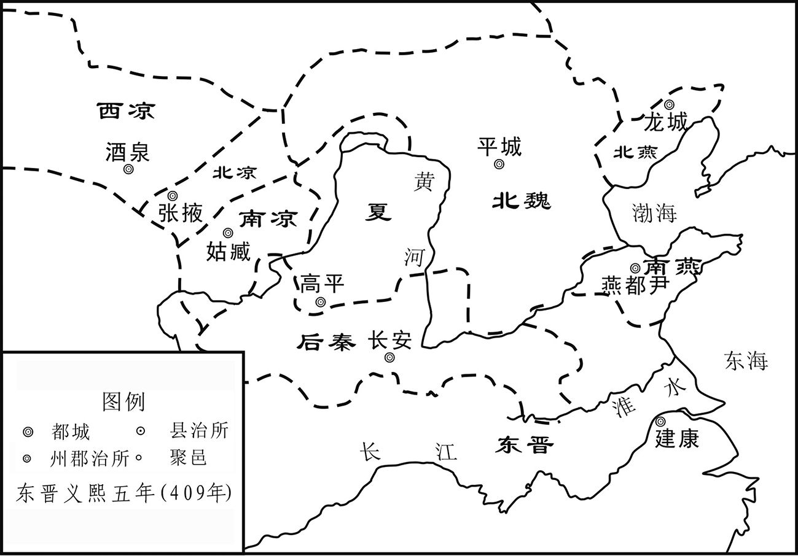 
后秦、北魏、南凉、北凉、西凉、南燕、夏、北燕位置示意图

## 【译文】

东晋义熙三年（407年）夏季六月，后秦王姚兴任命他的儿子姚泓担任录尚书事之职。

## 【原文】

**七年。秦广平公弼有宠于秦王兴，为雍州刺史，镇安定[1]。姜纪谄附于弼，劝弼结兴左右以求入朝[2]。兴征弼为尚书令、侍中、大将军，弼遂倾身结纳朝士，收采名势，以倾东宫，国人恶之[3]。会兴以西北多叛乱，欲命重将镇抚之，陇东太守郭播请使弼出镇，兴不从[4]。**

## 【注文】

[1]雍州：州名。古九州之一。东汉献帝兴平元年（194年）分凉州置。三国魏治长安（今陕西西安北）。辖境相当于今陕西中部、甘肃东南部、宁夏南部及青海黄河以南的一部分。其后逐渐缩小。东晋孝武帝太元中（376—384年）在襄阳（今湖北襄阳）侨置。南朝宋文帝元嘉二十六年（449年），割荆州北部为境，治所不变。南朝梁以后逐渐缩小。东晋、南朝时控扼南北，为汉水上游重镇。

[2]姜纪：十六国时期后凉、南凉、后秦大臣。生卒年不详。先后任后凉尚书，南凉尚书、大将军，后秦武威太守。自幼苦读兵书，有用兵方略，但其才能没有被历任统治者所接受，终生怀才不遇。　　谄（chǎn）附：逢迎趋附。　　入朝：指进入中央朝廷做官。

[3]倾身：身体向前倾。多形容对人谦卑恭顺。　　收采：收取，采纳。　　名势：名声和势力。　　倾：使倾覆，颠覆。　　东宫：太子所居住的宫殿，也常代称太子。

[4]陇东：郡名。十六国后赵石勒建平元年（330年）设，因地处陇山之东而得名。治今陕西陇县与华亭一带。　　郭播：后秦臣僚。生卒年不详。曾任陇东太守。

## 【译文】

义熙七年（411年）。后秦广平公姚弼受到秦王姚兴的宠信，被任命为雍州刺史，镇守安定郡。姜纪对姚弼逢迎趋附，劝说姚弼结交姚兴身边的侍从，以求回到中央朝廷做官。姚兴征召姚弼回朝任尚书令、侍中、大将军之职，于是姚弼利用机会降低身份结交朝中的官僚，获取名望，培植势力，准备颠覆太子之位，朝廷内外的人都非常讨厌。恰好后秦西北边防发生叛乱，姚兴准备让有威望的将领去镇抚，陇东太守郭播请求派姚弼去镇守，姚兴没有听从。

## 【原文】

**十年夏五月，秦左将军姚文宗有宠于太子泓，广平公弼恶之，诬文宗有怨言；秦王兴怒，赐文宗死，于是群臣畏弼侧目[1]。弼言于兴，无不从者，以所亲天水尹冲为给事黄门侍郎，唐盛为治书侍御史，兴左右掌机要者，皆其党也[2]。右仆射梁喜、侍中任谦、京兆尹尹昭承间言于兴曰：“父子之际，人所难言，然君臣之义，不薄于父子，故臣等不得默然[3]。广平公弼潜有夺嫡之志，陛下宠之太过，假其威权，倾险无赖之徒，辐凑附之[4]。道路皆言陛下将有废立之计，信有之乎？”兴曰：“岂有此邪？”喜等曰：“苟无之，则陛下爱弼适所以祸之。愿去其左右，损其威权，如此非特安弼，乃所以安宗庙、社稷[5]。”兴不应。大司农窦温、司徒左长史王弼皆密疏劝兴立弼为太子，兴虽不从，亦不责也[6]。**

## 【注文】

[1]姚文宗（？—414年）：后秦将领。曾任左将军，太子姚泓的宠臣，广平公姚弼因讨厌而诬告其欲造反，被秦王姚兴逼令自杀。　　侧目：不敢从正面看，形容畏惧。

[2]尹冲：后秦臣僚。生卒年不详。天水（今甘肃天水）人，为广平公姚弼的宠臣，后任给事黄门侍郎，姚弼之乱败后逃奔东晋。　　唐盛（？—415年）：后秦臣僚。为广平公姚弼的宠臣，任治书侍御史，后被姚兴所杀。　　治书侍御史：官职名。又称持书侍御史，汉宣帝设，东汉沿置，定员二人，秩六百石，选明法律者充任。魏、晋、南朝沿置，分掌侍御史所统各曹。魏齐掌纠察朝会失时、服章违错等事。北周改称“司宪上士”。隋以治书侍御史为御史大夫之事，秩从五品，炀帝时改正五品，唐时仍为御史大夫之副，秩正四品下。高宗避讳，更名“御史中丞”。元代又设治书侍御史，而位在大夫、中丞、侍御史之下。明初尚存，明太祖朱元璋洪武九年（1376年）废。

[3]梁喜：后秦大臣。生卒年不详。曾任尚书右仆射。　　任谦：后秦大臣。生卒年不详。曾任侍中。　　京兆尹：官职名。为三辅（治理京畿地区的三位官员，即京兆尹、左冯翊、右扶风）之一，相当于今天首都的市长。　　尹昭（？—417年）：后秦大臣。任京兆尹、并州刺史等职。后秦灭亡后，投降东晋，被杀。　　承间：趁机。　　之际：之间。　　薄（báo）：感情不深，冷淡。　　默然：沉默不语。

[4]夺嫡（dí）：以支子（宗法制度下称正妻所生的嫡长子以下的和妾所生的儿子为支子）取代嫡子的地位。古代，帝王之家，支子因受宠或贤明，得以嗣位，而废嫡子，皆称夺嫡。　　假：授予，给予。　　险倾：用心邪僻险恶。　　辐凑：又作辐辏，形容人或物聚集像车辐集中于车毂（gǔ）一样。

[5]适：副词，恰好，正好。　　特：只是，仅仅。　　宗庙、社稷：均是国家的代称。

[6]窦温：后秦大臣。生卒年不详。曾任大司农，劝姚兴废立太子。　　司徒左长史：官职名。司徒的属官，主要职责为协助司徒掌管选举事务。　　王弼：后秦大臣。生卒年不详。曾任司徒左长史，劝姚兴废立太子。　　密疏：秘密上奏疏。

## 【译文】

义熙十年（414年）夏季五月，后秦左将军姚文宗受到太子姚泓的宠信，而广平公姚弼却特别讨厌他，于是姚弼诬告姚文宗说了不满朝廷的话，后秦王姚兴大怒，把姚文宗赐死，此后文武百官都害怕姚弼，大家都不敢正眼看他。姚弼对姚兴说的话，姚兴没有不听从的；姚弼还把自己的亲信天水人尹冲安排做了给事黄门侍郎，唐盛做了治书侍御史，姚兴身边掌管朝廷机密之事的官员，都是姚弼的亲信。右仆射梁喜、侍中任谦、京兆尹尹昭乘机对姚兴说：“父子之间的事情是不好议论的，但是君臣之间的大义要比父子之间的关系重要，所以我们这些做臣子的不能再沉默了。广平公姚弼，暗地里有夺取太子之位的企图，陛下您宠爱他太过分，给予他太大的威望和权力了；那些别有用心的无赖之徒像车辐条一样紧紧围绕在他周围。路上的行人都说陛下您有废掉太子的想法，到底有没有呢？”姚兴说：“哪有此事！”梁喜等人说：“如果陛下没有这个打算，那么您这么宠爱姚弼，恰恰是害了他；希望您罢免了他身边的那些无赖之徒，削夺他的一些权力，这样做，不仅是保护了姚弼，而且是保护了我们的国家。”姚兴没有答应。大司农窦温、司徒左长史王弼都秘密上奏劝姚兴册立姚弼为太子，姚兴虽然没有听从，但也没有斥责他们。

## 【原文】

**兴疾笃，弼潜聚众数千人，谋作乱。姚裕遣使以弼逆状告诸兄之在藩镇者，于是姚懿治兵于蒲阪，镇东将军、豫州牧洸治兵于洛阳，平西将军谌治兵于雍，皆欲赴长安讨弼[1]。会兴疾瘳，见群臣，征虏将军刘羌泣以告兴。梁喜、尹昭请诛弼，且曰：“苟陛下不忍杀弼，亦当夺其权任。”兴不得已，免弼尚书令，使以将军、公还第[2]。懿等各罢兵。**

## 【注文】

[1]逆状：叛逆的情状。　　治兵：出兵作战。　　蒲阪（bǎn）：地名。今山西永济蒲州镇。　　镇东将军：武官名。三品四镇（镇东、镇西、镇南、镇北）将军之一。　　豫州：州名。古九州之一，汉武帝所置十三刺史部之一，辖境相当于今淮河以北、伏牛山以东豫东、皖北地。东汉治谯（qiáo）（今安徽亳州），三国魏以后屡有移徙，辖境也伸缩不常。东晋、南朝时治所最北在悬瓠（hù）城（今河南汝南），最南在邾（zhū）城（今湖北黄冈西北），辖境最大时相当于今江苏、安徽长江以西，安徽望江以北的淮河南北地区。　　平西将军：武官名号，东汉末始置，与平东、平北、平南合称为“四平将军”。负责统兵征伐，或作为刺史兼理军务的加官，掌管所在州的军政大权，位在“四安将军”之下。

[2]疾瘳（chōu）：病愈。　　刘羌：后秦将领。生卒年不详。曾任征虏将军。　　还第：古代指官吏辞职或解职而返回私宅。

## 【译文】

姚兴病势沉重，姚弼纠集部众几千人，阴谋造反。姚裕派遣使节把姚弼准备谋反的情况告诉了在外地镇守的几个兄长，于是，姚懿从蒲阪出兵，镇东将军、豫州牧姚洸从洛阳出兵，平西将军姚谌从雍州出兵，都准备去京城长安讨伐姚弼。恰好此时姚兴病愈，接见群臣，征虏将军刘羌哭着向姚兴禀告。梁喜、尹昭请求诛杀姚弼，又补充说：“如果陛下您实在不忍心杀掉姚弼，也应当夺取他的职权。”姚兴万不得已，免去了姚弼尚书令之职，让他以将军、公爵的身份回家去了。姚懿等人这才撤军。

## 【原文】

**懿、洸、谌与姚宣皆入朝，使裕入白兴，求见[1]。兴曰：“汝等正欲论弼事耳，吾已知之。”裕曰：“弼苟有可论，陛下所宜垂听[2]。若懿等言非是，便当寘之刑辟，奈何逆拒之[3]？”于是懿等引见于谘议堂。宣流涕极言，兴曰：“吾自处之，非汝曹所忧[4]。”抚军东曹属姜虬上疏曰：“广平公弼衅成逆著，道路皆知之[5]。昔文王之化，刑于寡妻[6]。今圣朝之乱，起自爱子，虽欲含忍掩蔽，而逆党扇惑不已，弼之乱心何由可革[7]。宜斥散凶徒，以绝祸端[8]。”兴以虬表示梁喜曰：“天下人皆以吾儿为口实，将何以处之[9]？”喜曰：“信如虬言，陛下早宜裁决。”兴默然。**

## 【注文】

[1]白：禀告，报告。

[2]垂：敬语,多用于尊称长辈、上级对自己的行动。

[3]寘（zhì）：同“置”，处置，处罚。　　刑辟（pì）：刑法，刑律。　　逆拒：拂逆拒绝。

[4]谘议堂：宫殿名。位于后秦都城长安未央宫。后秦统治者经常在此接见大臣和处理政务。　　极言：直言规劝。

[5]抚军东曹属：官职名。抚军将军府属官。汉制，丞相、太尉掾（yuàn）吏正职称掾，副职称属，皆比二百石。东曹副职吏员称东曹属。三国因之。　　姜虬（qiú）：后秦臣僚。生卒年不详。曾任抚军东曹属，上奏劝谏姚兴杀掉阴谋作乱的儿子姚弼。　　衅成逆著：逆乱行为明显。

[6]文王：西周奠基人。生卒年不详。姓姬名昌，季历之子，季历死后继承西伯侯之位，又称伯昌，在位五十年。商纣时为西伯侯，建国于岐山之下，积善行仁，政化大行，因崇侯虎向纣王进谗言，而被囚于羑（yǒu）里（今河南汤阴北），后得释归。益行仁政，天下诸侯多归从，其子武王建周后追尊为文王。　　刑于寡妻：以礼法对待其妻子。刑，指礼法。语出《诗·大雅·思齐》：“刑于寡妻，至于兄弟，以御于家邦。”

[7]含忍：容忍。　　掩蔽：遮掩。　　扇惑：煽动，蛊（gǔ）惑。扇，同“煽”，煽动，挑起。　　革：消除，去除。

[8]斥散：驱散。

[9]口实：话柄，借口。

## 【译文】

姚懿、姚洸、姚谌与姚宣全都入朝回到都城长安，他们让姚裕入宫禀告姚兴，请求面见。姚兴对姚裕说：“你们是想和我谈论姚弼的事情，我已经知道了。”姚裕说：“如果姚弼有可以谈论的事情，陛下您也应该听一下；如果姚懿等人所说的不对，便应当使用刑律处置他们，为什么要拒绝接见他们呢？”于是，姚兴只好在谘议堂接见姚懿等人。姚宣流泪竭力陈说，姚兴说：“我自己会处理好的，这不是你们该担心的问题。”抚军东曹属姜虬上奏说：“广平公姚弼挑起祸端，叛逆迹象显著，这是连路上行人都知道的事情。以前周文王教化民众，从以礼法对待他的妻子开始；现在我们国家的祸乱，却是因陛下您的爱子挑起的，尽管您想为儿子容忍遮掩，但是那些叛党却煽动蛊惑不停，姚弼怎么能够消除作乱的想法。应该驱散姚弼身边的凶恶之徒，以断绝祸乱的根源。”姚兴拿出姜虬所上的奏章给梁喜看，说：“天下人都以我儿子为话柄，我将如何处理呢？”梁喜说：“事实确如姜虬所说，那么陛下您应该早做决定。”姚兴默默无语。

## 【原文】

**十一年春三月，秦广平公弼谮姚宣于秦王兴，宣司马权丕至长安，兴责以不能辅导，将诛之[1]。丕惧，诬宣罪恶，以求自免。兴怒，遣使就杏城收宣，下狱，命弼将三万人镇秦州[2]。尹昭曰：“广平公与皇太子不平，今握强兵于外，陛下一旦不讳，社稷必危[3]。‘小不忍，乱大谋’，陛下之谓也[4]。”兴不从。**

## 【注文】

[1]权丕：后秦将领。生卒年不详。曾任姚宣的司马，后迫于压力背叛姚宣。　　辅导：辅佐引导。

[2]杏城：古城名。今陕西黄陵西南侯庄乡故城村。相传汉将韩胡伐杏木为栅，以抗北狄，故名。北魏太平真君六年（445年），卢水胡盖吴起兵于此。其后曾先后为东秦州及北华州治所。西魏大统九年（543年）移中部县治此，并为中部郡及鄜州治所。

[3]不讳（huì）：人死亡的婉词。

[4]“小不忍，乱大谋”：小事不忍耐就会坏了大事。语出《论语·卫灵公》：“巧言乱德，小不忍则乱大谋。”

## 【译文】

义熙十一年（415年）春季三月，后秦广平公姚弼向后秦王姚兴诬陷姚宣，姚宣的司马权丕正好到达京都长安，姚兴借口他不能正确引导姚宣而加以斥责，并且准备杀掉他；权丕害怕，就诬陷姚宣所犯的罪恶，以乞求免死。姚兴大怒，派遣使节到杏城抓获了姚宣，并把他打入监牢，同时命令姚弼率领三万人去镇守秦州。尹昭说：“广平公与皇太子关系不好，现在让姚弼掌握重兵去外地镇守，如果有一天陛下去世，国家必然会出现危机。‘小不忍则乱大谋’，说的就是陛下您啊！”姚兴没有听从。

## 【原文】

**秋九月，秦王兴药动[1]。广平公称疾不朝，聚兵于第。兴闻之，怒，收弼党唐盛、孙玄等杀之[2]。太子泓请曰：“臣不肖，不能辑谐兄弟，使至于此，皆臣之罪也[3]。若臣死而国家安，愿赐臣死。若陛下不忍杀臣，乞退就藩。”兴恻然悯之，召姚赞、梁喜、尹昭、敛曼嵬与之谋，囚弼，将杀之，穷治党与[4]。泓流涕固请，乃并其党赦之。泓待弼如初，无忿恨之色。**

## 【注文】

[1]药动：药性发作。

[2]孙玄（？—415年）：后秦臣僚。生卒年不详。广平公姚弼的宠臣，后被姚兴所杀。

[3]不肖：谦辞。不才，不贤。　　辑谐：安定和谐。

[4]恻（cè）然：哀怜的样子。　　姚赞（zàn）（？—417年）：后秦大臣。封东平公，秦亡后降东晋，被杀。　　敛（liǎn）曼嵬（wéi）：后秦将领。生卒年不详。曾任殿中上将军、辅国将军等职。　　穷治：彻底查办。　　党与：即党羽。

## 【译文】

秋季九月，后秦王姚兴药性发作。广平公姚弼却称病不入朝朝见，而是在他的府第中聚集兵马。姚兴听说后大怒，拘捕姚弼的死党唐盛、孙玄等人，把他们杀掉。太子姚泓求情说：“这些都是儿子我不成器，不能使兄弟之间和谐团结，才会导致这样的局面，这都是我的罪过。如果我死了能使国家得到安宁，我愿意您赐我去死；如果陛下您不忍杀我，那么我乞求退居藩国。”姚兴哀怜儿子姚泓，召来姚赞、梁喜、尹昭、敛曼嵬与他商量对策，囚禁了姚弼，还准备杀他，并彻底查办他的同党；姚泓泪流满面地为姚弼说情，于是姚兴把姚弼和他的党羽都赦免了。姚泓对待姚弼还像往常一样，没有一点责怪怨恨的表情。

## 【原文】

**魏太史奏：“荧惑在匏瓜中，忽亡，不知所在[1]。于法当入危亡之国，先为童谣妖言，然后行其祸罚。”魏主嗣召名儒十余人，使与太史议荧惑所诣[2]。崔浩对曰：“按《春秋左氏传》‘神降于莘’，以其至之日推知其物[3]。庚午之夕，辛未之朝，天有阴云，荧惑之亡，当在二日。庚之与午，皆主于秦，辛为西夷。今姚兴据长安，荧惑必入秦矣。”众皆怒曰：“天上失星，人间安知所诣？”浩笑而不应。后八十余日，荧惑出东井，留守句己，久之乃去[4]。秦大旱，昆明池竭，童谣讹言，国人不安，间一岁而秦亡[5]。众乃服浩之精妙。**

## 【注文】

[1]太史：官职名。夏、商、周三代为史官与历官之长。春秋时地位很高，掌管起草文书、策命诸侯卿大夫、记载史事，兼管典籍、历法、祭祀等事。后职位渐低，秦称太史令，汉属太常，掌天文历法。魏晋以后仅掌管推算历法。至明清两朝，修史之事由翰林院负责，又称翰林为太史。　　荧（yíng）惑：星宿名，指火星。　　匏（páo）瓜：星宿名。

[2]嗣：即拓跋嗣（392—423年），北魏第二任皇帝（409—423年在位）。鲜卑族，道武帝拓跋珪之子。先被立为太子，因生母被赐死，悲伤不已被废。409年，道武帝被其子拓跋绍所杀，他在宫中卫士的拥戴下杀拓跋绍即位，年号永兴。423年，进攻刘宋，攻占虎牢关，进逼刘宋北境，取得了第一次南北战争的胜利。但因征战劳顿成疾而终，终年仅32岁。谥号明元帝，庙号太宗。　　所诣（yì）：所到之地。

[3]崔浩（381—450年）：北魏重臣。字伯渊，小名桃简，清河郡武城（今河北清河县）人，崔玄伯长子。历仕北魏道武、明元、太武帝三朝，官至司徒，参与军国大计，对促进北魏统一北方起了积极作用。后因修史宣扬所谓“国恶”的罪名被灭九族。　　《春秋左氏传》：书名。原名《左氏春秋》，汉代改称《春秋左氏传》，简称《左传》。相传是春秋末年左丘明为解释孔子的《春秋》而作，实质上是一部独立撰写的史书。起自鲁隐公元年（前722年），迄于鲁悼公十四年（前453年），以《春秋》为本，通过记述春秋时期的具体史实来说明《春秋》的纲目，是儒家重要经典之一。　　莘（shēn）：古国名。又称有辛、有莘、有侁，今山东曹县北。

[4]东井：星宿名。即井宿，二十八宿之一。　　句己：星体去而复来，环行如钩，又成“己”字状。句：同“钩”。

[5]昆明池：湖泊名。汉武帝元狩四年（前119年）于长安西南郊所凿，以习水战。池周围四十里，广三百三十二顷。宋以后湮（yān）没。　　讹（é）言：传布的流言；假话；谣言。　　间：间隔。

## 【译文】

北魏太史上奏说：“荧惑星在匏瓜星座中出现，但又忽然不见了，不知道到哪里去了。按规律来看，它应当进入行将灭亡之国的上空，先制造童谣和妖妄之语，然后再施行灾祸和处罚。”魏主拓跋嗣召集了十几位名儒，让他们与太史讨论荧惑星所到之地。崔浩对答说：“按照《春秋左氏传》记载，‘神灵将在莘地降落’，以它降落的日期来推知事物。庚午日晚，辛未日早，天上阴云密布，荧惑星失踪应该就在这两日。庚和午对应的地盘是后秦国；辛指西方夷人。现在姚兴占据长安，荧惑星必定降临到后秦国去了。”大家都很生气地说：“天上失踪了一颗星，地上的人怎么会知道他去哪里了！”崔浩笑着没有回应。后来过了八十多天，荧惑星又在东井出现，在那里徘徊，呈现出“己”字型的钩状图，很久以后才消失。后秦国出现大旱，昆明池水枯竭，童谣和谣言四起，后秦国百姓不得安宁，隔了一年后秦国就灭亡了。于是，大家都佩服崔浩精妙的推算。

## 【原文】

**十二年春二月，秦王兴如华阴，使太子泓监国，入居西宫[1]。兴疾笃，还长安。黄门侍郎尹冲谋因泓出迎而杀之。兴至，泓将出迎，宫臣谏曰：“主上疾笃，奸臣在侧，殿下今出，进不得见主上，退有不测之祸。[2]”泓曰：“臣子闻君父疾笃，而端居不出，何以自安？[3]”对曰：“全身以安社稷，孝之大者也[4]。”泓乃止。尚书姚沙弥谓尹冲曰：“太子不出迎，宜奉乘舆幸广平公第，宿卫将士闻乘舆所在，自当来集，太子谁与守乎[5]。且吾属以广平公之故，已陷名逆节，将何所自容？今奉乘舆以举事，乃仗大顺，不惟救广平之祸，吾属前罪亦尽雪矣[6]。”冲以兴死生未可知，欲随兴入宫作乱，不用沙弥之言。**

## 【注文】

[1]华阴：县名。西汉高祖二年（前205年）置县，以其地处华山之北，故名。今陕西华阴。　　监国：中国古代的一种政治制度。通常是指皇帝外出时，由一位非常重要人物（例如太子）留守宫廷处理国事，也指君主未能亲政，由他人代理朝政。　　西宫：离宫，别宫。

[2]宫臣：太子的属官。

[3]端居：安稳坐着。

[4]全身：保全自身。

[5]姚沙弥：后秦臣僚。生卒年不详。任尚书，曾助姚弼之乱。　　乘舆：皇帝乘坐的车子，代指皇帝。　　宿卫：指禁军。

[6]逆节：叛逆。　　吾属：我等，我们。

## 【译文】

义熙十二年（416年）春季十月，后秦王姚兴前往华阴，让太子姚泓监理国事，居住到离宫。姚兴病重，返回长安。黄门侍郎尹冲阴谋趁太子姚泓出宫迎接姚兴之机谋杀他。姚兴驾到，姚泓准备出宫迎接，这时宫臣劝谏说：“主上病重，奸佞之臣就在他的身旁，殿下现在出去，不仅看不到主上，而且还可能有无法预料的灾祸。”姚泓说：“臣子听说君父病重而稳坐不迎，心里怎么能安宁？”宫臣回答说：“保全自身使国家安定，这就是最大的孝。”于是姚泓停止行动。尚书姚沙弥对尹冲说：“太子不出宫迎接，我们应该把主上的车子送到广平公的府第；禁军将领听到主上在那里，自然就会跑去，谁会去护卫太子呢？况且我等是广平公的老部下，早已经被列入叛逆者的名录，将来到哪里容身？现在我们挟持主上而发动兵变，是最为名正言顺的，不仅能把广平公从祸患中解救出来，而且也可以洗刷我们之前的罪名。”尹冲因为不知道姚兴的死活，计划跟随姚兴进入宫中再行叛乱之事，所以没有采纳姚沙弥的建议。

## 【原文】

**兴入宫，命太子泓录尚书事，东平公绍及右卫将军胡翼度典兵禁中，防制内外[1]。遣殿中上将军敛曼嵬收弼第中甲仗，内之武库[2]。兴疾转笃，其妹南安长公主问疾，不应。幼子耕儿出，告其兄南阳公愔曰：“上已崩矣，宜速决计[3]。”愔即与尹冲帅甲士攻端门，敛曼嵬、胡翼度等勒兵闭门拒战[4]。愔等遣壮士登门，缘屋而入，及于马道[5]。泓侍疾在谘议堂，太子右卫率姚和都帅东宫兵入屯马道南[6]。愔等不得进，遂烧端门。兴力疾临前殿，赐弼死[7]。禁兵见兴，喜跃，争进赴贼，贼众惊扰，和都以东宫兵自后击之，愔等大败。愔逃于骊山，其党建康公吕隆奔雍，尹冲及弟泓来奔[8]。兴引东平公绍及姚赞、梁喜、尹昭、敛曼嵬入内寝，受遗诏辅政[9]。明日，兴卒。泓秘不发丧，捕南阳公愔及吕隆、大将军尹元等皆诛之，乃发丧，即皇帝位，大赦，改元永和[10]。**

## 【注文】

[1]录：总管，统领。　　胡翼度：后秦将领。生卒年不详。曾任辅国将军，后东晋攻长安，城破兵败降东晋。　　典兵：统领军队，掌管军事。

[2]殿中上将军：武官名。晋武帝时置，领殿内宿卫。品级不详。　　武库：古代储藏武器的仓库。

[3]南安长公主：生卒年不详。后秦王姚兴之妹。　　耕儿：即姚耕儿，后秦宗室。生卒年不详。姚兴幼子。　　崩：古代指皇帝死亡。古时为避讳起见，人们对“死”有诸多别称。据《礼记》记载，古时各个等级的人去世时的称谓有所不同：天子曰崩；诸侯曰薨（hōng）；大夫曰卒；士（知识分子）曰不禄；庶人（百姓）曰死。这反映出古代社会严格的等级制度。皇帝地位至高无上，连“死”也有专称，除“崩”外，还有诸如驾崩、晏驾等。如果是一般官员和平民百姓的死亡，则称殁（mò）、殒（yǔn）命、终等。　　决计：拿定主意。

[4]端门：指皇宫的正南门。

[5]马道：指皇宫中允许上马的地方。建于宫城内侧的漫坡道，一般为左右对称。坡道表面为陡砖砌法，利用砖的棱面形成涩脚，俗称“礓（jiāng）”，便于马匹、车辆上下。

[6]太子右卫率：官职名，分太子左卫率七人和太子右卫率二人。二率职如二卫。秦时直称卫率，汉因之。掌管门卫。西晋初，改称中卫率，后增至左、右、前、后、中卫率，合称五卫率。东晋初，省前后二率。刘宋时，置左右二率，秩四百石。　　姚和都：后秦宗室、臣僚。生卒年不详。姚泓堂弟，历任太子右卫率、给事黄门侍郎等职。秦亡后，归北魏，任左民尚书。在扶风马僧虔、河东卫隆景并著的《秦史》基础上，又追撰《秦纪》十卷，记姚苌之事。

[7]力疾：勉强支撑病体。

[8]骊（lí）山：山名。又称“郦山”。在今陕西临潼。是秦岭北侧的一个支脉，远望山势如同一匹骏马，故名。骊山温泉喷涌，风景秀丽多姿，自西周以来就成为帝王游乐胜地。周、秦、汉、唐以来，曾营建过许多离宫别苑。著名的“烽火戏诸侯”的故事就发生在这里。　　吕隆（？—416年）：十六国时期后凉末代君主（401—403年在位）。字永基，氐族，略阳（今甘肃秦安东南）人，吕光侄子。401年，吕隆弟吕超杀后凉主吕纂，拥立吕隆继位。在位时多杀豪望，不得人心，又不断受到北凉及南凉攻击，国势日衰。403年，北凉、南凉围后凉都城姑臧，吕隆投降后秦，并随之东迁，后凉灭亡。416年，受后秦主姚兴之姚弼谋反案的牵连被杀。　　泓：即尹泓，后秦臣僚。生卒年不详。天水（今甘肃天水）人，与其兄尹冲参与姚弼之乱，兵败后逃奔东晋。

[9]内寝（qǐn）：内室。　　遗诏：皇帝驾崩之后，为后人留下的遗书、遗言等。

[10]尹元（？—416年）：后秦将领。曾任大将军，因参与姚弼之乱被捕杀。　　永和：十六国时期后秦王姚泓在位期间的年号，即公元416年至417年，共计二年。

## 【译文】

姚兴进入皇宫，任命太子姚泓为录尚书事，任命东平公姚绍以及右卫将军胡翼度指挥军队保卫皇宫，并防备内外。派遣殿中上将军敛曼嵬没收姚弼府第中的兵器，收归国家武器库中。姚兴病情突然加重，他的妹妹南安长公主前来探望，姚兴没有应声。姚兴的小儿子姚耕儿出宫，对他的哥哥南阳公姚愔说：“皇上已经驾崩了，应该赶快拿个主意。”姚愔立即与尹冲率领身披盔甲的士兵进攻端门，敛曼嵬、胡翼度等人指挥军队关闭城门抵抗。姚愔等人派遣壮士登上门楼，顺着屋顶跳进皇宫，到了马道。当时姚泓正在谘议堂中侍奉重病的父亲，太子右卫率姚和都率领东宫的士兵驻守马道。姚愔等人无法前进，于是烧毁了端门，姚兴勉强支撑着病体来到前殿，下令赐死姚弼。禁军见到姚兴后，欢喜雀跃，争先恐后进攻叛军，叛军惊慌失措；姚和都率领东宫士兵从背后进攻叛军，姚愔等大败。姚愔逃跑到骊山，他的党羽建康公吕隆逃奔雍州，尹冲及其弟弟尹泓投奔了东晋。姚兴带着东平公姚绍以及姚赞、梁喜、尹昭、敛曼嵬进入内室，让他们受遗诏辅政。第二天，姚兴去世。姚泓暂时没有对外宣布姚兴的死讯，下令拘捕了南阳公姚愔以及吕隆、大将军尹元等人，并把他们全部处死，然后才对外公布姚兴去世的消息，登上皇位，大赦全国，改年号为永和。

## 【原文】

**三月，加太尉裕中外大都督[1]。裕戒严，将伐秦，诏加裕领司豫二州刺史，以其世子义符为徐兖二州刺史[2]。琅邪王德文请启行戎路，修敬山陵，诏许之[3]。**

## 【注文】

[1]中外大都督：职官名。全国最高军事统帅。大都督，曹魏置，第一品，不常置，属加官。

[2]司：即司州，州名。东晋年间先后侨置于合肥、襄阳、虎牢。　　义符（406—424年）：即刘义符，南朝刘宋第二任皇帝（422—424年在位）。　　徐：即徐州，州名。东晋侨置于京口，今江苏镇江。　　兖（yǎn）：即兖州，州名。东晋侨置于广陵，今江苏扬州。

[3]德文：即司马德文（386—421年），东晋末代皇帝（419—420年在位）。　　启行：开路。　　戎路：古代帝王军中所乘的车。后泛指兵车。　　修敬：表示敬意。　　山陵：指皇帝的陵墓。

## 【译文】

三月，东晋朝廷加授太尉刘裕为中外大都督。刘裕实行戒严，准备讨伐后秦，朝廷下诏加封刘裕兼领司州、豫州二州刺史，任命其嫡长子刘义符为徐州、兖州二州刺史。琅邪王司马德文请求为刘裕大军的兵车开路，然后去整修先帝们的陵墓，朝廷下诏准许。

## 【原文】

**秋八月，宁州献琥珀枕于太尉裕[1]。裕以琥珀治金创，得之大喜，命碎捣分赐北征将士[2]。裕以世子义符为中军将军，监太尉留府事[3]。刘穆之为左仆射，领监军、中军二府军司，入居东府，总摄内外[4]。以大尉左司马东海徐羡之为穆之之副，左将军朱龄石守卫殿省，徐州刺史刘怀慎守卫京师，扬州别驾从事史张裕任留州事[5]。怀慎，怀敬之弟也[6]。**

## 【注文】

[1]宁州：州名。晋武帝司马炎泰始七年（271年）分益州置，治味县（今云南曲靖）；一说在滇池（今云南晋宁东）。辖境约相当于今云南大部和贵州、广西小部，其后曾大至包括贵州大部。南朝齐移治同乐（今云南陆良东北）。梁简文帝大宝（550—551年）以后废。　　琥珀（hǔpò）：一种微黄或微褐色的半透明树脂化石。产于冲积土、褐煤层或某些海滨，容易抛光，主要用于装饰品，也可作中药。

[2]金创：金属利器对人体所造成的创伤，如刀、剑伤。　　捣（dǎo）：砸。

[3]留府事：刘裕被封为太尉，开府。此指太尉府留守、留后一类的官职。

[4]监军：官职名。监督军队的官员。古代监军皆临时差遣，代表朝廷协理军务，督察将帅。汉武帝时置监军使者。东汉、魏晋皆有，省称监军，也称监军事。又有军师、军司，亦为监军之职。　　中军：官职名。汉、晋将军中有此名，或主军事，或总宿卫，不常置。南北朝亦有此官号，用以安置权臣。　　东府：府第名。又名东城府。东晋义熙十年（414年）冬建，原为简文帝司马昱任会稽王时的旧府第，后为会稽王司马道子居宅，时人称东府。后刘裕重修并居此，东、南、西三面开门，城周三里九十步。东晋以宰相领扬州牧，东府城既是相府，又是扬州刺史治所。形势险要，为防卫都城建康的必守之地。后改名为未央宫、齐王宫。梁敬帝时兵火中焚毁。故址在今江苏南京。属权臣独立的办事场所。

[5]徐羡之（364—426年）：东晋、刘宋大臣。字宗文，南朝宋东海郯（tán）（今山东郯城）人。东晋时，历官琅琊内史、吏部尚书、丹阳尹、尚书仆射。刘宋建国后，进位司空，录尚书事。宋武帝去世后，与傅亮、谢晦同为顾命大臣，辅佐少帝。后废杀庐陵王刘义真与少帝，迎立宜都王刘义隆为帝，被封为南平郡公，转任司徒。后因废君弑君等罪名被刘义隆赐死。　　朱龄石（377—417年）：东晋大将。字伯儿，沛（今江苏沛县）人，刘裕手下大将，自幼轻佻（tiāo）好武，后随刘裕平定桓玄、卢循之乱，受命为元帅，讨伐占领四川的谯蜀，威名甚著。任右将军，封丰城侯。后以都督关中诸军事之职北伐后秦，功成后镇守要地。赫连夏南下掠地关中，刘宋势力全线崩溃，朱龄石因水道被断遭擒，押解至长安被杀。　　刘怀慎（362—422年）：东晋、刘宋大将。彭城（今江苏徐州）人，历任振威将军、彭城内史，跟从刘裕攻灭后燕、讨平卢循，因功加封辅国将军、徐州刺史等职。为政严猛，境内震肃。刘宋时历任五兵尚书、督江北淮南诸军、度支尚书，加散骑常侍。刘宋代晋后，以辅佐之功进爵为侯，增邑千户，进号平北将军。　　别驾从事史：官职名。又称别驾，汉代为州刺史出巡的佐吏，另乘传车，故称别驾。魏、晋时，因州郡不甚分别，故于诸州置，总理众务，职权甚重。　　张裕：东晋臣僚。生卒年不详。曾任别驾从事史。

[6]怀敬：即刘怀敬，东晋、刘宋大臣。生卒年不详。彭城（今江苏徐州）人，刘裕从母弟，涩讷无才能，因其母乳养刘裕之恩，累见刘裕优宠，位至会稽太守、尚书，赐金紫光禄大夫。

## 【译文】

秋季八月，宁州向东晋太尉刘裕贡献琥珀枕头。刘裕因琥珀可以治疗刀剑之伤，所以非常高兴地收下了，他命令把这个琥珀枕头捣碎后分给每个北征的将士。刘裕任命嫡长子刘义符为中军将军，监理太尉留府事。任命刘穆之为左仆射，率领监军、中军二府军司，进入东府居住，总管朝廷内外一切事务；任命太尉左司马东海人徐羡之作为刘穆之的副手；任命左将军朱龄石守卫宫殿和各中央机构，任命徐州刺史刘怀慎守卫京城，扬州别驾从事史张裕担任留州事。刘怀慎是刘怀敬的弟弟。

## 【原文】

**丁巳，裕发建康，遣龙骧将军王镇恶、冠军将军檀道济将步军自淮、淝向许、洛，新野太守朱超石、宁朔将军胡藩趋阳城，振武将军沈田子、建威将军傅弘之趋武关，建武将军沈林子、彭城内史刘遵考将水军出石门，自汴入河，以冀州刺史王仲德督前锋诸军开巨野入河[1]。遵考，裕之族弟也。刘穆之谓王镇恶曰：“公今委卿以伐秦之任，卿其勉之！”镇恶曰：“吾不克关中，誓不复济江。”**

## 【注文】

[1]龙骧（xiāng）将军：武官名。最早出现在西晋武帝时，晋武帝谋伐吴，因吴童谣“不畏岸上兽，但畏水中龙”之语，所以拜益州刺史王浚为龙骧将军，使造船备战。龙骧之号始此，南北朝时开始广泛沿置，苻坚、姚苌皆曾受此名号。地位高下不一，北魏、北齐均第三品，南朝梁有将军号二百四十种以上，龙骧叙次在一百七十以后，远较西晋初置时低。隋代以后不设。　　王镇恶（373—418年）：东晋名将。北海剧（今山东昌乐西）人。前秦丞相王猛之孙，后随叔父归晋。好读兵书，长于谋略，为东晋录尚书事、中军将军刘裕所赏识。曾任振武将军和龙骧将军，随刘裕南征北战，立下显赫战功，为击败后秦做出了重要贡献，进号征虏将军。418年，因内部不和，被中兵参军沈田子所杀。　　檀道济（？—436年）：东晋、刘宋将领。祖籍高平金乡（今山东金乡），生于京口（今江苏镇江），檀祗之弟，出身寒门，从军20余年，由士兵升至大将军。从刘裕攻后秦，屡立战功，官至征南大将军，封武陵郡公。刘宋元嘉八年（431年）攻魏，粮尽退兵，敌不敢追。文帝刘义隆以其前朝重臣，诸子皆善战，忌而杀之。檀道济戎马倥偬（kǒngzǒng），一生战绩卓著。　　淝：即淝河，河名。源出安徽肥西、寿县之间的将军岭，分二支：向西北流者，经200里，出寿县而入淮河；向东南流者，注入巢湖。　　新野：郡县名。西汉初置县，约在今河南新野。西晋惠帝元康八年（298年），置郡，治所棘阳（约在今河南新野东），辖新野、棘阳、穰、朝阳、安昌5县。南朝宋武帝永初年间（420—422年），徙治新野。宋文帝元嘉三十年（453年），废；宋孝武帝大明元年（457年）复置。　　朱超石（382—418年）：东晋将领。沛郡沛县（今江苏沛县）人，朱龄石之弟。出身将门，果敢勇锐，文武双全。先为卫将军桓谦行参军；又任何无忌辅国右军军事；曾为卢循部将徐道覆俘获，任参军。后逃归刘裕，任徐州主簿。后历任车骑参军事、尚书都官郎、中兵参军、宁朔将军、沛郡太守、新野太守、河东太守、中书侍郎等职，封兴平县侯。曾参与讨伐司马休之和北魏的战争，后与其兄朱龄石在与赫连勃勃的夏军作战时，兵败被俘杀。　　宁朔将军：武官名。四品杂号将军。　　胡藩（372—433年）：东晋、刘宋大将。字道序，南昌（今江西南昌）人，为人重义气，性刚直，通武善射，足智多谋。初参郗恢、殷仲堪军事，转投桓玄。桓玄死后，归故里。宋武帝时召为员外散骑侍郎，参镇军军事。从征鲜卑，攻讨卢循，有战功，升为正员郎。复伐羌、征魏，皆率先力战。以功封阳山县男，食邑五百户。官至太子左卫率。　　阳城：地名。今山东茌（chí）平南。　　沈田子（383—418年）：东晋大将。字敬光，吴兴武康（今浙江德清武康）人，从刘裕克京城，平建邺（今江苏南京），参镇军事，封营道县五等侯。后随刘裕讨北燕，因功进太尉参军、淮陵内史，赐爵都乡侯。从刘裕讨伐刘毅、司马休之，因功进振武将军、扶风太守。416年，以奇兵大败后秦姚泓，授咸阳、始平二郡太守，不久升安西中兵参军、龙骧将军。418年，被其长史王修所杀。　　傅弘之（377—418年）：东晋将领。字仲度，祖籍灵州（今宁夏吴忠），后移居北地泥阳（今陕西耀县东南）。出身于官宦世家，年轻时风流倜傥，胸怀大志，初任雍州主簿，历任参军、宁远将军、魏兴太守、太尉行参军、建威将军、顺阳太守、雍州治中从事史、西戎司马、宁朔将军等职。曾参与平定桓玄之乱、卢循之乱、司马休之之乱、徐师高叛乱和刘裕北伐后秦之战。后被赫连夏所俘，被杀。　　武关：地名。在今陕西商洛南。　　建武将军：武官名。四品杂号将军。曹魏置，第五品。管辖内地小县军权。　　沈林子（387—422年）：字敬士，吴兴武康（今浙江德清武康）人。东晋、刘宋大将。沈田子之弟，南朝史学家、文学家沈约（著《宋书》）的祖父。因才智而受到刘裕重用，参与了讨伐南燕、卢循、司马休之及后秦等战役，威名甚盛。历任建熙令、建威将军、河南太守、辅国将军等职，累封资中县五等侯、汉寿县伯等爵。宋武帝永初三年（422年）去世，追赠征虏将军，谥怀伯。　　内史：官职名。西周始置，原为中央官职。西汉诸侯王国掌民政之官亦称内史，汉成帝刘骜（áo）绥和元年（前8年）省内史，设国相治民，相当于郡守。晋沿置，为王国的地方行政长官。魏晋要郡亦有以内史代太守者，如东晋会稽郡、彭城郡即是其例。南北朝沿袭。　　刘遵考（392—473年）：东晋、刘宋大臣。彭城绥里（今江苏徐州）人，宋武帝刘裕的族弟。刘裕北伐后任并州刺史、兼河东太守，镇守蒲坂（今山西永济）。刘裕即位初年，封为营浦县侯。后升任宁蛮校尉、雍州刺史，加都督衔。在任贪婪残暴，聚敛财富。孝武帝刘骏时任左仆射。死后，赠左光禄大夫、开府仪同三司，谥号元公。　　石门：地名。今河南荥阳北。　　汴（biàn）：地名。今河南开封。　　冀州：州名。古九州之一，汉武帝十三刺史部之一，辖境相当于今河北中南部、山东西部及河南北部地区。东汉治高邑（今河北柏乡北），后移治邺县（今河北临漳西南）。三国魏移治信都（今河北冀县），晋移治房子（今河北高邑西南），辖境渐小。东晋灭南燕后侨置于青州（今山东青州）。　　巨野：县名。西汉时置，今山东巨野。

## 【译文】

八月丁巳（十二日），刘裕从京城建康出发，派遣龙骧将军王镇恶、冠军将军檀道济率领步兵从淮河、淝水向许昌、洛阳方向进发，新野太守朱超石、宁朔将军胡藩挺进阳城，振武将军沈田子、建威将军傅弘之向武关进发，建武将军沈林子、彭城内史刘遵考率领水军从石门出发，从开封进入黄河，派遣冀州刺史王仲德都督前锋几路大军，从巨野进入黄河。刘遵考是刘裕的族弟。刘穆之对王镇恶说：“刘公现在委你以讨伐后秦的重任，你可要努力啊！”王镇恶说：“我不攻下关中，发誓再不回江南！”

## 【原文】

**裕既行，青州刺史檀祗自广陵帅众至涂中掩讨亡命[1]。刘穆之恐祗为变，议欲遣军。时檀韶为江州刺史，张邵曰：“今韶据中流，道济为军首，若有相疑之迹，则大府立危[2]。不如逆遣慰劳，以观其意，必无患也[3]。”穆之乃止。**

## 【注文】

[1]青州：州名。东晋侨置青州于广陵，今江苏扬州。　　檀祗（zhī）（369—419年）：晋宋将领。字恭叔，高平金乡（今山东金乡）人，檀歆之弟，早年任参军。征孙恩，讨桓玄，平江陵，屡有战功。后历任振武将军、龙骧将军、秦郡太守、宁朔将军、竟陵太守、中书侍郎、辅国将军、右卫将军、宣城内史、青州刺史、广陵相、征虏将军、右将军，封西昌县侯。宋初任领军将军、散骑常侍。追赠散骑常侍、抚军将军，谥曰威侯。　　广陵：郡县侯国名。秦始皇统一中国后，设县，其地在今江苏扬州广陵。西汉武帝元狩三年（前120年）设广陵国，治广陵县。王莽始建国元年（9年），改为江平郡。东汉光武帝建武（25—56年）初改为广陵郡。隋开皇九年（589年）废。　　涂中：地区名。今安徽滁州市区。涂，即涂水，今天的滁河。　　掩讨：讨伐。　　亡命：逃亡者。

[2]檀韶（366—421年）：东晋将领。字令孙，高平金乡（今山东金乡）人，檀祗、檀道济之兄，世居京口（今江苏镇江）。历任主簿、司马、宁远将军、骁骑将军、宁朔将军、琅邪内史、辅国将军、淮南太守、左将军、江州刺史等职，先后封巴丘县侯、宜阳县侯。曾参与平定卢循、桓玄之乱和北伐南燕的战争，但嗜酒贪横，所任无政绩，死后追赠安南将军。　　江州：州名。西晋元康元年（291年），分荆、扬二州置，治豫章（今江西南昌），其后或治柴桑（今江西九江西南），或治半洲城（今江西九江西），或治湓口城（今江西九江），东晋辖境相当于今江西、福建两省，湖北陆水以东、长江以南及湖南舂陵水中上游以东地区。其后渐小。　　张邵（shào）：东晋、刘宋将领。生卒年不详。字茂宗，吴郡（今江苏苏州）人，张裕之弟，刘裕重要谋士，东晋时历任主簿、参军、司马，刘宋时任湘州刺史、征虏将军、宁蛮校尉、雍州刺史、吴兴太守等职，封临沮伯，死后谥简伯。　　大府：即东府，刘裕府第。

[3]逆遣：事先派遣。

## 【译文】

刘裕出发之后，青州刺史檀祗从广陵率领部众到达涂中讨伐逃亡之人。刘穆之害怕檀祗制造变乱，商议准备派兵。当时檀韶任江州刺史，张邵说：“现在檀韶占据长江中游，檀道济又是北伐军的先锋，如果让他们感觉出我们有怀疑檀祗的想法，那么建康的太尉府就会立刻面临危险，不如先派遣使者前去慰劳，再观察一下他的意图，这样做就没有什么后患了。”于是刘穆之停止了出兵。

## 【原文】

**九月，太尉裕至彭城，加领徐州刺史，以太原王玄谟为从事史[1]。王镇恶、檀道济入秦境，所向皆捷。秦将王苟生以漆丘降镇恶，徐州刺史姚掌以项城降道济，诸屯守皆望风款附[2]。惟新蔡太守董遵不下，道济攻拔其城，执遵杀之[3]。进克许昌，获秦颍川太守姚垣及大将杨业[4]。沈林子自汴入河，襄邑人董神虎聚众千余人来降，太尉裕拔为参军[5]。林子与神虎共攻仓垣，克之，秦兖州刺史韦华降[6]。神虎擅还襄邑，林子杀之。**

## 【注文】

[1]王玄谟（388—468年）：南朝刘宋将领。字彦德，太原祁（今山西祁县）人。东晋安帝义熙年间，刘裕北伐到达徐州后，辟为从事史。先后任南蛮参军、武昌太守、汝阴太守、彭城太守、徐州刺史、豫州刺史、旌（jīng）州刺史、加都督、辅国将军、前将军、宁蛮校尉、金紫光禄大夫等职，死后谥庄公。

[2]王苟生：后秦将领。生卒年不详。刘裕北伐时，献出漆丘（今河南商丘东北）投降。　　漆丘：地名。今河南商丘东北。　　姚掌：后秦大臣。生卒年不详。曾任徐州刺史，刘裕北伐时，献出项城投降。　　项城：县名。今河南沈丘。　　款附：诚心归附。

[3]新蔡：郡名。今河南新蔡。　　董遵（？—416年）：后秦臣僚。曾任新蔡太守，东晋军攻新蔡，拒不投降，城破被俘杀。

[4]许昌：郡名。今河南许昌东。　　颍川：郡名。今河南禹州。　　姚垣（yuán）：后秦将领。生卒年不详。曾任颍川太守，刘裕北伐时，被俘。　　杨业：后秦将领。生卒年不详。刘裕北伐时，被俘。

[5]汴：即汴水，河流名。今河南荥阳西南的索河。隋朝开通济渠，其中从今荥阳至开封的一段即是汴水。　　襄邑：郡名。今河南睢（suī）县。　　董神虎（？—416年）：东晋将领。襄邑（今河南睢县）人。刘裕北伐时，率众归降，任参军。曾与沈林之一起攻克仓垣（今河南开封北）。后因擅自返回襄邑，被沈林之所杀。

[6]仓垣：地名。今河南开封北。　　兖州：州名。传说中的古九州之一，也是汉武帝所置十三刺史部之一，辖境相当于今山东省西南部，北至茌平、淄博，东至沂河流域，东南以莒县、平邑并泗水东岸为界，及河南东部的南乐、濮阳、延津、开封、尉氏以东、扶沟、淮阳、鹿邑等地。东汉治昌邑（今山东金乡西北），其后屡有迁移，辖境逐渐缩小。南朝宋移治瑕丘城。东晋时侨置于京口（今江苏镇江）。东晋安帝义熙六年（410年），刘裕灭南燕，复兖州旧地，改为北兖州，治滑台（今河南滑县），辖境相当于今山东泰山以南汶、泗流域及鲁西平原，河南滑台、延津、杞县以东地区。南朝宋初，复名兖州。　　韦华：十六国时人。生卒年不详。曾任后秦兖州刺史、右仆射等职，刘裕北伐时，投降，任雍州刺史别驾，后投降赫连夏。

## 【译文】

九月，东晋太尉刘裕到达彭城，朝廷加授其徐州刺史。刘裕任命太原人王玄谟为从事史。王镇恶、檀道济进入后秦边境，所到之处全都告捷。后秦大将王苟生献漆丘投降王镇恶，徐州刺史姚掌献出项城投降檀道济，其他屯守各军听到风声全都投降。只有新蔡太守黄遵不肯投降，檀道济攻下新蔡城，抓住黄遵并把他杀了。东晋军又攻克许昌，抓获后秦颍川太守姚垣以及大将杨业。沈林子从开封进入黄河，襄邑人董神虎聚集了一千多人来投降沈林子，太尉刘裕任命他为参军。沈林子与董神虎一起进攻仓垣，攻陷仓垣城，后秦兖州刺史韦华投降。董神虎擅自返回家乡襄邑，被沈林子所杀。

## 【原文】

**秦东平公绍言于秦主泓曰：“晋兵已过许昌，安定孤远，难以救卫，宜迁其镇户，内实京畿，可得精兵十万，虽晋、夏交侵，犹不亡国[1]。不然，晋攻豫州，夏攻安定，将若之何？事机已至，宜在速决。”左仆射梁喜曰：“齐公恢有威名，为岭北所惮，镇人已与勃勃深仇，理应守死无贰[2]。勃勃终不能越安定远寇京畿。若无安定，虏马必至于郿[3]。今关中兵足以拒晋，无为豫自削也[4]。”泓从之。吏部郎懿横密言于泓曰：“恢于广平之难，有忠勋于陛下[5]。自陛下龙飞绍统，未有殊赏以答其意。今外则致之死地，内则不豫朝权，安定人自以孤危逼寇，思南迁者十室而九，若恢拥精兵数万，鼓行而向京师，得不为社稷之累乎[6]？宜征还朝廷，以慰其心。”泓曰：“恢若怀不逞之心，征之适所以速祸耳[7]。”又不从。**

## 【注文】

[1]京畿（jī）：国都及其附近的地区。　　交侵：迭相侵犯。

[2]恢：即姚恢（？—417年），后秦将领。曾任征北将军，封齐公，后起兵反叛，兵败被杀。

[3]郿（méi）：县名。秦置；北魏太平真君六年（445年）改为平阳县；西魏大统四年（538年）改为郿城县；隋开皇十八年（598年）改为渭滨县，大业二年（606年）改为郿县；1964年改称眉县。今陕西眉县。

[4]无为：不需要。　　豫：同“预”，预告，先行。

[5]吏部郎：官职名。曹魏时置尚书郎中二十五人，分部、曹治事，其中有吏部郎。　　懿（yì）横：后秦臣僚。生卒年不详。曾任吏部郎，多次为朝廷提出合理建议。　　广平之难：指姚兴晚年广平公姚弼争夺皇位的叛乱。

[6]鼓行：击鼓行军。中国古代军队前进击鼓，鸣金则表示收兵，主要作用是保持战斗队形，减少伤亡。击鼓是冲锋，所谓一鼓作气，就是交战时听到第一声鼓响，会士气大增。　　得：能，能够。　　累（lèi）：忧患，祸害。

[7]不逞：作乱，叛乱。

## 【译文】

后秦东平公姚绍对秦王姚泓说：“东晋部队已经过了许昌；安定城遥远孤僻，很难守卫和救援，应该把那里的镇户全部迁回，以充实京畿地区，这样可以获得十万精兵，即使东晋、赫连夏轮流侵略，仍然不会使我们国家灭亡。不这样的话，东晋进攻豫州，夏国攻安定，我们将怎么办？现在是关键时刻，应该尽快决定。”左仆射梁喜说：“齐公姚恢有威信和名望，岭北地区的人都很害怕他，镇人也已经与赫连勃勃结下深仇大恨，按理说会没有二心地死守安定城。赫连勃勃最终不能越过安定城，远道而来进犯京城；如果没有了安定城，敌人的战马就会到达郿县。现在关中地区的兵力足以抵抗东晋军，没必要预先去减损自己的地盘。”姚泓听从了梁喜的话。吏部郎懿横悄悄对姚泓说：“姚恢在广平之难中对陛下您忠贞不二。自从您继承皇位以来，没有用什么特殊的赏赐来答谢他的忠诚。现在姚恢在外则处于生死之地，在内也没有让他掌握大权，安定城的百姓已经知道他们正处在孤立无援、外寇相逼的境地，都盼望着向内地迁移，有这种想法的人十有九个，如果姚恢操纵几万精兵，擂鼓进攻京城，能不给朝廷造成祸患吗？应该把姚恢征召回朝廷来安抚他的情绪。”姚泓说：“如果姚恢心怀作乱之意，那么征召他回京正好是加快祸患发生的速度罢了。”姚泓又没有听从懿横的话。

## 【原文】

**王仲德水军入河，将逼滑台，魏兖州刺史尉建畏懦，帅众弃城，北渡河[1]。仲德入滑台，宣言曰：“晋本欲以布帛七万匹假道于魏，不谓魏之守将弃城遽去[2]。”魏主嗣闻之，遣叔孙建、公孙表自河内向枋头，因引兵济河，斩尉建于城下，投尸于河[3]。呼仲德军人，问以侵寇之状。仲德使司马竺和之对曰：“刘太尉使王征虏自河入洛，清扫山陵，非敢为寇于魏也[4]。魏之守将自弃滑台去，王征虏借空城以息兵，行当西引，于晋、魏之好无废也，何必扬旗鸣鼓以曜威乎[5]！”嗣使建以问太尉裕。裕逊辞谢之曰：“洛阳，晋之旧都，而羌据之，晋欲修复山陵久矣[6]。诸桓宗族，司马休之，国璠兄弟，鲁宗之父子，皆晋之蠹也，而羌收之，以为晋患[7]。今晋将伐之，欲假道于魏，非敢为不利也。”魏河内镇将于栗有勇名，筑垒于河上以备侵轶[8]。裕以书与之，题曰“黑矟公麾下”[9]。栗磾好操黑矟以自标，故裕以此目之[10]。司马休之等奔秦事见《刘裕篡晋》。**

## 【注文】

[1]王仲德（约367—438年）：即王懿，字仲德。东晋、刘宋名将。太原祁（今山西祁县）人。出身于官宦世家，深沉有谋略，通阴阳声律。后徙居彭城（今江苏徐州），任刘裕中兵参军。宋初任徐州刺史、兖州刺史、镇北大将军等职。　　滑台：地名。即今河南滑县。相传古有滑氏，于此筑垒，后人筑以为城，高峻坚固。汉末以来为军事要冲。北魏与金墉（yōng）﹑虎牢﹑碻磝（qiāoáo）并称河南四镇。南燕慕容德曾建都于此。　　尉（wèi）建（？—416年）：北魏大臣。任兖州刺史，因东晋进攻滑台时不战而逃被斩杀。

[2]假道：借道，取道。　　不谓：不料，没想到。

[3]叔孙建（365—437年）：北魏大将。代（今山西大同）人，年幼时被昭成帝什翼犍母王太后所养，与皇子同列。少年即以智勇著称。道武帝拓跋珪登国初（386年），与安同等十三人参军国之谋。随秦王拓跋觚（gū）出使慕容垂长达六年。后历任后将军、都水使者、中领军，赐爵安平公，加龙骧将军。　　公孙表（360—423年）：北魏大臣。字玄元，燕郡广阳（今北京房山广阳村）人。先任慕容冲尚书郎，后投奔北魏。因撰写《韩非书》奏章为道武帝所推重。明元帝拓跋嗣时赐爵固安子。422年，北魏攻宋时，中东晋大将毛德祖的反间计，被明元帝派人袭杀。　　枋（fāng）头：古地名。东汉建安九年（204年），曹操攻袁尚，围邺，在淇水入黄河口用大枋木作堰，遏使淇水注入白沟，增加水量，以利漕运。时人称为枋头。十六国后赵时属司州汲郡朝歌县，其地在今河南浚县新镇东枋城、西枋城。

[4]竺（zhú）和之：东晋臣僚。生卒年不详。曾任王仲德司马。　　刘太尉、王征虏：即刘裕和王仲德。古籍中有时不直接称人姓名，却用与其有密切关联的名称来代替，以示尊重，这种借用替代的方法叫做代指。代指大致有四种情况：其一，用官名代指；其二，用任官之地代指；其三，用籍贯代指；其四，用所居之地代指。此处是第一种代指。

[5]行当：即将，将要。　　废：中止，停止。　　曜（yào）威：整饬军旅，炫耀武力。

[6]逊（xùn）辞：言辞谦恭。

[7]诸桓宗族：谯（qiáo）国桓氏的统称。桓姓士族，祖籍谯国（今安徽怀远），自东汉至东晋活跃于政治舞台，有谯国龙亢（kàng）和铚（zhì）县两个支族。东晋元帝时，桓彝及其五子均典要职，桓温后成为一代权臣，桓冲虽未凌驾皇室，但地位同样崇高。桓温子桓玄曾篡皇位建桓楚，几乎覆灭东晋，后因不得人心，不久被刘裕等击溃，桓楚败亡后，桓氏家族逃亡并走向没落。　　司马休之（？—417年）：东晋宗室、大臣。字季豫，河内郡温县（今河南温县）人，司马恬（tián）第四子，历任平西将军、荆州刺史。桓玄之乱时曾逃奔南燕慕容德，后还，复任荆州刺史。415年，被刘裕所逐，投奔后秦姚兴。417年，刘裕灭后秦后，又投奔北魏，卒于军中。　　国璠（fán）兄弟：即司马国璠、司马叔璠、司马叔道，东晋宗室。生卒年均不详。分别为河间王司马昙之和章武王司马范之的儿子，刘裕专权清除异己时出逃后秦。司马国璠任建义将军、扬州刺史，封姚成王；司马叔道任平南将军、兖州刺史。刘裕灭后秦后，又逃赫连夏；夏灭亡后，归北魏，司马国璠被封为淮南公。　　鲁宗之（？—416年）：东晋大臣。字彦仁，雍州扶风郿（今陕西眉县）人。先任南郡太守，因平桓玄之功升任雍州刺史，封霄城县侯。后因平江陵桓振之功，升为平北将军。后随刘裕平江陵刘毅之功，升为镇北将军、南阳郡公。后助司马休之，与刘裕对抗，被刘裕所败逃后秦。在率军攻打襄阳时，中途病死。　　蠹（dù）：蛀虫，以喻侵蚀或消耗国家财富的人或事。

[8]于栗（dī）：北魏大将。生卒年不详。代北（今山西大同）人，鲜卑族，少习武艺，勇力过人。好使一杆黑矛，武艺超群，在马上可以左右开弓，有万夫不当之勇。道武帝拓跋珪时任冠军将军，攻后燕立功，被比做英布、彭越式的人物。后镇守河内，刘裕北伐后秦时称赞其为“黑槊公”。一生戎马，多年镇守南方前线，治军有方，善于施政，刑罚不滥，深受百姓爱戴。子孙英才辈出，如孝文帝重臣于烈、西魏八柱国之一于谨、隋朝名将于仲文等。　　侵轶（yì）：侵犯袭击。

[9]矟（shuò）：同“槊”，长矛。　　麾（huī）下：敬辞，称将帅。

[10]目：看待，对待。

## 【译文】

王仲德率领水军入黄河，即将进逼滑台。北魏兖州刺史尉建懦弱畏惧，率领部众弃城而逃，向北渡过黄河。王仲德进入滑台城，宣称：“东晋本来准备用七万匹布帛为条件请求借北魏滑台经过，没有想到滑台守将弃城惊慌逃跑。”北魏主拓跋嗣听说后，派遣叔孙建、公孙表从河内向枋头进发，又率兵渡过黄河，在城下斩杀了尉建，把尸体抛进了黄河。北魏军向王仲德的部队呼叫，责问为什么要侵犯滑台；王仲德派他的司马竺和之回答说：“刘太尉派征虏将军王仲德从黄河进入洛阳，去那里清理打扫先帝的陵墓，不敢进犯北魏的城池。北魏的守将自己放弃滑台逃走后，王仲德借用一下空城来让士兵休息，我们就要出发向西，无意中止东晋和北魏的睦邻友好关系；你们北魏何必挥舞旗帜、擂响战鼓来炫耀威风呢！”拓跋嗣派叔孙建质问太尉刘裕。刘裕言辞谦恭地向北魏谢罪说：“洛阳是晋国的旧都，而现在被羌人所占据；晋朝早就打算来修复祖先的陵墓了。桓氏家族、司马休之、司马国璠兄弟、鲁宗之父子，这些人都是晋朝的蛀虫，但现在这些成为晋朝祸患的人都被羌人收留。现在我们将要讨伐他们，打算向你们借道而过，不敢做什么对你们不利的事情。”北魏河内镇将于栗因勇敢出名，在黄河岸边修筑堡垒以防守东晋军的侵犯袭击。刘裕写信给他，信首的称呼是：“黑矟公麾下”。于栗以喜欢使用黑矟而自我标榜，所以刘裕投其所好这样称呼他。

## 【原文】

**冬十月，秦阳城、荥阳二城皆降，晋兵进至成皋[1]。秦征南将军陈留公洸镇洛阳，遣使求救于长安。秦王泓遣越骑校尉阎生帅骑三千救之，武卫将军姚益男将步卒一万助守洛阳，又遣并州牧姚懿南屯陕津，为之声援[2]。宁朔将军赵玄言于洸曰：“今晋寇益深，人情骇动，众寡不敌，若出战不捷，则大事去矣。宜摄诸戍之兵，固守金墉，以待西师之救[3]。金墉不下，晋必不敢越我而西，是我不战而坐收其弊也。”司马姚禹阴与檀道济通，主簿阎恢、杨虔，皆禹之党也，共嫉玄，言于洸曰：“殿下以英武之略，受任方面，今婴城示弱，得无为朝廷所责乎？”洸以为然，乃遣赵玄将兵千余南守柏谷坞，广武将军石无讳东戍巩城[4]。玄泣谓洸曰：“玄受三帝重恩，所守正有死耳。但明公不用忠臣之言，为奸人所误，后必悔之[5]。”既而成皋、虎牢皆来降，檀道济等长驱而进，无讳至石关，奔还[6]。龙骧司马荥阳毛德祖与玄战于柏谷，玄兵败，被十余创，据地大呼[7]。玄司马蹇鉴冒刃抱玄而泣，玄曰：“吾创已重，君宜速去[8]。”鉴曰：“将军不济，鉴去安之！”与之皆死。姚禹逾城奔道济。甲子，道济进逼洛阳。丙寅，洸出降。道济获秦人四千余人，议者欲尽坑之，以为京观[9]。道济曰：“伐罪吊民，正在今日[10]。”皆释而遣之。于是夷夏感悦，归之者甚众。阎生、姚益男未至，闻洛阳已没，不敢进。**

## 【注文】

[1]阳城：县名。秦代置，故城在今河南登封县东南，因境内阳城山得名，武后万岁登封元年（696年）改告成县，五代后周废为镇。　　荥阳：郡名。三国魏正始三年（242年）置，治荥阳（今河南荥阳东北），辖荥阳、京、密、卷、阳武、苑陵、开封、中牟8县。不久废。晋泰始二年（266年）复置。后辖县屡有变化。北齐改名为成皋郡。隋大业年间（605—618年）和唐天宝元年（742年）曾二度改郑州为荥阳郡。乾元元年（758年），又改为郑州。　　成皋（gāo）：县名。汉置，在今河南荥阳西北汜水镇虎牢关村西北成皋城。

[2]越骑校尉：官职名。汉武帝置，八校尉之一，掌越骑，秩比二千石。所属有丞及司马，领兵七百人。东汉时属北军中候，秩比二千石。魏、晋、南朝及北朝魏、齐均置，属领军将军，北齐时属左、右卫府。隋初不置，炀帝又在每鹰扬府置越骑校尉二人，掌骑士，秩正六品。　　阎生：后秦将领。生卒年不详。曾任越骑校尉，刘裕北伐时，曾率军救洛阳。　　姚益男：后秦将领。生卒年不详。曾任武卫将军，刘裕北伐时，曾率军助守洛阳。　　陕津：地名。黄河古渡口，在今山西平陆东南，即古茅津渡。因南岸在古陕县（今河南陕县）城西北而得名。

[3]赵玄（？—416年）：后秦将领。曾任宁朔将军，在与东晋争夺洛阳的战斗中，因主帅姚洸不听劝告，盲目进攻，受重伤而亡。　　摄（shè）：收敛，聚集。　　金墉：古城名。三国曹魏时筑，为当时洛阳城（今河南洛阳东）西北角的一个小城。唐贞观以后废。《太平御览》卷176引晋陆机《洛阳地记》:“洛阳城内西北角有金墉城，东北角有楼高百尺，魏文帝造也。”北魏杨炫之《洛阳伽蓝记·瑶光寺》说:“瑶光寺北有承明门，有金墉城，即魏氏所筑。”

[4]姚禹：后秦将领。生卒年不详。曾任姚洸（guāng）的司马。东晋攻后秦时暗中与晋将檀道济通谋，引诱姚洸出兵抵抗，导致洛阳失守，后投降东晋。　　阎恢、杨虔：后秦臣僚。生卒年均不详。任主簿，姚禹同党。曾说赵玄的坏话，致使赵玄战死。　　方面：指一个地方的军政要职或其长官。　　得无：副词性结构，表示推测或反问，常跟疑问语气词相呼应，可译为“怎能不”、“恐怕”等。　　柏谷坞：地名。今河南偃师柏谷坞村。　　广武将军：武官名。四品杂号将军。三国魏始置，为刺史、太守的加衔。所属有长史、司马、正行参军和主簿等。东晋南北朝沿置。　　石无讳：后秦将领。生卒年不详。曾任广武将军，刘裕北伐时，曾率军防守巩城。　　巩城：古地名。巩县治所，故地在今河南巩义西北康店镇康店村。

[5]明公：古人在日常交流中对称呼很讲究。“明公”即对地方割据长官的尊称，意为“贤能的主公”，或“尊敬的主公”。

[6]虎牢：地名。今河南荥阳西北。相传周穆王获虎，押畜于此，故名。城筑在大伾（pī）山上，形势险要，为军事重镇。　　石关：地名。在今河南偃师西。

[7]毛德祖（365—429年）：荥阳（今河南荥阳）人。东晋、南朝刘宋大将，名臣王镇恶旧部，屡建功勋，随刘裕北伐，攻取洛阳、灭亡后秦。刘宋时，镇守虎牢关，顽强抵抗北魏的进攻，城陷被俘，后死在北魏。　　柏谷：地名。今河南灵宝西南。

[8]蹇（jiǎn）鉴（？—416年）：后秦臣僚。后秦将领赵玄的司马，在与东晋战斗中，因救重伤的赵玄，与其一同战死。

[9]京观：又称“武军”，古代为炫耀武功，将敌军的尸体堆在道路两旁，盖土夯（hāng）实，形成金字塔形的土堆。

[10]伐罪吊民：又称“吊民伐罪”，指慰问受苦的人民，讨伐有罪的统治者。吊：慰问；伐：讨伐。语出《孟子·滕文公下》：“诛其罪，吊其民，如时雨降，民大悦。”

## 【译文】

冬季十月，后秦阳城、荥阳两城投降，东晋军进兵到成皋。后秦征南将军陈留公姚洸镇守洛阳，派使节向长安求救。后秦主姚泓派越骑校尉阎生率领骑兵三千人前去救援，派遣武卫将军姚益男也率领步兵一万人帮助防守洛阳，又派遣并州牧姚懿向南屯驻在陕津，作为洛阳的援兵。宁朔将军赵玄对姚洸说：“现在东晋进攻越来越厉害，人心里都害怕了；敌我实力悬殊，如果我们出兵不能取胜，那事情就坏了。应该把各个据点的兵力集中起来，死守金墉城，等待西部援军的到来。东晋军攻不下金墉城，一定不敢绕过我们向西进发，这样我们就可以不用打仗而坐等他们疲惫。”姚洸的司马姚禹暗中与檀道济勾结，主簿阎恢、杨虔，都是姚禹的死党，他们嫉妒赵玄，所以对姚洸说：“殿下有勇有谋，受到国家重任，镇守一方；现在环城固守，向敌人示弱，莫非不害怕被朝廷责备吗？”姚洸认为他们说得对，于是就派遣赵玄率一千多人在南边防守柏谷坞，广武将军石无讳在东边防守巩城。赵玄哭着对姚洸说：“我赵玄受到后秦三代皇帝的大恩，会拿必死的决心来守卫。但是您不能采用忠臣的建议，而受奸佞之人的误导，恐怕将来一定会后悔。”不久，成皋、虎牢守将投降，檀道济等人长驱直入，石无讳到达石关，被迫逃回来。东晋龙骧司马荥阳人毛德祖与赵玄在柏谷大战，赵玄兵败，浑身有十几处刀伤，跌倒在地上大声呼叫。赵玄的司马蹇鉴冒着被杀的危险抱着赵玄哭泣，赵玄说：“我的伤太重了，你应该赶快走！”蹇鉴说：“将军有危险，我蹇鉴哪能去安全的地方！”后与赵玄一起死了。姚禹越过城墙逃奔到檀道济那里。甲子（二十日），檀道济进逼洛阳城，丙寅（二十二日），姚洸出城投降。檀道济俘虏了秦兵四千多人，有人计划把这些俘虏全部坑杀后堆起个大坟。檀道济说：“讨伐罪恶，抚慰百姓，正是在现在这个时候！”于是把他们都释放并遣送回家。因此，无论汉人还是夷人都感到非常高兴，纷纷投奔东晋军。阎生、姚益男还没有赶到洛阳，听说洛阳城已经陷落，他们都不敢继续前进。

## 【原文】

**己丑(1)，诏遣兼司空高密王恢之修谒五陵，置守卫[1]。太尉裕以冠军将军毛修之为河南、河内二郡太守，行司州事，戍洛阳[2]。**

## 【注文】

[1]高密：地名。秦置县，西汉置国。东汉复称县。西晋复置国。南北朝为郡。唐改为密州。为今山东高密。　　恢之：即司马恢之（约340—420年），东晋宗室。高密恭王司马俊之孙、司马纯之之子，袭高密王位。刘裕北伐收复洛阳后，曾被派遣修谒洛阳园陵。宋建立后，国除。

[2]毛修之（375—446年）：东晋、北魏将领。字敬之，荥阳阳武（今河南原阳东南）人。出身将门，读史习乐，骑马射箭，文武双全，先任荆州刺史殷仲堪的宁远参军，后为桓玄相国参军。在平桓玄、卢循、谯纵之乱中均立功。刘裕北伐后秦，任冠军将军戍守洛阳，因保护刘义真受伤，被夏国赫连勃勃所俘。夏灭后入仕北魏，随魏主拓跋焘伐柔然、征平凉皆有功，任散骑常侍、前将军、光禄大夫等职。　　河南：郡名。汉高祖二年（前205年）改秦三川郡置，治雒阳（今河南洛阳），辖境相当于今河南黄河南部洛水、伊水下游，双洎河、贾鲁河上游地区及黄河北部原阳一带地区，大致即今河南孟津、偃师、巩义、荥阳、原阳、中牟、郑州、新郑、新密、临汝、汝阳、伊川、洛阳等地。东汉建都洛阳，为提高其地位，改为河南尹。隋初废。　　司州：州名。三国魏置司隶校尉部，通称为司州。西晋成为正式名称，治洛阳县（今河南洛阳东），辖今陕西中部、山西西南部及河南西部。西晋、北朝以京师周围地区为司州；东晋曾在徐县（今江苏泗洪）、合肥（今安徽合肥）、襄阳侨置司州。

## 【译文】

己丑，东晋下诏派兼司空、高密王司马恢之去拜谒修缮晋朝五位先帝的陵墓，并设军防卫。太尉刘裕任命冠军将军毛修之担任河南、河内两郡的太守，代理司州刺史之职，防守洛阳。

## 【原文】

**十一月，西秦王炽磐遣使诣太尉裕，求击秦以自效，裕拜炽磐平西将军、河南公[1]。**

## 【注文】

[1]自效：愿为别人或集团贡献自己的力量或生命。

## 【译文】

十一月，西秦王乞伏炽磐派遣使节拜见太尉刘裕，请求进攻后秦，为东晋效力，刘裕授予乞伏炽磐平西将军、河南公之职。

## 【原文】

**秦姚懿司马孙畅说懿，使袭长安，诛东平公绍，废秦主泓而代之[1]。懿以为然，乃散谷以赐河北夷夏，欲树私恩。左常侍张敞、侍郎左雅谏曰：“殿下以母弟居方面，安危休戚，与国同之[2]。今吴寇内侵，四州倾没，西虏扰边，秦、凉复败，朝廷之危，有如累卵。谷者，国之本也，而殿下无故散之，虚损国储，将若之何？”懿怒，笞杀之[3]。**

## 【注文】

[1]孙畅（？—416年）：后秦臣僚。姚懿的司马，游说姚懿起兵反叛，兵败被杀。

[2]左常侍：官职名。十六国西秦乞伏炽磐置左、右常侍，为高级执政官。两晋、南朝及北魏时为王、公国属官，掌侍从左右、赞相礼仪、献策谏诤，员额依各国之大小不等。　　张敞（？—416年）：后秦臣僚。曾任左常侍，因劝谏姚懿不可起兵被杀。　　侍郎：官职名。汉代郎官的一种，本为官廷的近侍。东汉后为尚书的属官，初任称郎中，满一年称尚书郎，三年称侍郎。自唐以后，中书、门下二省及尚书省所属各部均以侍郎为长官之副，官位渐高。　　左雅（？—416年）：后秦臣僚。曾任侍郎，因劝谏姚懿不可起兵被杀。　　休戚（qī）：欢乐和忧愁；幸福与祸患。

[3]笞（chī）：刑罚名。用竹板或荆条拷打犯人脊背或臀腿。

## 【译文】

后秦姚懿的司马孙畅劝说姚懿，让他袭击长安，杀死东平公姚绍，废掉后秦王姚泓并取代他称帝。姚懿认为孙畅说得对，于是把粮食分发给河北地区的夷人和汉人，准备向人们树立自己的恩惠。左常侍张敞、侍郎左雅劝谏说：“殿下以皇帝同母胞弟的身份镇守一方，自己的安危福祸应该与国家一致。现在东晋军北犯入侵，四州之地已经沦陷，西边的敌人也不断扰边，导致秦州、凉州失陷，朝廷的危险已经像堆起来的蛋一样。粮食是国家的根本，但殿下您无缘无故散发粮食，导致国家粮食储存的亏空，你为什么要这样做呢？”姚懿大怒，用笞刑把他打死。

## 【原文】

**泓闻之，召东平公绍密与之谋。绍曰：“懿性识鄙浅，从物推移[1]。造此谋者必孙畅也，但驰使征畅，遣抚军将军赞据陕城，臣向潼关，为诸军节度[2]。若畅奉诏而至，臣当遣懿帅河东见兵共御晋师，若不受诏命，便当声其罪而讨之[3]。”泓曰：“叔父之言，社稷之计也。”乃遣姚赞及冠军将军司马国璠、建义将军虵玄屯陕津，武卫将军姚驴屯潼关[4]。**

## 【注文】

[1]性识：天分，悟性。　　鄙浅：鄙陋浅薄。　　从物推移：因盲目听从而作出判断。

[2]但：副词，只，只要。　　陕城：地名。今河南陕县。　　潼（tóng）关：关隘名。今陕西潼关东北。古为字桃林之塞，东汉末设潼关，为陕西、山西、河南三省要冲。　　节度：调度，指挥。

[3]见（xiàn）：通“现”，现在，目前。　　声：声称，宣称。

[4]建义将军：武官名。四号杂号将军之一，品级不详。　　虵（shé）玄：后秦将领。生卒年不详。曾任建义将军。　　姚驴：后秦将领。生卒年不详。曾任武卫将军。

## 【译文】

后秦王姚泓听说这个消息后，召来东平公姚绍秘密和他商议。姚绍说：“姚懿人品低劣、见识浅薄，容易盲目听从。制造这个计谋的人一定是孙畅。现在只需要派使臣飞马征召孙畅，派遣抚军将军姚赞据守陕城，臣下我到潼关去调度各军。如果孙畅奉诏回长安，我就派遣姚懿率领现在的河东兵去抵御东晋军；如果孙畅不接受诏令，我们便宣称他违抗诏令去讨伐他。”姚泓说：“叔父的话真是挽救国家的好主意啊。”于是姚泓派遣姚赞以及冠军将军司马国璠、建义将军虵玄屯驻陕津，派遣武卫将军姚驴屯驻潼关。

## 【原文】

**懿遂举兵称帝，传檄州郡，欲运匈奴堡谷以给镇人[1]。宁东将军姚成都拒之，懿卑辞诱之，送佩刀为誓，成都不从[2]。懿遣骁骑将军王国帅甲士数百攻成都，成都击禽之，遣使让懿曰：“明公以至亲当重任，国危不能救，而更图非望，三祖之灵，其肯佑明公乎[3]！成都将纠合义兵，往见明公于河上耳。”于是传檄诸城，谕以逆顺，征兵调食以讨懿。懿亦发诸城兵，莫有应者，惟临晋数千户应懿[4]。成都引兵济河，击临晋叛者，破之。镇人安定郭纯等起兵围懿，东平公绍入蒲阪，执懿，诛孙畅等[5]。**

## 【注文】

[1]传檄（xí）：传布檄文。檄，古代用以征召或声讨的文书。　　匈奴堡：地名。在今山西临汾一带。

[2]宁东将军：武官名。品级不详。　　姚成都：后秦将领。生卒年不详。曾任宁东将军，拒绝参与姚懿叛乱，并协助后秦军平定叛乱。击败东晋北伐军。后投降北魏。

[3]骁（xiāo）骑将军：武官名。汉朝置，为杂号将军，负责统军出征。三国魏时置为中军，统营兵。两晋时为禁军主要将领，护卫宫廷，四品常设将军。　　王国：后秦将领。生卒年不详。曾参与姚懿之叛，率军进攻姚成都，兵败被俘。　　禽：通“擒”，捉住。

[4]临晋：地名。今山西临猗。

[5]郭纯：人名。十六国时后秦安定（今宁夏固原）人，生卒年不详。原为姚懿部下镇兵，姚懿叛乱时，起兵包围了姚懿，协助东平公姚绍攻入蒲阪，活捉姚懿。

## 【译文】

于是，姚懿起兵反叛，并自称皇帝，向各州郡传布檄文，准备把匈奴堡的粮食运到蒲阪供应军粮。遭到宁东将军姚成都的抵抗，姚懿言辞谦卑地引诱他，并且把自己的佩刀送给他作为盟誓的信物，姚成都没有答应。姚懿派遣骁骑将军王国率领穿着盔甲的数百名士兵进攻姚成都，姚成都打败并捉住了他们，派使者前去责问姚懿说：“明公您以皇帝至亲的身份担当国家重任，在国家危亡之时不能相救，反而图谋非分之想；三位祖先的神灵，怎么会保佑你呢！姚成都我将要率领正义之士，前往黄河之上与您相见。”于是，姚成都向各城传布檄文，告诉百姓逆顺之理，征召士兵，调配粮食，做好讨伐姚懿的准备工作。姚懿也在各城征兵，但是没有人响应，只有临晋几千户响应姚懿。姚成都带兵渡过黄河，进攻临晋的叛军，打败了他们。姚懿的镇兵安定人郭纯等人起兵包围姚懿。东平公姚绍进入蒲阪，捉住了姚懿，诛杀了孙畅等人。

## 【原文】

**十三年春正月，秦主泓朝会百官于前殿，以内外危迫，君臣相泣。征北将军齐公恢帅安定镇户三万八千焚庐舍，自北雍州趋长安，自称大都督、建义大将军，移檄州郡，欲除君侧之恶；扬威将军姜纪帅众归之，建节将军彭完都弃阴密奔还长安[1]。恢至新支，姜纪说恢曰：“国家重将大兵皆在东方，京师空虚，公亟引轻兵袭之，必克[2]。”恢不从，南攻郿城，镇西将军姚谌为恢所败，长安大震。泓驰使征东平公绍，遣姚裕及辅国将军胡翼度屯沣西[3]。扶风太守姚隽等皆降于恢[4]。东平公绍引诸军西还，与恢相持于灵台，姚讃留宁朔将军尹雅为弘农太守，守潼关，亦引兵还[5]。恢众见诸军四集，皆有惧心，其将齐黄等诣大军降[6]。恢进兵逼绍，讃自后击之，恢兵大败，杀恢及其三弟。泓哭之恸，葬以公礼。**

## 【注文】

[1]建义大将军：武官名，品级不详。以建义将军资深者为之。　　扬威将军：武官名。四品杂号将军。三国时期为诸将军之一，始于东汉献帝建安末年，位第四品，假节统兵。南北朝沿置。清和近代仍有此名号，是武官的荣誉衔。　　姜纪：十六国时期后凉、南凉、后秦将领。见前注。　　彭完都：后秦将领。生卒年不详。曾任建节将军。姚恢叛乱，放弃阴密，逃回长安。　　阴密：地名。西汉武帝元鼎三年（前114年）置县，故治在今甘肃灵台西。东汉初废。三国魏复置。北周复废。

[2]新支：地名。今地不详。当在今甘肃灵台附近。

[3]沣（fēng）西：地名。今陕西西安长安区境内。

[4]扶风：郡名。三国魏以右扶风改置，治所在槐里（今陕西兴平）。西晋改为国，移治池阳（今陕西泾阳西北）。十六国复为郡。今陕西扶风。　　姚隽（jùn）：十六国后秦、西秦将领。生卒年不详。羌族，南安赤亭（今甘肃陇西）人。后秦时任扶风太守，姚恢叛乱时，率众归附；后秦灭亡后，又归降西秦。历任侍中、中书监、征南将军等职，封陇西公。

[5]灵台：地名。今甘肃灵台。　　尹雅：后秦将领。生卒年不详。历任宁朔将军、弘农太守，守潼关，后被东晋军所俘。

[6]齐黄：后秦将领。生卒年不详。曾参与姚恢叛乱，后反正。

## 【译文】

义熙十三年（417年）春季正月，后秦主姚泓在前殿朝会文武百官，因为当时国内外危机所迫，所以君臣相对而哭。征北将军齐公姚恢率领镇守安定的民户三万八千家，焚烧了房屋，从北雍州直奔都城长安，自称大都督、建义大将军，在途中向州郡传布檄文，要为君主清除身边的坏人；扬威将军姜纪率领部下归附姚恢，建节将军彭完都也放弃了阴密城跑回长安。姚恢到达新支，姜纪对姚恢说：“国家现在的大将、重兵都布置在东部，京城防守非常空虚，如果您马上率领轻快的部队袭击的话，必定能够攻克长安。”姚恢没有听从，而是向南进攻郿城；镇西将军姚谌被姚恢击败，长安地区震惊。后秦主姚泓派使者快马去召回东平公姚绍，同时派遣姚裕以及辅国将军胡翼度屯驻沣西。扶风太守姚隽等全都投降了姚恢。东平公姚绍带领几路大军向西奔回，与姚恢的军队在灵台相持，姚讚留下宁朔将军尹雅担任弘农太守，防守潼关，也带着大军向长安奔还。姚恢的部队看到几路大军全部集结而来，全都害怕了；姚恢的大将齐黄等人到官军的大营中投降。姚恢挥军进逼姚绍军，姚讚从后部袭击姚恢，姚恢军大败，姚恢和他的三个兄弟都被杀掉了。姚泓悲痛万分，哭泣不已，用公爵礼节安葬了他们。

## 【原文】

**太尉裕引水军发彭城，留其子彭城公义隆镇彭城，诏以义隆为监徐兖青冀四州诸军事、秦州刺史[1]。**

## 【注文】

[1]义隆：即宋文帝刘义隆。

## 【译文】

太尉刘裕带领军队从彭城出发，把他的儿子彭城公刘义隆留下，镇守彭城。下诏任命刘义隆为监徐兖青冀四州诸军事、秦州刺史。

## 【原文】

**二月，王镇恶进军渑池，遣毛德祖袭尹雅于蠡吾城，禽之，雅杀守者而逃[1]。镇恶引兵径前抵潼关。檀道济、沈林子自陕北渡河，拔襄邑堡，秦河北太守薛帛奔河东[2]。又攻秦并州刺史尹昭于蒲阪，不克。别将攻匈奴堡，为姚成都所败。**

## 【注文】

[1]渑（miǎn）池：郡县名。本名黾池，其名来源于古水池名。战国时秦置县。公元前279年，秦赵曾会盟于此。三国魏时始改为渑池。北魏时置郡。即今河南渑池。　　蠡（lǐ）吾：地名。今河南洛宁西北。

[2]襄邑堡：地名。今地不详。约在今山西平陆。　　河北：郡名。十六国后秦置，治河北（今山西芮城北）。北魏太和十一年（487年）移治大阳（今山西平陆西南三门峡水库区）。隋开皇三年（583年）废。　　薛帛（bó）：后秦臣僚。生卒年不详。曾任河北太守，后占据河东，投降东晋。

## 【译文】

二月，王镇恶率军进入渑池，派遣毛德祖袭击驻守蠡吾城的尹雅，并捉住了他；尹雅杀掉看守者逃走。王镇恶带兵一直向前进抵潼关。檀道济、沈林子从陕县（今三门峡陕州）北渡河，攻陷了襄邑堡，后秦河北太守薛帛逃奔河东。东晋军又进攻驻守在蒲阪的后秦并州刺史尹昭，没有攻下来。东晋另一路大将进攻匈奴堡，被后秦守将姚成都打败。

## 【原文】

**辛酉，荥阳守将傅洪以虎牢降魏[1]。**

## 【注文】

[1]傅洪：东晋将领。生卒年不详。曾镇守荥阳，后投降北魏。

## 【译文】

二月辛酉（十九日），东晋荥阳守将傅洪献出虎牢投降了北魏。

## 【原文】

**秦主泓以东平公绍为太宰、大将军、都督中外诸军事，假黄钺，改封鲁公，使督武卫将军姚鸾等步骑五万守潼关[1]。又遣别将姚驴救蒲阪。沈林子谓檀道济曰：“蒲阪城坚兵多，不可猝拔，攻之伤众，守之引日。王镇恶在潼关，势孤力弱，不如与镇恶合势，并力以争潼关；若得之，尹昭不攻自溃矣。”道济从之。[2]**

## 【注文】

[1]太宰：官职名。不同朝代职责及地位不同。甲骨文中已出现“宰”的官名。西周始设太宰，又称大冢宰、大宰，掌国家六种典籍（治典、教典、礼典、政典、刑典、事典），辅佐国王，为百官之首，春秋地位下降，被排除于三公（太师、太傅、太保）之外。秦朝为负责皇帝饮食、祭祀食物的官员。汉朝为太常（主管宗庙礼仪的九卿之一）的辅官。晋朝改太师为太宰，地位才恢复。　　假黄钺（yuè）：黄钺：以黄金为饰，古代帝王所用，后世用为仪仗。以黄钺借给大臣，即代表皇帝行使征伐权力之意，魏、晋、南北朝地位最高的大臣出征时，常加此称号。　　姚鸾（luán）（？—417年）：后秦将领。曾任武卫将军，防守潼关时被东晋军夜袭斩杀。

[2]引日：拖延时间。　　不攻自溃：不用攻击，自己就溃败了。形容防守薄弱，不堪一击。

## 【译文】

后秦主姚泓任命东平公姚绍为太宰、大将军、都督中外诸军事，假黄钺，改封为鲁公，让他指挥着武卫将军姚鸾等步兵、骑兵五万人去镇守潼关，又派遣另一大将姚驴去救援蒲阪。沈林子对檀道济说：“蒲阪城坚固，兵力又多，不可能出其不意突然攻下来，如果强攻蒲阪城会造成大量伤亡，如果围城将会拖延时间。王镇恶现在潼关，势力薄弱，不如我们去和王镇恶联合进攻潼关；如果潼关攻下来，尹昭所据的蒲阪城自然就会不攻自溃。”檀道济听从了沈林子的建议。

## 【原文】

**三月，道济、林子至潼关，秦鲁公绍引兵出战，道济、林子奋击，大破之，斩获以千数。绍退屯定城，据险拒守，谓诸将曰：“道济等兵力不多，悬军深入，不过坚壁以待继援。吾分军绝其粮道，可坐禽也[1]。”乃遣姚鸾屯大路以绝道济粮道。**

## 【注文】

[1]定城：地名。今陕西潼关西。　　悬军：深入敌方的孤军。　　坚壁：把物资转移走或埋藏起来，使之不落到敌人的手里。

## 【译文】

三月，檀道济、沈林子抵达潼关，后秦鲁公姚绍带兵迎战，檀道济、沈林子奋勇进击，打败了姚绍的军队，斩杀和俘虏几千人。姚绍退到定城屯驻，据险要关隘防守，他对诸位将领说：“檀道济等人的兵力不多，而且孤军深入，只能修筑堡垒防守来等待后援部队。我们分几路大军去切断他们的运粮之路，坐着就可以抓获他们。”于是姚绍派遣姚鸾在各个大路要道驻扎，以断绝潼关东晋军的粮道。

## 【原文】

**鸾遣尹雅将兵与晋战于关南，为晋兵所获。将杀之，雅曰：“雅前日已当死，幸得脱至今[1]。死固甘心，然夷夏虽殊，君臣之义一也。晋以大义行师，独不使秦有守节之臣乎？”[2]乃免之。**

## 【注文】

[1]得脱：得以脱身。

[2]大义：正道；大道理。　　行师：用兵；出兵。

## 【译文】

姚鸾派遣尹雅率兵与东晋军在潼关之南大战，尹雅被东晋军活捉。东晋军准备杀了他，尹雅说：“尹雅我前些天被俘后就应该死，侥幸得以脱身到了现在。我心甘情愿去死，只是夷人与汉人虽然有很多不同，但是君臣之间的大义是一样的。你们东晋出于大义出兵北伐，为何单单不允许后秦也有有气节的臣僚呢?”于是，东晋军赦免了他。

## 【原文】

**丙子夜，沈林子将锐卒袭鸾营，斩鸾，杀其士卒数千人。绍又遣东平公讃屯河上以断水道，沈林子击之，讃败，走还定城。薛帛据河曲来降[1]。太尉裕将水军自淮、泗入清河，将溯河西上，先遣使假道于魏，秦主泓亦遣使求救于魏[2]。魏主嗣使群臣议之，皆曰：“潼关天险，刘裕以水军攻之，甚难，若登岸北侵，其势便易。裕声言伐秦，其志难测。且秦婚姻之国，不可不救也。宜发兵断河上流，勿使得西。”博士祭酒崔浩曰：“裕图秦久矣，今姚兴死，子泓懦劣，国多内难[3]。裕承其危而伐之，其志必取。若遏其上流，裕心忿戾，必上岸北侵，是我代秦受敌也[4]。今柔然寇边，民食又乏，若复与裕为敌，发兵南赴，则北寇愈深，救北则南州复危，非良计也。不若假之水道，听裕西上，然后屯兵以塞其东。使裕克捷，必德我之假道，不捷，吾不失救秦之名，此策之得者也。且南北异俗，借使国家弃恒山以南，裕必不能以吴、越之兵，与吾争守河北之地，安能为吾患乎？夫为国计者，惟社稷是利，岂顾一女子乎！”[5]议者犹曰：“裕西入关，则恐吾断其后，腹背受敌；北上，则姚氏必不出关助我，其势必声西而实北也。”[6]嗣乃以司徒长孙嵩督山东诸军事，又遣振威将军娥清、冀州刺史阿薄干将步骑十万屯河北岸[7]。**

## 【注文】

[1]河曲：地名。指蒲阪以南至潼关以东的黄河北岸地区。

[2]清河：河流名。指古济水，发源于河南济源，古济水自巨野泽以下别名清河。　　溯（sù）：逆流而上。

[3]博士祭酒：官职名。秦、西汉时称为博士仆射，位居博士之首。东汉时改为此名，隶属太常，秩比六百石。曹魏时置大学博士祭酒，以十九名博士中才智威重者充任。为国子学之长官，秩第五品。晋以后多称国子祭酒。

[4]遏（è）：阻止，阻挡。　　忿戾（lì）：愤恨，暴怒。

[5]克捷：克敌制胜。

[6]腹背受敌：成语。腹：指前面；背：指后面。前后受到敌人的夹攻。也指陷入困境。成语的典故出于此。

[7]长孙嵩（358—437年）：北魏大臣。代（今山西大同）人，十四岁代父统军，累建军功，历任冀州刺史、相州刺史、侍中、司徒。明元帝时与崔宏、奚斤、安同、王建、拓跋屈、叔孙建、罗结等八人共同辅政，听理万机，世号“八公”。太子临朝监国时担任左辅。太武帝时进爵北平王，官至太尉、柱国大将军。　　振威将军：武官名。为四品杂号将军。东汉始置。南北朝废置不常。　　娥清：北魏大将。生卒年不详。鲜卑族，代（今山西大同）人。少有将略，累著战功，历任给事黄门侍郎、中领军将军、平东将军等职，封东平公。曾参与讨伐赫连夏、北燕冯弘等战争。在与古弼率军攻打北燕中失职导致燕主冯弘逃跑，被贬为门卒。　　阿薄干（？—417年）：北魏大将。鲜卑族，历任冀州刺史、青州刺史等职，后被东晋军所杀。

## 【译文】

三月丙子（初四日）夜里，沈林子率领精锐部队袭击姚鸾军营，斩杀姚鸾，并杀死了士兵几千人。姚绍又派遣东平公姚讚屯驻黄河边，企图切断东晋军的水路；沈林子进攻姚讚，姚讚战败逃走，撤退到定城。后秦河北太守薛帛献出河曲投降了东晋军。太尉刘裕率领水军从淮河、泗水进入清河，准备逆流向西进攻，他先派遣使节到北魏请求借道；同时后秦主姚泓也派遣使节到北魏，请求出兵援救。北魏主拓跋嗣让文武百官商讨这个事情，大家都说：“潼关自古就是天险，刘裕想用水军攻陷潼关很难；如果东晋军登上岸向北进攻，攻克潼关会比较容易些。刘裕声称讨伐后秦，但是其真正的用意很难猜。况且后秦跟我们是有婚姻关系的邻国，不能不去救援。所以应该出兵切断黄河上游，以阻止东晋军向西进攻。”博士祭酒崔浩说：“刘裕谋划讨伐后秦已经很久了。现在姚兴刚刚死去，继位的儿子懦弱顽劣，国内又内乱频繁。刘裕乘其危机来讨伐后秦，是志在必得。如果我们在黄河上游阻止东晋军，会激起刘裕的恼恨，他们必然要上岸向北进攻，这样的话就等于我们替后秦挨打。现在我们国家的形势是：柔然侵扰我们的边境，国内百姓又缺乏粮食，如果再与刘裕为敌，出兵去南边援助后秦，那么北边的敌人就会更疯狂地进攻我们，如果我们再调集部队抵抗北边敌人的进攻，那么南面的州郡将会面临危险，所以这不是一个好计谋。不如我们让东晋兵借水道向西进攻，然后我们在东部屯兵。如果刘裕战胜了后秦，必然感谢我们的借道之功，如果刘裕败了，我们会立下救援后秦的功劳，这是一个最好的办法。况且南北风俗不同，假如我们放弃了恒山以南的地盘，那刘裕也不可能以吴越之地的兵士来与我们争夺黄河以北的地区，这哪能成为我国的灾祸！制定行动方针要从国家大局考虑，哪能为顾全一个女子而放弃大局呢！”讨论者中还有人说：“如果刘裕通过水道向西进入关中，必定害怕我们切断他们的后路腹背受敌；如果刘裕上岸向北进攻，而后秦又不会出潼关天险来援助我们，看这个形势，刘裕一定是声称由水路向西，而实际上是想上岸北侵。”于是，拓跋嗣任命长孙嵩都督山东诸军事，又派遣振威将军蛾清、冀州刺史阿薄干率领步兵、骑兵十万人屯驻于黄河北岸。

## 【原文】

**庚辰，裕引军入河，以左将军向弥为北青州刺史，留戍碻磝[1]。**

## 【注文】

[1]北青州：州名。青州为古九州之一，也为汉武帝时设的十三刺史部州之一，驻广县，称青州城。晋永嘉之乱后，移治新筑的广固城（今山东益都）。东晋时，侨治淮阴（今江苏淮阴东南），后移治京口、广陵、丹徒。刘裕灭南燕后，于东阳重置，称北青州，称侨置者为南青州。南朝宋时省南青州，北青州复称青州，后移治历城（今山东历城）、东阳、郁洲（今江苏东海东北）。北魏治乐安（今山东广饶），后移治东阳，隋废。　　碻磝（qiāoáo）：古津渡、城名。今山东茌（chí）平西南古黄河南岸，城在津东。东晋南北朝时为战略要地。

## 【译文】

三月庚辰（初八日），刘裕带领军队进入黄河，任命左将军向弥为北青州刺史，留在碻磝戍守。

## 【原文】

**初，裕命王镇恶等，若克洛阳，须大军到俱进。镇恶等乘利径趋潼关，为秦兵所拒，不得前[1]。久之乏食，众心疑惧，或欲弃辎重还赴大军。沈林子按剑怒曰：“相公志清六合，今许、洛已定，关右将平，事之济否，系于前锋[2]。奈何沮乘胜之气，弃垂成之功乎！且大军尚远，贼众方盛，虽欲求还，岂可得乎？下官授命不顾，今日之事，当自为将军办之，未知二三君子将何面以见相公之旗鼓邪[3]！”镇恶等遣使驰告裕，求遣粮援。裕呼使者，开舫北户，指河上魏军以示之曰：“我语令勿进，今轻佻深入[4]。岸上如此，何由得遣军？”镇恶乃亲至弘农，说谕百姓，百姓竞送义租，军食复振[5]。**

## 【注文】

[1]乘利：凭借着有利的形势。

[2]相公：指当时掌握朝政的刘裕。　　六合：上下和东西南北四方，即天地四方，泛指天下或宇宙。

[3]垂成：将要成功。　　下官：古代官吏自称的谦词。　　旗鼓：旗与鼓。古代军中指挥战斗的用具。比喻指统帅。

[4]舫（fǎng）：大船，战船。　　轻佻（tiāo）：轻率，贸然。

[5]说谕：劝说晓喻。　　义租：古代向民间征收的额外租粮。此指额外征收军粮。

## 【译文】

当初，刘裕命令王镇恶等人说，如果攻下洛阳，必须要等到大部队到了再一起前进。王镇恶等人乘胜直接奔向潼关，被后秦军所阻挡，不能继续前进。时间长了，军队中粮食出现了短缺，官兵担心害怕起来，有人提出放弃军用物资退回到大部队。沈林子手握佩剑生气地说：“宋公的志向是扫平天下，现在许昌、洛阳已平定，关中地区即将平定，这件大事能不能成功，关键在于我们的前锋部队。为什么要用撤退的办法挫伤将士们的士气，放弃即将获得的胜利呢！再说，大军离我们很远，敌军气势正盛，即使我们想撤退，能够办得到吗！下官我受命征讨就没有考虑过撤退的事，现在你们几位想走就走吧，我们会留下来去继续征讨，不知道你们几位怎么还有脸去见宋公的部队呢！”王镇恶等人派遣使节快马禀告刘裕，请求调配军粮和援兵。刘裕叫过来使者，打开战船北面的窗户，指着黄河岸上的北魏军队让他看，说：“我告诉你们不要冒进，可是现在你们却轻率深入敌境。岸上的这种情况，我怎么能够派出兵去！”于是，王镇恶亲自到达弘农郡，劝说百姓，弘农的百姓竞相送来粮草，东晋军队的给养才得以补充。

## 【原文】

**魏人以数千骑缘河随裕军西行，军人于南岸牵百丈，风水迅急，有漂渡北岸者，辄为魏人所杀略[1]。裕遣军击之，裁登岸则走，退则复来[2]。夏四月，裕遣白直队主丁旿帅仗士七百人，车百乘，渡北岸，去水百余步，为却月阵，两端抱河车，置七仗士，事毕，使竖一白眊[3]。魏人不解其意，皆未动。裕先命宁朔将军朱超石戒严，白眊既举，超石帅二千人驰往赴之，赍大弩百张，一车益二十人，设彭排于辕上[4]。魏人见营阵既立，乃进围之。长孙嵩帅三万骑助之，四面肉薄攻营，弩不能制[5]。时超石别赍大锤及矟千余张，乃断槊长三四尺，以锤锤之，一槊辄洞贯三四人[6]。魏兵不能当，一时奔溃，死者相积。临阵斩阿薄干。魏人退还畔城，超石帅宁朔将军胡藩、宁远将军刘荣祖追击，又破之，杀获千计[7]。魏主嗣闻之，乃恨不用崔浩之言[8]。**

## 【注文】

[1]百丈：牵船的缆绳。　　迅急：急速；迅疾。　　略：同“掠”，杀戮掳掠。

[2]裁：同“才”，刚刚。

[3]白直：官吏名。两晋南北朝时在官当值无月薪的小吏。后泛指官府额外吏役。　　队主：官职名。一队之主，队长。《资治通鉴·宋文帝元嘉十七年》胡三省注：“江南军制，呼长帅为队主、军主。队主者，主一队之称；军主者，主一军之称。”北朝也有此官。　　丁旿（wǔ）：东晋臣僚。生卒年不详。东晋末年，刘裕北伐后秦时，任白直队主。　　仗士：卫士。　　却月阵：中国古代兵车战法中的一种，东晋刘裕发明。由水军和步兵协同作战，其中步兵又以战车为主，是“以步制骑”的经典战法。　　白眊（mào）：白色旗。

[4]赍（jī）：携带，手持。　　弩（nǔ）：一种用机械力量射箭的弓。　　益：动词，增加。　　彭排：又作彭牌，即盾牌。　　辕（yuán）：车前驾牲口的两根直木。

[5]肉薄：今作肉搏，指两军迫近，以徒手或短兵器搏斗。

[6]洞贯：穿透。

[7]畔（pàn）城：黄河边上的营垒。　　宁远将军：武官名。三国魏始设，正五品。两晋南北朝及隋时为杂号、散号将军之一。隋为从七品武官散号。唐、五代和宋时为武散官阶称号，正五品。　　刘荣祖（？—424年）：东晋、南朝宋将领。彭城（今江苏徐州）人，少好骑射、轻财贵义，为刘裕所重，曾参与讨伐司马休之、后秦、北魏等的战争。东晋时历任中兵参军、宁远将军、彭城内史等职，南朝宋时任越骑校尉、右军将军、辅国将军，封都乡侯。

[8]恨：后悔。

## 【译文】

北魏军队的几千名骑兵沿着河边跟随刘裕部队向西行进。东晋士兵在黄河南岸用缆绳拖着河里的大船走，当时风大水急，东晋士兵中被水流冲到北岸的人就被北魏军杀死抢劫。刘裕派兵进攻，刚刚登上北岸，北魏军就逃走，等东晋军退回去，北魏军又来侵扰。夏季四月，刘裕派遣白直队主丁旿率领手持兵器的士兵七百人、战车百辆，渡过黄河上了北岸，在离岸边一百多步的地方，布置却月阵，半月的两端在河床边，每辆战车中安排七个持兵器的士兵，布置完毕后，再在半月形的中间竖起一面白色的旗子。北魏人不懂刘裕的意图，都不敢行动。刘裕首先命令朱超石严加警戒，当白色旗子举起时，朱超石率领二千士兵进入半月阵，手持弩机一百张，一辆战车上增加二十人，在每辆战车的车把子上设置了盾牌。北魏军看到东晋军排兵布阵完毕，就开始围攻。北魏长孙嵩又率领三万骑兵作为后援，从四面八方与东晋军展开肉搏战，东晋军的弓弩无法阻止北魏军的进攻。当时朱超石另外还携带着一千多把（支）大锤和长矛，于是，朱超石折断长矛，留下三四尺长，用铁锤砸矛，一只矛就可以穿透三四个士兵。北魏士兵无法阻挡，顿时逃散，死者堆积如山。东晋军在阵前斩杀了北魏冀州刺史阿薄干，北魏士兵退回到河边的营垒中。朱超石率领宁朔将军胡藩、宁远将军刘荣祖乘胜追击，再次打败北魏军，杀死和俘虏了几千人。北魏主拓跋嗣听到战败的消息，才后悔没有采用崔浩的计策。

## 【原文】

**秦鲁公绍遣长史姚洽、宁朔将军安鸾、护军姚墨蠡、河东太守唐小方帅众三千屯河北之九原，阻河为固，欲以绝檀道济粮援[1]。沈林子邀击，破之，斩洽、墨蠡、小方，杀获殆尽。林子因启太尉裕曰：“绍气盖关中，今兵屈于外，国危于内，恐其凶命先尽，不得以膏齐斧耳[2]。”绍闻洽等败死，愤恚，发病呕血，以兵属东平公讃而卒[3]。讃既代绍，众力犹盛，引兵袭林子，林子复击破之。**

## 【注文】

[1]姚洽（？—417年）：后秦将领。历任姚绍长史、镇军将军等职，曾参与讨伐赫连夏、东晋等战争，后被东晋军所杀。　　安鸾：后秦将领。生卒年不详。曾任宁朔将军。　　姚墨蠡（lǐ）（？—417年）：后秦将领。曾任护军，在与东晋战斗中被杀。　　河东：郡名。秦置，治安邑（今山西夏县北），晋移治蒲坂（今山西永济东南），隋废，寻复置，唐改蒲州，复改为河中府。东晋侨置南河东郡（今湖北松滋西），南齐改称河东郡，隋废。　　唐小方（？—417年）：后秦将领。历任越骑校尉、河东太守等职，后在与东晋的战斗中被杀。　　九原：地名。今山西平陆境内，一说今山西新绛北。

[2]殆尽：几乎罄尽。　　启：启奏，禀告。　　气盖关中：形容气势很盛，可以覆盖后秦。关中，指代后秦，因后秦建都长安，位于关中。与气盖山河意近。　　兵屈：指战事不利，兵败。　　国危：国家有危难。　　膏（gāo）：原指肥肉，此处代指姚绍，是骂人的话。　　齐（zī）斧（fǔ）：利斧。齐同“资”，锋利的。

[3]愤恚（huì）：痛恨，怨恨。恚：恨，怒。　　呕（ǒu）：吐。　　属（zhǔ）：通“嘱”，嘱托，托付。

## 【译文】

后秦鲁公姚绍派遣长史姚洽、宁朔将军安鸾、护军姚墨蠡、河东太守唐小方率领三千人屯驻黄河北岸的九原，依靠黄河天险，计划切断檀道济的军需补给的道路。沈林子阻击后秦军，打败了他们，斩杀了姚洽、姚墨蠡、唐小方等大将，后秦军几乎全部被杀死或俘虏。沈林子禀告太尉刘裕说：“姚绍的名气威震关中，可如今在外兵败，国内又处于危险之中，恐怕他会先死，等不到我们再用利斧去砍掉他的脑袋了。”姚绍听说姚洽等人兵败被杀，异常伤心愤恨，突发疾病吐血不止，把自己的军权托付给东平公姚讚后去世了。姚讚代替姚绍后，后秦的军事实力还很强盛，姚讚带兵袭击沈林子，再次被沈林子击败。

## 【原文】

**太尉裕至洛阳，行视城堑，嘉毛修之完葺之功，赐衣服、玩好，直二千万[1]。**

## 【注文】

[1]行视：巡视。　　堑（qiàn）：防御用的壕沟，护城河。　　嘉（jiā）：表扬，表彰。　　完葺（qì）：修缮，修葺。　　玩好：供玩赏的奇珍异宝。　　直：通“值”，价值。

## 【译文】

太尉刘裕到达洛阳后，巡视洛阳城防御设施情况，表彰了毛修之修缮之功，赐给他衣服、供玩赏的奇珍异宝，价值二千万。

## 【原文】

**秋七月，太尉裕至陕。沈田子、傅弘之入武关，秦戍将皆委城走。田子等进屯青泥，秦主泓使给事黄门侍郎姚和都屯峣柳以拒之[1]。**

## 【注文】

[1]委城：弃城。委：丢弃，抛弃。　　青泥：地名。在今陕西蓝田。　　峣（yáo）柳：地名。在今陕西商洛西北。

## 【译文】

秋季七月，太尉刘裕到达陕城。沈田子、傅弘之进入武关，后秦防守大将全部弃城而逃。沈田子等人继续前进，屯驻在青泥，后秦主姚泓派给事黄门侍郎姚和都屯驻在峣柳，以抵抗东晋军的进攻。

## 【原文】

**太尉裕至閺乡[1]。沈田子等将攻峣柳，秦主泓欲自将以御裕军，恐田子等袭其后，欲先击灭田子等，然后倾国东出，乃帅步骑数万奄至青泥。田子本为疑兵，所领裁千余人，闻泓至，欲击之[2]。傅弘之以众寡不敌止之，田子曰：“兵贵用奇，不必在众。且今众寡相悬，势不两立，若彼结围既固，则我无所逃矣。不如乘其始至，营阵未立，先薄之，可以有功[3]。”遂帅所领先进，弘之继之。秦兵合围数重。田子抚慰士卒曰：“诸君冒险远来，正求今日之战，死生一决，封侯之业于此在矣。”士卒皆踊跃鼓噪，执短兵奋击，秦兵大败，折馘万余级，得其乘舆服御物，秦主泓奔还灞上[4]。**

## 【注文】

[1]閺（wén）乡：地名。在今河南灵宝。

[2]疑兵：虚张声势以迷惑敌人的军阵。

[3]众寡不敌：成语。众：多；寡：少；敌：抵挡。少数敌不过多数。语出西晋陈寿《三国志·郭淮传》：“备欲渡汉水来攻。诸将议众寡不敌，备便乘胜，欲依水为陈以拒之。”　　势不两立：成语。两立：双方并立。指敌对的双方不能同时存在。比喻矛盾不可调和。语出《战国策·楚策一》：“秦之所害于天下莫如楚，楚强则秦弱，楚弱则秦强，此其势不两立。”　　薄（bó）：逼近，迫近。

[4]踊跃：形容情绪激烈，争先恐后。比喻做事积极。　　短兵：短兵器。在中国古代对尺寸较短的冷兵器，如短刀、剑等的统称。　　折（shé）馘（guó）：古代战争中杀死敌人割其左耳计数献功。　　服御：亦作“服驭”。指服饰车马器用之类。　　灞（bà）上：地区名。因处灞水西高原得名。在今陕西省西安市东南、蓝田西。为古代咸阳、长安附近军事要地。

## 【译文】

太尉刘裕到达閺乡。沈田子等人准备进攻峣柳，后秦主姚泓计划亲自率兵去抵抗刘裕大军，又害怕沈田子等人从背后袭击，于是计划先灭掉沈田子等人，然后再发动全国的兵力向东进攻刘裕；于是姚泓率领步兵、骑兵几万人，突然抵达青泥。沈田子本来就是刘裕布下用来迷惑的疑兵，所以仅带领了几千人，听到姚泓来攻，计划前去迎战。傅弘之认为敌我众寡悬殊，不可能战胜姚泓，所以全力阻止，沈田子说：“用兵最可贵的在于出其不意，不一定人多就能取胜。况且现在的情况就是众寡悬殊，看情况不可能两方都存在了，如果他们包围了我们，那么我们就没有逃走的可能。不如乘他们刚刚到达，阵势还未稳固，我们先逼近他们，或许可以胜利。”于是，沈田子率军首先出动，傅弘之继后。后秦军把沈田子军层层包围。沈田子安抚鼓励战士们说：“诸位将士冒着艰难困苦跋涉而来，正是希望今天进行一场战斗，这场战斗决定我们的生死命运，升官封侯的事业就要靠这一场决战了！”将士们都争先恐后地呐喊着向前冲，手持短兵器奋勇进攻，后秦军大败，被斩杀的兵士达一万多人，东晋军获得了姚泓的车马、衣服和御用器物，后秦主姚泓逃回到灞上。

## 【原文】

**初，裕以田子等众少，遣沈林子将兵自秦岭往助之[1]。至则秦兵已败，乃相与追之，关中郡县多潜送款于田子[2]。辛丑，太尉裕至潼关，以朱超石为河东太守，使与振武将军徐猗之会薛帛于河北，共攻蒲阪[3]。秦平原公璞与姚和都共击之，猗之败死，超石奔还潼关。东平公讃遣司马国璠引魏兵以蹑裕后[4]。**

## 【注文】

[1]秦岭：山脉名。横贯中国中部的东西走向山脉，西起甘肃南部，经陕西南部到河南西部，主体位于陕西南部与四川北部交界处，长约1500公里，为黄河支流渭河与长江支流嘉陵江、汉水的分水岭。“秦岭—淮河”是中国地理上最重要的南北分界线。

[2]相与：共同，一起。　　潜：暗中，偷偷地。　　送款：投诚，归降。

[3]徐猗（yī）之（？—417年）：东晋将领。曾任振武将军，在东晋灭后秦的战斗中兵败被杀。

[4]蹑（niè）：追随，追赶。

## 【译文】

当初，刘裕认为沈田子兵力太少，派遣沈林子率兵从秦岭前往援助他。沈林子到达后，后秦军已经大败，于是沈林子与沈田子联合起来一起追击姚泓军，关中地区的很多郡县暗中向沈田子归诚。辛丑（八月二日），太尉刘裕到达潼关，任命朱超石为河东太守，让他与振武将军徐猗之与在河北的薛帛会师，一起进攻蒲阪。后秦平原公姚璞与姚和都一起进攻东晋军，徐猗之战败身亡，朱超石逃奔回潼关，后秦东平公姚讚派遣司马国璠带着北魏援军在后面追击刘裕大军。

## 【原文】

**王镇恶请帅水军自河入渭以趋长安，裕许之[1]。秦恢武将军姚难自香城引兵而西，镇恶追之[2]。秦主泓自灞上引兵还屯石桥以为之援，镇北将军姚疆与难合兵屯泾上以拒镇恶[3]。镇恶使毛德祖进击，破之，疆死，难奔长安。**

## 【注文】

[1]河：即黄河。中国第二长河，世界第五长河。发源于青海省的巴颜喀拉山脉北麓的玛曲，呈巨大的“几”字形。自西向东分别流经青海、四川、甘肃、宁夏、内蒙古、陕西、山西、河南、山东等地，最后流入渤海。全长约5464公里，流域面积约752443平方公里。　　渭：即渭水，河流名。今陕西渭河，发源于甘肃渭源鸟鼠山，东至陕西渭南，自潼关汇入黄河。它是黄河最大支流，流域范围横跨甘肃东部和陕西省中部，全长818公里，流域总面积134766平方公里。

[2]姚难：后秦将领。生卒年不详。曾任恢武将军，参与抵抗东晋入侵的战争。　　香城：地名。在今陕西大荔东南。

[3]石桥：地名。在今陕西西安东北部。　　姚疆（？—417年）：后秦将领。曾任镇北将军，在抵抗东晋入侵的战争中阵亡。　　泾（jīng）上：地名。在今陕西高陵境内。

## 【译文】

王镇恶请求率水兵从黄河进入渭河然后进攻长安，刘裕答应了。后秦恢武将军姚难从香城带兵向西，王镇恶追击他；后秦主姚泓从灞上带兵撤回石桥屯驻，作为姚难的援兵，镇北将军姚疆与姚难联合兵力驻屯于泾上抵抗王镇恶。王镇恶派遣毛德祖进击姚疆和姚难联军，打败了他们，姚疆兵败而死，姚难逃奔回长安。

## 【原文】

**东平公讃退屯郑城，太尉裕进军逼之[1]。泓使姚丕守渭桥，胡翼度屯石积，东平公讃屯灞东，泓屯逍遥园[2]。**

## 【注文】

[1]郑城：地名。在今陕西华县境内。

[2]姚丕（pī）：后秦将领。生卒年不详。曾参加抵抗东晋入侵长安的战争。　　渭桥：泛指汉、唐时期长安附近渭水上的桥梁。有中渭桥，秦始皇建，本名横桥。汉名渭桥、横门桥（与长安城西面横门相对）、石柱桥；增建东、西二桥，始有中渭桥之称。故址在秦咸阳城正南，汉长安城北偏西，今咸阳市东约二十里。历代屡毁屡复，至唐贞观十年（636年），东移约十里，在今西安市正北。唐后毁。东渭桥，故址在今西安市东北灞水、泾水合渭处东侧。汉景帝五年（前152年）始建。唐后废。西渭桥，汉建元三年（前138年）始建，因与长安城便门相对，也叫便桥或便门桥，故址在今咸阳市南。唐也叫咸阳桥。唐末废。此处大约是指中渭桥。　　石积：地名。在今陕西西安东北。　　灞（bà）东：灞河东。灞河，渭河支流，古名滋水，全长109公里，流域面积2581平方公里，发源于秦岭北坡蓝田县灞源镇麻家坡以北。流经西安，在高陵汇入渭河。因春秋时秦穆公不断向外扩张，称霸西戎，后改名霸水。后来在“霸”字旁加上三点水，称为灞水。　　逍遥园：宫苑名。在后秦都城长安城内，曾为后秦重要佛经翻译场所。

## 【译文】

后秦东平公姚讚撤退回去屯驻在郑城，太尉刘裕进军逼近姚讚。姚泓派姚丕防守渭桥，派胡翼度防守石积，派东平公姚讚防守灞东，姚泓自己屯驻在逍遥园内。

## 【原文】

**镇恶溯渭而上，乘蒙冲小舰，行船者皆在舰内[1]。秦人见舰进而无行船者，皆惊以为神。壬戌旦，镇恶至渭桥，令军士食毕，皆持仗登岸，后登者斩[2]。众既登，渭水迅急，舰皆随流，倏忽不知所在[3]。时泓所将尚数万人。镇恶谕士卒曰：“吾属并家在江南，此为长安北门，去家万里，舟楫、衣粮皆已随流。今进战而胜则功名俱显，不胜则骸骨不返，无它岐矣，卿等勉之[4]！”乃身先士卒，众腾踊争进，大破姚丕于渭桥[5]。泓引兵救之，为丕败卒所蹂践，不战而溃[6]。姚谌等皆死，泓单马还宫[7]。镇恶入自平朔门，泓与姚裕等数百骑逃奔石桥[8]。东平公讃闻泓败，引兵赴之，众皆溃去。胡翼度降于太尉裕。**

## 【注文】

[1]蒙冲：又作艨冲、艨（méng）艟（chōng），是中国古代具有良好防护的进攻性快艇。东汉刘熙《释名·释船》载：“外狭而长曰蒙冲，以冲突敌船也。”形狭而长，航速快，专用以突击敌方船只。具有三个特点：第一，以生牛皮蒙背，具有良好的防御性能；第二，开弩窗矛穴，具有出击和还击敌船的作战能力；第三，以桨为动力，具有快速航行的性能。　　行船者：划船的人。

[2]持仗：手执武器。

[3]倏（shū）忽：顷刻，很快。

[4]骸（hái）骨：尸骨。　　岐（qí）：岔路，小路。

[5]身先士卒：成语。作战时将领亲自带头，冲在士兵前面。比喻领导带头，走在群众前面。语出《史记·淮南衡山列传》：“当敌勇敢，常为士卒先。”　　腾踊：跳跃。

[6]蹂（róu）践（jiàn）：踩踏，践踏。　　不战而溃：溃：溃败。没有开战就自行崩溃。形容毫无战斗力。

[7]单马：单人匹马。

[8]平朔门：后秦长安城北门。

## 【译文】

王镇恶逆渭水而上，乘坐着蒙冲战舰，划船的战士都在舰仓之内，后秦军只能看见战舰前进，但无法看到操纵的人，所以全都非常惊奇，以为有神人帮助呢。壬戌（二十三日）早晨，王镇恶到达渭桥，命令将士们吃完早饭后都手持兵器登岸，最后登岸的人要被杀掉。东晋军刚刚登上岸，湍急而下的渭水顷刻间就把战舰冲走了。当时姚泓所率的兵力还有几万人之多。王镇恶告诉将士们说：“我们所有人的家属都在江南，前面就是长安城的北门，离我们家乡有万里之遥，战舰、衣服、军粮都已经被大水冲走了。现在我们前去战斗，胜利了可以建功立业，如果失败了，我们的尸骨都无法回到家乡了。现在已经没有其他路可走了，只能拼死一战。请大家努力吧！”说罢，王镇恶身先士卒向前冲去，兵士们也奋勇争先，英勇战斗，打败了防守渭桥的后秦姚丕。姚泓带兵救援姚丕，但被仓皇逃跑中的姚丕士卒冲击踏践，没有开战就崩溃了；姚谌等人都战死了，姚泓单枪匹马逃回长安宫中。王镇恶从长安宫的平朔门进入皇宫，姚泓与姚裕等几百名骑兵逃出宫去直奔石桥。后秦东平公姚讚听说姚泓战败，带兵前去救援姚泓，但是他手下的士兵全都溃逃了；防守石积的胡翼度也投降了太尉刘裕。

## 【原文】

**泓将出降，其子佛念年十一，言于泓曰：“晋人将逞其欲，虽降必不免，不如引决[1]。”泓怃然不应[2]。佛念登宫墙自投而死。癸亥，泓将妻子、群臣诣镇恶垒门请降，镇恶以属吏[3]。城中夷晋六万余户，镇恶以国恩抚慰，号令严肃，百姓安堵[4]。**

## 【注文】

[1]佛念：即姚佛念（？—417年），后秦宗室。姚兴幼子，东晋攻入都城长安后，不降自杀。　　逞（chěng）其欲：放纵他们的欲望。　　引决：自杀，自裁。

[2]怃（wǔ）然：怅然失意的样子。

[3]垒（lěi）门：军营的正门。　　属吏：谓交给执法官吏处理。

[4]国恩：指古代王朝或君主所赐予的恩惠。　　号令：发布的号召或命令。　　严肃：严谨而有法度。　　安堵：安定，安居。

## 【译文】

姚泓打算出城投降，他的儿子姚佛念年仅十一岁，对姚泓说：“东晋人将要在我们身上放纵他们的欲望，即使您投降也不会免于一死，还不如自杀了。”姚泓怅然失意，没有应答。姚佛念登上皇宫的城墙从上面跳下自杀。癸亥（二十四日），姚泓带着妻子、儿子、文武百官到王镇恶的军营正门口请求投降，王镇恶把他们交给属官处理。对于长安城中的六万多户夷、汉百姓，王镇恶以东晋国家的恩惠安慰他们，对其东晋部队实行严格的号令和要求，城中的百姓安居乐业。

## 【原文】

**九月，太尉裕至长安，镇恶迎于灞上。裕劳之曰：“成吾霸业者卿也[1]。”镇恶再拜谢曰：“明公之威，诸将之力，镇恶何功之有[2]？”裕笑曰：“卿欲学冯异邪[3]？”镇恶性贪，秦府库盈积，镇恶盗取不可胜纪，裕以其功大不问[4]。或谮诸裕曰：“镇恶藏姚泓伪辇，将有异志[5]。”裕使人觇之，镇恶剔取其金银，弃辇于垣侧，裕意乃安[6]。**

## 【注文】

[1]劳：慰劳。　　霸业：指称霸或维持霸权的事业。

[2]谢：推辞，推让。　　明公：旧时对有名位者的尊称。

[3]冯异（？—34年）：东汉开国名将。字公孙，颍川父城（今河南宝丰东）人。刘秀统一全国的过程中，任征西大将军，治军严明，身先士卒，善用谋略，在平定关中战争中立有大功，但为人谦退。因常独坐树下，不争战功，赢得“大树将军”的美名，为东汉“云台二十八将”之一。

[4]盈积：充塞；堆满。　　不可胜纪：成语。不能逐一记述。极言其多。语出《汉书·公孙弘卜式等传赞》：“汉之得人，于兹为盛，儒雅则公孙弘、董仲舒、儿宽……受遗则霍光、金日（dī），其余不可胜纪。”

[5]诸：相当于现代汉语的“之于”。　　异志：指二心；叛离之心。有叛变或篡逆的想法。

[6]觇（chān）：窥探，侦察。　　垣（yuán）：墙壁，城墙。

## 【译文】

九月，太尉刘裕到达长安，王镇恶赶到灞上迎接。刘裕慰劳他说：“能成就我霸业的人就是你啊！”王镇恶再次下拜推辞说：“是全凭了明公的威望，诸位大将的努力，我王镇恶有什么功劳？”刘裕笑着说：“你是向汉代的冯异学习了吧？”王镇恶生性贪婪，进入长安后盗取了后秦充盈的府库，所盗取的东西不计其数，刘裕因为攻克长安他的功劳最大，所以也不追究。有人向刘裕诬告说：“王镇恶私藏了姚泓的御用车子，恐怕有可能叛乱。”刘裕立即派人侦察，王镇恶只是把车子上的金银剔（tī）取下来，把车子扔在皇宫的城墙边上，刘裕听到消息后才放下心来。

## 【原文】

**裕收秦彝器、浑仪、土圭、记里鼓、指南车送诣建康，其余金玉、缯帛、珍宝皆以颁赐将士[1]。秦平原公璞、并州刺史尹昭以蒲阪降，东平公讃帅宗族百余人诣裕降，裕皆杀之。送姚泓至建康，斩于市。**

## 【注文】

[1]彝（yí）器：中国古代青铜器中礼器的通称。也称“尊彝”，如钟、鼎、樽（zūn）、罍（léi）之类。　　浑仪：中国古代用于测量天体球面坐标的观测仪器。它是由一重重的同心圆环构成，整体看起来就像一个圆球。有资料表明，在公元前4世纪中叶，中国就已经使用浑仪观测天象了。　　土圭（guī）：计时仪器。中国最古老的计时仪器。构造简单、直立于地上的杆子，用以观察太阳光投射的杆影，通过杆影移动规律、影的长短，以定冬至、夏至日。　　记里鼓（车）：又称记里车、大章车，中国古代用来记录车辆行过距离的马车。构造与指南车相似，车有上、下两层，每层各有木制机械人，手执木槌（chuí），下层木人打鼓，车每行一里路，敲鼓一下，上层机械人敲打铃铛，车每行十里，敲打铃铛一次。记里鼓车是古代天子出巡时，仪仗车驾必备的一种典礼车，用四匹马拉，排在指南车之后。　　指南车：又称“司南车”，是古代一种指示方向的车辆，也作为帝王的仪仗车辆。它与指南针利用地磁效应不同，它是利用机械传动系统来指明方向的一种机械装置。　　缯（zēng）：古代对丝织品的总称。

## 【译文】

刘裕没收了后秦宗室祭祀所用的彝器、观测天象的浑天仪、测日记时的土圭、计里程数的记里鼓车、辨别方向的指南车等，并把它们都送回到建康。其他的金玉、丝帛、珍宝都赏赐给了将士们。后秦平原公姚璞、并州刺史尹昭献出蒲阪向刘裕投降，东平公姚讚率领姚氏皇族的一百多口人向刘裕投降，刘裕把他们全都杀掉了。刘裕把姚泓送到建康，姚泓被东晋朝廷在街市上斩杀。

## 【原文】

**裕以薛辩为平阳太守，使镇捍北道[1]。**

## 【注文】

[1]薛辩（380—423年）：后秦、东晋、北魏大臣。字允白，河东汾阴（今山西万荣）人，后秦时任尚书郎、建威将军、河北太守。后秦亡后降东晋，任宁朔将军、平阳太守。后又降北魏，任平西将军、雍州刺史，封汾阴侯。　　平阳：郡名。三国魏正始八年（247年）置，治平阳县（今山西临汾）。辖境包括今山西省西南部黄河以东汾河流域地区，大致与临汾市辖区相仿。平阳之名此后被长期使用，除隋朝时曾短暂称临汾外，基本被各代通用。　　镇捍：镇守捍卫。

## 【译文】

刘裕任命薛辩为平阳太守，派他镇守和捍卫东晋北部边防。

## 【原文】

**裕议迁都洛阳，谘议参军王仲德曰：“非常之事，固非常人所及，必致骇动[1]。今暴师日久，士卒思归，迁都之计，未可议也。”[2]裕乃止。羌众十余万口西奔陇上，沈林子追击至槐里，俘虏万计[3]。**

## 【注文】

[1]骇（hài）动：惊动，震惊。

[2]暴（bào）师：指军队在外，蒙受风雨霜露。

[3]陇上：地区名。泛指今陕北、甘肃及其以西一带的地方。　　槐（huái）里：县名。汉高祖二年（前205年）改废丘县置。治所在今陕西兴平东南。东汉为右扶风，三国魏为扶风郡，晋为始平郡治所。公元394年，十六国后秦姚兴称帝于此。隋初废。

## 【译文】

刘裕提议东晋朝廷把都城从建康迁回洛阳。谘议参军王仲德说：“这种不寻常的大事，不是平常人所能考虑到的，如果提出来一定会导致朝廷内外惊骇震动。现在我们军队风吹日晒在外作战已经很长时间了，将士们都思乡心切，迁都的想法，不能提出来讨论。”于是，刘裕停止了这种想法。十几万羌族百姓向西逃奔陇上地区，沈林子追击他们到达槐里，俘虏了几万人。

## 【原文】

**初，夏王勃勃闻太尉裕伐秦，谓群臣曰：“姚泓非裕敌也，且其兄弟内叛，安能拒人，裕取关中必矣。然裕不能久留，必将南归，留子弟及诸将守之，吾取之如拾芥耳[1]。”乃秣马砺兵，训养士卒，进据安定，秦岭北郡县镇戍皆降之[2]。裕遣使遗勃勃书，约为兄弟[3]。勃勃使中书侍郎皇甫徽为报书而阴诵之，对裕使者，口授舍人使书之[4]。裕读其文，叹曰：“吾不如也。”**

## 【注文】

[1]拾芥（jiè）：捡拾地上的小草，比喻事情极容易办成。

[2]秣（mò）马砺（lì）兵：成语。喂饱战马，磨利兵器。形容做好战前准备，也比喻事前做好准备工作。语出《左传·僖公三十三年》：“郑穆公使视客馆，则束载厉兵秣马矣。”

[3]遗（wèi）：交送，交付。

[4]皇甫徽：南北朝时大臣。生卒年不详。字子玄，安定朝那（今宁夏固原）人，南朝萧梁时任安定、略阳二郡守。后归赫连夏，任中书侍郎。后又归北魏，任征虏府司马。　　报书：回信。　　阴诵：暗地里背下来。

## 【译文】

当初，夏王赫连勃勃听说太尉刘裕讨伐后秦，对文武百官说：“姚泓不是刘裕的对手。况且姚泓兄弟们纷纷背叛，怎么能抵抗住别人的进攻！刘裕一定能够夺取关中。但是刘裕在关中不可能久留，必定要回到江南，留下他的子弟和大将留守关中，我夺取关中就会像捡起地上的小草一样容易。”于是，赫连勃勃喂饱战马、磨利兵器，让士兵训练好并且休息好，然后进据安定郡，镇守秦岭以北郡县的守军全部投降。刘裕派遣使节送给赫连勃勃书信，信中相约为兄弟。赫连勃勃派中书侍郎皇甫徽先写好回信，然后自己暗中背诵下来，最后当着刘裕使者的面口授，让舍人记录下来。刘裕读到其信时，叹息地说：“我不如赫连勃勃啊！”

## 【原文】

**冬十一月辛未，刘穆之卒，太尉裕闻之，惊恸哀惋者累日[1]。始裕欲留长安经略西北，而诸将佐皆久役思归，多不欲留[2]。会穆之卒，裕以根本无托，遂决意东还[3]。**

## 【注文】

[1]惊恸（tòng）：震惊痛哭。　　哀惋（wǎn）：哀痛惋惜。

[2]经略：经营治理。

[3]根本：根基。　　决意：拿定主意。

## 【译文】

冬季十一月辛未（初三日），东晋左仆射刘穆之去世，太尉刘裕听到这个消息，震惊痛哭、哀痛惋惜了好多天。当初，刘裕打算留在长安经营治理西北地区，但他的大将僚佐都因在外长期征战思乡心切，很多人都不愿意留下来。恰好刘穆之去世，刘裕认为东晋朝廷中没有自己可以托付的人，于是打定主意返回江南。

## 【原文】

**穆之之卒也，朝廷恇惧，欲发诏，以太尉左司马徐羡之代之[1]。中军谘议参军张邵曰：“今诚急病，任终在徐，然世子无专命，宜须谘之。”[2]裕欲以王弘代穆之，从事中郎谢晦曰：“休元轻易，不若羡之。”[3]乃以羡之为吏部尚书、建威将军、丹阳尹，代管留任[4]。于是朝廷大事常决于穆之者，并悉北谘。**

## 【注文】

[1]恇（kuāng）：惊恐，恐惧。

[2]急病：着急担忧。　　世子：指刘裕嫡长子刘义符。　　专命：不奉上命而自由行事。

[3]王弘（379—432年）：南朝大臣。字休元，琅邪临沂（今山东临沂）人。南朝宋时任尚书仆射，掌选举，后历任彭城太守、江州刺史、车骑大将军、侍中、司徒。遵守礼法，不营财利，死后赠“太保”。　　谢晦（390—426年）：南朝宋大臣。字宣明，陈郡阳夏（今河南太康）人，历任刘裕太尉参军、太尉主簿、从事中郎等职，南朝宋时任右卫将军、侍中、中领军，以佐命之功封武昌县公。少帝时任中书令，与徐羡之、傅亮辅政，任抚军将军、南蛮校尉、荆州刺史等职。文帝时任卫将军，加散骑常侍。元嘉三年（426年），因废杀少帝之事不安，举兵反叛，兵败被诛杀。　　轻易：轻佻浮躁。

[4]丹阳：郡名。汉武帝建元二年（前139年）改秦鄣郡置，治宛陵（今安徽宣城）。西晋太康二年（281年），移治建邺（今江苏南京）。领建邺、秣陵、丹杨（今安徽当涂）、江宁、永世（今江苏溧阳）、溧阳、湖熟、句容、于湖（今属安徽当涂）、芜湖、江乘等县。相当于今安徽宣城、池州、铜陵、芜湖、马鞍山、黄山，江苏南京，浙江杭州、湖州等地。

## 【译文】

刘穆之去世后，东晋朝廷非常惊恐，计划下诏任命太尉刘裕的左司马徐羡之代替刘穆之的职位。中军谘议参军张邵说：“现在实在是着急担忧，左仆射之职最终还得徐羡之担任。但是太尉刘裕的嫡长子刘义符还没有专命之权，应该先咨询一下太尉刘裕的意见。”刘裕计划让王弘代替刘穆之。他的从事中郎谢晦说：“王弘轻佻浮躁，不如徐羡之。”于是，刘裕推荐让徐羡之担任吏部尚书、建威将军、丹阳尹，代理建康的留守事务。此后，东晋朝廷中原来由刘穆之决定的大事，现在全部由北方的刘裕来做决定。

## 【原文】

**裕以次子桂阳公义真为都督雍梁秦三州诸军事、安西将军、领雍东秦二州刺史[1]。义真时年十二。以太尉谘议参军京兆王修为长史，王镇恶为司马、领冯翊太守，沈田子、毛德祖皆为中兵参军，仍以田子领始平太守，德祖领秦州刺史、天水太守，傅弘之为雍州治中从事史[2]。**

## 【注文】

[1]桂阳公义真：即刘义真（407—424年），南朝宋宗室。刘裕次子。仪貌俊美清秀，聪明，爱好文学，但轻率无德。先后封桂阳县公、庐陵王。十二岁就跟随父亲北伐后秦，后留镇长安。因年幼无知，导致手下大将王镇恶、沈田子、王修等相互残杀，人心离散，且赏赐无节制，不听劝谏。因与少帝刘义符和执政徐羡之不和，被废为庶人，不久被杀，年仅18岁。　　东秦州：州名。东晋刘裕灭后秦后所设，治长安，不久城陷而废。

[2]王修（？—417年）：东晋臣僚。京兆（今陕西西安）人，擅长书法，曾任谘议参军、长史、著作郎等职，后受同僚诬陷，被刘义真所杀。　　治中从事史：官职名。省称“治中”，亦称“治中从事”。西汉元帝时始置，刺史的高级佐官之一，主众曹文书，居中治事，故名。

## 【译文】

刘裕任命他的次子桂阳公刘义真为都督雍梁秦三州诸军事、安西将军，兼雍州、东秦州二州刺史。刘义真当年只有十二岁。任命太尉谘议参军京兆人王修为长史，王镇恶为司马，兼冯翊太守，任命沈田子、毛德祖为中兵参军，沈田子还兼始平太守，毛德祖兼秦州刺史、天水太守，任命傅弘之为雍州治中从事史。

## 【原文】

**先是，陇上流户寓关中者，望因兵威得复本土[1]。及置东秦州，知裕无复西略之意，皆叹息失望[2]。**

## 【注文】

[1]先是：在此以前。多用于追述往事之词。　　流户：又称流人、流亡、流冗、流庸、流离、流者、盲流等，是中国历史上对于转徙四处的无业游民的称呼，一般都是逃荒的农民，天灾、苛吏、土地兼并、战乱等都是导致流民出现的原因。　　寓：寄居。　　因：乘，凭借。

[2]无复：再没有。

## 【译文】

在此以前，陇上流亡到关中寄居的流民希望东晋军队乘胜光复家乡。等到刘裕设置东秦州后，这些流民就知道刘裕再没有继续向西进攻的想法，全都叹息和失望。

## 【原文】

**裕之克长安，王镇恶功为多，由是南人皆忌之。沈田子自以峣柳之捷，与镇恶争功不平[1]。裕将还，田子及傅弘之屡言于裕曰：“镇恶家在关中，不可保信[2]。”裕曰：“今留卿文武将士精兵万人，彼若欲为不善，正足自灭耳，勿复多言。”裕私谓田子曰：“锺会不得遂其乱者，以有卫瓘故也[3]。语曰‘猛兽不如群狐’，卿等十余人，何惧王镇恶？”[4]**

## 【注文】

[1]不平：因不公平的现象而引起的不满或愤怒的情绪。

[2]保信：确保守信。

[3]锺会（225—264年）：三国时期魏国名将、书法家。字士季，颍川长社（今河南长葛东）人，太傅锺繇（yáo）幼子，青州刺史锺毓之弟。自幼才华横溢，上至皇帝、下至群臣都对他非常赏识。在征讨毋丘俭、诸葛诞期间，屡出奇谋。被人比作西汉谋士张良，又曾为司马昭献策阻止了曹髦的夺权企图，成为司马氏的亲信。名士嵇康被杀，便是他的主意。公元264年，三国曹魏司马昭派邓艾、锺会两路出兵讨伐蜀汉。攻克成都后，锺会阴谋反叛曹魏，割据蜀地，被卫瓘（guàn）紧紧控制住，最终锺会身死名灭。　　卫瓘（220—291年）：三国时期曹魏将领，西晋时重臣、书法家。字伯玉。河东安邑（今山西夏县北）人，曹魏尚书卫凯之子。出身官宦世家，年轻时于魏国仕宦，历尚书郎、散骑常侍、侍中、廷尉等职。后以镇西军司、监军身份参与伐蜀战争。蜀汉灭亡后，与锺会一道逮捕邓艾，锺会谋反时，又成功平息叛乱。回师后转任督徐州诸军事、镇东将军，封菑阳侯。西晋建立后，历任青州刺史、幽州刺史、征东大将军等职，成功化解北方边境威胁，因功晋爵为公。后入朝为尚书令、侍中，又升任司空，领太子少傅，拜太保。晋惠帝即位后，与贾后对立。不久，贾后唆使楚王司马玮矫诏诛杀卫瓘一门。善隶书及章草。不仅兼工各体，还能学古人之长，颇有创意。唐朝张怀瓘《书断》中评其章草为“神品”。

[4]语曰：俗语说。

## 【译文】

刘裕攻克长安，王镇恶功劳最大，于是他受到南方将领的忌恨。沈田子自认为在峣柳大捷中功劳很大，与王镇恶争功，心中愤愤不平。刘裕准备起程回江南，沈田子以及傅弘之多次对刘裕说：“王镇恶的老家就在关中，不能确保他一定会守信的。”刘裕说：“现在留下你们文武百官及将士精兵一万人，他如果有什么不轨的行为，正是自取灭亡罢了。你们不要再说了。”刘裕私下里对沈田子说：“锺会的叛乱之所以没有成功，是因为有卫瓘的缘故。俗语说‘一只猛虎抵挡不了一群狐狸’，你们十几个人，难道害怕王镇恶一个人吗？”

## 【原文】

**臣光曰：古人有言：“疑则勿任，任则勿疑。[1]”裕既委镇恶以关中，而复与田子有后言，是斗之使为乱也[2]。惜乎百年之寇，千里之土，得之艰难，失之造次，使丰、鄗之都复输寇手[3]。荀子曰：“兼并易能也，坚凝之难[4]。”信哉。**

## 【注文】

[1]“疑则勿任，任则勿疑”：怀疑就不用，任用就不怀疑。这是用人的一条重要原则。

[2]斗：使争斗，挑起争斗。

[3]造次：轻率，随便。　　丰、鄗（hào）：西周文王和武王时的都邑。

[4]荀子（约前313—前238年）：著名思想家、文学家、政治家，儒家代表人物之一。名况，字卿，战国末期赵国人，时人尊称“荀卿”。西汉时因避汉宣帝刘询讳，因“荀”与“孙”二字古音相通，故又称孙卿。曾三次出任齐国稷下学宫的祭酒，后为楚兰陵（位于今山东兰陵）令。对儒家思想有所发展，提倡“性恶论”，其学说常被后人拿来跟孟子的“性善说”比较，对重新整理儒家典籍也有相当显著的贡献。　　“兼并易能也，坚凝之难”：语出《荀子·议兵》：“兼并易能也，唯坚凝之难焉。”坚凝：坚固地凝结为一体，喻为团结一心。

## 【译文】

史臣司马光评论说：古人说过：“疑人不用，用人不疑。”刘裕既然把关中的重任交给王镇恶，而又与沈田子说了后面的话，这是挑起他们之间的争斗，成为祸乱的起因。可惜啊，百年之久的敌人，千里之大的地盘，得到它实在不易，而失去它却那么轻率，使周文王、周武王时的丰邑和鄗京又回到了外族的手中。荀子说：“兼并容易成功，但坚固地凝结为一体就很难了。”这句话太正确了。

## 【原文】

**三秦父老闻裕将还，诣门流涕诉曰：“残民不沾王化，于今百年，始睹衣冠，人人相贺[1]。长安十陵是公家坟墓，咸阳宫殿是公家室宅，舍此欲何之乎[2]？”裕为之愍然，慰谕之曰：“受命朝廷，不得擅留[3]。诚多诸君怀本之志，今以次息与文武贤才共镇此境，勉与之居[4]。”十二月庚子，裕发长安，自洛入河，开汴渠以归[5]。**

## 【注文】

[1]三秦：项羽灭秦后大封诸侯。其中将刘邦封为汉王，管辖陕南及巴、蜀之地。为防刘邦势力扩张，牵制刘邦，他又将陕西的关中和陕北一分为三：章邯为雍王，辖咸阳以西及甘肃东部地区；封司马欣为塞王，辖咸阳以东；封董翳（yì）为翟王，辖陕北。因将关中之地分封给秦朝三个降将，故后世泛称陕西为“三秦”。　　残民：指残留的汉人。　　王化：指天子的教化。　　衣冠：古代汉民族的服饰，代指汉族士人。

[2]长安十陵：指西汉十一座皇陵，即长陵（高祖刘邦）、安陵（惠帝刘盈）、霸陵（文帝刘恒）、阳陵（景帝刘启）、茂陵（武帝刘彻）、平陵（昭帝刘弗陵）、杜陵（宣帝刘询）、渭陵（元帝刘奭［shì］）、延陵（成帝刘骜［áo］）、义陵（哀帝刘欣）、康陵（平帝刘衎［kàn］）。　　公家：指朝廷、国家。

[3]愍（mǐn）然：伤心的样子。

[4]诚多：真诚感谢。　　怀本之志：怀恋故土的心情。　　次息：次子。

[5]汴渠：运河名。中国古代沟通黄河和淮河的主干运河，也称汴河、通济渠，全长650公里。自河南荥阳的板渚出黄河，至江苏盱眙入淮河。汉代和南北朝时重要运道。

## 【译文】

三秦地区的父老乡亲听说刘裕将要回江南，跑到宫门前哭着说：“我们这些残留的汉人没有接受朝廷的教化到现在已经一百年了，现在才看到汉族衣冠，人人都互相庆贺。长安十座皇陵是国家的陵墓，咸阳宫殿是国家的宅室，您放弃了它将去哪里呢？”刘裕听到这些话也感到非常伤心，抚慰劝导他们说：“接受朝廷的命令，不得擅自逗留。非常感谢诸位怀恋故土的心情，现在就让我的次子与文武百官、贤良之才与你们一起镇守这片土地，请你们好好生活吧。”十二月庚子（初三日），刘裕从长安出发，从洛水进入黄河，开通汴渠返回江南。

## 【原文】

**闰月，夏王勃勃闻太尉裕东还，大喜，问于王买德曰：“朕欲取关中，卿试言其方略[1]。”买德曰：“关中形胜之地，而裕以幼子守之，狼狈而归，正欲急成篡事耳，不暇复以中原为意[2]。此天以关中赐我，不可失也。青泥、上洛，南北之险要，宜先遣游军断之，东塞潼关，绝其水陆之路，然后传檄三辅，施以威德，则义真在网罟之中，不足取也[3]。”勃勃乃以其子抚军大将军璝都督前锋诸军事，帅骑二万向长安，前将军昌屯潼关，以买德为抚军右长史，屯青泥，勃勃将大军为后继[4]。**

## 【注文】

[1]王买德：十六国时期谋略家。生卒年不详。性格沉稳，善于谋划，原任后秦镇北大将军参军，后投奔赫连勃勃，担任谋主，制定了攻略关中、进取长安的战略规划，夏国建立后任相，总理朝廷事务。

[2]形胜之地：指地理形势有利的地方。形胜，地势优越便利。　　狼狈：仓促，急忙。　　篡事：篡夺东晋皇位之事。　　不暇（xiá）：没有空闲，顾不过来。

[3]上洛：郡名。西晋泰始二年（266年）析京兆郡南部地置，治上洛（今陕西商洛）。北魏太延二年（436年）于上洛城置荆州，太和十七年（493年）改荆州为洛州，北周宣政元年（578年）改洛州为商州。隋开皇三年（583年）废。　　游军：指流动作战的军队。　　三辅：本指治理京畿地区的三位官员（京兆尹、左冯翊、右扶风），后指这三位官员管辖的地区。　　网罟（gǔ）：本指捕鱼及捕鸟兽的网，比喻为周密的组织或系统。

[4]璝（guī）：即赫连璝（？—425年），十六国时期大夏国原太子。赫连勃勃长子，历任大将军、雍州牧、录南台尚书等职。424年，赫连勃勃欲废太子，改立酒泉公赫连伦，赫连璝发兵攻杀赫连伦，后被赫连昌袭杀。　　昌：即赫连昌（？—434年），十六国时期大夏国第二任君主（425—428年在位）。一名折，字还国，匈奴铁弗部人，赫连勃勃第三子。初封太原公。424年，赫连勃勃欲改立酒泉公赫连伦，赫连璝发兵攻杀赫连伦，赫连昌再袭杀赫连璝，后被立为太子。425年继位，年号承光。426年，北魏伐夏，攻占都城统万后，逃往上邽。428年，与北魏战斗中马失前蹄坠地被俘。434年，叛魏西逃，途中被抓获杀死。

## 【译文】

闰十二月，夏王赫连勃勃听说东晋太尉刘裕返回江南，非常高兴，向王买德问道：“我打算夺取关中，你说说你有什么策略。”王买德说：“关中地理形势非常重要，但是刘裕让他年幼的儿子来防守，自己仓促返回，正是想要完成篡位的事情罢了，所以再也顾不上中原的事情。这是上天把关中之地赐给了我们，这样的机会万万不能失去。青泥、上洛这两处是南北交通的险要之处，应该先派遣流动军队切断它。接着在东部防守住潼关，断绝他们的水陆之路。然后再向畿辅地区发布檄文，施以恩德，示以威逼，这样的话，刘义真就像被渔网网住一样，我们轻而易举就可以夺取长安。”于是，赫连勃勃任命他的儿子抚军大将军赫连璝都督前锋诸军事，率领骑兵二万向长安进发，前将军赫连昌屯驻潼关，任命王买德为抚军右长史，屯驻青泥，赫连勃勃率领大军跟随其后。

## 【原文】

**十四年春正月，夏赫连璝至渭［阳］，关中民降之者属路[1]。龙骧将军沈田子将兵拒之，畏其众盛，退屯刘回堡，遣使还报王镇恶[2]。镇恶谓王修曰：“公以十岁儿付吾属，当共思竭力，而拥兵不进，虏何由得平？”使者还以告田子，田子与镇恶素有相图之志，由是益忿惧[3]。未几镇恶与田子俱出北地以拒夏兵，军中讹言：“镇恶欲尽杀南人，以数十人送义真南还，因据关中反[4]。”辛亥，田子请镇恶至傅弘之营计事，田子求屏人语，使其宗人沈敬仁斩之幕下，矫称受太尉令诛之[5]。弘之奔告刘义真，义真与王修被甲登横门以察其变[6]。俄而田子帅数十人来至，言镇恶反，修执田子，数以专戮，斩之[7]。以冠军将军毛修之代镇恶为安西司马。傅弘之大破赫连璝于池阳，又破之于寡妇渡，斩获甚众，夏兵乃退[8]。**

## 【注文】

[1]渭阳：地区名。即渭水北岸，古代称山南水北为阳。　　属路：相续于路。

[2]刘回堡：地名。在今陕西兴平东南。

[3]相图之志：互相图谋的想法。

[4]未几：不久，很快。　　讹言：传布的流言；假话；谣言。

[5]计事：商讨战事。　　屏（bǐng）人：使人回避。　　宗人：族人。　　沈敬仁：人名。生卒年不详。东晋名将沈田子的族人，曾杀死东晋名将王镇恶。　　幕下：帐幕之下。　　矫（jiǎo）称：诈称，谎称。

[6]被（pī）：通“披”，披着，穿着。　　横门：栅栏门，军营门。

[7]专戮（lù）：擅自杀戮。

[8]池阳：地名。汉惠帝四年（前191年）置县。治所在今陕西泾阳西北，俗名迎冬城。汉建池阳宫于此。西晋属扶风国。北魏为咸阳郡治。北周建德三年（574年），并入泾阳县。　　寡妇渡：地名。在今甘肃庆阳北。

## 【译文】

义熙十四年（418年）春季正月，夏国赫连璝到达渭阳，关中地区的百姓投降的人相续于路。东晋龙骧将军沈田子率兵抵抗，看到夏军人数众多非常害怕，撤退到刘回堡，并派遣使节回去报告王镇恶情况。王镇恶对王修说：“刘公把十来岁的孩子托付给我们，我们就应当一起齐心竭力。而沈田子拥有众多大军而不进攻，怎么会击退敌人？”使者回去后，把王镇恶的话告诉了沈田子。沈田子与王镇恶素来就有相互图谋的想法，于是更加愤恨和恐惧王镇恶。不久，王镇恶与沈田子一起去北方抵抗夏兵，军中有人传言：“王镇恶计划把我们南方的士兵全部杀掉，然后派几十人把刘义真送回江南，然后据守关中反叛东晋朝廷。”辛亥（十五日），沈田子邀请王镇恶到傅弘之的军营中商讨战事。商讨战事时，沈田子请求其他人回避，然后派族人沈敬仁斩杀了王镇恶，诈称受到太尉的命令诛杀王镇恶。傅弘之逃出来后把情况告诉了刘义真，刘义真与王修等身披盔甲登上军营城门上观察局势的变化。不久，沈田子率领几十个人面见刘义真，声称王镇恶谋反被诛杀，王修拘捕了沈田子，历数他擅自杀戮的罪行，斩杀了沈田子。然后任命冠军将军毛修之代替王镇恶为安西司马。傅弘之进攻赫连璝，在池阳打败了他，然后继续追击，再次在寡妇渡打败他，斩杀和俘获了很多夏军，于是夏军撤退。

## 【原文】

**壬戌，太尉裕至彭城，解严[1]。琅邪王德文先归建康。**

## 【注文】

[1]解严：解除戒严状态。

## 【译文】

壬戌（二十六日），太尉刘裕到达彭城，解除了全国的戒严。琅邪王司马德文提前回到建康。

## 【原文】

**裕闻王镇恶死，表言“沈田子忽发狂易，奄害忠勋”，追赠左将军、青州刺史[1]。以彭城内史刘遵考为并州刺史，领河东太守，镇蒲阪。征荆州刺史刘道怜为徐兖二州刺史[2]。**

## 【注文】

[1]狂易：精神失常。　　奄（yǎn）：突然，忽然。　　忠勋：尽忠的勋绩。亦指尽忠而有勋绩的人。　　追赠：在人死后授予某种官职或称号。

[2]荆州：州名。古九州之一，汉武帝所置十三刺史部之一，辖境相当于今湖北、湖南两省及河南、贵州、广东、广西的一部分。东汉治汉寿（今湖南常德东北），其后屡迁，东晋时定治江陵（今湖北江陵），晋以后辖境渐小。它是东晋、南朝时长江中游的政治军事重镇，其重要性仅次于首都所在地扬州。

## 【译文】

刘裕听说王镇恶被杀死的消息后，向东晋朝廷上奏章说“沈田子突然精神失常，杀害了忠良功臣”，东晋朝廷追赠王镇恶为左将军、青州刺史。朝廷任命原彭城内史刘遵考为并州刺史，兼领河东太守，镇守蒲阪；征召原荆州刺史刘道怜改任徐州、兖州二州刺史。

## 【原文】

**裕欲以世子义符镇荆州，以徐州刺史刘义隆为司州刺史，镇洛阳。中军谘议张邵谏曰：“储贰之重，四海所系，不宜处外。”[1]乃更以义隆为都督荆益宁雍梁秦六州诸军事、西中郎将、荆州刺史，以南郡太守到彦之为南蛮校尉，张邵为司马、领南郡相，冠军功曹王昙首为长史，北徐州从事王华为西中郎主簿，沈林子为西中郎参军[2]。义隆尚幼，府事皆决于邵。昙首，弘之弟也。裕谓义隆曰：“王昙首沈毅有器度，宰相才也[3]。汝每事谘之。”以南郡公刘义庆为豫州刺史[4]。义庆，道怜之子也。裕解司州，领徐冀二州刺史。**

## 【注文】

[1]储贰：亦作“储二”。储副，太子。　　四海：指全国各地。也可指世界各地。

[2]益：即益州，州名。汉武帝所置十三刺史部之一，辖境相当于今四川折多山、云南怒山、哀牢山以东，甘肃武都、两当、陕西秦岭以南，湖北郧阳、保康西北，贵州除东边以外地区。东汉治雒（今四川广汉北），后移治绵竹（今四川德阳东北）、成都（今四川成都）。东汉以后辖境渐小。　　梁：即梁州，州名。古九州之一，三国魏景元四年（263年）分益州置，治沔（miǎn）阳（今陕西勉县东），晋太康中移治南郑（今陕西汉中），辖境相当于陕西秦岭以南，子午河、任河以西，四川青川、江油、中江、遂宁、璧山、綦江以东，大溪、分水河以西和贵州桐梓、正安等地。其后渐小。　　南郡：郡名。秦朝始置，治江陵（今湖北荆州）。唐代更名为江陵郡，后又改为江陵府。参见李步嘉《汉末魏晋南朝江陵城又称“荆州城”“南郡城”考释》，《武汉大学学报》1997年第3期。　　到彦之（？—433年）：东晋、南朝宋大将。字道豫，彭城武原（今江苏邳州）人，义熙初年任刘裕参军，封佷（hěn）山县子，骠骑将军刘道怜谘议参军、司马，南郡太守等职。刘裕建宋，晋爵为侯。文帝时任中领军，因平谢晦之功改封建昌县公、南豫州刺史，镇守历阳；因滑台之败，下狱免官。谥曰“忠”。　　南蛮校尉：武官名。始置于西晋武帝年间，亦称护南蛮校尉，主持荆州少数民族事务，典统地方武装，立府置僚佐，治于襄阳（今湖北襄阳）。东晋初省，后复置，改治江陵（今湖北荆州）。晋、南朝宋皆四品。宋孝武帝孝建年间省。南齐高帝建元（479—482年）初复置，三年（481年）省。后置省不定。　　王昙（tán）首（394—430年）：南朝宋良臣。琅邪临沂（今山东临沂）人。幼年情操高尚，除著作郎，不就。兄弟分财唯取图书。宋文帝刘义隆任徐州刺史时，辟为府功曹。文帝镇江陵升任长史，随府转镇西长史。力谏文帝继帝位，及帝即位，以为侍中，迁太子詹事，死后谥曰“文”。　　王华（？—423年）：东晋、南朝宋臣僚。字子陵，琅邪临沂（今山东临沂）人，王弘堂弟。历任镇西将军、北徐州刺史、镇西主簿、西中郎主簿、谘议参军、大司马、侍中、右卫将军、护军、司徒左长史等职，死后追赠散骑常侍、卫将军。

[3]沈毅：深沉刚毅。沈同“沉”。　　器度：器量，识量；才量，风度。

[4]刘义庆（403—444年）：南朝宋宗室、大臣、文学家。字季伯，彭城（今江苏徐州）人。自幼才华出众，性情简素，清新寡欲，袭封临川王，任荆州刺史、江州刺史，政绩颇佳。病死于建康。爱好文学，广招四方文学之士，聚于门下，著作有《世说新语》《幽明录》等。

## 【译文】

刘裕计划以嫡长子刘义符镇守荆州，以徐州刺史刘义隆改任司州刺史，镇守洛阳。中军谘议张邵劝谏说：“皇储地位重要，维系着天下的人心，不应该派驻外地。”于是，刘裕改派刘义隆为都督荆益宁雍梁秦六州诸军事、西中郎将、荆州刺史，任命原南郡太守到彦之为南蛮校尉，张邵为司马，兼领南郡相，任命冠军功曹王昙首为长史，北徐州从事王华为西中郎主簿，沈林子为西中郎参军。刘义隆年纪尚幼，府中的大事都由张邵来决断。王昙首是王弘的弟弟。刘裕对刘义隆说：“王昙首深沉坚毅有器度，有宰相之才，你每件事情都要向他征求意见。”任命原南郡公刘义庆为豫州刺史。刘义庆是刘道怜的儿子。东晋朝廷免去刘裕司州刺史之职，让他去担任徐州、冀州二州刺史。

## 【原文】

**冬十月，刘义真年少，赐与左右无节，王修每裁抑之[1]。左右皆怨，谮修于义真曰：“王镇恶欲反，故沈田子杀之。修杀田子，是亦欲反也。”义真信之，使左右刘乞等杀修[2]。**

## 【注文】

[1]无节：没有节制。　　裁抑：制止，遏止。

[2]刘乞：东晋臣僚。生卒年不详。刘义真的侍从，曾杀死大臣王修。

## 【译文】

冬季十月，东晋雍州、东秦州刺史刘义真因年少无知，赏赐左右侍从没有节制，长史王修常常阻止他。刘义真侍从都对王修不满和怨恨，他们向刘义真诬陷王修说：“王镇恶准备反叛，所以沈田子杀了他。王修杀死了沈田子，也是准备谋反。”刘义真相信了侍从的话，派亲信刘乞等人把王修杀掉。

## 【原文】

**修既死，人情离骇，莫相统一[1]。义真悉召外军入长安，闭门拒守[2]。关中郡县悉降于夏。赫连璝夜袭长安，不克。夏王勃勃进据咸阳，长安樵采路绝[3]。**

## 【注文】

[1]离骇（hài）：因害怕而疏离。

[2]外军：在外镇守的军队。

[3]咸阳：地名。今陕西咸阳。　　樵（qiáo）采：砍柴，采薪。

## 【译文】

王修死后，文臣武将因为害怕都疏离了刘义真，他们之间各自为政，不相统一。刘义真害怕受到威胁，于是把长安城外的军队调入长安城中，关闭城门自守。关中地区的郡县全都投降了赫连夏。赫连璝夜间袭击长安城，没有攻克。夏王赫连勃勃率兵进据咸阳，切断了长安城里砍柴等生活必经之路。

## 【原文】

**宋公裕闻之，使辅国将军蒯恩如长安召义真东归，以相国右司马朱龄石为都督关中诸军事、右将军、雍州刺史，代镇长安[1]。裕谓龄石曰：“卿至，可敕义真轻装速发，既出关，然后可徐行[2]。若关右必不可守，可与义真俱归。”又命中书侍郎朱超石慰劳河、洛。**

## 【注文】

[1]蒯（kuǎi）恩：东晋、南朝宋将领。生卒年不详。字道恩，兰陵（今山东兰陵）人，勇敢忠诚，曾参与讨孙恩、平北燕、灭后秦等战争，迁龙骧将军、兰陵太守、谘议参军、辅国将军、淮陵太守等职。为人谦虚谨慎，抚待士卒，纪纲严明，民众亲附，后在保护刘义真返回江南的战斗中被赫连勃勃俘杀。

[2]轻装：谓行装简单，跟随的人不多。亦指简单的行装。　　徐行：缓慢地走，从容地走。

## 【译文】

宋公刘裕听到赫连夏进攻长安的消息后，派辅国将军蒯恩到长安，征召刘义真回江南。派相国右司马朱龄石为都督关中诸军事、右将军、雍州刺史，代替刘义真镇守长安。刘裕对朱龄石说：“你到了那里，可以命令刘义真轻装快速出发，出了潼关之后可以再缓慢前行。如果关中实在难以防守，你可以和刘义真一起返回来。”随后，刘裕又命中书侍郎朱超石去中原一带抚慰军民。

## 【原文】

**十一月，龄石至长安。义真将士贪纵，大掠而东，多载宝货、子女，方轨徐行[1]。雍州别驾韦华奔夏[2]。赫连璝帅众三万追义真，建威将军傅弘之曰：“公处分亟进，今多将辎重，一日行不过十里，虏追骑且至，何以待之[3]？宜弃车轻行，乃可以免。”义真不从。俄而夏兵大至，傅弘之、蒯恩断后，力战连日。至青泥，晋兵大败，弘之、恩皆为王买德所禽，司马毛修之与义真相失，亦为夏兵所禽。义真行在前，会日暮，夏兵不穷追，故得免，左右尽散，独逃草中[4]。中兵参军段宏单骑追寻，缘道呼之，义真识其声，出就之曰：“君非段中兵邪？身在此，行矣！必不两全，可刎身头以南，使家公望绝[5]。”宏泣曰：“死生共之，下官不忍。”乃束义真于背，单马而归。义真谓宏曰：“今日之事，诚无算略[6]。然丈夫不经此，何以知艰难！”**

## 【注文】

[1]贪纵：贪婪放纵。

[2]别驾：官职名。又称别驾从事史。

[3]处分：安排，交代。　　亟（jí）进：急速前进。

[4]穷追：连续追击。

[5]中兵参军：官职名。东汉末曹操以丞相总揽军政，其僚属往往以参丞相军事为名，即参谋军务，简称“参军”。位任颇重。晋以后，凡诸王及将军开府者皆置参军，始定为正式官名。有单称的，有冠以职名的，如咨议、记室、录事及诸曹参军等，沿至隋唐。中兵参军是指掌京畿军队的参谋。　　段宏：东晋将领。生卒年不详。历任中兵参军、黄门郎、太子右卫率，曾安全营救赫连夏军追击途中的刘义真。　　刎（wěn）：抹脖子。

[6]算略：即谋略。

## 【译文】

十一月，朱龄石到达长安。刘义真的将士贪婪放纵，大肆抢掠着向东而返，车上装载着金银财宝、女子，车辆并排缓慢而行。雍州别驾韦华投奔了赫连夏。赫连璝率领部众三万人追击刘义真；建威将军傅弘之说：“刘公交代返回时要急速前进。但是现在我们装载了这么多军用物资，一天走不了十里，如果敌人的骑兵追赶过来，我们怎么办呢？应该抛弃车辆，轻兵前进，才可以免除这种危险。”刘义真没有听从。不久，赫连夏的骑兵到达，傅弘之、蒯恩在后面掩护，与夏军全力而战了好几天。到达青泥，东晋军大败，傅弘之、蒯恩都被王买德擒获。司马毛修之与刘义真失散，也被夏军活捉。刘义真走在队伍的最前面，正好天色已晚，夏军没有继续追赶，所以才幸免被抓住。但是刘义真的左右侍从都已经全部逃跑，他一个人独自藏匿在草丛里。中兵参军段宏单枪匹马前来寻找刘义真，沿路呼喊他，刘义真听出了段宏的声音，从草丛中跑出来，说：“你不是段中兵吗？我在这里呢，咱们赶快走吧！如果在路上两个人不能都保全的话，你可以割下我的头带回江南，让我的父亲断绝希望。”段宏哭着说：“我们生死都要在一起，下官我不忍心下手。”然后段宏把刘义真绑在自己的背上，乘一匹马逃回江南。刘义真对段宏说：“今天发生的事情确实是因为我缺乏谋略而导致的；但是大丈夫不经历这些事情，哪能知道事情有这么艰难啊！”

## 【原文】

**夏王勃勃欲降傅弘之，弘之不屈。时天寒，勃勃祼之，弘之叫骂而死。勃勃积人头为京观，号曰“髑髅台”[1]。长安百姓逐朱龄石，龄石焚其宫殿，奔潼关。勃勃入长安，大飨将士，举觞谓买德曰：“卿往日之言，一期而验，可谓算无遗策[2]。此觞所集，非卿而谁！”以买德为都官尚书，封河阳侯[3]。**

## 【注文】

[1]髑（dú）髅（lóu）：又称骷（kū）髅，人体头骨。

[2]飨（xiǎng）：用酒食慰劳，犒（kào）赏。　　觞（shāng）：古代的一种酒器。　　一期：一年时间。　　算无遗策：形容策划精密准确，从来没有失算。遗策：失算。

[3]都官尚书：官职名。魏、晋、宋、梁、陈、北齐，均设。都官，为尚书省六部之一，掌管刑狱。隋代改称刑部。　　河阳：郡名。汉置，唐改称孟州。今河南孟州。

## 【译文】

夏王赫连勃勃计划劝傅弘之投降，傅弘之宁死不屈。当时天寒地冻，赫连勃勃把傅弘之的衣服脱光，傅弘之不停地叫骂，最后被冻死。赫连勃勃把死者的人头堆积起来做成一个大坟堆，称为“髑髅台”。长安的百姓把代替刘义符的朱龄石驱逐出了长安城，朱龄石放火焚烧了长安宫殿，逃跑到潼关。赫连勃勃进入长安，用酒食慰劳将士们，他举起酒杯对王买德说：“你之前的谋略，一年时间就应验了，可以说是没有丝毫的失算。这杯酒，不敬你敬谁！”赫连勃勃任命王买德为都官尚书，册封为河阳侯。

## 【原文】

**龙骧将军王敬先戍曹公垒，龄石往从之[1]。朱超石至蒲阪，闻龄石所在，亦往从之。赫连昌攻敬先垒，断其水道，众渴不能战，城且陷[2]。龄石谓超石曰：“弟兄俱死异域，使老亲何以为心？尔求间道亡归，我死此无恨矣[3]。”超石持兄泣曰：“人谁不死，宁忍今日辞兄去乎！”遂与敬先及右军参军刘钦之皆被执，送长安，勃勃杀之[4]。钦之弟秀之悲泣不欢燕者十年[5]。钦之，穆之之从兄子也。**

## 【注文】

[1]王敬先（？—417年）：东晋将领。曾任龙骧将军，镇守蒲阪，后被赫连昌所俘杀。　　曹公垒：镇戍名。因三国曹操所筑而得名，在今陕西潼关。

[2]且：将要，几乎。

[3]间道：偏僻的小路。　　亡归：逃跑回去。

[4]刘钦（qīn）之（？—417年）：东晋臣僚。刘穆之堂侄，曾任右军参军，后被赫连昌俘杀。

[5]秀之：即刘秀之，人名。刘钦之的弟弟，生平事迹不详。　　欢燕：燕：通“宴”。欢宴。

## 【译文】

东晋龙骧将军王敬先在曹公垒戍守，朱龄石前往投奔了他。朱超石到达蒲阪后，打听到朱龄石在王敬先那里，于是也投奔了王敬先。赫连昌进攻王敬先的营垒，切断了水道，将士们口渴得厉害，无法打仗。城池将要被攻陷时，朱龄石对朱超石说：“我们兄弟都战死异乡，让我们的父母会有多伤心啊！我求你从小路逃回去，我死在这里，也就没有遗憾了。”朱超石握着哥哥的手，哭泣着说：“不管哪个人都会死去的，我不忍心在这个时刻离开你！”于是，朱超石和王敬先以及右军参军刘钦之都被捉住送到长安，赫连勃勃把他们都杀了。刘钦之的弟弟刘秀之悲伤哭泣，十年里都没有再参加过欢宴。刘钦之是刘穆之堂兄的儿子。

## 【原文】

**宋公裕闻青泥败，未知义真存亡，怒甚，刻日北伐[1]。侍中谢晦谏，以“士卒疲弊，请俟它年”，不从。郑鲜之上表，以为：“虏闻殿下亲征，必并力守潼关[2]。径往攻之，恐未易可克，若舆驾顿洛，则不足上劳圣躬[3]。且虏虽得志，不敢乘胜过陕者，犹慑服大威，为将来之虑故也[4]。若造洛而返，虏必更有揣量之心，或益生边患[5]。况大军远出，后患甚多。昔岁西征，刘钟狼狈；去年北讨，广州倾覆，既往之效，后来之鉴也[6]。今诸州大水，民食寡乏，三吴群盗攻没诸县，皆由困于征役故也[7]。江南士庶，引领颙颙以望殿下之返旆，闻更北出，不测浅深之谋，往还之期，臣恐返顾之忧更在腹心也[8]。若虑西虏更为河、洛之患者，宜结好北虏，北虏亲则河南安，河南安则济、泗静矣。”会得段宏启，知义真得免，裕乃止，但登城北望，慨然流涕而已[9]。降义真为建威将军、司州刺史，以段宏为宋台黄门郎、领太子右卫率[10]。裕以天水太守毛德祖为河东太守，代刘遵考守蒲阪。**

## 【注文】

[1]刻日：定下日期。即日；当日。

[2]郑鲜之（364—427年）：南朝宋大臣。字道子，荥阳开封（今河南开封）人。好读书。初为桓伟辅国主簿，后迁为御史中丞。与刘裕善，任长史、奉常。刘裕称帝后，任太常都官尚书。为人率直，言无所隐，百官敬畏。后出任豫章太守。

[3]圣躬：犹圣体。臣下称皇帝的身体。亦代指皇帝。

[4]慑（shè）服：使恐惧而屈服。

[5]造：到，往某地去。　　揣（chuāi）量：忖度，衡量。

[6]刘钟（377—419年）：东晋将领。字世之，彭城（今江苏徐州）人。少孤，有志向。后为北府兵，历任参军、主簿、振武将军、中兵参军、宁朔将军、下邳太守、给事中、龙骧将军、高阳内史、右卫将军，封安丘县五等侯。曾参与讨伐孙恩、卢循，平定谯纵、刘毅、司马休之、桓玄等内争以及北伐南燕等战争。　　既往：以往，过去。

[7]三吴：地域名称。指代长江下游江南地区。一般是指吴郡、吴兴和会稽。

[8]士庶：士人和普通百姓。亦泛指人民、百姓。　　引领：伸长脖子。形容深切盼望。　　颙（yóng）颙：期待盼望的样子。　　返斾（pèi）：回师。斾：古代旐（zhào）旗末端形如燕尾的垂旒（liú）飘带，代指旗帜。　　浅深：底细，实际情况。　　返顾之忧：即退军之忧。

[9]启：书信，信件。　　慨然：感慨的样子；激愤的样子。

[10]宋台：指刘裕的宋公官署。东晋末年，刘裕受封为宋公，建宋国，署置官属。　　黄门郎：：官职名。即黄门侍郎。秦代初置，即给事于宫门之内的郎官，是皇帝近侍之臣，可传达诏令，汉代以降沿用此官职。

## 【译文】

宋公刘裕听到晋军大败于青泥，不知儿子刘义真生死，愤怒到极点，决定即日北伐。侍中谢晦劝谏刘裕，认为“现在士兵疲惫劳顿，请等待来年再北伐”，刘裕没有听从。郑鲜之上奏，也认为：“敌人听说殿下您亲自出征，必定合力防守潼关。如果您直接进攻潼关，恐怕也不容易攻克。如果部队只能滞留在洛阳，那么这次北伐就不需要您亲自出马。况且敌人即使暂时取得些胜利，但不敢乘着胜利越过陕城，其原因是仍然恐惧和屈服于殿下您的威名，为将来考虑罢了。如果您只能到达洛阳就返回来，敌人必定对我们的军事实力有所估量，或许会生出更多的边患。况且我们大军远征，后患更多。往昔西征司马休之，刘钟狼狈不堪；去年北伐，广州差点被攻陷，以往的教训就是值得我们后来借鉴的。现在境内的几个州遭受水灾，百姓粮食短缺，三吴地区强盗群起攻克县城，这些都是因为出征服役太频繁的缘故。江南的士人和百姓，都在翘首期盼着殿下您率领大军返回的消息，现在听到您再次北伐，又不知道北方的实际情况和返回的日期，我恐怕在腹心地区会发生变乱而使您有退军之忧。如果考虑西部的敌人再次成为黄河、洛水地区的祸患，可以和北方的北魏交结和好；北魏与我们关系友善，那么黄河以南地区就会安定，黄河以南地区安定，那么济水、泗水地区也就安定了。”恰好此时刘裕收到段宏的书信，得知儿子刘义真幸免而还，刘裕就停止了北伐的念头，只是登上建康城向北眺望，感慨万分，热泪纵横。然后，下令把刘义真贬为建威将军、司州刺史；任命段宏为宋台黄门郎，兼领太子右卫率。刘裕改授天水太守毛德祖为河东太守，代替刘遵考镇守蒲阪。

* * *

(1) 据陈垣《二十史朔闰表》，义熙十二年十月乙巳朔，无己丑日，疑为乙丑之误，乙丑为二十一日。

# 赫连据朔方

## 【内容提要】

《赫连据朔方》叙述了匈奴铁弗部后裔刘（后改姓赫连）勃勃逃离北魏，投奔后秦，在后秦先受亲重，后背叛自立，及其与后秦多年战争，最后乘刘裕灭后秦之机占领长安的整个历史过程。

东晋安帝司马德宗义熙三年（407年），刘卫辰遭到鲜卑拓跋珪的致命打击后，其子刘勃勃等逃奔后秦，受到重用。刘勃勃听到后秦与其宿敌北魏政权交好，怒叛姚兴，攻占高平公没弈干镇守的高平郡（今宁夏固原）。他自认为是夏后氏的后代，所以自称大夏天王、大单于，改元龙昇，署置百官，建立政权，史称赫连夏，又称胡夏。刘勃勃不听文武百官定都高平的建议，采取游击作战的方式进攻后秦岭北诸郡县，多次打败后秦军队，扩大了自己的地盘。

义熙九年（413年），刘勃勃委任重臣叱干阿利征发岭北夷汉民众十万人建筑新都统万城（今陕西靖边县红墩界乡白城子村），同时征召能工巧匠打造精锐兵器。由于对建筑质量的要求很高，导致成千上万的工匠被残酷杀害。刘勃勃为了神化自己，还把自己原来随母的刘姓改为赫连；同时把非直系的国人改姓铁伐，意为锐利如铁地征伐。

义熙十一年（415年），赫连勃勃发起了对后秦的进攻。次年，姚兴去世，姚泓继位。由于姚泓懦弱，再加上后秦皇位之争，内部叛乱迭起，政权不稳，导致后秦连连失地。

这时，东晋刘裕又乘机北伐，于义熙十三年（417年）攻灭后秦。之后，刘裕留下年幼的儿子刘义真镇守长安，派重臣和大将辅佐，但因将相间内讧，导致统治层分裂和民众的反抗。

义熙十四年（418年），赫连勃勃派其子赫连璝攻陷长安，在灞上（今陕西西安东）即帝位，改元昌武。东晋北伐的成果化为乌有。

赫连勃勃生性残暴，常常因为一点点猜疑和怨恨就杀掉大臣，大臣们个个心惊胆战，害怕因为一不小心就会被处死。赫连勃勃的行为，说明他不是一位成熟的政治家，这也导致了他所建立的赫连夏国成为十六国中的一个短命政权，仅仅存在了25年的时间，就被北魏灭亡了。

## 【原文】

**晋安帝义熙三年。初，魏主珪灭刘卫辰，其子勃勃奔秦，秦高平公没弈干以女妻之[1]。勃勃魁岸美容仪，性辩慧，秦王兴见而奇之，与论军国大事，宠遇逾于勋旧[2]。兴弟邕谏曰：“勃勃不可近也[3]。”兴曰：“勃勃有济世之才，吾方与之平天下，奈何逆忌之[4]？”乃以为安远将军，使助没弈干镇高平，以三城、朔方杂夷及卫辰部众三万配之，使伺魏间隙[5]。邕固争以为不可。兴曰：“卿何以知其为人？”邕曰：“勃勃奉上慢，御众残，贪猾不仁，轻为去就[6]。宠之逾分，恐终为边患[7]。”兴乃止，久之，竟以勃勃为安北将军、五原公，配以三交五部鲜卑及杂虏二万余落，镇朔方[8]。［夏五月］，魏主珪归所虏秦将唐小方于秦[9]。秦王兴请归贺狄干，仍送良马千匹以赎狄伯支，珪许之[10]。**

## 【注文】

[1]珪（guī）：即拓跋珪（371—409年），北魏开国皇帝（386—409年在位）。鲜卑族，代王拓跋什翼犍之孙，拓跋寔之子。376年，前秦灭代后，拓跋珪随其母贺兰氏出逃。385年，拓跋珪趁乱重兴代国，定都盛乐（今内蒙古和林格尔北土城子），改国号魏，年号登国。398年，迁都平城。在位初年积极扩张疆土，将鲜卑政权推进封建社会。晚年好酒色，刚愎自用。409年，在宫廷政变中遇刺身亡，谥“道武”。庙号太祖。　　刘卫辰（？—391年）：十六国时期匈奴支系铁弗部首领。刘务桓之子，赫连勃勃之父，夺位继任铁弗单于，周旋于前秦及拓跋氏之间，叛附无常，居朔方地，兵强马壮，成为诸势力争取的对象。后派军偷袭北魏，反为所败，在逃亡途中被部下所杀。其子勃勃建立胡夏政权后，追谥为太祖桓皇帝。　　没弈干（？—407年）：鲜卑族部落首领。后降于后秦，封高平公，被其女婿赫连勃勃所袭杀。

[2]　魁（kuí）岸：魁梧高大。　　容仪：即仪容，容貌。　　辩慧：聪明而富于辩才。　　勋旧：有功勋的旧臣。

[3]邕（yōng）：即姚邕，后秦宗室、音乐家。生卒年不详。字子和，小字黄儿，羌族，后秦主姚兴之弟，封济南公。赫连勃勃归降后秦，姚兴给予高官厚爵，深信不疑。姚邕非常担心，劝谏姚兴提防，姚兴不纳。擅长音乐，谱写的曲子韵律优美动听，广为流传，其曲调被称为“济南新调”。　　近：亲近。

[4]济世之才：能够拯救时世，治理国家的人才。济世：拯救时世。　　逆：预先，提前。

[5]安远将军：武官名。三品杂号将军。三国魏置，南朝梁、北魏、北齐亦置。　　高平：郡名。今宁夏固原。　　三城：地名。在今陕西延安。　　朔方：郡县名。西汉元朔二年（前127年）置，治朔方，今内蒙古杭锦旗北。　　间隙：空隙，空子。

[6]慢：态度冷淡，不殷勤，不礼貌。　　残：凶恶。　　贪猾：贪婪狡猾。　　去就：去留。

[7]分（fèn）：名位、职责、权利的限度。

[8]安北将军：武官名。东汉置。三品杂号将军，四安（安东、安西、安南、安北）将军之一。魏晋南北朝沿置，晋以后，地位渐轻。北魏、北齐用作安置勋旧的虚号。　　五原：郡名。汉武帝元朔二年（前127年）置，治九原（今内蒙古包头西北）。东汉末废，魏晋时其地为鲜卑、羌胡所据。十六国前秦复置，大致在今内蒙古河套一带。　　三交：地名。在今陕西榆林境内。

[9]唐小方（？—417年）：后秦将领。历任越骑校尉、河东太守等职。后在与东晋的战斗中被斩杀。

[10]贺狄干：北魏大臣。生卒年不详。鲜卑族，忠厚善战，后任北部大人，明于听察，为人爱敬，出使后秦，请婚于姚苌，恰遇姚苌去世，姚兴继立，被扣留。后秦、魏交换人质时被放回。因扣留长安时习书史，通儒经，言行举止有似儒者，语言、服饰与姚羌习俗相类，被拓跋珪怒杀。　　狄伯支：后秦大臣。生卒年不详。天水（今甘肃天水）人，历任司马、尚书右仆射、征虏将军。

## 【译文】

东晋安帝义熙三年（407年）。当初，北魏主拓跋珪消灭了匈奴部落首领刘卫辰后，他的儿子刘勃勃投奔后秦，后秦高平公没弈干把自己的女儿嫁给了他。刘勃勃身材魁梧高大，容貌俊美，生性善辩，有智慧。后秦王姚兴认为他是一个奇才，便常与他谈论军国大事，对他的宠爱甚至超过了功臣元勋。姚兴的弟弟姚邕劝谏说：“刘勃勃这个人不可以亲近。”姚兴说：“刘勃勃有拯救天下的才干，我正要与他平定天下，你为什么要预先猜忌他呢？”于是，姚兴任命刘勃勃为安远将军，让他帮助没弈干镇守高平，把三城、朔方等地的各少数民族百姓以及刘卫辰的部众共三万人都分配给他，指示他监视北魏的情况。姚邕坚持与姚兴争执，认为不可这样宠信刘勃勃。姚兴说：“你怎么知道他的为人？”姚邕说：“刘勃勃对待上级傲慢无礼，统率部下又极其残暴，性格贪婪奸猾，没有仁义，对去留问题草率决定。如果您宠信他太过分了，恐怕最终会成为国家的祸害。”于是姚兴停止重用刘勃勃的想法。但是很长一段时间后，姚兴竟然提拔刘勃勃任安北将军、五原公，而且把三交、五部鲜卑以及杂族二万多个部落分配给他，让他镇守朔方要地。夏季五月，北魏主拓跋珪把以前俘虏的后秦大将唐小方释放回国。后秦王姚兴释放贺狄干，并用一千匹良马请求赎回狄伯支，拓跋珪同意了。

## 【原文】

**勃勃闻秦复与魏通而怒，乃谋叛秦。柔然可汗社仑献马八千匹于秦，至大城，勃勃掠取之，悉集其众三万余人伪畋于高平川，因袭杀没弈干而并其众[1]。勃勃自谓夏后氏之苗裔，六月，自称大夏天王、大单于，大赦，改元龙昇，置百官[2]。**

## 【注文】

[1]社仑：即郁久闾社仑（？—410年），柔然可汗。木骨闾六世孙。原居云中（今内蒙古托克托东北），由于拓跋部的威胁，率部迁漠北弱洛水（今内蒙古西拉木仑河）沿岸。合并邻近各部，组成联盟。创立军事编制，千人为军，置将一人，百人为幢（chuáng），置帅一人，并规定行军赏罚制度。刻木记事。建庭于敦煌、张掖以北。402年，称丘豆伐可汗。410年，为北魏所败，逝于途中。　　大城：地名。今内蒙古杭锦旗南。　　高平川：地区名。今宁夏固原清水河流域。

[2]夏后氏：姓氏名。是中国第一个世袭王朝夏朝的氏称，夏朝王族以国为氏，为夏后氏，简称“夏”。先秦时代姓、氏含义不同，夏后氏为姒（sì）姓。中华民族最早的称呼华夏，也是起源于夏后。　　苗裔（yì）：本为“初生的植物、禾谷之实”，后来从禾谷之实转义引申为“子孙后代”。裔，即后代。　　龙昇：十六国时期胡夏王赫连勃勃在位期间的第一个年号，即龙昇元年（407年）六月至龙昇七年（413年）二月，共计七年。

## 【译文】

刘勃勃听说后秦再次与北魏通好，非常愤怒，于是谋划反叛后秦。柔然可汗社仑向后秦贡献八千匹马，走到大城时，刘勃勃抢夺了这些马，召集所有部众三万多人假装去高平川打猎，乘机袭击杀死了其岳父没弈干，并且吞并了他的部众。刘勃勃自称是夏后氏的后代，六月，自称大夏天王、大单于，大赦全国，改年号为龙昇，设置文武百官。

## 【原文】

**初，魏主珪遣北部大人贺狄干献马千匹求昏于秦，秦王兴止狄干而绝其昏，于是秦、魏有隙[1]。秦王兴遣尚书右仆射狄伯支等伐魏，魏王珪自将大军击之，败狄伯支及赵［越］骑校尉唐小方等[2]。冬十月，夏王勃勃破鲜卑薛干等三部，降其众以万数，进攻秦三城已北诸戍，斩秦将杨丕、姚石生等[3]。诸将皆曰：“陛下欲经营关中，宜先固根本，使人心有所凭系。高平山川险固，土田饶沃，可以定都。[4]”勃勃曰：“卿知其一，未知其二。吾大业草创，士众未多，姚兴亦一时之雄，诸将用命，关中未可图也[5]。我今专固一城，彼必并力于我，众非其敌，亡可立待。不如以骁骑风驰，出其不意，救前则击后，救后则击前，使彼疲于奔命，我则游食自若[6]。不及十年，岭北、河东尽为我有。待兴既死，嗣子闇弱，徐取长安，在吾计中矣[7]。”于是侵掠岭北，岭北诸城门不昼启。兴乃叹曰：“吾不用黄儿之言，以至于此[8]。”**

## 【注文】

[1]北部大人：北方部落首领名。乌桓、鲜卑、契丹各族部落与部落联盟首领皆称大人，选举产生，处理部落或部落联盟事务。北魏初期沿用鲜卑族原有的部族制，设置“八部大人”“南部大人”等官，统率诸部族。后又续设东、西、南、北四部大人，以后又扩大为八部，称为“八部大人”，以掌国政。　　止：扣留，滞留。　　昏：通“婚”。

[2]赵骑校尉：越骑校尉之误。见前“越骑校尉”注。

[3]薛干：鲜卑部落名。情况不详。　　杨丕（？—407年）：后秦将领。被胡夏赫连勃勃击败斩杀。　　姚石生（？—407年）：后秦将领。被胡夏赫连勃勃击败斩杀。

[4]凭系（xì）：依托维系。　　险固：险要坚固。　　饶沃：肥沃。

[5]草创：指开始创建；开始进行。　　用命：效忠，听命。

[6]骁（xiāo）骑：勇猛的骑兵。　　游食：居处不定，到处谋食。

[7]岭北：秦岭以北。　　嗣子：做继承人的嫡长子。　　闇（àn）弱：不明事理、懦弱无能。闇：同“暗”。

[8]黄儿：即姚邕，小字黄儿。见前“姚邕”注。

## 【译文】

当初，北魏主拓跋珪派遣北部大人贺狄干向后秦贡献一千匹马求婚，秦王姚兴扣留了贺狄干，并且拒绝了北魏求婚的请求，因此后秦和北魏结下仇怨。后秦王姚兴派遣尚书右仆射狄伯支等人进攻北魏，北魏主拓跋珪亲自率领大军迎击，打败了狄伯支以及越骑校尉唐小方等人。冬季十月，夏王刘勃勃攻破鲜卑族薛干等三个部落，降服了他们数以万计的部众，然后进攻后秦三城以北的几个边防戍所，斩杀了后秦大将杨丕、姚石生等人。刘勃勃的将领们都劝说：“陛下您计划夺取关中，应该先占有和巩固一个根据地，使人们心理上有所寄托和维系。高平山河险要，易守难攻，土地肥沃，可以作为我们的都城。”刘勃勃说：“你们只知其一，不知其二。我现在的事业才刚刚开始，兵马不多。姚兴也是一时的豪杰，而且他的大将们都效忠于他，肯于听命，所以现在的关中我们还夺取不了。如果我现在只是固守一城一池，他们必定会全力攻打我，我们的兵马数量不多，不是他们的对手，所以灭亡是很快的事情。不如我们出动勇猛、快速的骑兵，出其不意袭击他们，他们营救前面，我们就攻击他们的后面，他们营救后面，我们就攻击他们的前面，使他们的军队疲于奔命，我却居处不定，自由取食。用不了十年，秦岭以北、黄河以东之地就会成为我们的地盘。等到姚兴一死，他的太子又是一个不明事理、懦弱无能的人，我再慢慢夺取长安，这都在我的全盘计划之中。”于是，刘勃勃继续侵略、掠夺后秦的秦岭以北地区，秦岭以北的郡县白天都不敢打开城门。因此，姚兴叹息说：“我当初没有听从姚邕的话，导致了今天的状况。”

## 【原文】

**十一月，勃勃又败秦将张佛生于青石原，俘斩五千余人[1]。**

## 【注文】

[1]张佛生：后秦将领。生平事迹不详。　　青石原：地名。在今甘肃临潭青石山。

## 【译文】

十一月，刘勃勃又一次在青石原打败了后秦将领张佛生，俘虏和斩杀了五千多人。

## 【原文】

**四年夏五月，秦王兴使左仆射齐难帅骑二万讨勃勃[1]。秋七月，夏王勃勃闻秦兵且至，退保河曲[2]。齐难以勃勃既远，纵兵野掠，勃勃潜师袭之，俘斩七千余人[3]。难引兵退走，勃勃追至木城，禽之，虏其将士万三千人[4]。于是岭北夷夏附于勃勃者以万数，勃勃皆置守宰以抚之。**

## 【注文】

[1]齐难：后秦大臣。生卒年不详。曾任尚书左仆射。408年，胡夏于青石原大败后秦军，齐难率领两万骑兵反攻胡夏，兵败被俘。

[2]河曲：地区名。今青海东南境河曲之地。

[3]野掠：在郊外掠夺。

[4]木城：地名。在今甘肃环县境内。

## 【译文】

义熙四年（408年）夏季五月，后秦王姚兴派左仆射齐难率领骑兵二万人讨伐刘勃勃。秋季七月，夏王刘勃勃听说后秦骑兵将要到达，撤退到河曲地区据守。齐难看到刘勃勃已经逃远了，于是放纵士兵大肆抢掠。刘勃勃暗中回师袭击齐难军，俘虏和斩杀了七千多人。齐难带兵撤退，刘勃勃追击到木城，抓获了他，并俘虏了后秦将士一万三千人。此后，岭北地区数以万计的夷人、汉人开始依附于刘勃勃，刘勃勃在这些夷人、汉人居住的地区设置了官员来安抚他们。

## 【原文】

**五年春正月，秦王兴遣其弟平北将军冲、征虏将军狄伯支等帅骑四万，击夏王勃勃[1]。冲至岭北，谋还袭长安，伯支不从而止，因酖杀伯支以灭口[2]。**

## 【注文】

[1]平北将军：武官名。东汉末置，三国沿置，为三品四平（平东、平西、平南、平北）将军之一。　　冲：即姚冲（？—409年），后秦宗室、将领。姚苌之子，姚兴幼弟，任平北将军。409年，与狄伯支、敛曼嵬（wéi）、杨佛嵩等率领骑兵讨伐胡夏，驻扎岭北不进，商议反戈袭击长安，遭到狄伯支反对，又怕走漏消息，于是杀死狄伯支，后因谋反被姚兴赐死。

[2]酖（zhèn）：同“鸩”，用毒酒、毒药等杀人。

## 【译文】

义熙五年（409年）春季正月，后秦王姚兴派遣其弟平北将军姚冲、征虏将军狄伯支等率领骑兵四万人进攻夏王刘勃勃。姚冲到达岭北后，阴谋反叛回军袭击长安，因狄伯支不同意而放弃，于是姚冲用毒酒杀死狄伯支灭口。

## 【原文】

**夏四月，夏王勃勃帅骑二万攻秦，掠取平凉杂胡七千余户，进屯依力川[1]。**

## 【注文】

[1]依力川：地名。在今甘肃平凉境内。

## 【译文】

夏季四月，夏王刘勃勃率领骑兵二万人进攻后秦，掳掠平凉郡杂胡七千多户，然后进驻依力川据守。

## 【原文】

**秋九月，秦王兴自将击夏王勃勃，至贰城，遣安远将军姚详等分督租运[1]。勃勃乘虚奄至，兴惧，欲轻骑就详等。右仆射韦华曰：“若銮舆一动，众心骇惧，必不战自溃，详营亦未必可至也[2]。”兴与勃勃战，秦兵大败，将军姚榆生为勃勃所禽，左将军姚文宗等力战，勃勃乃退，兴还长安[3]。勃勃复攻秦敕奇堡、黄石固、我罗城，皆拔之，徙七千余家于大城，以其丞相右地代领幽州牧以镇之[4]。**

## 【注文】

[1]贰城：地名。在今陕西黄陵西北。　　姚详（？—411年）：后秦将领。姚襄之孙。历任安远将军、始平太守。曾率兵粉碎前秦的进攻，后在与胡夏的战争中被俘杀。

[2]銮（luán）舆（yú）：又称銮驾，即皇帝的车驾。　　骇惧：惊惶恐惧。

[3]姚榆生：后秦将领。生卒年不详。在与胡夏的战争中被俘。　　姚文宗（？—414年）：后秦将领。曾任左将军，太子姚泓的宠臣，广平公姚弼因讨厌他而诬告他欲造反，被秦王姚兴逼令自杀。

[4]敕奇堡、黄石固、我罗城：地名。三地在今甘肃平凉到宁夏固原一带。　　大城：即赫连夏都城统万城，在今陕西靖边红墩界乡白城子村。　　右地代：赫连夏宗室。生卒年不详。刘卫辰之子，赫连（刘）勃勃长兄，夏国建立后任丞相，封代公。

## 【译文】

秋季九月，后秦王姚兴亲自率军进击夏王刘勃勃，到达贰城，派遣安远将军姚详等人分别督运粮草。刘勃勃乘机突然袭击，姚兴害怕，计划轻装逃走投奔姚详。右仆射韦华说：“如果陛下的车马离开，那么会惊扰军心，将士们会更害怕，一定等不到打仗就会自行崩溃，再说您也不一定能够顺利到达姚详的军营。”于是姚兴与刘勃勃展开战斗，后秦军大败，将军姚榆生被刘勃勃活捉，左将军姚文宗等人拼死战斗，刘勃勃才撤退，姚兴赶紧回到长安。刘勃勃又进攻后秦的敕奇堡、黄石固、我罗城等地，而且都攻了下来。刘勃勃把那里的七千多家百姓强行迁到大城，任命他的丞相右地代兼领幽州牧，镇守幽州。

## 【原文】

**六年春三月，夏王勃勃遣尚书胡金纂攻平凉，秦王兴救平凉，击金纂，杀之[1]。勃勃又遣兄子左将军罗提攻拔定阳，坑将士四千余人[2]。秦将曹炽、曹云、王肆佛等各千户内徙，兴处之湟山及陈仓[3]。勃勃寇陇右，破白崖堡，遂趣清水，略阳太守姚寿都弃城走，勃勃徙其民万六千户于大城[4]。兴自安定追之，至寿渠川，不及而还[5]。**

## 【注文】

[1]胡金纂（zuǎn）（？—410年）：赫连夏大臣。曾任尚书，在与后秦争夺平凉的战役中兵败被杀。

[2]罗提：赫连夏将领。生卒年不详。曾任左将军，取得定阳之战的胜利。　　定阳：地名，在今陕西延长南。

[3]曹炽、曹云、王肆佛：均为后秦将领。生平事迹不详。　　内徙：迁移到内地。　　湟山：地名。今地不详。　　陈仓：地名。在今陕西宝鸡。

[4]白崖堡：地名。在今甘肃清水境内。　　清水：地名。在今甘肃清水西北。　　姚寿都：后秦臣僚。生卒年不详。曾任略阳太守。

[5]寿渠川：地名。在今甘肃永登境内庄浪河一带。

## 【译文】

义熙六年（410年）春季三月，夏王刘勃勃派遣尚书胡金纂进攻后秦平凉郡，后秦王姚兴救援平凉，击杀了胡金纂。刘勃勃又派侄子左将军罗提攻陷了后秦定阳郡，活埋后秦军将士四千多人。后秦将领曹炽、曹云、王肆佛等人各自带领边境上的几千户百姓迁移到内地，姚兴把他们安置在湟山和陈仓等地。刘勃勃又进犯陇西，攻破了白崖堡，直奔清水，略阳太守姚寿都弃城而逃，刘勃勃把略阳的一万六千户百姓强迁到大城。姚兴从安定追击夏军，到了寿渠川还没有追上，只好撤军返回。

## 【原文】

**七年春正月，秦姚详屯杏城，为夏王勃勃所逼，南奔大苏，勃勃遣平东将军鹿奕干追斩之，尽俘其众[1]。勃勃南攻安定，破尚书杨佛嵩于青石北原，降其众四万五千[2]。进攻东乡，下之，徙三千余户于贰城[3]。秦镇北参军王买德奔夏，夏王勃勃问以灭秦之策。买德曰：“秦德虽衰，藩镇犹固，愿且蓄力以待之。”勃勃以买德为军师中郎将[4]。秦王兴遣卫大将军常山公显迎姚详，弗及，遂屯杏城[5]。**

## 【注文】

[1]大苏：地名。今地不详。　　平东将军：武官名。东汉末置，三国沿置，三品四平（平东、平西、平南、平北）将军之一。　　鹿奕干：赫连夏将领。生卒年不详。曾任平东将军，斩杀后秦将领姚详。

[2]杨佛嵩（？—412年）：东晋、后秦将领。东晋时任平远将军、护氐校尉，后降后秦，任镇东将军、雍州刺史、尚书等，后在青石北原被夏主刘勃勃击败所俘，自杀而亡。

[3]东乡：地名。在今陕西铜川。

[4]军师中郎将：武官名。三国刘备首创，类似于参谋长，掌兵权。

[5]显：即姚显，后秦宗室、将领。生卒年不详。姚苌之子，曾任卫大将军，封常山公。　　弗（fú）及：来不及。

## 【译文】

义熙七年（411年）春季正月，后秦大将姚详驻屯杏城，被夏王刘勃勃所逼迫，只好南逃大苏；刘勃勃派遣平东将军鹿奕干追击并斩杀了他，把姚详的将士全部俘虏。刘勃勃向南进攻安定，在青石北原大败后秦尚书杨佛嵩，收降了他的部众四万五千人；接着攻陷了东乡，把东乡的三千多户百姓强迁到贰城。后秦镇北参军王买德投奔了夏国，夏王刘勃勃向他咨询消灭后秦的计策，王买德说：“后秦虽然说德行衰弱，但是各地方的实力还非常稳固，希望您现在暂且积蓄力量等待机会吧。”刘勃勃任命王买德为军师中郎将。后秦王姚兴派遣卫大将军常山公姚显前去迎接姚详，但是没有来得及，姚详已经被刘勃勃所杀，于是姚显就屯驻在杏城。

## 【原文】

**八年冬十月，秦王兴以杨佛嵩为雍州刺史，帅岭北见兵以击夏。行数日，兴谓群臣曰：“佛嵩每见敌，勇不自制，吾常节其兵不过五千人[1]。今所将既多，遇敌必败。行已远，追之无及，将若之何？”佛嵩与夏王勃勃战，果败，为勃勃所执，绝亢而死[2]。**

## 【注文】

[1]自制：自己克制。　　节：控制，节制。

[2]绝亢（kàng）：刎颈，自杀。亢：颈，喉咙。

## 【译文】

义熙八年（412年）冬季十月，后秦王姚兴任命杨佛嵩为雍州刺史，率领岭北现有的兵士进攻夏国。军队出行几天后，姚兴对文武百官说：“杨佛嵩每次见到敌人都无法克制地勇猛，我常常控制他的兵力不超过五千人。现在他率领的兵力很多，遭遇到敌军一定要失败。他已经走远了，追也来不及了，这可怎么办？”杨佛嵩与夏王刘勃勃大战，果然兵败，被刘勃勃活捉，刎颈自杀而死。

## 【原文】

**九年春三月，夏王勃勃大赦，改元凤翔[1]。以叱干阿利领将作大匠，发岭北夷夏十万人筑都城于朔方水北、黑水之南[2]。勃勃曰：“朕方统一天下，君临万邦，宜名新城曰统万。[3]”阿利性巧而残忍，蒸土筑城，锥入一寸，即杀作者而并筑之[4]。勃勃以为忠，委任之。凡造兵器成，呈之，工人必有死者。射甲不入则斩弓人，入则斩甲匠。又铸铜为一大鼓，飞廉、翁仲、铜驼、龙虎之属，饰以黄金，列于宫殿之前[5]。凡杀工匠数千。由是器物皆精利。勃勃自谓其祖从母姓为刘，非礼也[6]。古人氏族无常，乃改姓赫连氏，言帝王系天为子，其徽赫与天连也[7]。其非正统者皆以铁伐为氏，言其刚锐如铁，皆堪伐人也[8]。**

## 【注文】

[1]凤翔：十六国时期胡夏赫连勃勃在位时期的第二个年号，即凤翔元年（413年）三月至凤翔六年（418年）十一月，共计六年。

[2]叱（chì）干阿利：后秦、胡夏大将。生卒年不详。鲜卑族，肤施（今陕西延安）人，叱干他斗之侄，赫连勃勃的患难之交，曾舍命将被囚的赫连勃勃放出，一起亡命后秦。胡夏时为赫连勃勃的心腹大将，任御史大夫、将作大将，封梁公，负责都城统万城的修建，严酷凶残，在牺牲了数万民夫后，筑成历史上有名的坚城，至今仍存。夏亡后归北魏，后改汉姓薛。　　将作大匠：官职名。秦置，称将作少府，西汉改名将作大臣。属官有石库、东园、主章及左、右、前、后中校七令丞，职掌宫室、宗庙、陵寝的土木营建。东汉、魏晋沿置，南朝梁改称大匠卿，北齐改称将作寺大匠。自隋至辽，多称将作大匠，元设将作院院使，掌金玉、织造、刺绣等手工艺品制作。明初设将作司卿。后废并入工部。　　朔方水：河流名。又称奢延水，今名无定河。发源于陕西定边东南白于山东麓，全长491公里，是榆林境内最大的河流。　　黑水：河流名。在今陕西榆林靖边。

[3]君临万邦：统治天下。君临，指君主统辖其所属。也引申为统治。万邦，所有诸侯封国。后引申为天下，全国。　　统万：俗称“白城子”，十六国时夏国的都城。始建于413年。是中国北方最早、最著名的都城。故址在今陕西靖边县境内。

[4]蒸土筑城：就是把白石灰、白黏土搅拌，进行注灌，类似于今天的浇注法。　　锥（zhuī）：锥子，钻孔工具。　　作者：指工匠、役夫。

[5]飞廉：历史人物。亦作蜚廉，商纣王的谀臣，恶来之父。飞廉据说是春秋战国时期秦国、赵国国君的先祖，也是汉族赵姓、马姓、缪姓、梁姓及部分秦姓祖先，嬴姓。飞廉是个飞毛腿，行走特别快；恶来异常有力，一人可以抵挡数人的搏击。　　翁仲：历史人物。是秦始皇时的大力士和猛将，名阮翁仲。相传他身长一丈三尺，端勇异于常人，秦始皇令翁仲将兵守临洮，威震匈奴。翁仲死后，秦始皇为其铸铜像，置于咸阳宫司马门外。匈奴人来咸阳，远见该铜像，还以为是真的翁仲，不敢靠近。后人把立于宫阙庙堂和陵墓前的铜人或石人称为“翁仲”。

[6]精利：精良锐利。

[7]氏族：以血缘关系为纽带形成的人类社会群体，其成员出自一个共同的祖先。　　无常：没有固定不变的意思。　　徽赫：美好而显赫。

[8]非正统者：指非直系的旁支。　　刚锐：坚强锐利。　　堪（kān）：能，可以，足以。

## 【译文】

义熙九年（413年）春季三月，夏王刘勃勃大赦全国，改年号为凤翔。任命叱干阿利兼任将作大匠，征发岭北的夷人、汉人达十万在朔方水以北、黑水以南建筑都城。刘勃勃说：“我正在统一天下，以君王的身份统治全国，应该把新城命名为统万。”叱干阿利心思巧妙，但是异常残忍，他建筑都城时所用的土都是经过蒸熟的，若所筑的城墙可以用锥子扎进去一寸，就要杀死施工者，并把死者的尸首也砌入城墙中。刘勃勃认为他这样做是对自己的忠诚，把建都之事全部委托于他。凡是制造好兵器呈送朝廷检查时，必定会有制造者被杀死：若制造的弓箭射不穿盔甲，那么制造弓箭者就要被杀；如果弓箭射穿制造的盔甲，那么制造盔甲者就要被杀。叱干阿利又用铜制造了一面大鼓，还制造了飞廉、翁仲、铜驼、龙虎之类的神物，用黄金装饰，陈列在统万城的宫殿之前。制造武器和神物等前后杀掉了几千名工匠，因此制造出来的器械都非常精良、锋利。刘勃勃自己认为他的祖先随从母家刘姓不合乎中原的礼制。鉴于祖先姓氏不符合礼制，于是把姓由刘氏改为赫连氏，意思是帝王是天之子，他的美好而显赫的光辉与天地相连，而对国内不是皇族的直系亲属的，下令都以铁伐为姓，意思是他们刚强锐利如铁，全部可以攻伐敌人。

## 【原文】

**十一年春三月，夏王勃勃攻秦杏城，拔之，执守将姚逵，坑士卒二万人。秦王兴如北地，遣广平公弼及辅国将军敛曼嵬向新平，兴还长安[1]。秋九月，夏赫连建将兵击秦，执平凉太守姚周都，遂入新平，广平公弼与战于龙尾堡，禽之[2]。**

## 【注文】

[1]北地：地名。今陕西富平。　　敛（liǎn）曼嵬（wéi）：后秦将领。生卒年不详。历任殿中上将军、辅国将军等职。　　新平：郡名。东汉置。今陕西彬县。

[2]赫连建：胡夏将领。生卒年不详。后在与后秦战争中被俘。　　姚周都：后秦将领。生卒年不详。曾任平凉太守，在与胡夏的战争中被俘。　　龙尾堡：地名。在今陕西岐山。

## 【译文】

义熙十一年（415年）春季三月，夏王赫连勃勃进攻后秦的杏城，攻陷了它，活捉杏城守将姚逵，把士卒二万人全部活埋。后秦王姚兴前往北地，派遣广平公姚弼以及辅国将军敛曼嵬向新平进攻，姚兴回到长安。秋季九月，夏赫连建率兵进击后秦军，抓获了平凉太守姚周都，于是进入新平郡。后秦广平公姚弼与赫连建在龙尾堡展开激战，把赫连建活捉。

## 【原文】

**十二年春正月，秦王兴卒，太子泓即皇帝位，大赦，改元永和。**

## 【译文】

义熙十二年（416年）春季正月，后秦王姚兴去世，太子姚泓继位称帝，大赦全国，改年号为永和。

## 【原文】

**夏六月，夏王勃勃帅骑四万袭上邽，未至，［上邽守将姚］嵩与［氐王杨］盛战于竹岭，败死[1]。勃勃攻上邽，二旬克之，杀秦州刺史姚军都及将士五千余人，因毁其城[2]。进攻阴密，又杀秦将姚良子及将士万余人[3]。以其子昌为雍州刺史，镇阴密。征北将军姚恢弃安定，奔还长安，安定人胡俨等帅户五万据城降于夏[4]。勃勃使镇东将军羊苟儿将鲜卑五千镇安定，进攻秦镇西将军姚谌于雍城，谌委镇奔长安[5]。勃勃据雍，进掠郿城。秦东平公绍及征虏将军尹昭等将步骑五万击之，勃勃退趋安定，胡俨闭门拒之，杀羊苟儿及所将鲜卑，复以安定降秦。绍进击勃勃于马鞍阪，破之，追至朝那，不及而还[6]。勃勃归杏城。杨盛复遣兄子倦击秦至陈仓，秦敛曼嵬击却之[7]。夏王勃勃复遣兄子提南侵泄［池］阳，秦车骑将军姚裕等击却之[8]。**

## 【注文】

[1]姚嵩（？—416年）：后秦宗室、将领。姚兴之弟，历任镇西将军、秦州刺史、司空等职，封安成侯，后在讨伐仇（qiú）池公、氐王杨盛时战死。　　杨盛（364—425年）：十六国时期仇池王（396—425年在位）。氐族，先监国，守仇池。396年，自称持节、征西将军、秦州刺史，仇池公；分诸氐、羌二十部护军，镇戍各地，不置郡县，称藩于晋。399年起东晋任命其为仇池公、征西大将军、北秦州刺史。后称藩于南朝宋，任车骑大将军，封武都王。425年去世，私谥杰文王，其子杨玄继位。　　竹岭：地名。在今甘肃天水西南。

[2]姚军都（？—416年）：后秦将领。曾任秦州刺史，后被胡夏赫连勃勃攻杀。

[3]姚良子（？—416年）：后秦将领。后被胡夏赫连勃勃所攻杀。

[4]胡俨：人名。生卒年不详。安定（今宁夏固原）人，胡夏进攻安定时，率部众投降，不久又归后秦。

[5]羊苟儿（？—416年）：胡夏将领。曾任镇东将军，后被安定人胡俨所杀。　　雍城：地名。今陕西凤翔南。　　委：抛弃，放弃。

[6]马鞍阪（bǎn）：地名。在今甘肃平凉境内。　　朝那（Zhūnuó）：县名。西汉置，今宁夏固原东南。北魏末废。

[7]倦（juàn）：即杨倦，人名。氐族，杨盛侄子，生平事迹不详。　　击却：击退，打退。

[8]提南：即赫连提南，人名。赫连勃勃侄子，生平事迹不详。

## 【译文】

夏季六月，夏王赫连勃勃率领骑兵四万人袭击后秦的上邽，还没有到达时，上邽的守将姚嵩就与氐王杨盛在竹岭大战，战败而死。所以赫连勃勃进攻上邽，只用了二十天左右就攻陷了上邽城，杀死后秦的秦州刺史姚军都以及将士五千多人，并摧毁了上邽城，然后进攻阴密，又杀死后秦将领姚良子以及一万多名守城将士，并任命他的儿子赫连昌为雍州刺史，镇守阴密。后秦镇北将军姚恢放弃安定郡，逃回长安，安定人胡俨等率领五万户百姓据城投降于夏。赫连勃勃派镇东将军羊苟儿带领五千鲜卑将士镇守安定，并向后秦镇西将军姚谌的雍城进攻，姚谌放弃雍城，逃回长安。赫连勃勃进据雍城，然后向郿城进攻。后秦东平公姚绍以及征虏将军尹昭等人率领步兵、骑兵五万人还击，赫连勃勃向安定郡撤退，又遭到胡俨关闭城门的抵抗，胡俨杀死羊苟儿以及他所率领的鲜卑将领，再次献出安定郡，向后秦投降。姚绍率军进击，于马鞍阪大败赫连勃勃，一直追到朝那，没有追上撤军返回。赫连勃勃回到杏城。杨盛再次派遣侄子杨倦进攻后秦军，到达陈仓，后秦将军敛曼嵬击退了他。夏王赫连勃勃再次派侄子赫连提南进攻后秦的池阳郡，被后秦车骑将军姚裕等人击退。

## 【原文】

**十三年。夏王勃勃闻太尉裕伐秦，乃进据安定，秦岭北郡县镇戍皆降之。太尉裕克秦，东还，留次子桂阳公义真为都督[1]。夏王勃勃闻太尉裕东还，乃以其子抚军大将军璝都督前锋诸军事，帅骑二万向长安[2]。**

## 【注文】

[1]克：攻克，消灭。

[2]帅：统帅，统领，率领。

## 【译文】

义熙十三年（417年）。夏王赫连勃勃听说东晋太尉刘裕讨伐后秦，于是进据安定郡，秦岭以北的郡县的镇守将领全部投降了赫连勃勃。太尉刘裕消灭后秦后，回到江南，留下他的次子桂阳王刘义真为都督，镇守长安。夏王赫连勃勃听说太尉刘裕返回东晋，于是任命其长子抚军大将军赫连璝为都督前锋诸军事，率领骑兵二万人进攻长安。

## 【原文】

**十四年。夏赫连璝至渭［阳］，龙骧将军沈田子将兵拒之。田子杀王镇恶，王修执田子斩之，以冠军将军毛修之代镇恶。傅弘之大破璝，夏兵乃退。**

## 【译文】

义熙十四年（418年）。夏国赫连璝到达渭阳，东晋龙骧将军沈田子率兵抵抗。沈田子杀死王镇恶，王修又拘捕沈田子并斩杀了他，东晋朝廷任命冠军将军毛修之代替王镇恶。东晋大将傅弘之大败赫连璝，夏国的军队才撤退。

## 【原文】

**刘义真召外军入长安，关中郡县悉降于夏。夏王勃勃进据咸阳。宋公裕召义真东归，以相国右司马朱龄石代镇长安。义真将士大掠而东，赫连璝帅众追之，傅弘之等力战，晋兵大败，夏兵不穷追，故得免。长安百姓逐朱龄石，石奔潼关。勃勃入长安。五事并见《刘裕灭后秦》。**

## 【译文】

刘义真征召长安城外的军队进入长安防守，关中地区的郡县都投降了赫连夏。夏王赫连勃勃占据咸阳城。东晋宋公刘裕把其子刘义真征召回朝，任命相国右司马朱龄石代替他镇守长安。刘义真所率的将士对长安周边地区大肆抢掠后才返回，赫连璝率兵追击，傅弘之等人竭力抵抗，东晋军大败而逃，夏兵没有乘胜追击，所以刘义真才免于一死。长安百姓驱逐朱龄石，朱龄石逃至潼关。赫连勃勃进入长安城。这五件事见《刘裕灭后秦》。

## 【原文】

**［冬十一月］，夏王勃勃筑坛于灞上，即皇帝位，改元昌武[1]。**

## 【注文】

[1]昌武：十六国时期胡夏赫连勃勃在位期间的年号，即昌武元年（418年）十一月至昌武二年（419年）一月，共计二年。

## 【译文】

冬季十一月，夏王赫连勃勃在灞上建起了祭坛，正式登上皇帝之位，改年号为昌武。

## 【原文】

**恭帝元熙元年春二月，夏群臣请都长安[1]。勃勃曰：“朕岂不知长安历世帝王之都，沃饶险固。然晋人僻远，终不能为吾患[2]。魏与我风俗略同，土壤邻接，自统万距魏境裁百余里，朕在长安，统万必危，若在统万，魏必不敢济河而西。诸卿适未见此耳。”皆曰：“非所及也。”乃于长安置南台，以赫连璝领大将军、雍州牧、录南台尚书事[3]。勃勃还统万，大赦，改元真兴[4]。勃勃性骄虐，视民如草芥[5]。常居城上，置弓剑于侧，有所嫌忿，手自杀之[6]。群臣迕视者凿其目，笑者决其唇，谏者先截其舌然后斩之[7]。**

## 【注文】

[1]都：定都，以……为都城。

[2]僻远：偏远。

[3]南台：十六国时期胡夏主赫连勃勃攻取长安后称长安为南台。

[4]真兴：十六国时期胡夏主赫连勃勃在位期间的第四个年号，即真兴元年（419年）二月至真兴七年（425年）八月，共计七年。

[5]骄虐：自傲残暴。　　草芥（jiè）：指路边干枯的小草。比喻无足珍惜的无价值的东西。

[6]嫌忿：猜疑怨恨。

[7]迕（wǔ）视：迎面直视。指以不礼貌的态度看。　　凿（záo）：挖，钻。　　决：撕裂，割裂。

## 【译文】

东晋恭帝元熙元年（419年）春季二月，夏国文武百官请求在长安定都。赫连勃勃说：“难道我不知道长安是历代帝王之都，肥沃富饶，地势险要，易守难攻。但是东晋人离我们很远，最终不会成为我们的祸患。北魏与我们风俗大致相同，国土又相接，从统万城到北魏边境只有百余里的距离，如果我在长安定都，统万城必然非常危险；如果我定都统万，北魏人必定不敢渡黄河向西进攻。你们恰恰没有考虑到这个问题。”文武百官都说：“我们真的不如陛下您啊。”于是，赫连勃勃在长安设置南台，任命赫连璝兼任大将军、雍州牧、录南台尚书事。赫连勃勃回到了统万城，大赦全国，改年号为真兴。赫连勃勃性格自傲残暴，视百姓如草芥。他常常登上城楼，把弓箭和刀剑就放在身旁，如果心里对谁有一点猜疑或怨恨，就亲手杀掉他。文武百官敢迎面直视他，就会被挖掉眼睛，敢随便发笑的人就会被撕裂嘴巴，敢劝谏的人，先被割掉舌头然后再斩杀。

# 魏灭北燕

## 【内容提要】

《魏灭北燕》叙述了北燕扣留北魏的使者于什门后，引起北魏的不满，于是北魏开始连续不断地进攻北燕，最终消灭北燕的历史过程。

北燕是十六国时期的割据政权之一。首任皇帝名义上是高句丽人高云，实际的建立者是鲜卑化的汉人冯跋（bá）。北燕都龙城（今辽宁朝阳），最盛时疆域包括今辽宁西南部和河北东北部。

冯跋原为西燕慕容永的将军，西燕灭亡后东徙龙城，成为后燕禁卫军将领。后燕主慕容熙荒淫无道，407年，冯跋等人杀死慕容熙，拥立第二任后燕主慕容宝的养子慕容云（即高云）为天王，自任都督中外诸军事、录尚书事，实际执掌了北燕大权。

409年，高云被其宠臣离班等所杀，冯跋又杀离班等人，自称天王，仍以燕为国号，都龙城，史称北燕。

414年，北魏派使节于什门出使北燕，被北燕主冯跋扣留，引起了北魏的强烈不满。从418年开始，北魏发动了对北燕连续不断的进攻，极大地耗损了北燕的国力。430年，北燕又发生了宫廷政变，冯跋之弟冯弘闯入禁宫，废杀太子冯翼等诸子一百多人，即天王位自立，并册立其子冯王仁为太子。432年，北魏太武帝拓跋焘又亲率大军进攻北燕，包围了北燕都城龙城。北燕石城太守李崇等率十郡投降北魏，失宠的冯弘嫡子冯崇等人也举辽西郡投降北魏。434年，冯弘遣使求和，北魏提出以太子冯王仁为人质的条件。冯弘一方面推托太子有病拒不遣送，一方面向高句丽国和南朝宋称藩，请求出兵援救。436年，北魏再度大举讨伐北燕，冯弘在高句丽军的保护下率龙城百姓东渡辽水，投奔高句丽。北魏军进占龙城。438年，冯弘及其子密谋南投南朝宋，结果被高句丽所杀。北燕灭亡。

北燕被灭是北魏太武帝拓跋焘在统一北方黄河流域过程中的重大历史事件。北燕国力较弱，内部统治不稳，政局动荡不安，促成了北燕最终被消灭。

## 【原文】

**晋安帝义熙十年秋八月辛丑，魏主嗣遣谒者于什门使于燕[1]。什门至和龙，不肯入见，曰：“大魏皇帝有诏，须冯王出受，然后敢入[2]。”燕王跋使人牵逼令入。什门见跋不拜，跋使人按其项，什门曰：“冯王拜受诏，吾自以宾主致敬，何苦见逼邪[3]！”跋怒，留什门不遣，什门数众辱之。左右请杀之，跋曰：“彼各为其主耳。”乃幽执什门，欲降之，什门终不降[4]。久之，衣冠弊坏略尽，虮虱流溢，跋遗之衣冠，什门皆不受[5]。**

## 【注文】

[1]谒（yè）者：官职名。掌传达等事的近侍，春秋战国时已用此称，秦汉均设，魏晋南北朝沿置，凡引见臣下、传达使命等事，均由谒者担任，隋文帝省，炀帝复置，唐代不设，而于中书省设通事舍人，通事舍人实即隋之通事谒者。　　于什门：北魏大臣。生卒年不详。代（今山西大同）人，明元帝拓跋嗣时任谒者出使北燕，受到北燕主冯跋的侮辱却不辱使命，被扣留二十四年回国。北魏太武帝拓跋焘提拔为书御史，并下诏褒美，把他比作汉代的苏武，赐羊千口、帛千匹。后晋升为上大夫，策告宗庙，班示天下。　　燕：即北燕（407—436年），十六国时期的政权之一。公元407年，冯跋推翻后燕慕容熙的统治，立高云为天王，都龙城（今辽宁朝阳），史称北燕。两年后高云为部下所杀。冯跋平定叛乱，即天王位于昌黎（今辽宁朝阳）。盛时拥有今辽宁西南部和河北西北部。436年，被北魏所灭，共三主，历三十年。参见《冯跋灭后燕》。

[2]冯王：即北燕主冯跋。

[3]牵逼：强拉。牵：拉，引领向前。　　项：颈，脖子。

[4]幽执：囚禁。

[5]弊坏：破旧，破败。　　虮（jǐ）虱（shī）：虱及其卵。虮，虱的卵。虱，是一种人体寄生虫。　　流溢：漫溢；流出。

## 【译文】

东晋安帝司马德宗义熙十年（414年）秋季八月辛丑（十四日），北魏王拓跋嗣派遣谒者于什门出使北燕。于什门到达北燕都城和龙后，不肯入宫拜见燕主，说：“大魏国皇帝下诏，必须冯王出来受诏之后，才敢进入。”北燕王冯跋派人强拉着他进入宫中。于什门看到冯跋也不跪拜，冯跋就派人按住他的脖子强迫施礼，于什门说：“如果冯王跪拜受诏的话，我自己就会用宾主的礼节致敬，你们何苦这么强迫我呢！”冯跋大怒，拘留了于什门不让他返回北魏，于什门数次当众侮辱冯跋。冯跋的手下请求杀掉他，冯跋说：“他也是为了效忠他的君主罢了。”于是，冯跋囚禁了于什门，想劝降他，于什门最终也没有投降。很久以后，于什门的衣服帽子全都破烂不堪，漫溢着虱子和虱卵。冯跋送给他衣服和帽子，于什门也不接受。

## 【原文】

**十四年。初，和龙有赤气四塞蔽日，自寅至申[1]。燕太史令张穆言于燕王跋曰：“此兵气也[2]。今魏方强盛，而执其使者，好命不通，臣窃惧焉[3]。”跋曰：“吾方思之。”五月，魏主嗣东巡，至濡源及甘松，遣征东将军长孙道生、安东将军李先、给事黄门侍郎奚观帅精骑二万袭燕，又命骁骑将军延普、幽州刺史尉诺自幽州引兵趋辽西，为之声势，嗣屯突门岭以待之[4]。道生等拔乙连城，进攻和龙，与燕单于右辅古泥战，破之，杀其将皇甫轨[5]。燕王跋婴城自守，魏人攻之，不克，掠其民万余家而还。**

## 【注文】

[1]赤气：红色的云气。古人以二至（夏至、冬至）、二分（春分、秋分）之日观察云色，谓赤色者主兵荒。后以之为兵灾之象。　　四塞：到处充塞。　　蔽日：遮蔽日光。　　寅、申：古代地支计时法中的两个时辰，每个时辰是两个小时。寅时指3：00到5：00，申时指15：00到17：00。

[2]张穆：北燕大臣。生卒年不详。曾任太史令，规劝冯跋处理好燕、魏两国的关系。　　兵气：战争的气氛。

[3]使者：受命出使的人。泛指奉命办事的人。　　好命不通：好的治国方略无法交流。

[4]濡（rú）源：地名。今河北丰宁北。　　甘松：地名。今辽宁西部。　　征东将军：武官名。二品四征（征东、征西、征南、征北）将军之一。　　长孙道生：北魏初名将。生卒年不详。长孙嵩侄子，性情谨慎，廉洁节约，身居高位，衣不华饰，食不兼味，第宅卑陋。太祖拓跋珪时，与贺毗等四人掌诏命。太宗拓跋嗣时，任南统将军、冀州刺史。世祖拓跋焘时，晋爵汝阴公、任廷尉卿。从征柔然、赫连昌等均立军功，擢升司空，加侍中，进封上党王。死后赠太尉，谥曰“靖”。　　李先（？—429年）：北魏将领。字容仁，中山庐奴（今河北定州）人，少好学，善占相之术。初任前秦尚书郎，后任西燕黄门郎、秘书监，慕容垂灭西燕后被徙于中山，后归顺北魏，任卫王府左长史，为拓跋嗣所亲重，任安东将军，封寿春侯。曾与长孙道生袭攻北燕，拓跋焘时任内都大官，死后赠定州刺史、中山公，谥曰“文懿”。　　奚观：北魏臣僚。生卒年不详。曾任给事黄门侍郎，曾参加讨伐北燕的战争。　　延普：北魏将领。生卒年不详。曾任骁骑将军，封巴东公，多次参与讨伐北燕等战争，屡立战功。　　尉诺：北魏初将领。生卒年不详。尉古真之弟，以忠谨著称，历任平东将军、国部大人、幽州刺史、宁东将军、安东将军等职，先后封安乐子、武陵公、辽西公等爵，参与讨伐后燕、后秦、北燕等战争，在任有惠政，延和年间病死。　　声势：指军队间遥相呼应，互为支援。　　突门岭：地名。今河北丰宁县土门梁。

[5]乙连城：地名。今辽宁建昌。　　右辅：官职名。大单于之下设左、右辅。　　古泥：北燕大臣。生卒年不详。曾任单于右辅。　　皇甫轨（？—418年）：北燕将领。后在与北魏战争中被杀。

## 【译文】

义熙十四年（418年）。当初，北燕都城和龙天空弥漫着红色气团，从上午的寅时一直到下午的申时才消失。北燕太史令张穆对北燕王冯跋说：“这是战争之气。现在北魏气势正强，而我们拘捕了他们的使者，治国的好方略也无法交流了，臣下我心里害怕。”冯跋说：“我也正考虑呢。”五月，北魏主拓跋嗣到东部巡视，到达濡源以及甘松，派遣征东将军长孙道生、安东将军李先、给事黄门侍郎奚观等率领精锐骑兵二万人袭击北燕，又命令骁骑将军延普、幽州刺史尉诺从幽州带兵直奔辽西，作为后援部队，拓跋嗣亲率大军屯驻突门岭等待他们。长孙道生等人攻陷了北燕乙连城，然后进攻都城和龙，与北燕单于右辅古泥大战，打败了他，杀死了北燕大将皇甫轨。北燕王环城固守，北魏军攻城不下，于是抢掠北燕一万多户百姓撤军。

## 【原文】

**宋文帝元嘉三年秋八月，燕太子永卒，立次子翼为太子[1]。**

## 【注文】

[1]翼（？—430年）：冯翼，北燕太子。冯跋之子，冯弘侄子。太子冯永病逝后被立为太子。430年，冯跋病重时摄理国家大事，但冯跋的宋夫人欲立其子，图谋王位，冯跋之弟冯弘于是带兵进宫平变，冯跋惊惧去世，冯弘继位，后尽杀包括太子冯翼在内的冯跋诸子百余人。

## 【译文】

南朝宋文帝刘义隆元嘉三年（426年）秋季八月，北燕太子冯永去世，冯跋又立次子冯翼为太子。

## 【原文】

**七年秋八月，燕太祖寝疾，召中书监申秀、侍中阳哲于内殿，属以后事[1]。九月，病甚，辇而临轩，命太子翼摄国事，勒兵听政，以备非常[2]。**

## 【注文】

[1]中书监：官职名。三国魏始置，与中书令职务相等而位次略高。东汉以来，尚书权重，录尚书省权利尤大，实际掌管机要。曹魏增设中书省以分尚书之权，是加强中央集权的措施。至明帝曹叡时，中书监、令成为事实上的宰相。晋、南北朝沿置。因地在中枢，常受君主信任，号为“凤凰池”。隋改中书省为内史省，仍置监、令各一人，后废监存令。唐复中书省原名，只设中书令，不复设监。　　申秀：北燕大臣。生卒年不详。曾任中书监。　　阳哲：北燕大臣。生卒年不详。曾任侍中。

[2]摄：代理，代行。　　非常：异常，意外。

## 【译文】

元嘉七年（430年）秋季八月，北燕太祖冯跋病重卧床，把中书监申秀、侍中阳哲召到寝宫，嘱托给他们后事。九月，冯跋病情加重，但还是乘着车子到前殿主持朝政，任命太子冯翼代理朝政，指挥军队，以防备出现意外。

## 【原文】

**宋夫人欲立其子受居，恶翼听政，谓翼曰：“上疾将瘳，奈何遽欲代父临天下乎！[1]”翼性仁弱，遂还东宫，日三往省疾[2]。宋夫人矫诏绝内外，遣阍寺传问而已，翼及诸子、大臣并不得见，唯中给事胡福独得出入，专掌禁卫[3]。**

## 【注文】

[1]宋夫人：十六国时期北燕文成帝冯跋的妃子。生卒年不详。生子冯受居。430年，冯跋病重，命皇太子冯翼主持朝政。宋夫人想立自己的儿子冯受居继位，就假传圣旨，不许朝廷内外的官员进宫探病，如有事情只能派宦官传达。冯翼及其他几位皇子、朝中文武重臣全都不能见到冯跋。冯跋的弟弟冯弘发动宫廷政变，攻入宫中，冯跋受惊而死。冯弘宣布继承北燕君主之位，并派人逼迫冯翼自尽，将冯跋一百多个儿子全部杀死。宋夫人下落不明。　　受居：即冯受居（？—430年），北燕宗室。冯跋与宋夫人之子，冯跋病重时，其母宋夫人欲立其为继承人，引起宫廷变乱，后被冯弘所杀。　　瘳（chōu）：病愈。　　遽（jù）：着急，急切。

[2]省（xǐng）疾：探病，探视。

[3]矫（jiǎo）诏：假托或假传皇帝诏书，或者篡改皇帝的诏令。　　阍（hūn）寺：宦官。　　中给事：官职名。汉少府有给事黄门，由宦官担任，常侍皇帝左右，在内宫门联系内外及中宫（皇后宫）以下众事。从魏晋至梁陈，均无与此相当之官。北魏有中给事中，后改称中给事。北齐中侍中省有中给事中。隋炀帝改内承直，属长秋监。唐又改为内给事，属内侍省，员额十人。　　胡福：北燕宦官。生卒年不详。曾任中给事，专掌宫廷禁卫。

## 【译文】

冯跋的妃子宋夫人想立其子冯受居为太子，讨厌冯翼主持朝政，她对冯翼说：“皇上的病就要痊愈了，你为什么要这么着急地代替父亲执掌朝政呢！”冯翼性格懦弱，于是退回到东宫，每天三次去探视父亲的病情。宋夫人假传诏书，禁止朝官进入宫中探病，只允许宦官内传外达，冯翼和冯跋的儿子们、朝廷大臣都见不到皇上，只有中给事胡福一个人可以出入宫中，专门负责皇宫的安全保卫工作。

## 【原文】

**福虑宋夫人遂成其谋，乃言于司徒、录尚书事、中山公弘，弘与壮士数十人被甲入禁中，宿卫皆不战而散[1]。宋夫人命闭东合，弘家僮库斗头劲捷有勇力，逾合而入，至于皇堂，射杀女御一人[2]。太祖惊惧而殂，弘遂即天王位[3]。遣人巡城告曰：“天降凶祸，大行崩背，太子不侍疾，群公不奔丧，疑有逆谋，社稷将危[4]。吾备介弟之亲，遂摄大位，以宁国家[5]。百官叩门入者，进阶二等。”**

## 【注文】

[1]遂（suì）：成功，实现。

[2]合：通“阁”。　　家僮（tóng）：古代对私家奴仆的统称。　　库斗头：北燕皇帝冯弘的家奴。生卒年不详。为人敏捷勇敢，冯弘发动宫廷政变时，他翻越宫墙进入皇宫，射死一名女官，惊死北燕太祖冯跋，使冯弘得以登上天王之位。　　皇堂：古代朝廷或官府治事之所，通称大堂。　　女御：女官名。古代嫔妃称号，掌管后妃依照尊卑的次序侍寝于天子的事务。

[3]殂（cú）：死亡，去世。相当于“崩”。《礼记·曲礼》载：“天子死曰崩，诸侯曰薨，大夫曰卒，士曰不禄，庶人曰死。”　　天王：最高统治者的尊称。

[4]大行：古代称刚死而尚未定谥号的皇帝﹑皇后。也指新近去世的皇帝，取一去不返之意。　　崩背：崩殂，指帝王之死。　　侍疾：侍候、陪伴、护理患者。　　奔丧：从外地急忙赶回去处理长辈亲属的丧事。汉族丧礼仪式之一。

[5]备：谦称。凑数，充数。　　介弟：对他人之弟的敬称，或对自己弟弟的爱称。　　大位：帝位。

## 【译文】

宦官胡福担心宋夫人的阴谋顺利得逞，于是把消息禀告给司徒、录尚书事、中山公冯弘，冯弘带领几十个勇士身披盔甲闯入皇宫，禁卫兵不敢抵抗一哄而散。宋夫人命令关闭东阁通道，冯弘的家僮库斗头敏捷勇敢，身强力壮，翻越东阁之墙跳进皇宫，到了大堂，射死一名女御。太祖冯跋受惊而死，于是冯弘登上天王之位，派人到城中宣告说：“上天降下大祸，皇帝驾崩，太子没有在病床前服侍，文武百官不到灵前吊丧，怀疑他们都有反叛的阴谋，国家正处于危难之中。我忝列为皇帝的亲弟弟，暂且代理皇位，以使国家安定下来。文武百官如果愿意进宫听从我的命令，都可以进阶二等。”

## 【原文】

**太子翼帅东宫兵出战而败，兵皆溃去，弘遣使赐翼死。太祖有子百余人，弘皆杀之。谥太祖曰文成皇帝，葬长谷陵[1]。**

## 【注文】

[1]长谷陵：皇陵名。十六国时期北燕君主冯跋的陵墓，位于今辽宁北票西北大青山脚。

## 【译文】

北燕太子冯翼率领东宫的士兵出去迎战，大败，士兵都溃散而逃，冯弘派遣使节赐冯翼死。北燕太祖冯跋有一百多个儿子，冯弘把他们全部杀掉了。冯弘给太祖冯跋上谥号称文成皇帝，安葬在长谷陵。

## 【原文】

**九年春正月，［燕王］立慕容后之子王仁为太子[1]。**

## 【注文】

[1]慕容后：北燕君主冯弘的皇后。生平事迹不详。　　王仁：即冯王仁（？—438年），十六国时期北燕太子。冯弘之子，母慕容后，432年被立为太子。北魏太武帝欲索其做人质，冯弘不答应。北燕灭亡后，与其父冯弘逃往高句丽，被高句丽长寿王所杀。

## 【译文】

元嘉九年（432年）春季正月，北燕王冯弘册立慕容皇后之子冯王仁为太子。

## 【原文】

**夏五月，魏主治兵于南郊，谋伐燕。六月庚寅，魏主伐燕，命太子晃录尚书事，时晃才五岁[1]。**

## 【注文】

[1]魏主：指北魏太武帝拓跋焘（408—452年），北魏第三任皇帝（423—452年在位）。字佛狸，鲜卑族，明元帝拓跋嗣长子。422年，被立为太子。423年登基，改元始光。在位期间灭夏国、北燕、北凉等诸政权，统一北方；向北横扫了占据蒙古大漠的柔然汗国；向南屡挫南朝，并攻占南朝宋的河南之地，为北魏王朝的巩固和北方的统一做出了重大贡献。452年，被中常侍宗爱杀害，时年四十五岁，谥号太武皇帝，庙号世祖。　　治兵：古指在秋季进行的练兵仪式。后泛指练兵或治军，指挥军队。　　晃：即拓跋晃（428—451年），北魏太武帝拓跋焘长子。432年，被立为太子。年长后，太武帝经常让他监国视政。451年，因宦官宗爱陷害，太子宫中的大量属官被杀，拓跋晃惊惧而死，追谥景穆太子。次年，其子文成皇帝拓跋濬即位，追尊拓跋晃为景穆皇帝，庙号恭宗。

## 【译文】

夏季五月，北魏主拓跋焘在南郊训练军队，谋划讨伐北燕。六月庚寅（十七日），北魏主亲率大军进攻北燕。拓跋焘任命太子拓跋晃为录尚书事，当年拓跋晃才五岁。

## 【原文】

**秋七月己未，魏主之濡水[1]。庚申，遣安东将军奚斤发幽州民及密云丁零万余人，运攻具，出南道，会和龙[2]。魏主至辽西，燕王遣其侍御史崔聘奉牛酒犒师[3]。己巳，魏主至和龙。**

## 【注文】

[1]之：动词，到达，抵达。　　濡（rú）水：地名。今河北滦（luán）河。

[2]奚斤（369—448年）：北魏大将。代（今山西大同）人，机敏有识度，初任侍郎，统率禁兵，历任征东长史、越骑校尉、幽州刺史、左丞相、天部大人、征南大将军、万骑大将军等职，历封山阳侯、宜城王、弘农王。先后参加攻打后燕、山东、高车、库狄、宥连、侯莫陈、柔然、北燕等战争。聪辩强识，善于谈论，每议大政，多见从用，朝廷称道。死后谥“昭王”。　　密云：地名。今北京密云。　　丁零：古族名。也称丁灵、钉灵。汉代丁零主要分布于贝加尔湖以南地区。汉初为匈奴所破。汉宣帝本始二年（前72年）和章帝元和二年（85年）、章和二年（88年），丁零配合汉军，协同乌孙、乌桓、鲜卑等族击败匈奴，并迫其西迁。东汉时丁零部分南迁。两晋南北朝时，在今山西、河北境内有定州丁零、中山丁零、北地丁零等，渐与其他民族融合。留在漠北的大部分丁零，《晋书》称敕勒，《隋书》称铁勒。

[3]侍御史：官职名。秦始置，汉沿设，在御史大夫之下，受命御史中丞，接受公卿奏事，举劾非法；有时受命执行办案、镇压叛乱等任务，分掌令曹、印曹、供曹、尉马曹、乘曹。魏、晋、南北朝时，曹数时有增减，但均不止五曹。唐侍御史属台院，殿中侍御史属殿院，监察御史属监院，三者并列。宋、元及明初侍御史只设一二人，作为御史大夫、御史中丞的佐贰。　　崔聘（pìn）：北燕臣僚。生卒年不详。曾任侍御史。　　犒（kào）：用酒食或财物慰劳。

## 【译文】

秋季七月己未（十七日），北魏主拓跋焘到达濡水。庚申（十八日），拓跋焘派遣安东将军奚斤征发幽州百姓以及密云境内的丁零族一万多人，运输攻城器械，从南道运输，到和龙会合。北魏主拓跋焘到达辽西，北燕主派遣他的侍御史崔聘献上牛肉美酒，犒劳北魏军队。己巳（二十七日），拓跋焘到达和龙。

## 【原文】

**燕石城太守李崇等十郡降于魏[1]。魏发其民三万穿围堑以守和龙。崇，绩之子也[2]。**

## 【注文】

[1]石城：郡名。今辽宁建昌西。　　李崇：北燕臣僚。生卒年不详。曾任石城太守，后降北魏。

[2]绩：即李绩，人名。李崇之父，生平事迹不详。

## 【译文】

北燕石城太守李崇等十个郡投降了北魏。北魏征发这些投降郡县的百姓三万挖掘包围和龙城的防御壕沟，并派兵防守。李崇是李绩的儿子。

## 【原文】

**八月，燕王使数万人出战，魏昌黎公丘等击破之，死者万余人[1]。燕尚书高绍帅万余家保羌胡固，辛巳，魏主攻绍，斩之[2]。平东将军贺多罗攻带方，抚军大将军永昌王健攻建德，骠骑大将军乐平王丕攻冀阳，皆拔之[3]。**

## 【注文】

[1]丘：即拓跋丘，北魏宗室、将领。生卒年不详。封昌黎公，曾率军打败北燕军队。

[2]高绍（？—432年）：北燕大臣。曾任尚书，后在北魏太武帝拓跋焘进攻北燕时被杀。　　羌胡固：地名。今辽宁朝阳东北。

[3]贺多罗：北魏将领。生卒年不详。历任平东将军、尚书，曾参加灭亡北燕、北凉的战争。　　带方：郡名。东汉献帝建安年间公孙康分乐浪郡南部地置，治所设在带方（今朝鲜凤山附近），辖境约当今朝鲜黄海南道、黄海北道一带。西晋末，地属高句丽。前燕侨置于棘城（今辽宁义县西）附近。　　健：即拓跋健（？—447年），北魏宗室、将领。拓跋嗣第五子，拓跋焘之弟，生母尹夫人，封永昌王，魁梧健壮，参与讨伐赫连夏、北燕、柔然，南凉等战争，屡立战功。死后谥“庄王”。　　建德：地名。今辽宁建昌西北。　　丕：即拓跋丕（？—444年），北魏宗室、将领。明元帝拓跋嗣次子，太武帝拓跋焘二弟，年少时有才干，为世人所称颂。422年，封为乐平王、车骑大将军。曾督河西、高平诸军讨南秦王杨难当，禁令整肃，所过无私，绥怀初附，秋毫无犯。后卷入刘洁之乱，忧心而薨，谥号“戾王”。　　冀阳：地名。今辽宁凌源境内。

## 【译文】

八月，北燕王冯弘派出数万人迎战北魏军，北魏昌黎公拓跋丘等人打败了他们，北燕军战死者达一万多人。北燕尚书高绍率领一万余户百姓退保羌胡固。辛巳（初九日），北魏主拓跋焘进攻高绍，斩杀了他。北魏平东将军贺多罗进攻带方，抚军大将军永昌王拓跋健进攻建德，骠骑大将军乐平王拓跋丕进攻冀阳，全部攻陷了这几个地方。

## 【原文】

**九月乙卯，魏主引兵西还，徙营丘、成周、辽东、乐浪、带方、玄菟六郡民三万家于幽州[1]。**

## 【注文】

[1]营丘：郡名。今辽宁凌海市。　　成周：郡名。今地不详。　　辽东：郡名。北燕侨置于辽宁西部。　　乐（lè）浪：郡名。见前注。　　玄菟（tù）：郡名。汉武帝灭卫氏朝鲜后，在其地设郡，与乐浪郡、临屯郡和真番郡合称“汉四郡”，玄菟郡是汉四郡中面积最大的一个，亦是四郡里最重要的一个。辖境相当于今辽宁东至朝鲜咸镜北道一带。

## 【译文】

九月乙卯（十四日），北魏主拓跋焘带兵向西，撤军返回国内，把北燕的营丘、成周、辽东、乐浪、带方、玄菟等六郡的百姓三万家强迁到幽州。

## 【原文】

**燕尚书郭渊劝燕王送款献女于魏，乞为附庸[1]。燕王曰：“负在前，结忿已深，降附取死，不如守志更图也[2]。”**

## 【注文】

[1]郭渊：北燕大臣。生卒年不详。曾任尚书，劝冯弘归降北魏，未被采纳。　　送款：投诚，归降。

[2]守志：坚守自己的志向。

## 【译文】

北燕尚书郭渊劝说北燕王冯弘献上女儿，向北魏归降，请求成为北魏的附属国。北燕王冯弘说：“我们背弃在前，两国已经结下了很深的仇怨，与其投降成为附属国自取灭亡，还不如坚守我们的志向，再图谋发展。”

## 【原文】

**魏主之围和龙也，宿卫之士多在战陈，行宫人少[1]。云中镇将朱修之谋与南人袭杀魏主[2]。因入和龙，浮海南归；以告冠军将军毛修之，毛修之不从，乃止。既而事泄，朱修之逃奔燕。魏人数伐燕，燕王遣修之南归求救，修之泛海至东莱，遂还建康，拜黄门侍郎[3]。**

## 【注文】

[1]陈：通“阵”。阵线，军队作战时布置的局势。　　行宫：古代京城以外供帝王出行时居住的宫室，也指帝王出京后临时寓居的官署或住宅。

[2]云中：郡县名。秦置，治所在今内蒙古托克托东北，东汉末移治今山西原平西南，北魏废。　　朱修之：南北朝时将领。生卒年不详。字恭祖，义阳平氏（今河南桐柏）人。初任南朝宋州主簿。随到彦之北伐，被魏军俘虏，拓跋焘任为侍中，以宗室女妻之。后又逃回南朝。历任黄门侍郎、江夏内史、雍州刺史、荆州刺史、左户尚书、领军将军，封南昌县侯，治身清约，历任有政绩，谥“贞侯”。

[3]东莱（lái）：郡名。汉景帝时分胶东国置，其地在今山东烟台、威海一带。东汉时治所为黄县（今山东龙口）。曹魏时称治掖县（今山东莱州），南朝宋移治曲城（今山东招远）。北魏复治掖县。隋唐时改为莱州。　　黄门侍郎：官职名。又称黄门郎。见前注。

## 【译文】

北魏主拓跋焘围攻北燕都城和龙时，身边的随从侍卫大部分都奔赴战场，在行宫中留下的侍卫不多。此时，随行的云中镇将、原南朝宋战俘朱修之阴谋与南方的军人袭杀北魏主拓跋焘，到达和龙后，准备乘船从海上回到南朝。他把这个计划告诉了毛修之，毛修之不同意，于是只好作罢。不久阴谋泄露，朱修之逃跑到北燕。北魏人多次攻打北燕，北燕王就派遣朱修之到南朝请求援军。朱修之经海路到达东莱，不久回到宋都建康，宋朝封朱修之为黄门侍郎。

## 【原文】

**初，燕王嫡妃王氏生长乐公崇，崇于兄弟为最长[1]。及即位，立慕容氏为皇后，王氏不得立，又黜崇，使镇肥如[2]。崇母弟广平公朗、乐陵公邈相谓曰：“今国家将亡，人无愚智皆知之[3]。王复受慕容后之谮，吾兄弟死无日矣[4]。”乃相与亡奔辽西说崇使降魏，崇从之[5]。会魏主使给事郎王德招崇，十二月己丑，崇使邈如魏请举郡降[6]。燕王闻之，使其将封羽围崇于辽西[7]。**

## 【注文】

[1]崇：即冯崇，北燕宗室、北魏将领。生卒年不详。北燕昭成帝冯弘长子，冯弘即位后，没有立其母王氏为皇后，而是改立后燕皇族之女慕容氏为天后，他被废掉太子位并被贬镇肥如。他与同母弟广平公冯朗、乐陵公冯邈，惧怕迫害，投降北魏。太武帝拓跋焘封冯崇为辽西王，任命为车骑大将军、都督幽平东夷诸军事，幽平二州牧。

[2]黜（chù）：降职或罢免。

[3]朗：即冯朗，北燕宗室。生卒年不详。冯弘之子，冯崇同母弟，封广平公，后为避难投降北魏。　　邈（miǎo）：即冯邈，北燕宗室。生卒年不详。冯弘之子，冯崇同母弟，封乐陵公，后为避难投降北魏。　　无：连词，无论，不论。

[4]无日：不日，不久。

[5]辽西：郡名。战国燕置。秦汉治所在阳乐（今辽宁义县西）。辖境相当于今河北迁西、乐亭以东、长城以南，辽宁松岭山以东、大凌河下游以西地区，属幽州刺史部。其后辖境渐小，十六国前燕移治令支（今河北迁安南），北燕又移治肥如（今卢龙北）。北齐废入北平郡。

[6]给事郎：官职名。郎官的一种，隶属给事中。　　王德：北魏臣僚。生卒年不详。曾任给事郎。

[7]封羽：北燕将领。生卒年不详。后降北魏。

## 【译文】

当初，北燕王冯弘的嫡妃王氏，生下了长乐公冯崇，冯崇在兄弟中最为年长。等到冯弘即位后，册立了慕容氏为皇后，而嫡妃王氏却没有被立为皇后，冯弘又废掉冯崇，派他出外镇守肥如。冯崇同母弟广平公冯朗、乐陵公冯邈在一起商量说：“现在国家将要灭亡，这是无论聪明人还是不聪明的人都知道的事情。燕王又听信慕容皇后的诬陷之词，我们兄弟离死期不远了啊。”于是，冯朗、冯邈逃奔到辽西劝说冯崇一起投降北魏，冯崇听从了他们的话。正好此时，北魏主拓跋焘派给事郎王德去招降冯崇。十二月己丑（十九日），冯崇派冯邈到北魏，请求献出辽西郡投降北魏。北燕王听说这个消息后，派大将封羽在辽西郡围截冯崇等人。

## 【原文】

**十年春正月乙卯，魏主遣永昌王健督诸军救辽西。二月庚午，魏主以冯崇为都督幽平东夷诸军事、车骑大将军、幽平二州牧，封辽西王，录其国尚书事，食辽西十郡，承制假授尚书、刺史、征虏已下官[1]。**

## 【注文】

[1]平：即平州，州名。东汉时在东北方仅设幽州，汉献帝时，公孙度自称平州牧。曹魏分辽东、昌黎、玄菟、带方、乐浪五郡为平州，之后又合并为幽州。西晋分昌黎、辽东、玄菟、带方、乐浪等郡国置平州。永嘉之乱后到十六国时期，被慕容氏诸燕占据。313年，高句丽攻陷辽东后，北燕将平州迁至辽西的昌黎郡。北魏灭后燕后，将平州迁至河北卢龙，辽西改为营州。隋朝属县只有卢龙。唐朝属县有卢龙、石城、马城。隋大业、唐天宝年间一度改名北平郡。契丹、金沿置平州。元朝改为永平路，明清改为永平府。地域相当于今河北秦皇岛和唐山。　　承制：指秉承皇帝旨意而便宜行事。　　假授：非正式的委任。

## 【译文】

元嘉十年（433年）春季正月乙卯（十五日），北魏主拓跋焘派遣永昌王拓跋健都督几路大军营救辽西郡。二月庚午（初一日），北魏主拓跋焘任命冯崇为都督幽平东夷诸军事、车骑大将军、幽平二州牧，封为辽西王，兼领其国内的尚书事，指定辽西十郡为其食邑，并可秉承皇帝的旨意便宜行事，任命其封国内的尚书、刺史、征虏将军以下的官员。

## 【原文】

**夏六月，魏永昌王健、左仆射安原督诸军击和龙，将军楼勃将五千骑围凡城，燕守将封羽以凡城降，收其三千余家而还[1]。秋八月，冯崇上表请说降其父，魏主不听。**

## 【注文】

[1]安原：北魏大臣。生卒年不详。辽东胡人，安同次子。明元帝时任猎郎、监云中军事，镇云中（今内蒙古托克托东北）。大破柔然，因功赐爵武原侯，加鲁兵将军。太武帝时任驾部尚书、尚书左仆射，晋爵河间公。为官骄纵不法，排斥异己。后因谋反罪被杀。　　楼勃：北魏将领。生卒年不详。曾参与讨伐北燕的战争。　　凡城：地名。约在今河北青龙东，河北和辽宁边界一带。

## 【译文】

夏季六月，北魏永昌王拓跋健、左仆射安原都督几路大军进攻北燕都城和龙，将军楼勃另外带着五千骑兵围攻北燕凡城。北燕守将封羽献出凡城投降，楼勃收降了北燕三千多户百姓撤军回朝。秋季八月，冯崇上奏请求去劝说其父冯弘投降，北魏主拓跋焘没有准许。

## 【原文】

**十一年春正月戊戌，燕王遣使请和于魏，魏主不许。闰三月辛巳，燕王遣尚书高颙上表称藩，请罪于魏，乞以季女充掖庭[1]。魏主乃许之，征其太子王仁入朝。燕王送魏使者于什门还平城[2]。什门在燕二十一年，不屈节。魏主下诏褒称，以比苏武，拜治书御史[3]。**

## 【注文】

[1]高颙（yóng）：北燕大臣。生卒年不详。曾任尚书。　　季女：最小的女儿。　　掖庭：官署名。汉初称为“永巷”，汉武帝时改名为掖庭，隶属于少府，设掖庭令管理，下属有掖庭丞，员八人。掌管皇宫宫女及供御用的杂务，兼管宫中的诏狱，由宦官出任掖庭丞。掖庭丞侍从皇帝左右，权势颇重。

[2]平城：北魏中期都城，即今山西大同。汉设县，北魏在其基础上扩建而成。从北魏道武帝拓跋珪天兴元年（398年）七月迁都至此，至太和十八年（494年）孝文帝迁都洛阳，共建都97年。前后经历道武帝、明元帝、太武帝、文成帝、献文帝、孝文帝六代，成为当时北方的政治、经济、文化的中心。

[3]苏武（前140—前60年）：西汉外交家。字子卿，杜陵（今陕西西安东南）人。汉武帝时任中郎将。公元前100年，奉命持节出使匈奴被扣留，在多次威胁利诱下拒不投降，后被流放北海（今贝加尔湖）牧羊，备尝艰辛，历十九年，于公元前81年才获释回朝。苏武死后，汉宣帝将其列为麒麟阁十一功臣之一，以彰显其节操。

## 【译文】

元嘉十一年（434年）春季正月戊戌（初四日），北燕王冯弘派遣使节向北魏求和，北魏主拓跋焘不答应。闰三月辛巳（十八日），北燕王派遣尚书高颙上奏章请求称藩于魏，请求赦免其罪，并请派出自己最小的女儿去充当北魏的后宫。北魏主才同意其请求，征召其太子冯王仁入朝为人质。北燕王把当年扣留的北魏使者于什门送到北魏都城平城。于什门在北燕被扣留了二十一年，始终没有变节。北魏主拓跋焘下诏书褒奖了他的气节，把他比作汉代的苏武，提拔他做了治书御史。

## 【原文】

**夏六月，燕王不遣太子质魏，散骑常侍刘滋谏曰：“昔刘禅有重山之险，孙皓有长江之阻，皆为晋擒[1]。何则？强弱之势异也。今吾弱于吴、蜀而魏强于晋，不从其欲，将有危亡之祸。愿亟遣太子，而修政事，抚百姓，收离散，赈饥穷，劝农桑，省赋役，社稷犹庶几可保[2]。”燕王怒，杀之。辛亥，魏主遣抚军大将军永昌王健等伐燕，收其禾稼，徙民而还。**

## 【注文】

[1]刘滋（？—434年）：北燕臣僚。曾任散骑常侍，后因劝谏冯弘降魏而被怒杀。　　刘禅（shàn）（207—271年）：三国蜀汉后主（223—263年在位）。字公嗣，小名阿斗，刘备长子，在位时军国大事全权委任于诸葛亮等贤臣，诸位贤臣相继去世后，因无力把持国政，宦官开始专权，蜀国逐渐衰败。后曹魏在司马氏的主持下大举伐蜀，于263年投降，蜀国灭亡，举家迁往洛阳，被封为安乐公。　　孙皓（hào）（242—284年）：三国吴国末帝（264—280年在位）。字符宗，孙权之孙，孙和之子，在位初期虽施行过明政，但不久即沉溺酒色，专于杀戮，变得昏庸暴虐。280年，投降西晋，吴国灭，孙皓被封为归命侯。

[2]赈（zhèn）：救济，救助。　　庶几：副词，表示推测，或许，可能。

## 【译文】

夏季六月，北燕王又想违反约定，不派遣太子冯王仁到北魏为人质，散骑常侍刘滋劝谏说：“从前刘禅有重重大山之险，孙皓有长江天险的阻隔，都被晋朝活捉。这是为什么呢？这是因为国力强弱的缘故。现在我们比三国时的吴、蜀都弱，而北魏比当年的晋朝还强大，我们不听从它的要求，恐怕会有灭亡的危险。希望陛下赶快派遣太子到北魏做人质稳定局面，而我们现在开始在国内整顿吏治，抚慰国内百姓，收集流失的民众、救济饥饿的国人，鼓励发展农业生产，减轻百姓赋役，国家或许还有存活下来的可能。”北燕王大怒，杀死了刘滋。辛亥（二十日），北魏主拓跋焘派遣抚军大将军永昌王拓跋健等人讨伐北燕，收获了北燕国百姓的庄稼，把百姓强迁回北魏国内。

## 【原文】

**十二年春正月，燕王数为魏所攻，遣使诣建康称藩，奉贡[1]。癸酉，诏封为燕王，江南谓之“黄龙国”[2]。三月癸亥，燕王遣大将汤烛入贡于魏，辞以太子王仁有疾，故未之遣[3]。**

## 【注文】

[1]奉贡：纳贡，奉献。

[2]黄龙国：即北燕。北燕称臣于南朝宋王朝以后，南方称其为“黄龙国”，因其都城在黄龙。

[3]汤烛：北燕将领。生卒年不详。曾出使北魏。　　辞：以……为借口拒绝。

## 【译文】

元嘉十二年（435年）春季正月，北燕王在北魏多次进攻的情况下，派遣使节到南朝宋都城建康朝拜，向宋纳贡，请求成为宋的藩国。癸酉（十五日），宋朝廷下诏封冯弘为燕王。江南人称北燕为“黄龙国”。三月癸亥（初六日），北燕王冯弘派遣大将汤烛到北魏朝廷纳贡，向拓跋焘解释说，因太子冯王仁有病在身，所以不能派他来做人质。

## 【原文】

**夏六月戊申，魏主命骠骑大将军乐平王丕、镇东大将军徒河屈垣等帅骑四万伐燕[1]。秋七月己卯，魏乐平王丕等至和龙，燕王以牛酒犒军，献甲三千。屈垣责其不送侍子，掠男女六千口而还[2]。**

## 【注文】

[1]徒河：地名。今辽宁锦州。　　屈垣（yuán）（389—443年）：北魏大臣。字长生，昌黎徒河（今辽宁锦州）人，屈须长子，沉深有器量，擅长计算，历任给事诸曹、将作监、尚书右仆射、侍中、平南将军、中领军、太子少傅、镇东大将军，封济北公，曾参加平定北凉、北燕等战争，屡立军功，后坠马而卒，赠征西大将军，谥曰“成公”。

[2]侍子：古代属国之王或诸侯遣子入朝陪侍天子，学习文化，所遣之子称侍子。

## 【译文】

夏季六月戊申（二十二日），北魏主拓跋焘命令骠骑大将军乐平王拓跋丕、镇东大将军徒河人屈垣等率领骑兵四万人讨伐北燕。秋季七月己卯（二十四日），北魏乐平王拓跋丕等到达北燕都城和龙，北燕王以牛羊美酒犒劳北魏军，并献上盔甲三千副。屈垣责备他不遣送侍子，抢掠北燕国男女六千人撤军回国。

## 【原文】

**冬十一月，魏人数伐燕，燕日危蹙，上下忧惧[1]。太常杨崏复劝燕王速遣太子入侍[2]。燕王曰：“吾未忍为此。若事急，且东依高丽，以图后举[3]。”崏曰：“魏举天下以击一隅，理无不克。高丽无信，始虽相亲，终恐为变[4]。”燕王不听，密遣尚书阳伊请迎于高丽[5]。**

## 【注文】

[1]蹙（cù）：紧迫，窘迫。

[2]太常：官职名。秦置奉常，汉景帝中元六年（前144年）改名太常，为九卿之一，掌礼乐社稷、宗庙礼仪，兼掌选试博士，历代相沿，其职权则专为司祭礼乐之官。北魏称太常卿。北齐设太常寺，置太常寺卿和少卿各一人。北周称大宗伯，隋至清皆称太常寺卿，清末废。　　杨崏（mín）：北燕大臣。生卒年不详。曾任太常，劝谏冯弘投降北魏，未被采纳。

[3]依：依附，投靠。　　高丽（lí）（前37—668年）：古国名。又称高句丽、高句骊，简称高丽、句丽、句骊。见前“高句丽”注。

[4]隅（yú）：角落，靠边的地方。

[5]阳伊：北燕臣僚。生卒年不详。曾任尚书，曾出使高丽请求归降。　　请迎：请求归降。

## 【译文】

冬季十一月，北魏国多次攻打北燕，北燕国日渐危亡窘迫，朝廷上下担忧害怕，太常杨崏再次劝说北燕王冯弘赶紧派遣太子入侍于北魏。北燕王说：“我不忍心这样做。如果国家危急，我们可以依附于东面的高丽，再图谋振兴。”杨崏说：“北魏发动全国的军队进攻我们这个地处边地的小国，没有攻不下来的道理。高丽人言而无信，刚开始表示亲近，最终恐怕还会改变态度。”北燕王不听从，暗地里派遣尚书阳伊向高丽请求接纳。

## 【原文】

**十三年春二月戊子，燕王遣使入贡于魏，请送侍子。魏主不许，将举兵讨之；壬辰，遣使者十余辈诣东方高丽等诸国，告谕之[1]。**

## 【注文】

[1]辈：表示人数多，批，批次。　　告谕（yù）：通告，通知。

## 【译文】

元嘉十三年（436年）春季二月戊子（初六日），北燕王派遣使节到北魏朝贡，请求派送侍子。北魏主拓跋焘不准许，并准备发兵讨伐北燕。壬辰（初十日），北魏派出十多批使节到达东方的高丽等几个国家，告诉他们北魏将大举讨伐北燕。

## 【原文】

**三月辛未，魏平东将军娥清、安西将军古弼将精骑一万伐燕，平州刺史拓跋婴帅辽西诸军会之[1]。夏四月，魏娥清、古弼攻燕白狼城，克之[2]。高丽遣其将葛卢孟光将众数万随阳伊至和龙迎燕王[3]。高丽屯于临川[4]。燕尚书令郭生因民之惮迁，开城门纳魏兵，魏人疑之，不入[5]。生遂勒兵攻燕王，王引高丽兵入自东门，与生战于阙下，生中流矢死[6]。葛卢孟光入城，命军士脱弊褐，取燕武库精仗以给之，大掠城中[7]。**

## 【注文】

[1]古弼：北魏大将。生卒年不详。代（今山西大同）人。少忠谨，好读书，又善骑射。初为猎郎，出使长安有功，提拔为门下奏事，以机敏公正著称。明元帝拓跋嗣表扬他，赐名曰“笔”，取其直而有用；后改名弼，言其辅佐材也。后与刘洁等典掌西部、分管机要、总揽大权。　　拓跋婴：似为拓跋婴文之讹。拓跋婴文，北魏大臣。生卒年不详。神元皇帝拓跋力微后代。从小聪明有辨别力，有决断，深受拓跋嗣器重，出纳诏命，常执机要。拓跋焘时任护军夷校尉，封建德公，镇守辽西，曾参加平定北燕的战争。

[2]白狼城：地名。今辽宁喀喇沁左翼蒙古族自治县西南。

[3]葛卢孟光：高句丽国将领。曾率军迎接归降的北燕。

[4]临川：地名。今辽宁朝阳东大凌河流域。

[5]郭生（？—436年）：北燕大臣。曾任尚书令，北魏进攻北燕时倒戈，后在与北燕和高丽联军战斗中阵亡。

[6]阙（què）下：宫阙之下。指帝王所居之处。

[7]弊褐（hè）：破旧的粗布衣服。　　武库：武器仓库。　　精仗：精良的兵器。

## 【译文】

三月辛未（二十日），北魏平东将军娥清、安西将军古弼率领精锐骑兵一万人讨伐北燕，平州刺史拓跋婴率领辽西郡的几路大军与他们会合进攻。夏季四月，北魏大将娥清、古弼进攻北燕的白狼城，攻下了此城。高丽国派遣大将葛卢孟光率领军队数万人跟随北燕使者阳伊前往和龙迎接北燕王冯弘。高丽军屯驻在临川一带。北燕尚书令郭生因为百姓害怕被迁往异地，所以打开城门迎接城外的北魏军队，但北魏军队怀疑是阴谋，不敢入城。于是，郭生指挥军队进攻北燕王冯弘，冯弘打开都城的东门把高丽兵放入城中，与郭生在皇宫内大战，郭生身中流矢而死。高丽大将葛卢孟光进入和龙城，命令士兵们脱下身上穿的破旧的粗布衣服，夺取北燕武器库中的精良兵器分发给士兵，并且大肆掠夺了和龙城。

## 【原文】

**五月乙卯，燕王帅龙城见户东徙，焚宫殿，火一旬不灭。令妇人被甲居中，阳伊等勒精兵居外，葛卢孟光帅骑殿后，方轨而进，前后八十余里。古弼部将高苟子帅骑欲追之，弼醉，拔刀止之，故燕王得逃去[1]。魏主闻之，怒，槛车征弼及娥清至平城，皆黜为门卒[2]。戊午，魏主遣散骑常侍封拨使高丽，令送燕王[3]。**

## 【注文】

[1]高苟子：北魏将领。古弼部将，因受古弼酒醉后不许追击之令，导致冯弘逃走。

[2]槛（jiàn）车：囚车，用栅栏封闭的车，用于囚禁犯人或装载猛兽。

[3]封拨：北魏臣僚。生卒年不详。曾任散骑常侍，出使高丽索要北燕王冯弘。

## 【译文】

五月乙卯（初五日），北燕王带领着龙城现有的百姓向东迁移，走之前烧毁了龙城的宫殿，大火十天不灭。在迁移中让妇女穿上铠甲排在队伍的中间，让阳伊等人率领精兵排在队伍最外面，让高丽大将葛卢孟光率领骑兵殿后，队伍并排前进，前后长达八十多里。北魏大将古弼的部将高苟子准备率领骑兵追击，但当时古弼喝得大醉，拔刀阻止了高苟子，因此北燕王冯弘得以逃走。北魏主拓跋焘听到这个消息后，大发雷霆，派人用囚车押着娥清和古弼回到都城平城，把他们两个全部撤职，贬为守门卫士。戊午（初八日），北魏主拓跋焘派遣散骑常侍封拨出使高丽，命令高丽国将北燕王冯弘送回来。

## 【原文】

**秋九月，高丽不送燕王于魏，遣使奉表称：“当与冯弘俱奉王化。”魏主以高丽违诏，议击之，将发陇右骑卒，刘絜曰：“秦、陇新民，且当优复，俟其饶实，然后用之[1]。”乐平王丕曰：“和龙新定，宜广修农桑以丰军实，然后进取，则高丽一举可灭也[2]。”魏主乃止。**

## 【注文】

[1]刘絜（jié）：北魏大臣。生卒年不详。长乐信都（今河北冀州）人，足智多谋，多次随从征讨有功，晋爵会稽公，为拓跋嗣、拓跋焘时重臣。曾任尚书令，改爵巨鹿公。后在征柔然时假传诏书、延误战机被捕，又在其家中搜得“刘氏应王”谶书，以反叛罪被诛，并杀三族。　　且：暂且，姑且。　　优复：优厚地减免赋役。

[2]军实：指军队中的器械和粮食。

## 【译文】

秋季九月，高丽没有把北燕王冯弘送到北魏，而是派遣使节上奏章，声称：“正好与冯弘一起接受北魏的教化。”北魏主拓跋焘因高丽违抗诏令，商讨讨伐它，准备征发陇右的骑兵，刘絜说：“秦地和陇右的百姓归附时间不长，暂且应当优厚地抚慰，减免他们的赋役，等到这些地区的百姓富裕殷实后，我们再利用他们。”乐平王拓跋丕说：“和龙刚刚平定，应该大力发展农业生产以充实我们军队的物资，然后再考虑进击高丽，到那时就可以一次性灭亡高丽。”于是，北魏主拓跋焘放弃了进攻高丽的计划。

## 【原文】

**十五年。初，燕王弘至辽东，高丽王琏遣使劳之曰：“龙城王冯君爰适野次，士马劳乎[1]？”弘惭怒，称制让之[2]。高丽处之平郭，寻徙北丰[3]。弘素侮高丽，政刑赏罚，犹如其国。高丽乃夺其侍人，取其太子王仁为质。弘怨高丽，遣使来上表求迎。上遣使者王白驹等迎之，并令高丽资遣[4]。高丽王不欲使弘南来，遣将孙潄、高仇等杀弘于北丰，并其子孙十余人，谥弘曰昭成皇帝[5]。**

## 【注文】

[1]琏（liǎn）：即长寿王高巨连或高琏（394—491年），高丽第二十代国王（413—491年在位）。在位期间是高丽全盛期，公元427年，迁都至平壤，标志着高丽将扩张的方向从辽河以东地区转向朝鲜半岛。　　爰（yuán）适：迁到。　　野次：野外止宿之处。

[2]称制：秦始皇统一后以命为“制”，令为“诏”，后即称执政为“称制”。

[3]平郭：地名。今辽宁盖州附近，一说今辽宁营口熊岳镇。　　北丰：地名。今辽宁新宾，一说今辽宁瓦房店一带。

[4]王白驹（jū）：南朝宋大臣。生卒年不详。曾出使高丽索要北燕王冯弘。　　资遣：出资遣行。

[5]孙潄（shù）、高仇：均为高丽将领。曾奉高丽王高琏的命令杀死北燕王冯弘。

## 【译文】

元嘉十五年（438年）。当初，北燕王冯弘东逃至辽东郡时，高丽王高琏派遣使节慰劳冯弘说：“龙城王冯君，迁移到这种荒郊野岭的地方，人马很劳累吧？”冯弘惭愧且愤怒，还用皇帝的口气责备高琏。高丽王把冯弘安置在平郭，不久又迁到北丰。冯弘平时经常侮辱高丽人，政令刑罚都像是在国内一样。于是，高丽王高琏抢夺了他的侍从，抢走他的太子冯王仁作为人质。冯弘对高丽王产生了怨恨，于是派遣使节到南朝宋上奏章，请求迎接他去南方，南朝宋朝廷派遣使节王白驹等人前去迎接，并命令高丽出资遣行。高丽王不想让冯弘去南方，所以派遣大将孙漱、高仇等人在北丰杀死了冯弘，连同他的子孙十多个人也都被杀掉，高丽王给冯弘上谥号为昭成皇帝。

# 魏灭夏

## 【内容提要】

《魏灭夏》叙述了胡夏政权在赫连勃勃统治晚年，因诸子争太子之位，互相残杀，造成内政混乱，元气大伤，在赫连昌继位后，北魏乘机讨伐，灭亡胡夏的历史过程。

赫连夏是十六国时期匈奴铁弗部首领赫连勃勃建立的政权，国都统万城，也是十六国时期最后出现的一个政权。赫连氏本为匈奴南单于后裔，内徙后改姓刘。十六国时先投靠刘渊，后又归附前秦。又助苻坚灭亡代国，前秦派其首领刘卫辰督摄黄河以西地区。前秦瓦解后，刘卫辰势力乘机发展，据有朔方之地。391年，北魏（前身为代国）攻杀刘卫辰，其子赫连勃勃逃奔后秦，深受姚兴宠信，被任命为安远将军。

407年，赫连勃勃袭杀其岳父、后秦高平公没弈干，并占有其部众，建立大夏政权。因怨恨后秦与北魏遣使通好，屡次侵犯后秦边境。但是，赫连勃勃为政残暴，筑都城统万城（今陕西靖边红墩界乡白城子村），残杀工匠无数。后乘东晋灭后秦之机，轻取长安，于霸上（今陕西西安东）即帝位，国势达到全盛。当时夏国疆土南界秦岭，东戎蒲津，西收秦陇，北薄于河。赫连勃勃逐渐骄横起来，统治极端残暴，嗜杀戮，视民如草芥，搞得人人自危，忠良卷舌，人心尽丧，儒士寒心，军将失信。

赫连勃勃晚年昏聩，听信谗言，废长立幼，欲废太子赫连璝而改立酒泉公赫连伦。赫连璝听到消息后，不甘坐以待黜。于是怒而起兵反叛，攻杀赫连伦。赫连璝杀赫连伦后，率众返长安，围攻统万城。赫连伦之弟太原公赫连昌又起兵攻杀赫连璝，并收编赫连璝部众。赫连勃勃闻讯后悲愤不已，却又无可奈何，只得封赫连昌为太子。这次太子之争，损失了夏国两位大将，造成了内政混乱，使赫连夏政权元气大伤。

425年，赫连勃勃去世，赫连昌继位。北魏太武帝拓跋焘乘夏国政权未稳之机，于426年率军大举伐夏，攻取长安。427年，北魏太武帝再度率军大举伐夏，攻下了夏都统万城。428年，夏主赫连昌于上邽（今甘肃天水）被俘，其弟赫连定逃至安定（今宁夏固原）称帝，继续与北魏对抗，并与南朝宋皇帝刘义隆约定共灭北魏，答应灭魏之后以恒山为界划分河北。南朝宋的卷入造成局面的复杂，在崔浩的力主之下，拓跋焘力排众议，准确地估计了宋夏双方互相观望的心态，采取不理宋军、专心征夏的策略，结果大败赫连定。赫连定率众西奔。431年，赫连定欲攻北凉沮渠氏时为吐谷浑邀击，全军覆没，赫连定被俘送至北魏，被杀。夏国至此灭亡。夏国共存在了25年（407—431年）。

赫连夏统治残暴，国力较弱，内部不稳，最终促使其灭亡，为北魏统一北方黄河流域进一步扫清了障碍。

## 【原文】

**宋文帝元嘉元年。夏主将废太子璝而立少子酒泉公伦[1]。璝闻之，将兵七万北伐伦，伦将骑三万拒之，战于高平，伦败死。伦兄太原公昌将骑一万袭璝，杀之，并其众八万五千，归于统万。夏主大悦，立昌为太子[2]。**

## 【注文】

[1]夏主：即赫连勃勃。见前“勃勃”条注。　　伦：即赫连伦（？—424年），十六国时期胡夏原太子。赫连勃勃第四子，414年封为酒泉公。大哥赫连璝为太子，三哥赫连昌为太原公，五弟赫连定为平原公。424年，赫连勃勃想废黜太子赫连璝，改立赫连伦为太子。赫连璝获悉，率兵七万北上进攻赫连伦，赫连伦率兵三万，双方在高平大战。赫连伦兵败被杀。

[2]悦：高兴，愉快。

## 【译文】

南朝宋文帝刘义隆元嘉元年（424年）。夏主赫连勃勃准备废掉太子赫连璝，册立小儿子酒泉公赫连伦为太子。赫连璝听说这个消息后，率兵七万向北讨伐赫连伦。赫连伦率领骑兵三万抵抗，两军大战于高平，赫连伦兵败被杀。赫连伦的哥哥太原公赫连昌率领骑兵一万人袭击赫连璝，杀死了他，兼并了他的部众八万五千人，回到都城统万城。夏主赫连勃勃很高兴，于是册立赫连昌为太子。

## 【原文】

**夏主好自矜大名，其四门东曰招魏，南曰朝宋，西曰服凉，北曰平朔[1]。**

## 【注文】

[1]大名：显赫的名称。　　招魏：魏，指北魏。意即招徕北魏政权。北魏在胡夏的东方。　　朝宋：宋，指南朝宋政权。意即让南朝宋政权来朝拜。宋在夏的南方。　　服凉：凉，指北凉。意即威服北凉政权。北凉在胡夏的西方。　　平朔：意指扫平草原地区的柔然。草原民族在胡夏的北方。

## 【译文】

夏主赫连勃勃喜好自我夸耀，把都城统万城四个城门起了很大口气的名字：东门招魏，南门朝宋，西门服凉，北门平朔。

## 【原文】

**二年秋八月，夏武烈帝殂，庙号世祖[1]。太子昌即皇帝位，大赦，改元承光[2]。**

## 【注文】

[1]武烈：夏国主赫连勃勃的谥号。

[2]承光：十六国时期胡夏主赫连昌在位时期的年号，即承兴元年（425年）八月至承兴四年（428年）二月，共计四年。

## 【译文】

元嘉二年（425年）秋季八月，夏国主赫连勃勃去世，上谥号为武烈皇帝，庙号为世祖。太子赫连昌登上皇位，大赦全国，改年号为承光。

## 【原文】

**三年夏六月魏主诏问公卿：“今当用兵，赫连、蠕蠕二国何先[1]？”长孙嵩、长孙翰、奚斤皆曰：“赫连土著，未能为患，不如先伐蠕蠕。”[2]太常崔浩曰：“赫连氏土地不过千里，政刑残虐，人神所弃，宜先伐之[3]。”尚书刘絜、武京侯安原请先伐燕。于是魏主自云中西巡至五原，因畋于阴山，东至和兜山[4]。秋八月，还平城。**

## 【注文】

[1]赫连：指胡夏国。　　蠕（rú）蠕：即柔然。见前注。

[2]长孙翰：北魏大臣。生卒年不详。长孙肥之子，从小就有其父亲的风格，因迎立拓跋嗣有功，提拔为散骑常侍、平南将军，率众镇北境，威名甚著。后历任都督北部诸军事、平北将军等职，封真定侯。因抗击柔然之功，晋爵为公。拓跋焘时进封平阳王、安集将军，多次击溃柔然，升任司徒。随拓跋焘平定赫连夏。为将清正严明，善于抚恤将士，深受器重。死后谥曰“威”，陪葬皇陵。　　土著：指原住民。相对于外来者而言。

[3]残虐（nüè）：残暴狠毒。　　人神所弃：被人和神抛弃了。

[4]阴山：山脉名。横亘于内蒙古自治区中部，东段进入河北省西北部，连绵1200多公里，是黄河流域的北部界线，是中国古代游牧区域与农业区域的分界线。　　和兜（dōu）山：山名。今地不详。约在阴山的东面。

## 【译文】

元嘉三年（426年）夏季六月，北魏主拓跋焘下诏询问文武百官：“现在我们出兵攻打赫连夏和柔然，先打哪国？”长孙嵩、长孙翰、奚斤都说：“赫连夏属于土著人，暂时还不能给我们造成祸患。不如先讨伐柔然。”太常崔浩说：“赫连氏地盘不超过一千里，刑罚残暴，上天不保佑，百姓抛弃他，应该先讨伐赫连夏。”尚书刘絜、武京侯安原请求先讨伐北燕。于是，北魏主拓跋焘从云中向西巡察到达五原，在阴山打猎，向东巡察到达和兜山。秋季八月，拓跋焘回到了都城平城。

## 【原文】

**秋九月，魏主闻夏世祖殂，诸子相图，国人不安，欲伐之。长孙嵩等皆曰：“彼若城守，以逸待劳，大檀闻之，乘虚入寇，此危道也[1]。”崔浩曰：“往年以来，荧惑再守羽林，钩己而行，其占秦亡[2]。今年五星并出东方，利以西伐[3]。天人相应，不可失也[4]。”嵩固争之，帝大怒，责嵩在官贪污，命武士顿辱之[5]。于是遣司空奚斤帅四万五千人袭蒲阪，宋兵将军周几帅万人袭陕城，以河东太守薛谨为乡导[6]。谨，辨之子也[7]。魏主欲以中书博士平棘李顺总前驱之兵，访于崔浩[8]。浩曰：“顺诚有筹略，然臣与之婚姻，深知其为人果于去就，不可专委[9]。”帝乃止。冬十月丁巳，魏主发平城。**

## 【注文】

[1]以逸待劳：逸：安闲；待：等待；劳：疲劳。指在战争中采取守势，做好充分准备，养精蓄锐，等疲乏的敌人来犯时给以迎头痛击。原作“以佚待劳”。语出《孙子·军争》：“以近待远，以佚待劳，以饱待饥，此治力者也。”　　大檀（？—429年）：柔然第十任可汗（414—429年在位）。社仑季父仆浑之子，初率别部镇守柔然西界，颇得人心。414年，乘柔然内讧之机自立为可汗，号牟汗纥升盖可汗（意为制胜之王）。继续结盟北燕，对抗北魏，迫使北魏在大长川（今内蒙古集宁东北）南筑二千余里长城。424年，攻陷盛乐宫（今内蒙古和林格尔），活捉东白道（今内蒙古呼和浩特北）守将段进。428年，再次入侵时被拓跋焘所败，所属高车各部乘机倒戈，三十余万落归降北魏。当年因惨败发病而亡。　　危道：危险的措施。

[2]羽林：星宿名。《史记·天官书》说：“北宫玄武，虚、危……其南有众星，曰羽林天军。”张守节《正义》说：“羽林四十五星，三三而聚，散在垒壁南，天军也。”　　钩己：星体去而复来，环行如钩，成“己”字状。　　占（zhān）：用铜钱或牙牌等判断吉凶，占卜。

[3]五星并出东方：中国古代星占用辞，是古人观察五大行星运行变化而归纳总结出来的占辞术语。五星指水、火、木、金、土五大行星。“东方”是中国古代星占术中特定的天穹位置。指五颗行星在一时期内同时出现于东方天空，即“五星连珠”或“五星聚会”现象。五星同时出现在东方的天象，对军国大事有利。由于五大行星周期性围绕太阳公转时间不同，从地球上观察，它们会合、会聚天象出现的概率小，所以它们各自的性质、亮度、形状、大小、颜色等变化，以及经过或停留在廿八星宿或其他星官处的位置和聚合，就被占星家们赋予了五星特殊的星占学意义，而五星聚合一处天象出现的概率甚少，就自然地具有了非常重要的星占学意义：将五星视为五行之精，天之五佐，佐天行德；现实关心的是战争胜负、王位安危、年成丰歉、水旱灾害等政治、军国大事。因此，《史记·天官书》说：“五星分天之中，积于东方，中国利；积于西方，外国用兵者利”；《汉书·天文志》说：“五星分天之中。”

[4]天人相应：也称“天人感应”，指“天道”和“人道”相合。其理论基础即“天人合一”。庄子最早阐述了这一思想观念，后被汉代思想家、阴阳家董仲舒发展为天人合一的哲学思想体系，并由此构建了中华传统文化的主体。

[5]顿辱：指揪着头撞地侮辱。

[6]宋兵将军：武官名。品级不详。　　周几：北魏大将。生卒年不详。代（今山西大同）人。少以善骑射为猎郎。明元帝时任殿中侍御史，掌宿卫禁兵，断决称职。后任左民尚书、宁朔将军。因抵抗东晋之功赐爵交阯侯。拓跋嗣因其智勇，派遣镇守河南，威信著于外境，进号宋兵将军，率洛州刺史于栗袭击陕城，死于军中，归葬京师，追赠交阯公，谥曰“桓”。　　乡导：向导，带路的人。　　薛谨：北魏大臣。生卒年不详。字法顺，河东汾阴（今山西万荣）人，薛辩之子，容貌魁伟，高才博学。随刘裕渡江，任记室参军，后归北魏，任河东太守，袭爵汾阴侯。曾与奚斤共讨赫连昌，擒其东平公乙兜，克蒲坂，后升任平西将军、使持节、秦州刺史、涪陵郡公。在州郡倡导儒学，设立学校，教以诗书，劝课农桑，躬巡邑里，河汾之地，儒道更兴。死后赠镇西将军、秦雍二州刺史，谥曰“元公”。

[7]辨：即薛辨（？—422年），北魏大臣。薛强之子，幼而俊爽，倜傥多大略，豪杰归慕。在后秦，历任太子中庶子、河北太守。后秦亡，归东晋，任相国掾、平阳太守。后投奔北魏，任平西将军、东雍州刺史、并州刺史，封汾阴侯。

[8]中书博士：官职名。北魏明元帝拓跋嗣改国子学为中书学，设博士，隶属中书省。　　平棘（jí）：县名。西汉初置，在今河北赵县城南。北魏时为赵郡治所。　　李顺：北魏大臣。生卒年不详。字德正，赵郡平棘（今河北赵县城南）人。博涉经史，有才策，知名于世。历任平棘令、中书博士、中书侍郎。北魏太武帝拓跋焘在位时，先后从征柔然、胡夏，出使北凉，晋爵高平公。因多次接受北凉重金贿赂，劝阻拓跋焘伐北凉。后因崔浩告发其贪婪误国，被杀。献王帝拓跋弘时，追赠为高平宣王。

[9]果于去就：果断决定去留之事。　　专委：委任要职。

## 【译文】

秋季九月，魏主拓跋焘听到夏世祖赫连勃勃去世，他的几个儿子互相攻伐，国内的百姓惊扰不安的消息，就准备讨伐夏国。长孙嵩等人都说：“夏国他们要是死守城池，以逸待劳，柔然可汗大檀听到后，一定会乘我们国内空虚南下进攻，这是最危险的策略。”崔浩说：“多年以来，荧惑星再次紧守着羽林星，形成钩己状运转，据占卜来看是后秦国将要灭亡的信息；今年五星同时出现于东方，则预示着西征将会胜利。上天和人事是相对应的，不可失去这个大好时机。”长孙嵩坚持不可西征，拓跋焘大怒，责备长孙嵩在职时期贪污的罪行，命令武士揪住他的头撞地，大肆侮辱。之后，拓跋焘派遣司空奚斤率领四万五千人袭击蒲阪，派宋兵将军周几率领一万人袭击陕城，命令河东太守薛谨为向导。薛谨是薛辨的儿子。北魏主拓跋焘想让中书博士平棘人李顺总领先锋部队，向崔浩征求意见，崔浩说：“李顺的确有谋略，但我们是儿女亲家，比较了解他的为人，此人对于去留问题的判断非常果断，不可以委任要职。”于是拓跋焘就停止了对李顺的任命。冬季十月丁巳（十一日），北魏主拓跋焘率军从平城出发。

## 【原文】

**魏主行至君子津，会天暴寒，冰合[1]。十一月戊寅，帅轻骑二万济河袭统万。壬午，冬至，夏主方燕群臣，魏师奄至，上下惊扰。魏主军于黑水，去城三十余里。夏主出战而败，退走入城。门未及闭，内三郎豆代田帅众乘胜入西宫，焚其西门，宫门闭，代田逾宫垣而出[2]。魏主拜代田勇武将军[3]。魏军夜宿城北，癸未，分兵四掠，杀获数万，得牛马十余万。魏主谓诸将曰：“统万未可得也，它年当与卿等取之。”[4]乃徙其民万余家而还。**

## 【注文】

[1]君子津：地名。今内蒙古清水河西。　　冰合：冰封，结冰。

[2]内三郎：官职名。北魏宫中宿卫官。　　豆代田：北魏大将。生卒年不详。代（今山西大同）人。明元帝时以善骑射担任内细射，因讨赫连昌之功升任勇武将军；讨蠕蠕有功赐爵关中侯；攻赫连定，救回奚斤，改爵井陉侯，加散骑常侍、右卫将军，领内都幢将。因讨伐北燕之功升殿中尚书，晋爵长广公，加平东将军。后出为统万镇将，死后赠侍中、长广王，谥曰“恭”。

[3]勇武将军：武官名。品级不详。

[4]它年：以后的某年或某一时期。

## 【译文】

北魏主拓跋焘行军到达君子津，正好天气特别寒冷，黄河上已结冰。十一月戊寅（初三日），拓跋焘率轻装骑兵二万从冰上穿过黄河袭击夏都统万城。壬午（初七日），这一天是冬至日，夏主赫连昌正好过节宴请文武百官，北魏军队突然而至，夏国朝廷上下惊恐万分。北魏主拓跋焘驻扎在黑水，距离统万城只有三十多里。夏主赫连昌出城交战，大败，慌忙退入城中。城门还没来得及关闭，北魏内三郎豆代田就率军乘胜追击进入西宫，焚烧了统万城的西门。宫门关闭后，豆代田跳出宫墙撤退。北魏主拓跋焘提拔豆代田为勇武将军。北魏军夜晚就在城北扎营住宿，癸未（初八日），北魏军四处抢掠，杀死和俘虏夏军几万人，获得牛马十几万头。北魏主拓跋焘对几路大将说：“统万城现在恐怕攻打不下来，以后再与各位将军来夺取它。”于是，把俘虏的一万多户夏国百姓强迁回国。

## 【原文】

**夏弘农太守曹达闻周几将至，不战而走，魏师乘胜长驱，遂入三辅[1]。会几卒于云中，蒲坂守将东平公乙斗闻奚斤将至，遣使诣统万告急[2]。使者至统万，魏军已围其城。还告乙斗曰：“统万已败矣。”乙斗惧，弃城西奔长安，斤遂克蒲坂。夏主之弟助兴先守长安，乙斗至，与助兴弃长安，西奔安定[3]。十二月，斤入长安。**

## 【注文】

[1]曹达：胡夏大臣。生卒年不详。曾任弘农太守，听到北魏军进攻，不战而逃。　　长驱：马不停蹄地长途奔袭。

[2]乙斗：胡夏将领。生卒年不详。封东平公，镇守蒲阪时，面对北魏大军进攻惊惧而逃。　　告急：报告情况紧急，请求救助。

[3]助兴：即赫连助兴，胡夏宗室。生卒年不详。赫连勃勃之子，赫连昌之弟，镇守长安，面对北魏大军进攻放弃长安逃亡。

## 【译文】

夏国弘农太守曹达听到北魏大将周几将要来攻的消息，不战而逃，北魏军队乘胜长驱直入，迅速进入长安附近的三辅地区。恰好周几在军中去世，蒲阪守将东平公赫连乙斗听到奚斤前来进攻，派遣使节到都城统万告急。使者到达统万，北魏军已经包围了统万城。使者回去后告诉赫连乙斗说：“统万城已经陷落了。”赫连乙斗害怕，放弃蒲阪城，向西逃奔长安，于是，奚斤顺利攻克了蒲阪城。夏主赫连昌的弟弟赫连助兴原先防守长安城，赫连乙斗逃回长安后，他也放弃了长安城，一起向西逃奔安定。十二月，奚斤进入长安。

## 【原文】

**四年春正月乙酉，魏主还平城。统万徙民在道多死，能至平城者什才六七[1]。己亥，魏主如幽州。夏主弟平原公定帅众二万向长安。魏主闻之，伐木阴山，大造攻具，再谋伐夏。二月，魏主还平城。三月丙子，魏主遣高凉王礼镇长安[2]。礼，斤之孙也[3]。又诏执金吾桓贷造桥于君子津[4]。**

## 【注文】

[1]什：通“十”。

[2]礼：即拓跋礼，北魏宗室、将领。生卒年不详。拓跋斤之孙，曾任虎贲郎将，袭爵高凉王。死后谥“懿王”。

[3]斤：即拓跋斤，代国宗室。生卒年不详。拓跋孤之子，因没有继承其父之职心生怨恨，煽动代国主拓跋什翼犍的庶长子拓跋寔君作乱，前秦乘其内乱之机灭代国，拓跋斤也死于长安。拓跋珪时，追封高凉王，谥曰“神武”。

[4]执金吾（yù）：官职名。本名中尉，汉武帝改此名，担负京城内的巡察、禁暴、督奸等任务，和守卫于宫禁之内的卫尉相表里，秩中二千石，属官有中垒﹑寺互﹑武库﹑都船四令﹑丞，东汉时职责扩大，有时执金吾率领缇骑﹑步卒组成仪仗和警卫，随皇帝出行，有时也被委派为将帅而领兵远征。　　桓贷：北魏将领。生卒年不详。曾任执金吾，在黄河的君子津上建造桥梁，为北魏灭胡夏做准备。

## 【译文】

元嘉四年（427年）春季正月乙酉（十一日），北魏主回到了都城平城。从统万城强迁回来的百姓在途中死了很多，能到达平城的只有十分之六七。己亥（二十五日），北魏主前往幽州视察。夏主赫连昌派遣平原公赫连定率领二万军队进攻长安。北魏主拓跋焘听说后，命令砍伐阴山的树木，大规模地制造攻城器械，准备再次进攻夏国。二月，北魏主拓跋焘回到平城。三月丙子（初三日），北魏主派遣高凉王拓跋礼镇守长安。拓跋礼是拓跋斤的孙子。又下诏命令执金吾桓贷在黄河渡口君子津造桥。

## 【原文】

**夏四月，魏奚斤与夏平原公定相持于长安。魏主欲乘虚伐统万，简兵练士，部分诸将，命司徒长孙翰等将三万骑为前驱，常山王素等将步兵三万为后继，南阳王伏真等将步兵三万部送攻具，将军贺多罗将精骑三千为前候[1]。素，遵之子也[2]。五月，魏主发平城，命龙骧将军代人陆俟督诸军镇大碛以备柔然[3]。辛巳，济君子津。**

## 【注文】

[1]部分：部署，安排。　　素：即拓跋素，北魏宗室、大将。生卒年不详。常山王拓跋遵之子，拓跋嗣表弟。特见亲宠，频历要职，赐爵尚安公，拜外都大官。拓跋焘时任征西大将军、内都大官，拓跋濬时，劝导务崇宽征，罢诸杂调，并常咨以治国政事。居官五十载，终始如一，时论以为贤。死后谥曰“康”，陪葬皇陵，配飨（xiǎng）宗庙。　　伏真：即拓跋伏真，北魏宗室、将领。封南阳王，曾参与北魏灭胡夏的战争。

[2]遵：即拓跋遵（？—407年），北魏宗室、将领。拓跋什翼犍之孙，拓跋寿鸠之子，拓跋珪堂兄。年少壮勇，不拘小节，辅佐拓跋珪，任尚书左仆射、侍中，先后封略阳公、常山王，曾参加讨伐后燕和北燕的战争，取得参合陂大捷等胜利。后因醉酒对太原公主非礼被赐死，葬以庶人之礼。

[3]陆俟（qí）（392—458年）：北魏大臣。鲜卑族，代（今山西大同）人。428年，随太武帝伐夏国有功，赐爵建业公，拜冀州刺史。忠于职守，廉政爱民。后任虎牢镇将、安定镇将。一生历北魏明元帝、太武帝、南安王、文成帝四朝。　　大碛（qì）：地区名。今内蒙古阴山北。

## 【译文】

夏季四月，北魏大将奚斤与夏国平原公赫连定在长安对峙。北魏主准备乘统万城空虚进攻，精选战士，操练军队，部署将领，任命司徒长孙翰等人统帅三万骑兵为前锋，任命常山王拓跋素等率领步兵三万殿后，任命南阳王拓跋伏真等率领步兵三万专门运送攻城器械，命令将军贺多罗率领精锐骑兵三千人在部队最前面侦察敌情。拓跋素是拓跋遵的儿子。五月，北魏主拓跋焘从平城出发，命令龙骧将军代人陆俟都督几路大军镇守大碛，以防备漠北的柔然南下进攻。辛巳（初九日），拓跋焘率军从君子津渡过黄河。

## 【原文】

**魏主至拔邻山，筑城，舍辎重，以轻骑三万倍道先行[1]。群臣咸谏曰：“统万城坚，非朝夕可拔。今轻军讨之，进不可克，退无所资，不若与步兵、攻具一时俱往。”帝曰：“用兵之术，攻城最下，必不得已，然后用之。今以步兵、攻具皆进，彼必惧而坚守。若攻不时拔，食尽兵疲，外无所掠，进退无地。不如以轻骑直抵其城，彼见步兵未至，意必宽弛，吾羸形以诱之，彼或出战，则成擒矣[2]。所以然者，吾之军士去家二千余里，又隔大河，所谓‘置之死地而后生’者也。故以之攻城则不足，决战则有余矣。[3]”遂行。**

## 【注文】

[1]拔邻山：山名。今内蒙古准格尔旗境。　　倍道：兼程而行；指一日走两日的路程。

[2]宽弛（chí）：放松，松弛。　　羸（léi）形：弱势。羸：疲困，衰弱。　　或：连词，表示假设，如果，假如。

[3]置之死地而后生：比喻事先断绝退路，就能下决心，取得成功。语出《孙子·九地》：“投之亡地而后存，陷之死地然后生。”

## 【译文】

北魏主拓跋焘到达拔邻山，在山上修筑防御工事，准备放下辎重，率领轻装骑兵三万人日夜兼程先行进发。文武百官都劝谏说：“统万城非常坚固，不是一朝一夕就可以攻克的。现在您只带着轻装骑兵前去讨伐，恐怕一时攻不下来，撤退又没有军用物资，不如带着步兵、攻城器械一起前往。”拓跋焘说：“用兵之道，攻城是最下策；我只是不得已才这样做的。现在如果带着步兵、攻城器械一起前去，夏国必然害怕而死守统万城。如果一时攻不下来，粮食吃完，士兵疲惫，城外又抢不到食物，那就会进退两难。不如率领轻装骑兵直抵统万城，夏国看到我们步兵没有到达，心里一定会放松警惕。我们假装弱势引诱他们，假如他们出城迎战，那么一定会被我们擒获。我之所以这样做，是因为我们的士兵离家二千多里，又隔着黄河，所谓‘置之死地而后生’，说的就是这个情况。所以三万军队虽攻城不足，但是决战却足够了。”于是，率军前往统万。

## 【原文】

**六月，魏主至统万，分军伏于深谷，以少众至城下。夏将狄子玉降魏，言：“夏主闻有魏师，遣使召平原公定，定曰‘统万坚峻，未易攻拔，待我擒奚斤然后徐往，内外击之，蔑不济矣’，故夏主坚守以待之[1]。”魏主患之，乃退军以示弱，遣娥清及永昌王健帅骑五千西掠居民[2]。**

## 【注文】

[1]狄子玉：胡夏将领。生卒年不详。后降北魏。　　魏师：魏国的军队。　　坚峻：坚固而高峻。

[2]患：忧虑。

## 【译文】

六月，北魏主拓跋焘率军抵达统万城，他把军队分散开埋伏在山谷之中，以少量的战士前往统万城下。夏国将领狄子玉投降北魏，说：“夏国主听说北魏大军前来进攻，派遣使节前往召回了平原公赫连定，赫连定说：‘统万城坚固险要，不容易攻下来。等我活捉了奚斤，然后再慢慢前往，城内城外一起夹击北魏军，没有不成功的。’所以夏国主赫连昌正在坚守统万城，等着赫连定的到来。”北魏主听说后很担心，于是撤退军队以表示胆怯，派遣娥清以及永昌王拓跋健率领五千骑兵向西抢掠夏国百姓。

## 【原文】

**魏军士有得罪亡奔夏者，言：“魏军粮尽，士卒食菜，辎重在后，步兵未至，宜急击之。”夏主从之，甲辰，将步骑三万出城。长孙翰等皆言：“夏兵步陈难陷，宜避其锋[1]。”魏主曰：“吾远来求贼，唯恐不出。今既出矣，乃避而不击，彼奋我弱，非计也。[2]”遂收众伪遁，引而疲之[3]。**

## 【注文】

[1]步陈：步兵军阵。“陈”通阵。

[2]奋：振作，奋起。

[3]伪循：假装逃跑。

## 【译文】

北魏军队中有因为犯罪逃亡到夏国的人，说：“北魏军队粮食快吃完了，士兵们只能吃到菜，而辎重又在后方，步兵也没有到达，应该迅速进攻他们。”夏主赫连昌听信了这话，甲辰（初二日），率领步兵、骑兵三万人出城迎战。长孙翰等人都说：“夏军步兵阵势难攻破，应该避开他们的锋芒。”北魏主拓跋焘说：“我们远道而来，就是要与他们决战，我还担心夏国不出兵迎战。现在既然他们出兵了，而我们却避而不战，这样会振作敌人的士气而灭掉我军的威风，不是好计策。”于是，拓跋焘集结军队假装逃跑，引诱夏军追击，从而使夏军疲惫。

## 【原文】

**夏兵为两翼，鼓噪追之，行五六里，会有风雨从东南来，扬沙晦冥[1]。宦者赵倪颇晓方术，言于魏主曰：“今风雨从贼上来，我向之，彼背之，天不助人[2]。且将士饥渴，愿陛下摄骑避之，更待后日[3]。”崔浩叱之曰：“是何言也！吾千里制胜，一日之中，岂得变易[4]。贼贪进不止，后军已绝，宜隐军分出，奄击不意。风道在人，岂有常也[5]。”魏主曰：“善。”乃分骑为左右队以掎之[6]。魏主马蹶而坠，几为夏将所获，拓跋齐以身捍蔽，决死力战，夏兵乃退[7]。魏主腾马得上，刺夏尚书斛黎文，杀之，又杀骑兵十余人，身中流矢，奋击不辍，夏众大溃[8]。齐，翳槐之玄孙也[9]。**

## 【注文】

[1]两翼（yì）：两路，两队。　　晦（huì）冥（míng）：昏暗，阴沉。

[2]宦者：宦官。中国古代专供皇帝、君主及其家族役使的官员。先秦和西汉时期并非全是阉人。自东汉开始，则全为被阉割后失去性能力的不男不女的中性人。又称寺人、奄（阉）人、奄官、中官、内官、内臣、内侍、内监等。　　赵倪（ní）：北魏宦官。生卒年不详。通晓天文、方术。　　方术：指中国古代用自然变异现象和阴阳五行之说来推测、解释人和国家的吉凶祸福、气数命运的医卜星相、遁甲、堪舆和神仙之术等的总称。

[3]摄（shè）：统率，指挥。

[4]叱（chì）：大声呵斥，怒呵。　　制胜：制服对方以取得胜利。

[5]风道：根据风向、风力等因素来占卜的理论。

[6]掎（jǐ）：牵制，拖住。

[7]蹶（jué）：摔倒。　　坠（zhuì）：落，掉下。　　几（jī）：几乎，差点。　　拓跋齐：北魏大臣。生卒年不详。拓跋翳（yì）槐的玄孙，年少雄杰，魁岸勇壮，受到拓跋焘重用。在从征赫连昌中奋勇杀敌，以身救驾，赐爵浮阳侯；因从征和龙之功封为尚书，晋爵为公。与古弼攻陷仇池，威震羌氐，赐爵河间公；斩杀宋大将啖龙，因功封内都大官。去世后谥曰“敬”。　　捍（hàn）蔽：遮挡；护卫。

[8]腾：跳跃。　　斛（hú）黎（lí）文（？—427年）：胡夏大臣。曾任尚书，后在与北魏交战中被杀。　　奋击：奋力杀敌。　　辍（chuò）：中止，停止。

[9]翳（yì）槐（？—338年）：即拓跋翳槐，北魏皇帝的先祖之一，东晋十六国时期鲜卑索头部首领、代王（329—335年、337—338年在位）。拓跋郁律之子，拓跋纥那堂侄。329年被拥立为代王，在位时修筑并定都盛乐（今内蒙古和林格尔），道武帝拓跋珪复国后追谥为烈皇帝。　　玄孙：曾孙的儿子。从自身以下第五代。

## 【译文】

夏国军队分为左右两路，擂鼓呐喊追击北魏军，行军五六里时，正好刮起了东南风，当时沙土飞扬，天空昏暗。北魏一个通晓方术的宦官赵倪对北魏主拓跋焘说：“现在风雨从敌人的方向而来，我们是逆风，他们背风，这是上天不保佑我们的表现，况且现在将士们又饥又渴，希望陛下统率骑兵躲避起来，等待以后再战斗吧。”崔浩大声呵斥赵倪说：“你这说的是什么话！我们远行千里，就是要战胜敌人夺取胜利的，一天之内，哪能说变就变！敌人贪图胜利不断追击，而又没有后继援军，我们应该隐蔽起一部分军队，然后分兵出击，乘敌人没有料到我们的计划进攻他们。风道的理论是由人解释的，哪里有什么常规呢！”北魏主拓跋焘说：“好！”于是，北魏骑兵分为左右两队以牵制敌军。北魏主拓跋焘因马摔倒而落下马来，差点被夏军捉住。当时拓跋齐用身体掩护住拓跋焘，拼死战斗，夏军才退回去。北魏主拓跋焘翻身跃上马背，刺中夏国尚书斛黎文，并杀掉了他，又斩杀了夏国骑兵十几人，而他本人也被飞来的流箭射中，但仍不停止战斗奋勇杀敌，夏军崩溃而散。拓跋齐是北魏先祖拓跋翳槐的玄孙。

## 【原文】

**魏人乘胜逐夏主至城北，杀夏主之弟河南公满及兄子蒙逊，死者万余人[1]。夏主不及入城，遂奔上邽。魏主微服逐奔者，入其城。拓跋齐固谏，不听。夏人觉之，诸门悉闭。魏主因与齐等入其宫中，得妇人裙，系之槊上，魏主乘之而上，仅乃得免。会日暮，夏尚书仆射问至奉夏主之母出走，长孙翰将八千骑追夏主至高平，不及而还[2]。**

## 【注文】

[1]满：即赫连满（？—427年），胡夏宗室。赫连勃勃之子，赫连昌之弟，封河南公，后在与北魏的战争中被杀。　　蒙逊：即赫连蒙逊（？—427年），胡夏宗室。赫连昌侄子，后在与北魏的战争中被杀。

[2]问至：胡夏大臣。生卒年不详。曾任尚书，掩护胡夏主赫连昌之母逃出统万城。

## 【译文】

北魏军乘胜追击夏国主到达统万城北，杀死了夏国主的弟弟河南公赫连满以及他的侄子赫连蒙逊，杀掉了夏军士兵一万多人。夏国主来不及进入统万城，于是逃奔上邽。北魏主拓跋焘穿上普通士兵的服装追击逃亡的夏兵，乘机混入统万城中。拓跋齐苦苦相劝，拓跋焘没有听从。夏军发觉拓跋焘，把统万城的各个大门都关闭上。于是，北魏主拓跋焘与拓跋齐等人又进入皇宫，找到几件妇女的裙子，把裙子捆在长矛上，魏主拓跋焘拽着衣裙爬上城墙，这才得以逃脱。等到了晚上，夏国尚书仆射问至保护着夏主赫连昌的母亲逃出统万城，北魏大将长孙翰率领八千骑兵追击夏国主赫连昌，一直到达高平也没有追上，才撤军而回。

## 【原文】

**乙巳，魏主入城，获夏王、公、卿、校及诸母、后妃、娣妹、宫人以万数，马三十余万匹，牛羊数千万头，府库珍宝、车旗、器物不可胜计，颁赐将士有差[1]。**

## 【注文】

[1]娣（dì）：姐妹。　　有差（chà）：不一，有区别。

## 【译文】

乙巳（初三日），北魏主拓跋焘进入统万城，俘虏了夏国诸王、公、卿、校尉以及赫连昌的太后、皇后、嫔妃、姐妹、宫女等万人，缴获了三十余万匹马、千万头牛羊，以及夏国国库中的奇珍异宝、车辆旌旗、御用器物不可胜数，拓跋焘把这些战利品按不同等级有差别地赏赐给将士们。

## 【原文】

**初，夏世祖豪侈，筑统万城，高十仞，基厚三十步，上广十步，宫墙高五仞，其坚可以厉刀斧[1]。台榭壮大，皆雕镂图画，被以绮绣，穷极文采[2]。魏主顾谓左右曰：“蕞尔国而用民如此，欲不亡得乎[3]！”**

## 【注文】

[1]仞（rèn）：古代长度单位。一仞等于七尺或八尺。　　步：古代长度单位，一步等于五尺。　　厉：磨，使锋利。

[2]台榭（xiè）：中国古代将地面上的夯土高墩称为台，台上的木构房屋称为榭，两者合称为台榭。　　镂（lòu）：雕刻。　　绮（qǐ）：有花纹或图案的丝织品。

[3]蕞（zuì）尔：多形容地区小。

## 【译文】

当初，夏世祖赫连勃勃喜好豪华奢侈，修筑都城统万，高达到十仞，墙基厚度三十步，上宽十步，宫墙高度五仞，统万城坚硬程度可以用来磨砺刀斧。城上的台榭规模宏大，都雕镂着各种图画，用丝织的锦绣装点，把统万城做到了精美绝伦的程度。北魏主拓跋焘环顾左右说：“这么一点小的国家竟这样残酷地奴役百姓，怎么能够不灭亡呢！”

## 【原文】

**得夏太史令张渊、徐辩，复以为太史令[1]。得故晋将毛修之、秦将军库洛干，归库洛干于秦，以毛修之善烹调，用为太官令[2]。魏主见夏著作郎天水赵逸所为文，誉夏主太过，怒曰：“此竖无道，何敢如是，谁所为邪？当速推之[3]。”崔浩曰：“文士褒贬多过其实，盖不得已，不足罪也。”乃止。魏主纳夏世祖三女为贵人[4]。**

## 【注文】

[1]得：俘虏，抓获。　　张渊、徐辩：胡夏、北魏臣僚。生卒年均不详，都曾任胡夏太史令，夏亡后又都投降北魏，复任太史令。

[2]烹调：通过加热和调制，将加工、切配好的烹饪原料熟制成菜肴的操作过程。烹就是加热；调就是调味。　　太官令：官职名。秦置，为少府属官，掌宫廷膳食、酒果等。汉魏同。晋属光禄勋。南朝宋、齐属侍中，梁、陈属门下省。北魏太官掌百官膳食，属光禄卿，另从其原辖职中分出尚食、中尚食，置典御、丞、监，掌御膳，属门下省。北齐于光禄寺设太官署，以太官署令为主官。隋、唐以太官署为光禄寺四署之一。

[3]著作郎：官职名。三国魏始置，属中书省，为编修国史之任。晋惠帝时改属秘书监，称大著作郎。南朝末期由贵族子弟担任。唐代主管秘书省属下的著作局，下设著作佐郎、校书郎、正字等官。宋代沿置。明代废。　　赵逸（yì）：胡夏大臣。生卒年不详。天水（今甘肃天水）人，任著作郎，因赞誉夏主太过而被北魏主拓跋焘所责问。　　竖：旧称未成年的童仆，小臣，引申为卑贱的。　　无道：指不行正道，做坏事。不讲道理，不讲道义。　　推：追究，责问。

[4]褒贬：评论好坏。褒：赞扬。贬：指出缺点。　　纳：收纳，娶。　　贵人：皇帝嫔妃称号之一。东汉光武帝始置，地位次于皇后。历代沿其名，而位尊卑不一。

## 【译文】

北魏还俘虏了夏国的太史令张渊、徐辩，继续任命他们担任太史令之职。俘虏了原来东晋大将毛修之、西秦将军库洛干，把库洛干送回西秦，因毛修之善于烹调，所以任用为太官令。北魏主看到夏国著作郎天水人赵逸所作的文章，赞誉夏国主太过分，愤怒地说：“这个小子是无道义的人，他怎么敢这么赞美他！是谁指使的？马上给我查出来！”崔浩说：“文人士大夫写文章褒贬人物，往往会言过其实，大概也是不得已而为之，够不上大罪。”于是，拓跋焘停止了追究。北魏主拓跋焘收纳了夏世祖赫连勃勃的三个女儿作为后宫的贵人。

## 【原文】

**奚斤与夏平原公定犹相拒于长安。魏主命宗正娥清、太仆丘堆帅骑五千略地关右[1]。定闻统万已破，遂奔上邽，斤追至雍，不及而还。清、堆攻夏贰城，拔之。**

## 【注文】

[1]宗正：官职名。秦至东晋朝廷掌管皇族或外戚勋贵等有关事务的官。秦始置，西汉为九卿之一，东汉掌皇族名籍册，分别嫡庶或与皇帝在血缘上的亲疏关系，每年排出同姓诸侯王世谱，秩二千石，有丞。宗正及丞皆由皇族充任，魏晋沿设，东晋省并于太常，南朝宋、齐不设，明、清改称宗人令或宗令。历代职掌大抵相同。　　太仆：官职名。秦汉时主管皇帝车辆、马匹之官，后逐渐转为专管官府畜牧事务。车府主管皇帝乘坐的车辆，其余皆为主管马厩之官。太仆更重要的职掌是兼管官府的畜牧业。　　丘堆（？—428年）：北魏大臣。代（今山西大同）人，美容仪，历任拾遗、散骑常侍、右弼、太仆，封临淮公。后因在与胡夏的战争中不战而逃被斩杀。　　关右：地区名。古人以西为右，亦称“关西”，汉唐时泛指函谷关或潼关以西地区。

## 【译文】

北魏大将奚斤与夏国平原公赫连定仍然相持于长安。北魏主拓跋焘命令宗正娥清、太仆丘堆率领骑兵五千人大肆抢掠关西地区。赫连定听说都城统万已经陷落，于是也逃奔上邽。奚斤追击到雍城没有追到，于是撤军回来。娥清、丘堆进攻并攻陷了夏国的贰城。

## 【原文】

**魏主诏斤等班师，斤上疏言：“赫连昌亡保上邽，鸠合余烬，未有蟠据之资，今因其危，灭之为易[1]。请益铠马，平昌而还[2]。”魏主不许。斤固请，乃许之，给斤兵万人，遣将军刘拔送马三千匹，并留娥清、丘堆使共击夏[3]。**

## 【注文】

[1]鸠（jiū）合：同“纠合”，集合，联合，多用于贬义。　　余烬（jìn）：被消灭后的残余。　　蟠（pán）据：盘踞，占据。

[2]铠马：披带铠甲的马，战马。指军队。

[3]刘拔：北魏将领。生卒年不详。曾参与平定胡夏的战争。

## 【译文】

北魏主下诏命令奚斤等人班师回朝，奚斤上奏章说：“赫连昌逃亡到上邽，集合残余的部众，但并没有盘踞上邽的条件，现在我们乘他们正处于危险之时进攻，容易消灭。请求增派士卒和铠甲，平定赫连昌后班师回朝。”北魏主拓跋焘不同意。奚斤坚决请求，拓跋焘才答应了他，分配给奚斤一万人，派遣将军刘拔送给战马三千匹，并留下娥清、丘堆，让他们与奚斤一起进攻夏国主赫连昌。

## 【原文】

**辛酉，魏主自统万东还，以常山王素为征南大将军、假节，与执金吾桓贷、莫云留镇统万[1]。云，题之弟也[2]。**

## 【注文】

[1]假（jiǎ）节：加授符节，古代使臣出行，持节为符信，故称。假节后有权力诛杀违反军令者。　　莫云：北魏将领。生卒年不详。好学善射，道武帝时，以参与军国谋议封侯。太武帝时，任镇西大将军，镇守统万（今陕西靖边），擅长抚慰，河西得以安定。死后谥“敬公”。

[2]题：即莫题（？—408年），北魏将领。代（今山西大同）人，多才智，历任幢将、平远将军、左将军、中山太守，先后封扶柳公、高邑公，后谋迎立拓跋珪叔父拓跋窟咄，被拓跋珪以谋反罪斩杀。

## 【译文】

辛酉（十九日），北魏主拓跋焘从统万城出发向东回朝，任命常山王拓跋素为征南大将军、假节，与执金吾桓贷、莫云留下来镇守统万城。莫云是莫题的弟弟。

## 【原文】

**五年春二月，魏平北将军尉眷攻夏主于上邽，夏主退屯平凉[1]。奚斤进军安定，与丘堆、娥清军合。斤马多疫死，士卒乏粮，乃深垒自固。遣丘堆督租于民间，士卒暴掠，不设儆备，夏主袭之，堆兵败，以数百骑还城[2]。夏主乘胜，日来城下钞掠，不得刍牧，诸将患之[3]。监军侍御史安颉曰：“受诏灭贼，今更为贼所困，退守穷城[4]。若不为贼杀，当坐法诛，进退皆无生理，而诸王公晏然曾不为计乎[5]？”斤曰：“今军士无马，以步击骑，必无胜理，当须京师救骑至合击之。”颉曰：“今猛寇游逸于外，吾兵疲食尽，不一决战，则死在旦夕，救骑何可待乎？等于就死，死战，不亦可乎！”斤又以马少为辞。颉曰：“今敛诸将所乘马，可得二百匹，颉请募敢死之士出击之，就不能破敌，亦可以折其锐[6]。且赫连昌狷而无谋，好勇而轻，每自出挑战，众皆识之，若伏兵掩击，昌可禽也[7]。”斤犹难之，颉乃阴与尉眷等谋，选骑待之[8]。既而夏主来攻城，颉出应之。夏主自出陈前搏战，军士识其貌，争赴之[9]。会天大风扬尘，昼昏，夏主败走。颉追之，夏主马蹶而坠，遂擒之。颉，同之子也[10]。**

## 【注文】

[1]尉眷（juàn）：北魏大将。生卒年不详。为人忠谨，历任大官令、司卫监，后督高车骑兵出征河南，临阵冲突，所向无前。太武帝时，与散骑常侍刘库仁等八人分典四部，总管机要，封山桑侯、陈兵将军。

[2]督租：催督租税。　　暴掠：抢劫，掠夺。　　儆（jǐng）备：警戒防备。

[3]钞掠：抄掠。抢劫。　　刍（chú）牧：指割草放牧。

[4]监军侍御史：官职名。北魏前期置，简称“监军”，即侍御史之受命随军出征者，负有监察将帅之责。　　安颉（jié）：北魏大臣。生卒年不详。辽东胡人，安原之子。辩慧多策略。明元帝时任内侍长，察举百官，纠刺奸佞。西征胡夏时任监军，活捉赫连昌，押送京师，因功封建节将军，赐爵西平公。后在西征赫连定，与南朝宋争夺武牢、滑台等战役中立功，晋爵为王，死后谥曰“襄”。　　穷城：指危城。

[5]生理：生存的希望。　　晏然：安然无事的样子。

[6]敛（liǎn）：收拢，聚集。　　折（zhé）：挫伤，挫败。

[7]狷（juàn）：胸襟狭窄，性情急躁。

[8]难：为难，刁难。

[9]搏战：拼搏战斗。

[10]同：即安同，北魏初大臣。生卒年不详。辽东胡人。其先祖汉代时以安息王侍子入洛，历魏至晋，避乱辽东，遂定籍。早年商贩于平城，道武帝拓跋珪认为其有济世之才留入宫中。性格端庄严谨。登国（386—396年）初年多次出使后燕，任外朝大人，出入禁中，参与政事。为北魏的创建与发展做出了很大贡献。

## 【译文】

元嘉五年（428年）春季二月，北魏平北将军尉眷率军进攻上邽的夏主赫连昌，夏主撤退到平凉郡。奚斤率军抵达安定，与丘堆、娥清的军队会合。奚斤的战马因瘟疫而死了很多，士兵们又缺乏军粮，于是只好挖掘深沟、修筑高垒据守。同时派遣丘堆到民间催逼租粮，士兵们大肆抢掠，而没有做好应有的防备措施，此时夏主赫连昌乘机袭击，丘堆兵败，只带了几百个骑兵逃回安定。夏主赫连昌乘胜追击，每天都来到安定城下抢掠，北魏军无法割草喂马，将领们都很着急，监军侍御史安颉说：“我们受皇帝的诏令前来消灭敌人，现在却被敌人所围困，只能退守在孤城中。即使最后不被敌人所杀，也会受到军法诛杀，进退都没有生存的希望。但是，现在诸位将军却安然无事地等着，就想不出办法吗？”奚斤说：“现在骑兵无马，以步兵对抗骑兵必定没有胜利的可能，只有等着朝廷救援的骑兵到达后我们才能合力而战。”安颉说：“现在勇猛的敌人游荡在城外，我们士兵疲惫，又没有军粮，不决一死战，则早晚必死无疑，怎么能够去等待救援的骑兵呢！等也是死，还不如决一死战！”奚斤又以战马太少为借口拒绝出战。安颉说：“现在我们聚拢诸位将军所乘的战马，可以得到二百匹，安颉我请求招募不怕死的战士出战，就算是不能打败敌人，也可以打击他们的士气。况且赫连昌是个心胸狭窄、性情急躁、没有谋略的人，他好战而轻敌，每次战斗都会亲自出去挑战，这是大家都知道的情况。如果我们设下伏兵袭击他，赫连昌一定可以活捉。”奚斤又多次为难安颉。安颉只好暗中与尉眷等人密谋，挑选精锐骑兵等待时机。不久，夏国主赫连昌前来挑战，安颉出城应战。夏主赫连昌亲自上阵搏斗，北魏骑兵都认识赫连昌的相貌，争先恐后地围攻他。正好当天狂风大作，尘土飞扬，大白天昏暗如夜，夏国主赫连昌战败逃走。安颉等人奋力追击，夏主赫连昌战马跌倒，他也从马上坠落，被安颉活捉。安颉是安同的儿子。

## 【原文】

**夏大将军、领司徒平原王定收其余众数万，奔还平凉，即皇帝位，大赦，改元胜光[1]。**

## 【注文】

[1]胜光：十六国时期胡夏主赫连定在位时期的年号，即胜兴元年（428年）三月至胜兴四年（431年）六月，共计四年。

## 【译文】

夏国大将军、兼领司徒、平原王赫连定聚集夏军残余部众几万人，逃奔回平凉，登上皇帝之位，大赦全国，改年号为胜光。

## 【原文】

**三月辛巳，赫连昌至平城，魏主馆之于西宫，门内器用皆给乘舆之副，又以妹始平公主妻之，假常忠将军，赐爵会稽公[1]。以安颉为建节将军，赐爵西平公；尉眷为宁北将军，进爵渔阳公[2]。**

## 【注文】

[1]馆：动词，安排住宿。　　西宫：即皇宫。从汉代开始就有“东宫”“西宫”之分。东宫专指皇帝母亲皇太后或祖母太皇太后的宫殿，西宫则专指皇帝办公和居住的场所。北魏平城时代的宫殿名称，沿用了汉代称谓。专指皇帝拓跋珪在都城内办公居住的场所，并无地域或方向之分。　　副：相配。　　始平公主：北魏明元帝拓跋嗣之女。428年，太武帝拓跋焘生擒胡夏君主赫连昌后，封会稽公、秦王，并把公主嫁给了他。434年，赫连昌叛逃被杀，公主不知所终。公主：中国古代对皇女、王女、宗女的封号。　　常忠将军：武官名。不常设，品级不详。

[2]宁北将军：武官名。品级不详。

## 【译文】

三月辛巳（十三日），赫连昌被押送到平城，北魏主拓跋焘把他安排到西宫中居住，房间里的日常用品都使用皇帝的标准配备，又把自己的妹妹始平公主嫁给他，加授他常忠将军的封号，赐爵会稽公。任命安颉为建节将军，赐爵西平公；任命尉眷为宁北将军，赐爵渔阳公。

## 【原文】

**魏主常使赫连昌侍从左右，与之单骑共逐鹿，深入山涧。昌素有勇名，诸将咸以为不可。魏主曰：“天命有在，亦何所惧？”亲遇如初[1]。**

## 【注文】

[1]天命：指上天的意志；也指上天主宰之下人们的命运。　　亲遇：亲近礼遇。

## 【译文】

北魏主拓跋焘常常让赫连昌侍从在自己身边，并与他单独骑马一起去猎鹿，两人深入到山涧沟壑。赫连昌平常就以勇猛著名，诸位大将都认为这样做太危险。北魏主拓跋焘说：“天命自有定数，有什么可怕的？”于是像平常一样亲近礼遇赫连昌。

## 【原文】

**奚斤自以为元帅，而昌为偏裨所擒，深耻之[1]。乃舍辎重，赍三日粮，追夏主于平凉。娥清欲循水而往，斤不从，自北道邀其走路[2]。至马髦岭，夏军将遁，会魏小将有罪亡归于夏，告以魏军食少无水[3]。夏主乃分兵邀斤，前后夹击之，魏兵大溃，斤及娥清、刘拔皆为夏所擒，士卒死者六七千人。**

## 【注文】

[1]偏裨（pí）：偏将，裨将。古代佐助大将的将领称偏裨，亦称副将。

[2]走路：退路。

[3]马髦（máo）岭：山名。在今宁夏固原西南马髦山。

## 【译文】

奚斤自以为是元帅，但却让偏将活捉了夏国主赫连昌，所以感到非常耻辱。于是留下辎重，只携带了三天的粮食，前去追击平凉的夏国新主赫连定。将军娥清建议沿着河岸进发，奚斤不听从，而取北道前进，他认为这样可以截击夏军的退路。北魏军到达马髦岭，夏军正要往回撤退，恰好北魏军队中一名因犯罪逃亡到夏军中的小将告诉夏军，报告了北魏军队缺水少粮的军情。于是夏主赫连定分兵两路截击奚斤，前后夹击，北魏军溃散，奚斤以及娥清、刘拔等大将全被夏军活捉，北魏士兵有六七千人被杀。

## 【原文】

**丘堆守辎重在安定，闻斤败，弃辎重奔长安，与高凉王礼偕奔蒲坂，夏人复取长安[1]。魏主大怒，命安颉斩丘堆，代将其众，镇蒲阪以拒之。**

## 【注文】

[1]偕（xié）：共同，一起。　　蒲坂：地名。亦作蒲阪。即今山西运城永济。

## 【译文】

丘堆在安定城防守辎重，听到奚斤战败被俘的消息后，放弃辎重逃奔长安，与镇守长安的高凉王拓跋礼一起逃奔蒲阪，夏军再次占领长安。北魏主拓跋焘听说后异常愤怒，命令安颉前去斩杀逃将丘堆，代管他的部众，镇守蒲阪城防御夏军的进攻。

## 【原文】

**夏四月，夏主遣使请和于魏，魏主以诏谕之使降[1]。**

## 【注文】

[1]请和：求和。

## 【译文】

夏季四月，夏国主赫连定派遣使节到北魏请求和解，北魏主拓跋焘下诏命令赫连定投降。

## 【原文】

**六年春正月，夏酒泉公隽自平凉奔魏[1]。**

## 【注文】

[1]隽（jùn）：即赫连隽，胡夏宗室。生卒年不详。封酒泉公，后投降北魏。

## 【译文】

元嘉六年（429年）春季正月，夏国酒泉公赫连隽从平凉出逃，投奔了北魏。

## 【原文】

**夏五月，夏主欲复取统万，引兵东至侯尼城，不敢进而还[1]。**

## 【注文】

[1]侯尼城：地名。在今甘肃平凉东。

## 【译文】

夏季五月，夏国主赫连定想再次夺回统万城，于是领兵向东进发，到达侯尼城时，不敢再向前，只好率军返回平凉。

## 【原文】

**夏主少凶暴无赖，不为世祖所知[1]。十月，畋于阴盘，登苛蓝山，望统万城，泣曰：“先帝若以朕承大业者，岂有今日之事乎[2]！”**

## 【注文】

[1]无赖：指撒泼放刁等恶劣的行为。

[2]阴盘（pán）：地名。在今甘肃平凉东。　　苛蓝山：山名。在今甘肃平凉境内。

## 【译文】

夏国主赫连定从小就凶残暴虐，有恶劣行径，只是其父赫连勃勃并不知道。十月，赫连定到阴盘打猎，他登上苛蓝山，远远望着统万城，哭泣着说：“先帝如果让我继承皇位，哪会有今天的下场！”

## 【原文】

**七年春三月壬寅，魏封赫连昌为秦王。**

## 【译文】

元嘉七年（430年）春季三月壬寅（十六日），北魏朝廷封赫连昌为秦王。

## 【原文】

**秋九月己丑，夏主遣其弟谓以代伐魏鄜城，魏平西将军始平公隗归等击之，杀万余人，谓以代遁去[1]。夏主自将数万人邀击隗归于鄜城东，留其弟上谷公社干、广阳公度洛孤守平凉，遣使来求和，约合兵灭魏，遥分河北自恒山以东属宋，以西属夏[2]。**

## 【注文】

[1]谓以代：即赫连谓以代，胡夏宗室。生卒年不详。赫连勃勃之子，赫连定之弟，曾受命反击北魏。　　鄜（fū）城：郡名。也作“敷城”。北魏置，治敷城（在今陕西富县附近），领敷城、洛川、定阳三县。隋开皇三年（583年）改为敷州。　　隗（wěi）归：即拓跋隗归，北魏宗室。生卒年不详。曾任平西将军，封始平公。430年，率军于鄜城反击胡夏军队，大胜。

[2]社干：即赫连社干（？—431年），胡夏宗室。赫连勃勃之子，赫连定之弟，封上谷公。后降北魏被杀。　　度洛孤：即赫连度洛孤（？—431年），胡夏宗室。赫连勃勃之子，赫连定之弟，封广阳公。后降北魏被杀。　　恒山：山名。今河北曲阳大茂山。

## 【译文】

秋季九月己丑（初六日），夏国主赫连定派遣其弟弟赫连谓以代进攻北魏鄜城，北魏平西将军始平公拓跋隗归等人迎战，北魏军杀死夏军一万多人，夏将赫连谓以代逃走。夏国主亲自率领一万多人在鄜城以东截击拓跋隗归，留下他的弟弟上谷公赫连社干、广阳公赫连度洛孤守平凉城，并且派出使节到达南朝宋请求和解，约定联合出兵消灭北魏后，以河北恒山为界划分地盘，恒山以东归宋，恒山以西归夏。

## 【原文】

**魏主闻之，治兵将伐夏，群臣咸曰：“刘义隆兵犹在河中，舍之西行，前寇未可必克，而义隆乘虚济河，则失山东矣。”魏主以问崔浩，对曰：“义隆与赫连定遥相招引，以虚声唱和，共窥大国。义隆望定进，定待义隆前，皆莫敢先入，譬如连鸡，不得俱飞，无能为害也[1]。赫连定残根易摧，拟之必仆[2]。克定之后，东出潼关，席卷而前，则威振南极，江、淮以北无立草矣[3]。圣策独发，非愚近所及，愿陛下勿疑。[4]”甲辰，魏主如统万，遂袭平凉，以卫兵将军王斤镇蒲坂[5]。**

## 【注文】

[1]遥相招引：远远地互相联系、互相配合。　　虚声：虚假声势。　　唱和：互相呼应、配合。多含贬义。　　连鸡：捆缚在一起的鸡。比喻群雄相互牵掣，不能一致行动。语出《战国策》卷三《秦惠王谓寒泉子》曰：“苏秦欺敝邑，欲以一人之智反覆东山之君，从以欺秦。赵固负其众，故先使苏秦以币帛约乎诸侯，诸侯之不可一，犹连鸡之不能俱止于栖亦明矣。寡人忿然，含怒日久。吾欲使武安子起往喻意焉。”

[2]残根：残余势力。　　拟（nǐ）：揣度，猜测。　　仆（pū）：失败，败灭。

[3]席卷：像卷起席子一样把东西全部卷进去，比喻迅速有力地掠过。　　立草：直立生长的草。

[4]圣策：对皇帝谋略或策书的尊称。　　愚近：愚昧而眼光短浅的人。

[5]卫兵将军：武官名。品级不详。　　王斤（？—430年）：北魏将领。王建之子，历任卫兵将军、镇西将军，镇守长安期间，骄恣纵欲，纵容亲信多行不法，随意调动和役使百姓，导致百姓南逃南朝，后被拓跋焘斩杀。

## 【译文】

北魏主拓跋焘听说这个消息后，立即操练军队准备讨伐夏国，文武百官都说：“南朝宋刘义隆的大军还在黄河中游驻防，不顾这种情况就去西方讨伐夏国，我们害怕夏国没有消灭，而刘义隆的军队乘我们防守空虚渡过黄河，这样的话，山东之地就保不住了。”北魏主拓跋焘征求崔浩的意见，崔浩回答说：“刘义隆与赫连定遥相勾结，南北呼应，只是虚张声势，他们都想占有我们大魏的地盘，但现在的情况是，刘义隆希望赫连定先进攻，而赫连定又等着刘义隆先进攻，他们谁都不敢首先前来进攻。这就好比捆缚在一起的鸡，不能一起飞，没有什么能力成为祸害。赫连定像残根败叶容易摧毁，只要我们进攻，他一定会败灭的。消灭了赫连定之后，向东出潼关，迅速前进，军威震慑最南方，长江、淮河以北之地不可能再有一根直立生长的草。皇上的英明策略，不是身边的愚钝之人能理解的，希望陛下您不用再迟疑了。”甲辰（二十一日），北魏主拓跋焘率军到达统万，马上袭击平凉，任命卫兵将军王斤镇守蒲阪。

## 【原文】

**冬十一月乙酉，魏主至平凉，夏上谷公社干等婴城固守。魏主使赫连昌招之，不下，乃使安西将军古弼等将兵趣安定[1]。夏主自鄜城还安定，将步骑二万北救平凉，与弼遇，弼伪退以诱之，夏主追之，魏主使高车驰击之，夏兵大败，斩首数千级[2]。夏主还走，登鹑觚原，为方陈以自固，魏兵就围之[3]。**

## 【注文】

[1]招：招降，劝降。

[2]高车：是北朝人对漠北一部分游牧部落的泛称，因其“车轮高大，辐数至多”而得名。魏晋南北朝时活跃于中国北部和西北部，自号狄历。南朝人称其为丁零，漠北人称铁勒。原居地在今贝加尔湖一带，后向南迁移，聚居于长城以北、陇西及内地今河北、山西、河南一带。参见前“丁零”条注。

[3]鹑（chún）觚（gū）原：地名。在今甘肃灵台东北。　　就：趋近，靠近。

## 【译文】

冬季十一月乙酉（初三日），北魏主拓跋焘率军抵达平凉，夏国上谷公赫连社干等人环城据守。北魏主拓跋焘派原夏国主赫连昌劝降，赫连社干等人不降，于是拓跋焘派安西将军古弼等大将率兵直奔安定郡。夏国主赫连定率军从鄜城撤回安定，带领步兵、骑兵二万人向北前去救援平凉，正好与古弼军相遇，古弼假装逃跑来引诱敌人追击。夏主率军追击古弼，北魏主拓跋焘派出高车族骑兵进攻赫连定，夏军大败，一千多人被高车骑兵所杀。夏国主赫连定逃走，登上鹑觚原，布置方阵防守，北魏军把赫连定团团围住。

## 【原文】

**魏军围夏主数日，断其水草，人马饥渴。丁酉，夏主引众下鹑觚原，魏武卫将军丘眷击之，夏众大溃，死者万余人[1]。夏主中重创，单骑走，收其余众，驱民五万，西保上邽[2]。魏人获夏主之弟丹杨公乌视拔、武陵公秃骨及公侯以下百余人[3]。是日，魏兵乘胜进攻安定，夏东平公乙斗弃城奔长安，驱略数千家，西奔上邽[4]。己亥，魏主如安定。庚子，还临平凉，掘堑围之，安慰初附，赦秦、雍之民，赐复七年[5]。夏陇西守将降魏。**

## 【注文】

[1]丘眷：北魏将领。生卒年不详。太武帝拓跋焘时任武卫将军，参与伐夏战役，率军击溃赫连定。

[2]重创：重伤。

[3]乌视拔：即赫连乌视拔（？—431年），胡夏宗室。赫连勃勃之子，赫连定之弟，封丹杨公。后被北魏俘杀。　　秃骨：即赫连秃骨（？—431年），胡夏宗室。赫连勃勃之子，赫连定之弟，封武陵公。后被北魏俘杀。

[4]驱略：驱掠，驱赶抢劫。

[5]初附：新归附的人。　　复：免除赋税徭役。

## 【译文】

北魏军围攻夏国主赫连定多日，切断了他的水源和粮草。夏军人马饥渴。丁酉（十五日），夏主率领将士冲下鹑觚原。北魏武卫将军丘眷进攻，夏军溃散，被杀者有一万多人。夏国主赫连定也受了重伤，单枪匹马逃走，途中又收拢了逃散的夏军，驱赶着百姓五万人，西保上邽。北魏人抓获了赫连定的弟弟丹杨公赫连乌视拔、武陵公赫连秃骨以及公侯以下的文武百官一百多人。当天，北魏兵乘胜进攻安定，夏东平公赫连乙斗弃城逃奔长安，驱赶着几千户百姓向西逃奔上邽。己亥（十七日），北魏主拓跋焘到达安定。庚子（十八日），返回平凉，指挥军队挖掘壕沟紧紧包围了平凉城。北魏主拓跋焘安抚慰问刚刚归附的百姓，赦免了秦州、雍州之民七年的赋役和徭役。夏国陇西守将投降了北魏。

## 【原文】

**十二月丁卯，夏上谷公社干、广阳公度洛孤出降，魏克平凉。**

## 【译文】

十二月丁卯（十五日），夏国上谷公赫连社干、广阳公赫连度洛孤出降，北魏攻克了平凉城。

## 【原文】

**关中侯豆代田得奚斤、娥清等献于魏主。魏主以夏主之后赐代田，命斤膝行执酒以奉代田，谓斤曰：“全汝生者，代田也。”[1]赐代田爵井陉侯，加散骑常侍、右卫将军、领内都幢将[2]。**

## 【注文】

[1]膝行：跪着行走，多表示敬意和感谢。

[2]井陉（xíng）：地名。太行八陉之第五陉，历代为兵家必争之地，是山西通往河北的交通要道。位于今河北井陉。　　内都：官署名。北魏设置内都、中都、外都三都。　　幢（chuáng）将：官职名。北魏置，员六人，主直宿禁中的郎官、卫士。孝文帝太和中定为从第七品上。

## 【译文】

关中侯豆代田救出了之前被夏国俘虏的北魏大将奚斤、娥清等人，把他们呈献给北魏主拓跋焘。北魏主把夏主赫连定的皇后赏赐给豆代田，命令奚斤手执酒杯跪着行走，向豆代田敬酒，他对奚斤说：“保全你性命的人是豆代田。”同时，赐给豆代田井陉侯之爵，加授散骑常侍、右卫将军、领内都幢将。

## 【原文】

**夏长安、临晋、武功守将皆走，关中悉入于魏[1]。魏主留巴东公延普镇安定，以镇西将军王斤镇长安。壬申，魏主东还，以奚斤为宰士，使负酒食以从[2]。王斤骄矜不法，信用左右，调役百姓，民不堪命，南奔汉川者数千家[3]。魏主案治得实，斩斤以徇[4]。**

## 【注文】

[1]临晋：县名。秦厉共公十六年（前461年），置。秦始皇二十七年（前220年）属内史。新莽时，改为监晋。东汉光武帝建武元年（25年），复名。晋武帝改为大荔。治今陕西大荔。后复名。北魏孝文帝太和十年（486年），改为华阴。　　武功：县名。秦孝公十二年（前350年）设。今陕西武功。

[2]宰士：宰相的属官。《汉书·翟方进传》载：“今丞相宣请遣掾史，以宰士督察天子奉使命大夫，甚悖逆顺之理。”颜师古注：“谓丞相掾史为宰士者，言其宰相之属官，而位为士也。”

[3]信用：宠信任用。　　调役：征调和役使。　　汉川：地区名。今汉中和川北地区。

[4]案治：查办，查处。　　徇（xùn）：巡行示众。

## 【译文】

夏国的长安、临晋、武功等地的守将都弃城逃走，关中地区全部落入北魏的手中。北魏主拓跋焘留下巴东公拓跋延普镇守安定，命令镇西将军王斤镇守长安。壬申（二十日），北魏主拓跋焘班师回朝，命令奚斤为宰士，让他背着酒肉跟从左右。王斤骄横自大，无法无天，纵容手下的亲信，随意调动和役使百姓。百姓无法忍受，有几千户人家都向南逃到南朝宋的汉川地区。北魏主查清事实后，斩杀了王斤，并巡行示众。

## 【原文】

**八年夏六月，夏主畏魏人之逼，拥秦民十余万口，自治城济河，欲击河西王蒙逊而夺其地[1]。吐谷浑王慕璝遣益州刺史慕利延、宁州刺史拾虔帅骑三万，乘其半济邀击之，执夏主定以归[2]。秋八月，吐谷浑王慕璝遣侍郎谢太宁奉表于魏，请送赫连定[3]。**

## 【注文】

[1]治城：地名。在今甘肃临夏。

[2]拾虔（qián）：吐谷浑大臣。生卒年不详。曾任宁州刺史，俘胡夏主赫连定。

[3]谢太宁：吐谷浑大臣。生卒年不详。曾任侍郎，出使北魏，并押解胡夏主赫连定至平城。

## 【译文】

元嘉八年（431年）夏季六月，夏主赫连昌畏惧北魏的逼迫，强迁西秦百姓十多万口，自治城渡黄河，准备前去进攻北凉河西王沮渠蒙逊，夺取北凉的地盘。吐谷浑可汗慕容慕璝派遣益州刺史慕容慕利延、宁州刺史慕容拾虔率领骑兵三万人，乘赫连定渡河一半时，截击夏军，活捉了夏国主赫连定凯旋。秋季八月，吐谷浑可汗慕容慕璝派遣侍郎谢太宁带着奏章出使北魏，请求押送夏国主赫连定到北魏。

## 【原文】

**九年春三月壬申，吐谷浑王慕璝送赫连定于魏，魏人杀之。**

## 【译文】

元嘉九年（432年）春季三月壬申（二十八日），吐谷浑可汗慕容慕璝把赫连定押送到北魏，北魏斩杀了赫连定。

## 【原文】

**十一年春闰三月甲戌，赫连昌叛魏西走。丙子，河西候将格杀之，魏人并其群弟诛之[1]。**

## 【注文】

[1]候将：防守将领。　　格杀：格斗中杀死。

## 【译文】

元嘉十一年（434年）春季闰三月甲戌（十一日），前夏国主赫连昌反叛北魏向西逃走。丙子（十三日），北魏河西的守将在格斗中杀死了赫连昌。北魏把赫连昌的兄弟们集中起来全部杀掉。

# 魏灭北凉

## 【内容提要】

《魏灭北凉》叙述了北凉政权虽然接受了北魏的册封，并与之联姻，但最终还是与北魏矛盾重重，最后被北魏消灭的历史过程。

北凉是十六国政权之一，由匈奴支系卢水胡族的沮渠蒙逊建立。公元397年，沮渠蒙逊的堂兄沮渠男成拥立后凉部将段业称凉州牧，改元神玺，建立北凉政权。401年，段业杀害沮渠男成后，被沮渠蒙逊攻灭，部下推举他为凉州牧，改元永安。北凉初都张掖，412年迁都姑臧（今甘肃武威）后，沮渠蒙逊称河西王。421年，灭西凉。北凉达到极盛，控制了今甘肃西部、宁夏、新疆、青海的一部分，是河西一带最强大的割据势力。

随着北魏政权的迅速崛起和强大，沮渠蒙逊明显感受到了来自东方的压力，于是在430年派遣使节宗舒向北魏朝贡；次年，又派儿子沮渠安周到北魏为人质。当时，北魏太武帝拓跋焘正忙于对东方的北燕用兵，为了稳定西线局面，派李顺为使节，册封沮渠蒙逊为凉王，还与北凉建立起联姻关系。但北魏却在悄悄地为消灭北凉做准备，并经常派使节暗中刺探北凉的情报。在掌握了北凉主沮渠蒙逊及其继立者沮渠牧犍的性格和内心的真实想法后，又经过对凉州地区的自然环境及北凉国情的全面了解，北魏太武帝在朝廷之上命令大臣通过反复辩论，最终决定出兵消灭北凉，并拟定了详细的作战计划。

439年，北魏太武帝以北凉主沮渠牧犍听信柔然可汗的胡言乱语为借口，决定采纳大臣崔浩的意见，出其不意，乘虚攻凉。太武帝在公布了北凉主沮渠牧犍的十二条罪状之后，亲率大军从平城出发，渡过黄河，到达上郡属国城（汉置属国于上郡以安置降胡，称属国城），又轻装进军。平西将军源贺非常熟悉凉州环境，他原为南凉王秃发傉檀之子，南凉原据姑臧，后为北凉夺取。他利用自己祖先的威信，先后劝降了姑臧城周围的四个鲜卑部落，使得北魏军能够迅速包围姑臧。北凉主沮渠牧犍听到北魏来进攻的消息，大惊失色。他一边派遣使者向柔然求救，一边派其弟沮渠董来率军出城迎战。两军大战于姑臧城南，结果北凉兵望风溃败。北凉主沮渠牧犍只好闭城固守，寄希望于柔然的救援。在此关键时刻，沮渠牧犍的侄子沮渠祖和沮渠万年先后率部投降，姑臧城守军也大多逃散，北凉主沮渠牧犍只好率文武百官出城投降，北凉灭亡。随后北魏军又攻克了张掖、乐都、酒泉等地，消灭了沮渠无讳、沮渠天周等残余势力。

至此，北魏统一了北方，黄河流域地区尽为北魏所有。西晋末年以来历时一百多年的十六国混乱局面至此结束。

## 【原文】

**宋文帝元嘉七年冬十一月，河西王蒙逊遣尚书郎宗舒等入贡于魏，魏主与之宴，执崔浩之手以示舒等曰：“汝所闻崔公，此则是也[1]。才略之美，于今无比[2]。朕动止咨之，豫陈成败，若合符契，未尝失也[3]。”**

## 【注文】

[1]宗舒：北凉大臣。生卒年不详。曾任尚书郎，出使北魏。

[2]才略：军事或政治上的才干和谋略。　　无比：指没有什么可以相比。

[3]动止：行为，举止。　　豫：通“预”，预测。　　符契（qì）：符合。

## 【译文】

南朝宋文帝刘义隆元嘉七年（430年）冬季十一月，北凉河西王沮渠蒙逊派遣尚书郎宗舒等人到北魏朝贡，北魏主拓跋焘设宴款待，拉着崔浩的手向宗舒介绍说：“你们听说的崔公，就是此人。他有高超的才干和谋略，现在没有人能比得上他。我的一举一动都要征询他的意见，他为我预测战争成败，每次都符合实际情况，从没有失误过。”

## 【原文】

**八年秋八月乙酉，河西王蒙逊遣子安周入侍于魏[1]。九月，魏主欲选使者诣河西，崔浩荐尚书李顺，乃以顺为太常，拜河西王蒙逊为侍中、都督凉州西域羌戎诸军事、太傅、行征西大将军、凉州牧、凉王，王武威、张掖、敦煌、酒泉、西海、金城、西平七郡[2]。册曰：“盛衰存亡，与魏升降。北尽穷发，南极庸、岷，西被昆岭，东至河曲，王实征之，以夹辅皇室[3]。置将相、群卿、百官，承制假授。建天子旌旗，出入警跸，如汉初诸侯王故事[4]。”**

## 【注文】

[1]安周：即沮渠安周（？—460年），高昌北凉国君主。匈奴支系卢水胡族人，沮渠蒙逊之子，沮渠牧犍、沮渠无讳之弟，沮渠牧犍时任乐都太守。439年，北魏攻灭北凉。沮渠安周与沮渠无讳保据酒泉，并于442年攻占高昌自立。无讳死后，安周继立。460年，为柔然所杀，高昌北凉灭亡。阚（kàn）伯周立为高昌国王，阚氏高昌开始。

[2]太傅：官名。始于春秋时期的晋国，是君主的辅佐大臣，掌管礼法的制定和颁行，为三公之一。秦朝废止。东汉长期设立该职，以后各代均有设置，但多为虚衔。　　凉州：州名。西汉置，为汉武帝十三刺史部之一。东汉治陇县（今甘肃张家川），辖境相当于今甘肃、宁夏和青海湟水流域，陕西定边、吴旗、凤县、略阳等地。三国魏移治姑臧（今甘肃武威）。魏、晋以后辖境渐小，只限于今甘肃黄河以西地区。十六国时期前凉、后凉、北凉皆在此建国。　　王（wàng）：统治、领有一国或一地。　　武威：郡名。汉武帝元鼎二年（前115年）置，治姑臧县（今甘肃武威），属凉州。十六国前凉、后凉、南凉、北凉均都于此。隋开皇三年（583年）废，改为凉州。大业三年（607年）、唐武德二年（619年）、天宝元年（742年）复为郡。　　西海：郡名。西汉平帝元始四年（4年）设，治龙夷（又名龙耆，在今青海海晏三角城）。并在环湖地区设置修远、监羌、兴武、军虏、顺砾五县归其管辖。新莽时，被西羌占领。东汉末年，改张掖居延属国为西海郡。治所在居延（今内蒙古额济纳旗东南）。辖境约相当于今居延海附近一带。北魏废。隋大业五年（609年），在今青海湖西古伏俟城（青海共和县石尕亥乡铁卜加村西南）复置。辖境约相当于青海湖附近一带。隋末废。　　金城：郡名。西汉昭帝刘弗陵始元六年（前81年）置，辖今甘肃兰州以西和青海部分地区，治允吾（今甘肃永靖）。其后建制多有变迁。东汉光武帝建武十三年（37年）并入陇西郡，明帝复置。三国魏晋时期移治榆中。十六国前秦属河州，后秦属雍州，后凉、南凉、北凉属凉州，北魏、西魏复属河州。隋开皇三年（583年）废。大业三年（607年）复置，治金城县（今甘肃兰州）。大业十三年（617年），金城校尉薛举起兵反隋，自称西秦霸王，建都于此。不久迁都于天水，后为唐所灭。武德二年（619年），改为兰州。天宝元年（742年）复改为郡。乾元二年（759年）又改为兰州。

[3]穷发：指极北不毛之地。　　庸：即上庸，郡名。东汉建安二十年（215年），析汉中郡置，治上庸（今湖北竹山西南）。隋文帝开皇十八年（598年）废。　　岷（mín）：即岷山，位于四川北部，延绵于四川、甘肃两省的交界地方。　　昆岭：即昆仑山，西起帕米尔高原东部，横贯新疆、西藏间，延伸至青海境内。　　河曲：地区名。今青海积石山至贵德河曲一带。　　夹辅：辅佐。

[4]警跸（bì）：古代帝王出入时，于所经路途侍卫警戒，清道止行，称为警跸。出为警，入为跸。　　汉初诸侯王故事：汉朝初期分封诸侯国既受汉朝廷节制﹐又有相对的独立性。可以模仿朝廷署置百官，并向本王国内的人民收取赋税。

## 【译文】

元嘉八年（431年）秋季八月乙酉（初七日），河西王沮渠蒙逊派遣其子沮渠安周前往北魏为人质。九月，北魏主拓跋焘准备选派使者到河西地区，崔浩推荐尚书李顺，于是拓跋焘任命李顺为太常，册封河西王沮渠蒙逊为侍中、都督凉州西域羌戎诸军事、太傅、行征西大将军、凉州牧、凉王，统治武威、张掖、敦煌、酒泉、西海、金城、西平七郡。册封诏书上说：“凉国的盛衰存亡，与北魏关系密切。北到不毛之地，南到上庸和岷山，西到昆仑山，东到黄河转弯的河曲地区，都归凉王统治，用以辅佐北魏皇室。同时，可以在凉国设置将军、宰相、文武百官，凉王可以代替北魏皇帝直接任命各级官员。还可以竖起天子专用的旌旗，出行时开路清道，侍卫警戒，就如同汉朝初年的诸侯王的情况一样。”

## 【原文】

**九年冬十二月，魏李顺复奉使至凉。凉王蒙逊遣中兵校郎杨定归谓顺曰：“年衰多疾，腰髀不随，不堪拜伏，比三五日消息小差，当相见[1]。”顺曰：“王之老疾，朝廷所知，岂得自安，不见诏使。”明日，蒙逊延顺入至庭中，蒙逊箕坐隐几，无动起之状[2]。顺正色入言曰：“不谓此叟无礼，乃至于此[3]！今不忧覆亡而敢陵侮天地，魂魄逝矣，何用见之[4]！”握节将出，凉王使定归追止之，曰：“太常既雅恕衰疾，传闻朝廷有不拜之诏，是以敢自安耳[5]。”顺曰：“齐桓公九合诸侯，一匡天下，周天子赐胙，命无下拜，桓公犹不敢失臣礼，下拜登受[6]。今王虽功高，未如齐桓，朝廷虽相崇重未有不拜之诏，而遽自偃蹇，此岂社稷之福邪[7]！”蒙逊乃起，拜受诏。**

## 【注文】

[1]中兵校郎：武官名。品级不详。　　杨定归：北凉将领。生卒年不详。曾任中兵校郎。　　髀（bì）：大腿。　　随：方便，便利。　　比：及，等到。　　消息：休养，休息。　　小差：疾病小愈。

[2]延：请，引见。　　箕（jī）坐：两腿张开坐着，形如簸箕。　　隐几：靠着几案，伏在几案上。几：小或矮的桌子。

[3]不谓：不料，没想到。　　叟（sǒu）：年老的男人。

[4]陵侮：凌辱，欺压。

[5]节：即符节，古代出使外国所持的凭证。　　雅恕：原谅，饶恕。

[6]齐桓公（前716—前643年）：春秋时齐国国君（前685—前643年在位），春秋五霸之首。姜姓，吕氏，名小白，僖公第三子，襄公之弟。在位时任用管仲改革，选贤任能，加强武备，发展生产，号召“尊王攘夷”，多次会盟诸侯，成为中原霸主。晚年昏庸，信用易牙、竖刁等小人，最终在内乱中饿死。　　九合诸侯，一匡天下：春秋时期齐桓公多次会盟诸侯，成为霸主。九合：多次会盟，表示多。　　周天子赐胙（zuò）：公元前651年，齐桓公癸丘盟会时，周襄王使宰孔（时为周太宰，封于周邑，又称为宰周公）赐胙，说：“天子有事于文、武，使孔赐伯舅胙。”即赐给祭祀周文王、周武王时的祭肉。赐胙，谓天子于祭祀宗庙、社郊后，把祭肉分给群臣。　　下拜登受：领受天子的赏赐时，先下台阶，叩首至地，再登堂，接受赐品。语出《左传》僖公九年：“夏，会于癸丘，寻盟，且修好，礼也。王使宰孔赐齐侯胙……下拜登受。”

[7]崇重：尊重，重视。　　偃（yǎn）蹇（jiǎn）：骄横，傲慢。

## 【译文】

元嘉九年（432年）冬季十二月，北魏李顺再次出使到达北凉。北凉王沮渠蒙逊派遣中兵校郎杨定归对李顺说：“北凉王年老体衰疾病很多，腰腿不灵活，不能忍受跪拜起伏的疼痛。等休息三五天病情好转点，再来接见您。”李顺说：“凉王年老多病，是朝廷早就知道了的情况，但不接见传诏的使节，心里怎么能够安宁呢！”第二天，沮渠蒙逊邀请李顺进入宫廷中，沮渠蒙逊两腿张开坐着，身体伏在几案上，没有起身跪拜的意思。李顺表情严肃、声音响亮地说：“没想到你这个老头子竟然这样无礼！现在你不担忧国家的灭亡，竟然这样凌侮天地，你的魂魄已经飞走了，还有什么相见的必要！”说罢持使节而去。北凉王沮渠蒙逊派杨定归追上并阻止他，说：“太常您既然原谅我年老体衰，而且又听说北魏朝廷有特许不行跪拜之礼的诏书，因此我才敢这样做的。”李顺说：“齐桓公九次担任天下诸侯的盟主，匡扶周王朝。周天子赐给他祭祀后的祭肉，又不让他跪拜，齐桓公还是不敢失去做臣子的礼节，登台跪拜接受。现在凉王您虽然功劳高，但还不及齐桓公；朝廷虽然崇重您，但从未下过免除跪拜的诏书。而你自己竟然骄横傲慢，这难道能成为国家的福气吗\!”于是，沮渠蒙逊起身跪拜接受诏书。

## 【原文】

**使还，魏主问以凉事，顺曰：“蒙逊控制河右逾三十年，经涉艰难，粗识机变，绥集荒裔，群下畏服，虽不能贻厥孙谋，犹足以终其一世[1]。然礼者德之舆，敬者身之基也[2]。蒙逊无礼、不敬，以臣观之，不复年矣。”魏主曰：“易世之后，何时当灭[3]？”顺曰：“蒙逊诸子，臣略见之，皆庸才也。如闻敦煌太守牧犍，器性粗立，继蒙逊者，必此人也[4]。然比之于父，皆云不及。此殆天之所以资圣明也[5]。”魏主曰：“朕方有事东方，未暇西略。如卿所言，不过数年之外，不为晚也。”**

## 【注文】

[1]经涉：经历。　　粗识：略知。　　机变：随机应变。　　绥（suí）集：招抚集聚。绥：招抚，绥抚。　　荒裔（yì）：指边远地区。　　群下：泛指僚属或群臣。　　畏服：因畏惧而服从。敬服。　　贻厥（yí jué）孙谋：贻：遗留；厥：其，他的；谋：计谋，打算。为子孙的将来做好安排。

[2]舆（yú）：车子。

[3]易世：改换君主。此指新主继位。

[4]如：连词，而。　　器性：犹禀性。

[5]圣明：睿圣英明。封建时代常用为称颂帝王之辞，因而也用作帝王的代称。

## 【译文】

李顺出使回朝，北魏主拓跋焘向李顺讯问凉州的情况。李顺说：“沮渠蒙逊控制河西，已经超过三十年，其中也经历了艰难困苦，略知随机应变的道理，他安抚集聚了河西地方的百姓，群臣和部下都敬畏顺服。他虽然不能给继承者的将来做好安排，但其谋略也足够其一生把持朝廷。但礼是传播德的车子，敬是安身立命的根基，沮渠蒙逊无礼、不敬，以臣下的看法，他的末日为时不远了。”北魏主拓跋焘说：“那新君继位后，什么时间会灭亡呢？”李顺说：“沮渠蒙逊的几个儿子我都见过了，都是些庸才。而我也听说敦煌太守沮渠牧犍颇有器量，继沮渠蒙逊之位的人必定是他。但他与其父相比，大家都觉得相差很远。这大概是上天在助佑您呢。”北魏主拓跋焘说：“我正出兵与东方的北燕交战，顾不上考虑西边，就像你说的，我们消灭北凉不过是几年之后，并不算太晚。”

## 【原文】

**初，罽宾沙门昙无谶，自云能使鬼治病，且有秘术[1]。凉王蒙逊甚重之，谓之“圣人”，诸女及子妇皆往受术[2]。魏主闻之，使李顺往征之。蒙逊留不遣，仍杀之。魏主由是怒凉。蒙逊荒淫猜虐，群下苦之[3]。**

## 【注文】

[1]罽（jì）宾：国名。迦湿弥罗国的古称，古代中亚的一个国家，因为音译，故中国古代文献中记载名称不一。《洛阳伽蓝记》《大唐西域记》称迦毕试国，《汉书·西域传》《隋书·西域列传》《唐书·西域传》称罽宾国。　　沙门：佛教僧人的称呼。　　昙无谶（chèn）（385—433年）：南北朝佛教高僧、著名译经家、涅槃宗的始祖。罽宾人（一说中天竺人）。六岁出家，先学小乘，后转学大乘，擅长方术，因与鄯善王妹曼头陀林私通被发觉后逃跑，转辗于凉州、罽宾、龟兹、敦煌等地。后沮渠蒙逊尊为国师，组织译经，商讨军事，传授男女交接之术。433年，因怀疑其与北魏勾结，被沮渠蒙逊所杀。　　使鬼：役使鬼灵。　　秘术：指房中术之类的方术。

[2]圣人：指知行完备、至善之人。

[3]荒淫：迷于逸乐，沉湎酒色。后多指迷于女色。　　猜虐：疑忌暴虐。

## 【译文】

当初，罽宾僧人昙无谶，自称能够驱使鬼神治病，并且有秘术。北凉王沮渠蒙逊非常重视他，称他为“圣人”，沮渠蒙逊的女儿和儿媳妇们都前往向昙无谶学习房中之术。北魏主拓跋焘听说后，派李顺前往北凉征召昙无谶，沮渠蒙逊留住不肯放行，然后杀害了他。因此，北魏主拓跋焘对北凉非常恼怒。沮渠蒙逊荒淫无道，猜忌暴虐，群臣和百姓深受其害。

## 【原文】

**十年夏四月，凉王蒙逊病甚，国人共议，以世子菩提幼弱，立菩提之兄敦煌太守牧犍为世子，加中外都督、大将军、录尚书事[1]。蒙逊卒，谥曰武宣王，庙号太祖。牧犍即河西王位，大赦，改元永和[2]。立子封坛为世子，加抚军大将军、录尚书事[3]。遣使请命于魏[4]。牧犍聪颖好学，和雅有度量，故国人立之[5]。**

## 【注文】

[1]幼弱：幼小，幼童。指年幼的儿女。

[2]永和：十六国时期北凉王沮渠牧犍在位时期的年号，即永和元年（433年）四月至永和七年（439年）九月，共计七年。

[3]封坛：即沮渠封坛，北凉宗室。生卒年不详。临松（今甘肃省张掖南）卢水胡人，十六国北凉世子。沮渠牧犍之子。433年，沮渠蒙逊去世，沮渠牧犍继位，封为抚军大将军、录尚书事等职。437年，被派往北魏都城平城为人质。

[4]请命：请求任命。

[5]聪颖（yǐng）：智力强，悟性好。　　和雅：温和文雅。

## 【译文】

元嘉十年（433年）夏季四月，北凉王沮渠蒙逊病情加重，朝廷内王族和文武百官共同商议，认为世子沮渠菩提年幼弱小，决定册立其兄长敦煌太守沮渠牧犍为世子，加授他中外都督、大将军、录尚书事等职。沮渠蒙逊去世后，上谥号为武宣王，庙号为太祖。沮渠牧犍登上河西王位，大赦全国，改年号为永和。沮渠牧犍册立其子沮渠封坛为世子，加授抚军大将军、录尚书事等职。派遣使节到北魏去，请求任命。沮渠牧犍聪明好学，文雅和气有气度，所以王族和群臣都主张册立他为继承人。

## 【原文】

**先是，魏主遣李顺迎武宣王女为夫人，会卒，牧犍称先王遗意，遣左丞宋繇送其妹兴平公主于魏，拜右昭仪[1]。**

## 【注文】

[1]夫人：帝王嫔妃。《礼记·曲礼下》载：“天子有后，有夫人。”秦与汉初依此例。《汉书·外戚传序》：“汉兴，因秦之称号，……妾皆称夫人。”汉武帝增加婕妤等号，其后称号益繁。曹魏始以夫人为妃嫔称号之一。皇后以下，妃嫔分五等，以夫人为最高。魏明帝增为十二等，贵嫔与夫人位次皇后，晋以夫人为三夫人之一。南朝宋省。又诸侯之妻也称夫人。《礼记·曲礼下》载：“天子之妃曰后，诸侯曰夫人。”汉也指列侯之妻。　　称：符合，遵照。　　兴平公主（？—447年）：沮渠蒙逊之女。嫁北魏太武帝拓跋焘，封右昭仪。439年北魏攻灭北凉，北凉王沮渠牧犍与亲族被俘虏。447年，沮渠牧犍因谋反被赐死，兴平公主亦被赐死。　　昭仪：皇帝妃嫔封号之一。汉元帝始置，原为妃嫔中的第一级，自魏晋至明均曾设置，但地位已经下降。

## 【译文】

此前，北魏主派遣李顺前去迎娶武宣王沮渠蒙逊之女为夫人，正好沮渠蒙逊去世，沮渠牧犍遵照父亲的遗嘱，派遣左丞宋繇护送其妹兴平公主嫁往北魏，拓跋焘册封其为右昭仪。

## 【原文】

**魏主谓李顺曰：“卿言蒙逊死，今则验矣。又言牧犍立，何其妙哉！朕克凉州，亦当不远。”于是赐绢十匹，厩马一乘，进号安西将军，宠待弥厚，政事无巨细皆与之参议[1]。遣顺拜牧犍都督凉沙河三州西域羌戎诸军事、车骑将军、开府仪同三司、凉州刺史、河西王，以宋繇为河西王右相[2]。牧犍以无功受赏，留顺，上表乞“安”、“平”一号，优诏不许。牧犍尊敦煌刘昞为国师，亲拜之，命官属以下皆北面受业[3]。**

## 【注文】

[1]厩（jiù）：马棚，泛指牲口棚。　　乘（shèng）：古代称四马为一乘。　　政事无巨细：指事情不分大小。形容什么事都管。同“事无巨细”。　　参议：参与谋议。

[2]右相：职官名。参见前“左丞相”条注。

[3]刘昞（bǐng）：北凉、北魏学者。生卒年不详。字延明，敦煌（今甘肃敦煌）人。十四岁就学于博士郭瑀，以儒学著称，不应州郡之命，隐居酒泉（今甘肃酒泉），以教学为业，教授弟子五百余人。西凉李暠征为儒林祭酒、从事中郎、抚夷护军。沮渠蒙逊平酒泉后任秘书郎，号“玄处先生”，沮渠牧犍尊为国师，亲自致拜。北魏太武帝拓跋焘平凉州后任乐平王从事中郎。对陇右儒学的传播起到了重要的作用。　　国师：一国的师表。　　北面：古代指学生敬师之礼。面朝北听讲，表示尊敬。　　受业：跟随老师学习。

## 【译文】

北魏主拓跋焘对李顺说：“你说过沮渠蒙逊不久将死，现在已经应验了。又说沮渠牧犍继立，也应验了，非常神奇啊！我平定凉州的日子应该也不会长了。”于是，赏赐给李顺绢十匹，御马四匹，并且提拔他为安西将军，宠重越来越厉害，朝廷政事无论大小都要让他参与商讨。拓跋焘派遣李顺册封沮渠牧犍为都督凉沙河三州西域羌戎诸军事、车骑将军、开府仪同三司、凉州刺史、河西王，同时任命宋繇为河西王右相。沮渠牧犍以没有功劳受到封赏，心里不安，就留下李顺，同时上奏章请求只担任“安”西或“平”西将军一个称号就可以了。拓跋焘下诏不许推辞。沮渠牧犍尊奉敦煌人刘昞为国师，亲自致拜，命令下属官员都面北接受刘昞的指导。

## 【原文】

**十一年夏四月，河西王牧犍遣使上表，告嗣位[1]。戊寅(1)，诏以牧犍为都督凉秦等四州诸军事、征西大将军、凉州刺史、河西王。**

## 【注文】

[1]嗣位：继承君位。

## 【译文】

元嘉十一年（434年）夏季四月，河西王沮渠牧犍派遣使节到宋，上奏章禀告他已经继位的消息。戊寅，南朝宋朝廷下诏任命沮渠牧犍为都督凉秦等四州诸军事、征西大将军、凉州刺史、河西王等职。

## 【原文】

**十二年春正月，有老父投书于敦煌东门，求之，不获[1]。书曰：“凉王三十年若七年。”河西王牧犍以问奉常张慎，对曰：“昔虢之将亡，神降于莘[2]。愿殿下崇德修政，以享三十［年］之祚[3]。若盘于游田，荒于酒色，臣恐七年将有大变[4]。”牧犍不悦。**

## 【注文】

[1]老父：对老人的尊称。

[2]奉常：官职名。又称太常。参见前“太常”条注。　　张慎：北凉臣僚。生卒年不详。曾任奉常，劝谏沮渠牧犍悉心治国。　　虢（guó）：西周诸侯封国名。周武王灭商后，把周文王的两个弟弟分别封为虢国国君。虢仲（一说虢叔）封东虢（今河南荥阳西汜水镇），公元前767年被郑国所灭。虢叔（一说虢仲）封西虢（今陕西宝鸡市东），后随周平王东迁至今河南陕县东南，地跨黄河两岸，河北称为北虢，河南称为南虢，实为一国。公元前655年被晋国所灭。原地留有一小虢，公元前687年被秦国所灭。　　神降于莘（shēn）：语出《左传》：“（鲁庄公三十二年）秋七月，有神降于莘。惠王问诸内史过曰：‘是何故也？’对曰：‘国之将兴，明神降之，监其德也；将亡，神又降之，观其恶也。……’……内史过往，闻虢请命，反曰：‘虢必亡矣，虐而听于神。’神居莘六月。”莘，地名。虢国属地，在今河南三门峡市西。

[3]祚（zuò）：王位。

[4]盘：缠绕，沉溺。　　田：通“畋”，打猎。

## 【译文】

元嘉十二年（435年）春季正月，有位老人把一封书信放在敦煌城的东门外，沮渠牧犍派人查找也无法找到。书信上说：“凉王之位是三十年或者七年。”河西王沮渠牧犍向奉常张慎问讯其意，张慎说：“从前虢国将要灭亡之时，神仙降临于莘国。希望陛下您要推崇恩德，勤于政事，以享受三十年的王位。如果再沉溺于游猎，贪图酒色，荒于政事，我担心七年后将有重大灾祸发生。”沮渠牧犍听后很不高兴。

## 【原文】

**十四年冬十一月，魏主以其妹武威公主妻河西王牧犍，河西王遣宋繇奉表诣平城谢，且问其母及公主所宜称[1]。魏主使群臣议之，皆曰：“母以子贵，妻从夫爵。牧犍母宜称河西国太后，公主于其国称王后，于京师则称公主。[2]”魏主从之。**

## 【注文】

[1]武威公主：北凉王沮渠牧犍王后。生卒年不详。北魏太武帝拓跋焘之妹，后远嫁北凉。437年，被立为王后。后沮渠牧犍与其嫂子李氏通奸，李氏曾投毒欲杀武威公主，所幸无大碍，拓跋焘怒伐北凉。439年，沮渠牧犍投降，但作为妹夫，仍受到贵宾待遇。沮渠牧犍被赐死后，又嫁北魏左将军、南郡公李盖，死后与沮渠牧犍合葬。　　宜称：恰当的称呼。

[2]母以子贵：中国传统儒学中重要的伦理准则之一，指母亲的身份随儿子地位的提高而提高。语出《公羊传·鲁隐公元年》：“子以母贵，母以子贵。”

## 【译文】

元嘉十四年（437年）冬季十一月，北魏主拓跋焘把他的妹妹武威公主嫁给了河西王沮渠牧犍，河西王沮渠牧犍派遣宋繇奉奏章出使北魏都城平城谢恩，并且向北魏朝廷讯问沮渠牧犍母亲及武威公主恰当的称呼。北魏主让文武百官商议此事，大家都说：“母以子为贵，妻子应从丈夫之爵。沮渠牧犍母亲应该称为河西国太后，武威公主在北凉称王后，回到北魏则仍旧称为公主。”北魏主拓跋焘同意了。

## 【原文】

**牧犍遣将军沮渠旁周入贡于魏，魏主遣侍中古弼、尚书李顺赐其侍臣衣服，并征世子封坛入侍[1]。是岁，牧犍遣封坛如魏。李顺自河西还，魏主问之曰：“卿往年言取凉州之策，朕以东方有事，未遑也[2]。今和龙已平，吾欲即以此年西征，可乎？”对曰：“臣畴昔所言，以今观之，私谓不谬。然国家戎车屡动，士马疲劳，西征之议，请俟他年。[3]”魏主乃止。**

## 【注文】

[1]沮渠旁周：北凉宗室、将领。生卒年不详。曾任镇西将军，出使北魏。　　入侍：入朝侍奉。

[2]遑（huáng）：闲暇，空闲。

[3]畴（chóu）昔：往昔，以前。　　私谓：自己认为。　　谬（miù）：错误，谬误。　　戎车：兵车。

## 【译文】

沮渠牧犍派遣将军沮渠旁周向北魏朝廷纳贡，北魏主拓跋焘派遣侍中古弼、尚书李顺赐给他侍臣的服装，并且征召沮渠牧犍的世子沮渠封坛入朝为质。当年，沮渠牧犍派遣他的儿子沮渠封坛到达北魏为质。李顺从河西回朝后，北魏主拓跋焘问他说：“你以前说过夺取凉州的计划，当时我正在征伐北燕，没顾得上。现在北燕都城和龙已攻克，我准备就在今年西征北凉，你看可以吗？”李顺回答说：“我以前说过这话，现在看起来，我自己认为没有错。但是考虑到我们这些年屡屡出兵征伐，士兵和战马都很疲惫，关于西征的事情，还是等几年再说吧。”于是，北魏主拓跋焘暂时停止了西征计划。

## 【原文】

**十六年春三月，河西王牧犍通于其嫂李氏，兄弟三人传嬖之[1]。李氏与牧犍之姊共毒魏公主，魏主遣解毒医乘传救之，得愈[2]。魏主征李氏，牧犍不遣，厚资给，使居酒泉。**

## 【注文】

[1]通：私通，通奸。　　传嬖（bì）：轮流宠爱。

[2]姊（zǐ）：姐姐。　　乘传（zhuàn）：乘坐驿（yì）车。

## 【译文】

元嘉十六年（439年）春季三月，河西王沮渠牧犍与其嫂子李氏私通，他们兄弟三人轮流宠爱李氏。李氏与沮渠牧犍的姐姐一起给北魏武威公主投毒，北魏主拓跋焘急派解毒医生乘坐驿车来救活了武威公主。北魏主拓跋焘征召沮渠牧犍的嫂子李氏，但沮渠牧犍不肯交出，而是给李氏丰厚的钱资，让她远居酒泉。

## 【原文】

**魏每遣使者诣西域，常诏牧犍发导护送出流沙[1]。使者自西域还至武威，牧犍左右有告魏使者曰：“我君承蠕蠕可汗妄言，云：‘去岁魏天子自来伐我，士马疫死，大败而还[2]。我擒其长弟乐平王丕。’我君大喜，宣言于国。又闻可汗遣使告西域诸国，称‘魏已削弱，今天下唯我为强，若更有魏使，勿复供奉’。西域诸国颇有贰心。”使还，具以状闻。魏遣尚书贺多罗使凉州观虚实，多罗还，亦言牧犍虽外修臣礼，内实乖悖[3]。**

## 【注文】

[1]导：向导。　　流沙：泛指西北的沙漠地区。

[2]承：接受，听从。　　妄言：信口胡说。

[3]乖悖（bèi）：叛逆不驯。

## 【译文】

北魏每次派遣使者到西域去，常常命令沮渠牧犍派向导护送使者走出大沙漠地区。使者从西域返回到武威时，沮渠牧犍的侍从中有人报告北魏使者说：“我们君主听从了柔然可汗的胡言乱语，柔然可汗说：‘去年北魏君主亲率大军讨伐我们，当时士兵和战马都染上瘟疫而死，北魏大败而归。我们活捉了拓跋焘的大弟弟拓跋丕。’我们君主听到非常高兴，在国内大肆宣传。又听说柔然可汗派遣使节到西域诸国，宣称‘北魏已经削弱了，现在天下只有我们柔然是最强的，如果再有北魏的使节到来，不要再供给他们食物’。因此，西域诸国对北魏怀有背叛之意。”北魏使者回朝后，把听到的情况禀告了拓跋焘。北魏派遣尚书贺多罗出使北凉考察实际情况，贺多罗回朝后，也说沮渠牧犍表面上对北魏称臣纳贡，但内心里却有叛逆的想法。

## 【原文】

**魏主欲讨之，以问崔浩。对曰：“牧犍逆心已露，不可不诛。官军往年北伐，虽不克获，实无所损。战马三十万匹，计在道死伤不满八千，常岁羸死亦不减万匹。而远方乘虚，遽谓衰耗不能复振[1]。今出其不意，大军猝至，彼必骇扰，不知所为，擒之必矣[2]。”魏主曰：“善，吾意亦以为然。”于是大集公卿，议于西堂[3]。弘农王奚斤等三十余人皆曰：“牧犍，西垂下国，虽心不纯臣，然继父位以来，职贡不乏[4]。朝廷待以藩臣，妻以公主。今其罪恶未彰，宜加恕宥[5]。国家新征蠕蠕，士马疲弊，未可大举。且闻其土地卤瘠，难得水草，大军既至，彼必婴城固守，攻之不拔，野无所掠，此危道也[6]。”**

## 【注文】

[1]衰耗：衰弱亏损。

[2]骇（hài）扰：惊慌骚乱。

[3]西堂：宫殿名。北魏都城平城天文殿配殿有东堂和西堂。

[4]西垂：中国古代对西方边地的泛称。　　下国：小国。相对于中原大国而言。　　职贡：职方的贡品，指向朝廷贡献当地的名物。

[5]彰：明显。　　恕宥（yòu）：宽容，饶恕，原谅。

[6]卤（lǔ）瘠（jí）：指土地因含盐碱而瘠薄欠肥沃。

## 【译文】

北魏主拓跋焘准备讨伐北凉，向崔浩询问。崔浩回答说：“沮渠牧犍的叛逆之意已经显露无遗，不能不诛杀了。前些年军队北伐柔然，虽然没有消灭了他们，获得的战利品也不算多，但是实际上我们也没有太大的损失。战马总共三十万匹，战死以及在行军途中死去的总计也不到八千匹，而平时每年因衰老而死的也不少于一万匹。但是西域诸国却认为我们已经衰弱和消耗到不能再次振兴的程度。现在我们率军出其不意到达西域，他们必然惊惧万分，不知所措，所以必然能够活捉敌人。”北魏主拓跋焘说：“好！我心里也是这么想的。”于是，拓跋焘在西堂召集文武百官商议此事。弘农王奚斤等三十多人都说：“沮渠牧犍是西方边陲的小国，虽然内心不能完全忠诚于北魏，但是他继父位以来贡献从没有间断。北魏朝廷也把北凉作为藩国来看待，还把北魏的武威公主嫁给了沮渠牧犍。现在他谋反的罪恶并不明显，应该加以宽恕和原谅。我们刚刚征伐柔然，士兵和战马都很疲惫，不可以大举出兵征讨。况且我们听说西域土地盐碱多、瘠薄、欠肥沃，难以找到水草，我们的大军到了那里，他们必定会环城固守。如果久攻不下，而荒野之地又没有可以抢掠的东西，所以说这是一个危险的计划啊。”

## 【原文】

**初，崔浩恶尚书李顺，顺使凉州凡十二返，魏主以为能。凉武宣王数与顺游宴，对其群下时为骄慢之语，恐顺泄之，随以金宝纳于顺怀，顺亦为之隐[1]。浩知之，密以白魏主，魏主未之信。及议伐凉州，顺与尚书古弼皆曰：“自温圉水以西至姑臧，地皆枯石，绝无水草[2]。彼人言‘姑臧城南天梯山上，冬有积雪，深至丈余，春夏消释，下流成川，居民引以溉灌’[3]。彼闻军至，决此渠口，水必乏绝。环城百里之内，地不生草，人马饥渴，难以久留。斤等之议是也。”魏主乃命浩与斤等相诘难，众无复它言，但云“彼无水草”[4]。浩曰：“《汉书·地理志》称凉州之畜，为天下饶，若无水草，畜何以蕃？又汉人终不于无水草之地筑城郭，建郡县也[5]。且雪之消释，仅能敛尘，何得通渠溉灌乎？此言大为欺诬矣[6]。”李顺曰：“耳闻不如目见[7]。吾尝目见，何可共辩！”浩曰：“汝受人金钱，欲为之游说，谓我目不见，便可欺邪[8]？”帝隐听闻之，乃出见斤等，辞色严厉，群臣不敢复言，唯唯而已[9]。**

## 【注文】

[1]骄慢：亦作“骄嫚”。骄傲怠慢。

[2]温圉（yǔ）水：河流名。流经宁夏中卫市，注入黄河。一说即温围水，在今甘肃武威东。

[3]天梯山：山名。在今甘肃武威南。　　消释：消融，融化。　　溉灌：即灌溉。

[4]诘（jié）难（nàn）：诘问驳难，辩论。

[5]《汉书·地理志》：《汉书》是汉代历史学家班固写的纪传体断代史著作。它首创《地理志》，分上、下两分卷，后来的史书大多沿设，不过有的名称不同。其内容主要叙述了汉以前的地理沿革，西汉时期的地理概况，涉及地域范围、历史、民生、风俗和特点，以及中外交通和交流等情况。对后世产生了深远的影响。　　凉州之畜，为天下饶：语出《汉书·地理志》：“自武威以西……地广人稀，水草宜畜牧，故凉州之畜为天下饶。”　　蕃（fán）：繁殖，繁衍。　　城郭：内城和外城，泛指城或城市。城指内城的墙，郭指外城的墙。　　郡县：我国古代的一种地方行政制度。在春秋战国时期，就有一些诸侯国陆续在新兼并的地区设郡县，秦统一后，统治区域空前扩大，经过朝廷的激烈辩论，秦始皇采纳李斯的建议，在全国实行郡县制。秦把全国分为三十六郡，由中央直接管辖，一郡之内又分若干县。通过郡县制，秦始皇加强了中央集权，对我国产生了深远影响。

[6]敛尘：收缩尘土。　　欺诬：欺骗诬罔。

[7]耳闻不如目见：听到的不如看到的真实可靠。比喻实际经验的重要。语出刘向《说苑·政理》：“夫耳闻之，不如目见之；目见之，不如足践之。”

[8]游说：指某人陈述自己的建议、主张，希望自己的建议、主张被采纳、实施。

[9]隐：隐藏，隐蔽。　　唯唯：恭敬的答应声。

## 【译文】

当初，崔浩讨厌尚书李顺，李顺出使凉州共往返十二次，北魏主拓跋焘认为他很有才能。北凉武宣王沮渠蒙逊多次与他游乐欢宴，当着文武百官的面说过一些骄傲轻慢的话，害怕李顺泄露给北魏朝廷，所以就随时把金银财宝塞进李顺的怀里，李顺也就替他隐瞒了这些话。崔浩知道此事后，悄悄地告诉了北魏太武帝，拓跋焘不相信。等到了商议讨伐凉州事宜时，李顺与尚书古弼都说：“从温圉水往西一直到姑臧，满地都是沙石，绝没有水草生长。那里的人说‘姑臧城南的天梯山上，冬季有几丈深的积雪，春夏之际积雪消融，水流下来成为河流，居民引雪水浇灌土地’。他们听说我们前去征讨，就会决开河渠口，水就会流到枯竭。姑臧城周围百里之内，地面上寸草不生，我们大军人马又饥又渴，必定难以长久停留。奚斤等人暂不西征的提议是对的。”于是，北魏主拓跋焘命令崔浩与奚斤等人相互辩驳发难，众人再没有其他话可说，只是说“那里根本没有水草生长”。崔浩说：“《汉书·地理志》中说‘凉州的畜产是天下最富饶的’，如果真的没有水草生长，那牲口又怎么可以繁殖？再说，汉朝人也绝不会在没有水草的地方修筑城池，建立郡县的。况且积雪消融也仅仅能够收缩一下飞扬的尘土，哪可能挖渠引水灌溉！这些话实在是对皇帝的欺骗和诬罔。”李顺说：“耳朵听到的总不如我亲眼所见。我曾经亲眼所见，你还有什么可以辩驳的？”崔浩说：“你接受了北凉人的金钱贿赂，所以为他们游说，以为我没有亲眼所见就欺骗我呀！”拓跋焘隐藏在幕后听到这些话，就从幕后走出来面见奚斤等人，声音和表情都十分严厉，文武百官再没有人敢说话，只是唯唯诺诺地应声而已。

## 【原文】

**群臣既出，振威将军代人伊馥言于帝曰：“凉州若果无水草，彼何以为国？众议皆不可用，宜从浩言[1]。”帝善之。**

## 【注文】

[1]伊馥（fù）（？—453年）：北魏将领。代（今山西大同）人，年少勇健，善于驰射，力能拽牛。任侍郎，太武帝讨北凉时，参与决策，并随从出征，以功拜秘书监，赐爵河南公。

## 【译文】

文武百官离开后，振威将军代人伊馥对拓跋焘说：“如果凉州果真没有水草，那么怎么能在那里建立国家？大家的意见都不可信，应该听从崔浩的建议。”拓跋焘同意他的说法。

## 【原文】

**夏五月丁丑，魏主治兵于西郊。六月甲辰，发平城。使侍中宜都王穆寿辅太子晃监国，决留台事，内外听焉[1]。又使大将军长乐王嵇敬、辅国大将军建宁王崇将二万人屯漠南以备柔然[2]。命公卿为书以让河西王牧犍，数其十二罪，且曰：“若亲帅群臣委贽远迎，谒拜马首，上策也[3]。六军既临，面缚舆榇，其次也[4]。若守迷穷城，不时悛悟，身死族灭，为世大戮[5]。宜思厥中，自求多福[6]。”**

## 【注文】

[1]穆寿：北魏大臣。生卒年不详。穆观之子，年轻时侍于东宫，娶乐陵公主，任驸马都尉，受到太武帝拓跋珪的宠爱，历任下大夫、侍中、中书监、南部尚书，晋爵宜都王，加征东大将军，曾辅佐太武帝太子拓跋晃监国。　　留台事：指留守、留后一类的官职。　　焉（yān）：指示代词，相当于“之”。

[2]嵇（jí）敬：北魏外戚、将领。母为太武帝之女华阴公主（献怀长公主），明元帝同母姐。历任大司马、大将军，封长乐王。　　崇：即拓跋崇（？—453年），北魏宗室、大将。明元帝拓跋嗣第六子，太武帝拓跋焘之弟。任辅国大将军，封建宁王。453年，因与京兆王杜元宝谋逆被赐死。　　漠南：地区名。指戈壁沙漠以南，包括今内蒙古在内的地域。戈壁，是指位于今蒙古国南部的东戈壁省、南戈壁省、戈壁阿尔泰省等地，以及我国内蒙古自治区锡林郭勒盟的西部二连浩特一带。

[3]数：列数。　　委贽（zhì）：向君主献礼，表示献身。引申为臣服、归附。　　谒（yè）拜：谒见礼拜。

[4]面缚舆榇（chèn）：古代君主战败投降的仪式。面缚，反绑双手、面向胜利者，表示放弃抵抗。舆榇，把棺材装在车上，表示不再抵抗，自请受刑。

[5]守迷：守，守住不放，引申为坚持；迷，沉迷。指固守己见。　　悛（quān）悟：悔改醒悟。　　大戮（lù）：亦作“大僇”。大耻辱。

[6]厥（jué）中：其中。　　自求多福：求助自己比求助他人会得到更多的幸福。用于劝诫人。语出《诗经·大雅·文王》：“无念尔祖，聿修厥德。永言配命，自求多福。”

## 【译文】

夏季五月丁丑（十四日），北魏主拓跋焘在平城西郊操练军队。六月甲辰（十一日），亲率大军从平城出发。派侍中宜都王穆寿辅佐太子拓跋晃监理国事，裁决中央的事务，朝廷内外都要遵从。又派大将军长乐王拓跋嵇敬、辅国大将军建宁王拓跋崇率领二万人驻屯漠南以防备柔然的南侵。命令文武百官撰写文告斥责河西王沮渠牧犍，历数他的十二条罪状，并且警告说：“如果亲自带领文武百官投降，在我的马前跪拜请罪，这是上策。如果我的军队兵临姑臧城下，你反绑双手、抬着棺材投降，这是中策。如果执迷不悟，死守孤城，不思悔悟，那就会让你身死族灭，成为天下最大的耻辱。应该好好想想其中的利害，为自己求得一份福气。”

## 【原文】

**魏主自云中济河，秋七月己巳，至上郡属国城[1]。壬午，留辎重，部分诸军，使抚军大将军永昌王健、尚书令刘絜与常山王素为前锋，两道并进，骠骑大将军乐平王丕、太宰阳平王杜超为后继，以平西将军源贺为乡导[2]。**

## 【注文】

[1]上郡：郡名。战国时魏文侯所置（前446—前396年间），秦惠文王十年（前328年）魏献上郡十五县予秦，为秦初三十六郡之一，治肤施（今陕西榆林南），辖地约今陕西省中北部及毗邻内蒙古部分。西汉、东汉时沿置。汉灵帝末，因羌胡大扰而迁徙，曹魏时与其他郡县并为新兴郡。隋朝时，将鄜城郡改名为“上郡”（治今陕西富县），唐武德元年（618年）改为鄜州。天宝元年（742年），又改鄜州为上郡（治今陕西绥德）。乾元元年（758年）复为鄜州。　　属国城：汉置属国于上郡以安置降胡，称属国城。在今陕西榆林北古城滩。

[2]杜超（？—444年）：北魏大臣。字祖仁，魏郡邺（今河北临漳）人，太武帝杜皇后之兄。少有节操，明元帝拓跋嗣泰常年间（416—423年）任相州别驾；太武帝拓跋焘始光年间（424—428年）封阳平公，娶南安长公主，任驸马都尉，进位大鸿胪卿，受到宠信，数幸其第，赏赐巨万，历任征南大将军、太宰，晋爵为王，后被下属所害，谥曰“威王”。　　后继：指居后续进的部队；谓后面继续跟上。　　源贺（403—479年）：北魏大臣。本名秃发破羌，封陇西宣王。末代南凉王秃发傉檀之子，南凉被西秦所灭后逃到北魏并入仕，历任平西将军、安远将军、太尉等职，逐渐在文成帝、献文帝年间成为掌握大权的高官。

## 【译文】

北魏主拓跋焘从云中渡过黄河。秋季七月己巳（初七日），抵达上郡属国城。壬午（二十日），大军留下辎重，拓跋焘部署军队，派抚军大将军永昌王拓跋健、尚书令刘絜与常山王拓跋素任前锋，两路并进。任命骠骑大将军乐平王拓跋丕、太宰阳平王杜超为后继部队。指派平西将军源贺为向导。

## 【原文】

**魏主问贺以取凉州方略。对曰：“姑臧城旁有四部鲜卑，皆臣祖父旧民，臣愿处军前，宣国威信，示以祸福，必相帅归命[1]。外援既（复）［服］，然后取其孤城，如反掌耳。[2]”魏主曰：“善。”**

## 【注文】

[1]祖父：指秃发思复鞬及其后继者秃发乌孤、秃发利鹿孤、秃发傉檀等。　　威信：指威望与信誉。　　祸福：灾殃与幸福。　　归命：投降，归诚。

[2]如反掌：反：翻转。像翻一下手掌那样容易，比喻事情很简单，非常容易完成。与成语“易如反掌”同意。

## 【译文】

北魏主拓跋焘向源贺征询夺取凉州的作战策略。贺源回答：“北凉都城姑臧周围有鲜卑族的四个部落，他们都是我的祖父的老部下，我愿意在军队的最前面，先向他们宣扬大魏的威信，向他们分析祸福利害关系，他们必定会相继投降。先降服北凉的外援，然后再夺取孤城姑臧，那就易如反掌了。”拓跋焘说：“太好了。”

## 【原文】

**八月甲午，永昌王健获河西畜产二十余万[1]。河西王牧犍闻有魏师，惊曰：“何为乃尔[2]！”用左丞姚定国计，不肯出迎，求救于柔然[3]。遣其弟征南大将军董来将兵万余人出战于城南，望风奔溃，刘絜用卜者言，以为日辰不利，敛兵不追，董来遂得入城[4]。魏主由是怒之。**

## 【注文】

[1]畜产：饲养的牧畜。

[2]乃尔：这样，如此。

[3]姚定国：北凉大臣。生卒年不详。曾任尚书左丞，劝谏北凉主沮渠牧犍向柔然请求援助，对抗北魏。

[4]董来：即沮渠董来，北凉宗室。生卒年不详。沮渠蒙逊之子，沮渠牧犍之弟，任征南大将军，曾率军抵抗北魏的入侵。　　望风奔溃：望见对方就逃散了。奔溃：奔逃，溃散。形容军队毫无斗志。同“望风披靡”。　　卜者：占卜的人。　　敛兵：收兵。

## 【译文】

八月甲午（初二日），北魏永昌王拓跋健抢掠北凉地区各种牲畜二十余万头。河西王沮渠牧犍听到北魏大军来攻，惊恐地说：“怎么竟然会这样呢！”他听从左丞姚定国的计策，没有出城迎接北魏军，而是向北方的柔然请求救援。沮渠牧犍派遣他的弟弟征南大将军沮渠董来率兵一万余人出城迎战，两军战于城南，北凉军看到北魏军的气势就逃跑溃散，北魏尚书令刘絜听从占卜者的话，认为当天的日子不利于战争，所以就收兵停止追击，沮渠董来由此得以逃回姑臧城中。北魏主拓跋焘对此非常愤怒。

## 【原文】

**丙申，魏主至姑臧，遣使谕牧犍令出降。牧犍闻柔然欲入魏边为寇，冀幸魏主东还，遂婴城固守[1]。其兄子祖逾城出降[2]。魏主具知其情，乃分军围之。源贺引兵招慰诸部下三万余落，故魏主得专攻姑臧，无复外虑[3]。**

## 【注文】

[1]冀（jì）幸：侥幸，希冀。

[2]祖：即沮渠祖，北凉宗室。生卒年不详。沮渠牧犍侄子，后降北魏。

[3]外虑：其他的担心和顾虑。

## 【译文】

八月丙申（初四日），北魏主拓跋焘率军抵达姑臧城下，派遣使节命令沮渠牧犍出城投降。沮渠牧犍听说柔然汗国将要进攻北魏边境，侥幸希望北魏主能率兵回国救援，于是环城据守。沮渠牧犍的侄子沮渠祖翻过城墙向北魏投降。北魏主拓跋焘通过沮渠祖知道了北凉现在的真实情况，于是分兵几路包围了姑臧城。源贺带兵招抚慰问姑臧城外的鲜卑部落三万余人，所以北魏主拓跋焘得以专心围攻姑臧城，不再有其他的担心和顾虑。

## 【原文】

**魏主见姑臧城外水草丰饶，由是恨李顺，谓崔浩曰：“卿之昔言，今果验矣。”对曰：“臣之言不敢不实，类皆如此[1]。”**

## 【注文】

[1]类：事情，事例。

## 【译文】

北魏主拓跋焘看到姑臧城外水草丰茂，因此痛恨李顺，他对崔浩说：“你之前说过的话，现在果然应验了。”崔浩回答说：“臣下我不敢不说实话，每件事情都是这样的。”

## 【原文】

**魏主之伐凉州也，太子晃亦以为疑。至是，魏主赐太子诏曰：“姑臧城东、西门外，涌泉合于城北，其大如河。自余沟渠流入漠中，其间乃无燥地[1]。故有此敕，以释汝疑[2]。”**

## 【注文】

[1]自余：其余。　　燥（zào）：干，缺少水分。

[2]释：消除，消散。

## 【译文】

北魏主拓跋焘征伐凉州，太子拓跋晃对此也有疑虑。到了这个时候，北魏主赐诏书给太子拓跋晃说：“姑臧城东门和西门外，都有泉水涌出，两股泉水在城北汇合成一股，水流很大，像一条河。其他沟渠中的水流进了沙漠之中，于是沙漠中间没有干燥的土地。所以我下此敕书，以消除你的疑虑。”

## 【原文】

**九月丙戌，河西王牧犍兄子万年帅所领降魏[1]。姑臧城溃，牧犍帅其文武五千人面缚请降，魏主释其缚而礼之。收其城内户口二十余万，仓库珍宝不可胜计[2]。使张掖王秃发保周、龙骧将军穆罴、安远将军源贺分徇诸郡，杂胡降者又数十万[3]。**

## 【注文】

[1]万年：即沮渠万年（？—452年），北凉宗室、将领。沮渠牧犍之侄，439年，北魏攻北凉姑臧城时，率部投降北魏，封安西将军、张掖王，又转任冀州、定州刺史。452年，在中山（今河北定州）与降民谋反，被杀。

[2]不可胜计：胜：尽；计：计算。不能全部计算完。形容数量极多。语出《战国策·韩策一》：“秦带甲百余万，车千乘，骑万匹，虎挚之士，跿跔科头，贯颐奋戟者，至不可胜计也。”

[3]秃发保周（？—440年）：十六国南凉宗室、将领。鲜卑族，河西（今甘肃榆中）人，秃发傉檀之子。南凉灭亡后，逃归北魏，同时接受东晋张掖王的封号，驻守张掖（今甘肃张掖）。北魏太武帝拓跋焘太延五年（439年）率鲜卑部众占据张掖叛魏自立，太平真君元年（440年），北魏大将拓跋健围剿，窘迫自杀。　　穆罴（pí）：北魏大臣。生卒年不详。穆寿之孙，娶新平长公主，封驸马都尉。历任征东将军、吐京（古郡名，北魏置，治今山西孝义西）镇将、汾州刺史，赏善罚恶，深自克励，威镇并州。后历任光禄勋、镇北将军、燕州刺史、夏州刺史、侍中、中书监，封魏郡开国公。因与穆泰反叛暗通，被削封为民。死后追赠镇北将军、恒州刺史。

## 【译文】

九月丙戌（二十五日），河西王沮渠牧犍的侄子沮渠万年率领所部投降了北魏。姑臧城被攻陷，沮渠牧犍带领着他的文武百官五千人反绑双手向北魏投降。北魏主拓跋焘解开绳子，待之以礼。接收了姑臧城内的二十余万人，没收了仓库中的不计其数的奇珍异宝。派张掖王秃发保周、龙骧将军穆罴、安远将军源贺分别到各郡对众宣示，各族胡人又有数十万人投降了北魏。

## 【原文】

**初，牧犍以其弟无讳为沙州刺史、都督建康以西诸军事、领酒泉太守，宜得为秦州刺史、都督丹岭以西诸军事、领张掖太守，安周为乐都太守，从弟唐儿为敦煌太守[1]。及姑臧破，魏主遣镇南将军代人奚眷击张掖，镇北将军封沓击乐都[2]。宜得烧仓库西奔酒泉，安周南奔吐谷浑，封沓掠数千户而还。奚眷进攻酒泉，无讳、宜得收遗民奔晋昌，遂就唐儿于敦煌。魏主使弋阳公元絜守酒泉，及武威、张掖皆置将守之[3]。**

## 【注文】

[1]无讳：即沮渠无讳（？—444年），高昌北凉君主。匈奴支系卢水胡族，沮渠蒙逊之子，沮渠牧犍之弟，任沙州刺史、酒泉太守。北凉都城姑臧被北魏攻陷后，据酒泉自保，一度降魏，后叛，并与其弟沮渠安周向西攻占鄯善、高昌，称臣于南朝宋，被封为河西王，年号承平。444年，去世，沮渠安周继立。　　宜得：即沮渠宜得，北凉宗室。生卒年不详。又名沮渠仪德，沮渠蒙逊之子，沮渠牧犍之弟，任秦州刺史、张掖太守。　　秦州：州名。北凉治张掖，今甘肃张掖。　　丹岭：地名。姑臧西，在今甘肃民勤西。　　唐儿（？—439年）：即沮渠唐儿，北凉宗室。沮渠牧犍之侄，曾任敦煌太守，后与沮渠无讳战斗时阵亡。

[2]奚眷（？—444年）：北魏将领。代（今山西大同）人，少有将略。道武帝时有战功。明元帝时为武牢镇将，为敌人所害怕。太武帝时赐爵南阳公，从征北凉。后征柔然时，以都曹尚书督偏将出别道。朝廷诏令于鹿浑海（今蒙古国哈尔和林西北）会合，因延期未到，被杀，封爵也被除。　　封沓（tà）：北魏将领。生卒年不详。曾任镇北将军，参加讨伐柔然、平定北凉等战争。

[3]元絜（jié）：北魏大臣。生卒年不详。封弋（yì）阳公，在镇守酒泉时因轻敌被沮渠无讳所俘，后被释。

## 【译文】

当初，沮渠牧犍任命其弟沮渠无讳为沙州刺史、都督建康以西诸军事、兼任酒泉太守，任命沮渠宜得为秦州刺史、都督丹岭以西诸军事、兼任张掖太守，任命沮渠安周为乐都太守，任命堂弟沮渠唐儿为敦煌太守。等到姑臧城陷落，北魏主拓跋焘派遣镇南将军代人奚眷进攻张掖，镇北将军封沓进攻乐都。沮渠宜得烧毁仓库，向西逃走投奔酒泉的沮渠无讳，沮渠安周向南投奔了吐谷浑，封沓抢掠几千户百姓返军。奚眷进攻酒泉，沮渠无讳、沮渠宜得收罗残部逃奔晋昌郡，又前往敦煌投奔沮渠唐儿。北魏主拓跋焘派遣弋阳公元絜防守酒泉，武威、张掖等地也都配备了将领防守。

## 【原文】

**魏主置酒姑臧，谓群臣曰：“崔公智略有余，吾不复以为奇。伊馥弓马之士，而所见乃与崔公同，此深可奇也[1]。”**

## 【注文】

[1]智略：才智与谋略。　　弓马之士：骑马射箭的人，指出身武人。

## 【译文】

北魏主拓跋焘在姑臧城内设酒宴庆祝，他对文武百官说：“崔公足智多谋，我已经不再感到奇怪。而伊馥作为一介骑马射箭的武夫，他的见识能与崔公相同，这是我感到非常惊奇的事情。”

## 【原文】

**冬十月辛酉，魏主东还，留乐平王丕及征西将军贺多罗镇凉州，徙沮渠牧犍宗族及吏民三万户于平城[1]。**

## 【注文】

[1]征西将军：武官名。二品四征（征东、征西、征南、征北）将军之一。

## 【译文】

冬季十月辛酉（初一日），北魏主拓跋焘率军东返，留下乐平王拓跋丕以及征西将军贺多罗镇守凉州，把沮渠牧犍的宗族以及官吏、百姓三万户迁移到北魏都城平城。

## 【原文】

**十二月壬午，魏主至平城，犹以妹壻待沮渠牧犍[1]。［牧犍］尤喜文学，以敦煌阚骃为姑臧太守，张湛为兵部尚书，刘昞、索敞、阴兴为国师助教，金城宋钦为世子洗马，赵柔为金部郎，广平程骏、骏从弟弘为世子侍讲[2]。魏主克凉州，皆礼而用之。**

## 【注文】

[1]壻（xù）：同“婿”。

[2]阚（kàn）骃（yīn）：北魏初年地理学家、经学家。生卒年不详。字玄阴，敦煌（今甘肃敦煌）人，博通经传，聪敏过人，三史群言，经目则诵，时称“宿读”。初事北凉，深得沮渠蒙逊、沮渠牧犍二主器重，官至尚书。魏灭北凉后，拓跋丕镇守凉州，引荐为从事中郎，从此始事北魏，曾为三国王朗所著《易传》作注，又撰《十三州志》十卷，后者为我国古代一部地理要籍。　　张湛：北魏大臣。生卒年不详。字子然，一字仲玄，敦煌深泉（即汉代渊泉，今甘肃瓜州县四道沟老城一带）人。弱冠知名，好学能文，素有大志。西凉武昭王李暠引为功曹，非常器重，后任酒泉太守。北凉沮渠蒙逊时，任兵部尚书。北魏平凉州后封宁远将军，赐爵南蒲男，司徒崔浩礼遇有加，文辞唱和，崔浩被杀后怕受牵连，闭门谢客，与外界隔绝。关于渊泉考证，可参见宁瑞栋《汉敦煌郡渊泉县城新考》（《丝绸之路》2011年第18期）。　　索敞：北魏大臣。生卒年不详。字巨振，敦煌（今甘肃敦煌）人，北凉时任刘昞助教，专心经籍，尽传刘昞之业。北魏灭北凉后，任中书博士，教导的贵族子弟做尚书牧守者达十余人。后任扶风太守，在位清贫，不久病殁。赠平南将军、凉州刺史，谥曰“献”。　　　阴兴：敦煌（今甘肃敦煌）人，以儒学著称，生平事迹不详。　　助教：古代学官名。西晋武帝咸宁年间（275—280年）设，后代沿置。协助国子祭酒、博士教授生徒。是国子监或太学的学官，又称国子助教。　　宋钦：北魏大臣。生卒年不详。先仕北凉，后入北魏，任世子洗马。　　洗（xiǎn）马：即太子洗马，官职名。秦始置，汉时称“先马”，为太子侍从官，出行时为前导而得名，秩比六百石。东汉时员十六人，晋减为八人。掌管图书典籍。南朝梁、陈有典经局洗马，掌文翰，职务与汉洗马不同，员八人，由士族担任。北齐称典经坊洗马，员二人。隋改名为司经局洗马。唐代沿称，仅唐高宗时一度改称司经大夫，其职仍为专掌书籍。清代仍存此官，属詹事府，从五品，实仅为翰林官迁转阶梯，清末废。　　赵柔：北魏大臣。生卒年不详。字符顺，金城（今甘肃兰州）人，少以德行才学知名。北凉时任金部郎，凉灭后入魏，任著作郎、河内太守，在任以仁惠见称，有政绩。　　金部郎：金部为尚书省户部下属部门之一，掌管全国的货币收支。金部郎为其主管官员。　　广平：郡名。汉武帝分巨鹿郡南部数县置，治广平，今河北鸡泽东旧城营村。后改为平干国，又改为广平国。后汉省，三国魏复置，晋因之。北魏移治曲梁，即今河北永年，北周于郡置洺州，隋废郡存州，又改州为武安郡，唐复置洺州，改曰广平郡，宋曰洺州广平郡，元曰广平路，明为广平府。　　程骏（414—485年）：北魏大臣。字驹，广平曲安（今河北邱县古城营村）人，少孤贫，以孝称。师事刘昞，机敏好学，昼夜无倦。北凉时任东宫侍讲，北凉亡后仕北魏，任著作郎、郎中令、高密太守、散骑常侍、伏波将军、秘书令，封安丰男。性耿直，不贪荣誉，遗令薄葬，死后赠冠军将军、兖州刺史、曲安侯，谥曰“宪”。　　弘：即程弘，北魏大臣。生卒年不详。程骏堂弟，曾任侍讲。　　世子侍讲：官职名。即太子侍讲，指入禁中给太子讲授儒家经典或治国之道等内容的官员。侍讲，汉代始有此称号，魏明帝时设为官职。

## 【译文】

十二月壬午（二十三日），北魏主拓跋焘返回到平城，还是以妹夫的礼节对待沮渠牧犍。沮渠牧犍特别爱好文学，所以任命者多为文学之士，敦煌人阚骃为姑臧太守，张湛为兵部尚书，刘昞、索敞、阴兴为国师助教，金城宋钦为世子洗马，赵柔为金部郎，广平程骏、程骏堂弟程弘为世子侍讲。北魏主拓跋焘平定凉州后，这些人都受到礼遇而继续任用。

## 【原文】

**十七年春正月己酉，沮渠无讳寇魏酒泉，元絜轻之，出城与语[1]。壬子，无讳执絜以围酒泉。三月，沮渠无讳拔酒泉。夏四月庚辰，沮渠无讳寇魏张掖。丙戌，魏主遣抚军大将军永昌王健督诸将讨之。**

## 【注文】

[1]轻：轻视，轻敌。

## 【译文】

元嘉十七年（440年）春季正月己酉（二十日），逃到敦煌的前北凉沙州刺史沮渠无讳进攻已被北魏占领的酒泉郡，北魏守将元絜轻敌，出城与他对话。壬子（二十三日），沮渠无讳活捉了元絜围攻酒泉。三月，沮渠无讳攻取了酒泉。夏季四月庚辰（二十三日），沮渠无讳进犯被北魏占领的张掖；丙戌（二十九日），北魏主拓跋焘派遣抚军大将军永昌王拓跋健统率并监督各路将领讨伐沮渠无讳。

## 【原文】

**五月乙巳，沮渠无讳复围张掖，不克，退保临松。魏主不复加讨，但以诏谕之。**

## 【译文】

五月乙巳（十八日），沮渠无讳再次围攻张掖，没有攻下来，只好退守临松。北魏主拓跋焘也没有继续追击，只是下诏书劝谕他投降。

## 【原文】

**秋八月甲申，沮渠无讳使其中尉梁伟诣魏永昌王健请降，归酒泉郡及所虏将士元絜等[1]。魏主使尉眷留镇凉州。**

## 【注文】

[1]中尉：官职名。始置于战国时的赵国，掌荐举人才等事。秦汉时为武职，指挥禁卫军部队，为负责京师安全的高级军官。汉武帝太初元年（前104年），改称执金吾，不再指挥禁军，专门负责治安、纠察。北魏称御史中丞为中尉。唐德宗以后，天子禁军神策军置护军中尉，专由宦官担任，率领禁兵。元内史府中置中尉，为正三品，位在内史之下。　　梁伟：北凉将领。生卒年不详。曾任中尉，后降北魏。

## 【译文】

秋季八月甲申（二十九日），沮渠无讳派遣中尉梁伟到达北魏永昌王拓跋健那里请求投降，并归还了攻占的酒泉郡以及俘虏的元絜等将士。北魏主派尉眷留下来镇守凉州。

## 【原文】

**十八年春正月癸卯，魏以沮渠无讳为征西大将军、凉州牧、酒泉王。**

## 【译文】

元嘉十八年（441年）春季正月癸卯（二十日），北魏任命沮渠无讳为征西大将军、凉州牧、酒泉王。

## 【原文】

**三月辛亥，魏赐沮渠万年为张掖王。**

## 【译文】

三月辛亥（二十九日），北魏赐给沮渠万年张掖王之爵。

## 【原文】

**夏四月，沮渠唐儿叛沮渠无讳。无讳留从弟天周守酒泉，与弟宜得引兵击唐儿，唐儿败死[1]。魏以无讳终为边患，庚辰，遣镇南将军奚眷击酒泉。**

## 【注文】

[1]天周（？—439年）：即沮渠天周，北凉宗室。沮渠无讳堂弟，镇守酒泉，后城破被俘至平城而杀。

## 【译文】

夏季四月，沮渠唐儿反叛沮渠无讳。沮渠无讳留下其堂弟沮渠天周防守酒泉，他与弟弟沮渠宜得带兵进攻沮渠唐儿，沮渠唐儿兵败而死。北魏认为沮渠无讳最终会成为边防祸患，庚辰（二十八日），拓跋焘派遣镇南将军奚眷进攻酒泉。

## 【原文】

**冬十一月，酒泉城中食尽，万余口皆饿死，沮渠天周杀妻以食战士[1]。庚子，魏奚眷拔酒泉，获天周送平城，杀之。沮渠无讳乏食，且畏魏兵之盛，乃谋西度流沙，遣其弟安周西击鄯善[2]。鄯善王欲降，会魏使者至，劝令拒守，安周不能克，退保东城。**

## 【注文】

[1]食（sì）：拿东西给人吃。

[2]乏食：粮食不足。　　鄯（shàn）善：西域古国名。本名楼兰，王治扦泥城（今新疆若羌卡克里克），在西域南道上。产驴、马、骆驼等，居民游牧，能制兵器。西汉元封三年（前108年）内附。元凤四年（前77年），汉立尉屠耆为王，改楼兰为鄯善。东汉时其王几次遣子入侍。三国时属魏。西晋封其王为“归义侯”。东晋时先属前凉，后其王朝前秦，受加封。南北朝时屡朝献于北魏。太平真君九年（448年），北魏任韩拔为西戎校尉、鄯善王镇守其地，比之郡县。隋大业五年（609年）设鄯善郡。20世纪初，瑞典探险家斯文赫定发现楼兰古城遗址，震惊了整个世界。

## 【译文】

冬季十一月，酒泉城中粮食吃完，一万多人被饿死，沮渠天周杀死自己的妻子让将士们食用。庚子（二十二日），北魏大将奚眷攻陷了酒泉，抓获了沮渠天周，押送至北魏都城平城斩杀。沮渠无讳的军队中也缺乏粮食，而且他被北魏强盛的兵力所威慑，于是，图谋向西渡过沙漠，派他的弟弟沮渠安周进攻西域的鄯善国。鄯善国王正准备投降沮渠安周，正好北魏的使者到达其国，劝说和命令鄯善王要坚决抵抗。沮渠安周不能攻下鄯善，只好退到东城据守。

## 【原文】

**十九年夏四月，沮渠无讳将万余家，弃敦煌西就沮渠安周。未至，鄯善王比龙畏之，将其众奔且末，其世子降于安周[1]。无讳遂据鄯善，其士卒经流沙渴死者太半[2]。李宝自伊吾帅众二千入据敦煌，缮修城府，安集故民。**

## 【注文】

[1]比龙：鄯善国王。生卒年不详。受沮渠无讳的逼迫，率军投奔且末国。　　且末：西域古国名。治且末城，今新疆且末县。设辅国侯、左右将、译长各一人，汉朝时隶于西域都护府、西域长史，南北朝时被吐谷浑吞并，隋朝设且末郡，之后先后隶属于唐朝的沙州、吐蕃、于阗、回鹘、西辽、蒙古的察合台汗国等政权，清朝至今属新疆地区。盛产葡萄等水果。

[2]李宝：后西凉的君主。生卒年不详。西凉开国君主李暠之孙。421年，北凉攻陷敦煌，西凉灭亡，随其舅唐契退至伊吾（今新疆哈密）称王，史称后西凉，向柔然称臣，礼遇部下，收纳遗民，希望报仇雪恨，442年，率众从伊吾东返敦煌，修缮城池，安抚民众，后投降北魏，后西凉灭亡，北魏封李宝为镇西大将军、敦煌公。　　伊吾：西域古国名。在今新疆哈密。

## 【译文】

元嘉十九年（442年）夏季四月，沮渠无讳率领一万多家百姓，放弃了敦煌郡，向西前去投奔沮渠安周。还没有到达，鄯善国王比龙就因害怕而放弃抵抗逃走，率领他的部众逃奔且末国，他的嫡长子投降了沮渠安周。于是，沮渠无讳占据了鄯善国的地盘，但经过在沙漠中的长途行进，他的部众有一大半都渴死了。西凉王族李宝听说北凉放弃敦煌后，率领部众两千人从伊吾进据敦煌，在那里修缮城池，安定和集中原来的百姓。

## 【原文】

**沮渠牧犍之亡也，凉州人阚爽据高昌，自称太守[1]。唐契为柔然所逼，据众西趋高昌，欲夺其地[2]。柔然遣其将阿若追击之，契败死[3]。契弟和收余众奔车师前部王伊洛[4]。时沮渠安周屯横截城，和攻拔之，又拔高宁、白力二城，遣使请降于魏[5]。**

## 【注文】

[1]阚（kàn）爽：十六国时割据势力首领。高昌（今新疆吐鲁番）望族，汉人。435年，在柔然帮助下占据高昌，自任太守，脱离北凉。442年，沮渠无讳攻占高昌，建立高昌北凉，逃往柔然。后来建立阚氏高昌的阚伯周，就是阚爽的族人。

[2]唐契（？—442年）：十六国时期后西凉权臣。父唐繇以凉土丧乱，推李暠建立西凉政权。西凉灭亡后，协助李宝建后西凉，接受柔然伊吾王的封号。经过20年的励精图治，使伊吾绿洲成为阡陌纵横、沃野千顷的地方。后唐契叛柔然归顺北魏，凉王李宝被委以敦煌太守之职，后在抵抗柔然中战败而死。

[3]阿若：柔然将领。生平事迹不详。

[4]和：即唐和，唐契之弟，后投降于北魏。　　车师：西域古国。都交河城（遗址在今新疆吐鲁番西北）。东南通敦煌，南通楼兰、鄯善，西通焉耆，西北通乌孙，东北通匈奴，扼丝绸之路的要冲。国人属印欧人种，操焉耆—龟兹语。　　伊洛：车师前部王。生平事迹不详。

[5]横截城：城名。今新疆吐鲁番胜金乡。参见冯承钧：《高昌城镇与唐代蒲昌》，载于《辅仁学志》第11、12期。　　高宁：城名。今新疆鄯善县吐峪沟乡。　　白力：城名。在今新疆鄯善县境内。

## 【译文】

沮渠牧犍从高昌逃走之后，凉州人阚爽占据高昌城，自称高昌太守。唐契受到柔然人的逼迫，率原西凉部众向西到达高昌城附近，想夺取此地。柔然派遣他的将领阿若追击唐契，唐契战败而死。唐契之弟唐和收集残余部众投奔了车师前部王伊洛。当时沮渠安周屯驻在横截城，唐和进攻沮渠安周，占领了横截城，之后唐和又攻陷了高宁和白力两城，派遣使节向北魏请求投降。

## 【原文】

**唐契之攻阚爽也，爽遣使诈降于沮渠无讳，欲与之共击契。八月，无讳将其众趋高昌，比至，契已死，爽闭门拒之。九月，无讳将卫兴奴夜袭高昌，屠其城，爽奔柔然[1]。无讳据高昌，遣其常侍汜隽奉表诣建康[2]。诏以无讳为都督凉河沙三州诸军事、征西大将军、河州刺史、河西王。**

## 【注文】

[1]卫兴奴：北凉将领。生卒年不详。曾夜袭阚爽占据的高昌并屠城，赶跑阚氏，帮助沮渠无讳占领高昌。

[2]常侍：官职名。中常侍或散骑常侍的简称。东汉时中常侍为宦官充任。魏晋以下的散骑常侍，均由士人充当。　　汜（sì）隽：高昌北凉大臣。生卒年不详。曾任常侍，出使向东晋称臣。

## 【译文】

唐契进攻阚爽时，阚爽派遣使节假装投降沮渠无讳，想联合他一起抵抗唐契。八月，沮渠无讳率领部众奔赴高昌救援阚爽，等到达后，唐契已经战死，阚爽关闭城门拒绝沮渠无讳入城。九月，沮渠无讳率领卫兴奴乘夜间偷袭高昌城，屠杀了城中所有的人，阚爽逃奔柔然。沮渠无讳占据高昌，派遣常侍汜隽带着奏章到达南朝宋都城建康。宋文帝刘义隆任命沮渠无讳为都督凉河沙三州诸军事、征西大将军、河州刺史、河西王。

## 【原文】

**二十一年秋九月甲辰，以沮渠安周为都督凉河沙三州诸军事、河州刺史、河西王。**

## 【译文】

元嘉二十一年（444年）秋季九月甲辰（十二日），宋文帝刘义隆任命沮渠安周为都督凉河沙三州诸军事、河州刺史、河西王。

## 【原文】

**二十四年。魏师之克（敦煌）［姑臧］也，沮渠牧犍使人斫开府库，取金玉及宝器，因不复闭，小民争入盗取之，有司索盗不获[1]。至是，牧犍所亲及守藏者告之，且言牧犍父子多蓄毒药，潜杀人，前后以百数，姊妹皆学左道[2]。有司索牧犍家，得所匿物。魏主大怒，赐沮渠昭仪死，并诛其宗族，唯沮渠祖以先降得免[3]。又有告牧犍犹与故臣民交通谋反者，三月，魏主遣崔浩就第赐牧犍死，谥曰哀王[4]。**

## 【注文】

[1]斫（zhuó）：用刀、斧等砍。　　索：搜索，搜查。

[2]守藏：贮藏保管。　　左道：邪门旁道，多指非正统的巫蛊、方术等。

[3]沮渠昭仪：沮渠牧犍的妹妹兴平公主，嫁给北魏太武帝拓跋焘，封为右昭仪。

[4]交通：交往。引申为勾结、串通。　　第：古代社会官僚贵族的大宅子。

## 【译文】

元嘉二十四年（447年）。北魏军攻克北凉都城姑臧时，沮渠牧犍派人砍开王宫里的仓库之门，取走黄金、美玉以及各种珍贵器物，由于库门破坏再也不能关闭，当地百姓争先恐后进入仓库盗取财宝，北魏的官吏搜索了很长时间也没有抓到盗贼。到了这时，沮渠牧犍的亲信以及当时的仓库看守告发了沮渠牧犍，又说沮渠牧犍父子常常藏着很多毒药，暗中杀人，前前后后被毒死者有几百人。沮渠牧犍的姐妹都学会了巫蛊、方术等邪门旁道。官府搜查沮渠牧犍家，获得了这些藏匿起来的物品。北魏主拓跋焘非常愤怒，下令沮渠牧犍妹妹兴平公主自杀，并且诛杀了沮渠家族的全部人口，只有沮渠祖因为最早投降而免死。又有人报告沮渠牧犍还与他原来的大臣和百姓秘密来往，阴谋反叛，三月，北魏主拓跋焘派遣崔浩到达沮渠牧犍的住所，下令让他自杀，沮渠牧犍死后，北魏朝廷给他封谥号为哀王。

* * *

(1) 据陈垣《二十史朔闰表》，元嘉十一年四月癸巳朔，无戊寅日。

# 魏平仇池

## 【内容提要】

《魏平仇（chóu）池》叙述了氐人杨定建立后仇池政权后，经历杨盛、杨玄、杨保宗、杨难当、杨保炽六代，在与北魏、后秦、东晋及南朝宋的和战中，最后被北魏消灭的历史过程。

仇池政权是十六国时期由杨茂搜创立的前仇池和杨定建立的后仇池政权的统称。以仇池（今甘肃西和县南）为中心，疆域大致在今陇南、陕南和川北之间。

前仇池政权存在于296年至371年间。东汉末年氐人杨腾率领部众迁至仇池定居，三国时曾联合凉州马超、韩遂、杨秋与占据今甘肃一带的兴国氐王阿贵反曹操。战败后少数将领投奔蜀汉，其余部众被曹操迁至扶风、天水一带。司马昭执政，氐人杨飞龙受封，以征西将军的名义，率部落“还居略阳”，以外甥令狐茂搜为养子。296年，杨茂搜自称辅国将军、右贤王，在氐族部众拥戴下称王，建立前仇池政权，辖地有武都、阴平二郡。317年，前仇池分裂，杨茂搜长子杨难敌继位，号左贤王，屯下辨；其弟杨坚头号右贤王，屯河池，控制了今陇南的大部分地区。后兄弟内斗，国力衰弱。371年，被前秦消灭。

后仇池政权存在于385年至443年间。后仇池建立者杨定为前仇池首领杨难敌的曾孙、前秦王苻坚的女婿。后在长安与西燕慕容冲军队作战中被俘，被西燕尚书令高盖收为养子。高盖与后秦作战被俘后，杨定逃到陇右，重振仇池祖业。385年，自称龙骧将军、仇池公，招纳氐、汉百姓自立，并向东晋称藩。在夺取了天水、略阳、陇城等地后，自号陇西王。394年，前秦末主苻崇被西秦王乞伏乾归驱逐，逃归杨定，杨定与苻崇率军进攻西秦，但先胜后败，两人都被杀。杨定堂弟杨盛继位，辖区只有武都、阴平两城，仍向东晋称臣，不久国土扩张至汉中、祁山等地。398年，杨盛又向北魏称臣，魏封其为仇池王。405年，杨盛兵败又向后秦称臣，不久又叛，与后秦展开多年战争。南朝宋代晋后，刘裕封杨盛为武都王。杨盛去世后，其子杨玄继位，继称武都王。后杨玄与南朝宋展开了对梁州的争夺。杨玄病逝后，其子杨保宗继立。不久，杨难当废其侄杨保宗自立，仍向南朝宋称臣。杨难当执政时，因南朝宋梁州刺史治理不力，引起氐族和羌族民众的叛乱，杨难当趁机进攻梁州，与南朝宋军展开数年争夺；同时向北魏示好，请求北魏援助。436年，杨难当自称大秦王，先后进攻北魏的上邽和南朝宋的蜀地，但均未成功，反使仇池之地落入南朝宋，杨难当逃亡北魏。北魏声称为杨难当复仇，派古弼、皮豹子等统率几路大军进攻南朝宋，443年，北魏占领仇池，后仇池政权灭亡。

仇池政权灭亡后，杨茂搜后人相继建立了武都国、武兴国、阴平国。580年，阴平国王杨法琛（chēn）因助北周益州总管王谦反叛杨坚，被杨坚派兵消灭，部众逃散各地。

## 【原文】

**晋［孝］武帝太元十年冬十月，西燕主冲遣尚书令高盖帅众五万伐后秦，战于新平南，盖大败，降于后秦[1]。初，盖以杨定为子，及盖败，定亡奔陇右，复收集其旧众[2]。定，佛奴之孙也[3]。**

## 【注文】

[1]孝武帝：即司马曜（yào）（362—396年），东晋第九任皇帝（372—396年在位）。字昌明，司马昱（yù）第三子。初封会稽王，后被立为太子。11岁继位，由太后摄政。376年，始亲政。改革税收，任用谢安，加强皇权。淝水之战大败前秦。后任用司马道子，导致政局再度混乱，被张贵人所杀。庙号烈宗，谥号“孝武”，葬隆平陵（今江苏南京江宁区蒋山西南）。　　太元：东晋孝武帝司马曜在位期间的年号，即太元元年（376年）一月至太元二十一年（396年），共计二十一年。　　西燕（384—394年）：十六国时期鲜卑族慕容泓所建立的政权。383年，淝水之战后，鲜卑贵族慕容冲称帝，与慕容垂争夺恢复燕国的领导权，一度据有长安。386年，慕容永迁都长子（今山西长子）。据有今山西、河南一部分，史称西燕（不在十六国之内）。394年，被后燕所灭。历七主，共11年。　　冲：即慕容冲（359—386年），十六国时期西燕的第二任皇帝（385—386年在位）。小字凤皇，昌黎棘城（今辽宁义县）人，鲜卑族。前燕景昭帝慕容儁（jùn）之子，前燕幽帝慕容（wěi）、西燕烈文帝慕容泓之弟，母可足浑氏。容貌俊美，骁勇善战。慕容儁在位时任大司马，封中山王。前燕灭亡，入前秦任平阳太守。384年，在河东起兵，被前秦击败，率部投奔其兄慕容泓。不久慕容泓建立西燕，却被谋臣高盖等杀害，慕容冲被立为皇太弟，秉承帝旨行事，自行任命官员。385年，在阿房城（秦阿房宫遗址）称帝，改元更始。386年，被左将军韩顺等攻杀，立部将段随为西燕王。谥号“威皇帝”。　　高盖：西燕大臣。生卒年不详。曾任尚书令。384年，与宿勤崇等人杀西燕主慕容泓，推中山王慕容冲为皇太弟统领全军，承制行事，署置百官。385年，率军进攻后秦，兵败投降，他的干儿子杨定逃跑到陇右自立。

[2]杨定（？—394年）：十六国时期仇池政权首领。氐族，仇池杨氏名门之后，前秦王苻坚女婿。曾在长安附近大破西燕慕容冲军，后被西燕所俘，西燕尚书令高盖收为养子。高盖兵败投降后秦之后，杨定逃到陇右，重振仇池祖业，自称龙骧将军、仇池公、秦州牧、陇西王，并且遣使向前秦和东晋称臣。394年，前秦末主苻崇被西秦乞伏乾归驱逐，逃归杨定。杨定曾率军助其攻西秦，先胜后败，两人皆被杀。其堂兄弟杨盛自称仇池公后，谥其为武王。　　陇右：地区名。也称陇西。陕西、甘肃的界山六盘山古称陇山。古人以西为右，故称陇山以西为陇右。陇右地区位处黄土高原西部，青藏、内蒙古、黄土三大高原的接合部。

[3]佛奴之孙：疑为“宋奴”之误，或“孙”为“子”之误。参见《仇池世系图》。杨佛奴，生卒年不详。仇池内乱时，与弟佛狗投奔前秦，被任命为右将军。

## 【译文】

东晋孝武帝司马曜太元十年（385年）冬季十月，西燕主慕容冲派遣尚书令高盖率领五万大军进攻后秦，大战于新平南，高盖兵败，投降了后秦。当初，杨定被俘后，高盖收为养子，等高盖兵败后，杨定逃往陇右，重新招收聚集原仇池部众。杨定是杨佛奴的孙子。

## 【原文】

**十一月，卫将军杨定徙治历城，置储蓄于百顷，自称龙骧将军、仇池公，遣使来称藩[1]。诏因其所号假之。其后又取天水、略阳之地，自称秦州刺史、陇西王。**

## 【注文】

[1]历城：地名。汉置，在今甘肃西和县北西峪乡西峪坪。杨定重建仇池国于此。　　储蓄：储存的物资等。　　百顷（qǐng）：山名。今甘肃、四川、陕西三省交界处，因地方百顷之大而得名。　　仇池：①山名。以山上有仇池得名，又因山上有平地百顷，也称百顷山，在今甘肃成县西、西汉水北岸。魏晋南北朝时氐族杨氏累世据此。②郡名。东晋时仇池杨氏内附，置仇池郡。北魏初置仇池镇，后复为郡，治所在洛谷城（今甘肃成县西北洛谷镇），西魏废。

## 【译文】

十一月，卫将军杨定把治所迁至历城，把物资储备安置在仇池的百顷之地，自称龙骧将军、仇池公，杨定派遣使节到东晋称藩。东晋朝廷下诏把他自封的称号授予了他。之后，杨定又夺取了陇西地区的天水、略阳等地，自称秦州刺史、陇西王。

## 【原文】

**十九年冬十月，秦主崇为梁王乾归所逐，奔陇西王杨定[1]。定与崇共攻乾归，乾归遣凉州牧轲弹等拒之，大败定兵，杀定及崇[2]。定无子，其叔父佛狗之子盛先守仇池，自称征西将军、秦州刺史、仇池公[3]。谥定为武王，仍遣使来称藩。秦太子宣奔盛[4]。**

## 【注文】

[1]崇：即苻崇（370—394年），氐族，略阳临渭（今甘肃秦安）人，前秦末代君主。高帝苻登之子。387年，任尚书左仆射，封东平王。388年，被立为皇太子。394年，苻登东征后秦战败被杀，苻崇逃奔于湟中（今青海西宁西）嗣位，改年号为延初。不久，被西秦王乞伏乾归驱逐，逃奔仇池杨定，后被杀。　　乾归：即乞伏乾归（？—412年），陇西鲜卑人，十六国时期西秦国第二任君主（388—400年、409—412年在位）。西秦烈祖乞伏国仁之弟。国仁死后，被推举继位，改年号为太初，迁都金城（今甘肃兰州）。前秦苻登先后封他为河南王、金城王、西秦王。后投陇南凉康王秃发利鹿孤，又归降后秦。409年复称王，改年号为更始。在位期间与各割据势力相抗衡，占据了陇西全境。后被其侄乞伏公府所杀。谥号“武元王”，庙号高祖，葬元平陵。

[2]轲（kē）弹：西秦将领。生卒年不详。曾任凉州牧，率军抵抗并杀死苻崇和杨定联军。

[3]佛狗：即杨佛狗。生卒年不详。杨定叔父，仇池内乱时，与其兄佛奴投奔前秦，被任命为抚夷将军。　　盛：即杨盛。

[4]宣：即苻宣（387—431年），前秦太子。字舆周，氐族人，前秦苻坚玄孙，末帝苻崇之子。394年，西秦灭前秦后，投奔仇池氐王杨盛，任平北将军。417年，刘裕灭后秦之后，受到赫连勃勃的侵犯，投降东晋，任平北将军、梁州督护。南朝宋时，任镇西侯，终老于武都。

## 【译文】

东晋太元十九年（394年）冬季十月，前秦末帝苻崇被梁王乞伏乾归驱逐，投奔了陇西王杨定。杨定与苻崇联合进攻乞伏乾归，乞伏乾归派遣凉州牧轲弹等人迎战，打败了杨定联军，杀死了杨定和苻崇。杨定没有儿子，他的叔叔杨佛狗的儿子杨盛原来镇守仇池，这时自称征西大将军、秦州刺史、仇池公。杨盛给杨定上谥号为武王，仍然派遣使节向东晋称臣。后秦太子苻宣投奔杨盛。

## 【原文】

**二十一年冬十二月，杨盛遣使来请命，诏拜盛镇南将军、仇池公[1]。盛表苻宣为平北将军。**

## 【注文】

[1]请命：请求任命。

## 【译文】

太元二十一年（396年）冬季十二月，杨盛派遣使节前去东晋朝廷请求任命，东晋下诏封杨盛为镇南将军、仇池公。杨盛上奏章请求东晋朝廷册封苻宣为平北将军。

## 【原文】

**安帝隆安二年。杨盛遣使附魏，魏以盛为仇池王[1]。**

## 【注文】

[1]附：依从，归附。

## 【译文】

东晋安帝司马德宗隆安二年（398年）。杨盛派遣使节请求归附北魏，北魏主拓跋珪任命杨盛为仇池王。

## 【原文】

**义熙元年夏六月，秦陇西公硕德伐仇池，屡破杨盛兵[1]。秋七月，杨盛请降于秦，秦以盛为都督益宁二州诸军事、征南大将军、益州牧。**

## 【注文】

[1]硕德：即姚硕德，十六国时期后秦宗室、将领。生卒年不详。南安赤亭（今甘肃陇西西）人，羌族。后秦景元帝姚弋仲之子，后秦武昭帝姚苌之弟。姚苌时任都督陇右诸军事、征西将军、秦州刺史、领护东羌校尉。姚兴时封陇西王。治军严明，深受民众拥护，辅佐后秦，屡建大功，先后打败西秦、后凉、后仇池国政权，在后秦朝廷中受到特殊礼遇。死后谥号“恭”。

## 【译文】

义熙元年（405年）夏季六月，后秦陇西公姚硕德讨伐仇池，多次攻破杨盛军队。秋季七月，杨盛请求向后秦投降，后秦任命杨盛为都督益宁二州诸军事、征南大将军、益州牧。

## 【原文】

**三年夏四月，氐王杨盛以平北将军苻宣为梁州督护，将兵入汉中，秦梁州别驾吕莹等起兵应之[1]。刺史王敏攻之，莹等求援于盛[2]。盛遣军临浕口，敏退屯武兴[3]。盛复通于晋，晋以盛为都督陇右诸军事、征西大将军、开府仪同三司，盛因以宣行梁州刺史。**

## 【注文】

[1]督护：官职名。晋朝设立，名目众多，如前锋督护、义军督护、大督护等。军事官员和行政官员部下都设立督护，如刺史也有督护，有军事指挥权，可以统领部队，与现代军队中政委一职相类，与监军不同，有直接指挥作战的权力。　　汉中：郡名。秦惠王时置，治南郑（今陕西汉中东），辖境相当于今陕西秦岭以南，留坝、勉县以东，干佑河流域以西和湖北郧阳、保康以西，粉青河、珍珠岭以北地。西汉移治西城（今陕西安康西北）。东汉复还旧治，以后辖境渐小。魏晋南北朝时为军事重镇，并历为梁州、北梁州治所。东晋、南朝时，曾侨置秦州及其所属郡县于此。　　吕莹：后秦大臣。生卒年不详。曾任梁州别驾，后叛秦归仇池杨盛。

[2]王敏：后秦大臣。生卒年不详。曾任梁州刺史，抵抗仇池杨盛的扩张。

[3]浕（jìn）口：地名。浕水河口，在今陕西勉县。　　武兴：地名。三国蜀汉时筑城，故址在今陕西略阳。城周长五百余步，只开西北一门，外有垒仓。因地形险要，故仇池杨氏在此割据。北魏正始三年（506年）设置军镇，又设县。隋朝建立后，改名顺政县。

## 【译文】

义熙三年（407年）夏季四月，氐王杨盛任命平北将军苻宣为梁州督护，率兵进入汉中，后秦梁州别驾吕莹等人率兵响应。后秦梁州刺史王敏讨伐吕莹。吕莹等人向杨盛请求救援，杨盛派遣军队到达浕水河口，王敏等人退到武兴屯守。杨盛再次与东晋通好，东晋任命杨盛为都督陇右诸军事、征西大将军、开府仪同三司，于是，杨盛任命苻宣代理梁州刺史之职。

## 【原文】

**八年冬十月，仇池公杨盛叛秦，侵扰祁山[1]。秦王兴遣建威将军赵琨为前锋，立节将军姚伯寿继之，前将军姚恢出鹫峡，秦州刺史姚嵩出羊头峡，右卫将军胡翼度出汧城以讨盛[2]。兴自雍赴之，与诸将会于陇口[3]。**

## 【注文】

[1]祁山：山脉名。在今甘肃礼县东、西汉水北侧，西起北岈（yá）（今甘肃平泉大堡子山），东至卤（lǔ）城（今甘肃礼县盐官镇），绵延约50里。地扼蜀陇咽喉，势控攻守要冲，所以成为三国时魏蜀必争之地。历史上有诸葛亮“六出祁山”的事迹。

[2]赵琨（kūn）：后秦将领。生卒年不详。曾任建威将军，率军讨伐仇池杨盛。　　立节将军：武官名。北魏时为四品将军。　　姚伯寿（？—412年）：后秦将领。曾任立节将军，率军讨伐仇池杨盛，后因怯战不前被姚兴所杀。　　鹫（jiù）峡：地名。在今甘肃成县西北。　　羊头峡：地名。即今青羊峡，在今甘肃西和县西南青羊村。　　汧（qiān）城：地名。秦统一后，置汧县。今陕西陇县。

[3]陇口：地名。陇水河口。陇水即今东峪河，源出甘肃渭源西，北流入临洮（táo）境，注于洮水。

## 【译文】

义熙八年（412年）冬季十月，仇池公杨盛反叛后秦，进犯后秦的祁山。后秦王姚兴派遣建威将军赵琨为前锋，立节将军姚伯寿为后援，前将军姚恢从鹫峡出发，秦州刺史姚嵩从羊头峡出发，右卫将军胡翼度从汧城出发，几路进讨仇池公杨盛。姚兴从雍城亲率大军为援，与几路大军在陇水河口会合。

## 【原文】

**天水太守王松怱言于嵩曰：“先帝神略无方，徐洛生以英武佐命，再入仇池，无功而还[1]。非杨氏智勇能全也，直地势险固耳。今以赵琨之众，使君之威，准之先朝，实未见成功[2]。使君具悉形便，何不表闻[3]？”嵩不从。盛帅众与琨相持，伯寿畏懦不进，琨众寡不敌，为盛所败。兴斩伯寿而还[4]。**

## 【注文】

[1]王松怱（cōng）：后秦将领。生卒年不详。历任天水太守、建节将军等职。曾多次参与讨伐后凉、南凉、仇池等政权。　　先帝：指后秦武昭帝姚苌（330—394年），十六国时期后秦政权的开国君主（384—393年在位）。字景茂，南安赤亭（今甘肃陇西）人，羌族。羌族首领姚弋仲的第二十四子，姚襄之弟。淝水之战后，自称秦王，建立后秦。杀前秦王苻坚，又大败其残余势力。死后，谥“武昭皇帝”，庙号太祖，葬原陵。　　神略：形容高超的谋略。　　无方：无定法，变化无穷。　　徐洛生：后秦将领。生卒年不详。曾任冠军将军。　　英武：英俊勇武。　　佐命：辅助帝王创业的人。　　无功而还：同“无功而返”。指没有任何成效而回来。无功：.没有功劳；没有收获、成效。

[2]使君：汉代太守刺史的一种称呼，汉以后用作对州郡长官的尊称。　　准：动词，以……为标准，与……相比较。

[3]形便：地理形势。　　表闻：上表申闻于朝廷。

[4]畏懦：亦作“畏偄”。胆怯软弱。　　众寡不敌：众：多；寡：少；敌：抵挡，匹敌。人少的一方和人多的一方作战无法取胜。指力量悬殊。语出《三国志·魏书·郭淮传》：“备欲渡汉水来攻。诸将议众寡不敌，备便乘胜，欲依水为陈以拒之。”

## 【译文】

天水太守王松怱对姚嵩说：“先帝神机妙算、战略变化无穷，又有徐洛生等英武之士的辅佐，再次进攻仇池，也是无功而返。这不是说仇池杨氏智勇双全，仅仅是因为那里的地形险要、易守难攻罢了。现在凭着赵琨的军队，还有大人您的威信，与先朝相比较，实在恐怕不会成功。大人您非常熟悉这里地理形势，为什么不上奏章禀告朝廷呢？”姚嵩没有听从。杨盛率军与赵琨对峙，姚伯寿怯敌不敢进攻，赵琨由于寡不敌众，被杨盛打败。姚兴斩杀了姚伯寿后率军撤回。

## 【原文】

**十二年夏六月，氐王杨盛攻秦祁山，拔之，进逼秦州。秦后将军姚平救之，盛引兵退[1]。平与上邽守将姚嵩追之，嵩与盛战于竹岭，败死。**

## 【注文】

[1]姚平：后秦宗室、将领。生卒年不详。曾任后将军，多次率兵出征。

## 【译文】

义熙十二年（416年）夏季六月，氐王杨盛进攻并占领了后秦的祁山地区，向秦州城进逼。后秦的后将军姚平赶来救援。杨盛带兵退走，姚平与上邽城守将姚嵩一起追击杨盛，姚嵩与杨盛在竹岭大战，姚嵩兵败而死。

## 【原文】

**宋（高祖）［武帝］永初三年夏四月乙亥，诏封仇池公杨盛为武都王。**

## 【译文】

南朝宋武帝刘裕永初三年（422年）夏季四月乙亥（初三日），下诏册封仇池公杨盛为武都王。

## 【原文】

**文帝元嘉二年夏六月，武都惠文王杨盛卒。初，盛闻晋亡，不改义熙年号，谓世子玄曰：“吾老矣，当终为晋臣[1]。汝善事宋帝[2]。”及盛卒，玄自称都督陇右诸军事、征西大将军、开府仪同三司、秦州刺史、武都王，遣使来告丧，始用元嘉年号[3]。**

## 【注文】

[1]年号：帝王正统的标志。公元前113年，汉武帝以当年为元鼎四年，正式创立年号。此后，每位新皇帝登基的时候，均会改元纪年，并同时改变年号。古代分裂时期，一个政权使用另一个政权的年号，被认为是藩属、臣服的标志之一。年号的发明对日本、越南、朝鲜、蒙古等东亚国家产生直接的影响。　　玄：即杨玄（？—429年），十六国时期仇池国君主（425—429年在位）。氐族人，前任首领杨盛之子。杨盛死后，自称都督陇右诸军事、征西大将军、开府仪同三司、秦州刺史、武都王，改用宋文帝刘义隆的元嘉年号。429年病死，私谥孝昭王。

[2]善事：善于侍奉；好好地侍奉。

[3]告丧：报丧。

## 【译文】

宋文帝刘义隆元嘉二年（425年）夏季六月，仇池首领、武都惠文王杨盛去世。当初，杨盛听说东晋灭亡，坚持不改换东晋义熙年号，他对嫡长子杨玄说：“我已经老了，应当至死作为东晋的臣下；你要好好侍奉南朝宋帝。”等杨盛去世后，杨玄自称都督陇右诸军事、征西大将军、开府仪同三司、秦州刺史、武都王，并且派遣使节向宋报丧，开始采用元嘉年号。

## 【原文】

**三年冬十月，仇池氐杨兴平求内附[1]。梁南秦二州刺史吉翰遣始平太守庞谘据武兴，氐王杨玄遣其弟难当将兵拒谘，谘击走之[2]。**

## 【注文】

[1]杨兴平：仇池国宗室。生卒年不详。氐族，后归降东晋。　　内附：指少数民族移居内地，归附中原王朝。

[2]南秦：即南秦州，侨置州名。东晋置，治所在南郑（今陕西南郑），南北朝时期的宋、齐因照前例，兼置南秦州，梁时才并入后魏，废止入为梁州。　　吉翰（372—431年）：东晋、南朝宋将领。字休文，冯翊（píngyì）池阳（今陕西泾阳西北）人，为人清谨刚正，东晋时历任征虏参军、骠骑中兵参军。南朝宋时历任太尉司马、龙骧将军，梁、南秦二州刺史，益州刺史。在益州期间政绩卓著，受到时人好评。宋文帝时先后任司州刺史、徐州刺史。死后追赠征虏将军。　　始平：侨郡名。治襄阳，今湖北襄樊汉水南襄阳城。　　庞谘：南朝宋大臣。生卒年不详。曾任始平太守，率军讨伐仇池。

## 【译文】

元嘉三年（426年）冬季十月，氐族仇池人杨兴平请求归附。宋梁州、南秦州二州刺史吉翰派遣始平太守庞谘占据武兴。氐王杨玄派遣其弟杨难当率兵抵抗庞谘，被庞谘击退。

## 【原文】

**四年秋九月，氐王杨玄遣将军苻白作围秦梁州刺史出连辅政于赤水，城中粮尽，民执辅政以降[1]。辅政至骆谷，逃还[2]。冬十月，秦以骁骑将军吴汉为平南将军、梁州刺史，镇南漒[3]。十一月，魏主遣军司马公孙轨兼大鸿胪，持节策拜杨玄为都督荆梁等四州诸军事、梁州刺史、南秦王[4]。及境，玄不出迎，轨责让之，欲奉策以还，玄惧而郊迎[5]。**

## 【注文】

[1]苻白作：仇池将领。生卒年不详。曾任仇池国将军，受氐王杨玄派遣将西秦梁州刺史出连辅政包围于赤水，迫使其投降。　　秦：此指西秦。　　梁州：州名。西秦置，始治赤水（今甘肃陇西东），不久移治南漒（qiáng），即漒川（今甘肃临潭南漒川城）。

[2]骆谷：山谷名。今陕西周至西南。谷长四百余里，为关中与汉中间的交通要道。

[3]吴汉：西秦将领。生卒年不详，曾任骁骑将军、平南将军、梁州刺史等职。　　平南将军：武官名。东汉末置，三国沿置。为三品四平（平东、平西、平南、平北）将军之一。

[4]公孙轨（391—441年）：北魏将领。字元庆，燕郡广阳（今北京房山）人。吴兵将军、广州刺史公孙表次子。少时以文才学识知名，初任中书郎。后随明元帝征战，补任诸军司马。太武帝拓跋焘时，兼任大鸿胪，持节册封仇池杨玄为南秦王。归任尚书、平南将军，封燕郡公。后平定上党丁零反叛，出任虎牢镇将。又随太武帝平定夏国赫连昌，性格贪婪残暴。　　大鸿胪：官职名。中国古代掌管诸侯及少数民族事务的官员。秦及汉初本名典客，西汉沿设，为九卿之一。汉景帝时改名大行令，汉武帝时改名大鸿胪，汉成帝时将典属国所辖职务并入。属官有行人、译官及郡邸长丞等。因所辖诸王入朝、郡国上计、封拜诸侯及少数民族首领等事务，多与礼仪有关，后遂演变为赞襄礼乐之官。王莽改为典乐。东汉官名称大鸿胪卿。　　持节：官职名。魏晋南北朝时期直接代表皇帝行使地方军政权力的官职。以权力高低又分为使持节、持节﹑假节等。“节”是中国古代常用的信物，因用途不同而种类繁多。古代帝王所遣使者规定持“旌节”，使命完成后归还。　　策拜：指帝王以策书命官。

[5]责让：责备，谴责。　　郊迎：古代出郊迎宾之礼，以示隆重、尊敬。

## 【译文】

元嘉四年（427年）秋季九月，氐王杨玄派遣将军苻白作围攻西秦梁州治所赤水，进逼梁州刺史出连辅政。赤水城中粮草断绝，百姓活捉出连辅政开城门投降。出连辅政被押至骆谷时逃脱跑回西秦。冬季十月，西秦任命骁骑将军吴汉为平南将军、梁州刺史，移镇梁州新治所南漒。十一月，北魏主拓跋焘派遣军司马公孙轨兼任大鸿胪，持节前往仇池册封杨玄为都督荆梁等四州诸军事、梁州刺史、南秦王。公孙轨到达仇池境内，杨玄没有出城迎接。公孙轨责备杨玄，准备带着策书回国，杨玄害怕，赶忙出城到郊外迎接公孙轨。

## 【原文】

**六年秋七月，武都孝昭王杨玄疾病，欲以国授其弟难当。难当固辞，请立玄子保宗而辅之，玄许之[1]。玄卒，保宗立。难当妻姚氏劝难当自立，难当乃废保宗，自称都督雍凉秦三州诸军事、征西大将军、开府仪同三司、秦州刺史、武都王。**

## 【注文】

[1]保宗（？—443年）：即杨保宗，仇池政权首领。氐族人，杨玄之子。429年，杨玄去世后继立，后被其叔父杨难当废，改任镇南将军，镇宕昌（今甘肃陇南）。后谋袭杨难当，事泄被囚。439年，与兄杨保显投奔北魏，任征西大将军、秦州牧、武都王，镇守上邽（今甘肃天水），魏主还把公主嫁给他。443年，拓跋齐怀疑他欲叛北魏，将其诱捕，送至平城杀死。

## 【译文】

元嘉六年（429年）秋季七月，武都孝昭王杨玄病重，计划把王位传给其弟杨难当。杨难当坚决推辞不接受，请求册立杨玄之子杨保宗，并允诺辅佐其子，杨玄同意了杨难当的请求。杨玄去世后，杨保宗继立。杨难当的妻子姚氏劝他自立为王，于是杨难当废黜了杨保宗，自称都督雍凉秦三州诸军事、征西大将军、开府仪同三司、秦州刺史、武都王。

## 【原文】

**七年夏六月己卯，以氐王杨难当为冠军将军、秦州刺史、武都王。**

## 【译文】

元嘉七年（430年）六月己卯（二十四日），南朝宋朝廷任命氐王杨难当为冠军将军、秦州刺史、武都王。

## 【原文】

**九年夏六月，加北秦州刺史杨难当征西将军。难当以兄子保宗为镇南将军，镇宕昌；以其子顺为秦州刺史，守上邽[1]。保宗谋袭难当，事泄，难当囚之。**

## 【注文】

[1]宕（dàng）昌：地名。“宕昌”为羌族部落首领之名，当地羌人梁勤在晋怀帝永嘉元年（307年）建立“宕昌国”，由此得名。今甘肃宕昌。　　顺：即杨顺，仇池国宗室。生卒年不详，杨难当之子，曾任秦州刺史、雍州刺史。

## 【译文】

元嘉九年（432年）夏季六月，南朝宋加封北秦州刺史杨难当任征西将军。杨难当任命其侄子杨保宗为镇南将军，镇守宕昌；任命其子杨顺为秦州刺史，镇守上邽。杨保宗谋划袭击杨难当，阴谋败露，被杨难当囚禁。

## 【原文】

**十年夏四月，帝闻梁南秦二州刺史甄法护刑政不治，失氐、羌之和，乃自徒中起萧思话为梁南秦二州刺史[1]。法护，法崇之兄也[2]。**

## 【注文】

[1]甄（zhēn）法护（？—433年）：南朝宋将领。中山无极（今河北无极）人，过江寓居南郡（今湖北荆州）。曾任谘议参军，梁、南秦二州刺史，在任期间未处理好民族关系，导致氐帅杨难当南侵汉中而被免职入狱，后赐死。　　徒：徒刑。剥夺犯人自由的刑法。此处指囚徒。　　萧思话（400—455年）：南朝宋大臣。南兰陵（今江苏常州武进区西北万绥镇）人，好书史，擅长隶书，精通音律，能骑善射，袭封父爵封阳县侯，被宋武帝委以重任，任青州刺史及梁、南秦二州刺史。孝武帝时，为尚书左仆射，后拜郢州刺史，先后历任十二州，爱才好士，人们多愿归附于他，死后谥曰“穆”。

[2]法崇：即甄法崇，南朝宋大臣。生卒年不详。中山无极（今河北无极）人，甄匡之子，甄法护之弟，宋武帝时任江陵令，在任严整，县境肃然，后任益州刺史，颇受百姓好评。

## 【译文】

元嘉十年（433年）夏季四月，宋武帝刘义隆听说梁、南秦二州刺史甄法护刑法政令不力，导致氐族、羌族冲突，于是起用正在服徒刑中的萧思话任梁、南秦二州刺史。甄法护是甄法崇的哥哥。

## 【原文】

**秋九月戊午，魏主遣兼大鸿胪崔颐持节拜氐王杨难当为征南大将军、开府仪同三司、秦梁二州牧、南秦王[1]。颐，逞之子也[2]。**

## 【注文】

[1]崔颐：北魏大臣。生卒年不详，字太冲，小名周儿，清河东武城（今山东武城西北）人。崔逞之子，崔（yīn）之弟。初为太子洗马，后稍迁散骑常侍，赐爵清河侯。太武帝听说南朝宋任命其兄崔为冀州刺史，于是也任命崔颐任冀州刺史。后入朝任大鸿胪，持节策拜杨难当为南秦王。后与方士韦文秀到王屋山造金丹，太平真君（440—451年）初年去世。

[2]逞：即崔逞，北魏大臣。生卒年不详。字叔祖，清河东武城（今山东武城西北）人。崔琰六世孙，出身士族。初仕前燕，任著作郎，撰《燕记》。后仕前秦、后燕。及后燕乱，携家归北魏，受到道武帝拓跋珪的礼遇，拜为尚书，后任御史中丞，受命撰写诏书，不合意，被赐死。

## 【译文】

秋季九月戊午（二十二日），北魏主拓跋焘派遣兼大鸿胪崔颐持节册封氐王杨难当为征南大将军、开府仪同三司、秦梁二州牧、南秦王。崔颐是崔逞之子。

## 【原文】

**杨难当因萧思话未至，甄法护将下，举兵袭梁州，破白马，获晋昌太守张范，败法护参军鲁安期等[1]。又攻葭萌，获晋寿太守范延朗[2]。冬十一月丁未，法护弃城奔洋川之西城[3]。难当遂有汉中之地，以其司马赵温为梁秦二州刺史[4]。**

## 【注文】

[1]白马：关隘名。即白马关，或白马戍。在今陕西汉中勉县西北水磨湾。　　晋昌：郡名。东晋置，治王水口，其地在今陕西石泉西。南朝宋废。齐时复置。梁时移治长乐县东阳村（今石泉县），旋迁回原治所。西魏时改魏昌郡。　　张范：南朝宋大臣。生卒年不详。曾任晋昌太守，后被仇池国杨难当所俘。　　鲁安期：南朝宋人。生卒年不详。曾任参军。

[2]葭（jiā）萌：县名。古苴（jū）侯国，蜀王封其弟葭萌为苴侯，秦置县因以为名，治今四川广元西南。三国蜀改名汉寿，晋改曰晋寿。　　晋寿：郡名。东晋置，治晋寿县（今四川广元西南）。　　范延朗：南朝宋大臣。生卒年不详。曾任晋寿太守，后被仇池杨难当所俘。

[3]洋川：郡名。北魏置，治今陕西西乡。

[4]汉中：地区名。位于今陕西西南部，北有秦岭山地，南有巴山山地，中有汉水，西接甘肃，南通四川，东北与安康、西安、宝鸡等地相邻。地势险要，自古为兵家必争之地，素有“汉家发祥地、中华聚宝盆”之美誉。　　赵温：仇池大臣。字思恭，生卒年不详。天水（今甘肃天水）人。赵逸之兄，博学有高名。后秦姚泓时任天水太守。后秦灭亡后逃往仇池，任司马、梁秦二州刺史、仇池令等职。

## 【译文】

氐王杨难当乘南朝宋梁州新刺史萧思话还未到任，而原刺史甄法护将要离开之机，率兵袭击梁州，攻破白马戍，抓获南朝宋晋昌太守张范，打败甄法护参军鲁安期等。又进攻葭萌，抓获南朝宋晋寿太守范延朗。冬季十一月丁未（十二日），甄法护放弃梁州城逃奔洋川的西城。于是，杨难当占据了南朝宋的汉中之地，任命其司马赵温为梁秦二州刺史。

## 【原文】

**十一年春正月，杨难当以克汉中告捷于魏，送雍州流民七千家于长安[1]。萧思话至襄阳，遣横野司马萧承之为前驱[2]。承之缘道收兵，得千人，进据磝头[3]。杨难当焚掠汉中，引众西还，留赵温守梁州，又遣其魏兴太守薛健据黄金山[4]。思话遣阴平太守萧坦攻铁城戍，拔之[5]。**

## 【注文】

[1]雍州：侨州名。东晋孝武帝司马曜太元中（376—384年）侨置于襄阳（今湖北襄阳），南朝宋文帝刘义隆元嘉二十六年（449年）割荆州北部为境，治所不变，辖境相当于今湖北均县、南漳以东，钟祥北境以北，大洪山、枣阳以西和河南淅川、内乡、方城以南、泌阳以西地区。梁以后缩小。西魏恭帝元年（554年）改为襄州。东晋、南朝时控扼南北，为汉水上游重镇。　　流民：因受灾而流亡外地、生活没有着落的人。

[2]横野：即横野将军，武官名。五品杂号将军，因能横行广野而得名。　　萧承之（383—447年）：南朝宋著名将领。字嗣伯，祖籍东海兰陵（今山东枣庄峄城镇东），过江寓居晋陵武进（今江苏武进。因此地多为兰陵郡人侨居，故称南兰陵）。历任扬武将军、威烈将军、右卫将军、太子屯骑校尉、龙骧将军、右军将军等职，封晋兴县五等男，赠散骑常侍、金紫光禄大夫。其子萧道成建立南齐后，尊为齐宣帝。　　前驱：犹前导；先头部队；先锋。

[3]缘道：沿途。　　磝（áo）头：地名。今陕西石泉东南汉水东岸。

[4]魏兴：郡名。三国魏改西城郡置，治西城，今陕西安康西北。　　薛健：仇池将领。生卒年不详。曾任魏兴太守。　　黄金山：山名。在今陕西西乡东。

[5]阴平：郡名。曹操改广汉属国为阴平郡，治阴平，今甘肃文县西北。　　萧坦：南朝宋将领。生卒年不详。曾任阴平太守，参加与仇池争夺汉中的战争。　　铁城戍：关隘名。在今陕西西乡金水乡铁锁关。

## 【译文】

元嘉十一年（434年）春季正月，氐王杨难当把已经攻克南朝宋汉中地区的捷报告诉了北魏，并遣送雍州地区逃来的流民七千户送往长安。南朝宋新任梁州刺史萧思话到达襄阳后，派遣横野将军司马萧承之作为前锋进攻杨难当。萧承之沿途收集士兵，得一千人，然后进据磝头。氐王杨难当焚毁、抢掠汉中地区后，带着大军离开汉中向西返回仇池，只留下赵温镇守梁州，同时，又派遣魏兴太守薛健据守黄金山。萧思话派遣阴平太守萧坦进攻铁城戍，并且攻占了此地。

## 【原文】

**二月，赵温、薛健与其冯翊太守蒲甲子合攻坦营，坦击破之，温等退保西水[1]。临川王义庆遣龙骧将军裴方明将三千人助承之，拔黄金戍而据之[2]。温弃州城，退据小城，健、甲子退保下桃城[3]。思话继至，与承之共击赵温等，屡破之。行参军王灵济别将出洋川，攻南城，拔之，擒其守将赵英[4]。南城空无所资，灵济引兵还，与承之合。**

## 【注文】

[1]蒲甲子：仇池将领。生卒年不详，曾参加与南朝宋争夺汉中的战争。　　西水：酉水之误，参见（北魏）郦道元撰、杨守敬纂疏、熊会贞疏卷《水经注疏》卷二十七。酉水源出秦岭酉谷，南流至陕西西乡汇入汉水，为汉水支流之一。

[2]临川：郡名。三国吴太平二年（257年）置，治临汝，今江西抚州临川区。　　裴方明（？—443年）：南朝宋将领。河东（今山西永济）人，初为刘道济振武中兵参军，历颍川、南平昌太守等职。曾镇压赵广叛乱，并参与南朝宋与仇池争夺汉中之战。后因贪赃免官。　　黄金戍：地名。位于黄金山，在今陕西西乡东。

[3]桃城：地名。在今陕西汉中东。

[4]王灵济：南朝宋将领。生卒年不详。曾任行参军，曾参加与仇池争夺汉中的战争。　　别将：秦、汉时，配合主力军作战的部队将领称别将，如重将、厩将、城将、弩将、亚将等。魏中期以后，与主帅都督别道辅翼而行的将领渐称别将，北魏、北齐、北周之别将，隶属总管，正六品，与都将、统军、军主、幢主并称五职。唐折冲府中有别将之职。别将一般用作偏将的代称。　　南城：地名。在今陕西汉中西北。　　赵英：仇池将领。生卒年不详。在与南朝宋争夺汉中的战争中被俘。

## 【译文】

二月，赵温、薛健与仇池冯翊太守蒲甲子合兵进攻萧坦军营，被萧坦率兵打败。赵温等撤退，死守于西水（酉水）。南朝宋临川王刘义庆派遣龙骧将军裴方明率领三千人援助萧承之，攻克并占据了黄金戍。赵温放弃梁州城，退据小城，薛健、蒲甲子也撤退，力保桃城。接着，萧思话率军继裴方明到达梁州，与萧承之联合进击赵温等军，多次打败他们。南朝宋行参军王灵济率另一支军队从洋川出发，围攻并攻克了南城，擒获了南城守将赵英。南城中粮草已尽，无法给南朝宋军队带来补给，王灵济只好带兵撤退，与萧承之会合。

## 【原文】

**三月，杨难当遣其子和将兵与蒲甲子等共击萧承之，相拒四十余日，围承之数十重，短兵接，弓矢无所复施[1]。氐悉衣犀甲，戈矛所不能入[2]。承之断槊长数尺，以大斧椎之，一槊辄贯数人，氐不能当，烧营走，据大桃[3]。闰月，承之等追击之，至南城，氐败走，斩获甚众，悉收汉中故地，置戍于葭萌水[4]。**

## 【注文】

[1]和：即杨和，仇池宗室、将领。生卒年不详。杨难当之子，曾任抚军大将军，后在与南朝宋战争中兵败逃走。　　弓矢（shǐ）：弓箭。　　无所：没有地方，没有处所。　　施：施展，应用。

[2]犀（xī）甲：犀牛皮制的铠甲。犀皮不常有，或用牛皮，亦称犀甲。

[3]椎（chuí）：敲打，用椎打击。　　贯：射中，穿透。　　大桃：地名。今陕西汉中东。

[4]葭（jiā）萌水：古水名。古白水（即今白水江）下游流经秦汉葭萌县北，称为葭萌水。

## 【译文】

三月，杨难当派遣其子杨和率军与大将蒲甲子等人一起进攻萧承之，两军两持了四十多天，仇池军把萧承之的军队围了几十重，两军只能短兵相接，弓箭再也没有施展的地方。氐族士兵都穿着厚厚的犀牛皮制成的铠甲，刀枪都砍刺不进去，萧承之把自己所持的长矛截断好几尺，然后用大斧椎击矛尾，每次一矛就可以穿透好几人。氐族兵无法阻挡，只好烧掉军营逃走，据守大桃。闰三月，萧承之等人继续追击，到达南城。氐族人战败而逃，萧承之斩杀、俘获了大量氐族士兵，把丢失的汉中地盘全部收回，在葭萌水地区设置戍所镇守。

## 【原文】

**初，桓希既败，氐王杨盛据汉中，梁州刺史范元之、傅歆皆治魏兴，唯得魏兴、上庸、新城三郡[1]。及索邈为刺史，乃治南城[2]。至是，南城为氐所焚，不可复固，萧思话徙镇南郑[3]。**

## 【注文】

[1]桓希（？—404年）：东晋大臣。桓氏家族成员之一，桓玄篡晋后，委任为梁州刺史。后在讨伐桓玄之乱时，被益州刺史毛璩（qú）所杀。　　范元之、傅歆（xīn）：均为东晋大臣。生卒年不详。曾任梁州刺史。　　新城：郡名。三国魏黄初元年（220年）改房陵郡置，治房陵（今湖北房县），辖境相当于今房县、保康及神农架林区。其后分西部地置上庸郡，辖境缩小。

[2]索邈（miǎo）：东晋大臣。生卒年不详。敦煌（今甘肃敦煌）人。东晋义熙九年（413年）被任命为梁州刺史。

[3]南郑：县名。战国时秦国置，治南郑，今陕西南郑。

## 【译文】

当初，伪梁州刺史桓希战败后，氐王杨盛乘机占据汉中地区，东晋的梁州刺史范元之、傅歆都把梁州治所设在魏兴，但梁州也只有魏兴、上庸、新城三郡。等到索邈任梁州刺史时，才把治所迁到南城。到了现在，南城被氐族人所焚毁，不能够重新加固，萧思话只好把梁州治所再迁至南郑。

## 【原文】

**夏四月，甄法护坐委镇，赐死于狱[1]。杨难当遣使奉表谢罪，帝下诏赦之[2]。**

## 【注文】

[1]坐：因……犯罪，触犯法律。　　委镇：放弃镇守之地。

[2]谢罪：向人认错，请求原谅。

## 【译文】

夏季四月，甄法护因丢失守镇而犯罪，被赐死于狱中。氐王杨难当派遣使节，奉上谢罪奏章，南朝宋朝廷下诏书赦免了他。

## 【原文】

**十二年。杨难当释杨保宗之囚，使镇童亭[1]。**

## 【注文】

[1]童亭：地名。疑“董亭”之误，《魏书》《资治通鉴》《水经注》均注为“董亭”，今甘肃天水东南，一说在今甘肃武山境内。

## 【译文】

元嘉十二年（435年）。氐王杨难当释放了囚禁的侄子杨保宗，并派遣他前往童（董）亭镇守。

## 【原文】

**十三年春三月，氐王杨难当自称大秦王，改元建义[1]。立妻为王后，世子为太子，置百官，皆如天子之制，然犹贡奉宋、魏不绝[2]。**

## 【注文】

[1]建义：十六国时期仇池国首领杨难当在位时的年号，从建义元年（436年）三月至建义七年（442年）五月，共计六年余。

[2]王后：国王的正妻（嫡妻）的称号。　　天子：中国古代最高统治者的称呼之一，自周朝以来就是对最高君主的尊称。其意即君主是上天的儿子，其权力来源于上天。　　贡奉：向朝廷或上级贡献物品；进贡。

## 【译文】

元嘉十三年（436年）春季三月，氐王杨难当自称大秦王，改年号为建义。册立其妻姚氏为王后，嫡长子为太子，设置文武百官，都如同皇帝的规制，但是仍然没有停止向南朝宋和北魏贡献。

## 【原文】

**赫连定之西迁也，杨难当遂据上邽[1]。秋七月，魏主遣骠骑大将军乐平王丕、尚书令刘絜督河西高平诸军以讨之，先遣平东将军崔颐赍诏书谕难当。**

## 【注文】

[1]西迁：指公元428年，北魏进攻胡夏，胡夏主赫连昌被擒，赫连定西逃至平凉（今甘肃平凉）。

## 【译文】

夏王赫连定西逃后，杨难当于是占据了上邽之地。秋季七月，北魏主拓跋焘派遣骠骑大将军、乐平王拓跋丕、尚书令刘絜都督河西、高平诸军进讨杨难当，在军队出发前，先派平东将军崔颐携带着诏书前去劝谕杨难当。

## 【原文】

**九月庚戌，魏乐平王丕等至略阳，杨难当惧，请奉诏，摄上邽守兵还仇池[1]。诸将议，以为：“不诛其豪帅，军还之后，必相聚为乱。又大众远出，不有所掠，无以充军实，赏将士[2]。”丕将从之，中书侍郎高允参丕军事，谏曰：“如诸将之谋，是伤其向化之心，大军既还，为乱必速[3]。”丕乃止。抚慰初附，秋毫不犯，秦、陇遂安。难当以其子顺为雍州刺史，守下辩[4]。**

## 【注文】

[1]摄：统领，率领。

[2]豪帅：犹首领。旧时多称武装反抗者的首领或部落酋长。　　大众：指大军。　　军实：军队中的器械和粮食。

[3]高允（390—487年）：北魏大臣。字伯恭，渤海蓨（今河北景县）人。历仕五帝，担任过郡功曹、中书博士、侍郎等职。曾经给太子教授经学。曾借修撰史书揭露国家黑暗面而被判死刑，幸亏太子营救获免。后拜中书令，封咸阳公。死后追赠为侍中、司空、冀州刺史、将军，谥号“文”。　　向化：归服，归顺。

[4]秋毫不犯：指军纪严明，丝毫不侵犯人民的利益。秋毫：鸟兽秋天新换的绒毛，比喻极细微的东西；犯：侵犯。语出《史记·项羽本纪》：“吾入关，秋毫不敢有所近，籍吏民，封府库，而待将军。”　　下辩：地名。在今甘肃成县。

## 【译文】

九月庚戌（初二日），北魏乐平王拓跋丕率大军到达略阳。杨难当害怕，请求接受诏书，把上邽的军队撤退回仇池境内。北魏诸位大将商讨，认为：“如果不诛杀了仇池凶悍的首领，等我们撤军之后，他们一定还会聚集作乱。而且我们大军远征，如果没有抢掠点战利品，也无法补充军队给养，也没有东西可赏赐给士兵们。”拓跋丕打算听从将领们的意见，此时中书侍郎、时为拓跋丕的参军高允劝谏说：“如果听从众位大将的意见，就是伤害此地百姓的归服之心。如果我们大军撤退后，他们一定马上就会作乱。”于是拓跋丕取消了这个想法，妥善地安抚当地百姓，秋毫不犯，于是，秦陇地区得到了安宁。杨难当任命其子杨顺为雍州刺史，镇守下辩。

## 【原文】

**十六年春三月，杨保宗与兄保显自童亭奔魏。庚寅，魏主以保宗为都督陇西诸军事、征西大将军、开府仪同三司、秦州牧、武都王，镇上邽，妻以公主；保显为镇西将军、晋寿公[1]。**

## 【注文】

[1]保显：即杨保显，北魏大臣。生卒年不详。十六国时期仇池首领杨盛之子，杨保宗之兄，后叛逃北魏，任镇西将军，封晋寿公。

## 【译文】

元嘉十六年（439年）春季三月，杨难当侄子杨保宗与其兄杨保显从童（董）亭逃奔北魏。庚寅（二十六日），北魏主拓跋焘任命杨保宗为都督陇西诸军事、征西大将军、开府仪同三司、秦州牧、武都王，派他镇守上邽，并把公主嫁给了他；任命其兄杨保显为镇西将军、晋寿公。

## 【原文】

**冬十二月，氐王杨难当将兵数万寇魏上邽，秦州人多应之。东平吕罗汉说镇将拓跋意头曰：“难当众盛，今不出战，示之以弱，众情离沮，不可守也[1]。”意头遣罗汉将精骑千余出冲难当陈，所向披靡，杀其左右骑八人，难当大惊[2]。会魏主以玺书责让难当，难当引还仇池[3]。**

## 【注文】

[1]东平：郡国名。西汉宣帝刘询甘露二年（前52年）改大河郡为东平国，在此置铁官，治无盐（今山东东平东）。辖境相当地于今山东济宁、汶上、东平等地。南朝宋改为郡，北齐废。隋大业及唐天宝、至德时又曾改郓州为东平郡。　　吕罗汉（？—482年）：北魏大臣。东平寿张（故址在今山东东平）人，吕温之子。为人仁义忠厚，谨慎细密，以武艺出名。后随其父镇守秦州，大败杨难当。历任羽林中郎、建威将军、少卿、龙骧将军、司卫监、散骑常侍、殿中尚书、镇西将军、秦益二州刺史、内都大官，先后封乌程子、野王侯、山阳公，死后谥“庄公”。　　拓跋意头：北魏将领。生卒年不详。镇守上邽，曾大败仇池杨难当军。

[2]所向披靡（mǐ）：谓风吹到的地方，草木随之倒伏。比喻力量所到之处，什么也阻挡不了。所向：指力所到达的地方；披靡：溃败。语出《史记·项羽本纪》：“于是项王大呼驰下，汉军皆披靡。”

[3]玺（xǐ）书：古代本指以泥封加印的文书，秦以后专指皇帝的诏书。玺：秦代以后专指帝王的印。

## 【译文】

冬季十二月，氐王杨难当率兵数万侵犯北魏的上邽郡，秦州百姓很多人都响应他。东平人吕罗汉游说镇将拓跋意头说：“杨难当气势正盛，如果现在我们不出城迎战，就是向敌人示弱，这样的话我们的士气就会丧失，恐怕连防守都有困难了。”于是，拓跋意头派遣吕罗汉率领一千多名精锐骑兵出城向杨难当的阵线冲杀而去，所向披靡，杀死了杨难当左右的骑兵八人，杨难当大惊失色。恰好此时杨难当又收到北魏主拓跋焘的责备诏书，于是，率军撤退回仇池。

## 【原文】

**十七年。大秦王杨难当复称武都王[1]。**

## 【注文】

[1]大秦王：帝王称号。436年，杨难当自称大秦王。　　武都王：帝王称号。429年，仇池武都孝昭王杨玄死后，其子杨保宗继立。不久，杨难当废黜了杨保宗，自称武都王。

## 【译文】

元嘉十七年（440年）。大秦王杨难当再称武都王。

## 【原文】

**十八年冬十一月，氐王杨难当倾国入寇，谋据蜀土，遣其建忠将军苻冲出东洛以御凉州兵[1]。梁秦二州刺史刘真道击冲，斩之[2]。真道，怀敬之子也[3]。难当攻拔葭萌，获晋寿太守申坦，遂围涪城[4]。巴西、梓潼二郡太守刘道锡婴城固守，难当攻之，十余日不克，乃还[5]。道锡，道产之弟也[6]。十二月癸亥，诏龙骧将军裴方明等帅甲士三千人，又发荆雍二州兵以讨难当，皆受刘真道节度。**

## 【注文】

[1]倾：用尽，竭尽。　　建忠将军：武官名。杂号将军之一。东汉建安十八年（213年）已见有，三国魏沿置，秩第五品，掌征伐。北朝沿置，用于授予功臣。北魏、北齐位正四品下，北周时位正六命。　　苻冲（？—441年）：后秦宗室、大臣。苻坚侄孙，历任平州刺史、左光禄大夫、尚书左仆射，封西平王。前秦灭亡后，辗转归仇池，后在与南朝宋争夺四川的战争中被杀。　　东洛：地名。又称东洛戍，在今四川广元三堆镇。

[2]刘真道（？—443年）：南朝宋大将。彭城（今江苏徐州）人，刘怀敬之子。初任钱塘令，治理有功，提拔为步兵校尉。元嘉十四年（437年），出任梁、南秦二州刺史，因抗击氐王杨难当进攻有功，升任建威将军、雍州刺史。后因破仇池后，断割金银诸杂宝货，并且隐藏杨难当良马，被下狱处死。

[3]怀敬：即刘怀敬，南朝宋大臣。生卒年不详。彭城（今江苏徐州）人，刘裕从母弟。为人木讷无才能，因其母有哺育刘裕之恩，受到宠信，官至会稽太守、尚书，赐金紫光禄大夫。

[4]申坦：南朝宋将领。生卒年不详。魏郡魏（今河北魏县）人，历任巴西、梓潼太守，梁、南秦二州刺史，咨议参军，建威将军，济南、平原二郡太守，辅国将军，太子右卫率，宁朔将军，徐州刺史等职。曾参与讨伐仇池、北魏等战争，但因多败绩而被免官，后病死。　　涪（fú）城：地名。又名涪县。因地近涪水（今涪江）而得名。汉高祖六年（前201年），置广汉郡，领十三县，就有涪县。以后曾名巴西、左绵。隋文帝开皇五年（585年）改名绵州。今四川绵阳。

[5]梓（zǐ）潼：郡县名。战国时秦置县，汉高祖六年（前201年）设郡。治梓潼县（今四川梓潼）。西晋末，曾一度迁治涪县（今四川绵阳涪城区）。　　刘道锡（？—451年）：南朝宋大臣。彭城吕（今江苏铜山东南吕梁集）人。任巴西、梓潼二郡太守。元嘉十八年（441年），在氐族杨氏进攻蜀地时，因保城退敌受到宋帝刘义隆嘉奖。后升任扬烈将军、广州刺史。因违法乱纪、贪赃纵欲过度，被弹劾入狱，后病死。

[6]道产（？—442年）：即刘道产，南朝宋将领。彭城吕（今江苏铜山东南吕梁集）人，初任辅国参军、无锡令，有政绩。后任参军，宁远将军，巴西、梓潼二郡太守。曾平息谯纵残余黄公生等人的叛乱。掌管雍、梁、南秦三州和荆州六郡的军事，任宁远将军、宁蛮校尉、雍州刺史、襄阳太守。在雍州任上政绩突出，教化民众，百姓安居，民户丰赡。死后追赠征虏将军，谥曰“襄侯”。

## 【译文】

元嘉十八年（441年）冬季十一月，氐王杨难当竭尽全国的力量入侵南朝宋，谋划占据蜀地，他派遣建忠将军苻冲出镇东洛戍以防御梁州的军队。南朝宋梁、秦二州刺史刘真道进攻苻冲，并斩杀了他。刘真道是刘怀敬的儿子。杨难当攻陷了葭萌，抓获了南朝宋晋寿太守申坦，于是进围涪城。南朝宋巴西郡、梓潼郡二郡太守刘道锡环城而守，杨难当十几天都没有攻下来，只好撤军。刘道锡是刘道产的弟弟。十二月癸亥（十五日），刘宋朝廷下诏书派遣龙骧将军裴方明等率领身着铠甲的军队三千人，同时又征召荆州、雍州两州的军队联合讨伐杨难当，这些援军都受刺史刘真道的节制。

## 【原文】

**十九年夏五月，裴方明等至汉中，与刘真道分兵攻武兴、下辩、白水，皆取之[1]。杨难当遣建节将军苻弘祖守兰皋，使其子抚军大将军和将重兵为后继[2]。方明与弘祖战于浊水，大破之，斩弘祖，和退走，追至赤亭，又破之[3]。难当奔上邽，获难当兄子建节将军保炽[4]。难当以其子虎为益州刺史，守阴平，闻难当走，引兵还，至下辩[5]。方明使其子肃之邀击之，擒虎，送建康斩之[6]。仇池平，以辅国司马胡崇之为北秦州刺史，镇其地[7]。立杨保炽为杨玄后，使守仇池。魏人遣中山王辰迎杨难当诣平城[8]。秋七月，以刘真道为雍州刺史，裴方明为梁南秦二州刺史，方明辞不拜。**

## 【注文】

[1]白水：地名。今四川广元青川境内。

[2]苻弘祖（？—442年）：仇池将领。曾任建节将军，后在与南朝宋争夺四川的战争中兵败被杀。　　兰皋（gāo）：古地名。在今甘肃西和东北。

[3]浊水：河名。一名白水。源出今甘肃成县西北东经县南至徽县南入嘉陵江。　　赤亭：地名。在今甘肃成县西北。

[4]保炽：即杨保炽，仇池首领（442—443年在位）。生卒年不详。氐人，杨难当侄子。442年，宋军击败杨难当，占领仇池，被俘。宋人立他继承杨玄之后，使守仇池。杨难当逃到北魏境内。443年，魏军打败了据守仇池的宋军，夺取仇池，他逃走，被诱杀。

[5]虎：即杨虎（？—442年），仇池宗室。杨难当之子，曾任益州刺史，后在与南朝宋的战争中被俘斩。

[6]肃之：即裴肃之，南朝宋将领。生卒年不详。裴方明之子，442年，参与讨伐仇池的战争，俘虏仇池王杨难当之子杨虎，送建康处死。

[7]胡崇之：南朝宋将领。生卒年不详。历任冗从仆射、振武将军、辅国司马。南朝宋平定仇池后，任命为龙骧将军、（北）秦州刺史、平羌校尉，镇守仇池。后在浊水城之战中被北魏所俘。　　北秦州：州名。治仇池，今甘肃成县西北。

[8]辰：即拓跋辰，北魏宗室。生卒年不详。封中山王。442年，仇池王杨难当在与南朝宋争夺四川失败后，逃奔上邽（今甘肃天水），北魏派他迎至平城（今山西大同）。

## 【译文】

元嘉十九年（442年）夏季五月，裴方明等率军到达汉中，与刘真道等分几路进攻武兴、下辩、白水等地，全部攻克。杨难当派遣建节将军苻弘祖防守兰皋，派其子抚军大将军杨和率领大军作为后援部队。裴方明和苻弘祖在浊水大战，打败并斩杀了他。杨和撤退逃走，裴方明追击到达赤亭，又打败了他。杨难当逃到上邽，裴方明抓获了杨难当的侄子杨保炽。杨难当任命其子杨虎为益州刺史，镇守阴平。杨虎听说杨难当逃走，带兵返回，到达下辩。裴方明派遣他的儿子裴肃之截击杨虎，活捉了他，并送至京城建康处死。仇池平定。南朝宋任命辅国司马胡崇之为北秦州刺史，镇守仇池旧地；册立杨难当侄子杨保炽继承杨玄之后，派他驻守仇池。北魏朝廷派遣中山王拓跋辰迎接杨难当到北魏都城平城。秋季七月，刘宋朝廷任命刘真道为雍州刺史，裴方明为梁、南秦二州刺史。裴方明推辞不受。

## 【原文】

**丙寅，魏主使安西将军古弼督陇右诸军及殿中虎贲与武都王杨保宗自祁山南入，征西将军渔阳皮豹子与琅邪王司马楚之督关中诸军自散关西入，俱会仇池[1]。又使谯王司马文思督洛、豫诸军南趋襄阳，征南将军刁雍东趋广陵，移书徐州，称为杨难当报仇[2]。**

## 【注文】

[1]殿中虎贲：武职名。宫禁大内卫士。晋武帝时设，大概归殿中将军、殿中司马统领。虎贲：汉代即有虎贲中郎将、虎贲郎，历代沿用，唐废止。　　渔阳：郡县名。战国时置，今北京密云西南。　　皮豹子（？—464年）：北魏将领。渔阳（今北京密云西南）人，太武帝时历官征西将军，封淮阳公。后屡立战功，提拔为内都大官。有武略，沉毅笃实，推为名将。　　司马楚之（390—464年）：东晋宗室。字德秀，晋宣帝的弟弟太常馗之八世孙。父荣期，晋安帝时任梁、益二州刺史，为其参军杨承祖所杀。时年十七，送父丧还丹阳，值刘裕诛夷司马宗属，叔父司马宣期、兄司马贞之并为所杀。司马楚之混入和尚中逃亡过江。自历阳西入义阳、竟陵蛮中。及从祖荆州刺史司马休之为刘裕所败，又逃亡于汝颍之间，后归北魏，封琅邪王。　　散关：关隘名。即大散关，位于今陕西宝鸡西南，为秦岭咽喉，川陕间交通要道，是古代兵家必争之地。

[2]司马文思：北魏将领。生卒年不详。司马休之长子，性格凶暴，多杀无辜，多次受到弹劾。后与其父因怨恨起兵反叛，兵败逃奔北魏，任廷尉卿，封郁林公，因平仇池有功，升任征南大将军，晋爵谯王，后任怀朔镇将。　　襄阳：郡县名。西汉初置县，以县治位于襄水（今南渠）之阳而得名。东汉建安十三年（208年）置郡，治所在襄阳县（今湖北襄阳），为荆州治所。隋开皇初废除。　　刁雍（390—484年）：北魏将领。字淑和，渤海饶安（今河北盐山西南）人，晋尚书刁协的曾孙。西晋末年南迁京口（今江苏镇江）。其伯父刁逵曾凌辱刘裕，刘裕当政后杀刁氏，逃至后秦，任太子中庶子。后秦灭亡后与司马休之等逃奔北魏。任建义将军、镇东将军、青州刺史、平南将军、徐州刺史、征南将军、徐豫二州刺史等职，先后封青光侯、东安侯。死后谥曰“简”。笃信佛教，著《教诫》二十余篇。　　移书：发布公文，布告。

## 【译文】

丙寅（二十二日），北魏主拓跋焘派安西将军古弼都督陇右诸军以及殿中虎贲与武都王杨保宗从祁山向南挺进，派征西将军渔阳人皮豹子与琅邪王司马楚之都督关中的军队从大散关向西行进，两路大军在仇池会合。又派谯王司马文思都督洛、豫的军队向南朝襄阳进发，派征南将军刁雍向东向广陵进发，同时向徐州发布公告，声称出兵是为了替仇池氐王杨难当报仇。

## 【原文】

**二十年春正月，魏皮豹子等进击乐乡，将军王奂之等败没[1]。魏军进至下辩，将军强玄明等败死[2]。**

## 【注文】

[1]乐乡：地名。具体地点不详，约在今甘肃成县东北。　　王奂之（？—443年）：南朝宋将领。曾任南朝宋振武将军，在乐乡与北魏作战中被北魏军俘杀。

[2]强玄明（？—443年）：南朝宋将领。在与北魏作战中弃城而逃，被追杀。

## 【译文】

元嘉二十年（443年）春季正月，北魏征西将军皮豹子南攻乐乡，南朝宋将军王奂之等战败而死。北魏军进至下辩，守将强玄明等逃走被追杀。

## 【原文】

**二月，胡崇之与魏战于浊水，崇之为魏所擒，余众走还汉中。将军姜道祖兵败降魏，魏遂取仇池，杨保炽走[1]。**

## 【注文】

[1]姜道祖：南朝宋将领。生卒年不详。曾防守仇池之地，兵败后降北魏。

## 【译文】

二月，南朝宋北秦州刺史胡崇之与北魏军大战于浊水，胡崇之兵败被北魏军活捉，军队溃散逃到汉中。另一将军姜道祖也在战败后投降北魏，北魏占领了仇池。氐族杨氏后裔杨保炽也趁机逃走。

## 【原文】

**魏河间公齐与武都王杨保宗对镇雒谷，保宗弟文德说保宗，令闭险自固以叛魏[1]。或以告齐，夏四月，齐诱执保宗，送平城，杀之。前镇东司马苻达、征西从事中郎任朏等遂举兵，立杨文德为主，据白崖，分兵取诸戍，进围仇池[2]。自号征西将军、秦河梁三州牧、仇池公。**

## 【注文】

[1]雒（luò）谷：地名。在今甘肃西和。　　文德：即杨文德（？—443年），仇池宗室。杨玄之子，杨难当执政后逃奔北魏。后叛魏自立，称仇池公，归降南朝宋，任辅国将军、征西大将军、北秦州刺史、武都王，后被南朝宋免官。

[2]苻达：仇池将领。生卒年不详。曾任镇东将军司马。仇池杨保宗被北魏杀害后，拥立杨文德。　　任朏（fěi）：仇池将领。生卒年不详。曾任征西将军从事中郎，仇池杨保宗被北魏杀害后，拥立杨文德，任左司马。　　白崖：地名。今陕西勉县西北。

## 【译文】

北魏河间公拓跋齐与武都王杨保宗相对镇守于雒谷两侧，杨保宗的弟弟杨文德游说杨保宗，让他据守险要以保存实力，准备反叛北魏。有人把这个计谋告诉了拓跋齐，夏季四月，拓跋齐诱捕了杨保宗，把他送到都城平城杀死。于是，前任镇东将军司马苻达、征西将军从事中郎任朏等人起兵反叛北魏，拥立杨文德为主，据守白崖，分路出兵夺取各个戍点，进而围攻仇池。杨文德自称征西将军、秦河梁三州牧、仇池公。

## 【原文】

**（夏）五月，魏古弼发上邽、高平、岍城诸军击杨文德，文德退走[1]。皮豹子督关中诸军至下辩，闻仇池解围，欲还，弼遣人谓豹子曰：“宋人耻败，必将复来。军还之后，再举为难，不如练兵蓄力以待之。不出秋冬，宋师必至，以逸待劳，无不克矣。”豹子从之。魏以豹子为仇池镇将。**

## 【注文】

[1]岍（qiān）城：地名。即汧城。见前注。

## 【译文】

五月，北魏大将古弼征发上邽、高平、岍城等各地军队进攻杨文德，杨文德撤退逃走。北魏大将皮豹子统率关中的几路大军到达下辩，听说仇池已解围，准备返回。这时古弼派人向皮豹子说：“宋国人认为仇池之败是耻辱，一定还会前来进攻。等到我们的军队撤退之后，再次进攻就很难了，不如就地训练士兵，积蓄力量，等待宋军的进攻。出不了今年的秋冬季节，宋朝的军队一定会前来。我军以逸待劳，没有什么攻克不了的。”皮豹子听从了古弼的意见。北魏朝廷任命皮豹子为仇池镇将。

## 【原文】

**杨文德遣使来求援，秋七月癸丑，诏以文德为都督北秦雍二州诸军事、征西大将军、北秦州刺史、武都王。文德屯葭芦城，以任朏为左司马，武都、阴平氐多归之[1]。**

## 【注文】

[1]葭（jiā）芦城：地名。在今甘肃武都东南。　　武都：郡名。汉武帝元鼎六年（前111年）置，治所设在武都县（今甘肃西和西南），辖境相当于今甘肃西和、武都、康县、成县、徽县、两当，陕西略阳、凤县等地。东汉移治下辨（今甘肃成县西）。三国两晋沿置，三国时属蜀汉，西晋末属仇池国。

## 【译文】

杨文德派遣使节前来宋朝求援军，秋季七月癸丑（十四日），刘宋朝廷下诏任命杨文德为都督北秦、雍二州诸军事，征西大将军，北秦州刺史，武都王。杨文德屯驻葭芦城，任命任朏为左司马，武都、阴平的很多氐族人都归附于他。

## 【原文】

**甲子，前雍州刺史刘真道，梁南秦州刺史裴方明坐破仇池减匿金宝及善马，下狱死[1]。**

## 【注文】

[1]减匿：削减隐藏。

## 【译文】

甲子（二十五日），南朝宋前雍州刺史刘真道，梁、南秦二州刺史裴方明因平定仇池的过程中，削减私吞和隐藏金银珠宝等战利品以及杨难当的良马而被下狱处死。

## 【原文】

**冬十一月，将军姜道盛与杨文德合众二万攻魏浊水（城）［戍］，魏皮豹子、河间公齐救之，道盛败死[1]。**

## 【注文】

[1]姜道盛（？—443年）：南朝宋将领。后在与北魏军的战斗中兵败而亡。

## 【译文】

冬季十一月，南朝宋将军姜道盛与杨文德联合出兵二万进攻北魏浊水城（戍），北魏大将皮豹子、河间公拓跋齐援救，姜道盛兵败而亡。

## 【原文】

**二十四年冬十二月，杨文德据葭芦城，招诱氐、羌，武都等五郡氐皆应之[1]。**

## 【注文】

[1]羌（qiāng）：古族名。主要分布在今甘、青、川一带，最早见于甲骨卜辞。殷周时，部分曾杂居中。秦汉时，部落众多，有先零、烧当、婼、广汉、武都、越嶲等部。魏晋南北朝唐宋间，又有宕昌、邓至、白兰、党项等部。部落分散，以游牧为主。与汉人杂处的部分羌人逐渐从事农耕。两汉魏晋唐宋中，不断反抗历朝封建统治。东汉末内附，部分被迫东迁内地。东晋至北宋间，烧当、党项羌先后建立后秦、西夏等政权。其首领多受历朝册封，并助魏、唐破氐及吐谷浑，往来联系密切。

## 【译文】

元嘉二十四年（447年）冬季十二月，杨文德据守葭芦城，招抚诱降氐族、羌族等百姓，武都等五郡的氐族人都响应他。

## 【原文】

**二十五年春正月，魏仇池镇将皮豹子帅诸军击之，文德兵败，弃城奔汉中。豹子收其妻子、僚属、军资及杨保宗所尚魏公主而还[1]。**

## 【注文】

[1]尚：娶帝王之女为妻称尚。

## 【译文】

元嘉二十五年（448年）春季正月，北魏仇池镇将皮豹子率领各路大军进攻杨文德，杨文德战败，丢弃葭芦城逃奔汉中。皮豹子收捕了杨文德的妻、子以及部属，没收了其军用物资，并携带着杨保宗所娶的北魏公主凯旋。

## 【原文】

**初，保宗将叛，公主劝之，或曰：“奈何叛父母之国？”公主曰：“事成为一国之母，岂比小县公主哉。”[1]魏主赐之死。**

## 【注文】

[1]父母之国：自己出生的国家。指祖国。语出《史记·仲尼弟子列传》：“大鲁，坟墓所处，父母之国，国危如此，二三子何为莫出？”

## 【译文】

当初，杨保宗欲反叛北魏时，其妻也劝导和鼓励他，有的人问公主说：“为什么要反叛自己父母的国家？”公主说：“如果反叛成功的话，我将会成为一国之母，岂能与我现在的小县公主相比啊。”于是，北魏主拓跋焘也把公主赐死了。

## 【原文】

**杨文德坐失守免官，削爵土[1]。**

## 【注文】

[1]爵土：官爵和封地。

## 【译文】

杨文德因镇守之地失陷被刘宋朝廷免去官职，其爵位和封地也被削夺。

# 附录：

## 东晋皇帝世系表

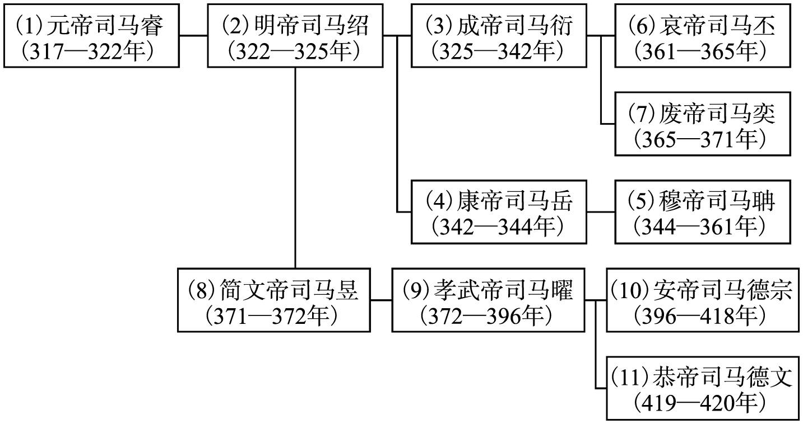 

## 后燕世系表

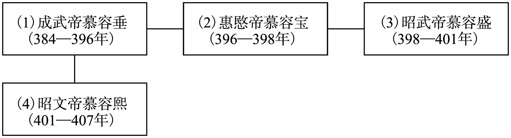 

## 北燕世系表

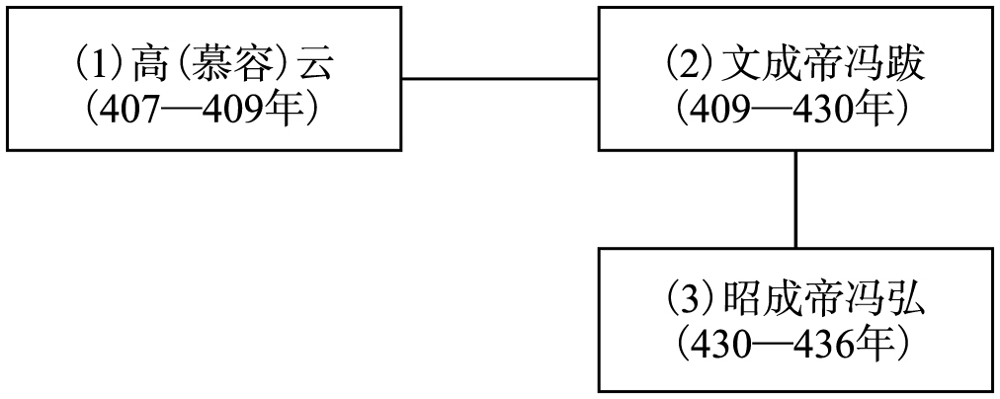 

## 北凉世系表

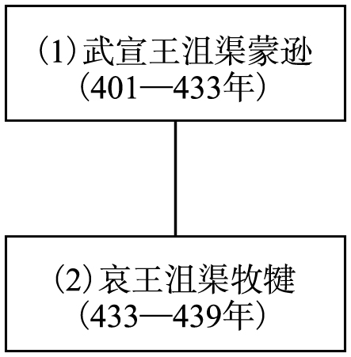 

## 西凉世系表

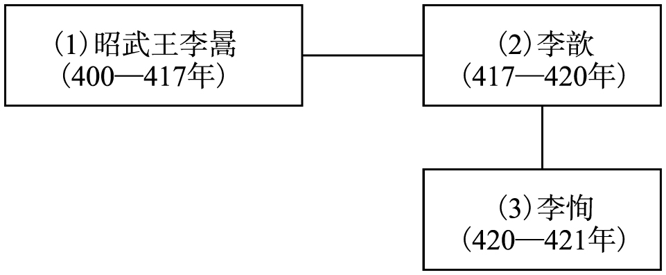 

## 西秦世系表

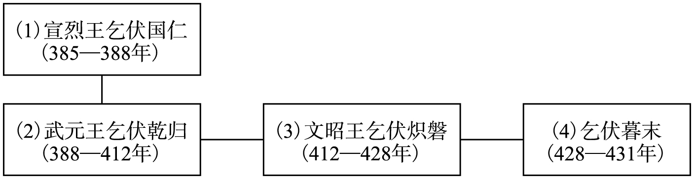 

## 南凉世系表

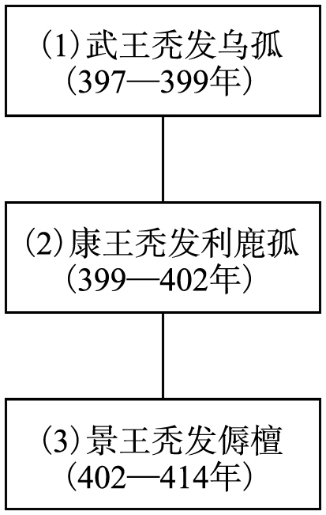 

## 南燕世系表

 

## 夏世系表

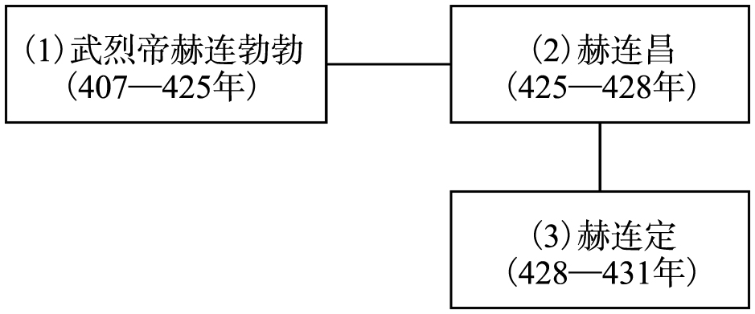 

## 后秦世系表

 

## 南朝宋世系表

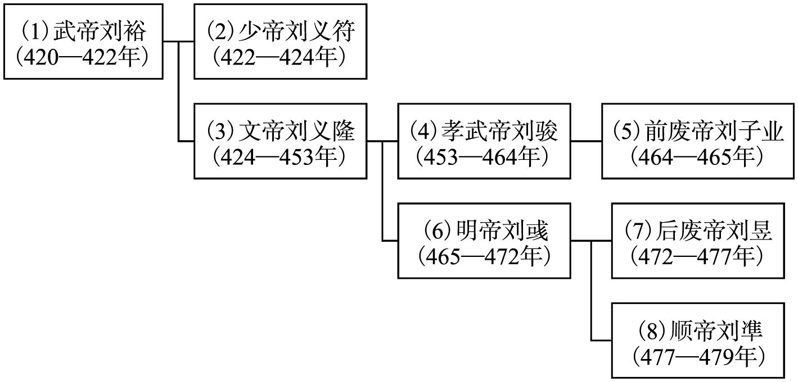 

## 北魏世系表

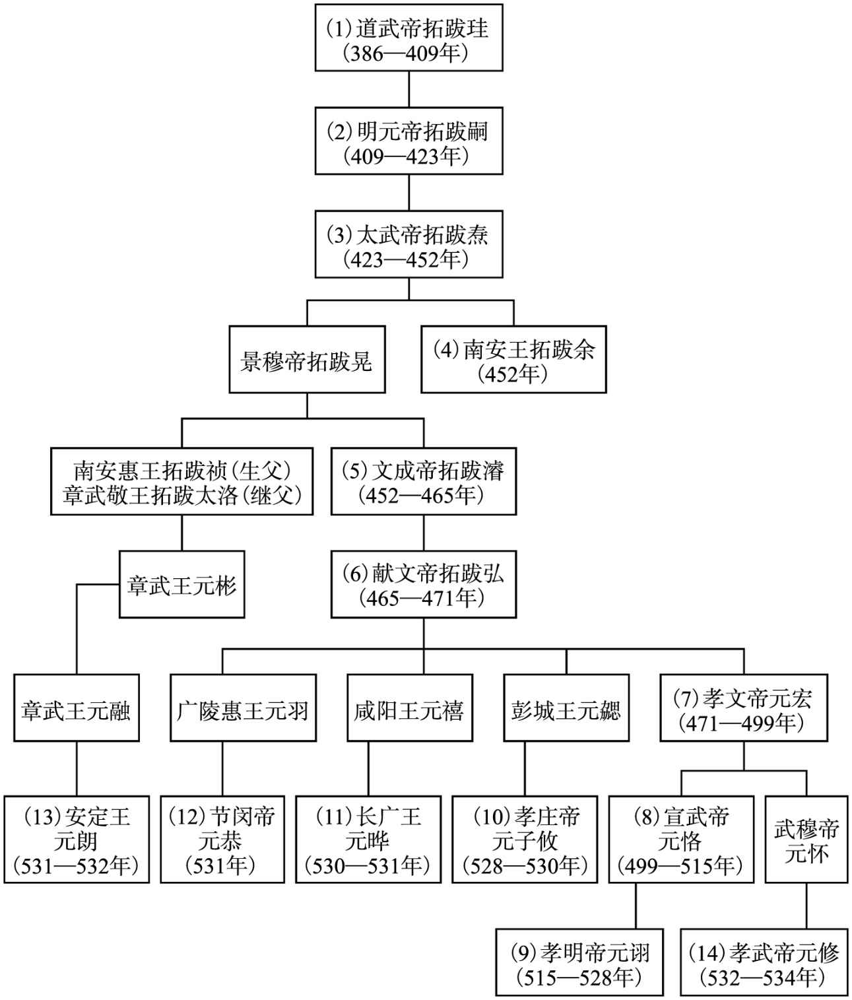 

## 仇池世系表

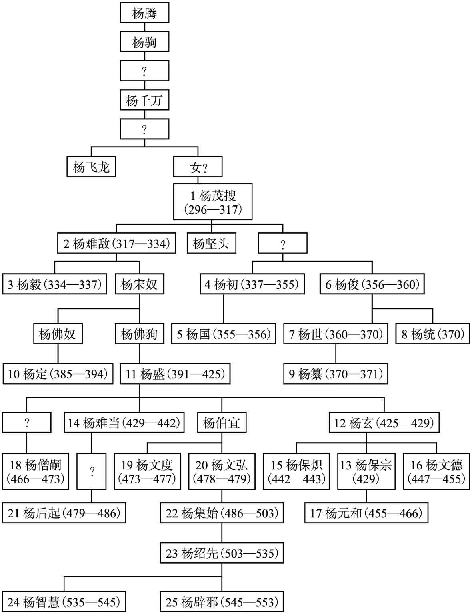

