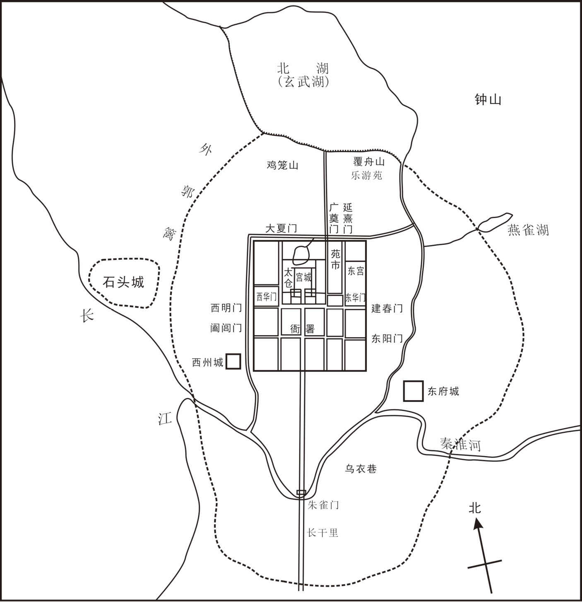
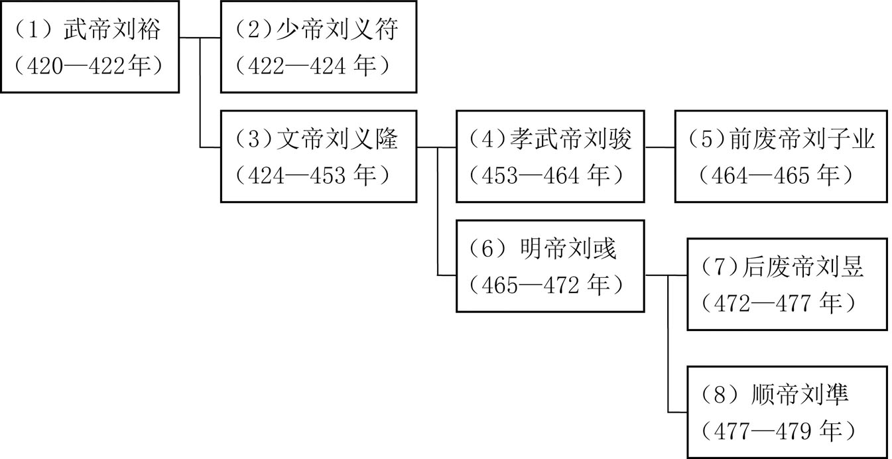
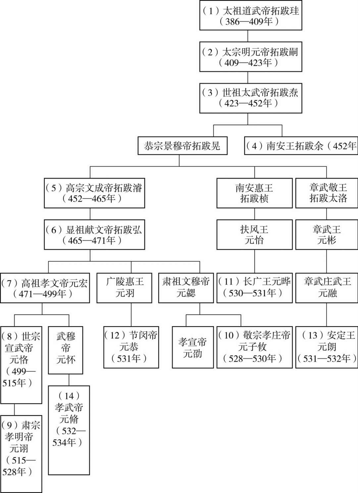

# 目录

刘裕篡晋

元魏寇宋

徐傅废立

彭城王专政

宋文图恢复

宗爱逆节

太子劭弑逆

南郡王之叛

竟陵王之叛

附录： 
南朝宋皇帝世系表

北魏皇帝世系表

返回总目录

# 刘裕篡晋

## 【内容提要】

《刘裕篡晋》叙述了东晋权臣刘裕篡夺东晋政权的历史过程。这一过程历时约二十年，大致分为三个阶段，即刘裕崛起、执政东晋、篡晋建宋。刘裕篡晋标志着东晋十六国时期的结束，中国历史开始进入南北朝时期。

刘裕祖籍彭城绥里（今江苏徐州），曾祖刘混随晋室南迁客居京口（今江苏镇江）。刘裕虽出身官宦世家，但因其父刘翘早逝，家境贫苦，幼年竟沦落到靠卖草鞋为生的地步。但刘裕少时即有大志向，决心成就一番惊天动地的大业。胸怀着雄心壮志，刘裕毅然从军，成了东晋北府军中的一名下级军官。399年，孙恩、卢循在会稽（今浙江绍兴）起兵反抗，东晋朝廷派前将军刘牢之前往镇压，刘裕有幸做了刘牢之的参军，因机智多谋、勇敢善战，多次克敌制胜，屡立战功，升任建武将军、下邳太守、彭城内史等职。桓玄篡晋建楚，激起东晋实力派的坚决反抗。404年，刘裕在京口参加起兵讨伐桓玄的队伍，终于在405年击败桓玄，恢复晋安帝司马德宗的皇位，因功升任侍中、车骑将军、中外诸军事、徐青二州刺史、兖州刺史、录尚书事等职，从此控制了东晋朝政。

刘裕在执政的约二十年时间里，建立了更大的功勋。从409年开始，刘裕率兵南征北讨，先后消灭了国内外的割据势力：攻破南燕，杀南燕王慕容超，收复青州；南下击溃卢循，收复广州；攻克江陵，杀割据者刘毅；力取成都，灭割据者谯纵；直捣襄阳，赶跑割据者司马休之。至415年，南方各大割据势力全部灭亡，南方重归一统；同年，后秦主姚兴病逝，长子姚泓继位，因内部兄弟相残，导致人心离散、关中大乱。419年刘裕率军北伐，攻克长安，灭亡后秦。

令人瞩目的战功，巩固了刘裕在东晋朝廷无比显赫的地位。东晋朝廷先后封其为相国、宋公，加九锡，位在诸侯王之上。东晋安帝义熙十四年（418年）十二月，刘裕令心腹鸩杀晋安帝司马德宗，改立其弟司马德文为傀儡皇帝。420年，刘裕逼迫司马德文禅让，登上皇位，改国号宋，年号永初，是为武帝，东晋灭亡。东晋自司马睿建国以来，历一百零四年，传十一帝。中国历史自此进入了南北朝时期。

刘裕是中国历史上卓越的军事家，精于战术，尤其是水军和战车的运用堪称经典。纵观其军事生涯的多次战争，异常勇猛的战斗精神，以少胜多的战争案例，都在中国军事史上写下了不朽的传奇。刘裕还是中国历史上杰出的政治家，善于运用政治手腕，恰当地笼络和打击对手，最终取得了东晋的政治特权。从政治集团的角度来看，刘裕的兴起是南方寒门地主对门阀士族的胜利。

## 【原文】

**晋安帝隆安三年[1]。初，彭城刘裕生而母死，父翘侨居京口，家贫，将弃之[2]。同郡刘怀敬之母，裕之从母也，生怀敬未期，走往救之，断怀敬乳而乳之[3]。及长，勇健有大志[4]。仅识文字，以卖履为业，好樗蒲，为乡闾所贱[5]。刘牢之击孙恩，引裕参军事[6]。刘裕击孙恩事见《卢循之乱》。**

## 【注文】

[1]晋：朝代名（266—420年），共历一百五十五年，分为西晋与东晋。公元266年初，司马炎取代曹魏政权自立为皇帝，国号“晋”，定都洛阳（今河南洛阳），史称西晋。公元280年，西晋灭吴，结束了三国鼎立的局面，晋武帝司马炎终于统一全国，结束了长达近百年的分裂局面。公元316年，西晋怀、愍（mǐn）二帝被匈奴汉国所俘。次年琅邪（yá）王司马睿在建业（今江苏南京）重建晋朝，史称东晋。　　安帝：即司马德宗（382—419年），东晋第十任皇帝（397—418年在位）。孝武帝司马曜长子，继位后昏庸懦弱，先后由司马道子、司马德文揽权。在位期间，爆发孙恩、卢循起义。公元403年，楚王桓玄自称皇帝，他被废为平固王，移居寻阳（今江西九江），东晋中绝。公元404年，大将刘裕消灭桓玄后安帝复位。义熙十四年（418年）底，被刘裕谋杀，伪称暴病而死，谥号安帝。　　隆安三年：隆安是东晋安帝司马德宗在位期间的第一个年号，即公元397年至公元401年。隆安三年即公元399年。

[2]初：当初。这是古文中追述往事的习惯用语。　　彭城：古郡、国名。西汉宣帝地节元年（前69年）改楚国为彭城郡，治彭城（今江苏徐州），辖境相当于今山东微山，江苏徐州、铜山、沛县东南部、邳州市西北部，以及安徽濉溪东部。南朝宋改为郡，隋初废。　　刘裕（363—422年）：南朝刘宋王朝的开国皇帝（420—422年在位）。字德舆，小字寄奴，汉族，彭城县绥里（今江苏徐州）人。东晋安帝隆安三年（399年），参军起义，对内先后消灭刘毅、卢循、司马休之等分裂割据势力，对外致力于北伐，消灭桓楚、西蜀、南燕、后秦等国。执政期间，抑制豪强兼并，实施土断，整顿吏治，重用寒门，轻徭薄赋，废除苛法，改善了政治和社会状况，对江南经济的发展，汉文化的保护、发扬有重大贡献，被誉为“南朝第一帝”。　　翘（qiào）（生卒年不详）：即刘翘，东晋臣僚。字显宗，刘裕之父，曾任郡功曹，死后葬丹徒（今江苏镇江丹徒镇），后称兴宁陵。南朝宋武帝永初元年（420年），追尊为孝穆皇帝。　　京口：古地名。今江苏镇江。六朝时长江下游军事重镇。原属扬州丹阳郡丹徒县。东汉献帝建安中，孙权治此称“京城”，后迁建业改名“京口”。

[3]刘怀敬（生卒年不详）：东晋、刘宋大臣。彭城（今江苏徐州）人，刘裕从母弟。涩讷无才能，因其母乳养刘裕之恩，累见刘裕优宠，位至会稽太守、尚书，赐金紫光禄大夫。　　从母：指称母亲的姐妹，姨母。　　未期（jī）：不满一年。

[4]勇健：勇敢强健。　　大志：远大的志向或理想。

[5]履（lǚ）：鞋。　　樗（chū）蒲：博戏名。博戏中用于掷采的骰子最初是用樗木制成，故称樗蒲。又因此掷具系五枚一组，所以又叫五木之戏，或简称五木。类似于后代的掷色（shǎi）子。　　乡闾（lǘ）：家乡，故里。　　贱：轻视，鄙视。

[6]刘牢之（？—402年）：东晋北府名将。字道坚，因“淝水之战”立功任龙骧将军，后随谢玄北伐。东晋后期内争激烈，王恭﹑司马元显﹑桓玄等为争权夺利，都想拉拢手握强兵的刘牢之，刘牢之对他们反复无常﹐致使将佐逐渐离散，后兵权为桓玄所夺。东晋安帝元兴元年（402年）讨伐桓玄失败被逼自缢。　　孙恩（？—402年）：东晋五斗米道道士和起义军首领。字灵秀，祖籍琅邪（今山东临沂北），家族世奉五斗米道，是永嘉南渡世族。东晋安帝隆安二年（398年），爆发王恭之乱，孙泰欲乘乱起义被杀，孙恩逃，聚众百余名立志为孙泰复仇。东晋安帝元兴元年（402年）三月，孙恩进攻临海失败，跳海自杀。　　参军事：古代官职名。东汉末曹操以丞相总揽军政，其僚属往往以参丞相军事为名，即参谋军务，简称参军。位任颇重。晋以后，凡诸王及将军开府者皆置参军，始定为正式官名。有单称的，有冠以职名的，如咨议、记室、录事及诸曹参军等，沿至隋唐。明初各王府所属参军府安置，旋改称“长史”。

## 【译文】

东晋安帝隆安三年（399年）。当初，彭城人刘裕刚出生母亲就去世了，父亲刘翘客居于京口，家庭贫困，就想把刘裕丢弃。同郡人刘怀敬的母亲是刘裕的叔母，生下刘怀敬还不满一年，跑去刘翘家把刘裕救了回来，断掉刘怀敬的乳汁来喂养刘裕。刘裕长大后，异常勇敢且有大志向，但仅仅能识文断字，依靠卖鞋来维持生计，而且又爱好樗蒲的博戏，被同乡人所轻视。东晋大将刘牢之征讨孙恩时，征召刘裕做了他的参军事。刘裕击孙恩事见《卢循之乱》。

## 【原文】

**元兴三年[1]。桓玄之乱，刘裕入朝[2]。玄谓其司徒王谧曰：“裕风骨不常，盖人杰也[3]。”玄后刘氏有智鉴，谓玄曰：“刘裕龙行虎步，视瞻不凡，恐终不为人下，不如早除之[4]。”玄曰：“我方平荡中原，非裕莫可用者，俟关、河平定，然后别议耳[5]。”**

## 【注文】

[1]元兴三年：元兴是东晋安帝司马德宗在位期间的第二个年号，即公元402年至404年。元兴三年即公元404年。

[2]桓玄（369—404年）：东晋权臣。字敬道，一名灵宝，谯国龙亢（今安徽怀远西北）人，东晋大司马桓温少子，袭南郡公之爵，因其父晚年有篡位之嫌，不受朝廷重用。东晋安帝隆安二年（398年），因平定司马休之、王愉之功升任江州刺史。后消灭劲敌殷仲堪、杨佺期，兼任荆、江二州刺史，尽占长江中游地区。东晋安帝元兴元年（402年），杀司马元显，自任太尉、扬州牧，控制朝政。次年，自任大将军，加授相国，封楚王，加九锡，准备篡位。十二月称帝，建国号楚，改元永始，后被刘裕所灭。　　入朝：指属国、外国使臣或地方官员谒（yè）见天子。

[3]司徒：古代官职名。西周为三公（司徒、司马、司空）之一，以司徒为地官之长，西汉哀帝元寿二年（前1年），改丞相为大司徒。西汉末，以大司马、大司徒、大司空为三公。东汉光武帝建武二十七年（51年），省大司马，又置太尉，而与司徒、司空并为三公。东汉献帝建安十三年（208年）罢三公，置丞相、御史大夫。三国魏文帝黄初元年（220年）复置司徒，魏晋之后所授多系虚衔，以示尊崇，南北朝时又主持“九品中正制”。　　王谧（mì）（360—408年）：东晋大臣。字稚远，琅邪临沂（今山东临沂）人，东晋宰相王导之孙。少有美誉，与桓胤、王绥齐名。初拜秘书郎，袭父爵，迁秘书丞，历中军长史、黄门郎、侍中，累至司徒。桓玄篡位后封其武昌县开国公。刘裕平定桓玄之乱后，为报答王谧的识人之恩，任命其为扬州刺史，录尚书事。著有文集十卷。　　风骨：风度，气质。　　不常：异常，反常。

[4]玄后刘氏（生卒年不详）：东晋桓楚皇帝桓玄的皇后。名不详，东晋名士刘乔的曾孙女，尚书令刘耽之女。公元404年正月，桓玄废黜晋安帝，自称大楚皇帝，以妻子刘氏为皇后。刘皇后认为北府军的将领刘裕是个威胁，建议桓玄把他除掉，桓玄没有听从。最后就是刘裕起兵反对桓玄，桓玄兵败被杀，晋朝光复，刘皇后不知所终。　　智鉴：智慧和鉴识。　　龙行虎步：形容人的仪态威严庄重，气度不凡。多形容帝王和将军。　　视瞻：形容眼睛顾盼的神态。

[5]方：正在，正当。　　平荡：亦作“平汤”，扫荡平定。　　中原：狭义“中原”指河南省一带，广义“中原”则是以河南四大古都（洛阳、开封、安阳、郑州）为中心以及河南六大历史文化名城（洛阳、开封、郑州、南阳、商丘、濮阳）为中心的黄河中下游一带。中原是中国历史上绝大部分时期的政治、经济和文化中心所在地，也是中华文明的重要发源地。　　俟（sì）：等，等到。　　关、河：关中及黄河，泛指北方。　　别议：再议。

## 【译文】

东晋安帝元兴三年（404年）。桓玄执政后，刘裕入朝觐见桓玄。桓玄对他的司徒王谧说：“刘裕气度不凡，应该是人中豪杰。”桓玄的皇后刘氏，有智慧，善鉴识人，她对桓玄说：“刘裕气宇轩昂，眼神顾盼非同凡人，恐怕最终不肯居于您的手下，还不如趁早杀掉他。”桓玄说：“我要平定中原地区，正需要刘裕这样的人。等到关中及黄河流域平定之后，我们再讨论对他的处置吧。”

## 【原文】

**刘裕与何无忌密谋兴复，刘迈弟毅亦与无忌谋讨玄，于是相与合谋起兵[1]。刘裕克京口，玄惧，浮江南走[2]。裕入建康，王谧推裕为使持节、都督扬徐兖豫青冀幽并八州诸军事、徐州刺史[3]。玄至寻阳，逼帝西上，刘毅等追之[4]。玄挟帝至江陵，毅等自寻阳西上，与玄遇，玄众大溃，挟帝西走，冯迁击斩之，乘舆返正于江陵[5]。桓振袭陷江陵[6]。**

## 【注文】

[1]何无忌（？—410年）：东晋将领。东海郯（tán）县（今山东郯城城北）人。东晋名将刘牢之之甥，酷似其舅。曾与刘裕等起兵讨伐篡位的桓玄，后官至江州刺史，在卢循之乱中与徐道覆作战时战死。　　兴复：复兴，恢复。　　刘迈（？—404年）：东晋臣僚。彭城沛（今江苏沛县）人，字伯群。少有才干，历任殷仲堪中兵参军、桓玄刑狱参军、竟陵太守等职，因参与刘裕等讨伐桓玄时做内应，被桓玄所杀。　　毅：即刘毅（？—412年），东晋末将领。字希乐，小字盘龙，沛国沛县（今属江苏沛县）人。刚强勇猛，深沉果断，曾与刘裕和何无忌等一同举义兵消灭桓玄，后又参与讨伐卢循的战事。在东晋官至卫将军、荆州刺史。因不服刘裕，被刘裕所攻，兵败自缢而亡。　　相与：共同，一道。　　合谋：共同谋议。

[2]京口：古地名。今江苏镇江，六朝时长江下游军事重镇。原属扬州丹阳郡丹徒县。东汉献帝建安中，孙权治此称“京城”，后迁建业改名“京口”。　　浮江：指乘船。浮，漂在水面上。　　走：逃跑。

[3]建康：六朝古都。南京古称，曾做过三国吴、东晋、南朝宋、齐、梁、陈六朝的都城，是六朝时期政治、经济、文化的中心，其时的建康是世界上第一个人口超过百万的大城市。以建康为中心的南朝文化，与西方的古罗马被称为人类古典文明的两大中心，在人类历史上产生过极其深远的影响。　　使持节：魏、晋时直接代表皇帝行使地方军政权力的职官名。“节”为古代常用信物，皇帝所遣使者规定持旌（jīng）节，使命完成后归还。东汉后期，根据“节”所加方式不同而分为“使持节”“持节”“假节”三种。到晋朝时，则明确规定“使持节”最为尊贵，可以杀郡守级别的官员；其次为“持节”，能杀无官位人，若战争时期，得与使持节同；然后是“假节”，只可杀违反军令的人。　　都督扬徐兖豫青冀幽并八州诸军事：古代官职名。“都督某某地区诸军事”是魏晋时期的地方军事区划和军事组织制度。创立于东汉，发展完善于两晋时期，成为曹魏、两晋常设的地方军事区划制度，其数量逐步增加，职权亦日趋扩张。　　扬：即扬州，古州名。古九州之一，汉武帝所置十三刺史部之一。东汉治历阳（今安徽和县），后移治寿春（今安徽寿县）、合肥（今安徽合肥西北）。三国魏、吴各置扬州，魏治寿春，吴治建业（今江苏南京）。西晋灭吴后复合，治建邺（建业改名，后又改建康）。其后辖境渐小。　　徐：即徐州，古州名。古九州之一，汉武帝所置十三刺史部之一，辖境相当于今江苏长江以北和山东东南部地区。东汉治郯（tán）（今山东郯城），三国魏移治彭城（今江苏徐州）。东晋失淮北，治所南迁，后得淮北，东晋安帝义熙七年（411年）乃分淮北为北徐州，治彭城，淮南仍为徐州，治京口（今江苏镇江）。南朝宋武帝永初二年（421年）又改徐州为南徐州，北徐州为徐州。东晋、北朝以后辖境缩小。　　兖（yǎn）：即兖州，古州名。原是古九州之一，汉武帝所置十三刺史部之一，辖境相当于今山东省西南部：北至茌平、莱芜，东至沂河流域，东南以莒县、平邑并泗水东岸为界，及河南东部的南乐、濮阳、延津、开封、尉氏以东，扶沟、淮阳、鹿邑等地。东汉治昌邑（今山东金乡西北），其后屡有迁移，辖境逐渐缩小。南朝宋移治瑕丘城（今山东兖州）。东晋时于京口（今江苏镇江）侨置兖州。东晋安帝义熙六年（410年）刘裕灭南燕，复兖州旧地，因南方已有兖州，改旧兖州为北兖州。治滑台（今河南滑县），辖境相当于今山东泰山以南汶、泗流域及鲁西平原、河南滑台、延津、杞县以东地区。南朝宋初复名兖州。　　豫：即豫州，古州名。古九州之一，汉武帝所置十三刺史部之一，辖境相当于今淮河以北伏牛山以东豫东、皖北地。东汉治谯（今安徽亳州市），三国魏以后屡有移徙，辖境也伸缩不常。东晋、南朝时治所最北在悬瓠城（今河南汝南），最南在邾城（今湖北黄冈西北），辖境最大时相当于今江苏、安徽长江以西，安徽望江以北的淮河南北地区。　　青：即青州，古州名。原是古九州之一，汉武帝所置十三刺史部之一，辖境相当于今山东德州、齐河以东，马颊河以南，济南、临朐、安丘、高密、莱阳、栖霞、乳山等市县以北、以东和河北吴桥等地。东汉治临菑（今山东淄博市临淄区北），东晋移治东阳城（北齐置益都县，今山东青州市）。东晋初于广陵（今江苏扬州西北）置侨置州，南朝宋初并入南兖州。　　冀：即冀州，古州名。古九州之一，汉武帝十三刺史部之一，辖境相当于今河北中南部、山东西端及河南北端。东汉治高邑（今河北柏乡北），末年移治邺县（今河北临漳西南）。三国魏晋移治信都（今河北冀州），辖境渐小。东晋时曾侨置，治所不详。　　幽：即幽州，古州名。古九州之一，汉武帝所置十三刺史部之一，东汉治蓟县（今北京西南），辖境相当于今北京市、河北北部、山西小部分、辽宁大部分及朝鲜大同江流域。魏、晋以后渐缩小。东晋时曾于三阿侨置幽州。　　并（bīng）：即并州，古州名。古九州之一，汉武帝所置十三刺史部之一，辖境相当于今山西大部和内蒙古、河北的一部分。东汉治晋阳（隋改太原，今山西太原西南），辖境扩大，包括今陕西北部与河套地区。三国后渐小。东晋曾侨置，治所不详。　　刺史：古代官职名。西汉武帝分全国为十三部（州），部置刺史，以六条察问郡县，本为监察官性质，其官阶低于郡守。西汉成帝时刺史为州牧。西汉哀帝时复称刺史，东汉灵帝时再改称州牧，位居郡守之上，掌握一州的军政大权。三国至南北朝各州也多置刺史，一般以都督兼任，并加将军之号，权力很大。

[4]寻阳：古郡名。西晋惠帝永兴元年（304年），分庐江、武昌二郡置，治寻阳（今江西九江市西南），隶江州。南朝梁武帝太清年间（547—549年），郡治迁湓口城（今江西省九江市区），南朝梁敬帝太平二年（557年），分江州为二，属西江州，南朝陈文帝天嘉六年（565年）复江州。隋文帝开皇九年（589年），废寻阳郡。

[5]江陵：古郡名。荆州治所，今湖北荆州市荆州区。　　挟（xié）：倚仗势力或抓住人的弱点强迫人服从，挟持。　　帝：指晋安帝司马德宗。见前“安帝”注。　　冯迁（生卒年不详）：东晋将领。汉嘉（今四川芦山）人，曾任益州督护，桓玄即死于此人之手。　　乘舆（yú）：指皇帝的车驾，代指皇帝。　　返正：指帝王复位。

[6]桓振（？—405年）：东晋将领。字道全，谯国龙亢（今安徽怀远龙亢镇）人，东晋大将军桓豁之孙，豫州刺史桓石虔之子，历任扬武将军、淮南太守、江夏相，因凶横被黜免。桓玄败死后，桓振割据江陵，领导桓玄余部继续对抗东晋朝廷，兵败被杀。

## 【译文】

刘裕与何无忌密谋恢复晋室，刘迈的弟弟刘毅也与何无忌密谋讨伐桓玄，于是他们几个互相通谋起兵反抗桓玄。刘裕攻克京口后，桓玄恐惧，渡江向南而逃。刘裕进入都城建康，王谧推举刘裕为使持节，都督扬、徐、兖、豫、青、冀、幽、并八州诸军事，徐州刺史。桓玄逃到寻阳后，胁迫晋安帝沿长江西上，刘毅等人从后面追击。桓玄又挟持着安帝跑到江陵，刘毅等人又从寻阳沿江西上继续追击，在江陵与桓玄军遭遇，桓玄军溃，只好继续挟持安帝向西逃跑，在逃跑途中被冯迁斩杀，冯迁护送安帝到江陵重新复位。但江陵不久就被桓振所攻陷。

## 【原文】

**义熙元年春正月，刘毅等击破桓振军，迎帝于江陵，何无忌奉帝东还[1]。三月，帝至建康，以刘裕为侍中、车骑将军、都督中外诸军事[2]。裕固让不受，屡请归藩，诏百僚敦劝，帝幸其第[3]。裕复诣阙陈请，乃听归藩[4]。并见《伪楚之乱》。**

## 【注文】

[1]义熙元年：义熙是东晋安帝司马德宗在位期间的第四个年号，即公元405年至公元418年。义熙元年即公元405年。　　迎：迎接。

[2]侍中：古代官职名。秦始置，为丞相属官。两汉沿置，无定员。因为侍从皇帝左右出入宫廷，应对顾问，地位逐渐提高，常代表皇帝与公卿辩论朝政，权势时或超过宰相。晋时侍中属门下省。南朝时始掌机要，北周仅为加官，隋改名纳言、侍内。唐代复称侍中，负责传达皇帝命令，为门下省的正式长官。北宋前期为二品寄禄官，无职事，只做兼管，南宋废除。　　车骑将军：古代官职名。汉代仅次于大将军、骠骑将军，金印紫绶，地位相当于上卿，或比三公。典京师兵卫，掌宫卫。第二品，是战车部队的统帅。　　都督中外诸军事：古代官名。始于曹魏，节制宫城内外，总领京师的中央禁军。曹魏时为实职武官。从西晋开始，其性质逐渐向虚衔、荣誉衔转化。东晋以后，京师中外诸军力量的削弱使其逐渐演化为虚职。

[3]固让：再三辞让。　　归藩：指回到封地。　　诏：中国古代帝王诏令文书的文体名称之一。战国以前，上下相告常用“诏”字；秦始皇统一六国后，规定“诏”字为皇帝发布命令的专用词，他人不得使用，诏书亦成为皇帝布告臣民的专用文书。汉承秦制，凡皇帝即位或去世，或颁布其他重要命令，都以诏书布告天下。魏晋以后直到唐初，诏书一直是皇帝发布政令的主要方式。　　敦劝：敦促劝勉。　　幸：指封建帝王到达某地。　　第：府第，府宅。

[4]诣（yì）阙（quē）：前往皇宫外拜见皇帝。　　陈请：陈述理由以请求。　　听：听凭，任凭。

## 【译文】

东晋安帝义熙元年（405年）春季正月，刘毅等人击败了桓振军，又迎接安帝回到江陵，并派何无忌护送安帝归京。三月，安帝到达京城建康，任命刘裕为侍中、车骑将军、都督中外诸军事。刘裕坚决推辞不受，多次请求回到自己的封地，安帝下诏让文武百官敦促劝勉，而且安帝也亲自驾临刘裕的宅第劝说。刘裕再次到皇宫面见安帝，陈述了不接受封职的理由，于是，安帝同意了他回到封地的决定。此事也载于《伪楚之乱》。

## 【原文】

**夏四月，刘裕旋镇京口，改授都督荆司等十六州诸军事，加领兖州刺史[1]。**

## 【注文】

[1]旋：回，归。　　荆：即荆州，古州名。古九州之一，汉武帝所置十三刺史部之一，辖境相当于今湖北、湖南两省及河南、贵州、广东、广西的一部分。东汉治汉寿（今湖南常德东北），其后屡迁，东晋时定治江陵（今湖北荆州市荆州区），晋以后辖境渐小。它是东晋、南朝时长江中游的政治军事重镇，其重要性仅次于首都所在地扬州。　　司：即司州，古州名。三国魏置司隶校尉部，通称为司州，西晋成为正式名称，治所洛阳（今河南洛阳东），辖今陕西中部、山西西南部及河南西部。西晋、北朝以京师周围地区为司州，东晋曾在徐县（今江苏泗洪南）、合肥（今安徽合肥西）、襄阳（今湖北襄阳）侨置司州。

## 【译文】

夏季四月，刘裕回到京口镇守，东晋朝廷改授他为都督荆、司等十六州诸军事，兼任兖州刺史。

## 【原文】

**六月，刘裕遣使求和于秦，且求南乡等诸郡，秦王兴许之[1]。群臣咸以为不可[2]。兴曰：“天下之善一也。刘裕拔起细微，能讨诛桓玄，兴复晋室，内厘庶政，外修封疆，吾何惜数郡，不以成其美乎[3]？”遂割南乡、顺阳、新野、舞阴等十二郡归于晋[4]。**

## 【注文】

[1]秦：即后秦（384—417年）：十六国时期的政权之一。羌族姚苌（cháng）所建，都长安（今陕西西安市西北），极盛时辖有今陕西、甘肃、宁夏及山西的一部分，占据关中绝大多数的重要政治、经济城镇和关东大片领土，威服陇右、河西诸国。历三主（姚苌、姚兴、姚泓）。　　南乡：古郡名。治南乡，今河南淅川西南。　　兴：即后秦王姚兴（366—416年），十六国时期后秦第二任君主（394—416年）。后秦武昭帝姚苌长子，在位期间，勤于政事，治国安民，重视发展经济，兴修水利，关心农事。加强文化建设，尊崇佛教，广建寺院，翻译佛经，同时提倡儒学，发展儒家教育。

[2]咸：副词。都，全。

[3]拔起：崛起。　　细微：微小，卑贱。　　厘：治理，处理。　　庶政：各种政务。　　修：整治，治理。　　封疆：边疆。

[4]顺阳：古郡名。治南乡，今河南淅川南。　　新野：古郡名。治棘（jí）阳，今河南新野境内。　　舞阴：古郡名。今河南泌（bì）阳西北。

## 【译文】

六月，刘裕派遣使节向后秦求和，并且请求后秦归还南乡等几个郡。后秦王姚兴答应了他。后秦的文武百官都认为不可以割地。姚兴说：“天下的善恶标准都是一样的。刘裕从低贱的社会下层能够脱颖而出，能讨平桓玄，兴复东晋朝廷，对内处理好百姓的事务，对外处理好疆域问题，我又何必珍惜那区区数郡，不成全他的善政呢？”于是，就把南乡、顺阳、新野、舞阴等十二郡都归还给了东晋。

## 【原文】

**二年冬十月，尚书论建义功，奏封刘裕豫章郡公[1]。**

## 【注文】

[1]尚书：古代官职名。战国始置，或称掌书。秦代为少府属官，掌殿内文书，地位很低。汉武帝时设尚书四人，分曹治事，因侍从于皇帝身边，地位渐重。东汉时正式成为协助皇帝处理政务的官员。魏晋以后事务繁杂。隋代设尚书省，下分六部，各部长官均称尚书，职权更重。　　豫章：古郡名。西汉高帝五年（前202年）始设，治南昌（今江西南昌），西汉武帝元狩二年（前121年）以后地域范围与今江西省大致相当。南朝陈时包有今江西锦江流域、南昌、樟树等地。

## 【译文】

东晋安帝义熙二年（406年）冬季十月，东晋尚书评定平叛勤王之功，奏请册封刘裕为豫章郡公。

## 【原文】

**四年春正月，刘毅等不欲刘裕入辅政，议以中领军谢混为扬州刺史[1]；或欲令裕于丹徒领扬州，以内事付孟昶[2]。遣尚书右丞皮沈以二议谘裕，沈先见裕记室录事参军刘穆之，具道朝议[3]。穆之伪起如厕，密疏白裕曰：“皮沈之言不可从。”裕既见沈，且令出外，呼穆之问之。穆之曰：“晋朝失政日久，天命已移。公兴复皇祚，勋高位重，今日形势，岂得居谦，遂为守藩之将耶？刘、孟诸公与公俱起布衣，共立大义以取富贵，事有前后，故一时相推，非为委体心服，宿定臣主之分也[4]。力敌势均，终相吞噬[5]。扬州根本所系，不可假人[6]。前者以授王谧，事出权道，今若复以他授，便应受制于人[7]。一失权柄，无由可得，将来之危，难可熟念[8]。今朝议如此，宜相酬答，必云在我，措辞又难，唯应云‘神州治本，宰辅崇要，此事既大，非可悬论，便暂入朝，共尽同异’[9]。公至京邑，彼必不敢越公更授余人明矣。”裕从之。朝廷乃征裕为侍中、车骑将军、开府仪同三司、扬州刺史、录尚书事，徐兖二州刺史如故[10]。裕表解兖州，以诸葛长民为青州刺史，镇丹徒，刘道怜为并州刺史，戍石头[11]。**

## 【注文】

[1]入：入朝，进入朝廷中央。　　中领军：古代武官名。汉末曹操为丞相时改领军置，为相府属官。由亲信将领担任，掌管禁军、主持选拔武官、监督管制诸武将。中领军可以开府，下设长史、司马。魏晋时有领军将军，均统率禁军。南朝沿设，北朝略同。与护军将军或中护军同掌中央军队，为重要军事长官之一。　　谢混（？—412年）：东晋大臣、文学家。字叔源，小字益寿，陈郡阳夏（今河南太康）人，太傅谢安之孙，东晋孝武帝之婿。历任中书令、中领军、尚书左仆射。支持北府兵刘毅，对抗刘裕，后被刘裕抓捕入狱赐死。谢混工于诗，钟嵘《诗品》评价其诗“务其清浅，殊得风流媚趣”。

[2]丹徒：古县名。位于今江苏镇江市丹徒区。　　孟昶（chǎng）（？—410年）：东晋大臣。字彦达，平昌安丘（今山东潍坊）人，曾任吏部尚书，与刘裕一同起兵讨伐桓玄，后官至尚书左仆射。卢循之乱时因奉帝北渡长江的建议不被刘裕采纳而自杀。

[3]尚书右丞：古代官职名。东汉始置，为尚书台佐贰官，居尚书左丞下，掌钱谷等事，秩均四百石。历代沿置，为尚书令及仆射的属官，品级逐渐提高，隋从四品，唐初至正四品下。　　皮沈（生卒年不详）：东晋臣僚。任尚书右丞，曾参与东晋朝廷机密之事。　　记室：古代官职名。汉置，诸王、三公及大将军都设记室令史，掌章表书记文檄。　　录事：古代职官名。三国诸将军府始置。晋代骠骑将军及诸大将军不开府办事，属官有录事，掌总录文簿。后代刺史领军而开府者亦置，职任重要，省称“录事”。　　刘穆之（？—417年）：东晋大臣。字道和，小字道民，东莞莒（今山东莒县）人，世居京口（今江苏镇江），跟随刘裕南征北战，为其得力干将。东晋时官至左仆射，赠侍中、司徒、南昌县侯。南朝宋时追封南康郡公，谥文宣。

[4]委体：归顺，臣服。　　宿：通“夙”，平素，平时。

[5]吞噬（shì）：吞并，兼并。

[6]假（jiǎ）人：授予别人。

[7]权道：变通之道；临时措施，权宜之计。

[8]熟念：周密考虑，深思。

[9]悬论：空谈，高谈阔论。

[10]开府仪同三司：古代官职名，三司即三公。即开建府署，辟置僚属援引三公之例。东汉初，以司空﹑司徒、太尉（大司马）为三公，因均冠“司”字，故又称三司，东汉始有“同三司”“仪同三司”之称，三国魏时始设置“开府仪同三司”一职，两晋南北朝多沿用。隋唐以后成为文散官之高级阶位，元代正一品。　　录尚书事：古代官职名。初称领尚书事，西汉置。东汉时始有录尚书事之名，位在三公以上。三国魏晋南北朝时，凡掌重权的大臣常加此名号。南齐始有单拜此职者。隋以后废。

[11]表解：上表请求解除。　　诸葛长民（？—413年）：东晋将领。琅琊阳都（今山东沂南南）人。曾与刘裕举兵讨伐篡位的桓玄，后来又在卢循之乱中参与防卫京师建康。诸葛长民先后迁任青州和豫州刺史，但后来却意图谋反，被刘裕派人所杀。工于书法，尤其是行书和草书。　　刘道怜（368—422年）：东晋、南朝宋大臣。彭城绥里（今江苏徐州）人，刘裕之弟。初为国子监学生，后任徐州刺史谢琰从事史，东晋安帝义熙年间任堂邑太守、荆州刺史。刘裕受禅，封其为长沙王，谥曰“景”。　　石头：古地名。今南京西北清凉山后，地势险峻，为魏晋南北朝时期的重要军事重镇。

## 【译文】

东晋安帝义熙四年（408年）春季正月，刘毅等人不希望刘裕入朝辅政，因此商议让中领军谢混任扬州刺史；也有人提议让刘裕在丹徒兼管扬州，把中央的政事交给孟昶管理。朝廷专门派尚书右丞皮沈前去，拿着这两种方案向刘裕征求意见，皮沈首先见到了刘裕的记室录事参军刘穆之，把朝廷商议的情况全告诉了他。刘穆之假装上厕所，秘密写信告诉刘裕说：“皮沈的话不要听从。”刘裕见过皮沈后，让他暂时回避一下，请刘穆之商量此事。刘穆之说：“东晋朝廷权柄丢失了很久，上天的福运已经转移了。您兴复晋朝，勋高位重，但现在的情势，您怎能一味自谦，而去做一个镇守藩地的将军呢？刘毅、孟昶等人，同您一样起家于平民百姓，共同起义获得富贵，起事时有先后，所以他们一起推举您做了盟主，但他们并不是彻底地服从于您，只是平时就有君臣之分；现在他们与您势均力敌，最终是要相互兼并的。扬州是起决定性作用的关键地区，千万不能让朝廷授予别人来掌管。之前授予王谧，是权宜之计；如果现在再授予了别人，那您就该受制于人了。一旦权柄丢失，就没有夺回的理由和机会了，将来会遇到怎样的危机，我们现在还无法考虑周全。如今朝廷商议结果是这样的，您也应该表一下态，如果您直接说要任扬州刺史，又很难措词。所以，您可以说‘治理国家的根本，是朝廷中宰辅和地方要员的任免，这是大事情，千万不能空谈，我抽时间就会入朝，再与诸位王公探讨一下人选’。您到达京城后，他们一定不敢越过您，把扬州刺史之职授予别人，这是明摆着的。”刘裕听从了刘穆之的意见。于是，东晋朝廷征召刘裕任侍中、车骑将军、开府仪同三司、扬州刺史、录尚书事等职，仍然兼任徐、兖二州刺史。刘裕上奏章请求解除兖州刺史之职，同时，请求任命诸葛长民为青州刺史，镇守丹徒，刘道怜为并州刺史，镇守石头城。

## 【原文】

**五年春三月，刘裕伐南燕[1]。事见《刘裕平南燕》。**

## 【注文】

[1]南燕（398—410年）：十六国时期的政权之一。鲜卑慕容德所建，都广固（今山东青州西北）。397年，北魏攻后燕，慕容德从邺城（今河北临漳）逃至滑台（今河南滑县东）后，建立南燕。北魏攻占滑台，慕容德迁都广固。慕容德病死后，其侄慕容超继位。慕容超喜好游猎，委政宠幸，诛杀功臣，赋役繁多。410年，慕容超被东晋大将刘裕俘斩，南燕灭亡。

## 【译文】

东晋安帝义熙五年（409年）春季三月，刘裕率军北伐南燕。事见《刘裕平南燕》。

## 【原文】

**初，苻氏之败也，王猛之孙镇恶来奔，以为临沣令[1]。镇恶有谋略，善果断，喜论军国大事。或荐镇恶于刘裕，裕与语，悦之，因留宿。明旦，谓参佐曰：“吾闻将门有将，镇恶信然[2]。”即以为中军参军[3]。秋九月，加刘裕太尉，裕固辞[4]。**

## 【注文】

[1]王猛（325—375年）：前秦著名政治家、军事家。字景略，东晋北海郡剧县（今山东寿光南）人，后移家魏郡。任前秦丞相、大将军，辅佐苻坚扫平群雄，统一北方，被称作“功盖诸葛第一人”。　　镇恶：即王镇恶（373—418年），东晋名将。北海剧县（今山东寿光南）人，前秦丞相王猛之孙，后随叔父归晋。好读兵书，长于谋略，为东晋录尚书事、中军将军刘裕所赏识。曾任振武将军、龙骧将军，随刘裕袭南征北，立下显赫的战功，为击败后秦作出了重要贡献，进号征虏将军。418年因内部不和被中兵参军沈田子所杀。　　临沣（fēng）：古县名。时属天门郡，今湖南临沣。　　令：即县令，古代官职名。战国末年，郡县两级制形成，县属于郡，县的行政长官则成为郡守的下属。秦、汉政府规定，人口万户以上的县，县官称县令；万户以下的称县长。隋唐以后，县官一律称令。

[2]参佐：部下，僚属。　　信然：确实如此。

[3]中军：古代官职名。汉、晋将军中有此名，或主军事，或总宿卫，不常置。南北朝亦有此官号，用以安置权臣。

[4]太尉：古代官职名。战国始置，秦、西汉为辅佐皇帝实行统治的最高武官，与丞相、御史大夫并称三公。西汉武帝时改称大司马。东汉复称太尉，与司徒、司空并称三公。历代多沿置，但一般为加官，无实权。

## 【译文】

当初，前秦苻氏政权衰败之时，王猛的孙子王镇恶前来投奔了东晋，东晋任命他为临沣令。王镇恶深谋远虑，善于果断行事，喜欢谈论军国大事。有人把王镇恶推荐给刘裕，刘裕和他交谈后非常喜欢，于是把他留在家里住下。第二天早上，刘裕对部下说：“我听说名将之门会出大将，王镇恶就是一个例子。”于是立即任命他为中军参军。秋季九月，东晋朝廷加封刘裕为太尉，刘裕坚决推辞。

## 【原文】

**六年六月，以刘裕为太尉、中书监，加黄钺[1]。裕受黄钺，余固辞。司马国璠及弟叔璠、叔道奔秦[2]。秦王兴曰：“刘裕方诛桓玄，辅晋室，卿何为来[3]？”对曰：“裕削弱王室，臣宗族有自修立，裕辄除之[4]。方为国患，甚于桓玄耳。”**

## 【注文】

[1]中书监：古代官职名。魏晋时与中书令职务相当而位次略高，同掌机要，为事实上的宰相。因地位重要，接近皇帝，有凤凰池之称。隋唐以后，只存中书令，不再设监。　　黄钺（yuè）：以黄金为饰的斧。古代为帝王所专用，或特赐给专主征伐的重臣。

[2]司马国璠（fán）、叔璠、叔道（生卒年均不详）：即司马国璠、司马叔璠、司马叔道，东晋宗室。分别为河间王司马昙之和章武王司马范之之子，刘裕专权清除异己时出逃后秦，司马国璠任建义将军、扬州刺史，封姚成王，司马叔道任平南将军、兖州刺史，刘裕灭后秦后又逃奔夏国，夏灭亡后归北魏，司马国璠封淮南公。　　秦：此指后秦。见前“后秦”注。

[3]卿：古代用为第二人称，表尊敬或爱意。

[4]修立：积极上进之意。

## 【译文】

东晋安帝义熙六年（410年）六月，东晋朝廷任命刘裕为太尉、中书监，加黄钺。刘裕接受了黄钺，其他的都坚决推辞掉。东晋皇室成员司马国璠及其弟弟司马叔璠、司马叔道一起逃奔后秦。后秦王姚兴问：“刘裕刚刚诛杀了桓玄，专心辅佐晋朝，你们为什么要逃到这里呢？”司马国璠等回答说：“刘裕正要削弱王室，司马氏宗族中有积极上进者，都被刘裕除掉了。他正是晋国的祸根，甚至比桓玄还厉害啊。”

## 【原文】

**七年春正月己未，刘裕还建康。三月，刘裕始受太尉、中书监。**

## 【译文】

东晋安帝义熙七年（411年）春季正月己未（十二日），刘裕回到建康。三月，刘裕接受了太尉、中书监的职务。

## 【原文】

**八年夏四月，以后将军豫州刺史刘毅为卫将军、都督荆宁秦雍四州诸军事、荆州刺史[1]。毅谓左卫将军刘敬宣曰：“吾忝西任，欲屈卿为长史南蛮，岂有见辅意乎[2]？”敬宣惧，以告太尉裕。裕笑曰：“但令老兄平安，必无过虑。”**

## 【注文】

[1]后将军：古代武官名。汉代为重号将军之一，与前、左、右将军并位上卿，位次大将军及骠骑、车骑、卫将军。掌京师兵卫，或屯兵边境。东晋南北朝为军府名号，用作加官，常不载官品。　　卫将军：汉高祖时就已出现，统兵征战。西汉文帝时，总领南、北军，始为重要武职。东汉时与骠骑将军、车骑将军皆开府（即设将军府），置官属，掌握禁兵，参与政务。　　宁：即宁州，古州名。西晋武帝泰始七年（271年）分益州置，治味县（今云南曲靖西北），一说在滇池（今云南晋宁东）。辖境约相当于云南大部和贵州、广西一小部分，其后东部扩大至贵州大部。南朝齐时治所移至同乐（今云南陆良南），南朝梁简文帝大宝以后废。　　秦：即秦州，古州名。西晋武帝泰始五年（269年）分雍、凉、梁三州置，初置冀县（今甘肃甘谷东），后移上邽（今甘肃天水），辖境相当于今甘肃兰州、永登、定西、静宁以南，清水、两当以西，陕西凤县、略阳，四川平武，及青海黄河以南贵德以东地。其后渐小。　　雍（yōng）：即雍州，古州名。古九州之一，东汉献帝兴平元年（194年）分凉州置。三国魏治长安（今陕西西安西北）。辖境相当于今陕西中部、甘肃东南部、宁夏南部及青海黄河以南的一部分。其后逐渐缩小。东晋孝武帝太元中在襄阳（今湖北襄阳）侨置，南朝宋文帝元嘉二十六年（449年）割荆州北部为境，治所不变。南朝梁以后渐缩小。东晋、南朝时控扼南北，为汉水上游重镇。

[2]左卫将军：魏晋武官名。三国魏元帝咸熙二年（265年），司马炎分中卫将军置。西晋属中军将军，后改中领军（领军将军），职掌宫禁宿卫，是中央禁军主要将领。晋、南朝宋皆四品。　　刘敬宣（371—415年）：东晋将领。字万寿，彭城（今江苏徐州）人，镇北将军刘牢之之子。先任王恭前军参军，后因平定王恭之乱封宁朔将军，破孙恩加临淮太守、辅国将军。桓玄之乱时投奔姚兴，又奔南燕慕容德。桓玄之乱平定后，回国任晋陵太守、建威将军、江州刺史等职。后因伐蜀无功被免官，后参与征讨慕容超、卢循有功，任淮西诸军郡事、北青州刺史、冀州刺史等职。后被其下属王猛之子所杀。　　忝（tiǎn）：辱，有愧于，常用做谦辞。　　长（zhǎng）史：古代官职名。战国秦置，西汉丞相太尉、御史大夫及将军幕府亦设。东汉太尉、司徒、司空三公府亦设。三国、晋、南北朝沿置。魏、晋以后，州、郡刺史中带将军称号开府者亦设，多兼任首郡太守。十六国少数民族政权也有长史，掌兵马。长史又分为左、右，职重。　　南蛮：即南蛮校尉府，是东晋管理蛮族的最重要机构。

## 【译文】

东晋安帝义熙八年（412年）夏季四月，东晋朝廷改任后将军、豫州刺史刘毅为卫将军、都督荆宁秦雍四州诸军事、荆州刺史。刘毅对左卫将军刘敬宣说：“我有愧于担当西部重任，想请您屈尊做我的南蛮校尉长史，难道您会有什么意见吗？”刘敬宣害怕，把事情告诉了太尉刘裕。刘裕笑着说：“只愿你老兄平安无事，一定不要过分忧虑。”

## 【原文】

**毅性刚愎，自谓建义之功与裕相埒，深自矜伐，虽权事推裕而心不服[1]。及居方岳，常怏怏不得志[2]。裕每柔而顺之，毅骄纵滋甚。尝云：“恨不遇刘、项，与之争中原[3]。”及败于桑落，知物情去已，弥复愤激[4]。裕素不学，而毅颇涉文雅，故朝士有清望者多归之，与尚书仆射谢混、丹阳尹郗僧施深相凭结[5]。僧施，超之从子也[6]。毅既据上流，阴有图裕之志，求兼督交、广二州，裕许之[7]。毅又奏以郄僧施为南蛮校尉后军司马，毛修之为南郡太守，裕亦许之，以刘穆之代僧施为丹阳尹[8]。毅表求至京口辞墓，裕往会之于倪塘[9]。宁远将军胡藩言于裕曰：“公谓刘卫军终能为公下乎[10]？”裕默然，久之曰：“卿谓何如？”藩曰：“连百万之众，攻必取，战必克，毅固以此服公。至于涉猎传记，一谈一咏，自许以为雄豪，以是搢绅白面之士辐凑归之[11]。恐终不为公下，不如因会取之。”裕曰：“吾与毅俱有克复之功，其过未彰，不可自相图也[12]。”**

## 【注文】

[1]刚愎（bì）：固执己见，不肯接受他人的意见。　　埒（liè）：等同，相当。　　矜（jīn）伐：恃才夸功，夸耀。　　权：暂且，姑且。

[2]方岳：指州郡。　　怏（yàng）怏：形容不满意或不高兴的神情。

[3]刘：即刘邦（前256或前247—前195年），西汉开国皇帝（前202—前195年在位）。字季，沛（治今江苏沛县）人，出身平民，参与秦末的推翻暴秦行动，公元前206年首先进入关中要地，灭亡秦朝。后灭项羽，统一中国，建西汉王朝。在位期间，平定诸侯王叛乱，建章立制，休养生息，恢复发展经济。庙号太祖，谥号高皇帝。　　项：即项羽（前232—前202年），中国古代杰出的军事家。名籍，字羽，汉族，下相（今江苏宿迁西南）人，秦末随项梁在吴（今江苏苏州）起义，公元前207年巨鹿之战大败秦军，秦亡后自称西楚霸王，统治黄河及长江下游的梁、楚九郡，后被刘邦所败，于乌江（今安徽和县东北）自刎而死，是中华数千年历史上最为勇猛的武将。

[4]桑落：即桑落洲，古地名。长江边的小岛，今江西九江东北。　　物情：人心，民心。　　弥：更加，越发。　　愤激：愤怒激动。

[5]清望：指有清白名望的人或清白的望族。　　尚书仆射（yè）：古代官职名。秦始置，秦、西汉为尚书令副贰，秩六百石。东汉置尚书台，主官为尚书令，尚书仆射为其副职。东汉献帝时分设左、右仆射，历代沿置。魏晋后，尚书令、尚书仆射号为“朝端”“朝右”，居宰相之任，成为贵官。　　郗（xī）僧施（生卒年不详）：东晋大臣。字惠脱，东晋名臣郗超从弟郗俭之之子，因超无子，以僧施为其嗣，袭爵南昌公。弱冠时即与王绥、桓胤齐名，累居清显，历任宣城内史、丹阳尹等职。刘毅镇江陵，辟为南蛮校尉、假节，后与刘毅俱被刘裕所诛。　　凭结：依附结纳。

[6]超：即郗超（336—378年），东晋大臣。少年早熟，聪明过人，十几岁即被抚军大将军司马昱辟为掾吏。桓温灭成汉，进位征西大将军后，辟郗超为征西大将军掾吏。桓温任大司马、都督中外诸军事，郗超转为参军。桓温废海西公，改立简文帝，专制晋政，郗超入朝任中书侍郎。桓温死后去职。

[7]交：即交州，古州名。东汉献帝建安八年（203年）改交趾刺史部为交州，治广信（今广西梧州），旋移番禺（今广东广州），辖境相当于今广东、广西的大部和越南横山—班杜一线以北诸省。三国吴分交州为交、广二州，交州治龙编（今越南河内东），辖境限于今越南中部、北部及广西钦州市、广东雷州半岛。　　广：即广州，古州名。三国吴大帝黄武五年（226年）分交州置，治番禺（今广东广州），辖境相当于今广东、广西两省区除广东廉江以西、广西桂江中上游、容县、北流以南、宜山西北以外的大部分地区。南朝以后渐小。

[8]毛修之（375—446年）：东晋、北魏将领。字敬之，荥阳阳武（今河南原阳东南）人，出身将门，读史习乐，骑马射箭，文武双全，先任荆州刺史殷仲堪的参军，后为桓玄参军，在平桓玄、卢循、谯纵之乱中均立功。刘裕北伐后秦任冠军将军戍守洛阳，因保护刘义真受伤，被夏国赫连勃勃所俘。夏灭后入仕北魏，随魏主拓跋焘伐柔然，征平凉、和龙立功，任散骑常侍、前将军、光禄大夫等职。　　南郡：古郡名。秦朝始置，治郢（今湖北荆州市荆州区西北）。后迁江陵（今湖北荆州市荆州区）。三国吴移治公安城（今湖北公安北），西晋又移江陵。

[9]辞墓：向祖坟辞行。　　倪（ní）塘：古地名。今江苏南京江宁区方山附近。

[10]宁远将军：古代武官名。三国魏始设，正五品。两晋南北朝及隋时为杂号、散号将军之一。隋为从七品上。唐、五代和宋时为武散官阶称号，正五品下。　　胡藩（372—433年）：东晋、南朝宋大臣。字道序，南昌（今江西南昌）人。为人重义气，性刚直，通武善射，足智多谋。初参郗恢、殷仲堪军事，转投桓玄。桓玄灭亡后归故里。南朝宋武帝刘裕召为员外散骑侍郎，参镇军军事，从征鲜卑，攻讨卢循，有战功，升为正员郎。复伐羌、征魏，皆率先力战。以功封阳山县男，食邑五百户。官至太子左卫率。卒谥壮侯。　　刘卫军：指刘毅。古代常用官名代称本人，再如后文的“刘兖州”等。

[11]以是：因此。　　搢（jìn）绅：称有官职的或做过官的人。一般称“缙绅”。　　白面：指阅历少、文弱的读书人。　　辐凑：形容人或物聚集像车辐集中于车毂一样。也作辐辏（còu）。

[12]克复：用武力收复失地。　　彰：明显，显著。

## 【译文】

刘毅性格刚愎自用，自以为当年勤王起义的功劳与刘裕等同，非常恃才自傲，因此，虽然暂时推举了刘裕，但心中并不服气。等做了藩镇首长后，常常因觉得志向没有机会实现而闷闷不乐。刘裕每次都对他柔和、顺服，导致刘毅更加骄纵。刘毅曾经说：“真恨不得与当年的刘邦和项羽共同争夺中原！”等败于桑落洲后，他知道人心已经不再归于自己了，于是更加恼怒激愤。刘裕平时不读书，而刘毅却常常涉猎文史，所以朝廷中有威望的士人都争着归附于他，刘毅与尚书仆射谢混、丹阳尹郗僧施等人互相攀附结纳。郗僧施是郗超的侄子。刘毅任荆州刺史后，占据了长江上游，暗中有图谋刘裕的想法，便请求掌管交州和广州，刘裕答应了。刘毅又上奏朝廷请求让郗僧施做南蛮校尉、后军司马，毛修之做南郡太守，刘裕也都答应了。刘裕让刘穆之代替郗僧施担任丹阳尹。刘毅上奏请求到京口向祖坟辞行，刘裕前往倪塘与他相会。宁远将军胡藩对刘裕说：“您说刘毅最终会屈居于您之下吗？”刘裕默然不答，很久后问：“您认为应该怎么办呢？”胡藩说：“统率百万大军攻战，您一定会打胜仗，刘毅对您的这种能力是非常佩服的。至于涉猎群书、清谈吟咏方面，刘毅认为自己是英雄豪杰，所以很多绅士和读书人都围绕在他的周围归附他。我担心刘毅最终不会心甘情愿居于您之下，不如趁倪塘会见之机杀了他。”刘裕说：“我与刘毅都有恢复晋室之功，他的罪行现在还没有显露，我们不能互相残杀。”

## 【原文】

**秋九月，刘毅至江陵，多变易守宰，辄割豫州文武、江州兵力万余人以自随[1]。会毅疾笃，郄僧施等恐毅死，其党危，乃劝毅请从弟兖州刺史藩以自副，太尉裕伪许之[2]。藩自广陵入朝，己卯，裕以诏书罪状毅，云与藩及谢混共谋不轨，收藩及混，赐死[3]。**

## 【注文】

[1]辄（zhé）：擅自。

[2]藩：即刘藩（？—412年），东晋将领。彭城沛（今江苏沛县）人，荆州刺史刘毅堂弟。早年随刘裕在京口起兵，击灭桓玄。南燕灭亡后，刘藩出任兖州刺史。412年，刘毅病重，刘藩前往荆州继任，临行前入朝时被刘裕逼迫自杀。

[3]广陵：古代郡县侯国名。秦始皇统一中国后，设县，其地在今江苏扬州西北蜀冈上。西汉武帝元狩二年（前121年）设江都国置广陵郡。元狩六年（前117年）分广陵郡部分地置广陵国，治广陵县。　　不轨：越出常规，此指反叛。

## 【译文】

秋季九月，刘毅到达江陵，把荆州的各级守宰作了大幅度调整，擅自从原任的豫州和江州调迁了不少文武官员和一万多名将士来跟随自己。此时，恰好刘毅病重，郗僧施等人害怕刘毅死后，他们的党羽受到威胁，于是劝刘毅让他的堂弟、兖州刺史刘藩做他的副手，太尉刘裕假装答应了他。刘藩从广陵入朝觐见皇帝，己卯（十二日），刘裕下诏书公布刘毅的罪行，说他与刘藩以及谢混等人共同谋反，逮捕了刘藩及谢混，下令让他们自杀。

## 【原文】

**庚辰，诏大赦[1]。以前会稽内史司马休之为都督荆雍梁秦宁益六州诸军事、荆州刺史；北徐州刺史刘道怜为兖青二州刺史，镇京口[2]。使豫州刺史诸葛长民监太尉留府事[3]。裕疑长民难独任，乃加刘穆之建武将军，置佐史，配给资力以防之[4]。**

## 【注文】

[1]大赦（shè）：以君主命令的方式对某个时期的特定罪犯或一般罪犯实行免除或减轻罪责或刑罚。古代帝王常在登基、更换年号、册立皇后等情况下，以施恩为名，颁布赦令，赦免犯人。

[2]会（kuài）稽（jī）：古郡名。治吴县（今江苏苏州），西汉时辖境相当于今江苏长江以南，茅山以东，浙江大部（仅天目山、淳安以西小部分地区除外）及福建全省。东汉顺帝永建四年（129年）移治山阴（今绍兴市）。其后辖境渐小，隋文帝开皇九年（589年）废。　　内史：古代官职名。西周始置，原为中央官职。战国秦时为京师地方行政长官。西汉诸侯王国掌民政之官亦称内史，西汉成帝绥和元年（前8年）省内史，设国相治民，相当于郡守。晋沿置，为王国的地方行政长官。魏晋要郡亦有以内史代太守者，如东晋会稽郡、彭城郡即是其例。南北朝沿袭。　　司马休之（？—417年）：东晋宗室、大臣。字季预，河内郡温县（今河南温县）人，东晋谯敬王司马恬（tián）第四子，历任平西将军、荆州刺史。桓玄之乱时曾逃奔南燕慕容德，后还，复任荆州刺史。415年，被刘裕所逐，投奔后秦姚兴。417年，刘裕灭后秦后，又投奔北魏，卒于军中。　　梁：即梁州，古州名。古代九州之一，三国魏元帝景元四年（263年）分益州置，治沔阳（今陕西勉县东），西晋武帝太康中移治南郑（今陕西汉中），辖境相当于陕西秦岭以南，子午河、任河以西，四川青川、江油、中江、遂宁，重庆璧山、綦江等市、县以东，大溪、分水河以西和贵州桐梓、正安等地。其后渐小。　　益：即益州，古州名。西汉武帝所置十三刺史部之一，辖境约相当于今四川折多山、云南怒山、哀牢山以东，甘肃陇南、两当、陕西秦岭以南，湖北郧阳、保康西北，贵州除东边以外地区。东汉治雒县（今四川广汉北），东汉灵帝中平中移治绵竹（今四川德阳东北），东汉献帝兴平中又移成都（今四川成都）。东汉以后辖境渐小。隋炀帝大业三年（607年）改为蜀郡。　　北徐州：古州名。东晋安帝义熙七年（411年）分徐州淮北地置，治彭城（今江苏徐州），辖境约相当于今山东箕屋山、沂山、蒙山及江苏沛县以南，河南商丘以东，安徽太和、蒙城、泗县及江苏淮河以北地区，南朝宋武帝永初二年（421年）改名徐州。

[3]留府事：指留守、留后一类的官职。

[4]建武将军：古代武官名。四品杂号将军。东汉献帝兴平年间曹操置，四品。管辖内地小县军权。

## 【译文】

庚辰（十三日），东晋朝廷下诏大赦全国。朝廷任命前会稽内史司马休之为都督荆、雍、梁、秦、宁、益六州诸军事，荆州刺史；任命北徐州刺史刘道怜为兖、青二州刺史，镇守京口。派豫州刺史诸葛长民监管太尉留府事。刘裕又担心诸葛长民一人难以担此重任，于是又加封刘穆之为建武将军，配置僚佐，并配备了物资和军队，以防意外发生。

## 【原文】

**壬午，裕帅诸军发建康，参军王镇恶请给百舸为前驱[1]。丙申，至姑孰，以镇恶为振武将军，与龙骧将军蒯恩将百舸前发[2]。裕戒之曰：“若贼可击，击之；不可者，烧其船舰，留屯水际以待我[3]。”于是镇恶昼夜兼行，扬声言刘兖州上。**

## 【注文】

[1]舸（gě）：船只。

[2]姑孰（shú）：古地名。当涂县治所，今安徽当涂。　　振武将军：古代武官名。四品杂号将军。　　龙骧（xiāng）将军：古代武官名。以龙骧将军中资深者为大将军。龙骧将军最早见于东汉末年，南北朝时开始广泛沿置，北魏、北齐均第三品。　　蒯（kuǎi）恩（生卒年不详）：东晋、南朝宋将领。字道恩，兰陵（今山东兰陵）人，勇敢忠诚，曾参与讨孙恩、平北燕、灭后秦等战争，迁龙骧将军、兰陵太守、谘议参军、辅国将军、淮陵太守等职。为人谦虚谨慎，抚待士卒，纪纲严明，民众亲附，后在保护刘义真返回江南的战斗中被赫连勃勃俘杀。

[3]水际：水边，河岸边。

## 【译文】

壬午（十五日），刘裕率几路大军从京城建康出发，参军王镇恶请求派给他一百条船担任前锋。丙申（二十九日），大军抵达姑孰城，刘裕任命王镇恶为振武将军，与龙骧将军蒯恩带着百条船只先行出发。刘裕告诫他们说：“如果敌人可以进攻就进攻；如果不能进攻，你们就烧掉敌人的船舰，留在岸边等待我的到来。”于是，王镇恶昼夜不停地行进，声称是刘藩前来。

## 【原文】

**冬十月己未，镇恶至豫章口，去江陵城二十里，舍船步上[1]。蒯恩军居前，镇恶次之，舸留一二人，对舸岸上立六七旗，旗下置鼓，语所留人：“计我将至城，便鼓严，令若后有大军状[2]。”又分遣人烧江津船舰[3]。镇恶径前袭城，语前军士，“有问者，但云刘兖州至”，津戍及民间皆晏然不疑[4]。未至城五六里，逢毅要将朱显之欲出江津，问：“刘兖州何在[5]？”军士曰：“在后。”显之至军后不见藩，而见军人担彭排战具，望江津船舰已被烧，鼓严之声甚盛，知非藩上，便跃马驰去告毅，行令闭诸城门[6]。镇恶亦驰进，门未及下关，军人因得入城。卫军长史谢纯入参承毅，出闻兵至，左右欲引车归[7]。纯叱之曰：“我人吏也，逃将安之[8]！”驰还入府。纯，安兄据之孙也[9]。镇恶与城内兵斗，且攻其金城，自食时至中晡，城内人败散[10]。镇恶穴其金城而入，遣人以诏及赦文并裕手书示毅，毅皆烧不视，与司马毛修之等督士卒力战[11]。城内人犹未信裕自来，军士从毅自东来者，与台军多中表亲戚，且斗且语，知裕自来，人情离骇[12]。逮夜，听事前兵皆散，斩毅勇将赵蔡，毅左右兵犹闭东西阁拒战[13]。镇恶虑暗中自相伤犯，乃引军出围金城，开其南面[14]。毅虑南有伏兵，夜半，帅左右三百许人，开北门突出。毛修之谓谢纯曰：“君但随仆去[15]。”纯不从，为人所杀。**

## 【注文】

[1]豫章口：古地名。今湖北江陵东南。

[2]语：动词，对……说。　　计：估计。　　鼓严：急鼓，急促的鼓声。　　令若：假装，好像。

[3]江津：城戍名。亦称奉城，今湖北江陵南。

[4]晏然：安定，安宁。

[5]朱显之（生卒年不详）：东晋将领。曾任刘毅的参军。

[6]彭排：彭通“旁”。旁排，即盾牌。

[7]谢纯（？—412年）：东晋臣僚。字景懋，陈郡阳夏（今河南太康）人，东晋尚书右仆射谢景仁之弟，刘毅亲信将领，历任豫州别驾、卫军长史、南平相，刘裕讨伐刘毅时被杀。

[8]叱（chì）：大声训斥。

[9]安：即谢安（320—385年），东晋宰相。字安石，原籍陈郡阳夏（今河南太康），迁居会稽（今浙江绍兴），太常谢裒（póu）之子。少以清谈知名，先隐居，后官至宰相，成功挫败桓温篡位，并指挥军队于淝水大败前秦军，因功名太盛被皇帝猜忌，遂低调避祸，后病逝。　　据：即谢据（生卒年不详），东晋臣僚。谢安之兄，东阳太守谢朗之父，早亡。

[10]食时：早饭之时，上午七时至上午九时。　　晡（bū）时：即申时，指下午三时到下午五时。

[11]穴：动词。挖掘地道。

[12]台军：南朝军队区分为中军及外军。中军又称台军，直属中央，平时驻守京城，有事出征。

[13]逮：到，及。　　听事：厅堂。官府治事之所。　　赵蔡（生卒年不详）：东晋将领。刘毅属下将领。

[14]伤犯：伤害，冒犯。

[15]但：副词。尽管，只管。　　仆（pú）：古代是“我”的谦称。

## 【译文】

冬季十月己未（二十二日），王镇恶到达了豫章口，离江陵城只有二十里，率军下船步行上岸行军。蒯恩军在前，王镇恶军殿后。每条船上只留下一两个人，靠船的岸边竖起六七面大旗，旗下放置了战鼓，王镇恶对留下的人说：“估计我快要到城门时，你们就紧急擂鼓，做出好像我们后面有大军的样子。”又分别派人去烧掉了刘毅的战船战舰。然后王镇恶径直率军前进袭击江陵城，他对队伍前面的士兵说，“如果有人问的话，只告诉他们是刘藩的军队到了”。渡口防守的士兵和老百姓都十分安定，没有人起疑心。离江陵城还有五六里的时候，恰好遇到刘毅的重要将领朱显之准备出江津，问前面的士兵说：“刘藩在哪里？”士兵说：“在后面。”朱显之赶到部队后面也没有见到刘藩，却看到军人正扛着盾牌和战具，远望江边的船只已被烧毁，急鼓之声震天响，明白了这不是刘藩的军队，于是跃上战马疾驰回报刘毅，并且下令关闭各个城门。王镇恶也疾驰紧跟其后，趁城门还未关闭士兵们蜂拥而入。刘毅的卫军长史谢纯刚拜见完刘毅，出门听说有军队杀来，他的左右侍从想让他赶快上车回家。谢纯呵斥道：“我是人家的下属，哪里能逃跑呢！”于是疾驰回到刘毅府中。谢纯是谢安之兄谢据的孙子。王镇恶一边与城内的守军战斗，一边进攻金城，战斗从早上吃饭时一直进行到下午五点，城内守军败退溃散。王镇恶于金城下挖了一个洞进入，派人拿着朝廷的诏书、赦文及刘裕的亲笔信让刘毅看，刘毅根本不看，全部烧毁，与司马毛修之等人督导战士奋力战斗。城内的守军都不相信刘裕会亲自率军而来，特别是刘毅从东部带到荆州的士兵，与朝廷军大多是表亲戚，一边打仗，一边问答，当确信刘裕亲自来后，士兵们都震惊离散。等到夜间，刘毅办公区前的守军全部溃散，守军们还杀掉刘毅的勇将赵蔡，刘毅左右的亲兵侍卫关闭东西阁楼顽强抵抗。王镇恶担心黑暗中战斗会导致自相残杀，于是把军队带出，包围了金城，只在金城南面开了一个口。刘毅担心南面有伏兵，半夜时率领左右亲兵约三百人从北门突围，毛修之对谢纯说：“你跟着我一起逃走吧。”谢纯没有听从，被人所杀。

## 【原文】

**毅夜投牛牧佛寺[1]。初，桓蔚之败也，走投牛牧寺僧昌，昌保藏之，毅杀昌[2]。至是，寺僧拒之曰：“昔亡师容桓蔚，为刘卫军所杀，今实不敢容异人[3]。”毅叹曰：“为法自弊，一至于此！”遂缢而死[4]。明日，居人以告，乃斩首于市，并子侄皆伏诛。毅兄模奔襄阳，鲁宗之斩送之[5]。**

## 【注文】

[1]牛牧佛寺：佛寺名。东晋时期江陵城中的一座佛教寺院。

[2]桓蔚（生卒年不详）：东晋臣僚。东晋桓氏家族成员，桓玄败亡后，归附桓振，驻守襄阳，被鲁宗之击败，逃回江陵，后被东晋军战败，逃归后秦。

[3]容：收容，收留。　　异人：外人，陌生人。

[4]弊：同“毙”。　　一至：副词，竟然，乃至。　　缢（yì）：吊死，用绳子勒死。

[5]模：即刘模（？—412年），人名。刘毅之兄，刘毅败亡后逃奔襄阳，被雍州刺史鲁宗之杀害。　　鲁宗之（？—416年）：东晋大臣。字彦仁，雍州扶风郿（今陕西眉县东）人。先任南郡太守，因平桓玄之功升任雍州刺史，封霄城县侯。后因平江陵桓振之功，升为平北将军。又因随刘裕平江陵刘毅之功，升为镇北将军，封南阳郡公。后助司马休之对抗刘裕，兵败逃往后秦，率军攻打襄阳时中途病死。

## 【译文】

刘毅夜间想到牛牧佛寺投宿。当初，桓蔚战败后逃走，投奔到牛牧佛寺，僧人昌把桓蔚保护隐藏了起来，于是刘毅杀死了僧人昌。到了这个时候，寺中的僧人拒绝了刘毅投宿的请求，说：“以前亡故的师父因收留桓蔚，被卫将军刘毅所杀，现在实在不敢再容留外人。”刘毅叹息着说：“制定的法令最后断了自己的后路，竟然会这样！”于是，自己上吊而死。第二天，当地的百姓报告后，王镇恶把刘毅的尸首带到市中砍下脑袋，连带他的儿子、侄子一起杀死。刘毅的兄长刘模逃奔襄阳，鲁宗之斩了他送到建康。

## 【原文】

**初，毅季父镇之闲居京口，不应辟召，常谓毅及藩曰：“汝辈才器，足以得志，但恐不久耳[1]。我不就尔求财位，亦不同尔受罪累。”每见毅、藩导从到门，辄诟之[2]。毅甚敬畏，未至宅数百步，悉屏仪卫，与白衣数人俱进[3]。及毅死，太尉裕奏征镇之为散骑常侍、光禄大夫，固辞不至[4]。**

## 【注文】

[1]季父：最小的叔叔。古代兄弟排行称谓以伯、仲、叔、季来表示兄弟间的排行顺序，伯为老大，仲为老二，叔为老三，季排行最小。　　镇之：即刘镇之（生卒年不详），东晋、南朝宋大臣。刘毅叔父，经常责骂刘毅兄弟，刘毅败亡后任散骑常侍、光禄大夫。　　辟召：又称征辟、辟除，是中国汉代选用人才的一种制度。征，是指皇帝下诏聘召人才作为官吏。辟，是指公卿或州郡征调人才作为幕僚。

[2]导从：古代帝王、贵族、官僚出行时，前驱者称导，后随者称从，合称导从。后泛指前导与后卫。　　辄（zhé）：副词。总是，就。　　诟（gòu）：辱骂。

[3]屏（bǐng）：退避，隐退。　　白衣：此指给官府当差的小吏。

[4]散骑常侍：古代官职名。西汉有散骑、中常侍，作为皇帝侍从。东汉取消散骑，并让宦官任中常侍。魏文帝曹丕合并散骑、中常侍称散骑常侍，以士人任职。入则规谏过失，备皇帝顾问，出则骑马散从。魏、晋时期散骑常侍多为显职。　　光禄大夫：古代官职名。战国置中大夫，秦为郎中令属官，西汉武帝改为光禄大夫，秩比二千石，在大夫中地位最尊，掌顾问应对，属光禄勋。魏、晋以后无定员，为加官及礼赠之官，加金章紫绶者，称金紫光禄大夫，加银章青绶者，称银青光禄大夫。唐宋以后为阶官，唐宋光禄大夫从二品，元明升为从一品，清升为正一品，为文官最高的阶官。

## 【译文】

当初，刘毅的叔叔刘镇之无官闲居，也不接受朝廷的征召，他常常对刘毅和刘藩说：“你们的才能和气度，实现自己的志向还是可以的，但恐怕不会长久。我不会靠着你们求得钱财和官位，也不同你们一起受累受罪。”每次见到刘毅、刘藩的随从走到自己的家门口，都会辱骂一番。刘毅特别恭敬和畏惧他，离他的宅第还有几百步的时候就把自己的仪卫都撤下，只与几个小吏一起进宅。等刘毅被杀后，太尉刘裕上奏征召刘镇之，想任命他为散骑常侍、光禄大夫，刘镇之坚决推辞不去上任。

## 【原文】

**（冬）十一月己卯，太尉裕至江陵，杀郗僧施。初，毛修之虽为刘毅僚佐，素自结于裕，故裕特宥之[1]。赐王镇恶爵汉寿子[2]。裕问毅府谘议参军申永曰：“今日何施而可[3]？”永曰：“除其宿衅，倍其惠泽，贯叙门次，显擢才能，如此而已[4]。”裕纳之，下书宽租省调，节役原刑，礼辟名士，荆人悦之[5]。**

## 【注文】

[1]宥（yòu）：饶恕，原谅。

[2]爵：古代皇帝对贵戚功臣的一种封赐，有公、侯、伯、子、男五种爵位，后代爵称和爵位制度往往因时而异。　　汉寿：古县名。今湖南汉寿。

[3]谘议参军：古代官职名。又称谘议参军事。东汉末曹操以丞相总揽军政，其僚属往往以参丞相军事为名，即参谋军务，简称参军。位任颇重。晋以后，凡诸王及将军开府者皆置参军，始定为正式官名。有单称的，有冠以职名的，如谘议、记室、录事及诸曹参军等。　　申永（生卒年不详）：东晋臣僚。曾任刘毅谘议参军，助刘裕治理江陵。

[4]宿衅（xìn）：往昔的嫌隙和恩怨。　　贯叙：即贯序，按次序铨叙录用。

[5]租、调：租和调是中国古代的赋税项目。租为地租、田赋，即土地税，征收粮食；调征收的是乡土特产，包括绢（或绫、）、绵（或布、麻）。　　原刑：放宽刑罚。

## 【译文】

十一月己卯（十三日），太尉刘裕到达江陵，杀死郗僧施。当初，毛修之虽然是刘毅的部下，但是平时就与刘裕私下往来，所以刘裕特别赦免了他。赐给王镇恶汉寿子的爵位。刘裕问刘毅府谘议参军申永说：“现在应该施行什么政策？”申永说：“消除以往的恩怨，加倍向百姓施加恩惠，按次序铨叙录用官吏，公开提拔有才能的士人，这样做就可以了。”刘裕采纳了申永的意见，下令减省租调，减轻劳役和刑罚，礼聘有名望的士人，荆州百姓都很高兴。

## 【原文】

**诸葛长民骄纵贪侈，所为多不法，为百姓患，常惧太尉裕按之[1]。及刘毅被诛，长民谓所亲曰：“‘昔年醢彭越，今年杀韩信’，祸其至矣[2]。”乃屏人问刘穆之曰：“悠悠之言，皆云太尉与我不平，何以至此[3]？”穆之曰：“公溯流远征，以老母稚子委节下，若一豪不尽，岂容如此邪[4]？”长民意乃小安。**

## 【注文】

[1]按：核查，查处。

[2]醢（hǎi）：酷刑名。将犯人剁成肉酱的一种刑罚。　　彭越（？—前196年）：西汉开国功臣。字仲，昌邑（今山东巨野南）人，曾在巨野湖泽中打鱼，伙同一帮人做强盗，后归附刘邦，楚汉战争显示了卓越的军事才能，战争结束后被封为梁王。与韩信、英布并称汉初三大名将，后因被告发谋反，为刘邦所杀。　　韩信（？—前196年）：西汉开国功臣、杰出的军事家。淮阴（今江苏淮安市淮阴区）人，与萧何、张良并称为“汉初三杰”。曾先后被封为齐王、楚王，后贬为淮阴侯。为汉朝立下赫赫功劳，但后来却遭到刘邦的猜忌，最后被安上谋反的罪名而遭处死。　　其：句中助词，无义，只增加一个音节。

[3]悠悠：指世俗之人，众人。　　不平：不和，不睦。

[4]稚：幼小。　　节下：对将领的敬称。古代授节予将帅以加重职权，故敬称将领为节下。后对使臣或地方疆吏亦称节下。　　一豪：豪即“毫”。丝毫。

## 【译文】

东晋豫州刺史诸葛长民骄横放纵，贪婪奢侈，经常做违法之事，成为百姓的祸患，他一直担心太尉刘裕查处他。等到刘毅被杀后，诸葛长民对自己的亲信说：“‘往年刘邦先把彭越剁成肉酱，后来又杀掉了韩信。’看来我的大祸就要来到了！”于是，诸葛长民屏退手下的人，问刘穆之说：“外面在传言，都说太尉对我不满意，怎么会这样呢？”刘穆之说：“刘公逆长江西上远征刘毅，把自己的老母亲和未成年的孩子都交给了您。如果有一丝的不信任，哪里会这样做呢？”诸葛长民听到这话心里才稍微安定了一点。

## 【原文】

**长民弟辅国大将军黎民说长民曰：“刘氏之亡，亦诸葛氏之惧也，宜因裕未还而图之[1]。”长民犹豫未发，既而叹曰：“贫贱常思富贵，富贵必履危机[2]。今日欲为丹徒布衣，岂可得邪[3]？”因遗冀州刺史刘敬宣书曰：“盘龙狼戾专恣，自取夷灭[4]。异端将尽，世路方夷，富贵之事，相与共之[5]。”敬宣报曰：“下官自义熙以来，忝三州七郡，常惧福过灾生，思避盈居损。富贵之旨，非所敢当。”且使以书呈裕，裕曰：“阿寿故为不负我也[6]。”**

## 【注文】

[1]辅国大将军：古代职官名。新莽末汉宗室刘永置，任其弟刘防为之。三国蜀后主景耀四年（261年）复置，迁尚书令董厥为之，与诸葛瞻共同辅政。三国魏末亦置，二品。唐、宋时期为武散官名，正二品，为武官的第二级。　　黎民（？—413年）：即诸葛黎民，东晋将领。诸葛长民之弟，曾任辅国大将军，曾劝说其兄先发制人，消灭刘裕，但未被采纳，后被刘裕所杀。

[2]履（lǚ）：走过，经过。

[3]布衣：麻布制成的衣服，代指百姓。

[4]盘龙：指刘毅，刘毅小字盘龙。　　狼戾（lì）：凶狠，暴戾。　　专恣（zì）：专横放肆。　　夷（yí）灭：灭亡。

[5]夷：平，平坦。

[6]阿寿：指刘敬宣。刘敬宣字万寿。阿，某些人的姓、名、小名、排行前用作称呼，往往带有一定的感情色彩或尊卑关系。　　故：副词。仍，还是。

## 【译文】

诸葛长民的弟弟、辅国大将军诸葛黎民劝说诸葛长民：“刘毅及其家族被杀的事实，恐怕也是我们诸葛氏所恐惧的事情，应该趁刘裕还没有回来，我们抢先下手。”诸葛长民犹豫不决，没有采取行动，后来又叹息地说：“贫贱之时常常想得到富贵，但富贵之后必然要遭到危险。现在再想做一名丹徒的平民百姓，还怎么可能呢？”于是，写信给冀州刺史刘敬宣说：“刘裕凶狠暴戾，专横放肆，是自取灭亡。现在有叛乱之心的人都被杀掉了，天下将会太平，如果有更多富贵的事情，我们一起来享受吧。”刘敬宣复信说：“下官我从义熙以来，任职三州七郡长官，常常担忧福气太大就会生出灾难，于是力避太好的事情，宁愿吃亏受苦。您说的富贵之意，我实在不敢接受。”并且把诸葛长民写给他的信呈交给刘裕，刘裕看后说：“刘敬宣还是没有辜负我。”

## 【原文】

**裕在江陵，辅国将军王诞白裕求先下，裕曰：“诸葛长民似有自疑心，卿讵宜便去[1]。”诞曰：“长民知我蒙公垂盼，今轻身单下，必当以为无虞，乃可以少安其意耳[2]。”裕笑曰：“卿勇过贲、育矣[3]。”乃听先还。**

## 【注文】

[1]辅国将军：古代武官名。始见于汉末。南朝宋曾改为辅师将军，旋复旧称。北魏、北齐沿置。明、清时为爵名。三品杂号将军。　　王诞（375—413年）：东晋臣僚。字茂世，琅邪临沂（今山东临沂）人。曾祖是丞相王导，祖父是后将军王恬，早年曾依附司马元显势力，任琅邪内史，元显败后遭流放。后返回建康跟随刘裕，任谘议参军、长史、齐郡太守、吴国内史等职，随军征战，后封唐县五等侯。　　讵（jù）：岂，难道。　　便：顺利，没有困难或阻碍。

[2]垂盼：看重，抬爱。　　无虞（yú）：没有忧患，太平无事。

[3]贲（bēn）、育：即孟贲和夏育。孟贲，战国时期著名的勇士，据说力大无穷，“水行不避蛟龙，陆行不避虎狼”。夏育，周代著名勇士，传说能力举千钧。

## 【译文】

刘裕在江陵，辅国将军王诞向刘裕请求，先沿长江东下回建康，刘裕说：“诸葛长民似乎有反叛的意图，你觉得能够顺利回去吗？”王诞说：“诸葛长民知道我蒙受您的抬爱，现在一个人轻装而回，一定会以为平安无事，这样也可以稍微安慰一下他的情绪吧。”刘裕笑着说：“你真比孟贲和夏育还勇敢啊。”于是听凭他先回去了。

## 【原文】

**冬十二月，加太尉裕太傅、扬州牧[1]。**

## 【注文】

[1]太傅：古代官名。西周置，是君主的辅佐大臣，掌管礼法的制定和颁行，国三公之一，秦朝废止，东汉长期设立该职，以后各代均有设置，但多为虚衔。　　牧：即州牧，古代官职名。汉武帝设十三州部，每部设一刺史，汉成帝时改刺史为州牧。后废置无常。东汉灵帝时为镇压农民起义，再设州牧，并提高其地位，居郡守之上，掌一州之军政大权。以后历代设都督、总管、节度使等，州牧之名即废。

## 【译文】

冬季十二月，东晋朝廷加授太尉刘裕太傅、扬州牧之职。

## 【原文】

**九年春二月，太尉裕自江陵东还，骆驿遣辎重兼行而下，前刻至日，每淹留不进[1]。诸葛长民与公卿频日奉候于新亭，辄差其期[2]。乙丑晦，裕轻舟径进，潜入东府[3]。三月丙寅朔旦，长民闻之，惊趋至门[4]。裕伏壮士丁旿于幔中，引长民却人闲语，凡平生所不尽者皆及之，长民甚悦[5]。丁旿自幔后出，于座拉杀之，舆尸付廷尉[6]。收其弟黎民，黎民素骁勇，格斗而死。并杀其季弟大司马参军幼民、从弟宁朔将军秀之[7]。**

## 【注文】

[1]骆驿（yì）：连续不断，陆陆续续。　　辎（zī）重：指随军运载的军用器械、粮食等。　　刻：限定，规定。　　淹（yān）留：长期逗留，羁留。

[2]频日：连续多天。

[3]晦（huì）：夜晚。　　东府：府第名。又名东城府。东晋安帝义熙十年（414年）冬建，原为简文帝司马昱任会稽王时的旧府第，后为会稽王司马道子居宅，时人称东府。后刘裕重修并居此，东、南、西三面开门，城周三里九十步。东晋以宰相领扬州牧，东府城既是相府，又是扬州刺史治所。形势险要，为防卫都城建康的必守之地。后改名为未央宫、齐王宫。南朝梁敬帝时因兵火焚毁。故址在今江苏南京。属权臣独立的办事机构。

[4]朔（shuò）旦：初一早晨。朔，天文学名词，又称新月，月球与太阳的黄经相等的时刻，此时地面观测者看不到月面任何明亮的部分，古代农历指每月初一。

[5]丁旿（wǔ）（生卒年不详）：东晋刘裕军中壮士，曾伏杀诸葛长民。　　幔（màn）：张在屋内的帐幕。　　却：屏退，退下。

[6]拉杀：用杖击杀。　　舆（yú）：用车拉。　　廷尉：古代官职名。秦汉至北齐主管司法的最高官吏。战国秦始置，西汉景帝刘启时改名大理，西汉武帝刘彻时恢复旧称。职掌天下刑狱，还负责掌管每年全国断狱总数，最后汇总，州郡疑难案件报请等事务。此外，常派员为地方处理某些重要案件。魏晋南北朝时廷尉职掌与两汉无太大区别。

[7]大司马：古代官职名。《周礼·夏官》载，大司马掌邦政。秦汉置三公，即丞相、御史大夫、太尉。西汉武帝时改太尉为大司马，东汉又改为太尉。东汉末年又别置大司马，位在三公之上。魏晋为上公之一，一品官。南北朝置否更替，北朝是“二大”（大将军、大司马）之一，典武事，位在三公之上。明清时为兵部尚书的别称。　　幼民：即诸葛幼民（？—413年），东晋将领。诸葛长民幼弟，曾任大司马参军，后被刘裕所杀。　　宁朔将军：古代武官名。四品杂号将军。　　秀之：即诸葛秀之（？—413年），诸葛长民堂弟，曾任宁朔将军，后被刘裕所杀。

## 【译文】

东晋安帝义熙九年（413年）春季二月，太尉刘裕从江陵东下，返回建康，把军用物资陆陆续续地沿江运回，因故意逗留而一再延迟之前限定的回程日期。诸葛长民与文武百官连续几天到新亭等候迎接，都因日期有误差没有接到刘裕。乙丑晦（三十日）夜里，刘裕乘快船迅速前进，悄悄地回到了东府。三月丙寅朔（初一日）早晨，诸葛长民听说刘裕已经回来，惊恐地到东府拜见。刘裕让壮士丁旿埋伏在帐幔内，然后屏退手下的人，与诸葛长民闲谈，凡是平时没有说透的话全都说了，诸葛长民非常高兴。这时丁旿从帐幔后走出来，在座位上杖杀了诸葛长民，把尸首抬到廷尉去问罪。然后去收捕他的弟弟诸葛黎民，诸葛黎民平时骁勇好斗，在拒捕时被杀。刘裕又杀了他的幼弟、大司马参军诸葛幼民和堂弟、宁朔将军诸葛秀之。

## 【原文】

**三月戊寅，加裕豫州刺史，裕固让太傅、州牧。秋九月，再命太尉裕为太傅、扬州牧，固辞。**

## 【译文】

三月戊寅（十三日），东晋朝廷加授刘裕豫州刺史之职，刘裕坚决辞让太傅、州牧。秋季九月，朝廷再次任命太尉刘裕为太傅、扬州牧，他坚决推辞。

## 【原文】

**十年。司马休之在江陵，颇得江、汉民心。子谯王文思在建康，性凶暴，好通轻侠，太尉裕恶之[1]。三月，有司奏文思擅捶杀国吏，诏诛其党而宥文思[2]。休之上疏谢罪，请解所任，不许。裕执文思送休之，令自训厉，意欲休之杀之。休之但表废文思，并与裕书陈谢。裕由是不悦，江州刺史孟怀玉兼督豫州六郡以备之[3]。**

## 【注文】

[1]文思：即司马文思（生卒年不详），北魏将领。司马休之长子，性格凶暴，多杀无辜，数为有司所纠，后与其父因怨恨起兵反叛，兵败逃奔北魏，任延尉卿，封郁林公，因平仇池有功，升任征南大将军，晋爵谯王，后任怀朔镇将。

[2]有司：官吏。古代设官分职，各有专司，故称有司。

[3]江州：古州名。西晋惠帝元康元年（291年），分荆、扬二州置，治豫章（今江西南昌），其后或治武昌县（今湖北鄂州市），或治柴桑（今江西九江西南），或治半洲城（今江西九江西），或治湓口城（今江西九江），东晋辖境相当于今江西、福建两省，湖北陆水以东、长江以南及湖南舂陵水中上游以东地区。其后渐小。　　孟怀玉（386—415年）：东晋末大臣。平昌安丘（今山东安丘西南）人，出身官宦，世居京口，早年追随刘裕，任建武司马，参与镇压孙恩起义，后随刘裕举兵反桓玄，封鄱阳县侯，历任下邳太守、西阳太守、中书侍郎、辅国将军等，因平定卢循之功封阳丰县男。东晋安帝义熙八年（412年），任南中郎将、江州刺史，受命防备荆州刺史司马休之，卒后追赠平南将军。

## 【译文】

东晋安帝义熙十年（414年）。司马休之任职江陵，得到江汉地区百姓的拥戴。他的儿子谯王司马文思留居建康，司马文思性格凶暴，喜欢结交江湖侠士，太尉刘裕非常讨厌他。三月，主管官员举报司马文思随意打死国家的官吏，朝廷下诏诛杀了他的同伙，但赦免了司马文思。司马休之上奏章替儿子请罪，要求朝廷解除他的官职，朝廷不许。刘裕把司马文思送交回司马休之那里，让他自己训导惩罚，意思是让司马休之自己把儿子处死。司马休之只是上奏章请朝廷废除司马文思的爵位，并写信给太尉刘裕请罪。刘裕对他的处理很不满意，派江州刺史孟怀玉兼领豫州六郡的兵马，以防备司马休之。

## 【原文】

**十一年春正月，太尉裕收司马休之次子文宝、兄子文祖，并赐死，发兵击之[1]。诏加裕黄钺，领荆州刺史。庚午，大赦。辛巳，太尉裕发建康，以中军将军刘道怜监留府事，刘穆之兼右仆射，事无大小，皆决于穆之[2]。又以高阳内史刘锺领石头戍事，屯冶亭[3]。休之府司马张裕、南平太守檀范之闻之，皆逃归建康[4]。裕，邵之兄也[5]。雍州刺史鲁宗之自疑不为太尉裕所容，与其子竟陵太守轨起兵应休之[6]。二月，休之上表罪状裕，勒兵拒之。**

## 【注文】

[1]文宝：即司马文宝（？—415年），司马休之次子，后被刘裕所杀。　　文祖：即司马文祖（？—415年），司马休之侄子，后被刘裕所杀。

[2]中军将军：古代武官名。西汉武帝时置。为杂号将军。主管京师及宫廷警卫。前秦时与镇军、抚军、冠军将军合称四军将军。隋避杨忠讳，改称内军将军。唐不置。　　右仆射：古代官职名。尚书仆射，东汉为尚书台次官，职权重。职掌拆封章奏文书，参议政事，谏诤驳议，监察百官。汉末分置左、右仆射。唐初不设尚书令，以左、右仆射代居其位，为事实上的宰相。

[3]高阳：侨郡名。今江苏南京一带。　　刘锺（377—419年）：东晋将领。字世之，彭城（今江苏徐州）人，少孤有志向，后为北府兵，历任参军、主簿、南齐国内史、振武将军、中兵参军、宁朔将军、下邳太守、给事中、龙骧将军、高阳内史、右卫将军，封安丘县五等侯。曾参与讨伐孙恩、卢循起义，平定谯纵、刘毅、司马休之、桓玄等内争以及北伐南燕等战争。　　冶亭：古地名。今江苏南京境内。

[4]张裕（生卒年不详）：东晋将领。曾任司马休之的司马。　　南平：古郡名。治作唐，今湖南安乡北。　　檀范之（生卒年不详）：东晋将领。曾任南平太守。

[5]邵：即张邵（生卒年不详），东晋、南朝宋臣僚。字茂宗，吴郡（今江苏苏州）人，会稽太守张裕之弟，初为扬州主簿，刘裕任荆州刺史时任中郎将，委以心腹，后历任征虏将军、雍州刺史、南蛮校尉等职，谥曰简伯。

[6]轨：即鲁轨（生卒年不详），北魏臣僚。雍州刺史鲁宗之之子，东晋时任竟陵太守，后父子起兵响应司马休之，对抗刘裕，兵败后父子逃奔后秦，后秦灭，再逃北魏，任荆州刺史、襄阳公等职。

## 【译文】

东晋安帝义熙十一年（415年）春季正月，太尉刘裕收捕了司马休之的次子司马文宝、侄子司马文祖，下令让他们自杀，然后发兵进攻司马休之。东晋朝廷下诏赐给刘裕皇帝专用的黄钺，让他兼任荆州刺史。庚午（十六日），全国实行大赦。辛巳（二十七日），太尉刘裕率军从都城建康出发，任命中军将军刘道怜监管太尉留府事，刘穆之兼任右仆射，朝中的大小事情都由刘穆之决断。又派高阳内史刘锺统领石头戍的防务，屯驻于冶亭。司马休之的司马张裕、南平太守檀范之听说此事，都逃回了都城建康。张裕是张邵的哥哥。雍州刺史鲁宗之怀疑自己不能被刘裕所宽赦，与他的儿子、竟陵太守鲁轨共同起兵响应司马休之。二月，司马休之上奏朝廷，罗列刘裕的罪行，统率军队抵抗刘裕的进攻。

## 【原文】

**裕密书招休之府录事参军南阳韩延之，延之复书曰：“承亲帅戎马，远履西畿，阖境士庶，莫不惶骇[1]。辱疏，知以谯王前事，良增叹息[2]。司马平西体国忠贞，款怀待物[3]。以公有匡复之勋，家国蒙赖，推德委诚，每事询仰[4]。谯王往以微事见劾，犹自表逊位，况以大过，而当嘿然邪[5]？前已表奏废之，所不尽者命耳。推寄相与，正当如此，而遽兴兵甲，所谓‘欲加之罪，其无辞乎’[6]！刘裕足下，海内之人，谁不见足下此心，而复欲欺诳国士[7]。来示云‘处怀期物，自有由来’，今伐人之君，啖人以利，真可谓‘处怀期物，自有由来’者乎[8]？刘藩死于阊阖之门，诸葛毙于左右之手，甘言诧方伯，袭之以轻兵，遂使席上靡款怀之士，阃外无自信诸侯，以是为得算，良可耻也[9]。贵府将佐及朝廷贤德，寄命过日[10]。吾诚鄙劣，尝闻道于君子，以平西之至德，宁可无授命之臣乎[11]！必未能自投虎口，比迹郗僧施之徒明矣。假令天长丧乱，九流浑浊，当与臧洪游于地下，不复多言[12]。”裕视书叹息，以示将佐曰：“事人当如此矣。”延之以裕父名翘字显宗，乃更其字曰显宗，名其子曰翘，以示不臣刘氏。**

## 【注文】

[1]南阳：古郡名。战国秦昭王三十五年（前272年）置，治宛县（今河南南阳）。汉辖境相当于今河南熊耳山以南叶县、内乡间和湖北大洪山以北广水市、郧阳间地。其后渐小。隋初废。　　韩延之（生卒年不详）：东晋臣僚。字显宗，南阳堵阳（今河南方城）人，历任建威将军、荆州从事、录事参军。刘裕讨伐司马休之以书信劝降，韩延之回信言辞激厉，忠贞不屈，兵败后逃往后秦，后秦亡，又逃北魏，担任武牢镇将，封鲁阳侯。　　阖（hé）：全。

[2]辱：谦词。承蒙。　　谯（qiáo）王：即司马休之之子司马文思，封谯王。　　良：副词。很，甚。

[3]司马平西：此指司马休之，司马休之曾任平西将军。

[4]询仰：咨询和仰赖。

[5]嘿（mò）然：沉默无言的样子。嘿，同“默”。

[6]推寄：推心置腹。　　相与：互相，彼此。　　遽（jù）：突然，忽然。

[7]足下：敬称，古代用于下称上或同辈相称。　　诳（kuáng）：欺骗，迷惑。　　国士：本指一国中最勇敢、最有力量的人。后引申指一国中才能最优秀、才能最出众的人物。

[8]啖（dàn）：拿利益引诱人。　　处怀期物：大意是敞开宽阔的胸怀，期待有识之士的到来。

[9]阊（chāng）阖（hé）：此指皇宫正门。　　甘言：甜言蜜语。　　诧（chà）：欺骗。　　方伯：古代诸侯中的领袖之称，谓一方之长。后泛称地方长官，如汉代以来之刺史，唐之采访使﹑观察使等。　　靡（mí）：无，没有。　　款怀：真心诚意。　　阃（kǔn）外：指京城或朝廷以外，亦指外任将吏驻守管辖的地域，与朝中、朝廷相对。　　得算：达到目的。　　良：副词。实在，确实。

[10]寄命：寄身，托身。

[11]授命：拼命，效命。

[12]臧洪（160—195年）：东汉末群雄之一。广陵射阳（今江苏射阳）人，为人雄气壮节，曾为关东联军设坛盟誓，共伐董卓，得到袁绍的崇重，治理青州，任东郡太守，政绩卓越，百姓拥护。后因袁绍不肯援救张超而与其反目为敌，兵败后被袁绍所杀。

## 【译文】

刘裕秘密写信招降司马休之的录事参军、南阳人韩延之，韩延之回信说：“承蒙您亲自统率兵马，远征荆州，全境的士人和百姓都非常惶恐惊骇。您写信告诉了我一些谯王司马文思的事情，更增添了我的感叹。平西将军司马休之对国家忠贞不贰，诚心对待士人。因为您对晋朝有匡复之功，晋朝国家和百姓都很依赖您，推重您的德行，把他们的诚信都委托于您，每件事情都要先向您请示。谯王之前做了一些不法的小事被弹劾，平西将军就亲自上奏章请求辞职，何况如果谯王犯了大错，平西将军哪能默不作声呢？之前将军已上奏请求废除谯王的封爵，只是最终没有杀掉谯王而已。我们互相推心置腹地想，将军这样做也是符合情理的，但您突然统军进攻，正所谓‘欲加之罪，何患无辞’！刘裕足下，天下之人哪个看不出你的险恶用心，但你还是想再次欺骗天下的良臣！你的来信中说你正‘敞开宽阔的胸怀，期待有识之士的到来’，现在你前来进攻别人的上司，用利益引诱别人，真正是‘敞开了胸怀，等着他们上当’吧？刘藩死在宫门之外，诸葛长民死在你的手下；用甜言蜜语来欺骗地方长官，然后再轻装袭击他们，最终使朝堂之上不再有忠诚之士，朝堂之外不再有能自己保命的官员，你以为这就达到了自己的目的，我认为实在是可耻之极啊！你府中的将士们及朝廷里的贤德之人，都命悬你一人之手。我确实是个鄙劣粗陋之人，但也曾经听说过君子之道，以平西将军司马休之的至诚品质，哪能没有为他拼死效命的人呢！我一定不会投入你的虎口，这一点我比郗僧施等人明白更多。假如上天要使晋朝离乱、天下浑浊的局面长久地下去，我宁愿像汉代的臧洪一样到九泉之下游荡，不用再多说了。”刘裕看完韩延之的回信，交给将领们传阅，说道：“做下属就应当如此啊！”韩延之因为刘裕父亲名翘，字显宗，于是把自己的字也改为显宗，而给他的儿子改名叫翘，以表示绝不做刘裕的臣属。

## 【原文】

**太尉裕使参军檀道济、朱超石将步骑出襄阳[1]。超石，龄石之弟也[2]。江夏太守刘虔之将兵屯三连，立桥聚粮以待，道济等积日不至[3]。鲁轨袭击虔之，杀之。裕使其婿振威将军东海徐逵之统参军蒯恩、王允之、沈渊子为前锋，出江夏口[4]。逵之等与鲁轨战于破冢，兵败，逵之、允之、渊子皆死，独蒯恩勒兵不动[5]。轨乘胜力攻之，不能克，乃退。渊子，林子之兄也[6]。**

## 【注文】

[1]檀道济（？—436年）：东晋、南朝宋将领。祖籍高平金乡（今山东金乡），生于京口（今江苏镇江），辅国将军檀祗之弟，出身寒门，从军二十余年。从刘裕攻后秦，屡立战功，官至征南大将军，封武陵郡公。南朝宋文帝元嘉八年（431年）攻魏，粮尽退兵，敌不敢追。檀道济戎马倥（kǒng）偬（zǒng），一生战绩卓著。文帝刘义隆以其前朝重臣，诸子皆善战，忌而杀之。　　朱超石（382—418年）：东晋将领。沛郡沛县（今江苏沛县）人，右将军朱龄石之弟。出身将门，果敢勇锐，文武双全。先为卫将军桓谦行参军；又任何无忌辅国右军军事；曾为卢循部将徐道覆俘获，任参军。后逃归刘裕，任徐州主簿。后历任车骑参军事、尚书都官郎、中兵参军、宁朔将军、沛郡太守、新野太守、河东太守、中书侍郎等职，封兴平县侯。曾参与讨伐司马休之和北魏的战争，后与其兄朱龄石在与赫连勃勃的夏军作战时，兵败被俘杀。

[2]龄石：即朱龄石（379—417年），东晋大将。字伯儿，沛（今江苏沛县）人，刘裕手下大将，自幼轻佻（tiāo）好武，后随刘裕平定桓玄、卢循之乱，受命为元帅讨伐占领四川的谯蜀，威名甚著，任右将军，封丰城侯。后以都督关中诸军事之职北伐后秦，功成后镇守要地。赫连夏南下掠地关中，南朝宋势力全线崩溃，朱龄石因水道被断遭擒，押解至长安被杀。

[3]江夏：古郡名。汉武帝元狩二年（前121年）置。西汉时郡治不详，或云西陵（今湖北武汉新洲区西），或云安陆（今湖北安陆西北）。东汉治西陵，属荆州刺史部。三国时分属魏、吴两国。西晋武帝太康元年（280年）灭吴后移治安陆，改吴国所置江夏郡为武昌郡。南朝宋时移治夏口（今湖北武汉），为郢州州治。隋文帝开皇中废，置鄂州。隋炀帝大业年间，复改鄂州为江夏郡，治江夏。唐肃宗至德以后废。　　刘虔（qián）之（？—415年）：东晋臣僚。曾任江夏太守，后在与鲁轨的战斗中兵败被杀。　　三连：古地名。今湖北安陆西。　　积日：很长时间。

[4]振威将军：古代武官名。东汉始置。三国魏沿置，位四品。南北朝废置不常。　　东海：古侨郡名。先治海虞（今江苏常熟虞山镇），后移至京口（今江苏镇江）。　　徐逵（kuí）之（？—415年）：东晋末将领。秘书监徐钦之子，刘裕长婿，曾任彭城、沛二郡太守。东晋安帝义熙十一年（415年），刘裕进攻平西将军、荆州刺史司马休之时充任前锋，战死。　　王允之（？—415年）：东晋臣僚。曾任参军，后在与鲁轨的战斗中兵败而死。　　沈渊子（381—415年）：东晋将领。字敬深，武康（今浙江德清武康镇）人，少有志节，随刘裕克京城，封繁田寺县五等侯，参镇军车骑中军事，又任刘道规辅国征西参军、领宁蜀太守，与刘基共斩蔡猛于大簿，后从征司马休之，战亡。

[5]破冢（zhǒng）：古地名。今湖北江陵东南，长江东岸一带。

[6]林子：即沈林子（387—422年），东晋、南朝宋大将。字敬士，吴兴武康（今浙江德清县武康镇）人。东晋将领沈田子之弟，南朝史学家、文学家沈约（著《宋书》）的祖父。因才智而受到刘裕重用，参与了讨伐南燕、卢循、司马休之及后秦等战役，威名甚盛。历任建熙令、建威将军、河东太守、辅国将军等职，累封资中县五等侯、汉寿县伯等爵。南朝宋武帝永初三年（422年）去世，追赠征虏将军，谥怀伯。

## 【译文】

太尉刘裕派参军檀道济、朱超石率步兵、骑兵进攻襄阳。朱超石是朱龄石的弟弟。江夏太守刘虔之率兵屯驻三连，修长桥、聚粮草等待檀道济大军的到来。但许多天之后檀道济大军还没有到达。鲁轨袭击刘虔之，杀掉了他。刘裕派他的女婿、振威将军、东海人徐逵之统领他的参军蒯恩、王允之、沈渊子为前锋，出击江夏口。徐逵之等人与鲁轨大战于破冢，刘裕军大败，徐逵之、王允之、沈渊子全都战死，只有蒯恩部队陈兵不动。鲁轨乘胜进攻蒯恩军，没有攻下来，于是退走。沈渊子是沈林子的哥哥。

## 【原文】

**裕军于马头，闻逵之死，怒甚；三月壬午，帅诸将济江[1]。鲁轨、司马文思将休之兵四万临峭岸置陈，军士无能登者。裕自被甲欲登，诸将谏不从，怒愈甚。太尉主簿谢晦前抱持裕，裕抽剑指晦曰：“我斩卿[2]！”晦曰：“天下可无晦，不可无公。”建武将军胡藩领游兵在江津，裕呼藩使登，藩有疑色[3]。裕命左右录来，欲斩之[4]。藩顾曰：“正欲击贼，不得奉教。”乃以刀头穿岸，劣容足指，腾之而上，随之者稍多。既登岸，直前力战，休之兵不能当，稍引却。裕兵因而乘之，休之兵大溃，遂克江陵。休之、宗之俱北走，轨留石城[5]。裕命阆中侯下邳赵伦之、太尉参军沈林子攻之，遣武陵内史王镇恶以舟师追休之等[6]。**

## 【注文】

[1]马头：地名。又名马头戍。今湖北公安北，与长江中的江津戍相对，为江防要地。

[2]主簿（bù）：古代官职名。汉始置，汉代以后为中央和地方郡县官署主管文书簿籍和印鉴的官吏，乃掾史之首。魏晋以后，渐为统兵开府之大臣幕府中的重要僚属，参与机要，总领府事。历代或罢或设。　　谢晦（huì）（390—426年）：东晋、南朝宋大臣。字宣明，陈郡阳夏（今河南太康）人，历任刘裕太尉参军、太尉主簿、从事中郎等职，南朝宋时任右卫将军、侍中、中领军，以佐命之功封武昌县公。南朝宋少帝时任中书令，与徐羡之、傅亮辅政，任抚军将军、南蛮校尉、荆州刺史等职。南朝宋文帝时任卫将军，加散骑常侍。南朝宋元嘉三年（426年），因废杀少帝之事不安，举兵反叛，兵败被诛杀。

[3]游兵：巡逻部队。

[4]录：逮捕，抓获。

[5]石城：古地名。今湖北钟祥。

[6]阆（làng）中：古县名。东晋为巴西郡治，今四川阆中。　　下邳（pī）：古郡、国名。战国时期，齐威王封邹忌于下邳，始称其地为“下邳”。秦设县。东汉明帝永平十五年（72年）分东海郡置国，治下邳（今江苏睢宁西北），辖境北至江苏新沂、邳州等市，南至盱眙和安徽明光市，东至江苏涟水、淮安等市县。东汉献帝建安年间改置郡，西晋武帝太康初复为国。南朝宋改为郡。隋初废。　　赵伦之（？—429年）：东晋、南朝宋将领。字幼成，下邳僮（tóng）（今江苏沭［shù］阳南）人，刘裕母孝穆皇后之弟。幼孤，事母以孝。南朝武帝起兵，他以军功封阆中县五等侯，任雍州刺史，随刘裕伐后秦。南朝宋时封霄城县侯、安北将军，镇襄阳，南朝宋文帝时任镇军将军、左光禄大夫、领军将军。虽贵为外戚，但生活俭朴，性情笨拙，不懂人情世故。　　武陵：古郡名。治临沅（yuán），今湖南常德武陵区。

## 【译文】

刘裕驻军于马头，听说女婿徐逵之战死，异常愤怒。三月壬午（二十九日），统率几路大将渡江进攻。鲁轨、司马文思率领司马休之的四万大军，在江岸的悬崖峭壁处列阵，刘裕的军队没有人能登上岸去。刘裕准备亲自披盔戴甲登岸，手下的大将劝阻，刘裕也不听，反而更加愤怒。太尉主簿谢晦上前抱住刘裕不放，刘裕抽出佩剑指着谢晦说：“我斩杀了你！”谢晦也回答：“国家可以没有谢晦，但不能没有太尉您啊！”建武将军胡藩正带领士兵在江边巡逻，刘裕叫胡藩登岸，胡藩面露畏惧之色。刘裕命令手下去抓胡藩，要斩杀他。胡藩回头对抓捕的人说：“我正准备前去杀敌，没时间前去接受教训！”于是，胡藩用刀尖在江壁上挖了一个仅能容下脚尖的小洞，踩着小洞飞腾上岸，后面跟着陆续上岸的将士逐渐多起来。胡藩登岸后奋力前进，拼死战斗，司马休之的军队抵挡不住，向后退去。刘裕军乘机进攻，司马休之军队溃散，刘裕军攻克了江陵。司马休之、鲁宗之等一起向北逃跑，只留下鲁轨在石头防守。刘裕命令阆中侯、下邳人赵伦之，太尉参军沈林子进攻鲁轨，派武陵内史王镇恶率军乘船追击司马休之等人。

## 【原文】

**青、冀二州刺史刘敬宣参军司马道赐，宗室之疏属也[1]。闻太尉裕攻司马休之，道赐与同府辟闾道秀、左右小将王猛子谋杀敬宣，据广固以应休之[2]。［夏四月］乙卯，敬宣召道秀屏人语，左右悉出户。猛子逡巡在后，取敬宣备身刀杀敬宣，文武佐吏即时讨道赐等，皆斩之[3]。**

## 【注文】

[1]司马道赐（？—415年）：晋宗室司马氏的远亲。曾任青州刺史刘敬宣参军，司马休之反叛刘裕时，与同僚辟闾（lǘ）道秀、王猛子等谋反，杀刘敬宣，响应司马休之，自称齐王，占据广固，后被刘敬宣部下讨杀。　　宗室：又称皇族、帝宗、天潢（huáng），指国君或皇帝的宗族。通常以与皇帝的父系血缘亲疏关系来确定是否列入宗室，历代均专设官职来主管宗室事务，如“大宗伯”“宗正”“宗正寺”“宗人府”等。此外，古代也称大宗的庙为宗室。

[2]辟闾（lǘ）道秀（？—415年）：东晋臣僚。代郡太守辟闾浑之子，曾任刘敬宣参军，后响应司马休之的反叛，谋杀刘敬宣，后被刘敬宣部下讨杀。辟闾，复姓。　　王猛子（？—415年）：东晋小将。后因谋杀刘敬宣被讨杀。　　广固：古郡名。青州治所，今山东青州西北。

[3]逡（qūn）巡：因为有所顾虑而徘徊不前。

## 【译文】

青、冀二州刺史刘敬宣的参军司马道赐是晋朝宗室的远亲。听到太尉刘裕讨伐司马休之，司马道赐与同僚辟闾道秀、手下的小将王猛子阴谋杀死刘敬宣，据守广固城，响应司马休之。夏季四月乙卯（初三日），刘敬宣召见辟闾道秀，准备与他单独谈话，然后让身边的人都撤出门外。王猛子慢吞吞地走在最后，突然拔出刘敬宣身上的佩刀把他杀了。刘敬宣手下的文武百官立即出发对付司马道赐等人，把反叛者全部杀掉。

## 【原文】

**（夏）五月，赵伦之、沈林子破鲁轨于石城，司马休之、鲁宗之救之不及，遂与轨奔襄阳，宗之参军李应之闭门不纳[1]。甲午，休之、宗之、轨及谯王文思、新蔡王道赐、梁州刺史马敬、南阳太守鲁范俱奔秦[2]。宗之素得士民心，争为之卫送出境。王镇恶等追之，尽境而还。**

## 【注文】

[1]李应之（生卒年不详）：东晋臣僚。曾任鲁宗之的参军。

[2]新蔡：古郡名。西晋惠帝分汝阴郡置，治所在新蔡（今河南新蔡），辖境相当于今河南新蔡、息县、淮滨、安徽临泉等地。北齐改为广宁郡。　　梁州：侨置州名。治襄阳，今湖北襄阳。　　马敬（生卒年不详）：东晋大臣。曾任梁州刺史，后叛晋，兵败后逃奔后秦。　　鲁范（生卒年不详）：东晋臣僚。曾任南阳太守，后叛晋，兵败后逃奔后秦。

## 【译文】

（夏季）五月，赵伦之、沈林子攻克鲁轨据守的石城，司马休之、鲁宗之来不及救援，与鲁轨等一起向襄阳逃去，鲁宗之的参军李应之关闭城门不让他们进城。甲午（十二日），司马休之、鲁宗之、鲁轨及谯王司马文思、新蔡王司马道赐、梁州刺史马敬、南阳太守鲁范一起逃奔后秦。鲁宗之平时很得江汉地区的民心，所以百姓们争先恐后护送他出境。王镇恶等人一直追到东晋的边境也没有追得上，只好撤军回来。

## 【原文】

**初，休之等求救于秦、魏，秦征虏将军姚成王及司马国璠引兵至南阳，魏长孙嵩至河东，闻休之等败，皆引还[1]。休之至长安，秦王兴以为扬州刺史，使侵扰襄阳。侍御史唐盛言于兴曰：“据符谶之文，司马氏当复得河、洛[2]。今使休之擅兵于外，犹纵鱼于渊也，不如以高爵厚礼留之京师。”兴曰：“昔文王卒免羑里，高祖不毙鸿门，苟天命所在，谁能违之？脱如符谶之言，留之适足为害[3]。”遂遣之。**

## 【注文】

[1]征虏将军：古代武官名。三品杂号将军。汉代始置，下设长史，司马、记室掾、中兵参军、咨议参军，行参军和主簿等职。　　姚成王（生卒年不详）：后秦将领。曾任征虏将军。　　长孙嵩（sōng）（358—437年）：北魏大臣。代（今山西大同）人，十四岁代父统军，累著军功，历任冀州、相州刺史和侍中、司徒，明元帝时与崔宏、奚斤、安同、王建、拓跋屈、叔孙建、罗结共同辅政，世号“八公”。太子临朝监国时担任左辅，太武帝时晋爵北平王，官至太尉，柱国大将军。　　河东：古郡名。战国魏置，治安邑（今山西夏县西北），辖境相当于今山西阳城、沁水、浮山以西、霍州市以南地区。北魏移治蒲坂（今山西永济蒲州镇），辖境缩小至今山西西南汾河下游至王屋山以西一角。历来为军事上控制关中的门户。

[2]侍御史：古代官职名。西汉在御史大夫之下，受命御史中丞，接受公卿奏事，举劾非法；有时受命执行办案、镇压叛乱等任务，分掌令曹、印曹、供曹、尉马曹、乘曹。魏、晋、南北朝时，曹数时有增减，但均不止五曹。唐侍御史属台院，殿中侍御史属殿院，监察御史属监院，三者并列。　　符谶（chèn）：符图谶纬的统称。也泛指各种预言未来的神秘文书。

[3]文王（生卒年不详）：即姬昌，商朝诸侯、西周奠基人。季历之子，季历死后继承西伯侯之位，又称伯昌，在位五十年，积善行仁，政化大行，后因崇侯虎向商纣王进谗言，而被囚于羑里，后得释归，继行仁政，天下诸侯多归从，其子武王建西周后追尊为文王。　　羑（yǒu）里：古地名，一作牖（yǒu）里，今河南汤阴北。　　高祖：即汉高祖刘邦。　　鸿门：古地名。今陕西西安市临潼区东北鸿门堡村。楚汉之争时，项羽入函谷关军于此。今当地称为项王营。　　脱：连词，倘若，如果。　　适足：恰好，正好。

## 【译文】

当初，司马休之等人向后秦、北魏请求救援，后秦的征虏将军姚成王及司马国璠带兵到达南阳，北魏派出的长孙嵩到达河东，但听说司马休之等人已经战败，于是都率兵返回。司马休之到达长安后，后秦王姚兴任命他为扬州刺史，派他去侵袭襄阳。侍御史唐盛对姚兴说：“根据符谶的内容，司马氏应该重新夺回黄河和洛水之间的地区。现在您派司马休之在外把持兵权，就好比把鱼儿放回水中；不如用高官厚禄为条件，把他留在京城长安。”姚兴说：“当年周文王姬昌从羑里被释放，汉高祖刘邦没有死于鸿门，如果真的天命在他们那里，谁又能违抗得了呢？如果真像符谶中所说，那把司马休之留在京城正好会成为祸患。”于是，派遣司马休之离开长安。

## 【原文】

**诏加太尉裕太傅、扬州牧，剑履上殿，入朝不趋，赞拜不名[1]。**

## 【注文】

[1]剑履上殿：古代得到帝王特许的大臣，可以佩着剑穿着鞋上朝，被视为极大的优遇。　　入朝不趋：指入朝不急步而行。古代臣子入朝必须急步而行以示恭敬，入朝不趋是皇帝对大臣的一种殊遇。　　赞拜不名：臣子朝拜帝王时，赞礼官不直呼其姓名，只称官职。这是皇帝给予大臣的一种特殊礼遇。

## 【译文】

东晋朝廷加授刘裕太傅、扬州牧之职，允许其佩剑上殿，朝见皇帝可缓步而行，拜见皇帝时赞礼官不直呼其名等特殊的礼遇。

## 【原文】

**秋八月甲子，太尉裕还建康，固辞太傅、州牧，其余受命。**

## 【译文】

秋季八月甲子（十三日），太尉刘裕回到都城建康，坚决推辞太傅、州牧等职，接受其他职务。

## 【原文】

**十二年春正月，加太尉裕兖州刺史、都督南秦州，凡都督二十二州[1]。**

## 【注文】

[1]兖州：即“南兖”，古代侨置州名。东晋时治广陵，今江苏扬州西北。　　南秦州：古代侨置州名。东晋置，治所在南郑（今陕西南郑），南北朝时期的宋、齐因照前例，兼置南秦州，梁时才并入后魏，废止入为梁州。

## 【译文】

东晋安帝义熙十二年（416年）春季正月，东晋朝廷加授刘裕兖州刺史，都督南秦州，到此为止，刘裕一共都督了东晋的二十二个州。

## 【原文】

**三月，加太尉裕中外大都督[1]。裕戒严，将伐秦，加裕领司豫二州刺史。**

## 【注文】

[1]大都督：古代武官名。古代军事统帅。三国吴、魏置，属加官。魏晋南北朝时称“都督中外诸军事”或“大都督”者，即为全国最高军事统帅。

## 【译文】

三月，东晋朝廷加太尉刘裕为中外大都督。刘裕命令全城戒严，准备讨伐后秦，东晋朝廷又加授刘裕司州、豫州二州刺史之职。

## 【原文】

**夏五月癸巳，加太尉领北雍州刺史[1]。**

## 【注文】

[1]北雍州：古代侨置州名。东晋孝武帝太元中在襄阳（今湖北襄阳）侨置，南朝宋文帝元嘉二十六年（449年）割荆州北部为境，治襄阳，辖境相当于今湖北丹江口市、南漳以东，钟祥北境以北，大洪山、枣阳以西和河南淅川、内乡、方城以南、泌阳以西地区。梁以后缩小。西魏恭帝元年（554年）改为襄州。南朝时控扼南北，为汉水上游重镇。

## 【译文】

夏季五月癸巳（十七日），东晋朝廷加授太尉刘裕兼领北雍州刺史之职。

## 【原文】

**秋八月，太尉裕以世子义符为中军将军，监太尉留府事[1]。刘穆之为左仆射，领监军、中军二府军司，入居东府，总摄内外[2]。丁巳，发建康。**

## 【注文】

[1]义符：即刘义符（406—424年），南朝刘宋第二任皇帝（422—424年在位）。小字车兵，南朝宋武帝刘裕长子，永初三年（422年）即位，年号景平。刘义符在位时居丧无礼，又好为游狎（xiá）之事，景平二年（424年），辅政大臣徐羡之等假借皇太后之命废其为营阳王，不久被杀。

[2]左仆射：古代官职名。参见前“右仆射”条注。　　监军：古代官职名。监督军队的官员。古代监军皆临时差遣，代表朝廷协理军务，督察将帅。汉武帝时置监军使者。东汉、魏晋皆有，省称监军，也称监军事。又有军师、军司，亦为监军之职。　　军司：古代武官名。军司即军师，晋为避司马师讳，改军师为军司。

## 【译文】

秋季八月，太尉刘裕以嫡长子刘义符为中军将军，监理太尉留府事。刘穆之任左仆射，兼领监军、中军二府的军司，住进东府，统摄内外一切事务。丁巳（十二日），刘裕率东晋大军从建康出发。

## 【原文】

**冬十一月，太尉裕遣左长史王弘还建康，讽朝廷求九锡[1]。时刘穆之掌留任，而旨从北来，穆之由是愧惧发病。弘，珣之子也[2]。十二月壬申，诏以裕为相国，总百揆，扬州牧，封十郡为宋公，备九锡之礼，裕在诸侯［王］上，领征西将军、司豫北徐雍四州刺史如故[3]。裕辞不受。**

## 【注文】

[1]王弘（379—432年）：东晋、南朝宋大臣。字休元，琅邪临沂（今山东临沂）人。少以好学知名，东晋时历任会稽王司马道子骠骑主簿，太尉刘裕谘议参军、左长史，封华容县五等侯。刘裕平定洛阳后，派其返回朝廷请求加授九锡。南朝宋时任尚书仆射、彭城太守、江州刺史，迁卫将军职，封华容县公。曾参与徐羡之等人废少帝之谋。南朝宋文帝时加车骑大将军，任侍中、司徒、扬州刺史、录尚书事等职。死后追谥文昭公，配食武帝庙庭。　　讽：用含蓄的话劝告或讥刺。　　九锡：古代“锡”通“赐”，九锡是中国古代皇帝赐给诸侯、大臣有殊勋者的九种礼器，是最高礼遇的表示。九种特赐用物分别是：车马、衣服、乐器、朱户、纳陛、虎贲、钺、弓矢、秬（jù）鬯（chàng）。这些礼器通常是天子才能使用，赏赐形式上的意义远大于使用价值。

[2]珣（xún）：即王珣（349—400年），东晋名士。字元琳，小字法护，丞相王导之孙，书法家王羲之之侄。雅好典籍，与殷仲堪、徐邈、王恭、郗恢等，均以才学文章受孝武帝司马昌明的宠爱，官至尚书令，加征虏将军，领太子詹事等职。

[3]相国：古代官职名。初为春秋、战国时期对宰辅大巨的尊称，秦统一后废，唯置丞相。西汉承秦制置丞相。西汉高帝、惠帝时萧何、曾参曾由丞相迁相国，后复改丞相。三国曹魏重设，两晋南北朝时由权臣担任。　　百揆（kuí）：商周以前的官名，最早见于《尚书》。后世多引喻为丞相、相国等总揽朝政的官员，也代指百官及天下各种政务。　　征西将军：武官名。为四征（东、南、西、北）将军之一。诸征将军之名最早出现于汉代，当时的地位与偏裨杂号将军相同。东汉末年丞相曹操因战乱经常征伐四方，乃常置四征将军，秩二千石。三国魏文帝时将官职定为九品，四征将军为第二品，地位次于三公，晋朝时则为第三品，加“大”并开府则位同诸公，乃成为常设的高级将军官名。南北朝时亦为次于大将军的高级将军。唐朝之后废除。

## 【译文】

冬季十一月，太尉刘裕派遣左长史王弘回到建康，劝告东晋朝廷加授刘裕九锡。当时刘穆之掌管留守之权，知道旨意是从北方刘裕那里传来，因此既惭愧又害怕，突发急病。王弘是王珣的儿子。十二月壬申（二十九日），东晋朝廷下诏任命刘裕为相国、总百揆、扬州牧，并封宋公之爵，领有食邑十郡，赐给九锡礼器，地位在诸侯之上，兼领征西将军，继续担任司州、豫州、北徐州、雍州四州刺史之职。刘裕坚决推辞不受。

## 【原文】

**十三年春正月，太尉裕引水军发彭城。**

## 【译文】

东晋安帝义熙十三年（417年）春季正月，太尉刘裕带领水军从彭城出发。

## 【原文】

**三月，太尉裕将水军自淮、泗入清河，将溯河西上，先遣使假道于魏[1]。魏人以数千骑随裕军西行，裕遣兵击之，魏军奔溃。**

## 【注文】

[1]淮：淮河。源出河南省桐柏山，干流自西向东，经河南南部、安徽等省，在江苏省注入洪泽湖，经洪泽湖调蓄后，主流出三河经高邮湖由江都三江营注入长江。　　泗（sì）：泗河。在山东西南部，又名泗水。发源于山东泗水县东蒙山南麓，西南流经泗水县、曲阜市、兖州区，折南于济宁市东南鲁桥镇注入京杭大运河。　　清河：古河流名。是古黄河的一段。　　假（jiǎ）道：借道，经由，取道。

## 【译文】

三月，太尉刘裕统率水军从淮河、泗河进入清河，准备顺黄河逆流西上，先派遣使节向北魏借道。北魏派几千名骑兵沿着黄河岸边随刘裕大军向西而行，刘裕派兵进攻北魏骑兵，北魏军逃奔溃散。

## 【原文】

**秋八月，太尉裕至潼关，王镇恶大破秦兵于渭桥，姚泓将妻子群臣诣镇恶降[1]。九月，裕至长安，以秦金玉、缯帛颁赐将士，送姚泓至建康，斩之[2]。事见《刘裕灭后秦》。**

## 【注文】

[1]潼（tóng）关：古关隘名。今陕西潼关县东北。古为桃林塞地，东汉末设潼关，为陕西、山西、河南三省要冲。　　渭桥：泛指汉、唐时期长安附近渭水上的桥梁。有中渭桥，秦始皇建，本名横桥。汉名渭桥、横门桥（与长安城西面横门相对）、石柱桥；增建东西二桥，始有中渭桥之称。故址在秦咸阳城正南，汉长安城北偏西，今陕西咸阳市东约二十里。历代屡毁屡复，至唐太宗贞观十年（636年），东移约十里，在今西安市正北。唐后毁。东渭桥，故址在今高陵南耿镇白家嘴西南。西汉景帝五年（前152年）始建。唐后废。西渭桥，西汉武帝建元三年（前138年）始建，因与长安城便门相对，也叫便桥或便门桥，故址在今咸阳市南。唐也叫咸阳桥。唐末废。此处大约是指中渭桥。　　姚泓（388—417年）：十六国时期后秦末代君主（416—417年在位）。字元子，后秦文桓帝姚兴长子，博学善谈，喜好文学。416年，即位。因兄弟争位相杀，关中大乱，417年，刘裕派遣王镇恶、檀道济攻后秦，秦将姚前不敌，王镇恶率军攻入长安平朔门，姚泓出城投降，后被斩首于建康。

[2]缯（zēng）帛（bó）：古代对丝织品的总称。

## 【译文】

秋季八月，太尉刘裕到达潼关，其大将王镇恶攻破了后秦的渭桥，后秦王姚泓带着妻子、儿女、文武百官到王镇恶军营投降。九月，刘裕到达长安，把后秦的金银珍宝、丝织品等都分赏给将士，把姚泓送到建康，斩杀了他。事见《刘裕灭后秦》。

## 【原文】

**癸酉，司马休之、司马文思、司马国璠、司马道赐、鲁轨、韩延之等皆降于魏。司马休之寻卒。魏赐国璠爵淮南公、道赐爵池阳子、鲁轨爵襄阳公。**

## 【译文】

癸酉（初四日），司马休之、司马文思、司马国璠、司马道赐、鲁轨、韩延之等人投降北魏。司马休之到北魏不久以后就去世了。北魏赐予司马国璠淮南公之爵、司马道赐池阳子之爵、鲁轨襄阳公之爵。

## 【原文】

**冬十月，诏进宋公爵为王，增封十郡，辞不受[1]。**

## 【注文】

[1]增封：增加封地。

## 【译文】

冬季十月，东晋朝廷进封宋公刘裕为宋王，增加食邑十个郡，刘裕坚决推辞不受。

## 【原文】

**十一月辛未，穆之卒。太尉裕以根本无托，决意东还[1]。十二月，太尉裕发长安。**

## 【注文】

[1]根本：这里指朝廷内的亲信。　　无托：没有值得托付的人。　　决意：拿定主意。

## 【译文】

十一月辛未（初三日），刘穆之去世。太尉刘裕考虑到东晋朝廷内没有可以托付的亲信，所以决定返回都城建康。十二月，太尉刘裕从长安出发。

## 【原文】

**十四年春正月，太尉裕至彭城，解严[1]。**

## 【注文】

[1]解严：解除戒严状态。

## 【译文】

东晋安帝义熙十四年（418年）春正月，太尉刘裕到达彭城，宣布解除戒严。

## 【原文】

**夏六月，太尉裕始受相国、［宋公］、九锡之命，赦国中殊死以下[1]。（宗）［崇］继母兰陵萧氏为太妃[2]。以太尉军谘祭酒孔靖为宋国尚书令，左长史王弘为仆射，领选，从事中郎傅亮、蔡廓皆为侍中，谢晦为右卫将军，右长史郑鲜之为奉常，行参军殷景仁为秘书郎，其余百官，悉依天朝之制[3]。靖辞不受。亮，咸之孙[4]。廓，谟之曾孙[5]。鲜之，浑之玄孙[6]。景仁，融之曾孙也[7]。景仁学不为文，敏有思致，口不谈义，深达理体。至于国典、朝仪、旧章、记注，莫不撰录，识者知其有当世之志[8]。**

## 【注文】

[1]赦（shè）：赦免，免除。　　殊死：古代刑罚名。指斩首的死刑。由于受刑时罪犯的身体被斧钺断开，故曰殊死。

[2]兰陵：古郡名。治氶（zhěng），今山东枣庄南。永嘉之乱时南渡，东晋于武进侨置，今江苏常州西北，又称南兰陵。

[3]军谘（zī）祭酒：古代武官名。相当于后世军队中的参议﹑参谋。　　孔靖（jìng）（？—455年）：东晋、南朝宋大臣。字季恭，会稽山阴（今浙江绍兴）人，初任司徒左西掾、山阴令，刘裕平定桓玄，先后任会稽内史、侍中、吴兴太守，在政重视学校教育。随刘裕北伐，任太尉军谘祭酒、后将军。后任宋王府尚书令、加散骑常侍等职，后辞官。死后追赠侍中、左光禄大夫、开府仪同三司。　　领选：兼管荐举官吏之事。　　从事中郎：古代官职名。东汉置，为大将军、车骑将军之属官，参与谋议。　　傅亮（374—426年）：东晋、南朝宋大臣。字季友，北地灵州（今宁夏灵武西南）人。佐刘裕建国有功，被封建城县公。南朝宋武帝临死前，以徐羡之、傅亮、谢晦、檀道济四人为顾命大臣。宋少帝立，不亲政事，辅政的司空徐羡之、中书令傅亮、领军将军谢晦于景平二年（424年）废杀之。迎立宋文帝，官至左光禄大夫、开府仪同三司，426年被刘义隆所杀。　　蔡廓（kuò）（？—425年）：东晋、南朝宋大臣。字子度，济阳考城（今河南民权东北）人。初为著作佐郎，曾反对桓玄议复肉刑。后任刘裕参军，以耿直纯朴被刘裕所知。后历任刘裕别驾从事史、中军咨议参军、从事中郎等职。南朝宋时任侍中、御史中丞、司徒左长史、豫章太守、吏部尚书、祠部尚书。　　郑鲜之（364—427年）：东晋、南朝宋大臣。字道子，荥阳开封（今河南开封）人，唯读书，绝交游。初为桓伟辅国主簿，后迁为御史中丞。性刚愎，不阿强贵。与刘裕善，刘裕任东晋宰相，他任长史、奉常，以敢说敢做而著称，时人称为“格佞”（破除谄媚阿谀）。刘裕称帝后，任太常都官尚书，为人率直，言无所隐，百官非常敬畏。后出任豫章太守。　　奉常：古代官职名。秦置奉常，西汉景帝中元六年（前144年）改名太常，为九卿之一，掌礼乐社稷、宗庙礼仪，兼掌选试博士，历代相沿。　　行（xíng）：代理。在中国古代官制中，以官阶低的人担任较高职务的称“守某官”，以官阶高的人担任较低职务的称“行某官”。　　殷景仁（390—440年）：南朝宋大臣。陈郡长平（今河南西华东北）人。少有大成之量，司徒王谧见而以女妻之。先任刘毅的后军参军，刘裕的行参军，建议百官举才，后任宋台秘书郎、世子中军参军、主簿、衡阳太守、中书侍郎等职。学不为文，敏有思致，口不谈义，深达理体；参与国典朝仪、旧章记注等撰录。　　秘书郎：古代官职名。东汉置，马融曾任之，诣东观典校图书。魏晋时置，属秘书省，掌管图书经籍的收藏管理事务。南朝时贵族子弟初仕多以此职为美官，故当时有“上车不落则著作，体中何如则秘书”之语。仅具虚名不任实职。

[4]咸：即傅咸（239—294年），西晋文学家。字长虞，北地泥阳（今陕西铜川市耀州区东南）人，司隶校尉傅玄之子，曾任太子洗马、尚书右丞、御史中丞等职，为官峻整，疾恶如仇，直言敢谏，曾上疏主张裁并官府，唯农是务，并力主俭朴。诗作今存十余首，多为四言诗。

[5]谟（mó）：即蔡谟（生卒年不详），东晋大臣。字道明，陈留考城（河南民权东北）人，东晋成帝咸和三年（328年），参与平定苏峻叛乱，升任太常，赐爵洛阳男，后拜征北将军，都督徐、兖、青三州军事，成为东晋对抗北方势力的主要人物。

[6]浑：即郑浑（生卒年不详），东汉、曹魏臣僚。字文公，河南开封（今河南开封）人，东汉名儒郑众曾孙，东汉末及三国时曹魏官员，多次出任地方官员，对发展农村经济，改善百姓生活作出了贡献。

[7]融：即殷融（生卒年不详），东晋大臣。字洪远，陈郡长平（今河南西华东北）人，东晋成帝咸和初，为庾亮都督府司马，后历任丹阳尹、尚书、太常卿、吏部尚书等职，文集已佚。

[8]国典：国家的典章制度。　　朝仪：古代帝王临朝时的典礼仪式。　　旧章：前代的典章制度。　　记注：起居注，编年实录。

## 【译文】

夏季六月，太尉刘裕接受了东晋朝廷的相国、宋公、九锡的任命，赦免宋国内犯殊死罪以下罪行的犯人，尊崇其继母兰陵萧氏为太妃，任命太尉府军谘祭酒孔靖为宋国尚书令，左长史王弘为仆射，掌管选官，从事中郎傅亮、蔡廓都为侍中，谢晦为右卫将军，右长史郑鲜之为奉常，行参军殷景仁为秘书郎，其他的文武百官，都按照东晋朝廷的规制来任命。孔靖拒绝不受。傅亮是傅咸的孙子；蔡廓是蔡谟的曾孙；郑鲜之是郑浑之的玄孙。殷景仁是殷融的曾孙。殷景仁学识渊博，但是从不写文章，思维敏捷，善于思考，从不空谈义理，却熟悉国家大事。至于国家的典章制度、朝廷的礼仪规范、过去的典故惯例、国家法令的注疏和解释，他没有不用心地抄录下来，有识之士都认为他有治理当朝事务的志向。

## 【原文】

**冬十二月，彗星出天津，入太微，络紫微，八十余日而灭[1]。魏主嗣复召诸儒术士问之曰：“今四海分裂，灾咎之应果在何国？朕甚畏之[2]。卿辈尽言，勿有所隐。”众推崔浩使对，浩曰：“夫灾异之兴，皆象人事，人苟无衅，又何畏焉[3]？昔王莽将篡汉，彗星出入，正与今同[4]。国家主尊臣卑，民无异望。晋室陵夷，危亡不远，彗之为异，其刘裕将篡之应乎[5]！”众无以易其言。**

## 【注文】

[1]彗星、天津、太微、紫微：均为星宿名。

[2]嗣：即拓跋嗣（392—423年），北魏第二任皇帝（409—423年在位）。鲜卑族，北魏道武帝拓跋珪之子。先被立为太子，因生母被赐死，悲伤不已被废。409年，道武帝被其子拓跋绍所杀，他在宫中卫士的拥戴下杀拓跋绍即位，年号永兴。423年，进攻南朝宋，攻占虎牢关，进逼宋北境，取得了第一次南北战争的胜利。但因征战劳顿成疾而终，终年仅32岁。谥号元明帝，庙号太宗。　　灾咎（jiù）：灾难，祸殃。　　朕：皇帝的自称。秦朝统一六国前，意为“我的”或“我”，自秦始皇起专用做皇帝自称。

[3]衅（xìn）：裂痕，争端。

[4]王莽（前45—23年）：新莽王朝建立者（9—23年在位）。字巨君，西汉外戚，谦恭俭让，礼贤下士，素有威名。公元9年，王莽代汉建新，宣布推行新政，史称“王莽改制”，新朝末期天下大乱，地皇四年（23年），更始军攻入长安，王莽死于乱军之中，新朝是中国历史上最短命的朝代之一。

[5]陵夷：衰落，衰败。

## 【译文】

冬季十二月，彗星从天津星穿出，进入太微星，与紫微星相联结，八十多天后才消失。北魏君主拓跋嗣再次征召多位儒士、术士，向他们询问说：“现在天下分裂，这次彗星预示的灾祸将在哪个国家应验呢？朕很害怕。你们可以畅所欲言，不要有任何隐瞒！”大家都推举崔浩来回答，崔浩说：“上天灾异的发生，与人间的事情有很大关系，人间如果没有什么争端的话，又何必害怕天象呢？当年王莽将要篡夺西汉政权时，彗星出入的方位，正好与现在相同。我们大魏主尊臣卑，百姓没有不安分的想法。而东晋衰败，离危亡不远了。彗星表征的灾异，预示着东晋刘裕将要篡夺晋国呢！”大家都没有不同意见。

## 【原文】

**宋公裕以谶云“昌明之后尚有二帝”，乃使中书侍郎王韶之与帝左右密谋酖帝，而立琅邪王德文[1]。德文常在帝左右，饮食寝处，未尝暂离。韶之伺之经时，不得间[2]。会德文有疾，出居于外，戊寅，韶之以散衣缢帝于东堂[3]。韶之，廙之曾孙也[4]。裕因称遗诏，奉德文即皇帝位，大赦。**

## 【注文】

[1]昌明：即孝武帝司马曜（362—396年），东晋第九任皇帝（372—396年在位）。字昌明，东晋简文帝司马昱第三子，初封会稽王，后被立为太子，十一岁继位，由太后摄政，公元376年始亲政，改革税收，任用谢安，加强皇权，淝水之战大败前秦，后任用司马道子，政治昏乱，导致政局再度混乱，被张贵人所杀。庙号烈宗，谥号孝武，葬隆平陵（今江苏南京江宁区蒋山西南）。　　中书侍郎：古代职官名。三国魏设中书郎，亦称中书侍郎，为中书省长官中书监、令的副手。晋代沿之。隋代改称内史或内史侍郎。唐初复称中书侍郎。唐高宗、武则天、唐玄宗时曾改称西台侍郎、凤阁侍郎。唐宋时多以中书侍郎同中书门下平章事为宰相职衔。因中书令不轻易授人，故中书侍郎也等于中书省的长官。南宋废。　　王韶之（380—435年）：东晋、南朝宋大臣。字休泰，山东临沂（今山东临沂）人，好史籍，博涉多闻。记录东晋安帝太元、隆安之事，编写成《晋安帝阳秋》，后任著作佐郎、黄门侍郎等职，续写晋史。南朝宋建立后，任骁骑将军、本郡中正，黄门侍郎等职。怕在写史过程被人所害，于是结交重臣徐羡之、傅亮等人。少帝刘义符即位，加侍中，南朝宋文帝元嘉十年（433年），征为祠部尚书，加给事中。元嘉十二年（435年），出任吴兴太守。　　酖（zhèn）：“鸩”的异体字，用毒酒杀人。　　德文：即晋恭帝司马德文（386—421年），419—420年在位，东晋孝武帝之子，东晋安帝之弟。最早封琅邪王，之后被封为中军将军、散骑常侍、卫将军、开府仪同三司，加侍中，领司徒、录尚书六条事等职。晋安帝被桓玄所废时，司马德文与晋安帝都居于浔阳；桓玄败死后被迁至江陵。刘裕当政后于安帝义熙十四年（418年）十二月立司马德文为皇帝，次年改年号为元熙。

[2]经时：经过了很长时间。　　间：空隙，机会。

[3]散衣：指平常穿的衣服。

[4]廙（yì）：即王廙（276—322年），东晋大臣，著名书法家、画家、文学家、音乐家。字世将，琅邪临沂（今山东临沂）人，丞相王导从弟、晋元帝的姨弟。晋室过江，廙书、画为第一，为晋明帝的图画老师，历任太傅掾、参军、辅国将军、尚书郎、散骑常侍、左卫将军、平南将军、荆州刺史，封武陵县侯。

## 【译文】

宋公刘裕听说谶书有“昌明之后尚有二帝”的说法，于是派中书侍郎王韶之与晋安帝司马德宗手下的人密谋用酒毒死安帝，再拥立他的弟弟琅邪王司马德文。司马德文常常侍奉于安帝左右，吃饭睡觉都不曾离开。王韶之等候了很长时间，也没有机会下手。正好司马德文生病，出去居住在宫外，戊寅（十七日），王韶之趁机在东堂用便衣勒死了安帝。王韶之是王廙的曾孙。然后，刘裕根据安帝的遗诏，拥立司马德文继位称帝，大赦全国。

## 【原文】

**恭帝元熙元年春正月甲午，征宋公裕入朝，进爵为王，裕辞[1]。**

## 【注文】

[1]元熙：元熙是东晋恭帝司马德文在位期间的年号，即元熙元年（419年）至元熙二年（420年）六月。元熙元年即公元419年。

## 【译文】

东晋恭帝元熙元年（419年）春季正月甲午（初三日），朝廷征召宋公刘裕入朝，改封刘裕公爵为王爵，刘裕推辞了。

## 【原文】

**初，司马楚之奉其父荣期之丧归建康，会宋公裕诛翦宗室之有才望者，楚之叔父宣期、兄贞之皆死，楚之亡匿竟陵蛮中[1]。及从祖休之自江陵奔秦，楚之亡之汝、颍间，聚众以谋复仇。楚之少有英气，能折节下士，有众万余，屯据长社[2]。裕使刺客沐谦往刺之[3]。楚之待谦甚厚，谦欲发，未得间。乃夜称疾，知楚之必往问疾，因欲刺之。楚之果自赍汤药往视之，情意勤笃，谦不忍发，乃出匕首于席下，以状告之，曰：“将军深为刘裕所忌，愿勿轻率以自保全。”遂委身事之，为之防卫。**

## 【注文】

[1]司马楚之（390—464年）：字德秀，东晋梁、益二州刺史司马荣期之子，刘裕诛夷司马家族时渡江逃走，后降北魏，历任征南将军、荆州刺史、侍中、镇西大将军、开府仪同三司、云中镇大将、朔州刺史等，封琅邪王，曾参与讨伐南朝宋、北凉等战争，从政时以清俭著称，谥贞王，陪葬金陵。　　司马荣期（？—406年）：东晋臣僚。曾任梁、益二州刺史，在平定谯纵之乱时被其参军杨承祖所杀。　　宣期（生卒年不详）：即司马宣期，东晋臣僚。司马荣期之弟，后被刘裕所杀。　　贞之：即司马贞之（生卒年不详），东晋臣僚。司马楚之之兄，后被刘裕所杀。　　竟陵：古地名。今湖北天门。

[2]折节：降低自己身份。　　长社：古县名。今河南长葛东北。

[3]沐（mù）谦（生卒年不详）：曾作为刘裕的杀手前去刺杀司马楚之，后叛裕归司马楚之。

## 【译文】

当初，司马楚之护送他父亲司马荣期的灵柩回建康安葬时，正好宋公刘裕着手诛杀司马宗室中有才干和威望的人，司马楚之的叔父司马宣期、兄长司马贞之都被杀死，司马楚之逃到竟陵地区的蛮人中躲藏起来。等到他的堂祖父司马休之被刘裕所败，从江陵逃亡后秦后，司马楚之又向北逃到汝水、颍水地区，聚集徒众，阴谋复仇。司马楚之年少时就很英勇，能够降低自己的身份笼络将士，聚众一万多人，据守长社。刘裕派刺客沐谦前往刺杀司马楚之。司马楚之对待沐谦非常好，沐谦几次想行刺，没有找到机会，于是夜里说自己生病，他知道司马楚之必定会来探望自己，准备到时候行刺。司马楚之果然亲自端着汤药前来，情深意切地询问病情，沐谦不忍心行刺，于是从病床的席子下拿出了匕首，并把实际情况告诉了司马楚之，他说：“将军您被太尉刘裕忌恨太深了，希望您不要轻率行事，以保全自己的性命。”于是，沐谦投靠司马楚之，成了其贴身侍卫。

## 【原文】

**时宗室多逃亡在河南，有司马文荣者，帅乞活千余户屯金墉城南，又有司马道恭自东垣帅三千人屯城西，司马顺明帅五千人屯陵云台，司马楚之屯柏谷坞，皆降于魏[1]。**

## 【注文】

[1]河南：古代地区名。泛指黄河以南的地区。　　司马文荣（生卒年不详）：东晋宗室。后被刘裕所逼逃奔北魏。　　乞活：逃亡求食的饥民。　　金墉（yōng）城：古城名。三国魏明帝时筑，为当时洛阳城（今河南洛阳东）西北角上一小城。城小而固，为攻战戍守要地。　　司马道恭（生卒年不详）：东晋宗室。后被刘裕所逼逃奔北魏。　　东垣（yuán）：古城名。今河北石家庄东。　　司马顺明（生卒年不详）：东晋宗室。后被刘裕所逼逃奔北魏。　　陵云台：洛阳城中的高楼。　　柏谷坞：古地名。今河南偃师东南。

## 【译文】

当时晋朝的宗室大多逃亡在黄河以南地区，有个叫司马文荣的人，带领着乞食的一千多户屯驻在金墉城的南边；又有叫司马道恭的人，从东垣带领着三千人屯驻在金墉城西边；另有司马顺明带领五千人屯驻在陵云台附近；而司马楚之就屯驻在柏谷坞。这些人后来都投降了北魏。

## 【原文】

**秋七月，宋公裕始受进爵之命。八月，移镇寿阳[1]。以度支尚书刘怀慎为督淮北诸军事、徐州刺史，镇彭城[2]。**

## 【注文】

[1]寿阳：古县名。秦置寿春县，治今安徽寿县。东晋改名寿阳，南朝宋又改睢阳，北魏复为寿春县。秦汉时为九江郡治所，东晋侨置豫州治所，隋唐为寿州治所。濒淮水南岸，又当南北交通要冲，为南北分裂时代淮南的重要军事重镇。

[2]度支：古代官署名。掌管全国财赋的统计与支调。三国魏文帝设度支尚书寺，晋及南朝宋、齐，北朝北魏、北齐均设度支尚书，领度支、金部、仓部、起部四曹。隋文帝开皇时改称民部，为六部尚书之一。唐初避太宗李世民讳，改民部为户部，下有度支侍郎。宋代，度支使与户部使、盐铁使合称三司使，总领全国财赋。　　刘怀慎（？—424年）：东晋、南朝宋大臣。彭城（今江苏徐州）人，左将军刘怀肃之弟。为人谨慎，性格质朴。历任振威将军、彭城内史。从征鲜卑、广固，伐卢循，身先士卒，屡战屡胜，封辅国将军、徐州刺史、南城县男。为政严猛，境内震肃。后刘裕北伐，任中领军、征虏将军等。南朝宋建立，以佐命之功进爵为侯，封平北将军、五兵尚书，加散骑常侍，光禄大夫等职。

## 【译文】

秋季七月，宋公刘裕接受了宋王之爵。八月，从彭城移镇寿阳。东晋朝廷任命度支尚书刘怀慎为都督淮北诸军事、徐州刺史，镇守彭城。

## 【原文】

**九月，宋王裕自解扬州牧[1]。**

## 【注文】

[1]自解：自请解职。

## 【译文】

九月，宋王刘裕主动辞去扬州牧的职务。

## 【原文】

**冬十二月辛卯(1)，宋王裕加殊礼，进王太妃为太后，世子为太子[1]。**

## 【注文】

[1]殊礼：特殊的礼遇，超越臣子的礼遇。　　太妃：又称皇太妃，和太嫔（亦称皇太嫔）一样，是一种中国古代皇帝用来尊封给先朝嫔御的位号。　　太后：古代对帝王母亲的尊称。始于秦昭王时，以后历代皆然。　　世子：周代时，指天子、诸侯的嫡子；后世则称继承王爵、诸侯爵位者的正式封号，多由嫡长子充任。汉初，亲王法定继承人的正式封号为“王太子”，后为与皇太子相区别，改为世子，后代延习不改。另外，对于贵族、高官之子，也习惯尊称为世子，但非正式称呼。　　太子：又称皇储、储君或皇太子。古代君主预定的皇位继承人。周时天子及诸侯的嫡长子，或称太子，或称世子。秦汉时期，天子号称皇帝，故其嫡子称皇太子。地位仅次于皇帝本人，并且拥有自己的类似于朝廷的东宫。

## 【译文】

冬季十二月辛卯日，东晋朝廷加授宋王刘裕特殊礼遇，进封宋王太妃为太后，封嫡长子为太子。

## 【原文】

**宋（高祖）［武帝］永初元年春正月，宋王欲受禅而难于发言，乃集朝臣宴饮，从容言曰：“桓玄篡位，鼎命已移[1]。我首唱大义，兴复帝室，南征北伐，平定四海，功成业著，遂荷九锡。今年将衰暮，崇极如此，物忌盛满，非可久安；今欲奉还爵位，归老京师。”群臣惟盛称功德，莫谕其意。日晚，坐散。中书令傅亮还外乃悟，而宫门已闭，亮叩扉请见，王即开门见之[2]。亮入但曰：“臣暂宜还都。”王解其意，无复他言，直云：“须几人自送？”亮曰：“数十人可也。”即时奉辞。亮出已夜，见长星竟天，拊髀叹曰：“我常不信天文，今始验矣[3]。”亮至建康。**

## 【注文】

[1]宋：即南朝宋（420—479年），为南北朝时期南朝的第一个王朝。公元420年，刘裕取代东晋政权建立宋，定都建康（今江苏南京）。因皇族姓刘，为了与后来赵匡胤所建立的宋朝相区别，故又称为刘宋。共传八帝，历六十年。其间，宋文帝刘义隆在位的三十年间（424—453年），励精图治，发展生产，经济有所恢复，被称为“元嘉之治”。刘宋末年，由于王室诸子争位，混战不止，帝王荒淫残暴，朝政日益腐败，国家实力从此一蹶不振。479年，宋顺帝刘准把帝位禅让给了权臣萧道成，南朝宋终被萧齐所取代。　　永初：南朝宋武帝刘裕在位期间的年号，即永初元年（420年）四月至永初三年（422年）五月。　　受禅（shàn）：即接受禅让。禅让是中国上古时期推举部落首领的一种方式，即部落各个人表决，以多数决定继承人。最早记载于《尚书》之中，但其真实性一直存在争议。后来中国古代的王朝更替，也有以禅让之名，行夺权之实的。　　从容：若无其事。　　鼎（dǐng）命：帝王之位。

[2]中书令：古代官职名。西汉武帝时以宦者为之，掌传宣诏命。西汉后期改为中书谒者令。三国魏曹丕称帝后，以幕僚分任中书监及中书令。此后历代相沿，非君主亲信不居此职，成为事实上的宰相。到南朝末，中书令权任更重。隋避讳改为内史令，成为三省长官之首。唐代曾改称凤台右相、凤阁内史、紫微令、右相。宋以后仅存其名无实职。明代废。　　扉（fēi）：门。

[3]长星：星名。类似彗星，有长形光芒。　　竟天：满天。　　拊（fǔ）：抚摸，拍，表示惊讶、恼怒或欢喜。　　髀（bì）：大腿。

## 【译文】

宋武帝永初元年（420年）春季正月，宋王谋划让晋恭帝禅让皇位却又难于开口，于是召集宴请文武百官，在宴席上刘裕若无其事地说：“当年桓玄篡夺了晋朝的皇位，实际皇位已经转移。是我首先倡导君臣之义，复兴了晋朝的皇位，后来又南征北伐，平定了混乱的天下，功成名就，又接受了朝廷赐给的九锡。如今的我已经到了生命的晚年，朝廷给我这样崇高的地位，简直无以复加了，东西就怕装得太满，太满了一定不会长久。现在我准备把王爵和官位都归还给皇帝，回到京师颐养天年。”文武百官只是一味地称赞他的功绩，没有人理解刘裕的真实意图。这天宴饮到很晚，百官才回去。中书令傅亮走出了宫外，突然醒悟了刘裕的言外之意，但是返回去时宫门已经关闭，傅亮叩门请求和宋王见一面，宋王马上给他开了门。傅亮进入宫中，只说了一句话：“我现在应该返回京师去。”宋王立即明白傅亮的意思，也没有说别的，只说了一句：“需要派几个人护送你？”傅亮说：“几十人就可以了。”说完马上告辞。傅亮出宫后已经深夜，见到长星满天，拍着大腿惊叹地说：“我常常不相信天文历象，现在算是应验了。”傅亮抵达建康。

## 【原文】

**夏四月，征王入朝。王留子义康为都督豫司雍并四州诸军事、豫州刺史，镇寿阳[1]。义康尚幼，以相国参军南阳刘湛为长史，决府州事[2]。湛自弱年即有宰物之情，常自比管、葛，博涉书史，不为文章，不喜谈议，王甚重之[3]。**

## 【注文】

[1]义康：即刘义康（409—451年），南朝宋宗室、大臣。小字车子，宋武帝刘裕第四子，封彭城王，历任南豫、南徐二州刺史，骠骑将军、侍中，都督扬、南徐、兖三州诸军事，司徒、录尚书事、平北将军等职，后入朝与王弘共同执政，势倾天下，渐受文帝猜忌，以谋反罪被废为庶人，南朝宋文帝元嘉二十八年（451年）被袭杀。

[2]刘湛（zhàn）（？—440年）：南朝宋大臣。字弘仁，南阳涅阳（今河南邓州东北）人。出身于官宦世家，少有大志，不尚浮华，常以管仲、诸葛亮自比。不为文章，不喜谈议。刘义符继位，昏暴淫乱，被徐羡之、谢晦等废掉，另立刘义隆为文帝。文帝时，任彭城王刘义康的长史，深得刘义康宠信。刘义康专权时他也势倾朝野。后因阴谋立刘义康为帝，被刘义隆捕杀。

[3]宰物：从政治民，掌理万物。　　管：管仲（约前723或前716—前645年），春秋初期著名的政治家、军事家。名夷吾，字仲，亦称敬仲，齐国颍上（今安徽颍上）人，史称管子。少时丧父，生活贫苦，为维持生计，与鲍叔牙合伙经商；后从军，到齐国，几经曲折，经鲍叔牙力荐，为齐国上卿（即丞相），被称为“春秋第一相”，辅佐齐桓公成为春秋时期的第一霸主。管仲的言论见于《国语·齐语》，另有《管子》一书传世。　　葛：诸葛亮（181—234年），三国蜀汉丞相，杰出的政治家、军事家、发明家、文学家。字孔明，号卧龙，琅琊阳都（今山东沂南南）人，封武乡侯，为匡扶蜀汉政权，呕心沥血、鞠躬尽瘁、死而后已，死后追谥忠武侯，东晋时追封武兴王。代表作有《前出师表》《后出师表》《诫子书》等，曾发明木牛流马、孔明灯等。诸葛亮在后世受到极大的尊崇，成为后世忠臣楷模、智慧化身。

## 【译文】

夏四月，东晋朝廷征召宋王（刘裕）入朝辅政。宋王把他的儿子刘义康留下，任命他为都督豫、司、雍、并四州诸军事及豫州刺史，镇守寿阳。刘义康当时年幼，宋王让相国参军、南阳人刘湛担任他的长史，决断府、州的事务。刘湛从小就有从政的能力，常常把自己比作管仲和诸葛亮，博览群书，但不写文章，不喜欢清谈，因此宋王特别器重他。

## 【原文】

**（夏）六月壬戌，王至建康，傅亮讽晋恭帝禅位于宋，具诏草呈帝，使书之。帝欣然操笔，谓左右曰：“桓玄之时，晋氏已无天下，重为刘公所延，将二十载[1]。今日之事，本所甘心。”遂书赤纸为诏。甲子，帝逊于琅邪第，百官拜辞，秘书监徐广流涕哀恸[2]。**

## 【注文】

[1]欣然：非常愉快的样子。

[2]秘书监：古代官职名。东汉桓帝延熹二年（159年）始置，属太常寺，典司图籍，后省。三国魏文帝时重设，掌管艺文图籍，初属少府。晋初并入中书，西晋惠帝永平时（291年）又置，并统著作局，掌三阁图书。南北朝时为秘书省长官。隋炀帝时曾称秘书令。唐初曾改称秘书监、兰台太史，旋复旧。武则天天授初改称麟台监，唐中宗时复旧。　　徐广（？—425年）：东晋大臣。字野民，东莞姑幕人（今山东莒县东北），骁骑将军徐邈之弟。家世好学，尤精百家、数术。谢玄任兖州刺史时辟为从事，东晋孝武帝时，除秘书郎，典校秘书。后为散骑常侍、著作郎。桓玄篡位，陪晋安帝出宫。刘裕受禅，晋恭帝逊位，再次哀感涕泗。后辞官乞归。撰车服、仪注及《晋纪》共四十六卷，答礼问百余条，有文集十五卷。　　恸（tòng）：痛哭，极其悲痛。

## 【译文】

六月壬戌（初九日），宋王（刘裕）到达建康。傅亮等人暗示晋恭帝应把皇位禅让给宋王，并呈上已经起草好的诏书，请求签署。恭帝愉快地提笔，对左右的侍臣说：“桓玄篡位时，晋朝已经失去天下了，后来依赖刘公才延续到现在，快二十年了。今天禅位于刘公，是我心甘情愿的。”于是，把拟好的诏书抄在红色的诏书纸上。甲子（十一日），晋恭帝让位，回到其原来琅邪王的府第，文武百官辞拜恭帝，秘书监徐广泪流满面，哀号痛哭。

## 【原文】

**丁卯，王为坛于南郊，即皇帝位[1]。礼毕，自石头备法驾入建康宫[2]。徐广又悲感流涕，侍中谢晦谓之曰：“徐公得无小过[3]！”广曰：“君为宋朝佐命，身是晋室遗老，悲欢之事，固不可同[4]。”广，邈之弟也[5]。帝临太极殿，大赦，改元[6]。其犯乡论清议，一皆荡涤，与之更始[7]。**

## 【注文】

[1]南郊：国都南面的郊区，古代天子多在此筑圜（yuán）丘以祭天。

[2]法驾：天子车驾的一种。天子车驾分大驾、法驾、小驾三种，三种仪卫繁简各有不同。

[3]得无：恐怕，是不是。　　小过：稍微过分。

[4]佐命：辅助帝王创业的人。　　遗老：指先帝旧臣。

[5]邈（miǎo）：即徐邈（343—397年），东晋大臣。字仙民，东莞姑幕（今山东莒县东北）人，侨居京口（今江苏镇江）。经太傅谢安举荐任中书舍人，为晋孝武帝讲授文学，升任散骑常侍。后任祠部郎、中书侍郎，专职负责起草诏书。后任东宫前卫率，授太子儒经，虽身在东宫，仍参议朝政，修饰文诏，拾遗补阙。东晋安帝时任骁骑将军。著有《正五经音训》和《穀梁传注》《五经同异评》等。

[6]太极殿：古代宫殿名。东晋南朝都城建康宫城中的正殿。规模宏大，高八丈、长二十七丈、广十丈，初为十二间，象征一年的十二个月。两翼设太极东堂和太极西堂，各七间，是皇帝日常议政、筵宴、延见、起居的所在。南朝梁武帝时将太极殿扩为十三间，以契合闰月之数，并在太极殿和东西两堂内铺砌花纹锦石。　　改元：指中国封建时期皇帝即位时或在位期间改换年号。每个年号开始的第一年称元年。

[7]清议：对时政的议论。即以儒家的伦理道德为依据，臧否人物。为官者一旦触犯清议，便会丢官免职，被禁锢乡里，不许再入仕。　　荡涤（dí）：清洗，清除。　　更始：改过自新。

## 【译文】

丁卯（十四日），宋王（刘裕）在建康南郊设祭坛，登上皇帝之位。典礼完毕，乘坐准备好的天子车驾从石头城进入都城建康的皇宫。徐广又一次痛哭流涕，侍中谢晦对他说：“徐公您是不是稍微有点过分了！”徐广说：“您作为宋朝的佐命功臣，而我却是晋朝的遗民，所以，是悲痛还是欢喜，自然不会相同的。”徐广是徐邈的弟弟。宋武帝登临太极殿，宣布大赦全国，改年号。并且宣称之前犯乡论清谈之罪者一律赦免，让他们改过自新。

## 【原文】

**裴子野论曰：昔重华受终，四凶流放，武王克殷，顽民迁洛[1]。天下之恶一也，乡论清议，除之，过矣。**

## 【注文】

[1]裴子野（469—530年）：南朝著名史学家、文学家。字几原，祖籍河东闻喜（今山西闻喜县）。曾祖裴松之，南朝宋太中大夫，曾为《三国志》作注；祖父裴骃，南齐中郎外兵参军，著有《史记集解》，是著名史学家。子野聪颖早慧，勤奋好学，少年时代就以善于著述文章闻名，后仕于齐、梁两朝。　　重华：即舜（shùn）帝。舜是中国传说历史中的人物，是五帝之一，都城在蒲坂（今山西永济西南）。舜为四部落联盟首领，以受尧的“禅让”而称帝于天下，其国号为“有虞”。帝舜、大舜、虞帝舜、舜帝皆虞舜之帝王号，故后世以舜简称之。　　四凶：指三苗、（huān）兜、共工与鲧（gǔn）。　　武王：即周武王姬发（？—前1043年），西周王朝开国君主，周文王次子。因其兄伯邑考被商纣王所杀，故得以继位。他继承父亲遗志，于公元前11世纪消灭商朝，夺取全国政权，建立了西周王朝，表现出卓越的军事、政治才能，成为中国历史上的一代明君。死后谥号“武”，史称周武王。　　殷：即商朝（约前16—前11世纪），朝代名。公元前16世纪商汤灭夏后建立的奴隶制国家，建都亳（今河南商丘虞城县谷熟镇西南三十五里），曾多次迁移。后盘庚迁殷（今河南安阳小屯村），因而商也被称为殷。农业比较发达，已用多种谷类酿酒，手工业已能铸造青铜器和烧制白陶，交换也较前扩大，出现规模较大的早期城市，为当时世界上的文明大国。传至纣，被周武王攻灭。共传十七代，三十一王。

## 【译文】

裴子野评论说：当年舜帝当政，把三苗、兜、共工和鲧四大恶人流放；周武王征服殷商，将顽劣之民迁到洛阳。天下的罪恶都是一样的，现在把犯乡论清议之罪者全部赦免，太过分了！

## 【原文】

**奉晋恭帝为零陵王，优崇之礼，皆仿晋初故事，即宫于故秣陵县，使冠军将军刘遵考将兵防卫[1]。降褚后为王妃。**

## 【注文】

[1]零陵：古县名。今湖南永州零陵区北。　　优崇：优待而尊崇。　　秣（mò）陵：古县名。今江苏南京市。　　冠军将军：古代武官名。三国魏齐王正始中，以文钦为冠军将军。南北朝沿置。隋亦置。唐置冠军大将军，为正三品武散官。　　刘遵考（392—473年）：东晋、南朝宋大臣。彭城绥里（今江苏徐州）人，南朝宋武帝刘裕的族弟。刘裕北伐后他任并州刺史兼河东太守，镇守蒲坂（今山西永济西南）。刘裕即位初年，被封为营浦县侯。后升任宁蛮校尉、雍州刺史，加都督衔。在任贪婪残暴，聚敛财富。南朝宋孝武帝时任左仆射。死后，赠左光禄大夫、开府仪同三司，谥号“元公”。

## 【译文】

宋武帝（刘裕）尊奉晋恭帝为零陵王，对他优宠之礼，全部仿效西晋优宠曹魏的先例，在秣陵县为他修筑了专门的宫殿，派冠军将军刘遵考领兵保卫。降晋恭帝的禇（chǔ）皇后为王妃。

## 【原文】

**追尊皇考为孝穆皇帝，皇妣赵氏为孝穆皇后，尊王太后萧氏为皇太后[1]。上事萧太后素谨，及即位，春秋已高，每旦入朝太后，未尝失时刻[2]。**

## 【注文】

[1]皇考：在位的皇帝对先皇的称呼。　　妣（bǐ）：对亡母的敬称。　　萧氏：即萧文寿（342—422年），南朝宋开国皇帝刘裕的继母。南兰陵（今江苏常州）人，父萧卓，官洮阳令，追赠金紫光禄大夫，爵封阳县侯，母赵氏，封吴郡昌寿县君。公元420年被刘裕尊为皇太后。

[2]春秋：年龄，年岁。

## 【译文】

刘裕追封亡父为孝穆皇帝，亡母赵氏为孝穆皇后，又追封他的继母、王太后萧氏为皇太后。宋武帝侍奉萧太后一向恭敬谨慎，等到即皇帝位后，虽然年岁已高，但每天清晨必到后宫向太后请安，从来没有误过。

## 【原文】

**诏：“晋氏封爵，当随运改，独置始兴、庐陵、始安、长沙、康乐五公，降爵为县公及县侯，以奉王导、谢安、温峤、陶侃、谢玄之祀，其宣力义熙，豫同艰难者，一仍本秩[1]。”**

## 【注文】

[1]王导（276—339年）：东晋政权的奠基者之一。字茂弘，琅琊临沂（今山东临沂）人，在东晋历仕晋元帝、晋明帝和晋成帝三代。　　谢安（320—385年）：东晋政治家、军事家。字安石，祖籍陈郡阳夏（今河南太康），历任吴兴太守、侍中、吏部尚书、中护军、尚书仆射、后将军、扬州刺史、中书监、录尚书事、卫将军等职，死后追赠太傅，追封庐陵郡公。为缓和朝廷内争、匡扶社稷作出重大贡献。因不恋权位，激流勇退，被后世人视为良相的代表。　　温峤（qiáo）（288—329年）：东晋政治家。字泰真，太原祁县（今山西祁县东南）人，初为司隶都官从事、东阁祭酒、上党潞令、刘琨平北参军、上党太守。后回朝参与平定王敦、苏峻的叛乱。东晋成帝时任江州刺史、始安郡公。　　陶侃（kǎn）（259—334年）：东晋名将。字士行，鄱阳（今江西鄱阳）人，初为县吏，渐至郡守。历任武昌太守、荆州刺史等职。精勤吏职，不喜饮酒、赌博，为人称道。　　谢玄（343—388年）：东晋名将、文学家、军事家。字幼度，陈郡阳夏（今河南太康）人。初任大司马桓温部将，后官至都督徐﹑兖﹑青﹑司﹑冀﹑幽﹑并七州诸军事。有经国才略，善于治军。东晋孝武帝太元二年（377年），为抵御前秦袭扰，经谢安荐任建武将军、兖州刺史，领广陵相，监江北诸军事。他招募北来民众中的骁勇之士，组建训练一支精锐部队，号为“北府兵”。　　宣力：效力，尽力。

## 【译文】

宋武帝下诏：“晋朝的封爵随着改朝换代应该变化了，把始兴、庐陵、始安、长沙、康乐五个郡公降为县公或县侯，以延续东晋元勋王导、谢安、温峤、陶侃、谢玄等的祭祀，而在义熙年间效命，并与朕同甘共苦之臣的封爵和官位不变。”

## 【原文】

**庚午，以司空道怜为太尉，封长沙王[1]。追封司徒道规为临川王，以道怜子义庆袭其爵[2]。其余功臣徐羡之等，增位、进爵各有差[3]。追封刘穆之为南康郡公，王镇恶为龙阳县侯[4]。上每叹念穆之曰：“穆之不死，当助我治天下。可谓‘人之云亡，邦国殄瘁[5]’！”又曰：“穆之死，人轻易我[6]。”**

## 【注文】

[1]司空：古代官职名。西周始置，金文作“司工”，是主管土木工程和官府手工业的最高行政长官。春秋战国沿置。西汉成帝绥和元年（前8年）改御史大夫为大司空。东汉光武帝建武二十七年（51年）改大司空置，与太尉、司徒并为三公，掌水土工程。魏晋南北朝为名誉丞相。元以后废。

[2]道规：即刘道规（370—412年），东晋、南朝宋大臣。字道则，彭城绥里（今江苏徐州）人，南朝宋武帝刘裕少弟。少有大志，任征虏中兵参军、荆州刺史。宋武帝受禅，追封他为临川王。　　义庆：即刘义庆（403—444年），南朝宋宗室、大臣、文学家。字季伯，彭城（今江苏徐州）人。自幼才华出众，性情简素，清新寡欲，过继给刘道规为子，袭封临川王，任荆州刺史、江州刺史，政绩颇佳。病死于建康。爱好文学，广招四方文学之士，聚于门下，著作有《世说新语》《幽明录》等。

[3]徐羡之（364—426年）：东晋、南朝宋大臣。字宗文，东海郯（今山东郯城北）人，东晋时历官琅琊内史、吏部尚书、丹阳尹、尚书仆射。南朝宋时进位司空，录尚书事，后与傅亮、谢晦同为顾命大臣，辅佐少帝，后废杀庐陵王刘义真与少帝，迎立宜都王刘义隆为帝，被封为南平郡公，转任司徒。南朝宋文帝元嘉三年（426年），以废君弑君等罪名下诏治罪，徐羡之自杀。

[4]南康：古郡名。西晋置，治雩（yú）都（今江西于都东北）。东晋迁至赣县（今江西赣州市西）。隋文帝开皇九年（589年）罢。　　龙阳：古县名。三国吴分汉寿县置，治今湖南汉寿，属武陵郡。晋、南北朝因之。

[5]殄（tiǎn）瘁（cuì）：困穷，困苦。

[6]轻易：轻视，简慢。

## 【译文】

庚午（十七日），宋武帝改封司空刘道怜为太尉、长沙王。追封司徒刘道规为临川王，以刘道怜之子刘义庆袭临川王之爵。其他功臣徐羡之等，都有不同程度的升位加爵。追封刘穆之为南康郡公，王镇恶为龙阳县侯。宋武帝每当怀念起刘穆之就叹息地说：“如果刘穆之没有去世的话，一定能帮助我治理好天下。真是‘贤臣去世，国家遭灾’！”又说：“刘穆之死后，人们就轻视我了。”

## 【原文】

**立皇子桂阳公义真为庐陵王，彭城公义隆为宜都王，义康为彭城王[1]。**

## 【注文】

[1]义真：即刘义真（407—424年），南朝宋宗室。刘裕次子。仪貌俊美清秀，聪明，爱好文学，但轻率无德。先后封桂阳县公、庐陵王。十二岁就跟随父亲北伐后秦，后留镇长安。因年幼无知，导致手下大将王镇恶、沈田子、王修等相互残杀，人心离散，且赏赐无节制，不听劝谏。因与少帝刘义符和执政徐羡之不和，被废为庶人，不久被杀，年仅十八岁。　　义隆：即宋文帝刘义隆（407—453年），南朝宋第三任皇帝（424—453年在位）。刘裕第三子。在位期间贯彻刘裕的治国方略，继续清理户籍，免除百姓债务，实行劝学、兴农、招贤等措施，休养生息，社会生产有所发展，经济文化日趋繁荣，是南朝国力最为强盛的历史时期，因其年号为元嘉，史称“元嘉之治”。453年，被太子刘劭所杀。谥号文皇帝，庙号太祖。

## 【译文】

南朝宋武帝刘裕又册封皇子桂阳公刘义真为庐陵王，彭城公刘义隆为宜都王，刘义康为彭城王。

## 【原文】

**己卯，改《泰始历》为《永初历》[1]。**

## 【注文】

[1]《泰始历》：西晋历法名。西晋武帝司马炎统一天下后，改元泰始，并改三国魏《景初历》为《泰始历》。改历是中国古代封建王朝更改正朔，表示正统的重要程序。　　《永初历》：南朝宋历法名。南朝宋武帝刘裕代晋建宋后改《泰始历》为《永初历》。

## 【译文】

己卯（二十六日），南朝宋朝廷取消西晋以来使用的《泰始历》，改用新的历法《永初历》。

## 【原文】

**秋八月辛未，追谥妃臧氏为敬皇后，立王太子义符为皇太子[1]。**

## 【注文】

[1]追谥（shì）：对已死的人追加谥号，有一定的纪念意义。谥号是指古代帝王或大官死后评给的称号。　　臧氏：即臧爱亲（？—408年），南朝宋开国皇帝刘裕的结发妻子。东莞（今山东莒县东莞镇）人，祖父臧汪，字山甫，任尚书郎。父亲臧俊，字宣，郡功曹。后嫁刘裕，生会稽宣长公主刘兴弟。东晋安帝义熙四年（408年）病逝，终年四十八岁。刘裕对患难发妻的早逝非常痛心，当其称帝后，追谥已经辞世十二年的臧爱亲为敬皇后，七个儿子（包括皇太子）的母亲都仅封妃嫔。

## 【译文】

秋季八月辛未（十九日），刘裕追赠妃子臧氏为敬皇后，册立宋王太子刘义符为皇太子。

## 【原文】

**二年。初，帝以毒酒一甖授前琅邪郎中令张伟，使酖零陵王[1]。伟叹曰：“酖君以求生，不如死。”乃于道自饮而卒。伟，邵之兄也。太常褚秀之，侍中褚淡之，皆王之妃兄也，王每生男，帝辄令秀之兄弟方便杀之[2]。王自逊位，深虑祸及，与嫔［褚］妃共处一室，自煮食于床前，饮食所资，皆出褚妃，故宋人莫得伺其隙。九月，帝令淡之与兄右卫将军叔度往视妃，妃出就别室相见[3]。兵人逾垣而入，进药于王。王不肯饮，曰：“佛教，自杀者不复得人身。”兵人以被掩杀之[4]。帝帅百官临于朝堂三日。**

## 【注文】

[1]甖（yīng）：同“罂”，古代大腹小口的酒器。　　郎中令：古代官职名。汉朝置，为诸王国属官，负责戍卫王宫。魏晋南北朝沿置，为王国三卿之一，品秩随国主地位而高下不等。　　张伟（？—421年）：南朝宋臣僚。吴郡（今江苏苏州）人，张邵之兄，曾任郎中令，因不忍心毒杀司马德文，饮毒酒自尽。

[2]太常：古代官职名。参见前“奉常”条注。　　褚（chǔ）秀之（377—424年）：东晋、南朝宋臣僚。字长清，河南阳翟（今河南禹州）人，其妹为东晋恭帝司马德文的皇后，历任东晋琅邪王从事、中郎、黄门侍郎，宋武帝时任镇西长史、侍中、大司马、右司马、祠部尚书、太常。虽身为皇戚，但后来却背叛东晋朝廷，灭绝人性，杀死外甥，成为刘裕篡晋建宋的帮凶。　　褚淡之（？—424年）：东晋、南朝宋臣僚。字仲源，河南阳翟（今河南禹州）人，父褚爽，褚秀之弟。历任车骑从事、中郎尚书、吏部郎、廷尉卿、左卫将军、侍中、会稽太守，虽身为皇戚，但后来却背叛东晋朝廷，灭绝人性，杀死外甥，成为刘裕篡晋建宋的帮凶。

[3]右卫将军：古代武官名。三国魏元帝咸熙二年（265年），司马炎分中卫将军为左、右卫将军。北齐时为右卫府长官，员一人，三品。隋初，为十二卫中右卫副长官，员二人，从三品，协助右卫大将军掌皇宫禁卫。　　叔度：即褚叔度（378—424年），字长倩，河南阳翟（今河南禹州）人，曾祖是东晋太傅褚裒（póu），祖父是秘书监褚歆（xīn），父金紫光禄大夫褚爽，褚秀之之弟，妹妹是晋恭帝皇后，虽为晋氏姻戚，但尽心于刘裕。历从事中郎、黄门侍郎、长史、侍中、大司马、祠部尚书等，南朝宋建立后任太常。

[4]掩杀：乘人不备而袭杀。

## 【译文】

南朝宋武帝永初二年（421年）。当初，宋武帝把一瓶毒酒给了前琅邪府郎中令张伟，派他毒杀零陵王（司马德文）。张伟叹息着说：“为了自己生存而毒死君主，不如我自杀算了！”于是，在路上饮酒自杀。张伟是张邵的哥哥。太常禇秀之、侍中禇淡之，都是零陵王妃的兄长，王妃每次生下男孩，宋武帝就让禇秀之兄弟趁便杀死。零陵王自从禅位以来，就一直担心灾祸波及自己，于是与禇妃住在一个房间里，自己在床前做饭，其他的食物都出自禇妃之手，所以宋武帝派来的人没有机会下手。九月，宋武帝派禇淡之与他的哥哥、右卫将军禇叔度前往看望禇妃，禇妃出门到别的房间接待其兄长。宋武帝派来的士兵翻墙而入，把毒酒赐给零陵王。零陵王不愿意饮下毒酒，说：“佛教里说，自杀的人来生不能再为人身。”士兵就用被子蒙头闷死了零陵王。宋武帝率领文武百官到零陵王的灵堂哀悼了三天。

* * *

(1) 据陈垣《二十史朔闰表》，东晋恭帝元熙元年（419年）十二月丁巳朔，无辛卯日。

# 元魏寇宋

## 【内容提要】

《元魏寇宋》是北魏攻取南朝宋黄河以南战略要地的战争。时间从南朝宋武帝永初三年（北魏泰常七年，422年）九月至次年闰四月，历时近八个月，结果以北魏的胜利而告终。

拓跋珪建立北魏后，经过与高车、柔然等多次作战，特别是击败东方强国后燕之后，国势强大。但鉴于内政不稳，外有强秦和柔然等因素，尚不敢主动南攻东晋。拓跋嗣继位后密切关注各国形势，多次与谋士崔浩谈论各国情况，如刘裕北伐能否成功，评价各国谋士优劣等。通过十多年经济和军事的积累，北魏到刘裕建宋前后实力大增。从422年起，在积极推进北方统一的同时，北魏开始向刘宋河南地区用兵。

422年，拓跋嗣乘南朝宋武帝刘裕去世及新帝即位之机进攻河南。北魏召开御前会议，商定了以攻城为主的战争策略。九月，拓跋嗣下令由司空奚斤统帅，由将军周几和公孙表等组成进攻部队。十月，北魏大军二万人渡黄河，驻于滑台以东。此时，南朝宋司州刺史毛德祖镇守虎牢，守卫滑台的东郡太守王景度向其告急，毛德祖派翟广等率军前往救援。滑台久攻不克，奚斤请求增兵，拓跋嗣亲率五万大军南下支援。不久，北魏军攻克滑台，进逼虎牢，遭到毛德祖的顽强抵抗。拓跋嗣另派将军于栗（dī）率军谋取金墉城，毛德祖派振威将军窦晃等沿黄河设防。两军进入相持状态。十二月，北魏派楚兵将军叔孙建从平原渡黄河进攻青州和兖州。南朝宋派豫州刺史刘粹据守项城，徐州刺史王仲德屯守湖陆，以防御魏军。相持不久，北魏军攻破南朝宋的黄河防线，占领泰山、高平、金乡等郡。随后叔孙建率军进入青州，南朝宋青州刺史竺夔（kuí）告急，宋廷命将军檀道济与王仲德前往救援。423年，于栗攻取金墉城。同时，叔孙建攻占临淄，竺夔率军民移镇东阳城。北魏任用东晋故吏刁雍为青州刺史。刁雍安抚民众，得到当地百姓的支持。北魏在进攻东阳城中使用了撞车、长围等大型攻城器械，终于攻陷东阳。占领东阳城后，叔孙建南下河南，与奚斤、公孙表合军围攻虎牢城。北魏军断绝城内的水源和粮食，围攻二百余天，毛德祖与守城将士终不投降，但因战争伤亡、瘟疫蔓延等因素，宋军终不敌魏军，虎牢陷落。虎牢失陷后，南朝宋司州、兖州、豫州等郡县也多为北魏所占领。

北魏进攻刘宋河南之地，虽然夺取了河南地区的滑台、虎牢等一批军事重镇，但由于宋军顽强抵抗，自己也付出了沉重代价。此后，到430年，南朝宋再派右将军到彦之统帅九万大军收复失地，但经过激烈战争，魏军再次打败宋军，431年，全部占领了刘宋的河南地区。

魏宋战争是南北朝时期南北对抗的第一次战争，经过这场战争，南方政权意识到不敌北方政权。

## 【原文】

**晋安帝义熙十三年夏五月乙未，齐郡太守王懿降于魏，上书言：“刘裕在洛，宜发兵绝其归路，可不战而克[1]。”魏主嗣善之[2]。崔浩侍讲在前，嗣问之曰：“刘裕伐姚泓，果能克乎[3]？”对曰：“克之。”嗣曰：“何故？”对曰：“昔姚兴好事虚名而少实用，子泓懦而多病，兄弟乖争[4]。裕乘其危，兵精将勇，何故不克。”嗣曰：“裕才何如慕容垂[5]？”对曰：“胜之。垂藉父兄之资，修复旧业，国人归之，若夜虫之就火，少加倚仗，易以立功。刘裕奋起寒微，不阶尺土，讨灭桓玄，兴复晋室，北禽慕容超，南枭卢循，所向无前，非其才之过人，安能如是乎[6]？”嗣曰：“裕既入关，不能进退，我以精骑直捣彭城、寿春，裕将若之何[7]？”对曰：“今西有屈丐，北有柔然，窥伺国隙[8]。陛下既不可亲御六师，虽有精兵，未睹良将[9]。长孙嵩长于治国，短于用兵，非刘裕敌也。兴兵远攻，未见其利，不如且安静以待之。裕克秦而归，必篡其主。关中华戎杂错，风俗劲悍，裕欲以荆扬之化施之函、秦，此无异解衣包火，张罗捕虎，虽留兵守之，人情未洽，趋尚不同，适足为寇敌之资耳[10]。愿陛下按兵息民以观其变，秦地终为国家之有，可坐而守也。”嗣笑曰：“卿料之审矣[11]。”浩曰：“臣尝私论近世将相之臣，若王猛之治国，苻坚之管仲也[12]；慕容恪之辅幼主，慕容之霍光也[13]；刘裕之平祸乱，司马德宗之曹操也[14]。”嗣曰：“屈丐何如？”浩曰：“屈丐国破家覆，孤孑一身，寄食姚氏，受其封殖[15]。不思酬恩报义，而乘时徼利，盗有一方，结怨四邻[16]。撅竖小人，虽能纵暴一时，终当为人所吞食耳[17]。”嗣大悦，语至夜半，赐浩御缥醪十觚，水精盐一两，曰：“朕味卿言，如此盐、酒，故欲与卿共飨其美[18]。”然犹命长孙嵩、叔孙建各简精兵伺裕西过，自成皋济河，南侵彭、沛，若不时过，则引兵随之[19]。**

## 【注文】

[1]义熙十三年：义熙是东晋安帝司马德宗在位期间的第四个年号，即义熙元年（405年）一月至义熙十四年（418年）十二月。义熙十三年即公元417年。　　齐郡：古郡、国名。治临淄，今山东淄博市临淄区北。　　太守：古代官职名。又称郡守，战国时期，各诸侯国在边地置郡，其长官称守，尊称为太守。秦始皇嬴政统一六国后，推行郡县制，每郡置郡守，为郡的最高行政长官。西汉景帝时更名为太守，为一郡之最高行政长官。隋初，废州存郡，以刺史为郡长官。　　王懿（yì）（生卒年不详）：南北朝臣僚。先仕东晋，任齐郡太守，后降北魏。

[2]嗣：即拓跋嗣。

[3]崔浩（381—450年）：北魏重臣。字伯渊，清河东武城（今山东武城西）人，北魏大臣崔玄伯长子，历仕北魏道武帝、明元帝、太武帝三朝，官至司徒，参与军国大计，对促进北魏统一北方起了积极作用。后因修史宣扬“国恶”的罪名被灭九族。

[4]乖争：内争，纷争。

[5]慕容垂（326—396年）：又名慕容霸，十六国时期后燕政权的建立者（384—396年在位）。字道明，昌黎棘城（今辽宁义县西北）人，鲜卑族，前燕慕容皝（huàng）第五子，前燕封吴王。后被慕容评等排挤，投奔前秦。前秦淝水战败后，乘机复燕，定都中山（今河北定州），年号建兴，史称后燕。晚年出兵攻北魏，于军中病死。在位期间南征北战，把南疆推进至淮河，北方收复清河、渤海，征服贺兰部，击败高句丽，占领辽东，使后燕成为北方第一大国。

[6]寒微：指出身贫贱，家世低微。　　阶：官阶，古代官员的品级。　　禽：通“擒”，抓获，擒获。　　慕容超（384—410年）：十六国时期南燕末代皇帝（405—410年在位）。字祖明，南燕慕容德之侄，逃难中生于羌中，曾在长安装疯行乞。东归南燕后，封北海王，后被慕容德立为太子。在位时奢侈靡费，凌虐宗室大臣，引致人心离散，宗室叛变，后因掠夺东晋边民，被东晋北伐的大臣刘裕所俘，与亲族数千人同被斩首。南燕亡。　　卢循（？—411年）：东晋起义军首领。字于先，小名元龙，范阳涿县（今河北涿州）人。出身门阀士族范阳卢氏，卢谌曾孙。东晋末年孙恩以五斗米道起事被平定后，卢循统孙恩余众继续反抗晋廷，后为交州刺史杜慧度所破，自杀而亡。

[7]寿春：古县名。秦置，治所在今安徽寿县。东晋改名寿阳，南朝宋又改睢阳，北魏复原名。明废入寿州。秦、汉时为九江郡治所，魏、晋、南北朝为扬州、豫州、南豫州及淮南郡、梁郡治所；隋、唐为寿州治所，宋、元为安丰军、安丰路治所。有芍陂，便于灌溉。濒淮水南岸，又当南北交通要冲，为南北分裂时代淮南军事重镇。

[8]屈丐：即赫连勃勃（381—425年），十六国时期夏国的创建者（407—425年在位）。字屈孑（jié），匈奴铁弗部人，骁勇剽悍，善骑射，多智谋，称雄漠北。早年归附后秦姚兴，深得信任，任骁骑将军等职，封五原公。407年，起兵反叛自立，称大单于、大夏天王，年号龙升。425年，病死，谥武烈皇帝，庙号世祖，葬嘉平陵。　　柔然：古代民族名。又称蠕蠕（rú）、芮芮（ruì）、茹茹（rú）、蝚（róu）蠕（rú），北朝碑志、杂曲中又称匈奴、鬼方、凶奴、猃（xiǎn）狁（yǔn）、北虏、北狄等。公元4至6世纪中叶，继匈奴、鲜卑之后，活动于大漠南北和西北广大地区，与其并存的还有敕（chì）勒（lè）。当时，正是我国历史上处于十六国、南北朝纷争对峙时期。以游牧业为主，狩猎为辅，后期略知耕作，主要作物是粟。手工业主要有冶铁、造车、制铠甲、搭穹庐、制毡及毛皮加工等。

[9]六师：即六军，指天子所统领的部队。历代六军名称不同。晋代称领军、护军、左右二卫、骁骑、游击为六军。

[10]关中：古地区名。指陕西秦岭北麓渭河平原区，因其东有潼关，西有大散关，南有武关，北有萧关，居“四关”之中，故称“关中”。　　函：即函谷关，古关隘名。中国历史上建置最早的雄关要塞之一，因关在谷中，深险如函，故称。素有“一夫当关，万夫莫开”之称。在今河南灵宝东北王垛村。　　无异：没有差别。　　解衣包火：成语。又作解衣抱火，比喻不解决问题，只招致危险。　　张罗捕虎：张开罗网捕捉老虎。　　洽：融洽，和谐。　　趋尚：情趣；好尚。

[11]审：详细，周密。

[12]王猛（325—375年）：十六国前秦政治家、军事家。字景略，原籍北海剧县（今山东寿光南），后移家魏郡（今河北临漳）。前秦官至丞相，对前秦富国强兵，统一北方有重要影响。　　苻（fú）坚（338—385年）：十六国时期前秦君主。字永固，一名文玉，略阳临渭（今甘肃秦安）人，氐族，前秦丞相苻雄之子，前秦惠武帝苻洪之孙。初封东海王，后发动政变推翻堂兄苻生即位。在位期间重用汉人王猛，推行与民休息，加强生产措施，成功统一北方，与东晋南北对峙。383年淝水之战大败后，国家混乱，各民族叛变独立，苻坚也被羌人姚苌杀害，谥号宣昭，庙号世祖。　　管仲（？—前645年）：春秋时期齐国著名的政治家、军事家。名夷吾，又称敬仲，字仲，颍上（今安徽颍上）人，早年经商，后助齐国公子纠与公子小白争夺君位，失败被囚。齐桓公（小白）不计前嫌，经鲍叔牙举荐，任其为上卿，尊称“仲父”。辅政四十年间，对内全面改革，制定富国强兵方针；对外“尊王攘夷”，使齐桓公成为春秋时代的第一个霸主。后人将其著述编成《管子》一书。

[13]慕容恪（kè）（生卒年不详）：十六国时期前燕政治家、军事家。字玄恭，昌黎棘城（今辽宁义县西北），鲜卑人。前燕文明帝慕容皝（huàng）的第四子，景昭帝慕容儁（jùn）弟。慕容恪在前燕屡立军功，终官至太宰，不仅安定国家，而且攻占了东晋的洛阳。但慕容恪死后，前燕迅速衰落。　　慕容（wěi）（350—384年）：十六国时期前燕末代君主（360—370年在位）。字景茂，昌黎棘城（今辽宁义县西北）人，鲜卑族，慕容儁第三子。前期在慕容恪摄政之下仍能保持国家稳定，后期慕容评主政之时渐衰，后被前秦所俘，封新兴侯。前秦于淝水之战后崩溃，慕容垂、慕容泓先后举兵建立“后燕”和“西燕”，慕容亦在西燕进攻前秦都城长安（今陕西西安西北）时意图杀死苻坚并令城内混乱，响应外军，兵败被杀。　　霍光（？—前68年）：西汉大臣。字子孟，河东平阳（今山西临汾西南）人。名将霍去病异母弟，汉昭帝上官皇后外祖父，汉宣帝霍皇后之父。先后任郎官、曹官、侍中、奉车都尉、光禄大夫、大司马大将军等职位，封博陆侯，谥号为“宣成”。历经汉武帝、汉昭帝、汉宣帝三朝，其间曾主持废立昌邑王，去世后次年霍家因谋反被族诛。

[14]曹操（155—220年）：东汉末著名政治家、军事家、文学家与书法家，三国曹魏奠基人和主要缔造者。字孟德，小名阿瞒，沛国谯县（今安徽亳州）人。历任大将军、丞相，后为魏王。其子曹丕称帝后，追尊其为魏武帝。一生以汉朝丞相的名义征讨四方，为统一中原作出重大贡献，同时在北方广泛屯田，对当时的农业生产恢复有一定作用。曹操的文学造诣很高，对中国文学的发展有着不可替代的重要作用。

[15]孑（jié）：单独，孤单。　　寄食：依赖别人过日子。　　封殖：培植，栽培。

[16]徼（jiǎo）利：谋利，求利。

[17]撅（juē）竖：暴发，突然发迹。

[18]缥（piǎo）醪（láo）：酒名。　　觚（gū）：中国古代盛行的一种酒器，用青铜制成，口呈喇叭形，细腰高足，腹部和足部各有四条棱角，容量三升或二升。　　飨（xiǎng）：同“享”，享受、分享。

[19]叔孙建（365—437年）：北魏大将。代（今山西大同）人，年幼时被代国昭成帝什翼犍母王太后所养，与皇子同列。少年以智勇著称。北魏道武帝登国初，与安同等十三人参军国之谋。随秦王拓跋觚出使后燕长达六年。后历任后将军、都水使者、中领军，赐爵安平公，加龙骧将军。　　成皋（gāo）：古县名。今河南荥阳西北。　　沛（pèi）：古县名。今江苏沛县。　　不时：不及时。

## 【译文】

东晋安帝义熙十三年（417年）夏季五月乙未（二十四日），东晋齐郡太守王懿投降了北魏，他上奏书说：“东晋太尉刘裕现在正在洛阳，北魏应该出兵断绝他的归路，可以不战而胜。”北魏主拓跋嗣表示赞成。此时崔浩正坐在面前给拓跋嗣讲授儒经，拓跋嗣便问他：“刘裕讨伐后秦姚泓，果真能胜利吗？”崔浩回答说：“能够胜利。”拓跋嗣又问：“为什么呢？”崔浩答：“当年后秦王姚兴喜欢务虚名，做的实事很少，他的儿子姚泓既懦弱又多病，姚泓兄弟之间争权夺利。刘裕乘后秦危亡之机进攻，士兵精锐，将领勇猛，没有不胜的道理！”拓跋嗣又问：“刘裕与慕容垂相比，哪个更有才能？”崔浩答：“刘裕更有才。慕容垂凭借他的父亲和兄长积累的资本，才恢复了故有的基业，得到国内百姓拥护，像夜间的飞虫向往火光，稍微有一点助力，就很容易成功。而刘裕崛起于寒门，出身微贱，没有官阶和一尺土地，后来却能讨灭桓玄，兴复晋朝，北伐擒获慕容超，南伐剿灭卢循，所向无敌，如果不是具有过人的才能，哪能做出这样的大事情？”拓跋嗣继续问：“刘裕进入关中地区后，进退都比较困难，此时，我派精锐的骑兵直捣他的老巢彭城、寿春，刘裕会怎么办呢？”崔浩答：“现在我们大魏西面有赫连勃勃，北面有柔然，他们都在窥视着等待时机。陛下您又不能亲自率军出征，我们虽然有精锐的骑兵，但没有几个好将领。长孙嵩擅长治理国家，但不擅长带兵打仗，不是刘裕的对手。我们出兵远征，看不到利益，还不如暂且按兵不动等待机会。刘裕攻灭了后秦必然要赶回建康篡位。关中又是汉人和戎人杂处的地方，风俗习惯是强悍尚武，刘裕想以荆州、扬州的民风教化函谷关内的后秦之地，这简直就是脱下衣服来包火，张开网捕老虎，即使刘裕留下军队来镇守后秦故地，但由于当地人们之间的关系并不融洽，而且兴趣风尚也不相同，正好会给入侵者创造有利条件。希望陛下按兵不动，让百姓休养生息，观察局势的变化，后秦故地终究会成为我们大魏国的领土，我们坐着就会得到它。”拓跋嗣笑着说：“你考虑得很全面周到。”崔浩说：“我曾经私下里评论过近代各国的将相，比如王猛治理国家，就像苻坚的管仲；慕容恪辅佐幼主，就像慕容的霍光；刘裕平定东晋祸乱，就像司马德宗的曹操。”拓跋嗣问：“赫连勃勃怎么样？”崔浩答：“赫连勃勃当年国破家亡，孤单一人，寄居于姚兴门下，受到姚氏的培养和扶植。他不想着如何报答姚氏的大恩，反而为了自己的利益，乘机抢夺了后秦的地盘，并且与邻国结下恩怨。这个暴发户，纵使可以暴虐一时，但最终会被别人所吞并。”拓跋嗣听后非常高兴，又与崔浩谈至半夜，赐给崔浩缥醪御酒十觚，水精盐一两，说：“我听到您说的话，就像品尝了盐、酒的味道，所以想与你一起分享这些美味。”但是，仍然任命长孙嵩、叔孙建等人挑选精兵，等待刘裕向西进发后，从成皋渡过黄河，向南进攻彭城和沛县；如果刘裕不及时进入关中，就率兵跟随着他。

## 【原文】

**宋（高祖）［武帝］永初三年[1]。初，魏主闻高祖克长安，大惧，遣使请和，自是每岁交聘不绝[2]。及高祖殂，殿中将军沈范等奉使在魏，还，及河，魏主遣人追执之[3]。议发兵取洛阳、虎牢、滑台[4]。崔浩谏曰：“陛下不以刘裕歘起，纳其使贡，裕亦敬事陛下[5]。不幸今死，遽乘丧伐之，虽得之不足为美。且国家今日亦未能一举取江南也，而徒有伐丧之名，窃为陛下不取[6]。臣谓宜遣人吊祭，存其孤弱，恤其凶灾，使义声布于天下，则江南不攻自服矣。况裕新死，党与未离，兵临其境，必相帅拒战，功不可必。不如缓之，待其强臣争权，变难必起，然后命将出师，可以兵不疲劳，坐收淮北也。”魏主曰：“刘裕乘姚兴之死而灭之，今我乘裕丧而伐之，何为不可？”浩曰：“不然。姚兴死，诸子交争，故裕乘衅伐之。今江南无衅，不可比也。”魏主不从。假司空奚斤节，加晋兵大将军、行扬州刺史，使督宋兵将军、交州刺史周几，吴兵将军、广州刺史公孙表同入寇[7]。**

## 【注文】

[1]宋：即南朝宋（420—479年）。　　高祖：即刘裕。　　永初三年：永初是南朝宋武帝刘裕在位时期的年号，即永初元年（420年）六月至永初三年（422年）十二月。永初三年即公元422年。

[2]交聘（pìn）：两国互相遣使通好往来。

[3]殂（cú）：死亡，去世。相当于“崩”。《礼记·曲礼》载：“天子死曰崩，诸侯曰薨，大夫曰卒，士曰不禄，庶人曰死。”　　殿中将军：古代武官名。晋武帝时设，主管殿内宿卫，六品，是最亲近的禁卫武官。　　沈范（生卒年不详）：南朝宋将领。曾任殿中将军，出使北魏被扣留。

[4]虎牢：古地名。今河南荥阳西北。相传周穆王获虎，押畜于此，故名。城筑在大伾（pī）山上，形势险要，为军事重镇。　　滑台：地名。即今河南滑县。相传古有滑氏，于此筑垒，后人筑以为城，高峻坚固。汉末以来为军事要冲。北魏与金墉（yōng）﹑虎牢﹑碻（qiāo）磝（áo）并称河南四镇。南燕慕容德曾建都于此。

[5]歘（xū）：快速，骤然。

[6]伐丧：乘别国办理皇帝丧事之机侵略。

[7]假节：汉末与魏晋南北朝时，掌地方军政的官往往加使持节、持节或假节的称号。使持节可诛杀犯军令的中级以下官吏、无官职的人。　　奚斤（369—448年）：北魏大将。代（今山西大同）人，机敏有识度，初任侍郎，统率禁兵，历任征东长史、越骑校尉、幽州刺史、左丞相、天部大人、征南大将军、万骑大将军等职，历封山阳侯、宜城王、弘农王。先后参加攻打后燕、山东、高车、库狄、宥连、侯莫陈、柔然、北燕等战争。聪辩强识，善于谈论，每议大政，多见从用，朝廷称道。谥曰昭王。　　晋兵大将军：古代武官名。品级不详。　　行：代理，暂行。　　宋兵将军：古代武官名。品级不详。　　周几（生卒年不详）：北魏大臣。代（今山西大同）人，年少善骑射授猎郎。北魏明元帝时任殿中侍御史，掌宿卫禁兵，断决称职。后历任左民尚书、宁朔将军。因破东晋刘裕大将毛德祖之功赐爵交阯（zhǐ）侯。后镇守河南，威信显著。后任宋兵将军，袭陕城，卒于军中。追赠交阯公，谥曰“桓”。　　吴兵将军：古代武官名。品级不详。　　公孙表（360—423年）：北魏大臣。字玄元，燕郡广阳（今北京房山区东北）人。先任慕容冲尚书郎，后投奔北魏。因撰写《韩非书》奏章为北魏道武帝所推重。明元帝时赐爵固安子。明元帝泰常七年（422年），北魏攻宋时，受东晋大将毛德祖的反间计，被拓跋嗣派人袭杀。

## 【译文】

南朝宋武帝永初三年（422年）。当初，北魏主（拓跋嗣）听说刘裕攻陷长安，非常害怕，派出使节向刘宋朝廷请和，此后每年两国使节互访，从不间断。等到宋高祖刘裕去世时，宋朝的殿中将军沈范等人正出使在北魏，辞行返回，等到了黄河边，北魏主便派人把他们抓回来，并且商议准备出兵攻取洛阳、虎牢、滑台等地。崔浩劝谏说：“陛下您不因刘裕骤然崛起而接纳了他的使臣带来的贡品，刘裕也恭敬地侍奉您。如今刘裕不幸去世，我们却趁其遭丧之际进攻，即使胜利了也不光彩。况且我们国家现在也没有能力一举夺取江南之地，只是落下一个伐丧的恶名，我私下里认为不应该这样做。我觉得应该派遣使节前往宋吊唁，看望他的孤儿寡母，体恤他们的不幸，使天下的人都知道我们是仁义之邦，那么长江以南就会不攻自服。况且刘裕刚刚去世，他的党徒还没有分崩离析，我们大军到达宋国边境，他们必定会联合抵抗，胜败不可预测。不如暂缓行动，等待宋国的权臣之间相互争权，那时国内必然会发生变乱，我们再出兵进攻，可以收到兵不疲惫、坐收淮北的效果。”北魏主反问：“当年刘裕就是乘姚兴去世之机而攻灭了后秦，如今我乘刘裕去世之机讨伐宋国，有什么不可以呢？”崔浩答：“不一样的。姚兴死后，他的儿子们争权夺位，所以刘裕才乘机讨灭了后秦。如今江南并没有什么可乘之机，所以不可相比。”北魏主没有听从崔浩的劝谏，授给司空奚斤符节，加授他为晋兵大将军兼领扬州刺史，派他都督宋兵将军、交州刺史周几，吴兵将军、广州刺史公孙表协同作战，进攻宋国。

## 【原文】

**冬十月，魏军将发，公卿集议于监国之前，以先攻城与先略地[1]。奚斤欲先攻城，崔浩曰：“南人长于守城，（若）［昔］苻氏攻襄阳，经年不拔。今以大兵坐攻小城，若不时克，挫伤军势，敌得徐严而来，我怠彼锐，此危道也[2]。不如分军略地，至淮为限，列置守宰，收敛租谷，则洛阳、滑台、虎牢更在军北，绝望南救，必沿河东走，不则为囿中之物，何忧其不获也[3]。”公孙表固请攻城，魏主从之。于是奚斤等帅步骑二万济河，营于滑台之东。时司州刺史毛德祖戍虎牢，东郡太守王景度告急于德祖，德祖遣司马翟广等将步骑三千救之[4]。**

## 【注文】

[1]监国：古代的一种政治制度，通常是指皇帝外出时，由一重要人物（如太子）留守宫廷处理国事。也指君主未能亲政，由他人代理朝政。

[2]徐严：慢慢整装。

[3]不则：则，就。“不”是助词，无实义。　　囿（yòu）：中国古代供帝王贵族进行狩猎、游乐的园林，通常选定地域后划出范围，或筑界垣，囿中草木鸟兽自然滋生繁育。秦汉以后，囿都建于宫苑中。

[4]毛德祖（365—429年）：东晋、南朝宋大将。荥阳（今河南荥阳）人，王镇恶旧部，屡建功勋，随刘裕北伐，攻取洛阳，灭亡后秦。南朝宋时，镇守虎牢关，顽强抵抗北魏的进攻，城陷被俘，后死在北魏。　　东郡：古郡名。十六国前燕，治鄄城（今山东鄄城北）。南朝宋徙治滑台，即今河南滑县东，隋废。　　王景度（生卒年不详）：南朝宋将领。曾任东郡太守。　　司马：古代官职名。西周始置，春秋战国沿置，掌军政、军赋。西汉武帝时太尉设大司马，掌宫廷实权。两汉至南北朝诸公府、军府均设司马一人，在将军之下，综理一府事务，参与军事计划。　　翟（zhái）广（生卒年不详）：南朝宋臣僚。曾任司州司马。

## 【译文】

冬季十月，北魏军准备出发，文武百官在监国太子（拓跋焘）面前召开会议，商讨军队是先攻城还是先掠地的问题。奚斤主张先攻城，崔浩说：“南方人擅长守城。当年苻氏进攻襄阳城，多年都攻不下来。现在我们再用大军去攻小城池，如果不能及时攻陷，就会挫伤我们的士气，如果此时敌人慢慢整装而来，我军疲惫而敌军气盛，这恐怕是非常危险的事情。不如分开军队抢占地盘，只抢淮河以北的土地，在这些地盘上设置官署，收取租税，这样，洛阳、滑台、虎牢等地正好被隔离在我们的后方，宋国的军队感到救援困难之时，必然会沿着黄河向东撤，则这些救援部队也会成为我们的囊中之物，何必担心他们不能被抓获！”公孙表坚决请求攻城，北魏主听从了他的意见。奚斤等人统领步兵、骑兵二万人，渡过黄河，在滑台的东面安营扎寨。当时南朝宋的司州刺史毛德祖镇守虎牢，东郡太守王景度向毛德祖紧急求援，毛德祖派遣司马翟广等人率领步兵、骑兵三千人救援王景度。

## 【原文】

**先是，司马楚之聚众在陈留之境，闻魏兵济河，遣使迎降[1]。魏以楚之为征南将军、荆州刺史，使侵扰北境。德祖遣长社令王法政将五百人戍邵陵，将军刘怜将二百骑戍雍丘以备之[2]。楚之引兵袭怜，不克。会台送军资，怜出迎之，酸枣民王玉驰以告魏[3]。丁酉，魏尚书滑稽引兵袭仓垣，兵吏悉逾城走，陈留太守冯翊严稜诣斤降[4]。魏以王玉为陈留太守，给兵守仓垣。**

## 【注文】

[1]陈留：古郡、国名。西汉元狩元年（前122年）置，治陈留（今河南开封东南），辖境相当于今河南东至民权、宁陵，西至开封、尉氏，北至延津、长垣，南至杞县、睢县之地，西晋改为国，移治小黄（今河南开封东北），南朝宋复为郡。北魏移治浚仪（今河南开封东北），仅辖今开封、封丘等地。隋开皇初废。唐天宝、至德时又曾改汴州为陈留郡。著名人物有东汉文学家蔡邕、西晋诗人阮籍等。

[2]长社：县名。今河南长葛东北。　　王法政：南朝宋臣僚。生卒年不详。曾任长社令。　　邵（shào）陵：地名。今河南漯河市召陵区。　　刘怜：南朝宋将领。生卒年不详。曾参与与北魏的战争。　　雍丘：地名。今河南杞县。

[3]台：六朝时宫城，是当时的皇帝用于办公居住的场所。当时建康从外到内由郭城、都城（京师）、宫城（台城）几个主要城圈构成。宋代洪迈《容斋续笔·台城少城》：“晋宋间谓朝廷禁省为台，故称禁城为台城。”这里借指刘宋朝廷。　　酸枣：县名。今河南延津北。　　王玉：北魏臣僚。生卒年不详。酸枣（今河南延津北）人，曾任陈留太守。

[4]滑稽：北魏大臣。生卒年不详。曾任尚书，参与讨伐南朝刘宋的战争。　　仓垣：地名。今河南开封西北。　　冯（píng）翊（yì）：郡名。三国魏改左冯翊置，治临晋（今陕西大荔），辖境相当于今陕西韩城、黄龙以南，白水、蒲城以东和渭河以北地区。北魏移治高陆（今陕西高陵），辖境缩小，北周废。隋大业及唐天宝、至德时又曾改同州为冯翊郡。　　严稜（léng）（生卒年不详）：北魏大臣。冯翊临晋（今陕西大荔）人，早年避乱河南，刘裕任其为广威将军、陈留太守，戍仓垣。北魏大将奚斤南讨，他率文武五百人投降。北魏封为平远将军，赐爵郃阳侯，假荆州刺史。后随驾南讨，任中山太守，有清廉之称。

## 【译文】

此前，司马楚之聚众屯驻陈留境内，听说北魏大军渡过黄河，派遣使节前来投降。北魏任命司马楚之为征南将军、荆州刺史，派他掳掠、骚扰宋国的北境。毛德祖派长社令王法政率领五百人戍守邵陵，派将军刘怜率领二百名骑兵戍守雍丘，以防备司马楚之的进攻。司马楚之率兵袭击刘怜，没有攻下来。正好宋国朝廷送来军用物资，刘怜出城迎接，酸枣县的百姓王玉把这个消息迅速报告了北魏军。丁酉（二十八日），北魏尚书滑稽率兵袭击仓垣，城内的士兵和官吏全都越城而逃，陈留郡太守、冯翊人严稜跑到奚斤的军营中投降。北魏任命王玉为陈留太守，配给兵力镇守仓垣。

## 【原文】

**奚斤等攻滑台，不拔，求益兵[1]。魏主怒，切责之[2]。壬辰，自将诸国兵五万余人南出天关，逾恒岭，为斤等声援[3]。**

## 【注文】

[1]益：动词，增加、增派。

[2]切责：严厉责备。

[3]天关：古关隘名。今地不详。约在今山西北部。　　恒岭：即恒山山脉，在今山西省北部。

## 【译文】

奚斤等人进攻滑台，攻不下来，请求增派兵力。北魏主（拓跋嗣）发怒，严厉谴责了他。壬辰（二十三日），亲自率领各部军队五万人穿越天关向南进发，跨越恒山山脉，前往声援奚斤等人。

## 【原文】

**十一月，魏太子焘将兵出屯塞上，使安定王弥与安同居守[1]。庚戌，奚斤等急攻滑台，拔之。王景度出走，景度司马阳瓒为魏所执，不降而死[2]。魏主以成皋侯苟儿为兖州刺史，镇滑台[3]。斤等进击翟广等于土楼，破之[4]。乘胜进逼虎牢，毛德祖与战，屡破之。魏主别遣黑槊将军于栗将三千人屯河阳，谋取金墉，德祖遣振威将军窦晃等缘河拒之[5]。十二月丙戌，魏主至冀州，遣楚兵将军、徐州刺史叔孙建将兵自平原济河，徇青、兖[6]。豫州刺史刘粹遣治中高道瑾将步骑五百据项城，徐州刺史王仲德将兵屯湖陆[7]。于栗济河，与奚斤并力攻窦晃等，破之。魏主遣中领军代人娥清、期思侯柔然闾大肥将兵七千人会周几、叔孙建南渡河，军于碻磝[8]。癸未，兖州刺史徐琰弃尹卯南走，于是泰山、高平、金乡等郡皆没于魏[9]。叔孙建等东入青州，司马爱之、季之先聚众于济东，皆降于魏[10]。**

## 【注文】

[1]焘：即拓跋焘（408—452年），北魏第三任皇帝（423—452年在位）。字佛厘，鲜卑族。执政期间亲自率领北魏铁骑，灭夏国、北燕、北凉等诸政权，统一北方；向北横扫了占据蒙古大漠的柔然汗国；向南屡挫南朝，并占据了南朝宋的河南之地，为北魏王朝的巩固和北方的统一作出了重大贡献。　　塞上：古代指边境地区。亦泛指北方长城内外。　　弥：即拓跋弥（？—424年），也称拓跋狝（xiǎn），北魏宗室、将领。北魏明元帝拓跋嗣第三子，太武帝拓跋焘之弟，生母不详，任卫大将军，封安定王，谥曰“殇”。　　安同（？—429年）：北魏初大臣。辽东胡人，其先祖汉代时以安息王侍子入洛，历三国魏至晋，避乱辽东，遂定籍。早年商贩于平时，北魏道武帝拓跋珪认为其有济世之才留入宫中。性格端庄严谨，北魏道武帝登国初年多次出使后燕，任外朝大人，出入禁中，参与政事。安同为北魏的创建与发展作出了很大贡献。

[2]阳瓒（zàn）（？—422年）：南朝宋臣僚。历任司马、濮阳太守等职，后在与北魏的战争中被俘，不降而死。

[3]成皋（gāo）：古县名。今河南荥阳西北。　　苟儿：即拓跋苟儿（生卒年不详），北魏臣僚。曾任兖州刺史，镇守滑台。

[4]土楼：古地名。今河南荥阳西北汜水镇东。

[5]黑槊（shuò）将军：古代武官名。品级不详。　　于栗（dī）（生卒年不详）：北魏大将。代（今山西大同东北）人，鲜卑族，少习武艺，才力过人，北魏道武帝时任冠军将军，攻后燕立功，被拓跋珪比做英布、彭越式的人物。后镇守河内，刘裕北伐后秦时称赞其为“黑槊公”。一生戎马，多年镇守南方前线，治军有方，善于施政，刑罚不滥，深受百姓爱戴。子孙英才辈出，如孝文帝重臣于烈、西魏八柱国之一于谨、隋朝名将于仲文等。　　河阳：古县名。今河南孟州西。　　窦晃（生卒年不详）：南朝宋将领。历任河阴令、振威将军，曾参加与北魏争夺河南之地的战争。

[6]楚兵将军：古代武官名。品级不详。　　平原：古郡、国名。西汉置郡，治平原（今山东平原西南），辖境相当于今山东平原、陵县、禹城、齐河、临邑、商河、惠民、阳信及河北吴桥等地。东汉、魏、晋或为郡，或为国，南朝宋后为郡。北魏废。隋炀帝大业及唐玄宗天宝、唐肃宗至德时又曾改德州为平原郡。　　徇（xùn）：谋求。

[7]刘粹（？—427年）：东晋、南朝宋大将。字道冲，沛郡萧（今安徽萧县西北）人，少有志向，曾任刘裕参镇军事、建武将军、下邳太守。从征广固，讨卢循，升任建威将军、江夏相。南朝宋武帝永初元年（420年）封建安县侯。后任豫州刺史、雍州刺史等职。　　治中：古代官职名。即治中从事史省称。西汉元帝时始置，州刺史的高级佐官之一，主众曹文书，居中治事，故名。　　高道瑾（生卒年不详）：南朝宋臣僚。曾任治中从事史，参加与北魏争夺河南之地的战争。　　项城：古县名。今河南沈丘。　　王仲德（？—438年）：即王懿，东晋、南朝宋名将。字仲德，太原祁（今山西祁县）人，深沉有谋略，通阴阳声律，后徙居彭城（今江苏徐州），任刘裕中兵参军，南朝宋初任徐州刺史、兖州刺史、镇北大将军等职。　　湖陆：古县名。今山东鱼台东南。

[8]娥清（生卒年不详）：北魏大将。代（今山西大同东北）人，少有将略，累著战功，历任给事黄门侍郎、中领军将军，封东平公。曾参与讨伐赫连夏、北燕冯弘等战争。在与古弼率军攻打北燕中失职导致燕主冯弘逃跑，被贬为门卒。　　闾大肥：北魏大臣。柔然族，北魏初年率宗族投归，娶华阴公主，赐爵其思子，北魏明元帝时任内都大官，进爵为侯，曾多次出征讨伐柔然、赫连夏、南朝宋等国，任冀、青二州刺史，追赠中山王。　　碻（qiāo）磝（áo）：古城名。今山东茌平西南古黄河南岸。

[9]徐琰（yǎn）（生卒年不详）：南朝宋大臣。曾任兖州刺史，北魏进攻时弃城逃走。　　尹卯（mǎo）：地名。今山东东阿东南。　　泰山：古郡名。北魏治博平（今山东泰安市东南）。　　高平：古郡名。治高平，今山东微山西北。　　金乡：古郡名，今山东金乡。

[10]司马爱之、季之（生卒年不详）：东晋宗室。刘裕建宋后他们逃至济东，后归降北魏。　　济东：地区名。即济水之东，今山东黄河东南一带。

## 【译文】

十一月，北魏太子拓跋焘率兵出城屯驻于塞上，派安定王拓跋弥与安同留守京都。庚戌（十一日），奚斤等人猛攻滑台，攻下滑台城。守将王景度逃走，王景度的司马阳瓒被北魏军所捉，不降被杀。北魏主（拓跋嗣）任命成皋人侯苟儿为兖州刺史，镇守滑台。奚斤等军进攻司马翟广等人所据守的土楼，攻了下来。之后乘胜前进，直逼虎牢。虎牢守将毛德祖与北魏军大战，多次打退北魏军的进攻。北魏另派黑槊将军于栗率领三千人屯驻河阳，谋划夺取金墉城，毛德祖派振武将军窦晃等人沿黄河抵挡北魏军。十二月丙戌（十八日），北魏主（拓跋嗣）到达冀州，派楚兵将军、徐州刺史叔孙建率兵从平原渡过黄河，谋求夺取青州、兖州。南朝宋的豫州刺史刘粹派治中从事史高道瑾率步兵、骑兵五百人据守项城，派徐州刺史王仲德率兵屯守湖陆。于栗渡过黄河，与奚斤合军共同进攻窦晃等军，打败了他们。北魏主派中领军、代人娥清和期思侯、柔然人闾大肥率兵七千人与周几、叔孙建汇合渡过黄河，在碻磝安营扎寨。癸未（十五日），南朝宋的兖州刺史徐琰放弃尹卯向南逃走。南朝宋的泰山、高平、金乡等郡都落入了北魏之手。叔孙建等人向东进入青州，司马爱之、司马季之率众聚集于济东地区，这时也都归附了北魏。

## 【原文】

**戊子，魏兵逼虎牢。青州刺史东莞竺夔镇东阳城，遣使告急[1]。己丑，诏南兖州刺史檀道济监征讨诸军事，与王仲德共救之[2]。庐陵王义真遣龙骧将军沈叔狸将三千人就刘粹，量宜赴援[3]。**

## 【注文】

[1]东莞（guān）：古县名。治今山东莒县东莞镇。　　竺（zhú）夔（kuí）（生卒年不详）：南朝宋大臣。曾任青州刺史，在北魏进攻青州时顽强抵抗。　　东阳城：古城名，青州治所，今山东青州。

[2]南兖州：侨置州名。东晋元帝时侨立兖州于京口（今江苏镇江市区）。东晋末始定治于广陵（今江苏扬州市西北）。南朝宋武帝永初元年（420年）改名南兖。

[3]沈叔狸（生卒年不详）：南朝宋将领。曾任龙骧将军，参加与北魏争夺河南之地的战争。

## 【译文】

戊子（二十日），北魏兵进逼虎牢。南朝宋的青州刺史、东莞人竺夔镇守东阳城，派遣使节前往告急求援。己丑（二十一日），南朝宋朝廷下诏命令南兖州刺史檀道济监管征讨诸军事，与徐州刺史王仲德前往青州救援竺夔。庐陵王刘义真派龙骧将军沈叔狸率领三千人前往豫州刺史刘粹的军营，让他根据情况也前往救援。

## 【原文】

**营阳王景平元年春正月，魏于栗攻金墉[1]。癸卯，河南太守王涓之弃城走[2]。魏主以栗为豫州刺史，镇洛阳。**

## 【注文】

[1]营阳王：即刘义符（406—424年），南朝宋第二任皇帝（422—424年在位）。小字车兵，南朝宋武帝刘裕长子，422年即位，年号景平。刘义符在位时居丧无礼，又好为游狎之事，景平二年（423年），辅政大臣徐羡之等假借皇太后之命废其为营阳王，不久被杀。　　景平元年：景平是南朝宋营阳王刘义符在位时期的年号，即景平元年（423年）正月至景平二年（424年）八月。景平元年即公元423年。

[2]河南：古郡、府、路名。西汉高帝二年（前205年）改秦三川郡置，治雒阳（今河南洛阳东北），辖今河南黄河南部洛水、伊水下游，双洎河、贾鲁河上游地区及黄河北部原阳一带。隋初废，后又复，辖境渐小，元时为河南路，明、清时均为河南府，民国时为河南省。　　王涓之（生卒年不详）：南朝宋臣僚。曾任河南太守，在北魏进攻时弃城逃走。

## 【译文】

南朝宋营阳王景平元年（423年）春季正月，北魏大将于栗进攻金墉城，癸卯（初五日），南朝宋河南太守王涓之弃城而逃。北魏主（拓跋嗣）任命于栗为豫州刺史，镇守洛阳。

## 【原文】

**庚申，檀道济军于彭城。**

## 【译文】

庚申（二十二日），檀道济在彭城驻扎军队。

## 【原文】

**魏叔孙建入临淄，所向城邑皆溃，竺夔聚民保东阳城，其不入城者，使各依据山险，芟夷禾稼，魏军至，无所得食[1]。济南太守垣苗帅众依夔[2]。**

## 【注文】

[1]临淄（zī）：古郡名。今山东淄博市临淄区。　　芟（shān）夷：收割。

[2]济南：古郡、国名。西汉初年改博阳郡置郡，文帝时改为国。景帝平七国之乱后仍置郡，治东平陵（今山东章丘西）。东汉置济南国。西晋置济南郡，移治历城（今山东济南）。隋废。　　垣苗（生卒年不详）：南朝宋臣僚。曾任济南太守，参加抵抗北魏进攻的战争。

## 【译文】

北魏叔孙建进入临淄，军队所到之处的城池全部崩溃，南朝宋竺夔召集百姓固守东阳城，凡是不愿意入城的百姓，都让他们依靠山势险要的地方隐蔽，收割了当地的庄稼，使到来的北魏军无法获得军粮的补给。南朝宋济南太守垣苗也率领百姓投奔了竺夔。

## 【原文】

**刁雍见魏主于邺，魏主曰：“叔孙建等入青州，民皆藏避，攻城不下[1]。彼素服卿威信，今遣卿助之。”乃以雍为青州刺史，给雍骑，使行募兵以取青州。魏兵济河向青州者凡六万骑，刁雍募兵得五千人，抚慰士民，皆送租供军。**

## 【注文】

[1]刁雍（390—484年）：北魏大臣。字淑和，南朝渤海饶安（今河北盐山西南）人，渤海世族，晋尚书刁协曾孙，右卫将军刁畅之子。刘裕诛灭刁氏家族，刁氏避祸北方，先投后秦，后投北魏，任征南将军、青州刺史、薄骨律（今宁夏灵武河中堡）镇将，大兴水利，建艾山渠（今宁夏吴忠西南），灌田四万余顷。著有《教戒》。　　邺：古县名。今河北临漳西南。

## 【译文】

北魏将军刁雍前往邺城觐见北魏主（拓跋嗣），北魏主说：“叔孙建等人进入青州以来，百姓全都躲避起来，而城又久攻不下。青州的百姓平素很敬服你的威信，现在我想派你前去协助叔孙建。”于是任命刁雍为青州刺史，并配给他战骑，让他招募士兵夺取青州。北魏军队渡过黄河奔赴青州战场的骑兵多达六万，刁雍到青州后又招募到五千名士兵，他安抚慰问青州士人和百姓，青州民众纷纷给北魏军提供粮草。

## 【原文】

**三月，魏奚斤、公孙表等共攻虎牢，魏主自邺遣兵助之。毛德祖于城内穴地入七丈，分为六道，出魏围外，募敢死之士四百人，使参军范道基等帅之，从穴中出，掩袭其后[1]。魏兵惊扰，斩首数百级，焚其攻具而还。魏兵虽退散，随复更合，攻之益急。**

## 【注文】

[1]范道基（生卒年不详）：南朝宋臣僚。曾任参军，参加与北魏争夺河南之地的战争。

## 【译文】

三月，北魏大将奚斤、公孙表等联合进攻虎牢，北魏主亲自从邺城派遣援兵助战。宋将毛德祖在城内挖掘地道，深达七丈，总共六条，直通北魏大军的包围圈之外的地面，毛德祖又招募敢死之士四百人，派参军范道基等率领，从地道中爬出，从背后袭击北魏军。北魏军惊慌失措，几百人被宋军所杀，范道基等又烧毁了北魏攻城的器械，然后从地道中逃回城中。北魏兵尽管有短暂的退散，但不久又重新集结起来，发动了更猛烈的攻势，进攻虎牢城。

## 【原文】

**奚斤自虎牢将步骑三千攻颍川太守李元德等于许昌，元德等败走[1]。魏以颍川人庾龙为颍川太守，戍许昌[2]。**

## 【注文】

[1]颍（yǐng）川：古郡名。战国秦王政十七年（前230年）置，以颍水得名，治阳翟（今河南禹州），辖境相当于今河南登封、宝丰以东，尉氏、漯河市以西，新密市以南，叶县、舞阳以北之地，其后治所屡有迁移，辖境渐小。东魏孝静帝武定时移治颍阴（北齐改长社，隋改颍川，唐又改长社，今河南许昌市）。隋初废，隋炀帝大业及唐玄宗天宝、唐肃宗至德时又曾改许州为颍川郡。　　李元德（生卒年不详）：南朝宋臣僚。曾任颍川太守。　　许昌：古县名。今河南许昌东。

[2]庾（yǔ）龙（？—423年）：北魏臣僚。颍川（今河南禹州）人，曾任颍川太守，后被南朝宋军所杀。

## 【译文】

奚斤从虎牢率领步兵、骑兵三千人进攻驻守许昌的颍川太守李元德等人，李元德等人战败逃跑。北魏任命颍川人庾龙为颍川太守，镇守许昌。

## 【原文】

**毛德祖出兵与公孙表大战，从朝至晡，杀魏兵数百。会奚斤自许昌还，合击德祖，大破之，亡甲士千余人，复婴城自守[1]。**

## 【注文】

[1]甲士：身穿铠甲的战士。　　婴城：环城而守。

## 【译文】

南朝宋将毛德祖率兵迎战公孙表，两军大战，从早上一直打到下午五点，杀死北魏士兵几百人。正好北魏大将奚斤从许昌得胜而归，与公孙表合击，大败毛德祖军。南朝宋军战死者达一千多人，再次退回虎牢城内，环城固守。

## 【原文】

**魏主又遣万余人从白沙度河，屯濮阳南[1]。**

## 【注文】

[1]白沙：古渡口名。黄河渡口，在今河南省濮阳县南。　　度：同“渡”。　　濮（pú）阳：古郡、国名。西晋武帝咸宁三年（277年）改东郡置国，治濮阳（今河南濮阳西南），辖境相当于今河南滑县、濮阳、范县，山东郓（yùn）城、鄄（juàn）城等地。西晋末改为郡。北魏移治鄄城（今山东鄄城北）。隋初废。唐玄宗天宝、唐肃宗至德时又曾改濮州为濮阳郡。

## 【译文】

北魏主（拓跋嗣）再次派遣一万余人从黄河的白沙渡渡过黄河，屯驻于濮阳以南。

## 【原文】

**朝议以项城去魏不远，非轻军所抗，使刘粹召高道瑾还寿阳，若沈叔狸已进，亦宜且追[1]。粹奏：“虏攻虎牢，未复南向，若遽摄军舍项城，则淮西诸郡无所凭依[2]。沈叔狸已顿肥口，又不宜遽退[3]。”时李元德帅散卒二百至项，刘粹使助高道瑾戍守，请宥其奔败之罪，朝议并许之[4]。**

## 【注文】

[1]轻军：指军队人数较少。　　寿阳：古县名。今安徽寿县。

[2]遽（jù）：仓促，匆忙。　　摄军：统率军队。

[3]顿：止宿，屯驻。　　肥口：古地名。又称淝口，指淝水入淮水口。

[4]宥（yòu）：宽恕，赦免。　　奔败：覆败，溃败。

## 【译文】

南朝宋朝廷商议，认为项城离北魏军很近，兵力太少无法抵挡北魏军的进攻，命令刘粹把项城守将高道瑾召回寿阳，如果沈叔狸已经前进，也应该把他追回来。刘粹上奏宋廷说：“敌人现在正在进攻虎牢城，还没有向南进攻的意向，如果我们突然放弃项城后退，那么淮西的几个郡就没有保障了。而且沈叔狸现在已经屯驻肥口，也不应该突然撤退。”当时李元德率领溃散的部队二百多人跑回项城，刘粹让他协助高道瑾戍守项城，并请求朝廷赦免了他的弃城之罪，朝廷答应了刘粹的请求。

## 【原文】

**乙巳，魏主畋于韩陵山，遂如汲郡，至枋头[1]。**

## 【注文】

[1]畋（tián）：打猎。　　韩陵山：山名。又名七里冈，今河南安阳东北。　　如：动词。去，往，到。　　汲（jí）郡：古郡名。西晋武帝泰始二年（266年）置，治汲县（今河南卫辉西南），辖境相当于今河南新乡、卫辉、辉县、获嘉、修武等地，其后治所、辖境屡有变迁。隋初废，隋炀帝大业及唐玄宗天宝、唐肃宗时又曾改卫州为汲郡。　　枋（fāng）头：古地名。东汉献帝建安九年（204年），曹操攻袁尚，围邺，在淇水入黄河口用大枋木作堰，遏使淇水注入白沟，增加水量，以利漕运。时人称为枋头。其地在今河南浚县西东枋城、西枋城。

## 【译文】

乙巳（初八日），北魏主（拓跋嗣）到韩陵山打猎，然后到达汲郡，前往枋头。

## 【原文】

**初，毛德祖在北，与公孙表有旧。表有权略，德祖患之，乃与交通音问，密遣人说奚斤，云表与之连谋[1]。每答表书，辄多所治定[2]。表以书示斤，斤疑之，以告魏主。先是，表与太史令王亮少同营署，好轻侮亮[3]。亮奏“表置军虎牢东，不得便地，故令贼不时灭[4]”。魏主素好术数，以为然，积前后忿，使人夜就帐中缢杀之[5]。**

## 【注文】

[1]权略：随机应变的谋略。　　交通：交往，来往。引申为勾结、串通。　　音问：音讯，书信。　　连谋：合谋，联合。

[2]治定：点窜改定。

[3]太史令：古代官职名。秦代置，为奉常属官，西汉沿置。掌管起草文书、记载史事、编写史书，兼管典籍、天文、历法、祭祀等。魏晋以后修史之任归著作郎，太史令专掌天文历法。　　王亮（生卒年不详）：北魏臣僚。曾任太史令。　　轻侮：轻慢，欺侮。

[4]便地：形势便利之地。　　不时：不能及时。

[5]术数：术，指法术。数，指理数。它是古代道教五术中的重要内容，以阴阳五行生克制化的理论，来推测自然、社会、人事的吉凶。

## 【译文】

当初，毛德祖在北方时与北魏公孙表有交情。公孙表有谋略，这让毛德祖非常担心，于是主动与公孙表信件来往，又暗中派人告诉奚斤，说公孙表与自己勾结。毛德祖每次回复给公孙表的信，都要故意点窜改定。公孙表把毛德祖的来信让奚斤过目，这不仅没有取得奚斤的信任，反而让他更加怀疑，奚斤把情况报告给北魏主（拓跋嗣）。此前，公孙表与北魏太史令王亮年轻时在一起办公，公孙表经常轻视侮辱王亮。这时候，王亮向北魏主上奏说“公孙表在虎牢以东驻扎，选择的地理位置不好，所以才导致不能快速消灭敌人”。北魏主一向爱好术数，认为王亮说得对，再联想起之前的往事，更加对公孙表不满，于是夜里派人把公孙表勒死在营帐中。

## 【原文】

**乙卯，魏主济自灵昌津，遂如东郡、陈留[1]。**

## 【注文】

[1]灵昌津：古渡名。黄河上的渡口，今河南卫辉境内。

## 【译文】

乙卯（十八日），北魏主（拓跋嗣）从灵昌津渡过黄河，随即前往东郡、陈留。

## 【原文】

**叔孙建将三万骑逼东阳城，城中文武才一千五百人，竺夔、垣苗悉力固守，时出奇兵击魏，破之[1]。魏步骑绕城列陈十余里，大治攻具。夔作四重堑，魏人填其三重，为撞车以攻城[2]。夔遣人从地道中出，以大麻絙挽之令折[3]。魏人复作长围，进攻逾急[4]。历时浸久，城转堕坏，战士多死伤，余众困乏，旦暮且陷[5]。檀道济至彭城，以司、青二州并急，而所领兵少，不足分赴，青州道近，竺夔兵弱，乃与王仲德兼行先救之。**

## 【注文】

[1]奇兵：出乎敌人意料而突然袭击的军队。

[2]堑（qiàn）：防御用的壕沟。　　撞车：古时攻城或守城的器械。

[3]絙（gēng）：粗绳索。

[4]长围：环绕一城一地的较长工事，用于围攻或防守。

[5]浸：副词。渐渐。　　旦暮：早晨和晚上，比喻时间短暂。　　且：将，将要。

## 【译文】

叔孙建率领三万名骑兵直逼东阳城，城内的文武官兵总共才一千五百人，竺夔、垣苗全力固守，并不时地派出军队突然袭击北魏军，屡屡得手。北魏步兵、骑兵围着东阳城排兵布阵十几里，大规模制造攻城器械。竺夔在东阳城周围挖掘了四重壕沟，北魏军填平了三重，并动用撞车攻城。竺夔派人从地道中爬出，用大麻制作的粗绳缠住撞车把它拉断。北魏军再制造绕城工事攻城，进攻越来越猛烈。时间长了，城墙开始倒塌崩溃，城内的将士死伤也越来越多，余下的将士也疲惫不堪，眼看着东阳城就要陷落。此时，南朝宋檀道济到达彭城，因司州、青州二州战事均告急，但其所率兵力太少，不够分别救援，而青州距离较近，竺夔兵力更弱，于是与王仲德日夜兼行，前往青州救援。

## 【原文】

**甲子，刘粹遣李元德袭许昌，斩庾龙，元德因留绥抚，并上租粮[1]。**

## 【注文】

[1]绥（suí）抚：安抚，抚慰。

## 【译文】

甲子（二十七日），刘粹派李元德袭击许昌，斩杀了庾龙。李元德重新留在颍川安抚百姓，并向朝廷上交租粮。

## 【原文】

**魏主至盟津，于栗造浮桥于冶阪津[1]。乙丑，魏主引兵北济，西如河内[2]。娥清、周几、闾大肥徇地至湖陆、高平，民屯聚而射之，清等尽攻破高平诸县，灭数千家，掳掠万余口。兖州刺史郑顺之戍湖陆，以兵少不敢出[3]。**

## 【注文】

[1]盟津：古地名。今河南孟津。　　冶阪津：古渡口名。黄河上的渡口，今河南孟州境。

[2]河内：古郡名。秦置，治怀县（今河南武陟西南），辖境相当于今河南黄河以北，京广铁路以西地区。西晋移治野王（今河南沁阳），辖境渐小。隋文帝开皇初废。

[3]郑顺之（生卒年不详）：南朝宋臣僚。曾任兖州刺史。

## 【译文】

北魏主（拓跋嗣）到达盟津，于栗在黄河的冶阪津搭建浮桥。乙丑（二十八日），北魏主率兵北渡黄河，向西前往河内郡。娥清、周几、闾大肥掠地到达湖陆、高平，当地百姓屯聚城中，用箭射击他们。娥清等攻破高平郡各县，杀死几千户百姓，俘虏掠夺一万多口人。南朝宋兖州刺史郑顺之戍守湖陆，因为兵力不足不敢出城迎战北魏军。

## 【原文】

**魏主又遣并州刺史伊楼拔助奚斤攻虎牢，毛德祖随方抗拒，颇杀魏兵，而将士稍零落[1]。**

## 【注文】

[1]伊楼拔（生卒年不详）：北魏大臣。曾任并州刺史，参加与南朝宋争夺河南之地的战争。伊楼，复姓。　　随方：依据情势。　　零落：死亡。

## 【译文】

北魏主又派遣并州刺史伊楼拔援助奚斤进攻虎牢，毛德祖依据情势随机应变，顽强抵抗，杀死了不少北魏兵，而自己的将士也日渐减少。

## 【原文】

**夏四月丁卯，魏主如成皋，绝虎牢汲河之路[1]。停三日，自督众攻城，竟不能下，遂如洛阳，观《石经》，遣使祀嵩高[2]。**

## 【注文】

[1]汲：取水，打水。

[2]《石经》：古代刻于石碑、摩崖上的儒家经籍和佛道经典。　　嵩高：即今河南嵩山。

## 【译文】

夏季四月丁卯（初一日），北魏主（拓跋嗣）到达成皋，断绝了虎牢城内的将士和百姓到黄河里取水的道路。北魏主在成皋停留了三天，亲自督军进攻虎牢城，但还是没有攻陷，于是去往洛阳观看《石经》，并派遣使节到嵩山祭祀。

## 【原文】

**叔孙建攻东阳，堕其城北三十许步。刁雍请速入，建不许，遂不克。及闻檀道济等将至，雍又谓建曰：“贼畏官军突骑，以锁连车为函陈[1]。大岘以南，处处狭隘，车不得方轨，雍请将所募兵五千据险以邀之，破之必矣[2]。”时天暑，魏军多疫，建曰：“兵人疫病过半，若相持不休，兵自死尽，何须复战。今全军而返，计之上也。”己巳，道济军于临朐[3]。壬申，建等烧营及器械而遁。道济至东阳，粮尽不能追。竺夔以东阳城坏，不可守，移镇不其城[4]。**

## 【注文】

[1]函陈：陈通“阵”，即方阵。

[2]大岘（xiàn）：古山名。在今山东临朐县东南，山口有穆陵关，古称齐地天险，是进出鲁东南的门户。

[3]临朐（qú）：古县名。今山东临朐。

[4]不其城：古地名，今山东崂（láo）山西北。

## 【译文】

叔孙建继续进攻东阳城，毁坏了北面城墙三十多步。刁雍请求乘机从缺口处迅速入城，叔孙建不同意，于是没有攻克东阳城。等听说檀道济等援军将要到来时，刁雍又对叔孙建说：“敌人害怕我们北魏大军的骑兵突袭，所以用铁锁把战车锁在一起排成方阵。大岘山以南道路狭窄险要，车阵不能并行，我请求率领所招募的五千士兵据险要之地去截击敌军，一定能够打败他们。”当时天气炎热，北魏很多士兵都传染上了瘟疫，叔孙建说：“士兵超过一半人都得了瘟疫，如果与敌军相持不下，士兵就会全部死去，哪里还能够战斗！现在我们能够全军而退，是上策啊。”己巳（初三日），檀道济援军到达临朐。壬申（初六日），叔孙建等人烧毁军营及攻城器械撤退。檀道济到达东阳城，因为军粮补给不了，所以无法再去追击叔孙建的军队。竺夔也因为东阳城毁坏严重，不能再守，于是把军队迁往不其城镇守。

## 【原文】

**叔孙建自东阳趋滑台，道济分遣王仲德向尹卯。道济停军湖陆，仲德未至尹卯，闻魏兵已远，还就道济。刁雍遂留镇尹卯，招集谯、梁、彭、沛民五千余家，置二十七营以领之[1]。**

## 【注文】

[1]谯：即谯郡，古郡，今安徽亳州。　　梁：即梁郡，古郡名。今河南商丘市睢（suī）阳区。　　彭：即彭城，古郡名。今江苏徐州。　　沛：即沛县，古县名。今江苏沛县。

## 【译文】

叔孙建从东阳城去往滑台，檀道济派王仲德向尹卯进攻。檀道济则驻军于湖陆，王仲德还没有赶到尹卯，听说北魏大军已经撤退很远了，于是回军与檀道济会合。刁雍乘机占领尹卯，招集谯郡、梁郡、彭城郡、沛县等地流亡的百姓五千多家，设立了二十七个营寨统领他们。

## 【原文】

**闰四月丁未，魏主如河内，登太行，至高都[1]。**

## 【注文】

[1]闰：即闰月。阴历是以月球绕地球而定的历法，它按照月亮的圆缺安排大月和小月，一个月的长度约二十九天半，这样一年共三百五十四天，与阳历的一年相差十一天。如果按上述规定制定历法，就会出现天时与历法不合、时序错乱颠倒的怪现象。对此，古人在天文观测的基础上，找出了“闰月”的办法，即每三年闰一个月，每五年闰两个月，每十九年闰七个月。这样每逢闰年所加的一个月，称为闰月。闰月加在某月之后，就叫闰某月。　　太行：山脉名。在山西高原与河北平原间，东北—西南走向，北起拒马河谷，南达晋、豫边境黄河沿岸，绵延400余公里，多横谷（陉），为东西孔道，古有太行八陉之称。　　高都：古县名。西汉置县，治今山西晋城市城区东北。

## 【译文】

闰四月丁未（十一日），北魏主（拓跋嗣）去往河内，越过太行山脉，到达高都。

## 【原文】

**叔孙建自滑台西就奚斤，共攻虎牢。虎牢被围二百日，无日不战，劲兵战死殆尽，而魏增兵转多。魏人毁其外城，毛德祖于其内更筑三重城以拒之，魏人又毁其二重。德祖唯保一城，昼夜相拒，将士眼皆生创，德祖抚之以恩，终无离心[1]。时檀道济军湖陆，刘粹军项城，沈叔狸军高桥，皆畏魏兵强，不敢进[2]。丁巳，魏人作地道以泄虎牢城中井，井深四十丈，山势峻峭，不可得防，城中人马渴乏，被创者不复出血，重以饥疫[3]。魏仍急攻之，己未，城陷。将士欲扶德祖出走，德祖曰：“我誓与此城俱毙，义不使城亡而身存也。”魏主命将士“得德祖者，必生致之”。将军代人豆代田执德祖以献[4]。将佐在城中者皆为魏所虏，唯参军范道基将二百人突围南还，魏士卒疫死者亦什二三。奚斤等悉定司、兖、豫诸郡县，置守宰以抚之。魏主命周几镇河南，河南人安之。徐羡之、傅亮、谢晦以亡失境土，上表自劾，诏勿问。**

## 【注文】

[1]创（chuāng）：通“疮”，疮疖，皮肤或黏膜上的溃烂处。

[2]高桥：古地名。今江苏东海东北。

[3]重（chóng）：再，又。

[4]豆代田（生卒年不详）：北魏大将。代（今山西大同）人，北魏明元帝时以善骑射担任内细射，矢不虚发，曾参加讨伐赫连夏、柔然、北燕、南朝宋等，屡立战功，历任勇武将军、散骑常侍、右卫将军、殿中尚书、太子太保、统万镇大将，先后封关中侯、井陉侯、长广公等。死后赠侍中、安东大将军、长广王，谥曰“恭”。

## 【译文】

叔孙建从滑台向西增援奚斤，联合进攻虎牢。虎牢城已经被北魏军包围了二百多天，两军没有一天不在作战，守城精兵几乎全都战亡，但北魏援军不断增加。北魏军毁坏了虎牢城的外城，守将毛德祖在虎牢城内增筑了三道防线来抵抗北魏军的进攻，北魏军又毁坏了其中的两道防线。毛德祖只有拼死守卫最后一道防线，昼夜重兵防守，长期的劳累使将士们眼中都生了疮疖。但在毛德祖的抚慰下，最终没有一个人有叛离之心。当时檀道济的军队驻屯于湖陆，刘粹驻屯于项城，沈叔狸驻军于高桥，但都因畏惧北魏强兵不敢贸然进攻。丁巳（二十一日），北魏军挖掘地道，排干了虎牢城中的井水，井深四十丈，而且虎牢城周围山势陡峭不好防守，城内人马干渴困乏，受伤的战士血都流不出来，又有饥饿和瘟疫的灾害。但北魏仍在继续猛烈进攻，己未（二十三日），虎牢城被攻破。将士们想护送毛德祖逃走，毛德祖说：“我发誓与虎牢城共存亡，如今城破而我却活着，这是违背大义的事情！”北魏主对将士们下令说：“捉住毛德祖，必须让他活着。”北魏将军、代人豆代田活捉毛德祖献给拓跋嗣。虎牢城中的守将都成为北魏军的俘虏，只有参军范道基率领着二百人突围成功，返回建康，北魏士卒也有十分之二三因感染瘟疫而死。奚斤等人随后悉数平定了司州、兖州、豫州的许多郡县，并设置地方官安抚当地百姓。北魏主（拓跋嗣）任命周几镇守河南，河南百姓得到适当的安抚。徐羡之、傅亮、谢晦因为军队战败丢失了领土，上奏章请求处分。南朝宋朝廷下诏不予追究。

## 【原文】

**五月，魏主还平城。秋九月乙亥，魏主还宫。召奚斤还平城，留兵守虎牢。使娥清、周几镇枋头。以司马楚之所将户口置汝南、南阳、南顿、新（置）［蔡］四郡，以益豫州[1]。**

## 【注文】

[1]汝南：古郡名。西汉高帝四年（前203年）置，治上蔡（今河南上蔡西南），辖境相当于河南颍河、淮河之间，京广铁路西侧一线以东，安徽茨河、西淝河以西，淮河以北地区。东汉移治平舆（今河南平舆北），其后治所屡迁，辖境渐小。东晋移治悬瓠城（南朝宋移治上蔡县，今河南汝南）。隋文帝开皇初废，隋炀帝大业及唐玄宗天宝、唐肃宗至德时又曾分别改蔡州、豫州为汝南郡。　　南顿：古县、郡名。春秋时顿国为陈国所迫南迁，故号南顿。西汉置县，因以为名，治今河南项城西。西晋于此置南顿郡，北齐郡废，改县名“和城”。隋炀帝大业初复旧名，其后屡废屡复，明初并入项城县。

## 【译文】

五月，北魏主（拓跋嗣）返回到都城平城。秋季九月乙亥（十一日），北魏主回到宫城。下令征召奚斤返回平城，留下军队镇守虎牢。同时，娥清、周几镇守枋头；派司马楚之率领军民设置汝南、南阳、南顿、新蔡四郡，以增加豫州的管辖地域。

## 【原文】

**冬十一月，魏周几寇许昌，许昌溃，颍川太守李元德奔项。戊辰，魏人围汝阳，太守王公度亦奔项[1]。刘粹遣其将姚耸夫等将兵助守项城[2]。魏人夷许昌城，毁钟城，以立封疆而还[3]。**

## 【注文】

[1]汝阳：古县名。西汉置，因在汝水之北得名，治今河南商水西北。隋初废入溵水县（今河南商水）。　　王公度（生卒年不详）：南朝宋臣僚。曾任汝阳太守。

[2]姚耸（sǒng）夫（？—430年）：南朝宋大将。吴兴武康（今浙江德清武康镇）人，勇果有气力，因防守洛阳失守被南朝宋文帝刘义隆所杀。

[3]封疆：界域的标记，聚土而成。

## 【译文】

冬季十一月，北魏周几进攻许昌，许昌城崩溃，颍川太守李元德逃奔项城。戊辰（初五日），北魏军围攻汝阳，汝阳太守王公度也逃奔项城。刘粹派其将军姚耸夫等人率军援助项城守军。北魏军杀尽许昌城的百姓，毁掉钟城，在那里设立了国界标志才撤军返回。

# 徐傅废立

## 【内容提要】

《徐傅废立》叙述了南朝宋徐羡之、傅亮、谢晦等权臣废黜刘裕长子、少帝刘义符，拥立三子、宜都王刘义隆继位，以及刘义隆继位后诛杀废立大臣的历史过程。

422年，刘裕去世，长子刘义符继位。北魏乘机攻占宋黄河以南地区。刘义符毫无振兴刘宋王朝的政治抱负，不理朝政，常与身边侍从玩乐嬉戏，在皇家花园中开设商铺，装扮商人做买卖，饮酒无度，夜不归宿。对于这个昏庸的皇帝，辅佐大臣徐羡之等人忍无可忍，计划废昏立明。本来依长幼顺序，长子废黜，应立次子刘义真，但徐羡之等人又怕刘义真继位后，任用其亲信谢灵运、颜延之等而疏远自己，决定拥立名声颇佳的三子宜都王刘义隆。徐羡之等人首先利用刘义符与刘义真的矛盾，找借口废刘义真为庶人，然后联合握有大军的南兖州刺史檀道济和江州刺史王弘。景平二年（424年）五月，谢晦以房屋破损为由让其家人迁离府第，转而安置了全副武装的军队，同时买通少帝侍从邢安泰、潘盛为内应。二十五日凌晨，檀道济、徐羡之率军冲进皇宫，把少帝押出皇宫，没收玺绶，拘禁后宫。

然后，徐羡之委任谢晦为荆州刺史，与南兖州刺史檀道济控制长江上、下游的军事重镇，以防万一，贬杀刘义符和刘义真，并安排傅亮前往江陵迎接刘义隆。刘义隆的属官担心是个阴谋，多劝其放弃回京，但在王华、王昙首、到彦之等人劝导下，刘义隆决定入朝继位，史称文帝。为稳定政局，文帝给臣僚加官晋爵，提拔徐羡之、傅亮等功臣，但不久开始重用荆州旧部的王昙首、王华、朱容子、到彦之等人。

刘义隆并没有放弃对前朝权臣徐、傅等人惩处的想法。426年，文帝开始惩处行动，采取暗中拉拢檀道济、王弘，对内诛杀徐羡之、傅亮，对外征讨谢晦的策略。为掩盖调兵遣将引起的猜疑，文帝声称北伐，又放风说朝廷将派人前去与谢晦商议北伐之策，给谢晦造成一种错觉。当收到江夏内史程道惠来信后，谢晦才确信文帝是来讨伐他的，谘议参军何承天为其设计了两个方案：一个是立即北逃魏国；第二是先战，战败后再北逃。谢晦自恃荆州要地，兵精粮足，所以采用第二套方案，并以“清君侧”为名率军东下。与此同时，朝廷清洗行动也开始了，文帝先把檀道济召入建康安抚，接着下诏宣布徐、傅、谢三人罪行，命令抓捕徐、傅，然后安排到彦之、檀道济、刘粹等人征讨谢晦。傅亮、徐羡之得知后逃走，徐羡之上吊自杀。讨伐谢晦的军队起初并不顺利，但随着檀道济大军的到来，谢晦溃不成军。谢晦先逃至巴陵，后又返回江陵，但江陵守将周超投降，谢晦走投无路，只好北逃，被宋军所捉，送到建康斩杀。

本篇故事反映出两个重要的历史现象：第一，中国古代官僚知识分子对政治统治具有天然的使命感与责任感，对不符合中国传统伦理政治的君主，会采用委婉劝谏、激烈上疏等方式加以劝导，甚至不惜发动政变。第二，中国古代君主为了施行中央集权政治，对那些威胁君主地位的臣僚不惜一切代价地消灭，尤其是前朝的顾命大臣。本篇中的徐羡之、傅亮、谢晦等人的结局即是前述历史现象的明证。

## 【原文】

**宋（高祖）［武帝］永初元年秋八月癸酉，立王太子义符为皇太子[1]。**

## 【注文】

[1]宋（420—479年）：朝代名。见前注。　　永初元年：永初是南朝宋武帝刘裕在位时期的年号，即永初元年（420年）六月至永初三年（422年）十二月。永初元年即公元420年。　　义符：即刘义符（406—424年），南朝宋第二任皇帝（422—424年在位）。参见前“营阳王”条注。

## 【译文】

南朝宋武帝永初元年（420年）秋季八月癸酉（二十一日），册立太子刘义符为皇太子。

## 【原文】

**三年春三月，上不豫，太尉长沙王道怜、司空徐羡之、尚书仆射傅亮、领军将军谢晦、护军将军檀道济并入侍医药[1]。群臣请祈祷神祇，上不许，唯使侍中谢方明以疾告宗庙而已[2]。上性不信奇怪，微时多符瑞，及贵，史官审以所闻，上拒而不答[3]。**

## 【注文】

[1]不豫：生病，患病。豫，安乐，舒服。　　领军将军：古代武官名。领军中资重者之称，资轻者为中领军，掌禁兵。三国魏及南北朝末期，由亲信和宗室担任，权势极重。　　护军将军：古代武官名。始于汉代，典武官选举，与中领军同掌禁军。盛行于南北朝，唐以后逐渐衰微。

[2]神祇：泛指神灵。　　谢方明（380—426年）：南朝宋大臣。陈郡阳夏（今河南太康）人，江南谢氏家族后裔，东晋孙恩之乱家族遇害时，拒绝孙恩任命，逃亡建康。桓玄执政时任著作佐郎、司徒王谧主簿。刘裕执政时任从事中郎、左将军刘道怜长史、晋陵太守、南郡相。南朝宋建国后任侍中、丹阳尹、会稽太守，在任期间深达治体，不拘文法，颇有政绩。　　宗庙：指古代帝王、诸侯或大夫、士为维护宗法制而设立的祭祀祖宗的处所。宗庙制度是祖先崇拜的产物，人们在阳间为亡灵建立的寄居所即宗庙。宗庙制规定天子七庙、诸侯五庙、大夫三庙、士一庙，庶人不准设庙，同时宗庙是供奉历朝历代国王牌位、举行祭祀的地方。

[3]奇怪：神仙鬼怪之事。　　微：身份低微。　　符瑞：吉祥的征兆。多指帝王受命的征兆。　　史官：中国历代专门记录和编撰历史著作的官职，统称史官。各朝对史官的称谓与分类有异，但主要有专门负责记录的起居注史官和史馆史官两大类，前者随侍皇帝左右，记录皇帝的言行与政务得失，皇帝不能阅读这些记录内容；后者专门编纂前代王朝的官方历史。

## 【译文】

南朝宋武帝永初三年（422年）春季三月，皇上身体不适，太尉长沙王刘道怜、司空徐羡之、尚书仆射傅亮、领军将军谢晦、护军将军檀道济一齐到宫中侍奉皇上服药。文武百官们请求向神灵祈福祷告，皇上不同意，只让侍中谢方明祭祀宗庙，把生病的情况告诉祖宗罢了。皇上原本就不相信有神仙鬼怪之事，当初还是平民百姓时就有很多吉祥征兆，等到富贵之后，史官向他查证这些征兆的传闻，皇上都拒绝回答。

## 【原文】

**檀道济出为镇北将军、南兖州刺史，镇广陵，悉监淮南诸军[1]。**

## 【注文】

[1]镇北将军：古代武官名。东汉献帝建安年间置，为统兵将领，四镇（东、西、南、北）将军之一，位次四征（东、西、南、北）将军。掌征伐背叛、镇戍四方。魏、晋及南北朝前期权势甚重。资深者为大将军。十六国沿置。

## 【译文】

南朝宋派檀道济出任镇北将军、南兖州刺史，镇守广陵，让他统领淮河以南的各路大军。

## 【原文】

**皇太子多狎群小，谢晦言于上曰：“陛下春秋既高，宜思存万世，神器至重，不可使负荷非才[1]。”上曰：“庐陵何如？”晦曰：“臣请观焉。”出造庐陵王义真，义真盛欲与谈，晦不甚答[2]。晦还曰：“德轻于才，非人主也。”丁未，出义真为都督南豫豫雍司秦并六州诸军事、车骑将军、开府仪同三司、南豫州刺史[3]。**

## 【注文】

[1]狎（xiá）：亲昵，亲近而不庄重。　　群小：仆从和众多小人。　　神器：代表国家政权的实物，如玉玺、宝鼎之类。借指帝位、政权。　　负荷：继承，继位。　　非才：无能，不才。指才不堪任之人。

[2]造：拜访。　　盛：副词，极力，表示程度深。　　不甚：表示程度不很高。

[3]南豫州：古代侨置州名。南朝宋武帝永初二年（421年）分豫州淮河以南地置，治所在历阳（今安徽和县），辖境相当于今安徽定远、来安、和县和江苏南京市六合区、浦口区以西，河南光山、新县和湖北武湖水以东的江北、淮南地区。因此地当南朝首都建康的上游，为兵家必争之地，故其后屡经废复，治所辖境一再迁改。南朝梁时治姑孰（今安徽当涂），辖境仅有今皖南长江流域。隋文帝开皇九年（589年）废。

## 【译文】

皇太子刘义符经常与一些奸佞小人亲昵鬼混，谢晦对皇上（刘裕）说：“陛下年岁已高，应该考虑怎样才能使帝业万世长存，帝位至关重要，千万不能使才不堪任者去继承。”皇上说：“庐陵王怎么样？”谢晦说：“我要观察他一下再说。”出宫后谢晦就去庐陵王刘义真的宅第造访，刘义真极力想与谢晦交谈，但谢晦并不很愿意与他谈话。回宫后谢晦对武帝说：“刘义真德行低于才干，不是做君主的材料。”丁未（初五日），朝廷任命刘义真为都督南豫州、豫州、雍州、司州、秦州、并州六州诸军事和车骑将军、开府仪同三司、南豫州刺史。

## 【原文】

**夏五月，帝疾甚，召太子诫之曰：“檀道济，虽有干略而无远志，非如兄韶有难御之气也[1]。徐羡之、傅亮，当无异图，谢晦，数从征伐，颇识机变，若有同异，必此人也[2]。”又为手诏曰：“后世若有幼主，朝事一委宰相，母后不烦临朝。”司空徐羡之、中书令傅亮、领军将军谢晦、镇北将军檀道济同被顾命[3]。癸亥，帝殂于西殿[4]。太子即皇帝位，年十七，大赦，尊皇太后曰太皇太后，立妃司马氏为皇后[5]。**

## 【注文】

[1]韶：即檀韶（366—421年），东晋、南朝宋大臣。字令孙，高平金乡（今山东金乡北）人，世居京口（今江苏镇江市丹徒区），从征讨桓玄，历任参军、东海太守、建武将军、龙骧将军、秦郡太守，封巴丘县侯，从征南燕、讨卢循，进封宁朔将军、江州刺史。嗜酒贪横，政无业绩，因其弟檀道济有大功而受优宠。死后追赠安南将军，加散骑常侍。　　难御：难以驾驭。

[2]机变：随机应变的能力。　　同异：异议。引申为异志、叛乱。

[3]顾命：帝王临终前的遗诏为顾命。

[4]殂（cú）：死亡。

[5]太皇太后：古代的皇帝对自己的祖母十分尊敬的称呼，或以孙子辈分入即大统的，对尚在世的先帝母亲的尊称，原来是皇太后，再晋升为太皇太后。

## 【译文】

夏季五月，南朝宋武帝病重，召太子（刘义符）进宫，告诫他说：“檀道济虽然有才干和谋略，但没有太大的野心，不像他的哥哥檀韶有难以驾驭的气质。徐羡之、傅亮这两人应该没有贰心。谢晦多次随从我征讨，具有随机应变的能力，如果以后出现反叛，一定会是这个人。”又亲自撰写诏书说：“后世如果继位的皇帝年幼的话，朝廷政事全部委托于宰相，不烦劳皇太后辅政。”司空徐羡之、中书令傅亮、领军将军谢晦、镇北将军檀道济一起被委任为顾命大臣。癸亥（二十一日），武帝病逝于皇宫的西殿。皇太子即帝位，当年十七岁，大赦全国，尊称皇太后为太皇太后，立妃子司马氏为皇后。

## 【原文】

**文帝元嘉元年[1]。营阳王居丧无礼，好与左右狎昵，游戏无度[2]。特进致仕范泰上封事曰：“伏闻陛下时在后园，颇习武备，鼓鞞在宫，声闻于外[3]。黩武掖庭之内，喧哗省闼之间，非徒不足以威四夷，祗生远近之怪[4]。陛下践祚，委政宰臣，实同高宗谅暗之美，而更亲狎小人，惧非社稷至计，经世之道也[5]。”不听。**

## 【注文】

[1]文帝：即刘义隆。参见前“义隆”条注。　　元嘉元年：元嘉是南朝宋文帝刘义隆在位时期的年号，元嘉元年（424年）八月至元嘉三十年（453年）十二月，元嘉元年即公元424年。

[2]居丧无礼：守丧期间不守礼法。儒家主张居丧时应该严格遵守丧礼的要求，居丧无礼者是触犯了儒家伦理道德的底线，要受到最严厉的谴责。

[3]特进：古代官职名。西汉末始设，授予列侯中有特殊地位的人，位在三公下。东汉沿置。三国、两晋、南北朝仅为加官，无实职。隋唐以后为散官。明为正一品文散官。清废。　　致仕：古代官员正常退休叫作“致仕”，古人还常用致事、致政、休致等名称，均指官员辞职归家。　　范泰（355—428年）：东晋、南朝宋大臣、学者。字伯伦，顺阳山阴（今湖北光化西北）人，范晔之父。初为太学博士，后任谢安、司马道子参军、天门太守、中书侍郎，加振武将军、侍中、度支尚书、御史中丞。刘宋时封金紫光禄大夫，加散骑常侍，建议设国学，任国子祭酒，多次上表劝谏、评议朝政得失，多不被纳，著有《古今善言》《宋书本传》等。　　封事：大臣奏陈秘密事项，为防止泄漏用黑色口袋贴上双重封条呈进，称为封事。　　鞞（bǐng）：刀剑鞘。

[4]黩（dú）武：滥用武力，好战。　　掖廷：宫中旁舍，妃嫔居住的地方。泛指皇宫。　　省闼（tà）：宫中，禁中，又称禁闼。古代中央政府诸省设于禁中，后为中央政府的代称。　　祗：应为“衹（zhǐ）”之误，即“只”的繁体字。

[5]践祚（zuò）：特指皇帝登临皇位。　　高宗：即商高宗武丁（？—前1192年），商朝国君，著名军事统帅。名昭，商王盘庚的侄子。武丁在位时期，曾攻打鬼方，并任用贤臣傅说为相，妻子妇好为将军，商朝再度强盛，史称“武丁中兴”，庙号高宗。　　谅暗：居丧时所住的房子。借指居丧，多用于皇帝。　　社稷（jì）：古代帝王、诸侯所祭的土神和谷神。常用为国家的代称。　　至计：最好办法，根本大计。　　经世：治理国事。

## 【译文】

南朝宋文帝元嘉元年（424年）。营阳王（刘义符）在服丧期间，喜欢与左右侍从亲昵，嬉戏玩乐，没有节制。以特进之衔退休的范泰秘密上奏章说：“我听说陛下您时常在后花园中习练武艺，刀剑战鼓虽在宫中，但是声音却远播宫外。这样在宫禁中打打杀杀，喧哗之声虽响亮，但不足以威慑四方的夷人，只能使远近的百姓心生疑惑。陛下您刚刚继位，把政务交给宰臣们去管理，这就像商高宗服丧的美德，但您更亲近小人，这些恐怕不是国家的根本大计，不是治理国家的根本之道。”刘义符没有听从。

## 【原文】

**南豫州刺史庐陵王义真，警悟爱文义，而性轻易，与太子左卫率谢灵运、员外常侍颜延之、慧琳道人情好款密，尝云：“得志之日，以灵运、延之为宰相，慧琳为西豫州都督[1]。”灵运性褊傲，不遵法度，自谓才能宜参权要，常怀愤邑[2]。延之嗜酒放纵。**

## 【注文】

[1]警悟：机警聪明。　　轻易：轻佻（tiāo）浮躁。　　太子左卫率：古代官职名。秦时直称卫率，汉因之。护卫太子。西晋初改称中卫率，后增至左、右、前、后、中卫率，合称五卫率。东晋初省前后二率。南朝宋时置左右二率。秩四百石。　　谢灵运（385—433年）：东晋、南朝宋大臣、山水诗人。小名客儿，人称谢客，陈郡阳夏（今河南太康）人，移籍会稽（今浙江绍兴）。陈郡谢氏士族，东晋名将谢玄之孙，袭封康乐公，称谢康公、谢康乐。著名山水诗人，创作活动在南朝宋时代，其诗意境新奇、辞章绚丽，影响深远。被后世誉称为中国山水诗鼻祖。　　员外常侍：即员外散骑常侍省称。三国曹魏末年增加常侍员额，新增者称员外散骑常侍，值守宫内日常事务，多是显职。　　颜延之（384—456年）：南朝宋文学家。字延年，祖籍琅邪临沂（今山东临沂），少孤贫，居陋室，好读书，无所不览，文章之美，冠绝当时，与谢灵运并称“颜谢”。嗜酒不拘小节，具有魏晋风度。　　慧琳（433—487年）：南朝宋僧人。秦郡（今属陕西）人，俗姓刘，少年出家，南朝宋文帝元嘉十年（433年）撰《白黑论》（又名《均善论》《均圣论》），讥讽佛教基本理论，得宠于文帝而参与朝廷机要，权势极大，时人以其着黑色僧衣，故称之为“黑衣宰相”。精于儒家经典及老庄之学，俳谐好语笑，长于写作，有《孝经注》《庄子注》等。　　款密：亲密，亲切。　　西豫州：古代侨州名。治睢阳，今安徽寿县。

[2]褊（biǎn）傲：傲慢。　　愤邑：亦作“愤悒”。愤恨忧郁。

## 【译文】

南朝宋南豫州刺史、庐陵王刘义真，聪明智慧，爱好文学，但性格轻浮，与太子左卫率谢灵运、员外常侍颜延之、僧人慧琳等情投意合，交往密切。刘义真曾经说：“如果有一天我当了皇帝，任命谢灵运、颜延之为宰相，慧琳为西豫州都督。”谢灵运性格傲慢，不遵守法律，自以为凭自己的才能，应该参与朝廷机密之事，常常因为官职太小而愤恨忧郁。颜延之嗜酒放纵，不拘小节。

## 【原文】

**徐羡之等恶义真与灵运等游。于是羡之等以为灵运、延之构扇异同，非毁执政，出灵运为永嘉太守，延之为始安太守[1]。**

## 【注文】

[1]构扇：亦作“构煽”。挑拨煽动。　　异同：反对意见；异议。　　非毁：诽谤，诋毁。　　永嘉：古郡名。东晋明帝太宁元年（323年）分临海郡置，治永宁（今浙江温州鹿城区），辖境相当于今浙江温州、永嘉、乐清、云飞江流域及其以南地区。隋文帝开皇九年（589年）废。　　始安：古郡名。三国吴乌程侯甘露元年（265年）分零陵郡置，治始安（今广西桂林），辖境相当于今广西桂林、平乐间漓水流域及永福等地。南朝宋改名始建，南齐复旧。隋文帝开皇初废，隋炀帝大业及唐玄宗天宝时又曾改桂州为始安郡，唐肃宗至德二载（757年）改名建陵，唐肃宗乾元元年（758年）改名桂州。

## 【译文】

徐羡之等对刘义真与谢灵运等人的交游非常厌恶。因此，徐羡之等人以谢灵运、颜延之挑拨煽动人们反对朝政，毁谤执政大臣为借口，把谢灵运贬为永嘉太守，颜延之贬为始安太守。

## 【原文】

**义真至历阳，多所求索，执政每裁量不尽与，义真深怨之，数有不平之言[1]。又表求还都，谘议参军何尚之屡谏不听[2]。时羡之等已密谋废帝，而次立者应在义真，乃因义真与帝有隙，先奏列其罪恶，废为庶人，徙新安郡[3]。前吉阳令堂邑张约之上疏曰：“庐陵王少蒙先皇优慈之遇，长受陛下睦爱之恩，故在心必言，所怀必亮，容犯臣子之道，致招骄恣之愆[4]。至于天姿夙成，实有卓然之美，宜在容养，录善掩瑕，训尽义方，进退以渐[5]。今猥加剥辱，幽徙远郡，上伤陛下常棣之笃，下令远近恇然失图[6]。臣伏思大宋开基造次，根条未繁，宜广树藩戚，敦睦以道[7]。人谁无过，贵能自新。以武皇之爱子，陛下之懿弟，岂可以其一眚，长致沦弃哉[8]。”书奏，以约之为梁州府参军，寻杀之。**

## 【注文】

[1]历阳：古郡名。西晋惠帝永兴元年（304年）置，治历阳（今安徽和县），辖境相当于今安徽和县、含山两县。隋文帝开皇九年（589年）废，隋炀帝大业及唐玄宗天宝时又曾改和州为历阳郡。　　裁量：裁减数量。　　不平：不满。

[2]何尚之（382—460年）：南朝宋大臣。字彦德，庐江灊（qián）县（今安徽霍山）人，初为临津令，后任刘裕主簿，从征长安，以功赐爵都乡侯，文帝时任尚书令，孝武帝时官至左光禄大夫、开府仪同三司，曾劝阻刘义隆造玄武湖的方文、蓬莱、瀛洲三山，曾立宅建康南城外，聚生徒讲学，四方名士纷纷慕名而来，谓之“南学”。著有文集十卷，行于世。

[3]庶人：泛指无官爵的平民百姓。史籍中常见夺官的官吏及削籍的宗室被免为“庶人”的记载。魏晋南北朝时，门阀士族兴起，他们自恃清显，不仅歧视无官爵者，而且一些位卑职微的小吏或门第不显的品官，亦被其贬为“寒庶”“寒素”。　　新安郡：古郡名。西晋武帝太康元年（280年）改新都郡置，治始新（今浙江淳安西），辖境相当于今浙江淳安以西、安徽新安江流域、祁门及江西婺源等地，南朝梁一度缩小。隋文帝开皇九年（589年）废。

[4]吉阳：古县名。晋昌郡（后为新兴郡）治，今湖北竹溪西。　　堂邑：古地名。春秋楚地，本名棠，后属吴，称堂邑。今江苏南京六合区西北。　　张约之（？—424年）：南朝宋臣僚。堂邑（今江苏南京六合区西北）人，曾任吉阳令，因上疏请求赦免刘义真罪行被贬为梁州参军，后被杀。　　愆（qiān）：罪过，过失。

[5]卓然：卓越的样子。　　容养：宽容，宽恕。

[6]猥（wěi）：谦辞，受辱。　　剥辱：革职之辱。　　常棣（dì）之笃：指兄弟手足之情。常当为“棠”。出自《诗经·小雅·鹿鸣之什》：“棠棣之华，鄂（wěi），凡今之人，莫如兄弟。”　　恇（kuāng）然：惊恐的样子。　　失图：失去主意。

[7]造次：匆忙，仓促。　　敦睦：亲厚和睦。

[8]懿弟：最大的弟弟。　　眚（shěng）：过错，过失。

## 【译文】

刘义真到了历阳以后，不断向朝廷索要财物，执政大臣每次都裁减数量，不按照他的要求给予，刘义真非常怨恨这些朝臣，常常发表一些气愤不满的言论。他又上表请求回到都城，谘议参军、庐江人何尚之多次劝谏，他也没有听从。当时徐羡之等人已经秘密谋划废黜少帝（刘义符），但如果按照长幼的顺序，之后就应当拥立刘义真。为此，徐羡之等人又利用刘义真与少帝的恩怨，上奏章罗列刘义真的罪行，让朝廷把他废为庶人，贬居于新安郡。前吉阳令、堂邑人张约之向朝廷上奏章说：“庐陵王年少蒙受先皇优厚的慈爱，长大后又得到陛下您的兄弟友爱之情，所以心里有什么话就直截了当地说了出来，心怀坦荡，也许会在一些时候触犯了臣子之道，长期以来导致了骄傲放纵的罪过。但庐陵王天姿智慧，实在是有过人的才华，朝廷应该宽恕他的错误，发挥他的长处，宽容他的缺点，用最适合的方式加以训导教育，渐次升黜。而朝廷现在就剥夺了他的官职，并把他贬黜到偏远的郡县，这样的话，对上伤害了皇帝的手足之情，对下又会使远近百姓之心惊恐不安、不知所措。我认为大宋建立不久，根基还不稳，皇室枝叶还不繁盛，应该广泛树立宗藩，并用道义来劝导宗藩和睦相处。人人都会犯错误，可贵的是犯错误后能够改过自新。就凭着庐陵王是武帝的爱子，陛下您的弟弟，怎么能够因为他的一时之错，而把他长期流放抛弃呢？”朝廷收到奏章后，张约之被调往梁州府任参军，不久被杀。

## 【原文】

**夏四月，徐羡之等以南兖州刺史檀道济先朝旧将，威服殿省，且有兵众，乃召道济及江州刺史王弘入朝[1]。五月，皆至建康，以废立之谋告之[2]。**

## 【注文】

[1]先朝：之前的朝代。此指东晋。　　威服：以威力慑服。　　殿省：宫廷与台省。殿，高大的房屋，特指帝王所居和朝会的地方，或供奉神佛的地方。省，地方行政区域。　　入朝：调入朝廷中央做官。

[2]建康：南朝宋都城。今江苏南京。

## 【译文】

夏季四月，徐羡之等人以南兖州刺史檀道济是前朝旧将，威望震慑朝廷，而且军士众多，于是征召他和江州刺史王弘入朝为官。五月，两人都到达都城建康，徐羡之等人把废少帝、立新帝的谋划告诉了他们两人。

## 【原文】

**甲申，谢晦以领军府屋败，悉令家人出外，聚将士于府内。又使中书舍人邢安泰、潘盛为内应[1]。夜，邀檀道济同宿，晦悚动不得眠，道济就寝便熟，晦以此服之[2]。**

## 【注文】

[1]中书舍人：古代官职名。三国魏置，是中书省的属官，主管文书，职位低于中书侍郎。东晋至南朝宋、齐曾改为中书通事舍人。　　邢安泰（生卒年不详）：南朝宋臣僚。曾任中书舍人，参与废立少帝刘义符的军事行动。　　潘盛（生卒年不详）：南朝宋臣僚。曾任中书舍人，参与废立少帝刘义符的军事行动。

[2]悚（sǒng）动：震动，惊恐不安。

## 【译文】

甲申（二十四日），谢晦借口领军府房屋破败，让家人全部搬出领军府，而把大量将士聚集到府中。又派中书舍人邢安泰、潘盛等作为朝廷内应。夜里，谢晦邀请檀道济与其同宿，谢晦惊恐不安无法入睡，而檀道济躺下就睡着了，谢晦因此非常佩服檀道济的胆量。

## 【原文】

**时帝于华林园为列肆，亲自沽卖[1]。又与左右引船为乐，夕游天渊池，即龙舟而寝。乙酉诘旦，道济引兵居前，羡之等继其后，入自云龙门，安泰等先诫宿卫，莫有御者[2]。帝未兴，军士进杀二侍者，伤帝指，扶出东阁，收玺绶，群臣拜辞，卫送故太子宫[3]。**

## 【注文】

[1]华林园：古代宫苑名。三国吴建。故址在今南京鸡笼山南古台城内。南朝宋文帝元嘉时扩建，筑华光殿﹑景阳楼﹑竹林堂诸胜。其后齐、梁诸帝，常宴集于此。南宋时尚有残存遗迹。　　列肆（sì）：开设商铺。　　沽（gū）卖：出售，买卖。

[2]诘（jié）旦：清晨，早上。　　云龙门：古城门名。东晋、南朝都城建康宫城的第二重城的东面门。

[3]兴：起居，起床。　　玺（xǐ）绶（shòu）：古代印玺上所系的彩色丝带。借指印玺。玺，专指帝王的大印。绶，古代印玺上所系的彩色丝带。

## 【译文】

当时，南朝宋少帝（刘义符）在皇家宫苑华林园内开设商铺，亲自扮做商人买卖货物。又与左右侍从划船作乐，傍晚与他们游逛天渊池，在龙舟上睡眠。乙酉（二十五日）凌晨，檀道济引兵开路，徐羡之等人继后，从云龙门进入皇宫。邢安泰等人事先告诫守卫的士兵，让他们不要阻挡军队入宫，所以没人防御。少帝还没有起床，军士进入寝宫杀死两个侍者，砍伤了少帝的手指，将少帝架出东阁，没收了玺绶，文武百官向少帝叩拜辞行，徐羡之等人把他护送回原来的太子宫。

## 【原文】

**侍中程道惠劝羡之等立皇弟南豫州刺史义恭[1]。羡之等以宜都王义隆素有令望，又多符瑞，乃称皇太后令，数帝过恶，废为营阳王，以宜都王纂承大统，赦死罪以下[2]。又称皇太后令，奉还玺绶，并废皇后为营阳王妃，迁营阳王于吴[3]。使檀道济入守朝堂。王至吴，止金昌亭[4]。六月癸丑，羡之等使邢安泰就弑之[5]。王多力，突走出昌门，追者以门关踣而弑之[6]。**

## 【注文】

[1]程道惠（生卒年不详）：南朝宋大臣。历任侍中、江夏内史、广州刺史等职，曾参与废立南朝宋少帝刘义符拥立新君的行动。　　义恭：即刘义恭（413—465年），南朝宋宗室。宋武帝刘裕第五子，姿颜美丽，特受钟爱，封江夏王，宋孝武帝时任太尉、录尚书六条事。南朝宋前废帝刘子业狂悖无道，义恭欲谋废立，废帝率羽林兵杀其于府第，并杀其四子。然后肢解刘义恭尸体，分裂肠胃，挑取眼睛，以蜜渍之，名曰“鬼目粽”。宋明帝定乱，追谥“文献”。著有文集十五卷。

[2]令望：美好的声望。　　纂（zuǎn）承：继承。　　大统：帝业，帝位。

[3]吴：即吴郡，古郡名。楚汉之际分会稽郡置。汉武帝后废。东汉顺帝永建四年（129年）复置，治吴县（今江苏苏州），辖境相当于今江苏、上海长江以南，大茅山以东，浙江长兴、湖州、天目山以东，与建德以下的钱塘江两岸。三国吴后渐小。隋文帝开皇九年（589年）废。隋炀帝大业及唐玄宗天宝、唐肃宗至德时，又曾改苏州为吴郡。

[4]金昌亭：古建筑名。建于吴郡阊门内的亭子。故址在今江苏苏州。

[5]弑（shì）：封建时代称臣杀君、子杀父母为弑。

[6]昌门：即“阊（chāng）门”，乃苏州古城之西门，通往虎丘方向。　　门关：门闩（shuān）。　　踣（bó）：击倒，打翻。

## 【译文】

侍中程道惠劝徐羡之等人拥立南朝宋少帝刘义符的弟弟、南豫州刺史刘义恭。徐羡之等人认为宜都王刘义隆平时声望好，又有很多符瑞祥兆，于是假托皇太后之命，历数少帝刘义符的罪行，废黜其为营阳王，宣布宜都王刘义隆继承皇位，赦免死罪以下的犯人。又假托皇太后之命，收回营阳王的玉玺和绶带，降皇后为营阳王妃，贬营阳王到吴郡。派檀道济入朝守卫宫城。营阳王到达吴郡后，就被软禁在金昌亭内。六月癸丑（二十四日），徐羡之等人派邢安泰前去杀掉营阳王。营阳王当时年轻力壮，冲出了昌门，追杀者用门闩把他击倒，杀死了他。

## 【原文】

**裴子野论曰：古者人君养子，能言而师授之辞，能行而傅相之礼[1]。宋之教诲，雅异于斯，居中则任仆妾，处外则近趋走[2]。太子、皇子，有帅有侍[3]，是二职者，皆台皂也[4]。制其行止，授其法则，导达臧否，罔弗由之，言不及于礼义，识不达于今古，谨敕者能劝之以吝啬，狂愚者或诱之以凶慝[5]。虽有师傅，多以耆艾大夫为之，虽有友及文学，多以膏粱年少为之，具位而已，亦弗与游[6]。幼王临州，长史行事，宣传教命，又有典签，往往专恣，窃弄威权，是以本枝虽茂，而端良甚寡[7]。嗣君冲幼，世继奸回，虽恶物丑类，天然自出，然习则生常，其流远矣[8]。降及太宗，举天下而弃之，亦昵比之为也[9]。乌呼，有国有家，其鉴之矣！**

## 【注文】

[1]傅相：古代指辅导国君、诸侯王之官。

[2]雅异：与雅正之意相对，指与常俗相背，异端邪说之意。　　趋走：指奔走执役者，此指侍从。

[3]帅：应为“师”。

[4]台皂（zào）：下等差役之人。皂，古代衙门内的差役。

[5]导达：诱导。　　臧（zāng）否（pǐ）：褒贬。评论人物好坏。　　罔（wǎng）：无，没有。　　弗（fú）：不。　　谨敕：谨慎严肃。　　吝（lìn）啬（sè）：保守，保住使不失去。　　凶慝（tè）：凶残邪恶。

[6]耆（qí）艾（ài）：古以六十岁为耆，五十岁为艾。泛指老年人。　　膏（gāo）粱：膏，肥肉；粱，细粮。膏粱指美味的饭菜，古代借指官僚、地主、有钱人家的子弟。　　具位：指徒居官位，充数。

[7]典签：古代官职名。南北朝置，本为州、府掌管文书的小吏。南朝宋、齐时，为了监视出任方镇的宗室诸王和各州刺史，常由皇帝派亲信担任此职，号为典签，作为佐属官，实握州镇全权。南朝梁以后渐废。唐代诸王府亦设典签，但仅掌宣传书教之事。宋以后渐废。　　端良：正直善良有才能的人。

[8]奸回：指奸恶邪僻的人。

[9]太宗：即刘彧（yù）（439—472年），南朝宋第六任皇帝（465—472年在位），字休炳，小字荣期，南朝宋文帝刘义隆第十一子，初封淮阳王，改封湘东王，南朝宋前废帝时任南豫州刺史，入朝遣人刺杀前废帝，自立为帝。为藩王时好读书，曾撰《江左以来文章志》、续卫瓘所注《论语》二卷。即位初任贤用能，平定四方叛乱；末年好鬼神，多忌讳，奢侈无度，民不堪命，南朝宋王朝自此而衰。庙号太宗。

## 【译文】

裴子野评论说：古代帝王养育儿子，会说话时就有师傅教他文辞，会走路时就有师傅教他礼仪。而南朝宋皇子的教育，却与常俗相背，皇子在宫中时则委托奴仆侍女教导，出外则依靠身边的侍从。太子、皇子有师傅、侍从，这两种职位，都是由低等的下吏来担任的。师傅应该指导他们的行为举止，教授给他们法度准则，诱导他们正确评价人物和事情，以上的事情无不由师傅指导。而南朝宋的这些侍从们不懂得礼义之道，不了解今古之事，谨慎严肃者只会劝导他们吝啬，而狂妄愚昧者会把他们引导向凶残邪恶。皇子们即使有师傅，也多是五六十岁的老人担任，即使有朋友和文学之士，也多是些纨绔子弟，这些人只是充数而已，况且皇子们也并不愿意与他们交游。年幼的皇子们到州郡任职，由长史辅政，宣传教导之职又有典签之官，这些人常常趁皇子年幼无知，专擅州郡大权，放纵骄横，所以南朝宋皇族虽然根系繁茂但正直善良有才能者却不多。继位的如是小皇帝，那更会导致奸邪之臣屡屡不绝。虽然说邪恶丑陋之人是天生的，但习惯成自然，南朝宋皇子教育的流弊毒害太深远了。直到南朝宋太宗刘彧时，全天下的百姓都抛弃了他，也是因为他亲昵奸佞小人的缘故。呜呼！国家的君主们，要以此为鉴啊！

## 【原文】

**傅亮帅行台百官奉法驾，迎宜都王于江陵[1]。祠部尚书蔡廓至寻阳，遇疾不堪前[2]。亮与之别，廓曰：“营阳在吴，宜厚加供奉，一旦不幸，卿诸人有弑主之名，欲立于世，将可得邪？”时亮已与羡之议害营阳王，乃驰信止之，不及。羡之大怒曰：“与人共计议，如何旋背即卖恶于人邪[3]！”羡之等又遣使者杀前庐陵王义真于新安。**

## 【注文】

[1]行台：临时性中央机构称为行台。　　法驾：天子车驾的一种。天子车驾分大驾、法驾、小驾三种，其仪卫之繁简各有不同。

[2]祠部：古代官署名。东晋设祠部，以祠部尚书为主官，掌祭祀之事。南北朝沿设。隋朝改为祠部曹，隶礼部。唐代掌管祠祀、享祭、天文、漏刻、国忌、庙讳、卜祝、医药及僧尼簿籍，曾改名为司禋（yīn），后又复旧名。南宋省。明初复置，明太祖年间改名祠祭清吏司。　　蔡廓（kuò）（生卒年不详）：东晋、南朝宋大臣。字子度，济阳考城（今河南民权东北）人。博涉群书，言行以礼，初任著作佐郎，曾劝谏桓玄复肉刑之议。后历任司徒主簿、尚书度支殿中郎、通直郎，太尉刘裕参军、兖州别驾从事史、中军谘议参军、从事中郎等职。南朝宋时任侍中、御史中丞，刚正不阿，百僚震肃。后任司徒左长史、豫章太守、吏部尚书、祠部尚书等职。

[3]旋背：转身之后。　　卖恶：把作恶的责任推给别人。

## 【译文】

傅亮率领朝廷文武百官带着法驾前往江陵迎请宜都王（刘义隆）继位。祠部尚书蔡廓到达寻阳后，正好生病不能前往。傅亮与他道别，蔡廓说：“现在营阳王（刘义符）在吴郡，应该给他优厚的供奉。一旦他有什么三长两短，你们诸位都会犯下弑主之罪，再想要扬名于世，怎么可能呢？”当时傅亮已经和徐羡之商量好要杀掉营阳王，听了蔡廓的话后，就快马送信给徐羡之让他停止行动，但来不及了。徐羡之非常愤怒地说：“与别人共同商议好的事情，怎么能够转身之后就推卸责任呢？”徐羡之等人又派使者前往新安郡杀死了前庐陵王刘义真。

## 【原文】

**羡之以荆州地重，恐宜都王至，或别用人，乃亟以录命除领军将军谢晦行都督荆湘等七州诸军事、荆州刺史，欲令居外为援，精兵旧将，悉以配之[1]。**

## 【注文】

[1]亟（jí）：急切，赶忙。　　录：即“录尚书事”的省称。见前注。　　除：这是古代擢（zhuó）用人才的一种制度，即由皇帝或高级官吏直接征聘人才。对特别有名望的人才，由皇帝派人去聘任。中央各部门主要官吏聘用属员称公府辟除，州、郡地方长官聘用属员称州郡辟除。　　湘：即湘州，古州名。西晋怀帝永嘉元年（307年）分荆、广两州置，治临湘（今湖南长沙），辖境相当于今湖南湘、资二水流域，广西桂江、广东北江流域大部分及湖北陆水流域。南朝宋以后逐渐缩小。隋文帝开皇九年（589年）改为潭州。

## 【译文】

徐羡之认为荆州是重要之地，恐怕宜都王（刘义隆）回朝后，或许另外派人前往荆州要地镇守，于是急迫地以录尚书事的命令委任领军将军谢晦代理都督荆湘等七州诸军事、荆州刺史，想让谢晦居于要地作为他的外援，并把精锐之兵和旧部的将领分配给他。

## 【原文】

**秋七月，行台至江陵，立行门于城南，题曰“大司马门”。傅亮帅百僚诣门上表，进玺绂，仪物甚盛[1]。宜都王时年十八，下教曰：“猥以不德，谬降大命，顾已兢悸，何以克堪[2]！辄当暂归朝廷，展哀陵寝，并与贤彦申写所怀[3]。望体其心，勿为辞费[4]。”府州佐史并称臣，请题榜诸门，一依宫省，王皆不许[5]。教州、府、国纲纪宥其统内见刑，原逋责[6]。**

## 【注文】

[1]玺绂（fú）：即玺绶。见前“玺绶”注。　　仪物：指用于礼仪的器物。

[2]教：帝王使用的公文。先秦时没有固定的名称，到秦代确定为“诏”。汉代以后，根据用途的不同，又增加了许多新名称。如制、诰、策、敕，此外还有谕、教、戒、令等，大同小异。　　猥（wěi）：谦词，等于说“辱”，指降低身份，用于他人对自己的行动。　　兢（jīng）悸：同“惊悸”，惊恐不安。

[3]展哀：致哀，瞻仰。　　贤彦：德才俱佳的人。

[4]辞费：话多而无用。说废话，啰唆。

[5]题榜：题写匾额。

[6]原：赦免，免除。　　逋（bū）责（zhài）：拖欠的债务。逋，拖欠；责，通“债”，债务。

## 【译文】

秋季七月，朝廷行台抵达江陵，把象征性的宫城之门立在江陵城南，宫门题称“大司马门”。傅亮率领文武百官到宫门口上奏章，进呈皇帝玺绂，为迎请而准备的仪礼、器物繁多。宜都王时年十八岁，发布文告说：“我无德无能，蒙上天错降大任，回头看看自己，心里充满了恐惧和不安，我哪能担当如此大任啊！现在暂且回到朝廷，致哀于先帝的陵寝，并与有德才的大臣们陈述我的心声。希望你们体贴我的良苦用心，不要再多说了。”荆州府僚佐一起跪拜称臣，并请求他按照皇宫的规制为府门题写匾额，宜都王全部不答应。他对荆州府、都督府、宜都国的官署下令，赦免了这些辖区内的犯人，免除了辖区百姓拖欠的债务。

## 【原文】

**诸将佐闻营阳、庐陵王死，皆以为疑，劝王不可东下。司马王华曰：“先帝有大功于天下，四海所服，虽嗣主不纲，人望未改[1]。徐羡之中才寒士，傅亮布衣诸生，非有晋宣帝、王大将军之心明矣，受寄崇重，未容遽敢背德[2]。畏庐陵严断，将来必不自容[3]。以殿下宽睿慈仁，远近所知，且越次奉迎，冀以见德，悠悠之论，殆必不然[4]。又羡之等五人同功并位，孰肯相让？就怀不轨，势必不行[5]。废主若存，虑其将来受祸，致此杀害。盖由贪生过深，宁敢一朝顿怀逆志。不过欲握权自固，以少主仰待耳[6]。殿下但当长驱六辔，以副天人之心[7]。”王曰：“卿复欲为宋昌邪[8]？”长史王昙首、南蛮校尉到彦之皆劝王行，昙首仍陈天人符应，王乃曰：“诸公受遗，不容背义[9]。且劳臣旧将，内外充满，今兵力又足以制物，夫何所疑。”乃命王华总后任，留镇荆州[10]。王欲使到彦之将兵前驱，彦之曰：“了彼不反，便应朝服顺流[11]。若使有虞，此师既不足恃，更开嫌隙之端，非所以副远迩之望也[12]。”会雍州刺史褚叔度卒，乃遣彦之权镇襄阳[13]。**

## 【注文】

[1]王华（385—427年）：东晋、南朝宋大臣。字子陵，琅邪临沂（今山东临沂）人，司徒左长史王（xīn）之子。王因反王恭被逐，王华幸免于难。投奔刘裕，任徐州主簿、治中从事史、谘议参军。后任宜都王刘义隆司马、南郡太守，支持刘义隆继承皇位，任职侍中、右卫将军。曾协助刘义隆诛杀徐羡之等人。死后追赠散骑常侍、卫将军、新建县侯。　　不纲：纲指网上端总绳，引申指大网。后以“不纲”指朝廷失去纲纪，政治混乱。

[2]寒士：魏晋南北朝时称出身寒微的读书人。　　布衣：麻布制成的衣服，代指百姓。　　诸生：即儒生。　　晋宣帝：即司马懿（179—251年），三国曹魏杰出的政治家、军事家，西晋王朝的奠基人。字仲达，河内郡温县（今河南温县西南）人。曾任职曹魏大都督、太尉、太傅，是曹魏三朝托孤辅政重臣，后为全权掌控朝政的权臣。多次亲率大军成功对抗诸葛亮的北伐，成绩卓著。死后谥号“宣文”，次子司马昭封晋王后，追封为宣王。司马炎称帝后，追尊为宣皇帝。　　王大将军：即王敦（266—324年），东晋权臣。字处仲，琅邪临沂（今山东临沂）人，丞相王导堂兄，西晋武帝司马炎之婿，西晋时任青州刺史。东晋元帝时任镇东大将军，掌握军权。东晋元帝永昌元年（322年），以诛刘隗（wěi）为名从荆州起兵，攻入都城建康，大杀朝臣。324年，晋明帝讨伐王敦，不久王敦病亡，后被戮尸。

[3]严断：严厉断处，不予宽宥。

[4]宽睿（ruì）：宽厚明智。　　越次：超越兄弟排行顺序。　　悠悠：世俗纷纷扰扰。　　殆（dài）：副词。表示肯定，当然、必定。

[5]就：连词，即使，假如。

[6]仰待：重视，重用。

[7]六辔（pèi）：辔，缰绳。古代一车四马，马各二辔，其两边骖马之内辔系于轼前，谓之軜（nà），御者只执六辔。　　副：同“符”，顺应，符合。

[8]宋昌（生卒年不详）：西汉大臣。秦末随刘邦起义，后任代王刘恒中尉，诸吕之乱平定后，西汉朝廷派人迎请代王入继皇位，力排众议，独劝代王即帝位，因功被封为壮武侯。

[9]王昙首（394—430年）：南朝宋大臣。琅邪临沂（今山东临沂）人。幼有素尚，酷爱书籍，后任刘义隆徐州刺史府功曹、荆州刺史长史，刘义隆继位后任侍中、太子詹事，死后谥曰“文”。有文集二卷。　　南蛮校尉：古代武官名。始置于西晋武帝年间，亦称护南蛮校尉，主掌荆州及江州少数民族事务，典统地方武装，立府置僚佐，治于襄阳（今湖北襄阳）。东晋初省，后复置，改治江陵（今湖北荆州市荆州区）。晋、南朝宋皆四品。南朝宋孝武帝孝建年间省。南朝齐高帝建元初复置，三年（481年）省。后置省不定。　　到彦之（？—433年）：东晋、南朝宋大将。字道豫，彭城武原（今江苏邳州西北）人，东晋安帝义熙初年任刘裕参军，封佷（hěn）山县子，骠骑将军刘道怜谘议参军、司马、南郡太守等职。刘裕建宋，进爵为侯。南朝宋文帝时任中领军，因平谢晦之功改封建昌县公、南豫州刺史，镇守历阳；因滑台之败，下狱免官。谥曰“忠”。

[10]后任：后方事宜，此指荆州事宜。

[11]朝服：即帝王、臣子朝会、祭祀等正式场合穿的礼服。尊卑异制，历代异制。魏晋时，朝服大抵承袭汉制，最大的区别体现在朝服颜色上，汉朝服用黑色，以绛饰边，而魏晋朝服则为红色，称绛纱袍。

[12]虞（yú）：不测，意外。　　嫌隙：仇恨，仇怨。

[13]权：暂且，姑且。

## 【译文】

将领们听说营阳王（刘义符）、庐陵王（刘义真）全被杀掉了，都觉得情况可疑，劝说宜都王不要东下。司马王华说：“先帝为国家立下了大功，全天下的人都很顺服。虽然说继位者纲纪不明，但刘姓皇室在百姓的心目中并没有太大改变。徐羡之出身寒微，才能中等，傅亮出身儒生，并不会有晋宣帝（司马懿）、大将军王敦那么大的野心，这是大家都明白的。他们接受了先帝托孤的重任，不敢突然之间就背离德行。他们只是畏惧庐陵王严厉处罚，恐怕将来容不下他们，所以才这么做。殿下您宽容睿智、慈爱仁义，这是远近百姓都知道的事情，况且他们这次是越过正常次序来迎接您，是希望您对他们感激，外界纷纷扰扰的议论一定不会是真的。再说，徐羡之等五人，功劳等同，地位相等，哪一个会让别人呢？即使他们心怀不轨，也一定无法实现。如果让废黜的营阳王（刘义符）活着，他们害怕给将来带来祸患，所以才杀害他的。大概因为他们太过贪生怕死，怎么敢一夜之间就突然反叛呢？不过是想掌握朝廷大权以自保，以等待年轻的皇帝重用他们罢了。殿下您只管驾车长驱直入，以顺应全天下百姓之心。”宜都王说：“您莫非想当第二个宋昌吗？”长史王昙首、南蛮校尉到彦之都劝说宜都王出发，王昙首还陈述了天人感应的符瑞，于是，宜都王说：“徐羡之等诸公受先帝遗命，不敢忘恩背叛。况且朝廷旧将功臣，充满于朝廷内外，而朝廷所掌握的兵力又足以控制局面，这还有什么可疑惑的。”于是，任命王华总管后方事宜，留下来镇守荆州。宜都王又想派到彦之率兵为前锋，到彦之说：“清楚了他们不会谋反，就应该穿上朝服顺流而下。如果真的有什么不测，我们的军队根本无法抵御，而且又会引起误会甚至仇怨，带兵前去不是顺应远近百姓愿望的安排。”正好雍州刺史褚叔度去世，于是宜都王任命到彦之暂任雍州刺史，去镇守襄阳。

## 【原文】

**甲戌，王发江陵，引见傅亮，号泣，哀动左右。既而问义真及少帝薨废本末，悲哭呜咽，侍侧者莫能仰视[1]。亮流汗沾背不能对，乃布腹心于到彦之、王华等，深自结纳[2]。王以府、州文武严兵自卫，台所遣百官众力不得近部伍。中兵参军朱容子抱刀处王所乘舟户外，不解带者累旬[3]。**

## 【注文】

[1]既而：副词，不久，一会儿。　　薨（hōng）：古代皇帝、诸侯或有爵位的大官去世称薨。

[2]结纳：结交，交往。

[3]中兵参军：古代官职名。东晋诸公及主要将军府皆置为主要僚属之一，亦称中兵参军事，掌本府中兵曹事务，兼备咨询。　　朱容子（生卒年不详）：南朝宋臣僚。历任中兵参军、右军将军，曾护卫刘义隆从荆州前往建康继承皇位。

## 【译文】

甲戌（十五日），宜都王（刘义隆）从江陵出发前接见了傅亮，宜都王哀号哭泣，感动左右侍从。之后，又询问了刘义真及少帝（刘义符）废黜和去世的前后情况，再次悲伤痛哭，左右侍从都不敢抬头看。傅亮汗流浃背，无法应对，赶紧与到彦之、王华等人推心置腹地交流，想跟他们结为深交。宜都王派荆州府的文武百官戒严保卫，从建康派来的官员和将士不得靠近他的队伍。中兵参军朱容子握刀站在宜都王所乘船只的门外，衣不解带地守卫了十天之久。

## 【原文】

**八月丙申，宜都王至建康，群臣迎拜于新亭。徐羡之问傅亮曰：“王可方谁？”亮曰：“晋文、景以上人[1]。”羡之曰：“必能明我赤心[2]。”亮曰：“不然。”**

## 【注文】

[1]方：等同，相比较。　　晋文：即司马昭（211—265年），三国曹魏权臣，西晋王朝的奠基人之一。字子上，河内温（今河南温县西南）人，司马懿次子，司马师之弟，西晋开国皇帝司马炎之父。司马昭继承父兄的权力，弑魏帝曹髦，彻底控制了曹魏政权。执政期间派邓艾灭蜀。其子司马炎称帝后，追尊为文皇帝。　　景：即司马师（208—255年），三国曹魏权臣、大将军，西晋王朝的奠基人之一。字子元，河内温（今河南温县西南）人。司马懿长子，司马昭之兄，西晋开国皇帝司马炎的伯父。性格沉着，雄才大略。继承其父权力，废魏帝曹芳，平定淮南三叛，击灭东吴诸葛恪的大军，基本控制了曹魏政权。司马炎称帝后，追尊为景皇帝，庙号世宗。

[2]赤心：忠心。

## 【译文】

八月丙申（初八日），宜都王（刘义隆）到达建康，文武百官在新亭跪拜迎接。徐羡之问傅亮说：“宜都王可与谁相比？”傅亮说：“在晋文帝、晋景帝之上。”徐羡之说：“他一定会明白我们的忠心。”傅亮说：“不一定。”

## 【原文】

**丁酉，王谒初宁陵，还止中堂，百官奉玺绶，王辞让数四，乃受之，即皇帝位于中堂[1]。备法驾入宫，御太极前殿，大赦，改元，文武赐位二等。**

## 【注文】

[1]谒（yè）：拜见，拜谒。　　初宁陵：南朝宋武帝刘裕的陵墓。位于今江苏南京麒麟门外的麒麟铺。

## 【译文】

丁酉（初九日），宜都王到初宁陵拜谒，回来后，停留在中堂。文武百官手捧玺绶进献，宜都王反复推辞了四次才接受下来，接着在中堂即帝位。然后又乘坐准备好的法驾进入皇宫，登上太极前殿，大赦全国，改年号，文武百官每人加官二等。

## 【原文】

**戊戌，谒太庙，诏复庐陵王先封，迎其柩及孙修华、谢妃还建康[1]。**

## 【注文】

[1]太庙：封建皇帝为祭拜祖先而营建的庙宇称为太庙。　　柩（jiù）：灵柩，棺材。　　孙修华（生卒年不详）：刘裕嫔（pín）妃之一。刘义真生母。修华是妃嫔的称号，西晋武帝置，并与修仪、修容一同列入九嫔，唐代改称修媛。

## 【译文】

戊戌（初十日），南朝宋文帝（刘义隆）祭拜皇家先祖之庙，下诏恢复了刘义真庐陵王的封号，并把刘义真的灵柩及他母亲孙修华、谢妃迎回建康。

## 【原文】

**庚子，以行荆州刺史谢晦为真[1]。晦将行，与蔡廓别，屏人问曰：“吾其免乎？”廓曰：“卿受先帝顾命，任以社稷，废昏立明，义无不可。但杀人二兄，而以之北面，挟震主之威，据上流之重，以古推今，自免为难[2]。”晦始惧不得去，既发，顾望石头城喜曰：“今得脱矣[3]。”**

## 【注文】

[1]行：代理，暂行。　　真：正式。

[2]北面：古代君主面朝南坐，臣子朝见君主则面朝北，所以对人称臣为北面。

[3]石头城：古城名。在今南京市西清凉山上，三国时孙吴沿石壁筑城戍守，称石头城，后人常以石头城代指建康城。

## 【译文】

庚子（十二日），下诏正式任命代理的荆州刺史谢晦。谢晦将要上任时，与蔡廓分别，让侍从退下去问道：“我能够幸免于难吗？”蔡廓答：“您接受先帝委托为顾命大臣，以国家的兴衰为己任，废黜昏君，拥立明君，从道义上说没有什么不对的。只是杀死当今皇上的两位兄长却又要做他的臣子，具有震主的危险，况且又据长江上游的重要藩镇，以古推今，恐怕很难幸免。”谢晦非常担心无法从都城建康安全出去，等出了建康城，他回头再望石头城，喜悦地说道：“现在终于脱身了。”

## 【原文】

**癸卯，徐羡之进位司徒，王弘进位司空，傅亮加开府仪同三司，谢晦进号卫将军，檀道济进号征北将军[1]。**

## 【注文】

[1]征北将军：古代武官名。为“四征”（东、南、西、北）将军之一。诸征将军之名最早出现于汉代，当时的地位与偏裨杂号将军相同。东汉末年丞相曹操因战乱经常征伐四方，乃常置四征将军，秩二千石。三国魏文帝时将官职定为九品，四征将军为第二品，地位次于三公。晋朝时则为第三品，加“大”并开府则位同诸公，乃成为常设的高级将军官名。南北朝时亦为位次于大将军的高级将军。隋炀帝大业三年（607年）罢。

## 【译文】

癸卯（十五日），提拔徐羡之为司徒，王弘为司空，傅亮加授开府仪同三司，谢晦为卫将军，檀道济为征北将军。

## 【原文】

**有司奏车驾依故事临华林园听讼[1]。诏曰：“政刑多所未悉，可如先者，二公推讯[2]。”**

## 【注文】

[1]有司：指官吏。古代设官分职，各有专司，故称有司。　　故事：先例，先前的典章制度。　　听讼：听理诉讼，审理案件。

[2]二公：此指徐羡之和王弘。徐、王两人参见前注。　　推讯：审理，审问。

## 【译文】

有关部门上奏，请求皇帝按照惯例前去华林园审理案件。文帝下诏说：“关于刑法我不太懂得，可以按先前的做法，让徐羡之和王弘二公审理即可。”

## 【原文】

**帝以王昙首、王华为侍中，昙首领右卫将军，华领骁骑将军，朱容子为右军将军[1]。**

## 【注文】

[1]领：兼任。　　骁（xiāo）骑将军：古代武官名。汉朝置，为杂号将军，负责统军出征。三国魏时置为中军，统营兵。两晋时为禁军主要将领，护卫宫廷，四品常设将军。

## 【译文】

南朝宋文帝任命原来的部下王昙首、王华为侍中，王昙首兼任右卫将军，王华兼任骁骑将军，朱容子任右军将军。

## 【原文】

**甲辰，徐羡之等欲即以到彦之为雍州，帝不许，征彦之为中领军，委以戎政[1]。彦之自襄阳南下，谢晦已至镇，虑彦之不过己[2]。彦之至杨口，步往江陵，深布诚款，晦亦厚自结纳[3]。彦之留马及利剑、名刀以与晦，晦由此大安。**

## 【注文】

[1]戎政：指军旅之事。

[2]襄阳：古郡名。东汉建安十三年（208年）始置，治襄阳（今湖北襄阳），隋文帝开皇初废除。　　不过：不经过，不进入。

[3]杨口：古地名。今湖北潜江境内。

## 【译文】

甲辰（十六日），徐羡之等人希望宋文帝立即任命到彦之为雍州刺史，文帝不答应，征召到彦之回朝任中领军，把军戎之事委托于他。到彦之从襄阳南下时，谢晦已经到荆州，担心到彦之不来见他。但到彦之抵达杨口后，就步行前往江陵城，向谢晦表达了真诚之意，谢晦也与到彦之诚心结交。到彦之赠给谢晦战马、利剑、名刀，谢晦这才放下心来。

## 【原文】

**二年春正月，徐羡之、傅亮上表归政，表三上，帝乃许之[1]。丙寅，始亲万机。羡之仍逊位还第，徐珮之、程道惠及吴兴太守王韶之等并谓非宜，敦劝甚苦，乃复奉诏视事[2]。**

## 【注文】

[1]归政：交还政权。

[2]逊（xùn）位：退位。　　徐珮之（生卒年不详）：南朝宋大臣。东海郯（今山东郯城北）人，司徒徐羡之侄子，轻薄好利，因与刘氏为姻戚受到刘裕的宠任，历任丹阳尹、吴郡太守。徐羡之被杀后免官，之后结交殿中监茅亨谋反，被斩杀。　　吴兴：古郡名。三国吴乌程侯甘露二年（266年），吴主孙皓取“吴国兴盛”之意改乌程为吴兴，并设吴兴郡，治乌程（今浙江湖州市南，东晋安帝义熙初移今湖州市），辖地相当于今浙江杭州市余杭区、临安区及德清一线西北，兼有江苏宜兴等地。隋代因地濒太湖而更名湖州。　　王韶之（380—435年）：东晋、南朝宋大臣，史学家。字休泰，琅邪临沂（今山东临沂）人，在其父王伟之记录的东晋末年史事的基础上，撰写《晋安帝阳秋》，任著作佐郎，续写史著，后任尚书祠部郎、中书侍郎、黄门侍郎，所有诏奏均出其手。南朝宋时历任骁骑将军、侍中、吴兴太守、扬州刺史、祠部尚书等职，颇有政绩。　　非宜：不合适。　　视事：古代指官吏到职办公。

## 【译文】

南朝宋文帝元嘉二年（425年）春季正月，徐羡之、傅亮上奏章交还政权。先后三次上奏章，宋文帝才答应下来。丙寅（初十日），宋文帝开始亲政。于是，徐羡之退位回到府第。徐珮之、程道惠及吴兴太守王韶之等人都认为徐羡之退位不合适，苦苦相劝，于是徐羡之再次受诏复职到朝廷办公。

## 【原文】

**秋八月，王弘自以始不预定策，不受司空，表让弥年，乃许之[1]。**

## 【注文】

[1]定策：指废立君主的谋划。　　弥年：多年。

## 【译文】

秋季八月，王弘自己认为当初没有参与废黜少帝、拥立文帝的行动，不敢接受司空的职务，连续上奏章辞去司空，好多年后宋文帝才答应他的请求。

## 【原文】

**十一月，初，会稽孔甯子为帝镇西谘议参军，及即位，以甯子为步兵校尉[1]。与侍中王华并有富贵之愿，疾徐羡之、傅亮专权，日夜构之于帝[2]。会谢晦二女当适彭城王义康、新野侯义宾，遣其妻曹氏及长子世休送女至建康[3]。帝欲诛羡之、亮，并发兵讨晦，声言当伐魏，取河南，又言拜京陵，治行装舰[4]。亮与晦书曰：“薄伐河朔，事犹未已，朝野之虑，忧惧者多[5]。”又言：“朝士多谏北征，上当遣外监万幼宗往相谘访[6]。”时朝廷处分异常，其谋颇泄[7]。**

## 【注文】

[1]孔甯子（？—425年）：东晋、南朝宋时期文学家。会稽山阴（今浙江绍兴）人。东晋安帝义熙初年，任太尉刘裕主簿。南朝宋武帝永初年间任刘义隆镇西谘议参军，以文义见赏。刘义隆继位后，任黄门侍郎、步兵校尉、侍中等职。著有文集十五卷。　　步兵校尉：古代武官名。西汉武帝始置，为北军八校尉之一。汉武帝为了加强对长安城的防护而置中垒、屯骑、步兵、越骑、长水、胡骑、射声、虎贲八校尉。八校尉秩皆为比二千石，属官有丞、司马。

[2]构：构陷，陷害。

[3]适：出嫁。　　义康：即刘义康。见前注。　　义宾：即刘义宾（？—448年），南朝宋宗室、大臣。长沙景王刘道怜之子。南朝宋文帝元嘉年间封新野县侯、兴安县侯。历任黄门郎、秘书监、左卫将军、辅国将军、徐州刺史等职。死后追赠后将军，谥曰“肃侯”。　　世休：即谢世休（？—426年），陈郡阳夏（今河南太康）人，谢晦长子，后因受其父废弑少帝刘义符之罪被牵连而杀。

[4]京陵：京口（今江苏镇江）的兴宁陵（刘裕之父刘翘陵墓）和熙宁陵（刘裕胡妃陵墓）的合称。

[5]薄（bó）伐：征伐、讨伐。　　河朔：古地区名。古代泛指黄河以北的地区，今山西、河北大部。

[6]外监：奉皇帝之命在外监军的宦官。　　万幼宗（生卒年不详）：南朝宋宦官。

[7]处分：安排，调度。

## 【译文】

十一月，当初，会稽人孔甯子任南朝宋文帝（刘义隆）的镇西谘议参军，等到宋文帝继位后，任命孔甯子为步兵校尉。孔甯子与侍中王华都有强烈追求荣华富贵的愿望，对徐羡之、傅亮的专权非常忌恨，于是每天在宋文帝面前诬陷他们。正好谢晦的两个女儿分别嫁给彭城王刘义康和新野侯刘义宾，谢晦让他的妻子曹氏及长子谢世休送女儿到都城建康完婚。宋文帝打算诛杀在朝廷的徐羡之、傅亮，并准备发兵讨伐谢晦，对外声称讨伐北魏，攻取黄河以南地区，又说要到京口祭拜兴宁陵和熙宁陵，随后开始整理行装，并武装战船。傅亮给谢晦写信说：“朝廷声称讨伐河朔，恐怕事情没有那么简单，朝野内外的官员和百姓都非常担心有大事发生。”又说：“朝廷的官员们多次劝谏皇上停止北伐，皇上将要派遣外监万幼宗前往荆州向你咨询此事。”当时朝廷举动异常，宋文帝的诛杀计划恐怕已经有所泄露。

## 【原文】

**三年春正月，谢晦弟黄门侍郎皭驰使告晦，晦犹谓不然，以傅亮书示谘议参军何承天曰：“计幼宗一二日必至[1]。傅公虑我好事，故先遣此书。”承天曰：“外间所闻，咸谓西讨已定，幼宗岂有上理。”晦尚谓虚妄，使承天豫立答诏启草，言“伐虏宜须明年”[2]。江夏内史程道惠得寻阳人书，言“朝廷将有大处分，其事已审”，使其辅国府中兵参军乐冏封以示晦[3]。晦问承天曰：“若果尔，卿令我云何？”对曰：“蒙将军殊顾，常思报德，事变至矣，何敢隐情。然明日戒严，动用军法，区区所怀，惧不得尽[4]。”晦惧，曰：“卿岂欲我自裁邪？”承天曰：“尚未至此。以王者之重，举天下以攻一州，大小既殊，逆顺又异，境外求全，上计也。其次，以腹心将兵屯义阳，将军自帅大众战于夏口，若败，即趋义阳，以出北境，其次也[5]。”晦良久曰：“荆州用武之地，兵粮易给，聊且决战，走复何晚！”乃使承天造立表檄[6]。又与卫军谘议参军琅邪颜邵谋举兵，邵饮药而死[7]。**

## 【注文】

[1]黄门侍郎：古代官职名。全称给事黄门侍郎。秦、西汉时郎官给事于黄门（宫门）之内者称黄门郎或黄门侍郎。东汉合并黄门侍郎与给事黄门之职，设给事黄门侍郎，为侍从皇帝左右之官，传达诏命。东汉献帝时曾改为侍中侍郎，旋复原名。魏、晋时尚系侍从官。齐、梁以后，因执掌诏令，备皇帝顾问，地位逐渐提高。隋炀帝除去“给事”二字，称黄门侍郎。　　皭（jiào）：即谢皭（？—426年），东晋、南朝宋大臣。字宣镜，有至孝之行，初任州主簿、中军行参军、太子舍人、秘书丞。后任徐羡之司空长史、黄门郎。南朝宋文帝元嘉三年（426年），因其兄谢晦罪伏诛。　　何承天（370—447年）：南朝宋大臣，著名天文学家、无神论思想家。汉族，东海郯（今山东郯城北）人。幼年丧父，聪明好学。历任衡阳内史、御史中丞等职，世称何衡阳。南朝宋文帝元嘉时任著作佐郎，撰修《宋书》未成而卒。通览儒史百家、经史子集，知识渊博，尤精于天文历算，造诣颇深。

[2]尚谓：仍然认为。　　虚妄：没有事实根据的。指一些不着边际的，不可捉摸的事物。

[3]江夏：古郡名。南朝宋时治夏口，为郢州州治。详见前注。　　处分：行动，安排。　　审：确定，肯定。　　辅国：即辅国将军，古代武官名。始见于汉末。南朝宋曾改为辅师将军，旋复旧称。北魏、北齐沿置。明、清时为爵名。　　乐冏（jiǒng）（生卒年不详）：南朝宋臣僚。曾任辅国将军府中军司马。　　封：递送密信。

[4]区区：真诚挚意，一心一意。

[5]义阳：古郡、国名。三国魏文帝置，治安昌（今湖北枣阳南），不久废。西晋复置国，治新野（今河南新野），其后屡有迁移，东晋末改为郡，移治平阳（今河南信阳西北）。南朝宋辖境相当于今河南信阳、罗山、桐柏东部，湖北广水、大悟、随州等部分，南朝齐改名北义阳，梁复旧。隋文帝开皇初废。隋炀帝大业及唐玄宗天宝时又曾分别改义州、申州为义阳郡。地当南北交通要冲，有平靖、黄岘、武阳三关之险，为东晋、南朝北边要郡。南北朝历为司州、南司州治所。

[6]表檄（xí）：奏章和檄文。

[7]琅邪：古郡、国名。秦始皇始置，治琅邪（今山东胶南西北）。西汉移治东武（今山东诸城），辖境约今山东半岛东南部。东汉光武帝改置琅邪国，治开阳（今山东临沂北）。北魏移治即丘（今山东临沂西）。东晋侨置，初无实土，东晋成帝咸康元年（335年）分江乘之地立郡，治金城（今江苏句容北）。南朝宋改称（南）琅邪郡。　　颜邵（shào）（？—426年）：南朝宋臣僚。琅邪临沂（今山东临沂）人，刚正有力，任谢晦领军司马，曾参与谢晦、傅亮、徐羡之等废少帝之举，谢晦镇守江陵时，任谘议参军，领录事，处理军府之事，后因谢晦与其密谋抗拒朝廷之事，饮药而亡。

## 【译文】

南朝宋文帝元嘉三年（426年）春季正月，谢晦的弟弟、黄门侍郎谢皭派人快马前去报告哥哥宋文帝的讨伐计划，谢晦仍然觉得不会是真的，他把傅亮的书信拿给谘议参军何承天看，说：“估计万幼宗一两天就会抵达荆州了。傅亮担心我惹祸，所以预先写信告知。”何承天说：“外面传闻，都说朝廷西讨的计划已经定下，那么哪里还有万幼宗前来商议之理？”谢晦却仍然认为传闻不实，并让何承天预先起草回答诏书的文字，建议朝廷“最好明年再讨伐北魏”。江夏内史程道惠收到寻阳人写来的书信，信中说“朝廷将有大动作，这个事已经定下了”，程道惠派他的辅国府中兵参军乐冏把信封好送交谢晦。谢晦问何承天说：“如果这是真的，您觉得我应该怎么办才好？”何承天答：“承蒙将军您的特别关照，我常常想如何报答您的恩情，现在事情将要发生了，我哪里还敢有所隐瞒。可是如果明天朝廷戒严，动用军队和刑法，我忠诚于您的心声恐怕就没机会说了。”谢晦很害怕，说：“难道你想让我自杀吗？”何承天说：“还不至于那样。以帝王的威风，出动全天下的军队来进攻一个州，实力大小悬殊，民心顺逆相异，您逃到其他国家是上策。其次，让自己的心腹军队屯兵义阳，将军您亲自率领大军与朝廷军决战于夏口，如果战败了，您迅速跑到义阳，从那里向北逃出国境，这是中策。”谢晦思考很久后，说：“荆州是作战的好地方，军队和粮食都容易补给，先与他们决战，战败再逃也不迟！”于是派何承天撰写讨伐檄文。又与卫军谘议参军琅邪人颜劭谋划起兵之事，颜劭服毒自杀。

## 【原文】

**晦立幡戒严，谓司马庾登之曰：“今当自下，欲屈卿以三千人守城，备御刘粹[1]。”登之曰：“下官亲老在都，又素无部众，情计二三，不敢受此旨[2]。”晦仍问诸将佐：“战士三千，足守城否？”南蛮司马周超对曰：“非徒守城而已，若有外寇，可以立功[3]。”登之因曰：“超必能办，下官请解司马、南郡以授之。”晦即于坐命超为司马，领南义阳太守；转登之为长史，南郡如故[4]。**

## 【注文】

[1]幡（fān）：用竹竿等直着挂的长条形旗子，泛指旗帜。　　庾登之（382—443年）：东晋、南朝宋大臣。字元龙，颍川鄢（yān）陵（今河南鄢陵）人，年少自强，初任太傅参军、镇军参军，因讨桓玄之功封曲江县五等男，后任刘裕主簿、尚书左丞、新安太守、荆州长史、南郡太守、司徒长史、尚书吏部郎、南东海太守、吴郡太守，因贪赃枉法被免官。　　刘粹：东晋、南朝宋大将。见前注。

[2]情计二三：再三考虑，反复思虑。

[3]周超（？—426年）：南朝宋臣僚。历任司马、南义阳太守，曾参加谢晦抵抗朝廷的战争，后降被杀。

[4]南义阳：古代侨置郡名。南朝宋置，故治在今湖北孝感北，梁改司州。

## 【译文】

谢晦竖立起兵大旗，内外戒严，他对司马庾登之说：“现在我要率军顺江而下，想委屈您率三千士兵镇守江陵城，以防备刘粹大军。”庾登之说：“下官我父母如今都在都城建康，而我平时又没有亲军，考虑再三，我还是觉得不敢接受这个重任。”于是，谢晦又问其他将领：“派三千军队能够守住江陵城吗？”南蛮司马周超回答说：“三千人马不仅能守住江陵城，如果有敌人来攻，还可以立功。”于是，庾登之说：“周超说的话一定能够办得到，下官我愿意解除司马、南郡太守两个职务，把此二职授予周超。”谢晦立即在座位上任命周超为司马，兼任南义阳太守之职；转任庾登之为长史，仍任南郡太守。

## 【原文】

**帝以王弘、檀道济始不预废弑之谋，弘弟昙首又为帝所亲委，事将发，密使报弘，且召道济，欲使讨晦[1]。王华等皆以为不可，帝曰：“道济止于胁从，本非创谋，杀害之事，又所不关，吾抚而使之，必将无虑[2]。”乙丑，道济至建康。**

## 【注文】

[1]预：参与。　　废弑：废除杀害。　　亲委：亲信倚重。

[2]胁从：被胁迫而随从别人做坏事的人。　　创谋：首谋，主谋。　　不关：无关。

## 【译文】

南朝宋文帝（刘义隆）因王弘、檀道济刚开始没有参与废杀少帝的谋划，而王弘的弟弟王昙首又是自己的亲信，于是大军出发前把这个信息告诉了王弘，并且征召檀道济入朝，打算让他参与讨伐谢晦的战争。王华等人都认为这样做不好，文帝说：“檀道济只是胁从，不是主谋，杀害营阳王和庐陵王的事情，又与他们没有关系。我笼络并重用他，你们不用有什么担心。”乙丑（十五日），檀道济抵达建康。

## 【原文】

**丙寅，下诏暴羡之、亮、晦杀营阳王、庐陵王之罪，命有司诛之[1]。且曰：“晦据有上流，或不即罪，朕当亲帅六师，为其过防[2]。可遣中领军到彦之即日电发，征北将军檀道济骆驿继路，符卫军府州，以时收翦，已命雍州刺史刘粹等断其走伏[3]。罪止元凶，余无所问[4]。”**

## 【注文】

[1]暴：暴露，揭露。

[2]或：副词。可能，或许。　　即罪：认罪。　　六师：原指天子所统六军之师。见前注。　　过防：严密防范。

[3]电发：疾速进发，比喻行动迅速或声势猛烈。　　骆驿（yì）：连续不断。　　符：动词，授予符节。　　翦（jiǎn）：杀戮，歼灭。　　走伏：逃匿之路。

[4]元凶：罪魁，主谋。

## 【译文】

丙寅（十六日），文帝下诏揭露徐羡之、傅亮、谢晦杀害营阳王（刘义符）、庐陵王（刘义真）的罪行，下令有关部门诛杀他们，并且说：“谢晦占据长江上游，可能不会轻易认罪，我要亲自率领朝廷大军严密防范他。可以派遣中领军到彦之疾速出发，征北将军檀道济陆续率军为继，授予各卫军府州符节，及时捕捉谢晦，现在朝廷已经派雍州刺史刘粹等人断绝了他北逃的后路。只惩罚谢晦本人的罪行，其他胁从者一律不追究。”

## 【原文】

**是日，诏召羡之、亮。羡之行至西明门外，谢皭正直，遣报亮，云“殿内有异处分”[1]。亮辞以嫂病暂还，遣信报羡之，羡之还西州，乘内人问讯车出郭，步走至新林，入陶灶中自经死[2]。亮乘车出郭门，乘马奔兄迪墓，屯骑校尉郭泓收之[3]。至广莫门，上遣中书舍人以诏书示亮，并谓曰：“以公江陵之诚，当使诸子无恙[4]。”亮读诏书讫，曰：“亮受先帝布衣之眷，遂蒙托。黜昏立明，社稷之计也，欲加之罪，其无辞乎！”于是诛亮，而徙其妻子于建安[5]。诛羡之二子，而宥其兄子珮之。又诛晦子世休，收系谢皭。**

## 【注文】

[1]直：通“值”，值班，当班。

[2]内人：宫中女官。　　问讯：慰问。　　新林：古地名。今江苏南京西南。　　陶灶：制作陶器的陶窑。　　经死：上吊而死。

[3]迪：即傅迪（生卒年不详），南朝宋左光禄大夫傅亮之兄。　　屯骑校尉：古代官职名。汉武帝置，北军八校尉之一。掌骑士，秩二千石。所属有丞及司马。东汉时属北军中候，校尉秩为比二千石。魏、晋、南朝及北朝魏、齐均置。　　郭泓（hóng）（生卒年不详）：南朝宋将领。曾任屯骑校尉，活捉傅亮。

[4]广莫门：古城门名。又称承明门、北掖门、平昌门，东晋、南朝都城建康宫城第一重的北门。

[5]建安：古郡名。三国吴景帝永安三年（260年）分会稽郡置，治建安（今福建建瓯［ōu］），辖境相当于今福建省，晋以后缩小至今该省的西北部。隋文帝开皇九年（589年）废，隋炀帝大业及唐玄宗天宝、唐肃宗至德时又曾分别改闽州、建州为建安郡。

## 【译文】

当天，南朝宋文帝下诏征召徐羡之、傅亮入朝。徐羡之到达西明门外，谢皭正好值班，派人通知傅亮，说“宫内将有非同寻常的安排”。傅亮以嫂子生病为由返回家中，并派遣使者通知了徐羡之，徐羡之回到西城，乘坐宫女慰问的公车逃出建康城，步行走到新林，在一个陶窑洞中上吊自杀。傅亮乘车逃出建康城，又乘马跑到他哥哥傅迪的陵墓旁，被屯骑校尉郭泓抓获押回。到达广莫门，宋文帝派中书舍人带着诏书给傅亮看，并对他说：“因你迎驾江陵态度诚恳，朝廷特别赦免了你的儿女们。”傅亮读完诏书，说：“傅亮我以平民百姓的出身受到先帝的恩宠，又接受了顾命大臣之托。废黜昏庸之君，拥立英明君主，这是解决了国家的根本大计。朝廷想加罪于我，还找不到借口吗！”随即杀死傅亮，把他的妻子、儿子发配到建安郡。诛杀了徐羡之的两个儿子，但是赦免了他的侄子徐珮之。又诛杀了谢晦儿子谢世休，抓获了谢皭。

## 【原文】

**帝将讨谢晦，问策于檀道济[1]。对曰：“臣昔与晦同从北征，入关十策，晦有其九，才略明练，殆为少敌[2]。然未尝孤军决胜，戎事恐非其长[3]。臣悉晦智，晦悉臣勇，今奉王命而讨之，可未陈而擒也。”丁卯，征王弘为侍中、司徒、录尚书事、扬州刺史，以彭城王义康为都督荆湘等八州诸军事、荆州刺史。**

## 【注文】

[1]问策：询问策略。

[2]明练：熟悉，通晓。

[3]孤军：孤立无援的军队。　　戎事：军事，战事。

## 【译文】

南朝宋文帝将要讨伐谢晦，向檀道济咨询作战策略。檀道济回答说：“臣下我以前与谢晦一起北伐，当时攻打潼关的十条策略，有九条是谢晦提出的，他有纯熟的作战才能和谋略，很少有人能敌。但他从来没有单独率军战斗过，大概领军作战不是他的长处。臣下我了解谢晦智慧过人，谢晦也清楚我作战勇猛。现在我奉皇帝之命前去讨伐他，可以在他还没有摆好阵势之时就抓获他。”丁卯（十七日），朝廷征召王弘入朝任侍中、司徒、录尚书事、扬州刺史，任命彭城王刘义康为都督荆湘等八州诸军事、荆州刺史。

## 【原文】

**乐冏复遣使告谢晦以徐、傅及皭等已诛。晦先举羡之、亮哀，次发子弟凶问，既而自出射堂勒兵[1]。晦从高祖征讨，指麾处分，莫不曲尽其宜，数日间，四远投集，得精兵三万人[2]。乃奉表称羡之、亮等忠贞，横被冤酷[3]。且言：“臣等若志欲执权，不专为国，初废营阳，陛下在远，武皇之子尚有童幼，拥以号令，谁敢非之！岂得溯流三千里，虚馆七旬，仰望鸾旗者哉[4]。故庐陵王于营阳之世积怨犯上，自贻非命[5]。‘不有所废，将何以兴。’耿弇不以贼遗君父，臣亦何负于宋室邪[6]！此皆王弘、王昙首、王华险躁猜忌，谗构成祸。今当举兵以除君侧之恶。”**

## 【注文】

[1]凶问：死讯，噩耗。　　射堂：古代习射场所。

[2]麾（huī）：同“挥”，指挥。　　曲尽：竭尽。　　宜：恰当，合适。

[3]横（hèng）：突然，意外。　　冤酷：无罪而加刑戮。

[4]虚馆：虚位以待。　　鸾（luán）旗：天子仪仗中的旗子，因上绣鸾鸟而得名。此代指宋文帝刘义隆。

[5]贻（yí）：遗留，留下。　　非命：遭遇祸害而死亡。

[6]耿弇（yǎn）（3—58年）：东汉开国名将。字伯昭。扶风茂陵（今陕西兴平东北）人。少而好学，尤爱兵事。耿弇久经战阵，用兵重谋，战功显著。在东汉中兴功臣“云台二十八将”中排名第四。勇猛善战，用兵灵活，指挥果断，富于创造，是中国战争史上卓越的军事天才。

## 【译文】

乐冏再次派人把徐羡之、傅亮及谢皭等人已死的情况告诉了谢晦。谢晦首先为徐羡之、傅亮哀悼，接着宣布弟弟和儿子被杀的消息，然后亲自到射堂指挥军队训练。谢晦当年随南朝宋高祖（刘裕）南征北战，排兵布阵，指挥调动，没有不竭尽全力，安排妥当的，所以几天的时间里，就调集了荆州周围的三万精兵。然后，上奏章说徐羡之、傅亮等人都是忠贞之士，无罪而突然遭到杀戮。又说：“如果我们这些做臣子的想要专权，不是为了国家的利益的话，当初废黜了营阳王（刘义符）后，陛下您又远在荆州，先帝还有年幼之子，我们拥立先帝的年幼之子，谁敢不同意！我们又何必逆流而行三千里，空着皇位七十天，去迎接陛下您呢！已故的庐陵王是在营阳王称帝时就与他有了积怨，他欺犯皇上才导致了自己的非命之祸。‘如果不废掉营阳王，我们的国家怎么振兴！’东汉名将耿弇不把贼人留给君王，臣下我又有什么地方对不起刘宋朝廷的呢！这些都是王弘、王昙首、王华等阴险猜忌、挑拨离间的小人导致的灾祸。现在我就出兵为朝廷清除这些用心险恶的小人。”

## 【原文】

**帝下诏戒严，大赦。诸军相次进路，以讨谢晦[1]。晦以弟遯为竟陵内史，将万人总留任，帅众二万发江陵，列舟舰自江津至于破冢，旌旗蔽日[2]。叹曰：“恨不得以此为勤王之师[3]！”**

## 【注文】

[1]相次：先后，相继。

[2]遯（dùn）：即谢遯（？—426年），南朝宋臣僚。陈郡阳夏（今河南太康）人，谢晦之弟，曾参加谢晦对抗朝廷的战争，后兵败被俘杀。　　竟陵：古郡名。西晋惠帝元康九年（299年）分江夏郡置，治石城（南朝宋置苌寿，西魏改长寿，今湖北钟祥），南朝宋辖境相当于今湖北钟祥、天门、京山、潜江、仙桃等地，齐以后辖境渐小，治所屡迁，北周武帝改名石城。隋炀帝大业及唐玄宗天宝、唐肃宗至德时又曾分别改郢州、复州为竟陵郡。　　破冢：古地名。在今湖北省江陵县东南长江东岸。

[3]勤王：指君主制国家中君王有难，而臣下起兵救援君王（皇帝）。

## 【译文】

南朝宋文帝下诏全城戒严，大赦全国。几路大军陆续出发，讨伐谢晦。谢晦任命他的弟弟谢遯为竟陵内史，率领军队一万人留镇江陵城，自己亲率两万大军从江陵出发，战船从江津一直排到破冢，船上的旗帜遮天蔽日。谢晦叹息着说：“真恨不得用这样的大军为朝廷效力。”

## 【原文】

**二月庚申，上发建康。命王弘与彭城王义康居守，入居中书下省；侍中殷景仁参掌留任；帝姊会稽公主留止台内，总摄六宫[1]。**

## 【注文】

[1]殷景仁（390—440年）：南朝宋大臣。参见前注。　　会稽公主：即刘兴弟（383—444年），南朝宋公主。宋高祖刘裕长女，生于淝水之战时期，其母是刘裕结发妻子臧爱亲。先后封寿阳公主、会稽宣长公主。后下嫁振威将军、彭城及沛郡太守徐逵之为妻，生有徐湛之、徐淳之两子。415年，徐逵之在讨伐并州刺史司马休之时战死，遂成为寡妇。

## 【译文】

二月庚申（十一日），宋文帝从都城建康出发。任命王弘与彭城王刘义康留守都城，进驻中书下省；任命侍中殷景仁负责处理朝廷政事；宋文帝派他的姐姐会稽长公主留住皇宫，总管后宫事宜。

## 【原文】

**谢晦自江陵东下，何承天留府不从。晦至江口，到彦之已至彭城洲[1]。庾登之据巴陵，畏懦不敢进[2]。会霖雨连日，参军刘和之曰：“彼此共有雨耳[3]。檀征北寻至，东军方强，唯宜速战。”登之恇怯，使小将陈祐作大囊，贮茅悬于帆樯，云可以焚舰，用火宜须晴，以缓战期[4]。晦然之，停军十五日。乃使中兵参军孔延秀攻将军萧欣于彭城洲，破之[5]。又攻洲口栅，陷之。诸将咸欲退还夏口，到彦之不可，乃保隐圻[6]。晦又上表自讼，且自矜其捷，曰：“陛下若枭四凶于庙庭，悬三监于绛阙，臣便勒众旋旗，还保所任[7]。”**

## 【注文】

[1]彭城洲：古地名。即彭城矶（jī），今湖南岳阳东北、长江南岸。

[2]巴陵：古郡、县名。西晋武帝太康元年（280年）设巴陵县。西晋惠帝元康元年（291年）置巴陵郡，治巴陵（今湖南岳阳），辖境相当于今湖南岳阳、临湘及湖北监利、通城、崇阳等县地。后废。南朝宋元嘉十六年（439年）分长沙、江夏两郡置巴陵郡。隋文帝开皇九年（589年）废郡，改为巴州。

[3]刘和之（生卒年不详）：南朝宋臣僚。曾任参军，参与平定谢晦的反叛。

[4]恇（kuāng）怯：懦弱，胆怯。　　陈祐（生卒年不详）：南朝宋小将。曾参与谢晦的反叛。　　帆樯（qiáng）：船桅，桅杆。

[5]孔延秀（？—426年）：南朝宋臣僚。曾任中兵参军，参与谢晦对抗朝廷的战争，后兵败被俘杀。　　萧欣（生卒年不详）：南朝宋将领。曾参与平定谢晦的反叛。

[6]隐圻（qí）：地名。今湖南临湘东北。

[7]自讼：自我申诉。　　自矜（jīn）：自夸；自尊自大。　　枭（xiāo）：刑罚名。把头割下来悬挂。　　绛阙：指宫门。　　旋旗：卷起旗帜。

## 【译文】

谢晦从江陵城顺江东下，何承天留在荆州府没有跟从。谢晦到达江口，到彦之已经到达彭城洲。庾登之据守巴陵，胆怯软弱不敢前进。正好那几天阴雨连绵，参军刘和之说：“我们这里下雨，敌人那里也下雨呀。檀道济的军队不久就要来到，那时敌方军势增强，我们只能速战速决。”庾登之还是畏惧不敢前进，让手下的小将领陈祐制作了一个大袋子，里面装满了茅草，悬挂于船帆之上，说它可以焚毁敌方的战船，但必须天晴之后才能使用，希望用这种借口来延缓作战时间。谢晦听说后也认为对，于是停军等待了十五天。然后，谢晦派中兵参军孔延秀进攻驻扎在彭城洲的将军萧欣，大败萧欣军。又进攻彭城洲的军营堡垒，也攻下来了。朝廷军的将领都主张退军到夏口，到彦之不同意，只退到了隐圻据守。谢晦再次上奏章自我申诉，又因战斗胜利而自夸，说：“陛下如果现在能在朝堂上诛杀四凶，把三监的人头悬于宫城之上，臣下我立即指挥军队停止战斗，返回到荆州刺史之任上。”

## 【原文】

**初，晦与徐羡之、傅亮为自全之计，以为晦据上流而檀道济镇广陵，各有强兵，足以制朝廷；羡之、亮居中秉权，可得持久[1]。及闻道济帅众来上，惶惧无计。**

## 【注文】

[1]自全之计：为保全自己考虑。　　居中：居官朝中。　　秉：把持，执掌。

## 【译文】

当初，谢晦与徐羡之、傅亮为了保全自己，采取让谢晦据守长江上游的荆州，而让檀道济镇守下游的广陵，他们各自拥有强大的军队，这样足够对抗朝廷；徐羡之、傅亮留在南朝宋朝廷内执掌政权，这样就可以长久地控制朝政。等到谢晦听说了檀道济将要率军而来，非常惊恐，束手无策。

## 【原文】

**道济既至，与到彦之军合，牵舰缘岸。晦始见舰数不多，轻之，不即出战。至晚，因风帆上，前后连咽，西人离沮，无复斗心[1]。戊辰，台军至忌置洲尾，列舰过江，晦军一时皆溃[2]。晦夜出，投巴陵，得小船还江陵。**

## 【注文】

[1]咽：填塞，充塞。　　离沮（jǔ）：分崩离析，涣散。

[2]忌置洲：古地名。今湖北洪湖西南、长江北岸。

## 【译文】

檀道济大军到达隐圻，与到彦之军队汇合，把战船停在长江岸边。谢晦刚开始看到檀道济的战船并不多，就产生了轻敌的心理，没有立即进攻。到了晚上，风大帆鼓，檀道济的战船陆续逆流而上，前后相连，填满江面。谢晦的军队士气涣散，丧失了斗志。戊辰（十九日），朝廷军到达忌置洲尾部，战船排列沿江而上进攻谢晦军，谢晦军战斗不久就溃散了。谢晦连夜跑走，逃奔巴陵，乘着一艘小船返回到江陵城。

## 【原文】

**先是，帝遣雍州刺史刘粹自陆道帅步骑袭江陵，至沙桥，周超帅万余人逆战，大破之，士众伤死者过半[1]。俄而晦败问至[2]。初，晦与粹善，以粹子旷之为参军，帝疑之，王弘曰：“粹无私，必无忧也[3]。”及受命南讨，一无所顾，帝以此嘉之。晦亦不杀旷之，遣还粹所。**

## 【注文】

[1]沙桥：古地名。今湖北荆州市荆州区。　　逆战：迎战。

[2]败问：战败的消息。

[3]旷之：即刘旷之（生卒年不详），南朝宋臣僚。刘粹之子。

## 【译文】

在此之前，南朝宋文帝（刘义隆）派遣雍州刺史刘粹从陆路率步兵、骑兵袭击江陵，到达沙桥，遭遇周超所率的一万多人，刘粹军大败，死伤的战士超过了一半。不久，谢晦战败的消息传到雍州。当初，谢晦与刘粹关系很好，谢晦任命刘粹之子刘旷之为他的参军，宋文帝曾怀疑刘粹的态度，王弘说：“刘粹私心不重，不要担心。”等到刘粹接受南讨之命后，无所顾虑，宋文帝因此特别赞扬他的大公无私。谢晦也没有杀死刘旷之，还把他送回到刘粹那里。

## 【原文】

**丙子，帝自芜湖东还[1]。**

## 【注文】

[1]芜湖：古县名。今安徽芜湖。

## 【译文】

丙子（二十七日），南朝宋文帝从芜湖返回都城建康。

## 【原文】

**晦至江陵，无他处分，唯愧谢周超而已。其夜，超舍军单舸诣到彦之降。晦众散略尽，乃携其弟遯等七骑北走。遯肥壮，不能乘马，晦每待之，行不得速。己卯，至安陆延头，为戍主光顺之所执，槛送建康[1]。**

## 【注文】

[1]安陆：古郡名。今湖北安陆。　　延头：地名。即延头戍，今湖北大悟东南。　　戍主：古代武官名。驻守一地的长官。　　光顺之（生卒年不详）：南朝宋臣僚。曾任安陆延头戍主，活捉谢晦及亲信七人。　　槛（jiàn）送：用囚车运送。

## 【译文】

谢晦到达江陵，也没有再做其他的部署，只是向周超道歉和感谢。当天夜里，周超放弃军队一个人乘船前往到彦之军营投降。谢晦军队几乎溃散逃完，于是他带着弟弟谢遯等七人骑马向北逃亡。谢遯身体肥胖，不能长途骑马，谢晦常常停下马来等他，所以行进速度不快。己卯（三十日），谢晦一行七人到达安陆的延头戍，被戍主光顺之捉住，用槛车运送回都城建康。

## 【原文】

**到彦之至马头，何承天自归[1]。彦之因监荆州府事，以周超为参军，刘粹以沙桥之败告，乃执之。于是诛晦、皭、遯及其兄弟之子，并同党孔延秀、周超等。晦女彭城王妃，被发徒跣，与晦诀曰：“大丈夫当横尸战场，奈何狼藉都市[2]！”庾登之以无任，免官禁锢[3]。何承天及南蛮行参军新兴王玄谟等皆见原[4]。**

## 【注文】

[1]马头：古城名。即马头戍，与长江中的江津戍相对，为江防要地，今湖北公安北。　　自归：自行投降，自行归顺。

[2]被（pī）发徒跣（xiǎn）：成语。披散着头发光脚走路，形容悲痛到极点。跣，光着脚。　　狼藉：纵横散乱貌。

[3]无任：没有责任。　　禁锢（gù）：关押，监禁。

[4]王玄谟（388—468年）：南朝宋将领。字彦德，太原祁（今山西祁县东南）人，东晋安帝义熙年间辟为刘裕从事史，后历任荆州刺史谢晦南蛮参军、武宁太守、汝阴太守、彭城太守、益州刺史、徐州刺史、领军将军、青冀二州刺史、江州刺史等职。一生仕途坎坷，但尽忠职守、刚正不阿，提出省并侨置郡县政策增加了政府财政收入，谥曰“庄公”。　　见原：被赦免。

## 【译文】

到彦之的军队抵达马头戍，谢晦的谘议参军何承天自行投降。于是朝廷下令让到彦之主持荆州府的事务，任命周超为参军，后来由于刘粹报告了周超在沙桥打败刘粹的事情后，到彦之才逮捕了周超。然后，朝廷诛杀了谢晦、谢皭、谢遯及他们兄弟三个的子女，连同谢晦的同党孔延秀、周超等人。谢晦的女儿、彭城王（刘义康）的妃子光着双脚，披头散发，与谢晦诀别，说：“大丈夫应该战死在疆场，而你却这样狼狈不堪地在都市里被斩杀！”庾登之因为在谢晦军中没有实权而被免官监禁。何承天及南蛮行参军、新兴人王玄谟等人都被赦免。

## 【原文】

**三月辛巳，帝还建康，征谢灵运为秘书监，颜延之为中书侍郎，赏遇甚厚[1]。**

## 【注文】

[1]秘书监：古代官职名。东汉桓帝延熹二年（159年）始置，属太常寺，典司图籍。后省。三国魏文帝复置，掌艺文图籍，初属少府，晋初并入中书。西晋惠帝永平（291年）时复置，统著作局，掌三阁图书。南北朝时为秘书省长官。隋炀帝时曾称秘书令。唐初曾改称兰台太史，旋复旧。　　赏遇：赏识并礼遇。

## 【译文】

三月辛巳（初二日），宋文帝回到都城建康，征召谢灵运为秘书监，任命颜延之为中书侍郎，赏赐和礼遇都非常优厚。

## 【原文】

**夏五月乙未，以檀道济为征南大将军、开府仪同三司、江州刺史；到彦之为南豫州刺史[1]。**

## 【注文】

[1]征南大将军：古代武官名。以征南将军中资深者为征南大将军。征南将军最早出现于汉代，为四征（东、西、南、北）将军之一。第二品，地位仅次于三公。晋朝时则为第三品，加“大”并开府则位同诸公，成为常设的高级将军官名。

## 【译文】

夏季五月乙未（十七日），南朝宋朝廷任命檀道济为征南大将军、开府仪同三司、江州刺史；任命到彦之为南豫州刺史。

# 彭城王专政

## 【内容提要】

《彭城王专政》叙述了南朝宋文帝刘义隆执政期间，其弟彭城王刘义康专权的原因、经过以及被杀的全过程。

刘义康是南朝宋武帝刘裕第四子、宋文帝刘义隆之弟，初封彭城王，任荆州刺史。429年，被刘义隆征召回朝，任侍中、司徒、录尚书事，与出身门阀士族的王弘共同辅政。王弘为避祸常称病不朝，于是刘义康得以独揽大权。但刘义康并不满足，一边排挤文帝亲信王弘、王昙首等，一边要求兼任扬州刺史等要职。文帝重用刘义康是为平衡朝廷权力结构，用宗室抗衡高门士族，但同时也限制宗室的过度膨胀。因此，王弘死后，文帝又任用殷景仁及其所举荐的刘湛掌握禁军。但刘湛与殷景仁因权力之争分道扬镳（biāo），刘湛依附刘义康排挤殷景仁，殷景仁只好称病离朝，刘义康开始独自把持朝政。自此，刘义康暗中礼贤下士，纳贤能之士于自己府第，贬平庸之辈为朝官，同时又无视君臣礼节、私养奴仆、私吞贡品、委任亲信等。为了排挤握有实权的朝廷元勋，刘义康乘文帝病重期间，伪造诏书诱杀檀道济等人。439年，刘义康进位大将军，个人权力达到顶点。

之后，受刘义康笼络的刘湛、刘斌、王履、刘敬文、孔胤秀等一批亲信，欲以文帝刘义隆多病为借口，改立刘义康为帝，且为此竞相奔走，寻找继位依据，邀结朋党，排除异己。南朝宋朝廷内部出现了严重分裂，形成文帝刘义隆和彭城王刘义康两大集团。在殷景仁等的策划下，440年底，文帝采取断然措施，诱禁刘义康，捕杀其党徒刘湛、刘斌、刘敬文、孔邵秀、孔胤秀等，迫使刘义康退位，贬为江州刺史，结束了刘义康专政的局面。

其后，刘义康及其党徒频繁活动，妄图东山再起。前龙骧参军扶令育上书力劝召还刘义康，被文帝怒杀。博学多才的孔熙先，因仕途不顺投靠刘义康，他依据天文图谶，提出文帝会因骨肉相残死于非命、江州将出天子等言论，深得刘义康的欢心。为了实现刘义康夺取皇位的目的和自己飞黄腾达的梦想，孔熙先游说仕途失意的范晔、徐湛之、谢综、许耀等人，阴谋里应外合杀死文帝刘义隆，夺取皇位，但因范晔胆怯，阴谋未遂。文帝将孔熙先、范晔等人处死，废刘义康为庶人，流徙安成郡并派兵监控。447年，胡诞世等杀豫章太守桓隆之，拥立刘义康为盟主据郡反叛，被迅速平定。451年，北魏兵临长江，举国震动。文帝担心有人再次奉刘义康制造混乱，为绝后患，派人杀死刘义康。

宋文帝刘义隆斩杀刘义康开启刘宋王室骨肉残杀的先河，刘宋王朝的国力由鼎盛开始走向衰落。朝廷内部勾心斗角，政局动荡不安，外部环境恶化，与北魏展开了新一轮的南北对峙，为之后的萧齐代宋埋下了伏笔。

## 【原文】

**宋（高祖）［武帝］永初元年夏六月，立皇子义康为彭城王[1]。**

## 【注文】

[1]宋：即南朝宋（420—479年），为南北朝时期南朝的第一个王朝。　　高祖：即刘裕（363—422年），南朝宋王朝的开国皇帝（420—422年在位）。　　永初元年：永初是南朝宋武帝刘裕在位时期的年号，即永初元年（420年）六月至永初三年（422年）十二月。永初元年即公元420年。　　义康：即刘义康（409—451年），南朝宋宗室、大臣。参见前注。

## 【译文】

宋高祖（刘裕）永初元年（420年）夏季六月，册立皇子刘义康为彭城王。

## 【原文】

**文帝元嘉五年春正月，荆州刺史彭城王义康，性聪察，在州职事修治[1]。左光禄大夫范泰谓司徒王弘曰：“天下事重，权要难居。卿兄弟盛满，当深存降挹[2]。彭城王，帝之次弟，宜征还入朝，共参朝政。”弘纳其言。时大旱、疾疫，弘上表引咎逊位，帝不许[3]。**

## 【注文】

[1]元嘉五年：元嘉是南朝宋文帝刘义隆在位时期的年号，元嘉元年（424年）八月至元嘉三十年（453年）十二月，元嘉五年即公元428年。　　聪察：明察，观察得很清楚。　　修治：整治，治理。

[2]范泰（355—428年）：东晋、南朝宋大臣、学者。字伯伦，顺阳山阴（今河南淅川南）人。南朝宋史学家范晔之父，初为太学博士，历官谢安及会稽王刘道子参军、天门太守、中书侍郎、御史中丞、侍中、度支尚书。南朝宋时封金紫光禄大夫，加散骑常侍。提议建立国子学，任祭酒。多次上表极谏，多不被纳。著作有《古今善言》。　　降挹（yì）：谦退损抑。

[3]引咎（jiù）：把过失归于自己。

## 【译文】

南朝宋文帝元嘉五年（428年）春季正月，荆州刺史、彭城王刘义康，生性聪明，在荆州之任上治理得很好。左光禄大夫范泰对司徒王弘说：“国家大事责任重大，权高位重的官很难做。你们兄弟的权力和地位都达到了极盛，应该考虑退出权力的中心。彭城王是文帝的二弟，应该把他征召回朝，共同参与朝政。”王弘听取了范泰的话。当时天下大旱，瘟疫传播，王弘上奏章引咎辞职，文帝没有允许。

## 【原文】

**六年春正月，王弘上表乞解州、录，以授彭城王义康，帝优诏不许[1]。癸丑，以义康为侍中、都督扬南徐兖三州诸军事、司徒、录尚书事、领南徐州刺史[2]。弘与义康二府并置佐领兵，共辅朝政。弘既多疾，且欲委远大权，每事推让义康，由是义康专总内外之务[3]。**

## 【注文】

[1]优诏：褒美嘉奖的诏书。

[2]南徐州：古代侨置州名。南朝宋武帝永初二年（421年），改徐州为南徐，改北徐为徐。治京口（今江苏镇江）。隋文帝开皇九年（589年）废。

[3]委远：推诿远离。　　推让：推辞，谦让。

## 【译文】

南朝宋文帝元嘉六年（429年）春季正月，王弘上奏章请求辞去扬州刺史、录尚书事的职务，并请求把这个职位授予彭城王刘义康，宋文帝下诏褒奖，但不同意他辞职。癸丑日，刘义隆任命刘义康为侍中，都督扬、南徐、兖三州诸军事，司徒、录尚书事，兼领南徐州刺史。王弘与刘义康两人的官署，均可设置属官和统领军队，共同辅佐朝廷政务。王弘年老多病，而且又想远离权力的核心，所以每件事情都推让给刘义康处理，于是，朝廷政务几乎全由刘义康一个人执掌。

## 【原文】

**七年。彭城王义康与王弘并录尚书，义康意犹怏怏，欲得扬州，形于辞旨[1]。以弘弟昙首居中，为上所亲委，愈不悦[2]。弘以老病屡乞骸骨，昙首自求吴郡，上皆不许[3]。义康谓人曰：“王公久病不起，神州讵宜卧治[4]。”昙首劝弘减府中文武之半以授义康，上听割二千人，义康乃悦。**

## 【注文】

[1]怏（yàng）怏：不高兴，不满足。　　辞旨：又作辞指，指文辞或话语所表达出的含义、感情色彩和风格。

[2]昙首：即王昙首。

[3]乞骸（hái）骨：简称“乞骸”，古代官吏因年老请求退职的一种说法，使骸骨得以归葬故乡。

[4]讵（jù）：岂，难道。

## 【译文】

南朝宋文帝元嘉七年（430年）。彭城王刘义康与王弘共同担任录尚书事，但刘义康心里还是不满足，希望兼任扬州刺史，在言辞中表露无遗。又因为王弘的弟弟王昙首在朝中担任要职，被皇上所亲信，所以更加不高兴。王弘以年老多病为理由，多次请求退休，王昙首主动请求去任吴郡太守，皇上都没有答应。刘义康对别人说：“王弘长期卧病在床，难道能在病床上治理国家吗？”王昙首劝谏王弘把府第中的文武官员一半分给刘义康管理，皇上同意把二千人转过去，刘义康才高兴了点。

## 【原文】

**九年夏六月戊寅，司徒、南徐州刺史彭城王义康改领扬州刺史。**

## 【译文】

南朝宋文帝元嘉九年（432年）夏季六月戊寅（初五日），司徒、南徐州刺史彭城王刘义康改为兼任扬州刺史。

## 【原文】

**十二年春三月，领军将军刘湛与仆射殷景仁素善，湛之入也，景仁实引之[1]。湛既至，以景仁位遇本不逾己，而一旦居前，意甚愤愤[2]。俱被时遇，以景仁专管内任，谓为间己，猜隙渐生[3]。知帝信仗景仁，不可移夺[4]。时司徒义康专秉朝权，湛尝为义康上佐，遂委心自结，欲因宰相之力以回上意，倾黜景仁，独当时务[5]。**

## 【注文】

[1]殷景仁（390—440年）：南朝宋大臣。

[2]位遇：官位和待遇。　　本：本来。　　逾：超过，超越。　　一旦：有朝一日。　　愤愤：气愤不平。

[3]时遇：指天子或朝廷的知遇。　　间（jiàn）：离间，挑拨。　　猜隙：猜忌和嫌隙。

[4]信仗：信任依靠。　　移夺：强行改变。

[5]上佐：部下属官的通称。　　委心：全心全意。　　倾黜（chù）：倾轧（yà）罢免。　　独当：单独承当，独任。

## 【译文】

南朝宋文帝元嘉十二年（435年）春季三月，领军将军刘湛与仆射殷景仁平时关系很好，刘湛入朝，是由殷景仁引荐的。刘湛入朝以后，因原本官位和待遇都比自己低的殷景仁现在已经超过了自己，于是心里愤愤不平。他们两人当时都被宋文帝所宠信，因殷景仁专管朝廷内部事务，刘湛认为他在挑拨自己和文帝的关系，于是心里产生了猜忌和嫌隙。刘湛又明白宋文帝信任和依靠殷景仁，不可能强行改变这种状况。当时司徒刘义康正掌握着朝廷的大权，刘湛原来就是刘义康的部下，于是全心全意结交刘义康，计划用刘义康宰相的权力来改变皇上的态度，罢黜掉殷景仁，让自己独揽朝政事务。

## 【原文】

**夏四月己巳(1)，帝加景仁中书令、中护军，即家为府；湛加太子詹事[1]。湛愈愤怒，使义康毁景仁于帝，帝遇之益隆。景仁对亲旧叹曰：“引之令入，入便噬人[2]。”乃称疾解职，表疏累上，帝不许，使停家养病[3]。**

## 【注文】

[1]中护军：古代官职名。东汉置，掌军中参谋、协调诸部。三国魏沿置。东晋并入领军，东晋明帝太宁二年（324年）复分置，掌督护京师以外地方诸军。唐代末期神策军亦置中护军，位次于护军中尉，由宦官充任。宋以后逐渐消失。　　太子詹（zhān）事：古代官职名。秦、西汉有詹事，掌皇后、太子家事。太子家令、丞皆属詹事。东汉省。魏晋唯置于太子宫，故亦称太子詹事，领东宫庶务。北魏设太子左、右詹事。唐置詹事府，有太子詹事、少詹事，宋辽金沿置。

[2]噬（shì）：咬，吞。

[3]解职：解除职务。

## 【译文】

夏季四月己巳日，宋文帝加授殷景仁中书令、中护军，可以在家里办公；同时也加授刘湛为太子詹事。刘湛更为气愤，怂恿刘义康在文帝面前诋毁殷景仁，但文帝对殷景仁更加信任和礼遇。殷景仁叹息着对亲朋旧友说：“我引荐刘湛入朝，可他一入朝就开始咬我。”于是，殷景仁声称生病请求解除职务，多次上奏章文帝都没有批准，让他先待在家里养病。

## 【原文】

**湛议遣人若劫盗者于外杀之，以为帝虽知，当有以解之，不能伤义康至亲之爱[1]。帝微闻之，迁护军府于西掖门外，使近宫禁，故湛谋不行[2]。**

## 【注文】

[1]若：如，像。　　虽：即使。　　有以：有理由。　　解：解释。

[2]微闻：隐约听到。

## 【译文】

刘湛建议，可以派人扮作强盗趁殷景仁外出时袭杀了他，这样的话，即使宋文帝知道，也可以有理由解释，不会伤害到刘义康与宋文帝之间的手足之情。文帝隐约知道了他们的阴谋后，把殷景仁的护军府迁移到西掖门外，让他们更加靠近皇宫一些，导致刘湛的阴谋无法实现。

## 【原文】

**义康僚属及诸附丽湛者，潜相约勒，无敢历殷氏之门[1]。彭城王主簿沛郡刘敬文父成，未悟其机，诣景仁求郡，敬文遽往谢湛曰：“老父悖耄，遂就殷铁干禄[2]。由敬文暗浅，上负生成，阖门惭惧，无地自处[3]。”唯后将军司马庾炳之游二人之间，皆得其欢心，而密输忠于朝廷[4]。景仁卧家不朝谒，帝常使炳之衔命往来，湛不疑也[5]。炳之，登之之弟也。**

## 【注文】

[1]附丽：依附，附着。　　约勒：约束。　　历：经过。

[2]沛郡：古郡、国名。西汉高帝改泗水郡置，治相县（今安徽濉溪西北），西汉成帝末年辖境相当于今安徽淮河以北，西肥河以东，河南夏邑、永城及江苏沛县、丰县等地。东汉改为国，汉末以后，治所屡有移徙，辖境渐小。东晋复为郡。北齐废。　　刘敬文（生卒年不详）：南朝宋臣僚。沛郡（今江苏沛县）人，曾任彭城王刘义康主簿。　　成：即刘成（生卒年不详）。刘敬文之父。　　遽（jù）：赶紧，慌张。　　谢：道歉，谢罪。　　悖（bèi）耄（mào）：老朽昏庸。　　殷铁：即殷景仁。“铁”义不详。　　干禄：有求福、求禄位、求仕进之意，南北朝时特指公家所给的俸禄，后来多指求取功名利禄。

[3]暗浅：愚昧浅薄。　　生成：培养，培育。　　阖（hé）门：全家。　　无地自处：成语。同“无地自容”，形容非常羞愧。

[4]庾炳之（388—450年）：南朝宋大臣。字仲文，颍州鄢陵（今河南鄢陵）人，初为秘书、太子舍人，刘粹征北长史、广平太守、钱塘令，治民有绩。后转任南谯王刘义宣参军、长沙王刘义欣长史、始兴王刘濬司马，深受刘义隆宠信，后任尚书吏部郎、吏部尚书、侍中，参掌机密，势倾朝野。性强急，无学术，贪婪受贿，后被免官。

[5]朝谒（yè）：入朝觐（jìn）见。　　衔（xián）命：尊奉命令，接受命令。衔，接受，奉命。

## 【译文】

刘义康的僚属以及其他依附于刘湛的党徒，暗中相互约束，没有敢到殷景仁府第的人。彭城王（刘义康）的主簿、沛郡人刘敬文的父亲刘成，没有领悟到其中的奥妙，到殷景仁的府中拜见，请求担任郡守。刘敬文赶紧去向刘湛请罪，说：“我的老父亲老朽昏庸，到殷景仁的府中求郡守之职。这都是由于我愚昧浅薄，辜负了您的培养之恩，全家惭愧恐惧，无地自容。”只有后将军、司马庾炳之可以游走于刘湛和殷景仁两人之间，而且都得两人欢心，但他又把情况秘密地向宋文帝汇报，表达对朝廷的忠诚。殷景仁卧病在家不能入朝觐见文帝，于是宋文帝常常派庾炳之受命前往，刘湛也不起疑心。庾炳之是庾登之的弟弟。

## 【原文】

**十三年春二月，司空、江州刺史永修公檀道济立功前朝，威名甚重，左右腹心并经百战，诸子又有才气，朝廷疑畏之。帝久疾不愈，刘湛说司徒义康，以为“宫车一日晏驾，道济不复可制”[1]。会帝疾笃，义康言于帝，召道济入朝。其妻向氏谓道济曰：“高世之勋，自古所忌。今无事相召，祸其至矣。”既至，留之累月。帝稍间，将遣还，已下渚未发，会帝疾动，义康矫诏召道济入祖道，因执之[2]。三月己未，下诏称“道济潜散金货，招诱剽猾，因朕寝疾，规肆祸心”[3]。收付廷尉，并其子给事黄门侍郎植等十一人诛之，唯宥其孙孺[4]。又杀司空参军薛彤、高进之，二人皆道济腹心，有勇力，时人比之关、张[5]。道济见收，愤怒，目光如炬，脱帻投地曰：“乃坏汝万里长城[6]！”魏人闻之，喜曰：“道济死，吴子辈不足复惮。”庚申，大赦，以中军将军南谯王义宣为江州刺史[7]。**

## 【注文】

[1]宫车：本指皇帝所乘之车，此代指南朝宋文帝刘义隆。　　晏（yàn）驾：为古代帝王死亡的讳辞。宴，迟。

[2]间：即“疾间”，指病情略有好转。　　渚（zhǔ）：水边，岸边。　　疾动：疾病发作。　　矫（jiǎo）诏：假托或假传的皇帝诏书，或者篡改皇帝的诏令。　　祖道：古代为出行者祭祀路神和设宴送行的地方。

[3]剽（piāo）猾：剽悍狡诈的人。　　寝疾：卧病在床。　　规肆：阴谋恣纵。

[4]给事黄门侍郎：古代官职名。见前“黄门侍郎”条注。　　植：即檀植（？—436年），南朝宋臣僚。祖籍高平金乡（今山东金乡），南朝宋开国元勋檀道济之子，后因其父牵连被杀。　　宥（yòu）：赦免。　　孺（rú）：即檀孺（生卒年不详），祖籍高平金乡（今山东金乡），檀道济之孙，生平事迹不详。

[5]参军：古代官职名。东汉末曹操以丞相总揽军政，其僚属往往以参丞相军事为名，即参谋军务，简称参军。位任颇重。晋以后，凡诸王及将军开府者毕置参军，始定为正式官名。有单称的，有冠以职名的，如咨议、记室、录事及诸曹参军等，沿至隋唐。　　薛彤（？—436年）：南朝宋臣僚。曾任参军，受檀道济牵连被杀。　　高进之（？—436年）：南朝宋臣僚。曾任参军，受檀道济牵连被杀。　　关：即关羽（？—220年），三国蜀汉名将。字云长，河东解县（今山西临猗西南）人，汉末随刘备起兵，忠心不二，镇守荆州，北伐曹魏，威震华夏，后东吴偷袭荆州，兵败被害。关羽去世后，逐渐被神化，被民间尊为“关公”，历代朝廷多有褒封，清代奉为“忠义神武灵佑仁勇威显关圣大帝”，崇为“武圣”，与“文圣”孔子齐名。　　张：即张飞（？—221年），三国蜀汉名将。字益德，涿郡（今河北涿州）人，出身贵族，足智多谋，治军严厉，官至车骑将军，封西乡侯。在中国传统文化中，张飞以其勇猛、鲁莽、疾恶如仇而著称，虽然此形象主要来源于小说和戏剧等民间艺术，但已深入人心。

[6]帻（zé）：古代包头的头巾。

[7]义宣：即刘义宣（415—454年），南朝宋宗室。南朝宋武帝刘裕第六子，生而舌短，不善言论，初封竟陵王，都督南兖、兖州刺史，改封南谯王，后与刘骏共同起兵讨伐刘劭，刘骏即位后任中书监，改封南郡王，江州刺史臧质以“功高盖主”之意劝说刘义宣叛乱，又因南朝宋孝武帝与其女儿行乱，于是决定起兵反叛，被柳元景、王玄谟等击败，被擒处死。

## 【译文】

南朝宋文帝元嘉十三年（436年）春季二月，司空、江州刺史、永修公檀道济因立功于前朝，威信和名声很重，手下的心腹之将都是身经百战的人，再加上儿子们都很有才气，朝廷对他又怀疑又害怕。宋文帝久病不愈，刘湛劝说司徒刘义康，认为“文帝一旦去世，檀道济将难以控制”。此时正好宋文帝病情加重，刘义康劝说文帝征召檀道济入朝。檀道济的妻子向氏对他说：“盖世功勋，自古以来就被猜忌。如今朝廷没有战事却召你入宫，恐怕灾祸将要降临了。”檀道济入朝后，被软禁了好几个月。宋文帝病情有所好转，想要释放檀道济返回江州，檀道济已经走到江边，还没上船出发时，恰好宋文帝病情突然加重，刘义康伪造诏书征召檀道济参加路祭和饯行仪式，乘机抓住了他。三月己未（初八日），宋文帝下诏声称“檀道济暗中散发金银财宝，招募引诱剽悍之徒，趁我卧病在床之机，阴谋不轨”。将檀道济交给司法部门处理，并把他的儿子、给事黄门侍郎檀植等十一人全部诛杀，只赦免了他的孙子檀孺。又杀死司空参军薛彤、高进之，这两个人都是檀道济的心腹大将，勇猛善战，当时人把他们比作关羽和张飞。檀道济被捕后，非常愤怒，眼里像火炬一样喷出仇恨的火焰，把头巾狠狠地摔到地上说：“你们这是自毁长城啊！”北魏人听到檀道济被杀的消息，高兴地说：“檀道济一死，吴地的小子们就不足以害怕了。”庚申（初九日），大赦全国，任命中军将军、南谯王刘义宣为江州刺史。

## 【原文】

**十六年春正月庚寅，司徒义康进位大将军、领司徒，南兖州刺史江夏王义恭进位司空[1]。**

## 【注文】

[1]大将军：古代武官名。是将军的最高封号，多为高级军事指挥甚至最高军事统帅。始于战国，秦、汉沿置，职掌统兵征战，多由贵戚担任。三国至南北朝大臣秉政，亦多兼此官号。从东汉以来，名号大将军增多，如车骑、辅国、冠军等。

## 【译文】

南朝宋文帝元嘉十六年（439年）春季正月庚寅（二十五日），南朝宋朝廷提拔司徒刘义康为大将军，还兼领司徒，提拔南兖州刺史、江夏王刘义恭为司空。

## 【原文】

**十七年。司徒义康专总朝权。上羸疾积年，心劳辄发，屡至危殆[1]。义康尽心营奉，药食非口所亲尝不进，或连夕不寐[2]。内外众事皆专决施行。性好吏职，纠剔文案，莫不精尽[3]。上由是多委以事，凡所陈奏，入无不可；方伯以下，并令义康选用，生杀大事，或以录命断之[4]。势倾远近，朝野辐凑，每旦府门常有车数百乘，义康倾身引接，未尝懈倦[5]。复能强记，耳目所经，终身不忘，好于稠人广席，标题所忆，以示聪明。士之干练者，多被意遇[6]。尝谓刘湛曰：“王敬弘、王球之属，竟何所堪？坐取富贵，复那可解[7]。”然素无学术，不识大体，朝士有才用者皆引入己府，府僚无施及忤旨者乃斥为台官[8]。自谓兄弟至亲，不复存君臣形迹，率心而行，曾无猜防。私置僮六千余人，不以言台[9]。四方献馈，皆以上品荐义康，而以次者供御[10]。上尝冬月啖甘，叹其形味并劣[11]。义康曰：“今年甘殊有佳者。”遣人还东府取甘，大供御者三寸。领军刘湛与仆射殷景仁有隙，湛欲倚义康之重以倾之[12]。义康权势已盛，湛愈推崇之，无复人臣之礼，上浸不能平[13]。湛初入朝，上恩礼甚厚。湛善论治道，谙前代故事，叙致铨理，听者忘疲[14]。每入云龙门，御者即解驾，左右及羽仪随意分散，不夕不出，以此为常[15]。及晚节驱煽义康，上意虽内离，而接遇不改[16]。尝谓所亲曰：“刘班初自西还宫，与语，常视日早晚，虑其将去；比入，吾亦视日早晚，苦其不去[17]。”**

## 【注文】

[1]羸（léi）疾：体弱多病。　　辄（zhé）：总是，就。　　危殆（dài）：指形势、生命等十分危险，危急。

[2]寐（mèi）：睡，睡觉。

[3]纠剔（tī）：纠正挑剔。　　精尽：明察详尽。

[4]方伯：古代诸侯中的领袖之称，指一方之长。后为对地方长官的尊称，如汉以后的刺史，唐代的采访使﹑观察使，明、清的布政使等。

[5]朝野：朝廷和民间；政府方面与非政府方面。　　辐凑（còu）：也作辐辏，形容人或物聚集像车辐集中于车毂（gǔ）一样。　　倾身：身体向前倾。多形容对人谦卑恭顺。

[6]干练：有才干和经验。　　意遇：即知遇，因赏识（他人的）才华，方知相遇恨晚，从而提携重用。

[7]王敬弘（？—446年）：南朝宋大臣。琅邪临沂（今山东临沂）人。出身官宦，少有清尚，东晋权臣桓玄姐夫，后任刘裕从事中郎。南朝宋时任宣训卫尉、吏部尚书、太子少傅、左光禄大夫、开府仪同三司、侍中等职。　　王球（？—441年）：南朝宋臣僚。字倩玉，琅邪临沂（今山东临沂）人，司徒王谧之子，仪容俊美，举止端雅，淡泊名利，东晋时历任参军、主簿、功曹等，南朝宋历任太子中舍人、谘议参军、义兴太守、宣威将军、太子右卫率、侍中、冠军将军、中书令、吏部尚书、太子詹事、尚书仆射。死后追赠金紫光禄大夫、散骑常侍。

[8]无施：没有才干能力。　　忤（wǔ）：触犯。　　台官：指朝廷官僚。

[9]僮（tóng）：仆人，僮仆。

[10]献馈（kuì）：进奉礼物和贡品。

[11]啖（dàn）：吃，食。

[12]隙（xì）：感情上的裂痕，恩怨。　　倾：排挤，倾轧。

[13]浸（jìn）：逐渐，渐渐。

[14]谙（ān）：熟悉，精通。　　故事：前代的典章制度。　　叙致铨（quán）理：叙述事理。

[15]云龙门：古城门名。东晋、南朝都城建康宫城的第二重东面的门。

[16]晚节：晚年的节操。　　驱煽：唆使煽动。　　内离：内心疏远。　　接遇：接见礼遇。

[17]刘班：指刘湛。“班”义不详。　　比：到，等到。

## 【译文】

南朝宋文帝元嘉十七年（440年）。司徒刘义康独揽朝政。皇上多年体弱多病，稍微劳累就会发病，甚至多次病危。刘义康尽心竭力侍奉，药物不经过亲口尝试绝不让皇上先服用，有时候几个晚上都没有睡觉。朝廷内外的一切事务都由刘义康决断和施行。刘义康的性格非常适合处理公务，核查挑剔公文中的问题，没有不精准的地方。于是皇上把很多朝廷大事都委托于他，凡是刘义康的奏章，没有不批准的；地方长官的选任之权也交给了刘义康，朝廷中的生杀大权，有时候也由刘义康以录尚书事的名义决断。当时刘义康势力倾动朝野，朝内朝外的追随者都围绕于他的身边，每天他的府门外常常有多达百辆的车马，刘义康都谦卑恭顺地接见，没有一丝懈怠和疲倦。刘义康记忆力又特别强，耳朵里听到的，眼睛里看到的，终身不忘，他喜欢在大庭广众的时候，提及自己所回忆到的事情，以显示自己的聪明。士人中有才能的人，大多被刘义康所礼遇。他曾对刘湛说：“王敬弘、王球之徒，究竟有什么能力，坐享荣华富贵，真是令人费解。”但刘义康本来没有什么学问，也不识大体，朝士中有才能的人都被他招纳于府中，而自己府中那些没有才干以及触犯规定的人都被贬斥到朝廷中做了官。他还自以为兄弟是最亲近的人，不再心存君臣之别，率性而为，没有猜忌和防备之心。在府中私养僮仆六千多人，也不让朝廷知道。地方官贡献礼物，都把上品献给刘义康而次品留给皇帝。冬季里皇上吃柑橘，感叹形状和味道都很差。刘义康说：“今年的柑橘有很好的。”于是派人到其府中取来，比供给皇帝的个头大了三寸。领军将军刘湛与仆射殷景仁有矛盾，刘湛想依靠刘义康的势力来排挤他。本来刘义康的权势已经很大了，但刘湛还是继续推崇他，导致刘义康不再心存做臣子的礼节，皇上心中渐渐不满意了。刘湛刚入朝做官时，皇上对他恩宠礼遇很重。刘湛善于谈论治国之道，熟悉前代的历史典故，叙述有条有理，使听众忘掉疲倦。每次入朝进了云龙门后，车夫就解开车驾，手下的侍从和仪仗队都各自散去，不到黄昏不出宫，都习以为常了。等到后来，刘湛唆使和煽动刘义康专权放纵，皇上心里虽然疏远了他，但接待和礼遇却毫无改变。皇上曾对亲信说：“刘湛刚从西部回宫，与我谈论，我常常看时间早晚，担心他走了；到现在他到我这里，我也看时间早晚，只是苦于他不赶快走。”

## 【原文】

**殷景仁密言于上曰：“相王权重，非社稷计，宜少加裁抑[1]。”上阴然之[2]。**

## 【注文】

[1]裁抑：裁减，抑制。

[2]阴：暗地里。

## 【译文】

殷景仁私下对皇上说：“相王（刘义康）掌握的权力太重，恐怕不是国家的长远之计，应该对他的权力稍微加以裁减和抑制。”皇上私下表示认同。

## 【原文】

**司徒左长史刘斌，湛之宗也；大将军从事中郎王履，谧之孙也；及主簿刘敬文、祭酒鲁郡孔胤秀，皆以倾谄有宠于义康[1]。见上多疾，皆谓“宫车一日晏驾，宜立长君”。上尝疾笃，使义康具顾命诏，义康还省，流涕以告湛及景仁[2]。湛曰：“天下艰难，讵是幼主所御[3]。”义康、景仁并不答。而胤秀等辄就尚书议曹，索晋咸康末立康帝旧事，义康不知也；及上疾瘳，微闻之[4]。而斌等密谋欲使大业终归义康，遂邀结朋党，伺察禁省，有不与己同者，必百方构陷之。又采拾景仁短长，或虚造异同以告湛[5]。自是主相之势分矣[6]。**

## 【注文】

[1]左长史：古代官职名。汉代时丞相、将军幕府设长史，总领诸曹。三国、晋、南北朝王府、三公府、将府多设左右长史。魏、晋以后，州、郡刺史中带将军称号开府者亦设。　　刘斌（？—440年）：南朝宋臣僚。刘湛的族人，任司徒左长史、吴郡太守，后因刘湛牵连被杀。　　从事中郎：古代官职名。东汉置。为大将军、车骑将军之属官，参与谋议。三国、晋、南北朝沿置。　　王履（lǚ）（生卒年不详）：南朝宋臣僚。东晋大臣王谧之孙，曾任大将军从事中郎。　　刘敬文（？—440年）：南朝宋臣僚。曾任主簿，后因刘湛牵连被杀。　　祭酒：古代官职名。古代举行盛大宴会或大的祭祀时，推年老有德行的人先举酒祭祀地神而得名。后演为官名。汉代有博士祭酒，为博士之首。西晋为王府、公府属官，国子监长官称国子监祭酒。隋唐沿置。清代开年废除。　　鲁郡：古郡、国名。西汉初改薛都置鲁国，治鲁县（今山东曲阜），辖境相当于今山东曲阜、滕州、泗水等地，三国魏改为郡，西晋复为国，东晋又改为郡。北齐改名任城。隋初废，隋炀帝大业时曾改鲁州为鲁郡，唐玄宗天宝、唐肃宗至德时又曾改兖州为鲁郡。　　孔胤（yìn）秀（？—440年）：南朝宋臣僚。鲁郡（治今山东曲阜）人，曾任祭酒，后因刘湛牵连被杀。

[2]疾笃（dǔ）：病重。　　顾命：临终遗命。

[3]讵（jù）：岂，怎么。

[4]议曹：古代官署名。亦称谋曹。职主谋议。　　咸康：东晋成帝司马衍在位时期的年号，即咸康元年（335年）一月至咸康八年（342年）十二月。　　康帝：即司马岳（322—344年），东晋第四任皇帝（342—344年在位）。字世同，东晋成帝司马衍之弟，初封吴王，后改封琅邪王，司马衍死后，由权臣庾冰与庾翼力主，得以用兄终弟及的方式继承帝位，病后葬崇平陵（今江苏南京江宁区蒋山）。　　疾瘳（chōu）：病愈。

[5]采拾：搜集，选取。　　异同：反对意见，异议。

[6]主相：君主和宰相。

## 【译文】

司徒左长史刘斌是刘湛的同族，大将军从事中郎王履是王谧的孙子，他们和主簿刘敬文，祭酒、鲁郡人孔胤秀，都因谄谀受到刘义康的宠信。看到宋文帝疾病不愈，都说“一旦皇上驾崩，应该拥立年长的人为君主”。宋文帝曾经一度病重，派刘义康撰写托孤遗书，刘义康回到府中，流着泪把这个情况告诉了刘湛及殷景仁。刘湛说：“国家正是艰难之时，幼主哪能执掌得了！”刘义康、殷景仁都没有应答。而孔胤秀等人立即前往尚书议曹，索取东晋成帝咸康末年改立晋康帝的记载，刘义康却不知道这回事；宋文帝病愈后，多少听到了这些情况。而刘斌等人的阴谋，是想让刘义康登上皇帝之位，于是结交朋党，窥探朝廷中与自己政见不同的人，必然想方设法陷害他们，又搜集选取殷景仁的短处和错误，或者虚构异议报告给刘湛。从此以后君主与宰相之间势不两立。

## 【原文】

**义康欲以刘斌为丹阳尹，言次，启上陈其家贫[1]。言未卒，上曰：“以为吴郡。”后会稽太守羊玄保求还，义康又欲以斌代之，启上曰：“羊玄保欲还，不审以谁为会稽[2]？”上时未有所拟，仓猝曰：“我已用王鸿[3]。”自去年秋，上不复往东府。**

## 【注文】

[1]丹阳：古郡名。“阳”也作“杨”。西汉武帝元狩二年（前121年），更秦鄣郡为丹阳郡，治宛陵（今安徽宣城宣州区），三国吴移治建邺（今江苏南京）。西汉辖今安徽长江以南，江苏大茅山和浙江天目山脉以西及浙江新安江支流武强溪以北地区。　　丹阳尹：古代官职名。东晋南朝五朝皆定都于建康（今江苏南京），建康隶于原丹阳郡（晋治建康），为提高京都地位，显天子之尊，参照两汉京兆、河南尹故事，东晋元帝大兴元年（318年）改丹阳太守为丹阳尹，职掌相当于郡太守，但参与朝议。　　言次：言谈之中。

[2]羊玄保（371—464年）：南朝宋大臣。太（泰）山南城（今山东平邑南）人，历任太常博士、临安令、库部郎、永世令、丹阳丞、尚书右丞转左丞、司徒右长史、黄门侍郎、宣城太守、廷尉、尚书吏部郎、御史中丞、南东海太守、辅国将军、都官尚书、左卫将军、给事中、丹阳尹、会稽太守、吴郡太守、吏部尚书、国子祭酒、光禄大夫、散骑常侍。善弈棋，廉素寡欲。谥曰“定子”。

[3]王鸿（生卒年不详）：南朝宋臣僚。生平事迹不详。

## 【译文】

刘义康打算任命刘斌为丹阳尹，言谈之中，告诉宋文帝刘斌家境贫寒。还没有说完话，文帝就打断了他，说：“做吴郡太守吧。”后来会稽太守羊玄保请求调回朝廷，刘义康又想让刘斌任会稽太守，他向文帝询问：“羊玄保要回来，不知道谁任会稽太守？”文帝当时还没有确定人选，仓促说道：“我已经任用了王鸿。”从去年秋天开始，文帝就再也没有去过刘义康的东府。

## 【原文】

**五月癸巳，刘湛遭母忧去职[1]。湛自知罪衅已彰，无复全地，谓所亲曰：“今年必败[2]。常日正赖口舌争之，故得推迁耳[3]。今既穷毒，无复此望，祸至其能久乎[4]！”**

## 【注文】

[1]母忧：母亲的丧事。

[2]罪衅（xìn）：罪行，过恶。　　全地：保全的余地。

[3]推迁：推故迁延，推延。

[4]穷毒：穷困苦痛。

## 【译文】

五月癸巳（初六日），刘湛因为母亲办理丧事离职回家。他自知罪行已经暴露，没有再保全性命的余地，于是对亲人说：“今年一定会有灾祸。平时正是依靠我的一张嘴为自己争取，所以才得以拖延时日。现在穷困苦痛，再没有什么希望了，灾祸到来的时间不会太长了！”

## 【原文】

**上以司徒彭城王义康嫌隙已著，将成祸乱，冬十月戊申(2)，收刘湛付廷尉，下诏暴其罪恶，就狱诛之，并诛其子黯、亮、俨及其党刘斌、刘敬文、孔胤秀等八人，徙尚书库部郎何默子等五人于广州，因大赦[1]。是日，敕义康入宿，留止中书省[2]。其夕，分收湛等。青州刺史杜骥勒兵殿内，以备非常[3]。遣人宣旨告义康以湛等罪状。义康上表逊位，诏以义康为江州刺史，侍中、大将军如故，出镇豫章。**

## 【注文】

[1]嫌隙：因猜疑或不满而产生的仇怨。　　黯（àn）、亮、俨（yǎn）：即刘黯、刘亮、刘俨，均为刘湛之子，南朝宋文帝元嘉十七年（440年），因其父牵连被杀。　　库部：古代官署名。三国魏始设，为尚书的一曹，有库部郎，掌军械器用等事，晋、南北朝沿置。北齐归度支尚书管辖，隋改归兵部，置侍郎、员外郎，掌军械装备、卤簿仪仗制造、修缮、保管等事，主管武库。唐、宋沿袭。明、清改称武库。　　何默子（生卒年不详）：南朝宋臣僚。曾任库部郎，后因刘义康牵连被流放广州。

[2]留止：留滞，居留。　　中书省：古代官署名。三国魏文帝黄初初年置。掌收纳群臣章奏，草拟皇帝诏令，兼领修史，权任颇重。以中书监、令为长官。西晋沿置。沿至隋唐，遂成为全国政务中枢。宋元时中书省设中书令和中书丞相，明清时期废。

[3]杜骥（jì）（？—450年）：南朝宋将领。字度世，京兆杜陵（今陕西西安长安区西南）人。历任刘义真主簿、车骑行参军，刘义恭、刘义欣参军、通直郎、射声校尉、宁远将军。任职宣、冀二州刺史八年，以德政著称于齐地，受到官吏和百姓的称颂，后入朝任左军将军。

## 【译文】

南朝宋文帝认为司徒、彭城王刘义康的怨恨已经非常明显，恐怕将要造成祸乱，冬季十月戊申日，下令抓捕刘湛并交给司法机关，发布诏书揭露其罪行，要求在狱中杀掉他，并命令把他的儿子刘黯、刘亮、刘俨及其党羽刘斌、刘敬文、孔胤秀等八人一起诛杀，把尚书库部郎何默子等五人流放到广州，然后下令大赦全国。当天，宋文帝下令让刘义康到宫中值班，把他留滞在中书省内。当天晚上，分别抓捕了刘湛等人。青州刺史杜骥统兵驻屯宫殿之中，以备意外。派使者把刘湛等人的罪行告诉了刘义康。刘义康上奏章请求退位，文帝下诏任命刘义康为江州刺史，仍兼任侍中、大将军等职，外出镇守豫章。

## 【原文】

**初，殷景仁卧疾五年，虽不见上，而密函去来，日以十数，朝政大小必以咨之，影迹周密，莫有窥其际者[1]。收湛之日，景仁使拂拭衣冠，左右皆不晓其意[2]。其夜，上出华林园延贤堂，召景仁[3]。景仁犹称脚疾，以小床舆就坐，诛讨处分，一皆委之[4]。**

## 【注文】

[1]影迹：痕迹，踪迹。

[2]拂拭：掸（dǎn）掉或擦掉（尘土等脏东西）。

[3]延贤堂：古代宫殿名。东晋南朝都城建康华林园中的宫殿，有选举、审案等功能。

[4]床舆：乘坐的小椅子。

## 【译文】

当初，殷景仁在家卧病五年，虽然不能见到皇上，但密信往来，一天十多封，朝廷中的大小之事，宋文帝都一定要向他咨询，来往的痕迹非常隐蔽，没有人知道其中的秘密。抓捕刘湛那天，殷景仁让家人掸去衣服和帽子上的灰尘，手下的人都不知道他的用意。当天夜里，皇上到了华林园的延贤堂，召见殷景仁。殷景仁还是声称脚病未愈，坐着小椅子让人抬着到宫里，关于诛杀讨伐刘湛党羽之事，文帝全部委托于他。

## 【原文】

**初，檀道济荐吴兴沈庆之忠谨晓兵，上使领队防东掖门[1]。刘湛为领军，尝谓之曰：“卿在省岁久，比当相论[2]。”庆之正色曰：“下官在省十年，自应得转，不复以此仰累[3]。”收湛之夕，上开门召庆之，庆之戎服缚裤而入[4]。上曰：“卿何意乃尔急装[5]？”庆之曰：“夜半唤队主，不容缓服[6]。”上遣庆之收刘斌，杀之。**

## 【注文】

[1]沈庆之（386—465年）：南朝宋大将。字弘先，吴兴武康（今浙江德清武康镇）人，手不知书，眼不识字，东晋时因平孙恩立功，任宁远中兵参军，宋文帝时任建威将军，孝武帝时封始兴郡公，历任侍中、太尉等职，后因劝谏废帝刘子业诛戮大臣被杀害，明帝时追谥“襄”。　　东掖门：东晋时建康城（台城）南面东侧的大门，宋时改称万春门，梁时改称东华门。

[2]比：依附，依靠。

[3]仰累：劳累，烦劳。

[4]戎服：军服。　　缚裤：绑紧裤腿。

[5]急装：扎缚紧凑的装束。

[6]缓服：宽大舒适的官服，与戎装等紧身衣服相对而言。

## 【译文】

当初，檀道济推荐的吴兴人沈庆之忠诚谨慎，通晓兵法，宋文帝让他率兵防守宫城的东掖门。刘湛任领军将军时，曾对沈庆之说：“您守卫宫城很久了吧，也应该考虑提拔的事情。”沈庆之严肃地回答说：“下官我守卫宫城已经十年了，自然应该调职，不敢再烦劳您操心。”抓捕刘湛的当晚，文帝开门召见沈庆之，沈庆之穿着绑紧裤腿的军服进入宫中，文帝说：“你怎么穿着军服入宫？”沈庆之答：“陛下半夜里召见我，我来不及换上宽松的衣服。”文帝派遣沈庆之去抓捕刘斌，并斩杀了他。

## 【原文】

**骁骑将军徐湛之，逵之之子也，与义康尤亲厚，上深衔之[1]。义康败，湛之被收，罪当死。其母会稽公主于兄弟为长嫡，素为上所礼，家事大小必咨而后行[2]。高祖微时，常自于新洲伐荻，有纳布衫袄，臧皇后手所作也；既贵，以付公主曰：“后世有骄奢不节者，可以此衣示之[3]。”至是，公主入宫见上，号哭，不复施臣妾之礼，以锦囊盛纳衣掷地曰：“汝家本贫贱，此是我母与汝父所作。今日得一饱餐，遽欲杀我儿邪！”上乃赦之。**

## 【注文】

[1]徐湛之（410—453年）：南朝宋大将。字孝源，小字仙童，东海郯（今山东郯城北）人，母会稽公主刘兴弟，南朝宋武帝刘裕外甥。从小受刘裕钟爱，曾任著作佐郎、员外散骑侍郎、太子洗马，南朝宋文帝元嘉十七年（440年）捕杀刘湛等人，囚禁刘义康，徐湛之前去探望，文帝怒而欲杀，被会稽公主所阻挠，贬任为太子詹事。后因举报孔熙先、范晔等谋立刘义康有功，升官至尚书仆射。　　逵之：即徐逵之（？—415年），东晋末将领。秘书监徐钦之子，刘裕长婿，曾任彭城、沛二郡太守。东晋安帝义熙十一年（415年），刘裕进攻平西将军、荆州刺史司马休之时任前锋，战死。　　衔（xián）：怀恨在心。

[2]会稽公主：即刘兴弟（383—408年）。参见前注。

[3]新洲：古地名。今江苏南京北长江中的小岛。　　荻（dí）：多年生草本植物，生在水边，叶子长形，似芦苇，秋天开紫花，茎可以编席。　　臧皇后：刘裕发妻，会稽公主之母。

## 【译文】

骁骑将军徐湛之是徐逵之的儿子，他与刘义康特别亲近，南朝宋文帝心里非常嫉恨他。刘义康阴谋败露后，徐湛之也被逮捕，论罪当斩。他的母亲是会稽公主，在兄弟姐妹中是嫡长女，平时被文帝所尊崇，家中的大小事情，必定要先向她咨询再施行。南朝宋高祖刘裕穷困之时，曾亲自在新洲割荻草，穿着打着补丁的衣服，臧皇后亲手为他缝制；等刘裕发迹后，臧皇后把这些衣服交给女儿会稽公主说：“以后如果有骄纵奢侈不知节俭的后代，可以拿这些衣服给他们看。”到这时候，会稽公主入宫拜见文帝，大声号叫哭泣，不再向文帝行臣妾的礼节，把用绸缎包裹着的那些旧衣服扔在地上说：“你们本来是贫贱之家，这些破衣服就是我母亲为你的父亲所缝制的。如今才能饱餐一顿，就急着要杀死我的儿子呀！”文帝于是无奈地赦免了徐湛之。

## 【原文】

**吏部尚书王球，履之叔父也，以简淡有美名，为上所重[1]。履性进利，深结义康及湛，球屡戒之，不从。诛湛之夕，履徒跣告球，球命左右为取履，先温酒与之，谓曰：“常日语汝云何[2]？”履怖惧不得答。球徐曰：“阿父在，汝亦何忧[3]。”上以球故，履得免死，废于家。**

## 【注文】

[1]吏部：古代官署名。东汉尚书台始置，称吏部曹，末期又改为选部，专掌官吏任免考课。魏晋以后，尚书省（尚书台）设吏部，置尚书等官。隋唐两代为六部之首，主管全国官吏的任免、考课、升降、调动等事务，长官为吏部尚书，副长官为侍郎，并下设吏部、司封、司勋、考功四司，历代相沿不改。清末，权归内阁。

[2]徒跣（xiǎn）：赤足步行。跣，赤脚，赤脚走。

[3]阿父：伯父、叔父的自称。

## 【译文】

吏部尚书王球是王履的叔父，以淡泊名利、生活俭朴而闻名，被皇上所重用。王履生性好名利，与刘义康及刘湛交往很深，王球多次告诫他都不听。皇上诛杀刘湛的当天晚上，王履光着脚跑来告诉叔父王球，王球让手下人帮他取来鞋穿上，先把温好的酒递给他，说：“平时我对你怎么说的？”王履吓得根本答不上来。王球慢慢地说：“有叔父我在，你还有什么可担心的。”皇上因为王球的请求，赦免了王履的死罪，免去官职，贬回家里。

## 【原文】

**义康方用事，人争求亲昵，唯司徒主簿江湛早能自疏，求出为武陵内史[1]。檀道济尝为其子求婚于湛，湛固辞，道济因义康以请之，湛拒之愈坚，故不染于二公之难。上闻而嘉之。湛，夷之子也[2]。**

## 【注文】

[1]江湛（408—453年）：南朝宋大臣。字徽渊，济阳考城（今河南民权东北）人，爱好文学，喜欢弹棋、鼓琴，兼明算术，初为著作佐郎。南朝宋文帝元嘉时任吏部尚书。因受文帝之命草拟废太子刘劭的诏书被杀。为官清廉，家贫不贪财，后被追谥“忠简”。著有文集四卷。

[2]江夷（生卒年不详）：东晋、南朝宋大臣。字茂远，济阳考城（今河南民权东北）人。先后任刘裕镇军行参军、主簿，因讨伐桓玄之功封南郡州陵县五等侯，后任孟昶司马、中书侍郎、宁远将军、琅邪内史等职。南朝宋时任度支、义兴太守、吏部尚书、吴郡太守、右仆射。风姿俊美，举止优雅，历任官职都以宽和简约著称。死后追赠前将军。

## 【译文】

刘义康专掌朝政时，人们都争着奉承讨好他，只有司徒府的主簿江湛早就自己疏远他，请求出外任武陵内史，以求疏远他。檀道济曾经为自己的儿子向江湛求婚，江湛坚决推辞，檀道济请刘义康为其说情，江湛拒绝得更加坚决，所以没有卷入刘义康和檀道济的祸患里。皇上听说这些事情后非常高兴，表扬了他。江湛是江夷的儿子。

## 【原文】

**彭城王义康停省十余日，见上奉辞，便下渚，上唯对之恸哭，余无所言[1]。上遣沙门慧琳视之，义康曰：“弟子有还理不[2]？”慧琳曰：“恨公不读数百卷书。”**

## 【注文】

[1]奉辞：行告别之礼。　　渚（zhǔ）：水中小块陆地。

[2]沙门：又作娑门、桑门，梵语音译。是对佛教僧人的称呼。意为勤息、息心、净志。　　慧琳（433—487年）：南朝宋僧人。　　不（fǒu）：古同“否”，表示疑问。

## 【译文】

彭城王刘义康在宫里被滞留了十几天，拜见皇上时得到回家的允诺，于是赶紧跑到江边，皇上看到刘义康这个样子放声痛哭，但什么话也没有说。皇上派僧人慧琳前往探访，刘义康问：“高僧，您看我还有没有回家的可能？”慧琳说：“只是遗憾您没有多读上几百卷书。”

## 【原文】

**初，吴兴太守谢述，裕之弟也，累佐义康，数有规益，早卒[1]。义康将南，叹曰：“昔谢述唯劝吾退，刘班唯劝吾进。今班存而述死，其败也宜哉。”上亦曰：“谢述若存，义康必不至此。”**

## 【注文】

[1]谢述（？—435年）：南朝宋大臣。字景先，陈郡阳夏（今河南太康）人。初任刘裕主簿、参军，甚受器重，历任太子中舍人、长沙内史、中书侍郎、武陵太守、彭城王刘义康骠骑长史等职，有惠政。刘义康执政时任司徒左长史、左卫将军。为官清约，私无宅舍。　　裕：即谢裕（370—416年），东晋末年名臣。字景仁，陈郡阳夏（今河南太康）人，东晋太保谢安侄孙，谢安二哥谢据之孙。原名谢裕，因名与南朝宋高祖刘裕同讳，故称字。历任桓玄大将军府参军事、黄门侍郎、左仆射等职。与刘裕关系甚密，并结为姻亲。死后追赠金紫光禄大夫，加散骑常侍。

## 【译文】

当初，谢裕的弟弟谢述任吴兴太守，长期辅佐刘义康，多次提出有益的规劝，但不幸早亡。刘义康将南下江州，叹息着说：“当年只有谢述劝我退出权力中心，而刘湛恰恰劝我不断夺权。只是后来刘湛活着而谢述早亡，所以说我身败名裂也是应得的。”皇上也说：“如果谢述还活着，刘义康一定不至于落到这个地步。”

## 【原文】

**以征虏司马萧斌为义康谘议参军，领豫章太守，事无大小，皆以委之[1]。斌，摹之之子也[2]。使龙骧将军萧承之将兵防守[3]。义康左右爱念者，并听随从，资奉优厚，信赐相系，朝廷大事皆报示之[4]。**

## 【注文】

[1]萧斌（？—453年）：南朝宋大臣。南兰陵（今江苏常州武进区西北万绥镇）人，南朝宋臣萧思话从叔子，历任刘义康谘议参军、豫章太守，历南蛮校尉、侍中、辅国将军、青冀二州刺史等职。多次参与讨伐北魏的战争。后在刘骏平定刘劭之乱的战争中兵败，投降被杀。

[2]摹（mó）之：即萧摹之（生卒年不详），南朝宋臣僚。南朝宋臣萧思话的堂叔，曾任益州刺史、丹阳尹、南蛮校尉、湘州刺史等职，一生崇信佛教，起寺造像无数。

[3]萧承之（383—447年）：南朝宋著名将领。字嗣伯，南朝齐高帝萧道成之父，初居东海兰陵（今山东苍山西南），东晋渡江寓居南兰陵（今江苏常州武进区西北万绥镇），历任扬武将军、威烈将军、右卫将军、太子屯骑校尉、龙骧将军、右军将军，封晋兴县五等男，赠散骑常侍，金紫光禄大夫。萧道成建齐后追尊为宣皇帝。

[4]爱念：关爱惦念。

## 【译文】

南朝宋文帝任命征虏司马萧斌为刘义康的谘议参军，兼任豫章太守，事情无论大小，都由他决断。萧斌是萧摹之的儿子。文帝又派龙骧将军萧承之率兵驻守防备。刘义康身边关爱他和惦念他的侍从，也可以跟随他一同前往，并给予了优厚的资财，信件赏赐不断地送往豫章，朝廷中发生的大事都向刘义康通报。

## 【原文】

**久之，上就会稽公主宴集，甚欢，主起再拜，叩头。悲不自胜。上不晓其意，自起扶之。主曰：“车子岁暮必不为陛下所容，今特请其命[1]。”因恸哭，上亦流涕，指蒋山曰：“必无此虑。若违今誓，便是负初宁陵[2]。”即封所饮酒赐义康，并书曰：“会稽姊饮宴忆弟，所余酒，今封送。”故终主之身，义康得无恙。**

## 【注文】

[1]车子：即刘义康，小字车子。见前“刘义康”注。　　岁暮：晚年。　　请其命：请求保全其性命。

[2]蒋山：山名。又名紫金山，即今钟山，在江苏南京东北。汉末有秣陵尉蒋子文逐盗死于此，三国吴孙权为立庙于钟山，因改称蒋山。　　初宁陵：南朝宋武帝刘裕陵墓。

## 【译文】

很久以后，南朝宋文帝参加会稽公主举办的宴会，正在热闹欢聚时，公主起身再次叩头跪拜，悲痛得无法控制。文帝不知道她为什么会这样，亲自扶起会稽公主。公主说：“刘义康晚年一定不会被陛下所宽容，所以现在特地请求您能饶他一命。”随后放声痛哭，文帝也跟着流泪，指着蒋山发誓说：“你不要担心了。如果以后我违背了今天立下的誓言，那就是背叛了我们的父亲。”说完立即把余酒封存赐给刘义康，并附上书信说：“姐姐会稽公主宴饮时想起了弟弟你，把所余的酒封存了送给你。”因此，会稽公主在世时，刘义康得以平安无事。

## 【原文】

**臣光曰：文帝之于义康，友爱之情，其始非不隆也，终于失兄弟之欢，亏君臣之义[1]。迹其乱阶，正由刘湛权利之心无有厌已[2]。《诗》云“贪人败类”，其是之谓乎？**

## 【注文】

[1]臣光曰：是司马光在《资治通鉴》中对历史人物和事件的评论。

[2]迹：追寻，探究。　　阶：由来，根源。

## 【译文】

史臣司马光评论：宋文帝对于刘义康的兄弟友爱之情，刚开始不是不重，最终手足之情之所以失去，是因为没有遵守君臣的礼义。探究刘义康叛乱的根源，正是由于刘湛对权力无休止的贪婪。《诗经》说“贪婪的人会败坏同类”，难道说的不是刘湛吗？

## 【原文】

**征南兖州刺史江夏王义恭为司徒、录尚书事。戊寅，以临川王义庆为南兖州刺史。**

## 【译文】

朝廷征召南兖州刺史、江夏王刘义恭回朝任司徒、录尚书事。戊寅（二十三日），任命临川王刘义庆为南兖州刺史。

## 【原文】

**冬十一月，殷景仁既拜扬州，羸疾遂笃，上为之敕西州道上不得有车声[1]。癸丑，卒。**

## 【注文】

[1]羸（léi）疾：痼（gù）疾，旧病。　　西州：指扬州，因在南朝宋京城建康以西而得名。

## 【译文】

冬季十一月，殷景仁刚任扬州刺史不久，病情渐渐加重，皇上为了让他安静养病，甚至下令西州路上的车辆禁止发出响声。癸丑（二十九日），殷景仁病逝。

## 【原文】

**十二月癸亥，以光禄大夫王球为仆射。戊辰，以始兴王濬为扬州刺史[1]。时濬尚幼，州事悉委后军长史范晔、主簿沈璞[2]。晔，泰之子；璞，林子之子也[3]。晔寻迁左卫将军，以吏部郎沈演之为右卫将军，对掌禁旅[4]。又以庾炳之为吏部郎，俱参机密[5]。演之，劲之曾孙也[6]。**

## 【注文】

[1]濬：即刘濬（429—453年），南朝宋宗室。字休明，南朝宋文帝刘义隆次子，小字虎头，母亲为潘淑妃。初封始兴王，南朝宋文帝元嘉三十年（453年）与废太子刘劭发动政变，杀其父刘义隆，后被孝武帝刘骏击败，斩首。

[2]范晔（398—445年）：南朝宋大臣、史学家。字蔚宗，顺阳（今河南淅川南）人，曾任彭城王刘义康的参军，后官至尚书吏部郎，南朝宋文帝元嘉元年（424年）因事触怒刘义康，左迁为宣城郡（今安徽宣城）太守，历左卫将军、太子詹事等职。元嘉二十二年（445年），因密谋拥立刘义康被处死。最大贡献是撰写《后汉书》。　　沈璞（416—453年）：南朝宋大臣。字道真，武康（今浙江德清武康镇）人。南朝宋征虏将军沈林子少子，南朝宋文学家沈约之父。好学善属文，熟练探求各种事理。历任吴兴郡主簿、南平王左常侍、始兴王刘濬主簿、秣陵令、南徐州正佐、宣威将军、盱眙太守。以二千之众抵抗住北魏拓跋焘数十万大军，守城近一个月，直到敌人退走，因功授淮南太守。后被孝武帝所杀。

[3]泰：即范泰（355—428年），东晋、南朝宋大臣。字伯伦，顺阳山阴（今河南淅川南）人，范晔之父。历任太学博士、参军、天门太守、中书侍郎、黄门侍郎、御史中丞、振武将军、侍中、度支尚书、御史中丞、金紫光禄大夫、散骑常侍、国子祭酒等职。在位屡议朝政得失，多不被采纳。死后谥曰“宣”。

[4]沈演之（397—449年）：南朝宋大将。字台真，吴兴武康（今浙江德清武康镇）人。家世为将，折节好学，历任嘉兴令、司徒祭酒、钱塘令、尚书礼部郎、右卫将军、侍中右卫将军、中领军、太子詹事等职。因及时察觉范晔叛乱有功，升任国子祭酒，后任吏部尚书、太子右卫率。性好举才，谦虚谨慎。追赠散骑常侍、金紫光禄大夫，谥“贞侯”。

[5]吏部郎：古代官职名。尚书省吏部曹长官通称。三国魏、蜀始置，两晋、南北朝沿置。掌官吏选任铨叙调动，对五品以下官吏的任免有建议权。

[6]劲：即沈劲（？—365年），东晋将领。字世坚，吴兴武康（今浙江德清武康镇）人，少有节操，后任平北将军、冠军长史，后在与前燕的战斗中被俘杀，追赠东阳太守。

## 【译文】

十二月癸亥（初九日），南朝宋文帝任命光禄大夫王球为仆射。戊辰（十四日），任命始兴王刘濬为扬州刺史。当时刘濬尚年幼，州中政事全部委托于后军长史范晔、主簿沈璞。范晔是范泰之子；沈璞是沈林子之子。不久，范晔升任左卫将军，又改任吏部郎沈演之为右卫将军，与范晔一起执掌朝廷禁军。又任命庾炳之为吏部郎，与范晔、沈演之一起参与处理朝廷机密工作。沈演之是沈劲的曾孙。

## 【原文】

**晔有俊才，而薄情浅行，数犯名教，为士流所鄙[1]。性躁竞，自谓才用不尽，常怏怏不得志[2]。吏部尚书何尚之言于帝曰：“范晔志趋异常，请出为广州刺史。若在内衅成，不得不加钺，钺亟行，非国家之美也[3]。”帝曰：“始诛刘湛，复迁范晔，人将谓卿等不能容才，朕信受谗言。但共知其如此，无能为害也。”**

## 【注文】

[1]薄情浅行：言行轻薄放荡。　　名教：指以正名定分为主的封建伦理之教。

[2]躁竞：急于进取而争竞。

[3]衅（xìn）：事端，争端。　　（fū）钺（yuè）：即铡刀和大斧。　　亟（qì）：屡次，多次。

## 【译文】

范晔有才气，但言行轻薄放荡，多次触犯伦理教化，被当时的士人所鄙视。他性格急躁，急于进取，自认为才能无法施展，所以常常因不得志而闷闷不乐。吏部尚书何尚之对宋文帝说：“范晔志向不同寻常，请求让他出任广州刺史。如果在朝中犯罪的话，朝廷不得不使用刀斧，经常使用刀斧，不是治国的良策。”文帝说：“刚诛杀了刘湛，再贬出范晔，人们会说你们这些大臣容不下有才能的人，还会说我听信你们的谗言。只要我们都了解范晔是这样的人，他就不会造成多大的危害。”

## 【原文】

**十八年春正月，彭城王义康至豫章，辞刺史，甲辰，以义康都督江交广三州诸军事。前龙骧参军巴东扶令育诣阙上表称：“昔袁盎谏汉文帝曰：‘淮南王若道路遇霜露死，陛下有杀弟之名[1]。’文帝不用，追悔无及。彭城王义康，先朝之爱子，陛下之次弟，若有迷谬之愆，正可数之以善恶，导之以义方，奈何信疑似之嫌，一旦黜削，远送南垂[2]。草莱黔首，皆为陛下痛之[3]。庐陵往事，足为龟鉴[4]。恐义康年穷命尽，奄忽于南，臣虽微贱，窃为陛下羞之[5]。陛下徒知恶枝之宜伐，岂知伐枝之伤树。伏愿亟召义康返于京甸，兄弟协和，君臣辑睦，则四海之望塞，多言之路绝矣[6]。何必司徒公、扬州牧然后可以置彭城王哉！若臣所言于国为非，请伏重诛，以谢陛下。”表奏，即收付建康狱，赐死。**

## 【注文】

[1]巴东：古郡名。东汉献帝建安六年（201年）益州牧刘璋改固陵郡置巴东郡，蜀汉政权依置，治鱼复（今重庆奉节东），三国蜀汉改永安，辖境相当于今重庆开州区、万州区以东，巫山西部以西的长江南北和大宁河中上游一带。晋朝改永安为鱼复。南北朝期间，郡州多有变革，隋文帝开皇三年（583年）废郡。　　扶令育（？—441年）：南朝宋臣僚。巴东（今重庆奉节东）人，曾任龙骧将军参军，因上奏章劝谏防止皇室内讧，触怒宋文帝刘义隆被赐死。　　袁盎（àng）（？—前148年）：西汉名臣。字丝，个性刚直，有才干，时人称为“无双国士”。西汉文帝刘恒时名震朝廷，因数次直谏，触犯皇帝，被调任陇西都尉，后迁任吴相，吴王优厚相待。西汉景帝“七国之乱”时，奏请斩晁错以平众怒，叛乱平定后因功封太常，显贵异常。　　汉文帝：即刘恒（前202—前157年），西汉第五任皇帝（前180—前157年在位）。汉高祖刘邦中子，母薄姬，封代王。刘邦死后，吕后专权，吕后死，被周勃、陈平等迎立继位。俭约谦逊，喜好黄老，在位期间为稳定汉初封建统治秩序，恢复发展经济作出了重要贡献。庙号太宗，谥号孝文皇帝，葬于霸陵。　　淮南王：即刘长（前198—前174年），西汉初诸侯王。沛（今江苏沛县）人，汉高祖刘邦少子，妻雍氏，前196年封淮南王。文帝刘恒在位时，骄纵跋扈，常与文帝同车出猎，在封地自作法令。前174年，与匈奴、闽越首领联络，图谋叛乱，事泄被拘。朝臣议以死罪，文帝赦之，削夺王爵，谪（zhé）徙蜀郡邛（qióng）崃（lái）山，途中绝食而死。

[2]迷谬：迷惑谬误。　　愆（qiān）：过失，罪过。

[3]草莱黔（qián）首：泛指乡野、民间的平民百姓。草莱，杂生的草；黔首，秦代对百姓的称谓。秦始皇自以为得水德，衣服旄（máo）旌（jīng）节旗皆尚黑，平民以黑巾裹头，故名。

[4]龟鉴：即龟镜。古镜的一种。又称龟镜、龟纽镜、龟纹镜，以龟为主纹，有的亦配置十二生肖和八卦等花纹。一说龟可以卜吉凶，镜可以比美丑。比喻可供人对照学习的榜样或引以为戒的教训。

[5]奄忽：指死亡。

[6]京甸（diàn）：京城。　　多言：谣言，谤言。

## 【译文】

南朝宋文帝元嘉十八年（441年）春季正月，彭城王刘义康到达豫章，请求辞去江州刺史之职，甲辰（二十一日），文帝任命刘义康为都督江、交、广三州诸军事。前龙骧参军、巴东人扶令育前往宫中上奏章，说：“从前袁盎劝谏汉文帝说：‘如果淮南王在贬迁途中遭遇霜露而死去，陛下您会落下杀害弟弟的罪名。’汉文帝没有听从，后来后悔也来不及了。彭城王刘义康是先帝的爱子，也是陛下的二弟，如果他有什么迷惑谬误的罪过，陛下可以用善恶的标准来责罚他，引导他懂得做人的道理，怎么可以相信疑似之辞，一下子废黜官爵并送到遥远的南部边境。就算是民间百姓，都会为之痛心。庐陵王（刘义真）的故事足以借鉴。我担心刘义康不幸丧命，死于南方，臣下我虽然微贱，也会为陛下的所作所为而羞耻。陛下只知道不当的枝叶要砍掉，怎知砍伐枝叶也会伤及大树。我希望您赶紧把刘义康召回京城，兄弟之间和和气气，君臣之间团团结结，则天下的怨恨就会阻塞，谣言的传播也会断绝。难道只有司徒公、扬州牧的职位才能安置彭城王吗？如果臣下我所说的话对国家有害，请您处我死刑，以向陛下谢罪。”奏章呈上后，文帝下令逮捕了扶令育，监禁于建康的狱中，命其自杀。

## 【原文】

**裴子野论曰：夫在上为善，若云行雨施，万物受其赐[1]。及其恶也，若天裂地震，万物所惊骇。其谁弗知，其谁弗见！岂戮一人之身，钳一夫之口，所能攘逃，所能弭灭哉[2]！是不胜其忿怒而有增于疾疹也[3]。以太祖之含弘，尚掩耳于彭城之戮，自斯以后，谁易由言[4]。有宋累叶，罕闻直谅，岂骨鲠之气，俗愧前古，抑时王刑政使之然乎？张约陨于权臣，扶育毙于哲后，宋之鼎镬，吁，可畏哉[5]！**

## 【注文】

[1]夫（fú）：文言文句首发语词，无实义。

[2]钳：钳制，缄禁。　　攘逃：逃脱，脱避。　　弭（mǐ）灭：消灭，消除。

[3]胜：克制，制服。

[4]含弘：包容博厚。　　掩耳：拒绝听取。　　易：轻易。　　由言：说话，劝谏。

[5]累叶：即累世，几代。　　直谅：正直诚信。　　骨鲠（gěng）：刚正忠直。　　抑：或许，或者。　　鼎镬（huò）：酷刑名。用鼎镬烹人。

## 【译文】

南宋史家裴子野评论说：统治者施以善政，像云雨一样给万物以滋润；但当他们施行恶政，就会像天崩地裂一样给万物带来惊吓和灾难。这谁不知道，谁没看见！难道杀死一个人，钳制一张嘴就能逃脱和消除自己的罪恶吗？这是因为他们不能控制自己的愤怒，这样只会让自己身体的疾病加重。就算像（南朝）宋太祖这样包容博厚的明君，也不能听取杀死彭城王的劝谏，自此之后，哪个人还敢再劝谏！所以说，刘宋一代很少再出现正直诚信的人，难道是宋代有骨气的士人比前代少了，还是当时的统治政策导致的呢？张约死于权臣之手，而扶令育却死在明君之手。（南朝）宋代的酷刑，唉，太可怕啦！

## 【原文】

**二十二年。初，鲁国孔熙先，博学文史，兼通数术，有纵横才志[1]。为员外散骑侍郎，不为时所知，愤愤不得志[2]。父默之为广州刺史，以赃获罪，大将军彭城王义康为救解，得免[3]。及义康迁豫章，熙先密怀报效；且以为天文、图谶，帝必以非道晏驾，由骨肉相残，江州应出天子[4]。以范晔志意不满，欲引与同谋，而熙先素不为晔所重。太子中舍人谢综，晔之甥也，熙先倾身事之，综引熙先与晔相识[5]。**

## 【注文】

[1]鲁国：古郡、国名。今山东曲阜。　　孔熙先（？—445年）：南朝宋臣僚。鲁国（今山东曲阜）人，通文史、星算，精医术，尤长于脉学，官至散骑员外郎，后经由范晔外甥谢综的介绍，结交范晔。南朝宋文帝元嘉二十二年（445年），徐湛之告发范晔、孔熙先等密谋拥立刘义康，被以谋反罪处死刑。

[2]员外散骑侍郎：古代官职名。简称员外郎，员外为定员外增置之意，原指设于正额以外的郎官。三国魏末始置员外散骑常侍，晋以后所称之员外郎指员外散骑侍郎（皇帝近侍官之一）。

[3]默之：即孔默之（生卒年不详），南朝宋臣僚。鲁国（今山东曲阜）人，员外散骑侍郎孔熙先之父，曾任广州刺史、散骑常侍。

[4]非道：非常事故，变故。

[5]谢综（？—445年）：南朝宋官员。陈郡阳夏（今河东太康）人，太子中舍人谢述之子，范晔之甥，任太子中舍人，有才艺，善隶书，后因参与彭城王刘义康反叛被杀。

## 【译文】

南朝宋文帝元嘉二十二年（445年）。当初，鲁国人孔煕先博学通文史，兼通晓数术，怀着纵横天下的才能和志向。担任员外散骑侍郎，不被当时上流人士所知，于是因不得志而心里不快。他的父亲孔默之任广州刺史，因贪赃犯罪，幸亏大将军彭城王刘义康解救才免于一死。等刘义康被贬到达豫章后，孔熙先心怀报答之恩。他从天文图谶中得出：文帝必然因骨肉相残的意外变故而死亡，而新天子应该从江州而出。他因范晔也对现状极度不满，就想拉拢来做同谋。但是范晔根本没看重孔熙先。孔熙先就首先结交和巴结范晔的外甥、太子中舍人谢综，在谢综的引见下，孔熙先才与范晔相识。

## 【原文】

**熙先家饶于财，数与晔博，故为拙行，以物输之[1]。晔既利其财，又爱其文艺，由是情好款洽[2]。熙先乃从容说晔曰：“大将军英断聪敏，人神攸属，失职南垂，天下愤怨[3]。小人受先君遗命，以死报大将军之德。顷人情骚动，天文舛错，此所谓时运之至，不可推移者也[4]。若顺天人之心，结英豪之士，表里相应，发于肘腋，然后诛除异我，崇奉明圣，号令天下，谁敢不从[5]！小人请以七尺之躯，三寸之舌，立功立事，而归诸君子，丈人以为何如？”晔甚愕然[6]。熙先曰：“昔毛玠竭节于魏武，张温毕议于孙权，彼二人者皆国之俊乂，岂言行玷缺，然后至于祸辱哉[7]？皆以廉直劲正，不得久容。丈人之于本朝，不深于二主，人间雅誉过于两臣，谗夫侧目，为日久矣，比肩竞逐，庸可遂乎[8]？近者殷铁一言而刘班碎首，彼岂父兄之仇，百世之怨乎？所争不过荣名势利，先后之间耳。及其末也，唯恐陷之不深，发之不早，戮及百口，犹曰未厌[9]。是可为寒心悼惧，岂书籍远事也哉[10]！今建大勋，奉贤哲，图难于易，以安易危，享厚利，收鸿名，一旦苞举而有之，岂可弃置而不取哉[11]！”晔犹疑未决。熙先曰：“又有过于此者，愚则未敢道耳[12]。”晔曰：“何谓也？”熙先曰：“丈人奕叶清通，而不得连姻帝室，人以犬豕相遇，而丈人曾不耻之，欲为之死，不亦惑乎[13]！”晔门无内行，故熙先以此激之[14]。晔默然不应，反意乃决。**

## 【注文】

[1]拙（zhuō）行：指赌技不精。

[2]情好：交情，友谊。　　款洽：亲密，亲切。

[3]攸（yōu）属：归附，归属。攸，所。

[4]顷：近来，不久以来。　　舛（chuǎn）错：差错，意外变故。

[5]肘（zhǒu）腋（yè）：胳膊肘与胳肢窝，比喻切近之地。

[6]丈人：对重要人物的尊称。　　愕（è）然：形容出乎意料的惊恐。

[7]毛玠（jiè）（？—216年）：三国魏大臣、政治家。字孝先，陈留平丘（今河南封丘东南）人，官至尚书仆射，去世后追赠为侍中。　　竭节：尽忠。　　魏武：即曹操。　　张温（193—230年）：三国吴大臣。字惠恕，吴郡吴（今江苏苏州）人，少修节操，容貌奇伟。孙权召拜议郎、选曹尚书，徙太子太傅。因赞美蜀政、声名太盛等引起孙权的厌恶，又担心其最终叛变，故以举人不当为借口免官。　　毕议：竭力。　　孙权（182—252年）：三国吴开国皇帝（229—252年在位）。字仲谋，祖籍吴郡富春（今浙江富阳），生于下邳（今江苏睢宁西北）。幼年跟随兄长孙策平定江东，孙策英年早逝后继位，任贤用能，挽救江东危局。公元208年，联合刘备于赤壁大败曹操，形成三分天下的局面，219年偷袭并占领荆州，222年称吴王，229年称帝建吴。庙号太祖，谥号大皇帝。　　俊（yì）：杰出的人才。　　玷（diàn）缺：白玉上的斑点﹑缺损，比喻缺点、过失。

[8]雅誉：美好的声誉。　　谗（chán）夫：谗人，说坏话的人。　　侧目：斜着眼睛看人，形容憎恨或又怕又愤恨。　　庸：岂，难道。　　遂：满意，满足。

[9]未厌：不满足。

[10]远事：久远的故事。

[11]鸿名：盛名，大名。

[12]愚：谦词。用于自称。

[13]奕（yì）叶：同“累叶”，指世世代代。　　清通：清白通达。　　豕（shǐ）：猪。　　相遇：相对待。

[14]内行：平日家居的操行。

## 【译文】

孔熙先家里很是有钱，经常与范晔在一起赌博，故意表现出水平很差，专门输掉钱财。范晔既爱他的财，又喜欢他的学识，于是感情慢慢融洽亲近起来。孔熙先不慌不忙地对范晔说：“大将军（刘义康）英明果断，聪明智慧，人神都愿归属于他，却被朝廷贬到了南方边地，天下人人都很愤怒。小子我按照父亲的遗嘱，来这里以死报答大将军的救命之恩。最近，天下人心骚动，天象异常，这就是人们常说的时运到来的征兆，是不能改变的事情。如果我们顺应上天和百姓的愿望，结交天下英雄豪杰之士，内外接应，从宫廷内部发兵，然后诛杀除掉异己分子，拥立圣明之君，发号施令，天下哪个敢不听从！小子我请求凭七尺之躯、三寸不烂之舌，建功立业，而把皇位归于君子，您觉得怎么样？”范晔听完后非常惊恐。孔熙先又说：“从前毛玠竭尽全力侍奉曹操，张温忠心耿耿对待孙权，他们两人都是国家的杰出人才，难道是因为言行不轨最终受辱遭祸吗？不是，他们都是因为太过于正直，而被皇帝所不容。您受到皇帝的礼遇并不如前面两位，但在百姓口中的声誉却超过了他们，让谄媚者侧目畏惧，很早以前就是这样了，而您却要与朝中那些庸人们去竞争，这难道可以实现您的抱负吗？最近殷景仁的一句话就让刘湛掉了脑袋，这难道是因为有杀父杀兄的仇恨，难道是百年的恩怨吗？他们的争斗只不过是为了名声和利益，排名先后罢了。到了最后，两人唯恐自己陷进去不够深，动手不够早，杀掉对方百余口人还是觉得没有满足。真是让人寒心恐怖的事情，这难道是书中所记录的很久远的故事吗？现在是我们建立大功勋，奉迎明君，在最容易的时候解决最难办问题，用最安全的办法解决最危险的问题，享受最大利益，得到最高声誉的时候了，一旦我们发兵就可以获得的利益，怎么能够放弃而不争取呢？”范晔犹豫不决。孔熙先再次游说：“还有比这更可怕的事情，我不敢对您说。”范晔说：“什么事情呢？”孔熙先说：“将军您世代清白，但不能得以与皇室联姻，那是人家把您看成猪狗一样，而您却不知道这种耻辱，还想为他们献出性命，这难道不是糊涂吗？”范晔因家族品行不端，所以孔熙先揭其短处来激怒他。范晔默不作声，但是反叛之心已经下定。

## 【原文】

**晔与沈演之并为帝所知，晔先至，必待演之俱入，演之先至，尝独被引，晔以此为怨。晔累经义康府佐，中间获罪于义康[1]。谢综及父述皆为义康所厚，综弟约娶义康女[2]。综为义康记室参军，自豫章还，申义康意于晔，求解晚隙，复敦往好[3]。大将军府史仲承祖有宠于义康，闻熙先有谋，密相结纳[4]。丹杨尹徐湛之素为义康所爱，承祖因此结事湛之，告以密计。道人法略，尼法静，皆感义康旧恩，并与熙先往来[5]。法静妹夫许曜领队在台，许为内应[6]。法静之豫章，熙先付以笺书，陈说图谶[7]。于是密相署置，及素所不善者，并入死目[8]。熙先又使弟休先作檄文，称“贼臣赵伯符，肆兵犯跸，祸流储宰[9]。湛之、晔等投命奋戈，即日斩伯符首及其党与[10]。今遣护军将军臧质奉玺绶迎彭城王正位辰极[11]”。熙先以为举大事宜须以义康之旨谕众，晔又诈作义康与湛之书，令诛君侧之恶，宣示同党。帝之燕武帐冈也，晔等谋以其日作乱[12]。许曜侍帝，扣刀目晔，晔不敢仰视[13]。俄而座散，徐湛之恐事不济，密以其谋白帝。帝使湛之具探取本末，得其檄书、选署姓名，上之。帝乃命有司收掩穷治[14]。其夜，呼晔置客省，先于外收综及熙先兄弟，皆款服[15]。帝遣使诘问晔，晔犹隐拒[16]。熙先闻之，笑曰：“凡处分、符檄、书疏，皆范所造，云何于今方作如此抵蹋邪[17]？”帝以晔墨迹示之，乃具陈本末。**

## 【注文】

[1]累经：长期担任。

[2]约：即谢约（生卒年不详），南朝宋臣僚。陈郡阳夏（今河南太康）人，彭城王刘义康之婿。

[3]晚隙：晚年所结的仇怨。　　敦：敦促，促成。

[4]府史：古代管理财货文书出纳的小吏。　　仲承祖（生卒年不详）：南朝宋臣僚。曾任府史，参与彭城王刘义康反叛。

[5]道人：指佛教僧人。　　法略（生卒年不详）：南朝宋僧人。　　尼：指女佛教徒。　　法静（生卒年不详）：一名法净，南朝宋僧尼。居王国寺，范晔、孔熙先欲废文帝刘义隆，立彭城王刘义康，法净因感念刘义康奉佛之恩，数至刘义康处传递范、孔之信。谋泄后范晔等被杀，法净也遭连坐。

[6]许曜（yào）（生卒年不详）：南朝宋僚属。尼法静妹夫，曾任领队，参与彭城王刘义康反叛。

[7]笺（jiān）：一种古代文体，指写给尊贵者的书信。　　图谶（chèn）：古代关于宣扬迷信的预言、预兆的书籍。

[8]死目：诛杀名单。

[9]休先：即孔休先（？—445年），南朝宋臣僚。鲁国（今山东曲阜）人，孔熙先之弟，曾参与彭城王刘义康反叛。　　檄（xí）文：古代用于征召、晓谕的政府公告或声讨、揭发罪行等的文书。　　赵伯符（生卒年不详）：南朝宋大将。字润远，少好弓马，历任宁远将军、徐兖二州刺史、领军将军、豫州刺史、护军将军、丹阳尹等职。为政苛暴，下属畏之如豺虎，常有反叛或投水自杀者。　　跸（bì）：帝王出行时开路清道，禁止他人通行。　　储宰：储君，此指皇太子刘劭。

[10]投命：舍命，拼命。　　奋戈：使劲挥舞干戈，指奋勇战斗。

[11]臧质（400—454年）：南朝宋大将。字含文，东莞莒（今山东莒县）人，少好射猎赌博，南朝宋初任员外散骑侍郎，因举止轻薄被贬，后任建平太守、建武将军、徐兖二州刺史，在与北魏战争中屡立军功，历任冠军将军、宁蛮校尉、雍州刺史，封开国子。因助刘骏讨平刘劭之功，升任车骑将军、江州刺史，封始兴郡公，后随南郡王刘义宣反叛，被乱兵砍杀。　　玺（xǐ）绶（shòu）：印玺。　　正位辰极：指登上皇位。

[12]燕：同“宴”，宴饮，宴席。　　武帐冈：古地名。在今江苏南京市内。六朝时，仿洛阳旧制，置宣武场，设行宫殿便坐于此，冈因以名。杜佑曰：武帐冈在广莫门外。

[13]扣刀：拔刀微出鞘。　　目：递眼色，使眼色暗示。

[14]收掩：收捕，抓捕。　　穷治：彻底查办。

[15]客省：古代官署名。南朝宋时，政事多留滞，四方使者到京后或连岁不得返，乃置客省以处之。　　款服：归服，诚心归附。

[16]隐拒：隐瞒抵赖。

[17]抵蹋（tà）：抵赖。

## 【译文】

范晔与沈演之都被南朝宋文帝所信任，范晔先到朝堂，必定等沈演之到后一起入朝，而沈演之到时，却曾被文帝单独引见过，范晔因此怨恨文帝。范晔长期担任刘义康府僚，其间得罪过刘义康。谢综和他的父亲谢述都与刘义康关系密切，谢综的弟弟谢约还娶了刘义康的女儿。谢综担任刘义康的记室参军，自豫章回朝，表达了刘义康对范晔的歉意，请求消除之前的隔阂，重新和好。大将军府史仲承祖受宠于刘义康，听说孔熙先有反叛之心，于是秘密与他结交。丹杨尹徐湛之平时被刘义康所宠爱，于是仲承祖巴结侍奉徐湛之，并把范晔与刘义康的阴谋告诉了徐湛之。僧人法略、尼姑法静感激刘义康过去的恩德，都与孔熙先交往。法静妹夫许曜是朝廷禁军的队长，许诺在宫中做内应。法静到豫章，孔熙先交给她一封书信，陈述了图谶中的瑞兆。然后，孔熙先秘密布置，把平时与他们关系不好的人都列入诛杀的名单中。孔熙先又派他弟弟孔休先撰写讨伐檄文，称“贼臣赵伯符放纵士兵冒犯帝驾，祸患牵连到太子刘劭。徐湛之、范晔等人拼命奋战，即日将砍掉赵伯符脑袋并诛其余党。现在，派护军将军臧质奉命捧玺绶前往迎接彭城王（刘义康）登上皇位”。孔熙先认为起兵大事应该用刘义康的旨令劝导大众，范晔又伪造刘义康写给徐湛之的书信，内容是命令徐湛之诛杀文帝身边的恶人，并把此信当众公开。文帝前往武帐冈赴宴，范晔等人密谋当天发动叛乱。许曜在身边侍奉文帝，微微拔出佩刀使眼色给范晔，范晔胆怯不敢抬头去看。不久宴席结束，徐湛之怕叛乱失败，就把孔熙先等人的阴谋告诉了文帝。文帝让徐湛之仔细查清事情的来龙去脉，徐湛之缴获了起兵檄书、参加叛乱者的名单，交给文帝。于是，文帝下令有关部门收捕党徒、彻底查办。当天夜里，文帝召范晔入宫，把他囚禁在客省，事前先在宫外收捕了谢综及孔熙先兄弟，他们全部认罪服法。文帝派人质问范晔，范晔仍然隐瞒抵赖。孔熙先听说后，冷笑着说：“所有的安排、檄文、书信，都由范晔所伪造，为什么到现在还是这样抵赖呢？”文帝拿出范晔的亲笔字迹给他自己看，范晔才将反叛的事情原原本本地供了出来。

## 【原文】

**明日，仗士送付廷尉[1]。熙先望风吐款，辞气不桡，上奇其才，遣人慰勉之曰：“以卿之才而滞于集书省，理应有异志，此乃我负卿也[2]。”又责前吏部尚书何尚之曰：“使孔熙先年将三十作散骑郎，那不作贼[3]！”熙先于狱中上书谢恩，且陈图谶，深戒上以骨肉之祸，曰：“愿且勿遗弃，存之中书。若囚死之后，或可追录，庶九泉之下，少塞衅责[4]。”**

## 【注文】

[1]仗士：手执武器的卫士。

[2]望风：听到风声；见到动静。　　吐款：吐露真情。　　桡（ráo）：混乱。　　慰勉：安慰鼓励。　　滞：滞留，不升迁。　　集书省：古代官署名。南朝宋改散骑省置，为门下三省之一。南朝齐、梁、陈沿置。掌规谏、评议、驳正违失等事。　　异志：二心，叛离之心。

[3]散骑郎：古代官职名。全称为员外散骑常侍，额外增补的散骑常侍，品级略低于散骑常侍。

[4]追录：追溯以往，用以借鉴。　　庶：副词，或许，也许。　　九泉：亦称黄泉。地下深处，死人埋葬的地方，即阴间。　　塞：补救，抵偿。　　衅（xìn）责：罪责，罪行。

## 【译文】

第二天，全副武装的卫士把他们送往廷尉处理。孔熙先看到这种阵势，于是招供投降，说话有礼有节，头脑一点也不乱，皇上对他的态度和谈吐很惊奇，派人前往安慰鼓励说：“以你的才干长期留滞于集书省，有叛离的想法也是正常的，这是我对不住你。”又责备前吏部尚书何尚之说：“你让年近三十岁的孔熙先还做着小小的散骑郎，他哪有不反叛的道理！”孔熙先在狱中写奏章表示感谢皇上的恩惠，而且又解释了图谶的玄机，劝诫皇上防止产生于骨肉间的祸患，说：“请您不要扔掉我的奏章，把它保存在中书省。如果我死了以后，或许可以追溯过往引以为鉴，这样的话，或许可以弥补九泉之下我犯下的罪恶。”

## 【原文】

**晔在狱为诗曰：“虽无嵇生琴，庶同夏侯色。”晔本意谓入狱即死，而上穷治其狱，遂经二旬，晔更有生望[1]。狱吏戏之曰：“外传詹事或当长系[2]。”晔闻之惊喜。综、熙先笑之曰：“詹事畴昔攘袂瞋目，跃马顾盼，自以为一世之雄，今扰攘纷纭，畏死乃尔[3]。设令赐以性命，人臣图主，何颜可以生存[4]？”**

## 【注文】

[1]嵇（jī）生：即嵇康（224—263年），魏晋名士。字叔夜，谯郡铚县（今安徽濉溪西南）人，三国魏齐王正始末年与阮籍等竹林名士共倡玄学，主张“越名教而任自然”，是“竹林七贤”的精神领袖之一。精通音律，其创作的《广陵散》是我国十大古琴曲之一。　　庶：副词。但愿，希望。　　夏侯：即夏侯玄（209—254年），三国魏大臣、玄学家。字太初，又作泰初，沛国谯（今安徽亳州）人。仪表出众，博学多才华，尤精玄学，与何晏等人开创魏晋玄学的先河。政治上提出“审官择人”“除重官”“改服制”等制度，受权臣司马懿赏识。后因卷入谋杀司马师的阴谋遭夷灭三族之祸。　　生望：活着的希望。

[2]詹事：古代官职名。秦、西汉置，掌皇后、太子家中之事。东汉废。魏晋以来唯置于太子宫，故亦称太子詹事。参见前“太子詹事”条注。　　长系：长期囚禁。

[3]畴（chóu）昔：往昔，以前。　　攘（rǎng）袂（mèi）瞋（chēn）目：捋起袖子，瞪大眼睛，表示愤怒。　　跃马顾盼，自以为一世之雄：左看右看，自以为了不起。形容得意忘形的样子。　　扰攘纷纭：混乱纷争。　　乃尔：竟然如此。

[4]设令：假如，即使。　　颜：颜面，脸面。

## 【译文】

范晔在狱中作诗云：“我虽然不能像嵇康一样弹着琴上刑场，但愿能像夏侯玄一样面不改色地去赴死。”范晔本来以为入狱不久就会被杀，但是皇上因彻底查办此案，所以过了二十多天也没有处死范晔，范晔感觉可能有生还的希望。守狱的小吏戏弄他说：“外面传说詹事你或许会被长期监禁。”范晔听说后，惊喜万分。谢综、孔熙先等人笑话他说：“詹事以前捋袖怒目，跃马驰骋，左顾右盼，自以为是一代豪杰，如今世间混乱纷争，却如此怕死。即使朝廷不赐死你，你一个反叛图谋皇帝的人，还有什么脸面活在世上呢？”

## 【原文】

**十二月乙未，晔、综、熙先及其子弟、党与皆伏诛。晔母至市，涕泣责晔，以手击晔颈，晔色不怍[1]。妹及妓妾来别，晔悲涕流涟。综曰：“舅殊不及夏侯色[2]。”晔收泪而止。**

## 【注文】

[1]怍（zuò）：惭愧，羞愧。

[2]殊：副词。甚，很。

## 【译文】

十二月乙未（十一日），范晔、谢综、孔熙先以及他们的子弟、党羽都被杀了。当时范晔的母亲也赶到了刑场，哭泣着数落范晔，并用手抽打他的后颈，范晔也毫无惭愧之色。范晔的妹妹及姬妾前来作别，范晔痛哭流涕。谢综说：“舅舅的脸色的确不如夏侯玄啊。”范晔赶紧停止了哭泣。

## 【原文】

**谢约不预逆谋，见兄综与熙先游，尝谏之曰：“此人轻事好奇，不近于道，果锐无检，未可与狎[1]。”综不从而败。综母以子弟自蹈逆乱，独不出视。晔语综曰：“姊今不来，胜人多矣[2]。”**

## 【注文】

[1]轻事：为人轻率。　　好奇：追求新奇，喜欢标新立异。　　果锐：果断敏锐。　　无检：不检点。指行为不拘礼法，没有约束。　　狎（xiá）：亲近而态度不庄重。

[2]胜人：超过别人。

## 【译文】

谢约没有参加密谋反叛之事，他看到哥哥谢综与孔熙先等人交往，曾经劝谏说：“孔熙先这个人为人轻率，喜欢标新立异，不走正常的路，果断敏锐但行为不检点，你不应该与他走得太近。”谢综没有听从劝导，导致杀身之祸。谢综的母亲认为自己的儿子自寻叛乱，所以没有去刑场看他。范晔对谢综说：“姐姐今天不来法场，真的是比别人高明很多啊。”

## 【原文】

**收籍晔家，乐器、服玩，并皆珍丽，妓妾不胜珠翠[1]。母居止单陋，唯有一厨盛樵薪，弟子冬无被，叔父单布衣[2]。**

## 【注文】

[1]收籍：没收入官。　　服玩：服饰器用玩好之物。　　珍丽：指珍贵美丽之物。　　不胜：不尽，无尽。

[2]居止单陋：住所简陋。　　樵薪：柴薪，柴火。　　弟子：亲属称谓。弟弟之子称为弟子，兄之子为兄子，属于宗亲称谓语范畴，是隋唐以前的古代典籍中常用宗亲称谓，后来逐渐为亲属称谓语“侄子”替代。

## 【译文】

朝廷没收了范晔的家产，乐器、珍玩都非常珍贵艳丽，府中的姬妾有无数的珠宝翡翠。而范晔的母亲只住在一个简陋的房子里，仅有一间存放柴草的厨房，他的侄子冬天连条厚被子也没有，他的叔父冬天只有一件薄衣。

## 【原文】

**裴子野论曰：夫有逸群之才，必思冲天之据，盖俗之量，则愤常均之下[1]。其能守之以道，将之以礼，殆为鲜乎[2]！刘弘仁、范蔚宗皆忸志而贪权，矜才以徇逆，累叶风素，一朝而陨[3]。向之所谓智能，翻为亡身之具矣。**

## 【注文】

[1]逸群之才：拥有超过众人的才能。　　冲天：比喻志气超迈或情绪高涨而猛烈。　　盖俗：超越世俗。　　常均：平常，普通。

[2]鲜（xiǎn）：稀缺，不足。

[3]忸（niǔ）志：可耻的野心。　　徇（xùn）逆：阴谋反叛。　　风素：风采素养。

## 【译文】

裴子野评论说：有高超才能的人，必定会有一飞冲天的想法，有超过常人才干的人，也常常因居人之下而恼怒。那些能遵守道义，以礼法约束自己行为的人，大概是很少的啊！刘湛、范晔都是有可耻野心和无尽贪欲的人，他们恃才傲物，阴谋反叛朝廷，几代人留下的有风采和素养的家风，都因他们的行为而毁于一旦。平时所谓的超人智慧和能力，反而成为他们家破人亡的工具。

## 【原文】

**徐湛之所陈多不尽，为晔等辞所连引，上赦不问[1]。臧质，熹之子也，先为徐兖二州刺史，与晔厚善，晔败，以为义兴太守[2]。有司奏削彭城王义康爵，收付廷尉治罪。丁酉，诏免义康及其男女皆为庶人，绝属籍，徙付安城郡，以宁朔将军沈邵为安城相，领兵防守[3]。邵，璞之兄也。义康在安城，读书，见淮南厉王长事，废书叹曰：“自古有此，我乃不知，得罪为宜也[4]。”庚戌，以前豫州刺史赵伯符为护军将军。伯符，孝穆皇后之弟子也[5]。**

## 【注文】

[1]连引：牵连，引及。

[2]熹（xī）：即臧熹（365—413年），东晋大臣。字义和，东莞莒（今山东莒县）人，好经学，东晋安帝隆安初年跟随刘裕起兵始习骑射，志立功名。因平定桓玄之乱有功，封始兴县五等侯，后跟随刘裕征广固，平南燕，入蜀地，平谯纵之乱。死后追赠光禄勋。　　义兴：古郡名。西晋怀帝永嘉四年（310年）分吴兴、丹阳二郡置，治阳羡（今江苏宜兴），辖境相当于今江苏宜兴、溧阳等地。隋文帝开皇九年（589年）废。

[3]属籍：指宗室谱籍。　　安城：古县名。治今江西安福西。　　沈邵（shào）（407—449年）：字道辉，武康（今浙江德清武康镇）人，东晋、南朝宋将领沈林子长子，涉猎文史，历任驸马都尉、奉朝请、强弩将军、钟离太守、通直郎、宁朔将军、安城相等职，在任期间宽和有惠政。

[4]废：停止，中止。

[5]孝穆皇后：即赵安宗（343—363年），南朝宋武帝刘裕生母。下邳僮（tóng）（今江苏沭阳南）人，刘翘的第一任妻子，祖父赵彪为治书侍御史，父亲赵裔为平原太守，东晋穆帝升平四年（360年），嫁给刘翘，东晋哀帝兴宁元年（363年）因生刘裕难产而死，年仅二十一岁，葬兴宁陵。南朝宋初刘裕追谥为孝穆皇后。

## 【译文】

徐湛之向皇上告发谋反之事时，隐瞒了很多内容，被范晔在供词中牵连出来，皇上也宽赦了他，没有再追查下去。臧质是臧熹的儿子，先前做徐、兖二州刺史时，与范晔关系亲密，范晔被杀后，他被任命为义兴太守。朝廷有些人上奏章请求削去彭城王刘义康爵位，并将其抓到廷尉问罪。丁酉（十三日），皇上下诏免去刘义康及其儿女的官爵，贬为庶人，从宗室名籍上删除了他们的名字，发配到安成郡，又派宁朔将军沈邵担任安城相，率兵看守。沈邵是沈璞的哥哥。刘义康在安城读书时，看到西汉淮南厉王刘长反叛被杀的故事时，放下书叹息着说：“自古以来就有这种事情，我竟然不知道，所以犯下重罪也是活该啊。”庚戌（二十六日），朝廷任命豫州刺史赵伯符为护军将军。赵伯符是孝穆皇后的侄子。

## 【原文】

**二十四年冬十月壬午，胡藩之子诞世杀豫章太守桓隆之，据郡反，欲奉前彭城王义康为主[1]。前交州刺史檀和之去官归，过豫章，击斩之[2]。**

## 【注文】

[1]诞世：即胡诞世（？—447年），南昌（今江西南昌）人，南朝宋开国功臣胡藩之子，后谋反，欲拥立彭城王刘义康为帝，兵败被杀。　　桓隆之（？—447年）：南朝宋臣僚。曾任豫章太守，后在彭城王刘义康叛乱时被胡藩之子胡诞世所杀。

[2]檀和之（？—456年）：南朝宋大臣。高平金乡（今山东金乡北）人，历任龙骧将军、交州刺史，雍、豫、南兖等州刺史。南朝宋文帝元嘉二十三年（446年），林邑王范阳迈父子屡攻宋，其率领萧景宪等攻入林邑，赶走阳迈父子，后因罪免官。　　去官：离任，卸职。

## 【译文】

南朝宋文帝元嘉二十四年（447年）冬季十月壬午（初八日），胡藩的儿子胡诞世杀死豫章太守桓隆之，占据豫章郡反叛，准备前往奉迎彭城王刘义康为帝。前交州刺史檀和之正好卸职回朝，路过豫章，击杀了胡诞世等人。

## 【原文】

**二十八年。胡诞世之反也，江夏王义恭等奏：“彭城王义康数有怨言，摇动民听，故不逞之族因以生心[1]。请徙广州。”上将徙义康，先遣使语之。义康曰：“人生会死，吾岂爱生？必为乱阶，虽远何益？请死于此，耻复屡迁[2]。”竟未及往。［春正月］，魏师之瓜步，人情忷惧[3]。上虑不逞之人复奉义康为乱，太子劭及武陵王骏、尚书左仆射何尚之屡启宜早为之所[4]。上乃遣中书舍人严龙赍药赐义康死[5]。义康不肯服，曰：“佛教不许自杀，愿随宜处分[6]。”使者以被掩杀之[7]。**

## 【注文】

[1]摇动：动摇，混淆。　　不逞：不满意；怨恨。

[2]乱阶：祸端，祸根。

[3]瓜步：古地名。今江苏南京市六合区东南。　　忷惧：惶恐不安。

[4]劭：即刘劭（？—453年），南朝宋故太子。字休远，文帝刘义隆长子，六岁被立为皇太子，南朝宋文帝元嘉三十年（453年），刘义隆因其施行巫蛊欲废，刘劭遂与其弟刘濬率兵夜闯皇宫，杀死其父刘义隆，自立为帝，改元太初。刘劭因弑父篡位而导致众叛亲离，在位仅三月就被率兵讨逆的刘骏所击溃，刘劭被俘斩。　　骏：即刘骏（430—464年），南朝宋第四任皇帝（453—464年）。字休龙，小字道民，文帝刘义隆第三子，年少聪颖，长于骑射，封武陵王，历任雍州刺史、江州刺史，后讨杀刘劭即帝位。在位期间，先后将宗室刘义宣、刘铄、刘诞、刘浑、刘休茂等杀害，大大削弱刘宋势力。谥号孝武，庙号世祖。刘骏是南朝宋诸帝中较有才华的皇帝和诗人。

[5]中书舍人：古代官职名。三国魏初设，是中书省的属官，主管收纳、转呈章奏，职位低于中书侍郎。东晋至宋、齐曾改为中书通事舍人。　　严龙（生卒年不详）：南朝宋臣僚。曾任中书舍人，受帝命杀死刘义康。　　赍（jī）：携带，持。

[6]佛教：宗教名。最早的世界性宗教，距今三千多年，由古印度的迦毗罗卫国（今尼泊尔境内）王子所创。基本教义包括因果、修行的理论和生命、宇宙的真相两个方面。根据传播途径分为汉传、南传、藏传佛教等。佛教自两汉之际传入中国后，对中国古代的历史文化和社会生活产生了重要的影响。

[7]掩杀：即蒙住头闷死。

## 【译文】

南朝宋文帝元嘉二十八年（451年）。胡诞世反叛，江夏王刘义恭等人奏报：“彭城王刘义康常常发一些怨恨不满的议论，混淆民众的视听，不满之徒因此而生叛逆之心。请求朝廷把刘义康再贬广州。”皇上打算贬谪之前，先派人告诉了他。刘义康说：“人总是要死的，难道我是贪生怕死的人？如果朝廷认为我是祸乱的根源，贬得再远会有什么用呢？我请求死在这里，不愿再次遭受贬谪的耻辱。”最后刘义康也没有被贬到广州。北魏军南下进攻到达瓜步，百姓惶恐不安。皇上担心不满之徒再次拥立刘义康为盟主作乱，当时太子刘劭及武陵王刘骏、尚书左仆射何尚之等人多次奏请皇上应该尽早处理刘义康。于是，皇上派遣中书舍人严龙携带毒药前去，命令刘义康服毒自杀。刘义康不肯服毒，说：“佛教不允许自杀行为，你们随便处置吧。”严龙用被子蒙头闷死了刘义康。

* * *

(1) 据陈垣《二十史朔闰表》，南朝宋文帝元嘉十二年（435年）四月丁亥朔，无己巳日。

(2) 据陈垣《二十史朔闰表》，南朝宋文帝元嘉十七年（440年）十月丙辰朔，无戊申日。

# 宋文图恢复

## 【内容提要】

《宋文图恢复》叙述了南朝宋文帝刘义隆组织大规模北伐，试图夺回之前北魏占领的黄河流域大片领土的历史事实。战争分两次，一次是元嘉七年至八年（430—431年），一次是元嘉二十七年（450年）。两次战争均以刘宋的失败而告终。

北魏经过拓跋珪（guī）、拓跋嗣几代人的征战，到太武帝拓跋焘时实力大大增强。422年九月，拓跋焘乘南朝宋武帝刘裕去世之机派兵南征，凭借强大军力，占领了黄河沿线的虎牢、滑台等一批军事重镇。为收复失地，南朝宋文帝于430年，派右将军到彦之为统帅，率九万大军北伐，准备收复黄河以南的地区。面对宋军的强大进攻，北魏军主动后撤河北，宋军收复金墉（yōng）、虎牢、滑台、碻（qiāo）磝（áo）四镇。当年冬季，北魏军再次南渡黄河进攻宋军，到431年攻占了全部的河南地区。

此后二十年间，宋魏两国基本上是和平相处。但南朝宋文帝不甘心丢失河南的大片地区，再加上徐湛之、江湛、王玄谟等人的游说，不顾北魏已经统一北方的客观情况和老将沈庆之的理性劝阻，贸然于450年七月，再次组织几路军队大规模北伐。东路是主力，由萧斌率领，包括沈庆之、申坦、王玄谟等名将；西路由随王刘诞率领，有柳元景、庞季明、薛安都等将领。东路军刚开始非常顺利，北魏碻磝、乐安等地守将均弃城而逃，但由于东线的王玄谟进攻滑台失败，军势受挫，接着在碻磝、清口等地作战中渐处被动。尽管西线的柳元景等攻入了潼关，刘康祖等占领了长社，进逼虎牢，打得有声有色，但失去了东线军队的配合，也只好南撤襄阳，南朝宋军大规模北伐再次失败。就在南朝宋军节节败退之时，北魏太武帝拓跋焘组织反攻，占领了悬瓠（hù）、项城等地，南攻寿阳，进逼彭城、盱（xū）眙（yí）、瓜步，给南朝宋政权的北部边防带来了极大的威胁。

宋魏之战反映了南北朝时期南北两方军事实力的消长，见证了南北两个雄才大略帝王的军事对决，是南北朝时期南北军事战争的一个高潮。南朝宋文帝刘义隆两次北伐的失败，证明了南朝的军事实力还不足以统一北方，北魏太武帝悬军南征虽然取得了一些地盘，但伤亡惨重，耗费巨大，也说明了北魏统一南方的时机还不成熟。经过南朝宋和北魏南北大战，两国经济和军事实力都受到了重创，事实证明，南北继续分立的格局暂时还无法打破。

## 【原文】

**宋文帝元嘉七年[1]。帝自践位以来，有恢复河南之志[2]。三月戊子，诏简甲卒五万给右将军到彦之，统安北将军王仲德、兖州刺史竺灵秀舟师入河[3]。又使骁骑将军段宏将精兵八千直指虎牢，豫州刺史刘德武将兵一万继进，后将军长沙王义欣将兵三万监征讨诸军事[4]。**

## 【注文】

[1]元嘉七年：元嘉是南朝宋文帝刘义隆在位时期的年号，即元嘉元年（424年）八月至元嘉三十年（453年）十二月，共计30年，元嘉七年即公元430年。

[2]践位：登基，即位。　　河南：古地区名。指今黄河以南地区。

[3]简：挑选，选拔。　　右将军：古代武官名。汉代置，与前、左、后将军并位上卿，位次大将军及骠骑、车骑、卫将军。职务或典京师兵卫，或屯兵边境。汉末以后，将军名号繁多，遂渐废弃。　　安北将军：古代武官名。三国魏文帝黄初、明帝太和中置。三品杂号将军，四安（安东、安西、安南、安北）将军之一。魏晋南北朝沿置，晋以后，地位渐轻。北魏、北齐用作安置勋旧的虚号。　　竺灵秀（？—441年）：南朝宋将领。历任宁远将军、兖州刺史，后在与北魏争夺山东、河南等地时弃城逃走，被诛杀。

[4]段宏（生卒年不详）：南朝宋将领。曾任骁骑将军，参加与北魏争夺河南之地的战争。　　虎牢：古地名。今河南荥阳汜（sì）水镇。　　刘德武（生卒年不详）：南朝宋大臣。曾任豫州刺史，参加与北魏争夺河南之地的战争。　　义欣：即刘义欣（404—439年），南朝宋大臣。长沙景王刘道怜第三子，刘义庆之弟，历任中领军、青州刺史、后将军、南兖州刺史，袭封长沙王。南朝宋文帝元嘉七年（430年）出任豫、司、雍、并四州诸军事和豫州刺史，镇守寿阳，在任期间，缉捕盗匪，使得路不拾遗，府库充实，又兴修水利，解决了当地的水患问题。在其治理下境内畏服，城中府库藏充实，渐成盛藩强镇。

## 【译文】

南朝宋文帝刘义隆元嘉七年（430年）。文帝自从登基以来，就有收复黄河以南失地的雄心壮志。三月戊子（初二日），文帝下诏挑选精甲军士五万人，分配给右将军到彦之，让其统领安北将军王仲德、兖州刺史竺灵秀率领水军进入黄河。又派骁骑将军段宏率领精锐骑兵八千人直奔虎牢，豫州刺史刘德武率兵一万继后，后将军长沙王刘义欣率兵三万，监视征讨的几路大军。

## 【原文】

**先遣殿中将军田奇使于魏，告魏主曰：“河南旧是宋土，中为彼所侵，今当修复旧境，不关河北[1]。”魏主大怒曰：“我生发未燥，已闻河南是我地，此岂可得！必若进军，今当权敛戍相避，须冬寒地净，河冰坚合，自更取之[2]。”**

## 【注文】

[1]魏：即北魏（386—534年），是南北朝时期位于北方的第一个王朝，又称后魏、拓跋魏、元魏。鲜卑族拓跋珪建立，都平城（今山西大同）。公元439年统一北方，493年起迁都洛阳，改姓元。534年，分裂为东、西魏。　　不关：与……无关。

[2]生发未燥：胎发未干，指孩童之时。　　权：暂且，暂时。　　敛（liǎn）戍：收军，撤军。

## 【译文】

大军出发之前，南朝宋文帝先派遣殿中将军田奇出使北魏，向北魏主（拓跋焘）通报说：“黄河以南的土地原本就是宋国的领土，其间被你们北魏所侵占，现在宋国要收复黄河以南的领土，与黄河以北无关。”北魏主愤怒地说：“我生下来头发还没有干的时候，就已经听说黄河以南的土地是北魏的，你们休想侵占！如果你们前来侵略，我们将会暂且撤军相避，等到天寒地冻，河水结冰之时，我们再前去夺取。”

## 【原文】

**甲午，以前南广平太守尹冲为司州刺史[1]。长沙王义欣出镇彭城，为众军声援。以游击将军胡藩戍广陵，行府州事[2]。**

## 【注文】

[1]南广平：古侨郡名。治襄阳，今湖北襄阳。　　尹冲（生卒年不详）：南北朝将领。历任南广平太守、司州刺史等职，后在与北魏争夺河南之战中，兵败投降北魏。

[2]游击将军：古代官名。西汉始置，统兵出征，为杂号将军。三国魏为禁军将领，领宿卫营中游击营兵，掌宫掖及京城宿卫。晋沿置，四品。　　行：代理，暂行。

## 【译文】

甲午（初八日），南朝宋文帝任命前南广平太守尹冲为司州刺史。派长沙王刘义欣出镇彭城，为各路大军声援。任命游击将军胡藩驻屯广陵，代理州府事务。

## 【原文】

**魏南边诸将表称：“宋人大严，将入寇[1]。请兵三万，先其未发，逆击之，足以挫其锐气，使不敢深入。”因请悉诛河北流民在境上者，以绝其乡导。魏主使公卿议之，皆以为当然。崔浩曰：“不可。南方下湿，入夏之后，水潦方降，草木蒙密，地气郁蒸，易生疾疠，不可行师[2]。且彼既严备，则城守必固，留屯久攻，则粮运不继，分军四掠，则众力单寡，无以应敌。以今击之，未见其利。彼若果能北来，宜待其劳倦，秋凉马肥，因敌取食，徐往击之，此万全之计也。朝廷群臣及西北守将，从陛下征伐，西平赫连，北破蠕蠕，多获美女、珍宝，牛马成群[3]。南边诸将，闻而慕之，亦欲南钞，以取资财，皆营私计，为国生事，不可从也。”魏主乃止。**

## 【注文】

[1]大严：大规模戒严。

[2]崔浩（381—450年）：北魏重臣。字伯渊，小名桃简，清河东武城（今山东武城西）人，北魏司空崔玄伯长子，历仕北魏道武、明元、太武帝三朝，官至司徒，参与军国大计，对促进北魏统一北方起了积极作用。后因修史宣扬“国恶”的罪名被灭九族。　　下湿：地势低下且潮湿。　　疾疠：瘟疫，流行性急性传染病。

[3]赫连：即赫连夏、胡夏（407—431年），十六国时期的政权之一。407年，后秦将领、匈奴铁弗部赫连（刘）勃勃反叛，袭杀岳父、后秦高平公没弈干，吞并其部，自称大夏天王、大单于，建立大夏政权。赫连勃勃为政残暴，筑都统万城（今陕西靖边北）。418年，乘东晋灭后秦之机轻取长安，在霸上（今陕西西安东）称帝。425年，赫连勃勃死，子赫连昌继位。428年，赫连昌被北魏所俘，其弟赫连定在平凉称帝。431年，赫连定被北魏俘虏，夏亡。传三主，共二十五年。　　蠕蠕：又称柔然、芮芮、茹茹、蝚蠕。见前“柔然”条注。

## 【译文】

北魏南境将领们上奏章，声称：“宋军已经大规模戒严，准备入侵。请求增兵三万，在宋军未入侵之前，迎击他们，这样可以挫败敌军的气势，令他们不敢再向北深入。”于是请求朝廷下令诛杀南境上黄河以北的流民，以断绝宋军寻求向导的可能。北魏主（拓跋焘）让文武百官商议此奏，大家都认为可以派兵。崔浩却说：“不可以派兵。南方地势低下且潮湿，入夏之后会有大量降水，草木繁盛浓密，地面高温蒸热，很容易流行疾病，不是出兵的好时候。况且宋军既然防守完备，那么必然会固守城池。如果我们驻军太久，粮草补给则跟不上，如果分兵到处抢掠，则会分散我们的兵力，无法有效地打击敌人。所以说现在出兵，没有多少好处。如果宋国果真北犯，应该等到秋季天气凉爽，我们的战马肥壮，他们却劳累疲倦、粮草不继前来抢夺粮食之时，我们再慢慢地进攻他们，这是万全之策。朝廷中的官员以及西北地区的守将，随从陛下您南征北伐，平定西边的赫连夏，打败北边的柔然，在战争中获得了许多美女、珍宝和成群的牛马。而南部边境的将领们听说后非常羡慕，也想南侵以获取战利品，都是为了自己私人的利益，却给国家惹出事端，千万不能听从他们的意见。”于是，北魏主停止了出兵计划。

## 【原文】

**诸将复表：“南寇已至，所部兵少，乞简幽州以南劲兵助己戍守，及就漳水造船严备以拒之[1]。”公卿皆以宜如所请，并署司马楚之、鲁轨、韩延之等为将帅，使招诱南人[2]。浩曰：“非长策也。楚之等皆彼所畏忌，今闻国家悉发幽州以南精兵，大造舟舰，随以轻骑，谓国家欲存立司马氏，诛除刘宗；必举国震骇，惧于灭亡，当悉发精锐，并心竭力，以死争之，则我南边诸将无以御之。今公卿欲以威力却敌，乃所以速之也。张虚声而召实害，此之谓矣。故楚之之徒，往则彼来，止则彼息，其势然也。且楚之等皆纤利小才，止能招合轻薄无赖而不能成大功，徒使国家兵连祸结而已[3]。昔鲁轨说姚兴取荆州，至则败散，为蛮人掠卖为奴，终于祸及姚泓，此已然之效也。”魏主未以为然。浩乃复陈天时，以为南方举兵必不利，曰：“今兹害气在扬州，一也[4]。庚午自刑，先发者伤，二也[5]。日食昼晦，宿值斗、牛，三也[6]。荧惑伏于翼、轸，主乱及丧，四也[7]。太白未出，进兵者败，五也[8]。夫兴国之君，先修人事，次尽地利，后观天时，故万举万全。今刘义隆新造之国，人事未洽；灾变屡见，天时不协；舟行水涸，地利不尽。三者无一可，而义隆行之，必败无疑。”魏主不能违众言，乃诏冀、定、相三州造船三千艘，简幽州以南戍兵集河上以备之[9]。**

## 【注文】

[1]漳（zhāng）水：河流名。源自山西东南部山地，向东流向河北，是今河北邯郸和河南安阳的分界线。

[2]司马楚之（390—464年）：北魏将领。字德秀，梁、益二州刺史司马荣期之子，刘裕诛夷司马家族时渡江逃走，后降北魏，历任征南将军、荆州刺史、侍中、镇西大将军、开府仪同三司、云中镇大将、朔州刺史等，封琅邪王，曾参与讨伐刘宋、北凉等战争，从政时以清俭著称，谥“贞王”，陪葬金陵。

[3]纤利：微利，薄利。　　招合：招揽聚合。

[4]天时：天象，自然运行的次序。　　害气：邪气，有害之气。

[5]庚午：干支计年法之一，次序是第七个。依阴阳五行理论，天干之庚属阳之金，地支之午属阳之火，是火克金，相克。　　自刑：自己相克。

[6]日食：天文现象。日面被月面遮掩而变暗甚至完全消失的现象。　　昼晦：白日光线昏暗。　　斗、牛：星宿名。即北斗星和牵牛星。

[7]荧惑：星宿名。即火星。　　翼、轸（zhěn）：星宿名。即翼宿和轸宿。

[8]太白：星宿名。即金星，俗称启明星、长庚星。因为金星在夜晚的天空出现时，“大而能白，故曰太白”。

[9]定：古州名。今河北定州。　　相：古州名。治邺城，今河北临漳西南。

## 【译文】

北魏南境的边将再次上奏朝廷，说：“宋军已经向北进攻，我们所率领的部队兵力太少，请求朝廷挑选幽州以南的精兵援助以增强防守，再请求在漳河上制造战船，以严防和抵抗宋军的进攻。”北魏文武大臣都认为应该同意边将的请求，并提出任用东晋降将司马楚之、鲁轨、韩延之等人为将领，让他们招降宋军。崔浩说：“这不是好办法。司马楚之等人都是刘宋朝廷所畏惧和猜忌的人，现在他们听说北魏将派这些人做将领，调动幽州以南州郡的精兵，大规模造战船，并且派大量的骑兵为后继部队前往南境，一定会认为北魏将要恢复司马氏的天下，要屠杀刘姓宗族；刘宋国内一定非常震惊恐惧，因为怕灭国，所以宋国一定会出动精锐之军，拼死与北魏争夺黄河以南的土地，这样的话，恐怕我们南境的守将会抵挡不住宋军的进攻。现在百官们都想用司马楚之等叛将的威望来打退敌人，但这恰好是加速了敌人的进攻。所以说派司马楚之等人前往，则敌军肯定会向北猛攻，如果不派他们前往，刘宋军就会停止进攻。况且司马楚之等都是贪图小利、才能平庸的人，他们前往也只会招揽聚合到一些轻薄的无赖之徒，不能取得大的战功，白白让国家遭受战乱罢了。以前鲁轨劝说姚兴出兵夺取东晋的荆州，刚刚交战就大败而归，他本人也被蛮族人所掳掠贩卖为奴隶，最终也导致了姚泓的身死国灭，这是已经发生过的事情啊。”北魏主（拓跋焘）对崔浩的话不以为然。于是崔浩再次用天象的道理来劝说北魏主，认为出兵河南必然会失败，他说：“第一，现在邪气在扬州地区；第二，天干‘庚’和地支‘午’相克，出兵会受到伤害；第三，日食会出现，白天昏暗，太阳停留在斗宿和牛宿；第四，火星蛰伏于翼宿和轸宿，预示着天下将出现丧乱；第五，金星未出，出兵必败。治理国家的君主，应该先致力于处理君民关系，其次充分利用有利的地形，最后顺应天象，这才是治国的万全之策。现在刘义隆统治的是一个新兴的国家，各种人际关系还不协调；灾异经常发生，天象昭示着不会顺利；河流干涸无法行船，地形没有充分利用。天时、地利、人和没有一项对宋国有利，而刘义隆却要发动战争，显然必败无疑。”北魏主无法改变诸位大臣的意见，于是下诏命令冀、定、相三州制造战船三千艘，挑选幽州以南各地戍镇的精兵驻屯于漳河上，以防备刘宋军的进攻。

## 【原文】

**夏六月，魏主使平南大将军丹杨王大毗屯河上，以司马楚之为安南大将军、荆州刺史，封琅邪王，屯颍川以备宋[1]。**

## 【注文】

[1]平南将军：古代武官名。东汉末置，三国沿置。为三品四平（平东、平西、平南、平北）将军之一。　　丹杨：古郡名。“杨”一作“阳”，西汉武帝元狩二年（前121年）改鄣郡置，治宛陵（今安徽宣城），辖境相当于今安徽长江以南，江苏大茅山和浙江天目山脉以西及浙江新安江支流武强溪以北地区。三国吴移治建业（今江苏南京），其后辖境渐小。隋废。　　王大毗（pí）（生卒年不详）：南朝宋将领。丹阳（今江苏南京）人，任平南将军，曾参加与北魏争夺河南之地的战争。　　安南大将军：古代武官名。以安南将军中资深者为安南大将军。安南将军为四安（东、西、南、北）将军之一，多为拥兵方镇，地位较高。北魏、北齐时秩三品，用以褒奖勋庸。

## 【译文】

夏季六月，北魏主（拓跋焘）派平南大将军、丹杨人王大毗屯驻黄河北岸，任命司马楚之为安南大将军、荆州刺史，封琅邪王，让他屯驻于颍川郡以防备南朝宋军的进攻。

## 【原文】

**到彦之自淮入泗，泗水渗，日行才十里，自四月至秋七月，始至须昌[1]。乃溯河西上。**

## 【注文】

[1]淮：即淮河。干流自西向东，经河南南部、安徽，在江苏省注入洪泽湖，主流由三江营注入长江。　　泗：即泗河。发源于山东泗水县东蒙山南麓，西南流经泗水县、曲阜市、兖州区，折南于济宁东南鲁桥镇注入京杭大运河。　　渗：河水枯竭。　　须昌：古县名。今山东东平西北。

## 【译文】

到彦之从淮河转入泗水，泗水枯竭无法行船，每天只能走十里，从四月到秋季七月，才到达须昌。于是逆黄河向西进发。

## 【原文】

**魏主以河南四镇兵少，命诸军悉收众北渡。戊子，魏碻磝戍兵弃城去；戊戌，滑台戍兵亦去[1]。庚子，魏主以大鸿胪阳平公杜超为都督冀定相三州诸军事、太宰，进爵阳平王，镇邺，为诸军节度[2]。庚戌，魏洛阳、虎牢戍兵皆弃城去。**

## 【注文】

[1]滑台：古地名。今河南滑县东。

[2]大鸿胪：古代官职名。秦时称典客，汉初称大行令，西汉武帝太初元年（前104年）更名为大鸿胪，掌接待宾客等事宜。晋室南渡后，有事则权置，无事则省。北魏仍置此官，至隋以后则无大鸿胪之名，称鸿胪寺卿，而鸿胪之职与古稍异，渐变为礼仪之官。　　杜超（？—444年）：北魏大臣、外戚。字祖仁，魏郡邺（今河北临漳西南）人，北魏元明帝拓跋嗣杜皇后之兄、太武帝拓跋焘母舅。少有节操，初任相州别驾，太武帝封其为阳平公，赐婚南安长公主，拜驸马都尉，任大鸿胪卿，后历任征南大将军、太宰、阳平王。北魏太武帝太平真君五年（444年）被部下所杀。谥曰“威王”。　　太宰：古代官职名。传说殷商时置，为百官之长，辅佐帝王治理国家。亦作大宰，简称宰。秦、汉、魏不设。西晋避司马师讳，改太师为太宰，执掌朝政，权位甚重。东晋南朝沿置，多用以安置元老勋旧，位尊而无职掌。北魏、北齐则在太师、太傅、太保之上别置太宰，一品。

## 【译文】

北魏主（拓跋焘）认为黄河以南的四个军镇兵力少，下令各镇大军全部收缩，退回到黄河以北。戊子（初四日），北魏碻磝的守军弃城而退；戊戌（十四日），滑台的守军也退军北撤。庚子（十六日），北魏主拓跋焘任命大鸿胪、阳平公杜超为都督冀、定、相三州诸军事，太宰，进爵平阳王，镇守邺城，节度各路大军。庚戌（二十六日），北魏洛阳、虎牢的军队也弃城北撤。

## 【原文】

**到彦之留朱修之守滑台，尹冲守虎牢，建武将军杜骥守金墉[1]。诸军进屯灵昌津，列守南岸，至于潼关[2]。于是司、兖既平，诸军皆喜。王仲德独有忧色，曰：“诸贤不谙北土情伪，必堕其计。胡虏虽仁义不足，而凶狡有余，今敛戍北归，必并力完聚[3]。若河冰既合，将复南来，岂可不以为忧乎？”**

## 【注文】

[1]朱修之（？—464年）：南朝宋大臣。字恭祖，义阳平氏（今河南桐柏西北）人。初任州主簿，随到彦之北伐，被北魏所俘，北魏太武帝嘉其守节，任为侍中，以宗室女妻之，后逃回南朝，历任黄门侍郎、江夏内史、宁蛮校尉、雍州刺史，因举报南郡王刘义真反叛有功，提拔为荆州刺史，封南昌县侯，在任治身清约，安定边境，后任左户尚书、领军将军，谥“贞侯”。

[2]灵昌津：古渡名。今河南延津西北。

[3]敛（liǎn）：退缩，收缩。　　完聚：指修葺城郭，聚集粮食。

## 【译文】

到彦之留下朱修之防守滑台，尹冲防守虎牢，建武将军杜骥防守金墉城。南朝宋各路大军进驻灵昌津，在黄河南岸布阵防守，布防一直延伸至潼关。此后，司州、兖州相继被占领，诸军都非常高兴。只有王仲德面带忧虑之色，说：“诸位将军不熟悉北方的真实情况，必定会陷入敌军的阴谋中。胡虏虽然讲不出多少仁义道德，但是凶狠狡诈有余，现在他们收敛防线退军北撤，必定会全力经营战备。等到黄河结冰后，他们将再次南侵，哪能不为这担忧呢？”

## 【原文】

**八月，魏主遣冠军将军安颉督护诸军击到彦之[1]。丙寅，彦之遣裨将吴兴姚耸夫渡河攻冶坂，与颉战，耸夫兵败，死者甚众[2]。戊寅，魏主遣征西大将军长孙道生会丹杨王大毗屯河上，御彦之[3]。**

## 【注文】

[1]安颉（jié）（?—431年）：北魏大将。辽东胡人，征东大将军安同第三子，征南大将军安原之弟，辩慧多策略，有父风。北魏明元帝时任内侍长，令察举百僚，纠刺奸慝，无所回避，极受宠信，平赫连夏，因功封西平公。北魏太武帝时任冠军将军，督诸军击南朝宋将到彦之，攻陷洛阳、虎牢、滑台。善于绥抚士众，深得下属爱戴。谥曰“襄”。

[2]裨（pí）将：副将。　　冶坂：古渡名。今河南孟州西。

[3]征西大将军：古代武官名。东汉置。后以征西将军中资深者为征西大将军。两晋、南北朝时多统兵出镇在外，都督数州诸军事。北齐时此职多为虚职，常常没有什么实权。　　长孙道生（370—451年）：北魏大将。北魏重臣长孙嵩侄子，忠厚廉谨，北魏太祖拓跋珪时掌机密内侍左右，出入诏命。太宗拓跋嗣时任南统将军、冀州刺史。世祖拓跋焘时封汝阴公，任廷尉卿。曾参与征伐柔然、赫连昌、刘宋，因功任司空，加侍中，进封上党王。一生廉约，身为三司，而衣不华饰，食不兼味。

## 【译文】

八月，北魏主派遣冠军将军安颉都督南征的各路大军，进攻到彦之。丙寅（十二日），到彦之派遣副将、吴兴人姚耸夫渡过黄河进攻冶坂，与安颉大战。姚耸夫兵败，将士死伤甚多。戊寅（二十四日），北魏主派遣征西大将军长孙道生会合丹杨人王大毗屯驻黄河上，以防御到彦之。

## 【原文】

**冬十月，到彦之、王仲德沿河置守，还保东平[1]。乙亥，魏安颉自委粟津济河，攻金墉[2]。金墉城不治既久，又无粮食，杜骥欲弃城走，恐获罪。初，高祖灭秦，迁其钟虡于江南，有大钟没于洛水，帝使姚耸夫将千五百人往取之[3]。骥绐之曰：“金墉城已修完，粮食亦足，所乏者人耳。今虏骑南渡，当相与并力御之，大功既立，牵钟未晚[4]。”耸夫从之。既至，见城不可守，乃引去，骥遂南遁。丙子，安颉拔洛阳，杀将士五千余人。杜骥归，言于帝曰：“本欲以死固守，姚耸夫及城遽走，人情沮败，不可复禁。”上大怒，诛耸夫于寿阳[5]。耸夫勇健，诸偏裨莫及也。**

## 【注文】

[1]东平：古郡、国名。西汉宣帝甘露二年（前52年）改大河郡为东平国，在此置铁官，治无盐（今山东东平东）。辖境相当于今山东济宁、汶上、东平等地。南朝宋改为郡，北齐废。隋炀帝大业及唐玄宗天宝、肃宗至德时又曾改郓州为东平郡。

[2]委粟津：古渡口。今河南范县东。

[3]虡（jù）：古代悬挂钟或磬的架子两旁的柱子。

[4]绐（yí）：欺骗，欺诈。

[5]寿阳：古县名。今安徽寿县。

## 【译文】

冬季十月，到彦之、王仲德沿黄河派兵防守后，返回到东平。乙亥（二十二日），北魏安颉从委粟津渡过黄河，进攻金墉城。金墉城很久没有修筑，又缺少粮食，守将杜骥想弃城而逃，又怕受到朝廷的惩罚。当初，南朝宋高祖刘裕讨灭后秦时，把金墉城中的钟柱运回到江南，而有只大钟却落进了洛河之中，此时，南朝宋文帝（刘义隆）派姚耸夫率领一千五百人前往捞取。杜骥欺骗姚耸夫说：“金墉城已经修筑完毕，粮食充足，只是缺少兵力。现在北魏骑兵正渡过黄河南侵，我们当互相配合共同抵御魏军，等消灭了北魏军，再去打捞大钟也不晚。”姚耸夫听从了他的话。等姚耸夫到达金墉城后，看到城池破旧，难以防守得住，于是带兵返回，随后杜骥也弃城南逃。丙子（二十三日），安颉攻陷了洛阳，杀死守城的南朝宋军将士五千多人。杜骥回到都城建康后，对文帝说：“我本来准备死守金墉城，但姚耸夫到达后不久就突然撤走，导致城中的将士人心涣散情绪低落，再也无法收拾。”文帝听后大怒，在寿阳诛杀了姚耸夫。姚耸夫英勇善战，到彦之的副将没有一个能比得上他的。

## 【原文】

**魏河北诸军会于七女津[1]。到彦之恐其南渡，遣裨将王蟠龙溯流夺其船，杜超等击斩之[2]。安颉与龙骧将军陆俟进攻虎牢，辛巳，拔之，尹冲及荥阳太守清（和）［河］崔模降魏[3]。**

## 【注文】

[1]七女津：古渡名。今山东东平黄河西北岸。

[2]王蟠（pán）龙（？—430年）：南朝宋偏将。曾任到彦之裨将，后在与北魏争夺河南之战中被杀。

[3]陆俟（sì）（392—458年）：北魏大将。鲜卑族，代（今山西大同东北）人，少聪慧，有策略。北魏太宗时任侍郎，袭爵关内侯，转龙骧将军、给事中，典选部兰台事。曾与安颉一起攻克虎牢，封建业公、冀州刺史，转都督洛豫二州诸军事、虎牢镇大将、散骑常侍、平东将军、怀荒镇大将、内都大官、外都大官、征西大将军，进爵东平王。　　荥（xíng）阳：古地名。今河南荥阳。　　清河：古郡、国名。西汉置郡，治清阳（今河北清河东南），东汉改为清河国，迁治于甘陵（今山东临清东），北齐移治武城（今河北清河西北）。　　崔模（生卒年不详）：南北朝臣僚。字思范，清河（今河北清河）人，曾任南朝宋荥阳太守，在与北魏争夺河南的战争中兵败投降，封宁远将军，赐爵武陵男。

## 【译文】

北魏黄河以北的诸路大军汇合于七女津。南朝宋将到彦之害怕魏军渡过黄河，于是派副将王璠龙逆流而上，准备强夺魏军船只，被北魏大将杜超等人击斩。魏将安颉与龙骧将军陆俟进攻虎牢，辛巳（二十八日），攻陷虎牢，南朝宋军守将尹冲及荥阳太守、清河人崔模投降了魏军。

## 【原文】

**十一月壬辰，加征南大将军檀道济都督征讨诸军事，帅众伐魏。**

## 【译文】

十一月壬辰（初十日），宋国加授征南大将军檀道济都督征讨诸军事，统率军队讨伐北魏。

## 【原文】

**甲午，魏寿光侯叔孙建、汝阴公长孙道生济河而南[1]。**

## 【注文】

[1]叔孙建（365—437年）：北魏大将。代（今山西大同东北）人，年幼时被北魏昭成帝什翼犍母王太后所养，与皇子同列。少年以智勇著称。登国初，与安同等十三人参军国之谋。随秦王拓跋觚出使慕容垂长达六年。后历任后将军、都水使者、中领军，赐爵安平公，加龙骧将军。

## 【译文】

甲午（十二日），北魏寿光侯叔孙建、汝阴公长孙道生渡过黄河，向南挺进。

## 【原文】

**到彦之闻洛阳、虎牢不守，诸军相继奔败，欲引兵还。殿中将军垣护之以书谏之，以为：“宜使竺灵秀助朱修之守滑台，自帅大军进拟河北[1]。”且曰：“昔人有连年攻战，失众乏粮，犹张胆争前，莫肯轻退[2]。况今青州丰穰，济漕流通，士马饱逸，威力无损[3]。若空弃滑台，坐丧成业，岂朝廷受任之旨邪！”彦之不从。护之，苗之子也[4]。**

## 【注文】

[1]垣护之（395—464年）：南朝宋大将。字彦宗，略阳桓道（今陕西南郑）人。风流倜傥，不拘小节，初任刘裕行参军，历任殿中将军、刘义恭和刘义季参军、建武将军、宁朔将军、徐州刺史等职，封益阳县侯。曾多次参加讨伐北魏的战争，参与平定南郡王刘义宣、竟陵王刘诞的反叛。　　河北：古地区名。黄河以北的地区。

[2]张胆：放开胆量。

[3]丰穰（ráng）：庄稼丰熟。

[4]苗：即垣苗（生卒年不详），南朝宋将领。略阳桓道（今陕西南郑）人，垣护之之父，历任南燕京兆太守、东晋刘裕参军、南朝宋屯骑校尉等职。

## 【译文】

到彦之听说洛阳、虎牢两城陷落，各路大军相继战败溃逃，也准备统兵南归。殿中将军垣护之给他写信，认为：“应该派竺灵秀援助朱修之坚守滑台，而你自己应该率领大军进攻黄河以北。”并且说：“之前有的将领连年征战，损兵折将，兵少粮缺，但还是放胆进击，不轻言退兵。况且现在青州庄稼已经成熟，济河漕运畅通，士马不缺衣少食，军威并没有折损。如果白白放弃滑台的防守，坐着丧失已经得到的领土，这难道是朝廷托付的重任吗！”到彦之没有听从。垣护之是垣苗的儿子。

## 【原文】

**彦之欲焚舟步走，王仲德曰：“洛阳既陷，虎牢不守，自然之势也。今敌去我犹千里，滑台尚有强兵，若遽舍舟南走，士卒必散。当引舟入济，至马耳谷口，更详所宜[1]。”彦之先有目疾，至是大动，且将士疾疫，乃引兵自清入济[2]。南至历城，焚舟弃甲，步趋彭城[3]。竺灵秀弃须昌南奔湖陆[4]。青、兖大扰。长沙王义欣在彭城，将佐恐魏兵大至，劝义欣委镇还都，义欣不从。**

## 【注文】

[1]马耳谷：古地名。指马耳山谷，今山东五莲许孟镇东南。

[2]大动：严重发作，发病。　　清：即清河，河流名。　　济：即济水，河流名。包括黄河南北两部分。河北部分源出河南济源市西王屋山，下游屡经变迁。河南部分本为从黄河分出的一条支派，因分流处与河北济口隔岸相对，古人遂目为济水的下游。

[3]历城：古县名。今山东济南历城区。

[4]湖陆：古县名。今山东鱼台东南。

## 【译文】

到彦之准备焚毁船只步行撤退，王仲德说：“洛阳城陷落后，虎牢城也守不住，这是自然的事情。现在北魏军离我们还有千里之遥，滑台尚存强兵，如果我们仓促抛弃船只向南逃走，我们的士兵必定会溃散。应该统军通过济水从水路撤离，到达马耳山的谷口，再详细商讨。”到彦之的眼睛原本就有病，到这个时候严重发作，而且有的将士也染上了瘟疫，于是统兵从清水进入济水。然后向南到达历城，焚毁了船只，抛弃了盔甲，步行逃往彭城。竺灵秀放弃须昌逃奔湖陆。青州、兖州地区陷入了混乱之中。长沙王刘义欣当时驻守彭城，他的将领们担心北魏军前来进攻，劝刘义欣放弃彭城回到都城建康，刘义欣没有同意。

## 【原文】

**魏兵攻济南，济南太守武进萧承之帅数百人拒之[1]。魏众大集，承之使偃兵，开城门[2]。众曰：“贼众我寡，奈何轻敌之甚！”承之曰：“今悬守穷城[3]。事已危急，若复示弱，必为所屠，唯当见强以待之耳。”魏人疑有伏兵，遂引去。**

## 【注文】

[1]济南：古地名。今山东济南。　　武进：古县名。今江苏常州市武进区。

[2]偃（yǎn）兵：放下武器，躲藏起来。

[3]悬守：孤守。　　穷城：危城。

## 【译文】

北魏军进攻济南城，济南太守、武进人萧承之率领几百名士兵抵抗。北魏援军集结而来，萧承之让士兵们放下武器，躲藏起来，然后打开城门。大家说：“敌众我寡，怎么可以这样轻敌！”萧承之说：“现在我们孤守危城。情况危急，如果我们再示弱，必定会被屠城，只有表现出强大的样子来等待敌军。”北魏军怀疑济南城内有伏兵，于是退兵。

## 【原文】

**戊戌，魏叔孙建攻竺灵秀于湖陆，灵秀大败，死者五千余人。建还屯范城[1]。**

## 【注文】

[1]范城：古地名。今山东梁山西北。

## 【译文】

戊戌（十六日），北魏叔孙建进攻竺灵秀据守的湖陆，竺灵秀兵大败，五千多人被斩杀。叔孙建还师屯驻范城。

## 【原文】

**辛丑，魏安颉督诸军攻滑台。魏以叔孙建都督冀青等四州诸军事[1]。**

## 【注文】

[1]都督冀青等四州诸军事：古代武官名。指挥冀州、青州等四州之地的最高军事长官。

## 【译文】

辛丑（十九日），北魏安颉都督各路大军进攻滑台。北魏任命叔孙建都督冀、青等四州诸军事。

## 【原文】

**十二月，右将军到彦之、安北将军王仲德皆下狱，免官。兖州刺史竺灵秀坐弃军，伏诛[1]。上见垣护之书而善之，以为北高平太守[2]。彦之之北伐也，甲兵资实甚盛；及败还，委弃荡尽，府藏、武库为之空虚。**

## 【注文】

[1]坐：犯罪，因……获罪。

[2]北高平：古郡名。治高平，今山东邹城西南。

## 【译文】

十二月，右将军到彦之、安北将军王仲德都被逮捕入狱，免去官职。兖州刺史竺灵秀因弃军逃跑而被诛杀。皇上（宋文帝）看到垣护之写给到彦之的书信后，表扬了他，任命他为北高平郡太守。到彦之北伐时，精兵武器及军用物资配备很充足；等到大败而归，几乎全部丢弃，南朝宋朝廷的仓库和武器库因此而空虚。

## 【原文】

**八年春正月丙申，檀道济等自清水救滑台，魏叔孙建、长孙道生拒之。丁酉，道济至寿张，遇魏安平公乙旃眷，道济帅宁朔将军王仲德、骁骑将军段宏奋击，大破之，转战至高梁亭，斩魏济州刺史悉烦库结[1]。**

## 【注文】

[1]寿张：古县名。今山东东平西南。　　乙旃（zhān）眷（生卒年不详）：北魏将领。曾封安平公，参加与南朝宋争夺河南的战争。乙旃，复姓。　　高梁亭：古地名。今山东东平境内。　　济州：古州名。治巨野，今山东巨野。　　悉烦库结（？—431年）：北魏大臣。曾任济州刺史，后在与南朝宋争夺河南之战中被杀。

## 【译文】

南朝宋文帝元嘉八年（431年）春季正月丙申（十五日），檀道济等从清水前往救援滑台，北魏叔孙建、长孙道生等抵抗进攻。丁酉（十六日），檀道济到达寿张，正好遇到北魏安平公乙旃眷，檀道济率领宁朔将军王仲德、骁骑将军段宏奋力抗击，打败了乙旃眷的军队，然后转战到高梁亭，斩杀了北魏济州刺史悉烦库结。

## 【原文】

**二月，檀道济等进至济上，二十余日间，前后与魏三十余战，道济多捷。军至历城，叔孙建等纵轻骑邀其前后，焚烧谷草，道济军乏食，不能进。由是安颉、司马楚之等得专力攻滑台，魏主复使楚兵将军王慧龙助之[1]。朱修之坚守数月，粮尽，士卒熏鼠食之。辛酉，魏克滑台，执修之及东郡太守申谟，掳获万余人[2]。**

## 【注文】

[1]王慧龙（391—440年）：北魏大将。太原晋阳（今山西太原西南）人，东晋尚书仆射王愉之孙，散骑侍郎王缉之子。幼时聪慧，后家遭变故北逃雍州，在东晋雍州刺史鲁宗之资助下投奔后秦，秦亡入魏，任并荆扬三州大中正、南蛮校尉、安南大将军左长史、楚兵将军，攻陷滑台，封长社侯，任荥阳太守十年间，农战并修，声名卓著。

[2]东郡：古郡名。战国秦王政五年（前242年）置，治濮阳（今河南濮阳西南）。汉因之，辖境约相当于今河南东北部和山东西部部分地区。西晋改为濮阳国，十六国前燕复为东郡，治鄄城（今山东鄄城北）。南朝宋、隋废。

## 【译文】

二月，檀道济等进军到达济水上，二十多天时间里，前后与北魏军展开了三十多次战斗，檀道济多次大捷。宋军到达历城，魏将叔孙建等派轻骑兵在他的军前后拦击，焚烧了宋军的粮草，檀道济军粮食短缺，不能继续进攻。因此，安颉、司马楚之等人得以专心进攻滑台，北魏主（拓跋焘）再派楚兵将军王慧龙前往滑台助战。朱修之坚守滑台城几个月，粮食吃完了，士兵们用烟把老鼠从洞中熏出来充饥。辛酉（初十日），北魏军攻陷了滑台，活捉了守将朱修之及东郡太守申谟，俘虏一万多人。

## 【原文】

**檀道济等食尽，自历城引还，军士有亡降魏者，具告之。魏人追之，众忷惧，将溃。道济夜唱筹量沙，以所余少米覆其上[1]。及旦，魏军见之，谓道济资粮有余，以降者为妄而斩之。时道济兵少，魏兵甚盛，骑士四合[2]。道济命军士皆被甲，己白服乘舆，引兵徐出[3]。魏人以为有伏兵，不敢逼，稍稍引退，道济全军而返。**

## 【注文】

[1]唱筹量沙：典故。将沙当做米计量，量时高声报出数字。指以假充真，制造假象以迷惑敌人，稳定军心。筹，指筹码，古代计数的工具。此典故即出自檀道济。

[2]四合：四面包围。

[3]白服：古代的便装。

## 【译文】

檀道济等军队的粮食几乎吃尽，准备从历城撤军，军队中有士兵投降了北魏，向北魏军报告了这一情况。北魏军知道后紧追不放，南朝宋军将士非常恐惧，部队即将溃散。檀道济让士兵们晚上将沙当作米来计量，并高声报出数字，再把所剩不多的米覆盖在沙子上面。到了早上，北魏军看到很多的粮食，认为檀道济的物资和粮草还很充足，觉得一定是投降的士兵欺骗了他们，把降兵杀死。当时檀道济兵力很少，而北魏军数量众多，骑兵从四面包围了历城。檀道济让士兵们身披铠甲，而自己却身着便装，坐着车马，从历城城中缓缓走出。北魏军以为城中有伏兵，也不敢向前逼近，而是稍微向后撤退了一些，因此，檀道济得以率全军返回。

## 【原文】

**青州刺史萧思话闻道济南归，欲委镇保险，济南太守萧承之固谏，不从[1]。丁丑，思话弃镇奔平昌，参军刘振之戍下邳，闻之，亦委城走[2]。魏军竟不至，而东阳积聚已为百姓所焚，思话坐征，系尚方[3]。**

## 【注文】

[1]萧思话（400—455年）：南朝宋大臣。南兰陵（今江苏常州市武进区西北万绥镇）人，好书史，擅长隶书，精通音律，能骑善射，袭封父爵封阳县侯，被南朝宋武帝委以重任，任青州刺史及梁、南秦二州刺史。南朝宋孝武帝时，为尚书左仆射，后拜郢州刺史，先后历任十二州，爱才好士，人们多愿归附于他，死后谥曰“穆”。　　保险：恃险自保。

[2]平昌：古县名。今山东临邑东北。　　刘振之（生卒年不详）：南朝宋臣僚。曾任青州刺史萧思话参军，北魏进攻下邳时弃城逃走。

[3]东阳：古城名。曾为青州治所，今山东青州。　　坐征：因获罪而被召回。　　系：囚禁。　　尚方：古代官署名。古代制造和掌管宫廷饮食器物的官署。

## 【译文】

南朝宋的青州刺史萧思话听说檀道济弃城南返，也准备放弃青州恃险自保，济南太守萧承之苦苦劝说，但他不听。丁丑（二十六日），萧思话弃城逃奔平昌，他的参军刘振之戍守下邳，听说这个情况后，也弃城而逃。但北魏大军并没有进攻青州，而东阳城积聚的军用物资全部被当地的百姓所焚毁。萧思话因弃城而逃被征召回朝，囚禁于尚方署。

## 【原文】

**庚戌(1)，魏安颉等还平城[1]。魏主嘉朱修之守节，拜侍中，妻以宗女[2]。**

## 【注文】

[1]平城：北魏中期都城，即今山西大同东北。汉设县，北魏在其基础上扩建而成。从北魏道武帝天兴元年（398年）七月迁都至此，至北魏孝文帝太和十八年（494年）迁都洛阳，共建都九十七年。前后经历道武帝、明元帝、太武帝、文成帝、献文帝、孝文帝六代，成为当时北方的政治、经济、文化的中心。

[2]嘉：嘉奖，表扬。　　守节：坚守节操。　　拜：用一定的礼节授予官职或某种名义。　　妻：名词动用，嫁给。　　宗女：宗室之女。

## 【译文】

庚戌日，北魏安颉等率军回到平城。北魏主称赞朱修之的气节，拜他为侍中，把皇族宗室之女嫁给他。

## 【原文】

**初，帝之遣到彦之也，戒之曰：“若北国兵动，先其未至，径前入河；若其不动，留彭城勿进。”及安颉得宋俘，魏主始闻其言，谓公卿曰：“卿辈前谓我用崔浩计为谬，惊怖固谏。常胜之家，始皆自谓逾人，至于归终，乃不能及。”司马楚之上疏，以为“诸方已平，请大举伐宋”。魏主以兵久劳，不许。征楚之为散骑常侍，以王慧龙为荥阳太守[1]。慧龙在郡十年，农战并修，大著声绩，归附者万余家。帝纵反间于魏，云“慧龙自以功高位下，欲引宋人入寇，因执司马楚之以叛”[2]。魏主闻之，赐慧龙玺书曰：“刘义隆畏将军如虎，欲相中害，朕自知之[3]。风尘之言，想不足介意[4]。”帝复遣刺客吕玄伯刺之，曰：“得慧龙首，封二百户男，赏绢千匹[5]。”玄伯诈为降人，求屏人有所论。慧龙疑之，使人探其怀，得尺刀。玄伯叩头请死，慧龙曰：“各为其主耳。”释之。左右谏曰：“宋人为谋未已，不杀玄伯无以制将来。”慧龙曰：“死生有命，彼亦安能害我。我以仁义为捍蔽，又何忧乎[6]？”遂舍之。**

## 【注文】

[1]散骑常侍：古代官职名。汉有散骑，为皇帝侍从，又有中常侍，性质同。东汉省散骑，改以宦官任中常侍。三国魏文帝并散骑与中常侍为散骑常侍，以士人任职。其职入则规谏过失，备皇帝顾问，出则骑马散从。魏晋时期是显职。

[2]反间（jiàn）：即反间计，是古代兵法之一。诱使敌方的间谍或其他人反为我用，制造其内讧而伺机取胜。

[3]玺（xǐ）书：加盖皇帝御印的书信。

[4]风尘之言：指谗言、流言蜚语。　　介意：在意，把令人不高兴的事放在心上。

[5]吕玄伯（生卒年不详）：南朝宋刺客。曾受命前往刺杀北魏将领王慧龙，未遂被释。　　男：即男爵，中国古代国家赐给贵族的封号，分公、侯、伯、子、男五等。

[6]捍蔽：屏藩，防御。

## 【译文】

当初，南朝宋文帝派遣到彦之北伐时，劝诫他说：“如果北魏军进攻的话，你要乘敌军未到达时，直接渡过黄河；如果他们不进攻的话，你留在彭城防守，切不可冒进。”等安颉俘虏了南朝宋军将士后，北魏主（拓跋焘）才从他们口中听说了宋文帝的嘱咐。于是，对文武百官说：“你们以前一直认为我用崔浩的计策是错误的，惊恐之余百般劝阻。常胜的人刚开始都会认为自己超越了别人，到了最终才发现不如对手。”司马楚之上奏章，认为“河南之地已经平定，请求大举出兵南伐宋”。北魏主以兵马劳顿为由拒绝了他。北魏朝廷征召司马楚之为散骑常侍，任命王慧龙为荥阳太守。王慧龙在荥阳郡任职十年，发展农业，大修武备，声名卓著，前来归顺的百姓有一万多户。宋文帝施用反间计，声称“王慧龙自己以为功劳很高，但官位不显赫，计划引领宋国军队入侵北魏，然后捉住司马楚之一起反叛北魏”。北魏主听说后，给王慧龙写了一封加盖御印的书信，信中说：“刘义隆像怕老虎一样害怕将军您，所以一直想阴谋陷害，我明白他的诡计。这些流言蜚语将军不要在意。”宋文帝又派刺客吕玄伯前往行刺王慧龙，许诺他说：“如果你砍下王慧龙的首级，我就封你做男爵，食封二百户，赏赐一千匹绢。”吕玄伯装扮成投降者，请求屏退贴身侍从报告情况。王慧龙怀疑吕玄伯，派人搜身，在他的怀里搜出了短刀。吕玄伯叩头请罪，王慧龙说：“我们都是各为其主罢了。”然后释放了吕玄伯。王慧龙的左右侍从劝谏说：“宋国的阴谋未遂，您现在不杀了吕玄伯，就无法制止将来刺杀行动的再次发生。”王慧龙说：“死生都是有天命的，他们怎么能够害死我。我以仁义道德作为防御手段，又有什么可忧虑的？”于是释放了刺客吕玄伯。

## 【原文】

**夏闰六月，魏主遣散骑侍郎周绍来聘，且求昏，帝依违答之[1]。**

## 【注文】

[1]周绍（生卒年不详）：北魏臣僚。曾任散骑侍郎，因婚聘出使南朝宋。　　聘：访问，通使。　　昏：同“婚”，求婚。　　依违：模棱两可，含糊其辞。

## 【译文】

夏季闰六月，北魏主派散骑侍郎周绍前来宋国访问，并且求婚，宋文帝回答得含糊其辞、模棱两可。

## 【原文】

**九年夏五月，帝遣使者赵道生聘于魏[1]。六月，魏主遣散骑常侍邓颖来聘[2]。**

## 【注文】

[1]赵道生（生卒年不详）：南朝宋臣僚。曾因婚聘出使北魏。

[2]邓颖（yǐng）（生卒年不详）：北魏臣僚。曾任散骑常侍，因婚聘出使南朝宋。

## 【译文】

南朝宋文帝元嘉九年（432年）夏五月，宋文帝遣使节赵道生访问北魏。六月，北魏主也派遣散骑常侍邓颖前来回访。

## 【原文】

**十年春二月壬午，魏主如河西，遣兼散骑常侍宋宣来聘，且为太子晃求婚，帝依违答之[1]。冬十二月，魏宁朔将军卢玄来聘[2]。**

## 【注文】

[1]宋宣（生卒年不详）：北魏臣僚。曾任散骑常侍，因婚聘出使南朝宋。　　晃：即拓跋晃（428—451年），北魏太武帝拓跋焘长子，432年被立为皇太子，年长常替太武帝监国视政。451年，因宦官宗爱的陷害，太子宫的多位属官被杀，拓跋晃惊惧而死，追谥“景穆太子”。次年，拓跋晃子拓跋濬（文成帝）即帝位，追尊为“景穆皇帝”，庙号恭宗。

[2]卢玄（生卒年不详）：北魏臣僚。字子真，范阳涿（今河北涿州）人。历任中书博士、宁朔将军，兼散骑常侍，曾数次出使南朝宋。

## 【译文】

南朝宋文帝元嘉十年（433年）春季二月壬午（十三日），北魏主（拓跋焘）巡视河西，派遣兼散骑常侍宋宣来访问，并且为太子拓跋晃求婚，宋文帝还是含糊地应答。冬季十二月，北魏再派宁朔将军卢玄前来访问。

## 【原文】

**十四年春二月，帝遣散骑常侍刘熙伯如魏议纳币，会帝女亡而止[1]。**

## 【注文】

[1]刘熙（xī）伯（生卒年不详）：南朝宋臣僚。曾任散骑常侍，因婚聘出使北魏。　　纳币：亦称纳成、纳征。中国古代婚姻制度“六礼”（纳采、问名、纳吉、纳征、请期、亲迎）中第四礼，指男方向女方送聘礼。

## 【译文】

南朝宋文帝元嘉十四年（437年）春季二月，宋文帝派遣散骑常侍刘熙伯前往北魏商议聘礼之事，恰好公主去世，商议之事就停止下来。

## 【原文】

**十八年秋八月辛亥，魏遣散骑侍郎张伟来聘[1]。**

## 【注文】

[1]张伟（生卒年不详）：北魏臣僚。曾任散骑侍郎，因婚聘出使南朝宋。

## 【译文】

南朝宋文帝元嘉十八年（441年）秋季八月辛亥（初一日），北魏派遣散骑侍郎张伟来访。

## 【原文】

**二十一年［秋八月］，魏主使员外散骑常侍高济来聘[1]。**

## 【注文】

[1]高济（生卒年不详）：北魏臣僚。曾任员外散骑常侍，因婚聘出使南朝宋。

## 【译文】

南朝宋文帝元嘉二十一年（444年）秋季八月，北魏主（拓跋焘）派遣员外散骑常侍高济来访。

## 【原文】

**二十二年夏六月，帝谋伐魏。**

## 【译文】

南朝宋文帝元嘉二十二年（445年）夏季六月，文帝谋划讨伐北魏。

## 【原文】

**冬十一月，魏选六州骁骑二万，使永昌王仁、高凉王那分将之，为二道，掠淮、泗以北，徙青、徐之民以实河北[1]。**

## 【注文】

[1]骁骑：勇猛的骑兵。　　仁：即拓跋仁（？—454年），北魏宗室、将领。北魏抚军大将军拓跋健之子，北魏太武帝拓跋焘之侄，封永昌王，曾参与讨伐南朝宋争夺河南之战，后被赐死。　　那：即拓跋那（生卒年不详），北魏宗室、将领。十六国时期代国平文帝拓跋郁律第四子拓跋孤后裔，封高凉王，曾参与讨伐南朝宋的河南之战。　　实：动词。使加强，充实。

## 【译文】

冬季十一月，北魏挑选六州的骁骑兵二万人，派永昌王拓跋仁、高凉王拓跋那分别率领，分两路出发，抢掠淮河、泗水以北的地区，把青州、徐州的百姓强迁到黄河以北的地区，以充实河北的州郡。

## 【原文】

**二十三年春二月，太原颜白鹿私入魏境，为魏人所得，将杀之，诈云“青州刺史杜骥使其归诚”[1]。魏人送白鹿诣平城，魏主喜曰：“我外家也[2]。”使崔浩作书与骥，且命永昌王仁、高凉王那将兵迎骥，攻冀州刺史申恬于历城[3]。杜骥遣其府司马夏侯祖欢等将兵救历城，魏人遂寇兖、青、冀三州，至清东而还，杀掠甚众，北边骚动[4]。**

## 【注文】

[1]太原：古地名。今山西太原西南。　　颜白鹿（生卒年不详）：人名。生平事迹不详。

[2]外家：因拓跋焘生母为杜密皇后，故有此说。

[3]申恬（tián）（388—456年）：南朝宋大臣。字公休，魏郡魏（今河北魏县）人，东晋安帝义熙末年任刘道怜参军，南朝宋武帝时任东宫殿中将军，南朝宋文帝元嘉中任员外散骑侍郎、绥远将军、下邳太守、宁远将军，又为北谯、梁二郡太守和泰山太守、刘义庆平西中兵参军、宁朔将军。后任冀州刺史兼济南太守。南朝宋孝武帝时任青州刺史、豫州刺史。

[4]夏侯祖欢（生卒年不详）：南朝宋臣僚。曾任青州刺史杜骥司马、兖州刺史等职，参加与北魏争夺河南地区及平定刘义宣叛乱的战争。

## 【译文】

南朝宋文帝二十三年（446年）春季二月，太原人颜白鹿私自进入北魏边境，被北魏军所捉，正准备杀掉的时候，颜白鹿骗说“是宋国青州刺史杜骥派他前来归降北魏的”。北魏军把他送到都城平城，北魏主（拓跋焘）高兴地说：“这是我外戚家的后人来了。”于是派崔浩给杜骥写信，并命令永昌王拓跋仁、高凉王拓跋那率兵前往边境迎接杜骥，同时进攻历城的南朝宋冀州刺史申恬。杜骥派他的司马夏侯祖欢等人率兵救援历城，于是，北魏人进攻兖州、青州、冀州三州，到达清水以东才返回，北魏军杀死并抢掠了众多百姓，南朝宋的北部边境骚动不安。

## 【原文】

**帝以魏寇为忧，咨访群臣。御史中丞何承天上表，以为：“凡备匈奴之策，不过二科：武夫尽征伐之谋，儒生讲和亲之约[1]。今若欲追踪卫、霍，自非大田淮、泗，内实青、徐，使民有赢储，野有积谷，然后发精卒十万，一举荡夷，则不足为也[2]。若但欲遣军追讨，报其侵暴，则彼必轻骑奔走，不肯会战，徒兴巨费，不损于彼，报复之役，将遂无已，斯策之最末者也[3]。安边固守，于计为长。臣窃以曹、孙之霸，才均智敌，江、淮之间，不居各数百里。何者？斥候之郊，非耕牧之地，故坚壁清野以候其来，整甲缮兵以乘其弊[4]。保民全境，不出此涂[5]。要而归之，其策有四：一曰移远就近。今青、兖旧民及冀州新附，在界首者三万余家，可悉徙置大岘之南，以实内地[6]。二曰多筑城邑，以居新徙之家，假其经用，春夏佃牧，秋冬入保[7]。寇至之时，一城千家，堪战之士，不下二千，其余羸弱，犹能登陴鼓噪，足抗群虏三万矣[8]。三曰纂偶车牛，以载粮械，计千家之资，不下五百耦牛，为车五百两，参合钩连，以卫其众[9]。设使城不可固，平行趋险，贼所不能干，有急征发，信宿可聚[10]。四曰计丁课仗[11]。凡战士二千，随其便能，各自有仗，素所服习，铭刻由己，还保输之于库，出行请以自新。弓簳利铁，民不得者，官以渐充之[12]。数年之内，军用粗备矣。近郡之师，远屯清、济，功费既重，嗟怨亦深，以臣料之，未若即用彼众之易也[13]。今因民所利，导而帅之，兵强而敌不戒，国富而民不劳，比于优复队伍，坐食粮廪者，不可同年而校矣[14]。”**

## 【注文】

[1]御史中丞：古代官职名。秦始置。西汉为御史大夫的次官，秩千石。东汉以御史中丞为御史台长官，后历代相沿，官名屡变：曹操改为宫正，北魏改称御史中尉，南北朝时置时废。　　何承天（370—447年）：南朝宋大臣、天文学家、无神论思想家。东海郯（今山东郯城北）人。幼年丧父，聪明好学。历任衡阳内史、御史中丞等职，世称何衡阳。南朝宋文帝元嘉时任著作佐郎，撰修《宋书》未成而卒。通览儒史百家、经史子集，知识渊博，尤精于天文历算，造诣颇深。　　匈奴：古代民族名。战国时活动于燕、赵、秦以北地区。秦汉之际，冒顿单于统一各部，统辖大漠南北广大地区，不断侵犯中原王朝。后来内迁中原的匈奴人在十六国时期成立地方政权，如前赵、北凉、夏等。　　科：种类。　　和亲：封建王朝为了免于战争，利用婚姻关系与边疆各族结亲。

[2]卫：即卫青（？—前106年），西汉大将。字仲卿，河东平阳（今山西临汾西南）人。能征惯战，为汉朝北部疆域的开拓作出过重大贡献，也是中国历史上为人熟知的常胜将军。率军与匈奴作战，屡立战功，但从不结党养士。他对士卒体恤较多，威信很高。　　霍：即霍去病（前140—前117年），西汉大将。河东平阳（今山西临汾西南）人。名将卫青的外甥，任大司马骠骑将军。好骑射，善于长途奔袭。霍去病多次率军与匈奴交战，在他的带领下，匈奴被汉军杀得节节败退，霍去病也留下了“封狼居胥”的佳话。　　大田：扩大田地。　　内实：充实。

[3]无已：无法停止。　　斯：代词，此，这。

[4]斥候：也作“斥堠”，古代的侦察兵，起源时间不晚于商代。分骑兵和步兵，一般由行动敏捷的军士担任，是一个相当重要的兵种。

[5]涂：通“途”，途径，办法。

[6]大岘（xiàn）：即大岘山。见前“大岘山”条注。

[7]假：借贷。　　经用：经常用度。

[8]羸（léi）弱：老弱之人。　　陴（pí）：即女墙，城墙上呈锯齿形的矮墙。　　鼓噪：古代指出战时擂鼓呐喊，以壮声势。

[9]纂偶：编排组合。　　耦（ǒu）：双，两个一组。　　参合钩连：联系配合。

[10]平行：从平地处逃走。　　干（gān）：侵犯，侵略。　　信宿：两三天。

[11]课：动词，征收赋税，差派劳役。

[12]簳（gàn）：箭羽。

[13]嗟（jiē）怨：嗟叹怨恨。

[14]不戒：无法防备。　　优复：优待免除赋税。　　廪（lǐn）：粮仓。　　同年而校：成语。也称“同年而语”，与“相提并论”同义。指把不同的人或不同的事放在一起谈论或看待。

## 【译文】

南朝宋文帝刘义隆对北魏南侵非常担忧，向文武百官咨询对策。御史中丞何承天上奏章，认为：“历史上防范匈奴的办法无非两种：武将出谋征讨，文臣和亲免战。现在我们如果想向汉代的卫青、霍去病学习，那么自然要扩大淮河、泗水的土地，充实青州、徐州的力量，使得老百姓有盈余和储蓄，田野里有粮食，然后再派精兵十万北伐，一举平定北魏，否则就不能成功。如果出兵只是想报复一下北魏的入侵，那么他们必定会乘轻快骑兵北逃，不愿意和我们交战，这样做只是浪费我们资财，对他们却毫无损失，而且报复的战争，将会再也停止不了，这个策略是最下等的。安定边境、固守边防是国家的长久之计。我私下里认为曹操、孙权称霸南北，才智势均力敌，但长江与淮河之间几百里的区域却没有百姓居住。这是为什么呢？因为这大片的区域是双方侦察军的活动场所，而不是农耕放牧的地区，所以两国都坚壁清野以待对方，练兵修缮以待敌方的疏漏和破绽。保境安民，大致不会超越这些途径。总而言之，我们可以定下四条策略：第一是移远就近。现将远在北部边境的青州、兖州的原住居民及冀州新归附的居民三万余家，全部迁往大岘山之南，以充实我国内地的力量。第二是多建筑城池安置内迁的居民，借给新迁百姓生产和生活费用，让他们春、夏两季耕种和放牧，秋、冬季节进入城中自保。北魏军南侵之时，一个城里有一千家，可以战斗的士兵，也不会少于二千人，其余的老弱者，也可以登上城墙呐喊助战，足以抵抗得住三万北魏兵的进攻。第三是合理编排组合百姓的车和牛，用这些车、牛运输粮草和器械。计算一千家中不会少于五百头耦牛和五百辆车子，把这些牛和车合理联系调配，可以保证百姓的安全。即使是城池无法固守，也可以从平地逃走进入险要地区，敌人也就无法进一步侵略了，如果有紧急情况需要征召士兵，两三天的时间就可以招集完成。第四是统计成丁、征发武器。前述二千士兵，根据他们自己的特长，要求各自配备作战武器，平时军事训练时，可以把自己的名字刻在各自的武器之上，训练后交还到武器库中统一保管，出征时由他们各自磨砺武器。士兵们没有的弓箭和锐利的铁制武器，由官方慢慢添置。几年的时间内，军需和武器大致就会准备完成。如果把京城建康周边州郡的军队调往遥远的北境驻屯，既消耗大量的兵力，又浪费巨额的财富，士兵的嗟叹怨恨之心也会加深，以臣下考虑，不如就利用当地百姓更容易些。我们现在给予当地百姓恩惠和利益，引导和统率他们，兵力强盛之后敌人就无法防备，国家富强但百姓却没有劳顿，与以前给远征的士兵减免赋税，让他们白白地吃掉国家仓库中的粮食相比较，是根本不可相提并论的事情。”

## 【原文】

**二十六年。帝欲经略中原，群臣争献策以迎合取宠。彭城太守王玄谟尤好进言，帝谓侍臣曰：“观玄谟所陈，令人有封狼居须意[1]。”御史中丞袁淑言于上曰：“陛下今当席卷赵、魏，检玉岱宗，臣逢千载之会，愿上《封禅书》[2]。”上悦。淑，耽之曾孙也[3]。秋七月辛未，以广陵王诞为雍州刺史[4]。上以襄阳外接关、河，欲广其资力，乃罢江州军府文武，悉配雍州，湘州入台租税，悉给襄阳。**

## 【注文】

[1]封狼居须：指西汉大将霍去病登狼居胥山筑坛祭天以告成功之事。狼居须即“狼居胥”，山名，在今蒙古国境内的肯特山。

[2]袁淑（408—453年）：南朝宋大臣。字阳源，陈郡阳夏（今河南太康）人。少有风气，不为章句之学，而博涉多通，好属文，辞采遒丽，纵横有才辩。曾任临川王刘义庆谘议参军，南朝宋文帝元嘉二十六年（449年）任尚书吏部郎。因不愿意参与太子刘劭反叛被杀害。谥“忠宪”，有文集十卷。　　检玉：指封禅。古封禅分为金策、石函、金泥、玉检之封。　　岱（dài）宗：对泰山的别称。古代人认为泰山为四岳所宗，故名。

[3]耽（dān）：即袁耽（生卒年不详），东晋臣僚。字彦道，陈郡阳夏（今河南太康）人，西晋给事中袁准之孙，少有才气，倜傥不羁，为士辈所称，曾随王导讨平苏竣叛乱，官至司徒从事中郎。

[4]诞：即刘诞（433—459年），南朝宋宗室、大臣。字休文，彭城绥里（今江苏徐州）人，南朝宋文帝刘义隆第六子。在宋文帝北伐、宋孝武帝讨伐刘劭和平定刘义宣等战争中屡立功勋。后受到宋孝武帝刘骏猜忌，占据广陵造反，被沈庆之率军击败并杀死。

## 【译文】

南朝宋文帝元嘉二十六年（449年）。宋文帝计划收复中原，文武百官争先恐后地建言献策，以迎合文帝来取得宠信。彭城太守王玄谟尤其喜欢上奏进言，文帝曾对侍从说：“看完王玄谟的奏章后，让我有一种封狼居胥山的冲动。”御史中丞袁淑对文帝说：“陛下您现在应该席卷赵、魏旧地，到泰山封禅，臣下我恰逢这个千载难遇的机会，愿意陈上我为您撰述的《封禅书》。”皇上非常高兴。袁淑是袁耽的曾孙。秋季七月辛未（初七日），宋文帝任命广陵王刘诞为雍州刺史。文帝认为襄阳北接关中和黄河，有重要的战略地位，准备扩充雍州的经济和军事实力，于是撤江州军府，把文武官员全部分配到雍州，湘州向朝廷交纳的赋税也全部拨到襄阳。

## 【原文】

**二十七年（春正月），魏主将入寇，二月甲午，大猎于梁川[1]。帝闻之，敕淮、泗诸郡：“若魏寇小至，则各坚守；大至，则拔民归寿阳[2]。”边戍侦候不明，辛亥，魏主自将步骑十万奄至[3]。南顿太守郑琨、颍川太守郭道隐并弃城走[4]。是时，豫州刺史南平王铄镇寿阳，遣左军行参军陈宪行汝南郡事，守悬瓠，城中战士不满千人，魏主围之[5]。**

## 【注文】

[1]梁川：古地名。今河南商丘境内。

[2]敕（chì）：帝王的诏书、命令。　　拔：转移。　　寿阳：古县名，今安徽寿县。

[3]侦候：侦察，侦探。　　奄（yǎn）：突然，忽然。

[4]南顿：古郡名。今河南项城南顿镇。　　郑琨（生卒年不详）：南朝宋臣僚。曾任南顿太守，北魏军进攻时弃城而逃。　　郭道隐（生卒年不详）：南朝宋臣僚。曾任颍川太守，北魏军进攻时弃城而逃。

[5]铄（shuò）：即刘铄（431—453年），南朝宋宗室、诗人。字休玄，小字乌羊，南朝宋文帝第四子，封南平王，历任冠军将军、湘州刺史、南豫州刺史、南兖州刺史等职，太子刘劭弑文帝继立，刘骏讨平刘劭称帝，赐毒药杀死刘铄，追赠侍中、司徒，谥“穆王”。工于书法，笔力结构老成，拟古诗词创意独特，具有较高的文学价值。　　陈宪（生卒年不详）：南朝宋臣僚。曾任左军行参军、龙骧太守和新蔡、汝南太守等职。　　悬瓠（hù）：古地名。今河南汝南。

## 【译文】

南朝宋文帝元嘉二十七年（450年），北魏主（拓跋焘）准备南伐宋国，二月甲午（初三日），在梁川进行了大规模的演习。宋文帝听说后，下令淮河、泗水诸郡说：“如果北魏小规模进攻，那么各个郡县以坚守为主；如果北魏大规模进攻，就要把当地的百姓迁移南退到寿阳。”南朝宋边境的侦察兵没有弄清北魏进攻的情况，辛亥（二十日），北魏主亲自率领步兵、骑兵十万人突然进攻。宋南顿太守郑琨、颍川太守郭道隐全都弃城而逃。当时，豫州刺史、南平王刘铄正在镇守寿阳，派遣左军行参军陈宪代理汝南郡的一切事务，镇守悬瓠，悬瓠城中的战士还不到一千人，北魏主率兵围悬瓠城。

## 【原文】

**三月，以军兴，减内外百官俸三分之一[1]。**

## 【注文】

[1]军兴：军事行动的开始。　　俸（fèng）：俸禄，薪俸。古代官吏所得的薪金。

## 【译文】

三月，南朝宋朝廷下令，由于与北魏的战事兴起，减掉中央和地方文武官员俸禄的三分之一。

## 【原文】

**魏人昼夜攻悬瓠，多作高楼，临城以射之，矢下如雨，城中负户以汲，施大钩于冲车之端以牵楼堞，坏其南城[1]。陈宪内设女墙，外立木栅以拒之[2]。魏人填堑，肉薄登城，宪督厉将士苦战，积尸与城等[3]。魏人乘尸上城，短兵相接，宪锐气愈奋，将士无不一当百，杀伤万计，城中死者亦过半。**

## 【注文】

[1]负户：背着门板以挡箭羽。　　汲（jí）：从井里打水。　　冲车：也叫“对楼”，是以冲撞的力量破坏城墙或城门的攻城主要兵器，属于中国古代攻城器械。　　堞（dié）：城墙。

[2]女墙：又称女儿墙，包含着窥视之义，是仿照女子“睥（pì）睨（nì）”（窥探、侦察）的形态，在城墙上筑起的墙垛，呈锯齿形，后来演变成一种建筑专用术语，特指房屋外墙高出屋面的矮墙，

[3]薄：同“搏”，搏斗。　　督厉：又称“督励”，督率策励，督导勉励。

## 【译文】

北魏军昼夜围攻悬瓠城，建造了很多高楼，把它们放在悬瓠城附近，让士兵们站在上面向城中射箭，箭如雨下，城中的士兵背着门板前往水井中打水。北魏军又在冲车的前端装置了大铁钩，用它牵拽城墙，悬瓠城的南墙被毁坏。南朝宋将陈宪在悬瓠城的城墙上又加设了一道女墙，在女墙外竖立起木栅栏来阻拦北魏军的进攻。北魏军填平了城外的壕沟，登上城墙，与南朝宋军展开了肉搏战，陈宪督率勉励将士坚持战斗，两军阵亡将士的尸体堆得跟城墙一般高。北魏军踩着尸首登上城墙，与南朝宋军短兵相接，南朝宋将陈宪越战越勇，战士没有一个不是以一当百，杀死打伤北魏兵一万多人，悬瓠城中的士兵战死者也超过了一半。

## 【原文】

**魏主遣永昌王仁将步骑万余，驱所掠六郡生口北屯汝阳[1]。时徐州刺史武陵王骏镇彭城，帝遣间使命骏发骑，赍三日粮袭之[2]。骏发百里内马得千五百匹，分为五军，遣参军刘泰之帅安北骑兵行参军垣谦之、田曹行参军臧肇之、集曹行参军尹定、武陵左常侍杜幼文、殿中将军程天祚等将之，直趋汝阳[3]。魏人唯虑救兵自寿阳来，不备彭城。丁酉(2)，泰之等潜进击之，杀三千余人，烧其辎重，魏人奔散，诸生口悉得东走。魏人侦知泰之等兵无后继，复引兵击之。垣谦之先退，士卒惊乱，弃仗走。泰之为魏人所杀，肇之溺死，天祚为魏所擒，谦之、定、幼文及士卒免者九百余人，马还者四百匹。**

## 【注文】

[1]生口：俘虏，俘虏的人口。

[2]骏：即刘骏（430—464年），南朝宋第四任皇帝（453—464年在位）。字休龙，小字道民，南朝宋文帝刘义隆第三子，少聪颖，长于骑射，封武陵王，任雍州刺史、江州刺史。刘劭弑宋文帝，刘骏起兵诛之后即帝位。在位期间，为防止各藩王叛乱，先后将宗室刘义宣、刘铄、刘诞、刘浑、刘休茂等杀害。464年病死，谥号“孝武”，庙号“世祖”，是南朝宋诸帝中较有才华的皇帝和诗人。　　间（jiàn）使：暗中派遣使节。　　发：征发，征调。　　赍（jī）：携带。

[3]刘泰之（？—450年）：南朝宋臣僚。曾任参军，在与北魏争夺河南之地的战争中，兵败而死。　　垣谦之（？—450年）：南朝宋臣僚。曾任骑兵行参军，因在与北魏争夺河南之地的战争中兵败，被南朝宋朝廷斩杀。　　田曹：古代官署名。古时掌管农事的机构。　　臧肇（zhào）之（？—450年）：南朝宋臣僚。曾任田曹行参军，在与北魏争夺河南之地的战争中，兵败溺死。　　集曹：古代官署名。魏、晋时代，丞相府和三公府的下属机构。　　尹定（生卒年不详）：南朝宋臣僚。曾任集曹行参军，参加与北魏争夺河南之地的战争。　　杜幼文（生卒年不详）：南朝宋将领。京兆杜陵（今陕西西安长安区西南）人，南朝宋左军将军杜骥第五子，初任骁骑将军，封邵阳县男，后历任黄门侍郎、辅国将军和梁、南秦二州刺史、散骑常侍。品行浅薄，在职贪横，家累千金，女伎数十人，丝竹之声昼夜不绝，被后废帝刘昱诛杀。　　程天祚（？—466年）：南朝宋针灸学家。广平（今河北鸡泽东南）人，精武技，曾任殿中将军。南朝宋文帝元嘉二十七年（450年）助戍彭城，战败被俘，因善针术，受北魏主拓跋焘赏识，封南安公。后逃归宋，任山阳太守。撰有《程天祚针经》六卷、《灸经》五卷，均已佚失。

## 【译文】

北魏主（拓跋焘）派遣永昌王拓跋仁率领步兵、骑兵一万多人，押着所掠夺的南朝宋六个郡的百姓向北而去，准备屯驻汝阳。当时徐州刺史、武陵王刘骏正在镇守彭城，宋文帝暗中派遣使节传令让刘骏征调骑兵，并带着三天的粮草袭击拓跋仁。刘骏征调彭城周围百里内的马匹，得到一千五百匹，把骑兵分为五路，派参军刘泰之统率安北骑兵行参军垣谦之、田曹行参军臧肇之、集曹行参军尹定、武陵左常侍杜幼文、殿中将军程天祚等率领，直奔汝阳。北魏军只是担心来自寿阳的南朝宋援军的袭击，却没有防备来自彭城的军队。丁酉日，刘泰之等人悄悄前进，袭击拓跋仁军队，杀死三千余人，烧毁了军用物资，北魏军逃亡溃散，被北魏所掳掠的百姓全部得以乘机向东逃走。北魏的侦察兵了解到刘泰之等人的军队并没有后继援兵，于是再次率军袭击刘泰之等各路大军。垣谦之首先撤退，士兵惊慌混乱，丢弃兵器逃走。刘泰之被北魏军杀死，臧肇之溺水身亡，程天祚被北魏活捉，垣谦之、尹定、杜幼文及将士九百多人逃脱，战马也只有四百多匹侥幸返回。

## 【原文】

**魏主攻悬瓠四十二日，帝遣南平内史臧质诣寿阳，与安蛮司马刘康祖共将兵救悬瓠[1]。魏主遣殿中尚书任城公乞地真逆拒之，质等击斩乞地真[2]。康祖，道锡之从兄也[3]。**

## 【注文】

[1]南平：古郡名。治作唐（今湖南安乡北）。　　安蛮：即安蛮校尉，古代武官名。南朝宋置。掌南北交界地区的少数民族事务。　　刘康祖（？—450年）：南朝宋将领。彭城吕（今江苏徐州铜山东南）人，世居京口。初任刘义欣镇军参军，喜弓马，膂力过人，年轻时在乡里赌博酗酒，屡次被纠劾。后改邪归正，折节自修，历任刘骏中兵参军、太子翊军校尉、刘铄安蛮府司马，在与北魏军战斗时中箭而阵亡。追赠益州刺史，谥曰“壮男”。

[2]殿中尚书：古代官职名。北魏主要职掌有二：一是统领禁卫军；二是管理国库。　　乞地真：即拓跋乞地真（？—450年），北魏大臣。曾任殿中尚书，封任城公，与南朝在悬瓠之战中，兵败被杀。

[3]道锡：即刘道锡（生卒年不详），南朝宋大臣。彭城吕（今江苏徐州铜山东南）人，历任巴西、梓潼二郡太守和扬烈将军、广州刺史。后因贪纵过度被纠劾逮捕，赦免后病卒。

## 【译文】

北魏主（拓跋焘）围攻悬瓠四十二天，南朝宋文帝（刘义隆）派遣南平内史臧质到达寿阳，与安蛮司马刘康祖共同率兵援救悬瓠。北魏主派遣殿中尚书、任城公乞地真率兵迎战，臧质等在战斗中斩杀了乞地真。刘康祖是刘道锡的堂兄。

## 【原文】

**夏四月，魏主引兵还，癸卯，至平城。**

## 【译文】

夏季四月，北魏主（拓跋焘）带兵北返，癸卯（十三日），到达都城平城。

## 【原文】

**壬子，安北将军武陵王骏降号镇军将军，垣谦之伏诛，尹定、杜幼文付尚方[1]。以陈宪为龙骧将军、汝南、新蔡二郡太守。**

## 【注文】

[1]降号：降级。　　镇军将军：古代武官名。三国魏置，魏文帝曹丕以陈群为镇军大将军，镇军之号始此。其地位仅低于骠骑将军、车骑将军、卫将军。　　尚方：古代官署名。见前注。

## 【译文】

壬子（二十二日），安北将军、武陵王刘骏因战败被降为镇军将军，垣谦之被诛杀，尹定、杜幼文交付尚方署服苦役，同时任命陈宪为龙骧将军和汝南、新蔡二郡太守。

## 【原文】

**魏主遗帝书曰：“前盖吴反逆，扇动关、陇[1]。彼复使人就而诱之，丈夫遗以弓矢，妇人遗以环钏，是曹正欲谲诳取赂，岂有远相服从之理[2]。为大丈夫，何不自来取之，而以货诱我边民？募往者复除七年，是赏奸也[3]。我今来至此土，所得多少，孰与彼前后得我民邪？彼若欲存刘氏血食者，当割江以北输之，摄守南度，如此当释江南使彼居之[4]。不然，可善敕方镇、刺史、守宰严供帐之具，来秋当往取扬州[5]。大势已至，终不相纵[6]。彼往日北通蠕蠕，西结赫连、沮渠、吐谷浑，东连冯弘、高丽，凡此数国，我皆灭之[7]。以此而观，彼岂能独立？蠕蠕吴提、吐贺真皆已死，我今北征，先除有足之寇[8]。彼若不从命，来秋当复往取之。以彼无足，故不先讨耳。我往之日，彼作何计，为掘堑自守，为筑垣以自障也？我当显然往取扬州，不若彼翳行窃步也[9]。彼来侦谍，我已擒之，复纵还。其人目所尽见，委曲善问之[10]。彼前使裴方明取仇池，既得之，疾其勇功，已不能容[11]。有臣如此，尚杀之，乌得与我校邪[12]！彼非我敌也。彼常欲与我一交战，我亦不痴，复非苻坚，何时与彼交战？昼则遣骑围绕，夜则离彼百里外宿，吴人正有斫营伎，彼募人以来，不过行五十里，天已明矣[13]。彼募人之首，岂得不为我有哉？彼公时旧臣虽老，犹有智策，知今已杀尽，岂非天资我邪？取彼亦不须我兵刃，此有善咒婆罗门，当使鬼缚以来耳[14]。”**

## 【注文】

[1]遗（wèi）：赠予，赠送。　　盖吴（418—446年）：北魏起义军首领。北地卢水胡人，北魏太武帝太平真君六年（445年），在杏城（今陕西黄陵西南）聚众起义，各族人民纷起响应达十余万人，盖吴自称天台王、秦地王，置署百官。太武帝拓跋焘率六万大军讨伐，次年八月，盖吴为叛徒所杀（一说交战时中流矢而亡），义军失败。　　关、陇：古地区名。指关中和甘肃东部一带地区。

[2]环钏（chuàn）：手镯。　　曹：等，辈。　　谲（jué）诳（kuáng）：欺诈诳骗。

[3]复除：免除赋役。

[4]血食：受享祭品。古代杀牲畜取血以祭，故称。古代常常以“血食”“不血食”借以指代国家的延续和破灭，“不血食”指其国家的祖先不能再得到祭祀，也就是这个国家灭亡了，没有传承的后代能够祭祀祖先了。　　输：献出，贡献。　　摄守：掌握；掌管。　　度：同“渡”。

[5]严：不放松，认真。

[6]相纵：放过，放弃。

[7]沮（jǔ）渠：指十六国时期的北凉政权。北凉（397—439年），十六国时期的政权之一。后凉时，凉州分裂，397年匈奴贵族沮渠蒙逊起兵，拥立段业为建康公，建立政权。401年蒙逊杀段业，定都张掖（今甘肃张掖西北），自称张掖公，强盛时曾攻占姑臧（今甘肃武威），并吞西凉，据有今甘肃西部。439年被北魏所灭。　　吐谷（yù）浑：古代政权名。亦称吐浑，本为辽东鲜卑慕容部的一支。西晋末，西迁到枹罕，后疆域扩展，统治今青海、甘南和四川西北地区的羌、氐部落，建立国家。至其孙叶延，始以祖名为族名、国号。南朝称河南国；邻族称阿柴虏或野虏；唐后期称为退浑、吐浑。主要从事畜牧，产良马，兼营农业。居庐帐，后渐有城居。使用汉文。与北魏及南朝均有密切交往。　　冯弘（？—438年）：十六国时期北燕末代君主（430—436年在位），字文通，长乐信都（今河北冀州）人，北燕太祖冯跋之弟，冯跋在位时任司徒、录尚书事，封中山公，辅佐朝政。冯跋死后，杀太子冯翼，自立为北燕国君，年号太兴。公元437年，北魏攻打北燕兵临城下，冯弘被迫逃往高丽（今朝鲜），后被高丽王所杀。　　高丽（lí）（前37年—668年）：古国名。又称高句丽，简称高丽、句丽、句骊，是公元前一世纪至公元七世纪在我国东北地区和朝鲜半岛存在的政权，与百济、新罗合称朝鲜三国时代。其人民主要是濊（huì）貊（mò）和扶馀人（包括沃沮和东濊），后又吸收靺（mò）鞨（hé）人、古朝鲜遗民及三韩人。

[8]吴提（？—444年）：柔然第十一任可汗（429—444年在位）。其父大檀惨败于北魏得疾而卒后继位，号敕连可汗（意为“神圣之王”），遣使与北魏通好、和亲、纳贡。北魏太武帝太延二年（436年）断绝友好关系，与北魏展开多年战争，北魏太武帝太平真君四年（443年），遭北魏四路出击，大败于额根河（今蒙古国鄂尔浑河），次年再遭北魏袭击，远逃而亡。　　吐贺真（？—464年）：柔然第十二任可汗（444—464年在位）。吴提之子，父死后继位，自号处可汗（意为“唯王”），在位时屡次发动远征的战争，多次击败北魏军，西征进入欧洲境内。吐贺真去世时，柔然汗国东至大兴安岭，南至长城，西至第聂伯河以西，北至北极圈，面积超过两千万平方公里，是当时世界上最大的国家，吐贺真汗的功绩丝毫不亚于后来的成吉思汗。

[9]显然：公开显露。　　翳（yì）行窃步：偷行，暗中行走。

[10]委曲：事情的底细和原委。

[11]裴方明（？—443年）：南朝宋将领。河东（今山西运城）人，初为刘道济振武中兵参军，立功蜀土，历颍川、南平昌太守，坐赃私免官。　　仇池：古代政权名。是杨茂搜创立的前仇池和杨定建立的后仇池政权的统称。此处所述即为后仇池。

[12]乌：疑问词，哪，何。　　校（jiào）：较量。

[13]斫（zhuó）：砍，攻击。　　伎（jì）：伎俩，手段，花招。

[14]咒（zhòu）：某些宗教或巫术中的密语。　　婆罗门：指婆罗门教。是印度古代宗教，以《吠陀经》为主要经典，因崇拜梵天，由婆罗门种姓担任祭司而得名。

## 【译文】

北魏主（拓跋焘）写信给南朝宋文帝（刘义隆）说：“之前盖吴叛乱，煽动关中、陇右地区各族反叛。你也派使节前往引诱他们，赠给男人弓箭，送给妇女手镯，是他们想用欺诈诳骗你们的手段以获得你们的贿赂之资，哪里会有遥不可及的百姓前来归顺你们的道理？如果你是个大丈夫，为什么不亲自前来招引他们，而用资财引诱我们国家的边境百姓？你又声称前往投靠你们的百姓可以免除七年的赋役，这是在奖赏奸佞之徒。我现在从你们国土上所得到的百姓，与此前你抢夺我们的百姓数量相比较，哪个多呢？你们如果还想延续刘姓的国家，避免身死国亡的话，就应该把长江以北的土地贡献出来，统领着军队和百姓南渡长江，这样我就放弃对长江以南地区的占领，让你们居住下来。如果不按照我说的做，你应该好好吩咐你的方镇、刺史、守宰认真为我们准备好床帐、器具，来年秋天我们将夺取扬州。大势所趋，最终我们不会放手的。你们宋国之前向北通好蠕蠕，向西结交赫连夏、北凉沮渠氏、吐谷浑，向东联合北燕冯弘、高丽国，上述所说的这些国家，都被我们北魏灭亡了。照此来论，难道单单你们宋国能存活下去吗？蠕蠕的可汗吴提、吐贺真都已经死去，我将乘机北伐，先铲除了有骑兵的贼寇。如果你们不听从我的指令，来年秋季就会再次南下消灭宋国。因为你们没有骑兵，所以暂且不讨伐你们宋国罢了。我率军南下时，你们会采取什么办法，挖掘壕沟来防守，增筑城墙做屏障吗？我会公开大方地前往夺取扬州，不像你们偷偷摸摸地北来。你们派来的间谍，我已经捉住后放他回去了。这个人已经看到了我们这里的一切情况，你可以细细地问他魏国的情况。以前你们的大将裴方明夺取仇池后，你嫉妒他的勇敢和功勋，容不下他。有这样勇敢的将领你都要杀了他，那你还拿什么来跟我较量呢？你不是我的对手。你常常想与我决战一次，我又不傻，也不会像傲慢的苻坚那样，什么时候才会与你决战？白天我们派骑兵围攻你的军营，晚上则到离你军营百里之外休息，吴地人会玩夜里袭击军营的小把戏，你可以招募他们前来袭击我的军营，只是他们走不了五十里，天就已经亮了。你们招募的这些吴地人的头颅，怎么会不被我们砍掉呢？你的父亲原来手下的大将旧臣，虽然年事已老，但还有智慧和谋略，据我所知已经全部被你杀掉了，这难道不是上天助我吗？战胜你们也许并不需要用刀剑兵器，我们有灵验的婆罗门咒语，念完这些咒语，鬼神就会替我前去捉拿你们。”

## 【原文】

**六月，上欲征魏，丹杨尹徐湛之、吏部尚书江湛、彭城太守王玄谟等并劝之。左军将军刘康祖以为“岁月已晚，请待明年”[1]。上曰：“北方苦虏虐政，义徒并起。顿兵一周，沮向义之心，不可。”太子步兵校尉沈庆之谏曰：“我步彼骑，其势不敌[2]。檀道济再行无功，到彦之失利而返。今料王玄谟等，未逾两将，六军之盛，不过往时，恐重辱王师。”上曰：“王师再屈，别自有由，道济养寇自资，彦之中涂疾动[3]。虏所恃者唯马，今夏水浩汗，河道流通，泛舟北下，碻磝必走，滑台小戍，易可覆拔[4]。克此二城，馆谷吊民，虎牢、洛阳，自然不固[5]。比及冬初，城守相接，虏马过河，即成擒也[6]。”庆之又固陈不可，上使徐湛之、江湛难之。庆之曰：“治国譬如治家，耕当问奴，织当访婢。陛下今欲伐国，而与白面书生辈谋之，事何由济？”上大笑。太子劭及护军将军萧思话亦谏，上皆不从。**

## 【注文】

[1]左军将军：古代武官名。三国魏置。西晋时与前军、后军、右军将军合称“四军”将军，掌宿卫。四品。南朝宋明帝泰始以后，多以军功得官，成为侍卫武职。

[2]步兵校尉：古代武官名。西汉武帝初置中垒、屯骑、步兵、越骑、长水、胡骑、射声、虎贲，总称八校尉，为西汉掌管特种军队的将领。又有城门、司隶校尉等。东汉略同。汉以后掌管少数民族地区的长官，也有称校尉的，如护羌、乌桓校尉等。隋唐以后为武散官。

[3]疾动：疾病发作。

[4]夏水：夏季雨水。　　浩汗：水盛大的样子。

[5]馆谷：居其馆，食其谷。指驻军就食。　　吊民：抚慰百姓。吊，慰问遭遇不幸的人。

[6]比及：等到。　　虏：中国古代对北方少数民族的贬称。

## 【译文】

六月，南朝宋文帝准备再次北伐魏国，丹杨尹徐湛之、吏部尚书江湛、彭城太守王玄谟等人都很赞成。左军将军刘康祖认为“今年时间已经不早了，请求等到明年再行北伐”。宋文帝说：“北方的百姓苦于北虏的残暴统治，义军不断兴起。如果迟一年北伐的话，会使向往起义的百姓受到挫折，不可以。”太子步兵校尉沈庆之劝谏说：“我们是步兵，敌人是骑兵，从气势上就不如敌人。过去檀道济两次北伐无功而返，到彦之也是失利而归。我料定，如今王玄谟等人的能力不会超过前面的两位大将，军队的强盛也比不上过去，如果北伐恐怕会给我军带来耻辱。”宋文帝说：“我们军队两次打败仗各自都有原因，檀道济姑息纵容敌人，到彦之是中途眼病发作。敌人凭借的只是战马，今年夏季雨水很大，河道畅通，我们出动水军缘河向北进攻，碻磝城的守军必定会逃走，滑台守军数量不多，很容易就可以攻下来。攻克了这两城后，我们住着他们的房子，吃着他们的粮食，抚慰周围的百姓，虎牢和洛阳，他们自然也无法防守得住。等到了初冬季节，我们的城池都连接成一片，敌军骑兵过河以后就会被我们擒获。”沈庆之再次劝谏不可北伐。宋文帝派徐湛之、江湛向沈庆之问难。沈庆之说：“治国就像治家一样，耕作的事情要问农人，纺织的事情要问婢女。陛下您如今计划讨伐北魏，但只是和会读死书的书生探讨，事情怎么能够成功呢？”宋文帝听完哈哈大笑。太子刘劭及护军将军萧思话也劝谏宋文帝，宋文帝概不听从。

## 【原文】

**魏主闻上将北伐，复与上书曰：“彼此和好日久，而彼志无厌，诱我边民。今春南巡，聊省我民，驱之使还[1]。今闻彼欲自来，设能至中山及桑干川，随意而行，来亦不迎，去亦不送[2]。若厌其区宇者，可来平城居，我亦往扬州，相与易地[3]。彼年已五十，未尝出户，虽自力而来，如三岁婴儿，与我鲜卑生长马上者果何如哉[4]？更无余物可以相与，今送猎马十二匹并毡、药等物。彼来道远，马力不足，可乘，或不服水土，药可自疗也。”**

## 【注文】

[1]省（xǐng）：探望，问候。

[2]中山：古郡、国名。西汉景帝置国，治卢奴（今河北定州），西汉宣帝改为郡，之后或郡或国。辖境相当于今河北狼牙山以南，保定、安国以西，唐县、新乐以东和滹（hū）沱河以北地区。十六国后燕慕容垂都于此，隋文帝开皇初废。　　桑干川：古县名。今山西朔州境内。

[3]区宇：区域，地盘。

[4]鲜卑：中国古代东胡系民族。因居于鲜卑山（今大兴安岭地区）而得名。先秦时已活动于大兴安岭中部与北部，其语言、习俗与乌桓较为接近。秦汉之际，匈奴灭东胡，乌桓、鲜卑于是对匈奴称臣。汉武帝大败匈奴之后，徙乌桓于上谷、渔阳、右北平、辽西、辽东五郡塞外，鲜卑人随之南迁至乌桓故地饶乐水（今内蒙古西拉木伦河）流域，拓（tuò）跋（bá）部则南迁至大泽（呼伦贝尔草原）。魏晋南北朝时期，内迁鲜卑慕容氏曾建立前燕、后燕、西燕、南燕；乞伏氏曾建立西秦；秃发氏曾建立南凉；拓跋氏先建代，后改魏，最终统一北方地区。

## 【译文】

北魏主听说南朝宋文帝准备北伐，再次写信给宋文帝说：“我们两国和平相处已经很长时间了，而你却贪得无厌，引诱我边地的百姓。今年春季我将南巡，顺道去看看我的百姓，把他们驱赶回我的土地上。现在听说你准备亲自前来，如果你能够到达中山和桑干川的话，就可以随便走动。你亲自前来我不会去迎接，你离开我也不会相送。如果你已经厌倦了自己的地盘，可以到我们北魏的国都来居住，我也前往扬州，我们互换一下地盘。你已经五十岁了，还没有出过远门，虽然能够亲自前来，但也如同三岁小儿，与我们生长在马背上的鲜卑人相比，会怎么样呢？我也没有什么其他东西可送，就送给你十二匹猎马和毛毡、药品等东西。你远道而来，马匹不足，这些马匹可以让你乘坐，你可能水土不服，这些药品可以治疗你的疾病。”

## 【原文】

**秋七月庚午，诏曰：“虏近虽摧挫，兽心靡革[1]。比得河朔、秦、雍华戎表疏，归诉困棘，跂望绥拯，潜相纠结，以候王师[2]。芮芮亦遣间使远输诚款，誓为掎角，经略之会，实在兹日[3]。可遣宁朔将军王玄谟，帅太子步兵校尉沈庆之、镇军谘议参军申坦水军入河，受督于青冀二州刺史萧斌；太子左卫率臧质、骁骑将军王方回径造许、洛；徐兖二州刺史武陵王骏、豫州刺史南平王铄，各勒所部，东西齐举；梁南北秦三州刺史刘秀之震荡汧、陇；太尉江夏王义恭出次彭城，为众军节度[4]。”坦，锺之曾孙也[5]。**

## 【注文】

[1]靡（mǐ）：副词，无，没有。　　革：去掉，丢掉。

[2]困棘（jí）：困难，困苦。　　跂（qí）望：踮起脚后跟远望，盼望。

[3]芮芮：又称蠕蠕、柔然。见前“柔然”注。　　掎（jǐ）角：捉兽时拖住兽脚叫“掎”，抓住兽角叫“角”，“掎角”比喻两头牵制或两面夹击。　　经略：筹划，谋划。

[4]申坦（生卒年不详）：南朝宋大将。魏郡魏（今河北魏县）人，历任巴西、梓潼刺史，梁、南秦二州刺史，刘骏咨议参军、太子右卫率、宁朔将军、徐州刺史等职，多次参加讨伐北魏的战争。　　王方回（生卒年不详）：南朝宋将领。曾任骁骑将军，参加与北魏争夺河南之地的战争。　　刘秀之（396—464年）：南朝宋大臣。字道宝，莒县东莞（今山东莒县东莞镇）人，历任驸马都尉，广陵郡丞，刘义恭、刘义康行参军，无锡、阳羡、乌程令，建康令，尚书兵部郎，襄阳令，都督梁、南、北秦三州诸军事及宁远将军等职。在任勤政廉明，声名远播。谥“忠成公”。　　汧（qiān）：即汧水，河流名。源出甘肃省，流经陕西省入渭河。

[5]锺：即申锺（生卒年不详），十六国后赵大臣。历任侍中、太尉等职。

## 【译文】

秋季七月庚午（十二日），南朝宋文帝下诏说：“北虏虽然最近受到挫折，但禽兽之心并没有丢掉。最近得到河朔、秦州、雍州等地的汉人和戎人所上奏章，向本朝诉说困苦，盼望我们前去安抚，他们之间已经暗中相联系，正在等待着我朝大军的到来。柔然也秘密派遣使节远道而来，表达想与我们联合的信息，发誓与我们互相配合进攻北魏，谋划进攻北魏的机会就在今天。可派遣宁朔将军王玄谟统率太子步兵校尉沈庆之、镇军谘议参军申坦，带领水军进入黄河，受青、冀二州刺史萧斌的节度；太子左卫率臧质、骁骑将军王方回直接开至许昌、洛阳；徐、兖二州刺史武陵王刘骏，豫州刺史、南平王刘铄，各自统领部下，从东、西两面一齐进攻。梁和南、北二秦三州刺史刘秀之负责扰乱北魏汧水、陇右地区；太尉、江夏王刘义恭出军驻守彭城，承担各路大军的指挥和调动。”申坦是申锺的曾孙。

## 【原文】

**是时军旅大起，王公、妃主及朝士、牧守下至富民，各献金帛、杂物以助国用。又以兵力不足，悉发青、冀、徐、豫、二兖六州三五民丁，倩使暂行，符到十日装束，缘江五郡集广陵，缘淮三郡集盱眙[1]。又募中外有马步众艺、武力之士应科者，皆加厚赏。有司又奏军用不充，扬、南徐、兖、江四州富民，家赀满五十万，僧尼满二十万，并四分借一，事息即还[2]。**

## 【注文】

[1]三五：晋、南朝宋时征人服兵役，在部分地区实行五丁抽三制。后称发人征役为“三五”。　　倩（qìng）：请人代做某事，佣请。　　盱（xū）眙（yí）：古县名。今江苏盱眙东北。

[2]赀（zī）：同“资”，资产，资财。

## 【译文】

当时南朝宋举行了大规模军事动员，上自王公、王妃、公主以及朝臣、牧守，下至富裕百姓，各自捐献金银布帛、杂物来援助国家北伐。又因为兵员不足，征发青、冀、徐、豫、南北兖等六州壮丁参军，采取每户五丁抽三的办法，也可以请别人代替参军，要求符命到达十天之内整理好行李，沿长江的五郡壮丁在广陵集中，沿淮河的三郡士兵在盱眙集合。又招募朝廷内外有马步技能、有武力者应征，并加以厚赏。有关部门上奏军需物品不足，朝廷下令扬、南徐、兖、江四州家产超过五十万钱的富裕人家，资财超过二十万的僧尼，都要借给国家四分之一的资财，等战争结束后立即归还。

## 【原文】

**建武司马申元吉引兵趋碻磝[1]。乙亥，魏济州刺史王买德弃城走[2]。萧斌遣将军崔猛攻乐安，魏青州刺史张淮之亦弃城走[3]。斌与沈庆之留守碻磝，使王玄谟进围滑台。雍州刺史随王诞遣中兵参军柳元景、振威将军尹显祖、奋武将军曾方平、建武将军薛安都、略阳太守庞法起将兵出弘农[4]。后军外兵参军庞季明年七十余，自以关中豪右，请入长安招合夷夏，诞许之[5]。乃自赀谷入卢氏，卢氏民赵难纳之[6]。季明遂诱说士民，应之者甚众，安都等因之自熊耳山出，元景引兵继进[7]。豫州刺史南平王铄遣中兵参军胡盛之出汝南，梁坦出上蔡向长社，魏荆州刺史鲁爽镇长社，弃城走[8]。爽，轨之子也。幢主王阳儿击魏豫州刺史仆兰，破之，仆兰奔虎牢[9]。铄又遣安蛮司马刘康祖将兵助坦，进逼虎牢。**

## 【注文】

[1]建武：即建武将军，古代武官名。见前注。　　申元吉（生卒年不详）：南朝宋臣僚。曾任建武将军司马，参加与北魏争夺河南之地的战争。

[2]济州：古州名。北魏置，治碻（qiāo）磝（áo），今山东茌平西南。　　王买德（生卒年不详）：北魏臣僚。曾任济州刺史，南朝宋进攻时弃城逃跑。

[3]崔猛（生卒年不详）：南朝宋将领。曾参加与北魏争夺河南之地的战争。　　乐安：古地名。今山东广饶北。　　张淮之（生卒年不详）：北魏臣僚。曾任青州刺史，南朝宋进攻时弃城逃跑。

[4]柳元景（406—465年）：南朝宋大将。字孝仁，河东解（今山西运城解州镇）人，自幼学武，骁勇寡言，历任刘义恭参军、侍中、雍州刺史，后因谋划册立刘义恭而被杀。　　尹显祖（生卒年不详）：南朝宋将领。曾任振威将军，参加与北魏争夺河南之地的战争。　　奋武将军：古代武官名。四品杂号将军。　　曾方平（生卒年不详）：南朝宋将领。曾任奋武将军，参加与北魏争夺河南之地的战争。　　薛安都（408—469年）：南北朝军事将领。河东汾阴（今山西万荣西南）人。初仕北魏，以军功升任雍州、秦州都统。444年因谋反事泄投奔南朝宋，被任命为北弘农（治今河南三门峡陕州区）太守，驻防于宋魏军事对峙的最前沿。后因反叛宋明帝刘彧兵败又降北魏，任徐州刺史，赐河东公爵。　　略阳：古郡名。西晋武帝泰始年间（265—274年）改广魏郡置，治临渭（今甘肃秦安），属秦州，辖境相当于今甘肃静宁、庄浪、清水、张家川、通渭等地及秦安、天水等部分地区。北魏时移治陇城（后改名略阳，今甘肃秦安东北陇城）。隋文帝开皇二年（582年）废。　　庞法起（生卒年不详）：南朝宋臣僚。曾任略阳太守，参加与北魏争夺河南之地的战争。　　弘农：古郡名。西汉武帝元鼎四年（前113年）置，治弘农（今河南灵宝北），辖境相当于今河南黄河以南，宜阳以西的洛、伊、淅川等流域和陕西洛河、社川河上游、丹江流域。东汉至北周，曾一再改名恒农。晋以后辖境渐小。隋初废，隋炀帝大业初复置，后改名凤林。

[5]庞季明（生卒年不详）：南朝宋将领。曾任后军外兵参军，参加与北魏争夺河南之地的战争。

[6]赀（zī）谷：古地名。今河南卢氏南山以南。　　卢氏：古县名，今河南卢氏县。

[7]熊耳山：古地名。今河南卢氏横涧乡境内。

[8]胡盛之（生卒年不详）：南朝宋臣僚。曾任中兵参军，参加与北魏争夺河南之地的战争。　　梁坦（生卒年不详）：南朝宋臣僚。曾参加与北魏争夺河南之地的战争。　　上蔡：古县名。今河南上蔡西南。　　长社：古县名。今河南长葛东北。　　鲁爽（？—454年）：南北朝将领。扶风眉县（今陕西眉县东）人。少善弓马。随父鲁轨投奔北魏，北魏太武帝常置左右，后任宁南将军、荆州刺史。南朝宋文帝元嘉二十七年（450年）与弟鲁秀等举家归宋，文帝以为征虏将军、司州刺史。南朝宋孝武帝即位，因拥戴南郡王刘义宣，起兵于寿阳，兵败被杀。

[9]幢（chuáng）主：古代官职名。南北朝领兵官，又称旗主、旗头。主要用于仪卫，有时亦参加作战。　　王阳儿（生卒年不详）：南朝宋臣僚。曾任幢主，参加与北魏争夺河南之地的战争。　　仆兰（生卒年不详）：北魏大臣。曾任豫州刺史，参加与南朝宋争夺河南的战争。

## 【译文】

宋建武将军的司马申元吉带兵向碻磝城靠近。乙亥（十七日），北魏济州刺史王买德弃城而逃。宋青冀刺史萧斌派遣将军崔猛进攻安乐，北魏青州刺史张淮之也弃城而逃。萧斌与沈庆之留驻碻磝，派王玄谟前往围攻滑台。宋雍州刺史、随王刘诞派遣中兵参军柳元景、振威将军尹显祖、奋武将军曾方平、建武将军薛安都、略阳太守庞法起等率兵进攻弘农郡。宋后军外兵参军庞季明，七十多岁了，自认为原本是关中地区的豪族，请求回到长安去招降关中地区的夷人和汉族百姓，刘诞答应了他。于是，庞季明从赀谷进入卢氏县，卢氏县人赵难接纳了他。庞季明就引诱当地士人和百姓，响应者很多，薛安都等人因此得以顺利地通过了熊耳山，柳元景也随即率军后继而过。豫州刺史、南平王刘铄派遣中兵参军胡盛之从汝南出发，梁坦从上蔡出发，一起向长社挺进，北魏镇守长社的荆州刺史鲁爽弃城而逃。鲁爽是鲁轨之子。宋幢主王阳儿进攻北魏豫州刺史仆兰，打败魏军，仆兰逃奔虎牢城。南平王刘铄又派遣安蛮司马刘康祖率兵援助申坦，共同进逼虎牢城。

## 【原文】

**魏群臣初闻有宋师，言于魏主，请兵救缘河谷帛。魏主曰：“马今未肥，天时尚热，速出必无功。若兵来不止，且还阴山避之[1]。国人本著羊皮裤，何用绵帛？展至十月，吾无忧矣[2]。”九月辛卯(3)，魏主引兵南救滑台，命太子晃屯漠南以备柔然，吴王余守平城[3]。庚子，魏发州郡兵五万分给诸军。**

## 【注文】

[1]阴山：山脉名。位于今内蒙古自治区中部及河北省北部，连绵1200多公里，海拔1500—2000米，是黄河流域的北部界线，季风与非季风分界线，也是中国古代游牧文化与农耕文化的分界线，是中国十大山脉之一，阴山上有秦长城、阴山岩画等历史遗迹。

[2]展：延长，拖延。

[3]余：即拓跋余（？—452年），北魏宗室。北魏太武帝拓跋焘之子，先被封为吴王，后改封为南安王。452年，中常侍宗爱弑太武帝，矫皇太后令，杀东平王拓跋翰，迎立拓跋余，改元承平（或作永平）。即位后彻夜饮酒，夜夜笙歌，国库空虚，不理政事，后因密谋削夺宗爱权力，被宗爱派人刺杀。

## 【译文】

北魏文武百官刚刚听说南朝宋军北伐的消息后，立即禀告了北魏主（拓跋焘），并请求派遣军队抢救黄河沿岸储存的粮食和布帛。北魏主说：“现在我军的战马还没有养肥，天气还很热，马上出兵一定会无功而返。如果宋军不停止进攻，我们让军队暂且退回到阴山避敌。我们的百姓本来就是穿羊皮裤的，那些绵帛有什么用？拖延到十月，我们就没有可忧虑的事情了。”九月辛卯日，北魏主率军向南救援滑台，命令太子拓跋晃屯守于大漠以南，来防备柔然的突然袭击，派吴王拓跋余驻守都城平城。庚子日，北魏从各州郡征发士兵五万人分配给各路救援大军。

## 【原文】

**王玄谟士众甚盛，器械精严，而玄谟贪愎好杀[1]。初围滑台，城中多茅屋，众请以火箭烧之。玄谟曰：“彼，吾财也，何遽烧之。”城中即撤屋穴处。时河、洛之民竞出租谷，操兵来赴者日以千数，玄谟不即其长帅而以配私昵，家付匹布，责大梨八百，由是众心失望[2]。攻城数月不下，闻魏救将至，众请发车为营，玄谟不从。**

## 【注文】

[1]精严：精良整齐。　　贪愎（bì）：贪婪自大。

[2]操兵：手握兵器。　　长帅：首领，头领。　　私昵：指所亲近、宠爱的人。　　责：索取，索要。

## 【译文】

王玄谟士气旺盛，兵器精良，但王玄谟本人却贪婪自大，喜好杀人。刚刚围攻滑台城时，城中有很多茅屋，部下请求用火箭烧掉这些茅屋。王玄谟却说：“那些茅屋是我的财物，为什么要急着烧掉它们。”城中的北魏军赶紧撤除了茅屋，在地下挖掘洞穴居住。当时黄河、洛水边上的百姓争相为宋军送来粮草，手持兵器前来投奔的人每天达几千人，但王玄谟不把这些前来投奔的士兵交给他们原来的首领统帅，而是分配给与自己关系好的部属，每家每户配给一匹布，却要向他们索取八百个大梨，因此河洛地区的百姓都对宋军非常失望。王玄谟几个月都没有攻下滑台城，听说北魏救兵不久到达，部下请求征发车辆围在营地周围，王玄谟也没有同意。

## 【原文】

**冬十月癸亥(4)，魏主至枋头，使关内侯代人陆真夜与魏人犯围，潜入滑台，抚慰城中，且登城视玄谟营曲折还报[1]。乙丑，魏主渡河，众号百万，鞞鼓之声，震动天地[2]。玄谟惧，退走。魏人追击之，死者万余人，麾下散亡略尽，委弃军资、器械山积[3]。**

## 【注文】

[1]陆真（？—472年）：北魏将领。代（今山西大同东北）人，少善骑射，北魏太武帝时任内三郎，南征北战，因功赐关内侯。450年，王玄谟围滑台，率骑兵突入城中传达援军将来消息，后于瓜步再败南朝宋军，封为建武将军。拓跋濬时任冠军将军，进爵都昌侯，迁散骑常侍、选部尚书，后任长安守将，威名显赫，谥曰“烈”。　　曲折：不顺利，艰难困苦。

[2]鞞（pí）鼓：即骑鼓，古代军中所用之乐鼓。

[3]麾（huī）下：将帅的部下。

## 【译文】

冬季十月癸亥日，北魏主（拓跋焘）到达枋头，派关内侯、代人陆真夜里率数人突破包围，潜入滑台城，安抚慰问守城的将士，并且登上城墙巡视王玄谟军营的情况，然后艰难地返回报告。乙丑日，北魏主率领号称百万的大军渡过黄河，战鼓之声震天动地。王玄谟害怕，撤围而逃。北魏军跟踪追击，杀死一万多名宋军，王玄谟的部下几乎全部逃跑溃散，丢下的军用物资、兵器堆积如山。

## 【原文】

**先是，玄谟遣钟离太守垣护之以百舸为前锋，据石济，在滑台西南百二十里[1]。护之闻魏兵将至，驰书劝玄谟急攻，曰：“昔武皇攻广固，死没者甚众[2]。况今事迫于曩日，岂得计士众伤疲，愿以屠城为急[3]。”玄谟不从。及玄谟败退，不暇报护之。魏人以所得玄谟战舰连以铁锁三重，断河以绝护之还路。河水迅急，护之中流而下，每至铁锁，以长柯斧断之，魏不能禁，唯失一舸，余皆完备而返。**

## 【注文】

[1]钟离：古郡名。东晋安帝时置，治燕县（今安徽凤阳东北），辖境相当于今安徽凤阳一带。隋文帝开皇初废，隋炀帝大业及唐玄宗天宝、唐肃宗至德时又曾改濠州为钟离郡。　　石济：古地名。今河南滑县西南。

[2]武皇：指南朝宋武帝刘裕。见前注。　　广固：古城名。南燕都城，今山东青州西北。

[3]曩（nǎng）日：过去，以前。　　屠城：破城时杀尽其民。

## 【译文】

在此之前，王玄谟派遣钟离太守垣护之率领一百多只船作为前锋部队，据守石济，在距离滑台城西南一百二十里的黄河岸边。垣护之听说北魏援军将要到来，快马传信劝说王玄谟迅速进攻滑台城，他说：“当年武帝（刘裕）进攻南燕都城广固，很多将士都战死了。况且现在的情况比当年攻广固还要急迫，哪能考虑将士的伤亡和疲惫，希望您赶紧攻下滑台城。”王玄谟没有听从。等到王玄谟战败而退时，来不及通告垣护之。北魏人把从王玄谟那里获得的战船用三重铁锁连起来，在黄河上铺开，切断了垣护之撤军的退路。黄河水流湍急，垣护之顺流而下，每次碰到铁锁时就用长柄的斧头把铁锁砍断，北魏军无法制止，这样垣护之只丢掉了一只战船，其余的战船都完好无损地撤退而回。

## 【原文】

**萧斌遣沈庆之将五千人救玄谟。庆之曰：“玄谟士众疲老，寇虏已逼，得数万人乃可进，小军轻往无益也。”斌固遣之。会玄谟遁还，斌将斩之，庆之固谏曰：“佛狸威震天下，控弦百万，岂玄谟所能当[1]。且杀战将以自弱，非良计也。”斌乃止。**

## 【注文】

[1]佛狸：即北魏太武帝拓跋焘，拓跋焘小字佛狸。见前注。　　控弦：持弓，拉弓，借指士兵。

## 【译文】

萧斌派遣沈庆之率领五千人前往滑台救援王玄谟。沈庆之说：“王玄谟士卒疲惫劳顿，而敌军已经逼近，需要几万人才可以进攻，现在只派小股部队前往，没有什么帮助。”萧斌坚持派遣沈庆之前往救援。正好王玄谟逃了回来，萧斌准备斩杀了他，沈庆之苦苦相劝说：“拓跋焘声威名震天下，率军百万，哪里是王玄谟能抵挡得住的。况且临阵斩杀战将会削弱自己的军事力量，不是好主意。”萧斌才作罢。

## 【原文】

**斌欲固守碻磝，庆之曰：“今青、冀虚弱，而坐守穷城，若虏众东过，清东非国家有也。碻磝孤绝，复作朱修之滑台耳。”会诏使至，不听斌等退师。斌复召诸将议之，并谓宜留。庆之曰：“阃外之事，将军得以专之[1]。诏从远来，不知事势。节下有一范增不能用，空议何施[2]？”斌及坐者并笑曰：“沈公乃更学问。”庆之厉声曰：“众人虽知古今，不如下官耳学也[3]。”斌乃使王玄谟戍碻磝，申坦、垣护之据清口，自帅诸军还历城[4]。**

## 【注文】

[1]阃（kǔn）外：指朝廷之外，或指边关。

[2]节下：即麾下。古代对将帅的尊称。　　范增（前277—前204年）：秦末项羽的谋士。居鄛（今安徽巢湖）人，初封历阳侯，被尊为亚父，曾屡劝项羽杀刘邦，项羽不听，反中刘邦反间计，削其权力。范增愤而离去，病死于途中。刘邦尝言：“项羽有一范增而不能用，此其所以为我擒也。”

[3]耳学：指仅凭听闻所得为耳学。

[4]清口：古地名。清水河口，今山东东平境内。　　历城：古县名。济南郡治。今山东济南历城区。

## 【译文】

萧斌准备坚守碻磝城，沈庆之说：“现在青州、冀州防守虚弱，而我们却坐守孤城碻磝，如果魏军向东进攻，那么清水以东的地区将不再成为我们的领土，碻磝城孤立无援，难道想要重蹈之前朱修之守滑台的覆辙吗？”恰好朝廷的使节到来，宣告不允许萧斌等人退军。于是，萧斌再次召集将领们商议此事，大家都认为应该留下来。沈庆之说：“边关之事，将军您有决断的权力。朝廷诏书远道而来，不清楚现在的时势。将军您手下有一个范增而不用，只在这里空谈有什么用处？”萧斌和在座的将领们都笑着说：“沈公的学问大有进步啊。”沈庆之大声严肃地说道：“众位将领虽然知今博古，但你们还不如我仅凭听闻所学。”于是，萧斌派王玄谟戍守碻磝，派申坦、垣护之据守清河口，而自己亲率诸路大军返回历城。

## 【原文】

**闰月，庞法起等诸军入卢氏，斩县令李封，以赵难为卢氏令，使帅其众为乡导[1]。柳元景自百丈崖从诸军于卢氏[2]。法起等进攻弘农，辛未，拔之，擒魏弘农太守李初古拔[3]。薛安都留屯弘农。丙戌，庞法起进向潼关。**

## 【注文】

[1]李封（？—450年）：北魏臣僚。曾任卢氏县令，后被南朝宋军所杀。　　赵难（生卒年不详）：人名。曾任南朝宋卢氏县令。

[2]百丈崖：古地名。今河南卢氏以南。

[3]李初古拔：即李重耳（生卒年不详），字景顺，北魏大臣。十六国西凉武昭王李暠之孙、西凉后主酒泉公李歆第三子，西凉国亡而奔南朝宋，后又归北魏，历任弘农太守、安南将军、豫州刺史。唐高祖李渊的太祖父。

## 【译文】

闰十月，南朝宋将庞法起等各路大军进入卢氏县，斩杀县令李封，任命赵难为卢氏县令，命令他率领部下做向导。柳元景从百丈崖也随从诸军到达卢氏县。庞法起等军进攻北魏的弘农郡，辛未（十五日），攻陷弘农，活捉了北魏弘农太守李初古拔。薛安都留下屯驻在弘农郡。丙戌（三十日），庞法起等率军向潼关进发。

## 【原文】

**魏主命诸将分道并进，永昌王仁自洛阳趣寿阳，尚书长孙真趣马头，楚王建趣钟离，高凉王那自青州趣下邳，魏主自东平趣邹山[1]。十一月辛卯，魏主至邹山，鲁郡太守崔邪利为魏所擒[2]。魏主见秦始皇石刻，使人排而仆之，以太牢祠孔子[3]。**

## 【注文】

[1]长孙真（生卒年不详）：北魏大臣。曾任尚书，参加与南朝宋争夺河南之地的战争。　　马头：古县名。今安徽怀远南。　　建：即拓跋建（？—452年），北魏宗室。北魏太武帝拓跋焘之第五子，封楚王。　　那：即拓跋那（生卒年不详），北魏宗室。封高凉王，曾参加与南朝宋争夺河南之地的战争。　　邹山：古山名。今山东邹城东南。

[2]崔邪利（生卒年不详）：南朝宋臣僚。曾任鲁郡太守，后被北魏军所俘虏。

[3]仆（pū）：向前推倒。　　太牢：古代帝王祭祀社稷时，全备牛、羊、豕（shǐ）三牲，称为“太牢”。　　孔子（前551—前479年）：春秋末期著名的思想家、政治家、教育家。名丘，字仲尼，后代敬称孔子，生于鲁国陬邑（今山东曲阜东南），幼年丧父，后曾在鲁国担任政府要职，为易学、儒学和儒家的创始人。开创私人讲学之风，相传他有弟子三千，贤弟子七十二人。晚年修订六经（《诗经》《尚书》《礼记》《乐》《周易》《春秋》）。去世后，弟子们把其言行语录记录下来，整理编成了儒家经典《论语》，对后世产生了极大的影响。后世统治者尊称孔子为孔圣人、至圣、至圣先师、万世师表、文宣皇帝、文宣王，其儒家思想对中国和世界都有深远的影响，被列为“世界十大文化名人”之首。

## 【译文】

北魏主（拓跋焘）命令各路将领分道一起前进，永昌王拓跋仁从洛阳赶往寿阳，尚书长孙真赶往马头，楚王拓跋建赶往钟离，高凉王拓跋那从青州赶往下邳，拓跋焘从东平向邹山进发。十一月辛卯（初五日），北魏主到达邹山，宋鲁郡太守崔邪利被北魏军活捉。北魏主看到秦始皇竖立的石刻，派士兵排成行把它推倒，用牛、羊、猪三种牲畜祭孔子庙。

## 【原文】

**楚王建自清西进屯萧城，步尼公自清东进屯留城[1]。武陵王骏遣参军冯文恭将兵向萧城，江夏王义恭遣军主嵇玄敬将兵向留城[2]。文恭为魏所败。步尼公遇玄敬，引兵趣苞桥，欲渡清西，沛县民烧苞桥，夜于林中击鼓，魏以为宋兵大至，争渡苞水，溺死者殆半[3]。**

## 【注文】

[1]萧城：古地名。今山东冠县北。　　步尼公（生卒年不详）：北魏将领。曾参加与南朝宋争夺河南之地的战争。　　留城：古地名。今江苏沛县东南。

[2]冯文恭：马文恭之误。马文恭，南朝宋将领。扶风（今陕西扶风）人，曾任武陵王刘骏参军，刘骏举义的重要成员，因功封泉陵县子，食邑五百户。刘骏即位后任游击将军。　　军主：古代官职名。南北朝均设此官，统兵数目不详。　　嵇（jī）玄敬（生卒年不详）：南朝宋臣僚。曾任军主，参加与北魏争夺河南之地的战争。

[3]苞（bāo）桥：古地名。今江苏沛县苞桥。

## 【译文】

北魏楚王拓跋建从清河以西向前进发，屯驻于萧城，魏将步尼公从清河以东向前进发，屯驻于留城。南朝宋的武陵王刘骏派遣参军马文恭率兵赶往萧城，宋江夏王刘义恭派遣军主嵇玄敬率兵赶往留城。马文恭被北魏军打败。步尼公遭遇嵇玄敬军，率军转向苞桥进攻，准备渡过清水向西进攻，沛县百姓烧毁苞桥，夜里在树林中击鼓，北魏军以为宋国大军前来，争着抢渡苞水，差不多一半的士兵被水淹死。

## 【原文】

**诏以柳元景为弘农太守。元景使薛安都、尹显祖先引兵就庞法起等于陕，元景于后督租[1]。陕城险固，诸军攻之不拔。魏洛州刺史张是连提帅众二万度崤救陕，安都等与战于城南，魏人纵突骑，诸军不能敌[2]。安都怒，脱兜鍪，解铠，唯著绛纳两当衫，马亦去具装，瞋目横矛，单骑突陈，所向无前，魏人夹射不能中[3]。如是数四，杀伤不可胜数。会日暮，别将鲁元保引兵自函谷关至，魏兵乃退[4]。元景遣军副柳元怙将步骑二千救安都等，夜至，魏人不之知[5]。明日，安都等陈于城西南。曾方平谓安都曰：“今勍敌在前，坚城在后，是吾取死之日[6]。卿若不进，吾当斩卿，我若不进，卿斩我也。”安都曰：“善，卿言是也。”遂合战。元怙引兵自南门鼓噪直出，旌旗甚盛，魏众惊骇。安都挺身奋击，流血凝肘，矛折，易之更入，诸军齐奋。自旦至日昃，魏众大溃，斩张是连提及将卒三千余级，其余赴河堑死者甚众，生降二千余人[7]。明日，元景至，让降者曰：“汝辈本中国民，今为虏尽力，力屈乃降，何也[8]？”皆曰：“虏驱民使战，后出者灭族，以骑蹙步，未战先死，此将军所亲见也[9]。”诸将欲尽杀之，元景曰：“今王旗北指，当令仁声先路。”尽释而遣之，皆称万岁而去[10]。甲午，克陕城。**

## 【注文】

[1]陕：即陕城，古地名。今河南三门峡西。

[2]洛州：古州名。北魏改司州置，治洛阳，东魏又改洛州，隋废。　　张是连提（？—450年）：北魏臣僚。曾任洛州刺史，在与南朝宋争夺河南之地的战争中，兵败被杀。　　崤（xiáo）：古山名。即崤山，是秦岭东段支脉。分东、西两崤，延伸黄河、洛河间。

[3]兜（dōu）鍪（móu）：古代将士戴的头盔。　　绛（jiàng）：大红色，赤红色。　　纳：潮湿的，浸湿的。　　两当衫：古代军服。南北朝时期两当铠甲，由前胸和后背两组甲片组成的护具，两当甲内部，为了防止甲片与身体摩擦，往往有与两当甲形状相同的衣衫衬里，称为“两当衫”。　　具装：战马的铠甲和护具。

[4]别将：秦、汉时，配合主力军作战的部队将领称别将，如将重将、厩将、城将、弩将、亚将称作别将。北魏中期以后，与主帅都督别道辅翼而行的将领渐称别将，北魏、北齐、北周之别将，隶属总管，与都将、统军、军主、幢主并称五职。唐折冲府中有别将之职。　　鲁元保（生卒年不详）：南朝宋将领，曾参加与北魏争夺河南之地的战争。　　函谷关：古关隘名。为战国、秦置，今河南灵宝市境。因其路在谷中，深险如函，故名。

[5]柳元怙（hù）（生卒年不详）：南朝宋将领。河东解（今山西运城解州镇）人，南朝宋大将柳元景堂兄，曾任梁州刺史等职，参加与北魏争夺河南之地的战争。

[6]曾方平（生卒年不详）：南朝宋将领。曾参加与北魏争夺河南之地的战争。　　勍（qíng）：强大。　　取死：敢死，战死。

[7]昃（zè）：太阳偏西，黄昏。

[8]让：责备，谴责。　　中国：本意为居中之国，得天地之正。不同时期有不同的含义。“中国”一词最早出现在《诗经》中，如《大雅·民劳》“惠此中国”。但《诗经》中的“中国”实为“京城”，在当时人的眼里，京师以外非中国。春秋战国时期，华夏概念逐渐形成，这时“中国”指华夏民族居住区。本指今河南省及其附近地区，后来扩大，黄河中下游一带也称“中国”，甚至把不属于黄河流域的地方也称为“中国”。19世纪中叶以来，“中国”始专指我国全部领土，不作他用。

[9]蹙（cù）：逼近，追逼。

[10]万岁：本意为永远存在之意，是臣下对君主的祝贺之辞。此后，“万岁”一词逐渐成为皇帝的代名词。

## 【译文】

南朝宋朝廷下诏任命柳元景为弘农太守。柳元景派薛安都、尹显祖先领兵前往陕城与庞法起等会合，柳元景在后方督促租粮。陕城险要难攻，南朝宋几路大军都攻不下来。北魏洛州刺史张是连提率领部众二万人翻过崤山前来救援陕城，薛安都等与张是连提在陕城之南大战。北魏军的骑兵纵横冲撞，所向无敌。薛安都大怒，脱下头盔，解下铠甲，只穿着一件大红色、已经被汗水浸透了的两当衫，战马的护具也被卸掉。薛安都怒目圆睁，横握长矛，单枪匹马突入北魏骑兵阵营中，没有人敢挡在他的面前，北魏军两面夹射，没有射中。薛安都先后四次突入北魏骑兵阵营中，杀死杀伤魏军不可胜计。恰好天色已晚，再加上宋别将鲁元保带兵从函谷关到达陕城，北魏兵只好退走。柳元景派遣副手柳元怙率领步兵、骑兵二千人救援薛安都等，因夜间到达，北魏军并不知道。第二天，薛安都等在陕城西南列阵。宋将曾方平对薛安都说：“现在强劲的敌军就在我们面前，而坚固的陕城就在我们身后，正是我们拼死战斗的时候。如果您不奋勇向前，我就斩杀了您，如果我胆怯不进，您就斩杀了我。”薛安都说：“好，您说得对极了。”于是，两军合力而战。柳元怙带着士兵从南门呐喊而出，旗帜鲜艳，士气旺盛，北魏军见到又惊又怕。薛安都挺身而出，奋勇杀敌，流出的鲜血在肘部凝结，长矛也被折断，他换了一支新的重新进入战场，各路大军齐心奋战。两军从早晨一直打到黄昏，北魏军大败，宋军斩杀张是连提及将领士兵三千多人，其余在河沟中淹死者也有很多人，活捉了二千多人。第二天，柳元景到达陕城，斥责被俘的士兵说：“你们都是中原的百姓，现在却为了北虏竭力死战，战败又投降我们，这是为什么呢？”俘虏们都说：“我们是被北虏强迫来打仗的，出战稍迟的就会被灭族，而且用骑兵在后面逼迫我们前进，有的还没有打仗就被骑兵践踏而死，这些都是将军您亲眼看到的。”宋将们想把这些俘虏全部杀死，柳元景说：“现在国家在北伐，应该先让仁义之声开路。”于是，柳元景把这些俘虏全部释放，让他们回家去了，俘虏们千恩万谢，直呼万岁。甲午（初八日），宋军攻陷了陕城。

## 【原文】

**庞法起等进攻潼关，魏戍主娄须弃城走，法起等据之[1]。关中豪桀所在蜂起，及四山羌胡皆来送款[2]。上以王玄谟败退，魏兵深入，柳元景等不宜独进，皆召还。元景使薛安都断后，引兵归襄阳。诏以元景为襄阳太守。**

## 【注文】

[1]娄须（生卒年不详）：北魏潼关戍主，南北战争中曾弃城逃跑。

[2]羌胡：指中国古代的羌族和匈奴族，亦用以泛称中国古代西北部的少数民族。　　送款：投诚，归降。

## 【译文】

庞法起等人进攻潼关，北魏戍主娄须弃城而逃，庞法起等占据潼关。关中地区的豪强乘机一哄而起，反抗北魏的统治，关中周围山区的羌族和其他胡族都跑来向宋军归降。宋文帝认为王玄谟战败撤退以后，北魏兵已经深入了北境，柳元景等军不应该单独进攻，所以把他们都召了回去。柳元景派薛安都断后，率大军返回襄阳。文帝下诏任命柳元景为襄阳太守。

## 【原文】

**魏永昌王仁攻悬瓠、项城，拔之[1]。帝恐魏兵至寿阳，召刘康祖使还。癸卯，仁将八万骑追及康祖于尉武[2]。康祖有众八千人，军副胡盛之欲依山险间行取至，康祖怒曰：“临河求敌，遂无所见，幸其自送，奈何避之[3]！”乃结车营而进，下令军中曰：“顾望者斩首，转步者斩足[4]。”魏人四面攻之，将士皆殊死战，自旦至晡，杀魏兵万余人，流血没踝[5]。康祖身被十创，意气弥厉[6]。魏分其众为三，且休且战，会日暮风急，魏以骑负草烧车营，康祖随补其阙。有流矢贯康祖颈，坠马死，余众不能战，遂溃，魏人掩杀殆尽[7]。**

## 【注文】

[1]项城：古地名。今河南沈丘。

[2]尉武：古地名。今安徽寿县西。

[3]间行：偷偷摸摸地走，从小路上走。

[4]顾望：犹豫观望。　　转步：转变走向。

[5]晡（bū）：即申时，指下午三时到下午五时。　　踝（huái）：即脚踝，小腿与脚之间左右两侧突起部分。

[6]被：遭受，蒙受。　　意气：神色，精神。

[7]掩杀：袭击杀死。

## 【译文】

北魏永昌王拓跋仁率军进攻悬瓠、项城，并攻陷二城。南朝宋文帝害怕北魏军到达寿阳，便下令让刘康祖撤军返回寿阳。癸卯（十七日），拓跋仁率领八万骑兵追击刘康祖，一直到尉武。刘康祖率领八千人，其军副胡盛之计划从山下险要的小路撤回寿阳，刘康祖大怒，说：“我们专门到黄河边搜寻敌人，但一直没有找到，幸好他们自己送上门来，为什么要躲避呢！”于是让战马围着军队组成队伍前进，向军中士兵下令说：“犹豫观望者砍掉脑袋，不向前进而调转方向的人要砍掉双脚。”北魏军从四面进攻刘康祖，南朝宋军将士拼死战斗，从早晨起一直打到下午五点，杀死北魏军一万多人，血流已经漫过了脚踝，刘康祖身上也受到十处创伤，但他仍然斗志昂扬。北魏军分为三股，轮流作战。正好黄昏风大，北魏军用战马驮草烧掉宋军的营帐，刘康祖随即灭火补救。正好一支流箭射中了刘康祖的脖颈，他坠马而死，其余将士抵抗不住北魏军，于是崩溃而散，北魏人乘机几乎袭杀了全部宋军。

## 【原文】

**南平王铄使左军行参军王罗汉以三百人戍尉武[1]。魏兵至，众欲南依卑林以自固，罗汉以受命居此，不去[2]。魏人攻而擒之，锁其颈，使三郎将掌之。罗汉夜断三郎将首，抱锁亡奔盱眙。**

## 【注文】

[1]王罗汉（生卒年不详）：南朝宋臣僚。曾任左军行参军，参加与北魏争夺河南之地的战争。

[2]卑林：低矮的树林。

## 【译文】

南朝宋南平王刘铄派左军行参军王罗汉率领三百人戍守尉武。北魏军到达后，王罗汉部众请求到南边低矮的树林中自保，王罗汉认为既然受命守尉武就不能离去。北魏人进攻并擒获了他，用铁锁锁住他的脖子，派三名郎将看守。夜里，王罗汉砍掉三名郎将的脑袋，带着铁锁逃奔到盱眙。

## 【原文】

**魏永昌王仁进逼寿阳，焚掠马头、钟离，南平王铄婴城固守。**

## 【译文】

北魏永昌王拓跋仁率军进逼寿阳，放火焚烧并抢掠马头、钟离等地，南朝宋南平王刘铄环城坚守。

## 【原文】

**魏军在萧城，去彭城十余里。彭城兵虽多而食少，太尉江夏王义恭欲弃彭城南归。安北中兵参军沈庆之以为历城兵少食多，欲为函箱车陈，以精兵为外翼，奉二王及妃女直趋历城，分兵配护军萧思话，使留守彭城[1]。太尉长史何勗欲席卷奔郁洲，自海道还京师[2]。义恭去意已判，唯二议弥日未决[3]。安北长史沛郡太守张畅曰：“若历城、郁洲有可至之理，下官敢不高赞[4]。今城中乏食，百姓咸有走志，但以关扃严固，欲去莫从耳[5]。一旦动足，则各自逃散，欲至所在，何由可得？今军食虽寡，朝夕犹未窘罄，岂有舍万安之术，而就危亡之道[6]。若此计必行，下官请以颈血污公马蹄。”武陵王骏谓义恭曰：“阿父既为总统，去留非所敢干[7]。道民忝为城主，而委镇奔逃，实无颜复奉朝廷，必与此城共其存没，张长史言不可异也[8]。”义恭乃止。**

## 【注文】

[1]函箱车陈：军队行进中的保护性的方形阵势。“陈”通阵。

[2]何勗（xù）（生卒年不详）：南朝宋臣僚。曾任太尉长史、廷尉等职，参加与北魏争夺河南之地的战争。　　郁洲：又名田横岛，今江苏连云港市东云台山一带。

[3]判：决定，裁定。　　弥日：终日，多日。

[4]张畅（生卒年不详）：南朝宋臣僚。曾任沛郡太守，参加与北魏争夺河南之地的战争。

[5]关扃（jiōng）：城门封锁。扃，从外面关门的闩、钩等。

[6]窘罄（qìng）：匮乏，穷尽。罄，用尽，消耗殆尽。

[7]阿父：伯父、叔父的自称。　　总统：总揽一切。　　干：干预，干涉。

[8]道民：即刘骏，小字道民。见前注。　　忝（tiǎn）：辱，有愧于，常用做谦辞。　　张长史：即张畅。古代常以姓加官职名指代人名。

## 【译文】

北魏军占领了萧城，离彭城只有十几里地。彭城虽然兵力较多但缺少粮食，南朝宋太尉、江夏王刘义恭准备放弃彭城南返。安北中兵参军沈庆之认为历城兵少而粮多，准备用带厢的战车排列成车阵，用精锐之兵围着运送江夏王刘义恭和武陵王刘骏以及二王的妃子奔赴历城，并分配一些士兵给护军萧思话，让他留下来镇守彭城。太尉府长史何勗提出收拾部队直奔郁洲，然后从海路返回京师建康。刘义恭去意已决，只是因为没有决定是去历城还是奔郁洲。安北长史、沛郡太守张畅说：“如果去历城、郁洲有道理的话，下官我是不敢不高声赞同的。只是现在城中粮食缺乏，城中的百姓都有逃走的想法，但是现在城门紧闭，他们想走也不知道从哪儿出去。一旦我们行动，百姓们会各自逃命，想让他们去到我们指定的地方，哪有可能？如今虽然我们粮草短缺，但短时间内还不至于用尽，哪有放弃安全而去自找危险的道理。如果您真的要弃城而走，下官我请求用我的颈血去玷污您的马蹄。”武陵王刘骏对刘义恭说：“叔父您既然统揽一切军务，是去是留我不敢干涉。我刘道民愧为一城之主，却弃城而逃，实在没有脸面再回朝廷，我一定会与彭城共存亡，张长史所说的话不能不听从。”刘义恭这才停止了弃城的想法。

## 【原文】

**壬子，魏主至彭城，立毡屋于戏马台以望城中[1]。马文恭之败也，队主蒯应没于魏[2]。魏主遣应至小市门求酒及甘蔗，武陵王骏与之，仍就求橐驼[3]。明日，魏主使尚书李孝伯至南门饷义恭貂裘，饷骏橐驼及骡，且曰：“魏主致意安北，可暂出见我，我亦不攻此城，何为劳苦将士，备守如此[4]？”骏使张畅开门出见之，曰：“安北致意魏主，常迟面写，但以人臣无境外之交，恨不暂悉。备守乃边镇之常，悦以使之，则劳而无怨耳。”魏主求甘橘及借博具，皆与之；复饷毡及九种盐胡豉[5]。又借乐器，义恭应之曰：“受任戎行，不赍乐具[6]。”孝伯问畅：“何为怱怱闭门绝桥？”畅曰：“二王以魏主营垒未立，将士疲劳，此精甲十万，恐轻相陵践，故闭城耳[7]。待休息士马，然后共治战场，刻日交戏[8]。”孝伯曰：“宾有礼，主则择之。”畅曰：“昨见众宾至门，未为有礼。”魏主使人来言曰：“致意太尉、安北，何不遣人来至我所？彼此之情，虽不可尽，要须见我小大，知我老小，观我为人。若诸佐不可遣，亦可使僮干来[9]。”畅以二王命对曰：“魏主形状才力，久为来往所具。李尚书亲自衔命，不患彼此不尽，故不复遣使。”孝伯又曰：“王玄谟亦常才耳，南国何意作如此任使，以致奔败？自入此境七百余里，主人竟不能一相拒逆。邹山之险，君家所凭，前锋始接，崔邪利遽藏入穴，诸将倒曳出之[10]。魏主赐其余生，今从在此。”畅曰：“王玄谟南土偏将，不谓为才，但以之为前驱。大军未至，河冰向合，玄谟因夜还军，致戎马小乱耳。崔邪利陷没，何损于国？魏主自以数十万众制一崔邪利，乃足言邪？知入境七百里无相拒者，此自太尉神算，镇军圣略，用兵有机，不用相语。”孝伯曰：“魏主当不围此城，自帅众军直造瓜步[11]。南事若办，彭城不待围；若其不捷，彭城亦非所须也。我今当南饮江、湖以疗渴耳。”畅曰：“去留之事，自适彼怀。若虏马遂得饮江，便为无复天道。”先是童谣云“虏马饮江水，佛狸死卯年”，故畅云然。畅音容雅丽，孝伯与左右皆叹息[12]。孝伯亦辩赡，且去，谓畅曰：“长史深自爱，相去步武，恨不执手[13]。”畅曰：“君善自爱，冀荡定有期，相见无远，君若得还宋朝，今为相识之始[14]。”**

## 【注文】

[1]毡（zhān）屋：又称氊（zhān）屋、毡帐。毡制的帐篷，古代北方游牧民族以为居室。　　戏马台：古建筑名。位于江苏徐州市中心区户部山岗上，是历史文化名城徐州现存最早的古迹之一。公元前206年，盖世英雄项羽灭秦后自立为西楚霸王，定都彭城（今江苏徐州），于彭城南面的南山上构筑丛台，以观戏马、演武和阅兵等，故名戏马台。

[2]蒯（kuǎi）应（生卒年不详）：南朝宋臣僚。曾任队主，后在战争中被北魏所俘。

[3]橐（tuó）驼：即骆驼。骆驼：一种哺乳动物。头较小，颈粗长，弯曲如鹅颈。躯体高大，体毛褐色，极能忍饥耐渴，可以在没有水的条件下生存两周，没有食物可生存一个月之久。驼峰里贮存着脂肪，可在得不到食物时分解成身体所需养分，供骆驼生存需要，足有厚皮，用来适应沙漠行走。另外，骆驼有三个胃，其中一个胃里有许多瓶子形状的小泡泡，用来贮存水。平均寿命长达30—50年。

[4]李孝伯（？—457年）：北魏大臣。赵郡（治今河北赵县）人，少传父业，博综群言，动有法度。北魏太武帝时任侍郎、光禄大夫、建威将军、北部尚书，封南昌子，委以军国机密，甚见亲宠。因从征之功，进爵寿光侯，加建义将军。魏宋大战时出使谈判，风容闲雅，应答如流，进爵宣城公。后出任散骑常侍、平西将军、秦州刺史，追赠镇南大将军，谥“文昭公”。　　饷（xiǎng）：赠送。　　貂（diāo）裘（qiú）：用貂的毛皮制作的衣服。

[5]豉（chǐ）：一种用熟的黄豆或黑豆经发酵后制成的食品。

[6]赍（jī）：携带。

[7]陵践：欺凌，欺负。

[8]刻日：即克日，在严格规定的日期。　　交戏：交战的谑（xuè）语。

[9]僮（tóng）干：原指奴仆和卑官。南北朝时多泛指服杂役的低级胥吏。

[10]倒曳（yè）：倒拖，倒拉。

[11]造：造访，前往。　　瓜步：古地名。今江苏六合东南。南北朝时曾经为军事争夺要地。

[12]雅丽：高雅优美，雅正华丽。

[13]辩赡（shàn）：雄辩，据理力辩。　　步武：指距离很近。古以六尺为步，半步为武。

[14]荡定：平定，和平。

## 【译文】

壬子（二十六日），北魏主（拓跋焘）到达彭城，在戏马台上搭起毡帐行宫，观察城中的情况。南朝宋参军马文恭在萧城战败时，队主蒯应被北魏军所俘。北魏主派遣蒯应到小市门向宋军索要酒和甘蔗，武陵王刘骏给了他，但反过来也向北魏主索要骆驼。第二天，魏主派尚书李孝伯到彭城南门，向刘义恭赠送了貂毛皮衣，向刘骏赠送了骆驼和骡子，并且说道：“魏主向安北将军问候，请他从城中出来见一面，我也不攻打彭城，何以劳顿将士们如此辛苦地守城呢？”刘骏派张畅打开城门出来与李孝伯相见，张畅说：“安北将军也向魏主问候，之所以迟迟不能见面，只因作为臣子不能与外国有私交，故很遗憾暂时不能与你相见。防御守备是边镇的常务，既然乐意为国分担责任，那么再辛苦我们也无怨无悔。”北魏主又向宋军索求柑橘和索借赌博工具，宋军把这些东西都送给了他；北魏也回赠了宋军毛毡及九种盐、胡豉等物品。北魏又索借乐器，刘义恭回答说：“我们受命守城，没有带来乐器。”李孝伯问张畅：“你们为什么要匆匆忙忙地关闭城门，拉起吊桥？”张畅说：“二王认为魏主军营没有安置好，将士疲劳，我们城中有精兵十万人，害怕他们轻易出击欺负你们，所以关闭了城门。等到你们的兵马休息好了，然后我们共同商议战场和交战日期，再战不迟。”李孝伯说：“宾客以礼相待，主人就可以随意安排。”张畅答：“昨日看到宾客涌至城门，并没有多少礼节。”北魏主又派人传话说：“我派人前来问候太尉和安北将军，怎么不见二王派人前来问候我呢？尽管我们之间的情意不可能完全表达出来，但也应该来看看我的身材，问问我的年岁，了解一下我的为人。如果不能派遣手下的将军，也可以派个下级官吏前来啊。”张畅以二王的旨意回答说：“魏主的身材和能力，我们通过来往的使节已经知道很久了。李尚书亲自受命前来，我们就不担心彼此不了解，所以不再派遣使节前往。”李孝伯又问：“王玄谟也是个庸才罢了，你们宋国怎么会做这样的安排，导致他弃城逃跑？自从我们南伐到此七百多里，你们作为主人竟然没有一次像样的抵抗。邹山险要之地，是你们的重要关隘，我们的前锋部队刚刚到达，崔邪利就仓促地藏到地下的洞穴中，让魏将倒着拖出来。魏主赐他活命，如今就跟随在我们的大军中。”张畅说：“王玄谟是宋国的一名偏将，没有什么才能，我们只是让他做了前锋而已。当时，宋国的大军还未到达，而黄河水已经结冰，王玄谟想乘夜间撤军返回，才导致了军队中出现了小小的混乱。崔邪利被俘，能对我们有多大损失呢？而魏主亲自率军数十万却只控制住一个崔邪利，还值得一提吗？知道你们进入宋国境内七百里而没有抵抗的原因，正是太尉的神机妙算、镇军将军的高明之策，用兵有用兵的策略，恕我不能告诉你们其中的原因。”李孝伯说：“魏主不会围攻彭城，而是要亲率大军直接造访瓜步。如果南边的问题解决了，彭城就不需要攻打了。如果南边的问题没有解决，彭城也不是我们所需要的。我们现在就要向南进发，到长江的湖泊中饮水解渴。”张畅说：“是去是留，那是你们考虑的事情。如果虏马能够喝到长江之水，那就没有天道了。”在此之前有童谣传唱“虏马饮江水，佛狸死卯年”，所以张畅才这样说。张畅言谈举止高雅优美，李孝伯与手下都感叹佩服。李孝伯也据理雄辩，将要离开时，对张畅说：“张长史多保重，我们相距咫尺，却很遗憾不能握手言欢。”张畅说：“您也多保重，希望和平快点来到，再见不会太远，如果您到时候归顺宋朝的话，今天就是我们相识的开始。”

## 【原文】

**上起杨文德为辅国将军，引兵自汉中西入，摇动汧、陇[1]。**

## 【注文】

[1]文德：即杨文德（？—454年），仇池宗室。氐族人，后仇池国君杨玄之子，杨玄弟杨难当执政后杨文德逃奔北魏。后叛魏自立，称仇池公，归降南朝宋，受封为武都王。454年被杀。

## 【译文】

皇上（刘义隆）提拔杨文德为辅国将军，带兵从汉中向西进入北魏的关中地区，北魏的汧水和陇右地区动荡起来。

## 【原文】

**魏主攻彭城，不克。十二月丙辰朔，引兵南下，使中书郎鲁秀出广陵，高凉王那出山阳，永昌王仁出横江，所过无不残灭，城邑皆望风奔溃[1]。戊午，建康纂严[2]。己未，魏兵至淮上。上使辅国将军臧质将万人救彭城，至盱眙，魏主已过淮。质使冗从仆射胡崇之、积弩将军臧澄之营东山，建威将军毛熙祚据前浦，质营于城南[3]。乙丑，魏燕王谭攻崇之等，三营皆败没，质案兵不敢救[4]。是夕，质军亦溃，质弃辎重、器械，单将七百人赴城。**

## 【注文】

[1]中书郎：古代官职名。亦称中书侍郎。是中书省的副长官，协助中书令（监）起草诏令、管理中书省的事务。　　鲁秀（？—454年）：南北朝将领。北魏臣僚鲁轨之子，干练有谋略，为北魏主拓跋焘的宿卫军官、心腹爱将，任中书郎，曾多次征战，后与其兄鲁爽叛魏归宋，任司州刺史、辅国将军和荥阳、颍川二郡太守。后随刘义宣起兵争夺皇位，兵败被杀。　　山阳：古郡名。治高平，今山东邹城西南。　　横江：地名。今安徽和县东南。

[2]纂严：军队严装、戒备，即戒严。

[3]冗从仆射：古代官职名。宫中侍卫的主官。　　胡崇之（生卒年不详）：南朝宋臣僚。曾任冗从仆射，参加与北魏争夺河南之地的战争。　　积弩（nǔ）将军：古代武官名。魏晋时置左右积弩将军，领营兵，南朝时东宫亦置，品级不详。　　臧澄之（？—450年）：南朝宋将领。曾任太子左积弩将军，后在防守盱眙城时，兵败被俘杀，追赠通直郎。　　建威将军：古代武官名。始见于西汉。魏晋南北朝时诸政权多设此官，魏、晋、宋四品杂号将军。　　毛熙祚（生卒年不详）：南朝宋将领。曾任建威将军，参加与北魏争夺河南之地的战争。

[4]谭：即拓跋谭（?—452年），北魏宗室、大臣。北魏太武帝拓跋焘第四子，太武帝太平真君三年（442年）被封为燕王，任侍中，在攻打南朝宋的邹山和淮河战役中建立军功，太武帝正平二年（452年）改封临淮王。谥“宣王”。　　案：通“按”，控制，抑制。

## 【译文】

北魏主（拓跋焘）进攻彭城，没有攻克。十二月丙辰朔（初一日），北魏主带兵南攻，派中书郎鲁秀进攻广陵，派高凉王拓跋那进攻山阳，永昌王拓跋仁进攻横江，所过之地残杀灭绝，城乡百姓听说北魏军前来都争相逃窜。戊午（初三日），南朝宋都城建康戒严。己未（初四日），北魏兵到达淮河之上。南朝宋文帝派辅国将军臧质统军一万多人前往救援彭城，走到盱眙时，北魏主已经渡过淮河。臧质派冗从仆射胡崇之、积弩将军臧澄之驻扎东山，派建威将军毛熙祚据守前浦。臧质扎营在盱眙城南。乙丑（初十日），北魏燕王拓跋谭进攻胡崇之等军，东山、前浦、城南三个军营都被拓跋谭攻下来，臧质却按兵不动，不敢前去救援。当天晚上，臧质军也崩溃了，臧质舍弃军用物资、战斗武器，只率领了七百人逃入盱眙城中。

## 【原文】

**初，盱眙太守沈璞到官，王玄谟犹在滑台，江、淮无警。璞以郡当冲要，乃缮城浚隍，积财谷，储矢石，为城守之备[1]。僚属皆非之，朝廷亦以为过。及魏兵南向，守宰多弃城走。或劝璞宜还建康，璞曰：“虏若以城小不顾，夫复何惧？若肉薄来攻，此乃吾报国之秋，诸君封侯之日也，奈何去之？诸君尝见数十万人聚于小城之下而不败者乎？昆阳、合肥，前事之明验也[2]。”众心稍定。璞收集得二千精兵，曰：“足矣。”及臧质向城，众谓璞曰：“虏若不攻城，则无所事众。若其攻城，则城中止可容见力耳，地狭人多，鲜不为患[3]。且敌众我寡，人所共知。若以质众能退敌完城者，则全功不在我[4]。若避罪归都，会资舟楫，必更相蹂践，正足为患，不若闭门勿受[5]。”璞叹曰：“虏必不能登城，敢为诸君保之。舟楫之计，固已久息。虏之残害，古今未有，屠剥之苦，众所共见，其中幸者，不过得驱还北国作奴婢耳[6]。彼虽乌合，宁不惮此邪？所谓‘同舟而济，胡、越一心’者也[7]。今兵多则虏退速，少则退缓，吾宁可欲专功而留虏乎！”乃开门纳质。质见城中丰实，大喜，众皆称万岁，因与璞共守。**

## 【注文】

[1]浚（jùn）隍（huáng）：疏通城外的壕沟、护城河。隍：没有水的城壕。

[2]薄：同“搏”。　　昆阳：古地名。今河南叶县。昆阳之战是指莽新与刘秀争夺昆阳的战争，是中国历史上著名的以少胜多的战役。　　合肥：古地名。今安徽合肥西。合肥之战是指三国时期曹魏与孙吴争夺合肥的战争，战争旷日持久，互有胜负。

[3]鲜（xiǎn）：副词，很少，不多。

[4]完城：保卫城池。

[5]会：副词。一定，必定。　　资：使用，需要。

[6]屠剥：屠杀剥皮。

[7]乌合：形容人群没有严密组织而临时凑合，如群乌暂时聚合。

## 【译文】

当初，盱眙太守沈璞到任后，王玄谟还在镇守滑台，江淮地区相当平安。沈璞认为盱眙郡是要冲之地，于是修缮城池，疏通护城河，聚积财物和粮食，储存弓箭和垒石，为防守城池做好准备。他的僚属们都认为没有必要，朝廷也认为他做得过分了。等到北魏军南攻时，各地的守将大多弃城而逃。有人劝沈璞应该返回建康，沈璞说：“如果敌人认为我们城池太小，不予理会，我们又有什么可怕的？如果他们肉搏攻城，这正是我报效国家的时候，也是各位僚属加爵封侯的机会，为什么要离开呢？各位没有看到过几十万军队在小城下围攻而大败的战例吗？昆阳之战、合肥之战，这些前代的战例就是最好的证明。”部下们这才稍稍放下心来。沈璞聚集到两千精兵，说：“这就足够了。”等臧质逃到盱眙城时，部众们对沈璞说：“敌人如果不攻城，那么我们要这么多人干什么。如果敌人攻城，那么城中也只能容纳下现在的人数，人稠地窄，很少不产生祸乱的。况且敌众我寡，这是大家都知道的。如果臧质能打退敌人保护住城池，则我们得不到守城之功；如果我们败退返回都城，那么一定需要船只，这样必然又会引起残杀，这些足够给我们带来灾难，不如关闭城门不要接纳臧质的军队。”沈璞叹息说：“敌人一定攻陷不了我们盱眙城，我敢为诸位保证。用船只撤军的计划早就已经被否决掉了。魏军对百姓的残忍和暴虐是古来未见的，屠杀抢掠之苦，也是大家有目共睹的，其中侥幸没有被杀掉的百姓，也不过被敌人驱赶回北方做奴婢罢了。臧质虽然带着的是残兵败将，难道不害怕北魏军的暴虐吗？所谓‘同舟共济，胡、越不同种族也会一条心的’，说的就是现在这种情况。如今城中兵多敌人就会退得快些，兵力少的话敌人就会退得慢。我哪能因为抢功而让虏寇留下来暴虐百姓呢！”于是，下令打开城门接纳了臧质的部众。臧质看到盱眙城中粮草多、兵力足，非常高兴，他的部众高呼万岁，于是臧质与沈璞共同驻守盱眙城。

## 【原文】

**魏人之南寇也，不赍粮用，唯以抄掠为资。及过淮，民多窜匿，抄掠无所得，人马饥乏。闻盱眙有积粟，欲以为北归之资[1]。既破崇之等，一攻城不拔，即留其将韩元兴以数千人守盱眙，自帅大众南向[2]。由是盱眙得益完守备[3]。**

## 【注文】

[1]积粟：贮存起来的谷物、粮食。

[2]一：一直，始终。　　韩元兴（生卒年不详）：北魏将领。曾任射声校尉，封安武子，参加与南朝宋争夺河南之地的战争。

[3]完：修筑，修缮。

## 【译文】

北魏军南侵，没有携带衣、食等物资，只是依靠抢掠来维持物资供应。等他们渡过淮河后，淮河地区的百姓都逃窜隐匿，北魏军抢掠不到什么东西，当时人马饥饿困乏。听说盱眙城中储存了大量的粮食，准备抢掠城中的粮食作为北返的资粮。北魏主打败胡崇之等军后，一直围攻盱眙城，但始终攻不下来，只好留下大将韩元兴，让他带领几千人围困盱眙城，自己亲率大军继续南侵。因此，盱眙城得到进一步修缮防守工事的机会。

## 【原文】

**庚午，魏主至瓜步，坏民庐舍及伐苇为筏，声言欲渡江。建康震惧，民皆荷担而立[1]。壬午，内外戒严，丹杨统内尽户发丁，王公以下子弟皆从役。命领军将军刘遵考等将兵分守津要，游逻上接于湖，下至蔡洲，陈舰列营，周亘江滨，自采石至于暨阳，六七百里[2]。太子劭出镇石头，总统水军，丹杨尹徐湛之守石头仓城[3]。吏部尚书江湛兼领军，军事处置悉以委焉。**

## 【注文】

[1]荷（hé）担（dān）：用肩负物，挑担。

[2]蔡洲：古地名。今江苏南京西南长江中小岛。　　周亘（gèn）：曲折绵延。　　采石：古地名，即采石矶，今长江东岸安徽省马鞍山市西南。　　暨（jì）阳：古县名。西晋置既阳县，南朝宋改暨阳县。今江苏江阴南。

[3]劭：即刘劭。见前注。

## 【译文】

庚午（十五日），北魏主（拓跋焘）到达瓜步，毁坏百姓的房屋，又砍伐芦苇制造船筏，声称将要渡过长江。南朝宋都城建康官民震惊，百姓都挑起担子站着，随时准备逃走。壬午（二十七日），南朝宋朝廷内外戒严。朝廷征发丹杨境内的全部成丁，王公以下的贵族子弟也都必须服役。宋文帝命令领军将军刘遵考等分别率兵防守沿江的各个渡口津要，并在湖泊和蔡洲之间巡逻，战舰排列延绵于长江边上，从采石矶一直排到暨阳，长达六七百里。太子刘劭被派前往镇守石头城，全权指挥水军，丹杨尹徐湛之镇守石头城的仓城。吏部尚书江湛兼任领军，把军事指挥和处置权全部委托于他。

## 【原文】

**上登石头城，有忧色，谓江湛曰：“北伐之计，同议者少。今日士民劳怨，不得无惭，贻大夫之忧，予之过也[1]。”又曰：“檀道济若在，岂使胡马至此！”上又登莫府山，观望形势[2]。购魏主及王公首，许以封爵、金帛[3]。又募人赍野葛酒置空村中，欲以毒魏人，竟不能伤[4]。**

## 【注文】

[1]无惭：无所惭愧。　　贻（yí）：带给，给……带来。　　予：同“余”，我。

[2]莫府山：山名。位于今江苏南京。

[3]购：悬赏募求。

[4]野葛（gé）：植物名。有毒。

## 【译文】

宋文帝登上石头城，面带忧虑之色，对江湛说：“当初商议北伐之时，同意的人就很少。如今士兵和百姓劳困怨恨，我不能不惭愧，给官民带来担忧，这是我的错误。”又说：“如果檀道济还活着的话，哪会让胡人的骑兵如此放肆！”宋文帝还登上了莫府山，观看军情。他悬赏募求北魏主拓跋焘以及北魏王公大臣的首级，许诺赏赐给官爵和金帛等。又招募村民把野葛剧毒酒放置在空无人烟的村落中，准备毒死北魏将士，但最终没有成效。

## 【原文】

**魏主凿瓜步山为蟠道，于其上设毡屋[1]。魏主不饮河南水，以橐驼负河北水自随。饷上橐驼、名马，以求和，请婚。上遣奉朝请田奇饷以珍羞、异味[2]。魏主得黄甘即啖之，并大进酃酒[3]。左右有附耳语者，疑食中有毒。魏主不应，举手指天，以其孙示奇曰：“吾远来至此，非欲为功名，实欲继好息民，永结姻援。宋若能以女妻此孙，我以女妻武陵王，自今匹马不复南顾。”奇还，上召太子劭及群臣议之。众并谓宜许，江湛曰：“戎狄无亲，许之无益。”劭怒，谓湛曰：“今三王在阨，讵宜苟执异议[4]！”声色甚厉。坐散俱出，劭使班剑及左右排湛，湛几至僵仆[5]。**

## 【注文】

[1]蟠（pán）道：盘曲的山路。

[2]奉朝请：原本为贵族、官僚定期朝见皇帝之称。古代称春季朝见为朝，秋季朝见为请。汉代退职大臣、将军和皇室、外戚多以奉朝请名义参加朝会。晋代以皇帝侍从官奉车、驸马、骑三都尉为奉朝请。南朝成为官号之一，为安置闲散官员，曾一度增至六百多人。隋初罢，别设朝请大夫、朝请郎，为散官官号。朝请郎至元代废除，朝请大夫到清代废除。　　田奇（生卒年不详）：南朝宋臣僚。曾任奉朝请。

[3]啖（dàn）：吃，食。　　酃（líng）酒：名酒名。以其酿酒之水取自酃县（衡阳在西汉至东晋时期称酃县）湘江东岸耒水西岸的酃湖而得名。在北魏时就成为宫廷的贡酒，而且还被历代帝王作为祭祀祖先的最佳祭酒。中国古代十大贡酒之一，也是中国历史上最早的名酒，至今已有千年的历史。

[4]阨（è）：困厄，困窘。　　讵（jù）：岂，怎。　　苟：轻率，随便。

[5]班剑：班同“斑”，指有纹饰的剑，代指手持班剑的武士。　　排：排挤，推撞。　　僵仆：身体不由自主地直挺倒地。

## 【译文】

北魏主（拓跋焘）在瓜步山上开凿了曲折的盘山路，在瓜步山顶搭设了毡帐。北魏主不喝黄河以南的水，用骆驼从黄河以北驮水随身携带。北魏主赠给南朝宋文帝骆驼、名马，请求和解，并请求联姻。宋文帝派遣奉朝请田奇赠给北魏主南方的珍奇异果。北魏主收下黄柑拿起来就吃，并大口饮用酃酒。左右侍从耳语告诉北魏主防止饮食中有毒，北魏主没有理会，他举起手指着天，把他的孙子带给田奇看，说：“我远道而来到达此地，并不是为了建立功名，确实是为了继续维持和平友好关系，使百姓安定下来，并和宋国永结婚姻。宋国如果把公主嫁给我的孙子，并且让武陵王接受我的公主为妻，从此以后我们的骑兵就不会到达南方。”田奇回国后，宋文帝召来太子刘劭以及文武百官商议此事，大家都认为应该答应北魏的要求，江湛说：“戎狄之人无亲情可谈，答应他们毫无益处。”太子刘劭大怒，声色俱厉地对江湛说：“如今三个亲王都处在困厄之中，你怎么能轻率地坚持反对意见！”会议结束后百官散会走出来，刘劭让持剑的武士以及左右侍卫冲撞江湛，以致江湛无法站立，几乎摔倒在地。

## 【原文】

**劭又言于上曰：“北伐败辱，数州沦破，独有斩江湛、徐湛之可以谢天下。”**

**上曰：“北伐自是我意，江、徐但不异耳[1]。”由是太子与江、徐不平，魏亦竟不成婚。**

## 【注文】

[1]不异：没有提出异议。

## 【译文】

刘劭又对皇上说：“我国北伐自取败辱，多个州郡都沦陷了，只有斩杀了江湛、徐湛之才可以向天下人谢罪。”皇上说：“北伐的主意是我出的，江湛、徐湛之只是没有提出反对意见而已。”于是，太子刘劭和江湛、徐湛之结下仇怨，最终北魏和南朝宋没有联姻。

## 【原文】

**二十八年春正月丙戌朔，魏主大会群臣于瓜步山上，班爵行赏有差[1]。魏人缘江举火，太子右卫率尹弘言于上曰：“六夷如此，必走[2]。”丁亥，魏掠居民，焚庐舍而去。**

## 【注文】

[1]班爵：颁授爵位。

[2]太子右卫率：古代官职名。秦时直称卫率，汉因之。护卫太子。西晋初改称中卫率，后增至左、右、前、后、中卫率，合称五卫率。东晋初省前后二率。南朝宋时置左右二率。秩四百石。　　尹弘（？—453年）：南朝宋臣僚。历任太子右卫率、左卫将军、丹杨尹等职，刘骏平定刘劭之乱后被斩杀。

## 【译文】

南朝宋文帝元嘉二十八年（451年）春季正月丙戌朔（初一日），北魏主（拓跋焘）在瓜步山上召集文武百官开会，按军功的大小颁授官爵和赏赐财物。北魏军沿长江北岸点起火把，太子右卫率尹弘对宋文帝说：“蛮夷这样做，一定是撤军的信号。”丁亥（初二日），北魏抢掠当地百姓财物，烧毁百姓房屋，撤军北返。

## 【原文】

**江夏王义恭以碻磝不可守，召王玄谟还历城，魏人追击败之，遂取碻磝。**

## 【译文】

江夏王刘义恭认为碻磝城无法守得住，于是把守将王玄谟召回历城，北魏军追击王玄谟，打败了他，夺取了碻磝城。

## 【原文】

**初，上闻魏将入寇，命广陵太守刘怀之逆烧城府、船乘，尽帅其民渡江[1]。山阳太守萧僧珍悉敛其民入城，台送粮收诣盱眙及滑台者，以路不通，皆留山阳[2]。蓄陂水令满，须魏人至，决以灌之[3]。魏人过山阳，不敢留，因攻盱眙。**

## 【注文】

[1]刘怀之（？—454年）：南朝宋臣僚。彭城（今江苏徐州）人，曾任广陵太守、临川内史等职，后参与南郡王与臧质的反叛被杀。　　逆：预先，提前。

[2]萧僧珍（生卒年不详）：南朝宋臣僚。曾任山阳太守，率军抵抗北魏军的进攻，成功保卫山阳。

[3]陂（bēi）：水塘，湖泊。

## 【译文】

当初，宋文帝听说北魏将要南侵，下令让广陵太守刘怀之提前放火烧掉郡府城池和船只，让他带领所有的百姓南渡长江退回南方躲避。山阳太守萧僧珍把百姓全部聚集在山阳城中，从都城建康送往盱眙和滑台前线的粮食，因为道路不通，全部留在山阳城中。萧僧珍派人把湖泊水塘全部蓄满水，准备等到北魏军到达后，决开湖泊用水淹死北魏军。北魏军撤退时路过山阳郡，不敢滞留，乘机进攻盱眙城。

## 【原文】

**魏主就臧质求酒，质封溲便与之[1]。魏主怒，筑长围，一夕而合[2]。运东山土石以填堑，作浮桥于君山，绝水陆道[3]。魏主遗质书曰：“吾今所遣斗兵，尽非我国人，城东北是丁零与胡，南是氐、羌[4]。设使丁零死，正可减常山、赵郡贼；胡死，减并州贼；氐、羌死，减关中贼[5]。卿若杀之，无所不利。”质复书曰：“省示，具悉奸怀。尔自恃四足，屡犯边境[6]。王玄谟退于东，申坦散于西，尔知其所以然邪？尔独不闻童谣之言乎？盖卯年未至，故以二军开饮江之路耳。冥期使然，非复人事[7]。寡人受命相灭，期之白登，师行未远[8]。尔自送死，岂容复令尔生全，飨有桑干哉[9]！尔有幸得为乱兵所杀，不幸则生相锁缚，载以一驴，直送都市耳。我本不图全，若天地无灵，力屈于尔，齑之、粉之，屠之、裂之，犹未足以谢本朝[10]。尔智识及众力，岂能胜苻坚邪？今春雨已降，兵方四集，尔但安意攻城，勿遽走。粮食乏者，可见语，当出廪相贻[11]。得所送剑刀，欲令我挥之尔身邪？”魏主大怒，作铁床，于其上施铁镵，曰：“破城得质，当坐之此上[12]。”质又与魏众书曰：“尔语虏中诸士庶，佛狸见与书，相待如此。尔等正朔之民，何为自取糜灭，岂可不知转祸为福邪[13]？”并写台格以与之，云“斩佛狸首，封万户侯，赐布绢各万匹[14]。”**

## 【注文】

[1]溲（sōu）：小便，尿液。

[2]长围：环绕一城一地的较长工事，用于围攻或防守。

[3]君山：古地名。今江苏盱眙北。

[4]丁零：古族名。也称丁灵、钉灵。汉代丁零主要分布于贝加尔湖以南地区。西汉初为匈奴所破。西汉宣帝本始二年（前72年）和东汉章帝元和二年（85年）、永元元年（89年），丁零配合汉军，协同乌孙、乌桓、鲜卑等族击败匈奴，并迫其西迁。东汉时丁零部分南迁。两晋南北朝时，在今晋冀境内有定州丁零、中山丁零、北地丁零等，渐与其他民族融合。留在漠北的大部分丁零，《晋书》称敕勒，《隋书》称铁勒。　　羌（qiāng）：古族名。主要分布在今甘肃、青海、四川一带，以游牧为主；和汉族杂处的部分羌人，逐渐从事农耕。十六国时曾建立后秦政权。

[5]常山：古郡、国名。秦置恒山郡，西汉避文帝讳改为常山郡。高后及景帝、武帝元鼎前曾为国，后又为郡。治元氏（今河北元氏西北）。西汉末辖境相当于今河北唐河以南、京广线以西（新乐、正定、石家庄除外）、内丘以北地区。东汉初改为国，辖境略大，东汉献帝建安中复为郡。三国魏移治真定（今河北正定南），唐初移治正定。其后辖境渐小。隋初废，唐玄宗天宝、肃宗至德时曾又改恒州为常山郡。有井陉等关，为河北重镇。　　赵郡：古郡、国名。西汉高帝四年（前203年）改邯郸郡置赵国，治邯郸（今河北邯郸），辖境相当于今河北邯郸、邢台、沙河等地和隆尧、永年西部。东汉献帝建安中改为郡。三国魏明帝太和中复为国，并移治房子（今河北高邑西南）。西晋末复为郡，辖境相当于今河北赵县、元氏、高邑、内丘、临城、柏乡、赞皇等地及平乡、隆尧部分地区。北魏移治平棘（今河北赵县），辖境缩小。隋初废，隋炀帝大业及唐玄宗天宝、肃宗至德时又曾分别改栾州及赵州为赵郡。

[6]四足：四只脚，指兽类。此处指北魏的骑兵。

[7]冥（míng）期：迷信认为神鬼给世人所定的生命期限。

[8]寡人：称号名。秦始皇之前是君主的自称，春秋战国时常用，而在其后皇帝一般都以“朕”自称。各代体制习惯虽各有不同，一般被封诸侯王者也可自称“寡人”。　　白登：古山名。指白登山，今山西大同东马辅山。

[9]飨（xiǎng）：同“享”，享受。　　桑干：河流名。永定河上游，海河的支流。流经山西北部及河北西北部。

[10]齑（jī）：捣碎，粉碎。

[11]见语：告诉，通知。　　贻（yí）：赠送。

[12]铁镵（chán）：刑具，类似于铁钉、铁针。

[13]正朔：正统，正宗。

[14]台格：南朝宋朝廷的悬赏诏令。

## 【译文】

北魏主（拓跋焘）向盱眙城守将臧质索要美酒，臧质把尿液封在酒罐中送给他。北魏主大怒，修筑攻城长围，一晚上就建成。把东山上的土石运来填平池外的壕沟，在君山上搭建浮桥以断绝南朝宋军的水陆道路。北魏主给臧质写信说：“我现在派出去战斗的士兵，全部不是我们魏国的人，城东北的是丁零人和胡人，城南面是氐族人和羌族人。如果丁零人战死，正好减少我们常山郡、赵郡的敌人；胡人战死，减少我们并州的敌人；氐人和羌人战死，减少我们关中的敌人。你如果把他们杀死，对我来说更为有利。”臧质回信说：“看信后，明白了你的险恶用心。你依仗着四条腿的骑兵，屡次侵犯我国的边境。王玄谟从东部撤退，申坦从西面散去，你知道是为什么吗？单单是你没有听到童谣中的内容吗？大概卯年没有到来，所以东西两军才给你让开前往长江饮水之路罢了。你的死期将要到来，这是人所无法控制的。我受朝廷之命前往北方剿灭你们，希望再现白登之围，可是军队还没有走多远。既然你们自己前来送死，难道还有让你再活之理，让你再回到桑干河上享受荣华富贵吗？如果你被乱兵所杀，那是你的幸运，如果不幸的话，你将被我们活捉，然后用铁链捆住脖子，装在驴车里押送到京城建康斩杀。我本来就没有打算活着，如果老天不显灵，被你打败，那么任凭你捣烂我、粉碎我、屠杀我、车裂我，都不足以表达我对宋国朝廷的愧疚之心。你的智商和兵力，难道能超过前秦的苻坚吗？如今春雨绵绵，我们的军队正在集结，你只管安心攻城，不要仓猝逃走。如果粮食短缺，可以跟我说一声，我会把仓库里的粮食送给你的。你送来的刀剑我已经收到了，你是想让我拿着它向你的身体挥舞吗？”北魏主看信后大怒，专门制造了铁床，在床上安装了铁钉，说：“攻陷盱眙城后活捉臧质，让他坐到这张铁床上。”臧质又给北魏士卒写信说：“你们可以向军中的士卒宣讲：拓跋焘给我写的信中，是怎样对待你们的。你们都是正宗的汉人，为什么要自取灭亡，难道不知道把灾祸转变为福气的道理吗？”并把宋朝廷的悬赏诏令转告给他们，说“砍掉拓跋焘的人头者，可以封万户侯，赐给布、绢各一万匹”。

## 【原文】

**魏人以钩车钩城楼，城内系以驱絙，数百人唱呼引之，车不能退[1]。既夜，缒桶悬卒出，截其钩，获之[2]。明日，又以冲车攻城，城土坚密，每至，颓落不过数升。魏人乃肉薄登城，分番相代，坠而复升，莫有退者，杀伤万计，尸与城平。凡攻之三旬，不拔。会魏军中多疾疫，或告以建康遣水军自海入淮，又敕彭城断其归路。二月丙辰朔，魏主烧攻具退走。盱眙人欲追之，沈璞曰：“今兵不多，虽可固守，不可出战，但整舟楫，示若欲北渡者，以速其走，计不须实行也。”臧质以璞城主，使之上露板，璞固辞，归功于质[3]。上闻，益嘉之。**

## 【注文】

[1]钩车：古代的一种兵车。上设钩梯，用于作战侦察。　　驱絙（gēng）：可以拉动的粗绳索。絙同“絚”，粗索。

[2]缒（zhuì）：用绳索拴住人或物从上往下放。

[3]露板：又作露版、露布，此指捷报文书。

## 【译文】

北魏军用钩车钩住盱眙城楼，城内的南朝宋军把钩子钩在可以拉动的粗绳索上，喊着号子让几百人拉住绳索，北魏的钩车无法拖回。到了夜里，南朝宋军用大桶从城上放下士兵，砍断了钩车上的大钩子，缴获了钩车。第二天早上，北魏军又用冲车攻盱眙城，城墙的夯土坚硬质密，冲车每次冲撞城墙，落下的墙土不过几升。于是，北魏军采用肉搏战，士兵轮番登城，摔下之后再次登上，前仆后继，没有退缩者，死伤的士卒有一万多人，尸体堆积得与城墙一样高。北魏军就这样攻了三十天还没有攻陷盱眙城。正好北魏军中士卒染上瘟疫，再加上有人报告南朝宋朝廷派遣水军已经从海上进入淮河，还命令彭城守军切断北魏军返回的退路。二月丙辰朔（初一日），北魏主烧毁攻城器械撤军北返。盱眙城中的守军准备追击北魏军，城主沈璞说：“我们现在兵力不足，尽管可以坚守城池，但还不足以出城追击，不过我们现在可以整治船只，做出将要渡过淮河向北追击的样子，以逼迫北魏军迅速北撤，渡河之计不一定必须实施。”臧质认为沈璞是城主，就让他向朝廷快马传捷报，沈璞坚决推辞，把守城之功归于臧质。宋文帝听说后，对沈璞大加赞赏。

## 【原文】

**魏师过彭城，江夏王义恭震惧不敢击。或告“虏驱南口万余，夕应宿安王陂，去城数十里，今追之，可悉得”[1]。诸将皆请行，义恭禁不许。明日，驿使至，上敕义恭悉力急追[2]。魏师已远，义恭乃遣镇军檀和之向萧城。魏人先已闻之，尽杀所驱者而去。程天祚逃归。**

## 【注文】

[1]安王陂（bēi）：古地名。今江苏徐州铜山东。

[2]驿（yì）使：古代驿站传送朝廷文书的人。　　悉力：尽力，全力。

## 【译文】

北魏军北撤时路过彭城，南朝宋的江夏王刘义恭震惊害怕，不敢出击魏军。有人报告“魏军驱赶着南方的一万名百姓，夜里应该在安王陂住宿，离彭城只有几十里，现在追击可以把南方的百姓救出来”。他手下的将领们都请求带兵前往，刘义恭下令不许出击。第二天，朝廷派来的信使到达，宣布宋文帝的敕令，要求刘义恭全力追击。此时北魏军已经走远了，于是，刘义恭派遣镇军司马檀和之前往萧城追击。北魏军预先听到了这个消息，把从南方掳掠的人口全部杀掉后撤走。之前被北魏虏获的南朝宋殿中将军程天祚乘机逃回。

## 【原文】

**魏人凡破南兖、徐、兖、豫、青、冀六州，杀掠不可胜计，丁壮者即加斩戮，婴儿贯于槊上，盘舞以为戏[1]。所过郡县，赤地无余，春燕归，巢于林木[2]。魏之士马死伤亦过半，国人皆尤之[3]。**

## 【注文】

[1]槊（shuò）：兵器名。古代的一种长矛。　　盘舞：旋转舞动。

[2]赤地：空无所有的地面。指经过战乱后荒无人烟的景象。

[3]尤：怨恨，归咎（jiù）。

## 【译文】

北魏军共击破了南兖、徐、兖、豫、青、冀六州，杀死掳掠的人口无法统计，青壮年被杀死，婴儿被穿在长矛上旋转舞动，当作娱乐。北魏军所经过的郡县，荒无人烟，春天燕子归来，只能在树上筑巢而栖。北魏军队死伤也很严重，士兵和战马死伤超过了一半，北魏的官民都对南伐非常怨恨。

## 【原文】

**上每命将出师，常授以成律，交战日时，亦待中诏，是以将帅趑趄，莫敢自决[1]。又江南白丁，轻进易退，此其所以败也[2]。自是邑里萧条，元嘉之政衰矣。**

## 【注文】

[1]成律：制定好的作战计划。　　中诏：朝廷的诏书。　　趑（zī）趄（jū）：犹豫不前。

[2]白丁：又称白徒，指本无军籍临时征集起来的壮丁。

## 【译文】

宋文帝每次派兵作战，常常让他们按制定好的作战计划行动，连交战的时间都要遵照朝廷诏书的安排，所以将帅犹豫不决，没有一个敢自作决断的。而且军队中的士兵多数是没有经过严格军事训练的壮丁，进攻轻率，后退随意，这是南朝宋战败的主要原因。从此以后，宋国内城乡萧条冷落，宋文帝的元嘉政治开始走向衰败。

## 【原文】

**癸酉，诏赈恤郡县民遭寇者，蠲其税调[1]。甲戌，降太尉义恭为骠骑将军、开府仪同三司[2]。**

## 【注文】

[1]蠲（juān）：除去，免除。

[2]骠（piào）骑将军：古代武官名。西汉武帝元狩二年（前121年）始置，以霍去病为之，金印紫绶，位同三公，东汉各代沿置，有时称骠骑大将军。由汉至三国，军号泛滥，但始终以骠骑、“四征”、前后左右将军为最高。历代沿置，有时加大将军，虽位高望高，但多为褒赠性质，属虚衔加官。

## 【译文】

癸酉（十八日），南朝宋朝廷下诏赈济抚恤遭受北魏军抢掠的郡县百姓，免除了他们的赋税。甲戌（十九日），将太尉刘义恭降职为骠骑将军、开府仪同三司。

## 【原文】

**戊寅，魏主济河。**

## 【译文】

戊寅（二十三日），北魏主（拓跋焘）率军渡过黄河。

## 【原文】

**辛巳，降镇军将军武陵王骏为北中郎将[1]。壬午，上如瓜步，是日解严[2]。**

## 【注文】

[1]中郎将：古代官职名。秦始置，西汉皇帝卫侍分置五官和左、右三署，各设中郎将统率，属光禄勋，故有五官中郎将的名号，位次于将军。东汉增设东、西、南、北中郎将。此外又有杂中郎将、虎贲中郎将、匈奴中郎将等。

[2]如：到，往。　　解严：解除戒严状态。

## 【译文】

辛巳（二十六日），南朝宋朝廷降镇军将军武陵王刘骏为北中郎将。壬午（二十七日），宋文帝巡视瓜步。当天，解除国内的戒严。

## 【原文】

**三月乙酉，帝还宫。**

## 【译文】

三月乙酉（初一日），南朝宋文帝从瓜步返回皇宫。

## 【原文】

**己亥，魏主还平城，饮至告庙，以降民五万余家分置近畿[1]。**

## 【注文】

[1]饮至：上古诸侯朝会盟伐完毕，祭告宗庙并饮酒庆祝的典礼。后代指出征奏凯，至宗庙祭祀宴饮庆功之礼。　　近畿（jī）：都城周围的地方。

## 【译文】

己亥（十五日），北魏主（拓跋焘）回到都城平城，到宗庙祭祀宴饮，举行庆功典礼，同时把从江南掳掠回来的五万户百姓安置在平城周边的郡县。

## 【原文】

**初，魏主过彭城，遣人语城中曰：“食尽且去，须麦熟更来。”及期，江夏王义恭议欲芟麦翦苗，移民保聚[1]。镇军录事参军王孝孙曰：“虏不能复来，既自可保，如其更至，此议亦不可立[2]。百姓闭在内城，饥馑日久，方春之月，野采自资；一入保聚，饿死立至，民知必死，何可制邪？虏若必来，芟麦无晚。”四坐默然，莫之敢对。长史张畅曰：“孝孙之议，实有可寻。”镇军府典签董元嗣侍武陵王骏之侧，进曰：“王录事议不可夺[3]。”别驾王子夏曰：“此论诚然[4]。”畅敛版白骏曰：“下官欲命孝孙弹子夏[5]。”骏曰：“王别驾有何事邪？”畅曰：“芟麦移民，可谓大议，一方安危，事系于此。子夏亲为州端，曾无同异，及闻元嗣之言，则欢笑酬答[6]。阿意左右，何以事君[7]？”子夏、元嗣皆大惭，义恭之议遂寝[8]。**

## 【注文】

[1]芟（shān）：割，收割。　　保聚：聚集使不离散。

[2]录事参军：古代官职名。晋代置，亦称录事参军事，为王府、公府及大将军府等机关的属官，掌管各曹文书，纠查府事。　　王孝孙（生卒年不详）：南朝宋臣僚。曾任录事参军。

[3]董元嗣（？—453年）：南朝宋臣僚。曾任典签，后被刘劭所逼杀，追赠员外散骑侍郎。

[4]别驾：古代官职名。又称别驾从事史，汉代为州刺史出巡的佐吏，另乘传车，故称别驾。魏、晋时因州郡不甚分别，故于诸州置，总理众务，职权甚重。　　王子夏（生卒年不详）：南朝宋臣僚。曾任别驾。

[5]敛版：古代官员朝会时皆执手版，端持近身以示恭敬。　　弹：弹劾。

[6]州端：古代官职名。即别驾，因居州群僚之上，俗称州端。

[7]阿意：阿谀奉承。

[8]寝（qǐn）：搁置，停止。

## 【译文】

当初，北魏主（拓跋焘）路过彭城时，派人对城中的守军说：“我们粮食吃完了，现在就回去了，等到了麦子成熟的时候再来。”等到了麦熟季节，江夏王刘义恭与手下的臣僚们商议收割麦子，把百姓迁到城堡中聚集起来。镇军将军的录事参军王孝孙说：“魏军不会再来的，我们可以保护好自己。如果魏军真的再来，这个想法也不可能实施。我们的百姓已经关在城堡中，忍饥挨饿很长时间了，现在正是春暖花开的季节，他们完全可以挖野菜摘野果充饥；一旦把他们迁到城堡中，百姓们马上就要饿死，我们哪能控制住他们呢？如果魏军真来的话，我们再割麦子也不晚。”在座的僚属们都默不作声，没有人敢再说话。长史张畅说：“王孝孙的提议确实有道理。”镇军府典签董元嗣侍从在武陵王刘骏身边，进言说：“王录事的提议不可改变。”别驾王子夏说：“这个结论确实不可改变。”长史张畅举起手版，向刘骏说：“下官我想让王孝孙弹劾王子夏。”刘骏说：“王别驾有什么不对的吗？”张畅说：“我们商议割麦和迁民是大事情，它关系到地方的安危。而王子夏身为别驾，从没有发表过意见，等听到董元嗣的意见后，才面带笑容去附和。对手下的僚属都是阿谀奉承，怎么能为您办好事情呢？”王子夏、董元嗣都非常惭愧，刘义恭的提议也由此终止。

## 【原文】

**初，鲁宗之奔魏，其子轨为魏荆州刺史、襄阳公，镇长社，常思南归，以昔杀刘康祖及徐湛之之父，故不敢来[1]。轨卒，子爽袭父官爵。爽少有武干，与弟秀有宠于魏主，秀为中书郎。既而兄弟各有罪，魏主诘责之。爽、秀惧诛，从魏主自瓜步还，至湖陆，请曰：“奴与南有仇，每兵来，常恐祸及坟墓，乞共迎丧还葬平城[2]。”魏主许之。爽至长社，杀魏戍兵数百人，帅部曲及愿从者千余家奔汝南。夏四月，爽遣秀诣寿阳，奉书于南平王铄以请降。上闻之，大喜，以爽为司州刺史，镇义阳，秀为颍川太守，余弟侄并授官爵，赏赐甚厚。魏人毁其坟墓。徐湛之以为庙算远图，特所奖纳，不敢苟申私怨，乞屏居田里，不许[3]。**

## 【注文】

[1]轨：即鲁轨。参见前注。　　长社：古县名。治今河南长葛东北。

[2]湖陆：古县名。今山东鱼台东南。

[3]庙算：指战役之前的战略筹划。　　屏居：退隐，独居。

## 【译文】

当初，东晋雍州刺史鲁宗之投奔北魏，他的儿子鲁轨被北魏任命为荆州刺史，封襄阳公，镇守长社，但他经常想回到南方，只是因为以前杀死了刘康祖和徐湛之的父亲，所以不敢回去。鲁轨死后，鲁爽承袭了父亲的官职和爵位。鲁爽年少时就有武略，与他的弟弟鲁秀都受到北魏主的宠爱，鲁秀担任中书郎。不久以后，鲁爽和鲁秀兄弟各自都犯了罪，北魏主责备他们。鲁爽和鲁秀害怕被杀，跟随北魏主从瓜步返回北方，走到湖陆时，向北魏主请求说：“奴才我与南方的政权有世仇，每次军队南下，我们就常常担心我们的祖坟遭到灾祸，请求让我们一起去把祖先的棺椁带回，埋葬在平城附近。”北魏主答应了他们。鲁爽到达长社后，杀死北魏的镇戍士兵几百人，带领着自己的家兵以及愿意跟从的百姓一千多家奔向汝南郡。夏季四月，鲁爽派遣鲁秀到寿阳，向南朝宋的南平王刘铄奉上鲁爽的书信，请求归降。宋文帝听说后，非常高兴，任命鲁爽为司州刺史，镇守义阳，任命鲁秀为颍川太守，其余的子弟、子侄一并封授了爵位和官职，而且还赐予厚赏。北魏人听说后拆毁了鲁爽家族的坟墓。徐湛之认为朝廷给鲁爽授官封爵大加赏赐是深谋远虑的战略，所以也不敢计较个人恩怨，请求退隐田园，朝廷没有答应。

## 【原文】

**二十九年春二月甲寅，魏侍中宗爱弑世祖[1]。三月，上闻魏世祖殂，更谋北伐[2]。鲁爽等复劝之。上访于群臣，太子中庶子何偃以为“淮、泗数州疮痍未复，不宜轻动[3]”。上不从。偃，尚之之子也。**

## 【注文】

[1]宗爱（401—452年）：北魏大宦官，官至大司马、大将军、太子太师领中秘书，封冯翊王。452年暗杀北魏太武帝拓跋焘，奉赫连皇后之命立太武帝幼子南安王拓跋余为皇帝，之后又暗杀了拓跋余，朝臣杀死宗爱拥立拓跋濬为皇帝，是为文成帝。　　弑（shì）：封建时代称臣杀君、子杀父母为弑。

[2]殂（cú）：死亡，去世。相当于“崩”。

[3]中庶子：古代官职名。战国时国君、太子、相国的侍从之臣。汉代以后为太子中庶子省称。　　何偃（yǎn）（413—458年）：南朝宋大臣。字仲弘，庐江潜（今安徽霍山）人，左光禄大夫何尚之中子。举秀才，南朝宋文帝元嘉中历任太子中庶子、侍中。南朝宋孝武帝时任吏部尚书。谥曰“靖”。何偃好谈玄，曾注《庄子·逍遥篇》，有文集十九卷。　　疮（chuāng）痍（yí）：创伤，比喻遭受破坏或遭受灾害后的景象。

## 【译文】

南朝宋文帝元嘉二十九年（452年）春季二月甲寅（初五日），北魏的侍中宗爱刺杀了北魏太武帝（拓跋焘）。三月，宋文帝听说北魏主死去的消息，再次谋划北伐，司州刺史鲁爽等人又在旁加以鼓励。宋文帝向文武百官征求意见，太子中庶子何偃认为“淮河、泗水多个州郡战祸伤痕还未恢复，不应该轻易征讨”。宋文帝没有听从。何偃是何尚之的儿子。

## 【原文】

**夏五月丙申，诏曰：“虐虏穷凶，著于自昔，未劳资斧，已伏天诛[1]。拯溺荡秽，今其会也[2]。可符骠骑、司空二府，各部分所统，东西应接。归义建绩者，随劳酬奖。”于是遣抚军将军萧思话督冀州刺史张永等向碻磝，鲁爽、鲁秀、程天祚将荆州甲士四万出许、洛，雍州刺史臧质帅所领趣潼关[3]。永，茂度之子也[4]。沈庆之固谏北伐，上以其异议，不使行。**

## 【注文】

[1]穷凶：极端凶恶。　　自昔：从前，往昔。　　资斧：征伐，诛戮。　　天诛：即天谴，意思是恶人做了伤天害理之事，老天给予恶有恶报的惩罚。

[2]会：时机，机会。

[3]抚军将军：古代官名。三国蜀、吴始置，权任颇重。晋朝置为重号将军，授予朝中大臣，第三品。　　张永（410—475年）：南朝宋大将。字景云，江苏吴（今江苏苏州）人，初任郡主簿、州从事，后任扬威将军，都督诸将，经略河南，后为青、冀二州刺史，历官尚书中兵郎、吴郡太守、南兖州刺史，封孝昌县侯，追赠侍中、右光禄大夫。涉猎书史，能为文章，善隶书，晓音律，骑射杂艺，触类兼善，又有巧思，大为文帝所知。自造纸墨，奏章常得文帝把玩。著有《张永集》《乐府诗歌》等。

[4]茂度：即张茂度（376—442年），东晋、南朝宋大臣。名裕，字茂度，吴郡吴（今江苏苏州）人，避刘裕名以字称。历任琅邪王卫军参军、晋安太守、始兴相、中书侍郎、河南太守、广州刺史等职。曾参与讨伐刘毅、司马休之、谢晦等战争。治理能力强，在任期间创立城寺，吊死抚伤，收集离散。卒后谥曰“恭子”。

## 【译文】

夏季五月丙申（十九日），宋文帝（刘义隆）下诏说：“往昔凶虐残暴、臭名昭著的胡虏拓跋焘，现在已经不用我们征伐了，上天替我们诛杀了他。拯救百姓于水火之中，扫除天下凶暴之徒，现在是时候了。可以下符命给骠骑、司空二府，让他们统率自己的部属，从东西两面接应。归降和想要建立军功的人，根据他们的战绩奖励。”随后，派抚军将军萧思话都督冀州刺史张永等向碻磝进发，派鲁爽、鲁秀、程天祚率领荆州的军队四万人向许州、洛州进发，派雍州刺史臧质率领部下向潼关进发。张永是张茂度的儿子。沈庆之又坚持劝谏不可北伐，宋文帝因此没有派他出征。

## 【原文】

**青州刺史刘兴祖上言，以为：“河南阻饥，野无所掠，脱诸城固守，非旬月可拔[1]。稽留大众，转输方劳，应机乘势，事存急速。今伪帅始死，兼逼暑时，国内猜扰，不暇远赴。愚谓宜长驱中山，据其关要。冀州以北，民人尚丰，兼麦已向熟，因资为易，向义之徒，必应响赴[2]。若中州震动，黄河以南自当消溃[3]。臣请发青、冀七千兵，遣将领之，直入其心腹。若前驱克胜，张永及河南众军，宜一时济河，使声实兼举，并建司牧，抚柔初附，西拒太行，北塞军都，因事指麾，随宜加授，畏威欣宠，人百其怀[4]。若能成功，清壹可待；若不克捷，不为大伤[5]。并催促装束，伏听敕旨。”上意止存河南，亦不从[6]。上又使员外散骑侍郎琅邪徐爰随军向碻磝，衔中旨授诸将方略，临时宣示[7]。**

## 【注文】

[1]刘兴祖（？—455年）：南朝宋臣僚。历任南康相、振武将军、秦郡太守和青、冀二州刺史，南朝宋孝武帝孝建二年（455年），因突发腿疾病逝于任上，追赠安北将军、散骑常侍。　　阻饥：饥饿。　　脱：连词，倘若。

[2]向义：响应北伐战争。

[3]消溃：消散崩溃。

[4]军都：古山名。即军都山，位于今北京市昌平区境。　　指麾（huī）：指挥。

[5]清壹：清平一统。

[6]止存：止于占有。

[7]员外散骑侍郎：古代官职名。简称员外郎，员外为定员外增置之意，原指设于正额以外的郎官。三国魏末始置员外散骑常侍，晋以后所称之员外郎指员外散骑侍郎（皇帝近侍官之一）。　　徐爰（yuán）（394—475年）：南朝宋臣僚。字长玉，南琅邪开阳（今江苏常州）人，巧于逢迎，能得人主微旨，宠待隆密。宋文帝时历任殿中侍御史、员外散骑侍郎等职。孝武帝时为殿中郎兼右丞、左丞等职。著有文集十卷。　　衔（xián）：奉命，受命。　　中旨：皇帝的诏谕。

## 【译文】

青州刺史刘兴祖向宋文帝上奏章，认为：“黄河以南百姓饥饿，田野中没有什么可抢掠的，倘若北魏的军队固守城池，那么恐怕一个月的时间也攻不下来。我们的军队滞留在北方，军需转运就会劳顿，应该乘此大好形势，采取速战速决的策略。如今北魏元帅（拓跋焘）刚去世，再加上酷暑将至，北魏国内怀疑猜忌，没有闲暇远征。我认为应该派军队长驱直入中山郡，据守险关要隘。冀州以北的百姓还比较富裕，再说麦子快要成熟，借用魏人的物资比较容易，响应和归附我们的人一定会投奔而来。如果中原地区动荡起来，那么黄河以南地区的守军自然就会崩溃。臣下我请求征发青州、冀州七千士兵，派遣将领率军直接刺入魏国的心脏。如果前锋部队胜利，张永和河南的军队，应该一起渡过黄河北上，让他们恩威并用，并在那里建立地方政府，抚慰刚刚归附的百姓，向西据守太行山，向北驻守军都山，根据实际情况指挥战斗，并随时恰当地加授将士官爵，百姓害怕我们的威严，感激我们的恩惠，所以会百倍地感谢我们。如果这种战略能够成功的话，统一全国指日可待；如果失败了，我们也不会大伤元气。我已经催促将士们整理好了行装，等待着陛下您的指示。”宋文帝只想收回黄河以南的失地，所以也没有听从刘兴祖的建议。宋文帝又派员外散骑侍郎、琅邪人徐爰随军向碻磝进发，并授命在适当的时候向几路大军的将领宣布战争策略。

## 【原文】

**秋七月，张永等至碻磝，引兵围之。诸军攻碻磝，治三攻道，张永等当东道，济南太守申坦等当西道，扬武司马崔训当南道[1]。攻之累旬，不拔。八月辛亥夜，魏人自地道潜出，烧崔训营及攻具。癸丑夜，又烧东围及攻具。寻复毁崔训攻道。张永夜撤围退军，不告诸将，士卒惊扰，魏人乘之，死伤涂地。萧思话自往，增兵力攻，旬余不拔。是时青、徐不稔，军食乏[2]。丁卯，思话命诸军皆退屯历城，斩崔训，系张永、申坦于狱。**

## 【注文】

[1]扬武：即扬武将军，古代武官名。东汉末曹操始置，为杂号将军，统兵出征。蜀、吴亦置，魏、晋、南朝宋沿置，四品。　　崔训（？—452年）：南朝宋臣僚。曾任司马，在与北魏争夺河南之地的战争中，因兵败被斩杀。

[2]稔（rěn）：庄稼成熟。

## 【译文】

秋季七月，张永等军到达碻磝，带兵围攻碻磝城。各路军队分三道围攻，张永等从东道进攻，济南太守申坦等从西道进攻，扬武司马崔训从南道进攻。宋军进攻了几十天也没有攻下碻磝城。八月辛亥（初五日）夜里，北魏军从城中的地道中偷偷跑出来，烧毁了崔训的军营和攻城器械。癸丑（初七日）夜间，又烧毁了东道张永等军的营地和器械。不久北魏军又破坏了崔训的攻城通道。张永夜间撤走了围城的军队，没有告诉其他的将领，南朝宋军受到惊扰，北魏军乘机进攻，被打死打伤的宋军遍地都是。抚军将军萧思话亲自率军前往增派援军，但十几天还是没有攻陷碻磝城。当时，青州、徐州的庄稼还没有成熟，南朝宋军粮草供应不上。丁卯（二十一日），萧思话命令诸路大军撤退，屯驻历城，斩杀了崔训，逮捕张永、申坦，投入监狱。

## 【原文】

**鲁爽至长社，魏戍主秃发幡弃城走[1]。臧质顿兵近郊，不以时发，独遣冠军司马柳元景帅后军行参军薛安都等向潼关。元景等进据洪关，梁州刺史刘秀之遣司马马注与左军中兵参军萧道成将兵向长安[2]。道成，承之之子也。魏冠军将军封礼自浢津南渡，赴弘农[3]。九月，司空高平公儿乌干屯潼关，平南将军黎公辽屯河内[4]。**

## 【注文】

[1]秃发幡（fān）（生卒年不详）：北魏镇将。曾任长社戍主，后弃城逃走。

[2]洪关：古地名。今河南灵宝境内。　　马注（生卒年不详）：南朝宋臣僚。曾任梁州司马。　　萧道成（427—482年）：南朝齐开国皇帝（479—482年在位）。字绍伯，小名斗将，初居东海兰陵（今山东苍山西南），迁居南兰陵（今江苏常州武进区西北万绥镇），历任南朝宋中兵参军、右卫将军、辅国将军，南朝宋明帝刘彧死后受遗诏辅政，平定江州刺史刘休范叛乱。后废帝刘昱被杀后，迎立刘準继位，独揽朝政。479年篡宋建齐。在位四年，政务节俭，广览经史之学，善作文、书法和下棋。谥曰“高”，庙号太祖，葬泰安陵。

[3]封礼（生卒年不详）：北魏将领。曾任冠军将军，参加与南朝宋争夺河南之地的战争。　　浢（dòu）津：古津渡名。今河南灵宝西，黄河渡口。

[4]儿乌干（生卒年不详）：北魏大臣。曾任司空，封高平公，参加与南朝宋争夺河南之地的战争。　　黎公辽（生卒年不详）：北魏将领。曾任平南将军，参加与南朝宋争夺河南之地的战争。

## 【译文】

鲁爽到达长社，北魏长社戍主秃发幡弃城而逃。南朝宋将臧质屯兵在长社近郊，没有及时发兵进攻，而只派冠军司马柳元景率领后军行参军薛安都等向潼关进发。柳元景等人进军占据了洪关。梁州刺史刘秀之派司马马注与左军中兵参军萧道成率兵向长安进攻。萧道成是萧承之的儿子。北魏冠军将军封礼从浢津南渡黄河，奔赴弘农。九月，北魏派司空、高平公儿乌干屯驻于潼关，平南将军黎公辽屯驻河内。

## 【原文】

**庚寅，鲁爽与魏豫州刺史拓跋仆兰战于大索，破之，进攻虎牢[1]。闻碻磝败退，与柳元景皆引兵还。萧道成、马汪等闻魏救兵将至，还趣仇池[2]。己丑，诏解萧思话徐州，更领冀州刺史，镇历城。**

## 【注文】

[1]拓跋仆兰（生卒年不详）：北魏大臣。曾任豫州刺史，参加与南朝宋争夺河南之地的战争。　　大索：古地名。今河南荥阳境内。

[2]马汪：应为“马注”。　　仇池：古地名。今甘肃西和南。

## 【译文】

庚寅（十四日），鲁爽与北魏豫州刺史拓跋仆兰大战于大索城，打败了北魏军，进攻虎牢城。这时，他听说南朝宋军在碻磝城战败的消息，与柳元景都带兵撤退回去。萧道成、马汪（注）等人听说北魏的援兵将要来到，也撤退回仇池。己丑（十三日），南朝宋朝廷下诏书解除了萧思话徐州刺史之职，改任冀州刺史，镇守历城。

## 【原文】

**上以诸将屡出无功，不可专责张永等，赐思话诏曰：“虏既乘利，方向盛冬，若脱敢送死，兄弟父子自共当之耳[1]。言及憎愤！可以示张永、申坦。”又与江夏王义恭书曰：“早知诸将辈如此，恨不以白刃驱之[2]。今者悔何所及！”义恭寻奏免思话官，从之。**

## 【注文】

[1]专责：由……独负责任。　　方：正好。　　向：临近。　　盛冬：隆冬，严冬。　　若脱：如果，假如。　　当：通“挡”，抵挡，抵抗。

[2]白刃：锋利的刀。

## 【译文】

宋文帝因为几路大将多次出击都没有战功，认为不能只是责备张永等人，就下诏书给萧思话说：“北虏已经取得了胜利，再加上现在临近隆冬，如果他们再敢来送死的话，我们父子兄弟一定会合力抵抗。说到这些让人愤怒！可以把诏书给张永、申坦看。”宋文帝又写信给江夏王刘义恭说：“早知我们的这些将领这么不堪一击的话，我恨不得亲自操刀上阵来督导战争。如今说这些后悔的话也来不及了！”不久，刘义恭奏请罢免萧思话的官职，宋文帝同意了。

* * *

(1) 据陈垣《二十史朔闰表》，南朝宋文帝元嘉八年（431年）二月壬子朔，无庚戌日。

(2) 据陈垣《二十史朔闰表》，南朝宋文帝元嘉二十七年（450年）三月辛酉朔，无丁酉日。

(3) 据陈垣《二十史朔闰表》，南朝宋文帝元嘉二十七年（450年）九月戊午朔，无辛卯、庚子日。

(4) 据陈垣《二十史朔闰表》，南朝宋文帝元嘉二十七年（450年）十月戊子朔，无癸亥、乙丑日。

# 宗爱逆节

## 【内容提要】

《宗爱逆节》叙述了北魏太武帝拓跋焘的宦官宗爱陷害太子、弑帝废立以及最终被杀的历史事实。尽管在中国历史上宦祸最严重的是汉、唐、明三朝，但北魏的宦官宗爱制造的宦祸丝毫不亚于前述朝代。

宗爱出身和籍贯不详，曾在皇宫中干过一些杂务，因机敏谄媚被太武帝拓跋焘封为中常侍，成为皇帝身边的亲近宦官。后随太武帝南征有功，被封为秦郡公，成为中国历史上第一个授封公爵的宦官。但平庸谄媚的宗爱，受到皇太子拓跋晃的鄙视与斥责，担心太子即位后性命不保，决定想办法废掉太子。宗爱揭发太子宠信的给事中仇尼道盛和侍郎任平城依仗太子权力专横跋扈，为非作歹，太武帝怒杀这两人以及太子宫的诸位属官，拓跋晃忧惧而死。拓跋晃死后，太武帝认为自己当初的举动过于草率鲁莽，为弥补过失，追谥为景穆太子，又封其子拓跋濬为高阳王，以表达对爱子的歉意与追念。宗爱担心太武帝会因此追究其罪责，于是一不做二不休，干脆袭杀了太武帝拓跋焘。

太武帝被袭杀后，在挑选皇位继承人的问题上，朝臣们发生了严重的分歧和争执：尚书左仆射兰延、吴兴公和疋（yǎ）主张立年龄最长的皇子、东平王拓跋翰；侍中、太原公薛提主张立嫡皇孙、高阳王拓跋濬；而宗爱主张拥立与自己关系很好的皇子、南安王拓跋余。宗爱假传皇后旨令，一面令兰延、和疋、薛提等人入宫议事，一面召南安王拓跋余进宫。毫无防备的兰延等人进宫后被宗爱斩杀，之后宗爱又派人杀掉东平王拓跋翰，然后拥拓跋余即皇帝位。拓跋余知道自己的皇位完全来自宗爱的拥立，为表达感激之情，任命宗爱为大司马、大将军、太师、都督中外诸军事，封冯（píng）翊（yì）王，至此，宗爱成为北魏政权中集军政大权于一身的头号权臣。

宗爱的擅权专政引起了朝中公卿的担忧与不满，与此同时，新皇帝拓跋余对大权独揽的宗爱也产生了怀疑和猜忌，并准备伺机削夺宗爱之权。不料宗爱先下手为强，命令心腹宦官贾周趁拓跋余祭祖之时将其刺杀。宗爱刺杀拓跋余后秘不发丧，再行挑选皇位继承人，此时振威将军、羽林中郎刘尼联合殿中尚书源贺、南部尚书陆丽兵变，捕杀并族诛了宗爱及其党羽，拥立太武帝嫡孙、景穆太子拓跋晃长子拓跋濬继位。

宗爱是中国帝制时代最猖狂的宦官，成功地杀害了两位皇帝，之后历朝的宦官再也没有打破这个纪录。北魏的宗爱，与前代的赵高、石显，后代的李辅国、鱼朝恩、童贯、王振、刘瑾、魏忠贤等，成为中国历史上世代遭人唾骂的恶宦。

## 【原文】

**宋文帝元嘉九年春正月丙午，魏主立子晃为皇太子，大赦，改元[1]。**

## 【注文】

[1]元嘉九年：元嘉是南朝宋文帝刘义隆在位时期的年号，即元嘉元年（424年）八月至元嘉三十年（453年）十二月，共计30年。元嘉九年即公元432年。　　晃：即拓跋晃。见前注。

## 【译文】

南朝宋文帝（刘义隆）元嘉九年（432年）春季正月丙午（初一日），北魏主（拓跋焘）册立长子拓跋晃为皇太子，大赦全国，改年号。

## 【原文】

**二十八年夏六月，魏太子晃监国，颇信任左右，又营园田，收其利[1]。高允谏曰：“天地无私，故能覆载，王者无私，故能容养[2]。今殿下国之储贰，万方所则；而营立私田，蓄养鸡犬，乃至酤贩市廛，与民争利，谤声流布，不可追掩[3]。夫天下者，殿下之天下，富有四海，何求而无，乃与贩夫贩妇竞此尺寸之利乎？昔虢之将亡，神赐之土田，汉灵帝私立府藏，皆有颠覆之祸[4]。前鉴若此，甚可畏也。武王爱周、邵、齐、毕，所以王天下；殷纣爱飞廉、恶来，所以丧其国[5]。今东宫俊乂不少，顷来侍御左右者，恐非在朝之选[6]。愿殿下斥去佞邪，亲近忠良；所在田园，分给贫下；贩卖之物，以时收散。如此则休声日至，谤议可除矣[7]。”不听。**

## 【注文】

[1]监国：是中国古代的一种政治制度，通常是指皇帝外出时，由一个重要人物（例如太子）留守宫廷处理国事。也指君主未能亲政，由他人代理朝政。

[2]高允（390—487年）：北魏大臣。字伯恭，渤海蓨（今河北景县西）人，历任郡功曹、中书博士、侍郎，教授太子经书，因修史暴露国恶罪将受极刑，太子营救获免，后任中书令，封咸阳公。　　覆载：覆盖与承载，覆育包容。　　容养：蓄养，宽容养育。

[3]储贰：太子，储君，皇储。　　万方：万邦，各方诸侯。引申为天下各地、官民。　　酤（gū）贩：买卖。　　市廛（chán）：集市。　　追掩：事后掩盖。

[4]殿下：原指殿阶之下，后来成为对皇族成员的尊称，次于代表君主的陛下。汉朝开始称呼太子、诸王为殿下，三国开始皇太后、皇后也称殿下。唐代以后只有皇子、皇后、皇太后可以称为殿下。　　虢（guó）：西周初期诸侯国。周武王灭商后，封周文王两个弟弟分别为虢国国君，虢仲封东虢（今河南荥阳市西汜水镇），虢叔封西虢（今陕西宝鸡市东），公元前655年被晋国所灭。　　汉灵帝：即刘宏（157—189年），东汉皇帝（168—189年在位），执政期间政治腐败，宠幸宦官，重用外戚，屡兴党祸，加上水、旱、蝗等灾祸，导致民不聊生、怨声载道，在黄巾起义的打击下，国势速衰，东汉名存实亡。

[5]周：即周公姬旦（生卒年不详），西周宗室、大臣。周文王姬昌第四子。因封地在周（今陕西岐山北），故称周公或周公旦，西周初期杰出的政治家、军事家和思想家，被尊为儒学奠基人，孔子最崇敬的古代圣人之一。　　邵：即邵公或召公姬奭（shì）（生卒年不详），西周宗室、大臣。周文王之子、周武王之弟，因其采邑在召（今陕西岐山西南）而得名。曾辅助周武王灭商，周成王时任太保，与周公分陕而治，支持周公旦摄政当国，支持周公平定叛乱。中国古代杰出的政治家、军事家、外交家。　　齐：即齐公姜尚（生卒年不详），西周名臣。名望，字子牙。辅佐周武王灭商，封齐公。他是中国历史上最享盛名的政治家、军事家和谋略家。　　毕：即毕公姬高（生卒年不详），西周宗室、大臣。周文王子，受封于毕（今陕西咸阳东北）。　　殷纣：即商纣王帝辛（？—前1046年），商朝末帝。亦作“受”，帝乙少子，以母为正后而立为继承人，天资聪颖，闻见甚敏，才力过人，深得帝乙欢心。继位后重视农桑，社会生产力发展，国力强盛，对东夷用兵，打退了东夷向中原扩张，把商朝势力扩展到江淮一带，地盘扩大到山东、安徽、江苏、浙江、福建沿海。晚年骄傲恣肆，专横跋扈，好酒淫乐，不理政事。在位30年，后世评价褒贬不一。　　飞廉、恶来：历史人物。飞廉亦作“蜚廉”，商纣王的谀臣，恶来之父。飞廉是个飞毛腿，行走特别快；恶来异常有力，一人可以抵挡数人的搏击。

[6]东宫：太子所居住的宫殿，也常代称太子。　　俊（yì）：俊杰，豪杰。　　顷来：近来。

[7]休声：赞美之声，美好的名声。休，吉庆，美善，福禄。

## 【译文】

南朝宋文帝元嘉二十八年（451年）夏季六月，北魏太子拓跋晃监理国事，非常信任身边的近侍，又私自经营田庄，获取利润。高允劝谏说：“天地没有私心，所以能覆育包容万物；君主无私，则能宽容养育百姓。如今殿下是国家的储君，是天下人效仿的标准，但您经营私有田庄，蓄养鸡狗，甚至在市场上买卖，与百姓争夺利益，诽谤之声流布天下，再也掩盖不住了。天下是殿下的天下，富裕的五湖四海，您什么东西得不到，非要与贩夫贩妇们去争夺那蝇头小利吗？从前，无私的虢国将要灭亡之时，神灵赐给其土地，汉灵帝私立府库，招致东汉覆灭的灾难。这样的前车之鉴是令人害怕的。周武王亲近周公姬旦、邵公姬奭、齐公姜尚、毕公姬高等贤良，所以称王天下；殷纣王宠信飞廉、恶来等恶吏，所以亡国。如今东宫中的俊杰不少，但近来您身边的侍从，恐怕不是朝臣的最好人选。希望殿下排除身边奸佞邪恶之人，亲近忠贞贤德之人；同时把您的私家庄园，分给贫寒的百姓，把贩卖的物品及时收回或发散出去。这样做，对您的赞美之声不久将流播开来，诽谤之声也会消除。”太子拓跋晃没有听从。

## 【原文】

**太子为政精察，而中常侍宗爱性险暴，多不法，太子恶之[1]。给事中仇尼道盛、侍郎任平城有宠于太子，颇用事，皆与爱不协[2]。爱恐为道盛等所纠，遂构告其罪。魏主怒，斩道盛等于都街，东宫官属多坐死[3]。帝怒甚。戊辰，太子以忧卒。壬申，葬金陵，谥曰景穆。帝徐知太子无罪，甚悔之[4]。**

## 【注文】

[1]精察：精明细察。　　中常侍：西汉元帝时置，皇帝近臣，是仅有虚衔的加官。元帝以后称中长侍，东汉改为专职，服侍左右，职掌顾问应对。中常侍之名出现后，多以宦者担任此职。居此位的宦官有时竟可权倾朝野。

[2]给事中：古代官职名。秦始置，常侍皇帝左右，备顾问应对，负责实际政务，为中朝要职，多以名儒国亲充任。西汉因之，为加官。东汉省。魏、晋或为加官，或为正官。南朝隶集书省，地位渐低。北魏则为内朝官。　　仇尼道盛（？—451年）：北魏臣僚。曾任给事中，太子拓跋晃的部属。拓跋晃监国时，因与中常侍宗爱不和，被宗爱诬陷意图造反，被太武帝拓跋焘所杀。　　侍郎：古代官职名。秦汉时郎中令的属官，为朝廷近侍，西汉武帝时称常侍郎，侍从左右，属光禄勋。东汉以后，尚书属官初任称郎中，满一年称尚书郎，三年称侍郎。隋唐以后，中书、门下及尚书省所属各部都以侍郎为副长官，官位渐高。明清两代递升至正二品，与尚书同为各部的堂官。　　任平城（？—451年）：北魏臣僚。曾任侍郎，太子拓跋晃的部属。拓跋晃监国时，因与中常侍宗爱不和，被宗爱诬陷意图造反，被太武帝拓跋焘所杀。

[3]坐死：因犯罪被处死。

[4]徐：副词。渐渐，逐渐。

## 【译文】

太子（拓跋晃）为政精细明察，而中常侍宗爱是个性情险恶残暴的人，做了很多违法乱纪的事情，太子很讨厌他。给事中仇尼道盛、侍郎任平城当时都受到拓跋晃的宠信，掌握着朝廷的大权，他们都与宗爱关系不和。宗爱害怕被仇尼道盛等弹劾，于是诬陷他们意图造反。北魏主（拓跋焘）非常生气，在平城大街上斩杀了仇尼道盛等人，太子东宫的属官有很多被牵连斩杀。太武帝非常愤怒。戊辰（十五日），太子忧惧而死。壬申（十九日），太子被安葬于金陵，谥号为“景穆”。太武帝后来逐渐知道了太子无罪的情况后，感到非常后悔。

## 【原文】

**冬十二月丁丑，魏主封景穆太子之子濬为高阳王，既而以皇孙世嫡，不当为藩王，乃止[1]。**

## 【注文】

[1]濬：即文成帝拓跋濬（440—465年），北魏第五任皇帝（452—465年在位），字乌雷直勤，太武帝拓跋焘之孙，拓跋晃嫡长子。452年宗爱暗杀太武帝，立南安王拓跋余，后再弑拓跋余，殿中尚书源贺等拥立拓跋濬即位，杀宗爱等人。在位期间，北魏恢复佛教，始建云冈石窟。465年病逝，长子拓跋弘即位。

## 【译文】

冬季十二月丁丑（二十七日），北魏主（拓跋焘）册封景穆太子（拓跋晃）之子拓跋濬为高阳王，不久又认为拓跋濬作为嫡皇孙，不应该封为藩王，于是又取消了他的王号。

## 【原文】

**二十九年春正月，魏世祖追悼景穆太子不已。中常侍宗爱惧诛，二月甲寅，弑帝，尚书左仆射兰延、侍中和疋、薛提等秘不发丧[1]。延、疋以皇孙濬冲幼，欲立长君，征秦王翰，置之秘室[2]。提以濬嫡皇孙，不可废。议久不决。宗爱知之，自以得罪于景穆太子，而素恶秦王翰，善南安王余，乃密迎余自中宫便门入禁中，矫称赫连皇后令召延等[3]。延等以爱素贱，不以为疑，皆随入。爱先使宦者三十人持兵伏于禁中，延等入，以次收缚，斩之。杀秦王翰于永巷而立余。大赦，改元承平[4]。尊皇后为皇太后。以爱为大司马、大将军、太师、都督中外诸军事、领中秘书，封冯翊王[5]。**

## 【注文】

[1]尚书左仆射：古代官职名。秦、西汉为尚书令之副，定员一人。东汉献帝建安四年（199年）尚书仆射始分左右，为二人。三国两晋时不常置。凡置二人则称左、右仆射；如果置一人则仅称尚书仆射；若尚书令缺，则以左仆射为尚书省长官；若左右仆射都缺，则置尚书仆射执掌左仆射之事，祠部尚书掌右仆射之职。南朝宋、齐、梁皆置尚书左、右仆射。右仆射与左仆射同居宰相之任，有“朝右”之称。掌出纳王命，协理全国政务。　　兰延（？—452年）：北魏大臣。曾任尚书左仆射，封顺阳公。宗爱杀死拓跋焘后秘不发丧，因欲拥立秦王拓跋翰，被宗爱诱杀。　　和疋（yǎ）（？—452年）：北魏大臣。曾任侍中，宗爱杀死拓跋焘后秘不发丧，因欲拥立秦王拓跋翰，被宗爱所诱杀。　　薛提（？—452年）：北魏大臣。太原（今山西太原西南）人，历任侍御史、散骑常侍、太子太保、晋兵将军、镇东大将军、冀州刺史、侍中，先后赐爵历阳侯、太原郡公，在任有政绩，宗爱杀死拓跋焘后秘不发丧，因欲拥立拓跋濬，被宗爱所诱杀。　　秘不发丧：暂时不向外宣布死讯，是中国古代的一种政治策略。

[2]翰：即拓跋翰（？—452）年，北魏宗室。北魏太武帝拓跋焘第三子，先封秦王，任中军大将军，参典都曹事。为人忠贞，兴趣高雅，品行正直，百僚敬畏。后出镇枹罕，以恩信安抚众人，羌戎敬服，改封东平王。拓跋焘死后，朝臣欲立其为帝，但因拓跋翰与中常侍宗爱素来不和，被宗爱伪造太后的旨令暗杀。

[3]余：即拓跋余。　　赫连皇后（？—453年）：北魏太武帝拓跋焘皇后，夏国皇帝赫连勃勃之女。太武帝灭夏后俘获，432年被立为皇后，无子。453年卒，葬于金陵，谥号“太武皇后”。

[4]承平：北魏南安王拓跋余在位时期的年号，公元452年三月至十月，仅八个月。

[5]中秘书：古代官署名。掌理宫廷藏书的机构。　　冯（píng）翊（yì）：古郡名。三国魏以左冯翊改冯翊郡，长官称冯翊太守，治临晋（今陕西大荔），辖境相当于今陕西韩城、黄龙以南，白水、蒲城以东和渭河以北地区。隋文帝开皇初废置，隋炀帝大业及唐玄宗天宝、肃宗至德时曾改同州为冯翊郡。

## 【译文】

南朝宋文帝元嘉二十九年（452年）春季正月，北魏世祖（拓跋焘）无法停止追忆哀悼景穆太子（拓跋晃）。中常侍宗爱害怕被杀，二月甲寅（初五日），刺杀了太武帝拓跋焘，尚书左仆射兰延、侍中和疋、薛提等人封锁太武帝死亡的消息。兰延、和疋认为嫡皇孙拓跋濬年幼，计划拥立年长者为帝，征召秦王拓跋翰入朝，把他安置在密室中。薛提却认为拓跋濬为嫡皇孙，不能废掉。他们商量很久也没有达成统一的意见。宗爱知道后，认为自己已经得罪了景穆太子，而平时又讨厌秦王拓跋翰，与南安王拓跋余关系亲密，于是秘密把拓跋余从中宫的侧门迎入后宫，然后伪造赫连皇后的命令召兰延等人入宫。兰延等人认为宗爱身份低贱，没有怀疑，就随他进入宫中。宗爱预先让三十多名宦官埋伏在宫中，等兰延等人进入后，按次序捕捉并全部斩杀他们。同时派人在永巷杀死秦王拓跋翰，然后拥立拓跋余即位。拓跋余继位后大赦全国，改年号承平。尊赫连皇后为皇太后。任命宗爱为大司马、大将军、太师、都督中外诸军事，兼领中秘书等职，封为冯翊王。

## 【原文】

**魏南安隐王余自以违次而立，厚赐群下，欲以收众心，旬月之间，府藏虚竭。又好酣饮及声乐、畋猎，不恤政事[1]。宗爱为宰相，录三省，总宿卫，坐召公卿，专恣日甚[2]。余患之，谋夺其权，爱愤怒。冬十月丙午朔，余夜祭东庙，爱使小黄门贾周等就弑余，而秘之，唯羽林郎中代人刘尼知之[3]。尼劝爱立皇孙濬，爱惊曰：“君大痴人！皇孙若立，岂忘正平时事乎[4]？”尼曰：“若尔，今当立谁？”爱曰：“待还宫，当择诸王贤者立之。”**

## 【注文】

[1]酣（hān）饮：畅饮。　　畋（tián）猎：打猎。　　恤（xù）：忧虑，操心。

[2]宰相：古代官职名。辅助皇帝、统领群僚、总揽政务的最高行政长官。历代宰相均另有正式官名，其职权广狭程度、行使权力的方式都不同。秦汉称相国或丞相；西汉后期罢丞相、御史大夫，改置大司马、大司徒、大司空，并号宰相，三分相权；东汉太尉、司徒、司空三公名义上仍为宰相；魏晋以后中书监、中书令、尚书令等执政者均称宰相，无定名也无定员。隋以尚书省正副长官尚书令、仆射为宰相；唐初以中书、门下、尚书三省长官（中书令、侍中、尚书令、仆射）为宰相，唐中期以后，由君主选他官加以参知政事或同中书门下平章事的职衔者为宰相，后历代相沿。　　录：总管，总领。

[3]黄门：古代官职名。侍奉皇帝及其家族，皆以宦官充任。故后世亦称宦官为黄门。　　贾周（？—452年）：北魏宦官。曾任小黄门，受宗爱之命杀死拓跋余，后被诛杀。　　羽林：古代武官名。西汉武帝时选陇西、天水、安定、北地、上郡、西河等六郡良家子弟宿卫建章宫，称建章营骑。后改称羽林骑，取其“为国羽翼如林之盛”的意思，属光禄勋，为皇帝护卫。长官有羽林中郎将及羽林郎。以后历代禁卫军常有羽林之名。　　刘尼（？—474年）：北魏将领。代（今山西大同东北）人，本姓独孤，壮健勇果善射，北魏世祖时任羽林中郎、振威将军，赐爵昌国子。宗爱刺杀南安王拓跋余后，刘尼劝说宗爱拥立拓跋濬，宗爱不从，便联合殿中尚书源贺、南部尚书陆丽谋杀宗爱，拥立拓跋濬，因功进爵建昌侯，封散骑常侍、安南将军，后历任东安公、尚书右仆射、征南将军、定州刺史等职，在任清慎，后因醉酒不理政事被免官。

[4]正平：北魏太武帝拓跋焘在位时期最后一个年号，即正平元年（451年）六月至正平二年（452年）二月。“正平时事”指宗爱陷害太子拓跋晃之事，而拓跋濬为拓跋晃长子。

## 【译文】

北魏南安隐王拓跋余自认为不是按照长幼次序当上皇帝，于是对群臣大加赏赐，以收买朝廷中文武百官的人心，不到一个月的时间，国库就因赏赐而空竭。拓跋余又喜好饮酒至醉，声色犬马、围猎不止，根本不理朝政。宗爱高居宰相之位，总管三省政务，总领宿卫军队，对群臣呼来喝去，专横跋扈越来越严重。拓跋余也深深地感到忧虑，谋划剥夺宗爱的权力，宗爱知道后非常愤怒。冬季十月丙午朔（初一日），拓跋余夜间去东庙祭祀，宗爱派小黄门贾周等人前去刺杀了拓跋余，并且封锁拓跋余的死讯，只有羽林郎中、代人刘尼知道这个消息。刘尼劝说宗爱拥立嫡皇孙拓跋濬为帝，宗爱吃惊地说：“您简直是个大傻瓜，如果册立嫡皇孙拓跋濬，他能忘掉正平年间他的父亲拓跋晃被害的事情吗？”刘尼说：“如果这样，现在我们将拥立哪个人称帝呢？”宗爱说：“等我们回宫后，在诸王中挑选一个贤能之人拥立。”

## 【原文】

**尼恐爱为变，密以状告殿中尚书源贺[1]。贺时与尼俱典兵宿卫，乃与南部尚书陆丽谋曰：“宗爱既立南安，还复杀之[2]。今又不立皇孙，将不利于社稷。”遂与丽定谋，共立皇孙。丽，俟之子也。**

## 【注文】

[1]源贺（403—479年）：北魏大臣。本名秃发破羌，封陇西王。末代南凉王秃发傉（nù）檀之子，南凉被西秦所灭后逃到北魏并入仕，历任平西将军、征南将军、太尉等职，逐渐在北魏文成帝、献文帝年间成为掌握大权的高官。

[2]南部尚书：古代官职名。北魏道武帝拓跋珪时设置，管理南部州郡，还统兵南进。　　陆丽（？—465年）：北魏大臣。原名步六孤丽（496年鲜卑名汉化后，步六孤氏被改为陆氏），封平原王，谥号“简”，是鲜卑政权北魏文成帝一朝的高官，官至司徒、侍中。

## 【译文】

刘尼担心宗爱叛乱，秘密向殿中尚书源贺报告了这些情况。源贺当时与刘尼都掌管禁军宿卫，于是他与南部尚书陆丽谋划说：“宗爱既然拥立了南安王（拓跋余）为帝，又把他杀掉。如今又不愿意拥立嫡皇孙（拓跋濬），这恐怕对国家非常不利。”于是，刘尼与陆丽商定谋划拥立嫡皇孙。陆丽是陆俟的儿子。

## 【原文】

**戊申，贺与尚书长孙渴侯严兵守卫宫禁，使尼、丽迎皇孙于苑中[1]。丽抱皇孙于马上，入平城，贺、渴侯开门纳之。尼驰还东庙，大呼曰：“宗爱弑南安王，大逆不道[2]。皇孙已登大位，有诏，宿卫之士皆还宫。”众咸呼万岁，遂执宗爱、贾周等，勒兵而入，奉皇孙即皇帝位[3]。登永安殿，大赦，改元兴安[4]。杀爱、周，皆具五刑，夷三族[5]。**

## 【注文】

[1]长孙渴侯（生卒年不详）：北魏大臣。曾任殿中尚书，与源贺等拥立拓跋濬继位，杀死宦官宗爱。

[2]大逆不道：罪名。逆，叛逆；不道，违反封建道德。大逆不道是古时统治阶级对破坏封建秩序的人所加的重大罪名，意为罪大恶极。

[3]勒兵：统率军队。

[4]兴安：北魏文成帝拓跋濬在位时期的第一个年号，即兴安元年（452年）十月至兴安三年（454年）七月。

[5]五刑：在中国古代的不同时期都有着不同的定义。主要分为奴隶制和封建制两大类。奴隶制五刑是指墨、劓（yì）、刖（yuè）、宫、大辟。封建制五刑指笞、杖、徒、流、死。奴隶制五刑在汉文帝之前通行，封建制五刑在隋唐之后通行。　　三族：一指父、子、孙，又指父族、母族、妻族。

## 【译文】

戊申（初三日），源贺与尚书长孙渴侯率兵严密防守皇宫，派刘尼、陆丽前去把嫡皇孙（拓跋濬）迎接进皇苑中。陆丽把嫡皇孙抱到马上，源贺、长孙渴侯打开宫门迎入宫中。刘尼驰马到东庙，高呼说：“宗爱弑南安王（拓跋余），已犯下大逆不道之罪，现在嫡皇孙已经继位并下诏书，命令宿卫禁军立即返还皇宫。”宿卫禁军全部大呼万岁，随后活捉了宗爱、贾周等人，整顿军队返回皇宫，拥立嫡皇孙登上皇位。嫡皇孙登上永安大殿，大赦全国，改年号为兴安。之后，下令斩杀了宗爱、贾周等罪犯，他们都被施用了五刑，并且株连了三族。

# 太子劭弑逆

## 【内容提要】

《太子劭弑逆》叙述了南朝宋太子刘劭杀害文帝刘义隆、篡夺皇位的前因后果及其弟刘骏起兵诛杀刘劭夺取帝位的历史事实。

刘劭是刘义隆的嫡长子，429年被立为皇太子。他英俊潇洒，仪表堂堂，不仅喜爱读书，而且喜好弓马，深受其父的宠爱。刘义隆给他配置了羽林等禁军，几乎满足他提出的所有要求。长期的宠溺，导致了刘劭的轻狂放纵，因此，他经常遭到父亲刘义隆的责骂，久而久之对父亲心生怨恨。刘劭在妹妹东阳公主刘英娥的婢女王鹦鹉的引见下认识了女巫严道育，严道育用幻术迷惑刘劭并取得信任。为发泄对父亲的怨恨，刘劭秘密指使严道育施行巫蛊之术，诅咒刘义隆。尽管刘劭极力隐瞒，但最终还是被刘义隆发现。在教导无果的情况下，刘义隆决定废除其太子之位。在商议新太子人选的问题上，朝臣产生分歧，尚书仆射徐湛之想立自己的女婿随王刘诞，吏部尚书江湛想立自己的妹夫南平王刘铄。就在刘义隆犹豫不决之时，废立的消息走漏，太子刘劭先发制人，成功刺杀其父刘义隆，登上皇帝宝座，随即铲除了与刘义隆谋划废黜自己太子之位的徐湛之、江湛、王僧绰等朝廷要员。但刘劭深知杀父篡位罪大恶极，所以不敢主持父亲的葬礼，每天晚上睡觉时必须灯火通明，重兵把守。为了铲除反对势力，刘劭又杀掉宗室长沙王刘瑾、临川王刘烨、桂阳侯刘觊、新渝侯刘玠等诸王。

刘劭弑父称帝后，写信让沈庆之杀掉其弟武陵王刘骏。沈庆之反过来劝说刘骏，以讨伐叛逆的名义迅速起兵反抗刘劭。刘劭怀疑先朝旧将，改用新人，又不听从大将萧斌的军事战略，再加上孤立无援，最终兵败被俘，刘骏继立为帝，是为孝武帝。刘骏即位后残暴杀害了两个哥哥刘劭和刘浚及其子嗣，随即于狱中赐死刘劭妻子殷玉英等女眷，接着处决了刘劭的主要党羽以及严道育和王鹦鹉等人。

刘劭叛乱既造成了南朝宋皇位的意外更迭，又导致了南朝宋宗室内部的自相残杀，同时也开启了南朝宋、齐历史上皇族内部残杀的先河。经过刘劭之乱，南朝宋国内政局动荡，人人自危。国势更趋衰落。

## 【原文】

**宋文帝元嘉三年[1]。初，袁皇后生皇子劭，后自详视，使驰白帝曰：“此儿形貌异常，必破国亡家，不可举[2]。”即欲杀之。帝狼狈至后殿户外，手拨幔禁之，乃止[3]。以尚在谅暗，故秘之[4]。闰正月丙戌，始言劭生。**

## 【注文】

[1]元嘉三年：元嘉是南朝宋文帝刘义隆在位时期的年号，即元嘉元年（424年）八月至元嘉三十年（453年），共计30年。元嘉三年即公元426年。

[2]袁皇后（？—440）：南朝宋文帝刘义隆皇后。名齐妫（guī），陈郡阳夏（今河南太康）人，左光禄大夫袁湛庶女，十六岁被选入宫，初封宜都王妃，后封为皇后，生养刘劭和东阳公主刘英娥。后因刘义隆宠爱潘妃，忧愤成疾，死于显阳殿。谥曰“文元”。　　劭：即刘劭（426—453年），见前注。　　详视：详细察看。　　白：告诉，陈述。　　举：生养，养育。

[3]狼狈：急速，急忙。　　幔（màn）：张在屋内的帐幕。

[4]谅暗：见前注。

## 【译文】

南朝宋文帝（刘义隆）元嘉三年（426年）。当初，袁皇后生下儿子刘劭，仔细端详之后，派使者疾驰向文帝报告说：“这个儿子相貌不同寻常，将来一定会导致家破国亡，不可以养育。”报告之后袁皇后就想立即杀掉。文帝急忙跑到后宫门外，用手拨开帐幔制止袁皇后的行为，皇后才作罢。文帝因为当时还在为他的父亲刘裕守丧，所以没有公布儿子刘劭出生的消息。到了闰正月丙戌（初六日），才将刘劭诞生的信息公布于世。

## 【原文】

**六年春三月丁巳，立皇子劭为太子。**

## 【译文】

南朝宋文帝元嘉六年（429年）春季三月丁巳（二十五日），册立儿子刘劭为皇太子。

## 【原文】

**十五年夏四月，纳故黄门侍郎殷淳女为太子劭妃[1]。**

## 【注文】

[1]纳：娶。　　殷淳（403—434年）：南朝宋大臣。字粹远，陈郡长平（今河南西华东北）人。年少好学，有美名，曾任秘书郎、秘书丞、中书黄门侍郎等职。高简寡欲，在秘书阁撰《四部书目》四十卷行世。　　妃：即殷玉英（？—453年），南朝宋皇帝刘劭的皇后。陈郡长平（今河南西华东北）人，黄门侍郎殷淳之女，438年，被选为皇太子刘劭的太子妃。453年，刘劭杀父自立为帝之后被封为皇后，刘骏杀刘劭即位后被处死。

## 【译文】

南朝宋文帝元嘉十五年（438年）夏季四月，太子刘劭迎娶已故黄门侍郎殷淳之女为正妃。

## 【原文】

**十六年［冬十二月］乙亥，太子劭加元服，大赦[1]。劭美鬓眉，好读书，便弓马，喜延宾客[2]。意之所欲，上必从之。东宫置兵与羽林等[3]。**

## 【注文】

[1]元服：古代男子成年开始戴冠的仪式。内容是改变发型和服饰，加冠；废止幼名，起正式的名字。

[2]鬓（bìn）眉：鬓发和眉毛。　　便弓马：精通骑术、射箭。　　延：引进，请。　　宾客：古时指投靠在贵族、官僚、豪强门下的一种非同宗的依附者。汉代养客之风仍盛，有时皇帝甚至下诏不许诸王养客。宾客为主人营治产业、出谋划策、奔走效命。此后，宾客降为附从，逐渐变成为贵族、豪强的家兵、部曲。

[3]东宫：太子所居住的宫殿，也常代称太子。　　羽林：武官名。见前注。

## 【译文】

南朝宋文帝元嘉十六年（439年）冬季十二月乙亥（十六日），文帝为太子刘劭举行成人礼，大赦天下。刘劭眉清目秀，喜好读书，也擅长骑马射箭，喜欢交结士人。他提出的要求，文帝没有不答应的。文帝在太子东宫安置的兵力与国家的羽林军兵力相等。

## 【原文】

**二十九年。初，潘淑妃生始兴王濬[1]。元皇后性妒，以淑妃有宠于上，恚恨而殂，淑妃专总内政[2]。由是太子劭深恶淑妃及濬。濬惧为将来之祸，乃曲意事劭，劭更与之善[3]。**

## 【注文】

[1]潘淑妃（？—453年）：南朝宋文帝刘义隆妃子。因美色被选入皇宫后，因没有被临幸的机会，于宫外地面上洒上盐水，吸引羊停下舔地（皇帝乘坐羊车临幸后宫），因此受文帝宠幸，宠爱倾后宫。生育有始兴王刘濬，后被太子刘劭杀死。刘骏平定刘劭之乱后追赠为长宁园夫人。

[2]恚（huì）恨：愤恨，怨恨。　　殂（cú）：死亡。

[3]曲意：委曲己意而奉承别人。

## 【译文】

南朝宋文帝元嘉二十九年（452年）。当初，文帝的潘淑妃生下始兴王刘濬。元皇后袁齐妫生性嫉妒，因文帝宠爱潘淑妃怨恨而死，随后，潘淑妃开始专权后宫之事。因此，太子刘劭非常憎恨潘淑妃和他的儿子刘濬。刘濬担心得罪太子刘劭将来会遭到灾祸，于是委曲求全，极力奉承讨好刘劭，刘劭也开始与刘濬和好起来。

## 【原文】

**吴兴巫严道育自言能辟谷服食，役使鬼物，因东阳公主婢王鹦鹉出入主家[1]。道育谓主曰：“神将有符赐主。”主夜卧，见流光若萤，飞入书笥，开视，得二青珠，由是主与劭、濬皆信惑之[2]。劭、濬并多过失，数为上所诘责，使道育祈请，欲令过不上闻。道育曰：“我已为上天陈请，必不泄露。”劭等敬事之，号曰“天师”。其后遂与道育、鹦鹉及东阳主奴陈天与、黄门陈庆国共为巫蛊，琢玉为上形像，埋于含章殿前[3]。劭补天与为队主[4]。**

## 【注文】

[1]巫：古代称能以舞降神的人。　　严道育（生卒年不详）：南朝宋女巫师。吴兴（今浙江湖州市吴兴区）人，后在皇宫中施行巫蛊之术，诅咒文帝刘义隆，事发后逃亡。　　辟谷：又称“却谷”“断谷”“绝谷”“休粮”“绝粒”等，即不吃五谷，而是食气，吸收自然能量，是古代道家修炼成仙的一种方法。　　服食：道教修炼方式。服食丹药和草木药等以求长生，魏晋南北朝较普遍。　　东阳公主：即刘英娥（生卒年不详）。南朝宋文帝刘义隆之女，母为皇后袁齐妫，是刘劭同母妹，后下嫁王僧绰。死后谥号“献”。　　王鹦鹉（？—453年）：南朝宋第四任皇帝刘劭妃子。本为刘劭姐姐东阳公主刘英娥侍女，曾参与巫蛊之祸，刘劭弑父自立后将其收入宫中为妃，大受宠幸，刘骏讨杀刘劭后被杀。

[2]书笥（sì）：书箱。

[3]巫蛊（gǔ）：是古代信仰民俗。指用以加害仇敌的巫术，包括诅咒、射偶人（偶人厌胜）和毒蛊等。诅咒在原始社会已很盛行，古人认为以言语诅咒能使仇敌个人或敌国受到祸害。

[4]天与：即陈天与（？—452年），南朝宋东阳公奴仆，后任刘劭队主，曾参与巫蛊之祸，并与东阳公主婢女王鹦鹉私通，后被刘劭所杀。　　黄门：指宦官。西汉，少府所属之中黄门给事于禁中，东汉沿置，主管宫廷宿卫、侍从出入等事，又置小黄门及黄门令，皆由宦者担任。后世因用为皇帝身边宦官的通称。　　陈庆国（生卒年不详）：南朝宋宦官。曾参与巫蛊之祸，后惊惧向刘义隆自首。　　含章殿：宫殿名。东晋南朝都城建康皇宫内皇后的宫殿。一般是三殿一组，皇后正殿称显阳殿，东边称含章殿，西边称徽音殿。

## 【译文】

吴兴女巫严道育自称能够以绝食五谷、服食丹药而成仙，可以驱使鬼神，她依靠东阳公主刘英娥的婢女王鹦鹉引荐进入公主府中。严道育对东阳公主说：“神灵将有吉祥的符瑞赐予公主。”东阳公主夜间躺在床上，看见像萤火虫一样的流光飞进房间的书箱里，打开箱子一看，找到两颗青珠，于是东阳公主与刘劭、刘濬等都相信了严道育的巫术。刘劭、刘濬犯了很多的过错，多次受到宋文帝的指责，于是就让严道育祈祷，请求鬼神帮助让宋文帝不再能够听到他们的错误。严道育说：“我已经向上天请求过了，你们的行动一定不会再泄露了。”于是，刘劭等人恭恭敬敬地侍奉严道育，尊称她为“天师”。之后，刘劭等与严道育、王鹦鹉以及东阳公主奴仆陈天与、黄门陈庆国等人一起从事巫术活动，用玉石雕琢成宋文帝的形象，埋在含章殿前。刘劭还增补陈天与为太子宫卫队的队主。

## 【原文】

**东阳主卒，鹦鹉应出嫁，劭、濬虑语泄，濬府佐吴兴沈怀远素为濬所厚，以鹦鹉嫁之为妾[1]。**

## 【注文】

[1]沈怀远（生卒年不详）：南朝宋臣僚。武康（今浙江德清武康镇）人，沈怀文之弟，曾任刘劭参军，甚见亲厚，纳王鹦鹉为妾，刘劭之乱平定后，被刘骏长期流放广州，后官至武康令。撰《南越志》及文集。

## 【译文】

东阳公主去世后，婢女王鹦鹉应该出嫁，刘劭、刘濬担心她出嫁后会泄露他们的秘密巫蛊行为，刘濬府中的办事人员吴兴人沈怀远，平时被刘濬厚待，刘濬就把王鹦鹉嫁给了沈怀远为妾。

## 【原文】

**上闻天与领队，以让劭曰：“汝所用队主副，并是奴邪？”劭惧，以书告濬[1]。濬视书曰：“彼人若所为不已，正可促其余命，或是大庆之渐耳[2]。”劭、濬相与往来书疏，常谓上为“彼人”，或曰“其人”，谓江夏王义恭为“佞人”[3]。**

## 【注文】

[1]让：责备，谴责。

[2]渐：征兆，迹象。

[3]义恭：即刘义恭。见前注。　　佞（nìng）人：巧言谄媚之人。

## 【译文】

宋文帝（刘义隆）听说陈天与担任太子宫队长，指责刘劭说：“你所任用的队长、副队长，都是家奴吗？”刘劭害怕，写信告诉了刘濬这个情况。刘濬回信说：“那人再追问不已，正是加速他的死期，或许是我们大庆大喜之日的征兆呢。”刘劭、刘濬来往的书信中，常常称宋文帝为“彼人”，或者称“其人”，称江夏王刘义恭为“佞人”。

## 【原文】

**鹦鹉先与天与私通，既适怀远，恐事泄，白劭，使密杀之[1]。陈庆国惧，曰：“巫蛊事，唯我与天与宣传往来[2]。今天与死，我其危哉！”乃具以其事白上[3]。上大惊，即遣收鹦鹉，封籍其家，得劭、濬书数百纸，皆咒诅巫蛊之言，又得所埋玉人，命有司穷治其事[4]。道育亡命，捕之不获。**

## 【注文】

[1]适：嫁，出嫁。

[2]宣传：宣布传达。

[3]白：禀告，报告。

[4]封籍：查抄家产资财，并登记造册。　　有司：指官吏。古代设官分职，各有专司，故称有司。　　穷治：彻底查办。

## 【译文】

王鹦鹉以前与陈天与私通，嫁给沈怀远后，担心之前的奸情败露，于是向刘劭报告了这一情况，刘劭派人秘密杀死了陈天与。陈庆国害怕，说：“巫蛊之事，只有我和陈天与往来宣布传达。如今陈天与被杀，我的性命也危险了！”于是，就把此事报告了宋文帝。宋文帝听后大吃一惊，立即派人抓捕王鹦鹉，查抄了她的家产资财，并登记造册，查获了刘劭、刘濬的几百封来往书信，内容都是些咒诅巫蛊的话，又找到了他们所埋在地下的玉人，下令让有关部门把这件事情追查到底。女巫严道育已亡命出逃，没有捉住。

## 【原文】

**先是，濬自扬州刺史出镇京口，及庐陵王绍以疾解扬州，意谓己必复得之[1]。既而上用南谯王义宣，濬殊不乐，乃求镇江陵，上许之[2]。濬入朝，遣还京口，为行留处分，至京口数日而巫蛊事发[3]。上惋叹弥日，谓潘淑妃曰：“太子图富贵，更是一理，虎头复如此，非复思虑所及[4]。汝母子岂可一日无我邪？”遣中使切责劭、濬，劭、濬惶惧无辞，唯陈谢而已[5]。上虽怒甚，犹未忍罪也。**

## 【注文】

[1]绍：刘绍（432—452年），南朝宋宗室。字休胤，南朝宋文帝刘义隆第五子，母为高修仪，南朝宋文帝元嘉九年（432年）封庐陵王，出继庐陵孝献王刘义真。曾任南中郎将、江州刺史，都督江州、豫州之晋熙、西阳、新蔡三郡诸军事，左将军、南徐州刺史、扬州刺史。

[2]义宣：即刘义宣（415—454年）。见前注。

[3]行留：指军队的调遣和留驻。　　处分：处理，安置。

[4]弥日：整天，终日。

[5]中使：宫中派出的使者，多指宦官。

## 【译文】

此前，刘濬从扬州刺史之职调任镇守京口，等到庐陵王刘绍因病离开扬州刺史之职后，刘濬认为自己一定会重新回到扬州任职。但不久宋文帝任用南谯王刘义宣为扬州刺史，刘濬特别不高兴，于是请求去镇守江陵，宋文帝同意了。刘濬回朝后，宋文帝让他返回京口处理调动善后事宜。刘濬刚回到京口几天时间，巫蛊之事就败露了。宋文帝整天惋惜哀叹，对潘淑妃说：“太子贪图富贵才做此事，也可以理解，而刘濬也参与其事，是我想不通的事情。你们母子哪能离开我一天呢？”于是派中使前往严厉地责备刘劭、刘濬，刘劭、刘濬惶恐不安，无言以对，只能承认罪行。宋文帝虽然非常愤怒，但还是不忍心治他们的罪。

## 【原文】

**三十年春正月壬午，以征北将军始兴王濬为荆州刺史[1]。帝怒未解，故濬久留京口，既除荆州，乃听入朝[2]。**

## 【注文】

[1]征北将军：古代武官名。为四征（东、南、西、北）将军之一。诸征将军之名最早出现于汉代，当时的地位与偏裨杂号将军相同。东汉末年丞相曹操因战乱经常征伐四方，乃常置四征将军，秩二千石。三国魏文帝时将官职定为九品，四征将军为第二品，地位次于三公。晋朝时则为第三品，加“大”并开府则位同诸公，乃成为常设的高级将军官名。南北朝时亦为次于大将军的高级将军。唐朝之后废除。

[2]除：任命官职。　　听：允许，任凭。

## 【译文】

南朝宋文帝元嘉三十年（453年）春季正月壬午（初八日），宋文帝任命征北将军、始兴王刘濬为荆州刺史。文帝对刘濬的怒气一直未消，所以让刘濬留在京口很长时间，等到任命他为荆州刺史后，才允许他入京朝见。

## 【原文】

**严道育之亡命也，上分遣使者搜捕甚急。道育变服为尼，匿于东宫，又随始兴王濬至京口，或出止民张旿家[1]。濬入朝，复载还东宫，欲与俱往江陵。丁巳，上临轩，濬入受拜[2]。是日，有告道育在张旿家者，上遣掩捕，得其二婢，云“道育随征北还都”。上谓濬与太子劭已斥遣道育，而闻其犹与往来，惆怅惋骇，乃命京口送二婢，须至检覆，乃治劭、濬之罪[3]。**

## 【注文】

[1]止：居住，停留。　　张旿（生卒年不详）：生平事迹不详。

[2]临轩：皇帝不坐正殿而御前殿。

[3]检覆：核查，调查。

## 【译文】

严道育逃亡之后，宋文帝派人紧急搜查。严道育换上尼姑的服装，藏在太子宫中，后来又跟随始兴王刘濬逃到京口，有时候出来居于当地居民张旿家中。刘濬回京朝见，又把严道育带回太子宫，准备与她一起前往江陵。丁巳（二月十四日），宋文帝来到御前殿，接受了刘濬入朝拜见。当天，有人报告说严道育居住在张旿家里，宋文帝派人前往搜捕，抓住了严道育的两个婢女，婢女交代“严道育已经跟随征北将军刘濬回到京城”。宋文帝以为刘濬和太子刘劭已经赶走了严道育，现在听说他们还在与严道育往来，感到既失望又震惊，于是让京口派人押送严道育的两个婢女前往朝廷，等到调查之后，就决定如何治刘劭和刘濬的罪。

## 【原文】

**潘淑妃抱濬泣曰：“汝前祝诅事发，犹冀能刻意思愆，何意更藏严道育[1]！上怒甚，我叩头乞恩不能解，今何用生为！可送药来，当先自取尽，不忍见汝祸败也。”濬奋衣起曰：“天下事寻自当判，愿少宽虑，必不上累[2]。”**

## 【注文】

[1]祝诅：祝告鬼神，使加祸于别人。　　冀：希望，期望。　　刻意：潜心致志，用尽心思。　　思愆（qiān）：反省罪行。

[2]寻：不久，很快。　　判：决定，裁定。

## 【译文】

潘淑妃抱着儿子刘濬哭泣着说：“你之前诅咒之事被发现后，我还希望你能用心反省自己的罪行，哪能想到你竟然窝藏严道育！皇帝非常愤怒，我叩头乞求他开恩饶恕你，但不能消除皇帝的愤怒，现在我活着还有什么用！你把毒药给我吧，我自己先服毒而死，我不忍心看到你闯祸后身败名裂的样子。”刘濬甩开衣服说：“天下之事不久自然就会有结果了，希望您不用再为我担心，我也一定不会连累您的。”

## 【原文】

**帝欲废太子劭，赐始兴王濬死，先与侍中王僧绰谋之，使僧绰寻汉、魏以来废太子诸王典故，送尚书仆射徐湛之及吏部尚书江湛[1]。**

## 【注文】

[1]王僧绰（423—453年）：南朝宋大臣。字不详，琅邪临沂（今山东临沂）人。好学有理想，熟悉朝典。袭封豫章县侯，娶东阳献公主，累迁侍中，参掌大选，究识流品，举人得当，深沉有局度，不以才能凌人。南朝宋文帝将废立太子刘劭时，主张宜速断。太子刘劭杀父自立后被杀。南朝宋孝武帝继位后追谥曰“愍”。

## 【译文】

南朝宋文帝准备废掉太子刘劭，并赐始兴王刘濬自杀，事先与侍中王僧绰谋划，文帝让王僧绰查寻汉、魏以来废掉太子、诸王的事例，把这些资料送到尚书仆射徐湛之和吏部尚书江湛那里。

## 【原文】

**武陵王骏素无宠，故屡出外藩，不得留建康[1]。南平王铄、建平王宏皆为帝所爱[2]。铄妃，江湛之妹；随王诞妃，徐湛之之女也。湛劝帝立铄，湛之意欲立诞。僧绰曰：“建立之事，仰由圣怀[3]。臣谓唯宜速断，不可稽缓[4]。‘当断不断，反受其乱。’愿以义割恩，略小不忍；不尔，便应坦怀如初，无烦疑论。事机虽密，易致宣广，不可使难生虑表，取笑千载[5]。”帝曰：“卿可谓能断大事。然此事至重，不可不殷勤三思[6]。且彭城始亡，人将谓我无复慈爱之道。”僧绰曰：“臣恐千载之后，言陛下唯能裁弟，不能裁儿。”帝默然。江湛同侍坐，出，谓僧绰曰：“卿向言将不大伤切直[7]？”僧绰曰：“弟亦恨君不直。”**

## 【注文】

[1]骏：即刘骏（430—464年）。南朝宋孝武帝。

[2]宏：即刘宏（434—458年），南朝宋宗室、大臣。字休度，南朝宋文帝刘义隆第七子，母曹婕妤。封建平王，少而闲素，笃好文籍，宠爱殊常，历任中护军、征虏将军、江州刺史、中书令、尚书左仆射、尚书令等职。为人谦俭周慎，礼贤接士，明晓政事，甚受信仗。病亡，追赠司徒、侍中。

[3]建立：古代立国君、皇后、太子，均可称为建立。

[4]稽缓：延迟。

[5]虑表：思虑不及之处，意外。

[6]殷勤：频繁，反复。

[7]伤：冒犯，冲犯。　　切直：恳切率直。

## 【译文】

南朝宋武陵王刘骏平时不受文帝的宠爱，所以多次出任外藩，不能留在京城建康任职。南平王刘铄、建平王刘宏都受到文帝的宠爱。刘铄的妃子是江湛的妹妹；随王刘诞的妃子是徐湛之的女儿。江湛劝文帝册立刘铄为太子，徐湛之却想让文帝册立刘诞。王僧绰说：“册立太子之事，全凭陛下您决断。臣下我认为应该迅速决断，不可以拖延。‘当断不断，反受其乱。’希望陛下您以大义割舍父子亲情，忽略小事上的不忍；如果不这样的话，就应该像当初册立刘劭一样心怀坦荡，不要再有任何疑虑。册立之事虽然机密，但很容易泄露出去，不应该使灾难发生在意料之外，而被千年之后的人所耻笑。”文帝说：“您是个能断大事的人。但此事至关重大，不可以不反复考虑。况且彭城王（刘义康）刚刚死去，天下之人都认为我不再有慈爱的心了。”王僧绰说：“臣下我恐怕千年之后的人会说陛下您只能制裁弟弟，不能制裁儿子。”文帝默不作声。江湛也陪侍在侧，出了宫门后，对王僧绰说：“您平时说话不大冒犯直率啊？”王僧绰说：“老弟我也遗憾您太不直率！”

## 【原文】

**铄自寿阳入朝，既至，失旨[1]。帝欲立宏，嫌其非次，是以议久不决。每夜与湛之屏人语，或连日累夕。常使湛之自秉烛，绕壁检行，虑有窃听者。帝以其谋告潘淑妃，淑妃以告濬，濬驰报劭。劭乃密与腹心队主陈叔儿、斋帅张超之等谋为逆[2]。**

## 【注文】

[1]寿阳：地名，今安徽寿县。　　失旨：不合帝王旨意。

[2]陈叔儿（生卒年不详）：曾任刘劭队主，参与谋杀南朝宋文帝刘义隆，拥立刘劭继位。　　斋帅：古代官职名。南朝宋、梁置。在皇帝、诸王及州郡长官左右担任侍卫及洒扫、铺设等职，地位较低，多由寒人充任。　　张超之（？—453年）：曾任刘劭斋帅，参与谋杀文帝刘义隆，拥立刘劭继位，后在刘骏平定刘劭之乱时被斩杀。

## 【译文】

刘铄从寿阳回朝，到了京城后，文帝感觉很不满意。文帝想册立刘宏，又疑虑不合乎长幼次序，所以很久不能决定。每天夜里，文帝退下侍从与徐湛之商量此事，有时候整天整夜地商谈。文帝常常让徐湛之亲自举着蜡烛，绕着寝宫的墙壁检查，担心有窃听者。文帝把他们的商议结果告诉了潘淑妃，潘淑妃告诉了刘濬，刘濬迅速报告了刘劭。刘劭于是秘密与心腹队主陈叔儿、斋帅张超之等谋划叛乱。

## 【原文】

**初，帝以宗室强盛，虑有内难，特加东宫兵，使与羽林相若，至有实甲万人。劭性黠而刚猛，帝深倚之[1]。及将作乱，每夜飨将士，或亲自行酒[2]。王僧绰密以启闻[3]。会严道育婢将至，癸亥夜，劭诈为帝诏，云“鲁秀谋反，汝可平明守阙，帅众入”[4]。因使张超之等集素所畜养兵士二千余人，皆被甲，召内外幢队主副，豫加部勒，云有所讨[5]。夜，呼前中庶子右军长史萧斌、左卫率袁淑、中舍人殷仲素、左积弩将军王正见并入宫[6]。劭流涕谓曰：“主上信谗，将见罪废，内省无过，不能受枉。明旦当行大事，望相与戮力。”因起遍拜之，众惊愕，莫能对。久之，淑、斌皆曰：“自古无此，愿加善思。”劭怒，变色。斌惧，与众俱曰：“当竭身奉令。”淑叱之曰：“卿便谓殿下真有是邪？殿下幼尝患风，或是疾动耳[7]。”劭愈怒，因眄淑曰：“事当克不[8]？”淑曰：“居不疑之地，何患不克。但既克之后，不为天地所容，大祸亦旋至耳。假有此谋，犹将可息。”左右引淑出，曰：“此何事，而云可罢乎！”淑还省，绕床行，至四更乃寝。**

## 【注文】

[1]黠（xiá）：聪明，机灵。　　倚（yǐ）：依靠，依赖。

[2]飨（xiǎng）：设盛宴招待。　　行酒：依次斟酒。

[3]启闻：也称闻启、禀告、报告。

[4]平明：清晨，早晨。　　守阙：防守宫门。

[5]豫：通“预”，提前，预先。　　部勒：部署。

[6]右军：即右军将军，古代武官名。三国魏置。西晋时与前军、后军、左军将军合成四军将军，宿卫宫禁。　　左卫率：古代官职名，秦时直称卫率，汉因之。护卫太子。西晋初改称中卫率，后增至左、右、前、后、中卫率，合称五卫率。东晋初省前后二率。南朝宋时置左右二率。秩四百石。　　中舍人：古代官职名。西晋武帝咸宁四年（278年）始置，以舍人中才学优秀者充之，与中庶子同掌太子宫文翰。南北朝沿置。隋避讳改称内舍人，唐宋仍置。　　殷仲素（生卒年不详）：南朝宋臣僚。历任中舍人、黄门侍郎，曾参与刘劭弑逆之事。　　王正见（？—453年）：南朝宋将领。历任左积弩将军、左军将军，曾参与刘劭弑逆之事，刘骏平定刘劭之乱后被杀。

[7]疾动：疾病发作。

[8]眄（miǎn）：斜着眼看，表示轻慢。

## 【译文】

当初，文帝认为宗室实力强大，担心内部发生叛乱，特地加强了东宫的兵力，使之与禁军的羽林军数量相等，实际的甲兵有一万人。刘劭生性聪明伶俐，并且刚强勇猛，很受文帝的倚重。等到将起兵反叛时，每天夜里设盛宴款待将士，有时还亲自向他们斟酒、敬酒。王僧绰把这个消息悄悄地禀告给文帝。正好女巫严道育的婢女将被押到京城，癸亥（二十日）夜里，刘劭伪造文帝诏书，说“鲁秀将要谋反，命令你清晨去防守宫门，然后率军入宫”，让张超之等人召集平时所养兵士二千多人，都穿上盔甲，召东宫内外队长和副队长，让他们整治部队，声称将有征讨之事。夜里，刘劭又通知前中庶子、右军长史萧斌和左卫率袁淑、中舍人殷仲素、左积弩将军王正见等一起来到东宫。刘劭流着眼泪说：“皇帝听信谗言，将要因罪行废黜掉我的太子之位，我自己反省没有什么罪过，也不想枉受陷害。明天清晨我将做一件大事，希望我们一起努力。”说完起身向各位拜谢，大家都惊讶愕然，没有人敢说话。袁淑、萧斌都说：“自古以来没有发生过这样的事情，还请殿下三思。”刘劭发怒，脸色大变。萧斌害怕，与大家都说：“我们竭尽全力奉行您的命令。”袁淑呵斥说：“你们以为殿下真的会这样吗？殿下年幼时曾经患有疯病，或许是疾病又发作了。”刘劭更加愤怒，便斜眼看着袁淑说：“事情能成功吗？”袁淑说：“您处在毫无怀疑的境地，还担心不能成功吗？只恐怕成功之后，为天地所不容，大祸不久就会到来。如果真有这种想法，现在还可以停止。”刘劭手下把袁淑拉了出去，说：“这是什么事情，怎么能说停就停呢！”袁淑回到府中，心中非常不安，绕着床来回走动，一直到了四更才睡下。

## 【原文】

**甲子，宫门未开，劭以朱衣加戎服上，乘画轮车，与萧斌同载，卫从如常入朝之仪[1]。呼袁淑甚急，淑眠不起，劭停车奉化门催之相续[2]。淑徐起，至车后，劭使登车，又辞不上，劭命左右杀之。守门开，从万春门入[3]。旧制，东宫队不得入城，劭以伪诏示门卫曰：“受敕，有所收讨。”令后队速来。张超之等数十人驰入云龙门及斋阁，拔刃径上合殿。帝其夜与徐湛之屏人语，至旦，烛犹未灭，门阶户席直卫兵尚寝未起[4]。帝见超之入，举几捍之，五指皆落，遂弑之[5]。湛之惊起，趣北户，未及开，兵人杀之。劭进至合殿中，闻帝已殂，出坐东堂。萧斌执刀侍直，呼中书舍人顾嘏，嘏震惧，不时出[6]。既至，问曰：“欲共见废，何不早启？”嘏未及答，即于前斩之。江湛直上省，闻喧噪声，叹曰：“不用王僧绰言，以至于此。”乃匿傍小屋中，劭遣兵就杀之。宿卫旧将罗训、徐罕皆望风屈附[7]。左细仗主、广威将军吴兴卜天与，不暇被甲，执刀持弓，疾呼左右出战[8]。徐罕曰：“殿下入，汝欲何为？”天与骂曰：“殿下常来，云何于今乃作此语！只汝是贼。”手射劭于东堂，几中之。劭党击之，断臂而死。队将张泓之、朱道钦、陈满与天与俱战死[9]。左卫将军尹弘惶怖通启，求受处分[10]。劭使人从东入，杀潘淑妃及太祖亲信左右数十人。急召始兴王濬，使帅众屯中堂。**

## 【注文】

[1]朱衣：朝服，官服。　　戎服：军装。　　画轮车：轮毂（gǔ）有彩饰的车。

[2]奉化门：古城门名。东晋、南朝建康城东宫城的西门。东宫南门称承华门，东门称安阳门，西门称则天门，或称奉化门。

[3]万春门：古城门名。吴、东晋、南朝建康城宫城东门。三国吴时称苍龙门，后改称万春门。

[4]门阶户席：成语。门里门外的地方。形容到处，随处。

[5]几：低矮的案几。　　捍：抵抗，捍卫。

[6]中书舍人：古代官职名。三国魏置，是中书省的属官，与通事共管章奏的收纳、转呈，职位低于中书侍郎。东晋至南朝宋、齐曾改为中书通事舍人。　　顾嘏（gǔ）（？—453年）：南朝宋臣僚。曾任中书舍人，后被刘劭所杀。　　不时：没有及时。

[7]罗训（生卒年不详）：南朝宋将领。　　徐罕（生卒年不详）：南朝宋将领。

[8]细仗：古代仪仗名。古时皇帝出巡或朝会时所用。南朝齐梁循宋之制，侍卫有细仗。北齐循后魏之仪，宫卫有细仗队。唐宋因南北朝之旧，制度尤为详备。　　广威将军：古代武官名。三国魏始置，四品杂号将军。　　卜天与（？—453年）：南朝宋将军。吴兴余杭（今浙江杭州余杭区）人，善射，弓力兼倍，容貌严正，担任皇子射箭教练多年，兼领东掖防关队，后兼领辇后第一队，抚恤士卒，甚得众心，升任广威将军，领左细仗，兼带营禄，后在抵抗刘劭叛乱时战死，追赠龙骧将军、益州刺史，谥曰“壮侯”。

[9]张泓之（？—453年）：南朝宋队将，在抵抗刘劭叛乱中战死。　　朱道钦（？—453年）：南朝宋队将，在抵抗刘劭叛乱中战死。　　陈满（？—453年）：南朝宋队将，在抵抗刘劭叛乱中战死。

[10]左卫将军：古代武职名。卫将军掌管京城各军，是防卫部队的统帅，秩二品。卫将军又分左、右卫将军。　　通启：报告，报到。　　处分：安排，分配任务。

## 【译文】

甲子（二十一日），趁皇宫的宫门还未开，刘劭把朝服套在军服外面，登上画轮车，与萧斌一起乘坐，侍卫和随从举行像平时入朝一样的仪式。刘劭急急传召袁淑，袁淑睡着没有起来，刘劭把车停在奉化门，不断派人前去催促袁淑。袁淑磨蹭着起床后，来到刘劭的车后，刘劭让他上车，袁淑又推辞不上，刘劭下令侍从杀死袁淑。宫城大门打开后，刘劭等从万春门进入。按以前的制度，东宫的卫队是不能进入宫城的，刘劭拿出伪造的诏书让门卫看，说：“我奉命进宫抓捕逆贼。”并催促后面的队伍快点跟进。张超之等几十人从云龙门疾驰进入斋阁，并直接拔刀进入合殿。宋文帝刘义隆夜里又与徐湛之单独商谈到天亮，蜡烛还未熄，门里门外的侍卫还在睡觉。文帝看到张超之进入，举起坐几抵抗，五个手指全被砍落，张超之杀掉了文帝。徐湛之惊惶而起跑向北面的窗户，还没有打开窗，就被兵士所杀。刘劭进到合殿中门，听说文帝已经被杀死，于是出来坐在东堂。萧斌手持刀剑侍于身侧，并传唤中书舍人顾嘏，顾嘏震惊害怕，没有及时赶到。等他到东堂后，刘劭问：“你知道我要被废黜，为什么不早点报告呢？”顾嘏还来不及回答，就被兵士斩杀。江湛正在台省值班，听到宫中的喧哗鼓噪之声，叹息着说：“文帝不听王僧绰的话，才导致这样的灾难发生。”然后藏匿于台省边的小屋子里，刘劭派兵前去杀掉了江湛。守卫宫廷的卫士罗训、徐罕都闻风投降了刘劭。左细仗主、广威将军、吴兴人卜天与来不及披上盔甲，就手持刀箭，大声呼叫手下的士兵出来抵抗。徐罕说：“太子殿下入宫，你准备干什么？”卜天与大骂说：“太子殿下经常进宫廷，你怎么今天才说这样的话！你就是叛贼。”说着搭箭向东堂的刘劭射去，几乎射中。刘劭的叛军进攻卜天与，卜天与手臂被砍断，力战而死。卫队将领张泓之、朱道钦、陈满与卜天与一起战死。左卫将军尹弘慌忙前来报到，请求安排任务。刘劭派人从东门进入后宫，杀死潘淑妃以及太祖（刘义隆）的亲信侍从几十人，并急召始兴王刘濬，派他率军屯驻中堂防卫。

 
东晋南朝建康示意图

## 【原文】

**濬时在西州，府舍人朱法瑜奔告濬曰：“台内喧噪，宫门皆闭，道上传太子反，未测祸变所至[1]。”濬阳惊曰：“今当奈何？[2]”法瑜劝入据石头。濬未得劭信，不知事之济不，骚扰不知所为[3]。将军王庆曰：“今宫内有变，未知主上安危。凡在臣子，当投袂赴难；凭城自守，非臣节也[4]。”濬不听，乃从南门出，径向石头，文武从者千余人。时南平王铄戍石头，兵士亦千余人。俄而劭遣张超之驰马召濬，濬屏人问状，即戎服乘马而去。朱法瑜固止濬，濬不从。出中门，王庆又谏曰：“太子反逆，天下怨愤。明公但当坚闭城门，坐食积粟，不过三日，凶党自离[5]。公情事如此，今岂宜去。”濬曰：“皇太子令，敢有复言者斩。”既入，见劭，劭谓濬曰：“潘淑妃遂为乱兵所害。”濬曰：“此是下情，由来所愿[6]。”**

## 【注文】

[1]西州：指荆州，因在都城建康之西，俗称西州。　　舍人：古代官职名。战国、秦时贵戚官僚属员，类似宾客，为主人亲近私属。至汉代演变为正式职官。太子太傅、少傅属官及皇后、公主属官皆有之。三国两晋南北朝王国、公府、将军府都设，掌文檄之事。　　朱法瑜（生卒年不详）：南朝宋臣僚。曾任刘濬府舍人，规劝刘濬远离刘劭之乱，未被采纳。

[2]阳：通“佯”，佯装，假装。

[3]济：成功。　　骚扰：心神不宁。

[4]王庆（生卒年不详）：南朝宋将领。曾任刘濬府将领，规劝刘濬远离刘劭叛乱，未被采纳。　　投袂（mèi）：挥袖，甩袖，表示立即行动。

[5]明公：古人在日常交流中对称呼很讲究。“明公”即对地方割据长官的尊称，意为“贤能的主公”，或“尊敬的主公”。

[6]下情：谦词。指自己的心情或情况。

## 【译文】

刘濬当时身在西州，王府舍人朱法瑜飞奔前来报告刘濬说：“皇宫内喧哗鼓噪，宫门都关闭着，路上人们传言是太子刘劭反叛，不知道祸乱发展到什么程度了。”刘濬假装吃惊地问：“那么我们现在该怎么办呢？”朱法瑜劝刘濬出兵占据石头城。刘濬没有收到刘劭的音信，还不知道事情成功没有，心神不宁，不知所措。将军王庆说：“现在皇宫内有变乱，不知道皇上的安危。凡是朝廷的臣子，就应该立即行动起来；只固守自己的城池，不是臣子的气节。”刘濬没有听从，就率领文武侍从一千多人从南门出去，前往石头城。当时南平王刘铄正在石头城驻守，兵士也有一千多人。不久，刘劭派张超之前来召唤刘濬入宫，刘濬退下侍从问清了宫内的情况后，立即穿上军服乘马而走。朱法瑜苦苦相劝，刘濬不听。出了中门后，王庆又一次劝谏说：“太子谋反，天下之人都非常怨恨愤怒。明公您只要关闭城门坚守，坐着吃存粮等着，不出三天，叛党就会自然瓦解。从现在的情状看，您前往难道合适吗？”刘濬说：“皇太子下令，敢有再劝阻者斩杀。”刘濬进入宫中，见到刘劭，刘劭对刘濬说：“您母亲潘淑妃已经被乱兵杀死。”刘濬说：“这正是我希望的结果。”

## 【原文】

**劭诈以太祖诏召大将军义恭、尚书令何尚之入，拘于内[1]。并召百官，至者才数十人。劭遽即位，下诏曰：“徐湛之、江湛弑逆无状，吾勒兵入殿，已无所及，号惋崩衄，肝心破裂[2]。今罪人斯得，元凶克殄，可大赦，改元太初[3]。”**

## 【注文】

[1]尚书令：古代官职名，秦、西汉为少府的属官，专掌文书及群臣的奏章。西汉武帝时以宦官提任，西汉成帝时改用士人。东汉为尚书台长官，尚书令成为对君主负责、总揽政令的首脑。南北朝时，尚书台改称尚书省，尚书令日益尊贵。

[2]遽（jù）：仓猝，匆忙。　　无状：指罪大不可言状。　　衄（nǜ）：流血。

[3]克殄（tiǎn）：平定，讨灭。　　太初：南朝宋刘劭在位时期的年号，即太初元年（453年）二月至五月。

## 【译文】

刘劭假称南朝宋太祖刘义隆的诏令，召集大将军刘义恭、尚书令何尚之入朝，把他们关押在宫中。并且召集文武百官，才几十人到达。刘劭仓猝登基继位，下诏书说：“徐湛之、江湛图谋反叛罪大恶极，我率兵进入宫殿，已经来不及了，看到太祖驾崩，我号啕大哭，肝肠寸断。如今罪恶之徒已经被斩杀，反叛的元凶已经被讨灭，可以大赦全国，改年号为太初。”

## 【原文】

**即位毕，亟称疾还永福省，不敢临丧[1]。以白刃自守，夜则列灯以防左右。以萧斌为尚书仆射、领军将军，以何尚之为司空，前右卫率檀和之戍石头，征虏将军营道侯义綦镇京口[2]。义綦，义庆之弟也[3]。乙丑，悉收先给诸处兵还武库，杀江、徐亲党尚书左丞荀赤松、右丞臧凝之等[4]。凝之，焘之孙也[5]。以殷仲素为黄门侍郎，王正见为左军将军，张超之、陈叔儿等皆拜官、赏赐有差。辅国将军鲁秀在建康，劭谓秀曰：“徐湛之常欲相危，我已为卿除之矣。”使秀与屯骑校尉庞秀之对掌军队[6]。劭不知王僧绰之谋，以僧绰为吏部尚书，司徒左长史何偃为侍中。**

## 【注文】

[1]亟（jí）：急切，急忙。　　永福省：宫殿名。东晋南朝都城建康宫城内的宫殿，可能是皇太子出居东宫之前的住所。　　临丧：亲临丧礼。

[2]右卫率：古代官职名。秦时直称卫率，汉因之。护卫太子。西晋初改称中卫率，后增至左、右、前、后、中卫率，合称五卫率。东晋初省前后二率。南朝宋时置左右二率。秩四百石。　　义綦（qí）：即刘义綦（？—455年），南朝宋宗室、大臣。长沙景王刘道邻第六子。南朝宋文帝元嘉六年（429年）封营道县侯。早年出任侍中，因鄙陋无知，经常受到始兴王刘濬兄弟的戏弄。宋孝武帝即位后改任中护军，出任湘州刺史。死后追赠平南将军，谥曰“僖侯”。

[3]义庆：即刘义庆（403—444年）。见前注。

[4]尚书左丞：古代官职名。东汉尚书台，始分左右丞。尚书左丞佐尚书令，总领纲纪；右丞佐仆射，掌钱谷等事，秩均四百石。历代沿置，为尚书令及仆射的属官，品级逐渐提高，隋、唐时至正四品。宋、辽、金亦置。元隶于中书省，正二品，明初废。　　荀赤松（？—453年）：南朝宋大臣。颍川颍阴（今河南许昌）人，东晋徐兖二州刺史荀羡曾孙，南朝宋御史中丞荀伯子之子，官至尚书左丞。因为徐湛之亲党而被太子刘劭所杀。　　臧凝之（？—453年）：南朝宋臣僚。东莞莒（今山东莒县）人，南朝宋光禄大夫臧焘之孙，有当世才，与司空徐湛之交情深厚，历任随王刘诞后军记室录事、尚书右丞，因为徐湛之亲党而被太子刘劭所杀。

[5]焘：即臧焘（353—422年），东晋、南朝宋大臣。字德仁，东莞莒（今山东莒县）人，武敬皇后（刘裕发妻臧爱亲）之兄。东晋时历任助教、临沂令、太学博士、参军、尚书度支郎、侍中等职，封高陵亭侯。南朝宋时任太常，追赠左光禄大夫，加散骑常侍。

[6]屯骑校尉：古代官职名。西汉武帝置，北军八校尉之一，掌骑士，秩二千石，所属有丞及司马。东汉时属北军中候。两晋、南北朝皆沿置。　　庞秀之（生卒年不详）：南朝宋大臣。河南（今河南洛阳）人，以萧斌故吏受太子刘劭委信，任游击将军、徐州刺史、太子右卫率。

## 【译文】

刘劭登基完毕，就急忙称病回到永福省，不敢主持父亲的丧事。白天刀不离手以自卫，夜里则灯火通明提防手下的侍从。刘劭任命萧斌为尚书仆射、领军将军，何尚之为司空，前右卫率檀和之镇守石头城，征虏将军、营道侯刘义綦镇守京口。刘义綦是刘义庆的弟弟。乙丑（二十二日），刘劭把叛乱时发给各处士兵的武器全收回武器库，杀掉了江湛、徐湛之的亲党尚书左丞荀赤松、右丞臧凝之等人。臧凝之是臧焘的孙子。任命殷仲素为黄门侍郎，王正见为左军将军，张超之、陈叔儿等人都封给了相应的官位，并且按不同级别加以赏赐。辅国将军鲁秀当时在京城建康，刘劭对鲁秀说：“徐湛之常常想加害于你，我已经为你除掉了他。”并委派鲁秀与屯骑校尉庞秀之一起掌管军队。刘劭不知道王僧绰曾参与了废立之谋，任命他为吏部尚书，任命司徒左长史何偃为侍中。

## 【原文】

**武陵王骏屯五洲，沈庆之自巴水来，咨受军略[1]。三月乙亥，典签董元嗣自建康至五洲，具言太子弑逆，骏使元嗣以告僚佐[2]。沈庆之密谓腹心曰：“萧斌妇人，其余将帅皆易与耳[3]。东宫同恶不过三十人，此外屈逼，必不为用。今辅顺讨逆，不忧不济也。”**

## 【注文】

[1]五洲：古地名。今湖北浠水西南。　　巴水：古河流名。即今湖北东部的巴河。

[2]董元嗣（？—453年）：南朝宋臣僚。曾任典签，被刘劭所逼杀，后追赠员外散骑侍郎。

[3]易与：容易对付。

## 【译文】

武陵王刘骏当时屯驻在五洲，沈庆之从巴水前来接受军事方略。三月乙亥（初二日），典签董元嗣从京城建康到达五洲，把太子刘劭弑父篡位之事全部告诉了刘骏，刘骏让他把这个情况向属官宣布。沈庆之悄悄对心腹说：“萧斌像个妇道人家，其他的将帅，都很容易对付。参与太子作乱的同谋，不过只有三十人左右，除此之外都是被逼迫而为的，一定不会替刘劭效力。现在我们以辅佐顺应民心者继位为由前去讨伐，不用担心不会成功。”

## 【原文】

**太子劭分浙东五郡为会州，省扬州，立司隶校尉，以其妃父殷冲为司隶校尉[1]。冲，融之曾孙也[2]。以大将军义恭为太保，荆州刺史南谯王义宣为太尉，始兴王濬为骠骑将军，雍州刺史臧质为丹杨尹，会稽太守随王诞为会州刺史[3]。**

## 【注文】

[1]会州：古州名。南朝宋刘劭所设，领浙东五郡。　　司隶校尉：古代官职名。西汉武帝时始置，初为纠察缉捕特别重大案件而设，后乃察举京城官民及附近各郡一切犯法者，其职权颇大。东汉渐变为郡以上督察官，统河南、河内等七郡，治河南洛阳，权势特重，专道而行，专席而坐，除三公以外，皆得纠弹，与尚书令、御史中丞号称三独坐。魏晋时以司隶校尉所统为一州，称司州。　　殷冲（？—453年）：南朝宋大臣。字希远，陈郡长平（今河南西华东北）人，刘劭殷妃之父，有文学之才，历任中书黄门郎、太子中庶子、尚书吏部郎、御史中丞、吴兴太守、度支尚书。刘劭弑立后任侍中、护军、司隶校尉，刘骏平乱后赐死。

[2]融：即殷融（生卒年不详），西晋臣僚。字洪远，陈郡长平（今河南西华东北）人，善清谈，历任司徒左西属、吏部尚书、太常卿等职，著有文集十卷。

[3]太保：古代官职名。古代三公之一，与太师、太傅合称三公，位次于太傅。置于西周，春秋沿置，秦无此官。西汉平帝元始元年（1年）初复置，东汉废。西晋得置，与太傅同执朝政，共当宰相之任。此后多为勋戚、文武大臣的加衔赠官，无实职。自晋以后，太子官属有太子太保，辅导太子。　　丹杨尹：古代官职名。一作丹阳尹。东晋南朝五朝皆定都于建康（今江苏南京），建康隶于原丹阳郡（晋治建康），为提高京都地位，显天子之尊，参照两汉京兆、河南尹故事，东晋元帝大兴元年（318年）改丹阳太守为丹阳尹，职掌相当于郡太守，但参与朝议。

## 【译文】

太子刘劭把浙江东部五郡分出，设置会州，撤销了扬州，设立司隶校尉，让殷妃的父亲殷冲担任。殷冲是殷融的曾孙。任命大将军刘义恭为太保，荆州刺史、南谯王刘义宣为太尉，始兴王刘濬为骠骑将军，雍州刺史臧质为丹杨尹，会稽太守、随王刘诞为会州刺史。

## 【原文】

**劭料检文帝巾箱及江湛家书疏，得王僧绰所启飨士并前代故事，甲申，收僧绰，杀之[1]。僧绰弟僧虔为司徒左西属，所亲咸劝之逃，僧虔泣曰：“吾兄奉国以忠贞，抚我以慈爱，今日之事，苦不见及耳[2]。若得同归九泉，犹羽化也[3]。”劭因诬北第诸王侯，云与僧绰谋反，杀长沙悼王瑾、瑾弟楷、临川哀王烨、桂阳孝侯觊、新渝怀侯玠，皆劭素所恶也[4]。瑾，义欣之子；烨，义庆之子；觊、玠，义庆之弟子也。**

## 【注文】

[1]料检：清点，清理。　　巾箱：古人放置头巾的小箱子。

[2]僧虔：即王僧虔（426—485年），南朝齐书法家。字简穆，琅琊临沂（今山东临沂）人，王羲之四世族孙，王僧绰之弟，官至尚书令。喜文史，善音律，工真、行书，书承祖法，丰厚淳朴而有骨力。

[3]羽化：指飞升成仙，实为道教徒死亡的婉辞。

[4]北第：皇宫以北的宅第。　　瑾（jǐn）：即刘瑾（？—453年），南朝宋宗室。字彦瑜，长沙成王刘义欣之子，封长沙王，官至太子屯骑校尉，南朝宋文帝元嘉三十年（453年）被刘劭所杀，谥曰“悼”。南朝宋孝武帝刘骏即位后，追赠散骑常侍。　　楷（kǎi）：即刘楷（？—453年），南朝宋宗室。刘义欣之子，刘瑾之弟，后被刘劭所杀。　　烨（yè）：即刘烨（？—453年），南朝宋宗室。临川康王刘义庆之子，嗣封为临川王，官至通直郎，后被刘劭所杀，谥曰“哀”。　　觊（jì）：即刘觊（？—453年），南朝宋宗室。字茂道，长沙景王刘道邻之孙，桂阳恭侯刘义融长子，袭父桂阳侯之爵，官至太子翊军校尉，后被刘劭所杀。南朝宋孝武帝刘骏即位后，追赠散骑常侍，谥曰“孝”。　　玠（jiè）：即刘玠（？—453年），南朝宋宗室。长沙景王刘道邻之孙，新渝惠侯刘义宗长子，袭父新渝侯之爵，历任琅邪太守、秦郡太守等职，后被刘劭所杀。南朝宋孝武帝刘骏即位后，追赠散骑常侍，谥曰“怀”。

## 【译文】

刘劭清点文帝刘义隆的箱子以及江湛家中的书信，查获王僧绰禀告文帝犒劳将士和前代废立太子案例材料的信件，甲申日，逮捕并杀死了王僧绰。王僧绰的弟弟王僧虔当时任司徒左西属，亲信们都劝他赶快逃走，王僧虔哭着说：“我哥哥忠心侍奉国家，以慈爱之心抚养我，我是担心现在发生的事情不会波及我。如果能与哥哥同归九泉，也算是羽化成仙了。”刘劭又乘机诬陷城北诸王侯，说他们与王僧绰一起谋反，斩杀了长沙悼王刘瑾、刘瑾的弟弟刘楷、临川哀王刘烨、桂阳孝侯刘觊、新渝怀侯刘玠，这些都是刘劭平时所厌恶的人。刘瑾是刘义欣的儿子；刘烨是刘义庆的儿子；刘觊、刘玠是刘义庆的侄子。

## 【原文】

**劭密与沈庆之手书，令弑武陵王骏。庆之求见王，王惧，辞以疾。庆之突入，以劭书示王，王泣求入内与母诀。庆之曰：“下官受先帝厚恩，今日之事，唯力是视，殿下何见疑之深[1]？”王起再拜曰：“家国安危，皆在将军。”庆之即命内外勒兵。府主簿颜竣曰：“今四方未知义师之举，劭据有天府，若首尾不相应，此危道也[2]。宜待诸镇协谋，然后举事[3]。”庆之厉声曰：“今举大事，而黄头小儿皆得参预，何得不败？宜斩以徇众[4]！”王令竣拜谢庆之，庆之曰：“君但当知笔札事耳[5]。”于是专委庆之处分。旬日之间，内外整办，人以为神兵。竣，延之之子也[6]。**

## 【注文】

[1]唯力是视：成语。唯：助词。是：指示代词，复指前置宾语。“唯……是……”是古汉语的一种格式，有强调语意的作用。指在任务重、困难多的情况下，能否达到目的，主要就看自己的力量。

[2]颜竣（？—459年）：南朝宋臣僚。祖籍琅邪临沂（今山东临沂），颜延之之子，历任武陵王刘骏府主簿、记室参军、谘议参军、录事、侍中、左卫将军、吏部尚书、骁骑将军等职。曾参与刘骏平定刘劭之乱的战争。

[3]举事：指起兵，夺取政权。

[4]黄头小儿：小孩子，对人的蔑称。　　徇（xùn）众：示众。

[5]笔札（zhá）：公文写作。

[6]延之：即颜延之（384—456年）。南朝宋右光禄大夫。见前注。

## 【译文】

刘劭亲手给沈庆之写了一封密信，命令他杀掉武陵王刘骏。沈庆之请求见武陵王，武陵王害怕，以生病为借口不接见。沈庆之突然闯进室内，拿出刘劭的诏书给武陵王看，武陵王哭着请求进入内室与母亲诀别，沈庆之说：“下官受到先帝深厚的恩情，今天的事情我会尽最大努力，殿下您为什么这么怀疑和不相信我呢？”武陵王起身再次拜谢，说：“家和国的安危都系于将军一身。”沈庆之立即命令整治王府内外的军队。王府主簿颜竣说：“现在全国都不知道我们这支仁义之师将要举兵，刘劭占据了京师建康，如果我们的军队首尾不能相互接应，我们举兵将会非常危险。应该等与诸路镇军共同谋划后再起兵。”沈庆之严厉地说：“现在我们谋划大事，而你一个黄毛小儿也来参与，怎么能不败呢？应该立即斩首示众！”武陵王刘骏命令颜竣赶紧叩头认罪，沈庆之说：“那你只能负责公文写作的事情。”于是，武陵王把起兵反抗的事情全部委托于沈庆之处理。十天左右的时间，沈庆之就顺利处理好了军队内外的事情，人们都称这支军队为神兵。颜竣是颜延之的儿子。

## 【原文】

**庚寅，武陵王戒严誓众。以沈庆之领府司马；襄阳太守柳元景、随郡太守宗悫为谘议参军，领中兵；（将军）［江夏］内史朱修之行平东将军；记室参军颜竣为谘议参军，领录事，兼总内外[1]。以谘议参军刘延孙为长史、寻阳太守，行留府事。延孙，道产之子也[2]。**

## 【注文】

[1]随郡：古郡名。西晋武帝太康九年（288年），分义阳郡随县、平林县置，治随县（今湖北随州），属荆州。南朝宋改属雍州，南朝宋明帝泰始五年（469年）改称随阳郡，属司州，萧齐复称随郡。　　宗悫（què）（？—465年）：南朝宋名将。字元干，南阳郡涅阳（今河南镇平）人，任侠尚武，屡立战功。南朝宋文帝元嘉三十年（453年），随刘骏出兵击杀刘劭，刘骏即位后任左卫将军、豫州刺史，监五州诸军事。南朝宋孝武帝大明三年（459年），参与平定竟陵王刘诞之乱。前废帝刘子业时任雍州刺史。　　江夏：古郡名。南朝宋时治夏口（今湖北武汉），郢州治所。　　平东将军：古代武官名，东汉末始置，三国魏时与平北、平西、平南合称为“四平将军”。负责统兵征伐，或作为刺史兼理军务的加官，掌管所在州的军政大权，位在“四安将军”之下。　　录事：古代官职名。掌管文书，勾稽缺失。三国诸将军府始置。

[2]道产：即刘道产（？—442年），南朝宋大臣。彭城吕（今江苏徐州铜山东南）人，曾任辅国参军、无锡令，有政绩。后任参军、宁远将军和巴西、梓潼二郡太守，迁宁蛮校尉、雍州刺史、襄阳太守，参与平定谯纵余部黄公生等叛乱。在任政绩突出，深得百姓怀念。

## 【译文】

庚寅（十七日），武陵王刘骏下令戒严，召开誓师大会。任命沈庆之兼领王府司马；任命襄阳太守柳元景、随郡太守宗悫为谘议参军，兼领中兵将军；任命江夏内史朱修之代理平东将军；任命记室参军颜竣为谘议参军，兼领录事，总管内外之事；任命谘议参军刘延孙为长史、寻阳太守，代理留府之事。刘延孙是刘道产的儿子。

## 【原文】

**南谯王义宣及臧质皆不受劭命，与司州刺史鲁爽同举兵以应骏。质、爽俱诣江陵见义宣，且遣使劝进于王[1]。辛卯，臧质子敦等在建康者闻质举兵，皆逃亡[2]。劭欲相慰悦，下诏曰：“臧质国戚勋臣，方赞翼京辇，而子弟波迸，良可怪叹[3]。可遣宣譬令还，咸复本位[4]。”劭寻录得敦，使大将军义恭行训杖三十，厚给赐之[5]。**

## 【注文】

[1]劝进：劝说实际上已经掌握政权而有意做皇帝的人做皇帝。

[2]敦：即臧敦（生卒年不详），南朝臣僚。东莞莒（今山东莒县）人，南朝宋名将臧质之子，曾任黄门侍郎，后参与其父拥立刘义宣称帝的行动。

[3]慰悦：安抚而使之悦服。　　赞翼：辅佐，辅助。　　京辇（niǎn）：指国家。　　波迸：逃跑，逃奔。

[4]宣譬（pì）：宣告，宣布。　　咸：全，都。

[5]录：抓捕，捕捉。　　训杖：以示惩戒的杖责。

## 【译文】

南谯王刘义宣和臧质都不接受刘劭的任命，与司州刺史鲁爽共同起兵响应刘骏。臧质、鲁爽都前往江陵拜见刘义宣，并且派遣使节前往武陵王（刘骏）那里，劝刘骏登上皇位。辛卯（十八日），身在京城建康的臧质之子臧敦等人听说臧质起兵响应刘骏，都逃出京城。刘劭打算安慰和取悦于他们，于是下诏书说：“臧质是皇亲国戚，有勋功的重臣，正要辅佐宋国朝廷，而他的子弟却逃出京城，真是很奇怪的事情。可以派人传达我的命令，请求他们回京，全部官复原位。”不久，刘劭就捉住了臧敦，下令让大将军刘义恭杖责三十下，之后又给他们丰厚的赏赐。

## 【原文】

**乙未，武陵王发西阳[1]。丁酉，至寻阳[2]。庚子，王命颜竣移檄四方，使共讨劭。州郡承檄，翕然响应[3]。南谯王义宣遣臧质引兵诣寻阳，与骏同下，留鲁爽于江陵。**

## 【注文】

[1]西阳：古县名。今湖北黄冈东。

[2]移檄（xí）：发布文告，多用于征召、晓谕和声讨。

[3]翕（xī）然：形容言论、行为一致。

## 【译文】

乙未（二十二日），武陵王（刘骏）从西阳出发。丁酉（二十四日），到达寻阳。庚子（二十七日），武陵王命令颜竣向四方发布檄文，让各地军民共同讨伐刘劭。各州郡收到檄文后，一致响应。南谯王刘义宣派遣臧质带兵前往寻阳，和武陵王刘骏会师后一同沿江东下，把鲁爽留在江陵驻防。

## 【原文】

**劭以兖冀二州刺史萧思话为徐兖二州刺史，起张永为青州刺史。思话自历城引部曲还彭城，起兵以应寻阳；建武将军垣护之在历城，亦帅所领赴之[1]。南谯王义宣版张永为冀州刺史[2]。永遣司马崔勋之等将兵赴义宣[3]。义宣虑萧思话与永不释前憾，自为书与思话，使长史张畅为书与永，劝使相与坦怀[4]。**

## 【注文】

[1]历城：古县名。今山东济南历城区。　　部曲：魏晋南北朝时指家兵、私兵。　　彭城：古县名，治今江苏徐州。

[2]版：授职，任命。

[3]崔勋之（？—454年）：南朝宋臣僚。历任青州刺史张永司马、大司马参军等职，曾参与推翻刘劭的军事行动，后在讨伐刘义宣反叛的战争中，城陷战死。

[4]憾：怨恨，仇怨。　　张畅（生卒年不详）：南朝宋臣僚。曾任沛郡太守，参加与北魏争夺河南之地的战争。　　坦怀：开诚相见，敞开胸怀。

## 【译文】

刘劭改任兖、冀二州刺史萧思话为徐、兖二州刺史，起用张永为青州刺史。萧思话却从历城带领自己的部队回到彭城，起兵响应寻阳的武陵王刘骏；建武将军垣护之当时驻守在历城，也率领部下赶往彭城。南谯王刘义宣任命张永为冀州刺史。张永派遣司马崔勋之等人率军前往与刘义宣汇合。刘义宣担心萧思话与张永还未解开之前结下的怨恨，亲自写信给萧思话，派长史张畅写信给张永，劝导他们要相互坦诚，解开宿怨。

## 【原文】

**随王诞将受劭命，参军事沈正说司马顾琛曰：“国家此祸，开辟未闻[1]。今以江东骁锐之众，唱大义于天下，其谁不响应，岂可使殿下北面凶逆，受其伪宠乎？”琛曰：“江东忘战日久，虽逆顺不同，然强弱亦异，当须四方有义举者，然后应之，不为晚也。”正曰：“天下未尝有无父无君之国，宁可自安仇耻而责义于余方乎[2]！今正以弑逆冤丑，义不同天，举兵之日，岂求必全邪！冯衍有言：‘大汉之贵臣，将不如荆、齐之贱士乎[3]！’况殿下义兼臣子，事实国家者哉！”琛乃与正共入说诞，诞从之。正，田子之兄子也[4]。**

## 【注文】

[1]沈正（413—455年）：南朝宋将军。字符直，武康（今浙江德清武康镇）人。初任州从事，出任始宁、乌伤、娄令等地，后任随王刘诞后军安南行参军，劝导刘诞不要接受刘劭的封职，起兵反抗。历任宁朔将军、中兵参军、长水校尉和齐、北海二郡太守。　　顾琛（chēn）（？—475年）：南朝宋臣僚。字弘玮，吴郡吴（今江苏苏州）人。不尚浮华，历任从事、驸马都尉、司马、大匠丞、骠骑参军、晋陵令、尚书库部郎、山阴令、义兴太守、东阳太守、建威将军、会稽太守、吴兴太守、五兵尚书、宁朔将军、吴郡太守、大司农、都官尚书、员外常侍、中散大夫，封永新县五等侯。

[2]责：要求，责求。

[3]冯衍（yǎn）：东汉辞赋家。字敬通，京兆杜陵（今陕西西安长安区西南）人。自幼有才，博览群书，新末入更始政权，后投刘秀。因遭人谗毁，怀才不遇，被废于家，闭门自保。一生著述赋、诔（lěi，悼文）、铭、说、策等五十篇。尤以《显志赋》著名，赋中多用典故，骈偶对仗，用前代名人的遭际，抒发自己失官的感慨和愤懑。

[4]田子：即沈田子（383—418年），东晋大将。字敬光，武康（今浙江德清武康镇）人，从刘裕克京城，平建邺，参镇军事，封营道县五等侯。后随刘裕讨北燕、破广州，因立功进太尉参军、淮陵内史，赐爵都乡侯。从刘裕讨伐刘毅、司马休之，因功进振武将军、扶风太守。416年，以奇兵大败后秦姚泓，授咸阳、始平二郡太守，不久升安西中兵参军、龙骧将军、始平太守。418年，被其长史王修所杀。

## 【译文】

随王刘诞准备接受刘劭的册命，参军事沈正游说司马顾琛说：“国家遭遇这样的灾难，是前所未闻的事情。如今以我们江东骁勇精锐之师，向天下倡导正义起兵反抗，哪个会不响应，哪能让殿下向凶逆之徒刘劭称臣，接受他伪政权的宠爱呢？”顾琛说：“江东地区已经好久没有战争了，尽管说我们是正义的，对方是逆贼，然而敌我双方的兵力强弱也不同，不如等天下起兵反抗之时，然后我们再积极响应也不晚。”沈正说：“天下哪有无父无君的国家，你怎么可以心安理得地接受这种仇恨和耻辱而把正义之任推托给别人呢！如今掌握国家大权的正是这个弑父篡权的恶人，我们与他不共戴天，这种时候起兵反抗还要考虑保全自己吗？冯衍说过：‘大汉朝的尊贵之臣，难道还不如荆、齐的卑贱士子吗？’何况殿下既是朝廷臣子又是先王之子，于国于家都必须担负起使命！”于是，顾琛与沈正一起到府中劝说刘诞，刘诞听从了他们的话。沈正是沈田子的侄子。

## 【原文】

**劭自谓素习武事，语朝士曰：“卿等但助我理文书，勿措意戎旅，若有寇难，吾自当之，但恐贼虏不敢动耳[1]。”及闻四方兵起，始忧惧，戒严，悉召下番将吏，迁淮南岸居民于北岸，尽聚诸王及大臣于城内，移江夏王义恭处尚书下舍，分义恭诸子处侍中下省[2]。**

## 【注文】

[1]措意：留意，在意。　　戎旅：兵事，战事。

[2]下番：番，轮流值守宿卫。番，轮休。

## 【译文】

刘劭自以为平时熟悉军事，对朝士说：“你们只负责处理文书就可以了，不要在意军旅之事，如果有贼寇发难，我自己就可以解决，只是担心贼寇不敢行动。”等到听说四方起兵的消息，开始担心害怕，下令全国戒严，把轮休的将吏全部召回，把淮南的百姓迁到长江北岸，把诸王以及大臣全部聚集到京城内，让江夏王刘义恭移居到尚书下舍中，把刘义恭的儿子们软禁于侍中下省。

## 【原文】

**夏四月癸卯朔，柳元景统宁朔将军薛安都等十二军发湓口，司空中兵参军徐遗宝以荆州之众继之[1]。丁未，武陵王发寻阳，沈庆之总中军以从。**

## 【注文】

[1]湓（pén）口：古地名。以地当湓水入长江口而得名。汉初灌婴始筑此城，后改名湓城，唐初又改浔阳，为沿江镇守要地。故址在今江西九江。　　徐遗宝（？—454）：南朝宋将军。字石俊，高平金乡（今山东金乡北）人。历任参军、辅国将军、河东太守、兖州刺史，封益阳县侯，后因参与刘义宣叛乱被杀。

## 【译文】

夏季四月癸卯朔（初一日），柳元景统领宁朔将军薛安都等十二军从湓口出发，司空府中兵参军徐遗宝率领荆州的军队为后继。丁未（初五日），武陵王（刘骏）从寻阳出发，沈庆之统领中军继后。

## 【原文】

**劭立妃殷氏为皇后。庚戌，武陵王檄书至建康，劭以示太常颜延之曰：“彼谁笔也？”延之曰：“竣之笔也。”劭曰：“言辞何至于是？”延之曰：“竣尚不顾老臣，安能顾陛下？”劭怒稍解。悉拘武陵王子于侍中下省，南谯王义宣子于太仓空舍[1]。劭欲尽杀三镇士民家口。江夏王义恭、何尚之皆曰：“凡举大事者不顾家，且多是驱逼，今忽诛其家累，正足坚彼意耳[2]。”劭以为然，乃下书一无所问。**

## 【注文】

[1]太仓：古代京城储谷的大仓。

[2]家累：指家属，妻子儿女。

## 【译文】

刘劭册立妃子殷氏为皇后。庚戌（初八日），武陵王（刘骏）的檄书到达京城建康，刘劭拿檄书给太常颜延之看，问他：“它出自谁的手笔？”颜延之说：“出自不孝之子颜竣之手。”刘劭说：“言辞如何这般恶毒？”颜延之说：“颜竣连我这个老父亲都不管了，哪里还能顾及陛下您呢？”刘劭怒气稍微消解了些。刘劭下令拘捕武陵王刘骏在建康的所有儿子，把他们关押到侍中下省，又把南谯王刘义宣的儿子关押到太仓的空房子里。刘劭计划把留在京城的荆州、雍州、江州三州官僚的家属全部杀掉。江夏王刘义恭、何尚之都劝说：“但凡起兵反叛者是不会顾及家属的，而且这三州的官僚们多为逼迫而反，如今我们突然诛杀他们的家属，这正好是帮助他们坚定反叛的念头。”刘劭也觉得他们说得对，于是下诏不再追究反叛者在京城的家属。

## 【原文】

**劭疑朝廷旧臣皆不为己用，乃厚抚鲁秀及右军参军王罗汉，悉以军事委之。以萧斌为谋主，殷冲掌文符。萧斌劝劭勒水军自上决战，不尔则保据梁山[1]。江夏王义恭以南军仓猝，船舫陋小，不利水战，乃进策曰：“贼骏小年，未习军旅，远来疲弊，宜以逸待之。今远出梁山，则京都空弱，东军乘虚，或能为患。若分力两赴，则兵败势离，不如养锐待期，坐而观衅[2]。割弃南岸，栅断石头，此先朝旧法，不忧贼不破也。”劭善之。斌厉色曰：“南中郎二十年少，能建如此大事，岂复可量。三方同恶，势据上流，沈庆之甚练军事，柳元景、宗悫屡尝立功，形势如此，实非小敌。唯宜及人情未离，尚可决力一战。端坐台城，何由得久？今主、相咸无战意，岂非天也！”劭不听，或劝劭保石头城。劭曰：“昔人所以固石头城者，俟诸侯勤王耳。我若守此，谁当见救？唯应力战决之，不然，不克。”日日自出行军，慰劳将士，亲督都水治船舰。壬子，焚淮南岸室屋、淮内船舫，悉驱民家渡水北。**

## 【注文】

[1]不尔：不然，不如此。　　梁山：古地名。今安徽和县南，长江西岸的小洲。

[2]观衅（xìn）：窥伺敌人的间隙以便行动。

## 【译文】

刘劭怀疑在朝廷的先朝大臣们不愿意效忠于他，于是厚待抚慰鲁秀以及右军参军王罗汉，把军事要务全部委任于他们。以萧斌为谋主，殷冲掌管公文军符。萧斌劝说刘劭率领水军沿长江西上与叛军决战，不然的话可以占据梁山自保。江夏王刘义恭认为南面的叛军起兵仓猝，作战所用的船舰简陋窄小，不利于水战，于是献上计策，他说：“叛乱者刘骏是年轻人，而且从来没有参加过战争，再加上他们远道而来疲惫不堪，我们应该以逸待劳。如果我们的大军远去占据梁山，那么京城建康防务就会空虚，如果东面的叛军前来进攻，或许会给建康城造成很大的灾难。如果分军东、西两面进攻，则会使兵力分散，孤立无援，不如养精蓄锐，静等更好的作战时机。现在我们需要放弃秦淮河南岸，用木栅截断石头城，这些都是先朝应对叛乱的好手段，我们不用担心打不败叛军。”刘劭觉得刘义恭的主意不错。萧斌声色俱厉地说：“南中郎（刘骏）年方二十，就敢做这样的大事情，哪能小看。三面的叛军同时进攻，并且占据长江中上游的有利地形，沈庆之对军事非常熟悉，柳元景、宗悫都曾屡立战功，这样的形势，与不堪一击的对手不可同日而语。只有乘军心还未离散之机，与叛军决一死战。而坐守台城，哪能长久守得住？如今皇帝、宰相都没有英勇作战的想法，难道不是天意吗！”刘劭不听萧斌的建议。又有人劝刘劭占据石头城自保。刘劭说：“前代之所以固守石头城，是等待各地诸侯前来救驾。我如果固守石头城，谁会来救我呢？只有与敌人决战，不然的话就不会取得胜利。”刘劭每天都亲自视察军队，安抚犒劳将士，又亲自监督都水监制造战舰。壬子（初十日），刘劭下令焚烧秦淮河南岸的房屋和河内的船只，把河南岸的百姓全部迁移到河北。

## 【原文】

**立子伟之为皇太子[1]。以始兴王濬妃父褚湛之为丹杨尹[2]。湛之，裕之之兄子也[3]。濬为侍中、中书监、司徒、录尚书六条事，加南平王铄开府仪同三司，以南兖州刺史建平王宏为江州刺史[4]。太尉司马庞秀之自石头先众南奔，人情由是大震。以营道侯义綦为湘州刺史，檀和之为雍州刺史。癸丑，武陵王军于鹊头[5]。宣城太守王僧达得武陵王檄，未知所从[6]。客说之曰：“方今衅逆滔天，古今未有[7]。为君计，莫若承义师之檄，移告傍郡，苟在有心，谁不响应？此上策也。如其不能，可躬帅向义之徒，详择水陆之便，致身南归，亦其次也。”僧达乃自候道南奔，逢武陵王于鹊头，王即以为长史[8]。僧达，弘之子也。王初发寻阳，沈庆之谓人曰：“王僧达必来赴义。”人问其故，庆之曰：“吾见其在先帝前议论开张，执意明决，以此言之，其至必也[9]。”**

## 【注文】

[1]伟之（？—453年）：即刘伟之，南朝宋宗室。刘劭之子，皇后殷玉英所生，后被刘骏所杀。

[2]褚湛之（411—460年）：南朝宋大臣。字休玄，河南阳翟（今河南禹州）人。娶南朝宋武帝第七女始安哀公主，拜驸马都尉、著作佐郎，公主死后又娶武帝第五女吴郡宣公主。颇有才干，为文帝赏识，历任扬武将军、司徒左长史、侍中、左卫将军、吏部尚书、尚书右仆射、中书令、丹阳尹、尚书左仆射，谥“敬侯”。

[3]裕之：即褚裕之（381—424年），东晋、南朝宋大臣。字叔度，河南阳翟（今河南禹州）人，东晋时任参军、建威将军、中郎将，在任因广营资财被免官。南朝宋时任右卫将军、散骑常侍、宁蛮校尉、义成太守，封番禹县男，任以清简著称。

[4]录尚书六条事：晋朝官制。参录、分录尚书事之意。晋朝尚书有吏部、三公、客曹、驾部、屯田、度支六曹。录尚书六条事，即录尚书六曹事，常成为录尚书众曹事的概称。至于具体录几条事，则根据时势之变更而时或有异，但基本保持习惯上的“录尚书六条事”的称谓。

[5]鹊头：古地名。今安徽铜陵。

[6]宣城：古郡名。东汉顺帝永和四年（139年）分丹阳郡置宣城郡，治宣城（今安徽宣城），区域包括今安徽芜湖、铜陵、池州、宣城一带，不久废。晋太康元年（280年）复置。隋文帝开皇九年（589年）废。　　王僧达（423—458年）：南朝宋大臣、文学家。琅邪临沂（今山东临沂）人，东晋丞相王导五世孙，太保王弘之子，好学善作文，为南朝宋文帝称赏。任宣城太守荒怠政事，以游猎为务。南朝宋孝武帝时任征虏将军、护军将军、吴郡太守。好男色。以高门华胄自负，因功高而位低怨艾颇多，又轻视皇太后路氏家族，被孝武帝借故赐死。

[7]衅逆：叛乱。

[8]候道：古代边郡为侦察敌情、传递军事情报或应付紧急情况而修筑的道路。

[9]开张：恢宏，开阔雄伟。　　执意：坚持自己的主张。　　明决：明达有决断。

## 【译文】

刘劭册立皇子刘伟之为太子。任命始兴王刘濬妃子的父亲禇湛之为丹杨尹。禇湛之是禇裕之的侄子。任命刘濬任侍中、中书监、司徒、录尚书六条事，加授南平王刘铄开府仪同三司，任命南兖州刺史、建平王刘宏为江州刺史。太尉府司马庞秀之从石头城首先南逃投奔刘骏，刘劭军心大震动。刘劭任命营道侯刘义綦为湘州刺史，檀和之为雍州刺史。癸丑（十一日），武陵王的军队到达鹊头。宣城太守王僧达收到武陵王的檄书，正不知如何是好。他的门客对他说：“如今弑父篡位的刘劭罪行滔天，古今难见。为您将来考虑，不如接受讨逆之军的檄书，向周邻郡县宣告，如果他们还有正义之心，哪个不会响应？这是上策。如果办不到的话，可以亲率向往正义的大军，仔细选择水陆方便之路向南投奔刘骏，这是中策。”于是，王僧达亲自率军从候道南投刘骏，正好与武陵王（刘骏）相遇在鹊头。武陵王立即任命王僧达为长史。王僧达是王弘的儿子。当初武陵王从寻阳起兵，沈庆之就对人们说过：“王僧达一定会响应我们的正义行动。”别人问原因，沈庆之说：“我见他在先帝面前发表恢宏之论，坚持自己的主张，头脑清晰有决断力，我是根据这个判断，他一定会来。”

## 【原文】

**柳元景以舟舰不坚，惮于水战，乃倍道兼行，丙辰，至江宁步上，使薛安都帅铁骑曜兵于淮上，移书朝士，为陈逆顺[1]。**

## 【注文】

[1]江宁：古县名。今江苏南京江宁区。

## 【译文】

柳元景知道自己的船舰不坚固，所以害怕水战，于是日夜兼程，丙辰（十四日），赶到江宁，从那里上岸步行，派薛安都率领骑兵在秦淮河岸上炫耀兵威，并写信给朝廷的官僚，为他们分析和陈述了逆顺的形势和道理。

## 【原文】

**劭加吴兴太守汝南周峤冠军将军[1]。随王诞檄亦至，峤素恇怯，回惑不知所从[2]。府司马丘珍孙杀之，举郡应诞[3]。**

## 【注文】

[1]周峤（qiáo）（？—453年）：南朝宋大臣。汝南（今河南汝南）人，太常周淳之子，娶南朝宋武帝刘裕第四女宣城德公主，二女分别嫁给文帝第七子建平王刘宏和第八子庐江王刘祎（yī）。任吴兴太守不久，南朝宋统治集团发生内乱，周峤不知所从，被府司马丘珍孙所杀。

[2]恇（kuāng）怯（qiè）：懦弱，胆怯。　　回惑：迷惑，惶惑。

[3]丘珍孙（生卒年不详）：南朝宋臣僚。吴兴（今浙江湖州吴兴区）人，历任吴兴太守府司马、建康令、宣城太守。

## 【译文】

刘劭加授吴兴太守、汝南人周峤为冠军将军。此时，随王刘诞的讨伐檄书也到了，周峤平时就懦弱，惶惑不知怎么办才好。府司马丘珍孙杀死了他，率领全郡将士响应刘诞。

## 【原文】

**戊午，武陵王至南洲，降者相属[1]。己未，军于溧洲[2]。王自发寻阳，有疾不能见将佐，唯颜竣出入卧内，拥王于膝，亲视起居。疾屡危笃，不任咨禀，竣皆专决[3]。军（正）［政］之外，间以文教书檄，应接遐迩，昏晓临哭，若出一人[4]。如是累旬，自舟中甲士亦不知王之危疾也。**

## 【注文】

[1]南洲：古地名。今安徽当涂。　　相属（zhǔ）：接连不断，相继。

[2]溧（lì）洲：古地名。今南京西南，长江中的小洲。

[3]不任：无法胜任。　　咨禀：禀告，汇报。

[4]间（jiàn）：间或，断断续续。　　遐（xiá）迩（ěr）：远近。　　临哭：又称哭临，帝后死丧，集众定时举哀叫哭临。

## 【译文】

戊午（十六日），武陵王（刘骏）到达南洲，投降的队伍接连不断。己未（十七日），刘骏屯驻于溧洲。武陵王自从起兵于寻阳后，就因病无法接见将士，只有颜竣能够出入其内室，把他抱在自己腿上，亲自照顾他的起居。武陵王几次病危，不能处理军政大事，都是由颜竣来作决定的。除了军政大事以外，间或处理公文信件，接见远近而来的各方人士，黄昏和早晨还替武陵王前去哭祭文帝，就像武陵王本人做事一个样。如此几十天里，就算是战舰上的士兵也不知道武陵王已经病危。

## 【原文】

**癸亥，柳元景潜至新亭，依山为垒。新降者皆劝元景速进，元景曰：“不然。理顺难恃，同恶相济，轻进无防，实启寇心[1]。”**

## 【注文】

[1]恃：凭借，依靠。　　启：开启，激发。

## 【译文】

癸亥（二十一日），柳元景悄悄率领军队到达建康城南面的门户新亭，在那里依山修建防守堡垒。刚刚归附的军人劝柳元景快速进攻，柳元景说：“不行。尽管我们是正义之师也难以相互依靠，而就算是逆贼也可以相互援助，轻易进攻而放弃防守，正好会激发逆贼进犯的念头。”

## 【原文】

**元景营未立，劭龙骧将军詹叔儿觇知之，劝劭出战，劭不许[1]。甲子，劭使萧斌统步军，褚湛之统水军，与鲁秀、王罗汉、刘简之等精兵合万人，攻新亭垒，劭自登朱雀门督战[2]。元景宿令军中曰：“鼓繁气易衰，叫数力易竭，但衔枚疾战，一听吾鼓声[3]。”劭将士怀劭重赏，皆殊死战。元景水陆受敌，意气弥强，麾下勇士，悉遣出斗，左右唯留数人宣传。劭兵势垂克，鲁秀击退鼓，劭众遽止。元景乃开垒鼓噪以乘之，劭众大溃，坠淮死者甚多。劭更帅余众自来攻垒，元景复大破之，所杀伤过于前战，士卒争赴死马涧，涧为之溢，劭手斩退者，不能禁[4]。刘简之死，萧斌被创，劭仅以身免，走还宫[5]。鲁秀、褚湛之、檀和之皆南奔。**

## 【注文】

[1]詹叔儿（生卒年不详）：南朝宋将领。曾任龙骧将军。　　觇（chān）：侦察，侦探。

[2]王罗汉（生卒年不详）：南朝宋臣僚。曾任左军行参军，参加与北魏争夺河南之地的战争。　　刘简之（？—453年）：南朝宋臣僚。彭城吕（今江苏徐州铜山东南）人，有志干，曾任谘议参军，后在抵抗柳元景的战争中被杀。　　朱雀门：东晋南朝都城建康城外的大门。位于宫城大司马门之南五里，附近有朱雀航。

[3]宿（sù）：副词。预先，早先。　　叫：呼喊，呐喊。　　衔（xián）枚：古代行军或作战时口中衔着枚，以防出声，引申为缄口不言。枚，衔于士卒口中以防止喧哗的器具，形如筷子。

[4]死马涧：古地名。今江苏南京西南。

[5]仅以身免：成语。指没有被杀或只身逃出了险境。

## 【译文】

柳元景的军营还没有扎稳，刘劭的龙骧将军詹叔儿侦察到这一情况，劝刘劭乘机出兵，刘劭没有同意。甲子（二十二日），刘劭派萧斌统率步兵，褚湛之统率水军，与鲁秀、王罗汉、刘简之等所率领的精兵汇合，兵力达一万人，进攻新亭的柳元景营垒，刘劭亲自登上朱雀门城楼督战。柳元景预先命令军士说：“频繁的击鼓容易使军势衰弱，过多的呐喊会使力量枯竭，你们只需衔枚快速战斗，只听从我的鼓声作战。”受到刘劭重赏的将士们拼死战斗。柳元景的军队虽然遭到水军和步兵的进攻，但是斗志却越来越高昂，柳元景命令手下的勇士全部参加战斗，只留下几个传达号令的士兵。刘劭的军队马上就要获胜了，但鲁秀却击鼓撤退，军队立即停止战斗。于是，柳元景乘机打开堡垒击鼓呐喊进攻刘劭军，刘劭军队崩溃败退，坠落到秦淮河里淹死的士兵很多。刘劭再次亲自率领余众进攻柳元景营垒，柳元景又一次打败了刘劭军，杀死的士兵人数甚至超过了前次战斗，刘劭的士兵争先恐后地跳进死马涧，死马涧中的水都溢出来了，刘劭亲手斩杀退走逃命的士兵，还是阻止不了这个趋势。刘简之战死，萧斌受伤，刘劭只是保住了自己的一条命，逃回到皇宫中。鲁秀、禇湛之、檀和之等大将都往南奔逃。

## 【原文】

**丙寅，武陵王至江宁。丁卯，江夏王义恭单骑南奔，劭杀义恭十二子[1]。**

## 【注文】

[1]义恭十二子：即刘义恭的十二个儿子，分别是南丰县王刘朗、江夏宣王刘睿、新吴烈侯刘韶、平都怀侯刘坦、江安愍侯刘元谅、兴平悼侯刘元粹、刘元仁、刘元方、刘元旒（liú）、刘元淑、刘元胤、刘某（名不详）。

## 【译文】

丙寅（二十四日），武陵王（刘骏）到达江宁。丁卯（二十五日），江夏王刘义恭单枪匹马向南逃走，刘劭斩杀了刘义恭的十二个儿子。

## 【原文】

**劭、濬忧迫无计，以辇迎蒋侯神像置宫中，稽颡乞恩，拜为大司马，封中山王；拜苏侯神为骠骑将军[1]。以濬为南徐州刺史，与南平王铄并录尚书事。**

## 【注文】

[1]忧迫：忧愁焦急。　　蒋侯：即蒋子文（生卒年不详），广陵（今江苏扬州邗江区）人，东汉末任秣陵尉，逐盗时战死于钟山。嗜酒好色，却自认骨相清奇，死后会羽化成仙。三国东吴初年，传说蒋子文多次显灵，乘白马、执羽扇，孙权于是封其为钟山之神，立庙堂，并改钟山为蒋山。据说东晋淝水之战中曾现神迹，也多次显灵解救旱灾。南朝帝王屡屡封赠，南齐东昏侯时，甚至被封为帝。民间传说其为十殿阎罗的第一殿秦广王。　　稽（qǐ）颡（sǎng）：古代一种跪拜礼，屈膝下拜，以额触地，表示极度的虔诚。　　苏侯：即苏峻（？—328年），东晋将领。长广郡掖县（今山东莱州）人，士族，西晋时任郡主簿。永嘉之乱后纠合流民南渡，任东晋鹰扬将军，因平王敦叛乱之功，封冠军将军、历阳内史。后以讨权臣庾亮为名反叛，不久被温峤、陶侃军所杀。南朝以后被封为苏侯神，受到官民崇拜。

## 【译文】

刘劭、刘濬忧愁焦急，但又没有好办法，于是用皇辇把蒋侯神像接到皇宫中，虔诚跪拜，乞求神灵恩典，并加授蒋侯为大司马，封钟山王爵；又加授苏侯神为骠骑将军。任命刘濬为南徐州刺史，与南平王刘铄一起担任录尚书事之职。

## 【原文】

**戊辰，武陵王军于新亭，大将军义恭上表劝进。散骑侍郎徐爰在殿中诳劭，云自追义恭，遂归武陵王[1]。时王军府草创，不晓朝章；爰素所谙练，乃以爰兼太常丞，撰即位仪注[2]。己巳，王即皇帝位，大赦。文武赐爵一等，从军者二等。改谥大行皇帝曰文，庙号太祖[3]。以大将军义恭为太尉、录尚书六条事、南徐州刺史。是日，劭亦临轩，拜太子伟之，大赦，唯刘骏、义恭、义宣、诞不在原例。庚子，以南谯王义宣为中书监、丞相、录尚书六条事、扬州刺史，随王诞为卫将军、开府仪同三司、荆州刺史，臧质为车骑将军、开府仪同三司、江州刺史，沈庆之为领军将军，萧思话为尚书左仆射[4]。壬申，以王僧达为右仆射，柳元景为侍中、左卫将军，宗悫为右卫将军，张畅为吏部尚书，刘延孙、颜竣并为侍中。**

## 【注文】

[1]散骑侍郎：古代官职名。三国魏始置，吴国亦置，西晋因魏制。侍从皇帝左右，顾问应对，谏诤拾遗。东晋罢。南朝复置，掌文字侍从，谏诤纠劾，收纳奏章，地位渐轻。　　诳（kuáng）：欺骗，迷惑。

[2]谙（ān）练：熟悉，精通。　　太常丞：古代官职名。掌管礼乐的最高行政机关太常寺的官员之一。

[3]大行皇帝：古代皇帝去世直至谥号、庙号确立之前，对刚去世皇帝的敬称。大行，即永远离去之意。

[4]丞相：古代官职名。战国秦始置，为百官之长，也称相邦。秦以后为封建官僚组织中的最高官职，辅佐皇帝，综理全国政务。西汉初称相国，后改称丞相，汉武帝后，丞相地位虽高，权力却渐小，西汉末改称大司徒。东汉只负责处理日常事务，东汉末复称丞相。三国两晋南北朝至北宋，或称丞相，或称司徒，或称大丞相，或称相国，废置不常，多由权臣担任。

## 【译文】

戊辰（二十六日），武陵王刘骏的军队到达新亭，大将军刘义恭上奏章劝武陵王登上皇帝之位。散骑常侍徐爰在宫中欺骗刘劭，说前去追击刘义恭，于是投奔了武陵王。当时武陵王军府刚刚建立，不清楚朝廷的典章制度，徐爰平常对此非常熟悉，于是武陵王让他兼任太常丞，撰写继位的典礼朝仪。己巳（二十七日），武陵王即皇帝位，大赦全国。文武百官赐爵一等，随从的军官赐二等。改先皇帝的谥号为“文”，庙号为“太祖”。任命大将军刘义恭为太尉、录尚书六条事、南徐州刺史。同一天，刘劭也在宫中册封儿子刘伟之为太子，大赦全国，只有刘骏、刘义恭、刘义宣、刘诞不在赦免之列。庚子（二十八日），刘劭任命南谯王刘义宣为中书监、丞相、录尚书六条事、扬州刺史，随王刘诞为卫将军、开府仪同三司、荆州刺史，臧质为车骑将军、开府仪同三司、江州刺史，沈庆之为领军将军，萧思话为尚书左仆射。壬申（三十日），刘劭任命王僧达为右仆射，柳元景为侍中、左卫将军，宗悫为右卫将军，张畅为吏部尚书，刘延孙、颜竣同为侍中。

## 【原文】

**五月癸酉朔，臧质以雍州兵二万至新亭。豫州刺史刘遵考遣其将夏侯献之帅步骑五千军于瓜步[1]。**

## 【注文】

[1]夏侯献之（生卒年不详）：南朝宋将领。曾参与讨伐刘劭的战争。　　瓜步：古地名。今江苏南京六合区东南。

## 【译文】

五月癸酉朔（初一日），臧质率领雍州将士二万人到达新亭。豫州刺史刘遵考派将领夏侯献之率领步兵、骑兵驻扎于瓜步。

## 【原文】

**先是，世祖遣宁朔将军顾彬之将兵东入，受随王诞节度[1]。诞遣参军刘季之将兵与彬之俱向建康，诞自顿西陵为之后继[2]。劭遣殿中将军燕钦等拒之，相遇于曲阿奔牛塘，钦等大败[3]。劭于是缘淮树栅以自守，又决破岗、方山埭以绝东军[4]。时男子既尽，召妇女供役。**

## 【注文】

[1]顾彬之（生卒年不详）：南朝宋将领。曾任宁朔将军，参与讨伐刘劭的战争。

[2]刘季之（？—459年）：南朝宋将领。历任参军、司州刺史等职，曾参加讨伐刘义宣叛乱的战争，刘诞反叛时被误杀。　　西陵：古地名。在今江苏南京市东，钟山南麓。

[3]燕钦（生卒年不详）：南朝宋将领。曾任殿中将军，参与帝王之争。　　曲阿：古县名。今江苏丹阳。

[4]破岗：古沟渠名。今江苏句容东南。　　方山埭（dài）：古河坝名。今江苏南京江宁区。

## 【译文】

在此之前，南朝宋世祖（刘骏）派宁朔将军顾彬之率兵从东边向京城建康进发，受随王刘诞的节制。刘诞派参军刘季之率兵与顾彬之一起向建康进军，刘诞自己屯驻于西陵作为后援部队。刘劭派殿中将军燕钦等人拒守，两军在曲阿的奔牛塘遭遇，燕钦等大败。于是，刘劭下令沿淮河竖起栅栏来防守，又决开了破岗和方山埭以阻断东来敌军的进攻。当时，男子已经全部出征了，刘劭就下令征募妇女到军队中服役。

## 【原文】

**甲戌，鲁秀等募勇士攻大航，克之[1]。王罗汉闻官军已渡，即放仗降，缘渚幢队以次奔散，器仗鼓盖，充塞路衢[2]。是夜，劭闭守六门，于门内凿堑立栅[3]。城中沸乱，丹杨尹尹弘等文武将吏争逾城出降。劭烧辇及衮冕服于宫庭[4]。萧斌宣令所统，皆使解甲，自石头戴白幡来降。诏斩斌于军门。濬劝劭载宝货逃入海，劭以人情离散，不果行[5]。**

## 【注文】

[1]大航：古桥梁名。又名朱雀桥，今江苏南京南秦淮河上。

[2]渚（zhǔ）：水中或河边的小洲。　　幢（chuáng）队：军前执旗先导的队伍。　　衢（qú）：大路，道路。

[3]堑（qiàn）：防御用的壕沟。

[4]辇（niǎn）：古代用人拉着走的车子，后多指天子或王室坐的车子。　　衮（gǔn）冕：衮衣和冕。古代帝王与王公的礼服和礼冠。

[5]果行：果断行动。

## 【译文】

甲戌（初二日），鲁秀等人招募勇士进攻大航桥，大胜。王罗汉听说讨伐军已经渡过秦淮河，立即放下武器投降，沿秦淮河执旗擂鼓的先导部队也陆续逃奔而散，被丢弃的武器、仪仗、战鼓、伞盖把街道都阻塞了。当天夜里，刘劭关闭了建康城的六个大门，在门内挖壕沟竖栅栏。建康城中混乱得像沸水，丹杨尹尹弘等文武百官、将领小吏都争先恐后地跳出城墙去投降。刘劭在宫庭里烧毁辇车以及朝服、朝冠。萧斌下令统率的军队，让他们卸下盔甲，从石头城举着白旗前来投降。刘骏下令在军门前斩杀萧斌。刘濬劝刘劭带着珍宝逃入大海，刘劭因为众叛亲离，没有果断行动。

## 【原文】

**乙亥，辅国将军朱修之克东府[1]。丙子，诸军克台城，各由诸门入，会于殿庭。获王正见，斩之。张超之走至合殿御床之所，为军士所杀，刳肠割心，诸将脔其肉，生啖之[2]。建平等七王号哭俱出。劭穿西垣，入武库井中，队副高禽执之[3]。劭曰：“天子何在？”禽曰：“近在新亭。”至殿前，臧质见之恸哭，劭曰：“天地所不覆载，丈人何为见哭[4]？”又谓质曰：“可得为启，乞远徙不[5]？”质曰：“主上近在航南，自当有处分。”缚劭于马上，防送军门。时不见传国玺，以问劭。劭曰：“在严道育处。”就取，得之。斩劭及四子于牙下[6]。濬帅左右数十人挟南平王铄南走，遇江夏王义恭于越城[7]。濬下马曰：“南中郎今何所作？”义恭曰：“上已君临万国。”又曰：“虎头来得无晚乎？”义恭曰：“殊当恨晚。”又曰：“故当不死邪？”义恭曰：“可诣行阙请罪[8]。”又曰：“未审犹能赐一职自效不[9]？”义恭又曰：“此未可量。”勒与俱归，于道斩之，及其三子[10]。劭、濬父子首并枭于大航，暴尸于市[11]。劭妃殷氏及劭、濬诸女、妾媵，皆赐死于狱[12]。污潴劭所居斋[13]。殷氏且死，谓狱丞江恪曰：“汝家骨肉相残，何以枉杀无罪人[14]？”恪曰：“受拜皇后，非罪而何？”殷氏曰：“此权时耳，当以鹦鹉为后。”褚湛之之南奔也，濬即与褚妃离绝，故免于诛。严道育、王鹦鹉并都街鞭死，焚尸，扬灰于江。殷冲、尹弘、王罗汉及淮南太守沈璞皆伏诛[15]。**

## 【注文】

[1]辅国将军：古代武官名。见前注。　　东府：古代府第名。又名东城府。东晋安帝义熙十年（414年）冬建，原为简文帝司马昱任会稽王时的旧府第，后为会稽王司马道子居宅，时人称东府。后刘裕重修并居此，东、南、西三面开门，城周三里九十步。东晋以宰相领扬州牧，东府城既是相府，又是扬州刺史治所。形势险要，为防卫都城建康的必守之地。后改名为未央宫、齐王宫。梁敬帝时在兵火中焚毁。

[2]刳（kū）：挖，割。　　脔（luán）：将肉切成小块。　　啖（dàn）：吃。

[3]高禽（生卒年不详）：南朝宋臣僚。曾任队副，活捉刘劭。

[4]覆载：覆盖与承载，指覆育包容。　　丈人：古时对老年男子的尊称。

[5]可得：可以得到。　　启：书信，奏章。

[6]牙：古称军中长官住所。

[7]越城：南京城的古称。南京建城史的开端，公元前472年，越王勾践令范蠡（lí）筑城于今南京中华门外，这是在南京建造最早的一座城池，史称“越城”。它是南京地区有确切年代可考的最早古城。因此，南京城的历史一般从越城的兴建算起。

[8]行阙（quē）：行宫前的阙门。亦借指行宫。

[9]未审：不知道，估计。　　自效：愿为别人或集团贡献自己的力量或生命。

[10]勒：勒令，强行。

[11]枭（xiāo）：悬头示众。　　暴尸：酷刑名。为惩罚死者生前的行为，将其尸体暴露在公共场所，未经许可不得收殓。

[12]媵（yìng）：古代指随嫁的婢女。

[13]污潴（zhū）：挖凿污水坑。古代流传下来的通过污毁住宅而对居室主人施祟降灾的巫术。

[14]狱丞：古代官职名。监狱管理者之一。　　江恪（kè）（生卒年不详）：南朝宋臣僚。曾任狱丞。

[15]淮南：古郡名。三国魏嘉平初，改九江郡为淮南郡，治寿春（今安徽寿县），属扬州。东晋太元中改为南梁郡，南朝宋复旧称。

## 【译文】

乙亥（初三日），辅国将军朱修之攻陷东府。丙子（初四日），几路大军攻下了台城，从城的各个大门会师于殿庭前，抓获并斩杀了王正见。张超之刚刚逃到合殿御床那个地方，就被军士所斩杀，挖肠割心，将士们把他的肉一块块割下来生吃了。建平王刘宏等七王被解救后嚎啕大哭着跑出来。刘劭凿开西墙，逃入武器库的井中，副队长高禽活捉了他。刘劭说：“天子在哪里？”高禽说：“就在新亭附近。”刘劭被押至殿前，臧质见到后痛哭流涕，刘劭说：“天地都容不下我，丈人您为何而哭？”又对臧质说：“你可以为我写封奏章，乞求流放到很远的地方吗？”臧质说：“天子就近在大航桥之南，他自然会有所处置的。”将士们把刘劭捆在马上，护送到刘骏的军营。当时将士们没有找到传国玉玺，就向刘劭询问，刘劭说：“在严道育那里。”刘骏下令搜查，果然在严道育那里找到。刘骏下令在军营外斩杀了刘劭及其四子。刘濬率领左右几十个人挟持南平王刘铄向南而逃，中途在越城遇到江夏王刘义恭。刘濬下马问：“南中郎现在准备怎么办？”刘义恭说：“皇上已经君临天下。”刘濬又问：“我是不是来晚了？”刘义恭说：“很遗憾，太晚了。”刘濬又问：“我能活下去吗？”刘义恭说：“可以立即到皇帝的军营中请罪。”刘濬再问：“不知道皇帝是不是能赐给我一个官职，让我再次为他效力？”刘义恭回答说：“这不好估计。”说完刘义恭强令刘濬一起返回京城，在中途斩杀了刘濬及其三子。刘劭、刘濬父子的头被割下来悬挂于大航桥示众，并被暴尸街头。刘劭的妃子殷氏以及刘劭、刘濬女儿、妻妾婢女都被赐死于监狱中。刘骏下令把刘劭的居所挖成一个污水坑。殷氏死前对狱丞江恪说：“你们家兄弟骨肉相残，为什么要枉杀了我们这些无辜之人？”江恪说：“你受册封为皇后，这不是罪过吗？”殷氏说：“这只是刘劭的权宜之计罢了，他将会封王鹦鹉为皇后。”禇湛之南逃投奔刘骏，刘濬就与正室禇妃断绝了联系，所以禇妃免于被诛。严道育、王鹦鹉都被押至街市中用皮鞭打死，焚毁尸骨，骨灰被扔弃到江中。殷冲、尹弘、王罗汉以及淮南太守沈璞都被诛杀。

## 【原文】

**庚辰，解严。辛巳，帝如东府，百官请罪，诏释之。甲申，尊帝母路淑媛为皇太后[1]。太后，丹杨人也。乙酉，立妃王氏为皇后。后父偃，导之玄孙也[2]。戊子，以柳元景为雍州刺史。辛卯，追赠袁淑为太尉，谥忠宪公；徐湛之为司空，谥忠烈公；江湛为开府仪同三司，谥忠简公；王僧绰为金紫光禄大夫，谥简侯[3]。壬辰，以太尉义恭为扬南徐二州刺史，进位太傅，领大司马。**

## 【注文】

[1]路淑媛：即路惠男（412—466年），南朝宋文帝刘义隆妃嫔。丹阳（今江苏南京）人，南朝宋孝武帝刘骏之母，以美色选入后宫，生刘骏后被封为淑媛，后因年纪渐长而失宠，刘骏即位后封为皇太后，尊号崇宪。南朝宋明帝刘彧时谥曰“昭皇太后”，葬修宁陵。　　淑媛：古代妃嫔称号之一。三国魏文帝时始置，魏明帝定制，妃嫔初有夫人、昭仪等五等，后增为十二等，以贵嫔、夫人为最高，以下依次为淑妃、淑媛、昭仪、昭华、修容、修仪、婕妤、容华、美人、良人。淑媛地位相当于外官中的御史大夫，晋时列入九嫔，南北朝、隋、唐沿置。

[2]偃：即王偃（？—455年），南朝宋大臣。字子游，琅邪临沂（今山东临沂）人，东晋丞相王导玄孙，母为东晋孝武帝司马曜鄱阳公主，南朝宋时封永成君，娶宋武帝刘裕第二女吴兴长公主刘荣男。为人谦虚恭谨，不以世事关怀，位右光禄大夫，赠开府仪同三司，谥“恭公”。　　导：即王导（276—339年），东晋政权的奠基者之一。字茂弘，琅邪临沂（今山东临沂）人，历晋元帝、晋明帝和晋成帝三代，历任骠骑大将军、仪同三司、侍中、司空、中书监、太傅、都督中外诸军事、丞相等职，封武冈侯。曾参与平定王敦、苏峻之乱，为东晋的统一作出了重大贡献。谥曰“文献公”。

[3]金紫光禄大夫：古代官名。战国时置中大夫，汉武帝时始改为光禄大夫。魏晋以后无定员，皆为加官及褒赠之官。加金章紫绶者，称金紫光禄大夫；加银章紫绶者，称银青光禄大夫。

## 【译文】

庚辰（初八日），京城建康解除戒严。辛巳（初九日），南朝宋孝武帝刘骏回到东府，文武百官前来请罪，孝武帝下诏免去他们的罪行。甲申（十二日），尊封孝武帝的生母路淑媛为皇太后。路太后是丹杨人。乙酉（十三日），册立妃子王氏为皇后。王皇后的父亲是王偃，他是王导的玄孙。戊子（十六日），任命柳元景为雍州刺史。辛卯（十九日），追赠袁淑为太尉，谥“忠宪公”；徐湛之为司空，谥“忠烈公”；江湛为开府仪同三司，谥“忠简公”；王僧绰为金紫光禄大夫，谥“简侯”。壬辰（二十日），任命太尉刘义恭为扬州、南徐州二州刺史，晋升为太傅，兼领大司马之职。

## 【原文】

**初，劭以尚书令何尚之为司空、领尚书令，子征北长史偃为侍中，父子并居权要。及劭败，尚之左右皆散，自洗黄[1]。殷冲等既诛，人为之寒心。帝以尚之、偃素有令誉，且居劭朝用智将迎，时有全脱，故特免之，复以尚之为尚书令，偃为大司马长史，任遇无改[2]。**

## 【注文】

[1]黄：汉代丞相﹑太尉和汉以后的三公官署避用朱门，厅门涂黄色，以区别于天子。后用黄指代三公官署。，宫中的小门。

[2]令誉：美好的名声。　　全脱：使保全，使脱离危险。　　任遇：地位和待遇。

## 【译文】

当初，刘劭任命尚书令何尚之为司空，兼领尚书令，任命何尚之的儿子征北长史何偃为侍中，父子两人都身居要职。等刘劭败亡，何尚之身边的侍从都逃走了，何尚之却留下来亲自清洗黄。殷冲等人被诛杀后，朝官们都因此事寒心，孝武帝认为何尚之、何偃父子平素有很好的声誉，并且在刘劭时身居要职却用智谋接应自己，不时还想办法使别人保全和脱身，所以特别赦免了他们的罪行，再次任命何尚之为尚书令，何偃为大司马长史，地位和待遇都没有改变。

## 【原文】

**甲午，帝谒初宁、长宁陵[1]。追赠卜天与益州刺史，谥壮侯，与袁淑等四家长给廪禄[2]。张泓之等各赠郡守。戊戌，以南平王铄为司空，建平王宏为尚书左仆射，萧思话为中书令、丹杨尹。六月丙午，帝还宫。**

## 【注文】

[1]初宁陵：南朝宋武帝刘裕的陵墓。　　长宁陵：南朝宋文帝刘义隆的陵墓。

[2]廪（lǐn）禄：俸禄，禄米。

## 【译文】

甲午（二十二日），南朝宋孝武帝刘骏前去祭拜祖父刘裕和父亲刘义隆的初宁陵和长宁陵。追赠卜天与为益州刺史，谥“壮侯”，供给卜天与及袁淑等四家长期的禄米。张泓之等也都被追赠为郡守。戊戌（二十六日），任命南平王刘铄为司空，建平王刘宏为尚书左仆射，萧思话为中书令、丹杨尹。六月丙午（初五日），孝武帝返回皇宫。

## 【原文】

**初，帝之讨西阳蛮也，臧质使柳元景将兵会之[1]。及质起兵，欲奉南谯王义宣为主，潜使元景帅所领西还。元景即以质书呈帝，语其信曰：“臧冠军当是未知殿下义举耳。方应伐逆，不容西还。”质以此恨之。及元景为雍州，质虑其为荆、江后患，建议“元景当为爪牙，不宜远出”[2]。帝重违其言[3]。戊申，以元景为护军将军，领石头戍事[4]。己酉，以司州刺史鲁爽为南豫州刺史。庚戌，以卫将军司马徐遗宝为兖州刺史。庚申，诏有司论功行赏，封颜竣等为公、侯。辛未，徙南谯王义宣为南郡王，随王诞为竟陵王，立义宣次子宜阳侯恺为南谯王[5]。闰月壬申，以领军将军沈庆之为南兖州刺史，镇盱眙[6]。癸酉，以柳元景为领军将军。丞相义宣固辞内任及子恺王爵。甲午，更以义宣为荆、湘二州刺史，恺为宜阳县王。将佐以下并加赏秩。以竟陵王诞为扬州刺史。**

## 【注文】

[1]西阳：古郡、国名。治西阳，今湖北黄冈东。

[2]爪（zhǎo）牙：本意指动物的尖爪和利牙。古代则用之比喻得力帮手，现多比喻为坏人效力的党羽、帮凶，是贬义词。

[3]重（zhòng）违：难于违反其意而勉强服从。重：难。

[4]护军将军：古代武官名。始于汉代，负责军职选用，掌管禁军。盛行于南北朝，权任重。唐以后逐渐衰微。

[5]恺（kǎi）：即刘恺（？—454年），南朝宋宗室、大臣。字景穆，南郡王刘义宣次子，生长于宫内，十岁封宜阳县侯，后历任建威将军和南彭城、沛二郡太守，步兵校尉，黄门侍郎，太子中庶子，兼领长水校尉。刘劭篡位后任散骑常侍。刘骏时任辅国将军和南彭城、下邳二郡太守，五兵尚书，进爵为王。其父刘义宣反叛，逃匿被捕杀。

[6]盱（xū）眙（yí）：古县名。今江苏盱眙东北。

## 【译文】

当初，南朝宋孝武帝前往西阳郡讨灭蛮族叛乱时，臧质派柳元景带兵前往会合援助。等到臧质起兵反抗刘劭，准备拥戴南谯王刘义宣称帝，就暗中派人送信，想调动柳元景的军队回去。柳元景马上把臧质的信拿给孝武帝看，并对信使说：“臧将军还不知道殿下起兵反抗之事。现在我正在参加刘骏殿下讨伐逆贼刘劭之事，不能回去。”臧质因此怨恨柳元景。等柳元景被任命为雍州刺史后，臧质担心他会对荆州、江州造成威胁，就向孝武帝刘骏建议“柳元景是朝廷的得力大将，不应该远离京城”。孝武帝就只好勉强听从了。戊申（初七日），改任柳元景为护军将军，总管石头城的防务。己酉（初八日），改任司州刺史鲁爽为南豫州刺史。庚戌（初九日），改任卫军司马徐遗宝为兖州刺史。庚申（十九日），下诏命令有关部门按照功劳分别赏赐，封颜竣等为公、侯。辛未（三十日），改封南谯王刘义宣为南郡王，随王刘诞为竟陵王，册立刘义宣的次子、宜阳侯刘恺为南谯王。闰六月壬申（初一日），改任领军将军沈庆之为南兖州刺史，镇守盱眙。癸酉（初二日），任命柳元景为领军将军。丞相刘义宣坚决辞去朝廷内的职务及次子刘恺的王爵。甲午（二十三日），改任刘义宣为荆、湘二州刺史，封刘恺为宜阳县王，并对将佐以下的官员一律给予赏赐。任命竟陵王刘诞为扬州刺史。

## 【原文】

**秋七月，南平穆王铄素负才能，意常轻上，又为太子劭所任，出降最晚。上潜使人毒之。己巳，铄卒，赠司徒，以商臣之谥谥之[1]。**

## 【注文】

[1]商臣（？—前614年）：即楚穆王，春秋时期楚国第二十四任国君。姓芈（mǐ）名商臣，楚成王四十六年（前626年），楚成王欲废其太子之位，改立子职，商臣与其师潘崇军围楚成王，楚成王要求食熊掌而死，企图拖延时间，等待外援。商臣不允，楚成王被迫自缢死。商臣继位后灭掉了江、蓼（liǎo）、陈国等，立有战功，但因逼死其父，被谥为“穆”。

## 【译文】

秋季七月，南平穆王刘铄一向恃才自负，心里常常轻视皇上，再加上接受太子刘劭的任命，投降时间最晚。皇上就暗中派人毒死了他。己巳（二十九日），刘铄去世，赠给司徒之职，用春秋时期楚穆王商臣的谥号为谥号。

## 【原文】

**冬十一月丙午，以左军将军鲁秀为司州刺史。十二月癸未，以将置东宫，省太子率更令等官，中庶子等各减旧员之半[1]。**

## 【注文】

[1]太子率更令：古代官职名。秦代置，西汉沿置。掌漏刻，故称率更，西汉属太子詹事，东汉属太子少傅，晋时主管太子宫殿门户及赏罚，北齐在詹事府下设率更寺，以率更令为主官，领中盾署之令、丞，隋唐依北齐制，又加掌皇族次序、礼乐、刑罚事，辽亦有此官，宋废。　　中庶子：古代官职名。见前注。

## 【译文】

冬季十一月丙午（初八日），任命左军将军鲁秀为司州刺史。十二月癸未（十五日），因为朝廷将设置太子东宫，所以撤销了太子率更令等官职，把中庶子等职位也分别减去一半。

## 【原文】

**［孝］武帝孝建元年春正月己亥，改元，大赦[1]。甲辰，以尚书令何尚之为左光禄大夫、护军将军，以左卫将军颜竣为吏部尚书、领骁骑将军。丙子，立皇子业为太子[2]。**

## 【注文】

[1]孝建元年：孝建是南朝宋孝武帝在位时期的年号，即孝建元年（454年）至孝建三年（456年），共计三年。孝建元年即公元454年。

[2]业：即刘子业（449—466年），南朝宋第五任皇帝（464—465年）。孝武帝长子，小字法师，南朝宋孝武帝孝建元年（454年）被立为太子，继位后凶残暴虐，滥杀大臣，淫乱后宫，被其叔父湘东王刘彧（yù）废杀，时年仅十七岁。为了和后来的废帝刘昱区别，称刘子业为“前废帝”，刘昱为“后废帝”。

## 【译文】

南朝宋孝武帝孝建元年（454年）春季正月己亥（初一日），改年号，大赦全国。甲辰（初六日），任命尚书令何尚之为左光禄大夫、护军将军，任命左卫将军颜竣为吏部尚书，兼领骁骑将军。丙子（二十八日），册立皇子刘子业为皇太子。

# 南郡王之叛

## 【内容提要】

《南郡王之叛》叙述了宋孝武帝刘骏在位期间其叔父南郡王刘义宣反叛的原因、叛乱的经过及最终的结果。

453年，荆州刺史、武陵王刘骏举兵讨灭弑父元凶太子刘劭后即帝位，史称孝武帝。刘骏继位后担心宗室诸王坐大，对自己统治不利，欲夺取诸王兵权。此时，刘骏的叔父南郡王刘义宣已任长江上游重镇荆州刺史十年，民富兵强，又在讨灭刘劭之乱中立有战功，因此，骄横专行，拒不遵行朝廷诏令。刘骏猜忌日深，欲内调刘义宣入朝为丞相、扬州刺史，引起刘义宣的极度不满。另外，刘骏自从继位后，伦理失度，强迫刘义宣的女儿们与其淫乱，更加激起刘义宣的愤怒。

在这样的背景下，刘义宣乘刘骏夺其兵权之机，与江州刺史臧质议定先发制人，并欲联合关系密切的豫州刺史鲁爽、兖州刺史徐遗宝举兵反叛刘骏。本来他们约定当年秋天同时起兵，但因鲁爽酒醉记错预定的时间，先行起兵反叛，徐遗宝只好也随之举兵响应。刘义宣和臧质突然听到鲁爽起兵后，一面仓促起兵，上奏声称欲替孝武帝除君侧，一面委任鲁秀代替雍州刺史朱修之，率军进攻雍州。刘义宣自称都督中外诸军事，传檄各州郡，给诸州郡官吏加官晋爵，令他们出兵响应；同时亲自率十万大军从江津东进，派其子刘恬为辅国将军，与左司马竺超民留镇江陵。臧质任命部将鲁弘为辅国将军，东下屯兵大雷，刘义宣遣谘议参军刘谌之率万人前去与鲁弘汇合，并征召司州刺史鲁秀，使他率兵为刘谌之后援。

孝武帝刘骏听到刘义宣反叛的消息，派抚军将军柳元景统率豫州刺史王玄谟等诸将迎击，派左军将军薛安都、龙骧将军宗越等屯驻历阳，防守鲁爽和徐遗宝。薛安都击斩鲁爽，进而攻克寿阳，徐遗宝出逃途中被杀，豫州和兖州平定。臧质抵达梁山两岸立营与南朝宋军对峙，此时刘骏一边派沈庆之将鲁爽的首级送到刘义宣那里，威胁刘义宣；一边派刘义恭写信给刘义宣，离间刘义宣与臧质联盟。不久，两军于梁山展开大战，刘义宣和臧质兵败逃走，后均被斩杀。刘义宣的十八个儿子，除两人早卒外，其余都因这次叛乱被杀。

刘义宣的反叛是南朝宋政局混乱的表现之一，也造成了南朝宋政权内部的激烈动荡。南郡王刘义宣等人的反叛行动虽然被镇压，但也反映出孝武帝刘骏执政期间的诸多问题，比如昏庸无道、纲纪混乱、荒淫残暴、猜忌多疑、骨肉相残等，这些问题导致了南朝宋政局更加混乱和恶化。

## 【原文】

**［宋孝］武帝孝建元年[1]。初，江州刺史臧质自谓人才足为一世英雄。太子劭之乱，质潜有异图，以荆州刺史南郡王义宣庸暗易制，欲外相推奉，因而覆之[2]。质于义宣为内兄，既至江陵，即称名拜义宣[3]。义宣惊愕问故。质曰：“事中宜然。”时义宣已奉帝为主，故其计不行。及至新亭，又拜江夏王义恭曰：“天下屯危，礼异常日[4]。”劭既诛，义宣与质功皆第一，由是骄恣，事多专行，凡所求欲，无不必从。义宣在荆州十年，财富兵强，朝廷所下制度，意有不同，一不遵承。质自建康之江州，舫千余乘，部伍前后百余里。帝方自揽威权，而质以少主遇之，政刑庆赏，一不咨禀[5]。擅用湓口、钩圻米，台符屡加检诘，渐致猜惧[6]。**

## 【注文】

[1]孝武帝：即刘骏（430—464年）。南朝宋第四任皇帝。　　孝建元年：孝建是南朝宋孝武帝刘骏在位时期的第一个年号，即孝建元年（454年）至孝建三年（456年），共计三年。孝建元年即公元454年。

[2]庸暗：昏庸愚昧。　　因而：连词，然后。　　覆：推翻，倾覆。

[3]内兄：实为表兄。臧质为南朝宋开国皇帝刘裕臧皇后的侄子，刘义宣为刘裕之子，故两人为表兄弟。

[4]义恭：即刘义恭（413—465年）。南朝宋宗室。见前注。　　屯危：艰难危险。

[5]咨禀：请示，禀告。

[6]钩圻（qí）：古地名。今江西湖口。　　台符：朝廷诏书。　　检诘（jié）：检查追问。

## 【译文】

南朝宋孝武帝孝建元年（454年）。当初，江州刺史臧质自以为才能足以成为一世英雄。太子刘劭叛乱时，臧质内心就有反叛的企图，因为荆州刺史、南郡王刘义宣昏庸愚昧容易控制，于是想表面拥戴刘义宣为帝，然后再推翻他。臧质和刘义宣是表兄弟，臧质到达江陵后，立即称刘义宣为帝，向他跪拜。刘义宣惊恐不已，问其原委。臧质说：“我们举事成功后就应该这样做。”当时刘义宣已经拥戴刘骏为帝，因此臧质的谋划没有成功。等讨伐大军到达新亭后，臧质又前去拜见江夏王刘义恭，说：“现在天下大乱，危在旦夕，礼仪也要与往日不同。”刘劭被诛杀后，刘义宣与臧质的战功都排第一，因此两人骄纵起来，在朝中多专权擅政，凡是想得到的东西，刘骏都顺从了他们。刘义宣任荆州刺史十年间，积累了巨大的财富，训练出强劲的军队，朝廷制订的法令，如果他有不同意见，就一概不遵守。臧质从建康出任江州刺史时，船只就有一千多艘，军队从前到后绵延一百多里。孝武帝正想掌握朝廷大权，但臧质总是把孝武帝当成一个小皇帝，施行政令赏罚从来不向刘骏请示。臧质还擅自使用湓口、钩圻粮仓的稻米，朝廷多次调查责问，逐渐导致臧质对孝武帝的怀疑和恐惧。

## 【原文】

**帝淫义宣诸女，义宣由是恨怒。质乃遣密信说义宣，以为“负不赏之功，挟震主之威，自古能全者有几？今万物系心于公，声迹已著，见几不作，将为他人所先[1]。若命徐遗宝、鲁爽驱西北精兵来屯江上，质帅九江楼船为公前驱，已为得天下之半。公以八州之众，徐进而临之，虽韩、白更生，不能为建康计矣[2]。且少主失德，闻于道路，沈、柳诸将，亦我之故人，谁肯为少主尽力者[3]。夫不可留者年也，不可失者时也。质常恐溘先朝露，不得展其旅力，为公扫除，于时悔之何及[4]。”义宣腹心将佐谘议参军蔡超、司马竺超民等咸有富贵之望，欲倚质威名以成其业，共劝义宣从其计[5]。质女为义宣子采之妇，义宣谓质无复异同，遂许之[6]。超民，夔之子也[7]。臧敦时为黄门侍郎，帝使敦至义宣所，道经寻阳，质更令敦说诱义宣，义宣意遂定[8]。**

## 【注文】

[1]说（shuì）：游说，劝说。　　见几：指从事物细微的变化中预见其先兆。

[2]韩：即韩信（？—前196年）。西汉开国功臣。见前“韩信”条注。　　白：白起（？—前257），战国时期秦国名将、军事家。郿（今陕西眉县东）人，在秦赵长平之战中大败赵国，为秦国的统一立下赫赫战功，被称为战国四将之一（其他三人是王翦、廉颇、李牧）。　　更生：死而复生。

[3]沈：即沈庆之（386—465年）。南朝宋名将。见前注。　　柳：即柳元景（406—465年）。南朝宋名将。见前注。

[4]溘（kè）先朝（zhāo）露：指生命比朝露消失得还快，形容死得过早。溘，突然，忽然。　　旅力：体力，膂（lǚ）力。

[5]蔡超（？—454年）：南朝宋臣僚。济阳考城（今河南民权东北）人，少有才学，历任兖州主簿、彭城王刘义康骠骑从事中郎、始兴太守、南郡王刘义宣谘议参军、尚书吏部郎、丞相谘议参军、南郡内史，封汝南县侯，因从刘义宣起兵反叛被诛杀。　　竺超民（？—454年）：南朝宋臣僚。竺夔（kuí）之子，任荆州刺史刘义宣司马，后参与刘义宣反叛，兵败被杀。

[6]采：即刘采（？—454年），南朝宋宗室。刘义宣之子，刘义宣反叛失败后被杀。　　异同：反对意见，不同想法。

[7]夔：即竺夔（kuí）（生卒年不详），南朝宋大臣。曾任青州刺史，在北魏进攻青州时顽强抵抗。

[8]臧敦（生卒年不详）：南朝宋臣僚。南朝宋名将臧质之子，曾任黄门侍郎，后参与其父拥立刘义宣称帝的行动。

## 【译文】

孝武帝奸淫了刘义宣在京城建康的几个女儿，因此刘义宣十分怨恨愤怒。臧质知道这个情况后，就写信并悄悄派使者前去游说刘义宣，臧质认为：“身负不能再加赏的军功，拥有声震帝王的威信，从古到今能有几个人全身而退？如今万民之心归附于您，您的威名已远播四方，预见到这样的情况还不采取措施，将会被别人占去先机。如果您命令徐遗宝、鲁爽率领西北的精兵屯驻于长江之上，臧质我率领九江的船舰担任您的先驱部队，这样就已经得到了半个天下。您率领八州的军队缓缓挺进，兵临建康城下，就算是韩信、白起死而复生，也不能为建康的刘骏想出什么好的计策。况且少主（刘骏）道德沦丧，这是连路上的行人都知道的事，沈庆之、柳元景诸位将领，也都是我们的熟人，他们哪个愿意为少主尽力呢？时光留不住，机会不可失。我常常担心自己早早死去，不能为您尽自己的全力，为您扫除称帝的障碍，到那时后悔就来不及了。”刘义宣的心腹将士谘议参军蔡超、司马竺超民等都有飞黄腾达的欲望，也希望能依靠臧质成就自己的人生大业，于是一起游说刘义宣听从臧质的计划。臧质的女儿嫁给了刘义宣的儿子刘采。刘义宣认为臧质不会再有别的企图和想法，于是就答应起兵反叛之事。竺超民是竺虁的儿子。臧质之子臧敦当时任黄门侍郎，孝武帝派臧敦前往刘义宣那里，臧敦途经寻阳，臧质再次让臧敦诱导劝说刘义宣，于是刘义宣最终下定了决心。

## 【原文】

**豫州刺史鲁爽有勇力，义宣、质素与之相结。义宣密使人报爽及兖州刺史徐遗宝，期以今秋同举兵[1]。使者至寿阳，爽方饮醉，失义宣指，即日举兵[2]。爽弟瑜在建康闻之，逃叛[3]。爽使其众戴黄标窃造法服，登坛，自号建平元年[4]。疑长史韦处穆、中兵参军杨元驹、治中庾腾之不与己同，皆杀之[5]。遗宝亦勒兵向彭城。二月，义宣闻爽已反，狼狈举兵[6]。鲁瑜弟弘为质府佐，帝敕质收之，质即执台使举兵[7]。**

## 【注文】

[1]期：约定时间。

[2]寿阳：古县名。今安徽寿县。　　失：记错。　　指：同“旨”，旨意。

[3]瑜：即鲁瑜（？—454年），南朝宋臣僚。鲁爽之弟，因参与刘义宣反叛，被乱兵所杀。

[4]法服：古代礼法规定的服饰。

[5]韦处穆（？—454年）：南朝宋臣僚。曾任鲁爽长史，后被鲁爽所杀。　　杨元驹（jū）（？—454年）：南朝宋臣僚。曾任鲁爽中兵参军，后被鲁爽所杀。　　治中：古代官职名。治中从事史的省称，刺史的高级佐官之一，主众曹文书，居中治事，故名。　　庾腾之（？—454年）：南朝宋臣僚。曾任鲁爽治中从事史，后被鲁爽所杀。

[6]狼狈：仓促，急忙。

[7]弘：即鲁弘（生卒年不详），南朝宋臣僚。鲁瑜之弟，曾参加刘义宣反叛。

## 【译文】

豫州刺史鲁爽英勇有气力，刘义宣、臧质平时就与他有交往。刘义宣秘密派使者前去报告鲁爽及兖州刺史徐遗宝，约定今年秋季共同起兵。使者到达寿阳时，正赶上鲁爽醉酒，他记错了刘义宣约定的起兵时间，当天就起兵反叛。鲁爽的弟弟鲁瑜在京城建康听到这个消息，迅速逃走。鲁爽让他的部众都在胳膊上戴上一种黄标，暗中造好皇帝的礼服，登上祭坛称帝，自己更改年号为建平元年。鲁爽怀疑长史韦处穆、中兵参军杨元驹、治中庾腾之与自己立场不同，就把他们全都杀掉。徐遗宝也统兵赶往彭城。二月，刘义宣听说鲁爽已经反叛，也仓促起兵响应。鲁瑜的弟弟鲁弘当时在臧质的府中任僚佐，孝武帝下令让臧质逮捕鲁弘，臧质当即把孝武帝派来的使节抓起来，起兵反叛。

## 【原文】

**义宣与质皆上表，言为左右所谗疾，欲诛君侧之恶[1]。义宣进爽号征北将军，爽于是送所造舆服诣江陵，使征北府户曹版义宣等，文曰：“丞相刘，今补天子，名义宣；车骑臧，今补丞相，名质；西平朱，今补车骑，名修之；皆版到奉行[2]。”义宣骇愕，爽所送法物并留竟陵，不听进。质加鲁弘辅国将军，下戍大雷[3]。义宣遣谘议参军刘谌之将万人就弘，召司州刺史鲁秀欲使为谌之后继[4]。秀至江陵见义宣，出，拊膺曰：“吾兄误我，乃与痴人作贼，今年败矣[5]！”**

## 【注文】

[1]谗（chán）疾：陷害嫉妒。

[2]舆服：车舆冠服与各种仪仗。古代车舆与冠服都有定式，以表尊卑等级和所达到的地位。　　户曹：古代官职名。负责掌管户籍，赋税征收，国家与各单位郡县的会计预算等。　　版：任命。

[3]大雷：古地名。今安徽望江。

[4]刘谌（chén）之（？—454年）：南朝宋臣僚。曾任谘议参军，参加刘义宣反叛，兵败后被杀。

[5]拊（fǔ）膺（yīng）：捶胸。表示哀痛或悲愤。拊：拍。膺：胸。

## 【译文】

刘义宣与臧质都上奏章，说受到皇帝身边奸人的陷害嫉妒，因此起兵为皇帝清除这些邪恶之人。刘义宣提拔鲁爽为征北将军，鲁爽却要把自己制作的皇帝的礼服送到江陵给刘义宣，并派征北将军府的户曹送来各方面的任命文书，文书中说：“丞相刘，现在补任皇帝，名义宣；车骑将军臧，现在补任丞相，名质；平西将军朱，现补任车骑将军，名修之。任命文书到达之日即生效。”刘义宣惊恐万分，命令把鲁爽送来的皇帝的礼服全部留在竟陵，不准继续带来。臧质加授鲁弘为辅国将军，前去防守大雷。刘义宣派遣谘议参军刘谌之率领一万人前往鲁弘那里，并召回司州刺史鲁秀，打算将他作为刘谌之的后援部队。鲁秀到达江陵拜见了刘义宣，出来后捶打着胸口说：“我哥哥害了我，与这样的白痴一块造反，不出今年就要败亡啊！”

## 【原文】

**义宣兼荆、江、兖、豫四州之力，威震远近。帝欲奉乘舆法物迎之，竟陵王诞固执不可，曰：“奈何持此座与人！”乃止[1]。**

## 【注文】

[1]诞：即刘诞（433—459年）。南朝宋宗室。见前“诞”注。

## 【译文】

刘义宣兼领荆州、江州、兖州、豫州四州的军队，威震四方。南朝宋孝武帝准备奉上皇帝专用的辇驾和器物前去迎接刘义宣，竟陵王刘诞坚持反对，他说：“怎么可以把皇帝的宝座轻易地让给别人呢！”孝武帝才作罢。

## 【原文】

**己卯，以领军将军柳元景为抚军将军。辛卯，以左卫将军王玄谟为豫州刺史。命元景统玄谟等诸将以讨义宣。癸巳，进据梁山洲，于两岸筑偃月垒，水陆待之[1]。义宣自称都督中外诸军事，命僚佐悉称名。**

## 【注文】

[1]梁山洲：古地名。今安徽和县南，长江西岸梁山。　　偃（yǎn）月垒：古代军阵名。半月形的营垒。

## 【译文】

己卯（十二日），南朝宋孝武帝任命领军将军柳元景为抚军将军。辛卯（二十四日），任命左卫将军王玄谟为豫州刺史。命令柳元景统率王玄谟等诸位将军前往讨伐刘义宣。癸巳（二十六日），柳元景等军前去占据了梁山洲，在长江两岸修筑半月形的防御堡垒，从水路和陆路两方面做好防御准备，等待叛军的到来。刘义宣自称都督中外诸军事，下令手下的将领们全部称呼名字，而不用官衔。

## 【原文】

**丙申，以安北司马夏侯祖欢为兖州刺史[1]。三月己亥，内外戒严。辛丑，以徐州刺史萧思话为江州刺史，柳元景为雍州刺史。癸卯，以太子左卫率庞秀之为徐州刺史[2]。**

## 【注文】

[1]夏侯祖欢（生卒年不详）：南朝宋臣僚。曾任青州刺史杜骥司马、兖州刺史等职，参加与北魏争夺河南地区及平定刘义宣叛乱的战争。

[2]庞秀之（生卒年不详）：南朝宋大臣。河南（今河南洛阳西）人，以萧斌故吏受太子刘劭委信，历任游击将军、徐州刺史、太子右卫率。

## 【译文】

丙申（二十九日），孝武帝刘骏任命安北司马夏侯祖欢为兖州刺史。三月己亥（初二日），京城建康内外戒严。辛丑（初四日），任命徐州刺史萧思话为江州刺史，柳元景为雍州刺史。癸卯（初六日），任命太子左卫率庞秀之为徐州刺史。

## 【原文】

**义宣移檄州郡，加进位号，使同发兵[1]。雍州刺史朱修之伪许之，而遣使陈诚于帝[2]。益州刺史刘秀之斩义宣使者，遣中兵参军韦崧将万人袭江陵[3]。**

## 【注文】

[1]移檄（xí）：发布文告，多用于征召、晓谕和声讨。

[2]朱修之（？—464年）：南朝宋大臣。字恭祖，义阳平氏（今河南桐柏西北）人。初任州主簿，随到彦之北伐，被北魏所俘，北魏太武帝嘉其守节，任为侍中，以宗室女妻之，后逃回南朝，历任黄门侍郎、江夏内史、宁蛮校尉、雍州刺史，因举报南郡王刘义宣反叛有功，被提拔为荆州刺史，封南昌县侯，在任治身清约，安定边境，后任左户尚书、领军将军，谥“贞侯”。

[3]韦崧（sōng）：南朝宋臣僚。曾任中兵参军，参与讨伐刘义宣叛乱。

## 【译文】

刘义宣向各州郡传布檄文，给各州郡长官加官封号，让他们一起起兵讨伐。雍州刺史朱修之假装同意，但暗中又派使节向孝武帝刘骏表达忠诚之心。益州刺史刘秀之斩杀了刘义宣的使者，派遣中兵参军韦崧率领一万人袭击江陵。

## 【原文】

**戊申，义宣帅众十万发江津，舳舻数百里[1]。以子慆为辅国将军，与左司马竺超民留镇江陵[2]。檄朱修之使发兵万人继进，修之不从。义宣知修之贰于己，乃以鲁秀为雍州刺史，使将万余人击之。王玄谟闻秀不来，喜曰：“臧质易与耳。”**

## 【注文】

[1]江津：古地名。今湖北荆州市荆州区。　　舳（zhú）舻（lú）：书面用语。指首尾衔接的船只。舳，船尾；舻，船头。

[2]慆（tāo）：即刘慆（？—454年），南朝宋宗室。刘义宣之子，刘义宣反叛失败后被刘骏所杀。

## 【译文】

戊申（十一日），刘义宣率领军队十万人从江津出发，船只首尾相接几百里。刘义宣任命他的儿子刘慆为辅国将军，与左司马竺超民留下来镇守江陵。再下檄书让朱修之发兵一万人为后继，朱修之没有听从。刘义宣知道朱修之已有二心，于是改任鲁秀为雍州刺史，让他率领一万多人前去进攻朱修之。王玄谟听说鲁秀不能前来进攻，高兴地说：“臧质一个人就容易对付多了。”

## 【原文】

**冀州刺史垣护之妻，徐遗宝之姊也，遗宝邀护之同反，护之不从，发兵击之。遗宝遣兵袭徐州长史明胤于彭城，不克[1]。胤与夏侯祖欢、垣护之共击遗宝于湖陆，遗宝弃众焚城，奔鲁爽[2]。**

## 【注文】

[1]明胤（yìn）（生卒年不详）：南朝宋臣僚。曾任徐州刺史长史，参加平定刘义宣叛乱的战争。

[2]湖陆：古地名。今山东鱼台东南。

## 【译文】

冀州刺史垣护之的妻子是徐遗宝的姐姐，徐遗宝邀请垣护之一起参加反叛，垣护之没有听从，并出兵进攻徐遗宝。徐遗宝派兵前往彭城袭击徐州长史明胤，没有攻下来。明胤与夏侯祖欢、垣护之等共同进攻湖陆的徐遗宝，徐遗宝放弃了部队焚烧了城池，前去投奔鲁爽。

## 【原文】

**义宣至寻阳，以质为前锋而进，爽亦引兵直趣历阳，与质水陆俱下。殿中将军沈灵赐将百舸，破质前军于南陵，擒军主徐庆安等[1]。质至梁山，夹陈两岸，与官军相拒。**

## 【注文】

[1]沈灵赐（cì）（生卒年不详）：南朝宋将领。曾任殿中将军，参加讨伐刘义宣叛乱的战争。　　南陵：古地名。今安徽繁昌。　　徐庆安（生卒年不详）：南朝宋臣僚。曾任军主，参加刘义宣叛乱。

## 【译文】

刘义宣到达寻阳，以臧质为前锋部队继续前进，鲁爽带兵南下直奔历阳，与臧质从水路和陆路一起发兵进攻。宋殿中将军沈灵赐率领一百多只船，在南陵打败了臧质的前军，擒获了军主徐庆安等人。臧质到达梁山，在两岸布置军事防御设施，与朝廷军相抗衡。

## 【原文】

**夏四月戊辰，以后将军刘义綦为湘州刺史[1]。甲申，以朱修之为荆州刺史。上遣左军将军薛安都、龙骧将军南阳宗越等戍历阳，与鲁爽前锋杨胡兴等战，斩之[2]。爽不能进，留军大岘，使鲁瑜屯小岘[3]。上复遣镇军将军沈庆之济江，督诸将讨爽。爽食少，引兵稍退，自留断后，庆之使薛安都帅轻骑追之。丙戌，及爽于小岘。爽将战，饮酒过醉，安都望见爽，即跃马大呼，直往刺之，应手而倒，左右范双斩其首[4]。爽众奔散，瑜亦为部下所杀。遂进攻寿阳，克之。徐遗宝奔东海，东海人杀之[5]。**

## 【注文】

[1]刘义綦（qí）（？—455年）：南朝宋宗室、大臣。长沙景王刘道邻第六子，南朝宋文帝元嘉六年（429年）封营道县侯。早年出任侍中，因鄙陋无知，经常受到始兴王刘濬兄弟的戏弄。元嘉三十年（453年），太子刘劭弑父篡位，任命刘义綦为征虏将军、晋陵太守、南下邳太守，镇守京城。南朝宋孝武帝即位后改任中护军，出任湘州刺史，追赠平南将军，谥曰“僖侯”。

[2]宗越（？—465年）：南朝宋将军。南阳叶（今河南叶县西南）人，勇敢善战，初任扬武将军，跟随柳元景北伐、讨西阳蛮，屡立战功，后任刘义恭参军、济阳太守、龙骧将军，因平定刘义宣、刘诞叛乱之功，先后封筑阳县子、始安县子，历任辅国将军、宁朔将军、司州刺史，兼领汝南、新蔡二郡太守，后被南朝宋孝明帝刘彧疑杀。　　杨胡兴（？—454年）：南朝宋将领。在刘义宣反叛战争中兵败被杀。

[3]大岘（xiàn）、小岘：古关隘名。均在今安徽含山东北，南北朝时的军事要冲。

[4]范双（生卒年不详）：南朝宋臣僚。曾在讨伐刘义宣叛乱中，亲手杀掉鲁爽。

[5]东海：古郡名。秦朝时置郯（tán）郡，后改称东海郡，治郯邑（今山东郯城北），属徐州刺史部。辖地即今山东费县、临沂、枣庄及江苏赣榆南部、邳州东部、宿迁、灌南北部一带。东晋于海虞县（今江苏常熟）北境侨置，后移治所到京口（今江苏镇江）。

## 【译文】

夏季四月戊辰（初二日），南朝宋孝武帝刘骏任命刘义綦为湘州刺史。甲申（十八日），任命朱修之为荆州刺史。宋孝武帝派遣左军将军薛安都，龙骧将军、南阳人宗越等前去戍守历阳，与鲁爽的前锋杨胡兴等大战，斩杀了杨胡兴。鲁爽无法前进，就把军队留在大岘山，并让鲁瑜屯驻于小岘山。宋孝武帝再派遣镇军将军沈庆之渡长江，都督各路将领北上讨伐鲁爽。鲁爽粮食少，所以率军向后稍稍撤退，自己留在队伍后面断后，沈庆之派薛安都率领轻装骑兵追击他。丙戌（二十日），在小岘追上了鲁爽。鲁爽准备出战，但是酒醉不能战，薛安都看到鲁爽，立即跃上马背呼喊着向他刺去，鲁爽应剑而倒，薛安都的随从范双砍下了鲁爽的脑袋。鲁爽的部队逃奔溃散，鲁瑜也被他的部下所杀。接着，朝廷军进攻并攻克了寿阳。徐遗宝逃奔东海，东海人杀掉了他。

## 【原文】

**李延寿论曰：凶人之济其身，非乱世莫由焉[1]。鲁爽以乱世之情，而行之于平日，其取败也宜哉。**

## 【注文】

[1]李延寿：唐朝臣僚、史学家。字遐龄，相州（今河南安阳西南）人，历任东宫典膳丞、崇贤馆学士、御史台主簿、符玺郎，兼修国史，曾参加官修的《隋书》《五代史志》《晋书》及当朝国史的修撰，还独力撰成《南史》《北史》和《太宗政典》。

## 【译文】

李延寿评论说：凶恶之人能够获得成功，不是乱世几乎是没有可能的。鲁爽把乱世之时使用的办法运用到和平年代，他的败亡也是理所当然的啊！

## 【原文】

**南郡王义宣至鹊头，庆之送爽首示之，并与书曰：“仆荷任一方，而衅生所统[1]。近聊帅轻师，指往翦扑，军锋裁及，贼爽授首[2]。公情契异常，或欲相见，及其可识，指送相呈[3]。”爽累世将家，骁猛善战，号万人敌，义宣与质闻其死，皆骇惧。**

## 【注文】

[1]鹊头：古地名。今安徽铜陵。　　仆（pú）：谦称，指自己。　　荷（hè）任：担任，肩任。

[2]聊：略微，凑合。　　翦（jiǎn）扑：剪灭，消灭。　　裁：通“才”，刚刚。　　授首：投降或被杀。

[3]情契（qì）：交情，友情。

## 【译文】

南郡王刘义宣到达鹊头，沈庆之就把鲁爽的首级送到他那里，并在信中写道：“我担当一方大任，而事端竟在我的统治区发生。最近我只是略微出兵前去消灭，军队刚到达，贼人就献上了头颅。贼人与您交情深厚，也许您想与他见个面，乘现在还可以识别时，我给您送过来。”鲁爽世代为将，骁勇善战，号称万人敌，刘义宣和臧质听说鲁爽被杀，都非常震惊和惧怕。

## 【原文】

**柳元景军于采石[1]。王玄谟以臧质众盛，遣使来求益兵，上使元景进屯姑孰[2]。**

## 【注文】

[1]采石：古地名。今安徽马鞍山西南，长江东岸，为战略要地。

[2]姑孰：古地名。今安徽当涂。

## 【译文】

柳元景驻军于采石。王玄谟因臧质军队力量强大，派遣使节来建康请求增兵，孝武帝刘骏派柳元景进屯姑孰，援助王玄谟。

## 【原文】

**太傅义恭与义宣书曰：“往时仲堪假兵，灵宝寻害其族；孝伯推诚，牢之旋踵而败[1]。臧质少无美行，弟所具悉。今藉西楚之强力，图济其私，凶谋若果，恐非复池中物也[2]。”义宣由此疑之。五月甲辰，义宣至芜湖，质进计曰：“今以万人取南州，则梁山中绝；万人缀梁山，则玄谟必不敢动；下官中流鼓棹，直趣石头，此上策也[3]。”义宣将从之，刘谌之密言于义宣曰：“质求前驱，此志难测。不如尽锐攻梁山，事克然后长驱，此万安之计也。”义宣乃止。**

## 【注文】

[1]殷仲堪（？—399年）：东晋大将。陈郡长平（今河南西华东北）人，东晋太常殷融之孙。先任谢玄参军、长史等职，后受到晋孝武帝的亲信，授其都督荆州、益州、宁州三州军事，任荆州刺史。晋安帝时，在与桓玄的战争中被俘，桓玄在柞溪（今湖北江陵北）逼其自杀。　　灵宝：即桓玄（364—404年）。东晋权臣。桓玄一名灵宝，见前“桓玄”注。　　孝伯：即王恭（？—398年），东晋大臣，字孝伯，小字阿宁，太原晋阳（今山西太原西南）人，会稽内史王蕴之子，东晋孝武定皇后王法慧之兄。官至前将军、青兖二州刺史，曾先后两度起兵讨伐朝臣，但在第二次起兵时因刘牢之叛变而兵败，后被捕并被处死，死前仍坚持自己起兵之出发点是忠于朝廷。死后家无余资，为时人所惜。桓玄执政，追赠王恭为侍中、太保，谥曰“忠简”。　　牢之：即刘牢之（？—402年）。东晋名将。见前注。　　旋踵（zhǒng）：调转脚跟。形容时间短促。

[2]池中物：比喻凡庸渺小、拘限狭隘、无所作为的人。

[3]南州：古地名。姑孰的别称。今安徽当涂。　　缀（zhuì）：散布，分布。　　鼓棹（zhào）：划桨，划船。

## 【译文】

太傅刘义恭写信给刘义宣说：“往昔，殷仲堪把兵权交给桓玄，桓玄不久就杀害了殷仲堪的家族；王恭对刘牢之推心置腹，但刘牢之调转脚跟就背叛了王恭。臧质从小就品行不端，弟弟你是很清楚的。如今臧质凭借楚地的力量反叛，企图满足他的私欲，如果他的阴谋得逞，恐怕不会随便让别人控制的。”刘义宣从此怀疑起了臧质。五月甲辰（初八日），刘义宣军到达芜湖，臧质献计策说：“现在派一万人去夺取南州，那么梁山就会与外界隔绝；再派一万人散布于梁山，那么王玄谟一定不敢轻举妄动；下官我从长江中游划船而下，直奔石头城，这是进攻的上策。”刘义宣准备听从，刘谌之悄悄对刘义宣说：“臧质主动请求为前锋，其目的难以揣测。不如用我们的全部精锐部队进攻梁山，攻下梁山后再长驱直入京城建康，这是万全之策。”听后，刘义宣才作罢。

## 【原文】

**冗从仆射胡子反等守梁山西垒，会西南风急，质遣其将尹周之攻西垒[1]。子反方渡东岸，就玄谟计事，闻之，驰归。周之攻垒甚急，偏将刘季之帅水军殊死战，求救于玄谟，玄谟不遣。大司马参军崔勋之固争，乃遣勋之与积弩将军垣询之救之[2]。比至，城已陷，勋之、询之皆战死。询之，护之之弟也。子反等奔还东岸。质又遣其将庞法起将数千兵趋南浦，欲自后掩玄谟，游击将军垣护之引水军与战，破之[3]。朱修之断马鞍山道，据险自守[4]。鲁秀攻之不克，屡为修之所败，乃还江陵，修之引兵蹑之。或劝修之急追，修之曰：“鲁秀，骁将也，兽穷则攫，不可迫也[5]。”**

## 【注文】

[1]胡子反（生卒年不详）：南朝宋臣僚。曾任冗从仆射，参加讨伐刘义宣叛乱的战争。　　尹周之（生卒年不详）：南朝宋将领。曾参与刘义宣反叛。

[2]崔勋之（？—454年）：南朝宋臣僚。历任青州刺史张永司马、大司马参军等职，参与推翻刘劭的军事行动，后在讨伐刘义宣反叛的战争中，城陷战死。　　垣询之（？—454年）：南朝宋将领。垣护之之弟，骁勇有力，刘骏时任积弩将军，在平定刘义宣的梁山之战中中流矢而死，追赠冀州刺史。

[3]庞法起（生卒年不详）：南朝宋将领。曾参加刘义宣反叛。　　南浦：古地名。今湖北鄂州南。

[4]马鞍山：古地名。今安徽马鞍山。

[5]攫（jué）：本义是指鸟用爪迅速抓取，引申为抓咬。

## 【译文】

冗从仆射胡子反等坚守梁山西边的堡垒，正好西南风大起，臧质就派将领尹周之进攻梁山西垒。胡子反刚渡过河东岸与王玄谟商量军事，听说叛军进攻，疾驰而归。尹周之急攻西垒，胡子反的偏将刘季之率领水军与其殊死搏斗，并向王玄谟请求救援，王玄谟不派援军。大司马参军崔勋之坚持增援，于是王玄谟派崔勋之与积弩将军垣询之前往救援。等他们到达时，梁山西垒已经被攻陷，崔勋之、垣询之都力战身亡。垣询之是垣护之的弟弟。胡子反等人逃奔东岸。臧质又派将领庞法起率领几千士兵向南浦进发，计划从后面包围王玄谟，游击将军垣护之带领水军与庞法起战斗，大败庞法起军。朱修之切断了马鞍山的道路，据险要之地坚守。鲁秀进攻朱修之，攻不下来，却多次被朱修之打败，于是向江陵撤退，朱修之带着军队尾随其后。有人劝朱修之奋力追击，朱修之说：“鲁秀是一个骁勇的将军，就像野兽无路可逃时会抓咬一样，我们不能追击得太急迫了。”

## 【原文】

**王玄谟使垣护之告急于柳元景曰：“西城不守，唯余东城万人。贼军数倍，强弱不敌，退还姑孰，欲就节下协力当之，更议进取[1]。”元景不许，曰：“贼势方盛，不可先退，吾当卷甲赴之[2]。”护之曰：“贼谓南州有三万人，而将军麾下裁十分之一，若往造贼垒，则虚实露矣[3]。王豫州必不可来，不如分兵援之。”元景曰：“善。”乃留羸弱自守，悉遣精兵助玄谟，多张旗帜[4]。梁山望之如数万人，皆以为建康兵悉至，众心乃安。**

## 【注文】

[1]姑孰：古地名。当涂县治所，今安徽当涂。　　节下：即麾下。古时对将帅的尊称。

[2]卷甲：卷起铠甲。形容轻装疾进。

[3]往造：拜访，此指进攻。

[4]羸（léi）弱：身体瘦弱的士兵。

## 【译文】

王玄谟派垣护之向柳元景紧急报告说：“西城已经失陷，只留下东城的一万多守军。叛军人数是我们的好多倍，兵力悬殊，无法抵抗，打算撤退回姑孰，与您共同抵抗叛军，然后再商议进攻的事情。”柳元景不答应，说：“叛军士气正旺盛，你千万不能撤退，我将率军轻装速进前往援助。”垣护之说：“叛军宣称南州有三万军队，但将军您手下只有敌军的十分之一，如果前往进攻叛军，那么军队的虚实情况会暴露无遗。同时，也一定不能让王玄谟撤退到你这里，不如你分兵前往救援。”柳元景说：“好。”于是，柳元景让老弱士兵留下来守营，挑选出精锐的士兵前去援助王玄谟，进军途中，柳元景让士兵们多张扬旗帜。梁山的士兵看到旗帜飘扬，好像有几万人，都以为是朝廷派来的援军，将士们才安下心来。

## 【原文】

**质请自攻东城。谘议参军颜乐之说义宣曰：“质若复克东城，则大功尽归之矣，宜遣麾下自行[1]。”义宣乃遣刘谌之与质俱进。甲寅，义宣至梁山，顿兵两岸，质与刘谌之进攻东城。玄谟督诸军大战，薛安都帅突骑先冲其陈之东南，陷之，斩谌之首，刘季之、宗越又陷其西北，质等兵大败[2]。垣护之烧江中舟舰，烟焰覆水，延及西岸，营垒殆尽，诸军乘势攻之，义宣兵亦溃。义宣单舸迸走，闭户而泣，荆州人随之者犹百余舸[3]。质欲见义宣计事，而义宣已去，质不知所为，亦走，其众皆降散。己未，解严。**

## 【注文】

[1]颜乐之（？—454年）：南朝宋臣僚。曾任谘议参军，后因参与刘义宣反叛被杀。

[2]突骑：用于冲锋陷阵的精锐骑兵。

[3]单舸（gě）：乘驾一条船。　　迸（bèng）走：逃走。

## 【译文】

臧质请求亲自率军进攻梁山东城。谘议参军颜乐之劝说刘义宣说：“如果让臧质攻陷了东城，那么战功就会全部归臧质所有，您应该派遣自己手下的人前去进攻。”于是，刘义宣派遣刘谌之与臧质共同进攻。甲寅（十八日），刘义宣到达梁山，在梁山两岸屯兵，臧质与刘谌之进攻梁山东城。王玄谟监督几路大军与叛军大战，薛安都率领精锐的突击骑兵冲击叛军的东南阵地，攻陷其地，斩了刘谌之的首级，刘季之、宗越又攻陷了叛军的西北营地，臧质等军大败。垣护之烧毁长江中的船舰，烟雾和火焰笼罩江面，大火一直烧到梁山西岸叛军的营垒，几乎全部烧光敌营，朝廷军乘胜进攻叛军，刘义宣兵败逃散。刘义宣乘船逃走，关闭舱门哭泣，但追随其后的荆州兵士仍然有几百条船。臧质准备前去和刘义宣商量战事，但刘义宣已经逃走，臧质不知道他逃往哪里，所以也只好逃走，臧质的部众也都或降或逃。己未（二十三日），解除戒严。

## 【原文】

**六月，臧质至寻阳，焚烧府舍，载妓妾西走，使嬖人何文敬领余兵居前，至西阳[1]。西阳太守鲁方平绐文敬曰：“诏书唯捕元恶，余无所问，不如逃之[2]。”文敬弃众亡去。质先以妹夫羊冲为武昌郡，质往投之，冲已为郡丞胡庇之所杀，质无所归，乃逃于南湖，掇莲实啖之[3]。追兵至，以荷覆头，自沉于水，出其鼻。戊辰，军主郑俱儿望见，射之，中心，兵刃乱至，肠胃萦水草，斩首送建康，子孙皆弃市[4]。并诛其党豫章太守乐安任荟之、临川内史刘怀之、鄱阳太守杜仲儒[5]。仲儒，骥之兄子也。功臣柳元景等封赏各有差。**

## 【注文】

[1]嬖（bì）人：最早应指爱妾，后指皇帝或官僚士大夫的宠幸之人。　　何文敬（生卒年不详）：江州刺史臧质的宠臣，后参加反叛，兵败后逃亡。　　西阳：古郡、国名。治西阳，今湖北黄冈东。

[2]鲁方平（生卒年不详）：南朝宋臣僚。曾任西阳太守。　　绐（dài）：欺骗，欺诈。

[3]羊冲（？—454年）：臧质妹夫，曾任武昌郡守，后被郡丞所杀。　　胡庇（bì）之（生卒年不详）：曾任武昌郡丞。　　南湖：地名。即南浦，今湖北鄂州南。　　掇（duō）：摘取，拾取。　　莲实：即莲子。　　啖（dàn）：吃。

[4]郑俱儿（生卒年不详）：曾任军主，射杀江州刺史臧质。　　萦（yíng）：缠绕，环绕。　　弃市：古代酷刑名。在闹市执行死刑并暴尸街头的一种刑法。此刑自商周即有。秦汉死刑常法有三种，其一即为弃市。弃市为常法一直延续到南北朝时期。至隋，第一次将死刑常法定为斩、绞，取消弃市。至此，弃市退出死刑常法，但仍然用于处决某些罪大恶极者。

[5]乐安：古地名，今山东广饶北。　　任荟（huì）之（？—454年）：南朝宋臣僚。乐安（今山东广饶北）人，曾任豫章太守，后参与刘义宣与臧质的反叛被杀。　　临川：古郡名。三国吴会稽王太平二年（257年）分豫章郡置，治南城（今江西临川东南），辖境相当于今江西抚州市临川区以南的旴（xū）江及宜黄水流域，西至乐安境。西晋移治临汝（今江西抚州市临川区西）。隋文帝开皇九年（589年）废。　　刘怀之（？—454年）：南朝宋臣僚。彭城（今江苏徐州）人，历任广陵太守、临川内史等职，后参与南郡王刘义宣与臧质的反叛被杀。　　鄱阳：古郡名。治鄱阳，今江西鄱阳。　　杜仲儒（？—454年）：南朝宋臣僚。曾任鄱阳太守，后参与南郡王刘义宣与臧质的反叛被杀。

## 【译文】

六月，臧质逃回寻阳，焚烧了州府的房屋，把妻妾歌伎接上继续向西逃，派心腹何文敬率领余部在前开路，到达西阳郡。西阳郡太守鲁方平欺骗何文敬说：“朝廷下诏书声称只逮捕叛乱的元凶，对其他人不追究，你不如快点逃走吧。”何文敬就丢下部队逃走了。臧质以前让他的妹夫羊冲担任武昌郡守，现在前往投靠他，但羊冲已经被郡丞胡庇之杀死，臧质无处可去，于是只好逃往南湖，摘取湖中莲子充饥。朝廷追兵到了，臧质用荷叶遮住头，身体沉入水中，只把鼻子露在水面上。戊辰（初三日），军主郑俱儿发现了他，用箭射中臧质的心脏，之后臧质又遭到士卒刀剑乱砍，肠胃流出缠绕在水草上，追兵砍下了臧质的人头送往京城建康，臧质的子孙都遭到弃市的酷刑。朝廷又下令诛杀了他的党羽豫章太守乐安人任荟之、临川内史刘怀之、鄱阳太守杜仲儒。杜仲儒是杜骥的侄子。南朝宋朝廷对平叛功臣柳元景等人根据功劳大小进行了有差别的赏赐。

## 【原文】

**丞相义宣走至江夏，闻巴陵有军，回向江陵，众散且尽，与左右十许人徒步，脚痛不能前，僦民露车自载，缘道求食[1]。至江陵郭外，遣人报竺超民，超民具羽仪兵众迎之。时荆州带甲尚万余人，左右翟灵宝诫义宣使抚慰将佐，以：“臧质违指授之宜，用致失利[2]。今治兵缮甲，更为后图。昔汉高百败，终成大业。”而义宣忘灵宝之言，误云“项羽千败”，众咸掩口[3]。鲁秀、竺超民等犹欲收余兵更图一决，而义宣惛沮，无复神守，入内不复出，左右腹心稍稍离叛[4]。鲁秀北走，义宣不能自立，欲随秀去，乃携息慆及所爱妾五人，著男子服相随[5]。城内扰乱，白刃交横，义宣惧，坠马，遂步进。竺超民送至城外，更以马与之，归而城守。义宣求秀不得，左右尽弃之，夜，复还南郡空廨[6]。旦日，超民收送刺奸[7]。义宣止狱户，坐地叹曰：“臧质老奴误我！”五妾寻被遣出，义宣号泣，语狱吏曰：“常日非苦，今日分别始是苦。”鲁秀众散不能去，还向江陵，城上人射之，秀赴水死，就取其首。**

## 【注文】

[1]江夏：古郡名。南朝宋时治夏口（今湖北武汉）。　　僦（jiù）：租赁，租借。　　露车：没有帷盖的车子。

[2]翟灵宝（生卒年不详）：刘义宣僚属，曾规劝刘义宣养精蓄锐，东山再起。

[3]掩口：以手捂住嘴巴偷笑。

[4]惛（hūn）沮：痛心沮丧。　　神守：集中精力。

[5]息：亲生子女。

[6]廨（xiè）：古代官吏办公的地方。

[7]刺奸：古代官职名。东汉将军属员，与外刺同主军中罪法。三国魏一至三品将相公府皆置，因所属不同而有刺奸掾、刺奸主簿、刺奸都督等称。

## 【译文】

丞相刘义宣逃至江夏郡，听说巴陵郡有军队前来，吓得逃回江陵，他的部众几乎全部逃散，他与手下的十几个侍从徒步而行，脚疼不能再走，于是只好租借百姓的露车继续前行，沿途向百姓讨要食物。到江陵城外，派人向守城的竺超民通报，竺超民派出豪华的仪仗出去迎接。当时荆州的士兵尚有一万多人，部下翟灵宝劝刘义宣安抚慰问将士们，让他告诉将士们说：“臧质违反作战命令，以致战争失利。现在重新整顿军队、训练将士，为以后再次战争做准备。往昔汉高祖刘邦失败了百次，但最终还是成就了汉朝大业。”而刘义宣在抚慰将士时却忘掉了翟灵宝的话，误说成“项羽千次失败”，将士们用手捂嘴偷笑。鲁秀、竺超民等将领还想收拾余下的部众再次与朝廷军决战，但刘义宣痛心沮丧，不再有战斗的气势，进入府内再也不出来，他的心腹之人都陆续背叛而逃。鲁秀向北逃走，刘义宣无法独立据守，准备追随鲁秀，于是带着儿子刘慆及宠爱的五个小妾，让她们都换上男子的服装跟随着。江陵城内混乱纷纷，到处都是刀光剑影，刘义宣害怕，从马上坠落下来，只好步行逃走。竺超民把他们一行人送到城门外，再给了一些马匹，然后回城防守。刘义宣没有追寻到鲁秀，手下的侍从也都扔下他逃散，夜里，刘义宣再次回到南郡府中空空的办公场所。第二天早上，竺超民逮捕了他们并交送到刺奸那里。刘义宣坐在监狱的门前，叹息地说：“是臧质这个老奴害了我呀！”刘义宣的五个小妾不久就被押走，刘义宣痛哭号叫，对狱监说：“之前的日子并不苦，如今和她们分别才是真苦啊！”鲁秀部众逃散，只好返回江陵城，城上的士兵向他射箭，鲁秀投水自尽，士兵们砍下了他的首级。

## 【原文】

**诏右仆射刘延孙使荆、江二州，旌别枉直，就行诛赏[1]。且分割二州之地，议更置新州。初，晋氏南迁，以扬州为京畿，谷帛所资皆出焉；以荆、江为重镇，甲兵所聚尽在焉，常使大将居之。三州户口居江南之半，上恶其强大，故欲分之。癸未，分扬州浙东五郡置东扬州，治会稽；分荆、湘、江、豫州之八郡置郢州，治江夏[2]。罢南蛮校尉，迁其营于建康[3]。太傅义恭议使郢州治巴陵，尚书令何尚之曰：“夏口在荆、江之中，正对沔口，通接雍、梁，实为津要[4]。由来旧镇，根基不易，既有见城，浦大容舫，于事为便[5]。”上从之。既而荆、扬因此虚耗，尚之请复合二州，上不许。**

## 【注文】

[1]旌（jīng）别：识别，区别。　　枉直：曲与直。比喻是非好坏。

[2]东扬州：古州名。南朝宋孝武帝孝建元年（454年）分扬州的会稽、东阳、新安、永嘉、临海五郡置，治会稽（今浙江绍兴）。南朝宋前废帝永光元年（465年）并入扬州，其后省置不定，隋文帝开皇九年（589年）平陈后罢。　　郢（yǐng）州：古州名。南朝宋孝武帝孝建元年（454年）分荆、湘、江、豫四州置，治江夏（夏口城，今湖北武汉武昌区），辖境相当于今湖北钟祥、潜江、监利以及湖南沅江流域和岳阳等地。其后渐小，隋开皇九年（589年）改名鄂州。

[3]南蛮校尉：古代武官名。见前注。

[4]沔（miǎn）口：古地名。今湖北武汉汉口区。

[5]见：通“现”，现成。　　浦（pǔ）：水边或河流入海的地区。　　舫（fǎng）：船只，大船。

## 【译文】

南朝宋孝武帝（刘骏）下诏派右仆射刘延孙出使荆、江二州，辨别忠奸曲直，就地诛杀和赏赐。并且从原荆、江二州割出地盘，商议再建一个新州。当初，晋室南渡，以扬州为京畿地区，朝廷所需要的粮食和布帛都由扬州供给；以荆州、江州为军事重镇，全国的精锐部队全集中于此，常常派大将出镇这二州。扬、荆、江三州的人口数量占江南总人口的一半，孝武帝嫌这三州之地势力太强，所以想分割它们。癸未（十八日），从扬州分出浙东五郡设置东扬州，治所在会稽；从荆、湘、江、豫四州分割出八个郡合并为郢州，治所在江夏。撤销了南蛮校尉，将其军队迁到京城建康驻营。太傅刘义恭提议把郢州的治所迁移到巴陵，尚书令何尚之说：“夏口位于荆州和江州中间，正对沔口，可直接通往雍州、梁州，实在是重要的津渡。夏口自古以来就是军事重镇，有坚实的基础，既然有现成的城堡，又有容纳和停泊大船的港口，在此设立治所是非常合适的。”孝武帝认为何尚之说得对。不久之后，荆州、扬州因此变动消耗太大，何尚之请求恢复荆、扬二州原来的地盘，孝武帝不同意。

## 【原文】

**上恶宗室强盛，不欲权在臣下，太傅义恭知其指，故请省之[1]。**

## 【注文】

[1]恶：厌恶，反感。　　宗室：见前注。　　指：指通“旨”，要旨，旨意。　　省：精简，减少。

## 【译文】

孝武帝对强大的宗室非常厌恶，不想使皇权下移臣僚，太傅刘义恭洞悉其意，所以请求取消宗室大臣的权力。

## 【原文】

**上使王公、八座与荆州刺史朱修之书，令丞相义宣自为计[1]。书未达，庚寅，修之入江陵，杀义宣，并诛其子十六人，及同党竺超民、从事中郎蔡超、谘议参军颜乐之等。超民兄弟应从诛，何尚之上言：“贼既遁走，一夫可擒。若超民反覆昧利，即当取之，非唯免愆，亦可要不义之赏[2]。而超民曾无此意，微足观过知仁。且为官保全城府，谨守库藏，端坐待缚。今戮及兄弟，则与其余逆党无异，于事为重。”上乃原之[3]。**

## 【注文】

[1]八座：封建时代中央政府的八种高级官员。历朝制度不一，所指不同。东汉指六曹尚书令，左、右仆射。曹魏、南朝宋、齐指五曹尚书、二仆射、一令。唐尚书令，左、右仆射为宰相，故以左、右丞及六部尚书为八座。明代为六部尚书的俗称。清代则用作对总督、巡抚等高级官员的称呼。

[2]愆（qiān）：罪过，过失。　　不义：不合乎道义，不正义。

[3]原：赦免，免除。

## 【译文】

孝武帝刘骏让王公、八座给荆州刺史朱修之写信，命令丞相刘义宣自行了断。书信还没有到达荆州，庚寅（二十五日），朱修之就进入江陵城，杀死了刘义宣，并且诛杀了他的十六个儿子，以及反叛同谋竺超民、从事中郎蔡超、谘议参军颜乐之等。竺超民兄弟之前就应该被诛杀，何尚之上奏章说：“叛贼刘义宣逃走后，一个人就可以捉住他。如果竺超民是反复之人或贪图利益之人，当时就会捉住他，这样做不仅可以免除他的罪过，也可以得到合乎道义的赏赐。而竺超民并没有这个想法，这一过错略微可以看出他还是一个有仁义之心的人。况且作为江陵城的守将，能够坚守城池，保全府库，端端正正坐在那里等待被捉。如今杀戮他们兄弟，像处理其余的同党一样，惩罚过重了。”于是，孝武帝刘骏赦免了竺超民兄弟。

# 竟陵王之叛

## 【内容提要】

《竟陵王之叛》叙述了南朝宋孝武帝刘骏在位期间，其弟竟陵王刘诞反叛的原因、经过和结果。这次反叛是继南郡王刘义宣之后的又一次叛乱，反映出南朝宋政权内部皇族争夺权力和地位的事实。

刘诞是南朝宋文帝刘义隆的第六子，先后封广陵王、随王。在宋文帝北伐、孝武帝讨伐刘劭和平定刘义宣叛乱等战争中屡立功勋，被孝武帝刘骏提拔为侍中、骠骑大将军、扬州刺史、开府仪同三司，改封竟陵王。平定刘义宣叛乱后，孝武帝皇位逐渐稳定，开始对宗室加以严格的限制与防范。刘诞功勋卓著，位高权重，其府第建筑之精巧与园林之优美冠绝一时，府中聚集文武英才，配备精甲利器，尤其遭到孝武帝的猜忌。455年，孝武帝外调刘诞出任南徐州刺史。457年，孝武帝再调刘诞到距离京城建康更远的广陵任南兖州刺史，并派亲信刘延孙任南徐州刺史，镇守京口，防备刘诞。遭到如此明显的猜忌后，刘诞也开始积蓄实力作出应对：他以防御北魏军对南朝宋北部边境的骚扰为借口，修治城防，积聚粮草，制造军械，训练军队，暗中积极组织武装反抗。

459年，吴郡人刘成、豫章人陈谈之先后告发：竟陵王刘诞随意使用帝王乘舆法物，请巫师诅咒孝武帝刘骏等，是大逆不道和意图谋反的行径，于是孝武帝一面下诏贬刘诞王爵为侯爵，削除官职，派有关部门逮捕治罪，一面派垣阆（làng）、戴明宝率羽林禁军前去袭杀刘诞。刘诞抗命不受，举兵反叛。刘骏下诏派车骑大将军沈庆之率重兵讨伐，刘诞坚壁清野，焚烧广陵外城的民房，将居民迁入城中，然后关闭城门据守。刘诞在重重围困中投书城外，辩称自己无罪，而且揭露了孝武帝秽乱宫廷的丑行。刘骏大怒，下令斩杀留在京城建康的刘诞心腹亲信、同乡、亲戚等达上千人。刘诞坚守广陵城三个多月，城破后刘诞在逃亡途中被军主沈胤之杀死，首级被送到京城建康，其母亲、妻子也自杀身亡。盛怒的孝武帝认为广陵全城叛逆，下令屠城，经沈庆之劝阻改为除了孩子外，城中男子全部杀死，尸体堆积成高高的“京观”，城中女子全部被赏赐给将士。

竟陵王之叛是刘义宣叛乱之后的又一次叛乱，它再次动摇了南朝宋政权基础的稳定，导致了南朝宋王朝统治阶层内部的混乱。虽然最终孝武帝刘骏平定了叛乱，但他猜忌宗室、滥杀无辜的行为，造成了严重的政治和军事恐慌，而且引起了全社会民众的极度不满。南朝宋王朝的衰亡成为不可避免的现实。

## 【原文】

**宋［孝］武帝孝建二年春二月辛巳，以尚书右仆射刘延孙为南兖州刺史[1]。冬十月壬午，以竟陵王诞为司空，领南徐州刺史[2]。**

## 【注文】

[1]孝武帝：即刘骏（430—464年）。见前注。　　孝建二年：孝建是南朝宋孝武帝刘骏在位时期的第一个年号，即孝建元年（454年）至孝建三年（456年），共计三年。孝建二年即公元455年。

[2]诞：即刘诞（433—459年）。见前注。

## 【译文】

南朝宋孝武帝孝建二年（455年）春季二月辛巳（二十日），朝廷任命尚书右仆射刘延孙为南兖州刺史。冬季十月壬午（二十四日），任命竟陵王刘诞为司空，兼领南徐州刺史。

## 【原文】

**大明元年秋八月甲辰，徙司空、南徐州刺史竟陵王诞为南兖州刺史，以太子詹事刘延孙为南徐州刺史[1]。初，高祖遗诏，以京口要地，去建康密迩，自非宗室近亲不得居之[2]。延孙［之］先虽与高祖同源，而高祖属彭城，延孙为莒县，从来不序昭穆[3]。上既命延孙镇京口，仍诏与延孙合族，使诸王皆序长幼。**

## 【注文】

[1]大明元年：大明是南朝宋孝武帝刘骏在位时期的第二个年号，即大明元年（457年）到大明八年（464年）。大明元年即公元457年。　　太子詹事：古代官职名。秦、西汉有詹事，掌皇后、太子家事。太子家令、丞皆属詹事。魏晋唯置于太子宫，故亦称太子詹事，领东宫庶务。北魏设太子左、右詹事。唐置詹事府，有太子詹事、少詹事，宋、辽、金因之。

[2]密迩（ěr）：多指地理位置上很接近。

[3]莒（jǔ）县：古县名。今江苏常州市武进区东南。　　昭穆：古代宗法制度对同宗族的宗庙或墓地按辈次排列的规则和次序。

## 【译文】

南朝宋孝武帝大明元年（457年）秋季八月甲辰（二十七日），朝廷改任司空、南徐州刺史、竟陵王刘诞为南兖州刺史，改任太子詹事刘延孙为南徐州刺史。当初，南朝宋高祖刘裕临终留有遗诏，认为京口是军事重镇，离京城建康距离很近，所以要求不是刘氏宗族的近亲者，不得驻防于京口。刘延孙的祖先虽然与高祖同出一源，但高祖属于彭城支系，而刘延孙却属莒县支系，所以两支系从来没有按昭穆的次序排列过宗庙先祖。孝武帝既已任命刘延孙镇京口，于是下诏让刘延孙家族与刘裕的家族合并，让两家族的诸王按照长幼的顺序排列。

## 【原文】

**上闺门无礼，不择亲疏、尊卑，流闻民间，无所不至[1]。诞宽而有礼，又诛太子劭、丞相义宣，皆有大功，人心窃向之[2]。诞多聚才力之士，蓄精甲利兵，上由是畏而忌之，不欲诞居中，使出镇京口；犹嫌其逼，更徙之广陵。以延孙腹心之臣，故使镇京口以防之。**

## 【注文】

[1]闺门无礼：指孝武帝丧失传统伦理之事。如留居其母路太后宫，淫乱南郡王刘义宣诸女，刘义宣反叛被杀后，又娶其女，改姓殷氏，拜为淑仪等。

[2]义宣：即刘义宣（415—454年）。见前注。

## 【译文】

孝武帝丧失伦理，不讲究亲疏、尊卑关系，淫乱后宫，流言都传到了民间，没有人不知道。刘诞宽厚而讲究礼节，又有诛杀太子刘劭、丞相刘义宣的大功勋，渐渐民心归向于他。刘诞周围聚拢了很多有才能和有勇力的人，又招募了一批精锐的将士，孝武帝因此畏惧和猜忌他，不愿意让他在朝廷为官，派他出镇京口；又怕他在军事重镇京口相威逼，于是再次把他调至广陵。因为刘延孙是自己的心腹之臣，所以让他镇守京口重镇防御刘诞。

## 【原文】

**三年夏四月，竟陵王诞知上意忌之，亦潜为之备，因魏人入寇，修城浚隍，聚粮治仗[1]。诞记室参军江智渊知诞有异志，请假先还建康，上以为中书侍郎[2]。智渊，夷之弟子也，少有操行，沈怀文每称之曰：“人所应有尽有，人所应无尽无者，其唯江智渊乎[3]。”**

## 【注文】

[1]浚（jùn）：疏通，挖深。　　隍（huáng）：没有水的城壕。

[2]江智渊（418—462年）：南朝宋大臣。一名智深，济阳考城（今河南民权东北）人。喜文学，辞采清赡，南朝宋文帝元嘉末任尚书库部郎，深受孝武帝赏识，任中书侍郎、宁朔将军，后因议殷妃谥号为帝所恨，忧患而卒。

[3]弟子：弟弟之子，即侄子。　　沈怀文（409—462年）：南朝宋臣僚。字思明，武康（今浙江德清武康镇）人，好玄理，善文章，历任参军、东阁祭酒、尚书殿中郎、后军主簿、治书侍御史、中书侍郎、淮南太守、治中从事史、别驾从事史、尚书吏部郎、抚军长史、侍中、广陵太守等职，后被免官赐死。

## 【译文】

南朝宋孝武帝大明三年（459年）夏季四月，竟陵王刘诞知道孝武帝对他猜忌，也暗中做了一些准备工作，借口北魏南侵，修筑了城池，疏通了城壕，聚集粮草，磨砺武器。刘诞的记室参军江智渊知道刘诞有谋反的意图，请假提前回到京城建康，孝武帝任命他为中书侍郎。江智渊是江夷的侄子，年少时就有操守和品行，沈怀文每次称赞他说：“人们所应该有的品质他全部有，人们没有的品行他也有，这样的人恐怕只有江智渊了。”

## 【原文】

**是时，道路皆云诞反。会吴郡民刘成上书称：“息道龙昔事诞，见诞在石头城修乘舆法物，习唱警跸[1]。道龙忧惧，私与伴侣言之，诞杀道龙。”又豫章民陈谈之上书称：“弟咏之在诞左右，见诞疏陛下年纪、姓讳，往巫郑师怜家祝诅[2]。咏之密以启闻，诞诬咏之乘酒骂詈，杀之[3]。”上乃令有司奏诞罪恶，请收付廷尉治罪[4]。乙卯，诏贬诞爵为侯，遣之国。诏书未下，先以羽林禁兵配兖州刺史垣阆，使以之镇为名，与给事中戴明宝袭诞[5]。**

## 【注文】

[1]刘成（生卒年不详）：吴郡（今江苏苏州）人，曾上书举报竟陵王刘诞的越礼行为。　　道龙：即刘道龙（生卒年不详），南朝宋臣僚。吴郡（今江苏苏州）人，因宣传刘诞的越礼行为被杀。　　警跸（bì）：古代帝王出入时，于所经路途侍卫警戒，清道止行，谓之“警跸”。出为警，入为跸。

[2]陈谈之（生卒年不详）：豫章（今江西南昌）人，曾上书举报竟陵王刘诞巫祝行为。　　咏之：即陈咏之（？—459年），南朝宋臣僚。豫章（今江西南昌）人，因宣传刘诞的巫祝行为被杀。　　疏：分条记录或分条陈述。　　郑师怜（生卒年不详）：南朝宋巫师，曾为刘诞举办巫祝活动。　　祝（zhòu）诅（zǔ）：祝告鬼神，使加祸于别人。

[3]启闻：禀告，报告上级。　　詈（lì）：骂，责骂。

[4]有司：官吏。古代设官分职，各有专司，故称有司。

[5]垣阆（làng）（？—459年）：南朝宋大臣。下邳（今江苏睢宁西北）人，历任员外散骑侍郎、义兴太守、宁朔将军、兖州刺史，为竟陵王刘诞所杀，追赠征虏将军。　　给事中：古代官职名。秦始置，常侍皇帝左右，备顾问应对，负责实际政务，为中朝要职，多以名儒国亲充任。　　戴明宝（生卒年不详）：南朝宋大臣。丹徒（今江苏镇江市丹徒区）人，历任员外散骑侍郎、给事中、南清河太守、宣威将军、南东莞太守、前军将军、宣威将军、晋陵太守，侯爵，南朝宋明帝泰始三年（467年）因纳贿货削官爵，后又任安陆太守、宁朔将军、武陵内史、宣城太守、太中大夫等职，南朝宋顺帝昇明初年病卒。

## 【译文】

当时，路上的人们都在传言刘诞将反叛。恰好吴郡百姓刘成上书声称：“我儿子刘道龙之前侍奉刘诞时，看到刘诞在石头城内制造皇帝专用马车和仪仗器物，排练皇帝出入宫时的清道仪规。刘道龙担忧害怕，私下里和同伴们言说此事，刘诞就杀了刘道龙。”又有豫章百姓陈谈之上书声称：“我弟弟陈咏之侍奉刘诞身边，看见刘诞在纸上列出陛下的年纪、姓名等内容，送到巫师郑师怜的家里，请求巫师祷告诅咒。陈咏之悄悄把所见之事向上级禀告，刘诞就诬陷陈咏之借酒辱骂杀掉了他。”于是，皇上下令让有关部门奏报刘诞罪行，把他抓进监狱治罪。乙卯（十八日），下诏降刘诞王爵为侯爵，把他遣送回封国。诏书还未颁布，孝武帝就先把羽林禁军分配给兖州刺史垣阆，让他以前往广陵镇守为名，与给事中戴明宝袭击刘诞。

## 【原文】

**阆至广陵，诞未悟也。明宝夜报诞典签蒋成，使明晨开门为内应[1]。成以告府舍人许宗之，宗之入告诞[2]。诞惊起，呼左右及素所蓄养数百人执蒋成，勒兵自卫。天将晓，明宝与阆帅精兵数百人猝至，而门不开。诞已列兵登陴，自在门上斩蒋成，赦作徒、系囚，开门击阆，杀之[3]。明宝从间道逃还[4]。诏内外纂严[5]。以始兴公沈庆之为车骑大将军、开府仪同三司、南兖州刺史，将兵讨诞[6]。甲子，上亲总禁兵顿宣武堂[7]。**

## 【注文】

[1]蒋成（？—459年）：南朝宋臣僚。曾任竟陵王刘诞典签，因答应做内应袭杀刘诞，事泄被杀。

[2]舍人：古代官职名。三国两晋南北朝王国、公府、将军府都设，掌文檄之事。　　许宗之（生卒年不详）：南朝宋臣僚。曾任竟陵王刘诞府舍人，报告刘骏袭杀刘诞的消息。

[3]陴（pī）：城上的矮墙。又称“女墙”，俗称“城垛子”。　　作徒：被判徒刑而罚作劳役的人。

[4]间（jiàn）道：偏僻的小路。

[5]纂（zuǎn）严：戒严，戒备。

[6]车骑大将军：古代武将名。将军中地位较高者。魏晋时以车骑将军中资深者为车骑大将军。金印紫绶，地位相当于上卿，职掌京师兵卫，掌宫卫。

[7]宣武堂：古代宫殿名。东晋南朝都城建康的宫殿，用于讲武、宴会。

## 【译文】

垣阆到达广陵时，刘诞还没有领悟皇上的意图。戴明宝夜里通知刘诞的典签蒋成，让他明天早晨打开城门做内应。蒋成把这个情况告诉了府舍人许宗之，许宗之进入府中告诉了刘诞。刘诞受惊吓从床上坐起，召集心腹及平时所蓄养的几百名勇士前往抓捕了蒋成，统率军队自卫。天快亮时，戴明宝与垣阆率领精锐之兵几百人突然来到，但城门没有开。刘诞已经布置好军队，登上女墙，亲自在城门上斩杀了蒋成，赦免了做工的徒人和监狱中的犯人，打开城门迎击垣阆，并杀死垣阆。戴明宝从小路逃回京城建康。朝廷下诏命令全国戒严。同时任命始兴公沈庆之为车骑大将军、开府仪同三司、南兖州刺史，率兵前去讨伐刘诞。甲子（二十七日），孝武帝亲自统率禁军驻扎于宣武堂。

## 【原文】

**司州刺史刘季之，诞故将也，素与都督宗悫有隙，闻诞反，恐为悫所害，委官，间道欲赴朝廷[1]。至盱眙，盱眙太守郑瑗疑季之与诞同谋，邀杀之[2]。**

## 【注文】

[1]都督：古代官职名。东汉建武初年，因为征伐四方，乃于出征时暂时设置督军御史以监督诸军，事成回师后则罢官。魏晋以后“都督某某州诸军事”成为地方军事长官，“都督中外诸军事”，成为全国军政长官。　　隙：怨恨，仇怨。　　委官：弃官。

[2]盱（xū）眙（yí）：古县名。今江苏盱眙东北。　　郑瑗（生卒年不详）：南朝宋臣僚。曾任盱眙太守。　　邀杀：拦截杀害。

## 【译文】

司州刺史刘季之是刘诞原来的部将，平时与都督宗悫有隔阂，听说刘诞反叛，恐怕受到宗悫加害，弃官从小路逃回建康。走到盱眙时，盱眙太守郑瑗怀疑刘季之与刘诞是同伙，于是在半路上截杀了他。

## 【原文】

**沈庆之至欧阳，诞遣庆之宗人沈道愍赍书说庆之，饷以玉环刀[1]。庆之遣道愍返，数以罪恶。诞焚郭邑，驱居民悉使入城，闭门自守，分遣书檄，邀结远近。时山阳内史梁旷家在广陵，诞执其妻子，遣使邀旷，旷斩使拒之[2]。诞怒，灭其家。**

## 【注文】

[1]欧阳：古地名。今江苏仪征东北。　　沈道愍（mǐn）（生卒年不详）：沈庆之宗族，曾受刘诞之命前往劝降沈庆之。　　赍（jī）：带着，携带。　　饷（xiǎng）：赠送，馈赠。

[2]山阳：古郡名。治高平，今山东邹城西南。　　梁旷（生卒年不详）：南朝宋臣僚。广陵（今江苏扬州）人，曾任山阳内史，以灭门的代价拒绝参加刘诞的反叛，后升任后将军。

## 【译文】

沈庆之到了欧阳，刘诞派沈庆之的族人沈道愍携带着他写的书信前去诱降沈庆之，答应馈赠给他一把玉环刀。沈庆之遣送沈道愍返回，并列数了刘诞的种种罪恶。刘诞焚烧了附近的城池村落，把百姓全部迁入广陵城中，关闭城门拒守，并派人散发讨伐檄书，邀请远近的士人前来响应。当时山阳内史梁旷的家在广陵，刘诞捉住他的妻子和儿子，派人前去邀请梁旷参与反叛，梁旷斩杀使者拒绝了刘诞的邀请。刘诞大怒，杀掉了梁旷的全家老小。

## 【原文】

**诞奉表投之城外，曰：“陛下信用谗言，遂令无名小人来相掩袭，不任枉酷，即加诛翦[1]。雀鼠贪生，仰违诏敕[2]。今亲勒部曲，镇悍徐、兖[3]。先经何福，同生皇家？今有何愆，便成胡、越[4]？陵锋奋戈，万没岂顾，戡定之期，冀在旦夕[5]。”又曰：“陛下宫帷之丑，岂可三缄[6]。”上大怒，凡诞左右、腹心、同籍、期亲在建康者，并诛之，死者以千数，或有家人已死，方自城内出奔者[7]。**

## 【注文】

[1]不任：不能忍受，不能胜任。　　枉酷：枉杀，枉加的酷刑。　　诛翦（jiǎn）：诛杀，翦除。

[2]仰：中国古代公文用语。上行文中用在“请、祈、恳”等字之前，表示恭敬；下行文中表示命令。

[3]悍：保卫，守卫。

[4]胡、越：指北方和南方的各民族，胡地在北，越在南，疏远隔绝。比喻敌人或对立关系。

[5]戡（kān）定：平定，胜利。戡：用武力平定。

[6]三缄（jiān）：成语。三缄其口的略语。缄，封。三，泛指多次。在嘴上多次贴了封条，形容说话谨慎，也用来形容不肯或不敢开口。

[7]期（jī）亲：服丧一年的亲属。

## 【译文】

刘诞把写好的奏章扔到城外，说：“陛下信任和重用谗言之人，下令让无名的小人前来偷袭我，我不能忍受这样的枉杀，就地诛杀了他。麻雀和老鼠尚且贪生怕死，我也就不得不违背朝廷的圣旨。如今我将亲自率领我的部众，镇守捍卫徐州、兖州之地。前世我修了什么福，与陛下您同生于皇家？今生又结下了什么怨，导致我们成为仇敌？身冒刀剑之锋，脚踏矛戈之锐，已经不会顾及生死，平定朝廷叛乱的日子，我想为时不远了。”又说道：“陛下您后宫淫乱之事，我哪里还会再沉默呢！”孝武帝大怒，斩杀了刘诞在京城建康的下属、心腹、同乡和服丧在一年以上的近亲，死者达几千人，有的家属已经被杀死，本人才从城中逃出来。

## 【原文】

**庆之至城下，诞登楼谓之曰：“沈公垂白之年，何苦来此[1]？”庆之曰：“朝廷以君狂愚，不足劳少壮故耳[2]。”**

## 【注文】

[1]垂白：白发下垂，指年老。

[2]劳：烦劳，麻烦。　　少壮：年轻力壮。也可指年轻力壮的人。

## 【译文】

沈庆之到达广陵城下，刘诞登上城楼对他说：“沈公您已经是白发暮年，何苦再次出征？”沈庆之说：“朝廷认为你是一个狂妄愚蠢的人，不需要烦劳年轻力壮的将领前来。”

## 【原文】

**上虑诞奔魏，使庆之断其走路[1]。庆之移营白土，去城十八里，又进军新亭[2]。豫州刺史宗悫、徐州刺史刘道隆并帅众来会[3]。兖州刺史沈僧明，庆之兄子也，亦遣兵助庆之[4]。先是，诞诳其众，云“宗悫助我”，悫至，绕城跃马呼曰：“我宗悫也。”**

## 【注文】

[1]魏：即北魏。见前注。　　走路：逃奔之路。

[2]白土：古地名。今地不详。

[3]刘道隆（？—465年）：南朝宋将领。彭城（今江苏徐州）人，历任庐江太守、龙骧将军、中兵参军、黄门侍郎、徐青冀三州刺史、右卫将军、左卫将军、中护军，封永昌县侯，后因对建安王刘休仁的母亲非礼被明帝刘彧赐死。

[4]沈僧明（生卒年不详）：南朝宋臣僚。沈庆之侄子，曾任兖州刺史，参与平定刘诞之乱。

## 【译文】

孝武帝担心刘诞逃奔北魏，命令沈庆之切断其北逃的后路。沈庆之把军营移至离广陵城十八里的白土，然后进军新亭。豫州刺史宗悫、徐州刺史刘道隆一起率领部队前来，与沈庆之会师。兖州刺史沈僧明是沈庆之的侄子，也派遣军队前来援助沈庆之。之前，刘诞欺骗部众说“宗悫将会来援救我”，宗悫到达广陵后，绕着城墙在马上大声喊叫：“我就是宗悫！”

## 【原文】

**诞见众军大集，欲弃城北走，留中兵参军申灵赐守广陵，自将步骑数百人，亲信并自随，声云出战，邪趋海陵道，庆之遣龙骧将军武念追之[1]。诞行十余里，众皆不欲去，互请诞还城。诞曰：“我还易耳，卿能为我尽力乎？”众皆许诺。诞乃复还，筑坛歃血以誓众，凡府州文武皆加秩[2]。以主簿刘琨之为中兵参军[3]。琨之，遵考之子也[4]。辞曰：“忠孝不得并。琨之老父在，不敢承命。”诞囚之十余日，终不受，乃杀之。**

## 【注文】

[1]申灵赐（生卒年不详）：南朝宋臣僚。曾任竟陵王刘诞中兵参军，参加刘诞反叛。　　邪：同“斜”。　　海陵：古郡名。南朝宋治建陵（今江苏泰州海陵区东北）。　　武念（？—465年）：南朝宋将领。新野（今河南新野南）人，出身小吏，勇健富有，因平沔中蛮人叛乱有功，被刘骏提拔为参军督护，常随军作战，立有战功，任建威将军、桂阳太守等职。后历任冗从仆射、龙骧将军、南阳太守，封为开国县男。后在明帝刘彧与刘子勋争夺皇位的战争中被杀，追赠冠军将军，封绥安县侯。

[2]歃（shà）血：古代盟誓的方式。古代诸侯会盟时把牲畜的血涂在嘴唇上，表示信守誓言。　　秩：古代官职级别。

[3]刘琨之（？—459年）：南朝宋官员。刘遵考之子，曾任竟陵王刘诞司空主簿，刘诞作乱时任命其为中兵参军，辞职不受，下狱被杀，追赠黄门郎。

[4]遵考：即刘遵考（392—473年），东晋、南朝宋大臣。见前注。

## 【译文】

刘诞看到朝廷几路大军集合于广陵城外，准备弃城北逃，留下中兵参军申灵赐镇守广陵，自己率领步兵和骑兵几百人，还有亲信随从，声称出城作战，出城后斜向而趋海陵郡，沈庆之派龙骧将军武念前去追击。刘诞走了十余里，部众都不愿意往前走了，请求刘诞再返回广陵城。刘诞说：“我返回广陵城很容易，只是不知道你们愿意为我竭尽全力吗？”部下们都答应尽力而战。于是，刘诞率兵返回广陵城，搭建高坛，歃血盟誓，凡是府州的文武百官全部提拔一级。刘诞任命主簿刘琨之为中兵参军。刘琨之是刘遵考的儿子，他辞职说：“忠孝不得两全。我的老父亲还活着，所以不敢接受此官。”刘诞囚禁了刘琨之十多天，刘琨之仍然不接受任命，刘诞就杀死了他。

## 【原文】

**右卫将军垣护之、虎贲中郎将殷孝祖等击魏还，至广陵，上并使受庆之节度[1]。庆之进营，逼广陵城。诞饷庆之食，提挈者百余人，出自北门，庆之不开视，悉焚之[2]。诞于城上授函表，请庆之为送。庆之曰：“我受诏讨贼，不得为汝送表。汝必欲归死朝廷，自应开门遣使，吾为汝护送[3]。”**

## 【注文】

[1]虎贲中郎将：古代武官名。西汉平帝元始三年（3年）前后置，统领虎贲禁兵，主宿卫，秩比二千石，隶属光禄勋。东汉常以侍中兼领，其后多以贵戚充任，或领兵出征，下属有左、右仆射和左、右陛长各一人。以后沿置，唐改称武贲中郎将。　　殷孝祖（415—466年）：南朝宋大将。陈郡长平（今河南西华东北）人，好酒色有气干，历任奉朝请、员外散骑侍郎、奋武将军、济北太守、积射将军、太子旅贲中郎将、龙骧将军、宁朔将军、南济阴太守、盱眙太守、兖州刺史等职。曾在青州大败北魏军，讨平竟陵王刘诞之叛等战争中立有战功，后在平定刘子勋叛乱时被射杀。

[2]提挈（qiè）：用手提着。

[3]归死：接受死刑，请死。

## 【译文】

右卫将军垣护之、虎贲中郎将殷孝祖等军讨伐北魏班师回朝，到达广陵，孝武帝让他们一起留下来受沈庆之的调度。沈庆之推进军营，直逼广陵城。刘诞拿美食犒劳沈庆之的军队，提食盒者达一百余人，从北门而出，沈庆之连食盒都没有打开，就全部焚毁。刘诞从城上递下给孝武帝的奏章，请求沈庆之为他传送。沈庆之说：“我受诏令讨伐叛贼，不能为你送奏章。你如果愿意接受朝廷的死罪，应该自己打开城门，派使者传送奏章，我会护送他前往京城。”

## 【原文】

**六月，上命沈庆之为三烽于桑里，若克外城举一烽，克内城举两烽，擒到诞举三烽[1]。玺书督趣，前后相继[2]。庆之焚其东门，塞堑，造攻道，立行楼、土山并诸攻具，值久雨，不得攻城[3]。上使御史中丞庾徽之奏免庆之官，诏勿问，以激之[4]。自四月至于秋七月，雨止，城犹未拔。上怒，命太史择日，将自济江讨诞，太宰义恭固谏，乃止[5]。**

## 【注文】

[1]烽：古时边防报警的烟火。　　桑里：古地名。今江苏扬州江都西南。

[2]趣（cù）：通“促”，催促，督促。

[3]行楼：可以移动的楼车，攻城器械。

[4]庾徽之（生卒年不详）：南朝宋臣僚。字景猷，颍川鄢陵（今河南鄢陵）人，历任御史中丞、南东海太守等职。

[5]太史：古代官职名。先秦时是史官和历官。秦称太史令。魏晋以后仅掌管推算历法。至明清两朝，修史之事由翰林院负责，故称翰林为太史。　　太宰：古代官职名。传说殷商时置，为百官之长，辅佐帝王治理国家。亦作大宰，简称宰。秦汉魏不设。西晋避司马师讳，改太师为太宰，执掌朝政，权位甚重。东晋南朝沿置，多用以安置元老勋旧，位尊而无职掌。北魏、北齐则在太师、太傅、太保之上别置太宰，一品。

## 【译文】

六月，皇上令沈庆之在桑里修建三个烽火台，告诉他如果攻克广陵外城就燃起一个烽火，如果攻下内城就燃起两个，活捉了刘诞就燃三个。督促攻城的诏书前后相继，接连不断。沈庆之焚烧了广陵城东门，把城外的深堑填平，开辟攻城大道，竖起移动的楼车，堆起高高的土山，并制造各种攻城器械，当时正值多雨季节，无法攻城。孝武帝指派御史中丞庾徽之上奏章请求罢免沈庆之的官爵，然后再由朝廷下诏不追究，想用这样的手段来刺激沈庆之攻城。从四月至秋季七月雨季过去，广陵城还是没有攻下来。孝武帝大怒，命令太史挑选日子，准备亲自率军渡江前去讨伐刘诞，太宰刘义恭竭力劝阻，刘骏才停止亲征。

## 【原文】

**诞初闭城拒使者，记室参军山阴贺弼固谏，诞怒，抽刀向之，乃止[1]。诞遣兵出战屡败，将佐多逾城出降。或劝弼宜早出，弼曰：“公举兵向朝廷，此事既不可从，荷公厚恩，又义无违背，唯当以死明心耳。”乃饮药自杀。参军何康之等谋开门纳官军，不果，斩关出降[2]。诞为高楼，置康之母于其上，暴露之，不与食。母呼康之，数日而死。诞以中军长史济阳范义为左司马[3]。义母妻子皆在城内，或谓义曰：“事必不振，子其行乎？”义曰：“吾，人吏也。子不可以弃母，吏不可以叛君。必若何康之而活，吾弗为也。”**

## 【注文】

[1]山阴：古县名。秦置，因在会稽山阴（北）而得名，治所在今浙江绍兴。　　贺弼（？—459年）：南朝宋臣僚。字仲辅，会稽山阴（今浙江绍兴）人，有文才，任竟陵王刘诞记室参军。刘诞反叛时，因竭力劝谏无望服毒自杀。

[2]何康之（生卒年不详）：南朝宋臣僚。曾任刘诞参军，后叛归朝廷，刘诞为了报复，活活饿死其母。

[3]济阳：古郡名。西晋分陈留郡置济阳国，后改为郡，治济阳（今河南兰考东北），辖境相当于今河南兰考、民权一带。东晋郡废。　　范义（？—459年）：南朝宋臣僚。曾任竟陵王刘诞中军长史、左司马，后自杀。

## 【译文】

当初，刘诞关闭城门拒绝接见朝廷派来的使者，记室参军、山阴人贺弼苦苦相劝，刘诞大怒，抽出佩刀指向贺弼，贺弼才停止了劝谏。刘诞派兵出城交战，却屡次战败，手下的将领都翻出城墙外投降。有人劝贺弼也早点出城投降，贺弼说：“刘公起兵反叛朝廷，这件事我既不能跟从，但我又深受刘公的厚恩，从道义上说又不能背弃于他，只有去死来表明自己的心迹。”于是服毒自杀。刘诞参军何康之等人谋划打开城门放朝廷军入城，没有成功，只好砍开门闩逃出城投降。刘诞搭建高高的楼台，把何康之的母亲绑在上面，让她赤身裸体，也不给她吃饭，老母呼喊着何康之的名字，几天后才死了。刘诞改任中军长史、济阳人范义为左司马。范义老母和妻子儿女都在广陵城内，有人劝范义说：“刘诞必定会失败，你不逃走吗？”范义说：“我是别人的属吏。作为儿子我不能抛弃母亲，作为属吏我也不能背叛上司。如果一定要像何康之那样的活，我不愿意。”

## 【原文】

**沈庆之帅众攻城，身先士卒，亲犯矢石，乙巳，克其外城，乘胜而进，又克小城[1]。诞闻兵入，走趋后园，队主沈胤之等追及之，击伤诞，坠水，引出斩之[2]。诞母、妻皆自杀。**

## 【注文】

[1]矢（shǐ）石：箭和垒石，古时守城的武器。

[2]沈胤之（生卒年不详）：南朝宋将领。曾任队主，率军击杀竟陵王刘诞。

## 【译文】

沈庆之率领部下攻广陵城，身先士卒，亲自冒着中箭和被石头砸的危险奋勇向前，乙巳（初九日），攻下了外城，乘胜继续进攻，又攻下了内城。刘诞听说朝廷军攻入城中，逃到后花园中，队主沈胤之等继续追击，击伤了刘诞，刘诞掉入水中，沈胤之把他拉上来砍死。刘诞的母亲、妻子都被迫自杀。

## 【原文】

**上闻广陵平，出宣阳门，敕左右皆呼万岁。侍中蔡兴宗陪辇，上顾曰：“卿何独不呼[1]？”兴宗正色曰：“陛下今日正应涕泣行诛，岂得皆称万岁。”上不悦。诏贬诞姓留氏。广陵城中士民，无小大悉命杀之。沈庆之请自五尺以下全之，其余男子皆死，女子以为军赏，犹杀三千余口[2]。长水校尉宗越临决，皆先刳肠抉眼，或笞面鞭腹，苦酒灌创，然后斩之，越对之，欣欣若有所得[3]。上聚其首于石头南岸为京观，侍中沈怀文谏，不听[4]。**

## 【注文】

[1]蔡兴宗（415—472年）：南朝宋大臣。济阳考城（今河南民权东北）人，年少好学，初任太子舍人，南朝宋孝武帝时任侍中，敢于直谏。后历官东阳太守、吏部尚书、新昌太守、尚书右仆射，与袁粲、褚渊等同受顾命，终任于左光禄大夫。　　辇（niǎn）：车子，秦汉以后特指君后所乘的车。

[2]五尺：古代尺短，五尺约1．2米。故常用五尺指未成年人。

[3]长水校尉：古代官职名。汉武帝时八校尉之一，掌屯于长水与宣曲的乌桓人、胡人骑兵，秩比二千石。所属有丞及司马，领骑兵七百三十六人。长水，关中河名；宣曲亦河名。东汉时属北军中候，校尉秩为比二千石，魏、晋、南朝及北朝魏、齐均置，属领军将军；北齐时属左、右卫府。诸朝都城不在关中，但袭“长水”旧名，隋不置。　　临决：主持行刑。

[4]京观：又称“武军”，古代为炫耀武功，将敌军的尸体堆在道路两旁，盖土夯（hāng）实，形成金字塔形的土堆。

## 【译文】

孝武帝听说广陵的叛乱已经平定，走出宣阳门，下令左右侍从高呼万岁。侍中蔡兴宗当时陪在辇车旁边，孝武帝扭头问他：“为什么唯独你不呼万岁？”蔡兴宗说：“陛下面对如今的杀戮正应该流泪，哪能让他们都高呼万岁。”孝武帝不高兴。下诏贬刘诞姓留氏。又下令将广陵城中的士人和百姓，不管大人还是小孩全部杀掉。沈庆之请求赦免了五尺以下的孩童，其他男子全杀，把女子赏赐给部队的将士，就是这样还杀掉了三千多人。长水校尉宗越执行屠杀，先挖掉肠子和眼珠，或者用鞭子抽打脸和肚子，再把苦酒浇到伤口上，然后再斩首，宗越对自己的杀人手法洋洋得意。孝武帝下令把死人的头聚拢到石头城的南岸，堆成一座大坟，侍中沈怀文劝谏不要这样做，但皇上没有听从。

## 【原文】

**初，诞自知将败，使黄门吕昙济与左右素所信者，将世子景粹匿于民间，谓曰：“事若不济，思相全脱；如其不免，可深埋之[1]。”各分以金宝赍送。既出门，并散走，唯昙济不去，携负景粹十余日，捕得，斩之。临川内史杨璿坐与诞素善，下狱死[2]。擢梁旷为后将军，赠刘琨之给事黄门侍郎[3]。**

## 【注文】

[1]黄门：古代官职名。即黄门侍郎的简称，汉、魏、两晋、南朝、北魏皆置，即给事于宫门之内的郎官，是皇帝近侍之臣，可传达诏令。　　吕昙济（？—459年）：南朝宋臣僚。曾任黄门侍郎，受竟陵王刘诞之托藏匿其子，后被捕杀。　　景粹：即刘景粹（？—459年），南朝宋宗室。竟陵王刘诞长子，后被捕杀。

[2]杨璿（xuán）（？—459年）：南朝宋臣僚。曾任临川内史，因与竟陵王刘诞关系密切，被刘骏捕杀。　　坐：因……犯罪。

[3]擢（zhuó）：提拔，提升。

## 【译文】

当初，刘诞自己知道将会失败，于是派黄门吕昙济与平时身边信赖的几个人，带着嫡长子刘景粹藏匿于乡野，刘诞交代手下的人说：“如果大事不成功，你们互相想办法帮助刘景粹逃走；如果不能逃走，把他深埋了。”然后分给他们很多金银财宝。这些人出了城门后，就散开逃走了，只有吕昙济没有离开，他牵着、背着刘景粹走了十余天，最后被捉住，杀了。临川内史杨璿因为平时与刘诞关系密切，被下狱处死。朝廷提拔梁旷为后将军，追赠刘琨之为给事黄门侍郎。

## 【原文】

**蔡兴宗奉旨慰劳广陵。兴宗与范义素善，收敛其尸，送丧归豫章[1]。上谓曰：“卿何敢故触王宪[2]？”兴宗抗言对曰：“陛下自杀贼，臣自葬故交，何不可之有[3]？”上有惭色。**

## 【注文】

[1]敛：即葬礼中的入殓。“吊唁”完毕后，就要举行入殓仪式。入殓有“小殓”和“大殓”之分。“小殓”指在亡后第二天早晨在卧室里为死者穿衣服；“大殓”则指收尸入棺，这就意味着死者从此与世隔绝，所以大殓仪式一般非常隆重。

[2]王宪：朝廷的法令、法度。

[3]抗言：直言，高声而言。

## 【译文】

蔡兴宗奉朝廷旨意前去广陵慰劳将士。蔡兴宗与范义平时关系很好，收殓了范义的尸首，护送回到豫章郡。孝武帝说：“你怎么敢故意触犯王法？”蔡兴宗高声地说：“陛下您杀您的叛贼，我埋葬我的老朋友，这有什么不合适的呢？”孝武帝听后面带惭愧之色。

# 附录：

## 南朝宋皇帝世系表

 

## 北魏皇帝世系表

