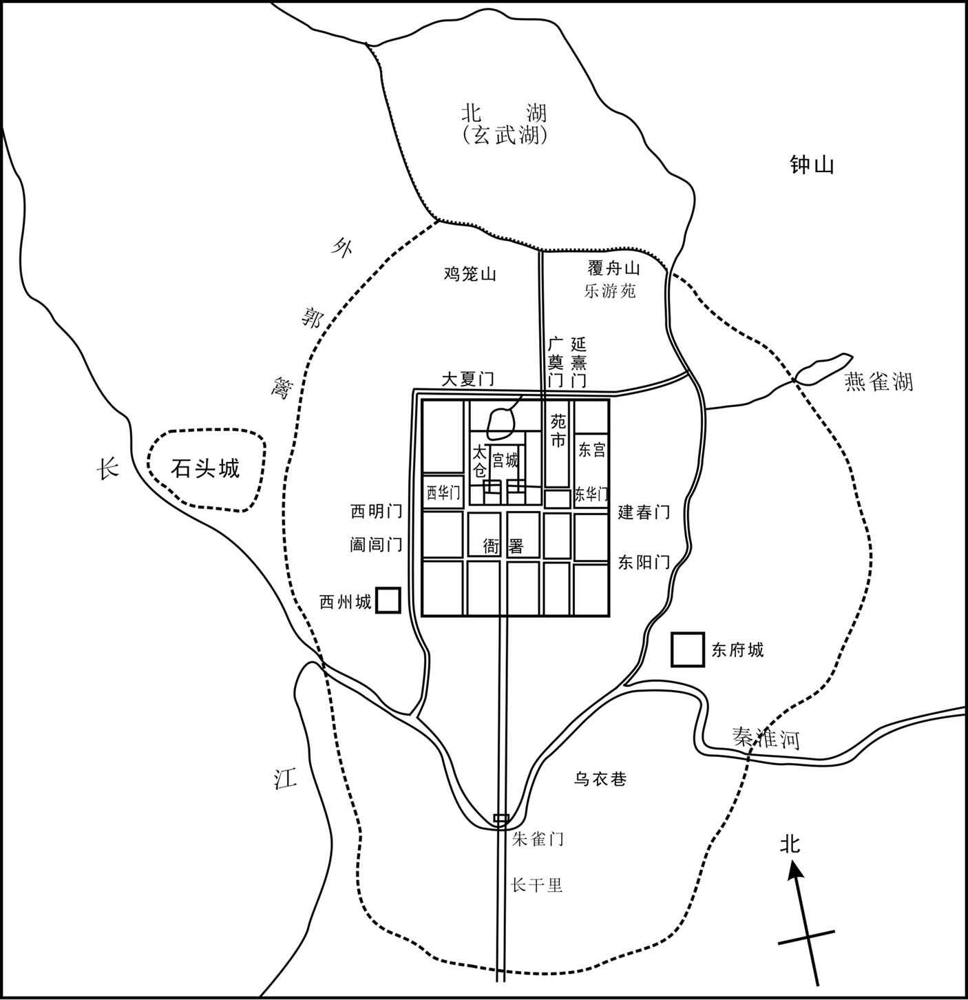
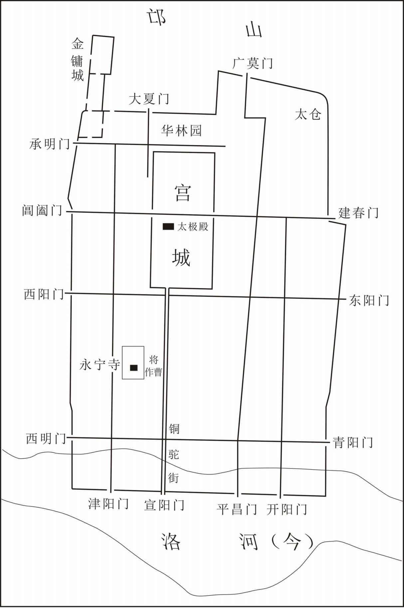
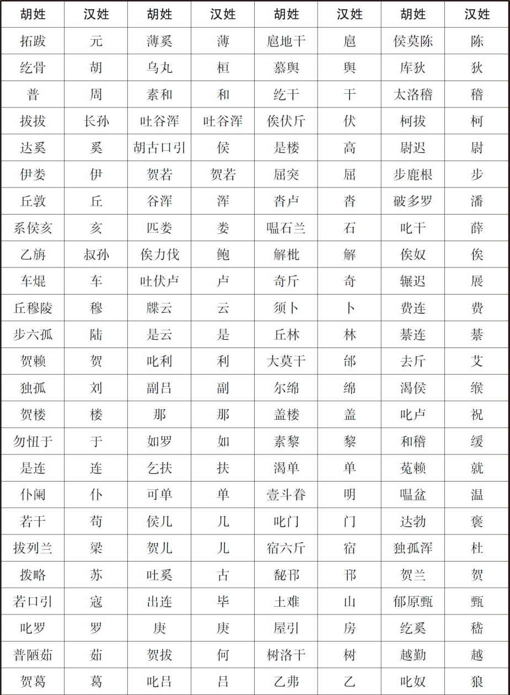
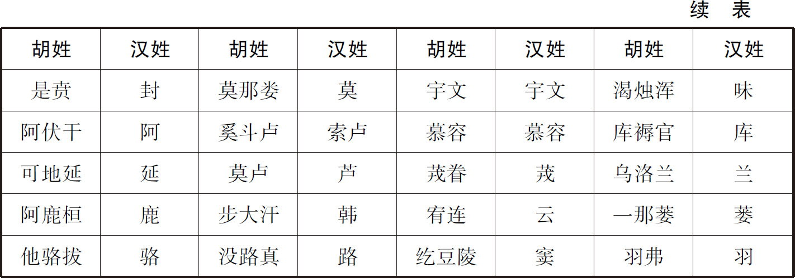
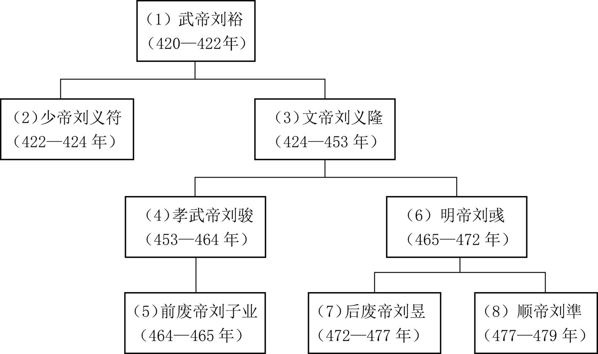
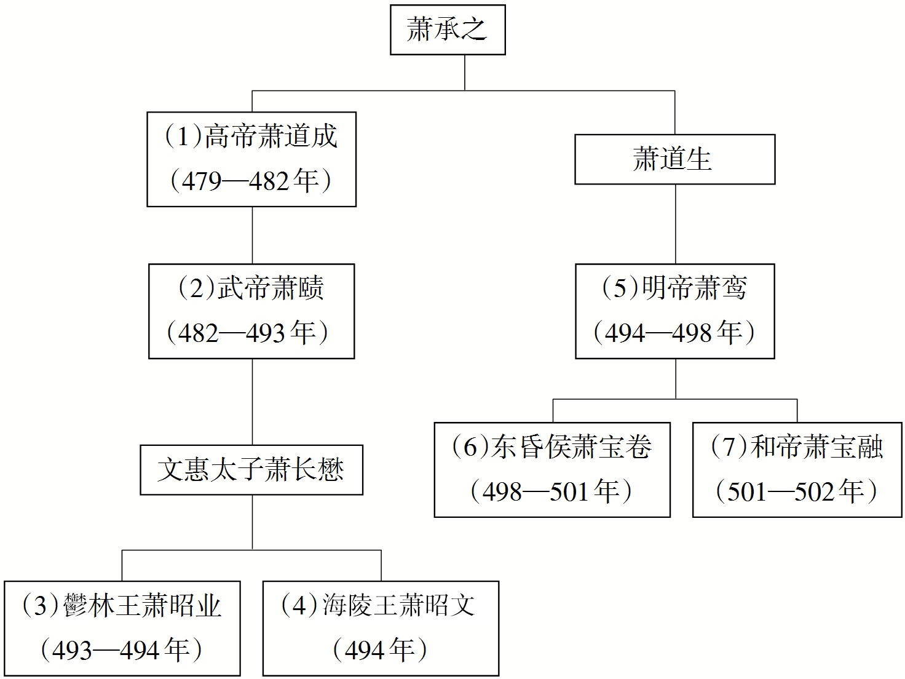
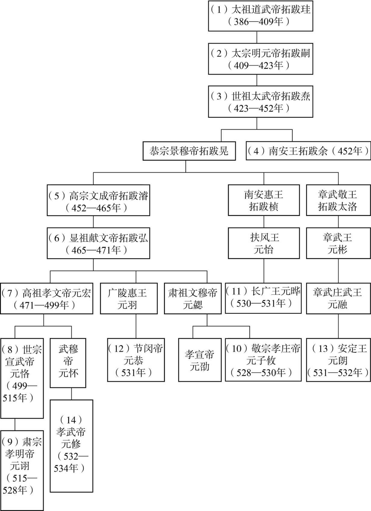

# 目录

废帝之乱

宋明帝北伐

萧道成篡宋

魏迁洛阳

萧鸾篡弑

附录： 
南朝宋皇帝世系表

南朝齐皇帝世系表

北魏皇帝世系表

返回总目录

# 废帝之乱

## 【内容提要】

《废帝之乱》叙述了南朝宋前废帝刘子业继位后的种种昏庸残暴行径和被废杀的历史史实，以及刘彧和刘子勋争夺皇位的战争过程及结果。

464年，南朝宋昏庸无道的孝武帝刘骏因病去世，继位的太子刘子业承袭了其父的种种劣行，并且更为变本加厉：其一，毫无孝悌之心。杀其弟新安王刘子鸾，掘殷贵妃之墓，甚至还欲掘其父刘骏的景宁陵，借口“病人房间鬼多”拒绝侍奉其生母。其二，虐待屠杀诸王。扣留湘东王刘彧等诸王于宫中，变态侮辱，怒杀欲废其位的刘义恭及其四子。其三，肆杀朝臣。听信宠宦谄言，杀害戴法兴、沈庆之等重要臣僚。其四，淫乱后宫。与其已为人妻的姐姐山阴公主刘楚玉秽乱后宫，极度宠幸其姑母新蔡公主并封为贵嫔，组织后宫的妃嫔、公主与身边的侍卫淫乱。这些恶行导致朝政混乱，人心思变。

前抚军咨议参军何迈因刘子业夺妻之恨，欲乘刘子业外出之时发动政变，迎立晋安王刘子勋，事泄被诛。民间谣传“湘中有天子气”，因此湘东王刘彧成为最受刘子业猜忌的藩王，刘彧为保住性命，暗中拉拢宫廷侍卫和刘子业的亲信寿寂之、柳世光等人，同时派遣自己的亲信钱兰生潜伏于刘子业身边，密谋废杀刘子业后继位称帝。寿寂之、柳世光等人乘刘子业大摆宴席饮酒酣歌之时袭杀了他，并救出囚禁中的刘彧，拥其继位，是为宋明帝。

刘彧等人在朝廷内密谋和行动的同时，刘骏第三子、刘子业的弟弟刘子勋也在其臣僚的劝说下准备起兵废立。正好刘子业借口刘子勋是何迈政变的背后主谋，派遣朱景云持毒药前去赐杀他，朱景云遣信使把情况告诉了江州长史邓琬，邓琬等人拥戴刘子勋，随即起兵。

465年，湘东王刘彧登上皇位后，封刘子勋为车骑将军、开府仪同三司，刘子勋拒不接受，于次年正月也在寻阳登基称帝，备置百官。刘宋王朝至此出现了两个政权：即以建康为中心的刘彧和以寻阳为中心的刘子勋。寻阳政权曾一度被视为正统，得到薛安都等各方镇将的响应和支持，甚至寻阳军几乎逼近建康城，刘彧政权岌岌可危。但随着刘彧起用沈攸之、吴喜、张兴世等将领后，战局发生急剧逆转；而此时寻阳政权方面，因邓琬、袁等人缺乏军事才能，且与武将关系不和，导致了军心离叛。经过激战，刘彧军大胜，刘子勋及其母被斩杀。灭掉刘子勋的寻阳政权后，刘彧又杀掉其兄孝武帝刘骏的二十八个儿子。

经过艰苦的战争，虽然残暴失伦的皇帝刘子业被废杀，但刘宋混乱不堪的政治局面并没有实质性的改变。继位的新皇帝刘彧，仍然施行残暴无度的统治政策，并且肆意挥霍、屠杀宗室，导致民不聊生，天怒人怨，南朝宋政权正一步步走向灭亡。

## 【原文】

**宋［孝］武帝大明二年[1]。初，上在江州，山阴戴法兴、戴明宝、蔡闲为典签；及即位，皆以为南台侍御史，兼中书通事舍人[2]。是岁，三典签并以初举兵预密谋，赐爵县男[3]。闲已卒，追赐之[4]。时上亲览朝政，不任大臣，而腹心耳目不得无所委寄。法兴颇知古今，素见亲待[5]。鲁郡巢尚之，人士之末，涉猎文史，为上所知，亦以为中书通事舍人[6]。凡选授、迁徙、诛赏大处分，上皆与法兴、尚之参怀，内外杂事，多委明宝，三人权重当时[7]。而法兴、明宝大纳货贿，凡所荐达，言无不行，天下辐凑，门外成市，家产并累千金[8]。**

## 【注文】

[1]宋：即南朝宋（420—479年），为南北朝时期南朝的第一个王朝。公元420年，宋武帝刘裕取代东晋政权而建立，定都建康（今江苏南京）。因皇族姓刘，为了与后来赵匡胤所建立的宋朝相区别，故又称为刘宋。共传八帝，历六十年。宋文帝刘义隆在位的三十年间（424—453年），励精图治，发展生产，经济有所恢复，被称为“元嘉之治”。刘宋末年，由于王室诸子争位，混战不止，帝王荒淫残暴，朝政日益腐败，国家实力从此一蹶不振。479年，宋顺帝刘準把帝位禅让给了权臣萧道成，南朝宋终被萧齐所取代。　　孝武帝：即刘骏（430—464年），南朝宋第四任皇帝（453—464年）。字休龙，小字道民，刘义隆第三子，年少聪颖，长于骑射，封武陵王，历任雍州刺史、江州刺史，后讨杀刘劭即帝位。在位期间，先后将宗室刘义宣、刘铄、刘诞、刘浑、刘休茂等杀害，大大削弱刘宋势力。谥号孝武，庙号世祖。刘骏是南朝宋诸帝中较有才华的皇帝和诗人。　　大明二年：大明是南朝宋孝武帝刘骏在位时期的第二个年号，即公元457年到公元464年，共计八年。大明二年即公元458年。

[2]初：当初。这是古文中追述往事的习惯用语。　　江州：古州名。西晋惠帝元康元年（291年），分荆、扬二州置，治豫章（今江西南昌），其后或治柴桑（今江西九江西南），或治半洲城（今江西九江西），或治湓口城（今江西九江），东晋辖境相当于今江西、福建两省，湖北陆水以东、长江以南及湖南舂陵水中上游以东地区。其后渐小。　　山阴：古县名。秦置，因在会稽山阴（北）而得名，治所在今浙江绍兴。隋改称会稽。　　戴法兴（414—465年）：南朝宋权臣。会稽山阴（今浙江绍兴）人。少卖葛于市，后为吏传署，好学能文，颇通古今，为孝武帝所重，为南鲁郡太守，兼中书通事舍人，多纳货贿，权重当时，前废帝刘子业时任越骑校尉，更加专权，后受阉人谗言被免官赐死。　　戴明宝（生卒年不详）：南朝宋臣僚。南东海丹徒（今江苏镇江丹徒区）人，历任员外散骑侍郎、给事中、南清河太守、宣威将军、南东莞太守、前军将军、晋陵太守，晋爵为侯，后曾因受贿被削官，后复起用，任安陆太守、宁朔将军、游击将军、骁骑将军、武陵内史、宣城太守等职。　　蔡闲（生卒年不详）：南朝宋臣僚。曾任典签。　　典签：古代官职名。本为掌管文书的小吏。南朝宋齐时，为了监视出任方镇的宗室诸王和各州刺史，常由皇帝派亲信担任此职，号为签帅，作为佐属官，实握州镇全权。南朝梁以后渐废。唐代诸王府亦设典签，掌宣传书教，宋以后渐废。　　侍御史：古代官职名。西汉为御史大夫属官，受命御史中丞，接受公卿奏事，举劾非法；有时受命执行办案、镇压叛乱等任务，分掌令曹、印曹、供曹、尉马曹、乘曹。魏、晋、南北朝时，曹数时有增减，但均不止五曹。　　中书通事舍人：古代官职名。三国魏初设，称中书舍人，是中书省的属官，主管文书，职位低于中书侍郎。东晋至宋、齐曾改为中书通事舍人。

[3]爵：古代皇帝对贵戚功臣的一种封赐，有公、侯、伯、子、男五种爵位，后代爵称和爵位制度往往因时而异。　　县男：男爵，封地为一县。品级不详。

[4]追赐：死后封赐。

[5]亲待：亲近优待。

[6]鲁郡：古郡、国名。西汉初改薛都置鲁国，治鲁县（今山东曲阜［fù］），辖境相当于今山东曲阜、滕州、泗水等地。三国魏改为郡，西晋复为国，东晋、南朝宋及北魏、东魏复为郡。北齐改名任城。隋初废，大业时及唐天宝、至德时又曾改兖州为鲁郡。　　巢尚之：南朝宋大臣。鲁郡（治今山东曲阜）人，南朝宋文帝元嘉中期任始兴王刘濬侍读，涉猎文史，深受刘骏的赏识，宋孝武帝孝建初年任东海国侍郎，兼中书通事舍人。宋明帝泰始三年（467年）奉诏与淮南太守孙奉伯等编次二王法书。

[7]选授：经过选定授以官职。　　迁徙：升迁官职。　　处分：决策，措施。　　参怀：共同商议。

[8]荐达：推荐，推举。　　辐凑（còu）：又称辐辏，形容人或物聚集像车辐集中于车毂一样。辐：连接车辋和车毂的直条。辏：车轮的辐聚集到中心，引申为聚集。

## 【译文】

南朝宋孝武帝大明二年（458年）。当初，孝武帝担任江州刺史时，山阴人戴法兴、戴明宝、蔡闲任典签之职；等到刘骏即帝位后，把他们都任命为南台侍御史，兼任中书通事舍人。这一年，三位典签都因当初起兵参与密谋而被赐予县男之爵。当时蔡闲已经去世，追赠此爵。那时候孝武帝亲自上朝处理政务，不信任朝中的大臣，只把朝廷要事委托给自己的心腹耳目之臣。戴法兴因为熟悉古今之事而素来被孝武帝所礼遇。鲁郡巢尚之，虽然出身卑微，但是熟谙文史典故，被孝武帝所赏识，也任命为中书通事舍人。凡是选拔和调动官吏、诛杀赏罚等军国大事，孝武帝常常和戴法兴、巢尚之共同商议，而皇宫内外的杂事多委托于戴明宝处理，因此，当时他们三个人权势日渐加重。戴法兴、戴明宝大肆收受贿赂，凡是他们推荐的官员，没有不成功的，国内的士人们都聚集于他们周围，他们的家门口像市场那样热闹，他们的家产都累集达千金。

 
东晋、南朝都城建康示意图

## 【原文】

**八年夏闰五月庚申，上殂于玉烛殿[1]。是日，太子即皇帝位废帝，年十六，大赦[2]。吏部尚书蔡兴宗亲奉玺绶，太子受之，傲惰无戚容[3]。兴宗出，告人曰：“昔鲁昭不哀，叔孙知其不终[4]。家国之祸，其在此乎[5]！”**

## 【注文】

[1]闰：即闰月。阴历是以月球绕地球而定的历法，它按照月亮的圆缺安排大月和小月，一个月的长度约是29.5日，这样一年共354天，与阳历的一年相差11天。如果按上述规定制定历法，就会出现天时与历法不合、时序错乱颠倒的怪现象。对此，古人在天文观测的基础上，找出了“闰月”的办法，即每三年闰一个月，每五年闰两个月，每十九年闰七个月。这样每逢闰年所加的一个月，称为闰月。闰月加在某月之后，就叫闰某月。　　殂（cú）：死亡，去世。相当于“崩”。　　玉烛殿：古代宫殿名。南朝宋孝武帝刘骏拆毁宋武帝刘裕的阴室所建。阴室是帝王生前的居室，死后保留以供阴魂出入，故称。

[2]太子：又称皇储、储君。古代君主预定的皇位继承人。周时天子及诸侯的嫡长子，或称太子，或称世子。秦汉时期，天子号称皇帝，故其嫡子称皇太子。地位仅次于皇帝本人，并且拥有自己的、类似于朝廷的东宫。此指南朝宋孝武帝刘骏嫡长子刘子业。刘子业（449—465年），南朝宋第五任皇帝（464—465年）。小字法师，孝武帝长子。孝建元年（454年）被立为太子，继位后因行为过于荒淫而被废。为了和后来的废帝刘昱相区别，称刘子业为“前废帝”，称刘昱为“后废帝”。　　大赦（shè）：以君主命令的方式对某个时期的特定罪犯或一般罪犯实行免除或减轻罪责或刑罚。古代帝王常在登基、更换年号、册立皇后等情况下，以施恩为名，颁布赦令，赦免犯人。

[3]吏部尚书：古代官职名。西汉尚书有常侍曹，主管丞相、御史、公卿之事。东汉改为吏部曹，末期又改为选部曹。魏晋以后，尚书省（尚书台）设吏部，置尚书等官。隋唐两代为六部之首，主管全国官吏的任免、考课、升降、调动等事务，长官为吏部尚书，副长官为侍郎，并下设吏部、司封、司勋、考功四司，历代相沿不改。清末，权归内阁。　　蔡兴宗（415—472年）：南朝宋大臣。济阳考城（今河南民权东北）人，年少好学，初任太子舍人，孝武帝时任侍中，敢于直谏。后历官东阳太守、吏部尚书、新昌太守、尚书右仆射，与袁粲、褚渊等同受顾命，终任于左光禄大夫。　　玺（xǐ）绶（shòu）：古代印玺上所系的彩色丝带。借指印玺。玺，专指帝王的大印。绶，古代印玺上所系的彩色丝带。　　傲惰：懈怠傲慢。　　戚容：忧伤的面容。

[4]昔：从前，往昔。　　鲁昭：鲁昭公（前560—前510年），鲁国诸侯王。姓姬名裯（一作稠、袑），鲁襄公之子。前517年，鲁昭公伐季孙氏大败，逃到齐国，后辗转至晋国，晋国欲使昭公返鲁，鲁国不纳，前510年死于晋地。　　叔孙：即叔孙豹（？—前537年），春秋鲁国大夫。姬姓，叔孙氏，名豹，曾辅佐鲁昭公，提出了著名的立德、立功、立言的“三不朽说”。

[5]其：副词。在句中表示揣测语气，相当于“恐怕”“或许”“大概”“可能”的意思。

## 【译文】

南朝宋孝武帝大明八年（464年）夏季闰五月庚申（二十三日），孝武帝刘骏于玉烛殿驾崩。当天，太子（刘子业）即皇帝位废帝，当时只有十六岁，宣布全国大赦。吏部尚书蔡兴宗亲自手捧玉玺和印绶献上，太子接受时表现出懈怠、傲慢无礼的态度，丝毫没有忧伤的表情。蔡兴宗出宫后，对别人说：“以前鲁昭公即位时面无忧伤，叔孙豹就知道他的皇位到不了最终。恐怕国家的灾祸就会从此开始了！”

## 【原文】

**秋七月乙卯，罢南北二驰道及孝建以来所改制度，还依元嘉[1]。尚书蔡兴宗于都座慨然谓颜师伯曰：“先帝虽非盛德之主，要以道始终[2]。三年无改，古典所贵[3]。今殡宫甫撤，山陵未远，而凡诸制度兴造，不论是非，一皆刊削，虽复禅代，亦不至尔[4]。天下有识，当以此窥人。”师伯不从。**

## 【注文】

[1]驰道：中国历史上最早的“国道”。始于秦朝，它是皇帝专用车道，皇帝下面的大臣、百姓，甚至皇亲国戚都是没有权利走的。秦汉时期最为流行，规定的宽度是五十步，两旁种有树。　　孝建：孝建是南朝宋孝武帝刘骏在位时期的第一个年号，即公元454年至公元456年，共计三年。　　元嘉：元嘉是南朝宋文帝刘义隆在位时期的年号，元嘉元年（424年）八月至元嘉三十年（453年）四月，共计三十年。

[2]都座：政事堂。魏晋时期大臣商议政事的地方。　　慨然：感慨的样子。　　颜师伯（419—465年）：南朝宋大臣。字长渊，琅邪临沂（今山东临沂）人，少孤贫，初任刘骏徐州主簿，历任侍中、吏部尚书、尚书左仆射、丹阳尹等职。前废帝时渐夺其权，阴谋废立，事泄被杀。　　盛德：品德高尚。　　要：要点，纲要，总体。

[3]三年无改：父亲死后，三年不改其制定的制度。语出《论语·学而第一》：子曰：“父在，观其志；父没，观其行；三年无改于父之道，可谓孝矣。”　　古典：古代的典章制度。

[4]殡宫：停放灵柩的房舍。　　甫（fǔ）：副词。刚刚，才。　　山陵：皇帝或皇后的陵墓。此指南朝宋孝武帝景宁陵。　　禅（shàn）代：指帝位的禅让和接替。

## 【译文】

秋季七月乙卯（十八日），前废帝刘子业罢废了南、北两条驰道，及孝武帝刘骏孝建以来所改革的制度，恢复到宋文帝刘义隆元嘉时期的旧制。尚书蔡兴宗在都座内感慨地对颜师伯说：“先帝虽然不是品德高尚的君主，但总体来说还是始终奉行正道的。三年不改父制，是古代经书上认为难能可贵的事情。如今先皇的灵柩刚刚撤离，埋葬的时间还没有几天，但先朝创立的各种制度，不管是对是错，全部削砍改变，即便是改朝换代，也不至于变化到这种地步。天下有见识的人，应该会从这些变化中进一步认识这个新皇帝。”颜师伯不同意他的看法。

## 【原文】

**太宰义恭素畏戴法兴、巢尚之等，虽受遗辅政，而引身避事，由是政归近习[1]。法兴等专制朝权，威行近远，诏敕皆出其手，尚书事无大小，咸取决焉，义恭与颜师伯，但守空名而已[2]。**

## 【注文】

[1]太宰：古代官职名。传说殷商时置，为百官之长，辅佐帝王治理国家。亦作大宰，简称宰。秦、汉、魏不设。西晋避司马师讳，改太师为太宰，执掌朝政，权位甚重。东晋南朝沿置，多用以安置元老勋旧，位尊而无职掌。北魏、北齐则在太师、太傅、太保之上别置太宰，一品。　　义恭：即刘义恭（413—465年），南朝宋宗室。武帝刘裕第五子，姿颜美丽，特受钟爱，封江夏王，孝武帝时任太尉、录尚书六条事。前废帝刘子业狂悖无道，义恭欲谋废立，废帝率羽林兵杀其于府第，并杀其四子。然后肢解刘义恭尸体，分裂肠胃，挑取眼睛，以蜜渍之，名曰“鬼目粽”。明帝定乱，追谥“文宪”。著有文集十五卷。　　近习：指君主宠爱亲信的人。

[2]诏：中国古代帝王诏令文书的文体名称之一。战国以前，上下相告常用“诏”字；秦始皇统一六国后，规定“诏”字为皇帝发布命令的专用词，他人不得使用，诏书亦成为皇帝布告臣民的专用文书。汉承秦制，凡皇帝即位或去世，或颁布其他重要命令，都以诏书布告天下。魏晋以后直到唐初，诏书一直是皇帝发布政令的主要方式。　　敕（chì）：帝王的命令。始于汉，汉以后官长谕下属，尊长谕子弟，仍可用“敕”。唐高宗显庆中规定，必经凤阁、鸾台，方为“敕”，限制始严，然文字中用“敕”为动词，仍属常见。　　但：副词。只，仅仅。

## 【译文】

太宰刘义恭平时就害怕戴法兴、巢尚之等权臣，虽然受先帝遗诏辅佐朝政，但实际上总是退缩、回避政事，因此朝政都归于刘子业身边的近臣。戴法兴等人专制朝廷权力，威势震慑远近，朝廷的诏书、制敕全部出于他们之手，尚书省的事情无论大小都由他们裁决，刘义恭与颜师伯只是个担任空名的宰辅罢了。

## 【原文】

**蔡兴宗自以职管铨衡，每至上朝，辄为义恭陈登贤进士之意，又箴规得失，博论朝政[1]。义恭性恇挠，阿顺法兴，恒虑失旨，闻兴宗言，辄战惧无答[2]。兴宗每奏选事，法兴、尚之等辄点定回换，仅有在者[3]。兴宗于朝堂谓义恭、师伯曰：“主上谅暗，不亲万机，而选举密事，多被删改，复非公笔，亦不知是何天子意？”数与义恭等争选事，往复论执，义恭、法兴皆恶之[4]。左迁兴宗新昌太守；既而以其人望，复留之建康[5]。八月，王太后疾笃，使呼废帝[6]。帝曰：“病人间多鬼，那可往！”太后怒，谓侍者：“取刀来，剖我腹，那得生宁馨儿[7]！”己丑，太后殂。**

## 【注文】

[1]铨（quán）衡：指主管选拔官吏的职位。亦指主管选拔官吏的部门之长。　　登贤进士：举用有道德有才干的人。　　箴（zhēn）规：劝诫规谏。

[2]恇（kuāng）挠（náo）：胆小怕事。　　阿顺：阿谀随顺。　　战惧：恐惧。

[3]选事：铨选职官之事。　　点定：修改使成定稿。　　回换：调换，变换。　　在：动词。留住，存在。

[4]谅暗：指居丧，多用于皇帝。

[5]左迁：降低官职调动，贬职。　　新昌：古郡名。治顿丘，今安徽滁州。　　人望：声望，威望。

[6]王太后：即王宪嫄（yuán）（428—464年），南朝宋孝武帝刘骏的皇后，父王偃。宋文帝元嘉二十年（443年）被纳为武陵王妃，所生子女有前废帝刘子业、豫章王刘子尚、山阴公主刘楚玉、临淮公主刘楚佩、皇女刘楚琇、康乐公主刘修明。死后谥“文穆”，与刘骏合葬景宁陵。　　疾笃（dǔ）：病情严重。

[7]宁馨：东晋、南朝方言。意即“如此”“这样”。

## 【译文】

蔡兴宗自认为执掌铨选，每次到了朝堂，就为刘义恭陈说举用有才干之人的想法，又劝诫规谏执政得失，全面议论朝政。刘义恭性格胆小怕事，阿谀随顺戴法兴，经常担心不合其旨意，听戴兴宗说话，就战战兢兢害怕得不知道怎么回答。蔡兴宗每次上奏选举的事情，戴法兴、巢尚之就点定或者调换，原名单上所推荐的人才很少有留住的。蔡兴宗在朝堂上对刘义恭、颜师伯说：“皇帝现在居丧，又不能亲自处理朝政，而选举这样机密的事情，却多处被删改，又不是两位的笔迹，也不知道是哪个天子的旨意呢？”蔡兴宗多次与刘义恭等人为选举之事争执，各持己见，反复争论，刘义恭、戴法兴都非常讨厌他。于是把蔡兴宗贬为新昌太守；不久又因为他威望很高，只好再次调回京城。八月，（废帝）刘子业生母王太后病重，派人前去叫他（废帝）。刘子业（废帝）说：“病人的房间里鬼多，哪里能去呢！”王太后大怒，对身旁的侍从说：“给我取刀来，我要剖开肚子看看，怎么能生出这样的不孝之子！”己丑（二十三日），王太后病逝。

## 【原文】

**明帝泰始元年[1]。废帝幼而狷暴[2]。及即位，始犹难太后、大臣及戴法兴等，未敢自恣[3]。太后既殂，帝年渐长，欲有所为，法兴辄抑制之，谓帝曰：“官所为如此，欲作营阳耶？”帝稍不能平[4]。所幸阉人华愿儿赐与无算，法兴常加裁减，愿儿恨之[5]。帝使愿儿于外察听风谣，愿儿言于帝曰：“道路皆言宫中有二天子，法兴为真天子，官为赝天子[6]。且官居深宫，与人物不接。法兴与太宰、颜、柳共为一体，往来门客恒有数百，内外士庶莫不畏服[7]。法兴是孝武左右，久在宫闱，今与他人作一家，深恐此坐席非复官有。”帝遂发诏免法兴官，遣还田里，仍徙远郡。八月辛酉，赐法兴死，解巢尚之舍人。**

## 【注文】

[1]明帝：即刘彧（yù）（439—472年），南朝宋第六任皇帝（465—472年在位）。小字荣期，文帝刘义隆第十一子，初封淮阳王，改封湘东王，前废帝时任南豫州刺史，遣人刺杀前废帝后自立为帝。做藩王时好读书，曾撰《江左以来文章志》，续卫瓘所注《论语》二卷，即位初任贤用能，平定四方叛乱，末年好鬼神，多忌讳，奢侈无度，民不堪命，宋王朝自此而衰。谥号“明帝”，庙号太宗。　　泰始元年：泰始是南朝宋明帝刘彧在位期间的第一个年号，即泰始元年（465年）十二月至泰始七年（471年）十二月，共计七年。泰始元年即公元465年。

[2]狷（juàn）暴：偏急暴戾（lì）。

[3]难：害怕，恐惧。　　自恣（zì）：放纵自己。

[4]辄（zhé）：副词。立即，就。　　官：称呼名。古代用以称天子。　　营阳：即营阳王刘义符（406—424年），南朝宋第二任皇帝（422—424年在位）。小字车兵，宋武帝刘裕长子，永初三年（422年）即位。刘义符在位时居丧无礼，又好为游狎（xiá）之事，景平二年（424年），辅政大臣徐羡之等假借皇太后之命废其为营阳王，不久被杀。　　稍：副词。逐渐，渐渐。　　不能平：不满。

[5]阉（yān）人：即太监。　　华愿儿（生卒年不详）：南朝宋前废帝刘子业的太监。　　赐与：赏赐，赐给。　　无算：不计其数，极言其多。

[6]风谣：谣言。　　赝（yàn）：假的，伪造的。

[7]柳：柳元景（406—465年），南朝宋大将。字孝仁，河东解（今山西运城解州镇）人，自幼学武，骁勇寡言，历任刘义恭参军、侍中、雍州刺史，后因谋划册立刘义恭而被杀。

## 【译文】

南朝宋明帝泰始元年（465年）。前废帝刘子业从小就急躁粗暴。等到登上皇位，刚开始还害怕太后、大臣及戴法兴等人，不敢放纵自己。等到太后去世，他也渐渐长大，想要肆意行事，常常都被戴法兴加以抑制，戴法兴还对前废帝说：“皇上您这样做，是想做第二个营阳王吗？”前废帝渐渐对戴法兴不满。幸好宦官华愿儿送给前废帝不计其数的金银财宝，但又遭到戴法兴的裁减，华愿儿对他非常怨恨。前废帝让华愿儿到宫外打听谣言和传闻，华愿儿回来后对前废帝说：“外面都在传言皇宫中有两个天子，戴法兴是真天子，而皇上您是伪天子。况且皇上您深居皇宫，与宫外接触不多，戴法兴与太宰刘义恭、颜师伯、柳元景结为一伙，与他们来往的宾客经常有几百人，朝廷内外的士人百姓没有不怕他们的。戴法兴是原来孝武帝身边的宠臣，在皇宫时间很长了，如今他与别人合为一体，我很担心皇帝的位子不再属于您所有。”于是，前废帝下诏免去了戴法兴的官职，把他遣返回乡村，后又流放到偏远郡县。八月辛酉（初一日），又赐戴法兴自杀，解除了巢尚之的中书通事舍人之职。

## 【原文】

**员外散骑侍郎东海奚显度，亦有宠于世祖[1]。常典作役，课督苛虐，捶扑惨毒，人皆苦之[2]。帝常戏曰：“显度为百姓患，比当除之[3]。”左右因唱诺，即宣旨杀之[4]。**

## 【注文】

[1]员外散骑侍郎：古代官职名。简称员外郎，员外为定员外增置之意，原指设于正额以外的郎官。三国魏末始置员外散骑常侍，两晋、南朝、北魏、北齐沿置，属散骑省（东省、集书省）。为闲散之职，常用以安置闲退官员、衰老之士。　　东海：古郡名。秦朝时置郯（tán）郡，后改称东海郡，治郯县（今山东郯城北），属徐州刺史部。东晋于海虞县（今江苏常熟）侨置，后移治所到京口（今江苏镇江），西汉辖地即今山东费县、临沂、枣庄及江苏赣榆南部、邳州东部、宿迁、灌南北部一带。　　奚（xī）显度（？—465年）：南朝宋大臣。东海郯（tán）（今山东郯城北）人，官至员外散骑侍郎，孝武帝时主领建筑工程，苛虐无道，动加捶扑，暑雨寒雪，不听暂休，人不堪命，后被前废帝刘子业所杀。　　世祖：即南朝宋孝武帝刘骏（430—464年）。

[2]典：主持，主管。　　作役：建筑工程。　　苦之：以动用法，以之为苦。

[3]比：接下来。

[4]唱诺：出声回答，应和。

## 【译文】

员外散骑侍郎、东海人奚显度，也受到孝武帝的宠信。多年主管建筑工程事务，监工苛刻暴虐，常常对服役者残忍捶打，人们都感到很痛苦。前废帝开玩笑地说：“奚显度是百姓的祸害，接下来我会除掉他。”身边的侍从随即表示同意，于是立即宣布圣旨杀掉了奚显度。

## 【原文】

**尚书右仆射、领卫尉卿、丹杨尹颜师伯居权日久，海内辐凑，骄奢淫恣，为衣冠所疾[1]。帝欲亲朝政，庚午，以师伯为尚书左仆射，解卿、尹，以吏部尚书王彧为右仆射，分其权任[2]。师伯始惧。**

## 【注文】

[1]尚书右仆（pú）射（yè）：古代官职名。尚书仆射秦、西汉置，为尚书令之副，定员一人。东汉献帝建安四年（199年）尚书仆射始分左右，为二人。三国两晋时不常置。凡置二人则称左、右仆射；如果置一人则仅称尚书仆射；若尚书令缺则以左仆射为尚书省长官；若左右仆射都缺则置尚书仆射执掌左仆射之事，祠部尚书掌右仆射之职。南朝宋、齐、梁皆置尚书左、右仆射。右仆射与左仆射同居宰相之任，有“朝右”之称。掌出纳王命，协理全国政务。　　卫尉：古代武官名号。统率卫士守卫宫禁。秦始置，掌管宫廷警卫。西汉沿置，为九卿之一。职责为昼夜巡警，检察门籍。属官有公车司马、卫士、旅贲（bēn）三令丞。　　丹杨尹：古代官职名。亦称丹阳尹。东晋、南朝五朝皆定都于建康（今江苏南京），建康隶于原丹阳郡（晋治建康），为提高京都地位，显天子之尊，参照两汉京兆、河南尹故事，东晋元帝太兴元年（318年）改丹阳内史为丹阳尹，职掌相当于郡太守，但参与朝议。　　衣冠：指古代士以上戴冠，魏晋南北朝多指士族。　　疾：厌恶，憎恨。

[2]尚书左仆射：参见前“尚书右仆射”条注。　　王彧（yù）：南朝宋大臣。字景文，琅邪临沂（今山东临沂）人，历任尚书右仆射、左仆射、江州刺史、扬州刺史、太子詹事等职，封江安县侯，名重一时，后被宋明帝刘彧赐毒酒所杀。

## 【译文】

尚书右仆射兼领卫尉卿、丹杨尹颜师伯久握朝廷大权，很多人都投靠其门下，渐渐骄奢淫逸，为当时的士族所忌恨。前废帝想亲理朝政，庚午（初十日），改任颜师伯为尚书左仆射，解除了他的卫尉卿、丹杨尹职务，任命吏部尚书王彧为尚书右仆射，分割了他的权力。颜师伯开始害怕。

## 【原文】

**初，世祖多猜忌，王公大臣重足屏息，莫敢妄相过从[1]。世祖殂，太宰义恭等皆相贺曰：“今日始免横死矣[2]。”甫过山陵，义恭与柳元景、颜师伯等声乐酣饮，不舍昼夜，帝内不能平。既杀戴法兴，诸大臣无不震慑，各不自安[3]。于是元景、师伯密谋废帝，立义恭，日夜聚谋，而持疑不能决[4]。元景以其谋告沈庆之[5]。庆之与义恭素不厚，又师伯常专断朝事，不与庆之参怀，谓令史曰：“沈公爪牙耳，安得豫政事？”庆之恨之，乃发其事[6]。**

## 【注文】

[1]重（chóng）足屏息：叠足站立不前，屏住呼吸。借指非常畏惧。　　过从：相互往来，互访。

[2]横（hèng）死：指因自杀、被害或意外事故而死亡。横，意外的。

[3]震慑：震惊惶恐。

[4]持疑：心怀疑虑。

[5]沈庆之（386—465年）：南朝宋大将。字弘先，吴兴武康（今浙江德清武康镇）人，手不知书，眼不识字，东晋时因平孙恩立功，任宁远中兵参军，南朝宋文帝时任建威将军，宋孝武帝时封始兴郡公，历任侍中、太尉等职，后因劝谏宋前废帝刘子业诛戮大臣被杀害。宋明帝时追谥“襄”。

[6]参怀：共同商议。　　令史：古代官职名。战国秦置，汉代兰台、尚书台、三公府及大将军等府皆置，位在诸曹属官下，掌文书事务，历代因之。隋唐以后，成为三省﹑六部及御史台低级事务员之称，位卑秩下，不参官品。　　爪（zhǎo）牙：本意指动物的尖爪和利牙。古代则用之比喻得力帮手，现多比喻为坏人效力的党羽、帮凶，是贬义词。　　豫：同“预”，参与。　　发：揭发。

## 【译文】

当初，世祖（刘骏）多猜忌臣下，王公大臣都吓得驻足观望、屏住呼吸，没有人敢随意地互相往来。世祖去世后，太宰刘义恭等人都相互庆贺说：“从今开始，我们就免去惨遭横死了。”刚从孝武帝陵归来，刘义恭就与柳元景、颜师伯等人赏乐畅饮，不分昼夜地尽情欢乐，前废帝（刘子业）心中非常不满。杀死了戴法兴之后，朝中的诸位大臣都震惊害怕，各自心中都不安定。于是，柳元景、颜师伯秘密谋划废掉刘子业，拥立刘义恭为帝，他们昼夜聚在一起谋划，但是迟疑不定。柳元景把这个阴谋告诉了沈庆之。沈庆之平时与刘义恭关系不好，再加上颜师伯平常专擅朝事，朝廷大事也不与沈庆之共同商议，而且还对令史们说：“沈公只不过是个帮凶罢了，哪能参预朝廷的政事？”沈庆之对此事非常记恨，于是把这个阴谋泄露了出去。

## 【原文】

**癸酉，帝自帅羽林兵讨义恭，杀之，并其四子[1]。断绝义恭支体，分裂肠胃，挑取眼睛，以蜜渍之，谓之“鬼目粽”[2]。别遣使者称诏召柳元景，以兵随之，左右奔告“兵刃非常”。元景知祸至，入辞其母，整朝服乘车应召[3]。弟车骑司马叔仁戎服，帅左右壮士欲拒命，元景苦禁之[4]。既出巷，军士大至，元景下车受戮，容色恬然，并有八子、六弟及诸侄[5]。获颜师伯于道，杀之，并其六子。又杀廷尉刘德愿[6]。改元景和，文武进位二等[7]。遣使诛湘州刺史江夏世子伯禽[8]。自是公卿以下皆被捶曳，如奴隶矣[9]。**

## 【注文】

[1]羽林：古代武官名。西汉武帝时选陇西、天水、安定、北地、上郡、西河等六郡良家子宿卫建章宫，称“建章营骑”。后改称“羽林骑”，取其“为国羽翼，如林之盛”的意思，属光禄勋，为皇帝护卫。长官有羽林中郎将及羽林郎。以后历代禁卫军常有羽林之名。隋以左右屯卫所领兵为羽林。唐置左右羽林军，有大将军、将军等官。元羽林将军为扈从执事官。明亲军有羽林卫。　　四子：江夏愍王刘伯禽、永修殇侯刘仲容、永阳殇侯刘叔子、刘叔宝。刘义恭共十六子，之前刘劭已杀其十二子（见上篇《太子劭弑逆》），此时刘子业又杀剩下的四子。至此，刘义恭门户已绝。

[2]支：同“肢”。　　渍（zì）：浸，泡。

[3]朝服：即帝王、臣子朝会、祭祀等正式场合穿的礼服。尊卑异制，历代异制。魏晋时，朝服大抵承袭汉制，最大的区别体现在朝服颜色上，汉朝服用黑色，以绛饰边，而魏晋朝服则为红色，称绛纱袍。

[4]车骑：即车骑将军，古代官职名。汉代仅次于大将军、骠骑将军。金印紫绶，地位相当于上卿，或比三公。典京师兵卫，掌宫卫。第二品，是战车部队的统帅。　　司马：古代官职名。西周始置，春秋战国沿置，掌军政、军赋。西汉武帝时太尉设大司马，掌宫廷实权。两汉至南北朝诸公府、军府皆置，位仅次于长史，掌参赞军务，管理本府武职。　　叔仁：即柳叔仁（？—465年），南朝宋臣僚。河东解（今山西运城解州镇）人，柳元景之弟，后被前废帝刘子业所杀。　　戎服：军服。　　苦：副词。竭力，尽力。

[5]受戮（lù）：接受斩杀。　　恬（tián）然：安然，安静。

[6]刘德愿（？—465年）：南朝宋大臣。彭城（今江苏徐州）人，刘怀慎之子，历任游击将军、秦郡太守、豫州刺史、廷尉等职，受柳元景谋废刘子业之事牵连，被下狱诛杀。

[7]景和：南朝宋前废帝刘子业在位时期的第二个年号，即景和元年（465年）八月至十一月。　　进位：官位升高。

[8]湘州：古州名。西晋怀帝永嘉元年（307年）分荆、广两州置，治临湘（今湖南长沙），辖境相当于今湖南湘、资二水流域，广西桂江、广东北江流域大部分及湖北陆水流域。南朝梁以后逐渐缩小。隋文帝开皇九年（589年）改为潭州。　　刺史：古代官职名。西汉武帝分全国为十三部（州），部置刺史，以六条察问郡县，本为监察官性质，其官阶低于郡守。成帝时刺史为州牧。东汉初复称刺史，灵帝时再改称州牧，位居郡守之上，掌握一州的军政大权。三国至南北朝各州也多置刺史，一般以都督兼任，并加将军之号，权力很大。　　世子：周代时，指天子、诸侯的嫡子；后世则为继承王爵、诸侯爵位者的正式封号，多由嫡长子充任。汉初，亲王法定继承人的正式封号为“王太子”，后为与皇太子相区别，改为世子，后代沿袭不改。另外，对于贵族、高官之子，也习尊称为世子，但非正式称呼。　　伯禽：即刘伯禽（？—465年），南朝宋宗室、大臣。江夏王刘义恭长子，官至辅国将军、湘州刺史，后被前废帝刘子业所杀，追赠江夏王。

[9]捶曳（yè）：牵拉捶打。　　奴隶：奴婢，仆人。

## 【译文】

癸酉（十三日），南朝宋前废帝刘子业亲自率领羽林军讨伐刘义恭，杀死了他和他的四个儿子。又砍断了刘义恭的四肢，剖开腹部，挖出肠胃，挑出眼珠浸泡在蜜水中，称为“鬼目粽”。另派使者声称诏命征召柳元景入宫，后面跟着士兵。柳元景身边的侍从赶紧跑去告诉他“使者带着士兵，与平时不一样”。柳元景知道灾祸即将来临，进房间和母亲辞别，整理好朝服乘车前往应召。柳元景的弟弟、车骑司马柳叔仁身着军装，率领身边的勇士想抗拒朝命，柳元景苦苦相劝阻止了他。车子刚出巷子，士兵们就包围了他，柳元景下车接受屠戮，面容安然，被杀的还有他的八个儿子、六个弟弟及诸位侄子。刘子业又在路上捉住颜师伯，杀死他和他的六个儿子。又杀掉了和柳元景关系要好的廷尉刘德愿。改年号为景和，朝廷的文武百官都加官二等。刘子业又派使者前去诛杀了湘州刺史、江夏王刘义恭的嫡长子刘伯禽。从此以后，公卿以下的朝官随时都像奴隶一样被刘子业拖拉出去捶打。

## 【原文】

**初，帝在东宫，多过失，世祖欲废之而立新安王子鸾[1]。侍中袁盛称“太子好学，有日进之美”，世祖乃止[2]。帝由是德之[3]。既诛群公，欲引进，任以朝政，迁为吏部尚书，与尚书左丞徐爰皆以诛义恭等功，赐爵县子[4]。**

## 【注文】

[1]东宫：太子所居住的宫殿，也常代称太子。　　鸾：刘子鸾（456—465年），南朝宋宗室。字孝羽，孝武帝刘骏第八子，母殷淑仪，历任北中郎将、南徐州刺史、南琅邪太守、司徒、都督南徐州诸军事、中书令，历封襄阳王、新安王，后被其兄刘子业所杀。刘彧即位后追封为始平王。

[2]侍中：古代官职名。秦始置，即原丞相史，因往来殿中奏事，故称侍中。两汉沿置，为正规官职外的加官之一。因侍从皇帝左右，出入宫廷，与闻朝政，逐渐变为亲信贵重之职。晋以后，曾相当于宰相。南朝宋文帝以侍中掌机要，梁、陈相沿，往往成为事实上的宰相。晋朝开始也把侍中作为三公的加衔。北魏时地位尤其高。隋朝时称纳言，唐恢复为侍中，为门下省长官，位居正三品，与尚书仆射、中书令同居宰相之职。南宋后废。　　袁（yǐ）（420—466年）：南朝宋大臣。字景章，陈郡阳夏（今河南太康）人，孝武帝大明元年（457年）任侍中，领前军将军，劝说孝武帝放弃废太子刘子业，刘子业即位后任吏部尚书、雍州刺史。后谋拥立晋安王刘子勋称帝，与刘彧发生战争，兵败被诱杀。　　日进之美：每天都有长进。

[3]德：感恩，感激。

[4]尚书左丞：古代官职名。东汉始置，为尚书台佐贰官。尚书左丞佐尚书令，总领纲纪；右丞佐仆射，掌钱谷等事，秩均四百石。　　徐爰（yuán）（394—475年）：南朝宋大臣。字长玉，南琅邪开阳（今江苏常州）人。熟悉历代典章制度，因善于逢迎皇帝旨意很受宠遇。南朝宋时任员外散骑侍郎、殿中郎兼左丞右丞等职。

## 【译文】

当初，南朝宋废帝刘子业在太子东宫时，多次犯错误，世祖刘骏准备废掉他，册立新安王刘子鸾，侍中袁大赞“太子好学，有天天进步的美德”，世祖才放弃废黜的想法。于是刘子业对袁感恩戴德。诛杀了前朝的重臣之后，刘子业就想任用袁，让他掌管朝政，于是提拔袁为吏部尚书，与尚书左丞徐爰都因诛杀刘义恭的功劳，赐给县子之爵。

## 【原文】

**徐爰便僻善事人，颇涉书传，自元嘉初入侍左右，预参顾问，既长于附会，又饰以典文，故为太祖所任遇[1]。大明之世，委寄尤重[2]。时殿省旧人多见诛逐，唯爰巧于将迎，始终无迕，废帝待之益厚，群臣莫及[3]。帝每出，常与沈庆之及山阴公主同辇，爰亦预焉[4]。**

## 【注文】

[1]便（pián）僻：谄媚逢迎。　　长于：善于，擅长。　　附会：附和，依附。　　典文：经典诗文。

[2]大明：南朝宋孝武帝刘骏在位时期的第二个年号，即大明元年（457年）一月至大明八年（464年）五月，共计八年。　　委寄：委任托付。

[3]殿省：宫廷与台省。也指中央和地方。　　诛逐：诛戮、贬斥。　　将迎：逢迎，迎合。　　迕（wǔ）：违背，抵触。

[4]山阴公主：即刘楚玉（446—465年），南朝宋公主。孝武帝刘骏之女，前废帝刘子业同母姐姐，初封山阴公主，后封会稽长公主，有“皇族第一美人”之称，以淫乱放荡闻名于当世。后被明帝刘彧赐死。　　辇（niǎn）：特指君后所乘的车。

## 【译文】

徐爰擅长谄媚逢迎，取悦于人，又多涉猎诗书、史传，从南朝宋文帝元嘉初年进入宫中以来，参与机密，顾问政事，既擅长附和别人，又以典籍诗文为美饰，所以被文帝刘义隆所礼遇。孝武帝大明年间，更加受到器重。当时朝廷各部门的大臣多被诛杀或被贬逐，只有徐爰因为会逢迎，始终没有触犯孝武帝。前废帝刘子业继位后对其更加重用，文武百官没有能比得上的。刘子业每次外出，常常与沈庆之及山阴公主刘楚玉同乘辇车，徐爰也常参与其中。

## 【原文】

**山阴公主，帝姊也，适驸马都尉何戢[1]。戢，偃之子也[2]。公主尤淫恣，尝谓帝曰：“妾与陛下，男女虽殊，俱托体先帝[3]。陛下六宫万数，而妾唯驸马一人，事太不均。”帝乃为公主置面首，左右三十人，进爵会稽郡长公主，秩同郡王[4]。吏部郎褚渊貌美，公主就帝请以自侍，帝许之[5]。渊侍公主十日，备见逼迫，以死自誓，乃得免。渊，湛之之子也[6]。**

## 【注文】

[1]姊（zǐ）：姐姐。　　适：嫁给。　　驸马都尉：古代官职名。西汉武帝始置，掌副车之马。三国曹魏时以帝婿授此官，魏晋以后成为常例，简称驸马，非实官。此后驸马即用以称帝婿，清代称额驸。　　何戢（jí）（446—482年）：南朝宋、齐大臣。字慧景，庐江灊（今安徽霍山东北）人，出身名门，何尚之之孙，何偃之子，因娶南朝宋孝武帝刘骏之女刘楚玉拜为驸马督尉。后废帝刘昱时任司徒左长史，与齐高祖萧道成关系很好。南朝齐时历任相国左长史、吏部尚书，加骁骑将军、吴兴太守、左将军。死后追赠为侍中、右光禄大夫。

[2]偃（yǎn）：即何偃（413—458年），南朝宋大臣。字仲弘，庐江灊（今安徽霍山东北）人，何尚之中子。举秀才，南朝宋文帝元嘉中历任太子中庶子、侍中。孝武帝时任吏部尚书。谥曰“靖”。偃好谈玄，曾注《庄子·逍遥篇》，有文集十九卷。

[3]淫恣：放荡，不知拘检。　　陛下：“陛”指帝王宫殿的台阶。“陛下”原来指的是站在台阶下的侍者。臣子向天子进言时，不能直呼天子，必须先呼台下的侍者而告之。后来就成为对帝王的敬称。　　托体：出身。

[4]面首：面，貌之美；首，发之美。面首，指美男子，引申为男妾、男宠。　　秩：职位和品级。　　郡王：中国古代爵位名。其名始于西晋，唐、宋以后，郡王皆为次于亲王一等的爵号，除皇室外，臣下亦得封郡王。清代宗室封爵第三级称为多罗郡王，简称郡王。

[5]吏部郎：古代官名，尚书省吏部曹长官通称。三国魏、蜀始置，两晋、南北朝沿置，亦称郎中，资序深者可转侍郎。隶于吏部尚书，掌管吏选任铨叙调动，对五品以下官吏的任免有建议权。　　褚渊（435—482年）：南朝宋、齐大臣。字彦回，河南阳翟（今河南禹州）人，南朝宋文帝之婿，历官著作佐郎、吏部尚书、尚书右仆射、中书令、护军将军，与尚书令袁粲共辅苍梧王（后废帝刘昱），南朝宋后废帝元徽五年（477年），萧道成杀后废帝，另立顺帝，他推举萧道成任录尚书事，后又助萧道成代宋建齐，受齐高帝宠幸，参与机要，进位司徒，封南康郡公。病卒。

[6]湛之：即褚湛之（411—460年），南朝宋大臣。字休玄，河南阳翟（今河南禹州）人。娶南朝宋武帝第七女始安哀公主，拜驸马都尉、著作佐郎，公主死后又娶武帝第五女吴郡宣公主。颇有才干，为文帝赏识，历任扬武将军、司徒左长史、侍中、左卫将军、吏部尚书、尚书右仆射、中书令、丹阳尹、尚书左仆射，谥“敬侯”。

## 【译文】

山阴公主刘楚玉是南朝宋前废帝刘子业的胞姐，嫁给驸马都尉何戢。何戢是何偃的儿子。公主是个淫荡的女人，曾经对前废帝刘子业说：“我与陛下虽然性别有男女之分，但都是先帝所生。陛下六宫中有上万的美女，而我却只有驸马一个人，事情太不公平了。”刘子业就为山阴公主配置了三十个左右的面首，侍奉于她的身边，并加封会稽长公主之爵，俸禄与郡王等同。吏部郎褚渊是个美男子，公主就请求刘子业让他侍奉自己，刘子业同意了。褚渊侍奉公主十天，倍受公主的逼迫，发誓宁死不从，才幸免。褚渊是褚湛之的儿子。

## 【原文】

**帝令太庙别画祖考之像，帝入庙，指高祖像曰：“渠大英雄，生擒数天子[1]。”指太祖像曰：“渠亦不恶，但末年不免儿斫去头[2]。”指世祖像曰：“渠大齄鼻，如何不齄？”立召画工令齄之[3]。**

## 【注文】

[1]太庙：封建皇帝为祭拜祖先而营建的庙宇称为太庙。　　祖考：已亡故的祖、父。　　渠：南方方言。他，他们。

[2]斫（zhuó）：砍，杀。

[3]齄（zhā）鼻：俗称酒糟鼻。齄，鼻子上的小红疱。

## 【译文】

南朝宋前废帝刘子业命令在太庙中另外绘制了祖先的画像，他进入太庙，指着高祖刘裕的画像说：“这是大英雄，曾经活捉了数位皇帝。”指着太祖刘义隆的画像说：“他也不错，只可惜晚年被儿子砍下了头颅。”指着世祖刘骏的画像说：“这人是个大酒糟鼻，为什么画像上没有？”立即召集画匠把酒糟鼻画了上去。

## 【原文】

**新安王子鸾有宠于世祖，帝疾之。九月辛丑，遣使赐子鸾死，又杀其母弟南海王子师及其母妹[1]。发殷贵妃墓，又欲掘景宁陵，太史以为不利于帝，乃止[2]。**

## 【注文】

[1]子师：即刘子师（460—465年），南朝宋宗室。宋孝武帝刘骏第二十二子，刘子业同母弟，字孝友，封南海王，后被前废帝刘子业所杀害，时年六岁。

[2]殷贵妃（？—462年）：即殷淑仪，南朝宋孝武帝刘骏的宠妃。本姓刘，南郡王刘义宣之女，姿颜美丽，宠冠后庭。殷淑仪死后，刘骏下令修建为其祭祀的新安寺。刘子业即位后，为报殷淑仪得宠欲夺嫡之仇，将其所生子女全部杀死，拆毁新安寺，挖掘了其坟墓。　　景宁陵：南朝宋孝武帝刘骏的陵墓。　　太史：古代官职名。先秦时是史官和历官，属朝廷大臣。后职位渐低。秦汉设太史令，属太常。魏晋以后仅掌管天文历法及祥瑞灾异。至明清两朝，修史之事由翰林院负责，故称翰林为太史。

## 【译文】

新安王刘子鸾原来受到世祖刘骏的宠爱，前废帝刘子业非常嫉妒。九月辛丑（十一日），派遣使者前去令刘子鸾自杀，又杀死了刘子鸾的胞弟南海王刘子师及胞妹。前废帝掘开殷贵妃的坟墓，又打算去掘孝武帝的景宁陵，太史认为这样会对前废帝自己不利，前废帝才停止了行动。

## 【原文】

**废帝自即位以来，未尝戒严，因民［间］讹言义阳王昶反而讨之，昶奔魏[1]。事见《元魏寇齐》。**

## 【注文】

[1]讹（é）言：传布的流言，谣言。　　昶（chǎng）：即刘昶（436—497年），南朝宋宗室、大臣。字休道，宋文帝刘义隆第九子，封义阳王，历任辅国将军、散骑常侍、太常、会稽太守、东扬州刺史、秘书监、骁骑将军、江州刺史、中书令、徐州刺史等职，因惧怕被前废帝刘子业所杀，逃奔北魏，历任侍中、外都大官、内都坐大官、中书监，历丹阳王、宋王。死后赠假黄钺、太傅、领扬州刺史，备九锡，谥曰“明”。

## 【译文】

自从前废帝刘子业继位以来，还没有实行过全城戒严，由于民间讹传义阳王刘昶将要反叛，刘子业准备前去讨伐他，所以刘昶听到消息后逃奔北魏。事见《元魏寇齐》。

## 【原文】

**吏部尚书袁始为帝所宠任，俄而失指，待遇顿衰，使有司纠奏其罪，白衣领职[1]。惧，诡辞求出[2]。甲寅，以为督雍梁等四州诸军事、雍州刺史[3]。舅蔡兴宗谓之曰：“襄阳星恶，何可往[4]？”曰：“白刃交前，不救流矢[5]。今者之行，唯愿生出虎口耳[6]。且天道辽远，何必皆验？”**

## 【注文】

[1]俄而：不久。　　失指：不合帝王旨意。指，通“旨”。　　有司：指官吏。古代设官分职，各有专司，故称有司。　　纠奏：举察其罪，上奏朝廷。　　白衣：原指古代百姓服装，借指受处分官员的身份。　　领职：管理所掌之职务。

[2]诡辞：说假话，敷衍搪塞。　　出：指离开中央，到地方做官。

[3]督雍梁等四州诸军事：指挥雍州、梁州等四州军事的最高长官。　　雍州：古州名。古九州之一。东汉献帝兴平元年（194年）分凉州河西四郡置。三国魏治长安（今陕西西安西北）。辖境相当于今陕西中部、甘肃东南部、宁夏南部及青海黄河以南的一部分。其后逐渐缩小。东晋孝武帝太元中在襄阳（今湖北襄阳）侨置。南朝宋文帝元嘉二十六年（449年），割荆州北部为境，治所不变。南朝梁以后逐渐缩小。东晋、南朝时控扼南北，为汉水上游重镇。

[4]襄阳：古郡、县名。西汉初置县，以县治位于襄水（今南渠）之阳而得名。东汉献帝建安十三年（208年）置郡，治所在襄阳县（今湖北襄阳市襄州区），为荆州治所。东晋孝武帝太元中在襄阳（今湖北襄阳）侨置。隋文帝开皇初废除。　　星恶：星象不吉利。

[5]白刃交前，不救流矢：刀剑砍过来，就不要管乱飞的弓箭了。比喻事情有轻重缓急，要抓住重点。

[6]者：助词。用在表时间的名词后面，表示停顿。　　耳：助词。而已，罢了。

## 【译文】

吏部尚书袁刚开始受到前废帝刘子业的宠信，不久因为不合刘子业的旨意而受到极度冷落，刘子业让有关部门弹劾他的罪行，让他以平民的身份担任现职。袁害怕，编造理由请求调任外地。甲寅（十四日），刘子业调任袁为都督雍州、梁州等四州诸军事和雍州刺史。袁的舅舅蔡兴宗对他说：“襄阳的星象不吉利，哪能前往那里任职？”袁说：“眼看就要被刀剑所杀，我哪里还顾得了流箭。今天出城，我只希望能活着逃离虎口而已。况且天象遥远，也不一定会应验吧？”

## 【原文】

**是时临海王子顼为都督荆湘等八州诸军事、荆州刺史[1]。朝廷以兴宗为子顼长史、南郡太守，行府州事，兴宗辞不行[2]。说兴宗曰：“朝廷形势，人所共见，在内大臣，朝不保夕[3]。舅今出居陕西，为八州行事，在襄、沔，地胜兵强，去江陵咫尺，水陆流通[4]。若朝廷有事，可以共立桓、文之功，岂比受制凶狂，临不测之祸乎！今得间不去，后复求出，岂可得邪[5]？”兴宗曰：“吾素门平进，与主上甚疏，未容有患[6]。宫省内外，人不自保，会应有变[7]。若内难得弭，外衅未必可量[8]。汝欲在外求全，我欲居中免祸，各行其志，不亦善乎？”**

## 【注文】

[1]子顼（xū）：即刘子顼（456—466年），南朝宋宗室、大臣。字孝列，孝武帝刘骏第七子，母为史昭华。先后封历阳王、临海王，加号冠军将军，领吴兴太守，任广州刺史、荆州刺史、前将军、都督荆湘雍益梁宁南北秦八州诸军事、丹阳尹。明帝泰始元年（465年）十二月与刘子绥、刘子房共同起兵叛乱，兵败后被赐死。　　荆州：古州名。古九州之一，汉武帝所置十三刺史部之一，辖境相当于今湖北、湖南两省及河南、贵州、广东、广西的一部分。东汉治汉寿（今湖南常德东北），其后屡迁，东晋时定治江陵（今湖北荆州市荆州区），晋以后辖境渐小。它是东晋、南朝时长江中游的政治军事重镇，其重要性仅次于当时的都城所在地扬州。

[2]长（zhǎng）史：古代官职名。秦始置，西汉丞相、太尉、御史大夫府及大将军、车骑将军等主要将军幕府设。东汉太尉、司徒、司空三公府和诸主要将军府亦设。三国、晋、南北朝沿置。魏、晋以后，州、郡刺史中带将军称号开府者亦设，多兼任首郡太守。十六国少数民族政权也有长史，掌兵马。长史分为左、右，职重。　　南郡：古郡名。战国秦昭襄王置，治郢（今湖北荆州市荆州区西北纪南城），后迁治江陵（今湖北荆州市荆州区）。唐代更名为江陵郡，后又改为江陵府。　　行（xíng）：代理。在中国古代官制中，以官阶低的人担任较高职务的称“守某官”，以官阶高的人担任较低职务的称“行某官”。

[3]朝不保夕：成语。又称“朝不虑夕”，意思为保得住早上，不一定保得住晚上。形容情况危急。

[4]陕西：疑误。　　沔（miǎn）：古地区名。沔水流域，今汉江流域。　　地胜：地形地势好。　　咫（zhǐ）尺：周制八寸为咫，十寸为尺，接近或刚满一尺。形容距离很近。

[5]桓、文之功：桓是指齐桓公，文是指晋文公。齐桓公和晋文公都曾经为周王朝的统治立下过功勋。齐桓公北伐戎狄，南攻楚国，尊王攘夷，受到周天子的赏赐；晋文公建立霸业后，率大军勤王，平定了周襄王胞弟叔带等人的叛乱，迎周襄王归都。　　得间（jiàn）：得到机会。　　邪：同“耶”，疑问词。

[6]素门：本指毛坯门、没有上漆的木门。代指门第低微的人，属清寒之家，与世族豪门相对应。　　平进：以次序提拔而不越等次升迁。　　未容：不一定。

[7]会应：应当，应该。

[8]得弭（mǐ）：平息，停止，消除。　　外衅（xìn）：指与外国的争端。　　量（liàng）：估量，揣度。

## 【译文】

当时，临海王刘子顼担任都督荆州、湘州等八州诸军事和荆州刺史。朝廷任命蔡兴宗为刘子顼的长史、南郡太守，处理都督府和荆州的政事，蔡兴宗却推辞不愿就任。袁劝蔡兴宗说：“朝廷现在的形势大家都能看到，在朝的大臣朝不保夕。朝廷如今派舅舅您前往荆州掌管八州军事，袁我又在襄阳、沔水一带，地势优越，兵力强盛，离江陵也仅有咫尺之远，水陆交通便利。如果朝廷内有政变，我们可以共同建立齐桓公、晋文公一样的功勋，这怎么能跟在朝中受制于凶暴狂妄之徒、身处不测之祸的处境相比\!如今有机会离开朝廷您却不走，以后再想有机会走，哪里还能得到呢？”蔡兴宗说：“我出身寒门，顺次提拔，与皇帝关系又很不密切，不一定会有祸患。朝廷皇宫内外，人人不能自保，一定会有变乱。或许朝廷内的祸乱会消除，而地方上的祸乱就不好猜测了。你想在地方上保全自己，而我想在朝廷中免除灾祸，我们各自按自己的想法办，不是也很好吗？”

## 【原文】

**于是狼狈上路，犹虑见追，行至寻阳，喜曰：“今始免矣[1]。”邓琬为晋安王子勋镇军长史、寻阳内史，行江州事[2]。与之款狎过常，每清闲，必尽日穷夜[3]。与琬人地本殊，见者知其有异志矣。寻复以兴宗为吏部尚书。**

## 【注文】

[1]狼狈：急速，急忙。　　见：助词。表示被动，相当于“被”。　　寻阳：古郡名。西晋惠帝永兴元年（304年），分庐江、武昌二郡置，治寻阳（今江西九江南），隶江州。南朝梁武帝太清年间，郡治迁湓城（今江西九江），梁敬帝太平二年（557年），分江州为二，属西江州，南朝陈天嘉六年（565年）复江州。隋文帝开皇九年（589年），废寻阳郡。　　始：副词。刚刚，才。

[2]邓琬（407—466年）：南朝宋大臣。字元琬，一作元琰，豫章南昌（今江西南昌）人，历任主簿、辅国将军、南海太守、刘子勋镇军长史、寻阳内史，代行江州事。前废帝刘子业无道，皇族诸王夺位斗争剧烈，邓琬起兵反叛，拥戴刘子勋为帝。明帝刘彧夺位后，邓琬拥立刘子勋也在寻阳称帝，年号义嘉，自任左将军、尚书右仆射，兵败后被刘彧诱杀。　　子勋：即刘子勋（456—466年），南朝宋宗室。字孝德，南朝宋孝武帝刘骏第三子，母为陈淑媛，自幼因眼疾不受孝武帝宠爱。封晋安王，任征虏将军、南兖州刺史、前将军、江州刺史、镇军将军、宁蛮校尉、雍州刺史等职。因反叛被明帝刘彧捕杀。　　镇军：即镇军将军，古代武官名。东汉献帝建安末置，三国魏定为三品，其地位仅低于骠骑将军、车骑将军、卫将军。　　内史：古代官职名。西周始置，原为中央官职。西汉诸侯王国掌民政之官亦称内史，西汉成帝刘骜（áo）绥和元年（前8年）省内史，设国相治民，相当于郡守。晋沿置，为王国的地方行政长官。魏晋要郡亦有以内史代太守者，如东晋会稽郡、彭城郡即是其例。南北朝沿袭。

[3]款狎（xiá）：亲昵，亲近。

## 【译文】

袁仓促上路前去雍州赴任，但一直担心被刘子业追杀，走到寻阳后，才高兴地说：“现在终于免除了被杀的危险。”邓琬任晋安王刘子勋的镇军长史、寻阳内史，代理江州的政事。袁与邓琬过分亲昵，每每得空，一定会昼夜玩乐。袁与邓琬本来门第悬殊，看到的人都知道他们一定有反叛的意图。不久，前废帝刘子业又任命蔡兴宗为吏部尚书。

## 【原文】

**帝舅东阳太守王藻尚世祖女临川长公主[1]。公主妒，谮藻于帝[2]。冬十月己卯，藻下狱死。**

## 【注文】

[1]东阳：古郡名。三国吴程侯宝鼎元年（266年）分会稽郡置。治长山（今浙江金华）。　　王藻（？—465年）：南朝宋大臣。琅邪临沂（今山东临沂）人，王偃长子，前废帝刘子业之舅，任东阳太守，娶南朝宋文帝第六女临川长公主刘英媛，后因公主生性妒嫉进谗言，被刘子业所杀。　　临川长公主：即刘英媛（生卒年不详），南朝宋公主。宋文帝刘义隆第六女，封临川公主，先嫁给东阳太守王藻，生有一子王彻，后嫁豫章太守庾冲远，性嫉妒。

[2]谮（zèn）：诬陷。

## 【译文】

南朝宋前废帝刘子业的舅舅、东阳太守王藻娶文帝之女临川长公主。公主性格善妒，向前废帝进谗言。冬季十月己卯（二十日），王藻被捕，在狱中被杀。

## 【原文】

**会稽太守孔灵符，所至有政绩，以忤犯近臣，近臣谮之，帝遣使鞭杀灵符，并诛其二子[1]。**

## 【注文】

[1]会（kuài）稽（jī）：古郡名。秦置，治吴县（今江苏苏州）。东汉顺帝时移治山阴（今浙江绍兴）。　　太守：古代官职名。又称郡守，战国时期，各诸侯国在边地置郡，其长官称郡守，尊称为太守。秦始皇嬴政统一六国后，推行郡县制，每郡置郡守，为郡的最高行政长官。西汉景帝刘启时更名为太守，为一郡之最高行政长官。隋初，废州存郡，以刺史为郡长官。　　孔灵符（？—465年）：南朝宋臣僚。会稽山阴人（今浙江绍兴），孔季恭之子，历任南郡太守、郢州刺史、丹阳尹等职，有政绩，曾上书迁徙无产民众到鄞、（mào）、余姚三县开垦湖田，后因冒犯佞臣，被宋前废帝刘子业所杀。　　忤（wǔ）犯：违抗，冒犯。　　近臣：君主所亲近的臣子。　　鞭杀：刑罚名。用鞭子打死。

## 【译文】

会稽太守孔灵符在任期间有政绩，因为冒犯了宋前废帝身边的近臣，被诬陷，前废帝派使者用鞭子打死孔灵符，并诛杀了他的两个儿子。

## 【原文】

**宁朔将军何迈，瑀之子也，尚帝姑新蔡长公主[1]。帝纳公主于后宫，谓之谢贵嫔，诈言公主薨，杀宫婢送迈第殡葬，行丧礼[2]。庚辰，拜贵嫔为夫人，加鸾辂龙旂，出警入跸[3]。迈素豪侠，多养死士，谋因帝出游，废之，立晋安王子勋[4]。事泄，十一月壬辰，帝自将兵诛迈。**

## 【注文】

[1]宁朔将军：古代武官名。四品杂号将军。　　何迈（？—465年）：南朝宋将领。宋文帝刘义隆新蔡公主刘英媚之婿，因前废帝刘子业霸占其妻，盛怒之下欲起兵废除刘子业，因消息走漏被刘子业所杀。　　瑀（yǔ）：即何瑀（生卒年不详），南朝宋大臣。宋武帝刘裕豫章公主刘欣男之婿，官至吏部尚书。　　新蔡长公主：即刘英媚，南朝宋文帝刘义隆第十女，刘子业姑母，封新蔡公主。下嫁何迈，后被刘子业长期霸占，并封为贵嫔，何迈大怒，欲废掉刘子业，事情泄露被杀。

[2]纳：娶。　　后宫：帝王妻妾所生活的地方，通常指代生活在后宫的女性，古人常用“后宫佳丽三千人”来形容古代皇帝嫔妃之众。两晋时期的妃嫔等级由晋武帝司马炎依据汉魏制度稍加修改而成，设三夫人：贵嫔、夫人、贵人；九嫔：淑妃、淑媛（yuàn）、淑仪、修华、修容、修仪、婕（jié）妤（yú）、容华、充华。　　贵嫔：古代皇帝后宫妃嫔的位号之一。始于曹魏，仅次于皇后。两晋南北朝时，贵嫔与夫人、贵人并称三夫人，仅次皇后，位视三公。　　诈言：谎称。　　薨（hōng）：古代称诸侯之死，后世有封爵的大官之死也称薨，古代宠妃死亡也称薨。　　丧礼：古代丧事的礼仪、礼制，等级规定严格，程序复杂。

[3]夫人：古代皇帝后宫妃嫔的位号之一。参见“贵嫔”注。　　鸾（luán）辂（lù）：天子王侯所乘之车。　　龙旂（qí）：上绘交龙并有铃铛的旗子。　　出警入跸（bì）：古代帝王出入时，于所经路途侍卫警戒，清道止行，谓之“警跸”。出为警，入为跸。

[4]死士：敢死的勇士。古代大多死士是江湖侠客，基本从事突击和暗杀两种任务。

## 【译文】

宁朔将军何迈是何瑀的儿子，娶前废帝刘子业的姑姑新蔡长公主。刘子业把新蔡公主留在后宫，称她为谢贵嫔，谎称公主去世，杀死一个宫女送到何迈的府中入殓，按公主的规格发丧。庚辰（二十一日），册封谢贵嫔为夫人，并准许她出行时打龙旗、乘鸾车，出入都像皇帝一样全城戒严。何迈平时豪爽侠义，养了很多敢死之士，阴谋在刘子业出外游猎时废掉他，拥立晋安王刘子勋。阴谋泄露后，十一月壬辰（初三日），刘子业率兵杀死了何迈。

## 【原文】

**初，沈庆之既发颜、柳之谋，遂自昵于帝，数尽言规谏，帝浸不悦[1]。庆之惧祸，杜门不接宾客[2]。尝遣左右范羡至吏部尚书蔡兴宗所[3]。兴宗使羡谓庆之曰：“公闭门绝客，以避悠悠请托者耳[4]。如兴宗，非有求于公者也，何为见拒？”庆之使羡邀兴宗。**

## 【注文】

[1]规谏：以正义之道劝人改正言行的不当之处。　　浸：副词。渐渐，逐渐。

[2]杜门：闭门。　　宾客：古时指投靠在贵族、官僚、豪强门下的一种非同宗的依附者。汉代养客之风仍盛，有时皇帝甚至下诏不许诸王养客。宾客为主人营治产业、出谋划策、奔走效命。此后，宾客降为附从，逐渐变成为贵族、豪强的家兵、部曲。

[3]范羡（生卒年不详）：南朝宋前废帝刘子业的侍从，生平事迹不详。

[4]悠悠：无休止，众多。　　请托：以私事相托，走门路，通关节。

## 【译文】

当初，沈庆之揭发颜师伯、柳元景的谋反之事后，就主动亲近前废帝刘子业，并多次尽力规劝，刘子业渐渐不高兴。沈庆之害怕灾祸降临，于是闭门不再接见宾客。他曾派身边的侍从范羡到吏部尚书蔡兴宗的府上。蔡兴宗让范羡给沈庆之捎话说：“沈公闭门谢绝接见宾客，是为了回避无休止的请托罢了。像我蔡兴宗对沈公没有什么请求的人，为什么也遭到谢绝？”于是沈庆之派范羡前去邀请蔡兴宗。

## 【原文】

**兴宗往见庆之，因说之曰：“主上比者所行，人伦道尽，率德改行，无可复望[1]。今所忌惮，唯在于公，百姓喁喁所瞻赖者，亦在公一人而已[2]。公威名素著，天下所服。今举朝遑遑，人怀危怖，指麾之日，谁不响应[3]？如犹豫不断，欲坐观成败，岂惟旦暮及祸，四海重责将有所归[4]。仆蒙眷异常，故敢尽言，愿公详思其计[5]。”庆之曰：“仆诚知今日忧危，不复自保，但尽忠奉国，始终以之，当委任天命耳[6]。加老退私门，兵力顿阙，虽欲为之，事亦无成[7]。”兴宗曰：“当今怀谋思奋者，非欲邀功赏富贵，正求脱朝夕之死耳。殿中将帅，唯听外间消息，若一人唱首，则俯仰可定[8]。况公统戎累朝，旧日部曲，布在宫省，受恩者多，沈攸之辈，皆公家子弟耳，何患不从？且公门徒、义附，并三吴勇士[9]。殿中将军陆攸之，公之乡人，今入东讨贼，大有铠仗，在青溪未发[10]。公取其器仗以配衣麾下，使陆攸之帅以前驱，仆在尚书中，自当帅百僚案前世故事，更简贤明，以奉社稷，天下之事立定矣[11]。又朝廷诸所施为，民间传言公悉豫之。公今不决，当有先公起事者，公亦不免附从之祸[12]。闻车驾屡幸贵第，酣醉淹留[13]。又闻屏左右，独入阁内。此万世一时，不可失也。”庆之曰：“感君至言，然此大事，非仆所能行。事至，固当抱忠以没耳[14]。”**

## 【注文】

[1]因：副词。乘机，顺便。　　比者：近来，最近。　　率德：指遵循前人之德。

[2]喁（yóng）喁：比喻众人敬仰归向的样子。　　瞻赖：仰望倚赖。

[3]遑（huáng）遑：惊恐不安的样子。　　指麾（huī）：即指挥。

[4]岂惟：亦作“岂唯”“岂维”，难道只是，何止。　　旦暮：意同“旦夕”。早晨和傍晚，比喻短暂的时间。

[5]仆：古代男子自谦之称。　　蒙眷：承蒙器重。

[6]委任：交付，托付。　　天命：指上天的意志，也指上天主宰之下的人们的命运。

[7]顿阙：困顿缺乏。

[8]唱首：创始，领头。　　俯仰：低头和抬头，比喻时间短暂。

[9]统戎：统帅部队。　　部曲：在汉代本是军队编制的名称，大将军营有五部，部下有曲。联称泛指某人统率下的军队。以后，部曲地位卑微化。魏晋南北朝时指家兵、私兵，隋唐时期指介于奴婢与良人之间属于贱口的社会阶层。　　沈攸之（？—478年）：南朝宋大将。字仲达，吴兴武康（今浙江德清武康镇）人，历任郢州刺史、车骑大将军，因举兵反萧道成专权，兵败自缢。　　门徒、义附：略称“义徒”。两晋、南北朝世家大族的一种依附人口，其来源为招募和投靠。　　三吴：古地域名。即吴郡、吴兴郡、会稽郡等三郡辖地，由于这三郡都是从同一个会稽郡中析置，因此三郡地区被合称为“三吴”。

[10]殿中将军：古代武官名。三国魏初设，主管殿内宿卫，六品，是最亲近的禁卫武官。　　陆攸之（生卒年不详）：南朝宋将领。吴兴（今浙江湖州吴兴区）人，曾任殿中将军。　　铠仗：铠甲和兵器。　　青溪：古代河流名。指三国吴在建业（今江苏南京）城东南所凿的东渠，发源于今江苏南京钟山西南，流经南京市区入秦淮河，曲折达十余里，故名“九曲青溪”。年久湮废，今仅存入秦淮河的一段。

[11]配衣：指禁军。　　麾（huī）下：部下。　　前驱：前锋。　　故事：先例，旧日的典章制度。　　社稷（jì）：古代帝王、诸侯所祭的土神和谷神。常用为国家的代称。

[12]附从：追随跟从。

[13]车驾：帝王所乘的车。亦用为帝王的代称。　　淹留：长期逗留。

[14]抱忠：效忠。　　没（mò）：通“殁”，死亡。

## 【译文】

蔡兴宗前往拜访沈庆之，乘机劝说道：“皇帝最近的所作所为，已经丧失传统的伦理道德，劝导和改变他的德行，已经没有希望了。如今我所担忧和害怕的人只有沈公您一个，百姓们所仰望和依赖的人也只有沈公您一个人。您威信和名声远播天下，被天下人所敬服。现在朝廷内外人心惶惶，大家都处在危险之中，您率军起事之日，哪个人不会响应？如果您还在犹豫不决，想坐着冷眼观望成败，不只是早晚会面临祸乱及身的下场，而且天下将会把这一罪过加到您的身上。我承蒙您特别的厚爱，因此才敢言无不尽，希望您慎重思考。”沈庆之说：“我确实明了今天我们面临的忧患和危险，而且也知道我不能保全自己，现在只想为国家尽忠，做到有始有终，其他的只好听天由命了。再加上我已年老退职在家，手中又没有兵权，即使想做点什么，也一定不会成功的。”蔡兴宗说：“如今我们谋划奋起反抗，不是为了邀功请赏，求得富贵，而只是为了逃脱早晚被杀死的命运罢了。殿中省的将帅，只是在等待宫外起事的消息，如果有一个人带头倡导，他们很快就会投入战斗。况且您历朝为将，原来的老部下分布在宫中的各部门，受到您的恩惠的人很多，像沈攸之等人都是沈家的子弟，何必担心他们不跟从您呢？再说您的门徒和义附都是三吴地区的勇敢之士。殿中将军陆攸之是您的同乡，如今正准备到东面讨伐乱贼，他们配备了大量的武器，现在还在青溪没有出发。您夺取他们的武器分配给部下，派陆攸之统帅军队做前锋，我在尚书省自然会率领文武百官按照前代的旧制，为国家拥立贤明的君主，天下大事不久就可以搞定。再有，朝廷的所作所为，民间百姓传言都有您的参与。如今您继续犹豫不决的话，有人就会先您而举义，到时候您也会受到被牵连的灾祸。听说皇帝屡次临幸您的府第，酣饮醉留府中。又听说皇帝会屏退身边的侍从，独自进入楼阁中休息。这些条件是千载万世难逢的好机会，不可以失去呀。”沈庆之说：“您说的肺腑之言令我非常感动。但这是大事情，不是我能做得到的。如果真的祸到临头，我一定会怀抱忠心前去就死。”

## 【原文】

**青州刺史沈文秀，庆之弟子也，将之镇，帅部曲出屯白下[1]。亦说庆之曰：“主上狂暴如此，祸乱不久，而一门受其宠任，万物皆谓与之同心[2]。且若人爱憎无常，猜忍特甚，不测之祸，进退难免[3]。今因此众力图之，易于反掌。机会难值，不可失也[4]。”再三言之，至于流涕。庆之终不从，文秀遂行。**

## 【注文】

[1]青州：古州名。原是古九州之一。汉武帝所置十三刺史部之一。辖境相当于今山东德州、平原、高唐以东，河北吴桥及山东马颊河以南，济南、临朐、安丘、即墨、莱阳等市县以北等地。东汉治临菑（今山东淄博市临淄区北），东晋移治东阳城（北齐置益都县，今青州市）。东晋初于广陵（今江苏扬州西北）置侨置州，南朝宋初并入南兖州。　　沈文秀（425—486年）：南朝宋名将。字仲远，吴兴武康（今浙江德清武康镇）人。沈庆之侄子，初任主簿、功曹史、钱唐令、武康令、尚书库部郎、建康令、建威将军、青州刺史等职。曾参与反叛刘子业、讨伐刘子勋战争，后被北魏军所俘，病死于北方。　　弟子：兄弟之子，侄子。　　之：动词。到，往。　　白下：古城名。又名白石陂、白石垒，今江苏南京市江宁区。

[2]万物：众人，大家。

[3]猜忍：疑忌残忍。

[4]值：轮到，遇到。

## 【译文】

青州刺史沈文秀是沈庆之的侄子，将要前往青州赴任，统领部众屯驻于白下城。他也规劝沈庆之说：“当今皇上这样狂妄暴虐，灾祸和变乱不久将会到来，而我们沈氏家族受到他的宠信，天下人都会认为我们与他是一条心。况且，如果一个人爱憎无常，猜忌很厉害的话，那么灾祸临头时，我们一定进退都难于幸免。现在我们凭借各方面的力量反抗他，易如反掌。机会难得，千万不可以失去呀。”沈文秀再三劝谏，以至于痛哭流涕。沈庆之最终也没有听从，于是沈文秀只好失望地离开。

## 【原文】

**及帝诛何迈，量庆之必当入谏，先闭青溪诸桥以绝之。庆之闻之，果往，不得进而还。帝乃使庆之从父兄子直阁将军攸之赐庆之药；庆之不肯饮，攸之以被揜杀之，时年八十[1]。庆之子侍中文叔欲亡，恐如太宰义恭被支解，谓其弟中书郎文季曰：“我能死，尔能报[2]。”遂饮庆之之药而死。弟秘书郎昭明亦自经死，文季挥刀驰马而去，追者不敢逼，遂得免[3]。帝诈言庆之病薨，赠侍中、太尉，谥曰忠武公，葬礼甚厚。**

## 【注文】

[1]从父：指祖父的亲兄弟的儿子，今称堂伯、堂叔。　　直阁将军：古代武官名。南朝及北魏置，为皇帝左右侍卫之官。　　揜（yǎn）杀：乘人不备袭击而杀死，揜同“掩”。

[2]文叔：即沈文叔（？—465年），南朝宋大臣。吴兴武康（今浙江德清武康镇）人，沈庆之长子，历任中书黄门郎、侍中等职。沈庆之被杀死后，服毒自杀。　　亡：逃亡，逃跑。　　支解：酷刑名。又称“肢解”，古代碎裂肢体的一种酷刑。　　中书郎：古代官职名。西汉始置，隶中书谒者令，职掌及沿革不详。三国吴置，掌草拟诏书，并常被派出执行皇帝使命，权任颇重。魏晋南北朝时亦作为中书通隶郎、中书侍郎的省称。　　文季：即沈文季（442—499年），南朝齐大臣。字仲达，吴兴武康（今浙江德清武康镇）人，沈庆之之子，任中书郎。沈庆之被杀后，挥刀驰马逃走。后历任黄门郎、长水校尉、秘书监、吴兴太守。宋亡后仕齐，任侍中、秘书监、太子詹事。后被东昏侯萧宝卷所杀。南朝梁武帝时赠司空，谥忠宪公。

[3]秘书郎：古代官职名。东汉始置，属秘书省，掌管图书经籍，或称“秘书郎中”。南朝士族子弟以为出身之官。唐代一度改称“兰台郎”。　　昭明：即沈昭明（？—465年），南朝宋臣僚。吴兴武康（今浙江德清武康镇）人，沈庆之之子，曾任秘书郎，沈庆之被前废帝刘子业所杀后，上吊自杀。　　经死：上吊而死。

## 【译文】

等到前废帝刘子业诛杀何迈时，料到沈庆之必然会入朝劝谏，于是先切断了他入朝必经的青溪诸桥。沈庆之听说此事，果然前往，但因无法过桥而返回。于是，刘子业派沈庆之堂兄的儿子、直阁将军沈攸之拿着毒药前去赐死沈庆之。沈庆之不肯喝药，沈攸之就用被子闷死了他，沈庆之当年八十岁。沈庆之的长子、侍中沈文叔准备逃走，又怕被捉住后像刘义恭那样被肢解，于是对他的弟弟、中书郎沈文季说：“我能去就死，你就能为我们家报仇。”于是喝下了赐给沈庆之的毒药而死。沈文叔的弟弟、秘书郎沈昭明也上吊自杀。沈文季挥刀突围，策马而逃，追赶的人不敢紧逼，于是幸免于难。刘子业谎称沈庆之病死，赠给他侍中、太尉之职，谥曰忠武公，并给他办理了很隆重的葬礼。

## 【原文】

**领军将军王玄谟数流涕谏帝以刑杀过差，帝大怒[1]。玄谟宿将，有威名，道路讹言玄谟已见诛[2]。蔡兴宗尝为东阳太守，玄谟典签包法荣家在东阳，玄谟使法荣至兴宗所[3]。兴宗谓法荣曰：“领军殊当忧惧。”法荣曰：“领军比日殆不复食，夜亦不眠，恒言收己在门，不保俄顷[4]。”兴宗曰：“领军忧惧，当为方略，那得坐待祸至？”因使法荣劝玄谟举事[5]。玄谟使法荣谢曰：“此亦未易可行，期当不泄君言[6]。”**

## 【注文】

[1]领军将军：古代武官名。领军中资重者之称，资轻者为中领军，掌禁兵。北魏及南北朝末期为高级将军。　　王玄谟（388—468年）：南朝宋将领。字彦德，太原祁（今山西祁县）人。东晋时历任刘裕从事史、谢晦南蛮参军、武昌太守。南朝宋时历任刘义欣中兵参军、刘义宾司马、彭城太守、宁朔将军、益州刺史、徐州刺史、青冀二州刺史、江州刺史、左光禄大夫、开府仪同三司、领护军将军。谥曰“庄公”。　　过差（chà）：过分，失度。

[2]宿（sù）将：久经战争的将领。　　威名：因有惊人的力量或武功而得到的很大的威望。

[3]东阳：古郡名。治长山，今浙江金华婺（wù）城区。　　包法荣（生卒年不详）：南朝宋臣僚。东阳（今浙江金华婺城区）人，曾任王玄谟典签，曾受蔡兴宗之托劝王玄谟起兵反叛，遭到拒绝。

[4]俄顷：片刻，一会儿。

[5]举事：指起兵，夺取政权。

[6]期：必定，一定。

## 【译文】

领军将军王玄谟多次流泪劝谏前废帝刘子业刑罚太重、杀人失度，刘子业非常生气。王玄谟是久经沙场的老将，有很高的威信和声誉，路上的行人都讹传王玄谟已经被杀。蔡兴宗曾任东阳太守，王玄谟的典签包法荣的家在东阳，王玄谟派包法荣到蔡兴宗那里去。蔡兴宗对包法荣说：“领军将军此时尤其忧虑和害怕吧。”包法荣说：“王领军近日大概白天吃不好饭，夜里也睡不好觉，老是担心收捕自己的人就在门外，不久自己的性命就保不住了。”蔡兴宗说：“王领军忧虑害怕，应该考虑出路，哪能坐等灾祸的降临？”于是，蔡兴宗让包法荣劝说王玄谟起兵反抗。王玄谟派包法荣道谢说：“起事也不是一件容易的事情，但我一定不会泄露你说的话。”

## 【原文】

**右卫将军刘道隆，为帝所宠任，专典禁兵[1]。兴宗尝与之俱从帝夜出，道隆过兴宗车后，兴宗曰：“刘君，比日思一闲写[2]。”道隆解其意，掐兴宗手曰：“蔡公勿多言。”**

## 【注文】

[1]右卫将军：古代武官名。三国魏元帝咸熙二年（265年），司马炎分中卫将军为左、右卫将军。北齐时为右卫府长员，员一人，三品。隋初，为十二卫中右卫副长军，员二人，从三品，协助右卫大将军掌皇宫禁卫。　　刘道隆（？—465年）：南朝宋将领。彭城（今江苏徐州）人，南朝宋江夏内史刘怀默之子，历任庐江太守、龙骧将军、中兵参军、黄门侍郎，徐青冀三州刺史、右卫将军、左卫将军、中护军，封永昌县侯，后因对建安王刘休仁的母亲非礼被明帝刘彧赐死。　　禁兵：古代皇帝的亲兵，即侍卫宫中及扈从的部队。

[2]闲写：休闲畅谈。

## 【译文】

右卫将军刘道隆，受到前废帝刘子业的宠信，专门掌管禁军。蔡兴宗曾与他一起随废帝夜里出游，刘道隆经过蔡兴宗的车后时，蔡兴宗对他说：“刘君，我想近日找一个悠闲的时间与你好好聊聊天。”刘道隆领会蔡兴宗的意思，掐一下他的手说：“蔡公不要多说了。”

## 【原文】

**帝畏忌诸父，恐其在外为患，皆聚之建康，拘于殿内，殴捶陵曳，无复人理[1]。湘东王彧、建安王休仁、山阳王休祐皆肥壮，帝为竹笼，盛而称之，以彧尤肥，谓之“猪王”，谓休仁为“杀王”，休祐为“贼王”[2]。以三王年长，尤恶之，常录以自随，不离左右[3]。东海王祎性凡劣，谓之“驴王”，桂阳王休范、巴陵王休若年尚少，故并得从容[4]。尝以木槽盛饭，并杂食搅之，掘地为坑，实以泥水，祼彧内坑中，使以口就槽食之，用为欢笑。前后欲杀三王以十数，休仁多智数，每以谈笑佞谀说之，故得推迁[5]。**

## 【注文】

[1]殴（ōu）捶（chuí）：殴打。　　陵曳（yè）：凌侮捶挞。　　人理：人伦，做人的道德规范。

[2]休仁：即刘休仁（443—471年），南朝宋宗室、臣僚。宋文帝刘义隆第十二子，母为杨修仪，封建安王，历任秘书监、南兖州刺史、侍中、湘州刺史、散骑常侍、平南将军、安南将军、江州刺史、散骑常侍、太常、护军将军、领军将军、宁蛮校尉、雍州刺史、左光禄大夫、骠骑大将军、开府仪同三司。因拥立刘彧称帝，升任司徒、尚书令、扬州刺史，率军南讨刘子勋，后因兄弟猜忌，被刘彧毒死。　　休祐：即刘休祐（445—471年），南朝宋宗室、大臣。宋文帝刘义隆第十三子，母为邢美人。初封山阳王，历任散骑常侍、东扬州刺史、湘州刺史、侍中、都官尚书、骁骑将军，前废帝时任豫州刺史、镇西大将军、散骑常侍，明帝时任江州刺史、南豫州刺史，改封晋平王，后被免为庶人。　　盛（chéng）：把东西放进去。

[3]录：逮捕，拘押。

[4]祎（yī）：即刘祎（436—470年），南朝宋宗室。字休秀，宋文帝刘义隆第八子，性格顽劣，为诸兄弟所鄙视，初封东海王，历任侍中、冠军将军、散骑常侍、会稽太守、广州刺史、抚军将军、江州刺史、中书令、骁骑将军、南豫州刺史，明帝时任太尉，改封庐江王，后因与柳欣慰谋反贬为车骑将军、南豫州刺史，不久被赐自杀。　　休范：即刘休范（448—474年），南朝宋宗室、大臣。文帝刘义隆第十八子，初封顺阳王，改封桂阳王，历任冠军将军和南彭城、下邳太守，秘书监、中护军，明帝时任镇北将军、南徐州刺史、南兖州刺史、征北大将军、扬州刺史、江州刺史，后废帝时任司空、侍中、太尉，因谋反被杀。　　休若：即刘休若（448—471年），南朝宋宗室、大臣。宋文帝刘义隆第十九子，母为罗美人，初封巴陵王，历任冠军将军、南琅邪太守、南彭城太守、徐州刺史、散骑常侍、左卫将军，明帝时任镇西将军，讨平刘子勋升任卫将军、雍州刺史、南徐州刺史等职，因明帝晚年猜忌被诱杀。　　从容：宽缓，缓和。

[5]佞（nìng）谀（yú）：以美言奉承讨好。　　推迁：推迟，迁延。

## 【译文】

南朝宋前废帝刘子业猜忌害怕诸位叔叔，担心他们在外藩制造祸患，于是把他们都召集到京城建康，软禁在宫廷内，任意殴打凌辱，简直没有人伦。湘东王刘彧、建安王刘休仁、山阳王刘休祐，都很肥胖，刘子业编造竹笼，把他们装在里面称量体重，因为刘彧特别肥胖，就叫他“猪王”，叫刘休仁为“杀王”，叫刘休祐为“贼王”。因为这三王年龄较长，刘子业尤其厌恶，外出时常常押着他们随行，从不离开自己身边。东海王刘祎性情顽劣，被称为“驴王”，桂阳王刘休范、巴陵王刘休若因年幼，所以比较随意些。刘子业曾经用木槽盛饭，里面搅拌一些杂食放在地上，再在旁边的地面上挖一个坑，里面灌满泥水，让刘彧光着身子跳到泥水坑里，让他用嘴从木槽中吃食，以此取笑他。刘子业前前后后十多次想杀死这三王，刘休仁足智多谋，每次都在谈笑中阿谀奉承，三王才得以推迟被杀。

## 【原文】

**少府刘曚妾孕临月，帝迎入后宫，俟其生男，欲立为太子[1]。彧尝忤旨，帝祼之，缚其手足，贯之以杖，使人担付太官[2]。曰：“今日屠猪。”休仁笑曰：“猪未应死。”帝问其故，休仁曰：“待皇太子生，杀猪取其肝肺。”帝怒乃解，曰：“且付廷尉[3]。”一宿，释之。丁未，曚妾生子，名曰皇子，为之大赦，赐为父后者爵一级。**

## 【注文】

[1]少府：古代官职名。秦代置，西汉相沿，为九卿之一，掌山海地泽的税收和皇室手工业制造，为皇帝的私府。魏晋以后设殿中监，与少府并立，凡宫府事务皆统于殿中监，少府仅掌百工技巧之事，权力大减。　　刘曚（méng）（生卒年不详）：南朝宋臣僚。任职于少府，前废帝刘子业曾欲立其子为太子。　　临月：快要生产。　　俟（sì）：等待。

[2]忤（wǔ）旨：违背圣旨。　　贯：贯穿。　　太官：古代官职名。又称“大官”，掌管皇室膳食。

[3]廷尉：古代官职名。秦置，为九卿之一，掌刑狱，秦汉至北齐主管司法的最高官吏。

## 【译文】

少府刘曚的妾怀孕即将生产，前废帝刘子业把她接到后宫，等生下了男孩，准备册立为太子。湘东王刘彧曾经冒犯圣旨，前废帝把他脱光，捆住手脚，用木棍穿到绳子里抬着到太官那里，并对太官说：“今天杀猪。”刘休仁笑着说：“今天不应该杀猪。”前废帝问原因，刘休仁说：“等皇太子生下后，再杀猪取肝肺。”刘子业才消除些怒火，说：“暂且把他交到廷尉那里。”一夜之后才放了他。丁未（十八日），刘曚的妾生下男孩，前废帝称其为皇子，为他大赦全国，为全国当了父亲的人赐爵一级。

## 【原文】

**帝又以太祖、世祖在兄弟数皆第三，江州刺史晋安王子勋亦第三，故恶之，因何迈之谋，遣左右朱景云送药赐子勋死[1]。景云至湓口，停不进[2]。子勋典签谢道迈、主帅潘欣之、侍书褚灵嗣闻之，驰以告长史邓琬，泣涕请计[3]。琬曰：“身南土寒士，蒙先帝殊恩，以爱子见托，岂得惜门户百口，期当以死报效[4]。幼主昏暴，社稷危殆，虽曰天子，事犹独夫[5]。今便指帅文武，直造京邑，与群公卿士废昏立明耳[6]。”戊申，琬称子勋教，令所部戒严[7]。子勋戎服出听事，集僚佐，使潘欣之口宣旨谕之。四座未对，录事参军陶亮首请效死前驱，众皆奉旨[8]。乃以亮为谘议参军，领中兵，总统军事；功曹张沈为谘议参军，统作舟舰；南阳太守沈怀宝、岷山太守薛常宝、彭泽令陈绍宗等并为将帅[9]。初，帝使荆州录送前军长史、荆州行事张悦至湓口，琬称子勋命，释其桎梏，迎以所乘车，以为司马[10]。悦，畅之弟也[11]。琬、悦二人共掌内外众事，遣将军俞伯奇帅五百人断大雷，禁绝商旅及公私使命[12]。遣使上诸郡民丁，收敛器械，旬日之内，得甲士五千人[13]。出顿大雷，于两岸筑垒[14]。又以巴东、建平二郡太守孙冲之为谘议参军，领中兵，与陶亮并统前军[15]。移檄远近[16]。**

## 【注文】

[1]太祖：即南朝宋文帝刘义隆。　　世祖：即南朝宋孝武帝刘骏。　　因：乘，借口。　　朱景云（生卒年不详）：南朝宋前废帝刘子业的侍从，曾奉命前往江州赐死刘子勋。

[2]湓（pén）口：古城名。以地当湓水入长江口而得名。汉初灌婴始筑此城，后改名湓城，唐初又改浔阳，为沿江镇守要地。故址在今江西九江。

[3]谢道迈（生卒年不详）：南朝宋臣僚。曾任江州刺史刘子勋的典签。　　潘欣之（生卒年不详）：南朝宋将领。曾任主帅、中书舍人等职，曾参加刘子勋反叛。　　侍书：古代官职名。侍奉帝王﹑掌管文书的官员。　　褚（chǔ）灵嗣（生卒年不详）：南朝宋臣僚。曾任江州刺史刘子勋的侍书。　　长史：古代官职名。秦置。西汉丞相、太尉、御史大夫及将军慕府亦设。东汉太尉、司徒、司空三公府及主要将军府亦设。三国、晋、南北朝沿置。魏、晋以后，州、郡刺史中带将军称号开府者亦设，多兼任首郡太守。　　泣涕（qìtì）：哭泣。　　请计：问询解决的办法。

[4]寒士：魏晋南北朝时称出身寒微的读书人。

[5]天子：古代社会最高统治者皇帝的称呼。皇帝为了巩固自己的地位和政权，自称其权力出于神授，是秉承天意治理天下。一般认为，古代最高统治者称为“天子”始于周代。　　独夫：独裁者。

[6]造：动词。到，去。　　废昏立明：废除昏君，拥立贤明君主。

[7]教：古代由皇太子所发布的命令或文书称为教或教令。

[8]录事参军：古代官职名。晋代置，亦称录事参军事，为王府、公府及大将军府等机关的属官，掌管各曹文书，纠查府事。　　陶亮（生卒年不详）：南朝宋臣僚。曾任录事参军、谘议参军，后参加推翻前废帝刘子业并与刘彧争夺皇位的军事行动。

[9]谘议参军：古代官职名。东汉末曹操以丞相总揽军政，其僚属往往以参丞相军事为名，即参谋军务，简称参军。位任颇重。晋以后，凡诸王及将军开府者皆置参军，始定为正式官名。有单称的，有冠以职名的，如谘议、记室、录事及诸曹参军等。　　功曹：古代官职名。汉代郡守有功曹史，县有主吏。功曹史简称功曹。除掌人事外，得以参与一郡或县的政务。唐时，在府的称为功曹参军，在州的称为司功。　　张沈（？—466年）：南朝宋臣僚。曾任功曹、谘议参军、郢州行事等职，后参加刘子勋推翻前废帝刘子业及反叛刘彧的军事行动，兵败化装为僧人逃亡，被捕杀。　　南阳：古郡名。战国秦昭王三十五年（前272年）置，治宛县（今河南南阳）。汉辖境相当于今河南熊耳山以南叶县、内乡间和湖北大洪山以北广水市、郧县间地。其后渐小。隋初废。　　沈怀宝（？—466年）：南朝宋臣僚。曾任南阳太守、宁朔将军，后参加刘子勋推翻前废帝刘子业和反抗刘彧的军事行动，兵败被杀。　　岷山：古郡名。治所不详，今甘肃境内。　　薛常宝（生卒年不详）：南朝宋臣僚。曾任岷山太守，后参加推翻前废帝刘子业并与刘彧争夺皇位的军事行动。　　彭泽：古县名。今江西湖口东南。　　令：即县令，官职名。战国末年，郡县两级制形成，县属于郡，县的行政长官则成为郡守的下属。秦汉政府规定，人口万户以上的县，县官称县令；万户以下的称县长。隋唐以后，县官一律称令。　　陈绍宗（生卒年不详）：南朝宋臣僚。曾任彭泽令，后参加推翻前废帝刘子业并与刘彧争夺皇位的军事行动。

[10]录送：逮捕并押送。　　张悦（？—470年）：南朝宋大臣。字不详，吴郡吴（今江苏苏州）人，张畅之弟，有美称，历任中书吏部郎、侍中。晋安王刘子勋称帝后，他与邓琬共辅政，兵败后杀死邓琬归降，官至南郡太守，明帝欲改任为巴郡太守，未至而卒。　　桎（zhì）梏（gù）：刑具名。戴在手上的为梏，戴在脚上的为桎，类似于近世的手铐脚镣。

[11]畅：即张畅（408—457年），南朝宋臣僚。曾任沛郡太守，后参加与北魏争夺河南之地的战争。

[12]俞伯奇（生卒年不详）：南朝宋将领。后参加刘子勋推翻前废帝刘子业的军事行动。　　大雷：地名。今安徽望江。

[13]甲士：身穿铠甲的战士。

[14]顿：同“屯”，屯驻，驻军。

[15]巴东：古郡名。治鱼复，今重庆奉节东。　　建平：古郡名。治巫县，今重庆巫山北，西晋移治今巫山县。　　孙冲之：（生卒年不详）南朝宋臣僚。曾任巴东、建平二郡太守和谘议参军，后参加刘子勋与刘彧的皇位之争。

[16]移檄（xí）：发布文告，多用于征召、晓谕和声讨。

## 【译文】

南朝宋前废帝又因为太祖（刘义隆）、世祖（刘骏）在兄弟排行中都是第三，而江州刺史、晋安王刘子勋也排第三，所以特别讨厌他，借口何迈曾拥立他称帝，派身边的朱景云前去送毒药赐死刘子勋。朱景云到达湓口后，停止不前。刘子勋的典签谢道迈、主帅潘欣之、侍书禇灵嗣听说后，快马奔告长史邓琬，哭泣着请求他拿主意。邓琬说：“我出身南方寒门，蒙受先帝特殊的恩惠，又把他的爱子托付给我，我哪能只顾惜家族的百余口人\!期望用死报效国家。幼主刘子业昏庸暴虐，国家危在旦夕，幼主虽是天子，但其行事像一个独裁者。现在我就率领文武百官，径直前往京师，与朝廷内的公卿士人，共同废黜昏君，拥立明主。”戊申（十九日），邓琬声称晋安王刘子勋的旨意，命令部队进入戒严状态。刘子勋身穿军装来到厅堂，召集僚属，让潘欣之口传旨令劝谕将士。在座的将领还没回答，录事参军陶亮首先请求担任前锋，以死效力，各位将领也都接受刘子勋的旨意。随后，刘子勋任命陶亮为谘议参军，率领中军，总管军事行动；功曹张沈为谘议参军，统管船舰的制造；南阳太守沈怀宝、岷山太守薛常宝、彭泽令陈绍宗等都担任将领。当初，前废帝刘子业下令让荆州方面逮捕并押送前军长史、荆州行事张悦到京师，张悦被押至湓口，邓琬声称受刘子勋的命令，打开张悦的手铐和脚镣，并把他接上自己所乘的车子，任命张悦为司马。张悦是张畅的弟弟。邓琬、张悦二人共同掌管内外事务，派遣将军俞伯奇率领五百人切断大雷的来路，禁止商人、旅客及公私使者通行。派遣使者前往各郡征发民丁，收集各地的武器，十来天时间，获得带甲士兵五千人，让他们屯驻于大雷，在河流两岸修筑军事堡垒。又任命巴东、建平二郡太守孙冲之为谘议参军，率领中军，与陶亮一起统率前军。并向远近的各州郡发布讨伐文书。

## 【原文】

**戊午，帝召诸妃、主列于前，强左右使辱之。南平王铄妃江氏不从[1]。帝怒，杀妃三子南平王敬猷、庐陵王敬先、安南侯敬渊，鞭江妃一百[2]。**

## 【注文】

[1]铄：即刘铄（431—453年），南朝宋宗室、诗人。字休玄，小字乌羊，南朝宋文帝刘义隆第四子，封南平王，历冠军将军、湘州刺史、南豫州刺史、豫州刺史、抚军将军、中军将军、南兖州刺史等职。刘骏称帝后，赐毒药杀死，追赠侍中、司徒，谥“穆王”。工于书法，笔力结构老成，拟古诗词创意独特，具有较高的文学价值。

[2]敬猷（yóu）：即刘敬猷（？—465年），南朝宋宗室。南平王刘铄长子，袭封南平王，后被前废帝刘子业所杀。　　敬先：即刘敬先（？—465年），南朝宋宗室。南平王刘铄之子，封庐陵王，后被前废帝刘子业所杀。　　敬渊：即刘敬渊（？—465年），南朝宋宗室。南平王刘铄之子，封安南侯，后被前废帝刘子业所杀。

## 【译文】

戊午（二十九日），宋前废帝刘子业召集诸王妃子、公主在面前排列，强迫身边的侍从污辱她们。南平王刘铄的妃子江氏不肯顺从。前废帝大怒，杀死江妃的三个儿子南平王刘敬猷、庐陵王刘敬先、安南侯刘敬渊，并用鞭子抽打江妃一百下。

## 【原文】

**先是民间讹言湘中出天子，帝将南巡荆、湘二州以厌之[1]。明旦，欲先诛湘东王彧然后发。**

## 【注文】

[1]先是：在此以前。　　厌（yā）：即厌胜，以迷信的方法，镇服或驱避可能出现的灾祸，或致灾祸于人。

## 【译文】

在此之前，民间谣传湘州要出天子，前废帝刘子业准备南巡荆州、湘州二州，以镇服可能出现的情况。第二天早上，准备先杀了湘东王刘彧然后再出巡荆、湘。

## 【原文】

**初，帝既杀诸公，恐群下谋己，以直阁将军宗越、谭金、童太一、沈攸之等有勇力，引为爪牙，赏赐美人、金帛，充牣其家[1]。越等久在殿省，众所畏服，皆为帝尽力。帝恃之，益无所忌惮，恣为不道，中外骚然。左右宿卫之士皆有异志，而畏越等不敢发。时三王久幽，不知所为[2]。湘东王彧主衣会稽阮佃夫、内监吴兴王道隆、学官令临淮李道儿与直阁将军柳光世及帝左右琅邪淳于文祖等阴谋弑帝[3]。帝以立后故，假诸王阉人[4]。彧左右钱蓝生亦在中，彧密使候帝动止[5]。**

## 【注文】

[1]宗越（？—465年）：南朝宋将领。南阳叶（今河南叶县）人，有军事才能，军纪严，多刑杀。出身郡吏，历任扬武将军、济阳太守、龙骧将军，历封始安县子、筑阳县子，参与讨伐臧质、鲁爽和竟陵王刘诞反叛，后历任辅国将军、司州刺史、直阁将军、冠军将军、南东海太守，进爵为侯。刘彧称帝后图谋发动叛乱，事泄被处死。　　谭金（？—465年）：南朝宋将领。洛阳（今河南洛阳东北）人，曾跟随薛安都征讨，破臧质之乱，历任建武将军、龙骧将军、屯骑校尉、直阁将军、南清河太守，后因反叛被孝明帝刘彧处死。　　童太一（？—465年）：南朝宋将领。曾参与推翻前废帝刘子业的军事行动，后因谋反被孝明帝刘彧处死。　　充牣（rèn）：充满，丰足。

[2]久幽：被囚禁了很久。

[3]主衣：古代官职名。又称尚衣，执掌帝王服玩等事。　　阮（ruǎn）佃（diàn）夫（427—477年）：南朝宋臣僚。诸暨（今浙江诸暨）人，出身小吏，后任湘东王刘彧主衣，颇受信任，因谋杀刘子业之功，刘彧即位后封建城县侯、南台侍御史，掌朝廷大权，大受贿赂，富甲天下，骄淫豪奢。后废帝刘昱时，任中书通事舍人、给事中、辅国将军、黄门侍郎、冠军将军、南豫州刺史等实职，骄横愈甚，后因谋废刘昱，事泄被赐死。　　内监：宦官、太监。　　吴兴：古郡名。三国吴宝鼎元年（266年），吴主孙皓取“吴国兴盛”之意改乌程为吴兴，并设吴兴郡，辖地相当于今浙江湖州德清，杭州余杭区、临安区及江苏宜兴市等地。隋代因地濒太湖而更名湖州。　　王道隆（？—474年）：南朝宋大臣。吴兴乌程（今浙江湖州南）人，涉猎学问，擅长书法，容貌俊美，历任中书令史、主书书吏、侍御史、员外散骑侍郎、南兰陵太守、中书通事舍人、太子翊军校尉、右军将军等职。在刘休范反叛时被杀，赠辅国将军、益州刺史。　　学官令：古代官职名。主管学务的官员。　　临淮：古郡、国名。西汉武帝元狩六年（前117年）置，治徐县（今江苏泗洪南）。东汉初并入东海郡，曾改郡为国，后复郡，仍治徐县，永平十五年（72年），废，置下邳国，治下邳（今江苏邳州）。晋太康元年（280年），分下邳国复置，治盱眙（今江苏盱眙北），义熙七年（411年），更名盱眙郡。南朝宋初复置，治海西（今江苏灌南境内）。南齐建武二年（495年）省。东魏武定六年（548年）亦置，治所在今安徽固镇。北齐废郡置县。隋大业初，并入谷阳县。　　李道儿（？—468年）：南朝宋臣僚。临淮（今江苏灌南境内）人，湘东王刘彧学官令，因参与谋杀前废帝刘子业之功，被刘彧封为员外散骑侍郎、淮陵太守、中书通事舍人、给事中。传说刘彧之子后废帝刘昱即是李道儿与陈妙登之子。　　柳光世（生卒年不详）：南朝宋将领。曾任直阁将军、右卫将军，参加杀死前废帝刘子业的行动。　　琅邪：古郡、国名。秦始皇始置，治琅邪（今山东胶南西北）。西汉移治东武（今山东诸城），约今山东半岛东南部。东汉章帝改置琅邪国，治开阳（今山东临沂北）。东晋后复为郡。北魏移治即丘（今山东临沂西）。东晋侨置，初无实土，东晋成帝咸康元年（335年）分江乘之地立郡，治金城（今江苏句容北），南朝宋初年改称南琅邪郡。萧齐侨置，治朐（qú）山城（今江苏连云港西南海州镇），属青州。　　淳于文祖（生卒年不详）：南朝宋臣僚。曾参与谋杀前废帝刘子业的行动。

[4]假：借用。　　阉人：指被阉割后失去性能力为后宫服役的中性人。又称寺人、奄人、阉官、宦者、中官、内官、内臣、内侍、内监，俗称太监。

[5]钱蓝生（生卒年不详）：宦官。原为南朝宋时期湘东王刘彧府的宦官，后被前废帝刘子业征入后宫，成为刘彧的眼线。

## 【译文】

起初，前废帝刘子业杀死诸位王公后，担心朝廷文武百官图谋自己，所以重用直阁将军宗越、谭金、童太一、沈攸之等勇敢有力者作为自己的爪牙，赏赐给他们美女、金帛，充塞他们的府第。宗越等人久在朝中做官，大家都很畏服，他们也很为刘子业尽力。刘子业也依仗他们更加无所顾忌，肆意做出不合道义的事情，朝廷内外骚动不安。刘子业身边的卫士都有背叛之意，但因为害怕宗越等人，所以不敢反叛。当时湘东等三王已经被幽禁了很长时间，正处在不知道怎么办的时候。湘东王刘彧的主衣、会稽人阮佃夫，内监、吴兴人王道隆，学官令、临淮人李道儿与直阁将军柳光世以及刘子业身边的琅邪人淳于文祖等人阴谋杀死刘子业。刘子业因册封皇后，从诸王府调来一些宦官帮忙。刘彧身边的宦官钱蓝生也在被调之列，刘彧派钱蓝生秘密监视刘子业的行动。

## 【原文】

**先是，帝游华林园竹林堂，使宫人祼相逐，一人不从，命斩之[1]。夜，梦在竹林堂，有女子骂曰：“帝悖虐不道，明年不及熟矣[2]！”帝于宫中求得一人，似所梦者，斩之。又梦所杀者骂曰：“我已诉上帝矣[3]！”于是巫觋言竹林堂有鬼[4]。是日晡时，帝出华林园，建安王休仁、山阳王休祐、会稽公主并从，湘东王彧独在秘书省，不被召，益忧惧[5]。**

## 【注文】

[1]华林园：魏晋南朝时期皇家御园。故址位于今南京玄武区鸡笼山脚下。南朝宋时期扩建了大量的宫殿楼台，是当时建康城中最负盛名的一座花园。　　竹林堂：宫殿名。东晋南朝都城建康宫城中华林园内的著名宫殿。

[2]悖（bèi）虐：乖戾（lì）凶残。

[3]上帝：上帝是儒家的最高神，天之最尊者。古人认为，人之所尊，莫过于帝，托之于天，故称上帝。语出《尚书·召诰》：“皇天上帝改厥元子兹大国殷之命。”

[4]巫觋（xí）：巫师。古代称女巫为“巫”，男巫为“觋”，合称“巫觋”。　　鬼：某些宗教或迷信的人所说的人死后的灵魂。

[5]晡（bū）时：申时，下午三时到五时。　　会稽公主：即刘楚玉。见前“山阴公主”条注。　　秘书省：古代官署名。又名兰台、麟台，源设于东汉桓帝，属太常寺，三国曹魏时曾属少府，西晋初裁撤，西晋末复置秘书寺，南朝梁后改为省，置监、丞等官。唐代秘书省领太史、著作二局，曾改称兰台、麟台。北宋经籍图书归秘阁，秘书仅掌祭祀祝版。宋神宗元丰改制后，秘书省职事恢复。元代并入翰林国史院，明代因之归属翰林院。掌邦国经籍图书之事。

## 【译文】

在此之前，前废帝刘子业在华林园竹林堂玩乐，让宫女赤裸着身子相互追逐，有一个不听从就下令斩杀。夜里，刘子业梦到竹林堂里有一个女子骂他说：“你悖逆不合人道，等不到明年庄稼成熟就要死！”于是刘子业就在宫中找到一个与梦中相似的宫女杀掉。又梦到被杀的宫女骂他说：“我已经向上帝控诉了！”因此，巫师都说竹林堂中有鬼魂。当天晡时，刘子业从华林园出来，建安王刘休仁、山阳王刘休祐、会稽公主刘楚玉都跟在他的身后，湘东王刘彧一个人被幽禁于秘书省，没被征召，更加忧虑和害怕。

## 【原文】

**帝素恶主衣吴兴寿寂之，见辄切齿[1]。阮佃夫以其谋告寂之及外监典事东阳朱幼、细铠主南彭城姜产之、细铠将晋陵王敬则、中书舍人戴明宝，寂之等闻知之，皆响应[2]。幼豫约勒内外，使钱蓝生密报休仁、休祐[3]。时帝欲南巡，腹心宗越等并听出外装束，唯队主樊僧整防华林阁[4]。柳光世与僧整乡人，因密邀之，僧整即受命。凡同谋十余人。阮佃夫虑力少不济，更欲招合，寿寂之曰：“谋广或泄，不烦多人。”其夕，帝悉屏侍卫，与群巫及彩女数百人射鬼于竹林堂。事毕，将奏乐，寿寂之抽刀前入，姜产之次之，淳于文祖等皆随其后。休仁闻行声甚疾，谓休祐曰：“事作矣。”相随奔景阳山。帝见寂之至，引弓射之，不中。彩女皆迸走，帝亦走，大呼“寂寂”者三，寂之追而弑之。宣令宿卫曰：“湘东王受太皇太后令除狂主，今已平定[5]。”殿省惶惑，未知所为。**

## 【注文】

[1]寿寂之（？—471年）：南朝宋大臣。吴兴（今浙江湖州吴兴区）人，前废帝刘子业的主衣，因与阮佃夫等杀前废帝，拥立湘东王刘彧称帝，封应城县侯，历任羽林监、太子屯骑校尉、南泰山太守，因为官酷暴，广纳贿赂被免官流放越州，行至豫章欲逃亡被杀。　　切齿：牙齿磨切，表示极端愤怒。

[2]外监典事：古代官职名。掌管监督禁军。　　朱幼（生卒年不详）：南朝宋臣僚。曾任外监典事，参与谋杀前废帝刘子业的行动。　　细铠主、细铠将：古代官职名。均为管理军队铠甲的官员。品级不详。　　姜产之（？—467年）：南朝宋将领。南彭城（今地不详）人，历任晋平王刘休祐骠骑中兵参军、龙骧将军、南济阴太守。南朝宋明帝泰始三年（467年）讨伐北魏，军败被杀，追赠左军将军。　　王敬则（435—498年）：南朝宋、齐将领。临淮射阳（今江苏宝应东北）人，侨居晋陵（今江苏常州西北）。幼好刀剑，以屠狗为业，以武艺好被南朝宋前废帝选入宫任细铠将，明帝时任直阁将军，宋末为萧道成心腹。萧道成建齐后任侍中，南朝齐武帝萧赜（zé）时位至司空。齐明帝萧鸾疑忌旧臣，王敬则惧祸及身，举兵反叛，兵败被杀。

[3]豫约：事先约定或互订契约。　　勒：统率，指挥。

[4]装束：整理行装。　　樊僧整（生卒年不详）：南朝宋臣僚。曾任队主，参与谋杀前废帝刘子业的行动。

[5]太皇太后：即路惠男（412—466年），南朝宋文帝刘义隆的妃嫔，孝武帝刘骏之母。生于丹阳建康，少女时以美色选入后宫，生刘骏以后被封为淑媛。后来年纪渐长而失宠，便请求前往其子的藩国。等到刘骏即位时，便尊母亲路淑媛为皇太后，尊号崇宪。死后谥曰昭皇太后，葬世祖陵东南，号曰修宁陵。

## 【译文】

南朝宋前废帝刘子业平时非常厌恶主衣、吴兴人寿寂之，见到后就咬牙切齿。刘彧的主衣阮佃夫把谋杀刘子业的计划告诉了寿寂之及外监典事、东阳人朱幼，细铠主、南彭城人姜产之，细铠将、晋陵人王敬则和中书舍人戴明宝，寿寂之等人听到后，都响应阮佃夫的计划。按照约定，由朱幼指挥朝廷内外的行动，他派钱蓝生秘密向刘休仁、刘休祐通报了这一行动。当时刘子业正准备南巡之事，他的心腹宗越等人全部回去整理行装，只留下队主樊僧整防守华林阁。柳光世与樊僧整是同乡，他秘密邀请樊僧整参与行动，樊僧整即刻答应。当时参与行动的人有十几个。阮佃夫担心人少不能成功，想招募更多的人参与，寿寂之说：“参与谋划的人越多消息就越可能泄露，不需要太多人。”当天晚上，刘子业屏退所有的侍卫，与一大群巫师及几百名宫女在竹林堂射鬼。事情结束后，正准备奏乐庆贺，寿寂之抽出佩刀来到刘子业面前，姜产之继其后，淳于文祖等人都随着到达。刘休仁听见急促的脚步声，对刘休祐说：“行动已经开始了。”于是相随跑到华林园的景阳山上。刘子业见到寿寂之到来，搭弓射向他，没有射中。宫女们见状都迅速逃走，刘子业也随之逃走，大声呼喊了三声“寂寂”，被寿寂之追上杀死。然后对护卫的军士们说：“湘东王（刘彧）受太皇太后命令，铲除狂妄之主，现在已经平定了。”殿省内的官员们惶恐疑惑，不知道该怎么办。

## 【原文】

**休仁就秘书省见湘东王，即称臣，引升西堂，登御座，召见诸大臣。于时事起仓猝，王失履，跣至西堂，犹著乌帽[1]。坐定，休仁呼主衣以白帽代之。令备羽仪，虽未即位，凡事悉称令书施行[2]。宣太皇太后令，数废帝罪恶，命湘东王纂承皇极[3]。及明，宗越等始入，湘东王抚接甚厚。废帝母弟司徒、扬州刺史豫章王子尚，顽悖有兄风，己未，湘东王以太皇太后令，赐子尚及会稽公主死[4]。建安王休仁等始得出居外舍。释谢庄之囚[5]。废帝犹横尸太医阁口[6]。蔡兴宗谓尚书右仆射王彧曰：“此虽凶悖，要是天下之主，宜使丧礼粗足[7]。若直如此，四海必将乘人。”乃葬之秣陵县南[8]。**

## 【注文】

[1]跣（xiǎn）：光着脚。

[2]羽仪：仪仗中以羽毛装饰的旌旗之类。

[3]纂承皇极：继承皇位。

[4]司徒：古代官职名。西周以大司徒为地官之长。西汉元寿二年（前1年），改丞相为大司徒。西汉末，以大司马、大司徒、大司空为三公。东汉光武帝建武二十七年（51年），改大司徒为司徒，省大司马置太尉，而与司空并为三公。东汉献帝建安十三年（208年）罢三公，置丞相、御史大夫。三国魏文帝黄初元年（220年）复置司徒。魏晋之后所授多系虚衔，以示尊崇。　　子尚：即刘子尚（451—465年），南朝宋宗室。字孝师，南朝宋孝武帝刘骏次子，母为皇后王宪嫄。初封西阳王，后改封豫章王，历任扬州刺史、会稽太守、车骑将军、散骑常侍和扬州、南徐州都督，领尚书令。才能凡庸，顽劣凶恶，颇有其兄刘子业之风，后被明帝刘彧赐死。　　顽悖（bèi）：愚妄悖逆。

[5]谢庄（421—466年）：南朝宋著名的文学家。字希逸，陈郡阳夏（今河南太康）人，南北朝诗人谢灵运侄子，幼有才学，历任刘濬参军、太子舍人、庐陵王文学、太子洗马、刘诞记室、太子中庶子、侍中、左卫将军、吏部尚书、广陵太守、临淮太守、散骑常侍、光禄大夫、中书令等职，因为殷贵妃撰写诔（lěi）文不合旨意，被前废帝刘子业囚禁，后被明帝刘彧释放。

[6]太医阁：古代官署名。古代专门为帝王和宫廷官员医疗服务的官署。

[7]王彧（413—472年）：南朝宋大臣。字景文，南朝宋明帝刘彧妻兄，因名与刘彧相同，避讳以字行。历任黄门侍郎、司徒左长史、侍中、射声校尉、左卫将军、给事中、太子中庶子、尚书右仆射、丹阳尹、江州刺史、扬州刺史、太子詹事、中书令、中书监、太子太傅，封江安县侯，后被刘彧赐死，追赠开府仪同三司，谥曰“懿”。　　粗足：简单而充足。

[8]秣（mò）陵：古县名。今江苏南京江宁区西。

## 【译文】

刘休仁前往秘书省拜见湘东王（刘彧），立即称臣，把他带到西堂，登上皇帝之座，然后召见诸位大臣。当时事情仓促，湘东王的鞋子都丢了，只好光着脚走到西堂，还戴着黑色的帽子。坐下后，刘休仁叫来主衣给湘东王换上白色帽子。下令准备登基仪仗，虽然还没有正式登基，但所有的事情都是按照皇帝的命令施行的。接着宣布太皇太后的旨令，历数前废帝刘子业的罪行，下令让湘东王继承皇位。等天亮了，宗越等人才进入宫中，湘东王宽厚地安抚和接待了他们。前废帝的胞弟、司徒、扬州刺史、豫章王刘子尚和他的哥哥前废帝都有顽劣悖逆的作风，己未日，湘东王以太皇太后的命令，赐死刘子尚以及会稽公主刘楚玉。建安王刘休仁等才获得自由，回到自己的家中居住。湘东王又下令释放被囚禁的谢庄。当时，前废帝刘子业的尸体仍摆放在太医阁的门口。蔡兴宗对尚书右仆射王彧说：“这个人虽然是凶暴悖逆之人，但毕竟做过君主，应该办一个简单的丧礼。如果一直这样暴尸的话，天下的人一定会借此起事。”于是，把刘子业葬于秣陵县之南。

## 【原文】

**初，湘东王母沈婕妤早卒，路太后养之[1]。王事太后甚谨，太后爱王亦笃。王既弑废帝，欲慰太后心，下令以太后弟子休之为黄门侍郎，茂之为中书侍郎[2]。论功行赏，寿寂之等十四人皆封县侯、县子。**

## 【注文】

[1]沈婕（jié）妤（yú）：即沈容姬（414—453年），南朝宋文帝刘义隆妃子。籍贯不详，明帝刘彧生母，受宠爱，初封美人，生刘彧后进封婕妤。去世后追赠湘东国太妃。刘彧继位后追谥宣太后，墓为崇宁陵。婕妤：古代嫔妃名。刘宋后宫分四大类：贵嫔、贵妃、贵姬为三夫人；淑媛、淑仪、淑容、昭华、昭仪、昭容、修华、修仪、修容为九嫔；婕妤、容华、充华、承徽、列荣为五职；其下还有美人、才人、良人。

[2]休之：即路休之（生卒年不详），南朝宋臣僚。南朝宋文帝刘义隆的妃嫔路惠男的侄子，后任黄门侍郎。　　茂之：即路茂之（生卒年不详），南朝宋臣僚，宋文帝刘义隆的妃嫔路惠男的侄子，后任中书侍郎。　　中书侍郎：古代官职名。晋代始置，为中书省长官中书监、令的副手。隋代改称内史或内书侍郎。唐初曾改称西台侍郎、凤阁侍郎。唐宋时多以中书侍郎同中书门下平章事为宰相职衔。因中书令不轻易授人，故中书侍郎也等于中书省的长官。南宋废。

## 【译文】

当初，湘东王的生母沈婕妤死得早，湘东王由路太后抚养。湘东王侍奉路太后非常谨慎，路太后也很爱他。湘东王杀掉前废帝刘子业后，想抚慰路太后的心，下令任命路太后的侄子路休之为黄门侍郎，任命路茂之为中书侍郎。其他人论功赏赐，寿寂之等十四人都被封为县侯、县子。

## 【原文】

**十二月庚申朔，以东海王祎为中书监、太尉[1]。进镇军将军、江州刺史晋安王子勋为车骑将军、开府仪同三司[2]。癸亥，以建安王休仁为司徒、尚书令、扬州刺史，以山阳王休祐为荆州刺史，桂阳王休范为南徐州刺史[3]。**

## 【注文】

[1]中书监：古代官职名。魏晋南北朝时为中书省长官之一，与中书令职务相当而位次略高，同掌机要，为事实上的宰相。因地位重要，接近皇帝，有凤凰池之称。隋唐以后，只存中书令，不再设监。　　太尉：古代官职名。秦、西汉为辅佐皇帝实行统治的最高武官，与丞相、御史大夫并称三公。西汉武帝时改称大司马。东汉复称太尉，与司徒、司空并称三公。历代多沿置，但一般为加官，无实权。

[2]镇军将军：古代武官名。东汉献帝建安末置。三国魏定为三品。其地位仅低于骠骑将军、车骑将军、卫将军。　　车骑将军：古代武官名。二品三公级将军。　　开府仪同三司：古代官职名，三司即三公。即开建府署、辟置僚属援引三公之例。东汉初，以司空﹑司徒、太尉（大司马）为三公，因均冠司字，故又称三司，东汉始有“同三司”“仪同三司”之称，曹魏时始设置“开府仪同三司”一职，两晋南北朝多沿用。隋唐以后成为文散官之高级阶位。

[3]尚书令：古代官职名，始于秦，西汉沿置，原为少府的属官，专掌文书及群臣的奏章。西汉武帝时以宦官提任，西汉成帝时改用士人。东汉政务归尚书，尚书令成为对君主负责、总揽政令的首脑。　　扬州：古州名。古九州之一，汉武帝所置十三刺史部之一。东汉治历阳（今安徽和县），后移治寿春（今安徽寿县）、合肥（今安徽合肥西北）。三国魏、吴各置扬州，魏治寿春，吴治建业（今江苏南京）。西晋灭吴后复合，治建邺（建业改名，后又改建康）。其后辖境渐小。　　南徐州：古代侨置州名。晋安帝义熙七年（411年），分淮北为北徐，淮南仍为徐州。南朝宋武帝永初二年（421年），改徐州为南徐，改北徐为徐。宋文帝元嘉八年（431年），以江南为南徐州，割扬州之晋陵郡、南兖州之九郡侨在江南者属之，治京口（今江苏镇江），实力大增。隋开皇九年（589年）废。

## 【译文】

十二月庚申朔（初一日）上午，刘彧任命东海王刘祎为中书监、太尉。提拔镇军将军、江州刺史、晋安王刘子勋为车骑将军、开府仪同三司。癸亥（初四日），任命建安王刘休仁为司徒、尚书令、扬州刺史，任命山阳王刘休祐为荆州刺史，桂阳王刘休范为南徐州刺史。

## 【原文】

**丙寅，湘东王即皇帝位，大赦，改元[1]。其废帝时昏制谬封，并皆刊削[2]。庚午，以右卫将军刘道隆为中护军[3]。道隆昵于废帝，尝无礼于建安太妃，至是建安王休仁求解职，明帝乃赐道隆死。**

## 【注文】

[1]改元：指中国封建时期皇帝即位时或在位期间改换年号。每个年号开始的第一年称元年。

[2]昏制谬封：昏庸的制度，错误的封赏。　　刊削：削除，废除。

[3]中护军：古代武官名。始于东汉，初名护军，曹操改称中护军。两汉、魏晋时期发展到顶峰，掌管禁军，主持选拔武官，监督管制诸武将。唐末神威军亦置中护军，位次于护军中尉，由宦官充任。

## 【译文】

丙寅（初七日），湘东王（刘彧）即皇帝之位，大赦全国，改年号泰始。把前废帝刘子业时制定的昏庸的制度和错误的封赐全部废除。庚午（十一日），任命右卫将军刘道隆为中护军。刘道隆以前与前废帝亲近，曾经对建安王刘休仁的母亲无礼，等他被封为中护军后，建安王刘休仁因为这个原因请求辞职，明帝知道后赐死刘道隆。

## 【原文】

**宗越、谭金、童太一等虽为上所抚接，内不自安，上亦不欲使居中，从容谓之曰：“卿等遭罹暴朝，勤劳日久，应得自养之地，兵马大郡，随卿等所择[1]。”越等素已自疑，闻之，皆相顾失色[2]。因谋作乱，以告沈攸之，攸之以闻。上收越等，下狱死。攸之复入直阁。**

## 【注文】

[1]抚接：安抚接纳。　　居中：在朝廷中做官。　　从容：悠闲舒缓，不慌不忙。　　卿：古代用为第二人称，表尊敬或爱意。　　遭罹（lí）：遭遇，遭受。

[2]相顾失色：互相看着，因惊恐而变了脸色。

## 【译文】

宗越、谭金、童太一等人虽然被明帝（刘彧）所抚慰和接待，但内心仍然不安，刘彧也不再让他们继续在朝中任职，慢慢悠悠地对他们说：“你们遭遇到这样暴虐的君主，已经辛苦了很长时间了，应该找一个轻松点的地方自己休养，国内兵强马盛的大郡，你们随便挑一个。”宗越等人平时就怀疑不能自保，听闻此话，都互相看着大惊失色。于是谋划叛乱，他们把计划告诉了沈攸之，沈攸之报告了朝廷。皇上逮捕了宗越等人，下狱处死。沈攸之入朝重任直阁将军。

## 【原文】

**壬申，以尚书右仆射王景文为尚书仆射。景文即彧也，避上名，以字行。**

## 【译文】

壬申（十三日），明帝刘彧任命尚书右仆射王景文为尚书仆射。王景文就是王彧，为了避讳明帝（刘彧）的名字，所以以字称呼。

## 【原文】

**初，豫州刺史山阳王休祐入朝，以长史、南梁郡太守陈郡殷琰行府州事，及休祐徙荆州，即以琰为督豫、司二州诸军事、豫州刺史[1]。**

## 【注文】

[1]豫州：古州名。古九州之一，汉武帝所置十三刺史部之一，辖境相当于今淮河以北伏牛山以东豫东、皖北地。东汉治谯（今安徽亳州），三国魏以后屡有移徙，辖境也伸缩不常。东晋、南朝时治所最北在悬瓠（hù）城（今河南汝南），最南在邾城（今湖北黄冈西北），辖境最大时相当于今江苏、安徽长江以西，安徽望江以北的淮河南北地区。　　南梁郡：古代侨郡名。东晋置，治睢阳（今河南商丘）。　　殷琰（yǎn）（415—473年）：南朝宋臣僚。字敬氓，陈郡长平（今河南西华东北）人，殷孝祖族子，平和温雅，沉静朴素，恬淡寡欲，熟悉前代故事，以节义著名。年少时即为宋文帝刘义隆赏识，历任黄门侍郎、右军长史、南梁太守。后被迫参与刘子勋与刘彧争皇位的战争。刘子勋败亡后归顺，官至少府给事中。

## 【译文】

当初，豫州刺史、山阳王刘休祐入朝时，让他的长史、南梁太守、陈郡人殷琰代理府州事务，等到刘休祐改任荆州刺史后，朝廷任命殷琰为都督豫州、司州二州诸军事、豫州刺史。

## 【原文】

**江州佐吏得上所下令书，皆喜，共造邓琬曰：“暴乱既除，殿下又开黄阁，实为公私大庆[1]。”琬以晋安王子勋次弟居三，又以寻阳起事，与世祖同符，谓事必有成。取令书投地曰：“殿下当开端门，黄阁是吾徒事耳[2]。”众皆骇愕[3]。琬更与陶亮等缮治器甲，征兵四方。**

## 【注文】

[1]佐吏：指古代地方长官的僚属。　　造：造访，拜访。　　殿下：原指殿阶之下，后来成为对皇族成员的尊称，次于代表君主的陛下。汉朝开始称呼太子、诸王为殿下，三国开始皇太后、皇后也称殿下。唐代以后只有皇子、皇后、皇太后可以称为殿下。　　黄阁：中央官署的总称。汉代丞相﹑太尉和汉以后的三公官署避用朱门，厅门涂黄色，以区别于天子。

[2]端门：皇宫的正南门。

[3]骇愕（è）：惊讶，惊愕。

## 【译文】

江州刺史的佐属收到皇上（刘彧）下达的诏令后，都非常欢喜，一起前往造访邓琬，说：“暴乱的君主已经被铲除，殿下又重新打开了黄阁的门办公了，实在是国家和百姓都应该庆祝的喜事。”邓琬认为晋安王刘子勋排行第三，又在寻阳起兵，这些都与世祖（刘骏）起兵夺帝位的情形相符，以为一定能够夺取皇位。于是夺过诏书扔到地上说：“殿下应该打开端门，开黄阁是我们的事情。”大家都非常震惊害怕。邓琬更加急切地与陶亮等人训练军队，磨砺兵器，向天下招募勇士。

## 【原文】

**袁既至襄阳，即与谘议参军刘胡缮修兵械，简集士卒，诈称被太皇太后令，使其起兵[1]。即建牙驰檄，奉表劝子勋即大位[2]。**

## 【注文】

[1]刘胡（？—466年）：南朝宋将领。南阳涅阳（今河南镇平）人，出身郡吏，能言善辩，作战勇敢，升为队主，历任振威将军、宁朔将军、建昌太守、建武将军、东平、阳平二郡太守、龙骧将军、冯翊太守、越骑校尉。前废帝被杀后，建康的刘彧和寻阳的刘子勋争夺皇位，刘胡代表寻阳方面作战，兵败逃跑被杀。　　简集：检阅集合。　　被：接受。

[2]建牙：原为古代出师前竖立的军旗，后引申为武臣出镇外省。　　驰檄（xí）：迅速传送檄文。　　奉表：上表，上奏章。

## 【译文】

袁到达襄阳后，立即与谘议参军刘胡整治修缮武器，挑选训练士兵，谎称接到太皇太后的命令，派他起兵。接着竖起举兵的旗帜，向各州郡发出讨伐檄文，献上奏章请求晋安王刘子勋登上皇帝之位。

## 【原文】

**辛巳，更以山阳王休祐为江州刺史，荆州刺史临海王子顼即留本任。**

## 【译文】

辛巳（二十二日），南朝宋明帝改任山阳王刘休祐为江州刺史，荆州刺史、临海王刘子顼继续留任本镇。

## 【原文】

**先是，废帝以邵陵王子元为湘州刺史，中兵参军沈仲玉为道路行事，至鹊头，闻寻阳兵起，不敢进[1]。琬遣数百人劫迎之，令子勋建牙于桑尾，传檄建康，称“孤志遵前典，黜幽陟明”[2]。又谓上：“矫害明茂，篡窃天宝，干我昭穆，寡我兄弟[3]。藐孤同气，犹有十三，圣灵何辜，而当乏飨[4]。”**

## 【注文】

[1]子元：即刘子元（458—466年），南朝宋宗室，字孝善，宋孝武帝刘骏第十三子，母为史昭仪，封邵陵王，历任冠军将军、南琅邪太守、泰山太守、度支校尉、秦郡太守、南沛太守、湘州刺史。在刘彧和刘子勋皇位之争中，参加刘子勋一方，后被刘彧赐死。　　中兵参军：古代官职名。西晋末司马睿置，为丞相府中兵曹长官。东晋诸公及主要将军府皆置，为主要僚属之一，亦称中兵参军事，掌本府中兵曹事务，兼备咨询。　　沈仲玉（生卒年不详）：南朝宋臣僚。武康（今浙江德清武康镇）人，沈伯玉之弟，历任宁朔长史、蜀郡太守、益州刺史、建威将军等职，后参加刘子勋叛乱。　　道路行事：古代官职名。负责开道任务。　　鹊头：古地名。今安徽铜陵。

[2]桑尾：古地名。今江西九江东北。　　黜（chù）幽陟（zhì）明：成语。黜退昏愚的官员，晋升贤明的官员。

[3]明茂：英明贤德。　　天宝：天然的宝物，借指皇位。　　干：冒犯。　　昭穆：古代宗法制度对同宗族的宗庙或墓地按辈次排列的规则和次序。　　寡：削减，引申为杀害。

[4]藐（miǎo）孤：幼弱的孤儿。　　同气：一般指兄弟。　　十三：指南朝宋孝武帝刘骏的十三个儿子，分别是刘子勋、刘子绥、刘子房、刘子顼、刘子仁、刘子真、刘子元、刘子舆、刘子孟、刘子嗣、刘子趋、刘子期、刘子悦。　　辜（gū）：罪，罪恶。　　乏飨（xiǎng）：断绝祭祀。乏：无，没有。飨：祭祀。

## 【译文】

在此之前，前废帝任命邵陵王刘子元为湘州刺史，中兵参军沈仲玉担任开道行事，到达鹊头时，听说刘子勋于寻阳起兵，不敢前进。邓琬派遣几百人劫持了他们，又让刘子勋在桑尾竖起反抗旗帜，向建康传布檄文，声称“我立志遵循圣典，废黜昏庸，拥立明君”。又对皇上（刘彧）说：“假传太皇太后旨令，杀害英明贤德，篡夺皇位，冒犯我们的祖先，杀害我们的兄弟。我们兄弟虽然幼弱，但也有十三个，祖宗的魂灵有什么罪过，而你要断绝了他们祭祀的香火呢？”

## 【原文】

**郢州刺史安陆王子绥承子勋初檄，欲攻废帝，闻废帝已陨，即解甲下标[1]。既而闻江、雍犹治兵，郢府行事苟卞之大惧，即遣谘议、领中兵参军郑景玄帅军驰下，并送军粮[2]。荆州行事孔道存奉刺史临海王子顼、会稽将佐奉太守寻阳王子房，皆举兵以应子勋[3]。**

## 【注文】

[1]郢（yǐng）州：古州名。南朝宋孝武帝孝建元年（454年）分荆、湘、江、豫四置，治汝南（夏口城，今湖北武汉武昌区），辖境相当于今湖北钟祥以下的汉江流域，监利、阳新间的长江流域和湖南沅江流域以北地区。其后渐小，隋文帝开皇九年（589年）改名鄂州。　　子绥：即刘子绥（450—466年），南朝宋宗室，字宝孙，南朝宋孝武帝刘骏第四子，母为阮容华。初封安陆王，后改封江夏王，历任都督郢州诸军事、冠军将军、郢州刺史、后军将军，加持节，后参与刘子勋叛乱被明帝刘彧赐死。　　陨（yǔn）：同“殒”，死亡。　　解甲下标：解散了军队，放下了旗帜。意即停止起兵反叛。

[2]治兵：出兵作战。　　苟卞之（生卒年不详）：南朝宋臣僚。曾任郢州刺史府行事、乌程令等职。　　郑景玄（生卒年不详）：南朝宋臣僚。曾任谘议参军、中兵参军等职，后参与刘子勋反抗刘彧的战争。

[3]孔道存（？—466年）：南朝宋臣僚。曾任荆州行事、侍中，后参与刘子勋反叛，代理雍州刺史，兵败后自杀。　　子房：即刘子房（456—466年），南朝宋宗室。字孝良，孝武帝刘骏第六子，母为何淑仪，封寻阳王、松滋侯，历任冠军将军、淮南太守、宣城太守、右将军、东扬州刺史、会稽太守。后参与刘子勋叛乱，被明帝刘彧赐死。

## 【译文】

郢州刺史、安陆王刘子绥第一次收到刘子勋的讨伐檄文，就准备前往进攻前废帝刘子业，听说刘子业已经被杀，就解散军队，撤下旗帜。不久，他又听说江州、雍州仍然在调兵遣将，准备战斗，郢州府行事苟卞之非常害怕，立即派遣谘议参军兼中兵参军郑景玄率领部众迅速赶往，并送去军粮。荆州府行事孔道存拥戴刺史、临海王刘子顼，会稽将佐拥戴太守、寻阳王刘子房，都起兵响应寻阳的刘子勋。

## 【原文】

**二年春正月癸巳，征会稽太守寻阳王子房为抚军将军，以巴陵王休若代之[1]。甲午，中外戒严，以司徒建安王休仁都督征讨诸军事，车骑将军、江州刺史王玄谟副之。休仁军于南州，以沈攸之为寻阳太守，将兵屯虎槛[2]。时玄谟未发，前锋凡十军，络绎继至，每夜各立姓号，不相禀受[3]。攸之谓诸将曰：“今众军姓号不同，若有耕夫、渔父夜相呵叱，便致骇乱，取败之道也。请就一军取号[4]。”众咸从之。**

## 【注文】

[1]抚军将军：古代官名。三国蜀、吴始置，权任颇重。晋朝定为第三品。南朝宋时，位比四镇将军。

[2]南州：古地名。今安徽当涂。　　虎槛：古地名。今安徽芜湖。

[3]络绎：连续不断，往来不绝。络：前后相接；绎：连续不绝。　　禀受：统属。

[4]就：副词。立即，马上。　　一：动词。统一。

## 【译文】

南朝宋明帝泰始二年（466年）春季正月癸巳（初五日），明帝刘彧征召会稽太守、寻阳王刘子房回朝任抚军将军，让巴陵王刘休若代替他做会稽太守。甲午（初六日），中外戒严，任命司徒、建安王刘休仁为都督征讨诸军事，车骑将军、江州刺史王玄谟为其副将。刘休仁驻军于南州，任命沈攸之为寻阳太守，率兵屯戍于虎槛。当时王玄谟军还没有出发，前锋十路大军陆陆续续到达作战前线，每天晚上，各军使用自己的编号，互不统属。沈攸之对诸路将领说：“如今各军的编号不统一，一旦夜里有农夫、渔父喊叫，就可引起军中惊骇和混乱，会导致战争失败。请求统一军队的编号。”诸位将领都同意。

## 【原文】

**邓琬称说符瑞，诈称受路太后玺书，帅将佐上尊号于晋安王子勋[1]。乙未，子勋即皇帝位于寻阳，改元义嘉[2]。以安陆王子绥为司徒、扬州刺史，寻阳王子房、临海王子顼并加开府仪同三司，以邓琬为尚书右仆射，张悦为吏部尚书，袁加尚书左仆射，自余将佐及诸州郡除官、进爵号各有差[3]。**

## 【注文】

[1]称说：陈述。　　符瑞：吉祥的征兆。多指帝王受命的征兆。　　玺（xǐ）书：秦以后专指皇帝的诏书。　　尊号：古代皇帝在世时的称号。由群臣讨论后，经皇帝批准并向臣民公布。一般用于外交、礼仪、祭祀等。尊号起于秦汉时期，如汉哀帝称“陈圣刘太平皇帝”。魏晋以后，尊号成为在某种特定的政治环境下所采取的改朝换代措施。

[2]义嘉：南朝宋建安王刘子勋政权时期的年号。即义嘉元年（466年）一月至八月。

[3]除：这是古代擢（zhuó）用人才的一种制度，即由皇帝或高级官吏直接征聘人才。对特别有名望的人才，由皇帝派人去聘任。中央各部门主要官吏聘用属员称公府辟除，州、郡地方长官聘用属员称州郡辟除。　　有差：不一，不同，有区别。

## 【译文】

邓琬陈述了种种吉祥的征兆，谎称受路太后的密令，率领将士们为晋安王刘子勋上皇帝的尊号。乙未（初七日），刘子勋在寻阳登基称帝，改年号为义嘉。刘子勋任命安陆王刘子绥为司徒、扬州刺史，寻阳王刘子房、临海王刘子顼都加封开府仪同三司，任命邓琬为尚书右仆射，张悦为吏部尚书，袁加封尚书左仆射，其他的将领及诸州郡的长官都有差别地升官加爵。

## 【原文】

**丙申，以征虏司马申令孙为徐州刺史[1]。令孙，坦之子也[2]。置司州于义阳，以义阳内史庞孟虬为司州刺史[3]。**

## 【注文】

[1]征虏：即征虏将军，古代武官名。三品杂号将军。汉代始置。　　申令孙（？—466年）：南朝宋臣僚。魏郡魏（今河北魏县）人，申坦之子，历任左军司马、广陵太守、宁朔将军、徐州刺史，后在刘彧与刘子勋争夺皇权的战争中被杀。

[2]坦：即申坦，南朝宋大将。魏郡魏（今河北魏县）人，历任巴西、梓潼刺史，梁、南秦二州刺史，刘骏谘议参军、太子右卫率、宁朔将军、徐州刺史等职，多次参加讨伐北魏战争。

[3]司州：古州名。三国魏置司隶校尉部，通称为司州。西晋成为正式名称，治洛阳县（今河南洛阳东），辖今陕西中部，山西西南部及河南西部。南朝宋文帝元嘉末年侨置，治悬瓠（今河南汝南）。　　义阳：古郡、国名。三国魏文帝置郡，治安昌（今湖北枣阳南），不久废。西晋复置国，治新野（今河南新野），其后屡有迁移，东晋末改为郡，移治平阳（今河南信阳西北）。南朝宋辖境相当于今河南信阳、罗山、桐柏东部，湖北应山、大悟、随州等部分，南朝齐改名北义阳，梁复旧。隋炀帝大业及唐玄宗天宝时又曾分别改义州、申州为义阳郡。地当南北交通冲要，有平靖、黄岘、武阳三关之险，为东晋、南朝北边要郡。南北朝历为司州、南司州治所。　　庞孟虬（qiú）（生卒年不详）：南朝宋臣僚。历任义阳内史、司州刺史等职，后参加刘子勋叛乱，兵败后逃死于蛮中。

## 【译文】

丙申（初八日），南朝宋明帝刘彧任命征虏司马申令孙为徐州刺史。申令孙是申坦的儿子。又在义阳建司州府，任命义阳内史庞孟虬为司州刺史。

## 【原文】

**徐州刺史薛安都、冀州刺史清河崔道固皆举兵应寻阳[1]。上征兵于青州刺史沈文秀，文秀遣其将平原刘弥之等将兵赴建康[2]。会薛安都遣使邀文秀，文秀更令弥之等应安都。济阴太守申阐据睢陵应建康，安都遣其从子直阁将军索儿、太原太守清河傅灵越等攻之[3]。阐，令孙之弟也。安都婿裴祖隆守下邳，刘弥之至下邳，更以所领应建康，袭击祖隆[4]。祖隆兵败，与征北参军垣崇祖奔彭城[5]。崇祖，护之之从子也[6]。弥之族人北海太守怀恭、从子善明皆举兵以应弥之[7]。薛索儿闻之，释睢陵，引兵击弥之。弥之战败，走保北海。申令孙进据淮阳，请降于索儿[8]。庞孟虬亦不受命，举兵应寻阳。**

## 【注文】

[1]薛安都（？—469年）：南北朝军事将领。河东汾阴（今山西万荣）人。初仕北魏，以军功升任雍州、秦州都统。公元444年因谋反事泄投奔南朝宋，被任命为北弘农（治今河南三门峡市陕州区）太守，驻防于宋魏军事对峙的最前沿。后因反叛宋明帝刘彧兵败又降北魏，任徐州刺史，赐河东公爵。　　冀州：古州名。古九州之一，汉武帝十三刺史部之一，辖境相当于今河北中南部、山东西部及河南北部地区。东汉治高邑（今河北柏乡北），后移治邺县（今河北临漳西南）。三国魏移治信都（今河北冀州）。南朝宋明帝泰始中与青州合侨置于郁洲（今江苏连云港市东云台山一带）。　　清河：古郡、国名。西汉置，治清阳（今河北清河东南）。东汉改为清河国，迁治于甘陵（今山东临清东北）。北齐移治武城（今河北清河西北）。　　崔道固（生卒年不详）：南北朝臣僚。字季坚，清河东武城（今山东武城）人，历任刘骏从事，齐、北海二郡太守，宁朔将军、冀州刺史，与徐州刺史薛安都联合反抗刘彧，拥立刘子勋。刘子勋败亡后归降北魏，任安南将军、南冀州刺史、清河公。后在刘彧劝诱下，又叛魏归宋。兵败后被北魏所俘，任平齐郡太守，赐爵临淄子，加号宁朔将军。

[2]平原：古郡、国名。西汉置郡，治平原（今山东平原西南），辖境相当于今山东平原、陵县、禹城、齐河、临邑、商河、惠民、阳信及河北吴桥等地。东汉、魏、晋或为郡或为国，南朝宋后为郡。北魏废。隋炀帝大业及唐玄宗天宝、唐肃宗至德时又曾改德州为平原郡。　　刘弥之（？—466年）：南朝宋将领。平原（今山东平原西南）人，后在平定刘子勋叛乱中兵败被杀。

[3]济阴：古郡名。治定陶（今山东定陶西北）。　　申阐（？—466年）：南朝宋臣僚。魏郡魏（今河北魏县）人，申坦之子，申令孙之弟，曾任济阴太守，后在刘彧与刘子勋争夺皇权的战争中被杀。　　睢（suī）陵：古地名。今江苏睢宁。　　索儿：即薛索儿（？—466年），南朝宋将领。薛安都侄子，曾任直阁将军，参与刘子勋叛乱，兵败后被斩杀。　　傅灵越（？—466年）：南朝宋将领。清河（治今河北清河）人，曾参与刘子勋叛乱，兵败被捉，不降被杀。

[4]裴祖隆（？—466年）：南朝宋将领。薛安都之婿，曾参与刘子勋叛乱，后被薛安都陷害所杀。　　下邳（pī）：古郡、国名。东汉明帝永平十五年（72年）改临淮郡置国，治下邳（今江苏睢宁），辖境北至江苏新沂、邳州等地，南至盱眙和安徽明光市，东至江苏涟水、淮安等市县。南朝宋改为郡。隋初废。

[5]垣崇祖（440—483年）：南朝宋、齐将领。垣护之之侄，薛安都部下，在刘彧和刘子勋争夺皇位的战争中，拥立刘子勋，讨伐刘彧，兵败后投降北魏，后南归投奔镇守淮阴的萧道成，很受重用，萧齐建国后，任司、豫二州刺史，曾两次大败北魏军的南攻，被萧道成比作韩信、白起。齐武帝萧赜（zé）继位后，恐难制约，以谋反之罪诛杀。

[6]护之：即垣护之，南朝宋大将。生卒年不详。字彦宗，略阳桓道（今陕西南郑）人，风流倜傥，不拘小节，初任南朝宋武帝刘裕行参军，历任殿中将军、刘义恭和刘义季参军、建武将军、宁朔将军、徐州刺史等职，封益阳县侯。曾多次参加讨伐北魏的战争，参与平定南郡王刘义宣的反叛。

[7]北海：古郡名。西汉置，治营陵（今山东昌乐东南），东汉改为国，徙治剧（今山东寿光东南），南朝宋及北魏治平寿（今山东潍坊西南）。　　怀恭：即刘怀恭（生卒年不详），南朝宋臣僚。平原（今山东平原西南）人，刘弥之族人，曾参与平定刘子勋叛乱。　　善明：即刘善明（432—480年），南朝宋、齐臣僚。平原（今山东平原西南）人，刘怀民之子，刘弥之之侄，历任治中从事史和青、冀二州刺史等职，封新涂伯，曾参与平定刘子勋叛乱，帮助萧道成建齐等。死后家无遗储，只有八千卷书籍，谥曰“烈”。

[8]淮阳：古郡、国名。治宛丘，今河南淮阳。

## 【译文】

徐州刺史薛安都，冀州刺史、清河人崔道固都举兵响应寻阳的刘子勋。明帝（刘彧）向青州刺史沈文秀征兵，沈文秀派遣将领平原人刘弥之等人率兵赶往京城建康。正好薛安都也派遣使者前往沈文秀那里邀请他一起起事，沈文秀就改命刘弥之等人前去响应薛安都。济阴太守申阐据守睢陵响应建康的明帝，薛安都派侄子直阁将军薛索儿，太原太守、清河人傅灵越等进攻申阐。申阐是申令孙的弟弟。薛安都的女婿裴祖隆镇守下邳，刘弥之等到达下邳，改变主意，下令让所率部队响应建康的明帝，袭击裴祖隆。裴祖隆兵败后，与征北参军垣崇祖逃奔彭城。垣崇祖是垣护之的侄子。刘弥之同族人北海太守刘怀恭、侄子刘善明都起兵响应刘弥之。薛索儿听说后，放弃进攻睢陵，率军进攻刘弥之。刘弥之战败，逃往北海郡。申令孙进据淮阳，向薛索儿投降。庞孟虬也拒不接受明帝的任命，起兵响应寻阳的刘子勋。

## 【原文】

**帝召寻阳王长史行会稽郡事孔为太子詹事，以平西司马庾业代之[1]。又遣都水使者孔璪入东慰劳[2]。璪说以“建康虚弱，不如拥五郡以应袁、邓”。遂发兵，驰檄奉寻阳。吴郡太守顾琛、吴兴太守王昙生、义兴太守刘延熙、晋陵太守袁标皆据郡应之[3]。上又以庾业代延熙为义兴，业至长塘湖即与延熙合[4]。**

## 【注文】

[1]孔（yǐ）（？—466年）：南朝宋大臣，财政金融专家。字思远，会稽山阴（今浙江绍兴）人，口吃，好读书，为人正直。历任通直郎、太子中舍人、秘书丞、中书侍郎、黄门侍郎、散骑常侍、太子中庶子、秘书监、廷尉卿、御史中丞等职。后参与谋叛兵败被诛。居官多年不治产业，家中一贫如洗。代表作《铸钱均货议》是阐述货币数量学说的文章。　　太子詹（zhān）事：古代官职名。战国秦始置，秦、西汉沿置，掌皇后太子家事。太子家令、丞皆属詹事。北魏设太子左右詹事。唐置詹事府，有太子詹事、少詹事，掌统三寺十率府之政，宋、辽、金沿置。　　平西：即平西将军，古代武官名。三品四平（平东、平西、平南、平北）将军之一。　　庾业（？—466年）：南朝宋臣僚。历任平西将军司马等职，后参与刘子勋叛乱，兵败被杀。

[2]都水使者：古代官职名。汉武帝设左右都水使者，总领水官。东汉改置河堤谒者。西晋置都水台，主官称使者。南朝宋曾改称水衡令，梁、陈称大舟卿，在十二卿中官秩最低。北朝也设此官。隋、唐官署名与官名都称都水监，后又改官名为都水使者，隋从五品，唐正五品上。后宋、辽、金、元都有都水监，官名不称使者。　　孔璪（zǎo）（？—466年）：南朝宋臣僚。曾任都水使者，后起兵反叛刘彧，拥立刘子勋，兵败被杀。

[3]吴郡：古郡名。楚汉之际分会稽郡置。汉武帝后废。东汉顺帝永建四年（129年）复置，治吴县（今江苏苏州），辖境相当于今江苏、上海长江以南，浙江长兴、湖州、天目山以东，与建德以下的钱塘江两岸。三国吴后渐小。隋文帝开皇九年（589年）废。　　顾琛（chēn）（？—475年）：南朝宋臣僚。字弘玮，吴郡吴（今江苏苏州）人，为人谨慎，不尚浮华，历任州从事、驸马都尉、奉朝请、大匠丞、晋陵令、司徒参军、尚书库部郎、义兴太守、东阳太守、宁朔将军、吴郡太守。　　吴兴：古郡名。参见前注。　　王昙生（生卒年不详）：南朝宋臣僚。曾任吴兴太守，参加刘子勋对抗刘彧的战争，兵败后投降。　　义兴：古郡名。西晋怀帝永嘉四年（310年）分吴兴、丹阳二郡置，治阳羡（今江苏宜兴），辖境相当于今江苏宜兴、溧阳等地。隋文帝开皇九年（589年）废。　　刘延熙（？—466年）：南朝宋臣僚。曾任义兴太守，参加刘子勋对抗刘彧的战争，兵败后自杀。　　晋陵：古郡名。西晋怀帝永嘉五年（311年），因避东海王越世子司马毘讳，由毘陵改名，治丹徒（今江苏镇江丹徒镇），东晋初移治京口（今江苏镇江），东晋安帝义熙九年（413年）移治晋陵（今江苏常州），辖今江苏常州、无锡、镇江及丹阳、金坛、江阴等地。南朝宋以后渐小。隋文帝开皇九年（589年）废。　　袁标（生卒年不详）：南朝宋臣僚。曾任晋陵太守，参加刘子勋反叛刘彧的战争，兵败后投降。

[4]长塘湖：古地名。今江苏溧（lì）阳北。

## 【译文】

南朝宋明帝征召寻阳王长史、会稽郡事孔任太子詹事，以平西司马庾业代替孔。又派都水使者孔璪到东面的州郡慰问。孔璪劝说孔，认为“建康的实力虚弱，不如以五郡的力量响应袁、邓琬”。于是，孔下令起兵，迅速发布檄文拥护寻阳的刘子勋。吴郡太守顾琛、吴兴太守王昙生、义兴太守刘延熙、晋陵太守袁标都占据郡城响应孔。明帝又让庾业代替刘延熙任义兴太守，庾业到达长塘湖时，立即与刘延熙联合反叛。

## 【原文】

**益州刺史萧惠开闻晋安王子勋举兵，集将佐谓之曰：“湘东，太祖之昭；晋安，世祖之穆，其于当璧，并无不可[1]。但景和虽昏，本是世祖之嗣，不任社稷，其次犹多[2]。吾荷世祖之眷，当推奉九江。”乃遣巴郡太守费欣寿将五千人东下[3]。于是湘州行事何慧文、广州刺史袁昙远、梁州刺史柳元怙、山阳太守程天祚皆附于子勋[4]。元怙，元景之从兄也。**

## 【注文】

[1]益州：古州名。汉武帝所置十三刺史部之一，辖境相当于今四川折多山、云南怒山、哀牢山以东，甘肃陇南市、两当、陕西秦岭以南，湖北郧县、保康西北，贵州除东边以外地区。东汉治雒（今四川广汉北），后移治绵竹（今四川德阳东北）、成都（今四川成都）。东汉以后辖境渐小。　　萧惠开（423—471年）：南朝宋大臣。南兰陵（治今江苏常州武进区西北万绥镇）人，少有风气，涉猎文史，家虽贵戚，但居服简素，历任秘书郎、太子舍人、襄阳太守、封阳县侯，都督益、宁二州刺史。严用威刑，蜀人称为“卧虎”。曾参加刘子勋反叛，明帝刘彧免罪。　　当璧：又称压钮，指作为国君的预兆。

[2]景和：南朝宋前废帝刘子业的年号，代指刘子业。

[3]巴郡：古郡名。秦置，治江州（今重庆江北区）。汉朝沿置，东汉末年建制发生很大变化，西晋时辖境很小。　　费欣寿（生卒年不详）：南朝宋臣僚。曾任巴郡太守，参加刘子勋的叛乱战争。

[4]何慧文（？—466年）：南朝宋臣僚。曾任湘州行事，参加刘子勋的叛乱战争，兵败后自杀。　　袁昙远（？—466年）：南朝宋臣僚。曾任广州刺史，参加刘子勋的叛乱战争，兵败被杀。　　梁州：古州名。古九州之一，三国魏景元四年（263年）分益州置，治沔（miǎn）阳（今陕西勉县东），西晋武帝太康中移治南郑（今陕西汉中），辖境相当于陕西秦岭以南，子午河、任河以西，四川青川、江油、中江、遂宁，重庆璧山、綦江等市县以东，大溪、分水河以西和贵州桐梓、正安等地。其后渐小。　　柳元怙（hù）（生卒年不详）：南朝宋臣僚。河东解（今山西运城解州镇）人，柳元景的堂兄，曾任梁州刺史，参加刘子勋的叛乱战争，后归降。　　程天祚（？—466年）：南北朝针灸学家。广平（今河北鸡泽东南）人。精武技，任殿中将军，南朝宋文帝元嘉年间助戍彭城，战败被俘，因善针术，受北魏帝拓跋焘赏识，封南安公，后逃归宋，任山阳太守，撰有《程天祚针经》六卷、《灸经》五卷，均佚。

## 【译文】

益州刺史萧惠开听说晋安王刘子勋起兵，召集将士，对他们说：“湘东王（刘彧）是太祖（刘义隆）之子；晋安王（刘义勋）是世祖（刘骏）之子，他们两人哪个继承皇位都没什么不可以。虽说刘子业昏庸，但他是世祖的后代，他不胜任管理国家，后面还有许多兄弟。我们蒙受世祖的恩眷，应该拥立寻阳的刘子勋。”于是，派巴郡太守费欣寿率领五千人沿长江东下。之后湘州行事何慧文、广州刺史袁昙远、梁州刺史柳元怙、山阳太守程天祚都依附刘子勋。柳元怙是柳元景的堂兄。

## 【原文】

**是岁，四方贡计皆归寻阳，朝廷所保，唯丹杨、淮南等数郡，其间诸县或应子勋[1]。东兵已至永世，宫省危惧，上集群臣以谋成败[2]。蔡兴宗曰：“今普天同叛，人有异志，宜镇之以静，至信待人。叛者亲戚布在宫省，若绳之以法，则土崩立至，宜明罪不相及之义。物情既定，人有战心，六军精勇，器甲犀利，以待不习之兵，其势相万耳[3]。愿陛下勿忧[4]。”上善之。**

## 【注文】

[1]贡计：贡物的登记簿，代指地方贡献的方物。　　丹杨：古郡名。“杨”一作“阳”西汉武帝元狩二年（前121年）改鄣郡置，治宛陵（今安徽宣城），辖境相当于今安徽长江以南、江苏大茅山及浙江天目山脉以西及浙江新安江支流武强溪以北地区。三国吴移治建业（今江苏南京），其后辖境渐小。隋文帝开皇年间废。隋炀帝大业年间又曾改蒋州为丹阳郡。

[2]永世：古县名。今江苏溧（lì）阳。

[3]物情：人情，世情。　　六军：又称六师，指天子所统领的部队。历代六军名称不同。晋代称领军、护军、左右二卫、骁骑、游击为六军。南朝宋、齐、梁、陈皆沿置。　　犀（xī）利：坚固锐利。多指兵器。　　不习之兵：没有经过训练的军队。　　相万：相差万倍。极言相差之大。

[4]陛下：“陛”指帝王宫殿的台阶。“陛下”原来指的是站在台阶下的侍者。臣子向天子进言时，不能直呼天子，必须先呼台下的侍者而告之。后来成为对帝王的敬称。

## 【译文】

当年，各地的贡品账籍都上交给寻阳的刘子勋，明帝刘彧所统治的地区只有丹杨、淮南等几个郡，而这几个郡中的一些县也响应了刘子勋。东边的叛军已经到达永世，朝廷惊恐害怕。明帝召集文武百官商议国家安危问题。蔡兴宗说：“如今天下几乎都起来反叛，我们应该镇定下来，以诚信待人。叛乱者的亲戚有很多人在朝廷内任职，如果把他们都逮捕起来，那么朝廷很快就会崩溃，应该给他们讲清楚一人犯罪一人当，决不相互株连的道理。朝廷人心安定，那么就会有战斗的决心，朝廷精锐的六军，配备有精良的武器，让他们对付那些根本没有训练过的军队，形势会相差万倍。希望陛下不用担忧。”明帝听后很高兴。

## 【原文】

**建武司马刘顺说豫州刺史殷琰使应寻阳，琰以家在建康，未许[1]。右卫将军柳光世自省内出奔彭城，过寿阳[2]。言建康必不能守。琰信之，且素无部曲，为土豪前右军参军杜叔宝等所制，不得已而从之[3]。琰以叔宝为长史，内外军事皆叔宝专之。上谓蔡兴宗曰：“诸处未平，殷琰已复同逆。顷日人情云何？事当济不[4]？”兴宗曰：“逆之与顺，臣无以辨。今商旅断绝，米甚丰贱，四方云合，而人情更安，以此卜之，清荡可必。但臣之所忧，更在事后，犹羊公言‘既平之后，方当劳圣虑耳’”[5]。上曰：“诚如卿言。”上知琰附寻阳非本意，乃更厚抚其家以招之。**

## 【注文】

[1]建武：即建武将军，古代武官名。东汉献帝兴平年间曹操置。南朝宋为五将军之一。魏、晋、南朝宋皆为四品。　　刘顺（？—466年）：南朝宋将领。曾任建武将军司马，参与刘子勋叛乱，兵败后被杀。

[2]彭城：古郡、国名。治彭城（今江苏徐州）。　　寿阳：古县名。今安徽寿县。

[3]土豪：地方上有钱有势的家族或个人。　　杜叔宝（？—466年）：南朝宋臣僚。曾任右卫将军参军，后参与刘子勋叛乱，兵败被杀。

[4]顷日：近日，近来。　　济不：能否成功。不，同“否”。

[5]羊公：即羊祜（hù）（221—278年），魏晋军事家、政治家。字叔子，泰山南城（今山东平邑南）人。博学能文，清廉正直，在曹魏时历任中书侍郎、秘书监、相国从事中郎等官职。司马炎称帝后，羊祜深得司马家族信任，升任尚书右仆射、车骑将军，死后被追赠太傅。

## 【译文】

建武司马刘顺游说豫州刺史殷琰，让他响应寻阳的刘子勋，殷琰因为家人都在建康，所以没有答应。右卫将军柳光世从朝廷里逃出前往彭城，路过寿阳。他告诉殷琰建康城肯定守不住。殷琰相信了他的话，再加上其平时没有自己的亲兵，被土豪、前右卫参军杜叔宝等人所控制，不得已听从他们，拥立寻阳的刘子勋政权。殷琰任命杜叔宝为长史，州府内外的事务及军事行动，都由杜叔宝专制。明帝（刘彧）对蔡兴宗说：“诸多州郡还没有平定，如今殷琰又参加了叛逆军。最近民心怎么样？我们能够平定叛乱吗？”蔡兴宗说：“正统和叛逆我分辨不出来。如今外面的道路已经被切断，粮食丰收，价钱低廉，虽然四面八方风云涌动，但人心更加安定，由此看来，叛乱一定会平定的。只是臣下我所忧虑的是平定叛乱后的事情，正像羊公所说‘平定叛乱之后，才正是劳烦陛下的时候’”。明帝说：“真的如你所说。”明帝知道殷琰归附寻阳不是他的本意，于是更加周到地安抚他在建康的家人，以招引他重新归顺建康政权。

## 【原文】

**汝南、新蔡二郡太守周矜起兵于悬瓠以应建康[1]。袁诱矜司马汝南常珍奇执矜，斩之，以珍奇代为太守[2]。**

## 【注文】

[1]汝南：古郡名。西汉高帝四年（前203年）置，治上蔡（今河南上蔡西南），辖境相当于河南颍河、淮河之间，京广铁路西侧一线以东，安徽茨河、西淝河以西、淮河以北地区。东汉移治平舆（今河南平舆北），其后治所屡迁，辖境渐小。东晋移治悬瓠城（南朝宋移上蔡县治，今河南汝南）。隋文帝开皇初废，隋炀帝大业及唐玄宗天宝时又曾分别改蔡州、豫州为汝南郡。　　新蔡：古郡名。西晋惠帝分汝阴郡置，治所在新蔡（今河南新蔡），辖境相当于今河南新蔡、息县、淮滨、安徽临泉等地。北齐改为广宁郡。　　周矜（jīn）（？—466年）：南朝宋臣僚。曾任汝南、新蔡二郡太守，因起兵响应南朝宋明帝刘彧的建康政权，被刘子勋所诱杀。　　悬瓠（hù）：古城名。因城北汝水屈曲如垂瓠而得名，是东晋南北朝时期战争要地。今河南汝南。

[2]常珍奇（？—468年）：南北朝臣僚。汝南（今河南汝南）人，曾任刘宋司州刺史等职，与薛安都等拥立刘子勋，兵败投降北魏，任平南将军、豫州刺史、河内公，后谋叛北魏，兵败逃亡。

## 【译文】

汝南、新蔡二郡太守周矜在悬瓠起兵响应建康朝廷。袁引诱周矜的司马、汝南人常珍奇捉住周矜，斩杀了他，任命常珍奇代替周矜为汝南、新蔡二郡太守。

## 【原文】

**上使冗从仆射垣荣祖还徐州说薛安都，安都曰：“今京都无百里地，不论攻围取胜，自可拍手笑杀[1]。且我不欲负孝武。”荣祖曰：“孝武之行，足致余殃。今虽天下雷同，正是速死，无能为也[2]。”安都不从，因留荣祖，使为将。荣祖，崇祖之从父兄也。**

## 【注文】

[1]冗从仆射：古代官职名。宫中侍卫的主官。　　垣荣祖（435—491年）：南朝宋、齐大臣。下邳（今江苏睢宁）人，垣崇祖堂兄，初为州主簿，宋明帝时任冗从仆射，受命出使徐州，被刺史薛安都滞留，后归依萧道成，任东海太守，劝萧道成代宋称帝，以佐命之功封将乐县子。南朝齐历青、冀二州刺史和兖州刺史。

[2]雷同：指不该相同而相同，借指同时响应。

## 【译文】

南朝宋明帝派冗从仆射垣荣祖回到徐州老家劝说薛安都反正，薛安都说：“如今京城建康政权的地盘还不足百里，刘子勋无论是围城还是掠地，自然都可以拍着手庆贺胜利。况且我不愿意辜负了孝武帝。”垣荣祖说：“孝武帝的行径，足可以导致祸及后代。如今尽管天下的州郡都响应刘子勋，但也正是加速了他的死期，不会有什么大作为的。”薛安都没有听从，反而把垣荣祖留下来做将领。垣荣祖是垣崇祖的堂兄。

## 【原文】

**兖州刺史殷孝祖之甥司法参军颍川葛僧韶请征孝祖入朝，上遣之[1]。时薛索儿屯据津径。僧韶间行得至，说孝祖曰：“景和凶狂，开辟未有，朝野危极，假命漏刻[2]。主上夷凶翦暴，更造天地，国乱朝危，宜立长君。而群迷相煽，构造无端，贪利幼弱，竞怀希望。使天道助逆，群凶事申，则主幼时艰，权柄不一，兵难互起，岂有自容之地[3]？舅少有立功之志，若能控济义勇，还奉朝廷，非唯臣主静乱，乃可以垂名竹帛[4]。”孝祖具问朝廷消息，僧韶随方酬譬，并陈兵甲精强，主上欲委以前驱之任[5]。孝祖即日委妻子于瑕丘，帅文武二千人随僧韶还建康[6]。时四方皆附寻阳，朝廷唯保丹杨一郡，而永世令孔景宣复叛，义兴兵垂至延陵，内外忧危，咸欲奔散[7]。孝祖忽至，众力不少，并伧楚壮士，人情大安[8]。甲辰，进孝祖号抚军将军、假节、督前锋诸军事，遣向虎槛，宠赉甚厚[9]。**

## 【注文】

[1]兖州：古州名。传说中的古九州之一，也是汉武帝所置十三刺史部之一，辖境相当于今山东省西南部：北至茌平、莱芜，东至沂河流域，东南以莒县、平邑并泗水东岸为界，及河南东部的南乐、濮阳、延津、开封、尉氏以东，扶沟、淮阳、鹿邑以北地区。东汉治昌邑（今山东金乡西北），其后屡有迁移，辖境逐渐缩小。南朝宋移治瑕丘城（今山东兖州）。东晋时侨置于京口（今江苏镇江）。东晋安帝义熙六年（410年），刘裕灭南燕，复兖州旧地，改为北兖州。治滑台（今河南滑县），辖境相当于今山东泰山以南汶、泗流域及鲁西平原，河南滑县、延津、杞县以东地区。南朝宋初，复名兖州。　　殷孝祖（415—466年）：南朝宋大将。陈郡长平（今河南西华东北）人，好酒色有气干，历任奉朝请、员外散骑侍郎、奋武将军、济北太守、积射将军、太子旅贲中郎将、龙骧将军、宁朔将军、南济阴太守、盱眙太守、兖州刺史等职。曾在青州大败北魏军，讨平竟陵王刘诞之叛等战争中立有战功，后在平定刘子勋叛乱时被射杀。　　司法参军：古代官职名。司法参军事的省称。两汉郡僚佐有决曹、贼曹椽，主刑法，北齐与隋称法曹行参军，唐宋时称法曹参军、司法参军或司理参军。掌议法断刑。　　颍川：古郡名。治阳翟，今河南禹州。　　葛僧韶：南朝宋臣僚。生卒年不详。曾任司法参军，受刘彧之命劝说殷孝祖支持建康政权。

[2]间（jiàn）行：从小路走，偷偷摸摸地走。　　假命：借命，委命。　　漏刻：古代的一种计时工具。

[3]申：通“伸”，伸张，扩张。

[4]控：控制，指挥。　　非唯：不仅，不只。　　竹帛：竹简和白绢。古代初无纸，用竹帛书写文字。引申为书籍、史乘。

[5]随方：依据情况。　　酬譬（pì）：应答譬解。

[6]委：委托，安置。　　瑕丘：古地名。今山东兖州东北。

[7]孔景宣（？—466年）：南朝宋臣僚。任永世县令，后参加刘子勋叛乱被杀。　　垂：副词。接近，快要。　　延陵：古县名。今江苏丹阳西南延陵镇。

[8]伧（cāng）楚：魏晋南北朝时，吴人以上国自居，鄙视楚人粗伧，称之“伧楚”，也是楚人的代称。

[9]假节：古代官职名。汉末、魏、晋、南北朝时，掌地方军政的官往往加使持节、持节或假节的称号。使持节得诛杀中级以下官吏，持节得杀无官职的人，假节得杀犯军令者。　　赉（lài）：赐予，赏赐。

## 【译文】

兖州刺史殷孝祖的外甥、司法参军葛僧韶请求征召殷孝祖到京城朝见，皇上（刘彧）就派他前往。当时薛索儿驻屯于各要津。葛僧韶从小路上偷偷跑到兖州，规劝殷孝祖，说：“刘子业凶暴狂妄，是开天辟地也没有遇到过的，现在朝野的危险已经到了极点，人们的生命危在旦夕。皇上除掉凶暴的君主，再造新政权，但国家动荡朝政危机重重，应该拥立年长的君主。而那些叛逆之徒不明真相，制造祸端，企图拥立年幼的君主去达到他们不可告人的目的。假如上天帮助了叛逆之徒，让他们得逞，由年幼的君主执政，将会使朝廷局面更加艰难，国家权力不统一，就会导致兵变的发生，哪里有我们的容身之地？舅父年少时就有建立功勋的远大志向，如果能指挥济水的义勇之士，尊奉建康政权，不仅是挽救了君主、平息了动乱，甚至可以名垂青史。”殷孝祖又询问了朝廷现在的具体情况，葛僧韶随机应变，并告诉他建康有精锐的部队和精良的武器，又表达了皇上想把前锋的重任委托于他的想法。殷孝祖当天就把妻儿等家眷安置在瑕丘，率领文武百官二千人，跟随葛僧韶返回建康城。当时四面八方的郡县都依附于寻阳的刘子勋，朝廷占有的地盘只有丹杨一个郡，而永世县令孔景宣又再次反叛，义兴的叛军已经快打到延陵，朝廷内外忧虑恐惧，都想奔散出逃。殷孝祖突然到达建康，兵力强盛，都是楚地一带的精壮战士，建康城内的人心才安定下来。甲辰（十六日），皇上（刘彧）提拔殷孝祖为抚军将军、持节、都督征讨前锋诸军事，派遣他前往虎槛，并给予优厚的赏赐。

## 【原文】

**初，上遣东平毕众敬诣兖州募人，至彭城，薛安都以利害说之，矫上命以众敬行兖州事，众敬从之[1]。殷孝祖使司马刘文石守瑕丘，众敬引兵击杀之[2]。安都素与孝祖有隙，使众敬杀孝祖诸子。州境皆附之，唯东平太守申纂据无盐，不从[3]。纂，锺之曾孙也[4]。**

## 【注文】

[1]东平：古郡、国名。西汉宣帝刘询甘露二年（前52年）改大河郡为东平国，在此置铁官，治无盐，今山东东平东南。辖境相当地于今山东济宁、汶上、东平等地。南朝宋改为郡，北齐废。隋炀帝大业及唐玄宗天宝、唐肃宗至德时又曾改郓州为东平郡。　　毕众敬（？—491年）：南北朝大臣。小名奈，须昌（今山东东平）人，少好弓马，以猎为业。南朝宋孝武帝时任兖、徐刺史和泰山太守，后投降北魏，任散骑常侍、宁南将军、兖州刺史，赐爵东平公，理政清平，善抚百姓，受乡亲喜爱。

[2]刘文石（？—466年）：南朝宋臣僚。曾任司马，在平定刘子勋叛乱时被杀。

[3]申纂（？—467年）：南朝宋臣僚。本魏郡（今河北临漳）人，拓跋珪平定中山后，率领宗室逃奔南朝，任东平太守、兖州刺史，据守无盐，后北魏军破城被杀。　　无盐：古县名。今山东东平东南。

[4]锺：即申锺，十六国后赵大臣。生卒年不详。历任侍中、太尉等职。

## 【译文】

当初，皇上（刘彧）派东平人毕众敬到兖州招募士兵，到达彭城后，薛安都用利害关系劝说他归附刘子勋，并伪造诏书任命毕众敬代理兖州事务，毕众敬接受此职，殷孝祖派司马刘文石镇守瑕丘，毕众敬率兵进攻并杀死了刘文石。薛安都平素与殷孝祖有矛盾，于是派毕众敬杀死殷孝祖的儿子们。兖州全境几乎都归附了毕众敬，只有东平太守申纂据守无盐，不肯归附他。申纂是申锺的曾孙。

## 【原文】

**丙午，上亲总兵出顿中堂。辛亥，以山阳王休祐为豫州刺史，督辅国将军彭城刘勔、宁朔将军广陵吕安国等诸军西讨殷琰[1]。巴陵王休若督建威将军吴兴沈怀明、尚书张永、辅国将军萧道成等诸军东讨孔觊[2]。时将士多东方人，父兄子弟皆已附觊。上因送军，普加宣示曰：“朕方务德简刑，使父子兄弟罪不相及，助顺同逆者，一以所从为断[3]。卿等当深达此怀，勿以亲戚为虑也。”众于是大悦。凡叛者亲党在建康者，皆使居职如故。**

## 【注文】

[1]辅国将军：古代武官名。三品杂号将军。始见于东汉末。南朝宋曾改为辅师将军，旋复旧称。北魏、北齐沿置。明、清时为爵名。　　刘勔（miǎn）（418—474年）：南朝宋将领。字伯猷，彭城（今江苏徐州）人，少家贫有志节，兼好文义，历任增城令、宁远将军、绥远太守、员外散骑侍郎、宁朔将军、湘东内史、晋康太守、郁林太守、金城县五等侯、直阁将军、龙骧将军、西江督护、振威将军、屯骑校尉等职，多次参加讨伐战争，战功显著，后在平定刘休范叛乱中战死，赠散骑常侍、司空，谥曰“忠昭公”。　　宁朔将军：古代武官名。见前注。　　广陵：古郡、县、侯国名。秦始皇统一中国后，设县，其地在今江苏扬州广陵区。西汉武帝时设广陵国，治广陵县。东汉光武帝建武初改为广陵郡。隋文帝开皇九年（589年）废。　　吕安国（427—490年）：南朝宋、齐将领。广陵（今江苏扬州）人，历任建威将军、宁朔将军、右军将军、游击将军、义阳太守、冠军将军、征虏将军、右卫将军、司州刺史、义阳太守、兖州刺史、湘州刺史、给事中、都官尚书等职，封湘南县男，多有战功，死后赠镇北将军、南兖州刺史，谥曰“肃侯”。

[2]建威将军：古代武官名。四品杂号将军。始见于西汉。魏晋南北朝时诸政权多设此官。　　沈怀明（？—474年）：南朝宋臣僚。吴兴武康（今浙江德清武康镇）人，历任建威将军、冠军将军、黄门侍郎、南兖州刺史，封吴兴县开国子，后在平定刘休范叛乱中兵败逃亡，忧愤而死。　　张永（410—475年）：南朝宋大臣。字景云，吴县（今江苏苏州）人。涉猎书史，能为文章，善隶书，晓音律，骑射杂艺，触类兼善，又有巧思，深受文帝宠爱。历任郡主簿、州从事、扬威将军、青冀二州刺史、兵部尚书、吴郡太守、南兖州刺史，封孝昌侯，追赠侍中、右光禄大夫。著作有《张永集》《乐府诗歌》等。　　萧道成（427—482年）：南朝齐开国皇帝（479—482年在位）。字绍伯，小名斗将，南兰陵（今江苏常州武进区西北万绥镇）人，历任中兵参军、右卫将军、辅国将军，南朝宋明帝刘彧死后受遗诏辅政，平定江州刺史刘休范叛乱，后废帝刘昱被杀后，迎立南朝宋顺帝刘準继位，独揽朝政，479年篡宋建齐，在位四年，政务节俭，广览经史之学，善作文、书法和下棋。谥曰“高”，庙号太祖，葬泰安陵。

[3]朕：皇帝的自称。秦朝统一六国前，意为“我的”或“我”，自秦始皇起专用作皇帝自称。

## 【译文】

丙午（十八日），南朝宋明帝亲自统率军队屯驻于中堂。辛亥（二十三日），任命山阳王刘休祐为豫州刺史，都督辅国将军、彭城人刘勔和宁朔将军、广陵人吕安国等几路大军向西征讨殷琰。巴陵王刘休若都督建威将军、吴兴人沈怀明和尚书张永、辅国将军萧道城等几路大军向东征讨孔觊。当时将士大多是东部的人，父子兄弟大都归附于孔觊。因此，明帝送军队出征前，特别强调说：“我正施行德治，减轻刑罚，决定父子兄弟之间的罪行互不牵连，无论归顺还是叛逆的人，都只根据他自己的行为而判断。你们要深切体会我的意思，不要再为家人和亲戚担忧。”这样的政策使军人们都很高兴。凡是叛逆者有在建康的亲戚和党羽，都还继续让他们保留原有的职务。

## 【原文】

**孔觊遣其将孙昙瓘等军于晋陵九里，部陈甚盛[1]。沈怀明至奔牛，所领寡弱，乃筑垒自固[2]。张永至曲阿，未知怀明安否，百姓惊扰，永退还延陵，就巴陵王休若[3]。诸将帅咸劝休若退保破冈[4]。其日大寒，风雪甚猛，塘埭决坏，众无固心[5]。休若宣令：“敢有言退者斩！”众小定，乃筑垒息甲[6]。寻得怀明书，贼定未进，军主刘亮又至，兵力转盛，人情乃安[7]。亮，怀慎之从孙也[8]。**

## 【注文】

[1]孙昙瓘（guàn）（？—478年）：南朝宋将领。吴郡富阳（今浙江杭州市富阳区）人，骁果有气力，因军功升任宁朔将军、越州刺史，曾参加刘子勋叛乱，在参加谋杀萧道成行动中，兵败逃亡，被捕杀。　　晋陵：古县名。今江苏常州。　　陈：通“阵”。

[2]奔牛：古地名。今江苏常州西北。

[3]曲阿：古地名。今江苏丹阳。

[4]破冈：古地名。今江苏句容东南。

[5]塘埭（dài）：塘坝。

[6]息甲：脱下铠甲。

[7]刘亮（生卒年不详）：南朝宋臣僚。彭城（今江苏徐州）人，刘怀慎侄孙，历任军主、中兵参军，曾参加平定刘子勋叛乱的战争。

[8]怀慎：即刘怀慎（？—424年），东晋、刘宋大臣。彭城（今江苏徐州）人，左将军刘怀肃之弟。为人谨慎，性格质朴。历任振威将军、彭城内史。从征鲜卑、广固，伐卢循，身先士卒，屡战屡胜，封辅国将军、徐州刺史、南城县男。为政严猛，境内震肃。后刘裕北伐，任中领军、征虏将军等。南朝宋建立，以佐命之功进爵为侯，封平北将军、五兵尚书，加散骑常侍，光禄大夫等职。

## 【译文】

孔觊派将领孙昙瓘等军驻扎在晋陵九里，军容盛大。沈怀明到达奔牛，因率领的部队中士兵人数少，力量薄弱，于是只好就地修筑堡垒固守。张永到达曲阿，不知道沈怀明是否安全，加上当地百姓的骚扰，张永又退回到延陵，与巴陵王刘休若会合。几路将领都劝说刘休若撤退，据守破冈。当天，天气特别寒冷，风雪交加，很多堤坝都被冻裂，将士们军心动摇。刘休若下令说：“再敢有劝说撤退者，斩首！”军心才稍稍安定一些，刘休若让将士们修筑堡垒，解甲休息。不久收到沈怀明的来信，告诉他叛贼不敢进攻，军主刘亮又带兵前来援助，兵力增强，于是刘休若的军心才完全安定下来。刘亮是刘怀慎的侄孙。

## 【原文】

**殿中御史吴喜以主书事世祖，稍迁至河东太守[1]。至是，请得精兵三百，致死于东。上假喜建武将军，简羽林勇士配之。议者以喜刀笔主者，未尝为将，不可遣。中书舍人巢尚之曰：“喜昔随沈庆之屡经军旅，性既勇决，又习战陈，若能任之，必有成绩[2]。诸人纷纭，皆是不别才耳[3]。”乃遣之。喜先时数奉使东吴，性宽厚，所至人并怀之。百姓闻吴河东来，皆望风降散，故喜所至克捷。**

## 【注文】

[1]殿中御史：秦初设侍御史，汉时再分为侍御史和治书侍御史。三国魏于殿中省置殿中侍御史，掌记录朝廷动静，纠弹百官朝仪，两晋南北朝沿置，隋代避讳改称殿内侍御史，唐代复旧称，属御史台，宋代沿置，明清废。　　吴喜（？—471年）：南朝宋大臣。吴兴临安（今浙江杭州市临安区）人，少知书，涉猎文史，历任领军府白衣吏、主书书史、主图令史、诸王学官令、左右尚方令、河东太守、殿中御史、步兵校尉、辅国将军、寻阳太守、右军将军、淮陵太守，封东兴县侯。曾多次参加征讨战争，后被南朝宋明帝刘彧赐死。　　主书：古代官职名。主文书之官。晋中书省置。南朝宋置主书令吏，陈置主书而去令史之名。北魏亦为主书令史，北齐称主书。隋再加令史，唐又除之。宋以后不设。　　河东：古侨郡名。今湖北松滋西北。

[2]中书舍人：古代官职名。三国魏初设，是中书省的属官，主管文书，职位低于中书侍郎。东晋至南朝宋、齐曾改为中书通事舍人。

[3]纷纭：议论纷纷。　　别才：识别才能。

## 【译文】

殿中御史吴喜原来担任南朝宋孝武帝的主书令史，稍后升任河东太守。这个时候，他请求配给他三百名精兵，前去东部为讨伐叛军效力。皇上（刘彧）暂任他为建武将军，挑选出羽林军的勇士分配给他。大家都认为吴喜是从事文书工作，没有做过将领，不能派他出战。中书舍人巢尚之说：“吴喜曾经跟随沈庆之多次征战，性格英勇果断，又熟悉作战谋略，如果派他出征，一定会有战绩。大家议论纷纷，都是因为不能识别他的才能而已。”于是，皇上派吴喜出征。吴喜之前多次作为使节前往东吴地区，他性格宽容厚道，所到之地的百姓都很怀念他。东吴百姓听说吴河东（吴喜）到来，都争先恐后地投降了他，所以吴喜军所到之地都战无不胜。

## 【原文】

**永世人徐崇之攻孔景宣，斩之，喜版崇之领县事[1]。喜至国山，遇东军，进击，大破之[2]。自国山进屯吴城，刘延熙遣其将杨玄等拒战[3]。喜兵力甚弱，玄等众盛，喜奋击，斩之。进逼义兴，延熙栅断长桥，保郡自守。喜筑垒与之相持。**

## 【注文】

[1]徐崇之（生卒年不详）：永世（今江苏溧阳南）人，曾参与平定刘子勋叛乱。　　版：任命。

[2]国山：古县名。今江苏宜兴西南。

[3]吴城：古地名。今江苏宜兴西南。　　杨玄（？—466年）：南朝宋将领。后参与刘子勋叛乱，兵败被杀。

## 【译文】

永世人徐崇之进攻孔景宣，斩杀了他，吴喜任命徐崇之代理永世县令。吴喜到达国山，遇到东部的叛军，率军进攻，大败叛军。然后，吴喜从国山进屯吴城，刘延熙派遣将领杨玄等迎战吴喜。吴喜兵力非常薄弱，杨玄等军士气旺盛，吴喜奋力进攻，斩杀了杨玄。吴喜军接着进逼义兴，刘延熙在桥头设置栅栏以阻挡吴喜军的进攻，据守义兴郡自保。吴喜修筑营垒与刘延熙对峙。

## 【原文】

**庾业于长塘湖口夹岸筑城，有众七千人，与延熙遥相应接。沈怀明、张永与晋陵军相持，久不决。外监朱幼举、司徒参军督护任农夫骁果有胆力，上以四百人配之，使助东讨[1]。农夫自延陵出长塘，庾业筑城犹未合，农夫驱往攻之，力战，大破之，庾业弃城走义兴。农夫收其船仗，进向义兴助吴喜。二月己未朔，喜渡水攻郡城，分兵击诸垒，登高指麾，若令四面俱进者。义兴人大惧，诸垒皆溃，延熙赴水死，遂克义兴。**

## 【注文】

[1]外监：古代官职名。官品和职责不详。　　朱幼举（生卒年不详）：南朝宋臣僚。曾任外监，参加平定刘子勋叛乱。　　任农夫（？—469年）：南朝宋将军。临淮（治今江苏灌南境内）人，历任强弩将军、射声校尉、左军将军、辅师将军、淮南太守、豫州刺史、冠军将军、骁骑将军、散骑常侍、征虏将军等职，历封广晋县子、孱陵县侯。死后追赠左将军，谥曰“贞肃”。　　骁（xiāo）果：勇猛敢死之士。

## 【译文】

刘子勋的将领庾业在长塘湖口两岸修筑城堡，将士七千人，与刘彧将领刘延熙遥相呼应。沈怀明、张永与据守晋陵的叛军相持，很久都没有分出胜负。外监朱幼举、司徒参军督护任农夫骁勇有气力，皇上（刘彧）给他们配置了四百人，让他们援助东讨的军队。任农夫从延陵出发，进攻长塘，庾业筑城还没有完工，任农夫率军进攻，奋力大战，攻破了长塘，庾业弃城逃往义兴。任农夫缴获留下的船只和武器，率军前往义兴援助吴喜。二月己未朔（初一日），吴喜渡河进攻义兴郡城，分几路军队进攻郡城的堡垒，亲自登上高处指挥战斗，像是指挥四面八方而来的大部队。义兴郡的守军非常害怕，多处堡垒都被攻破，刘延熙投河自杀，吴喜军攻克了义兴郡。

## 【原文】

**沈怀明、张永、萧道成等军于九里西，与东军相持[1]。东军闻义兴败，皆震恐。上遣积射将军济阳江方兴、御史王道隆至晋陵视东军形势[2]。孔觊将孙昙瓘、程扞宗等列五城，互相连带[2]。扞宗城犹未固，王道隆与诸将谋曰：“扞宗城既未立，可以藉手，上副圣旨，下成众气[3]。”辛酉，道隆帅所领急攻，拔之，斩扞宗首。永等因乘胜进击昙瓘等，壬戌，昙瓘等兵败，与袁标俱弃城走，遂克晋陵。**

## 【注文】

[1]九里西：古地名。约在今江苏常州境内。

[2]积射将军：古代武官名。汉代始设，四品杂号将军。　　济阳：古郡名。治济阳，今河南兰考东北。　　江方兴（生卒年不详）：南朝宋将领。济阳考城（今河南民权东北）人，历任直阁将军、宁朔将军、太子左卫率等职，曾参加讨伐刘子勋叛乱，病卒，追赠武当县侯。　　御史：古代官职名。汉代以后多指侍御史，职权专主纠察。　　程扞宗（？—466年）：南朝宋将领。后参与刘子勋叛乱，兵败被杀。

[3]藉手：得手，得胜。

## 【译文】

沈怀明、张永、萧道成等军队驻扎在九里西，与东部的叛军形成相峙。东部叛军听说义兴陷落，都非常震惊恐惧。皇上（刘彧）派积射将军、济阳人江方兴和御史王道隆到晋陵视察东部叛军的形势。孔觊的将领孙昙瓘、程扞宗等正在修建五个互相连接的城堡。程扞宗的城堡还没有完成，王道隆与诸位大将商议说：“程扞宗的城堡还没有修完，可以得手，这样做对上符合圣旨，对下可以鼓舞士气。”辛酉（初三日），王道隆率领自己的军队急攻程扞宗的城堡，攻下了此城，并砍下了程扞宗的首级。张永等乘胜进攻孙昙瓘等城堡，壬戌（初四日），孙昙瓘等军大败，与晋陵太守袁标等人全部弃城而逃，王道隆等人于是攻克了晋陵郡。

## 【原文】

**吴喜军至义乡[1]。孔璪屯吴兴南亭，太守王昙生诣璪计事。闻台军已近，璪大惧，堕床，曰：“悬赏所购，唯我而已[2]。今不遽走，将为人擒[3]。”遂与昙生奔钱唐[4]。喜入吴兴，任农夫引兵向吴郡，顾琛弃郡奔会稽。上以四郡既平，乃留吴喜使统沈怀明等诸将东击会稽，召张永等北击彭城，江方兴等南击寻阳。**

## 【注文】

[1]义乡：古郡名。治今浙江长兴西北。

[2]台军：东晋、南朝时期对官军的称谓。

[3]遽（jù）走：立即逃跑。遽：立刻、马上。走：跑，逃跑。

[4]钱唐：古郡名。今浙江杭州。

## 【译文】

吴喜率军到达义乡郡。孔璪屯驻于吴兴南亭，吴兴太守王昙生前去拜见孔璪商讨战事。听说朝廷军队已经离得很近了，孔璪吓得从床上跌下来，说：“他们悬赏抓捕的人只是我，如果今天不赶紧逃走，就要被他们捉住。”于是，孔璪与王昙生逃奔钱唐郡。吴喜进入了吴兴郡，任农夫率兵进攻吴郡，吴郡太守顾琛弃郡逃奔会稽郡。东部四郡被平定后，皇上命令吴喜留下来，让他统领沈怀明等几路大将向东进攻会稽，命令张永等军向北进攻彭城，命令江方兴等军向南进攻寻阳。

## 【原文】

**丁卯，吴喜至钱唐，孔璪、王昙生奔浙东。喜遣强弩将军任农夫等引兵向黄山浦，东军据岸结寨，农夫等击破之[1]。喜自柳浦渡，取西陵，击斩庾业[2]。会稽人大惧，将士多奔亡，孔觊不能制。戊寅，上虞令王宴起兵攻郡，觊逃奔嵴山，车骑从事中郎张绥封府库以待吴喜[3]。己卯，王宴入城，杀绥，执寻阳王子房于别署，纵兵大掠，府库皆空。获孔璪，杀之。庚辰，嵴山民缚孔觊送宴，宴谓之曰：“此事孔璪所为，无预卿事，可作首辞，当相为申上[4]。”觊曰：“江东处分，莫不由身，委罪求活，便是君辈行意耳。”宴乃斩之。顾琛、王昙生、袁标等诣吴喜归罪，喜皆宥之。东军主凡七十六人，于陈斩十七人，其余皆原宥。**

## 【注文】

[1]强弩将军：古代武官名。西汉武帝时始设，四品杂号将军，后省。西晋武帝太康年间复设积射、强弩将军。南朝宋明帝泰始以后，多以军功得此官。　　黄山浦：古地名。今浙江余杭西南。

[2]柳浦渡：古渡口名。今浙江杭州凤凰山下。　　西陵：古地名。今浙江萧山西北。

[3]上虞：古县名。今浙江上虞。　　王宴（生卒年不详）：南朝宋臣僚。曾任上虞令，参与平定刘子勋叛乱。　　嵴（jí）山：古地名。今地不详。　　从事中郎：古代官职名。东汉置，为大将军、车骑将军之属官，参与谋议。魏、晋、南北朝沿置。北周因避杨忠讳，改称从事内郎。　　张绥（？—466年）：南朝宋臣僚。曾任车骑将军府从事中郎，后受刘子勋叛乱牵连被斩杀。

[4]首辞：自首的文书。

## 【译文】

丁卯（初九日），吴喜军进至钱唐郡，孔璪、王昙生又逃往浙东。吴喜派遣强弩将军任农夫等率兵进攻黄山浦，东部的叛军据守在岸边安营扎寨，任农夫等军攻破了他们。吴喜从柳浦渡出发，攻取了西陵，斩杀了庾业。会稽郡守军非常恐惧，将士们大多逃跑，孔觊不能控制。戊寅（二十日），上虞县令王晏起兵进攻会稽郡，孔觊逃奔到嵴山，车骑从事中郎张绥查封了会稽郡的仓库，等待吴喜军的到来。己卯（二十一日），王晏先行进入会稽城，杀死张绥，在另一处活捉了寻阳王刘子房。然后纵兵抢掠，府库的东西全部被抢空。又捉住了孔璪并杀死了他。庚辰（二十二日），嵴山百姓把孔觊绑着送到王晏那里，王晏对他说：“反叛之事是孔璪所做的，不关你的事，你可以写一份自首的文书，我会向朝廷为你申诉。”孔觊说：“江东地区的军事安排都出自我的手中，推卸自己的责任而求活命，这是你们这些人才能做出来的事情。”于是王晏斩杀了孔觊。顾琛、王昙生、袁标等人都前往吴喜的军营投降，吴喜把他们全都赦免。东部叛军将领七十六人，在作战时已经有十七人被杀，其他的将领全都得到赦免。

## 【原文】

**薛索儿攻申阐，久不下，使申令孙入睢陵说阐。阐出降，索儿并令孙杀之。**

## 【译文】

叛军将领薛索儿进攻申阐，很长时间攻不下来，派申令孙前去睢陵劝说他的弟弟申阐投降。申阐出城投降，薛索儿把申阐和申令孙兄弟两个全都杀死。

## 【原文】

**山阳王休祐在历阳，辅国将军刘勔进军小岘[1]。殷琰所署南汝阴太守裴季以合肥来降[2]。**

## 【注文】

[1]历阳：古县名。南豫州治所，今安徽和县。　　小岘（xiàn）：古山名。在今安徽含山县。

[2]南汝阴：古代侨置郡名。治合肥，今安徽合肥西。　　裴季（？—466年）：南朝宋臣僚。曾任南汝阴太守，后被薛道标所杀。　　合肥：古地名。南汝阴郡治所，今安徽合肥西。

## 【译文】

山阳王刘休祐镇守历阳，辅国将军刘勔进攻小岘。叛将殷琰任命的南汝阴太守裴季献上合肥城，投降了建康朝廷。

## 【原文】

**邓琬性鄙暗贪吝，既执大权，父子卖官鬻爵，使婢仆出市道贩卖[1]。酣歌博奕，日夜不休[2]。大自矜遇，宾客到门，历旬不得前[3]。内事悉委褚灵嗣等三人，群小横恣，竞为威福[4]。于是士民忿怨，内外离心[5]。**

## 【注文】

[1]鄙暗：鄙陋昏昧。　　贪吝（lìn）：贪婪吝啬。　　卖官鬻（yù）爵：形容政治腐败，统治阶级靠出卖官职来搜刮财富。鬻，卖。

[2]酣（hān）歌：尽兴歌唱。　　博奕（yì）：亦称博弈，是中国古代游戏活动的重要组成部分，大体有六博、双陆、打马格、围棋、象棋，是古人展现智慧、运筹争胜的重要方式。六博盛行于春秋战国至秦汉时期，双陆源于西域，是三国至宋元间流行的棋类游戏，打马格是宋代极其流行的游戏。围棋和象棋是中华民族智慧和意志的结晶。也指赌博。

[3]矜（jīn）遇：怜惜而恩遇。　　历旬：几十天。旬：十天，一月分上中下旬，一旬十天。

[4]群小：众多小人。　　横（héng）恣（zì）：专横放肆。

[5]忿（fèn）怨：怨恨。

## 【译文】

邓琬个性昏庸贪婪，人品鄙劣，掌握大权后，父子卖官鬻爵，派自己的奴婢到市场上贩卖货物。每日酣饮美酒，歌舞狂欢，赌博玩乐，日夜不停。傲慢自大，不知道礼遇士人，宾客到访后，十多天都见不到他本人。府内的事务全部委托于中书舍人禇灵嗣等三人，府内的下人也横行霸道，作威作福。于是，官员和百姓都非常怨恨，导致府内外离心离德。

## 【原文】

**琬遣孙冲之帅龙骧将军薛常宝、陈绍宗、焦度等兵一万为前锋，据赭圻[1]。冲之于道与晋安王子勋书曰：“舟楫已办，器械亦整，三军踊跃，人争效命，便欲沿流挂帆，直取白下[2]。愿速遣陶亮众军兼行相接，分据新亭、南州，则一麾定矣[3]。”子勋加冲之左卫将军，以陶亮为右卫将军，统郢、荆、梁、湘、雍五州兵合二万人，一时俱下[4]。陶亮本无干略，闻建安王休仁自上，殷孝祖又至，不敢进，屯军鹊洲[5]。**

## 【注文】

[1]龙骧（xiāng）将军：古代武官名。龙骧将军最早见于东汉末年，南北朝时开始广泛沿置，北魏、北齐均为三品。　　焦度（423—483年）：南朝宋、齐将领。字文绩，襄阳宜城（今湖北宜城）人，容貌丑陋，皮肤漆黑，木讷不能言，但有气干，擅长弓马，作战勇敢，任刘子勋夹毂队主、龙骧将军，刘子勋败亡后逃走，南朝宋明帝刘彧因其勇猛诱降，投靠萧道成，历任辅国将军、屯骑校尉、右将军、淮阳太守、游击将军等职。　　赭（zhě）圻（qí）：古山名。在今安徽繁昌西。

[2]白下：古城名。此地有白石山，盛产石灰石和白云石，山下坡地称为白下陂。东晋陶侃于此筑白石垒，后人又筑白下城。唐代以前的白下专指白石山下白石垒一带而言。故址在今江苏南京城北。

[3]新亭：古代军事堡垒。三国吴筑。东晋时为朝士游宴之所，地位江滨，依山为城垒，为军事及交通重地。南朝宋孝武帝即位于此，因改名中兴亭，通常仍称新亭。宋建炎四年（1130年）岳飞大破金兀术于此。后废。六朝建康西南的近郊军垒。新亭、白下，一南一北，为建康宫城的南北门户。今江苏南京西南。

[4]左卫将军：古代武官名。三国魏元帝咸熙二年（265年），司马炎分中卫将军置。西晋属中军将军，后改中领军（领军将军），职掌宫禁宿卫，是中央禁军主要将领。晋、南朝宋皆四品。

[5]干略：治事的才能与谋略。　　鹊洲：古地名。今安徽繁昌，长江北岸小岛。

## 【译文】

邓琬派孙冲之率领龙骧将军薛常宝、陈绍宗、焦度等一万人为前锋部队，据守赭圻。孙冲之在进军途中给晋安王刘子勋写信说：“船舰已经准备好，粮食和武器也都齐备，三军踊跃，人们都争相为您效命，正准备张起船帆沿江而下攻取白下。希望您迅速派陶亮率领几路军队跟随我们，分别占据新亭、南州等地，那么即可一举平定建康城。”刘子勋加授孙冲之为左卫将军，任命陶亮为右卫将军，让他统领郢州、荆州、梁州、湘州、雍州五州的军队两万人沿江东下。陶亮本人并没有作战才能，听说建安王刘休仁从东面逆江而上，殷孝祖又将前来进攻，不敢继续前进，屯军于鹊洲。

## 【原文】

**殷孝祖负其诚节，陵轹诸将，台军有父子兄弟在南者，孝祖悉欲推治[1]。由是人情乖离，莫乐为用[2]。宁朔将军沈攸之，内抚将士，外谐群帅，众并赖之[3]。孝祖每战，常以鼓盖自随，军中人相谓：“殷统军可谓死将矣[4]。今与贼交锋，而以羽仪自标显，若善射者十人共射之，欲不毙，得乎？”三月庚寅，众军水陆（欲）［并］进，攻赭圻。陶亮等引兵救之，孝祖于陈为流矢所中，死[5]。军主范潜帅五百人降于亮[6]。人情震骇，并谓沈攸之宜代孝祖为统。**

## 【注文】

[1]诚节：忠诚不渝的节操。　　陵轹（lì）：欺压，欺蔑。　　推治：审问治罪。

[2]乖离：背离，背叛。　　乐（lè）：对某事心甘情愿。

[3]谐（xié）：协调，调和。

[4]鼓盖：鼓吹和伞盖，古代高官的仪仗。　　死将：勇猛而不怕死的将领。

[5]流矢（shǐ）：乱飞的或无端飞来的箭。

[6]军主：古代武官名。东晋南朝时，称长帅为队主、军主。队主即一队之主；军主即一军之主。　　范潜（生卒年不详）：南朝宋将领。曾任军主，参加刘子勋叛乱，后降刘彧。

## 【译文】

殷孝祖以其忠诚不渝的节操而自负，欺压诸位将领，朝廷军的将领中有父子兄弟在寻阳刘子勋政权中者，都被殷孝祖所审问治罪。因此，军队人心离散，都不乐意为他效力。宁朔将军沈攸之，对内抚慰将士，对外与诸位将领和谐相处，大家都很信赖他。殷孝祖每次战斗，常常随带着高贵身份的鼓吹和伞盖，军中的将士们都说：“殷统军真是位想战死沙场的将领。如今与叛贼交战，这些仪仗正好可以暴露自己，如果十个精准的射箭手一起射击的话，他想不死，可能吗？”三月庚寅（初三日），刘彧的建康军从水路和陆路同时并进，进攻赭圻。陶亮等叛将率兵前来援救，殷孝祖被流矢射中而死。他的军主范潜率领五百人向陶亮投降。建康军心震动，大家都认为应该用沈攸之代替殷孝祖为统军。

## 【原文】

**时建安王休仁屯虎槛，遣宁朔将军江方兴、龙骧将军襄阳刘灵遗各将三千人赴赭圻[1]。攸之以为孝祖既死，亮等有乘胜之心，明日若不更攻，则示之以弱。方兴名位相亚，必不为己下，军政不壹，致败之由也[2]。乃帅诸军主诣方兴曰：“今四方并反，国家所保，无复百里之地[3]。唯有殷孝祖为朝廷所委赖，锋镝裁交，舆尸而反，文武丧气，朝野危心[4]。事之济否，唯在明旦一战。战若不捷，则大事去矣。诘朝之事，诸人或谓吾应统之，自卜懦薄，干略不如卿[5]。今辄相推为统，但当相与戮力耳[6]。”方兴甚悦，许诺。攸之既出，诸军主并尤之[7]。攸之曰：“吾本以济国活家，岂计此之升降。且我能下彼，彼必不能下我，共济艰难，岂可自措同异也[8]！”**

## 【注文】

[1]刘灵遗（生卒年不详）：南朝宋将领。襄阳（今湖北襄阳）人，历任辅师将军、淮南太守、南豫州刺史、历阳太守、散骑常侍、步兵校尉、南兰陵太守。曾多次参加讨伐战争，谥曰“壮侯”。

[2]相亚：相当，相近似。

[3]诣（yì）：到，古代特指到尊长那里去拜访。

[4]锋镝（dí）：泛指兵器。锋，刀口；镝，箭头。　　裁：通“才”，刚刚。　　舆尸：用车子运尸体。指殷孝祖阵亡。　　反：通“返”。　　危心：心存戒惧。

[5]诘（jié）朝（zhāo）：也称“诘旦”，清晨，早晨。　　懦薄：才能薄弱。

[6]戮（lù）力：协力，尽力，通力合作。

[7]尤：埋怨，归咎。

[8]措：安排，设置。　　同异：不同意见。

## 【译文】

当时建安王刘休仁屯驻在虎槛，派宁朔将军江方兴和龙骧将军、襄阳人刘灵遗各自率领三千人前往赭圻支援。沈攸之认为统军殷孝祖死后，陶亮等人定会乘胜进攻，如果明天不发起进攻，那么叛军就会知道自己兵力薄弱。江方兴名声和地位与自己相当，必定不会服从自己的指挥，军令不统一是导致失败的重要因素。于是他带领着几路大军的军主前去拜访江方兴，说：“如今叛军起自四面八方，朝廷占据的地盘不足一百里。朝廷依赖的统帅只有殷孝祖，但没想到刚刚交战，就得运尸回朝，文武百官垂头丧气，朝野为此提心吊胆。赭圻能否攻下来，就看明天早上的决战了。如果我们战败，那么平定叛乱就更加困难。明天早上领军作战之事，诸位将领有的认为应该让我统一指挥，我自认为才能薄弱，谋略也不如您。现在我们推选您为统军，只是希望我们相互之间可以齐心协力。”江方兴非常高兴，立即答应下来。沈攸之出来后，诸位军主都埋怨他，沈攸之说：“我们本来就是为了拯救国家，哪里能只考虑自己的职位高低。况且我可以当下属，而他却一定不会服从我的指挥，我们要共同度过这个艰难的时刻，哪能内部先闹矛盾呢！”

## 【原文】

**孙冲之谓陶亮曰：“孝祖枭将，一战便死，天下事定矣，不须复战，便当直取京都[1]。”亮不从。**

## 【注文】

[1]枭（xiāo）将：勇猛的将领。　　京都：指南朝宋都城建康（今江苏南京）。

## 【译文】

孙冲之对陶亮说：“殷孝祖是位勇猛的战将，刚刚开战就被杀死，天下大事很快就会平定了，不必再战，现在就直接进攻京城建康。”陶亮不同意。

## 【原文】

**辛卯，方兴帅诸军进战，建安王休仁又遣军主郭季之、步兵校尉杜幼文、屯骑校尉垣恭祖、龙骧将军济地顿生、京兆段佛荣等三万人往会战，自寅及午，大破之，追奔至姥山而还[1]。幼文，骥之子也[2]。**

## 【注文】

[1]郭季之（生卒年不详）：南朝宋将领。曾任军主，参加平定刘子勋叛乱。　　校尉：古代武官名。秦末已有。西汉略次于将军，随职务冠以名号，西汉武帝初置中垒、屯骑、步兵、越骑、长水、胡骑、射声、虎贲，总称八校尉，为西汉掌管特种军队的将领。又有城门、司隶校尉等。东汉略同。汉以后掌管少数民族地区的长官，也有称校尉的，如护羌、乌桓校尉等。隋唐以后为武散官。　　杜幼文（生卒年不详）：南朝宋大臣。京兆杜陵（今陕西西安东南）人，杜骥第五子，历任骁骑将军、黄门侍郎、辅国将军和梁、南秦二州刺史，散骑常侍，封邵阳县男。在位贪污横行，家累千金，女伎数十人，丝竹昼夜不绝，被后废帝刘昱嫉杀。　　垣恭祖（生卒年不详）：南朝宋将领。历任屯骑校尉和梁、南秦二州刺史等职，曾参与平定刘子勋的叛乱，后在与北魏的彭城之战中被俘。　　济地：指济北郡，治今山东肥城。　　顿生（生卒年不详）：南朝宋将领。济北（治今山东肥城）郡人，曾任龙骧将军，参与平定刘子勋的叛乱。　　京兆：古代侨置郡名。今湖北襄阳北。　　段佛荣（？—478年）：南朝宋大臣。京兆（今湖北襄阳北）人，历任游击将军、辅师将军、豫州刺史、散骑常侍、长水校尉、冠军将军、南豫州刺史、历阳太守，在任清谨，土安民泰。死后追赠前将军，谥曰“烈侯”。　　寅、午：十二时辰之一。寅时指三时至五时；午时指十一时至下午一时。　　姥（mǔ）山：古地名，今安徽巢湖中最大的岛屿。

[2]骥：即杜骥（387—450年），南朝宋将领。字度世，京兆杜陵（今陕西西安东南）人。历任刘义真主簿、车骑行参军和刘义恭、刘义欣参军，通直郎、射声校尉、宁远将军。任职宣、冀二州刺史八年，以德政著称于齐地，受到官吏和百姓的称颂，后入朝任左军将军。

## 【译文】

辛卯（初四日），江方兴率领几路大军发起进攻，建安王刘休仁又派遣军主郭季之、步兵校尉杜幼文、屯骑校尉垣恭祖、龙骧将军济北人顿生、京兆人段佛荣等三万人前往助战，从凌晨三点左右一直打到下午一点，终于打败了叛军，然后把他们追到姥山才返回来。杜幼文是杜骥的儿子。

## 【原文】

**孙冲之于湖、白口筑二城，军主竟陵张兴世攻拔之[1]。**

## 【注文】

[1]竟陵：古郡名。治今湖北钟祥。　　张兴世（420—478年）：南朝宋将领。竟陵（今湖北钟祥）人，字文德，曾任军主，参加平定刘子勋叛乱。

## 【译文】

孙冲之在巢湖口和白水口修筑了两座城堡，被朝廷军的军主竟陵人张兴世所攻破。

## 【原文】

**壬辰，诏以沈攸之为辅国将军、假节，代殷孝祖督前锋诸军事。**

## 【译文】

壬辰（初五日），宋明帝刘彧下诏任命沈攸之为辅国将军，授予符节，让他代替殷孝祖都督讨伐军前锋的军事行动。

## 【原文】

**陶亮闻湖、白二城不守，大惧，急召孙冲之还鹊尾，留薛常宝等守赭圻。先于姥山及诸冈分立营寨亦悉散还，共保浓湖[1]。**

## 【注文】

[1]浓湖：古地名。今安徽繁昌西荻（dí）港。

## 【译文】

陶亮听说巢湖口和白水口的两座城堡被攻破，非常害怕，急忙召孙冲之撤退回鹊尾，留下薛常宝等人镇守赭圻。又把先前在姥山及其他山上营垒中的军队也全部召回，共同防守浓湖。

## 【原文】

**时军旅大起，国用不足，募民上钱谷者，赐荒县、荒郡或五品至三品散官有差[1]。军中食少，建安王休仁抚循军士，均其丰俭，吊死问伤，身亲隐恤，故十万之众，莫有离心[2]。**

## 【注文】

[1]散官：有官名而无职事的官称。汉至南北朝，朝廷有时对高级文武官员于本官外另加位亚三司、仪同三司等名号，以示尊崇而无职掌。隋始定散官名称，加给文武重臣，皆无实际职务，而统称官员之有实际职务者为职事官。

[2]抚循：安抚，慰问。　　隐恤：哀怜抚恤。

## 【译文】

当时战乱频发，朝廷的财政不足，下令募集民间百姓的钱和谷物，根据捐献的多少，赐给荒县、荒郡的令守或者五品至三品散官。军队中也没有粮食，建安王刘休仁抚慰将士，平均分配食物，亲自前往哀悼死者和抚恤伤员，所以十万大军没有一个背叛的。

## 【原文】

**邓琬遣其豫州刺史刘胡帅众三万、铁骑二千东屯鹊尾，并旧兵凡十余万[1]。胡，宿将，勇健多权略，屡有战功，将士畏之。司徒中兵参军冠军蔡那，子弟在襄阳，胡每战悬之城外，那进战不顾[2]。吴喜既定三吴，帅所领五千人并运资实，至于赭圻。**

## 【注文】

[1]铁骑：指精锐的骑兵。“铁骑”一词源自古代军事领域，是古代军事战争中骑兵的一种，属重型兵种，又称重骑兵，是古代战争中威力巨大的力量之一。

[2]冠军：古县名。今河南邓州西北。　　蔡那（？—472年）：南朝宋臣僚。南阳冠军（今河南邓州西北）人，曾任福建戍主、大府将佐、建安王刘休仁司徒中兵参军，率军南讨刘胡，以功封平阳县侯，后任宁蛮校尉、宁朔将军，死后谥曰“平侯”。

## 【译文】

邓琬派遣豫州刺史刘胡率领三万步兵、二千重骑兵屯驻于东面的鹊尾，连同原来的军队一共有十几万人。刘胡是个勇猛的将领，勇敢且有谋略，屡立战功，将士们都很害怕他。司徒中兵参军、冠军人蔡那，他的弟弟与儿子都在襄阳，刘胡每次与蔡那交战时，都把蔡那的弟弟和儿子吊在城墙外面，蔡那也不顾及亲属，只是奋勇进攻。吴喜平定三吴地区后，率领他的五千人部队连同军用物资一起前往赭圻。

## 【原文】

**薛索儿将马步万余人自睢陵渡淮，进逼青冀二州刺张永营[1]。丙申，诏南徐州刺史桂阳王休范统北讨诸军事进据广陵，又诏萧道成将兵救永。**

## 【注文】

[1]淮：淮河。干流自西向东，经河南南部、安徽中部，在江苏中部注入洪泽湖，经洪泽湖调蓄后，主流出三河经高邮湖由江都三江营注入长江。

## 【译文】

薛索儿率领骑兵、步兵一万多人从睢陵渡淮河，进击青州、冀州二州刺史张永的军营。丙申（初九日），南朝宋明帝刘彧下诏命令南徐州刺史、桂阳王刘休范为统领北讨诸军，进攻广陵，又下诏让萧道成率兵救援张永。

## 【原文】

**戊戌，寻阳王子房至建康，上宥之，贬爵为松滋侯[1]。**

## 【注文】

[1]贬：降低官职爵位。　　松滋：古县名。今安徽松滋北。

## 【译文】

戊戌（十一日），寻阳王刘子房到了京城建康，皇上赦免了他，降爵为松滋侯。

## 【原文】

**上遣宁朔将军刘怀珍帅龙骧将军王敬则等步骑五千助刘勔讨寿阳，斩庐江太守刘道蔚[1]。怀珍，善明之从子也[2]。**

## 【注文】

[1]刘怀珍（421—483年）：南朝宋将领。字道玉，平原（今山东平原西南）人，刘善明侄子，历任振武将军、直阁将军、建武将军、龙骧将军、宁朔将军、辅国将军、游击将军、羽林监、徐州刺史、南郡太守、都官尚书、给事中、散骑常侍、光禄大夫，历爵广晋县侯、艾县侯、霄城侯。死后追赠散骑常侍、镇北将军、雍州刺史，谥曰“敬侯”。　　庐江：古郡名。西汉始置，治舒城（今安徽庐江西南），汉末徙治今安徽潜山，三国至隋治所屡有迁变，唐代废。　　刘道蔚（？—466年）：南朝宋臣僚。刘子勋叛乱时任命为庐江太守，后兵败被斩杀。

[2]善明：即刘善明（432—480年），南朝宋、齐臣僚。平原（今山东平原西南）人，喜读书，曾开仓救济，任刘道隆治中从事，萧齐代宋后，封新涂伯，死后家无遗储，唯有书八千卷，谥曰“烈”。

## 【译文】

南朝宋明帝（刘彧）派宁朔将军刘怀珍率领龙骧将军王敬则等率步兵、骑兵五千人前往寿阳援助刘勔，斩杀了庐江太守刘道蔚。刘怀珍是刘善明的侄子。

## 【原文】

**中书舍人戴明宝启上，遣军主竟陵黄回募兵击斩寻阳所署马头太守王广元[1]。**

## 【注文】

[1]启上：禀呈皇上。　　黄回（427—478年）：南朝宋将领。竟陵（治今湖北钟祥）人，出身杂役，勇壮敏捷，果敢凶悍，历任斋帅、队主、宁朔将军、军主、骁骑将军、冠军将军和南琅邪济阳二郡太守、征虏将军、散骑常侍、右卫将军、平西将军、镇北将军、南兖州刺史，历封葛阳县男、闻喜县侯，曾参与讨伐刘劭、刘子勋、刘休范、刘景素、沈攸之、袁粲等叛乱，萧道成嫉其功高，诬陷捕杀了他。　　马头：古郡名。治今安徽怀远南马城。　　王广元（？—466年）：南朝宋臣僚。刘子勋叛乱时被任命为马头太守，后兵败被斩杀。

## 【译文】

中书舍人戴明宝给南朝宋明帝刘彧上奏章，请求派遣军主、竟陵人黄回招募士兵，斩杀寻阳刘子勋所任命的马头太守王广元。

## 【原文】

**前奉朝请寿阳郑黑起兵于淮上以应建康，东捍殷琰，西拒常珍奇[1]。乙巳，以黑为司州刺史。**

## 【注文】

[1]奉朝请：原本是贵族官僚定期朝见皇帝的名称，春季朝见称朝，秋季朝见为请。汉代对退职大臣、将军和皇室、外戚，多给以奉朝请的名义，使得参加朝会。晋代以皇帝侍从官及驸马都尉为奉朝请。南朝为安置闲散官员，奉朝请曾一度增至六百多人。隋唐废。另设文散官朝请大夫（清废）、朝请郎（元废）。　　郑黑（生卒年不详）：南朝宋臣僚。历任奉朝请、司州刺史等职，曾参加平定刘子勋反叛的军事战争。

## 【译文】

前任奉朝请、寿阳人郑黑在淮河上游起兵响应建康，向东抵抗殷琰，向西抵御常珍奇。乙巳（十八日），南朝宋明帝刘彧任命郑黑为司州刺史。

## 【原文】

**殷琰将刘顺、柳伦、皇甫道烈、庞天生等马步八千人，东据宛唐[1]。刘勔帅众军并进，去顺数里立营。时琰所遣诸军并受顺节度，而以皇甫道烈土豪，柳伦台之所遣，顺本卑微，唯不使统督二军[2]。勔始至，堑垒未立，顺欲击之，道烈、伦不同，顺不能独进，乃止。勔营既立，不可复攻，因相持守。**

## 【注文】

[1]柳伦（？—466年）：南朝宋将领。曾参与刘子勋叛乱，后兵败被杀。　　皇甫道烈（？—466年）：南朝宋将领。曾参与刘子勋叛乱，后兵败被杀。　　庞天生（？—466年）：南朝宋将领。曾参与刘子勋叛乱，后兵败被杀。　　宛唐：古地名。今安徽寿县东南。

[2]节度：调度，指挥。　　土豪：地方首领。

## 【译文】

殷琰派部将刘顺、柳伦、皇甫道烈、庞天生等率骑兵和步兵八千人，向东据守宛唐。刘勔率领几路大军联合进攻，在距刘顺军营几里外安营扎寨。当时殷琰所派遣的几路军队都受刘顺的统一指挥，但因皇甫道烈是当地的土豪，柳伦是朝廷所派遣的军官，刘顺出身低贱，所以只有这两支部队不让刘顺指挥。刘勔刚到达宛唐时，军营的壕沟和堡垒还没有修筑好，刘顺准备乘机进攻，但皇甫道烈、柳伦都不同意，刘顺不敢单独进攻，于是只好停止。刘勔军营修筑完毕后，刘顺军无法再进攻，所以两军进入相持阶段。

## 【原文】

**沈攸之帅诸军围赭圻。薛常宝等粮尽，告刘胡求救。胡以囊盛米，系流查及船腹，阳覆船，顺风流下，以饷之[1]。沈攸之疑其有异，遣人取船及流查，大得囊米。丙辰，刘胡帅步卒一万，夜斫山开道，以布囊运米饷赭圻[2]。平旦，至城下，犹隔小堑未能入[3]。沈攸之帅诸军邀之，殊死战，胡众大败，舍粮、弃甲，缘山走，斩获甚众[4]。胡被疮，仅得还营[5]。常宝等惶惧，夏四月辛酉，开城突围，走还胡军。攸之拔赭圻城，斩其宁朔将军沈怀宝等，纳降数千人。陈绍宗单舸奔鹊尾。建安王休仁自虎槛进屯赭圻。**

## 【注文】

[1]流查（zhā）：木筏。查，通“槎”。　　阳：通“佯”，假装，伪装。

[2]斫（zhuó）：大锄，引申为用刀、斧等砍。

[3]平旦：清晨，早晨。　　小堑（qiàn）：防御的小壕沟。

[4]邀：拦截，阻击。　　殊死：拼命，决死。

[5]被疮：受伤。

## 【译文】

沈攸之率领几路大军围攻赭圻。薛常宝等部粮食吃完，向刘胡请求援助军粮。刘胡用布袋装米，绑在木筏上和船舱里，然后假装翻船，让它顺流而下，以援助薛常宝。沈攸之看到这些翻转的木筏和船只，怀疑其中有诈，于是派人打捞这些船筏，得到大量的军粮。丙辰（二十九日），刘胡率领步兵一万人，乘夜里砍凿山路，用布袋给守卫赭圻的薛常宝等送军粮。第二天早上，到达赭圻城下，但仍隔着一个小沟没有进入城内。沈攸之率领几路军队拦击，经过殊死搏斗，刘胡军队大败，刘胡放弃粮食、武器，沿山路逃走，沈攸之杀死和俘虏了大批士兵。刘胡受伤，勉强逃回到军营中。薛常宝等人非常害怕，夏季四月辛酉（初四日），打开城门突围，逃到了刘胡的军营。沈攸之攻占了赭圻城，斩杀了守城的宁朔将军沈怀宝等人，接受了几千名俘虏。陈绍宗乘小船逃至鹊尾。建安王刘休仁从虎槛出发，进驻赭圻城。

## 【原文】

**刘胡等兵犹盛。上欲绥慰人情，遣吏部尚书褚渊至虎槛，选用将士[1]。时以军功除官者众，版不能供，始用黄纸[2]。**

## 【注文】

[1]绥（suí）慰：安抚，安慰。

[2]除官：授官。　　版：版檄，任命官员的文书。

## 【译文】

刘胡等叛军的兵力还是很强盛。南朝宋明帝刘彧为安抚军心，派遣吏部尚书禇渊到达虎槛前线，选择提拔将士。当时因军功提拔为军官的士兵很多，朝廷专用的授官文书都不够用了，只好用黄纸写任命书。

## 【原文】

**邓琬以晋安王子勋之命，征袁下寻阳。悉雍州之众驰下。琬以黄门侍郎刘道宪行荆州事，侍中孔道存行雍州事[1]。上庸太守柳世隆乘虚袭襄阳，不克[2]。世隆，元景之弟子也。**

## 【注文】

[1]黄门侍郎：古代官职名。秦始置，汉因袭。省称黄门郎。东汉并给事中与黄门侍郎为一官，始设专职，故或称给事黄门侍郎，出入禁中，侍从皇帝，传达诏令。魏晋时为侍卫之官。南朝以来因掌管机密文件，备皇帝顾问，职位日渐重要。唐初曾改称东台侍郎、鸾台侍郎。唐玄宗天宝元年（742年）改名为门下侍郎。　　刘道宪（？—466年）：南朝宋臣僚。曾任黄门侍郎，后参与刘子勋叛乱，代理荆州刺史，兵败后欲投降，被部下所杀。

[2]上庸：古郡名。治今湖北竹山西南。　　柳世隆（442—491年）：南朝宋、齐大臣。字彦绪，原籍河东解（今山西运城解州镇），后迁襄阳，柳元景之侄，少有风器，好读书，涉猎文史，善弹琴。南朝宋时官至尚书右仆射，因讨沈攸之反叛有功，提拔为侍中。萧齐代宋后，历任南豫州刺史、南兖州刺史、尚书左仆射、尚书令，死后赠司空，谥曰“忠武”，著作有《龟经秘要》二卷。　　襄阳：古郡名。雍州治所，今湖北襄阳。

## 【译文】

邓琬以晋安王刘义勋的命令，征召袁前往寻阳，袁率领全部的雍州部队南下。邓琬任命黄门侍郎刘道宪代理荆州刺史，侍中孔道存代理雍州刺史。上庸太守柳世隆乘机袭击襄阳，没有攻下来。柳世隆是柳元景的侄子。

## 【原文】

**散骑侍郎明僧暠起兵，攻沈文秀以应建康[1]。壬午，以僧暠为青州刺史。平原、乐安二郡太守王玄默据琅邪，清河、广川二郡太守王玄邈据盘阳城，高阳、渤海二郡太守刘乘民据临济城，并起兵以应建康[2]。玄邈，玄谟之从弟；乘民，弥之之从子也。沈文秀遣军主解彦士攻北海，拔之，杀刘弥之[3]。乘民从弟伯宗合帅乡党，复取北海，因引兵向青州所治东阳城[4]。文秀拒之，伯宗战死。僧暠、玄默、玄邈、乘民合兵攻东阳城，每战辄为文秀所破，离而复合，如此者十余，卒不能克。**

## 【注文】

[1]明僧暠：似应为明僧嵩。明僧嵩（生卒年不详），南朝宋大臣。明僧绍之弟，好学，为孝武帝刘骏所欣赏，曾任宋散骑侍郎、青州刺史。

[2]乐安：古郡名。治今山东广饶北。　　王玄默（生卒年不详）：南朝宋臣僚。王玄谟堂弟，任平原、乐安二郡太守，曾参加平定刘子勋叛乱的军事行动。　　琅（láng）邪（yá）：古郡、国名。秦始皇始置，治琅邪（今山东胶南西北）。西汉移治东武（今山东诸城），辖境约今山东半岛东南部。东汉章帝改置琅邪国，治开阳（今山东临沂北）。东晋后复为郡。北魏移治即丘（今山东临沂西）。东晋侨置，初无实土，东晋成帝咸康元年（335年）分江乘之地立郡，治金城（今江苏句容北）。南朝宋初年改称南琅邪郡。萧齐侨置，治朐（qú）山城（今江苏连云港西南海州镇），属青州。　　广川：古郡名。治武强，今山东邹平东。　　王玄邈（426—497年）：南朝宋、齐将领。字彦远，下邳（今江苏睢宁）人，王玄默堂弟，南朝宋时历任辅国将军、冠军将军、骁骑将军、征虏将军、幽州刺史、青州刺史，封河阳县侯。萧齐时历任右将军、散骑常侍、大司马、平北将军、徐州刺史、安西将军、中护军、南兖州刺史等职。死后赠安北将军、雍州刺史，谥曰“壮侯”。　　盘阳：古地名。今山东淄博南。　　高阳：古郡名。治今河北高阳东。　　渤海：古郡名。治临济，今山东高青西南。　　刘乘民（生卒年不详）：南朝宋臣僚。刘弥之侄子，历任高阳、渤海二郡太守、宁朔将军、冀州刺史等职，曾参加平定刘子勋叛乱的军事行动。　　临济城：南北朝宋之临济县城遗址位于山东高青县黑里寨镇刘家镇村。临济县，后汉时由狄县改名临济县，南朝宋省高苑县，将临济县迁于县西部刘家镇（今黑里寨镇刘镇村），隋时并入高苑县。

[3]解彦士：南朝宋将领。生卒年不详。曾任军主，参加刘子勋叛乱。　　北海：郡名。治平寿，今山东昌乐东南。

[4]伯宗（？—466年）：即刘伯宗，人名。刘乘民堂弟，曾参加平定刘子勋叛乱的战争，后在进攻东阳城时阵亡。　　东阳城：地名。故址在今山东益都。

## 【译文】

散骑侍郎明僧暠起兵进攻青州刺史沈文秀，响应建康刘彧政权。壬午（二十五日），刘彧任命明僧暠为青州刺史。平原、乐安二郡太守王玄默占据琅邪，清河、广川二郡太守王玄邈占据盘阳城，高阳、渤海二郡太守刘乘民占据临济城，共同起兵来响应建康政权。王玄邈是王玄谟的堂弟；刘乘民是刘弥之的侄子。沈文秀派遣军主解彦士进攻并占据了北海郡，杀死刘弥之。刘乘民的堂弟刘伯宗，聚集乡里的武装力量，再次从解彦士手中夺回北海郡，然后率兵向青州的治所东阳城进攻。沈文秀迎战，刘伯宗在战斗中阵亡。明僧暠、王玄默、王玄邈、刘乘民联合起来进攻东阳城，但每次进攻都被沈文秀所败，战败后他们再次集结进攻，反反复复进攻了十多次，最终也没有攻下青州城。

## 【原文】

**杜叔宝谓台军住历阳，不能遽进，及刘勔等至，上下震恐。刘顺等始行，唯赍一月粮，既与勔久相持，粮尽[1]。叔宝发车千五百乘，载米饷顺，自将五千精兵送之。吕安国闻之，言于刘勔曰：“刘顺精甲八千，而我众不能居半。相持既久，强弱势殊，更复推迁，则无以自立[2]。所赖者，彼粮行竭，我食有余耳[3]。若使叔宝未至，非唯难可复图，我亦不能持久[4]。今唯有间道袭其米车，出彼不意，若能制之，将不战走矣[5]。”勔以为然。以疲弱守营，简精兵千人，配安国及龙骧将军黄回，使从间道出顺后，于横塘抄之[6]。**

## 【注文】

[1]赍（jī）：带着。

[2]推迁：推故迁延，推迟。

[3]行：副词。将要，将近。

[4]非唯：亦作“非惟”，不只，不仅。

[5]间（jiàn）道：偏僻的小路。

[6]横塘：古地名。今安徽和县东。　　抄：包抄，抄击，从侧面绕击。

## 【译文】

（刘子勋的豫州长史）杜叔宝认为朝廷军驻扎在历阳，不敢突然进攻，等刘勔等军突然到达后，军队内部非常震惊惶恐。（杜叔宝派）刘顺等军东下对付刘勔，只带了一个月的粮食，与刘勔相持不久，军粮就断绝了。杜叔宝派出了一千五百辆运粮车，为刘顺补给军需，又亲自率领五千精锐士兵押送。吕安国听到这个消息后，对刘勔说：“刘顺精兵有八千人，我们的军队还不足他的一半。如果相持时间长了，兵力强弱的悬殊就会暴露，如果拖延下去，我们将连地盘也保不住。我们所能凭借的，是他们粮食将吃尽，而我们有余粮罢了。如果真的让杜叔宝送来了粮食，不仅我们战胜不了他们，而且相持局面也会丧失掉。如今，我们只能出其不意地从小路袭击他们的运粮车辆，如果袭击成功，敌军就会不战而逃。”刘勔认为吕安国说得对，于是把病弱的士兵留下来镇守军营，挑选了一千多名精兵分配给吕安国和龙骧将军黄回，让他们从小路绕过刘顺的军营，在横塘包抄袭击杜叔宝的运粮部队。

## 【原文】

**安国始行，赍二日熟食，食尽，叔宝不至。将士欲还，安国曰：“卿等旦已一食。今晚米车不容不至，若其不至，夜去不晚。”叔宝果至，以米车为函箱陈，叔宝于外为游军[1]。幢主杨仲怀将五百人居前，安国、回等击斩之，及其士卒皆尽[2]。叔宝至，回欲乘胜击之，安国曰：“彼将自走，不假复击[3]。”退三十里止宿，夜遣骑参候，叔宝果弃米车走[4]。安国复夜往，烧米车，驱牛二千余头而还。**

## 【注文】

[1]函箱陈：军队行进中的保护性的方形阵势。陈通“阵”。　　游军：流动作战的军队。

[2]幢（chuáng）主：古代武官名。南北朝领兵官。幢，以羽毛或杂彩为饰的旗帜。幢主，即旗主、旗头之意。　　杨仲怀（？—466年）：南朝宋将领。曾任幢主，参加刘子勋叛乱，后在运送军粮时被袭杀。

[3]不假：不需要，不必。

[4]止宿：住宿，休息。　　参候：验证，查证。

## 【译文】

吕安国军临行前，只带了两天的熟食，食物吃完了，杜叔宝的运粮车还没来。将士们请求撤回，吕安国说：“你们早上已经吃了一顿饭了。今天晚上运粮车不会不到，如果晚上还没有到，我们晚上撤退也不迟。”不久，杜叔宝的运粮车果然到达，车队摆列成函箱阵前进，杜叔宝在箱阵之外流动护卫。幢主杨仲怀率领五百人在前开道，吕安国、黄回等袭击杨仲怀，杀死杨仲怀及他统率的士兵。杜叔宝到达后，黄回想乘胜进攻，吕安国说：“他们会自动撤退，不需要再进攻。”吕安国的军队向后撤退三十里驻扎，夜里派人前往查证，杜叔宝果然抛弃了运粮车逃走。于是，吕安国夜里又派士兵烧掉了杜叔宝的运粮车，并驱赶着二千头牛返回。

## 【原文】

**五月丁亥朔夜，刘顺众溃，顺走淮西就常珍奇。于是刘勔鼓行，进向寿阳[1]。叔宝敛居民及散卒婴城自守，勔与诸军分营城外[2]。**

## 【注文】

[1]鼓行：击鼓行军。中国古代军队前进击鼓，鸣金则表示收兵，主要作用是保持战斗队形，减少伤亡。击鼓是冲锋，所谓一鼓作气，就是交战时听到第一声鼓响，会士气大增。

[2]敛（liǎn）：收拢，聚集。　　婴城：环城固守。

## 【译文】

五月丁亥朔（初一日）夜，刘顺军队崩溃，刘顺逃到淮西投靠常珍奇。于是，刘勔率军击鼓前进，向寿阳挺进。杜叔宝聚集城中的百姓及零散的士兵环城固守，刘勔与几路大军分别在寿阳城外安营扎寨。

## 【原文】

**山阳王休祐与殷琰书，为陈利害，上又遣御史王道隆赍诏宥琰罪[1]。勔与琰书，并以琰兄瑗子邈书与之[2]。琰与叔宝等皆有降意，而众心不壹，复婴城固守。**

## 【注文】

[1]宥（yòu）：赦免，宽恕。

[2]瑗（yuàn）：即殷瑗（生卒年不详），南朝宋臣僚。陈郡长平（今河南西华东北）人，殷琰之兄，任司徒右长史。　　邈：即殷邈（生卒年不详），南朝宋臣僚。陈郡长平（今河南西华东北）人，殷琰侄子，曾任骠骑将军刘休祐参军。

## 【译文】

山阳王刘休祐给殷琰写信，为他分析了当时的利害得失情况，明帝刘彧又派遣御史王道隆带着赦免诏书前去劝降。刘勔也给殷琰写信，并寄去他哥哥殷瑗之子殷邈的家信，劝说殷琰归顺。殷琰和杜叔宝等人都有投降的意思，但是因为将领之间意见不统一，所以杜叔宝也只好继续环城固守。

## 【原文】

**弋阳西山蛮田益之起兵应建康，诏以益之为辅国将军，督弋阳四山事[1]。壬辰，以辅国将军沈攸之为雍州刺史。丁未，以尚书左仆射王景文为中军将军[2]。庚戌，以宁朔将军刘乘民为冀州刺史。**

## 【注文】

[1]弋（yì）阳：古郡名。治弋阳，今河南潢（huáng）川西。　　田益之（生卒年不详）：南朝宋将领。弋阳（今河南潢川西）人，曾任辅国将军，参与平定刘子勋之乱。

[2]尚书左仆射：古代官职名。秦、西汉为尚书令副贰。东汉为尚书台次官。职掌拆阅封缄章奏文书，参议政事，谏诤驳议，监察百官。汉末分置左、右仆射。唐初不设尚书令，以左、右仆射代居其位，为事实上的宰相。　　王景文：即王彧，因避讳，以字行。见前注。　　中军将军：古代武官名。西汉武帝置。为杂号将军。魏晋南北朝时设中军、镇军、抚军三将军，地位仅次于骠骑将军、车骑将军、卫将军。隋避杨忠讳，改称内军将军。唐不置。

## 【译文】

弋阳郡的西山蛮田益之起兵响应建康的刘彧政权，刘彧任命他为辅国将军，都督弋阳四山的军事。壬辰（初六日），刘彧任命辅国将军沈攸之为雍州刺史。丁未（二十一日），命令尚书左仆射王景文为中军将军。庚戌（二十四日），任命宁朔将军刘乘民为冀州刺史。

## 【原文】

**张永、萧道成等与薛索儿战，大破之。索儿退保石梁，食尽而溃，走向乐平，为申令孙子孝叔所斩[1]。薛安都子道智走向合肥，诣裴季降[2]。傅灵越走至淮西，武卫将军沛郡王广之生获之，送诣勔[3]。勔诘其叛逆，灵越曰：“九州唱义，岂独在我[4]。薛公不能专任智勇，委付子侄，此其所以败也。人生归于一死，实无面求活。”勔送诣建康，上欲赦之，灵越辞终不改，乃杀之。**

## 【注文】

[1]石梁：古县名。今安徽天长西。　　乐平：古县名。今安徽凤阳东。　　孝叔：即申孝叔（生卒年不详）。魏郡魏（今河北魏县）人，申令孙之子，后杀薛索儿为父报仇。

[2]道智：即薛道智（生卒年不详），河东汾阴（今山西万荣西南）人，薛安都之子，曾参加刘子勋叛乱，兵败后投降。

[3]淮西：古地区名。隋唐以前，从长江下游通向中原一般都在今安徽寿县附近渡淮，此段淮水的流向系自南而北，因此习惯称今皖北豫东淮河北岸一带为“淮西”。　　武卫将军：古代武官名。三国魏文帝曹丕黄初（220—226年）年间置，掌宿卫禁军，权任颇重。西晋武帝司马炎泰始三年（267年）罢。西晋惠帝永康年间复置。东晋时省时置。　　沛郡：古郡、国名。西汉高帝改泗水郡南部置，治相县（今安徽濉溪西北），西汉成帝末年辖境相当于今安徽淮河以北、西肥河以东，河南夏邑、永城及江苏沛县、丰县等地。东汉为国，汉末以后，治所屡有移徙，辖境渐小。东晋复为郡。北齐废。　　王广之（生卒年不详）：南朝宋、齐将领。字林之，沛郡相（今安徽濉溪西北）人，少好弓马，便捷有勇力，初任马队主，后历任龙骧将军、强弩将军、骠骑中兵、南谯太守、宁朔将军、建威将军、高平太守、平北将军、司徒司马、给事中、平西将军、镇南将军、江州刺史等职，封应城县公。死后追赠散骑常侍、车骑将军，谥曰“壮公”。　　生获：活捉。

[4]诘（jié）：责问，盘问。　　九州：中国古代典籍中所记载的夏、商、周时代的地域区划，后成为中国的代称。古代中国人将全国划分为九个区域，即所谓的“九州”。根据《尚书·禹贡》的记载，九州分别是：冀州、徐州、兖州、青州、扬州、荆州、梁州、雍州和豫州。　　唱义：发动起义。

## 【译文】

张永、萧道成等军与薛索儿展开战斗，大败薛索儿。薛索儿撤退到石梁据守，不久又因为军粮断绝，军队崩溃，逃到乐平，被申令孙的儿子申孝叔所斩杀。薛安都的儿子薛道智逃往合肥，前往裴季的军营投降。傅灵越逃到淮河以西，被武卫将军、沛郡人王广之活捉，送到刘勔的军营。刘勔责问他为什么要反叛，傅灵越说：“天下人都反叛了，哪里独我一个反叛？薛安都不能任用有智谋和有勇略的将军，而把军权委托于他的儿子和侄子，这是他兵败的原因。人总会有一死，我没有脸面乞求活着。”刘勔把傅灵越送到京城建康。明帝刘彧想赦免他，但傅灵越始终不改自己的说辞，于是刘彧斩杀了他。

## 【原文】

**邓琬以刘胡与沈攸之等相持久不决，乃加袁督征讨诸军事。六月甲戌，帅楼船千艘，战士二万，来入鹊尾。本无将略，性又怯桡，在军中未尝戎服，语不及战陈，唯赋诗谈义而已，不复抚接诸将[1]。刘胡每论事，酬对甚简。由此大失人情，胡常切齿恚恨[2]。胡以南运米未至，军士匮乏，就借襄阳之资，不许，曰：“都下两宅未成，方应经理[3]。”又信往来之言，云“建康米贵，斗至数百”，以为将不攻自溃，拥甲以待之。**

## 【注文】

[1]怯桡（náo）：桡通“挠”，胆小软弱。　　戎服：穿军服。　　战陈：即战阵，作战的阵法。

[2]恚（huì）恨：愤恨，怨恨。

[3]就：动词。去，到。　　经理：料理，管理。此为营建之意。

## 【译文】

邓琬因刘胡与沈攸之相持时间太长，加授袁为征讨诸军事，全面统一指挥战事。六月甲戌（十八日），袁率领船队一千艘，士兵两万人，抵达鹊尾战场。袁本来就是一个不懂战略又性格懦弱的人，在军中从来不穿军服，从来不谈战略，只是吟诗作赋，空谈义理而已，也不接见安抚将领。刘胡每次与其商谈军事，袁也只是简略地应对。因此，袁大失军心，刘胡对他每每切齿痛恨。刘胡因为南方运来的军粮还没有到，战士们粮食缺乏，向袁借用雍州的粮食，袁不同意，说：“我在京城建康的两处宅子还没有完工，正在想办法筹资呢！”又相信往来人员的谣言，说：“京城建康米价飞涨，每斗价格高至几百钱”，所以相信京城建康会不攻自破，于是按兵不动，坐等着建康政权崩溃。

## 【原文】

**田益之帅蛮众万余人围义阳，邓琬使司州刺史庞孟虯帅精兵五千救之，益之不战溃去。**

## 【译文】

弋阳蛮帅田益之率领部族一万多人围攻义阳郡，邓琬派司州刺史庞孟虯率领精锐士兵五千人救援义阳，田益之不敢迎战，溃散而逃。

## 【原文】

**安成太守刘袭、始安内史王识之、建安内史赵道生并举郡来降[1]。袭，道怜之孙也[2]。**

## 【注文】

[1]安成：古郡名。治今江西安福。　　刘袭（？—470年）：南朝宋臣僚。字茂德，彭城绥里（今江苏徐州）人，刘道怜之孙，历任太子舍人、安成太守、郢州刺史，封建陵县侯、临澧县侯，死后追赠护军将军，谥曰“忠侯”。　　始安：古郡名。三国吴甘露元年（265年）分零陵郡置，治始安城（今广西桂林）。南朝宋明帝时改为始建国，南齐复旧。隋文帝开皇九年（589年）废。唐玄宗天宝元年（742年）改桂州为始安郡，唐肃宗乾元元年（758年）恢复桂州建制，后不复置。　　王识之（生卒年不详）：南朝宋臣僚。曾任始安内史，参与刘子勋反叛，后归降。　　建安：古郡名。三国吴景帝永安三年（260年）分会稽郡置，治建安（今福建建瓯），辖境相当于今福建省，晋以后缩小至今该省的西北部。隋文帝开皇九年（589年）废，隋炀帝大业及唐玄宗天宝时又曾分别改闽州、建州为建安郡。　　赵道生（生卒年不详）：南朝宋臣僚。曾任建安内史，参与刘子勋反叛，后归降。

[2]道怜：即刘道怜（368—422年），东晋、南朝宋大臣。彭城绥里（今江苏徐州）人，南朝宋武帝刘裕之弟。初为国子学生，后任谢琰徐州从事史，东晋安帝义熙年间任堂邑太守、荆州刺史。刘裕代晋建宋后，封长沙王，谥曰“景”。

## 【译文】

安成太守刘袭、始安内史王识之、建安内史赵道生一起献郡投降刘彧。刘袭是刘道怜的孙子。

## 【原文】

**萧道成世子赜为南康赣令，邓琬遣使收系之[1]。门客兰陵桓康担赜妻裴氏及其子长懋、子良逃于山中，与赜族人萧欣祖等结客得百余人，攻郡，破狱出赜[2]。南康相沈肃之帅将吏追赜，赜与战，擒之[3]。赜自号宁朔将军，据郡起兵，与刘袭等相应。琬以中护军殷孚为豫章太守，督上流五郡以防袭等[4]。**

## 【注文】

[1]赜（zé）：即萧赜（440—493年），南朝齐第二任皇帝（482—493年在位）。字宣远，南朝齐高帝萧道成长子，母为昭皇后刘智容。482年继位，年号永明，在位期间重视文化教育，提倡节俭，反对奢侈，与北魏通好，社会稳定，经济发展，死后葬于景安陵。庙号世祖，谥曰“武”。　　南康：古郡名。西晋置，治雩（yú）都（今江西于都东北）。东晋郡治迁至赣县（今江西赣州西）。隋文帝开皇九年（589年）罢。　　赣（gàn）：古县名。汉高祖六年（前201年）始置，治今江西赣州市西南，属豫章郡，隋开皇九年（589年）改属虔州。　　收系：拘禁，拘捕。

[2]门客：古代有身份和地位的人收养的有学问能技能的人，称为门客。　　兰陵：古郡名。①西晋惠帝元康元年（291年）分东海郡置，治氶（zhěnɡ）县（今山东枣庄峄城镇），辖境相当于今山东枣庄苍山县及滕州东部、东南部。隋文帝开皇三年（583年）废。②东晋初侨置，治兰陵（今江苏常州武进区西北万绥镇）。南朝宋改名南兰陵。　　桓康（？—482年）：南朝齐将领。兰陵承（即氶，今山东枣庄峄城镇）人，勇果骁悍，南朝宋末任萧赜门客，曾救萧氏家族逃亡，后任殿中将军、襄贲令、员外郎、宁朔将军、兰陵太守、后军将军、直阁将军、辅国将军、左军将军、游击将军、南濮阳太守，封吴平县伯，大败北魏军的进攻，因功任青、冀二州刺史，萧赜即位任骁骑将军。　　裴氏：即裴惠昭（？—481年），南朝齐武帝萧赜正妻。河东闻喜（今山西闻喜）人，给事中裴朴之（一作裴封之）孙女，左军参军裴玑之之女，萧长懋和萧子良之母。性情刚毅严厉，不受萧赜宠爱。479年，封齐国世子妃。479年，立为皇太子妃。481年去世，谥曰“穆妃”，葬休安陵。萧赜即位后，追尊为皇后，谥号“武穆皇后”。　　长懋（mào）：即萧长懋（458—493年），南朝齐宗室、故太子。字云乔，小字白泽，南兰陵（今江苏常州武进区西北万绥镇）人，南朝齐武帝萧赜长子，母为裴惠昭，鬱林王萧昭业、海陵王萧昭文之父。历任左中郎将、宁蛮校尉、雍州刺史、征虏将军、侍中、中军将军、征北将军、南徐州刺史，封南郡王，为东晋、南朝以来嫡皇孙封王之始。武帝萧赜即位后册立为皇太子，体弱多病，493年正月病死，谥曰“文惠”，葬于崇安陵。　　子良：即萧子良（460—494年）：南朝齐宗室、大臣。字云英，南兰陵（今江苏常州武进区西北万绥镇）人，南朝齐武帝萧赜次子，母为裴惠昭，封竟陵王，历任行军参军、主簿、安南长史、会稽太守、丹阳尹、南徐州刺史、南兖州刺史、司徒、护军将军、尚书令、扬州刺史、中书令、太傅等职。喜爱文学，结交儒士，崇尚佛学，赈济百姓，后因争夺帝位失败，忧郁而亡，追赠为太宰、中书监，领大将军、扬州牧。　　萧欣祖（生卒年不详）：南朝齐族人，曾营救被邓琬所囚禁的萧赜。

[3]相：古代官职名。郡守的辅官，品级不详。　　沈肃之（生卒年不详）：南朝宋臣僚。曾任南康相，参加刘子勋的叛乱，后兵败被捉。

[4]中护军：古代武官名。见前注。　　殷孚（生卒年不详）：南朝宋臣僚。陈郡长平（今河南西华东北）人，殷淳之子，有父风，历吏部郎、抚军长史、豫章太守，曾参加刘子勋反叛，后归降。

## 【译文】

萧道成的嫡长子萧赜任南康郡赣县令，邓琬派人逮捕了他。萧赜的门客兰陵人桓康用担子挑着萧赜之妻裴氏及他的儿子萧长懋、萧子良逃到山里，然后与萧赜的族人萧欣祖等人召集门客一百多人，袭击南康郡城，攻破监狱，救出了萧赜。南康相沈肃之率领将士追击萧赜，萧赜与沈肃之交战，活捉了沈肃之。萧赜自称宁朔将军，据郡起兵反叛，与刘袭等相呼应。邓琬任命中护军殷孚为豫章太守，都督长江上游五郡，以防备刘袭等军的进攻。

## 【原文】

**衡阳内史王应之起兵应建康，袭击（襄）［湘］州行事何慧文于长沙[1]。应之与慧文舍军身战，斫慧文八创，慧文斫应之断足，杀之。**

## 【注文】

[1]衡阳：古郡名。三国吴始置，治今湖南湘潭西。隋文帝开皇年间废。唐玄宗天宝、肃宗至德年间又曾改衡州为衡阳郡。　　王应之（？—466年）：南朝宋臣僚。曾任衡阳内史，后在参与平定刘子勋叛乱中阵亡。

## 【译文】

衡阳内史王应之起兵响应建康刘彧政权，袭击长沙的湘州行事何慧文。王应之与何慧文丢开军队单独决战，王应之砍伤了何慧文八处，何慧文砍断了王应之的脚，并杀死了他。

## 【原文】

**始兴人刘嗣祖等据郡起兵应建康，广州刺史袁昙远遣其将李万周等讨之[1]。嗣祖诳万周，云寻阳已平，万周远袭番禺，擒昙远，斩之[2]。上以万周行广州事。**

## 【注文】

[1]始兴：古郡名。三国吴甘露元年（265年）分桂阳郡置，治曲江（今广东韶关西南）。辖境相当于今广东连江、滃江流域以北地区。南朝宋末一度改名广兴，梁时辖境渐小。陈时有今北江上游地区。隋文帝开皇九年（589年）废。　　刘嗣祖（生卒年不详）：始兴（今广东韶关西南）人，曾参与平定刘子勋叛乱。　　广州：古州名。三国吴黄武五年（226年）分交州置，治番禺（今广东广州），辖境相当于今广东、广西两省区除广东廉江以西、广西桂江中上游、容县、北流以南、宜山西北以外的大部分地区。南朝以后渐小。　　李万周（生卒年不详）：南朝宋将领。曾任广州刺史袁昙远部将，后起兵反戈杀袁昙远，代理广州刺史。

[2]诳（kuáng）：欺骗，瞒哄。　　番禺：古县名。秦始置，今广东广州东南部。

## 【译文】

始兴人刘嗣祖等占据郡城起兵响应建康刘彧政权，广州刺史袁昙远派将领李万周等人前去征讨。刘嗣祖等人哄骗李万周说寻阳的刘子勋反叛已经被平定，李万周信以为真，反戈返回袭击袁昙远，活捉并斩杀了他。明帝刘彧任命李万周代理广州事务。

## 【原文】

**诸军与袁相拒于浓湖，久未决。龙骧将军张兴世建议曰：“贼据上流，兵强地胜，我虽持之有余，而制之不足[1]。若以奇兵数千潜出其上，因险而壁，见利而动，使其首尾周遑，进退疑阻，中流既梗，粮运自艰，此制贼之奇也[2]。钱溪江岸最狭，去大军不远，下临洄洑，船下必来泊岸，又有横浦可以藏船，千人守险，万人不能过[3]。冲要之地，莫出于此[4]。”沈攸之、吴喜并赞其策。会庞孟虯引兵来助殷琰，刘勔遣使求援甚急，建安王休仁欲遣兴世救之。沈攸之曰：“孟虯蚁聚，必无能为，遣别将马步数千，足以相制[5]。兴世之行，是安危大机，必不可辍[6]。”乃遣段佛荣将兵救勔，而选战士七千、轻舸二百配兴世。**

## 【注文】

[1]张兴世（420—478年）：南朝宋将领。字文德，竟陵（治今湖北钟祥）人，少时家贫，作战勇敢，有胆力，历任宣威将军、龙骧将军、左军将军、游击将军、辅国将军、骁骑将军、左卫将军、冠军将军、征虏将军、雍州刺史，封作唐县侯，曾在平定刘义宣之叛、刘子勋之乱、刘休范之叛中屡立战功。

[2]周遑（huáng）：又称周惶，彷徨，犹疑不定。　　疑阻：疑惑隔阂。

[3]钱溪：古河名。在今安徽贵池东北。　　洄洑（huífú）：湍急回旋的流水。

[4]冲要：亦称“要冲”，多条重要道路会合的地方。

[5]蚁聚：如蚂蚁般聚集。比喻结集者之多。　　别将：秦、汉时，配合主力军作战的部队将领称别将，如重将、厩将、城将、弩将、亚将。三国魏中期以后，与主帅都督别道辅翼而行的将领渐称别将，北魏、北齐、北周之别将，隶属总管，正六品，与都将、统军、军主、幢主并称五职。唐折冲府中有别将之职。

[6]辍（chuò）：终止，停止。

## 【译文】

刘彧的几路大军与袁在浓湖对峙，很久都分不出胜负。龙骧将军张兴世建议说：“叛军据守长江上游，兵力强盛，地势有利，我们虽然与其相持还可以，但还无法消灭他们。如果我们出动奇兵，几千人绕到叛军的上游，在险要之地构建堡垒，等待有利时机进攻，使他们军队首尾难顾，进退难以抉择，而且我们控制的上游阻断叛军的军粮运输通道，使他们作战更为艰难，这是消灭他们最好的办法。钱溪一带江岸最窄，而且又距离大军不远，下游江流湍急，船只经过时必然要靠岸停泊，此处又有深水码头可以藏船，一千人守住这个险关，则一万人就不能通过。长江的要冲之地，没有比这里更好。”沈攸之、吴喜都称赞张兴世的计策很好。正好庞孟虯率兵前来援助殷琰，刘勔派使节前来告急求援，建安王刘休仁准备派张兴世前去援助。沈攸之说：“庞孟虯的队伍就像聚在一起的蚂蚁，一定不会有什么大作为，派另外的将领率几千名骑兵和步兵就可以控制住。张兴世这次进攻关系到朝廷的安危存亡，一定不能停止。”于是，派遣段佛荣率兵前去援助刘勔，而挑选出七千名士兵和二百艘战舰配给张兴世。

## 【原文】

**兴世率其众溯流西上，寻复退归，如是者累日[1]。刘胡闻之，笑曰：“我尚不敢越彼下取扬州，张兴世何物人，欲轻据我上。”不为之备。一夕，四更，值便风，兴世举帆直前，渡湖、白，过鹊尾[2]。胡既觉，乃遣其将胡灵秀将兵于东岸，翼之而进[3]。戊戌夕，兴世宿景洪浦，灵秀亦留[4]。兴世潜遣其将黄道标帅七十舸径趣钱溪，立营寨[5]。己亥，兴世引兵进据之，灵秀不能禁。庚子，刘胡自将水步二十六军来攻钱溪。将士欲迎击之，兴世禁之曰：“贼来尚远，气盛而矢骤，骤既易尽，盛亦易衰，不如待之[6]。”令将士治城如故，俄而胡来转近，船入洄洑，兴世命寿寂之、任农夫帅壮士数百击之，众军相继并进，胡败走，斩首数百，胡收兵而下[7]。时兴世城寨未固，建安王休仁虑袁并力更攻钱溪，欲分其势。辛丑，命沈攸之、吴喜等以皮舰进攻浓湖，斩获千数。是日，刘胡帅步卒二万、铁马一千，欲更攻兴世[8]。未至钱溪数十里，袁以浓湖之急，遽追之，钱溪城由此得立[9]。胡遣人传唱“钱溪已平”，众并惧。沈攸之曰：“不然。若钱溪实败，万人中应有一人逃亡得还者，必是彼战失利，唱空声以惑众耳[10]。”勒军中不得妄动。钱溪捷报寻至。攸之以钱溪所送胡军耳鼻示浓湖，袁骇惧。攸之日暮引归。**

## 【注文】

[1]溯（sù）流：逆着水流的方向。　　如是者：像这样。如，像；是：代词，这样；者：助词。无实义。　　累日：多日。

[2]四更：古代把夜晚分成五个时段，每个时段两小时，并击鼓打更报时。一更称黄昏（19：00—21：00），二更称人定（21：00—23：00），三更称夜半（23：00—1：00），四更称鸡鸣（1：00—3：00），五更称平日（3：00—5：00）。　　便风：顺风。

[3]胡灵秀（生卒年不详）：南朝宋将领。曾参加刘子勋叛乱的军事行动。

[4]景洪浦：古地名。今地不详。

[5]黄道标（生卒年不详）：南朝宋将领。曾参加平定刘子勋叛乱的战争。

[6]矢骤（zhòu）：射出的箭密集。

[7]治城：修治城池。

[8]铁马：同“铁骑”，身披铁甲的骑兵。

[9]遽（jù）：急速，匆忙。

[10]空声：虚名，谣言。

## 【译文】

张兴世率领舰队逆流而上，不久又撤退回来，很多天都重复这样的情形。刘胡听到这个消息后，笑着说：“我还不敢越过他东下夺取扬州，张兴世是什么人物，胆敢轻视我，沿江而上！”于是防备疏松。一天晚上四更，正好顺风，张兴世张起船帆逆江而上，渡过湖口、白水口，又越过了鹊尾。刘胡发觉后，派将领胡灵秀带兵防守于长江东岸，尾随张兴世军前进。戊戌（十三日）的晚上，张兴世住宿在景洪浦，胡灵秀也停在此地。张兴世暗中派将领黄道标率领七十只轻快战舰直接前往钱溪，在那里建营扎寨。己亥（十四日），张兴世率兵进据钱溪，胡灵秀控制不住。庚子（十五日），刘胡亲自率领水军、步兵二十六军前来进攻钱溪的张兴世。将士们准备迎击，张兴世禁止行动，说：“叛军离我们还很远，兵势旺盛，箭矢密集，等箭矢用完，他们的气势就会衰弱，不如我们等待时机。”于是，张兴世命令将士们像平时一样继续修城筑营。不久，刘胡率军临近，船队已经进入水流湍急的江面，张兴世命令寿寂之、任农夫率领精壮士兵几百人前往迎击，后面几路大军齐头并进，刘胡兵败逃走，士兵几百人被杀，刘胡收集余兵顺江而返。当时张兴世的军营还不稳固，建安王刘休仁担心袁与刘胡合军再次进攻钱溪，所以想办法分散他们的兵力。辛丑（十六日），刘彧命令沈攸之、吴喜等人乘皮制战舰进攻浓湖，斩杀和俘虏了一千多人。当天，刘胡率领步兵两万人、骑兵一千人，准备再次进攻张兴世。在进攻到离钱溪几十里的地方，防守浓湖的袁因遭到沈攸之等军的攻击，急忙追回刘胡的军队，钱溪的城池才得以保全。刘胡派人传唱“钱溪已经被平定”，沈攸之的军队非常害怕，沈攸之说：“这是谣言。若钱溪真的被攻破，几万人里应该能有一个逃回来的，一定是刘胡军战败后散布谣言，以迷惑我们的军心罢了。”于是沈攸之指挥军队，让他们不要轻举妄动。不久，钱溪发来胜利的捷报。沈攸之把钱溪送来的刘胡士兵的耳、鼻等器官给浓湖的叛军看，袁非常害怕。沈攸之黄昏时撤退回去。

## 【原文】

**龙骧将军刘道符攻山阳，程天祚请降[1]。**

## 【注文】

[1]刘道符（生卒年不详）：南朝宋将领。曾任龙骧将军，参加平定刘子勋反叛的战争。　　山阳：古代侨置郡名。今江苏淮安。

## 【译文】

刘彧的龙骧将军刘道符进攻山阳郡，太守程天祚投降。

## 【原文】

**庞孟虯进至弋阳，刘勔遣吕安国等迎击于蓼潭，大破之，孟虯走向义阳[1]。王玄谟之子昙善起兵据义阳以应建康，孟虯走死蛮中[2]。**

## 【注文】

[1]蓼（liǎo）潭：古地名。今河南固始东北。

[2]昙善（生卒年不详）：即王昙善，太原祁（今山西祁县东南）人，王玄谟之子，曾参加平定刘子勋叛乱。

## 【译文】

叛将庞孟虯军前进到弋阳，刘勔派吕安国等前往蓼潭迎击，大败庞孟虯军，庞孟虯逃向义阳。王玄谟的儿子王昙善占据义阳响应建康政权，庞孟虯逃至蛮族地区，后来死在那里。

## 【原文】

**刘胡遣辅国将军薛道标袭合肥，杀汝阴太守裴季，刘勔遣辅国将军垣闳击之[1]。闳，阆之弟；道标，安都之子也[2]。**

## 【注文】

[1]薛道标（生卒年不详）：南北朝将领。河东汾阴（今山西万荣西南）人，薛安都长子，历任相州、秦州刺史。曾与其父支持刘子勋和刘彧争夺皇位的战争，兵败后惧祸投降北魏。　　垣闳（hóng）（412—487年）：南朝宋将领。下邳（今江苏睢宁）人，兖州刺史垣阆之弟，历任威远将军、汝南新蔡太守、龙骧将军、司州刺史、散骑常侍、右卫将军、骁骑将军、金紫光禄大夫等，历封西都县子、乐乡县男。曾在讨伐刘义宣之叛、刘子勋之乱等战斗中屡立战功。

[2]阆（làng）：即垣阆（？—459年），南朝宋大臣。下邳（今江苏睢宁）人，历任员外散骑侍郎、义兴太守、宁朔将军、兖州刺史，后被竟陵王刘诞所杀，追赠征虏将军。

## 【译文】

刘胡派辅国将军薛道标袭击合肥，杀死汝阴太守裴季，刘勔派遣辅国将军垣闳还击薛道标。垣闳是垣阆的弟弟；薛道标是薛安都的儿子。

## 【原文】

**淮西人郑叔举起兵击常珍奇以应郑黑[1]。辛亥，以叔举为北豫州刺史[2]。**

## 【注文】

[1]郑叔举（生卒年不详）：南朝宋臣僚。淮西（今地不详）人，曾任北豫州刺史，参加平定刘子勋叛乱的战争。

[2]北豫：即北豫州，古代侨置州名。设立时间及位置不详。

## 【译文】

淮西人郑叔举起兵进攻常珍奇，响应郑黑的军事行动。辛亥（二十六日），刘彧任命郑叔举为北豫州刺史。

## 【原文】

**八月，皇甫道烈等闻庞孟虯败，并开门出降。**

## 【译文】

八月，皇甫道烈等人听说庞孟虯兵败的消息后，全都打开城门向刘彧军投降。

## 【原文】

**张兴世既据钱溪，浓湖军乏食。邓琬大送资粮，畏兴世，不敢进。刘胡帅轻舸四百，由鹊头内路欲攻钱溪，既而谓长史王念叔曰：“吾少习步战，未闲水斗[1]。若步战，恒在数万人中，水战在一舸之上，舸舸各进，不复相关，正在三十人中，此非万全之计，吾不为也。”乃托疟疾，住鹊头不进，遣龙骧将军陈庆将三百舸向钱溪，戒庆“不须战，张兴世吾之所悉，自当走耳[2]”。陈庆至钱溪，军于梅根[3]。**

## 【注文】

[1]王念叔（生卒年不详）：南朝宋臣僚。曾任长史之职。　　步战：陆地战争。　　闲：通“娴”，熟悉、熟练。　　水斗：水战。

[2]托：借口，推托。　　疟（nüè）疾：疾病名。以疟蚊为媒介，由疟原虫引起的周期性发作的急性传染病。　　陈庆（生卒年不详）：南朝宋将领。曾任龙骧将军，参与刘子勋叛乱。

[3]梅根：古地名。今安徽贵池东北。六朝以来在此炼铜铸钱，临梅根河，故称。

## 【译文】

张兴世占据钱溪后，驻守浓湖的叛军粮食短缺。邓琬准备运送大批的军粮，但害怕张兴世，不敢前进。刘胡率领四百只轻快的战船，从鹊头沿江从内侧进攻钱溪，不久又对他的长史王念叔说：“我从小只学习过陆战，不熟悉水战。步兵作战时我一直处在几万人中间，水战却只能在一条船上，船只各自行进，关联不大，我也不过只能处在一条船的三十人中间，这是非常危险的事情，我不想去冒险。”于是借口得了疟疾，停军于鹊头，派龙骧将军陈庆率领三百艘战舰进攻钱溪，刘胡告诫陈庆“不要与对方战斗，张兴世这个人我非常熟悉，他会自动逃走的。”陈庆到达钱溪，驻扎于梅根。

## 【原文】

**胡遣别将王起将百舸攻兴世，兴世击起，大破之[1]。胡帅其余舸驰还，谓曰：“兴世营寨已立，不可猝攻。昨日小战，未足为损。陈庆已与南陵、大雷诸军共遏其上，大军在此，鹊头诸将又断其下流，已堕围中，不足复虑[2]。”怒胡不战，谓曰：“粮运鲠塞，当如此何[3]？”胡曰：“彼尚得溯流越我而上，此运何以不得沿流越彼而下邪？”乃遣安北府司马沈仲玉将千人步趣南陵迎粮[4]。仲玉至南陵，载米三十万斛，钱布数十舫，竖榜为城，规欲突过[5]。行至贵口，不敢进，遣间信报胡，令遣重军援接[6]。张兴世遣寿寂之、任农夫等将三千人至贵口击之，仲玉走还营，悉虏其资实。胡众骇惧，胡将张喜来降[7]。**

## 【注文】

[1]王起（生卒年不详）：南朝宋将领。曾参与刘子勋叛乱。

[2]南陵：古地名。今安徽贵池。　　大雷：古地名。今安徽望江。　　　堕（duò）：落入，陷入。

[3]鲠（gěng）：本指鱼骨，鱼刺，喻为阻塞，堵塞。

[4]安北：即安北将军，古代武官名。三国魏文帝黄初年间置。三品杂号将军，四安（安东、安西、安南、安北）将军之一。魏晋南北朝沿置，晋以后，地位渐轻。北魏、北齐用作安置勋旧的虚号。

[5]榜：木板，木片。　　规欲：谋求，谋划。　　突过：冲过，冲出。

[6]贵口：古地名。今安徽贵池西北。　　间信：从小路回去报信。

[7]张喜（生卒年不详）：南朝宋将领。曾参与刘子勋叛乱，后投降。

## 【译文】

刘胡派遣别将王起率领一百多艘战舰进攻张兴世，张兴世反击，打败了王起。刘胡率领余下的船队急忙撤退回浓湖，对袁说：“张兴世的营垒已经修筑好，短时间内攻不下来。昨天小规模的交战，我们损失不大。陈庆已经与南陵、大雷等地的守将扼制住了张兴世的上游地区，我们的大军在此，鹊头诸将又切断了他的下游地区，张兴世已经陷入我们的包围圈中，不必再为此担忧。”袁对刘胡不肯作战而恼怒，对他说：“现在粮食运输阻塞在江上，应该怎么办？”刘胡说：“他们都可以越过我们逆流而上，我们的运粮船为什么不能越过他们而下呢？”于是派安北府司马沈仲玉率领一千多人步行到南陵迎接军粮。沈仲玉到达南陵，把三十万斛米和军饷、布匹等装入几十只船中，而且在船四周竖起木板墙，谋划突围而下。船只行进到贵口时，不敢再前进，派人从小路前去向刘胡报告，请求刘胡派遣大部队接应。张兴世派寿寂之、任农夫等人率领三千人到达贵口袭击他们，沈仲玉兵败逃回到袁军营，船只上的军用物资全部被张兴世所抢夺。刘胡军中震惊恐慌，刘胡的将领张喜向张兴世投降。

## 【原文】

**镇东中兵参军刘亮进兵逼胡营，胡不能制[1]。袁惧曰：“贼入人肝脾里，何由得活！”胡阴谋遁去，己卯，诳，云：“欲更帅步骑二万上取钱溪，兼下大雷余运”，令悉选马配之。其日，胡委去，径趣梅根。先令薛常宝办船，悉发南陵诸军，烧大雷诸城而走。至夜，方知之，大怒，骂曰：“今年为小子所误[2]！”呼取常所乘善马飞燕，谓其众曰：“我当自出追之。”因亦走。**

## 【注文】

[1]镇东：即镇东将军，古代武官名。三品四镇（镇东、镇西、镇南、镇北）将军之一。

[2]小子：即小人，指无德之人，有轻鄙之意。

## 【译文】

镇东中兵参军刘亮向前推进，逼近刘胡军营，刘胡抵抗不住。袁害怕说：“敌人已经进入我们肝脾之地，我们还怎么能活下去！”刘胡阴谋逃走，己卯（二十四日），他哄骗袁说：“我准备再次率领步兵、骑兵两万人前往上游夺取钱溪，同时到下游运回留在大雷那里的军需物资”，命令袁挑选良马分配给他。当天，刘胡弃袁而逃，直接前往梅根。先让薛常宝搜集船只，又调动南陵的诸地守军，烧毁大雷等城池乘船逃走。到了夜里，袁才知道此事，非常愤怒，骂道：“今年可真被这小子害死了！”招呼侍从牵来他平时所乘的好马“飞燕”，对部众说：“我现在就亲自去追击刘胡。”于是，袁也逃走了。

## 【原文】

**庚辰，建安王休仁勒兵入营，纳降卒十万，遣沈攸之等追。走至鹊头，与戍主薛伯珍并所领数千人偕去，欲向寻阳[1]。夜止山间，杀马以劳将士，顾谓伯珍曰：“我非不能死，且欲一至寻阳，谢罪主上，然后自刎耳[2]。”因慷慨叱左右索节，无复应者[3]。及旦，伯珍请屏人言事，遂斩首，诣钱溪马军主襄阳俞湛之[4]。湛之因斩伯珍，并送首以为己功。**

## 【注文】

[1]戍主：古代武官名。驻守一地的长官。　　薛伯珍（？—466年）：南朝宋将领。曾参加刘子勋叛乱，后兵败投降被杀。　　偕（xié）：共同，一起。

[2]刎（wěn）：割，切。

[3]慷慨：情绪激昂。　　叱（chì）：大声呵斥。　　索：讨取，要。　　节：即符节，中国古代朝廷传达命令、征调兵将以及用于各项事务的一种凭证。用金、铜、玉、角、竹、木、铅等不同原料制成，用时双方各执一半，合之以验真假，如兵符、虎符等。

[4]屏（bǐng）：除去，排除。　　马军主：古代武官名。马军部队的首领。　　俞湛之（生卒年不详）：南朝宋将领。襄阳（今湖北襄阳）人，曾任马军主，参与平定刘子勋叛乱。

## 【译文】

庚辰（二十五日），建安王刘休仁率兵进入袁的军营，接管投降的士卒十万人，派沈攸之等人前去追击袁。袁逃到鹊头，与戍主薛伯珍及薛伯珍所率领的几千人一起逃走，准备前往寻阳。夜里，他们住宿在山里，袁杀死战马以犒劳将士，回头对薛伯珍说：“我并不是怕死，我前往寻阳一趟，不过是想向主上请罪，然后自杀罢了。”然后，袁情绪激昂地呵斥身边的侍从为他取来符节，旁边没有人理他。等到第二天早上，薛伯珍请求屏退侍从单独商谈事情，乘机砍下了袁的首级，前往钱溪马军主、襄阳人俞湛之那里投降。俞湛之又斩杀了薛伯珍，把薛伯珍与袁的首级一并献上，作为自己的战功。

## 【原文】

**刘胡帅二万人向寻阳，诈晋安王子勋，云：“袁已降，军皆散，唯己帅所领独返。宜速处分，为一战之资。当停据湓城，誓死不贰[1]。”乃于江外夜趣沔口[2]。**

## 【注文】

[1]湓（pén）城：古地名。寻阳郡治，今江西九江。　　不贰：没有二心。

[2]沔（miǎn）口：古地名。今湖北汉口。

## 【译文】

刘胡率领两万人逃奔寻阳，向晋安王刘子勋谎称说：“袁已经投降，军队已经全部逃散，只有自己率领部队单独返回来。应该迅速采取措施，准备决一死战。我现在驻扎于湓口城，忠贞不二，誓死效忠于您。”于是，刘胡率领军队乘夜间从长江外侧航道直奔沔口。

## 【原文】

**邓琬闻胡去，忧惶无计，呼中书舍人褚灵嗣等谋之，并不知所出[1]。张悦诈称疾，呼琬计事，令左右伏甲帐后，戒之：“若闻索酒，便出[2]。”琬既至，悦曰：“卿首唱此谋，今事已急，计将安出？”琬曰：“正当斩晋安王，封府库，以谢罪耳。”悦曰：“今日宁可卖殿下求活邪？”因呼酒，子洵提刀出，斩琬[3]。中书舍人潘欣之闻琬死，勒兵而至。悦使人语之曰：“邓琬谋反，今已枭戮[4]。”欣之乃还，取琬子并杀之。悦因单舸赍琬首驰下，诣建安王休仁降。**

## 【注文】

[1]忧惶：忧愁惶恐。

[2]伏甲：埋伏武士或军队。

[3]洵（xún）：即张洵（生卒年不详），张悦之子，刘子勋叛乱失败后，受其父之命斩杀叛乱主谋邓琬，投降明帝刘彧。

[4]枭（xiāo）戮（lù）：斩杀，杀死。

## 【译文】

邓琬听说刘胡逃走的消息后，忧虑惶恐，无计可出，召中书舍人禇灵嗣前来商讨对策，大家都不知道该怎么办。张悦谎称生病，请邓琬前来府中商议办法，命令左右侍从全副武装，埋伏于帐幕之后，吩咐他们说：“如果听到我说上酒，便可出来动手。”邓琬到后，张悦说：“您是这次反叛的首谋，如今情况危急，我们怎么办？”邓琬说：“如今只好斩杀晋安王（刘子勋），查封府库，用这种方法来请求赎罪罢了。”张悦说：“如今哪能用出卖殿下的手段来求活呢？”于是呼叫上酒，张悦的儿子张洵挥刀斩杀了邓琬。中书舍人潘欣之听说邓琬被杀，率兵前来。张悦派人对潘欣之说：“邓琬因为谋反，如今已经被我斩杀。”于是，潘欣之率兵返回，捕捉并杀死了邓琬的儿子。之后，张悦乘一只小船带着邓琬的首级顺江而下，前往建安王刘休仁的军营投降。

## 【原文】

**寻阳乱。蔡那之子道渊在寻阳被系作部，脱锁入城，执子勋，囚之[1]。沈攸之等诸军至寻阳，斩晋安王子勋，传首建康，时年十一。**

## 【注文】

[1]道渊：即蔡道渊（生卒年不详），蔡那之子，曾被囚禁于寻阳做苦力，后乘机捉住刘子勋。　　作部：古代官署名。古时制作兵器的部门。

## 【译文】

寻阳大乱。蔡那的儿子蔡道渊被刘子勋囚禁于制造兵器的作坊，这时乘机打开枷锁进入寻阳城中，活捉了刘子勋，囚禁了他。沈攸之等几路大军到达寻阳，斩杀了晋安王刘子勋，并把首级送到京城建康，刘子勋被杀时只有十一岁。

## 【原文】

**初，邓琬遣临川内史张淹自鄱阳峤道入三吴，军于上饶[1]。闻刘胡败，军副鄱阳太守费晔斩淹以降[2]。淹，畅之子也。**

## 【注文】

[1]临川：古郡名。三国吴会稽王太平二年（257年）分豫章郡置，治南城（今江西抚州市临川区东南），辖境相当于今江西抚州临川区以南的旴（xū）江及宜黄水流域，西至乐安境。西晋移治临汝（今江西抚州市临川区西）。隋文帝开皇九年（589年）废。　　张淹（？—466年）：南朝宋臣僚。吴郡（今江苏苏州）人，张畅之子，历任黄门郎、太子右卫率、东阳太守、光禄勋，封广晋县子，因参与晋安王刘子勋反叛，兵败被杀。　　鄱阳：古郡名。今江西鄱阳。　　峤道：山路，山道。　　三吴：指吴郡、吴兴郡、会稽郡，即太湖和钱塘江流域地区。　　上饶：古县名。今江西上饶西北。

[2]军副：军队中的副将。　　费晔（生卒年不详）：南朝宋臣僚。曾任鄱阳太守，参与刘子勋叛乱，后归降。

## 【译文】

当初，邓琬派遣临川内史张淹从鄱阳郡的山路进入三吴地区，驻扎在上饶。听到刘胡兵败的消息后，副将鄱阳太守费晔斩杀了张淹投降。张淹是张畅的儿子。

## 【原文】

**废帝之世，衣冠惧祸，咸欲远出。至是流离外难，百不一存，众乃服蔡兴宗之先见。**

## 【译文】

南朝宋废帝刘子业在位时，江南士族害怕祸及己身，都想办法远远离开京城建康。到了现在，这些世家大族流浪在外，一百人中活着的还不足一个，大家才佩服当年蔡兴宗的先见之明。

## 【原文】

**九月壬辰，以山阳王休祐为荆州刺史。癸巳，解严，大赦[1]。**

## 【注文】

[1]解严：解除戒严状态。

## 【译文】

九月壬辰（初八日），南朝宋明帝刘彧任命山阳王刘休祐为荆州刺史。癸巳（初九日），京城建康解除戒严，全国大赦。

## 【原文】

**庚子，司徒休仁至寻阳，遣吴喜、张兴世向荆州，沈怀明向郢州，刘亮及宁朔将军南阳张敬儿向雍州，孙超之向湘州，沈思仁、任农夫向豫章，平定余寇[1]。**

## 【注文】

[1]郢（yǐng）州：古州名。南朝宋孝武帝孝建元年（454年）分荆、湘、江、豫四州置，治汝南（夏口城，今湖北武汉武昌区），辖境相当于今湖北钟祥以下的汉江流域，监利、阳新间的长江流域和湖南沅江流域以北地区。其后渐小，隋文帝开皇九年（589年）改名鄂州。　　张敬儿（？—483年）：南朝宋、齐将领。本名苟儿，南阳冠军（今河南邓州西北）人，少习弓马，有勇力，历任宁朔将军、越骑校尉、雍州刺史等职，党附权臣萧道成，后参与平定桂阳王刘休范、荆州刺史沈攸之的叛乱。　　孙超之（？—477年）：南朝宋将领。吴县（今江苏苏州）人，历任尚书比部郎、员外散骑侍郎、游击将军等职，后因阮佃夫谋杀案牵连，被南朝宋后废帝刘昱所杀。　　沈思仁（生卒年不详）：南朝宋将领。历任镇北将军府参军、军主等职，曾参与平定刘子勋叛乱。

## 【译文】

庚子（十四日），司徒刘休仁到达寻阳，派遣吴喜、张兴世前往荆州，沈怀明前往郢州，刘亮及宁朔将军、南阳人张敬儿前往雍州，孙超之前往湘州，沈思仁、任农夫前往豫章，平定刘子勋叛乱的残余势力。

## 【原文】

**刘胡逃至石城，捕得，斩之[1]。郢州行事张沈变形为沙门，潜走，追获，杀之[2]。荆州行事刘道宪闻浓湖平，散兵，遣使归罪。荆州治中宗景等勒兵入城，杀道宪，执临海王子顼以降[3]。孔道存知寻阳已平，遣使请降；寻闻柳世隆、刘亮当至，众悉逃溃，道存及三子皆自杀。上以何慧文才兼将吏，使吴喜宣旨赦之。慧文曰：“既陷逆节，手害忠义，何面见天下之士！”遂自杀。安（陵）［陆］王子绥、临海王子顼、邵陵王子元并赐死。刘顺及余党在荆州者，皆伏诛。诏追赠诸死节之臣，及封赏有功者各有差[4]。**

## 【注文】

[1]石城：古地名。今湖北钟祥。

[2]行事：全称为行某某州（郡）事。此为行郢州事，是代理郢州的军政事务。　　变形：改变形象。　　沙门：佛教僧人的称呼。　　潜走：悄悄逃跑。

[3]治中：古代官职名。治中从事史的省称，刺史的高级佐官之一，主众曹文书，居中治事，故名。　　宗景（生卒年不详）：南朝宋臣僚。曾任治中从事史，参与刘子勋反叛，后归降。

[4]死节：为保全忠诚的节操而死。

## 【译文】

刘胡逃到石城被抓获并斩杀。郢州行事张沈改变原来的形象，装扮成僧人逃走，被追上斩杀。荆州行事刘道宪听说浓湖平定，解散军队，派使节前去刘彧那里请求惩罚。荆州治中宗景等人率兵进入城内，杀死刘道宪，活捉临海王刘子顼投降。孔道存知道寻阳刘子勋之乱已经平定后，派使节前去投降；不久听说柳世隆、刘亮大军前来，部队崩溃逃散，孔道存以及他的三个儿子全部自杀。明帝刘彧认为何慧文有文武之才，派吴喜前去宣布赦免诏书。何慧文说：“我已经陷入反叛队伍，亲手杀害忠诚义士，还有什么脸面面对天下之人！”于是自杀身亡。安陆王刘子绥、临海王刘子顼、邵陵王刘子元全部被明帝刘彧赐令自杀。在荆州的叛将刘顺及其残余部队也全部被杀掉。明帝下诏追赠诸位在平定叛乱中战死的将士，并按军功大小给予了不同的赏赐。

## 【原文】

**上既诛晋安王子勋等，待世祖诸子犹如平日。司徒休仁还自寻阳，言于上曰：“松滋侯兄弟尚在，将来非社稷计，宜早为之所。”冬十月乙卯，松滋侯子房、永嘉王子仁、始安王子真、淮南王子孟、南平王子产、庐陵王子舆、子趋、子期、东平王子嗣、子悦并赐死，及镇北谘议参军路休之、司徒从事中郎路茂之、兖州刺史刘祗、中书舍人严龙皆坐诛[1]。世祖二十八子，于此尽矣。**

## 【注文】

[1]子仁：即刘子仁（？—466年），南朝宋宗室。字孝和，宋孝武帝刘骏第九子，封永嘉王，后被宋明帝刘彧赐死，时年十岁。　　子真：即刘子真（？—466年），南朝宋宗室。字孝贞，刘骏第十一子，封始安王，后被刘彧赐死，时年十岁。　　子孟：即刘子孟（？—466年），南朝宋宗室。字孝光，刘骏第十六子，封淮南王，后被刘彧赐死，时年八岁。　　子产：即刘子产（？—466年），字孝仁，刘骏第十八子，母为徐昭容，封临贺王，改封南平王，后被刘彧赐死。　　子舆：即刘子舆（？—466年），南朝宋宗室。字孝文，刘骏第二十一子，母为杨婕妤，封晋熙王，改封庐陵王，后被刘彧赐死。　　子趋：即刘子趋（？—466年），南朝宋宗室。刘骏第二十五子，母为何婕妤，后被刘彧赐死。　　子期：即刘子期（？—466年），南朝宋宗室。刘骏第二十六子，母为江美人，后被刘彧赐死。　　子嗣：即刘子嗣（？—466年），南朝宋宗室。字孝叔，刘骏第二十七子，母为谢昭容，封东平王，后被刘彧赐死，时年四岁。　　子悦：即刘子悦（？—466年），南朝宋宗室。刘骏第二十八子（最小的儿子），母为杜容华，后被刘彧赐死。　　镇北：即镇北将军，古代武官名。为统兵将领，四镇（东、西、南、北）将军之一，位次四征（东、西、南、北）将军。掌征伐背叛、镇戍四方。东汉献帝建安年间始置，三国魏位第二品，资深者为大将军。十六国沿置。　　路休之（？—466年）：南朝宋臣僚。刘骏生母路惠男的侄子，曾任谘议参军，后因参与刘子勋叛乱被杀。　　路茂之：南朝宋臣僚。刘骏生母路惠男的侄子，曾任从事中郎，后参与刘子勋叛乱被杀。　　刘祗（zhī）（？—466年）：南朝宋宗室、臣僚。字彦期，长沙成王刘义欣之子，历任中书郎、南兖州刺史、都官尚书，后因参与刘子勋叛乱被杀。　　严龙（？—466年）：南朝宋臣僚。曾任中书舍人，后因参与刘子勋叛乱被杀。　　坐诛：也称连坐、相坐、随坐、缘坐、从坐。古代因他人犯罪而使与犯罪者有一定关系的人连带受刑的制度。

## 【译文】

南朝宋明帝（刘彧）诛杀了晋安王刘子勋等人后，对待世祖（刘骏）的其他儿子仍然像平时一样友善。司徒刘休仁从寻阳回到京城建康后，对明帝刘彧说：“松滋侯兄弟们仍然活着，恐怕将来对国家不利，应该早点处理此事。”冬季十月乙卯（初一日），松滋侯刘子房、永嘉王刘子仁、始安王刘子真、淮南王刘子孟、南平王刘子产、庐陵王刘子舆、刘子趋、刘子期、东平王刘子嗣、刘子悦全部被明帝赐死，镇北谘议参军路休之、司徒从事中郎路茂之、兖州刺史刘祗、中书舍人严龙都因牵连而被杀。世祖刘骏的二十八个儿子，到此时一个也没有留下来。

## 【原文】

**刘勔围寿阳，垣闳攻合肥，俱未下。勔患之，召诸将会议[1]。马队主王广之曰：“得将军所乘马，判能平合肥[2]。”幢主皇甫肃怒曰：“广之敢夺节下马，可斩[3]！”勔笑曰：“观其意，必能立功。”即推鞍下马与之。广之往攻合肥，三日克之。薛道标突围奔淮西归常珍奇。勔擢广之为军主。广之谓肃曰：“节下若从卿言，何以平贼？卿不赏才，乃至于此。”肃有学术，及勔卒，更依广之，广之荐于齐世祖，为东海太守[4]。**

## 【注文】

[1]会议：聚会讨论或商议。

[2]判：断定，一定。

[3]皇甫肃（生卒年不详）：南朝宋将领。曾任幢主、东海太守等职，参与平定刘子勋叛乱。　　节下：即麾下，古代对将帅的尊称。

[4]学术：治国之术。　　齐世祖：即南朝齐第二任皇帝萧赜。见前注。　　东海：古代侨置郡名。治京口，今江苏镇江。

## 【译文】

刘勔围攻寿阳，垣闳进攻合肥，两城都没有攻下来。刘勔非常忧虑，召集几路将领商议。马队主王广之说：“将军如果把您所乘的战马给我，我一定能攻下合肥城。”幢主皇甫肃发怒地说：“王广之竟敢抢夺将军的战马，应该斩首！”刘勔笑着说：“观察他的意图，必定能建立军功。”于是立即扶着马鞍下马并把战马送给了王广之。王广之进攻合肥城，三天就攻下来了。守将薛道标突围逃出城投奔淮西的常珍奇。刘勔提拔王广之为军主。王广之对皇甫肃说：“刘将军如果听信您的话，怎么能够平定叛贼？您不懂得欣赏别人的才能，才导致产生那样的想法。”皇甫肃很有治国之术，等刘勔去世后，就投靠了王广之，王广之把他推荐给齐世祖萧赜，萧赜提拔王广之为东海太守。

## 【原文】

**徐州刺史薛安都等遣使乞降。事见《宋明帝北伐》。**

## 【译文】

徐州刺史薛安都等人派遣使节请求归降。事见《宋明帝北伐》。

## 【原文】

**冬十二月，刘勔围寿阳，自首春至于末冬，内攻外御，战无不捷，以宽厚得将士心[1]。寻阳既平，上使中书为诏谕殷琰。蔡兴宗曰：“天下既定，是琰思过之日，陛下宜赐手诏数行以相慰引[2]。今直中书为诏，彼必疑谓非真，非所以速清方难也[3]。”不从。琰得诏，谓刘勔诈为之，不敢降。杜叔宝闭绝寻阳败问，有传者即杀之，守备益固。凡有降者，上辄送寿阳城下，使与城中人语，由是众情离沮[4]。**

## 【注文】

[1]首春：指农历正月。　　末冬：冬末，冬季最末。

[2]思过：对错误和过失进行反思。　　手诏：帝王亲手写的诏书。　　慰引：慰问招引。

[3]直：副词。仅仅，只。　　中书：古代官职名。负责典章法令编修撰拟、记载、翻译、缮写等工作。

[4]离沮（jǔ）：分崩离析，涣散。

## 【译文】

冬季十二月，刘勔围攻寿阳，从初春到冬末，进攻和防御没有不胜利的，刘勔因其性格宽厚深得将士们的拥戴。寻阳政权灭亡后，南朝宋明帝派中书拟写诏书劝谕殷琰归顺。蔡兴宗说：“天下已经基本平定，正是殷琰检讨自己罪责之时，陛下应该亲自撰写几行诏书，以安慰和诱导殷琰。如今仅仅让中书草拟诏书，他一定会怀疑是伪造的，这不是迅速廓清灾难的办法。”明帝没有听从。殷琰收到诏书，认为是刘勔伪造的，不敢投降。杜叔宝禁绝寻阳政权败亡的一切消息，有传播者立即杀掉，所以城池越来越坚固。凡是叛军中有投降的士兵，明帝就把他送到寿阳城下，让他与城中的守军说话，因此寿阳城的守军人心离散。

## 【原文】

**琰欲请降于魏，主簿谯郡夏侯详说琰曰：“今日之举，本效忠节，若社稷有奉，便当归身朝廷，何可北面左衽乎[1]？且今魏军近在淮次，官军未测吾之去就，若遣使归款，必厚相慰纳，岂止免罪而已[2]。”琰乃使详出见刘勔。详说勔曰：“今城中士民知困而犹固守者，畏将军之诛，皆欲自归于魏。愿将军缓而赦之，则莫不相帅而至矣。”勔许诺，使详至城下，呼城中人，谕以勔意。丙寅，琰帅将佐面缚出降，勔悉加慰抚，不戮一人[3]。入城，约勒将士，士民赀财秋毫无所失，寿阳人大悦[4]。魏兵至师水，将救寿阳，闻琰已降，乃掠义阳数千人而去[5]。久之，琰复仕至少府而卒[6]。**

## 【注文】

[1]主簿（bù）：古代官职名。汉始置，汉代以后为中央和地方郡县官署主管文书簿籍和印鉴的官吏，乃掾史之首。魏晋以后，渐为统兵开府之大臣幕府中的重要僚属，参与机要，总领府事。历代或罢或设。分公府、寺监、州县、杂主簿四类。　　谯（qiáo）郡：古郡名。治亳州（今安徽亳州）。　　夏侯详（434—507年）：南朝梁开国功臣。字叔业，谯郡铚（今安徽濉溪西南）人，历任南郡太守、侍中、湘州刺史、尚书左仆射、尚书右仆射、紫金光禄大夫，封宁都县侯。一生操守廉洁，治有异绩，勤于政事。　　北面：指面朝北方。古代君主面朝南坐，臣子朝见君主则面朝北，所以对人称臣为北面。　　左衽（rèn）：古代少数民族的服装，前襟向左，不同于中原汉人的右衽，故常用左衽代指少数民族。衽，衣襟。

[2]次：驻扎，住宿。　　去就：去留不定，去向。　　归款：投诚，归顺。　　慰纳：安抚招纳或接纳。

[3]面缚：古代投降的仪式。双手反绑于背而面向前。

[4]约勒：约束。　　赀（zī）财：钱财，财物。赀，通“资”。　　秋毫：鸟兽在秋天新长出来的细毛，比喻细微之物。

[5]师水：古代河流名。淮水支流，今名不详。

[6]少府：古代官职名。始于战国，秦汉相沿，九卿之一，掌山海地泽的税收和皇室手工业制造，为皇帝的私府。魏晋后设殿中监，分少府权力，仅掌百工技巧之事。

## 【译文】

殷琰想投降于北魏，主簿、谯郡人夏侯详劝说道：“今天我们起兵，正是为了效忠于刘宋政权，如果国家有了侍奉的君主，我们就应该归附于朝廷，哪能向蛮族之人称臣呢？况且如今北魏军就在附近的淮水驻扎着，朝廷并不知道我们的去向，如果派遣使节前去归降，朝廷必定会宽厚地对待我们，岂止赦免我们的罪过。”于是，殷琰派遣夏侯详出城面见刘勔。夏侯详劝说刘勔道：“如今城中的守军明明知道局势危急却还是固守不降的原因，是害怕将军您杀了他们，都想向北魏投降。希望将军暂缓攻城，下令赦免他们，那么他们没有人不相继归顺的。”刘勔答应了夏侯详，派夏侯详到城下，呼唤出城中之人，向他们告谕刘勔的意思。丙寅（十三日），殷琰带着将领反绑双手出城投降，刘勔对他们加以安抚和慰问，没有杀戮一个人。刘勔进入寿阳城，约束将士们的行为，城中士人和百姓的财物没有丝毫的损失，寿阳城的百姓非常高兴。北魏军队到达师水，准备救援寿阳，听说殷琰已经投降，于是抢掠了义阳郡的几千人返回。后来，殷琰重新恢复官职，一直做到少府时才去世。

# 宋明帝北伐

## 【内容提要】

《宋明帝北伐》叙述了南朝宋明帝刘彧继位初期因平定国内叛乱引起南北战争的历史事件。这一事件的发生既显示了南朝宋政局的混乱，又反映出南北军事力量对比发生的变化。

464年，南朝宋孝武帝刘骏病死，年仅16岁的长子刘子业继位。刘子业昏庸残暴，大肆诛杀宗王、朝臣，导致人人自危。与此同时，北方的北魏国力逐步增强，献文帝拓跋弘乘刘宋政权内部皇位之争的机会，谋划南征。

面对刘子业暴政，朝廷内外极度不满。465年10月，江州刺史、晋安王刘子勋在长史邓琬、录事参军陶亮的辅助下，首先在寻阳起兵反叛，北部各藩镇纷纷响应。同时，建康朝廷内部以吏部尚书蔡兴宗为主谋，也秘密酝酿废杀刘子业、拥立湘东王刘彧的计划。11月，刘彧在京城建康发动政变，杀死刘子业继位，史称宋明帝。次年正月，不接受刘彧册封的刘子勋，也在寻阳称帝。于是刘宋内部出现建康的刘彧和寻阳的刘子勋两个政权，两者为争夺皇位展开了内战。

刘彧是南朝宋文帝刘义隆第十一子，刘子勋是南朝宋孝武帝刘骏第三子。按传统父死子继的观念来说，刘子勋继位比较合理，所以徐州刺史薛安都、冀州刺史崔道固、青州刺史沈文秀、南兖州刺史毕众敬等北镇宿将，全都支持刘子勋的寻阳政权。但刘彧在蔡兴宗等人的辅佐下，委任得力将领，经过激烈战争取得优势。同年8月，刘彧大军攻破寻阳，杀死刘子勋，先前拥护刘子勋的薛安都、毕众敬、常珍奇等人，遣使投降建康的刘彧政权。刘彧认为内争已经结束，于是派镇军将军张永、中领军沈攸之率五万大军北伐，但刚刚归降的薛安都、常珍奇等人担心刘彧是想消灭自己，因此以子为质，举彭城和悬瓠投降北魏，请求出兵援助。这样，战争由刘宋内部的皇位之争转变为南北宋魏之间争夺地盘的战争。

北魏收到薛安都等人的救援请求后，立即派博陵公尉元、城阳公孙伯恭率军到彭城救援薛安都，派西河公拓跋石率军救援常珍奇。同时，听到薛安都降魏后，刘彧派镇东将军张永、中领军沈攸之统兵五万，进逼彭城，宋魏两军在吕梁展开大战，宋军不敌魏军而大败，北魏占领下邳、宿豫等军事重镇。不久，南朝宋青州刺史沈文秀、冀州刺史崔道固也先后降魏，北魏派平东将军长孙陵和征南大将军慕容白曜前去援助。北魏大军压境，沈、崔两人反悔，闭城自守，向刘彧求援。刘彧派沈文静从海路救援，被魏军击败，历城、东阳先后失守，刘宋淮北之地全部落入北魏之手。

刘彧虽然通过内战坐上了皇帝的宝座，但并没有理顺君臣关系，皇帝和藩臣之间存在着严重的隔阂和猜忌，导致了战争的进一步升级。经过这次南北战争，南北关系再次出现恶化。刘宋淮北之地的丧失，加重了其北部边防的压力，给刘宋政权的稳定造成了严重威胁，同时也为萧道成的代宋建齐埋下了伏笔。

## 【原文】

**宋明帝泰始二年[1]。晋安王子勋之败于寻阳也，徐州刺史薛安都、益州刺史萧惠开、梁州刺史柳元怙、兖州刺史毕众敬、豫章太守殷孚、汝南太守常珍奇，并遣使乞降。上以南方已平，欲示威淮北，冬十月乙亥，命镇军将军张永、中领军沈攸之将甲士十五万迎薛安都[2]。蔡兴宗曰：“安都归顺，此诚非虚，正须单使尺书[3]。今以重兵迎之，势必疑惧，或能招引北虏，为患方深。若以叛臣罪重，不可不诛，则向之所宥，亦已多矣。况安都外据大镇，密迩边陲，地险兵强，攻围难克，考之国计，尤宜驯养[4]。如其外叛，将为朝廷旰食之忧[5]。”上不从，谓征北司马行南徐州事萧道成曰：“吾今因此北讨，卿意以为何如[6]？”对曰：“安都狡猾有余，今以兵逼之，恐非国之利。”上曰：“诸军猛锐，何往不克？卿勿多言[7]。”安都闻大兵北上，惧，遣使乞降于魏，常珍奇亦以悬瓠降魏，皆请兵自救。**

## 【注文】

[1]明帝：即刘彧。见前注。　　泰始二年：泰始是南朝宋明帝刘彧在位期间的第一个年号，即泰始元年（465年）十二月至泰始七年（471年）十二月，共计七年。泰始二年即公元466年。

[2]镇军将军：古代武官名。见前注。　　中领军：古代武官名。东汉末曹操任丞相时，在其相府中设置中领军，由亲信将领担任，掌管禁军，主持选拔武官，监督管制诸武将。曹魏沿置，权力更大。晋代以后，中领军一职废置无常，权力有所下降。隋代废。

[3]单使：单身使者。　　尺书：书信。

[4]密迩（ěr）：很接近（多指地理上的距离）。　　边陲（chuí）：边境。　　考：考虑。　　国计：国家大计。　　驯养：驯服安抚。

[5]旰（gàn）食：晚食，晚饭，比喻将来，未来。旰，晚上。

[6]征北：即征北将军，古代武官名。为四征（东、南、西、北）将军之一。诸征将军之名最早出现于汉代，当时的地位与偏裨杂号将军相同。东汉末年丞相曹操因战乱经常征伐四方，乃常置四征将军，秩二千石。三国魏文帝时将官职定为九品，四征将军为第二品，地位次于三公。晋朝时则为第三品，加大并开府则位同诸公，乃成为常设的高级将军官名。南北朝时亦为次于大将军的高级将军。　　行：代理，暂理。　　南徐州：古代侨置州名。晋安帝义熙七年（411年），分淮北为北徐，淮南仍为徐州。南朝宋武帝永初二年（421年），改徐州为南徐州，治京口（今江苏镇江）。隋文帝开皇九年（589年）废。

[7]猛锐：勇猛而富有锐气。

## 【译文】

南朝宋明帝泰始二年（466年）。晋安王刘子勋在寻阳兵败后，他所任命的徐州刺史薛安都、益州刺史萧惠开、梁州刺史柳元怙、兖州刺史毕众敬、豫章太守殷孚、汝南太守常珍奇，都派使节前往都城建康，请求归顺。明帝认为南方的叛乱已经平定，准备向淮北显示军威，冬季十月乙亥（二十一日），命令镇军将军张永、中领军沈攸之率领全副武装的十五万士兵前去迎接薛安都归降。蔡兴宗说：“薛安都想归顺朝廷不是虚言而是确有诚意，朝廷只需要派一个使节带着书信前去即可。而我们今天出动大军前去迎接，势必会引起薛安都的怀疑和恐惧，也许还会招致北魏的南侵，造成更深重的灾难。如果说因为薛安都叛乱罪大恶极必须要诛杀的话，那么之前朝廷赦免的人已经太多了。况且薛安都在外据守的重镇，与宋国的北部边境非常近，地势险要，兵力强盛，进攻和包围都很难，为国家长远利益考虑，我认为尤其应该通过训导和安抚的方式来解决。如果薛安都叛逃北魏，必定会成为朝廷未来的隐忧。”明帝没有听从，他向征北司马、代理南徐州刺史事务的萧道成问道：“我今天想利用薛安都反叛的机会去讨伐北魏，您认为怎么样？”萧道成答：“薛安都是个非常狡猾的人，现在我们派兵逼迫他，恐怕对朝廷不利。”明帝说：“诸路大军精锐勇猛，进攻哪里会不胜利呢？您不要再说了。”薛安都听说朝廷发兵北讨后，非常害怕，派遣使节向北魏投降。常珍奇也献出悬瓠城投降北魏，他们都向北魏请求出兵救援。

## 【原文】

**薛安都以其子为质于魏[1]。遣镇东大将军代人尉元、镇东将军魏郡孔伯恭等帅骑一万出东道救彭城，镇西大将军西河公石、都督荆豫南雍州诸军事张穷奇出西道救悬瓠[2]。以安都为都督徐兖等五州诸军事、镇南大将军、徐州刺史、河东公，常珍奇为平南将军、豫州刺史、河内公[3]。**

## 【注文】

[1]质：动词。作为人质。　　魏：即北魏（386—534年），是南北朝时期位于北方的第一个王朝，又称后魏、拓跋魏、元魏。鲜卑族拓跋珪建立，都平城（今山西大同东北）。公元439年统一北方，493年起迁都洛阳（今河南洛阳东），改姓元。534年，分裂为东、西魏。

[2]镇东大将军：古代武官名。以镇东将军中资深者为大将军。多为褒奖勋庸，无实职。　　尉元（？—493年）：北魏将领。字苟仁，代（今山西大同东北）人，世为豪宗，善骑射，太武、文成、献文、孝文帝四朝大将，历任虎贲中郎将、羽林中郎、宁远将军、北部尚书、骑散常侍、冠军将军、镇南大将军、侍中、尚书令、司徒，历爵富城男、太昌侯、博陵公、淮阳王、山阳郡开国公。曾在与南朝宋的战争中屡立战功，生擒垣恭祖、沈承伯等大将，追谥景桓公。　　镇东将军：古代武官名。三品四镇（镇东、镇西、镇南、镇北）将军之一。　　魏郡：古郡名。西汉高祖时置，治邺（今河北临漳西南）。　　孔伯恭（？—469年）：北魏大将。魏郡邺（今河北临漳西南）人，孔昭次子，历任鹰扬将军、安南将军、济州刺史、散骑常侍、镇东将军、彭城镇将，历封成阳公、东海公。死后追赠镇东大将军、东海王，谥曰“桓”。　　镇西大将军：参见“镇东大将军”条注。　　石：即拓跋石（生卒年不详），北魏宗室、大臣。忠勇有胆略，尤善骑射，历任比部侍郎、尚书令、雍州刺史、华州刺史、征南大将军等职，死后追赠司徒公。　　张穷奇（生卒年不详）：北魏大臣。历任都督荆、豫、南雍州诸军事，给事中、京兆侯，曾参加与南朝宋争夺黄河以南地区的战争。

[3]平南将军：古代武官名。东汉末置，魏晋时为三品四平（平东、平西、平南、平北）将军之一。

## 【译文】

薛安都把儿子作为人质送往北魏。北魏派遣镇东大将军、代人尉元，镇东将军、魏郡人孔伯恭等人率领骑兵一万多人，从东线援救彭城；派遣镇西大将军西河公拓跋石，都督荆州、豫州、南雍州诸军事张穷奇从西线救援悬瓠。同时，北魏朝廷任命薛安都为都督徐州、兖州等五州诸军事和镇南大将军、徐州刺史，封河东公，任命常珍奇为平南将军、豫州刺史，封河内公。

## 【原文】

**兖州刺史申纂诈降于魏，尉元受之，而阴为之备[1]。魏师至无盐，纂闭门拒守[2]。**

## 【注文】

[1]阴：副词。暗中，悄悄。

[2]无盐：古县名。今山东东平西南。

## 【译文】

南朝宋兖州刺史申纂假装向北魏投降，尉元接受了他，但暗中也防备着。北魏军到达无盐城下，申纂紧闭城门，拒绝尉元军入城。

## 【原文】

**薛安都之召魏兵也，毕众敬不与之同，遣使来请降，上以众敬为兖州刺史。众敬子元宾在建康，先坐他罪诛[1]。众敬闻之，怒，拔刀斫柱曰：“吾皓首唯一子，不能全，安用独生[2]！”十一月壬子，魏师至瑕丘，众敬请降于魏[3]。尉元遣部将先据其城，众敬悔恨，数日不食。元长驱而进，十二月己未，军于秺[4]。**

## 【注文】

[1]元宾：即毕元宾（生卒年不详），南朝宋大臣。东平须昌（今山东东平西北）人，毕众敬之子，豪侠勇武，涉猎书史，历任平远将军、平南将军、兖州刺史、殿中尚书等职，历爵须昌侯、彭城公。为政清平，督课田产，善抚民物，后因罪被杀，追赠抚军将军、卫尉卿，谥曰“平”。

[2]皓（hào）首：白头，借指年老。　　安：副词。表示疑问，“岂”“怎么”。　　用：需要。　　独生：独自活着。

[3]瑕丘：古地名。兖州治所，今山东兖州东北。

[4]秺（dù）：古县名。今山东成武西北。

## 【译文】

薛安都向北魏求援时，毕众敬与他意见不同，而派使节前去向南朝宋明帝投降，明帝任命他为兖州刺史。毕众敬的儿子毕元宾在京城建康为官，之前因犯罪被杀死。毕众敬听说后，非常愤怒，拔出佩刀砍在柱子上说：“我如今白发苍苍，只剩下这个唯一的儿子，我不能保全他的性命，独自活着还有什么意思！”十一月壬子（二十九日），北魏军到达瑕丘后，毕众敬向北魏军投降。魏将尉元派部下先占据了无盐城，毕众敬非常悔恨，连续多天不吃饭。尉元长驱直入，十二月己未（初六日），驻军于秺县。

## 【原文】

**西河公石至上蔡，常珍奇率文武出迎[1]。石欲顿军汝北，未即入城，中书博士郑羲曰：“今珍奇虽来，意未可量[2]。不如且入其城，夺其管籥，据有府库，制其腹心，策之全者也[3]。”石遂策马入城，因置酒嬉戏。羲曰：“视珍奇之色甚不平，不可不为之备[4]。”乃严兵设备[5]。其夕，珍奇使人烧府屋，欲为变，以石有备而止。羲，豁之曾孙也[6]。**

## 【注文】

[1]上蔡：古地名。今河南上蔡。

[2]中书博士：古代官职名。北魏中央教育机构，明元帝拓跋嗣时，改国子学为中书学，设中书博士，此名称在北魏存在七十余年。　　郑羲（xī）（？—492年）：北魏大臣。荥阳开封（今河南开封西南）人，字幼麟，北魏文成帝时任中书博士，官至北魏孝文帝中书令，后出任兖州刺史，在州多受贿。　　意：意图，想法。　　未可量：无法估计。

[3]管籥（yuè）：锁钥。籥，通“钥”。

[4]不平：愤慨，不满。

[5]设备：设立防备。

[6]豁：即郑豁（生卒年不详），十六国后燕大臣。荥阳开封（今河南开封）人，任从事中郎、中山尹、太常卿，封济南公，谥曰“贞”。

## 【译文】

北魏西河公拓跋石抵达上蔡，常珍奇率领文武百官出城迎接。拓跋石想驻军在汝水之北，没有立即入城，中书博士郑羲说：“如今常珍奇虽然前来迎接，但他是什么意思还难以估计。不如直接进入城中，夺取各个城门的锁钥，占据府库，控制心腹，这是最安全的办法。”于是，拓跋石驰马入城，接着置办了酒席，饮酒作乐。郑羲说：“我观察常珍奇的脸色有点愤愤不平，不能不提防他。”因此，拓跋石派重兵防备。当天夜里，常珍奇派人烧掉了官府的房屋，打算发动变乱，因为拓跋石早有准备而终止。郑羲是郑豁的曾孙。

## 【原文】

**淮西七郡民多不愿属魏，连营南奔[1]。魏遣建安王陆馛宣慰新附，民有陷军为奴婢者，馛悉免之，新民乃悦[2]。**

## 【注文】

[1]属：归属，从属。

[2]陆馛（bó）（？—474年）：北魏大臣。代（今山西大同东北）人，名臣陆俟长子，足智多谋，有父风，历任内都下大夫、散骑常侍、安南将军、相州刺史、选部尚书、太保等职，历封聊城侯、长广公、建安王，为政清平，抑强扶弱，深受百姓爱戴，谥曰“贞王”。　　宣慰：大臣代表皇帝视察某一地区，宣扬政令，安抚百姓。　　新附：刚刚归属的郡民。　　奴婢：指丧失自由、为主人无偿服劳役的人。其来源有罪人、俘虏及其家属，亦有从贫民家购得者。通常男称奴，女称婢。后亦用为男女仆人的泛称。

## 【译文】

淮西七郡的百姓大多不愿归属北魏，联合向南逃奔。北魏派建安王陆馛前去慰抚刚刚归附地区的百姓，陆馛把那些沦为军队奴婢的人全部赦免，于是，这些新附的百姓非常高兴。

## 【原文】

**是岁，张永、沈攸之进兵逼彭城，军于下礚，分遣羽林监王穆之将卒五千守辎重于武原[1]。魏尉元至彭城，薛安都出迎。元遣李璨与安都先入城，收其管籥，别遣孔伯恭以精甲二千安抚内外，然后入[2]。其夜，张永攻南门，不克而退。元不礼于薛安都，安都悔降，复谋叛魏[3]。元知之，不果发。安都重赂元等，委罪于女婿裴祖隆而杀之[4]。元使李璨与安都守彭城，自将兵击张永，绝其粮道。又破王穆之于武原。穆之帅余众就永，元进攻之。**

## 【注文】

[1]是岁：这一年。　　下礚（kē）：古地名。今江苏徐州附近。　　羽林监：古代官职名。西汉武帝太初元年（前104年）置建章营骑，后更名羽林骑，置令、丞。东汉又置羽林左、右监，后省。南朝宋高祖永初时复置，秩六百石。　　王穆之（生卒年不详）：南朝宋臣僚。曾任羽林监，参加与北魏争夺黄河以南地区的战争。　　辎（zī）重：指随军运载的军用器械、粮食等。　　武原：古地名。今江苏邳州西北。

[2]李璨（càn）（生卒年不详）：北魏臣僚。字世显，赵郡平棘（今河北赵县南固城村）人，容貌魁伟，有学问，任中书郎，曾随从尉元等将领夺取徐州，因功封宁朔将军、兖州刺史，封始丰侯，死后谥曰“懿”。

[3]不礼：无礼，不行礼法。

[4]裴祖隆（？—466年）：南朝宋将领。薛安都之婿，曾参与刘子勋叛乱，后被薛安都陷害所杀。

## 【译文】

这一年，南朝宋将领张永、沈攸之率兵进逼彭城的薛安都，驻军在下礚，分派羽林监王穆之率领五千人前往武原防守辎重。魏将尉元到达彭城，薛安都出城迎接。尉元派李璨与薛安都先进入城中，接收城内各府的锁钥，再另派孔伯恭率领精锐士兵二千人安抚彭城内外，然后才进城中。当天夜里，张永进攻彭城南门，没有攻下来退走。尉元对薛安都非常无礼，薛安都后悔降魏，想再次叛魏。但尉元已经知道这个情况，薛安都无法行动。薛安都重贿尉元等人，把罪责推到他的女婿裴祖隆身上，并杀了他。尉元派李璨与薛安都镇守彭城，自己率兵进攻张永，断绝张永的粮食补给路线。又打败了在武原防守辎重的王穆之。王穆之率领余部投奔张永，尉元又向张永进攻。

## 【原文】

**三年春正月，张永等弃城夜遁。会天大雪，泗水冰合，永等弃船步走，士卒冻死者太半，手足断者什七八[1]。尉元邀其前，薛安都乘其后，大破永等于吕梁之东，死者以万数，枕尸六十余里，委弃军资、器械不可胜计[2]。永足指亦堕，与沈攸之仅以身免[3]。梁南秦二州刺史垣恭祖等为魏所虏[4]。上闻之，召蔡兴宗以败书示之，曰：“我愧卿甚。”永降号左将军[5]。攸之免官，以贞阳公领职，还屯淮阴[6]。由是失淮北四州及豫州淮西之地。**

## 【注文】

[1]泗水：古河流名。又称泗水，淮河支流之一，发源于今山东省蒙山南麓，流经山东、江苏等地区，汇入淮河。　　太：通“大”。　　什：通“十”。

[2]邀：拦截，阻击。　　吕梁：古城名。今江苏铜山东南。　　枕尸：尸骨堆积。　　不可胜计：成语。不能全部计算完，形容数量极多。胜，尽；计，计算。

[3]仅以身免：成语。指没有被杀或只身逃出了险境。

[4]梁：即梁州，古州名。古九州之一，三国魏元帝景元四年（263年）分益州置，治沔（miǎn）阳（今陕西勉县东），西晋武帝太康中移治南郑（今陕西汉中），辖境相当于陕西秦岭以南，子午河、任河以西，四川青川、江油、中江、遂宁，重庆璧山、綦江等县、市以东，大溪、分水河以西和贵州桐梓、正安等地。其后渐小。　　南秦：即南秦州，古代侨置州名。东晋置，治所在南郑（今陕西南郑），南北朝时期的宋、齐因照前例，兼置南秦州，梁时才并入后魏，废止入为梁州。　　垣恭祖（生卒年不详）：南朝宋将领。历任屯骑校尉和梁、南秦二州刺史等职，曾参与平定刘子勋的叛乱，后在与北魏的彭城之战中被俘。

[5]左将军：古代武官名。战国已有，秦因之，汉不常置，金印紫绶，位仅次于上卿，职务或典京师兵卫，或屯兵边境。品级不详。汉末以后，将军名号繁多，分为前、后、左、右之类，遂渐废弃。

[6]淮阴：古县名。秦设县，今江苏淮安市淮阴区。

## 【译文】

南朝宋明帝泰始三年（467年）春季正月，宋将张永等放弃彭城，乘夜间逃走。恰好天降大雪，泗水结冰，张永等人扔下船只步行，所率的士兵冻死了一多半，手足被冻断的有十分之七八。魏将尉元在张永部队的前面拦截，薛安都在后面追击，在吕梁以东大败张永等，死者达几万人，尸体堆积六十多里，留下的军事物资和武器数不胜数。张永的脚指头也冻掉了，他与沈攸之勉强只身逃走，梁州、南秦州二州刺史垣恭祖等人被北魏军所俘。明帝得到消息后，召来蔡兴宗，让他看兵败书信，并说：“我很愧对您。”张永被降为左将军。沈攸之被罢官，以贞阳公的名义暂时领军，带着军队撤退到淮阴驻屯。至此，宋国丢失了淮北四州以及豫州的淮西地区。

## 【原文】

**裴子野论曰：昔齐桓矜于葵丘而九国叛，曹公不礼张松而天下分，一失毫厘，其差远矣[1]。太宗之初，威令所被，不满百里，卒有离心，士无固色，而能开诚心，布款实，莫不感恩服德，致命效死，故西摧北荡，寓内褰开[2]。既而六军献捷，方隅束手，天子欲贾其余威，师出无名，长淮以北，倏忽为戎[3]。惜乎！若以向之虚怀，不骄不伐，则三叛奚为而起哉[4]？高祖虮虱生介胄，经启疆场，后之子孙，日蹙百里[5]。播获堂构，岂云易哉[6]。**

## 【注文】

[1]裴子野（469—530年）：南朝著名史学家、文学家。字几原，祖籍河东闻喜（今山西闻喜）。曾祖裴松之是南朝宋太中大夫，曾为《三国志》作注；祖父裴骃，是南朝齐中郎外兵参军，著有《史记集解》。他聪颖早慧，勤奋好学，少年时代就以善于著述文章闻名，后仕于齐、梁两朝。　　齐桓：即齐桓公（？—前643年），春秋时代齐国第十五位国君、春秋五霸之首。姜姓，名小白，齐僖公之子、齐襄公之弟。齐襄公和齐君无知相继死于内乱后，小白与公子纠争位成功，即国君位。在位期间任用管仲为相，推行各项改革，使齐国逐渐强盛，公元前681年在甄（今山东鄄城）召集宋、陈等四国诸侯会盟，打出“尊王攘夷”的旗号，北击山戎，南伐楚国，成为中原霸主，受到周天子赏赐。晚年昏庸，信用易牙、竖刁等小人，最终在内乱中饿死。　　矜（jīn）：自尊，自大，自夸。　　葵丘：古地名。今河南民权东北，公元前651年，齐桓公在此地召集鲁国、宋国、卫国、郑国等九国相会结盟。　　曹公：即曹操（155—220年），东汉末著名政治家、军事家、文学家与书法家，三国魏奠基人和主要缔造者。字孟德，小字阿瞒，沛国谯县（今安徽亳州）人。历任大将军、丞相，后为魏王。其子曹丕称帝后，追尊其为魏武帝。一生以汉朝丞相的名义征讨四方，为统一中原作出重大贡献，同时在北方广泛屯田，对当时的农业生产恢复有一定作用。曹操文学作品的特色、创新、开创对中国文学史的发展有着不可替代的重要作用。　　张松（？—212年）：东汉末臣僚。字子乔，蜀郡（治今四川成都）人，任益州牧刘璋别驾从事，被派遣至曹操处不被礼遇，因而怀怨恨之心，回蜀后劝刘璋与操断绝关系，并劝说璋连好刘备，因暗助刘备被杀。

[2]褰（qiān）：开拓，扩张。

[3]方隅（yú）：四方和四角，借指边疆。　　贾：同“假”，凭借。　　倏（shū）忽：顷刻，很快。

[4]奚（xī）为：即“为奚”，宾语前置句，意思是为何，为什么。

[5]虮（jǐ）虱（shī）：虱及其卵。　　介胄：铠甲和头盔。　　经启：经营，开辟。　　日蹙（cù）：每天减缩，一天比一天减缩。

[6]播获：继承，传承。　　堂构：比喻继承祖先的遗业。

## 【译文】

南朝史家裴子野评论说：往昔齐桓公在葵丘会盟中傲慢而导致九个诸侯国的反叛，曹操不礼待张松而导致天下三分。一丝一毫的失误，酿成的后果相差千里。太宗（刘彧）执政之初，威信和命令所达的地盘还不足一百里，士兵离心离德，士人内心不定，但他能够与朝臣开诚布公，倾露心声，大臣们没有不感恩戴德、拼死效力的，所以才能西征北讨，开疆拓土。不久，各路大军的捷报飞来，四面八方的反叛者束手就擒，而现在又只想凭借自己的余威，派出没有正当名分的军队，导致了长江、淮河以北地区顷刻之间落入北魏人之手。真是可惜啊！如果他还能像以往一样虚怀若谷，不骄傲自满，不炫耀武功，那么薛安都等三人怎么会起来反叛呢？高祖（刘裕）在开国战场上头盔和铠甲里都生满了虮虱，仍然还在开疆辟土，后世的子孙却每天退缩百余里。继承祖先遗业，哪里有那么容易呢！

## 【原文】

**魏尉元以彭城兵荒之后，公私困竭，请发冀、相、济、兖四州粟，取张永所弃船九百艘，沿河运载，以赈新民，魏朝从之[1]。**

## 【注文】

[1]相：即相州，古州名。北魏置，治邺城（今河北临漳西南邺镇）。东魏改相州为司州。北齐仍都邺城，司州为都畿。北周灭北齐后，改司州为相州。　　济：即济州，古州名。北魏置，初设于今山东茌平西南，后置于巨野（今山东巨野），金海陵王天德二年（1150年），因水灾东迁任城（今山东济宁），元代废。　　赈（zhèn）：救济。

## 【译文】

魏将尉元认为彭城兵荒马乱之后，不论官府还是民间财力都很困难，请求朝廷从冀州、相州、济州、兖州四州调拨粟米，用张永弃留下来的船只九百艘，沿着清河运载到徐州，用来赈济刚刚归附地区的百姓，北魏朝廷同意了。

## 【原文】

**沈文秀、崔道固为土人所攻，遣使乞降于魏，且请兵自救[1]。**

## 【注文】

[1]沈文秀（425—486年）：南朝宋名将。见前注。　　崔道固（生卒年不详）：南北朝臣僚。见前注。　　土人：土著居民。　　乞降：请求投降。

## 【译文】

宋国沈文秀、崔道固被当地土著进攻，派使节向北魏投降，并且请求出兵救助。

## 【原文】

**二月，魏西河公石自悬瓠引兵攻汝阴太守张超，不克；退屯陈项，议还长社，待秋击之[1]。郑羲曰：“张超蚁聚穷命，粮食已尽，不降当走，可翘足而待也[2]。今弃之远去，超修城浚隍，积薪储谷，更来恐难图矣[3]。”石不从，遂还长社。**

## 【注文】

[1]汝阴：古郡名。三国魏明帝景初二年（238年）置，治汝阴（今安徽阜阳），属豫州，后废。西晋武帝泰始二年（266年）复置，辖境相当今安徽颍河流域以西和河南新蔡、淮滨等县地。隋文帝开皇初年，废汝阴郡。隋炀帝大业及唐玄宗天宝、肃宗至德时又曾改颍州为汝阴郡。　　张超（生卒年不详）：南朝宋臣僚。曾任汝阴太守，参加与北魏争夺黄河以南地区的战争。　　陈项：古地名。今地不详。　　长社：古地名。今河南长葛东北。

[2]翘足而待：成语。踮起脚等待，比喻很快就能实现。

[3]修城浚隍（huáng）：修筑城池。城：指挖土筑的高墙。浚：挖深，疏通。隍：指没有水的护城壕。中国古代有城隍信仰。

## 【译文】

二月，魏西河公拓跋石从悬瓠率兵进攻汝阴太守张超，没有攻下来；拓跋石撤退到陈项驻扎，商议再撤退到长社，等秋季再来进攻。郑羲说：“张超的部队像走投无路的蚂蚁聚在一起，军粮已经断绝，不投降就得逃走，只需要翘足等待就会有结果。如今您要放弃而远走，张超修治城池，积聚粮草，再次来攻恐怕会更加困难。”拓跋石没有听从，撤退回长社。

## 【原文】

**初，寻阳既平，帝遣沈文秀弟文炳以诏书谕文秀，又遣辅国将军刘怀珍将马步三千人与文炳偕行[1]。未至，值张永等败退，怀珍还镇山阳[2]。文秀攻青州刺史明僧暠，帝使怀珍帅龙骧将军王广之将五百骑、步卒二千人浮海救之[3]。至东海，僧暠已退保东莱[4]。怀珍进据朐城，众心凶惧，欲且保郁洲[5]。怀珍曰：“文秀欲以青州归索虏，计齐之士民，安肯甘心左衽邪！今扬兵直前，宣布威德，诸城可飞书而下，奈何守此不进，自为沮挠乎[6]。”遂进至黔陬，文秀所署高密、平昌二郡太守弃城走[7]。怀珍送致文炳，达朝廷意，文秀犹不降。百姓闻怀珍至，皆喜。文秀所署长广太守刘桃根将数千人戍不其城[8]。怀珍军于洋水，众谓且宜坚壁伺隙，怀珍曰：“今众少粮竭，悬军深入，正当以精兵速进，掩其不备耳[9]。”乃遣王广之将百骑袭不其城，拔之。文秀闻诸城皆败，乃遣使请降，帝复以为青州刺史。崔道固亦请降，复以为冀州刺史。怀珍乃还。**

## 【注文】

[1]文炳：即沈文炳（生卒年不详），南朝宋臣僚。吴兴武康（今浙江德清武康镇）人，沈文秀之弟。　　辅国将军：古代武官名。见前注。　　刘怀珍（421—483年）：南朝宋将领。见前注。　　偕（xié）行：相伴而行。

[2]山阳：古郡、国名。西汉景帝中元六年（前144年）始置山阳国，西汉武帝建元五年（前136年），改国为郡。南朝宋、北魏改置为高平郡，移治高平县（治今山东邹城西南）。隋初郡废。

[3]明僧暠（生卒年不详）：似应为明僧嵩，南朝宋大臣。明僧绍之弟，好学，为宋孝武帝刘骏所欣赏，曾任宋散骑侍郎、青州刺史。　　王广之：南朝宋、齐将领。见前注。

[4]东莱：古地名。今山东莱州。

[5]朐（qú）城：古地名，今江苏连云港西南。　　凶惧：纷扰惊惧。　　郁洲：古地名。今江苏连云港东小岛。

[6]索虏：南北朝时南朝对北朝的蔑称。索指发辫，古代北方民族多有发辫，故称。后亦用以称其他少数民族。　　飞书：用箭系书信射送。　　沮挠：阻挠。

[7]黔（qián）陬（zōu）：古县名。今山东胶州西南。　　高密：古郡名。治今山东高密西。　　平昌：古郡名。治今山东安丘。

[8]长广：古郡名。治不其，今山东即墨。　　刘桃根（生卒年不详）：北魏臣僚。曾任长广太守，参加与南朝宋争夺黄河以南的战争。　　不其城：古城名。今山东即墨。

[9]洋水：古河流名。在今山东寿光西。　　坚壁：加固堡垒。

## 【译文】

当初，寻阳的刘子勋被平定后，南朝宋明帝（刘彧）派沈文秀的弟弟沈文炳带着诏书前去劝谕沈文秀，又派辅国将军刘怀珍率领骑兵、步兵三千人与沈文炳同行。他们还没有到达青州，正值张永进攻徐州兵败撤退，刘怀珍就退回山阳防守。沈文秀进攻青州刺史明僧暠，明帝派刘怀珍率领龙骧将军王广之带着骑兵五百人、步兵二千人从海路前去营救。走到东海郡时，明僧暠已经退到东莱自保。刘怀珍前行，占领朐城，部众军心动摇，想退保郁洲，刘怀珍说：“沈文秀想献上青州投降北魏，我估计齐地的百姓不是心甘情愿接受胡人的统治！如今我们率军勇往直前，宣布朝廷的威信和恩德，只需要一封书信，青州各郡都会不攻而克，为什么要防守而不进攻，先自我阻挠呢？”于是，刘怀珍率军前进，到达黔陬，沈文秀所任命的高密、平昌二郡太守弃城而逃。刘怀珍把沈文炳送往山阳，向沈文秀传达朝廷的旨意，沈文秀仍然不愿归降。齐地百姓听说刘怀珍到来，都非常高兴。沈文秀任命的长广郡太守刘桃根率领几千人戍守不其城。刘怀珍驻扎于洋水，大家认为应该坚壁清野，伺机进攻，刘怀珍说：“现在我们兵力不多，粮食断绝，悬军深入敌境，正应该以精锐之军迅速前进，然后趁其不备进攻。”于是，刘怀珍派遣王广之率领百余名骑兵袭击并攻占了不其城。沈文秀听说各郡城都被攻陷，于是派遣使节向朝廷投降，明帝重新恢复了他青州刺史的职务。崔道固也向朝廷请求投降，明帝也恢复了他冀州刺史的职务。刘怀珍率军凯旋。

## 【原文】

**沈攸之之自彭城还也，留长水校尉王玄载守下邳，积射将军沈韶守宿豫，睢陵、淮阳皆留兵戍之[1]。玄载，玄谟之从（将）［弟］也。时东平太守申纂守无盐，幽州刺史刘休宾守梁邹，并州刺史清河房崇吉守升城，辅国将军清河张谠守团城，及兖州刺史王整、兰陵太守桓忻、肥城、糜沟、垣苗等戍皆不附于魏[2]。休宾，乘民之兄子也。**

## 【注文】

[1]长（zhǎnɡ）水校尉：古代武官名。西汉武帝置。八校尉之一，掌屯于长水与宣曲的乌桓人、胡人骑兵，秩二千石。所属有丞及司马各一人。长水，关中河名；宣曲亦河名。魏、晋、南朝及北朝魏、齐均置，属领军将军；北齐时属左、右卫府。诸朝都城不在关中，仍称“长水”仅为沿袭旧名。隋不置。　　王玄载（409—484年）：南朝宋将领。字彦休，下邳（今江苏睢宁北）人，王玄谟堂弟，历任冠军将军、徐州刺史、宁朔将军、征虏将军、后将军、南豫州刺史、梁秦二州刺史及益州刺史、散骑常侍、光禄大夫等职，封鄂县子。雅好玄言，在梁、益之任有清绩。　　沈韶（生卒年不详）：南朝宋将领。曾任积射将军，参加与北魏争夺黄河以南的战争。　　宿豫：古县名。今江苏宿迁东南。　　睢陵：古县名。今江苏睢宁。　　淮阳：古县名。今安徽宿州东北。

[2]东平：古郡名。治今山东东平西北。　　刘休宾（？—513年）：南北朝臣僚。字处干，平原（今山东平原西南）人，刘昶之孙，好学有文才，南朝宋时历任刘彧虎贲中郎将、幽州刺史、辅国将军、兖州刺史，后降北魏，任平齐郡怀宁县令。　　梁邹：古县名。今山东邹平西北。　　并州：古代侨置州名。设置及地区不详。　　清河：古郡名。治清河，今河北清河。　　房崇吉（生卒年不详）：南朝宋臣僚。清河（今河北清河）人，任并州刺史，曾参加与北魏争夺黄河以南的战争。　　升城：古地名。今山东长青西南。　　张谠（dǎng）（？—474年）：南北朝臣僚。字处言，清河东武城（今山东武城西北）人，南朝宋时任给事中、泰山太守、魏郡太守、冀州长史、冠军将军、东徐州刺史，后降北魏，历任冠军将军、东徐州刺史，封平陆侯。性情开通，忠诚厚道，善于抚恤下士，广交名流，死后追赠平南将军、青州刺史，谥为“康侯”。　　团城：古地名。今山东沂水。　　王整（生卒年不详）：南朝宋臣僚。曾任兖州刺史，后降北魏。　　桓忻（生卒年不详）：南朝宋臣僚。曾任兰陵太守，后降北魏。　　肥城：古县名。今山东肥城北。　　糜（mí）沟：古地名。今地不详。　　垣苗：古地名。今山东长清西南。

## 【译文】

沈攸之从彭城撤退时，留下长水校尉王玄载镇守下邳，积射将军沈韶镇守宿豫，睢陵、淮阳等地也都留兵戍守。王玄载是王玄谟的堂弟。当时东平太守申纂镇守无盐，幽州刺史刘休宾镇守梁邹，并州刺史、清河人房崇吉镇守升城，辅国将军、清河人张谠镇守团城，以及兖州刺史王整、兰陵太守桓忻和肥城、糜沟、垣苗等各戍都没有投降北魏。刘休宾是刘乘民的侄子。

## 【原文】

**魏遣平东将军长孙陵等将兵赴青州，征南大将军慕容白曜将骑五万为之继援[1]。白曜，燕太祖之玄孙也[2]。白曜至无盐，欲攻之。将佐皆以为“攻具未备，不宜遽进”。左司马范阳郦范曰：“今轻军远袭，深入敌境，岂宜淹缓[3]。且申纂必谓我军来速，不暇攻围，将不为备。今若出其不意，可一鼓而克[4]。”白曜曰：“司马策是也。”乃引兵伪退。申纂不复设备。白曜夜中部分，三月甲寅旦攻城，食时克之[5]。纂走，追擒，杀之。白曜欲尽以无盐人为军赏，郦范曰：“齐，形胜之地，宜远为经略[6]。今王师始入其境，人心未洽，连城相望，咸有拒守之志，苟非以德信怀之，未易平也[7]。”白曜曰：“善！”皆免之。**

## 【注文】

[1]平东将军：古代武官名。东汉末置，三国沿置，三品四平（平东、平西、平南、平北）将军之一。　　长孙陵（生卒年不详）：北魏将领。又名长孙寿，代（今山西大同东北）人，北魏北平王长孙嵩之子，北魏献文帝时任外都坐大官、左光禄大夫、征东大将军、东阳镇都大将、都督青州诸军事，封蜀郡公，谥曰“庄王”。　　征南大将军：古代武官名。将军中地位较高者。三国时征南将军中以资深者为征南大将军。　　慕容白曜（yào）（？—470年）：北魏名将。鲜卑族，昌黎棘城（今辽宁义县西北）人，十六国前燕王慕容皝玄孙，为人性格敦直，执法如山，刚直不阿，深受北魏文成帝厚爱，在南征刘宋的青、冀二州的战争中虚心听取部将谋士的意见，把握全局，谨慎用兵，为北魏屡立战功，后以谋反罪被北魏献文帝冤杀。

[2]燕太祖：即慕容皝（huàng）（297—348年），十六国前燕开国君主（337—348年在位）。字元真，鲜卑族，慕容廆（wěi）第三子，在位期间崇尚儒学，设立学校，但用法严苛，致使兄弟慕容翰、慕容昭、慕容仁相继叛离，角逐多年后终于平定辽东。公元337年称燕王，与后赵联合吞并鲜卑段氏，后又与后赵相争，拓展慕容氏疆域。庙号太祖，谥号“文明皇帝”。

[3]范阳：古郡名。治涿县，今河北涿州。　　郦（lì）范（428—489年）：北魏四朝大臣。字世则，范阳涿州（今河北涿州）人，郦嵩长子，刚正忠贞，历任左司马、青州刺史、尚书右丞等职，封永宁侯。在与南朝宋作战中出谋划策，立下军功。任职青州期间，利用当地的渔盐之利，积极恢复生产，发展对外贸易，颇有政绩，谥曰“穆公”。　　轻军：人数不多、轻装疾行的部队。　　淹缓：迟缓，延缓。

[4]出其不意：成语。趁对方没有意料到就采取行动。其，代词，对方；不意，没有料到。　　一鼓：第一次击鼓。第一次击鼓时士气振奋。

[5]部分：部署，安排。　　食时：即辰时，7：00至9：00。

[6]齐：古地区名。今山东泰山以北黄河流域及胶东半岛地区，为战国时齐地，汉以后沿称“齐”。

[7]洽（qià）：融洽，和谐。　　怀：安抚，抚慰。

## 【译文】

北魏派平东将军长孙陵等率兵开赴青州，派征南大将军慕容白曜率骑兵五万人为后援部队。白曜是前燕王慕容皝的玄孙。白曜到达无盐后，准备攻城。将士们都认为“攻城器具没有准备充分，不应该仓促进攻”。左司马范阳人郦范说：“现在我们率轻快骑兵远来袭击，已经深入敌方境内，哪里还能延缓。况且兖州刺史申纂一定以为我们的军队来得太快，还来不及围攻，不会做周密的防备。现在我们出其不意攻城，必定会一鼓作气攻下无盐城。”白曜说：“司马的策略是对的。”于是带兵假装撤退。申纂不再设防，白曜乘夜间排兵布阵，三月甲寅（初三日）凌晨，开始攻城，到吃早饭时就攻克了无盐。申纂逃走，被追兵捉住杀死。白曜打算把无盐城中之人全部赏赐给将士，郦范说：“齐地，地势优越，应该长远经营。如今我军刚刚入城，人心还不稳定，全城的人们都在观望，都有固守不降的想法，如果不以恩德和信义安抚他们，不容易平定。”白曜说：“好！”于是赦免了全城百姓。

## 【原文】

**白曜将攻肥城，郦范曰：“肥城虽小，攻之引日，胜之不能益军势，不胜足以挫军威[1]。彼见无盐之破，死伤涂地，不敢不惧，若飞书告谕，纵使不降，亦当逃散。”白曜从之，肥城果溃，获粟三十万斛。白曜谓范曰：“此行得卿，三齐不足定也[2]。”遂取垣苗、糜沟二戍。一旬中连拔四城，威震齐土。**

## 【注文】

[1]引日：拖延时日。

[2]三齐：古地区名。公元前206年，项羽分封诸王，项羽以齐国故地立故齐王族人田都为齐王，都临菑（今山东淄博市临淄区北），田市为胶东王，都即墨（今山东平度东南），田安为济北王，都博阳（今山东泰安东南），此称为三齐。后泛指今山东的大部分地区。

## 【译文】

慕容白曜准备进攻肥城，郦范说：“肥城虽小，但进攻需要很长时间，攻下来不足以鼓舞士气，攻不下来却足以挫伤士气。肥城人看到无盐城已经陷落，死伤遍地，一定会害怕，如果我们用箭把书信射进城中劝谕，城中之人就算不投降也会自动逃散。”白曜听从了他的话，果然不久肥城自行崩溃，缴获三十万斛粟米。白曜对郦范说：“这次出征有了您，平定三齐地区没有问题。”随后，魏军又攻取了垣苗、糜沟两地。十天时间连续攻陷四座城池，军威震动三齐之地。

## 【原文】

**房崇吉守升城，胜兵者不过七百人[1]。慕容白曜筑长围以攻之，自二月至于夏四月，乃克之[2]。白曜忿其不降，欲尽坑城中人[3]。参军事昌黎韩麒麟谏曰：“今勍敌在前而坑其民，自此以东，诸城人自为守，不可克也[4]。师老粮尽，外寇乘之，此危道也[5]。”白曜乃慰抚其民，各使复业。崇吉脱身走。**

## 【注文】

[1]胜兵：能充当士兵作战，胜任士兵。

[2]长围：环绕一城一地的较长工事，用于围攻或防守。

[3]坑：坑杀，活埋。

[4]参军事：古代官职名。省称“参军”，东汉末曹操以丞相总揽军政，其僚属往往以参丞相军事为名，即参谋军务，简称“参军”。位任颇重。晋以后，凡诸王及将军开府者均置参军，始定为正式官名。有单称的，有冠以职名的，如咨议、记室、录事及诸曹参军等，沿至隋唐，如兼为郡官。　　昌黎：古郡名。治昌黎，今辽宁义县西北。　　韩麒麟（lín）（？—488年）：北魏大臣。昌黎棘城（今辽宁义县西北）人，幼而好学，美姿容，善骑射。初任东曹主书，封鲁阳男，加伏波将军，后任慕容白曜参军事，出谋划策，因功升任冠军将军、冀州刺史，北魏孝文帝时任给事黄门侍郎、齐州刺史，封魏昌侯，为政轻于刑罚，重视民生，勤俭节约，追赠散骑常侍、安东将军、燕郡公，谥曰“康”。

[5]师老：军队疲惫。　　危道：危险的措施。

## 【译文】

房崇吉镇守升城，能当兵打仗的人不超过七百人。慕容白曜修筑了长围进攻升城，从二月到夏季四月才攻陷。慕容白曜恨升城不投降，想把城中之人全部活埋，参军事、昌黎人韩麒麟劝谏说：“如今劲敌就在眼前，我们却活埋了他们的百姓，那么以后东面的百姓人人就都会死守城池，我们将无法攻克。军队疲惫，粮食吃完，敌人就会乘机进攻，所以说这是一条危险的道路。”于是，白曜慰问安抚城中的百姓，使他们各自安居复业。房崇吉脱身逃走。

## 【原文】

**崔道固闭门拒魏。沈文秀遣使迎降于魏，请兵援接。白曜欲遣兵赴之，郦范曰：“文秀室家坟墓皆在江南，拥兵数万，城固甲坚，强则拒战，屈则遁去。我师未逼其城，无朝夕之急，何所畏忌，而遽求援军？且观其使者，视下而色愧，语烦而志怯，此必挟诈以诱我，不可从也[1]。不若先取历城，克盘阳，下梁邹，平乐陵，然后案兵徐进，不患其不服也[2]。”白曜曰：“崔道固等兵力单弱，不敢出战，吾通行无碍，直抵东阳，彼自知必亡，故望风求服，夫又何疑[3]？”范曰：“历城兵多粮足，非朝夕可拔。文秀坐据东阳，为诸城根本。今多遣兵则无以攻历城，少遣兵则不足以制东阳。若进为文秀所拒，退为诸城所邀，腹背受敌，必无全理[4]。愿更审计，无堕贼彀中[5]。”白曜乃止，文秀果不降。**

## 【注文】

[1]视下：眼睛不敢直视而向下看，形容心虚胆怯。　　色愧：面色羞愧。

[2]历城：古县名。冀州治所，今山东济南市历城区。　　盘阳：古县名。即“般阳”。今山东临朐（qú）东南。　　梁邹：古县名。今山东邹平北。　　乐陵：古县名。今山东博兴南。　　案：通“按”，指挥，控制。

[3]望风：听到风声，见到动静、气势。

[4]腹背受敌：成语。前后都受到敌人的攻击，处于被动不利的局面。腹，肚子，指前面；背，背脊，指后面；受，遭到，受到。

[5]审计：考查，考虑。　　彀（gòu）中：弓箭射程所及的范围，比喻圈套、牢笼。彀，张满弓。

## 【译文】

崔道固紧闭城门抵抗北魏军。沈文秀派使节向北魏投降，并请求派兵援助，慕容白曜计划派军队前去接应。郦范说：“沈文秀的家室和祖坟都在江南，他本人拥兵几万，城池坚固，武器精良，强盛时顽固抵抗，窘迫时就逃跑。我们的军队还没有逼近青州城，他也没有朝不保夕的担心，为什么如此害怕急忙向我军投降呢？况且，我看到他派来的使者，眼睛不敢直视，面有愧色，说话词不达意，表现出怯懦的表情，一定是伪装投降来引诱我们，千万不能听从。不如我们先攻占历阳，攻克盘阳，拿下梁邹，平定乐陵等城，然后指挥军队缓慢前进，不怕他们不投降。”慕容白曜说：“崔道固等人兵力薄弱，不敢出城迎战，我军通行无阻，直抵东阳城下，沈文秀自知灭亡，因此一定会听到风声就出城投降，又有什么可忧虑的呢？”郦范说：“历城兵力强盛，粮食充足，不是朝夕之间就可以攻克的。沈文秀据守东阳城，是几路大军的指挥中心。如果现在我们派大部队进攻历城也攻不下，派少量军队则没办法控制东阳。如果进攻历城遭到沈文秀的顽固抵抗，撤退时又被其他军队所拦击，到那时候腹背受敌，一定不能保全军队。希望您再仔细考虑一下，千万不要落入敌军的圈套里。”于是慕容白曜停止出兵。沈文秀果然不是真的投降。

## 【原文】

**魏尉元上表称：“彭城贼之要藩，不有重兵积粟，则不可固守[1]。若资储既广，虽刘彧师徒悉起，不敢窥淮北之地[2]。”又言：“若贼向彭城，必由清、泗过宿豫，历下邳，趋青州亦由下邳、沂水经东安，此数者，皆为贼用师之要[3]。今若先定下邳，平宿豫，镇淮阳，戍东安，则青、冀诸镇可不攻而克。若四城不服，青、冀虽拔，百姓狼顾，犹怀侥幸之心[4]。臣愚以为宜释青、冀之师，先定东南之地，断刘彧北顾之意，绝愚民南望之心[5]。夏水虽盛，无津途可由，冬路虽通，无高城可固[6]。如此，则淮北自举，暂劳永逸[7]。兵贵神速，久则生变[8]。若天雨既降，彼或因水通，运粮益众，规为进取，恐近淮之民翻然改图，青、冀二州猝未可拔也[9]。”**

## 【注文】

[1]上表：向朝廷上奏章。　　重（zhòng）兵积粟：大批军队和贮存的谷物。

[2]资储：积蓄，贮备。　　淮北：古地区名。指淮河以北的地区。

[3]清：清水，古水名。古济水的别称，古济水自巨野泽以下别名清水，宋后遂通称清河，一名北清河。金元后又称大清河，下游改道如今黄河。1855年自东阿旧治西鱼山以下为黄河所夺，清河之名遂废。今唯东平境内汶河分为南北两支，犹有大小清河之名，西北流注东平湖，又自湖北出为大清河，至鱼山下入黄河。　　泗：即泗水，水名。又名淇（qí）水，发源于今山东蒙山南麓，流经山东、安徽，在泗口（又名清口，今淮安淮阴区）注入淮河。历史上长期是联系中原与江淮地区的交通孔道。　　沂水：即沂河，古水名。位于山东南部与江苏北部，曾为古淮河支流泗水的支流。源出山东沂源鲁山，北流过沂源城后折向南，干流经临沂入江苏省苏北平原，河水入京杭运河和骆马湖，下游汇灌河，在灌云县东燕尾港入黄海。　　东安：古县名。今山东沂水西。

[4]狼顾：狼行走时，常转过头看，以防袭击。比喻人有所畏惧。

[5]愚：谦辞，用于自称。

[6]津途：亦称津涂，道路。　　由：凭借。

[7]举：攻克，攻占。　　暂劳永逸：同“一劳永逸”，指以一时的辛劳，换取长久的安逸。

[8]兵贵神速：成语。用兵贵在行动特别迅速。神速：特别迅速。

[9]规为：谓谋度所为之事。　　翻然改图：成语。迅速改变过来，另作打算。比喻很快转变过来。

## 【译文】

魏将尉元向北魏朝廷上奏章说：“彭城是敌人的重要藩镇，如果没有重兵把守和充足的粮食，就不可能坚守得住。如果军队和物资丰富，即使刘彧全军出动，也不敢窥视淮北之地。”又说：“如果敌国进攻彭城，必然由清泗穿过宿豫和下邳，如果进攻青州，也必定要经下邳、沂水到达东安。上述的几个地方都是敌军进攻的要害之地。如果现在我们先平定下邳、宿豫，镇守淮阳和东安，那么青州、冀州等城池就不攻而破。如果这四城没有攻陷，即使我们攻占了青、冀二州，当地的百姓虽然害怕，但仍然会有侥幸的心理。臣下我认为，应该先撤走进攻青、冀的军队，先集中精力平定东南的地盘，断绝刘彧向北进攻的企图，破灭北方民众逃往南方的念头。这样做可以达到夏季河水虽大但无水路可行，冬季道路虽通却无坚城可守的目的。如果这样，那么淮北地区自然会被我们占领，一时辛苦可以换来长久的安逸。兵贵神速，久则生变。如果天降大雨，敌人会借用水路运粮增兵，谋划进攻，恐怕淮北附近的百姓会突然改变主意，到时候青、冀二州也很难迅速攻下来。”

## 【原文】

**五月，沈攸之自送运米至下邳，魏人遣清、泗间人诈攸之，云“薛安都欲降，求军迎接”。军副吴喜请遣千人赴之，攸之不许。既而来者益多，喜固请不已，攸之乃集来者告之曰：“君诸人既有诚心，若能与薛徐州子弟俱来者，皆即假君以本乡县，唯意所欲[1]。如其不尔，无为空劳往还[2]。”自是一去不返。攸之使军主彭城陈显达将千人助戍下邳而还[3]。薛安都子伯令亡命梁、雍之间，聚党数千人，攻陷郡县[4]。秋七月，雍州刺史巴陵王休若遣南阳太守张敬儿等击斩之[5]。**

## 【注文】

[1]薛徐州：古代常用官职代指人名，此指徐州刺史薛安都。

[2]如其不尔：如果不这样的话。其：句中助词，无实义，只增加一个音节。尔：如此，这样。

[3]陈显达（427—500年）：南朝宋、齐将领。南朝宋时历任张永前军幢主、濮阳太守、游击将军、辅国将军、广州刺史、冠军将军、左卫将军等职，封彭泽县子。萧齐时历任太尉、大司马，封鄱阳公。曾参与讨伐北魏的焦墟、泌阳、隔城之战和平定桂阳王刘休范的战争，后因反叛被东昏侯萧宝卷所诛。

[4]伯令：即薛伯令（？—467年），河东汾阴（今山西万荣西南）人，薛安都之子，薛安都降北魏后亡命梁州、雍州地区，后被南朝宋将领张敬儿所斩杀。

[5]休若：即刘休若（448—471年），南朝宋宗室。见前注。　　南阳：古郡名。治宛县，今河南南阳。

## 【译文】

五月，沈攸之亲自率军运送粮米到达下邳，北魏军派清水、泗水地区的百姓谎称“薛安都准备向宋国投降，请求派兵前来迎接”，副军主吴喜请求派遣一千人前去迎接，沈攸之不同意。后来百姓来的越来越多，吴喜也三番五次坚持请求出兵，于是，沈攸之召集前来报信的百姓说：“诸位既然有诚意前来归附，如果能与薛安都的子弟一起前来的话，我答应按照你们的要求，任命你们为本乡、本县的地方官。如果不能与薛安都子弟一起前来，不要再徒劳了。”此后，这些人一去不复返。沈攸之派军主、彭城人陈显达率领一千人协助戍守下邳，自己率军返回淮阴。薛安都的儿子薛伯令逃到梁州、雍州交界的地区，在那里聚集党徒几千人，攻陷邻近的郡县。秋季七月，雍州刺史巴陵王刘休若派南阳太守张敬儿等进攻并斩杀了薛伯令。

## 【原文】

**上复遣中领军沈攸之等击彭城。攸之以为清、泗方涸，粮运不继，固执以为不可[1]。使者七返，上怒，强遣之。八月壬寅，以攸之行南兖州刺史，将兵北出，使行徐州事萧道成将千人镇淮阴[2]。**

## 【注文】

[1]涸（hé）：河流干枯。

[2]南兖州：古代侨置州名。东晋元帝侨立兖州于京口（今江苏镇江），明帝移治广陵（今江苏扬州）。南朝宋永初元年（420年）改为南兖州。元嘉八年（431年）割江淮间为境。其后缩小。

## 【译文】

南朝宋明帝刘彧再次派遣中领军沈攸之等进攻彭城。沈攸之认为清水、泗水正处于干枯期，粮食运输无法通行，坚持不可出兵。明帝派使节前后七次往返催促无果后，终于大怒，强迫沈攸之出兵进攻。八月壬寅（二十三日），任命沈攸之为南兖州刺史，率兵北伐，并命令代理徐州刺史萧道成率一千人镇守淮阴。

## 【原文】

**魏之入彭城也，垣崇祖将部曲奔朐山，据之，遣使来降，萧道成以为朐山戍主[1]。朐山滨海孤绝，人情未安，崇祖浮舟水侧，欲有急则逃入海[2]。魏东徐州刺史成固公戍圂城，崇祖部将有罪亡降魏，成固公遣步骑二万袭朐山，去城二十里[3]。崇祖方出送客，城中人惊惧，皆下船欲去。崇祖还，谓腹心曰：“虏非有宿谋，承叛者之言而来耳，易诳也[4]。今得百余人还，事必济矣。但人情一骇，不可敛集，卿等可亟去此二里外，大呼而来，云‘艾塘义人已得破虏，须戍军速往，相助逐之’[5]。”舟中人果喜，争上岸，崇祖引入，据城。遣羸弱入岛，［人］持两炬火，登山鼓噪[6]。魏参骑以为军备甚盛，乃退。上以崇祖为北琅邪、兰陵二郡太守。**

## 【注文】

[1]朐（qú）山：山名。又名覆釜（fǔ）山，位于今山东临朐东。

[2]孤绝：孤立无助。

[3]东徐州：古代州名。北魏献文帝置。治团城（今山东沂水），北魏孝文帝改为南青州。　　成固公（生卒年不详）：北魏臣僚。曾任东徐州刺史，参加与南朝宋争夺黄河以南地区。　　圂（hùn）城：古地名。今山东沂水境内。

[4]宿谋：预先设好的计策。

[5]敛集：聚集，集合。　　亟（jí）：急切，急迫。　　艾（ài）塘：古湖名。今江苏连云港境内。

[6]羸（léi）弱：身体瘦弱的人。　　鼓噪（zào）：鸣鼓喧哗。古代指战时擂鼓呐喊，以壮声势。

## 【译文】

北魏军攻入彭城后，守将垣崇祖率领部下逃奔朐山，占据此地，派使节向南朝宋归降，萧道成任命他为朐山戍主。朐山濒临大海，荒凉孤绝，人心不安，垣崇祖把船只停靠在海边，遇到紧急情况就乘船逃入大海中。北魏东徐州刺史成固公戍守圂城，垣崇祖的部将因犯罪投降成固公。成固公派步兵和骑兵两万人袭击朐山，离城二十里。恰好垣崇祖出门送客，看到城中的戍人惊惧着争相往船上逃。垣崇祖回来后对心腹们说：“魏军这次进攻不是谋划已久的行动，是听信叛徒前来的，很容易欺骗。现在我们只需要让一百余人返回城中，事情就好办了。但是人心受到惊吓，不容易召集回来，你们可以迅速到两里以外大声呼喊‘艾塘的正义之师已经打败了魏军，需要戍人迅速前往援助，追逐魏军残余。’”逃到船中的戍人们听到后非常高兴，争相跑回岸上，垣崇祖把他们带入城中据守城池。他派遣老弱戍人进入海岛，让他们两手举起火把，登上山头击鼓呐喊。魏军骑兵以为垣崇祖防守严密，于是撤退。南朝宋明帝任命垣崇祖为北琅邪、兰陵二郡太守。

## 【原文】

**垣荣祖亦自彭城奔朐山，以奉使不效，畏罪不敢出，往依萧道成于淮阴。**

## 【译文】

垣荣祖也从彭城逃奔到朐山，因为奉命游说薛安都没有结果，畏罪不敢返回，于是又从朐山投奔了淮阴的萧道成。

## 【原文】

**魏尉元遣孔伯恭帅步骑一万拒沈攸之，又以攸之前败所丧士卒瘃堕膝行者悉还攸之，以沮其气[1]。上寻悔遣攸之等，复召使还。攸之至焦墟，去下邳五十余里，陈显达引兵迎攸之至睢清口，伯恭击破之[2]。攸之引兵退，伯恭追击之，攸之大败，龙骧将军姜彦之等战没[3]。攸之创重，入保显达营。丁酉夜，众溃，攸之轻骑南走，委弃军资、器械以万计，还屯淮阴。**

## 【注文】

[1]瘃（zhú）堕：手足冻掉。　　膝行：双腿跪着向前挪动。

[2]焦墟：古地名。今江苏宿迁西北。　　睢清口：古地名。睢水注入泗水处，今江苏宿迁境内。

[3]姜彦之：应为姜产之（？—467年），南朝宋将领。历任晋平王刘休祐骠骑中兵参军、龙骧将军、南济阴太守，后在与北魏军战斗中阵亡，追赠左军将军。

## 【译文】

魏将尉元派遣孔伯恭率领步兵和骑兵一万人抵抗沈攸之，又把沈攸之前次战斗中所俘获的冻掉手足、只能用膝盖爬行的士兵全部送还给沈攸之，以沮丧军队的气势。南朝宋明帝刘彧不久就后悔强迫沈攸之等进攻彭城，再想召回军队。沈攸之到达焦墟，离下邳城还有五十多里，陈显达带兵到睢清口迎接沈攸之，孔伯恭进攻并打败了陈显达。沈攸之带兵撤退，孔伯恭乘胜追击，大败沈攸之，龙骧将军姜产之等在战斗中阵亡。沈攸之的军队受到重创，逃至陈显达的军营据守。丁酉（十八日）夜间，陈显达军崩溃，沈攸之乘轻骑向南逃走，丢下军用物资和武器几万件，逃回到淮阴屯驻。

## 【原文】

**尉元以书谕徐州刺史王玄载，玄载弃下邳走，魏以陇西辛绍先为下邳太守[1]。绍先不尚苛察，务举大纲，教民治生御寇而已，由是下邳安之[2]。**

## 【注文】

[1]陇西：古郡名。今甘肃陇西东南。　　辛绍先（？—489年）：北魏臣僚。陇西狄道（今甘肃临洮）人，北魏统一北方后迁居晋阳（今山西太原西南），明敏有识量，性至孝，与游明根等名臣相友善，历任中书博士、神部令、下邳太守、宁朔将军，为政举其大纲，教民治产御贼之备，死后赠冠军将军、并州刺史、晋阳公，谥曰“惠”。

[2]苛察：苛刻烦琐。　　治生：经营家业，谋生计。

## 【译文】

尉元写信劝谕南朝宋徐州刺史王玄载投诚，王玄载弃下邳城而逃，北魏任命陇西人辛绍先为下邳太守。辛绍先为政反对苛严繁密，只抓大的纲要，指导百姓生产和防御敌寇，于是下邳郡内百姓安居乐业。

## 【原文】

**孔伯恭进攻宿豫，宿豫戍将鲁僧遵亦弃城走[1]。魏将孔太恒等将千骑南攻淮阳，淮阳太守崔武仲焚城走[2]。**

## 【注文】

[1]鲁僧遵（生卒年不详）：南朝宋将领。曾任宿豫镇将，北魏军进攻时弃城逃跑。

[2]孔太恒（生卒年不详）：北魏将领。曾参加与南朝宋争夺黄河以南的战争。　　崔武仲（生卒年不详）：南朝宋臣僚。曾任淮阳太守，北魏军进攻时焚城逃跑。

## 【译文】

魏将孔伯恭进攻宿豫，宿豫镇将鲁僧遵也弃城而逃。魏将孔太恒等率一千多骑兵向南进攻淮阳，淮阳太守崔武仲烧毁城池后逃走。

## 【原文】

**慕容白曜进屯瑕丘。崔道固之未降也，绥边将军房法寿为王玄邈司马，屡破道固军，历城人畏之[1]。及道固降，皆罢兵。道固畏法寿扇动百姓，迫遣法寿使还建康。会从弟崇吉自升城来，以母妻为魏所获，谋于法寿。法寿雅不欲南行，怨道固迫之[2]。时道固遣兼治中房灵宾督清河、广川二郡事，戍磐阳，法寿乃与崇吉谋袭磐阳，据之，降于慕容白曜[3]，以赎崇吉母妻。道固遣兵攻之，白曜自瑕丘遣将军长孙观救磐阳，道固兵退[4]。白曜表冠军将军韩麒麟与法寿对为冀州刺史，以法寿从弟灵民、思顺、灵悦、伯怜、伯玉、叔玉、思安、幼安等八人皆为郡守[5]。**

## 【注文】

[1]绥边将军：古代武官名。东汉献帝建安间曹操置，三国魏沿置，五品，南朝宋沿置为加官，八品，南朝梁武帝天监七年（508年）定为施用于境外的武职二十四班中的十五班，北魏七品上。　　房法寿（生卒年不详）：南北朝将领。小名乌头，清河绎幕（今山东平原县西北）人，少好射猎，轻率勇果，南朝宋时历任州主簿、司马、绥边将军、魏郡太守，后投降北魏，任平远将军、冀州刺史，因功赐爵壮武侯，给以田宅、奴婢。性好酒，仁爱好施，北魏孝文帝太和中卒，赠平东将军、青州刺史，谥“敬侯”。　　王玄邈（426—497年）：南朝宋将领。见前注。

[2]雅：副词。表示程度很强，相当于“很”“极”。

[3]治中：古代官职名。又称治中从事史，汉始置，主管文书档案，历代沿置，隋唐改称司马，治中之名废。　　房灵宾（生卒年不详）：南北朝臣僚。南朝宋时任治中和清河、广川二郡太守，后降北魏。

[4]长孙观（生卒年不详）：北魏将领。历任征西大将军、司空、大都督，封上党王，曾多次征战，屡立战功。

[5]冠军将军：古代武官名。东汉献帝建安年间置，负责统兵。南北朝沿置。

## 【译文】

魏将慕容白曜进据瑕丘。崔道固在未投降南朝宋明帝时，绥边将军房法寿当时担任王玄邈的司马，多次打败崔道固军，历城人都很害怕他。等崔道固投降后，双方才停止战争。崔道固害怕房法寿煽动当地百姓与他作对，便强派房法寿返回京城建康。正好房法寿的堂弟房崇吉从升城而来，因为母亲和妻子都被北魏军所俘虏，向房法寿请教办法。房法寿非常不愿意回到南方，怨恨崔道固强迫自己。当时崔道固派遣兼治中房灵宾都督清河、广川二郡事务，戍守磐阳，于是，房法寿与房崇吉阴谋袭击磐阳，占据此地，以赎回房崇吉的母亲和妻子为条件向慕容白曜投降。崔道固派兵进攻他们，慕容白曜从瑕丘派将军长孙观营救磐阳，崔道固退兵。白曜上表请求任命冠军将军韩麒麟与房法寿同任冀州刺史，让房法寿的堂弟房灵民、房思顺、房灵悦、房伯怜、房伯玉、房叔玉、房思安、房幼安等八人都做了郡守。

## 【原文】

**白曜自瑕丘引兵攻崔道固于历城。遣平东将军长孙陵等攻沈文秀于东阳。道固拒守不降，白曜筑长围守之。陵等至东阳，文秀请降。陵等入其西郭，纵士卒暴掠[1]。文秀悔怒，闭城拒守，击陵等，破之。陵等退屯清西，屡进攻城，不克。**

## 【注文】

[1]郭：城外围着城的墙。

## 【译文】

慕容白曜从瑕丘带兵进攻历城的崔道固。派遣平东将军长孙陵等进攻东阳的沈文秀。崔道固坚守不降，慕容白曜筑起攻城长围包围历城。长孙陵等到达东阳后，沈文秀请求投降。长孙陵等率军进入东阳西门外城，放纵士兵肆意抢掠。沈文秀既后悔又愤怒，再次关闭内城门，抵抗长孙陵，并打败了他们。长孙陵等人撤退并屯驻于清河以西，后来多次进攻东阳城都没有攻下来。

## 【原文】

**冬十一月乙卯，分徐州置东徐州，以辅国将军张谠为刺史。十二月庚戌(1)，以幽州刺史刘休宾为兖州刺史。休宾之妻，崔邪利之女也，生子文晔，与邪利皆没于魏[1]。慕容白曜将其妻子至梁邹城下示之，休宾密遣主簿尹文达至历城见白曜，且视其妻子[2]。休宾欲降，而兄子闻慰不可[3]。白曜使人至城下呼曰：“刘休宾数遣人来见仆射约降，何故违期不至？”由是城中皆知之，共禁制休宾不得降，魏兵围之[4]。**

## 【注文】

[1]崔邪利（生卒年不详）：南朝宋臣僚。历任鲁郡、阳平二郡太守，后被北魏所俘。　　文晔：即刘文晔（生卒年不详），北魏臣僚。平原（今山东平原西南）人，刘休宾之子，幼时与其母被北魏所俘。综览群书，轻财重义，因其父功赐爵都昌子，深受北魏孝文帝宠遇，历任协律中郎、高阳太守等职。死后追赠兖州刺史，谥曰“贞”。　　没：被俘虏。

[2]尹文达（生卒年不详）：南朝宋臣僚。曾任兖州刺史刘休宾主簿。

[3]闻慰：即刘闻慰（生卒年不详），平原（今山东平原西南）人，刘休宾侄子，曾劝阻刘休宾投降北魏。

[4]禁制：禁阻制约。

## 【译文】

冬季十一月乙卯（初八日），南朝宋分出徐州的一部分郡县设置了东徐州，任命辅国将军张谠为刺史。十二月庚辰（初三日），任命幽州刺史刘休宾为兖州刺史。刘休宾的妻子是崔邪利的女儿，生下一子刘文晔，母子两人与崔邪利均被北魏所俘。慕容白曜带着母子两人到达梁邹城下展示给刘休宾看，刘休宾秘密派遣主簿尹文达到达历城面见慕容白曜，并且探视他的妻子与儿子。刘休宾计划投降北魏，但他的侄子刘闻慰认为不可以。慕容白曜就派人到梁邹城下呼叫说：“刘休宾数次派使者前来拜见仆射慕容白曜约定投降，为什么过了约定时间还不来呢？”于是城中之人都知道了真相，大家囚禁控制了刘休宾，不让他献城投降，北魏军围攻梁邹城。

## 【原文】

**魏西河公石复攻汝阴，汝阴有备，无功而还[1]。常珍奇虽降于魏，实怀贰心，刘勔复以书招之。会西河公石攻汝阴，珍奇乘虚烧劫悬瓠，驱掠上蔡、安成、平舆三县民屯于灌水[2]。**

## 【注文】

[1]汝阴：古郡名。治汝阴，今安徽阜阳。

[2]上蔡：古县名，治悬瓠，今河南汝南。　　安成：古县名。今河南正阳东北。　　平舆：古县名。今河南平舆北。　　灌水：古河流名。淮河支流，流经今河南固始北。

## 【译文】

北魏西河公拓跋石再次进攻汝阴郡，因汝阴防备严密，无功而返。常珍奇虽然投降北魏，但心怀异志，刘勔再次写信招降他。正好西河公拓跋石进攻汝阴，常珍奇乘机烧毁并抢掠了悬瓠城，驱赶着上蔡、安成、平舆三县的百姓屯驻于灌水流域。

## 【原文】

**四年春正月，魏汝阳司马赵怀仁帅众寇武津，豫州刺史刘勔遣龙骧将军申元德击破之，又斩魏于都公阏于拔于汝阳台东，获运车千三百乘[1]。魏复寇义阳，勔使司徒参军孙台瓘击破之[2]。**

## 【注文】

[1]汝阳：古郡名。治汝阳，今河南商水西北。　　赵怀仁（生卒年不详）：北魏臣僚。曾任汝阳郡司马，参加与南朝宋争夺黄河以南地区的战争。　　武津：古县名。今河南上蔡东。　　申元德（生卒年不详）：南朝宋将领。曾任龙骧将军，参加与北魏争夺黄河以南地区的战争。　　阏（yān）于拔（？—468年）：北魏大臣。封于都公，后在与南朝的战争中被杀。

[2]孙台瓘（guàn）（？—478年）：南朝宋将领。又名孙昙瓘，吴郡富阳（今浙江杭州市富阳区）人。骁果有气力，因军功升任宁朔将军、越州刺史。曾参加刘子勋叛乱，后参加谋杀萧道成，兵败逃亡，被捕杀。

## 【译文】

南朝宋明帝泰始四年（468年）春季正月，北魏汝阳郡司马赵怀仁率领部众进攻武津，南朝宋豫州刺史刘勔派龙骧将军申元德打败了他，又在汝阳台东斩杀了北魏于都公阏于拔，缴获了运输车一千三百多辆。北魏军再攻义阳郡，刘勔派司徒参军孙台瓘打败了他们的进攻。

## 【原文】

**淮西民贾元友上书，陈伐魏取陈、蔡之策，上以其书示刘勔[1]。勔上言：“元友称‘虏主幼弱，内外多难，天亡有期’。臣以为虏自去冬蹈藉王土，盘据数郡，百姓残亡；今春以来，连城围逼[2]。国家未能复境，何暇灭虏？元友所陈，率多夸诞狂谋，皆非事实，言之甚易，行之甚难。臣窃寻元嘉以来，伧荒远人多干国议，负担归阙，皆劝讨虏，从来信纳，皆贻后悔[3]。境上之人，唯视强弱，王师至彼，必壶浆候涂；裁见退军，便抄截蜂起[4]。此前后所见，明验非一也[5]。”上乃止。**

## 【注文】

[1]贾元友（生卒年不详）：曾上书给南朝宋明帝刘彧，陈述讨伐北魏的策略。

[2]蹈藉：践踏，蹂躏。

[3]窃：私自，暗中。　　寻：搜寻，搜求。　　元嘉：南朝宋文帝刘义隆在位时期的年号，元嘉元年（424年）八月至元嘉三十年（453年）四月，共计三十年。　　伧（cāng）荒：东晋、南北朝时，南人讥讽北地荒远、北人粗鄙，称之为“伧荒”。　　干：干涉，关涉。　　国议：对国事的议论。　　负担：此指背负肩挑的人。　　归阙（què）：回归朝廷。　　从来：一向，向来。　　信纳：相信采纳。　　贻（yí）：留下，遗留。

[4]壶浆：用壶盛汤来欢迎军队，形容军队受到群众热烈拥护和欢迎的情况。

[5]明验：明显的证验或应验。　　非一：并非一次。

## 【译文】

淮西百姓贾元友上奏，陈述了讨伐北魏夺取陈、蔡等地的计策，南朝宋明帝（刘彧）把奏章给刘勔看。刘勔上奏说：“贾元友说‘魏主幼弱，国内外灾难很多，是上天注定它灭亡的日子不远了’。臣下我认为魏国从去年冬季践踏我们国土以来，盘踞于数郡，百姓遭到残害和死亡；今年春季以来，魏军又连续围攻我们的州郡和城池。我们宋国不能收复失境，何谈讨灭魏国？贾元友所陈述的讨伐之策，大多是夸大事实的虚妄之言和不切实际的狂妄想法，都不符合实际情况，说说太容易，做起来却很难。臣下我私下梳理了从元嘉以来的情况，荒远粗鄙的北人常常干涉国政，挑担的农夫投降我们后，也都劝说我们北伐魏国，之前听信他们的话前去讨伐的结果，大家留下深深的遗憾和后悔。边境的百姓，只是看哪方强哪方弱，我们的军队到达后，他们会用暖壶盛着热汤前来迎接；才见到我们撤退，就抄掠截击，四处蜂起。这样的事情前前后后我们见到很多，事实证明并不是一次。”于是明帝停止了北伐。

## 【原文】

**魏尉元遣使说东徐州刺史张谠，谠以团城降魏，魏以中书侍郎高闾与谠对为东徐州刺史，李璨与毕众敬对为东兖州刺史[1]。元又说兖州刺史王整、兰陵太守桓忻，整、忻皆降于魏。魏以元为开府仪同三司，都督徐南北兖三州诸军事、徐州刺史，镇彭城。召薛安都、毕众敬入朝，至平城，魏以上客待之，群从皆封侯，赐第宅，资给甚厚[2]。**

## 【注文】

[1]中书侍郎：古代官职名。晋代始置，为中书省长官中书监、令的副手。隋代改称内史或内书侍郎。唐初曾改称西台侍郎、凤阁侍郎。唐宋时多以中书侍郎同中书门下平章事为宰相职衔。因中书令不轻易授人，故中书侍郎也等于中书省的长官。南宋废。　　高闾（lǘ）（？—502年）：北魏大臣。字阎士，渔阳雍奴（今天津市武清区）人。早孤好学，文才俊伟，下笔成章，被司徒崔浩所赏识，历任中书博士、中书侍郎、太常卿等职，前后共历官六朝，国家诏令颂赞之类文章多出其手，其文章与北魏文学家高允不相上下，时称“二高”，死后谥曰“文”。　　李璨（生卒年不详）：北魏大臣。字世显，平棘（今河北赵县）人，容貌魁伟，学术优良，为高允所赏识，历任中书郎、宁朔将军、兖州刺史等职，封始丰侯，安抚初附百姓，政绩颇著，谥曰“懿”。

[2]平城：北魏中期都城，即今山西大同东北。汉设县，北魏在其基础上扩建而成。从北魏道武帝拓跋珪天兴元年（398年）七月迁都至此，至北魏孝文帝太和十八年（494年）迁都洛阳，共建都九十七年。前后经历道武帝、明元帝、太武帝、文成帝、献文帝、孝文帝六代，成为当时北方的政治、经济、文化的中心。　　群从：指堂兄弟及侄子辈。

## 【译文】

北魏将领尉元派遣使节向东徐州刺史张谠劝降，张谠献出团城投降北魏，北魏任命中书侍郎高闾与张谠一起担任东徐州刺史，任命李璨与毕众敬一起担任东兖州刺史。尉元又向兖州刺史王整、兰陵太守桓忻劝降，王整、桓忻也都投降了北魏。北魏任命尉元为开府仪同三司，都督徐州、南兖州、北兖州三州诸军事和徐州刺史，镇守彭城。又把薛安都、毕众敬召回朝廷，两人到达都城平城后，北魏以上宾之礼款待他们，跟随的堂兄弟和侄子们全都封了侯爵，赐给宅第，供给的物资十分丰厚。

## 【原文】

**慕容白曜围历城经年，二月庚寅，拔其东郭，癸巳，崔道固面缚出降[1]。白曜遣道固之子景业与刘文晔同至梁邹，刘休宾亦出降[2]。白曜送道固、休宾及其僚属于平城。**

## 【注文】

[1]经年：经过一年。

[2]景业：即崔景业（生卒年不详），崔道固之子，投降北魏。

## 【译文】

慕容白曜围攻历城一年，二月庚寅（十四日），终于攻下历城东门外城，癸巳（十七日），崔道固反绑双手出城投降。慕容白曜派崔道固的儿子崔景业与刘休宾的儿子刘文晔一起到达梁邹城下，刘休宾也出城投降，慕容白曜把崔道固、刘休宾及他们的僚属一起押送到都城平城。

## 【原文】

**辛丑，以前龙骧将军常珍奇为都督司北豫二州诸军事、司州刺史。魏西河公石攻之，珍奇单骑奔寿阳[1]。**

## 【注文】

[1]单骑：一人一马，独自骑马。

## 【译文】

辛丑（二十五日），南朝宋任命前龙骧将军常珍奇为都督司州、北豫州二州诸军事和司州刺史。北魏西河公拓跋石进攻常珍奇，常珍奇单人匹马逃奔到寿阳。

## 【原文】

**三月，魏慕容白曜进围东阳。**

## 【译文】

三月，北魏将领慕容白曜进军包围了东阳城。

## 【原文】

**上以崔道固兄子僧祐为辅国将军，将兵数千从海道救历城，至不其，闻历城已没，遂降于魏[1]。**

## 【注文】

[1]僧祐：即崔僧祐（生卒年不详），南朝宋将领。清河东武城（今山东武城）人，崔道固侄子，任辅国将军，后投降北魏。　　不其：古地名。今山东即墨。　　没：沦陷，陷落。

## 【译文】

南朝宋明帝（刘彧）任命崔道固的侄子崔僧祐为辅国将军，率领几千名士兵从海路前往援救历城，到达不其城时，听说历城已经陷落，于是也投降了北魏。

## 【原文】

**夏四月，刘勔败魏兵于许昌[1]。**

## 【注文】

[1]许昌：古地名。今河南许昌。

## 【译文】

夏季四月，刘勔在许昌打败了北魏军。

## 【原文】

**秋七月，上以沈文秀之弟征北中兵参军文静为辅国将军，统高密等五郡军事，自海道救东阳[1]。至不其城，为魏所断，因保城自固。魏人攻之，不克。辛卯(2)，分青州置东青州，以文静为刺史。冬十月，发诸州兵北伐。十二月，魏人拔不其城，杀沈文静，入东阳西郭。**

## 【注文】

[1]文静：即沈文静（？—468年），南朝宋将领。武康敢村（今浙江德清）人，沈文秀之弟，历任征北将军中兵参军、辅国将军、东青州刺史等职，后在与北魏争夺青州时城陷被杀。

## 【译文】

秋季七月，南朝宋明帝（刘彧）任命沈文秀的弟弟、征北中兵参军沈文静为辅国将军，统领高密等五郡的军事，从海路救援东阳城。沈文静到达不其城时，被北魏军所切断，于是只好守城自保。北魏军进攻不其城，没有攻下来。辛卯日，南朝宋分出青州的一部分地盘，设置了东青州，任命沈文静为东青州刺史。冬季十月，征发各州郡的军队北伐魏国。十二月，北魏军攻陷不其城，杀死沈文静，进入东阳的外城西门。

## 【原文】

**五年。沈文秀守东阳，魏人围之三年，外无救援，士卒昼夜拒战，甲胄生虮虱，无离叛之志。春正月乙丑，魏人拔东阳，文秀解戎服，正衣冠，取所持节坐斋内[1]。魏兵交至，问：“沈文秀何在[2]？”文秀厉声曰：“身是。”魏人执之，去其衣，缚送慕容白曜。使之拜，文秀曰：“各两国大臣，何拜之有！”白曜还其衣，为之设馔，锁送平城[3]。魏主数其罪而宥之，待为下客，给恶衣、疏食[4]。既而重其不屈，稍嘉礼之，拜外都下大夫[5]。于是青、冀之地尽入于魏矣。**

## 【注文】

[1]节：符节、节符。古代使者所持以做凭证。

[2]交至：一起来到。

[3]设馔（zhuàn）：设宴接待。

[4]下客：北魏对降将的最低恩遇。亦指下等的宾客。　　恶衣：破旧或粗劣之衣。　　疏食：粗粝的饭食，糙米饭。引申为素食。

[5]外都下大夫：古代官职名。北魏置，品级不详。

## 【译文】

南朝宋明帝泰始五年（469年）。沈文秀镇守东阳城以来，北魏军围攻了三年，城外没有援兵相助，城内的士兵们日夜抵抗，盔甲内都生了虱子，但仍然没有背叛之心。春天正月乙丑（二十四日），北魏军攻陷了东阳城，沈文秀解下战服，整理好衣冠，取来符节静坐于屋内。北魏兵蜂拥而至，问：“沈文秀在哪里？”沈文秀厉声回答：“我就是。”北魏军捉住沈文秀，剥下他的衣服，绑着送到慕容白曜那里，并让他跪拜，沈文秀说：“我们是各自国家的大臣，哪有跪拜之理！”慕容白曜把衣服还给他，并设宴招待，然后带上枷锁押送到都城平城。北魏皇帝历数他的罪行，但还是赦免了他，以下客之礼对待他，给他穿粗劣的衣服，吃粗糙的素食。不久，因为敬重他不屈的气节，稍微加以礼待，任命他为外都下大夫。从此以后，青州、冀州的土地全部划入北魏的版图。

## 【原文】

**二月己卯，魏以慕容白曜为都督青齐东徐三州诸军事、征南大将军、开府仪同三司、青州刺史，进爵济南王[1]。白曜抚御有方，东人安之。**

## 【注文】

[1]征南大将军：古代武官名。见前注。

## 【译文】

二月己卯（初九日），北魏任命慕容白曜为都督青州、齐州、东徐州三州诸军事和征南大将军、开府仪同三司、青州刺史，晋爵为济南王。慕容白曜安抚驾驭百姓有方，东部的百姓安居乐业。

## 【原文】

**魏自天安以来，比岁旱饥，重以青、徐用兵，山东之民疲于赋役[1]。显祖命因民贫富为三等输租之法，等为三品，上三品输平城，中输他州，下输本州[2]。又魏旧制，常赋之外，有杂调十五，至是悉罢之，由是民稍赡给[3]。**

## 【注文】

[1]天安：北魏献文帝拓跋弘在位时期的第一个年号，即天安元年（466年）一月至天安二年（467年）八月，共计二年。　　比岁：连年。　　重：副词。特别，尤其。　　赋役：赋税和徭役的合称。

[2]显祖：即拓跋弘（454—476年），北魏第六任皇帝（465—471年在位），文成帝拓跋濬长子，在位期间整顿内政，增强国力，征讨四方，致力统一，崇文轻赋，喜玄好佛，是北魏较有作为的皇帝，为孝文帝改革及北魏封建化进程打下了坚实的基础。皇兴五年（471年）传位太子拓跋（元）宏，自称太上皇，后被其母冯太后毒死。庙号显祖，谥号“献文”。

[3]常赋：固定的赋税。　　杂调：古时赋税制度，常规户调外之加征，称为“杂调”。　　赡（shàn）给（jǐ）：周济救助。

## 【译文】

北魏从天安年间以来，连年遭受旱灾，特别是对青州、徐州用兵，造成山东地区百姓赋役非常沉重。显祖（拓跋弘）下令把百姓按贫富分为三等来征收赋税，每等再分为三品，上三品的赋税需运至平城，中三品需运至其他州，下三品只需要运送到本州。另外，北魏的旧制规定，在正常的赋税之外，还有十五种杂税，至现在也全部停止征收，此后百姓的生活才稍微得到了一些周济和救助。

## 【原文】

**夏五月，魏徙青、齐民于平城，置升城、历城民望于桑干，立平齐郡以居之；自余悉为奴婢，分赐百官[1]。**

## 【注文】

[1]民望：此指有德行、才能而享有声望的家族。　　桑干：古地区名。指桑干河流域地区，主要包括今山西北部和河北省西北部。　　平齐郡：古郡名。北魏献文帝皇兴初设，治今山西大同西北，辖境相当于今山西省大同、朔州、左云、山阴等地。皇兴三年（469年）徙治于今朔州东南。后废。

## 【译文】

夏季五月，北魏把青州和齐地的百姓迁到都城平城，在桑干河流域设置了平齐郡，把原升城、历城等地区有名望的家族迁移到那里；其余的人全部视为奴婢，分赐给文武百官。

## 【原文】

**魏沙门统昙曜奏：“平齐户及诸民，有能岁输谷六十斛入僧曹者，即为僧祇户，粟为僧祇粟，遇凶岁，赈给饥民[1]。”又请“民犯重罪及官奴，以为佛图户，以供诸寺扫洒”[2]。魏主并许之，于是僧祗户粟及寺户遍于州镇矣。**

## 【注文】

[1]沙门统：古代僧官名。北魏所设以统监全国僧尼事务之僧官。又称沙门统、道人统、都统、昭玄统。　　昙曜（生卒年不详）：北魏佛教僧侣。籍贯不详。年少出家，于凉州修习禅业，北魏太武帝废佛时，密持法物，拒不还俗，北魏文成帝复兴佛教，任昭玄都统，管理僧众，曾于武周山开凿石窟五所，各镌造佛像一尊，并建灵岩寺，即今大同云冈石窟的开端；又奏请设僧祇户、僧祇粟及佛图户，以兴隆佛法；译有《大吉义神咒经》等，为北魏佛教复兴作出了很大贡献。　　平齐户：古代户籍名。北魏献文帝皇兴三年（469年），夺取南朝宋的青、齐二州，掳掠其民户，迁到平城（今山西大同东北），一部分充作奴婢，分赐百官，一部分迫使耕作，不许自由迁徙，称为平齐户（与隶户同类）。后来有能力向僧官纳粟的变为僧祇户，到北周武帝时才赦免为平民。　　僧曹：古代官职名。北魏时期管理僧尼事务的官员，由僧人担任。　　僧祇（qí）户：由僧曹管理的人户，除向僧曹缴纳僧祇粟外，一般不服杂役。　　凶岁：荒年。

[2]佛图户：古代户籍名。北魏寺院管辖的身份接近奴婢的人户，由重罪囚犯和官奴婢组成，又称“寺户”，属寺院直接管辖，主要负责寺院洒扫杂役，身份低贱，处境艰难。寺户在隋唐时也称“净人”，唐中叶以后，在吐蕃统治下的敦煌地区仍然存在。

## 【译文】

北魏沙门统昙曜上奏章说：“平齐户及各地百姓每年能向寺院捐赠六十斛谷子，称僧祇户，所捐的粟米称为僧祇粟，这些谷物用来荒年时赈济饥饿的百姓。”又奏请“把犯有重罪的人及官府的奴婢充做佛图户，负责打扫各个寺院的卫生”。北魏皇帝都同意了。此后，僧祇户、僧祇粟及寺户遍布于北魏境内的各州镇。

* * *

(1) 据《宋书》卷八《明帝纪》，庚戌当为庚辰之误。

(2) 据陈垣《二十史朔闰表》，南朝宋明帝泰始四年（468年）七月乙巳朔，无辛卯日。

# 萧道成篡宋

## 【内容提要】

《萧道成篡宋》叙述了南朝宋大将萧道成废宋建齐的历史过程。这一过程从南朝宋明帝泰始三年（467年）开始，持续了十三年之久，其间经历了明帝刘彧、后废帝刘昱、顺帝刘準三朝。

萧道成出身兰陵名门萧氏，随父萧承之南征北战，机智勇敢，屡立战功。465年，南朝宋明帝刘彧废杀刘子业即位后，萧道成任辅国大将军，站在刘彧一方，率军消灭与刘彧争夺皇位的寻阳刘子勋政权，因功升任南兖州刺史。

政权稳定后，刘彧大杀宗室诸王及功臣，刘休仁、刘休若、寿寂之、吴喜等先后被杀。当时，萧道成因功勋卓著也在被重点猜忌之列，刘彧欲内调萧道成入朝以便控制，参军荀伯玉献计，主动挑起北魏军的骚扰，刘彧得知北部边防吃紧，只得让萧道成留任在藩。不久刘彧病情加重，担心武将兵变，再派吴喜前去试探萧道成，虽然吴喜报告萧道成无谋叛之意，但刘彧还是把萧道成征召回京。萧道成冒险孤身回朝的举动，打消了刘彧的顾虑，同时也保全了自己的性命。

473年，刘彧去世，太子刘昱继位，萧道成受遗诏辅佐幼帝。474年，南朝宋文帝第十八子、江州刺史、桂阳王刘休范据寻阳起兵反叛，进逼京师建康，萧道成临危受命，派张敬儿、黄回伪降刘休范，趁刘休范酒醉斩杀了他。萧道成因功被提拔为中领军、南兖州刺史，与袁粲、褚渊、刘秉共同辅政。

刘昱年纪虽小，但生性残暴，动辄杀人，甚至把萧道成的肚皮当靶子射箭。刘昱的劣行，让萧道成既失望又害怕，遂生废立之念。经多方考虑，萧道成派亲信王敬则跟踪刘昱，并拉拢刘昱的侍臣杨玉夫、杨万年等，伺机行动。477年7月，杨玉夫乘刘昱熟睡将其杀死。随后萧道成以皇太后的名义下诏，历数刘昱种种罪行，废为苍梧王，同时册立孝明帝刘彧的第三子、年仅十岁的安成王刘準继位，并任命萧道成为司空、录尚书事、骠骑大将军等要职。至此，萧道成包揽了南朝宋的军国大事，同时安插亲信控制朝廷，剥夺袁粲、刘秉等人实权。

萧道成的专权引起南朝宋朝廷内外文武大臣的不满和反抗。外部有宿将沈攸之起兵反抗，内部的袁粲、刘秉、王蕴、黄回、卜伯兴等也欲兵变除掉萧道成。萧道成得密报，率大军讨伐并打败袁粲军，刘秉、袁粲及其子嗣均被诛杀。此后，萧道成全力对付盘踞江陵叛乱的沈攸之，经过多次战争，沈攸之将士丧失斗志，争相逃散，沈攸之也在走投无路之时与其子自缢身亡。

萧道成铲除了朝廷的异己势力后，欲谋代宋称帝。经多次暗示密谋，萧道成在王俭、任暇、褚渊、王僧虔等人的支持下，先进封相国、齐王、加九锡，后于479年4月，逼迫小皇帝刘準退位，登上皇帝宝座，代宋建齐。

萧道成在位期间，限制诸王营立私邸，提倡节俭自奉，设校籍官，严令整顿户籍，在一定程度上维持了萧齐政权的稳定。但因施政方针弊端百出，激起民众的反抗，使政权的稳定性受到了很大的限制。萧齐在南朝诸政权中持续时间最短，虽传七帝，但仅有二十四年。

## 【原文】

**宋明帝泰始三年八月，以征北司马行南徐州事萧道成镇淮阴[1]。道成收养豪俊，宾客始盛[2]。垣崇祖奔朐山，道成以为戍主，垣荣祖亦奔朐山，往依道成于淮阴[3]。刘僧副避魏居海岛，道成亦召而抚之[4]。**

## 【注文】

[1]宋明帝：即刘彧（yù）（439—472年），南朝宋第六任皇帝（465—472年在位）。见前注。　　泰始三年：泰始是南朝宋明帝刘彧在位期间的第一个年号，即泰始元年（465年）十二月至泰始七年（471年）十二月，共计七年。泰始三年即公元467年。　　征北：即征北将军，古代武官名。三品四征（征东、征西、征南、征北）将军之一。　　行：代理，暂理。　　南徐州：古代侨置州名。见前注。　　萧道成（427—482年）：南朝齐开国皇帝（479—482年在位）。见前注。　　淮阴：古地名。今江苏淮安市淮阴区。

[2]豪俊：豪杰，势大才高的人。　　宾客：门客，包括有文武才能的人。

[3]垣崇祖（440—483年）：南朝宋、齐将领。见前注。　　垣荣祖（435—491年）：南朝宋、齐大臣。见前注。

[4]刘僧副（？—486年）：南朝宋、齐将领。平原（今山东平原西南）人，刘善明堂弟，历任参军、前将军和巴西、梓潼二郡太守等职，封丰阳男。

## 【译文】

南朝宋明帝（刘彧）泰始三年（467年）八月，派征北司马、代理南徐州事务的萧道成镇守淮阴。萧道成接收、豢养各地的豪杰俊士，门下的宾客渐渐多起来。垣崇祖逃奔到朐山，萧道成委任他为戍主，垣荣祖也逃到朐山，后又前去淮阴投靠了萧道成。刘僧副为了躲避北魏军，逃到海岛上，萧道成也派人前去招抚。

## 【原文】

**（是）［四］年秋七月庚申，以萧道成为南兖州刺史[1]。**

## 【注文】

[1] 南兖州：古代侨置州名。见前注。

## 【译文】

南朝宋明帝泰始四年（468年）秋季七月庚申（十六日），任命萧道成为南兖州刺史。

## 【原文】

**先是，中书侍郎、舍人皆以名流为之，太祖始用寒士秋当，世祖犹杂选士庶，巢尚之、戴法兴皆用事[1]。及上即位，尽用左右细人，游击将军阮佃夫、中书通事舍人王道隆、员外散骑侍郎杨运长等并参预政事，权亚人主，巢、戴所不及也[2]。佃夫尤恣横，人有顺迕，祸福立至[3]。大纳货赂，所饷减二百匹绢，则不报书[4]。园宅饮馔，过于诸王，妓乐服饰，宫掖不如也[5]。朝士贵贱，莫不自结。仆隶皆不次除官，捉车人至虎贲中郎将，马士至员外郎[6]。**

## 【注文】

[1]太祖：指南朝宋文帝刘义隆（407—453年）。见前注。　　寒士：魏晋南北朝时称出身寒微的读书人。　　秋当（生卒年不详）：亦称狄当，南朝宋臣僚。出身寒门，曾任中书舍人。　　世祖：指南朝宋孝武帝刘骏（430—464年），见前注。　　杂选：选举官吏中士庶混杂。　　巢尚之（？—471年）：南朝宋大臣。见前注。　　戴法兴（414—465年）：南朝宋权臣。见前注。　　用事：当权，掌权。

[2]上：指南朝宋明帝刘彧（439—472年）。见前注。　　左右：在身旁侍候的人，近侍。　　细人：见识短浅之人，小人。　　游击将军：古代武官名。西汉始置，统兵出征，为杂号将军。三国魏为禁军将领，领宿卫营中游击营兵，掌宫掖及京城宿卫。晋沿置，四品。　　阮佃夫（427—477年）：南朝宋后期著名的奸臣。见前注。　　中书通事舍人：古代官职名。参见前“中书舍人”注。　　王道隆：南朝宋大臣。见前注。　　员外散骑常侍郎：古代官职名。简称员外郎，员外为定员外增置之意，原指设于正额以外的郎官。三国魏末始置，两晋、南朝、北魏、北齐沿置，属散骑省（东省、集书省）。为闲散之职，常用以安置闲退官员、衰老之士。　　杨运长（？—479年）：南朝宋大臣。宣城怀安（今安徽宁国东南）人，素善射，为刘彧射师，甚受亲遇，历任员外散骑侍郎、南平昌太守、龙骧将军、给事中、后军将军、宁朔将军、宣城太守，封南城县子、广晋县男，清正廉洁，但凡鄙无识，后被萧道成所杀。　　亚：次于。　　人主：古代专指一国之主，即帝王。

[3]恣横：放纵专横。

[4]报书：回信，复信。

[5]馔（zhuàn）：饮食，吃喝。　　宫掖（yè）：宫廷，皇宫。掖：掖廷，宫中的旁舍，妃嫔居住的地方。

[6]仆隶：奴仆。　　不次：不依正常次序，超擢，破格。　　除官：授官。　　中郎将：古代武官名。秦置中郎，西汉分五官、左、右三中郎署，各置中郎将以统领皇帝的侍卫，属光禄勋。东汉末此名号被割据势力普遍使用，不再限于禁卫统领等职，成为介于将军和校尉之间的阶层，其职位、品秩、权力差异很大。其上再加称号，如使匈奴中郎将、北中郎将等。三国后出现东、南、西、北等中郎将，地位甚至高于杂号将军。唐代时，复为各府卫的禁卫统领，品级大致在正、从四品之间，为低级武职。宋初中郎将曾用为虚衔，后废。　　虎贲中郎将：古代武官名。汉始置，三国魏、蜀、吴沿置，东晋哀帝废。南朝宋武帝刘裕永初元年（420年）复置，齐、梁、陈及北魏、北齐沿置。唐时避讳，或称武贲中郎将。魏、晋、宋为五品，梁为五班，陈为七品，北魏、北齐均为六品。　　员外郎：古代官职名，员外为定员外增置之意，原指设于正额以外的郎官。三国魏末始置员外散骑常侍，晋以后所称之员外郎指员外散骑侍郎（皇帝近侍官之一）。南北朝时，又有殿中员外将军、员外司马督等，都在官名上加“员外”。后沿设。

## 【译文】

在此之前，朝廷的中书侍郎、中书舍人等官职都由社会名流担任，南朝宋太祖（刘义隆）开始任用寒门出身的秋当，世祖（刘骏）还在士人中混用一些寒庶之族，巢尚之、戴法兴等都曾经执政。等明帝（刘彧）继位后，全部任用身边的小人，比如游击将军阮佃夫、中书通事舍人王道隆、员外散骑常侍郎杨运长等一起参与朝廷大政，权力仅次于皇帝，远远超越了当年的巢尚之、戴法兴。尤其是阮佃夫更为横暴放肆，顺从和忤逆他的人，立刻会获得相应的福祸。他大肆收受贿赂，低于二百匹绢价值的贿赂，连一封信都不回。园林府第、饮食起居甚至超过皇室的诸王，妓乐服饰也超越了宫廷内的水平。朝廷中的大小官吏，都争相巴结他。他府中奴仆小吏都可破格任官，连驾车的车夫也做了虎贲中郎将，养马的马夫也做了员外郎。

## 【原文】

**六年。南兖州刺史萧道成在军中久，民间或言“道成有异相，当为天子”。上疑之，征为黄门侍郎、越骑校尉[1]。道成惧，不欲内迁，而无计得留。冠军参军广陵荀伯玉劝道成遣数十骑入魏境，安置标榜，魏果遣游骑数百履行境上[2]。道成以闻，上使道成复本任。秋九月，命道成迁镇淮阴。**

## 【注文】

[1]越骑校尉：古代武官名。西汉武帝始置八校尉之一，掌越骑，秩二千石，属下有丞、司马，东汉为五校尉之一，隶北军中候，掌宿卫兵，多以宗室外戚或近臣充任。三国、晋沿之。南朝为侍卫武官，不领兵，用以安置勋旧武臣。

[2]冠军：即冠军将军，古代武官名。三品杂号将军。　　广陵：古郡、国名。见前注。　　荀伯玉（437—483年）：南朝齐大臣。字弄璋，广陵（今江苏扬州）人，初任晋安王刘子勋行参军，刘子勋兵败后以占卜为业。后投奔萧道成，任刑狱参军、中兵参军、济阳太守、前将军，封南丰县子，忠勤尽心，深受亲信，因乱被南朝齐武帝萧赜所杀。　　标榜：题写或张贴告示。　　游骑：担任巡逻突击的骑兵。　　履行：巡逻，巡视。

## 【译文】

南朝宋明帝泰始六年（470年）。南兖州刺史萧道成在军中时间太久，民间有人传言“萧道成相貌奇异，应该做皇帝”。明帝怀疑他，就征召他回朝任黄门侍郎、越骑校尉。萧道成害怕，不想回朝任职，但又想不出留在军中的办法。冠军参军、广陵人荀伯玉建议萧道成派遣几十名骑兵进入北魏边境，在那里张贴告示，北魏果然派出几百名流动骑兵在边境巡逻。萧道成把这个紧急情况报告给朝廷，明帝只好让他官复原职。秋季九月，明帝命令萧道成前去镇守淮阴。

## 【原文】

**七年。初，上为诸王，宽和有令誉，独为世祖所亲[1]。即位之初，义嘉之党多蒙全宥，随才引用，有如旧臣[2]。及晚年，更猜忌忍虐，好鬼神，多忌讳，言语、文书有祸败、凶丧及疑似之言应回避者数百千品，有则必加罪戮[3]。改“騧”字为（），以其似“祸”字故也[4]。左右忤意，往往有刳斮者[5]。时淮、泗用兵，府藏空竭，内外百官，并断俸禄。而上奢费过度，每所造器用，必为正御、副御、次副各三十枚。嬖幸用事，货赂公行[6]。**

## 【注文】

[1]令誉：美好的声誉。

[2]义嘉：南朝宋建安王刘子勋寻阳政权所用的年号。

[3]忍虐：残忍暴虐。　　品：种类，品种。

[4]騧（ɡuā）：黑嘴的黄马。

[5]忤（wǔ）：背叛，不顺从。　　刳（kū）斮（zhuó）：斩杀。

[6]嬖（bì）幸：宠爱，宠幸。也指被宠爱的姬妾或侍臣。

## 【译文】

南朝宋明帝泰始七年（471年）。当初，明帝任亲王时，宽厚平和，有美誉，特别受到世祖（刘骏）的宠爱。即位初年，支持刘子勋政权的官僚大部分受到宽宥或赦免，并且根据才能继续录用，就像明帝原来的部下一样。到了晚年，明帝越来越猜忌、嫉妒、暴虐，喜好鬼神，忌讳增多，说话中、文书中有祸败、凶丧以及疑似不吉利的字词都要回避，这样的条目有成百上千条，如果发现，必定定罪诛杀。比如改“騧”字为“”，是因为它与“祸”字非常相似的缘故。违背明帝意图的左右侍从往往会被斩杀。当时因淮河、泗水地区与北魏发生战争，耗空国家的仓库，朝廷内外文武官员的俸禄都发不下来。但是明帝仍过度奢侈，每次制造所使用的器物，都必须造正品、备用品、次备用品各三十件。身边宠臣专政，公开施行贪赃枉法之事。

## 【原文】

**上素无子，密取诸王姬有孕者内宫中，生男则杀其母，使宠姬子之[1]。至是寝疾，以太子幼弱，深忌诸弟[2]。南徐州刺史晋平剌王休祐前镇江陵，贪虐无度，上不使之镇，留之建康，遣上佐行府州事[3]。休祐性刚很，前后忤上非一，上积不能平，且虑将来难制，欲方便除之[4]。春二月甲寅，休祐从上于岩山射雉，左右从者并在仗后[5]。日欲暗，上遣左右寿寂之等数人，逼休祐令坠马，因共殴，拉杀之，传呼“骠骑落马！”上阳惊，遣御医络绎就视，比其左右至，休祐已绝，去车轮，舆还第[6]。追赠司空，葬之如礼[7]。**

## 【注文】

[1]内：同“纳”，收入。　　子之：子是以动用法，以之为子。

[2]寝疾：卧病在床。

[3]剌：音là。　　休祐：即刘休祐（445—471年），南朝宋宗室、大臣。见前注。　　江陵：古郡名。治荆州，今湖北荆州市荆州欧江陵故城。　　上佐：部下属官的通称。

[4]刚很：很，通“狠”。强硬，凶狠。　　方便：找机会。

[5]岩山：古山名。今江苏南京市栖霞区燕子矶南。　　雉（zhì）：野鸡。

[6]拉杀：用仗击杀。　　阳：通“佯”，假装。　　御医：指古代专门为皇帝及其宫廷亲属治病的宫廷医师。　　络绎（yì）：连续不断，往来不绝。　　就视：前往诊治。　　舆：抬着。

[7]司空：古代官职名。西周始置，金文作“司工”，是主管水利土木工程和官府手工业的最高行政长官。春秋战国沿置，西汉成帝绥和元年（前8年）改御史大夫为大司空。东汉改大司空为司空，为三公之一。魏晋南北朝为名誉宰相，无实际职掌。隋唐虽设司空，为三公之一，但仅是一种崇高的虚衔。宋代亦以司空为加衔。辽、金相沿，元以后废。

## 【译文】

南朝宋明帝刘彧一直没有子嗣，秘密强行把诸王中已怀孕的嫔妃接入宫中，如果生下男孩子，就杀死他的生母，让自己宠幸的妃子抚养。这时，明帝病重，而太子年幼柔弱，他非常担心诸位弟弟夺权。南徐州刺史、晋平剌王刘休祐，之前镇守江陵，贪婪暴虐，没有节制，明帝乘调动回京之机，把他留在京城，不让他前去上任，派遣他的高级臣僚代理他处理南徐州政事。刘休祐性格暴躁狠毒，前前后后已经多次冒犯明帝，明帝积恨在心，无法平息，况且考虑到儿子幼小，将来会难以控制他，所以就想找个机会除掉。春季二月甲寅（二十六日），刘休祐陪同明帝前往岩山打野鸡，刘休祐的侍从排在明帝的仪仗队后。天色已晚，明帝派遣手下侍从寿寂之等几个人，逼迫刘休祐从马上坠落，然后一起殴打，杖毙了他，然后叫喊说：“骠骑将军从马上坠落！”明帝假装大吃一惊，然后派御医一个一个地去治疗，等到刘休祐的侍从们到达后，他已经死了，明帝下令拆掉马车的轮子，做了一副担架，把刘休祐的尸体抬回府中。追赠司空，并举办了隆重的丧礼。

## 【原文】

**建康民间讹言“荆州刺史巴陵王休若有至贵之相”，上以此言报之，休若忧惧[1]。戊午，以休若代休祐为南徐州刺史。休若腹心将佐，皆谓休若还朝，必不免祸。中兵参军京兆王敬先说休若曰：“今主上弥留，政成省阁，群竖恟恟，欲悉去宗支以便其私[2]。殿下声著海内，受诏入朝，必往而不返。荆州带甲十余万，地方数千里，上可以匡天子，除奸臣，下可以保境土，全一身[3]。孰与赐剑邸第，使臣妾饮泣而不敢葬乎[4]！”休若素谨畏，伪许之。敬先出，使人执之，以白于上而诛之[5]。**

## 【注文】

[1]讹（é）言：传布的流言，谣言。　　休若：即刘休若（448—471年），南朝刘宋宗室。见前注。

[2]中兵参军：古代官职名。见前注。　　王敬先（？—471年）：南朝宋臣僚。曾任中兵参军，规劝刘休祐规避入朝反叛被诛杀。　　弥留：病重将要死亡。　　宗支：同宗族的支派，此指刘氏皇族。

[3]匡（kuāng）：帮助，拯救。　　全：保全。

[4]孰与：比对方怎么样，表示疑问语气。用于比照。　　赐剑：赐给宝剑，命令自杀。　　邸（dǐ）第：达官贵族的府第。　　饮泣：泪流满面，进入口中。形容极度悲痛。

[5]执：捉住。　　白：陈述，汇报。

## 【译文】

南朝宋京城建康百姓传言“荆州刺史巴陵王刘休若有大富大贵的相貌”，明帝（刘彧）把这些话写信告诉了他，刘休若非常忧虑害怕。戊午（三十日），任命刘休若代替刘休祐为南徐州刺史。刘休若的心腹部下都说，如果刘休若回朝，一定不会免除灾难。中兵参军、京兆人王敬先劝阻说：“如今皇上处在弥留之际，政令全部出自省阁，朝廷中的奸邪之徒蠢蠢欲动，想把刘宋宗室诸王全部消灭，以满足他们自己的私欲。殿下您声名远播内外，如果接受诏书入朝，必定有去无回。荆州有甲士十几万，地盘几千里，上可以辅佐天子，除去奸恶之臣，下可以保护全境，保全自己的性命。这与接受皇帝赐死之剑，回到家中自尽，让自己的妻妾伤心哭泣而又不敢埋葬您相比，哪个更好呢！”刘休若平时胆小谨慎，假装同意王敬先的劝阻。王敬先出门后，刘休若就让人捉住他，把他的话告诉明帝，并将他斩杀。

## 【原文】

**晋平剌王既死，建安王休仁益不自安[1]。上与嬖臣杨运长等为身后之计，运长等亦虑上晏驾后，休仁秉政，己辈不得专权，弥赞成之[2]。上疾尝暴甚，内外莫不属意于休仁，主书以下，皆往东府访休仁所亲信，豫自结纳[3]。其或在直不得出者，皆恐惧[4]。上闻，愈恶之。五月戊午，召休仁入见，既而谓曰：“今夕停尚书下省宿，明可早来。”其夜，遣人赍药赐死[5]。休仁骂曰：“上得天下，谁之力邪？孝武以诛兄弟，子孙灭绝[6]。今复为尔，宋祚其得久乎！”上虑有变，力疾乘舆出端门，休仁死，乃入[7]。下诏称：“休仁规结禁兵，谋为乱逆，朕未忍明法，申诏诘厉[8]。休仁惭恩惧罪，遽自引决[9]。可宥其二子，降为始安县王，听其子伯融袭封[10]。”上虑人情不悦，乃与诸大臣及方镇诏，称：“休仁与休祐深相亲结，语休祐云：‘汝但作佞，此法自足安身，我从来颇得此力[11]。’休祐之陨，本欲为民除患，而休仁从此日生娆惧[12]。吾每呼令入省，便入辞杨太妃[13]。吾春中多与之射雉，或阴雨不出，休仁辄语左右，云：‘我已复得今一日[14]。’休仁既经南讨，与宿卫将帅经习狎共事[15]。吾前者积日失适，休仁出入殿省，无不和颜，厚相抚劳[16]。如其意趣，人莫能测[17]。事不获已，反复思惟，不得不有近日处分[18]。恐当不必即解，故相报知[19]。”上与休仁素厚，虽杀之，每谓人曰：“我与建安年时相邻，少便款狎[20]。景和、泰始之间，勋诚实重，事计交切，不得不相除，痛念之至，不能自已[21]。”因流涕不自胜。**

## 【注文】

[1]休仁：即刘休仁（443—471年），南朝宋宗室、臣僚。见前注。

[2]嬖（bì）臣：受宠信的近臣。　　身后：去世之后。　　晏驾：古时帝王死亡的讳称。　　弥：副词，越发，更加。

[3]暴甚：非常严重。　　属（zhǔ）意：倾心，归心。　　主书：古代官职名。战国魏置，主管文书，晋代中书省有主书，南朝齐置主书令，以后各朝或沿此称，或仅称主书，或称书令史，皆属事务员性质，宋以后废。　　东府：古代府第名。又名东城府。东晋安帝义熙十年（414年）冬建，原为简文帝司马昱任会稽王时的旧府第，后为会稽王司马道子居宅，时人称东府。后刘裕重修并居此，东、南、西三面开门，城周三里九十步。东晋以宰相领扬州牧，东府城既是相府，又是扬州刺史治所。形势险要，为防卫都城建康的必守之地。后改名为未央宫、齐王宫。南朝梁敬帝时因兵火中焚毁。故址在今江苏南京。属权臣独立的办事机构。　　豫：同“预”，预先，提前。　　结纳：结交。

[4]其：连词。表示假设，如果，假设。　　或：代词。有人，有的。　　在直：正在值班。直通“值”，值班，值日。

[5]赍（jī）：持，带着。　　赐死：君主命令臣下自杀。

[6]诛（chú）：除灭，诛杀。，同“锄”。

[7]力疾：勉强支撑病体。　　端门：皇宫的正南门。

[8]规结：谋划集结。　　禁兵：古代皇帝的亲兵，即侍卫宫中及扈从的部队。　　明法：（使用）明确的法令。　　申诏：申令告诫。　　诘厉：严厉地责问。

[9]遽（jù）：惊惧、慌张。　　引决：自杀。

[10]宥（yòu）：饶恕，宽赦。　　听：听凭，允许。　　伯融：即刘伯融（？—473年），南朝宋宗室、大臣。南朝宋文帝刘义隆之孙，始安王刘休仁之子，历任南豫州刺史和琅邪、临淮二郡太守，宁朔将军、广州刺史。南朝宋后废帝元徽元年（473年），封始兴王。建平王刘景素叛逆时，杨运长等人畏惧、忌恨宗室的势力，矫称诏命赐死刘伯融，时年十九岁。

[11]方镇：指掌握兵权﹑镇守一方的军事长官。　　但：副词。只要。　　作佞（nìng）：做谄媚巴结的事情。

[12]娆（rǎo）惧：烦忧恐惧。

[13]杨太妃（生卒年不详）：南朝宋文帝刘义隆的妃子。刘休仁的生母。

[14]雉（zhì）：即野鸡。　　辄（zhé）：副词。总是，就。

[15]习狎（xiá）：亲密，亲近。

[16]积日：多日，好多天。　　失适：身体不适，生病。

[17]意趣：意思，想法。

[18]不获已：不得已。

[19]即解：马上了解。

[20]年时：年龄，岁数。　　相邻：相仿，紧挨着。　　款狎：亲近，亲昵。

[21]景和：南朝宋前废帝刘子业在位的第二个年号，即景和元年（465年）八月至十一月。　　事计：处事的计划、谋略。　　交切：紧急，紧迫。

## 【译文】

晋平剌王刘休祐被杀以后，建安王刘休仁也越发恐惧不安。南朝宋明帝（刘彧）与幸臣杨运长等商讨后事，杨运长等人也担心明帝死后，刘休仁执政时，自己不能再专权，更加赞成明帝的想法。明帝曾经病情加重，朝廷内外都希望刘休仁继位，主书以下的小吏也都前往东府拜访刘休仁的亲信，提前结交。有的官员正好值班不能出宫拜访，心里都非常恐慌。明帝听到这些事情后，更加厌恶刘休仁。五月戊午（初一日），明帝征召刘休仁入宫觐见，不久告诉他说：“今天晚上你就在尚书下省留宿，明天早上再来觐见。”当天夜里，明帝派人带着毒药赐给刘休仁。刘休仁骂道：“你刘彧能得到天下、登上皇位，是谁出的力呀？孝武帝（刘骏）因为除灭兄弟，遭到断子绝孙的下场。如今你又做这样的事情，宋国的江山哪能长久啊！”明帝担心有变故，强撑着病体乘车出端门监视，直到刘休仁死去才回到宫中。明帝下诏书说：“刘休仁结交禁军，阴谋叛乱，我不忍心把他交给司法部门处理，下诏责问。刘休仁愧对皇恩，畏惧罪行，突然自杀。可以赦免他的两个儿子，降爵为始安县王，让他的儿子刘伯融世袭封爵。”明帝担心人们不服气，于是又下诏书给诸位大臣和藩镇大员说：“刘休仁与刘休祐结交很紧密，他曾对刘休祐说：‘你只要做个讨好皇帝的人就可以了，这种方法足可安身立命，我之前就得益于这种方法。’刘休祐之死，本来是为民除害，但刘休仁却从此以后每天心生烦忧恐惧。我每次传他入宫，他都要到生母杨太妃那里辞行。我春天里多次与他一起去打野鸡，有时候因为天气阴雨而无法出猎，刘休仁就对身边的人说：‘我今天又多活了一天。’刘休仁曾经南征时，与禁卫军的将领们经常嬉戏相处。我前段时间连日身体不适，刘休仁出入宫廷，脸上和颜悦色，而且安抚慰问。但他的真实想法，恐怕人们都不知道。事情已经不得不这样做了，再三思考，只好采取前几天的手段。恐怕诸位不一定知道内情，所以特意向你们通告一下。”明帝与刘休仁平时关系很好，尽管杀死了他，还是常对别人说：“我与建安王年龄相仿，年幼时就在一起亲密无间地玩耍。景和、泰始年间，他忠诚地辅佐朝廷，我也对他委以重任，现在我不得不除掉他，心痛和思念之情到达极点，甚至无法控制自己。”随后泪水长流，痛不欲生。

## 【原文】

**初，上在藩，与褚渊以风素相善，及即位，深相委仗[1]。上寝疾，渊为吴郡太守，急召之[2]。既至，入见，上流涕曰：“吾近危笃，故召卿，欲使著黄（）耳。”黄（）者，乳母服也。上与渊谋诛建安王休仁，渊以为不可。上怒曰：“卿痴人，不足与计事！”渊惧而从命。复以渊为吏部尚书[3]。庚午，以尚书右仆射袁粲为尚书令，褚渊为左仆射[4]。**

## 【注文】

[1]藩：封建时代称属国属地或分封的土地，借指边防重镇。　　风素：风采素养。　　委仗：依凭，依靠。

[2]吴郡：古郡名。治吴县，今江苏苏州。

[3]吏部尚书：古代官职名。东汉置。掌管全国官吏的任免、考课、升降、调动、封勋等事务，是吏部的最高长官，为中央六部尚书之首。唐宋是正三品，明代是正二品，清代雍正后为从一品。通常称为天官、冢宰、太宰。

[4]尚书右仆射：古代官职名。尚书仆射秦、西汉置，为尚书令之副，定员一人。东汉献帝建安四年（199年）尚书仆射始分左右，为二人。三国两晋时不常置。凡置二人则称左、右仆射；如果置一人则仅称尚书仆射；若尚书令缺则以左仆射为尚书省长官；若左右仆射都缺则置尚书仆射执掌左仆射之事，祠部尚书掌右仆射之职。南朝宋、齐、梁皆置尚书左、右仆射。右仆射与左仆射同居宰相之任，有“朝右”之称。掌出纳王命，协理全国政务。　　袁粲（420—477年）：南朝宋大臣。字景倩，陈郡阳夏（今河南太康）人。好学有清才，历任尚书吏部郎、太子右卫率、侍中、吏部尚书、司徒左长史、南东海太守、中书令、尚书仆射、中书监等职。后谋划讨伐萧道成，事泄被萧道成所杀。　　尚书令：古代官职名，始于秦，西汉沿置，原为少府的属官，专掌文书及群臣的奏章。西汉武帝时以宦官提任，西汉成帝时改用士人。东汉政务归尚书，尚书令成为对君主负责、总揽政令的首脑。

## 【译文】

当初，南朝宋明帝（刘彧）做亲王时，与褚渊因风度素养相投而关系友好，等到继皇位后，更是委以重任。明帝病重时，褚渊正在吴郡太守的任上，明帝紧急召见他。等见到褚渊后，明帝流着眼泪说：“我最近病情危急，所以急召您入宫，是想让您穿上黄棉袄啊。”黄棉袄是奶妈的服装。明帝与褚渊密谋诛杀建安王刘休仁，褚渊认为不可以。明帝大怒说：“您真是个傻子，不能与您商议国家大事！”褚渊恐惧，只好听从命令。明帝又任命褚渊为吏部尚书。庚午（十三日），分别提拔尚书右仆射袁粲为尚书令，褚渊为左仆射。

## 【原文】

**丙戌，追废晋平王休祐为庶人[1]。**

## 【注文】

[1]庶人：泛指无官爵的平民百姓。秦朝以后，除奴婢外，无官、爵及秩品者均泛称庶人。史籍中常见夺官的官吏及削籍的宗室被免为“庶人”的记载。魏晋南北朝时，门阀士族兴起，他们自恃清显，不仅歧视无官爵者，而且一些位卑职微的小吏或门第不显的品官，亦被其贬为“寒庶”“寒素”。

## 【译文】

丙戌（二十九日），将赐死的晋平王刘休祐追废为平民百姓。

## 【原文】

**巴陵王休若至京口，闻建安王死，益惧[1]。上以休若和厚，能谐缉物情，恐将来倾夺幼主[2]。欲遣使杀之，虑不奉诏；欲征入朝，又恐猜骇。六月丁酉，以江州刺史桂阳王休范为南徐州刺史，以休若为江州刺史[3]。手书殷勤，召休若使赴七月七日宴[4]。**

## 【注文】

[1]休若：即刘休若（448—471年），南朝宋宗室、大臣。见前注。　　京口：古地名。今江苏镇江。

[2]和厚：和气厚道。　　谐缉：协调一致。　　物情：世事，民情。　　倾夺：与……竞争，与……争夺。

[3]休范：即刘休范（448—474年），南朝宋宗室、大臣。见前注。

[4]手书：亲笔写的信。　　殷勤：情真意切。

## 【译文】

巴陵王刘休若到达京口，听到建安王（刘休仁）被毒死的消息，更加害怕。明帝（刘彧）因为刘休若性情温和，为人厚道，又有协调人情世事的能力，害怕将来他与幼主争夺帝位。明帝想派使者前去杀死他，又担心刘休若拒不接受诏命；想征召他入朝再杀，又怕引起猜忌和震动。六月丁酉（初十日），明帝下诏改任江州刺史、桂阳王刘休范为南徐州刺史，调任刘休若为江州刺史。同时，明帝还亲手给刘休若写了一封情真意切的书信，邀请刘休若参加七月七日的宴会。

## 【原文】

**秋七月，巴陵哀王休若至建康，乙丑，赐死于第，赠侍中、司空。复以桂阳王休范为江州刺史。时上诸弟俱尽，唯休范以人才凡劣，不为上所忌，故得全。**

## 【译文】

秋季七月，巴陵哀王刘休若到达京城建康，乙丑（初九日），被明帝赐死于府中，追赠为侍中、司空。然后又恢复了桂阳王刘休范的江州刺史。当时明帝的诸多兄弟全部被消灭，只有刘休范因为人品和才能都平庸拙劣，没有遭到明帝的猜忌，所以才得以幸免。

## 【原文】

**沈约论曰：圣人立法垂制，所以必称先王，盖由遗训余风，足以贻之来世也[1]。太祖经国之义虽弘，隆家之道不足。彭城王照不窥古，徒见昆弟之义，未识君臣之礼，冀以家情行之国道，主猜而犹犯，恩薄而未悟，致以呵训之微行，遂成灭亲之大祸[2]。开端树隙，垂之后人[3]。太宗因易隙之情，据已行之典，翦落洪枝，不待顾虑[4]。既而本根无庇，幼主孤立，神器以势弱倾移，灵命随乐推回改[5]。斯盖履霜有渐，坚冰自至，所由来远矣。**

## 【注文】

[1]沈约（441—513年）：南朝史学家、文学家。字休文，汉族，吴兴武康（今浙江德清武康镇）人，出身于门阀士族家庭，祖父沈林子，父沈璞，笃志好学，博通群籍，擅长诗文，历仕宋、齐、梁三朝，历任记室参军、尚书度支郎等职。著有《晋书》《宋书》《齐纪》《高祖纪》《迩言》《谥例》《宋文章志》，并撰《四声谱》。　　贻（yí）：遗留，留下。

[2]照：察知，明白。

[3]树隙：造成嫌隙，产生怨恨。

[4]翦（jiǎn）落：消灭，铲除。　　洪枝：庞大的支脉，借指刘姓宗室。

[5]庇（bì）：庇护，保护。　　神器：代表国家政权的实物，如玉玺、宝鼎之类。借指帝位、政权。　　灵命：天命，借指帝位。　　乐推：乐意拥戴。

## 【译文】

（南朝史家）沈约评论说：圣人制定法令和制度，必定要称赞先王的原因，大概是因为先王所遗留下来的教训和风范，足以帮助后代。南朝宋太祖（刘义隆）虽有宏伟壮阔的治国方针，但对兴隆家族的道理理解不足。彭城王（刘义康）不懂得从前代的历史中窥见经验和教训，只看到了兄弟之间的手足之情，不明白君臣之礼，希望用家庭的情义来代替治理国家的道理，受到人主猜忌仍然敢冒犯，恩情淡薄还没有悔悟，以致本来犯下受训斥的小错，却招致灭门的大灾难。太祖兄弟之间的残杀成了一个开端，并祸及后代。太宗（刘彧）因袭手足之间最容易产生怨恨的恶习，并依照前代的惯例，消灭了繁茂的宗室兄弟，并且没有丝毫的顾虑。因此根基无人庇护，年幼的君主孤立无援，国家政权因宗室虚弱而倾倒和转移，皇位随着权臣的拥戴而改变，这大概就是霜雪长期被人们行走践踏，必定会出现坚硬的冰块的道理，事物的出现可以追溯到很远之前。

## 【原文】

**裴子野论曰：夫噬虎之兽知爱己子，搏狸之鸟非护异巢[1]。太宗保字螟蛉，剿拉同气，既迷在原之天属，未识父子之自然[2]。宋德告终，非天废也。夫危亡之君，未尝不先弃本枝，妪煦旁孽，推诚嬖狎，疾恶父兄[3]。前乘覆车，后来并辔[4]。借使叔仲有国，犹不失配天，而他人入室，将七庙绝祀[5]。曾是莫怀，甘心揃落[6]。晋武背文明之托，而覆中州者贾后；太祖弃初宁之誓，而登合殿者元凶[7]。祸福无门，奚其豫择，友于兄弟，不亦安乎[8]！**

## 【注文】

[1]裴子野（469—530年）：南朝著名史学家、文学家。字几原，祖籍河东闻喜（今山西闻喜县）。曾祖裴松之，南朝宋太中大夫，曾为《三国志》作注。祖父裴骃，南朝齐中郎外兵参军，著有《史记集解》。他们都是著名史学家。他聪颖早慧，勤奋好学，少年时代就以善于著述文章闻名，后仕于齐、梁两朝。

[2]螟（míng）蛉（líng）：螟蛾的幼虫。泛指棉铃虫、菜粉蝶等多种鳞翅目昆虫的幼虫。蜾（guǒ）蠃（luǒ）常捕螟蛉喂它的幼虫，古人误认为蜾蠃养螟蛉为己子。后因以为养子的代称。　　剿（jiǎo）拉：剿灭，消灭。　　同气：一般指兄弟关系，或指志趣、意见相同的人互相响应，自然地结合在一起。　　在原：兄弟。出自《诗经·小雅·常棣》：“脊令在原，兄弟急难。”后因以“在原”指兄弟。　　天属：天性相连。

[3]妪（yù）煦（xù）：生养抚育。　　旁孽（niè）：指古社会多妻制下的妾及其子女。　　嬖（bì）狎（xiá）：指奸邪的人。

[4]并辔（pèi）：并驾齐驱。辔，缰绳。

[5]借使：假如，假设。　　叔仲：叔，兄弟排名第三，仲，排行第二。代指兄弟。　　配天：古帝王祭天时以先祖配祭。　　七庙：本指四亲（父、祖、曾祖、高祖）庙、二祧（tiāo）（高祖的父和祖父）庙和始祖庙。后逐渐形成制度，约到汉朝定型，帝王设七庙供奉祖先，太祖庙位居正中，其左右各为三昭三穆。所以，后世以“七庙”作为王朝的代称。　　绝祀（sì）：本指无后代，断绝祭祀。引申为亡国。

[6]曾：竟，乃。　　是：代词，这些。　　揃（jiǎn）落：翦灭，消灭。

[7]文明：即西晋文明皇后王元姬（217—268年），东海郯县（今山东郯城北）人，西晋文帝司马昭之妻，西晋武帝司马炎之母。司马炎称帝后，尊为皇太后，谥曰“文明”。　　贾后：即贾南风（256—300年），平阳襄陵（今山西襄汾北）人，西晋惠帝司马衷的皇后，貌丑而性妒，因惠帝懦弱而一度专权，是西晋时期“八王之乱”的始作俑者之一。后死于赵王司马伦之手。　　初宁：即初宁陵，南朝宋高祖刘裕的陵墓。　　元凶：指南朝宋文帝刘义隆太子刘劭，发动叛乱杀死刘义隆。

[8]奚：疑问词。怎么，如何。　　豫择：即预择，提前选择。

## 【译文】

裴子野评论说：敢去吃老虎的野兽也知道怜爱自己的孩子，与狐狸搏斗的飞鸟不会去保护异类的巢穴。南朝宋太宗（刘彧）保护了养子，却剿杀了自己的亲兄弟，既不懂得兄弟之间的天性相连，又不明白父子之间的伦理纲常。南朝宋将要灭亡，不是上天的安排。凡是处在危亡边缘的君主，没有一个不是先剪断自己的根本，而去养育旁枝，对奸邪小人推心置腹，对父母兄弟疾恶如仇。前面的车子已经倾覆，后面的车子却还在并驾齐驱。假如是亲兄弟继承了皇位，先祖还可以享受配天祭祀的待遇，而旁人继位，那七庙的先祖将会断绝祭祀。这些竟都不在他的考虑范围，而是心安理得地铲除兄弟。西晋武帝（司马炎）违背母亲文明皇后的重托，造成惠帝皇后（贾南风）祸乱中原的结果；太祖（刘义隆）背弃在父亲初宁陵前的誓言，导致了被太子（刘劭）所杀的后果。我们不知道通往灾祸和福气之门在哪里，又怎么能够提前作最好的选择呢？兄弟之间相亲相爱，就一定会平平安安！

## 【原文】

**或谮萧道成在淮阴有贰心于魏，上封银壶酒，使吴喜自持赐道成[1]。道成惧，欲逃，喜以情告道成，且先为之饮，道成即饮之。喜还朝，保证道成。或密以启上，上以喜多计数，素得人情，恐其不能事幼主[2]。乃召喜入内殿，与共言谑甚款，既出，赐以名馔，寻赐死[3]。**

## 【注文】

[1]谮（zèn）：诬陷，诽谤。　　吴喜（？—471年）：南朝宋大臣。见前注。

[2]计数：足智多谋。

[3]与共：无论发生什么事都不分开。　　言谑（xuè）：谈笑戏谑。　　款：诚恳，真诚。　　名馔（zhuàn）：美味佳肴。

## 【译文】

有人诬陷萧道成在淮阴私通北魏，南朝宋明帝（刘彧）用银壶装酒并贴上封条，派吴喜带去赏赐给萧道成。萧道成害怕，准备逃走，吴喜把实情告诉了他，并且先饮下一杯后，萧道成才敢喝下去。吴喜回朝后，向明帝保证萧道成没有谋反之意。有人秘密给明帝上奏，说出吴喜出使时的真实情节，明帝认为吴喜足智多谋，而且平时人缘也不错，害怕将来不能忠于年幼的皇帝。于是，明帝把吴喜召进宫中，与他真诚地谈论，甚至开起了玩笑，吴喜出宫时，明帝还赏赐给吴喜山珍海味的美食，但不久就赐他自杀。

## 【原文】

**戊寅，以淮阴为北兖州，征萧道成入朝[1]。道成所亲以朝廷方诛大臣，劝勿就征。道成曰：“诸卿殊不见事[2]。主上自以太子稚弱，翦除诸弟，何预他人？今唯应速发，淹留顾望，必将见疑[3]。且骨肉相残，自非灵长之祚，祸难将兴，方与卿等戮力耳[4]。”既至，拜散骑常侍，太子左卫率[5]。**

## 【注文】

[1]北兖州：古代侨州名。南朝宋明帝泰始二年（466年）侨立兖州于淮阴（今江苏淮安市淮阴区西南），南朝齐改名北兖州，曾移治盱眙（今江苏盱眙东北），后复旧，辖境约当今江苏淮河以南、运河以西和高邮湖以北一带，东魏改名淮州。

[2]殊：完全，根本。　　见事：认清事物，清楚形势。

[3]淹留：停留，逗留。　　顾望：犹豫观望。

[4]灵长：广远绵长，长久。　　戮（lù）力：齐心协力。

[5]太子左卫率：古代官职名，秦时直称卫率，汉因之。掌管门卫。西晋初改称中卫率，后增左、右、前、后、中卫率，合称五卫率。东晋初省前后二率。南朝宋时置左右二率。秩四百石。

## 【译文】

戊寅（二十二日），南朝宋把淮阴划归北兖州管辖，征召萧道成入朝。萧道成的亲信认为朝廷正在诛杀大臣，都劝他不要回朝，萧道成说：“诸位大臣还没有看清楚形势。皇上自己认为太子年幼柔弱，所以想铲除诸位兄弟，何必算计别人？现在正应该迅速出发，逗留观望必定会被怀疑。况且兄弟之间骨肉相残，自然不是维持国家长久的办法，祸乱即将出现，正是我与诸位大臣同心协力、大展鸿图的好机会。”萧道成到达建康后，被任命为散骑常侍、太子左卫率。

## 【原文】

**泰豫元年夏四月己亥，上大渐[1]。以江州刺史桂阳王休范为司空，又以尚书右仆射褚渊为护军将军，加中领军刘勔右仆射[2]。诏渊、勔与尚书令袁粲、荆州刺史蔡兴宗、郢州刺史沈攸之并受顾命[3]。褚渊素与萧道成善，引荐于上，诏又以道成为右卫将军、领卫尉，与袁粲等共掌机事。是夕，上殂[4]。庚子，太子即皇帝位，大赦[5]。时苍梧王方十岁，袁粲、褚渊秉政，承太宗奢侈之后，务弘节俭，欲救其弊，而阮佃夫、王道隆等用事，货赂公行，不能禁也[6]。**

## 【注文】

[1]泰豫元年：泰豫是南朝宋明帝刘彧在位时期的第二个年号，即泰豫元年（472年）一月至四月。泰豫元年即公元472年。　　大渐：病危。本指久病不愈，后指病重将死。

[2]护军将军：古代武官名。四品资深中护军。　　中领军：古代武官名。见前注。

[3]顾命：临终遗命。

[4]殂（cú）：死亡，去世。

[5]太子：即刘昱（yù）（463—477年），南朝宋第七任皇帝（472—477年）。明帝刘彧长子，聪敏但残虐，杀人成瘾，喜怒无常，拳脚相向。474年，桂阳王刘休范以废皇帝之名起兵，但被萧道成平定，刘昱没有因此警悟，居然以萧道成肚脐为靶射箭玩乐，后被杨玉夫等人杀死，时十五岁，死后被废为苍梧王。为区别前废帝刘子业，称后废帝。

[6]苍梧王：即刘昱，死后被废为苍梧王。

## 【译文】

南朝宋明帝泰豫元年（472年）夏季四月己亥（十七日），明帝病危，下诏任命江州刺史、桂阳王刘休范为司空，又改任尚书右仆射褚渊为护军将军，加授中领军刘勔为右仆射。下诏以褚渊、刘勔与尚书令袁粲、荆州刺史蔡兴宗、郢州刺史沈攸之一起为顾命大臣。褚渊平时与萧道成关系密切，把萧道成推荐给明帝，明帝又下诏任命萧道成为右卫将军，兼领卫尉，与袁粲等人一起掌管朝廷大事。当天晚上，明帝去世。庚子（十八日），太子（刘昱）登上皇位，大赦全国。当时苍梧王（刘昱）刚刚十岁，袁粲、褚渊主持朝政，改变明帝时的奢侈之风，务求节俭，又想改革弊政，但前朝的阮佃夫、王道隆等人依然把持权力，公开贪污受贿，袁粲和褚渊禁止不住。

## 【原文】

**冬十一月，中书通事舍人阮佃夫加给事中、辅国将军，权任转重[1]。欲用其所亲吴郡张澹为武陵郡，袁粲等皆不同，佃夫称敕施行，粲等不敢执[2]。**

## 【注文】

[1]中书通事舍人：即中书舍人。见前注。　　给事中：古代官职名。秦始置，常侍皇帝左右，备顾问应对，负责实际政务，为中朝要职，多以名儒国亲充任。

[2]张澹（dàn）（生卒年不详）：南朝宋臣僚。吴郡（今江苏苏州）人，曾任武陵太守。　　武陵：古郡名。治临沅（yuán），今湖南常德西。

## 【译文】

冬季十一月，南朝宋朝廷加授中书通事舍人阮佃夫给事中、辅国将军之职，权力渐渐加重。阮佃夫想任用自己的亲信、吴郡人张澹为武陵郡守，袁粲等人都不同意，阮佃夫声称按朝廷诏命委任亲信，袁粲等人也不敢坚持反对。

## 【原文】

**苍梧王元徽元年[1]。桂阳王休范，素凡讷，少知解，不为诸兄所齿遇，物情亦不向之，故太宗之末得免于祸[2]。及帝即位，年在冲幼，素族秉政，近习用权[3]。休范自谓尊亲莫二，应入为宰辅，既不如志，怨愤颇甚。典签新蔡许公舆为之谋主，令休范折节下士，厚相资给，于是远近赴之，岁中万计，收养勇士，缮治器械[4]。朝廷知其有异志，亦阴为之备。会夏口阙镇，朝廷以其地居寻阳上流，欲使腹心居之[5]。二月乙亥，以晋熙王燮为郢州刺史[6]。燮始四岁，以黄门郎王奂为长史，行府州事，配以资力，使镇夏口[7]。复恐其过寻阳为休范所劫留，使自太洑径去[8]。休范闻之，大怒，密与许公舆谋袭建康，表治城隍，多解材板而蓄之[9]。奂，景文之兄子也[10]。**

## 【注文】

[1]元徽元年：元徽是南朝宋后废帝刘昱在位时期的年号，即元徽元年（473年）一月至元徽五年（477年）七月。元徽元年即公元473年。

[2]凡讷（nè）：才智平庸，言语迟钝。　　知解：认知和理解。　　齿遇：礼遇，平等相待。　　物情：众情，民心。

[3]素族：又称素姓、寒族、寒门，与士族相对，指魏晋南北朝时期统治阶层中无家族势力的中下层官员。　　近习：指君主宠爱亲信之人。

[4]典签：古代官职名。见前注。　　许公舆（生卒年不详）：南朝宋臣僚。曾任刘休范典签，是刘休范起兵反叛的重要谋士。　　折节：降低自己的身份。

[5]夏口：古城名。今湖北武汉武昌区。　　阙镇：缺少镇将。阙通“缺”。

[6]燮（xiè）（470—479年）：即刘燮，南朝宋宗室。字仲绥，南朝宋明帝刘彧第六子，母为谢修仪，封晋熙王，元徽元年（473年）任监郢州、豫州之西阳、司州之义阳二郡诸军事，加封征虏将军，郢州刺史，平定桂阳王刘休范叛乱后，因功升安西将军，后历任镇西将军、抚军将军、扬州刺史、中军将军、司徒。萧道成受禅建齐，降爵阴安县公，不久被杀。　　郢（yǐng）州：古州名。南朝宋孝武帝孝建元年（454年）分荆、湘、江、豫四置，治汝南（夏口城，今湖北武汉武昌区），辖境相当于今湖北钟祥以下的汉江流域，监利、阳新间的长江流域和湖南沅江流域以北地区。其后渐小，隋文帝开皇九年（589年）改名鄂州。

[7]王奂（huàn）（435—493年）：南朝齐大臣。字彦孙，琅邪临沂（今山东临沂）人，历任著作佐郎、太子舍人、黄门郎、晋煕王长史、江夏内史、侍中、步兵校尉、吏部尚书、丹阳尹、吴兴太守、征虏将军、左将军、右仆射、湘州刺史、散骑常侍、江州刺史、雍州刺史等职，后因罪被斩杀。　　长史：古代官职名。战国秦置。秦汉沿置。西汉丞相下设两长史，将军慕府亦设。东汉太尉、司徒、司空三公府和将军府亦设。三国、晋、南北朝沿置。魏、晋以后，州、郡刺史中带将军称号开府者亦设，多兼任首郡太守。

[8]太洑（fú）：古地名。今湖北黄梅南长江南岸。

[9]城隍：城池。隍，原指城外的护城壕沟，泛称城池。城隍本指护城河，后受到民间信仰和道教的影响，衍化为城市和国家的保护神。祭祀城隍神的例规在南北朝时已形成，唐宋城隍神信仰兴盛，宋代列为国家祀典，元代封为佑圣王，明初大封天下城隍神爵位，分为王、公、侯、伯四等，岁时祭祀，分别由国王及府州县守令主持。

[10]景文：即王彧（413—472年），南朝宋大臣。字景文，刘彧妻兄，因名与明帝相同，避讳以字行。历任黄门侍郎、司徒左长史、侍中、射声校尉、左卫将军、给事中、太子中庶子、尚书右仆射、丹阳尹、江州刺史、扬州刺史、太子詹事、中书令、中书监、太子太傅，封江安县侯，后被刘彧赐死，追赠开府仪同三司，谥曰“懿”。

## 【译文】

南朝宋苍梧王（刘昱）元徽元年（473年）。桂阳王刘休范才智平庸，言语迟钝，愚昧无知，不被兄弟们所礼遇，民心也不归向于他，所以在南朝宋太宗（刘彧）末年才得以幸免一死。等南朝宋后废帝（刘昱）即位后，年纪幼小，寒族开始把持朝政，身边的宠幸之人掌权。刘休范认为自己是（刘昱）的至亲，应该入朝担任宰辅大臣，但事实并未如愿，因此非常怨恨愤怒。典签、新蔡人许公舆作为他的谋士，教导刘休范降低身份，礼贤下士，并给予士人优厚的待遇，因此，远近的士人争相前来投奔刘休范，一年中就集结了门客一万人。许公舆还让刘休范搜罗豢养勇猛之士，制造兵器。南朝宋朝廷知道刘休范有谋反的企图，也暗中有所防备。恰好夏口的镇将短缺，朝廷认为夏口地处寻阳的上游，计划派心腹前去镇守。二月乙亥（二十八日），朝廷任命晋熙王刘燮为郢州刺史。刘燮时年仅四岁，朝廷又派黄门郎王奂为他的长史，代行府州事务，并配备了物资和兵力，命其前去镇守夏口。又担心刘燮路过寻阳时被刘休范所劫持，让他从太洑的小路前往。刘休范听说后，异常愤怒，暗中与许公舆图谋袭击京城建康，他向朝廷上奏章说要修治城池，把建筑的木材拆解开保存起来。王奂是王景文的侄子。

## 【原文】

**二年夏五月壬午，桂阳王休范反。掠民船，使军队称力请受，付以材板，合手装治，数日即办[1]。丙戌，休范帅众二万、骑五百发寻阳，昼夜取道。以书与诸执政，称：“杨运长、王道隆蛊惑先帝，使建安、巴陵二王无罪被戮，望执录二竖，以谢冤魂[2]。”**

## 【注文】

[1]称力：尽力。　　请受：申请，申报。

[2]蛊（gǔ）惑：迷乱，惑乱。　　执录：逮捕，捕捉。

## 【译文】

南朝宋后废帝元徽二年（474年）夏季五月壬午（十二日），桂阳王刘休范起兵反叛。掠夺百姓的船只，让军队尽力申报所需数量，发给木板，共同组装船只，几天时间就准备完成。丙戌（十六日），刘休范率领二万名步兵、五百名骑兵从寻阳出发，昼夜不停地前进。同时，刘休范给朝廷中的各位执政官员写信，声称：“杨运长、王道隆迷惑先帝，导致建安王（刘休仁）、巴陵王（刘休若）被无罪斩杀，我希望前去捉住这两个奸臣，用他们向自己冤死的兄弟谢罪。”

## 【原文】

**庚寅，大雷戍主杜道欣驰下告变，朝廷惶骇[1]。护军褚渊、征北将军张永、领军刘勔、仆射刘秉、右卫将军萧道成、游击将军戴明宝、骁骑将军阮佃夫、右军将军王道隆、中书舍人孙千龄、员外郎杨运长集中书省计事，莫有言者[2]。道成曰：“昔上流谋逆，皆因淹缓至败，休范必远惩前失，轻兵急下，乘我无备[3]。今应变之术，不宜远出，若偏师失律，则大沮众心[4]。宜顿新亭、白下，坚守宫城、东府、石头，以待贼至[5]。千里孤军，后无委积，求战不得，自然瓦解[6]。我请顿新亭以当其锋，征北守白下，领军屯宣阳门为诸军节度，诸贵安坐殿中，不须竞出，我自破贼必矣[7]。”因索笔下议；众并注“同”[8]。孙千龄阴与休范通谋，独曰：“宜依旧遣军据梁山[9]。”道成正色曰：“贼今已近，梁山岂可得至！新亭既是兵冲，所欲以死报国耳。常时乃可屈曲相从，今不得也[10]。”坐起，道成顾谓刘勔曰：“领军已同鄙议，不可改易。”袁粲闻难，扶曳入殿[11]。即日，内外戒严。**

## 【注文】

[1]大雷：古地名。今安徽望江。　　杜道欣（生卒年不详）：南朝宋将领。曾任大雷戍主，参与平定刘休范叛乱。　　惶骇（hài）：惊恐害怕。

[2]刘秉（433—477年）：南朝宋宗室、将领。字彦节，彭城绥里（今江苏徐州）人，刘义宗第二子，刘道邻之孙，历任著作郎、羽林监、越骑校尉、黄门侍郎、侍中、左卫将军、丹阳尹、太子詹事、吏部尚书、后将军、南徐州刺史、左仆射、中书令、抚军将军、尚书令、中领军，封当阳县侯。因谋杀欲篡位的萧道成，失败被擒杀。　　孙千龄（生卒年不详）：南朝宋臣僚。曾任中书舍人，参与刘休范的叛乱。

[3]淹缓：迟缓；延缓。

[4]偏师：指在主力军翼侧协助作战的部队。　　失律：行军无纪律，也指出战失利。

[5]新亭、白下：古地名。六朝建康西南的近郊军垒。新亭、白下，一南一北，为建康宫城的南北门户。今江苏南京西南。　　石头：古城名。今江苏南京清凉山。

[6]委积：指粮草储备。

[7]宣阳门：东晋南朝都城建康的正南门，又称白门。

[8]下议：写下会议记录以供讨论。

[9]梁山：古地名。今安徽和县南。

[10]屈曲：委曲，曲意迁就。

[11]扶曳（yè）：搀扶着走。

## 【译文】

庚寅（二十日），大雷城的戍主杜道欣沿长江飞驰东下建康，报告刘休范起兵的消息，南朝宋朝廷惶恐震惊。护军禇渊、征北将军张永、领军将军刘勔、仆射刘秉、右卫将军萧道成、游击将军戴明宝、骁骑将军阮佃夫、右军将军王道隆、中书舍人孙千龄、员外郎杨运长等在中书省开会，商议对策，但没有一个人发言。萧道成说：“以前长江上游叛乱，都是因为行动迟缓而导致失败，刘休范必然会接受教训，一定会率轻装部队顺流而下，乘我们来不及防备突然袭击。现在我们的应变策略是不应远征，因为远征一旦偏师失利，则会导致全军士气沮丧。应该在新亭、白下屯兵，坚守宫城、东府、石头城，等待叛军的到来。叛军行军千里，孤军深入，又无粮草储备，想速战又不能，自然就会崩溃。我请求率军屯驻新亭，前去抵挡叛军的前锋部队，征北将军张永镇守白下，领军将军刘勔屯驻于宣阳门，统一指挥调度各处军队，其余诸位尊贵的官员可以安安稳稳坐在宫殿中，不需要争着出战，我们一定会打败叛军。”然后取来笔墨写下会议记录请求讨论，大家全都在记录下面签注“同意”。孙千龄暗中与刘休范通谋，所以只有他提出：“应该按照过去的老办法派遣军队据守梁山。”萧道成声色俱厉地说：“叛军现在已经离我们很近，我们怎么来得及赶到梁山！新亭既然是敌我争夺的军事要冲，我正准备坚守新亭以死报国。平时我可以屈从，现在不行。”说完，萧道成站起身来回头对刘勔说：“刘领军既然已经同意了我的作战方案，就不能更改。”袁粲听说刘休范起兵反叛之事，由人搀扶着来到皇宫。当天，南朝宋朝廷下令京城内外戒严。

## 【原文】

**道成将前锋兵出屯新亭，张永屯白下，前南兖州刺史沈怀古戍石头，袁粲、褚渊入卫殿省[1]。时仓猝不暇授甲，开南北二武库，随将士意所取。**

## 【注文】

[1]沈怀古：沈怀明之误，沈怀明（？—474年），南朝宋臣僚。吴兴武康（今浙江德清武康镇）人，历任建威将军、冠军将军、黄门侍郎、南兖州刺史，封吴兴县子，后在平定刘休范叛乱中兵败逃亡，忧愤而死。

## 【译文】

萧道成率领前锋部队出城屯驻于新亭，张永屯驻于白下，前南兖州刺史沈怀明戍守石头城，袁粲、褚渊进入宫殿守卫。当时，时间仓促，来不及分发盔甲和武器，只好打开南、北的两个武器库，让将士们随意挑选。

## 【原文】

**萧道成至新亭，治城垒未毕，辛卯，休范前军已至新林[1]。道成方解衣高卧，以安众心，徐索白虎幡，登西垣，使宁朔将军高道庆、羽林监陈显达、员外郎王敬则帅舟师与休范战，颇有杀获[2]。壬辰，休范自新林舍舟步上，其将丁文豪请休范直攻台城[3]。休范遣文豪别将兵趣台城，自以大众攻新亭垒[4]。道成帅将士悉力拒战，自巳至午，外势愈盛，众皆失色[5]。道成曰：“贼虽多而乱，寻当破矣。”**

## 【注文】

[1]新林：古地名。今江苏南京市雨花台区善桥镇。

[2]高卧：高枕而卧，形容悠闲自在的样子。　　白虎幡（fān）：有白虎图像的旗帜。古代用做传布朝廷政令或军令的符信。　　垣（yuán）：城墙。　　宁朔将军：古代武官名。见前注。　　高道庆（生卒年不详）：南朝宋将领。南郡（治今湖北荆州市荆州区）人，凶险暴横，历任宁朔将军、游击将军、直阁将军等职，曾参与平定桂阳王刘休范叛乱，封乐安县男，后因与建平王刘景素通谋被赐死。　　羽林监：古代官职名。西汉武帝初年置建章营骑，后更名羽林骑，置令、丞，西汉宣帝令中郎将骑都尉监羽林，谓之羽林中郎将，东汉又置羽林左监、羽林右监，至魏世不改。晋罢羽林中郎将，又省一监，只置羽林左监，南朝宋高祖永初初年复置，江右领营兵，江左无复营兵，秩六百石。　　陈显达（427—500年）：南朝宋、齐将领。南彭城（治吕县，今地不详）人，官至萧齐太尉、大司马，封鄱阳郡公。曾参与讨伐北魏的焦墟、泌阳、隔城之战和平定桂阳王刘休范的战争，后因反叛被东昏侯萧宝卷所诛。　　王敬则（435—498年）：南朝宋、齐将领。见前注。

[3]丁文豪（？—474年）：南朝宋将领。后参加刘休范的反叛，兵败被杀。　　台城：指六朝时的禁城（宫城）建康，又称“苑城”，是当时皇帝的办公和居住的场所。建康城从外到内由郭城、都城（京师）、宫城（台城，另台城内还有一道内城）几个主要城圈构成，郭外为郊。

[4]趣：同“趋”。

[5]悉力：全力，尽力。　　巳（sì）：即巳时，九时至十一时。　　午：即午时，十一时至下午一时。

## 【译文】

萧道成到达新亭，防御工事还没有修建完毕，辛卯（二十一日），刘休范的前锋已经抵达新林。萧道成为稳定军心，正准备脱下战袍睡觉，听到消息后，从容不迫地拿出白虎幡，登上西城墙，派宁朔将军高道庆、羽林监陈显达、员外郎王敬则率领水兵与刘休范军战斗，斩杀了不少叛军。壬辰（二十二日），刘休范从新林弃船上岸从陆路进攻，他的将领丁文豪提议直接进攻宫城，刘休范派遣丁文豪率领一部分军队奔袭宫城，而自己亲自率领大部队进攻新亭的营垒。萧道成率领将士全力抵抗，从上午九点一直打到下午一点，叛军越攻越猛，萧道成的军队大惊失色。萧道成说：“叛军虽然人数多，但是非常混乱，我不久就会打败他们。”

## 【原文】

**休范白服乘肩舆，自登城南临沧观，以数十人自卫[1]。屯骑校尉黄回与越骑校尉张敬儿谋诈降以取之，回谓敬儿曰：“卿可取之，我誓不杀诸王[2]。”敬儿以白道成。道成曰：“卿能办事，当以本州相赏。”乃与回出城南，放仗走，大呼称降。休范喜，召至舆侧。回阳致道成密意，休范信之，以二子德宣、德嗣付道成为质[3]。二子至，道成即斩之。休范（致）［置］回、敬儿于左右，所亲李恒、钟爽谏，不听[4]。时休范日饮醇酒，回见休范无备，目敬儿，敬儿夺休范防身刃，斩休范首，左右皆散走。敬儿驰马持首归新亭。**

## 【注文】

[1]白服：古代指便服。　　肩舆：即轿子。原本为山行的工具，后做平路的代步工具。初期的肩舆为二长竿，中置椅子以坐人，其上无覆盖。后来，椅子上下及四周增加覆盖遮蔽物，其状有如车厢，并加种种装饰，乘坐舒适，唐宋以后盛行。抬轿子的人数少则二人，多则数人。　　临沧观：古建筑名。又名劳劳亭、劳楼、劳劳楼、望远楼、望远亭、远望楼，坐落于今江苏南京市西南，是一座始建于三国东吴时期的著名历史古迹，自古以来即是来往其地行人分别、相送的场所，历代文人骚客亦多以之为题写作赋诗，而其中尤以唐代大诗人李白所作《劳劳亭》一诗最为著名。

[2]屯骑校尉：古代武官名。西汉武帝置，北军八校尉之一。掌骑士，秩二千石。所属有丞及司马。东汉时属北军中候。魏、晋、南朝及北朝魏、齐均置，属领军将军，北齐时属左右卫府。隋不置。

[3]阳：同“佯”，假装。　　德宣：即刘德宣（？—474年），南朝宋宗室。刘休范之子，后被萧道成所杀。　　德嗣：即刘德嗣（？—474年），南朝宋宗室。刘休范之子，后被萧道成所杀。

[4]李恒（生卒年不详）：南朝宋臣僚。曾任刘休范的臣属。　　钟爽（生卒年不详）：南朝宋臣僚。曾任刘休范的臣属。

## 【译文】

刘休范穿着白色的衣服，让两个人抬着，亲自登上建康城南的临沧观，并让几十个人护卫着。屯骑校尉黄回与越骑校尉张敬儿阴谋假装投降，然后刺杀刘休范，黄回对张敬儿说：“你可以去杀，我发过誓决不亲手杀害诸王。”张敬儿把这个计划禀告了萧道成。萧道成说：“如果你能刺杀成功，我就把雍州刺史一职赏给你。”于是，张敬儿与黄回前往城南，放下武器，大声呼叫请求投降。刘休范非常高兴，把他们召唤到轿子旁边。黄回假装传达了萧道成的秘密旨意，刘休范相信了，于是把他的两个儿子刘德宣、刘德嗣作为人质交给了萧道成。刘休范二子刚到，就被萧道成杀掉，刘休范不听从亲信李恒、钟爽的劝谏，把黄回、张敬儿安置在自己身边。当时刘休范每天饮酒，黄回看到刘休范并无防备，使眼色给张敬儿，张敬儿夺过刘休范防身的佩刀斩下他的首级，刘休范身边的侍卫都四散逃走。张敬儿骑着快马带着刘休范的首级回到新亭。

## 【原文】

**道成遣队主陈灵宝送休范首还台[1]。灵宝道逢休范兵，弃首于水，挺身得达，唱云“已平”，而无以为验，众莫之信[2]。休范将士亦不之知，其将杜黑骡攻新亭甚急[3]。萧道成在射堂，司空主簿萧惠朗帅敢死士数十人突入东门，至射堂下[4]。道成上马，帅麾下搏战，惠朗乃退，道成复得保城。惠朗，惠开之弟也，其姊为休范妃[5]。惠朗兄黄门郎惠明时为道成军副，在城内，了不自疑[6]。**

## 【注文】

[1]队主：古代武官名。东晋南朝时的江南军制，称长帅为队主、军主。队主即一队之主；军主即一军之主。　　陈灵宝（生卒年不详）：南朝宋将领。曾任萧道成的队主。

[2]挺身：脱身，逃脱。　　得达：到达。

[3]杜黑骡（？—474年）：南朝宋将领。曾参加刘休范反叛，兵败被杀。

[4]射堂：古代习射的场所。　　主簿：古代官职名。汉始置，汉代以后为中央和地方郡县官署主管文书簿籍和印鉴的官吏，乃掾史之首。魏晋以后，渐为统兵开府之大臣幕府中的重要僚属，参与机要，总领府事。历代或罢或设。分公府、寺监、州县、杂主簿四类。　　萧惠朗（生卒年不详）：南朝宋、齐将领。南兰陵（今江苏常州武进区西北万绥镇）人，征西将军萧思话之子，善骑马，曾任司空主簿，参与桂阳王刘休范之乱，后被赦免，复加序用。南朝齐武帝永明九年（491年），任征虏长史，行南兖州事，受典签何益孙之罪牵连被免官。

[5]惠开：即萧惠开（423—471年），南朝宋大臣。南兰陵（今江苏常州武进区西北万绥镇）人，征西将军萧思话之子，刘休范妻弟。少有风气，涉猎文史，家虽贵戚而居服简素。初为秘书郎，后历任太子舍人、尚书水部郎、始兴王刘濬主簿、南徐州治中从事史、南徐州别驾、中书侍郎等职。

[6] 惠明（生卒年不详）：即萧惠明，南朝宋臣僚。南兰陵（今江苏常州武进区西北万绥镇）人，萧思话之子，萧惠开次弟，有时誉，曾任吴兴太守，后病卒。

## 【译文】

萧道成派队主陈灵宝把刘休范的首级送回建康。陈灵宝在路上遇到刘休范的叛军，情急之下就把刘休范的首级扔到水沟里，才勉强脱身逃回宫中，高声叫“乱事已平”，但没有刘休范的首级为证，大家都不敢相信。叛将们也不知道刘休范已经被杀，他的将领杜黑骡还在猛烈地进攻新亭。萧道成当时在射堂，司空主簿萧惠朗率领敢死队几十人突袭进入东门，到达了射堂门外。萧道成上马，指挥部下激烈搏斗，萧惠朗才退走，萧道成再次保住了新亭城。萧惠朗是萧惠开的弟弟，他们的姐姐是刘休范的妃子。萧惠朗的哥哥、黄门郎萧惠明当时是萧道成军队的副长官，正在守卫新亭城，一点也不认为自己会被怀疑。

## 【原文】

**道成与黑骡拒战，自晡达旦，矢石不息[1]。其夜，大雨，鼓叫不复相闻。将士积日不得寝食，军中马夜惊，城内乱走。道成秉烛正坐，厉声呵之，如是者数四[2]。**

## 【注文】

[1]晡（bū）：即晡时，15：00至17：00。　　旦：早晨。　　矢石：箭和垒石，代指战争。

[2]秉烛：持蜡烛照明。

## 【译文】

萧道成军与叛将杜黑骡军大战，从下午三点一直打到第二天清晨。当天夜里，天降大雨，听不到战鼓声和将士们呐喊的声音。将士们好多天没有好好吃饭和睡觉，夜里战马被惊，城内之人惊慌乱跑。萧道成端坐烛光下，对城内的混乱很是不满，连续大声呵斥了四五次。

## 【原文】

**丁文豪破台军于皂荚桥，直至朱雀桁南，杜黑骡亦舍新亭北趣朱雀桁[1]。右军将军王道隆将羽林精兵在朱雀门内，急召鄱阳忠昭公刘勔于石头[2]。勔至，命撤桁以折南军之势，道隆怒曰：“贼至但当急击，宁言开桁自弱邪！”勔不敢复言。道隆趣勔进战，勔度桁南，战败而死。黑骡等乘胜度淮，道隆弃众走还台，黑骡兵追杀之。黄门侍郎王蕴重伤，踣于御沟之侧，或扶之以免[3]。蕴，景文之兄子也。于是中外大震，道路皆云台城已陷，白下、石头之众皆溃。张永、沈怀明逃还宫中，传新亭亦陷。太后执帝手泣曰：“天下败矣[4]！”**

## 【注文】

[1]皂（zào）荚（jiá）桥：古桥梁名。在建康城外，故址不详。　　朱雀桁（héng）：古桥梁名。亦称大航、大桁、朱雀航、朱雀桥，是六朝都城建康（今江苏南京）南城门朱雀门外的浮桥，横跨秦淮河上。三国吴时称南津桥，晋改名“朱雀桁”。桁为连船而成，长九十步，广六丈。因在台城南，又称“南航”。秦淮河上二十四航，此为最大，故又称“大航”。

[2]右军将军：古代武官名。三国魏置，领营兵千人，宿卫宫禁，为禁军主要将领之一，西晋时与前军、后军、左军将军合成四军将军。

[3]王蕴（？—478年）：南朝宋大臣。字彦深，琅邪临沂（今山东临沂）人，历任宁朔将军、建安王刘休仁司徒参军、黄门郎和晋陵、义兴、东阳太守，在位贪婪放纵。曾参与平定桂阳王刘休范之乱，后任侍中、湘州刺史。后因参与沈攸之叛乱被萧道成所杀。　　踣（bó）：跌倒，摔倒。　　御沟：流经皇宫的河道。

[4]太后：即王贞风（436—479年），南朝宋明帝刘彧的皇后。王僧朗之女，南朝宋文帝元嘉二十五年（448年），选为淮阳王妃，后来随其夫王号的改变而又成为湘东王妃，生晋陵长公主刘伯姒与建安长公主刘伯媛。

## 【译文】

叛将丁文豪在皂荚桥打败朝廷军，进至朱雀桥南，杜黑骡也放弃进攻新亭，向北进发，到达朱雀桥右军将军王道隆率领羽林精锐之兵在朱雀门内防守，急忙召唤防戍于石头的鄱阳忠昭公刘勔前来援助。刘勔到达后，下令撤毁朱雀桥来阻止叛军的进攻气势，王道隆大怒地说：“叛军马上就到，我们只有紧急迎战，哪能撤毁桥梁示弱呢！”刘勔不敢再说话。王道隆催促刘勔前去应战，刘勔到朱雀桥南迎战，兵败被杀。杜黑骡等人乘胜渡过秦淮河，王道隆扔下部队向皇宫逃跑，杜黑骡的兵士追上并杀死了他。黄门侍郎王蕴受重伤，跌进御沟河道中，幸亏有人把他拉上来，才幸免被杀。王蕴是王景文的侄子。当时，皇宫内外震惊，路上行走的人都说皇宫已经陷落，守卫白下、石头的将士们都已经溃散，张永、沈怀明等都逃回了宫中，传说新亭也已经失陷。皇太后（王贞风）拉着小皇帝（刘昱）的手哭着说：“我们战败了，皇位没有了！”

## 【原文】

**先是，月犯右执法，太白犯上将[1]。或劝刘勔解职，勔曰：“吾执心行己，无愧幽明，若灾眚必至，避岂得免[2]！”勔晚年颇慕高尚，立园宅，名为东山，遗落世务，罢遣部曲[3]。萧道成谓勔曰：“将军受顾命，辅幼主，当此艰难之日，而深尚从容，废省羽翼，一朝事至，悔可追乎[4]？”勔不从而败。**

## 【注文】

[1]先是：在此以前。多用于追述往事之词。　　右执法、太白、上将：均为星宿名。右执法是室女座的一颗恒星，太白即金星，俗称启明星，上将属紫微垣。

[2]执心：秉性，性格。　　行己：立身行事。　　幽明：人和神鬼。　　灾眚（shěng）：灾殃，祸患。

[3]高尚：崇高，雅致。　　遗落：遗忘弃置世俗之事。　　部曲：魏晋南北朝时指家兵、私兵。

[4]尚：崇尚。　　从容：悠闲舒缓。　　羽翼：党羽，指辅佐的人或力量。

## 【译文】

在此之前，月亮侵犯右执法星，太白星侵犯上将星，有人劝说刘勔辞去职务。刘勔说：“我按照我自己的内心立身行事，对得起百姓和天地神灵，如果灾难一定要到来，我又哪能逃避得了！”刘勔晚年非常崇尚高雅，修建园林宅第，称为东山，放弃世俗之事，解散了自己的亲兵。萧道成对刘勔说：“将军您受先帝遗嘱担任顾命之臣，辅佐幼小的皇帝，现在正是时事艰难之时，而您却崇尚悠闲舒缓的生活，解散了自己的亲兵，如果有一天发生大事，您后悔还来得及吗？”刘勔没有听从萧道成的话，果然导致兵败身亡的下场。

## 【原文】

**甲午，抚军长史褚澄开东府门纳南军，拥安成王凖据东府，称桂阳王教曰：“安成王，吾子也，勿得侵犯[1]。”澄，渊之弟也。杜黑骡径进至杜姥宅，中书舍人孙千龄开承明门出降[2]。宫省恇扰[3]。时府藏已竭，皇太后、太妃剔取宫中金银器物以充赏，众莫有斗志。**

## 【注文】

[1]褚澄（？—483年）：南朝宋、齐大臣。字彦道，阳翟（今河南禹州）人，祖父褚秀之，父褚湛之，母吴郡公主（南朝宋高祖刘裕第五女），妻为南朝宋文帝刘义隆之女庐江公主，拜驸马都尉。南朝齐时任吴郡（今江苏苏州）太守、左民尚书、侍中。女为南朝齐东昏侯皇后，死后追赠金紫光禄大夫。极喜医术，著《褚氏遗书》十篇。　　準：即刘準（467—479年），南朝宋末帝（477—479年在位）。字仲谋，小字智观，明帝第三子（实际为桂阳王刘休范的亲生子）。长相端华，眉目如画，但性格平庸文弱，封安成王，477年，后废帝刘昱被弑之后，被萧道成拥立为帝，称顺帝，但朝政被萧道成掌控。479年禅位萧道成，后被幽杀，刘宋政权灭亡。

[2]杜姥：指西晋丹阳丞杜（yì）之妻，寡居抚养其女杜陵阳，杜陵阳后成为晋成帝的皇后，其母杜氏被先后封为高安乡君、广德县君，百姓称为“杜姥”。　　承明门：南朝宋南京城的北门，北墙偏东侧。东晋以来名称有变化，曾称广莫门、平昌门、北掖门。此门门禁较严，开门须出具白兽幡、银字棨或皇帝墨敕。

[3]恇（kuāng）扰：恐惧慌乱。

## 【译文】

甲午（二十四日），抚军长史禇澄打开东府门放进叛军，拥戴安成王刘準入据东府，宣称桂阳王刘休范的命令说：“安成王是我的亲儿子，不可侵犯。”禇澄是禇渊的弟弟。杜黑骡直接进入杜姥宅中，中书舍人孙千龄打开承明门向叛军投降。皇宫中乱作一团。当时国家的府库已经空竭，皇太后、太妃赶紧挑选出宫中的金银器物赏赐给军士，但军队已经失去了斗志。

## 【原文】

**俄而丁文豪之众知休范已死，稍欲退散。文豪厉声曰：“我独不能定天下邪？”许公舆诈称桂阳王在新亭，士民惶惑，诣萧道成垒投刺者以千数[1]。道成得，皆焚之，登北城谓曰：“刘休范父子昨已就戮，尸在南冈下[2]。身是萧平南，诸君谛视之[3]。名刺皆已焚，勿忧惧也。”**

## 【注文】

[1]投刺：投递名帖，请求归降。

[2]就戮：受戮，被杀。

[3]谛视：仔细察看。

## 【译文】

不久，丁文豪的兵士们知道刘休范已经死去的消息，刚要撤退解散。丁文豪严厉地说：“难道我就不能夺取天下吗？”许公舆谎称桂阳王（刘休范）在新亭，士人们非常惶恐，都争着前去萧道成军营中投递名帖，人数多达几千人。萧道成收到名帖后全部焚毁，登上北面的城墙对他们说：“刘休范父子昨天已经被杀死，尸体就扔在南面的山冈下。我是萧道成，诸位看仔细。你们投递的名帖我已经全部焚烧，请你们不要担心害怕。”

## 【原文】

**道成遣陈显达、张敬儿及辅师将军任农夫、马军主东平周盘龙等将兵自石头济淮，从承明门入卫宫省[1]。袁粲慷慨谓诸将曰：“今寇贼已逼，而众情离沮。孤子受先帝付托，不能绥靖国家，请与诸军同死社稷[2]。”被甲上马，将驱之[3]。于是陈显达等引兵出战，大破杜黑骡于杜姥宅，飞矢贯显达目[4]。丙申，张敬儿等又破黑骡等于宣阳门，斩黑骡及丁文豪，进克东府，余党悉平。萧道成振旅还建康，百姓缘道聚观，曰：“全国家者此公也[5]。”道成与袁粲、褚渊、刘秉皆上表引咎解职，不许[6]。丁酉，解严，大赦。**

## 【注文】

[1]辅师将军：古代武官名。品级不详。　　任农夫（？—469年）：南朝宋将军。临淮（治海西，今江苏灌南县境内）人，历任强弩将军、射声校尉、左军将军、辅师将军、淮南太守、豫州刺史、冠军将军、骁骑将军、散骑常侍、征虏将军等职，历封广晋县子、孱陵县侯。死后追赠左将军，谥曰“贞肃”。　　东平：古郡名。见前注。　　周盘龙（生卒年不详）：南朝宋将领。兰陵（今山东兰陵）人，曾任马军主，参与平定刘休范叛乱。

[2]绥靖：安抚，安定。

[3]被：同“披”，披上，穿上。

[4]贯：射中，穿透。

[5]缘道：沿途。　　振旅：整理班师。

[6]引咎（jiù）：把过失归于自己。

## 【译文】

萧道成派遣陈显达、张敬儿以及辅师将军任农夫、马军主东平人周盘龙等率军从石头城渡过淮河，从承明门进入，前去保卫宫城和各个衙署。袁粲慷慨激昂地对诸位将领说：“如今叛军已经逼近宫城，而我们的将士却失去斗志。我受先帝之托，却不能安定国家，现在请让我与诸位将士为保卫国家而战死。”说完披上盔甲跳上战马，准备前去决战。此时，陈显达等人率军出战，在杜姥宅大败杜黑骡，陈显达的眼睛被流箭贯穿。丙申（二十六日），张敬儿等在宣阳门再次打败杜黑骡等叛军，斩杀杜黑骡和丁文豪，攻克了东府，叛军余部也被平定。萧道成整理军队，班师回到建康，百姓们沿途聚集观望，说：“保全国家的人就是这一位。”萧道成与袁粲、禇渊、刘秉都上奏章请求引咎辞职，朝廷不许。丁酉（二十七日），朝廷解除了京城建康内外的戒严，大赦全国。

## 【原文】

**六月庚子，以平南将军萧道成为中领军、南兖州刺史，留卫建康，与袁粲、褚渊、刘秉更日入直决事，号为“四贵”[1]。**

## 【注文】

[1]平南将军：古代武官名。东汉末置，魏晋时为三品四平（平东、平西、平南、平北）将军之一。　　更日：按日轮换。　　入直：官员入宫值班供职。

## 【译文】

六月庚子（初一日），朝廷任命平南将军萧道成为中领军、南兖州刺史，留守京师保卫建康，他与袁粲、禇渊、刘秉隔天轮流入宫值班，当时号称“四贵”。

## 【原文】

**桂阳王休范之反也，使道士陈公昭作《天公书》，题云“沈丞相”，付荆州刺史沈攸之门者[1]。攸之不开视，推得公昭，送之朝廷[2]。及休范反，攸之谓僚佐曰：“桂阳必声言我与之同。若不颠沛勤王，必增朝野之惑[3]。”乃与南徐州刺史建平王景素、郢州刺史晋熙王燮、湘州刺史王僧虔、雍州刺史张兴世同举兵讨休范[4]。休范留中兵参军毛惠连等守寻阳，燮遣中兵参军冯景祖袭之[5]。癸卯，惠连等开门请降，杀休范二子，诸镇皆罢兵。**

## 【注文】

[1]道士：指奉守道教经典规戒并熟习各种斋醮祭祷仪式的人。自南北朝起，道士之称专用于道教中人。金元之际，随着全真教等派的兴起，始有出家道士和在家道士之分。全真派称男道士为“乾道”，女道士为“坤道”。　　陈公昭（生卒年不详）：南朝宋道士。曾参与刘休范反叛被捕。

[2]推得：搜捕，搜索。

[3]颠沛：受磨难、挫折。　　勤王：君主制国家中君王有危难时，臣下出兵救援君王（皇帝）。

[4]景素：即刘景素（452—476年），南朝宋宗室。彭城绥里（今江苏彭城）人，父为南朝宋文帝刘义隆第七子刘宏，好文章书籍，招集才义之士，嗣父建平王爵，历任宁朔将军、南济阴太守、太子中庶子、步兵校尉、太子左卫率、南徐州刺史等职，后废帝刘昱狂凶失道，朝廷内外都想拥立其称帝，遭到权臣阮佃夫等反对，后起兵反叛，兵败被斩杀。著有文集十卷。　　王僧虔（426—485年）：南朝齐书法家。字简穆，琅邪临沂（今山东临沂）人，王羲之四世族孙，官至尚书令，喜文史，善音律，工真、行书，书承祖法，丰厚淳朴而有骨力。　　张兴世（420—478年）：南朝宋将领。字文德，竟陵（今湖北天门）人，少时家贫，作战勇敢，有胆力，历任宣威将军、龙骧将军、左军将军、游击将军、辅国将军、骁骑将军、左卫将军、冠军将军、征虏将军、雍州刺史，封作唐县侯，曾在平定刘义宣之叛、平刘子勋之乱、刘休范之叛中屡立战功。

[5]参军：古代官职名。东汉末曹操以丞相总揽军政，其僚属往往以参丞相军事为名，即参谋军务，简称参军。亦称“参军事”。位任颇重。晋以后，凡诸王及将军开府者毕置参军，始定为正式官名。有单称的，有冠以职名的，如咨议、记室、录事及诸曹参军等。中兵参军是指掌京畿军队的参谋。　　毛惠连（生卒年不详）：南朝宋臣僚。曾任中兵参军，参与刘休范反叛，后投降。　　冯景祖（生卒年不详）：南朝宋臣僚。曾任中兵参军，参加平定刘休范叛乱。

## 【译文】

桂阳王刘休范起兵反叛之前，让道士陈公昭撰写《天公书》，题名为“沈丞相”，并把它送到荆州刺史沈攸之的守门者那里。沈攸之没有打开看，搜捕陈公昭，把他送往京城建康。等刘休范起兵时，沈攸之对手下的将士们说：“桂阳王必然会说我将与他一起反叛。如果我们不历尽艰苦平息国难，必然会增加朝廷上下的怀疑。”于是沈攸之与南徐州刺史、建平王刘景素、郢州刺史晋熙王刘燮、湘州刺史王僧虔、雍州刺史张兴世共同发兵讨伐刘休范。刘休范留下中兵参军毛惠连等人镇守寻阳，刘燮派中兵参军冯景祖袭击他。癸卯（初四日），毛惠连打开城门投降，冯景祖杀掉刘休范的两个儿子，各州镇的军队才停战。

## 【原文】

**三年（冬十二月）。南徐州刺史建平王景素，孝友清令，服用俭素，又好文学，礼接士大夫，由是有美誉[1]。太宗特爱之，异其礼秩[2]。时太祖诸子俱尽，诸孙唯景素为长。帝凶狂失德，朝野皆属意于景素[3]。帝外家陈氏深恶之。杨运长、阮佃夫等欲专权势，不利立长君，亦欲除之。其腹心将佐多劝景素举兵，镇军参军济阳江淹独谏之，景素不悦[4]。是岁，防阁将军王季符得罪于景素，单骑亡奔建康，告景素谋反[5]。运长等即欲发兵讨之，袁粲、萧道成以为不可，景素亦遣世子延龄诣阙自陈[6]。乃徙季符于梁州，夺景素征北将军、开府仪同三司。**

## 【注文】

[1]清令：高洁美好。

[2]礼秩：指礼仪等第和爵禄品级。

[3]属（zhǔ）意：归心，着意。

[4]镇军：即镇军将军，古代武官名。见前注。　　济阳：古郡名。治济阳，今河南兰考东北。　　江淹（444—505年）：南朝著名文学家。济阳考城（今河南民权东北）人，字文通，历仕宋、齐、梁三朝，少时孤贫好学，六岁能诗。历任吴兴县令、骠骑参军事、中书侍郎、庐陵内史、国子博士、御史中丞、宣城太守，梁代官至金紫光禄大夫，封醴陵侯。一生留下大量的文学作品，“梦笔生花”“江郎才尽”“文通残锦”等成语均与之相关。

[5]防阁：即防阁将军，古代武官名。南朝宋置，朝廷禁卫武官置有直阁将军，诸王、都督、刺史置防阁将军，以勇略之士为之，掌侍从左右，防卫斋阁。　　王季符（生卒年不详）：南朝宋将领。曾任防阁将军，举报刘景素谋反，被朝廷贬至雍州。

[6]世子：见前注。　　延龄：即刘延龄（生卒年不详），南朝宋宗室，刘景素嫡长子。　　诣（yì）阙（quē）：到皇宫门外拜见皇帝。

## 【译文】

南朝宋后废帝元徽三年（475年）。南徐州刺史建平王刘景素，孝敬友爱，高洁美好，生活衣着勤俭朴素，又爱好文学，礼待士大夫，因此有非常好的名声。南朝宋太宗（刘彧）特别喜欢他，给他特殊的礼遇。当时南朝宋太祖刘义隆的儿子们几乎都已经死了，孙子辈中刘景素又最长。后废帝（刘昱）凶暴狂妄，毫无品德，朝廷内外都归心于刘景素。但是刘昱的外戚陈氏非常厌恶他。杨运长、阮佃夫等人想专权擅政，怕拥立年长的君主对其不利，也想除掉他。刘景素的心腹将领多次劝他起兵，只有镇军参军、济阳人江淹极力劝阻，刘景素非常不高兴。这年，防阁将军王季符得罪刘景素后，独自骑马逃到京城建康，向朝廷告发刘景素将要谋反。杨运长等人想立即发兵讨伐刘景素，袁粲、萧道成等认为不可以，刘景素也派嫡长子刘延龄到朝廷报告真相。于是，朝廷把王季符贬至梁州，同时免去了刘景素征北将军、开府仪同三司的官职。

## 【原文】

**四年夏六月乙亥，加萧道成尚书左仆射。**

## 【译文】

南朝宋后废帝元徽四年（476）夏季六月乙亥（十七日），朝廷加授萧道成为尚书左仆射。

## 【原文】

**杨运长、阮佃夫等忌建平王景素益甚，景素乃与录事参军陈郡殷沵、中兵参军略阳垣庆延、参军沈颙、左暄等谋为自全之计[1]。遣人往来建康，要结才力之士，冠军将军黄回、游击将军高道庆、辅国将军曹欣之、前军将军韩道清、长水校尉郭兰之、羽林监垣祗祖皆阴与通谋，武人不得志者无不归之[2]。帝好独出游走郊野，欣之谋据石头城，伺帝出作乱。道清、兰之欲说萧道成，因帝夜出，执帝，迎景素，道成不从者即图之；景素每禁使缓之。杨、阮微闻其事，遣伧人周天赐伪投景素，劝令举兵[3]。景素知之，斩天赐首送台。**

## 【注文】

[1]陈郡：古郡名。治陈县，今河南淮阳。　　殷沵（mǐ）（生卒年不详）：南朝宋、齐臣僚。历任录事参军、尚书右丞等职。　　略阳：古郡名。西晋武帝泰始年间改广魏郡置，治临渭（今甘肃天水东北），属秦州，辖境相当于今甘肃静宁、庄浪、清水、张家川等地及通渭、秦安、天水等部分地区。北魏时移治陇城（后改名略阳，今甘肃秦安东北陇城）。隋文帝开皇二年（582年）废。　　垣庆延（生卒年不详）：南朝宋臣僚。略阳桓道（今陕西南郑）人，曾任中兵参军等职。　　沈颙（yóng）（生卒年不详）：南朝宋臣僚。曾任参军。　　左暄（生卒年不详）：南朝宋臣僚。曾任参军。

[2]要结：结合，邀引交结。　　曹欣之（？—479年）：南朝宋将领。新野（今河南新野）人，历任军主、左军骁骑将军、辅国将军、徐州刺史、钟离太守、冠军将军、散骑常侍等职。　　韩道清（生卒年不详）：南朝宋将领。曾任前军将军。　　垣祗祖（？—476年）：南朝宋臣僚。曾任羽林监，后参加刘景素叛乱，兵败被杀。

[3]伧（cāng）人：粗野，鄙贱，缺乏教养的人。晋南北朝时，南方人对北方人的蔑称。　　周天赐（？—475年）：北方人，曾受杨运长、阮佃夫派遣，劝说刘景素起兵反叛，后被刘景素识破斩杀。

## 【译文】

杨运长、阮佃夫等人越来越忌恨建平王刘景素，因此，刘景素与录事参军陈郡人殷沵，中兵参军略阳人垣庆延、参军沈颙、左暄等密谋自保的办法。刘景素派人来往于京城建康，邀结有才能和有勇力的人才，冠军将军黄回、游击将军高道庆、辅国将军曹欣之、前军将军韩道清、长水校尉郭兰之、羽林监垣祗祖，都暗中与刘景素通谋，武人中不得志者也都投靠刘景素。当时后废帝（刘昱）喜欢独自去郊区野外玩乐，曹欣之阴谋据守石头城，等后废帝外出时发动兵变。韩道清、郭兰之想游说萧道成乘后废帝夜间出城时把他抓获，然后拥立刘景素，如果萧道成不同意就杀掉萧道成；刘景素每次都禁止他们行动，嘱咐他们千万不能轻举妄动。杨运长、阮佃夫听到刘景素的一些风声，于是派遣北方人周天赐假装投奔刘景素，然后劝说他起兵反叛。刘景素知道真相后，斩杀了周天赐，把他的首级送到朝廷。

## 【原文】

**秋七月，祗祖帅数百人自建康奔京口，云京师已溃乱，劝令速入。景素信之，戊子，据京口起兵，士民赴之者以千数。杨、阮闻祗祖叛走，即命纂严[1]。己丑，遣骁骑将军任农夫、领军将军黄回、左军将军兰陵李安民将步军，右军将军张保将水军，以讨之[2]。辛卯，又命南豫州刺史段佛荣为都统[3]。萧道成知黄回有异志，故使安民、佛荣与之偕行。回私戒其士卒：“道逢京口兵，勿得战。”道成屯玄武湖，冠军将军萧赜镇东府[4]。**

## 【注文】

[1]纂严：戒严。

[2]兰陵：古郡名。治氶（zhěng），今山东枣庄峄城镇。永嘉之乱时南渡，侨置于武进，今江苏常州武进，又称南兰陵。　　李安民（428—486年）：南朝宋、齐将领。兰陵氶（今山东枣庄）人，曾任南朝宋左军将军，参加平定刘景素叛乱。　　张保（？—476年）：南朝宋将领。曾任右军将军，参加平定刘景素叛乱，兵败而死。

[3]南豫州：古代侨置州名。南朝宋武帝永初二年（421年）分豫州淮河以南地置，治所在历阳（今安徽和县），辖境相当于今安徽定远、来安、和县和江苏南京六合区、浦口区，河南光山、新县，湖北武湖水以东的江北、淮南地区。因此地当南朝首都建康的上游，为兵家必争之地，故其后屡经废复，治所辖境一再迁改。南朝梁侯景之乱后，定治姑孰（今安徽当涂）。隋文帝开皇九年（589年）废。　　段佛荣（？—476年）：南朝宋将领。京兆（今陕西西安西北）人，历任游击将军、辅师将军、豫州刺史、散骑常侍、长水校尉、卫尉、冠军将军、南豫州刺史、历阳太守，莅任清谨，边郡安定，死后追赠前将军，谥曰烈侯。　　都统：古代武官名。始见于十六国前秦宣昭帝建元十九年（383年），“苻坚兴兵攻东晋，征富家子弟年二十以下者三万余骑，置少年都统一人领之。”南北朝至唐及辽、金亦置。

[4]玄武湖：古名桑泊、后湖，位于今江苏南京城紫金山脚下。六朝时为皇家园林，明朝时为黄册库，系皇家禁地，清朝时辟为公园，已有一千五百多年的历史。今天的玄武湖方圆近五里，分作五洲（环洲、樱洲、菱洲、梁洲、翠洲），洲洲堤桥相通，浑然一体，处处有山有水。有玄武晨曦、北湖艺坊、玄圃、玄武烟柳、武庙古闸、明城探幽、古阅武台等众多景点。　　萧赜（440—493年）：南朝齐第二任皇帝。见前注。

## 【译文】

秋季七月，垣祗祖率领几百人从京城建康奔赴京口，说京城已经混乱崩溃，劝刘景素迅速向京城进发。刘景素相信了他的话。戊子（初一日），刘景素从京口起兵，士人和百姓投奔他的有几千人。杨运长、阮佃夫听说垣祗祖叛变逃走的消息，立即下令全城戒严。己丑（初二日），南朝宋朝廷派骁骑将军任农夫、领军将军黄回、左军将军兰陵人李安民率领步兵，右军将军张保率领水军，联合讨伐刘景素叛乱。辛卯（初四日），又任命由南豫州刺史段佛荣为都统。萧道成知道黄回有叛心，所以派李安民、段佛荣与他一起同行。黄回私下里警告将士说：“在路上遇到京口的军队，不得进攻。”萧道成屯驻在玄武湖，冠军将军萧赜镇守东府。

## 【原文】

**始安王伯融、都乡侯伯猷，皆建安王休仁之子也，杨、阮忌其年长，悉称诏赐死[1]。**

## 【注文】

[1]伯融：即刘伯融（459—476年），南朝宋宗室、大臣。宋文帝刘义隆第十二子刘休仁之子，历任南豫州刺史，琅邪、临淮二郡太守和宁朔将军、广州刺史，封始兴王。建平王刘景素起兵反叛时，杨运长等人畏惧、忌恨宗室的势力，矫诏赐死。　　伯猷（yóu）：即刘伯猷（？—476），南朝宋宗室、大臣。刘义隆第十二子刘休仁之子，封都乡侯，建平王刘景素起兵反叛时，杨运长等人畏惧、忌恨宗室的势力，矫诏赐死。

## 【译文】

始安王刘伯融、都乡侯刘伯猷都是建安王刘休仁的儿子，杨运长、阮佃夫忌恨他们年龄较大，全部假称诏命赐令自杀。

## 【原文】

**景素欲断竹里以拒台军，垣庆延、垣祗祖、沈颙皆曰：“今天时旱热，台军远来疲困，引之使至，以逸待劳，可以一战而克[1]。”殷沵等固争不能得。农夫等既至，纵火烧市邑，庆延等各相顾望，莫有斗志。景素本乏威略，恇扰不知所为[2]。黄回迫于段佛荣，且见京口军弱，遂不发。**

## 【注文】

[1]竹里：古地名。今江苏句容北，是京城建康通往京口的必经之路。　　以逸待劳：成语。逸：安闲；待：等待；劳：疲劳。指在战争中采取守势，做好充分准备，养精蓄锐，等疲乏的敌人来犯时给以迎头痛击。原作“以佚待劳”。

[2]威略：声威谋略。　　恇（kuāng）扰：恐惧慌乱。

## 【译文】

刘景素计划切断建康通往京口的要道竹里，抵抗朝廷军，垣庆延、垣祗祖、沈颙都说：“现在天气干旱，朝廷军远道而来，疲惫不堪，把他们引到城下，我们可以以逸待劳，一举打败他们。”殷沵等人坚决反对，但没有得到刘景素的同意。任农夫等军到达后，放火毁烧了城镇村落，垣延庆等军互相观望，没有斗志。刘景素平时就缺乏威信和谋略，惶恐不安，不知所措。黄回迫于身边的段佛荣，再加上他看到京口军队薄弱，因此也不敢发动兵变。

## 【原文】

**张保泊西渚，景素左右勇士数十人自相要结，进击水军[1]。甲午，张保败死，而诸将不相应赴，复为台军所破。台军既薄城下，颙先帅众走，祗祖次之，其余诸军相继奔退，独左暄与台军力战于万岁楼下，而所配兵力甚弱，不能敌而散[2]。乙未，拔京口。黄回军先入，自以有誓不杀诸王，乃以景素让殿中将军张倪奴[3]。倪奴擒景素，斩之，并其三子，同党垣祗祖等数十人皆伏诛。萧道成释黄回、高道庆不问，抚之如旧。是日，解严。丙申，大赦。**

## 【注文】

[1]西渚（zhǔ）：古渡口名。又称西津渡、京口渡，今江苏镇江西北。要结：结合，邀引交结。

[2]薄：逼近，临近。　　万岁楼：古宫殿名。位于今江苏镇江西南，是东晋权臣王恭改创当时的西南楼而建。

[3]殿中将军：古代武官名。见前注。　　张倪（ní）奴（生卒年不详）：南朝宋将领。曾任殿中将军，杀掉反叛的刘景素及其三子。

## 【译文】

张保的水军停泊在西渚渡口，刘景素身边的勇士几十人自相结队进攻张保。甲午（初七日），张保战败而亡，但刘景素的其他将领并没有给予相应的军事配合，后来又被朝廷军所击败。朝廷军开始逼近京口城下，沈颙首先率军逃走，垣祗祖紧随其后，其他诸路大军也相继逃奔溃退，只有左暄一支部队和朝廷军在万岁楼下战斗，但是左暄所分配的兵力太少，军队势力很弱，打不过朝廷军，随后也逃散了。乙未（初八日），攻陷京口。黄回的部队首先进入城中，他因曾发誓不亲手诛杀亲王，于是把刘景素交给殿中将军张倪奴处置。张倪奴活捉刘景素，连同他的三个儿子都斩杀了，刘景素的同伙垣祗祖等几十人也都被杀掉。萧道成放弃了对黄回、高道庆的追查，还像过去一样安抚他们。当天，京城内外解除戒严。丙申（初九日），大赦全国。

## 【原文】

**八月庚午，以给事黄门侍郎阮佃夫为南豫州刺史，留镇京师[1]。**

## 【注文】

[1]给事黄门侍郎：古代官职名。西汉时郎官给事于黄门（宫门）之内者称黄门郎或黄门侍郎。东汉合并黄门侍郎与给事黄门之职，设给事黄门侍郎，为侍从皇帝左右之官，传达诏命。东汉献帝时曾改为侍中侍郎，不久恢复原名。魏、晋时仍为侍从官。齐、梁以后，因执掌诏令，备皇帝顾问，地位逐渐提高。隋炀帝除去“给事”二字，为黄门侍郎。

## 【译文】

八月庚午（十三日），南朝宋朝廷任命给事黄门侍郎阮佃夫为南豫州刺史，但仍让他留守京师。

## 【原文】

**顺帝昇明元年[1]。初，苍梧王在东宫，好缘漆帐竿，去地丈余，喜怒乖节，主帅不能禁[2]。太宗屡敕陈太妃痛捶之[3]。及即帝位，内畏太后、太妃，外惮诸大臣，未敢纵逸[4]。自加元服，内外稍无以制，数出游行[5]。始出宫，犹整仪卫[6]。俄而弃车骑，帅左右数人，或出郊野，或入市廛[7]。太妃每乘青犊车，随相检摄[8]。既而轻骑远走一二十里，太妃不复能追，仪卫亦惧祸不敢追寻，唯整部伍，别在一处瞻望而已[9]。**

## 【注文】

[1]顺帝：即刘準（467—479年）。南朝宋顺帝。见前注。　　昇明元年：昇明是南朝宋顺帝刘準在位时期的年号，昇明元年（477年）七月至昇明三年（479年）四月。昇明元年即公元477年。此时应为四月。

[2]东宫：太子所居住的宫殿，也常代称太子。　　缘：攀爬。　　乖节：失常，过度。

[3]陈太妃（生卒年不详）：即陈妙登，南朝宋明帝刘彧的妃子。丹阳建康（今江苏南京）人，初为刘彧的妃子，后被赐给宠臣李道儿，后又索要回来，生下了后废帝刘昱，刘昱继位后，尊为皇太妃，后被萧道成所杀。　　痛捶（chuí）：痛打。

[4]太后：即王贞风（436—479年）。见前注。　　纵逸：恣纵放荡。

[5]元服：古代男子成年开始戴冠的仪式。内容是改变发型和服饰，加冠。年龄多在十一至十七岁。废止幼名，起正式的名字。这里指刘昱刚满十五岁，穿元服，行冠礼，表示成人。

[6]仪卫：仪仗与卫士的统称。

[7]俄而：副词。不久，一会儿。　　市廛（chán）：市中店铺。

[8]青犊车：皇宫内所用的车子，用青色小牛犊拉着，故名。　　检摄：约束监督。

[9]既而：不久之后。表示时间短暂。　　轻骑：单骑。　　部伍：队伍。　　瞻望：远望，远眺。

## 【译文】

南朝宋顺帝昇明元年（477年）四月。当初，苍梧王（刘昱）在东宫做太子时，喜欢沿着漆杆向上爬，离地有一丈多高，喜怒失常，侍卫的官员禁止不住。太宗（刘彧）屡次敇令他的生母陈太妃管教，甚至痛打。等到苍梧王即皇位后，宫内害怕太后和太妃，宫外又害怕诸位大臣，所以不敢放纵行为。自从穿上元服加了冠礼之后，宫内宫外对他的管教放松了一些，于是多次出游。刚开始出宫时，还能仪仗整齐。不一会儿，就丢下随行的仪仗队伍，带着身边的几个侍卫，或者前去荒郊野外，或者出入大街闹市。太妃每次坐着青牛犊车，尾随着监督他。但不久他就换上快马飞奔一二十里，太妃再也追不上他，仪仗和侍卫也害怕闯祸不敢继续追随，只能整好队伍在另一处远远眺望。

## 【原文】

**初，太宗尝以陈太妃赐嬖人李道儿，已复迎还，生帝[1]。故帝每微行，自称刘统，或称李将军[2]。常著小裤衫，营署巷陌，无不贯穿。或夜宿客舍，或昼卧道傍，排突厮养，与之交易，或遭慢辱，悦而受之[3]。凡诸鄙事，裁衣、作帽，过目则能；未尝吹篪，执管便韵[4]。及京口既平，骄恣尤甚，无日不出，夕去晨返，晨出暮归。从者并执矛，行人男女及犬马牛驴，逢无免者[5]。民间扰惧，商贩皆息，门户昼闭，行人殆绝。针椎凿锯，不离左右，小有忤意，即加屠剖，一日不杀，则惨然不乐[6]。殿省忧惶，食息不保[7]。阮佃夫与直阁将军申伯宗等，谋因帝出江乘射雉，称太后令，唤队仗还，闭城门，遣人执帝，废之，立安成王准[8]。事觉，甲戌，帝收佃夫等杀之。**

## 【注文】

[1]嬖（bì）人：受君主宠幸的人。　　李道儿（？—468年）：南朝宋臣僚。临淮（治海西，今江苏灌南县境内）人。因参与谋杀前废帝刘子业之功被提拔，历任员外散骑侍郎、淮陵太守、中书通事舍人、给事中。传说刘彧之子后废帝刘昱即是李道儿与陈妙登之子。

[2]微行：帝王或高官便服私访。

[3]傍：同“旁”，旁边。　　排突：拥挤。　　厮养：厮役，杂役。

[4]鄙事：指鄙俗琐细之事。　　篪（chí）：古代一种用竹管制成像笛子一样的乐器，有八孔。

[5]（chán）矛：铁柄小矛。

[6]惨然：内心痛苦的样子。

[7]食息：吃饭和休息。

[8]直阁将军：古代武官名。见前注。　　申伯宗（？—477年）：南朝宋将领。曾任直阁将军，因谋划兵变废除刘昱，拥立刘準称帝，事泄被杀。　　江乘：古县名。今江苏南京市栖霞区。

## 【译文】

当初，南朝宋太宗（刘彧）曾把陈太妃赏赐给自己的宠臣李道儿，后来又迎回宫中才生下了后废帝。所以后废帝每次微服出行时，自称刘统或李将军。出行时常穿着短裤衫，军营、官署、街巷、野外，没有他不去的地方。有时夜晚睡在客栈，有时白天躺在道路边，与身边的杂役拥挤在一起，有时候与他们做买卖，遭到轻慢和侮辱，也高兴地接受。诸多鄙俗琐细之事，如裁衣、做帽等，只要看过一遍就能学会；从未吹过乐器箎，拿起来吹就能合上曲调。等京口之乱平定后，后废帝更加骄纵放肆，没有一天不出游，晚上出去要第二天早上才回来，早晨出去要到晚上才回来。随从的侍卫手执铁柄小矛，不论是男女行人还是犬、马、牛、驴只要被碰到，都得被杀掉。民间百姓忧虑恐惧，商贩关门停业，白天百姓大门紧闭，路上行人几乎断绝。针、椎、凿、锯时刻不离左右，侍卫人员稍有冒犯，立即屠杀，如果哪一天没有杀人，后废帝心里就痛苦、闷闷不乐。朝廷官员担忧恐惧，连好好吃饭和睡觉也不能保证。阮佃夫与直阁将军申伯宗等人，密谋趁后废帝去江乘猎射野鸡时，谎称太后之令，召回后废帝的卫队，然后关闭城门，派人捉住后废帝，废黜他，拥立安成王刘準为帝。不料密谋泄露，四月甲戌（二十一日），刘昱逮捕阮佃夫等人，然后全部杀掉。

## 【原文】

**太后数训戒帝，帝不悦。会端午，太后赐帝毛扇，帝嫌其不华，令太医煮药，欲鸩太后[1]。左右止之曰：“若行此事，官便应作孝子，岂复得出入狡狯[2]。”帝曰：“汝语大有理。”乃止。**

## 【注文】

[1]端午：中国传统节日之一。又称端阳节、午日节、五月节、五日节、艾节、端五、重午、重五、午日、夏节、蒲节，是中国的农历五月初五这一天，本来是夏季的一个驱除瘟疫的节日，后来楚国诗人屈原于端午节投江自尽，就变成纪念屈原的节日（一说纪念吴国忠臣伍子胥的忌日）。节日里有吃粽子，赛龙舟，挂菖蒲、蒿草、艾叶，薰苍术、白芷，喝雄黄酒等习俗。与春节、中秋等节日同属东亚文化圈的大中华地区及日本、朝鲜、韩国、越南的重要传统节日。　　鸩（zhèn）：指用毒酒、毒药杀人。

[2]孝子：指父母等亲人亡故后居丧者。　　狡狯（kuài）：儿戏，游戏。

## 【译文】

太后多次训诫后废帝，后废帝非常不高兴。恰好端午节到了，太后赐给后废帝一把羽毛扇子，刘昱嫌弃它不够华丽，下令让太医熬毒药，计划毒死太后。左右的侍从劝阻他说：“如果毒死太后，您就要为她老人家守孝，哪里还能出宫去玩耍？”后废帝说：“你说的话太有道理了。”于是停止了毒杀行动。

## 【原文】

**六月甲戌，有告散骑常侍杜幼文、司徒左长史沈勃、游击将军孙超之与阮佃夫同谋者[1]。帝登帅卫士，自掩三家，悉诛之，刳解脔割，婴孩不免[2]。沈勃时居丧在庐，左右未至，帝挥刀独前[3]。勃知不免，手搏帝耳，唾骂之曰：“汝罪逾桀、纣，屠戮无日[4]！”遂死。是日，大赦。**

## 【注文】

[1]沈勃（？—477）：南朝宋大臣。吴兴武康（今浙江德清武康镇）人，好为文章，善弹琴，能围棋，而轻薄逐利。历任尚书殿中郎、太子右卫率、加给事中。因奢侈酗酒、收受贿赂被贬，南朝宋向废帝元徽初年结交阮佃夫等权臣，再任司徒左长史，后受阮佃夫牵连被诛。

[2]登：副词。即刻，立即。　　掩：袭击，突袭。　　刳（kū）：挖，割。　　脔（luán）：切割成小块。

[3]居丧：为处在直系尊亲的丧期中守孝。　　庐：房屋，宅院。

[4]桀（jié）（生卒年不详）：夏朝末代国王。名履癸，残酷剥削，暴虐荒淫，在有仍（今山东微山西北）会合诸侯，攻灭有缗氏，后被商汤所败，出奔南巢（今安徽巢湖市西南）而死。夏朝灭亡。　　纣（zhòu）（？—前1046年）：商朝末代国王。一作“受”，亦称“帝辛”，曾征服东夷，获得大量俘虏，又杀死比干、梅伯等，囚禁周文王，后周武王会合西南各族向商进攻，在牧野（今河南淇县西南）之战中，因部队倒戈，兵败自焚而死。　　无日：没有多少日子。

## 【译文】

六月甲戌（二十二日），有人告发散骑常侍杜幼文、司徒左长史沈勃、游击将军孙超之与阮佃夫是同谋。后废帝立即率领卫兵，亲自突袭他们三家，把他们全部诛杀，然后挖心肢解，把肉切成小块，三家中的婴儿和孩子都没有幸免一死。沈勃当时在家中守丧，卫兵们还没有赶到，后废帝先挥舞着刀剑走在最前面。沈勃知道自己不能免死，用手抓住后废帝的耳朵，唾骂他道：“你的罪恶超过了桀、纣，你的死期不远了。”说着就被砍死了。当天，后废帝下诏大赦全国。

## 【原文】

**帝尝直入领军府。时盛热，萧道成昼卧裸袒[1]。帝立道成于室内，画腹为的，自引满，将射之[2]。道成敛版曰：“老臣无罪[3]。”左右王天恩曰：“领军腹大是佳射堋，一箭便死，后无复射，不如以骲箭射之[4]。”帝乃更以骲箭射，正中其齐，投弓大笑，曰：“此手何如[5]？”帝忌道成威名，尝自磨，曰：“明日杀萧道成[6]。”陈太妃骂之曰：“萧道成有功于国，若害之，谁复为汝尽力邪！”帝乃止。**

## 【注文】

[1]裸袒（tǎn）：赤身露体。

[2]的（dì）：箭靶的中心。　　引满：拉弓至满。

[3]敛版：古代官员朝会时皆执手版，端持近身以示恭敬。

[4]王天恩（生卒年不详）：南朝宋臣僚。后废帝刘昱的侍从。　　堋（péng）：箭垛子，箭靶。　　骲（bào）箭：用骨或木做箭头的箭。箭头有孔，发射时能发出响声，故又称响箭。

[5]齐：通“脐”，肚脐。

[6]（chán）：古代一种铁柄短矛。也泛指短矛。

## 【译文】

南朝宋后废帝曾经径直闯入领军府。当时天气酷热，萧道成大白天正赤身裸体躺着休息。后废帝让萧道成站在室内，在他的肚皮上画了一个箭靶，然后亲自拉满弓，准备射击。萧道成手执手版说：“老臣我没有犯罪呀。”后废帝的侍从王天恩说：“领军将军肚皮很大，是个好箭靶，但是您一箭射下去，他就会死去，以后就不能再射了，不如用骲骨箭射击。”于是后废帝换了一支骲骨箭射，正好射中萧道成的肚脐眼。后废帝扔下弓箭大声笑着说：“我的箭法怎么样？”后废帝忌恨萧道成的威信和名声，曾经亲自磨砺矛说：“明天就杀掉萧道成。”陈太妃骂道：“萧道成是国家的功臣，你如果杀了他，谁来为你保卫国家呢！”后废帝这才停止行动。

## 【原文】

**道成忧惧，密与袁粲、褚渊谋废立。粲曰：“主上幼年，微过易改。伊、霍之事，非季世所行，纵使功成，亦终无全地[1]。”渊默然。领军功曹丹阳纪僧真言于道成曰：“今朝廷猖狂，人不自保，天下之望，不在袁、褚[2]。明公岂得坐受夷灭！存亡之机，仰希熟虑[3]。”道成然之。**

## 【注文】

[1]伊、霍之事：指商朝伊尹废黜太甲和西汉霍光废黜刘贺之事。　　季世：末世，近世。

[2]功曹：古代官职名。亦称功曹史，汉始置，为郡守、县令的主要佐吏，主管选署功劳，职掌吏员赏罚任免事宜。东汉名称略有变更，历代沿置，相当于今天的秘书或助理。　　丹阳：古郡名。“阳”一作“杨”，西汉武帝元狩二年（前121年）改鄣郡置，治宛陵（今安徽宣城），辖境相当于今安徽长江以南，江苏大茅山及浙江天目山脉以西及浙江新安江支流武强溪以北地区。三国吴移治建业（今江苏南京），其后辖境渐小。隋废。隋炀帝大业年间又曾改蒋州为丹阳郡。　　纪僧真（生卒年不详）：南朝齐大臣。丹阳建康（今江苏南京）人，出身武吏，初随征西将军萧思话，后事萧道成，代答书疏，极受信任。萧道成称帝，纪僧真参与密谋，齐时历事三帝，历任东燕令、尚书主客郎、太尉中兵参军、中书舍人、前军将军、泰山太守、越骑校尉、建康令、游击将军、司农卿、庐陵内史，封新阳县男。

[3]明公：古人在日常交流中对称呼很讲究。“明公”即对地方割据长官的尊称，意为“贤能的主公”，或“尊敬的主公”。　　夷灭：消灭，灭亡。　　仰希：希望，期望。仰：古代公文用语。上行文中用在“请、祈、恳”等字之前，表示恭敬；下行文中表示命令。

## 【译文】

萧道成忧虑恐惧，秘密与尚书令袁粲、中书监褚渊谋划废黜后废帝拥立新君的事情。袁粲说：“皇帝现在年龄还小，有点小错误容易改正。当年伊尹和霍光废立的故事，在近世不适合，再说，即便当年他们废立成功，最终仍然无法保全自己。”褚渊默不作声。领军功曹、丹阳人纪僧真对萧道成说：“如今小皇帝太猖狂，朝臣们人人自危，天下人的期望，根本不在袁粲和褚渊身上。您怎么能等着被夷诛族灭！生死关头，希望您能深思熟虑。”萧道成认为纪僧真的话很有道理。

## 【原文】

**或劝道成奔广陵起兵。道成世子赜，时为晋熙王长史，行郢州事，欲使赜将郢州兵东下会京口。道成密遣所亲刘僧副告其从兄行青冀二州刺史刘善明曰：“人多见劝北固广陵，恐未为长算[1]。今秋风行起，卿若能与垣东海微共动虏，则我诸计可立[2]。”亦告东海太守垣荣祖。善明曰：“宋氏将亡，愚智共知。北虏若动，反为公患。公神武高世，唯当静以待之，因机奋发，功业自定，不可远去根本，自贻猖獗[3]。”荣祖亦曰：“领府去台百步，公走，人岂不知？若单骑轻行，广陵人闭门不受，公欲何之？公今动足下床，恐即有扣台门者，公事去矣。”纪僧真曰：“主上虽无道，国家累世之基犹为安固。公百口，北度必不得俱。纵得广陵城，天子居深宫，施号令，目公为逆，何以避之？此非万全策也。”道成族弟镇军长史顺之及次子骠骑从事中郎嶷皆以为：“帝好单行道路，于此立计，易以成功[4]。外州起兵，鲜有克捷，徒先人受祸耳[5]。”道成乃止。**

## 【注文】

[1]刘善明（432—480年）：南朝宋、齐臣僚。平原（今山东平原西南）人，刘怀民之子，刘弥之之侄，历任治中从事史、青冀二州刺史等职，封新涂伯，曾参与平定刘子勋叛乱，帮助萧道成建宋等。死后家无遗储，只有八千卷书籍，谥曰“烈”。　　长算：长远之计。

[2]垣东海：即东海太守垣荣祖（435—491年）。见前注。　　微：稍微，轻微。　　动：挑动。　　虏：指北魏。虏是南朝对北魏的蔑称。

[3]神武：英明威武之意，多用以称颂帝王将相。　　高世：高超卓绝，超越世俗。　　贻（yí）：遗留，留下。　　猖獗：颠覆，失败。

[4]顺之：即萧顺之（生卒年不详），南朝齐、梁臣僚。字文纬，南兰陵（今江苏常州武进区西北万绥镇）人，南台治书侍御史萧道赐之子，南朝齐高帝萧道成之族弟，历任侍中、卫尉、太子詹事、领军将军、丹阳尹，死后赠镇北将军，谥号曰“懿”。其子萧衍建立梁朝后追尊太祖文皇帝。　　嶷（nì）（444—492年）：即萧嶷，南朝齐宗室、大臣。字宣俨，南朝齐高帝萧道成第二子，武帝萧赜之弟，生母高昭皇后刘智容。宽仁弘雅，历任太学博士、侍中、冠军将军、散骑常侍、江州刺史、荆州刺史、尚书令、扬州刺史，历封晋寿县侯、永安县公。萧齐代刘宋任太尉、太傅、大司马，足智多谋，防御外寇、治理有方。死后追赠假黄钺、丞相、扬州牧等。

[5]鲜（xiǎn）：很少。

## 【译文】

有人劝萧道成逃到广陵起兵。萧道成的嫡长子萧赜当时做晋熙王（刘燮）的长史，代行郢州事务，萧道成打算让萧赜率领郢州军队顺长江东下，与他在京口会师。萧道成秘密派遣亲信刘僧副前去告诉他的堂兄代理青冀二州刺史的刘善明说：“人们都劝我到北面的广陵固守，恐怕不是长远的打算。如今秋风将起，如果您能与东海太守垣荣祖一起稍微挑动一下北魏，那么我的全盘计划就可以实现。”同时，萧道成把这个想法也告诉了垣荣祖。刘善明说：“宋国将要灭亡，这不管是聪明还是愚蠢的人都知道。如果北魏行动起来，恐怕反而成为您的灾难。您高门大族，勇猛威严，只需要静静等待，寻找机会奋勇出击，功业自然可定，千万不能离开京城的根基之地而自己导致失败的结局。”垣荣祖也说：“领军府离宫城只有百步之遥，您一旦离开，别人会不知道？如果单枪匹马离开，广陵城的守军又关闭城门不接纳您，您要怎么办？您现在脚一下床，恐怕立即就会有人叩响皇宫的门去告发，您的大业也将会泡汤。”纪僧真说：“小皇帝虽然品德恶劣，但国家几代以来建立的根基还很稳固。您家一百多口人，北奔时一定不能全部走掉。即使您占据广陵城，小皇帝在皇宫中发号施令，把您视为叛贼，您又如何逃避？这个计划不是万全之策。”萧道成的族弟镇军长史萧顺之及次子骠骑从事中郎萧嶷都认为：“小皇帝喜好单独出行，在这方面考虑，比较容易成功。而外面的藩镇起兵反叛，很少有成功的，只是比别人遭受更多的灾祸。”萧道成于是取消了这个方案。

## 【原文】

**东中郎司马行会稽郡事李安民，欲奉江夏王跻起兵于东方，道成止之[1]。越骑校尉王敬则潜自结于道成，夜著青衣，扶匐道路，为道成听察帝之往来[2]。道成命敬则阴结帝左右杨玉夫、杨万年、陈奉伯等二十五人，于殿中诇伺机便[3]。**

## 【注文】

[1]东中郎：即东中郎将，古代武官名。东、西、南、北“四中郎将”之一，掌领兵征伐，或用以安置诸王及闲散武官。东汉灵帝始置，三国魏、吴、蜀、晋、南北朝沿置。　　李安民（429—486年）：南朝宋、齐将领。兰陵氶（今山东枣庄）人，南朝宋时历任武卫将军、宁朔将军、越骑校尉、征虏将军、南兖州刺史、郢州刺史、左卫将军，封邵武县子。南朝齐时任中领军、领军将军、散骑常侍、侍中、抚军将军、丹阳尹、尚书左仆射、吴兴太守，封康乐侯。一生为刘宋和萧齐政权的稳固立下战功，赠镇东将军，谥曰肃侯。　　跻（jī）：即刘跻（470—479年），南朝宋宗室、大臣。初名智涣，字仲升，南朝宋明帝刘彧第八子，母为徐婕妤，先后出继临庆王刘休倩和江夏王刘义恭，历任督会稽、东阳、新安、临海、永嘉五郡诸军事和东中郎将、会稽太守、左将军，封江夏王。萧齐代刘宋后降为沙阳县公，后被杀。

[2]青衣：青色或黑色的衣服。汉以后多为地位低下者所穿。　　扶匐（fú）：趴伏于地。

[3]杨玉夫（生卒年不详）：南朝宋后废帝刘昱的侍从。　　杨万年（生卒年不详）：南朝宋后废帝刘昱的侍从，后暗杀刘昱。　　陈奉伯（生卒年不详）：南朝宋后废帝刘昱的侍从。　　诇（xiòng）：侦察，探听。　　机便：机会，机宜。

## 【译文】

东中郎司马、代理会稽郡事务的李安民计划拥立江夏王刘跻在东方起兵，萧道成制止了他。越骑校尉王敬则暗中与萧道成相交结，夜里身穿黑衣，趴在道路边，为萧道成侦察后废帝的来往行踪。萧道成让王敬则暗中交结后废帝身边的侍从杨玉夫、杨万年、陈奉伯等二十五人，他们都在皇宫中探听消息，等待行动的机会。

## 【原文】

**秋七月丁亥夜，帝微行至领军府门[1]。左右曰：“一府皆眠，何不缘墙入？”帝曰：“我今夕欲于一处作适，宜待明夕[2]。”员外郎桓康等于道成门间听闻之[3]。**

## 【注文】

[1]微行：帝王或有权势者隐匿身份，易服出行或私访。

[2]作适：寻欢作乐。

[3]桓康（？—482年）：南朝宋、齐将领。北兰陵氶（今山东枣庄峄城区）人，勇果骁悍，南朝宋时跟随萧道成南征北战，常卫左右，历任殿中将军、宁朔将军、兰陵太守。南朝齐时任后军将军、直阁将军、南濮阳太守、辅国将军、左军将军、游击将军、冠军将军、青冀二州刺史、骁骑将军，封吴平县伯，曾多次参与讨伐北魏的战争，屡立战功。

## 【译文】

秋季七月丁亥（初六日）的夜里，南朝宋后废帝便服出行到达领军府门外。身边的侍卫说：“领军府的人都睡着了，我们为什么不从墙上跳进去？”后废帝说：“我今天晚上还要去另一处玩乐，明晚再说。”员外郎桓康等人在萧道成的领军府门口暗中听到这句话。

## 【原文】

**戊子，帝乘露车，与左右于台冈赌跳，仍往青园尼寺，晚至新安寺偷狗，就昙度道人煮之[1]。饮酒醉，还仁寿殿寝。杨玉夫常得帝意，至是忽憎之，见辄切齿，曰：“明日当杀小子取肝肺。”是夜，令玉夫伺织女度河，曰：“见当报我，不见将杀汝[2]。”时帝出入无常，省内诸阁夜皆不闭，厢下畏相逢值，无敢出者[3]。宿卫并逃避，内外莫相禁摄[4]。是夕，王敬则出外。玉夫伺帝熟寝，与杨万年取帝防身刀刎之[5]。敕厢下奏伎陈奉伯袖其首，依常行法，称敕开承明门出，以首与敬则[6]。敬则驰诣领军府，叩门大呼，萧道成虑苍梧王诳之，不敢开门。敬则于墙上投其首，道成洗视，乃戎服乘马而出，敬则、桓康等皆从。入宫，至承明门，诈为行还。敬则恐内人觇见，以刀环塞窐孔，呼门甚急，门开而入[7]。他夕，苍梧王每开门，门者震慑，不敢仰视，至是弗之疑。道成入殿，殿中惊怖，既而闻苍梧王死，咸称万岁[8]。**

## 【注文】

[1]露车：没有帷盖的车子。　　赌跳：以跳跃的高低比赛胜负。　　青园尼寺：古寺院名。故址在今江苏南京九华山麓。　　新安寺：古寺院名。南朝宋孝武帝刘骏为殷淑妃所建的寺院，故址在今江苏南京。　　度道人：即昙度，南朝宋僧人。琅邪（今山东临沂）人，俗姓王，博通诸经，尤善涅槃、法华二经，复精通老庄及易学，住于京师新安寺，南朝宋后废帝元徽年间，受敕为僧主。

[2]织女度河：中国传统节日。即农历七月初七的七夕节。

[3]厢下：厢房，在正房前面两侧的房屋。代指夜宿厢房中的官员。　　逢值：遇上，碰到，相逢。

[4]禁摄：禁止，控制。

[5]熟寝：熟睡。

[6]袖：名词动用.藏在袖子里。

[7]觇（chān）：偷窥，偷看。　　窐（wā）孔：古代门旁圭形（一个圆环状，中间有个圆孔）的小孔。

[8]万岁：本意为永远存在之意，是臣下对君主的祝贺之辞。此后，“万岁”一词逐渐成为皇帝的代名词。

## 【译文】

戊子（初七日），后废帝乘坐露车，与身边的侍从在台冈上比赛跳高，然后前往青园尼寺，晚上到新安寺偷狗，让僧人昙度帮他们煮狗肉吃。喝醉酒后回到仁寿殿睡觉。侍从杨玉夫平时很受后废帝宠爱，到现在忽然怨恨起来，看到后废帝就咬牙切齿地说：“明天就杀了这小子取他的肝肺。”当天晚上，后废帝命令杨玉夫，等天上的织女星渡天河之时叫他，说：“看到就告诉我，没有看到我就杀了你。”当时后废帝出入皇宫没有规律，皇宫内的各个署衙的大门晚上都不能关闭，厢房里面值班的官员也害怕被后废帝碰到，不敢露面。保卫皇宫的卫兵纷纷逃避，朝廷内外没人控制。当天晚上，王敬则有事离开皇宫。杨玉夫等到后废帝睡熟之后，与杨万年取下后废帝防身用的佩刀杀死了他。下令让居于厢房的伎乐人陈奉伯把后废帝的首级藏在长袖中，依照皇宫的规定，奉令打开承明门出宫，把后废帝的首级交给王敬则。王敬则快马跑到领军府，敲门大声呼叫，萧道成担心是后废帝骗他，不敢打开府门。王敬则把后废帝的首级从墙外扔到府院中，萧道成清洗后察看确认是刘昱的首级，这才身披战袍、跨上战马驰出领军府，王敬则、桓康等都紧紧跟随。萧道成前往皇宫，到承天门，谎称是皇帝出行返回。王敬则害怕门内的侍卫看到他们，用刀环堵住了宫门的窐孔，高声急促叫门，门开后他们一行进入宫中。以前每天晚上，后废帝回宫时，守门人因为害怕，都不敢抬头看，所以当天晚上他们一行人进宫也没有人怀疑。萧道成进入仁寿殿，殿中官员惊恐害怕，不久听到后废帝已经死去，都高声大呼万岁。

## 【原文】

**己丑旦，道成戎服出殿庭槐树下，以太后令召袁粲、褚渊、刘秉入会议。道成谓秉曰：“此使君家事，何以断之？”秉未答[1]。道成须髯尽张，目光如电[2]。秉曰：“尚书众事，可以见付；军旅处分，一委领军。”道成次让袁粲，粲亦不敢当[3]。王敬则拔白刃在床侧跳跃曰：“天下事皆应关萧公，敢有开一言者，血染敬则刀[4]！”仍手取白纱帽加道成首，令即位，曰：“今日谁敢复动？事须及热[5]！”道成正色呵之曰：“卿都自不解！”粲欲有言，敬则叱之，乃止。褚渊曰：“非萧公无以了此[6]。”手取事授道成[7]。道成曰：“相与不肯，我安得辞。”乃下议，备法驾诣东城，迎立安成王。于是长刀遮粲、秉等，各失声而去。秉出于路，逢从弟韫，韫开车迎问曰：“今日之事，当归兄邪[8]？”秉曰：“吾等已让领军矣。”韫拊膺曰：“兄肉中讵有血邪？今年族矣[9]！”是日以太后令数苍梧王罪恶，曰：“吾密令萧领军潜运明略。安成王準，宜临万国。”追封昱为苍梧王。仪卫至东府门，安成王令门者勿开，以待袁司徒。粲至，王乃入居朝堂。壬辰，王即皇帝位，时年十一，改元，大赦。葬苍梧王于郊坛西。**

## 【注文】

[1]使君：汉代对太守刺史的一种称呼，汉以后用做对州郡长官的尊称。

[2]须髯（rán）：络腮胡子。

[3]让：推让，辞让。

[4]床：坐具。在古代，床是供人坐卧的器具，与今天只用做睡卧不同。　　关：由……决断，由……裁决。

[5]白纱帽：南朝时一种特有的冠帽，尤为天子的首服，也称白纱高顶帽、白高帽、白帽、高屋帽，南朝天子宴私，都戴白纱帽。

[6]非……无以……：没有（谁）就不能（做什么）。　　了（liǎo）：结束，了结。

[7]取事：拿出来需要处理的文书或奏章。引申为权力。

[8]韫（yùn）：即刘韫（？—477年），南朝宋宗室。字彦文，长沙王刘义欣之子，刘秉之堂弟。人才凡鄙，曾参加平定刘子勋之乱，为明帝刘彧宠爱，历任步兵校尉、宣城太守、黄门郎、太子中庶子、侍中，加荆、湘州、南兖州刺史和吴兴太守、左军将军、骁骑将军、抚军将军、雍州刺史、散骑常侍、中领军，南朝宋顺帝昇明元年（477年），谋反伏诛。

[9]拊（fǔ）膺（yīng）：捶胸。表示哀痛或悲愤。　　族：族诛。

## 【译文】

己丑（初八日）早晨，萧道成身着战袍出来，站在仁寿殿前院子的槐树下，传太后的命令，召唤袁粲、褚渊、刘秉入宫召开会议。萧道成对刘秉说：“这是您刘家的事情，您怎么决定？”刘秉没有应答。萧道成胡子横翘，目光如闪电地看着刘秉。刘秉赶紧说：“尚书省的事情可以托付给我；军队的指挥和调度全部委付于领军您。”萧道成推辞，把军权让给袁粲，袁粲不敢接受。王敬则拔出佩刀，从座位上跳起来说：“天下大事应该全由萧公裁决，敢有不同意见的，血溅我刀！”然后亲手取来白纱帽给萧道成戴上，请求萧道成登基称帝，说：“今天哪个人敢再反对？称帝之事就要趁热打铁决定下来！”萧道成声色俱厉地呵斥道：“您自己都不明白在干什么！”袁粲想说点什么，王敬则大声斥责，袁粲才住嘴。褚渊说：“没有萧公就不能了结此事。”然后把朝廷的奏章等交给萧道成。萧道成说：“大家都不愿理政，我哪能再推辞。”于是提议，准备法驾前往东城迎接安成王刘準入宫继位。于是用长刀围住袁粲、刘秉等人，他们大惊失色只好前往。刘秉出宫后，正好在路上碰到他的堂弟刘韫，刘韫打开车门迎上去问：“今天的朝廷大权，是不是归哥哥您执掌呢？”刘秉说：“我们已经把大权让给萧领军了。”刘韫捶胸顿足地说：“哥哥你的肉里难道没有血吗？今年我们就会被族诛！”当天，萧道成以太后的命令，历数苍梧王（刘昱）的种种罪行，说：“前面的事情都是我暗中让萧领军运用智慧和谋略而做的。安成王刘準，应该君临天下。”追封刘昱为苍梧王。仪仗队伍到东府门口，安成王（刘準）不许守门者开门，说等到司徒袁粲到后再开。袁粲到达后，安成王才答应入宫。壬辰（十一日），安成王即皇帝位，当年只有十一岁，改年号，大赦全国。把苍梧王埋葬于郊坛的西面。

## 【原文】

**甲午，萧道成出镇东府。丙申，以道成为司空、录尚书事、骠骑大将军，袁粲迁中书监，褚渊加开府仪同三司，刘秉迁尚书令、加中领军[1]。以晋熙王燮为扬州刺史。刘秉始谓尚书万机，本以宗室居之，则天下无变[2]。既而萧道成兼总军国，布置心膂，与夺自专，褚渊素相凭附，秉与袁粲阁手仰成矣[3]。辛丑，以尚书右仆射王僧虔为仆射。丙午，以武陵王赞为郢州刺史，萧道成改领南徐州刺史[4]。**

## 【注文】

[1]录尚书事：古代官职名。东汉时始有录尚书事之名，位在三公以上。三国魏、晋、南北朝时，凡常重权的大臣常加此名号。南齐始有单拜此职者。隋以后废。　　骠（piào）骑大将军：古代武官名。西汉始置骠骑将军，列第二等，金印紫绶，东汉位同三公。历代沿置，有时加大将军，虽位高望高，但多为褒赠性质，属虚衔加官。

[2]宗室：又称皇族、帝宗、天潢（huáng），指国君或皇帝的宗族。通常以与皇帝的父系血缘亲疏关系来确定是否列入宗室之列，历代均专设官职来主管宗室事务，如“大宗伯”“宗正”“宗正寺”“宗人府”等。此外，古代也称大宗的庙为宗室。

[3]心膂（lǚ）：心与脊骨。比喻主要的辅佐人员或亲信得力之人。　　与夺：赐予和剥夺。　　凭附：依附，依靠。　　阁手仰成：手闲搁着等待，无法参与政事。阁手：阁同“搁”，手闲搁着。形容一事不做。仰成：指依赖别人取得成功。

[4]赞：即刘赞（470—478年），南朝宋宗室。字仲敷，南朝宋明帝刘彧第九子，封武陵王，历任督南徐兖青冀五州诸军事、北中郎将、南徐州刺史、前将军、郢州刺史、督荆湘雍益梁宁南北秦八州诸军事、安西将军、荆州刺史等职，萧道成代宋建齐后莫名而死。

## 【译文】

甲午（十三日），萧道成出宫前往东府镇守。丙申（十五日），南朝宋朝廷任命萧道成为司空、录尚书事、骠骑大将军，把袁粲提拔为中书监，加授褚渊开府仪同三司，提拔刘秉为尚书令，加授中领军，任命晋熙王刘燮为扬州刺史。刘秉刚开始还以为尚书掌管朝廷大事，让身为宗室的自己身居此位，国家就会稳固，不会有大的变乱。不久，萧道成兼并军国大权，安置自己的亲信，专权擅政，褚渊平时就已投靠萧道成，只有刘秉和袁粲闲着无事可做。辛丑（二十日），朝廷任命尚书右仆射王僧虔为尚书仆射。丙午（二十五日），朝廷任命武陵王刘赞为郢州刺史，萧道成改兼南徐州刺史。

## 【原文】

**八月癸亥，诏袁粲镇石头。粲性冲静，每有朝命，常固辞，逼切不得已，乃就职[1]。至是，知萧道成有不臣之志，阴欲图之，即时顺命[2]。萧道成固让司空，庚辰，以为骠骑大将军、开府仪同三司。九月戊申，封杨玉夫等二十五人为侯、伯、子、男[3]。**

## 【注文】

[1]冲静：淡泊宁静。　　朝命：朝廷的任命。　　逼切：逼迫。

[2]至是：到了此时。　　不臣：不守臣节，不合臣道。　　即时：在某事发生、发展过程中的同一时间。　　顺命：服从命令。

[3]侯、伯、子、男：古代爵位名。爵位是君主国家贵族封号，是古代皇帝对贵戚功臣的封赐。周代有公、侯、伯、子、男五种爵位，后代爵称和爵位制度往往因时而异。

## 【译文】

八月癸亥（十二日），南朝宋朝廷下诏命令袁粲前往石头城镇守。袁粲性情淡泊宁静，每次有朝廷任命，都坚决推辞，实在逼迫得不行才接受任命。到了现在，他知道萧道成有篡位的打算，想暗中算计他，所以立刻就接受了朝命。萧道成坚决推辞司空之职，庚辰（二十九日），改任萧道成为骠骑大将军、开府仪同三司。九月戊申（二十八日），朝廷封萧道成的亲信杨玉夫等二十五人侯、伯、子、男等不同的爵位。

## 【原文】

**初，沈攸之与萧道成于大明、景和之间同直殿省，深相亲善，道成女为攸之子中书侍郎文和妇[1]。攸之在荆州，直阁将军高道庆家在华容，假还，过江陵，与攸之争戏槊[2]。驰还建康，言攸之反状已成，请以三千人袭之。执政皆以为不可，道成仍保证其不然。杨运长等恶攸之，密与道庆谋，遣刺客杀攸之，不克。会苍梧王遇弑，主簿宗俨之、功曹臧寅劝攸之因此起兵[3]。攸之以其长子元琰在建康为司徒左长史，故未发[4]。寅，凝之之子也[5]。**

## 【注文】

[1]大明：南朝宋孝武帝刘骏在位时期的第二个年号，即大明元年（457年）一月到大明八年（464年），共计八年。　　景和：南朝刘宋前废帝刘子业在位的第二个年号，即景和元年（465年）八月至十一月。　　文和：即沈文和（？—478年），南朝宋臣僚。沈攸之之子，萧道成之婿，曾任中书侍郎，后参与其父沈攸之对抗萧道成篡位，兵败自杀。

[2]华容：古县名。今湖北监利北。　　戏槊（shuò）：用长杆矛赌博。

[3]宗俨之（？—478年）：南朝宋臣僚。任沈攸之主簿，曾参与沈攸之起兵反抗萧道成的战争，兵败被斩杀。　　臧寅（yín）（？—478年）：南朝宋臣僚。任沈攸之功曹，曾参与沈攸之对抗萧道成篡位的战争，沈攸之兵败后投水自杀。

[4]元琰（yǎn）：即沈元琰（？—478年），南朝宋臣僚。沈攸之长子，曾任司徒左长史，后与其父反抗萧道成篡位，兵败被杀。

[5]凝之：即臧凝之（？—453年），臧焘之孙，东莞莒（今山东莒县）人。有当世才，与司空徐湛之交情深厚。历任随王刘诞后军记室录事、尚书右丞，因为徐湛之亲党而被太子刘劭所杀。

## 【译文】

当初，沈攸之与萧道成在大明、景和年间一起在皇宫中值班，感情很深厚，萧道成把女儿嫁给沈攸之的儿子、中书侍郎沈文和为妻。沈攸之在任荆州刺史时，直阁将军高道庆的家在华容，正值放假回家路过江陵，和沈攸之在一起用长杆矛赌博，发生争执。于是高道庆快马跑回建康，举报沈攸之图谋反叛，而且准备充分，请求朝廷派三千人前去袭击他。当时朝廷官员都认为不可能，萧道成更是保证沈攸之不可能谋反。当时权臣杨运长等非常厌恶沈攸之，暗中与高道庆谋划派遣刺客前去刺杀沈攸之，但没有成功。恰好苍梧王（刘昱）被杀，沈攸之的主簿宗俨之、功曹臧寅都劝沈攸之起兵。沈攸之认为他的儿子沈元琰在京城建康做司徒左长史，所以没有起兵。臧寅是臧凝之的儿子。

## 【原文】

**时杨运长等已不在内，萧道成遣元琰以苍梧王刳斫之具示攸之[1]。攸之以道成名位素出己下，一旦专制朝权，心不平。谓元琰曰：“吾宁为王陵死，不为贾充生[2]。”然亦未暇举兵，乃上表称庆，因留元琰。**

## 【注文】

[1]刳（kū）斫（zhuó）：刳，挖，凿。斫，砍，斩。

[2]王陵：似应为王凌（172—251年），三国魏将领、大臣。字彦云，太原祁（今山西祁县）人，汉司徒王允之侄，历任中山太守、曹操丞相掾属，历任散骑常侍、兖州刺史、建武将军、征东将军、司空、太尉，封宜城亭侯、南乡侯。司马懿诛杀曹爽、拥立懦弱的曹芳为帝，把持朝廷大权后，王陵欲谋废曹芳，拥立智勇的曹彪，以维护曹氏、对抗司马氏，事泄服毒而死。　　贾充（217—282年）：三国魏、西晋重臣。字公闾，平阳襄陵（今山西襄汾北）人，贾逵之子，三国魏时曾参与镇压淮南二叛和弑杀魏帝曹髦，深得司马氏信任，其女贾褒和贾南风分别嫁司马炎弟司马攸及儿子司马衷，地位显赫。西晋时历任车骑将军、散骑常侍、尚书仆射，封鲁郡公。死后追赠太宰，谥曰“武”。

## 【译文】

杨运长等人已经不在朝廷任职，萧道成派遣沈元琰带着苍梧王的刳斫刑具给沈攸之看。沈攸之认为萧道成平时名声和地位都在自己之下，如果真的让他专政朝廷，自己会心里极不平衡，所以对儿子沈元琰说：“我宁愿像王凌一样辞官，也不想像贾充那样屈辱地活着。”但也还没有来得及起兵，于是上奏章庆贺，顺便把儿子沈元琰留在荆州。

## 【原文】

**雍州刺史张敬儿素与攸之司马刘攘兵善，疑攸之将起事，密以问攘兵[1]。攘兵无所言，寄敬儿马橙一只，敬儿乃为之备[2]。**

## 【注文】

[1]刘攘（rǎng）兵（生卒年不详）：南朝宋将领。历任荆州司马、巴东太守等职，后在荆州刺史沈攸之反抗萧道成篡位的战争中，投降萧道成。

[2]马橙：即马镫（dēng），骑马必备的一种工具，使用时拴于马上，骑马者的脚部悬挂处。为使马镫更牢固，大多用铁制成。据漠北出土壁画等文物，匈奴人可能为最早使用马镫的民族。马镫最大功能是可以解放双手，骑兵可以靠双脚控制平衡在马上冲、刺、劈、击，大大提升了骑兵战斗力。

## 【译文】

雍州刺史张敬儿平时与沈攸之的司马刘攘兵关系很好，他怀疑沈攸之即将起兵，就暗中向刘攘兵打听。刘攘兵一言不发，只是寄给张敬儿一只马镫，张敬儿于是暗中积极防备。

## 【原文】

**攸之有素书十数行，常韬在裲裆角，云是明帝与己约誓[1]。攸之将举兵，其妾崔氏谏曰：“官年已老，那不为百口计？”攸之指裲裆角示之，且称太后使至，赐攸之烛，割之得太后手令，云：“社稷之事，一以委公。”于是勒兵移檄，遣使邀张敬儿及豫州刺史刘怀珍、梁州刺史梓潼范柏年、司州刺史姚道和、湘州行事庾佩玉、巴陵内史王文和同举兵[2]。敬儿、怀珍、文和并斩其使，驰表以闻。文和寻弃州奔夏口。柏年、道和、佩玉皆怀两端[3]。道和，后秦高祖之孙也[4]。**

## 【注文】

[1]素书：在白绸上写的书信。　　韬（tāo）：隐藏，隐蔽。　　裲（liǎng）裆：古代的一种背心。多为布帛所制，有夹有绵，男女皆可服用，妇女穿的常饰采绣。

[2]勒兵：整顿军队。　　移檄（xí）：发布文告，多用于征召、晓谕和声讨。　　刘怀珍（421—483年）：南朝宋将领。见前注。　　梓（zǐ）潼（tóng）：古郡名。治梓潼，今四川梓潼。　　范柏年（？—479年）：南朝宋大臣。祖籍梓潼（今四川梓潼），后移居梁州华阳（今陕西洋县北），最初在梁州做州将，州刺史派他到京师建康见南朝宋明帝刘彧并请示机宜，明帝在问及梁州是否有贪水时，范柏年灵巧答对，留下了“廉泉让水”故事，后来范柏年历位内外官职，终官至梁州刺史，因沈攸之起兵时持观望态度，被萧道成赐令自杀。　　姚道和（生卒年不详）：南朝宋臣僚。十六国后秦高祖姚兴之孙，历任征虏将军、司州刺史、义阳太守，封范阳县侯。　　庾佩玉（？—478年）：南朝宋臣僚。颍川（治今河南禹州）人，历任宁朔将军长史、长沙内史、代理湘州刺史等职，沈攸之对抗萧道成专权时立场不明，被萧道成所杀。　　王文和（生卒年不详）：南朝宋、齐大臣。下邳（今江苏睢宁）人，历任义阳王刘昶征北府主簿、巴陵内史，沈攸之邀约起兵时，王文和斩杀使者，向萧道成报告，弃郡奔郢城，南朝齐武帝永明年间，官至青、冀、兖、益四州刺史和平北将军。

[3]两端：指游移于两者之间的态度。

[4]后秦（384—417年）：又称姚秦，十六国时期由羌族姚苌建立的少数民族政权之一。都长安（今陕西西安西北）。盛时控有今陕西、甘肃、宁夏及山西的一部分。历三主（姚苌、姚兴、姚泓），417年为东晋刘裕所灭。　　高祖：即姚兴（366—416年），后秦第二任君主（394—416年）。后秦武昭帝姚苌长子，在位期间，勤于政事，治国安民，重视发展经济，兴修水利，关心农事。加强文化建设，尊崇佛教，广建寺院，翻译佛经，同时提倡儒学，发展儒家教育。

## 【译文】

沈攸之有封写在白绸上的十几行字的书信，经常被他藏在贴身背心的衣角里，声称是南朝宋明帝（刘彧）当年与自己的誓约。沈攸之准备起兵，他的小妾崔氏劝谏道：“官人您年纪已经老了，怎么也不为家中的一百多口人考虑？”沈攸之指着背心的衣角让她看，而且又说太后的使者到后，赐给他一支蜡烛，割开后得到太后亲手写的诏令：“国家大事，全部委托于沈公。”随后，沈攸之指挥军队，发布檄文，派遣使节前去邀请雍州刺史张敬儿、豫州刺史刘怀珍、梁州刺史梓潼人范柏年、司州刺史姚道和、湘州行事庾佩玉、巴陵内史王文和共同起兵。张敬儿、刘怀珍、王文和全部斩杀了使者，并派人快马向萧道成报告这个消息。不久，王文和放弃巴陵逃奔夏口。范柏年、姚道和、庾佩玉都持观望态度，一时无法取舍。姚道和是后秦高祖姚兴的孙子。

## 【原文】

**［十二月］辛酉，攸之遣辅国将军孙同等相继东下[1]。攸之遗道成书，以为：“少帝昏狂，宜与诸公密议，共白太后，下令废之。奈何交结左右，亲行弑逆，乃至不殡，流虫在户。凡在臣下，谁不惋骇？又移易朝旧，布置亲党，宫阁管籥，悉关家人[2]。吾不知子孟、孔明遗训固如此乎[3]？足下既有贼宋之心，吾宁敢捐包胥之节邪[4]！”朝廷闻之，忷惧。**

## 【注文】

[1]孙同（？—478年）：南朝宋将领。历任辅国将军、中兵参军等职，参与沈攸之对抗萧道成篡权的战争，兵败被斩杀。

[2]管籥（yuè）：锁钥，钥匙。

[3]子孟：即霍光（？—前68年），字子孟，河东平阳（今山西临汾）人，是西汉昭帝的辅政大臣，执掌汉室最高权力近二十年，为汉室的安定和中兴建立了功勋，成为西汉历史发展中的重要政治人物。　　孔明：即诸葛亮（181—234年），字孔明，号卧龙，琅邪阳都（今山东沂南南）人，三国蜀汉丞相，杰出的政治家，封武乡侯，死后追谥忠武侯，东晋追封武兴王。匡扶蜀汉政权，呕心沥血、鞠躬尽瘁，文章有《前出师表》《后出师表》《诫子书》等，曾发明木牛流马，改造连弩。诸葛亮在后世受到极大的尊崇，成为后世忠臣楷模，智慧化身。

[4]足下：敬称。古代常用于对平辈或是朋友之间的敬称。　　捐：舍弃，抛弃。　　包胥：即申包胥，春秋楚国大夫。生卒年不详。与伍子胥友善，楚平王七年（前522年），伍子胥因父亲冤案逃离楚国，途遇申包胥时称“我必覆楚”，申包胥回答：“子能覆之，我必能兴之。”楚昭王十年（前506年），吴王用伍子胥计破楚国，后申包胥自请赴秦，哭诉绝食请求秦国救楚，秦楚联军收复失地，申包胥拒受赏赐，隐居山中。

## 【译文】

十二月辛酉（十二日），沈攸之派遣辅国将军孙同等人相继顺江东下。沈攸之给萧道成写信，认为：“幼主昏庸狂暴，你应该与诸位大臣秘密商讨，一起向太后禀告，让太后下令废黜他。为什么要勾结身边的人，亲自参与杀害幼主，甚至人死了也不迅速埋葬，让尸首上腐烂的蛆虫在家里到处爬行？凡是上朝的臣僚，哪个不震惊恐惧？而且你更换朝廷旧臣，安置自己亲信，皇宫各个大门的钥匙，全部归你的家里人管理。我不知道当年霍光和诸葛亮的遗书中原本就是这个样子吗？你既然有灭亡宋国的想法，我又哪敢抛弃申包胥的气节呢！”朝廷上下听到沈攸之的话都惶恐不安。

## 【原文】

**（十二月）丁卯，道成入守朝堂，命侍中萧嶷代镇东府，抚军行参军萧映镇京口[1]。映，嶷之弟也。戊辰，内外纂严[2]。己巳，以郢州刺史武陵王赞为荆州刺史。庚午，以右卫将军黄回为郢州刺史，督前锋诸军以讨攸之。**

## 【注文】

[1]萧映（459—489年）：南朝齐宗室、大臣。字宣光，南朝齐高帝萧道成第三子，吏治聪敏，风韵韶美，善骑射，解声律，工书射，南朝宋时历任著作佐郎、抚军行参军、南阳王文学、宁朔将军、南兖州刺史、给事黄门侍郎，南朝齐时任平西将军、荆州刺史、湘州刺史、前将军、扬州刺史、侍中、骠骑将军，封临川王。

[2]纂严：谓军队严装、戒备。犹今之戒严。

## 【译文】

十二月丁卯（十八日），萧道成入宫守卫，下令让侍中萧嶷代替他镇守东府，抚军行参军萧映镇守京口。萧映是萧嶷的弟弟。戊辰（十九日），朝廷内外戒严。己巳（二十日），朝廷任命郢州刺史、武陵王刘赞为荆州刺史。庚午（二十一日），朝廷任命右卫将军黄回为郢州刺史，都督前锋部队诸路大军讨伐沈攸之。

## 【原文】

**初，道成以世子赜为晋熙王燮长史，行郢州事，修治器械，以备攸之。及征燮为扬州，以赜为左卫将军，与燮俱下。刘怀珍言于道成曰：“夏口冲要，宜得其人。”道成与赜书曰：“汝既入朝，当须文武兼资与汝意合者，委以后事。”赜乃荐燮司马柳世隆自代[1]。道成以世隆为武（隆）［陵］王赞长史，行郢州事。赜将行，谓世隆曰：“攸之一旦为变，焚夏口舟舰，沿流而东，不可制也。若得攸之留攻郢城，必未能猝拔[2]。君为其内，我为其外，破之必矣。”及攸之起兵，赜行至寻阳，未得朝廷处分。众欲倍道趋建康，赜曰：“寻阳地居中流，密迩畿甸[3]。若留屯湓口，内藩朝廷，外援夏首，保据形胜，控制西南，今日会此，天所置也[4]。”或以为“湓口城小，难固”。左中郎将周山图曰：“今据中流，为四方势援，不可以小事难之[5]。苟众心齐壹，江山皆城隍也[6]。”庚午，赜奉燮镇湓口，赜悉以事委山图。山图断取行旅船板以造楼橹，立水栅，旬日皆办[7]。道成闻之，喜曰：“赜真我子也。”以赜为西讨都督，赜启山图为军副[8]。时江州刺史邵陵王友镇寻阳，赜以为寻阳城不足固，表移友同镇湓口，留江州别驾豫章胡谐之守寻阳[9]。**

## 【注文】

[1]柳世隆（442—491年）：南朝宋、齐大臣。见前注。

[2]猝（cù）：副词。突然地，出其不意地。　　拔：夺取军事上的据点。

[3]倍道：兼程而行，指一日走两日的路程。　　密迩（ěr）：靠近，接近。　　畿（jī）甸（diàn）：指京都及其附近地区。

[4]湓口：古城名。今江西九江，因湓水入长江口而得名。

[5]左中郎将：参见前“中郎将”注。　　周山图（420—483年）：南朝宋、齐将领。义兴义乡（今江苏宜兴南）人，字季寂，家世寒微，气力过人，虽勇健而熟弓马，以军功升任员外郎、振武将军，后因好酒多失，南朝宋明帝数加指责，遂自改正，累迁淮南太守、左中郎将等职。南朝齐武帝时官终黄门郎。

[6]苟：假如，如果。　　城隍：见前注。

[7]楼橹（lǔ）：守城或攻城用的高台战具。

[8]启：启奏，禀告。

[9]友：即刘友（？—479年），南朝宋宗室、将领。字仲贤，南朝宋明帝刘彧第七子，母为泉美人，宋后废帝元徽二年（474年），任督江州、豫州之西阳、新蔡、晋熙三郡诸军事和南中郎将、江州刺史，封邵陵王，宋顺帝昇明元年（477年）任左将军、都督南豫、豫、司三州诸军事、安南将军、南豫州刺史、历阳太守，谥曰殇王。　　胡谐之（？—492年）：南朝齐大臣。豫章南昌（今江西南昌）人，擅长书法，曾任南朝宋文帝刘骏别驾，封爵关内侯，南朝齐历任给事中、骁骑将军、左卫将军、都官尚书、度支尚书、豫州刺史，谥曰肃侯。

## 【译文】

当初，萧道成让嫡长子萧赜做晋熙王刘燮的长史，代理郢州事务，并让他修筑城池，磨砺武器以防备沈攸之。等宋朝廷调动刘燮任扬州刺史的同时，任命萧赜为左卫将军，与刘燮一起前往扬州。刘怀珍对萧道成说：“夏口是军事要地，应该选择恰当的人防守。”萧道成给萧赜写信说：“你既然已经被征调回京畿，需要考虑选择一个有文武才能并且与你关系密切的人，把夏口防备之事托付给他。”于是，萧赜推荐刘燮的司马柳世隆代替自己。萧道成委任柳世隆为武陵王刘赞的长史，代理郢州事务。萧颐将要离开前，对柳世隆说：“沈攸之一旦起兵反叛，焚烧夏口的船只，沿长江东下，将再也不好控制。如果你能把沈攸之拖住让他进攻郢州城，他一定无法快速攻克。你在郢州城内，我在城外，必定能够打败沈攸之。”等沈攸之起兵时，萧赜才走到寻阳，也没有得到朝廷的指示。部众们准备日夜兼程赶往京城建康，萧赜说：“寻阳地处长江中游，又与京城很近。如果我们留下屯驻于湓口，对内屏藩朝廷，对外可援助夏口，占据有利地势，控制京师的西南方向，今天正好到这里，真是上天的安排。”有人认为“湓口城很小，不容易镇守”。左中郎将周山图说：“如今我们占据长江中游，可以声援四面八方，千万不能因为一些小困难而改变。如果万众一心，哪里都可以固若金汤。”庚午（二十一日），萧赜侍奉刘燮前往湓口镇守。萧赜把军事指挥权委托给周山图。周山图夺取并拆掉往来船只的甲板制造攻城器械楼橹，在水里竖起木栅栏，十多天就完成了。萧道成听说后，高兴地说：“真不愧是我的儿子。”朝廷任命萧赜为西讨都督，萧赜向朝廷奏请任命周山图为副都督。当时江州刺史、邵陵王刘友镇守寻阳，萧赜认为寻阳城不坚固，上奏章请求把刘友的军队也调到湓口防守，只留下江州别驾、豫章人胡谐之在寻阳防守。

## 【原文】

**湘州刺史王蕴遭母丧罢归，至巴陵，与沈攸之深相结[1]。时攸之未举兵，蕴过郢州，欲因萧赜出吊作难，据郢城[2]。赜知之，不出。还，至东府，又欲因萧道成出吊作难，道成又不出。蕴乃与袁粲、刘秉密谋诛道成，将帅黄回、任候伯、孙昙瓘、王宜兴、卜伯兴等皆与通谋[3]。伯兴，天与之子也[4]。**

## 【注文】

[1]巴陵：古郡、县名。西晋武帝太康元年（280年）设巴陵县。惠帝元康元年（291年）置巴陵郡，治巴陵（今湖南岳阳），辖境相当于今湖南岳阳及湖北监利、通城、崇阳等县地。后废。南朝宋文帝元嘉十年（433年）分长沙、江夏两郡重置。治巴陵（今湖南岳阳）。隋文帝开皇九年（589年）废郡，改为巴州。

[2]吊：祭奠死者或对遭到丧事的人家、团体给予慰问。　　作难：作乱，叛乱。

[3]任候伯（？—477年）：南朝宋将领。任农夫之弟，曾参与谋杀萧道成，后被萧道成所杀。　　孙昙瓘（guàn）（？—477年）：南朝宋将领。吴郡富阳（今浙江杭州市富阳区）人，骁果有气力，因军功升任宁朔将军、越州刺史，曾参加刘子勋叛乱，在参加谋杀萧道成兵败后逃亡，被捕杀。　　王宜兴（？—477年）：南朝宋将领。吴兴（今浙江湖州吴兴区）人，身材短小，果敢胆力，后因参与谋杀萧道成未遂，被同党黄回杀人灭口。　　卜（bǔ）伯兴（？—477年）：南朝宋将领。吴兴余杭（今浙江杭州市余杭区）人，曾任直阁将军，后参与谋杀萧道成，兵败被杀。

[4]天与：即卜天与（？—453年），南朝宋将军。吴兴余杭（今浙江杭州市余杭区）人，善射，弓力兼倍，容貌严正，担任皇子射箭教练多年，兼领东掖防关队，后兼领辇后第一队，抚恤士卒，甚得众心，升任广威将军，领左细仗，兼带营禄，后在抵抗刘劭叛乱时战死，赠龙骧将军、益州刺史，谥曰壮侯。

## 【译文】

湘州刺史王蕴遇上母亲去世，辞职回家守丧，到巴陵时与沈攸之密切交往。当时沈攸之还没有起兵，王蕴路过郢州，打算趁萧赜出来吊丧反叛，占据郢州城。萧赜知道后，并未出城吊丧。王蕴回到东府，又准备趁萧道成出城吊丧时起事，可惜萧道成也没出来。于是，王蕴与袁粲、刘秉等人密谋诛杀萧道成，将领黄回、任候伯、孙昙瓘、王宜兴、卜伯兴等都与王蕴通谋。卜伯兴是卜天与的儿子。

## 【原文】

**道成初闻攸之事起，自往诣粲，粲辞不见[1]。通直郎袁达谓粲不宜示异同，粲曰：“彼若以主幼时艰，与桂阳时不异，劫我入台，我何辞以拒之[2]？一朝同止，欲异得乎！”道成乃召褚渊，与之连席，每事必引渊共之[3]。时刘韫为领军将军，入直门下省，卜伯兴为直阁，黄回等诸将皆出屯新亭[4]。**

## 【注文】

[1]事起：起兵，反叛。　　诣（yì）：拜访，访问。

[2]通直郎：古代官职名。文职散官，郎官的一种。　　袁达（生卒年不详）：南朝宋臣僚。曾任通直郎。　　异同：不同意见。

[3]同止：同吃同住。　　连席：席位相连，同席。

[4]领军将军：古代武官名。见前注。

## 【译文】

萧道成刚刚听说沈攸之起兵时，亲自前往袁粲府中拜见，袁粲拒绝接见。通直郎袁达对袁粲说，不应该表示反对，袁粲说：“如果他以皇帝年幼时局艰难，就如同当年的桂阳王刘休范一样，把我劫持到宫中，我怎么可能拒绝呢？一旦同吃同住在一起，我想表达不同意见又怎么可能！”于是，萧道成把褚渊召入宫内，与他同席而坐，每件事情都要和褚渊商量。当时刘韫任领军将军，在门下省值班，卜伯兴任直阁将军，黄回等诸位将领都屯驻在新亭。

## 【原文】

**初，褚渊为卫将军，遭母忧去职，朝廷敦迫，不起[1]。粲素有重名，自往譬说，渊乃从之[2]。及粲为尚书令，遭母忧，渊譬说恳至，粲遂不起，渊由是恨之。及沈攸之事起，道成与渊议之。渊曰：“西夏衅难，事必无成，公当先备其内耳[3]。”粲谋既定，将以告渊，众谓渊与道成素善，不可告。粲曰：“渊与彼虽善，岂容大作同异。今若不告，事定便应除之。”乃以谋告渊，渊即以告道成。**

## 【注文】

[1]卫将军：古代武官名。西汉文帝时始设，总领京城各军，是防卫部队的统帅。　　母忧：母亲的丧事。　　敦迫：催逼，敦促。

[2]重名：盛名，很高的名望或很大的名气。　　譬说：譬解劝说。

[3]西夏：指建康城西面的藩镇。夏与夷相对。　　衅难：挑起战争。

## 【译文】

当初，褚渊任卫将军，因为要为母亲守丧而辞官，朝廷多次催逼，他也不复任。袁粲平时名重朝野，亲自前往劝说褚渊，褚渊听从了他的话。等到袁粲任尚书令，也为其母守丧，褚渊非常诚恳地前往劝说，袁粲并没有听从，于是褚渊非常怨恨袁粲。等沈攸之起兵反叛，萧道成与褚渊商议时，褚渊说：“西边反叛的事情一定不会成功，萧公现在首先应该防备朝廷内部。”袁粲与诸位大臣商定谋杀萧道成后，准备去告诉褚渊，大家都认为褚渊与萧道成关系亲密，千万不能告诉他。袁粲说：“虽然褚渊与萧道成关系很好，但在大事上他哪敢有不同的想法。如果今天不告诉他，事后就应该除掉他。”于是，袁粲把阴谋告诉了褚渊，褚渊即刻把这个消息告诉了萧道成。

## 【原文】

**道成亦先闻其谋，遣军主苏烈、薛渊、太原王天生将兵助粲守石头[1]。薛渊固辞，道成强之，渊不得已，涕泣拜辞。道成曰：“卿近在石头，日夕去来，何悲如是？且又何辞？”渊曰：“不审公能保袁公共为一家否？今渊往，与之同则负公，不同则立受祸，何得不悲[2]。”道成曰：“所以遣卿，正为能尽临事之宜，使我无西顾之忧耳[3]。但当努力，无所多言。”渊，安都之从子也[4]。道成又以骁骑将军王敬则为直阁，与伯兴共总禁兵[5]。**

## 【注文】

[1]苏烈（生卒年不详）：南朝宋将领。曾任军主，后因不附萧道成被杀。　　薛渊（？—494年）：南朝齐将领。祖籍河东汾阴（今山西万荣南），刺史薛安都侄子。果干有气力，薛安都降魏后，投靠了萧道成，屡立战功，历任辅国将军、右军将军、骁骑将军，封竟陵侯。在萧道成消灭沈攸之的争战中，功勋卓著，南朝齐时历任宁朔将军、直阁将军、冠军将军、散骑常侍、征虏将军、徐州刺史、大司马等职。　　王天生（生卒年不详）：南朝宋将领。太原（今山西太原西南）人，曾任司马、将军等职，后参与平定袁粲叛乱。

[2]不审：不知道，不能预料。

[3]临事之宜：指能恰当地处理遇到的事情，处理事务得当。

[4]安都：即薛安都（？—469年），南北朝将领。见前注。

[5]骁（xiāo）骑将军：古代武官名。为杂号将军，负责统军出征。三国魏时置为中军，统营兵。两晋时为禁军主要将领，护卫宫廷，四品常设将军。

## 【译文】

萧道成也早已得到袁粲等想要谋杀自己的消息，派遣军主苏烈、薛渊、太原人王天生率兵援助袁粲镇守石头城。薛渊坚决推辞，萧道成强迫其前往，薛渊不得已，哭泣着跪拜推辞。萧道成说：“你就近在石头城，早上去晚上就可以回来，为什么如此悲伤，并且为什么要推辞？”薛渊说：“不知道萧公能不能保留袁粲一家人？如今我前去石头，与袁粲一心则对不起您，不与他一心就会立即遭到灾难，哪能不伤悲。”萧道成说：“之所以派你前往，正是想让你随机应变，以解除我的西顾之忧。你只管努力就可以了，不要再多说。”薛渊是薛安都的侄子。萧道成又改任骁骑将军王敬则为直阁将军，与卜伯兴共同掌管禁军。

## 【原文】

**粲谋矫太后令，使韫、伯兴帅宿卫兵攻道成于朝堂，回等帅所领为应。刘秉、任候伯等并赴石头，本期壬申夜发，秉恇扰不知所为，晡后即束装，临去，啜羹，写胸上，手振不自禁[1]。未暗，载妇女尽室奔石头，部曲数百，赫奕满道[2]。既至，见粲，粲惊曰：“何事遽来？今败矣！”秉曰：“得见公，万死何恨。”孙昙瓘闻之，亦奔石头。丹阳丞王逊等走告道成，事乃大露[3]。逊，僧绰之子也[4]。**

## 【注文】

[1]恇（kuāng）忧：恐惧慌乱。　　啜（chuò）：喝，饮。　　羹（gēng）：用蒸煮等方法做成的糊状、冻状食物。　　写：通“泻”，倾倒，倾泻。

[2]尽室：全家。　　赫奕（yì）：光辉炫耀的样子。

[3]王逊（xùn）：南朝宋、齐臣僚。生卒年不详。王僧绰之子，南朝宋文学家王俭之弟，历任丹阳丞、晋陵太守，因向萧道成举报谋反之事，没有被封赏而有怨言，其兄王俭害怕被牵连，报告萧道成，被免官流放永嘉郡，途中被杀。

[4]僧绰（chuò）：即王僧绰（423—453年），南朝宋大臣。字不详，琅邪临沂（今山东临沂）人。好学有理想，熟悉朝典。袭封豫章县侯，娶东阳献公主，累迁侍中，参掌大选，究识流品，举人得当，深沉有局度，不以才能凌人。南朝宋文帝将废立太子刘劭时，僧绰主张宜速断。太子刘劭杀父自立后被杀。宋孝武帝继位后追谥“愍”。

## 【译文】

袁粲预谋假传皇太后的旨令，派刘韫、卜伯兴率领值宿的禁军进攻在宫中指挥的萧道成，派黄回等率领部众接应。同时，让刘秉、任候伯等人逃往石头城，本来约定的时间是十二月壬申（二十三日）的夜里出发，刘秉恐惧慌乱，不知所措，下午三四点就整理行装，临出发时喝粥，倾倒到胸口，手颤抖得不能控制。还没等到天黑，就用车子拉上妻妾和家产直奔石头城，手下卫队有几百人，浩浩荡荡堵塞了道路。刘秉到石头城后，拜见袁粲，袁粲吃惊地说：“有什么事情，你这么急匆匆地赶来？我们必定失败！”刘秉说：“能见到袁公一面，我死而无憾！”孙昙瓘听说后，也逃奔到石头城。丹阳丞王逊等人跑去把这个消息告诉了萧道成，袁粲等人的阴谋完全暴露。王逊是王僧绰的儿子。

## 【原文】

**道成密使人告王敬则。时阁已闭，敬则欲开阁出，卜伯兴严兵为备，敬则乃锯所止屋壁得出，至中书省收韫。韫已戒严，列烛自照。见敬则猝至，惊起迎之，曰：“兄何能夜顾？”敬则呵之曰：“小子那敢作贼！”韫抱敬则，敬则拳殴其颊仆地而杀之[1]。又杀伯兴、苏烈等，据仓城拒粲。王蕴闻秉已走，叹曰：“事不成矣！”狼狈帅部曲数百向石头。本期开南门，时暗夜，薛渊据门射之[2]。蕴谓粲已败，即散走。**

## 【注文】

[1]颊（jiá）：脸的两侧，面颊。　　仆：向前跌倒。

[2]本：本来，原本。　　期：规定，约定。

## 【译文】

萧道成暗中派人告诉王敬则。当时宫门已经关闭，王敬则准备开门出去，但卜伯兴派重兵把守，于是王敬则用锯子把房子的墙壁锯开逃出，到中书省捕捉刘韫。刘韫已经把中书省戒严，烛光通明。看到王敬则突然而至，惊恐地站起来迎接，说：“老兄为什么晚上光顾呢？”王敬则呵斥道：“想不到你小子竟敢做叛贼！”刘韫抱住王敬则，王敬则用拳头直击刘韫面颊，把他打倒在地，然后杀了他，又杀死了卜伯兴、苏烈等人，夺取仓城抵抗袁粲军。王蕴听说刘秉已经逃走，叹息着说：“兵变失败了！”说完也仓皇率部众几百人逃往石头城。本来约定是开南门的，当时正是黑夜，薛渊占据城门向他射箭。王蕴以为袁粲已经兵败，也匆匆分散逃走。

## 【原文】

**道成遣军主会稽戴僧静帅数百人向石头助烈等，自仓门得入，与之并力攻粲[1]。孙昙瓘骁勇善战，台军死者百余人。王天生殊死战，故得相持，自亥至丑[2]。戴僧静分兵攻府西门，焚之。粲与秉在城东门，见火起，欲还赴府。秉与二子俣、陔逾城走[3]。粲下城，列烛自照，谓其子最曰：“本知一木不能止大厦之崩，但以名义至此耳[4]。”僧静乘暗逾城独进，最觉有异人，以身卫粲，僧静直前斫之。粲谓最曰：“我不失忠臣，汝不失孝子。”遂父子俱死。百姓哀之，为之谣曰：“可怜石头城，宁为袁粲死，不作褚渊生。”刘秉父子走至额檐湖，追执，斩之[5]。任候伯等并乘船赴石头，既至，台军已集，不得入，乃驰还。**

## 【注文】

[1]戴僧静（？—491年）：南朝齐将领。会稽永兴（今浙江杭州市萧山区）人，少有胆力，熟习弓马，后投奔萧道成，南征北战，屡立战功，历任前军将军、宁朔将军、太子左卫率、北徐州刺史、淮南太守、高平太守，封建昌县侯，死后谥曰壮侯。

[2]亥（hài）：即亥时，21：00至23：00。　　丑：即丑时，1：00至3：00。

[3]俣（yǔ）：即刘俣（？—477年），刘秉之子，后受其父谋杀萧道成的牵连被杀。　　陔（gāi）：即刘陔（？—477年），刘秉之子，后受其父谋杀萧道成的牵连被杀。

[4]最：即袁最（？—477年），袁粲之子，其父谋杀萧道成兵败，父子并被杀。

[5]额檐湖：古代湖泊名。在今江苏南京，故址不详。

## 【译文】

萧道成派遣军主、会稽人戴僧静率领几百人前往石头城援助苏烈等人，从仓门进入城中，与苏烈等人合力进攻袁粲。孙昙瓘是个骁勇善战的将领，杀死萧道成军一百多人。王天生拼死战斗，从亥时一直打到丑时，才阻止了孙昙瓘的进攻，得以相持。戴僧静分出部分兵力进攻袁粲府城的西门，焚毁了它。袁粲与刘秉在府城东门上，看到火光四起，准备返回府中。刘秉与他的两个儿子刘俣和刘陔越城墙逃走。袁粲走下城墙，点起蜡烛照明，对儿子袁最说：“本来就知道一根木头是支撑不住行将崩溃的大厦的，只是为了名声和道义才这样做罢了。”戴僧静一个人趁夜色越过城墙进入府中，袁最发觉有外人，用身体挡住了袁粲，戴僧静径直向前砍去。袁粲对袁最说：“我不失为忠臣，你不失为孝子。”说完，父子两人都被砍杀。民间百姓哀悼袁粲，传唱歌谣说：“可怜石头城，宁为袁粲死，不作褚渊生。”刘秉父子逃到额檐湖边，被赶到的追兵斩杀。任候伯等人全都乘船逃往石头城，当他们到达后，萧道成的部队已经集结到一起，控制了石头城，任候伯等人无法进入，于是只好迅速返回来。

## 【原文】

**黄回严兵，期诘旦帅所领从御道直向台门攻道成，闻事泄，不敢发[1]。道成抚之如旧。王蕴、孙昙瓘皆逃窜，先捕得蕴，斩之，其余粲党皆无所问。**

## 【注文】

[1]严兵：部署军队。　　诘（jié）旦：第二天早上。

## 【译文】

黄回部署军队，按照约定准备第二天早上率领军队从御道直接进攻皇宫里的萧道成，听说计划已经泄露，不敢再行动。萧道成还像以前那样安抚他。王蕴、孙昙瓘都逃跑了，王蕴先被抓住，被斩杀，袁粲其他的同伙则全部不问罪。

## 【原文】

**粲典签莫嗣祖为粲、秉宣通密谋，道成召诘之曰：“袁粲谋反，何不启闻？”嗣祖曰：“小人无识，但知报恩，何敢泄其大事。今袁公已死，义不求生[1]。”蕴嬖人张承伯藏匿蕴[2]。道成并赦而用之。**

## 【注文】

[1]莫嗣祖（生卒年不详）：南朝宋臣僚。曾任袁粲典签，袁粲谋反被杀后，因知恩图报被萧道成赦免并续用。　　宣通：使疏通，使畅通。　　启闻：禀报、报告（上级）。　　义：道义。

[2]张承伯（生卒年不详）：南朝宋臣僚。王蕴的宠臣，曾藏匿谋反失败逃亡的王蕴，后因知恩图报被萧道成赦免并续用。

## 【译文】

袁粲的典签莫嗣祖为袁粲、刘秉之间的密谋来往联络，萧道成召来责问他说：“袁粲谋反时，你为什么不向我禀告？”莫嗣祖说：“小人我没有见识，只知道报恩，哪敢泄露他们的大事。如今袁公已经死去，从道义上来说我也不想求生。”王蕴的宠臣张承伯在王蕴逃亡时曾经藏匿过他。萧道成全部赦免了他们，而且继续任用。

## 【原文】

**粲简淡平素，而无经世之才，好饮酒，善吟讽[1]。身居剧任，不肯当事；主事每往谘决，或高咏对之[2]。闲居高卧，门无杂宾，物情不接，故及于败[3]。**

## 【注文】

[1]简淡：简朴淡泊。　　平素：平和，平凡。　　经世：治理国家大事。　　吟讽：吟咏作诗。

[2]剧任：要职，重任。　　当事：执政，掌权。　　谘决：谋议决断。

[3]物情：人情，人事。

## 【译文】

袁粲简朴淡泊，平和中庸，没有治理国家的才能，喜欢饮酒，擅长吟诗。身居要职，却不肯执政；下属的主管每次前往咨询让其决断时，他常常高声吟诗回答。每天悠闲地躺着，非常闲适，家中没有乱七八糟的宾客，不懂人情世故，所以导致了他的失败。

## 【原文】

**裴子野论曰：袁景倩民望国华，受付托之重，智不足以除奸，权不足以处变，萧条散落，危而不扶[1]。及九鼎既轻，三才将换，区区斗城之里，出万死而不辞，盖蹈匹夫之节，而无栋梁之具矣[2]。**

## 【注文】

[1]袁景倩：即袁粲，字景倩。见前注。　　民望国华：百姓的希望，国家的精华。

[2]九鼎：夏初大禹划分天下为九州，令九州州牧贡献青铜，铸造九鼎，将全国九州的名山大川、奇异之物镌刻于九鼎之身，以一鼎象征一州，并将九鼎集中于夏朝都城。此后，九州成为中国的代名词，九鼎成了王权至高无上、国家统一昌盛的象征。　　三才：指天、地、人。出自《周易·系辞下》：“有天道焉，有人道焉，有地道焉，兼三才而两之。”喻指改朝换代。　　区区：小，少。形容微不足道。　　斗城：小城。斗，比喻微小。　　匹夫：多指有勇无谋的人，含轻蔑意味。

## 【译文】

（南朝史家）裴子野评论说：袁粲是百姓的希望，国家的精英，接受了先帝深厚的重托，而智力不足以铲除奸邪之人，权术不足以处理变乱，导致国家的衰败零落，国家处于危亡之时也不匡扶。等到皇权衰落，改朝换代时，才在微不足道的小城中拼死，不过是重蹈匹夫的气节，是没有匡时济世能力的表现。

## 【原文】

**乙亥，以尚书仆射王僧虔为左仆射，新除中书令王延之为右仆射，度支尚书张岱为吏部尚书，吏部尚书王奂为丹杨尹[1]。延之，裕之孙也[2]。**

## 【注文】

[1]新除：新任官职。　　中书令：古代官职名。西汉武帝时中书谒令的省称，委以宦官，传宣诏命。三国魏文帝曹丕改任亲信担任，掌机要，为事实上的宰相。南朝末期权任更重。隋因讳改名内史令，与门下省侍中、尚书省尚书令及仆射称三省长官，而中书令居首。宋代具名而无实任。元代以皇太子兼任。明代废。　　王延之（421—484年）：南朝宋、齐大臣。字希季，琅邪临沂（今山东临沂）人。王裕之孙，少静默，不交人事，历任法曹行参军、州别驾、卫军长史、宣威将军、侍中、吴郡太守、吏部尚书、吴兴太守、会稽太守、中书令、右仆射、左仆射、安南将军、江州刺史、右光禄大夫，死后追赠散骑常侍，谥“简子”。　　度支尚书：古代官职名。三国魏文帝置，掌管贡赋和税租。晋、南北朝以度支尚书领度支、金部、仓部、起部四曹，北齐时兼辖左户、右户、库部等曹，分管民政。隋定六部制度，亦设度支尚书。隋文帝开皇三年（583年），改称民部尚书（因度支改称民部）。唐高宗时避李世民讳，改称户部尚书，以后各代沿设。清改户部为度支部，其长官为度支大臣。　　张岱（dài）（414—484年）：南朝宋、齐臣僚。字景山，吴郡吴县（今江苏苏州）人，历任临海章郡晋安三王府咨议、吴兴太守、度支尚书、吏部尚书等职，以宽恕著名，谥曰“贞子”。　　丹杨尹：即丹阳尹，古代官职名。东晋南朝五朝皆定都于建康（今江苏南京），建康隶于原丹阳郡（晋治建康），为提高京都地位，显天子之尊，参照两汉京兆、河南尹故事，东晋元帝太兴元年（318年）改丹阳内史为丹阳尹，职掌相当于郡太守，但参与朝议。

[2]裕：即王裕（360—447年），东晋、南朝宋大臣。字敬弘，琅邪临沂（今山东临沂）人，因避刘裕讳以字称，东晋权臣桓玄姐夫，性恬静，乐山水，东晋至南朝宋历任左常侍、参军、天门太守、从事中郎、治中从事史、中书侍郎、吴兴太守、侍中、度支尚书、太常、散骑常侍、吏部尚书、秘书监、尚书仆射、太子少傅等职，后谥文贞公。

## 【译文】

乙亥（二十六日），南朝宋朝廷任命尚书仆射王僧虔为左仆射，新任中书令王延之为右仆射，度支尚书张岱为吏部尚书，吏部尚书王奂为丹杨尹。王延之是王裕的孙子。

## 【原文】

**刘秉弟遐为吴郡太守[1]。司徒右长史张瓌，永之子也，遭父丧在吴，家素豪盛，萧道成使瓌伺间取遐[2]。会遐召瓌诣府，瓌帅部曲十余人直入斋中，执遐斩之，郡中莫敢动。道成闻之，以告瓌从父领军沖[3]。冲曰：“瓌以百口一掷，出手得卢矣[4]。”道成即以瓌为吴郡太守。**

## 【注文】

[1]遐（xiá）：即刘遐（？—477年），南朝宋宗室、臣僚。字彦道，彭城绥里（今江苏徐州）人，刘义宗之子，刘秉之弟，历任奉朝请、员外散骑侍郎、黄门侍郎、都官尚书、吴郡太守，受其兄刘秉反叛牵连，被萧道成斩杀。

[2]张瓌（？—505年）：南朝宋、齐、梁将领。字祖逸，吴郡吴（今江苏苏州）人，张永之子，晓通音律，刘宋时历任参军、中书郎、司徒右长史、通直散骑常侍、辅国将军、吴郡太守，萧齐时历任侍中、都官尚书、征虏将军、吴兴太守、度支尚书、冠军将军、辅国将军、雍州刺史、左民尚书、太常、光禄大夫、后将军、南东海太守等职。　　永：即张永（410—475年），南朝宋大将。见前注。

[3]冲：即张冲，南朝宋、齐将领。生卒年不详。吴郡吴（今江苏苏州）人。南朝宋、齐时历任主簿、绥远将军、吴郡太守、盱眙太守、尚书驾部郎、振威将军、征虏将军，封定襄侯。追赠散骑常侍、护军将军。

[4]得卢：卢，古代樗（chū）蒲戏一掷五子皆黑，为最胜采，称得卢，比喻一下子就取得胜利。

## 【译文】

刘秉的弟弟刘遐任吴郡太守。司徒右长史张瓌是张永的儿子，当时正在吴郡办理父亲的丧事，他的家族在当地非常显赫，萧道成让张瓌找个机会除掉刘遐。恰好刘遐请张瓌到府中做客，张瓌率领家兵十几人径直冲入刘遐的书房内，捉住并斩杀了刘遐，吴郡没有人敢起来反抗。萧道成听说后，把消息告诉了张瓌的伯父中领军张冲。张冲说：“张瓌用一家百十来口人做赌注，一出手就赢得大满贯。”萧道成立即任命张瓌为吴郡太守。

## 【原文】

**道成移屯阅武堂，犹以重兵付黄回使西上，而配以腹心[1]。回素与王宜兴不协，恐宜兴反告其谋，闰月辛巳，因事收宜兴，斩之。诸将皆言回握强兵必反，宁朔将军桓康请独往刺之。道成曰：“卿等何疑，彼无能为也。”**

## 【注文】

[1]阅武堂：古代宫殿名。在建康宫城内的华林园中，南朝梁初改名德阳堂，南朝齐东昏侯萧宝卷时毁。

## 【译文】

萧道成把军队移到阅武堂屯守，仍把重兵交给黄回，派他沿长江逆流西上，但同时也在他的军中安置了心腹。黄回平时与王宜兴不和，担心王宜兴举报自己参与袁粲谋反，闰十二月辛巳（初二日），找了个理由逮捕了王宜兴，并斩杀了他。诸位将领都说黄回手握强兵，必定会反叛，宁朔将军桓康请求独自前往刺杀黄回。萧道成说：“你们何必多疑，他没有能力干大事。”

## 【原文】

**沈攸之遣中兵参军孙同等五将以三万人为前驱，司马刘攘兵等五将以二万人次之；又遣中兵参军王灵秀等四将分兵出夏口，据鲁山[1]。癸巳，攸之至夏口，自恃兵强，有骄色。以郢城弱小，不足攻，云欲问讯安西，暂泊黄金浦[2]。遣人告柳世隆曰：“被太后令，当暂还都。卿既相与奉国，想得此意。”世隆曰：“东下之师，久承声问[3]。郢城小镇，自守而已。”宗俨之劝攸之攻郢城，臧寅以为：“郢城兵虽少而地险，攻守势异，非旬日可拔。若不时举，挫锐损威[4]。今顺流长驱，计日可捷，既倾根本，则郢城岂能自固。”攸之从其计，欲留偏师守郢城，自将大众东下。乙未，将发，柳世隆遣人于西渚挑战，前军中兵参军焦度于城楼上肆言骂攸之，且秽辱之[5]。攸之怒，改计攻城，令诸军登岸烧郭邑，筑长围，昼夜攻战。世隆随宜拒应，攸之不能克。**

## 【注文】

[1]王灵秀（生卒年不详）：南朝宋臣僚。曾任中兵参军，参加沈攸之对抗萧道成的战争。　　鲁山：古地名。今湖北武汉市汉阳区东北。

[2]问讯：问候。　　安西：指安西将军刘赞。　　黄金浦：古地名。今湖北武汉市汉阳区鹦鹉洲。

[3]承：接受，承受。　　声问：音讯，音信。

[4]不时：不及时。　　举：攻占，攻下。

[5]焦度（？—483年）：南朝宋、齐将领。字文续，襄阳宜城（今湖北宜城东南）人。容貌壮丑，皮肤漆黑，口不出言，气力大，擅弓马。初为颜师伯幢主，手杀魏军数十人，后任晋安王刘子勋队主、龙骧将军。兵败逃走，后降。历任参军、辅国将军、屯骑校尉，因平定沈攸之叛乱之功封东昌县子、东宫直阁将军，后任淮陵太守、游击将军。　　肆言：无所顾忌地说话，纵言。　　秽辱：污辱，侮辱。

## 【译文】

沈攸之派遣中兵参军孙同等五员大将率领三万人为前锋，司马刘攘兵等五员大将率二万人为后继，又派遣中兵参军王灵秀等四员大将分开兵力攻击夏口，据守鲁山。癸巳（十四日），沈攸之到达夏口，自以为兵力强盛，有骄傲的情绪。他认为郢州城太小，不值得进攻，说想问候安西将军刘赞，暂且把战舰停泊在黄金浦。他派人告诉柳世隆说：“接太后的命令，现在临时回朝。您既然与我一起孝忠朝廷，想必明白我的意思。”柳世隆说：“沈公要挥师东下的消息，我早就听说了。只是我郢州城小，只能自保而已。”宗俨之劝说沈攸之进攻郢城，臧寅说：“郢城虽然兵力薄弱，但是地形险要，攻守的形势不同，不是十天半个月能攻下来的。如果不能及时攻克，就会挫伤我们的精锐，丧失我们的军威。不如现在沿江顺流而下，长驱直入，胜利之日屈指可数。一旦攻陷京城根本之地，郢城怎能固守得住。”沈攸之听从臧寅的建议，准备只留下一部分军队防守郢城，亲率大军顺江东下，乙未（十六日），准备出发时，柳世隆派人到西渚挑战，柳世隆的前军中兵参军焦度在城楼上肆无忌惮地大骂沈攸之，而且用脏话侮辱他。沈攸之被激怒，改变计划，进攻郢州城，下令派军队登上江岸烧毁城郭村落，构筑起攻城长围，昼夜攻城。柳世隆根据情况作战，沈攸之一时无法攻陷郢州城。

## 【原文】

**道成命吴兴太守沈文秀督吴钱唐军事，文秀收攸之弟新安太守登之，诛其宗族[1]。**

## 【注文】

[1]吴兴：古郡名。三国吴甘露二年（266年），吴主孙皓取“吴国兴盛”之意改乌程为吴兴，并设吴兴郡，辖地相当于今浙江杭州余杭区、临安区及德清一线西北，兼有江苏宜兴等地。隋代因地濒太湖而更名湖州。唐玄宗天宝、肃宗至德时又改湖州为吴兴郡。　　沈文秀：沈文季之讹。沈文季（442—499年），南朝宋臣僚。字仲达，武康（今浙江德清）人，沈庆之之子，南朝宋时历任黄门郎、长水校尉、秘书监、吴兴太守。宋亡后仕齐，历任侍中、秘书监、太子詹事，后见时局混乱，以年老多病为辞拒绝参政，后被东昏侯萧宝卷所杀，南朝梁武帝时赠司空，谥忠宪公。　　钱唐：古县名。秦置，唐高祖武德四年（621年），避讳，改“唐”为“塘”。今浙江杭州。　　新安：古郡名。治始新，今浙江淳安。　　登之：即沈登之（？—477年），南朝宋臣僚。武康（今浙江德清）人，沈攸之之弟，曾任新安太守，后随从其兄沈攸之反叛，被吴兴太守沈文季所杀，并诛其宗族。

## 【译文】

萧道成命令吴兴太守沈文季都督吴、钱唐的军事，沈文季活捉了沈攸之的弟弟新安太守沈登之，并诛杀了他的宗族。

## 【原文】

**乙未，以后军将军杨运长为宣城太守，于是太宗嬖臣无在禁省者矣[1]。**

## 【注文】

[1]后军将军：古代武官名。西晋武帝泰始八年（272年）置，与前军、左军、右军将军合称“四军”将军，各领营兵千人，是护卫皇帝宫禁的主要禁军将领之一。　　宣城：古郡名。东汉顺帝始置宣城郡，治宛陵（今安徽宣城）。隋文帝开皇九年（589）废。

## 【译文】

乙未（十六日），南朝宋朝廷任命后军将军杨运长为宣城太守，从此以后太宗（刘彧）朝的宠臣全部被调离中央的重要机构。

## 【原文】

**沈约论曰：夫人君南面，九重奥绝，陪奉朝夕，义隔卿士，阶闼之任，宜有司存[1]。既而恩以狎生，信由恩固，无可惮之姿，有易亲之色[2]。孝建、泰始，主威独运，而刑政纠杂，理难遍通，耳目所寄，事归近习[3]。及觇欢愠，候惨舒，动中主情，举无谬旨[4]。人主谓其身卑位薄，以为权不得重。曾不知鼠凭社贵，狐藉虎威，外无逼主之嫌，内有专用之效，势倾天下，未之或悟[5]。及太宗晚运，虑经盛衰，权幸之徒，慑惮宗戚，欲使幼主孤立，永窃国权，构造同异，兴树祸隙，帝弟宗王，相继屠剿[6]。宝祚夙倾，实由于此矣[7]。**

## 【注文】

[1]夫（fú）：文言文句首发语词，无实义。　　南面：古代以坐北朝南为尊位，故天子、诸侯见群臣，或卿大夫见僚属，皆面南而坐。帝位面朝南，故代称帝位。　　奥绝：深居而与世隔绝。　　阶闼（tà）：陛阶和宫门。

[2]易亲：平易亲切。

[3]孝建、泰始：孝建、泰始分别是南朝宋孝武帝刘骏和明帝刘彧的年号，用以指刘骏和刘彧在位期间。　　独运：指帝王独自运用（威权、谋略）。

[4]觇（chān）：偷偷察看，偷窥。　　欢愠（yùn）：高兴和恼怒。　　候：观察，观测。　　惨舒：忧乐、宽严、盛衰。　　动中：猜中。　　谬（miù）：错误。

[5]鼠凭社贵：成语。老鼠把窝做在土地庙下面，使人不敢去挖掘。老鼠凭借土神庙逞威。比喻坏人仗势欺人。也比喻君主近臣依仗君主威势横行无忌。

[6]构造：制造，挑起。　　同异：不同意见，矛盾。　　兴树：造成，导致。

[7]夙（sù）：副词。早早地，很早地。

## 【译文】

（南朝史家）沈约评论说：君主称帝后，皇室九重，与世隔绝，朝夕奉陪的只是些侍从，与朝廷的大臣相隔很远，诏令的传达，也应有相应的机构。长期以来，侍从们因为受到恩宠而与皇帝亲昵，由恩宠渐渐产生信任，皇帝身边没有可以忌惮的人，只有亲切取悦的表情。孝武帝、明帝称帝时，有君主之威，独立执政，但刑事和政事纷繁复杂，事理难以全面掌握，皇帝只好依靠侍从作为自己的耳目，所以政事多由身边的侍从管理。侍从们及时观察皇帝的喜怒，揣测皇帝的喜忧，所以行动都能符合皇帝的意思，几乎没有出现错误。皇帝认为侍从们出身卑微，手中又没有掌握重权。但皇帝不知道鼠凭社贵、狐假虎威的道理，他们外无逼近皇帝的嫌疑，内有为皇帝专用的绩效，所以就算身边的侍从们势倾天下，皇帝也没有醒悟过来。等到太宗（刘彧）晚年，担心幼子执政国家会衰落，但受宠的幸臣们，忌惮皇族的强大，希望让年幼的儿子继位，这样他们就可以长期把持朝政，掌握皇权，所以制造出很多矛盾，导致祸患丛生，明帝（刘彧）的弟弟及皇室的诸王，相继遭到屠杀。刘宋的皇位早早地倾覆，这是最重要的原因。

## 【原文】

**辛丑，尚书左丞济阳江谧建议，假萧道成黄钺，从之[1]。**

## 【注文】

[1]尚书左丞：古代官职名。东汉始置，为尚书台佐贰官，居尚书右丞上。尚书左丞佐尚书令，总领纲纪；右丞佐仆射，掌钱谷等事，秩均四百石。历代沿置，为尚书令及仆射的属官，品级逐渐提高，隋从四品，唐时至正四品。宋、辽、金亦置。元隶于中书省，正二品，后尚书省并入中书省，遂废。　　济阳：古郡名。为郡，治济阳（今河南兰考东北）。　　江谧（mì）（生卒年不详）：南朝宋、齐大臣。字令和，济阳考城（今河南兰考东北）人，性流俗，善趋势利，南朝宋时历任奉朝请、辅国行参军、骠骑参军、尚书度支郎、右丞兼比部郎、长沙内史、广陵太守、尚书左丞、黄门侍郎、吏部郎，南朝齐时任侍中、长沙内史、左民尚书，封永新县伯。为政长于刀笔，严刑苛刻，后被南朝齐武帝萧赜赐死。　　黄钺（yuè）：以黄金为饰的斧。古代为帝王所专用，或特赐给专主征伐的重臣。

## 【译文】

辛丑（二十二日），尚书左丞、济阳人江谧提议朝廷加授萧道成黄钺，南朝宋朝廷同意。

## 【原文】

**乙巳，萧道成出顿新亭，谓骠骑参军江淹曰：“天下纷纷，君谓何如？”淹曰：“成败在德，不在众寡。公雄武有奇略，一胜也。宽容而仁恕，二胜也。贤能毕力，三胜也。民望所归，四胜也。奉天子以伐叛逆，五胜也。彼志锐而器小，一败也[1]。有威而无恩，二败也。士卒解体，三败也。搢绅不怀，四败也[2]。悬兵数千里而无同恶相济，五败也[3]。虽豺狼十万，终为我获。”道成笑曰：“君谈过矣。”南徐州行事刘善明言于道成曰：“攸之收众聚骑，造舟治械，苞藏祸心，于今十年[4]。性既险躁，才非持重，而起逆累旬，迟回不进[5]。一则暗于兵机，二则人情离怨，三则有掣肘之患，四则天夺其魄[6]。本虑其剽勇轻速，掩袭未备，决于一战[7]。今六师齐奋，诸侯同举，此笼中之鸟耳[8]。”萧赜问攸之于周山图，山图曰：“攸之相与邻乡，数共征伐，颇悉其为人，性度险刻，士心不附[9]。今顿兵坚城之下，适以为离散之渐耳[10]。”**

## 【注文】

[1]志锐：意气用事，性格急躁。　　器：器量，度量。

[2]搢（jìn）绅：有官职的或做过官的人。搢，插；绅，官员围于腰际的大带。　　不怀：不爱，不支持。

[3]同恶相济：成语。同恶：共同作恶的人；济：助。坏人互相勾结，共同作恶。

[4]苞藏祸心：成语。苞同“包”。包藏：隐藏，包含；祸心：害人之心。心里怀着害人的恶意。

[5]持重：成熟稳重。　　迟回：迟疑，犹豫。

[6]离怨：指因怨恨而产生的背离之心。　　掣（chè）肘（zhǒu）：牵制，阻挠。

[7]剽（piāo）勇：轻捷勇猛。　　轻速：轻快迅捷。　　掩袭：突然袭击。

[8]六师：即六军。见前“六军”注。　　笼中之鸟：成语。被关在笼中的鸟。比喻受困而不自由的人，也比喻易于擒拿的敌人。

[9]性度：性情度量。　　险刻：阴险刻薄。

[10]适：副词。恰好，正好。　　渐：名词。征兆，迹象。

## 【译文】

乙巳（二十六日），萧道成出宫屯驻于新亭，向骠骑参军江淹问道：“现在天下大乱，您认为结果会如何？”江淹答：“成功与失败的主要原因在于有无贤德，而不在于兵力多少。萧公雄才大略，是第一胜因。宽容仁爱，是第二胜因。贤德怀才之人，全都会尽力相助，是第三胜因。百姓归心，是第四胜因。承君主之命讨伐叛逆，是第五胜因。沈攸之性格急躁，意气用事，气度狭小，是第一败因。只有威严而无恩德，是第二败因。将士们离心离德，是第三败因。地方势力和豪门大族不支持，是第四败因。悬军深入千里，但没有同党的援助，是第五败因。即使是拥兵十万，最终也会被我们俘获。”萧道成笑着说：“你的话有点过头了。”南徐州行事刘善明对萧道成说：“沈攸之招兵买马，造船铸剑，野心勃勃，阴谋反叛的企图已经十年了。虽然他性情阴险急躁，但是缺乏深谋远虑，已经起兵几十天，还在犹豫不决，迟迟不前进。其中的原因，一是其不懂兵法，二是军心涣散，三是被别人牵制，四是上天夺取了其灵魂。原本我还担心他会率彪悍之军急速进攻，趁我们防备不及袭击我军，决一死战。但如今朝廷的大军全部出动，各地的诸侯也与我们统一行动，可以说沈攸之已成为笼中之鸟了啊。”萧赜向周山图打听沈攸之的情况，周山图说：“沈攸之和我是邻乡，而且多次一起征战，我非常熟悉他，这个人性情阴险刻薄，不得士人和百姓之心。如今，他屯兵于坚固的郢州城池下，正是他的部队开始离散的征兆。”

## 【原文】

**二年春正月己酉朔，百官戎服入朝。**

## 【译文】

南朝宋顺帝昇明二年（478年）春季正月己酉朔（初一日）早晨，文武百官全部身着戎装入朝。

## 【原文】

**沈攸之尽锐攻郢城，柳世隆乘间屡破之[1]。萧赜遣军主桓敬等八军据西塞，为世隆声援[2]。**

## 【注文】

[1]乘间：利用机会，趁空子。

[2]桓敬（生卒年不详）：南朝宋将领。曾任军主，参加平定沈攸之的叛乱。　　西塞：地名。今湖北黄石东。

## 【译文】

沈攸之下令让全部的精锐部队进攻郢州城，柳世隆寻找机会多次打败他们。萧赜派遣军主桓敬等八路大军占据西塞，声援柳世隆。

## 【原文】

**攸之获郢府法曹南乡范云，使送书入城，饷武陵王赞犊一羫，柳世隆鱼三十尾，皆去其首[1]。城中欲杀之，云曰：“老母弱弟，悬命沈氏，若违其命，祸必及亲。今日就戮，甘心如荠[2]。”乃赦之。**

## 【注文】

[1]法曹：指古代司法官署，亦指掌司法的官吏，掌鞫狱丽法（施行法律），督盗贼，知赃贿没入。　　南乡：古郡、县名。治南乡，今河南淅川境内。　　范云（451—503年）：南朝齐、梁大臣，文学家。字彦龙，南乡舞阴（今河南泌阳西北）人，南朝宋时历任郢州西曹书佐、法曹行参军，南朝齐时历任尚书殿中郎、零陵内史、始兴内史、广州刺史、国子博士、黄门侍郎，梁时任吏部尚书、尚书右仆射，封霄城县侯，赠侍中、卫将军，谥曰“文”，是当时的文坛领袖。　　犊（dú）：小牛。　　羫（qiāng）：同“腔”，动物身体中空的部分。

[2]荠（jì）：甜菜。

## 【译文】

沈攸之俘获郢州府法曹、南乡人范云，派他向城中送信，沈攸之送给武陵王刘赞一副小牛的骨架，送给柳世隆三十条鱼，全部割掉了脑袋。城中之人要杀死范云，范云说：“当时年迈的母亲和年幼的弟弟性命全都掌控在沈攸之的手中，如果违抗他的命令，灾难就会降临到亲人们的头上。现在就算被杀，也心甘情愿。”城中人听到这话才宽恕了他。

## 【原文】

**攸之遣其将皇甫仲贤向武昌，中兵参军公孙方平向西阳[1]。武昌太守臧涣降于攸之，西阳太守王毓奔湓城[2]。方平据西阳，豫州刺史刘怀珍遣建宁太守张谟等将万人击之，辛酉，方平败走[3]。平西将军黄回等军至西阳，溯流而进。**

## 【注文】

[1]皇甫仲贤（生卒年不详）：南朝宋将领。曾参加沈攸之反抗萧道成篡权的战争。　　公孙方平（生卒年不详）：南朝宋将领。曾参加沈攸之反抗萧道成篡权的战争。　　西阳：古地名。今湖北黄冈市黄州区东。

[2]臧涣（生卒年不详）：南朝宋臣僚。曾任武昌太守，沈攸之起兵进攻武昌城时投降。　　王毓（yù）（生卒年不详）：南朝宋臣僚。曾任西阳郡太守，沈攸之起兵进攻西阳城时，兵败逃亡。　　湓城：古县名。今江西九江。

[3]建宁：古郡名。治今湖北麻城西南。　　张谟（生卒年不详）：南朝宋臣僚。曾参加平定沈攸之叛乱的战争。

## 【译文】

沈攸之派遣将领皇甫仲贤进攻武昌，中兵参军公孙方平进攻西阳。武昌太守臧涣投降沈攸之，西阳太守王毓逃奔湓城。公孙方平占领西阳，豫州刺史刘怀珍派遣建宁太守张谟等人率领一万人进攻公孙方平，辛酉（十三日），公孙方平战败逃走。平西将军黄回等率军队抵达西阳，继续逆流而上。

## 【原文】

**攸之素失人情，但劫以威力[1]。初发江陵，已有逃者。及攻郢城，三十余日不拔，逃者稍多。攸之日夕乘马历营抚慰，而去者不息。攸之大怒，召诸军主曰：“我被太后令，建义下都，大事若克，白纱帽共著耳[2]。如其不振，朝廷自诛我百口，不关余人。比军人叛散，皆卿等不以为意，我亦不能问叛身，自今军中有叛者，军主任其罪[3]。”于是一人叛，遣人追之，亦去不返，莫敢发觉，咸有异计。**

## 【注文】

[1]但：只是，仅仅。　　劫：威胁，威逼。

[2]著：通“着”，穿戴。

[3]比：近日，最近。　　问：追究。　　任：承担，负责。

## 【译文】

沈攸之平时就不得人心，只是依靠暴力胁迫。当初从江陵城出发时，就已经有逃跑的士兵。等到进攻郢州城时，三十多天没有攻下来，逃跑的人就更多了。沈攸之白天晚上都要亲自到军营中安抚将士，但逃跑者并没有停止。沈攸之非常愤怒，召集各路大军的军主说：“我奉太后之命起兵进攻建康。如果能够成功，我们可以加官晋爵。如果失败，朝廷自然会诛杀我家一百多口人，不会牵涉到其他人。最近士兵逃跑叛变的现象，都是因为你们管理不严格，我又不能去追究每一个逃叛者，所以从今以后军中有逃跑叛变者，军主要承担罪责。”从此以后，一个人逃叛，军主就派人去追，去追的人也一去不复返，没有人敢向沈攸之报告情况，大家各自都心怀打算。

## 【原文】

**刘攘兵射书入城请降，柳世隆开门纳之。丁卯夜，攘兵烧营而去。军中见火起，争弃甲走，将帅不能禁。攸之闻之，怒，衔须咀之，收攘兵兄子天赐、女婿张平虏斩之[1]。向旦，攸之帅众过江，至鲁山，军遂大散，诸将皆走。臧寅曰：“幸其成而弃其败，吾不忍为也。”乃投水死。攸之犹有数十骑自随，宣令[2]军中曰：“荆州城中大有钱，可相与还取以为资粮。”郢城未有追军，而散军畏蛮抄，更相聚结，可二万人，随攸之还江陵。**

## 【注文】

[1]衔须：口含胡须。一种愤怒的表示。　　咀（jǔ）：咀嚼。　　天赐：即刘天赐（？—478年），南朝宋臣僚。刘攘兵侄子，曾任荆州西曹，后被沈攸之所杀。　　张平虏（？—478年）：南朝宋将领。刘攘兵之婿，后被沈攸之所杀。

[2] 宣令：传达帝王、将领的命令。

## 【译文】

刘攘兵将书信用箭射入郢州城中，请求投降，柳世隆答应开城门迎接他。丁卯（十九日）夜，刘攘兵烧毁军营叛逃。军营中火光四起，士兵顾不上带兵器就争先恐后逃走，将领们禁止不住。沈攸之听说后非常愤怒，狠狠地咬住自己的胡子，逮捕了刘攘兵的侄子刘天赐和女婿张平虏，并杀掉他们。第二天早上，沈攸之率领部队渡江，到达鲁山，军队崩溃，将领逃走。臧寅说：“侥幸人家的成功，背弃人家的失败，我不忍这样做。”于是跳江自杀。沈攸之手下还有几十名骑兵跟随，沈攸之对军中人宣布说：“荆州城中有很多钱粮，我们一起去那里抢夺，作为我们返回的资粮。”郢州城没有追兵，再加上逃散的士兵们也怕被蛮人劫杀，于是再次聚集到一起，达二万人，他们跟随沈攸之返回江陵城。

## 【原文】

**张敬儿既斩攸之使者，即勒兵，侦攸之下，遂袭江陵。攸之使子元琰与兼长史江乂、别驾傅宣共守江陵城[1]。敬儿至沙桥，观望未进[2]。城中夜闻鹤唳，谓为军来，乂、宣开门出走，吏民崩溃[3]。元琰奔宠洲，为人所杀[4]。敬儿至江陵，诛攸之二子、四孙。**

## 【注文】

[1]江（yì）（生卒年不详）：南朝宋臣僚。历任主簿、长史等职，沈攸之起兵反抗萧道成时，与沈攸之子沈元琰等留守江陵，沈攸之兵败后逃走。　　别驾：古代官职名。又称别驾从事史，汉代为州刺史出巡的佐吏，另乘传车，故称别驾。魏、晋时因州郡不甚分别，故于诸州置，总理众务，职权甚重。　　傅宣（生卒年不详）：南朝宋臣僚。曾任别驾，沈攸之起兵反抗萧道成时，与沈攸之子沈元琰等留守江陵，沈攸之兵败后逃走。

[2]沙桥：古地名。今湖北江陵北。

[3]鹤唳（lì）：仙鹤鸣叫之声。多形容惊恐疑虑，自相惊扰。

[4]宠洲：古地名。今湖北江陵西南。

## 【译文】

张敬儿斩杀了沈攸之派来联系的使者，立即集结军队，侦察到沈攸之率军东下后，立即袭击江陵城。沈攸之派儿子沈元琰与兼长史江、别驾傅宣共同镇守江陵。张敬儿抵达沙桥后，停下来观望。江陵城里的人夜里听到仙鹤的鸣叫，以为敌人到达，江、傅宣打开城门逃走，城中的官民溃散。沈元琰逃到宠洲时被人杀死。张敬儿进入江陵城，诛杀了沈攸之的两个儿子和四个孙子。

## 【原文】

**攸之将至江陵百余里，闻城已为敬儿所据，士卒随之者皆散。攸之无所归，与其子文和走至华容界，皆缢于栎林，己巳，村民斩首送江陵[1]。敬儿擎之以楯，覆以青伞，徇诸市郭，乃送建康[2]。敬儿诛攸之亲党，收其财物数十万，皆以入私。**

## 【注文】

[1]栎（lì）：树名。即栎树。

[2]擎（qíng）：托，举。　　楯（shūn）：栏杆的横木。　　徇（xùn）：巡行示众。

## 【译文】

沈攸之到达离江陵一百多里的地方，听说江陵城已经被张敬儿攻陷，手下跟随的士卒们都逃跑了。沈攸之走投无路，与他的儿子沈文和逃到华容边界，都在栎树林中上吊自杀，己巳（二十一日），村民砍掉沈攸之父子的首级送到江陵。张敬儿把沈攸之的首级绑在横杆上，上面用黑伞遮盖着，到江陵城乡的各个地方巡行示众，然后送到京城建康。张敬儿诛杀了沈攸之在江陵的亲信和党羽，没收了他们的财物，价值几十万，全部收入自己私囊。

## 【原文】

**初，仓曹参军金城边荣为府录事所辱，攸之为荣鞭杀录事[1]。及敬儿将至，荣为留府司马，或说之使诣敬儿降。荣曰：“受沈公厚恩，共如此大事，一朝缓急，便易本心，吾不能也[2]。”城溃，军士执以见敬儿。敬儿曰：“边公何不早来？”荣曰：“沈公见留守城，不忍委去。本不祈生，何须见问[3]。”敬儿曰：“死何难得！”命斩之。荣欢笑而去。荣客太山程邕之抱荣曰：“与边公周游，不忍见边公死，乞先见杀[4]。”兵人不得行戮，以白敬儿，敬儿曰：“求死甚易，何为不许！”先杀邕之，然后及荣，军人莫不垂泣。孙同、宗俨之等皆伏诛。**

## 【注文】

[1]仓曹：即司仓参军事，官职名，掌管谷仓之事。　　金城：古郡名。治榆中，今甘肃榆中北。　　边荣（？—478年）：南朝宋臣僚。金城（今甘肃榆中北）人，曾任荆州府仓曹参军、荆州司马，曾参加沈攸之反抗萧道成篡位的战争，兵败后不降被杀。

[2]缓急：指危急之事或发生变故之时。

[3]祈生：祈求活着。　　何须：何必，何用。

[4]客：门客，食客。　　太山：即泰山，古郡名，治奉高，今山东泰安东南。　　程邕（yōng）之（？—478年）：泰山（治今山东泰安东南）人，南朝宋臣僚边荣的门客，沈攸之兵败，江陵城降落后与边荣一起被张敬儿所杀。

## 【译文】

当初，仓曹参军、金城人边荣被府录事侮辱，沈攸之为替边荣报仇，用鞭子抽死府录事。当张敬儿将要进入江陵城，边荣时任沈攸之的留府司马，有人劝边荣向张敬儿投降。边荣说：“我受到沈公的深厚恩泽，担负守城的大事，一旦遇到危险，就改变自己的良心，我不能这样做。”江陵城被攻陷后，士兵们捉住边荣交给张敬儿。张敬儿说：“边公怎么不早点来投降呢？”边荣答：“沈公留下我镇守江陵城，我不忍心放弃。本来我就不祈求活下来，你何必多问呢。”张敬儿说：“想死还不容易！”于是下令斩杀。边荣含笑而去。边荣的门客、太山人程邕之抱住边荣说：“我与边公交游多年，不忍心看到您死，请求先杀掉我。”斩杀无法进行，行刑者向张敬儿报告，张敬儿说：“想死很容易，为什么不准许！”于是先杀了程邕之，然后又杀了边荣，士兵们无不流下了伤心的眼泪。孙同、宗俨之等都被诛杀。

## 【原文】

**丙子，解严。以侍中柳世隆为尚书右仆射。萧道成还镇东府。丁丑，以左卫将军萧赜为江州刺史，侍中萧嶷为中领军。二月庚辰，以尚书左仆射王僧虔为尚书令，右仆射王延之为左仆射。癸未，加萧道成太尉、都督南徐等十六州诸军事，以卫将军褚渊为中书监、司空。道成表送黄钺。**

## 【译文】

丙子（二十八日），南朝宋朝廷内外解除戒严。改任侍中柳世隆为尚书右仆射。萧道成又返回镇守东府。丁丑（二十九日），任命左卫将军萧赜为江州刺史，改任侍中萧嶷为中领军。二月庚辰（初二日），改任尚书左仆射王僧虔为尚书令，右仆射王延之为左仆射。癸未（初五日），朝廷加授萧道成为太尉、都督南徐等十六州诸军事，改任卫将军褚渊为中书监、司空。萧道成向朝廷上奏章，并把黄钺送还朝廷。

## 【原文】

**夏四月，萧道成以黄回终为祸乱，回有部曲数千人，欲遣收，恐为乱。辛卯，召回入东府。至，停外斋，使桓康将数十人，数回罪而杀之。**

## 【译文】

夏季四月，萧道成认为黄回最终会造成祸乱，黄回有私家部队几千人，萧道成想逮捕他，又怕引起叛乱。辛卯（十四日），萧道成召黄回到东府。黄回到东府后，萧道成把他安置在外间，派桓康带着几十个侍卫，历数黄回的罪行后把他杀掉。

## 【原文】

**秋八月乙未，以萧赜为领军将军，萧嶷为江州刺史。**

## 【译文】

秋季八月乙未（二十日），任命萧赜为领军将军，萧嶷为江州刺史。

## 【原文】

**九月，萧道成欲引时贤参赞大业，夜，召骠骑长史谢朏，屏人与语，久之，朏无言[1]。唯二小儿捉烛，道成虑朏难之，仍取烛遣儿，朏又无言，道成乃呼左右。朏，庄之子也[2]。**

## 【注文】

[1]参赞：参谋，顾问。　　谢朏（fěi）（？—509年）：南朝齐、梁大臣。字敬冲，陈郡阳夏（今河南太康）人，年幼聪慧，时人誉为“神童”，历仕宋、齐、梁三代。起家抚军法曹参军，历任太子舍人、中书郎、临川内史。萧道成辅政时引为左长史，历任侍中、秘书监、尚书令，掌管齐国文化典籍、诏令奏议等。南朝梁时辞官隐居，谥曰“敬孝”。

[2]庄：即谢庄（421—466年）：南朝宋臣僚、文学家。字希逸，陈郡阳夏人（今河南太康），历任太子洗马、中舍人、谘议参军、记室参军、太子中庶子，其诗文《月赋》《赤鹦鹉赋》等闻名当时。

## 【译文】

九月，萧道成想延请当时德才兼修的士人为他谋划篡位大事，夜里，召来骠骑长史谢朏，屏退侍从与他说悄悄话，很长时间谢朏都不说一句话。当时家里还剩下两个持烛的侍儿，萧道成担心谢朏为难，于是取过蜡烛，遣退两个侍儿，谢朏还是一句也不说，萧道成才又把手下的侍从们喊回来。谢朏是谢庄的儿子。

## 【原文】

**太尉右长史王俭知其指，他日，请间言于道成曰：“功高不赏，古今非一[1]。以公今日位地，欲终北面，可乎？”道成正色裁之，而神采内和[2]。俭因曰：“俭蒙公殊眄，所以吐所难吐，何赐拒之深？宋氏失德，非公岂复宁济[3]。但人情浇薄，不能持久，公若小复推迁，则人望去矣[4]。岂唯大业永沦，七尺亦不可得保[5]。”道成曰：“卿言不无理。”俭曰：“公今名位，故是经常宰相，宜礼绝群后，微示变革[6]。当先令褚公知之，俭请衔命[7]。”道成曰：“我当自往。”经少日，道成自造褚渊，款言移晷[8]。乃谓曰：“我梦应得官。”渊曰：“今授始尔，恐一二年间未容便移。且吉梦未必应在旦夕。”道成还，以告俭，俭曰：“褚是未达理耳。”**

## 【注文】

[1]王俭（452—489年）：南朝齐大臣、文学家。字仲宝，祖籍琅邪临沂（今山东临沂），东晋名相王导五世孙，王僧绰之子，自幼勤学，手不释卷，娶南朝宋明帝阳羡公主，拜驸马都尉，后历任秘书郎、秘书丞、义兴太守、太尉右长史等职。辅佐萧道成即位，礼仪诏策，皆出其手，因功封南昌县公，升尚书左仆射，领吏部、兼丹阳尹。南朝齐武帝时任侍中、尚书令，领国子祭酒、学士馆主、太子少傅、卫军将军、中书监，卒谥“文宪”。　　指：同“旨”，意图，企图。　　间言：密谈。

[2]北面：古代君主面朝南坐，臣子朝见君主则面朝北，所以对人称臣为北面。　　正色：态度严厉。　　裁：制止，抑制。神采：指人面部的神气和光彩。　　内和：内心平和。

[3]眄（miǎn）：盼望，期望。　　宁济：安定匡济。

[4]浇薄：社会风气浮薄，不淳朴敦厚。

[5]七尺：指身躯。人身长约当古尺七尺，故称。

[6]经常：平常，普通。　　绝：越过，超过。

[7]衔命：尊奉命令。

[8]造：造访，拜访。　　款言：恳切的言辞。　　移晷（guǐ）：日影移动。意指经过很长一段时间。

## 【译文】

太尉右长史王俭知道萧道成的企图，有一天，他请求和萧道成密谈，说道：“功勋太高就没办法再赏赐了，这样的例子古往今来不少。以萧公现在的地位，想一直做臣子，怎么可以呢？”萧道成严厉地制止了他，但神情间流露出喜悦的表情。于是，王俭继续说：“王俭我承蒙您的特殊期盼，所以吐露出别人不敢说的话，萧公您何必拒绝得那么果断？刘宋政权已经失去德行，如果不是因为您，国家哪能安定？但是人心浮躁奸猾，记忆不会持久，如果您稍微推迟变迁，就会失去人心。到那时，岂止是没有大业，就连七尺之躯怕都保不住。”萧道成说：“你说的不是没有道理。”王俭说：“萧公您现在的名声和地位，依然是一位普通的宰相，现在应该在礼节上表现出远超其他宰相，略微显示出改朝换代的迹象。不过，应该先让褚渊知道这个想法，我请求奉命去告诉他。”萧道成说：“我自己去说吧。”过了些日子，萧道成亲自到褚渊府中造访，融洽诚恳地谈了很长时间。然后萧道成对他说：“我梦见自己升官了。”褚渊说：“刚刚授的官，恐怕一两年内不会升迁。况且吉利的梦也不一定就会很快变成现实。”萧道成回来后，把谈话告诉了王俭。王俭说：“那是因为褚渊还是没有听明白您的话罢了。”

## 【原文】

**俭乃唱议加道成太傅，假黄钺，使中书舍人虞整作诏[1]。道成所亲任遐曰：“此大事，应报褚公[2]。”道成曰：“褚公不从奈何？”遐曰：“彦回惜身保妻子，非有奇才异节，遐能制之[3]。”渊果无违异[4]。**

## 【注文】

[1]唱议：即倡议，首先提出建议，发起做某事。　　太傅：古代官职名。起始于春秋时期的晋国，是君主的辅佐大臣，掌管礼法的制定和颁行，三公之一。后代沿置。西汉平帝时与太师、太保、少傅合称四辅，位上公，无实际职司。东汉长期设立该职，以后各代均有设置，但多为虚衔。　　假黄钺（yuè）：假：借、授予、给予。黄钺，以黄金为饰的斧，古代为帝王所专用，或特赐给专主征伐的重臣，以黄钺借给大臣，即代表皇帝行使征伐之权之意。魏晋南北朝时，重臣出征往往加有此称号。　　虞整（生卒年不详）：南朝宋臣僚。曾任中书舍人，萧道成欲篡宋，命其草拟诏书，但其因整夜醉酒误事，从此默默无闻。

[2]任（rén）遐（xiá）（生卒年不详）：南朝齐臣僚。字景远，自幼勤于学业，家教严谨，官至御史中丞、金紫光禄大夫。

[3]彦回：即褚渊（435—482年），字彦回。见前注。

[4]违异：不一致，违背。

## 【译文】

于是，王俭提议加授萧道成太傅，假黄钺，命令中书舍人虞整撰写诏书。萧道成的亲信任遐说：“这是大事，应该向褚渊通报。”萧道成说：“褚渊如果不听从，怎么办？”任遐说：“褚渊是为了爱惜自己和保护妻儿，没有什么特殊的才能和高尚的操守，我任遐可以制服他。”褚渊果然没有提出反对。

## 【原文】

**丙午，诏进道成假黄钺、大都督、中外诸军事、太傅、领扬州牧，剑履上殿，入朝不趋，赞拜不名，使持节、太尉、骠骑大将军、录尚书、南徐州刺史如故[1]。道成固辞殊礼。**

## 【注文】

[1]大都督：古代武官名。古代军事统帅。三国吴、魏置，第一品，不常置，属加官。魏晋南北朝时称“都督中外诸军事”或“大都督”者，即为全国最高军事统帅。　　中外诸军事：即都督中外诸军事，古代职官名。三国魏置，为最高军事长官，仅次于大都督。盛行于魏晋时期，南北朝时期达到顶峰。　　剑履上殿：古代得到帝王特许的大臣，可以佩着剑穿着鞋上朝，被视为极大的优遇。　　入朝不趋：古代臣子入朝必须快步走以示恭敬，入朝不趋是皇帝对大臣的一种殊遇。　　赞拜不名：臣子朝拜帝王时，赞礼官不直呼其姓名，只称官职，是皇帝给予大臣的一种特殊礼遇。

## 【译文】

丙午（初二日），南朝宋顺帝刘準下诏，赐予萧道成黄钺、大都督、中外诸军事、太傅，兼领扬州牧，允许他剑履上殿，入朝不趋，赞拜不名，使持节、太尉、骠骑大将军、录尚书、南徐州刺史等职务不变。萧道成坚决辞让特殊的礼遇。

## 【原文】

**戊申，太傅道成以萧映为南兖州刺史。冬十月丁丑，以萧晃为豫州刺史[1]。**

## 【注文】

[1]萧映（459—489年）：字宣光，临川献王，南朝齐高帝萧道成第三子。　　萧晃（460—490年）：南朝齐宗室、大臣。字宣明，南朝齐高帝萧道成第四子，生母谢贵嫔。少有武力，历任宁朔将军和淮南、宣城二郡太守，豫州刺史、南徐州刺史、侍中、护军将军、中军将军、散骑常侍、中书监、镇军将军、丹阳尹、车骑将军，封长沙王，死后赠开府仪同三司，谥曰“威”。

## 【译文】

戊申（初四日），太傅萧道成任命萧映为南兖州刺史。冬季十月丁丑（初三日），任命萧晃为豫州刺史。

## 【原文】

**齐高帝建元元年春正月甲辰，以江州刺史萧嶷为都督荆湘等八州诸军事、荆州刺史[1]。**

## 【注文】

[1]建元元年：建元是南朝齐高帝萧道成在位时期的年号，即建元元年（479年）四月至建元四年（482年），共计四年。建元元年即公元479年。

## 【译文】

南朝齐高帝建元元年（479年）春季正月甲辰（初二日），改任江州刺史萧嶷为都督荆湘等八州诸军事、荆州刺史。

## 【原文】

**太傅道成以谢朏有重名，必欲引参佐命，以为左长史。尝置酒与论魏、晋故事，因曰：“石苞不早劝晋文，死方恸哭，方之冯异，非知机也[1]。”朏曰：“晋文世事魏室，必将身终北面；借使魏依唐、虞故事，亦当三让弥高[2]。”道成不悦。甲寅，以朏为侍中，更以王俭为左长史。**

## 【注文】

[1]石苞（？—273年）：魏、晋将领。字仲容，渤海南皮（今河北南皮东北）人，为人多智谋，容仪伟丽，不修小节，因受司马懿赏识，历任尚书郎、镇东将军、骠骑将军、大司马，先后封东光侯、乐陵郡公。　　晋文：即司马昭（211—265年），三国魏权臣、西晋王朝的奠基人之一。字子上，河内温（今河南温县）人，司马懿次子，司马师之弟，西晋开国皇帝司马炎之父。司马昭继承父兄的权力，弑魏帝曹髦，彻底控制曹魏政权，派钟会、邓艾灭蜀。司马炎称帝后，追尊为文皇帝。有著名的成语“司马昭之心，路人皆知”。　　恸（tòng）哭：放声痛哭。　　冯异（？—34年）：东汉开国名将。字公孙，颍川父城（今河南宝丰东）人，在刘秀统一天下中，任征西大将军，治军严明，作战勇敢，善用谋略，身先士卒，为刘秀平定关中立有大功。为人谦退，不居功。因其独坐树下不争战功，故得“大树将军”的美称，是东汉“云台二十八将”之一。

[2]唐、虞故事：即唐虞揖让的故事。唐、虞是指帝尧、帝舜，帝尧把天下让给贤明有德的帝舜，由帝舜做皇帝，体现了古代帝王任人唯贤、大公无私的胸怀。　　三让：指古代帝王登位、大臣就封的谦让之礼。语出班固《后汉书·和帝纪》：“故太尉邓彪，元功之族，三让弥高，海内归仁，为群贤首。”

## 【译文】

太傅萧道成因为谢朏名声显赫，千方百计想让他来辅佐自己，所以任命他为左长史。萧道成曾经设宴与他谈论魏晋时期的旧事，乘机说：“石苞没有及早劝说晋文帝（司马昭）称帝，死后才后悔痛哭，与汉代时的冯异相比，可以说是不识时机。”谢朏说：“晋文帝侍奉曹魏，必定会终身做忠臣；假如曹魏当年依照唐尧把皇位禅让给虞舜的先例，晋文帝也应该经过三次推让来显示出高尚。”萧道成听后不高兴。甲寅（十二日），改任谢朏为侍中，重新任命王俭为左长史。

## 【原文】

**丙辰，以给事黄门侍郎萧长懋为雍州刺史[1]。**

## 【注文】

[1]萧长懋（mào）（458—493年）：南朝齐宗室、故太子。见前注。

## 【译文】

丙辰（十四日），改任给事黄门侍郎萧长懋为雍州刺史。

## 【原文】

**二月甲午，诏申前命，命太傅赞拜不名。**

## 【译文】

二月甲午（二十二日），南朝宋顺帝刘準下诏重申前命，赐给太傅萧道成赞拜不名的特权。

## 【原文】

**（二）［三］月甲辰，以太傅为相国，总百揆，封十郡为齐公，加九锡，其骠骑大将军、扬州牧、南徐州刺史如故[1]。乙巳，诏齐国官爵礼仪并仿天朝。丙午，以世子赜领南豫州刺史。**

## 【注文】

[1]相国：古代官职名。春秋即有，是对宰辅大臣的尊称。秦统一后唯置丞相，西汉曾用此称，东汉不设，三国魏不常置，两晋南北朝时由权臣担任。　　百揆（kuí）：传说尧置，百官之长。后世多引喻为丞相、相国等总揽朝政的官员，也代指百官及天下各种政务。　　九锡：古代“锡”通“赐”，九锡是中国古代皇帝赐给诸侯、大臣有殊勋者的九种礼器，是最高礼遇的表示。九种特赐用物分别是：车马、衣服、乐嚣、朱户、纳陛、虎贲、钺、弓矢、秬（jù）鬯（chàng）。这些礼器通常是天子才能使用，赏赐形式上的意义远大于使用价值。

## 【译文】

三月甲辰（初二日），南朝宋顺帝刘準任命太傅萧道成为相国，总百揆，封齐公，实封十个郡，颁赐九锡，仍然担任骠骑大将军、扬州牧、南徐州刺史等职务。乙巳（初三日），下诏批准齐国官爵、礼仪都一律都依照皇帝的规格。丙午（初四日），任命萧道成的嫡长子萧赜为南豫州刺史。

## 【原文】

**杨运长去宣城郡还家，齐公遣人杀之。凌源令潘智与运长厚善[1]。临川王绰，义庆之孙也，绰遣腹心陈讃说智曰：“君先帝旧人，身是宗室近属，如此形势，岂得久全！若招合内外，计多有从者[2]。台城内人，常有此心，正苦无人建意耳。”智即以告齐公。庚戌，诛绰兄弟及其党与。**

## 【注文】

[1]凌源：古县名。即凌县，今江苏泗阳西北。　　令：即县令。战国末年，郡县两级制形成，县属于郡，县的行政长官则成为郡守的下属。秦汉政府规定，人口万户以上的县，县官称县令；万户以下的称县长。隋唐以后，县官一律称令。　　潘智（生卒年不详）：南朝宋臣僚。曾任凌源令，举报刘宋宗室刘绰等人密谋反抗权臣萧道成。

[2]绰：即刘绰（？—479年），南朝宋宗室、臣僚。字子流，临川哀王刘烨之子，承嗣临川王爵位，官至步兵校尉。南朝宋顺帝昇明三年（479年）因欲密谋推翻萧道成，事泄被杀，临川国废除。　　义庆：即刘义庆（403—444年），南朝文学家。字季伯，彭城（今江苏徐州）人。性简素，寡嗜欲，好文学，广招四方文学之士。历任荆州刺史、江州刺史，因同情贬官王义康而触怒文帝，责调回京，改任南兖州刺史、都督和开府仪同三司。著作有《世说新语》《幽明录》等。　　陈讃（zàn）（？—479年）：南朝宋臣僚。临川王刘绰的心腹，因密谋推翻权臣萧道成，事泄被杀。　　招合：招揽聚合。　　计：考虑。

## 【译文】

杨运长从宣城郡守离职回家，齐公（萧道成）派人杀死了他。凌源令潘智与杨运长交情深厚。临川王刘绰，是刘义庆的孙子，刘绰派心腹陈讚劝说潘智说：“您是先朝皇帝的臣僚，而我是宗室的近亲，现在这种情况下，我们哪能保全自己！如果招集朝廷内外的反抗，我想会有很多人响应。朝廷内部有这样想法的人，正是苦于没人提出而已。”潘智立即把这个情况报告给齐公。庚戌（初八日），萧道成诛杀了刘绰兄弟以及他们的同伙。

## 【原文】

**甲寅，齐公受策命，赦其境内[1]。以石头为世子宫，一如东宫。褚渊引何曾自魏司徒为晋丞相故事，求为齐官，齐公不许[2]。以王俭为齐尚书右仆射，领吏部。俭时年二十八。夏四月壬申朔，进齐公爵为王，增封十郡。甲戌，武陵王赞卒，非疾也。丙戌，加齐王殊礼，进世子为太子[3]。**

## 【注文】

[1]策命：也称册命，以策书封官授爵。

[2]何曾（199—278年）：西晋大臣。字颖考，陈国阳夏（今河南太康）人。三国魏明帝时封平原侯，任散骑侍郎、典农中郎将，主张为政之本在于得人，与曹魏权臣司马懿私交深厚，司马炎袭父爵为晋王时，何曾为丞相，在魏晋禅代的进程中立功，晋时历官太尉、太保兼司徒，爵位也由侯晋升为公，享有坐车佩剑的特权。

[3]殊礼：特别的礼遇。

## 【译文】

甲寅（十二日），齐公（萧道成）接受朝命，在齐国内施行大赦。以石头城作为嫡长子的宫室，如同太子东宫一样。褚渊援引何曾从曹魏的司徒成为西晋丞相的旧事，请求为齐国的官员，齐公不同意。萧道成让王俭做了齐国的尚书右仆射，主管吏部。王俭当时只有二十八岁。夏季四月壬申朔（初一日），进封萧道成之爵为齐王，增加十个郡的封地。甲戌（初三日），武陵王刘赞去世，他不是病死的。丙戌（初五日），加授萧道成特殊礼节，进封萧道成的嫡长子为太子。

## 【原文】

**辛卯，宋顺帝下诏禅位于齐[1]。壬辰，帝当临轩，不肯出，逃于佛盖之下，王敬则勒兵殿庭，以板舆入迎帝[2]。太后惧，自帅阉人索得之，敬则启譬令出，引令升车[3]。帝收泪谓敬则曰：“欲见杀乎？”敬则曰：“出居别宫耳，官先取司马家亦如此。”帝泣而弹指曰：“愿后身世世勿复生天王家[4]！”宫中皆哭。帝拍敬则手曰：“必无过虑，当饷辅国十万钱。”是日，百僚陪位[5]。侍中谢朏在直，当解玺绶，阳为不知，曰：“有何公事[6]？”传诏云：“解玺绶授齐王。”朏曰：“齐自应有侍中。”乃引枕卧。传诏惧，使朏称疾，欲取兼人，朏曰：“我无疾，何所道[7]！”遂朝服步出东掖门，仍登车还宅[8]。乃以王俭为侍中，解玺绶。礼毕，帝乘画轮车出东掖门，就东邸。问：“今日何不奏鼓吹？”左右莫有应者[9]。右光禄大夫王琨，华之从父弟也，在晋世已为郎中，至是，攀车獭尾恸哭，曰：“人以寿为欢，老臣以寿为戚[10]。既不能先驱蝼蚁，乃复频见此事[11]。”呜咽不自胜，百官雨泣[12]。**

## 【注文】

[1]禅（shàn）位：即禅让，它是中国上古时期推举部落首领的一种方式，部落集体表决，以多数决定。但其真实性存在争议。后来中国古代王朝更替，也有以禅让之名，行夺权之实的。

[2]临轩（xuān）：皇帝不坐正殿而御前殿。　　板舆：木板车。

[3]启譬（pì）：开导晓谕。

[4]弹指：捻弹手指作声。原为印度风俗，用以表示欢喜、许诺、警告等含义。

[5]陪位：陪同，陪席。

[6]玺（xǐ）绶（shòu）：古代印玺上所系的彩色丝带。借指印玺。　　阳：通“佯”，假装。

[7]称疾：称病，借口生病。

[8]东掖门：东晋时建康城（台城）南面东侧的大门，南朝宋时改称万春门，梁时改称东华门。

[9]鼓吹：原指汉魏以后流行的演奏方式，源自北方少数民族地区，主要演奏乐器为打击乐器和吹奏乐曲，如鼓、茄、箫等，所以称为“鼓吹”。以后鼓吹逐步由演出的形式转化为对乐队的称谓，再引申为宣扬、宣传等意思，现在使用鼓吹多带有贬义。

[10]光禄大夫：古代官职名。战国置中大夫，秦为郎中令属官，汉武帝改为光禄大夫，秩比二千石，与谏议大夫、太中大夫同，掌顾问应对，属光禄勋。魏、晋以后无定员，为加官及礼赠之官，加金章紫绶者，称金紫光禄大夫，加银章青绶者，称银青光禄大夫。唐宋以后为阶官，唐宋光禄大夫从二品，元明升为从一品，清升为正一品，为文官最高的阶官。　　王琨（399—482年）：南朝宋、齐臣僚。琅邪临沂（今山东临沂）人，王华堂弟，少谨笃，南朝宋、齐时历任驸马都尉、仪曹郎、宣城太守、义兴太守、黄门郎、宁朔将军、东阳太守、廷尉卿、吏部郎、建威将军、广州刺史、辅国将军、右卫将军、度支尚书、广陵太守、吴郡太守、中领军、散骑常侍、会稽太守、右光禄大夫等职，性格谨慎，但过分吝啬，卒后赠左光禄大夫。　　华：即王华（？—427年），东晋、南朝宋大臣。字子陵，琅邪临沂（今山东临沂）人，东晋司徒左长史王廞（xīn）之子。王廞因反王恭被逐，王华幸免于难。投奔刘裕，任州主簿、治中从事史、咨议参军。后任宜都王刘义隆司马、南郡太守，支持刘义隆继承皇位，任职侍中、右卫将军。曾协助诛杀徐羡之等人。死后追赠散骑常侍、卫将军、新建县侯。　　郎中：古代官职名。战国始有，为郎官的通称。秦汉沿置。后世遂以侍郎、郎中、员外郎为各部要职。职责为护卫、陪从，随时建议，备顾问及差遣。　　獭（tǎ）尾：悬挂于车子上用来装饰和防尘土的饰物。

[11]先驱蝼蚁：成语。自己先死埋葬地下，为别人驱除蝼蚁。比喻效命于人，不惜先死。

[12]雨泣：泪如雨下。

## 【译文】

辛卯（二十日），宋顺帝下诏禅位于齐王（萧道成）。壬辰（二十一日），举行禅让仪式，本来顺帝应该到前殿出席，但他害怕不敢去，躲藏到佛伞下面，辅国将军王敬则率军到达殿庭，用木板车来接顺帝出宫。太后害怕，赶紧亲自带着宦官们找到了顺帝，王敬则哄劝让他从佛伞下出来坐到木板车上。顺帝止住泪水问王敬则：“你们是要杀我吗？”王敬则说：“只是让您搬到别的宫殿去住。您的祖先取代司马氏时也是这样做的。”顺帝哭泣着捻弹手指说：“希望转生以后生生世世不再生于帝王家！”宫中的人都伤心地哭了。顺帝拍着王敬则的手说：“你一定不要担心，我会赏赐给你十万钱。”当天，文武百官都陪同在萧道成周围。侍中谢朏当天正好值班，应该让他解下玉玺的绶带，谢朏假装不知道，对传递诏令的使者说：“你有什么事吗？”使者说：“请您前去解下玺绶交给齐王。”谢朏说：“齐国应该也有自己的侍中。”说完搬过枕头就睡。传诏的使者害怕，建议谢朏称病，另找一位兼职侍中，谢朏说：“我没有病，怎么能说有病！”说完身穿朝服走出东掖门，仍旧乘车回到家中。萧道成只好任命王俭为侍中，解下玺绶。禅让仪式举行完毕，顺帝乘画轮车从东掖门回到东宫。顺帝向身边的侍从问：“为什么今天不奏鼓乐？”手下的人没有人回答。右光禄大夫王琨是王华的堂弟，在东晋时就已经担任郎中，到此时，抓住顺帝车子的獭尾痛哭说：“人们都以为长寿是令人高兴的事，而我认为长寿是一种悲哀。既然不能早早地死去，所以才会屡屡看到这样改朝换代的事。”说着，哽咽地抽泣着，悲伤之情无法抑制，陪同的文武官员也都泪如雨下。

## 【原文】

**司空兼太保褚渊等奉玺绶，帅百官诣齐宫劝进[1]。王辞让，未受。渊从弟前成安太守炤谓渊子贲曰：“司空今日何在[2]？”贲曰：“奉玺绶在齐大司马门。”炤曰：“不知汝家司空将一家物与一家，亦复何谓？”甲午，王即皇帝位于南郊，还宫，大赦，改元。奉宋顺帝为汝阴王，优崇之礼，皆仿宋初。筑宫丹杨，置兵守卫之。宋神主迁汝阴庙，诸王皆降为公。自非宣力齐室，余皆除国[3]。独置南康、华容、萍乡三国，以奉刘穆之、王弘、何无忌之后，除国者凡百二十人[4]。二台官僚，依任摄职，名号不同、员限盈长者，别更详议[5]。**

## 【注文】

[1]太保：古代官职名。古代三公之一，位次于太傅，与太师、太傅合称三公。置于西周，战国后废，秦无此官。西汉平帝元始元年（1年）初复置，无实际职掌，旋废。三国魏末复置，安置元老重臣，位在三司之上，无实际职掌。此后多为勋戚、文武大臣的加衔赠官，无实职。自晋以后，太子官属有太子太保，辅导太子。　　劝进：劝说实际上已经掌握政权而有意做皇帝的人做皇帝。

[2]成安：疑为“安成”。古郡名。治今江西安福东南。　　炤（zhào）：即褚炤（生卒年不详），南朝宋、齐臣僚。字彦宣，阳翟（今河南禹州）人，褚渊的堂弟，一目失明，少有气节，任萧齐国子博士，对褚渊身事宋、齐二代，异常不满。　　贲（bì）：即褚贲（？—489年），南朝齐大臣。字蔚先，阳翟（今河南禹州）人，褚渊长子，少耿介，终身鄙视其父背叛袁粲等依附萧道成的行为，萧道成虽委任其为侍中、领步兵校尉、左户尚书，但其常常称病不朝。

[3]宣力：效力，尽力。　　除国：剥夺王爵并不得被继承。

[4]萍乡：古国名。治今江西萍乡。　　刘穆之（360—417年）：东晋大臣。字道和，小字道民，东莞莒（今山东莒县）人，世居京口（今江苏镇江），跟随刘裕南征北战，为其得力干将，东晋时官至左仆射，追赠侍中、司徒、南昌县侯。南朝宋时追封南康郡公，谥“文宣”。　　王弘（379—432年）：东晋、南朝宋大臣。字休元，琅邪临沂（今山东临沂）人。刘宋时任尚书仆射，掌选举，后历任彭城太守、江州刺史、车骑大将军、侍中、司徒。遵守礼法，不营财利，死后赠太保。　　何无忌（？—410年）：东晋将领。东海郯（tán）县（今山东郯城北）人。东晋名将刘牢之之甥，酷似其舅。曾与刘裕等起兵讨伐篡位的桓玄，后官至江州刺史，在卢循之乱中与徐道覆作战时战死。

[5]摄职：代理官职。　　盈长：超出，多出。

## 【译文】

司空兼太保褚渊等手捧玺绶，率领着文武百官到齐王萧道成的府中请求登基。齐王推辞谦让，拒不接受。褚渊的堂弟、前安成太守褚炤对褚渊的长子褚贲说：“司空今天去哪里了？”褚贲说：“他正手捧着玺绶在齐王府前的大司马门进献。”褚炤说：“不知道你家的司空把一家之物送给另一家，又是什么意思呢？”甲午（二十三日），齐王在建康南郊即皇帝位，回宫后大赦全国，改年号。奉宋顺帝为汝阴王，优待尊崇的礼遇都模仿刘宋初年的规制。萧道成在丹杨建筑宫殿，派兵守卫，把南朝宋的诸位先帝的牌位迁移到汝阴庙中，原皇室诸王都降为公爵。其余没有在齐国政权建立的过程中尽心竭力的王国，全部被剥夺，只留下南康、华容、萍乡三个王国，分别承继刘穆之、王弘、何无忌的王爵，当时被剥夺的王国有一百二十个。对刘宋和萧齐两朝的官员，萧道成仍然维持他们的职务，对于两朝官员称号不同和员额超编的现象，另外再详细商议。

## 【原文】

**以褚渊为司徒[1]。宾客贺者满座，褚炤叹曰：“彦回少立名行，何意披猖至此[2]！门户不幸，乃复有今日之拜。使彦回作中书郎而死，不当为一名士邪？名德不昌，乃复有期颐之寿[3]。”渊固辞不拜。**

## 【注文】

[1]司徒：古代官职名。见前注。

[2]名行：名声和品行。　　披猖：猖獗，猖狂。

[3]期颐（yí）：也称人瑞，百岁以上的老人。此处是讽刺之意。

## 【译文】

南朝齐高帝萧道成任命褚渊为司徒。祝贺的宾客们挤满了座席，褚炤叹息着说：“褚渊年少时就树立了自己的名声和节操，真没有想到如今会猖狂到如此地步！我们褚家真不幸，才会有今天的加官晋爵之举。假如褚渊在做中书郎时就去世了，难道不是一位真正的名士吗？如今名声和节操都败坏了，于是才有了百岁之寿。”褚渊坚决推辞司徒之职。

## 【原文】

**奉朝请河东裴上表，数帝过恶，挂冠径去[1]。帝怒，杀之。太子赜请杀谢朏，帝曰：“杀之遂成其名，正应容之度外耳[2]。”久之，因事废于家。**

## 【注文】

[1]奉朝请：原本为贵族、官僚定期朝见皇帝之称。古代称春季朝见为朝，秋季朝见为请。汉代对退职大臣、将军和皇室、外戚，多以奉朝请名义参加朝会。晋代以皇帝侍众官奉车和驸马、骑三都尉为奉朝请。南朝为安置闲散官员，曾一度增至六百多人，成为官号之一。隋初罢，别设朝请大夫、朝请郎，为散官官号，朝请郎至元代废除，朝请大夫到清代废除。　　河东郡：古郡名。战国魏置，治安邑（今山西夏县西北），北魏移治蒲坂（今山西永济蒲州镇），隋文帝废，寻复置，唐曾改蒲州，复改为河东郡。东晋侨置南河东郡，南齐曰河东郡，隋废，故治在今湖北松滋县西。　　裴（yǐ）（？—479年）：南朝宋臣僚。字彦齐，河东闻喜（今山西闻喜）人，裴昭明堂弟，少有异操，南朝宋明帝泰始年间为刘秉参军，宋顺帝昇明末年任奉朝请，因诽谤萧道成弃职被诛杀。　　挂冠：辞官，辞职。

[2]容：容忍。　　度外：心意计虑之外。

## 【译文】

奉朝请、河东人裴上奏章，历数齐高帝萧道成的罪行，然后直接弃官而去。齐高帝大怒，杀了他。太子萧赜请求杀死谢朏，齐高帝说：“杀了他就成就了他的好名声，我们把他置之度外，暂且容忍着他。”过了很长时间，借口犯错误罢免了谢朏的官职。

## 【原文】

**帝问为政于前抚军行参军沛国刘，对曰：“政在《孝经》[1]。凡宋氏所以亡，陛下所以得者，皆是也。陛下若戒前车之失，加之以宽厚，虽危可安，若循其覆辙，虽安必危矣。”帝叹曰：“儒者之言，可宝万世[2]。”**

## 【注文】

[1]沛国：古郡、国名。西汉置，治相县（今安徽濉溪西北），曹魏时迁治于沛县（今江苏沛县），西晋时复治相县，北周时并入彭城郡。　　刘（huán）：南朝齐学者。字子珪，小名阿称，沛国相（今安徽濉溪西北）人，年少笃学，博通《五经》，聚徒教授，多次拒绝做官，身材瘦小，谦虚平和，不以高名自居，死后谥贞简先生，著作有《周易乾坤义》《周易四德例》《周易系辞义疏》《毛诗序义疏》《毛诗篇次义》《丧服经传义疏》等。　　《孝经》：书名。中国古代儒家的伦理学著作，传说是孔子自作，但南宋时已有人怀疑是出于后人附会，清代纪昀在《四库全书总目》中指出，该书是孔子“七十子之徒之遗言”，成书于秦汉之际。自西汉至魏晋南北朝，注解者及百家。现在流行的版本是唐玄宗李隆基注，宋代邢昺疏，全书共分十八章。

[2]宝：珍藏，珍视。

## 【译文】

齐高帝向前抚军行参军、沛国人刘问政，刘说：“执政的道理就在《孝经》里。刘宋王朝之所以灭亡，陛下之所以能得国的原因都在这本书里。陛下如果能吸取前车之鉴，再加上用宽厚的理念治国，即使国家有危险也会转危为安，如果重犯刘宋的错误，即使是安定的国家也会面临危险。”齐高帝叹息着说：“儒士的话，真是可以作为千年万载的治国法宝。”

## 【原文】

**夏五月己未，或走马过汝阴王之门，卫士恐。有为乱者奔入杀王，而以疾闻，上不罪而赏之。辛酉，杀宋宗室阴安公燮等，无少长皆死。前豫州刺史刘澄之，遵考之子也，与褚渊善，渊为之固请曰：“澄之兄弟不武，且于刘宗又疏[1]。”故遵考之族独得免。**

## 【注文】

[1]刘澄之（生卒年不详）：南朝宋臣僚。彭城绥里（今江苏徐州）人，刘遵考之子，曾任豫州刺史，萧道成篡宋建齐后，大杀刘宋宗室，褚渊为之求情才免于一死。　　遵考：即刘遵考（392—473年），东晋、刘宋大臣。南朝宋武帝刘裕的族弟。刘裕北伐后任并州刺史、兼河东太守，镇守蒲坂（今山西永济）。刘裕即位初年，封为营浦县侯。后升任宁蛮校尉、雍州刺史，加都督衔。在任贪婪残暴，聚敛财富。孝武帝刘骏时任左仆射。明帝泰始年间，再拜为侍中、特进、右光禄大夫。死后，赠左光禄大夫、开府仪同三司，谥号元公。　　不武：不逞勇武。

## 【译文】

夏季五月己未（十八日），只要是有人骑马路过汝阴王（刘準）的府第，防守的卫士就会恐惧。但还是有人趁乱进入府第杀死了汝阴王，却以病故汇报给皇上（萧道成），皇上没有加罪，反而还赏赐了凶手。辛酉（二十日），齐高帝萧道成杀死刘宋宗室阴安公刘燮等人，宗室内无论是老少都被诛杀。前豫州刺史刘澄之是刘遵考之子，与褚渊关系很好，褚渊坚决为他求情，说：“刘澄之兄弟不懂军事，而且又是刘宋皇族的远亲。”因此，刘姓宗室只有刘遵考一家幸免。

## 【原文】

**丙寅，追尊皇考曰宣皇帝，皇妣陈氏曰孝皇后[1]。丁卯，封皇子钧为衡阳王[2]。六月甲申，立王太子赜为皇太子，皇子嶷为豫章王，映为临川王，晃为长沙王，晔为武陵王，暠为安成王，锵为鄱阳王，铄为桂阳王，鑑为广陵王，皇孙长懋为南郡王[3]。**

## 【注文】

[1]皇考、皇妣（bǐ）：考，在文言里指已经死去的父亲；妣，指死去的母亲。皇考皇妣是在位的皇帝对先皇、先母的称呼。普通人称自己已故的父亲为先考，已故的母亲为先妣，已故父母合称考妣。　　宣皇帝：即萧承之（383—447年），南朝宋著名将领。字嗣伯，南朝齐高帝萧道成之父，初居东海兰陵（今山东枣庄峄城镇东），东晋渡江寓居南兰陵（今江苏常州武进区西北万绥镇），历任扬武将军、威烈将军、右卫将军、太子屯骑校尉，龙骧将军、右军将军，封晋兴县五等男，赠散骑常侍，金紫光禄大夫。萧道成建齐后追尊为宣皇帝。　　孝皇后（生卒年不详）：即陈道正（一作陈道止），萧承之正妻。临淮东阳（今江苏盱眙东南）人，三国魏司徒陈矫之后，南朝齐开国皇帝齐高帝萧道成生母。幼时家贫，辛勤纺织，后嫁萧承之，生子萧道成。生活俭朴，年七十三去世。萧道成建齐后，追谥尊为孝皇后。

[2]钧：即萧钧（473—494年），南朝齐宗室、诗人。字宣礼，南兰陵（今江苏常州武进区西北万绥镇）人，南朝齐高帝萧道成第十一子，出继伯父萧道度，继爵衡阳王，性至孝，好诗文，历任江州刺史、散骑常侍、征虏将军、骁骑将军、左卫将军、中书令、侍中，海陵王萧昭文继位后，萧鸾专政时被杀。

[3]晃：即萧晃（生卒年不详），南朝萧齐宗室。萧道成之子，封长沙王。　　晔：即萧晔（467—494年），南朝齐宗室、大臣。字宣照，萧道成第五子，母罗氏，擅弈棋作文，封武陵王，历任冠军将军、征虏将军、会稽太守、左将军、中书令、散骑常侍，太常卿、祠部尚书、江州刺史、左民尚书、前将军，太常卿、护军将军等职，卒赠司空。　　暠（gǎo）：即萧暠（468—491年），南朝齐宗室、大臣。字宣曜，萧道成第六子，生母任太妃，性情清和，多疾病，封安成王，历任冠军将军、南中郎将、江州刺史、征虏将军、左卫将军、侍中、中书令、祠部尚书、骁骑将军、南徐州刺史、散骑常侍、秘书监，卒赠抚军将军。　　锵（qiāng）：即萧锵（469—494年），南朝齐宗室、大臣。字宣韶，萧道成第七子，母为陆修仪，封鄱阳王，历任北中郎将、宁蛮校尉、雍州刺史、征虏将军、左卫将军、侍中、丹阳尹、散骑常侍、江州刺史、安南将军、尚书右仆射、骠骑将军、司徒，后被萧鸾所杀。　　铄（shuò）：即萧铄（470—494年），南朝萧齐宗室、大臣。字宣朗，萧道成第八子，母为袁修容，封桂阳王，历任南徐州刺史、散骑常侍、中书令、度支尚书、太常、前将军、侍中、抚军将军、中军将军，羸弱多病，常常病卧，后被萧鸾所杀。　　鑑：即萧鑑（471—491年），南朝齐宗室、大臣。字宣彻，萧道成第十子，母为何氏，封广陵王，历任益州刺史、安西将军、散骑常侍、秘书监、左卫将军等，病卒，赠中军将军。

## 【译文】

丙寅（二十五日），萧道成追尊其亡父为宣皇帝，亡母陈氏为孝皇后。丁卯（二十六日），册封皇子萧钧为衡阳王。六月甲申（十四日），册立王太子萧赜为皇太子，皇子萧嶷为豫章王，萧映为临川王，萧晃为长沙王，萧晔为武陵王，萧暠为安成王，萧锵为鄱阳王，萧铄为桂阳王，萧鑑为广陵王，封皇孙萧长懋为南郡王。

## 【原文】

**乙酉，葬宋顺帝于遂宁陵[1]。**

## 【注文】

[1]遂宁陵：南朝宋顺帝刘準的陵墓，故址在今江苏南京市江宁区。

## 【译文】

乙酉（十五日），葬宋顺帝于遂宁陵。

# 魏迁洛阳

## 【内容提要】

《魏迁洛阳》叙述了北魏孝文帝拓跋宏迁都洛阳以及施行汉化改革的历史史实。这一事件是北魏历史上一个重要的转折点，北魏王朝由此进入崭新的历史阶段。

拓跋氏属鲜卑民族，早年活动于大兴安岭一带，曾臣服于西晋，后建代国，被前秦苻坚所灭。386年，拓跋珪复国，改国名为魏，史称北魏。经过几代帝王和将相的艰苦努力，到了439年，北魏终于结束了北方分裂割据的局面，统一了黄河流域。随着国土的扩大，北魏统治者开始效仿中原汉族的统治政策，重视汉文化。年幼的孝文帝继位后，为了缓和国内矛盾和民族矛盾，在辅政的冯太后和大臣李冲的帮助下，先后进行了一部分改革，如均田制、租庸调制、三长制的实施。由于受到汉化的影响很深，孝文帝亲政后，在之前改革的基础上又进行了一系列深刻的变革，如迁都洛阳、禁北语、穿汉服、定姓族等汉化措施，而离开旧都平城、迁都洛阳是改革措施能够顺利实施的前提条件。

孝文帝迁都洛阳的原因有以下几点：其一，倾慕汉文化；其二，统治中原的需要；其三，解决粮食短缺；其四，地理环境的不利；其五，减小改革的阻力。为了防止大臣们反对迁都，孝文帝声称大规模南伐萧齐。

493年，孝文帝率三十万大军渡黄河南下，军至洛阳，正值秋雨绵绵，道路泥泞，行军困难，但孝文帝仍然下令继续向南，随军将士找借口极力阻拦，孝文帝以迁都洛阳作为罢兵条件，大臣们不愿继续战争，只好答应孝文帝的迁都要求。之后，孝文帝又派遣拓跋澄回到旧都平城劝谕臣僚，在条件准备充分的情况下，494年9月，孝文帝下令正式迁都洛阳。

孝文帝把国都迁到洛阳以后，进一步改革旧的风俗习惯，革除鲜卑旧俗，接受汉族先进文化，主要内容包括：改姓氏，把皇姓拓跋氏改为元氏；依照中原传统制定北魏的政治等各项制度，改革北魏官制和礼仪；禁止再穿鲜卑服饰，一律改穿中原汉族服装；禁断鲜卑语言，以中原汉族语言为准；按照中原制度，确立门阀士族体系和籍贯；主张鲜卑人与中原汉人通婚；尊崇中原的儒家经典，兴办各级学校，教育鲜卑子弟学习汉文化。

对于反对汉化改革的守旧势力，孝文帝进行了坚决的打击，废掉了守旧势力代表太子拓跋恂，平定了抗拒迁都的穆泰、陆叡等守旧势力的反叛，斩杀了参与谋反的皇族宗室拓跋业、拓跋隆、拓跋超等人，废除了新兴公拓跋丕的官爵，贬为庶人。

孝文帝迁都及汉化改革具有非常重要的历史意义。一方面，改革促进了汉族和鲜卑民族之间的融合和经济社会的发展，大大缩短了鲜卑民族封建化的过程；另一方面汉化改革也丢失了鲜卑族的文化传统和民族习惯，激化了社会矛盾，导致了北魏政局由盛转衰。

## 【原文】

**齐武帝永明十一年[1]。魏主以平城地寒，六月雨雪，风沙常起，将迁都洛阳[2]。恐群臣不从，乃议大举伐齐，欲以胁众[3]。斋于明堂（右）［左］个，使太常卿王谌筮之，遇《革》，帝曰：“‘汤、武革命，顺乎天而应乎人[4]。’吉孰大焉。”群臣莫敢言。尚书任城王澄曰：“陛下奕叶重光，帝有中土[5]。今出师以征未服，而得汤、武革命之象，未为全吉也。”帝厉声曰：“繇云‘大人虎变’，何言不吉[6]？”澄曰：“陛下龙兴已久，何得今乃虎变！”帝作色曰：“社稷我之社稷，任城欲沮众邪！”澄曰：“社稷虽为陛下之有，臣为社稷之臣，安可知危而不言！”帝久之乃解，曰：“各言其志，夫亦何伤[7]！”**

## 【注文】

[1]齐：即南朝齐，也称萧齐（479—502年），南北朝时期南朝的第二个朝代。479年，萧道成迫使刘宋末帝刘準退位，代宋建齐，都城建康（今江苏南京）。502年，齐和帝萧宝融被迫禅位于宗室萧衍，萧齐灭亡。它在南朝四个朝代宋、齐、梁、陈中存在的时间最短，传七帝，仅二十四年。　　武帝：即萧赜（440—493年），南朝齐第二任皇帝（482—493年在位）。见前注。　　永明十一年：永明是南朝齐武帝萧赜的年号，即永明元年（483年）一月至永明十一年（493年），计十一年。永明十一年即公元493年。

[2]魏主：即拓跋宏（467—499年），北魏第七任皇帝（471—499年在位）。鲜卑族，原名拓跋宏，后改为元宏，献文帝拓跋弘的长子。即位时仅五岁，490年亲政，亲政期间迁都洛阳，积极推行汉化改革，改姓族，变风俗、语言、服饰，鼓励与汉族通婚，制定新制度，加强鲜卑贵族和汉人士族的联合统治，缓和了社会矛盾，促进了民族融合和经济社会的发展。499年，在南征途中染病去世。庙号高祖，谥曰“孝文”。　　平城：北魏中期都城，即今山西大同东北。汉设县，北魏在其基础上扩建而成。从北魏道武帝拓跋珪天兴元年（398年）七月迁都至此，至北魏孝文帝太和十八年（494年）迁都洛阳，共建都九十七年。前后经历道武帝、明元帝、太武帝、文成帝、献文帝、孝文帝六代，成为当时北方的政治、经济、文化的中心。　　地寒：地方寒冷。　　洛阳：中国古都之一。西周营建雒邑，战国改称雒阳，三国魏改称洛阳。秦置县，为三川郡置。汉以后为河南郡、司州等治所。东汉、三国魏、西晋、北魏（孝文帝以后）、隋炀帝、武周、五代唐先后定都于此；新莽、唐、五代梁、晋、汉、周、北宋、金（宣宗以后）皆以此为陪都。

[3]伐齐：讨伐齐国。即萧齐，见前注。　　胁众：胁迫臣僚。

[4]斋：居住、休息的宫殿。　　明堂：古建筑名。中国古代最高等级的皇家礼制建筑之一，是古代帝王宣明政教的地方，在此举行朝会、祭祀、选士、教学等大典。　　个：同“阁”，阁楼。　　太常卿：古代官职名。秦置奉常，汉景帝中元六年（前144年）改名太常，为九卿之一。掌礼乐社稷、宗庙礼仪、兼掌选试博士，历代相沿，其职权则专为司祭礼乐之官。北魏称太常卿。北齐设太常寺，置太常卿和少卿各一个。北周称大宗伯，隋至清皆称太常寺卿，清末废。　　王谌（zhàn）（生卒年不详）：北魏臣僚。曾任太常卿。　　筮（shì）：古代用蓍（shī）草占卦。　　《革》：《周易》卦名。《周易》六十四卦中的第四十九卦，卦象是“苗逢旱天渐渐衰，幸得天恩降雨来，忧去喜来能变化，求谋干事遂心怀”，属上上卦。　　汤：即商汤（生卒年不详），商人部落首领和商朝的创建者。子姓，名履，亳（河南商丘）人，任用贤臣伊尹和仲虺为左右相，对内鼓励生产、减轻征敛，安抚民心，对外经过十余次战争最终灭亡夏国，后不断扩展统治区域，黄河上游的氐、羌诸部落纳贡归服，庙号太祖。　　武：即周武王姬发（？—前1043年），西周开国君主（前1056—前1043年）。周文王次子，继位后任用姜尚、南宫括、武吉为谋臣，任用其弟周公旦、召公、毕公等辅佐政务，发展生产，训练军队，于孟津大会诸侯，并亲率大军于牧野之战灭商，建都镐京（今陕西西安长安区沣河以东），国号大周，谥号武王，庙号世祖。

[5]尚书：古代官职名。秦始置，西汉沿置，掌殿内文书，隶少府。汉武帝时设尚书五人，分曹治事，因侍从于皇帝身边，地位渐重。东汉时设沿书台正式成为协助皇帝处理政务的官员。魏晋以来设尚书省，下分六部，各部长官均称尚书，职权更重。　　澄：即拓跋（元）澄（467—519年），北魏宗室、大臣。字道镇，拓跋晃之孙，拓跋云长子，孝文帝拓跋宏堂叔，袭封任城王，历任征北大将军、梁州刺史、徐州刺史、中书令、尚书令，性情豁达，不恋鲜卑旧制旧俗，支持改革，忠心职守，深受孝文帝倚重。　　奕叶：也称奕世，累世，代代。　　重光：前后功绩相继。　　中土：中原地区的古称，华夏民族和华夏文明的发祥地，黄河中下游为中心的地域概念，意为国之中，天地之中。

[6]繇（yáo）：通“爻”，《周易》中组成卦的符号，由长短横道组成八卦，每卦有六爻组成，解释爻的话称爻辞。　　大人虎变：成语。比喻居上位者出处行动变化莫测。虎变：如虎皮的花纹斑斓多彩，比喻因时制宜，革新创制。

[7]各言其志：各自表明自己的愿望和志向。　　伤：妨碍，损害。

## 【译文】

南朝齐武帝永明十一年（493年）。北魏主（孝文帝拓跋宏）因为都城平城气候寒冷，夏季六月常有风雪，并且经常狂风大作，风沙飞扬，想迁都洛阳。他担心大臣们不愿意听从，于是召开会议，借口率兵亲征南方的萧齐，想借此胁迫大臣们南迁。孝文帝在明堂左阁休息，派太常卿王湛为他占卜起兵的吉凶，占卜的结果是《革》，孝文帝说：“‘商汤和周武王革命，是响应上天而又顺应百姓的举动。’是大吉大利的卦象啊！”文武百官都不敢说话。尚书、任城王拓跋澄说：“陛下的世世代代发扬光大，到今天已经称霸于中原。现在出兵去讨伐未征服的地区，可占卜的卦象是商汤和周武王革命，恐怕不全部是大吉之兆。”孝文帝严厉地说：“爻辞说‘大人物的变革像老虎一样’，你为何说不吉？”拓跋澄说：“陛下称帝已经很久了，为何现在说像老虎一样变革！”孝文帝变脸发怒地说：“国家是我的国家，任城王你是想沮丧我军的士气吗？”拓跋澄说：“国家虽然是归您所有，可是我是国家的大臣，怎么可以知道危险而不说出来\!”过了很久孝文帝才气消，说：“每个人都可以说出自己的想法，这有什么关系！”

## 【原文】

**既还宫，召澄入见，逆谓之曰：“向者《革卦》，今当更与卿论之[1]。明堂之忿，恐人人竞言，沮我大计，故以声色怖文武耳，想识朕意[2]。”因屏人谓澄曰：“今日之举，诚为不易。但国家兴自朔土，徙居平城，此乃用武之地，非可文治[3]。今将移风易俗，其道诚难[4]。朕欲因此迁宅中原，卿以为何如[5]？”澄曰：“陛下欲卜宅中土，以经略四海，此周、汉之所以兴隆也[6]。”帝曰：“北人习常恋故，必将惊扰，奈何[7]？”澄曰：“非常之事，故非常人之所及。陛下断自圣心，彼亦何所能为。”帝曰：“任城，吾之子房也[8]。”**

## 【注文】

[1]逆：迎接，迎着。

[2]竞言：争抢发言。　　声色：说话时的语气和脸色。　　怖：恐吓。　　文武：泛指文武百官。　　识：知道，明白。

[3]朔土：泛指北方草原地区。　　文治：以文教礼乐治民。

[4]移风易俗：成语。移：改变；易：变换。改变旧的风俗习惯。　　诚：副词。实在，确实。

[5]中原：地区名。广义上是指以河洛为中心的黄河中、下游地区。狭义上的中原指今河南省。

[6]卜宅：择地而居。最初的卜宅多用于聚落和城邑的选址与营造，其主要内容有二：一为兴土动工的良辰吉日；二为营建地址的选定。最早见于《尚书·召诰》：“太保（姬爽）朝至于洛，卜宅。厥既得卜，则经营。”这就是说周克商后于洛河之阳选址营造洛邑之事。　　周（前1046—前256年）：朝代名。公元前1046年周武王姬发灭商后建立，建都于镐（hào）（今陕西西安市长安区沣水东岸）。周公东征后，确立宗法制，创立典章制度，并不断分封诸侯。农业比商代发达，家产品种类增多，手工业也有发展。前771年申侯联合犬戎攻杀周幽王，西周灭亡。次年周平王东迁洛邑（今河南洛阳），史称平王东迁以前为西周以后为东周。东周时又可分为“春秋”和“战国”两个时期。公元前256年为秦所灭，共历三十四王，七百九十一年。周朝是中华古典文明的第一个高峰，创造了分封制、井田制、礼法制度，出现了“百家争鸣”，其灿烂的文明对后世产生了深远的影响。　　汉（前206—220年）：朝代名。分西汉（前206—8年）与东汉（25—220年）两个时期。西汉由高祖刘邦于公元前202年所建，都城长安（今陕西西安市西北）；东汉由光武帝刘秀于公元25年所建，都城雒阳。其间有王莽的新朝（9—23年）与西汉更始（23—25年）两段。汉朝是中国古代历史上空前强大的帝国，创造了灿烂辉煌的文明，其间疆域最大时东、南至海，西到巴尔喀什湖、费尔干纳盆地、葱岭，西南至云南、广西及越南北、中部，北到大漠，东北至朝鲜半岛北部。同时，人口增加，国内外贸易频繁，儒学发达，民族融合，是中国古代文明的第二个高峰，是亚洲最富强繁荣的多民族国家。两汉历24帝，共406年。

[7]习常：沿袭旧章，遵循常规。

[8]子房：即张良（生卒年不详），汉高祖刘邦的谋臣，秦末汉初杰出的军事家、政治家，汉朝开国元勋，“汉初三杰”（张良、韩信、萧何）之一，字子房，相传为城父（今安徽亳州城父镇）人，足智多谋，辅助刘邦在楚汉之争中夺得天下，汉朝建立后功成身退，避免了韩信、彭越等鸟尽弓藏的下场，死后谥文成侯。

## 【译文】

孝文帝拓跋宏回到皇宫后，征召拓跋澄入宫觐见，迎上去对拓跋澄说：“关于此前《革卦》之事，现在还想跟您讨论一下。在明堂时我非常愤怒，是害怕大臣们争抢发言，阻止我的大事，所以才声色俱厉，是想吓唬那些文武百官罢了，我想您明白我的意思。”然后，孝文帝屏退侍从对拓跋澄说：“现在我想做的这件事，确实不容易。但是魏国从北方地区崛起后，南迁平城，此是有利于武力征伐的地方，而不利于文教治国。如今我想改革民族的风俗习惯，这个想法真的太难实现，所以我决定把都城迁移到中原地区，您认为怎么样？”拓跋澄说：“陛下想在中原择地而居，然后开疆拓土，统治天下，这是周朝、汉朝国家兴隆的原因。”孝文帝说：“北方人习惯和贪恋原有的风俗习性，我这样做一定会使北方人震惊骚动，怎么办？”拓跋澄说：“不平凡的事，是要不平凡的人才能做到的。陛下您的决断是出自圣明的内心，他们又能有什么办法。”孝文帝说：“任城王真是我的张良啊！”

## 【原文】

**六月丙戌，命作河桥，欲以济师。秘书监卢渊上表，以为：“前世承平之主，未尝亲御六军，决胜行陈之间，岂非胜之不足为武，不胜有亏威重乎[1]？昔魏武以弊卒一万破袁绍，谢玄以步兵三千摧苻秦，胜负之变，决于须臾，不在众寡也[2]。”诏报曰：“承平之主所以不亲戎事者，或以同轨无敌，或以懦劣偷安[3]。今谓之同轨则未然，比之懦劣则可耻。必若王者不当亲戎，则先王制革辂，何所施也[4]？魏武之胜，盖由仗顺，苻氏之败，亦由失政[5]。岂寡必能胜众，弱必能制强邪？”丁未，魏主讲武，命尚书李冲典武选[6]。**

## 【注文】

[1]秘书监：古代官职名。东汉桓帝延熹二年（159年）始置，属太常寺，掌管图文书籍，后省。三国魏文帝又置，掌艺文图籍，初属少府，晋初并入中书，西晋惠帝永平（291年）又置，并统著作局，掌三阁图书。南朝宋与晋同，梁为秘书省长官，北朝亦置，隋时曾称秘书令，唐高宗时复改称秘书监。西夏、金为秘书监长官，元、明不设，后废。　　卢渊（454—501年）：北魏大臣。字伯源，范阳涿县（今河北涿州）人，卢度世长子，袭父固安伯爵，历任主客令、秘书令、给事黄门侍郎兼散骑常侍、秘书监，本州大中正兼侍中、仪曹尚书、豫州刺史、太尉长史，死后赐安北将军、幽州刺史，谥曰“懿”。　　承平：太平。　　御：统率，率领。　　行（háng）陈（zhèn）：又作行阵，指行军布阵。　　威重（zhòng）：威严。

[2]魏武：即曹操（155—220年），东汉末著名政治家、军事家、文学家与书法家，三国魏奠基人和主要缔造者。字孟德，小字阿瞒，沛国谯县（今安徽亳州）人。历任大将军、丞相，后为魏王。其子曹丕称帝后，追尊其为魏武帝。一生以汉朝丞相的名义征讨四方，为统一中原作出重大贡献，同时在北方广泛屯田，对当时的农业生产恢复有一定作用。曹操文学作品的特色、创新、开创对中国文学史的发展有着不可替代的重要作用。　　袁绍（？—202年）：东汉末割据者之一。字本初，汝南汝阳（今河南周口）人，出身名门望族，有“四世三公”之称。初任司隶校尉，在汉末群雄割据的过程中，袁绍先占据冀州，又先后夺青、并二州，并于东汉献帝建安四年（199年）击败了割据幽州的军阀公孙瓒，势力达到顶点，建安五年（200年）在官渡之战中大败于曹操，不久病死。　　谢玄（343—388年）：东晋名将。字幼度，陈郡阳夏（今河南太康）人，宰相谢安侄子，历任桓温部将、建武将军、兖州刺史、广陵相、冠军将军、徐州刺史、左将军、会稽内史等职，有经国才略，善于治军，曾于东晋孝武帝太元二年（377年）大败前秦苻坚军。　　苻秦：即前秦（351—394年），十六国政权之一。由氐族人苻健所建，都长安（今陕西西安西北），盛时疆域东至大海，西抵葱岭，南控江淮，北极大漠，东南以淮﹑汉与东晋为界，历六主，共四十四年，是中国历史上第一个统一北方的非汉民族政权，也是十六国时期诸国中汉化最深的国家。　　须臾（yú）：极短的时间，片刻。

[3]戎事：军事，战争。　　同轨：车辙宽度相同，引申为同一﹑统一。　　懦劣：懦弱。　　偷安：指不顾将来的祸患，只图眼前的安逸。

[4]革辂（lù）：古代帝王所乘的一种兵车。覆之以革，无他饰，用于作战或巡视诸侯国土或四境。

[5]仗顺：凭借顺乎天命的力量。　　失政：政治混乱。

[6]讲武：讲习武事。　　李冲（450—498年）：北魏大臣。原名思冲，字思顺，陇西郡狄道（今甘肃临洮）人，少孤，好交游，有气量，历任秘书中散、内秘书令、南部给事中、中书令、左仆射、尚书仆射、镇南将军、侍中、少傅，封爵陇西公。曾提出废止宗主督护制，实行三长制、均田制、租庸调制等建议，为孝文帝采纳，死后谥曰“文穆”。　　典：主持，掌管。　　武选：武官的选拔。

## 【译文】

六月丙戌（初七日），北魏孝文帝下令修筑黄河大桥，准备率军渡河南下。秘书监卢渊上奏章，认为：“以前太平盛世的君主，从来不亲率六军出征，在战争中决定胜负，难道还不是因为打胜了不足以显示其武力，打败了还有损自己的威望吗？往昔曹操用疲惫的一万士兵攻破袁绍，谢玄以步兵三千摧毁苻秦的进攻，胜败的变化就在一瞬间，不全由兵力多少所决定。”孝文帝下诏说：“太平盛世的君主，之所以不亲率大军作战，有的是因为天下已经统一，没有了敌人，有的是因为胆小懦弱，苟且偷安。现在天下未平，而做个懦弱之主是多么可耻。如果一定要说先前的君主没有御驾亲征，那专为他们制造的兵车是干什么用的？曹操以少胜多是因为顺应民心，苻坚兵败是由于政治混乱，难道是兵力少一定就能打胜仗，力量弱就一定能战胜强敌吗？”丁未（二十八日），孝文帝讲习武事，任命尚书李冲主持选拔武官。

## 【原文】

**秋九月戊辰，魏主济河，庚午，至洛阳。**

## 【译文】

秋季九月戊辰（二十日），北魏孝文帝渡黄河，庚午（二十二日），到达洛阳。

## 【原文】

**魏主自发平城至洛阳，霖雨不止[1]。丙子，诏诸军前发。丁丑，帝戎服，执鞭乘马而出，群臣稽颡于马前[2]。帝曰：“庙算已定，大将军进，诸公更欲何云[3]？”尚书李冲等曰：“今者之举，天下所不愿，唯陛下欲之。臣不知陛下独行，竟何之也[4]？臣等有其意而无其辞，敢以死请。”帝大怒曰：“吾方经营天下，期于混壹，而卿等儒生，屡疑大计[5]。斧钺有常，卿勿复言[6]。”策马将出，于是安定王休等并殷勤泣谏[7]。帝乃谕群臣曰：“今者兴发不小，动而无成，何以示后？朕世居幽朔，欲南迁中土。苟不南伐，当迁都于此，王公以为何如？欲迁者左，不欲者右。”安定王休等相帅如右，南安王桢进曰：“‘成大功者不谋于众[8]。’今陛下苟辍南伐之谋，迁都洛邑，此臣等之愿，苍生之幸也[9]。”群臣皆呼万岁[10]。时旧人虽不愿内徙，而惮于南伐，无敢言者，遂定迁都之计[11]。**

## 【注文】

[1]霖（lín）雨：连绵大雨。

[2]稽（qǐ）颡（sǎng）：古代一种跪拜礼，屈膝下拜，以额触地，表示极度虔诚。

[3]庙算：军事战略。

[4]何之：宾语提前，即之何，到哪里。之：动词。到，去。

[5]混壹：统一。　　儒生：在上古时代儒生是专门职业人才，从事国家祭祀的礼仪，也就是祭司。到孔子的时候，集历代之大成，整理了易经、尚书、礼乐、诗经、春秋五大经典，也称“五经”。儒生狭义指信奉这些儒家经典的人，广义儒生指精通经典和知识渊博的读书人。此处有鄙视之意。

[6]斧钺（yuè）：兵器名。钺是一种大斧，刃部宽阔，呈半月形，更多地用作礼兵器，斧则是一种用途极广的实用工具。斧钺还是军权和国家统治权的象征。　　有常：规则，规律。

[7]休：即拓跋休（？—494年），北魏宗室、将领。拓跋晃之子，拓跋濬之弟，少年聪慧，在北魏献文帝皇兴二年（468年）被封为安定王，拜征南大将军、外都大官、征东大将军、征北大将军、内都大官、太傅、大司马，死后谥曰“靖王”。　　殷勤：频繁，反复。

[8]如：到词。到，至。　　桢（zhēn）：即拓跋桢（？—496年），北魏宗室、将领。拓跋晃第九子，历任镇都大将、雍州刺史、镇北大将军、相州刺史，封南安王，死后谥曰“惠”。穆泰谋反时，拓跋桢由于生前知而不告被追夺爵封。　　成大功者不谋于众：意思是要成就大事，不应该去听从身边人的意见或者建议。语出《史记·商君列传》：“论至德者不和于俗，成大功者不谋于众。”

[9]辍（chuò）：中止，停止。　　苍生：指百姓、一切生灵。

[10]万岁：本意为永远存在之意，是臣下对君主的祝贺之辞。此后，“万岁”一词逐渐成为皇帝的代名词。

[11]内徙：向内地迁徙。

## 【译文】

北魏孝文帝从平城出发一直到洛阳，大雨连绵不止。丙子（二十八日），下诏各路大军继续向南进发。丁丑（二十九日），孝文帝身着战袍，手执马鞭，骑马出城，随行的文武百官全都在他的战马前跪拜。孝文帝说：“我们的军事战略已经决定，现在命令各路大军前进，诸位还想说什么呢？”尚书李冲等说：“今天的军事行动，是天下人都不愿意的，只有陛下一个人想做。臣下不知道陛下您独自前行，将要去什么地方？臣下们都不愿意继续南行，但不知道怎么说才好，所以斗胆冒死请求停止行动。”孝文帝大怒，说：“我正想征服四方，希望能统一天下，而你们这帮儒生，屡次怀疑我的重大决策。朝廷的斧钺有使用的时候，你们都不要再说了。”说完正要鞭马前进，这时安定王拓跋休等人一起流着眼泪在马前苦苦劝谏。于是，孝文帝劝导文武百官说：“现在我们大规模出动，但是师出无功而返，你们让后人怎么看我呢？我世世代代居于北方的幽朔之地，想把都城迁到中原。如果不想继续南下征战，就要把都城迁到洛阳，你们看怎么样？同意迁都的站在左边，不同意的站到右边。”安定王拓跋休等人都站到右边，南安王拓跋桢向前一步，说：“‘想建立大功勋就不要与众人商议。’今天陛下如果停止继续南伐的想法，迁都洛阳，这是我们做臣子的愿望，是全天下百姓的幸事。”文武百官都大呼万岁。当时的鲜卑族人虽然不愿意迁都，但又害怕继续南伐，所以没有人再敢说话，于是迁都洛阳的计划就确定下来了。

## 【原文】

**李冲言于上曰：“陛下将定鼎洛邑，宗庙、宫室，非可马上行游以待之[1]。愿陛下暂还代都，俟群臣经营毕功，然后备文物、鸣和鸾而临之[2]。”帝曰：“朕将巡省州郡，至邺小停，春首即还，未宜归北[3]。”乃遣任城王澄还平城，谕留司百官以迁都之事，曰：“今日真所谓‘革’也，王其勉之[4]。”**

## 【注文】

[1]定鼎：新王朝定都建国的意思。鼎：是古代的一种青铜炊具，三足，两耳，圆形；亦有长方四足者。　　宗庙：指古代帝王、诸侯或大夫、士为维护宗法制而设立的祭祀祖宗的处所。宗庙制度是祖先崇拜的产物，人们在阳间为亡灵建立的寄居所即宗庙。宗庙制规定天子七庙、诸侯五庙、大夫三庙、士一庙，庶人不准设庙，同时宗庙是供奉历朝历代国王牌位、举行祭祀的地方。　　宫室：原是房屋的通称，后来特指帝王的宫殿。　　行游：出行，出游。

[2]代都：即北魏都城平城，今山西大同东北。　　俟（sì）：等待。　　毕功：完成，完毕。　　文物：指车服旌旗仪仗之类。　　和鸾（luán）：古代的一种铃铛，挂在车前横木上称“和”，挂在轭（音è，驾车时搁在牛马颈上的曲木）首或车架上称“鸾”。

[3]巡省（xǐng）：视察，巡察。　　邺（yè）：即邺城，古都邑名。春秋齐桓公始筑城，战国魏文侯置县，三国曹魏时为都城，晋避怀帝司马邺讳，改为临漳。此后，为前秦、后赵、东魏、北齐的首都，隋复为县，宋废。故址在今河北临漳西南邺镇一带。　　春首：初春。

[4]留司：留守的机构。

## 【译文】

李冲对孝文帝说：“陛下准备定都洛阳，但宗庙、宫殿，可不是骑在马上游行就能等到的。希望陛下返回代都平城，等文武百官把这些准备工作做完，然后您再备齐礼乐仪仗，乘坐鸣响着和鸾之声的车子光临洛阳。”孝文帝说：“我准备前去巡查地方州郡，到邺城后稍微停留一段时间，初春时就会返回平城，我现在不便先返回。”于是，孝文帝派遣任城王拓跋澄返回平城，让他劝谕留守平城的各机构官员同意迁都洛阳，孝文帝说：“今天真是要应验占卜时的‘革’卦了。请任城王努力办好事情。”

## 【原文】

**帝以群臣意多异同，谓卫尉卿、镇南将军于烈曰：“卿意如何[1]？”烈曰：“陛下圣略渊远，非愚浅所测。若隐心而言，乐迁之与恋旧，适中半耳[2]。”帝曰：“卿既不唱异，即是肯同，深感不言之益。”使还镇平城，曰：“留台庶政，一以相委[3]。”**

## 【注文】

[1]异同：反对意见，异议。　　镇南将军：武官名。三品四镇（镇东、镇西、镇南、镇北）将军之一。　　于烈（437—501年）：北魏将领。代（今山西大同东北）人，名将于粟（dī）之孙，少言善射，历任羽林中郎将、屯田给纳、司卫监、左卫将军、殿中尚书、散骑常侍、前将军、卫尉卿、镇南将军、领军将军、金紫光禄大夫、车骑大将军，先后封昌国子、洛阳侯、聊城县开国子，参与禁中机密大事，追赠侍中、大将军、太尉公、雍州刺史、钜鹿郡开国公。

[2]隐心：审度，忖度。　　中半：对半。

[3]庶政：各种政务。

## 【译文】

孝文帝认为文武百官对迁都的意见不同，问卫尉卿、镇南大将军于烈：“你怎么想的呢？”于烈答：“陛下深谋远虑，不是我愚昧肤浅之人所能揣测的。如果按我的推测，大概乐意迁都与依恋故土的人，正好各占一半。”孝文帝说：“您既然不提出反对意见，也就是说愿意服从，我非常感激您没有提出反对意见。”于是，孝文帝派于烈回到平城，并对他说：“留都的一切事务，全部委托于你。”

## 【原文】

**冬十月戊寅朔，魏主如金墉城，征穆亮，使与尚书李冲、将作大匠董尔经营洛都[1]。己卯，如河南城。乙酉，如豫州。癸巳，舍于石济[2]。乙未，魏解严，设坛于滑台城东，告行庙以迁都之意[3]。大赦。起滑台宫。任城王澄至平城，众始闻迁都，莫不惊骇。澄援引古今，徐以晓之，众乃开伏[4]。澄还报于滑台。魏主喜曰：“非任城，朕事不成。”**

## 【注文】

[1]金墉（yōng）城：古城名。三国魏明帝时筑，为当时洛阳城（今河南洛阳东北）西北角上一小城。城小而固，为攻故戍守要地。　　穆亮（？—502年）：北魏大臣。字幼辅，家世显赫，世代多与皇族通婚，娶中山长公主，先后封赵郡王、长乐王、顿丘郡开国公，历任侍中、征南大将军、秦州刺史、殿中尚书、征西大将军、尚书右仆射、司空、太子太傅、冀州刺史、定州刺史、骠骑大将军、尚书令等职，为政宽简，赈恤穷人，追赠太尉公、司州牧，谥曰“匡”。　　将作大匠：古代官职名。秦称将作少府，西汉景帝改称将作大匠，职掌宫室、宗庙、陵寝等的土木营建，秩二千石。东汉、魏、晋沿置。南朝梁、陈改称大匠卿，北齐为将作寺长官。隋代至宋辽多称将作大监。金不设，元代设将作院院使，掌金玉织造、刺绣等制造。明初曾设将作司卿，不久并于工部。　　董尔（生卒年不详）：北魏臣僚。曾任将作大匠，参与营建北魏洛阳城。

[2]石济：古地名。今河南滑县西南。

[3]滑台：古地名。今河南滑县东。　　行庙：天子巡幸或大军出征随行临时所设立的宗庙。

[4]开伏：开悟心服。

## 【译文】

冬季十月戊寅朔（初一日），北魏孝文帝前往金墉城，征召穆亮，派他与尚书李冲、将作大匠董尔共同负责新都洛阳城的营建工作。己卯（初二日），孝文帝前往视察黄河南面的城池。乙酉（初八日），到了豫州。癸巳（十六日），在石济住下来。乙未（十八日），解除北魏境内的戒严，在滑台城东面搭建祭坛，举行仪式告诉先祖迁都的决定。大赦全国，修筑滑台宫殿。任城王拓跋澄返回平城后，文武百官才听说了迁都之事，没有人不震惊害怕。拓跋澄引用古今迁都之事，慢慢地劝说他们，文武百官才开悟心服。拓跋澄回到滑台向孝文帝汇报了这个情况。孝文帝高兴地说：“没有任城王，我的大事怕是办不成。”

## 【原文】

**乙巳，魏主遣安定王休帅从官迎家于平城。**

 
北魏洛阳城示意图

## 【译文】

乙巳（二十八日），北魏孝文帝派遣安定王拓跋休带领着随从的官员，到平城迎接家眷。

## 【原文】

**魏主筑宫于邺西，冬十一月癸亥，徙居之。**

## 【译文】

北魏孝文帝在邺城西面修筑宫殿，冬季十一月癸亥（十六日），搬到那里居住。

## 【原文】

**明帝建武元年春正月乙亥，魏主如洛阳西宫[1]。中书侍郎韩显宗上书陈四事[2]。其一以为：“窃闻舆驾今夏不巡三齐，当幸中山[3]。往冬舆驾停邺，当农隙之时，犹比屋供奉，不胜劳费[4]。况今蚕麦方急，将何以堪命。且六军涉暑，恐生疠疫[5]。臣愿早还北京，以省诸州供张之苦，成洛都营缮之役。”其二以为：“洛阳宫殿故基，皆魏明帝所造，前世已讥其奢[6]。今兹营缮，宜加裁损[7]。又顷来（此）［北］都富室，竞以第舍相尚，宜因迁徙，为之制度[8]。及端广衢路，通利沟渠[9]。”其三以为：“陛下之还洛阳，轻将从骑。王者于闱闼之内犹施警跸，况涉履山河而不加三思乎[10]？”其四以为：“陛下耳听法音，目玩坟典，口对百辟，心虞万机，景昃而食，夜分而寝[11]。加以孝思之至，随时而深，文章之业，日成篇卷。虽睿明所用，未足为烦，然非所以啬神养性，保无疆之祚也[12]。伏愿陛下垂拱司契，而天下治矣[13]。”帝颇纳之。显宗，麒麟之子也[14]。**

## 【注文】

[1]明帝：即萧鸾（452—498年），南朝齐第五任皇帝（494—498年在位）。字景栖，南兰陵（今江苏常州武进区西北万绥镇）人，南朝齐高帝萧道成之侄，自幼由萧道成抚养，性格多疑，为政严厉，历任淮南、宣城太守和辅国将军、郢州刺史、侍中、骁骑将军，先后废萧昭业、萧昭文，自立为帝，虽生活节俭，但猜忌屠杀宗室，谥曰“明”，庙号高宗，葬兴安陵。　　建武元年：建武是南朝齐明帝萧鸾在位期间的年号，即建武元年（494年）十月至建武五年（498年）四月。建武元年即公元494年。

[2]中书侍郎：古代官职名。见前注。　　韩显宗（466—499年）：北魏大臣。字茂亲，昌黎棘城（今辽宁义县西北）人，韩麒麟次子，北魏教文帝太和初年举秀才，对策甲科，授著作佐郎兼中书侍郎、本州中正，历任右军府长史、征虏将军、统军、镇南将军、广阳王嘉谘议参军，死后追赠章武郡五等男。

[3]舆驾：帝后乘坐的车驾。亦借指帝后。　　三齐：地区名。见前注。　　中山：古郡名。治卢奴，今河北定州。

[4]农隙：农事闲暇之时。　　比屋：家家户户。借称老百姓。

[5]堪命：无法忍受。　　疠（lì）疾：疫病，流行性传染病。

[6]魏明帝：即曹叡（204—239年），三国魏第二任皇帝（226—239年在位）。字元仲，沛国谯县（今安徽亳州）人，三国魏文帝曹丕之子，曹操之孙，口吃少言，刚毅果断，善诗文，在位成功防御了吴、蜀的多次攻伐，平定鲜卑，攻灭公孙渊，颇有建树，但统治后期大兴土木，临终前托孤不当，导致后来朝政动荡，谥曰“明”，庙号烈祖，葬高平陵。

[7]裁损：裁汰，削减。

[8]顷来：近来，最近。　　相尚：相以为时尚、时髦，相互推崇、崇尚。多表示尽相追求、追逐、羡慕、崇拜之意。

[9]端广：拓宽取直。　　衢（qú）路：道路。　　通利：使通畅。

[10]闱（wéi）闼（tà）：宫中小门，引申指宫廷或内室。　　警跸（bì）：古代帝王出入时，于所经路途侍卫警戒，清道止行，称为警跸。出为警，入为跸。

[11]法音：神圣的雅乐。　　坟典：三坟、五典的并称，后转为古代典籍的通称。《三坟》指伏羲、神农、黄帝之书，《五典》指少昊、颛顼、高辛、尧、舜之书。　　百辟：百官，大臣。　　心虞（yú）：忧虑，操劳。　　景昃（zè）：太阳偏西。　　夜分：半夜，深夜。

[12]睿（ruì）明：圣明。　　啬（sè）神：爱惜精神。

[13]垂拱：垂衣拱手，形容毫不费力。　　司契：掌管法规。

[14]麒（qí）麟（lín）：即韩麒麟（？—488年），北魏大臣。见前注。

## 【译文】

南朝齐明帝（萧鸾）建武元年（494年）春季正月乙亥（二十九日），北魏孝文帝前往洛阳西宫。中书侍郎韩显宗上奏章陈述了四件事情。其一认为：“我听说陛下今年夏天不去三齐地区巡视，就要去中山郡视察。去年冬天陛下待在邺城，正当农闲之际，但仍然每家每户都出资供奉您，劳累而费钱。而今年春天正是养蚕和农忙的季节，百姓们怎样才能再忍受得了供奉之累。况且六军冒着酷暑出行，恐怕很容易得传染病。我希望陛下早点回到京城，以省去州郡的供奉之苦，用节省供奉的费用去完成新都洛阳的营建。”其二认为：“洛阳宫殿的旧基，都是曹魏明帝时所修筑，前世已经有人讥讽它的奢华。如今我们在此再建宫殿，应该节俭一点。再说，近来平城的富户，竞相以修建豪华宅第为时尚，也正好趁迁都之际，做点限制规定。同时，要拓宽取直新都的道路，使城内的沟渠畅通无阻。”其三认为：“陛下您返回洛阳时，随从的骑兵和侍卫很少。皇帝平时居住在皇宫之中还要实行警戒，何况外出视察时跋山涉水，不应该三思而加强戒备吗？”其四认为：“陛下耳朵听着神圣的雅乐，眼中阅读圣人的经典，嘴里与文武百官交流商讨，心里操劳国家大事，夕阳西下才可吃饭，半夜时分才能就寝。加上思念过世的文明皇后的仁孝之心日渐加深，每天还要撰写几篇文章。尽管圣明的头脑没有感到繁忙，但这么做并不是爱惜自己、修身养性，以及保我大魏王朝万代相传的好办法。我希望陛下垂拱无为，把国家大事交给各级官吏，天下将会长治久安。”孝文帝略微接纳了韩显宗的建议。韩显宗是韩麒麟的儿子。

## 【原文】

**显宗又上言，以为：“州郡贡察，徒有秀、孝之名，而无秀、孝之实，朝廷但检其门望，不复弹坐[1]。如此，则可令别贡门望以叙士人，何假冒秀、孝之名也[2]。夫门望者，乃其父祖之遗烈，亦何益于皇家？益于时者，贤才而已[3]。苟有其才，虽屠钓奴虏，圣王不耻以为臣；苟非其才，虽三后之胤坠于皂隶矣[4]。议者或云‘今世等无奇才，不若取士于门’，此亦失矣。岂可以世无周、邵，遂废宰相邪？但当校其寸长、铢重者先叙之，则贤才无遗矣[5]。**

## 【注文】

[1]贡察：举荐。亦指所举荐之士。　　秀：即秀才，古代选拔官吏的科目。亦曾作为学校生员的专称。汉武帝实行察举制，即有秀才（意指优秀人才）一项，东汉因避光武帝刘秀名讳，改称茂才，三国魏复称秀才，南北朝尤为重视，隋代始行科举制设秀才科，唐初沿置此科，及第者称秀才，后废秀才科，秀才遂作为一般读书人的泛称。明代荐举之法中有举秀才，任以知府等官。　　孝：即孝廉，汉代察举制的科目之一。孝廉是孝顺父母、办事廉正的意思。实际上察举多为世族大家垄断，互相吹捧，弄虚作假。　　门望：门阀郡望。　　弹坐：弹劾并定罪。

[2]叙：评定等级、次第并录用提拔。

[3]遗烈：前人遗留的业绩、烈节、风操。

[4]三后：中国早期三位皇帝或大臣的统称，说法很多：（1）禹﹑汤﹑文王；（2）太王﹑王季﹑文王；（3）虞﹑夏﹑商三代的君主；（4）禹﹑契﹑后稷；（5）周公﹑君陈﹑毕公；（6）伯夷﹑禹﹑后稷；（7）汉之宣帝﹑景帝﹑文帝。　　胤（？yìn）：后代，后裔。　　皂（zào）隶：古代贱役，后专以称旧衙门里的差役。

[5]周：即周公，姬姓，名旦，西周宗室、大臣。周文王姬昌第四子。因封地在周（今陕西岐山北），故称周公或周公旦，西周初期杰出的政治家、军事家和思想家，被尊为儒学奠基人，孔子最崇敬的古代圣人之一。　　邵（shào）：即邵公或召公姬奭（shì），西周宗室、大臣。周文王之子、周武王之弟，因其采邑在召（今陕西岐山西南）而得名。曾辅助周武王灭商，周成王时任太保，与周公分陕而治，支持周公旦摄政当国，支持周公平定叛乱。中国古代杰出的政治家、军事家、外交家。　　校（jiào）：比较，权衡。　　寸长：微小的长处。　　铢重：轻微的重量。

## 【译文】

韩显宗又上奏章，认为：“州郡举荐，徒有秀才、孝廉之名，而无秀才、孝廉之实，朝廷只是复核这些人的门第郡望，并不弹劾错荐之罪。如此一来，则可以直接让州郡以门第选拔士人，何必还要假冒秀才、孝廉之名。门第和郡望是他们的先祖遗留下来的节操，对皇室有何益处？对现在有利的是才智出众的人。如果他有才能，即使是像屠夫、渔夫一样的奴隶，圣明的君主也不以用他们为臣而羞耻；如果他没有才能，即使是夏、商、周三代皇族的后裔也会落入仆隶差役的行列。有人议论说‘今天世上没有奇才，不如直接按门第取士’，这也是错误的说法。哪能因为世上没有周公、邵公，就废除宰相呢？只要选拔到比一般人有特长、有本事的人优先录用，这样就可以做到使有才智的人不会被埋没。

## 【原文】

**“又，刑罚之要，在于明当，不在于重[1]。苟不失有罪，虽捶挞之薄，人莫敢犯[2]。若容可侥幸，虽参夷之严，不足惩禁[3]。今内外之官，欲邀当时之名，争以深酷为无私，迭相敦厉，遂成风俗[4]。陛下居九重之内，视人如赤子，百司分万务之任，遇下如仇雠[5]。是则尧、舜止一人，而桀、纣以千百，和气不至，盖由于此[6]。谓宜敕示百僚，以惠元元之命[7]。**

## 【注文】

[1]明当：明白得当。

[2]捶（chuí）挞（tà）：杖击，鞭打。　　薄（bó）：轻微。

[3]参（cān）夷（yí）：封建王朝诛灭三族的酷刑。

[4]迭相：相继，轮番。

[5]赤子：本指婴儿，比喻百姓，人民。　　仇雠（chóu）：仇敌，敌人。

[6]尧：传说中父系氏族社会后期部落联盟领袖。陶唐氏，名放勋，史称“唐尧”。传曾设官掌管时令，制定历法，咨询四岳，推选舜为其继承人，对舜进行三年考核后，命舜摄位行政。他死后，即由舜继位。一说尧到了晚年，德衰，为舜所囚，其位也为舜所夺。　　舜：传说中父系氏族公社后期部落联盟领袖。姚姓，有虞氏，名重华，史称“虞舜”。相传因四岳推举，尧命他摄政。他巡行四方，除去共工、驩（huān）兜和三苗、鲧（gǔn）等四人。尧去世后继位，又咨询四岳，挑选贤人，治理民事，并选拔治水有功的禹为继承人。一说舜为禹所放逐，死在南方的苍梧。　　桀（jié）：夏朝末代国王。见前注。　　纣（zhòu）：商朝末代国王。见前注。

[7]元元：百姓，庶民。

## 【译文】

“还有，刑罚的关键在于明白得当，而不在于重刑。如果不使有罪者漏网，即使轻微的刑罚，百姓也不敢再犯。如果使有罪者漏网，就算是诛族的酷刑，也不能禁止犯罪。如今中央和地方的官吏，都想获得当世之名，争先恐后用酷刑来显示公正无私，加上朝廷的轮番敦促和勉励，于是，严刑之风渐成习惯。陛下深居宫中，看待百姓像自己的婴儿，而分管的官吏却对百姓像敌人一样。所以像尧、舜的只有陛下一人，而像夏桀、商纣的人却有成百上千万，导致官民不和谐，原因就在这里。我认为应该敕令文武百官，让他们明白刑罚的关键，以惠及天下的百姓。

## 【原文】

**“又，昔周居洛邑，犹存宗周，汉迁东都，京兆置尹[1]。案《春秋》之义，有宗庙曰都，无曰邑[2]。况代京，宗庙、山陵所托，王业所基，其为神乡福地，实亦远矣。今便同之郡国，臣窃不安。谓宜建畿置尹，一如故事，崇本重旧，光示万叶[3]。**

## 【注文】

[1]宗周：西周时期王都。参见前“周”条注。　　尹：古代官职名。商、西周时为辅弼之官，春秋时楚国长官多称尹。汉代始以都城的行政长官称尹，有京兆尹、河南尹；元代州、县长官亦称。

[2]《春秋》：又称《春秋经》，中国古代的儒家典籍，先秦“六经”之一。是鲁国的编年史，相传由孔子修订而成。《春秋》成为经书比《诗》《书》《礼》《乐》这四经为晚。《春秋》经书中用于记事的语言极为简练，但几乎每个句子都暗含褒贬之意，被后人称为“春秋笔法”。因《春秋》记事过于简略，后来出现了很多对《春秋》所记载的历史进行详细记录的“传”，较为有名的是被称为“春秋三传”的《左传》《公羊传》《穀梁传》。

[3]畿（jī）：即京畿，指京城所管辖的地区。

## 【译文】

“还有，过去东周迁都洛邑，还在镐京保存西周旧王都；东汉迁都洛阳，还在旧都长安设置了京兆尹。据儒家经典《春秋》解释，有宗庙的叫都，没有的则称邑。况且代京平城是先祖宗庙、陵寝之地，是大魏王朝的根本之地，把它作为神圣的家乡和福地，确实已经很久远了，但是今天把它等同于一般的郡国，我私下里非常不安。我认为应该仿照先代的做法，把平城作为畿辅地区，设置尹职，以表示尊崇根本，使祖先的光辉照耀万代。

## 【原文】

**“又，古者四民异居，欲其业专志定也[1]。太祖道武皇帝创基拨乱，日不暇给，然犹分别士庶，不令杂居，工伎屠沽，各有攸处[2]。但不设科禁，久而混淆[3]。今闻洛邑居民之制，专以官位相从，不分族类。夫官位无常，朝荣夕悴，则是衣冠、皂隶不日同处矣[4]。借使一里之内，或调习歌舞，或讲肄诗书，纵群儿随其所之，则必不弃歌舞而从诗书矣[5]。然则使工伎之家习士人风礼，百年难成，士人之子效工伎容态，一朝而就。是以仲尼称里仁之美，孟母勤三徙之训[6]。此乃风俗之原，不可不察。朝廷每选人士，校其一婚一宦以为升降，何其密也？至于度地居民，则清浊连甍，何其略也？今因迁徙之初，皆是公地，分别工伎，在于一言，有何可疑，而阙盛美[7]。**

## 【注文】

[1]四民：是古代中国对民众职业的基本分工，指士、农、工、商，但其次序历代有所不同。

[2]太祖道武皇帝：即拓跋珪（guī）（371—409年），北魏开国皇帝（386—409年在位）。鲜卑族，代王拓跋什翼犍之孙，拓跋寔之子。376年，前秦灭代后，拓跋珪随其母贺兰氏出逃。386年，拓跋珪趁乱重兴代国，定都盛乐（今内蒙古和林格尔北土城子），改国号魏，年号登国。398年，迁都平城。在位初年积极扩张疆土，将鲜卑政权推进封建社会。晚年好酒色，刚愎自用。409年，在宫廷政变中遇刺身亡，谥“道武”。庙号太祖。　　创基：创立基业。　　拨乱：平定祸乱，治理乱政。　　日不暇（xiá）给（jǐ）：暇：空闲。给：丰足；够。每天都没有一点空闲，形容非常繁忙。　　士庶：士族和庶族，士人和普通百姓。　　杂居：混杂而处。　　伎（jì）：指从事医卜历算之类方术之人。　　沽（gū）：买卖人，商人。　　攸（yōu）处：处所。

[3]科禁：戒律，禁令。　　混淆（xiáo）：混杂，错乱，界限模糊。

[4]朝荣夕悴（cuì）：成语。早晨开花傍晚凋谢。比喻生命短促，荣辱无常。　　衣冠：见前注。　　皂（zào）隶：古代衙门里的差役。皂：玄色，黑色，差役常穿黑色衣服。　　不日：不久，很快。

[5]借使：假设连词。假如，倘若。　　讲肄（yì）：讲论学习。　　纵：放纵。

[6]仲尼：即孔子（前551—前479年）：春秋末期著名的思想家、政治家、教育家。名丘，字仲尼，后代敬称孔子，祖籍宋国夏邑（今河南夏邑），生于鲁国陬邑（今山东曲阜东南），幼年丧父，后曾在鲁国担任政府要职，为易学、儒学和儒家的创始人。开创私人讲学之风，相传他有弟子三千，贤弟子七十二人。晚年修订六经（《诗经》《尚书》《礼记》《乐》《周易》《春秋》）。去世后，弟子们把其言行语录记录下来，整理编成了儒家经典《论语》，对后世产生了极大的影响。其儒家思想对中国和世界都有深远的影响，被列为“世界十大文化名人”之首。　　里仁之美：居住于有仁德的地方是美好的。典故出自《论语·里仁》：“里仁为美。择不处仁，焉得知？”　　三徙之训：指孟母三迁的故事。

[7]清浊：清水与浊水。喻人事的优劣﹑善恶﹑高下等。　　连甍（méng）：形容房屋连延成片。甍：屋脊。　　阙（quē）：缺点，错误。

## 【译文】

“还有，古代士、农、工、商四类人分别居住，是为了使他们各专其业，各安本分。太祖道武帝（拓跋珪）立国之初，拨乱反正，日夜操劳，但还是把士人和庶人分别开来，不允许他们杂居，使工匠、伎人、屠夫、商人各有所居。但是并没有制定严格的禁令，时间久了就变成杂居。如今，我听说新都洛阳安置居民的办法，专门依照官位高低安排，不分士庶。官位不能常有，早上获得晚上就要失去，所以衣冠之族与卑微皂隶不久就会混居。假如一里之内，有的练习歌舞，有的讲授诗书，让一群孩子随便选择，他们一定不会放弃歌舞而选择诵读诗书。但是，如果我们让工商伎艺之家学习士人的礼仪，一百年也学不成，让士人之子仿效商伎的行为举止，那么一天就可以学会。所以孔子称赞里仁之美，孟母施行三迁之训。这是礼仪风俗的根本所在，不可以不注重。朝廷选拔士人，要考核他的婚宦作为升降的根据，为什么那么周密？而规划民众的居地，则是士庶不分，房屋相连，又为什么那么草率？现在我们趁迁都之机，空地很多，让工、商、伎等各类人分开居住，只是一句话的事情，为什么还在犹豫，而使美好的事情留下遗憾。

## 【原文】

**“又，南人昔有淮北之地，自比中华，侨置郡县[1]。自归附圣化，仍而不改，名实交错，文书难辨。宜依地理旧名，一皆厘革，小者并合，大者分置。及中州郡县，昔以户少并省，今民口既多，亦可复旧。**

## 【注文】

[1]中华：古代华夏族多建都于黄河南北，以其在四方之中，故称中华，是汉族最初兴起的地方。后来各朝代疆土渐广，凡所统辖，皆称中华，是古代对华夏族、汉族的称谓。后也借指中国，以及由中国衍生和引申的民族、文化、人、团体、地区，等等。　　侨置：古代政权在战争状态下，政府对沦陷地区迁出的移民进行异地安置，为其重建州郡县，仍用其旧名的行政管理制度。

## 【译文】

“还有，南朝人之前据有淮北之地，自称是中原旧族，在那里侨置郡县。自从淮北回归我们大魏后，侨置之名仍然没有更改，导致名称与实地不符，交叉错误，在文书中难以分辨。应该依照地理上的旧名，全部核实更改，地盘小、人口少的合并，地盘大、人口多的分开设置。至于中原地区的郡县，以前因为人口偏少合并了，现在人口多了，也应该重新分开设置。

## 【原文】

**“又，君人者以天下为家，不可有所私。仓库之储，以供军国之用，自非有功德者，不当加赐。在朝诸贵，受禄不轻，比来颁赉，动以千计[1]。若分以赐鳏寡孤独之民，所济实多[2]。今直以与亲近之臣，殆非周急不继富之谓也[3]。”帝览奏，甚善之。**

## 【注文】

[1]比来：近来，最近。　　颁赉（lài）：颁赐，赏赐。

[2]鳏（guān）寡孤独：泛指没有劳动力而又没有亲属供养的人。出自《礼记》：“少而无父者谓之孤，老而无子者谓之独，老而无妻者谓之鳏，老而无夫者谓之寡。”

[3]周急不继富：帮助急需的人而不接济富有的人，继同“济”。出自《论语·雍也》：“赤之适齐也，乘肥马，衣轻裘。吾闻之也：君子周急不继富。”

## 【译文】

“还有，君主应该以天下为家，不应该有私心。仓库中的储备是供给军队和国家所用的，没有高功大德的人，不应该加以赏赐。朝廷中的诸位贵族，接受丰厚的俸禄，但近来的赏赐，动不动就以千数计算。如果把这些钱物赏赐给鳏、寡、孤、独的困难百姓，可以接济很多人。而如今只是把钱物赏赐给身边亲近的大臣，这大概违背了周急不继富的道理吧。”孝文帝看完韩显宗的奏章，非常赞赏他的建议。

## 【原文】

**二月壬寅，魏主北巡。癸卯，济河。三月壬申，至平城。使群臣更论迁都利害，各言其志。燕州刺史穆罴曰：“今四方未定，未宜迁都[1]。且征伐无马，将何以克？”帝曰：“厩牧在代，何患无马？今代在恒山之北，九州之外，非帝王之都也[2]。”尚书于果曰：“臣非以代地为胜伊、洛之美也[3]。但自先帝以来，久居于此，百姓安之，一旦南迁，众情不乐。”平阳公丕曰：“迁都大事，当讯之卜筮[4]。”帝曰：“昔周、邵圣贤，乃能卜宅[5]。今无其人，卜之何益？且‘卜以决疑，不疑何卜？’黄帝卜而龟焦，天老曰‘吉’，黄帝从之[6]。然则至人之知未然，审于龟矣。王者以四海为家，或南或北，何常之有。朕之远祖，世居北荒。平文皇帝始都东木根山，昭成皇帝更营盛乐，道武皇帝迁于平城[7]。朕幸属胜残之运，何为独不得迁乎？”群臣不敢复言[8]。罴，寿之孙；果，烈之弟也[9]。癸酉，魏主临朝堂，部分迁留[10]。**

## 【注文】

[1]燕州：古州名。北魏孝文帝太和十一年（487年）分恒州东部、幽州北部置，治今北京昌平区东南沙河镇辛力庄。北魏孝明帝孝昌元年（525年）废。　　穆罴（pí）（生卒年不详）：北魏大臣。宜都王穆寿之孙，历任驸马都尉、征东将军、汾州刺史、光禄勋、镇北将军、燕州刺史、夏州刺史、侍中、中书监，封魏郡开国公，赏善罚恶，威化大行，百姓安之，因参与穆泰反叛被免官，后追赠镇北将军、恒州刺史。

[2]厩（jiù）：马棚，马舍。

[3]于果（生卒年不详）：北魏大臣。代（今山西大同东北）人，于烈之弟，刚毅率直，历任中散大夫、光禄大夫、尚书、朔华并恒四州刺史，封武城子。

[4]丕（pī）：即拓跋丕（？—444年），北魏宗室、将领。北魏明元帝拓跋嗣次子，生母大慕容夫人，少有才干，任车骑大将军，封乐平王，在平定仇池杨难、北燕冯跋、讨伐柔然等战争中屡立战功，后因尚书令刘洁欲拥立其为帝而获罪，忧愤而死，谥戾王。　　卜（bǔ）筮（shì）：指用龟甲、筮草等工具预测吉凶。

[5]卜宅：占卜决定建都的地方。

[6]黄帝（前2717—前2599年）：传说中远古时期部落联盟首领，中华民族始祖。少典之子，本姓公孙，因居姬水改姓姬，居轩辕之丘称轩辕氏，出生、创业和建都于有熊（今河南新郑），故亦称有熊氏，因有土德之瑞，故称黄帝。主要功绩有：统一中华民族，播百谷草木，始制衣冠，建造舟车，发明指南车，定算数，制音律，创医学等。　　天老：相传为黄帝辅臣。

[7]平文皇帝：即拓跋郁律（？—321年），北魏皇帝的先祖之一。鲜卑族，十六国时期鲜卑索头部首领、代王（316—321年在位）。　　东木根山：古地名。今内蒙古鄂尔多斯西桌子山。参见莫久愚《〈魏书〉木根山地望疏证》，内蒙古社会科学（汉文版），2011年第4期。　　昭成：即拓跋什翼犍（320—377年），十六国时期代国国君，军事统帅。　　盛乐：十六国时期代国的都城。西汉时期为定襄郡成乐县，东汉归云中郡。公元3世纪中叶，拓跋力微率部进驻这一地区。古城遗址在今内蒙古和林格尔县西北土城子。

[8]胜残：遏制残暴的人，使之不能作恶。

[9]寿：即穆寿（生卒年不详），北魏大臣。穆观之子，娶乐陵公主，拜驸马都尉，后历任下大夫、侍中、中书监、南部尚书、征东大将军，封宜都王。　　于烈（437—501年）：北魏将领。见前注。

[10]部分：安排，部署。

## 【译文】

二月壬寅（二十七日），北魏孝文帝到北方巡视。癸卯（二十八日），渡过黄河。三月壬申（二十七日），返回平城。再次召集文武百官商议迁都的利害关系，让大家畅所欲言。燕州刺史穆罴说：“现在周围还没有安定下来，不宜迁都。况且征战无马，如何克敌制胜呢？”孝文帝说：“马场就在平城，何必担心没有战马？如今平城在恒山以北，在中原九州之外，不适合做帝国的都城。”尚书于果说：“臣下我不是说平城一定比伊水、洛阳美好。但是自先代以来在这里居住很久了，百姓安居乐业，一旦南迁，恐怕大家都不高兴。”平阳公拓跋丕说：“迁都是大事情，应该通过占卜问讯。”孝文帝说：“从前周公、邵公是圣贤之人，才去占卜。如今没有这样的圣贤之人，占卜有何用处？况且‘占卜是为了决疑，没有疑问为什么要占卜？’黄帝占卜时龟甲被烧焦了，辅臣天老说‘吉’，黄帝就听从了他的话。那么，至善至德之人知晓未来，通过占卜来实现。而君主是以四海为家的，有时在南方，有时在北方，哪有什么常例。我的远祖世世代代居住在北方荒凉之地。平文皇帝才定都于东木根山，昭成皇帝重新经营盛乐，道武皇帝再迁平城。我幸运地遇到平定天下的时机，为什么只有我不能迁都呢？”文武百官没有人敢再说话。穆罴是穆寿的孙子；于果是于烈的弟弟。癸酉（二十八日），北魏孝文帝前往朝堂，安排部署迁都和留守的事情。

## 【原文】

**冬十月戊申，魏主亲告太庙，使高阳王雍、于烈奉迁神主于洛阳[1]。辛亥，发平城。**

## 【注文】

[1]太庙：封建皇帝为祭拜祖先而营建的庙宇称为太庙。　　雍：即拓跋（元）雍（？—528年）：北魏宗室、大臣。字思穆，献文帝拓跋弘之子，孝文帝拓跋宏之弟，历封颍川王、高阳王，历任司空、丞相。与侍中元叉同决庶政，富贵冠国，一顿饭花钱数万，有僮仆六千、使女五百人。曾与河间王元琛斗富。河阴之变时被尔朱荣所杀。　　神主：指供奉祖先或死者用的小木牌。

## 【译文】

冬季十月戊申（初七日），孝文帝亲自前往太庙祷告，派高阳王元雍、于烈捧着先祖的神位迁到洛阳。辛亥（初十日），孝文帝从平城出发。

## 【原文】

**十一月，魏主至洛阳。欲澄清流品，以尚书崔亮兼吏部郎[1]。**

## 【注文】

[1]流品：品类，等级。本指官阶，后亦泛指门第或社会地位。　　崔亮（460—521年）：北魏大臣。字敬儒，清河东武城（今山东武城）人，后迁居平齐郡（治今山西朔州东南），历任中书博士、中书侍郎、安西将军、殿中尚书、吏部尚书、左光禄大夫、尚书仆射等职，追赠仪同三司，谥曰“贞烈”。　　吏部郎：古代官职名。尚书省吏部的属官。

## 【译文】

十一月，北魏孝文帝抵达洛阳。孝文帝准备清理门第，委任尚书崔亮兼任吏部郎。

## 【原文】

**十二月，魏主欲变易旧风，壬寅，诏禁士民胡服，国人多不悦[1]。通直散骑常侍刘芳，缵之族弟也，与给事黄门侍郎太原郭祚皆以文学为帝所亲礼，多引与讲论及密议政事[2]。大臣、贵戚皆以为疏己，怏怏有不平之色[3]。帝使给事黄门侍郎陆凯私谕之曰：“至尊伹欲广知古事，询访前世法式耳，终不亲彼而相疏也[4]。”众意乃稍解。戊申，诏代民迁洛者复租赋三年[5]。**

## 【注文】

[1]胡服：古代汉人对西方和北方各族胡人所穿的服装的总称，即塞外民族西戎和东胡的服装，与当时中原地区宽大博带式的汉族汉服有较大差异。后亦泛称汉服以外的外族服装。胡服一般多穿贴身短衣，长裤和革靴，衣身紧窄，便利于马上活动。

[2]通直散骑常侍：古代官职名。西晋武帝以员外散骑常侍二人与散骑常侍共同轮流值班，称为通直散骑常侍。后与散骑常侍、员外散骑常侍成为三个官名。南北朝均三者并置，唐只置左右散骑常侍，无员外、通直名目。　　刘芳（453—513年）：北魏大臣。字伯文，原籍彭城（今江苏徐州）人，后徙居平齐郡（治今山西朔州东南），历任中书博士、中书侍郎、太子庶子、通直散骑常侍、国子祭酒、中书令、太常卿，才思深敏，特精经义，博闻强记，尤长音训，辨析无疑，为魏文帝汉化改革重要谋臣之一。死后赠镇东将军、徐州刺史，谥曰“文贞”。　　缵（zuǎn）：即刘缵（生卒年不详），南朝齐臣僚。刘芳族弟，历任骁骑将军等职，曾出使北魏。　　给事黄门侍郎：古代官职名。秦始置，汉因袭。省称黄门郎。东汉并给事中与黄门侍郎为一官，始设专职，故或称给事黄门侍郎，出入禁中，侍从皇帝，传达诏令。魏晋时为侍卫之官。南朝以来因掌管机密文件，备皇帝顾问，职位日渐重要。唐初曾改称东台侍郎、鸾台侍郎。唐玄宗天宝元年改名为门下侍郎。　　郭祚（？—515年）：北魏大臣。字季祐，太原晋阳（今山西太原西南）人，历任中书博士、中书侍郎、尚书左丞、黄门侍郎、镇北将军、瀛州刺史、镇东将军、青州刺史、侍中、金紫光禄大夫、尚书左仆射等职，为官清正，做事练达，是孝文帝汉化改革的重要谋臣之一。

[3]怏怏（yàng）：不高兴，不满意。

[4]陆凯（？—约504年）：北魏大臣。字智君，鲜卑族，北魏代（今山西大同东北）人，陆俟之孙，出身名门，历任给事黄门侍郎、正平太守等职，为人忠厚，刚正不阿，谥曰“慧”。　　至尊：至高无上的地位，用为皇帝的代称。伹：笨拙，迟钝。亦指笨拙的人。　　法式：法度，制度；标准的格式。

[5]复：免除（赋税徭役）。

## 【译文】

十二月，北魏孝文帝准备改革鲜卑族的风俗习惯，壬寅（初二日），下诏禁止士人百姓再穿鲜卑族的服装，北魏的百姓非常不高兴。通直散骑常侍刘芳，他是刘缵的族弟，与给事黄门侍郎太原人郭祚，都凭文学才能被孝文帝所亲信和礼遇，孝文帝经常召见他们，与他们谈论和秘密商议国家大事。朝中的大臣、勋贵、外戚等人都认为孝文帝故意疏远他们，表现出非常不服气的样子。孝文帝让给事黄门侍郎陆凯私下里劝导他们说：“皇帝笨拙迟钝，只是想知道更多的古代典故，向他们问询些前代的典章制度罢了，并不是想亲近他们而疏远各位勋贵。”朝中大臣们的不满情绪才缓解了一些。戊申（初八日），孝文帝下诏，从平城迁往洛阳的百姓免除三年租税和赋役。

## 【原文】

**二年夏五月，魏主欲变北俗，引见群臣，谓曰：“卿等欲朕远追商、周，为欲不及汉、晋邪[1]？”咸阳王禧对曰：“群臣愿陛下度越前王耳[2]。”帝曰：“然则当变风易俗，当因循守故邪？”对曰：“愿圣政日新。”帝曰：“为止于一身，为欲传之子孙邪？”对曰：“愿传之百世。”帝曰：“然则必当改作，卿等不得违也。”对曰：“上令下从，其谁敢违！”帝曰：“夫‘名不正，言不顺，则礼乐不可兴’。今欲断诸北语，一从正音[3]。其年三十已上，习性已久，容不可猝革[4]。三十已下，见在朝廷之人，语音不听仍旧。若有故为，当加降黜，各宜深戒。王、公、卿、士以为然不？”对曰：“实如圣旨[5]。”帝曰：“朕尝与李冲论此，冲曰‘四方之语，竟知谁是，帝者言之，即为正矣’。冲之此言，其罪当死。”因顾冲曰：“卿负社稷，当令御史牵下[6]。”冲免冠顿首谢[7]。又责留守之官曰：“昨望见妇女犹服夹领小袖，卿等何为不遵前诏？”皆谢罪。帝曰：“朕言非是，卿等当庭争，如何入则顺旨，退则不从乎[8]？”六月己亥，下诏：“不得为北俗之语于朝廷，违者免所居官。”**

## 【注文】

[1]商（前1600—前1046年）：朝代名。即商朝，又称殷、殷商，原为夏朝的商部落，后在其部落首领商汤的率领下，于鸣条之战灭夏。前期曾四次迁都，最后定都于殷（今河南安阳）。经历17代31王，末代君王商纣王于牧野之战被周武王击败而亡。　　周（前1046—前256年）：朝代名。见前注。　　汉（前202—220年）：朝代名。见前注。　　晋（265—420年）：朝代名。公元265年司马炎代魏称帝，定都洛阳，史称西晋。西晋武帝太康元年（280年）灭吴，统一全国，疆域东、南到海，西到葱岭，西南到今云南、广西以及越南北、中部，北抵燕山，东北至朝鲜半岛西北部。西晋愍帝建兴四年（316年），匈奴贵族建立的汉国灭西晋，北方从此进入十六国时期。东晋元帝建武元年（317年）司马睿在南方重建晋朝，定都建康（今江苏南京），史称东晋。东晋恭帝元熙二年（420年），刘裕代晋，东晋亡。

[2]禧：即拓跋（元）禧（？—501年），北魏宗室、大臣。字永寿，北魏孝文帝之弟，任太尉，封咸阳王，孝文帝死后受遗诏辅政，为人骄奢成性，贿赂公行，广营田产，开采盐铁，为宣武帝元恪所忌恶，后阴谋举兵反叛，事泄被杀。　　度越：超越，越过。

[3]北语：指鲜卑语。　　正音：指中原汉语。

[4]猝革：仓促变革。

[5]圣旨：帝王的意旨和命令。

[6]御史：古代官职名。汉代以后多指侍御史，也称御史，职权专主纠察，隋唐成为侍御史、治书侍御史、殿中侍御史和监察御史的统称。

[7]免冠：脱去帽子，古代表示谢罪，后来表示敬意。　　顿首：九拜之一，跪而头叩地。古人席地而坐，姿势和跪差不多，行顿首拜时，取跪姿，先拱手下至于地，然后引头至地，便立即举起。因为头触地时间很短，只是略作停顿，所以叫顿首。古时人们在有重大的事情请求时也用“顿首”。

[8]庭争：在朝廷上向皇帝谏争。庭，通“廷”。　　顺旨：曲意逢迎。

## 【译文】

南朝齐明帝建武二年（495年）夏季五月，北魏孝文帝准备变革鲜卑习俗，召见文武百官，问他们说：“你们想让我远追商、周，还是想让我连汉、晋都比不上呢？”咸阳王元禧回答说：“大臣们希望陛下超越前代的所有君主。”孝文帝问：“那么是应当改变旧的风俗，还是应当因循守旧呢？”元禧答：“希望陛下圣政日新月异。”孝文帝又问：“只想让我自己实行呢，还是想子孙世代相传呢？”元禧答：“希望世代相传。”孝文帝说：“那么就必须要改变旧的风俗习惯，你们不得违抗我的旨令。”元禧答：“皇帝的诏令，哪一个敢不听从！”孝文帝说：“古人说‘名不正，言不顺，那么礼乐就不能振兴’。现在我想禁断使用鲜卑话，全部改说中原汉语。年龄在三十岁以上的，因为语言已经习惯，允许他们一时改不过来。三十岁以下，在朝廷为官的人，以后不能再说鲜卑话。如果有人故意违抗命令，降官贬职。你们都要引以为戒。王、公、卿、士，你们同意吗？”大臣们回答：“严格按照陛下的诏令办。”孝文帝说：“我曾和李冲讨论过这个问题，李冲说：‘各地的语言，都争着认为是好的，皇帝说哪种好，那哪种就是标准。’李冲说的话，罪当杀头。”说着回头看着李冲说：“你辜负了国家，我应该让御史逮捕你。”李冲脱下官帽谢罪。孝文帝又责问留守洛阳的官员说：“昨天我看见还有妇女穿着夹领窄袖的衣服，你们为什么不执行我的诏令呢？”留守官员全都叩头谢罪。孝文帝说：“如果我说的话不对，你们可以就在宫廷中与我争执，为什么入朝时表示听从，而退朝后不执行呢？”六月己亥（初二日），孝文帝下诏说：“以后不得在朝廷中说鲜卑话，违抗者罢免现任官职。”

## 【原文】

**戊午，魏改用长尺、大斗，其法以《汉志》为之[1]。**

## 【注文】

[1]《汉志》：即《汉书·食货志》，记述中国西汉经济的专篇。其主要内容，是关于西汉时期（包括王莽摄政、称帝时期）的经济议论，分为上、下两篇：上篇言“食”，下篇言“货”。中国史书记述经济史实，以《史记·平准书》为其先驱，而《汉书·食货志》继承其重视经济的传统，内容更为充实。

## 【译文】

戊午（二十一日），北魏改用长尺、大斗，其度量标准是依照《汉志》记载制定的。

## 【原文】

**秋八月，立国子、太学、四门小学于洛阳[1]。**

## 【注文】

[1]国子：即国子学，中国封建时代的教育管理机关和最高学府。西晋武帝咸宁二年（276年）始设，与太学并立，东晋、南北朝沿设，北齐改称国子寺。隋文帝时以国子寺总辖国子、太学、四门等学，炀帝时改称国子监，唐宋以后沿置，清代废。教育对象是高级统治者的子弟。　　太学：周始置，为王公贵族子弟学府，即大学，高于小学一级。汉武帝时置为最高学府，选聘学优德高者任教授，称为博士；招收学生，随教授学习，称为博士弟子，课程以通经致用为主，学生分经受业，经考试及格，任用为政府官吏。太学以《诗》《书》《礼》《易》《春秋》等儒家经典为教材。　　四门小学：国立学校名。北魏孝文帝太和十九年（495年）始设东、南、西、北四门小学，北齐时设置为四门学，隶国子寺，设博士、助教、直讲等教授，学生三百名，教授学生五经文字。隋唐沿置，培养对象为中低级官员及庶民子弟。

## 【译文】

秋季八月，北魏在洛阳设立国子学、太学、四门小学。

## 【原文】

**九月庚午，魏六宫文武悉（还）［迁］于洛阳。**

## 【译文】

九月庚午（初四日），北魏皇帝的六宫嫔妃以及文武百官全部迁移到新都洛阳。

## 【原文】

**冬十二月甲子，魏主引见群臣于光极堂，颁赐冠服[1]。**

## 【注文】

[1]光极堂：古代宫殿名。北魏都城洛阳的宫殿名。

## 【译文】

冬季十二月甲子（三十日），北魏孝文帝在光极堂召见文武百官，颁发给他们朝服和官帽。

## 【原文】

**三年春正月，魏主下诏，以为“北人谓土为拓，后为跋。魏之先出于黄帝，以土德王，故为拓跋氏[1]。夫土者黄中之色，（黄）［万］物之元也，宜改姓元氏。诸功臣旧族自代来者，姓或重复，皆改之。”**

## 【注文】

[1]黄帝（生卒年不详）：远古时期部落联盟首领，中华民族始祖。见前注。　　土德：五德（土德、木德、金德、水德、火德）之一。古以五行相生相克附会王朝命运，谓土胜者为得土德。

## 【译文】

南朝齐明帝建武三年（496年）春季正月，北魏孝文帝下诏书，认为“鲜卑人称土为拓，称后为跋。北魏先祖是黄帝的后裔，因土德而称帝，所以称拓跋氏。土是黄色的，也是万物之始，应该改皇姓为元氏。凡是从代迁来的诸位功臣旧族，姓氏重复的，都改为元氏。”

**北魏改姓氏表(1)**
  

## 【原文】

**秋七月，魏太子恂不好学，体素肥大，苦河南地热，常思北归[1]。魏主赐之衣冠，恂常私着胡服。八月戊戌，恂密谋召牧马轻骑奔平城。尚书陆琇启帝，帝引见恂，数其罪，杖之百余下，囚于城西，废为庶人[2]。**

## 【注文】

[1]恂（xún）：即元恂（483—497年），原北魏太子。字元道，后改宣道，北魏孝文帝拓跋宏的嫡长子，皇后林氏所生，生母按北魏子贵母死的惯例被赐死，北魏孝文帝太和十七年（493年）立为太子，因反对迁都洛阳，阴谋反叛被废杀，年仅十六岁。　　河南：古地区名。指洛阳所在的黄河以南地区。

[2]陆琇（xiù）（生卒年不详）：北魏大臣。字伯琳，陆馛（bó）第五子，沉毅少言，雅好读书，以功臣子孙为侍御长、给事中，后历任黄门侍郎、太常少卿、散骑常侍、太子左詹事、光禄大夫、祠部尚书、河内太守，后被咸阳王元禧叛乱牵连被捕，死于狱中。

## 【译文】

秋季七月，北魏皇太子元恂不喜欢学习，身体肥胖，受不了黄河以南炎热的气候，经常思念回到北方。虽然北魏孝文帝赐给他衣服和帽子，但还是经常在私底下穿鲜卑服装。八月戊戌（初七日），元恂谋划骑马轻装逃回平城。尚书陆琇向孝文帝报告了这个情况，孝文帝召见元恂，历数他的罪行，用木棍打了他一百多下，囚禁在洛阳城西，并把他废黜为庶人。

## 【原文】

**初，魏主南迁洛阳，所亲任者多中州儒士，宗室及代人往往不乐[1]。穆泰与陆叡谋作乱[2]。帝召任城王澄于凝闲堂，谓之曰：“穆泰谋为不轨，扇诱宗室[3]。脱或必然，今迁都甫尔，北人恋旧，南北纷扰，朕洛阳不立也[4]。此国家大事，非卿不能办。卿虽疾，强为我北行，审观其势。傥其微弱，直往擒之[5]。若已强盛，可承制发并、肆兵击之[6]。”对曰：“泰等愚惑，正由恋旧，为此计耳，非有深谋远虑。臣虽驽怯，足以制之，愿陛下勿忧[7]。虽有犬马之疾，何敢辞也[8]。”帝笑曰：“任城肯行，朕复何忧。”遂授澄节、铜虎、竹使符、御仗左右，仍行恒州事[9]。**

## 【注文】

[1]中州：古地区名。即中土、中原。狭义的中州指今河南省一带，因其地在古九州之中得名。广义的中州或指黄河流域。　　儒士：崇奉孔子学说的人，汉以后亦泛称读书人、学者。这个阶层的代表人物，是古代统治者所需要的官僚的主要来源。

[2]穆泰（？—497年）：北魏大臣。历任驸马都尉、殿中尚书、安西将军、镇南将军、洛州刺史、右光禄大夫、尚书右仆射、镇北将军、定州刺史、征北将军，封冯翊县开国侯，后因反对迁都起兵反叛，兵败被杀。　　陆叡（？—497年）：北魏大臣。字思弼，代（今山西大同东北）人，沉雅好学，折节下士，历任东道大使、镇北大将军、散骑常侍、定州刺史等职，袭爵平原王，褒善罚恶，大破柔然，名闻京师，后因与穆泰等人谋反被赐死。

[3]凝闲堂：古代宫殿名。北魏都城洛阳的宫殿名。　　扇（shàn）诱：煽惑引诱。扇，通“煽”，煽动。

[4]脱或：倘或，倘若。　　甫尔：初始，刚开始。尔，语末助词。

[5]傥（tǎng）：同“倘”，如果，假如。

[6]承制：指秉承皇帝旨意而便宜行事。　　并：古州名。西汉武帝所置十三刺史部之一，约相当于今山西大部和内蒙古、河北的一部。东汉治所在晋阳（今山西太原西南），辖境扩大，包有今陕西北部与河套地区。三国后渐小，唐代相当于今山西阳曲以南、文水以北的汾水中游地区。唐玄宗开元中改为太原府。北宋太宗太平兴国时又改为并州，移治榆次（今山西晋中市榆次区），后又移治阳曲（今山西太原市），北宗仁宗嘉祐四年（1059年）升为太原府。　　肆：古州名。北魏太武帝太平真君七年（446年）置，治所在今山西忻州西北。辖境相当于今山西恒山以南的滹（hū）沱河、牧马河流域。北周移治广武（今山西代县）。隋文帝开皇五年（585年）改为代州。

[7]驽（nú）怯：才庸胆怯。

[8]犬马之疾：谦称自己的疾病。

[9]节：即符节。见前注。　　铜虎、竹使符：汉代时竹制的信符。右半留京师，左半与郡国。凡发兵用铜虎符，其余征调用竹使符。　　御仗：帝王的仪仗。　　恒州：古州名。北魏孝文帝太和十七年（493年）改司州置，治所在平城（今山西大同东北），辖境相当于今山西北部内长城以北，河北蔚县、阳原和内蒙古与山西邻近的南部地区。北魏孝明帝孝昌中为六镇起义军所攻克，东魏孝静帝天平二年（535年）寄治肆州秀容郡（今山西忻州西北），北齐文宣帝天保时复还故地，移治今大同市。北周静帝大象二年（580年）废。

## 【译文】

当初，北魏孝文帝南迁洛阳，所亲信的人大多是中原的儒士，宗室及代的鲜卑人对此非常不高兴。穆泰与陆叡阴谋叛乱。孝文帝征召任城王元澄到凝闲堂，对他说：“穆泰阴谋反叛，煽动引诱宗室成员。假如他一定要那样，如今才刚刚迁都，加上平城迁来的人思恋旧土，引起南北地区的骚动不安，那么我在洛阳也无以立足。这是国家大事，除了您没有人能办得了。爱卿虽然有病在身，但还得勉强您替我北巡，观察一下形势。倘若他们的实力微弱，您就直接抓获他们。如果他们已经兵力强盛，你可以秉承我的旨意，征发并州、肆州军队进攻他们。”元澄回答说：“穆泰等人愚昧无知，正是因为贪恋旧土才想反叛的，并没有经过深谋远虑。臣下我虽然才庸胆怯，但足以制服他们，希望陛下不要担心。我虽然有病在身，但怎么敢推辞呢。”孝文帝笑着说：“任城王愿意北巡，我就再没有忧虑了。”于是，孝文帝授予元澄符节、铜虎符、竹使符，并给他配置了仪仗侍卫，仍旧派他代行恒州的一切事务。

## 【原文】

**行至雁门，雁门太守夜告云：“泰已引兵西就阳平[1]。”澄遽令进发。右丞孟斌曰：“事未可量，宜依敕召并、肆兵然后徐进[2]。”澄曰：“泰既谋乱，应据坚城，而更迎阳平，度其所为，当似势弱。泰既不相拒，无故发兵，非宜也。但速往镇之，民心自定。”遂倍道兼行。先遣治书侍御史李焕单骑入代，出其不意，晓谕泰党，示以祸福，皆莫为之用[3]。泰计无所出，帅麾下数百人攻焕，不克，走出城西，追擒之。澄亦寻至，穷治党与，收陆叡等百余人，皆系狱，民间帖然[4]。澄具状表闻，帝喜，召公卿以表示之，曰：“任城可谓社稷臣也。观其狱辞，正复皋陶何以过之[5]！”顾谓咸阳王禧等曰：“汝曹当此，不能办也[6]。”**

## 【注文】

[1]雁门：古郡名。战国赵武灵王置。秦、西汉治所在善无（今山西右玉南），辖境相当于今山西河曲、五寨、宁武等地以北，恒山以西，内蒙古黄旗海、岱海以南地区。三国魏移治广武（今山西代县西）。隋初废。隋炀帝大业及唐玄宗天宝、肃宗至德时又曾改代州为雁门郡。　　阳平：即阳平王元颐　　（？—500年），北魏宗室、将领。阳平王拓跋新成长子，北魏太武帝拓跋焘曾孙，原名安寿，袭父爵，孝文帝赐名颐，历任怀朔镇大将、都督三道诸军事、朔州刺史、青州刺史，曾率军大败柔然，恒州刺史穆泰谋反欲推立为盟主，元颐不从并报告孝文帝，谥曰庄王。

[2]右丞：古代官职名。尚书的属官。　　孟斌（生卒年不详）：北魏臣僚。曾任尚书右丞。

[3]治书侍御史：古代官职名。又称持书侍御史，西汉宣帝设，东汉沿置，定员二人，秩六百石，选明法律者充任。魏、晋、南朝沿置，分掌侍御史所统各曹。隋以治书侍御史为御史大夫次官，秩从五品。唐高宗避讳，更名“御史中丞”。　　李焕（生卒年不详）：北魏大臣。字仲文，小字丑瓌，赵郡平棘（今河北赵县）人，有干用，与郦道元俱为李彪所知，任治书侍御史，曾参与平定恒州刺史穆泰谋反，北魏宣武帝景明初行扬州事，赐爵容城伯，后任梁州刺史，平定氐王杨定，追赠幽州刺史，谥曰“昭”。

[4]穷治：彻底查办。　　党与：即党羽，同伙，同党。　　帖然：顺从服气，俯首收敛。

[5]狱辞：判决之辞。　　皋（gāo）陶（yáo）：上古传说中的人物。传说他是虞舜时的司法官，后常为狱官或狱神的代称。

[6]汝曹：你，你们。曹：辈、们、类。

## 【译文】

任城王元澄抵达雁门郡，雁门太守夜里向元澄报告说：“穆泰已经率兵前往投靠阳平王（元颐）。”元澄立即下令快速前进。右丞孟斌说：“平叛之事的难度还无法估计，应该按照孝文帝的指示征发并州、肆州的军队，然后缓慢前进。”元澄说：“穆泰等人谋反作乱，应该据守坚固的城池，但他却前去投靠阳平王，从其行为上估计，兵力一定不强。既然穆泰并没有率兵反叛，我们无故发兵不合适。现在只需要迅速前去镇压穆泰等人，民心自然就会安定下来。”于是，加快速度，日夜兼行。先派遣治书侍御史李焕单枪匹马、出其不意地进入平城，给穆泰的同伙讲清利害得失，大家都不再听从穆泰命令。穆泰不知如何是好，率领手下几百人进攻李焕，打不过李焕，于是从平城西门逃出，李焕追击并活捉穆泰。不久，元澄也到达平城，肃清了参与穆泰作乱的同伙，逮捕陆叡等一百多人，把他们投入狱中，民间俯首顺从。元澄把平叛的情况上奏章禀告孝文帝，孝文帝非常高兴，召集文武百官，拿出元澄的奏章让他们看，并说：“任城王真是我们国家的功臣。看到他写的判决词，就算是虞舜时的司法官皋陶也没有超过他！”回头对咸阳王元禧等人说：“如果派你们前去平叛，你们一定完成不了！”

## 【原文】

**四年春二月癸酉，魏主至平城，引见穆泰、陆叡之党问之，无一人称枉者，时人皆服任城王澄之明。穆泰及其亲党皆伏诛；赐陆叡死于狱，宥其妻子，徙辽西为民[1]。**

## 【注文】

[1]宥（yòu）：宽恕，赦免。　　妻子：妻子和儿子。　　辽西：古郡名。战国燕始置，秦汉治阳乐（今辽宁义县西），辖境相当于今河北迁西、乐亭以东、辽宁松岭山以东，长城以南，大凌河下游以西地区，其后辖境渐小，十六国前燕移治令支（今河北迁安西），北燕又移治肥如（今河北卢龙北），北齐废入北平郡。

## 【译文】

南朝齐明帝建武四年（497年）春季二月癸酉（十六日），北魏孝文帝到达平城，召见了穆泰、陆叡的同伙，向他们询问情况，没有一个人叫冤的，当时人们都非常佩服任城王元澄的公正明断。穆泰及其亲信党徒都被杀掉；把陆叡赐死于监狱中，但宽赦了他的妻子和儿子，把他们流放到辽西，做了平民百姓。

## 【原文】

**初，魏主迁都，变易旧俗，并州刺史新兴公丕皆所不乐。帝以其宗室耆旧，亦不之逼，但诱示大理，令其不生同异而已[1]。及朝臣皆变衣冠，朱衣满坐，而丕独胡服于其间，晚乃稍加冠带，而不能修饰容仪，帝亦不强也[2]。**

## 【注文】

[1]耆（qí）旧：年高望重者。　　大理：大道理。

[2]朱衣：古代绯（fēi）色的官服。

## 【译文】

当初，北魏孝文帝迁都洛阳，改易鲜卑旧俗，并州刺史、新兴公元丕对这些都非常不高兴。孝文帝因为他在宗室中德高望重，也没有强行逼迫，只是用大道理诱导劝说，让他不要提出强烈的反对意见。等到朝廷文武百官都改换了官服和官帽，上朝时朝堂上官员们都穿着绯红色的官服，只有元丕还穿着鲜卑服，后来又渐渐戴上了官帽和官带，但是仍然不改变旧俗的仪容仪表，孝文帝也没有勉强。

## 【原文】

**太子恂自平城将迁洛阳，元隆与穆泰等密谋留恂，因举兵断关，规据陉北[1]。丕在并州，隆等以其谋告之。丕外虑不成，口虽折难，心颇然之[2]。及事觉，丕从帝至平城，帝每推问泰等，常令丕坐观[3]。有司奏元业、元隆、元超罪当族，丕应从坐[4]。帝以丕（常）［尝］受诏许以不死，听免死为民，留其后妻二子，与居于太原，杀隆、超、同产乙升，余子徙敦煌[5]。**

## 【注文】

[1]元隆（？—497年）：北魏宗室。北魏孝文帝拓跋（元）宏之弟，封安乐侯，后受穆泰叛乱牵连被杀。　　关：此指雁门关。今山西代县境内。　　陉（xíng）北：古地区名。雁门关以北的地区。今山西忻州、朔州、大同等地。

[2]折（shé）难（nán）：诘难，争辩。

[3]推问：审问，审讯。　　坐观：旁听。

[4]元业（生卒年不详）：北魏宗室、将领。东阳王元丕之弟，曾任抚冥镇将，封鲁郡侯。　　元超（？—497年）：北魏宗室、大臣。字化生，元隆之弟，历任城门校尉、通直散骑常侍、东中郎将、光禄大夫、将作大匠，封北平王，后受穆泰叛乱牵连被孝文帝所杀。　　从坐：即连坐，因别人犯罪牵连而受处罚。

[5]乙升：即元乙升（？—497年），北魏宗室。元隆之弟，后受穆泰叛乱牵连被孝文帝所杀。　　敦煌：古郡名。西汉武帝元鼎六年（前111年）分酒泉郡置，治敦煌（今甘肃敦煌西），辖境相当于今甘肃疏勒河以西及以南地区，隋文帝开皇初废。

## 【译文】

北魏太子元恂从平城准备迁往洛阳时，元隆与穆泰等人密谋让元恂留在平城，于是派兵切断雁门关，占据雁门关以北的地区。元丕当时在并州任职，元隆等人把这个阴谋告诉了元丕。元丕表面上担心事情不能成功，虽然嘴里也坚决反对，但心里却很支持这个计划。等到事发后，元丕跟随孝文帝到达平城，孝文帝每次审问穆泰等人时，常常让元丕坐在身边观看。有关部门上奏元业、元隆、元超所犯的罪行应当族诛，元丕也应该连坐治罪。孝文帝因为丕曾经接受孝文帝承诺不杀他的诏书，所以只是罢免了他的官职，贬为平民百姓，留下了他的后妻和两个儿子陪他居住在太原，然后杀掉元隆、元超以及他们的胞弟元乙升，其余的儿子流放到敦煌郡。

## 【原文】

**初，丕、叡与仆射李冲、领军于烈俱受不死之诏。叡既诛，帝赐冲、烈诏曰：“叡反逆之志，自负幽冥，违誓在彼，不关朕也[1]。反逆既异，余犯虽欲矜恕，如何可得？然犹不忘前言，听自死别府，免其孥戮[2]。元丕二子、一弟，首为贼端，连坐应死，特恕为民。朕本期始终，而彼自弃绝，违心乖念，一何可悲！故此别示，想无致怪。谋反之外，皎如白日耳[3]。”冲、烈皆上表谢。**

## 【注文】

[1]幽冥：玄远，幽暗，借指阴间，鬼神，神明。

[2]矜（jīn）恕（shù）：怜悯宽恕。　　孥（nú）：子女，亦指妻子和儿女。

[3]皎（jiǎo）：洁白明亮。

## 【译文】

当初，元丕、陆叡与仆射李冲、领军于烈全都接到不杀的诏书。陆叡被杀后，北魏孝文帝赐李冲、于烈诏书说：“陆叡反叛朝廷的行为，是自己有负于鬼神，背叛誓言的是他，与我没有关系。他在反叛中的角色与其他人不同，即使我想怜悯和宽恕他，又怎么能够呢？但是我还是没有忘记过去所说的话，所以任凭他自己在监狱中自杀，赦免了他的妻子和儿子。元丕的两个儿子和一个弟弟，是很早就谋划叛乱的，如果按照连坐法也应该被诛杀，我特别加以宽恕，废他们为平民百姓。我本来是希望对他们的情义有始有终，但是他们自己要抛弃亲情，违背恩义，这是多么可悲的事情啊！所以，我特别要提醒大家一下，想必你们也不会感到奇怪吧。除了谋反之事外，我对待他们的真心像皎白的太阳。”李冲、于烈都上奏章表示感谢。

## 【原文】

**臣光曰：夫爵禄废置，杀生予夺，人君所以驭臣之大柄也[1]。是故先王之制，虽有亲、故、贤、能、功、贵、勤、宾，苟有其罪，不直赦也，必议于槐棘之下，可赦则赦，可宥则宥，可刑则刑，可杀则杀，轻重视情，宽猛随时[2]。故君得以施恩而不失其威，臣得以免罪而不敢自恃。及魏则不然，勋贵之臣，往往豫许之以不死；使彼骄而触罪，又从而杀之；是以不信之令诱之使陷于死地也[3]。刑政之失，无此为大焉。**

## 【注文】

[1]爵禄：官爵和俸禄。　　杀生予夺：也称“生杀予夺”，指对人的生命财产可以任意处置。生：让人活；杀：处死；予：给予；夺：剥夺；　　驭（yù）：驾驭，控制。

[2]亲、故、贤、能、功、贵、勤、宾：西周的法律规定这八种人犯罪须经特别审议，并可减免刑罚，称为“八辟”，后代延续，改称“八议”。参见《周礼·秋官·小司寇》中有关条文。　　槐棘（jí）：周代朝廷种三槐、九棘，公卿大夫分坐其下，以定三公九卿之位。后因以“槐棘”喻指三公九卿之位。

[3]豫许：即预许，预先答应。

## 【译文】

史臣司马光评论说：授予或剥夺官爵和俸禄，掌握生杀的大权，是君主驾驭臣子的重要手段。所以先王们厘定制度时，虽然有亲、故、贤、能、功、贵、勤、宾等所谓的“八议”，但如果他们真的犯了罪，也不敢直接宽赦，必定要通过三公九卿等进行商议，可以赦免的就赦免，可以宽恕的就宽恕，可以判刑的就判刑，可以诛杀的就诛杀，刑罚的轻重视情况而定，处理的宽严程度根据时机的不同而变化。所以，君主能施恩惠但又不失威严，臣子得以免罪但又不敢骄恃。到了北魏情况就不是这样了，勋贵臣僚，君主往往预先赐给他们不杀的诏令，导致他们因骄纵而犯罪，然后再杀掉他们。所以说是由于君主不守信用的诏令诱使他们自己陷入死地。刑法和政令的过失，没有比这种方式严重的了。

* * *

(1) 据《魏书》卷一一三《官氏志》。

# 萧鸾篡弑

## 【内容提要】

《萧鸾篡弑》叙述了南朝齐宗室萧鸾废杀鬱林王萧昭业，立废萧昭文，以及最终篡夺皇位的整个历史过程。

萧鸾是南朝齐高帝萧道成二哥萧道生之子，父亲早逝，由萧道成抚养长大，宠爱程度甚至超过亲子，封西昌侯。482年，萧道成病逝，第二子萧赜（zé）继位，册立其兄、早卒的原太子萧长懋（mào）的长子萧昭业为皇太孙，准备将来让其继位。南朝齐武帝萧赜在位时，萧鸾做人低调，办事周密，深得器重。因此，萧赜病危时，把朝事委托于萧鸾和次子萧子良，之后萧鸾果断粉碎了王融等人欲拥立萧子良的阴谋，顺利地完成了新旧皇位的交接。萧昭业继位后，提拔萧鸾为尚书令，贬降萧子良为太傅。

萧昭业容貌俊美，接待宾客诚恳周到，言行举止合乎礼仪，受到祖父与父亲的喜爱。但萧昭业的举止都是伪装出来的，比如，在做南郡王时，就与身边侍从亲昵，同吃同睡；饮酒作乐，奢侈无度，强索富人钱财；自配钥匙，夜里于府中淫乱；提前私封官爵；在其父与叔父重病期间，私施巫术，诅咒父叔早亡，以便继位。继承皇位后，萧昭业本性暴露无遗，继续与身边小人亲近，与其父的幸姬霍氏等私通，滥发赏赐，大肆挥霍，奢侈无度。萧昭业疑忌萧鸾位高权重，还曾与中书令何胤密谋诛杀他。以上种种迹象表明萧昭业毫无帝王的姿态和胸怀。

这样一位昏庸无道、心胸狭窄的皇帝给了萧鸾专权一个有利的口实。萧鸾与其心腹萧衍商议谋划废立：一方面，把藩镇中有威望的萧子隆、崔元景等重臣内调朝廷，以消除外忧；另一方面，拉拢萧昭业宠信的萧坦之和萧谌等，铲除萧昭业身边的近臣徐龙驹、周奉叔。布置妥当后，萧鸾和萧谌等人闯入皇宫，袭杀侍卫曹道刚，处死了萧昭业以及党羽，拥立其弟、年仅十五岁的新安王萧昭文继位。萧鸾也因有拥立之功被封为骠骑大将军、录尚书事，兼领扬州刺史，赐爵宣城郡公，从此紧握住萧齐朝廷的大权。

为了独断专权和篡夺帝位，萧鸾一面安插自己的亲信，一面伪装孝忠朝廷，取得了藩王萧锵、萧子隆等的信任。之后萧鸾大诛萧姓藩王，鄱阳王萧锵、随王萧子隆、晋安王萧子懋、安陆王萧子敬、晋熙王萧（qiú）、南平王萧锐、宜都王萧铿等都先后被杀。不久，萧鸾兼任太傅、大将军、扬州牧、都督中外诸军事，加殊礼，晋爵为王，为其篡位扫平了障碍。但是，萧鸾还是担忧众心不服，于是一面以身上的红痣附会为尊贵的日月之象，大肆宣扬，以证明其执政的合理性；一面继续诛杀宗室，萧铄、萧锋、萧子真、萧子伦、萧钧诸王等又先后被杀。494年，萧鸾以皇太后之命废萧昭文为海陵王，由萧鸾继承皇位。至此，萧鸾终于登上皇帝的宝座。

为了能顺利地夺取皇位，萧鸾几乎杀掉了齐高帝萧道成、齐武帝萧赜、齐景穆太子萧长懋的所有子嗣，这是继南朝宋以来皇室内部残杀的进一步扩大化。萧鸾的滥杀，不仅影响到萧齐宗室诸王的生命安全，使萧齐政权遭受到无法挽救的损失，而且直接影响到南朝历史的发展进程，也注定了萧齐会成为南朝四个王朝中寿命最短的一个。

## 【原文】

**齐高帝建元二年春三月丁酉朔，以侍中、西昌侯萧鸾为郢州刺史[1]。鸾，帝兄始安贞王道生之子也，早孤，为帝所养，恩过诸子[2]。**

## 【注文】

[1]齐高帝：即萧道成（427—482年），南朝齐开国皇帝（479—482年在位）。见前注。　　建元二年：建元是南朝齐高帝萧道成在位时期的年号，即建元元年（479年）四月至建元四年（482年）三月。建元二年即公元480年。　　侍中：古代官职名。秦始置，为丞相之史（属官），因往来东厢奏事，故称侍中。两汉沿置，为正规官职外的加官之一。因侍从皇帝左右，出入宫廷，与闻朝政，逐渐变为亲信贵重之职。晋以后，曾相当于宰相。南朝宋文帝以侍中掌机要，梁、陈相沿，往往成为事实上的宰相，晋朝开始也把侍中作为三公的加衔。北魏时地位尤其高。隋朝时称纳言，唐恢复为侍中，为门下省长官，唐代宗时位居正二品，与尚书仆射、中书令同居宰相之职。南宋后废。　　萧鸾（452—498年）：南朝齐第五任皇帝（494—498年在位）。见前注。

[2]道生：即萧道生（生卒年不详），南朝宋臣僚。字孝伯，南朝宋名将萧承之次子，南朝齐高帝萧道成之兄，官居奉朝请，南朝齐高帝建元元年（479年），萧道成篡宋建齐，追封为始安王，谥曰“贞”。　　孤：幼年死去父亲或父母双亡称孤。

## 【译文】

南朝齐高帝（萧道成）建元二年（480年）春季三月丁酉朔（初一日），任命侍中、西昌侯萧鸾为郢州刺史。萧鸾是齐高帝的哥哥始安王萧道生的儿子，幼年时父亲去世后，由齐高帝抚养长大，齐高帝对他比亲儿子还疼爱有加。

## 【原文】

**四年夏六月甲申朔，立南郡王长懋为皇太子[1]。**

## 【注文】

[1]长懋（mào）：即萧长懋（458—493年），南朝齐宗室、故太子。见前注。

## 【译文】

南朝齐高帝建元四年（482年）夏季六月甲申朔（初一日），齐武帝萧赜册立嫡长子、南郡王萧长懋为皇太子。

## 【原文】

**武帝永明十一年春正月丙子，文惠太子长懋卒[1]。太子素恶西昌侯鸾，尝谓竟陵王子良曰：“我意中殊不喜此人，不解其故，当由其福薄故也[2]。”子良为之救解[3]。及鸾得政，太子子孙无遗焉[4]。**

## 【注文】

[1]武帝：即萧赜（440—493年），南朝齐第二任皇帝（482—493年在位）。见前注。　　永明十一年：永明是南朝齐武帝萧赜在位时期的年号，即永明元年（483年）一月至永明十一年（493年）。永明十一年即公元493年。　　长懋（mào）：即萧长懋（458—493年），南朝萧齐宗室、故太子。见前注。

[2]子良：即萧子良（460—494年），南朝齐宗室、大臣。见前注。

[3]救解：予以援助，使脱离危险和困难。

[4]无遗：没有脱漏或余留。　　焉：用于句尾，表示陈述或肯定。

## 【译文】

南朝齐武帝（萧赜）永明十一年（493年）春季正月丙子（二十五日），文惠太子萧长懋去世。萧长懋一向讨厌西昌侯萧鸾，曾经对竟陵王萧子良说：“我心里特别不喜欢这个人，不知道为什么，应该是他的福气浅薄吧。”萧子良常常为萧鸾开脱解释。等到萧鸾秉政后，太子萧长懋的子孙全部都被杀掉，没有一个留下来的。

## 【原文】

**夏四月甲午，立南郡王昭业为皇太孙，东宫文武悉改为太孙官属，以太子妃琅邪王氏为皇太孙太妃，南郡王妃何氏为皇太孙妃[1]。妃，戢之女也[2]。**

## 【注文】

[1]昭业：即萧昭业（473—494年），南朝齐第三任皇帝（493—494年在位）。字元尚，小字法身，文惠太子萧长懋的嫡长子，母亲为文安皇后王宝明。萧昭业在位仅一年就被萧鸾废杀，贬称鬱林王，终年二十一岁，葬处不明。　　皇太孙：储君的一种。简称太孙，与皇太子、皇太弟、皇太叔等相同，都是皇帝正式继承人的封号。此继承人通常是太子的嫡子，在太子去世后，改封其为太孙；但是也有少数在太子尚健在且并未被废黜的情况之下，被封为太孙的例子，如唐高宗李治的太孙李重照、明成祖朱棣的太孙朱瞻基等。　　王氏：即王宝明（455—512年），文惠太子萧长懋正妻。琅邪临沂（今山东临沂）人，祖父东晋吴兴太守王韶之，父王太宰祭酒晔之，萧昭业生母。先后被封南郡王妃、皇太子妃、皇太孙太妃，萧昭业即位后，尊为皇太后。南朝齐明帝萧鸾废萧昭业与萧昭文二帝后，被送出宫外居住。萧衍废萧宝卷改立萧宝融后，迎回皇宫称制。512年去世，谥号安皇后，葬于崇安陵。　　何氏：即何婧英（生卒年不详），鬱林王萧昭业皇后。庐江灊（qián）县（今安徽霍山东北）人，父何戢（jí），485年嫁南郡王萧昭业，493年封皇太孙妃、皇后。生性轻浮，淫乱后宫。494年，萧鸾废杀萧昭业后，废为郁陵王妃，后下落不明。

[2]戢（jí）：即何戢（446—482年），南朝宋、齐大臣。字慧景，庐江灊（qián）县（今安徽霍山东北）人，出身名门望族，祖父司空何尚之，父何偃。南朝宋孝武帝刘骏之婿，南朝宋任驸马都尉、司徒左长史。南朝齐时任相国左长史、吏部尚书、骁骑将军、吴兴太守、左将军等职，谥曰懿子。因其女何婧英为鬱林王萧昭业的皇后，又被追赠侍中、右光禄大夫。

## 【译文】

夏季四月甲午（十四日），南朝齐武帝萧赜册立南郡王萧昭业为皇太孙，把太子宫的文武官员全部改为皇太孙宫的属官，册立太子妃、琅邪王氏为皇太孙太妃，南郡王妃何氏为皇太孙妃。何妃是何戢之女。

## 【原文】

**秋七月戊午，上不豫，诏竟陵王子良甲仗入延昌殿侍医药[1]。子良以萧衍、范云等皆为帐内军主[2]。子良日夜在内，太孙间日参承[3]。**

## 【注文】

[1]不豫：皇帝有疾病的讳称，也泛称尊长有疾病。　　延昌殿：古代宫殿名。东晋南朝都城建康后宫殿宇，专供帝后的寝宫。

[2]萧衍（464—549年）：南朝梁开国皇帝（502—549年在位）。字叔达，小字练儿，南兰陵（今江苏常州武进区西北万绥镇）人，学识广博，多才多艺，文武双全，萧齐时任雍州刺史，后起兵杀死暴君萧宝卷，改立萧宝融，502年接受萧宝融禅位，建立萧梁，在位长达四十八年，早年颇有政绩，晚年爆发侯景之乱，被囚死于台城，谥曰“武”，庙号高祖，葬于修陵。　　范云（451—503年）：南朝大臣、文学家。字彦龙，南乡舞阴（今河南泌阳西北）人，南北朝著名唯物主义思想家范缜从弟，勤奋好学，挥笔成诗，历任零陵内史、始兴内史、广州刺史等职，皆有政绩。萧梁时历任侍中、散骑常侍、吏部尚书、尚书右仆射，封霄城县侯，能直言劝谏，死后追赠侍中、卫将军，赐谥曰“文”。　　军主：中国古代武官名。南北朝置，称长帅为队主、军主。队主即一队之主；军主即一军之主。

[3]间（jiàn）日：隔天。　　参承：参见侍候。

## 【译文】

秋季七月戊午（初十日），北魏齐武帝（萧赜）身体不适，下诏让次子萧子良率领禁军进入延昌殿侍奉医药。萧子良委任萧衍、范云等人都作为自己贴身部队的军主。萧子良日夜在宫内侍奉，皇太孙萧昭业则是每隔一天才来参见侍候。

## 【原文】

**戊寅，上疾亟，暂绝，太孙未入，内外惶惧，百僚皆已变服[1]。中书郎王融欲矫诏立子良，诏草已立[2]。萧衍谓范云曰：“道路籍籍，皆云将有非常之举[3]。王元长非济世才，视其败也。”云曰：“忧国家者，唯有王中书耳。”衍曰：“忧国，欲为周、召，欲为竖刁邪[4]？”云不敢答。及太孙来，王融戎服绛衫，于中书省阁口断东宫仗不得进。顷之，上复苏，问太孙所在，因召东宫器甲皆入，以朝事委尚书左仆射西昌侯鸾。俄而上殂，融处分以子良兵禁诸门[5]。鸾闻之，急驰至云龙门，不得进[6]。鸾曰：“有敕召我。”排之而入，奉太孙登殿，命左右扶出子良，指麾部署，音响如钟，殿中无不如命[7]。融知不遂，释服还省，叹曰：“公误我。”由是鬱林王深怨之。**

## 【注文】

[1]疾亟（jí）：病情加重。　　变服：改换服装。此指换上丧服。

[2]中书郎：古代官职名。西汉置，隶中书谒者令，职掌及沿革不详。三国吴置，掌草拟诏书，并常被派出执行皇帝使命，权任颇重。一说三国蜀亦置。魏、晋、南北朝时亦作为中书通隶郎、中书侍郎的省称。　　王融（467—493年）：南朝齐大臣、文学家。字元长，原籍琅邪临沂（今山东临沂），少年聪慧，博涉有文才，举秀才，极受萧子良赏识，历任太子舍人、秘书丞、中书郎、宁朔将军、军主。南朝齐武帝病重，融欲矫诏拥立萧子良继位未成，被赐死。

[3]籍籍：形容喧哗纷乱的样子。

[4]竖刁（生卒年不详）：又名竖刀，春秋时齐国宦官。长于谄媚，曾自行阉割以表忠心，受齐桓公宠信。桓公病危时作乱，拒绝送饭菜，桓公被饿死，死后又不及埋葬，而与桓公之子对抗，后被诛杀。竖刁之乱导致齐国霸主地位的丧失。

[5]俄而：不久，一会。　　殂（cú）：死亡。　　处分：安排，安置。

[6]云龙门：古城门名。东晋南朝都城建康宫城南面大门。

[7]排：推开，推挤。　　指麾（huī）：指挥。

## 【译文】

戊寅（三十日），南朝齐武帝（萧赜）病情加重，暂时昏厥，当时皇太孙（萧昭业）没有在宫中侍奉，朝廷内外惊异失措，文武百官都已经换上了丧服。中书郎王融计划假传诏书拥立萧子良，诏书都已经写好了。萧衍对范云说：“路上人们议论纷纷，都说朝廷将要发生意外。王融不是匡时济世的人才，我觉得他一定会失败。”范云说：“忧心国家大事的人，只有王融而已。”萧衍说：“忧心国家，是想做周公、召公，还是要做竖刁呢？”范云不敢再说话。等皇太孙来到宫中后，王融身披绛红色的战袍，在中书省门口阻挡住皇太孙的护卫队伍，不让他们进去。不久，齐武帝重新苏醒过来，询问皇太孙在哪里，于是召皇太孙的护卫都进入寝宫，齐武帝把后事委托给尚书左仆射、西昌侯萧鸾。不一会儿，齐武帝去世，王融安排让萧子良的军队禁断皇宫的各个大门。萧鸾听说后飞驰到云龙门口，被士兵挡住，萧鸾说：“皇帝召我。”说完推开士兵闯进宫中，拥立皇太孙登上皇位，命令手下的士兵们把萧子良搀扶出去，然后指挥部署，声若洪钟，宫中没有人敢不从命。王融知道计划实现不了，于是脱下战袍返回中书省，叹息着说：“是萧子良害了我。”因此，鬱林王（萧昭业）非常怨恨王融。

## 【原文】

**遗诏曰：“太孙进德日茂，社稷有寄。子良善相毗辅，思弘治道，内外众事，无大小悉与鸾参怀，共下意[1]。”**

## 【注文】

[1]毗（pí）辅：辅助，辅佐。　　参怀：共同商议。　　下意：作出决定。

## 【译文】

南朝齐武帝萧赜在遗诏说：“皇太孙的德行每天都在进步，国家有了寄托。萧子良擅长辅政，考虑齐家治国的正道，所以国内外的一切事务，无论大事小情都要与萧鸾共同商议，一起做最后的决定。”

## 【原文】

**鬱林王之未立也，众皆疑立子良，口语喧腾[1]。武陵王晔于众中大言曰：“若立长则应在我，立嫡则应在太孙[2]。”由是帝深凭赖之[3]。**

## 【注文】

[1]口语：言论，议论。

[2]晔：即萧晔（467—494），南朝齐宗室、大臣。见前注。

[3]凭赖：倚仗，依靠。

## 【译文】

齐鬱林王（萧昭业）还没有继位时，大臣们都怀疑萧子良继位，朝廷内外议论纷纷。武陵王萧晔对大家说：“如果按年长册立继承人则应该是我，按嫡庶册立则应该是皇太孙。”因此，鬱林王对萧晔非常信任和依赖。

## 【原文】

**初，西昌侯鸾为太祖所爱，鸾性俭素，车服仪从，同于素士，所居官名为严能，故世祖亦重之[1]。世祖遗诏，使竟陵王子良辅政，鸾知尚书事。子良素仁厚，不乐世务，乃更推鸾，故遗诏云“事无大小，悉与鸾参怀”，子良之志也[2]。**

## 【注文】

[1]车服：车舆礼服。　　仪从：仪卫随从。　　素士：布衣之士，也指家庭贫寒的读书人。　　严能：办事干练。

[2]世务：尘世间的事务。

## 【译文】

当初，西昌侯萧鸾被南朝齐太祖（萧道成）所宠爱，萧鸾勤俭朴素，车子、衣服、仪仗与贫寒之家子弟无异，但在官任上办事干练，所以齐世祖萧赜也很重用他。世祖在去世的遗诏中，任命萧子良为辅政，并让萧鸾主持尚书省的事务。萧子良一向厚道仁义，也不喜欢各种世俗事务，于是把很多事情都推给萧鸾处理，所以遗诏上说“事情无论大小，都要与萧鸾共同商议”，这是萧子良的意愿。

## 【原文】

**帝少养于子良妃袁氏，慈爱甚著[1]。及王融有谋，遂深忌子良。大行出太极殿，子良居中书省，帝使虎贲中郎将潘敞领二百人仗屯太极西阶以防之[2]。既成服，诸王皆出，子良乞停至山陵，不许[3]。**

## 【注文】

[1]袁氏（生卒年不详）：萧子良妃子。生性好佛，曾养育年幼的侄子萧昭业。

[2]大行：古代称刚死而尚未定谥号的皇帝﹑皇后，取一去不返之意。　　太极殿：古代宫殿名。东晋南朝都城建康宫城中的正殿。规模宏大，高八丈、长二十七丈、广十丈，初为十二间，象征一年的十二个月。两翼设太极东堂和太极西堂，各七间，是皇帝日常议政、筵宴、延见、起居的所在。南朝梁武帝时将太极殿扩为十三间，以契合闰月之数，并在太极殿和东西两堂内铺砌花纹锦石。　　虎贲中郎将：古代官职名。见前注。　　潘敞（生卒年不详）：南朝齐将领。曾任虎贲中郎将。

[3]成服：古代丧礼大殓后，亲属按照与死者关系的亲疏穿上不同的丧服，称成服。

## 【译文】

齐鬱林王年少时由萧子良的妃子袁氏所抚养，袁氏对他慈爱有加。等到王融有拥立萧子良称帝的阴谋后，鬱林王就开始非常忌恨萧子良。在行皇帝（萧赜）的遗体抬到太极殿时，萧子良正在中书省，鬱林王派虎贲中郎将潘敞率领带着武器的两百名士兵守在太极殿西面，以防备萧子良。等到大殓完毕，诸王们穿着丧服都走出皇宫后，萧子良请求留在武帝的陵墓，鬱林王不同意。

## 【原文】

**壬午，称遗诏，以武陵王晔为卫将军，与征南大将军陈显达并开府仪同三司，尚书左仆射西昌侯鸾为尚书令，太孙詹事沈文秀为护军[1]。癸未，以竟陵王子良为太傅[2]。**

## 【注文】

[1]遗诏：皇帝驾崩之后，为后人留下的遗书，遗言等。　　卫将军：古代武官名。西汉文帝时始设，总领京城各军，是防卫部队的统帅。　　征南大将军：古代武官名。见前注。　　陈显达（427—500年）：南朝宋、齐将领。南彭城（治吕县，今地不详）人，官至萧齐太尉、大司马，封鄱阳王。曾参与讨伐北魏的焦墟、泌阳、隔城之战和平定桂阳王刘休范的战争，后因反叛被东昏侯萧宝卷所诛。　　左仆射：古代官职名。秦、西汉为尚书令副贰。东汉为尚书台次官，职权益重。职掌拆阅封缄章奏文书，参议政事，谏诤驳议，监察百官。汉末分置左、右仆射。唐初不设尚书令，以左、右仆射代居其位，为事实上的宰相。　　尚书令：古代官职名，始于秦，西汉沿置，原为少府的属官，专掌文书及群臣的奏章。西汉武帝时以宦官提任，西汉成帝时改用士人。东汉政务归尚书，尚书令成为对君主负责、总揽政令的首脑。　　詹事：古代官职名。战国秦始置，掌皇后、太子家中之事，秦、西汉相沿，皇后之官属及太子之官属均有詹事，东汉废，魏晋复置，历代相沿，为太子官属之长。　　沈文秀：沈文季之讹。沈文季（442—499年），南朝宋臣僚。字仲达，武康（今浙江德清）人，沈庆之之子，南朝宋时历任黄门郎、长水校尉、秘书监、吴兴太守。刘宋亡后仕萧齐，历任侍中、秘书监、太子詹事，后见时局混乱，以年老多病为辞拒绝参政，后被东昏侯萧宝卷所杀，南朝梁武帝时赠司空，谥忠宪公。

[2]太傅：古代官名。起始于西周，三公之一，春秋、战国沿置，是君主的辅佐大臣，掌管军政。秦朝废止。东汉长期设立该职，以后各代均有设置，但多为虚衔。

## 【译文】

壬午（八月初四日），齐鬱林王声称奉南朝齐武帝的遗诏，任命武陵王萧晔为卫将军，与征南大将军陈显达同为开府仪同三司，改任尚书左仆射、西昌侯萧鸾为尚书令，皇太孙詹事沈文秀为护军。癸未（初五日），萧昭业任命竟陵王萧子良为太傅。

## 【原文】

**鬱林王性辩惠，美容止，善应对，哀乐过人，世祖由是爱之[1]。而矫情饰诈，阴怀鄙慝，与左右群小共衣食，同卧起[2]。**

## 【注文】

[1]辩惠：聪明而富于辩才。　　容止：仪容举止。　　哀乐：悲哀与快乐。

[2]矫（jiǎo）情饰诈：以虚假的现象伪装欺骗别人。　　鄙慝（tè）：卑劣邪恶。　　群小：仆从，婢妾。

## 【译文】

南朝齐鬱林王（萧昭业）聪明而富于辩才，仪容举止得体，善于应对，悲哀与快乐的情绪都比别人丰富，因此南朝齐世祖非常喜欢他。但鬱林王常以假象欺骗别人，心怀卑劣邪恶的想法，与身边的侍从同衣同食，同起同卧。

## 【原文】

**始为南郡王，从竟陵王子良在西州，文惠太子每禁其起居，节其用度[1]。王密就富人求钱，无敢不与。别作钥钩，夜开西州后阁，与左右至诸营署中淫宴[2]。师史仁祖、侍书胡天翼相谓曰：“若言之二宫，则其事未易；若于营署为异人所殴及犬物所伤，岂直罪止一身，亦当尽室及祸[3]。年各七十，余生宁足吝邪？”数日间，二人相继自杀，二宫不知也。所爱左右，皆逆加官爵，疏于黄纸，使囊盛带之，许南面之日，依此施行[4]。**

## 【注文】

[1]西州：古城名。东晋筑。故址在今江苏南京市朝天宫西望仙桥一带。因在台城之西，且为扬州刺史治所，故名。　　用度：支出。

[2]钥钩：钥匙。

[3]史仁祖（？—493年）：南朝齐臣僚。曾任鬱林王萧昭业的老师，因惧不教之祸而自杀。　　侍书：古代官职名。又称侍书御史、持书御史，侍奉帝王﹑掌管文书的官员，宋、明时为翰林院属官。　　胡天翼（？—493年）：南朝齐臣僚。曾任侍书御史，后因惧鬱林王萧昭业不教之祸自杀。　　二宫：指皇帝与皇太子。

[4]逆：预告，提前。　　南面：古代以坐北朝南为尊位，故天子、诸侯见群臣，或卿大夫见僚属，皆面南而坐。帝位面朝南，故代称帝位。

## 【译文】

南朝齐鬱林王做南郡王时，跟着竟陵王萧子良在西州，他的父亲文惠太子（萧长懋）常常管束他的生活起居，限制他的花费。鬱林王就向富人家要钱，没有人敢不给。又私自配了一把钥匙，夜里打开西州后阁门，与身边的侍从到各个官署中宴饮作乐。他的老师史仁祖和侍书胡天翼商量说：“如果把萧昭业的情况向皇帝和皇太子报告，那么这事就更不好解决了；如果他在官署中被别人殴打或者被恶狗等动物咬伤的话，岂止是我们两个犯罪，我们的家族都要遭殃。我们都是七十岁的人了，还这么吝惜自己的余生吗？”于是，几天之内两个人相继自杀，皇帝和皇太子都不知道。鬱林王把自己宠爱的侍从全部提前加封官爵，写在黄纸上，让他们自己随身携带着，答应当上皇帝后，依照所写的官爵正式加封。

## 【原文】

**侍太子疾及居丧，忧容号毁，见者呜咽。裁还私室，即欢笑酣饮。常令女巫杨氏祷祀，速求天位[1]。及太子卒，谓由杨氏之力，倍加敬信。既为太孙，世祖有疾，又令杨氏祷祀。时何妃犹在西州，世祖疾稍危，太孙与何妃书，纸中央作一大喜字，而作三十六小喜字绕之。**

## 【注文】

[1]祷（dǎo）祀（sì）：为祈祷而祭祀。　　天位：天子之位。

## 【译文】

齐鬱林王侍奉父亲、皇太子萧长懋生病和守丧期间，愁容满面，悲泣哀嚎，见到的人都被他的仁孝行为所感动，痛哭流涕。但刚刚回到自己的住处，立刻就欢笑宴饮。还经常让女巫杨氏为他祈祷，请求早点继承皇位。等到皇太子去世后，鬱林王认为是女巫杨氏的功劳，对她加倍尊敬和崇信。做了皇太孙后，在齐世祖（萧赜）生病期间，鬱林王又让女巫杨氏祈祷。当时他的妃子何婧英还留在西州，世祖的病情稍有加重，皇太孙就给何妃写信，在信纸的中央写着一个大大的喜字，在大喜字周围又用三十六个小喜字环绕着。

## 【原文】

**侍世祖疾，言发泪下。世祖以为必能负荷大业，谓曰：“五年中一委宰相，汝勿措意；五年外勿复委人[1]。若自作无成，无所多恨[2]。”临终，执其手曰：“若忆翁，当好作。”遂殂。大敛始毕，悉呼世祖诸伎，备奏众乐[3]。即位十余日，即收王融下廷尉，使中丞孔稚珪奏融险躁轻狡，招纳不逞，诽谤朝政[4]。融求援于竟陵王子良，子良忧惧，不敢救，遂于狱赐死。**

## 【注文】

[1]措意：注意，放在心上。

[2]恨：遗憾，为做不到或做不好而内心不安。

[3]大敛：古代的一种丧葬习俗。即人死后的第三天，将已装裹好的尸身放入棺材盖棺。古人认为，大敛的做法一方面可看出死者已确实死亡，一方面丧葬时所用器物可有时间准备，同时死者的远亲也可赶来吊丧，所以人死后三日才可行大敛。

[4]廷尉：古代官职名。秦汉至北齐主管司法的最高官吏。西汉景帝刘启时改名大理，西汉武帝刘彻时恢复旧称。职掌天下刑狱，还负责掌管每年全国断狱总数，最后汇总，州郡疑难案件报请等事务。此外，常派员为地方处理某些重要案件。魏晋南北朝时廷尉职掌与两汉无太大区别。　　孔稚珪（guī）（447—501年）：南朝宋、齐大臣、文学家。一作孔珪，字德璋，会稽山阴（今浙江绍兴）人，刘宋时任尚书殿中郎，萧齐时任御史中丞、太子詹事等，死后追赠金紫光禄大夫。　　不逞：作乱之人，叛乱之徒。

## 【译文】

皇太孙在侍奉南朝齐世祖（萧赜）生病期间，每次说话都泪流满面。世祖认为他一定能够担当起国家的基业，对他说：“五年之内，我会委托一个宰相帮你理政，你不要担心；五年之后你要亲政，不可再委托别人。如果自己觉得没有什么成就，也不要有太多的遗憾。”临终时，世祖握着皇太孙的手说：“如果你还想念祖父我的话，就好好地干。”说完，世祖就去世了。世祖的遗体刚刚入殓完毕，皇太孙就召集世祖的伎乐为自己弹奏各种音乐。皇太孙继位十几天后，就下令逮捕王融，派御史中丞孔稚珪弹劾王融阴险狡猾，招纳叛乱之徒，诽谤朝政。王融向竟陵王萧子良求救，萧子良忧虑害怕，不敢营救王融，于是，王融被赐令在监狱中自杀。

## 【原文】

**明帝建武元年春正月，西昌侯鸾将谋废立，引前镇西谘议参军萧衍与同谋[1]。荆州刺史随王子隆性温和，有文才，鸾欲征之，恐其不从[2]。衍曰：“随王虽有美名，其实庸劣。既无智谋之士，爪牙唯仗司马垣历生、武陵太守卞白龙耳[3]。二人唯利是从，若啖以显职，无有不来，随王止须折简耳[4]。”鸾从之，征历生为太子左卫率，白龙为游击将军，二人并至。续召子隆为侍中、抚军将军[5]。豫州刺史崔慧景，高、武旧将，鸾疑之，以萧衍为宁朔将军，戍寿阳[6]。慧景惧，白服出迎，衍抚安之[7]。**

## 【注文】

[1]建武元年：建武是南朝齐明帝萧鸾在位时期的第一个年号，即建武元年（494年）十月至建武五年（498年）四月，建武元年即公元494年。需要注意，公元494年间共有三个年号，分别是鬱林王萧昭业的隆昌（一月至七月）、海陵王萧昭文的延兴（七月至十月）、明帝萧鸾的建武（十月至十二月）。　　参军：古代官职名。见前注。

[2]子隆：即萧子隆（474—494年），南朝齐宗室、将领。字云兴，南朝齐武帝萧赜第八子，母为王淑仪，相貌出众，少有文才，封随郡王，历任辅国将军、南琅邪太守、彭城太守、东中郎将、会稽太守、中护军、镇西将军、荆州刺史、征西将军、侍中、抚军将军、中军大将军，后被萧鸾忌杀，有文集行于世。

[3]垣历生（？—499年）：南朝宋、齐将领。下邳（今江苏睢宁北）人，垣荣祖从弟，历任骁骑将军、太子左卫率，性格苛暴，好行鞭捶，与始安王萧遥光反叛被杀。　　武陵：古郡名。治临沅，今湖南常德武陵区。　　太守：古代官职名。见前注。　　卞白龙（生卒年不详）：南朝齐臣僚。历任武陵太守、游击将军等职。

[4]啖（dàn）：用利益引诱人。　　折简：也称折柬，书信或信札。

[5]侍中：古代官职名。见前注。　　抚军将军：古代武官名。见前注。

[6]崔慧景（438—500年）：南朝宋、齐将领。字君山，清河东武城（今山东德州武城）人，宋时任长水校尉、宁朔将军，后为萧道成亲信，萧齐建立后封乐安县子，任平西府司马、南郡内史、辅国将军、冠军将军、黄门郎、辅国将军、冠军将军、司州刺史、豫州刺史、右卫将军、给事中等职。后起兵反叛，兵败被杀。　　宁朔将军：古代武官名。四品杂号将军。　　寿阳：地名。豫州治所，今安徽寿县。

[7]白服：白色衣服。此指投降时专用的丧服。

## 【译文】

南朝齐明帝（萧鸾）建武元年（494年）春季正月，西昌侯萧鸾阴谋废除鬱林王萧昭业，另立新帝，召来镇西谘议参军萧衍与他一起密谋。荆州刺史、随王萧子隆，性情温和，很有文采，萧鸾想征召他，又担心他不顺从。萧衍说：“随王虽然是名声很好，但其实平庸无能。身边没有一个谋士，手下的武将也只有司马垣历生、武陵太守卞白龙而已。这两个武将都是唯利是图的人，如果用高官引诱他们，他们一定会来的。至于随王只需要一封书信就可以了。”萧鸾听从了萧衍的话，征召垣历生任太子左卫率，卞白龙为游击将军，两人很快一起回朝赴任。接着萧鸾征召萧子隆回朝任侍中、抚军将军。豫州刺史崔慧景是南朝齐高帝、武帝时期的老将，萧鸾疑忌他，于是派萧衍担任宁朔将军，镇守寿阳。崔慧景害怕，身着白衣出城迎接，萧衍对他大加安抚。

## 【原文】

**帝宠幸中书舍人綦毋珍之、朱隆之、直阁将军曹道刚、周奉叔、宦者徐龙驹等[1]。珍之所论荐，事无不允。内外要职，皆先论价，旬月之间，家累千金。擅取官物及役作，不俟诏旨[2]。有司至相语云：“宁拒至尊敕，不可违舍人命。”帝以龙驹为后阁舍人，常居含章殿，著黄纶帽，被貂裘，南面向案，代帝画敕[3]。左右侍直，与帝不异。**

## 【注文】

[1]綦（qí）毋（wú）珍之（？—494年）：南朝齐臣僚。曾任中书舍人，鬱林王宠臣，后被萧鸾所杀。綦毋：复姓。　　朱隆之（？—494年）：南朝齐臣僚。曾任中书舍人，鬱林王宠臣，后被萧谌所杀。　　直阁将军：古代武官名。见前注。　　曹道刚（？—494年）：南朝齐将领。鬱林王心腹，曾任直阁将军、中军司马，后被萧谌所杀。　　周奉叔（？—494年）：南朝齐将领。兰陵（今山东兰陵）人周盘龙之子，性格刚烈，勇力绝人，多次大败北魏军，威震北方，但征讨中常暴掠百姓，留下恶名。曾任东宫直阁将军，倾心交好太子萧昭业，成为其心腹爪牙，尤被亲宠，萧昭业欲杀辅政大臣萧鸾，派周奉叔任青州刺史为外援，封曲江县男，后被萧鸾诱杀。　　徐龙驹（？—494年）：南朝齐宦官。鬱林王萧昭业宠臣，历任东宫斋帅、羽林监、后阁舍人、黄门署令、淮陵太守等职，后被萧鸾所杀。

[2]役作：役使劳作。

[3]后阁舍人：古代官职名。后阁指禁中后阁；舍人本为中书省属官，掌司皇帝诏诰。　　含章殿：古代宫殿名。东晋南朝都城建康皇宫内皇后的宫殿。一般是三殿一组，皇后正殿称显阳殿，东边称含章殿，西边称徽音殿。

## 【译文】

齐鬱林王宠幸中书舍人綦毋珍之、朱隆之、直阁将军曹道刚、周奉叔、宦官徐龙驹等人。綦毋珍之所论定、推荐的人和事情，没有不批准的。朝廷内外的重要职位，他都先标好价码出卖，一个月左右的时间，他的家里就累积了千金。他还擅自攫取宫中的物品，役使工匠为他劳作，从来不等朝廷的批准。朝廷各衙门的官员们在一起谈论说：“宁可违抗皇帝的旨令，也不敢违抗中书舍人的命令。”鬱林王任命宦官徐龙驹为后阁舍人，常常让他在含章殿办公，戴着黄纶帽，披着貂皮衣，面朝南坐在桌子前，替鬱林王批阅公文。鬱林王身边的侍从，与皇帝鬱林王没有什么两样。

## 【原文】

**帝自山陵之后，即与左右微服游走市里，好于世宗崇安陵隧中掷涂、赌跳，作诸鄙戏，极意赏赐左右，动至百数十万[1]。每见钱，曰：“昔我思汝一枚不得，今日得用汝未？”世祖聚钱上库五亿万，斋库亦出三亿万，金银布帛不可胜计[2]。鬱林王即位，未期岁，所用垂尽[3]。入主衣库，令何后及宠姬以诸宝器相投击，破碎之，用为笑乐[4]。蒸于世（祖）［宗］幸姬霍氏，更其姓曰徐[5]。朝事大小，皆决于西昌侯鸾。鸾数谏争，帝多不从，心忌鸾，欲除之。以尚书右仆射鄱阳王锵为世（祖）［宗］所厚，私谓锵曰：“公闻鸾于法身如何？”锵素和谨，对曰：“臣鸾于宗戚最长，且受寄先帝[6]。臣等皆年少，朝廷所赖，唯鸾一人，愿陛下无以为虑。”帝退谓徐龙驹曰：“我欲与公共计取鸾，公既不同，我不能独办，且复小听[7]。”**

## 【注文】

[1]世宗：指南朝齐文惠太子萧长懋。其子萧昭业继位后，追谥为文帝，庙号世宗。　　崇安陵：萧长懋的陵墓，遗址在今江苏南京市江宁区金牛山。　　掷涂：以投掷泥土为游戏。　　赌跳：跳跃的高低比赛胜负。　　鄙戏：粗俗的游戏。　　极意：恣意，随意。

[2]上库：仓库名。即国库。　　斋库：仓库名。收藏财物的仓库。

[3]鬱林王：即萧昭业，被废后封鬱林王。　　期岁：一年。　　垂：副词。将近，接近。

[4]主衣库：仓库名。贮藏衣物的府库。

[5]蒸（zhēng）：通“烝”，古代指与母辈淫乱。　　霍氏：萧长懋的宠妃，后被其庶子萧昭业所宠，更姓徐。

[6]锵：即萧锵（469—494年），南朝齐宗室、大臣。见前注。　　法身：自身，本人。此指鬱林王萧昭业。　　和谨：谦和谨慎。

[7]小听：稍等，再等等。

## 【译文】

自从安葬了南朝齐武帝萧赜之后，鬱林王就与身边的侍从穿便服到闹市中游玩，还喜欢去齐世宗（萧长懋）崇安陵的隧道中投掷泥巴，比赛跳高，做一些非常低劣的游戏，恣意赏赐身边的侍从，动不动就十万百万。每次见到钱，鬱林王就说：“我以前想拿你们一枚钱都不给，如今我还用得着你们的吗？”齐世祖（萧赜）积聚钱财，上库中有五亿万，斋库中也有三亿万，金银、丝绸更是数不胜数。鬱林王继位还不满一年，两库中的钱财已经将近枯竭。他又带着何皇后以及宠幸的妃子们进入主衣库中，用珠宝、器物相投掷，使它们破碎来玩笑取乐。鬱林王还与他父亲世宗的妃子霍氏乱伦，并给她改姓为徐。朝廷大小事情，都由西昌侯萧鸾决断。萧鸾多次劝谏力争，萧昭业就是不听，而且心中非常忌恨萧鸾，准备废掉他。鬱林王认为尚书右仆射、鄱阳王萧锵曾深受世宗的宠爱，私下里问萧锵说：“你认为萧鸾对我怎么样？”萧锵一向和气谨慎，回答说：“臣子萧鸾是宗室中最年长的，而且是先帝的托孤之臣。我们都还年轻，朝廷能依靠的只有萧鸾一人，希望陛下不要担心。”鬱林王回宫后，对宦官徐龙驹说：“我计划与萧锵商量除掉萧鸾，但萧锵不同意，我又无法单独办到，暂时再等等吧。”

## 【原文】

**卫尉萧谌，世祖之族子也，自世祖在郢州，谌已为腹心[1]。及即位，常典宿卫，机密之事无不预闻。征南谘议萧坦之，谌之族人也，尝为东宫直阁，为世宗所知[2]。帝以二人祖父旧人，甚亲信之。谌每请急出宿，帝通夕不寐，谌还乃安[3]。坦之得出入后宫，帝亵狎宴游，坦之皆在侧[4]。帝醉后，常裸袒，坦之辄扶持谏谕[5]。西昌侯鸾欲有所谏，帝在后宫不出，唯遣谌、坦之径进，乃得闻达。**

## 【注文】

[1]萧谌（？—495年）：南朝齐宗室、将领。字彦孚，员外郎萧道清之孙，历任左常侍、东莞太守、建威将军、步兵校尉、南濮阳太守、南兰陵太守、左中郎将、后军将军、卫军司马、卫尉、辅国将军、领军将军、左将军、南徐州刺史，封衡阳郡公，在南朝齐武帝、鬱林王、明帝三朝深得宠重，后因依恃勋重，干预朝政，被海陵王萧昭文赐死。

[2]萧坦之（？—499年）：南朝齐大臣。太中大夫萧道济之孙，历任殿中将军、刑狱参军、给事中、兰陵令、射声校尉、南鲁郡太守、黄门郎、卫尉卿、散骑常侍、右卫将军、领军将军、侍中、尚书右仆射、丹阳尹，肥黑无须，语声嘶哑，刚狠专执，后被东昏侯萧宝卷所杀。

[3]请急：请假。急：古代休假名。　　通夕：整夜。　　寐（mèi）：睡觉，睡着。

[4]亵（xiè）狎（xiá）：亲近宠幸。　　宴游：宴饮游乐。

[5]谏谕：亦作“谏喻”。劝谏讽喻；劝谏晓喻。

## 【译文】

卫尉萧谌是齐世祖（萧赜）的本家侄子，自从世祖镇守郢州以来就已成为世祖的心腹。等到世祖继位后，常常让他主管朝廷禁卫军，朝廷机密之事无不让他先知道。征南谘议参军萧坦之是萧谌的同族人，曾经做过太子宫的直阁将军，也受到齐世宗的知遇之恩。鬱林王（萧昭业）认为他们两人是祖父和父亲的老部下，所以特别亲信他们。萧谌每次有紧急事情不能值班，鬱林王都整夜无法入睡，等萧谌回来后才能安心。萧坦之可以出入后宫，鬱林王与侍从们玩闹宴饮之时，都有萧坦之在旁边守卫。鬱林王酒醉后，常常赤身裸体，萧坦之就搀扶着他，并且经常劝导他。西昌侯萧鸾想要进谏，但是萧昭业在后宫不出来接见，只好派萧谌、萧坦之进入后宫，才能转达萧鸾的谏议。

## 【原文】

**何后亦淫泆，私于帝左右杨珉，与同寝处如伉俪[1]。又与帝相爱狎，故帝恣之，迎后亲戚入宫，以耀灵殿处之[2]。斋阁通夜洞开，内外淆杂，无复分别。西昌侯鸾遣坦之入奏诛珉，何后流涕覆面，曰：“杨郎好年少，无罪，何可枉杀？”坦之附耳语帝曰：“外间并云杨珉与皇后有情，事彰遐迩，不可不诛[3]。”帝不得已许之，俄敕原之，已行刑矣[4]。鸾又启诛徐龙驹，帝亦不能违，而心忌鸾益甚。萧谌、萧坦之见帝狂纵日甚，无复悛改，恐祸及己，乃更回意附鸾，劝其废立，阴为鸾耳目，帝不之觉也[5]。**

## 【注文】

[1]淫泆（yì）：淫荡，淫乱。　　杨珉（mín）（？—494年）：南朝齐臣僚。鬱林王侍从，曾与皇后何氏私通，后被鬱林王所杀。　　同寝：同眠，同睡。　　伉（kàng）俪（lì）：夫妻。

[2]耀灵殿：古代宫殿名。又名耀灵宫，是南朝建康城皇宫内的殿宇。

[3]彰：明显，显著。　　遐（xiá）迩（ěr）：远近。遐，远。迩，近。

[4]俄：很快，不久。　　原：赦免，宽恕。

[5]悛（quān）改：悔改。　　回意：改变意志，改变想法。

## 【译文】

何皇后也淫荡，与鬱林王身边的侍从杨珉有私情，两人同床共枕，形同夫妻。同时，何皇后和鬱林王也悦爱亲昵，所以鬱林王对她更为放纵，把何皇后的亲戚接入皇宫中，安排他们居住在耀灵殿。殿中的各个房间整夜灯火通明，宫内宫外混乱不堪没有区别。西昌侯萧鸾派萧坦之入宫启奏诛杀杨珉，何皇后泪流满面地说：“杨郎年轻，英俊潇洒，没有犯罪，为什么要枉杀他呢？”萧坦之附在鬱林王的耳边悄悄告诉他说：“外面都传言杨珉与何皇后有私情，此事已经非常明显，远近皆知，不可不杀。”鬱林王不得已，只好同意，不久又下令赦免杨珉，但已经行刑完毕。萧鸾又启奏诛杀宦官徐龙驹，鬱林王也不敢不答应，但心里更加忌恨萧鸾。萧谌、萧坦之看到鬱林王一天比一天疯狂放纵，并无悔改之意，也害怕灾祸降临到自己头上，于是改变主意依附于萧鸾，劝导萧鸾废掉鬱林王，另立新帝，并且暗中作为萧鸾的耳目，鬱林王没有察觉。

## 【原文】

**周奉叔恃勇挟势，陵轹公卿[1]。常翼单刀二十口自随，出入禁闼，门卫不敢诃[2]。每语人曰：“周郎刀不识君！”鸾忌之，使萧谌、萧坦之说帝，出奉叔为外援，己巳，以奉叔为青州刺史，曹道刚为中军司马。奉叔就帝求千户侯，许之；鸾以为不可，封曲江县男，食三百户[3]。奉叔大怒，于众中攘刀厉色，鸾说谕之，乃受[4]。奉叔辞毕，将之镇，部伍已出。鸾与萧谌称敕，召奉叔于省中，殴杀之，启云“奉叔慢朝廷”[5]。帝不获已，可其奏[6]。**

## 【注文】

[1]陵轹（lì）：凌驾，欺压。

[2]翼：在身体两侧带着，像翅膀的样子。　　禁闼（tà）：宫廷，朝廷。　　诃（hē）：同“呵”，呵斥，怒责。

[3]千户侯：古代封号。意为食邑千户的侯爵，有向一千户以上的百姓征税的权利。

[4]攘（rǎng）刀：推刀，抽刀。攘：拔，推。

[5]慢：轻慢，傲慢。

[6]不获已：不得已。　　可：认可，承认。

## 【译文】

周奉叔凭借自己的勇猛和权势，凌驾于公卿之上。常常随身左右两侧吊着二十口单刀，随意出入皇宫，门卫不敢呵斥。每次对别人说：“我周某人的刀不认人！”萧鸾非常忌恨他，派萧谌、萧坦之劝说鬱林王，请求派周奉叔出宫作为外部的防守力量。己巳（二十三日），鬱林王任命周奉叔为青州刺史，曹道刚为中军司马。周奉叔请求朝廷封他为千户侯，鬱林王立即答应；萧鸾认为不可以，改封为曲江县南，食邑三百户。周奉叔非常愤怒，在文武百官面前变脸挥刀，在萧鸾的劝说下才接受封爵。周奉叔辞别完毕，将要出镇青州，部队已经出发。萧鸾与萧谌假传诏书，征召周奉叔返回官署，殴打杀死了他，启奏说“周奉叔对朝廷太傲慢已被处死”。鬱林王也没有办法，只好认可奏章。

## 【原文】

**溧阳令钱塘杜文谦，尝为南郡王侍读，前此说綦毋珍之曰：“天下事可知，灰尽粉灭，匪朝伊夕，不早为计，吾徒无类矣[1]。”珍之曰：“计将安出？”文谦曰：“先帝旧人多见摈斥，今召而使之，谁不慷慨[2]？近闻王洪范与宿卫将万灵会等共语，皆攘袂搥床[3]。君其密报周奉叔，使万灵会等杀萧谌，则宫内之兵皆我用也。即勒兵入尚书，斩萧令，两都伯力耳[4]。今举大事亦死，不举事亦死；二死等耳，死社稷可乎！若迟疑不断，复少日，录君，称敕赐死，父母为殉，在眼中矣[5]。”珍之不能用，及鸾杀奉叔，并收珍之、文谦杀之。**

## 【注文】

[1]溧（lì）阳：古县名。今江苏高淳县固城镇。　　钱塘：古县名。又称钱唐。秦置，治今浙江杭州西灵隐山麓，隋移今杭州市江干区，唐代讳“唐字”，改为钱塘。西汉时为会稽郡治所。南朝陈为钱唐郡治所。　　杜文谦（？—494年）：南朝齐臣僚。历任侍读、溧阳令等职，后因谋划杀死萧鸾，被萧鸾所杀。　　侍读：古代官职名。是为帝王讲学的官员。　　匪朝伊夕：非晨即夕，指时间之短。匪，不是。伊，文言助词，无实义。　　无类：无遗类，无幸存者。

[2]摈（bìn）斥：抛弃，排斥。

[3]王洪范（生卒年不详）：南朝宋、齐臣僚。上谷（治今河北怀来东南）人，历任晋寿太守、青冀二州刺史。　　万灵会（生卒年不详）：南朝齐将领。生平事迹不详。　　攘袂（mèi）搥（chuí）床：捋（luō）起袖子用手击床，表示愤怒、激动。

[4]都伯：古代武官名。约相当于队长。南朝之行刑人亦称都伯，即后世之刽子手。

[5]录：逮捕，抓获。　　殉（xùn）：用人送死，殉葬。

## 【译文】

溧阳令、钱塘人杜文谦，曾经为南郡王（萧昭业）侍读，在此之前不久劝綦毋珍之说：“天下之事已经非常清楚了，朝廷将面临灰飞烟灭的危险，时间就在朝夕之间，不早点为自己考虑，我们将不会有一人幸免。”綦毋珍之说：“那该怎么办呢？”杜文谦说：“先前皇帝的老部下，多数被排挤，如今把他们再次召回，哪一个不是情绪激昂？最近听说王洪范与宿卫将领万灵会等谈话时，都激动地捋起袖子用手击床。你可以把这一情况秘密向周奉叔报告，让他派万灵会等人杀掉萧谌，这样皇宫的禁军就可都归我们所用了。然后派兵到尚书省，斩杀萧鸾，只需要两个武将而已。如今我们反抗也得死，不反抗也得死，同样是死，为朝廷而死可以吧！如果犹豫不决，再过几天，逮捕了你，假称诏书赐你自杀，父母也受牵连，事情明明白白就在眼前。”綦毋珍之没有听从杜文谦的话，等萧鸾杀掉周奉叔后，把綦毋珍之、杜文谦也一并杀掉了。

## 【原文】

**秋七月，西昌侯鸾既诛徐龙驹、周奉叔，而尼媪外入者，颇传异语[1]。中书令何胤，以后之从叔，为帝所亲，使直殿省[2]。帝与胤谋诛鸾，令胤受事。胤不敢当，依违谏说，帝意复止[3]。乃谋出鸾于西州，中敕用事，不复关咨于鸾[4]。**

## 【注文】

[1]尼媪（ǎo）：尼姑。　　异语：神异之语，此指萧鸾政变。

[2]何胤（446—531年）：南朝齐臣僚、文学家。字子季，更字胤叔，庐江灊县（今安徽霍山东北）人，皇后何婧英堂叔，南朝齐时历任秘书郎、太子舍人、建安太守、左民尚书、中书令等职，南朝齐明帝萧鸾继位后隐居山中，南朝梁时任命其为右光禄大夫，不受。

[3]依违：犹豫不决，模棱两可。

[4]关咨：征询，征求。

## 【译文】

秋季七月，西昌侯萧鸾诛杀徐龙驹、周奉叔后，从宫外来的尼姑多传萧鸾即将政变的神异之语。中书令何胤因为是何皇后的堂叔，被鬱林王所亲信，派他到官署中值班。鬱林王与何胤密谋诛杀萧鸾，让何胤承担此事。何胤不敢接受，而是犹豫不决地劝谏鬱林王，鬱林王只好停止行动。后来又谋划把萧鸾调到西州去，下令朝廷政令的决策，萧鸾不能再参与。

## 【原文】

**是时萧谌、萧坦之握兵权，左仆射王晏总尚书事[1]。谌密召诸王典签，约语之，不许诸王外接人物[2]。谌亲要日久，众皆惮而从之[3]。**

## 【注文】

[1]王晏（？—494年）：南朝齐大臣。字士彦，琅邪临沂（今山东临沂）人，刘宋时任萧赜主簿，渐见亲信，萧齐时任太子中庶子、司徒左长史、卫尉、太子詹事、散骑常侍、丹阳尹、江州刺史、吏部尚书、侍中、金紫光禄大夫、左仆射、尚书令、骠骑大将军，封曲江县侯，响应萧鸾废立，但因常常非议萧鸾，被疑忌而诛杀。

[2]典签：古代官职名。见前注。

[3]亲要：亲信显要。

## 【译文】

当时萧谌、萧坦之掌握朝廷兵权，左仆射王晏总领尚书省的政事。萧谌秘密召集诸王的典签官，与他们约定，不许让诸王与外面的人物接触。萧谌长期受到鬱林王的宠幸，典签们都因害怕而听从安排。

## 【原文】

**鸾以其谋告王晏，晏闻之响应。又告丹杨尹徐孝嗣，孝嗣亦从之[1]。骠骑录事南阳乐豫谓孝嗣曰：“外传籍籍，似有伊、周之事[2]。君蒙武帝殊常之恩，荷托附之重，恐不得同人此举。人笑褚公，至今齿冷[3]。”孝嗣心然之而不能从。**

## 【注文】

[1]丹杨尹：古代官职名。东晋南朝五朝皆定都于建康（今江苏南京），建康隶于原丹阳郡（晋治建康），为提高京都地位，显天子之尊，参照两汉京兆、河南尹故事，东晋元帝太兴元年（318年）改丹杨内史为丹杨尹，职掌相当于郡太守，但参与朝议。　　徐孝嗣（453—499年）：南朝宋、齐臣僚。字始昌，东海郯（今山东郯城北）人，幼而挺立，风仪端简，南朝宋时袭爵枝江县公，娶南朝宋孝武帝康乐公主，任驸马都尉、著作郎、太尉，萧齐时任吴兴太守、尚书令，爱好文学，器量弘雅，不以权势自居，朝野称赞。因谋划废立时犹豫不决，被东昏侯萧宝卷赐死，有文集十二卷。

[2]南阳：古郡名。治宛，今河南南阳。　　乐豫（生卒年不详）：南朝齐臣僚。曾任骠骑将军录事参军，劝谏徐孝嗣忠于鬱林王萧昭业。　　伊、周：即商朝的伊尹和西周的周公旦，两人都曾摄政，后常并称。

[3]褚公：即褚渊。见前注。　　齿冷：耻笑，讥笑。指不光彩，不正当的行为让人鄙视耻笑。

## 【译文】

萧鸾把废掉萧昭业的计划告诉了王晏，王晏一听就赞成。萧鸾又告诉了丹杨尹徐孝嗣，徐孝嗣也同意。骠骑录事、南阳人乐豫对徐孝嗣说：“外界传言纷纷，似乎要发生像伊尹和周公旦摄政的事情。您蒙受武帝特殊的恩遇，担负着托孤重任，恐怕不能跟随别人做这样的事情吧。褚渊当年的背叛行为，至今还遭到人们的鄙视和耻笑。”徐孝嗣心里同意乐豫的话，但是身不由己，无法听从。

## 【原文】

**帝谓萧坦之曰：“人言镇军与王晏、萧谌欲共废我，似非虚传。卿所闻云何？”坦之曰：“天下宁当有此，谁乐无事废天子邪？朝贵不容造此论，当是诸尼姥言耳，岂可信邪！官若无事除此三人，谁敢自保。”直阁将军曹道刚疑外间有异，密有处分，谋未能发。**

## 【译文】

南朝齐鬱林王（萧昭业）对萧坦之说：“人们都说镇军将军萧鸾与王晏、萧谌计划勾结起来，想废掉我，似乎不仅仅是传言。您听到的情况是什么？”萧坦之说：“天下哪会有这样的事情，谁乐意没事废除皇帝呢？朝廷中的官员不会制造这种传言，应该是那些尼姑们互相谣传的，哪能相信！如果陛下无缘无故除掉这三个人，那么朝廷上哪还有人能保全自身。”直阁将军曹道刚怀疑宫外有异动，暗中加以部署安排，但可惜没有先发制人。

## 【原文】

**时始兴内史萧季敞、南阳太守萧颖基皆内迁，谌欲待二人至，藉其势力以行事[1]。鸾虑事变，以告坦之。坦之驰谓谌曰：“废天子，古来大事。比闻曹道刚、朱隆之等转已猜疑，卫尉明日若不就事，无所复及。弟有百岁母，岂能坐听祸败，正应作余计耳。”谌惶遽从之[2]。**

## 【注文】

[1]始兴：古郡名。见前注。　　内史：古代官职名。见前注。　　萧季敞（生卒年不详）：南朝齐臣僚。曾任始兴内史。　　萧颖基（生卒年不详）：南朝齐臣僚。曾任南阳太守。　　内迁：外官调任京职。

[2]惶遽（jù）：恐惧慌张。

## 【译文】

当时始兴内史萧季敞、南阳太守萧颖基都调回中央，萧谌准备等这两人回朝后，凭借他们的力量起兵。萧鸾担心事情有变化，告诉了萧坦之。萧坦之飞马通知萧谌说：“自古废除皇帝都是天大的事情。近来听说曹道刚、朱隆之等人已经开始怀疑我们，卫尉您如果明天还不行动，以后怕是再没有机会了。弟弟我还有百岁的老母亲，哪能坐等灾祸来临，我会为自己考虑，做应该做的事情。”萧谌惶恐，仓促答应行动。

## 【原文】

**壬辰，鸾使萧谌先入宫，遇曹道刚及中书舍人朱隆之，皆杀之。直后徐僧亮盛怒，大言于众曰：“吾等荷恩，今日应死报[1]。”又杀之。鸾引兵自尚书入云龙门，戎服加朱衣于上，比入门，三失履[2]。王晏、徐孝嗣、萧坦之、陈显达、王广之、沈文季皆随其后。帝在寿昌殿，闻外有变，犹密为手敕呼萧谌，又使闭内殿诸房阁[3]。俄而谌引兵入寿昌阁，帝走趋徐姬房，拔剑自刺，不入，以帛缠颈，舆接出延德殿[4]。谌初入殿，宿卫将士皆操弓楯欲拒战[5]。谌谓之曰：“所取自有人，卿等不须动。”宿卫素隶服于谌，皆信之。及见帝出，各欲自奋，帝竟无一言。行至西弄，杀之。舆尸出殡徐龙驹宅，葬以王礼。徐姬及诸嬖幸皆伏诛。鸾既弑帝，欲作太后令，徐孝嗣于袖中出而进之，鸾大悦。癸巳，以太后令追废帝为鬱林王，又废何后为王妃，迎立新安王昭文[6]。**

## 【注文】

[1]直后：古代官职名。北魏置，担任在乘舆之后的宫廷侍卫。　　徐僧亮（？—494年）：南朝齐臣僚。曾任鬱林王萧昭业的直后，萧鸾起兵时被杀。

[2]比：等到，及。　　失履（lǚ）：丢失了鞋子。

[3]寿昌殿：古代宫殿名。也称寿昌阁，南朝都城建康城皇宫内的宫殿。

[4]延德殿：古代宫殿名。南朝都城建康城皇宫内的宫殿。

[5]楯（dùn）：同“盾”，盾牌。

[6]昭文：即萧昭文（480—494年），南朝齐第四任皇帝（494年七—十月在位）。字季尚，文惠太子萧长懋次子，母为宫人许氏，鬱林王萧昭业之弟，历任辅国将军、济阳太守、南豫州刺史、冠军将军、中军将军，先后封临汝公、新安王，494年四月，被萧鸾拥立为帝，十月被废黜为海陵王，十一月被萧鸾所杀，谥为恭王，年仅十五岁。

## 【译文】

壬辰（二十日），萧鸾派萧谌先行进入宫中，遇到曹道刚和中书舍人朱隆之后，把他们都杀了。直后侍卫徐僧亮非常愤怒，大声对将士们说：“我们承受皇帝的恩泽，今天就是以死相报之时。”萧谌又杀掉了他。萧鸾带领军队从尚书省进入云龙门，在朝服之外披着战袍，等进云龙门时，惊慌得掉了三次鞋。王晏、徐孝嗣、萧坦之、陈显达、王广之、沈文季等都紧随其后。鬱林王正在寿昌殿，听见外面有动静，还秘密写信请萧谌前来相救，又派人关闭内殿各个房间的大门。不久，萧谌率兵进入寿昌阁，鬱林王跑到徐姬的房中，拔出佩剑自杀，但刺得不深，萧谌用绢帛缠住他脖子上的伤口，用车子把他接到延德殿。萧谌刚进入殿中，侍卫的将士们都手持弓箭盾牌准备抵抗，萧谌对他们说：“我来抓别人，你们千万不要乱动。”侍卫的将士们一向隶属和敬服萧谌，都相信了他的话。等到鬱林王出来后，侍卫们都想前去解救，但是鬱林王一句话也没有说。鬱林王走到西边的夹道里，萧谌杀掉他。然后用车子把他的尸首抬到徐龙驹的宅子里，用亲王的礼节埋葬。徐姬和鬱林王的诸位宠臣也都被杀掉。萧鸾杀掉鬱林王后，想以太后的诏敕发号施令，这时，徐孝嗣从袖子中拿出写好的太后诏令，萧鸾非常高兴。癸巳（二十一日），萧鸾以太后之令追废帝为鬱林王，又废何皇后为王妃，迎立新安王萧昭文继位。

## 【原文】

**丁酉，新安王即皇帝位，时年十五。以西昌侯鸾为骠骑大将军、录尚书事、扬州刺史、宣城郡公。大赦，改元延兴[1]。**

## 【注文】

[1]延兴：南朝齐海陵王萧昭文在位时期的年号，即延兴元年（494年）七月至十月。

## 【译文】

丁酉（二十五日），新安王萧昭文登上皇位，时年十五岁。任命西昌侯萧鸾为骠骑大将军、录尚书事、扬州刺史、宣城郡公。大赦全国，改年号为延兴。

## 【原文】

**八月，以始安王遥光为南郡太守，不之官[1]。遥光，鸾之兄子也。鸾有异志，遥光赞成之，凡大诛赏，无不预谋。戊申，以中书郎萧遥欣为兖州刺史[2]。遥欣，遥光之弟也。鸾欲树置亲党，故用之[3]。**

## 【注文】

[1]遥光：即萧遥光（468—499年），南朝齐大臣。字元晖，南朝齐明帝萧鸾之侄，萧鸾执政的重要谋臣，曾任扬州刺史，封始安王，曾建议萧鸾杀掉政变功臣王晏和萧道成宗室诸王，后谋废东昏侯萧宝卷自立称帝，兵败被杀。　　南郡：古郡名。战国秦始置，治郢（今湖北荆州市荆州区西北），后迁江陵（今湖北荆州市荆州区）。三国吴移治公安城（今湖北公安北）。隋文帝开皇年间废。　　之：动词。到，往。

[2]萧遥欣（469—499年）：南朝齐大臣。字重晖，萧遥光之弟，历任秘书郎、太子舍人、中书郎、宁朔将军、兖州刺史、右将军、荆州刺史、平西将军，封曲江县公，死后追赠侍中、司空，谥曰康公，用王礼下葬。

[3]亲党：亲信党羽。

## 【译文】

八月，任命始安王萧遥光为南郡太守，萧遥光没有赴任。萧遥光是萧鸾的侄子。萧鸾有篡位的想法，得到萧遥光的赞成，凡是重要的诛杀和赏赐，萧鸾无不与萧遥光先商议。戊申（初六日），任命萧遥欣为兖州刺史。萧遥欣是萧遥光的弟弟。萧鸾想树立自己的亲信党羽，所以重用他们。

## 【原文】

**鬱林王之废也，鄱阳王锵初不知谋。及宣城公鸾势益重，中外皆知其蓄不臣之志。锵每诣鸾，鸾常屣履至车后迎之，语及家国，言泪俱发，锵以此信之[1]。宫台之内皆属意于锵，劝锵入宫，发兵辅政。制局监谢粲说锵及随王子隆曰：“二王但乘油璧车入宫，出天子置朝堂，夹辅号令，粲等闭城门、上仗，谁敢不同？东城人正共缚送萧令耳[2]。”子隆欲定计，锵以上台兵力既悉度东府，且虑事不捷，意甚犹豫。马队主刘巨，世祖时旧人，诣锵请间，叩头劝锵立事[3]。锵命驾将入，复还内，与母陆太妃别，日暮不成行[4]。典签知其谋，告之。九月癸酉，鸾遣兵二千人围锵第，杀锵，遂杀子隆及谢粲等。于时太祖诸子，子隆最壮大，有才能，故鸾尤忌之。**

## 【注文】

[1]屣（xǐ）履（lǚ）：拖着鞋子走路，多形容急忙的样子。

[2]制局监：古代官职名。南朝齐、梁间设置，职掌内府器杖兵役。　　谢粲（？—494年）：南朝齐臣僚。曾任制局监，后劝说萧锵和萧子隆发动兵变，杀死萧鸾，事泄被萧鸾所杀。　　但：副词。只，仅仅。　　油璧车：即油壁车，古人乘坐的一种车子。车壁、车帷用油涂饰的华贵车子，四围有幔幕垂垂，驾以二马或三马，因车壁用油涂饰，故名。

[3]队主：古代武官名。东晋、南朝时的江南军制，称长帅为队主、军主。队主即一队之主；军主即一军之主。　　刘巨（？—494年）：南朝齐将领。曾任马队主，后参与谋划兵变，杀死萧鸾，事泄被萧鸾所杀。　　请间：即“请间言事”，间，同“闲”，空闲。请间表示一种委婉的呈请。　　立事：起事，起兵。

[4]陆太妃（生卒年不详）：南朝齐高帝萧道成的妃子。萧锵的生母。

## 【译文】

鬱林王被废之事，鄱阳王萧锵当初并不知道。等到宣城公萧鸾权势越来越大，朝廷内外都知道他有篡位的想法。萧锵每次拜见萧鸾时，萧鸾经常是鞋子都没穿好就急急忙忙到他的车子后面迎接，谈到国家大事，说着说着就泪流满面，萧锵因此非常相信他。朝廷内外的官员们都看好萧锵，劝他入宫发兵除掉萧鸾。制局监谢粲劝说萧锵和随王萧子隆说：“二王只需要乘坐油壁车进入宫中，把皇帝扶到殿堂之上，以皇帝的名义发号施令，我们将关闭城门，率领全副武装的军队前来支援，谁敢不听从？东府的人自然就会把萧鸾绑着送到朝廷来。”萧子隆计划商议一下政变方案，萧锵认为朝廷的兵力已经全部掌握在萧鸾的手中，而且担心政变失败，所以心里非常犹豫。马队主刘巨是齐世祖（萧赜）的老部下，前往萧锵那里，请求单独接见，叩头劝萧锵立即行动。萧锵下令进宫，但又返回内室和他的母亲陆太妃告别，结果天色已晚没法成行。萧锵的典签知道他的计划后，向萧鸾报告了此事。九月癸酉（初二日），萧鸾派兵二千人包围了萧锵的王府，杀死萧锵，然后又杀掉萧子隆和谢粲等人。当时太祖（萧道成）的儿子中萧子隆实力最强大，而且他本人又有才干，所以萧鸾特别忌惮他。

## 【原文】

**江州刺史晋安王子懋闻鄱阳、随王死，欲起兵，谓防阁吴郡陆超之曰：“事成则宗庙获安，不成犹为义鬼[1]。”防阁丹阳董僧慧曰：“此州虽小，宋孝武尝用之[2]。若举兵向阙以请郁林之罪，谁能御之！”子懋母阮氏在建康，密遣书迎之，阮氏报其同母兄于（谣）［瑶］之为计[3]。（谣）［瑶］之驰告宣威公鸾。乙亥，假鸾黄钺，内外纂严[4]。遣中护军王玄邈讨子懋，又遣军主裴叔业与于（谣）［瑶］之先袭寻阳，声云为郢府司马[5]。子懋知之，遣三百人守湓城[6]。叔业溯流直上，至夜，回袭湓城，城局参军乐贲开门纳之[7]。子懋闻之，帅府州兵力据城自守。子懋部曲多雍州人，皆踊跃愿奋。叔业畏之，遣于（谣）［瑶］之说子懋曰：“今还都必无过忧，正当作散官，不失富贵也[8]。”子懋既不出兵攻叔业，众情稍沮。中兵参军于琳之，瑶之兄也，说子懋重赂叔业，可以免祸[9]。子懋使琳之往，琳之因说叔业取子懋。叔业遣军主徐玄庆将四百人随琳之入州城，僚佐皆奔散[10]。琳之从二百人，拔白刃入斋，子懋骂曰：“小人，何忍行此！”琳之以袖障面，使人杀之。王玄邈执董僧慧，将杀之，僧慧曰：“晋安举义兵，仆实豫其谋，得为主人死，不恨矣。愿至大敛毕，退就鼎镬[11]。”玄邈义之，具以白鸾，免死配东冶[12]。子懋子昭基，九岁，以方二寸绢为书，参其消息，并遗钱五百，行金得达，僧慧视之曰：“郎君书也[13]。”悲恸而卒。于琳之劝陆超之逃亡。超之曰：“人皆有死，此不足惧。吾若逃亡，非唯孤晋安之眷，亦恐田横客笑人[14]。”玄邈等欲囚以还都，超之端坐俟命。超之门生谓杀超之当得赏，密自后斩之，头坠而身不僵。玄邈厚加殡敛，门生亦助举棺，棺坠，压其首，折颈而死。**

## 【注文】

[1]子懋：即萧子懋（472—494年），南朝齐宗室。字云昌，南朝齐武帝萧赜第七子，母为阮淑媛，先后封江陵县公、晋安王，历任南中郎将、南豫州刺史、征虏将军、后将军、南兖州刺史、平南将军、湘州刺史、镇南将军、征北将军、雍州刺史、江州刺史，后起兵反抗权臣萧鸾，兵败被杀。　　防阁：即防阁将军，古代武官名。南北朝时期，朝廷禁卫武官置有直阁将军，诸王、都督，刺史置防阁将军，以勇略之士为之，掌侍从左右，防卫斋阁。　　吴郡：古郡名。楚汉之际分会稽郡置。汉武帝后废。东汉顺帝永建四年（129年）复置，治吴县（今江苏苏州），辖境相当于今江苏、上海长江以南，浙江长兴、湖州、天目山以东，与建德以下的钱塘江两岸。三国吴后渐小。隋文帝开皇九年（589年）废。　　陆超之（？—494年）：南朝齐臣僚。吴郡（今江苏苏州）人，任防阁将军，后参与萧子懋推翻萧鸾的兵变行动，兵败被僚属所杀。

[2]丹阳：古郡名。“阳”一作“杨”，西汉武帝元狩二年（前121年）改鄣郡置，治宛陵（今安徽宣城），辖境相当于今安徽长江以南，江苏大茅山及浙江天目山脉以西及浙江新安江支流武强溪以北地区。三国吴移治建业（今江苏南京），其后辖境渐小。隋废。　　董僧慧（？—494年）：南朝齐臣僚。丹阳（今江苏南京）人，曾任防阁将军，后参与萧子懋推翻萧鸾的兵变行动，兵败被捕，免死发配东冶，后悲愤而亡。

[3]阮氏（生卒年不详）：南朝齐武帝萧赜的妃子。萧子懋的生母。　　于瑶之（生卒年不详）：南朝齐臣僚。萧子懋生母阮氏的同母兄，萧子懋谋划兵变时，阮氏与其商讨，于瑶之却向萧鸾报告，直接导致萧子懋兵变失败。

[4]假鸾黄钺（yuè）：见前注。　　纂严：即戒严。

[5]中护军：古代官职名。见前注。　　裴叔业（438—500年）：南北朝大将。河东闻喜（今山西闻喜）人，历任骠骑参军、宁朔将军、右军将军、豫州刺史、黄门侍郎、冠军将军、徐州刺史、辅国将军、豫州刺史、南兖州刺史，封武昌县伯，为萧齐政权的巩固屡立军功，后因东昏侯滥诛大臣遂降北魏，卒后追赠开府仪同三司，谥忠武公。

[6]湓城：古县名。今江西九江。

[7]城局参军：古代官职名。城局，官署名。东晋末置，掌盗贼劳作事。长官为参军或参军事。唐初废。　　乐贲（生卒年不详）：南朝齐臣僚。曾任江州刺史萧子懋城局参军，后降萧鸾。

[8]散官：古代表示官员等级的称号，与职事官表示所任职务的称号相对而言，有官名而无职事。

[9]于琳之（生卒年不详）：南朝齐臣僚。萧子懋生母阮氏的同母兄弟，于瑶之之兄，曾任萧子懋的中兵参军，后投降萧鸾，并杀死萧子懋。

[10]徐玄庆（生卒年不详）：南朝齐将领。历任军主、冠军将军等职，曾参与萧鸾屠杀萧齐宗室诸王的军事行动。

[11]鼎镬（huò）：古代两种烹饪器具。也指酷刑，即用鼎镬烹煮犯人。

[12]义：名词动用。有正义，讲道义。　　东冶：古代官署名。南朝宋、齐设东冶、南冶，皆置令、丞各一人，掌工徒鼓铸之事，隶属少府，梁、陈改南冶为西冶。

[13]昭基：即萧昭基（生卒年不详），南朝齐宗室。萧子懋之子。　　行金：行贿，贿赂。　　郎君：古代对贵族家子弟的通称。

[14]田横（？—前202年）：秦末群雄之一。原为齐国贵族，在陈胜、吴广大泽乡起义后，田横与兄田儋（dān）、田荣也反秦自立，兄弟三人先后占据齐地为王，后刘邦统一天下，田横不肯向西汉称臣，率五百门客逃往海岛，刘邦派人招抚，田横被迫乘船赴洛，在途中自杀，海岛五百名门客听说田横自杀而死，也全部自杀殉葬。

## 【译文】

江州刺史、晋安王萧子懋听说鄱阳王萧锵、随王萧子隆被萧鸾所杀，准备起兵反抗，对防阁将军、吴郡人陆超之说：“如果起兵成功则皇族宗室就会得以安宁，如果失败还是个正义的鬼魂。”防阁将军、丹阳人董僧慧说：“江州虽然地盘和实力不大，宋孝武帝刘骏曾经利用它起兵讨伐元凶刘劭。如果我们率兵前去朝廷，向萧鸾质问杀死鬱林王的罪过，谁敢抵抗！”萧子懋的母亲阮氏居住在都城建康，他秘密写信迎接其母，阮氏把这个情况告诉了他的同母兄于瑶之，并让于瑶之为她出主意。于瑶之飞马向宣威公萧鸾禀告。乙亥（初四日），朝廷授给萧鸾黄钺，内外戒严。萧鸾派中护军王玄邈讨伐萧子懋，又派军主裴叔业与于瑶之先行率军袭击寻阳城，声称是郢州府司马。萧子懋知道后，派三百人镇守湓城。裴叔业逆流而上，到夜里，又返回来袭击湓城，城局参军乐贲开门迎接裴叔业入城。萧子懋听说湓城失陷，率领江州府兵全力守城。萧子懋手下的亲兵大多数是雍州人，个个都积极请战。裴叔业害怕，于是派于瑶之劝萧子懋说：“现在放下武器返回京城，一定没有什么可担心的，正好做一个闲散之官，不会失去你的富贵生活。”萧子懋不出兵抵抗裴叔业，将士们情绪渐渐沮丧。中兵参军于琳之是于瑶之的哥哥，劝说萧子懋用重金贿赂裴叔业，可以免去灾祸。于是萧子懋派于琳之前去，于琳之却劝说裴叔业捉拿萧子懋。裴叔业派军主徐玄庆率领四百人跟随于琳之进入江州城，江州府的官员们纷纷逃走。于琳之带着二百人，手执长剑进入萧子懋的房间，萧子懋大骂于琳之说：“你这个小人，你怎么能够做这样的事情！”于琳之用袖子遮住脸，让人杀掉萧子懋。王玄邈捉住董僧慧，准备杀掉他，董僧慧说：“晋安王起兵反抗，我确实是参与了谋划，能够为自己的主人而死，没有什么遗憾的。只是希望能让我参加晋安王的大敛，之后愿接受鼎镬之刑。”王玄邈被董僧慧的正义所感动，把情况禀告萧鸾，免他一死，发配到东冶做苦力。萧子懋的儿子萧昭基，当年只有九岁，在二寸见方的绢上写了封打听董僧慧下落的信，并送去五百钱贿赂监官，书信得以送达，董僧慧看到书信说：“这是郎君写的信。”随后痛哭而死。于琳之劝陆超之逃走。陆超之说：“人人都有一死，死不可怕。如果我逃走，不仅晋安王的家眷无依无靠，而且还会被田横的门客所耻笑。”王玄邈等人准备把陆超之押回京城，陆超之端端正正地坐在家中等待。陆超之的门生认为杀他可以得到奖赏，悄悄从背后砍掉他的头，人头虽落地，但身体并没有倒下。王玄邈给陆超之厚加殓葬，那个门生也帮助抬棺材，当时棺材坠落，正好压在他的头上，脖子折断而死。

## 【原文】

**鸾遣平西将军王广之袭南兖州刺史安陆王子敬[1]。广之至欧阳，遣部将济阴陈伯之先驱[2]。伯之因城开，独入斩子敬。**

## 【注文】

[1]平西将军：古代武官名号，东汉末始置，与平东、平北、平南合称为“四平将军”。负责统兵征伐，或作为刺史兼理军务的加官，掌管所在州的军政大权，位在“四安将军”之下。　　子敬：即萧子敬（472—494年），南朝齐宗室。字云端，南朝齐武帝萧赜第五子，生母周淑仪，先后封应城县公、安陆王，历任北中郎将、平西将军、荆州刺史、安西将军、侍中、护军将军、散骑常侍、抚军将军、丹阳尹、车骑将军、征北大将军、南兖州刺史，后被萧鸾所杀。

[2]欧阳：古地名。即欧阳埭（dài），今江苏仪征东，古运河上。　　济阴：古代侨置郡名。南朝宋孝武帝大明元年（457年）侨置，宋明帝泰始年间入北魏，陈、宣、帝太建五年（573年）入陈，太建十一年（579年）入北周，治昭义，今安徽明光。　　陈伯之（生卒年不详）：南朝齐、梁将领。济阴睢陵（今江苏睢宁）人，幼年家贫，力大无比，以盗劫为生，后投靠同乡王广之，南征北战，因功升冠军将军、江州刺史，南朝梁时任镇南将军、江州刺史，因与萧衍有隙举兵叛变，兵败降魏，任平南将军，曲江县侯，萧宏北伐时丘和写信劝降，任骁骑将军、太中大夫，封永新县侯。

## 【译文】

萧鸾派平西将军王广之袭击南兖州刺史、安陆王萧子敬。王广之到达欧阳埭，派部将、济阴人陈伯之为先锋。陈伯之看到城门大开，独自入城，斩杀了萧子敬。

## 【原文】

**鸾又遣徐玄庆西上害诸王。临海王昭秀为荆州刺史，西中郎长史何昌寓行州事[1]。玄庆至江陵，欲以便宜从事[2]。昌寓曰：“仆受朝廷意寄，翼辅外藩[3]。殿下未有愆失，君以一介之使来，何容即以相付邪？若朝廷必须殿下，当自启闻，更听后旨[4]。”昭秀由是得还建康。昌寓，尚之之弟子也[5]。**

## 【注文】

[1]昭秀：即萧昭秀（483—498年）：南朝齐宗室。字怀尚，文惠太子萧长懋第三子，生母宫人陈氏，先后封曲江公、临海王、巴陵王，历任宁朔将军、济阳太守、西中郎将、荆州刺史、车骑将军，后被萧鸾所杀，年仅十六岁。　　何昌寓（447—497年）：南朝齐臣僚。字俨望，庐江灊（今安徽霍山东北）人，何尚之侄子，学问渊博，为人诚厚，清白正直，历任主簿、参军、湘东太守、中书郎、太子中庶子、临川内史、侍中、西中郎长史、辅国将军、南郡太守、长水校尉、吏部尚书、骁骑将军等职，死后追赠太常，谥简子。

[2]便宜从事：指可斟酌行事，不拘规制条文，不须请示，自行处理。

[3]意寄：寄托，托付。　　翼辅：辅佐。

[4]愆（qiān）失：过失，错误。

[5]尚之（382—460年）：即何尚之，南朝宋大臣。字彦德，庐江灊县（今安徽霍山东北）人，初为临津令，后任刘裕主簿，从征长安，以功赐爵都乡侯，文帝时任尚书令，孝武帝时官至左光禄大夫、开府仪同三司，曾劝阻刘义隆造玄武湖的方丈、蓬莱、瀛洲三山，曾立宅建康南城外，聚生徒讲学，四方名士纷纷慕名而来，谓之“南学”，有文集十卷，行于世。

## 【译文】

萧鸾又派徐玄庆沿江西上去杀害诸王。临海王萧昭秀时任荆州刺史，西中郎长史何昌寓代理荆州事务。徐玄庆到了江陵城，准备不经奏报采取行动。何昌寓说：“我受朝廷的委托，辅佐驻外藩王。临海王没有犯什么错误，您一个使节前来，我为什么要把临海王交给您呢？如果朝廷索要临海王，我自己上奏陈述，然后听候朝廷的圣旨。”因此，萧昭秀才得以回到京城建康。何昌寓是何尚之的侄子。

## 【原文】

**鸾以吴兴太守孔琇之行郢州事，欲使之杀晋熙王[1]。琇之辞，不许，遂不食而死。琇之，靖之孙也[2]。**

## 【注文】

[1]吴兴：古郡名。三国吴宝鼎元年（266年），吴主孙皓取“吴国兴盛”之意改乌程为吴兴，并设吴兴郡，辖地相当于今浙江杭州余杭区、临安区及德清一线西北，兼有江苏宜兴等地。隋代因地濒太湖而更名湖州。文帝开皇年间废。唐玄宗天宝、肃宗至德年间又改湖州为吴兴郡。　　孔琇（xiù）之（？—494年）：南朝齐大臣，会稽山阴（今浙江绍兴）人，孔靖之孙，历任参军、员外郎、乌程令、尚书左丞、前军将军、骁骑将军、宁朔将军、江夏内史、左民尚书、吴兴太守、临海太守，在任清约，有吏能，因拒绝为萧鸾杀晋熙王萧，绝食而死。　　（qiú）：即萧（479—494年），南朝齐宗室。字宣攸，南朝齐高市萧道成十八子，生母陆修仪，封晋熙王，历任骁骑将军、冠军将军、郢州刺史、征虏将军，后被萧鸾所杀，年仅十六岁。

[2]靖：即孔靖（？—422年），东晋、南朝宋大臣。字季恭，会稽山阴（今浙江绍兴）人，初任著作佐郎、太子舍人，随刘裕平定桓玄，先后任会稽内史、侍中、吴兴太守，重视学校教育。随刘裕北伐，任太尉军咨祭酒、后将军等职。死后追赠侍中、左光禄大夫、开府仪同三司。

## 【译文】

萧鸾任命吴兴太守孔琇之代理郢州事务，准备让他杀掉晋熙王萧。孔琇之推辞不干，萧鸾不允许，于是孔琇之绝食而死。孔琇之是孔靖的孙子。

## 【原文】

**裴叔业自寻阳仍进向湘州，欲杀湘州刺史南平王锐[1]。防阁周伯玉大言于众曰：“此非天子意[2]。今斩叔业，举兵匡社稷，谁敢不从！”锐典签叱左右斩之。乙酉，杀锐。又杀郢州刺史晋熙王、南豫州刺史宜都王铿[3]。**

## 【注文】

[1]锐：即萧锐（476—494年），南朝齐宗室。字宣毅，南朝齐高帝萧道成第十五子，封南平王，历任散骑常侍、骁骑将军、左民尚书、南中郎将、湘州刺史、前将军，后被萧鸾所杀，年仅十九岁。

[2]周伯玉（？—494年）：南朝齐将领。曾任防阁将军，因反抗萧鸾将领裴叔业斩杀南平王萧锐而被杀。　　大言：高声地说。

[3]铿（kēng）：即萧铿（477—494年），南朝齐宗室。字宣俨，萧道成第十六子，封宜都王，历任游击将军、左民尚书、冠军将军、南豫州刺史、征虏将军，后被萧鸾所杀，年仅十八岁。

## 【译文】

裴叔业从寻阳继续前往湘州，要杀湘州刺史、南平王萧锐。防阁将军周伯玉大声对将士们说：“这不是皇帝的旨意。现在我们斩杀了裴叔业，起兵匡救国家，谁敢不听从！”萧锐的典签呵斥身边的侍卫斩杀周伯玉。乙酉（十四日），裴叔业杀死南平王萧锐。又杀掉郢州刺史、晋熙王萧和南豫州刺史、宜都王萧铿。

## 【原文】

**冬十月，以宣城公鸾为太傅、领大将军、扬州牧、都督中外诸军事，加殊礼，进爵为王。**

## 【译文】

冬季十月，南朝齐朝廷任命宣城公萧鸾为太傅，兼领大将军、扬州牧、都督中外诸军事，并加殊礼，进爵为王。

## 【原文】

**宣城王谋继大统，多引朝廷名士与参筹策[1]。侍中谢朏心不愿，乃求出为吴兴太守[2]。至郡，致酒数斛，遗其弟吏部尚书沦，为书曰：“可力饮此，勿豫人事[3]。”**

## 【注文】

[1]大统：帝位，皇位。　　筹策：谋划。

[2]谢朏（fěi）（444—509年）：南朝宋、齐大臣。见前注。

[3]遗（wèi）：给予，馈赠。　　沦：即谢沦（生卒年不详），南朝齐大臣。侍中谢朏之弟，曾任吏部尚书。　　豫：通“预”，参与，参加。

## 【译文】

齐宣城王（萧鸾）阴谋篡位，叫了很多朝廷名士参与筹划。侍中谢朏心里不愿意，于是请求出任吴兴太守。到郡后准备了好几斛酒，送给他的弟弟、吏部尚书谢沦，并附信说：“你可以尽力饮这些酒，切勿参与政事。”

## 【原文】

**臣光曰：臣闻“衣人之衣者怀人之忧，食人之食者死人之事”[1]。二谢兄弟，比肩贵近，安享荣禄，危不预知[2]。为臣如此，可谓忠乎！**

## 【注文】

[1]“衣人”句：穿人家衣服的，要替人家的事担忧；吃人家食物的，要为人家的事拼命。语出司马迁《史记·淮阴侯列传》：“韩信曰：‘汉王遇我甚厚，载我以其车，衣我以其衣，食我以其食。吾闻之，乘人之车者载人之患，衣人之衣者怀人之忧，食人之食者死人之事，吾岂可以乡利倍义乎！’”

[2]二谢：指谢朏和谢沦兄弟两个。　　比肩：并列，居同等地位。

## 【译文】

史臣司马光评论说：我听说“穿着谁的衣服就要为谁忧虑，吃着谁的饭就要为谁拼命做事”。谢朏、谢沦兄弟两人，同居尊贵之位，但只知道心安理得地享受荣华富贵，并不操心朝廷的安危。做臣子做到这个地步，可以称为忠臣吗？

## 【原文】

**宣城王虽专国政，人情犹未服。王胛上有赤志，骠骑谘议参军考城江（祐）［祏］劝王出以示人[1]。王以示晋寿太守王洪范曰：“人言此是日月相，卿幸勿泄[2]。”洪范曰：“公日月在躯，如何可隐，当转言之。”王母，祏之姑也。**

## 【注文】

[1]胛（jiǎ）：肩胛，背脊上部跟两胳膊接连的部分。　　志：同“痣”。　　考城：古县名。今河南民权东北。　　江祏（shí）（？—499年）：南朝齐大臣。字弘业，济阳考城（今河南民权东北）人，投靠萧道成，历任西曹、员外郎、征北参军、尚书水部郎、吴兴郡丞、宣威将军、京兆太守、南徐州别驾、丹阳丞、骠骑谘议参军、宁朔将军、卫尉、右卫将军、太子詹事、侍中、中书令、右仆射，封安陆县侯，后因阴谋废立，被东昏侯萧宝卷所杀。

[2]晋寿：古郡名。今四川广元。　　日月相：古代迷信认为肩胛上有红痣为极贵之相，称“日月相”。

## 【译文】

齐宣城王（萧鸾）虽然独断专权，但人们并不服气。宣城王的肩胛上有颗红色的痣，骠骑谘议参军、考城人江祏劝说他显示给别人看。于是宣城王就让晋寿太守王洪范看，并说：“人们都说这是日月相，您一定不要泄露出去。”王洪范说：“您有日月在身，怎么可以隐瞒，应该告诉别人。”王洪范的母亲是江祏的姑母。

## 【原文】

**戊戌(1)，杀桂阳王铄、衡阳王钧、江夏王锋、建安王子真、巴陵王子伦[1]。**

## 【注文】

[1]铄、钧、锋：即萧铄、萧钧、萧锋，均为萧齐宗室。萧铄为南朝齐高帝萧道成第八子，桂阳王，母袁修容；萧钧为萧道成第十一子，封衡阳王，母区贵人；萧锋为萧道成第十二子，封江夏王，母张淑妃。　　子真、子伦：即萧子真、萧子伦，均为萧齐宗室。萧子真为南朝齐武帝萧赜第九子，封建安王；萧子伦为萧赜第十三子，封巴陵王。

## 【译文】

戊戌日，齐宣城王又杀死桂阳王萧铄、衡阳王萧钧、江夏王萧锋、建安王萧子真、巴陵王萧子伦。

## 【原文】

**铄与鄱阳王锵齐名。锵好文章，铄好名理，时人称为“鄱、桂”[1]。锵死，铄不自安，至东府见宣城王，还谓左右曰：“向录公见接殷勤，流连不能已，而面有惭色，此必欲杀我[2]。”是夕，遇害。**

## 【注文】

[1]名理：汉末到魏晋时期以考核名实和辨名析理的方法研究问题的一种思潮。

[2]向：副词，刚才。　　录：即录尚书事，录公代指萧鸾。　　殷勤：热情周到。

## 【译文】

萧铄与鄱阳王萧锵名气相当。萧锵爱好文学，萧铄喜欢名理，当时人们并称为“鄱、桂”。萧锵被杀后，萧铄心中不安，到东府拜见宣城王（萧鸾），回来后对身边的侍从们说：“刚才录尚书事接见我时非常热情周到，留恋之情无法抑制，但是又面露惭愧之色，这一定是想要杀掉我。”当天晚上，萧铄就被杀了。

## 【原文】

**宣城王每杀诸王，常夜遣兵围其第，斩关逾垣，呼噪而入，家赀皆封籍之[1]。江夏王锋有才行，宣城王尝与之言：“遥光才力可委。”锋曰：“遥光之于殿下，犹殿下之于高皇，卫宗庙，安社稷，实有攸寄[2]。”宣城王失色。及杀诸王，锋遗宣城王书，诮责之[3]。宣城王深惮之，不敢于第收锋，使兼祠官于太庙，夜遣兵庙中收之[4]。锋出登车，兵人欲上车，锋有力，手击数人，皆仆地，然后死。**

## 【注文】

[1]斩关：砍断门闩（shuān），攻破城门，夺取关隘。形容军队作战勇敢，势不可当。　　逾（yú）垣（yuán）：翻越墙头。　　赀（zī）：资产，财物。　　封籍：指将抄查的资财登记入册。

[2]攸寄：寄托。

[3]诮（qiào）责：讥讽责备。

[4]祠官：掌管祭祀之官。　　太庙：封建皇帝为祭拜祖先而营建的庙宇称为太庙。

## 【译文】

齐宣城王每次杀害藩王时，常常夜里派兵围住他们的府第，然后砍开大门，越墙呐喊而入，把家中财物全部封存没收。江夏王萧锋有才能德行，宣城王曾经对他说：“萧遥光有才干，可以委以重任。”萧锋说：“遥光与殿下的关系，正好比您与太祖的关系，保卫宗庙，安定国家，他确实是个可以托付的人。”宣城王听后大惊失色。等他大杀藩王时，萧锋给宣城王送去一封信，严厉地讥讽和责备他。宣城王非常害怕萧锋，不敢去他的府第中抓捕他，于是派他兼领管理太庙的祠官，夜里派兵到太庙捕捉他。萧锋从太庙出来，正要登车，士兵们要上车抓捕，萧锋很有力气，用手打倒几个士兵，然后才被杀死。

## 【原文】

**宣城王遣典签柯令孙杀建安王子真，子真走入床下，令孙手牵出之，叩头乞为奴，不许而死[1]。**

## 【注文】

[1]柯令孙（生卒年不详）：南朝齐臣僚。曾任建安王萧子真的典签，后奉萧鸾之命杀死萧子真。

## 【译文】

齐宣城王派典签柯令孙去杀建安王萧子真，萧子真吓得钻到床底下，柯令孙用手把他拉出来，萧子真叩头求饶，答应愿做奴仆，柯令孙拒绝了他的乞求并杀了他。

## 【原文】

**又遣中书舍人茹法亮杀巴陵王子伦[1]。子伦性英果，时为南兰陵太守，镇琅邪，城有守兵[2]。宣城王恐不肯就死，以问典签华伯茂，伯茂曰：“公若以兵取之，恐不可即办，若委伯茂，一夫力耳[3]。”乃手自执鸩逼之。子伦正衣冠，出受诏，谓法亮曰：“先朝首灭刘氏，今日之事，理数固然。君是身家旧人，今衔此使，当由事不获已。此酒非劝酬之爵[4]。”因仰之而死，时年十六。法亮及左右皆流涕。**

## 【注文】

[1]茹法亮（435—498年）：南朝齐权臣。吴兴武康（今浙江德清武康镇）人，南朝宋初为小吏，宋孝武帝末年出家为道士，宋明帝时任兖州典签、冠军府行参军、殿中将军、郢州典签。萧齐时任奉朝请、东宫通事舍人、龙骧将军、给事中、羽林监、临淮太守、大司农等职，封望蔡县男。

[2]英果：英明果断。　　南兰陵：古代侨置郡名。东晋元帝大兴元年（318年）侨置，治武进，今江苏常州市武进区。南朝梁武帝时改武进为兰陵，隋文帝开皇九年（589年）废。　　琅邪：古代侨置郡名。东晋侨置，东晋成帝时治金城（今江苏句容市北）。南朝宋改南琅邪郡。南朝齐治朐山城（今江苏连云港西南海州镇）。

[3]华伯茂（生卒年不详）：南朝齐臣僚。曾任巴陵王萧子伦的典签，后受萧鸾之命毒杀萧子伦。

[4]劝酬：指相互劝酒，敬酒。

## 【译文】

宣城王又派中书舍人茹法亮去杀巴陵王萧子伦。萧子伦性格英明果断，时任南兰陵太守，镇守琅邪，城中有军队。宣城王害怕萧子伦不肯听命去死，于是向典签华伯茂征求意见，华伯茂说：“如果您派兵前去围攻，恐怕不能很快解决。如果委托我去办，一个人就够了。”随后，华伯茂亲自端着毒酒前去逼迫萧子伦喝。萧子伦理了理衣冠，出来接受诏书，对茹法亮说：“当年太祖灭亡刘宋，今天的事情，是天命所定。您是萧氏的旧人，如今受命而来，也是事不得已。这杯酒不是互敬的酒。”于是一饮而尽，中毒身亡，当时只有十六岁。茹法亮及身边的侍从都忍不住流下眼泪。

## 【原文】

**初，诸王出镇，皆置典签，主帅一方之事，悉以委之。时入奏事，一岁数返。时主辄与之间语，访以州事，刺史美恶，专系其口，自刺史以下，莫不折节奉之，恒虑弗及[1]。于是威行州部，大为奸利[2]。武陵王晔为江州，性烈直，不可干[3]。典签赵渥之谓人曰：“今出都易刺史[4]。”及见世祖，盛毁之，晔遂免还。**

## 【注文】

[1]辄（zhé）：副词。总是，就。　　折节：降低自己身份。

[2]奸利：非法谋取的利益。

[3]晔：即萧晔（467—494年），南朝齐宗室、大臣。见前注。　　干：冒犯，干预。

[4]赵渥（wò）（生卒年不详）：南朝齐臣僚。曾任江州刺史武陵王萧晔的典签，曾利用典签的特殊权力，迫使朝廷免去了萧晔的刺史之职。

## 【译文】

当初，诸位藩王出外镇守，都配置有典签，地方一切事务全都归典签一人掌管。当时典签入朝奏事，一年中要往返多次。有时皇帝会亲自接见典签，向他询问州中的事情，州刺史的好坏善恶，全凭典签的一张嘴，所以自刺史以下的地方官员，没有不曲意奉承典签的，而且总是担心自己做得不够。因此，典签在州里很威风，并为此做了很多奸邪不法的事情。武陵王萧晔时任江州刺史，性格刚烈率直，不可冒犯。典签赵渥对别人说：“我现在就回朝去，让朝廷换掉刺史。”等见到世祖（萧赜）后，大肆诋毁萧晔，萧晔于是被免去江州刺史，调回京城。

## 【原文】

**南海王子罕戍琅邪，欲暂游东堂，典签姜秀不许[1]。子罕还，泣谓母曰：“儿欲移五步亦不得，与囚何异？”邵陵王子贞尝求熊白，厨人答“典签不在”，不敢与[2]。**

## 【注文】

[1]子罕：即萧子罕（479—495年），南朝齐宗室。字云华，南朝齐武帝萧赜第十一子，母为乐容华，封南海王，历任北中郎将、南琅邪太守、彭城太守、征虏將军、南兖州刺史、后将军、散骑常侍、右卫将军、护军将军，后被萧鸾所杀，年仅十七岁。　　姜秀（生卒年不详）：南朝齐臣僚。曾任南海王萧子罕典签。

[2]子贞：即萧子贞（481—495年），南朝齐宗室。字云松，萧赜第十四子，母为谢昭仪，封邵陵王，历任东中郎将、吴郡太守、征虏将军，后被萧鸾所杀，年仅十五岁。　　熊白：熊背上的脂肪，为珍贵美味。因色白得名。

## 【译文】

南朝齐南海王萧子罕戍守琅邪，想去东堂游玩，典签姜秀不答应。萧子罕回去后，哭着问母亲说：“儿子我想移动五步都不行，这与囚犯有什么区别？”邵陵王萧子贞曾经想吃熊白，厨师回答“典签不在”，不敢私自做给他吃。

## 【原文】

**永明中，巴东王子响杀刘寅等，世祖闻之，谓群臣曰：“子响遂反[1]！”戴僧静大言曰：“诸王都自应反，岂唯巴东！”上问其故，对曰：“天王无罪，而一时被囚。取一挺藕、一杯浆皆谘签帅，签帅不在，则竟日忍渴[2]。诸州唯闻有签帅，不闻有刺史，何得不反！”竟陵王子良尝问众曰：“士大夫何意诣签帅？”参军范云曰：“诣长史以下皆无益，诣签帅立有倍本之价，不诣谓何。”子良有愧色。及宣城王诛诸王，皆令典签杀之，竟无一人能抗拒者。孔珪闻之流涕曰：“齐之衡阳、江夏最有意，而复害之[3]。若不立签帅，故当不至于此。”宣城王亦深知典签之弊，乃诏：“自令诸州有急事，当密以奏闻，勿复遣典签入都。”自是典签之任浸轻矣[4]。**

## 【注文】

[1]子响：即萧子响（469—490年），南朝齐宗室、大臣。字云音，南朝齐武帝萧赜第四子，母为张淑妃，封巴东王，历任辅国将军、南彭城太守、临淮太守、冠军将军、豫州刺史、散骑常侍、右卫将军、中护军、江州刺史、荆州刺史，因对诸王不敬，服饰违制等原因，被其长史刘寅等人告发，遂起兵反抗，兵败被赐自杀。　　刘寅（？—490年）：南朝齐臣僚。曾任荆州刺史巴东王萧子响的长史，因向朝廷告发萧子响有谋反倾向，被萧子响所杀。

[2]藕（ǒu）：莲的地下茎，肥大有节，中间有管状小孔，折断后有丝，可食。

[3]孔珪：即孔稚珪（guī）（447—501年），南朝宋、齐大臣、文学家。见前注。

[4]浸：渐渐，逐渐。

## 【译文】

南朝齐武帝永明年间，巴东王萧子响杀死刘寅等人，世祖（萧赜）听到后对文武百官说：“萧子响是想谋反！”戴僧静大声地说：“藩王们本来都应该谋反，难道只有巴东王一个！”世祖问其原因，戴僧静答：“诸位藩王并没有犯罪，但时刻被囚禁。想吃一节藕、喝一杯汤都需要向典签请示，如果典签不在，就要整天忍渴挨饿。各州只听说有典签，不知道还有刺史。藩王们怎么能不反呢！”竟陵王萧子良曾经问手下的人说：“士大夫为什么都要前去拜访典签呢？”参军范云答：“拜见长史以下的官员无利可图，拜访典签立刻就会有成倍的利益，不去怎么办。”萧子良听完面露羞愧之色。等到宣城王（萧鸾）诛杀藩王，全部下令让典签操办，竟没有一个藩王能够抵抗住。孔珪听说后，流着泪说：“齐国的衡阳王（萧钧）、江夏王（萧锋）对国家最为有用，但还是被杀掉了。如果不设典签的话，应该不会落到这种地步。”宣城王也非常清楚设置典签的弊端，因此下诏书说：“从今以后，各州有紧急事务，应当秘密向朝廷上奏，不允许再让典签入朝汇报。”从此，典签的权力逐渐下降。

## 【原文】

**萧子显论曰：帝王之子，生长富厚，朝出闺阃，暮司方岳，防骄翦逸，积代常典[1]。故辅以上佐，简自帝心[2]。劳旧左右，用为主帅，饮食游居，动应闻启，处地虽重，行已莫由[3]。威不在身，恩未下及，一朝艰难总至，望其释位扶危，何可得矣[4]。斯宋氏之余风，至齐室而尤弊也。**

## 【注文】

[1]闺阃（kǔn）：内室，闺房。　　方岳：州郡。

[2]上佐：部下属官的通称，如别驾、长史、司马等。　　简：挑选，选择。

[3]劳旧：有功的旧臣。

[4]总至：骤然而至。　　释位：离开职位，解救危亡。

## 【译文】

（南朝史家）萧子显评论说：帝王之子，生在富贵之家，早上刚刚离开闺房，晚上就要去掌管地方军政，所以必须要防止和剪除他们的骄纵淫逸，这是历代常例。所以皇帝必然要精心地给他们挑选和配备属官。把自己身边功劳卓越的老部下任命为主帅，藩王的饮食起居、出行游玩动辄都要向主帅汇报，所以藩王们虽然身处要职，但由不得自己。他们本身没有威信，也不能向部下施以恩惠，一旦朝廷有困难，希望他们解救国家的危亡，他们哪能办得到呢。这是刘宋遗留下来的风气，到了萧齐政权时，弊端更加突出。

## 【原文】

**海陵王在位，起居饮食，皆谘宣城王而后行。尝思食蒸鱼菜，太官令答无录公命，竟不与[1]。辛亥，皇太后令曰：“嗣主冲幼，庶政多昧，且早婴尫疾，弗克负荷[2]。太傅宣城王胤体宣皇，钟慈太祖，宜入承宝命[3]。帝可降封海陵王，吾当归老别馆[4]。”且以宣城王为太祖第三子。癸亥，高宗即皇帝位，大赦，改元。以太尉王敬则为大司马，司空陈显达为太尉，尚书令王晏加骠骑大将军，左仆射徐孝嗣加中军大将军，中领军萧谌为领军将军[5]。**

## 【注文】

[1]太官令：古代官职名。又称大官令。秦置，为少府属官，掌宫廷膳食、酒果等，汉魏同，晋属光禄勋，南朝宋、齐属侍中，梁、陈属门下省，北魏属光禄卿，北齐于光禄寺设太官署，以太官令为主官，隋唐沿置。北宋隶光禄寺。明称大官令。

[2]昧：昏暗，糊涂。　　尪（wāng）疾：顽疾。

[3]胤体：亲生的后代。　　宝命：对天命的美称。此指登上皇位。

[4]归老：终老。

[5]大司马：古代官职名。相传为西周执政三官之一。春秋战国是掌管军政的高级官员。秦汉置三公，即丞相、御史大夫、太尉。西汉武帝时改太尉为大司马，东汉又改为太尉。东汉末年又别置大司马，位在三公之上。魏晋为上公之一。南北朝置否更替，北朝是“二大”（大将军、大司马）之一，典武事，位在三公之上。明清时为兵部尚书的别称。　　司空：古代官职名。见前注。　　中领军：武官名。见前注。　　领军将军：古代武官名。见前注。

## 【译文】

齐海陵王（萧昭文）在帝位时，他的饮食起居都必须先向宣城王（萧鸾）请示后才可以行动。萧昭文曾经想吃蒸鱼菜，太官令回答说没有录尚书事（萧鸾）的命令，竟然不给他吃。辛亥（初十日），皇太后下令说：“继位的君王年幼无知，执政糊涂，况且从小就体弱多病，不能承受太重的负担。太傅、宣城王是宣皇帝（萧承之）的嫡孙，又受到太祖（萧道成）的钟爱，应该入承大统，继承皇位。降皇帝为海陵王，我也应该到另外的地方养老去了。”又把宣城王认作太祖的第三子。癸亥（十二日），齐高宗（萧鸾）即皇帝位，大赦全国，改年号。改任太尉王敬则为大司马，改任司空陈显达为太尉，加授尚书令王晏骠骑大将军，加授左仆射徐孝嗣中军大将军，改任中领军萧谌为领军将军。

## 【原文】

**度支尚书虞悰称疾不陪位[1]。帝以悰旧人，欲引参佐命，使王晏赍废主事示悰。悰曰：“主上圣明，公卿戮力，宁假朽老以赞维新乎？不敢闻命[2]。”因恸哭。朝议欲纠之，徐孝嗣曰：“此亦古之遗直[3]。”乃止。**

## 【注文】

[1]度支尚书：古代官职名。三国魏文帝置，掌管贡赋和税租。南北朝以度支尚书领度支、金部、仓部、起部四曹及郎官，北齐时兼辖左户、右户、库部等曹，分管民政。隋定六部制度，亦设度支尚书。隋文帝开皇三年（583年），改称民部尚书（因度支改称民部）。唐高宗时避李世民讳，改称户部尚书，以后各代沿设。清改户部为度支部，其长官为度支大臣。　　虞悰（cóng）（435—499年）：南朝齐大臣。字景豫，会稽余姚（今浙江余姚）人，谨慎敦实，历任州主簿、太子洗马、黄门郎、萧赜谘议参军、太子中庶子、宁朔将军、南东海太守、豫章内史、辅国将军、蜀郡太守、散骑常侍、侍中、祠部尚书、冠军将军、度支尚书、右军将军等职，萧鸾篡位后悰称疾离职。

[2]朽老：年迈体衰。代指老人。　　维新：更新或变革之意。　　闻命：接受命令或教导。

[3]遗直：指直道而行，有古人遗风的人。

## 【译文】

度支尚书虞悰声称有病，不愿意列席陪同登基大典。齐明帝认为虞悰是他的老部下，就想让他来辅佐自己，派王晏拿着太后的废立诏书给虞悰看。虞悰说：“皇帝圣明，百官尽力，难道还需要借用我这个老头子去赞扬新政吗？实在不敢从命。”然后痛哭流涕。朝廷官员议论纷纷，准备弹劾他，徐孝嗣说：“这也算是古代遗留下来的耿直风范。”官员们才罢休。

## 【原文】

**十一月，上诈称海陵恭王有疾，数遣御师瞻视，因而殒之，葬礼并依汉东海恭王故事[1]。**

## 【注文】

[1]瞻视：探视，探访。　　殒（yǔn）：死亡。　　东海恭王：即刘强（25—58年）。东汉光武帝刘秀嫡长子，初立为太子，后因其母郭皇后被废，改封东海王，病逝，谥曰“恭”。

## 【译文】

十一月，南朝齐明帝谎称海陵恭王生病，多次派御医前往医治，终于害死了他，葬礼依照东汉东海恭王的规格举行。

* * *

(1) 据陈垣《二十史朔闰表》，南朝齐明帝建武元年（494年）十月壬寅朔，无戊戌日。

# 附录：

## 南朝宋皇帝世系表

 

## 南朝齐皇帝世系表

 

## 北魏皇帝世系表

