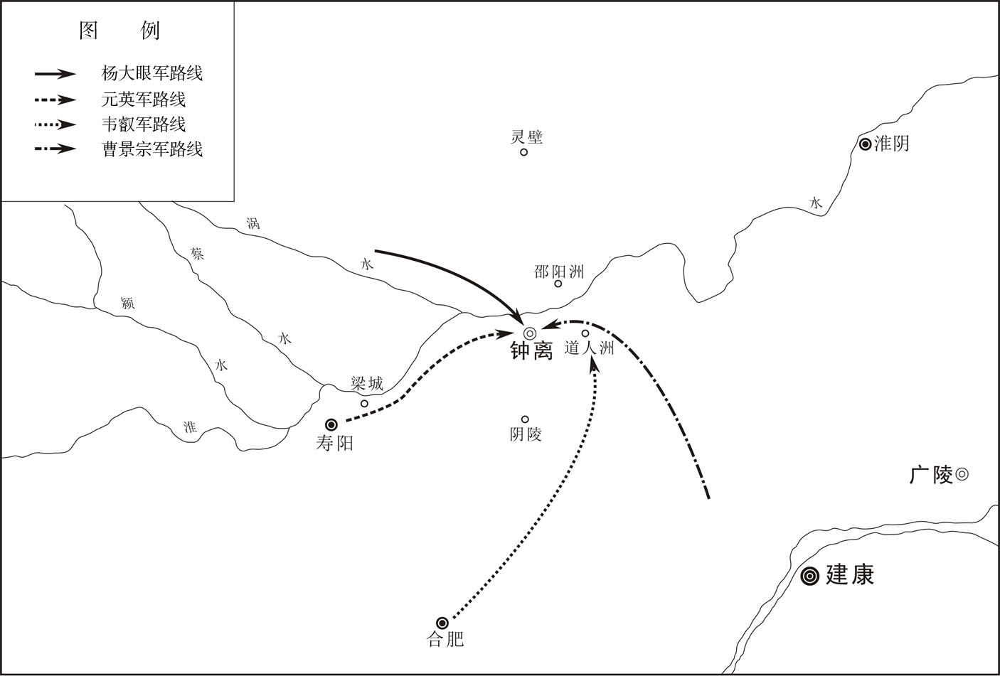
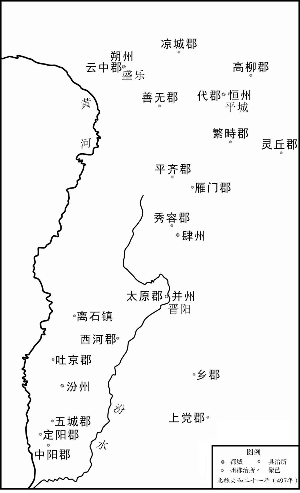
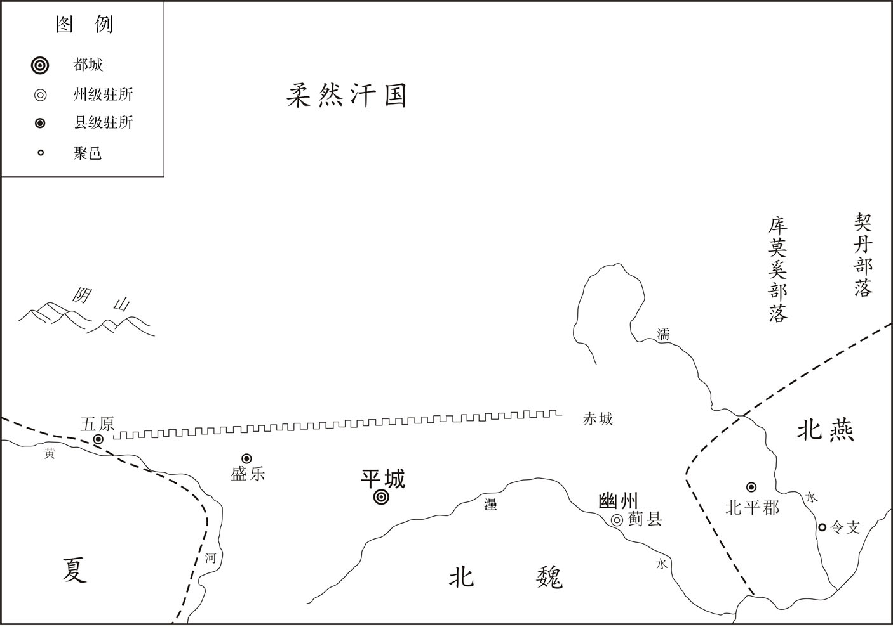
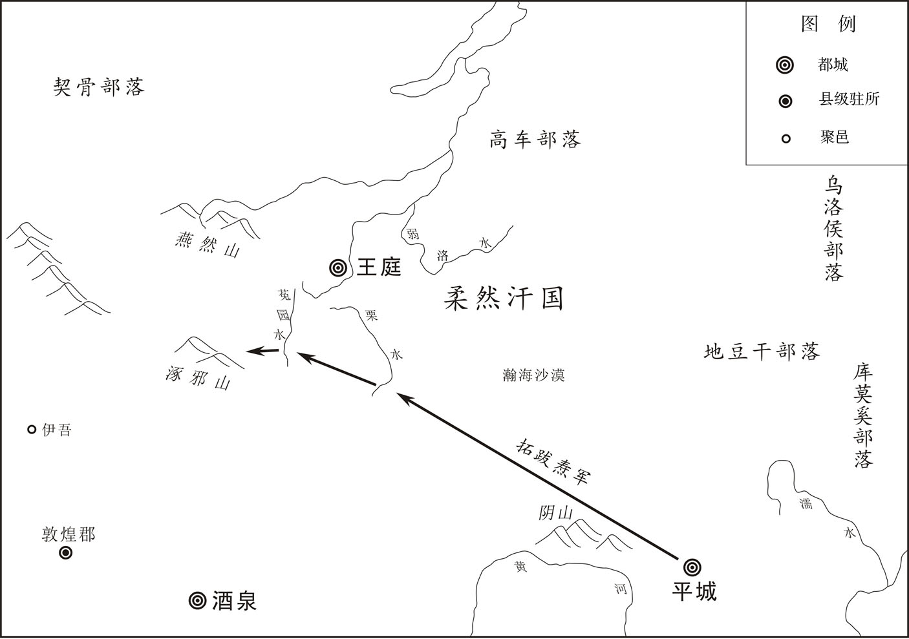
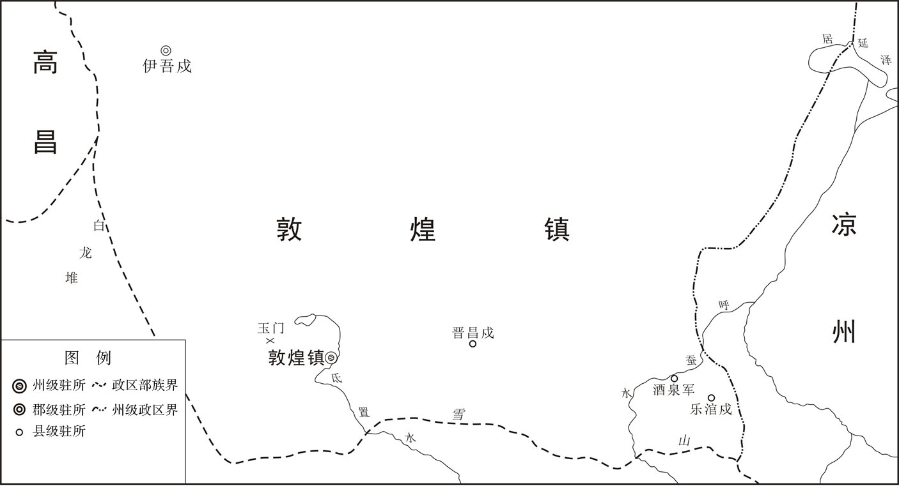
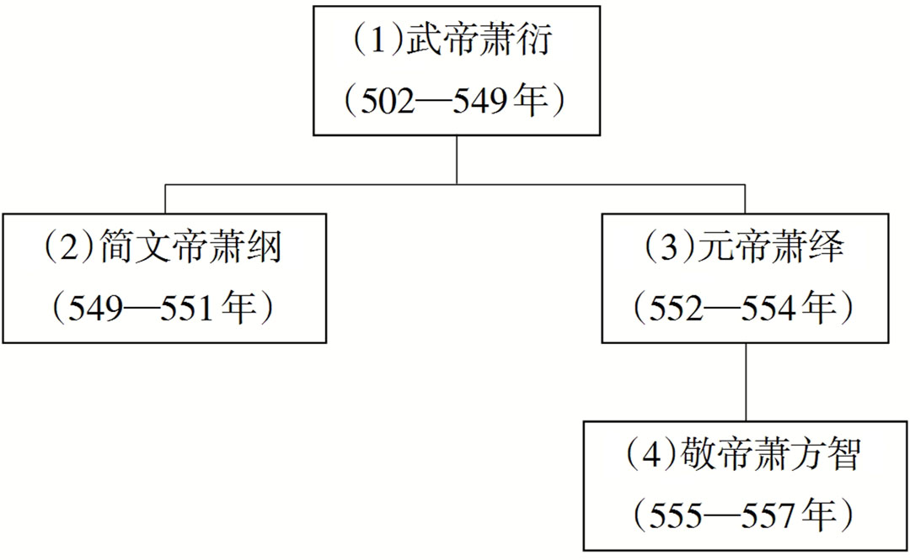
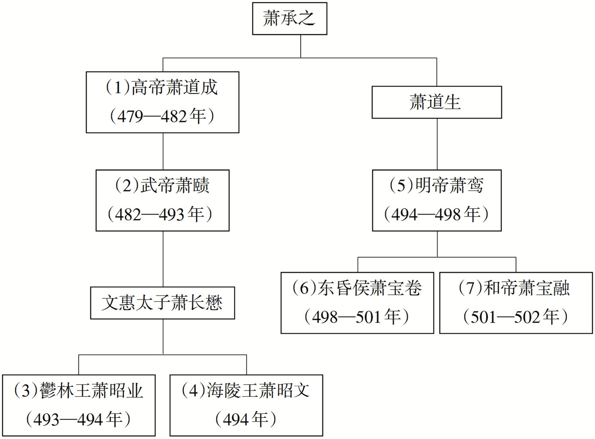
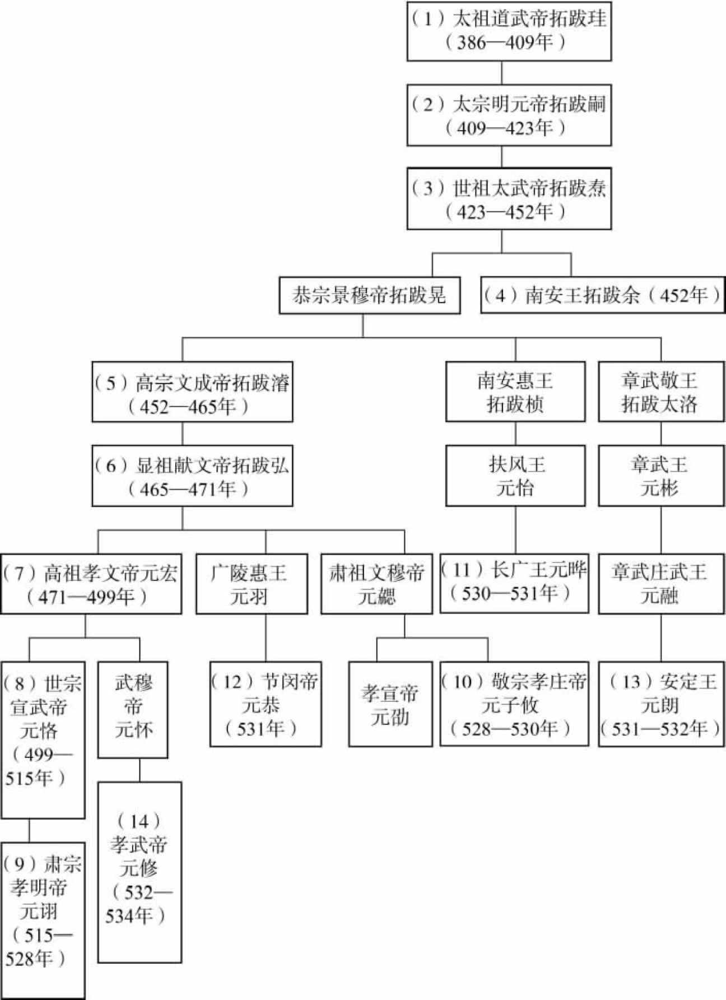
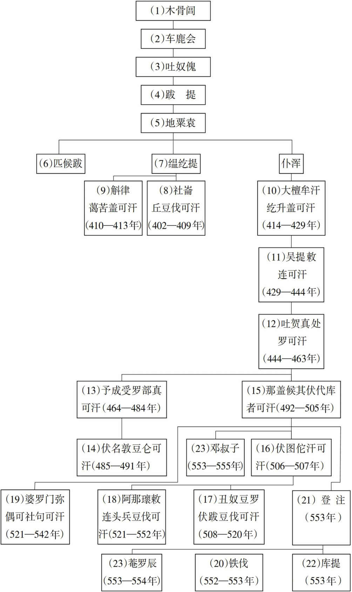

# 目录

元魏寇齐

萧衍篡齐

南北交兵

魏伐柔然

附录： 
南梁皇帝世系表

南齐皇帝世系表

北魏皇帝世系表

柔然可汗世系表

返回总目录

# 元魏寇齐

## 【内容提要】

《元魏寇齐》叙述了南朝齐明帝萧鸾（luán）建武元年（494年）至齐殇（shāng）帝萧宝卷（东昏侯）永元元年（499年）间，在以南齐雍（yōng）州（治襄阳，今湖北襄阳）为中心的南北朝交界地区所发生的北魏与南齐之间的战争。此次南北战争分为两个阶段，历时约两年零两个月。

南朝齐明帝建武元年（494年），南齐发生政变，齐武帝萧赜（zé）临终任命的辅政大臣，时任侍中、左仆射（yè）的萧鸾废南齐第四任皇帝萧昭文为海陵王，自立为帝。与此同时，南齐雍州刺史曹虎请降于北魏。因此，北魏孝文帝拓跋（bá）宏欲趁机举兵南伐，以建立统一大业。此次南征，北魏朝中分反战和主战两派，双方各执己见。最后，孝文帝拓跋宏力排众议，举兵南进，四路大军兵发洛阳（今河南洛阳东北），卢渊攻赭（zhě）阳（今河南方城）；刘昶（chǎng）、王肃攻义阳（今河南信阳西北）；拓跋衍（yǎn）攻钟离（今安徽凤阳东北）；刘藻攻南郑（今陕西汉中），北魏的军事进攻在南齐之雍州、司州（治今河南信阳）、北徐州（治今安徽凤阳东北）、梁州（治今陕西汉中）等地全线展开。齐明帝萧鸾调遣司、徐、豫州的军队抵御北魏军。建武二年（495年），北魏孝文帝拓跋宏亲率三十万大军抵达前线，围困寿阳（今安徽寿县）、钟离等地，久攻不下。与此同时，司州方面，南齐为解义阳之危急，派兵攻克了北魏建陵（今江苏新沂南）、厚丘（今江苏沭阳北）等城池，致使北魏兵败义阳；梁州方面，拓跋英、刘藻围攻南郑几十天，仍然无法将其攻克；雍州方面，卢渊、拓跋鸾兵败赭阳；薛真度兵败沙堨（è）（今河南南阳南）。雍州、司州、北徐州、梁州全线受阻，北魏无奈撤军，班师返洛。

南朝齐明帝建武四年（497年），北魏发动二十万大军兵分三路再次南下，一路攻赭阳、舞阴（今河南泌阳西北）；一路攻南阳（治今河南南阳）；一路攻新野（今河南新野）。双方相持四个多月，不分胜负。齐明帝永泰元年（498年），北魏军攻破新野之后，南齐之湖阳（今河南唐河西南）、赭阳、南阳等地相继失守，齐将崔慧景、萧衍（yǎn）等人据守襄阳（今湖北襄阳），对抗北魏军，战争进入僵持状态。后因齐明帝萧鸾病亡，北魏退兵。南朝齐东昏侯永元元年（499年），齐将陈显达等攻北魏，欲夺回雍州失守各郡，无果。北魏孝文帝元宏北归，亡于谷塘（táng）原（今河南邓州东南）。双方罢兵。

此次南北之战，北魏作为主动出击的一方，动用了巨大的人力、物力、财力，但限于天时、地利及人员的因素，没有对南齐造成致命的打击。南北战争暂告一段落。

## 【原文】

**齐明帝建武元年[1]。魏主以上废海陵王自立，谋大举入寇[2]。会边将言，雍州刺史下邳曹虎遣使请降于魏，十二月辛丑朔，魏遣行征南将军薛真度督四将向襄阳，大将军刘昶、平南将军王肃向义阳，徐州刺史拓跋衍向钟离，平南将军广平刘藻向南郑[3]。真度，安都从祖弟也[4]。以尚书卢渊为安南将军，督襄阳前锋诸军[5]。渊辞以不习军旅，不许。渊曰：“但恐曹虎为周鲂耳[6]。”**

## 【注文】

[1]齐：朝代名（479—502年），共历二十四年，是中国古代南北朝时期南朝的第二个朝代，传七代，史称南齐或萧齐，都建康（今江苏南京）。　　明帝：即南齐的第五位皇帝萧鸾（luán）（452—498年），南齐高帝萧道成的侄子。年少丧父，由叔父萧道成抚养长大。南齐武帝萧赜（zé）朝，官至侍中、尚书令，并于武帝临终时受托辅佐皇太孙萧昭业。鬱林王萧昭业隆昌元年（494年），杀萧昭业，改立其弟萧昭文。不久又废其为海陵王，自立为帝。性猜忌，晚年崇信道教，齐明帝萧鸾永泰元年（498年），病亡，年四十七岁，谥号明帝。　　建武：南齐明帝萧鸾在位期间的所用的第一个年号，即公元494年至498年。

[2]魏主：北魏第七位皇帝元宏（467—499年），献文帝拓跋（bá）弘长子。母因祖制被杀，由祖母冯太后抚养成人。崇尚中原文化，儒雅有识，在位期间进行改革，力主汉化，迁都洛阳，提高了拓跋鲜卑人的文化水平，促进了民族融合，史称北魏孝文帝改革。祖制，指北魏“子贵母死制”，即皇子一旦被立为太子，其生母必须被赐死，目的是为防止后族专权。此制始于道武帝拓跋珪（guī），终于宣武帝元恪（kè）。　　上：指南齐明帝萧鸾。　　海陵王：南齐第四位皇帝萧昭文（480—494年），鬱林王萧昭业的异母弟。鬱林王萧昭业隆昌元年（494年）四月，被萧鸾立为帝，十月，被废为海陵王，十一月，被杀，谥号恭王，年十五岁。

[3]雍州：古州名，南齐属州，治襄阳（今湖北襄阳），领襄阳、冯（píng）翊（yì）等郡，因境内有除汉人以外的其他族群，故另设宁蛮府管辖。所辖约相当于今湖北西北部之襄阳、老河口、枣阳，以及河南西南部的南阳、邓州等地区。　　刺史：古代职官名，是中国古代州一级地方长官。始置于西汉武帝，掌地方监察。西汉成帝时，改名为州牧；西汉哀帝时复为刺史。东汉末，天下变乱，刺史权重，渐成为地方军政长官。后世沿置，魏晋南北朝时期，刺史有领兵、不领兵之分，领兵刺史多加军号（使持节某州诸军事）。南齐时，领兵刺史列右第四品，不领兵刺史，列右第五品。　　下邳（pī）：古县名，北魏徐州下邳郡之属县，治今江苏睢宁县古邳镇东。　　曹虎（生卒年不详）：下邳郡下邳（今江苏睢宁县古邳镇东）人。刘宋朝曾于萧道成帐下听令。南齐代宋后，官历齐高帝、武帝、鬱林王、海陵王、明帝、东昏侯六朝，是南齐对抗北魏的主要将领之一。晚年贪财吝啬，被东昏侯萧宝卷所杀，年六十有余。　　魏：朝代名（386—534年），共历一百四十九年。东晋孝武帝司马曜（yào）太元八年（383年），淝水之战后，前秦败亡，鲜卑拓跋部势力渐强。386年，鲜卑拓跋部的首领拓跋珪（guī）重建代国，定都盛乐（今内蒙古和林格尔北）。同年改国号为魏，史称北魏，又名元魏、拓跋魏。北魏道武帝拓跋珪天兴元年（398年），迁都平城（今山西大同东北），北魏孝文帝拓跋宏太和十七年（493年），迁都洛阳（今河南洛阳东北）。北魏孝武帝元修永熙三年（534年），分裂为东魏、西魏。　　辛丑朔：初一。辛丑，属于中国古代的干支纪法，即用十天干（甲、乙、丙、丁、戊、己、庚、辛、壬、癸）和十二地支（子、丑、寅、卯、辰、巳、午、未、申、酉、戌、亥）依次相配，组成六十个基本单位，作为年、月、日、时的序号。朔，农历每月初一。　　行：代理。　　征南将军：古代武官名，掌军事。东汉献帝建安年间曹操所置四征将军（东、西、南、北）之一。北魏孝文帝太和中，列右从第一品中，后改为右第二品。　　薛真度（生卒年不详）：北魏将领，曾与其族弟刘宋名将薛安都自南朝降魏。官历北魏孝文帝元宏、宣武帝元恪二朝。　　襄阳：古郡名，南齐雍州襄阳郡，领四县，治襄阳（今湖北襄阳），所辖约相当今湖北襄阳。　　大将军：古代武官名，掌征伐。战国、秦、汉皆置，南北朝沿置，北魏孝文帝太和中列右第一品上，宣武帝后改为右第一品。　　刘昶（chǎng）（436—497年）：南朝宋文帝刘义隆第九子。465年，前废帝萧子业即位，怀疑他有异志，因此，他北逃降魏。北魏孝文帝元宏太和二十一年（497年），亡，时年六十二岁。　　平南将军：古代武官名，掌军事。始置于东汉献帝建安初，魏晋时四平（东、西、南、北）将军之一。北魏孝文帝太和中列右从第二品上，宣武帝后改为右第三品。　　王肃（464—501年）：东晋权臣王导之后。字恭懿（yì），琅（láng）邪（yá）临沂（yí）（今山东临沂）人，父、兄均被南齐武帝萧赜（zé）所杀，北魏孝文帝拓跋宏太和十七年（493年），北奔降魏，为镇边将领，颇有佳绩，并参与孝文帝改革。北魏宣武帝元恪景明二年（501年），亡。　　义阳：古县名，南齐司州治所（今河南信阳西北）。　　徐州：古州名，北魏属州，治彭城（今江苏徐州），领七郡、二十四县，所辖约相当于今山东枣庄、临沂，河南商丘，安徽宿州，江苏徐州、宿迁等四省交会地区。　　拓跋衍（yǎn）（生卒年不详）：北魏景穆帝拓跋晃之孙，字安乐，历任梁、徐、雍等州刺史，为政清廉。　　钟离：古郡名，南齐北徐州属郡，领四县，治燕县（今安徽凤阳东北）。　　广平：古郡名，北魏所属相州之广平郡，领平恩、曲安、邯郸、广年、曲梁等县，治曲梁（今河北邯郸东北）。　　刘藻（434—500年）：字彦先，广平易阳（今河北永年东南）人，出身官宦。好读书，喜饮酒，善于与人交往。祖上曾随晋室南迁，父在南朝宋做过太守。前废帝刘子业永光年间随其姐夫自南朝投奔北魏，曾任边地太守八年，北魏孝文帝元宏朝数率军南讨，北魏宣武帝元恪景明初，亡，年六十七岁。　　南郑：古地名，南齐梁州治所，今陕西汉中。

[4]安都：即薛安都（？—469年），河东汾阴（今山西万荣西南）人，性豪爽，善骑射。初仕北魏，北魏太武帝拓跋焘太平真君五年（444年），降南朝。南朝宋前废帝刘子业景和元年（465年），拥立刘子勋为帝，反抗宋明帝刘彧（yù），兵败，复降北魏。北魏献文帝拓跋弘皇兴三年（469年），亡。　　从祖弟：同一曾祖父而非同一祖父的弟弟，即今之堂弟。

[5]尚书：古代职官名，秦始置，西汉沿置，分四曹，职掌收发文书、传达记录诏命章奏，隶少府。南北朝沿置，北魏孝文帝太和中列曹尚书列第二品中，后改列右第三品。　　卢渊（454—501年）：字伯源，范阳（治今河北涿州）人，出身官宦。北魏孝文帝元宏朝曾上表劝止南征，后随从出征，兵败，被免去官爵，后复官。北魏宣武帝元恪景明二年（501年），亡，年四十八岁。　　安南将军：古代武官名，掌军事。始置于东汉末，四安将军（东、南、西、北）之一。北魏孝文帝太和中列右从第二品下，后改为右第三品。

[6]周鲂（fáng）（生卒年不详）：字子鱼，吴郡阳羡（今江苏宜兴南）人，三国时孙吴鄱（pó）阳太守。三国魏文帝曹丕（pī）黄初七年（226年），曾断发为誓，诈降于曹魏，大败魏军。此以曹虎比周鲂。

## 【译文】

南朝齐明帝（萧鸾）建武元年（494年），北魏孝文帝（拓跋宏）因南朝齐明帝废海陵王（萧昭文）自立为帝，计划趁机率兵大举入侵南朝。正值边将上报说，南朝齐之雍州刺史下邳人曹虎派使臣至魏，请求投降。十二月辛丑朔（初一日），北魏派代理征南将军薛真度率四位将领前往襄阳，大将军刘昶、平南将军王肃前往义阳，徐州刺史拓跋衍前往钟离，平南将军、广平人刘藻前往南郑。薛真度，是薛安都的族弟。任命尚书卢渊为安南将军，监督襄阳前线各军。卢渊以不熟悉军队及相关作战事宜为由，推辞委任，孝文帝不答应。卢渊说：“只怕曹虎就是下一个周鲂。”

## 【原文】

**魏主欲自将入寇。癸卯，中外戒严[1]。戊申，诏代民迁洛者复租赋三年[2]。相州刺史高闾上表称：“洛阳草创，曹虎既不遣质任，必非诚心，无宜轻举[3]。”魏主不从。久之，虎使竟不再来。魏主引公卿议行留之计，公卿或以为宜止，或以为宜行[4]。帝曰：“众人纷纭，莫知所从。必欲尽行留之势，宜有客主，共相起发。任城、镇南为留议，朕为行论，诸公坐听得失，长者从之[5]。”众皆曰：“诺。”镇南将军李冲曰：“臣等正以迁都草创，人思少安，为内应者未得审谛，不宜轻动[6]。”帝曰：“彼降款虚实，诚未可知。若其虚也，朕巡抚淮甸，访民疾苦，使彼知君德之所在，有北向之心[7]。若其实也，今不以时应接，则失乘时之机，孤归义之诚，败朕大略矣[8]。”任城王澄曰：“虎无质任，又使不再来，其诈可知也。今代都新迁之民，皆有恋本之心[9]。扶老携幼，始就洛邑，居无一椽之室，食无甔石之储[10]。又冬月垂尽，东作将起，乃‘百堵皆兴’、‘俶载南亩’之时，而驱之使擐甲执兵，泣当白刃，殆非歌舞之师也[11]。且诸军已进，非无应接。若降款有实，待既平樊、沔，然后銮舆顺动，亦何晚之有[12]？今率然轻举，上下疲劳，若空行空返，恐挫损天威，更成贼气，非策之得者也。”司空穆亮以为宜行，公卿皆同之[13]。澄谓亮曰：“公辈在外之时，见张旗授甲，皆有忧色，平居论议，不愿南征，何得对上即为此语？面背不同，事涉欺佞，岂大臣之义，国士之体乎[14]！万一倾危，皆公辈所为也。”冲曰：“任城王可谓忠于社稷[15]。”帝曰：“任城以从朕者为佞，不从朕者岂必皆忠。夫小忠者大忠之贼，无乃似诸。”澄曰：“臣愚暗，虽涉小忠，要是竭诚谋国，不知大忠者竟何所据。”帝不从。**

## 【注文】

[1]中外：即朝内外。

[2]代民：指原居于代都平城（今山西大同东北）地区的百姓。　　租赋：即田租和赋税，是中国古代国家强制征收的租税。

[3]相州：古州名，北魏道武帝拓跋珪天兴四年（401年）置，治邺（今河北临漳西南），东魏孝静帝元善见天平元年（534年），改相州为司州。领六郡、二十五县，所辖约相当于今河北邢台、邯郸、武安及河南安阳、林州地区。　　高闾（lǘ）（？—502年）：少好学，善著文，其文与北魏名臣高允不相上下，时称“二高”。北魏太武帝拓跋焘时入仕，官历六朝。　　质任：意即人质。古代交战双方为相互约束，互派亲属去对方做人质，或求和的一方为表示臣服的诚意，派近亲做人质。

[4]公卿：大臣。

[5]任城：指北魏宗室任城王拓跋澄（466—519年），字道镇，北魏景穆帝拓跋晃之孙。为北魏孝文帝、宣武帝、孝明帝三朝元老。积极支持孝文帝拓跋宏迁洛，一生勤于政事，为北魏之功臣。　　镇南：指镇南将军李冲（450—498年），西凉王李暠（hào）之后，官历北魏献文帝、孝文帝两朝。北魏孝文帝拓跋宏太和十年（486年），创立三长制。心思巧慧，曾参与魏都平城、洛阳的修建。太和十年（486年）起，三长制取代宗主督护的地方基层行政建置。五家为一邻，五邻为一里，五里为一党，分别设邻长、里长、党长，三长负责管理户民、检核户口、征租调、征发兵役和徭役。宗主都护，北魏早期的地方基层政权组织形式。以坞堡主，即地方豪强大户为宗主，代表政府行使基层政权职能，管理农民。　　朕（zhèn）：我、我的，秦始皇以后专用作皇帝的自称。

[6]谛（dì）：仔细地听或看。

[7]降款：降服。　　淮甸（diàn）：淮河流域。甸，古时称郊外的地方为甸。

[8]乘（chéng）：趁机，利用。

[9]代都：指北魏前期之都城——平城（今山西大同东北）。

[10]洛邑（yì）：即时北魏之都城洛阳（今河南洛阳东北）。邑，即城市。　　椽（chuán）：盖房用的木条，放置在檩（lǐn）上。　　甔（dān）：坛子一类的瓦器。

[11]俶（chù）：开始。　　擐（huàn）甲执兵：擐，穿。穿着铠甲，拿着兵器。　　殆（dài）：大概。

[12]樊（fán）、沔（miǎn）：樊，指樊城，时属南齐雍州襄阳郡之襄阳县（今湖北襄阳市襄州区）；沔，指沔水，古水名，又名汉水，发源于今陕西汉中，在武汉汉口汇入长江。　　銮（luán）舆（yú）：皇帝的车驾。

[13]司空：古代官职名。西周始置，是主管水利土木工程和官府手工业的最高行政长官。春秋战国沿置。东汉为三公之一。魏晋南北朝为名誉宰相，无实际职掌。北魏时与司徒、太尉合称右三公，北魏孝文帝太和中列右第一品中，后改为右第一品。　　穆亮（451—502年）：代（今山西大同东北）人，字幼辅。北魏名将，北魏献文帝拓跋弘朝娶中山大长公主为妻。历献文帝、孝文帝、宣武帝三朝，为官宽简，为民所念。

[14]欺佞（nìng）：欺骗。佞，用花言巧语吹捧、拍马。

[15]社稷（jì）：古代皇帝及诸侯祭祀（sì）的土神和谷神，借指国家。

## 【译文】

北魏孝文帝（拓跋宏）打算亲自率兵入侵南朝。南齐建武元年（494年）十二月癸卯（初三日），内外戒严。戊申（初八日），北魏孝文帝下诏，自代都平城迁到洛阳的百姓，免征三年田租赋税。北魏相州刺史高闾上表说：“我朝才建都洛阳，曹虎既然不派送人质，一定不是诚心归降，不宜轻举妄动。”北魏孝文帝不听取他的建议。很长时间过去了，曹虎的使节最终没有再来。孝文帝召集公卿大臣商议走还是留的计策，大臣们有的认为应当停止行动，有的认为应当继续前行。孝文帝说：“众说纷纭，不知该听谁的意见。一定要把走或留的形势讲清楚，应当有客、主两方，共同辩论，相互启发。任城王（拓跋澄）、镇南将军（李冲）作为主留的一方发表议论，我作为主进的一方阐述观点，各位大臣坐听双方看法之得失，哪方有理听从哪方。”众人都说：“好。”镇南将军李冲说：“我们认为此时正值迁都草创之际，大家都希望稍事安定，而且，对于作为内应的南朝人，还没有审查清楚，不宜轻率行动。”孝文帝说：“南朝人归降之真假，确实不清楚。假设其假降，我带兵巡行安抚淮河流域，探访民众疾苦，可以使他们知晓北魏君王的仁德胸怀，产生北归之心。假设其真降，现在不及时接应，就会失去良好的机会，既辜负了归义者的诚心，又破坏了我的宏图大略。”任城王拓跋澄说：“曹虎不派人质，也不再派使者来，他的欺诈态度已经明了。如今，自代都平城新迁到洛阳的百姓，都有留恋故土之心。他们扶老携幼，刚到洛阳，就住所而言，没有一根椽子支撑的居室，就饮食而言，没有一瓮或一石（dàn）粮食的储备。再加上冬天将尽，春耕将始，正是‘百室兴建’‘开始耕作’的时候，政府却要迫使他们身穿铠甲，手执兵器，哭泣着去抵御白刃，这样的军队必定是不能得胜的军队。而且，各路军队已开进，并非没有接应。如果他们是真心降魏，等我们平定了樊、沔等地，然后车驾顺势南行，也有什么晚的？如今轻率而行，上下疲劳，如果空去空回，恐怕会挫伤我朝的威望，反而助长敌人的气势，非可行之策。”司空穆亮认为宜行，大臣们都同意他的看法。拓跋澄对穆亮说：“你们在外面的时候，见到旌（jīng）旗招展、披甲执坚的阵势，都面露忧色，平素居家议论，不愿南征，为何今日面对皇上就说这样的话？当面一套，背后一套，所做之事牵涉欺骗和谄媚，这岂是大臣应有之义，国士应有之体！万一失败，都是你们这些人所造成的。”李冲说：“任城王可以说是忠于社稷。”孝文帝说：“任城王把赞成我意见的人视为谄媚之臣，不赞成我意见的人难道一定都是忠臣？所谓小忠诚是大忠诚的敌人，不是正与诸位的情况相似吗？”拓跋澄说：“臣愚昧不明，虽然属于小忠，但重要的是竭尽诚心为国家谋划，不知道所谓大忠究竟以什么为依据。”孝文帝没有听取他的意见。

## 【原文】

**辛亥，发洛阳，以北海王详为尚书仆射，统留台事；李冲兼仆射，同守洛阳[1]。给事黄门侍郎崔休为左丞，赵郡王干都督中外诸军事，始平王勰将宗子军宿卫左右[2]。休，逞之玄孙也。戊辰，魏主至悬瓠[3]。己巳，诏寿阳、钟离、马头之师所获男女皆放还南[4]。曹虎果不降。**

## 【注文】

[1]洛阳：时为北魏之都城，即今之洛阳东北。　　北海王详：即北魏宗室拓跋详（生卒年不详），北魏献文帝拓跋弘庶出子。孝文帝元宏临终时受顾命任司空，辅佐宣武帝元恪。贪婪喜财，因被人诬告谋反，暴亡。　　尚书仆射（yè）：古代职官名，掌国之政要。始置于秦汉，初为少府属官，掌档案、文书，后职权渐重。古时重视武官，常用善射者掌管国事，所以称为仆射。东汉献帝刘协建安四年（199年），分设左、右仆射，左居其上，右居其下，协助尚书令处理政务。北魏孝文帝太和中列右从第一品中，后改为右第二品。　　留台：古时留台有三意：指帝王离京后，奉命留守京师的职官机构；王朝迁都后，设置于旧都的官署机构；负监察之职的御史台。此指北魏孝文帝元宏南征，留守洛阳（今河南洛阳东北）的政治及军事机构。

[2]给（jǐ）事黄门侍郎：古代职官名，又名黄门郎、给事黄门郎、黄门侍郎。始置于秦，供职宫内，随侍皇帝，掌饮食起居、引诸王入宫就座、传达诏令等事务。因宫禁之门称为黄闼（tà），所以得名。东汉合并“黄门侍郎”与“给事黄门”而置。南北朝沿置，其职掌亦有所改变，与侍中共同负责门下省之事。北魏孝文帝太和中列右第三品中，后改为右第四品。　　崔休（472—523年）：祖仕南朝宋，父早亡。雅善好学，博通经史，为官清廉，历北魏孝文、宣武、孝明三朝。　　左丞：古代职官名，即尚书左丞。尚书令之属官，东汉始置，辅佐尚书令，统领纲纪。南北朝沿置，北魏孝文帝太和中列右从第四品中，后改为右从第四品。　　赵郡王干：即北魏宗室拓跋干（469—499年），北魏献文帝拓跋弘庶出子。初封为河南王，北魏迁都洛阳后，改封赵郡王。贪婪淫暴，不遵法典。北魏孝文帝元宏太和二十三年（499年），亡，年三十一岁。　　都督中外诸军事：古代职官名，掌军事。始置于三国魏文帝黄初三年（222年）。南北朝沿置，北魏孝文帝太和中列右第一品下，后改为右从第一品。　　始平王勰（xié）：即北魏宗室拓跋勰（473—508年），北魏献文帝拓跋弘庶出子。北魏孝文帝太和九年（485年），封始平王，后改封彭城王。北魏政治家、诗人。学识渊博，为官廉正，有功于国，无害于百姓，孝文、宣武两朝的股肱（gōng）之臣。后因受高肇（zhào）威逼，饮毒酒而亡。

[3]逞（chěng）：即崔逞（生卒年不详），崔休之先祖，字叔祖，清河东武城（今山东武城）人，出身于世宦之家。少好学，有文才。北魏道武帝拓跋珪（guī）时降魏，历任要职，后被赐死。　　悬瓠（hú）：古城名，南北朝时名上蔡，北魏豫州治所（今河南汝南）。

[4]寿阳：古县名，始置于秦。秦时，称寿春，属九江郡。两汉沿置。曹魏属淮南郡。西晋属豫州淮南郡。东晋时，为避晋武帝皇后郑阿春的讳，改称寿阳。南朝宋改为睢（suī）阳，属豫州南梁郡；南齐改为寿阳。北魏攻占淮南，改为寿春，属于魏扬州淮南郡；南梁攻克后，为南豫州南梁郡治所。今安徽寿县。　　马头：古郡名，南齐北徐州马头郡，治已吾（今安徽凤阳西）。

## 【译文】

十二月辛亥（十一日），北魏发兵于洛阳，任命北海王拓跋详为尚书仆射，统领洛阳事宜；李冲兼任仆射，与北海王同守洛阳。任命给事黄门侍郎崔休为尚书左丞，赵郡王拓跋干为都督中外诸军事，始平王拓跋勰率领宗族子弟组成的军队担任警卫。崔休，是崔逞的玄孙。戊辰（二十八日），北魏孝文帝拓跋宏率兵至悬瓠。己巳（二十九日），下诏将寿阳、钟离、马头各军所俘获的男女人口都放还南朝。曹虎果然不降北魏。

## 【原文】

**魏主命卢渊攻南阳[1]。渊以军中乏粮，请先攻赭阳以取叶仓，魏主许之[2]。乃与征南大将军城阳王鸾、安南将军李佐、荆州刺史韦珍共攻赭阳[3]。鸾，长寿之子；佐，宝之子也[4]。北襄城太守成公期闭城拒守[5]。薛真度军于沙堨，南阳太守房伯玉、新野太守刘思忌拒之[6]。**

## 【注文】

[1]南阳：古郡名，南齐雍州南阳郡，治宛县（今河南南阳），领七县。所辖为今河南南阳一部分。

[2]赭（zhě）阳：古地名，指赭阳城。南齐雍州北襄城郡治所（今河南方城）。

[3]征南大将军：古代武官名，掌军事。东汉献帝建安中曹操置，为四征（东、南、西、北）将军之一，征南将军中资深者为征南大将军。北魏，从一品中。　　城阳王鸾：即北魏宗室拓跋鸾（？—505年），北魏景穆帝拓跋晃之孙，城阳王拓跋长寿次子，袭封城阳王。历北魏孝文、宣武二朝，乐佛道，善武艺。　　李佐（？—501年）：北魏将领李宝之第四子，字季翼，文武兼备。北魏孝文帝元宏朝，数率军南讨，历任要职。北魏宣武帝元恪初，任荆州刺史，为政有佳绩。北魏宣武帝景明二年（501年），亡，时年七十一岁。　　荆州：古州名，北魏属州，领八郡、四十一县，治穰（rǎng）县（今河南邓州），所辖约相当于今河南南阳、平顶山、三门峡地区。　　韦珍（435—508年）：字灵智，北魏孝文帝元宏赐名珍，仕北魏曾任荆州刺史、鲁阳郡守等职，为政有佳绩。北魏宣武帝元恪永平元年（508年），亡，年七十四岁。

[4]长寿：即拓跋长寿（？—475年），北魏景穆帝拓跋晃之子，北魏献文帝拓跋弘皇兴二年（468年），封为城阳王，任沃野镇都大将。性聪慧，在镇有威名。北魏孝文帝元宏延兴五年（475年），亡。　　宝：即李宝（？—459年），字怀素，陇西狄道（今甘肃临洮）人，自称为西凉王李暠（hào）之后。北魏太武帝拓跋焘时，自敦煌归降北魏。北魏文成帝拓跋濬（jùn）朝，镇守怀荒镇。北魏文成帝拓跋濬太安五年（459年），亡，年五十三岁。

[5]北襄城：古郡名，指南齐雍州北襄城郡，治赭阳城，也称方城（今河南方城）。　　成公期（生卒年不详）：南梁将领。

[6]沙堨（è）：古地名，位于南齐雍州南阳郡治所宛县（今河南南阳）南。　　房伯玉（生卒年不详）：原为北魏将领，后降南梁，南齐明帝萧鸾朝，任南阳太守，南齐明帝建武元年（494年），北魏孝文帝攻破南阳之宛城，房伯玉降魏，亡于北魏宣武帝元恪朝。　　新野：古郡名，南齐雍州新野郡，治新野（今河南新野），领六县。　　太守：古代职官名，为地方郡一级长官，始置于秦。原名郡守，属官有郡丞和郡尉。西汉景帝中元二年（前148年），更名为太守。后世沿置。　　刘思（生卒年不详）：南齐将领。

## 【译文】

北魏孝文帝（拓跋宏）命令卢渊攻打南阳。卢渊因军中缺粮，请求先攻打赭阳，以夺取其叶仓屯粮，孝文帝同意了他的请求。于是，卢渊与征南大将军、城阳王拓跋鸾和安南将军李佐、荆州刺史韦珍一同攻打赭阳。拓跋鸾，是拓跋长寿之子；李佐，是李宝之子。南齐北襄城太守成公期闭城拒守。薛真度屯兵于沙堨（è），南齐南阳太守房伯玉、新野太守刘思忌率兵御敌。

## 【原文】

**二年春正月壬申，遣镇南将军王广之督司州，右卫将军萧坦之督徐州，尚书右仆射沈文季督豫州诸军以拒魏[1]。**

## 【注文】

[1]镇南将军：古代武官名，掌军事。始置于东汉末，三国魏时四镇将军（东、南、西、北）之一。南北朝沿置，南齐列右第三品。　　王广之（425—497年）：沛郡相（今安徽淮北市相山区）人，少好弓马，善武艺。原为南朝宋臣，宋亡仕齐，历五朝。齐明帝萧鸾时参与谋废鬱林王萧昭业、谋害宗室的活动。南齐明帝建武四年（497年）亡，年七十三岁。　　司州：古州名，南齐属州，镇义阳（今河南信阳西北）。领十九郡，所辖约相当于今湖北随州、安陆、孝感、麻城及河南信阳等地区。　　右卫将军：古代武官名，掌军事，属禁卫系统。始置于秦汉，汉武帝时分置左、右二卫将军。南北朝沿置，南齐列右第四品。　　萧坦之（？—499年）：南齐萧氏宗室。肥壮面黑，声音嘶哑，心狠手辣。曾协助齐明帝萧鸾谋废齐少帝萧昭业。南齐东昏侯萧宝卷永元元年（499年），被杀。　　沈文季（442—499年）：南朝宋时期大臣，宋亡仕齐。官历六朝，齐明帝萧鸾之后，因时局混乱，托以老病，不预朝政。永元元年（499年），被东昏侯萧宝卷所杀。　　豫州：古州名，南齐属州，领二十一郡，治寿春（今安徽寿县）。所辖约为今安徽淮南、合肥西北部、安庆及湖北黄石东北部、河南信阳东部地区。

## 【译文】

南齐明帝建武二年（495年）春季正月壬申（初二日），南齐调遣镇南将军王广之统率司州军队，右卫将军萧坦之统率徐州军队，尚书右仆射沈文季统率豫州的军队，抵抗魏军。

## 【原文】

**癸酉，魏诏：“淮北之人不得侵掠，犯者以大辟论[1]。”乙未，拓跋衍攻钟离，徐州刺史萧惠休乘城拒守，间出袭击魏兵，破之[2]。惠休，惠明(1)之弟也[3]。刘昶、王肃攻义阳，司州刺史萧诞拒之[4]。肃屡破诞兵，招降万余人。魏以肃为豫州刺史。刘昶性褊躁，御军严暴，人莫敢言。法曹行参军北平阳固苦谏，昶怒，欲斩之，使当攻道[5]。固志意闲雅，临敌勇决，昶始奇之。**

## 【注文】

[1]大辟：死刑，即斩首。中国古代五种重刑之一。

[2]萧惠休（？—500年）：父兄皆曾为南朝宋旧臣，萧惠基之弟。南齐明帝建武二年（495年）因抗魏之功，获封赏，官至侍中。南齐东昏侯永元二年（500年），亡。

[3]惠明：即萧惠基（430—488年），萧惠休之兄。曾为刘宋臣，宋亡仕齐。历齐高帝萧道成、武帝萧赜二朝。善隶书、棋艺，通音律。

[4]萧诞（？—495年）：南兰陵（今江苏常州西北）人。南齐明帝萧鸾时率军御边。建武二年（495年）因受其兄萧谌（chén）牵连，被杀。萧谌（？—495年）：南齐老臣，历五朝。曾参与废杀鬱林王萧昭业，建武二年（495年），被齐明帝萧鸾所杀。

[5]法曹行参军：即司法参军事，古代职官名，掌刑法。两汉郡僚佐有决曹、贼曹椽（yuàn）。北齐与隋称法曹行参军。唐于诸王公、将军府称法曹参军事，州府称司法参军事，县称司法佐。宋有司法参军，掌议法断刑，又有司理参军。掌讼狱勘鞫（jū）。《隋书》、两《唐书》记此官，“参军”下有“事”字，《通典》《通考》无“事”字。　　北平：古郡名，即时北魏平州之北平郡，领朝鲜、新昌二县，治新昌（今河北卢龙）。　　阳固（467—523年）：字敬安，北魏北平无终（今天津蓟州区）人，少喜豪侠，不拘小节。年二十六始钟情于诗书，有文采。历北魏孝文、宣武、孝明三帝，北魏孝明帝元诩（xǔ）正光四年（523年），亡，时年五十七岁。一生为官清正，家无余财。　　谏（jiàn）：指对君主、尊长的言行提出批评或劝告。

## 【译文】

癸酉（初三日），北魏孝文帝拓跋宏下诏说：“对淮北的人不能侵犯、掠夺，违反者以杀头罪论处。”乙未（二十五日），拓跋衍攻打钟离，南齐徐州刺史萧惠休据城坚守，偶尔伺机出城袭击魏兵，大败魏兵。萧惠休，是萧惠基之弟。刘昶（chǎng）、王肃攻打义阳，南齐司州刺史萧诞率兵抵御。王肃屡次击败萧诞的军队，招降南齐军一万多人。北魏孝文帝任命王肃为豫州刺史。刘昶性格狭隘急躁，治军严厉凶暴，属下无人敢言。法曹行参军、北平人阳固苦苦劝谏，刘昶很生气，想杀掉他，派他担当攻击任务。阳固志趣娴雅，面对敌人却勇敢果断，刘昶才觉其不寻常。

## 【原文】

**丁酉，中外纂严[1]。以太尉陈显达为使持节、都督西北讨诸军事，往来新亭、白下以张声势[2]。**

## 【注文】

[1]纂（zuǎn）严：相继戒严。

[2]太尉：古代职官名。秦始置，与丞相、御史大夫并称三公，是中央政权主掌军事的高级官员之一。西汉武帝元狩四年（前119年），置大司马取代太尉，东汉光武帝建武末，复置太尉，汉灵帝中平末，太尉与大司马并置。后渐成虚衔或赠官。南北朝沿置，南齐列右第一品。　　陈显达（？—500年）：南北朝时期南朝著名将领，出身寒门，仕南朝刘宋、萧齐两朝。南齐东昏侯萧宝卷永元二年（500年），任江州刺史，因东昏侯昏愦（kuì），被迫举兵反齐，兵败被杀，时年七十二岁。一生战功卓著，具有杰出的政治及军事能力。　　使持节：古代职官名，始置于魏晋，代表皇帝掌管地方军事。节，也称旌（jīng）节，是权力的象征，朝命将，以节为信物，等级分为三种：使持节、持节、假节，权限渐弱。　　都督西北讨诸军事：古代职官名，“都督诸军事”的制度始于曹魏，即以亲信掌控地方军事大权。南齐列右第二品。　　新亭：古地名，位于建康（今江苏南京）西南。　　白下：古地名，指建康北面白石下的白石垒一带。与建康西南的军事要地新亭，一南一北，构成了建康城的南北门户。

## 【译文】

丁酉（二十七日），南齐内外相继戒严。齐明帝萧鸾任命太尉陈显达为使持节、都督西北讨诸军事，率军往来于新亭、白下之间，以扩张声势。

## 【原文】

**己亥，魏主济淮，二月，至寿阳，众号三十万，铁骑弥望[1]。甲辰，魏主登八公山，赋诗[2]。道遇甚雨，命去盖；见军士病者，亲抚慰之[3]。**

## 【注文】

[1]铁骑（jì）弥（mí）望：铁骑，指骑兵；弥，遍布，一眼望不到边。

[2]八公山：古山名，位于南齐豫州梁郡，今安徽寿县北。

[3]盖：也称华盖，指帝王的车盖。

## 【译文】

己亥（二十九日），北魏孝文帝（拓跋宏）率军渡过淮河，二月，到寿阳，号称三十万大军，远望去，满眼都是铁甲骑兵。甲辰（初五日），孝文帝登上八公山，赋诗一首。路上遭遇暴雨，命令撤去銮驾上的伞盖，见军士有生病者，亲自上前抚慰。

## 【原文】

**魏主遣使呼城中人，丰城公遥昌使参军崔庆远出应之[1]。庆远问师故，魏主曰：“固当有故。卿欲我斥言之乎，欲我含垢依违乎[2]？”庆远曰：“未承来命，无所含垢。”魏主曰：“齐主何故废立？”庆远曰：“废昏立明，古今非一，未审何疑？”魏主曰：“武帝子孙，今皆安在？[3]”庆远曰：“七王同恶，已伏管、蔡之诛[4]。其余二十余王，或内列清要，或外典方牧[5]。”魏主曰：“卿主若不忘忠义，何以不立近亲，如周公之辅成王，而自取之乎[6]？”庆远曰：“成王有亚圣之德，故周公得而相之[7]。今近亲皆非成王之比，故不可立。且霍光亦舍武帝近亲而立宣帝，唯其贤也[8]。”魏主曰：“霍光何以不自立？”庆远曰：“非其类也。主上正可比宣帝，安得比霍光。若尔，武王伐纣，不立微子而辅之，亦为苟贪天下乎[9]？”魏主大笑曰：“朕来问罪。如卿之言，便可释然。”庆远曰：“‘见可而进，知难而退’，圣人之师也。”魏主曰：“卿欲吾和亲，为不欲乎？”庆远曰：“和亲则二国交欢，生民蒙福；否则二国交恶，生民涂炭。和亲与否，裁自圣衷。”魏主赐庆远酒殽、衣服而遣之[10]。**

## 【注文】

[1]丰城公遥昌：即南齐宗室萧遥昌（？—498年），南齐高帝萧道成的兄长始安贞王萧道生之子。南齐明帝建武元年（494年），受封为丰城县公。次年（495年），率军镇守寿春，抵御北魏入寇。南齐明帝永泰元年（498年），亡。公：古代五等爵位之一。南北朝时公分为郡公和县公。　　崔庆远（生卒年不详）：南梁将领。

[2]垢（gòu）：同“诟”，耻辱。

[3]武帝：指南齐的第二位皇帝齐武帝萧赜（zé）（440—493年）。在位期间，下令特赦囚犯；赈济灾民及鳏（guān）寡孤独的人；奖励农桑、减轻租赋；提倡节俭，兴办教育；通好北朝，边境安定，百姓乐业，社会经济得到了一定的发展。

[4]管、蔡：指管叔、蔡叔，是周文王之子，周武王灭商后，将商都之地分与纣王之子武庚管理，管叔、蔡叔、霍叔作为三监监管。武王去世后，由其弟周公摄政，三监作乱，周公东征，平定叛乱。此以管、蔡之被诛，隐喻南齐武帝子孙之灭亡。

[5]清要：一般指地位显贵，职掌重要，且相对清闲的官职。　　方牧：古代地方长官方伯、州牧的并称，后泛指地方一级行政长官。

[6]周公之辅成王：周武王灭商立周两年后，亡故。其子姬诵即位，即周成王，时年十三岁。武王之弟周公旦摄政，尽心辅佐成王，排除内忧外患，巩固了周朝的统治。

[7]亚圣：指孔子之后儒家的代表人物孟子（约前372—前289年），名轲（kē），战国时期邹（今山东邹城东南）人，是孔子之后的儒家学派的代表人物之一，主张性善论、民本论，推崇仁治。史称亚圣。

[8]霍光（？—前68年）：西汉重臣，汉武帝亡故，霍光受武帝之托辅佐汉昭帝，执西汉权柄近二十年，为汉室中兴立下了汗马功劳。　　武帝：即西汉武帝刘彻（前156—前87年），西汉王朝的第六位皇帝，在位期间在政治、经济、军事等方面进行了一系列改革，促进了西汉的发展。　　宣帝：西汉第八位皇帝刘询（前91—前49年），西汉武帝的曾孙，幼年曾流落民间。公元前74年，汉昭帝刘弗陵亡故，无子，辅臣霍光拥立刘询为帝，即汉宣帝。在霍光辅佐下，汉宣帝时继续推行汉武帝后期以来的一系列政治、经济政策，促进了社会的发展，史称“昭宣中兴”。

[9]武王：即西周的开国君主姬发（？—前1043年），周文王之次子，经牧野之战，灭商建周，史称周武王，具有卓越的政治、军事才能。　　纣（zhòu）（？—前1046年）：商朝的末代君主。在位前期，勤于政事，国力强盛；后期，穷奢极欲、刚愎（bì）自用，致使商朝国灭。　　微子（生卒年不详）：名启，商王帝乙的长子，纣王的弟弟。武王灭商后，他袒露上身，双手捆绑于背后，请罪于武王，武王封其于微地（今山东梁山一带），后成王封其于商族的发祥地商丘（今河南商丘南），国号宋。

[10]殽（yáo，旧读xiáo）：殽，同“肴”，指鱼、肉一类的荤菜。

## 【译文】

北魏孝文帝（拓跋宏）派使臣向寿阳城中人喊话，丰城公萧遥昌派参军崔庆远出去应对。崔庆远问魏帝何故发兵，魏帝说：“当然师出有因。你想让我直言呢，还是想让我隐去丑事，含糊其词呢？”崔庆远说：“我尚未明白你们的来意，所以你没有必要隐瞒什么。”魏帝说：“南齐的君主为何废立？”庆远说：“废昏君立明主，古往今来不止一次，不知有什么可怀疑的？”魏帝说：“齐武帝的子孙，现在都在什么地方？”庆远说：“七王（萧子隆、萧子懋、萧子敬、萧子真、萧子伦、萧绍业、萧绍文等）因叛乱作恶，已得到了如同管叔、蔡叔一样的下场。其余二十多个王，有的在朝中位列清官要职，有的在外职掌方镇，任州牧。”魏帝说：“你的主上如果没有忘记忠义，为何不立武帝的近亲为帝，自己就像周公辅佐成王一样，却自立为主呢？”庆远说：“成王有亚圣的品质，所以周公能辅佐他。而今齐武帝之近亲都不可与成王相比，所以不可立为主。况且霍光也曾经废弃汉武帝的近亲，而拥立宣帝，是因为宣帝之贤德才能。”魏帝说：“霍光为什么不自立为帝？”庆远说：“因为他不是刘氏宗亲。而我主可与汉宣帝相比，怎么能与霍光同论。如此而论，武王伐纣，不立微子且辅佐他，也是苟且贪得天下了吗？”魏帝大笑说：“我来兴师问罪。如你所言，便可以解除疑虑了。”庆远说：“‘能进则进，知难而退’，就是圣人的军队。”魏帝说：“你想让我和亲，还是不想呢？”庆远说：“和亲可以使两国友好相处，百姓享福；否则两国交战，生灵涂炭。和亲与否，由您决定。”魏帝赐给崔庆远美酒佳肴、衣服，送他回城。

## 【原文】

**戊申，魏主循淮而东，民皆安堵，租运属路[1]。丙辰，至钟离。**

## 【注文】

[1]安堵（dǔ）：生活安定。堵，墙。

## 【译文】

戊申（初九日），北魏孝文帝（拓跋宏）顺着淮水向东行进，沿途百姓生活都很安定，运送粮物的车马络绎不绝。丙辰（十七日），到达钟离。

## 【原文】

**上遣左卫将军崔慧景、宁朔将军裴叔业救钟离[1]。刘昶、王肃众号二十万，堑栅三重，并力攻义阳，城中负楯而立[2]。王广之引兵救义阳，去城百余里，畏魏强，不敢进。城中益急，黄门侍郎萧衍请先进，广之分麾下精兵配之[3]。衍间道夜发，与太子右率萧诔等径上贤首山，去魏军数里[4]。魏人出不意，未测多少，不敢逼。黎明，城中望见援军至，萧诞遣长史王伯瑜出攻魏栅，因风纵火，衍等众军自外击之，魏不能支，解围去。己未，诞等追击，破之。诔，谌之弟也。**

## 【注文】

[1]左卫将军：古代武官名，掌军事，属禁卫系统。始置于秦汉，汉武帝时分置左、右二卫将军。南北朝沿置，南齐列右第四品。　　崔慧景（438—500年）：原南朝宋臣，宋亡仕齐，历六朝，累迁要职，是南齐抗御北魏的重臣之一。南齐东昏侯永元二年（500年）正月，萧叔业叛齐，三月，东昏侯萧宝卷派其出兵讨伐。因东昏侯昏庸喜杀，崔慧景率兵返建康讨之，废东昏侯为吴王。四月，兵败，身亡。　　宁朔将军：古代武官名，掌军事，始置于汉，杂号将军之一。南北朝沿置，南齐列右第四品。　　裴叔业（？—500年）：南朝宋臣，宋亡仕齐，历五朝。东昏侯萧宝卷即位后，怀疑其欲反叛朝，发兵征讨。永元二年（500年），亡。

[2]栅：音zhà。　　楯：同“盾”。

[3]萧衍（yǎn）（464—549年）：即南北朝时期南朝的梁武帝，字叔达，南梁的建立者。南兰陵（今江苏常州西北）人。南齐和帝中兴二年（502年），乘齐内乱，起兵夺帝位。南梁武帝太清三年（549年），因侯景之乱，遭围困，饿死于台城。在位四十八年，颇有政绩。精于文学、音律，笃信佛教。武帝是其谥号。

[4]太子右率：即太子右卫率，古代职官名，属东宫武官。始置于秦汉，掌东宫门卫、护从，兼有赴外征讨职能，时称太子卫率。晋初，改称中卫率，后分为左、右卫率，各领一军。西晋惠帝司马衷时，又加置前、后二卫率及中卫率，为五卫率。南北朝沿置。南齐设太子左、右卫率各一，列五品。　　萧诔（lěi）（？—495年）：萧谌（chén）的弟弟，曾与其兄共同参与谋废鬱林王萧昭业，同年被杀。　　贤首山：古山名，位于南齐司州北义阳郡境内，今河南信阳西南。

## 【译文】

南齐明帝（萧鸾）派左卫将军崔慧景、宁朔将军裴叔业救援钟离。北魏之刘昶、王肃率兵众二十万，挖堑壕、设栅栏三层，合力攻打义阳，城中将士举盾牌而立，遮挡魏军的进攻。王广之率兵救援义阳，离义阳城一百余里时，因畏惧魏军之强大，而不敢前进。义阳城中情势更加危急，黄门侍郎萧衍请求率先进军，王广之将麾下精兵分配给萧衍。萧衍夜间从小道进发，与太子右率萧诔等直接登上贤首山，离魏军只有几里。魏军因齐军出其不意，不能估测齐军之多少，不敢进兵。黎明时，义阳城中的人看到援军到了，萧诞派长史王伯瑜出城攻打魏军的栅栏，借助风力纵火，萧衍等众军从外击魏军，魏军支持不住，于是解围而去。己未（二十日），萧诞等率兵追击，击败了魏军。萧诔，是萧谌的弟弟。

## 【原文】

**先是，上以义阳危急，诏都督青冀二州诸军事张冲出军攻魏，以分其兵势[1]。冲遣军主桑系祖攻魏建陵、驿马、厚丘三城，又遣军主杜僧护攻魏虎坑、冯时、即丘三城，皆拔之[2]。青冀二州刺史王洪范遣军主崔延袭魏纪城，据之[3]。**

## 【注文】

[1]青：即青州，古州名，南朝属州，南齐时领三郡，治瓜步（今山东益都）。所辖约相当于今山东潍坊、滨州、胶南及昌邑等地。　　冀：即冀州，古州名，南朝属州，南朝宋文帝刘义隆元嘉九年（432年）分青州置。南齐初领一郡四县。　　张冲（？—500年）：南齐名将，善武艺。官历六朝，499年，梁王萧衍起兵讨伐东昏侯萧宝卷，张冲奉命率军抵御。次年（500年），病亡。

[2]桑系祖（生卒年不详）：南齐将领。　　建陵：古县名，时属北魏徐州下邳（pī）郡，治今江苏新沂（yí）南。　　驿马：地名，时属北魏徐州，位于今江苏邳州东南。　　厚丘：时北魏属地，今江苏沭阳北。　　杜僧护（生卒年不详）：南齐将领。　　虎坑：时属北魏南青州，今山东莒（jǚ）南南。　　冯时：地名，时属北魏徐州，今山东郯（tán）城东北。　　即丘：古县名，时属北魏徐州琅（láng）邪（yá）郡，今山东临沂东南。

[3]王洪范（生卒年不详）：上谷（治今河北怀来）人，原魏将，后降南朝，历南齐高帝、武帝、明帝三朝，齐明帝萧鸾建武初，任青、冀二州刺史。后病亡。　　崔延（生卒年不详）：时南齐青、冀二州刺史王洪范手下军主。　　纪城：古地名，时属北魏南青州，今山东莒南东南。

## 【译文】

此前，南齐明帝（萧鸾）因义阳危急，下诏统率青、冀二州诸军的张冲出兵攻打魏军，以便分散魏军的兵力。张冲派军主桑系祖进攻北魏的建陵、驿马、厚丘三城，又派军主杜僧护攻打北魏的虎坑、冯时、即丘三城，全部攻下。青、冀二州刺史王洪范派军主崔延袭击北魏之纪城，占领其地。

## 【原文】

**魏主欲南临江水，辛酉，发钟离[1]。司徒长乐元懿公冯诞病，不能从，魏主与之泣诀，行五十里，闻诞卒[2]。时崔慧景等军去魏主营不过百里，魏主轻将数千人夜还钟离，拊尸而哭，达旦，声泪不绝[3]。壬戌，敕诸军罢临江之行，葬诞依晋齐献王故事[4]。诞与帝同年，幼同砚席，尚帝妹乐安长公主，虽无学术，而资性淳笃，故特有宠[5]。丁卯，魏主遣使临江，数上罪恶。**

## 【注文】

[1]江：即长江。

[2]司徒：古代职官名，相传商代已置，掌管民户、土地、徒役。西周为三公之一，春秋战国沿置。秦废，汉复置。西汉末更名为大司徒，与大司马、大司空并称为三公。东汉初改大司徒为司徒，与太尉、司空并为三公，分掌宰相职能。汉末，罢置三公，置丞相。北魏正光后，司徒与丞相并置。北魏孝文帝太和中列右第一品中，后改为右第一品。　　长乐：古地名。指北魏所属之冀州长乐郡，治信都（今河北衡水市冀州区）。　　冯诞（？—495年）：五胡十六国之北燕冯氏宗室，北魏灭北燕后，被掠至北魏，陪伴孝文帝拓跋宏读书，同食宿，情谊深厚。不爱读书，没文化，但诚实忠厚，深受孝文帝喜爱，娶孝文帝的妹妹乐安长公主为妻，官拜驸马都尉、南平王。北魏孝文帝太和十九年（495年），随孝文帝南征途中病亡。

[3]拊：同“抚”。

[4]敕（chì）：皇帝颁发的命令。　　晋齐献王：即西晋宗室司马攸（yōu）（248—283年），西晋文帝司马昭之子，西晋武帝司马炎之弟，字大猷（yóu），封齐献王。温和聪慧，有政治才能，官至侍中、大司马。朝内外，多数人认为他是继武帝位的不二人选。西晋武帝司马炎太康四年（283年），因受人排挤，吐血而亡。

[5]乐安长公主（生卒年不详）：北魏孝文帝拓跋宏之妹，嫁与冯诞。

## 【译文】

北魏孝文帝（拓跋宏）打算南向进军到长江边上，辛酉（二十二日），自钟离发兵。司徒、长乐人元懿（yì）公冯诞生病，不能随军前行，孝文帝与他流泪而别，大军行进五十里后，闻听冯诞病亡。当时南齐崔慧景等人所率领的军队离北魏军营只有百里，孝文帝轻装率数千人连夜返回钟离，抚尸而哭，直到天明，仍然声泪不绝。壬戌（二十三日），下诏命令各军停止长江之行，依照西晋齐献王（司马攸）的先例安葬了冯诞。冯诞与孝文帝同龄，小的时候一起读书，娶孝文帝之妹乐安长公主为妻，虽然没有学术，但生性淳厚笃诚，所以特受恩宠。丁卯（二十八日），孝文帝派使者到江边，历数南齐明帝（萧鸾）之罪恶。

## 【原文】

**魏久攻钟离不克，士卒多死。三月戊寅，魏主如邵阳，筑城于洲上，栅断水路，夹筑二城[1]。萧坦之遣军主裴叔业攻二城，拔之。魏主欲筑城置戍于淮南，以抚新附之民，赐相州刺史高闾玺书，具论其状[2]。闾上表，以为：“兵法‘十则围之，五则攻之’。向者国家止为受降之计，发兵不多，东西辽阔，难以成功。今又欲置戍淮南，招抚新附。昔世祖以回山倒海之威，步骑数十万，南临瓜步，诸郡尽降，而盱眙小城，攻之不克[3]。班师之日，兵不戍一城，土不辟一厘。夫岂无人？以为大镇未平，不可守小故也。夫雍水者先塞其原，伐木者先断其本。本原尚在而攻其末流，终无益也。寿阳、盱眙、淮阴，淮南之本原也，三镇不克其一，而留守孤城，其不能自全明矣[4]。敌之大镇逼其外，长淮隔其内，少置兵则不足以自固，多置兵则粮运难通。大军既还，士心孤怯，夏水盛涨，救援甚难，以新击旧，以劳御逸，若果如此，必为敌擒，虽忠勇奋发，终何益哉！且安土恋本，人之常情。昔彭城之役，既克大镇，城戍已定，而不服思叛者犹逾数万。角城蕞尔处在淮北，去淮阳十八里[5]。五固之役，攻围历时，卒不能克。以今准昔，事兼数倍。天时向热，雨水方降，愿陛下踵世祖之成规，旋辕返旆，经营洛邑，蓄力观衅，布德行化，中国既和，远人自服矣[6]。”尚书令陆叡上表，以为：“长江浩荡，彼之巨防[7]。又南土昏雾，暑气郁蒸，师人经夏，必多疾病。而迁鼎草创，庶事甫尔，台省无论政之馆，府寺靡听治之所，百僚居止，事等行路，沈雨炎阳，自成疠疫[8]。且兵徭并举，圣王所难。今介胄之士，外攻寇仇，羸弱之夫，内勤土木，运给之费，日损千金。驱罢弊之兵，讨坚城之虏，将何以取胜乎？陛下去冬之举，正欲曜武江、汉耳，今自春几夏，理宜释甲。愿且还洛邑，使根本深固，圣怀无内顾之忧，兆民休斤板之役，然后命将出师，何忧不服[9]。”魏主纳其言。**

## 【注文】

[1]邵（shào）阳：古县名，南齐湘州邵陵郡之属县，今湖南邵阳东。

[2]玺（xǐ）书：皇帝的诏书。玺，玉玺，皇帝的印。

[3]瓜步：古地名。今江苏南京市六合区东南，为南北朝时的军事争夺要地。　　盱（xū）眙（yí）：古县名。南齐所属南兖州盱眙郡之盱眙县（今江苏盱眙）。

[4]淮阴：古县名。南齐所属北兖（yǎn）州治所（今江苏淮安市淮阴区）。

[5]角城：古县名。今江苏淮安市淮阴区西南。　　蕞（zuì）尔：形容小（多指地区）。　　淮阳：古地名。紧临角城。

[6]旋辕（yuán）返旆（pèi）：还军。辕，旧指军营大门，借指军政官署；旆，指军旗。

[7]尚书令：古代职官名。始置于秦，掌文书、奏章，属少府。两汉，随着中央集权制的加强，官职及品级渐高，统领纲纪，掌国之政要。南北朝沿置，北魏孝文帝太和中列右从第一品上，后改为右从第二品。　　陆叡（ruì）（生卒年不详）：北魏官员，代（今山西大同东北）人。好学有才，北魏孝文帝太和年间官至镇北大将军。后因谋反，被赐死。

[8]庶（shù）事甫（fǔ）尔：万事才开始。庶，众多；甫，才，刚。　　疠（lì）疫：瘟疫。

[9]洛邑：古地名，北魏司州治所洛阳（今河南洛阳东北）。

## 【译文】

北魏军队长时间攻打钟离城，不能攻克，兵士死了很多。三月戊寅（初九日），北魏孝文帝（拓跋宏）到达邵阳，在洲上筑城、修栅，截断水路，并在水路两边建城两座。萧坦之派军主裴叔业攻此二城，拿下。孝文帝打算在淮南筑城、置戍，以安抚新近归附的南齐民众，赐相州刺史高闾（lǚ）诏书一封，具体论述了相关策略。高闾上表孝文帝，认为：“兵法讲‘十倍于敌则包围它，五倍于敌则进攻它’。以前国家制订的计划只是为了受降，发兵不多，东西之间，地域辽阔，难以成功。如今又打算在淮南置戍，以招纳、安抚新近归附北魏的人。往昔，世祖皇帝（北魏太武帝拓跋焘）凭借排山倒海的威力，发步兵、骑兵数十万，南临瓜步，各郡皆归降魏国，而盱眙小城，竟然攻不下来。班师回朝之日，不派一兵，不守一城，不占一厘土地。这难道是没有人手吗？是因为大镇还未平定，不可戍守小城的缘故。堵水的人先堵塞水源，伐木的人先砍断树根。本原尚在，而攻打其末节支流，终究没有用处。寿阳、盱眙、淮阴，是淮南的本原所在，此三镇不攻克其中之一，而留守孤城，这样的做法不能自我保全的道理已经很清楚了。敌人的大镇逼近孤城之外，长江、淮河隔断孤城内部，少置守兵则不足以自我保护，多置守兵则军粮运输难以畅通。大军已经返回，余下的士兵孤独胆怯，再加上夏季河水暴涨，救援十分困难，齐新兵攻我旧兵，我以疲劳之兵抗御齐安逸之兵，如果事情真如此进行，我军必被敌所擒获，虽然将士忠勇奋战，最终有什么益处呢！况且，崇尚安定、眷恋故土，本是人之常情。往日，彭城之战，我军已经攻克，城中戍卫已安排好，但是不服统管想叛归故里的人仍有数万。角城，是位于淮北的一座小城，离淮阳十八里。五固之战，围攻了很长时间，最终也没能攻克。今天的情况与往日相比，事情的难度增加了数倍。天气渐热，雨季即将来临，愿陛下遵循世祖的成规，旋车返旗，经营洛邑，积蓄力量并观察敌人的动向，广布恩德，普施教化，国家和平稳定，远处的人自然就会归附了。”尚书令陆叡上表，认为：“浩浩荡荡的长江，是敌人的巨大防线。再加上南方连阴多雾，暑气郁结蒸热，军人经过夏天，一定多有疾病。而且，时值我朝迁都定业之际，万事刚开头，台省没有论政的馆舍，府寺没有听政的场所，百官居所，如同过路人的临时住处，阴雨炎阳，自然会形成瘟疫。而且，兵役和徭役并兴，就是圣主都会觉得难办。现在强壮的士兵披甲执锐，在外攻打敌寇；羸弱的人，致力于土木建设，运输供给（jǐ）前线的费用，每日损费千金。驱使疲惫的士兵，讨伐处于坚固之城内的敌人，将凭什么取胜呢？陛下去年冬天的行动，是想要在江、汉一带耀武扬威而已，如今从春天将要到夏天了，理当罢兵。希愿暂且返回洛邑，使国之根本加深加固，皇上无内顾之忧，百姓免去斧斤和版筑的徭役，然后命令将领率军出战，还担心有什么不能平服的。”魏帝采纳了他们的建议。

## 【原文】

**崔慧景以魏人城邵阳，患之。张欣泰曰：“彼有去志，所以筑城者，外自夸大，惧我蹑其后耳[1]。今若说之以两愿罢兵，彼无不听矣。”慧景从之，使欣泰诣城下语魏人，魏主乃还。**

## 【注文】

[1]张欣泰（生卒年不详）：原南朝宋臣，宋亡仕齐，少喜读书，有才干，官历南齐六朝。后因东昏侯萧宝卷昏庸无道，起兵讨之，事败被杀。　　蹑（niè）：踩踏。

## 【译文】

崔慧景因魏人在邵阳筑城，感到不安。张欣泰说：“他们有离去的打算，所以修筑城垒，表面是炫耀强大，其实是害怕我们从后面攻击他们罢了。如今如果用两国愿意罢兵的话去说服他们，他们没有不听从的道理。”崔慧景听从了他的建议，派张欣泰到邵阳城下游说（shuì）魏人，北魏孝文帝拓跋宏于是下令退兵。

## 【原文】

**济淮，余五将未济，齐人据渚邀断津路[1]。魏主募能破中渚兵者以为直阁将军，军主代人奚康生应募，缚筏积柴，因风纵火，烧齐船舰，依烟直进，飞刀乱斫，中渚兵遂溃[2]。魏主假康生直阁将军。**

## 【注文】

[1]渚（zhǔ）：水中的小块陆地。

[2]直阁将军：古代武官名，掌宿卫营兵，属禁卫武官。始置于南北朝，因入值殿阁而名，北魏孝文帝太和中列右从第三品下。　　奚（xī）康生（467—521年）：代（今山西大同东北）人，六镇镇将之后。北魏孝文帝太和年间，因勇敢善战，入职京城。北魏孝文、宣武两朝南伐齐、梁，北讨叛胡，屡立战功。北魏孝明帝元诩（xǔ）朝，因与元（yì）联姻，被视为同党。后因反对其阴谋害主，被元杀害。　　斫（zhuó）：用刀斧砍。

## 【译文】

北魏军渡过淮水，余下五位将领没有渡河，南齐人占据水中的小洲，截断北魏兵的水路。北魏孝文帝（拓跋宏）招募能攻破小洲中的齐兵者为直阁将军，军主、代地人奚康生应募，他捆扎竹筏，并在上面堆积柴草，顺风纵火，烧毁了南齐的船舰，依靠浓烟遮蔽，率军直进，飞刀乱砍，将小洲上的南齐兵击溃。孝文帝任命奚康生为代理直阁将军。

## 【原文】

**魏主使前将军杨播将步卒三千、骑五百为殿[1]。时春水方长，齐兵大至，战舰塞川。播结陈于南岸以御之，诸军尽济。齐兵四集围播，播为圆陈以御之，身自搏战，所杀甚众。相拒再宿，军中食尽，围兵愈急。魏主在北岸望之，以水盛不能救。既而水稍减，播引精骑三百历齐舰大呼曰：“我今欲渡，能战者来！”遂拥众而济。播，椿之兄也[2]。**

## 【注文】

[1]杨播（？—513年）：恒农华阴（今陕西华阴）人。出身官宦，自其曾祖起仕北魏，为外戚之一，一门皆为朝要臣。历北魏孝文、宣武两朝，北魏宣武帝元恪延昌二年（513年），亡。

[2]椿（chūn）：即杨椿（455—531年），杨播之弟，与其兄同时受重于北魏朝。性格宽厚、严谨，历北魏孝文、宣武、孝明、孝庄四朝。孝庄帝元子攸（yōu）永安元年（528年），以年老辞官，北魏节闵（mǐn）帝元恭普泰元年（531年），被尔朱天光杀害。

## 【译文】

北魏孝文帝（拓跋宏）派前将军杨播率步卒三千人、骑兵五百人作为后卫。当时春水正涨，南齐兵大批到来，战舰塞满河流。杨播在南岸结阵以御敌军，各军都渡过了河。南齐兵从四面聚集围攻杨播，杨播布圆阵来抵御南齐军，身先士卒，与敌人进行肉搏战，杀死很多敌人。两军相持了两夜，北魏军中粮尽，南齐围军加紧进攻。北魏孝文帝在北岸观战，因水大而不能施救。不久水势稍减，杨播率领精骑三百经过南齐的战舰，大喊道：“我军现在准备渡河，能战的人过来！”于是，率领众军渡过了河。杨播，是杨椿的哥哥。

## 【原文】

**魏军既退，邵阳洲上余兵万人，求输马五百匹，假道以归。崔慧景欲断路攻之，张欣泰曰：“归师勿遏，古人畏之，兵在死地，不可轻也。今胜之不足为武，不胜徒丧前功，不如许之。”慧景从之。萧坦之还，言于上曰：“邵阳洲有死贼万人，慧景、欣泰纵而不取。”由是皆不加赏。甲申，解严。**

## 【译文】

北魏大军已退，邵阳洲上还留有一万人，请求缴纳五百匹战马，以借道还魏。崔慧景想断其归路并攻打他们，张欣泰说：“归奔的军队不要阻截，古人都害怕他们，处于死地的士兵，不可轻视。今天战胜他们不足以显示我军的威武，不战胜他们白白丧失先前的功劳，不如答应他们的要求。”崔慧景听从了他的建议。萧坦之还京后，对皇上说：“邵阳洲上有处于将死之境的魏军一万人，崔慧景、张欣泰不去攻打，放了他们。”于是，崔、张二人都没有受赏。甲申（十五日），戒严解除。

## 【原文】

**初，上闻魏主欲饮马于江，惧，敕广陵太守行南兖州事萧颖胄移民入城，民惊恐，欲席卷南渡[1]。颖胄以魏寇尚远，不即施行，魏兵竟不至。颖胄，太祖之从子也[2]。**

## 【注文】

[1]广陵：古地名。南齐南兖（yǎn）州治所（今江苏扬州西北）。　　南兖（yǎn）州：古州名，南齐属州，治广陵（今江苏扬州西北），领五郡、二十五县。所辖约相当于今江苏淮安、高邮、扬州、南通、盐城等地区。　　萧颖胄（zhòu）（461—501年）：南齐高帝萧道成族弟萧赤斧之子。好文艺，有才干，仕南齐历任要职。南齐东昏侯永元二年（500年），与梁王萧衍（yǎn）共同举兵讨伐东昏侯萧宝卷。永元三年（501年）正月，拥立齐和帝萧宝融，十二月，亡。

[2]从子：侄子。

## 【译文】

当初，南齐明帝（萧鸾）听说北魏孝文帝（拓跋宏）想要饮马长江，很害怕，下诏命令广陵太守、代理南兖（yǎn）州事务的萧颖胄迁移百姓入城，百姓惊恐害怕，打算席卷细软南渡长江。萧颖胄因北魏军离得还很远，没立即施行移民计划，后来魏军竟然没来。萧颖胄，是南齐太祖萧道成的侄子。

## 【原文】

**上遣尚书右仆射沈文季助丰城公遥昌守寿阳。文季入城，止游兵不听出，洞开城门，严加守备。魏兵寻退。**

## 【译文】

南齐明帝萧鸾派尚书右仆射沈文季协助丰城公萧遥昌守卫寿阳。沈文季进入寿阳城，禁止游兵外出，大开城门，严加守备，魏兵不久退去。

## 【原文】

**魏之入寇也，卢昶等犹在建康，齐人恨之，饲以蒸豆[1]。昶怖惧，食之，泪汗交横。谒者张思宁辞气不屈，死于馆下[2]。及还，魏主让昶曰：“人谁不死，何至自同牛马，屈身辱国[3]！纵不远惭苏武，独不近愧思宁乎？[4]”乃黜为民[5]。**

## 【注文】

[1]卢昶（chǎng）（？—516年）：北魏太武帝拓跋焘时宁朔将军卢玄之孙。喜读书，有学问。北魏孝文朝入仕，官至徐州刺史，为政宽和。北魏孝明帝元诩（xǔ）熙平元年（516年），死于徐州任上。　　建康：古地名，三国吴、东晋、南朝之宋、齐、梁、陈六朝古都，今江苏南京。　　饲（sì）：喂养。

[2]谒（yè）者：古代职官名。始于秦，掌官仪及百官班次，系谒者仆射（yè）之属官。北魏孝文帝太和中列右从第五品中，后改为右第六品。　　张思宁（生卒年不详）：北魏官员，北魏孝文帝太和初，与卢昶同出使南齐，宁死不屈，死于使馆。

[3]让：责备。

[4]苏武（前140—前60年）：西汉武帝天汉元年（前100年），奉命以中郎将持节出使匈奴，被扣留。匈奴威逼利诱，迫其投降，赶他到北海（今俄罗斯贝加尔湖）牧羊，并说等到公羊生子才放其归国。苏武坚贞不屈，牧羊十九年后，获释返汉。死后，汉宣帝刘询列其为功臣，以表彰其坚贞节操。

[5]黜（chù）：罢官。

## 【译文】

北魏军入侵时，卢昶等人还在建康，南齐人恨他们，给他们吃蒸过的、喂牛马的豆子。卢昶害怕，吃了豆子，眼泪和汗水交替而下。随行谒者张思宁宁死不屈，死在使馆。卢昶还魏后，北魏孝文帝（拓跋宏）责备他说：“人都有一死，何至于自降身价等同于牛马，委屈了自己也辱没了国家！即使远比苏武不觉惭愧，难道近比张思宁不觉得羞愧吗？”于是，将卢昶罢官为民。

## 【原文】

**魏主之在钟离也，仇池镇都大将、梁州刺史拓跋英请以州兵会刘藻击汉中，魏主许之[1]。梁州刺史萧懿遣部将尹绍祖、梁季群等将兵二万，据险，立五栅以拒之[2]。英曰：“彼帅贱，莫相统壹。我选精卒并攻一营，彼必不相救；若克一营，四营皆走矣[3]。”乃引兵急攻一营，拔之，四营俱溃，生擒梁季群，斩三千余级，俘七百余人，乘胜长驱，进逼南郑。懿又遣其将姜修击英，英掩击，尽获之[4]。将还，懿别军继至，将士皆已疲，不意其至，大惧，欲走。英故缓辔徐行，神色自若，登高望敌，东西指麾，状若处分，然后整列而前[5]。懿军疑有伏兵，迁延引退，英追击，破之，遂围南郑。禁将士毋得侵暴，远近悦附，争供租运[6]。懿婴城自守，军主范絜先将三千余人在外，还救南郑，英掩击，尽获之[7]。围城数十日，城中恟惧[8]。录事参军新野庾域封题空仓数十，指示将士曰：“此中粟皆满，足支二年，但努力坚守[9]。”众心乃安。会魏主召英还，英使老弱先行，自将精兵为后拒，遣使与懿告别。懿以为诈，英去一日，犹不开门，二日，乃遣将追之。英与士卒下马交战，懿兵不敢逼，行四日四夜，懿兵乃返。英入斜谷，会天大雨，士卒截竹贮米，执炬火于马上炊之[10]。先是，懿遣人诱说仇池诸氐，使起兵断英运道及归路[11]。英勒兵奋击，且战且前，矢中英颊，卒全军还仇池，讨叛氐，平之。英，桢之子；懿，衍之兄也。**

## 【注文】

[1]仇（qiú）池：古郡名。北魏梁州属郡，治骆谷城（今甘肃西和南）。　　镇都大将：古代武官名。北魏始置，是缘边各镇、州、郡的军事统帅，其职责是统兵御敌。　　梁州：古州名，北魏属州，领五郡，治骆谷城（今甘肃西和南），所辖约相当于今甘肃天水、陇南及陕西汉中西部、宝鸡西南等地区。　　拓跋英（？—510年）：北魏景穆帝拓跋晃（huǎng）的孙子。聪慧，善武艺，晓音律，略通医术。北魏大将，历北魏孝文、宣武两朝，数次率军南征，北魏宣武帝元恪（kè）永平三年（510年）亡。　　汉中：古郡名。南齐梁州所属汉中郡，治南郑（今陕西汉中）。

[2]梁州：古州名，南齐属州，治南郑（今陕西汉中），最广时领六十八郡，所辖约相当于今四川巴中、广元、南充、达州，湖北的十堰（yàn），及陕西的汉中、安康等地区。　　萧懿（yì）（？—500年）：南梁武帝萧衍之兄。南齐大将，屡率军北征，历南齐五朝。南齐东昏侯永元二年（500年）初，被东昏侯萧宝卷下令毒死。　　尹绍祖（生卒年不详）：时南齐梁州刺史萧懿手下的将领。　　梁季群（生卒年不详）：时南齐梁州刺史萧懿手下的将领。

[3]走：跑，逃跑。

[4]姜修（生卒年不详）：时南齐梁州刺史萧懿手下的将领。

[5]辔（pèi）：驾驭牲口的嚼（jiáo）子和缰绳。

[6]毋（wú）：不要。

[7]范絜先（生卒年不详）：时南齐梁州刺史萧懿手下的将领。

[8]恟（xiōng）惧：恐惧。

[9]录事参军：古代职官名，也称录事参军事，是诸王、公、将军府的属官，掌府中行政及军事事务。　　庾（yǔ）域（？—507年）：南齐雍州新野（今河南新野）人，南齐大将。南齐东昏侯永元末，萧衍起兵，投其麾下。有谋略，为萧衍重用。南梁武帝萧衍天监六年（507年），亡。

[10]贮（zhù）：储存。

[11]氐（dī）：中国古代西部民族之一，又名白马。东汉时陆续内迁，主要居于今陕西、甘肃、四川地区。曾建立过仇（qiú）池、前秦、后凉等政权。仇池曾是其主要聚居地之一。

## 【译文】

北魏孝文帝（拓跋宏）在钟离时，仇池镇都大将、梁州刺史拓跋英请求率州兵会合刘藻攻打汉中，孝文帝同意了他的请求。南齐梁州刺史萧懿派所部将领尹绍祖、梁季群等率兵二万人，占据险要地形，修五栅以抗拒北魏军。拓跋英说：“他们的将帅出身微贱，相互间不相统一。我精选士兵，攻其一营，他们必不相救；如果攻克其一营，则四营都会败逃。”于是，率兵急攻南齐之一营，攻克，南齐军四营都溃散四逃，北魏军生擒梁季群，斩南齐兵三千多人，俘获七百多人，乘胜长驱直入，进逼南郑。萧懿又派手下将领姜修攻打拓跋英，拓跋英突然袭击，将姜修部众全部擒获。准备还军，萧懿所派的另一支军队又到了，北魏军将士都已疲惫，没想到南齐军又至，十分害怕，想要逃走。拓跋英故意放松缰绳，放马慢行，神色自如，登上高处侦察敌情，东、西指挥军队，好像是在调动布置军队，然后整列前行。萧懿的军队怀疑有伏兵，放慢速度，向后撤退，拓跋英率兵追击，打败南齐兵，进而围困南郑。下令严禁将士侵暴百姓，远近的人都高兴地归附魏军，争相供给军粮。萧懿环城坚守，军主范絜先率三千多人在城外，还军救援南郑，拓跋英突然袭击，将其军全部擒获。北魏军围城几十天，城中人十分害怕。录事参军新野人庾域将几十个空仓贴上封条，写上字，指示将士说：“这些仓中装满了粟（sù）米，足够两年用度，大家只需努力坚守。”众心才安定下来。恰逢北魏孝文帝召令拓跋英还军，拓跋英派老弱先行，亲自率精兵殿后，派使者与萧懿告别。萧懿以为有诈，拓跋英离去一天了，仍然不开城门，两天后，才派人追击北魏军。拓跋英与士兵下马交战，萧懿的兵不敢进逼，走了四天四夜，萧懿的兵才返回。拓跋英的军队进入斜谷，逢天下大雨，士兵截断竹子放入米，手拿火炬在马上煮饭。此前，萧懿派人引诱、说服仇池的诸氐部落，让他们发兵截断拓跋英的运输通道及归路。拓跋英率兵奋力击战，边战边前行，敌箭射中了拓跋英的面颊，但他最终率领全军返回了仇池，讨伐反叛的氐族部落，平定叛乱。拓跋英，是拓跋桢（zhēn）的儿子；萧懿，是萧衍（yǎn）的哥哥。

## 【原文】

**英之攻南郑也，魏主诏雍、泾、岐三州发兵六千人戍南郑，俟克城则遣之[1]。侍中兼左仆射李冲表谏曰：“秦川险厄，地接羌夷[2]。自西师出后，饷援连续，加氐胡叛逆，所在奔命，运粮擐甲，迄兹未已。今复豫差戍卒，悬拟山外，虽加优复，恐犹惊骇[3]。脱终攻不克，徒动民情，连胡结夷，事或难测[4]。辄依旨密下刺史，待军克郑城，然后差遣[5]。如臣愚见，犹谓未足。何者？西道险厄，单径千里，今欲深戍绝界之外，孤据群贼之中，敌攻不可猝援，食尽不可运粮[6]。古人有言，‘虽鞭之长，不及马腹’，南郑于国，实为马腹也。且魏境所掩，九州过八，民人所臣，十分而九，所未民者，唯漠北之与江外耳。羁之在近，岂汲汲于今日也[7]。宜待疆宇既广，粮食既足，然后置邦树将，为吞并之举。今钟离、寿阳密迩未拔，赭城、新野跬步弗降[8]。东道既未可以近力守，西藩宁可以远兵固[9]。若果欲置者，臣恐以资敌也。又，建都土中，地接寇壤，方须大收死士，平荡江会，若轻遣单寡，弃令陷没，恐后举之日，众以留守致惧，求其死效，未易可获[10]。推此而论，不戍为上。”魏主从之。**

## 【注文】

[1]雍、泾（jīng）、岐（qí）：古州名，指北魏之雍州、泾州、岐州。雍州，领五郡、三十一县，治长安（今陕西西安西北）。所辖约相当于今陕西铜川、咸阳、西安等地区。泾州，领六郡、十七县，治安定县（今甘肃泾川北），所辖约相当于今甘肃平凉、庆阳及宁夏泾源等地。岐州，领三郡、八县，治雍城镇（今陕西宝鸡东北），所辖约相当于今陕西宝鸡及咸阳西部等地。

[2]侍中：古代职官名，掌奏事、应对、护从。始置于秦，本为丞相属官，往来于殿内奏事，故名侍中。魏晋以后，职权渐重。北魏孝文帝太和中列右从第二品上，后改为右第三品。　　羌（qiāng）夷（yí）：即羌，是中国古代西部民族的一支，主要居住在今陕西、甘肃、宁夏、青海、西藏及四川等地。夷，是中国古代对东部各少数族群的蔑称，即所谓东夷（东夷、西戎、南蛮、北狄），后泛指中原以外非华夏民族。

[3]饷（xiǎng）：军粮。　　骇（hài）：惊吓、震惊。

[4]徒（tú）：白白地。

[5]辄（zhé）：就，总是。　　差（chāi）遣：派遣。

[6]厄（è）：灾难，困苦。　　猝（cù）：突然，出乎意外。

[7]羁（jī）：羁縻，笼络牵制之意。　　汲汲（jí）：急切。

[8]迩（ěr）：近。　　跬（kuǐ）步：中国古代称一举足的距离为跬，两举足的距离为步。跬步，即举足就到，形容较近。　　弗（fó）：不。

[9]宁（nìng）：难道。

[10]土中：古地名，指北魏都城洛阳（今河南洛阳东北）。　　江会：古地名，指位于江南的南齐的都城建康（今江苏南京）。

## 【译文】

拓跋英进攻南郑，北魏孝文帝（拓跋宏）下诏命令雍、泾、岐三州派兵六千人镇守南郑，等攻克南郑城后就派他们出发。侍中兼左仆射李冲上表进谏说：“秦川险恶，其地接近羌夷地区。自从西面出兵后，粮饷增援连续不断，再加上氐族叛逆，军队疲于奔命，士兵运送粮食，穿上铠甲战斗，到现在还没结束。如今又准备派遣守卫的士兵，到远隔千里的秦岭以外，虽然对他们加以优待，恐怕他们还是会惊慌、恐惧。如果最终不能攻克南郑，白白地扰动民情，百姓会不会因此与夷狄结盟，事情也难以预料。就是依照诏令，秘密给刺史下令，等大军攻克南郑，然后再派遣他们。依我的浅愚之见，仍然可以说是不充分的。为什么呢？西部道路艰险，单程就有上千里路，如今想要在偏僻的边界之外驻守，孤军处于群敌之中，敌人进攻他们，我们不能马上增援，他们粮尽，我们不能立即运粮过去。古语云，‘即使鞭子再长，也够不着马的腹部’，南郑对于我们来说，实际上就是马的腹部。而且魏国国境所覆盖的地区，九州已占了八个，百姓中臣服于魏的，十分中已占了九分，所没有臣服的，只有漠北和江南了。笼络牵制他们已为期不远，何必非要急于今日呢。应该等到疆域已经广阔，粮食已经充足，然后再建立邦国，安排将领，采取吞并他们的行动。如今距离最近的钟离、寿阳还没有攻下，仅一步之遥的赭城、新野不肯投降。东面既然不可以就近镇守，西面又怎么可以远距离派兵坚守呢。如果想派兵，我认为恐怕是给敌人提供了资助。另外，建都洛阳，其地邻近敌人的边界，正需要大批招募敢于效死的战士，去荡平江南的都城建康，如果轻易地派遣孤单寡弱的军队出击，抛弃他们，让他们陷落敌手，恐怕以后行动的日子到来时，军士因为留下守卫而恐惧，要求他们拼死效力，是不容易做到的。推究这些原因，得出的结论是，不戍守南郑才是上策。”北魏孝文帝听从了李冲的建议。

## 【原文】

**魏城阳王鸾等攻赭阳。诸将不相统壹，围守百余日，诸将欲案甲不战以疲之。李佐独昼夜攻击，士卒死者甚众，帝遣太子右卫率垣历生救之[1]。诸将以众寡不敌，欲退，佐独帅骑二千逆战而败。卢渊等引去，历生追击，大破之。历生，荣祖之从弟也[2]。南阳太守房伯玉等又败薛真度于沙堨。**

## 【注文】

[1]垣（yuán）历生（？—499年）：原南朝宋臣，后仕齐，官至太子右卫率。性格严暴，对下属喜行刑罚。南齐东昏侯萧宝卷永元元年（499年），与始安王萧遥光一同谋反，被杀。

[2]荣祖：即垣荣祖（435—491年），出身官宦之家，祖、父及其本人皆为南朝宋臣，后仕齐，官至冠军将军、兖州刺史。善骑射。南齐武帝萧赜（zé）永明九年（491年），亡。　　从弟：即今之堂弟。古人所谓之从弟有两种情况，其一，同曾祖父、不同祖父的弟弟，称为从祖弟；其二，同一祖父、不同父的弟弟，称为从父弟。从祖弟和从父弟均为从弟。

## 【译文】

北魏城阳王拓跋鸾等进攻赭阳。各位将领之间意见不统一，包围、防守了一百多天，诸将想按兵不动、只围不战使敌人疲惫，只有李佐率军昼夜攻击，士兵战死的人很多，南齐明帝（萧鸾）派遣太子右卫率垣历生救援赭阳。诸将认为敌众我寡，不能抵御，想退兵，李佐一人率二千骑（jì）骑兵迎战敌军，战败。卢渊等人引兵退去，垣历生率兵追击，大败敌军。垣历生是垣荣祖的堂弟。南阳太守房伯玉等人，又在沙堨（yè）击败魏将薛真度。

## 【原文】

**鸾等见魏主于瑕丘[1]。魏主责之曰：“卿等沮辱威灵，罪当大辟，朕以新迁洛邑，特从宽典[2]。”五月己巳，降封鸾为定襄县王，削户五百；卢渊、李佐、韦珍皆削官爵为民，佐仍徙瀛州[3]。以薛真度与其从兄安都有开徐方之功，听存其爵及荆州刺史，余皆削夺，曰：“进足明功，退足彰罪矣。”**

## 【注文】

[1]瑕（xiá）丘：古县名，北魏兖州治所（今山东兖州东北）。

[2]沮（jǚ）：挫败。　　威灵：威严和灵气。

[3]徙（xǐ）：调任。　　瀛（yíng）州：古州名，北魏属州，领三郡、十八县，治赵军都城（今河北河间），所辖约相当于今河北保定、定州北、河间、沧州、霸州和天津静海等地。

## 【译文】

拓跋鸾等人在瑕丘拜见北魏孝文帝（拓跋宏）。孝文帝责备他们说：“你们这些人挫败、辱没了魏国的威严和灵气，论罪应当杀头，我因为刚刚迁都洛阳，特从宽处理。”五月己巳（初一日），将拓跋鸾降级封为定襄县王，减去五百封户。卢渊、李佐、韦珍都被削去官爵，降为平民，李佐还被流放到瀛州。因为薛真度与他的堂兄薛安都有开拓徐州地区的功劳，孝文帝因此保留他们的爵位和荆州刺史的职位，其余官职全部削夺，说：“晋升的足以表明功绩，降免的足以彰显罪过了。”

## 【原文】

**癸未，魏主还洛阳，告于太庙[1]。甲申，减冗官之禄以助军国之用[2]。乙酉，行饮至之礼[3]。班赏有差。**

## 【注文】

[1]太庙：古代帝王祭祀（sì）祖先的家庙。

[2]冗（rǒng）：多余的。　　禄：俸禄，即古代官员的薪水。

[3]饮至之礼：原指上古时期，诸侯朝聘或会盟完毕，祭告宗庙并饮酒庆祝的典礼仪式。后指出征凯旋后，到宗庙祭祀、宴饮的庆功礼仪。

## 【译文】

癸未（十五日），北魏孝文帝拓跋宏回到洛阳，到太庙祭祀。甲申（十六日），裁减多余的官员及其俸禄以资助国家军需用度。乙酉（十七日），举行出征回朝后祭祀、宴饮的庆功礼仪。颁赏南伐的功臣，按功劳大小各有差等。

## 【原文】

**三年冬闰十月，魏主谋入寇，引见公卿于清徽堂，曰：“朕卜宅土中，纲条粗举，唯南寇未平，安能效近世天子下帷于深宫之中乎[1]？朕今南征决矣，但未知早晚之期。比来术者皆云，今往必克，此国之大事，宜君臣各尽所见，勿以朕先言而依违于前，同异于后也。”李冲对曰：“凡用兵之法，宜先论人事，后察天道。今卜筮虽吉，而人事未备，迁都尚新，秋谷不稔，未可以兴师旅[2]。如臣所见，宜俟来秋[3]。”帝曰：“去十七年，朕拥兵二十万，此人事之盛也，而天时不利。今天时既从，复云人事未备。如仆射之言，是终无征伐之期也。寇戎咫尺，异日将为社稷之忧，朕何敢自安[4]！若秋行不捷，诸君当尽付司寇，不可不尽怀也[5]。”**

## 【注文】

[1]清徽堂：北魏洛阳宫宫殿名称。　　卜（bǔ）宅：占卜决定定都之地，即用阴阳五行、八卦等易理来推算吉凶。　　帷（wéi）：帷帐。

[2]卜筮（shì）：指用龟甲、筮草等物推算吉凶，预测未来。　　稔（rěn）：指庄稼成熟。　　师旅：军队。

[3]俟（sì）：等待。

[4]寇戎（róng）：此指南齐。　　咫（zhǐ）尺：形容很近。咫，周代长度单位，八寸为咫。

[5]司寇：古代职官名，始置于商代，与司马、司空、司士、司徒并称五官，西周、春秋沿之，掌刑狱、纠察等事务。后借指主管刑狱的官员。

## 【译文】

南齐明帝建武三年（496年）冬季闰十月，北魏孝文帝（元宏）打算入侵南齐，在清徽堂接见大臣，说：“我占卜在洛阳建都，政纲条令大体建立了，只有南方的敌人没有荡平，怎么能效法近代的天子，在深宫中落下帷帐，不理朝政呢？我现在决定南征了，只是不知道发兵时机的早晚。一直以来术数家都说，现在前往必定获胜，这是国家大事，君臣都应该发表自己看法，不要因为我先说了，就在我面前违背意愿表示依从，背后又有不同意见。”李冲回答说：“凡是用兵的法则，应该首先讨论人事，然后观察天道。现在占卜的结果虽然吉利，但人事尚未具备，迁都还没有多久，秋天的农作物还没有成熟，不可以兴兵。依照臣下的看法，应该等来年秋天。”北魏帝说：“去年，我统军三十万，以人事来讲，应当是兴盛了，但天时不利。现在天时顺利了，又说人事不具备。按照仆射（yè）所说，是最终也没有征伐的日期了。敌人近在咫尺，来日就会成为国家的忧患，我怎么敢自认为安全呢！如果秋天出兵不能获胜，各位理应全部交给司寇治罪，所以你们不可以不畅所欲言。”

## 【原文】

**四年六月壬戌，魏发冀、定、瀛、相、济五州兵二十万，将入寇[1]。八月丙辰，魏诏中外戒严。甲戌，魏讲武于华林园[2]。庚辰，军发洛阳。使吏部尚书任城王澄居守，以御史中尉李彪兼度支尚书，与仆射李冲参治留台事[3]。假彭城王勰中军大将军，勰辞曰：“亲疏并用，古之道也[4]。臣独何人，频烦宠授！昔陈思求而不允，愚臣不请而得，何否泰之相远也[5]？”魏主大笑，执勰手曰：“二曹以才名相忌，吾与汝以道德相亲[6]。”**

## 【注文】

[1]冀、定、济：古州名，此指北魏所属之冀州、定州、济州。冀州，领四郡、二十一县，治信都（今河北冀州），所辖约相当于今河北冀州、衡水、沧州南部，以及山东德州、乐陵、滨州等地。定州，领五郡、二十四县，治卢奴（今河北定州），所辖约相当于今河北石家庄、定州、安国、深州及保定西部等地。济州，领五郡、十五县，治碻（qiāo）磝（áo）城（今山东仕平西南）。所辖约相当于今山东聊城、肥城、济宁西北等地。

[2]华林园：北魏皇家园林，位于北魏洛阳城宫城外东北，是皇帝参与、旁听司法审判活动，或讲论武艺的地方。

[3]吏部尚书：古代职官名。东汉始置，掌官员的考核、任免、调动、升降等事务。其官署原名常侍曹，东汉光武帝刘秀时改为吏部曹，汉末改名选部，曹魏时复名吏部。南北朝沿置，北魏孝文帝太和中列右从第一品下，后改为右第三品。　　御史中尉：古代职官名，源于御史中丞，掌监察之职，是御史大夫的副官。南北朝时，御史大夫时置时废，御史中丞实为御史台长官。北魏在南北对抗时期一度将御史中丞改称御史中尉，带有军中执法性质，便于监察武官。北魏孝文帝太和中列右第三品上，后改为右从第三品。　　度支尚书：古代职官名，始置于三国魏文帝，掌贡赋和租税等财政事宜。南北朝时领度支、金部、仓部、起部等四曹。北魏孝文帝太和中列右从第二品中，后改为右第三品。

[4]假：代理，非正式任命。　　中军大将军：古代武官名。中军将军加大，称中军大将军。中军将军，始置于西汉武帝时，与镇军、抚军、冠军并称四军将军。南北朝时，中军将军与镇军将军、抚军将军合称右三将军。中军大将军，北魏孝文帝太和中列右从第一品中，后改为右从第二品。

[5]陈思：即陈思王，曹操之第三子曹植（192—232年），字子建，沛（pèi）国谯（qiáo）人，今安徽亳（bó）州人。幼聪慧，下笔即成文章，因才气遭兄长曹丕（pī）忌恨，颇受打击和防范。三国魏明帝曹叡（ruì）朝受封为陈王，谥（shì）号思，后世称之为陈思王或陈王。谥号，中国古代对于帝王、大臣等有一定身份地位的人去世之后，根据其生前的表现而给予的具有评判性质的称号，可视为对其一生功过的总结。　　否（pǐ）泰：好坏。

[6]二曹：此指三国时曹魏之曹丕、曹植兄弟。曹植聪慧，颇善诗文。曹操一度欲立其为世子取代曹丕，曹丕因此与之结怨，几欲谋害。曾令其七步成诗，否则治罪。所幸曹植出口成章，成《七步诗》，幸免于难。此以曹氏兄弟反衬北魏孝文帝元宏与鼓城王元勰（xié）之间的信任和团结。

## 【译文】

南齐明帝建武四年（497年）六月壬戌（初七日），北魏发动冀、定、瀛、湘、济五州的兵马二十万，即将入侵南朝。八月丙辰（初一日），北魏下诏全国戒严。甲戌（十九日），北魏孝文帝元宏在华林园操练阅兵。庚辰（二十五日），大军从洛阳出发。安排吏部尚书任城王元澄留守，任命御史中尉李彪兼任度支尚书，和尚书仆射李冲共同参与管理留守都城的事情。让彭城王元勰代理中军大将军，元勰推辞说：“亲近的人与不亲近的人都要任用，这是古今天子用人之道。我是何人，单独例外，频频受宠被任以要职！以前陈思王（曹植）求此任而不获准，我不请而得，为何好坏相差这样远啊？”孝文帝大笑，拉着元勰的手说：“曹丕、曹植因才名相互猜忌，我和你因遵循儒家之伦理道德而相亲相爱。”

## 【原文】

**上遣军主、直阁将军胡松助北襄城太守成公期戍赭阳，军主鲍举助西汝南北义阳二郡太守黄瑶起戍舞阴[1]。**

## 【注文】

[1]军主：武官名。军中长帅称为军主，即一军之主。　　胡松：生卒年不详，时南梁直阁将军。　　戍（shù）：防守。　　鲍（bào）举：生卒年不详，时南梁军主。　　西汝南北义阳二郡：州名，指南齐所属雍州之西汝南义阳郡、西汝北义阳郡。治舞阴（今河南沁阳北）。　　黄瑶（yáo）起（生卒年不详）：时南梁郡守。　　舞阴：古地名，西汝南、北义阳二郡之治所，在今河南沁（qìng）阳西北。

## 【译文】

齐明帝萧鸾派遣军主、直阁将军胡松协助襄城太守成公期驻守赭阳，军主鲍举协助西汝南、北义阳郡太守黄瑶起驻守舞阴。

## 【原文】

**初，魏迁洛阳，荆州刺史薛真度劝魏主先取樊、邓[1]。真度引兵寇南阳，太守房伯玉击败之。魏主怒，以南阳小郡，志必灭之，遂引兵向襄阳，彭城王勰等三十六军前后相继，众号百万，吹唇沸地[2]。九月辛丑，魏主留诸将攻赭阳，自引兵南下。癸卯，至宛，夜袭其郛，克之[3]。房伯玉婴内城拒守，魏主遣中书舍人孙延景谓伯玉曰：“我今荡壹六合，非如向时冬来春去，不有所克，终不还北[4]。卿此城当我六龙之首，无容不先攻取，远期一年，近止一月。封侯、枭首，事在俯仰，宜善图之[5]！且卿有三罪，今令卿知：卿先事武帝，蒙殊常之宠，不能建忠致命而尽节于其仇，罪一也。顷年薛真度来，卿伤我偏师，罪二也[6]。今鸾辂亲临，不面缚麾下，罪三也[7]。”伯玉遣军副乐稚柔对曰：“承欲攻围，期于必克。卑微常人，得抗大威，真可谓获其死所。外臣蒙武帝采拔，岂敢忘恩。但嗣君失德，主上光绍大宗，非唯副亿兆之深望，抑亦兼武皇之遗敕，是以区区尽节，不敢失坠。往者北师深入，寇扰边民，辄厉将士以修职业。返已而言，不应垂责。”宛城东南隅沟上有桥，魏主引兵过之。伯玉使勇士数人，衣斑衣，戴虎头帽，伏于窦下，突出击之，魏主人马俱惊，召善射者原灵度射之，应弦而毙，乃得免。**

## 【注文】

[1]樊（fán）、邓：古地名，指樊城和邓县。均属于南齐雍州京兆郡，在今湖北襄阳市襄州区北。

[2]吹唇：吹口哨。

[3]宛：古地名。指宛县，是南齐雍州南阳郡治所（今河南南阳）。　　郛（fú）：古代指外城城墙。

[4]婴：环绕。　　中书舍人：古代职官名，掌文案及进奏。曹魏时名通事、通事舍人、通事侍郎。西晋初，始置中书舍人、通事各一，东晋合名通事舍人、中书通事舍人。南北朝时名中书舍人，北魏列右从第七品上。

[5]枭（xiāo）首：把人头割下高悬示众。　　俯仰：低头、抬头。

[6]顷（qǐng）年：今年不久前。

[7]鸾辂（lù）：皇帝的车。

## 【译文】

当初，北魏迁都洛阳，荆州刺史薛真度劝北魏孝文帝（元宏）先攻取樊、邓二地。薛真度率兵攻打南阳，太守房伯玉将其打败。北魏孝文帝很生气，认为南阳是个小郡，誓必攻灭南阳，于是率兵向襄阳进发，彭城王元勰（xié）等三十六军前后相随，号称百万大军，吹声口哨都会尘土飞扬。九月辛丑（十七日），北魏孝文帝留下各位将领攻打赭阳，亲自率兵南下。癸卯（十九日），到达宛城，夜间袭击宛城的外城，攻克。房伯玉环绕内城布兵坚守，北魏孝文帝派中书舍人孙延景对房伯玉说：“我北魏如今天下一统，不像过去冬天来了春天就走，如果不能攻克，决不北还。您这座城池阻挡我们的道路，没有办法不先攻取，远则一年，近则只一月。封侯还是杀头，事情的决定在低头、抬头之间，您应当好好打算！而且您有三宗罪，如今让您知道：您先前是齐武帝萧赜（zé）的朝臣，受到了非同寻常的宠信，您非但不能用自己的生命效忠齐武帝，而且为他的敌人卖命，这是第一宗罪。那年薛真度攻打南齐，您率军伤我协同作战的军队，这是第二宗罪。如今我率军亲临阵前，您不自绑投降我旗下，这是第三宗罪。”房伯玉派军副乐稚柔回答说：“我知道你们打算围攻我们，期望一定会攻克。我一个卑微的普通人，能有机会与陛下抗衡，真可以称得上死得其所。我作为一个外臣承蒙齐武帝的任用提拔，岂敢忘记皇恩。但是继位的君主失德，现在的皇上发扬大宗的荣耀，不只是承担了亿万百姓的深切盼望，也有武帝的派遣和任命，我以拳拳之心尽忠于国，不敢有闪失。以前北军深入我朝，寇扰我边地居民，就曾鼓励将士要敬业。反过来回忆一下您曾说过的话，不应当责问我。”宛城东南角沟上有座桥，北魏孝文帝率军过桥。房伯玉派几名勇猛之士，穿上有斑点的衣服，戴上虎头帽子，埋伏在洞下，突然出击，北魏孝文帝的人马都受到了惊吓，命令射手原灵度向南军射击，南军士兵随弓弦声而倒，于是才得以幸免。

## 【原文】

**丁未，魏主发南阳，留太尉咸阳王禧等攻之[1]。己酉，魏主至新野，新野太守刘思忌拒守。冬十月丁巳，魏军攻之不克，筑长围守之，遣人谓城中曰：“房伯玉已降，汝何为独取糜碎？”思忌遣人对曰：“城中兵食犹多，未暇从汝小虏语也。”魏右军府长史韩显宗将别军屯赭阳，成公期遣胡松引蛮兵攻其营，显宗力战，破之，斩其裨将高法援[2]。显宗至新野，魏主谓曰：“卿破贼斩将，殊益军势。朕方攻坚城，何为不作露布[3]？”对曰：“顷闻镇南将军王肃获贼二三人，驴马数匹，皆为露布，臣在东观私常哂之[4]。近虽仰凭威灵，得摧丑虏，兵寡力弱，擒斩不多，脱复高曳长缣，虚张功烈，尤而效之，其罪弥大。臣所以不敢为之，解上而已。”魏主益贤之。**

## 【注文】

[1]咸阳王禧（xǐ）：即元禧（？—501年），北魏献文帝拓跋弘之子；孝文帝元宏之弟。历任要职，但性喜贪婪。孝文帝死后，受遗诏任宰相之首，辅佐宣武帝元恪。但是，秉性不改，多收贿赂。宣武帝亲政后，自觉不安，北魏宣武帝景明二年（501年），与其妃兄李伯尚谋反，被赐死于私第。

[2]长史：古代职官名，战国秦始置，秦汉沿置，后世各王、公、将军府多置此职。掌府事。北魏中军、镇军、抚军将军府置长史，北魏孝文帝太和中列右第五品上，后改为右第六品。　　韩显宗（？—499年）：北魏孝文帝朝大将韩麒（qí）麟（líng）次子，性情刚直，有才学。太和初，以科举入仕，颇受重用。太和二十一年（497年），随北魏孝文帝元宏南征，得胜还朝后，上表朝，自夸其功，遭贬。官场失意后，精神不振，太和二十三年（499年），亡。有《冯氏燕志》《孝友传》各十卷传世。　　裨（pí）将：副将。

[3]露布：古时出兵获胜、传奏捷报的文书。

[4]东观：指洛阳东观，是自东汉以来，国家典籍及档案的藏所，也是文人荟萃之地。　　哂（shěn）：讥笑。

## 【译文】

丁未（二十三日），北魏孝文帝（元宏）发兵南阳，留太尉咸阳王元禧（xǐ）等人攻打南齐军。己酉（二十五日），北魏孝文帝到达新野，新野太守刘思忌率兵坚守。冬季十月丁巳（初三日），北魏军攻不下新野，在新野城外修长围驻守，派人对城中人说：“房伯玉已投降，你们为什么要自取灭亡？”刘思忌派人回答说：“新野城中军粮还很多，没时间听你们这些小虏废话。”北魏右军府长史韩显宗另外率军屯驻赭阳，成公期派胡松率领蛮兵攻打他的军营，韩显宗奋战，打败了南齐军的进攻，斩杀了成公期的裨将高法援。韩显宗到达新野，北魏孝文帝对他说：“您打败敌人，斩杀敌将，大大地助长了我军的气势。我正要攻打坚固的城池，为什么不发表露布？”韩显宗回答说：“刚听说镇南将军王肃抓获敌军两三人，驴马几匹，都发表了露布，我在东观私下里常讥笑这种做法。近来虽然仰仗您的威名，得以挫败丑恶的敌人，但我的军队少、力量弱，斩杀的俘虏并不多，如果再高高地挂起长帛，虚张功业，过分效法王肃的做法，罪过太大。我因此不敢发表露布，只要能使皇上了解便罢了。”孝文帝越发觉得他贤德了。

## 【原文】

**上诏徐州刺史裴叔业引兵救雍州[1]。叔业启称：“北人不乐远行，唯乐钞掠。若侵虏境，则司、雍之寇自然分矣。”上从之。叔业引兵攻虹城，获男女四千余人[2]。**

## 【注文】

[1]徐州：古州名，此指南齐之徐州，南齐有南、北徐州。据上下文，此处应指南齐之北徐州。领五郡、十五县，治钟离（今安徽凤阳东北）。所辖约相当于今安徽蚌（bèng）埠（bù）、定远、滁（chú）州一带。

[2]虹城：古地名，时属北魏之徐州，今安徽固镇东南。

## 【译文】

南齐明帝（萧鸾）派徐州刺史裴叔业率兵救援雍州。裴叔业上奏说：“北人不喜远行，只喜欢抢掠。如果我军入侵北虏，那么司州和雍州的敌军就分散了。”明帝听从了他的建议。裴叔业率兵进攻虹城，抓获北魏百姓男男女女四千多人。

## 【原文】

**甲戌，遣太子中庶子萧衍、右军司马张稷救雍州[1]。十一月甲午，前军将军韩秀方等十五将降于魏[2]。丁酉，魏败齐兵于沔北，将军王伏保等为魏所获[3]。**

## 【注文】

[1]太子中庶子：古代职官名，职如侍中，随从太子左右，掌顾问、应对、护从。始于汉，为太子詹事府属官。南北朝沿置，南齐列右第五品。　　张稷（jì）（？—513年）：字公乔，吴郡吴县（今江苏苏州）人，少父亡，事母至孝。仕南齐、南梁二朝，南齐东昏侯萧宝卷永元末，降梁，屡率军御北边。

[2]前军将军：古代武官名，掌军事。三国魏有前、后、左、右将军，合称四军将军，位四品。南北朝沿置。北魏孝文帝太和年间为从三品上，后改为从四品上。　　韩秀方（生卒年不详）：时南齐将领。

[3]沔（miǎn）：沔水，在今陕西省西南部。　　王伏保：生卒年不详，时南齐将领。

## 【译文】

甲戌（二十日），南齐明帝萧鸾派太子中庶子萧衍、右军司马张稷救援雍州。十一月甲午（十一日），前军将军韩秀方等十五名将领投降北魏。丁酉（十四日），北魏军在沔水北打败南齐军，南齐将军王伏保等人被北魏抓获。

## 【原文】

**新野人张帅万余家据栅拒魏[1]。十二月庚申，魏人攻拔［之］。雍州刺史曹虎与房伯玉不协，故缓救之，顿军樊城。**

## 【注文】

[1]张（生卒年不详）：时南齐将领。

## 【译文】

新野人张率一万多家据守军栅抗拒北魏军。十二月庚申（初七日），北魏军攻打南齐军拿下此栅。雍州刺史曹虎与房伯玉不和睦，故意拖延救援的时间，屯兵在樊城。

## 【原文】

**丁丑，诏遣度支尚书崔慧景救雍州，假慧景节，帅众二万、骑千匹向襄阳，雍州众军并受节度。**

## 【译文】

丁丑（二十四日），南齐明帝萧鸾下诏派度支尚书崔慧景率军救援雍州，授权崔慧景，率二万人、战马一千匹向襄阳进发，雍州的军队都受其指挥。

## 【原文】

**庚午，魏主南临沔水。戊寅，还新野。**

## 【译文】

庚午（十七日），北魏孝文帝（元宏）向南至沔水。戊寅（二十五日），还军新野。

## 【原文】

**将军王昙纷以万余人攻魏南青州黄郭戍，魏戍主崔僧渊破之，举军皆没[1]。将军鲁康祚、赵公政将兵万人侵魏太仓口，魏豫州刺史王肃使长史清河傅永将甲士三千击之[2]。康祚等军于淮南，永军于淮北，相去十余里。永曰：“南人好夜斫营，必于渡淮之所置火以记浅处[3]。”乃夜分兵为二部，伏于营外，又以瓠贮火，密使人过淮南岸，于深处置之，戒曰：“见火起，则亦然之。”是夜，康祚等果引兵斫永营，伏兵夹击之。康祚等走趣淮水，火既竞起，不知所从，溺死及斩首数千级，生擒公政，获康祚之尸以归[4]。豫州刺史裴叔业侵魏楚王戍，肃复令永击之[5]。永将心腹一人驰诣楚王戍，令填外堑，夜伏战士千余人于城外。晓而叔业等至城东，部分将置长围。永伏兵击其后军，破之。叔业留将佐守营，自将精兵数千救之。永登门楼，望叔业南行数里，即开门奋击，大破之，获叔业伞扇、鼓幕、甲仗万余。叔业进退失据，遂走。左右欲追之，永曰：“吾弱卒不满三千，彼精甲犹盛，非力屈而败，自堕吾计中耳。既不测我之虚实，足使丧胆，俘此足矣，何更追之？”魏主遣谒者就拜永安远将军、汝南太守，封贝丘县男[6]。永有勇力，好学能文。魏主常叹曰：“上马能击贼，下马作露版，唯傅脩期耳[7]。”**

## 【注文】

[1]王昙（tán）纷（生卒年不详）：时南齐将领。　　南青州：古州名，北魏属州，北魏献文帝拓跋弘时置，原名东徐州，孝文帝太和二十二年（498年）改名南青州。领三郡、九县，治团城（今山东沂水）。所辖约相当于今山东莱芜、新泰、日照等地。　　黄郭戍（shù）：古地名。北魏南青州东安郡属地（今江苏赣榆西北）。　　戍（shù）主：古代职官名。戍，始置于春秋，南北朝时是边地屯兵驻守的单位，其长官称为戍主。　　崔僧渊（生卒年不详）：时北魏黄郭戍戍主，清河（治今河北清河）人，北魏献文帝拓跋弘朝自南朝降魏，北魏孝文帝太和五年（481年），因其兄崔僧祐谋反，遭贬。通晓文学及佛学，后复官。

[2]鲁康祚（zuò）（？—496年）：南齐将领，南齐明帝萧鸾建武三年（496年），被魏将傅永斩杀。　　赵公政（生卒年不详）：时南齐将领。　　太仓口：位于当时淮河北岸的汝南郡新息县广陵城（今河南息县）境内，是北魏为了征战南朝而设置的粮储设施。　　豫州：古州名，北魏属州，领九郡、三十九县，治悬瓠（hú）城（今河南汝南），所辖约相当于今河南周口、漯河、项城、驻马店东北，及安徽亳（bó）州、阜（fù）阳等地。　　傅永（434—516年）：字修期，清河人（今河北清河），少好武艺，勇力过人，年二十余，发奋读书，兼有文采。北魏大将，北魏孝文帝时数次出兵南征。北魏孝明帝元诩（xǔ）熙平元年（516年），亡。

[3]斫（zhuó）：用刀斧砍，引申为袭击。

[4]趣：同“趋”。

[5]楚王戍：时北魏豫州境内，今安徽临泉西南。

[6]安远将军：古代武官名，掌军事。东汉末始置，杂号将军之一。多用以封降将或边远地区长官。北魏孝文帝太和中列右从第三品下，后改为右第四品。　　汝南：古地名。北魏豫州汝南郡，治上蔡（今河南汝南）。

[7]露版：即露布。古代书写在帛（丝织品）上的一种传递性、通告性文书。根据其作用分为四类：一种为始于两汉下发郡县的赦令；一种为臣民向君主上呈的不封口的文书；一种为作战时的檄文（古代用于调兵、声讨敌人或揭发罪行的文书）；一种为公布、传递战胜捷报的文书。

## 【译文】

南齐将军王昙纷率一万多人进攻北魏南青州的黄郭戍，北魏戍主崔僧渊将其击败，王昙纷全军覆没。南齐将军鲁康祚、赵公政率领一万人入侵北魏的太仓口，北魏豫州刺史王肃派长史、清河人傅永率兵三千人攻击齐军。鲁康祚等人屯兵于淮南，傅永屯兵于淮北，两军相离十几里。傅永说：“南朝人喜欢在夜间攻营，一定会在渡淮水的地方放置火把来标记水浅的地方。”于是准备分兵二路，埋伏在军营外，又用瓢贮存火种，秘密地派人渡过淮河南岸，在树林深处放置好，告诫看管的人说：“看到火起，就把它点燃。”当天夜里，鲁康祚等人果然率兵攻打傅永的营地，北魏伏兵将南齐军击退。鲁康祚等人逃奔淮水，火到处燃烧，不知该往哪儿跑，落水淹死及被杀的人数以千计，赵公政被生擒，北魏军截获了鲁康祚的尸体还营。南齐豫州刺史裴叔业入侵北魏楚王戍，王肃命令傅永率兵再次攻打裴叔业。傅永带着亲信一人，骑马赶到楚王戍，命令填上外面的沟壕，晚上派一千多士兵埋伏在城外。天亮时，裴叔业等人到城东，部署分配兵力，将要设置长长的包围圈。傅永埋伏的士兵攻击裴叔业的后军，打败了他。裴叔业留下副将守营，亲自率精兵几千人前往救援。傅永登上城门楼，看到裴叔业向南行进了几里，就打开城门奋勇攻击，大败裴军，截获裴叔业的伞扇、军鼓、布幕及兵器一万多件。裴叔业不知进退，于是逃走了。北魏兵想继续追击，傅永说：“我军弱兵不足三千，南齐军精兵仍然很强大，他们的失败并不是由于力量薄弱，而是由于中了我的计策。因为不知我军的虚实，足以使其丧失胆气，俘获了这些已足够了，何必再追击他们？”北魏孝文帝派使者任命傅永为永安将军、汝南太守，封其为贝丘县男。傅永勇猛，且好学能文。孝文帝常慨叹说：“上马能攻打敌人，下马能写露布，只有傅脩期一人而已。”

## 【原文】

**永泰元年春正月，魏统军李佐攻新野，丁亥，拔之[1]。缚刘思忌，问之曰：“今欲降未[2]？”思忌曰：“宁为南鬼，不为北臣！”乃杀之。于是沔北大震。戊子，湖阳戍主蔡道福，辛卯，赭阳戍主成公期，壬辰，舞阴戍主黄瑶起、南乡太守席谦相继南遁[3]。瑶起为魏所获，魏主以赐王肃，肃脔而食之[4]。乙巳，命太尉陈显达救雍州。**

## 【注文】

[1]永泰：南齐明帝萧鸾在位期间所使用的年号，共计一年，即公元498年。

[2]缚（fù）：捆绑。　　刘思忌（？—498年）：时南齐新野太守，南齐明帝永泰元年（498年），兵败，被北魏将领李佐斩杀。

[3]湖阳：古地名，即湖阳戍，南齐雍州属地，位于雍州新野郡东南（今河南唐河西南）。　　南乡：古地名，南齐雍州顺阳郡治所（今湖北郧阳东北）。　　席谦（生卒年不详）：时南齐将领。

[4]脔（luán）：切肉成块。

## 【译文】

南齐明帝萧鸾永泰元年（498年）春季正月，北魏统军李佐进攻新野，丁亥（初五日），攻克新野。绑住刘思忌，问他说：“现在打算投降吗？”刘思忌说：“宁可做南朝的鬼，也不做北朝的臣！”北魏孝文帝于是下令杀了他。沔北因此大为震惊。戊子（初六日），湖阳戍的戍主蔡道福，辛卯（初九日），赭阳戍的戍主成公期，壬辰（初十日），舞阴戍的戍主黄瑶起、南乡郡太守席谦相继南逃。黄瑶起被北魏军抓获，北魏孝文帝（元宏）将其赏赐给了王肃，王肃将其切成小块吃了。乙巳（二十三日），南齐明帝萧鸾命令太尉陈显达救援雍州。

## 【原文】

**庚戌，魏主如南阳[1]。二月癸丑，诏左卫将军萧惠休救寿阳。甲子，魏人拔宛北城，房伯玉面缚出降[2]。伯玉从父弟思安为魏中统军，数为伯玉泣请，魏主乃赦之[3]。庚午，魏主如新野。辛巳，以彭城王勰为使持节、都督南征诸军事、中军大将军、开府仪同三司[4]。**

## 【注文】

[1]如：到。

[2]面缚（fù）：脸朝前，双手反绑在背后，以示投降。

[3]从父弟：即同一曾祖父而非同一父亲的弟弟。　　思安：即房思安（生卒年不详），时北魏将领。

[4]都督南征诸军事：古代职官名。都督诸军事，北魏置，掌握南征的军政大权。北魏类似官职有都督三州诸军事、都督府州诸军事等。　　开府仪同三司：古代职官名，掌国之政要。始于三国魏。开府，开设府第，自选僚属；仪同，仪仗同于三司。三司，即司空、司徒、太尉的合称，亦称三公。本是可以开府辟属的国家首脑，东汉以降，三公渐成虚位，有名无实，但待遇优厚、地位尊崇。因名额少，不能满足需求，于是逐渐产生了与之相比拟的荣誉虚衔“仪同三司”“开府仪同三司”。北魏孝文帝太和中列右第一品下，后改为右第二品。

## 【译文】

庚戌（二十八日），北魏孝文帝（元宏）到达南阳郡。二月癸丑（初一日），南齐明帝（萧鸾）下诏书命令左卫将军萧惠休救援寿阳。甲子（十二日），北魏军攻陷宛北城，房伯玉捆起自己出城投降。房伯玉的堂弟房思安是北魏的中统军，几次哭泣着为房伯玉求情，北魏孝文帝才将其赦免。庚午（十八日），北魏孝文帝到达新野。辛巳（二十九日），任命彭城王元勰（xié）为使持节、都督南征诸军事、中军大将军、开府仪同三司。

## 【原文】

**三月壬午朔，崔慧景、萧衍大败于邓城[1]。时慧景至襄阳，五郡已没，慧景与衍及军主刘山阳、傅法宪等帅五千余人进行邓城，魏数万骑奄至，诸军登城拒守[2]。时将士蓐食轻行，皆有饥惧之色[3]。衍欲出战，慧景曰：“虏不夜围人城，待日暮自当去。”既而魏众转至。慧景于南门拔军去，诸军不相知，相继皆遁。魏兵自北门入，刘山阳与部曲数百人断后死战，且战且却行[4]。慧景过闹沟，军人相蹈藉，桥皆断坏[5]。魏兵夹路射之，杀傅法宪，士卒赴沟死者相枕，山阳取袄仗填沟乘之，得免[6]。魏主将大兵追之，晡时至沔[7]。山阳据城苦战，至暮，魏兵乃退。诸军恐惧，是夕，皆下船还襄阳。庚寅，魏主将十万众，羽仪华盖，以围樊城，曹虎闭门自守。魏主临沔水，望襄阳岸，乃去，如湖阳。辛亥，如悬瓠。**

## 【注文】

[1]邓城：古地名，即邓县，时南齐雍州京兆郡属地，今湖北襄阳市襄州区西北。

[2]五郡：即南阳、新野、南乡、北襄城，及西汝南、北义阳郡。　　奄（yǎn）至：突然到来。

[3]蓐（rù）食：早上未起床，在床席上吃早饭，用以形容早饭时间很早。

[4]部曲：指家兵或私兵。

[5]蹈藉（jiè）：踩踏重叠。藉，垫、衬。

[6]袄（ǎo）：有里子的中式上衣。

[7]晡（bū）时：中国古代时辰名称，即申时，下午三点到五点。时辰，中国古代把一天二十四小时分为十二段，一段为一个时辰，一个时辰为两小时。各时辰名为：子（zǐ）、丑（chǒu）、寅（yín）、卯（mǎo）、辰（chén）、巳（sì）、午（wǔ）、未（wèi）、申（shēn）、酉（yǒu）、戌（xū）、亥（hài）。

## 【译文】

三月壬午朔（初一），崔慧景、萧衍在邓城大败北魏军。当时，崔慧景到襄阳时，五郡已陷落，崔慧景和萧衍，以及军主刘山阳、傅法宪等人率领五千多人进攻邓城，北魏几万骑兵突然来到，南齐各军登上城楼坚决抵抗。当时南齐将士由于起得早，吃过饭后，轻装前进，这时都已处于饥饿和恐惧的状态。萧衍准备出战，崔慧景说：“北虏不习惯夜间围攻别人的城池，等天黑后他们自己就退去了。”不一会儿，北魏军调转头又来了。崔慧景从南门撤军，其他各军相互间不联系，相继都撤退了。北魏军从北门进城，刘山阳及其家兵几百人断后，与北魏军死战，且战且退。崔慧景经过闹沟，南齐士兵相互踩踏，桥都损坏了。北魏军夹道向齐军射击，杀了傅法宪，南齐士兵掉到沟里摔死的人一个接一个，刘山阳用衣服、器仗填在沟内才得以幸免。北魏孝文帝（元宏）率大军追击刘山阳，下午三五点钟到达沔水。刘山阳占据城池苦战，直到天黑，北魏军才退兵。南齐各军都很恐惧，当天傍晚，都下船返回了襄阳。庚寅（初九日），北魏孝文帝率十万大军，旌（jīng）旗招展，气势浩荡地围攻樊（fán）城，曹虎紧闭城门坚守。北魏孝文帝车驾到了沔水边上，望着襄阳岸边，撤兵，到了湖阳。辛亥（三十日），到了悬瓠（hú）城。

## 【原文】

**魏镇南将军王肃攻义阳，裴叔业将兵五万围涡阳以救义阳[1]。魏南兖州刺史济北孟表守涡阳，粮尽，食草木皮叶[2]。叔业积所杀魏人高五丈以示城内。别遣军主萧璝等攻龙亢，魏广陵王羽救之[3]。叔业引兵击羽，大破之，追获其节。魏主使安远将军傅永、征虏将军刘藻、假辅国将军高聪等救涡阳，并受王肃节度[4]。叔业进击，大破之，聪奔悬瓠，永收散卒徐还。叔业再战，凡斩首万级，俘二千余人，获器械杂畜财物以千万计。魏主命锁三将诣悬瓠，刘藻、高聪免死，徙平州，傅永夺官爵，黜王肃为平南将军[5]。肃表请更遣军救涡阳，魏主报曰：“观卿意，必以藻等新败，故难于更往。朕今少分兵则不足制敌，多分兵则禁旅有阙，卿审图之[6]。义阳当止则止，当下则下；若失涡阳，卿之过也。”肃乃解义阳之围，与统军杨大眼、奚康生等步骑十余万救涡阳[7]。叔业见魏兵盛，夜引兵退。明日，士众奔溃，魏人追之，杀伤不可胜数。叔业还保（义阳）［涡口］[8]。**

## 【注文】

[1]涡（wō）阳：古县名。北魏南兖州马头郡属县（今安徽蒙城）。

[2]南兖州：北魏属州，初领陈留郡、梁郡、下蔡郡、谯（qiáo）郡、北梁郡、沛郡、马头郡等七郡，二十一县，治谯城（今安徽亳县）。后只辖马头郡一郡，治涡阳（今安徽蒙城）。所辖即今安徽蒙城一带。　　孟表（生卒年不详）：时北魏南兖州刺史。

[3]萧璝（生卒年不详）：南朝巴东太守萧惠训之子，时在裴叔业手下任军主。　　龙亢：古地名。北魏南兖州属县，位于今安徽蒙城、蚌埠之间。　　广陵王羽：即北魏宗室元羽（470—501年），北魏献文帝拓跋弘之子，孝文帝元宏之弟，北魏孝文帝太和九年（485年），封王。历孝文、宣武两朝，屡任要职。后因与员外郎冯俊兴妻私通，被冯俊兴所杀，年三十二岁。

[4]征虏将军：古代武官名，掌军事。始置于东汉光武帝建武年间。北魏孝文帝太和中列右第三品上，后改为右从第三品。　　辅国将军：古代武官名，掌军事。汉末始置。北魏前期列右第三品上，后改为右从第三品。　　高聪（452—520年）：字僧智，渤海蓨（tiáo）（今河北景县）人，父曾仕南朝宋，少母亡，由祖母养大，通经史，有文采。仕北魏孝文、宣武、孝明三朝，北魏宣武帝元恪朝曾依附于权臣高肇。北魏孝明帝元诩（xǔ）正光元年（520年），亡，时年六十九岁。

[5]诣：到。　　平州：古州名，北魏属州，领二郡、五县，治肥如（今河北迁安东北），所辖约相当于今河北迁安、秦皇岛、唐山东南等地。

[6]禁旅：禁军。　　阙（quē）：同“缺”。

[7]统军：古代职官名，掌军事。北魏孝文帝始置，领兵五百、一千、三千、五千不等。　　杨大眼（生卒年不详）：北魏大将，氐族。祖父杨难当曾是氐族酋帅，南朝宋时投奔北魏。善骑射，武功高强，北魏孝文帝太和年间，屡立战功。宣武朝，数率军与南齐军交战，正始年间，钟离之战，北魏军失利，被贬为士兵，永平中期，复官，再度南征。

[8]涡口：古地名。涡水入淮处。时属南齐之北徐州马头郡，位于今安徽怀远东北。

## 【译文】

北魏镇南将军王肃进攻义阳，南齐将领裴叔业率五万兵力围攻涡阳来救援义阳。北魏南兖（yǎn）州刺史、济北人孟表镇守涡阳，军粮吃完了，就吃草木及树皮、树叶充饥。裴叔业把所斩杀的北魏军士兵堆积起来有五丈高，以震慑（shè）涡阳城内的北魏军。南齐明帝萧鸾另外派遣军主萧璝等人进攻龙亢，北魏广陵王元羽率兵救援。裴叔业率兵攻击元羽，大败元羽，继续追击并截获了他的军旗。北魏孝文帝（元宏）派安远将军傅永、征虏将军刘藻、代理辅国将军高聪等救援涡阳，这些人都受王肃指挥调遣。裴叔业进攻，大败北魏军，高聪逃奔悬瓠（hú）城，傅永集合逃散及剩余的士兵还军。裴叔业再次进攻，共杀北魏军一万人，俘虏二千多人，缴获军械、杂物、牲畜及财物以千万计。北魏孝文帝下令将傅永、刘藻、高聪三位将领囚运至悬瓠城，刘藻、高聪免除死罪，调往平州，削去傅永官职爵位，罢免王肃，另任为平南将军。王肃上表请另外派军救援涡阳，北魏孝文帝回复说：“看您的意思，一定认为刘藻等刚刚失败，所以难以再次前往攻击敌人。我今天少分兵前往则不足以克制敌人，多分兵前去则禁军就会有缺口，您仔细想想这件事。义阳停止攻击就停止攻击，攻下就攻下了；如果涡阳失守，就是您的过错。”王肃于是不再围攻义阳，和统军杨大眼、奚（xī）康生等率步兵、骑兵十几万人救援涡阳。裴叔业见北魏军兵力强盛，连夜率兵退军。第二天，南齐军奔逃溃（kuì）散，北魏军追击，杀伤不计其数。裴叔业还军保守涡口。

## 【原文】

**夏四月庚午，魏发州郡二十万人，期八月中旬集悬瓠。**

## 【译文】

夏季四月庚午（十九日），北魏征调各州郡的兵马二十万人，约定于八月中旬于悬瓠城集结。

## 【原文】

**秋七月己酉，上殂于正福殿。太子即位。**

## 【译文】

秋季七月己酉（三十日），南齐明帝（萧鸾）在正福殿辞世。太子（萧宝卷）即位。

## 【原文】

**九月己亥，魏主闻高宗殂，下诏称“礼不伐丧”，引兵还。**

## 【译文】

九月己亥（二十一日），北魏孝文帝（元宏）听说南齐高宗（萧鸾）去世，下诏书称“遵照礼仪，不应当征伐办丧事的国家”，于是率兵北还。

## 【原文】

**魏主得疾，甚笃[1]。丙午，发悬瓠，舍于汝滨[2]。冬十一月辛巳，魏主如邺[3]。**

## 【注文】

[1]笃（dǔ）：病情沉重。

[2]舍：驻军。　　汝：指汝水，即今河南之北汝河、南汝河、洪河。

[3] 邺（yè）：即邺县，今河北临漳县西南。

## 【译文】

北魏孝文帝（元宏）得病，很严重。丙午（二十八日），北魏军从悬瓠城发兵，驻扎于汝水之滨。冬季十一月辛巳（初四日），北魏孝文帝到达邺（yè）城。

## 【原文】

**东昏侯永元元年春正月，太尉陈显达督平北将军崔慧景等军四万击魏，欲复雍州诸郡[1]。癸未，魏遣前将军元英拒之[2]。乙酉，魏主发邺。二月。陈显达与魏元英战，屡破之。攻马圈城四十日，城中食尽，啖死人肉及树皮[3]。癸酉，魏人突围走，斩获千计。显达入城，将士竞取城中绢，遂不穷追[4]。显达又遣军主庄丘黑进击南乡，拔之[5]。**

## 【注文】

[1]东昏侯：即南齐的第六位皇帝萧宝卷（483—501年），南齐明帝萧鸾次子，年十六即位。历史上著名的荒唐皇帝之一。年少时，不喜读书，以捕鼠为乐。当上皇帝后，极尽荒唐、腐败、残忍之能事，屡兴宫建；不理朝政，四出扰民；宠任奸佞，滥杀宗室、朝臣。498—501年在位，动乱四起，南齐和帝中兴元年（501年），被将军王珍国所杀，谥号为东昏侯。　　永元：南齐东昏侯萧宝卷在位期间所使用的年号，即公元499年至500年。　　平北将军：古代武官名，掌军事。始置于东汉献帝建安初年，魏晋时为四征将军之一。南齐列右第三品。

[2]前将军：古代武官名，掌军事。周末已有，秦沿用之，汉代为重号将军，不常置，三国时常设，北魏孝文帝太和中列右从第二品上，后改列右第三品。　　元英：即拓跋英（？—510年）。太和二十年（496年）二月，北魏孝文帝拓跋宏下诏，改拓跋为元姓。参见前“拓跋英”条注。

[3]马圈城：古地名。南齐雍州属地，位于今河南邓州东北。　　啖（dàn）：吃。

[4]绢（juàn）：薄而坚韧的丝织品，古代可做货币之用。

[5]庄丘黑：时南朝将领。

## 【译文】

南齐东昏侯萧宝卷永元元年（499年）春季正月，太尉陈显达统领平北将军崔慧景等军队共四万人攻打北魏军，打算夺回雍州诸郡。癸未（初六日），北魏派前将军元英率兵抵抗齐军。乙酉（初八日），北魏孝文帝从邺（yè）城出发。二月，陈显达与北魏将领元英交战，屡次打败北魏军。南齐军围攻马圈城达四十天，城中粮食没有了，人们吃死人肉和树皮充饥。癸酉（二十七日），北魏军突破南齐军的包围逃走，南齐军杀、俘北魏军一千多人。陈显达率军入马圈城，南齐军官兵争着抢拿城中的绢，于是对北魏军不再追击。陈显达又派军主庄丘黑进攻南乡，攻克南乡。

## 【原文】

**魏主谓任城王澄曰：“显达侵扰，朕不亲行，无以制之。”三月庚辰，魏主发洛阳，命于烈居守，以右卫将军宋弁兼祠部尚书，摄七兵事以佐之[1]。弁精勤吏治，恩遇亚于李冲。癸未，魏主至梁城[2]。崔慧景攻魏顺阳，顺阳太守清河张烈固守[3]。甲申，魏主遣振威将军慕容平城将骑五千救之[4]。丁酉，魏主至马圈，命荆州刺史广阳王嘉断均口，邀齐兵归路[5]。嘉，建之子也[6]。陈显达引兵度水西，据鹰子山筑城[7]。人情沮恐，与魏战，屡败。魏武卫将军元嵩免胄陷陈，将士随之，齐兵大败[8]。嵩，澄之弟也。戊戌夜，军主崔恭祖、胡松以乌布幔盛显达，数人担之，间道自分碛山出均水口南走[9]。己亥，魏收显达军资亿计，班赐将士，追奔至汉水而还[10]。左军将军张千战死，士卒死者三万余人[11]。**

## 【注文】

[1]于烈（437—501年）：代（今山西大同东北）人，北魏大将于栗（dī）之长子。善骑射，不多言。北魏孝文帝太和年间入仕，北魏东迁时曾与李冲共留守平城，并平定穆泰等人的叛乱。宣武朝，协助皇帝平定咸阳王元禧为首的叛乱。北魏宣武帝景明二年（501年）亡，年六十五岁。　　宋弁（biàn）（生卒年不详）：出身官宦之家，祖、父皆曾为北魏重臣。北魏孝文帝太和年间入仕，富于才学，孝文帝赐名为“弁”。取意于“卞和献玉”的典故。卞和献玉，楚国人卞和得璞玉一块，献给楚厉王，宫中玉工说是一块石头，楚厉王以欺君之罪砍掉了卞和的左脚；武王即位，卞和再次献玉，又失去了右脚；文王即位，卞和抱玉痛哭，文王派人询问原因，卞和说：“我不是因为失去双脚而哭，而是因为君王不识宝玉，忠贞之人被当成了欺君之徒。”文王命人剖开此玉，乃稀世珍宝，命名为和氏璧。　　祠部尚书：古代职官名，掌国家祭祀、医药、外交事务。祠部，始置于东晋。南北朝沿置，北魏曾名仪曹尚书。北魏孝文帝太和中仪曹尚书列右第二品中，后改为右第三品。　　摄七兵事：管理七兵之事。七兵，是七兵尚书的省称。三国魏时始设五兵尚书，领中兵、外兵、骑兵、别兵、都兵五曹，晋朝更为七兵尚书，分中兵、外兵为左、右曹，即左中兵、右中兵、左外兵、右外兵、别兵、都兵、骑兵。

[2]梁城：古城名。属于南齐雍州北襄城郡（今河南方城东），地处荆楚和中原的交界地，自古是兵家必争之地。

[3]顺阳：古地名，本南齐属州雍州属郡，时为北魏所占领。治南乡（今河南淅川南）。　　张烈（462—538年）：出身官宦，有才学。北魏孝文帝朝，入仕平城。北魏宣武帝朝，因母病辞官十余年。北魏孝明帝初，复官，并因与权臣元（yì）的父亲有旧谊，获升迁，胡太后反正后，遭贬。东魏孝静帝元善见元象元年（538年），亡，年七十七岁。

[4]振威将军：古代武官名。掌军事，属杂号将军，北魏孝文帝太和中列右第四品下，后改为右从第四品。　　慕容平城（生卒年不详）：时北魏将领，复姓慕容。

[5]广阳王嘉：即北魏宗室元嘉（生卒年不详），北魏太武帝拓跋焘之孙，拓跋建之子。北魏孝文帝太和年间入仕，袭封广阳王。孝文帝元宏亡，受遗诏辅佐宣武帝元恪，亡于宣武帝朝。性格沉静，喜怒不形于色。　　均口：古地名。时属南齐雍州广平郡，在今湖北丹江口市西北，是古均水入汉水的入口。

[6]建：即北魏太武帝拓跋焘之子广阳王拓跋建（生卒年不详），太武帝拓跋焘太平真君三年（442年），受封为楚王，后改封广阳王。

[7]鹰子山：古山名。时属南齐雍州，在雍州顺阳郡南乡北（今河南淅川西南）。

[8]武卫将军：古代武官名，掌军事。始置于三国魏，掌宫中禁卫。晋不常置，南北朝复置。北魏孝文帝太和中列右从第二品下，后改为右从第三品。　　元嵩（sōng）（？—507）：字道岳，北魏景穆帝拓跋晃之孙，北魏任城王元澄之弟，北魏孝文帝太和中，随军南伐，宣武帝朝，屡率兵南讨，名振于时，后遇害身亡。　　免胄（zhòu）：摘掉头盔。

[9]分碛（qì）山：古山名。时属南齐雍州，在今湖北丹江口西北。　　均水口：汋（què）均水的西北出口，位于南齐雍州酂（cuó）县（今湖北丹江口）北。

[10]汉水：又名汉江，古代也称沔水，长江支流。

[11]左军将军：古代武官名，掌军事。始置于三国魏，南北朝沿置。　　张千（？—498年）：时南齐将领，南齐明帝永泰元年（498年），与北魏交战中阵亡。

## 【译文】

北魏孝文帝（元宏）对任城王元澄说：“陈显达入侵骚扰，我不亲自出马，不能制服他。”三月庚辰（初四日），北魏孝文帝兵发洛阳，命于烈留守，任命右卫将军宋弁兼任祠部尚书，统官七兵事，辅佐于烈。宋弁精通政务，勤于工作，所受的恩宠稍逊于李冲。癸未（初七日），北魏孝文帝到达梁城。崔慧景攻打北魏地顺阳，顺阳太守、清河人张烈坚守城池。甲申（初八日），北魏孝文帝派振威将军慕容平城率五千骑兵救援张烈。丁酉（二十一日），北魏孝文帝到达马圈城，命令荆州刺史广阳王元嘉切断均口，在归路上拦截南齐军。元嘉，是拓跋建的儿子。南齐将陈显达领兵渡过淮水西行，占据鹰子山并在其上筑城。南齐军情绪沮丧恐惧，与北魏军交战，屡败。北魏武卫将军元嵩摘掉铠甲冲入敌阵，将领和士兵们跟随其后，大败南齐兵。元嵩，是元澄的弟弟。戊戌（二十二日）这天夜里，南齐军主崔恭祖、胡松用黑布做成的帐子将陈显达包裹住，几个人抬着他，从小道通过分碛山，出均水口向南逃走。己亥（二十三日），北魏军缴获陈显达留下的军用物品价值上亿，分等级赐给了将士，追击南齐兵到汉水后还军。南齐左军将军张千战死，战死的士兵有三万多人。

## 【原文】

**显达之北伐，军入汋均口[1]。广平冯道根说显达曰：“汋均水迅急，易进难退；魏若守隘，则首尾俱急[2]。不如悉弃船于酂城，陆道步进，列营相次，鼓行而前，破之必矣[3]。”显达不从。道根以私属从军，及显达夜走，军人不知山路，道根每及险要，辄停马指示之，众赖以全。诏以道根为汋均口戍副[4]。显达素有威名，至是大损。御史中丞范岫奏免显达官，显达亦自表解职，皆不许，更以显达为江州刺史[5]。崔慧景亦弃顺阳走还。**

## 【注文】

[1]汋（què）均口：地名。时属南齐雍州广平郡，在今湖北丹江口市西北。

[2]冯道根（生卒年不详）：南朝将领。

[3]酂（cuó）城：古地名。时属南齐雍州广平郡，在今湖北丹江口市东南。

[4]戍副：古代职官名，驻守汋均口的副将。

[5]御史中丞：古代职官名，掌监察。始置于西汉，御史大夫副贰，协助御史大夫行监察之职。初名御史中丞，西汉末改为御史长史，东汉复原名，北魏一度改称御史中尉。　　江州：古州名，南齐属州，领十郡，治柴桑（今江西九江西南）。

## 【译文】

陈显达北伐，大军进入汋均口，广平人冯道根劝陈显达说：“汋均水水流湍急，易进难退；如果北魏派兵驻守关口，就会使我军首尾都陷入困境。不如把船弃置于酂城，从陆路步行前进，按顺序排列行营，敲着鼓前进，一定能打败北魏军。”陈显达不听。冯道根以陈显达的奴客身份跟随大军前行，等陈显达军队夜行时，军人不认识山路，每到险要的地方，冯道根就停下马来指挥他们，众人依靠冯道根的指示才得以保全。南齐东昏侯萧宝卷下诏任命冯道根为汋均口戍的副戍主。陈显达平常很有威望，到这时名声大受损伤。御史中丞范岫（xiù）上奏东昏侯请求免去陈显达的官职，陈显达也自请解除职务，东昏侯没有批准，将陈显达改任为江州刺史。崔慧景也放弃顺阳跑了回来。

## 【原文】

**庚子，魏主疾甚，北还。夏四月丙午，殂于谷塘原[1]。**

## 【注文】

[1]谷塘原：北魏皇帝的行宫，时位于南齐雍州境内，今河南邓州东南。

## 【译文】

庚子（二十四日），北魏孝文帝（元宏）病重，回到了北方。夏季四月丙午（初一日），北魏孝文帝在谷塘原去世。

## 【原文】

**彭城王勰与任城王澄谋，以陈显达去尚未远，恐其复相掩逼，乃秘不发丧，徙御卧舆，唯二王与左右数人知之。勰出入神色无异，奉膳进药，可决外奏，一如平日。数日，至宛城，夜，进卧舆于郡听事，得加棺敛，还载卧舆内，外莫有知者。遣中书舍人张儒奉诏征太子，密以凶问告留守于烈。烈处分行留，举止无变。太子至鲁阳，遇梓宫，乃发丧[1]。**

## 【注文】

[1]鲁阳：古地名。在今河南鲁山，时北魏司州属地。　　梓（zǐ）宫：帝王的棺材。

## 【译文】

北魏彭城王元勰（xié）和任城王元澄商议，因为陈显达的兵离北魏营还不是很远，恐怕他会再次突然逼近，所以，仍然保守北魏孝文帝去世的秘密，不举行丧礼，把孝文帝的尸体放在车内，继续前行，只有彭城王、任城王及孝文帝身边的几个人知道内情。元勰出入御驾，表情没有什么变化，给孝文帝送饭、送药，处理外面呈上来的奏章，一切都像平常一样。几日后，到了宛城，当天夜里，将孝文帝卧乘的车移入郡府中庭，加上棺椁（guǒ）后，仍旧放入卧车内，外面没有人知道。派中书舍人张儒持皇帝的诏命召太子前来，秘密地把孝文帝去世的消息告诉了留守于烈。于烈处理出行及留守的相关事宜，举止没有什么变化。太子到达鲁阳，见到了孝文帝的棺椁，于是公布了孝文帝去世的消息。

* * *

(1) 《资治通鉴》也作“惠明”。据《南齐书》卷四十六《萧惠基传》所载，此应为萧惠基。

# 萧衍篡齐

## 【内容提要】

《萧衍篡齐》叙述了南北朝时期，南齐东昏侯萧宝卷永元元年（499年）至和帝萧宝融中兴二年（502年）间，南朝齐、梁嬗（shàn）代的历史背景及过程。

公元498年初，南齐明帝萧鸾（luán）的病情日益严重，他很害怕自己死后，高帝萧道成及武帝萧赜（zé）的子孙会篡位夺权，于是，开始诛杀高、武子孙，排挤高、武时期的旧臣。不久，萧鸾病亡，太子萧宝卷即位，史称东昏侯。沈文季、江祏（shí）、萧遥光等人为辅政大臣。东昏侯生性顽劣，昏愦（kuì）荒唐。江祏等大臣打算废掉他另立君主，但是他们意见相左，各怀心思，引发内讧（hòng），致使事情败露。由此，南齐君臣之间互不信任，交恶不断，一方面是东昏侯萧宝卷大开杀戒，接连诛杀萧坦之、刘暄（xuān）、徐孝嗣、沈文季等大臣；一方面是朝臣相继兴兵造反，自永元元年（499年）至永元二年（500年）间，始安王萧遥光、江州刺史陈显达、南兖（yǎn）州刺史裴叔业、平西将军崔慧景等先后起兵对抗朝廷。豫州刺史萧懿（yì）带兵平定崔慧景之乱，东昏侯听信谗言，又诛杀了功臣萧懿。于是，萧懿的弟弟时任南齐雍州刺史的萧衍亦借机举兵反齐，拉开了南梁取代南齐的战争序幕。

南齐东昏侯永元二年（500年），萧衍起兵雍州（治襄阳，今湖北襄阳），东昏侯萧宝卷派大将刘山阳率兵赴荆州（治今湖北江陵）与刺史萧颖胄（zhòu）一起抗击萧衍。雍州、荆州唇齿相依，因此，萧衍兴兵东进的第一步是设计联合荆州，进讨建康（今江苏南京）。应萧衍之计，萧颖胄杀了刘山阳，与萧衍联合。次年（501年），萧衍举兵东进，围攻郢（yǐng）州（治今湖北武汉），拥立南康王萧宝融为傀儡皇帝，史称齐和帝。东昏侯萧宝卷派骁（xiāo）骑将军薛元嗣（sì）助郢州刺史张冲驻守郢州；竟陵（治今湖北钟祥）太守房僧寄守鲁山（今湖北武汉境内）；江州（治今江西九江）刺史陈伯之救援郢州，双方交战于加湖（今湖北武汉境内），朝兵败，萧衍乘胜追击，接连拿下司州（治今河南信阳）、江州，兵锋直指建康。东昏侯任命李居士为江州刺史，屯兵于新亭（今江苏南京西南），双方交战于江宁（今江苏南京市江宁区），李居士战败，朝军队节节败退。宁朔将军徐元瑜率众投降；东宫守将桓（huán）和率众投降；豫州（治今安徽寿县）刺史马仙琕、吴兴太守袁昂等人也迫于形势投降了萧衍。东昏侯的防线退至宫城。萧衍率军屯驻石头城（今江苏南京市鼓楼区），围攻宫城。大难临头，东昏侯仍然我行我素，不舍得赏赐将士使其拼死守城，而且继续听信茹（rú）法珍等人的唆（suō）使，欲以防守不力的罪名，诛杀守城将领王珍国、张稷（jì）、冯翊（yì）等人。事泄，王珍国等人先下手为强，杀了东昏侯萧宝卷，迎萧衍入城。公元502年正月，萧衍进入建康，大赦天下，任梁王。随后，齐和帝萧宝融禅位给梁王，被废为巴陵王，梁武帝萧衍正式登基，巴陵王萧宝融被逼自杀，齐亡梁兴。

萧衍篡齐，是皇朝兴替、历史演进的必然结果，它开启了南梁五十六年的统治历程，使南朝的政治、经济、社会文化的发展在东昏侯萧宝卷之后，再次回到了相对正常的轨道上来。

## 【原文】

**齐明帝永泰元年春正月，上有疾，以近亲寡弱，忌高、武子孙[1]。时高、武子孙犹有十王，每朔望入朝，上还宫后，辄叹息曰：“我及司徒诸子皆不长，高、武子孙日益长大[2]。”上欲尽除高、武之族，以微言问陈显达，对曰：“此等岂足介虑！”以问扬州刺史始安王遥光，遥光以为“当以次施行[3]”。遥光有足疾，上常令乘舆自望贤门入，每与上屏人久语毕，上索香火，呜咽流涕，明日必有所诛[4]。会上疾暴甚，绝而复苏，遥光遂行其策。丁未，杀河东王铉、临贺王子岳、西阳王子文、永阳王子峻、南康王子琳、衡阳王子珉、湘东王子建、南郡王子夏、桂阳王昭粲、巴陵王昭秀，于是太祖、世祖及世宗诸子皆尽矣[5]。铉等已死，乃使公卿奏其罪状，请诛之，下诏不许；再奏，然后许之。南康侍读济阳江泌哭子琳，泪尽，继之以血，亲视殡葬毕，乃去[6]。**

## 【注文】

[1]高、武：指南齐之齐高帝萧道成和齐武帝萧赜（zé）。齐高帝：即南齐的建立者萧道成（427—482年），西汉萧何后代，南朝宋明帝时因军功官至兖（yǎn）州刺史。明帝亡，掌控朝政。南朝宋顺帝刘準昇明元年（477年），杀后废帝刘昱（yù），立顺帝刘準。昇明三年（479年），逼顺帝禅（shàn）位，建立南齐。在位四年，力图改革宋末弊政，但收效甚微，南齐高帝萧道成建元四年（482年），病亡。庙号高祖。

[2]朔望：朔，农历每月初一；望，农历每月十五。　　司徒：此指萧遥光。

[3]扬州：古州名，南齐属州，京畿（jī）所在地，领八郡，治建康（今江苏南京），所辖约相当于今江苏南京、苏州，安徽马鞍山，上海，以及浙江全境之地。　　始安王遥光：即萧遥光（？—499年），南齐高帝萧道成之弟——始安贞王萧道生之孙；南齐明帝萧鸾之侄，袭封始安王。南齐明帝萧鸾朝颇受重用，明帝病重，担心死后高帝、武帝的子孙夺位，萧遥光出主意将两帝诸子尽杀。明帝死后，辅佐东昏侯萧宝卷。南齐东昏侯萧宝卷永元元年（499年），欲自立为主，遂起兵反叛。乱平，被杀。

[4]舆（yú）：车。　　望贤门：即华林园门。本名凤庄门，因萧遥光父名为萧凤，避其讳，改为望贤门。

[5]河东王铉（xuàn）：即萧铉（480—498年），南齐高帝萧道成第十九子。齐明帝萧鸾执政后，杀高帝诸子，萧铉因年少暂留。南齐明帝萧鸾永泰元年（498年），明帝病重，恐其身后高帝诸子作乱，于是杀萧铉及齐高帝七子、两孙。时年十九岁，其二幼子一并被杀。　　临贺王子岳：即萧子岳（485—498年），南齐武帝萧赜第十六子，南齐武帝萧赜永明七年（489年），封王，南齐明帝永泰元年（498年），被明帝萧鸾所杀，年十四岁。　　西阳王子文：即萧子文（485—498年），南齐武帝萧赜第十七子，永明七年（489年），封蜀郡王。南齐明帝建武中改封西阳王，永泰元年（498年），被齐明帝萧鸾所杀，年十四岁。　　永阳王子峻：应为衡阳王萧子峻(1)（485—498年），南齐武帝萧赜第十八子，永明七年（489年），封广汉郡王。南齐明帝建武中改封衡阳王，永泰元年（498年），被齐明帝萧鸾所杀，年十四岁。　　南康王子琳：即萧子琳（485—498年），南齐武帝萧赜第十九子，永明七年（489年），封宣城王，次年改封南康王。南齐明帝永泰元年（498年），被齐明帝萧鸾所杀，年十四岁。　　衡阳王子珉（mín）：原为永阳王萧子珉（？—498年），母为颜婕（jié）妤（yú），南齐明帝建武中继为衡阳王，永泰元年（498年），被齐明帝萧鸾所杀。　　湘东王子建：即萧子建（？—498年），南齐武帝萧赜第二十一子。南齐明帝永泰元年（498年），被明帝萧鸾所杀，年十三岁。　　南郡王子夏：即萧子夏（492—498年），南齐武帝萧赜第二十三子，即最小子，很受武帝宠爱。南齐明帝永泰元年（498年），被明帝萧鸾所杀，年七岁。　　桂阳王昭粲（càn）：南齐武帝萧赜之长子——文惠太子萧长懋（mào）的第四子萧子粲（491—498年），南齐鬱林王萧昭业隆昌元年（494年），受封为永嘉郡王，南齐明帝萧鸾建武二年（495年），改封桂阳王，永泰元年（498年），被明帝萧鸾所杀，年八岁。　　巴陵王昭秀：南齐武帝萧赜之长子萧长懋——文惠太子的第三子萧昭秀（？—498年），南齐武帝永明中封曲江公，南齐鬱林王隆昌元年（494年），改封巴陵王。南齐明帝永泰元年（498年），被明帝萧鸾所杀，年十六岁。　　太祖：指南齐高帝萧道成，庙号太祖。　　世祖：指南齐武帝萧赜，庙号世祖。　　世宗：指南齐武帝萧赜长子——文惠太子萧长懋（mào）（458—493年），未即位而亡。庙号世宗。生四子：鬱林王萧昭业、海陵王萧昭文、巴陵王萧昭秀、桂阳王萧昭粲，均被明帝萧鸾所杀。

[6]侍读：古代职官名，北魏始置，陪皇帝及皇子读书、论学。品秩不详。

## 【译文】

南齐明帝永泰元年（498年）春季正月，明帝（萧鸾）生病了，因自己的子孙少且大都较弱小，所以忌恨高帝萧道成和武帝萧赜（zé）的子孙。当时高帝及武帝的子孙还有十个王，每月的初一、十五入朝觐见皇上，明帝回宫后，就叹息说：“我和司徒的诸位儿子都不大，高帝及武帝的子孙一天天长大了。”明帝想要把高帝及武帝的宗族成员都铲除尽，悄悄地向陈显达征询此事，陈显达对他说：“这些人不足以为虑！”明帝又去问扬州刺史始安王萧遥光，遥光认为“应当按秩序安排实行”。萧遥光脚有病，明帝常让他坐车从望贤门入宫，每次避开别人与明帝谈话很久，之后明帝就点燃香火，哭泣流泪，第二天一定有人被诛杀。正赶上明帝突然生病而且很厉害，昏过去又醒过来，萧遥光于是开始施行其策略。丁未（二十五日），杀了河东王萧铉、临贺王萧子岳、西阳王萧子文、永阳王萧子峻、南康王萧子琳、衡阳王萧子珉、湘东王萧子建、南郡王萧子夏、桂阳王萧昭粲、巴陵王萧昭秀，因此，南齐太祖（萧道成）、世祖（萧赜）及世宗（萧长懋）的儿子都被杀光了。萧铉等死后，明帝就让大臣上奏他们的罪状，并奏请诛杀他们，明帝下诏不许杀；大臣再次上奏，然后明帝批准了他们的请求。陪伴南康王萧子琳读书的济阳人江泌哭萧子琳，眼泪流干了，继续流血，亲眼看着萧子琳下葬后，才离开。

## 【原文】

**大司马会稽太守王敬则，自以高、武旧将，心不自安[1]。上虽外礼甚厚，而内相疑备，数访问敬则饮食，体干堪宜。闻其衰老，且以居内地，故得少宽。上疾屡危，乃以光禄大夫张瓌为平东将军、吴郡太守，置兵佐以密防敬则[2]。中外传言，当有异处分。敬则闻之，窃曰：“东今有谁，只是欲平我耳。东亦何易可平？吾终不受金罂[3]。”金罂，谓鸩也。［夏四月］丁卯，敬则举兵反。**

## 【注文】

[1]大司马：古代职官名。始置于西周，掌兵马。西汉武帝时置大司马，替代太尉之职。东汉末，大司马与太尉同置。南北朝沿置，南齐时为赠官，南梁列十八班。　　会（kuài）稽（jī）：古郡名，南齐为扬州属郡，治山阴（今浙江绍兴）。　　王敬则（生卒年不详）：原南朝宋臣，宋亡仕齐。南齐高帝及武帝朝累历要职。齐明帝即位，进封大司马。永泰元年（498年），明帝病重，因其为高、武旧臣，派兵防守。王敬则自己也觉得不安，于是，起兵反叛，被杀。

[2]光禄大夫：古代职官名，掌顾问应对。始置于秦汉，秦时称中大夫，西汉武帝太初元年（前104年），更名光禄大夫。三国魏以后又置左、右光禄大夫。晋以后光禄大夫，配银章青绶，称银青光禄大夫；权重者加金章紫绶，名金紫光禄大夫，多为加官。南北朝沿置，南梁列十三班。　　张瓌（guī）（？—505年）：出身官宦，祖、父均为南朝宋朝臣。本人宋亡仕齐。南齐高帝朝官至大司马长史。南齐明帝建武末，辞官还乡。南齐明帝永泰初，复官。南齐东昏侯永元三年（501年），率军守石头城，弃城而逃。后仕南梁，南梁武帝萧衍天监四年（505年），亡。　　平东将军：古代武官名，掌军事。始置于东汉献帝建安初，三国魏时的四平将军（东、西、南、北）之一。南齐列右第三品。　　吴郡：古郡名，南齐扬州属郡，治吴县（今江苏苏州）。

[3]金罂（yīng）：小口大腹的瓶子。有时用以借指鸩酒。　　鸩（zhèn）：传说中的毒鸟。用它的羽毛泡的酒有毒，因此也借指毒酒。

## 【译文】

大司马、会稽郡太守王敬则，因为自己是南齐高帝萧道成、武帝萧赜的旧将，心里不安。南齐明帝（萧鸾）虽然表面上对他很优待，但内心则对他怀疑、防备，几次派人过问王敬则的饮食情况，及身体状况。听说他老了，而且已居住在内地，所以才稍稍放宽了心。明帝几次病危，就任命光禄大夫张瓌为平东将军、吴郡太守，部署兵力秘密防备王敬则。京师内外纷纷传言，明帝将会有不同寻常的安排。王敬则听说传言后，悄悄地说：“现在东面有谁，只是想讨平我罢了。东面那么容易平定吗？我最终也不接受金罂。”金罂，就是毒酒。夏季四月丁卯（十六日），王敬则起兵反齐。

## 【原文】

**前吴郡太守南康侯子恪，嶷之子也，敬则起兵，以奉子恪为名[1]。子恪亡走，未知所在。始安王遥光劝上尽诛高、武子孙，于是悉召诸王侯入宫。晋安王宝义、江陵公宝览等处中书省，高、武诸孙处西省，敕人各从左右两人，过此依军法；孩幼者与乳母俱入[2]。其夜，令太医煮椒二斛，都水办棺材数十具，须三更，当尽杀之[3]。子恪徒跣自归，二更达建阳门，刺启[4]。时刻已至，而上眠不起，中书舍人沈徽孚与上所亲左右单景儁共谋少留其事[5]。须臾，上觉，景儁启子恪已至[6]。上惊问曰：“未邪，未邪？”景儁具以事对。上抚床曰：“遥光几误人事！”乃赐王侯供馔，明日，悉遣还第[7]。以子恪为太子中庶子。宝览，缅之子也。**

## 【注文】

[1]南康侯子恪（kè）：即萧子恪（生卒年不详），萧嶷（yí）次子。　　嶷（yí）：即萧嶷（444—492年），南齐高帝萧道成次子。宽厚文雅，重孝悌（tì）之道。受重于高帝、武帝两朝，南齐武帝萧赜（zé）永明十年（492年）亡，年四十九岁。

[2]晋安王宝义：即萧宝义（生卒年不详），南齐明帝萧鸾长子。从小有残疾，出入不便，所任职皆为遥领（即名誉性职位，实不赴任）。南梁立朝，封其为巴陵郡王，梁武帝天监中亡。　　江陵公宝览：即萧宝览（生卒年不详），南齐明帝萧鸾的侄子。　　中书省：古代官属名。三国魏始置，掌机要、发布政令的机构。与门下省、尚书省并称三省，是中国古代中央的权力机构。隋朝别称内史省，唐朝别称西台、凤阁、紫微省。　　西省：古代官属名。南朝也称永福省。唐代称门下省为西省，中书省为东省。

[3]斛（hú）：中国古代的量器名称，十斗为一斛。　　都水：古代职官名，也称都水使者，掌舟船及运输事务。始置于秦汉，时称都水长、都水丞、河堤谒（yè）者。西晋武帝时置都水使者，南北朝沿置，南梁称太舟卿。　　三更（gēng）：中国古代的时段名称。古人把晚上分为五个时段：戌时（19：00—21：00）为一更，亥时（21：00—23：00）为二更，子时（23：00—01：00）为三更，丑时（01：00—03：00）为四更，寅时（03：00—05：00）为五更。

[4]跣（xiǎn）：光着脚。　　建阳门：南齐建康城（今江苏南京）内宫城之城门。

[5]沈徽孚（生卒年不详）：时南齐大臣，曾任建康令。　　单景儁（生卒年不详）：时南齐大臣，曾任直阁将军、主书令使。

[6]须臾（yú）：很快。

[7]馔（zhuàn）：饭食。

## 【译文】

前吴郡太守南康侯萧子恪，是萧嶷的儿子，王敬则起兵，是打着萧子恪的名号。萧子恪逃跑了，不知道跑到了哪里。始安王萧遥光劝齐明帝萧鸾把齐高帝萧道成、齐武帝萧赜的子孙都杀光，于是明帝下令把他们都召入皇宫。晋安王萧宝义、江陵公萧宝览等在中书省，高帝、武帝的子孙在西省，皇上下诏每人派两个人跟从，超过此数按军法论处，年幼者和他们的奶妈一起入宫。当天夜里，命令太医煮二斛辣椒水，都水备办几十副棺材，等到三更，把他们全杀死。萧子恪自己光着脚跑了回来，二更时到了建阳门，投上名牒要求见皇上。三更已到，而皇上睡着没有起来，中书舍人沈徽孚和皇上的亲近人员单景儁共同谋划暂缓办此事。不一会儿，皇上醒了，单景儁报告说萧子恪已到了。皇上惊恐地问：“还没杀，还没杀吗？”单景儁把情况向皇上作了汇报。皇上拍着床说：“萧遥光几乎误事！”于是赐王公大臣在宫中吃饭，第二天，都打发回家。任命萧子恪为太子中庶子。萧宝览，是萧缅的儿子。

## 【原文】

**敬则帅实甲万人过浙江[1]。百姓担篙荷锸，随之者十余万众[2]。**

## 【注文】

[1]浙江：即钱塘江。

[2]锸（chā）：挖土的工具。

## 【译文】

王敬则率领全副武装的军士一万人过了钱塘江。老百姓举着竹篙（gāo）、扛着铁锹（qiāo），跟随他的人有十几万。

## 【原文】

**五月壬午，诏前军司马左兴盛、后军将军崔恭祖、辅国将军刘山阳、龙骧将军马军主胡松筑垒于曲阿长冈，右仆射沈文季为持节都督，屯湖头，备京口路[1]。恭祖，慧景之族也。敬则急攻兴盛、山阳二垒，台军不能敌，欲退而围不开，各死战[2]。胡松引骑兵突其后，白丁无器仗，皆惊散。敬则军大败，索马再上，不能得，崔恭祖刺之仆地，兴盛军客袁文旷斩之，乙酉，传首建康[3]。是时上疾已笃。**

## 【注文】

[1]司马：古代职官名，掌军事。始置。南齐时，各将军府置司马一人。　　左兴盛（生卒年不详）：时南齐之崔慧景手下将领。　　后军将军：古代武官名，掌军事。西晋武帝泰始年间置，四军（左、右、前、后）将军之一。　　崔恭祖（生卒年不详）：南齐大将崔慧景同族，清河东武城（今山东武城）人，勇猛善战，崔慧景之乱平定后不久被杀。　　刘山阳（？—500年）：时南齐将领，曾任巴西太守，南齐东昏侯永元二年（500年），被萧昭胄所杀。　　龙骧（xiāng）将军：古代武官名，掌军事。始置于西晋。南北朝沿置。南齐列右第三品。　　马军主：古代武官名，管理骑兵的军主。　　胡松（？—501年）：南齐将领，南齐东昏侯永元末，与张欣泰兄弟谋废东昏侯萧宝卷，事泄，被杀。　　曲阿：古地名，时南齐之南徐州属地，今江苏丹阳。　　沈文季（442—499年）：南朝宋遗臣，宋亡仕齐。官历六朝，南齐明帝萧鸾之后，因时局混乱，托以老病，不预朝政。南齐东昏侯永元元年（499年），被东昏侯萧宝卷所杀。　　湖头：古地名，即玄武湖头，东接蒋山岩下，西至玄武湖湖堤。　　京口：古地名，地处长江下游，是军事重地。两汉时属扬州丹阳郡丹徒县，齐、梁时是南徐州南兰陵郡治所，今江苏镇江东。

[2]台军：中央禁军。

[3]军客：古代军职名。指健壮魁梧，且有武艺的士兵，通常作为军中的前锋，以壮军威。　　袁文旷（生卒年不详）：时南齐大将崔慧景手下将领。

## 【译文】

五月壬午（初二日），南齐明帝萧鸾下令让前军司马左兴盛、后军将军崔恭祖、辅国将军刘山阳和龙骧将军、马军主胡松在曲阿冈上修筑堡垒，右仆射（yè）沈文季任持节都督，屯守湖头，防备京口大路。崔恭祖，是崔慧景的族人。王敬则紧急攻打左兴盛、刘山阳所据守的两座堡垒，禁军抵挡不住，想后退但是围栅不开，个个拼死战斗。胡松率骑兵突然攻打王敬则的身后，没有了兵器的士兵都吓得跑散了。王敬则军大败，想上马再战，马也找不到了，崔恭祖将他刺倒在地，左兴盛手下的军客袁文旷杀了王敬则，五月乙酉（初五日），将他的首级送到了建康。当时齐明帝的病情已经很严重了。

## 【原文】

**秋七月己酉，上殂于正福殿。遗诏：“沈文季可左仆射，江祏可右仆射，江祀可侍中，刘暄可卫尉[1]。军政事委陈太尉，内外众事无大小委徐孝嗣、遥光、坦之、江祏，其大事与沈文季、江祀、刘暄参怀[2]。心膂之任可委刘悛、萧惠休、崔慧景[3]。”太子即位。**

## 【注文】

[1]江祏（shí）（？—499年）：南齐外戚，南齐明帝朝宠臣之一，与其弟江祀（sì）、刘暄、始安王萧遥光、徐孝嗣、萧坦之并称为“六贵”。明帝亡，受诏为侍中、中书令，辅佐东昏侯萧宝卷。因东昏侯昏庸无道，欲另立新君，事泄，南齐东昏侯永元元年（499年），被杀。　　江祀（sì）（？—499年）：江祏之弟，与其兄同日被杀。　　刘暄（？—499年）：南齐明帝萧鸾敬皇后的弟弟，明帝亡后，与江氏兄弟共同辅政。南齐东昏侯永元元年（499年），被东昏侯萧宝卷所杀。　　卫尉：古代职官名，掌宫门禁卫。始置于战国秦，九卿（奉常、郎中令、卫尉、宗正、太仆、廷尉、典客、治粟内史、少府）之一。南北朝沿置。

[2]陈太尉：指陈显达。　　徐孝嗣（453—499年）：南朝宋孝武帝刘骏朝驸马，祖、父均曾为南朝宋朝臣，八岁袭封为枝江县公。宋亡仕齐，南齐鬱林王萧昭业隆昌元年（494年），因助萧鸾夺帝位有功，官至侍中、中军大将军。明帝亡，与江氏兄弟共为辅政大臣，因欲谋废东昏侯，事泄，被毒杀。谥号“文忠”。

[3]心膂之任：指得力的武将、亲信或近臣。　　膂（lǚ）：脊梁骨。　　刘悛（quān）（生卒年不详）：字士操，彭城（今江苏徐州）人，出身官宦。官历南齐高帝萧道成、武帝萧赜、明帝萧鸾、东昏侯萧宝卷四朝，年六十一岁亡。

## 【译文】

秋季七月己酉（三十日），南齐明帝（萧鸾）在正福殿去世。留下遗诏说：“沈文季可任左仆射，江祏可任右仆射，江祀可任侍中，刘暄可任卫尉。军政大事都交与陈太尉，朝内外的事无论大小都委托给徐孝嗣、萧遥光、萧坦之、江祏，其中大事与沈文季、江祀、齐暄等共同商量。重要的事情可交给刘悛、萧惠休、崔慧景办理。”太子萧宝卷即位。

## 【原文】

**八月，葬明皇帝于兴安陵，庙号高宗[1]。东昏侯恶灵在太极殿，欲速葬，徐孝嗣固争，得逾月[2]。帝每当哭，辄云喉痛。太中大夫羊阐入临，无发，号恸俯仰，帻遂脱地，帝辍哭大笑，谓左右曰：“秃鹫啼来乎[3]！”**

## 【注文】

[1]兴安陵：南齐皇帝陵，在曲阿，在今江苏丹阳。　　庙号：起源于商朝，是古代帝王死后在太庙里供奉祭祀的名号。

[2]太极殿：是南齐宫城（即台城）的正殿，是举行隆重典礼仪式的地方。高八丈、长二十七丈、宽十丈，初为十二间，象征一年的十二个月。太极殿两翼设太极东堂和太极西堂，各七间，是皇帝日常议政、筵宴、延见、起居的所在。太极殿与附近的中书省、门下省都属于“禁省”范围。南梁武帝萧衍时期，国力强盛，将太极殿扩建为十三间，以契合闰月之数，并在太极殿和东西两堂内铺砌花纹锦石。

[3]太中大夫：古代职官名。秦始置，掌顾问应对、参谋议政、奉诏出使等。南齐任此官者，多为年老者。　　羊阐（生卒年不详）：时南齐之太中大夫。　　恸（tòng）：极度悲哀；大哭。　　帻（zé）：古代的一种头巾。　　辍（chuò）：停止。　　秃鹫（jìù）：鸟名，又名秃鹰、坐山雕，是食肉类猛禽。

## 【译文】

八月，将齐明帝（萧鸾）葬于兴安陵，庙号高宗。东昏侯萧宝卷讨厌明帝的灵柩（jiù）放在太极殿，想快点下葬，徐孝嗣坚持争辩，才得以过了一个月。东昏侯每次一哭，就说喉咙痛。太中大夫羊阐到太极殿来拜祭明帝，他没有头发，痛哭的时候头一抬一低，帽子就掉到了地上，东昏侯停止哭泣大笑起来，对左右随从说：“秃鹫来这里啼叫了！”

## 【原文】

**东昏侯永元元年。帝自在东宫，不好学，唯嬉戏无度，性重涩少言[1]。及即位，不与朝士相接，专亲信宦官及左右御刀、应敕等[2]。**

## 【注文】

[1]嬉（xī）：游戏，玩耍。

[2]宦（huàn）官：中国古代在宫中侍奉皇帝及其家族人员的官员。始自先秦，自东汉始，全为失去生育能力的男性。又名寺人、阉（yān）人、阉官、宦者、中官、内官、内臣、内侍、内监等。　　左右御刀：古代职官名，皇帝身边的护从侍卫。　　应敕：古代职官名，侍奉皇帝身边，接受并传达皇帝命令的人。

## 【译文】

南齐东昏侯萧宝卷永元元年（499年）。东昏侯（萧宝卷）在东宫的时候，不爱学习，每天只是没有节制地嬉戏。个性迟钝，少言寡语。即位后，不与朝中大臣交往，只亲近、相信宦官以及身边的保卫、传旨人员。

## 【原文】

**是时，扬州刺史始安王遥光、尚书令徐孝嗣、右仆射江祏、右将军萧坦之、侍中江祀、卫尉刘暄更直内省，分日帖敕[1]。雍州刺史萧衍闻之，谓从舅录事参军范阳张弘策曰：“一国三公犹不堪，况六贵同朝，势必相图，乱将作矣[2]。避祸图福，无如此州。但诸弟在都，恐罹世患，当更与益州图之耳[3]。”乃密与弘策修武备，他人皆不得预谋。招聚骁勇以万数，多伐材竹，沈之檀溪，积茅如冈阜，皆不之用[4]。中兵参军东平吕僧珍觉其意，亦私具橹数百张[5]。先是，僧珍为羽林监，徐孝嗣欲引置其府，僧珍知孝嗣不能久，固求从衍[6]。是时，衍兄懿罢益州刺史还，仍行郢州事，衍使弘策说懿曰：“今六贵比肩，人自画敕，争权睚眦，理相图灭[7]。主上自东宫素无令誉，媟近左右，慓轻忍虐，安肯委政诸公，虚坐主诺[8]。嫌忌积久，必大行诛戮[9]。始安欲为赵王伦，形迹已见，然性猜量狭，徒为祸阶[10]。萧坦之忌克陵人，徐孝嗣听人穿鼻，江祏无断，刘暄暗弱，一朝祸发，中外土崩[11]。吾兄弟幸守外藩，宜为身计[12]。及今猜防未生，当悉召诸弟，恐异时拔足无路矣。郢州控带荆、湘，雍州士马精强，世治则竭诚本朝，世乱则足以匡济；与时进退，此万全之策也[13]。若不早图，后悔无及。”弘策又自说懿曰：“以卿兄弟英武，天下无敌，据郢、雍二州为百姓请命，废昏立明，易于反掌，此桓、文之业也[14]。勿为竖子所欺，取笑身后[15]。雍州揣之已熟，愿善图之[16]。”懿不从。衍乃迎其弟骠骑外兵参军伟及西中郎外兵参军憺至襄阳[17]。**

## 【注文】

[1]内省：指禁省，即位于台城内的中书和门下省。　　帖敕（chì）：也称画敕，指执政大臣在皇帝的敕书后面另附纸，签署下发意见的手续。

[2]从舅：堂舅。　　范阳：古地名，指范阳郡，时属北魏幽州，治涿县（今河北涿州）。　　张弘策（456—502年）：字真简，范阳方城（今河北固安西南）人。南梁武帝萧衍母亲的堂弟。南齐东昏侯永元元年（499年），与萧衍共同起兵反齐，南梁武帝天监初，被东昏侯余党所杀，年四十七岁。　　三公：古代职官名合称，一说指太师、太傅、太保，一说指司徒、司马、司空，始置于西周，辅佐天子的大臣。后世多以其为赠官。南齐只设太傅，太师、太保为赠官。以太尉、司徒、司空为三公。　　六贵：指南齐明帝萧鸾所定的六位辅政大臣：江祏、江祀、刘暄、始安王萧遥光、徐孝嗣、萧坦之。

[3]罹（lí）：遭遇、遭受。　　益州：古州名，南齐属州，领三十三郡，治成都（今四川成都），所辖约相当于今四川成都西南、南部，及重庆等地区。

[4]骁（xiáo）勇：矫健勇猛。　　沈：同“沉”。　　檀溪：古水道名。出襄阳县（今湖北襄阳市襄州区）西，北流入沔水（汉江）。　　冈（gāng）阜（fù）：冈，山脊；阜，土山、山陵。

[5]中兵参军：古代职官名，掌军事。西晋末司马睿置，为丞相府中兵曹长官。东晋诸公及主要将军府皆置，为主要僚属之一，亦称中兵参军事，掌本府中兵曹事务，兼备咨询。　　东平：古地名，指时属北魏之东平郡，治无盐（今山东东平东南），领无盐、须昌、寿张、平陆、富城、范县、刚县等七县，所辖约相当于今山东东平、汶上、梁山、宁阳等地。　　吕僧珍（454—511年）：字元瑜，东平范县（今河南范县东南）人。出身寒门，后投至萧衍门下，并随其起兵反齐建梁，颇受重用。南梁武帝萧衍天监十年（511年）病亡，年五十八岁。　　橹（lǔ）：拨水使船前进的工具，比桨大且长。

[6]羽林监：古代职官名，汉始置，掌皇家禁兵。南北朝沿置，南齐列右第五品。

[7]郢（yǐng）州：南齐属州，治汝南，也称夏口（今湖北武汉市武昌区），所辖约相当于今湖北武汉、黄石、咸宁、洪湖，湖南岳阳、常德、怀化，及贵州的凯里、都匀等地。　　睚（yá）眦（zì）：发怒时瞪眼，借指极度的怨恨。

[8]媟（xiè）：轻慢。　　慓（piāo）：迅捷。

[9]诛戮（lù）：诛杀。

[10]赵王伦：指西晋之司马伦（？—301年），字子彝（yí），西晋宣帝司马懿（yì）第九子。曾先设计杀害愍（mǐn）怀太子司马遹（yù），然后以替太子报仇为名，杀了贾后及其党羽，于西晋惠帝司马衷永宁元年（301年），自称为帝。晋室诸王起兵讨之，引发晋宗室争夺权力的争斗，并终致八王之乱。八王之乱：指西晋末年以齐王司马冏（jiǒng）为首的司马氏同姓王之间为争夺政权而爆发的混战，历时十六年，以东海王司马越夺取大权告终，是导致西晋灭亡的原因之一。

[11]听人穿鼻：受人摆布。

[12]外藩：指地方。

[13]湘：南齐属州，领十一郡，治临湘（今湖南长沙），所辖约相当于今湖南长沙以南，广西桂林，及广东韶关等地。　　匡济：帮助、接济。

[14]桓、文：指齐桓公、晋文公。齐桓公（？—前643年），名小白，中国春秋时期齐国的国君，春秋五霸之一。在位期间任用管仲为相，国力渐强，因而成为天下诸侯的盟主。晋文公（？—前628年），姬姓，名重耳，史称晋文公。春秋时期晋国国君，晋献公之子，政治家、外交家，开创并奠定了晋国长达一个多世纪的中原霸主的地位。

[15]竖子：小人，古时对人的鄙称。

[16]揣（chuǎi）：估量，猜想。

[17]骠骑外兵参军：古代职官名，即骠骑将军府之外兵参军。外兵参军，诸王公及将军府属官，掌军事。　　伟：指南梁武帝萧衍弟南平郡王萧伟（476—533年），字文达，少好学。南齐东昏侯永元元年（499年），随萧衍起兵反齐，南梁建立后累历要职。南梁武帝中大通五年（533年），亡，年五十八岁。　　西中郎外兵参军：古代职官名，指西中郎将府参军。西中郎将，职官名，掌军事，始置于东汉，四中郎将（东、西、南、北）之一。南齐时多由诸王任职。　　憺（dàn）：指南梁武帝萧衍之弟始兴王萧憺（478—522年），安成康王萧秀同母弟。南齐东昏侯永元元年（499年），随萧衍起兵反齐，南梁建立后累历要职。南梁武帝普通三年（522年），亡，年四十五岁。

## 【译文】

当时，扬州刺史始安王萧遥光、尚书令徐孝嗣、右仆射（yè）江祏（shí）、右将军萧坦之、侍中江祀（sì）、卫尉刘暄（xuān）等人轮流在内省值班，分别在当值的日子里签署诏令。雍州刺史萧衍听说此事后，对他的堂舅录事参军范阳人张弘策说：“一国有三公已经很麻烦了，何况有六贵同朝执政，看他们的情形必定会相互图谋，祸乱即将兴起了。避免祸乱图谋幸福，没有比雍州更好的地方了。但是弟弟们都在京师，恐怕会遭遇祸患，应当与益州联合起来谋划此事。”于是秘密与张弘策备战，其他的人都不能参与其中。招揽聚集勇敢善战的将士一万多人，砍伐了很多木材和竹子，沉到了檀溪里，堆积的茅草像山岗土堆一样，都不派用场。中兵参军、东平郡人吕僧珍感觉到了其中的意思，也私自准备了几百张橹。此前，吕僧珍是羽林监，徐孝嗣想把他引入自己的府中，吕僧珍知道徐孝嗣不能长久，坚持请求跟随萧衍。当时，萧衍的哥哥萧懿（yì）被罢免了益州刺史回到了郢州，仍然负责郢州的事情，萧衍派张弘策说服萧懿说：“如今六贵职权相当，每人自行签发诏令，互相之间争权而睚（yá）眦（zì）必报，按常理他们会相互图谋灭掉对方。皇上自从当上太子以来，一向就没有什么好名声，亲信近臣，与他们关系不庄重，轻佻暴虐，怎么可能肯把国政交给诸大臣，自己听命于人。嫌疑忌恨积蓄的时间长了，必定会大开杀戒。始安王（萧遥光）想步赵王司马伦的后尘，其形迹已现端倪（ní），然而生性猜疑、气量狭小，只是个祸乱的阶梯而已。萧坦之善妒、刻薄，盛气凌人，徐孝嗣任人摆布，江祏优柔寡断，刘暄软弱，一旦祸乱爆发，朝内朝外就都完了。我们兄弟幸亏驻守在地方，应当为未来作打算。趁如今朝还没有对我们猜疑防备，应当把弟弟们都召集来，恐怕一旦有变故就无路可走了。郢州控制着荆州、湘州，雍州地区兵强马壮，世道平安就尽力孝忠朝，世道变乱则足以匡扶社稷，看情形决定进退，这是万全之策。如果不早作打算，后悔就来不及了。”张弘策自己又说服萧懿说：“以你们兄弟二人的英勇和武力，天下无敌，占据郢、雍二州为百姓做主，废掉昏君，另立明主，易如反掌，这是如同齐桓帝、晋文帝一样的事业。不要被小子所欺骗，事后被人取笑。雍州方面对这件事已思考成熟了，但愿好好打算此事。”萧懿不听。萧衍于是把他的弟弟骠骑参军萧伟及西中郎外兵参军萧憺接到了襄阳。

## 【原文】

**初，高宗虽顾命群公，而多寄腹心在江祏兄弟[1]。二江更直殿内，动止关之。帝稍欲行意，徐孝嗣不能夺，萧坦之时有异同，而祏执制坚确，帝深忿之[2]。帝左右会稽茹法珍、吴兴梅虫儿等，为帝所委任，祏常裁折之，法珍等切齿[3]。徐孝嗣谓祏曰：“主上稍有异同，讵可尽相乖反[4]？”祏曰：“但以见付，必无所忧。”**

## 【注文】

[1]顾命：即受前任皇帝的托付，辅助后任皇帝。

[2]忿（fèn）：生气。

[3]茹法珍、梅虫儿（生卒年不详）：南齐东昏侯萧宝卷的宠臣。不学无术，怂（sǒng）恿（yǒng）、协助萧宝卷极尽荒唐腐败之能事。　　吴兴：古地名，指南齐扬州所属之吴兴郡（今浙江湖州）。

[4]讵（jù）：怎么，表示反问。

## 【译文】

当初，南齐高宗（萧鸾）虽然安排众大臣辅佐东昏侯萧宝卷，但更多地依赖于江祏、江祀兄弟二人。江氏兄弟二人轮流在殿内值班，关注一切事情。东昏侯稍微想有自行行动的意思，徐孝嗣不能制止，萧坦之有时赞同有时反对，而江祏则坚决制止，东昏侯从内心深处怨恨他。东昏侯的左右侍从——会稽郡的茹法珍、吴兴郡的梅虫儿等人，都是其委托信任的人，江祏常常制裁他们，茹法珍等人恨得咬牙切齿。徐孝嗣对江祏说：“皇上稍稍有不同的地方，怎么可以跟他唱反调呢？”江祏说：“只管把这些事交给我，一定没有什么可担忧的。”

## 【原文】

**帝失德浸彰，祏议废帝，立江夏王宝玄[1]。刘暄尝为宝玄郢州行事，执事过刻[2]。有人献马，宝玄欲观之，暄曰：“马何用观？”妃索煮肫，帐下咨暄，暄曰：“且已煮鹅，不烦复此[3]。”宝玄恚曰：“舅殊无渭阳情[4]。”暄由是忌宝玄，不同祏议，更欲立建安王宝寅[5]。祏密谋于始安王遥光，遥光自以年长，意欲自取，以微旨动祐。祏弟祀亦以少主难保，劝祏立遥光。祏意回惑，以问萧坦之。坦之时居母丧，起复为领军将军，谓祏曰：“明帝立已非次，天下至今不服[6]。若复为此，恐四方瓦解，我期不敢言耳。”遂还宅行丧。**

## 【注文】

[1]浸：逐渐之意。　　江夏王宝玄：即萧宝玄（？—500年），字智深，南齐明帝萧鸾第三子。娶尚书令徐孝嗣女为妃，南齐东昏侯永元元年（499年），徐孝嗣被杀，萧宝玄因此恨东昏侯萧宝卷。次年（500年），响应崔慧景之乱，事败，被杀。

[2]行事：亦称行某州或某府事。指以他官代行某官职权。

[3]肫（zhūn）：鸟禽类的胃。　　咨（zī）：询问。

[4]恚（huì）：恼恨，发怒。　　渭阳情：公元前672年，晋献公讨伐骊戎，得骊姬，受宠。骊姬设计离间晋献公与其诸子的关系，公子重耳出逃秦国。公元前636年，其姐夫秦穆公派太子（即秦康公）护送重耳回国，时秦康公的母亲，即重耳的姐姐已亡，秦康公将重耳送到渭阳，并作诗：“我送舅氏，曰至渭阳。”后世以渭阳情喻甥舅之情。刘暄为南齐明帝萧鸾刘皇后之弟，即萧宝玄之舅。

[5]建安王宝寅（yín）：即萧宝寅（486—530年），字智亮，南齐明帝萧鸾第六子，东昏侯萧宝卷同母弟。南齐明帝建武初，封建安郡王。齐末丧乱，出逃至北魏，娶北魏南阳长公主为妻。身虽在魏，常思复国，曾数次率兵南伐，北魏孝明帝元诩（xǔ）孝昌二年（526年），官至宰相。次年（527年），举兵反魏。北魏孝庄帝元子攸（yōu）永安三年（530年），被孝庄帝所杀。

[6]起复：指中国古代官员因父母病、亡或其他原因离职一段时间后又复官的行为。　　领军将军：古代武官名，掌禁军。始置于曹魏，领五校、中垒、武卫三营。曾名中领军、北军中候。南北朝沿置，南齐列右第三品。

## 【译文】

南齐东昏侯萧宝卷没有德行的本性逐渐明显，江祏建议废帝，另立江夏王萧宝玄为帝。刘暄曾经做过萧宝玄的郢州行事，办事过于刻薄。有人献马一匹，萧宝玄想看看马，刘暄说：“马有什么可看的？”萧宝玄的王妃要煮鹅肫，去帐外征询刘暄的意见，刘暄说：“已经煮了鹅了，不用劳烦再煮鹅肫了。”萧宝玄生气地说：“舅舅没有甥舅之情。”刘暄因此忌恨萧宝玄，不同意江祏的意见，想要另立建安王萧宝寅。江祏秘密地询问始安王萧遥光，萧遥光自己认为年长有资格，想要自己当皇上，所以用微妙的说法打动江祏。江祏的弟弟江祀也认为小皇帝难保帝位，劝江祏拥立萧遥光为帝。江祏主意不定，去问萧坦之。萧坦之当时正在为其母亲服丧，复官后为领军将军，对江祏说：“齐明帝（萧鸾）不按次序自立为帝，天下人至今不服。如果再次这样做，恐怕天下瓦解，我正在居丧期间，不敢说什么。”于是回家继续服丧。

## 【原文】

**祏、祀密谓吏部郎谢朓曰：“江夏年少，脱不堪负荷，岂可复行废立[1]！始安年长，入纂不乖物望[2]。非以此要富贵，政是求安国家耳。”遥光又遣所亲丹杨丞南阳刘沨密致意于朓，欲引以为党，朓不答[3]。顷之，遥光以朓兼知卫尉事，朓惧，即以祏谋告太子右卫率左兴盛，兴盛不敢发。朓又说刘暄曰：“始安一旦南面，则刘沨、刘晏居卿今地，但以卿为反覆人耳[4]。”晏者，遥光城局参军也[5]。暄阳惊，驰告遥光及祏。遥光欲出朓为东阳郡，朓常轻祏，祏固请除之[6]。遥光乃收朓付廷尉，与孝嗣、祏、暄等连名启：“朓扇动内外，妄贬乘舆，窃论宫禁，间谤亲贤，轻议朝宰[7]。”朓遂死狱中。**

## 【注文】

[1]吏部郎：古代职官名，尚书吏部郎的简称，三国魏始置，掌曹内事，属吏部尚书统领。南齐尚书台设二十曹，有吏部曹。　　谢朓（tiǎo）（464—499年）：字玄晖，陈郡阳夏（今河南太康）人。南齐诗人。南齐东昏侯萧宝卷即位，官至尚书吏部郎。永元元年（499年），始安王萧遥光欲联合其共废东昏侯，谢朓不答应，并告发其阴谋，被始安王等人以离间诽谤大臣罪害死，年三十六岁。

[2]纂（cuàn）：夺权。

[3]丹杨：古地名，时属南齐扬州丹阳郡，今安徽当涂东北。　　丞：古代职官名。县丞之简称，始置于战国，是县令的佐官，辅佐县令处理县政。　　刘沨（fēng）（生卒年不详）：时南齐臣。

[4]南面：中国古代以坐北朝南为尊位，皇帝接见朝臣皆坐北朝南，此指做皇帝。　　刘晏（生卒年不详）：时南齐臣。

[5]城局参军：古代职官名，系王公及将军府属官。

[6]东阳郡：时南齐扬州属郡，领长山、太未等九县，治长山（今浙江金华），所辖约相当于今浙江金华、衢（qú）州、永康等地。

[7]廷尉：古代职官名。始置于战国秦，西汉武帝时为九卿之一，掌刑狱。南齐列右第三品。　　扇：同“煽”。　　间谤（bàng）：离间诽谤。

## 【译文】

江祏、江祀秘密对吏部郎谢朓说：“江夏王年龄小，倘若不能担当重任，怎可再行废立之事！始安王年龄大，当皇帝不会让天下人失望。不是以此寻求富贵，而是为了求得国家安定。”萧遥光又派亲信丹杨县丞、南阳人刘沨悄悄地向谢朓说明自己的打算，想要把他发展为同党，谢朓不答应。不久，萧遥光任命谢朓兼管卫尉的事情，谢朓害怕，就把江祏密谋的事告诉了太子右卫率左兴盛，左兴盛不敢有所举动。谢朓又对刘暄说：“始安王一旦当了皇帝，刘沨、刘晏就会占有你今天的地盘，你就会成为出尔反尔的人。”刘晏，是萧遥光的城局参军。刘暄害怕了，骑马快速地将此事告诉了萧遥光和江祏。萧遥光想把谢朓调任东阳郡，谢朓平常轻视江祏，江祏坚决请求除掉他。萧遥光于是把谢朓抓起来交给了廷尉，与徐孝嗣、江祏等联名发表声明说：“谢朓煽动朝内外，对皇帝妄加贬议，私自谈论朝禁忌，离间诽谤亲近贤者，随便议论朝大臣。”谢朓于是死在了狱中。

## 【原文】

**暄以遥光若立，己失元舅之尊，不肯同祏议，故祏迟疑久不决。遥光大怒，遣左右黄昙庆刺暄于青溪桥[1]。昙庆见暄部伍多，不敢发。暄觉之，遂发祏谋，帝命收祏兄弟。时祀直内殿，疑有异，遣信报祏曰：“刘暄自有异谋[2]。今作何计？”祏曰：“政当静以镇之。”俄有诏召祏入见，停中书省[3]。初，袁文旷以斩王敬则功当封，祏执不与。帝使文旷取祏，文旷以刀环筑其心曰：“复能夺我封不？”并弟祀皆死。刘暄闻祏等死，眠中大惊，投出户外，问左右：“收至未？”良久，意定，还坐，大悲曰：“不念江，行自痛也！”**

## 【注文】

[1]黄昙庆（生卒年不详）：时萧遥光之心腹。　　青溪桥：即青溪之上的桥。时南朝建康城之台城之东有青溪，南北流向，上有桥七座，此指东阳门外之青溪中桥。

[2]直：同“值”，当值，即当差。

[3]俄：即俄而，一会儿。

## 【译文】

刘暄认为如果萧遥光当上皇帝，自己就失去了作为皇帝舅舅的尊位，不愿意赞同江祏的建议，所以江祏迟疑不决，久久不能作决定。萧遥光很生气，派手下黄昙庆在青溪桥刺杀刘暄。黄昙庆见刘暄所部人数较多，不敢行动。刘暄发觉了他的打算，于是告发了江祏的阴谋，南齐东昏侯萧宝卷下令抓捕江祏兄弟。当时江祀正在内殿当值，疑心有变化，派人送信报告江祏说：“刘暄自己有不同的打算，如今该怎么办？”江祏说：“现在应当镇静以平定此事。”很快东昏侯下诏命令江祏入朝进见，在中书省停留。当初，袁文旷因斩王敬则之功当受封，江祏坚持不给他封号。东昏侯让袁文旷捉拿江祏，袁文旷用刀在江祏的心脏部位画了个圈说：“还能夺我的封号不能？”江祏与其弟江祀一并被处死。刘暄听说江祏等人死了，在睡梦中惊醒，跑到外面，问左右的人说：“收到皇帝的诏令没有？”过了很久，心情才平静下来，回来坐下，悲痛地说：“不想想江氏兄弟，就是给自己找痛苦！”

## 【原文】

**帝自是无所忌惮，益得自恣，日夜与近习于后堂鼓吹戏马[1]。常以五更就寝，至晡乃起[2]。群臣节、朔朝见，晡后方前，或际暗遣出[3]。台阁案奏，月数十日乃报，或不知所在[4]。宦者以裹鱼肉还家，并是五省黄案[5]。帝尝习骑致适，顾谓左右曰：“江祏常禁吾乘马。小子若在，吾岂能得此！”因问：“祏亲戚余谁？”对曰：“江祥今在冶[6]。”帝于马上作敕，赐祥死。**

## 【注文】

[1]惮（dàn）：害怕，畏惧。　　恣（zì）：放纵，不受约束。

[2]就寝：睡觉。　　晡：晡时，即申时。指下午三时至五时。

[3]节：一月之内除了初一以外的其他入朝的日子。

[4]台阁：台省馆阁，即各中央主要机构。　　案奏：文案奏章。

[5]裹（guǒ）：包住。　　五省黄案：五省，指吏部、祠部、五兵、左民、度支五个省，也称尚书五省；黄案，指黄色的文案。尚书省的公文是黄色的，所以称黄案。

[6]江祥（生卒年不详）：江祏、江祀的弟弟，二江被杀时，江祥免死发配到东冶。　　冶：东冶，南齐建康城内囚禁犯人的地方。

## 【译文】

南齐东昏侯（萧宝卷）从此没有什么忌讳害怕的了，越发地自行放纵，不分白天黑夜地与身边的亲信在后宫内练习吹奏、骑马。经常五更天才睡觉，下午三到五点才起床。群臣每逢节日、初一才得以入朝进见，皇帝下午五点后才去朝堂，有时天刚黑就出去了。中书门下的奏章，一个月、几十天才上报，有时不知哪去了。宦官用来包裹鱼、肉的纸，都是尚书五省的黄札文案。东昏侯曾经练习骑马至兴头上，回头对左右随从说：“江祏常常禁止我骑马。这小子如果还在，我怎能如此得意！”由此问道：“江祏的亲戚还有谁？”手下人说：“江祥如今在东冶。”东昏侯于是在马上下诏，赐死江祥。

## 【原文】

**始安王遥光素有异志，与其弟荆州刺史遥欣密谋举兵据东府，使遥欣自江陵引兵急下，刻期将发，而遥欣病卒[1]。江祏被诛，帝召遥光入殿，告以祏罪，遥光惧，还省，即阳狂号哭，遂称疾不复入台[2]。先是，遥光弟豫州刺史遥昌卒，其部曲皆归遥光。及遥欣丧还，停东府前渚，荆州众力送者甚盛[3]。帝既诛二江，虑遥光不自安，欲迁为司徒，使还第，召入谕旨[4]。遥光恐见杀，秋八月乙卯晡时，收集二州部曲于东府东门，召刘沨、刘晏等谋举兵，以讨刘暄为名。夜，遣数百人破东冶出囚，于尚方取仗[5]。又召骁骑将军垣历生，历生随信而至[6]。萧坦之宅在东府城东，遥光遣人掩取之，坦之露袒逾墙走向台[7]。道逢游逻主颜端，执之，坦之告以遥光反，不信；自往诇问，知实，乃以马与坦之，相随入台[8]。遥光又掩取尚书左仆射沈文季于其宅，欲以为都督，会文季已入台。垣历生说遥光帅城内兵夜攻台，辇荻烧城门，曰：“公但乘舆随后，反掌可克[9]。”遥光狐疑不敢出。天稍晓，遥光戎服出听事，命上仗登城行赏赐[10]。历生复劝出军，遥光不肯，冀台中自有变[11]。及日出，台军稍至。台中始闻乱，众情惶惑。向晓，有诏召徐孝嗣，孝嗣入，人心乃安。左将军(2)沈约闻变，驰入西掖门，或劝戎服，约曰：“台中方扰攘，见我戎服，或者谓同遥光[12]。”乃朱衣而入。**

## 【注文】

[1]遥欣：指南齐始安王萧遥光的弟弟萧遥欣（469—499年），字重晖。南齐明帝萧鸾朝，与其兄同受重用。南齐东昏侯永元元年（499年）亡，年三十一岁。　　东府：即东府城，南齐中书省所在地。　　江陵：古地名，南齐荆州治所，今湖北荆州市荆州区。　　刻期：约定日期。

[2]省：萧遥光时任中书令，此省指中书省，也称东府。　　阳：同“佯（yáng）”，假装。　　台：指南齐“禁省”所在地，位于建康城内的宫城内，即台城内。如中书省、门下省即在“禁省”的范围之内。台城：即南齐建康的宫城，是东晋和南朝朝禁省和皇宫所在地，是在三国吴苑城的基础上修建的。隋文帝杨坚开皇九年（589年），隋灭陈，将建康城内的宫城苑荡为平地。五代十国时的吴国在建康城的故址上建起了金陵城，台城从此销声匿迹了。“台”指当时以尚书台为主体的中央政府，因尚书台位于宫城之内，因此宫城又被称作“台城”。

[3]前渚（zhǔ）：东府前临秦淮河，此指秦淮河中的渚，即小块陆地。

[4]迁：古代官职调动的名词，此指升职。　　谕（yù）：告诉。

[5]尚方：古代官署名，指尚方署，掌管制造、保管刀、剑等军器的部门。始置于秦，南齐时分为左、右尚方，属官有令、丞等。　　仗：指兵仗，即武器。

[6]骁（xiāo）骑将军：古代武官名，掌军事。东汉改屯卫为骁骑，自曹魏始掌内军。南北朝皆设。　　垣（yuán）历生（生卒年不详）：南齐将领垣荣祖之堂弟，下邳（pī）（今江苏睢宁右邳镇东）人。南齐明帝萧鸾永泰元年（498年），与始安王萧遥光谋反，后被杀。

[7]露袒（tǎn）：裸露上身。　　逾（yù）：越过。

[8]游逻主：带兵在台城外巡逻的人员。　　诇（xiòng）：侦察、刺探。

[9]辇（niǎn）荻（dí）：用车装上荻草。辇，车；荻，生长在路旁和水边的草。　　反掌可克：很容易攻克。

[10]戎服：军服。

[11]冀：希望。

[12]左将军：应为“左卫将军”。据《梁书》之《沈约传》，沈约此时任左卫将军。左卫将军，古代职官名，属禁卫系统。南朝设左、右二卫将军，掌宿卫营兵，轮流在宫中值班。　　沈约（441—513年）：字休文，吴兴武康（今浙江德清）人。出身世宦之家，少喜读书，有文采，南齐史学家、文学家，著有《宋书》《晋书》等史籍。官历南朝之宋、齐、梁三朝，南梁武帝萧衍天监十二年（513年），亡，年七十三岁。　　西掖门：指南齐建康城内的宫城——台城的西门，又称千秋门、西华门。东晋时台城共开五门，南面为大司马门和南掖门（后曾改名为阊阖门、端门、天门），东、西、北面各有一座掖门。南朝宋时在南面两侧各开一门，即东掖门和西掖门，并将东晋时的原东掖门改名万春门（南梁时改名东华门）、原西掖门改名千秋门（南梁时改名西华门）、原北掖门改名承明门（南齐时复名北掖门，又名平昌门）。南梁时在台城北面西侧新开大通门。因此，台城共有八门。

## 【译文】

始安王萧遥光有反叛的想法，和他的弟弟荆州刺史萧遥欣秘密谋划在东府城起兵，派萧遥欣从江陵领兵快速而下，约定的期限到了，而萧遥欣因病而亡。江祏被杀，南齐东昏侯（萧宝卷）下令让萧遥光上殿，把江祏犯罪的事告诉了他，萧遥光很害怕，回到官府后，就假装疯癫号啕大哭，于是以有病为由不再入宫。此前，萧遥光的弟弟豫州刺史萧遥昌死了，他的部下全都跟随了萧遥光。等萧遥欣的灵柩回到京城，停在东府前渚，荆州的兵众前来送他的人很多。东昏侯杀了江氏兄弟后，想到了萧遥光会自觉不安，想升他为司徒，派人到他府里，召他入朝接旨。萧遥光害怕被杀，秋季八月乙卯（十二日）下午三至五时，在东府东门聚集豫州、荆州两州的部下，召刘沨、刘晏等人谋兴兵造反，以讨伐刘暄为名。当天夜里，派几百人打开东冶放出囚犯，在尚方署拿取兵器。又派人召骁骑将军垣历生，垣历生接到信就来了。萧坦之的家在东府城东，萧遥光派人突然去捉拿他，萧坦之光着上身跳墙向宫中跑去。在路上遇到了巡逻的军主颜端，把萧坦之捉住，萧坦之告诉颜端萧遥光谋反，颜端不信；自己返回去询问，知道是事实，就把马给萧坦之骑，与他相随进入台城。萧遥光又偷袭尚书左仆射沈文季的家宅，想在家中将其捉拿，让他担任都督，恰好沈文季已经进了台城。垣历生劝说萧遥光率领城内的士兵，夜间进攻台城，用车装上荻草焚烧城门，说：“您只要乘车在后面跟随，攻克他们易如反掌。”萧遥光心有怀疑，不敢出去。天稍亮，萧遥光穿上军服出来打听动静，命令安排警卫仪仗，登上城楼，进行赏赐。垣历生再次劝他出兵，萧遥光不愿意，希望宫里自己有变化。等太阳出来了，禁军刚到。宫中才知道起了变乱，众人惊恐不安。天快亮了，有诏令召徐孝嗣入宫，徐孝嗣进宫后，人心才安定了。左卫将军沈约听说变乱，骑马进入西掖门，有人劝他穿上军装，沈约说：“宫中正处在扰乱不安中，见我身穿军服，有人会说是萧遥光的同党。”于是身穿红衣入宫。

## 【原文】

**丙辰，诏曲赦建康，中外戒严。徐孝嗣以下屯卫宫城，萧坦之帅台军讨遥光。孝嗣内自疑惧，与沈文季戎服共坐南掖门上，欲与之共论世事，文季辄引以他辞，终不得及。萧坦之屯湘宫寺，左兴盛屯东篱门，镇军司马曹虎屯青溪大桥[1]。众军围东城，三面烧司徒府[2]。遥光遣垣历生从西门出战，台军屡败，杀军主桑天爱[3]。**

## 【注文】

[1]湘宫寺：南朝宋明帝刘彧（yù）朝兴建的寺院。　　东篱门：南齐台城外城的六个门都设有篱门，相当于外城墙。中书省所在的东府在台城东面，所以，让左兴盛屯兵东篱门以讨伐萧遥光。　　镇军司马：古代职官名，镇军将军府属官，掌府事。

[2]东城：即东府城。　　司徒府：南朝宋文帝元嘉中，彭城王刘义康任司徒，在东府侧面另建司徒府，此指萧遥光居所。

[3]桑天爱（生卒年不详）：时南齐将领。

## 【译文】

丙辰（十三日），南齐东昏侯萧宝卷下诏赦免关押在建康的罪犯，朝内外戒严。徐孝嗣率军屯兵守卫宫城，萧坦之率禁军征讨萧遥光。徐孝嗣心内疑虑害怕，和沈文季身着军服坐在南掖门上，想与他共同讨论当朝时事，沈文季就说其他的事来推辞，最终也没有谈成。萧坦之屯兵于湘宫寺，左兴盛屯兵于东篱门，镇军司马曹虎屯兵于青溪大桥。众人围住东城，从三面烧司徒府。萧遥光派垣历生从西门出战，禁军节节败退，杀了军主桑天爱。

## 【原文】

**遥光之起兵也，问咨议参军萧畅，畅正色不从[1]。戊午，畅与抚军长史沈昭略潜自南门出，诣台自归，众情大沮[2]。畅，衍之弟；昭略，文季之兄子也。己未，垣历生从南门出战。因弃槊降曹虎，虎命斩之[3]。遥光大怒，于床上自踊，使杀历生子[4]。其晚，台军以火箭烧东北角楼。至夜，城溃，遥光还小斋帐中，著衣（帷）［帢］坐，秉烛自照，令人反拒，斋阁皆重关，左右并逾屋散出[5]。台军主刘国宝等先入，遥光闻外兵至，灭烛扶匐床下[6]。军人排阁入，于暗中牵出，斩之。台军入城，焚烧屋室且尽。刘沨走还家，为人所杀。荆州将潘绍闻遥光作乱，谋欲应之[7]。西中郎司马夏侯详呼绍议事，因斩之，州府以安[8]。**

## 【注文】

[1]咨议参军：古代职官名，掌议事规谏。东汉始置，系诸王公、将军府属官。南齐各将军府设咨议参军二人。列右第七品。　　萧畅（生卒年不详）：南梁文帝萧顺之第四子，南梁武帝萧衍之弟。南齐，官至太常，封江陵县侯，亡于南齐。南梁武帝天监初，追封为衡阳郡王。

[2]抚军长史：古代职官名，即抚军将军府长史。抚军将军，职官名，掌军事。三国蜀、吴皆置。南齐时与中军将军、镇军将军等品秩相同。　　沈昭略（生卒年不详）：沈文季之侄。于南朝宋末齐初入仕，南齐东昏侯时，始安王萧遥光举兵谋反，与其叔父沈文季一起被召入台城，后被东昏侯萧宝卷毒死。

[3]槊（shuò）：古代的一种兵器，类似于长矛。　　曹虎（生卒年不详）：下邳郡下邳（pī）（今江苏睢宁古邳镇东）人。南齐代宋后，官历齐高帝、武帝、鬱林王、海陵王、明帝、东昏侯六朝，是南齐对抗北魏的主要将领之一。晚年贪财吝啬，被东昏侯萧宝卷所杀，年六十有余。

[4]踊（yǒng）：跳跃。

[5]斋（zhāi）：斋戒。宗教信仰的仪式。

[6]刘国宝（生卒年不详）：时南齐将领。　　匐（fú）：即匍（pú）匐，爬着走。

[7]潘绍（生卒年不详）：时南齐将领。

[8]西中郎司马：古代职官名，即西中郎将府司马。当时南康王萧宝融任西中郎将军，镇守江陵，夏侯详任司马。　　夏侯详（434—507年）：字叔业，谯（qiáo）郡铚（今安徽濉溪）人。年少家贫。历宋、齐、梁三朝。南齐东昏侯永元二年（500年），随萧衍起兵。南梁建立，曾任湘州刺史，政绩显著，为百姓称道。南梁武帝天监六年（507年），亡，年七十四岁。　　州府：此指荆州及西中郎将府。

## 【译文】

萧遥光起兵时，曾询问咨议参军萧畅的意见，萧畅很严肃地表示不同意。戊午（十五日），萧畅和抚军长史沈昭略偷偷地从南门出去，自行回到台城，东府城内众人的心情十分沮丧。萧畅，是萧衍的弟弟；沈昭略，是沈文季的侄子。己未（十六日），垣历生从南门出战，趁机丢掉槊，投降了曹虎，曹虎命令杀了他。听说此信后，萧遥光大怒，在坐床上一跃而起，派人杀了垣历生的儿子。当天傍晚，台城军队用火箭焚烧东府的东北角门楼。到夜间，东府城被攻破，萧遥光回到小斋帐中，穿上衣服，戴好帽子，坐在那里，自己点起蜡烛，命令手下人回去抵抗，房门都上了两道锁，身边的人员都翻越屋子四散逃出。台城军主刘国宝等人首先闯入，萧遥光听到外面有士兵到来，吹灭蜡烛爬到床下。军士推门而入，在黑暗中将他拉出来，杀了他。台城军队进入东府城，将房屋差不多全部烧光了。刘沨跑回家，被人杀死。荆州将领潘绍听说萧遥光作乱，计划响应他。西中郎司马夏侯详叫潘绍来商议事情，借机杀了他，荆州府这才安定下来。

## 【原文】

**己巳，以徐孝嗣为司空，加沈文季镇军将军，侍中、仆射如故，萧坦之为尚书右仆射、丹杨尹，右将军如故，刘暄为领军将军，曹虎为散骑常侍、右卫将军，皆赏平始安之功也[1]。**

## 【注文】

[1]丹杨尹：即丹阳府尹，为京城所在郡府长官。尹，古代职官名。始置于西周。多指京畿（jī），即国都及其周围地区的地方长官。南齐列右第三品。　　右将军：古代武官名，掌军事。始于汉代，南北朝沿置。南齐时列右第三品，多由诸王担任。　　散骑常侍：古代职官名，常侍皇帝左右，掌顾问应对、规谏过失。秦置散骑和中常侍。散骑在皇帝出行时，护从左右；中常侍可入值禁中。两汉时，不置散骑，中常侍常以宦官担任。三国魏文帝曹丕（pī）黄初初，置散骑常侍，后世沿置。南齐列右第三品。

## 【译文】

己巳（二十六日），南齐东昏侯萧宝卷任命徐孝嗣为司空，加封沈文季为镇军将军，侍中、仆射的职务不变，任命萧坦之为尚书右仆射、丹杨尹，右将军的军职不变；任命刘暄为领军将军，曹虎为散骑常侍、右卫将军，（这些人）都是因为平定始安王遥光的功劳而受奖赏。

## 【原文】

**江祏等既败，帝左右捉刀、应敕之徒皆恣横用事，时人谓之“刀敕”。萧坦之刚狠而专，嬖幸畏而憎之[1]。遥光死二十余日，帝遣延明主帅黄文济将兵围坦之宅，杀之，并其子秘书郎赏[2]。坦之从兄翼宗为海陵太守，未发，坦之谓文济曰：“从兄海陵宅故应无他[3]。”文济曰：“海陵宅在何处？”坦之以告。文济白帝，帝仍遣收之。俭其家，至贫，唯有质钱帖数百，还以启帝，原其死，系尚方[4]。**

## 【注文】

[1]嬖（bì）幸：受宠幸的人。

[2]延明主帅：即延明殿之主帅。延明殿，南齐东昏萧宝卷所居之殿堂名称。　　黄文济（生卒年不详）：时南齐之延明殿主帅。　　秘书郎：古代职官名，掌图籍。东汉始置，系秘书监属官。南北朝沿置。　　赏：即萧赏（？—499年），南齐大臣萧坦之之子，时任秘书郎，与其父同时被杀。

[3]翼宗：即萧翼宗（生卒年不详），萧坦之堂弟，因萧坦之之故，被东昏侯萧宝卷下令抄家，因其家贫如洗，免死入狱。　　海陵：古地名，指海陵郡，时南齐南兖州属郡，领建陵、宁海等八县，治建陵（今江苏泰州东北），所辖约相当于今江苏泰州、如皋（gāo）地区。　　海陵宅：指南齐海陵太守萧翼宗的家。

[4]质钱帖：用物品抵押借钱的收据，即抵押物品换钱，钱主交给抵押者的凭证，还本钱及利息后，可将此凭证赎回。　　尚方：指尚方署。

## 【译文】

江祏等人失败以后，南齐东昏侯萧宝卷身边的捉刀、应敕等一帮人都恣意横行，掌控权力，当时的人称他们为“刀敕”。萧坦之刚愎（bì）凶狠而且专断，受东昏侯萧宝卷宠爱的那些奸佞（nìng）都畏惧且憎恨他。萧遥光死后二十多天，东昏侯派遣延明殿主帅黄文济率兵包围萧坦之的住宅，杀了萧坦之，同时杀死了他的儿子秘书郎萧赏。萧坦之的堂兄萧翼宗是海陵太守，还没有出发赴任，萧坦之对黄文济说：“我堂兄海陵太守的住宅原本就应该没有什么事。”黄文济说：“海陵太守的家在什么地方？”萧坦之把堂兄的住址告诉了他。黄文济报告东昏侯，东昏侯还是派他去收捕萧翼宗。黄文济搜查萧翼宗的家产，发现萧翼宗十分贫穷，只有几百张典当物品的质钱帖。黄文济回来将此事禀报了东昏侯，东昏侯赦免了萧翼宗的死罪，将他囚禁在了尚方署。

## 【原文】

**茹法珍等谮刘暄有异志，帝曰：“暄是我舅，岂应有此[1]？”直阁新蔡徐世标曰：“明帝乃武帝同堂，恩遇如此，犹灭武帝之后[2]。舅焉可信邪！”遂杀之。**

## 【注文】

[1]谮（zèn）：说坏话诬陷别人。

[2]新蔡：古地名。即新蔡郡新蔡县（今河南新蔡），时属于北魏豫州。　　徐世标（生卒年不详）：时南齐之直阁将军。　　同堂：同堂兄弟，即堂兄弟。南齐明帝萧鸾与武帝萧赜（zé）是堂兄弟。

## 【译文】

茹法珍等人向南齐东昏侯萧宝卷进谗言说刘暄有二心，东昏侯说：“刘暄是我的舅舅，怎么会有这种事？”直阁将军新蔡人徐世标说：“明帝是武帝的堂兄弟，而且受到武帝那样的恩宠礼遇，明帝还消灭了武帝的后代。舅舅怎么可以相信呢？”东昏侯于是杀掉了刘暄。

## 【原文】

**曹虎善于诱纳，日食荒客常数百人。晚节吝啬，罢雍州，有钱五千万，他物称是。帝疑虎旧将，且利其财，遂杀之。坦之、暄、虎所新除官，皆未及拜而死。**

## 【译文】

曹虎善于招诱接纳人，每天供养的饥民常有几百人。到了晚年很吝啬，自雍州刺史任上还乡时，有五千万钱，其他物品也值这么多钱。南齐东昏侯（萧宝卷）怀疑曹虎是高帝、武帝的旧将，而且贪图他的财产，于是杀掉了他。萧坦之、刘暄、曹虎所新任命的官员，都没来得及就职就被杀掉了。

## 【原文】

**初，高宗临殂，以隆昌事戒帝曰：“作事不可在人后[1]。”故帝数与近习谋诛大臣，皆发于仓猝，决意无疑[2]。于是大臣人人莫能自保。**

## 【注文】

[1]隆昌：指南齐鬱林王萧昭业在位期间所用的年号，即公元494年。鬱林王：即南齐的第三个皇帝萧昭业（473—494年），字元尚，南齐武帝萧赜（zé）的长孙；南齐文惠太子萧长懋（mào）的长子，在位一年，被齐明帝萧鸾（luán）所杀，享年二十二岁。　　隆昌事：指南齐鬱林王萧昭业在位期间，疑心萧鸾有异志，曾与中书令何胤（yìn）密谋杀萧鸾。因迟疑不决，终被萧鸾所杀。

[2]仓猝（cù）：即仓促。匆忙的意思。

## 【译文】

当初，南齐高宗萧鸾临死时，用隆昌年间的故事告诫东昏侯萧宝卷说：“做事情不可以在人后面，要先下手为强。”所以东昏侯屡次和身边的近臣一起谋划诛杀大臣，都是突然下手，决心一下，毫不迟疑。因此朝中大臣人人不能自我保全。

## 【原文】

**枝江文忠公徐孝嗣，以文士不显同异，故名位虽重，犹得久存[1]。虎贲中郎将许准为孝嗣陈说事机，劝行废立[2]。孝嗣迟疑久之，谓必无用干戈之理，须帝出游，闭城门，召百僚集议废之，虽有此怀，终不能决[3]。诸嬖幸亦稍憎之。西丰忠宪侯沈文季自托老疾，不豫朝权，侍中沈昭略谓文季曰：“叔父行年六十，为员外仆射，欲求自免，岂可得乎[4]？”文季笑而不应。冬十月乙未，帝召孝嗣、文季、昭略等入华林省[5]。文季登车，顾曰：“此行恐往而不反。”帝使外监茹法珍赐以药酒[6]。昭略怒，骂孝嗣曰：“废昏立明，古今令典。宰相无才，致有今日！”以瓯掷其面曰：“使作破面鬼[7]！”孝嗣饮药酒至斗余，乃卒。孝嗣子演尚武康公主，况尚山阴公主，皆坐诛[8]。昭略弟昭光闻收至，家人劝之逃[9]。昭光不忍舍其母，入执母手悲泣，收者杀之。昭光兄子昙亮逃，已得免，闻昭光死，叹曰：“家门屠灭，何以生为！”绝吭而死[10]。**

## 【注文】

[1]枝江文忠公：指南齐宰相徐孝嗣（453—499年）。年八岁袭封爵为枝江县公，谥号为“文忠”。

[2]虎贲（bēn）中郎将：古代武官名，掌侍卫、护从。西汉始置，原名虎奔，意即如虎之奔走。王莽辅政时，因古有勇士名孟贲，所以改称虎贲。南齐时与左右二中郎将、前、后、左、右四军将军等同属西省。　　许准（生卒年不详）：时南齐将领。

[3]干戈（gē）：干、戈都是古代常用兵器，后泛指武器，也用来比喻战争或动用武力。

[4]西丰忠宪侯：指沈文季（442—499年）。南齐高帝建元元年（479年），由略阳县侯改封西丰县侯，谥号为“忠宪”。　　老疾：年老生病。

[5]华林省：位于台城内华林园之东侧。

[6]外监：即殿中外监，古代职官名，掌帝王出行导引及宫廷日常供奉。始于曹魏，魏初，设殿中监，南北朝沿置。南齐始设内、外殿中监，各八人。南梁初，殿中内监，列三品勋位；殿中外监，列三品蕴位。

[7]瓯（ōu）：盛酒的器皿。　　掷：扔。

[8]演：指徐孝嗣长子徐演（？—499年），娶南齐武帝萧赜女武康公主为妻，南齐东昏侯萧宝卷永元元年（499年），与其父同日被杀。　　武康公主（生卒年不详）：南齐武帝萧赜之女。　　况：指徐孝嗣第三子徐况（？—499年），娶南齐武帝萧赜女山阴公主为妻，南齐东昏侯永元元年（499年），与其父同日被杀。　　山阴公主（生卒年不详）：南齐武帝萧赜之女。　　坐：即连坐，是中国古代连带受刑的制度，也称从坐、随坐。

[9]昭光：即沈昭光（？—499年），南齐大臣沈昭略之弟，南齐东昏侯永元元年（499年），与其兄同日被杀。

[10]昙亮：即沈昙亮（？—499年），沈昭光之侄，南齐东昏侯永元元年（499年），被杀。　　绝吭（háng）：割断喉咙。吭，喉咙。

## 【译文】

枝江人文忠公徐孝嗣，因为是文士，遇事不明确表示赞同或反对，所以名望、职位虽然很高，仍然得以长时间存身。虎贲中郎将许准向徐孝嗣陈说行事的时机，劝他当机立断，立即施行废立。徐孝嗣对此迟疑了很长时间，以为没有动用武力的道理，要等东昏侯（萧宝卷）出城游玩时，关闭城门，召集百官集中商议废掉他，徐孝嗣虽然有这种打算，但始终不能下决心。受东昏侯宠爱的奸佞们也慢慢开始憎恨他了。西丰忠宪侯沈文季借口年老多病，不参与朝的权力之争，侍中沈昭略对沈文季说：“叔父将要年满六十，做员外仆射（yè），想以此免于灾祸，难道可以顺遂心愿吗？”沈文季笑了笑，不作回答。冬季十月乙未（二十三日），东昏侯诏令徐孝嗣、沈文季、沈昭略进华林省。沈文季上了车，回过头来说：“这次恐怕是有去无回。”东昏侯派外监茹法珍把毒酒赐给他们。沈昭略大怒，骂徐孝嗣说：“废掉昏君另立明主，这是从古至今的法典，宰相没有才能，以致有今天的事情！”把盛毒酒的瓶子扔到徐孝嗣的脸上说：“让你做个破面鬼！”徐孝嗣饮了一斗多毒酒，才死。徐孝嗣的儿子徐演娶了武康公主，徐况娶了山阴公主，都受牵连被杀。沈昭略的弟弟沈昭光听说朝前来捉拿的人到了，家人劝他逃跑。沈昭光不忍心丢下自己的母亲，进屋抓住母亲的手悲痛流泪，抓捕他的人杀害了他。沈昭光的侄子沈昙亮逃走了，已经得以脱身，听闻沈昭光的死讯，叹气道：“全家人都被杀光了，活着有什么用呢！”割断喉咙而死。

## 【原文】

**初，太尉陈显达以高、武旧将，当高宗之世，内怀危惧，深自贬损，常乘朽弊车，道从卤簿止用羸小者十数人[1]。尝侍宴，酒酣，启高宗借枕，高宗令与之[2]。显达抚枕曰：“臣年衰老，富贵已足，唯欠枕枕死，特就陛下乞之。高宗失色曰：“公醉矣。”显达以年礼告退，高宗不许[3]。及王敬则反时，显达将兵拒魏，始安王遥光疑之，启高宗欲追军还。会敬则平，乃止。及帝即位，显达弥不乐在建康，得江州，甚喜[4]。尝有疾，不令治，既而自愈，意甚不悦。闻帝屡诛大臣，传云“当遣兵袭江州”，十一月丙辰，显达举兵于寻阳，令长史庾弘远等与朝贵书，数帝罪恶，云：“欲奉建安王为主，须京尘一静，西迎大驾[5]。”**

## 【注文】

[1]弊（bì）：破烂。　　卤（lǔ）簿（bù）：中国古代帝王、王公大臣出行的仪仗。　　止：同“只”。　　羸（léi）：瘦弱。

[2]酣（hān）：饮酒尽兴。

[3]年礼：中国古代规定大臣年届七十，就要致仕，即退休。此指致仕之礼。

[4]弥（mí）：更加。

[5]寻阳：古地名，指寻阳郡，时属于南齐江州，治柴桑（今江西九江西南）。

## 【译文】

当初，太尉陈显达因为自己是南齐高帝（萧道成）、武帝（萧赜）时的旧将，在高宗萧鸾时期，内心就感到危险害怕，所以极力自己贬低自己，常乘坐破烂的马车，路上随从的卫兵也只用十几名瘦弱矮小的人。有一次陪高宗吃饭，酒喝到欢畅时，启奏高宗借枕头一用，高宗命人拿枕头给他。陈显达抚摸着枕头说：“我年纪衰老，富贵已满足，只欠一个枕头枕着死去，所以特意向陛下乞求它。”高宗变了脸色说：“你醉了。”陈显达以年老之礼请求退休，高宗不允许。等到王敬则造反时，陈显达率兵抗拒北魏，始安王萧遥光怀疑他，启奏高宗追回陈显达。恰好王敬则被平定，就没有那么做。等到东昏侯（萧宝卷）即位，陈显达更不乐意留在建康，他得到江州刺史的委任，十分高兴。曾经有病，不让人治疗，可是不久自己痊愈，心里就很不高兴。听说东昏侯屡次诛杀大臣，又有人传言“皇帝将派兵袭击江州”，十一月丙辰（十五日），陈显达在寻阳起兵，命令长史庾（yǔ）弘远等给朝中权贵写信，逐条列举东昏侯的罪过，说：“想尊奉建安王为皇帝，等京城的战火一平息，就西迎大驾。”

## 【原文】

**乙丑，以护军将军崔慧景为平南将军，督众军击显达[1]。后军将军胡松、骁骑将军李叔献帅水军据梁山，左卫将军左兴盛督前锋军屯杜姥宅[2]。**

## 【注文】

[1]护军将军：古代武官名，掌外军。西汉将军名号，不常置。东汉献帝建安十二年（207年），曹操改护军为中护军。南北朝沿置，其中资历较高者，称为护军将军，轻者为中护军。南齐列第三品。置长史、司马、功曹、主簿、五官等属官。

[2]李叔献（生卒年不详）：时南齐将领。　　梁山：古山名，时属南齐南豫州，位于今安徽裕溪口北。　　杜姥宅：指东晋成帝司马衍之杜皇后的母亲裴氏的府第，位于建康台城南掖门外。

## 【译文】

十一月乙丑（二十四日），南齐东昏侯萧宝卷任命护军将军崔慧景为平南将军，督率各路军队攻击陈显达。后军将军胡松、骁骑将军李叔献率领水军占据梁山，左卫将军左兴盛督率前锋军队屯驻杜姥宅。

## 【原文】

**十二月，陈显达发寻阳，败胡松于采石，建康震恐[1]。甲申，军于新林，左兴盛帅诸军拒之。显达多置屯火于岸侧，潜军夜渡，袭宫城。乙酉，显达以数千人登落星冈，新亭诸军闻之，奔还，宫城大骇，闭门设守[2]。显达执马槊从步兵数百，于西州前与台军战，再合，显达大胜，手杀数人。槊折，台军继至，显达不能抗，退走，至西州后，骑官赵潭注刺显达坠马，斩之。诸子皆伏诛。**

## 【注文】

[1]采石：古山名，即采石山，位于南齐南豫州当涂县（今安徽马鞍山西南）北八十里。

[2]落星冈：古地名，位于石头城西。石头城，在今江苏南京清凉山。

## 【译文】

十二月，陈显达从寻阳出发，在采石击败胡松，建康城内人感到震惊、恐慌。甲申（十三日），陈显达驻军于新林，左兴盛率领各路军队对他进行抵御。陈显达在长江岸边设置很多火堆，偷偷地率军夜间渡河，偷袭宫城。乙酉（十四日），陈显达率领几千人登上落星冈，新亭的各路军队听到此消息后都跑了回去，宫城内万分惊慌，关闭城门设置防守。陈显达骑着马、拿着槊，率领几百名军士，在西州前与台城军队交战，第二次交锋时，陈显达大胜，亲手杀死几人。槊被折断，台城军队紧接着杀到，陈显达抵抗不住，撤退逃走，到达西州后，骑官赵潭把陈显达刺下马，斩杀了他。他的几个儿子都伏法被杀。

## 【原文】

**帝既诛显达，益自骄恣，渐出游走，又不欲人见之。每出，先驱斥所过人家，唯置空宅。尉司击鼓踏围，鼓声所闻，便应奔走，不暇衣履，犯禁者应手格杀[1]。一月凡二十余出，出辄不言定所，东西南北无处不驱[2]。常以三四更中，鼓声四出，火光照天，幡戟横路，士民喧走相随，老小震惊，啼号塞道，处处禁断，不知所过[3]。四民废业，樵苏路断，吉凶失时，乳妇寄产，或舆病弃尸，不得殡葬[4]。巷陌悬幔为高鄣，置仗人防守，谓之“屏除”，亦谓之“长围”[5]。尝至沈公城，有一妇人临产不去，因剖腹视其男女[6]。又尝至定林寺，有沙门老病不能去，藏草间；命左右射之，百箭俱发[7]。帝有膂力，牵弓至三斛五斗[8]。又好担幢，白虎幢高七丈五尺，于齿上担之，折齿不倦[9]。自制担幢校具，伎衣饰以金玉，侍卫满侧，逞诸变态，曾无愧色[10]。学乘马于东冶营兵俞灵韵，常著织成裤褶，金薄帽，执七宝槊，急装缚裤，凌冒雨雪，不避坑阱[11]。驰骋渴乏，辄下马，解取腰边蠡器，酌水饮之，复上马驰去[12]。又选无赖小人善走者为逐马，左右五百人常以自随[13]。或于市侧过亲幸家，环回宛转，周遍城邑。或出郊射雉，置射雉场二百九十六处，奔走往来，略不暇息。**

## 【注文】

[1]尉司：古代职官名，即六部尉的属官。部尉，始置于西汉，掌管一部的治安。部，为区划单位。古时州、郡、城分部管理，如西汉长安及东汉洛阳各分四部，设四部尉。南齐在都城建康设置六部尉。

[2]驱：驱赶。

[3]幡（fān）戟（jǐ）：幡旗剑戟。　　士民：百姓。

[4]四民：中国古代对百姓的职业分类，即士、农、工、商。　　樵（qiáo）苏：砍柴刈（yì，割草）草，此指日常生计。　　吉凶：指吉礼和凶礼，即冠、婚、丧、葬。

[5]巷陌（mò）：街巷。　　鄣（zhāng）：有防御性质的城堡或屏障。　　仗人：拿着兵器的人。

[6]尝：曾经。

[7]定林寺：古寺庙名称，在建康蒋山应潮井后。　　沙门：源自梵文，意为息心、净志。此借指和尚。

[8]斗（dǒu）：中国古代的容量单位之一，十升一斗；五斗一斛；十斗一石（dàn）。

[9]幢（chuáng）：古代在军事指挥、仪仗行列、舞蹈表演中使用的旗子。　　白虎幢：上饰白虎的旗子。白虎：中国古代传统文化中的四象之一。青龙、白虎、朱雀、玄武，称为四象，青龙代表木，白虎代表金，朱雀代表火，玄武代表水，它们也分别代表东、西、南、北四个方向。

[10]校具：器具。　　伎（jì）衣：表演时穿的衣服。　　逞（chěng）：显示。

[11]裤褶（zhě）：裤子的褶皱。代指裤子。　　阱（jǐng）：捕捉野兽用的陷坑。

[12]驰骋（chěng）：骑马奔跑。　　蠡（lí）器：贝壳做的瓢。　　酌（zhuó）：倒酒喝，此指倒水。

[13]逐马：人群的名称，指随马奔跑的人。

## 【译文】

南齐东昏侯萧宝卷诛杀陈显达以后，更加志得意满，恣意妄为，渐渐地出外游玩乱跑，又不想让人见到他。每次外出，先要驱赶斥逐所要经过的人家，只剩下空空的住宅。尉司一边击鼓，一边踏出一个圈子，鼓声所能听到的地方，便应该奔跑逃避，人们甚至于来不及穿衣穿鞋，违反禁令的人被随手击杀。一个月内，外出二十多次，外出时总是不确定场所，东西南北没有不驱赶的地方。常常在深夜三四更的时候，鼓声四面响起，火光照亮天空，旌旗武器布满道路，百姓喊叫逃跑，前后相随，老人、小孩受惊害怕，一路上到处都是啼哭号叫声，道路都被阻断，人们不知道该从哪里通过。士、农、工、商百业荒废，打柴取草的路都被隔断，各种喜、丧礼仪都不能按时进行，孕妇寄居在别人家分娩，有的在车上生病而死，尸体被丢弃，无法出殡安葬。小巷、街道悬挂帷幔遮挡起来，安排军士把守，称为“屏除”，也叫作“长围”。东昏侯曾经到沈公城，有一位临产的妇女没能及时离去，就下令军士剖开她的肚子看看是男是女。又曾到定林寺，有一个和尚年老生病不能离去，藏在乱草中间，东昏侯命令侍从上百人用弓箭向他射击，百箭同时射出。东昏侯体力过人，能拉开重达三斛五斗的弓。又喜欢扛大旗，白虎花纹的大旗，高达七丈五尺，用牙齿衔着旗杆，牙齿折断了仍乐此不疲。他还自制扛大旗的器械，表演时身穿的衣服全用金玉装饰，侍卫环绕在他身边，他显示各种表演姿态，丝毫没有羞愧的神色。他向东冶的营兵俞灵韵学习骑马，常常穿编织成的衣裤，戴金饰的薄帽，手拿七宝槊，穿紧身衣裤，顶雨冒雪，不躲避土坑陷阱。骑马驰骋，渴了、累了，就下马解取挂在腰间的瓢，舀水来喝，喝完后再上马飞驰而去。他又挑选善于奔跑的无赖小人称为“逐马”，这些人常常有五百人，跟随他身后。有时到城外他亲信宠爱的人家中拜访，在市邑内七弯八拐，跑遍全城。有时出城到野外射野鸡，设置射野鸡的场所达二百九十六处，往来奔跑，完全顾不上休息。

## 【原文】

**二年。豫州刺史裴叔业闻帝数诛大臣，心不自安。及除南兖州，意不乐内徙[1]。朝廷疑叔业有异志，叔业兄子植等皆为直阁，在殿中，惧，奔寿阳，说叔业以朝廷必相掩袭，宜早为计[2]。叔业遣亲人马文范至襄阳，问萧衍以自安之计，曰：“天下大势可知，恐无复自存之理。不若回面向北，不失作河南公。”[3]衍报曰：“群小用事，岂能及远。计虑回惑，自无所成，唯应送家还都以安慰之。若意外相逼，当勒马步二万直出横江，以断其后，则天下之事，一举可定[4]。若欲北向，彼必遣人相代，以河北一州相处，河南公宁可复得邪[5]？如此，则南归之望绝矣。”叔业沈疑未决，乃遣其子芬之入建康为质，亦遣信诣魏豫州刺史薛真度，问以入魏可不之宜[6]。真度劝其早降，曰：“若事迫而来，则功微赏薄矣。”数遣密信，往来相应和。建康人传叔业叛者不已，芬之惧，复奔寿阳。叔业遂遣芬之及兄女婿杜陵、韦伯昕奉表降魏[7]。**

## 【注文】

[1]除：任命。

[2]直阁：即直阁将军。

[3]亲人：亲信的人。　　马文范（生卒年不详）：时裴叔业手下亲信。

[4]勒（lè）：拉缰绳止住牲口，此引申为率领、指挥。　　马步：骑兵和步兵。　　横江：古地名，从寿阳（今安徽寿县）南至历阳（今安徽和县）必经之地。

[5]河北：指淮河以北。

[6]芬之：即裴芬之（？—524年），字文馥（fù），裴叔业之子。初仕南朝，后降北魏，历任后军将军、秦州刺史等职。北魏孝明帝元诩（xǔ）正光末，为莫折天生杀。

[7]杜陵（生卒年不详）：裴叔业之侄女婿。　　韦伯昕（xīn）（？—527年）：京兆杜陵（今陕西西安）人，裴叔业之侄女婿，先仕南朝，后降北魏。

## 【译文】

南齐东昏侯萧宝卷永元二年（500年），豫州刺史裴叔业听说东昏侯多次诛杀大臣，心中感到不安。等到被任命为南兖（yǎn）州刺史时，内心不愿意迁往内地。朝怀疑裴叔业有二心，裴叔业的侄子裴植等都在朝中担任直阁将军，在宫殿中，因为害怕被杀，就逃奔到寿阳，对裴叔业说朝一定会突然袭击，应当早作打算。裴叔业派亲信马文范到襄阳，向萧衍询问自我保全的计策，对萧衍说：“天下的大势已经很明了，恐怕不再有自我保全的可能了。不如投降北魏，至少可以做个河南公。”萧衍回答说：“一群小人掌管国事，时间怎能长久。计划谋略疑惑不定，自然不会成功，按目前情况应当送家属回都城以安慰朝。如果朝突然逼迫，应当率领步兵、骑兵二万人直接杀出横江，以便切断齐的后路，那么天下的事情，一举可定。如果想投降北魏，他们必然会派人来代替你，用河北一个州安置你，河南公还做得成吗？这样一来，再想回归南方的希望就断绝了。”裴叔业沉吟疑虑，拿不定主意，于是派他的儿子裴芬之到建康做人质，同时也派人送信给北魏豫州刺史薛真度，打探投降北魏是否可行。薛真度劝他趁早投降，说：“如果在事情紧迫的情况下才来投奔，功劳就低，赏赐就少了。”双方多次派人互送密信，互相往来应和。建康城里的人不断传言裴叔业要叛变，裴芬之害怕，又逃奔回寿阳。裴叔业于是派裴芬之和侄女婿杜陵、韦伯昕拿着降书投降了北魏。

## 【原文】

**［春正月］庚午，下诏讨叔业。己亥，叔业病卒。**

## 【译文】

春季正月庚午（三十日），东昏侯萧宝卷下诏讨伐裴叔业。二月己亥（二十九日），裴叔业病亡。

## 【原文】

**三月乙卯，遣西平将军(3)崔慧景将水军讨寿阳，帝屏除，出琅邪城送之[1]。帝戎服坐楼上，召慧景单骑进围内，无一人自随者[2]。裁数言，拜辞而去[3]。慧景既得出，甚喜。**

## 【注文】

[1]琅（láng）邪（yá）城：古地名。时属南齐南琅邪郡。南琅邪郡，南齐南徐州属郡，领临沂、江乘、兰陵三县，原治金城（今江苏句容北），南齐武帝萧赜（zé）永明年间改治白下（今南京市北，幕府山西南）。

[2]单骑（jì）：单人骑一匹马。　　围内：即上文所言“屏除”“长围”之内。

[3]裁：同“才”。

## 【译文】

三月乙卯（十五日），东昏侯萧宝卷派平西将军崔慧景率领水军讨伐寿阳，下令在路上设置屏除，亲自出宫到琅邪城送崔慧景。东昏侯穿着军服，坐在城楼上，诏令崔慧景单人骑马进到屏除的长围内，没有一人跟随。才交谈了几句，崔慧景便拜辞离去。崔慧景走出长围后，十分高兴。

## 【原文】

**崔慧景之发建康也，其子觉为直阁将军，密与之约。慧景至广陵，觉走从之[1]。慧景过广陵数十里，召会诸军主曰：“吾荷三帝厚恩，当顾托之重[2]。幼主昏狂，朝廷坏乱，危而不扶，责在今日。欲与诸君共建大功以安社稷，何如？”众皆响应。于是还军向广陵，司马崔恭祖守广陵城，开门纳之。帝闻变，壬子，假右卫将军左兴盛节督建康水陆诸军以讨之。慧景停广陵二日，即收众济江。**

## 【注文】

[1]觉：即崔觉（生卒年不详），崔慧景之子，崔慧景败亡后，他装扮成道人出逃，后被杀。

[2]荷（hè）：负担，背负。　　三帝：即南齐高帝萧道成、武帝萧赜、明帝萧鸾。

## 【译文】

崔慧景从建康出兵时，他的儿子崔觉担任直阁将军，秘密和他约定发动兵变。崔慧景到达广陵后，崔觉离开京城，追随崔慧景。崔慧景过了广陵几十里后，召集各位军主说：“我蒙受高帝、武帝、明帝三朝皇帝的厚恩，担当顾命托付的重任。幼主昏庸癫狂，朝纲纪毁坏，一片混乱，朝有了危险而不扶持，责任就在今日。我想和大家共同建立大功以安定国家，怎么样？”众人都响应他的建议。于是崔慧景率兵回广陵，司马崔恭祖镇守广陵城，打开城门迎接崔慧景。南齐东昏侯听到发生变乱，壬子（十二日），授权右卫将军左兴盛，督率指挥建康城内的水、陆各军讨伐崔慧景。崔慧景在广陵停留了两天，就集合兵力渡过长江。

## 【原文】

**初，南徐兖二州刺史江夏王宝玄娶徐孝嗣女为妃，孝嗣诛，诏令离昏，宝玄恨望[1]。慧景遣使奉宝玄为主，宝玄斩其使，因发将吏守城，帝遣马军主戚平、外监黄林夫助镇京口[2]。慧景将渡江，宝玄密与相应，杀司马孔矜、典签吕承绪及平、林夫，开门纳慧景[3]。使长史沈佚之、咨议柳憕分部军众[4]。宝玄乘八掆舆，手执绛麾，随慧景向建康[5]。台遣骁骑将军张佛护、直阁将军徐元称等六将据竹里，为数城以拒之[6]。宝玄遣信谓佛护曰：“身自还朝，君何意苦相断遏[7]？”佛护对曰：“小人荷国重恩，使于此创立小戍[8]。殿下还朝，但自直过，岂敢断遏！”遂射慧景军，因合战。崔觉、崔恭祖将前锋，皆荒伧善战，又轻行不爨食，以数舫缘江载酒肉为军粮，每见台军城中烟火起，辄尽力攻之[9]。台军不复得食，以此饥困。元称等议欲降，佛护不可。恭祖等进攻城，拔之，斩佛护，徐元称降，余四军主皆死。**

## 【注文】

[1]南徐兖二州：指南齐之南徐州和南兖州。南徐州，南齐属州，领十六州，治京口（今江苏镇江），所辖约相当于今江苏镇江、常州、无锡等地。　　昏：同“婚”。

[2]戚平（？—500年）：时南齐将领，南齐东昏侯萧宝卷永元二年（500年），被萧宝玄所杀。　　黄林夫（？—500年）：时南齐将领，永元二年（500年），被萧宝玄所杀。

[3]孔矜（jīn）（？—500年）：时南齐将领，永元二年（500年），被萧宝玄所杀。　　典签：古代职官名。南北朝始置，掌机要。本是处理文书的小吏，权力不大，南朝宋中叶后，多以年幼的皇子出任地方，同时任用出身寒微的人充当曲签，代替诸王批阅公文、照顾起居，职权渐重。　　吕承绪（？—500年）：时南齐将领，永元二年（500年），被萧宝玄所杀。

[4]沈佚（yì）之（生卒年不详）：时萧宝玄手下将领。　　咨议：即咨议参军事。　　柳憕（chéng）（？—513年）：河东解（今山西运城解州镇）人，出身世宦之家，父、兄均仕南朝。南梁武帝萧衍天监十二年（513年），亡。

[5]八掆舆：八个人抬的车。掆（gāng），古通“扛”。　　绛（jiàng）麾（huī）：深红色的军旗。

[6]张佛护（生卒年不详）：时南齐将领，永元二年（500年），被崔恭祖斩杀。　　徐元称（生卒年不详）：时南齐将领。　　竹里：古地名，即竹里城，时位于建康城内（今江苏南京）。

[7]遏（è）：阻止，抑制。

[8]戍（shù）：防守的据点。

[9]荒伧：鄙贱粗野。　　爨（cuàn）：烧火做饭。　　舫（fǎng）：船。

## 【译文】

当初，南徐州、南兖州两州的刺史江夏王萧宝玄娶了徐孝嗣的女儿为妃子，徐孝嗣被杀后，南齐东昏侯萧宝卷下诏命令萧宝玄与其妃子离婚，萧宝玄内心愤怒怨恨。崔慧景派使者前去尊奉萧宝玄为皇帝，萧宝玄杀掉了崔慧景的使者，并调遣兵将镇守城池，东昏侯派马军主戚平、外监黄林夫协助镇守京口。崔慧景将要渡江，萧宝玄暗中与他相接应，杀掉了司马孔矜、典签吕承绪以及戚平、黄林夫等人，打开城门接纳崔慧景。派长史沈佚之、咨议参军柳憕分头部署军队。萧宝玄乘坐着八人抬的车，手里拿着深红色的指挥旗，跟随崔慧景向建康进发。朝派骁骑将军张佛护、直阁将军徐元称等六位将领占据竹里，建造了几座城垒以抵御崔慧景。萧宝玄派人送信给张佛护说：“我要回朝，你为何要苦苦地拦截呢？”张佛护回答说：“我承蒙国家的重恩，派来这里建立小小的戍守据点。殿下要回朝，直接过去就可以了，我怎敢阻拦！”于是向崔慧景的军队射击，双方开战。崔觉、崔恭祖率领的前锋军队，都是来自北方的军人，骁勇善战，又轻装前进，不烧火做饭，用几条船沿江载送酒肉作为军粮，每当看到朝军城中升起烟火，就尽力攻打。朝的军队吃不到食物，因此饥饿困乏。徐元称等人商议想要投降，张佛护不同意。崔恭祖等人进军攻城，攻下了城，杀了张佛护，徐元称投降，余下的四名军主都死了。

## 【原文】

**乙卯，遣中领军王莹都督众军，据湖头筑垒，上带蒋山西岩（守）［实］甲数万[1]。莹，诞之从曾孙也[2]。慧景至查硎，竹塘人万副儿说慧景曰：“今平路皆为台军所断，不可议进，唯宜从蒋山龙尾上，出其不意耳[3]。”慧景从之，分遣千余人，鱼贯缘山，自西岩夜下，鼓叫临城中[4]。台军惊恐，即时奔散。帝又遣右卫将军左兴盛帅台内三万人拒慧景于北篱门，兴盛望风退走。**

## 【注文】

[1]中领军：古代职官名，掌军事。始置于东汉末期，与中护军同类。　　王莹（？—516年）：王诞之堂曾孙，娶南朝宋之临淮公主，拜驸马都尉。历南朝宋、齐、梁三朝，历任要职。南梁武帝萧衍天监十五年（516年），亡。　　蒋山：又名钟山，时位于建康（今江苏南京）东北。三国东吴大帝孙权改其为蒋山。

[2]诞：即王诞（375—413年），字茂世，琅（láng）邪（yá）临沂（yí）（今山东临沂）人，出身于世宦之家。晋末，曾在刘裕帐下任长史。

[3]查硎（xíng）：古地名，位于竹里城（今江苏南京栖霞区）西南。

[4]鱼贯：像游鱼一样，一个挨一个地接连着。　　鼓叫：也称鼓噪，即击鼓又呼叫。　　城中：即上述湖头所筑垒中。

## 【译文】

乙卯（十五日），南齐东昏侯萧宝卷派中领军王莹统领众军，占据湖头修筑营垒，东昏侯带领蒋山西岩全副武装的军士几万人。王莹，是王诞的同族曾孙。崔慧景兵至查硎，竹塘人万副儿说服崔慧景说：“如今平路都被朝的军队截断了，不能商议进兵，只适合从蒋山龙尾道上去，出其不意罢了。”崔慧景听从了他的建议，分别派遣了几千人，沿着山崖鱼贯而上，从西岩连夜下山，兵临城下，对着城中击鼓呐喊。朝的军队十分惊恐，立即奔逃四散。东昏侯又派右卫将军左兴盛率领台城内三万军人在北篱门抗拒崔慧景，左兴盛闻风逃跑。

## 【原文】

**甲子，慧景入乐游苑，崔恭祖帅轻骑千余突入北掖门，乃复出[1]。宫门皆闭，慧景引众围之。于是东府、石头、白下、新亭诸城皆溃[2]。左兴盛走，不得入宫，逃淮渚荻舫中，慧景擒杀之。宫中遣兵出荡，不克[3]。慧景烧兰台府署为战场[4]。守卫尉萧畅屯南掖门，处分城内，随方应拒，众心稍安。慧景称宣德太后令，废帝为吴王[5]。**

## 【注文】

[1]乐游苑：南齐皇帝园林，在玄武湖南。　　北掖门：指南齐建康城内的宫城——台城的北面的门，又名承明门，平昌门。

[2]石头：指石头城，一度是兵家必争之地，位于建康（今江苏南京）城清凉山西侧。原名金陵邑，是公元前333年，楚国平灭吴国所建。东汉献帝建安十七年（212年），孙权在原基础上建筑军事要塞，取名石头城。清凉山，位于建康西部，又名石头山。五代十国时，南唐后主李煜（yù）在山中兴建避暑行宫，后改清凉寺，自此改名清凉山。

[3]淮渚：秦淮河渚，即秦淮河中的小块陆地。

[4]兰台府署：指宫中典藏档案文书的官府所在地。西汉时宫内藏书之处，称为兰台，由御史中丞掌管，后世因此称负监察之职的御史台为兰台。东汉时班固曾任兰台令史，后世也称史官为兰台。唐中宗时曾改秘书省为兰台。

[5]宣德太后：指南齐武帝长子——文惠太子萧长懋（mào）的王妃，后称为王皇后，名王宝明（455—512年），南齐南琅邪郡临沂县（今江苏南京北）人。出身官宦之家，祖、父均曾仕南朝宋。南齐高帝萧道成建元四年（482年），封为皇太子妃，不得宠。其子鬱林王萧昭业即位，尊为皇太后，称宣德宫。齐高宗萧鸾即位，出宫居于鄱（pó）阳王故宅，名宣德宫，称宣德皇太后。南齐东昏侯萧宝卷永元三年（501年），时为梁王的萧衍迎其入宫。南梁武帝萧衍天监十一年（512年）亡，年五十八岁。　　吴王：崔慧景以宣德太后的名义，赐予东昏侯萧宝卷的封号。

## 【译文】

甲子（二十四日），崔慧景进入乐游苑，崔恭祖率领轻骑兵几千人突然冲入北掖门，又退了出来。皇宫的宫门都关闭了，崔慧景带领众人包围了皇宫。于是东府城、石头、白下、新亭等城池的朝军队全部溃败了。左兴盛跑了，不能进入宫城，逃到了淮水中的小岛屿上，藏到了装着芦荻的小船里，崔慧景将他擒获并杀了他。宫中派兵出战，没能获胜。崔慧景放火烧了兰台府的官署，将那里变成了战场。负责防守的卫尉萧畅屯兵在南掖门，安排城内的事务，根据情况应战抵抗，大家的心情稍稍安定。崔慧景宣布宣德太后的诏令，废掉东昏侯的帝位，封其为吴王。

## 【原文】

**陈显达之反也，帝复召诸王侯入宫。巴陵王昭胄惩永泰之难，与弟永新侯昭颖诈为沙门，逃于江西[1]。昭胄，子良之子也[2]。及慧景举兵，昭胄兄弟出赴之。慧景意更向昭胄，犹豫未知所立。**

## 【注文】

[1]巴陵王昭胄（zhòu）：指萧昭胄（？—501年），是南齐武帝萧赜（zé）之孙，竟陵文宣王萧子良之子。字景胤（yìn），有乃父遗风。父亡，袭封为竟陵王。南齐东昏侯萧宝卷永元元年（499年），改封巴陵王。永元二年（500年），崔慧景举兵谋反，萧昭胄与其弟萧昭颖投奔以求生计。崔氏兵败，又投奔朝军队，并谋划杀掉东昏侯，取而代之。次年，事泄，被杀。　　惩（chéng）：警戒的意思。　　永泰之难：指南齐明帝萧鸾永泰元年（498年），大司马王敬则谋反，明帝怕高帝萧道成及武帝萧赜的子孙趁机夺位，下诏将高、武子孙悉数召入宫内，全部杀掉。陈显达谋反，东昏侯萧宝卷又召诸王入宫，所以，萧昭胄兄弟很害怕。　　永新侯昭颖：即萧昭颖（？—501年），南齐武帝萧赜之孙，竟陵文宣王萧子良之子。南齐东昏侯永元二年（500年），崔慧景举兵谋反，与其兄萧昭胄同反，齐和帝萧宝融中兴元年（501年），被杀。　　江西：指长江以西。隋唐以前，习惯上称长江下游北岸淮水以南地区为江西。

[2]子良：指萧子良（460—494年），字云英，南齐武帝萧赜第二子。崇尚佛法，不乐朝政。南朝宋时官至会（kuài）稽（jī）太守。南齐武帝朝，官至侍中。武帝亡，受遗诏与宗室萧鸾共同辅政。南齐鬱林王萧昭业隆昌元年（494年），病亡，年三十五岁。有文章数卷传世。

## 【译文】

当初陈显达反叛时，南齐东昏侯萧宝卷又召集各位王侯进宫。巴陵王萧昭胄鉴于永泰年间的灾难，和他的弟弟永新侯萧昭颖假装成和尚，逃到了长江的西面。萧昭胄，是萧子良的儿子。等到崔慧景起兵，萧昭胄兄弟二人出来投奔崔慧景。崔慧景心里更倾向于拥立萧昭胄为帝，拿不定主意到底该立谁为帝。

## 【原文】

**竹里之捷，崔觉与崔恭祖争功，慧景不能决。恭祖劝慧景以火箭烧北掖楼[1]。慧景以大事垂定，后若更造，费用功多，不从。慧景性好谈义，兼解佛理，顿法轮寺，对客高谈，恭祖深怀怨望[2]。**

## 【注文】

[1]北掖楼：指台城北掖门的门楼。

[2]顿：同“屯”。　　客：指何点（生卒年不详），庐江灊（今安徽霍山）人，出身官宦，与兄何求均不乐仕途。南齐东昏侯永元年间，常与崔慧景共论佛意。

## 【译文】

竹里一战胜利后，崔觉和崔恭祖争功，崔慧景不能裁决。崔恭祖劝崔慧景用火箭射烧北掖楼。崔慧景以大事将成定局，以后如果再次建造，花费更多，没有听他的意见。崔慧景喜欢谈论义理，又懂得佛理，屯兵法轮寺，和客人高谈阔论，崔恭祖内心十分怨恨。

## 【原文】

**时豫州刺史萧懿将兵在小岘，帝遣密使告之[1]。懿方食，投箸而起，帅军主胡松、李居士等数千人自采石济江，顿越城举火，台城中鼓叫称庆[2]。恭祖先劝慧景遣二千人断西岸兵，令不得度[3]。慧景以城旦夕降，外救自然应散，不从。至是，恭祖请击懿军，又不许，独遣崔觉将精卒数千人渡南岸[4]。懿军昧旦进战，数合，士皆致死，觉大败，赴淮死者二千余人[5]。觉单马退，开桁阻淮[6]。恭祖掠得东宫女伎，觉逼夺之[7]。恭祖积忿恨，其夜，与慧景骁将刘灵运诣城降，众心离坏[8]。**

## 【注文】

[1]小岘（xiàn）：古地名。南齐南豫州历阳郡属地，位于今安徽含山南。

[2]箸（zhù）：筷子。　　采石：即采石山。　　越城：位于建康城（今江苏南京）的一座古城池，又名范蠡（lǐ）城。公元前472年，越王勾践令范蠡所筑。

[3]西岸兵：指萧懿所率的救援兵，自长江以西而来，所以叫西岸兵。

[4]精卒：指军队中武艺高强者。　　南岸：指秦淮河南岸。

[5]昧旦：天微明的时候。　　淮：指淮河。

[6]桁（háng）：浮桥。此指朱雀桁，又称朱雀桥、朱雀航，是建康城南城门——朱雀门外的浮桥，横跨于秦淮河上。三国孙吴时称南津桥，晋朝改名朱雀桁。桁是由数船连缀而成，长九十步，宽六丈，因在台城南，又称南航。秦淮河上二十四航，此航最大，又称大航。

[7]女伎：歌舞女子。

[8]骁（xiāo）将：勇猛善战的将领。　　刘灵运（生卒年不详）：原崔慧景手下将领，后降南齐朝。　　诣（yì）：前往。

## 【译文】

此时南齐豫州刺史萧懿率兵驻守在小岘，东昏侯萧宝卷派密使将京城所发生的事告诉了他。当时萧懿正在吃饭，扔掉筷子站了起来，率领军主胡松、李居士等几千人从采石渡江，在越城屯兵举起火把，台城中的人击鼓呐喊欢呼。崔恭祖起先劝说崔慧景派二千人截断西岸来的军队，使他们不能渡江。崔慧景认为台城很快就会投降，外面的救兵自然会散去，不听他的意见。到如今，崔恭祖请求率军攻击萧懿的军队，崔慧景又不允许，单派崔觉带精兵几千人渡过南岸。萧懿的军队黎明时发起进攻，打了几个回合，军士都拼死作战，崔觉大败，跳入淮河而死的军士有二千多人。崔觉单枪匹马返回，拉开浮桥阻断淮水。崔恭祖抢到了东宫的女歌伎，崔觉逼迫他，抢走了她们。崔恭祖内心积聚愤恨，当天夜里，和崔慧景的骁将刘灵运到台城投降，军心离散败坏。

## 【原文】

**夏四月癸酉，慧景将腹心数人潜去，欲北渡江，城北诸军不知，犹为拒战[1]。城内出，荡杀数百人[2]。懿军渡北岸，慧景余众皆走。慧景围城凡十二日而败，从者于道稍散，单骑至蟹浦，为渔人所斩，以头内篮，担送建康[3]。恭祖系尚方，少时杀之[4]。觉亡命为道人，捕获，伏诛[5]。**

## 【注文】

[1]腹心：即心腹，指亲信人员。　　拒战：指为崔慧景战斗，抗拒南齐朝军队。

[2]荡杀：冲杀。

[3]蟹浦（pǔ）：地名。浦，指河流入海的地方。　　（qiū）篮：，同“鳅”。盛鳅鱼的篮子。鳅鱼：江淮地区的河、湖里常见的一种鱼。每年阴历二月，人们捕捞食用，味道鲜美。三月以后，不再食用，称为杨花鳅。

[4]少时：即不多时、很快的意思。

[5]亡命：逃命。　　道人：即道士。

## 【译文】

夏季四月癸酉（初四日），崔慧景率领几名心腹偷偷地离开，想北渡长江，台城北面的各军不知道情况，仍然替他抗拒台军。台城内的军队杀出城来，冲击杀死了几百人。萧懿的军队渡江到北岸，崔慧景的余军都逃走了。崔慧景包围台城十二天后兵败，跟从他的人一路上渐渐逃散，崔慧景一个人骑马到了蟹浦，被渔夫所杀，渔夫把他的头放到了装泥鳅用的篮子里，挑着送到了建康。崔恭祖被囚禁在尚方署，不久被杀。崔觉逃出去装作道人，被抓获后杀掉。

## 【原文】

**宝玄初至建康，军于东城，士民多往投集[1]。慧景败，收得朝野投宝玄及慧景人名，帝令烧之，曰：“江夏尚尔，岂可复罪余人[2]！”宝玄逃亡数日乃出。帝召入后堂，以步障裹之，令左右数十人鸣鼓角驰绕其外，遣人谓宝玄曰：“汝近围我亦如此耳[3]。”五月己酉，江夏王宝玄伏诛。**

## 【注文】

[1]宝玄：指南齐江夏王萧宝玄。　　投集：投奔萧宝玄而汇集于东城。

[2]江夏：指南齐江夏王萧宝玄。

[3]步障：布帐。步，同“布”。　　鼓角：指战鼓和号角。古代打仗时，为了发号施令或鼓舞士气，常吹奏鼓角。起源于黄帝，当年蚩（chì）尤与黄帝战于涿鹿，黄帝命令军士吹奏号角，模拟龙鸣声来震慑蚩尤的军队。

## 【译文】

萧宝玄刚到建康，屯兵于东城，很多百姓前去投靠他。崔慧景兵败后，朝得到朝内外曾经投靠萧宝玄及崔慧景的人员名单，东昏侯萧宝卷令手下人把名单烧了，说：“江夏王萧宝玄尚且如此，怎么能再追究其余的人！”萧宝玄逃跑了几天后才出现。东昏侯把他召入后堂，用布帐把他裹起来，命令手下几十个人敲着鼓吹着号，绕着布帐奔跑，派人对萧宝玄说：“你近来围攻我也是这个样子。”五月己酉（初十日），江夏王萧宝玄被杀。

## 【原文】

**六月乙丑(4)，曲赦建康、南徐兖二州[1]。先是，崔慧景既平，诏赦其党。而嬖幸用事，不依诏书，无罪而家富者皆诬为贼党，杀而籍其赀，实附贼而贫者皆不问[2]。或谓中书舍人王咺之云：“赦书无信，人情大恶[3]。”咺之曰：“正当复有赦耳。”由是再赦。既而嬖幸诛纵亦如初。**

## 【注文】

[1]曲赦：特别赦免。

[2]籍（jí）：登记没收。　　赀（zī）：同“资”，即财产。

[3]王咺（xuān）之（生卒年不详）：时南齐东昏侯萧宝卷身边的幸臣。

## 【译文】

六月乙丑日，南齐东昏侯下令特别赦免建康及南徐州、南兖州二州的囚犯。此前，崔慧景被平定后，诏令赦免他的同党。然而东昏侯身边受宠的奸臣把持朝政，不按皇帝的诏书办事，没有罪而家里富有的人都被诬陷为叛军的同党，被杀掉并没收其财产，实际上依附于叛军而家里贫穷的人则都不追究。有人对中书舍人王咺之说：“赦免诏书言而无信，人们非常反感。”王咺之说：“正当还有赦免。”因此再次赦免。不久东昏侯身边受宠的奸臣随意诛杀放纵的行为又和以前一样了。

## 【原文】

**是时，帝所宠左右凡三十一人，黄门十人[1]。直阁、骁骑将军徐世素为帝所委任，凡有杀戮，皆在其手[2]。及陈显达事起，加辅国将军，虽用护军崔慧景为都督，而兵权实在世[3]。世亦知帝昏纵，密谓其党茹法珍、梅虫儿曰：“何世天子无要人，但侬货主恶耳[4]！”法珍等与之争权，以白帝。帝稍恶其凶强，遣禁兵杀之，世拒战而死。自是法珍、虫儿用事，并为外监，口称诏敕，王咺之专掌文翰，与相唇齿[5]。**

## 【注文】

[1]黄门：太监的别称。汉代有黄门令、小黄门、中黄门等职官，其责任是在宫中侍奉皇帝及其家族成员。东汉以后常由宦官担任，所以，后世也称宦官为黄门。

[2]徐世（生卒年不详）：时南齐东昏侯萧宝卷宠幸之臣，永元二年（500年），被东昏侯下令斩杀。

[3]护军：古代职官名，即中护军。始于秦，西汉有护军都尉、护军中尉。东汉末期，曹操置中护军，掌武官选举，也在地方要镇及行军出征时设置护军。资历较高的为护军将军，较低者为中护军。魏晋时多由权臣担任。南北朝沿置。　　都督：古代职官名。初为军队中的监察官，类似于监军，后演变为统领诸府州或某一地区的军事长官。

[4]侬：吴语，“我”的意思。　　货：贩卖。

[5]文翰（hàn）：文书。

## 【译文】

当时，南齐东昏侯萧宝卷身边的宠臣共有三十一人，黄门十人。直阁、骁骑将军徐世平常很受东昏侯的信任，凡是有关杀戮的事，都由他负责。等陈显达起兵的事情发生后，加封他为辅国将军，虽然任用护军将军崔慧景为都督，但是兵权其实掌握在徐世手中。徐世也明白东昏侯昏庸，秘密地和他的同党茹法珍、梅虫儿说：“哪朝天子身边没有几个重用的人物，我不过是贩卖主子的罪恶而已！”茹法珍等人为了和他争夺权力，把他说的话报告了东昏侯。东昏侯渐渐开始讨厌徐世的凶恶和残暴，派禁军杀他，徐世抵挡不过而死。从此，茹法珍、梅虫儿等人专权，共同担任外监，张口闭口就是皇帝命令，王咺之掌管文书，与茹法珍、梅虫儿等人互为表里。

## 【原文】

**帝呼所幸潘贵妃父宝庆及茹法珍为“阿丈”，梅虫儿及俞灵韵为“阿兄”[1]。帝与法珍等俱诣宝庆家，躬自汲水，助厨人作膳[2]。宝庆恃势作奸，富人悉诬以罪，田宅赀财，莫不启乞，一家被陷，祸及亲邻，又虑后患，尽杀其男口[3]。帝数往诸刀敕家游宴，有吉凶辄往庆吊[4]。**

## 【注文】

[1]幸：宠幸。　　潘贵妃：指南齐东昏侯萧宝卷的宠妃潘玉奴（？—501年），又名潘玉儿，是南齐明帝萧鸾的妃子——潘妃的侄女。出身商人家庭，南齐东昏侯萧宝卷永元元年（499年），被萧宝卷召入宫中，封为贵妃，深受宠爱。南齐和帝萧宝融中兴元年（501年），萧衍进攻建康，城内发生兵变，东昏侯被杀，潘贵妃自缢身亡。　　宝庆：即潘宝庆（生卒年不详），潘贵妃的父亲。依仗女儿受宠于东昏侯萧宝卷，极尽嚣张跋扈之能事。　　阿丈：当时对老人的尊敬称号。　　阿兄：对兄长的尊称。

[2]躬（gōng）自：亲自。　　汲（jí）水：从井里打水。

[3]启乞（qǐ）：乞求。

[4]刀敕：即御刀、应敕。　　庆吊：庆贺、吊唁。

## 【译文】

南齐东昏侯（萧宝卷）称呼他所宠幸的潘贵妃的父亲潘宝庆及茹法珍为“阿丈”，称梅虫儿及俞灵韵为“阿兄”。东昏侯和茹法珍等一起去到潘宝庆家里，亲自打水，帮厨房人做饭。潘宝庆依仗皇帝的势力干坏事，富有的人都被他诬告有罪，将田地、房屋、财产给他以求免罪，一家人被诬陷，灾祸还殃及亲属近邻，他又担心会有后患，所以把被诬陷人家的男性全都杀掉。东昏侯多次到御刀、应敕等各近臣家里游玩吃喝，他们家里有喜事或丧事就亲自前往庆贺或吊唁。

## 【原文】

**奄人王宝孙，年十三四，号为“伥子”，最有宠，参预朝政，虽王咺之、梅虫儿之徒亦下之[1]。控制大臣，移易诏敕，乃至骑马入殿，诋呵天子[2]。公卿见之，莫不慑息焉[3]。**

## 【注文】

[1]奄人：即太监。奄，同“阉”。　　伥（chāng）子：狂人。伥，古时传说被老虎吃掉的人变成的鬼。

[2]诋（dǐ）呵：辱骂、斥责。

[3]慑（shè）息：因害怕而屏住呼吸。

## 【译文】

太监王宝孙，十三四岁，大家称其为“伥子”，是最受东昏侯萧宝卷宠爱的一个近臣，参与朝政，即使是王咺之、梅虫儿等人也甘拜下风。控制大臣，转移、改动诏令，甚至于骑着马进入宫殿，呵斥皇帝。大臣们见了他，没有不屏气息声的。

## 【原文】

**八月甲辰夜(5)，后宫火，时帝出未还，宫内人不得出，外人不敢辄开，比及开，死者相枕，烧三千余间[1]。时嬖幸之徒皆号为“鬼”。有赵鬼者，能读《西京赋》，言于帝曰：“柏梁既灾，建章是营[2]。”帝乃大起芳乐、玉寿等诸殿，以麝香涂壁，刻画装饰，穷极绮丽[3]。役者自夜达晓，犹不副速[4]。后宫服御，极选珍奇，府库旧物，不复周用[5]。贵市民间金宝，价皆数倍[6]。建康酒租皆折使输金，犹不能足[7]。凿金为莲华以帖地，令潘妃行其上，曰：“此步步生莲华也[8]。”又订出雉头、鹤氅、白鹭缞[9]。嬖幸因缘为奸利，课一输十[10]。又各就州县求为人输，准取见直，不为输送，守宰皆不敢言，重加科敛[11]。如此相仍，前后不息，百姓困尽，号泣道路。**

## 【注文】

[1]出：出宫游玩。　　比及：等到。　　相枕：相互枕压，形容人多。

[2]赵鬼：姓赵的宠臣。　　《西京赋》：古代词赋名称。东汉张衡曾作《二京赋》，即《东京赋》和《西京赋》。后者，用较长的篇幅描绘了东汉西京长安繁盛的场面。在展现长安城繁华的同时，对当时社会的奢靡风气进行了讽刺和鞭挞（tà）。　　柏（bǎi）梁、建章：指柏梁宫和建章宫。西汉武帝刘彻迷信长生不老之说，于元鼎二年（前115年）在长安城柏梁宫内修柏梁台一座，上有仙人托承露盘，接甘露供武帝饮用，以求长生不老。太初元年（前104年），柏梁宫因火灾损毁，武帝依方士之言，另建规模、形制都超过柏梁宫的宫殿——建章宫，来克制火灾。张衡在《西京赋》中记述：“柏梁既灾，越巫陈方，建章是经，用厌火祥。”

[3]芳乐、玉寿：南齐东昏侯萧宝卷兴建的宫殿名称。　　麝（shè）香：又名麝脐香、遗香，是雄麝的肚脐和生殖器之间的腺囊的分泌物，干燥后呈颗粒状或块状，有特殊的香气，有苦味，可以制成香料，也可以入药。麝：一种脊椎动物，外形似鹿，多生活在森林中。在东北的大、小兴安岭，及西北的祁连山区、华北、四川、内蒙古、新疆等地都有分布。雄麝有麝香腺，可分泌麝香。　　穷极：极尽。　　绮（qǐ）丽：鲜艳、美丽。

[4]副速：即称速，指不能达到令南齐东昏侯萧宝卷满意的速度。

[5]服御：指后宫穿用的服装及所用的物品。

[6]贵市：花高价购买。

[7]酒租：指酒税。　　折使输金：所需缴纳的税钱折合成黄金上缴。

[8]步步生莲华：莲华即莲花。形容女子步态轻盈美丽。

[9]订：南朝齐、梁时期，称向百姓征收赋税为订。订，评议的意思，即经过评议讨论而征收赋税。　　雉（zhì）头：指雉鸡头上细而鲜艳的红色的羽毛，西晋武帝司马炎时期，太医院的医官程据曾献上一件用雉鸡头上的羽毛做的色彩鲜艳夺目的裘衣。　　鹤氅（chǎng）：指用鹤的翎（líng）毛，即翅膀、尾巴上的长羽毛做的大衣。氅：外套，大衣。　　白鹭缞（shuāi）：白鹭头上的起装饰作用的羽毛。

[10]课一输十：应征收一份，要求缴纳十份。

[11]守宰（zǎi）：地方官。

## 【译文】

八月甲辰夜间，后宫失火，当时南齐东昏侯（萧宝卷）出宫还没有回来，宫里的人出不去，外面的人不敢轻易打开宫门，等到门开了，死的人一个挨着一个，大火烧毁了三千多间房屋。当时皇帝身边的宠臣都号称为“鬼”，有一个叫赵鬼的宠臣，能诵读《西京赋》，对东昏侯说：“柏梁宫既然已烧掉了，可以营建建章宫。”东昏侯于是大兴土木建造芳乐、玉寿等宫殿，用麝香涂墙壁，刻画装饰，极尽华丽。工匠们从黑夜干到天亮，仍然赶不上要求的进度。后宫服饰及用品，尽量选用世间极品，府库里的旧物，不再使用。花大价钱购买民间的珍宝，价钱是平常的几倍。建康城里的酒税都要求折合成黄金缴纳，仍然不够用。用金子打造成莲花贴在地上，让潘贵妃在上面行走，说：“这叫步步生莲花。”又要求用雉鸡头上的毛、鹤毛、白鹭毛做成衣服。宠臣们趁机从中渔利，应缴纳一份的赋税要缴十份。又分别到各州县去要求缴纳租税，只准当面缴付，不输送进国库，地方官都不敢说什么，只有加重租赋的征收。如此重复，前后不断，百姓困窘，家产荡尽，沿路号叫哭泣。

## 【原文】

**萧懿之入援也，萧衍驰使所亲虞安福说懿曰：“诛贼之后，则有不赏之功[1]。当明君贤主，尚或难立，况于乱朝，何以自免？若贼灭之后，仍勒兵入宫，行伊、霍故事，此万世一时[2]。若不欲尔，便放表还历阳，托以外拒为事，则威振内外，谁敢不从[3]！一朝放兵，受其厚爵，高而无民，必生后悔[4]。”长史徐曜甫亦苦劝之，懿并不从[5]。**

## 【注文】

[1]虞（yú）安福（生卒年不详）：时南齐雍州刺史萧衍手下将领。

[2]伊、霍故事：指伊尹（yǐn）、霍光的故事。伊尹（生卒年不详），商朝三代元老之臣。先为汤所任用，商汤死后，辅佐卜甲和仲壬。仲壬死后，辅佐太甲。太甲为帝后，不守商汤法规，被伊尹放于桐宫（今河南偃师西，或说在今河南虞城东北）悔过，三年后，迎其复位。为商臣五十多年，治国有方，世称贤相。此萧衍以伊尹、霍光的故事，说服萧懿为了南齐江山，废昏立明，即废掉东昏侯萧宝卷，另立明君。

[3]历阳：指历阳郡。时属南齐南豫州，治历阳（今安徽和县），领历阳、龙亢、雍丘三县，所辖约相当于今安徽含山、和县及芜湖北部地区。

[4]放兵：放弃兵权。

[5]徐曜（yào）甫（fǔ）（生卒年不详）：时萧懿帐下长史。

## 【译文】

萧懿率兵援救建康时，萧衍派他的亲信虞安福骑马跑去说服萧懿，说：“诛灭叛贼之后，就会有无法赏赐的功劳。遇上贤明的君主，尚且难以立足，更何况生逢乱世，怎么能够自我保全？如果叛贼被消灭后，仍旧率领军队进宫，仿照伊尹、霍光的先例，废昏立明，这是一时间扬名万世的壮举。如果不想这样做，就留下表章还军历阳，借口抵御外敌，就会威震海内外，谁敢不听从呢！一旦放弃兵权，入朝享受优厚的俸禄和爵位，地位虽高却没有兵权，一定会心生后悔之意。”长史徐曜甫也苦苦地相劝，萧懿并不听他们的意见。

## 【原文】

**崔慧景死，懿为尚书令。有弟九人，敷、衍、畅、融、宏、伟、秀、憺、恢[1]。懿以元勋居朝右，畅为卫尉，掌管钥[2]。时帝出入无度，或劝懿因其出门，举兵废之。懿不听。嬖臣茹法珍、王咺之等惮懿威权，说帝曰：“懿将行隆昌故事，陛下命在晷刻[3]。”帝然之。徐曜甫知之，密具舟江渚，劝懿西奔襄阳。懿曰：“自古皆有死，岂有叛走尚书令邪！”懿弟侄咸为之备。冬十月己卯，帝赐懿药于省中。懿且死，曰：“家弟在雍，深为朝廷忧之。”懿弟侄皆亡匿于里巷，无人发之者，唯融捕得，诛之。**

## 【注文】

[1]敷：即萧敷（生卒年不详），南梁太祖萧顺之之第二子，萧懿之弟，萧衍之兄，南梁时受封为永阳王，母为张皇后。南齐明帝萧鸾建武年间亡。　　融：指萧融（？—500年），南梁太祖萧顺之之第五子，母为李太妃，仕南齐为太子舍人，梁朝受封为桂阳王。南齐东昏侯永元二年（500年），与其兄萧懿同被东昏侯萧宝卷所杀。　　宏：即萧宏（473—526年），南梁太祖萧顺之之第六子，南梁武帝萧衍的异母弟。南梁时受封为临川王，字宣达。累历要职，并数次随军北伐。南梁武帝普通七年（526年）四月，病亡，年五十四岁。　　秀：即萧秀（475—518年），南梁太祖萧顺之之第七子。梁朝受封为安成王，字彦达，年十二，母亡，由陈太妃抚养长大。性沉静，喜怒不形于色。南齐朝，官至太子舍人。南梁，累历要职，为政有佳绩。南梁武帝萧衍天监十七年（518年）春，亡，年四十四岁。　　恢：指萧恢（474—526年），南梁太祖萧顺之之第九子。少好读书，有才学。南齐明帝时官至太子舍人。南梁立，受封为鄱阳王，历任要职。普通七年（526年）七月，亡。

[2]元勋：元老勋臣。　　朝右：中国古代以右为尊，此指朝堂上位列右班的朝要员。

[3]隆昌故事：指南齐鬱林王隆昌元年（494年），南齐的第三任皇帝萧昭业被杀一事。萧昭业（473—494年），字元尚，南齐文惠太子萧长懋长子，南齐武帝萧赜长孙。南齐武帝永明十一年（493年）七月即位。即位后，奢侈无度，滥行赏赐。次年改年号为隆昌。同年，被辅政的西昌侯萧鸾所杀，并废为鬱林王，年二十一岁。此以萧鸾所举影射萧懿欲谋废东昏侯萧宝卷。　　晷（guǐ）刻：片刻。晷，日影，比喻时间。

## 【译文】

崔慧景死后，萧懿任尚书令。萧懿有九个弟弟：萧敷、萧衍、萧畅、萧融、萧宏、萧伟、萧秀、萧憺（dàn）、萧恢。萧懿以国家元勋的身份位居宰相，萧畅任卫尉，掌管城门钥匙。当时南齐东昏侯萧宝卷频繁出入台城没有节制，有人劝萧懿趁东昏侯出宫在外，兴兵废掉他。萧懿不听。东昏侯的宠臣茹法珍、王咺之等人惧怕萧懿的威严和权力，游说东昏侯说：“萧懿将要效仿隆昌的先例，陛下的性命就在旦夕之间。”东昏侯认为其言之有理。徐曜甫知道了这件事，秘密地准备了船只放在江中小岛上，劝萧懿向西逃往襄阳。萧懿说：“从古至今都有一死，哪有叛逃的尚书令！”萧懿的弟弟和侄子们都对将要发生的事变作了准备。冬季十月己卯日，东昏侯派人到尚书省给萧懿赐药酒。萧懿死之前说：“家弟（萧衍）在雍州，是朝的一大心腹之患。”萧懿的弟弟、侄子都逃出来藏在街巷里，没有人发现他们，只有萧融被抓，处死。

## 【原文】

**初，帝疑雍州萧衍有异志。直后荥阳郑植弟绍叔为衍宁蛮长史，帝使植以候绍叔为名，往刺衍[1]。绍叔知之，密以白衍，衍置酒绍叔家，戏植曰：“朝廷遣卿见图，今日闲宴，是可取良会也[2]。”宾主大笑。又令植历观城隍、府库、士马、器械、舟舰，植退，谓绍叔曰：“雍州实力，未易图也[3]。”绍叔曰：“兄还，具为天子言之。若取雍州，绍叔请以此众一战。”送植于南岘，相持恸哭而别[4]。**

## 【注文】

[1]直后：古代武官名。掌侍卫之职，是左、右卫府之属官。南北朝时左、右卫府，直阁属官有朱衣直阁、直阁将军、直寝、直后等。　　荥（xíng）阳：古郡名，指荥阳郡，时属北魏之北豫州。治荥阳（今河南荥阳），领荥阳、成皋、京县、卷县、密县五县。所辖约相当于今荥阳、密县、巩义、温县等地。　　郑植（生卒年不详）：南齐东昏侯永元年间，任直后。因其弟在时任雍州刺史萧衍帐下听令，于是东昏侯萧宝卷派他前去雍州伺机刺杀萧衍。此计谋被其弟郑绍叔告诉了萧衍，刺杀不成，被送还京师。　　绍叔：指郑绍叔（464—508年），荥阳（今河南荥阳）人，字仲明。少孤贫，萧衍任雍州刺史，任其为宁蛮长史。随萧衍举兵反齐，甚为忠心。南梁建立，累任要职。南梁武帝天监七年（508年），亡，年四十五岁。　　宁蛮长史：古代职官名，即宁蛮府的长史，掌府事。宁蛮府时属南齐雍州的羁（jī）糜（mí）府州，领西新安郡、义宁郡等二十四郡，其中二分之一的地方一度被北魏占领。

[2]见（xiàn）图：隐喻刺杀。其故事为荆轲刺秦王——战国时期，秦灭赵国后，兵锋直指燕国。荆轲献计燕太子丹，以献燕国督亢（今河北涿州东）地图为名，前往秦国行刺秦王。公元前227年，荆轲在献地图时，图穷匕首现，刺杀不成，被秦王所杀。

[3]城隍（huáng）：本指护城河，引申为护城设施。

[4]南岘（xiàn）：古地名。时为南齐雍州治所襄阳属地，约在马鞍山道上。

## 【译文】

当初，南齐东昏侯（萧宝卷）怀疑雍州刺史萧衍有二心。直后荥阳人郑植的弟弟郑绍叔在萧衍手下担任宁蛮府的长史，东昏侯派郑植以问候郑绍叔为名，前往雍州行刺萧衍。郑绍叔知道了这一情况，秘密地告诉了萧衍，萧衍在郑绍叔家里设下酒宴，对郑植开玩笑说：“朝派你来杀我，今天的消闲宴会，正是可以杀我的良机。”宾客一起大笑。萧衍又让郑植依次观看雍州城的城隍、库房、兵士、战马、军械、战船等设施，郑植看完后，对郑绍叔说：“雍州实力很强，不是可以轻易夺取的。”郑绍叔说：“兄长回去，把这里的情况都告诉皇帝。如果朝要夺取雍州，郑绍叔愿意率这里的军队决一死战。”郑绍叔把郑植送到了南岘，兄弟二人相拥，痛哭而别。

## 【原文】

**及懿死，衍闻之，夜召张弘策、吕僧珍、长史王茂、别驾刘庆远(6)、功曹吉士瞻等入宅定议[1]。茂，天生之子；庆远，元景之弟子也[2]。十一月乙巳，衍集僚佐谓曰：“昏主暴虐，恶逾于纣，当与卿等共除之[3]！”是日，建牙集众，得甲士万余人，马千余匹，船三千艘[4]。出檀溪竹木装舰，葺之以茅，事皆立办[5]。诸将争橹，吕僧珍出先所具者，每船付二张，争者乃息[6]。**

## 【注文】

[1]王茂（456—515年）：字休远，南梁太原祁（qí）（今山西祁县）人。出身官宦。仕南朝宋、齐、梁三朝。南齐东昏侯萧宝卷永元年间，随萧衍起兵反齐。南梁立，官至江州刺史。南梁武帝萧衍天监十二年（513年），亡，年六十岁。　　别驾：古代职官名。汉代始置。州刺史属官，协助刺史统管州事，其地位仅次于刺史，刺史出巡时，另外乘车随行，所以名为别驾。南北朝时，诸州皆置别驾。　　刘庆远：依《资治通鉴》所载，此应为柳庆远（458—514年），字文和，河东解（hài）（今山西运城解州镇）人，出身官宦。初入仕，为郢（yǐng）州主簿，南齐东昏侯永元年间，萧衍起兵，为主谋之一。南梁建立，拜将封侯。南梁武帝天监十三年（514年），亡，年五十七岁。　　功曹：古代职官名，又名功曹从事、功曹书佐。西汉始置。南齐各州设功曹，掌官吏考核、请假，以及本州府选举、祭祠、学校等事务。　　吉士瞻（生卒年不详）：字梁容，冯（píng）翊（yì）莲勺（今陕西渭南东北）人，南齐末，随萧衍起事反齐，南梁武帝萧衍朝，历任要职，为政清廉，家无余财。　　宅：指雍州的宅第。

[2]天生：即王天生（生卒年不详），王茂之父。南朝宋末，任列将。南朝宋顺帝刘準昇明元年（477年），投齐武帝萧赜（zé）麾（huī）下，在石头城打败宋司徒袁粲（càn），因功被任命为巴西、梓（zǐ）潼（tóng）二郡太守，并受封为上黄县男。　　元景：即柳元景（406—465年），柳庆元的伯父，在南朝宋朝任太尉。

[3]纣（zhòu）：指商朝的末代帝王——商纣王（？—前1046年），亦作“受”，亦称“帝辛”。幼聪敏，臂力过人。即位后，重视发展生产，增强了商朝的国力，扩展了疆域。后期，居功自傲，穷奢极欲，且听信谗言，诛杀大臣，极大地削弱了商朝的国力。公元前1046年，周武王伐纣，自焚而亡。

[4]建牙：古代出兵前树立军旗，称为建牙。

[5]葺（qì）之以茅（máo）：用茅草装饰、修补。葺，用茅草修缮。

[6]先所具者：指南齐东昏侯萧宝卷永元元年（499年），萧衍准备起兵时，吕僧珍自备的六百张橹。　　二张：指二张橹。战舰有三千艘，而吕僧珍所备橹只有几百张，每船备二张橹，可能是只给将领所乘的船只配备。

## 【译文】

等萧懿死后，萧衍听到消息，连夜召集张弘策、吕僧珍、长史王茂、别驾柳庆远、功曹吉士瞻等人到府邸商议决策。王茂，是王天生的儿子；柳庆远，是柳元景弟弟的儿子。十一月乙巳（初九日），萧衍召集幕僚、属臣说：“皇帝昏庸暴虐，其恶行胜过商纣王，我应当与诸位共同除掉他！”当天，树起大旗，召集军士，得到全副武装的军人一万多人，战马一千多匹，战船三千艘。从檀溪中取竹木装船，用茅草覆盖，需要办的事情都立刻办好。各位将领争夺船橹，吕僧珍拿出事先准备的船橹，每条船上发两张，争夺的人们才平息下来。

## 【原文】

**是时，南康王宝融为荆州刺史，西中郎长史萧颖胄行府州事，帝遣辅国将军、巴西梓潼二郡太守刘山阳将兵三千之官，就颖胄兵使袭襄阳[1]。衍知其谋，遣参军王天虎诣江陵，遍与州府书，声云：“山阳西上，并袭荆、雍[2]。”衍因谓诸将佐曰：“荆州素畏襄阳人，加以唇亡齿寒，宁不暗同邪？我合荆、雍之兵，鼓行而东，虽使韩、白复生，不能为建康计，况以昏主役刀敕之徒哉[3]！”颖胄等得书，疑未能决。山阳至巴陵，衍复令天虎赍书与颖胄及其弟南康王友颖达[4]。天虎既行，衍谓张弘策曰：“用兵之道，攻心为上。近遣天虎往荆州，人皆有书。今段乘驿甚急，止有两函与行事兄弟，云‘天虎口具[5]’。及问天虎而口无所说，天虎是行事心膂，彼间必谓行事与天虎共隐其事，则人人生疑。山阳惑于众口，必相嫌贰，则行事进退无以自明，必入吾谋内。是驰两空函定一州矣。”**

## 【注文】

[1]南康王宝融：指南齐末帝萧宝融（488—502年），字智昭，南齐明帝萧鸾第八子。明帝建武元年（494年），封为随郡王。东昏侯永元元年（499年），改封南康王，并任荆州刺史，守江陵。永元三年（501年），被萧衍拥立为帝。次年（502年），禅（shàn）位。不久，被杀，年十五岁。谥号“和帝”。　　西中郎长史：古代职官名，即西中郎将军府长史。南齐东昏侯永元二年（500年），南康王萧宝融，以西中郎将的身份镇守荆州，萧颖胄任西中郎将府长史，掌管府州事务。　　巴西：古郡名，时属南齐益州，领益昌、安汉、西充国等八县，所辖约相当于今四川江油、北川、安县、罗江等地。　　梓（zǐ）潼（tóng）：古郡名，时属南齐益州，治涪县（今四川绵阳西南），领涪县、梓潼等五县，所辖约相当于今四川梓潼及绵阳东南部地区。

[2]王天虎（？—500年）：时萧衍手下之参军，被萧衍用以设计离间萧颖胄和刘山阳，南齐东昏侯永元二年（500年），被萧颖胄所杀。　　州府：指荆州各官属及西中郎府各官府。

[3]韩、白：指韩信、白起。韩信（？—前196年）：淮阴（今江苏淮安市淮阴区）人，西汉开国功臣。历任齐王、楚王、淮阴侯，骁（xiāo）勇善战，为汉朝江山的建立立下了汗马功劳。最后因被汉高祖刘邦怀疑，以谋反的罪名处死。白起（？—前257年）：郿（méi）（今陕西眉县东）人，战国时期秦国的著名将领。精通韬（tāo）略，善于用兵，征战沙场三十多年，身经百战，战功卓著，为秦统一六国立下了不可替代的功勋。秦昭王五十年（前257年），自杀身亡。

[4]巴陵：即巴陵郡，时属南齐郢（yǐng）州，治巴陵（今湖南岳阳），领巴陵、州陵、下隽（jùn）、监利四县，所辖约相当于今湖南岳阳，及湖北洪湖、赤壁、咸宁南部等地区。　　赍（jī）：怀着、拿着。　　南康王：指南齐武帝萧赜的第十九子萧子琳（485—498年）。参见前注。　　友：古代职官名。始置于东汉。其职责是陪诸王子读书、起居、游历，规劝、建议王子遵道守义。魏、晋及南朝之宋、齐、梁、陈皆置诸王友。南齐置诸王友一人，官六品。　　颖达：即萧颖达（生卒年不详），南齐萧氏宗室，南齐太祖萧道成族弟萧赤斧子，萧颖胄弟。南齐东昏侯永元年间，随其兄共同参与萧衍起兵反齐。

[5]驿：此指古代专门传递公文、军事情报及物资的马匹，属国家所有。与之相配的设施有驿站，即每隔一定距离设置的专供驿马更换及相关人员休息的处所，置有相应的设施、马匹及管理人员。

## 【译文】

这时，南齐南康王萧宝融任荆州刺史，西中郎长史萧颖胄代理府州事务，东昏侯（萧宝卷）派辅国将军、巴西梓（zǐ）潼二郡太守刘山阳率兵三千人赴任，会合萧颖胄的军队袭击襄阳。萧衍知道了他的阴谋，派参军王天虎到江陵，给各个州府送信，声称：“刘山阳发兵西进，一并袭击荆州和雍州。”萧衍因此对诸位将领说：“荆州人平常就害怕襄阳人，再加上襄阳灭亡对荆州也不利，正所谓‘唇亡齿寒’，怎能不暗中与我们同心呢？我联合荆州、雍州的兵马，向东进攻，纵然是韩信、白起复生，也不能给建康出谋划策，更何况昏君任用的御刀、应敕等人！”萧颖胄等人收到书信，迟疑不能决断。刘山阳到了巴陵，萧衍又命令王天虎送信给萧颖胄及他的弟弟南康王的友萧颖达。王天虎走后，萧衍对张弘策说：“用兵之道，攻心为上策。不久前派王天虎去荆州送信，人人手上都有一封。现在派王天虎乘驿马前往，一路上情势紧急，只有两封书信送给萧颖胄、萧颖达兄弟，只说‘王天虎口头传达’。等到他们问王天虎，他又没什么可说的，王天虎是萧颖胄的心腹干将，荆州人一定会以为萧颖胄和王天虎共同隐瞒了什么，于是人人都起疑心。刘山阳被众人的言语所迷惑，一定会怀疑萧颖胄，那么萧颖胄就会进退两难，无法表明自己的清白，定会落入我们的圈套。这就是用两封空信平定了一州。”

## 【原文】

**山阳至江安，迟回十余日，不上[1]。颖胄大惧，计无所出，夜，遣呼西中郎城局参军安定席阐文、咨议参军柳忱，闭斋定议[2]。阐文曰：“萧雍州蓄养士马，非复一日[3]。江陵素畏襄阳人，又众寡不敌，取之必不可制。就能制之，岁寒复不为朝廷所容[4]。今若杀山阳，与雍州举事，立天子以令诸侯，则霸业成矣。山阳持疑不进，是不信我。今斩送天虎，则彼疑可释。至而图之，罔不济矣[5]。”忱曰：“朝廷狂悖日滋，京师贵人莫不重足累息[6]。今幸在远，得暇日自安。雍州之事，且藉以相毙耳[7]。独不见萧令君乎[8]？以精兵数千，破崔氏十万众，竟为群邪所陷，祸酷相寻[9]。‘前事之不忘，后事之师也[10]。’且雍州士锐粮多，萧使君雄姿冠世，必非山阳所能敌[11]。若破山阳，荆州复受失律之责，进退无可，宜深虑之。”萧颖达亦劝颖胄从阐文等计。诘旦，颖胄谓天虎曰：“卿与刘辅国相识，今不得不借卿头[12]！”乃斩天虎送示山阳，发民车牛，声云“起步军征襄阳”。山阳大喜。甲寅，山阳至江津，单车白服，从左右数十人诣颖胄。［颖胄］使前汶阳太守刘孝庆等伏兵城内，山阳入门，即与车中斩之[13]。副军主李元履收余众请降[14]。**

## 【注文】

[1]江安：古地名，时属南齐荆州南平郡，今湖北公安西北。南平郡：南齐荆州属郡，领孱（zhàn）陵、作唐、江安、安南四县，治孱陵（今湖北公安西南），所辖约相当于今湖北公安，及湖南安乡、华容等地。

[2]安定：即安定郡，时北魏泾（jīng）州属郡，领安定、临泾、朝那、乌氏、石堂五县，治安定（今甘肃泾州北），所辖约相当于甘肃平凉及宁夏固原南部地区。　　席阐文（？—503年）：安定临泾（今甘肃镇原东南）人。少孤贫，好读书。南齐初年，在时雍州刺史萧赤斧州府内任中兵参军，因此，与其子萧颖胄关系较好。南齐东昏侯萧宝卷永元二年（500年），力劝萧颖胄随萧衍起兵反齐。南梁取代南齐后，出任湘西太守。南梁武帝萧衍天监二年（503年），亡于任上。　　柳忱（chén）（471—511年）：即南朝刘宋及萧齐两朝重臣柳世隆的第六子，字文若。入仕为太子中舍人，听令于西中郎长史萧颖胄。南齐东昏侯永元二年（500年），与萧颖胄共同参与萧衍起兵反齐的军事行动。齐亡梁立，屡历要职。南梁武帝天监十年（511年），亡，年四十一岁。

[3]萧雍州：指时南齐雍州刺史萧衍。古人习惯以某人的官职名及其本贯作为称谓。

[4]岁寒：此为最终的意思。一年有四季：春、夏、秋、冬，冬季即至岁末，也是一年中最寒冷的季节，即岁寒之时。岁寒，在古代通常用来比喻事情的终极处。如孔子曾说：“岁寒然后知松柏之后凋。”

[5]罔（wǎng）：无，没有。

[6]重（zhòng）足累息：慎重地站立，屏住呼吸不敢出气，形容极度害怕、恐惧。

[7]藉：借机。

[8]萧令君：此指萧懿（？—500年）。南梁武帝长兄。萧懿曾任南齐尚书令，所以称呼他为萧令君。

[9]崔氏：此指崔慧景（438—500年）。　　祸酷：灾祸酷刑。

[10]“前事之不忘，后事之师也”：语出《史记》之《秦始皇本纪》，意为不忘记前面发生的事情，可以为后面的事情提供经验。

[11]萧使君：此指萧衍（464—549年）。使君，中国古代对于州、郡长官的尊称。萧衍曾任南齐雍州刺史，故称之为“使君”。

[12]诘（jié）旦：第二天早晨。　　刘辅国：此指刘山阳，因刘山阳时任辅国将军，故称其为刘辅国。

[13]汶（wèn）阳：即汶阳郡，时南齐荆州属郡，治高安（今湖北远安西北），所辖约相当于今湖北兴山、远安，及襄阳南部部分地区。　　刘孝庆（？—503年）：时南齐大臣，生平不详。

[14]李元履（生卒年不详）：兰陵承县（今山东枣庄南）人，原仕南齐，后降南梁，历任吴郡太守、度支尚书及衡、广、青、冀四州刺史。

## 【译文】

刘山阳到了江安，犹豫了十几天，不向荆州进军。萧颖胄十分害怕，不知该怎么办，夜里，派人叫来西中郎城局参军安定人席阐文、咨议参军柳忱，关上门商议。席阐文说：“萧雍州蓄养兵马不是一两天了，江陵人平常就害怕襄阳人，再加上众寡不相敌，即使攻下雍州也不能控制他们。就算是能控制他们，到头来也不会被朝所容纳。现在如果杀了刘山阳，和雍州共同起事，拥立天子以号令诸侯，那么霸业就成功了。刘山阳心有疑惑不进军，是不信任我们。现在杀了王天虎，把首级送给他，他对我们的怀疑就可以消除了。到时再算计他，没有不成功的。”柳忱说：“朝狂乱反常日益严重，京城里的显贵们没有一个不重足而立，屏住呼吸。我们现在有幸远离京城，可以过几天安稳日子。朝命令我们袭击雍州，只是让我们相互残杀罢了。难道没看到萧懿吗？他率领几千精兵，打败了崔慧景十万人的军队，竟然被奸佞（nìng）小人所陷害，灾祸和酷刑不久就落到了头上。所谓‘前事不忘，后事之师’。而且雍州军士精锐，粮草充足，萧使君英雄气概天下第一，一定不是刘山阳所能匹敌的。如果击败刘山阳，荆州就又有了违背朝法令的罪责，进退两难，应当深入考虑。”萧颖达也劝萧颖胄听从席阐文等人的计谋。等到天亮，萧颖胄对王天虎说：“您和刘辅国认识，今天不得不借您的头一用！”于是杀了王天虎，将其首级送给刘山阳，征发百姓的车牛，声称“发动步兵征讨襄阳”。刘山阳很高兴。甲寅（十八日），刘山阳到达江津，只乘一辆车，身穿白服，带着几十名随从来见萧颖胄。萧颖胄派前任汶阳太守刘孝庆等人带兵埋伏在城内，等刘山阳进门，就在车上杀了他。副军主李元履率领其余的人请求投降。

## 【原文】

**柳忱，世隆之子也[1]。颖胄虑西中郎司马夏侯详不同，以告忱，忱曰：“易耳。近详求昏，未之许也。”乃以女嫁详子夔而告之谋，详从之。乙卯，以南康王宝融教纂严，又教赦囚徒，施惠泽，颁赏格。丙辰，以萧衍为使持节都督前锋诸军事。丁巳，以萧颖胄为都督行留诸军事。**

## 【注文】

[1]世隆：即柳世隆（442—491年），字彦绪，河东解（xiè）（今山西运城解州镇）人。出身官宦，官历南朝刘宋、萧齐两朝。南齐武帝萧赜（zé）永明九年（491年），亡，年五十岁。一生官运亨通，政绩显著。好文史，通晓音律及占卜之术。

## 【译文】

柳忱，是柳世隆的儿子。萧颖胄担心西中郎将夏侯详不肯同意与萧衍联合，就把这个想法告诉了柳忱，柳忱说：“这很容易。最近，夏侯详向您家求婚，您没有答应。”于是，萧颖胄将女儿嫁给了夏侯详的儿子，并把自己的打算告诉了他，夏侯详听从他的想法。乙卯（十九日），以南康王萧宝融的名义发布戒严文告，又下令赦免囚徒，向军民施以恩惠，颁布赏赐的标准。丙辰（二十日），任命萧衍为使持节都督前锋诸军事。丁巳（二十一日），任命萧颖胄为都督行留诸军事。

## 【原文】

**颖胄遣使送刘山阳首于萧衍，且言年月未利，当须明年二月进兵。衍曰：“举事之初，所藉者一时骁锐之心[1]。事事相接，犹恐疑怠，若顿兵十旬，必生悔吝[2]。且坐甲十万，粮用自竭，若童子立异，则大事不成[3]。况处分已定，安可中息哉[4]！昔武王伐纣，行逆太岁，岂复待年月乎[5]？”**

## 【注文】

[1]藉：凭借。

[2]十旬：一百天。旬，十天。

[3]坐甲：停留军队。

[4]哉（zāi）：文言助词，表示疑问或感叹。

[5]太岁：是古人为了便于记时而虚拟的假想星宿，代表岁星，有主岁、主君、主德的象征意义，具有代表上天和人君的双重意义，因而，具有神圣不可侵犯的地位。由此而来的太岁信仰，反映了中国古代传统文化观念中“法象天地”“天人合一”的价值观，以及尊王乐道的封建等级观念。

## 【译文】

萧颖胄派人把刘山阳的首级送给了萧衍，而且说现在年月不利，应当等明年二月再进兵。萧衍说：“起事之初，所凭借的是一时勇敢进取的心劲。一事连着一事，还怕会疑惑倦怠，如果屯兵百日，定会后悔不想再做。况且十万军队停在这里，粮食用度自然会用完，如果那孩子（萧宝卷）提出相反的意见，那么大事就办不成了。况且事情已经安排好了，怎么可以中途停息呢！往日武王伐纣，行动时就冒犯了太岁，怎么能再等时日呢？”

## 【原文】

**戊午，衍上表劝南康王宝融称尊号，不许。十二月，颖胄与夏侯详移檄建康百官及州郡牧守，数帝及梅虫儿、茹法珍罪恶[1]。颖胄遣冠军将军天水杨公则向湘州，西中郎参军南郡邓元起向夏口[2]。乙亥，荆州将佐复劝宝融称尊号，不许[3]。夏侯详之子骁骑将军亶为殿中主帅，详密召之，亶自建康亡归[4]。壬辰，至江陵，称奉宣德皇太后令：“南康王宜纂承皇祚，方俟清宫，未即大号，可封十郡为宣城王、相国、荆州牧，加黄钺，选百官，西中郎府、南康国如故[5]。须军次近路，主者备法驾奉迎[6]。”**

## 【注文】

[1]檄（xí）：也称檄文，是古代用来调兵、声讨敌人或揭发罪行的文书。

[2]冠军将军：古代武官名，掌军事。始置于三国曹魏。南北朝沿置，属杂号将军，南齐列第六品。　　天水：指天水郡，时属北魏秦州，治上封（今甘肃天水），领上封、显亲、平泉、当亭四县，所辖约相当于今甘肃天水北部之通渭、静宁、庄浪、秦安及甘谷等地。秦州：北魏属州，领三郡、十二县，治天水（今甘肃天水），所辖约相当于今甘肃天水、定西，及宁夏的隆德地区。　　杨公则（445—505年）：字君翼，天水（今甘肃天水）人，官历南朝宋、齐、梁三朝。南齐东昏侯永元年间，与萧颖胄一同响应萧衍起兵反齐。梁朝立，官拜湘州刺史。南梁武帝天监四年（505年），病亡，年六十一岁。　　南郡：南齐荆州属郡，领江陵、华容、枝江、临沮、当阳、编县六县，治江陵（今湖北荆州市荆州区），所辖约相当于今湖北枝江、宜都、当阳、远安及荆州南部部分地区。　　邓元起（456—503年）：字仲居，南郡当阳（今湖北当阳）人。喜结交豪侠之士，乐善好施。官历南朝齐、梁二朝。南齐东昏侯永元年间，从萧衍起兵。梁朝立，官至广州刺史、左将军。天监二年（503年），北魏攻梁之晋寿，南梁武帝责其救援不力，将其捕入狱中，自杀身亡，年四十八岁。　　夏口：古地名，又称汝南。南齐郢（yǐng）州治所，郢州江夏郡属县，位于今湖北武汉。

[3]称尊号：即称帝。

[4]亶（dǎn）：即夏侯亶（？—529）。字世龙，谯郡铚县（今安徽濉溪）人。夏侯详长子。辅助萧衍建立南梁，历仕宣城太守、散骑常侍、司州刺史，袭封丰城县公，后率军北伐，迁任豫州兼南豫州刺史。卒后，赠车骑将军，谥号“襄”。　　亡归：逃回荆州。

[5]纂（zuǎn）承皇祚（zuò）：继承皇位。　　十郡：指宣城、南琅（láng）邪（yá）、南东海、东阳、临海、新安、寻阳、南郡、竟陵、宜都十郡。南齐明帝萧鸾在即帝位前，受封为宣城王，在此以宣德太后的名义封南康王萧宝融为拥有十郡之地的宣城王。　　加黄钺（yuè）：加，同“假”，即假黄钺。钺，也称斧钺，古代指像斧一样的兵器。黄钺，即黄金装饰的斧钺。商朝末年，武王伐纣，大会诸侯于牧野，武王左手执黄钺，右手执白旗，指挥军队，后世以黄钺作为帝王的仪仗。古代帝王不能事必躬亲，因此把黄钺交与大臣代理，称为假黄钺或假节钺，即表示其代表皇帝，可以行使相应的权力。魏晋南北朝时期，大臣出征，有时会加此称号。　　南康国：即南齐和帝萧宝融曾经的官职和封号。南齐东昏侯永元元年（499年），时年十二岁的萧宝融被齐殇（shāng）帝东昏侯萧宝卷封为南康王，持节，督都荆、雍、益、宁、梁、南北秦州等七州军事，西中郎将、荆州刺史。持节：古代帝王不能事事亲力亲为，将代表帝王权力和威严的节仗赐予大臣，使其代表皇帝行使相关权力的仪式和行为。类似叫法还有：使持节、假节、假节钺、假黄钺等。

[6]法驾：古代天子出行仪仗的一种。古代天子的卤簿（即仪仗）分为大驾、法驾、小驾三类，相应的仪卫的繁简规模不尽相同。

## 【译文】

戊午（二十二日），萧衍上表劝南齐南康王萧宝融称帝，萧宝融不同意。十二月，萧颖胄和夏侯详遍传檄（xí）文给建康城内的百官及州郡的刺史和太守，历数东昏侯（萧宝卷）及梅虫儿、茹法珍等人的罪恶。萧颖胄派冠军将军、天水人杨公则进军湘州，西中郎将参军、南郡人邓元起进军夏口。乙亥（初十日），荆州的将领又劝萧宝融称帝，萧宝融不答应。夏侯详的儿子骁骑将军夏侯亶是殿中的主帅，夏侯详秘密派人召他，夏侯亶从建康逃回荆州。壬辰（二十七日），到了江陵，声称奉宣德太后的命令：“南康王应当继承王位，正等待他清理宫廷，没登上王位，可以封给十郡并为宣城王、相国、荆州牧，加黄钺，置百官，原来的西中郎府、南康国照旧。等大军停驻附近时，主办人预备法驾，恭敬迎接。”

## 【原文】

**竟陵太守新野曹景宗遣亲人说萧衍迎南康王都襄阳，先正尊号，然后进军，衍不从[1]。**

## 【注文】

[1]竟陵：即竟陵郡，时属南齐郢（yǐng）州，治竟陵（今湖北潜江西北），领竟陵、云杜、霄城、苌（cháng）寿、新市、新阳六县，所辖约相当于今湖北钟祥、天门、潜江等地。　　曹景宗（457—508年）：字子震，新野（今河南新野）人。出身官宦，历南朝齐、梁二朝。南齐东昏侯永元年间，随雍州刺史萧衍起兵反齐。南梁武帝天监七年（508年），亡，年五十二岁。　　正尊号：确定皇帝的年号，即帝位。

## 【译文】

竟陵郡太守、新野人曹景宗派亲信说服萧衍迎接南康王（萧宝融）建都襄阳，先即帝位，然后再进军，萧衍不听。

## 【原文】

**初，陈显达、崔慧景之乱，人心不安。或问时事于上庸太守杜陵韦叡，叡曰：“陈虽旧将，非命世才；崔颇更事，懦而不武；其赤族宜矣[1]。定天下者，殆必在吾州将乎[2]？”乃遣二子自结于萧衍[3]。及衍起兵，叡帅郡兵二千倍道赴之[4]。华山太守蓝田康绚帅郡兵三千赴衍[5]。冯道根居母丧，闻衍起兵，帅乡人子弟胜兵者悉往赴之。梁南秦二州刺史柳惔亦起兵应衍[6]。惔，忱之兄也。**

## 【注文】

[1]上庸：古地名，时属南齐雍州上庸郡，今湖北竹山。　　杜陵：古地名。西汉时属京兆郡，西晋时寄治襄阳。南朝宋时，在襄阳西实置杜陵，今陕西西安东南。　　韦叡（ruì）（442—520）：字怀文，京兆杜陵（今陕西西安）人，出身官贵。官历南朝宋、齐、梁三朝。通晓兵法，治军有方，谋略过人。南梁武帝天监二年至天监七年间（503—508年），数次率军击败北魏的入侵，终使北魏以武力兼并南朝的愿望化为泡影。为南梁初期在南北对抗中的胜利，立下不可替代的功劳。　　赤族：被灭族。

[2]殆（dài）：大概，差不多。

[3]二子：指韦叡的两个儿子。

[4]倍道：以加倍的速度赶路。

[5]华山：即华山郡，南北朝时属北魏华州，领华阴、郑县、夏阳、敷西、郃（hé）阳五县，治郑县（今陕西华县），所辖约相当于今陕西华阴、韩城等地。　　蓝田：古地名，南北朝时属北魏雍州，在今陕西西安东南。　　康绚（xuàn）（464—520年）：字长明，华山蓝田（今陕西西安东南）人。少有志气，官历南朝齐、梁二朝。南齐东昏侯永元年间，率众响应萧衍起兵反齐。南梁立，数率军战北魏。南梁武帝萧衍普通元年（520年），亡，年五十七岁。

[6]梁南秦二州：指南朝之梁州和南秦州。南秦州：即南朝之秦州。领十五郡，治南郑（今陕西汉中），所辖约相当于今四川广元、巴中、达州、南充，以及湖北十堰、陕西汉中西南部等地区。　　柳惔（tán）（462—507年）：字文通，河东解（今山西运城解州镇）人，仕南朝齐、梁。南齐东昏侯永元年间，率兵响应萧衍叛齐。梁朝，官至尚书右仆射。南梁武帝天监六年（507年），亡，年四十六岁。

## 【译文】

当初，陈显达、崔慧景叛乱时，人心不安。有人向上庸太守、杜陵人韦叡询问当前形势，韦叡说：“陈显达虽然是宋高帝、武帝时期的旧将，但不是平定天下的人才；崔慧景很有办事经验，但懦弱且不勇敢；他们被诛灭九族是情理之中的事。安定天下的人，大概一定在我们州的将军里吧？”于是派两个儿子自行与萧衍结交。等到萧衍起兵，韦叡率领二千郡兵以加倍的行军速度赶去参加。华山太守、蓝田人康绚率三千郡兵与萧衍会合。冯道根因母丧停职，听说萧衍起兵，率领同乡子弟中所有善于征战的人前往。梁、南秦二州刺史柳惔也起兵响应萧衍。柳惔，是柳忱（chén）的哥哥。

## 【原文】

**帝闻刘山阳死，发诏讨荆、雍。戊寅，以冠军长史刘浍为雍州刺史，遣骁骑将军薛元嗣、制局监暨荣伯将兵及运粮百四十余船送郢州刺史张冲，使拒西师[1]。元嗣等惩刘山阳之死，疑冲，不敢进，停夏口浦，闻西师将至，乃相帅入郢城。前竟陵太守房僧寄将还建康，至郢，帝敕僧寄留守鲁山，除骁骑将军[2]。张冲与之结盟，遣军主孙乐祖将数千人助僧寄守鲁山[3]。**

## 【注文】

[1]冠军长史：即冠军将军府的长史。　　刘浍（kuài）（生卒年不详）：时南朝将领。　　薛元嗣（生卒年不详）：时南朝将领。　　暨（jì）荣伯（生卒年不详）：时南朝将领。　　西师：指萧衍所统领的军队，当时萧衍之军所统辖之地——荆、雍二州，在建康的西面，所以称为西师。

[2]鲁山：古山名。时属南朝郢（yǐng）州江夏郡，今湖北武汉境内。《水经注》记载：长江东经鲁山，南与沔（miǎn）水相会，鲁山左面就是沔水口。

[3]孙乐祖（生卒年不详）：时南朝将领。

## 【译文】

东昏侯（萧宝卷）听说刘山阳被杀，就下诏令征讨荆、雍二州。戊寅（十三日），任命冠军长史刘浍为荆州刺史，派骁骑将军薛元嗣、制局监暨荣伯率兵，并运粮一百四十多船给郢州刺史张冲，让他抗拒西边的军队。薛元嗣等人以刘山阳的死为前车之鉴，怀疑张冲，不敢进兵，停驻在夏口浦，听说西军将要到来，才一起进入郢城。前竟陵太守房僧寄将要回建康，到郢城后，东昏侯下诏命令他留守鲁山，任命为骁骑将军。张冲和房僧寄结成同盟，派军主孙乐祖带领几千人帮助房僧寄镇守鲁山。

## 【原文】

**萧颖胄与武宁太守邓元起［书，招之。元起］大言于众曰：“朝廷暴虐，诛戮宰辅，群小用事，衣冠道尽[1]。荆、雍二州同举大事，何患不克？且我老母在西，若事不成，正受戮昏朝，幸免不孝之罪。”即日治严上道，至江陵，为西中郎中兵参军[2]。湘州行事张宝积发兵自守，未知所附[3]。杨公则克巴陵，进军白沙，宝积惧，请降，公则入长沙抚纳之[4]。**

## 【注文】

[1]武宁：古郡名，时南朝荆州属郡，领乐乡、长林二郡，治乐乡（今湖北钟祥西北）。　　宰辅：指朝的辅政大臣。　　衣冠：是士大夫的别称。士大夫：古代指有官位、地位和声望的知识分子。作为一个社会阶层，始于春秋战国，是随着中国古代选官制度的发展，通过读书而入仕的一个特殊官僚群体。

[2]西中郎中兵参军：指西中郎府的中兵参军。

[3]张宝积（生卒年不详）：时南朝将领。

[4]白沙：古地名，指白沙戍，在黄陵庙北。黄陵庙，是舜帝的二妃——娥皇、女英的祀（sì）庙，也叫湘妃祠，位于南朝荆州的宜陵（今湖北宜陵）。

## 【译文】

萧颖胄给武宁太守邓元起送信，请他参加起兵。邓元起在众人面前大声说：“朝暴虐，屠杀辅佐大臣，一群小人专权，读书人没有出路。荆、雍二州同时起兵兴大业，还担心什么不成功呢？而且我的老母亲在西边，如果事情不能成功，被昏君处死，正能有幸免除不孝的罪名。”当天整理行装，率军出发，到达江陵，被任命为西中郎府中兵参军。湘州行事张宝积调兵自我防守，不知归向哪一方。杨公则攻克巴陵，进军白沙，张宝积害怕，请求投降，杨公则进军长沙，安抚收纳张宝积。

## 【原文】

**和帝中兴元年春正月乙巳，南康王宝融始称相国，大赦[1]。以萧颖胄为左长史，萧衍为征东将军，杨公则为湘州刺史[2]。戊申，萧衍发襄阳，留弟伟总府州事，憺守垒城，府司马庄丘黑守樊城[3]。衍既行，州中兵及储偫皆虚[4]。魏兴太守裴师仁、齐兴太守颜僧都并不受衍命，举兵欲袭襄阳，伟、憺遣兵邀击于始平，大破之，雍州乃安[5]。**

## 【注文】

[1]和帝：即南齐的末代皇帝萧宝融（488—502年）。　　中兴：南齐和帝萧宝融在位期间所使用的年号，即中兴元年（501年）三月至中兴二年（502年）三月。　　相国：古代职官名，掌国事。西汉高帝十一年（前196年），萧何任相国，罢置丞相。魏晋时期，为权贵任职，如西晋惠帝司马衷时赵王司马伦曾任此职。

[2]左长史：古代职官名，即相国府属官。南北朝时，车骑、骠骑、四镇及四征将军府，均置有左、右长史。　　征东将军：古代武官名，掌军事。始置于汉，四征（东、西、南、北）将军之一。南齐列右第三品。

[3]府司马：指征东将军府的司马庄丘黑。　　樊城：古地名，时属南朝雍州襄阳郡。今湖北襄阳。

[4]偫（zhì）：储备。

[5]魏兴：古地名，即魏兴郡。南北朝时属于梁州，领西城、旬阳、兴晋、广昌、南广城及广城六县，治西城（今陕西安康西北），所辖约相当于今陕西安康一带。　　裴师仁（生卒年不详）：时南齐魏兴郡太守。　　齐兴：古郡名，即齐兴郡。南北朝时属梁州，南齐武帝萧赜（zé）永明七年（489年），分魏兴郡界内的郧（yún）乡、锡县所置，治郧乡（今湖北郧阳）。领齐兴、安昌、郧乡、锡、安富、略阳六县，所辖约相当于今湖北郧阳、白河等地。南齐东昏侯萧宝卷永元二年（500年），其地部分被北魏占领。　　颜僧都（生卒年不详）：时南齐齐兴郡太守。

## 【译文】

南齐和帝（萧宝融）中兴元年（501年）春季正月乙巳（初十日），南康王萧宝融开始称相国，大赦天下。任命萧颖胄为左长史，萧衍为征东将军，杨公则为湘州刺史。戊申（十三日），萧衍从襄阳发兵，留下其弟萧伟统管雍州的事务，萧憺（dàn）镇守垒城，府司马庄丘黑镇守樊城。萧衍出兵后，雍州的兵马及储备都已空虚。魏兴太守裴师仁、齐兴太守颜僧都并不接受萧衍的命令，起兵打算袭击襄阳，萧伟、萧憺派兵在始平截击，把裴师仁和颜僧都打得大败，雍州才得以平安。

## 【原文】

**二月壬午，东昏侯遣羽林兵击雍州，中外纂严[1]。甲申，萧衍至竟陵，命王茂、曹景宗为前军，以中兵参军张法安守竟陵城[2]。茂等至汉口，诸将议欲并兵围郢，分兵袭西阳、武昌[3]。衍曰：“汉口不阔一里，箭道交至，房僧寄以重兵固守，与郢城为掎角[4]。若悉众前进，僧寄必绝我后，悔无所及。不若遣王、曹诸军济江与荆州军合，以逼郢城。吾自围鲁山以通沔、汉，使郧城、竟陵之粟方舟而下，江陵、湘中之兵相继而至，兵多食足，何忧两城之不拔[5]？天下之事，可以卧取之耳[6]。”乃使茂等帅众济江，顿九里[7]。张冲遣中兵参军陈光静开门迎战，茂等击破之，光静死，冲婴城自守。景宗遂据石桥浦，连军相续，下至加湖[8]。**

## 【注文】

[1]羽林兵：即禁军。也称禁卫军、亲卫军、近卫军、御林军等，是护卫皇帝和皇宫的专用军队。始自汉代，西汉称羽林骑，东汉称羽林郎，后世常以羽林兵、羽林军作为皇家禁军的称谓。

[2]张法安（生卒年不详）：时南齐将领。　　竟陵城：古城名，时属南朝郢（yǐng）州竟陵郡竟陵县界，今湖北天门中部。

[3]汉口：水名，指流经郢州江夏郡的汉江的一段，是汉江入长江的入口。位于今湖北武汉境内。　　郢：指南朝郢州的治所汝南城（又名夏口，今湖北武汉）。　　西阳：古县名，时属南朝郢州西阳郡，今湖北黄冈东南。西阳郡：南朝郢州属郡，治西阳（今湖北黄冈东南），领西陵、西阳、蕲（qí）阳、孝宁等九县，所辖约相当于今湖北黄冈及鄂（è）城的部分地区。　　武昌：古县名，时属南朝郢州武昌郡，今湖北鄂城北。武昌郡：南朝郢州属郡，治武昌（今湖北鄂城北），领武昌、鄂县、阳新、真阳四县，所辖约相当于今湖北黄石及鄂城的部分地区。

[4]阔：宽。　　箭道交至：指萧衍的军兵从汉江中游顺流而下，东昏侯萧宝卷的军队夹岸射击的情形。　　掎（jǐ）角：相互呼应的意思。

[5]沔（miǎn）、汉：指沔水和汉水，沔水即汉水，一水二名。　　郧（yún）城：古地名。时属南朝郢州竟陵郡界，在竟陵郡云阳县（今湖北沔阳东南）东南。　　两城：指西阳、武昌两城。

[6]卧取之：指可以不费吹灰之力即可以取得，形容容易。

[7]九里：古地名。时属南朝郢州江夏郡界，距离郢城（即夏口）九里，所以名为九里。

[8]加湖：古水名。时位于南朝郢州江夏郡界内，自北向南流入长江，距离郢城（即夏口）三十里。江夏郡：时属南朝之郢州，领沙阳、蒲（pú）圻（qí）、滠（shè）阳、汝南、沌（dùn）阳、惠怀六县，治汝南（今湖北武汉），所辖约相当于今湖北武汉及赤壁北部地区。

## 【译文】

二月壬午（十八日），南齐东昏侯萧宝卷派羽林军攻击雍州，朝内外戒严。甲申（二十日），萧衍到达竟陵，命令王茂、曹景宗为前军，让中兵参军张法安守竟陵城。王茂等人到达汉口，各位将领商议合兵包围郢（yǐng）城，分兵袭击西阳、武昌。萧衍说：“汉口宽不过一里，互相用箭都能射到，房僧寄派重兵坚守，与郢城互为掎角。如果全军前进，房僧寄必定会截断我军后路，到时后悔也来不及了。不如派王、曹二将率领各路人马渡江和荆州军会合，进逼郢城。我亲自率军围攻鲁山以确保沔水、汉水的畅通，使郧城、竟陵的粮船能沿江而下，江陵、湘州的兵马能相继到来，兵多粮足，还担忧两城不能攻克吗？天下的事情，可以轻而易举地办成了。”于是，派王茂等人领众人渡江，屯兵九里。张冲派中兵参军陈光静开门迎战，王茂等人将他打败，陈光静死了，张冲环城自守。曹景宗于是占据石桥浦，军队前后接续赶到，沿江而下直到加湖。

## 【原文】

**荆州遣冠军将军邓元起、军主王世兴、田安之将数千人会雍州兵于夏首[1]。衍筑汉口城以守鲁山，命水军王义阳、张惠绍等游遏江中，绝郢、鲁二城信使[2]。杨公则举湘州之众会于夏口，萧颖胄命荆州诸军皆受公则节度，虽萧颖达亦隶焉。**

## 【注文】

[1]夏首：即夏口。

[2]水军：即水军军主。　　王义阳（生卒年不详）：时南齐将领。　　张惠绍（457—519年）：字德继，义阳（今河南信阳西北）人，仕南朝齐、梁。南齐东昏侯永元初，随萧衍起兵反齐。南梁立，拜官封爵，屡立战功。南梁武帝天监十八年（519年），亡，年六十三岁。

## 【译文】

荆州方面派冠军将军邓元起、军主王世兴、田安之率领几千人与雍州兵相会于夏口。萧衍修筑汉口城，守卫鲁山，命令水军军主王义阳、张惠绍等人在江中巡逻拦截，截断郢城、鲁山二城之间的通信往来。杨公则率领湘州的全部人马在夏口会合，萧颖胄命令荆州各路军队都受杨公则调度指挥，就是萧颖达也在其列。

## 【原文】

**府朝议欲遣人行湘州事而难其人，西中郎中兵参军刘坦谓众曰：“湘土人情，易扰难信，用武士则侵渔百姓，用文士则威略不振[1]。必欲镇静一州，军民足食，无逾老夫。”乃以坦为辅国长史、长沙太守，行湘州事[2]。坦先尝在湘州，多旧恩，迎者属路。下车，选堪事吏分诣十郡，发民运租米三十余万斛以助荆、雍之军，由是资粮不乏[3]。**

## 【注文】

[1]府朝：南齐南安王萧宝融开相国府，此指相国府的中枢机构。　　刘坦（443—504年）：字德度，南阳安众（今河南镇平东南）人，出身于世宦之家。仕南齐、南梁二朝，南梁武帝萧衍天监三年（504年），亡，年六十二岁。　　侵渔百姓：侵扰、剥削百姓。

[2]辅国长史：指辅国将军府长史。

[3]十郡：指南朝所属之湘州所领的十郡：长沙、桂阳、零陵、衡阳、营阳、湘东、邵陵、始兴、临贺、始安郡。

## 【译文】

相国府商议想派人管理湘州事务，可是没有合适的人选，西中郎将军府中兵参军刘坦对众人说：“湘州这个地方的人情，容易动摇，难以信任，任用武将就会侵害、鱼肉百姓，任用文人则会失去威风和武略。一定想要镇抚安定一州，军民足食，没人比得过老夫。”于是任命刘坦为辅国长史、长沙太守，代理湘州的事务。刘坦之前曾在湘州待过，对这里的人有旧情，因此前来迎接的人堵满了道路。下车到任后，选用能担当责任的官吏分派到十郡，发动民夫运送三十多万斛（hú）米粮资助荆、雍二州的军队，因此军资用度及军粮不再缺少。

## 【原文】

**三月，萧衍使邓元起据南堂西渚，田安之顿城北，王世兴顿曲水故城[1]。丁酉，张冲病卒，骁骑将军薛元嗣与冲子孜及征虏长史江夏内史程茂共守郢城[2]。**

## 【注文】

[1]南堂：古地名。在郢（yǐng）城南，其西接近江渚。　　田安之（生卒年不详）：时萧衍手下将领。　　城北：指郢城北。　　王世兴（生卒年不详）：时萧衍手下将领。　　曲水故城：在郢城东，是郢州府的官僚祓（fú）禊（xì）之地，即举行迷信及祭祀（sì）活动的地方。祓：古代一种除灾去邪的迷信活动。禊：古代春秋两季在水边举行的以清除不祥的祭祀活动。

[2]张冲（？—501年）：字思约，南齐武帝萧赜（zé）朝，曾任青、冀二州刺史。南齐东昏侯萧宝卷永元末，任郢州刺史，率军抵御萧衍之军，南齐和帝萧宝融中兴元年（501年），病亡于阵前。　　孜（zī）：即张冲之子张孜（生卒年不详），南齐和帝中兴元年（501年），继其父坚守郢州城，后降萧衍。　　征虏长史：即征虏将军府长史。　　程茂（生卒年不详）：时南齐将领。

## 【译文】

三月，萧衍派邓元起进兵占据南堂西面的江中水洲，田安之屯兵于城北，王世兴屯兵曲水旧城。丁酉（初三日），张冲病亡，骁骑将军薛元嗣和张冲的儿子张孜，以及征虏长史江夏内史程茂共同镇守郢城。

## 【原文】

**乙巳，南康王即皇帝位于江陵，改元，大赦[1]。立宗庙、南北郊。州府城门悉依建康宫。置尚书五省，以南郡太守为尹[2]。以萧颖胄为尚书令，萧衍为左仆射，晋安王宝义为司空，庐陵王宝源为车骑将军、开府仪同三司，建安王宝寅为徐州刺史，散骑常侍夏侯详为中领军，冠军将军萧伟为雍州刺史[3]。丙午，诏封庶人宝卷为涪陵王[4]。乙酉(7)，以尚书令萧颖胄行荆州刺史。加萧衍征东大将军、都督征讨诸军事，假黄钺[5]。时衍次扬口，和帝遣御史中丞宗夬劳军[6]。宁朔将军新野庾域讽夬曰：“黄钺未加，非所以总帅侯伯[7]。”夬返西台，遂有是命[8]。薛元嗣遣军主沈难当帅轻舸数千乱流来战，张惠绍等击擒之[9]。**

## 【注文】

[1]改元：中国古代新皇帝即位或同一皇帝在位期间更换年号，称为改元。此为南齐和帝萧宝融即位，改元为中兴元年（501年）。

[2]尚书五省：尚书，在秦及西汉初，是九卿之一——少府的属官，地位较低。东汉，为限制三公，加大尚书的权力，始设尚书台。尚书台设尚书令一人；尚书仆射（yè）一人。下属有六曹（即六个部门）。魏晋时设五曹，南齐时设七曹。尚书五省，此指吏部、度支、左民、都官、五兵等五部。

[3]庐陵王宝源：指南齐明帝萧鸾的第五子萧宝源（？—502年），字智渊。南齐明帝建武初，封庐陵王。南齐和帝萧宝融中兴元年（501年），封为侍中、车骑将军、开府仪同三司。时萧宝源人在建康，所封为遥领，即未实赴任。中兴二年（502年），亡。　　车骑将军：古代武官名，掌军事。始置于西汉。南朝，与骠骑将军同列，位在三公之下。南齐列右第二品。

[4]庶（shù）人：古代泛指无官爵的平民百姓，也称黎庶、庶民。　　涪（fú）陵王：南齐和帝萧宝融即位江陵后，赐予东昏侯萧宝卷的封号。

[5]征东大将军：古代职官名，掌军事。征东将军中资历较高者即为征东大将军。南齐列右第二品。

[6]扬口：指扬口运河。位于江陵东北，今湖北潜江境内。西晋初，杜预镇守襄阳，在先秦运河的基础上，开扬口运河，经荆州江陵（今湖北江陵），连通汉江。　　宗夬（guài）（？—504年）：字明扬，南阳涅阳（今河南南阳）人，出身官宦，少好学，有才干。官历南齐、南梁二朝，南梁武帝天监三年（504年），亡。

[7]庾（yǔ）域（？—507年）：字司大，新野（今河南新野）人，仕南齐、南梁二朝。南齐末年，从萧衍起兵反齐，南梁武帝天监初，任巴西、梓潼二郡太守，天监六年（507年），亡于郡。　　侯伯：诸侯。

[8]西台：南齐南康王萧宝融在江陵即位，江陵在建康西，所以说西台。

[9]舸（gě）：大船。

## 【译文】

乙巳（sì）（十一日），南康王萧宝融在江陵即位，改年号，大赦天下。建立宗庙，赴南北郊祭祀（sì）。州府的城门都仿建康宫的样子。设立尚书五省，任命南郡太守为尹。任萧颖胄（zhòu）为尚书令，萧衍为左仆射，晋安王萧宝义为司空，庐陵王萧宝源为车骑将军、开府仪同三司，建安王萧宝寅（yín）为徐州刺史，散骑常侍夏侯详为中领军，冠军将军萧伟为雍州刺史。丙午（十二日），下诏书封平民萧宝卷为涪（fú）陵王。乙酉，任命尚书令萧颖胄代理荆州刺史。加封萧衍为征东大将军、都督征讨诸军事，授予黄钺（yuè）。当时萧衍驻兵于扬口，南齐和帝（萧宝融）派御史中丞宗夬前去慰劳军队。宁朔将军新野人庾域讥讽宗夬说：“没有加黄钺，所以不能统领诸侯。”宗夬返回西台，于是有了这一命令。薛元嗣派军主沈难当率领轻便船只几千艘过江来交战，张惠绍等人将其击败、擒获。

## 【原文】

**癸丑，东昏侯以豫州刺史陈伯之为江州刺史、假节、都督前锋诸军事，西击荆、雍。**

## 【译文】

癸丑（十九日），南齐东昏侯（萧宝卷）任命豫州刺史陈伯之为江州刺史，授以符节，统领前锋各军，向西进兵，攻击荆、雍二州。

## 【原文】

**夏四月，萧衍出沔，命王茂、萧颖达等进军逼郢城。薛元嗣不敢出。诸军欲攻之，衍不许。**

## 【译文】

夏季四月，萧衍从沔水出兵，命令王茂、萧颖达等人进军逼迫郢城。薛元嗣不敢出战。各位将领想攻打他，萧衍不允许。

## 【原文】

**五月，东昏侯遣军主吴子阳、陈虎牙等十三军救郢州，进屯巴口[1]。虎牙，伯之之子也。**

## 【注文】

[1]陈虎牙（生卒年不详）：陈伯之之子，南梁武帝天监初，随其父共举兵反梁，后投奔北魏，其父南归时，被北魏所杀。　　巴口：古地名，即巴水流入长江的入口。时属南朝郢州西阳郡西阳县，今湖北黄冈境内。

## 【译文】

五月，南齐东昏侯（萧宝卷）派军主吴子阳、陈虎牙等十三军救援郢州，进军屯驻巴口。陈虎牙，是陈伯之的儿子。

## 【原文】

**六月，西台遣卫尉席阐文劳萧衍军，赍萧颖胄等议谓衍曰：“今顿兵两岸，不并军围郢，定西阳、武昌，取江州，此机已失。莫若请救于魏，与北连和，犹为上策[1]。”衍曰：“汉口路通荆、雍，控引秦、梁，粮运资储，仰此气息，所以兵压汉口，连结数州[2]。今若并军围郢，又分兵前进，鲁山必阻沔路，扼吾咽喉。若粮运不通，自然离散，何谓持久？邓元起近欲以三千兵往取寻阳，彼若欢然知机，一说士足矣；脱距王师，固非三千兵所能下也[3]。进退无据，未见其可。西阳、武昌，取之即得。然既得之后，即应镇守，欲守两城，不减万人，粮储称是，卒无所出[4]。脱东军有上者，以万人攻一城，两城势不得相救[5]。若我分军应援，则首尾俱弱；如其不遣，孤城必陷，一城既没，诸城相次土崩，天下大事去矣。若郢州既拔，席卷沿流，西阳、武昌自然风靡，何遽分兵散众，自贻忧患乎[6]？且丈夫举事欲清天步，况拥数州之兵以诛群小，悬河注火，奚有不灭，岂容北面请救戎狄，以示弱于天下[7]。彼未必能信，徒取丑声，此乃下计，何谓上策？卿为我辈白镇军，前途攻取，但以见付，事在目中，无患不捷，但借镇军靖镇之耳。”**

## 【注文】

[1]魏：即北魏王朝。

[2]控引秦、梁：控制、联结秦州、梁州。

[3]距：同“拒”。

[4]粮储称是：军粮储备要够一万人食用。　　卒：同“猝”，仓促的意思。

[5]一城：此指郢城。

[6]风靡：望风披靡，即溃败。　　遽（jù）：急速、匆忙的意思。　　贻（yí）：遗留的意思。

[7]清天步：天步，即天路。清天步，意即清扫天路，步履艰难，意即做大事要为人所不能为。　　悬河注火：高悬的河水浇灭一个火堆。　　奚（xī）：疑问词，何的意思。　　戎（róng）狄（dí）：中国古代对于居于中原的北方及西北方的民族的通称。中国独特的地理环境，创造了独特的生存环境和经济文化模式。先秦时期就形成了中原华夏和四方民族共存的居住和生存格局。以农耕文明为代表的中原华夏，对以游牧文明为特征的四方民族，通常称呼为蛮、夷、戎、狄，即所谓的南蛮、东夷、西戎、北狄。北魏是由东北部内迁中原的鲜卑拓跋族群所建立的国家，相对于南朝而言，位于其北部，所以，南朝人蔑称其为戎狄。

## 【译文】

六月，西台派卫尉席阐文慰劳萧衍的军队，带着萧颖胄等人的意见对萧衍说：“如今屯兵于两岸，不合兵包围郢州，平定西阳、武昌，进而夺取江州，这个机会已失去。不如向北魏请求援助，与北魏连和，仍然是上策。”萧衍说：“汉口的路通荆、雍二州，控制连接秦州、梁州，粮草运送及储备供应，以此为依靠，所以置兵于汉口，能将几个州联结在一起。现在如果合兵围攻郢州，再分兵前进，鲁山的军队一定会阻断沔水的通路，扼（è）控我们的咽喉。如果运粮的道路不通，军队会自然离散，谈何持久呢？邓元起最近想用三千的兵力前去攻取寻阳，如果对方突然间兴奋地领悟了其中的玄机，只派一名说客就足够了；如果他们进行抵抗，寻阳本来就不是三千人的军队所能攻下的。进退都没有依据，看不出可行的道理。西阳、武昌，一攻即得。但是既然得到，就应当派兵镇守，想要守住这两座城池，需要的兵力不下万人，粮草也得与之相当，仓促之间拿不出这些兵粮。如果东面派来军队，用一万人攻打一座城，两城势必相互间不能救援。如果我们分兵救援，则首尾都被削弱；如果我们不派兵，孤城必然陷落，一城陷落，各个城池会接连失守，天下的大事就失败了。如果郢州已被占领，然后席卷沿江各城，西阳、武昌自然会望风披靡，为什么要马上分散兵力，给自己留下后患呢？况且大丈夫做事想要扫清天路，何况拥有几个州的兵马，诛灭一群小人，就像倾泻河水灭一堆火，哪有不灭的道理，怎能容许向北面的戎狄求救，向天下显露自己的弱小呢。北面的戎狄未必能相信我们，白白地招致丑恶的名声，这是下策，怎么能说是上策呢？你替我们禀（bǐng）告镇军大人，前面的攻战夺取，只管交给我们，事情明明白白，不要担心不能取胜，只是借助大人的声威绥（suí）靖（jìng）、镇抚罢了。”

## 【原文】

**吴子阳等进军武口，衍命军主梁天惠等屯渔湖城，唐脩期等屯白阳垒，夹岸待之[1]。子阳进军加湖，去郢三十里，傍山带水，筑垒自固。子阳举烽，城内亦举火应之，而内外各自保，不能相救[2]。会房僧寄病卒，众复推助张乐祖(8)代守鲁山[3]。**

## 【注文】

[1]武口：武湖水出长江的出口，武湖水在今湖北武汉境内。　　梁天惠（生卒年不详）：时萧衍手下将领。　　唐脩期（生卒年不详）：时萧衍手下将领。

[2]举烽：即点燃报警的烽火。中国古代通过点燃柴草来传递消息的行动，称为举烽。与之相应的有烽火台，也称烽燧、烽堠（hòu），是用于点燃烟火传递重要消息的高台，是古代重要的军事设施之一。

[3]会：恰逢。

## 【译文】

吴子阳等进军到达武口，萧衍命令军主梁天惠等人屯兵于渔湖城，唐脩期等屯兵于白阳垒，夹岸布兵准备迎战。吴子阳进军加湖，离郢州三十里，依山环水，修筑营垒自守。吴子阳点燃烽火，城内也点燃烽火响应他，城内、城外各自自保，不能相救。恰逢房僧寄病亡，众人又推举、协助孙乐祖代替房僧寄守鲁山。

## 【原文】

**东昏侯作芳乐苑，山石皆涂以五彩[1]。望民家有好树美竹，则毁墙撤屋而徙之。时方盛暑，随即枯萎，朝暮相继。又于苑中立市，使宫人、宦者共为裨贩，以潘贵妃为市令，东昏侯自为市录事，小有得失，妃则与杖，乃敕虎贲不得进大荆、实中荻[2]。又开渠立埭，身自引船[3]。或坐而屠肉[4]。又好巫觋，左右朱光尚诈云见鬼[5]。东昏入乐游苑，人马忽惊，以问光尚，对曰：“向见先帝大嗔，不许数出[6]。”东昏大怒，拔刀与光尚寻之，既不见，乃缚菰为高宗形，北向斩之，悬首苑门[7]。**

## 【注文】

[1]芳乐苑：南齐东昏侯所修建的园林名称。

[2]立市：即建立市场。市，中国古人从先秦始，在城中设立专门的、固定的商业区，称为市。宋代以后，市不再限定在固定区域内。　　宫人：中国古代宫女、妃嫔的统称。　　宦者：即宦官、太监。　　裨（bì）贩：即商贩。裨，补益，意即低价买进，高价卖出，从中获利，所以称裨贩。　　市令：古代职官名，掌市场管理。中国古代从先秦到唐代，市场有固定的区域，政府派专人管理，其长官称为市令。宋以后，市场的地方不再受限，不复有市令一职。　　市录事：古代职官名，从属于市令的官员，协助市令管理市场。　　与杖：即用杖抽打，以示责罚。　　大荆：也称黄荆、牡荆，打人用的荆条的一种。荆，落叶乔木的一种，开紫色小花，古人用其枝条做成刑杖，称为荆条。　　实中荻（dí）：实心的荻。荻，多年生的草本植物，像芦苇一样，生长在路边和水边。

[3]开渠立埭（dài）：开挖渠道，建立堤坝。埭，堤、坝。

[4]屠肉：宰杀牲畜卖肉。

[5]巫觋（xí）：在中国古代指介于人神之间的、亦人亦神的宗教人员，女者称为巫；男者称为觋。

[6]嗔（chēn）：非常生气。嗔，发怒生气。

[7]缚菰（gū）为高宗形：用菰草捆扎成齐高宗萧鸾的样子。菰，多年生草本植物的一种，生长在浅水中，江南人称其为茭（jiāo）草。

## 【译文】

南齐东昏侯（萧宝卷）修建芳乐苑，山石都用五彩颜色涂饰。看到百姓家里有好树美竹，就毁掉院墙，推倒房屋搬走。当时正是盛夏，刚挖起的树竹随即枯萎，一天到晚连续移栽。他又让人在苑中开设市场，派宫人、宦官都扮作商贩，让潘贵妃担任市令，东昏侯自己任市录事，稍有差错，潘贵妃就对他予以杖罚，于是命令虎贲不能进献用荆条做的刑杖和实心的芦荻。又在苑中挖渠筑坝，亲自拉船。有时坐在那里杀牛羊、卖肉。又喜欢迎请女巫、男觋，近臣朱光尚假装说看见过鬼。东昏侯进入乐游苑，连人带马突然受惊，就此事问朱光尚，朱光尚回答说：“刚才看见先帝生气了，不许您经常外出。”东昏侯大怒，拔出刀来要和朱光尚一起去寻鬼，找不见鬼，就用菰草捆扎成齐高宗（萧鸾）的样子，面向北将草人斩首，将它的头悬挂在芳乐苑的门上。

## 【原文】

**崔慧景之败也，巴陵王昭胄、永新侯昭颖出投台军，各以王侯还第，心不自安[1]。竟陵王子良故防阁桑偃为梅虫儿军副，与前巴西太守萧寅谋立昭胄，昭胄许事克用寅为尚书左仆射、护军[2]。时军主胡松将兵屯新亭，寅遣人说之曰：“须昏人出，寅等将兵奉昭胄入台，闭城号令。昏人必还就将军，但闭垒不应，则三公不足得也。”松许诺。会东昏侯新作芳乐苑，经月不出游。偃等议募健儿百余人，从万春门入突取之，昭胄以为不可。偃同党王山沙虑事久无成，以事告御刀徐僧重[3]。寅遣人杀山沙于路，吏于麝幐中得其事，昭胄兄弟与偃等皆伏诛[4]。**

## 【注文】

[1]以王侯还第：指萧昭胄、萧昭颖兄弟，在南齐殇帝萧宝卷永元二年（500年），曾随崔慧景谋反，崔慧景兵败后，又投降朝，各自以王侯的身份还家。

[2]防阁：古代武官名，即防阁将军。掌诸王及将军府的禁卫任务。南北朝时，朝置直阁将军，诸王府、都督府及刺史府置防阁将军，负保卫之责。　　桑偃（yǎn）（？—501年）：时任南齐之防阁将军，南齐和帝萧宝融中兴元年（501年），欲谋杀东昏侯萧宝卷，拥立萧昭胄为帝，事泄，被杀。　　萧寅（生卒年不详）：时南齐前任巴西太守。

[3]王山沙（？—501年）：桑偃之同党，中兴元年（501年），被杀。

[4] 麝（shè）幐（téng）：盛麝香的香囊（náng）。

## 【译文】

崔慧景兵败后，巴陵王萧昭胄、永新侯萧昭颖出来投奔朝守军，都以王侯的身份回到了自己的王府，心里感到不安。竟陵王萧子良原来的防阁桑偃担任梅虫儿的军副，他和巴西太守萧寅秘密计划拥立萧昭胄为帝，萧昭胄许诺事成后，任用萧寅为尚书左仆射、护军。当时，军主胡松率兵驻守在新亭，萧寅派人劝说胡松说：“等昏君出去，我们率兵保护萧昭胄入宫，关闭城门，发布号令。昏君必定会去找将军您，您只管关闭营垒不接应，将来得到三公的职位不在话下。”胡松答应了。正赶上东昏侯（萧宝卷）新建芳乐苑，一个多月也不出宫游玩。桑偃等商议召集勇士一百多人，从万春门冲进去杀死东昏侯，萧昭胄认为不行。桑偃的同党王山沙担心事情拖得久了不能成功，就把事情报告了御刀徐僧重。萧寅派人在路上杀了王山沙，官吏在王山沙的麝香袋中发现了这件事的材料，萧昭胄兄弟及桑偃等人都被处死了。

## 【原文】

**雍州刺史张欣泰与弟前始安内史欣时密谋结胡松及前南谯太守王灵秀、直阁将军鸿选等诛诸嬖幸，废东昏[1]。东昏遣中书舍人冯元嗣监军救郢[2]。秋七月甲午，茹法珍、梅虫儿及太子右率李居士、制局监杨明泰送之于中兴堂[3]。欣泰等使人怀刀于座斫元嗣，头坠果柈中；又斫明泰，破其腹；虫儿伤数疮，手指皆堕；居士、法珍等散走还台[4]。灵秀诣石头迎建（康）［安］(9)王宝寅，帅城中将吏见力，去车轮，载宝寅，文武数百唱警跸向台城，百姓数千人皆空手随之[5]。欣泰闻事作，驰马入宫，冀法珍等在外，东昏尽以城中处分见委，表里相应。既而法珍得返，处分闭门上仗，不配欣泰兵，鸿选在殿内亦不敢发[6]。宝寅在杜姥宅，日已暝，城门闭[7]。城上人射外人，外人弃宝寅溃去，宝寅亦逃。三日，乃戎服诣草市尉，尉驰以启东昏[8]。东昏召宝寅入宫问之，宝寅涕泣称：“尔日不知何人逼使上车，仍将去，制不自由。”东昏笑，复其爵位。张欣泰等事觉，与胡松皆伏诛。**

## 【注文】

[1]张欣泰（456—501年）：字义亨，竟陵（今湖北天门）人。少喜读书，有才干。南齐东昏侯永元末，因东昏侯昏愦（kuì），谋废之，事泄，于南齐和帝萧宝融中兴元年（501年），被杀。　　始安：指始安郡。时南朝湘州属郡，领始安、荔浦、建陵左县、熙平、永丰、平乐六县，治始安（今广西桂林），所辖约相当于今广西桂林南部地区。　　欣时：即张欣时（？—501年），张欣泰之弟，时任始安内史，与其兄张欣泰谋废东昏侯，同年被杀。　　南谯（qiáo）：即南谯郡，时南朝南豫州属郡，领山桑、蕲（qí）县、北许昌、扶阳、曲阳、嘉平六县，治山桑（今安徽蕲县东南），所辖约相当于今安徽滁（chú）州南部、巢湖东部及芜湖南部等地。　　王灵秀（？—501年）：曾任南齐南谯郡太守，南齐东昏侯永元末，与张欣泰兄弟谋废东昏侯萧宝卷，事泄，被杀。　　鸿选（？—501年）：时任南齐之直阁将军，南齐东昏侯永元末，与张欣泰兄弟谋废东昏侯萧宝卷，事泄，被杀。

[2]冯元嗣（？—501年）：时东南齐之中书舍人，南齐和帝中兴元年（501年），被张欣泰斩杀。　　监军：代表朝监督管理外派军队。

[3]李居士（生卒年不详）：时任南齐之太子左卫率。　　制局监：古代职官名，掌禁卫兵及军械。始置于南北朝，与内监、外监同属于殿内机要禁卫武职。　　杨明泰（生卒年不详）：时任南齐之制局监。　　中兴堂：地名。南朝宋孝武皇帝刘骏（430—464年），于南朝宋文帝刘义隆元嘉三十年（453年），即位于新亭——建康南之军营（今江苏南京南），将新亭改为中兴堂。

[4]斫（zhuó）：用刀斧砍。　　果柈（pán）：即果盘。柈，盘子。

[5]警跸（bì）：古代帝王出行时，清扫道路，禁止通行的仪仗。

[6]处分：处置安排。

[7]暝（míng）：日落，天黑。

[8]草市尉：古代职官名，管理草市的官员。草市：南朝台城的六个门之外，均设有草市，即集市，并置专门的管理人员——草市尉，进行管理。

## 【译文】

雍州刺史张欣泰和他的弟弟前任始安内史张欣时，秘密谋划和胡松及前任南谯太守王灵秀、直阁将军鸿选等人联合诛杀东昏侯萧宝卷身边的宠臣，废掉东昏侯。东昏侯派中书舍人冯元嗣担任监军救援郢城。秋季七月甲午（初二日），茹法珍、梅虫儿及太子右率李居士、制局监杨明泰等人把冯元嗣送到中兴堂。张欣泰等人派人身上藏着刀在座位上杀死了冯元嗣，头坠落到果盘中；又杀了杨明泰，刺破了他的腹部；梅虫儿身上多处受伤，手指头都掉了；李居士、茹法珍等分别逃跑回到了台城。王灵秀到石头城迎接建安王萧宝寅，率领城中将士、官吏出力，去掉车轮，抬着萧宝寅，文武官员几百人高喊着清道回避，向台城进发，几千名百姓都空手相随。张欣泰听说事情已经发生，骑马进宫，希望茹法珍等人在外面，东昏侯把城中的事情都交给他，这样便可以里外接应。不一会儿茹法珍得以返回，安排闭门坚守，不让张欣泰分配兵力，鸿选在殿内也不敢行动。萧宝寅在杜姥宅，天已黑，城门关闭。城上的人向外面的人射击，城外的人抛下萧宝寅逃散，萧宝寅也逃了。三天后，萧宝寅才身穿军装到了草市尉，草市尉派快马报告东昏侯。东昏侯召萧宝寅进宫问他，萧宝寅哭着说：“那天不知是什么人逼着我上了车，把我带了出去，控制了我，使我身不由己。”东昏侯笑了，恢复了他的爵位。张欣泰等人的行为被发现了，和胡松一起被杀。

## 【原文】

**萧衍使征虏将军王茂、军主曹宗仲等乘水涨以舟师袭加湖，鼓噪攻之[1]。丁酉，加湖溃，吴子阳等走免，将士杀溺死者万计，俘其余众而还[2]。于是郢、鲁二城相视夺气。**

## 【注文】

[1]曹宗仲（生卒年不详）：时萧衍手下将领。

[2]吴子阳（生卒年不详）：时南齐将领。

## 【译文】

萧衍派征虏将军王茂、军主曹宗仲等趁着江水上涨，率水军袭击加湖，击鼓呐喊，发起进攻。丁酉（初五日），加湖被攻破，吴子阳等逃脱，被杀死、淹死的将士上万人，把其余的人俘虏了，返回军营。郢城、鲁山二城的守城将士因此失去了气势。

## 【原文】

**鲁山乏粮，军人于矶头捕细鱼供食[1]。密治轻船，将奔夏口，萧衍遣偏军断其走路。丁巳，孙乐祖窘迫，以城降。**

## 【注文】

[1]矶（jī）头：江边或江水中的沙石。矶，水边突出的岩石或江河当中的石滩。　　细鱼：小鱼。

## 【译文】

鲁山缺粮，军人在矶头捕小鱼为食。暗中做好轻便小船，想逃奔夏口。萧衍派偏军截断了他们的道路。丁巳（二十五日），孙乐祖没有办法，开城门投降。

## 【原文】

**己未，东昏侯以程茂为郢州刺史，薛元嗣为雍州刺史。是日，茂、元嗣以郢城降。郢城之初围也，士民男女近十万口；闭门二百余日，疾疫流肿，死者十七八，积尸床下而寝其上，比屋皆满[1]。茂、元嗣等议出降，使张孜为书与衍。张冲故吏青州治中房长瑜谓孜曰：“前使君忠贯昊天，郎君但当坐守画一以荷析薪[2]。若天运不与，当幅巾待命，下从使君[3]。今从诸人之计，非唯郢州士女失高山之望，亦恐彼所不取也[4]。”孜不能用。萧衍以韦叡为江夏太守，行郢府事，收瘗死者而抚其生者，郢人遂安[5]。**

## 【注文】

[1]疾疫：疾病、瘟疫。　　流肿：毒气流动传播使人浮肿。　　十七八：十分之七八。

[2]故吏：即旧日之官吏。南齐明帝萧鸾时，张冲曾任青、冀二州刺史，房长瑜任治中。所以称其为故吏。　　治中：古代职官名。西汉始置，原名为治中从事史，也称治中从事，是刺史的佐官，协助刺史处理州府之事。南北朝时，均设此职，具体职掌在各代略有不同。后世，有时改称司马。　　房长瑜（生卒年不详）：原南齐郢州刺史张冲部下。　　前使君：此指前任郢州刺史张冲。　　昊（hào）天：苍天。　　坐守画一：意即坐守城池，勿使其失守与敌人。其寓意取自《汉书》：“萧何为法，较若画一；曹参代之，守而勿失。”较若画一，即规章法令一致。　　以荷析薪：典出《左传》燕昭公七年（前580年）：“其父析薪，其子不克负荷。”原意为父亲劈柴，儿子不能背负重任。后用以比喻子承父业。

[3]幅巾待命：以一条帛巾（丝绸做的巾）结束生命。

[4]高山之望：指对高尚品德的仰慕之心。语出《诗经》之《小雅》：“高山仰止，景行行止”。高山仰止，指对高尚品德的仰慕。

[5]瘗（yì）：埋葬。

## 【译文】

己未（二十七日），东昏侯萧宝卷任命程茂为郢州刺史，薛元嗣为雍州刺史。当天，程茂、薛元嗣率领郢城人投降。郢城当初被围困时，军民男女将近十万人；闭门守城二百多天，疾病瘟疫流行，死的人有十分之七八，尸体堆积在床下，活人睡在床上，所有的屋子都满满的。王茂、薛元嗣等商议出城投降，派张孜给萧衍写书信。张冲的旧将、青州人、治中房长瑜对张孜说：“前使君张冲忠诚孝主名闻天下，您只应当坐守此城以继承您父亲的遗志。如果天运不帮我们，应当用一条头巾结束性命，到地下去追随使君。如今听从他们的计划，不只是郢州的男女失去了崇高德行的仰望，恐怕他们也不会接受我们。”张孜不接受他的建议。萧衍任命韦叡为江夏太守，代理郢州府的事务，收集掩埋死者、安抚生者，郢州人才安定下来。

## 【原文】

**诸将欲顿军夏口，衍以为宜乘胜直指建康，车骑谘议参军张弘策、宁远将军庾域亦以为然[1]。衍命众军即日上道。缘江至建康，凡矶、浦、村落，军行宿次，立顿处所，弘策逆为图画，如在目中。**

## 【注文】

[1]车骑谘议参军：指车骑将军府的咨议参军。谘，同“咨”。　　宁远将军：古代武官名，掌军事。三国魏始置，南北朝沿置，属杂号将军。

## 【译文】

各位将领打算屯军于夏口，萧衍认为应当乘胜直击建康，车骑将军咨议参军张弘策、宁远将军庾（yǔ）域也持同样的意见。萧衍命令众军当天就上路。沿江前进直达建康，凡沿途的石滩、口岸、村落，军队行军驻扎、停留住宿的地方，张弘策事先做好安排，所有的事情好像在他视线范围之内。

## 【原文】

**汝南民胡文超起兵于滠阳以应萧衍，求取义阳、安陆等郡以自效[1]。衍又遣军主唐脩期攻随郡，皆克之[2]。司州刺史王僧景遣子贞孙为质于衍，司部悉平[3]。**

## 【注文】

[1]胡文超（生卒年不详）：时南齐汝南郡郡民，于南齐和帝萧宝融中兴元年（501年）起兵反齐，以响应萧衍。　　滠（shè）阳：古县名，时属南朝郢州江夏郡，位于今湖北武汉黄陂（pí）南。　　安陆：即安陆郡，时南朝司州属郡，领安陆、应城、新市、新阳、宣化五县，治安陆（今湖北安陆），所辖约相当于今湖北应城、安陆等地。

[2]随郡：时南朝司州属郡，领随县、永阳、阙（què）西、安化四县，治随县（今湖北随州），所辖约相当于今湖北随州。

[3]王僧景（生卒年不详）：时南齐之司州刺史。　　贞孙（生卒年不详）：即王僧景之子王贞孙。

## 【译文】

汝南百姓胡文超在滠阳起兵以响应萧衍，请求攻取义阳、安陆等郡以效力。萧衍又派军主唐脩期攻打随郡，都攻了下来。司州刺史王僧景派他的儿子王贞孙到萧衍那里做人质，司州所属各郡都平定了。

## 【原文】

**初，东昏侯遣陈伯之镇江州，以为吴子阳等声援[1]。子阳等既败，萧衍谓诸将曰：“用兵未必须实力，所听威声耳。今陈虎牙狼狈奔归，寻阳人情，理当恟惧，可传檄而定也。”乃命搜俘囚，得伯之幢主苏隆之，厚加赐与，使说伯之，许即用为安东将军、江州刺史[2]。伯之遣隆之返命，虽许归附，而云“大军未须遽下”。衍曰：“伯之此言，意怀首鼠[3]。及其犹豫，急往逼之，计无所出，势不得不降。”乃命邓元起引兵先下，杨公则径掩柴桑，衍与诸将以次进路[4]。元起将至寻阳，伯之收兵退保湖口，留陈虎牙守湓城[5]。选曹郎吴兴沈瑀说伯之迎衍，伯之泣曰：“余子在都，不能不爱[6]。”瑀曰：“不然。人情匈匈，皆思改计，若不早图，众散离合[7]。”八月丙子，衍至寻阳，伯之束甲请罪[8]。初，新蔡太守席谦父恭穆为镇西司马，为鱼复侯子响所杀[9]。谦从伯之镇寻阳，闻衍东下，曰：“我家世忠贞，有殒不二[10]。”伯之杀之。乙卯(10)，以伯之为江州刺史，虎牙为徐州刺史。**

## 【注文】

[1]陈伯之（生卒年不详）：济阴睢（suī）陵（今江苏睢宁）人，不认字，但勇力过人。南齐明帝萧鸾时期以武功入仕。南齐东昏侯永元年间，率兵镇守寻阳抵御萧衍军。后降萧衍，梁朝立，任江州刺史，横行江州，不听朝调遣，并起兵反梁，后与其子陈虎牙率众投奔北魏。南梁武帝天监四年（505年），梁出兵北讨，又率众南归，之后，亡于家。

[2]幢主：古代职官名，始于南北朝。意即旗主、旗头，属统兵将领，领兵约五百人左右。　　苏隆之（生卒年不详）：时陈伯之手下。　　安东将军：古代武官名，掌军事。始于东汉，四安将军（东、南、西、北）之一，南朝宋、齐时，多由诸王担任。南齐列右第三品。

[3]意怀首鼠：迟疑不决、观望犹豫的意思。

[4]柴桑：古县名。时南朝江州寻阳郡所属，即寻阳郡治所，今江西九江西南。始置于西汉，属豫章郡；西晋惠帝时立寻阳郡，为寻阳郡治所。后改称湓城县、楚城驿。

[5]湖口：古地名，即彭蠡（lǐ）湖流入长江的入口，时为南朝江州寻阳郡彭泽县属地，今江西湖口南。　　湓（pén）城：古地名，时南朝江州治所，属于寻阳郡柴桑县（今江西九江西南）。

[6]沈瑀（yǔ）（451—509年）：字伯瑜，吴兴武康（今浙江德清）人。南齐时，曾掌州府司法；任建德县令，颇有佳绩。南齐和帝中兴元年（501年），降萧衍。梁朝建立，官至振武将军、余姚令。南梁武帝天监八年（509年），亡，年五十九岁。　　在都：指在建康城。

[7]人情匈匈：指人情喧闹扰攘，不安定。

[8]束甲：收拾起铠甲，意即归顺。

[9]席谦（？—501年）：时南齐之新蔡太守，南齐和帝萧宝融中兴元年（501年），因拒不降萧衍，被陈伯之斩杀。　　恭穆：即席恭穆（？—489年），安定（今甘肃泾川北）人，出身于关陇豪族。南齐武帝萧赜（zé）永明七年（489年），任镇军将军萧子响府司马，因与长史刘寅等连名上告萧子响为乱江州，被萧子响所杀。萧子响被赐死后，朝赠其为辅国将军、益州刺史。　　镇西司马：指镇西将军府司马。　　鱼复侯子响：即南齐世祖齐武帝萧赜（zé）第四子萧子响（468—489年），字云音，勇猛过人。因豫章王萧嶷（yí）无子，过继为嫡子。南齐武帝永明七年（489年），官至江州、荆州刺史，封巴东郡王。到任后，私自制作锦袍绛袄，欲与诸蛮交换兵器，长史刘寅报告朝，朝派人查处，与江州兵发生冲突，江州兵败，萧子响白服投降，被武帝赐死，年二十二岁。贬为鱼复侯。

[10]有殒（yǔn）不二：至死没有二心。殒，死亡。

## 【译文】

当初，东昏侯派陈伯之镇守江州，派吴子阳前去支援。吴子阳等人失败后，萧衍对各位将领说：“用兵不一定就靠实力，所凭借的是军威而已。现在陈虎牙狼狈逃归，寻阳人的心情，按常理应当惊恐万分，只要发一道文告就可以平定。”于是下令搜查被俘的囚徒，找到了陈伯之的旗官苏隆之，多给他赏赐，派他说服陈伯之，许诺立即任用他为安东将军、江州刺史。陈伯之派苏隆之回复萧衍，虽然答应归附，但是说“大军不需要立刻东下”。萧衍说：“陈伯之这话，说明他心怀首鼠两端的打算。趁他还在犹豫，赶快前去逼迫他，他没有办法，一定不得不投降。”于是命令邓元起率兵先下，杨公则直接突袭柴桑，萧衍和各将领依次进军。邓元起将要到达寻阳，陈伯之收兵退保湖口，留下陈虎牙守湓（pén）城。挑选曹郎、吴兴人沈瑀说（shuì）服陈伯之迎接萧衍，陈伯之哭着说：“我的儿子都在京城，不能不为他们着想。”沈瑀说：“不对。现在人心惶惶，都想另找出路，如果不早作打算，军队溃散难再集合。”八月丙子（十四日），萧衍到寻阳，陈伯之卸甲请罪。当初，新蔡太守席谦的父亲席恭穆任镇西司马，被鱼复侯萧子响所杀。席谦跟随陈伯之镇守寻阳，听到萧衍东下，说：“我家世代忠诚，宁死不降。”陈伯之杀了他。己卯（十七日），任命陈伯之为江州刺史，陈虎牙为徐州刺史。

## 【原文】

**鲁休烈、萧璝破刘孝庆等于峡口，任漾之战死[1]。休烈等进至上明，江陵大震[2]。萧颖胄恐，驰告萧衍，令遣杨公则还援根本[3]。衍曰：“公则今溯流上江陵，虽至，何能及事？休烈等乌合之众，寻自退散，政须少时持重耳[4]。良须兵力，两弟在雍，指遣往征，不为难至[5]。”颖胄乃遣军主蔡道恭假节屯上明，以拒萧璝[6]。**

## 【注文】

[1]鲁休烈（生卒年不详）：时南齐之巴西太守。　　萧璝（guī）（生卒年不详）：南齐之巴东太守萧惠训之子。　　峡口：古地名，在今浙江江山南部。　　任漾（yàng）之（？—501年）：时南齐大臣，曾任巴东太守，辅国将军，南齐和帝中兴元年（501年），阵亡。

[2]上明：古地名，在今湖北随县东北。

[3]根本：指江陵。

[4]少时持重：暂时的稳定持重。

[5]两弟：指萧衍的两个弟弟萧伟、萧憺（dàn）。时萧伟在雍州统领州事；萧憺镇守垒城。

[6]蔡道恭（？—504年）：字怀俭，南阳冠军（今河南邓州西北）人，性宽厚。南齐东昏侯永元年间，随萧颖胄起兵响应萧衍。南齐和帝萧宝融即位，官至司州刺史。南梁武帝天监初，因功封汉寿县伯。天监三年（504年），病亡。

## 【译文】

鲁休烈、萧璝在峡口打败刘孝庆等人，任漾之战死。鲁休烈等人进军至上明，江陵大为震惊。萧颖胄害怕，派快马报告萧衍，请他下令派杨公则还军救援根据地。萧衍说：“杨公则如今逆流而上救援江陵，即使到了，又有什么用？鲁休烈等人是乌合之众，很快会自行退散，现在需要的是稍稍镇定一下。如果真的需要兵力，我的两个弟弟在雍州，派人征调，不难到来。”萧颖胄于是派军主蔡道恭持符节屯兵上明，抗拒萧璝。

## 【原文】

**辛巳，东昏侯以太子左率李居士总督西讨诸军事，屯新亭。**

## 【译文】

辛巳（十九日），东昏侯（萧宝卷）任命太子左率李居士统领西讨诸军事，屯兵新亭。

## 【原文】

**九月乙未，诏萧衍“若定京邑，得以便宜从事[1]”。衍留骁骑将郑绍叔守寻阳，与陈伯之引兵东下。谓绍叔曰：“卿，吾之萧何、寇恂也[2]。前途不捷，我当其咎，粮运不继，卿任其责。”绍叔流涕拜辞。比克建康，绍叔督江、湘粮运，未尝乏绝。**

## 【注文】

[1]京邑：指建康。　　便宜从事：指可以自行决断，处理相关事情。

[2]萧何（前257—前193年）：沛郡丰邑（今江苏丰县）人，西汉政治家。秦时曾任沛县狱吏，秦末随刘邦起义。以秦朝典章为基础，制定律令制度；力荐韩信；协助汉高祖刘邦平定异姓王叛乱；辅佐汉惠帝刘盈，为西汉王朝的建立、稳定、延续，奠定了基础，立下了功劳。楚汉战争期间，受高祖之命留守关中运输粮草，支援前线，为刘邦战胜项羽，提供了后方保障。　　寇恂（xún）（？—36年）：字子翼，上谷昌平（今北京市昌平区）人，东汉名将。西汉时任上谷郡功曹，汉末，随光武帝刘秀起兵，在东汉的建立及前期的统一进程中，立下了汗马功劳。东汉光武帝建武初，任河内太守，率领所属县军民，砍竹林造箭百万支；养马二千匹；收租赋四百万斛，运送前线，支援战斗。

## 【译文】

九月乙未（初四日），南齐和帝（萧宝融）诏令萧衍“如果攻下京城，可以根据具体情况处理事情”。萧衍留下骁骑将军郑绍叔守寻阳，和陈伯之率兵东下。对郑绍叔说：“您好比是我的萧何、寇恂。如果进军失利，我负责任；粮运不继，是您的责任。”郑绍叔哭着与萧衍告别。一直等到攻克建康，郑绍叔监督江、湘二州的粮运，不曾缺乏断绝。

## 【原文】

**甲申(11)，东昏侯以李居士为江州刺史，冠军将军王珍国为雍州刺史，建安王宝寅为荆州刺史，辅国将军申胄监郢州，龙骧将军扶风马仙琕监豫州，骁骑将军徐元称监徐州军事[1]。珍国，广之子也[2]。是日，萧衍前军至芜湖，申胄军二万人弃姑孰走，衍进军据之[3]。戊申，东昏侯以后军参军萧璝为司州刺史，前辅国将军鲁休烈为益州刺史。**

## 【注文】

[1]王珍国（？—515年）：字德重，沛国相（今安徽淮北市相山区）人，出身官宦。南齐高帝萧道成朝入仕，南齐武帝萧赜永明年间，官至钟离、巴东、建平等郡太守。南齐明帝萧鸾建武末，屯守建康，杀东昏侯萧宝卷投降萧衍。南梁武帝萧衍天监十四年（515年），亡。　　申胄（？—516年）：时南齐将领。　　扶风：即扶风郡，时北魏雍州属郡，领好畤（zhì）、始平等五县，治好畤（今陕西乾县东），所辖约相当于今陕西咸阳西北部地区。　　马仙琕（bǐng）（？—516年）：字灵馥（fù），扶风郿（méi）县（今陕西眉县东）人。南齐明帝萧鸾永元年间，因平定萧遥光、崔慧景叛乱，官至豫州刺史，率兵力保东昏侯萧宝卷。齐和帝萧宝融中兴元年（501年），萧衍攻占建康后，无奈投降。梁朝立，屡立战功。南梁武帝萧衍天监十五年（516年），亡。

[2]广之：即王广之（425—497年）。参见前注。

[3]芜湖：古地名，时南朝南豫州淮南郡属地，又名襄垣，今安徽芜湖。淮南郡：南朝南豫州属郡，领于湖、繁昌、当涂、浚酋、定陵、襄垣六县，治襄垣（今安徽芜湖），所辖约相当于今安徽芜湖、马鞍山当涂县，及铜陵北部地区。　　姑孰：古地名。时南朝南豫州治所，又名当涂，今安徽马鞍山当涂县。

## 【译文】

甲申日，南齐东昏侯（萧宝卷）任命李居士为江州刺史，冠军将军王珍国为雍州刺史，建安王萧宝寅为荆州刺史，辅国将军申胄监护郢州，龙骧（xiāng）将军、扶风人马仙琕监护豫州，骁骑将军徐元称负责徐州军事。王珍国，是王广之的儿子。这天，萧衍的前军到达芜湖，申胄率两万人弃姑孰逃走，萧衍进军姑孰。戊申（十七日），东昏侯任命后军参军萧璝为司州刺史，前辅国将军鲁休烈为益州刺史。

## 【原文】

**萧衍之克江、郢也，东昏侯游骋如旧，谓茹法珍曰：“须来至白门前，当一决[1]。”衍至近道，乃聚兵为固守之计，简二尚方二冶囚徒以配军，其不可活者，于朱雀门内日斩百余人。**

## 【注文】

[1]白门：指建康城西门。在中国古代传统文化中的五行学说中，四象——青龙、白虎、朱雀、玄武，分别代表二十八星宿，也称四神、四灵；分别代表东、西、南、北四个方向，也代表四季的天气。白虎，是代表西方的灵兽，是西方七宿——奎、娄、胃、昴、毕、觜（zī）、参的总称，代表秋季。古人所谓“西方色白”，所以称西门为白门。

## 【译文】

在萧衍攻占江州、郢州的时候，南齐东昏侯（萧宝卷）仍然和原来一样游戏驰骋，对茹法珍说：“要等萧衍来到白门前，我与他决一死战。”萧衍快到建康，东昏侯才聚集兵力作坚守的打算，挑选二尚方、二冶的囚徒充实军队，对其中不能让其活着的，在朱雀门内一天杀了一百多人。

## 【原文】

**衍遣曹景宗等进顿江宁[1]。丙辰，李居士自新亭选精骑一千至江宁。景宗始至，营垒未立，而师行日久，器甲穿弊[2]。居士望而轻之，鼓噪前薄之[3]。景宗奋击，破之，因乘胜而前，径至皂荚桥[4]。于是王茂、邓元起、吕僧珍进据赤鼻逻，新亭城主江道林引兵出战，众军擒之于陈[5]。衍至新林，命王茂进据越城，邓元起据道士墩，陈伯之据篱门，吕僧珍据白板桥[6]。李居士觇（之）［知］僧珍众少，帅锐卒万人直来薄垒。僧珍曰：“吾众少，不可逆战，可勿遥射，须至堑里，当并力破之。”俄而皆越堑拔栅。僧珍分人上城，矢石俱发，自帅马步三百人出其后，城上人复逾城而下，内外奋击，居士败走，获其器甲不可胜计。居士请于东昏侯，烧南岸邑屋以开战场，自大航以西、新亭以北皆尽。衍诸弟皆自建康自拔赴军。**

## 【注文】

[1]江宁：南朝扬州丹阳郡属县，西晋武帝司马炎太康元年（280年），分秣陵县设立临江县，次年（281年），改称江宁。今江苏南京市江宁区。

[2]穿弊：毁坏。

[3]鼓噪前薄之：击鼓呐喊着向前靠近他们。

[4]皂荚桥：古桥名，在今江苏南京市西南。

[5]城主：古代职官名，始自南北朝。守城之主将。　　江道林（生卒年不详）：时南齐将领。　　陈：同“阵”。

[6]篱门：指南齐建康城之西篱门。　　白板桥：古地名，在南朝扬州丹阳郡江宁县界内。

## 【译文】

萧衍派曹景宗等进军屯守江宁。丙辰（二十五日），李居士从新亭选精锐骑兵一千人到江宁。曹景宗刚到，营垒还没建立，而且部队长时间行军，武器盔甲破旧不堪。李居士见状，十分轻视，于是击鼓呐喊逼近曹景宗的部队。曹景宗率军奋战，打败了他，因此乘胜前进，一直到达皂荚桥。于是王茂、邓元起、吕僧珍进军占据赤鼻逻，新亭城主江道林领兵出战，众军在阵前把他擒获。萧衍到达新林，命令王茂进兵占据越城，邓元起占据道士墩，陈伯之占据篱门，吕僧珍占据白板桥。李居士派人侦察得知吕僧珍兵少，率领精锐部队一万人直接来攻击吕僧珍的营垒。吕僧珍说：“我的人少，不可正面迎战，不可远射，等他们到战壕里，才可以合力击败他们。”不一会儿李居士的部队越过堑壕拔掉栅栏冲杀过来。吕僧珍派人分批上城，箭和石头一起发，亲自率领马军步兵三百人绕到李居士背后，城上的人又越城墙冲下来，内外夹击，李居士逃跑，缴获的武器装备不计其数。李居士向东昏侯（萧宝卷）请求，烧毁南岸的房屋以开辟战场，从大航以西到新亭以北全部化为灰烬。萧衍的弟弟们都从建康逃出，投奔军中。

## 【原文】

**冬十月甲戌，东昏侯遣征虏将军王珍国、军主胡虎牙将精兵十万余人陈于朱雀航南，宦官王宝孙持白虎幡督战，开航背水，以绝归路[1]。衍军小却，王茂下马，单刀直前，其甥韦欣庆执铁缠槊以翼之，冲击东军，应时而陷[2]。曹景宗纵兵乘之，吕僧珍纵火焚其营，将士皆殊死战，鼓噪震天地[3]。珍国等众军不能抗，王宝孙切骂诸将、帅，直阁将军席豪发愤突陈而死，豪，骁将也，既死，士卒土崩，赴淮死者无数，积尸与航等，后至者乘之以济[4]。于是东昏侯诸军望之皆溃。衍军长驱至宣阳门，诸将移营稍前[5]。**

## 【注文】

[1]胡虎牙（生卒年不详）：时南齐军主。　　王宝孙（生卒年不详）：时南齐东昏侯萧宝卷身边的宦官。

[2]韦欣庆（生卒年不详）：时南齐将领。　　缠槊（shuò）：用铁缠的槊。　　翼之：策应、保护。

[3]殊死战：拼死奋战。

[4]切骂：严厉地斥责。　　席豪（？—501年）：时南齐将领，南齐和帝萧宝融中兴元年（501年），萧衍兵围建康，率军力敌，阵亡。

[5]宣阳门：南齐建康城南面之正门。

## 【译文】

冬季十月甲戌（xū）（十三日），南齐东昏侯（萧宝卷）派征虏将军王珍国、军主胡虎牙率领十几万精兵列阵于朱雀航南，宦官王宝孙打着白虎幡督战，折断浮桥，背水而战，断绝归路。萧衍的军队稍稍后退，王茂下了马，一个人持刀向前，他的外甥韦欣庆手执铁缠的槊保护他前行，向东面的军队冲过去，立即攻破了他们的军阵。曹景宗趁机放开兵马攻击，吕僧珍放火烧了他们的军营，将士们都拼死而战，击鼓、呐喊声震天动地。王珍国等各军不能抵抗，王宝孙痛斥各位将领，直阁将军席豪发愤出战而死。席豪，是勇敢善战的将领，他一死，军士们土崩瓦解，跳进淮水而死的不计其数，堆积的尸体和浮桥一样高，后来的人踩着死去军士的尸体过河。于是东昏侯的各路军队看到此景全面崩溃。萧衍的军队长驱直入，直到宣阳门，各位将领把军营慢慢向前移动。

## 【原文】

**陈伯之屯西明门，每城中有降人出，伯之辄呼与耳语[1]。衍恐其复怀翻覆，密语伯之曰：“闻城中甚忿卿举江州降，欲遣刺客中卿，宜以为虑。”伯之未之信。会东昏侯将郑伯伦来降，衍使伯伦过伯之，谓曰：“城中甚忿卿，欲遣信诱卿以封赏，须卿复降，当生割卿手足[2]。卿若不降，复欲遣刺客杀卿。宜深为备。”伯之惧，自是始无异志。**

## 【注文】

[1]西明门：即南齐建康城之西门。

[2]郑伯伦（生卒年不详）：原南齐将领，南齐和帝中兴元年（501年），降萧衍，入仕南梁。

## 【译文】

陈伯之屯兵于西明门前，城中一有投降的人出来，陈伯之就叫过来和人家悄悄地说话。萧衍害怕他再有反悔的想法，悄悄对陈伯之说：“听说城中人非常恨您率领江州投降，想派刺客杀您，应当仔细考虑此事。”陈伯之不相信他的话。恰逢东昏侯（萧宝卷）的将领郑伯伦来投降，萧衍派郑伯伦去见陈伯之，对他说：“城中人十分恨您，想派信使诱惑您给您奖赏，等您再回去投降的时候，就割断您的手脚。您如果不投降，打算再派刺客来杀您。应当严加防备。”陈伯之害怕了，自此没有了二心。

## 【原文】

**戊寅，东昏宁朔将军徐元瑜以东府城降[1]。青、冀二州刺史桓和入援，屯东宫[2]。己卯，和诈东昏云出战，因以其众来降。光禄大夫张瓌弃石头还宫。李居士以新亭降于衍，琅邪城主张木亦降[3]。壬午，衍镇石头，命诸军攻六门。东昏烧门内营署、官府，驱逼士民，悉入宫城，闭门自守。衍命诸军筑长围守之。**

## 【注文】

[1]徐元瑜（生卒年不详）：原南齐将领，南齐和帝中兴元年（501年），降萧衍。

[2]桓（huán）和（生卒年不详）：原南齐青、冀二州刺史，南齐和帝中兴元年（501年），降萧衍。

[3]琅（láng）邪（yá）：指琅邪城，位于南齐建康城北。　　张木（生卒年不详）：原南齐将领，南齐和帝中兴元年（501年），降萧衍。

## 【译文】

戊寅（十七日），南齐东昏侯（萧宝卷）的宁朔将军徐元瑜献东府城投降。青、冀二州刺史桓和率兵入京城救援，屯兵在东宫。己卯（十八日），桓和假装对东昏侯说要出战，趁机率领他的兵马投降了萧衍。光禄大夫张瓌放弃了石头城回宫。李居士率新亭的人马投降萧衍，琅邪城主张木也投降了。壬午（二十一日），萧衍镇守石头城，命令各路军队进攻台城的六个城门。东昏侯放火烧了门内的营房、官府，驱赶逼迫军民都进入宫城，闭门自守。萧衍命令各路军队修筑长围包围宫城。

## 【原文】

**杨公则屯领军府，垒北楼与南掖门相对[1]。尝登楼望战，城中遥见麾盖，以神锋弩射之，矢贯胡床[2]。左右失色，公则曰“几中吾脚”，谈笑如初。东昏夜选勇士攻公则栅，军中惊扰，公则坚卧不起，徐命击之，东昏兵乃退。公则所领皆湘州人，素号怯懦，城中轻之，每出荡，辄先犯公则垒，公则奖厉军士，克获更多。**

## 【注文】

[1]垒：指杨公则的营垒。

[2]城：指宫城。　　麾（huī）盖：古时打仗时将帅用旌（jīng）旗伞盖。　　神锋弩（nǔ）：古代兵器的一种。弩，一种利用机械力量射箭的弓。　　矢（shǐ）：由弓或弩发射的箭。　　胡床：又称交床、交椅、绳床，是一种可以折叠的坐具，携带方便。古代，胡床是有身份的人出行时的常用器具，源自北方游牧族群，是民族融合的产物。

## 【译文】

杨公则屯兵于领军府，垒起北楼和南掖门相对。曾登楼观战，城中人远远地看到军旗和伞盖，派神射手用弩向他射击，箭穿透了他的坐床。手下人大惊失色，杨公则说“几乎射中了我的脚”，谈笑如初。东昏侯（萧宝卷）夜里挑选勇士进攻杨公则的营栅，军营惊扰，杨公则仍旧躺着不起，过了许久才命令向敌人攻击，东昏侯的军队才退去。杨公则率领的都是湘州人，平常以懦弱闻名，城里的人看不起他们，每次出战，就先进攻杨公则的营垒，杨公则奖励军士，获得了更多的胜利。

## 【原文】

**先是，东昏遣军主左僧庆屯京口，常僧景屯广陵，李奴献屯瓜步，及申胄自姑孰奔归，使屯破墩，以为东北声援[1]。至是，衍遣使晓谕，皆率众来降[2]。衍遣弟辅国将军秀镇京口，辅国将军恢镇破墩，从弟宁朔将军景镇广陵[3]。**

## 【注文】

[1]左僧庆（生卒年不详）：原南齐将领，南齐和帝中兴元年（501年），降萧衍。　　常僧景（生卒年不详）：原南齐将领，中兴元年（501年），降萧衍。　　李奴（生卒年不详）：原南齐将领，中兴元年（501年），降萧衍。　　破墩（dūn）：古地名，即破冈，在南朝之南徐州晋陵郡曲阿县（今江苏丹阳）境内，系秦始皇所建。晋陵郡，领晋陵、无锡、延陵、曲阿、暨（jì）阳、南沙、海阳七县，治晋陵（今江苏常州），所辖约相当于今江苏丹阳、常州、无锡等地。

[2]晓谕（yù）：明白地告知。

[3]秀：指安成王萧秀。　　恢：指鄱阳王萧恢。　　景：指萧衍之堂弟萧景，原名萧昺（bǐng），北宋之李延寿作《南史》避唐朝唐高祖李渊的父亲李昺之讳，改名为萧景。避讳：是中国古代维护等级尊严的一种制度，在说话或著文时，遇到君主或尊长的名字，不能直接说出或写出，要用意同、音别的字来替代，称为避讳。

## 【译文】

此前，南齐东昏侯（萧宝卷）派军主左僧庆屯兵京口，常僧景屯兵广陵，李奴献屯兵瓜步，等申胄从姑孰逃回后，派申胄屯兵破墩，作为东北面的援军。到这时，萧衍派使臣前往陈述利害，诸将都率领他们的军队来投降。萧衍派他的弟弟辅国将军萧秀镇守京口，辅国将军萧恢镇守破墩，堂弟宁朔将军萧景镇守广陵。

## 【原文】

**巴东献武公萧颖胄以萧璝与蔡道恭相持不决，忧愤成疾，十一月壬午(12)，卒[1]。夏侯详秘之，使似其书者假为教命，密报萧衍，衍亦秘之[2]。详征兵雍州，萧伟遣萧憺将兵赴之。璝等闻建康已危，众惧而溃，璝及鲁休烈皆降。乃发颖胄丧，赠侍中、丞相[3]。于是众望尽归于衍。**

## 【注文】

[1]萧颖胄（461—501年）：参见前注。南梁武帝天监元年（502年），封其为巴东郡公，谥号“献武”。中兴年间，萧衍率军东征建康，节节胜利，萧颖胄辅佐南康王萧宝寅驻守江陵，近不能制服萧璝，远不能击蔡道恭，所以忧愤成疾而亡。

[2]教命：命令、指令。

[3]赠：即追赠，中国古代官贵死后，皇帝根据其生前表现，追封其官爵或谥号，称为赠。

## 【译文】

巴东献武公萧颖胄因为萧璝和蔡道恭二人相持不下，忧虑、气愤得了病，十一月壬午日，病亡。夏侯详隐瞒了此事，派和他笔迹相仿的人代替他下令，秘密报告了萧衍，萧衍也不声张。夏侯详从雍州调兵，萧伟派萧憺（dàn）带兵前往。萧璝等人听说建康已危在旦夕，众人都很害怕，因而溃散而去，萧璝和鲁休烈都投降了。西台这才给萧颖胄发丧，赠他为侍中、丞相。于是萧衍成了众望所归的人物。

## 【原文】

**崔慧景之逼建康也，东昏侯拜蒋子文神为假黄钺、使持节、相国、太宰、大将军、录尚书事、扬州牧、钟山王[1]。及衍至，又尊子文为灵帝，迎神像入后堂，使巫祷祀求福[2]。及城闭，城中军事悉委王珍国，兖州刺史张稷入卫京师，以稷为珍国之副[3]。稷，瓌之弟也。**

## 【注文】

[1]拜：任命。　　蒋子文神：即蒋子文的神像。蒋子文：名蒋歆（xīn），字子文。广陵（今江苏扬州）人，嗜酒、好色，但自认为不同于常人，死后会成神。汉末任秣（mò）陵（今江苏南京）尉，平乱中死于钟山脚下。三国时，据民间传说，蒋子文乘白马、执羽扇，多次显灵，助战解灾，东吴之孙权封之为钟山神，并将钟山改名为蒋山。民间传言其为阴间十殿阎罗王之第一殿王——秦广王。钟山：又名紫金山，位于今江苏南京东北郊。十殿阎罗：阎罗信仰，源于古印度神话及佛教，是管理地狱即阴间的神。十殿阎罗，是中国道教传说中的十个管理地狱的王：秦广王、楚江王、宋帝王、五官王、阎罗王、卞城王、泰山王、都市王、平等王、转轮王。　　太宰：古代职官名，始置于西周，也称大冢宰、大宰。协助周王管理朝政，治理国家，列百官之首。后世渐成地位较高的荣誉性官职。　　录尚书事：古代职官名，东汉始置。录，即统领，录尚书事，即统领尚书台的事，朝官只有加“录尚书事”的头衔，才有资格参与中枢政权。魏晋南北朝时，权重之臣常常以他官加录尚书事。隋以后渐废。　　扬州牧：即扬州刺史。牧：古代职官名，始于先秦。西汉成帝时，改州刺史为州牧。后代通常作为刺史的代称。

[2]灵帝：南齐东昏侯萧宝卷赐予蒋子文的封号。　　巫：也称巫史，是中国古代介于人神之间的人物，是神的意志的阐释者和神权的实际掌握者。在商代，巫肩负着占卜、祭祀、记史、掌管星历、教育、医药等多重责任。后代，巫渐成为专司占卜、祭祀的神职人员。　　祷祀（sì）：祈祷祭祀，请求神灵保佑。

[3]张稷（jì）（451—513年）：字公乔，吴郡（今江苏苏州）人，出身官宦。南齐官至北徐州刺史。南齐和帝中兴元年（501年），率军投降萧衍。梁朝立，官至侍中、中书令，后外任青、冀二州刺史。为官清正，家无余财。年六十三岁，被害。

## 【译文】

崔慧景当初进逼建康，南齐东昏侯（萧宝卷）曾封蒋子文的神灵为假黄钺（yuè）、使持节、相国、太宰、大将军、录尚书事、杨州牧、钟山王。等萧衍打来，又尊奉蒋子文为灵帝，把神像迎入后堂，派巫师祈祷、祭祀以求降福。等关闭城门后，城里的军事全部交付王珍国，兖（yǎn）州刺史张稷率兵入京保卫，任命张稷为王珍国的副手。张稷，是张瓌的弟弟。

## 【原文】

**时城中实甲犹七万人，东昏素好军陈，与黄门、刀敕及宫人于华光殿前习战斗，诈作被创势，使人以板去，用为厌胜[1]。常于殿中戎服骑马出入，以金银为铠胄，具装饰以孔翠[2]。昼眠夜起，一如平常[3]。闻外鼓叫声，被大红袍，登景阳楼屋上望之，弩几中之[4]。**

## 【注文】

[1]（gāng）：抬。通作“扛”。　　厌胜：古代巫术的一种，即用诸如诅咒等迷信手法使别人处于困境，甚至于死亡。

[2]孔翠：孔雀羽毛及翡翠（宝石的一种）。

[3]昼眠夜起：白天睡觉，夜晚起床。

[4]被：同“披”。　　景阳楼：南齐建康城内楼宇，宋代在其故基上修建了法宝寺。

## 【译文】

当时台城中全副武装的军人还有七万人，南齐东昏侯（萧宝卷）平常爱好排兵布阵，和黄门、刀敕及宫人在华光殿前演习战斗，假装被击伤的样子，派人用木板抬他离开，以此来镇压妖邪。常在殿中穿着军装，骑着马进进出出，用金银制作铠甲，上面用孔雀羽毛和翡翠进行装饰。白天睡觉夜里起来，一切都和平常一样。听外面有击鼓叫喊声，身披大红袍，登上景阳楼顶观望，弩箭几乎射中了他。

## 【原文】

**始东昏与左右谋，以为陈显达一战即败，崔慧景围城寻走，谓衍兵亦然，敕太官办樵、米为百日调而已[1]。及大桁之败，众情凶惧，茹法珍等恐士民逃溃，故闭城不复出兵[2]。既而长围已立，堑栅严固，然后出荡，屡战不捷。东昏尤惜金钱，不肯赏赐。法珍叩头请之，东昏曰：“贼来独取我邪？何为就我求物？”后堂储数百具榜，启为城防，东昏欲作殿，竟不与[3]。又督御府作三百人精仗，待围解以拟屏除，金银雕镂杂物，倍急于常[4]。众皆怨怠，不为致力。外围既久，城中皆思早亡，莫敢先发。**

## 【注文】

[1]太官：古代职官名，产生于战国秦，掌管皇帝的日常膳食及宴会事宜。南北朝时，掌管宫中招待百官的饭食。　　樵（qiáo）、米：柴草与粮食，指宫中日常开销。　　百日调：一百天的用度。

[2]逃溃：逃跑散去。

[3]后堂：指皇宫中的后殿。　　榜：木板。

[4]御府：皇宫内掌管府库器物的机构。　　屏除：南齐东昏侯出游时，驱逐百姓、悬挂幔帐、派人防守的一系列行动。

## 【译文】

开始时南齐东昏侯（萧宝卷）和手下人盘算，认为陈显达一战即败，崔慧景围攻台城没几天就撤了，说萧衍也不过如此，命令太官置办柴米油盐按一百天计划就够了。等大桁（háng）一战失败后，众人心内恐惧，茹法珍等人害怕军民逃散，所以闭门不再出兵。不久外面立起了长围，战壕营栅严整坚固，这才派兵出击，屡战不胜。东昏侯尤其爱惜金钱，不肯拿来作为奖赏。茹法珍叩头请求他，东昏侯说：“贼人只是来捉拿我一个人吗？为何就和我要东西？”后堂储存了几百块木板，将领启奏用来修筑城防，东昏侯打算留着建造宫殿，竟然不给。又命令都御府制作三百人的精良器杖，等长围解除后打算做屏除用，金银雕镂及其他物品，要得比平常更加急迫。众人怨恨倦怠，不为他尽力。外面围攻的时间久了，城里的人都想早点被攻破，没有人敢先行动。

## 【原文】

**茹法珍、梅虫儿说东昏曰：“大臣不留意，使围不解，宜悉诛之。”王珍国、张稷惧祸。珍国密遣所亲献明镜于萧衍，衍断金以报之[1]。兖州中兵参军冯翊张齐，稷之腹心也，珍国因齐密与稷谋，同弑东昏[2]。齐夜引珍国就稷，造膝定计，齐自执烛，又以计告后阁舍人钱强[3]。十二月丙寅夜，强密令人开云龙门，珍国、稷引兵入殿，御刀丰勇之为内应[4]。东昏在含德殿作笙歌，寝未熟，闻兵入，趋出北户，欲还后宫，门已闭[5]。宦者黄泰平刀伤其膝，仆地，张齐斩之[6]。稷召尚书右仆射王亮等列坐殿前西钟下，令百僚署笺，以黄油裹东昏首，遣国子博士范云等送诣石头[7]。右卫将军王志叹曰：“冠虽弊，何可加足[8]！”取庭中树叶挼服之，伪闷，不署名[9]。衍览笺无志名，心嘉之[10]。亮，莹之从弟；志，僧虔之子也[11]。衍与范云有旧，即留参帷幄[12]。王亮在东昏朝以依违取容。萧衍至新林，百僚皆间道送款，亮独不遣[13]。东昏败，亮出见衍。衍曰：“颠而不扶，安用彼相[14]。”亮曰：“若其可扶，明公岂有今日之举？”城中出者，或被劫剥。杨公则亲帅麾下陈于东掖门，卫送公卿、士民，故出者多由公则营焉。衍使张弘策先入清宫，封府库及图籍。于时城内珍宝委积，弘策禁勒部曲，秋毫无犯。收潘妃及嬖臣茹法珍、梅虫儿、王咺之等四十一人皆属吏。**

## 【注文】

[1]明镜：明镜可以照物，王珍国献明镜与萧衍，是想让萧衍明鉴其归降之心。　　断金：古语云：“二人同心，其利断金。”萧衍此举是为了表示联合王珍国，合力灭东昏侯的决心。

[2]冯（píng）翊（yì）：即冯翊郡，时北魏雍州属郡，领高陆、频阳、万年等六县，治高陆（今陕西高陵），所辖约相当于今陕西高陵、耀州及浦城等地。

[3]造膝定计：两人相对而坐，促膝而谈，密定计谋。　　后阁舍人：古代职官名，南北朝时南朝所置，常守值宫中，负责朝会及宴饮等礼仪。

[4]丰勇之（生卒年不详）：隶属于左卫尉的军人，南齐东昏侯萧宝卷委任其作为仪仗护卫人员。

[5]作笙（shēng）歌：奏乐唱歌。笙，簧管乐器的一种。　　寝未熟：入睡了，但没有睡熟。　　北户：北门。

[6]仆（pū）地：向前倒地。

[7]王亮（？—510年）：字奉叔，琅（láng）邪（yá）临沂（yí）（今山东临沂）人。东晋名臣王导第六代孙，祖、父皆仕南朝之刘宋。南朝宋末尚宋公主，拜驸马都尉。南齐，受明帝萧鸾赏识，官至吏部尚书。南齐东昏侯萧宝卷即位，任尚书右仆射（yè）、中护军。齐亡仕梁，官至侍中、中书监。南梁武帝萧衍天监二年（502年），假称有病，不赴朝会，被废为平民。　　西钟：殿前西面的钟下。　　百僚：百官。　　署笺（jiān）：在纸上签名。署，签名、题字。笺，写信或题词用的纸。　　黄油：即抹上油的黄绢。黄绢抹油后可以防雨。　　国子博士：古代学官名，掌教授国子学生徒儒学。西晋武帝咸宁四年（278年），立国子学，设国子博士一人，官六品；南朝之宋沿置；梁置国子博士二人，官九品。　　范云（451—503年）：字彦龙，南乡舞阴（今河南泌阳西北）人。南北朝时期的文学家，范缜（zhěn）的堂弟。官历南朝齐、梁二朝，南齐东昏侯永元二年（500年），任国子博士。南齐和帝中兴元年（501年），降萧衍。梁朝立，历官侍中、吏部尚书、尚书右仆射。南梁武帝天监二年（503年），病亡。有文集三十卷传世。

[8]弊：破旧。

[9]挼（ruó）服之：揉碎覆盖之，即将院中的树叶揉碎了做衣服盖在东昏侯萧宝卷的脚上。挼，揉搓。

[10]览：看。　　嘉：褒奖、表扬。

[11]莹：即王莹（？—517年），王亮的堂兄。字奉光，琅邪临沂（今山东临沂）人。南朝宋末，尚临淮公主，拜驸马都尉。后仕南朝齐、梁，为官清廉、严谨。　　志：即王志（460—513年），字次道，琅邪临沂（今山东临沂）人，出身官宦，宋末尚公主，拜驸马都尉。后仕南朝齐、梁，为政清廉，有佳绩。南梁武帝天监十二年（513年），亡，年五十四岁。王志善书法，时誉之为书圣。　　僧虔（qián）：即王僧虔（426—485年），琅邪临沂（今山东临沂）人。南北朝时期的书法家，且通晓音律、天文历法。出身书香官宦之家，五世祖为东晋王导，四世祖为书法家王羲之。祖、父为晋、南朝宋重臣。官历南朝宋、齐两朝，累历要职。南齐武帝萧赜（zé）永明三年（485年），亡，年六十岁。

[12]帷（wéi）幄（wò）：原意指帐幔，此引申为天子提供决策性服务的幕府机构。

[13]依违取容：依靠模棱两可的态度容身。　　间道送款：从小道见萧衍表示心意。

[14]颠而不扶：语出孔子《论语》：“危而不持，颠而不扶，则将焉用彼相矣。”意即：江山频临危境不支持，社稷就要颠覆不扶持，怎么能做人家的丞相呢？萧衍用此语责问王亮。颠，意即颠覆、倾倒。

## 【译文】

茹法珍、梅虫儿劝南齐东昏侯（萧宝卷）说：“大臣们不认真抵御，使包围不能解除，应当把他们都杀了。”王珍国、张稷害怕灾难临头。王珍国悄悄派遣亲信给萧衍献上明镜，萧衍回赠他断金。兖（yǎn）州中兵参军冯翊人张齐，是张稷的心腹，王珍国因此通过张齐秘密与张稷谋划，要共同杀死东昏侯。张齐夜里领王珍国面见张稷，面对面商订计策，张齐亲自拿着蜡烛，又把计策告诉了后阁舍人钱强。十二月丙寅（初六日）夜，钱强秘密派人打开云龙门，王珍国、张稷领兵进入殿内，御刀丰勇之做内应。东昏侯在含德殿吹笙歌唱，就寝了还没睡熟，听到兵士进入，走出北门，想回后宫，但门已关闭。宦官黄泰平用刀伤了他的膝盖，东昏侯跌倒在地，张齐上前杀了他。张稷召集尚书右仆射王亮等人排列坐在殿前西钟之下，命令百官签名，用涂了油的黄绢包裹了东昏侯的首级，派国子博士范云等送到石头城。右卫将军王志叹息说：“帽子虽然破了，怎么能再用脚踩！”取来庭院中的树叶搓碎了吃下去，假装胸闷，不签名。萧衍看百官的签名中没有王志的名字，内心很赞赏他。王亮，是王莹的堂弟；王志，是王僧虔的儿子。萧衍和范云有旧交情，当时就把他留下做了参谋。王亮在东昏侯时期，靠遇事模棱两可的态度得以自保。萧衍到达新林，百官都暗中向萧衍示好，只有王亮不去。东昏侯失败后，王亮来见萧衍。萧衍说：“社稷颠覆不去扶持，要那宰相干什么。”王亮说：“如果可以扶持，您怎能有今日之举？”台城中出来的人，有的被劫掠剥削。杨公则亲自率领部下在东掖门列阵，保卫护送公卿、军民，所以出城的人多数从杨公则的军营经过。萧衍派张弘策先进去清理宫廷，封闭府库及图书籍账。当时城内珍宝堆积，张弘策严格约束部下，秋毫无犯。抓捕潘贵妃和奸佞（nìng）小人茹法珍、梅虫儿、王咺（xuān）之等四十一人，都送交有关部门。

## 【原文】

**初，海陵王之废也，王太后出居鄱阳王故第，号宣德宫[1]。己巳，萧衍以宣德太后令追废涪陵王为东昏侯，褚后及太子诵并为庶人[2]。以衍为中书监、大司马、录尚书事、骠骑大将军、扬州刺史，封建安郡公，依晋武陵王遵承制故事，百僚致敬[3]。以王亮为长史。壬申，更封建王宝寅为鄱阳王。癸酉，以司徒、扬州刺史晋安王宝义为太尉，领司徒。**

## 【注文】

[1]海陵王：即南齐之第四任皇帝萧昭文（480—494年），字季尚，南齐文惠太子萧长懋（mào）的次子；鬱林王萧昭业之弟，母为许氏。南齐鬱林王隆昌元年（494年），被辅政大臣萧鸾立为傀儡，同年被杀，时年十五岁。　　王太后：指王宝明（455—512年），即宣德太后。参见前“宣德太后”条注。

[2]褚（chǔ）后（生卒年不详）：即南齐东昏侯萧宝卷的皇后褚氏，名令璩（qú），河南阳翟（dí）（今河南禹州）人，南齐太常褚澄之女。南齐明帝萧鸾建武二年（495年），被选为皇太子妃，东昏侯即位，立为皇后。东昏侯宠爱潘贵妃，褚后遭冷遇。东昏侯死后，被萧衍废为平民。　　太子诵（生卒年不详）：即东昏侯的太子萧诵，是东昏侯的黄淑妃所生，东昏侯亡，与褚后同时被萧衍废为平民。　　庶人：无官爵的平民百姓。

[3]中书监：古代职官名。始置于三国魏，魏文帝黄初年间分秘书为中书，置中书令、中书监各一人。两晋时，监与令并列为三品，替皇帝起草诏命，管理军国政事。南朝宋、齐沿置，品秩同晋。梁朝监、令同增至二品，陈朝与梁同。　　晋武陵王遵：即东晋武陵王司马遵（374—408年），字茂远，东晋元帝司马睿之孙，武陵王司马哲之子，袭封为武陵王。历官秘书监、中领军。桓（huán）玄专权，被贬为彭泽侯。桓玄之乱平灭后，还朝任侍中、大将军，总理国事。东晋安帝司马德宗义熙四年（408年），亡，年三十五岁。

## 【译文】

当初，南齐海陵王（萧昭文）被废的时候，王太后出宫居住在鄱（pó）阳王的旧宅，号称宣德宫。己巳（初九日），萧衍以宣德太后的名义追废涪（fú）陵王（萧宝卷）为东昏侯，褚皇后和东昏侯的太子萧诵都被贬为平民。任命萧衍为中书监、大司马、录尚书事、骠（piào）骑大将军、扬州刺史，封为建安郡公，依照晋武陵王司马遵承接制令代行皇权的先例，百官都向萧衍致敬。任命王亮为长史。壬申（十二日），改封建安王萧宝寅为鄱阳王。癸酉（十三日），任命司徒、扬州刺史晋安王萧宝义为太尉，兼任司徒。

## 【原文】

**己卯，衍入屯阅武堂，下令大赦。又下令：“凡昏制谬赋淫刑滥役外，可详检前原，悉皆除荡[1]。其主守散失诸所损耗，精立科条，咸从原例[2]。”又下令：“通检尚书众曹，东昏时诸诤讼失理及主者淹停不时施行者，精加讯辨，依事议奏[3]。”又下令：“收葬义师，掩瘗逆徒之死亡者[4]。”潘妃有国色，衍欲留之，以问侍中领军将军王茂。茂曰：“亡齐者此物，留之恐贻外议[5]。”乃缢杀于狱[6]。并诛嬖臣茹法珍等。以宫女二千分赍将士[7]。乙酉，以辅国将军萧宏为中护军。**

## 【注文】

[1]谬（miù）赋淫刑滥役：荒谬的赋税、淫虐的刑法、多余的徭役。　　除荡：彻底废除。

[2]科条：科目、明细。

[3]尚书众曹：即尚书省所属的各部门。　　诤（zhèng）讼（sòng）：争辩诉讼。　　淹停：拖延停办。

[4]瘗（yì）：埋藏。

[5]贻（yí）：遗留、留下。

[6]缢（yì）杀：勒死。

[7]分赍（jī）：分赐。赍，拿东西送给别人。

## 【译文】

己卯（十九日），萧衍率军进驻阅武堂，下令大赦天下。又下令说：“凡是东昏侯规定不合理的赋税、刑罚、徭役以外，可详细检查前因，不合理的全部废除。因地方官逃亡所造成的各种损耗，要精细地订立科目条款，一切都依照原来的规定。”又下令：“彻底检查尚书省各部门，东昏侯时期争辩诉讼不占理的，以及主办人员拖延停办，没能及时处理的事情，都要详细讯问分辨，按照事实议定并上奏。”又下令：“收敛安葬起义军中的亡者，掩埋不归顺义军中的死亡人员。”潘贵妃有天姿国色，萧衍想留下她，询问侍中、领军将军王茂的意见。王茂说：“灭亡南齐的就是此物，留下她恐怕会引来外人的耻笑议论。”于是将潘妃勒死在狱中。将东昏侯的宠臣茹法珍等人一并处死。把二千宫女分赏将士。乙酉（二十五日），任命辅国将军萧宏为中护军。

## 【原文】

**衍之东下也，豫州刺史马仙琕拥兵不附衍，衍使其故人姚仲宝说之，仙琕先为设酒，乃斩于军门以徇[1]。衍又遣其族叔怀远说之，仙琕曰：“大义灭亲。”又欲斩之，军中为请，乃得免。衍至新林，仙琕犹于江西日抄运船。衍围宫城，州郡皆遣使请降，吴兴太守袁昂独拒境不受命[2]。昂，觊之子也[3]。衍使驾部郎考城江革为书与昂曰：“根本既倾，枝叶安附[4]？今竭力昏主，未足为忠。家门屠灭，非所谓孝[5]。岂若翻然改图，自招多福。”昂复书曰：“三吴内地，非用兵之所，况以偏隅一郡，何能为役[6]？自承麾旌届止，莫不膝袒军门，惟仆一人敢后至者，政以内揆庸素，文武无施，虽欲献心，不增大师之勇；置其愚默，宁沮众军之威[7]。幸藉将军含弘之大，可得从容以礼[8]。窃以一餐微施，尚复投殒；况食人之禄而顿忘一旦，非惟物议不可，亦恐明公鄙之[9]。所以踌躇，未遑荐璧[10]。”昂问时事于武康令北地傅映，映曰：“昔元嘉之末，开辟未有，故太尉杀身以明节[11]。司徒当寄托之重，理无苟全，所以不顾夷险，以徇名义[12]。今嗣主昏虐，曾无悛改，荆、雍协举，乘据上流，天人之意可知[13]。愿明府深虑，无取后悔。”及建康平，衍使豫州刺史李元履巡抚东土，敕元履曰：“袁昂道素之门，世有忠节，天下须共容之，勿以兵威陵辱[14]。”元履至吴兴，宣衍旨，昂亦不请降，开门撤备而已。仙琕闻台城不守，号泣谓将士曰：“我受人任寄，义不容降，君等皆有父母，我为忠臣，君为孝子，不亦可乎[15]？”乃悉遣城内兵出降，余壮士数十，闭门独守。俄而兵入，围之数十重。仙琕令士皆持满，兵不敢近[16]。日暮，仙琕乃投弓曰：“诸军但来见取，我义不降。”乃槛送石头[17]。衍释之，使待袁昂至俱入，曰：“令天下见二义士。”衍谓仙琕曰：“射钩、斩袪，昔人所美，卿勿以杀使、断运自嫌[18]。”仙琕谢曰：“小人如失主犬，后主饲之，则复为用矣。”衍笑，皆厚遇之。**

## 【注文】

[1]说（shuì）：用言语劝说，使别人听从自己的意见、主张。　　以徇（xùn）：示众，以示惩戒。

[2]袁昂（461—540年）：字千里，陈郡阳夏（今河南太康）人，出身官宦。南齐初入仕为太子舍人，本名千里，南齐武帝萧赜（zé）为其改名为昂。南齐东昏侯永元末，萧衍兵临建康，南齐朝臣纷纷投降，独袁昂坚持抵抗。建康城陷，被迫降梁。累历要职，南梁武帝萧衍大同六年（540年），亡，年八十岁。善画，有《古今书评》一书传世。

[3]觊（jì）：即袁昂之父袁觊（420—466年），字景章，陈郡阳夏（今河南太康）人。仕南朝宋孝武帝、前废帝及明帝三朝。宋孝武帝大明末，宋孝武帝有意废太子，袁觊称赞太子（刘子业）好学，因此，很受前废帝（刘子业）感激。南朝宋前废帝景和元年（465年），任吏部尚书。宋明帝刘彧（yù）泰始初，兴兵拥立晋安王刘子勋为帝，事泄，被杀，年四十七岁。

[4]驾部郎：古代职官名，始置于三国魏，是左民尚书所领之驾部曹长官。掌帝王车驾、马匹饲养及邮驿等事务。南北朝沿置。　　考城：古地名，时北魏司州济阳县，今河南民权东北。　　江革（？—535年）：济阳考城（今河南民权东北）人，字休映，出身官宦。幼好读书，善著文。以孝行闻名于时。官历南朝齐、梁二朝，年二十以秀才入仕，南齐，官至尚书驾部郎。南梁武帝萧衍天监初，官至御史中丞，为官严正，无所避讳。南梁武帝大同元年（535年），亡。一生为官清廉，家徒四壁。有文集二十卷传世。

[5]屠灭：屠杀尽灭。

[6]三吴：指吴郡、吴兴郡及会稽郡所辖之地。　　偏隅（yú）：偏僻角落。

[7]膝袒（tǎn）：即膝行肉袒，古时投降请罪的一种方式。　　仆（pú）：我的谦称。　　政：同“正”。　　内揆（kuí）庸素：自认为平庸无才。揆，估量、揣测。　　宁（nìng）：难道。　　沮（jǔ）：破坏。

[8]藉（jiè）：凭借。　　含弘：宽宏大量。弘，同“宏”。

[9]窃（qiè）：谦词，旧时指自己的意见。　　投殒（yǔn）：投身殒命。

[10]踌（chóu）躇（chù）：犹豫，拿不定主意。　　未遑（huáng）荐璧：没来得及投降。荐璧，即“衔璧而降”，意思是进献璧玉，表示投降。遑，空闲、闲暇。

[11]武康：古地名，时南朝扬州吴兴郡属县。原名永安，西晋武帝司马炎太康元年（280年），更名武康，在今浙江德清武康镇。　　北地：北魏雍州属郡，领富平、泥阳等七县，治富平（今陕西富平），所辖约相当于今陕西铜川。　　傅映（457—539年）：字徽远，北地灵州（今宁夏灵武）人。出身官宦书香之家，父傅淡，通晓三礼，知名于刘宋，兄傅昭为南梁名臣。少喜读书，有文采。重孝悌（tì）之道，事奉兄如父。南齐东昏侯永元元年（499年），任武康县县令，力劝袁昂降萧衍。梁朝，官至中散大夫、光禄卿。梁武帝萧衍大同五年（539年），亡，年八十三岁。三礼：指关于礼学、礼制、礼学的三部古籍——《周礼》《仪礼》《礼记》。　　元嘉：南朝宋文帝刘义隆在位期间所使用的年号，共计三十年，即公元424年至453年。　　太尉：此指袁淑（408—453年），字阳源，陈郡阳夏（今河南太康）人。出身于官宦，年少好学，博学多通。南朝宋文帝刘义隆元嘉二十六年（449年），随军北伐，因功任御史中丞、太子左卫率。元嘉三十年（453年），太子刘邵（shào）刺杀文帝刘义隆，袁淑当天夜里在宫内值守，刘邵劝与同谋，袁淑不答应，被杀害，年四十六岁。有文集十一卷传世。

[12]司徒：此指南朝宋之袁觊（420—466年）。

[13]悛（quān）：悔改。

[14]巡抚：巡检安抚。　　道素之门：有纯朴德行的人家。

[15]号泣：大声地哭叫。　　任寄：委任寄托。

[16]持满：手持拉满弓的弓箭。

[17]槛（jiàn）送：用槛车送。槛，指槛车，有栏杆的车子，古代运送野兽或囚犯的车子。

[18]射钩：讲的是齐桓公不计前嫌重用管仲的故事。春秋时期，管仲和鲍叔牙分别做了齐国的公子纠和公子小白的老师。齐襄公十二年（前686年），齐国动乱，国无君主，逃亡在外的公子纠与公子小白分别在老师的帮助下回国即位。管仲为使公子纠当上国君，暗中使人射杀公子小白，射在了铜制的衣带钩上，小白幸免于难后抢先返国即位，即春秋五霸之齐桓公。齐桓公本欲杀管仲报一箭之仇，经鲍叔牙劝阻，不记射钩之恨，重用管仲，终成霸业。　　斩袪（qū）：袪，袖口。斩祛，讲的是春秋时期晋文公重耳与寺人（即太监）披的故事。公元前656年，晋献公听信骊姬的谗言，逼死了太子申生，重耳兄弟害怕遭后母迫害，出逃。晋献公派寺人披追杀，但是只砍掉了重耳的一只袖子的袖口。重耳在外逃亡十九年后返回晋国执政，晋惠公的宠臣吕甥等人意欲谋害晋文公，寺人披求见晋文公欲揭露其阴谋，晋文公不见。后经寺人披劝说，冰释前嫌，不计之前斩袖之仇，相信了他的话，最终使自己与国家都幸免于难。萧衍以齐桓公不计管仲射钩之恨及重耳不计寺人披斩祛之仇的故事，劝说袁昂、马仙琕（bǐng）归顺自己。

## 【译文】

萧衍率军东下的时候，豫州刺史马仙琕（bǐng）手握兵权不归附萧衍，萧衍派他的老朋友姚仲宝说服马仙琕，马仙琕首先为姚仲宝设了酒宴，然后在军门外杀了他以示众。萧衍又派马仙琕同族的叔叔马怀远说服他，马仙琕说：“大义灭亲。”又打算杀了他叔叔，军中有人求情，才得以幸免。萧衍到达新林，马仙琕仍然在长江西面每天袭击萧衍的运粮船只。萧衍包围宫城，州郡都派使臣前来请降，只有吴兴太守袁昂一个人在境内抗拒不接受萧衍的命令。袁昂，是袁觊的儿子。萧衍派驾部郎、考城人江革给袁昂写信说：“国家根本已经倒塌，枝叶依附什么呢？现在竭力效忠于昏君，不能算是忠诚。全家人都被杀了，不能算是孝子。哪如翻然悔悟，另作打算，给自己多招福分。”袁昂回信说：“三吴内地，不是用兵之地，况且凭借这偏远的一个郡，怎能为您效力？自从承蒙您挥师到此，没有人不袒膝肉行到您军门前请降，只有我一个人敢做后至者，正是因为自认为平庸无才，文、武都没有可施展的才能，虽然想献忠心，但不能给大军增添勇力；没有我这个愚蠢的人，岂会阻碍众军的威风。幸亏可以凭借将军的宽宏大量，才得以从容地尽我的本分。我私下认为受人一餐饭的微小恩惠，还要以性命回报；何况拿着人家的俸禄而在一朝一夕之间就忘了呢，不只是舆论认为不可以这样做，恐怕您也会鄙视我。所以犹豫，没来得及投降。”袁昂曾经向武康令、北地人傅映询问时事，傅映说：“当初元嘉末年的时候，皇上是自古未有的明君，所以太尉（袁淑）自杀以表明节义。司徒（袁觊）担负着寄托的重任，没有自我保全的道理，所以不顾危险，以显示名义和气节。如今皇上昏庸暴虐，不曾有悔改的意思，荆、雍二州共同举兵，占据上流，天意人心的归属很明了。愿您深思，不要自取后悔。”等到建康平定，萧衍派豫州刺史李元履巡逻安抚东土，命令李元履说：“袁昂出身于有品行道德的家族，世代都有忠心节义之人，天下人都应当容纳他，不要以兵威凌辱他。”李元履到吴兴后，宣读萧衍的旨意，袁昂也不请降，打开城门撤去守备而已。马仙琕听说台城失守，哭泣着对将士说：“我受人信任寄托，义不容降，你们都有父母，我做忠臣，你们做孝子，不是也可以吗？”于是派城内的军士全部出降，留下几十名壮士，闭门独守。不一会儿军兵进入，将他包围了几十层。马仙琕命令将士都拉满弓，围兵不敢接近。天黑了，马仙琕于是扔掉弓说：“各路军队只管来捉拿，我不投降。”于是用槛车把他送到了石头城。萧衍放了他，让他等袁昂到了一起进入，说：“今天下有二位义士。”萧衍对马仙琕说：“射钩、斩袪是古人所称道的美德，您不要以杀了我的使臣，断了我的粮道而自责。”马仙琕谢恩说：“小人如同失去了主人的犬，后主饲养它，就为后主所用。”萧衍笑了，对两人都给予了优厚的待遇。

## 【原文】

**丙戌，萧衍入镇殿中。**

## 【译文】

丙戌（二十六日），萧衍坐镇殿中。

## 【原文】

**梁武帝天监元年春正月，齐和帝遣兼侍中席阐文等慰劳建康[1]。**

## 【注文】

[1]天监：南朝梁武帝萧衍在位期间使用的年号之一，共计十八年，即公元502年至519年。

## 【译文】

南梁武帝（萧衍）天监元年（502年）春季正月，南齐和帝（萧宝融）派侍中席阐文等到建康慰劳将士。

## 【原文】

**戊戌，迎宣德太后入宫，临朝称制，衍解承制[1]。**

## 【注文】

[1]临朝称制：中国古代后妃代理皇帝的职掌，称为临朝称制。

## 【译文】

戊戌（初九日），迎接宣德太后入宫，主持朝政，萧衍解除代理职权。

## 【原文】

**壬寅，进大司马衍都督中外诸军事，剑履上殿，赞拜不名[1]。**

## 【注文】

[1]剑履上殿：佩剑、穿鞋上朝。　　赞拜不名：臣子上朝拜见皇帝时，赞礼官不直呼其名，而以官职代之。剑履上殿、赞拜不名，是中国古代皇上对权臣的一种特殊待遇。

## 【译文】

壬寅（十三日），进封大司马萧衍为都督中外诸军事，可以佩剑、穿鞋上殿，不用报名字。

## 【原文】

**初，大司马与黄门侍郎范云、南清河太守沈约、司徒右长史任昉同在竟陵王西邸，意好敦密[1]。至是，引云为大司马谘议参军、领录事，约为骠骑司马，昉为记室参军，与参谋议[2]。前吴兴太守谢朏、国子祭酒何胤先皆弃官家居，衍奏征为军谘祭酒，朏、胤皆不至[3]。**

## 【注文】

[1]南清河：即南清河郡，时南朝南徐州属郡，领东武城、清河、贝丘、绎幕四县。　　司徒右长史：古代职官名，指司徒府右长史。南梁司徒府官署同南朝宋、齐，设有长史、司马、谘议参军、掾（yuàn）属、从事中郎、记室等属官，长史又分为左、右长史，统管府事。　　任昉（fǎng）（459—507年）：字彦升，乐安博昌（今山东寿光）人。南梁文学家，与沈约、王僧儒并称三大藏书家，“竟陵八友”之一。出身官宦，幼聪慧，四岁能读诗，八岁能著文。官历南朝宋、齐、梁三朝。为官清廉、刚直不阿，善于体恤民情民意。天监六年（507年），亡于新安太守任上，年四十九岁。有文集多卷传世。竟陵八友：南朝齐武帝永明年间，以竟陵王萧子良为中心形成的一个文学群体。成员有任昉、王融、谢朓（tiǎo）、沈约、陆倕（chuí）、范云、萧琛（chēn）、萧衍。其代表诗体为“永明体”，其特点是音韵铿锵，辞章华丽，对仗工整，体裁短小，但内容空洞。　　邸（dǐ）：高级官员的居所。　　意好敦（dūn）密：情深意长，交往亲密。

[2]大司马谘议参军：古代职官名，即大司马府的谘议参军。　　领录事：此指兼管录事曹（大司马府下属机构）的事。　　骠（piào）骑司马：古代职官名，即骠骑将军府司马。　　记室参军：古代职官名。三公府、诸将军府均设有记室曹，记室参军为其属官，掌本曹文书事宜。此指大司马府记室参军。

[3]国子祭酒：古代职官名。国子学、国子监属官，掌管全国儒学教育政令制定、学业督导，以及对儒家先祖祭祀等方面的事宜。始置于西汉，置博士祭酒一人，东汉挑选博士中聪明且有威严者任命为祭酒。西晋武帝时设立国子学，置祭酒一人，官三品。东晋及南北朝沿置，品秩在各朝稍有不同。国子监：官署名，中国古代的最高教育机构及最高学府。其前身为上庠（xiáng）、东序、右学、太学、国子学等。西晋始设国子学，隋改称国子监，下设国子、太学、四门、算、书学等五学。唐代增设广文、律两学。后世沿置。

## 【译文】

当初，大司马和黄门侍郎范云、南清河太守沈约、司徒右长史任昉都供职于竟陵王西邸，关系友好密切。到这时，任用范云为大司马府谘议参军、领录事，沈约为骠骑司马，任昉为记室参军，参与谋议。前吴兴太守谢朏（fěi）、国子祭酒何胤（yìn）之前都弃官居家，萧衍征用他们为军谘祭酒，谢朏、何胤都不赴任。

## 【原文】

**大司马内有受禅之志，沈约微扣其端，大司马不应[1]。他日，又进曰：“今与古异，不可以淳风期物。士大夫攀龙附凤者皆望有尺寸之功[2]。今童儿牧竖皆知齐祚已终，明公当承其运，天文谶记，又复炳然[3]。天心不可违，人情不可失，茍历数所在，虽欲谦光，亦不可得已[4]。”大司马曰：“吾方思之。”约曰：“公初建牙樊、沔，此时应思[5]。今王业已成，何所复思？若不早定大业，脱有一人立异，即损威德。且人非金玉，时事难保，岂可以建安之封遗之子孙[6]！若天子还都，公卿在位，则君臣分定，无复异心[7]。君明于上，臣忠于下，岂复有人方更同公作贼？”大司马然之。约出，大司马召范云告之，云对略同约旨。大司马曰：“智者乃尔暗同，卿明早将休文更来[8]。”云出语约，约曰：“卿必待我。”云许诺，而约先期入。大司马命草具其事，约乃出怀中诏书并诸选置，大司马初无所改。俄而云自外来，至殿门，不得入，徘徊寿光阁外，但云：“咄咄[9]！”约出，问曰：“何以见处？”约举手向左，云笑曰：“不乖所望。”有顷，大司马召云入，叹约才智纵横，且曰：“我起兵于今三年矣，功臣诸将，实有其劳，然成帝业者，卿二人也。”**

## 【注文】

[1]受禅（shàn）：即接受禅让。禅让：产生于原始社会后期的一种民主选举部落联盟最高首领的制度。其基本原则是任人唯贤、选贤举能。后世逐渐演变成拥有强权实力的后继者夺取前任帝王王位的“合理”名词和借口。　　扣：打听。

[2]攀龙附凤：依附帝王以成就功业、耀武扬威。

[3]牧竖：牧童。　　齐祚（zuò）：齐国的国运。祚，福。　　谶（chèn）记：指图谶所记。谶，也称谶纬，是盛行于东汉的一种庸俗经学和迷信的混合物。谶，又称图谶，是用诡秘的隐语、预言作为神的启示，向人们昭示吉凶祸福和治乱兴衰。纬，是假托神意来解释儒家经典的纬书。

[4]历数：天意。　　谦光：谦让。

[5]樊、沔：指樊水和沔水。

[6]建安之封：建安王的分封。建安王，指萧宝寅。参见前“建安王宝寅”条注。

[7]分（fèn）：指君臣的名分。

[8]休文：沈约的字，此代指沈约。

[9]寿光阁：即寿光省。南朝梁文学侍从之臣入直之处所，设于寿光殿。　　咄咄（duō）：感叹词，表示奇怪的意思。

## 【译文】

大司马（萧衍）内心有接受南齐皇帝禅位的愿望，沈约委婉地打探此事，大司马不回应。又一天，沈约又进言说：“现今与古代不同，不可以淳厚的心意期待世事。士大夫攀龙附凤都想要有点功劳。如今小儿及放牧的小子都知道齐国的国运已尽，明公您应当承接其国运，天文及谶语又再次记得清清楚楚。天意不可违背，人情不可失去，如果天意注定要您代天理民，您即使想谦让，也不可办到。”大司马说：“我正在思考这个问题。”沈约说：“您当初在樊水、沔水边建军树旗时，就应当思考。如今王业已成，还要思考什么？如果不早定大业，如果有一个人有异议，就会有损您的威严和德行。况且人不是金玉，时事难保，怎么可以用建安王的分封遗留给子孙！如果天子回到都城，百官在位，那么君臣的名分已定，不会再有异心。君主明鉴于上，大臣忠心于下，怎么还会有人再同您一道做叛贼呢？”大司马认为他说得有道理。沈约出去后，大司马召范云进来告诉了他上述事情，范云的回答和沈约大致相同。大司马说：“智者的看法如此暗合，您明天带沈休文再来。”范云出去告诉了沈约，沈约说：“您一定等我。”范云答应了，但是沈约在约定时间之前先去见了萧衍。大司马命他草拟此事，沈约才拿出怀中的诏书和官吏的选拔安排，大司马开始没作什么改动。不一会儿范云从外面进来，到了殿门口，不得进去，徘徊在寿光阁外，只是说：“咄咄怪事！”沈约出来，（范云）问道：“怎么安排？”沈约举手向左，范云笑着说：“不负所望。”过了一会儿，大司马召范云进去，赞叹沈约才智纵横，并且说：“我从起兵到今天三年了，各位功臣将领，都有功劳，然而成就帝王大业的，只有你们二人。”

## 【原文】

**甲寅，诏进大司马位相国、总百揆、扬州牧，封十郡为梁公，备九锡之礼，置梁百司，去录尚书之号，骠骑大将军如故[1]。二月辛酉，梁公始受命。**

## 【注文】

[1]总百揆（kuí）：即统领百官。百揆，最早见于《尚书》。后世多指宰相等统领朝政的官员，也代指百官。　　封十郡为梁公：封豫州之梁郡、历阳，南徐州之义兴，扬州之淮南、宣城、吴兴、会（kuài）稽、新安、东阳等十郡作为梁公国。　　九锡之礼：是中国古代王朝更替时举行的礼仪，始于王莽篡汉，其目的是昭示禅让，南朝之宋、齐、梁、陈的更替，都行过此礼。九锡，是中国古代皇帝赐给有功勋的诸侯、大臣的九种礼器：车马、衣服、乐器、朱户、纳陛（木阶梯）、虎贲（bēn）（武器）、弓矢、斧钺、秬（jù）鬯（chàng）（祭祀用酒），是最高礼遇的表示。

## 【译文】

甲寅（二十五日），下诏书进封大司马（萧衍）为相国、总百揆、扬州牧，赐封十郡的土地为梁国公，给他配备九锡之礼，在梁国设置百官，去掉录尚书事称号，保留骠骑将军的职位。二月辛酉（初二日），梁国公（萧衍）接受任命。

## 【原文】

**丙寅，诏梁国选诸要职，悉依天朝之制。于是以沈约为吏部尚书兼右仆射，范云为侍中。**

## 【译文】

丙寅（初七日），下诏命令梁国公选任各个重要的职位，都要依照朝的制度。于是任命沈约为吏部尚书兼右仆射，范云为侍中。

## 【原文】

**丙戌，诏梁公增封十郡，进爵为王[1]。癸巳，受命，赦国内及府州所统殊死以下。**

## 【注文】

[1]增封十郡：即增加豫州之南谯（qiáo）、庐江，江州之寻阳，郢（yǐng）州之武昌、西阳，南徐州之南琅邪、南东海、晋陵，扬州之临海、永嘉等十郡赐予梁国。

## 【译文】

丙戌（二十七日），南齐和帝萧宝融下诏给梁国公增封十郡，进封为梁王。（三月）癸巳（初五日），梁王接受任命，赦免国内及府州所属死罪以下的犯人。

## 【原文】

**齐和帝东归，至姑孰。丙辰，下诏禅位于梁。**

## 【译文】

南齐和帝（萧宝融）东归，到达姑孰，丙辰（二十八日），下诏书禅（shàn）位于梁王。

## 【原文】

**夏四月辛酉，宣德太后令曰：“西诏至，帝宪章前代，敬禅神器于梁，明可临轩，遣使恭授玺绂，未亡人归于别宫[1]。”壬戌，发策，遣兼太保尚书令亮等奉皇帝玺绶诣梁宫[2]。丙寅，梁王即皇帝位于南郊，大赦，改元。是日追赠兄懿为丞相，封长沙王，谥曰宣武，葬礼依晋安平献王故事[3]。**

## 【注文】

[1]西诏：指南齐和帝萧宝融所下诏书。时齐和帝虽已到姑孰，姑孰在建康西，所以称西诏。　　梁：朝代名（502—557年），是南北朝时期南朝的第三个王朝。南齐和帝萧宝融中兴二年（502年），原南齐雍州刺史萧衍兴兵反齐，建立南梁。南梁敬帝萧方智太平二年（557年），南梁大将陈霸先废梁建立陈朝，南梁亡。　　玺（xǐ）绂（fú）：即玉玺，帝王的印章。绂，古代系印章的丝绳。

[2]太保：古代职官名，始置于西周。保，即保护天子遵奉德义，辅佐天子治理天下。官一品。后世相沿，多为荣誉性职位，地位崇高，但无实权。

[3]晋安平献王：即西晋宗室司马孚（180—272年），字叔达，晋司州河内温县（今河南温县西南）人，西晋高祖司马懿（yì）之弟。历曹魏五帝，曾参与高平陵事变，为西晋建立立下功劳。西晋代魏后，官至太宰。个性温和、谨慎，有军事才能。西晋武帝司马炎泰始八年（272年）亡，年九十三岁。

## 【译文】

夏季四月辛酉（初三日），南齐宣德太后下令说：“西方诏书送到，皇上效法前朝，恭敬地禅让神器给梁王，明早我将到宫殿，派使者向梁王授予玉玺，我将回到别的宫殿。”壬戌（初四日），发布册文，派兼任太保、尚书令王亮等人奉献皇帝玉玺到梁王宫中，丙寅（初八日），梁王在南郊登上皇位，大赦天下，改年号。这天追赠其兄萧懿为丞相，封为长沙王，谥号为宣武，葬礼依照西晋安平献王的先例。

## 【原文】

**丁卯，奉和帝为巴陵王，宫于姑孰，优崇之礼，皆仿齐初。奉宣德太后为齐文帝妃，王皇后为巴陵王妃，齐世王、侯封爵悉从降省，唯宋汝阴王不在除例[1]。**

## 【注文】

[1]王皇后：即南齐和帝萧宝融之皇后，名王蕣（shùn）华，琅邪临沂（今山东临沂）人，南齐太尉王俭的孙女。初封为随王妃，南齐和帝萧宝融中兴元年（501年）晋封为皇后，和帝禅位于梁，被封为巴陵王，王氏遂降为巴陵王妃。　　降省：降，指爵位递减，王降为公，公降为侯。省，指剥夺南齐诸王的封国。　　宋汝阴王：指南朝宋文帝刘义隆之第十子刘浑（439—455年），字休渊，南朝宋文帝刘义隆元嘉二十四年（447年），年九岁封为汝阴王。元嘉二十七年（450年），汝阴（今安徽阜阳）被北魏占领，徙封为武昌王。南梁武帝萧衍天监七年（508年），南梁攻克汝阴，复封刘浑为汝阴王。

## 【译文】

丁卯（初九日），尊南齐和帝（萧宝融）为巴陵王，居住在姑孰宫，优待尊崇的礼节效仿南齐初年汝阴王的先例。尊宣德太后为齐文帝的妃嫔，王皇后为巴陵王妃，南齐王、侯的爵位都降级，封国去除，只留下南朝宋汝阴王的封国。

## 【原文】

**追尊皇考为文皇帝，庙号太祖；皇妣为献皇后[1]。追谥妃郗氏为德皇后[2]。封文武功臣车骑将军夏侯详等十五人为公、侯，立皇弟中护军宏为临川王，南徐州刺史秀为安成王，雍州刺史伟为建安王，左卫将军恢为鄱阳王，荆州刺史憺为始兴王。以宏为扬州刺史。**

## 【注文】

[1]皇考：古时在位的皇帝对其亡父的尊称，此指南梁武帝萧衍的父亲萧顺之。　　皇妣（bǐ）：古时在位的皇帝对其亡母的尊称，此指南梁武帝萧衍的母亲张尚柔（？—471年），范阳方城（今河北固安西南）人。祖张次惠为刘宋濮（pú）阳太守，父张穆之为刘宋交州刺史。南朝宋文帝元嘉年间，嫁与萧顺之，生南梁武帝兄弟三人。南梁武帝天监初，追封为皇后。

[2]郗氏：指南梁武帝萧衍的皇后郗徽（468—499年），高平金乡（今山东金乡）人。出身官宦之家，父郗烨（yè），南朝宋官至太子舍人，娶宋文帝刘义隆女寻阳公主为妻。幼聪慧，善书法。南齐高帝萧道成建元末，嫁与萧衍。南齐东昏侯萧宝卷永元元年（499年）八月，亡于襄阳，年三十二岁。

## 【译文】

南梁武王追尊其父为文皇帝，庙号太祖；其母为献皇后。追赠妃子郗氏为德皇后。加封文武功臣车骑将军夏侯详等十五人为公、侯。封其弟中护军萧宏为临川王，南徐州刺史萧秀为安成王，雍州刺史萧伟为建安王，左卫将军萧恢为鄱（pó）阳王，荆州刺史萧憺（dàn）为始兴王。任命萧宏为扬州刺史。

## 【原文】

**戊辰，巴陵王卒。时上欲以南海郡为巴陵国，徙王居之[1]。沈约曰：“古今殊事，魏武所云‘不可慕虚名而受实祸’。”上颔之，乃遣所亲郑伯禽诣姑孰，以生金进王。王曰：“我死不须金，醇酒足矣。”乃饮，沈醉，伯禽就折杀之。以谢沐县公宝义为巴陵王，奉齐祀[2]。宝义幼有废疾，不能言，故独得全。**

## 【注文】

[1]南海郡：时南朝广州属郡，领番禺、熙安等十三县，治番禺（今广东广州市番禺区），所辖约相当于今广州、佛山、顺德等地。

[2]奉齐祀（sì）：继承南齐的宗庙祭祀活动，意即延续南齐香火。

## 【译文】

戊辰（初十日），巴陵王（萧宝融）去世。当时皇上（萧衍）想用南海郡作为巴陵国，迁徙巴陵王居住在那里。沈约说：“古今不同，魏武帝说过‘不能图虚名而实受灾祸’。”皇上赞同他的意见，就派亲信郑伯禽到姑孰，献生金给巴陵王。巴陵王说：“我死不用金子，有醇厚的酒就足够了。”于是饮酒，喝到沉醉，郑伯禽就折断他的筋骨杀死了他。任命谢沐县公萧宝义为巴陵王，继承南齐的祭祀。萧宝义时年幼且有残疾，不能说话，所以只有他得以活命。

## 【原文】

**齐南康侯子恪及弟祁阳侯子范尝因事入见，上从容谓曰：“天下公器，非可力取，苟无期运，虽项籍之力终亦败亡[1]。宋孝武性猜忌，兄弟粗有令名者皆鸩之，朝臣以疑似枉死者相继[2]。然或疑而不能去，或不疑而卒为患。如卿祖以材略见疑，而无如之何。湘东以庸愚不疑，而子孙皆死其手[3]。我于时已生，彼岂知我应有今日！固知有天命者非人所害。我初平建康，人皆劝我除去卿辈以壹物心。我于时依而行之，谁谓不可？正以江左以来，代谢之际，必相屠灭，感伤和气，所以国祚不长[4]。又齐、梁虽云革命，事异前世，我与卿兄弟虽复绝服，宗属未远，齐业之初，亦共甘苦，情同一家，岂可遽如行路之人[5]。卿兄弟果有天命，非我所杀；若无天命，何忽行此？适足示无度量耳[6]。且建武涂炭卿门，我起义兵，非惟自雪门耻，亦为卿兄弟报仇[7]。卿若能在建武、永元之世，拨乱反正，我岂得不释戈推奉邪[8]！我自取天下于明帝家，非取之于卿家也。昔刘子舆称成帝子，光武言：‘假使成帝更生，天下亦不复可得，况子舆乎[9]？’曹志，魏武帝之孙，为晋忠臣[10]。况卿今日犹是宗室，我方坦然相期，卿无复怀自外之意。小待，自当知我寸心。”子恪兄弟凡十六人皆仕梁，子恪、子范、子质、子显、子云、子晖并以才能知名，历官清显，各以寿终[11]。**

## 【注文】

[1]祁阳侯子范：指南齐豫章王萧嶷（yí）之子萧子范（487—550年），萧子恪（kè）第六弟。南齐武帝萧赜（zé）永明十年（492年），封祁阳县侯。梁朝立，屡迁官职。南梁简文帝大宝元年（550年），病亡，年六十四岁。有文集三十卷传世。祁阳：古地名，时南朝湘州零陵郡属县，在今湖南祁东东南。

[2]宋孝武：即南朝宋的第四位皇帝孝武帝刘骏（430—464年），字休龙，南朝宋文帝刘义隆第三子。南朝宋文帝元嘉三十年（453年），太子刘劭（shào）弑君，刘骏率军征讨平灭刘劭，即皇帝位。在位期间，抑制豪族，加强皇权。但生性多疑、私生活荒淫。南朝宋孝武帝大明八年（464年）亡，年三十五岁。

[3]湘东：指南齐安陆王萧缅（miǎn）长子萧宝晊（zhì）（？—502年），南齐武帝萧赜永明九年（491年），袭封为安陆侯。南齐明帝即位，建武年间，官至冠军将军。南齐东昏侯永元元年（499年），改封湘东王。南齐和帝萧宝融中兴元年（501年），因萧宝卷被杀，自感危惧，谋反，次年（502年），与其弟始安王萧宝览、萧宝宏同时被萧衍所杀。

[4]江左：指江南。

[5]绝服：指五服以外。五服：中国古代指由近及远的五种亲属关系，即高祖父、曾祖父、祖父、父亲、自身。五服之内的亲属死后，活着的晚辈要分亲疏，按不同的标准服丧，依次是斩衰（cuī）（不缝制的丧服）、齐（zī）衰（用粗生麻布做的丧服）、大功（用熟麻布做的丧服）、小功（用较细的熟麻布做的丧服）、缌（sī）麻（用细熟布做的丧服）。五服之外，一般不必服丧。作为礼节有一种较便的方式，即“袒免”，即袒露左肩，脱去帽子。

[6]无度量：没有度量。

[7]建武涂炭卿门：指南齐明帝萧鸾于建武年间，诛杀南齐高帝萧道成及南齐武帝萧赜的子孙。

[8]拨乱反正：意即南齐明帝父子为乱，高帝及武帝子孙为正，拨乱反正，就是平灭明帝萧鸾父子。

[9]刘子舆（yú）（生卒年不详）：号称是西汉成帝之子。根据史书相关记载，西汉成帝无子嗣留世。西汉成帝刘骜（ào）（前51—前7年），在位期间迷恋酒色，不理朝政，致使外戚专权，政治腐败，阶级矛盾加深，汉王朝日渐走向穷途末路。公元前七年亡，谥号孝成皇帝。　　光武：指东汉开国皇帝光武帝刘秀（前5—57年），字文叔，南阳蔡阳（今湖北枣阳西北）人，西汉皇室后裔。汉末起兵，加入反王莽的战争。更始帝刘玄更始三年（25年），称帝，建立东汉。之后，经过十五年的战争，统一全国。在位期间，整顿吏治，发展经济，倡导儒学，促进了社会政治、经济、文化的发展。

[10]曹志（？—288年）：三国魏武帝曹操的孙子，曹植的次子。字允恭，少好学，善骑射，为人朴实平易。入晋，深得晋武帝赏识，历任赵郡太守、国子祭酒等职。为官不务正业，只乐于游玩、读书。西晋武帝司马炎太康九年（288年）亡。　　魏武帝：即三国时期曹魏的建立者曹操（155—220年），汉末三国杰出的政治家、军事家和文学家。沛国谯县（今安徽亳州）人。东汉宦官曹腾养子，官至太尉。汉末讨董卓、诛袁绍，统一北方，与吴、蜀呈三足鼎立之势。东汉献帝刘协延康元年（220年）亡，年六十六岁。

[11]子质：指南齐豫章王萧嶷之子萧子范（487—550年），与其诸兄弟皆有文采。　　子显：南齐豫章王萧嶷之子萧子显（？—537年），萧子恪第八弟，字景阳，幼聪慧，有才气。仕南梁，屡任要职。南梁武帝大同三年（537年）亡，年四十九岁。著有《汉书》一百卷、《齐书》六十卷。　　子云：南齐豫章王萧嶷之子萧子云（487—549年），萧子恪第九弟，字景乔。性沉静，善书法、著文，不喜为官。南齐明帝建武年间，封新浦县侯。南梁累历官职，曾与沈约共同书写郊祀文辞。南梁武帝太清三年（549年）亡，年六十三岁。著有《晋书》一百一十卷、《东宫新记》二十卷。　　子晖：南齐豫章王萧嶷之子萧子晖（生卒年不详），字景光，萧子云之弟。性格恬静，爱读书，有文采。南梁累历官职，官至骠（piào）骑长史。

## 【译文】

南齐南康侯萧子恪和他的弟弟祁阳侯萧子范曾经借口有事进见南梁武帝萧衍，武帝从容地对他们说：“天下大权，不可凭力量夺取，如果没有时运，即使有项籍的力量，最终也会失败灭亡。宋孝武帝个性猜忌，兄弟中稍有才能名气的，都加以鸩（zhèn）杀，朝中大臣因为被怀疑像是叛乱者，相继冤屈而死。但是有的怀疑却不能及时消除，有的不怀疑却终成祸患。如你们的祖父，因为有才干武略而被怀疑，却不能把他怎样。湘东王因为平庸愚笨不受怀疑，但宋孝武帝的子孙都死在他的手里。我在那时已出生，他怎能知道我会有今天！所以懂得了有天命的人不是别人所能害得了的。我当初平定建康时，人们都劝我除掉你们，以便统一人们的思想。我那时要按照他们的话去做，谁说不可以？正因为定都江南以来，朝代更迭之际，必定会发生相互屠杀消灭的事情，让人觉得有伤和气，所以国运不长。再者齐、梁之间虽然说是革命，但事情和前朝不同，我与你们兄弟虽然出了五服，但宗族之内分支不远，齐建立之初，也曾同甘共苦，情同一家，怎么可以立即就成为陌路人。你们兄弟如果有天命，不是我所能杀得了的；如果没有天命，为何突然有此行？这足以显示你们没有度量。况且建武年间，你们的家族被涂炭，我起兵并不只洗雪自家耻辱，也是为你们兄弟报仇。你们如果能在建武、永元年间，拨乱反正，我怎能不放下武器推奉拥戴呢！我自己从齐明帝家族夺取天下，不是夺自你们的家族。昔日刘子舆自称是汉成帝的儿子，光武帝说：‘假使汉成帝复生，天下也不可复得，何况刘子舆呢？’曹志是魏武帝的孙子，是晋朝的忠臣。何况你们今日与我是同一宗室，我正真诚地期待你们，你们不要再怀有见外的想法。不久，你们就会了解我的一片心意。”萧子恪兄弟共十六人都入仕梁朝，萧子恪、萧子范、萧子质、萧子显、萧子云、萧子晖都以才能闻名，历任清贵显要的职位，都得以寿终正寝。

* * *

(1) 参见《南齐书》卷四十《武十七王传》。

(2) 据《梁书》之《沈约传》，此应为左卫将军。

(3) 参考《资治通鉴》及上下文，此应为平西将军。

(4) 据陈垣《二十史朔闰表》，南齐东昏侯永元二年（500年）六月己巳朔，无乙丑日。

(5) 据陈垣《二十史朔闰表》，南齐东昏侯永元二年（500年）八月戊辰朔，无甲辰日。

(6) 据《资治通鉴》所载，此应为柳庆远。

(7) 据陈垣《二十史朔闰表》，南齐和帝中兴元年（501年）三月乙未朔，无乙酉（yǒu）日，疑为己酉之误。己酉为十五日。

(8) 参考上下文，此张乐祖应为孙乐祖。

(9) 据上下文，此处应为建安王。

(10) 据陈垣《二十史朔闰表》，南齐和帝中兴元年（501年）八月癸亥朔，无乙卯日，当为己卯之误。己卯为十七日。

(11) 据陈垣《二十史朔闰表》，南齐和帝中兴元年（501年）九月壬辰朔，无甲申日，疑为甲辰之误。甲辰为十三日。

(12) 据陈垣《二十史朔闰表》，南齐和帝中兴元年（501年）十一月辛卯朔，无壬午日。

# 南北交兵

## 【内容提要】

《南北交兵》叙述了南北朝时期南朝齐、梁嬗（shàn）代之际，南梁与北魏之间的战争。此次南北交兵，根据其特点，可分为两个阶段：第一阶段，公元503年至504年，北魏攻南梁；第二阶段，公元506年至509年，南梁反攻北魏。

公元501年，南齐雍州（治襄阳，今湖北襄阳）刺史萧衍率兵攻打建康（今江苏南京），南齐东昏侯萧宝卷的统治濒于崩溃，江南陷入战争和混乱之中。北魏将领元英、源怀、田益宗及北归之南齐鄱（pó）阳王萧宝寅（yín）等人先后建议北魏朝趁机南伐，扫平江左。北魏宣武帝元恪（kè）即位不久，不敢轻举妄动。公元503年十月，在首议南伐一年零七个月后，才出兵南讨。战争在钟离（今安徽凤阳东北）和义阳（今河南信阳西北）两条线上展开，钟离方向，北魏军先后攻破九山（今安徽嘉山西）、小岘（xiàn）（今安徽含山南）、睢（suī）陵（今安徽嘉山东北）等地，在阜（fù）陵（今安徽全椒东）遭遇南齐将冯道根的阻击，被迫退兵。次年（504年），北魏军开始主攻义阳，经过三个多月的激战，先后攻下武阳、黄岘、平靖三关（分别位于今河南信阳北、信阳南、信阳与湖北应山交界处），拿下义阳，置郢（yǐng）州（治今河南息县西北）。

南梁武帝萧衍取代南齐后，实行先安内、后攘（rǎng）外的政策，公元505年，经过一段时间的准备，南梁开始对北魏进行反攻。公元506年，南梁军队先后入侵北魏之荆州（治今河南鲁山）、南徐州（治今江苏宿迁东南）、豫州（治今河南汝阳）、青州（治今山东青州）、徐州（治今江苏徐州）及兖（yǎn）州（治今山东兖州）等地，攻占了宿预（今江苏宿迁东南）、合肥（今安徽合肥）等多个城池。北魏调集十万大军攻南梁，南梁军统帅萧宏因懦弱逃跑，南梁军溃退，北魏宣武帝元恪不听邢峦劝阻，执意命元英、杨大眼趁此机会率军包围钟离。公元507年初，北魏军损失几万人，北魏宣武帝元恪命元英撤军，元英立功心切，拒命。南梁武帝萧衍派韦叡（ruì）、曹景宗率军救援钟离。淮水暴涨，南梁军水、火夹攻，凭借天时、地利的因素大胜北魏军，北魏军被斩杀俘获者达十几万人，几乎全军覆没。

钟离战败后，南梁又围绕义阳展开进攻。公元508年，北魏郢（yǐng）州司马彭珍、悬瓠（hú）（今河南汝南）主将白早生、镇东参军成景隽（jùn）先后率军投降南梁，致使北魏之郢州、豫州从悬瓠以南直到安陆（今湖北安陆西北）各城都被南梁占领，只余义阳孤城一座。公元509年，北魏将元英率军先后攻下武阳、黄岘、平靖三关，保卫义阳，欲乘胜南进，南梁将韦叡率军到达安陆，元英退兵。南梁遣北魏使臣董绍回国，与北魏议和，双方暂时休兵。

南北交兵，南梁凭钟离之战，改变了南北朝军事实力的对比，不仅扭转了被动挨打的局面，稳定了嬗代之际的动乱局势，而且从军事上对北魏造成了严重的打击，加剧了北魏社会的阶级矛盾，并对其政治局势也产生了一定程度的负面影响。

## 【原文】

**齐和帝中兴元年［冬十一月］，魏镇南将军元英上书曰：“萧宝卷骄纵日甚，虐害无辜。其雍州刺史萧衍东伐秣陵，扫土兴兵，顺流而下，唯有孤城，更无重卫[1]。乃皇天授我之日，旷载一逢之秋，此而不乘，将欲何待？臣乞躬帅步骑三万，直指沔阴，据襄阳之城，断黑水之路[2]。昏虐君臣，自相鱼肉，我居上流，威震遐迩[3]。长驱南出，进拔江陵，则三楚之地一朝可收，岷、蜀之道自成断绝[4]。又命扬、徐二州声言俱举，建业穷蹙，鱼游釜中，可以齐文轨而大同，混天地而为一[5]。伏惟陛下独决圣心，无取疑议，此期脱爽，并吞无日[6]。”事寝不报[7]。**

## 【注文】

[1]秣（mò）陵：古地名。时南朝扬州丹阳郡属地，在今江苏南京境内。秦始皇嬴政三十七年（前210年），改金陵邑为秣陵。三国时吴大帝孙权改为建业，并于此建都。西晋武帝司马炎太康元年（280年），西晋灭吴，又改建业为秣陵。西晋愍（mǐn）帝司马邺建兴元年（313年），改名建康。南朝复置秣陵县。

[2]沔（miǎn）阴：此指位于沔水之南的襄阳。中国古代水南为阴，所以称沔阴。　　黑水：古水名。据《水经注》记载，黑水从南郑（南北朝时南朝梁州治所，今陕西汉中）北山流出，向南流入汉江。距南郑四五十里。元英此举意思是占据襄阳，切断南朝通连梁州的道路。

[3]遐（xiá）迩（ěr）：远近。

[4]三楚：秦、汉时分楚地为三：西楚、东楚、南楚。据《史记》记载，以淮北沛、陈、汝南、南郡为西楚；彭城以东东海、吴、广陵为东楚；衡山、九江、江南豫章、长沙为南楚。　　岷（mín）、蜀：岷，指岷水，长江的支流，位于今四川中部。蜀，指蜀地，即今四川。北魏军队占据荆、湘二州后，就切断了川蜀通往建康的道路。

[5]扬、徐：此指北魏之扬、徐二州。扬州：此指北魏之扬州，领十郡、二十一县，治寿春（今安徽寿县）。　　建业：即建康，今江苏南京。　　穷蹙（cù）：意即走投无路。　　釜（fǔ）：古代指锅。

[6]脱爽：错过。

[7]事寝：事情被搁置，暂不作处理。

## 【译文】

南齐和帝（萧宝融）中兴元年（501年）冬季十一月，北魏镇南将军元英上书说：“萧宝卷骄横放纵一天比一天厉害，残酷地虐待、杀害无辜的人。齐雍州刺史萧衍沿江东下，讨伐秣陵，集结全部兵力，顺流而下，只剩下襄阳一座孤城，再没有重兵守卫。这是皇天授给我们的好时机，多少年才能碰上一次，不趁此机会，还要等到什么时候呢？我乞求亲自率领步兵、骑兵三万，直接杀向沔阴，占据襄阳城，截断黑水的后路。昏庸暴虐的君臣，自相残杀，我们占据长江上游，威震远近。向南出兵，长驱直入，进而攻下江陵，那么三楚之地一下子就全部得到，岷、蜀到建康的道路也就自然断绝了。再命令扬、徐二州宣布同时出兵，建业就会走投无路，如同鱼游锅中，可以借此机会使车辆同轨、书籍同文，天下统一。希望陛下独自作出决定，不要听取有疑虑的建议，这一时机如果错过，吞并江南就不知在哪一天了。”事情被搁置下来，没有了音信。

## 【原文】

**车骑大将军源怀上言：“萧衍内侮，宝卷孤危，广陵、淮阴等戍皆观望得失[1]。斯实天启之期，并吞之会，宜东西齐举，以成席卷之势。若使萧衍克济，上下同心，岂惟后图之难，亦恐扬州危逼[2]。何则？寿春之去建康才七百里，山川水陆，皆彼所谙[3]。彼若内外无虞，君臣分定，乘舟藉水，倏忽而至，未易当也[4]。今宝卷都邑有土崩之忧，边地无继援之望，廓清江表，正在今日[5]。”魏主乃以任城王澄为都督淮南诸军事、镇南大将军、开府仪同三司、扬州刺史，使为经略，既而不果[6]。怀，贺之子也[7]。**

## 【注文】

[1]车骑（jì）大将军：古代武官名，始置于西汉，掌军事。位在车骑将军之上，多授予元老重臣，以示尊崇，一般不领兵。后世沿置，北魏孝文帝太和中列右第一品下，后改为右第二品。　　源怀（444—506年）：北魏重臣源贺次子，原名源思礼，后皇帝赐名源怀。性格谦恭、宽厚。官历北魏高宗、显祖、高祖、世宗四朝。北魏高宗文成帝拓跋濬朝，替父率军屯守漠南。北魏孝文帝太和十九年（495年），官至征西大将军、雍州刺史。北魏宣武帝景明二年（501年），上奏宣武帝改定刑法；趁南朝攘乱，出兵南伐，夺取江南。北魏宣武帝正始元年（504年），以六十一岁高龄北伐柔然。

[2]克济：得胜。

[3]谙（ān）：熟悉。

[4]无虞（yú）：没有忧虑。　　乘舟藉水：即藉水乘舟，凭借水路乘船。　　倏（shū）忽：很快。

[5]廓（kuò）清江表：肃清江南。江表，即江南。

[6]经略：谋略，筹划。

[7]贺：即源贺（407—479年），北魏大将之一。本名秃发破羌，南凉王秃发傉（nù）檀之子。南凉灭，源贺奔北魏。历北魏太武帝、文成帝、献文帝、孝文帝四朝。北魏太武帝拓跋焘时，率军征讨凉州、北伐蠕蠕（柔然），官至征西将军、西平公。南安王拓跋余被宗爱杀害后，与陆丽等人拥立拓跋濬即位为高宗文成帝，因功封陇西王。外任冀州刺史，为政清廉，受百姓爱戴。献文、孝文两朝，率兵屯驻漠南，防御北边。北魏孝文帝太和三年（479年）亡，年七十三岁。

## 【译文】

车骑大将军源怀上书说；“萧衍发动内乱，萧宝卷孤家寡人危在旦夕，广陵、淮阴等戍都在观望得失。这确实是上天给我们的吞并南朝的好机会，应该东西战线一齐出兵，以便形成席卷江南的形势。如果让萧衍得胜，上下同心，岂止是以后图谋吞并的困难，恐怕还会遭到扬州的危逼。为什么呢？寿春距离建康才七百里，山路水路，都是他们所熟悉的。他们如果内外没有忧患，君臣团结，凭借水路乘着船一会儿就到了，是不容易抵挡的。现在萧宝卷的京城有土崩瓦解的忧患，边境城市没有后继救援的指望，肃清江南，就在今日。”北魏宣武帝（元恪）这才任命任城王元澄为都督淮南诸军事、镇南大将军、开府仪同三司、扬州刺史，让他谋划南伐，但这一计划不久就没有下文了。源怀，是源贺的儿子。

## 【原文】

**东豫州刺史田益宗上表曰：“萧氏乱常，君臣交争，江外州镇，中外为两，东西抗峙，已淹岁时[1]。民庶穷于转输，甲兵疲于战斗，事救于目前，力尽于麾下，无暇外维州镇，纲纪庶方，藩城棋立，孤存而已[2]。不乘机电扫，廓彼蛮疆，恐后之经略，未易于此[3]。且寿春虽平，三面仍梗，镇守之宜，实须豫设[4]。义阳差近淮源，利涉津要，朝廷行师，必由此道[5]。若江南一平，有事淮外，须乘夏水泛长，列舟长淮[6]。师赴寿春，须从义阳之北，便是居我喉要，在虑弥深。义阳之灭，今实时矣。度彼不过须精卒一万二千，然行师之法，贵张形势，请使两荆之众西拟随、雍、扬［州］之卒顿于建安，得捍三关之援；然后二豫之军直据南关，对抗延头，遣一都督总诸军节度，季冬进师，迄于春末，不过十旬，克之必矣[7]。”**

## 【注文】

[1]东豫州：时北魏属州，领六郡、十六县，治南新息，又名广陵城（今河南息县），其地处南北交界，北魏孝明帝元诩（xǔ）孝昌年间所辖约相当于今河南息县、正阳等地。　　田益宗（445—517年）：光城（今河南光山）人，蛮族首领出身，曾受制于南朝。北魏孝文帝太和十七年（493年）率众投降北魏，官至东豫州刺史，北魏宣武帝景明初，率军在三关抵御南军；平定白早生叛乱，因功进为车骑大将军、开府仪同三司。年老后，贪敛钱财，被兵士所恨。北魏宣武帝延昌末、孝明帝熙平初，屡请南归。　　江外州镇，中外为两：指西阳郡以西归萧衍所统；历阳以东属于南齐所统。　　抗峙（zhì）：抗争对峙。　　已淹岁时：已有一年的时间。

[2]民庶：百姓。　　无暇：没有时间。

[3]乘机：趁机。　　电扫：迅速扫平。

[4]梗（gěng）：阻塞。　　豫设：预先设计、计划。豫，同“预”。

[5]津要：渡口要冲。

[6]长淮：指淮水。

[7]两荆：指北魏之荆州和东荆州。　　随、雍、扬：即南齐之随郡、雍州、扬州。　　三关：指平靖、穆陵、阴山三关，位于今湖北境内。　　二豫：即北魏之豫州和东豫州。　　南关：即阴山关。　　延头：古地名。在南朝司州安陆郡界内（今湖北安陆境内）。　　迄（qì）：终结，完毕。

## 【译文】

东豫州刺史田益宗上表说：“萧氏纲常混乱，君臣相互争斗，长江以北的州镇，朝和地方各管一部分，东西抗争对峙，已经有一年的时间了。百姓忙于转运粮草，军士为战斗疲于奔命，所做的一切仅为了忙于应付目前的局面，力量都耗费在军事上，没有时间去管理外部的州镇，地方各自为政，彼此孤立，不趁此机会迅速出兵扫荡，平定南方，恐怕以后再作打算，就没有这么容易了。而且，寿春虽已平定，但它的东、西、南三面仍然因南兵而受阻隔，镇守寿春的事宜，确实需要提前安排。义阳距淮水源头稍近，从军事利益的角度考虑，是重要的渡口要冲，朝出兵，必经此道。如果江南一旦平定，淮水南岸有战事，必须趁着夏季水涨，在淮水上布列战船。南军到寿春，必须从义阳的北面经过，这样就占据了我军的咽喉要道，对此应慎重考虑。灭掉义阳，现在确实是时候了。估计占领义阳所需精兵不过一万二千人，然而用兵之法，贵在虚张声势，请让荆州、东荆州的军队筹划防备西方的随、雍、扬州的军士屯兵建安，得以防御三关的援军；然后派豫州、东豫州的军队直接占据南关，与延头的南军对抗，派一名都督统领、节度诸军，冬末出兵，等来年春末，不过百天的时间，一定可以攻克南朝。”

## 【原文】

**元英又奏称：“今宝卷骨肉相残，藩镇鼎立。义阳孤绝，密迩王土，内无兵储之固，外无粮援之期[1]。此乃欲焚之鸟，不可去薪；授首之寇，岂容缓斧。若失此不取，岂惟后举难图，亦恐更为深患，今豫州刺史司马悦已戒严垂发，东豫州刺史田益宗兵守三关，请遣军司为之节度[2]。”魏主乃遣直寝羊灵引为军司[3]。益宗遂入寇。建宁太守黄天赐与益宗战于赤亭，天赐败绩[4]。**

## 【注文】

[1]密迩王土：靠近我们的国土。

[2]司马悦（？—508年）：北魏重臣司马金龙之子，字庆宗。北魏宣武帝景明初，任镇远将军、豫州刺史。与元英在义阳大败南朝萧衍，因功封为渔阳县开国子。北魏宣武帝永平元年（508年），白早生叛乱，杀司马悦投奔萧衍。死后追赠平东将军、青州刺史。

[3]直寝：古代武官名，北魏置，掌禁中宿卫，是左、右卫府之属官。北齐时为左、右卫府直阁将军属官。　　羊灵引（？—508年）：北魏将羊祉（zhǐ）之弟。北魏宣武帝元恪朝，曾任冀州长史，永平元年（508年），北魏京兆王元愉造反，斩杀羊灵引。　　军司：古代职官名。原名军师，西晋时避司马师之讳，改为军司。

[4]建宁：古地名，指建宁县，时南朝豫州建宁郡属县，在今湖北麻城西南。始置于南朝宋孝武帝大明八年（464年），时罢建宁左郡，设建宁县。　　黄天赐（生卒年不详）：时南梁将领。　　赤亭：古地名。南朝宋文帝刘义隆元嘉二十五年（448年），分豫州所属蛮民，置二十八县，赤亭即为其中之一。现为湖北麻城之歧亭镇。

## 【译文】

元英上奏说：“现在萧宝卷骨肉之间相互残杀，地方藩镇背叛朝。义阳孤立无援，靠近我们的国土，城内没有军队储备借以固守，外无粮草救援可以期待。这如同将要烧掉的鸟，不能撤去柴火；伸出脑袋的敌人，怎能容许放慢斧头。如果失去这次机会不去夺取它，岂止是以后难以夺取，恐怕也是日后更深的祸患，现在豫州刺史司马悦已经戒严，准备出发，东豫州刺史田益宗的军队守卫三关，请派遣军司对他们进行节制调度。”北魏宣武帝（元恪）就派遣直寝羊灵引担任军司。田益宗于是率军侵入南朝。南梁建宁太守黄天赐与田益宗在赤亭交战，黄天赐战败。

## 【原文】

**梁武帝天监元年春二月辛丑(1)，杀齐邵陵王宝攸、晋熙王宝嵩、桂阳王宝贞[1]。梁王将杀齐诸王，防守犹未急。鄱阳王宝寅家阉人颜文智与左右麻拱等密谋，穿墙夜出宝寅，具小船于江岸，著乌布襦，腰系千许钱，潜赴江侧，蹑徒步，足无完肤[2]。防守者至明追之，宝寅诈为钓者，随流上下十余里，追者不疑。待散，乃度西岸，投民华文荣家，文荣与其族人天龙、惠连弃家将宝寅遁匿山涧，赁驴乘之，昼伏宵行，抵寿阳之东城[3]。魏戍主杜元伦驰告扬州刺史任城王澄，以车马侍卫迎之[4]。宝寅时年十六，徒步憔悴，见者以为掠卖生口。澄待以客礼，宝寅请丧君斩衰之服，澄遣人晓示情礼，赍丧兄齐衰之服给之[5]。澄帅官僚赴吊，宝寅居处有礼，一同极哀之节[6]。寿阳多其故义，皆受慰唁，唯不见夏侯一族，以夏侯详从梁王故也[7]。澄深器重之。**

## 【注文】

[1]邵陵王宝攸（yōu）：指南齐明帝萧鸾的第九子萧宝攸（？—502年），字智宣。南齐高帝建元元年（479年），封南平郡王，次年改封邵陵王。南梁武帝天监元年（502年），被杀。　　晋熙王宝嵩（sōng）：指南齐明帝萧鸾的第十子萧宝嵩（？—502年），字智靖。南齐东昏侯永元二年（500年），任冠军将军、丹阳尹、南徐州刺史。南齐和帝中兴元年（501年），任中书令。次年（502年），被萧衍所杀。　　桂阳王宝贞：指南齐明帝萧鸾的第十一子萧宝贞（？—502年），南齐东昏侯永元二年（500年），任中护军、北中郎将，负责石头戍军事。南齐和帝中兴二年（502年），被萧衍所杀。

[2]阉（yān）人：失去生育能力的人。　　颜文智（生卒年不详）：时南梁人。　　麻拱（生卒年不详）：时南梁人。　　乌布襦（rú）：黑布短袄。襦，短衣、短袄。　　千许钱：一千多枚铜钱。　　蹑（nìè）（juē）：穿着草鞋轻轻地走。，草鞋。

[3]华文荣（生卒年不详）：时南梁百姓，后随萧宝寅举兵反魏。　　天龙、惠连（生卒年不详）：即华天龙、华惠连，是华文荣之族人。

[4]杜元伦（生卒年不详）：时魏将。　　驰告：骑马报告。

[5]斩衰（cuī）：衰，通“缞”。五服中最重的一种。用粗生麻布制作，不缝边，表示极尽哀痛，服丧期为三年。古代诸侯为天子、大臣为皇帝，男子及未嫁之女为父亲，嫡长孙为祖父，妻、妾为夫，都要服斩衰之礼。　　赍（jī）：拿东西送给别人。　　齐（zī）衰（cuī）：中国古代丧服的一种，次于斩衰。用粗麻布制作，边线缝制整齐，不留毛边。服丧期依关系亲疏，有一年的，为“齐衰期”，如孙为祖父母，夫为妻；有五月的，如为曾祖父母；有三月的，如为高祖父母。　　给：音jǐ。

[6]极哀之节：指丧君、丧父的礼节。

[7]慰唁：安慰吊唁。　　夏侯一族：指夏侯详家族，该家族本为谯（qiáo）郡谯（今安徽亳州）人，时大多居住在寿阳。　　夏侯详（434—507年）：字叔业，谯郡铚（今安徽濉溪）人。年少家贫。历南朝宋、齐、梁三朝。南齐东昏侯永元二年（500年），随萧衍起兵。梁朝立，曾任湘州刺史，政绩显著，为百姓称道。

## 【译文】

南梁武帝天监元年（502年）春季二月辛丑日，萧衍下令杀掉了南齐邵陵王萧宝攸、晋熙王萧宝嵩、桂阳王萧宝贞。梁王将要杀掉南齐的各诸侯王，但防守还不严密，鄱阳王萧宝寅家中的阉人（太监）颜文智与身边人员麻拱等秘密策划，在夜里挖通墙壁送出萧宝寅，又在长江岸边准备好小船，萧宝寅身穿黑布短衣，腰系一千多枚铜钱，偷偷地赶赴江边，穿着草鞋悄悄地徒步行走，脚上被划得没有一点好皮肤。防守的人到天亮时追上了萧宝寅，萧宝寅假装是钓鱼的，船随水漂流了十几里，追的人没有怀疑他。等追的人走后，萧宝寅才渡到长江西岸，投奔到百姓华文荣家中，华文荣与他的同族人华天龙、华惠连等弃家不顾，带领萧宝寅逃到山涧中藏匿起来，后来租了一头驴让萧宝寅乘坐，白天隐藏，夜间赶路，到达了寿阳的东城。北魏守将杜元伦派快马报告扬州刺史任城王元澄，元澄派车马、侍卫前去迎接萧宝寅。萧宝寅当时十六岁，光着脚，面容憔悴，见到他的人以为是掠夺贩卖的人口。元澄以礼相待，萧宝寅请求给他为国君守孝所穿的丧服，元澄派人向他说明情礼，给他送去了为兄长守孝所穿用的丧服。元澄率领官员前往吊唁，萧宝寅举止有礼，一切都符合为至亲守孝的礼节。寿阳城内有很多他的旧交，萧宝寅都接受他们的吊唁慰问，唯独不接见夏侯氏家族的人，这是因为夏侯详追随梁王（萧衍）的缘故。元澄因此非常器重他。

## 【原文】

**三月，齐和帝下诏禅位于梁王。**

## 【译文】

三月，南齐和帝（萧宝融）下诏让位于梁王（萧衍）。

## 【原文】

**二年春三月，萧宝寅伏于魏阙之下，请兵伐梁，虽暴风大雨，终不暂移[1]。会陈伯之降魏，亦请兵自效。魏主乃引八坐、门下入定议[2]。夏四月癸未朔，以宝寅为都督东扬等三州诸军事、镇东将军、扬州刺史、丹阳公、齐王，礼赐甚厚，配兵一万，令屯东城；以伯之为都督淮南诸军事、平南将军、江州刺史，屯阳石，俟秋冬大举[3]。宝寅明当拜命，其夜恸哭至晨。魏人又听宝寅募四方壮勇，得数千人，以颜文智、华文荣等六人皆为将军、军主。宝寅志性雅重，过期犹绝酒肉，惨形悴色，蔬食粗衣，未尝嬉笑[4]。六月，魏扬州刺史任城王澄表称：“萧衍频断东关，欲令漅湖泛溢以灌淮南诸戍[5]。吴、楚便水，且灌且掠，淮南之地，将非国有[6]。寿阳去江五百余里，众庶惶惶，并惧水害[7]。脱乘民之愿，攻敌之虚，豫勒诸州，纂集士马，首秋大集，应机经略，虽混壹不能必果，江西自是无虞矣[8]。”丙戌，魏发冀、定、瀛、相、并、济六州二万人，马一千五百匹，令仲秋之中毕会淮南，并寿阳先兵（一）［三］万，委澄经略，萧宝寅、陈伯之皆受澄节度[9]。**

## 【注文】

[1]阙（què）：宫门的代称。

[2]八坐、门下：南北朝时，八坐，指尚书令、尚书仆射（yè）及吏部、左民、客曹、五兵、度支等诸曹尚书等尚书省官员。门下，指门下侍中、散骑常侍等官员。

[3]阳石：古地名。又名羊石城，在南朝南豫州庐江郡西北，今安徽霍邱东南。　　俟（sì）：等待。

[4]悴（cuì）：憔悴。

[5]漅（cháo）湖：古水名。时属南朝豫州，在今安徽合肥东南。

[6]吴、楚：泛指春秋战国时期位于长江中、下游的吴国和楚国所控的地区。其地约相当于今江苏、安徽、湖北以及湖南、重庆、河南、江西的部分地区。

[7]惶惶（huáng）：惊恐不安的意思。

[8]脱乘民之愿：如果顺应百姓的心愿。脱，如果。　　纂（zuǎn）集士马：集结兵士和战马。

[9]并（bīng）：即北魏之并州，领五郡、二十六县。治晋阳（今山西太原西南），所辖约相当于今山西太原、榆次、阳泉、长治等地。

## 【译文】

南梁武帝天监二年（503年）春季三月，萧宝寅（yín）跪伏在北魏宫殿门下，请求北魏出兵讨伐梁朝，虽然刮起暴风、下起大雨，也不肯暂时避一避。恰逢陈伯之投降北魏，也请求出兵为北魏效力。北魏宣武帝元恪（kè）就召集重要朝臣入朝商议决定。夏季四月癸未朔（初一日），任命萧宝寅为都督东扬等三州诸军事、镇东将军、扬州刺史、丹阳公、齐王，礼遇赏赐都十分优厚，配给军队一万人，命他屯驻东城；任命陈伯之为都督淮南诸军事、平南将军、江州刺史，屯驻阳石，等到秋冬季节大规模出兵。萧宝寅第二天就要接受任命赴任，当天夜里恸（tòng）哭到次日凌晨。北魏人又听说萧宝寅招募四方勇士，得到几千人，任命颜文智、华文荣等六人为将军、军主。萧宝寅心性儒雅、性格稳重，已过了服丧期仍不食酒肉，身形虚弱、面色憔悴，吃粗茶淡饭，穿粗布衣服，不嬉戏、欢笑。六月，北魏扬州刺史任城王元澄上表说：“萧衍频繁地阻断东关，想使漅湖泛滥以便淹没淮南各守城。吴、楚之地人熟悉水性，一边灌溉一边抢掠，这样下去，淮南的土地，将不归我国所有。寿阳离长江五百多里，百姓人心惶惶，都害怕洪水造成灾害。如果顺应百姓的心愿，攻击敌人的空虚之处，预先部署各州，集中士兵战马，在秋初集结，随机谋划进军，虽然不一定能统一江南，但长江以西自然就没有忧患了。”丙戌（初五日），北魏征发冀、定、瀛、相、并、济六州二万人，马一千五百匹，命令八月中旬全部会集于淮南，与寿阳先前屯驻的三万军队合兵，委任元澄统领，萧宝寅、陈伯之都受元澄节制、调度。

## 【原文】

**秋八月庚子，魏以镇南将军元英都督征义阳诸军事。司州刺史蔡道恭闻魏军将至，遣骁骑将军杨由帅城外居民三千余家保贤首山，为三栅[1]。冬十月，元英勒诸军围贤首栅，栅民任马驹斩由降魏。**

## 【注文】

[1]城外：此指司州城外。　　杨由（生卒年不详）：时南朝将。　　栅（zhà）：即营栅。栅，是中国古代打仗时修筑的一种营垒。

## 【译文】

秋季八月庚子（二十日），北魏任命镇南将军元英为都督征讨义阳诸军事。梁朝司州刺史蔡道恭听说北魏军队将要到来，派遣骁（xiāo）骑将军杨由率领城外居民三千多家守卫贤首山，筑起三道营栅。冬季十月，元英率领各路军队围攻贤首山营栅，营栅内的百姓任马驹（jū）杀死杨由，投降了北魏。

## 【原文】

**任城王澄命统军党法宗、傅竖眼、太原王神念等分兵寇东观、大岘、淮陵(2)、九山，高祖珍将三千骑为游军，澄以大军继其后[1]。竖眼，灵越之子也[2]。魏人拔关要、颍川、大岘三城，白塔、牵城、清溪皆溃[3]。徐州刺史司马明素将兵三千救九山，徐州长史潘伯邻据淮陵[4]。宁朔将军王燮保焦城，党法宗等进拔焦城，破淮陵，十一月壬午(3)，擒明素，斩伯邻[5]。**

## 【注文】

[1]傅竖眼（生卒年不详）：南北朝将领傅灵越之子。北魏孝文帝时，随王肃北奔，任建武将军、益州刺史。数率军南征，屡立战功。为官清廉，所得俸禄多赈济士卒。北魏孝明帝元诩孝昌末，因其子傅敬绍谋反被杀，羞愧、怨恨成疾，亡故。北魏孝庄帝元子攸（yōu）永安中，追赠征东将军、吏部尚书、齐州刺史。　　太原：即太原郡，时北魏并州属郡，领晋阳、榆次等十县，所辖约相当于今山西境内以太原为中心的中部地区。　　淮陵：按上下文及《资治通鉴》相关记载，淮陵应为睢（suī）陵，即南朝南徐州之睢陵郡，领司吾、武阳等五县。　　九山：古地名，此指九山城，其地在南朝北徐州钟离郡朝歌县（今安徽嘉山西）境内。

[2]灵越：即傅灵越（？—466年），清河（治今河北清河东南）人。出身官宦。性格豪爽。南朝宋武帝刘裕时，其弟傅灵庆被杀，灵越与弟灵根北逃奔北魏，北魏文成帝拓跋濬任为青州刺史。后因母在南朝，又南还，任太原太守。后因参与刘子勋叛乱，被杀。

[3]颍川：古地名。时北魏霍州颍川郡属县。

[4]司马明素（生卒年不详）：时南梁将领。　　潘伯邻（生卒年不详）：时南梁将领。

[5]王燮（xiè）（生卒年不详）：时南梁将领。

## 【译文】

北魏任城王元澄命令统军党法宗、傅竖眼、太原人王神念等人分别率兵入侵东观、大岘（xiàn）、睢（suī）陵、九山等地，高祖珍带领三千骑兵作为机动军队，元澄带领大军紧随其后。傅竖眼，是傅灵越的儿子。北魏军队攻下关要、颍川、大岘三城，白塔、牵城、清溪等南梁守军都望风溃逃。南梁徐州刺史司马明素带兵三千人救援九山，徐州长史潘伯邻守卫睢陵。宁朔将军王燮守卫焦城。魏将党法宗等进军攻下焦城，又攻破睢陵，十一月壬午日，擒获司马明素，斩杀潘伯邻。

## 【原文】

**先是，南梁太守冯道根戍阜陵，初到，修城隍，远斥候，如敌将至，众颇笑之[1]。道根曰：“怯防勇战，此之谓也。”城未必，党法宗等众二万奄至城下，众皆失色。道根命大开门，缓服登城，选精锐二百人出与魏兵战，破之。魏人见其意思闲暇，战又不利，遂引去。道根将百骑击高祖珍，破之。魏诸军粮运绝，引退。以道根为豫州刺史。**

## 【注文】

[1]南梁：即南梁郡，又名梁郡。时南朝豫州属郡。南齐初领北谯、梁、蒙、城父四县。南齐东昏侯永元元年（499年），领睢阳、新汲、陈、蒙、崇义五县。治睢阳（今安徽寿县）。　　阜（fù）陵：古地名。两汉始置，南北朝时废，时在南朝扬州丹阳郡境内。今安徽全椒。　　远斥候：派人到远方侦察。斥候（hòu）：作名词讲，古代的侦察兵；作动词讲，是侦察、候望的意思。

## 【译文】

在此之前，南梁太守冯道根戍守阜陵，刚到阜陵，就修筑城池，派人到远方侦察，好像敌人就要到来，众人都嘲笑他。冯道根说：“小心防守，勇敢作战，说的就是这个意思。”城没修完，党法宗率领二万军队突然来到城下，众人都大惊失色。冯道根下令大开城门，从容穿上衣服登上城墙，挑选精锐士兵二百人出城与北魏兵交战，击败北魏兵。北魏将领见他神闲气定，交战又失利，于是率兵退去。冯道根带领一百骑兵攻击高祖珍，打败了他。北魏各路军队粮食运输断绝，被迫退兵。南梁任命冯道根为豫州刺史。

## 【原文】

**乙酉(4)，将军吴子阳与魏元英战于白沙，子阳败绩[1]。**

## 【注文】

[1]白沙：古地名，时在北魏沙州齐郡境内。沙州：本南梁所置，北魏沿袭。领建宁、齐安两郡，建宁、梁丰两县，治白沙关城（今河南信阳东南）。

## 【译文】

乙酉日，南梁将军吴子阳与北魏将领元英在白沙交战，吴子阳兵败。

## 【原文】

**三年春正月，萧宝寅行及汝阴，东城已为梁所取，乃屯寿阳栖贤寺[1]。二月戊子，将军姜庆真乘魏任城王澄在外，袭寿阳，据其外郭[2]。长史韦缵仓猝失图，任城太妃孟氏勒兵登陴，先守要便，激厉文武，安慰新旧，劝以赏罚，将士咸有奋志[3]。太妃亲巡城守，不避矢石。萧宝寅引兵至，与州军合击之，自四鼓战至下晡，庆真败走[4]。韦缵坐免官。**

## 【注文】

[1]东城：指寿阳之东城。

[2]外郭：外城。

[3]韦缵（zuǎn）（466—510年）：字遵彦，京兆杜陵（今陕西西安）人。北魏大臣，官至尚书左丞。后为尚书令长史，加平远将军，兼梁郡太守。北魏宣武帝永平三年（510年）去世。　　任城太妃孟氏：指北魏任城王拓跋云之妻孟氏，生卒年不详，北魏宣武帝正始元年（504年），曾助其子任城王元澄镇守寿阳。宣武帝元恪末亡。拓跋云（？—481年）：北魏景穆帝拓跋晃之子，五岁丧父。官历献文、孝文两朝，为政有佳绩。　　陴（pí）：女墙，即城墙上呈凸凹形的短墙。

[4]四鼓：即四更。　　下晡（bū）：太阳没有下山前称为下晡。

## 【译文】

南梁武帝天监三年（504年）春季正月，萧宝寅一行到达汝阴，东城已被南梁夺取，于是屯兵于寿阳的栖（qī）贤寺。二月戊子（十一日），南梁将军姜庆真趁北魏任城王元澄出兵在外之机，袭击寿阳，占据了它的外城。长史韦缵仓促之中没了主意，任城王的太妃孟氏率领士兵登上城垛，先守住要冲和便于制敌的地方，激励文武官员，安慰寿阳兵民和北来将士，以赏罚分明的制度劝勉大家，将士都有了奋战的斗志。太妃亲自巡视城池的防守情况，不躲避箭弩和飞石。萧宝寅率兵来到，与寿阳军合击姜庆真，战斗从凌晨持续到傍晚，姜庆真失败逃走。韦缵因临阵不力被免去官职。

## 【原文】

**任城王澄攻钟离，上遣冠军将军张惠绍等将兵五千送粮诣钟离，澄遣平远将军刘思祖等邀之[1]。丁酉，战于邵阳，大败梁兵，俘恵绍等十将，杀虏士卒殆尽。思祖，芳之从子也[2]。尚书论思祖功，应封千户侯，侍中领右卫将军元晖求二婢于思祖，不得，事遂寝[3]。晖，素之孙也[4]。**

## 【注文】

[1]平远将军：古代武官名，掌军事。北魏太和后所置，与安远将军、建义将军、建节将军等同列右第四品。　　刘思祖（生卒年不详）：南北朝时期北魏的儒学家刘芳的堂侄，勇敢且有大将之风，北魏献文帝拓跋弘时任羽林监及梁、沛二郡太守。北魏宣武帝元恪正始元年（504年），随任城王元澄南伐，大败南军。因功应封为千户侯，但因之前得罪侍中元晖，没能受封。于是南投萧衍，任南朝辅国将军、北徐州刺史，数年后亡。

[2]芳：即刘芳（453—513年），字伯文，彭城（今江苏徐州）人。南北朝时期著名的儒学家、书法家。出身官宦，少好读书，博闻强识（zhì），通晓儒经佛典。父亡，以书写经论为生，多与高僧大德交往，因此得以入仕北魏，将南朝文化传入北魏。为北魏的经学发展、学校教育制度的建设及北魏的汉化，作出了一定的贡献。深受北魏孝文帝元宏器重，历孝文、宣武两朝，官至太常卿。北魏宣武帝延昌二年（513年）亡，年六十一岁。追赠镇东将军、徐州刺史，谥号“文贞”。

[3]元晖（？—518年）：鲜卑拓跋第十二任首领、昭成帝什翼犍第五代孙，拓跋素之孙。字景袭。性格沉稳，喜读书，爱好文学。宣武朝入仕，历任给事黄门侍郎、侍中、吏部尚书。为官吏部，卖官鬻（yù）爵，被百姓所恨。北魏孝明帝朝，与任城王元澄等共掌门下省大事。　　婢（bì）：即婢女，旧社会供有钱人家役使的女子。

[4]素：即拓跋素（生卒年不详），鲜卑拓跋第十二任首领、昭成帝什翼犍之曾孙，常山王拓跋遵之子。因其母为太宗拓跋嗣的姨母，所以特受恩宠，赐爵为尚安公。性格雅正，为官五十年如一日，受时人赞赏。北魏文成帝时亡。

## 【译文】

北魏任城王元澄进攻钟离，南梁武帝（萧衍）派遣冠军将军张惠绍等人率兵五千运粮到钟离，元澄派平远将军刘思祖等在半路截击张惠绍。丁酉（二十日），在邵阳交战，大败南梁军，俘虏了张惠绍等十位将领，将南朝士兵差不多全部杀死。刘思祖，是刘芳的侄子。北魏尚书省评价刘思祖的功劳，应当封为千户侯，但侍中兼右卫将军元晖曾向刘思祖索要两名侍婢，没有得到，封赏的事情便被压下了。元晖，是拓跋素的孙子。

## 【原文】

**上遣平西将军曹景宗、后军王僧炳等帅步骑三万救义阳[1]。僧炳将二万人据凿岘，景宗将万人为后继[2]。元英遣冠军将军元逞等据樊城以拒之。三月壬申，大破僧炳于樊城，俘斩四千余人[3]。**

## 【注文】

[1]后军：即后军将军。　　王僧炳（生卒年不详）：时南梁将领。

[2]凿岘（xiàn）：古地名，在今河南信阳境内。

[3]元逞（chěng）（生卒年不详）：时北魏将领。

## 【译文】

南梁武帝（萧衍）派遣平西将军曹景宗、后军将军王僧炳等率领步兵、骑兵三万人救援义阳。王僧炳带领二万人占据凿岘，曹景宗带领一万人作为后续部队。北魏将领元英派冠军将军元逞等占据樊（fán）城抵御梁军。三月壬申（二十五日），元逞在樊城大败王僧炳的军队，俘虏、斩杀南梁军四千多人。

## 【原文】

**魏诏任城王澄，以“四月淮水将涨，舟行无碍，南军得时，勿昧利以取后悔[1]”。会大雨，淮水暴涨，澄引兵还寿阳。魏军还既狼狈，失亡四千余人。中书侍郎齐郡贾思伯为澄军司，居后为殿，澄以其儒者，谓之必死，及至，大喜曰：“‘仁者必有勇’，于军司见之矣。”思伯托以失道，不伐其功[2]。有司奏夺澄开府，仍降三阶。上以所获魏将士请易张恵绍于魏，魏人归之。**

## 【注文】

[1]昧（mèi）利：贪图功利。

[2]中书侍郎：古代职官名。始置于三国魏，掌草拟诏书。南北朝时，南朝之宋、齐沿置。梁朝取其中功高者一人主事，陈与梁同。北魏置四人，初官正四品上，北魏孝文帝太和末，降为从四品上。北齐与北魏同。　　齐郡：时北魏青州属郡，领临淄、昌国等九县，治临淄（今山东淄博东北），所辖约相当于今山东青州、寿光等地。青州：北魏属州，领七郡、三十七县，治临淄（今山东淄博市临淄区北），所辖约相当于今山东滨州、寿光、青州、潍坊、诸城、胶南、胶州等地区。　　贾思伯（？—525年）：字仕休，齐郡益都（今山东寿光）人，出身官宦。北魏孝文帝朝历任中书舍人、中书侍郎，数随军出征。北魏宣武帝正始初，随任城王元澄南伐，因功任青、兖二州刺史，颇有政绩，为百姓所怀念。北魏孝明帝元诩朝任给事黄门侍郎、卫尉卿，上《明堂议》，参与北魏平城明堂建置。性格谦和，礼贤下士。北魏孝明帝孝昌元年（525年）亡。赐镇东将军、青州刺史、尚书左仆射。　　失道：迷失道路。　　不伐其功：不夸耀他的功劳。

## 【译文】

北魏朝下诏命令任城王元澄，认为“四月份淮水将会上涨，船只可以畅通无阻，南方军队得天时，不要贪图功利而导致后悔”。恰逢天下暴雨，淮河水暴涨，元澄率兵返回寿阳。北魏军队还军时很狼狈，走失死亡四千多人。中书侍郎、齐郡人贾思伯是元澄的军司，走在后面殿后，元澄因为他是文人，认为他必死无疑，等他到达寿阳，元澄十分高兴地说：“‘仁义之人必有勇气’，这话在军司身上应验了。”贾思伯借口迷失道路，不夸耀自己的功劳。有关部门奏请取消元澄的开府，再降职三级。南梁武帝萧衍请求以所俘获的北魏将士作为条件，交换被北魏俘获的张惠绍，北魏放还了张惠绍。

## 【原文】

**夏五月，魏人围义阳，城中兵不满五千人，食才支半岁。魏军攻之，昼夜不息，刺史蔡道恭随方抗御，皆应手摧却，相持百余日，前后斩获不可胜计[1]。魏军惮之，将退。会道恭疾笃，乃呼从弟骁骑将军灵恩、兄子尚书郎僧勰及诸将佐谓曰：“吾受国厚恩，不能攘灭寇贼，今所苦转笃，势不支久[2]。汝等当以死固节，无令吾没有遗恨。”众皆流涕，道恭卒，灵恩摄行州事，代之守城。**

## 【注文】

[1]应手摧却：一出手即将敌人击退。

[2]灵恩：即蔡灵恩（生卒年不详），时南梁将领蔡道恭之堂弟。　　尚书郎：古代职官名。东汉置三十六员，分隶尚书台六曹尚书，协助尚书处理政务。初入者称为郎中，满一年称尚书郎，三年称侍郎。南北朝沿置。　　僧勰（xié）：即蔡僧勰（生卒年不详），时南梁将领蔡道恭之侄。　　攘（rǎng）灭：消灭。

## 【译文】

夏季五月，北魏军队包围义阳，城中士兵不满五千人，粮食仅能支持半年。北魏军昼夜不停地攻击义阳，刺史蔡道恭见机行事进行抵抗，每次交战都能击退敌人，双方相持了一百多天，南梁军前后斩杀俘获的敌人数不胜数。北魏军惧怕蔡道恭，将要撤退。恰逢蔡道恭病重，于是叫来其堂弟骁（xiāo）骑将军蔡灵恩、侄子尚书郎蔡僧勰，以及各位将佐，对他们说：“我承蒙国家的厚恩，不能赶走、消灭入侵的敌人，现在疾病加重，看情形支持不了多久。你们这些人应当以死来保持节操，不要让我死有遗恨。”众人都流下了眼泪，蔡道恭死后，蔡灵恩代理州事，代替他守城。

## 【原文】

**秋七月，魏人闻蔡道恭卒，攻义阳益急，短兵日接。曹景宗顿凿岘不进，但耀兵游猎而已[1]。上复遣宁朔将军马仙琕攻义阳，仙琕转战而前，兵势甚锐。元英结垒于士雅山，分命诸将伏于四山，示之以弱[2]。仙琕乘胜直抵长围，掩英营，英伪北以诱之，至平地，纵兵击之。统军傅永擐甲执槊，单骑先入，唯军主蔡三虎副之，突陈横过。梁兵射永，洞其左股，永拔箭复入[3]。仙琕大败，一子战死，仙琕退走。英谓永曰：“公伤矣，且还营。”永曰：“昔汉祖扪足，不欲人知[4]。下官虽微，国家一将，奈何使贼有伤将之名。”遂与诸军追之，尽夜而返[5]。时年七十余矣，军中莫不壮之。仙琕复帅万余人进击英，英又破之，杀将军陈秀之。仙琕知义阳危急，尽锐决战，一日三交，皆大败而返。蔡灵恩势穷，八月乙酉，降于魏[6]。三关戍将闻之，辛酉，亦弃城走。**

## 【注文】

[1]耀兵：炫耀兵力。

[2]士雅山：古山名。据《水经注》记载，此山在南朝司州义阳郡义阳县（今河南信阳西北）境内，义阳东有大木山，曾是西晋时祖逖（tì）避难之地。祖逖，字士雅，所以后人称大木山为士雅山。

[3]左股：左大腿。股，大腿。

[4]汉祖：即西汉开国皇帝汉高祖刘邦（前256或前247—前195年），字季，沛县（今属江苏丰县）人。出身平民，秦时曾任泗（sì）水亭长，秦末起兵于沛县，经楚汉战争打败项羽，建立西汉。汉高祖四年（前203年），楚汉交战于钟离（今安徽凤阳东北），项羽一箭射中刘邦胸部，为安定军心，刘邦摸着自己的脚说：“虏中吾指！”意即敌人伤了他的脚。　　扪（mén）足：摸脚。扪，摸。

[5]尽夜：过了一夜。

[6]势穷：势尽，走投无路。

## 【译文】

秋季七月，北魏听说蔡道恭死了，加紧了对义阳的进攻，双方每天短兵相接。梁将曹景宗屯兵凿岘（xiàn）不再前进，每天只是炫耀兵力、游玩狩猎而已。南梁武帝（萧衍）又派宁朔将军马仙琕（bǐng）攻打义阳的北魏军。马仙琕转战前进，兵锋十分锐利。北魏将元英在士雅山构筑壁垒，另外命令各位将领在山四周埋伏，表面上向马仙琕示弱。马仙琕乘胜直达包围圈，突然袭击元英的兵营，元英假装败北以引诱他，到达平地后，开始率兵反击他。北魏统军傅永身穿铠甲、手执长矛，一个人单枪匹马首先冲入敌阵，只有军主蔡三虎与他做伴，突入敌阵，冲杀而过。南梁兵向傅永射击，洞穿他的左大腿，傅永拔掉箭，再次攻入敌阵。马仙琕大败，一个儿子战死，马仙琕撤退逃走。元英对傅永说：“你受伤了，暂且返回营地。”傅永说：“从前汉高祖（刘邦）受伤后假装摸脚，不想让人知道他受伤。下官虽然卑微，但也是国家的一员将领，怎么能让敌人有打伤我军将领的威名呢。”于是和各路军队追击南梁兵，过了一夜才返回。当时傅永已七十多岁了，军中将士无不为他的壮举而感叹。马仙琕又率领一万多人进军攻击元英，元英又将其打败，杀了南梁将陈秀之。马仙琕知道义阳危在旦夕，使用全部精锐军队与元英决战，一天三次交锋，都大败而归。蔡灵恩难以抵御，于八月乙酉（十一日），投降北魏。驻守三关的将领听到这一消息，于辛酉（九月十七日）也弃城而逃。

## 【原文】

**英使司马陆希道为露版，嫌其不精，命傅永改之。永不增文彩，直为之陈列军事处置形要而已。英深赏之，曰：“观此经算，虽有金城汤池不能守矣。”初，南安惠王以预穆泰之谋，追夺爵邑，及英克义阳，乃复立英为中山王[1]。**

## 【注文】

[1]南安惠王：即拓跋桢（？—496年），北魏景穆帝拓跋晃子，元英之父。北魏献文帝皇兴二年（468年），受封为南安王。北魏孝文帝朝任征东大将军、雍州刺史等职。因为政贪敛，被废为庶人，后复封南安王。北魏孝文帝太和二十年（496年）病亡，谥号“惠”，故称为南安惠王。　　穆泰（？—496年）：代（治今山西大同东北）人，祖、父均为代国勋贵、北魏重臣。本名石洛，北魏孝文帝元宏赐名泰。因功臣子孙，得娶北魏章武长公主为妻，拜驸马都尉。北魏献文帝拓跋弘时，文明太后冯氏将少小的孝文帝囚禁于冷宫，打算废掉他，穆泰等人极力劝谏，孝文才幸免于难。孝文即位后，穆泰深得宠重。北魏孝文帝太和十七年（493年），迁都洛阳，穆泰不愿南迁，暂留平城。太和二十年（496年），与际睿（ruì）等预谋另立君主，事泄，被杀。

## 【译文】

元英让司马陆希道作露布文告，嫌他写得不精确，命令傅永修改文告。傅永没有在文辞上下功夫，直接陈述军事部署及处置情况。元英很赞赏傅永的做法，说：“看这上面的策划部署，即使敌人有金城汤池也难以守住。”当初，北魏之南安惠王因为参与穆泰的阴谋，被追夺爵位和封地，等元英攻克义阳，才又封元英为中山王。

## 【原文】

**御史中丞任昉奏弹曹景宗，上以其功臣，寝而不治[1]。**

## 【注文】

[1]奏弹：上奏弹劾（hé）。　　寝：停止，平息。

## 【译文】

御史中丞任昉（fǎng）上奏章弹劾曹景宗，南梁武帝（萧衍）因为曹景宗是功臣，压下奏章，不治他的罪。

## 【原文】

**卫尉郑绍叔忠于事上，外所闻知，纤毫无隐。每为上言事，善则推功于上，不善则引咎归己，上以是亲之。诏于南义阳置司州，移镇关南，以绍叔为刺史[1]。绍叔立城隍，缮器械，广田积谷，招集流散，百姓安之。**

## 【注文】

[1]南义阳：古郡名。南朝司州属郡，领孝昌、南安等六县，南朝宋、齐时治孝昌（今湖北孝感北）；南梁时，治南安之鹿城关（今湖北麻城西南）。

## 【译文】

卫尉郑绍叔忠心侍奉南梁武帝（萧衍），在外面所听到、知道的事情，毫不隐瞒地告诉武帝。每次为武帝评说时事，好的事情，就归功于武帝，不好的事情，就把责任揽到自己身上，武帝因此十分亲信他。诏令在南义阳设置司州，镇守之地移至关南，任命郑绍叔为刺史。郑绍叔到任后，建立城壕，修理器械，推广屯田，蓄积粮食，招集流浪逃亡的人，百姓得以安居乐业。

## 【原文】

**魏置郢州于义阳，以司马悦为刺史[1]。上遣马仙琕筑竹敦、麻阳二城于三关南，司马悦遣兵攻竹敦，拔之[2]。**

## 【注文】

[1]郢（yǐng）州：此指北魏之郢州。领安阳、城阳、汝南三郡，贞阳、安阳等八县。

[2]麻阳：古地名。时南朝司州建宁左郡属地，唐宋时黄州麻城县（今湖北麻城）。

## 【译文】

北魏在义阳设置郢州，任命司马悦为刺史。南梁武帝（萧衍）派遣马仙琕（bǐng）在三关以南构筑竹敦、麻阳两座城垒。司马悦派兵攻打竹敦，将其攻下。

## 【原文】

**四年春二月，上谋伐魏，壬午，遣卫尉卿杨公则将宿卫兵塞洛口[1]。八月壬寅，魏中山王英寇雍州。杨公则至洛口，与魏豫州长史石荣战，斩之[2]。甲寅，将军姜庆真与魏战于羊石，不利，公则退屯马头[3]。九月己巳，杨公则等与魏扬州刺史元嵩战，公则败绩[4]。**

## 【注文】

[1]洛口：据《水经注》记载，洛涧流入淮水的入口，称为洛口。洛涧，又名洛水，今安徽淮南东淮河的支流。

[2]石荣（生卒年不详）：时北魏之豫州刺史。

[3]羊石：古地名，即陈伯之所屯之阳石。

[4]元嵩（sōng）（468—507年）：北魏任城王元澄之弟，字道岳。历北魏孝文帝元宏、宣武帝元恪两朝，数率军南征，屡立军功，亡于宣武帝朝。

## 【译文】

南梁武帝天监四年（505年）春季二月，武帝计划讨伐北魏。壬午（十一日），卫尉卿杨公则率领宿卫兵阻塞洛口。八月壬寅（初四日），北魏中山王元英入侵南梁之雍州。杨公则到达洛口，与北魏豫州长史石荣交战，斩杀了他。甲寅（十六日），将军姜庆真与北魏军队在羊石交战，不利，杨公则退军屯驻马头。九月己巳（初一日），杨公则等与北魏扬州刺史元嵩交战，杨公则失败。

## 【原文】

**冬十月丙午，上大举伐魏，以扬州刺史临川王宏都督北讨诸军事，尚书右仆射柳惔为副，王公以下各上国租及田谷以助军。宏军于洛口。**

## 【译文】

冬季十月丙午（初九日），南梁武帝（萧衍）大规模出兵讨伐北魏，任命扬州刺史、临川王萧宏为都督北讨诸军事。尚书右仆射（yè）柳惔任副职，王公以下的人员都拿出租税和粮食资助军队。萧宏率军驻扎于洛口。

## 【原文】

**五年夏四月庚戌，魏以中山王英为征南将军、都督扬徐二州诸军事，帅众十余万以拒梁军，指授诸节度，所至以便宜从事。**

## 【译文】

南梁武帝天监五年（506年）夏季四月庚戌（十六日），北魏任命中山王元英为征南将军和都督扬、徐二州诸军事，率军十多万抗拒南梁军，指挥调遣各路军队，所到之处，根据情况可以自行处理有关事宜。

## 【原文】

**江州刺史王茂将兵数万侵魏荆州，诱魏边民及诸蛮更立宛州，遣其所署宛州刺史雷豹狼等击取魏河南城[1]。魏遣平南将军杨大眼都督诸军击茂。辛酉，茂战败，失亡二千余人，大眼进攻河南城，茂逃还。大眼追至汉水，攻拔五城。魏征虏将军宇文福寇司州，俘千余口而去[2]。**

## 【注文】

[1]宛州：即将北魏之荆州更为宛州。　　河南城：南梁雍州河南郡领河南、新城、棘（jí）阳、襄乡、河阴五县，其中只有棘阳为南梁实际所有，余四县皆被北魏所占领，即文中所讲魏之河南地。

[2]宇文福（生卒年不详）：河南洛阳（今河南洛阳）人，其先祖为代（今山西大同以北、大漠以南地区）部落大人，祖、父均为北魏勋贵。北魏孝文帝太和初，因南讨北伐之功任显武将军。太和十七年（493年），孝文帝迁都，诏命宇文福畜养战马。北魏孝明帝元诩（xǔ）熙平初，外任都督怀朔、沃野、武川三镇诸军事，至镇，病亡。

## 【译文】

南梁江州刺史王茂率领几万人入侵北魏的荆州，引诱北魏边境百姓和各少数民族另外建立宛州，派南梁所任命的宛州刺史雷豹狼等人袭击夺取了北魏的河南城。北魏派平南将军杨大眼都督各路军队攻击王茂。辛酉（二十七日），王茂战败，走失死亡二千多人，杨大眼进攻河南城，王茂逃回南梁。杨大眼追到汉水，攻下五座城池。北魏征虏将军宇文福侵略南梁之司州，俘虏一千多人后离去。

## 【原文】

**五月辛未，太子右卫率张恵绍等侵魏徐州，拔宿预，执城主马成龙[1]。乙亥，北徐州刺史昌义之拔梁城。豫州刺史韦叡遣长史王超等攻小岘，未拔。叡行围栅，魏出数百人陈于门外，叡欲击之，诸将皆曰：“向者轻来，未有战备，徐还授甲，乃可进耳。”叡曰：“不然。魏城中二千余人，足以固守，今无故出人于外，必其骁勇者也，苟能挫之，其城自拔。”众犹迟疑，叡指其节曰：“朝廷授此，非以为饰[2]。韦叡法不可犯也。”遂进击之，士皆殊死战，魏兵败走，因急攻之，中宿而拔，遂至合肥[3]。**

## 【注文】

[1]宿预：古地名。始置于晋，时为北魏南徐州治所（今江苏宿迁东南）。　　马成龙（生卒年不详）：时北魏将领。

[2]节：符节，是古代调兵遣将所用的凭证和标志性物品，它是帝王权力的象征。持有符节的将领，可以代表皇帝行使权力，其不同形制、不同样式，代表不同的权限。授予符节的过程通常称为“假节”，被授予符节的大臣通常称为“持节”。持节的将帅通常被称为节帅，唐代持节的招讨使、观察使，通常被称为节度使。

[3]中宿：午夜时。　　合肥：古地名。始置于秦汉之际，因东淝河（古名淝水，淮水的支流）、南淝河（古名施水）汇合于此而得名。时南朝豫州南汝阴郡治所，又名汝阴。今安徽合肥西。

## 【译文】

五月辛未（初七日），南梁太子右卫率张惠绍等入侵北魏徐州，攻下宿预，抓住城主马成龙。乙亥（十一日），北徐州刺史昌义之攻下梁城。南梁豫州刺史韦叡（ruì）派长史王超等进攻小岘（xiàn），没有攻下。韦叡巡视包围敌军的栅栏，北魏数百位军人列阵于栅门外，韦叡想攻击他们，各位将领都说：“一直以来我们轻装行进，没有作战的准备，慢慢回去准备武器铠甲，才可以进军。”韦叡说：“话不是这样讲。北魏城中有二千多人，足以牢固防守，今天无缘无故派兵出来，一定是他们的骁（xiāo）勇善战的将士，如果能挫败他们，这城池自然就攻下来了。”众人仍然迟疑，韦叡指着他的符节说：“朝授予我这个，不是用来做装饰的。韦叡的军法是不可冒犯的。”于是出军攻击北魏兵，士兵都拼死奋战，北魏兵失败逃走，韦叡顺势迅速攻击，到午夜时攻下小岘，于是率兵到达合肥。

## 【原文】

**先是，右军司马胡略等攻合肥，久未下。叡按山川，夜帅众堰肥水，顷之堰成水通，舟舰继至[1]。魏筑东西小城夹合肥，叡先攻二城，魏将杨灵胤帅众五万奄至[2]。众惧不敌，请奏益兵。叡笑曰：“贼至城下，方求益兵，将何所及？且吾求益兵，彼亦益兵。兵贵用奇，岂在众也。”遂击灵胤。破之。叡使军主王怀静筑城于岸以守堰，魏攻拔之，城中千余人皆没。魏人乘胜至堤下，兵势甚盛，诸将欲退还漅湖，或欲保三叉[3]。叡怒曰：“宁有此邪！”命取伞扇麾幢，树之堤下，示无动志[4]。魏人来凿堤，叡亲与之争，魏兵却，因筑垒于堤以自固，叡起斗舰，高与合肥城等，四面临之，城中人皆哭。守将杜元伦登城督战，中弩死，辛巳，城溃，俘斩万余级，获牛马以万数[5]。**

## 【注文】

[1]右军：古代军列的名称。始置于西周，天子的军队一分为三：左军、中军、右军。后世沿置。　　按：同“谙（ān）”，意即熟悉。

[2]胤：音yìn。

[3]三叉：古地名，漅湖水在此分为三股支流。

[4]伞扇：古代的军用仪仗用品，长柄支撑着伞形或扇形的顶端。　　麾（huī）幢（zhuànɡ）：古代将领行军打仗时所用仪仗中的旗帜。

[5]弩（nǔ）：弩箭，即用弩弓发射的箭。弩弓，古代一种借助机械力量射箭的弓。

## 【译文】

在此之前，南梁右军司马胡略等进攻合肥，长时间没有攻下。韦叡观察山川形势，夜里率军队造堰（yàn）拦截肥水，一会儿堰就建成，水路畅通，船舰相继而到。北魏建筑东、西小城夹击合肥，韦叡首先攻下二城，北魏将杨灵胤率军五万突然杀到。众人害怕不敌对手，请求上奏朝，增派军队。韦叡笑着说：“敌人到了城下，才请求增派军队，怎么来得及呢？况且我们请求增兵，敌人也会增兵。用兵之道贵在奇，岂在于人多。”于是攻击杨灵胤，击败了他。韦叡派军主王怀静在肥水岸边修筑城垒，以便守卫堰堤（dī），北魏攻下城垒，城垒中一千多人全部战死。北魏军队乘胜到达堤下，兵锋很盛，南梁各位将领有的想退回漅（cháo）湖，有的想退保三叉。韦叡发怒说：“怎么能有这种事呢！”命令拿来伞扇、军旗，立在堤堰下，以示决心没有动摇。北魏军队前来攻击堤堰，韦叡亲自率军与他们抗争，北魏兵后退，韦叡趁机在堤上构筑营垒来加固自身的防御能力。韦叡又起用战舰，比合肥的城墙还要高，从城的四面居高临下，城中的人都吓哭了。北魏守将杜元伦登上城墙督战，中机弩所射的箭而死，辛巳（十七日），城被南梁军队攻破，俘虏斩杀北魏军一万多人，缴获的牛羊以万数计。

## 【原文】

**叡体素羸，未尝跨马，毎战常乘板舆督厉将士，勇气无敌[1]。昼接宾旅，夜半起，算军书，张灯达署[2]。抚循其众，常如不及，故投募之士争归之[3]。所至顿舍馆宇，藩墙皆应准绳[4]。诸军进至东陵，有诏班师[5]。去魏城既近，诸将恐其追蹑，叡悉遣辎重居前，身乘小舆殿后，魏人服叡威名，望之不敢逼，全军而还[6]。于是迁豫州治合肥。**

## 【注文】

[1]羸（léi）：瘦弱。

[2]昼接宾旅：白天接待宾客将士。　　算军书：研究军事书籍。　　张灯达署：点灯到天亮。署，同“曙”。

[3]抚循：安抚，慰问。

[4]藩墙：藩篱围墙。　　应准绳：符合标准。

[5]东陵：古地名，时在南朝南豫州庐江郡境内。

[6]追蹑（niè）：追击。蹑，追踪。　　辎（zī）重：古代行军打仗时所携带的军械、粮草等军用物资。

## 【译文】

韦叡平常体质瘦弱，没有骑过马，每次作战常常乘坐板车督促勉励将士，但勇气无敌。白天接待宾客、将士，半夜起来研究兵书，张灯直到天亮。他经常要安抚部众，常常感觉好像做得不够，所以投奔、应募的士兵争着归附于他。所到之处停宿驻军，馆舍的藩篱围墙，都符合标准。各路军队行进至东陵，朝下诏命令班师。这时离北魏城池已经很近，各位将领害怕北魏军追击，韦叡就将粮草等辎重全部安排在前面，自己乘坐小车殿后，北魏军队佩服韦叡的威望名气，看着他退兵不敢进逼，南梁军队得以全部返回。于是迁豫州治所到合肥。

## 【原文】

**壬午，魏遣尚书元遥南拒梁兵[1]。丁亥，庐江太守闻喜裴邃克魏羊石城，庚寅，又克霍丘城[2]。六月庚子，青冀二州刺史桓和克朐山城[3]。**

## 【注文】

[1]元遥（生卒年不详）：北魏景穆皇帝拓跋晃之孙，京兆王拓跋子推次子。字太原。历北魏孝文帝、宣武帝、孝明帝三朝。北魏孝文帝元宏时，以左卫将军。宣武帝元恪时，以部曹尚书身份南征。北魏孝明帝元诩（xǔ）朝，外任冀州刺史，平定本州僧人为首的叛乱。后亡。

[2]庐江：即庐江郡，南朝南豫州属郡，领舒县、始新等六县，治舒县（今安徽舒城），所辖约相当于今安徽六安之霍山、舒城和桐城及庐江等地。　　闻喜：古地名，时北魏司州河东郡属地，今山西闻喜东北。　　裴邃（suì）（？—524年）：字渊明，河东闻喜（今山西闻喜）人。南北朝时南梁名将，出身官宦。南齐明帝萧鸾建武初入仕，职奉朝请。南齐东昏侯永元初，听令于始安王萧遥光帐下，遥光谋反兵败，裴邃返寿阳，后随裴叔业降魏，后又南归。南梁武帝天监初，投梁。镇守边陲，数率军北伐，屡立战功。南梁武帝普通五年（524年），率军与北魏兵交战于寿阳，大败北魏军，亡于军中。性沉静，喜读书，为官清正严明，待下属宽厚，颇得人心。　　霍丘城：古城名，时位于南朝豫州安丰郡松滋县境，今安徽霍邱。

[3]朐（qú）山城：原为朐县，始置于秦，南朝宋明帝刘彧（yù）泰豫元年（472年），废为朐山城。南齐名朐山县，为青州东莞、琅邪二郡治所，今江苏连云港西南。南梁改名招远县。后复名朐山县。

## 【译文】

壬午（十八日），北魏派尚书元遥率军向南抵御南梁军。丁亥（二十三日），南梁庐江太守、闻喜人裴邃攻克北魏羊石城，庚寅（二十六日），又攻克霍丘城。六月庚子（初七日），南梁青、冀二州刺史桓（huán）和攻克朐山城。

## 【原文】

**张惠绍与假徐州刺史宋黑水陆俱进，趣彭城，围高冢戍[1]。魏武卫将军奚康生将兵救之，丁未，恵绍兵不利，黑战死。**

## 【注文】

[1]宋黑（生卒年不详）：时南梁将领。　　趣：同“趋”。　　彭城：古地名。时北魏徐州彭城郡属县，为徐州治所，今江苏徐州。　　高冢（zhǒng）戍：古地名。时在北魏徐州彭城郡彭城县境，今江苏铜山西。据《水经注》载，彭城同孝山北有楚元王坟冢，高十几丈，宽一百多步，北魏在此地筑戍，因名高冢戍。

## 【译文】

南梁将领张惠绍与代理徐州刺史宋黑从水路、陆路同时进军，向彭城进发，包围高冢戍。北魏武卫将军奚（xī）康生带领军队救援高冢戍，丁未（十四日），张惠绍的军队作战不利，宋黑战死。

## 【原文】

**秋七月丙寅，桓和击魏兖州，拔固城[1]。戊子，徐州刺史王伯敖与魏中山王英战于阴陵，伯敖兵败，失亡五千余人[2]。**

## 【注文】

[1]固城：古地名，又名五固，时在北魏兖（yǎn）州境内，今山东滕州东北。

[2]王伯敖（生卒年不详）：时南梁将领。　　阴陵：古地名。两汉始置，汉属九江郡；晋属淮南郡；南朝宋、齐属北徐州；南梁属豫州北谯（qiáo）郡，今安徽定远西北。

## 【译文】

秋季七月丙寅（初三日），南梁将桓和攻击北魏的兖州，攻下固城。戊子（二十五日），南梁徐州刺史王伯敖与北魏中山王元英在阴陵交战，王伯敖的军队战败，损失死亡了五千多人。

## 【原文】

**己丑，魏发定、冀、瀛、相、并、肆六州十万人以益南行之兵[1]。上遣将军角念将兵一万屯蒙山，招纳兖州之民，降者甚众[2]。是时将军萧及屯固城，桓和屯孤山[3]。魏邢峦遣统军樊鲁攻和，别将元恒攻及，统军毕祖朽攻念[4]。壬寅，鲁大破和于孤山，恒拔固城，祖朽击念走之。**

## 【注文】

[1]肆：即肆州，北魏太武帝太平真君七年（446年）置，领永安、秀容、雁门三群，十一县。北魏宣武帝移治九原（今山西忻州），所辖约相当于今山西忻州地区，及山西中部之阳曲、盂（yú）县等地。

[2]角念（生卒年不详）：时南梁将领。　　蒙山：古地名，时在北魏南青州东安郡新泰县（今山东蒙阴）东南。

[3]萧及（生卒年不详）：时南梁将领。　　桓和（生卒年不详）：时南梁将领。　　孤山：古地名，时在北魏徐州琅邪郡昌虑县境内，今山东滕州东南。

[4]邢峦（luán）（464—514年）：字洪宾，河间鄚（mào）县（今河北任丘）人。南北朝时期北魏名将。出身官宦，少好学，有文才。北魏孝文帝太和年间入仕，深受孝文帝元宏赏识，历中书侍郎、黄门郎、散骑常侍等职。北魏宣武帝正始初，平定秦、梁二州，建立巴州。正始三年（506年），萧衍北侵，邢峦率兵抗御，因功封平舒县开国伯。北魏宣武帝永平元年（508年），率兵讨伐豫州叛臣白早生，官至殿中尚书、抚军将军。北魏宣武帝延昌三年（514年）病亡，年五十一岁。谥号“文定”。一生为官清正，屡立战功。　　樊（fán）鲁（生卒年不详）：时北魏将领。　　元恒（？—528年）：字景安，元遥之弟。历任太常卿、中书监、侍中等。北魏孝明帝元诩（xǔ）武泰元年（528年），亡于河阴之变。　　毕祖朽（生卒年不详）：东平须昌（今山东东平）人，喜读书，善武艺，身材高大，为人宽厚。数率军南征，累立战功。

## 【译文】

己丑（二十六日），北魏调发定、冀、瀛、相、并、肆六州十万人增强南伐的兵力。南梁武帝（萧衍）派将军角念带领一万人屯驻蒙山，并招纳兖州百姓，投降的人非常多。此时，南梁将军萧及屯驻固城，桓和屯驻孤山。北魏将邢峦派统军樊鲁进攻桓和，另外一名将领元恒进攻萧及，统军毕祖朽进攻角念。八月壬寅（初十日），樊鲁在孤山将桓和打得大败，元恒攻下固城，毕祖朽攻击角念，将其赶跑。

## 【原文】

**己酉，魏诏平南将军安乐王诠督后发诸军赴淮南，诠，长乐之子也[1]。**

## 【注文】

[1]安乐王诠（quán）：即北魏文成帝拓跋濬之孙、安乐王拓跋长乐之子元诠（？—572年），字搜贤，袭父封为长乐王。北魏宣武帝初，任凉州刺史，为政贪婪。后因告发京兆王拓跋愉叛乱，升任侍中、尚书右仆射（yè）。死后，赐谥号“武康”。　　长乐：即北魏文成帝拓跋濬之子、献文帝拓跋弘之弟拓跋长乐（？—479年），北魏献文帝皇兴四年（470年），封建昌王，后改封安乐王。北魏孝文帝承明元年（476年），任太尉、定州刺史。为官贪暴，被孝文帝下诏杖责三十。后欲谋反，被赐死于家。

## 【译文】

己酉（十七日），北魏诏令平南将军安乐王元诠都督统率后来调遣征发的各路军队赶赴淮南。元诠，是拓跋长乐的儿子。

## 【原文】

**将军蓝怀恭与魏邢峦战于睢口，怀恭败绩，峦进围宿预[1]。怀恭复于清南筑城，峦与平南将军杨大眼合攻之，九月癸酉，拔之，斩怀恭，杀获万计[2]。张惠绍弃宿预，萧炳弃淮阳，遁还[3]。**

## 【注文】

[1]蓝怀恭（？—506年）：时南梁将领。　　睢（suī）口：据《水经注》记载，睢水流过睢陵（时属南朝南徐州）向东南流经下相县故城（今江苏宿迁境内），再向东南流，流入泗水的入口，称为睢口。睢水：古水名，源自今河南开封东，东向流经河南、安徽、江苏的一些市县，流入古泗水。泗水：古水名，是淮水一大支流，是连接中原与江淮的重要交通孔道。

[2]清南：即清水之南。清水：古水名，淮水支流。

[3]萧炳（生卒年不详）：时南梁将领。　　淮阳：古地名，时属北魏豫州，今河南淮阳。

## 【译文】

南梁将军蓝怀恭与北魏将领邢峦在睢口交战，蓝怀恭战败，邢峦进军包围宿预。蓝怀恭又在清水之南构筑城垒，邢峦与北魏平南将军杨大眼合力攻击其城垒，九月癸酉（十一日），攻下此城，斩杀蓝怀恭，杀死俘虏南梁军上万人。南梁将张惠绍放弃宿预，萧炳放弃淮阳，逃了回去。

## 【原文】

**临川王宏以帝弟将兵，器械精新，军容甚盛，北人以为百数十年所未之有。军次洛口，前军克梁城，诸将欲乘胜深入，宏性懦怯，部分乖方[1]。魏诏邢峦引兵度淮，与中山王英合攻梁城，宏闻之，惧，召诸将议旋师[2]。吕僧珍曰：“知难而退，不亦善乎？”宏曰：“我亦以为然。”柳惔曰：“自我大众所临，何城不服，何谓难乎？”裴邃曰：“是行也，固敌是求，何难之避？”马仙琕曰：“王安得亡国之言！天子扫境内以属王，有前死一尺，无却生一寸。”昌义之怒，须发尽磔，曰：“吕僧珍可斩也！岂有百万之师出未逢敌，望风遽退，何面目得见圣主乎[3]？”朱僧勇、胡辛生拔剑而（退）［起］曰：“欲退自退，下官当前向取死。”议者罢出，僧珍谢诸将曰：“殿下昨来风动，意不在军，深恐大致沮丧，故欲全师而返耳[4]。”宏不敢遽违群议，停军不前。魏人知其不武，遗以巾帼，且歌之曰：“不畏萧娘与吕姥，但畏合肥有韦虎[5]。”虎谓韦叡也。僧珍叹曰：“使始兴、吴平为帅而佐之，岂有为敌人所侮如是乎[6]！”欲遣裴邃分军取寿阳，大众停洛口，宏固执不听，令军中曰：“人马有前行者斩。”于是将士人怀愤怒。魏奚康生驰遣杨大眼谓中山王英曰：“梁人自克梁城已后，久不进军，其势可见，必畏我也。王若进据洛水，彼自奔败。”英曰：“萧临川虽，其下有良将韦、裴之属，未可轻也[7]。宜且观形势，勿与交锋。”**

## 【注文】

[1]部分乖方：排兵布阵有失得当。

[2]旋师：撤军。

[3]昌义之（？—523年）：历阳乌江（今安徽和县东北）人。南北朝时期齐、梁二朝的名将之一。性宽厚，善骑射。南齐时曾跟从曹虎征讨，屡立战功。后投奔萧衍，为平定建康、建立南梁立下功劳。南梁武帝天监年间，数次率军北伐，历任要职。　　须发尽磔（zhé）：胡须和头发都张开来。磔，中国古代分裂肢体的一种酷刑。

[4]风动：意思是说萧宏心风（古代心脏病的一种名称）发作。

[5]遗（wèi）以巾帼（guó）：送给他巾帼，意即讽刺萧宏如同妇女。巾帼：古代妇女用的头巾，后作为妇女的代称。　　萧娘与吕姥：指懦弱的女子和胆小的老妇。

[6]始兴：指南梁始兴王萧憺（478—522年）。　　吴平：指南梁吴平侯萧昺（bǐng）（？—523年），南梁武帝萧衍的堂弟。（《梁书》和《南史》中，“昺”均写为“景”，概因为两书均成书于唐朝，为避唐高祖李渊之父李昺之讳，而改称为萧景。）祖父萧道赐曾为南朝宋之治书侍御史。父萧崇之，南齐武帝永明中遇害。萧景仕南朝齐、梁二朝，南齐东昏侯永元年间随萧衍起兵，南梁武帝天监年间，历任左骁骑卫将军和雍州、扬州、郢州刺史等，数次率兵北征。南梁武帝普通四年（523年），卒于郢州任上。

[7]萧临川：即临川王萧宏（473—526年）。参见前“宏”条注。　　（ái）：意即傻，不灵活。

## 【译文】

南梁临川王萧宏以皇帝兄弟的身份带兵出征，所属军队器械精良崭新，军容十分壮观，北魏人认为这是一百几十年以来所没有过的。南梁军队驻扎在洛口，前军攻克梁城，各位将领打算乘胜深入北魏境内，萧宏生性懦弱胆怯，部署军队有失妥当。北魏朝诏令将军邢峦带领军队渡过淮河，与中山王元英合力进攻梁城，萧宏听到这一消息后很害怕，召集各位将领商量撤军。吕僧珍说：“知道艰难而后退，不也很好吗？”萧宏说：“我也这样认为。”柳惔（dàn）说：“自从我大军出征以来，所到之处，哪座城池没有降服，说什么难呢？”裴邃（suì）说：“这次出兵，本来就是为了找寻敌入，躲避什么艰难呢？”马仙琕（bǐng）说：“王爷怎么能说这种使国家灭亡的话！天子征集调遣全国的兵力让您统领，只能前进一尺死，不能后退一寸生。”昌义之气得胡须头发全部都张开了，说：“吕僧珍该杀！哪有百万大军出战，还没有碰上敌人，就望风而退，有什么脸面回去见圣明的君主呢！”朱僧勇、胡辛生拔出剑站起来说：“想后退自己退，下官将向前去赴死！”参加商议的人结束讨论出来后，吕僧珍向各位将领道歉说：“殿下自从昨天受了风寒，心思不在军事上，我害怕导致大军的失败，所以想使军队不受损失全部返还。”萧宏不敢马上违背大家的意愿，只好停军不前。北魏人知道他没有勇气，赠给他妇女所用的头巾，而且编造歌谣，唱道：“不害怕萧娘和吕姥，只害怕合肥有韦虎。”韦虎，是指韦叡。吕僧珍叹气说：“假如让始兴王、吴平侯做元帅带兵出战，我来辅佐他们，怎么能被敌人侮辱到这种地步呢！”吕僧珍打算派裴邃带领部分军队去攻取寿阳，大军停留洛口，萧宏坚决不听他的意见，在军中下令说：“人马有前进的杀头！”将士们于是人人心怀愤怒。北魏将奚康生派杨大眼骑马向中山王元英报告说：“梁军自从攻克梁城以后，长时间不进军，他们的情势由此可见，一定是害怕我们。大王如果进军占据洛水，他们会自己逃奔失败。”元英说：“萧临川虽然痴愚，但他手下有良将韦叡、裴邃等人，不能轻视。应暂且观察形势，不要与他们交锋。”

## 【原文】

**张惠绍号令严明，所至获克。军于下邳，下邳人多欲降者，惠绍谕之曰：“我若得城，诸卿皆是国人；若不能克，徒使诸卿失乡里，非朝廷吊民之意也。今且安堵复业，勿妄自辛苦。”降人咸悦。**

## 【译文】

南梁将张惠绍号令严明，所到之处无不获胜。驻军于下邳（pī），下邳人很多都想投降他，张惠绍告诉他们说：“我如果得到城池，各位都是国家的人；如果不能攻克，白白地让各位失去故乡，这不是朝怜惜百姓的本意。现在请你们暂且留在本土安居乐业，不要乱来，使自己辛苦。”想要归降他的人听了这话都很高兴。

## 【原文】

**己丑夜，洛口暴风雨，军中惊，临川王宏与数骑逃去。将士求宏不得，皆散归，弃甲投戈，填满水陆，捐弃病者及羸老，死者近五万人[1]。宏乘小舟济江，夜至白石垒，叩城门求入[2]。临汝侯渊猷登城谓曰：“百万之师，一朝鸟散，国之存亡，未可知也[3]。恐奸人乘间为变，城不可夜开。”宏无以对，乃缒食馈之[4]。渊猷，渊藻之弟也[5]。时昌义之军梁城，闻洛口败，与张惠绍皆引兵退。**

## 【注文】

[1]弃甲投戈：扔掉盔甲和武器。戈：古代一种弯头长柄的兵器，产生于先秦，后世根据实战需要，发展为长、中、短三类。

[2]白石垒：古地名。位于建康城西的石头城北十几里，今江苏南京狮子山一带。白石垒筑于东晋，南朝齐武帝萧赜（zé）时在此修筑白下城，与石头城、东府城、新亭共同组成建康的防御重镇。

[3]临汝侯渊猷（yóu）：即萧渊猷，南梁长沙宣武王萧懿第三子，南梁武帝萧衍侄子，萧渊藻之弟。梁朝立，封为临汝侯，曾任吴兴郡守、益州刺史。喜饮酒，迷信神灵，病亡。

[4]缒（zhuì）：用绳子拴住人或物从上往下送。

[5]渊藻：即萧渊藻（？—549年），南梁长沙宣武王萧懿次子，南梁武帝萧衍侄子。字靖艺，南齐为著作佐郎。南梁武帝天监元年（502年），封西昌侯，任益州刺史。后屡历要职，但性格恬淡，不乐仕进，喜欢写文章。南梁武帝太清三年（549年），侯景攻入建康，恨不能诛灭侯景，饿死于建康。

## 【译文】

己丑（二十七日）夜里，洛口受到暴风雨的袭击，军中惊慌，临川王萧宏与几名骑兵逃离。将士们寻找萧宏，找不到，都四散逃回，丢弃的铠甲和扔掉的戈矛，填满了水道和陆地，被抛弃了的生病、瘦弱、衰老的战士，以及死亡的战士将近五万人。萧宏乘坐小船渡过长江，夜里到达白石垒，敲城门请求进去。临汝侯萧渊猷登上城墙对他说：“百万人的军队，一个早上就像鸟儿一样四处逃散，国家的存亡，还无法预知。恐怕邪恶的人趁机制造变乱，城门不能在夜里打开。”萧宏无言以对，萧渊猷于是从城上往下吊食物给他吃。萧渊猷，是萧渊藻的弟弟。当时昌义之驻军梁城，听说洛口失败，与张惠绍都带领军队撤退。

## 【原文】

**魏主诏中山王英乘胜平荡东南，逐北至马头，攻拔之[1]。城中粮储，魏悉迁之归北。议者咸曰：“魏运米北归，当不复南向。”上曰：“不然。此必欲进兵，为诈计耳。”乃命修钟离城，敇昌义之为战守之备。**

## 【注文】

[1]马头：即马头戍，古地名。时南朝北徐州马头郡治所所在地，位于钟离郡西部，今安徽凤阳西。

## 【译文】

北魏宣武帝元恪（kè）诏令中山王元英乘胜平定扫荡东南地区，于是元英率兵向北攻打马头城，攻下了它。北魏军将马头城中的粮食储备全部搬运回北方。议论的人都说：“北魏运米返回北方，将不再向南进军了。”南梁武帝（萧衍）说：“不是这样。北魏一定是想进兵，此举不过是欺骗的手段而已。”于是命令修整钟离城，令昌义之做好战斗和防守的准备。

## 【原文】

**冬十月，英进围钟离，魏主诏邢峦引兵会之。峦上表，以为：“南军虽野战非敌，而城守有余。今尽锐攻钟离，得之则所利无几，不得则亏损甚大。且介在淮外，借使束手归顺，犹恐无粮难守，况杀士卒以攻之乎[1]？又征南士卒，从戎二时，疲弊死伤，不问可知[2]。虽有乘胜之资，惧无可用之力。若臣愚见，谓宜修复旧戍，抚循诸州，以俟后举，江东之衅，不患其无[3]。”诏曰：“济淮掎角，事如前敇，何容犹尔盘桓，方有此请[4]！可速进军。”峦又表，以为：“今中山进军钟离，实所未解[5]。若为得失之计，不顾万全，直击广陵，出其不备，或未可知。若正欲以八十日粮取钟离城者，臣未之前闻也。彼坚城自守，不与人战，城堑水深，非可填塞，空坐至春，士卒自弊。若遣臣赴彼，从何致粮？夏来之兵，不赍冬服，脱遇冰雪，何方取济[6]？臣宁荷怯懦不进之责，不受败损空行之罪[7]。钟离天险，朝贵所具，若有内应，则所不知，如其无也，必无克状[8]。若信臣言，愿赐臣停。若谓臣惮行，求还臣所领兵，乞尽付中山，任其处分，臣止以单骑随之东西。臣屡更为将，颇知可否，臣既谓难，何容强遣。”乃召峦还，更命镇东将军萧宝寅与英同围钟离。侍中卢昶素恶峦，与侍中领右卫将军元晖共谮之，使御史中尉崔亮弹峦在汉中掠人为奴婢[9]。峦以汉中所得美女赂晖，晖言于魏主曰：“峦新有大功，不当以赦前小事案之[10]。”魏主以为然，遂不问。**

## 【注文】

[1]且介在淮外：意思是钟离孤立在淮河以南。

[2]从戎二时：意思是南征的军士连续作战，从夏至秋已过了两个季节。

[3]衅（xìn）：缝隙，破绽。

[4]掎（jǐ）角：掎，同“犄”。犄角，也作掎角，古时捕鹿时，一方执角，一方拉腿。后用掎角比喻派出小部分兵力相互配合夹击或牵制敌人。　　盘桓：徘徊，逗留。

[5]中山：指北魏中山王元英。

[6]不赍（jī）冬服：没有准备冬天的衣服。　　取济：得到接济。

[7]荷：承担，背负。

[8]朝贵所具：朝中的权贵之臣都了解这种情况。

[9]谮（zèn）：说坏话，诬陷别人。　　崔亮（？—521年）：字敬儒，清河东武城（今河北武城西北）人。南北朝时期北魏的政治家，其“停年格”在中国古代官僚制度发展史上具有重要意义。年少家贫，经孝文朝重臣李冲引荐为中书博士，入仕北魏。后累官至吏部郎、度支尚书、御史中尉。理财治政有方，颇为宣武帝赏识。肃宗初因南征之功，进官为吏部尚书。当时官职少，应选人多，崔亮提出“格制法”，其核心是选官不问才能贤愚，只论年资。北魏孝明帝元诩（xǔ）正光二年（521年），病亡。谥号“贞烈”。

[10]案：责问，惩办。

## 【译文】

冬季十月，元英进军包围钟离，北魏宣武帝（元恪）诏令邢峦带领军队与元英会师。邢峦上表，认为：“南方军队虽然野战不是我们的敌手，但在城内防御方面却绰绰有余。现在用全部精锐军队进攻钟离，攻下钟离所得的好处没有多少，攻不下所受到的亏损就会很大。况且钟离隔离在淮河以南，即使钟离城内的南军束手归顺我们，恐怕没有粮食也难以守住，何况还要牺牲士兵来攻取它呢？再者，出征南方的士兵，参加战争已经过夏秋两季，疲惫死伤的情况，不用查问就可知道。我军虽然有乘胜前进的资本，但恐怕没有可用的力量了。如果依照我的愚蠢看法，应该修复旧日的戍守据点，安抚、慰问各州，以便等待日后出兵，江东的破绽，不用担心找不到。”北魏帝下诏书说：“渡过淮河，与中山王的军队互成掎角之势，事情和之前所下诏令一样，怎能容许再这样逗留不进，提出这样的请求！迅速进军。”邢峦再次上表，认为：“现在中山王进军钟离，实在让人不能理解。如果考虑得失，不顾一切，直接出兵袭击广陵，出其不意，乘其不备，后果或许不可预料。如果只想凭借八十天的粮草来夺取钟离城，我从前从未听说过。他们利用坚固的城墙自守，不与外敌交战，城外护城河水深，难以填塞，空坐到春天，士兵自己就疲惫了。如果派我率兵到那里，从什么地方弄来粮食？夏天来的士兵，没有携带冬天的服装，如果遇上冰冻霜雪的天气，从哪里能得到帮助？我宁愿背负胆怯、懦弱、不敢进军的指责，也不承担使军队失败、损伤、白白出兵的罪名。钟离城占据天险，是朝中显贵之臣都了解的，如果城中有内应，那么胜败无法预料；如果城中没有内应，那么就没有攻克的可能。如果相信我的话，希望赐给诏书，让我停止前进。如果说我害怕进军，请求把我所率领的军队全部交给中山王，任凭他安排，我只以一个骑兵的身份随他调度。我有多次做将领的经历，非常懂得是否可以进军，我既然说此次行动有困难，怎能强行派遣！”北魏宣武帝于是诏令邢峦还军，另外命令镇东将军萧宝寅与中山王元英一起包围钟离城。侍中卢昶（chǎng）一向讨厌邢峦，与侍中兼右卫将军元晖共同进谗言陷害邢峦，让御史中尉崔亮上表弹劾邢峦在汉中掠夺百姓做奴婢。邢峦用在汉中所掠得的美女贿赂元晖，元晖向北魏宣武帝进言说：“邢峦刚刚立下大功，不应当用大赦以前的小事追究他。”北魏宣武帝同意他的意见，于是没有查问邢峦的罪过。

## 【原文】

**丁酉，梁兵围义阳者夜遁，魏郢州刺史娄悦追击，破之[1]。**

## 【注文】

[1]梁兵围义阳者夜遁：因南梁临川王萧宏逃跑，守洛口的南梁兵溃败，所以围攻义阳的南梁兵也逃散了。

## 【译文】

丁酉（初六日），包围义阳的南梁军队在夜间逃走，北魏郢（yǐng）州刺史娄悦追击南梁兵，击败了他们。

## 【原文】

**十一月乙丑，大赦。诏右卫将军曹景宗都督诸军二十万救钟离。上敇景宗顿道人洲，俟众军齐集俱进[1]。景宗固启求先据邵阳洲尾，上不许[2]。景宗欲专其功，违诏而进，值暴风猝起，颇有溺者，复还守先顿。上闻之曰：“景宗不进，盖天意也。若孤军独往，城不时立，必致狼狈。今破贼必矣。”**

## 【注文】

[1]道人洲：古地名，在安徽邵阳洲东。

[2]邵阳洲：古地名。时位于南朝北徐州济阴郡境内，今安徽凤阳东北。南齐明帝萧鸾建武二年（495年），北魏出兵攻打钟离（今安徽凤阳东北），没有攻下，在邵阳洲上筑城。

## 【译文】

十一月乙丑（初四日），南梁武帝萧衍宣布大赦天下。诏令右卫将军曹景宗率领各路军队二十万人救援钟离。南梁武帝命令曹景宗率兵屯驻道人洲，等各路军队全部集中后一起进军。曹景宗上奏南梁武帝，坚决请求先行占据邵阳洲尾部，武帝不答应。曹景宗想独占功劳，违背诏令进军，恰好赶上突然刮起暴风，有很多士兵溺水，因而又返回原先屯驻的地方。武帝听说此事后说：“曹景宗没能进军，大概是上天的意思。如果孤军单独前往，城防不能及时建立，必然会陷入窘迫的境地。现在击败敌人是必定无疑了。”

 
钟离之战示意图

## 【原文】

**六年春正月，魏中山王英与平东将军杨大眼等众数十万攻钟离。钟离城北阻淮水，魏人于邵阳洲两岸为桥树栅数百步，跨淮通道。英据南岸攻城，大眼据北岸立城，以通粮运。城中众才三千人，昌义之督帅将士，随方抗御[1]。魏人以车载土填堑，使其众负土随之，严骑蹙其后，人有未及回者，因以土迮之，俄而堑满[2]。冲车所撞，城土辄颓，义之用泥补之，冲车虽入而不能坏[3]。魏人昼夜苦攻，分番相代，坠而复升，莫有退者[4]。一日战数十合，前后杀伤万计，魏人死者与城平。**

## 【注文】

[1]随方抗御：根据具体情况进行抵抗。

[2]严骑蹙（cù）其后：骑兵紧随步兵的后面。　　以土迮（zé）之：用土覆盖那些来不及返回的军士。

[3]冲车：指北魏派出冲撞钟离城的车辆。

[4]分番相代：分批轮流接续。

## 【译文】

南梁武帝天监六年（507年）春季正月，北魏中山王元英与平东将军杨大眼等人率领几十万兵力进攻钟离。钟离城北面有淮水阻隔，北魏军队在邵阳洲两岸建造桥梁，竖立几百步长的营栅，跨越淮河，形成通道。元英占据淮河南岸进攻钟离城，杨大眼占据淮河北岸建立城垒，以便使粮食运输保持通畅。钟离城中军队仅三千人，昌义之督率将士，根据情势，进行抵御。北魏军队用车载土填充护城河，让军士背着土跟在车子后面，用骑兵在后边踩踏，有人没来得及返回，就被土压在下面，一会儿护城河就被填满。北魏军队用冲车撞击城墙，所撞击到的地方，土就坍塌下来，昌义之派人用泥土填补起来，冲车虽然能撞入但不能毁坏城墙。北魏军队昼夜苦攻，分批轮流相替，从云梯上掉下来再上去，没有后退的。双方一天交战几十回合，前后杀伤的军士有上万人，北魏军队阵亡者的尸体堆起来与城墙一样高。

## 【原文】

**二月，魏主召英使还，英表称：“臣志殄逋寇，而月初已来，霖雨不止，若三月晴霁，城必可克[1]。愿少赐宽假。”魏主复赐诏曰：“彼土蒸湿，无宜久淹。势虽必取，乃将军之深计，兵久力殆，亦朝廷之所忧也[2]。”英犹表称必克，魏主遣步兵校尉范绍诣英议攻取形势[3]。绍见钟离城坚，劝英引还，英不从。**

## 【注文】

[1]志殄（tiǎn）逋（bū）寇：立志消灭逃亡的敌寇。逋，逃亡。　　霖（lín）雨：连着下的大雨。　　晴霁（jì）：雨后天转晴。

[2]力殆（dài）：力量耗尽。

[3]步兵校尉：古代职官名，始置于西汉，掌禁兵。南北朝沿置，领军将军府属官。北魏孝文帝太和中列右从第三品中，后改列右第五品。

## 【译文】

二月，北魏宣武帝下令让元英还军，元英上表说：“我立志要消灭逃敌，但自月初以来，大雨下个不停，如果三月份天晴了，一定可以攻克钟离城。希望能稍稍放宽几天期限。”北魏帝又下诏书说：“他们那地方天热潮湿，不适合长久停留。以现在的形势来看，钟离城虽然一定可以攻克，这是将军的长远的计谋，但是持续的时间长了，士兵懈怠，军队力量耗尽，也是朝所担忧的事情。”元英上表仍然说一定可以攻克钟离，北魏帝派步兵校尉范绍到元英那里讨论进攻夺取钟离的情况和形势。范绍看到钟离城池坚固，劝元英引兵北还，元英不听他的建议。

## 【原文】

**上命豫州刺史韦叡将兵救钟离，受曹景宗节度。叡自合肥取直道，由阴陵大泽行，值涧谷，辄飞桥以济师。人畏魏兵盛，多劝叡缓行。叡曰：“钟离今凿穴而处，负户而汲，车驰卒奔，犹恐其后，而况缓乎[1]？魏人已堕吾腹中，卿曹勿忧也。”旬日至邵阳，上豫敕曹景宗曰：“韦叡，卿之乡望，宜善敬之。”景宗见叡，礼甚谨，上闻之曰：“二将和，师必济矣。”**

## 【注文】

[1]负户而汲（jí）：背着门板打水（以挡避敌箭）。

## 【译文】

南梁武帝（萧衍）任命豫州刺史韦叡率兵救援钟离城，并接受曹景宗的调遣指挥。韦叡从合肥出发走直道，经由阴陵大泽前行，遇到山涧峡谷，就架设天桥，渡军队过去。众人害怕北魏兵多，多次劝韦叡放慢行军的速度。韦叡说：“钟离城的人如今挖洞穴而居，背着门板取水，就是让车辆飞驰，军士奔跑，还恐怕落后，更何况慢走呢？魏军已落入我的圈套，你们不要担心。”南梁军十天到达邵阳，武帝命令曹景宗说：“韦叡，是出身于您故乡的名门望族，应当好好尊敬他。”曹景宗见到韦叡，礼节十分周到，武帝听说这种情况后说：“二位将领和睦，我军一定能打胜仗。”

## 【原文】

**景宗与叡进顿邵阳洲，叡于景宗营前二十里夜掘长堑，树鹿角，截洲为城，去魏城百余步[1]。南梁太守冯道根，能走马步地，计马足以赋功，比晓而营立[2]。魏中山王英大惊，以杖击地曰：“是何神也！”景宗等器甲精新，军容甚盛，魏人望之夺气[3]。景宗虑城中危惧，募军士言文达等潜行水底，赍敕入城，城中始知有外援，勇气百倍。**

## 【注文】

[1]树鹿角：竖立像鹿角一样的障碍物。

[2]计马足以赋功：骑马丈量土地之宽长，通过马跑的步数计算筑城所需的劳动力人数。（古代打仗时所筑城池的长、宽、高有固定的尺寸比例。功，指一人一天可以完成的工作量。）

[3]夺气：被夺去了士气。

## 【译文】

曹景宗和韦叡进军屯兵于邵阳洲上，韦叡在曹景宗营前二十里远的地方连夜挖掘壕沟，竖立像鹿角一样的障碍物，在邵阳洲上建造城垒，离北魏的军城只有一百多步。南梁太守冯道根，能够跑马丈量土地，并根据马跑的步数计算出建造城垒所需要的劳力，到天亮时，营垒已经建起。北魏中山王元英大惊失色，用杖击地说：“这是什么神灵！”曹景宗等人所率领的军队，武器铠甲精良崭新，军容很有气势，北魏的军人看到他们，被夺去了气势。曹景宗考虑到钟离城中人会害怕，就招募军士言文达等人潜水进入城内，送信给城中的人，钟离城中人才知道有了外援，因而增添了百倍的勇气。

## 【原文】

**杨大眼勇冠军中，将万余骑来战，所向皆靡[1]。叡结车为陈，大眼聚骑围之，叡以强弩二千，一时俱发，洞甲穿中，杀伤甚众。矢贯大眼右臂，大眼退走。明旦，英自帅众来战。叡乘素木舆，执白角如意以麾军，一日数合，英乃退。魏师复夜来攻城，飞矢雨集，叡子黯请下城以避箭，叡不许[2]。军中惊，叡于城上厉声呵之，乃定。牧人过淮北伐刍蒿者，皆为杨大眼所略[3]。曹景宗募勇敢士千余人，于大眼城南数里筑垒，大眼来攻，景宗击却之。垒成，使别将赵草守之，有抄掠者，皆为草所获，是后始得纵刍牧[4]。**

## 【注文】

[1]靡（mǐ）：倒下。

[2]黯（àn）：即韦叡之子韦黯（？—549年），字务直。个性刚强正直，有文才。南梁历任太子舍人、太仆卿、南豫州刺史等职。南梁武帝萧衍太清三年（549年），侯景攻打建康，韦黯带兵坚守，日夜苦战，死于城内。

[3]伐刍（chú）蒿（hāo）：拔草。刍，喂牲畜的草。蒿，多年生草本植物。

[4]纵刍牧：随便割草、放牧。

## 【译文】

杨大眼勇冠军中，率领一万多名骑兵前来交战，所向无敌。韦叡把战车连在一起，摆开阵势，杨大眼集中骑兵将其包围，韦叡用两千劲弩同时发射，箭穿透了北魏军的铠甲，杀死杀伤很多北魏兵。流箭射穿了杨大眼的右臂，杨大眼被迫退兵。第二天，元英亲自率兵与南梁兵交战，韦叡坐着白木车，手拿白角如意指挥军队，双方一天交战几个回合，元英才退兵。北魏军夜里又来攻城，攻城的飞箭像雨一样密集，韦叡的儿子韦黯请求父亲下城楼以躲避飞箭，韦叡不答应。南梁军惊慌起来，韦叡在城楼上严厉地呵斥军士，这才安定下来。放牧的人有渡过淮水北岸割草的，都被杨大眼所劫掠。曹景宗招募了一千多名勇士，在杨大眼城南几十里的地方修筑城垒，杨大眼前来攻击，曹景宗将他击退。城垒修成后，曹景宗派别将赵草守城，再有前来抄掠的人都被赵草所俘获，从此以后，南梁人才得以自由地割草、放牧。

## 【原文】

**上命景宗等豫装高舰，使与魏桥等，为火攻之计。令景宗与叡各攻一桥，叡攻其南，景宗攻其北。三月，淮水暴涨六七尺，叡使冯道根与庐江太守裴邃、秦郡太守李文钊等乘斗舰竞发，击魏洲上军尽殪[1]。别以小船载草，灌之以膏，纵而焚其桥，风怒火盛，烟尘晦冥，敢死之士，拔栅斫桥，水又漂疾，倏忽之间，桥栅俱尽[2]。道根等皆身自博战，军人奋勇，呼声动天地，无不一当百，魏军大溃。英见桥绝，脱身弃城走，大眼亦烧营去[3]。诸垒相次土崩，悉弃其器甲，争投水死者十余万，斩首亦如之。叡遣报昌义之，义之悲喜，不暇答语，但叫曰：“更生[4]！更生！”诸军逐北至濊水上，英单骑入梁城[5]。缘淮百余里，尸相枕藉，生擒五万人，收其资粮、器械山积，牛马驴骡不可胜计。**

## 【注文】

[1]秦郡：始置于西晋。西晋武帝司马炎时，分扶风郡置秦国，中原离乱，秦国百姓南迁，寄居临淮郡堂邑县（今江苏南京市六合区北）。西晋惠帝司马衷时，以临淮、淮陵两县立堂邑郡，东晋安帝司马德宗时，改堂邑郡为秦郡。南北朝时废。　　李文钊（生卒年不详）：时南梁将领。　　殪（yì）：死。

[2]膏：油脂。　　晦冥：昏暗。　　疾：快，迅速。

[3]绝：断。

[4]更生：意即劫后余生、再生。

[5]濊（huò）水：又名涣水。时在北魏徐州阳平郡界，今安徽宿州境内。

## 【译文】

南梁武帝（萧衍）命令曹景宗等人预先建造高大的战舰，使其和北魏军的桥一样高，为火攻作打算。命令曹景宗和韦叡每人攻打其中的一座桥，韦叡攻打南面的桥，曹景宗攻打北面的桥。三月份，淮水暴涨了六七尺，韦叡派冯道根和庐江郡的太守裴邃（suì）、秦郡的太守李文钊等人乘战舰竞相出发，攻击北魏在洲上的军队，将其全部消灭。另外用小船拉上草，草上浇上油脂，迎风点火焚烧北魏军的桥，风急火大，烟尘使天地昏暗，敢于冒死进攻的军士，拔掉营栅、砍断桥梁，水流速度又急，不一会儿工夫，魏军的营栅和桥梁都没有了。冯道根等人亲自参加肉搏战，军士奋勇征战，呼喊声震动天地，没有一个人不是以一当百，北魏军队大败。元英见桥断，放弃城垒，脱身而逃，杨大眼也放火烧了军营逃走了。北魏的各个营垒接连崩溃，军士都扔掉了铠甲武器，争相投河而死的有十多万人，被南梁军队斩杀的也有这个数目。韦叡派人报告昌义之，昌义之悲喜交加，来不及答话，只是叫喊说：“再生了！再生了！”南梁的各路军队追赶逃敌到濊水边，元英一个人单枪匹马进入南梁城。沿着淮水一百余里的范围内，北魏军士的尸体相互枕压，南梁活捉北魏军五万人，截获的军资用品、粮草器械堆积如山，牛马驴骡不计其数。

## 【原文】

**义之德景宗及叡，请二人共会，设钱二十万，官赌之[1]。景宗掷得雉；叡徐掷得卢，遽取一子反之，曰：“异事。”遂作塞[2]。景宗与群帅争先告捷，叡独居后，世尤以此贤之。诏增景宗、叡爵邑，义之等受赏各有差。**

## 【注文】

[1]德：感激。　　官赌之：赌之于官，即在徐州官署（办公室）玩樗蒲游戏。樗（chū）蒲（pú）：古代博戏的一种，有类于今天的掷色（shǎi）子。用于投掷的木子有五枚，称五木。投出的采（通“彩”，即图案）有十种，其中的卢、稚、犊、白为贵采，其余为杂采。由于用来投掷的投子最初是用樗木做的，所以称为樗蒲。

[2]作塞：在樗蒲游戏中，反扣一子称为“作塞”。作塞，代表投掷没有成功，可以再投。韦叡已掷得“卢”，与曹景宗所投得的“雉”同为贵采，韦叡反扣一子，假装没有成功，是礼让曹景宗的意思。

## 【译文】

昌义之对曹景宗、韦叡感恩戴德，请二人聚会，设下二十万钱的赌注，在徐州官府赌博。曹景宗投出了“雉采”；韦叡慢慢一投，得到了“卢采”，但他立即拿了一枚棋子反扣过来，并说：“怪事。”于是算作“塞”。曹景宗和其他将领们争着报告获胜的消息，只有韦叡一人独自在后面，当时的人因此尤其赞赏他的贤能。南梁武帝（萧衍）下诏，增加曹景宗、韦叡的爵位和封地，昌义之等人分别受到不同等级的奖赏。

## 【原文】

**秋八月，魏有司奏：“中山王英经算失图，齐王萧宝寅等守桥不固，皆处以极法[1]。”己亥，诏英、宝寅免死，除名为民；杨大眼徙营州为兵[2]。以中护军李崇为征南将军、扬州刺史。**

## 【注文】

[1]极法：即死刑。

[2]营州：时北魏属州，领昌黎等六郡、龙城等十四县，治和龙城（今辽宁朝阳境内），所辖约相当于今辽宁锦州、朝阳等地。北魏太武帝太延二年（436年）设镇，太平真君五年（444年）改为州，北魏孝庄帝永安中陷落，东魏孝静帝天平初复置。

## 【译文】

秋季八月，北魏有关部门上奏：“中山王元英计划失误，齐王萧宝寅（yín）等人没有守住桥梁，都应当处以死刑。”己亥（十二日），北魏宣武帝元恪（kè）下诏，免去元英、萧宝寅等人的死罪，除去原有的名分，贬为平民；将杨大眼调到营州为军士。任命中护军李崇为征南将军、扬州刺史。

## 【原文】

**七年秋九月庚子，魏郢州司马彭珍等叛魏，潜引梁兵趋义阳，三关戍主侯登等以城来降[1]。郢州刺史娄悦婴城自守，魏以中山王英都督南征诸军事，将步骑三万出汝南以救之[2]。**

## 【注文】

[1]彭珍（生卒年不详）：时北魏之郢（yǐng）州司马，北魏宣武帝永平元年（508年），降南梁。　　侯登（生卒年不详）：时北魏之将领。

[2]娄悦（生卒年不详）：时北魏之郢州刺史。

## 【译文】

南梁武帝天监七年（508年）秋季九月庚子（二十日），北魏郢州司马彭珍等人背叛北魏，暗中引领南梁军队前往义阳，镇守三关的戍主侯登等带领全城将士投降南梁。北魏郢州刺史娄悦绕城遍布城防，自行坚守，北魏任命中山王元英为都督南征诸军事，率领步兵、骑兵三万人出汝南城救援娄悦。

## 【原文】

**冬十月，魏悬瓠军主白早生杀豫州刺史司马悦，自号平北将军，求援于司州刺史马仙琕[1]。时荆州刺史安成王秀为都督，仙琕签求应赴[2]。参佐咸谓宜待台报[3]。秀曰：“彼待我以自存，援之宜速。待敕虽旧，非应急也[4]。”即遣兵赴之。上亦诏仙琕救早生。仙琕进顿楚王城，遣副将齐苟儿以兵二千助守悬瓠[5]。诏以早生为司州刺史。**

## 【注文】

[1]白早生（？—508年）：北魏悬瓠（hú）军主，北魏宣武帝永平元年（508年），降南梁，南梁武帝萧衍任用其为司州刺史，以对抗北魏。同年，被杀。　　自号：自任命。

[2]签求：即写书文申请。南北朝时，南朝从刘宋朝开始，府州议事、论事，通常都要把所论之事原委记录下来，后面写上“谨签”二字，年、月、日的下面还要写上“某官某签”的字样。以后专设“典签”这一职官来负责此事。

[3]待台报：南北朝时，南朝习惯称朝为“台”或“天台”，待台报即上奏朝并等待朝的回信。

[4]彼：指白早生。　　旧：指旧有的制度。

[5]楚王城：即楚王戍。

## 【译文】

冬季十月，北魏悬瓠城军主白早生杀了豫州刺史司马悦，自封为平北将军，求救于南梁司州刺史马仙琕（bǐng）。当时南梁荆州刺史安成王萧秀为都督各州诸军事，马仙琕签名请求萧秀赶去救援。萧秀的参谋及辅佐下属都说应当等待朝的回复。萧秀说：“白早生依靠我们才能生存，救援应迅速。待朝的回复虽然是旧有的制度，但不是应急的规定。”立即派兵前往救援。南梁武帝也下诏命令马仙琕救援白早生。马仙琕进军屯驻楚王城，派他的副将齐苟儿率兵二千人帮助白早生镇守悬瓠。南梁武帝下诏任命白早生为南梁司州刺史。

## 【原文】

**魏以尚书邢峦行豫州事，将兵击白早生。魏主问之曰：“卿言早生走也？守也？何时可平？”对曰：“早生非有深谋大智，正以司马悦暴虐，乘众怒而作乱，民迫于凶威，不得已而从之。纵使梁兵入城，水路不通，粮运不继，亦成禽耳。早生得梁之援，溺于利欲，必守而不走。若临以王师，士民必翻然归顺，不出今年，当传首京师。”魏主悦，命峦先发，使中山王英继之。峦帅骑八百，倍道兼行，五日至鲍口[1]。丙子，早生遣其大将胡孝智将兵七千，离城二百里逆战。峦奋击，大破之，乘胜长驱至悬瓠。早生出城逆战，又破之，因渡汝水，围其城。诏加峦都督南讨诸军事。**

## 【注文】

[1]鲍口：古地名，时北魏豫州南川郡邵陵西南之沱口（今河南漯河市郾城区东南之沱沟）。

## 【译文】

北魏朝任命尚书邢峦代理豫州的事务，率兵攻击白早生。北魏宣武帝问邢峦说：“你说白早生是要逃走？是要坚守？什么时候可以平定？”邢峦对魏帝说：“白早生不是有深谋远虑大智慧的人，当初是因为司马悦的暴虐的统治，趁众人对司马悦怨怒而发动叛乱，百姓是迫于他的凶狠和威严，不得已而跟从了他。即使梁军入城，水路不通，军粮运输不能接续，也只能成为俘虏。白早生得到梁的援助，沉溺于眼前利益和贪念，一定会坚守而不会逃跑。如果我军兵临城下，百姓一定会回过头来归顺朝，不出今年，一定能把白早生的人头送到京城。”魏帝很高兴，命令邢峦先出兵，派中山王元英紧随其后。邢峦率八百骑兵，用加倍的行军速度赶路，五天到鲍口。丙子日，白早生派他手下的大将胡孝智率兵七千，在距离义阳城二百里的地方迎战魏军，邢峦率兵奋勇击战，将胡孝智打得大败，乘胜长驱直入到达悬瓠。白早生出城迎战北魏军，又被打败，北魏军因此渡过汝水，包围了悬瓠城。北魏宣武帝下诏加封邢峦为都督南讨诸军事。

## 【原文】

**丁丑，魏镇东参军成景隽杀宿豫戍主严仲贤以城来降[1]。时魏郢、豫二州自悬瓠以南至于安陆诸城皆没，唯义阳一城为魏坚守。蛮帅田益宗帅群蛮以附魏，魏以为东豫州刺史。上以车骑大将军、开府仪同三司、五千户郡公招之，益宗不从。十一月庚寅，魏遣安东将军杨椿将兵四万攻宿豫[2]。魏主闻邢峦屡捷，命中山王英趣义阳。英以众少，累表请兵，弗许。英至悬瓠，辄与峦共攻之。十二月己未，齐苟儿等开门出降，斩白早生及其党数十人[3]。英乃引兵前趋义阳。宁朔将军张道凝先屯楚王城，癸亥，弃城走，英追击，斩之。**

## 【注文】

[1]成景隽（生卒年不详）：时北魏将领，北魏宣武帝永平元年（508年），降南梁。　　严仲贤：生年不详，时北魏将领，北魏宣武帝永平元年（508年），亡。

[2]杨椿（455—531年）：北魏将领杨播之弟，与其兄同时受朝重用。性格宽厚、严谨，历孝文、宣武、孝明、孝庄四朝。北魏孝庄帝永安初年（528年），以年老辞官，北魏节闵帝普泰元年（531年），被尔朱天光杀害。

[3]齐苟儿（生卒年不详）：时南梁将领，南梁武帝萧衍天监七年（508年），斩白早生降魏。

## 【译文】

丁丑（二十七日），北魏镇东参军成景隽杀了宿豫城的戍主严仲贤，献宿豫城投降南梁。当时北魏郢（yǐng）、豫二州从悬瓠（hú）往南到安陆的各个城池都陷落了，只有义阳一座城池由北魏军队坚守。蛮族首领田益宗率领各个蛮族部落归附北魏，北魏任命他为东豫州刺史。南梁武帝（萧衍）用他车骑大将军、开府仪同三司、五千户郡公的封号招纳他，田益宗不同意。十一月庚寅（十一日），北魏派安东将军杨椿率军四万攻打宿豫。北魏宣武帝（元恪）听到邢峦屡次获胜的消息，命令中山王元英奔赴义阳。元英因为兵马少，多次上表请求增兵，北魏帝没有允许。元英到达悬瓠后，就与邢峦共同攻城。十二月己未（初十日），齐苟儿等人打开城门投降，杀了白早生及其同党几十个人。元英于是领兵前往义阳。南梁宁朔将军张道凝先前屯驻于楚王城，癸亥（十四日），张道凝弃城而逃，元英追击他，将其斩杀。

## 【原文】

**魏义阳太守狄道辛祥与娄悦共守义阳，将军胡武城、陶平虏攻之，祥夜出袭其营，擒平虏，斩武城，由是州境获全[1]。论功当赏，娄悦耻功出其下，问之于执政，赏遂不行。**

## 【注文】

[1]狄道：古地名，时北魏河州武始郡属县，今甘肃临洮（táo）。河州：魏属州，领金城、武始、洪河、临洮四郡、十四县，治枹（fú）罕（今甘肃临夏），所辖约相当于今甘肃、兰州、临夏、合作等地区。　　辛祥（生卒年不详）：字万福，陇西狄道（今甘肃临洮）人。以秀才入仕，北魏宣武帝元恪永平初，任义阳太守，率军坚守义阳，抵御南梁军。亡后，获赠青州刺史。

## 【译文】

北魏义阳太守狄道的辛祥和娄悦共同镇守义阳，南梁将军胡武城、陶平虏攻打义阳，辛祥于夜间出兵袭击敌营，擒获了陶平虏，斩杀了胡武城，因此全州境内得以保全。论功劳应当奖赏，娄悦因功劳在辛祥之下感到羞耻，向执政大臣追究此事，于是没有给辛祥奖赏。

## 【原文】

**八年春正月，魏中山王英至义阳，将取三关，先策之曰：“三关相须如左右手，若克一关，两关不待攻而破。攻难不如攻易，宜先攻东关[1]。”又恐其并力于东，乃使长史李华帅五统向西关以分其兵势，自督诸军向东关[2]。**

## 【注文】

[1]东关：即黄岘（xiàn）关，又名百雁关、九里关。与平靖关、武阳关合称义阳三关。地处鄂、豫交界，历代为兵家必争之地。在今河南信阳南九十里。

[2]五统：即前军、后军、中军、左军、右军五军之众。　　西关：即平靖关。古称冥扼关，是天下九塞之一，位于今鄂、豫交界处，地势险要，历代为南北交通要道、战略要地。今河南信阳市浉河区。

## 【译文】

南梁武帝天监八年（509年）春季正月，北魏中山王元英到达义阳，将要攻取三关，事先进行策划说：“三关相互依赖，如同左右手，如果攻克其中的一关，其余的二关就不攻自破。攻打难攻的不如攻打好攻的，应当先攻打东关。”又担心南梁集中三关的兵力到东关，就派长史李华率领五统军向西关进发，以分散南梁的兵力，自己亲自统领各路军队向东关进军。

## 【原文】

**先是，马仙琕使云骑将军马广屯长薄，军主胡文超屯松岘[1]。丙申，英至长薄，戊戌，长薄溃，马广遁入武阳，英进围之[2]。上遣冠军将军彭瓮生、骠骑将军徐元季将兵援武阳，英故纵之使入城，曰：“吾观此城形势易取[3]。”瓮生等既入，英促兵攻之，六日而拔，虏三将及士卒七千余人。进攻广岘，太子左卫率李元履弃城走[4]。又攻西关，马仙琕亦弃城走。**

## 【注文】

[1]云骑将军：古代武官名，掌军事，杂号将军之一。　　马广（生卒年不详）：时南梁将领。　　长薄：古地名，在武阳关北。　　胡文超（生卒年不详）：时南梁将领。　　松岘：地名，在黄岘关北。

[2]武阳：即义阳三关之中的南关武阳关。

[3]彭瓮生（生卒年不详）：时南梁将领。　　徐元季（生卒年不详）：时南梁将领。

[4]广岘：即义阳三关之中的东关黄岘关。

## 【译文】

此前，马仙琕（bǐng）派云骑将军马广屯驻长薄，军主胡文超屯驻松岘（xiàn）。丙申（十八日），元英到达长薄，戊戌（二十日），长薄被攻破，马广逃到武阳，元英进军包围武阳。南梁武帝（萧衍）派冠军将军彭瓮生、骠（piào）骑将军徐元季带兵救援武阳，元英故意放纵他们入城，说：“我观察武阳城的形势很容易攻取。”彭瓮生等进入武阳城后，元英督促军士开始攻打武阳城，六天攻破武阳城，俘虏南梁三名将领、兵士七千多人。北魏军又进攻广岘，太子左卫率李元履弃城逃走。北魏军又攻打西关，马仙琕也弃城而逃。

## 【原文】

**上使南郡太守韦叡将兵救仙琕。叡至安陆，增筑城二丈余，更开大堑，起高楼。众颇讥其怯，叡曰：“不然。为将当有怯时，不可专勇。”中山王英急追马仙琕，将复邵阳之耻，闻叡至，乃退。上亦有诏罢兵。**

## 【译文】

南梁武帝（萧衍）派南郡太守韦叡带兵救援马仙琕。韦叡到达安陆，增修城墙两丈多高，又深挖护城河，建起高大的城楼。众人很讥笑他的怯懦，韦叡说：“情况不是你们想的那样。作为将领应当有怯懦的时候，不能一味的勇敢。”北魏中山王元英急急地追击马仙琕，想要洗雪在邵阳所受的耻辱，听说韦叡到了，于是退兵。南梁武帝也下诏命令南梁军撤兵。

## 【原文】

**初，魏主遣中书舍人鲖阳董绍慰劳叛城，白早生袭而囚之，送于建康[1]。魏主既克悬瓠，命于齐苟儿等四将之中分遣二人，敕扬州为移，以易绍及司马悦首[2]。移书未至，领军将军吕僧珍与绍言，爱其文义，言于上，上遣主书霍灵超谓绍曰：“今听卿还，令卿通两家之好，彼此息民，岂不善也[3]。”因召见，赐衣物，令舍人周舍慰劳之，且曰：“战争多年，民物涂炭，吾是以不耻先言，与魏朝通好[4]。比亦有书，全无报者，卿宜备申此意。今遣传诏霍灵秀送卿至国，迟有嘉问。”又谓绍曰：“卿知所以得不死不？今者获卿，乃天意也。夫立君以为民也，凡在民上，岂可不思此乎？若欲通好，今以宿豫还彼，彼当以汉中见归。”绍还魏言之，魏主不从。**

## 【注文】

[1]鲖（zhòu）阳：即鲖阳县，汉属汝南郡；晋属汝阴郡；北魏时属豫州新蔡郡。其地在今安徽临泉西。　　董绍（生卒年不详）：时北魏中书舍人。

[2]移：移文、移书。起源于春秋战国时期，是各国之间或国内不相统属的官署之间交互的一种文书。文辞简约，道理明晰。

[3]文义：文才和道义。　　主书：古代职官名，掌文书的官员，也称主书令史。　　听：听凭、听任，允许。

[4]舍人：古代职官名，即中书舍人。

## 【译文】

当初，北魏宣武帝（元恪）派中书舍人鲖阳人董绍前去慰劳叛变的城池，白早生袭击并囚禁了他，将他送到了建康。北魏宣武帝攻克悬瓠（hú）后，命令从齐苟儿等四位将领之中分派二人，让扬州刺史作移文，来交换董绍和司马悦的首级。北魏扬州刺史的移文还没到，南梁领军将军吕僧珍和董绍交谈，爱惜他的文才，把他的情况报告了南梁武帝（萧衍），武帝派主书霍灵超对董绍说：“今天让您回到北朝，是派您使两家友好往来，彼此之间息兵安民，难道不是好事吗？”因此召见他，赐给他衣物，命令舍人周舍安慰犒劳他，并且对他说：“战争打了多年，生灵涂炭，我因此不怕羞耻，首先提出与魏国交好。近来也曾派人送信过去，但都没有回音，您应该详细说明这一情况。今天派霍灵秀送您回国，等待您的好消息。”又对董绍说：“您知道为什么得以不死吗？今天俘获您，乃是天意。定立国君是为了服务百姓，凡是其地位在百姓之上的人，怎么能不想到这一点呢？如果想两国通好，现在将宿豫还给你们，你们应当将汉中还给我们。”董绍回到北魏后将这些情况报告了北魏宣武帝，魏帝不同意南梁的想法。

 
北魏并、肆、恒、朔等州分布示意图

* * *

(1) 据陈垣《二十史朔闰表》，南梁武帝天监元年（502年）二月庚申朔，无辛丑日。辛丑当为三月十三日。

(2) 据上下文及《资治通鉴》相关记载，“淮陵”应为“睢陵”。

(3) 据陈垣《二十史朔闰表》，南梁武帝天监二年（503年）十一月己酉朔，无壬午日。

(4) 据陈垣《二十史朔闰表》，南梁武帝天监二年（503年）十一月己酉朔，无乙酉日。

# 魏伐柔然

## 【内容提要】

《魏伐柔然》叙述了4世纪末至6世纪中叶，北魏与柔然部落的军事互动，以及北魏和柔然的兴衰历程。

柔然，是3世纪中叶以来活动于我国北方的一支游牧民族，曾为拓跋鲜卑的奴隶。3世纪后期，其部落一分为二，匹候跋（bá）部居东，缊（yùn）纥（hé）提部居西。前秦灭代（代国，西晋末拓跋猗卢所建），柔然曾依附于匈奴铁弗部。北魏立国后，北方诸部归附，只有柔然例外。北魏道武、明元二帝数次北伐柔然，并没有遏制住柔然强盛发展的势头，柔然可汗社崙（lún）联合后秦、北燕等国攻击北魏，并吞北方各部，兵马繁盛，疆域辽阔，成为北魏强敌，屡屡入侵北魏边地。为防御柔然，北魏道武帝拓跋珪（guī），从赤城（今河北赤城）到五原（今内蒙古包头西北）修筑了二千多里的长城。

公元424年，柔然趁北魏明元帝拓跋嗣新亡，大规模入寇，北魏太武帝拓跋焘率军奋战，大败柔然。自此柔然气势受挫，北魏于公元425年、429年，两次大规模讨伐柔然，柔然部众四散，牲畜遍野，北魏所获战马、军资、畜产不计其数，柔然部落先后有三十多万户投降北魏。强盛的柔然开始走向衰败，于是遣史通好北魏。公元439年之前，北魏忙于统一北方，为求得北边安宁，对柔然以绥（suí）靖（jìng）为主，此后又转为攻伐，公元449年，大举北伐，从此，柔然远遁不敢犯边。北魏文成帝拓跋濬和献文帝拓跋弘时期，柔然与北魏三次交锋，均以败绩告终。北魏孝文帝元宏时期，北边防压力相对减弱。5世纪70至80年代，柔然先后联合高车，进攻北魏之敦煌；联合南齐攻击北魏之北边。5世纪80年代末，高车与柔然决裂，部分柔然部落降魏。

北魏后期，高车借助嚈（yàn）哒（dā）的力量攻伐柔然，柔然内部为争夺汗位，发生内讧（hòng）。佗（tuó）汗可汗被高车所杀，其子丑奴被立为伏跋可汗，伏跋可汗因为昏庸，复被其母和大臣所杀，其弟阿那瓌（guī）被立为可汗。公元520年，因逃避内乱，阿那瓌投奔北魏，并在北魏帮助下复位。公元523年，北魏六镇发动起义，引发北方叛乱，阿那瓌趁机扩充实力，复兴柔然，击败高车，自称敕连头兵豆伐可汗。公元534年，北魏分裂为东魏和西魏。东、西魏在立国之初，都想借柔然之力壮大自身、消灭对方，于是柔然头兵可汗斡（wò）旋其间，得渔翁之利。公元538年，阿那瓌迫使西魏文帝元宝炬废掉乙弗皇后，立其女为皇后。公元545年，柔然助西魏攻打东魏，高欢主动求娶柔然公主，以换取边境平安。

5世纪中叶，随着柔然的衰败，原役属于柔然的突厥逐渐强盛，公元552年，突厥土门可汗因求婚于柔然遭拒，联合高车攻击柔然，柔然头兵可汗自杀，部众混乱、四散。余部分裂为东、西两部，东部柔然立铁伐为可汗；西部柔然立邓叔子为可汗。东部柔然在突厥攻击下投奔北齐，散落为民。西部柔然投奔西魏，公元555年，迫于突厥的压力，西魏丞相宇文泰将邓叔子及其部下三千多人交与突厥木杆可汗杀掉。柔然汗国自此灭亡。

## 【原文】

**晋［孝］武帝太元十六年[1]。初，柔然部人世服于代，其大人郁久闾地粟袁卒，部落分为二，长子匹候跋继父居东边，次子缊纥提别居西边[2]。秦王坚灭代，柔然附于刘卫辰[3]。**

## 【注文】

[1]晋：朝代名，此指东晋（317—420年）。西晋愍（mǐn）帝司马邺建兴四年（316年），西晋灭亡，晋室南迁，琅（láng）邪（yá）王司马睿（ruì）在建康（今江苏南京）重新建立国家，史称东晋，此时中国北方是十六国纷争时期。东晋恭帝司马德文元熙二年（420年），原东晋大将刘裕建立刘宋，东晋灭亡。　　孝武帝：即东晋第九位皇帝司马曜（yào）（362—396年），东晋简文帝司马昱（yù）的第三子。公元372—396年在位，前期尽心亲政，改革赋税，任用谢安，使东晋复兴，并在淝水一战中打败前秦。后期嗜（shì）酒成性，致使东晋政局再度混乱。东晋孝武帝司马曜太元二十一年（396年），孝武帝司马曜因酒后戏言要废掉张贵人，被其所杀，年三十五岁。　　太元：东晋孝武帝司马曜在位期间所使用的第二个年号，即公元376年至396年。

[2]柔然：古代北方民族之一，又名蠕（rú）蠕，是东胡的一支。4世纪末至6世纪中叶，活跃在我国北部及西北部地区。其先祖曾是拓跋鲜卑的奴隶，3世纪末兴起，依附于拓跋氏所建立的代国，代国灭亡后，一度附于铁弗刘卫辰部。5世纪初，北魏初建，无暇北顾，柔然强大，雄踞漠北，此后近百年间为北魏北部之劲敌。5世纪末，因内忧外患，渐衰落。魏分东、西后，短暂复兴。6世纪中叶，随着突厥部落的强大，柔然衰亡。其政治、经济、文化以游牧特色为主。东胡：春秋战国时期，活跃在我国东北部地区的游牧部落联盟，包含东胡、乌桓、鲜卑、柔然等众多民族。　　代：此指代国，是东晋十六国时期拓跋鲜卑所建立的政权，北魏的前身。西晋末年，拓跋部在拓跋猗（yī）卢的带领下逐渐强大，西晋封其为代王。东晋成帝司马衍咸康四年（338年），拓跋什翼犍（jiān）建立代国。东晋孝武帝太元元年（376年），前秦征服拓跋部，代国灭亡。太元八年（383年），淝水之战后，前秦开始走向衰败。太元十一年（386年），拓跋什翼犍的嫡孙拓跋珪（guī）在盛乐（今内蒙古和林格尔北）重建代国。同年，改国号为魏，即北魏。　　郁久闾（lǘ）地粟袁（生卒年不详）：柔然首领郁久闾跋提的儿子，柔然部落的第五位首领。其死后，柔然部落一分为二，长子匹候跋继位，率众居于东部；次子缊纥提率部众居于西部。　　匹候跋（？—394年）：即郁久闾匹候跋，郁久闾地粟袁的长子，柔然部落第六位首领。前秦灭代后，率柔然部众投靠铁弗部的刘卫辰。拓跋珪复国后，又率众降魏。北魏道武帝拓跋珪登国九年（394年），被其侄子社崙所杀，部众归降北魏。　　东边：即今内蒙古自治区河套东北、阴山以北一带。　　缊（yùn）纥（hé）提（生卒年不详）：即郁久闾缊纥提，郁久闾地粟袁的次子。代国灭亡，率众投奔刘卫辰，拓跋珪复国后，率兵讨伐其部落，复降北魏。　　西边：即今内蒙古自治区河套以西，到额济纳旗一带。

[3]秦：朝代名，即前秦（351—394年），十六国之一。东晋穆帝永和七年（351年），由五胡之氐（dī）族首领苻（fú）健建立，都长安（今陕西西安西北）。东晋孝武帝太元元年（376年），统一北方，与东晋形成南北对峙的局面。太元八年（383年），淝水战败，前秦衰落，太元十九年（394年）亡。　　坚：即前秦王苻坚（338—385年），字永固，十六国前期前秦的第三位皇帝。公元357—385年在位，其间励精图治，统一北方，一心想统一全国，东晋孝武帝太元八年（383年），秦晋大战中失败后，一蹶不振。后被羌（qiāng）人姚苌（cháng）所杀，年四十八岁。　　刘卫辰（chén）（？—391年）：十六国时期匈奴铁弗部首领，大夏国的建立者赫（hè）连勃勃之父。在位期间叛服于前秦和代国、北魏之间。前秦衰败后，曾依附于后秦、西燕等国。北魏道武帝登国六年（391年），被部下所杀。大夏国建立后，追谥为恒帝，庙号太祖。

## 【译文】

东晋孝武帝太元十六年（391年）。当初，柔然部落的人世代臣服于代国，其部落大人郁久闾地粟袁死后，部落一分为二，其长子匹候跋继承父位，居住在东边，次子缊纥提另外住在西边。前秦王苻坚灭了代国，柔然依附于刘卫辰。

## 【原文】

**及魏王珪即位，攻击高车等，诸部率皆服从，独柔然不事魏[1]。［冬十月］戊戌(1)，珪引兵击之，柔然举部遁走，珪追奔六百里[2]。诸将因张衮言于珪曰：“贼远粮尽，不如早还[3]。”珪问诸将：“若杀副马，为三日食，足乎[4]？”皆曰：“足。”乃复倍道追之，及于大（硕）［碛］南床山下，大破之，虏其半部[5]。匹候跋及别部帅屋击各收余众遁走，珪遣长孙嵩、长孙肥追之[6]。珪谓诸将佐曰：“卿曹知吾前问三日粮意乎[7]？”曰：“不知也。”珪曰：“柔然驱畜产奔走数日，至水必留，我以轻骑追之，计其道里，不过三日及之矣[8]。”皆曰：“非所及也。”嵩追斩屋击于平望川[9]。肥追匹候跋至涿邪山，匹候跋举众降[10]。获缊纥提之子曷多汗、兄子社崙、斛律等宗党数百人[11]。缊纥提将奔刘卫辰，珪追及之，缊纥提亦降。珪悉徙其部众于云中[12]。**

## 【注文】

[1]珪（guī）：即北魏道武帝拓跋珪（371—409年），北魏的建立者。代国的建立者拓跋什翼犍的孙子。公元386年，重建代国，同年改称魏，即北魏。公元386—409年在位，励精图治，开疆辟土，并仿中原建制进行改革，促进了拓跋鲜卑的封建化，为北魏统一北方打下了基础。公元409年，遇刺身亡，年三十九岁。谥号“道武帝”，庙号太祖。　　高车：古代北方民族之一，又名丁零、敕勒，是魏晋南北朝时期活动在我国北部及西北部的一个游牧民族，包含斛（hú）律、袁纥等多个部落，语言及习俗与匈奴相近。5世纪末，柔然衰落，敕勒部落西迁，其首领阿伏至罗建立高车国。东魏孝静帝兴和三年（541年），被柔然所灭。

[2]遁（dùn）：逃走。

[3]张衮（gǔn）（339—410年）：字洪龙，上谷沮（jū）阳（今河北怀来）人。出身官宦，好学，有文才。北魏道武帝拓跋珪为代王时，选其为左长史。北魏道武帝皇始、天兴年间，跟随道武帝左右，出谋划策，运筹帷幄，深受重用。北魏明元帝永兴二年（410年），病亡，年七十二岁。

[4]副马：当时北方的骑兵，各乘一马，另外备有一匹马，称为副马，即备用战马。

[5]大碛（qì）：沙漠。　　南床山：古山名，在大碛以西，今内蒙古包头西北。

[6]屋击（生卒年不详）：时柔然部落首领。　　长孙嵩（sōng）（358—437年）：代（今山西大同东北）人，其父长孙仁在昭成帝什翼犍时期曾任南部大人。少勇武，年十四即代父统军。代国灭亡后，率众附于刘卫辰，后追随北魏道武帝拓跋珪，四处征战，累立军功。官历北魏道武帝、明元帝、太武帝三朝，北魏太武帝拓跋焘太延三年（437年）亡，年八十岁。　　长孙肥（？—408年）：代（今山西大同东北）人，年十三岁，在昭成帝什翼犍手下任内侍。果敢少言，善于谋划。代国灭亡后，随拓跋珪逃往贺兰部，率军征讨各部落，累立军功。北魏道武帝拓跋珪天赐五年（408年）亡。

[7]卿曹：你们。

[8]道里：路程。

[9]平望川：古地名，位于今内蒙古高原以北地区。

[10]涿邪山：古山名，即今蒙古国戈壁阿尔泰东南额德伦金山。

[11]曷（hé）多汗（hán）（？—394年）：即郁久闾曷多汗，是郁久闾缊纥提的儿子。代国灭亡后，与其父同归附于刘卫辰。拓跋珪复国后，复归北魏。北魏道武帝登国九年（394年），弃父西逃，被北魏将长孙肥斩杀。　　社崙（lún）（？—410年）：柔然第七任首领，郁闾久缊纥提之子。北魏道武帝登国九年（394年），与其兄曷多汗率部众西逃，欲脱离北魏的控制，曷多汗被北魏将追杀，社崙逃奔匹候跋，后杀匹候跋，北逃大漠，入侵高车部落，势力渐强，自号为丘豆伐可汗，屡犯北魏边塞。北魏明元帝永兴二年（410年），拓跋嗣率兵讨伐，社崙逃亡，死于路上。　　斛（hú）律（？—414年）：即郁闾久斛律，柔然第八代首领，社崙之弟。社崙死后，其子尚幼，部众拥立斛律为蔼苦盖可汗。北魏明元帝拓跋嗣神瑞元年（414年），被其长兄之子步鹿真陷害，失去汗位。与其女儿共赴北燕，北燕文成帝冯跋封其为上谷侯。后请求归国，途中被北燕将领万陵杀害于黑山。

[12]云中：北魏朔州云中郡，治盛乐（今内蒙古和林格尔西北）。

## 【译文】

等到北魏拓跋珪即位后，攻击高车等部落，各部落都服从于北魏，只有柔然不事北魏。冬季十月戊戌日，拓跋珪率兵攻击柔然，柔然部落全部逃走，拓跋珪追击奔跑了六百里。各位将领通过张衮向拓跋珪进言说：“贼已走远，我们的粮食也已吃完，不如早日还兵。”拓跋珪问各位将领：“如果杀掉备用的马，作为三天的粮食，够吗？”各位将领都说：“够了。”于是北魏军又以加倍的速度追赶柔然，等追到了大沙漠之南床山下，北魏军大败柔然，俘虏了柔然一半人马。匹候跋（bá）及另外一个部落的首领屋击各自收罗余下的部众逃走了，拓跋珪派长孙嵩、长孙肥追击他们。拓跋珪对手下将领说：“你们知道我之前问三天粮食的意图吗？”将领们说：“不知道。”拓跋珪说：“柔然人驱赶着牲畜奔跑了几天，到了有水的地方必然会停留，我用轻骑兵追赶他们，计算他们的路程，不过三日就可以追上他们。”将领们都说：“不是我们所能想到的。”长孙嵩在平望川追上并斩杀了屋击。长孙肥追匹候跋到涿邪山，匹候跋率众投降。北魏军捕获了缊纥提的儿子曷多汗、侄子社崙、斛律等宗族余党几百人。缊纥提将要投奔刘卫辰，拓跋珪追上了他，缊纥提也投降了。拓跋珪把柔然部落全部迁到了云中。

## 【原文】

**十九年冬十月，柔然曷多汗弃其父，与社崙帅众西走。魏长孙肥追之，及于上郡跋那山，斩曷多汗[1]。社崙收其余众数百奔匹候跋，匹候跋处之南鄙[2]。社崙袭匹候跋杀之。匹候跋子启跋、吴颉等皆奔魏[3]。社崙掠五原以西诸部，走度漠北[4]。**

## 【注文】

[1]上郡：古地名，始置于战国秦，治肤施（今陕西榆林东南）。两汉沿置。东晋十六国时，上郡先后为前秦、大夏、后秦属地，南北朝时，已无上郡之地名，其地属北魏之夏州。　　跋那山：阴山之支脉，今名乌拉山，时位于北魏夏州境内，今内蒙古包头西北。

[2]南鄙：南部边境地区。

[3]启跋（生卒年不详）：匹候跋之子，北魏道武帝登国九年（394年），投奔北魏。　　吴颉（xié）（生卒年不详）：匹候跋之子，北魏道武帝登国九年（394年），投奔北魏。

[4]五原：古县名，北魏朔州附化郡属县，位于今内蒙古包头西北。

## 【译文】

东晋孝武帝司马曜（yào）太元十九年（394年）冬季十月，柔然曷（hé）多汗（hán）离开他的父亲，和社崙率领部众向西逃去。北魏将领长孙肥追击他，等到了上郡之跋那山，斩杀了曷多汗。社崙收罗了他的余众几百人投奔了匹候跋，匹候跋将他们安顿在了南部边境。社崙袭击匹候跋并杀了他。匹候跋的儿子启跋、吴颉等都投奔了北魏。社崙抢掠了五原县以西的各部落，逃到了沙漠以北地区。

## 【原文】

**安帝元兴元年春正月戊子，魏材官将军和突攻黜弗、素古延等诸部，破之[1]。初，魏主珪遣北部大人贺狄干献马千匹求婚于秦，秦王兴闻珪已立慕容后，止狄干而绝其昏[2]。没奕干、黜弗、素古延，皆秦之属国也，而魏攻之，由是秦、魏有隙[3]。庚寅，珪大阅士马，命并州诸郡积谷于平阳之乾壁以备秦[4]。**

## 【注文】

[1]安帝：即东晋的第十位皇帝司马德宗（382—418年），字安德，东晋孝武帝司马曜长子，公元397年即位，在位期间，东晋皇权衰落，朝政先后为司马道子、桓玄、刘裕所把持，安帝以傀儡角色苟且偷安。义熙十四年（418年）亡，年三十七岁，谥号“安帝”。　　元兴：东晋安帝在位期间所使用的年号，即公元402年至404年。　　材官将军：古代职官名，掌工匠土木等事宜。两汉时称左右校令，三国魏在右校令之下又置材官校尉。东晋时改称材官将军，罢置左校令。南北朝沿置。　　和突（生卒年不详）：时北魏之材官将军。　　黜（chù）弗（fú）：古代部落名称，原为后秦属国，富庶但不恭顺北魏，北魏道武帝天兴五年（402年），被北魏材官将军和突率六千骑兵攻破。　　素古延：古代部落名称，与黜弗同年为北魏所攻破。

[2]北部大人：古代职官名，十六国时期北方游牧民族部落首领的称号。　　贺狄干（生卒年不详）：代（治今山西大同东北）人，出身低微，拓跋珪复代后，任其为北部大人，并派其出使后秦求婚。后秦拒婚，贺狄干被迫滞留长安（今陕西西安），其间研读经、史，通晓《论语》《尚书》等。后回国，拓跋珪见其衣服、言语，有类于羌族的习俗，认为他羡慕羌习，将其杀死。　　秦：即后秦（384—417年），十六国之一，羌人姚苌（cháng）所建，都长安（今陕西西安西北）。西临后凉，东临北魏，强盛时曾据有今陕西、甘肃、宁夏、山西的部分地区。东晋安帝义熙十三年（417年），刘裕攻占长安，姚泓兵败，后秦亡。　　秦王兴：即后秦第二位皇帝姚兴（366—416年），字子略，赤亭（今甘肃陇西）人，羌族，后秦开国皇帝姚苌长子。在位期间勤于政务，关心民众，注重社会经济和文化的发展，增强了后秦的综合国力。东晋安帝义熙十二年（416年）病亡，年五十三岁。　　慕容后：即北魏道武帝拓跋珪的皇后慕容氏（生卒年不详），后燕慕容宝的幼女，北魏道武帝皇始二年（397年），道武帝拓跋珪攻克中山国后所娶之妻，天兴三年（400年），被立为皇后。　　昏：同“婚”。婚事。

[3]没奕干：古代部落名称，与黜弗、素古延都曾是后秦属国，北魏道武帝天兴四年（401年），北魏常山王拓跋遵率兵讨伐，将其大部分部众迁入平城（今山西大同东北），余众逃散，后被赫连屈丐所灭。

[4]平阳：即平阳郡，时属北魏之晋州。领禽昌、临汾、平阳、泰平、襄陵五县，治禽昌（今山西临汾），所辖约相当于今山西临汾、襄汾、洪洞等地。　　乾壁：古地名，又名乾城，在平阳郡禽昌县境内，今山西襄汾县襄陵东南部。

## 【译文】

东晋安帝（司马德宗）元兴元年（402年）春季正月戊子（十九日），北魏材官将军和突攻打黜弗、素古延等各部落，打败了他们。当初，北魏皇帝拓跋珪（guī）派北部大人贺狄干献马一千匹，向后秦求婚，后秦王姚兴听说拓跋珪已经册立了慕容皇后，禁止贺狄干入城，并拒绝了拓跋珪的求婚。没弈干、黜弗、素延古，都是后秦的属国，然而北魏却攻打他们，因此，后秦、北魏有了隔阂。庚寅（二十一日），拓跋珪大规模地检阅士兵和战马，命令并州各郡在平阳的乾壁囤积粮食以防备后秦。

## 【原文】

**柔然社崙方睦于秦，遣将救黜弗、素古延。辛卯，和突逆击，大破之。社崙帅其部落远遁漠北，夺高车之地而居之。斛律部帅倍侯利击社崙，大为所败，倍侯利奔魏[1]。社崙于是西北击匈奴遗种日拔也鸡，大破之，遂吞并诸部，士马繁盛，雄于北方[2]。其地西至焉耆，东接朝鲜，南临大漠，旁侧小国皆羁属焉[3]。自号豆代可汗[4]。始立约束，以千人为军，军有将；百人为幢，幢有帅[5]。攻战先登者赐以虏获，畏懦者以石击其首而杀之。**

## 【注文】

[1]倍侯利（生卒年不详）：时斛律部酋帅。

[2]日拔也鸡：古代部落名称，匈奴的一支。　　士马：军士和战马，即兵马，引申为军队。

[3]焉（yān）耆（qí）：古国名，地处西域，国都在员渠城（今新疆焉耆西南）。婚俗与华夏略同，死后火葬，喜饮葡萄酒，热爱音乐。北魏太武帝拓跋焘时曾出兵征讨，为北魏属国。　　朝鲜：古地名，时在北魏平州辽西郡境内。汉晋时属乐浪。　　羁（jī）属：羁縻从属，即被笼络牵制而归属。

[4]豆代可汗：《魏书》中记载为“丘豆伐可汗”。可汗：初为中国古代游牧民族首领的称号，后来游牧部族建立国家后，其最高统治者皆称为可汗，相当于汉人之皇帝。据杜佑《通典》记载，可汗称号最早始于柔然首领社崙，北魏道武帝拓跋珪天兴五年（402年），社崙自号为“丘豆伐可汗”。

[5]立约束：意即建立制度。　　幢（chuáng）：是当时北魏的军事建置单位，社崙仿北魏而置。

## 【译文】

柔然人社崙正打算与后秦和睦相处，派将领救援黜弗、素古延。辛卯（二十二日），和突迎战攻击，大败社崙。社崙率领他的部落远逃到沙漠以北，抢夺了高车部的地盘定居下来。斛律部的首领倍侯利攻击社崙，被打得大败，倍侯利投奔北魏。社崙于是向西北攻击匈奴遗留下来的种落日拔也鸡，大败他们，进而并吞了各部落，兵马繁盛，雄踞于北方。其地西到焉耆，东接朝鲜，南临大漠，旁边的小国都归属于他，社崙自命为豆代可汗。开始建立制度，以一千人为一军，军设有将领；一百人为一幢，幢设有帅。攻战中首先冲上去的人赐予俘获的东西，胆小懦弱的人，就被用石头击打头部而死。

## 【原文】

**十二月，柔然可汗社崙闻珪伐秦，自参合陂侵魏，至豺山，及善无北泽，魏常山王遵以万骑追之，不及而还[1]。**

## 【注文】

[1]参合陂（bēi）：古地名，时属于北魏恒州凉城郡，今内蒙古凉城东北。北魏道武帝登国十年（395年），北魏大败后燕的著名战役即发生在此地。　　豺山：古山名，位于时北魏恒州善无郡善无县北，北魏道武帝天兴五年（402年），北魏曾在此建造宫殿。　　善无：古县名。西汉时属雁门郡，东汉时属定襄郡，时属北魏恒州善无郡。位于今山西右玉南。　　常山王遵：即拓跋遵（？—407年），北魏昭成帝拓跋什翼犍的孙子。年少壮勇，不拘小节。北魏道武帝登国十年（395年），魏燕之战，率军截断慕容宝归路，为参合陂之捷立下战功。北魏平定中山国后，封常山王。北魏道武帝拓跋珪天赐四年（407年），因酒后失礼于太原公主，被赐死。

## 【译文】

十二月，柔然可汗社崙听说拓跋珪要攻打后秦，从参合陂入侵北魏，到达豺山及善无北面的沼泽地带，北魏常山王拓跋遵用一万骑兵追击他，没有追上，还军。

## 【原文】

**三年夏四月，柔然可汗社崙从弟悦代大那谋杀社崙，不克，奔魏[1]。**

## 【注文】

[1]悦代大那（生卒年不详）：即柔然可汗社崙的堂弟，柔然第十代首领大檀之弟。

## 【译文】

东晋安帝（司马德宗）元兴三年（404年）夏季四月，柔然可汗社崙的堂弟悦代大那要谋杀社崙，不成功，投奔北魏。

## 【原文】

**义熙二年夏四月，柔然社崙侵魏边[1]。**

## 【注文】

[1]义熙：东晋安帝司马德宗在位期间所使用的年号，共计十四年，即公元405年至418年。

## 【译文】

东晋安帝（司马德宗）义熙二年（406年）夏季四月，柔然可汗社崙入侵北魏边境。

## 【原文】

**五年十二月，柔然侵魏。**

## 【译文】

东晋安帝（司马德宗）义熙五年（409年）十二月，柔然入侵北魏。

## 【原文】

**六年春正月，魏长孙嵩将兵伐柔然。夏五月，魏长孙嵩至漠北而还，柔然追围之于牛川[1]。壬申，魏主嗣北击柔然，柔然可汗社崙闻之，遁走，道死[2]。其子度拔尚幼，部众立社崙弟斛律，号蔼苦盖可汗[3]。嗣引兵还参合陂。**

## 【注文】

[1]牛川：古地名，北魏恒州属地，今内蒙古集宁东南。

[2]嗣：即北魏第二位皇帝明元帝拓跋嗣（392—423年），北魏道武帝拓跋珪之子。公元409年即位，423年病亡，年三十二岁。在位期间正是北魏经道武帝拓跋珪开疆辟土到太武帝拓跋焘力统北方的过渡阶段，百业待兴，南寇虎视，明元帝励精图治，勤于政事，不仅稳固了北魏的统治，而且南向用兵，扩展势力，为太武帝日后的统一大业奠定了基础。

[3]度拔（生卒年不详）：柔然丘豆伐可汗社崙之子。　　蔼（ǎi）苦盖可汗：即郁久闾斛律（？—414年），东晋时期柔然国可汗。丘豆伐可汗弟，继位后被臣下劫持至北燕，被北燕文成帝部将所杀。

## 【译文】

东晋安帝（司马德文）义熙六年（410年）春季正月，北魏长孙嵩率兵讨伐柔然。夏季五月，北魏长孙嵩到达漠北后还军，柔然人在牛川追击围攻长孙嵩。壬申（二十一日），北魏明元帝（拓跋嗣）向北出兵攻击柔然，柔然可汗社崙听说此消息后，逃跑，死在路上。他的儿子度拔年龄还小，部众拥立社崙的弟弟斛律，号称蔼苦盖可汗。拓跋嗣领兵回到参合陂。

## 【原文】

**十年。初，社崙之徙高车也，高车人叱洛侯为之向导，以并诸部，社崙德之，以为大人[1]。步鹿真与社崙之子社拔共至叱洛侯家，淫其少妻，妻告步鹿真曰：“叱洛侯欲奉大檀为主[2]。”大檀者，社崙季父仆浑之子也，领别部镇西境，素得众心[3]。步鹿真归而发兵围叱洛侯，叱洛侯自杀。遂引兵袭大檀，大檀逆击，破之，执步鹿真及社拔，杀之，自立为可汗，号牟汗纥升盖可汗[4]。**

## 【注文】

[1]叱（chì）洛侯（？—414年）：高车人，北魏明元帝神瑞元年（414年），帮助社崙扩大其实力，同年被步鹿真逼迫自杀。　　大人：中国古代北方游牧部落首领的尊称，后引申为官名。

[2]步鹿真（生卒年不详）：柔然第九代首领，缊纥提之孙，斛律长兄之子。设计陷害斛律，北魏明元帝神瑞元年（414年），被立为首领。后被大檀所杀。　　社拔（生卒年不详）：社崙之子，与步鹿真同时被大檀所杀。　　大檀（tán）（？—429年）：柔然第十任首领，社崙的堂弟。北魏明元帝神瑞元年（414年），杀步鹿真，自立为牟（mù）汗纥（hé）升盖可汗。北魏明元帝和太武帝两朝，屡兴兵犯北边。北魏太武帝神（jiā）二年（429年），病亡。

[3]季父：古代兄弟之间以伯、仲、叔、季来排行，季行四。季父，专指最小的叔父或泛指叔父。

[4]牟汗纥升盖可汗：即大檀之可汗名号。

## 【译文】

东晋安帝义熙十年（414年）。当初，社崙向高车部落迁移时，高车人叱洛侯为他做向导，使社崙得以吞并了高车诸部，社崙为此感激叱落侯，封他为大人。步鹿真和社崙的儿子社拔一起到了叱洛侯家，奸淫了叱洛侯年轻的妻子，其妻告诉步鹿真说：“叱落侯打算奉大檀为主。”大檀，是社崙叔父仆浑的儿子，率领其他的部落镇守西部边境，平常很得民心。步鹿真回去后发兵围攻叱洛侯，叱洛侯自杀。步鹿真于是领兵袭击大檀，大檀迎战奋击，打败步鹿真，捉拿了步鹿真和社拔，杀了他们，自立为可汗，号称牟汗纥升盖可汗。

## 【原文】

**斛律至和龙，燕王跋赐斛律爵上谷侯，馆之辽东，待以客礼，纳其女为昭仪[1]。斛律上书请还其国，跋曰：“今弃国万里，又无内应，若以重兵相送则馈运难继，兵少则不足成功，如何可还。”斛律固请，曰：“不烦重兵，愿给三百骑送至敕勒，国人必欣然来迎[2]。”跋乃遣单于前辅万陵帅骑三百送之[3]。陵惮远役，至黑山，杀斛律而还[4]。大檀亦遣使献马三千匹、羊万口于燕。**

## 【注文】

[1]和龙：十六国时期北燕的都城，又名龙城，今辽宁朝阳。　　燕：即十六国后期之北燕（407—436年），南朝称之为黄龙国。东晋安帝司马德宗义熙三年（407年），由后燕禁卫军将领冯跋建立，都和龙，又名龙城（今辽宁朝阳）。强盛时拥有今辽宁西南及河北北部等地。南朝宋文帝元嘉十三年（436年），北魏灭北燕。　　跋：即北燕君主冯跋（？—430年），字文起，长乐信都（今河北衡水市冀州区）人。原为后燕将领，407年灭后燕，拥立高云为天王，建北燕。409年，高云为部下所杀后，即天王位。元嘉七年（430年），病亡。在位期间，励精图治，勤于政事，交好外邦，为北燕的稳定发展立下功劳。　　昭仪：古代帝王妃嫔的封号，始于西汉，时地位仅次于皇后。后世沿置，地位在各朝不尽相同。北魏时列后宫妃嫔第一等，分为左、右昭仪。

[2]敕勒：即高车。

[3]单于前辅：十六国时期的职官名称。　　万陵（生卒年不详）：时北燕之将领。

[4]黑山：又名杀胡山，北魏时位于塞外怀朔镇与武川镇之间，今内蒙古呼和浩特西北。

## 【译文】

斛（hú）律到了和龙，北燕王冯跋赐给斛律上谷侯的爵位，让他住在辽东，以宾客的礼节相待，并让其娶了自己的女儿为昭仪。斛律上书请求回他的国家，冯跋说：“如今你离国万里，又没有内应，如果用重兵送你回国，就有军粮运送难以接续的问题，兵力少了又不足以成功，怎么能回国。”斛律坚持请求，说：“不劳烦重兵相送，希望能派给三百骑兵送到敕勒，我国人一定会高兴地前来迎接。”冯跋就派单于前辅万陵率骑兵三百送他。万陵害怕远行之役，到达黑山后，杀了斛律返回北燕。大檀也派使臣向北燕献马三千匹、羊一万头。

## 【原文】

**十二月丙戌朔，柔然可汗大檀侵魏。丙申，魏主嗣北击之。大檀走，遣奚斤等追之，遇大雪，士卒冻死及堕指者什二三[1]。**

## 【注文】

[1]奚斤（？—448年）：代（治今山西大同东北）人，先祖曾为代国掌管马政。北魏立国，随父自刘卫辰部归国，是北魏前期道武帝、明元帝、太武帝三朝元老。从道武帝拓跋珪南征北战，屡立战功。明元帝拓跋嗣即位，任天部大人，率军北讨柔然、南征河南地。太武帝拓跋焘时期，出征统万、凉州等地，因战功卓著而受奖赏。

## 【译文】

十二月丙戌朔（初一日），柔然可汗大檀入侵北魏。丙申（十一日），北魏明元帝拓跋嗣向北出兵攻打大檀，大檀逃跑，北魏明元帝派奚斤等人追击他，遇上大雪，军士冻死及冻掉手指的有十分之二三。

## 【原文】

**宋营阳王景平元年春正月，柔然寇魏边[1]。二月戊辰，魏筑长城，自赤城西至五原，延袤二千余里，备置戍卒，以备柔然[2]。**

 
北魏长城示意图

## 【注文】

[1]宋营阳王：即南朝宋少帝刘义符（406—424年），南朝宋的第二任皇帝。字车兵，武帝刘裕长子，善骑射，晓音律。南朝宋武帝永初三年（422年），即位，游戏无度，不务正业。南朝宋少帝景平二年（424年），被废，不久被杀，年十九岁。　　景平：南朝宋少帝刘义符在位期间所使用的年号，即公元423年至424年。

[2]长城：中国古代中原王朝为抵御北方游牧民族的入侵而修筑的人工城墙。　　赤城：古地名，北魏燕州属地，位于御夷镇南，今河北赤城。

## 【译文】

南朝宋营阳王（刘义符）景平元年（423年）春季正月，柔然侵犯北魏边境。二月戊辰（初一日），北魏修筑长城，从赤城向西直到五原，绵延长达二千多里，配备、安置了防守的军士，以防备柔然。

## 【原文】

**八月，柔然寇河西，河西王蒙逊命世子政德击之[1]。政德轻骑进战，为柔然所杀。**

## 【注文】

[1]河西：即黄河以西地区，通称为河西走廊，指位于今甘肃西北部祁连山和北山之间的狭长地带，是内地通往新疆的要道。魏晋南北朝时期，河西地区曾先后出现了五个国家：西秦、后凉、北凉、南凉、西凉。　　蒙逊：即十六国后期北凉的建立者沮（jū）渠蒙逊（？—433年），匈奴卢水胡部首领。先依附于后凉，东晋安帝隆安元年（397年），反后凉，追随北凉王段业。隆安五年（401年），反段业，自封大将军、凉州牧、河西王，改元永安，史称北凉。在位期间，重视经济，倡导佛教、儒学，增强北凉国力，统一了河西走廊。南朝宋文帝元嘉十年（433年），亡。北凉：古代朝代名（401—439年），东晋时期北方十六国之一。东晋安帝隆安五年（401年），卢水胡部首领沮渠蒙逊所建，南朝宋文帝元嘉十六年（439年），被北魏所灭。　　世子：商周时期，天子、诸侯的嫡子称为世子。后称继承其父王位、爵位的儿子为世子，多以嫡长担任。　　政德：即沮渠政德（？—423年），十六国之北凉国王沮渠蒙逊长子、太子。南朝宋少帝刘义符景平元年（423年），柔然进攻河西，太子率兵迎战，兵败，被杀。

## 【译文】

八月，柔然入侵河西，河西王蒙逊命令世子政德反击柔然。政德率轻骑兵进军交战，被柔然杀害。

## 【原文】

**文帝元嘉元年秋八月，柔然纥升盖可汗闻魏太宗殂，将六万骑入云中，杀掠吏民，攻拔盛乐宫[1]。魏世祖自将轻骑讨之，三日二夜至云中[2]。纥升盖引骑围魏主五十余重，骑逼，马首相次如堵，将士大惧，魏主颜色自若，众情乃安。纥升盖以弟子於陟斤为大将，魏人射杀之，纥升盖惧，遁去[3]。尚书令刘絜言于魏主曰：“大檀自恃其众[4]。必将复来。请俟收田毕，大发兵为二道，东西并进以讨之。”魏主然之。**

## 【注文】

[1]文帝：即南北朝时期南朝宋的第三任皇帝文帝刘义隆（407—453年），字车儿，武帝刘裕的第三子。通经史，善隶书，有谋略，喜猜忌，体弱多病。南朝宋少帝景平二年（424年）即位，改元元嘉。南朝宋文帝元嘉三十年（453年），文帝被太子刘邵（shào）所杀，年四十七岁。谥号“文皇帝”。在位三十年，整顿吏治，抑制豪强，劝课农桑，奖励儒学，使刘宋在政治、经济、文化、军事等方面都取得了较大的进步，被誉为“元嘉之治”。　　魏太宗：即北魏明元帝拓跋嗣（392—423年），庙号太宗。　　盛乐宫：北魏宫殿名称，东晋成帝司马衍咸康六年（340年），北魏昭成帝拓跋什翼犍建都于此，次年（341年），于盛乐宫南八里修筑盛乐城。位于北魏朔州云中郡，今内蒙古和林格尔北。

[2]魏世祖：即北魏第三任帝王太武帝拓跋焘（408—452年），一名佛狸，北魏明元帝拓跋嗣长子。骁勇善战，晚年猜忌滥杀。公元423年即位，北魏太武帝正平二年（452年），亡于平城（今山西大同东北），年四十四岁。在位期间亲率大军南征北讨，消灭了夏、北燕、北凉等国，统一北方，为北魏雄踞北方、对峙南朝立下了汗马功劳。

[3]於陟（zhì）斤（？—424年）：纥升盖之侄，北魏太武帝拓跋焘始光元年（424年），被杀。

[4]刘絜（生卒年不详）：长乐信都（今河北冀州）人，个性刚强，多智谋。北魏明元帝拓跋嗣时因功封会稽公，辅佐太子。北魏太武帝拓跋焘即位，任尚书令，从军征讨，屡立战功，渐恃宠专权，作威作福。北魏太武帝太平真君四年（443年），太武帝出征柔然，矫诏阻挠进军，致使北魏兵败。且欲另立君主，事泄，被杀，并没收家产。

## 【译文】

南朝宋文帝（刘义隆）元嘉元年（424年）秋季八月，柔然纥（hé）升盖可汗听说北魏太宗拓跋嗣去世，率六万骑兵入侵云中，杀害掳掠官吏百姓，攻下盛乐宫。北魏世祖（拓跋焘）亲自率领轻骑兵讨伐柔然，三天二夜赶到云中。纥升盖率骑兵包围世祖五十多重，命骑兵逼近，马头挨着马头像墙一样；将领和士兵十分害怕，世祖面色不变神情自如，大家的情绪才安定下来。纥升盖任命他弟弟的儿子於陟斤为大将，北魏人射杀了他，纥升盖害怕，逃走。尚书令刘絜对世祖说：“大檀仰仗自己人多，必定会再来。请等到庄稼收割完后，大发二道兵马，东、西并进讨伐大檀。”世祖认同了他的意见。

## 【原文】

**十二月，魏主命安集将军长孙翰、安北将军尉眷北击柔然，魏主自将屯柞山[1]。柔然北遁，诸军追之，大获而还。翰，肥之子也。**

## 【注文】

[1]安集将军：古代武官名，掌军事，南北朝时期杂号将军之一。　　长孙翰（？—430年）：长孙肥之子，善骑射。历北魏明元帝拓跋嗣、太武帝拓跋焘两朝，屡立战功，为官清正严明。北魏太武帝神三年（430年），亡。　　安北将军：古代武官名，掌军事。始置于三国魏，南北朝沿置，与安东、安西、安南合称为四安将军。北魏孝文帝太和中列右第二品下，后改为右第三品。　　尉（yù）眷（juàn）（？—463年）：代（治今山西大同东北）人，世代为官北魏。忠诚谨慎。历北魏明元帝拓跋嗣、太武帝拓跋焘、文成帝拓跋濬三朝，威震北疆。北魏文成帝拓跋濬和平四年（463年），亡。　　柞（zhà）山：古山名，位于平城（今山西大同东北）以西，黄河以东。

## 【译文】

十二月，北魏太武帝（拓跋焘）命令安集将军长孙翰、安北将军尉眷北向出兵攻击柔然，太武帝亲自率兵屯驻柞山。柔然向北逃去，各路军队追击柔然，俘获了大量人马、物资后还军。长孙翰，是长孙肥的儿子。

## 【原文】

**二年冬十月癸卯，魏主大举伐柔然，五道并进[1]。长孙翰等从东道出黑漠，廷尉卿长孙道生等出白、黑二漠之间，魏主从中道，东平公娥清出栗园，奚斤等从西道出尔寒山[2]。诸军至漠南，舍辎重，轻骑，赍十五日粮，度漠击之[3]。柔然部落大惊，绝迹北走。**

## 【注文】

[1]五道：即五路。

[2]廷尉卿：古代职官名，掌刑狱。始置于战国秦，也称大理卿。南北朝沿置，北魏孝文帝太和中列右从第五品中，后改为右第六品。　　长孙道生（370—451年）：长孙嵩之侄，性格忠厚，为官清廉。历北魏道武帝拓跋珪、明元帝拓跋嗣、太武帝拓跋焘三朝，北魏太武帝正平元年（451年），以八十二岁高龄从军征讨柔然及匈奴铁弗部落，官至司空、侍中。同年亡。　　白、黑二漠：位于长川（今内蒙古兴和以北），黑漠在东，白漠在西。　　娥清（？—437年）：代（治今山西大同东北）人，善骑射，有谋略。北魏明元帝拓跋嗣、太武帝拓跋焘两朝，屡立战功，北魏太武帝拓跋焘太延三年（437年），与古弼等东讨北燕，不利，致使冯弘逃奔高丽。被贬官，亡于家。　　栗园：在此行中道之西、西道之东。　　尔寒山：时位于北魏平城（今山西大同东北）以北之塞外，今内蒙古二连浩特以北。

[3]赍（jī）：拿着。

## 【译文】

南朝宋文帝（刘义隆）元嘉二年（425年）冬季十月癸卯（二十一日），北魏太武帝（拓跋焘）大规模讨伐柔然，五路兵马共进。长孙翰等人从东道出兵黑漠，廷尉长孙道生等人从白、黑二漠之间出兵，太武帝出兵中道，东平公娥清出兵栗园，奚斤等人从西道出兵尔寒山。各路军到达漠南，舍弃辎（zī）重，轻骑前进，带够十五天的粮食，渡过沙漠攻击柔然。柔然部落大惊，向北跑得无影无踪。

## 【原文】

**四年夏五月，魏主命龙骧将军代人陆俟督诸军镇大碛，以备柔然[1]。秋七月，柔然寇云中，闻魏已克统万，乃遁去[2]。**

## 【注文】

[1]陆俟（392—458年）：代（治今山西大同东北）人，先祖世为部落首领。历北魏明元帝拓跋嗣、太武帝拓跋焘、文成帝拓跋濬三朝，累立战功。北魏文成帝拓跋濬太安四年（458年）亡，年六十七岁。子陆丽显贵于北魏。

[2]统万：十六国时期夏国的都城，位于今陕西靖边境内。东晋安帝义熙九年（413年），匈奴铁弗首领赫连勃勃所修筑，取统一天下、君临万邦之意。

## 【译文】

南朝宋文帝（刘义隆）元嘉四年（427年）夏季五月，北魏太武帝（拓跋焘）命令龙骧（xiāng）将军代人陆俟督率各路军队镇守大漠，以防备柔然。秋季七月，柔然入侵云中，听说北魏已攻克统万，才逃去。

## 【原文】

**五年秋八月，魏主如广宁观温泉[1]。柔然纥升盖可汗遣其子将万余骑寇魏边，魏主自广宁还，追之不及。**

## 【注文】

[1]广宁：即广宁县，北魏燕州广宁郡属县，其境内有桥山，山下有温泉，能治百病，时人趋之若鹜（wù）。

## 【译文】

南朝宋文帝（刘义隆）元嘉五年（428年）秋季八月，北魏太武帝（拓跋焘）到广宁观看温泉。柔然纥（hé）升盖可汗派他的儿子率一万多骑兵入侵北魏边地，魏帝从广宁返回，追击柔然，没有追上。

## 【原文】

**六年夏四月，魏主将击柔然，治兵于南郊，先祭天，然后部勒行陈。内外群臣皆不欲行，保太后固止之，独崔浩劝之[1]。尚书令刘絜等共推太史令张渊、徐辩使言于魏主曰：“今茲己巳，三阴之岁，岁星袭月，太白在西方，不可举兵[2]。北伐必败，虽克，不利于上。”群臣因共赞之曰：“渊等少时尝谏苻坚南伐，坚不从而败，所言无不中。不可违也。”魏主意不快，诏浩与渊、辩论难于前。**

## 【注文】

[1]保太后：即北魏太武惠太后窦氏（？—440年），原因罪臣之家属，入魏宫中为奴，性格恬淡，为人和善，被北魏明元帝拓跋嗣命为世祖拓跋焘的养母。拓跋焘即帝位后，尊其为保太后，后尊为皇太后。　　崔浩（？—450年）：字伯渊，清河东武城（今山东武城西北）人，出身北方高门贵姓，世为官宦。少好读书，博览经史，才华横溢。北魏道武帝、明元帝、太武帝三朝元老，屡历要职，为北魏政治、经济、军事、文化等各方面的发展作出了贡献。北魏太武帝太平真君十一年（450年），因撰修国史时，秉笔直书，触犯了拓跋鲜卑的禁忌，被太武帝拓跋焘下令杀害，史称为“国史之狱”。

[2]太史令：古代职官名。相传始于夏，原名太史，西周、春秋时掌起草文书、记载史事，以及国家典籍、天文历法、祭祀等事宜。秦汉时设太史令，魏晋南北朝沿置，主司天文、历法等职。　　张渊、徐辩（生卒年不详）：时北魏之太史令。　　三阴之岁：中国古代干支计时法中，天干中的甲、丙、戊、庚、壬为阳，乙、己、辛、癸为阴；地支中的子、寅、辰、午、申、戌为阳，丑、卯、巳、未、酉、亥为阴。己、巳都属阴，而干支合于己巳，所以称为三阴之岁。

## 【译文】

南朝宋文帝元嘉六年（429年）夏季四月，北魏太武帝（拓跋焘）将要攻击柔然，在南郊整顿兵马，首先举行祭天仪式，然后排兵布阵。朝内外的群臣都不想出兵，保太后坚决制止出兵，只有崔浩劝魏帝出兵。尚书令刘絜等人共同推举太史令张渊、徐辩，让他们向太武帝进言说：“今年是己巳年，历象称为三阴年份，岁星扫过月亮，太白星在西方，不能出兵。北伐必败，即使攻克，也不利于主上。”群臣趁此机会都称赞他们说：“张渊等人年少时曾建议苻（fú）坚南伐，苻坚不听从他们的意见因而失败，他们的言论没有不应验的，不可不听。”太武帝拿不定主意，下诏书令崔浩与张渊、徐辩当着他的面论辩、诘（jié）难。

## 【原文】

**浩诘渊、辩曰：“阳为德，阴为刑，故日食修德，月食修刑。夫王者用刑，小则肆诸市朝，大则陈诸原野[1]。今出兵以讨有罪，乃所以修刑也。臣窃观天文，比年以来，月行掩昴，至今犹然[2]。其占‘三年天子大破旄头之国[3]’。蠕蠕、高车，旄头之众也，愿陛下勿疑。”渊、辩复曰：“蠕蠕荒外无用之物，得其地不可耕而食，得其民不可臣而使，轻疾无常，难得而制；有何汲汲而劳士马以伐之[4]？”浩曰：“渊、辩言天道，犹是其职，至于人事形势，尤非其所知。此乃汉世常谈，施之于今，殊不合事宜。何则？蠕蠕本国家北边之臣，中间叛去。今诛其元恶，收其良民，令复旧义役，非无用也。世人皆谓渊、辩通解数术，明决成败，臣请试问之[5]。属者统万未亡之前，有无败征？若其不知，是无术也；知而不言，是不忠也。”时赫连昌在坐，渊等自以未尝有言，惭不能对[6]。魏主大悦。**

## 【注文】

[1]肆（sì）诸市朝：古代指将人处死后暴尸示众。

[2]昴（mǎo）：古代的星宿名称。

[3]旄（máo）头：即昴星，古代星宿名称。

[4]汲（jí）汲：即急急。

[5]数术：古代道教中阴阳五行相生相克的理论，此指法术。

[6]赫连昌（？—434年）：字还国，十六国时期夏国的第二任国君，匈奴铁弗部人，夏武烈帝赫连勃勃第三子。南朝宋文帝元嘉二年（425年），即帝位，元嘉五年（428年），被北魏擒获，受封为会稽公，后又晋封为秦王。元嘉十一年（434年），叛逃，被杀。夏，又称大夏（407—431年），十六国时期匈奴铁弗部所建立的国家，东晋安帝义熙三年（407年），其首领赫连勃勃称王，建都统万（今陕西靖边）。元嘉八年（431年），被吐谷（yù）浑所灭。

## 【译文】

崔浩责问张渊、徐辩说：“阳为德，阴为刑，所以出现日食要修行德政，出现月食要修正刑罚。君主施用刑罚，罪小的就在闹市中处死，罪大的就要使之陈尸原野。如今出兵以讨伐有罪者，就是所谓的修正刑罚。我私下里观察天文，连年以来，月亮运行掩盖昴星，至今仍然是这样。这就预示‘三年内，天子将大败旄头星所代表的国家’。蠕蠕、高车，都是旄头星所代表国家的民众，愿陛下不要迟疑。”张渊、徐辩又说：“蠕蠕是荒蛮野外无用的国家，得到他们的土地不能用来耕种获得食物，得到他们的民众不能使他们臣服为我所用，他们行动迅速，来去无常，难以得到并制服他们；有什么理由要急忙劳动兵马讨伐他们？”崔浩说：“张渊、徐辩谈天道，还是他们的本职，至于人事方面的形势，尤其不是他们所能知晓的。这是汉朝的老话，放在今天，特别不合时宜。为什么？蠕蠕原本是我国北边的臣属之国，中途叛逃。如今诛杀他们中间的元凶，收复其中的良民，命令他们恢复原来的赋役，不是没有用处。世人都说张渊、徐辩通晓了解数术，能精确地决定成败，我请求去试问他们。此前统万没有灭亡之前，有没有衰败的征兆？如果他们不知道，是他们没有法术；知道了不说，是他们不忠。”当时赫连昌在座，张渊等人自己因为对于统万的情况没有说过什么，觉得惭愧不能应对。北魏太武帝（拓跋焘）十分高兴。

## 【原文】

**既罢，公卿或尤浩曰：“今南寇方伺国隙，而舍之北伐[1]。若蠕蠕远遁，前无所获，后有强寇，将何以待之？”浩曰：“不然。今不先破蠕蠕，则无以待南寇。南人闻国家克统万以来，内怀恐惧，故扬声动众以卫淮北。比吾破蠕蠕，往还之间，南寇必不动也。且彼步我骑，彼能北来，我亦南往，在彼甚困，于我未劳。况南北殊俗，水陆异宜，设使国家与之河南，彼亦不能守也[2]。何以言之？以刘裕之雄杰，吞并关中，留其爱子，辅以良将，精兵数万，犹不能守[3]。全军覆没，号哭之声，至今未已。况义隆今日君臣，非裕时之比。主上英武，士马精强，彼若果来，譬如以驹犊战虎狼也，何惧之有[4]？蠕蠕恃其绝远，谓国家力不能制，自宽日久，故夏则散众放畜，秋肥乃聚，背寒向温，南来寇抄。今掩其不备，必望尘骇散。牡马护牝，牝马恋驹，驱驰难制，不得水草，不过数日，必聚而困弊，可一举而灭也[5]。暂劳永逸，时不可失，患在上无此意，今上意已决，奈何止之。”寇谦之谓浩曰：“蠕蠕果可克乎[6]？”浩曰：“必克。但恐诸将琐琐，前后顾虑，不能乘胜深入，使不全举耳。”**

## 【注文】

[1]尤：同“忧”，担忧。

[2]河南：指黄河以南的土地。

[3]刘裕（363—422年）：南朝宋的开国皇帝，字德舆（yú），彭城（今江苏徐州）人。先祖为西晋小族，后随晋室南迁。因镇压孙恩、卢循起义起家，官至侍中、都督八州诸军事。公元420年，建立刘宋。在位期间，抑制豪强，与民休息，增强了刘宋的国力，为元嘉之治打下了基础。

[4]驹（jū）犊（dú）：马的幼崽称为驹；牛的幼崽称为犊。

[5]牡（mǔ）马：雄性的马。　　牝（pìn）马：雌性的马。

[6]寇谦之（365—448年）：字辅真，上谷昌平（今北京昌平区）人。少入五斗米道，后从成公兴于嵩山修道，南北朝时期天师道的代表人物。北魏太武帝拓跋焘始光元年（424年），赴平城（今山西大同东北），献道书与太武帝拓跋焘，开设天师道场，传经布道。太武帝亲受符箓（lù），成为道士皇帝，奉寇谦之为国师。对北魏宗教及政治的发展，以及天师道的形成与传播有一定的影响力。

## 【译文】

辩论结束，大臣中有人为崔浩担忧说：“现在南面的敌人正在等待国家的破绽伺机入侵，而我们却要放弃他们去北伐。如果蠕（rú）蠕远逃，前进无所收获，后面又有强敌，将如何应对呢？”崔浩说：“情况不是这样的。如今不先击败蠕蠕，就不能应对南面的敌人。南人听说我国攻克统万以来，心怀恐惧，所以扬言要兴师动众以保卫淮北。等到我们击败蠕蠕，返回的时候，南方的敌人一定不会有所行动。而且他们是步兵，我们是骑兵，他们能向北进发，我们也能向南开进，对他们而言会很困乏，对我们而言不感劳苦。况且南、北风俗迥（jiǒng）异，水、陆各有所宜，假设我国把河南地区给他们，他们也不能守住。为什么这样说呢？凭借刘裕的英雄气概、杰出作为，吞并了关中，留下他的爱子，安排良将辅佐，精锐军队数万，仍然不能坚守，全军覆没，号哭之声，至今未绝。况且刘义隆如今的君臣，不是刘裕在位时所能比的。我主英明雄武，兵马精锐强壮，他们如果来犯，就如同马驹、牛犊来与猛虎、豺狼相斗，有什么可害怕的？蠕蠕仗着离我们遥远，认为国家的力量不能制服他们，很久以来轻松自安，所以夏天就部众四散放牧，秋天牛马肥壮时就聚集起来，离开寒冷之地，向温暖之地靠拢，南向入侵抢掠。如今趁其不备袭击他们，柔然定会望尘而逃散。公马保护母马，母马眷恋马驹，四散奔跑，难以制服，得不到水草，过不了几天，必定会聚在一起，疲惫不堪，可以一举消灭他们。一时之劳换永久之安逸，时机不可失去，就怕皇上没有此意。如今皇上主意已定，为何要阻止他呢。”寇谦之对崔浩说：“蠕蠕一定可以攻克吗？”崔浩说：“一定可以攻克。但恐怕各位将领没有魄力，前后顾虑，不能乘胜深入，以致不能夺取全胜而已。”

## 【原文】

**先是，帝因魏使者还告魏主曰：“汝趣归我河南地，不然，将尽我将士之力[1]。”魏主方议伐柔然，闻之大笑，谓公卿曰：“龟鳖小竖，自救不暇，夫何能为[2]。就使能来，若不先灭蠕蠕，乃是坐待寇至，腹背受敌，非良策也。吾行决矣。”**

## 【注文】

[1]趣：同“趋”，意即快速。　　河南：指黄河以南。

[2]龟鳖小竖：小竖，即小子，古时对人的蔑称。因南朝在魏之南，为水乡，所以称龟鳖小竖。

## 【译文】

此前，南朝宋文帝（刘义隆）通过北魏的使者回去转告北魏太武帝（拓跋焘）说：“你赶快归还我黄河以南的土地，不然，我们的将士将拼尽全力夺回。”魏帝此时正在商议讨伐柔然的事宜，听说此言后大笑，对大臣们说：“龟鳖小子，自顾不暇，他还能干什么。就算他们能前来入侵，如果不先灭了蠕蠕，就是坐在这里等待南面的敌人到来，到时腹背受敌，不是好计策。我行动的决心已定。”

## 【原文】

**庚寅，魏主发平城，使北平王长孙嵩、广陵公楼伏连居守[1]。魏主自东道向黑山，使平阳王长孙翰自西道向大娥山，同会柔然之庭[2]。**

## 【注文】

[1]平城：北魏前期的都城，今山西大同东北。北魏道武帝天兴元年（398年），北魏自盛乐迁都平城，北魏孝文帝太和十八年（494年），自平城迁都洛阳。北魏在平城建都九十七年，历道武、明元、太武、文成、献文、孝文六帝。　　广陵公楼伏连（？—449年）：代（治今山西大同东北）人，世代为部落酋帅。十三岁袭父位，统领部落。北魏道武帝拓跋珪时，从军征讨贺兰、慕容、匈奴铁弗等诸部，官至晋兵将军、并州刺史。北魏明元帝拓跋嗣时赐列侯。北魏太武帝拓跋焘时，晋封为广陵公。

[2]柔然之庭：即柔然可汗庭，位于今蒙古国乌兰巴托西南。

## 【译文】

庚寅（二十九日），北魏太武帝（拓跋焘）发兵平城，让北平王长孙嵩、广陵王公楼伏连留在平城守卫。魏帝从东道向黑山进发，派平阳王长孙翰从西道向大娥山进军，在柔然的王庭会军。

## 【原文】

**五月丁未，魏主至漠南，舍辎重，帅轻骑兼马袭击柔然，至栗水[1]。柔然纥升盖可汗先不设备，民畜满野，惊怖散走，莫相收摄[2]。纥升盖烧庐舍，绝迹西走，莫知所之[3]。其弟匹黎先主东部，闻有魏寇，帅众欲就其兄，遇长孙翰，翰邀击，大破之，杀其大人数百。**

## 【注文】

[1]兼马：兼有副马，意即每一匹战马都配备一匹备用的马匹。　　栗水：在漠北（今蒙古国境内），靠近稽落山（也称浚稽山），山上有汉代窦宪将军故垒。窦宪（？—92年）：字伯度，东汉外戚之一，东汉初大将窦融的曾孙，东汉章德皇后的兄长。扶风平陵（今陕西咸阳西北）人。东汉和帝刘肇（zhào）永元元年（89年），率军北征匈奴，深入漠北三千里，在稽落山大败匈奴，登燕然山，刻石记功而还。

[2]怖（bù）：害怕。

[3]庐舍：即房舍。古代北方游牧族群居住的房舍是用毡子做成的，中间耸起，四周下垂的毡房状似天，通常称为穹（qióng）庐，类似今天的蒙古包。　　走：跑。

## 【译文】

五月丁未（十六日），北魏太武帝（拓跋焘）到达漠南，舍弃了辎（zī）重，率领轻骑兵及备用的副马袭击柔然，到了栗水。柔然纥升盖可汗之前没有防备，民众、牲畜遍布在山野间，此时都惊恐逃散，没法收罗统领。纥升盖烧毁了庐舍，向西跑得无影无踪，不知道到了什么地方。他的弟弟匹黎先统领东部，听说有北魏兵入侵，率领部众想去往兄长那里，路上遇到了北魏将长孙翰，长孙翰截击匹黎先，大败柔然，杀了几百名柔然的部落大人。

## 【原文】

**六月，柔然纥升盖可汗既走，部落四散，窜伏山谷，杂畜布野，无人收视。魏主循栗水西行至菟园水分军搜讨，东西五千里，南北三千里，俘斩甚众[1]。高车诸部乘魏兵势，钞掠柔然[2]。柔然种类前后降魏者三十余万落，获戎马百余万匹，畜产、车庐弥漫山泽，亡虑数百万[3]。**

## 【注文】

[1]菟园水：也称兔园水，在今蒙古国境内，栗水西面。

[2]钞（chāo）掠：即抄掠，抢掠。钞，同“抄”。

[3]落：量词，指游牧民族所居住的帐篷的数量。　　亡虑：大略，大约。

## 【译文】

六月，柔然纥升盖可汗逃跑后，部落四散，逃窜、躲藏在山谷中，牲畜遍野，没有人收罗照看。北魏太武帝（拓跋焘）沿着栗水向西行进到菟园水后，分派军士进行搜讨，东西五千里，南北三千里，俘获斩杀了很多柔然人。高车各部落凭借北魏的兵势，对柔然进行抢掠。柔然各部先后有三十多万人投降北魏，缴获战马一百多万匹，畜产、车庐弥漫山谷沼泽，约有几百万。

## 【原文】

**魏主循弱水西行，至涿邪山，诸将虑深入有伏兵，劝魏主留止[1]。寇谦之以崔浩之言告魏主，魏主不从[2]。秋七月，引兵东还。至黑山，以所获班赐将士有差。既而得降人言：“可汗先被病，闻魏兵至，不知所为，乃焚穹庐，以车自载，将数百人入南山。民畜窘聚，方六十里，无人统领，相去百八十里，追兵不至，乃徐西遁，唯此得免。”后闻凉州贾胡言：“若复前行二日，则尽灭之矣[3]。”魏主深悔之。**

## 【注文】

[1]弱水：古水名，在今蒙古国境内。

[2]崔浩之言：即前段崔浩所说：“必克。但恐诸将琐琐，前后顾虑，不能乘胜深入，使不全举耳。”

[3]贾（gǔ）胡：做买卖的胡人，即商胡。

## 【译文】

北魏太武帝（拓跋焘）顺弱水西行，到达涿邪山，将领们害怕继续深入会遭遇伏兵，劝太武帝停留下来。寇谦之用崔浩的话劝告太武帝，太武帝不听。秋季七月，率兵东还。到达黑山，用所缴获的物资分档次奖励将士。不久，得到投降的人报告说：“可汗此前正经历病痛，听说魏兵到了，不知所措，才焚烧穹庐，自己坐着车，带领几百人逃进南山。民众牲畜困窘聚集，达方圆六十里，没人统领，离此一百八十多里，因追兵没到，才慢慢向西逃走，只有这部分人马得以逃脱。”后来听凉州的商胡说：“如果再向前行军二日，就能把柔然全部消灭。”太武帝非常后悔没有继续前进。

## 【原文】

**纥升盖可汗愤悒而卒，子吴提立，号敕连可汗[1]。**

## 【注文】

[1]愤悒（yì）：愤怒，郁闷。悒，愁闷不安。　　吴提（？—444年）：柔然第十一任首领，纥升盖可汗大檀之子。北魏太武帝神二年至太平真君五年（429—444年）在位。　　敕（chì）连：汉语意即神圣。

## 【译文】

纥（hé）升盖可汗愤怒忧郁而亡，他的儿子吴提继位，号称敕连可汗。

## 【原文】

**八月，魏主至漠南，闻高车东部屯巳尼陂，人畜甚众，去魏军千余里，遣左仆射安原等将万骑击之[1]。高车诸部迎降者数十万落，获马牛千百余万[2]。冬十月，魏主还平城，徙柔然、高车降附之民于漠南，东至濡源，西暨五原阴山，三千里中，使之耕牧，而收其贡赋[3]。命长孙翰、刘絜、安原及侍中代人古弼同镇抚之[4]。自是魏之民间马牛羊及毡皮为之价贱。魏主加崔浩侍中、特进、抚军大将军，以赏其谋画之功[5]。**

## 【注文】

[1]巳（sì）尼陂（bēi）：在巳尼大水（又名北海，今贝加尔湖）附近。　　安原（生卒年不详）：辽东胡人，北魏初大将安同之次子。性沉稳，多谋略。历北魏明元帝拓跋嗣、太武帝拓跋焘两朝，后因谋反被杀。

[2]迎降：主动投降。

[3]濡（rú）源：古地名，在巳尼陂东南。　　西暨（jì）：西至。暨，及、到。　　阴山：横亘于今内蒙古中部，东西绵延一千二百多公里，是黄河流域的北部分界线，也是古代游牧与农耕文明的分界线。

[4]古弼（bì）（？—452年）：代人。好读书，善骑射。历北魏明元帝、太武帝、文成帝三朝，太武帝拓跋焘朝，率军南征刘宋、北讨诸部，屡立战功。北魏南安王拓跋余承平元年（452年），被杀。

[5]特进：古代职官名，始置于西汉末期。后世沿置，多作为加官，有待遇而无实职。

## 【译文】

八月，北魏太武帝（拓跋焘）到达漠南，听说高车东面的部落屯驻巳尼陂，人畜很多，离北魏军一千多里，派左仆射（yè）安原等人率领一万骑兵攻击高车。高车各部前来投降的有几十万落，缴获马牛成百上千万头。冬季十月，太武帝回到平城，把柔然、高车归降依附的百姓迁徙到了漠南，东至濡源，西至五原的阴山，三千里的范围内，让他们耕种放牧，收取他们的贡赋。命令长孙翰、刘絜、安原及侍中代人古弼共同镇守抚慰他们。此后，北魏民间的马、牛、羊及毡皮的价钱因此而下降了。太武帝加封崔浩为侍中、特进、抚军大将军，以奖赏他出谋划策的功劳。

## 【原文】

**八年夏六月，魏之边吏获柔然逻者二十余人，魏主赐衣服而遣之，柔然感悦。闰月乙未，柔然敕连可汗遣使诣魏，魏主厚礼之。**

## 【译文】

南朝宋文帝元嘉八年（431年）夏季六月，北魏的边吏抓获柔然巡逻兵二十几人，北魏太武帝（拓跋焘）赐给他们衣服让他们回去了，柔然人心怀感念及喜悦之情。闰六月乙未（十六日），柔然敕连可汗派使者到北魏，太武帝以厚礼接待使者。

## 【原文】

**魏主如漠南，十一月丙辰，北部敕勒莫弗库若干帅所部数万骑，驱鹿数百万头，诣魏主行在[1]。魏主大猎，以赐从官。十二月丁丑，还宫。**

## 【注文】

[1]莫弗库若干：即酋长库若干（生卒年不详），高车部落酋长称为莫弗。　　行在：古代帝王的行宫。

## 【译文】

北魏太武帝（拓跋焘）到漠南，十一月丙辰（初十日），北部敕勒人莫弗库若干率领所部几万骑兵，驱赶着几百万头鹿，到达太武帝的行宫。太武帝大规模狩猎，用猎物赏赐随从官员。十二月丁丑（初一日），返回宫中。

## 【原文】

**十一年春（正）［二］月，魏主以西海公主妻柔然敕连可汗，又纳其妹为夫人，遣颍川王提往逆之[1]。丁卯，勅连遣其异母兄秃鹿傀送妹，并献马二千匹，魏主以其妹为左昭仪，提，曜之子也[2]。**

## 【注文】

[1]西海公主（生卒年不详）：时北魏之公主，北魏太武帝延和三年（434年），嫁与柔然敕连可汗。　　颍川王提：即北魏颍川王拓跋提（409—455年），北魏道武帝拓跋珪之孙，河南王拓跋曜（yào）之长子。太武帝拓跋焘朝受封为颍川王，北魏文成帝太安元年（455年）亡，年四十七岁。　　逆：迎接。

[2]秃鹿傀（kuǐ）（生卒年不详）：柔然敕连可汗之兄长。　　曜：即北魏河南王拓跋曜（401—422年），北魏道武帝拓跋珪子，母为王夫人。武艺高强，骁勇善战。北魏道武帝天兴六年（403年），封河南王。北魏明元帝泰常七年（422年）亡，年二十二岁。

## 【译文】

南朝宋文帝元嘉十一年（434年）春季二月，北魏太武帝（拓跋焘）将西海公主嫁给了柔然敕连可汗，又娶了可汗的妹妹为夫人，派颍川王拓跋提前去迎接夫人。丁卯（初四日），敕连派他的异母兄长秃鹿傀送妹妹前往北魏，并献马二千匹，魏帝封其妹为左昭仪。拓跋提，是拓跋曜的儿子。

## 【原文】

**十三年冬十一月，柔然与魏绝和亲，犯魏边[1]。**

## 【注文】

[1]和亲：指中国古代两个不同族群或同一族群中两个不同政权之间，本着互利互惠的原则，缔结姻亲、避战言和的政治行为。

## 【译文】

南朝宋文帝元嘉十三年（436年）冬季十一月，柔然和北魏断绝了和亲的关系，侵犯北魏之边地。

## 【原文】

**十五年夏五月丙申，魏主如五原。秋七月，自五原北伐柔然，命乐平王丕督十五将出东道，永昌王健督十五将出西道，魏主自出中道[1]。至浚稽山，复分中道为二，陈留王崇从大泽向涿邪山，魏主从浚稽北向天山，西登白阜，不见柔然而还[2]。时漠北大旱，无水草，人马多死。**

## 【注文】

[1]乐平王丕（pī）：即北魏明元帝拓跋嗣之长子拓跋丕（？—444年），母为慕容夫人。少有才干，泰常七年（422年），封为乐平王，为政有佳绩。尚书令刘絜欲谋反，欲立拓跋丕为帝，受其牵连，太平真君五年（444年），忧愁而死。　　永昌王健（生卒年不详）：北魏明元帝拓跋嗣之子，北魏明元帝泰常七年（422年），封为永昌王。健壮魁梧，善骑射，数从北魏太武帝拓跋焘西讨北征，威震漠北。

[2]浚（jùn）稽山：古山名，约在今蒙古国戈壁阿尔泰山中段。　　陈留王崇：即北魏昭成帝拓跋什翼犍之孙拓跋崇（生卒年不详），北魏陈留王拓跋虔之子。北魏太武帝拓跋焘朝，继承拓跋虔之爵位。性格沉稳，从军出征柔然，威震漠北。　　大泽：位于浚稽山以北，又称广泽。　　天山：也称燕然山，地处漠北，今蒙古国杭爱山。　　白阜（fù）：山名，又名雪山，位于柔然可汗庭帐西北，燕然山（今蒙古国杭爱山）西南。

## 【译文】

南朝宋文帝元嘉十五年（438年）夏季五月丙申（二十七日），北魏太武帝（拓跋焘）到达五原。秋季七月，从五原向北进军讨伐柔然，命令乐平王拓跋丕率领十五位将领从东道出发，永昌王拓跋健率十五位将领从西道出发，太武帝自己出兵中道。到达浚稽山，又将中道的兵马一分为二，陈留王拓跋崇从大泽向涿邪山进军，太武帝从浚稽山向北进军天山，到西边登上白阜，不见柔然人就撤军还兵了。当时漠北大旱，无水无草，人马死了很多。

## 【原文】

**十六年。魏主伐河西。六月，使大将军长乐王嵇敬、辅国大将军建宁王崇将二万人屯漠南，以备柔然[1]。**

## 【注文】

[1]长乐王嵇（jī）敬（生卒年不详）：北魏献怀长公主之子，北魏明元帝泰常七年（422年），受封为长乐王，拜大司马、大将军。　　建宁王崇：即拓跋崇（？—453年），北魏明元帝拓跋嗣之子。北魏明元帝泰常七年（422年），受封为建宁王。北魏太武帝拓跋焘朝从军北讨，有战功。北魏高宗拓跋濬朝因谋逆被赐死。

## 【译文】

南朝宋文帝（刘义隆）元嘉十六年（439年）。北魏太武帝（拓跋焘）讨伐河西。六月，派大将军长乐王拓跋嵇敬、辅国大将军建宁王拓跋崇率二万人屯兵漠南，以防备柔然。

## 【原文】

**十九年冬十月甲申，柔然遣使诣建康。**

## 【译文】

南朝宋文帝元嘉十九年（442年）冬季十月甲申（十一日），柔然派使者到建康。

## 【原文】

**二十年九月辛巳(2)，魏主如漠南，甲辰，舍辎重，以轻骑袭柔然。分军为四道，乐安王范、建宁王崇各统十五将出东道，乐平王丕督十五将出西道，魏主出中道，中山王辰督十五将为后继[1]。魏主至鹿浑谷，遇勅连可汗[2]。太子晃言于魏主曰：“贼不意大军猝至，宜掩其不备，速进击之[3]。”尚书令刘絜固谏，以为：“贼营中尘盛，其众必多。出至平地，恐为所围，不如须诸大军集，然后击之。”晃曰：“尘之盛者，由军士惊怖扰乱故也，何得营上而有此尘乎？”魏主疑之，不急击。柔然遁去，追至石水，不及而还[4]。既而获柔然候骑，曰：“柔然不觉魏军至，上下惶骇，引众北走，经六七日，知无追者，始乃徐行[5]。”魏主深恨之，自是军国大事，皆与太子谋之。**

## 【注文】

[1]乐安王范：即北魏明元帝拓跋嗣之子拓跋范（生卒年不详），性沉稳宽厚。北魏太武帝朝任卫大将军、长安镇都大将。太平真君四年（443年），尚书令刘絜谋反，知而不告。刘絜事发后，暴亡。

[2]鹿浑谷：即鹿浑海之谷，位于平城（今山西大同东北）西北，今蒙古国哈尔和林北，东临弱洛水。

[3]晃：即北魏太武帝朝太子拓跋晃（428—451年），北魏太武帝拓跋焘长子。性沉稳，有才干。曾以太子身份监理国事。北魏太武帝正平元年（451年），因受宦官宗爱陷害，东宫属官大多被杀害，惊惧忧虑而死，年二十四岁。其子拓跋濬即位为文成帝后，追尊其为景穆皇帝，庙号恭宗。

[4]石水：古水名，位于今蒙古国哈尔和林西北。

[5]候骑：侦察兵。

## 【译文】

南朝宋文帝元嘉二十年（443年）九月辛巳日，北魏太武帝拓跋焘到漠南。甲辰（初六日），舍弃辎重，率轻骑兵袭击柔然。兵分四路，乐安王拓跋范、建宁王拓跋崇各统领十五位将领从东道出兵，乐平王拓跋丕率十五位将领从西道出兵，太武帝从中道出兵，中山王拓跋辰率十五位将领作为后续部队。太武帝到达鹿浑谷，遇到了敕连可汗。太子拓跋晃对太武帝说：“敌贼想不到我大军突然到来，应当趁其不备突然袭击，快速进军攻击他们。”尚书令刘絜坚持进谏，认为：“贼营中尘土很大，他们的军士一定很多。出兵到了平地，恐怕被包围，不如等各路人马聚集后再攻击他们。”拓跋晃说：“尘土大，是因为军士惊恐不安自相扰乱而致，不然军营上怎么会有这样的尘土呢？”太武帝对此有疑虑，没有着急进攻。柔然人逃跑了，北魏军追到石水，没追上，就返回了。不久抓获柔然的侦察骑兵，说：“柔然没觉察到北魏军队的到来，上上下下都很惊惶害怕，率部众向北逃跑，过了六七天，知道没有追兵，才开始慢慢行走。”太武帝十分悔恨没有及时出击。从此军国大事，都与太子商议。

## 【原文】

**司马楚之别将兵督军粮，镇北将军封沓亡降柔然，说柔然令击楚之以绝军食[1]。俄而军中有告失驴耳者，诸将莫晓其故，楚之曰：“此必贼遣奸人入营觇伺，割驴耳以为信耳[2]。贼至不久，宜急为之备。”乃伐柳为城，以水灌之令冻。城立而柔然至，冰坚滑，不可攻，乃散走。**

## 【注文】

[1]司马楚之（390—464年）：字德秀，晋室后裔，叔父、兄长皆被南朝宋武帝刘裕斩杀。北魏明元帝拓跋嗣朝降魏，历明元帝、太武帝、文成帝三朝，数率军征讨，屡立战功，御边二十余年，以清俭著称。　　封沓（tà）（生卒年不详）：原北魏之镇北将军，北魏太武帝太平真君四年（443年），降南朝。

[2]觇（chān）伺：偷看，侦察。

## 【译文】

司马楚之另外带兵督运军粮，镇北将军封沓逃跑并投降了柔然，劝说柔然派兵攻击司马楚之，以断绝北魏的军粮。很快军中有人报告，有驴耳被人割走了，将领们都不明白其中的缘故，司马楚之说：“这一定是敌贼派奸细进入军营侦察，割了驴耳作为信物罢了。敌贼到军营的时间不长，应当快速防备。”于是砍伐柳树筑城，用水浇灌它，使其结冰。城垒建成，柔然兵到了，冰坚硬光滑，无法攻打，柔然兵于是四散逃去。

## 【原文】

**二十一年春二月辛未，魏中山王辰、内都坐大官薛辨、尚书奚眷等八将，坐击柔然后期，斩于都南[1]。**

## 【注文】

[1]内都坐大官：北魏早期的内朝职官名，掌司法，多由部落首领担任。　　薛辨（？—444年）：即薛辩，字允白，河东汾阴（今山西万荣）人，世为部落首领。北魏太武帝太平真君五年（444年），随太武帝拓跋焘征柔然，因延误军机，被杀。　　奚眷（juàn）（？—444年）：代（治今山西大同东北）人。历北魏道武帝、明元帝、太武帝三朝，北魏太武帝太平真君五年（444年），随北魏太武帝拓跋焘征柔然，因延误军机，被杀。

## 【译文】

南朝宋文帝元嘉二十一年（444年）春季二月辛未（初六日），北魏中山王拓跋辰、内都坐大官薛辨、尚书奚眷等八位将领，因攻击柔然没有按期到达，被斩于都城南。

## 【原文】

**初，魏尚书令刘絜久典机要，恃宠自专，魏主心恶之[1]。及将袭柔然，絜谏曰：“蠕蠕迁徙无常，前者出师，劳而无功，不如广农积谷，以待其来。”崔浩固劝魏主行，魏主从之。絜耻其言不用，欲败魏师。魏主与诸将期会鹿浑谷，絜矫诏易其期。帝至鹿浑谷，欲击柔然，絜谏止之，使待诸将。帝留鹿浑谷六日，诸将不至，柔然遂远遁，追之不及。军还，经漠中，粮尽，士卒多死。絜阴使人惊魏军，劝帝委军轻还，帝不从。絜以军出无功，请治崔浩之罪。帝曰：“诸将失期，遇贼不击，浩何罪也？”浩以絜矫诏事白帝，帝至五原，收絜囚之。帝之北行也，絜私谓所亲曰：“若车驾不返，吾当立乐平王。”絜闻尚书右丞张嵩家有图谶，问曰：“刘氏应王，继国家后，吾有姓名否[2]？”嵩曰：“有姓无名。”帝闻之，命有司穷治，索嵩家，得谶书，事连南康公狄邻。絜、嵩、邻皆夷三族，死者百余人[3]。**

## 【注文】

[1]典机要：掌管军政机要事务。南朝宋帝武帝刘裕永初末，北魏明元帝拓跋嗣病重，太子拓跋焘监国，刘絜与古弼等人被选为东宫辅官，协助太子处理军国大事，掌理机要，至今已有二十多年。

[2]尚书右丞：古代职官名。尚书令之属官，始置于东汉，佐尚书仆射，掌钱粮等事宜。南北朝沿置，北魏孝文帝太和中列右从第四品中，后改为右从第四品。　　图谶（chèn）：又名谶、图书、符命、符箓。指用诡秘的隐语，假说为神的启示，向人们昭示吉凶祸福和治乱兴衰的文字资料，通常是有图有文，所以通常称为图谶。作为一种预言，兴起于春秋时期的秦国，流行后世，在东汉时期与假借神意解释儒家经典的庸俗经学相结合，形成了盛极一时的谶纬之学。

[3]狄邻（？—444年）：时北魏臣，因延误战机，于北魏太武帝太平真君五年（444年）被斩杀。

## 【译文】

当初，北魏尚书令刘絜长时间地掌管国家机密要事，仗着皇帝的恩宠独断专行，北魏太武帝拓跋焘内心很厌恶他。等到将要袭击柔然的时候，刘絜进谏说：“蠕蠕人经常迁徙，居无定所，此前出师讨伐，劳而无功，不如扩展农田，多积粮食，等他们到来。”崔浩坚持劝说太武帝出兵，太武帝听从了崔浩的意见。刘絜因自己的意见没有被采纳而觉得羞辱，想使北魏军队失败。太武帝与各位将领约定在鹿浑谷会面，刘絜假传圣旨改变了相会的日期。太武帝到达鹿浑谷，准备攻击柔然，刘絜进言阻止了进攻，让皇帝等待各位将领的到来。太武帝在鹿浑谷停留了六天，各位将领没到，柔然人于是远远地逃走了，再追赶来不及了。北魏军返回，经过大漠中间时，粮食用尽，死了很多军士。刘絜暗中派人惊吓北魏军，劝太武帝放弃军队轻装返回，太武帝不听。刘絜以出兵无功为由，请求治崔浩之罪。太武帝说：“各位将领没有按期到达，遇到了敌人没有攻击，崔浩有何罪过？”崔浩把刘絜假传圣旨的事情报告了太武帝，太武帝到达五原，抓捕了刘絜将其囚禁。太武帝当初向北出兵时，刘絜私下里对亲信说：“如果此次皇帝的车驾不能返还，我将拥立乐平王。”刘絜听说尚书右丞张嵩家里有图谶，问他说：“刘氏应当称王，继承国家大业，上面有我的姓名吗？”张嵩说：“有姓无名。”太武帝听说此事后，命令有关部门彻底追查，搜查张嵩家，得到了谶书，事情牵连南康公狄邻。刘絜、张嵩、狄邻都被灭了三族，死的有一百多人。

## 【原文】

**九月丁未，魏主如漠南，将击柔然，柔然敕连可汗远遁，乃止。敕连寻卒，子吐贺真立，号处罗可汗[1]。**

## 【注文】

[1]吐贺真立：柔然第十二任可汗——处罗可汗，第十一任敕连可汗郁久闾吴提之子。北魏太武帝太平真君五年（444年）至文成帝和平五年（464年）在位，后降北魏。　　处罗可汗：处罗，汉语意思是唯。

## 【译文】

九月丁未（十五日），北魏太武帝（拓跋焘）到达漠南，将要袭击柔然，柔然敕连可汗远逃，此事作罢。不久，敕连死了，他的儿子吐贺真即位，号称处罗可汗。

## 【原文】

**二十二年秋八月，魏主如阴山之北，发诸州兵三分之一，各于其州戒严，以须后命。徙诸种杂民五千余家于北边，令就北畜牧，以饵柔然。**

## 【译文】

南朝宋文帝元嘉二十二年（445年）秋季八月，北魏太武帝（拓跋焘）到达阴山的北面，调遣各州三分之一的兵马，分别在本州戒严，以等待后面的命令。将各族群的杂民五千多家迁徙（xǐ）到北部边境，命令他们到北方放牧，以引诱柔然出兵。

## 【原文】

**二十五年秋八月，西域般悦国，去平城万有余里，遣使诣魏，请与魏东西合击柔然[1]。魏主许之，中外戒严。**

## 【注文】

[1]西域：区域名称。两汉以来泛指玉门关、阳关以西地区，是中亚通往中原内地的重要通道。玉门关，西汉武帝刘彻时所修筑的通往西域的重要关隘，位于今甘肃敦煌西北。阳关，与玉门关相同，修筑于西汉武帝时期，也是中原通往西域的重要门户。位于今敦煌西南。玉门关在北，阳关在南，是西出敦煌后必经之关隘（ài）。　　般悦国：也称悦般国。当时距离北魏都城平城（今山西大同东北）约一万零九百三十里，曾与柔然交好。北魏太武帝太平真君九年（448年），派使臣朝贡北魏，并与北魏联合攻击柔然。此后，每年向北魏进贡。

## 【译文】

南朝宋文帝（刘义隆）元嘉二十五年（448年）秋季八月，西域般悦国，离平城有一万多里，派使者到达北魏，请求与北魏联合从东、西两面合击柔然。太武帝同意了般悦国的请求，朝内外戒严。

## 【原文】

**十二月，魏太子朝于行宫，遂从伐柔然[1]。至受降城，不见柔然，因积粮于城内，置戍而还[2]。**

## 【注文】

[1]魏太子：即北魏太武帝拓跋焘之太子拓跋晃。

[2]受降（xiáng）城：即西汉武帝刘彻所修筑的受降城。西汉武帝元封六年（前105年），匈奴乌维单于亡，其子儿单于继位，左大都尉打算杀儿单于降汉，汉派大将公孙敖在塞外修筑受降城以接应。北魏时称为比干城，位于北魏沃野镇西北，今内蒙古包头西北。

## 【译文】

十二月，北魏太子（拓跋晃）在行宫朝拜北魏太武帝（拓跋焘），并跟从太武帝讨伐柔然。北魏军到了受降城，不见柔然人，于是在城内囤积粮草，设置了戍守据点后返回。

## 【原文】

**二十六年春正月戊辰朔，魏主飨群臣于漠南[1]。甲戌，复伐柔然。高凉王那出东道，略阳王羯儿出西道，魏主与太子出涿邪山，行数千里，柔然处罗可汗恐惧，远遁[2]。**

## 【注文】

[1]飨（xiǎng）：用酒食款待人。

[2]高凉王那：北魏高凉王拓跋那（？—466年），北魏平文帝拓跋郁律的后代，北魏高凉王拓跋孤的玄孙。北魏太武帝拓跋焘朝，袭父封，任中都大官，骁勇善战。正平初，犯事伏法。北魏献文帝拓跋弘即位，亡。　　略阳王羯（jié）儿：即北魏略阳王拓跋羯儿（生卒年不详），北魏太武帝拓跋焘之孙，河南王拓跋曜之子，河间王拓跋修的嗣子。拓跋修，北魏明元帝泰常元年（416年）亡，无子。太武帝下诏命拓跋羯儿继承河间王的封爵，并改封为略阳王。从军征讨，立有战功。正平初，因罪赐死。

## 【译文】

南朝宋文帝元嘉二十六年（449年）春季正月戊辰朔（初一日），北魏太武帝（拓跋焘）在漠南设宴款待群臣。甲戌（初七日），再次讨伐柔然。高凉王拓跋那从东道出兵，略阳王拓跋羯儿从西道出兵，太武帝和太子出兵涿邪山，行军数千里。柔然处罗可汗害怕了，远逃。

 
北魏攻柔然示意图

## 【原文】

**九月，魏主伐柔然，高凉王那出东道，略阳王羯儿出中道。柔然处罗可汗悉国中精兵围那数十重，那掘堑坚守，相持数日。处罗数挑战，辄为那所败[1]。以那众少而坚，疑大军将至，解围夜去，那引兵追之，九日九夜，处罗益惧，弃辎重，逾穹隆岭远遁[2]。那收其辎重，引军还，与魏主会于广泽[3]。略阳王羯儿收柔然民畜九百余万。自是柔然衰弱，屏迹不敢犯魏塞。冬十二月戊申，魏主还平城。**

## 【注文】

[1]辄（zhé）：总是。

[2]穹隆岭：位于燕山（今蒙古国杭爱山）以南，今蒙古国哈尔和林西面。

[3]广泽：又名大泽。

## 【译文】

九月，北魏太武帝（拓跋焘）讨伐柔然，高凉王拓跋那从东道出兵，略阳王拓跋羯儿从中道出兵。柔然处罗可汗调动国内全部精兵包围拓跋那几十层，拓跋那挖战壕坚守，双方相持了几天。处罗可汗几次挑战，都被拓跋那打败。处罗可汗因为拓跋那的军队虽然人少却很坚强，怀疑北魏大军将要到来，解除了包围于夜间离去。拓跋那率兵追击，经过了九天九夜，处罗可汗更害怕了，舍弃了辎重，越过了穹隆岭远远地逃走。拓跋那收拾了柔然扔下的辎重，率军返回，与太武帝相会于广泽。略阳王拓跋羯儿收罗柔然民众、畜产九百多万。从此柔然逐渐衰弱，收敛行迹不敢再犯北魏边塞。冬季十二月戊申（十七日），太武帝回到平城。

## 【原文】

**［孝］武帝大明二年冬十月甲戌，魏主北巡，欲伐柔然，至阴山，会雨雪，魏主欲还[1]。太尉尉眷曰：“今动大众以威北敌，去都不远而车驾遽还，虏必疑我有内难，将士虽寒，不可不进[2]。”魏主从之。辛卯，军于车仑山[3]。**

## 【注文】

[1]大明：南朝宋孝武帝刘骏在位期间所使用的第二个年号，即公元457年到464年。　　魏主：此指北魏文成帝拓跋濬（440—465年），北魏太武帝拓跋焘之孙，北魏景穆帝拓跋晃长子。北魏南安王承平元年（452年），由尚书右仆射刘尼、南部尚书陆丽、殿中尚书源贺等人拥立即位。在位期间，息兵养民，北魏的外交关系相对平和；复兴佛法，促进了佛教的发展。465年亡，谥号“文成帝”。

[2]都：此指柔然可汗的庭帐。

[3]车仑山：地处漠北，地址不详。

## 【译文】

南朝宋孝武帝大明二年（458年）冬季十月甲戌（初四日），北魏文成帝拓跋濬巡视北边，打算讨伐柔然，大军到了阴山，遭遇雨雪，魏帝准备还军。太尉（wèi）尉（yù）眷说：“如今兴大军以威震北敌，离柔然的都城不远了，而大军突然返还，敌人一定怀疑我们国内有难。将士们虽然感到寒冷，但不可不进军。”魏帝听从了他的意见。辛卯（二十一日），北魏屯军于车仑山。

## 【原文】

**十一月，魏主自将骑十万、车十五万两击柔然，度大漠，旌旗千里[1]。柔然处罗可汗远遁，其别部乌朱驾颓等帅千落降于魏[2]。魏主刻石纪功而还[3]。**

## 【注文】

[1]旌（jīng）旗：即战旗。

[2]乌朱驾颓（生卒年不详）：时柔然将领，北魏文成帝太安四年（458年），降魏。

[3]刻石纪功：古代大将或帝王出征获胜后，在征战的地方将自己及重要将领的名字刻在石头上，以彰显功绩的行为和做法。

## 【译文】

十一月，北魏文成帝亲自率领十万骑兵、十五万辆战车夹击柔然，渡过大漠，战旗绵延千里。柔然处罗可汗远逃，其另外部落的乌朱驾颓等人率领几千落帐篷向北魏投降。文成帝刻石记功后返回。

## 【原文】

**八年秋七月，柔然处罗可汗卒，子予成立，号曰受罗部真可汗[1]。改元永康，部真帅众侵魏，辛丑，魏北镇游军击破之[2]。**

## 【注文】

[1]予成：即柔然第十三任可汗郁久闾予成（？—485年），被称为受罗部真可汗，汉语意为仁惠之王。在位期间曾几次遣使北魏，欲修两国之好。北魏孝文帝太和九年（485年），病亡。

[2]永康：柔然受罗部真可汗郁久闾予成在位期间所使用的年号，即公元464年至484年。　　北镇：指北魏前期为防御北方游牧民族的侵略，在京师平城（今山西大同东北）以北所设立的六个军镇，自西而东分别是：沃野、怀朔、武川、抚冥、柔玄、怀荒。分别位于今内蒙古五原东北、固原西南、武川西、四子王旗东南、兴和西北、河北张北。北魏孝明帝武泰元年（528年），改镇为州。

## 【译文】

南朝宋大明八年（464年）秋季七月，柔然处罗可汗亡，他的儿子予成即位，号称受罗部真可汗，改元永康。部真可汗率众入侵北魏，辛丑（初四日），北魏北镇的游军击败了他。

## 【原文】

**明帝泰始六年夏六月，柔然部真可汗侵魏，魏主引群臣议之[1]。尚书右仆射南平公目辰曰：“若车驾亲征，京师危惧，不如持重固守[2]。虏悬军深入，粮运无继，不久自退，遣将追击，破之必矣。”给事中张白泽曰：“蠢尔荒愚，轻犯王略，若銮舆亲行，必望麾崩败，岂可坐而纵敌[3]。以万乘之尊，婴城自守，非所以威服四夷也[4]。”魏主从之。白泽，衮之孙也。**

## 【注文】

[1]明帝：此指南朝宋的第六位皇帝刘彧（yù）（439—472年），字休炳，小字荣期，文帝刘义隆之第十一子。受封为淮阳王，后改封湘东王。465年即位，472年病亡，在位期间，前期能任用贤能，后期迷信神鬼，奢侈无度。　　泰始：南北朝时期南朝宋明帝刘彧在位期间所使用的年号，即公元465年至472年。　　魏主：即北魏第六位皇帝献文帝拓跋弘（454—476年），北魏文成帝拓跋濬的长子。北魏文成帝和平六年（465年）即位，北魏献文帝皇兴五年（471年），传位于太子拓跋宏，自称为太上皇。在位期间整顿吏治，重视文教，改革赋税，发展经济，外出征战，为北魏的发展和强盛作出了贡献。北魏孝文帝承明元年（476年）亡，年二十三岁。

[2]南平公目辰：即北魏宗室拓跋目辰（生卒年不详），北魏第五代先祖桓帝拓跋猗狏（yí）的后代。北魏献文帝拓跋弘初，乙浑专权谋乱，拓跋目辰与顺阳王拓跋郁谋杀乙浑，事泄，逃亡。献文帝朝因功封宜都王，屡从军征战，后事不详。

[3]给事中：古代职官名，秦始置，西汉因之，掌顾问应对。东汉不置，魏晋及南北朝复置。北魏孝文帝太和中列右从第三品上。　　张白泽（？—480年）：北魏初大将张衮（gǔn）之子，字钟葵，北魏献文帝拓跋弘赠名为白泽。北魏文成帝拓跋濬朝入仕，历文成帝、献文帝、孝文帝三朝，屡任要职，为政有佳绩。　　銮舆（yú）：古代帝王的车驾。

[4]万乘（shèng）之尊：古代对帝王及王后的尊称。乘，指四匹马拉的车。

## 【译文】

南朝宋明帝泰始六年（470年）夏季六月，柔然部真可汗入侵北魏，北魏献文帝（拓跋弘）召集群臣商议此事。尚书右仆射（yè）南平公拓跋目辰说：“如果皇帝亲自率军出征，京师将会处于危惧之中，不如保持镇定，坚固防守。敌人孤军深入，粮草给（jǐ）养跟不上，过不了多久就会自行退兵，到那时再派军追击，一定能将其击败。”给事中张白泽说：“愚蠢的来自蛮荒地带的敌人，轻率地冒犯我国边界，如果帝王亲自出征，他们定会看到我们的旌旗就溃败，怎么可以坐着不动，放纵敌人。以帝王的尊严，环城自守，不是以威武镇服四夷的办法。”魏帝听从了他的意见。张白泽，是张衮的孙子。

## 【原文】

**魏主使京兆王子推等督诸军出西道，任城王云等督诸军出东道，汝阴王天赐等督诸军为前锋，陇西王源贺等督诸军为后继，镇西将军吕罗汉等掌留台事[1]。诸将会魏主于女水之滨，与柔然战，柔然大败[2]。乘胜逐北，斩首五万级，降者万余人，获戎马器械不可胜计。旬有九日，往返六千余里。改女水曰武川[3]。司徒东安王刘尼坐昏醉，军陈不整，免官[4]。壬申，还至平城。**

## 【注文】

[1]京兆王子推：即北魏京兆王拓跋子推（？—471年），北魏景穆帝拓跋晃之子，北魏献文帝拓跋弘之弟。性格沉稳雅静。北魏文成帝太安五年（459年）受封为京兆王。孝文帝即位后，任其为侍中、青州刺史，未赴任而亡。　　汝阴王天赐：即北魏汝阴王拓跋天赐（生卒年不详），北魏景穆帝拓跋晃之子，北魏献文帝拓跋弘之弟。北魏文成帝和平三年（462年）受封，官至怀朔镇大将。后因贪婪残暴，被除去官爵。

[2]女水：古水名，位于今内蒙古呼和浩特西北，北魏献文帝拓跋弘皇兴四年（470年），改名为武川。

[3]武川：即前述之女水。

[4]东安王刘尼（？—474年）：代（治今山西大同东北）人，原姓独孤氏，出身官宦。北魏南安王承平元年（452年），宦官宗爱谋杀南安王拓跋余后，秘不发丧。刘尼与南部尚书陆丽、殿中尚书源贺等人联合拥立景穆帝拓跋晃的长子拓跋濬为帝，因功受封为东安王。北魏献文帝拓跋弘皇兴四年（470年），因酒醉而军容不整，被免官。

## 【译文】

北魏献文帝（拓跋弘）派京兆王拓跋子推等督率各路军队从西道出兵，任城王拓跋云等人督率各路军队从东道出兵，汝阴王拓跋天赐等人督率各军为前锋，陇西王源贺等人督率各军作为后继部队，镇西将军吕罗汉等人管理留台事宜。各位将领在女水之滨与献文帝相会合，与柔然交战，柔然大败。北魏军队乘胜向北追击，杀五万多人，纳降一万多人，缴获的战马、武器不计其数。十九天的时间，往返六千多里。献文帝下令改女水为武川。司徒东安王刘尼因昏醉，军队阵容不整齐，被免官。九月壬申（十一日），回到平城。

## 【原文】

**（冬十月）［是岁］，柔然攻于阗，于阗遣使者素目伽奉表诣魏求救[1]。魏主命公卿议之，皆曰：“于阗去京师几万里，蠕蠕唯习野掠，不能攻城；若其可攻，寻已亡矣，虽欲遣师，势无所及。”魏主以议示使者，使者亦以为然。乃诏之曰：“朕应急敕诸军以拯汝难，但去汝遐阻，必不能救当时之急，汝宜知之。朕今练甲养士，一二岁间，当躬帅猛将，为汝除患。汝其谨修警候，以待大举[2]。”**

## 【注文】

[1]于阗（tián）：南北朝时期西域诸国之一，在今新疆和田一带。出产美玉、好马及驼、骡。北魏时期，每年派使者朝贡。北魏献文帝拓跋弘末年，于阗遭遇柔然的攻击，派使者求救于北魏，北魏因路途远阻，没有派兵。　　素目伽（jiā）（生卒年不详）：时于阗国出使北魏的使者。

[2]警候：古代的军事设施，用于军事信号的传递。

## 【译文】

冬季十月，柔然进攻于阗，于阗派使者素目伽带着表章到北魏求救。北魏献文帝拓跋弘命令大臣商议此事，大臣们都说：“于阗离京师几万里。蠕（rú）蠕只熟悉野外抢掠，不能攻城；如果柔然能攻城，于阗早已灭亡了，即使想派兵，看情形也来不及了。”献文帝将大臣们讨论的结论出示给于阗使者，使者也认为是这样。献文帝于是下诏告诉于阗王说：“我本应迅速派各路军队出战以拯救您的危难，但我国离你国太远，且路途艰难，一定不能解救当前的紧急情况，您应当明白其中的道理。我如今训练甲兵，蓄养士卒，一两年间，将亲自率领猛将，为您扫除祸患。您应严密警戒，以等待大军的到来。”

## 【原文】

**七年冬十月，［魏］诏太尉源贺都督三道诸军屯于漠南。先是，魏毎岁秋、冬发军，三道并出，以备柔然，春中乃还。贺以为：“往来疲劳，不可支久。请募诸州镇武健者三万余人，筑三城以处之，使冬则讲武，春则耕种。”不从。**

## 【译文】

南朝宋明帝泰始七年（471年）冬季十月，北魏朝下诏，命令太尉源贺率领三道的各军屯兵于漠南。此前，北魏每年秋、冬两季发兵，三道共同发兵，以防备柔然，次年仲春才返回。源贺认为：“士兵往来疲劳，不能长久地坚持。请求招募各州镇勇武健壮者三万多人，修筑三座城池来安置他们，让他们冬季演习军事，春天耕种土地。”北魏献文帝（拓跋弘）不听。

## 【原文】

**泰豫元年春二月，柔然侵魏，上皇遣将击之，柔然走[1]。东部敕勒叛奔柔然，上皇自将追之，至石碛，不及而还[2]。**

## 【注文】

[1]泰豫：南朝宋明帝刘彧在位期间所使用的第二个年号，共计一年，即公元472年。　　上皇：中国古代指自己退位、把皇位让给太子的皇帝。此指北魏献文帝拓跋弘。

[2]石碛（qì）：多石的沙滩。碛，沙漠。

## 【译文】

南朝宋明帝泰豫元年（472年）春二月，柔然入侵北魏，北魏太上皇（拓跋弘）派将领攻击柔然军队，柔然人逃走。东部敕勒叛变，逃奔柔然，太上皇亲自率兵追击他们，到达大漠，没有追上，返回。

## 【原文】

**秋七月，柔然部帅无卢真将三万骑寇魏敦煌，镇将尉多侯击走之[1]。多侯，眷之子也。又寇晋昌，守将薛奴击走之[2]。**

 
北魏敦煌镇示意图

## 【注文】

[1]无卢真（生卒年不详）：时柔然将领。　　敦煌：指北魏之敦煌镇，治敦煌镇今甘肃敦煌西南，位于凉州以西、祁连山以北地区。所辖约相当于今甘肃敦煌、玉门、嘉峪关，及新疆哈密等地。　　尉（yù）多侯（？—477年）：北魏将尉眷之子，历北魏献文帝、孝文帝两朝，因败柔然，晋征西大将军。北魏孝文帝太和元年（477年），被其妻元氏所害。

[2]晋昌：即晋昌戍，时属于敦煌镇。位于今甘肃玉门西北。　　薛奴（生卒年不详）：时北魏将领。

## 【译文】

秋季七月，柔然部落的将领无卢真率三万骑兵入侵北魏之敦煌，镇将尉多侯将柔然击退。尉多侯，是尉眷的儿子。柔然又入侵晋昌，北魏守将薛奴将柔然打跑了。

## 【原文】

**冬十月，柔然侵魏，及五原，十一月，上皇自将讨之。将度漠，柔然北走数千里，上皇乃还。**

## 【译文】

冬季十月，柔然入侵北魏，到达五原，十一月，北魏太上皇（拓跋弘）亲自率兵讨伐柔然。将要渡过大漠，柔然向北逃奔数千里，太上皇才还军。

## 【原文】

**苍梧王元徽元年十二月壬子，柔然侵魏，柔玄镇二部敕勒应之[1]。**

## 【注文】

[1]苍梧（wú）王：即南朝宋后废帝刘昱（yù）（463—477年）。字德融，小字慧震，南朝宋明帝刘彧长子，少不好学，残忍好杀。472年即位，南朝宋后废帝元徽五年（477年），被领军将军萧道成等人谋杀，年十五岁。追封苍梧郡王。　　元徽：南朝宋后废帝刘昱在位期间所使用的年号，即公元473年至477年。　　柔玄镇：北魏前期为防备北方游牧民族而设置的北部边镇之一，位于今内蒙古集宁东北。

## 【译文】

南朝宋苍梧王（刘昱）元徽元年（473年）十二月壬子（初十日），柔然入侵北魏，柔玄镇敕勒的两个部落响应他们。

## 【原文】

**二年夏五月，柔然遣使来聘。**

## 【译文】

南朝宋苍梧王（刘昱）元徽二年（474年）夏季五月，柔然派使者来访。

## 【原文】

**秋七月癸巳，柔然寇魏敦煌，尉多侯击破之[1]。尚书奏：“敦煌僻远，介居西、北二强寇之间，恐不能自固，请内徙就凉州[2]。”群臣集议，皆以为然。给事中昌黎韩秀，独以为：“敦煌之置，为日已久。虽逼强寇，人习战斗，纵有草窃，不为大害。循常置戍，足以自全；而能隔阂西、北二虏，使不得相通[3]。今徙就凉州，不唯有蹙国之名，且姑臧去敦煌千有余里，防逻甚难，二虏必有交通窥窬之志[4]。若骚动凉州，则关中不得安枕。又士民或安土重迁，招引外寇，为国深患，不可不虑也[5]。”乃止。**

## 【注文】

[1]击破：击败。

[2]西、北二强寇：指位于敦煌西边的吐谷（yù）浑及北边的柔然。　　凉州：南北朝时期北魏属州，领十郡、二十县，治姑臧（今甘肃武威），所辖约相当于今青海西宁，甘肃武威、张掖及其东北的巴丹吉林沙漠和阿拉善高原等地。

[3]昌黎：即昌黎郡，时北魏营州属郡，领龙城、广兴、定荒三县。其地与契丹、奚部落接壤。治龙城，又称和龙城（今辽宁朝阳）。　　韩秀（生卒年不详）：字白虎，昌黎（治今辽宁朝阳）人。出身官宦。北魏文成帝拓跋濬朝入仕，任尚书郎、广武将军。北魏献文帝拓跋弘朝，任给事中。北魏孝文帝延兴中，上书反对将敦煌民众内迁凉州。北魏孝文帝太和初，任平东将军、青州刺史。数年后，卒于任上。　　隔阂（hé）：隔离。

[4]蹙（cù）国：削弱国家的威严。蹙，减少、削弱。　　姑臧（zàng）：北魏凉州治所，时凉州武威郡属地，今甘肃武威。　　窥窬（yú）：觊（jì）觎（yú），指非分的希望和企图。

[5]安土重迁：指眷恋故土，不愿搬迁。

## 【译文】

秋季七月癸巳（二十四日），柔然入侵北魏的敦煌，尉（yù）多侯将其击败。尚书上奏：“敦煌偏僻遥远，地处吐谷浑、柔然二强敌之间，恐怕不能自我保全，请把那里的军队和民众内迁到凉州。”群臣集体商议后都认为应当如此。只有给事中、昌黎人韩秀认为：“敦煌的建置，已经很久了。虽然靠近强敌，但那里的人们熟悉作战，纵然有一般性的骚扰，也造不成大的危害。按照惯常的做法，设置戍守的据点，足以使他们自我保全；而且能隔离西、北两支劲敌，使他们不能互相联通。如今把他们迁到凉州，不仅会降低国家的声威，而且姑臧离敦煌一千多里，防守巡逻很困难，吐谷浑和柔然必定会有勾结觊觎的想法。如果凉州发生骚动，关中就不得安宁。再有，军士、百姓中有的人安土重迁，如果他们中间有人招来外敌，就会成为国家的祸患，这是不能不考虑的问题。”于是迁徙之事作罢。

## 【原文】

**齐高帝建元元年[1]。上之辅宋也，遣骁骑将军王洪范使柔然，约与共攻魏[2]。洪范自蜀出吐谷浑，历西域乃得达[3]。至是柔然十余万骑寇魏，至塞上而还。**

## 【注文】

[1]建元：指南齐高帝萧道成在位期间所使用的年号，即公元479年至482年。

[2]上之辅宋：上，即当时南齐的皇帝萧道成（427—482年）。萧道成在南朝宋时，曾任中领军将军、都督北讨前锋诸军事等职，南朝宋顺帝昇明元年（477年），受封为齐王，掌控刘宋权柄。昇明三年（479年），取代刘宋，建立萧齐。　　王洪范（生卒年不详）：南北朝时期将领，上谷（今北京延庆）人。南朝宋明帝刘彧泰始初，自北魏降南朝，历南朝之宋、齐两朝，曾任晋寿太守，及青、冀二州刺史等职。

[3]吐谷（yù）浑：中国古代西北民族之一。原系辽东鲜卑慕容的一个支系，3世纪末迁徙至今甘肃南部、青海等地。南北朝时与南、北均有往来，其首领被封为陇西公、西平王。其民主营畜牧，兼事农业。唐末、五代，吐谷浑东迁朔方、河东（今甘肃、宁夏及山西等地），此后逐渐与汉族同化。

## 【译文】

南齐高帝建元元年（479年）。齐高帝作为刘宋的辅佐大臣时，曾派骁（xiāo）骑将军王洪范出使柔然，相约共同攻击北魏。王洪范从蜀地出发经过吐谷浑，经过西域才到达柔然。此时，柔然十多万骑兵已入侵北魏，到塞上后返回。

## 【原文】

**三年秋七月，柔然别帅他稽帅众降魏[1]。九月辛未，柔然主遣使来聘，与上书，谓上为“足下”，自称曰“吾”，遗上师子皮裤褶，约共伐魏[2]。**

## 【注文】

[1]他稽（生卒年不详）：时柔然将领。

[2]来聘：来访。聘，访、问。　　足下：古代晚辈对长辈或同辈之间的敬称。　　师：同“狮”。　　裤褶（zhě）：即古代之骑服。上衣称褶，下衣称裤，其名称产生于汉末，合称为襦（rú）裤，不称褶裤。材料有锦缎，也有皮毛。后世沿用，北朝曾用作常服和朝服，甚至于妇女也穿用。且多合称为裤褶，唐末渐废。

## 【译文】

南齐高帝建元三年（481年）秋季七月，柔然另外一个部落的首领他稽率部众投降北魏。九月辛未（十四日），柔然可汗派使者来访，给高帝萧道成上书，称高帝为“足下”，自称为“我”，送给高帝狮子皮做的上衣和裤子，相约共同讨伐北魏。

## 【原文】

**武帝永明三年冬十二月，柔然犯魏塞，魏任城王澄帅众拒之，柔然遁去。澄，云之子也。是岁，柔然部真可汗卒，子豆崙立，号伏名敦可汗，改元太平[1]。**

## 【注文】

[1]豆崙：即受罗部真可汗之子——郁闾久豆崙（？—492年），柔然第十四任可汗。北魏孝文帝太和九年（485年）即位，号称伏名敦可汗。生性残暴好杀，不能服众。太和十六年（492年），部下阿伏罗率众叛逃，伏名敦可汗及其叔父那盖分别率兵追击。后族人杀豆崙及其母亲，拥立郁久闾那盖为可汗，即候其伏代库者可汗。伏名敦：汉语意为永恒。　　太平：柔然第十四任可汗郁久闾豆崙（？—492年）在位期间所使用的年号，即公元485年至491年。

## 【译文】

南齐武帝（萧道成）永明三年（485年）冬季十二月，柔然侵犯北魏边塞，北魏任成王拓跋澄率军抵御柔然，柔然逃走。拓跋澄，是拓跋云的儿子。这年，柔然部真可汗亡，他的儿子豆崙即位，号称伏名敦可汗，改元太平。

## 【原文】

**四年春正月壬午，柔然寇魏边。三月丙申，柔然遣使者牟提如魏[1]。时敕勒叛柔然，柔然伏名敦可汗自将讨之，追奔至西漠，魏左仆射穆亮等请乘虚击之，中书监高闾曰：“秦、汉之世，海内一统，故可远征匈奴[2]。今南有吴寇，何可舍之深入虏庭[3]？”魏主曰：“兵者凶器，圣人不得已而用之[4]。先帝屡出征伐者，以有未宾之虏故也。今朕承太平之业，奈何无故动兵革乎[5]！”厚礼其使者而归之。冬十二月，柔然寇魏边。**

## 【注文】

[1]牟提（生卒年不详）：时柔然使者。

[2]西漠：大漠的西边。　　高闾（lǘ）（？—502年）：北魏名臣之一。字阎士，渔阳雍奴（今天津武清）人，出身官宦。本名驴，崔浩为其改名为高闾。博通经史，下笔成章。是北魏太武帝、文成帝、献文帝、孝文帝、宣武帝五朝元老，北魏宣武帝景明三年（502年），亡于家。有文集三十卷传世。　　匈奴：中国古代活跃在北方的游牧民族之一。与华夏人同源，共同出自黄帝部落。从先秦到东汉和帝永元三年（91年），一直是中原人的北方劲敌。东汉永元年间，匈奴分裂为南、北匈奴，南匈奴归附中原王朝，北匈奴北迁。内迁中原的匈人在五胡十六国时期，曾先后建立了前秦、前凉、后凉、南凉、西凉等国。

[3]虏庭：指柔然的王庭，在今蒙古国哈尔和林西北。

[4]兵者凶器，圣人不得已而用之：兵器（或武力）是凶器（不祥之物），圣人在不得已时才使用它。原话出自《道德经》：“夫兵者，不祥之器，物或恶之，故有道者不处。”

[5]兵革：兵器和甲胄的合称，古时泛指武器军备。动兵革，即发动战争。

## 【译文】

南齐武帝永明四年（486年）春季正月壬午（二十日），柔然侵犯北魏边境。三月丙申（初五日），派使者牟（mù）提到北魏。当时敕勒部落反叛了柔然，柔然伏名敦可汗亲自率领军队讨伐敕勒，追赶逃跑的敕勒人到达了西部沙漠。北魏左仆射（yè）穆亮等人请求趁虚攻击柔然，中书监高闾说：“秦、汉的时候，国家统一，所以可以远征匈奴。如今南边有吴寇（南齐），怎么可以弃之不顾而深入柔然王庭呢？”北魏孝文帝（元宏）说：“兵器是凶器，圣人不得已才使用它们。先帝屡次出讨征伐，是因为有不服从的敌人的缘故。如今我继承了太平大业，为什么要无缘无故地动武打仗呢！”于是以优厚的礼仪招待柔然使者，并送其回国。冬季十二月，柔然入侵北魏边境。

## 【原文】

**五年秋七月，柔然伏名敦可汗残暴，其臣侯医垔石洛候数谏止之，且劝其与魏和亲[1]。伏名敦怒，族诛之[2]。由是部众离心。八月，柔然寇魏边，魏以尚书陆叡为都督，击柔然，大破之[3]。叡，丽之子也[4]。**

## 【注文】

[1]侯医垔（yīn）石洛候（生卒年不详）：时柔然臣。

[2]族诛之：即诛之族，杀其宗族。

[3]陆叡（ruì）（？—495年）：北魏大将陆俟（sì）之孙，陆丽之次子。北魏孝文帝朝入仕，袭父爵，性格沉稳，好学。北魏孝文帝太和年间，数率军北讨柔然，官至恒、朔二州刺史及尚书令等。太和十九年（495年），因与原定州刺史穆泰共同谋反，被赐死狱中。

[4]丽：即北魏名臣陆丽（？—465年），北魏初大将陆俟之第四子，北魏太武帝拓跋焘朝入仕为南部尚书。太武帝死后，宦官宗爱迎立南安王拓跋余，后又杀之。陆丽与北魏旧臣长孙渴侯、源贺、刘尼等拥立北魏景穆帝子拓跋濬即位为文成帝。北魏文成帝和平六年（465年），文成帝亡，乙浑专权，因嫉恨而杀了陆丽。

## 【译文】

南齐武帝永明五年（487年）秋季七月，柔然伏名敦可汗行为残暴，他的大臣侯医垔石洛候几次劝谏制止他，而且劝他和北魏和亲。伏名敦生气了，诛杀了侯医垔石洛候的家族，部众因此而与其离心。八月，柔然入侵北魏边境，北魏孝文帝任命尚书陆叡为都督，攻击柔然，大败柔然。陆叡，是陆丽的儿子。

## 【原文】

**初，高车阿伏至罗有部落十余万，役属柔然[1]。伏名敦之侵魏也，阿伏至罗谏，不听。阿伏至罗怒，与从弟穷奇帅部落西走，至前部西北，自立为王，国人号曰“候娄匐勒”，夏言天子也[2]。号穷奇曰“候倍”，夏言太子也。二人甚亲睦，分部而立，阿伏至罗居北，穷奇居南。伏名敦追击之，屡为阿伏至罗所败，乃引众东徙。**

## 【注文】

[1]阿伏至罗（生卒年不详）：高车人，姓副伏罗氏，即副伏罗阿伏至罗，也称阿至罗，原属于柔然，北魏孝文帝太和十一年（487年），率部众西迁，自立为王，建立高车国，又名阿至罗国。太和末，因残暴失民心，被部众所杀。　　役属：被役使，从属的意思。

[2]穷奇（生卒年不详）：阿伏至罗的堂弟，南齐武帝永明五年（487年），与阿伏至罗一起与柔然决裂，建立高车王国，任阿伏至罗的储君，后被嚈哒人斩杀。　　前部：指西汉车（jū）师前国所居之地。车师前国，西汉西域都护所属国，西汉昭、宣二帝时期，汉与匈奴争夺车师，车师分为前、后部（或前、后国），车师前国都交河城（今新疆吐鲁番西北）。王莽篡汉后，由于处理失当，车师国王屡遭杀害，降与匈奴。东汉安帝刘祜（hù）元初六年（119年），车师前王降东汉。

## 【译文】

当初，高车阿伏至罗有十几万部众，都属于柔然，受其奴役。伏名敦入侵北魏，阿伏至罗谏阻，伏名敦可汗不听。阿伏至罗生气了，和他的同族兄弟穷奇率领部落向西逃去，到达前部西北，自立为王，国人称他为“候娄匐勒”，汉语意思是天子。称穷奇为“候倍”，汉语意思是太子。两人十分和睦，分为两个部落，各自独立，阿伏至罗居住在北面，穷奇居住在南面。伏名敦追击他们，屡次被阿伏至罗打败，于是率领部众向东迁徙。

## 【原文】

**六年冬十二月，柔然伊吾戍主高羔子帅众三千以城附魏[1]。**

## 【注文】

[1]伊吾：指伊吾戍，是当时柔然设置在北魏边境的防卫据点，在今新疆哈密以西、蒲类海（今新疆巴里坤湖）以南。　　高羔子（生卒年不详）：时柔然将领。

## 【译文】

南齐武帝（萧赜）永明六年（488年）冬季十二月，柔然伊吾戍主高羔子率部众三千人献出城池归附北魏。

## 【原文】

**七年冬十二月，柔然别帅叱吕（勒）［勤］(3)帅众降魏[1]。**

## 【注文】

[1]叱（chì）吕勤（生卒年不详）：时柔然将领。

## 【译文】

南齐武帝永明七年（489年）冬季十二月，柔然另外一位部落首领叱吕勤率部众投降北魏。

## 【原文】

**八年（冬十二月）。高车阿伏至罗及穷奇遣使如魏，请为天子讨除蠕蠕。魏主赐以绣裤褶及杂彩百匹。**

## 【译文】

南齐武帝永明八年（490年）。高车阿伏至罗及穷奇派使者到北魏，请求替天子讨伐铲除蠕（rú）蠕。北魏孝文帝（元宏）赐给他们锦绣衣裤及各色绸缎一百匹。

## 【原文】

**十年秋八月乙未，魏以怀朔镇将阳平王颐、镇北大将军陆叡皆为都督，督十二将，步骑十万，分为三道以击柔然[1]。中道出黑山，东道趣士卢河，西道趣侯延河[2]。军过大碛，大破柔然而还。**

## 【注文】

[1]镇将：古代武官名，边镇将领，统辖所部军民。　　阳平王颐（yí）：即北魏阳平王拓跋颐（？—500年），北魏景穆帝拓跋晃之孙，阳平王拓跋新成之长子。原名拓跋安寿，北魏孝文朝赐名为拓跋颐。历任怀朔镇大将、都督三道诸军事和朔州、青州刺史等职。　　镇北大将军：古代武官名，掌军事，始于汉魏之际。后世沿置，北魏时，位次于尚书令。

[2]士卢河：位于阴山脚下的敕勒川。　　侯延河：位于士卢河之西。

## 【译文】

南齐武帝永明十年（492年）秋季八月乙未（十一日），北魏朝任命怀朔镇将阳平王拓跋颐、镇北大将军陆叡为都督，监视督促十二名将领，率步兵、骑兵十万，分为三道以攻击柔然。中道出兵黑山，东道向士卢河进军，西道向侯延河进军。北魏军过了大碛（qì），大败柔然后返回。

## 【原文】

**初，柔然伏名敦可汗与其叔父那盖分道击高车阿伏至罗，伏名敦屡败，那盖屡胜。国人以那盖为得天助，乃杀伏名敦而立那盖，号候其伏代库者可汗，改元大安[1]。**

## 【注文】

[1]候其伏代库者可汗：即柔然第十五任可汗郁久闾那盖（？—506年），受罗部真可汗的弟弟，伏名敦可汗的叔叔。北魏孝文帝太和十六年（492年）即位，北魏宣武帝正始三年（506年），病亡。候其伏代库者可汗，汉语意思是快乐之王。　　大安：也作太安，柔然第十五任可汗候其伏代库者可汗在位期间所使用的年号，即公元492年至505年。

## 【译文】

当初，柔然伏名敦可汗和他的叔叔那盖分路攻击高车阿伏至罗，伏名敦屡屡战败，那盖屡次获胜。国人认为那盖得到了上天的帮助，于是杀了伏名敦而拥立了那盖，号称候其伏代库者可汗，改元大安。

## 【原文】

**和帝中兴元年秋七月乙巳，柔然犯魏边。**

## 【译文】

南齐和帝中兴元年（501年）秋季七月乙巳（十三日），柔然侵犯北魏边境。

## 【原文】

**梁武帝天监三年秋九月，柔然侵魏之沃野及怀朔镇。诏车骑大将军源怀出行北边，指授规略，随须征发，皆以便宜从事[1]。怀至云中，柔然遁去。怀以为用夏制夷，莫如城郭[2]。还至恒、代，案视诸镇左右要害之地，可以筑城置戍之处，欲东西为九城，及储粮积仗之宜，犬牙相救之势，凡五十八条，表上之，曰：“今定鼎成周，去北遥远，代表诸国，颇或外叛，仍遭旱饥，戎马甲兵十分阙八[3]。谓宜准旧镇，东西相望，今形势相接，筑城置戍，分兵要害，劝农积粟，警急之日，随便翦讨[4]。彼游骑之寇，终不敢攻城，亦不敢越城南出。如此北方无忧矣。”魏主从之。**

## 【注文】

[1]源怀：即魏初名臣源贺之次子。

[2]夏夷：即华夏和夷狄。　　城郭：泛指城邑或城市。城，指内城的墙；郭，指外城的墙。

[3]恒：即恒州。北魏属州，领八郡、十四县，治代郡平城（今山西大同东北）。所辖约相当于今山西大同，及内蒙古凉城、丰镇等地。　　代：指北魏之代都平城（今山西大同东北）。　　案视：调查。　　定鼎成周：即建都洛阳。鼎，中国古代的一种青铜器，夏、商、周三代视其为传国之宝，也被视为权力的象征。后世皇朝建国定都称为定鼎。成周，西周时期的东都，及东周时期的王都所在，今河南洛阳，也是北魏后期的都城。　　代表诸国：指北魏代都（今山西大同东北）以北的高车诸部。代表，即代都之塞外；诸国，即高车各部落。　　阙：同“缺”。

[4]翦讨：除掉，讨伐。

## 【译文】

南梁武帝天监三年（504年）秋季九月，柔然入侵北魏沃野镇及怀朔镇。北魏宣武帝元恪（kè）下诏，命令车骑（jì）大将军源怀出巡北部边境，指示方针谋略，根据需要征调派遣兵马，一切视具体情况可自行处理。源怀到达云中，柔然远逃。源怀认为用中原的方法制服夷狄，没有什么比得上筑建城邑（yì）。返回到恒州、代州，考察审视各镇附近要害的地方，可以修筑城邑、设置镇戍的场所，打算从东到西筑起九座城邑，以及储存粮食、囤积兵器的事宜，犬牙交错、互相救援的形势，共计五十八条，写成表章上奏宣武帝，说：“如今定都洛阳，距离北方遥远，代都以北的各国，有的很有叛变的可能，再加上遭遇干旱饥饿，军马及铠甲、兵器缺少十分之八。认为应当以旧镇为中心，东西相对，使它们在形势上互相衔接，修筑城池、设置镇守的据点，派兵驻守要害之处，鼓励农业生产，囤积粮食，敌情紧急的时候，随时讨伐消灭敌人。那些骑马游动的敌人，终究不敢攻击城池，也不敢越过城垒向南出击。这样一来北方就没有什么忧虑了。”北魏宣武帝听从了他的意见。

## 【原文】

**五年冬十月，柔然库者可汗卒，子伏图立，号佗汗可汗，改元始平[1]。戊申，佗汗遣使者纥奚勿六跋如魏请和[2]。魏主不报其使，谓勿六跋曰：“蠕蠕远祖社崙，乃魏之叛臣，往者包容，暂听通使。今蠕蠕衰微不及畴昔，大魏之徳方隆周、汉，正以江南未平，少宽北略，通和之事，未容相许，若修藩礼，款诚昭著者，当不尔孤也[3]。”**

## 【注文】

[1]伏图：即柔然第十六任可汗郁久闾伏图（？—508年），候其伏代库者可汗那盖之子。北魏宣武帝正始三年（506年）即位，北魏宣武帝永平元年（508年），率军西征高车，战败，被高车王弥俄突所杀。　　佗汗可汗：汉语意为开始、开端。　　始平：柔然佗汗可汗在位期间所使用的年号，即公元506年至507年。

[2]纥（hé）奚勿六跋（bá）（生卒年不详）：时柔然使者。

[3]畴（chóu）昔：往日。　　周、汉：指西周和西汉。　　修藩礼：即作为藩属之国，接受北魏的控制。　　不尔孤：即不孤尔，意思是不辜负你们。孤，同“辜”。

## 【译文】

南梁武帝天监五年（506年）冬季十月，柔然库者可汗亡，他的儿子伏图即位，号称佗汗可汗，改元始平。戊申（十七日），佗汗派使者纥奚勿六跋到北魏请求讲和。北魏宣武帝（元恪）没有答复使者的请求，对勿六跋说：“蠕（rú）蠕的远祖社崙，是北魏的叛臣，以前我们宽厚包容，暂且听任相互通使。如今蠕蠕衰弱了，气势不如过去，我大魏之德行正与周、汉一样兴盛，正因为江南没有平定，稍稍放宽了对北方的经略，通好讲和的事情，不能答应。如果蠕蠕能够遵循藩属国的礼仪，表示归顺的诚意，我大魏将不会辜负你们。”

## 【原文】

**七年。初，显祖之世，柔然万余户降魏，置之高平、薄骨律二镇[1]。及太和之末，叛走略尽，唯千余户在[2]。太中大夫王通请徙置淮北以绝其叛，诏太仆卿杨椿持节往徙之[3]。椿上言：“先朝处之边徼，所以招附殊俗，且别异华戎也[4]。今新附之户甚众，若旧者见徙，新者必不自安，是驱之使叛也。且此属衣毛食肉，乐冬便寒，南土湿热，往必歼尽[5]。进失归附之心，退无藩卫之益。置之中夏，或生后患，非良策也。”不从，遂徙于济州缘河处之。及京兆王愉之乱，皆浮河赴愉，所在钞掠，如椿之言[6]。**

## 【注文】

[1]高平：古镇名，北魏太武帝太延二年（436年）设置，治今宁夏固原，所辖约相当于今宁夏固原、中卫，及甘肃会宁等地。北魏孝明帝正光五年（524年），改为原州。　　薄骨律：古镇名，太延二年（436年）设置，治今宁夏灵武西南，所辖约相当于今宁夏青铜峡、银川、石嘴山，及内蒙古阿拉善左旗等地。北魏孝明帝元诩孝昌中改为灵州。

[2]太和：北魏孝文帝元宏在位期间所使用的第三个年号，共计二十三年，即公元477年至499年。

[3]王通（生卒年不详）：时北魏之太中大夫。　　太仆卿：古代职官名，西周始置太仆，秦、汉为九卿之一，为皇帝掌管车、马。后世沿置。南朝梁改为太仆卿。北魏时，与廷尉、大鸿胪、宗正、大司农、少府，并称为右六卿，北魏孝文帝太和中列右从第二品上，后改为右第三品。

[4]边徼（jiào）：边界。徼，边界。

[5]歼尽：消灭干净。

[6]缘河：即沿河。河，指黄河。　　京兆王愉：即北魏孝文帝子元愉（488—508年），字宣德，北魏孝文帝太和二十一年（497年），受封为京兆王。爱好文章、诗赋，好结交儒士宾客，崇信佛道。北魏宣武帝元恪朝，因贪污、不遵守法度，被杖五十，外放为冀州刺史。在任期间，杀长史羊灵引及司马李遵，反叛，自立为帝。后被杀。

## 【译文】

南梁武帝天监七年（508年）。当初，北魏献文帝（拓跋弘）时期，柔然一万多户投降北魏，北魏将之安置在高平、薄骨律二镇。等到北魏孝文帝太和末年，差不多都逃走了，只剩下一千多户。太中大夫王通请求将他们迁徙到淮北，以防止他们叛变，北魏宣武帝（元恪）诏令太仆卿杨椿拿着符节前去执行迁徙任务。杨椿上言：“先朝将他们安置在边界，是为招引不同风俗的部落前来归附，而且区别华夏和夷狄。现在新归附的人很多，如果旧的被迁走，新来的一定不安，这样做是驱赶他们，促使他们反叛。而且这些人穿皮毛衣服、吃肉，喜欢冬天，习惯寒冷，南边气候湿热，到了那里，定会死光。进而失去了归附者的民心，退一步讲，没有了藩卫的好处。将他们安置在中原，可能会产生后患，不是好办法。”宣武帝不听，于是将柔然部众迁徙到了济州，让他们沿河居住。等到京兆王元愉叛乱，这些柔然人都渡过黄河投奔元愉，沿途抢掠，就像杨椿所说的一样。

## 【原文】

**柔然佗汗可汗复遣纥奚勿六跋献貂裘于魏，魏主弗受，报之如前。**

## 【译文】

柔然佗汗可汗又派纥奚勿六跋向北魏献上貂裘，北魏宣武帝（元恪）不接收，对他们的回答和以前一样。

## 【原文】

**初，高车候倍穷奇为嚈哒所杀，执其子弥俄突而去，其众分散，或奔魏，或奔柔然[1]。魏主遣羽林监河南孟威抚纳降户，置于高平镇[2]。高车王阿伏至罗残暴，国人杀之，立其宗人跋利延[3]。嚈哒奉弥俄突以伐高车，国人杀跋利延迎弥俄突而立之。弥俄突与佗汗可汗战于蒲类海，不胜，西走三百余里[4]。佗汗军于伊吾北山[5]。会高昌王嘉求内徙于魏，时孟威为龙骧将军，魏主遣威发凉州兵三千人迎之，至伊吾，佗汗见威军，怖而遁去[6]。弥俄突闻其离骇，追击，大破之，杀佗汗于蒲类海北，割其发送于威，且遣使入贡于魏。魏主使东城子于亮报之，赐遗甚厚[7]。高昌王嘉失期不至，威引兵还。**

## 【注文】

[1]嚈（yàn）哒（dā）：高车之别种，其原居地在塞北，后迁居于阗国以西。风俗与匈奴略同。有独特的语言，不同于高车、柔然。以畜牧业为主，多产驼、马，刑罚严酷，部落人凶悍善战。自北魏文成帝太安年间，开始遣使朝贡。北魏孝武帝永熙以后，与北魏断绝往来。　　弥俄突（？—516年）：高车人，候倍穷奇之子，6世纪初，曾被嚈哒人立为高车的君主，北魏孝明帝熙平元年（516年），被柔然豆罗伏跋豆伐可汗郁久闾丑奴杀死。

[2]河南：即北魏之河南尹，也称魏尹、魏郡，始置于西汉，两汉时属于冀州，晋时属司州，北魏道武帝天兴中称为河南郡，属相州，北魏南安王永平初改为尹。领邺、临漳等十一县，治洛阳（今河南洛阳）。所辖约相当于今河南洛阳地区。　　孟威（？—536年）：字能重，河南洛阳（今河南洛阳）人。通晓北方边地习俗及游牧民族的语言。历北魏孝文、宣武、孝明、长广、节闵、安定、孝武七朝，及东魏孝静一朝。屡历要职，数率军镇守北边，出使远蕃。

[3]跋利延（生卒年不详）：柔然人，5世纪后期，曾被立为君主，后被嚈哒人杀死。

[4]蒲类海：时位于柔然之伊吾戍北，今新疆哈密西北之巴里坤湖。

[5]伊吾：即柔然之伊吾戍。

[6]高昌：古代西域诸国之一，其地为车师前国故地，西汉时称为前部。地势高而宽敞，富庶昌盛，所以称为高昌。人多喜饮葡萄酒，崇信佛法。北魏太武帝拓跋焘时期，其首领自封为高昌太守。北魏文成帝和平初，被柔然所吞并，成为其附属国，首领被封为高昌王。北魏孝文帝太和二十一年（497年），派使臣到北魏朝贡，并请求内迁。北魏孝武帝永熙后，与北魏渐无往来。　　（qū）嘉（生卒年不详）：高昌国王，北魏孝文帝太和二十一年（497年）即位。字灵凤，金城榆中（今甘肃榆中北）人。先附柔然，又附高车。北魏宣武、孝文两朝，先后十几次遣使北魏，请求内迁，未果。北魏宣武帝延昌中，封其为平西将军、瓜州刺史、泰临县开国伯。

[7]东城子：北魏大臣于亮的爵位。　　于亮（生卒年不详）：时北魏大臣。

## 【译文】

当初，高车候倍穷奇被嚈哒所杀，并把他的儿子弥俄突抓走，高车部众分散，有的投奔北魏，有的投奔柔然。北魏宣武帝（元恪）派羽林监、河南人孟威安抚接纳投降的民户，把他们安置在高平镇。高车王阿伏至罗生性残暴，国人将他杀了，拥立他的同族人跋利延。嚈哒尊奉弥俄突来讨伐高车，国人杀了跋利延，迎立弥俄突为首领。弥俄突与佗汗可汗交战于蒲类海，没能取胜，向西逃跑了三百多里。佗汗驻军于伊吾山北。正赶上高昌王嘉请求内迁北魏，当时孟威是龙骧（xiāng）将军，北魏宣武帝派孟威调凉州兵马三千前往迎接，到了伊吾，佗汗看见孟威的军队，害怕而逃去。弥俄突听说他惊慌离去，率兵追击，大败佗汗，在蒲类海北杀了佗汗，割了他的头发送给了孟威，而且派使臣到北魏进贡。北魏宣武帝派东城子于亮回访弥俄突，赏赐的物品十分优厚。高昌王嘉过了约定的期限没有到来，孟威率军返回。

## 【原文】

**佗汗可汗子丑奴立，号豆罗伏跋豆伐可汗，改元建昌[1]。**

## 【注文】

[1]丑奴：即郁久闾丑奴（？—520年），柔然第十七任可汗。佗汗可汗之子，阿那瓌之兄。北魏宣武帝永平元年（508年）即位，北魏孝明帝正光元年（520年），被其母所杀。善于用兵，在位期间曾率军西征高车，斩杀了高车王弥俄突，并讨伐原役属于柔然后又叛逃的诸部，柔然国力一度增强。　　豆罗伏跋豆伐可汗：汉语意为“彰制”，意即宣扬王命。　　建昌：即柔然豆罗伏跋豆伐可汗在位期间所使用的年号，即公元508年至520年。

## 【译文】

佗汗可汗的儿子丑奴即位，号称豆罗伏跋豆伐可汗，改元建昌。

## 【原文】

**十五年。柔然伏跋可汗壮健，善用兵。是岁，西击高车，大破之，执其王弥俄突，系其足于驽马，顿曳杀之，漆其头为饮器[1]。邻国先羁属柔然后叛去者，伏跋皆击灭之，其国复强[2]。**

## 【注文】

[1]驽（nú）马：劣马，跑不快的马。

[2]羁（jī）：意即拘束，束缚。

## 【译文】

南梁武帝（萧衍）天监十五年（516年），柔然伏跋可汗身体壮健，善于用兵。当年，向西袭击高车，大败高车军队，抓获了高车国王弥俄突，把他的脚系在劣马的鞍上，时拉时停，将其杀死，把他的头涂上漆，当作饮酒的器具。相邻国家原隶属于柔然及后叛逃离去的，伏跋都攻击并消灭了他们，柔然国再次强大。

## 【原文】

**十六年冬十二月，柔然伏跋可汗遣俟（近）［斤］尉比建等请和于魏，用敌国之礼[1]。**

## 【注文】

[1]俟斤：柔然语，其意为大臣。　　用敌国之礼：指柔然使臣用敌对国的礼仪进见北魏帝，表明其时，柔然随着国力复强，有轻视北魏的意思。

## 【译文】

南梁武帝（萧衍）天监十六年（517年）冬十二月，柔然伏跋可汗派大臣尉比建等人到北魏请求讲和，所用的是敌对国的礼仪。

## 【原文】

**十七年春二月，魏主引见柔然使者，让之以藩礼不备，议依汉待匈奴故事，遣使报之[1]。司农少卿张伦上表，以为：“太祖经启敌国，日有不暇，遂令竖子游魂一方，亦由中国多虞，急诸华而缓夷狄也[2]。高祖方事南辕，未遑北伐[3]。世宗述遵遗志，虏使之来，受而弗答[4]。以为大明临御，国富兵强，抗敌之礼，何惮而为之，何求而行之？今虏虽慕德而来，亦欲观我强弱。若使王人衔命虏庭，与为昆弟，恐非祖宗之意也[5]。苟事不获已，应为制诏，示以上下之仪，命宰臣致书，论以归顺之道[6]。观其从违，徐以恩威进退之，则王者之体正矣。岂可以戎狄兼并而遽亏典礼乎！”不从。伦，白泽之子也。**

## 【注文】

[1]汉待匈奴故事：指依西汉文、景时期汉与匈奴的旧例，与柔然建立兄弟关系。

[2]司农少卿：古代职官名。中国古代九卿之一大司农的副官，掌农事，以及皇室、朝官的禄米供给。北魏列右第四品。　　张伦（？—528年）：北魏名臣张衮之曾孙，张白泽之长子。字天念，十几岁入仕，历任护军长史、员外常侍、大司农少卿及燕州大中正。北魏孝明帝熙平中，曾进言北魏与柔然建立兄弟关系，不为北魏帝采纳。　　太祖：指北魏道武帝拓跋珪。

[3]南辕：指南齐。　　未遑（huáng）：没有时间。遑，空暇、宽闲。

[4]世宗：指北魏宣武帝元恪。

[5]王人：指北魏皇帝所派遣的使臣。　　衔命：遵奉命令。　　虏庭：指柔然庭帐。　　昆弟：兄和弟。

[6]宰臣：皇帝身边的重臣，一般指宰相。

## 【译文】

南梁武帝（萧衍）天监十七年（518年）春季二月，北魏孝明帝（元诩）接见柔然使者，责备他们不具备藩臣的礼节，商议按照汉朝对待匈奴的旧例，派遣使者回复柔然。司农少卿张伦上表，认为：“太祖创建帝业，每天有做不完的事，于是让蛮夷小子偷安一方，也由于中原多难，加紧对付华夏诸敌而放松了对夷狄的斗争。高祖正忙于南征，没时间北伐。世宗遵照先帝的遗志，柔然使者到来，只接受而不回应。因为伟大圣明的君主临朝统治，国富兵强，拒绝敌国的礼节，我们那样做有什么可惧怕的，有什么可要求的？现在柔然虽然是仰慕大国的高德而来，也想看看我国的强弱。如果让王朝的使者奉命出使敌人的庭帐，和他们称兄道弟，恐怕不是祖宗的意思。如果事情办不成，应当给他们下诏书，以显示君臣的礼仪，命令执政大臣回信，让他们明白归顺的道理。看看他们是听从还是违抗，慢慢地恩威并施，王者的体统就得以体现了。怎么能够因夷狄兼并了其他国家就立刻损害了典制和礼仪呢！”孝明帝不听。张伦，是张白泽的儿子。

## 【原文】

**普通元年，初，柔然佗汗可汗纳伏名敦之妻候吕陵氏，生伏跋可汗及阿那瓌等六子[1]。伏跋既立，忽亡其幼子祖惠，求募不能得[2]。有巫地万言“祖惠今在天上，我能呼之[3]”。乃于大泽中施帐幄，祀天神[4]。祖惠忽在帐中自云“恒在天上”。伏跋大喜，号地万为圣女，纳为可贺敦[5]。地万既挟左道，复有姿色，伏跋敬而爱之，信用其言，干乱国政[6]。如是积岁，祖惠浸长，语其母曰：“我常在地万家，未尝上天。上天者，地万教我也。”其母具以状告伏跋，伏跋曰：“地万能前知未然，勿为谗也[7]。”既而地万惧，谮祖惠于伏跋而杀之。候吕陵氏遣其大臣具列等绞杀地万，伏跋怒，欲诛具列等。会阿至罗入寇，伏跋击之，军败而还[8]。候吕陵氏与大臣共杀伏跋，立其弟阿那瓌为可汗。阿那瓌立十日，其族兄示发帅众数万击之[9]。阿那瓌战败，与其弟乙居伐轻骑奔魏[10]。示发杀候吕陵氏及阿那瓌二弟。**

## 【注文】

[1]普通：南北朝时期南朝梁武帝萧衍在位期间所使用的第二个年号，即公元520年至527年。　　候吕陵氏（？—520年）：柔然伏名敦可汗及佗汗可汗之妻，伏跋可汗及阿那瓌之母。北魏孝明帝正光元年（520年），被示发所杀。　　阿那瓌（guī）：即郁久闾阿那瓌（？—552年），柔然敕连头兵豆伐可汗，郁久闾丑奴之弟。北魏孝明帝正光元年（520年）即位，十日后，柔然内乱，投奔北魏，受封为朔方郡公、蠕蠕王，驻守怀朔镇。北齐文宣帝天保三年（552年），亡。

[2]祖惠（？—520年）：柔然伏跋可汗之子，小时被女巫地万藏起来，地万谎称其在天上，并通过祭天等仪式与祖惠交流，以博得伏跋可汗的信任。谎言被戳穿后，地万唆使伏跋可汗杀死了祖惠。　　求募：多方询问寻找。募，广泛征求。

[3]地万（？—520年）：通恶术，利用伏跋可汗之子祖惠骗取了伏跋可汗的信任，被封为可敦，并干涉柔然国政，北魏孝明帝正光元年（520年），被候吕陵氏斩杀。

[4]帐幄（wò）：用布或丝绸做的，用以起遮蔽作用的帷帐。幄，帐幕。　　祀（sì）：祭祀。

[5]可贺敦：古代北方游牧部族的首领——可汗的正妻称为可贺敦。

[6]挟左道：即怀有旁门左道之术。挟，怀有、持有。左道：指非正统的蛊惑之术、方术。

[7]谗（chán）：即谗言、坏话。

[8]具列（生卒年不详）：时柔然臣。

[9]示发（？—520年）：阿那瓌之族兄，北魏孝明帝正光元年（520年），率军攻伐阿那瓌，同年，被地豆干人斩杀。

[10]乙居伐（生卒年不详）：阿那瓌之弟，北魏孝明帝正光元年（520年），与其同投奔北魏。

## 【译文】

南梁武帝（萧衍）普通元年（520年）。当初，柔然佗汗可汗娶了伏名敦的妻子候吕陵氏，生下了伏跋可汗及阿那瓌等六个儿子。伏跋继位后，突然失去了他最小的儿子祖惠，到处寻访，没有找到。有一个名叫地万的巫师说“祖惠现在在天上，我能叫他”。于是在大泽中设置帐幄，祭祀天神。祖惠忽然在帐中自言自语说“一直在天上”。伏跋很高兴，称地万为圣女，娶其为可贺敦。地万既有旁门左道的法术，又有姿色，伏跋对她既尊敬又喜爱，信任并采纳她的意见，干涉扰乱国政。这样的情况过了几年，祖惠渐渐长大，告诉他母亲说：“我经常在地万家里，不曾上过天。上天的说法，是地万教我的。”他的母亲把情况告诉了伏跋，伏跋说：“地万能提前知道没有发生的事，你不要进谗言。”很快地万害怕了，在伏跋面前说祖惠的坏话，致使伏跋杀了他。候吕陵氏派大臣具列等人绞杀了地万，伏跋发怒了，打算诛杀具列等人。恰逢阿至罗入侵，伏跋率军攻击他，兵败返回。候吕陵氏和大臣一起杀了伏跋，拥立他的弟弟阿那瓌为可汗。阿那瓌继位十天，他的同族兄长示发率部众几万人攻击他。阿那瓌战败，和他的弟弟乙居伐骑着快马投奔北魏。示发杀了候吕陵氏和阿那瓌的两个弟弟。

## 【原文】

**柔然可汗阿那瓌将至魏，魏主使司空京兆王继、侍中崔光等相次迎之，赐劳甚厚[1]。［冬十月］，魏主引见阿那瓌于显阳殿，因置宴，置阿那瓌位于亲王之下[2]。宴将罢，阿那瓌执启立于座后，诏引至御座前，阿那瓌再拜言曰：“臣以家难，轻来诣阙，本国臣民，皆已逃散[3]。陛下恩隆天地，乞兵送还本国，诛翦叛逆，收集亡散，臣当统帅遗民，奉事陛下。言不能尽，别有启陈。”仍以启授中书舍人常景以闻。景，爽之孙也[4]。**

## 【注文】

[1]京兆王继：即北魏宗室京兆王元继（？—529年），字世仁。原为南平王拓跋霄（北魏道武帝拓跋珪之子阳平王拓跋熙的次子、广平王拓跋连的继子拓跋浑，又名拓跋霄）的次子，因道武帝子京兆王拓跋黎的长子拓跋根无子，北魏献文帝拓跋弘下诏以拓跋霄为其继子。北魏孝文帝元宏朝，封为江阳王。北魏孝明帝元诩朝，灵太后执政时，元继的儿子元叉娶了灵太后的妹妹，元继因此姻亲关系，历任侍中、领军将军等要职，并徙封为京兆王。为官贪婪。北魏孝庄帝永安二年（529年），亡。　　崔光（451—523年）：本名崔孝伯，字长仁，北魏孝文帝元宏赐其名为光。东清河郡鄃（shū）县（今山东夏津西南）人。出身官宦，祖、父曾仕南朝。北魏孝文帝太和年间随父徙到平城（今山西大同东北），是北魏孝文帝、宣武帝、孝明帝三朝元老。家贫好学，博通经史，为人和善，明哲保身。北魏孝明帝正光四年（523年），亡，年七十三岁。

[2]因：顺便。　　亲王：中国古代的爵位名称，专用于王室成员，皇帝的儿子和兄弟，通常封为亲王。

[3]启：指要呈交皇帝的奏章文书。　　诣阙（què）：指到达北魏王朝。阙，帝王的宫殿。

[4]常景（？—550年）：字永昌，河内温（今河南温县西南）人。北魏将军常爽之孙。少好学，善著文，博通经史，北魏后期著名文学家。高祖朝入仕，历北魏孝文、宣武、孝明、孝庄、孝武朝及东魏孝静朝，为官清正，不置私产，以文才著称于时。著述数百篇，但留存不多。　　常爽（生卒年不详）：字仕明，河内温（今河南温县西南）人。出身官宦，少聪慧好学，博闻强识（zhì），通晓经史。北魏太武帝拓跋焘时，设馆授业，教授门徒，为北魏前期教育事业的发展作出了贡献。

## 【译文】

柔然可汗阿那瓌将要到达北魏，北魏孝明帝派司空京兆王元继、侍中崔光等人先后前去迎接他，对他的赏赐和慰劳十分丰厚。冬季十月，孝明帝在显阳殿接见阿那瓌，顺便设宴，把阿那瓌的座位安排在亲王之下。宴会将要结束时，阿那瓌手拿表章站在座位后面，孝明帝下诏令，让大臣把阿那瓌引领到御座前，阿那瓌拜了两拜说：“臣因为家族有难，只身来到朝，本国的臣民，都已逃散。陛下恩德比天高、比地厚，请求派兵送我返回本国，诛杀叛逆，收罗、聚集逃散的民众，臣一定统率留下的百姓，效忠陛下。言语不能完全表达我的心意，另有表章上奏。”于是把表章交给中书舍人常景转呈孝明帝。常景，是常爽的孙子。

## 【原文】

**十一月己亥，魏立阿那瓌为朔方公、蠕蠕王，赐以衣服、轺车，禄恤仪卫，一如亲王[1]。时魏方强盛，于洛水桥南御道东作四馆，道西立四里，有自江南来降者处之金陵馆，三年之后赐宅于归正里；自北夷降者处燕然馆，赐宅于归德里；自东夷降者处扶桑馆，赐宅于慕化里；自西夷降者处崦嵫馆，赐宅于慕义里。及阿那瓌入朝，以燕然馆处之[2]。阿那瓌屡求返国，朝议异同不决，阿那瓌以金百斤赂元乂，遂听北归[3]。十二月壬子，魏敕怀朔都督简锐骑二千护送阿那瓌达境首，观机招纳[4]。若彼迎候，宜赐缯帛车马礼饯而返，如不容受，听还阙庭[5]。其行装资遣，付尚书量给。**

## 【注文】

[1]轺（yáo）车：中国古代一匹马驾驶的轻便小车。

[2]洛水：又名洛河，其主段位于北魏洛阳城南面，距离洛阳城的宣阳门四里。　　洛水桥：即洛水上的浮桥，也称永桥。　　御道：南北走向，从北魏洛阳城向南到永桥以南。　　四馆：即四夷馆，分别是金陵馆、燕然馆、扶桑馆、崦嵫馆。位于洛水桥南之御道的东面。四夷馆的取名及安置对象，都与地域相关，金陵在江南；燕然在漠北；扶桑在东面，是日出之地；崦嵫在西面，是日落之地。所以，自南而来的，安置在金陵馆；自北而来者，安置在燕然馆；自东面而来的，安置在扶桑馆；自西而来的，安置在崦嵫馆。　　四里：即四夷里，分别名为归正里、归德里、慕化里、慕义里。位于洛水桥南御道的西面。　　崦（yān）嵫（zī）馆：四夷馆之一，从西面来的游牧部族，通常安排在崦嵫馆，赐宅于慕义里。

[3]元（yì）（？—525年）：又作元叉，北魏孝明帝时期的权臣，江阳王元继长子，字伯儁。历北魏宣武帝、孝明帝二帝。孝明帝元诩朝，勾结刘腾等，专权用事，威震朝野。胡太后返政后，赐死。

[4]境首：意即边界。

[5]缯（zēng）帛：丝织品。缯，丝织品的总称。　　礼饯（jiàn）：以礼饯行。

## 【译文】

十一月己亥（二十九日），北魏孝明帝元诩封阿那瓌为朔方公、蠕（rú）蠕王，赐给他衣服、轺车，俸禄救济、仪仗侍卫，一切和亲王一样。当时正值北魏国力强盛时期，在洛水桥南御道东修了四座驿馆，御道西设置了四个里，有从江南来投降的人，把他安置在金陵馆，三年以后在归正里赐给宅第；从北面夷狄来投降的人，安置在燕然馆，赐宅于归德里；从东面夷狄来投降的人，安置在扶桑馆，赐宅慕化里；从西面夷狄来投降的人，安置在崦嵫馆，赐宅慕义里。等到阿那瓌入朝，将他安排在燕然馆。阿那瓌几次请求返回本国，朝中大臣的意见不统一，北魏孝明帝没有作出决定，阿那瓌用一百斤黄金贿赂元，于是北魏听任他北返。十二月壬子（十三日），孝明帝命令怀朔都督挑选精锐骑兵二千人护送阿那瓌抵达边境，看情况招揽接纳柔然人。如果柔然人前来迎接，应赐给缯帛车马等礼物，为他饯行然后返还，如果柔然人不接受他，允许他再回朝。他此行的行装资费，由尚书省酌量供给。

## 【原文】

**二年春正月，魏发近郡兵万五千人，使怀朔镇将杨钧将之，送柔然可汗阿那瓌返国[1]。尚书右丞张普惠上疏，以为：“蠕蠕久为边患，今兹天降丧乱，荼毒其心，盖欲使之知有道之可乐，革面稽首以奉大魏也[2]。陛下宜安民恭己以悦服其心。阿那瓌束身归命，抚之可也。乃更先自劳扰，兴师郊甸之内，投诸荒裔之外，救累世之勍敌，资天亡之丑虏，臣愚未见其可也[3]。此乃边将贪窃一时之功，不思兵为凶器，王者不得已而用之。况今旱暵方甚，圣慈降膳，乃以万五千人使杨钧为将，而欲定蠕蠕，干时而动，其可济乎[4]？脱（其）［有］颠覆之变，杨钧之肉其足食乎！宰辅专好小名，不图安危大计，此微臣之所以寒心者也。且阿那瓌之不还，负何信义，臣贱不及议，文书所过，不敢不陈[5]。”弗听。阿那瓌辞于西堂，诏赐以军器、衣被、杂采、粮畜，事事优厚，命侍中崔光等劳遣于外郭。**

## 【注文】

[1]近郡：指靠近北魏前期都城平城（今山西大同东北）的郡。　　杨钧（生卒年不详）：魏名将杨播的同族弟。出身官宦，祖父杨晖，曾任库部给事、洛州刺史等职。父名杨恩，曾任河内太守。本人历任洛阳令、恒州刺史、怀朔镇将等要职。

[2]张普惠（468—525年）：字洪赈，常山九门（今河北石家庄东北）人，通晓经史。历北魏孝文帝、宣武帝、孝明帝三朝，颇为北魏任城王元澄所重用。北魏孝明帝孝昌元年（525年），亡，年五十八岁。　　稽（qǐ）首：古时叩头敬礼称为稽首。

[3]郊甸：泛指城邑之外的郊区。　　荒裔：泛指边远地区。　　勍（qíng）敌：强敌。勍，强。

[4]旱暵（hàn）：干旱。暵，晒干、干枯。

[5]臣贱不及议：两汉议郎以上的官员才可以参与国家大事的议定。魏晋以后，只有八座以上的官员才可以参与朝大事。所谓八座指的是：五尚书、二仆射、一令，即吏部、左民、客曹、五兵、度支五曹尚书；尚书左、右仆射；尚书令。张普惠官职为尚书右丞，所以说没有参与讨论国家大事的权利。　　文书所过：尚书左丞及尚书右丞虽然不能参与政事讨论，但国政文书都要经过他们的手来呈交皇帝。

## 【译文】

南梁武帝（萧衍）普通二年（521年）春季正月，北魏调发边境附近各郡的兵马一万五千人，派怀朔镇将杨钧率领他们，送柔然可汗阿那瓌返国。尚书右丞张普惠上书，认为：“蠕（rú）蠕长久以来为患北边，如今上天降下丧乱，残害他们的心灵，大概是想让他们知道信守道义才能使人安乐，从而洗心革面，叩头以尊奉我大魏。陛下应当安定百姓、恭谨自律，以使他们心悦诚服。阿那瓌只身还朝，安抚他就可以了。而您竟然先使自己劳烦扰动，从京郊附近调动军队，派他们到荒蛮之地，去救援几代以来的强敌，帮助上天让其灭亡的丑虏，臣愚笨，没看到这种做法可行。这是边将为了贪图窃取一时的功劳，不想兵器是凶器，帝王不得已才使用它。况且如今旱情很严重，皇帝慈悲，减少了饭食，竟然派遣一万五千人让杨钧为帅，而想平定蠕蠕，违反天时而行动，这事能够成功吗？如果发生变乱，杨钧的肉够他们吃吗！宰辅大臣只喜好个人小名声，不为国家的安危大计考虑，这正是微臣所以寒心的地方。而且阿那瓌不回去，违背了什么信义，臣卑贱，没资格参加商议，但是文书经过我手，不敢不把意见陈述出来。”孝明帝不听。阿那瓌在西堂辞别，孝明帝下诏赐给他军器、衣被、杂采、粮食牲畜，每样都很优厚，命令侍中崔光等人在外城慰劳、送行。

## 【原文】

**阿那瓌之南奔也，其从父兄婆罗门帅众数万入讨示发，破之[1]。示发奔地豆干，地豆干杀之，国人推婆罗门为弥偶可社句可汗[2]。杨钧表称：“柔然已立君长，恐未肯以杀兄之人郊迎其弟。轻往虚返，徒损国威，自非广加兵众，无以送其入北。”二月，魏人使旧尝奉使柔然者牒云具仁往谕婆罗门，使迎阿那瓌[3]。**

## 【注文】

[1]婆罗门：即郁久闾婆罗门（？—542年），阿那瓌的堂兄，柔然地豆干弥偶可社句可汗。北魏孝明帝正光二年（521年），被国人立为可汗，次年，高车攻打柔然，婆罗门率众投降北魏。因其姐妹是嚈哒国王的妻子，于是又逃奔嚈哒，被北魏凉州军抓获，送至洛阳。542年，病死于洛阳。

[2]地豆干：古国名，位于北魏的东北部，在失（室）韦以西一千多里处。多牛羊，出名马，民众喜穿皮衣，食肉酪，少有谷物。自北魏孝文帝延兴二年（472年），开始朝贡北魏，到西魏文帝元宝炬武定末，往来不绝。　　弥偶可社句可汗：汉语意思是安静。

[3]牒云具仁（生卒年不详）：时北魏大臣。牒云，是北魏时北方内迁中原的游牧民族的姓氏，后改为云氏。　　谕（yù）：告诉，旧时多用于上对下，有命令之意。

## 【译文】

阿那瓌向南投奔时，他的同族兄婆罗门率部众一万人进入柔然讨伐示发，打败了他。示发逃奔地豆干，地豆干把他杀了，柔然国人推举婆罗门为弥偶可社句可汗。杨钧上表说：“柔然已经拥立了君长，恐怕不肯派杀哥哥的人到郊外迎死者的弟弟。轻率前往，无功而返，白白损我国威，因此不大量增兵，无法送他北归。”二月，北魏朝派遣以前曾奉命出使过柔然的牒云具仁前去告诉婆罗门，让他迎接阿那瓌。

## 【原文】

**夏四月，魏牒云具仁至柔然，婆罗门殊骄慢，无逊避心，责具仁礼敬，具仁不屈。婆罗门乃遣大臣丘升头等将兵二千随具仁迎阿那瓌。五月，具仁还镇，具道其状，阿那瓌惧，不敢进，上表请还洛阳。**

## 【译文】

夏季四月，北魏大臣牒云具仁到达柔然，婆罗门的态度非常骄横傲慢，没有谦逊退让之心，责令具仁行礼致敬，具仁不屈服。婆罗门于是派大臣丘升头等人领兵二千人和具仁一起迎接阿那瓌。五月，具仁返回北魏边镇，具体地说了所发生的情况，阿那瓌害怕了，不敢前进，上书请求返回洛阳。

## 【原文】

**初，高车王弥俄突死，其众悉归嚈哒[1]。后数年，嚈哒遣弥俄突弟伊匐帅余众还国。伊匐击柔然可汗婆罗门，大破之。婆罗门帅十部落诣凉州，请降于魏。柔然余众数万相帅迎阿那瓌，阿那瓌启称“本国大乱，姓姓别居，迭相钞掠[2]。当今北人鹄望待拯，乞依前恩，赐给精兵一万，送臣碛北，抚定荒民[3]”。诏付中书门下博议[4]。凉州刺史袁翻以为：“自国家都洛以来，蠕蠕、高车迭相吞噬，始则蠕蠕授首，既而高车被擒[5]。今高车自奋于衰微之中，克雪仇耻，诚由种类繁多，终不能相灭。自二虏交斗，边境无尘数十年矣，此中国之利也[6]。今蠕蠕两主相继归诚，虽戎狄禽兽终无纯固之节，然存亡继绝，帝王本务。若弃而不受，则亏我大德；若纳而抚养，则损我资储；或全徙内地，则非直其情不愿，亦恐终为后患，刘、石是也[7]。且蠕蠕尚存，则高车犹有内顾之忧，未暇窥窬上国；若其全灭，则高车跋扈之势，岂易可知[8]。今蠕蠕虽乱，而部落犹众，处处棊布，以望旧主，高车虽强，未能尽服也。愚谓蠕蠕二主，并宜存之，居阿那瓌于东，处婆罗门于西，分其降民，各有攸属[9]。阿那瓌所居非所经见，不敢臆度；婆罗门请修西海故城以处之[10]。西海在酒泉之北，去高车所居金山千余里，实北寇往来之冲要，土地沃衍，大宜耕稼[11]。宜遣一良将，配以兵仗，监护婆罗门，因令屯田，以省转输之劳。其北则临大碛，野兽所聚，使蠕蠕射猎，彼此相资，足以自固。外以辅蠕蠕之微弱，内亦防高车之畔（涣）［援］，此安边保塞之长计也。若婆罗门能收离聚散，复兴其国者，渐令北转，徙渡流沙，则是我之外藩，高车勍敌，西北之虞，可以无虑。如其奸回返覆，不过为逋逃之寇，于我何损哉？”朝议是之。**

## 【注文】

[1]悉：全部。

[2]迭（dié）：接连，屡次。

[3]鹄（hú）望待拯：形容柔然部众像鸿鹄一样翘首盼望北魏派兵前来救援。鹄，即鸿鹄，也称黄鹄、黄鹤，是中国古代对天鹅的称呼。鹄望，指引颈而望，形容热切盼望期待的心情。

[4]中书门下：中国古代中枢权力机构的名称，定型于唐宋时期，是中书、门下、尚书三省合并办公的机构，唐初称政事堂，唐玄宗时改称为中书门下。中书，即中书省，是决策机构，负责国家政策的制定；门下省，是审议机构，负责国家政策的审核议定；尚书省，是行政机构，负责政策的执行贯彻。

[5]吞噬（shì）：指柔然和高车之间互相争斗。噬，咬。

[6]无尘：指柔然和高车两个游牧部族间互相征伐，无暇南侵，北魏边境地区从而在一段时间内再无战争之烟尘。

[7]刘、石：指刘渊和石勒。刘渊（？—310年），十六国时期汉国的开国皇帝，字元海，魏晋时匈奴五部之左贤王刘豹之子。西晋惠帝永兴元年（304年），起兵反晋，建立汉国。西晋怀帝永嘉四年（310年），亡。石勒（274—333年），十六国时期后赵的建立者，羯（jié）人，世居上党武乡（今山西榆社北），字世龙，原名匐（fú）勒。早年生活贫苦，西晋八王混战时，投奔至刘渊麾下，东晋成帝咸和五年（330年），称帝，建立后赵。咸和八年（333年），亡。匈奴、鲜卑、羯、氐、羌等族群，都是自两汉以来入迁中原的游牧部落，在西晋末年，中原丧乱之际，先后建立独立的政权。北魏凉州刺史袁翻劝魏帝以此为鉴，不要将柔然迁入内地。

[8]窥窬（yú）：企图伺机通过不正当的手段得到想要的东西。窥，从小孔或隐蔽处看；窬，从院墙爬过去，多指偷窃行为。　　上国：即大国，此指北魏。　　跋（bá）扈（hù）：狂妄，专横。

[9]棊（qí）：同“棋”。　　各有攸（yōu）属：各有所属。攸，虚词，所。

[10]臆（yì）度：主观揣度、猜测。　　西海故城：位于西海故郡，始置于汉，晋沿置，位于北魏凉州北部居延泽以南，今内蒙古额济纳旗东南。　　西海：即居延泽，今内蒙古额济纳旗以北。

[11]酒泉：古地名，北魏在此置军，称酒泉军，今甘肃酒泉。　　金山：即阿尔泰山脉，位于新疆东北部，跨越今中国、哈萨克斯坦、俄罗斯、蒙古国境内，中段约500千米在中国境内，矿产资源丰富，自汉代就有开采金矿的历史。阿尔泰在蒙语中意为金山。隋唐时期，曾是突厥人栖居地。

## 【译文】

当初，高车王弥俄突死后，他的部众全部归附了嚈（yàn）哒（dā）。此后几年，嚈哒派弥俄突的弟弟伊匐（fú）率领其余的部众返回高车。伊匐攻击柔然可汗婆罗门，大败柔然。婆罗门率领十个部落到达凉州，请求投降北魏。柔然其余的几万人一起来迎接阿那瓌，阿那瓌向北魏孝明帝（元诩）启奏说“本国大乱，各个姓氏的部落分别而居，不断地相互抢掠。当今北边的人翘（qiáo）首以待，盼望被拯救，请求依照以前的恩遇，赐给我一万精兵，送臣到碛（qì）北，安抚、平定荒民”。北魏孝明帝下诏，命令中书门下广议此事。凉州刺史袁翻认为：“自从国家定都洛阳以来，蠕蠕、高车交替着相互攻击，开始是蠕蠕投降，然后是高车被征服。如今高车从衰微中自我奋起，攻克敌人，雪洗仇耻，实在是由于种类繁多，始终不能相互消灭。自从二虏交战以来，我边境地区几十年没有了战争的尘埃，这是中国的利益所在。如今蠕蠕的两位首领相继诚心归附，虽然说戎狄乃禽兽之徒，终究没有真心坚定的节操，但是使要灭亡的国家生存下去，使要断绝的种族延续下去，是帝王的本职。如果抛弃他们不接纳他们，就会有损我国的大德；如果接纳并抚养他们，就会有损我国的物资储备；或者把他们全部迁徙（xǐ）到内地，就不只是他们不情愿，也恐怕终究会成为后患，刘渊、石勒就是例证。而且蠕蠕尚且存在，高车就有后顾之忧，没有空闲觊觎我大国；如果柔然被全部消灭，那么高车嚣张跋扈的气势，怎么可以轻易地知道。如今蠕蠕虽然离乱，但其部落仍然很多，处处星罗棋布，盼望旧日的主人，高车虽然强盛，不能全部征服柔然。我说蠕蠕的二位首领，应当让其并存，让阿那瓌居于东面，婆罗门居于西面，把他们的降民分开，各自有所归属。阿那瓌所居住的地方，我没有经见过，不敢猜测；对于婆罗门，请修筑西海的旧城安置他。西海在酒泉的北面，离高车所居住的金山有一千多里，实在是北虏往来的要冲，土地肥沃平坦，非常适宜耕种。应当派一名良将，配给军士武器，监护婆罗门，顺便命令他们屯田，以省去转运、输送的烦劳。它的北面则面临大碛，是野兽聚集的地方，让蠕蠕人在那里狩猎，彼此之间相互帮助，足以自我保全。对外得以辅佐蠕蠕的微弱，对内也可以防备高车的跋扈，这是安定边疆、保护边塞的长久之计。如果婆罗门能够收罗聚集其离散的部众，复兴他的国家，逐渐让他向北转移，迁徙渡过流沙，就是我们的外藩属国，高车这一强敌、西北的祸患，就可以不再忧虑了。如果他奸诈反复，也不过是逃亡的敌人，对于我们有什么损失呢？”朝的议论肯定了他的看法。

## 【原文】

**九月，柔然可汗俟匿伐诣怀朔镇请兵，且迎阿那瓌，俟匿伐，阿那瓌之兄也。冬十月，录尚书事高阳王雍等奏：“怀朔镇北吐若奚泉，原野平沃，请置阿那瓌于吐若奚泉，婆罗门于故西海郡，各令帅部落，收集离散[1]。阿那瓌所居既在境外，宜少优遣，婆罗门不得比之。其婆罗门未降以前蠕蠕归化者，宜悉令州镇部送怀朔镇以付阿那瓌。”诏从之。**

## 【注文】

[1]高阳王雍：即北魏宗室元雍（？—528年）：字思穆，北魏献文帝之子。北魏孝文帝元宏朝，封高阳王。北魏孝明帝元诩朝，因于忠擅权，被罢官。胡太后返政后，复受重用。北魏孝庄帝元子攸初，因尔朱荣河阴之变，遇害。学识短浅，虽居要位，无大作为。

## 【译文】

九月，柔然可汗俟匿伐到怀朔镇请求派兵，并迎接阿那瓌。俟匿伐，是阿那瓌的兄长。冬季十月，录尚书事高阳王元雍等人上奏：“怀朔镇北面的吐若奚泉一带，原野平坦肥沃，请求把阿那瓌安置在吐若奚泉，婆罗门安置在原来的西海郡，让他们各自统领部落，收罗聚集离散的部众。阿那瓌所居住的地方既然都在边境之外，在派遣时应稍加优待，婆罗门不能与他相比。在婆罗门未降以前归顺北魏的柔然人，应当让州、镇各部将他们送到怀朔镇，交付阿那瓌。”北魏孝明帝（元诩）下诏依从了他们的建议。

## 【原文】

**三年冬十二月，柔然阿那瓌求粟为种，魏与之万石[1]。**

## 【注文】

[1]粟（sù）：即谷子，俗称小米。　　种（zhǒng）：即种子。　　石（dàn）：中国古代的度量单位。十斗为一石。

## 【译文】

南梁武帝（萧衍）普通三年（522年）冬季十二月，柔然阿那瓌请求北魏给谷子作为种子，北魏给了他一万石谷子。

## 【原文】

**婆罗门帅部落叛魏，亡归嚈。魏以平西府长史代人费穆兼尚书右丞西北道行台，将兵讨之，柔然遁去[1]。穆谓诸将曰：“戎狄之性，见敌即走，乘虚复出。若不使之破胆，终恐疲于奔命。”乃简练精骑，伏于山谷，以步兵之羸者为外营。柔然果至，奋击，大破之。婆罗门为凉州军所擒，送洛阳。**

## 【注文】

[1]费穆（477—529年）：代（治今山西大同东北）人，先祖于北魏明元帝泰常末率众降于北魏。字朗兴，性刚烈，晓诗书。北魏宣武帝元恪初入仕，任平西府长史。北魏孝明帝时，曾率军征讨柔然婆罗门。六镇之乱，率军北讨。北魏孝明帝武泰元年（528年），尔朱荣入洛，率军投降，并参与河阴之变。次年（529年），元颢（hào）攻入洛阳，又投降元颢，后因河阴之罪被其所杀，年五十三岁。　　行台：官署机构名称或职官名称。始自魏晋，当时，尚书省长官出征，随行的衙署称为行台。北魏时，派尚书出使地方，也称为行台。即皇帝派出的特使，下置官属，统领军事，不管地方民政。北魏末年，行台设置较多，且出任行台者多兼任州刺史或都督诸州军事等职。

## 【译文】

婆罗门率领部落叛离北魏，逃归嚈（yàn）哒（dā）。北魏任命平西府长史、代人费穆兼尚书右丞、西北道行台，领兵讨伐婆罗门，柔然人逃跑了。费穆对各位将领说：“戎狄的本性是看见敌人就逃跑，乘虚再出击。如果不让他们吓破胆，我们恐怕始终会疲于奔命。”于是挑选精兵，埋伏在山谷，让步兵中的体弱者为外营。柔然人果然来了，北魏军队奋勇出击，大败柔然。婆罗门被凉州军所擒获，送到了洛阳。

## 【原文】

**四年春二月，柔然大饥，阿那瓌帅其众入魏境，表求赈给[1]。己亥(4)，魏以尚书左丞元孚为行台尚书，持节抚谕柔然[2]。孚，谭之孙也[3]。将行，表陈便宜，以为：“蠕蠕久来强大，昔在代京，常为重备[4]。今天祚大魏，使彼自乱亡，稽首请服[5]。朝廷鸠其散亡，礼送令返，宜因此时，善思远策[6]。昔汉宣之世，呼韩款塞，汉遣董忠、韩昌领边郡士马送出朔方，因留卫助[7]。又光武时，亦使中郎将段彬置安集掾史，随单于所在，参察动静[8]。今宜略依旧事，借其闲地，听其田牧，粗置官属，示相慰抚。严戒边兵，因令防察，使亲不至矫诈，疏不容反叛，最策之得者也。”魏人不从。**

## 【注文】

[1]赈（zhèn）给（jǐ）：施与救济。

[2]元孚（生卒年不详）：北魏宗室，北魏太武帝拓跋焘曾孙，临淮王拓跋谭之孙。字秀和。北魏孝明帝元诩时，灵太后临朝，官至尚书左丞。北魏孝明帝正光四年（523年），奉命出使柔然，被阿那瓌扣留，因有辱使命被贬官。后又任冀州刺史，在位有佳绩。后随北魏孝武帝元修入关中，仕西魏，西魏文帝大统初，奉命迎娶柔然公主。

[3]谭：即北魏临淮王拓跋谭（生卒年不详），北魏太武帝拓跋焘子，母为乙弗氏。北魏太武帝太平真君三年（442年），封燕王，后改为临淮王。北魏太武帝拓跋焘朝，曾率军南讨。后亡，谥号“宣王”。

[4]代京：即北魏前期的都城平城，也称代都、北京、北都。

[5]天祚（zuò）大魏：指上天赐福于魏国。祚，赐福、保佑。

[6]鸠（jiū）：同“纠”，集结、集合。

[7]汉宣：即西汉宣帝刘询（前91—前49年），字次卿，西汉武帝刘彻的曾孙。幼年曾流落民间，西汉昭帝元平元年（前74年），被拥立为帝。在位期间，重视吏治及民众疾苦，使社会政治、经济都得到了发展，被誉为“昭宣中兴”。　　呼韩：即西汉后期的匈奴呼邪韩单于（？—前31年）。西汉昭帝刘弗陵时，匈奴内讧，分裂为南、北二部，西汉宣帝甘露三年（前51年），南匈奴呼邪韩单于率众降汉，并在汉朝帮助下，重新统一匈奴。西汉元帝竟宁元年（前33年），将宫人王嫱（昭君）嫁与单于，恢复和亲。汉与匈奴近五十年无战事。

[8]中郎将：古代职官名，始置于秦，西汉沿置，掌宫廷禁卫，属光禄勋。东汉以后，渐成统兵将领的泛称。　　安集掾（yuàn）史：古代职官名，始置于汉，掌安集军众，可以由主管官员自行任免。

## 【译文】

南梁武帝普通四年（523年）春季二月，柔然遭遇大饥荒，阿那瓌率领他的部众进入北魏边境，上表请求北魏给予赈济。己亥，北魏孝明帝（元诩）任命尚书左丞元孚为行台尚书，持符节前去抚慰柔然。元孚，是元谭的孙子。元孚将要出发时，上表陈述将行之策略，认为：“柔然长久以来一直很强大，往日在代京平城时，常常是我们重要防备的对象。如今上天保佑我大魏，让柔然内部自己混乱灭亡，叩头请求归顺。朝召集柔然逃散的民众，以礼相送，让他们返国，应当趁此机会，好好谋划一个长远的计策。往日西汉宣帝的时候，呼韩来到汉之边塞请求修好，汉朝派董忠、韩昌率领边郡将士送他出朔方，顺便留下来帮助、保护他。再有东汉光武帝时，也派中郎将段彬设置安集掾使，跟随单于左右，审视、观察他的动静。如今应当大概依从过去的例子，将其安置在闲置的土地上，让他们随便种田、放牧，简单地设置、安排一些官属，以表示对他们的慰问和安抚。让边地军士保持警戒，严加防备，使柔然与我们在亲密时不至于有狡诈行为，离疏时不容他们有反叛行为，这是最得当的策略。”北魏朝没有听从他的建议。

## 【原文】

**柔然俟匿伐入朝于魏。**

## 【译文】

柔然俟匿伐来到北魏入朝觐见。

## 【原文】

**夏四月，魏元孚持白虎幡劳阿那瓌于柔玄、怀荒二镇之间[1]。阿那瓌众号三十万，阴有异志，遂拘留孚，载以辒车[2]。毎集其众，坐孚东厢，称为行台，甚加礼敬。引兵而南，所过剽掠，至平城，乃听孚还[3]。有司奏孚辱命，抵罪。甲申，魏遣尚书令李崇、左仆射元纂帅骑十万击柔然[4]。阿那瓌闻之，驱良民二千、公私马牛羊数十万北遁。崇追之三千余里，不及而还。纂使铠曹参军于谨帅骑二千追柔然，至郁对原，前后十七战，屡破之。谨，忠之从曾孙也[5]。**

## 【注文】

[1]白虎幡：印有白虎图案的旗帜。　　劳：慰劳。　　怀荒镇：北魏前期为防御北方游牧民族而设置的六个边镇之一，位于柔玄镇和御夷镇之间，今河北张家口北部。

[2]辒（wēn）车：古代的一种卧车，源自匈奴。

[3]剽（piāo）掠：抢掠。剽，抢劫、掠夺。

[4]元纂（zhuàn）（？—520年）：北魏景穆帝拓跋晃的曾孙，南安王拓跋桢的孙子，中山王拓跋英的儿子，南安王元熙的弟弟。字绍兴，有将才。北魏孝明帝朝，宦官刘腾及外戚元（yì）专权，其兄元熙举兵讨伐，十日后兵败被杀。元纂听说其兄起兵，逃奔到邺（yè）城，被抓获，与元熙同亡。

[5]忠：即于忠（？—518年）：出身勋贵之家。北魏孝文帝、宣武帝两朝重臣于烈之次子。历宣武帝、孝明帝两朝，宣武帝元恪驾崩后，因保护胡太后之功，深得重用，专权擅（shàn）杀，为朝野所恶。

## 【译文】

夏季四月，北魏元孚擎着白虎图案的旗子在柔玄、怀荒二镇之间慰劳阿那瓌。阿那瓌的部众号称有三十万，暗中有背叛北魏的打算，于是扣留了元孚，将其囚禁在卧车里。阿那瓌每次集结他的军队，让元孚坐在东厢，称为行台，十分礼敬。率兵向南进发，所过之处，例行抢掠，到达平城，才让元孚返回北魏。有关部门上奏元孚有辱使命，应当抵罪。甲申（二十八日），北魏孝明帝元诩派尚书令李崇、左仆射（yè）元纂率十万骑兵攻击柔然。阿那瓌听说此信后，驱赶着两千良民、公私马牛羊几十万头向北逃去。李崇追了他三千多里，没有追上，率兵返回。元纂派铠（kǎi）曹参军于谨率两千骑兵追击柔然，到达郁对原，前前后后打了十七仗，屡次击败柔然。于谨，是于忠的同族曾孙。

## 【原文】

**六年春三月，柔然王阿那瓌为魏讨破六韩拔陵，魏遣牒云具仁赍杂物劳赐之[1]。阿那瓌勒众十万，自武川西向沃野，屡破拔陵兵[2]。夏四月，魏主复遣中书舍人冯儁劳赐阿那瓌。阿那瓌部落浸强，自称敕连头兵豆伐可汗[3]。**

## 【注文】

[1]破六韩拔陵（生卒年不详）：北魏末年六镇起义的首领之一，匈奴后裔。原为北魏沃野镇民，北魏迁洛后，六镇人的经济及政治地位日渐低下，心生不满。北魏孝明帝正光四年（523年），柔然南侵，怀荒镇军民缺粮，聚众杀镇将索粮。次年（524年），破六韩拔陵在沃野镇起兵响应，攻占六镇。北魏借兵于柔然，镇压叛军。北魏孝明帝孝昌元年（525年）六月，叛军几乎全军覆灭，破六韩拔陵下落不明。

[2]沃野：即北魏之沃野镇，在怀朔镇西，今内蒙古乌拉特前旗及杭锦后旗一带。

[3]敕连头兵豆伐可汗：汉语意即总揽、统领。

## 【译文】

南梁武帝普通六年（525年）春季三月，柔然王阿那瓌替北魏讨伐破六韩拔陵，北魏派遣牒云具仁带着各种物品去慰劳赏赐他。阿那瓌率领十万部众，从武川向西面的沃野镇开进，屡次击败破六韩拔陵。夏季四月，魏帝又派中书舍人冯儁去慰劳赏赐阿那瓌。阿那瓌的部落逐渐强大，自称为敕连头兵豆伐可汗。

## 【原文】

**大通元年夏四月己酉，柔然头兵可汗遣使入贡于魏，且请讨群贼[1]。魏人畏其反覆，诏以盛暑，且俟后敕。**

## 【注文】

[1]大通：南梁武帝萧衍在位期间所使用年号，即公元527至528年。

## 【译文】

南梁武帝大通元年（527年）夏季四月己酉（十七日），柔然头兵可汗几次入贡北魏，而且请求为北魏讨伐各地的贼寇。北魏朝害怕他反复无常，下诏说时值盛暑，暂且等待以后的命令。

## 【原文】

**二年夏四月，柔然头兵可汗数入贡于魏，魏诏头兵赞拜不名，上书不称臣。**

## 【译文】

南梁武帝大通二年（528年）夏季四月，柔然头兵可汗几次到北魏进贡，北魏朝诏令头兵赞拜不用报名，上书不用称臣。

## 【原文】

**大同元年（冬十二月）。柔然头兵可汗求婚于东魏，丞相欢以常山王妹兰陵公主妻之[1]。柔然数侵魏，魏使中书舍人库狄峙奉使至柔然，与约和亲，由是柔然不复为寇。**

## 【注文】

[1]大同：南梁武帝萧衍在位期间所使用的第五个年号，共计十一年，即公元535年至545年。　　东魏：即北魏分裂后，与西魏相对的政权，都邺（今河北临漳县西南），所辖为原北魏的东部地区。北魏末年，皇权衰落，战乱频仍。北魏孝武帝永熙三年（534年），原尔朱氏部下高欢掌控军政大权，废孝武帝元修，立元善见为孝静帝，迁都邺，史称东魏。次年（535年），宇文泰拥立元宝炬为西魏文帝，北魏一分为二。东魏孝静帝武定八年（550年），高欢子高洋废孝静帝自立，改国号齐，史称北齐，东魏亡。东魏历一帝十七年，即公元534年至公元550年。　　欢：即北齐高祖神武帝高欢（496—547年），鲜卑人，原名贺六浑，世居于怀朔镇（今内蒙古包头东北），东魏的建立者、北齐的奠基人。532年，消灭尔朱氏，拥立元修为孝武帝，掌控北魏政权。二年后，废孝武帝，立孝静帝，建立东魏。东魏孝静帝武定五年（547年），病亡。在位期间，平衡鲜卑和汉族地主的权势，对峙（zhì）西魏，为北齐的建立奠定了基础。

## 【译文】

南梁武帝（萧衍）大同元年（535年）（冬季十二月）。柔然头兵可汗向东魏求婚，丞相高欢将常山王的妹妹兰陵公主嫁给他做妻子。柔然几次入侵西魏，西魏派中书舍人库狄峙奉命出使柔然，与柔然相约和亲，因此柔然不再入侵西魏。

## 【原文】

**三年秋九月，柔然为魏侵东魏三堆，丞相欢击之，柔然退走[1]。**

## 【注文】

[1]三堆：古地名，即三堆城，时东魏肆州永安郡平寇县属地，在今山西静乐境内。

## 【译文】

南梁武帝大同三年（537年）秋季九月，柔然为了西魏入侵东魏三堆，东魏丞相高欢率兵攻击柔然，柔然退兵逃跑了。

## 【原文】

**四年。初，柔然头兵可汗始得返国，事魏尽礼。及永安以后，雄据北方，礼渐骄倨，虽信使不绝，不复称臣[1]。头兵尝至洛阳，心慕中国，乃置侍中、黄门等官。后得魏汝阳王典签淳于覃，亲宠任事，以为秘书监，使典文翰[2]。及两魏分裂，头兵转不逊，数为边患[3]。魏丞相泰以新都关中，方有事山东，欲结婚以抚之，以舍人元翌女为化政公主，妻头兵弟塔寒[4]。又言于魏主，请废乙弗后纳头兵之女[5]。二月甲辰，以乙弗后为尼，使扶风王孚迎头兵女为后。头兵遂留东魏使者元整，不报其使。**

## 【注文】

[1]永安：北魏孝庄帝元子攸在位期间所使用的年号，即永安元年（528年）九月至永安三年（530年）九月。元子攸（yōu）（507—530年）：北魏第十任皇帝孝庄帝，北魏献文帝拓跋弘的孙子，彭城王拓跋勰（xié）第三子。北魏孝明帝武泰元年（528年），孝明帝亡，北魏权臣尔朱荣发动河阴之变，拥立元子攸为傀儡皇帝。北魏孝庄帝永安三年（530年），在明光殿刺杀尔朱荣。同年，被尔朱兆杀害，年二十四岁。

[2]典：主管，掌管。　　文翰：公文书信。

[3]两魏：指北魏之后的东、西二魏。西魏：北魏分裂后占据西部的政权。北魏孝武帝永熙三年（534年），北魏孝武帝元修从洛阳逃奔长安，投靠宇文泰。次年（535年），宇文泰杀孝武帝，立孝文帝之孙元宝炬为帝，史称西魏。历三帝，二十二年，即公元535年至556年。

[4]魏丞相泰：即西魏丞相宇文泰（507—556年），字黑獭（tǎ），代地武川（今内蒙古武川西）人。西魏、北周的建立、奠基者。鲜卑人，世居武川镇，起家于六镇起义，北魏孝武帝永熙三年（534年），独霸关中。次年（535年），建立西魏，掌控朝政。西魏恭帝元廓三年（556年）亡，年五十岁。在位期间，实施了一系列政治、军事、经济改革，为北周的建立奠定了基础；所建立的兵制、官制，为后世所借鉴。被誉为杰出的政治家、军事家。　　元翌（yì）：时任西魏中书舍人。

[5]魏主：指西魏文帝元宝炬（507—551年），北魏孝文帝之孙，京兆王元愉之子，母为杨氏。535年，被宇文泰拥立为帝，改元大统。西魏文帝大统十七年（551年），亡于乾安殿，年四十五岁。在位期间，政归宇文氏。　　乙弗后：即西魏文帝文皇后乙弗氏（510—540年），河南洛阳（今河南洛阳）人。先祖为吐谷浑酋帅、青海王。自北魏孝文帝元宏朝始入仕北魏，世为皇家姻亲。母淮阳长公主，是北魏孝文帝元宏第四女。年十六嫁与元宝炬，西魏文帝大统元年（535年），册封为皇后。大统六年（540年），因柔然逼境，被西魏文帝赐死，年三十一岁。谥号“文皇后”，西魏废帝元钦时，与文帝合葬永陵。　　头兵之女：即西魏文帝悼皇后郁久闾氏（525—540年），柔然首领阿那瓌之长女，西魏文帝元宝炬大统四年（538年），为交好与柔然，文帝迎娶为皇后。大统六年（540年），生子后亡，年十六岁，谥号“悼”。

## 【译文】

南梁武帝（萧衍）大同四年（538年）。当初，柔然头兵可汗刚刚得以返回本国时，对待北魏极其礼敬。等到北魏孝庄帝永安以后，柔然开始雄踞北方，对北魏的态度逐渐傲慢起来，虽然两国之间互通消息的使者不断，但不再对北魏称臣。头兵曾经到过洛阳，心中羡慕中国，便仿照北魏设置侍中、黄门等官职。后来得到了北魏汝阳王的典签淳于覃，对他十分宠爱信任，任命他为秘书监，让他掌管文书信翰。等到两魏分裂，头兵转而变得放肆起来，几次为患北边。西魏丞相宇文泰因为刚刚定都关中，山东正有战事，想通过和亲来安抚柔然，以中书舍人元翌的女儿为化政公主，嫁与头兵的弟弟塔寒。又对西魏文帝元宝炬说，请废了乙弗皇后，迎娶头兵的女儿为皇后。二月甲辰（十五日），让乙弗皇后出家为尼，派扶风王元孚迎接头兵的女儿做皇后。头兵于是扣留了东魏的使者元整，不派使者回报东魏。

## 【原文】

**三月，柔然送悼后于魏，车七百乘，马万匹，驼二千头[1]。至黑盐池，遇魏所遣卤簿仪卫[2]。柔然营幕，户席皆东向，扶风王孚请正南面，后曰：“我未见魏主，固柔然女也。魏仗南面，我自东向。”丙子，立皇后郁久闾氏。**

## 【注文】

[1]悼（dào）后：即西魏文帝悼皇后郁久闾氏。

[2]黑盐池：时在北魏西安州大兴郡境内，今陕西定边北部。　　卤簿仪卫：指迎接公主的仪仗队。

## 【译文】

三月，柔然送悼后到西魏，车七百多辆，马一万匹，骆驼两千头。到达黑盐池，遇到了西魏所派遣的卤簿、仪仗、护卫。柔然人搭建帐篷，门和床都向东，扶风王元孚请求面向正南，皇后说：“我没有见到魏帝，还是柔然的女儿。西魏的仪仗向南，我自己向东。”丙子（十七日），西魏文帝（元宝炬）立皇后郁久闾（lǘ）氏。

## 【原文】

**六年。魏文后既为尼，居别宫，悼后犹忌之，乃以其子武都王戊为秦州刺史，使文后随之官[1]。魏主虽限大计，而恩好不忘，密令养发，有追还之意。会柔然举国渡河南侵，时颇有言柔然以悼后故兴师者，帝曰：“岂有兴百万之众，为一女子邪？虽然，致人此言，朕亦何颜以见将帅！”乃遣中常侍曹宠赍手敕赐文后自尽[2]。文后泣谓宠曰：“愿至尊千万岁，天下康宁，死无恨也！”遂自杀，凿麦积崖而葬之，号曰寂陵[3]。夏，丞相泰召诸军屯沙苑以备柔然[4]。右仆射周惠达发士马守京城，堑诸街巷，召雍州刺史王罴议之，罴不应召，谓使者曰：“若蠕蠕至渭北者，王罴自帅乡里破之，不烦国家兵马，何为天子城中作如此惊扰[5]？由周家小儿恇怯致此[6]。”柔然至夏州而退，未几，悼后遇疾殂[7]。**

## 【注文】

[1]武都王戊（wù）：即元戊（生卒年不详），西魏文帝元宝炬之子，西魏废帝元钦之弟。母为乙弗氏。　　秦州：北魏及西魏之属州，领三郡、十二县，治上封（今甘肃天水）。所辖约相当于今甘肃天水、定西，及宁夏固原北部地区。

[2]中常侍：古代职官名，始置于西汉，常侍皇帝左右，掌顾问应对。东汉以后，多由宦官担任。

[3]麦积崖：时在西魏秦州天水郡界内，今甘肃天水东南。

[4]沙苑：古地名，时西魏华州华山郡南五泉界内，今陕西大荔南洛水和渭水之间的沙草地。

[5]京城：指西魏都城长安（今陕西西安西北）。　　渭：指渭水。黄河的支流，发源于今甘肃渭源，从陕西潼关流入黄河，流经甘肃、宁夏、陕西等地。

[6]恇（kuāng）怯：害怕胆怯。恇，害怕、惊慌。

[7]夏州：北魏及西魏之属州，领四郡、九县，治统万城（今陕西靖边东北），所辖约相当于今内蒙古乌海、杭锦旗、鄂托克前旗、达拉特旗，及陕西延安、榆林等地区。

## 【译文】

南梁武帝大同六年（540年）。西魏文后既然已经做了尼姑，就居住在另外的宫殿，悼皇后仍然忌恨她，就让她的儿子武都王元戊任秦州刺史，让文后跟随他赴任。西魏文帝（元宝炬）虽然迫于国之大计废了皇后，但没有忘记文后的恩情和好处，秘密地命令文后蓄发，有将其追回的意思。正赶上柔然全国渡河南侵，当时多有传言说柔然是因为悼后的缘故而兴兵的，西魏文帝说：“哪有兴百万之众，只为一个女人的道理？虽然如此，招致人们说这样的话，我又有什么脸面见将帅呢！”于是派中常侍曹宠拿着皇帝的手令赐文后自尽。文后哭着对曹宠说：“但愿皇帝千万岁，天下安康宁静，我死无遗恨！”于是自杀，文帝派人在麦积崖开凿墓穴将其安葬，号称寂陵。夏季，丞相宇文泰召集各路人马屯驻沙苑以防备柔然。右仆射（yè）周惠达发动兵马守卫京城，在各街巷挖堑壕，征召雍州刺史王罴（pí）来商量此事，王罴不来，对使者说：“如果柔然到达渭水以北，王罴自己率领部下攻打他们，不劳烦国家的兵马，为何要在天子城中做如此惊扰的举动？这都是因为周家小儿胆怯才招致这样的局面。”柔然到达夏州后就退兵了，没几天，悼后因病而亡。

## 【原文】

**十一年夏六月，魏与柔然头兵可汗谋连兵伐东魏，丞相欢患之，遣行台郎中杜弼使于柔然，为世子澄求婚[1]。头兵曰：“高王自娶则可。”欢犹豫未决。娄妃曰：“国家大计，愿勿疑也[2]。”世子澄、尉景亦劝之[3]。欢乃遣镇南将军慕容俨聘之，号曰蠕蠕公主[4]。秋八月，欢亲迎于下馆，公主至，娄妃避正室以处之[5]。欢跪而拜謝，妃曰：“彼将觉之，愿绝勿顾。”头兵使其弟秃突佳来送女，且报娉，仍戒曰：“待见外孙乃归。”公主至性严毅，终身不肯华言。欢尝病，不得往，秃突佳怨恚，欢舆疾就之。**

## 【注文】

[1]行台郎中：古代职官名，即尚书省之派出机构——行台之属官，同“尚书郎”。　　杜弼（491—559年）：字辅玄，中山曲阳（今河北曲阳）人。幼聪慧，喜读书。北魏宣武帝延昌中，以军功起家。文武双全，历北魏、东魏、北齐三朝，屡任要职。为官清廉，敢于直谏。北齐文宣帝天保十年（559年），被杀，年六十九岁。有《新注义苑》《注庄子惠施篇》等文集传世。

[2]娄妃：即北齐神武明皇后娄氏（501—562年），名昭君，代郡平城（今山西大同东北）人，出身于鲜卑贵族。聪慧，宽厚，尚俭朴。东魏孝静帝武定三年（545年），为交好柔然，识大体，主动将正室之位让与柔然公主。北齐文宣帝天保初，次子高洋即皇帝位，尊为皇太后。北齐武成帝大宁二年（562年）病亡，年六十二岁。

[3]世子澄：即北齐世宗文襄帝高澄（521—549年），字子惠，北齐高祖神武帝高欢长子，母娄氏。十五岁入朝从政，聪明能干，继高欢掌控东魏政权，其间，击败侯景，收复河南，为北齐的建立打下了基础。东魏孝静帝武定七年（549年）亡，年二十九岁。北齐建立，追谥为文襄皇帝，庙号世宗。

[4]蠕蠕公主：即柔然郁久闾阿那瓌之女，生卒年不详，南梁武帝大同年间，柔然强盛，欲与西魏联合攻打东魏，丞相高欢派使臣向柔然为其子求婚，欲借和亲阻止柔然进攻。阿那瓌迫其迎娶公主。东魏孝静帝武定三年（545年），公主来到东魏，与高欢成婚。高欢亡后，其子高澄循柔然国法，继娶公主，生一女。

[5]下馆：时肆州境内有阴馆城，有上馆、下馆。今山西代县西北。

## 【译文】

南梁武帝大同十一年（545年）夏季六月，西魏与柔然头兵可汗谋划联合讨伐东魏，东魏丞相高欢很担忧此事，派行台郎中杜弼出使柔然，为他的世子高澄求婚。头兵说：“高王如果自己娶亲就可以答应。”高欢犹豫不决。娄妃说：“为了国家大计，希望不要迟疑。”世子高澄、尉（yù）景也劝他。高欢才派镇南将军慕容俨带着聘礼去柔然娶亲，号称蠕蠕公主。秋季八月，高欢亲自到下馆去迎接，公主到了，娄妃让出正室让公主居住。高欢跪地拜谢，娄妃说：“她会对此事有所觉察，希望断绝关系，不要再回来看望我。”头兵派他的弟弟秃突佳前来送女，而且回报聘礼，并告诫秃突佳说：“等见到外孙再回来。”公主性格严肃刚毅，终生不肯说中原语言。高欢曾经生病，不能前往她的住处，秃突佳怨恨发怒，高欢只能让人用轿抬着前往公主的宫殿。

## 【原文】

**元帝承圣元年春正月，突厥土门袭击柔然，大破之[1]。头兵可汗自杀，其太子菴罗辰及阿那瓌从弟登注俟利、登注子库提并帅众奔齐，余众复立登注次子铁伐为主[2]。**

## 【注文】

[1]元帝：即南梁的第三位皇帝梁元帝萧绎（yì）（508—554年），南梁武帝萧衍的第七子，南梁简文帝萧纲之弟。字七符，善书画。南梁元帝承圣元年（552年），即位江陵（今湖北荆州市荆州区）。二年后，西魏攻破江陵，被俘杀。　　承圣：南梁元帝萧绎在位期间所使用的年号，即承圣元年（552年）十一月至承圣四年（555年）四月。　　突厥：5世纪中叶崛起于西北地区的一个游牧民族，曾经是柔然的锻奴，为柔然奴隶主锻铁。随着柔然帝国的衰败及北魏王朝的分裂，渐兴起于西北，成为西魏北周、东魏北齐的劲敌。隋朝，分裂为东、西两部。隋唐之际，成为统治东北亚的强国。唐太宗贞观四年（630年），东突厥灭亡，部众内迁。7世纪后期，由于不满唐朝的统治和压迫，反唐，史称后突厥。8世纪中叶，亡国。　　土门：即阿史那土门（？—553年），南北朝时期突厥首任可汗——伊利可汗。西魏废帝元钦元年（552年），大败柔然，建立政权，次年（553年）亡。

[2]菴（ān）罗辰（生卒年不详）：即柔然的第二十任可汗，名郁久闾菴罗辰，阿那瓌之子。西魏废帝元钦元年（552年），突厥袭击柔然，阿那瓌自杀，与部众投奔北齐。次年（553年），即可汗位。北齐文宣帝天保五年（554年），反齐，兵败，下落不明。

## 【译文】

南梁元帝承圣元年（552年）春季正月，突厥土门袭击柔然，大败柔然。头兵可汗自杀，他的太子菴罗辰及阿那瓌的同族弟登注俟利、登注的儿子库提等一起率领部众投奔南齐，余下的部众拥立登注的次子铁伐为君主。

## 【原文】

**二年春二月，齐主送柔然可汗铁伐之父登注及兄库提还其国[1]。铁伐寻为契丹所杀，国人立登注为可汗[2]。登注复为其大人阿富提所杀，国人立库提。三月，柔然别部又立阿那瓌叔父邓叔子为可汗[3]。突厥乙息记击破邓叔子于沃野北木赖山[4]。冬十一月己未，突厥复攻柔然，柔然举国奔齐。**

## 【注文】

[1]齐主：即北齐开国皇帝文宣帝高洋（529—559年），北齐高祖高欢次子。字子进，寡言、聪慧。东魏孝静帝武定八年（550年），高洋废东魏孝静帝元善见，改元天保，建立北齐。北齐文宣帝天保十年（559年）亡，年三十一岁。谥号“文宣皇帝”，庙号显祖。在位前期，励精图治，勤于政务；后期，腐化堕落。

[2]契丹：中国古代自4世纪起活跃在东北部的一个游牧民族，南北朝时，与中原交往不多，隋唐时期，通过与中原王朝的交流互动，政治、经济、文化都得到了发展。唐末建国，即辽国，与北宋王朝相始终，公元1125年，被女真族建立的金国所灭。

[3]邓叔子：即柔然的最后一位可汗，名郁久闾邓叔子（？—555年），阿那瓌的叔父。西魏废帝元钦元年（552年），阿那瓌亡，柔然部落四散，被余众立为可汗，接连被突厥所败。西魏恭帝元廓二年（555年），逃奔西魏，在突厥的威逼下，被西魏所杀，柔然汗国灭亡。

[4]乙息记：即南北朝时突厥第二任可汗乙息记可汗，名阿史那科罗（？—553年），阿史那土门之子。北齐文宣帝天保四年（553年），即位，一月后亡。

## 【译文】

南梁元帝承圣二年（553年）春季二月，北齐文宣帝（高洋）送柔然可汗铁伐的父亲登注及兄库提返回本国。铁伐不久被契丹所杀，国人拥立登注为可汗。登注又被柔然的部落大人阿富提所杀，国人拥立库提为主。三月，柔然另外的部落又拥立阿那瓌的叔叔邓叔子为可汗。突厥乙息记在沃野北面的木赖山击败了邓叔子。冬季十一月己未（初二日），突厥又攻击柔然，柔然举国逃奔北齐。

## 【原文】

**三年春三月，柔然可汗菴罗辰叛齐，齐主自将出击，大破之，菴罗辰父子北走。**

## 【译文】

南梁元帝承圣三年（554年）春季三月，柔然可汗菴（ān）罗辰反叛北齐，北齐文宣帝（高洋）亲自率兵出击，大败柔然，菴罗辰父子北逃。

## 【原文】

**夏四月，柔然寇齐肆州。齐主自晋阳讨之，至恒州，柔然散走[1]。帝以二千余骑为殿，宿黄瓜堆[2]。柔然别部数万骑奄至，帝安卧，平明乃起，神色自若，指画形势，纵兵奋击；柔然披靡，因溃围而出[3]。柔然走，追击之，伏尸二十余里，获菴罗辰妻子，虏三万余口，令都督善无高阿那肱帅骑数千塞其走路[4]。时柔然军犹盛，阿那肱以兵少，请益，帝更减其半。阿那肱奋击，大破之。菴罗辰超越岩谷，仅以身免。**

## 【注文】

[1]晋阳：古地名，时东魏并州太原郡治所，今山西太原西南。

[2]黄瓜堆：古地名，时东魏恒州桑干郡境内，今山西应县西北。

[3]平明：天快亮时。　　披靡：原指草木遇风雨伏倒的样子，此比喻军队溃败。

[4]善无：古地名，时北魏、东魏恒州善无郡治所，今山西右玉。　　高阿那肱（gōng）（？—576年）：善无（今山西右玉）人，与其父市贵共同随北齐高祖高欢举兵征讨。善骑射，不识书，但善于察言观色，且巧于应对，被北齐世祖武成帝高湛所喜爱，得以在东宫陪侍太子高纬。高纬即位后，深受重用，北齐后主武平四年（573年），统领外兵及内省机密。北齐后主隆化元年（576年），北周进攻北齐，为哄后主高兴，拖延、谎报军情，致使北齐后主被擒杀。

## 【译文】

夏季四月，柔然入侵北齐的肆州。北齐文宣帝（高洋）从晋阳出兵讨伐他们，到了恒州，柔然人四散逃走。北齐文宣帝用两千多骑兵作为殿后，夜宿黄瓜堆。柔然另外部落的几万骑兵突然到来，北齐文宣帝安静地躺着，到天快亮时才起，神色自如，分析形势，出兵奋击；柔然人望风而逃，齐军趁机突围而出。柔然人跑了，北齐军在后追击他们，沿途二十多里都是柔然人的死尸，还抓获了菴罗辰的妻子，俘虏三万多人，命令都督、善无人高阿那肱率几千骑兵截断柔然的归路。当时柔然军队仍然很多，高阿那肱因为兵少，请求增兵，北齐文宣帝因而减去了他一半的兵力。高阿那肱率军奋击，大败柔然。菴罗辰越过悬崖深谷，仅仅保住了自己的性命。

## 【原文】

**丁未，齐主复自击柔然，大破之。**

## 【译文】

丁未（二十二日），北齐文宣帝（高洋）又亲自率兵攻击柔然，大败柔然。

## 【原文】

**五月，柔然乙旃达官寇魏广武，柱国李弼追击，破之[1]。**

## 【注文】

[1]乙旃（zhān）达官：乙旃，柔然人的姓。达官，古代突厥语称可汗的侍从人员为“达官”。　　广武：古地名，时西魏肆州雁门郡治所，今山西代县。　　柱国：古代职官名，即柱国大将军。始于十六国时期，西魏沿置，共设八人，即八柱国，统领全国的府兵。

## 【译文】

五月，柔然乙旃达官入侵西魏之广武，柱国李弼追击之，打败柔然。

## 【原文】

**六月，柔然帅余众东徙，且欲南寇，齐主帅轻骑邀之于金川[1]。柔然闻之，远遁，营州刺史灵丘王峻设伏击之，获其名王数十人[2]。**

## 【注文】

[1]金川：古地名，位于今内蒙古和林格尔西北。

[2]营州：时为东魏属州，领六郡、十四县，治和龙城（今辽宁朝阳），所辖约相当于今辽宁朝阳、锦州等地。　　灵丘：古地名，即今山西灵丘。

## 【译文】

六月，柔然王率领余众向东迁徙，而且想向南侵略，北齐文宣帝（高洋）率轻骑兵在金川拦击他们。柔然人听到这一消息，远远地逃跑了，营州刺史灵丘人王峻设下埋伏袭击柔然，抓获了柔然几十位有名的首领。

## 【原文】

**敬帝绍泰元年夏六月丁卯，齐主如晋阳[1]。壬申，自将击柔然。秋七月己卯，至白道，留辎重，帅轻骑五千追柔然，壬午，及之于怀朔镇[2]。齐主亲犯矢石，频战，大破之，至于沃野，获其酋长及生口二万余，牛羊数十万。壬辰，还晋阳。**

## 【注文】

[1]敬帝：即南梁第四位皇帝萧方智（543—558年），字慧相，南梁元帝萧绎的第九子。南梁元帝承圣三年（554年），西魏攻入江陵，元帝遇害。次年（555年），大将陈霸先拥立萧方智即位为傀儡皇帝，改元绍泰。南梁敬帝太平二年（557年），被迫禅位给陈霸先，陈立梁亡，陈霸先封其为江阴王，次年（558年）亡，年十六岁。谥号“敬皇帝”。　　绍泰：南梁敬帝萧方智在位期间所使用的年号，即绍泰元年（555年）十月至绍泰二年（556年）八月。

[2]白道：即白道城，位于今内蒙古呼和浩特西北，是当时通往大漠的重要通道之一。

## 【译文】

南梁敬帝绍泰元年（555年）夏季六月丁卯（十八日），北齐文宣帝（高洋）到晋阳。壬申（二十三日），亲自率兵攻击柔然。秋季七月己卯（初一日），到达白道，留下了辎重，率轻骑兵五千人追击柔然，壬午（初四日），在怀朔镇追上柔然。北齐文宣帝亲自冒着飞石利箭，多次出战，大败柔然，到达沃野，捕获柔然酋长及活口两万多人，牛羊几十万头。壬辰（十四日），回到晋阳。

## 【原文】

**冬十二月，突厥木杆可汗击柔然主邓叔子，灭之，叔子收其余烬奔魏[1]。木杆恃其强，请尽诛邓叔子等于魏，使者相继于道。太师泰收叔子以下三千余人付其使者，尽杀之于青门外[2]。**

## 【注文】

[1]木杆可汗：南北朝时期突厥的第三任可汗，伊利可汗之子，乙息记可汗之弟，名阿史那俟斤。西魏废帝元钦二年（553年）即位，北周武帝建德元年（572年）亡。在位期间，北灭柔然，东败契丹，使突厥成为威服塞外的强国。

[2]太师泰：即宇文泰。参见前“魏丞相泰”条注。　　青门：即西魏都城长安城东出从南开始的第一个门——霸城门，时百姓见其门色发青，称为青城门或青门。

## 【译文】

冬季十二月，突厥木杆可汗攻击柔然邓叔子，消灭了他的兵马，邓叔子收罗余众投奔了西魏。木杆自恃强大，请求西魏将邓叔子等人全部杀掉，派出的使者在路上前后相继。西魏太师宇文泰收捕邓叔子及其部下三千多人交给突厥使者，在青门外将他们全部杀掉。

* * *

(1) 据陈垣《二十史朔闰表》，东晋孝武帝太元十六年（391年）十月庚子朔，无戊戌日。

(2) 据陈垣《二十史朔闰表》，南朝宋文帝元嘉二十年（443年）九月己亥朔，无辛巳日，疑为辛丑之误。辛丑为初三日。

(3) 《资治通鉴》中记载为“勤”。见《资治通鉴》卷一百三十六，第4291页。

(4) 据陈垣《二十史朔闰表》，南梁武帝普通四年（523年）二月戊午朔，无己亥日。

# 附录：

## 南梁皇帝世系表

 

## 南齐皇帝世系表

 

## 北魏皇帝世系表

 

## 柔然可汗世系表

