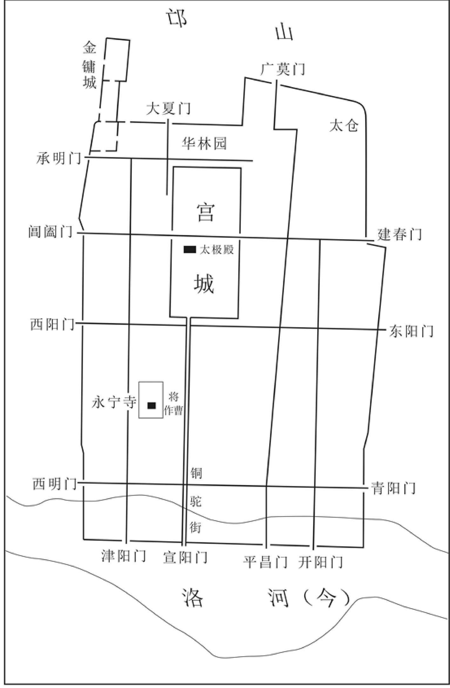
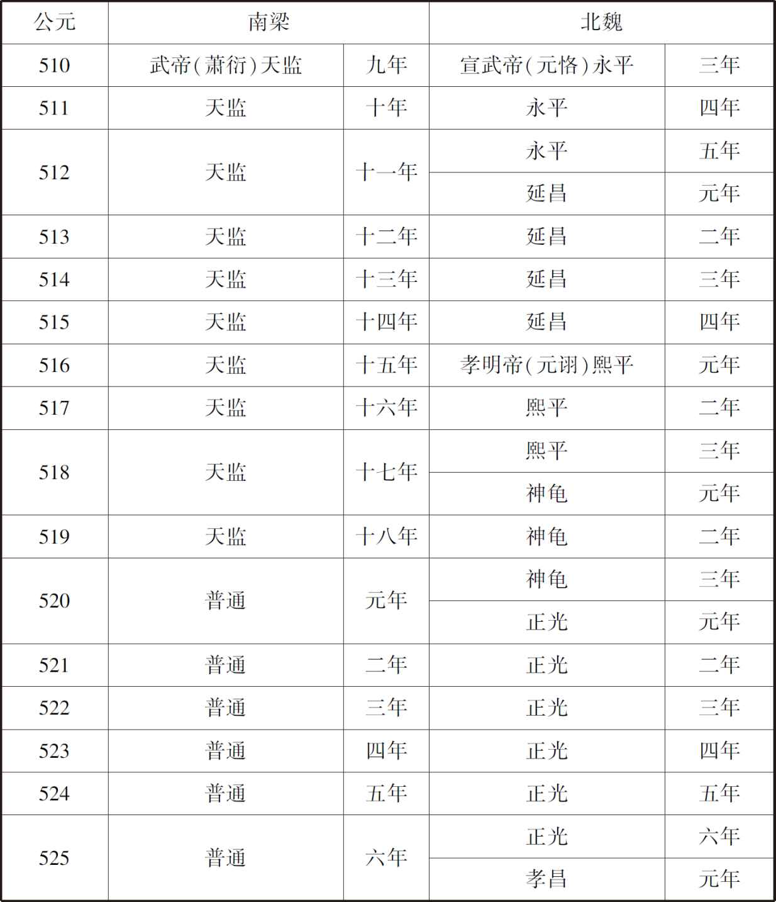
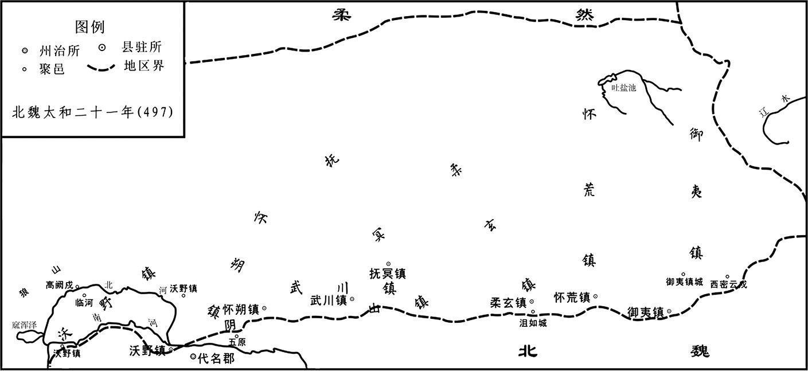
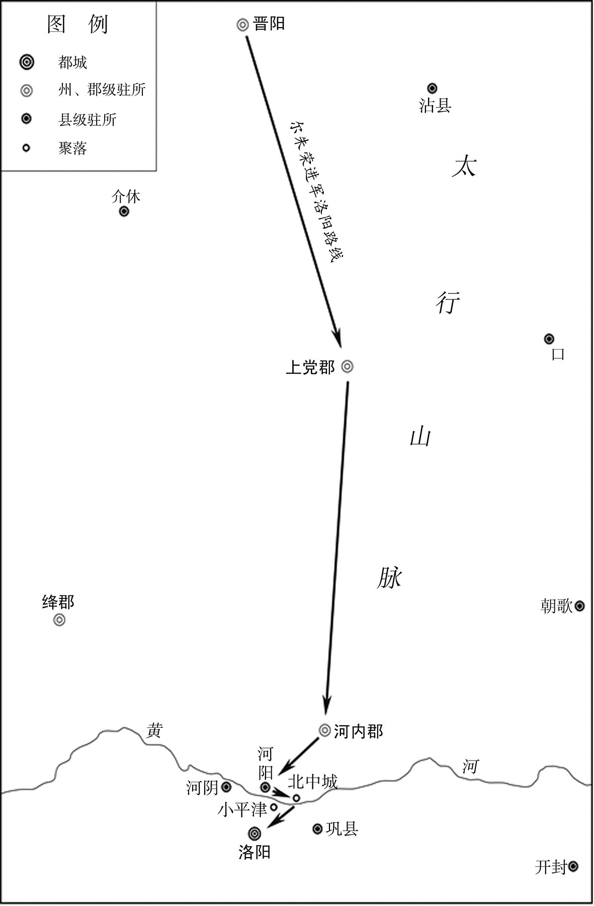
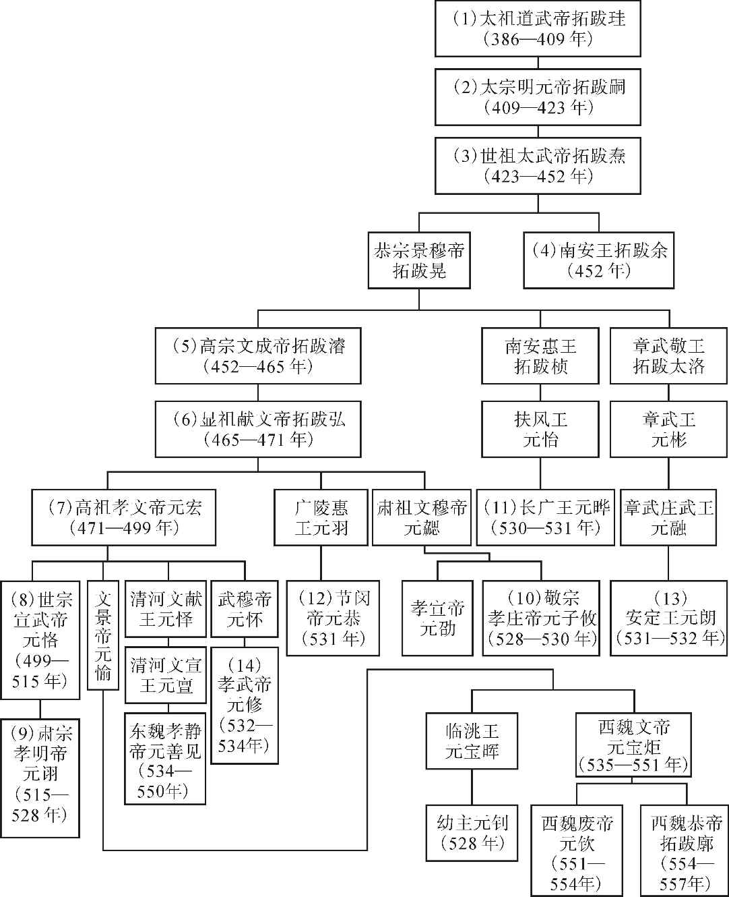
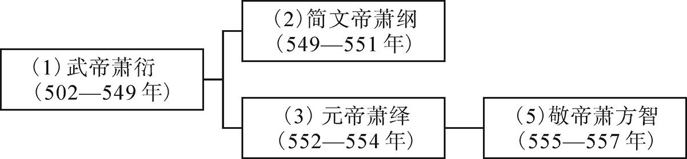
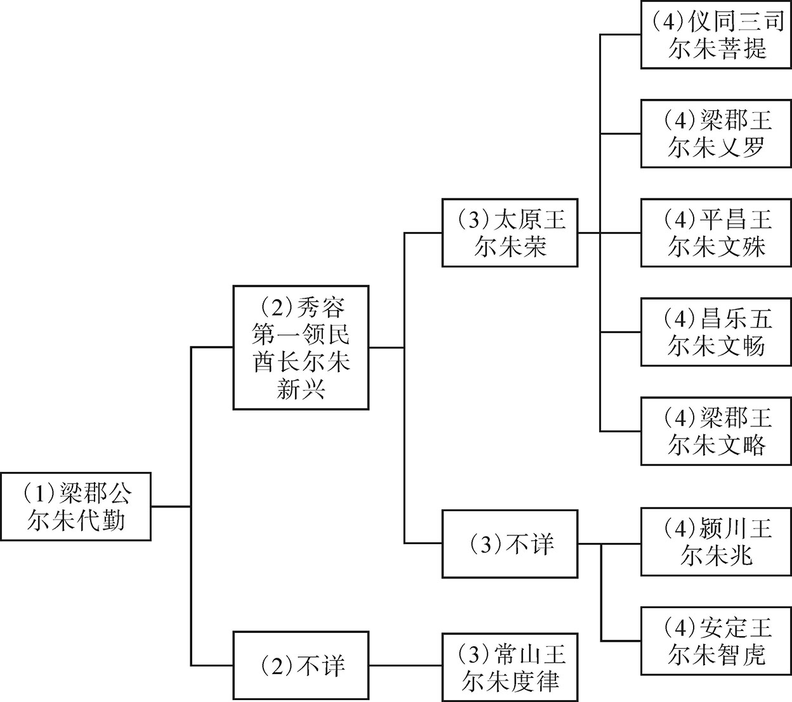
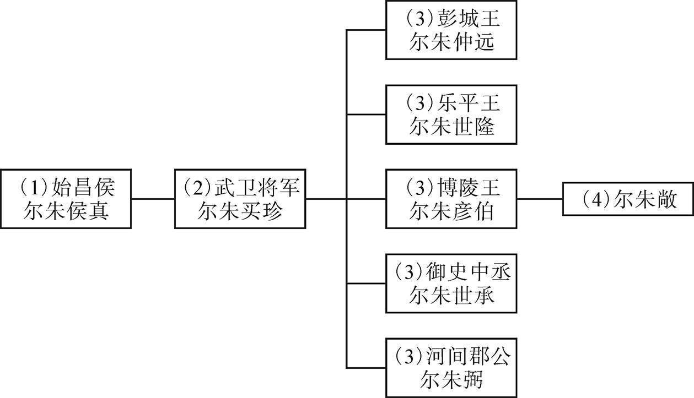
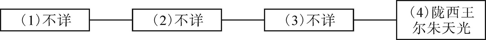

# 目录

肇忠用事

邢峦寇巴西

梁魏争淮堰

元乂幽后

六镇之叛

元颢入洛

元魏之乱

附录： 
北魏、东魏、西魏皇帝世系表

南梁皇帝世系表

尔朱氏世系表

返回总目录

# 肇忠用事

## 【内容提要】

《肇忠用事》叙述了北魏宣武帝元恪（kè）及孝明帝元诩（xǔ）两朝，以高肇（zhào）、于忠为代表的外戚、勋贵专权用事的故事，展现了北魏后期政治腐败、王朝统治日趋没落的历史面貌。

北魏孝文帝元宏病亡之后，宣武帝元恪即位，因咸阳王元禧（xǐ）骄横谋反一事，杀元禧、罢六辅大臣（太和末奉诏辅政的六位大臣：北海王元详、镇南将军王肃、广阳王元嘉、尚书宋弁［biàn］、咸阳王元禧、任城王元澄［chéng］），重用外戚及近侍宠臣。

高肇本出于高丽，被时望名流所轻视，在朝中亲信、同族很少，但因系孝文帝元宏之文昭皇后的兄长，所以得到宣武帝元恪的信任，得以把持朝政，位及王公，极尽专权、腐败、跋扈（hù）之能事。他利用职权交结朋党，依附之人很快就能得到破格提拔，反之就会受到诬陷。他最为忌恨的是北魏宗室，接连不断地对他们实施迫害和打压。他因忌恨元详之位高于自己，设计将他与宣武帝身边的宠臣茹（rú）皓（hào）等人一起害死。因恨彭城王元勰（xié）反对立高贵嫔（pín）（高肇兄长高偃［yǎn］之女）为皇后，将其杀害。京兆王元愉因谋反，被宣武帝下令押回京城洛阳，将处之以家法，而高肇却伪造诏书，在半路上就将其杀死。尚书李平因平定元愉之功受封，遭到高肇的忌恨，被设计从朝廷除名。宣武帝顺皇后于氏暴亡、皇子元昌病亡这两件事，时人怀疑都与高肇有关。六辅大臣之一的任城王元澄，迫于他的淫威，甚至于整日装疯卖傻，以求自保。后来，高肇竟敢以皇帝的名义下令释放囚徒，以笼络人心。他的种种行径，为朝野厌恶已久。所以，宣武帝元恪亡故后，高肇即被领军将军于忠等人设计处死。

于忠，既是代北勋贵之后，又是魏室贵戚之一。其父于烈是孝文帝、宣武帝两朝重臣；叔父于劲之女又是宣武帝之顺皇后。宣武帝元恪去世后，皇后高氏要谋杀孝明帝元诩的生母胡贵嫔，于忠因保护了她而受到重用。从此，他也步高肇后尘，专权用事、左右朝政。宣武帝时期，因继续推行孝文帝以来的改革政策，重用南北儒士，从而进一步加深了代北勋贵与汉族地主之间的对立态势。尚书裴植及尚书仆射（yè）郭祚（zuò）对于忠专权心怀不满，而他们也因受到于忠及宗室的妒恨被杀害。此后，帝王的诏令及生杀大权都由于忠掌控，王公贵族大都屏声静气，不敢言语，甚至宗室元匡上书弹劾（hé）于忠，胡太后也因其护驾有功，只降其官爵，而不究其罪，直至其病亡。

高肇、于忠专权，是北魏后期政治腐败的真实写照，也是北魏王朝统治日趋衰败的重要原因之一。

## 【原文】

**齐东昏侯永元元年夏六月戊辰，魏追尊皇妣高氏为文昭皇后，配飨高祖，增修旧冢，号终宁陵[1]。追赠后父扬爵勃海公，谥曰敬，以其嫡孙猛袭爵[2]。封后兄肇为平原公，肇弟显为澄城公[3]。三人同日受封。魏主素未识诸舅，始赐衣帻引见，皆惶惧失措[4]。数日之间，富贵赫奕[5]。**

## 【注文】

[1]齐：朝代名（479—502年），共历二十三年，是中国古代南北朝时期南朝的第二个朝代，由齐高帝萧道成创立，齐和帝萧宝融时灭亡，共传七代，史称南齐或萧齐，都建康（今江苏南京）。　　东昏侯：即南齐的第六位皇帝萧宝卷（483—501年），南齐明帝萧鸾（luán）次子，十六岁即位，是历史上著名的荒唐皇帝之一。年少时，不喜读书，以捕鼠为乐。当上皇帝后，极尽荒淫、奢侈、残忍之能事，屡兴宫殿建筑；不理朝政，四出扰民；宠任奸佞（nìng），滥杀宗室、朝臣，政局动荡不堪。南齐和帝萧宝融中兴元年（501年）被杀，谥（shì）号为东昏侯。　　永元：南齐东昏侯萧宝卷在位期间所使用的年号之一，共计三年，即公元499年至501年。　　魏：朝代名（386—534年），共历一百四十八年。东晋武帝司马曜（yào）太元八年（383年），淝水之战后，前秦败亡，鲜卑拓跋部势力渐强。北魏道武帝拓跋珪（guī）登国元年（386年），重建代国，定都盛乐（今内蒙古和林格尔北）。同年改国号为魏，史称北魏，又名元魏、拓跋魏。魏道武帝天兴元年（398年），迁都平城（今山西大同）；魏孝文帝元宏太和十七年（493年），迁都洛阳。魏孝武帝元修永熙三年（534年），分裂为东魏、西魏。　　皇妣（bǐ）：即魏宣武帝元恪（kè）已故的母亲。妣，古时对已故母亲的称呼。　　高氏：生卒年不详。即北魏孝文帝元宏之孝文昭皇后高照容，司徒高肇之妹。高丽人，孝文帝初年，举家西归，十三岁选入掖（yè）庭。生宣武帝元恪、广平王元怀及长乐公主。自平城迁洛后暴亡。　　配飨（xiǎng）：指进入太庙（帝王的祖庙），享受后人祭祀。　　高祖：北魏第七位皇帝元宏（467—499年），献文帝拓跋弘长子。母因祖制被杀，由祖母冯太后抚养成人。崇尚中原文化，儒雅有识，在位期间力主汉化，迁都洛阳，提高了拓跋鲜卑人的文化水平，促进了民族融合，史称北魏孝文帝改革。高祖是其庙号。祖制，指北魏“子贵母死制”，即皇子一旦被立为太子，其生母必须被赐死，目的是为防止后族专权。此制始于道武帝拓跋珪，终于宣武帝元恪。　　冢（zhǒng）：坟墓。　　终宁陵：北魏孝文帝文昭皇后高照容的墓，位于今河南洛阳北邙山盘龙冢村北。公元496年，高照容死在前往洛阳的路上。因就地起山陵，陵制矮小局促，所以在明帝时，重新安葬，并对陵寝进行了整修。

[2]扬：即高扬，生卒年不详，魏宣武帝元恪之外公，字法修。原居高丽，育有四男三女。孝文帝元宏朝，与其弟乘信投奔北魏。　　勃海公：高扬封爵。古代封爵常以郡望为号，高姓郡望为勃海，故称。　　谥：古代帝王、贵族、大臣、杰出官员或其他有地位的人死后所加的带有褒贬意义的称号。如经天纬地曰文，威强睿德曰武，杀戮无辜曰厉，好内远礼曰炀等。　　敬：谥法中有“夙夜警戒、合善典法”之意。　　嫡（dí）孙：正妻之子的儿子。嫡，指正妻或所生之子。　　猛：即高猛，生卒年不详，高肇长兄高琨（kūn）之子，字豹儿。娶魏宣武帝元恪同母妹长乐公主为妻，官至中书令、雍州刺史。　　爵（jué）：古代皇帝对贵戚功臣封赐的爵位、爵号。一般指公、侯、伯、子、男五种爵位，后代爵称和爵位制度往往因时而异。北魏封爵制度始于道武帝皇始元年（396年），初为五等爵制。宣武帝景明元年（500年）定制：置王、开国郡公、散公、侯、散侯、伯、散伯、子、散子、男、散男，凡十一等。

[3]肇（zhào）：即高肇（？—513年），字首文，自称勃海蓨（tiáo）（今河北景县）人。五世祖高顾，在西晋永嘉之乱时，曾避难于高丽。父高扬在孝文朝入魏，妹为孝文帝之妃。甥元恪即位，加官晋爵。专横跋扈，权倾朝野，为人所恨。宣武帝死后，被杀。　　平原公：高肇封爵。　　显：即高显，生卒年不详，高肇之弟，曾任侍中、高丽国大中正，早亡。　　澄城公：高显封爵。

[4]魏主：即北魏第八任皇帝宣武帝元恪（483—515年），魏孝文帝元宏之子。在位十六年，对内巩固孝文帝改革，对外征伐南齐，增强了北魏的国力。后期因外戚专权、官僚腐败，难遏国运衰退之势。延昌四年（515年），病亡，庙号世宗。　　帻（zé）：头巾。在古代，常在冠下，或单用。　　惶惧：惶恐，惊慌，害怕。

[5]赫（hè）奕（yì）：显耀盛大的样子。

## 【译文】

南齐东昏侯萧宝卷永元元年（499年）夏季六月戊辰（二十四日），北魏追尊世宗元恪的亡母高氏为文昭皇后，配祀（sì）高祖，并为其修整旧陵，名为终宁陵。追赐文昭皇后的父亲高扬为勃海公，谥号为敬，让他的嫡孙高猛袭承爵位。册封文昭皇后的兄长高肇为平原公，高肇的弟弟高显为澄城公。三个人同日受封。魏宣武帝之前并不认识诸位舅舅，这时才赐给衣服、头巾，召见他们，舅舅们都害怕得惊惶失措。但几天之间，高氏诸人就成了富贵显赫的人。

## 【原文】

**和帝中兴元年[1]。魏主时年十六，不能亲决庶务，委之左右[2]。于是幸臣茹皓、赵郡王仲兴、上谷寇猛、赵郡赵修、南阳赵邕及外戚高肇等始用事[3]。魏政浸衰。**

## 【注文】

[1]和帝：即南齐末帝萧宝融（488—502年），南齐明帝萧鸾第八子，字智昭，永元三年（501年）被萧衍（yǎn）立为傀儡皇帝，改元中兴。次年（502年），被杀。　　中兴：南齐和帝萧宝融在位期间所使用的年号，共计二年，即公元501年至公元502年。

[2]庶（shù）务：指各项政务。庶，众多。　　委：委托。　　左右：指左右近臣。

[3]幸臣：得宠的臣子，君主宠爱之臣。含贬义。　　茹（rū）皓（hào）（？—504年）：字禽奇，原为南朝吴人，后迁居彭城（今江苏徐州）。魏孝文帝朝迁都洛阳，魏宣武帝即位，深得宠幸，娶尚书仆射高肇之妹为妻，权倾朝野。魏宣武帝正始元年（504年），因高肇陷害，被杀。　　赵郡：郡名。东汉建安十七年（212年），改赵国（治今河北邯郸）置赵郡。三国魏明帝太和六年（232年）复为赵国，治所由邯郸移房子（今河北高邑西南）。西晋末，复为郡。北魏时，治所由房子移平棘（河北赵县南固城村）。　　王仲兴：生卒年不详，赵郡（今河北赵县）人。魏孝文帝太和中入仕，魏宣武帝即位，得重用，常陪侍左右。其兄王可久，仗势自大，为患地方。朝臣进奏其罪，王仲兴因此外放平北将军、并州刺史。　　上谷：郡名。古称沮阳，又称造阳，治所在今河北怀来大古城村北。始建于战国燕昭王二十九年（前283年），因建在大山谷上边而得名。秦始皇统一中国后，分天下为三十六郡，亦名列其中。北魏时，曾改为平原郡。北魏后废弃。　　寇猛：生卒年不详，上谷（今河北怀来）人。魏孝文帝朝，任羽林中郎将。魏宣武帝即位，任武威将军，深受信重，出入禁中，无所禁忌。　　赵修：生卒年不详，字景业，赵郡（今河北赵县）人。少时入仕东宫，魏宣武帝即位，为宠臣之一。后被高肇等人鞭打致死。　　南阳：郡名。秦昭襄王三十五年（前272年）始设，治所在宛县（今河南南阳）；至唐代改为邓州。　　赵邕（yōng）（？—520年）：字令和，魏宣武帝亲政后，始受重用。与赵修常陪在左右，时人称为“二赵”。父、兄皆获提升，家族暴富。魏孝明帝孝昌初，死。　　外戚：也称外家，指古代帝王的母族和妻族。　　用事：掌握权柄。

## 【译文】

齐和帝中兴元年（501年）。魏宣武帝元恪时年十六岁，不能亲自处理政务，就将国事委托左右近臣。于是宠臣茹皓、赵郡人王仲兴、上谷人寇猛、赵郡人赵修、南阳人赵邕及外戚高肇等人开始掌权，北魏的朝政逐渐衰败。

## 【原文】

**梁武帝天监元年冬十二月，魏陈留公主寡居，仆射高肇、秦州刺史张彝皆欲尚之[1]。公主许彝而不许肇，肇怒，谮彝于魏主，彝坐沈废累年[2]。**

## 【注文】

[1]梁武帝：即南朝梁开国皇帝萧衍（yǎn）（464—549年），字叔达，南兰陵（今江苏常州西北）人。公元502年，乘齐内乱，起兵夺取帝位，建立梁朝。太清三年（549年），因侯景之乱，饿死台城。在位四十八年，颇有政绩。精于文学、音律，笃信佛教。武帝是其谥号。　　天监：梁武帝在位期间所使用的年号，共计十八年，即公元502年至519年。　　陈留公主：生卒年不详，北魏孝文帝元宏之妹，原封为彭城公主。初嫁刘宋文帝刘义隆之孙刘承绪。刘承绪死后改嫁由南朝归降北魏的名臣王肃。魏宣武帝元恪景明二年（501年），王肃死，陈留公主再次寡居。次年，北魏之秦州刺史张彝及尚书仆射高肇都想娶她为妻，她答应嫁张而不同意高，高肇因此陷害张彝，公主再嫁一事遂搁浅。　　仆射：职官名，即尚书仆射，始置于秦汉。古时重视武官，常用善射者掌管国事，所以称为仆射。东汉献帝刘协建安四年（199年），分设左、右仆射，左居上，右居下，协助尚书令处理政务。北魏孝文帝太和中列右从第一品中，宣武帝后改为右第二品。　　秦州：州名。时北魏属州，领天水、略阳、汉阳三郡和上封、显亲等十二县，治上封（今甘肃天水），所辖约相当于今甘肃定西、天水等地。　　刺史：职官名。始置于秦汉，秦时名监御史，汉武帝刘彻时名刺史，掌地方监察。汉成帝刘骜（áo）时，改称牧；汉哀帝刘欣时复为刺史。东汉末，天下渐乱，刺史权重，渐成为地方军政长官。　　张彝（yí）（461—519年）：字庆宾，清河东武城（今山东临清东北）人。出身官宦，通经史，个性刚直，爱憎分明。魏宣武帝朝，因与高肇争娶陈留公主，受到诬告、陷害，停官数年。孝明帝元诩（xǔ）朝，因次子张仲瑀（yǔ）上书改革选官制度，排抑武人，招杀身之祸，年五十九岁。　　尚（shàng）：娶帝王之女为妻。

[2]谮（zèn）：说别人的坏话，诬陷，中伤。　　坐：因……连累；因……犯罪，触犯法律。　　沈废：“沈”通“沉”，故亦作“沉废”，指埋没在下层，不受重用。　　累年：接连多年。

## 【译文】

梁武帝天监元年（502年）冬季十二月，魏陈留公主寡居在家，仆射高肇、秦州刺史张彝都想娶公主为妻。公主答应许配张彝而拒绝了高肇，高肇恼羞成怒，就在魏宣武帝元恪面前诬陷张彝，张彝因此被弃用多年。

## 【原文】

**二年冬十一月，魏主纳高肇兄偃之女为贵嫔[1]。**

## 【注文】

[1]偃（yǎn）：即高偃（？—486年），高肇的哥哥。字仲游。其女为北魏宣武帝贵嫔（后被立为皇后），死于北魏孝文帝太和十年（486年）。　　贵嫔：古代皇帝妃嫔的封号，此指高贵嫔（？—518年），魏孝文帝文昭皇后高氏的弟弟高偃（yǎn）之女。初为贵妃，生一皇子，早亡，又生建德公主。后进封为皇后，性善妒，不容他人近侍皇帝。灵太后之子孝明帝元诩即位后，迫使其出家为尼，后暴亡于瑶光寺，以丧尼礼殡葬。

## 【译文】

梁武帝天监二年（503年）冬季十一月，魏宣武帝元恪纳高肇兄长高偃的女儿为贵嫔。

## 【原文】

**三年。魏冠军将军茹皓，以巧思有宠于帝，常在左右，传可门下奏事，弄权纳贿，朝野惮之，北海王详亦附焉[1]。皓娶尚书令高肇从妹，皓妻之姐为详从父安定王燮之妃[2]。详烝于燮妃，由是与皓益相昵狎[3]。直阁将军刘胄本详所引荐，殿中将军常季贤以善养马，陈扫静掌栉，皆得幸于帝，与皓相表里，卖权势[4]。**

## 【注文】

[1]冠军将军：武官名。掌军事，始置于秦。南北朝沿置，属官有长史、司马、参军等。　　门下：即门下省，官署名称，又名东台、鸾台、黄门。始置于魏晋，原为皇帝的侍从机构，自南北朝开始，逐渐成为中央的权力机构，掌政令之审议及封驳。长官为侍中或纳言，属官有黄门侍郎、给事中、散骑常侍、谏议大夫、起居郎等。　　北海王详：即北魏宗室元详（？—504年），献文帝拓跋弘子，孝文帝元宏弟。字季豫，母为高椒房。魏孝文帝太和九年（485年），受封为北海王。太和二十三年（499年），作为顾命大臣，辅佐宣武帝元恪，专横跋扈，权倾朝野。宣武帝正始元年（504年），被高肇诬陷谋反，废为庶人。永平元年（508年），复爵位。子元颢（hào），在孝庄帝建义初年谋反，自立为帝。

[2]尚书令：职官名。始置于秦，初掌文书、奏章。随着中央集权制的加强，职权渐高。南北朝时是尚书省长官，北魏孝文帝太和中列右从第一品上，宣武帝后改为右从第二品。　　从妹：即堂妹。　　从父：即堂叔父。　　安定王燮（xiè）：即北魏宗室元燮（？—515年），景穆帝拓跋晃之孙，安定王拓跋休之次子。魏宣武帝景明初，任征虏将军、华州刺史。延昌四年（515年）亡。

[3]烝（zhēng）：古代将与父辈或兄弟的妻妾有染的行为称为烝。　　昵狎（xiá）：指不庄重的亲昵行为。昵，亲近；狎，过于亲热而态度不庄重。

[4]直阁将军：武官名，掌宿卫营兵，属禁卫武官。始置于南北朝，因入值殿阁而名，北魏孝文帝太和中列右从第三品下。　　刘胄（zhòu）（？—504年）：字符孙，河间（今河北献县北）人。由北海王元详引荐入侍禁中，任直阁将军。正始元年（504年），因高肇陷害，与茹皓等一同被害。　　殿中将军：武官名，掌宫殿警卫。始置于魏晋，南北朝沿置。北魏孝文帝太和中列右第五品中，宣武帝后改为右从第五品。　　常季贤（？—504年）：魏宣武帝朝，因善于养马而得势，官至殿中将军，仍掌管马政。和茹皓等人相勾结，扰乱朝政。正始元年（504年），与茹皓一同死。　　陈扫静（？—504年）：与茹皓同乡，专门负责为宣武帝梳头，奉迎茹皓，同为宠臣。正始元年（504年），死。　　掌栉（zhì）：指掌管皇帝梳洗事宜。栉，指梳子、篦（bì）子等梳头的用具。　　得幸：得到皇帝或权贵的宠幸。

## 【译文】

梁武帝天监三年（504年）。魏冠军将军茹皓，因心思灵巧而受到魏宣武帝元恪的宠爱，经常陪侍在皇帝左右，传达、批复朝臣的奏章，玩弄权术，接受贿赂，朝廷内外都很怕他，北海王元详也依附于他。茹皓娶了尚书令高肇的堂妹，茹皓妻子的姐姐就是元详堂叔父安定王元燮的王妃。元详与元燮的妃子私通，因此与茹皓就更加亲近了。直阁将军刘胄本来是元详引荐的，殿中将军常季贤因善于养马，陈扫静专管为魏帝梳头，三人在皇帝面前都很得宠，和茹皓内外勾结，卖弄权势。

## 【原文】

**高肇本出高丽，时望轻之[1]。帝既黜六辅，诛咸阳王禧，专委事于肇[2]。肇以在朝亲族至少，乃邀结朋援，附之者旬月超擢，不附者陷以大罪[3]。尤忌诸王，以详位居其上，欲去之，独执朝政，乃谮之于帝，云详与皓、胄、季贤、扫静谋为逆乱。夏四月，帝夜召中尉崔亮入禁中，使弹奏详贪淫奢纵，及皓等四人怙权贪横，收皓等系南台，遣虎贲百人围守详第[4]。又虑详惊惧逃逸，遣左右郭翼开金墉门驰出谕旨，示以中尉弹状[5]。详曰：“审如中尉所纠，何忧也[6]？正恐更有大罪横至耳。人与我物，我实受之。”诘朝，有司奏处皓等罪，皆赐死[7]。**

## 【注文】

[1]高丽：南北朝时名高句（gōu）丽（约前37—668年），位于北魏东北至朝鲜半岛一带。太武帝拓跋焘时，开始与北魏相通，遣使朝贡，至武定末，往来不断。唐高宗总章元年（668年），为唐所灭。

[2]黜（chù）六辅：罢免六位辅政官员。太和二十三年（499年），魏孝文帝元宏病重，诏令以侍中、护军将军北海王元详为司空，镇南将军王肃为尚书令，镇南大将军广阳王元嘉为左仆射，尚书宋弁为吏部尚书、侍中，太尉元禧，尚书右仆射元澄等六人辅佐太子，即六辅。　　咸阳王禧（xǐ）：即元禧（？—501年），北魏献文帝拓跋弘之子；孝文帝元宏之弟，性贪婪。孝文帝死后，受遗诏任宰相之首，辅佐宣武帝元恪。但他秉性不改，多收贿赂。宣武帝亲政后，常自觉不安，景明二年（501年），与其妃兄李伯尚谋反，被赐死。

[3]超擢（zhuó）：越级提拔。

[4]中尉：职官名，即御史中尉。源于御史中丞，秦始置，掌监察之职，是御史大夫的副职。南北朝时，御史大夫时置时废，御史中丞实为御史台长官。北魏在南北对抗时期一度将御史中丞改称御史中尉，带有军中执法性质，便于监察武官。北魏孝文帝太和中列右第三品上，宣武帝后改为右从第三品。　　崔亮（？—521年）：字敬儒，清河东武城（今河北武城西北）人，北魏政治家。年少家贫，经李冲引荐为中书博士。孝明帝元诩时，任吏部尚书。当时官职少，应选的人多，崔亮提出“格制法”，其核心是选官不问才能贤愚，只论年资，称为“停年格”，在中国古代官僚制度发展史上具有重要意义。魏孝明帝正光二年（521年）病死。　　南台：即御史台，又名兰台、宪台。官署名，是国家最高监察机构，负责监察百官。署员有御史大夫、御史中丞、监察御史等。始置于汉，后世沿置，如唐代曾在东都洛阳另外设立御史台，称为东都留台、东台。　　虎贲（bēn）：指宫中的护卫勇士，始置于西汉。汉平帝刘衎（kàn）元始元年（1年），更名为“虎贲郎”，设中郎将统领。“虎贲”，原为“虎奔”，意即像老虎一样善于奔跑。王莽辅政后，因古时有勇士名孟贲，所以更“奔”为“贲”。

[5]郭翼：生卒年不详，北魏宣武帝元恪身边的近臣。　　金墉（yōng）门：北魏洛阳城宫城城门之一。

[6]审如：果如、确如。

[7]诘（jié）朝（zhāo）：也称诘旦，即临明，清晨。

## 【译文】

高肇本出于高丽，当时的名流都很轻视他。魏宣武帝元恪既然罢免了六位辅政大臣，诛杀了咸阳王元禧，就把政事交给高肇办理。高肇因为在朝中亲人、族人较少，于是就交结朋党，依附他的人十天半月就能破格提拔，不依附的人就被以重罪诬陷。他尤其忌恨各位亲王，因元详的地位在他之上，就想除之以独霸朝政。于是高肇在魏宣武帝元恪面前讲元详的坏话，说：“元详和茹皓、刘胄、常季贤、陈扫静等人谋划叛乱。”夏季四月，魏帝夜间召唤中尉崔亮入宫，让他弹劾上奏元详贪婪荒淫、骄奢放纵，以及茹皓等四人仗势贪赃枉法，将茹皓等人收捕拘禁在南台，派虎贲一百人包围元详的住宅。又怕元详惊惧逃跑，派身边的亲信郭翼打开金墉门，快马出去宣谕（yù）圣旨，并向他出示了中尉崔亮弹劾的奏章。元详说：“如果确实像中尉所检举的那样，有什么可担忧的？我所担心的是有更大的罪名横空而来。别人给我的东西，我确实收受了。”天亮后，有关部门启奏，判处茹皓等人罪行，全部赐死。

## 【原文】

**帝引高阳王雍等五王入议详罪[1]。详单车防卫，送华林园，母妻随入，给小奴弱婢数［人］，围守甚严，内外不通[2]。五月丁未朔，下诏宥详死，免为庶人[3]。顷之，徙详于太府寺，围禁弥急，母妻皆还南第，五日一来视之[4]。详暴卒，诏有司以礼殡葬。**

## 【注文】

[1]高阳王元雍（？—528年）：字思穆，献文帝拓跋弘子。魏高祖朝，封高阳王。魏肃宗朝，因于忠擅权，被罢官。胡太后反政后，复受重用。魏孝庄帝元子攸执政初期，因尔朱荣河阴之变遇害。学识短浅，虽居要位，无大作为。

[2]华林园：北魏皇家园林，位于北魏洛阳城宫城外东北向，是皇帝参与、旁听司法审判活动或讲论武艺的地方。

[3]宥（yòu）：原谅、宽恕。　　庶人：老百姓。

[4]太府寺：官署名，始于西周，掌贡、赋事宜。秦汉以后不置，其职属分予司农寺和少府寺。南北朝时，梁武帝萧衍于天监七年（508年）始置；北朝太和中改少府寺为太府寺。北齐、北周相沿。其职官有太府卿、少卿等。

## 【译文】

魏宣武帝元恪召集高阳王元雍等五位王爷入朝议定元详的罪名。元详单独乘坐一车，被监送到华林园，他的母亲和妻子随行，派给几名小奴弱婢，包围、防守很严密，内外不能互通信息。天监三年（504年）五月丁未朔（初一日），皇上下诏免元详死罪，罢官免为平民。不久，将元详转移到了太府寺，包围禁闭得更加严紧，他的母亲和妻子都送回到了南府，五天来看他一次。元详突然死亡，皇上下诏有关部门依礼安葬了他。

## 【原文】

**先是，典事史元显献鸡雏，四翼四足，诏以问侍中崔光[1]。光上表曰：“汉元帝初元中，丞相府史家雌鸡伏子，渐化为雄，冠距鸣将[2]。永光中，有献雄鸡生角，刘向以为：‘鸡者小畜，主司时起居人，小臣执事为政之象也[3]。竟宁元年，石显伏辜，此其效也[4]。’灵帝光和元年，南宫寺雌鸡欲化为雄，但头冠未变，诏以问议郎蔡邕，对曰：‘头为元首，人君之象也。今鸡一身已变，未至于头，而上知之，是将有其事而不遂成之象也[5]。若应之不精，政无所改，头冠或成，为患滋大。’是后黄巾破坏四方，天下遂大乱[6]。今之鸡状虽与汉不同，而其应颇相类，诚可畏也。臣以向、邕言推之，翼足众多，亦群下相扇助之象。雏而未大，足羽差小，亦其势尚微，易制御也。臣闻灾异之见，皆所以示吉凶[7]。明君睹之而惧，乃能致福；暗主观之而慢，所以致祸。或者今亦有自贱而贵，关预政事，如前世石显之比者邪？愿陛下进贤黜佞，则妖弭废集矣[8]。”后数日，皓等伏诛，帝愈重光[9]。**

## 【注文】

[1]典事：职官名，中国古代职能机构的职事官员，如太仆寺典事、尚书典事、内侍省典事等。　　史元显：生卒年不详，时任北魏之典事。　　侍中：职官名，掌奏事、应对、护从。始置于秦，本为丞相属官，往来于殿内奏事，故名侍中。魏晋以后，职权渐重。北魏时职数六人，魏孝文帝太和中列右从第二品上，宣武帝后改为右第三品。　　崔光（449—522年）：字长仁，北魏清河（今河北清河）人。仕北魏孝文、宣武、孝明三朝，曾任侍中、中书令之职。少好学，有文才，善辞令。一生以撰述魏史为己任，著作等身。

[2]汉元帝：即西汉皇帝刘奭（shì）（前75—前33年），性格温和，偏好儒术，主张以德治国。在位期间，尊崇儒术，倡导通经致仕，注视发展与匈奴的关系，促进了民族交流与融合。　　初元：汉元帝刘奭在位期间所使用的第一个年号，共计五年，即公元前48年至公元前44年。　　伏：同“孵”。　　冠距：鸡冠和鸡附脚骨。距，鸡附脚骨，打架时用来刺人的。　　鸣将：叫声响亮，冠群鸡之首。将，率领。

[3]永光：汉元帝刘奭在位期间所使用的第二个年号，共计五年，即公元前43年至公元前39年。　　刘向（前77—前6年）：西汉中、后期的经学家、史学家。字子政，沛（今江苏沛县）人，西汉宗室。与其子刘歆（xín）先后参与皇家图书的整理工作，著有目录书《别录》，为目录学、历史文献学的产生发展及中国史学史的发展做出了重要贡献。

[4]竟宁：汉元帝刘奭在位期间所使用的第四个年号，共计一年，即公元前33年。　　石显（？—前32年）：汉元帝时的奸佞之臣，字君房，济南（今山东章丘西）人。少时因犯罪被处以宫刑，入宫为太监。因通晓法律，受到汉宣帝刘询的重用。元帝即位，任中书令，结党营私，权倾朝野。汉成帝刘骜（áo）即位，失宠，抑郁而死。　　伏辜（gū）：伏罪。辜，罪。

[5]灵帝：即东汉的第十一位皇帝刘宏（157—189年），汉桓帝刘志的堂侄。在位期间，宦官与外戚相互争权；阶级矛盾日益严重，王朝统治濒临灭亡。谥号孝灵皇帝。　　光和：汉灵帝刘宏在位期间所使用的第三个年号，共计七年，即公元178年至184年。　　南宫：东汉时期的宫殿，位于汉魏洛阳故城南隅。西汉时已有，东汉献帝初平元年（190年）被焚毁。其平面接近长方形，四面筑围墙，宫城辟四门，宫内有多座建筑。其中最高大的是前殿，居全宫正中，其他建筑还有乐成殿、灵台殿、嘉德殿、和欢殿以及玉堂殿、宣室殿、云台等。南宫与北宫之间有“复道”相通，以备缓急。　　议郎：职官名。始置于秦，光禄勋属官，掌顾问应对。汉沿置，郎官的一种。后世渐废。　　蔡邕（yōng）（133—192年）：字伯喈（jiē），陈留（今河南杞县）人。晓音律，通文史，东汉文学家、史学家。东汉灵帝时，曾任议郎。有诗赋、碑铭传世。

[6]黄巾：指汉末黄巾起义。东汉末年，由太平道教主张角利用宗教所组织的一次较大规模的农民起义，历时十几年，众徒达几十万人。黄巾军的主力从冀州、颍川、南阳三个地方进军洛阳，初战获胜，但由于起义仓促及缺乏战斗经验，三个月后，开始走向失败，对于东汉的王朝统治造成了沉重的打击。

[7]见：同“现”。

[8]佞：指巧言谄媚之人。　　弭（mǐ）：平息、消除。

[9]愈重光：更加重用崔光。魏宣武帝元恪认为他对雏鸡之事的解释，在茹皓等人的身上得到了应验。

## 【译文】

此前，典事史元显向皇上献上一只雏鸡，四根翅膀、四条腿，魏宣武帝元恪下诏就此事询问侍中崔光。崔光上表说：“汉元帝初元中，丞相府史家的母鸡孵小鸡后，渐渐地变成了公鸡，长出了鸡冠后爪，叫声响亮，列群鸡之首。永光中，有人献上一只长角的公鸡。刘向以为：‘所谓鸡，是小畜生，主管报时，提醒人们按时起床，这是小臣主事执政的征兆。竟宁元年（前33年），石显伏罪，就是此事的应验。’灵帝光和元年（178年），南宫寺有母鸡将要变为公鸡，但鸡头和鸡冠没变，皇上下诏问议郎蔡邕，蔡邕说：‘头是元首，是君主的象征。如今鸡全身都已发生变化，没变化到头上，而皇上知道了此事，这是将要有类似的事而不能成功的迹象。如果应对不当，政策不做改变，鸡头鸡冠或许会长成，为害就大了。’此后，黄巾变乱破坏四方，天下于是大乱。如今鸡的样子虽然与汉代不同，然而它所预示的应验颇为相似，实在是件可怕的事。臣用刘向、蔡邕的话来推断此事，翅膀和腿众多，是众多小人煽动联络滋事的象征。鸡还没有长大，四肢和羽翼还没有丰满，是其势力尚弱、容易控制的表征。臣听说灾异现象的出现，都是用来预示吉凶的，圣明的君主看到这样的现象会警惕起来，就能带来福分，昏昧的君主看到这样的现象不以为然，就会招来祸患。也许如今也有自身轻贱而图谋富贵，干涉政事，像前世的石显一样的人物？愿陛下进用贤人，罢黜奸佞，妖气就会消散，吉庆就会降临了。”几天后，茹皓等人伏罪被诛杀，魏帝以为崔光的话得到了应验，于是更加重用崔光了。

## 【原文】

**高肇说帝，使宿卫队主帅羽林虎贲守诸王第，殆同幽禁[1]。彭城王勰切谏，不听[2]。**

## 【注文】

[1]羽林虎贲：即羽林郎、虎贲郎，分属于羽林监和虎贲中郎将统领。羽林监，职官名，始于汉，掌禁卫。汉武帝刘彻时，置建章营骑，后更名为羽林骑，汉宣帝刘询时更名为羽林中郎将，东汉置羽林左监、右监。晋时合为羽林监，南北朝沿置。

[2]彭城王勰（xié）：即北魏宗室元勰（473—508年），北魏献文帝拓跋弘庶出子。魏孝文帝太和九年（485年），封始平王，后改封彭城王。北魏政治家、诗人。学识渊博，为官廉正，有功于国，无害于百姓，孝文、宣武两朝的股肱（gōng）之臣。后因受高肇威逼，饮毒酒而亡。

## 【译文】

高肇说服魏宣武帝元恪，让宿卫队首领率领羽林、虎贲看守各位王爷的府第，情形跟幽禁差不多。彭城王元勰极力劝谏，魏帝不听。

## 【原文】

**五年。魏主委任高肇，疏薄宗室，好桑门之法，不亲政事[1]。**

## 【注文】

[1]桑门之法：佛教之法。桑门，即沙门，意即僧侣。

## 【译文】

梁武帝天监五年（506年）。魏宣武帝元恪将政事交与高肇，疏远宗室，喜好佛法，不喜欢过问政事。

## 【原文】

**六年。高贵嫔有宠而妒，高肇势倾中外。后暴疾而殂，人皆归咎高氏，宫禁事秘，莫能详也[1]。**

## 【注文】

[1]殂（cú）：死亡。

## 【译文】

梁武帝天监六年（507年）。高贵嫔得宠，但生性好妒，高肇势力权倾朝廷内外。皇后暴病而亡，人们都怀疑与高氏有关，但宫禁中事情隐秘，其情不能详考。

## 【原文】

**七年春三月戊子，魏皇子昌卒，侍御师王显失于疗治，时人皆以为承高肇之意也[1]。**

## 【注文】

[1]昌：即魏宣武帝元恪之皇子元昌（506—508年），母为顺皇后于氏。永平元年（508年）夭折，年仅三岁。　　侍御师：职官名，侍奉在皇室成员左右的医师。北魏时，侍御师属门下省的尚药局，类似于后世之御医。　　王显：生卒年不详，字世荣。因通晓医术而显贵，仕宣武帝元恪、孝明帝元诩两朝，为官严正，忧国如家。曾著《药方》三十五卷，颁行天下。

## 【译文】

梁武帝天监七年（508年）三月戊子（初五日），魏皇子元昌死，侍御师王显失职于未能及时治疗，当时人们都认为是受了高肇的指示。

## 【原文】

**秋七月甲午，魏立高贵嫔为皇后。尚书令高肇益贵重用事。肇多变更先朝旧制，减削封秩，抑黜勋人，由是怨声盈路[1]。群臣宗室皆卑下之，惟度支尚书元匡与肇抗衡，先自造棺置听事，欲舆棺诣阙论肇罪恶，自杀以切谏[2]。肇闻而恶之。会匡与太常刘芳议权量事，肇主芳议，匡遂与肇喧竞，表肇指鹿为马[3]。御史中尉王显奏弹匡诬毁宰相，有司处匡死刑，诏恕死，降为光禄大夫[4]。**

## 【注文】

[1]封秩：古代指官员的品级和爵位。

[2]度支尚书：职官名，始置于魏晋，掌贡赋和租税等财政事宜。南北朝时领度支、金部、仓部、起部等四曹。北魏孝文帝太和中列右从第二品中，宣武帝后改为右第三品。　　元匡（？—525年）：魏景穆帝拓跋晃之孙，广平王拓跋洛侯继子。本为阳平王拓跋新成第五子，后继为广平王之后。字建扶，性耿直。魏孝文帝元宏认为其有匡扶社稷之才能，为其改名为匡。宣武帝朝，不畏高肇权势，屡与之争执。孝昌初去世。

[3]太常：职官名。始置于先秦，掌礼仪。秦改为奉常，汉景帝刘启中元六年（前144年），更名为太常，取国家盛大常存之意。南北朝沿置，北魏孝文帝太和中列右从第一品下，宣武帝后改为右第三品。　　刘芳：生卒年不详。北魏官员，曾任职太常，陷入高肇与元匡之争，为高肇所利用。　　权量（liàng）：即权与量。测定物体大小、轻重的器具。权测重量，量测多少大小。　　喧竞：喧闹相争。　　指鹿为马：此典故出自《史记·秦始皇本纪》，讲的是秦二世胡亥时的丞相赵高，为了试探自己在朝中的威望，进一步铲除异己，曾将一头鹿献与二世，并说是马。二世不信，问各位大臣，有说马、有说鹿，说是鹿者，事后都被除掉了。后世用以指口是心非、颠倒黑白者。

[4]奏弹：进奏弹劾。弹劾，古代负监察之职的官员揭发官吏的罪行。　　宰相：中国古代最高行政长官的通称。辅助帝王掌管国事。“宰”是主宰的意思；“相”本为相礼之人，有辅佐之意。“宰相”一词始见于《韩非子·显学》，但只有辽代以其为正式官名，其他各代所指官名与职权广狭则不同，而且名目繁多。先后出现过相国、丞相、大司徒、侍中、中书令、尚书令、同平章事、内阁大学士、军机大臣等多达几十种官名，通常和丞相是一个概念。高肇时任尚书令，所以被称为宰相。　　有司：指官吏。古代设官分职各有专司，故称有司。　　光禄大夫：职官名。战国时置中大夫，汉武帝时改为光禄大夫，秩比二千石（dàn），掌顾问应对。隶属于光禄勋。魏晋以后无定员，皆为加官及褒赠之官：加金章紫绶者，称金紫光禄大夫；加银章青绶者，称银青光禄大夫。唐、宋以后用作文散官阶之号，光禄大夫为从二品，金紫光禄大夫为正三品，银青光禄大夫为从三品。

## 【译文】

梁武帝天监七年（508年）秋季七月甲午（十三日），魏宣武帝元恪立高贵嫔为皇后。尚书令高肇更加显贵专权。高肇将先朝的旧制度做了很多变更，削减了封地和官阶，抑制罢免了有功勋的人，因此人们怨声载道。群臣及宗室人员在他面前都很卑下，只有度支尚书元匡经常和高肇相抗衡。元匡曾经自己做了棺材放在政事厅，准备用车拉着棺材到宫殿论说高肇的罪恶行径，以自杀的方式极谏皇上。高肇听说后十分恨他。赶上元匡与太常刘芳商议权衡量器的事情，高肇主张采纳刘芳的建议，元匡与高肇吵闹争执，上表说高肇指鹿为马。御史中尉王显上奏弹劾元匡诬蔑、诋毁宰相，有关部门处元匡死刑，皇上下诏免死，降为光禄大夫。

**北魏宣武帝元恪之后妃列表(1)**
宣武顺皇后于氏 魏太尉于烈之弟于劲之女；于忠堂姐。 生皇子元昌，三岁而亡。   宣武皇后高氏 魏孝文帝文昭皇后侄女；高肇之兄高偃之女。 无子。   宣武灵皇后胡氏 魏司徒胡国珍之女。 孝明帝元诩生母。    

## 【原文】

**［八月］初，魏主为京兆王愉纳于后之妹为妃，愉不爱，爱妾李氏，生子宝月[1]。于后召李氏入宫，捶之[2]。愉骄奢贪纵，所为多不法。帝召愉入禁中推案，杖愉五十，出为冀州刺史[3]。愉自以年长而势位不及二弟，潜怀愧恨[4]。又身与妾屡被顿辱，高肇数谮愉兄弟，愉不胜忿[5]。癸亥，杀长史羊灵引、司马李遵，诈称得清河王怿密疏，云“高肇弑逆”[6]。遂为坛于信都之南，即皇帝位，大赦，改元建平，立李氏为皇后[7]。法曹参军崔伯骥不从，愉杀之[8]。在北州镇皆疑魏朝有变，定州刺史安乐王诠具以状告之，州镇乃安[9]。乙丑，魏以尚书李平为都督北讨诸军、行冀州事，以讨愉[10]。平，崇之从父弟也[11]。**

## 【注文】

[1]京兆王愉：即北魏孝文帝子元愉（488—508年），母为袁贵人。字宣德，魏孝文帝太和二十一年（484年），受封为京兆王。好诗赋、佛道。宣武帝朝，因贪污外放为冀州刺史。在任期间，杀长史羊灵引及司马李遵，反叛，自立为帝。永平元年（508年），被杀，年二十一岁。子元宝炬为西魏文帝。　　于后：即北魏宣武帝顺皇后于氏，生年不详，宣武帝朝太尉于烈之弟于劲之女。性格娴静，十四岁入宫为贵人，后立为皇后，天监六年（507年）暴亡。生皇子元昌，年三岁夭折。　　妃：或称皇妃、宫妃、帝妃等，是后宫妃嫔之一，位次于皇后；亦指太子妃、王妃，为太子、王、侯之妻。　　妾：指一夫一妻多妾制结构中，地位低于正妻的女性配偶。古时也作为女子对自己的谦称。　　李氏：京兆王元愉爱妾，生卒年不详。元愉反叛、自立为帝时，立她为皇后。　　宝月：即元宝月，京兆王元愉与爱妾李氏所生子，生卒年不详。

[2]捶：敲打。

[3]禁中：指帝王所居宫内，也作“禁内”。　　推案：推究审问。　　杖：古代刑罚之一，用棍打。　　冀州：州名。传说为古“九州岛”之一。汉武帝设十三部州刺史，冀州为其中之一。北魏时领四郡、二十一县，治信都（今河北冀县），所辖约相当于今河北冀州、衡水、沧州南部，以及山东德州、乐陵、滨州等地。

[4]二弟：指魏孝文帝元宏的另外两个儿子：清河王元怿（yì）和广平王元怀。

[5]顿辱：谓揪头顿地使受辱。

[6]长史：职官名，始置于秦。丞相、太尉、御史大夫及将军、司徒、司马等府都置有长史，是各府属官之长。南北朝沿置。　　羊灵引（？—508年）：北魏官员，曾任冀州长史，为京兆王元愉所杀。　　司马：职官名，始于秦，掌军事。后世凡掌军事的各王公、将军府，均设此属官。魏孝文帝太和中，诸开府司马列右从第四品中，宣武帝后改为右从第五品。　　李遵（？—508年）：北魏将领，曾任冀州司马，为京兆王元愉所杀。　　清河王怿：即北魏宗室元怿（487—520年），字宣仁，孝文帝元宏之子。善理政，为官不畏权贵，名重于时。孝明帝元诩朝，因受元乂（yì）、刘腾陷害，死于非命。　　弑（shì）逆：指杀害君主谋反。弑，古代指臣下杀死君主或子女杀死父母。

[7]信都：地名，北魏冀州治所，今河北冀县。　　建平：北魏京兆王元愉谋反，自立为帝之年号，共计一年，即公元508年。

[8]法曹参军：职官名，掌刑法。两汉郡僚佐有决曹椽（chuán）、贼曹椽。北齐与隋称法曹行参军。唐代诸王公、将军府称法曹参军，州府称司法参军，县称司法佐。宋有司法参军，掌议法断刑，又有司理参军。掌讼狱勘鞫（jū）。《隋书》《旧唐书》《新唐书》记此官，“参军”下有“事”字，《通典》《通考》无“事”字。　　崔伯骥（jì）（？—508年）：北魏官员，曾任冀州法曹参军，因反对京兆王元愉谋反称帝而被杀。

[9]在北州镇：时京兆王元愉任冀州刺史，此指在冀州北诸州镇。　　定州：州名。原为中山国地。北魏道武帝天兴三年（400年）改安州为定州，领五郡、二十四县，治卢奴（今河北定县），所辖约相当于今河北石家庄、定州、安国、深州及保定西部等地。　　安乐王诠（quán）：即北魏宗室元诠，生卒年不详，文成帝拓跋濬（jùn）之孙，安乐王拓跋长乐之子，字搜贤。宣武帝朝，因平定元愉之乱，官至侍中、尚书左仆射。

[10]尚书：职官名。战国时亦作“掌书”，齐、秦均置。秦属少府，秩六百石（dàn），为低级官员，在殿中主发布文书。秦及汉初与尚冠、尚衣、尚食、尚浴、尚席，称“六尚”。汉武帝时，选拔尚书、中书、侍中组成“中朝”（或称内朝），成为实际上的中央决策机关，因系近臣，地位渐高。汉成帝置尚书五人，分掌三公曹、常侍曹、二千石曹、户曹、主客曹，职权始重。东汉政务悉归尚书台，各曹尚书地位更见重要，其主客尚书令甚至成为总揽事权的贵官。晋增为六曹。后尚书台改名尚书省，曹改称部，列曹（各部）尚书遂为贵官。北魏孝文帝太和中列曹尚书列第二品中，宣武帝后改列右第三品。隋以后尚书为六部长官，是古代中央政府部级长官（相当于现代的中央政府的部长）。尚书在隋、唐为正三品。　　李平（？—516年）：字云定，顿丘（今河南濮阳北）人。好诗书，有文采。魏孝文帝太和初入仕，官至河南尹，为政清廉，受到百姓怀念，权贵忌恨。宣武帝朝，以平定元愉之乱有功，任相州大中正，受高肇等人排挤。孝明帝熙平元年（516年）去世。　　都督北讨诸军：职官名，源于都督府州诸军事，始置于曹魏。汉献帝延康元年（220年），曹丕（pī）曾在地方设置了五个都督诸州诸军事，以控制地方军事大权。南北朝沿置。

[11]崇：即李崇（455—525年），字继长，顿丘（今河南濮阳北）人，文成帝元皇后第二兄长李诞之子。十四岁入仕，历北魏孝文、宣武、孝明三朝。宣武帝元恪朝，率军镇边，有大将风度，南人称之为“卧虎”。孝明帝元诩朝，曾以六十九岁高龄北讨柔然、平北镇之乱。孝昌元年（525年），去世，年七十一岁。　　从父弟：堂弟，叔伯兄弟。

## 【译文】

梁武帝天监七年（508年）八月，当初，魏宣武帝元恪为京兆王元愉娶了于皇后的妹妹为妃，元愉不喜欢，喜欢小妾李氏，生下了元宝月。于皇后召李氏入宫，命人用棒打她。元愉骄横奢侈，贪婪放纵，经常做些违法乱纪的事情。魏帝召元愉入宫查究，打了元愉五十大板，外放为冀州刺史。元愉认为自己年长而势力地位却不如两位弟弟，于是暗地里心怀愧疚和憎恨。再加上自身和爱妾李氏屡次被打受辱，元愉觉得怒不可遏。癸亥（十二日），元愉杀了长史羊灵引、司马李遵，谎称得到了清河王元怿的密信，说“高肇弑君叛逆”，于是在信都的南面设坛祭祀天地，即皇帝位，大赦天下，改元建平，立李氏为皇后。法曹参军崔伯骥不听从指挥，元愉把他杀了。在冀州北面的各州镇都怀疑朝廷有变故，定州刺史安乐王元诠把具体情况告诉了他们，各州镇才安定下来。乙丑（十四日），魏帝任命尚书李平为都督北讨诸军、代理冀州事，讨伐元愉。李平，是李崇的堂弟。

## 【原文】

**［九月］魏高后之立也，彭城武宣王勰固谏，魏主不听。高肇由是怨之，数谮勰于魏主，魏主不之信。勰荐其舅潘僧固为长乐太守，京兆王愉之反，胁僧固与之同，肇因诬勰北与愉通，南招蛮贼[1]。彭城郎中令魏偃、前防阁高祖珍希肇提擢，构成其事[2]。肇令侍中元晖以闻，晖不从[3]。又令左卫元珍言之[4]。帝以问晖，晖明勰不然。又以问肇，肇引魏偃、高祖珍为证，帝乃信之。戊戌，召勰及高阳王雍、广阳王嘉、清河王怿、广平王怀、高肇俱入宴[5]。勰妃李氏方产，固辞不赴[6]。中使相继召之，不得已，与妃决而登车[7]。入东掖门，度小桥，牛不肯进，击之良久，更有使者责勰来迟，乃去牛，人挽而进[8]。宴于禁中，至夜，皆醉，各就别所消息[9]。俄而元珍引武士赍毒酒而至，勰曰：“吾无罪，愿一见至尊，死无恨。”[10]元珍曰：“至尊何可复见？”勰曰：“至尊圣明，不应无事杀我，乞与告者一对曲直。”[11]武士以刀镮筑之，勰大言曰：“冤哉，皇天！忠而见杀。”[12]武士又筑之，勰乃饮毒酒，武士就杀之。向晨，以褥裹尸，载归其第，云“王因醉而薨”[13]。李妃号哭，大言曰：“高肇枉理杀人，天道有灵，汝安得良死！”魏主举哀于东堂，赠官、葬礼皆优厚加等。在朝贵贱，莫不丧气，行路士女皆流涕曰：“高令公枉杀贤王。[14]”由是中外恶之益甚。**

## 【注文】

[1]潘僧固：生卒年不详。北魏彭城王元勰（xié）舅父，北魏官员。因元勰推荐为长乐太守。京兆王元愉谋反，威胁他一同参与。　　长乐：郡名，汉高祖刘邦时置信都郡，汉景帝刘启前元二年（前155年）改为广川国，东汉明帝刘庄时更名为乐城，安帝刘祜（hù）时改为安平，西晋时改称长乐，北魏时归冀州管。领八县，治信都（今河北冀县），所辖约相当于今河北冀州、衡水地区。　　蛮贼：泛指北魏伊阙（què）（今河南洛阳南）以南，分布于淮、汝、江、沔（miǎn）水一带的民族。

[2]彭城：地名。今江苏徐州的古称。其名初见于春秋时代，据先秦典籍《世本》记载：“涿鹿在彭城，黄帝都之。”又传说尧封彭祖于此，为大彭氏国，为彭城之始。秦设彭城县。西汉升格为彭城郡。东汉设彭城国。三国时，曹操迁徐州刺史部于此，彭城自始称徐州。北魏时继续为徐州治所。　　郎中令：职官名，始置于秦汉，掌宫殿门卫。汉武帝太初元年（前104年），更名为光禄勋。后世沿置，其属官有中郎、议郎、侍郎、郎中等。　　魏偃（yǎn）：生卒年不详。彭城人，北魏官员，曾任郎中令之职。为了迎合权臣高肇，诬陷彭城王元勰与京兆王元愉串通谋反。　　防阁：即防阁将军，武官名，掌诸王及将军府的禁卫任务。南北朝时，朝廷置直阁将军，诸王府、都督府及刺史府置防阁将军，负保卫之责。　　高祖珍：生卒年不详。北魏官员，曾任彭城王元勰府防阁将军。为了迎合权臣高肇，诬陷彭城王元勰与京兆王元愉串通谋反。

[3]元晖（？—519年）：北魏宗室。字景袭，宣武帝元恪朝任吏部尚书，收受贿赂，卖官鬻（yù）爵，以至于时人将吏部称为“市曹”。孝明帝神龟二年（519年）亡。

[4]左卫：即左卫将军，武官名，掌军事，属禁卫系统。始置于秦汉，汉武帝刘彻时分置左、右二卫将军。南北朝沿置，北魏孝文帝太和中列右从第二品上，宣武帝后改为右从第三品。　　元珍：生卒年不详，北魏宗室，字金雀。宣武帝元恪朝，奉迎高肇，宠幸一时，参与害死彭城王元勰。曾任左卫将军、尚书左仆射，死于任上。

[5]广阳王嘉：即北魏宗室广阳王元嘉，生卒年不详，太武帝拓跋焘之孙；广阳王拓跋建之子。好饮酒，喜功名。宣武帝元恪朝，官至司徒。　　广平王怀：即魏广平王元怀，生卒年不详，孝文帝元宏子，宣武帝元恪弟。宣武帝朝，与北魏其他宗室诸王一同被软禁在华林园，由四门博士董征教授经传，宣武帝死后才得以出宫。

[6]李氏：生卒年不详。彭城王元勰王妃。

[7]中使：职官名。宫中派出的使者，多指宦官。

[8]东掖门：即北魏洛阳宫宫城东门之一。

[9]消息：休养，休息。

[10]赍（jī）：拿着，拿东西给人，送给。　　至尊：最尊贵，最崇高。至高无上的地位。多指君、后之位。一般用为皇帝的代称。

[11]曲直：指是非善恶。

[12]镮（huán）：通“环”。　　筑：有捣、击、打、捅、切断之意。

[13]薨（hōng）：古人对死的一种说法，据《礼记·曲礼》记载：“天子死曰崩，诸侯曰薨，大夫曰卒，士曰不禄，庶人曰死。”比较常见的是用“卒”，早亡一般用“殇”，对一些有特殊地位或者特殊方式死亡的，用“殉”“没”“自尽”“弑”等。

[14]高令公：指高肇。时任尚书令。

## 【译文】

梁武帝天监七年（508年）九月，魏高皇后被立，彭城王元勰曾极力谏止，宣武帝元恪不听。高肇因此怨恨元勰，多次在魏帝面前讲元勰的坏话，但魏帝并不相信。元勰推荐他的舅舅潘僧固任长乐太守，京兆王元愉造反，曾胁迫潘僧固与之同反，高肇因此诬陷元勰北与元愉相通，南招引蛮人。彭城郎中令魏偃、前防阁高祖珍等人希望得到高肇的提拔，参与陷害元勰。高肇让侍中元晖报告宣武帝，元晖不听。又让左卫元珍去告发。魏帝就此事询问元晖，元晖证明元勰没反。又问高肇，高肇把魏偃、高祖珍带来作证，魏帝才相信了这件事。戊戌（十八日），魏帝召元勰及高阳王元雍、广阳王元嘉、清河王元怿、广平王元怀、高肇等人都进宫赴宴。元勰的妃子李氏正要生产，元勰坚辞不赴宴。中使不断来宣召他入宫，不得已，与李妃诀别登车入宫。进入东掖门，过了小桥，拉车的牛不肯前进了，打了它很长时间也不走，又有使者前来责备元勰来迟了，于是把牛卸掉，由人拉着车前往。宴会在宫中举行，到了晚上，大家都醉了，各自到他处休息。不一会儿，元珍领着武士拿着毒酒到来，元勰说：“我无罪，但愿能见皇帝一面，死而无恨。”元珍说：“皇帝怎么能再见？”元勰说：“皇上圣明，不应当无缘无故杀我，乞求与告发者当面对质事情的原委。”武士用刀环击打他，元勰大声呼叫说：“冤枉，上天！忠诚而被杀。”武士又用刀击打他，元勰才饮了毒酒，武士上前杀了他。临晨，用褥子裹了尸体，用车拉回了他的家，说：“王爷因酒醉而死。”李妃痛哭，大声说：“高肇冤枉杀人，上天有灵，你怎能得好死！”魏帝在东堂为元勰举哀，赠官、葬礼都优厚加倍。朝中的大小官员，无不垂头丧气，路上的男女都流泪说：“高肇冤杀贤王。”因此，朝廷内外憎恨高肇的人更多了。

## 【原文】

**京兆王愉不能守信都，癸卯，烧门，携李氏及其四子从百余骑突走。李平入信都，斩愉所置冀州牧韦超等，遣统军叔孙头追执愉，置信都，以闻[1]。群臣请诛愉，魏主弗许，命锁送洛阳，申以家人之训[2]。行至野王，高肇密使人杀之[3]。诸子至洛，魏主皆赦之。**

## 【注文】

[1]牧：职官名。古代以九州之长为“牧”，是管理人民的意思。汉武帝时设十三州部刺史。汉成帝时，改刺史为州牧，位居郡守之上，掌一州之军政大权。　　韦超（？—508年）：北魏官员。京兆王元愉反叛时，任命他为冀州牧，被魏军将李平斩杀。　　统军：武职名。北魏时设，所领约三千人。　　叔孙头：生卒年不详。曾任北魏统军，参与镇压京兆王元愉叛乱。

[2]申以家人之训：京兆王元愉，与北魏宣武帝元恪同为孝文帝元宏之子，所以宣武帝欲以家人礼训责他。

[3]野王：县名。汉高祖二年（前205年）置。北魏时为司州河南郡治所，在今河南沁阳。

## 【译文】

京兆王元愉守不住信都城，天监七年（508年）九月癸卯（二十三日），放火烧了城门，带着李氏及其四个孩子由一百多骑兵护送着突围而走。李平进入信都，杀了元愉所设置的冀州牧韦超等人，派统军叔孙头追赶并抓住了元愉，囚禁在信都，把消息报告朝廷。群臣请求诛杀元愉，宣武帝元恪不许，命令把元愉押送洛阳，用家法教训他。走到野王，高肇秘密派人杀了元愉。他的孩子们到了洛阳，魏帝都赦免了他们。

## 【原文】

**魏主将屠李氏，中书令崔光谏曰：“李氏方妊，刑至刳胎，乃桀、纣所为，酷而非法[1]。请俟产毕，然后行刑。”从之。**

## 【注文】

[1]中书令：职官名，始置于西汉，初由宦官担任，掌尚书事。汉成帝时称中书谒（yè）者令。魏文帝曹丕时，改称中书令，掌文书、诏令。南北朝沿置，北魏孝文帝太和中列右第二品中，宣武帝后改为右第三品。　　妊（rèn）：怀孕。　　刳（kū）胎：剖腹杀死胎儿。刳，剖开后再挖空。　　桀（jié）、纣（zhòu）：指夏桀和商纣，都是历史上有名的暴君。夏桀，生卒年不详，是夏王朝的第十七代国君，智勇双全，但生性残暴。在位期间，荒淫无道，暴虐残忍，以至于被商汤所灭。商纣，是周武王对他的蔑称。生卒年不详，是商王朝的末代君主，谥号帝辛。在位前期，重视农业生产，国力强盛，扩展了商朝的版图。后期暴虐无道，残害百姓。武王历数其罪过，有一条是：“刳剔孕妇。”

## 【译文】

魏宣武帝元恪将要杀李氏，中书令崔光进谏说：“李氏正在怀孕，杀死胎儿，是夏桀、商纣的行为，残酷且非遵守法度所为。请等她生产完毕，然后再行刑。”魏帝听从了他的建议。

## 【原文】

**李平捕愉余党千余人，将尽杀之，录事参军高颢曰：“此皆胁从，前既许之原免矣，宜为表陈[1]。”平从之，皆得免死。颢，祐之孙也[2]。济州刺史高植帅州军击愉有功，当封，植不受，曰：“家荷重恩，为国致效，乃其常节，何敢求赏[3]。”植，肇之子也。加李平散骑常侍[4]。高肇及中尉王显素恶平，显弹平在冀州隐截官口，肇奏除平名[5]。**

## 【注文】

[1]录事参军：职官名，也称录事参军事，是王、公、大将府的属官，掌府中事务。　　高颢（hào）：生卒年不详，高祐之孙，字门贤，勃海蓨（tiáo）（今河北景县）人。有才学。魏宣武帝元恪朝出任冀州刺史，未赴任，元愉反，奉命随李平讨伐叛逆。为政宽厚，善于体恤下情。年四十九，去世。

[2]祐：即高祐（？—499年），魏司空高允的同族弟。出身官宦，字子集，勃海蓨（今河北景县）人。通经史，性豪放。原名高禧，与咸阳王拓跋禧同名，魏孝文帝元宏赐名高祐。历魏文成、献文、孝文三朝，屡任要职，孝文朝曾参与律令的制定及学校建设。

[3]济州：州名。因其地临济水而得名，北魏明元帝拓跋嗣泰常八年（423年）置，初设于今山东茌（chí）平西南，后置于巨野，领五郡、十五县，治碻（qiáo）磝（áo）城（今山东东阿西北）。所辖约相当于今山东聊城、肥城、济宁西北等地。　　高植：生卒年不详，北魏权臣高肇之子。魏宣武帝元恪朝，历任青、相、朔、恒四州刺史。在位期间，清廉能干，为时人所称颂。

[4]散骑常侍：职官名，掌顾问应对。始置于秦，时有散骑、中常侍。散骑，常跟随皇帝车驾之后，而中常侍可进入宫中。曹魏文帝黄初时，将两者并为散骑常侍，后世沿置。北魏孝文帝太和中列右第二品下，宣武帝后改为右从第三品。

[5]官口：指根据魏律应收为官奴的叛乱男女。

## 【译文】

李平抓捕了元愉的同党一千多人，将要把他们全部杀死。录事参军高颢说：“这些人都是胁从，之前既然已经许诺免他们不死，应当上表向朝廷说明一下。”李平听从了他的意见，这些人都被免死。高颢，是高祐的孙子。济州刺史高植率领州军袭击元愉有功，应当封赏，高植不接受，说：“我家蒙受朝廷的重恩，为国效劳，是我本该做的，怎么敢求奖赏。”高植，是高肇的儿子。加封李平为散骑常侍。高肇及中尉王显平常恨李平，王显弹劾李平在冀州隐藏截留叛党及应输入官府的人口，高肇上奏将李平从朝廷除名。

## 【原文】

**十一年春正月丙辰，魏以车骑大将军、尚书令高肇为司徒[1]。清河王怿为司空，广平王怀进号骠骑大将军，加仪同三司[2]。肇虽登三司，犹自以去要任，怏怏形于言色，见者嗤之[3]。尚书右丞高绰、国子博士封轨，素以方直自业，及肇为司徒，绰送迎往来，轨竟不诣肇[4]。绰顾不见轨，乃遽归，叹曰：“吾平生自谓不失规矩，今日举措，不如封生远矣。”绰，允之孙；轨，懿之族孙也[5]。**

## 【注文】

[1]车骑大将军：武官名，始置于西汉，掌军事。后世沿置，北魏孝文帝太和中列右第一品下，宣武帝后改为右第二品。　　司徒：职官名，始置于先秦，掌民事、教化。秦废，汉复置。西汉哀帝刘欣时，更名为大司徒，与大司马、大司空并称为三公。汉末，罢置。北魏孝明帝正光后，司徒与丞相并置。北魏孝文帝太和中列右第一品中，宣武帝后改为右第一品。

[2]司空：职官名，始于先秦。空，即穴，古人穴居，司空掌土木营建及水利等事宜。南北朝沿置，北魏时，司徒、司空、太尉并称三公，北魏孝文帝太和中列右第一品中，宣武帝后改为右第一品。　　骠（piào）骑大将军：武官名，始于汉武帝元狩二年（前21年），掌军政。南北朝沿置，北魏孝文帝太和中列右第一品下，宣武帝后改为右第二品。　　仪同三司：职官名，掌国之政要。始于魏晋。仪仗同于三司。三司，即司空、司马、司徒的合称，亦称三公。三公本是可以开府辟属的首脑，东汉以降，渐成虚位，有名无实，但待遇优厚、地位尊崇。因名额少，不能满足需求，于是逐渐产生了与之相比拟的荣誉虚衔“仪同三司”“开府仪同三司”。北魏孝文帝太和中列右第一品下，宣武帝后改为右第二品。

[3]怏（yàng）怏：不高兴或不满意的神情。　　嗤（chī）：讥笑。

[4]尚书右丞：职官名，尚书令之属官，始置于秦。西汉成帝时，职数为四；东汉光武帝时，置尚书左、右丞。尚书左丞，辅佐尚书令，统领纲纪；尚书右丞，佐尚书仆射，掌钱粮等事宜。南北朝沿置，北魏孝文帝太和中列右从第四品中，宣武帝后改为右从第四品。　　高绰（chuò）（475—522年）：北魏名臣高允之孙，字僧裕，性沉静，有度量，博通经史。历孝文、宣武、孝明三朝。为官清正，不畏权贵。孝明帝正光三年（522年）病逝，年四十八岁。　　国子博士：职官名，掌教习及建议之职。始于秦，时称博士，汉武帝时置五经博士，曹魏置太学博士，西晋武帝咸宁四年（278年）设立国子学，设国子博士。南北朝沿置，北魏孝文帝太和中列从五品上，宣武帝后改为第五品。　　封轨：生卒年不详，字广度，勃海蓨（今河北景县）人。通经史，性沉静。魏孝文帝太和中，任著作佐郎、员外散骑侍郎等职，曾奉命出使高丽，不辱使命。宣武朝，任国子博士、东郡太守等职。

[5]允：即高允（390—487年），字伯恭，勃海蓨（今河北景县）人。少好学，博通经史、天文术数。仕魏历任要职，魏太武帝拓跋焘神（jiā）二年（429年），奉诏参修国史。魏太武帝拓跋焘太延五年（439年），崔浩因秉笔直书而获罪，高允因太子营救而获免。魏孝文帝太和十一年（487年）去世，年九十八岁。　　懿：即封懿（？—417年），字处德，勃海蓨（今河北景县）人。出身官宦，仕后燕慕容宝任中书令、民部尚书。慕容宝败，降魏，北魏明元帝泰常二年（417年）去世。著有《燕书》。

## 【译文】

梁武帝天监十一年（512年）春季正月丙辰（二十五日），魏朝廷任命车骑大将军、尚书令高肇为司徒，清河王元怿为司空，广平王元怀进封骠骑大将军，加封仪同三司。高肇虽然位及三司，仍然自认为是去掉了尚书令的要职，不满之情溢于言表，看到的人都嗤之以鼻。尚书右丞高绰、国子博士封轨，平常以方正刚直为行事准则，等到高肇做了司徒，高绰与高肇送往迎来，封轨则不去拜访高肇。高绰回头看不见封轨，就马上返回，叹气说：“我平生自认为不失规矩，今天的行为，与封轨相比差远了。”高绰，是高允的孙子；封轨，是封懿的族孙。

## 【原文】

**清河王怿有才学闻望，惩彭城之祸，因侍宴，谓肇曰：“天子兄弟讵有几人，而翦之几尽[1]。昔王莽头秃，藉渭阳之资，遂簒汉室[2]。今君身曲，亦恐终成乱阶[3]。”会大旱，肇擅录囚徒，欲以收众心。怿言于魏主曰：“昔季氏旅于泰山，孔子疾之，诚以君臣之分，宜防微杜渐，不可渎也[4]。减膳、录囚，乃陛下之事，今司徒行之，岂人臣之义乎？明君失之于上，奸臣窃之于下，祸乱之基，于此在矣。”帝笑而不应[5]。**

## 【注文】

[1]惩：鉴戒，引以为教训。　　讵（jù）：怎么，表示反问。

[2]王莽（前45—23年）：字巨君，荆州江夏新市（今湖北京山）人。出身外戚王氏之家，新都哀侯王曼次子、西汉孝元皇后王政君之侄，中国历史上新朝的建立者，也称建兴帝或新帝。他幼年丧父，由叔父养大。西汉末官至宰相，为人谦恭俭让、礼贤下士，在朝野素有威望。西汉末年，社会矛盾空前激化，他于公元8年，代汉建立新朝，建元“始建国”，宣布推行新政，史称“王莽改制”。他统治的末期，天下大乱。新莽地皇四年（23年），更始军攻入长安，被杀，年六十九岁。王莽在位十六年，新朝也成为中国历史上的一个短命王朝。　　渭阳之资：即皇帝舅舅的资格。王莽为西汉元帝刘奭（shì）的皇后王政君的侄子，在汉平帝刘衎（kàn）朝操控西汉权柄。对于汉元帝之孙刘衎而言，是其舅父。渭阳，借指舅甥关系。公元前672年，晋献公讨伐骊戎，得骊姬，骊姬受宠，离间晋献公与其诸子的关系，公子重耳及其兄弟四出逃难。公元前636年，秦穆公派太子（即秦康公）护送重耳回国，时秦康公的母亲，即重耳的姐姐已亡，秦康公将重耳送到渭阳，并作诗：“我送舅氏，曰到渭阳”。后世以渭阳喻甥舅关系。

[3]身曲：驼背。

[4]季氏：即季孙氏，是春秋战国时期鲁国的卿大夫，与当时的叔孙氏、孟孙氏，并称为三桓，是春秋后期、公室衰微、私家兴盛的历史大势下，鲁国的实际掌权者。季孙氏去祭祀泰山，在以维护统治秩序为己任的孔子眼中，是不合乎礼法的、犯上僭（jiàn）越的行为。元怿以季氏影射高肇，有犯上作乱的企图。　　泰山：山名。又名太山、岱山、岱宗、岱岳、东岳、泰岳。为五岳之首。位于今山东泰安，是世界文化遗产和世界自然遗产。自古以来，中国人就崇拜泰山，有“泰山安，四海皆安”的说法。在中国传统文化中，泰山一直有“五岳独尊”的美誉。自秦始皇封禅泰山后，历代帝王不断在泰山封禅和祭祀，并且在泰山上下建庙，刻石题字。　　孔子（前551年—前479年）：名丘，字仲尼。春秋末期鲁国陬（zōu）邑（今山东曲阜）人。儒家学派的创始人，中国古代的思想家、教育家，被后世尊为圣人、至圣先师、万世师表、文宣王、文宣皇帝。孔子的主要思想主张为“仁”“义”“礼”“智”，其中“仁”是其思想核心。　　防微杜渐：指在坏思想、坏事或错误刚冒头时，就加以防止、杜绝，不让其发展下去。出自《宋书·吴喜传》：“且欲防微杜渐，忧在未萌。”　　渎（dú）：轻慢、冒犯。

[5]减膳：古代皇帝在发生天灾或天象变异时吃素或减少饭菜，以示自责。膳，饭食。　　录囚：又称虑囚，是中国古代监狱史和司法制度史上的一项重要制度。即皇帝和各级官吏定期或不定期巡视监狱，对在押犯的情况进行审录，以防止冤狱和淹狱，监督监狱管理的司法制度。据说西周时期就有司法官吏于每年仲春省视监狱的制度。西汉王朝建立以后，鉴于秦朝法峻刑残、囹（líng）圄（yǔ）成市而激起人民反抗的历史教训，吸取儒家的慎罚思想，对司法制度多有改革，并在此基础上建立录囚制度，但当时仅限于州郡刺史、太守定期巡视所部狱囚。东汉时开始盛行，并为历代王朝所重视，从而成为朝廷监督全国司法状况的重要手段。唐代，录囚制度有所发展并趋于完备，皇帝亲录囚徒成为常典，录囚也成为地方长官和狱官的重要职责和实行赦宥（yòu）的固定制度。

## 【译文】

清河王元怿有才学名望，鉴于彭城王元勰的灾祸，就借着陪宴的机会，对高肇说：“天子的兄弟已经没有几人了，差不多都被翦除了。往日王莽是个秃头，凭借甥舅之情的资本，就篡夺了汉室的江山。如今你是个驼背，也恐怕最终会成为祸乱的根源。”正赶上大旱，高肇擅自释放囚徒，想以此笼络人心。元怿对魏宣武帝元恪说：“往昔季氏超越名分去泰山祭祀，孔子对此愤慨，这确实是出于君臣名分的考虑，应当防微杜渐，不可冒犯啊。减少膳食，释放囚犯，这都是陛下应做的事，如今司徒来做这些事，难道是人臣的本分吗？贤明的君主失权于上，奸臣窃权于下，祸乱的本根，就在于此啊。”宣武帝笑而不答。

## 【原文】

**十四年春正月，魏世宗殂，太子诩即位[1]。先是，高肇擅权，尤忌宗室有时望者，太子太保任城王澄数为肇所谮，惧不自全，乃终日酣饮，所为如狂，朝廷机要无所关豫[2]。及世宗殂，肇拥兵于外，朝野不安。领军将军于忠与门下议，以“肃宗幼，未能亲政，宜使太保高阳王雍入居西柏堂，省决庶政，以任城王澄为尚书令，总摄百揆”，奏皇后，请即敕授[3]。王显素有宠于世宗，恃势使威，为世所疾，恐不为澄等所容，与中常侍孙伏连等密谋寝门下之奏，矫皇后令，以高肇录尚书事，以显与勃海公高猛同为侍中[4]。于忠等闻之，托以侍疗无效，执显于禁中，下诏削爵任。显临执呼冤，直阁以刀镮撞其掖下，送右卫府，一宿而死[5]。庚申，下诏如门下所奏，百官总己听于二王，中外悦服。**

## 【注文】

[1]魏世宗：即北魏第八任皇帝宣武帝元恪。世宗是其庙号。参见前“魏主”条注。　　太子诩：指北魏孝明帝元诩（510—528年）。延昌四年（515年）即位，时年少，国政由其母胡太后掌控。武泰元年（528年），因反对其母胡太后专权，被杀，时年十九岁，庙号肃宗。

[2]太子太保：职官名，与太子太师、太子太傅，合称为太子三师，负责教导太子。西晋置，位在太子太师、太子太傅下，北魏孝文帝太和中列右从第一品上，宣武帝后改为右第二品。　　任城王澄：指北魏宗室任城王元澄（466—519年），字道镇，景穆帝拓跋晃之孙。为孝文、宣武、孝明三朝元老。积极支持孝文迁洛，一生勤于政事，为北魏功臣。　　酣（hān）饮：畅饮，尽兴饮酒。　　豫：同“预”，参与。

[3]领军将军：武官名，掌禁兵。北魏孝文帝太和中列右从第二品上，宣武帝后降为右第三品。　　于忠（？—518年）：出身勋贵。魏孝文帝元宏、宣武帝元恪两朝重臣于烈之次子。历宣武、孝明两朝，宣武帝元恪驾崩后，因保护胡太后之功，深得重用。因专权擅杀，为朝野所恶。　　太保：职官名。始置于西周，与太师、太傅并称为三公，助天子治理国家。战国后废。西汉元始元年（公元1年）复置，与太师、太傅、少傅并称四辅，位上公，但无实职。后世沿置，为荣誉性官职。北魏称太师、太傅、太保为三师，北魏孝文帝太和中列右第一品上，宣武帝后改为右第一品。　　西柏堂：洛阳宫宫殿名称。　　庶政：泛指朝中政务。　　总摄百揆（kuí）：总管百官。

[4]中常侍：职官名，掌顾问应对，随侍皇帝左右。始于西汉，后世沿置，多以宦官任职。　　孙伏连：宦官。生卒年不详，曾任北魏中常侍。　　录尚书事：意即加录尚书事的名号。始自东汉，皇帝为了加强中央集权，设立尚书台，作为总理国家政务的中枢机构。六曹尚书的权力凌驾于三公、九卿之上，三公只有加“录尚书事”的头衔，才可以参与中枢政治。魏晋南北朝时期，权臣常带有“录尚书事”的名号。　　寝：停止。

[5]右卫府：官署名称。始置于西汉，分左、右卫府，后世沿置，是领军府下辖的两大禁卫军府，下设左、右卫将军及各级禁卫武官。

## 【译文】

梁武帝天监十四年（515年）春季正月，魏世宗（宣武帝）元恪亡，太子元诩即位。此前，高肇专权，尤其忌恨魏宗室中有威望的人，太子太保任城王元澄几次被高肇诬陷，害怕不能自保，于是终日狂饮，所作所为就像疯子一样，朝廷机要大事一概不管。等世宗死后，高肇领兵在外，朝野不安。领军将军于忠和门下省的大臣商议，认为“肃宗（元诩）年幼，不能亲政，应当让太保高阳王元雍入住西柏堂，处理政务，任命任城王元澄为尚书令，总管百官”，并将此议启奏皇后，请求立即下令。王显平常在世宗面前受宠，仗势逞威，被世人所恨，恐怕不能被元澄等人容纳，与中常侍孙伏连等人密谋滞留门下省的奏章，伪造皇后的命令，任高肇为录尚书事，王显与勃海公高猛同为侍中。于忠等人听说此事，以侍奉皇上医治无效为借口，从宫中抓捕王显，下令削去了他的爵位和官职。王显在被捕时大叫冤枉，直阁将军用刀环撞击他的腋下，送到了右卫府，一晚上就死了。庚申（十六日），皇后按照门下省的奏疏下了诏令，百官各安己职，听命于二王，朝廷内外心悦诚服。

## 【原文】

**二月庚辰，尊皇后为皇太后[1]。魏主称名为书，告哀于高肇，且召之还[2]。肇承变忧惧，朝夕哭泣，至于羸悴[3]。归至瀍涧，家人迎之，不与相见[4]。辛巳，至阙下，衰服号哭，升太极殿尽哀[5]。高阳王雍与于忠密谋，伏直寝邢豹等十余人于舍人省下，肇哭毕，引入西庑，清河诸王皆窃言目之，肇入省，豹等扼杀之[6]。下诏暴其罪恶，称肇自尽，自余亲党悉无所问，削除职爵，葬以士礼。逮昏，于厕门出尸归其家[7]。**

## 【注文】

[1]皇后：即北魏宣武帝元恪皇后高氏。　　皇太后：或称“太后”，是皇帝的母亲（不一定是生母）。

[2]告哀：报丧。

[3]羸（léi）悴（cuì）：疲困憔悴。

[4]瀍（chán）涧：即瀍水，发源于河南谷城县北山，流经北魏都城洛阳（今河南洛阳），注入洛水。

[5]阙（què）下：宫阙之下，指帝王所居之处，借指朝廷。　　衰（shuāi）服：丧服。　　太极殿：北魏洛阳宫城之正殿，正对阊（chāng）阖（hé）门。

[6]直寝：武官名，掌宫禁宿卫侍从的武官。属左、右卫府。　　邢豹：生卒年不详。曾任直寝，参与捉拿权臣高肇。　　舍人省：即中书省，是通事舍人宿值的场所。　　西庑（wǔ）：即西殿。庑，古代指正房对面和两侧的屋子。

[7]逮（dài）：及、等到。　　厕：同“侧”。

## 【译文】

梁武帝天监十四年（515年）二月庚辰（初七日），尊皇后为皇太后。魏孝明帝元诩称名道姓写信给高肇告哀，并且召他回朝。高肇对这一变化感到忧伤恐惧，日夜哭泣，以至于瘦弱憔悴。回程走到瀍涧，家里人来迎接他，他不与家人见面。辛巳（初八日），来到宫门外，身穿丧服大声哭号，登上太极殿致哀。高阳王元雍和于忠秘密谋划，安排直寝邢豹等十几人埋伏在中书省通事舍人衙署，高肇哭完，由人引到西殿，清河王元怿等诸位王爷都在一旁窃窃私语地看着他。高肇进入中书省，邢豹等人将他掐死。朝廷下诏揭露高肇的罪恶，说高肇自尽，其余的亲信党羽一概不予追究，削去他的官职爵位，以士人之礼安葬他。到了黄昏，从侧门将他的尸体运回了家。

## 【原文】

**魏于忠既居门下，又总宿卫，遂专朝政，权倾一时。**

## 【译文】

北魏于忠既在门下省身居要职，又统管宿卫，于是独揽朝政，权力一时间达到了顶峰。

## 【原文】

**魏尚书裴植，自谓人门不后王肃，以朝廷处之不高，意常怏怏，表请解官隐嵩山，世宗不许，深怪之[1]。及为尚书，志气骄满，每谓人曰：“非我须尚书，尚书亦须我。”每入参议论，好面讥毁群官。又表征南将军田益宗，言：“华夷异类，不应在百世衣冠之上[2]。”于忠、元昭见之切齿[3]。**

## 【注文】

[1]裴植（？—515年）：南北朝时期名将裴叔业之侄，原为南齐将，后投降北魏，曾任尚书。魏宣武帝元恪延昌四年（515年），被于忠设计斩杀。　　王肃（464—501年）：东晋权臣王导之后。字恭懿，琅邪（yá）临沂（今山东临沂）人。父、兄均被南齐武帝萧赜（zé）所杀，魏孝文帝太和十七年（493年），北奔降魏，娶魏献文帝之女陈留长公主为妻。为镇边将领，颇有佳绩，并参与北魏孝文帝改革，宣武帝朝去世。　　嵩（sōng）山：山名。在魏司州境内，今河南登封北。先秦时名外方；夏商时名崇高；西周时称岳山；平王东迁后，改为中岳，五代后称中岳嵩山，是儒、佛、道三教汇集之地，以著名佛寺少林寺名闻天下。

[2]征南将军：武官名，掌军事，始置于东汉光武帝刘秀建中年间，曹魏武帝时所置四征将军（东、西、南、北）之一。北魏孝文帝太和中列右从第一品中，宣武帝后改为右第二品。　　田益宗：生卒年不详，曾任北魏征南将军。　　百世衣冠：指门楣家世流传百代的汉族士大夫，即有地位、有身份的士族之家。

[3]元昭：生卒年不详，北魏宗室，魏昭成帝拓跋什翼犍（jiān）之后；长山王拓跋遵之曾孙。历魏孝文、宣武、孝武三朝。魏孝文帝太和中，因犯错免官。魏宣武帝元恪朝，因堂弟元晖掌权，迁任尚书左丞。魏孝明帝即位之初，于忠专权，曲意奉迎，颇得重用，胡太后临朝执政，又攀附刘腾、元乂（yì），得以加官封爵。

## 【译文】

北魏尚书裴植，认为自家门第并不比王肃低，而朝廷给自己的待遇却不高，心里常常不痛快，上表请求解除官职归隐嵩山，魏世宗元恪没有批准，并且对他非常不满。等到他做了尚书，志得气扬，骄傲自满，每每对人说：“不是我需要尚书这一职位，而是尚书非我莫属。”每次入朝参议国事，喜欢当面讥讽诋毁群臣。又上表针对征南将军田益宗说：“华夷不同类，他的地位不应在百世传承的汉人士大夫之上。”于忠、元昭见他都恨得咬牙切齿。

## 【原文】

**尚书左仆射郭祚，冒进不已，自以东宫师傅，列辞尚书，望封侯、仪同[1]。诏以祚为都督雍岐华三州诸军事、征西将军、雍州刺史[2]。**

## 【注文】

[1]尚书左仆射：职官名。详见前注“仆射”条。　　郭祚（zuò）（449—515年）：字季祐，太原晋阳（今山西太原南）人。出身官宦。太和初，因才学仕进，为孝文帝元宏所重用。宣武帝元恪朝，历任吏部尚书、瀛（yíng）州刺史等职，为官有佳绩。孝明帝元诩初，因反对于忠专权被害，年六十七岁。　　东宫师傅：郭祚曾为太子太师，所以称为东宫师傅。太子太师，职官名，与太子太保、太子太傅并称太子三师，始置于先秦，后世沿置，掌教导太子。孝文帝元宏太和中列右从第一品上，宣武帝后改为右第二品。

[2]雍：即雍州，州名。传说中的古九州之一。东汉时置，时领五郡、三十一县，治长安（今陕西西安西北）。所辖约相当于今陕西铜川、咸阳、西安等地区。　　岐（qí）：即岐州，州名。北魏孝文帝太和十一年（487年）设置，治雍县（今陕西凤翔南）。辖境为今陕西周至、麟游、太白、宝鸡、陇县一带。　　华：州名。即华州，北魏孝文帝太和十一年（487年），分秦州之华山、澄城、白水建置。领三郡、十三县，治华州（今陕西蒲城东），所辖约相当于今陕西韩城、华阴等地。　　征西将军：武官名，掌军事，始置于东汉光武帝刘秀建武年间，魏武帝曹操时所置四征将军（东、西、南、北）之一。孝文帝太和中列右从第一品中，宣武帝后改为右第二品。

## 【译文】

尚书左仆射郭祚，贪求官位，不知满足，自认为是东宫太子的师傅，向尚书省提出，希望能封侯并得到仪同三司的待遇。朝廷下诏任郭祚为都督雍、岐、华三州诸军事、征西将军、雍州刺史。

## 【原文】

**祚与植皆恶于忠专横，密劝高阳王雍使出之。忠闻之，大怒，令有司诬奏其罪。尚书奏：“羊祉告植姑子皇甫仲达，云‘受植旨，诈称被诏，帅合部曲，欲图于忠[1]’。臣等穷治，辞不伏引，然众证明昞，准律当死[2]。众证虽不见植，皆言‘仲达为植所使，植召仲达责问而不告列’。推论情状，不同之理不可分明，不得同之常狱，有所降减，计同仲达处植死刑。植亲帅城众，附从王化，依律上议，乞赐裁处[3]。”忠矫诏曰：“凶谋既尔，罪不当恕。虽有归化之诚，无容上议，亦不须待秋分[4]。”八月乙亥，植与郭祚及都水使者杜陵、韦隽皆赐死[5]。隽，祚之昏家也[6]。忠又欲杀高阳王雍，崔光固执不从，乃免雍官，以王还第。朝野冤愤，莫不切齿。**

## 【注文】

[1]羊祉（zhǐ）：生卒年不详，字灵佑，太山钜平（今山东泰安北）人，晋太仆卿羊琇（xiù）六世孙。父羊规之曾任南朝刘宋任城令，北魏太武帝拓跋焘朝北归。刚愎自用，贪婪好杀。孝文帝元宏朝，因贪污被贬官。宣武帝元恪初复官，后被王显弹劾免官。孝明帝元诩初，协助于忠谋害朝臣，后被元昭弹劾免官。列《魏书·酷吏传》。　　皇甫仲达：生卒年不详。北魏大臣裴植的表兄弟。　　部曲：汉代本是军队编制的名称，大将军营有五部，部下有曲。后泛指某人统率下的军队。魏晋南北朝时指家兵、私兵，地位卑微，被视为贱口。隋唐时期指介于奴婢与良人之间属于贱口的社会阶层。

[2]明昞（bǐng）：明白、清晰。昞，明亮。

[3]附从王化：裴植曾为官南齐，东昏侯萧宝卷永元二年（500），曾代替叔父裴叔业镇守寿阳，后以寿阳城投降北魏。

[4]秋分：农历二十四节气中的第十六个节气，时间约为公历每年九月二十二至二十四日。这一天昼夜等长，之后，北半球昼短夜长；南半球昼长夜短。按魏律，秋分后处决死刑犯。

[5]都水使者：职官名，始置于秦汉，掌水利。原名都水长，汉武帝刘彻时，设左、右都水使者，统领各级水务官员。后世沿置，南朝宋改称水衡令；梁、陈改称大舟卿。北朝仍称都水使者，北魏孝文帝太和中列右从第四品中，宣武帝后改为右从第五品。　　杜陵：生卒年不详，曾任北魏都水使者，魏宣武帝延昌四年（515年）被于忠设计斩杀。　　韦隽（jùn）：生卒年不详，曾任北魏都水使者，延昌四年（515年）被于忠设计斩杀。

[6]昏家：亲家。昏，同“婚”。

## 【译文】

郭祚与裴植等憎恨于忠专权，秘密劝说高阳王元雍把他赶出朝廷。于忠听说此事，十分生气，命令有关部门诬告他们有罪。尚书省启奏：“羊祉状告裴植表兄弟皇甫仲达，说‘受裴植指使，假称收到皇上的诏令，率领部下，要杀害于忠’。臣等严查此事，裴植坚持不肯服罪，然而许多证据都很明确，按律应当处以死刑。许多证据虽然没有涉及裴植，但大家都说：‘皇甫仲达是受裴植指使，裴植曾责问仲达，所以仲达不告发裴植。’推论事情的具体情形，说不清他们之间有什么不同，不能比照平常的案例，减轻他的罪行，应该和仲达一样处裴植以死刑。此外，裴植曾亲自率领城民，归附我朝，我们依律上奏，请求圣上作出裁决。”于忠伪造皇帝的诏书说：“罪行已经明了，不可饶恕。虽然有过诚心归顺的举动，不必再上报讨论，也不必等到秋分后再处死。”天监十四年（515年）八月乙亥（初五日），裴植和郭祚，以及都水使者杜陵、韦隽等都被赐死。韦隽，是郭祚的亲家。于忠又想杀害高阳王元雍，崔光坚决不同意，于是免去了元雍的官职，以封王的身份回归府第。朝廷内外都为被害者鸣冤，对于忠的行为无不恨得咬牙切齿。

## 【原文】

**庚寅，魏以车骑大将军于忠为尚书令、特进，加仪同三司[1]。**

## 【注文】

[1]特进：职官名。始设于西汉末年。授予列侯中有特殊地位的人，位在三公下。东汉至南北朝仅为加官，无实职。隋唐以后为散官。

## 【译文】

梁武帝天监十四年（515年）八月庚寅（二十日），北魏任命车骑大将军于忠为尚书令、特进，加封仪同三司。

## 【原文】

**自郭祚等死，诏令生杀皆出于忠，王公畏之，重足胁息[1]。太后既亲政，乃解忠侍中、领军、崇训卫尉，止为仪同三司、尚书令[2]。后旬余，太后引门下侍官于崇训宫，问曰：“忠在端右，声望何如[3]？”咸曰：“不称厥任[4]。”乃出忠为都督冀定瀛三州诸军事、征北大将军、冀州刺史[5]。**

## 【注文】

[1]重足胁息：迭足（交替两脚）站立，收敛气息，用以形容恐惧的心理。

[2]太后：即北魏胡太后胡充华（？—528年），安定临泾（今甘肃镇原南）人，通晓佛礼，擅长词赋。为孝明帝元诩生母，熙平元年（516年），以太后身份亲政。执政初期，整肃朝纲，颇有作为。后期，崇信佛法，荒淫无度，且与其子元诩因权力之争渐生隔阂，终至孝明帝武泰元年（528年）发生河阴之变，被尔朱荣沉河而死。　　领军：即领军将军，见前注。　　崇训卫尉：负责崇训宫保卫职责的武官。崇训，宫殿名。位于北魏都城洛阳宫城。卫尉，始置于秦，汉朝沿袭，为统率卫士守卫宫禁之官，隋以后改掌军器、仪仗等事。

[3]门下侍官：门下省官员。　　端右：指宰辅大臣。

[4]不称厥任：不称其职。厥，他（她）的。

[5]瀛：州名。北魏孝文帝太和十一年（487年）于赵都军城（今河北河间）置，辖河间、高阳、章武三郡，治河间县。　　征北大将军：武官名，掌军事，统领军队。始置于东汉光武帝刘秀建武中，曹魏时置四征将军：征东、征西、征南、征北将军。南北朝沿置，北魏，其将军加大者，位在卫将军之下。

## 【译文】

自从郭祚等人死后，魏帝的诏令及生杀大权都由于忠掌控。王公贵族都怕他，人人蹑手蹑脚，屏声静气。灵太后亲政后，解除了于忠侍中、领军将军、崇训宫卫尉等职衔，只保留了仪同三司、尚书令。十几天后，太后召门下侍官到崇训宫，问道：“于忠在尚书省的声望如何？”众人都说：“不称此职。”于是外放于忠为都督冀、定、瀛三州诸军事、征北大将军、冀州刺史。

## 【原文】

**初，魏于忠用事，自言世宗许其优转，太傅雍等皆不敢违，加忠车骑大将军[1]。忠又自谓新故之际，有定社稷之功，讽百僚令加己赏；雍等议封忠常山郡公[2]。忠又难于独受，乃讽朝廷同在门下者皆加封邑。雍等不得已，复封崔光为博平县公[3]。而尚书元昭等上诉不已。太后敕公卿再议，太傅怿等上言：“先帝升遐，奉迎乘舆，侍卫省闼，乃臣子常职，不容以此为功[4]。臣等前议，授忠茅土，正以畏其威权，茍免暴戾故也[5]。若以功过相除，悉不应赏，请皆追夺。”崔光亦奉送章绶茅土，表十余上，太后从之[6]。**

## 【注文】

[1]太傅：职官名，始置于西周，与太师、太保并称为三公，助天子治理国家。秦汉不置，汉末，以大司马、大司徒、大司空为三公，太师、太博、太保位在三公之上，但无实职，后世沿置。北魏称太师、太傅、太保为三师，北魏孝文帝太和中列右第一品上，宣武帝后改为右第一品。　　优转：优迁，改官晋级升职。

[2]新故：新旧。　　社稷：原指古代帝王、诸侯所祭的土神和谷神。后来常用作国家的代称。　　讽百僚：晓谕百官。讽，用委婉的语言劝说。　　常山郡公：爵位名。郡公，为异姓功臣（特殊情况除外）的最高封爵。曹魏始置五等爵，分为郡公、县公、大国侯、次国侯、大国伯、次国伯、大国子、次国子、大国男、次国男十级。北魏孝文帝时，改革封爵制度，郡公分为两类：开国郡公，第一品，为实封，其职责相当于太守；散郡公，从第一品，为虚封。常山郡，郡名，也称恒山郡、常山国。历代范围有所变化，一般以今天河北省石家庄市正定附近为中心。

[3]博平县公：爵位名。县公，曹魏始置，北魏孝文帝改革封爵制度，县公分为两类：开国县公，从第一品，为实封，其职责相当于县令；散县公，从第一品，为虚封。博平，县名。春秋齐博陵邑，汉高祖六年（前201）置博平县，因县境广阔且平故名。属东郡，治所在今山东茌平县肖庄乡王菜瓜村西。

[4]先帝升遐（xiá）：先帝去世。升遐，古时帝王去世的委婉说法。　　乘（shèng）舆（yú）：古帝王的国驾，借指帝王。　　侍卫省（xǐng）闼（tà）：意即保卫宫禁。省闼，也称禁闼，古代中枢机构设于禁中，后特指中央机构。

[5]茅土：特指古代王、侯的封爵。古代分封诸侯，用代表方位的五色土筑坛，依其封地所在方向取一色土，用白茅包裹授之，作为其有权建立封国的象征。　　暴戾（lì）：残暴、凶险。

[6]章绶：古代象征官爵的印章和绶带。

## 【译文】

当初，北魏于忠专权，自称世宗皇帝（宣武帝）答应他加官封爵，太傅元雍等人都不敢违背，加封他为车骑大将军。于忠又自称在新旧交替之际，有安定社稷的功劳，暗示大臣们让朝廷给他加官封赏；元雍等人提议加封于忠为常山郡公。于忠又难以独自受封，于是提议朝廷给同在门下省的官员都增加封赏。元雍等人不得已，又封崔光为博平县公，而尚书元昭等人不断地上书反对。太后下令公卿商议此事，太傅元怿等人进言：“先帝升天，迎接新主，侍奉保卫，是作为臣子的本职，不能以此为功。臣等此前商议，授于忠封地，正是因为害怕他的权威，暂且避免被残害的缘故。如果以功过相抵，都不应该封赏，请把他们的封赏全部追回。”崔光也表示要将授予其封地的印章和绶带送回，十几次上表，太后接受了他的请求。

## 【原文】

**高阳王雍上表自劾，称：“臣初入柏堂，见诏旨之行一由门下，臣出君行，深知不可而不能禁[1]。于忠专权，生杀自恣，而臣不能违。忠规欲杀臣，赖在事执拒[2]。臣欲出忠于外，在心未行，返为忠废。忝官尸禄，孤负恩私，请返私门，伏听司败[3]。”太后以忠有保护之功，不问其罪[4]。**

## 【注文】

[1]柏堂：北魏洛阳宫宫殿名称，分东、西柏堂，也称东堂、西堂，位列太极殿两侧，是中央权力机构所在。

[2]事执：执事大臣。

[3]忝（tiǎn）官尸禄：愧居官位，空食皇朝俸禄，不尽其职。　　孤负：违背；对不住。同“辜负”，“孤”与“辜”同音通假。　　司败：职官名，掌刑狱、纠察，始置于春秋战国。后世沿置，魏列右从第四品中。

[4]保护之功：特指北魏宣武帝及孝明帝两朝交替之际，于忠保护胡贵嫔免受高太后屠戮一事。

## 【译文】

高阳王元雍上表自己弹劾自己，说：“臣初入朝议事，看到圣上的诏令和旨意都由门下省决定，臣下作出君王的行为，深知这种情况不应当而又不能禁止。于忠专权，生杀全凭他的意愿，而臣不能违抗。于忠计划要杀死臣，全靠主事的大臣坚决反对。臣想把于忠逐出宫外，这想法还未付诸行动，反被于忠免去了官职。在其位而不谋其政，白食俸禄，辜负了圣上的恩情，请求回家，听候处置。”太后因于忠有保护之功，不追问他的罪过。

## 【原文】

**十五年春二月，魏中尉元匡奏弹于忠：“幸国大灾，专擅朝命，裴、郭受冤，宰辅黜辱[1]。又自矫旨为仪同三司、尚书令，领崇训卫尉，原其此意，欲以无上自处[2]。既事在恩后，宜加显戮[3]。请遣御史一人，就州行决[4]。自去岁世宗晏驾以后，皇太后未亲览以前，诸不由阶级，或发门下诏书，或由中书宣敕，擅相拜授者，已经恩宥，正可免罪，并宜追夺[5]。”太后令曰：“忠已蒙特原，无宜追罪，余如奏。”**

## 【注文】

[1]宰辅：辅政大臣。　　黜辱：罢官受辱。

[2]原：推究。

[3]恩后：大赦之后。

[4]御史：此指侍御史，职官名，始于秦汉，掌纠察非法、公卿奏事，位次于御史中丞。北魏孝文帝太和中列右从第五品中，宣武帝后改为右从第八品。

[5]晏驾：古代帝王去世的委婉说法。　　阶级：原指官员品位、等级。此处指规矩、规则。　　宥（yòu）：原谅。

## 【译文】

梁武帝天监十五年（516年）春季二月，魏中尉元匡上奏弹劾于忠：“趁国家处于灾难时，谋取私利，专权于朝廷，致使裴植、郭祚蒙受冤屈，执政大臣被罢官受辱。又自行伪造圣旨加封自己为仪同三司、尚书令，兼任崇训宫卫尉，推测他这样做的意思，是想废掉皇上，自己做主。既然事情发生在大赦之后，应当斩首。请派御史一人，赴州执行处决。自从去年世宗皇帝亡故以后，皇太后没有亲政以前，诸事都不按规矩办理，有时由门下省颁发诏书，有时由中书省宣布诏敕，擅自相互加官封爵，已经得到宽恕的，可免其罪，但应将封拜的官爵一并追回。”太后下令说：“于忠已受到特别的宽恕，不应再追加罪名，其余的事都按你的意见办。”

## 【原文】

**夏四月，魏胡太后追思于忠之功，曰：“岂宜以一谬弃其余勋。”复封忠为灵寿县公[1]。**

## 【注文】

[1]灵寿县公：爵位名。灵寿，县名，今河北灵寿。战国时有灵寿邑。汉高祖元年（前206年）置县，属常山郡。

## 【译文】

梁武帝天监十五年（516年）夏季四月，魏胡太后追忆于忠的功劳，说：“怎能因一时的错误而抹杀他的其他功劳。”又封于忠为灵寿县公。

## 【原文】

**十七年春三月辛未，魏灵寿武敬公于忠卒[1]。**

## 【注文】

[1]武敬公：于忠死后，北魏朝廷在商议赐谥事宜时产生分歧。太常少卿元端认为，于忠刚直猛暴，专断愚鲁而好杀，按立谥之法，刚强理直曰“武”，恃威肆行曰“丑”，应当定其谥号为武丑公。太常卿元修义的意见，则认为于忠尽心奉上，剪除凶逆，依照立谥之法，除伪宁真曰“武”，夙夜恭事曰“敬”，应谥为武敬公。最后，灵太后采纳了元修义的意见。

## 【译文】

梁武帝萧衍天监十七年（518年）三月辛未（十六日），魏灵武敬公于忠死亡。

* * *

(1) 此表参考《魏书·皇后列传》。

# 邢峦寇巴西

## 【内容提要】

《邢峦寇巴西》叙述了北魏名将邢峦率军南征，攻打南梁之梁、秦、益等州的故事。

公元505年，南梁梁州汉中郡太守夏侯道迁，原跟随南梁梁秦二州刺史庄丘黑镇守边地。庄丘黑死后，梁武帝萧衍下诏以王珍国接任梁秦二州刺史，引起夏侯道迁的不满，于是，杀掉帮助他戍守汉中的征虏将军杨灵珍后归降北魏。

梁失汉中，魏宣武帝元恪于是任命尚书邢峦为镇西将军、都督征讨梁汉诸军事，率兵赴汉中。邢峦抵达汉中，接连攻破南梁之城垒、镇戍，所向披靡。居于魏仇池郡（治今甘肃礼县南）的氐（dī）族部落，见北魏攻破汉中，遂据北魏梁州武兴郡建立武兴国，阻断了北魏南通汉中的粮道。但是，此举并未阻止魏军南下的脚步，邢峦率军入剑阁（今四川剑阁东北），据梓（zǐ）潼（tóng）（今四川梓潼），所过之处一路报捷。四月，南梁之梁、秦二州十四郡之地，东西七百里，南北一千里的土地，全部纳入了北魏的版图。

此后魏军乘胜向西南进军，梁军节节败退，魏将王足率军包围了南梁益州巴西郡治所涪（fú）城（今四川绵阳），蜀人十分惊恐，戍守益州城的南梁将士有十分之二三投降了北魏，百姓自行向魏军登记归顺的有五万多户。邢峦审时度（duó）势，分析了敌我双方的形势及力量对比，提出了可以攻取益州的五点理由，上表魏宣武帝元恪，请求乘胜攻取蜀地。魏宣武帝下诏，平定蜀地之事以待后命。邢峦再次上书朝廷，力陈攻取蜀地之时机不再；梓潼已获，不可不守；剑阁天险不可放弃；巴西之地广袤（mào）千里，民户众多，如置州镇守，可省去征伐之劳顿，请求进兵取蜀。魏宣武帝仍然不从其计，并以羊祉（zhǐ）取代王足为益州刺史，王足因而心生不满，率兵退还梁州。

此后，王足叛魏投梁，邢峦率军攻克巴西郡，派军主李仲迁镇守。李仲迁沉溺于酒色，疏于政务，巴西城中的百姓杀了他，打开城门投降了南梁。巴西之地得而复失，魏将邢峦平定蜀地之举就此作罢。

邢峦此番进军西南，先胜后败。攻下南梁十四郡之地，胜在指挥得力、军士骁（xiāo）勇，再加上南梁益州刺史邓元起为求自保，不及时救援。围困涪城、攻占巴西，而不能进据蜀地，败在朝廷掣（chè）肘（zhǒu）、守将不贤。

魏军此举虽然未能进据蜀地，但北魏对原南梁梁、秦二州的控制，对割据仇池的氐族政权造成了巨大的压力。公元506年春季，在魏军的强大攻势下，杨集起、杨集义逃跑，杨绍先入洛，武兴国灭亡，北魏在其地设置武兴镇，又改称东益州。

## 【原文】

**梁武帝天监四年。初，谯国夏侯道迁以辅国将军从裴叔业镇寿阳，为南谯太守，与叔业有隙，单骑奔魏[1]。魏以道迁为骁骑将军，从王肃镇寿阳，使道迁守合肥[2]。肃卒，道迁弃戍来奔，从梁、秦二州刺史庄丘黑镇南郑，以道迁为长史，领汉中太守[3]。黑卒，诏以都官尚书王珍国为刺史，未至，道迁阴与军主考城江（忱）［悦］之等谋降魏[4]。**

## 【注文】

[1]谯（qiáo）国：地名。又名谯郡、谯国郡，始建于东汉献帝建安年间（196—219年），治谯县（今安徽亳［bó］州）。　　夏侯道迁：生卒年不详，谯国（今安徽亳州）人。年十七岁逃婚到益州，后任南谯郡太守，随裴叔业镇守寿阳，因与叔业不和，投降北魏，随王肃镇守寿阳。王肃死后，又投降南梁，任梁、秦二州长史，后又北归降魏，历任南兖（yǎn）、华、瀛等州刺史，为政清严。　　辅国将军：武官名，掌军事，汉末始置，南北朝沿置。南梁列十四班。　　裴叔业（？—500年）：南朝刘宋官员，宋亡仕齐，历五朝。东昏侯萧宝卷即位后，怀疑其欲反叛朝廷，发兵征讨。　　寿阳：县名。南齐豫州治所，今安徽寿县。　　南谯：郡名。即南谯郡，时南齐南豫州属郡，领山桑、蕲（qí）、北许昌、扶阳、曲阳、嘉平等县，治山桑（今安徽含山西南）。　　太守：职官名，为地方郡一级长官，始置于秦。原名郡守，属官有郡丞和郡尉。西汉景帝中元二年（前148年）更名为太守。后世沿置。

[2]骁（xiāo）骑将军：武官名，掌军事，始置于汉武帝刘彻元光六年（前129年），南北朝沿置。南梁列二十四班。　　合肥：县名。时南齐豫州南汝阴郡治所汝阴，今安徽合肥。

[3]梁：即梁州。州名。时南梁属州，治南郑（今陕西汉中），最广时领六十八郡，所辖约相当于今四川巴中、广元、南充、达州，湖北的十堰（yàn），陕西的汉中、安康等地区。　　秦：即秦州。州名。时南梁属州，原南齐南豫州之临江郡，南梁置秦州，治乌江（今安徽和县东北）。　　庄丘黑：生卒年不详。曾任南朝梁梁、秦二州刺史。　　南郑：县名。南齐梁州治所，今陕西汉中。　　汉中：郡名。南齐梁州所属汉中郡，治南郑（今陕西汉中）。

[4]都官尚书：职官名，始置于南北朝，宋高祖刘裕初，增置都官尚书，与祠部、吏部、左民、度支、五兵合为六曹尚书。领都官、水部、库部、功论四曹，掌京师非法、违法之事，兼掌刑狱。南梁列十三班。　　王珍国（？—515年）：字德重，沛国相（今安徽淮北）人，南齐将领王广之的儿子。历南齐、梁二朝，梁武帝萧衍天监初，任都官尚书，后数率军北征。　　军主：职官名。军中长帅称为军主，即一军之主。　　考城：地名。时属北魏兖州，今河南民权东北。　　江悦之（？—505年）：字彦和，济阳考城（今河南兰考）人。晋江统之后，祖、父均被宋武帝刘裕所杀。喜兵书，有将才，仕南朝宋、齐、梁三朝。梁武帝天监四年（505年），与夏侯道迁一同投奔北魏。

## 【译文】

梁武帝天监四年（505年）。当初，谯国人夏侯道迁以辅国将军的身份和裴叔业一同镇守寿阳，担任南谯郡太守，因与裴叔业有隔阂，独自一人骑马投奔了北魏。北魏任命夏侯道迁为骁骑将军，跟从王肃守寿阳，王肃派夏侯道迁守合肥。王肃死后，道迁又抛弃戍守之地，投奔南梁，跟从南梁梁、秦二州刺史庄丘黑镇守南郑，被任命为长史，兼任汉中太守。庄丘黑死后，梁武帝萧衍下诏任命都官尚书王珍国为刺史，还未到任，夏侯道迁暗中与军主考城人江悦之等人谋划投降北魏。

## 【原文】

**先是，魏仇池镇将杨灵珍叛魏来奔，朝廷以为征虏将军、假武都王，助戍汉中，有部曲六百余(1)人，道迁惮之[1]。上遣左右吴公之等使南郑，道迁遂杀使者，发兵击灵珍父子，斩之，并使者首送于魏[2]。白马戍主尹天宝闻之，引兵击道迁，败其将庞树，遂围南郑[3]。道迁求救于氐王杨绍先、杨集起、杨集义，皆不应，集义弟集朗独(2)引兵救道迁，击天宝，杀之[4]。魏以道迁为平南将军、豫州刺史、丰县侯[5]。又以尚书邢峦为镇西将军、都督征梁汉诸军事，将兵赴之[6]。道迁受平南，辞豫州，且求公爵，魏主不许。**

## 【注文】

[1]仇池：郡名。北魏梁州属郡，治骆谷城（今甘肃西河南）。　　杨灵珍：生卒年不详，时任北魏仇池镇将，氐（dī）族将领，后降南梁，被夏侯道迁杀害。　　征虏将军：武官名，掌军事，始置于东汉光武帝刘秀建武年间，南北朝沿置。　　假武都王：即代理武都王。武都王，南北朝时期，中原王朝授予活跃在今甘肃南部及四川西北部的氐族部落首领的官职。武都，即武都镇，时属北魏梁州，治石门（今甘肃武都）。

[2]吴公之：生卒年不详，时南梁武帝萧衍身边近臣，奉命出使南郑（今陕西汉中），被夏侯道迁所杀。

[3]白马戍（shù）：地名，时处南北两朝交界地带，在南朝梁州界内，今四川汉中西北。　　尹天宝（？—505年）：南梁将领，曾任华阳太守、白马戍主。约梁武帝天监四年（505年）被杨集朗杀害。　　庞树：生卒年不详，原梁将夏侯道迁手下将领。

[4]氐（dī）：中国古代民族。原在中国北部和西部的广大地区游牧。从东汉起陆续内迁，主要居住在今陕西、甘肃、四川等广大地区。从事畜牧、农业。魏晋时大量接受汉族文化和生产技术。曾建立过仇池、前秦、后凉等政权。　　杨绍先：生卒年不详，南北朝时期，活跃在今甘肃南部及四川西北部的氐族部落首领。魏宣武帝元恪景明初，继其父杨集始之后，被北魏封为征虏将军、汉中郡公、武兴王。因年幼，诸事均由二位叔父杨集起、杨集义作主。宣武帝正始二年（505年），在二位叔父的胁迫下自立为帝，次年（506年）被魏将邢峦击败，国灭，与其二位叔父投降北魏。魏孝明帝元诩（xǔ）正光后，又逃归武兴郡，自立为王，后事不详。　　杨集起、杨集义：生卒年不详，南北朝时期活跃在今甘肃南部及四川西北部的氐族部落首领杨集始的弟弟、杨绍先的叔父。正始二年（505年），联合南梁，拥立杨绍先为王，反叛北魏，次年（506年）失败，率众投降北魏。　　集朗：即杨集朗，生卒年不详，杨集绍的弟弟，正始二年（505年），率众攻击南梁及杨集义、杨集起所部氐族军队，为北魏平定叛乱、保全梁州立下功劳。

[5]平南将军：武官名，掌军事，始于曹魏，四平将军之一。北魏孝文帝太和中列右从第二品上，宣武帝后列右第三品。　　豫州：州名。传说中的古九州之一。为汉武帝刘彻所设十三州部刺史之一。东汉时，治所在谯（qiáo）（今安徽亳［bó］州）。北魏时，移治汝南（今河南汝南）。　　丰县侯：爵位名。县侯，曹魏始置。北魏孝文帝改革封爵制度，县侯分为两类：开国县侯，第二品，为实封，其职责相当于县令；散县侯，从第二品，为虚封。丰县，古称凤城、丰邑、秦台。秦时建县，南北朝刘宋时期，隶属北济阴郡；北魏沿袭。

[6]邢峦（464—514年）：字洪宾，河间鄚（mào）县（今河北任丘）人。南北朝时期北魏名将。出身官宦，少好学，有文才。魏孝文帝太和年间入仕，深受孝文帝赏识。宣武帝元恪朝，累历战功。　　镇西将军：武官名，始置于汉，四镇将军（东、西、南、北）之一，北魏孝文帝太和中列右从第一品下，宣武帝后改为右从第二品。　　都督征梁汉诸军事：职官名，同都督府州诸军事。

## 【译文】

此前，魏仇池镇将杨灵珍反叛北魏投奔梁朝，梁朝任命他为征虏将军、代理武都王，帮助戍守汉中，手下有六百多人，夏侯道迁很怕他。梁武帝萧衍派身边亲信吴公之等人出使南郑，夏侯道迁于是杀了使者，发兵攻击杨灵珍父子，把他们杀了，并派人将首级送到了北魏。南梁白马戍的戍主尹天宝听说此事后，就领兵袭击夏侯道迁，打败了他手下的将领庞树，于是包围了南郑。夏侯道迁向氐王杨绍先、杨集起、杨集义求救，三杨都未理睬他，杨集义的弟弟杨集朗独自领兵救援夏侯道迁，攻击尹天宝，杀了他。北魏任命夏侯道迁为平南将军、豫州刺史、丰县侯。又任命尚书邢峦为镇西将军、都督征梁、汉诸军事，率兵赴任。夏侯道迁接受了平南将军一职，辞任豫州刺史，而且求封公爵，但魏宣武帝元恪并未答应。

## 【原文】

**春二月，魏邢峦至汉中，击诸城戍，所向摧破。晋寿太守王景胤据石亭，峦遣统军李义珍击走之[1]。魏以峦为梁秦二州刺史。巴西太守庞景民据郡不下，郡民严玄思聚众自称巴州刺史附于魏，攻景民，斩之[2]。杨集起、集义闻魏克汉中而惧，闰月，帅群氐叛魏，断汉中粮道，峦屡遣军击破之。**

## 【注文】

[1]晋寿：郡名。指南梁梁州之晋寿郡，领晋寿、邵欢、兴安、白水四县，治晋寿（今四川剑阁东北），所辖约相当于今四川广元地区。　　王景胤（yìn）（？—505年）：南朝梁大臣。梁武帝天监四年（505年）为晋寿太守。时北魏大举向西南进攻取汉中，景胤败退入川。魏军进逼涪（fú）城（今四川绵阳），兵败阵亡。　　石亭：地名，即石亭戍，位于梁州晋寿郡晋寿县东。今四川广元北。　　李义珍：生卒年不详，曾任魏将邢峦手下统军，随征汉中，击跑南梁晋寿太守王景胤。

[2]巴西：郡名。指南梁益州之巴西郡，领阆（làng）中、安汉等九县，治益昌（今四川绵阳），所辖约相当于今四川绵阳西北部地区。　　庞景民（？—505年）：南朝梁大臣。梁武帝天监四年（505年）任巴西太守。魏将邢峦来攻，郡民严玄思聚众投降，攻杀之。　　严玄思：生卒年不详，原南梁巴西郡百姓。天监四年（505年），魏将邢峦攻巴西，玄思聚众起事，自称巴州刺史，斩杀郡守庞景民，依附北魏。　　巴州：州名。时南梁属州之一，位于梁州之东南，南齐高帝萧道成建元二年（480年），分荆州之巴东、建平及益州之巴郡，建州。领巴东、建平、巴、涪陵等四郡、二十县，治鱼复（今四川奉节），所辖约相当于今四川重庆东北地区。

## 【译文】

梁武帝天监四年（505年）春季二月，魏将邢峦到达汉中，攻击各个城垒、镇戍，所向皆破。晋寿太守王景胤据守石亭，邢峦派统军李义珍将他打跑了。北魏任命邢峦为梁、秦二州刺史。巴西太守庞景民据守郡城，郡民严玄思聚众自称巴州刺史，并依附于北魏，攻击庞景民，将其斩首。杨集起、杨集义听说北魏攻克汉中，十分害怕，闰二月，率领氐族各部落背叛了北魏，截断了北魏在汉中的粮道，邢峦几次派军打败氐人。

## 【原文】

**夏四月，冠军将军孔陵(3)等将兵二万戍深杭，鲁方达戍南安，任僧褒等戍石同以拒魏[1]。邢峦遣统军王足将兵击之，所至皆捷，遂入剑阁[2]。陵等退保梓潼，足又进击，破之[3]。梁州十四郡地，东西七百里，南北千里，皆入于魏[4]。**

## 【注文】

[1]孔陵：生卒年不详。南朝梁将军，曾任梁冠军将军。天监四年（505年），率二万兵戍守深杭，抵抗魏将邢峦。　　深杭：地名。时南梁梁州属地，今四川剑阁北。　　鲁方达（？—505年）：南梁辅国将军，曾任梁、秦二州刺史，天监四年（505年），戍守南安，抵抗魏将邢峦，被魏将王足所杀。　　南安：地名。即南梁梁州之南安郡之治所南安（今四川剑阁）。　　任僧褒：生卒年不详。南朝梁将军。天监四年（505年），镇守石同，抵御魏将邢峦来犯。　　石同：地名。时南梁梁州属地，今四川剑阁东北。

[2]王足：生卒年不详。北魏将领。梁武帝天监四年（505年），随魏将邢峦进攻梁汉中、巴西等地，屡立战功，魏宣武帝元恪下诏任命他为代理益州刺史。后因魏帝改任羊祉（zhǐ），因此怀恨在心，于是叛魏投梁。　　剑阁：地名，时南朝梁州白水郡属地，今四川剑阁东北。

[3]梓潼（Zǐtóng）：地名，时南梁益州梓潼郡治所（今四川梓潼）。

[4]梁州：州名。按《南齐书》所载，南朝之梁州共辖六十八郡。其中，汉中、晋昌等二十二郡，郡县建置完备，有民户居住；东晋寿郡、齐安郡等四十六郡，只存郡名，无县邑建置，是无民户居住的荒野之地。宣武帝元恪正始二年（505年），北魏夺取了其中十四郡之地。

## 【译文】

梁武帝天监四年（505年）夏季四月，冠军将军孔陵等人领兵二万戍守深杭，鲁方达戍守南安，任僧褒等人戍守石同以抗拒北魏。邢峦派统军王足领兵攻击他们，所过之处一路报捷，于是入守剑阁。孔陵等人退守梓潼，王足又进攻，并打败了他们。梁州十四郡之地，东西七百里，南北一千里的土地，都纳入了北魏的版图。

## 【原文】

**初，益州刺史当阳侯邓元起，以母老乞归，诏征为右卫将军，以西昌侯渊藻代之[1]。渊藻，懿之子也[2]。夏侯道迁之叛也，尹天宝驰使报元起。及魏寇晋寿，王景胤等并遣告急。众劝元起急救之，元起曰：“朝廷万里，军不猝至，若寇贼侵淫，方须扑讨，董督之任，非我而谁？何事怱怱救之。”[3]诏假元起都督征讨诸军事，救汉中，而晋寿已陷。萧渊藻将至，元起营还装，粮储器械，取之无遗。渊藻入城，恨之，又求其良马，元起曰：“年少郎子，何用马为？”渊藻恚，因醉，杀之(4)。元起麾下围城，哭，且问故，渊藻曰：“天子有诏。”众乃散。遂诬以反，上疑焉。元起故吏广汉罗研诣阙讼之，上曰：“果如我所量也。”[4]使让渊藻曰：“元起为汝报仇，汝为仇报仇？[5]忠孝之道如何？”乃贬渊藻号为冠军将军，赠元起征西将军，谥曰忠侯。**

## 【注文】

[1]益州：州名。时南梁属州，治成都（今四川成都），领三十三郡、一百一十三县，所辖约相当于今四川全境及重庆地区。　　邓元起（458—505年）：字仲居，南郡当阳（今湖北当阳）人。胆识过人，乐善好施。历官南朝齐、梁二朝。曾随梁武帝萧衍起兵反齐，后任益州刺史，封当阳侯。天监四年（505年），北魏攻梁之晋寿，梁武帝派宗室西昌侯萧渊藻代替他，渊藻到任后，指责他救援不力，将他逮捕下狱，自杀身亡，年四十八岁。梁武帝知道这件事后，贬谪（zhé）了萧渊藻，追赠邓元起为征西将军，谥号忠侯。　　右卫将军：武官名，掌军事，属禁卫系统。始置于秦汉，汉武帝刘彻时分置左、右二卫将军。南北朝沿置，南梁位列十二班。　　渊藻（zǎo）：即南齐之萧渊藻（？—549年），南梁长沙宣武王萧懿（yì）次子，梁武帝萧衍之侄。字靖艺，累历要职，但性格恬淡，不乐仕进。梁武帝太清二年（549年），侯景攻入建康，困饿而死。

[2]懿：即南齐萧懿（？—500年），梁武帝萧衍之兄。南齐大将，多次率军北征，历仕南齐五朝。后被东昏侯萧宝卷下令毒死。

[3]猝：突然，出乎意料。　　侵淫：渐进，渐次发展。　　董督：统率；监督。

[4]麾（huī）下：部下。麾，古代指挥军队的军旗；指挥。　　广汉：郡名。即广汉郡，时南梁益州属郡，治雒（luò）县（今四川广汉），领雒、什方、新都、郪（qī）、伍城、阳泉等五县，所辖约相当于今四川什邡（fāng）、德阳、广汉等地区。　　罗研：生卒年不详。南梁广汉人，曾为益州刺史邓元起的部下，邓元起自杀后，他曾赴朝廷诉冤。

[5]为汝报仇：此指邓元起为萧渊藻报杀父之仇。萧渊藻是南齐重臣萧懿之子，南齐东昏侯萧宝卷永元二年（500年）十月，萧懿被东昏侯所杀。邓元起时随南齐雍州刺史萧衍起兵反齐，诛杀东昏侯，等于是为萧渊藻报了杀父之仇。

## 【译文】

当初，益州刺史当阳侯邓元起，以母亲年老为由，乞求辞官归田，梁武帝萧衍下诏征调他为右卫将军，让西昌侯萧渊藻代替他的原职。萧渊藻，是萧懿的儿子。夏侯道迁反叛一事，尹天宝派快马报告邓元起。等到魏军入侵晋寿时，王景胤等人都派人前来告急。众人劝邓元起赶快前往救援，邓元起说：“朝廷离这里有一万里地，援军不能立刻到来，如果贼寇进一步入侵，正须讨伐，督帅的责任，舍我其谁？为什么要匆匆地前去救援呢？”朝廷下诏命邓元起都督征讨诸军事，前去救援汉中，而晋寿已陷落。萧渊藻将要到来，邓元起的军队收拾行装，粮草储备及军事器械全部带走了。萧渊藻进城后，对他的做法非常气愤，又向他索要好马，邓元起说：“年轻小伙子，要马干什么？”萧渊藻十分生气，趁着酒醉，杀了邓元起。邓元起的手下围城，大哭，而且责问其中的缘故，萧渊藻说：“天子下了诏令。”众人才散去。于是萧渊藻诬告邓元起谋反，梁武帝对此心怀疑惑。邓元起的老部下广汉人罗研到朝廷告发萧渊藻，梁武帝说：“果然和我猜想的一样。”派人责备萧渊藻说：“邓元起为你报仇，你为仇人报仇？你懂不懂忠孝的道理？”于是将萧渊藻贬为冠军将军，赠邓元起为征西将军，谥号忠侯。

## 【原文】

**李延寿论曰：元起勤乃胥附，功惟辟土，劳之不图，祸机先陷[1]。冠军之贬，于罚已轻，梁之政刑，于斯为失。私戚之端，自斯而启，年之不永，不亦宜乎。**

## 【注文】

[1]李延寿：生卒年不详，字遐龄，唐代相州（今河南安阳）人，史学家。参加唐代官修史书《隋书》《五代史志》及《晋书》的修撰，并在其父李大师的基础之上私撰了通史性史著《南史》《北史》，为中国古代史学的发展做出了贡献。　　胥附：指善于为官，迎奉上级，善待下级。

## 【译文】

唐代史家李延寿评论说：邓元起善于为官，军民归附，有开疆辟土的功劳，劳苦而不图回报，却先陷于祸患之中。将萧渊藻贬为冠军将军的处罚太轻了，梁朝的政令刑法，在这件事情上是个败笔。私人、外戚扰乱朝政的祸端，自此开启，梁朝国祚不长，不也是应该的吗？

## 【原文】

**益州民焦僧护聚众数万作乱，萧渊藻年未弱冠，集僚佐议自击之[1]。或陈不可，渊藻大怒，斩于阶侧。乃乘平肩舆巡行贼垒，贼弓乱射，矢下如雨，从者举楯御矢，渊藻命去之[2]。由是人心大安，击僧护等，皆平之。**

## 【注文】

[1]焦僧护：生卒年不详，南梁益州百姓。梁武帝天监四年（505年），聚众起事，被萧渊藻平定。　　弱冠：中国古代男子年满二十岁称为弱冠，要举行冠礼，即把头发盘成发髻，由有身份的长辈为其加冠三次，喻示成人。

[2]平肩舆（yú）：古代的一种轿子。指用肩膀抬着的一种轿子。　　楯：同“盾”，即盾牌。

## 【译文】

益州百姓焦僧护聚集了几万人起兵叛乱，萧渊藻当时年龄不到二十岁，召集手下人商议亲自率兵攻击焦僧护。有人说不可以这样做，萧渊藻大怒，将其人斩杀于台阶的旁边。并乘坐着轿子巡视反贼的营垒。叛贼用弓箭乱射，箭如雨下，跟从他的人举着盾牌抵御飞箭，萧渊藻命令撤去盾牌。因此人心安定，全力攻打焦僧护等人，将他们全部击败。

## 【原文】

**秋八月庚戌，秦梁二州刺史鲁方达与魏王足统军纪洪雅、卢祖迁战，败，方达等十五将皆死[1]。壬子，王景胤等又与祖迁战，败，景胤等二十四将皆死。**

## 【注文】

[1]秦梁二州：此指南梁之秦州和梁州。　　纪洪雅：生卒年不详，北魏将领。梁武帝天监四年（505年），随王足进攻梁汉中、巴西，击杀梁将鲁方达等人。　　卢祖迁（？—527年）：北魏将领。梁武帝天监四年（505年），随王足进攻梁汉中、巴西，在击杀梁将鲁方达等人之后，又乘胜击杀王景胤等梁将。北魏末年，随萧宝寅反叛，被杀。

## 【译文】

梁武帝天监四年（505年）秋季八月庚戌（十二日），南梁秦梁二州刺史鲁方达和魏将王足的统军纪洪雅、卢祖迁交战，败下阵来，鲁方达等十五位将领都战死了。壬子（十四日），王景胤等人又与卢祖迁交战，战败，王景胤等二十四位将领又都战死了。

## 【原文】

**冬十一月，魏王足围涪城，蜀人震恐，益州城戍降魏者什二三，民自上名籍者五万余户[1]。邢峦表于魏主，请乘胜取蜀，以为：“建康、成都相去万里，陆行既绝，惟资水路，水军西上，非周年不达，益州外无军援，一可图也[2]。顷经刘季连反，邓元起攻围，资储空竭，吏民无复固守之志，二可图也[3]。萧渊藻裙屐少年，未洽治务，宿昔名将，多见囚戮，今之所任，皆左右少年，三可图也[4]。蜀之所恃，惟在剑阁，今既克南安，已夺其险，据彼境内，三分已一；自南安向涪，方轨无碍，前军累败，后众丧魄，四可图也。渊藻是萧衍骨肉至亲，必无死理，若克涪城，渊藻安肯城中坐而受困，必将望风逃去；若其出战，庸、蜀士卒驽怯，弓矢寡弱，五可图也[5]。臣内省文吏，不习军旅，赖将士竭力，频有薄捷。既克重阻，民心怀服，瞻望涪、益，旦夕可屠，正以兵少粮匮，未宜前出，今若不取，后图便难[6]。况益州殷实，户口十万，比寿春、义阳，其利三倍。朝廷若欲进取，时不可失；若欲保境宁民，则臣居此无事，乞归侍养[7]。”魏主诏以：“平蜀之举，当更听后敕。寇难未夷，何得以养亲为辞！”峦又表称：“昔邓艾、钟会帅十八万众，倾中国资储，仅能平蜀，所以然者，战实力也[8]。况臣才非古人，何宜以二万之众而希平蜀？所以敢者，正以据得要险，士民慕义，此往则易，彼来则难，任力而行，理有可克。今王足已逼涪城，脱得涪，则益州乃成禽之物，但得之有早晚耳。且梓潼已附，民户数万，朝廷岂可不守？又剑阁天险，得而弃之，良可惜矣。臣诚知战伐危事，未易可为。自军度剑阁以来，鬓发中白，日夜战惧，何可为心。所以勉强者，既得此地而自退不守，恐负陛下之爵禄故也。且臣之意算，正欲先取涪城，以渐而进。若得涪城，则中分益州之地，断水陆之冲，彼外无援军，孤城自守，何能复持久哉！臣今欲使军军相次，声势连接，先为万全之计，然后图功，得之则大利，不得则自全。又巴西、南郑相距千四百里，去州迢遰，恒多扰动[9]。昔在南之日，以其统绾势难，曾立巴州，镇静夷獠，梁州藉利，因而表罢[10]。彼士民望，严、蒲、何、杨非惟一族，虽率居山谷，而豪右甚多，文学风流，亦为不少。但以去州既远，不获仕进，至于州纲，无由厕迹，是以郁怏，多生异图[11]。比道迁建义之始，严玄思自号巴州刺史，克城以来，仍使行事。巴西广袤千里，户余四万，若于彼立州，镇摄华獠，则大帖民情，从垫江已还，不劳征伐，自为国有[12]。”魏主不从。**

## 【注文】

[1]涪（fú）城：县名。即涪县，时南梁益州梓潼郡治所，今四川绵阳东。　　蜀：地名。泛指南朝益州（今四川）之地。　　名籍：名册，此指政府的户口名册。

[2]建康：地名。当时南朝梁都城，即今江苏南京。建康是东晋、南朝宋、齐、梁、陈的都城。因避西晋愍（mǐn）帝司马邺讳而改建邺名为建康。　　成都：地名。时南梁益州蜀郡属地，益州治所，今四川成都。　　陆行既绝：当时从南梁雍州襄阳出发，走陆路西北行，经梁州可到达蜀地，梁州为北魏所占据，所以说陆路断绝。

[3]刘季连（？—505年）：字惠续，彭城人。南朝刘宋宗室。有声望，早历清官。齐代宋，历任要职。齐东昏侯永元元年（499年），在任益州刺史时发动叛乱。梁代齐后，梁武帝派邓元起为益州刺史，进讨。天监二年（503年）投降，被押送至建康，免为平民百姓。四年（505年），被仇人蔺道恭所杀。

[4]裙屐（jī）少年：指只知讲究衣着的年轻人。裙，古代指下裳，即下衣；屐，指木底鞋，也泛指鞋。

[5]庸：地名，指上庸之地。即时南梁梁州上庸郡，治上庸（今湖北竹山西南）。领上庸、武陵等九县，所辖约相当于今陕西安康南以及湖北十堰西南地区。　　驽怯：指士兵战斗力弱、胆怯。

[6]匮（kuì）：缺少。

[7]寿春：县名。东汉光武帝刘秀建武元年（25年），改寿春邑置县（治今安徽寿县寿春镇）。南北朝时期，常为侨置的睢（suī）阳等县取代，或称寿春、寿阳、梁城等。　　义阳：郡名。位于今河南省南部，三国魏文帝曹丕时置，治所在安昌（今湖北枣阳东南），西晋移治新野（今河南新野南），东晋末移治平阳（今河南信阳）。东与安徽为邻，南与湖北接壤，左扼两淮，右控江汉，承东启西，屏蔽中原，素有“三省通衢”之称，从古至今，是江淮河汉之间的战略要地，又是南北经济文化交流的重要通道。　　乞归侍养：指请求辞官回家赡养父母。

[8]邓艾（197—264年）：本名邓范，字士载，因与同乡人同名而改名。义阳棘阳（今河南新野）人。三国时期魏国杰出的军事家、将领，文武全才，深谙兵法，对内政也颇有建树。公元263年与钟会分别率军攻打蜀汉，率先进入成都，灭亡蜀汉。后因遭到钟会的污蔑和陷害，被司马昭猜忌而收押，最后与其子邓忠一起被杀。　　钟会（225—264年）：字士季，颍川长社（今河南长葛东）人。三国时期魏将，太傅钟繇（yáo）之子，钟毓（yù）之弟。自幼才华横溢，颇受赏识，被人比作西汉谋士张良。公元263年，他与邓艾分兵攻打蜀汉，导致蜀汉灭亡。此后钟会欲据蜀自立，因部下的反叛而失败，死于部将兵变。　　平蜀：此指邓艾、钟会平定蜀地之举。三国曹魏元帝景元四年（263年），魏大将军司马昭指挥魏将邓艾、钟会，率十万大军讨伐蜀汉，灭亡蜀国。

[9]迢遰（dì）：同“迢递”。遥远。

[10]南：即南朝。　　统绾（wǎn）：统辖管理。　　夷獠：中国古代中原王朝对周边民族的蔑称。

[11]严、蒲、何、杨：巴西豪族。　　州纲：指州一级长官的高级辅佐官员，如别驾、通判。　　无由厕迹：没有办法跻（jī）身其中。　　郁怏（yàng）：不高兴、不满意。

[12]华獠（liáo）：指华夏和蛮獠。獠，中国古代对南方及西南民族的蔑称。　　大帖民情：使民心安定、顺服。　　垫江：地名，时属南梁益州巴郡，今重庆巴县东北。

## 【译文】

梁武帝天监四年（505年）冬季十一月，魏将王足包围涪城，蜀人十分震惊恐惧，戍守益州城的南梁将士有十分之二三投降了北魏，百姓自行向魏军登记归顺的有五万多户。邢峦给魏宣武帝元恪上表，请求乘胜攻取蜀地，认为：“建康、成都相离万里，陆路既然已断绝，只有依靠水路，水军向西进军，没有一年不能到达，益州外无援军，这是可以图取的第一个理由。蜀地刚刚经过刘季连的反叛、邓元起的围攻，物资储备空虚耗竭，官民再没有坚守的信心，这是可以图取的第二个理由。萧渊藻还是个只知穿戴的少年，不懂治理军队的政务，往日的名将，多被囚禁或杀害，如今在任的，都是他身边亲信的少年，这是可以图取的第三个理由。蜀地所凭借的，只在于剑阁，如今既然已经攻克南安，已夺取了蜀地的险要之地，我军已占据蜀地三分之一的地盘；从南安向涪州，交通行军没有妨碍，梁朝前军屡败，后军丧胆，这是第四个可以图取的理由。萧渊藻是萧衍的骨肉至亲，一定不会拼死作战，如果攻克涪州城，萧渊藻怎么可能安于被困围城中，一定会望风而逃；如果他出战，他手下庸、蜀之地的士兵笨拙而胆怯，缺少弓箭，战斗力弱，这是可以图取的第五个理由。臣本是内廷的文职官吏，不熟习军旅事务，全凭将士们尽力而战，才频有小小的捷报相传。攻克重重困阻后，民心顺服，观望涪、益二城，旦夕之间就可以攻取，正因为他们兵少、粮草匮乏，不适合正面迎战，如今如果不攻取，以后再图谋就难了。况且益州富庶，户口有十万之众，相比寿春、义阳，可以获得三倍的利益。朝廷如果打算进取，时机不可失去；如果只想保守地盘安宁百姓，那么臣待在这里无事，请求还家侍奉父母。”魏帝下诏说：“平定蜀地的行动，应当听候以后的命令。敌寇入侵的灾难尚未平息，怎么能以侍养亲人为托词！”邢峦又上表说：“往日邓艾、钟会率领十八万大军，用尽了国家的物资储备，才能平定蜀地，之所以如此，是因为战争靠的是实力。况且臣之才能不能与古人相比，怎么可能靠二万人就想平定蜀地？所以敢这样做，正是因为占据了险要之地，百姓都倾慕我军之义举，我军进军容易，他们来战就难，凭实力而行动，有可以攻克的理由。现在王足已逼近涪城，如果得到涪城，那么益州就成了囊中之物，得到它只是早晚的事。况且梓潼已归附，有几万百姓，朝廷怎能不守卫？再者剑阁天险，得到而放弃它，实在是可惜呀。臣确实明白征战讨伐是危险的事，不能轻易而为。自从我军过剑阁以来，臣的鬓发已白，日夜征战忧惧，怎么能安心，之所以勉强坚持，是因为既然已经得到此地而自行退却不再坚守，恐怕辜负了陛下给臣的爵位和俸禄而已。而且，臣打算先攻取涪城，以此为根据地，逐渐推进。如果得到涪城，就可以从中间分割益州之地，截断水、陆要冲，他们外无援军，自守孤城，怎么能够再坚持持久之战！臣如今想让各军依次推进，声势相连，先做万无一失的准备，然后再图谋进攻，得到蜀地就获得大利，得不到就可以自我保全。再者，巴西、南郑相距一千四百里，离州城遥远，经常发生骚乱。往日属于南朝时，由于这里难于统辖管理，曾经设立巴州，镇守安定夷獠，梁州借助这个好处，因而上表罢置巴州。那里的士家望族，有严、蒲、何、杨，不止一族，虽然都居于山谷，但豪强大族很多，文学风流之士，也为数不少。只是因为离州城遥远，不能获得仕进的机会，至于州一级长官的高级辅史，也无法跻身其中，因此心怀不满，多有叛乱的想法。到夏侯道迁开始起义时，严玄思自称为巴州刺史，我军攻克城池以来，仍然让他主持政务。巴西广袤千里，还有四万多户口，如果在那里建立州制，镇守统辖华夏夷狄，就可以大大地使民情服帖，从垫江以西，不用再劳动征伐，自然就为我国所有。”魏帝没有听从邢峦的建议。

## 【原文】

**先是，魏主以王足行益州刺史[1]。上遣天门太守张济将兵救益州，未至，魏主更以梁州军司泰山羊祉为益州刺史[2]。王足闻之，不悦，辄引兵还，遂不能定蜀。久之，足自魏来奔。邢峦在梁州，接豪右以礼，抚小民以惠，州人悦之[3]。峦之克巴西也，使军主李仲迁守之[4]。仲迁溺于酒色，费散兵储，公事咨承，无能见者，峦忿之切齿。仲迁惧，谋叛，城人斩其首，以城来降。**

## 【注文】

[1]行：中国古代任用官员的用词，此指代理。　　益州：州名。此指北魏之益州，置于魏宣武帝元恪正始年间，领东、西晋寿郡等五郡、十县，治晋寿（今四川剑阁东北）。

[2]天门：郡名。即南梁荆州天门郡，领零阳、澧（lǐ）阳、临澧、溇（lóu）中等四县，治澧阳（今湖南石门），所辖约相当于今湖南张家界以北地区。　　张济：生卒年不详。曾任南梁天门太守，受命率军救益州。　　军司：职官名，掌监督军事，始置于汉魏时期，原为军师，西晋时为避司马师之讳，改为军司。南北朝沿置。　　羊祉（zhǐ）（？—515年）：字灵佑，太山钜平（今山东泰安）人，晋太仆羊卿琇（xiù）之六世孙，父羊规之在魏太武帝拓跋焘时降魏，任雁门太守。魏孝文帝元宏时入仕，历孝文、宣武两朝，为政贪婪。魏宣武帝元恪正始二年（505年）出任益州刺史。宣武帝延昌四年（515年）死亡。

[3]豪右：特指西汉中后期在土地兼并中发展起来的大地主，东汉以后，依靠其强大的经济实力渐成为拥有经济、政治、文化特权的门阀地主。

[4]李仲迁（？—505年）：北魏将领，曾任军主之职。梁武帝天监四年（505年），魏将邢峦率军攻克巴西郡，派他镇守。他沉溺于酒色，疏于政务，城中的百姓杀了他，打开城门投降了南梁。巴西之地得而复失，致使邢峦平定蜀地之举就此作罢。

## 【译文】

此前，魏宣武帝元恪任命王足代理益州刺史。梁武帝萧衍派天门太守张济率兵救援益州，援军未到，魏帝又派梁州军司泰山人羊祉为益州刺史。王足听到此消息后，很不高兴，就领兵而还，于是魏军不能平定蜀地。过了很久，王足从北魏投奔南梁。邢峦在梁州，对豪强大族以礼相待，对百姓施以恩惠，梁州人对他心悦诚服。邢峦攻克巴西后，派军主李仲迁镇守。李仲迁沉溺于酒色，挪用、浪费军需储备，部下向他询问公事，没人能见到他，邢峦恨得咬牙切齿。李仲迁害怕，计划反叛，巴西城中的人杀了他，打开城门投降了南梁。

## 【原文】

**五年春正月，杨集义围魏关城，邢峦使建武将军傅竖眼讨之，集义逆战，击破之[1]。乘胜逐北，壬申，克武兴，执杨绍先，送洛阳[2]。杨集起、杨集义亡走，遂灭其国，以为武兴镇，又改为东益州[3]。**

## 【注文】

[1]关城：地名，也称阳平关城，位于北魏梁州武兴附近（今陕西略阳东北）。　　建武将军：武官名，始置于曹魏，南北朝沿置，魏孝文帝太和中列右第四品下，宣武帝后改为右从第四品。　　傅竖眼：生卒年不详，南北朝名将傅灵越之子。北魏孝文帝拓跋宏时，随王肃北奔，数率军南征，屡立战功，为官清廉。魏孝明帝孝昌末，因其子傅敬绍谋反被杀，羞愧、怨恨成疾，亡故。

[2]武兴：地名，原北魏梁州属地，正始三年（506年）改属东益州。领景昌、武兴、石门、五安四县，治武兴（今陕西略阳西北）。

[3]其国：此指氐人杨绍先于正始二年（505年）据梁州武兴郡所建立的武兴国。汉献帝建安年间（196—219年），氐族首领杨腾率领部众徙居于仇池（今甘肃天水以南）。晋惠帝元康六年（296年），其首领杨茂称王，建立仇池国。东晋简文帝咸安元年（371年），前秦灭仇池国。前秦灭亡，杨定率众复归旧地，自称为仇池公。北魏太武帝始光四年（427年），仇池氐部依附于北魏，所据仅武兴地区，欲在南、北朝之间自立。6世纪末，部众逐渐亡散。　　东益州：州名，魏宣武帝正始三年（506年）设置，领武兴、仇池等七郡、十六县，治武兴（今陕西略阳西北）。所辖约相当于今甘肃陇南南部、东部及陕西汉中西部等地区。

## 【译文】

梁武帝天监五年（506年）春季正月，杨集义包围北魏关城，邢峦派建武将军傅竖眼征讨他，杨集义迎战，被傅竖眼打败。魏军乘胜北进，壬申（初六日），攻克武兴，捉拿了杨绍先，押送到洛阳。杨集起、杨集义逃跑，魏军于是消灭了他们的国家，设置了武兴镇，又改名为东益州。

## 【原文】

**杨集起兄弟相率降魏。**

## 【译文】

杨集起兄弟相继投降北魏。

* * *

(1) 《资治通鉴》原文中无“余”字。参见《资治通鉴》卷第一百四十六，第4547页。

(2) 《资治通鉴》原文中无“独”字。参见《资治通鉴》卷第一百四十六，第4547页。

(3) 据《梁书》卷十《邓元起传》记载，孔陵为魏将。

(4) 据《梁书》卷十《邓元起传》载，邓元起是被萧渊藻“表其逗留不忧军事”逮捕下狱后自杀的。

# 梁魏争淮堰

## 【内容提要】

《梁魏争淮堰》叙述了南北朝时期，南梁与北魏在公元514年至516年间，为了争夺寿阳（今安徽寿县），围绕淮河堰（又名浮山堰）的争斗过程。

寿阳，又名寿春，位于淮河中游南岸，时为南梁豫州梁郡属县，是南北争夺的要冲之一。自公元503年以来，寿阳被北魏占据已达十年之久，李崇戍边御敌，屡败南军，被誉为“卧虎”。公元513年五月始，阴雨连绵，淮河水位不断上涨，寿阳随时有被淹的危险，即使如此，北魏守将李崇仍坚守不退。

公元514年，北魏降将王足献计修筑拦淮大坝，水淹寿阳城。梁武帝萧衍派水工陈承伯、材官将军祖暅（gèng）前去视察地形，两人认为此处淮水水道虽窄但水流湍（tuān）急，且淮河两岸沙土松散，不宜筑堰。梁武帝不听，征发徐、扬二州十五万百姓，再加上五万军士，共计二十万人，南起浮山（今安徽嘉山境内），北到巉（chán）石山（今安徽盱眙［Xūyí］境内），沿岸夯（hāng）土，开始在淮河上修筑拦河大坝。结果如陈承伯、祖暅所料，次年，费时一年的浮山堰堤被水冲垮了。梁武帝下令调运了几千斤铁器，和（huò）着泥土倒入水中，仍然无济于事。于是，又下令砍伐大量树木，做成井字形的木桩，填进土石，沉入河内，以阻断水流，所费铁器、树木、山石无数，再加上天寒地冻，筑堰的军民死伤大半。

南梁一面筑堰，一面派兵与北魏争夺寿阳。公元515年，梁将赵祖悦与魏将李崇、崔亮对峙（zhì）于硖（xiá）石（今安徽寿阳西北），不分上下。次年，双方各自增兵边境，魏军攻克硖石，胡太后下令魏军乘胜进击南军。行台李平分派诸将水陆并进，攻打浮山堰。崔亮不听调遣，以生病为由擅自退兵，魏军东进攻堰的计划受阻搁浅，为南梁筑堰争取了一定的时间。

公元516年四月，历时两年之久的拦河大坝终于修成了，堰长九里，下宽一百四十丈，上宽四十五丈，高二十丈，南军在堰上种上杞（qǐ）柳，并将军营分布在堰上。欺骗魏军说“梁人所害怕的是挖渠，不怕野战”，以引诱魏军放水。魏军中计，开渠放水，水流淹没了淮河两岸方圆几百里之地。监理浮山堰的南将康绚（xuàn），因南梁徐州刺史张豹子的诬陷，被梁武帝下令调回建康（今江苏南京）。张豹子继其任，不再修筑淮河水堰。

九月，淮水暴涨，浮山堰受到巨大冲击，瞬间崩溃。北魏朝廷听说浮山堰坏，奖赏功臣，停止出兵。梁魏所谓淮堰之争就此作罢。

南梁筑堰工程浩大，所费奢靡，历时两年，四个月后即自行毁坏，关键的原因是此举违反了自然规律，不符合科学道理。但是，浮山堰的规模和技术水平仍然不失为水利史上的一大壮举。

## 【原文】

**梁武帝天监十二年夏五月，寿阳久雨，大水入城，庐舍皆没[1]。魏扬州刺史李崇勒兵泊于城上，水增未已，乃乘船附于女墙，城不没者二板[2]。将佐劝崇弃寿阳保北山，崇曰：“吾忝守藩岳，德薄致灾[3]。淮南万里，系于吾身，一旦动足，百姓瓦解，扬州之地，恐非国物。吾岂爱一身，取愧王尊，但怜此士民无辜同死[4]。可结筏随高，人规自脱，吾必与此城俱没，幸诸君勿言。”[5]**

## 【注文】

[1]庐舍：房屋。

[2]扬州：州名。此指北魏之扬州，领十郡、二十一县，治所在梁郡（今河南商丘）。北魏孝明帝孝昌中陷落，东魏孝静帝武定中复置。　　女墙：指城墙或房屋外墙上的短墙、小墙，也称女垣（yuán）、睥睨（bì nì），取其与城墙相比卑小的意思。

[3]北山：即八公山，时在南梁豫州梁郡境内，今安徽寿县西北。　　忝（tiǎn）：辱没，古时常用的谦词，表示自己有愧于某人某事。　　藩岳：指边防重镇。亦指诸侯或统领一方的地方长官。

[4]淮南：地名。此处泛指淮河以南广大地区。　　王尊：生卒年不详，西汉名臣，少小丧父，家贫。西汉成帝刘骜（áo）时期，曾出任东郡（其地约相当于今河南东北部及山东西部部分地区）太守，在任期间，黄河水泛滥，百姓四处奔逃，王尊住在堤上指挥筑防，官员百姓叩头劝他，也不肯离去。等大水袭来，堤坝毁坏，众人奔逃，王尊岿（kuī）然不动，官员百姓无不为王尊的勇敢和气节而感叹。

[5]筏（fá）：用竹、木等平摆着编扎成的水上交通工具。

## 【译文】

梁武帝萧衍天监十二年（513年）夏季五月，寿阳下了很长时间雨，大水灌入城内，房屋都被淹没了。北魏扬州刺史李崇率兵驻扎在城上，水位在不断地上升，于是乘船到了女墙上，城墙只有两板还没有被淹没。手下的将领劝李崇放弃寿阳退保北山，李崇说：“我为国家守卫边境，因德行不够，招致水灾。淮南万里之地的安危都系在我的身上，一旦移动，百姓就会溃散，扬州的土地恐怕就不会再为我国所有。我怎能因爱惜自身，而有愧于汉人王尊，只是可怜这些官民百姓无辜同死。可以让他们扎筏子乘坐，随着水位的增高而增高，大家自谋脱离险境，我一定要和这座城市共存亡，希望大家不要再劝我了。”

## 【原文】

**扬州治中裴绚帅城南民数千家泛舟南走，避水高原[1]。谓崇还北，因自称豫州刺史，与别驾郑祖起等送任子来请降[2]。马仙琕遣兵赴之[3]。**

## 【注文】

[1]治中：职官名，始置于西汉元帝刘奭（shì）时期，又名治中从事史，为州刺史属官，主管州郡的财政税收及钱粮登记事宜。南北朝沿置。　　裴绚（？—513年）：南北朝时期名臣裴叔业之侄孙。梁武帝萧衍天监十二年（513年），任北魏扬州治中，因水患投奔南梁，被魏扬州刺史李崇派兵追击，投河而死。

[2]豫州：北魏属州，领九郡、三十九县，治悬瓠（hú）城（今河南汝南），所辖约相当于今河南周口、漯（luò）河、项城、驻马店东北，及安徽亳（bó）州、阜（fù）阳等地。　　别驾：职官名，始置于西汉，又名别驾从事史，为州刺史的副职，协助刺史管理军政事务。州刺史出行时，别乘驿车随行，所以取名别驾。南北朝沿置。　　郑祖起（？—513年）：北魏将领，曾任别驾，与扬州治中裴绚投降南梁。被魏扬州刺史李崇派兵追杀。　　任子：即质子。古代交战双方为相互约束，互派亲属去对方做人质，或求和的一方为表示臣服的诚意，派近亲做人质。

[3]马仙琕（bǐng）（？—516年）：字灵馥（fù），扶风郿（méi）县（今陕西眉县）人。历齐、梁两朝。南齐东昏侯萧宝卷永元年间，萧衍起兵反齐，率兵力保东昏侯。南齐和帝萧宝融中兴元年（501年）降萧衍，数率军出征，勇冠三军，且善于体恤下情，深受军士爱戴。

## 【译文】

扬州治中裴绚率领城南的几千家百姓乘船向南逃去，在高地上躲避水灾。他听说李崇已经北归，于是自称豫州刺史，和别驾郑祖起等人到南梁送人质并请求归降。马仙琕派兵前往接应他们。

## 【原文】

**崇闻绚叛，未测虚实，遣国侍郎韩方兴单舸召之[1]。绚闻崇在，怅然惊恨，报曰：“比因大水颠狈，为众所推。今大计已尔，势不可追，恐民非公民，吏非公吏，愿公早行，无犯将士。”崇遣从弟宁朔将军神等将水军讨之，绚战败，神追拔其营[2]。绚走，为村民所执，还至尉升湖，曰：“吾何面见李公乎[3]！”乃投水死。绚，叔业之兄孙也。郑祖起等皆伏诛。崇上表以水灾求解州任，魏主不许。**

## 【注文】

[1]国侍郎：职官名，中国古代王公可以自置官属（有时并未实置），国侍郎即为王公官署的属官。时魏扬州刺史李崇封爵为陈留公，所以有国侍郎随从左右。　　韩方兴：生卒年不详。北魏将领，曾任陈留公李崇国侍郎。李崇听说裴绚投梁，曾派他驾小船前去探访虚实。　　单舸（gě）：小船。

[2]宁朔将军：武官名，掌军事，始置于曹魏，南北朝沿置。北魏孝文帝太和中列右从第四品上，宣武帝后改为右从第四品。　　神：即李神，李崇叔伯兄弟，生卒年不详。北魏领将，曾任宁朔将军，率水军平定投降南梁的裴绚。

[3]尉升湖：湖水名，位于南梁豫州梁郡境内，约在今安徽寿县西。

## 【译文】

李崇听说裴绚叛变，不知真假，就派国侍郎韩方兴独自驾船前去征召他。裴绚听说李崇还在，心中非常失落，惊恐悔恨，回报李崇说：“近来因为大水泛滥，我被大家所推举。现在大局已定，形势不可挽回了，恐怕百姓已不是你统治下的百姓，官吏也不是你所统领的官吏了，希望你早点返回，不要违背将士们的意愿。”李崇的堂弟宁朔将军李神等人率领水军讨伐裴绚，裴绚战败，李神追击拿下了他的营寨。裴绚逃跑，被村民抓住，送回到尉升湖，裴绚说：“我还有什么脸面见李公呢！”于是投水而死。裴绚，是裴叔业兄长的孙子。郑祖起等人都伏法被杀。李崇上表朝廷请求因水灾解去其州刺史的职务，魏宣武帝元恪没有答应。

## 【原文】

**崇沈深宽厚，有方略，得士众心。在寿春十年，常养壮士数千人，寇来无不摧破，邻敌谓之“卧虎”。上屡设反间以疑之，又授崇车骑大将军、开府仪同三司、万户郡公，诸子皆为县侯。而魏主素知其忠笃，委信不疑[1]。**

## 【注文】

[1]沈深：亦作“沉深”。深沉；沉着。　　忠笃：忠厚笃实。

## 【译文】

李崇性格深沉宽厚，有计谋，深得将士之心。在寿春待了十年，平常蓄养了几千名壮士，敌寇前来侵犯没有不被击溃的，邻近的敌人称他为“卧虎”。梁武帝萧衍屡次设反间计欲使北魏朝廷怀疑他，又授予他车骑大将军、开府仪同三司、万户郡公，封他的儿子们为县侯。然而魏宣武帝元恪向来了解李崇的忠诚，对他信任不疑。

## 【原文】

**十三年冬十月，魏降人王足陈计，求堰淮水以灌寿阳[1]。上以为然，使水工陈承伯、材官将军祖暅(1)视地形，咸谓“淮内沙土漂轻不坚实，功不可就[2]”。上弗听，发徐、扬民率二十户取五丁以筑之，假太子右卫率康绚都督淮上诸军事，并护堰作于钟离[3]。役人及战士合二十万，南起浮山，北抵巉石，依岸筑土，合脊于中流[4]。**

## 【注文】

[1]堰：挡水的堤坝。　　淮水：河流名，即淮河。发源于河南省南阳市桐柏山，干流流经今河南、湖北、安徽、江苏四省，最后汇入长江，全长一千多公里。为中国南北地理的重要分界线。

[2]水工：中国古代秦汉以后对水利工程技术人员的专称。　　陈承伯：生卒年不详。南梁水工。梁武帝为了争夺北魏占领的寿春，欲修建淮堰，命他与祖暅（gèng）一起勘探地形。他们认为此处淮河水道狭窄，水流湍（tuān）急，且淮河两岸沙土松散，不宜筑堰。梁武帝没有采纳他们的意见。　　材官将军：职官名，掌工匠土木，源于两汉之左、右校令，曹魏名材官校尉。南北朝改名材官将军，隶尚书起部。南梁列二班。　　祖暅（gèng）：生卒年不详，《南史》载其名为祖暅之，字景烁（shuò），南北朝时期的科学家、数学家祖冲之之子，少传家业，心思巧慧。梁武帝萧衍天监初，修改其父所编之《大明历》，颁行天下。南梁官至太舟卿。

[3]徐、扬：即南梁之徐、扬州。徐州，南梁设西、东、南、北徐四州，西徐州，治今安徽蒙城；东徐州治所在今江苏清江西北；南徐州治今江苏镇江；北徐州治所在今安徽蚌埠（Bèngbù）东。扬州，京畿（jī）所在地，领八郡，治建康（今江苏南京），所辖约相当于今江苏南京、苏州、马鞍山，上海以及浙江全境之地。　　假：任命、授予。　　太子右卫率：职官名，掌东宫禁卫。始置于秦汉，时称为卫率。晋初设中卫率，后分为左、右二卫率，各领一军。晋惠帝时，增设前、后二卫率及中卫率，与左、右二卫率并称为五率。南北朝沿置左、右二卫率。北魏孝文帝太和中列右第三品上，宣武帝后改为右从第三品。　　康绚（xuàn）（464—520年）：字长明，华山蓝田（今陕西西安东南）人。其先祖出自西域康居国，两汉时居于河西。少有志气，官历南朝之齐、梁二朝，数次率军与北魏交战。梁武帝萧衍普通元年（520年）去世，年五十七岁。　　钟离：地名，南梁北徐州属郡，领四县，治燕县（今安徽凤阳东南）。

[4]浮山：山名，位于梁南兖州盱眙（Xūyí）郡睢（suī）陵县境内，今安徽嘉山境内。梁武帝天监十三年（514年），南梁开修的浮山堰，在浮山和巉（chán）石山之间的淮河之上，其目的是为了筑坝拦截淮水，夺回被北魏所占领的寿阳（今安徽寿县）。　　巉（chán）石：山名，在浮山北面，位于梁南兖州盱眙郡境内，今安徽盱眙境内。

## 【译文】

梁武帝天监十三年（514年）冬季十月，自魏国降梁的王足献计，请求拦截淮水以淹灌寿阳城。梁武帝萧衍认为此计可行，派水工陈承伯、材官将军祖暅前去视察地形，结果二人都认为“淮水内沙土轻松，不坚实，不能成功”。梁武帝不听，征发徐、扬二州的百姓，每二十户出五名壮丁修筑堤堰，让太子右卫率康绚为都督淮水诸军事，并且在钟离监护筑堰工程。服役的百姓及军士共有二十万人，南起浮山，北到巉石，沿岸筑土，在河中心合龙。

## 【原文】

**十四年春三月，魏左仆射郭祚表称：“萧衍狂悖，谋断川渎，役苦民劳，危亡已兆[1]。宜命将出师，长驱扑讨。”魏诏平南将军杨大眼督诸军镇荆山[2]。夏四月，浮山堰成而复溃[3]。或言蛟龙能乘风雨破堰，其性恶铁，乃运东西冶铁器数千万斤沈之，亦不能合[4]。乃伐树为井干，填以巨石，加土其上。缘淮百里内，木石无巨细皆尽，负檐者肩上皆穿，夏日疾疫，死者相枕，蝇虫昼夜声合[5]。**

## 【注文】

[1]狂悖（bèi）：疯狂且违背道义。　　川渎（dú）：河流沟渠，此指淮河。梁武帝萧衍欲修筑浮山堰，截断淮水。渎，水沟、水渠。

[2]杨大眼：生卒年不详，北魏大将，氐（dī）族。祖父杨难当曾是氐族酋帅，南朝刘宋时投奔北魏。善骑射，武功高强。魏孝文帝元宏太和年间，毛遂自荐，随孝文帝南伐，历孝文、宣武两朝，屡立战功。　　荆山：山名。在南梁北徐州钟离郡境内，今安徽凤阳西。

[3]浮山堰：梁武帝天监十三年（514年）十月到十五年（516年）四月间，在淮河上修筑的拦河大坝，南起浮山，北至巉石山，位于今安徽五河、嘉山及江苏泗洪交界的淮河浮山峡内，其目的是截断淮水倒灌寿阳，逼北魏退兵，夺回寿阳（今安徽寿县）。该工程规模浩大，所费甚巨，历时近两年，四个月后即被毁坏，但在水利史上却具有重要意义。

[4]蛟龙：古代传说中能发水的一种龙。　　东西冶：指南梁之东、西二冶。时南梁建康城中有东、西两冶，各设置冶令，负责冶铁。

[5]井干：井字形的栏杆。　　负檐（yán）：肩挑背负。

## 【译文】

梁武帝天监十四年（515年）春季三月，北魏左仆射郭祚上表说：“萧衍疯狂无道，想截断淮河水，使百姓深受役使之苦，南梁危亡的兆头已经显露。应当派将出兵，长驱直入进讨南梁。”魏孝明帝元诩下诏命令平南将军杨大眼率领各路军队驻镇荆山。夏季四月，浮山的堤堰筑成又被冲垮了。有人说蛟龙能乘风雨冲破堤堰，但其生性怕铁器，于是从东、西两冶运来几千斤冶炼的铁器沉到河里，但是也不能使水堰合龙。于是砍伐树木做成井栏，填上大石头，再在上面加土。沿淮水几百里内，大大小小的木头石块都用光了，扛担的人肩膀都被磨破了，夏天瘟疫疾病流行，死的人一个挨着一个，苍蝇蚊虫白天黑夜叫个不停。

## 【原文】

**秋九月，左游击将军赵祖悦袭魏西硖石，据之以逼寿阳；更筑外城，徙缘淮之民以实城内[1]。将军田道龙等散攻诸戍，魏扬州刺史李崇分遣诸将拒之[2]。癸亥，魏遣假镇南将军崔亮攻西硖石，又遣镇东将军萧宝寅决淮堰[3]。**

## 【注文】

[1]游击将军：武官名，掌宿卫之职，始置于汉武帝刘彻时期。南北朝沿置。　　赵祖悦（？—516年）：曾任梁左游击将军，率军抗击北魏。兵败投降，被杀。　　西硖（xiá）石：地名。即西硖石城。位于梁豫州界内，八公山西北，今安徽寿县西北。据《水经注》记载，淮水向东流过寿春县（今安徽寿县）北，又向北流经山峡中，所过之山称为硖石。在淮水两岸各修有两座城池，在淮水西岸的称为西硖石。

[2]田道龙：生卒年不详。南梁将领，曾率军参与北魏与南梁争夺寿阳之战。

[3]镇南将军、镇东将军：武官名，始置于汉，四镇将军（东、西、南、北）之一，北魏孝文帝太和中列右从第一品下，宣武帝后改为右从第二品。　　萧宝寅（486—530年）：字智亮，齐明帝萧鸾第六子，东昏侯萧宝卷之弟。齐末丧乱，出逃至北魏，娶北魏南阳长公主为妻。身虽在魏，常思复国。魏孝明帝孝昌三年（527年）举兵反魏，魏孝庄帝永安三年（530年）被杀。

## 【译文】

梁武帝天监十四年（515年）秋季九月，南梁左游击将军赵祖悦袭击北魏西硖石，并以此为据点进逼寿阳；又修筑了外城，将沿淮河居住的百姓迁徙到城内以增加实力。将军田道龙等分别攻击各个戍守据点，北魏扬州刺史李崇分别派遣各位将领进行抵御。癸亥（二十三日），魏孝明帝元诩派代理镇南将军崔亮攻击西硖石，又派镇东将军萧宝寅掘开淮河水堰。

## 【原文】

**冬十二月己酉(2)，魏崔亮至硖石，赵祖悦逆战而败，闭城自守，亮进围之[1]。**

## 【注文】

[1]逆战：迎战。逆，迎也。关东曰逆，关西曰迎。

## 【译文】

梁武帝天监十四年（515年）冬季十二月己酉，魏将崔亮到达硖石，赵祖悦率兵迎战被打败，紧闭城门坚守，崔亮进军包围了他。

## 【原文】

**是冬寒甚，淮、泗尽冻，浮山堰士卒死者什七八[1]。**

## 【注文】

[1]泗：河流名，即泗水。原为淮河下游的主要支流之一，发源于山东沂蒙山区，流经江苏省沛县、徐州、泗阳、淮安汇入淮河。干流全长一百五十九公里。

## 【译文】

这年冬天十分寒冷，淮水、泗（sì）水都结了冰，浮山筑堰的士兵被冻死了十分之七八。

## 【原文】

**十五年春正月，魏崔亮攻硖石未下，与李崇约水陆并进，崇屡违期不至[1]。胡太后以诸将不一，乃以吏部尚书李平为使持节、镇军大将军兼尚书右仆射，将步骑二千赴寿阳，别为行台，节度诸军，如有乖异，以军法从事[2]。萧宝寅遣轻车将军刘智文等渡淮，攻破三垒[3]。二月乙巳，又败将军垣孟孙等于淮北[4]。李平至硖石，督李崇、崔亮等刻日水陆进攻，无敢乖互，战屡有功。**

## 【注文】

[1]违期不至：时魏扬州刺史李崇忙于镇守寿阳，所以不能如期而至。

[2]吏部尚书：职官名。两汉始置，掌管官员的考核、任免、调动、升降等事务。其官署原名常侍曹，东汉光武帝刘秀时改为吏部曹，汉末改名选部，曹魏时复名吏部。南北朝沿置，北魏孝文帝太和中列右从第一品下，宣武帝后改为右第三品。　　使持节：职官名，始置于魏晋，代表皇帝掌地方军事。节，也称旌（jīng）节，是权力的象征，朝廷命将，以节为信物，等级分为三种：使持节、持节、假节，权限渐弱。　　镇军大将军：武官名，掌军事。魏与中军大将军、抚军大将军并称为右三大将军，北魏孝文帝太和中列右从第一品下，宣武帝后改为右第二品。　　行台：官署名。魏晋始有之，为将帅出征时在其所驻之地设立的代表中央的临时政务机构。一般指尚书台（省）长官出征或出镇时的随军衙署。“台”指中央的尚书省。北魏时成为皇帝派出的特使，下置僚属，指挥军事，不常设，不管地方民政。　　乖异：违背军令，不服从指挥。乖，违背、抵触。

[3]轻车将军：武官名，掌军事，始置于西汉。南北朝沿置。北魏孝文帝太和中列右第五品中，宣武帝后改为右从第五品。　　刘智文：生卒年不详，时为北魏轻车将军，参与了魏梁争夺寿阳之战，受萧宝寅指挥。

[4]垣（yuán）孟孙：生卒年不详，时为南朝梁将领，参与了魏梁争夺寿阳之战，在淮北被魏军击败。

## 【译文】

梁武帝天监十五年（516年）春季正月，魏将崔亮攻击硖石没有拿下，和李崇约定水陆并进，李崇几次耽误了约定的期限而没有到达。胡太后因为各位将领不能统一行动，就任命吏部尚书李平为使持节、镇军大将军兼尚书右仆射，带领步兵、骑兵二千人赶赴寿阳，另设行台，指挥调度各路军队，如果有不服从的，就以军法处置。萧宝寅派轻车将军刘智文等人渡过淮水攻破了梁军的三座营垒。二月乙巳（初八日），又在淮北打败了南梁将军垣孟孙等人。李平到达硖石，督率李崇、崔亮等人确定日期水陆并进，没有人敢相互推诿（wěi），作战多次获胜。

## 【原文】

**上使左卫将军昌义之将兵救浮山，未至，康绚已击魏兵，却之[1]。上使义之与直阁王神念泝淮救硖石[2]。崔亮遣将军博陵崔延伯守下蔡，延伯与别将伊瓮生夹淮为营[3]。延伯取车轮去辋，削锐其辐，两两接对，揉竹为絙，贯连相属，并十余道，横水为桥，两头施大鹿卢，出没随意，不可烧斫[4]。既断赵祖悦走路，又令战舰不通，义之、神念屯梁城不得进[5]。李平部分水陆攻硖石，克其外城。乙丑，祖悦出降，斩之，尽俘其众。**

## 【注文】

[1]昌义之（？—523年）：历阳乌江（今安徽和县东北）人。南北朝时期齐、梁名将。性宽厚，善骑射。南齐时曾跟从曹虎征讨，屡立战功。后投奔萧衍，为平定建康、建立南梁立下功劳。

[2]王神念（451—525年）：太原祁县（今山西祁县）人。通晓儒术，善骑射。原为北魏颍川太守，后投降南朝，深得梁武帝萧衍赏识，受封南城县侯，历任要职，为政清严。　　泝（sù）：同“溯”，逆流而上。

[3]博陵：郡名。时北魏定州属郡，领饶阳、安平、深泽、安国四县，治安平（今河北安平），所辖约相当于今河北饶阳、安平、深泽、安国等地。　　崔延伯（？—524年）：博陵（今河北安平）人。有胆气、谋略。魏孝文帝元宏太和中，自南齐降魏，数次南征，与奚康生、杨大眼等并为北魏骁勇之将。　　下蔡：郡名。南梁设置，属豫州，境内沿淮河东、西分别有二城，即下蔡新城和下蔡故城。　　别将：职官名，始置于秦汉，配合主力军作战的将领称为别将。　　伊瓮（wèng）生：生卒年不详，时为魏将。

[4]辋（wǎng）：车轮周围的框子。　　絙（gēng）：粗绳子。　　鹿卢：同“辘轳”，安装在井上绞动汲（jí）水的工具。　　斫（zhuó）：大锄；引申为用刀、斧等砍。

[5]梁城：地名，即南梁豫州梁郡之治所，今安徽寿县西北。

## 【译文】

梁武帝萧衍派左卫将军昌义之率军援救浮山，还没到浮山，康绚已攻打魏军，并将其击退。梁武帝派昌义之与直阁将军王神念沿淮水而上救援硖石。崔亮派将军博陵人崔延伯守卫下蔡，崔延伯与别将伊瓮生在淮河两岸修筑营垒。崔延伯取下车轮，去掉外圈，削尖辐条，两两对接，用竹子搓成粗绳索，把车轮连接起来，一共十几排，横在水里作为桥梁，两头安置大辘轳，使桥可以随意升降出没，不能烧砍。此举既截断了赵祖悦的退路，又让敌人的战船不能通行，昌义之、王神念屯驻梁城不能前进。李平分派军队水陆并进攻击硖石，攻克了硖石外城。天监十五年（516年）二月乙丑（二十八日），赵祖悦出城投降，魏军将其斩杀，将其部众全部俘虏。

## 【原文】

**胡太后赐崔亮书，使乘胜深入。平部分诸将，水陆并进，攻浮山堰。亮违平节度，以疾请还，随表辄发。平奏处亮死刑，太后令曰：“亮去留自擅，违我经略，虽有小捷，岂免大咎[1]。但吾摄御万机，庶几恶杀，可特听以功补过。”魏师遂还[2]。**

## 【注文】

[1]咎（jiù）：怪罪，处分。

[2]摄御：全面管理；总揽。

## 【译文】

胡太后派人送信给崔亮，命令他乘胜进军。李平分派诸将，从水路、陆路同时进军，攻打浮山堰。崔亮不听李平的调遣，以生病为由请求退军，上表刚送出就擅自退兵了。李平奏请处崔亮以死刑，胡太后说：“崔亮擅自决定去留，违背了我军的战略计划，虽然取得了些战绩，怎能免除大的罪过？但是我统管朝政，有些厌恶杀人，可以按特例让他将功补过。”魏军于是班师还朝。

## 【原文】

**三月，魏论西硖石之功，辛未，以李崇为骠骑将军，加仪同三司；李平为尚书右仆射；崔亮进号镇北将军[1]。亮与平争功于禁中，太后以亮为殿中尚书[2]。**

## 【注文】

[1]骠骑将军：见前“骠骑大将军”条注。　　镇北将军：见前“镇西将军”条注。

[2]殿中尚书：职官名，始置于晋武帝司马炎太康年间，掌宫中事务，与吏部、五兵、田曹、度支、左民等并称六曹尚书。后世其名称及设置均有变化，北魏孝文帝太和中列右第二品中，宣武帝后改为右第三品。

## 【译文】

梁武帝天监十五年（516年）三月，北魏对西硖石之战论功行赏，辛未（初四日），任命李崇为骠骑将军，加仪同三司；李平为尚书右仆射；崔亮晋封为镇北将军。崔亮与李平在宫中争功，胡太后任命崔亮为殿中尚书。

## 【原文】

**魏萧宝寅在淮堰，上为手书诱之，使袭彭城，许送其国庙及室家诸从还北[1]。宝寅表上其书于魏朝。**

## 【注文】

[1]国庙：祖庙。指南齐政权祖庙。

## 【译文】

魏将萧宝寅在淮水堰时，梁武帝萧衍曾亲笔写信引诱他，让他袭击彭城，许诺护送他的祖庙、家室及随从回北方。萧宝寅把梁武帝的书信上呈给了魏朝。

## 【原文】

**夏四月，淮堰成，长九里，下广一百四十丈，上广四十五丈，高二十丈，树以杞柳，军垒列居其上[1]。**

## 【注文】

[1]长九里，下广一百四十丈，上广四十五丈，高二十丈：古代一里约合今576米，九里即5184米；一丈约合今2.33米。坝底宽约326.2米，顶宽约104.8米，高46.6米。　　杞（qǐ）柳：又名柜（jǔ）柳，多生长于河沟、溪流边。

## 【译文】

梁武帝天监十五年（516年）夏季四月，淮水堰修成，长九里，下宽一百四十丈，上宽四十五丈，高二十丈，堰上种上杞柳，军营分布在堰上。

## 【原文】

**或谓康绚曰：“四渎，天所以节宣其气，不可久塞[1]。若凿湬东注，则游波宽缓，堰得不坏[2]。”绚乃开湬东注。又纵反间于魏曰：“梁人所惧开湬，不畏野战。”萧宝寅信之，凿山深五丈，开湬北注，水日夜分流犹不减，魏军竟罢归。水之所及，夹淮方数百里。李崇作浮桥于硖石戍间，又筑魏昌城于八公山东南，以备寿阳城坏，居民散就冈垄[3]。其水清澈，俯视庐舍冢墓，了然在下。**

## 【注文】

[1]四渎（dú）：古代对长江、黄河、淮河、济水四条大河的并称，是中国古代自然崇拜中河神的代表。

[2]湬：同“湫”（qiū），水潭。

[3]魏昌城：城池名。北魏李崇于梁武帝天监十五年（516年）修筑于八公山东南（今安徽寿县），以备寿阳城被淹时，疏散居民所用。　　冈（gǎng）垄（lǒng）：山丘。冈，指山脊；垄，指高丘。

## 【译文】

有人对康绚说：“长江、黄河、淮河、济水等四条河流，是老天爷用来调节它的气的，不可以长久地堵塞。如果挖渠向东泄水，那么水流宽缓，堰才能不被毁坏。”康绚于是开渠向东泄水。又对魏军使用反间计说：“梁人所害怕的是挖渠，不怕野战。”萧宝寅信了他的话，凿开山深五丈，开渠向北放水，水日夜分流，水势仍然不减，魏军只好撤军。水所流过的地方，涉及淮河两岸方圆几百里的地方。李崇在硖石戍军营间修浮桥，又在八公山东南修筑了魏昌城，以防备寿阳城被冲坏，百姓都疏散到高冈土丘之上。流过的水很清澈，透过水面可以看到下面的房屋和墓冢。

## 【原文】

**初，堰起于徐州境内，刺史张豹子宣言，谓己必掌其事；既而康绚以他官来监作，豹子甚惭[1]。俄而敕豹子受绚节度，豹子遂谮绚与魏交通。上虽不纳，犹以事毕，征绚还。**

## 【注文】

[1]徐州：指南梁之北徐州。领钟离、马头、济阴、新昌、沛郡等五郡，治钟离（今安徽凤阳东），所辖约相当于今安徽蚌埠、明光、滁（chú）州及淮南东部地区。淮堰即在北徐州钟离郡境内。　　张豹子：生卒年不详，时南梁徐州刺史。

## 【译文】

当初，淮河水堰从徐州境内修起，刺史张豹子放言，称自己一定会掌管这件事；不久康绚以他官的身份来监管修筑水堰，张豹子觉得很惭愧。不久梁武帝萧衍下令张豹子接受康绚指挥，张豹子于是就诬陷康绚与北魏有来往。梁武帝虽然没有听信他的话，还是以水堰修成为由，将康绚征召回朝。

## 【原文】

**秋八月，康绚既还，张豹子不复修淮堰。九月丁丑，淮水暴涨，堰坏，其声如雷，闻三百里，缘淮城戍村落十余万口皆漂入海。初，魏人患淮堰，以任城王澄为上将军、大都督南讨诸军事，勒众十万，将出徐州来攻堰[1]。尚书右仆射李平以为“不假兵力，终当自坏”。及闻破，太后大喜，赏平甚厚，澄遂不行。**

## 【注文】

[1]上将军：武官名。战国已有，秦因之。汉不常置，金印紫绶，位次于上卿，职掌为典京师兵卫或屯兵边境。汉末以后，将军名号繁多，遂渐废弃。三国魏晋时只作为尊称。　　大都督：职官名。曹魏置，第一品，不常设，属加官。魏晋南北朝称“都督中外诸军事”或“大都督”者，即为全国最高军事统帅。　　徐州：此徐州为北魏之徐州，治彭城（今江苏徐州）。位于淮堰之西北。

## 【译文】

梁武帝天监十五年（516年）秋季八月，康绚已经还朝了，张豹子不再修筑淮河水堰。九月丁丑（十三日），淮水暴涨，堰被冲坏，水声像雷鸣一样，三百里以内都能听到，淮河沿岸城邑、镇戍及村落的十几万人口都被冲入了大海。当初，北魏人害怕淮河水堰，任命任城王元澄为上将军、大都督南讨诸军事，率兵十万，准备从徐州出兵来攻打水堰。尚书右仆射李平认为“不必借助兵力，水堰最终会自行毁坏”。等到水堰破坏，胡太后十分高兴，给予李平丰厚的赏赐，元澄于是不再出兵。

* * *

(1)《南史·祖冲之传》载其名为祖暅之。

(2)据陈垣《二十史朔闰表》，天监十四年十二月己巳朔，无己酉日。

# 元乂幽后

## 【内容提要】

《元乂（yì）幽后》叙述了发生在北魏世宗（宣武帝元恪［kè］）、肃宗（孝明帝元诩［xǔ］）之际的一次宫廷政变。

此次政变涉及三方面的力量：以元乂为代表的新贵；以胡太后和孝明帝元诩为代表的王室；以清河王元怿（yì）为代表的元氏宗亲。始作俑者是以元乂为首的朝廷新贵，其目的是为了控制太后、孤立皇帝，以达到挟（xié）天子以令诸侯、独揽大权的目的。政变以新贵集团的失败而告终，其过程分为三个阶段：

第一阶段：公元515年，魏宣武帝元恪病逝，皇太子元诩即位，年仅六岁。由于皇帝年幼，其生母胡太后掌控朝政。因此，与胡太后相关的一干人等得以鸡犬升天。如胡太后的父亲胡国珍，加封侍中、安定公；妹婿元乂，封通直散骑侍郎。除了宗亲贵戚之外，一些曾经帮助过胡太后的宦官、朝臣也得以封官晋爵，显贵于时。当初，宣武帝刚去世，高皇后想杀储君元诩的生母胡贵妃（即后来的胡太后），宦官刘腾及朝臣侯刚、于忠、崔光等设计，力保胡贵妃免于一死。胡太后执政后，刘腾等人因保护之功，颇受重用。这些新贵逐渐形成一个以元乂、刘腾为首的权力集团，欲挟天子以令诸侯。

第二阶段：新贵集团将斗争的矛头首先指向了胡太后的亲信之一——清河王元怿。公元520年，元乂、刘腾唆（suō）使佞（nìng）臣宋维、胡定诬告元怿谋反，将其杀害。随后，假传胡太后圣旨，称自己有病，欲将朝政交还于皇帝，并将太后囚禁于宣光殿，不准其母子相见。元乂、刘腾相互勾结，擅权专政，势倾朝野，将反对其幽后、擅权者一一杀戮。

第三阶段：公元523年，刘腾死亡，新贵集团对太后及皇帝的监视和控制稍稍放松。帝、后联合元氏宗亲高阳王元雍等朝臣，设计解除了元乂的兵权，进而罢官、赐死，并将其余党羽一一铲除。公元525年，胡太后再次临朝摄政。

元乂幽后失败后，胡太后继续专权，最终造成帝、后不和，孝明帝元诩惨遭杀害，北魏王朝的统治日趋崩溃。

## 【原文】

**梁武帝天监九年春三月丙戌，魏皇子诩生，大赦[1]。诩母胡充华，临泾人，父国珍袭武始伯[2]。充华初选入掖庭，同列以故事祝之曰：“愿生诸王、公主，勿生太子。”[3]充华曰：“妾之志异于诸人，奈何畏一身之死而使国家无嗣乎？”及有娠，同列劝去之，充华不可，私自誓曰：“若幸而生男，次第当长，男生身死，所不憾也。”既而生诩。先是，魏主频丧皇子，年渐长，深加慎护，择良家宜子者以为乳保，养于别宫，皇后、充华皆不得近[4]。**

## 【注文】

[1]丙戌（xū）：属于中国古代的干支纪法，即用十天干（甲、乙、丙、丁、戊、已、庚、辛、壬、癸）和十二地支（子、丑、寅、卯、辰、巳、午、未、申、酉、戌、亥）依次相配，组成六十个基本单位，作为年、月、日、时的序号。　　大赦（shè）：赦，免罪、减罪。大赦，对罪犯的普遍赦免或减刑。中国古代在皇帝登基、更换年号、立太子等重要日子，常颁布大赦令。

[2]胡充华：即北魏孝明帝元诩（xǔ）之生母胡氏。充华，始于西晋武帝司马炎时期，是后宫妃嫔的名号，南北朝时期，位于九嫔（淑妃、淑媛、淑仪、修华、修容、修仪、婕妤、容华、充华）之末。　　临泾（jīng）：县名。北魏时属泾州安定郡，为州、郡两级治所。今甘肃镇原南。　　国珍：即胡国珍（438—518年），北魏胡太后之父。字世玉，北魏安定临泾（今甘肃镇原）人。出身官宦，孝明帝朝，因胡太后之故，恩宠至极。为官虽无可圈点之佳绩，但忠心可敬。　　袭：继承。　　武始伯：胡国珍父胡渊，北魏太武帝拓跋焘时曾获赐武始侯，胡国珍袭封，依旧例降一等为武始伯。

[3]掖（yè）庭：古代皇宫中旁舍，是妃嫔的居所。　　故事：指北魏“子贵母死制”，即皇子一旦被立为太子，其生母必须被赐死，目的是为了防止后族专权。该制度始于道武帝拓跋珪，终于宣武帝元恪。　　曰（yuē）：说。

[4]良家：汉时指医、巫、商贾、百工以外的人家，后世称清白人家。　　乳保：乳母；保姆。

## 【译文】

梁武帝萧衍天监九年（510年）春季三月丙戌（十四日），北魏皇子元诩出生，天下大赦。元诩的生母胡充华是临泾人，其父胡国珍继承爵位为武始伯。胡充华当初被选入后宫时，其他妃嫔们按照本朝的惯例替她祝愿说：“希望你生皇子、公主，不要生太子。”胡充华说：“我的志向与你们不同，怎么能因为害怕一己之死而使国家没有继承人呢？”等到她有了身孕，妃嫔们劝她打掉胎儿，胡充华不同意，私下里独自发誓说：“如果有幸生下男孩，按顺序应当是长子，生下此子，自己去死，没有遗憾。”不久胡充华生下了元诩。此前，魏宣武帝元恪（kè）屡丧皇子，宣武帝年纪渐长，因此对元诩的保护谨慎有加，特挑选身家清白且善于抚育孩子的妇女为乳娘和保姆，将元诩养育于其他宫殿，皇后及胡充华都不能接近。

## 【原文】

**十一年冬十月乙亥，魏立皇子诩为太子，始不杀其母[1]。**

## 【注文】

[1]太子：又称皇储、储君或皇太子，是我国古代王朝皇位的继承人。中国古代社会的承袭制度是嫡长子继承制，基本原则是“立嫡立长”，即嫡子优先、年长优先。嫡子是正妻所生的儿子。没有嫡子，则庶子中年长的为继承人。太子的地位仅次于皇帝，并且拥有自己的类似于朝廷的东宫。

## 【译文】

梁武帝天监十一年（512年）冬季十月乙亥（十八日），魏朝廷立皇子元诩为太子，自此不再杀死太子的生母。

## 【原文】

**十二年秋八月，魏主幸东宫，以中书监崔光为太子少傅[1]。**

## 【注文】

[1]幸：古时指帝王到达某地。　　东宫：太子居所。　　中书监：职官名，始置于曹魏文帝曹丕（pī）黄初初，位在中书令之上，掌政令草诏。南北朝沿置，北魏孝文帝太和中列正第一品，宣武帝后改从第二品。北齐沿置，列从二品。　　太子少傅：职官名，与太子少师、太子少保并称东宫三少，负责教谕太子。北魏孝文帝太和中列右第二品上，宣武帝后改为右第三品。

## 【译文】

梁武帝天监十二年（513年）秋季八月，魏宣武帝元恪来到了东宫，诏命中书监崔光为太子少傅。

## 【原文】

**十四年春正月甲寅，魏主有疾，丁巳，殂于式乾殿[1]。侍中、中书监、太子少傅崔光，侍中领军将军于忠，詹事王显，中庶子代人侯刚迎太子诩于东宫，即皇帝位[2]。高后欲杀胡贵嫔，中给事谯郡刘腾以告侯刚，刚以告于忠[3]。忠问计于崔光，光使置贵嫔于别所，严加守卫，由是贵嫔深德四人。**

## 【注文】

[1]式乾殿：北魏洛阳宫宫殿之一，本是皇帝寝殿，也作为处理公务的场所。

[2]詹事：即太子詹事，职官名，始置于秦，太子东宫属官，统东宫内外事务。南北朝沿置，北魏前期设太子左、右詹事，后设一人。前期列第二品下，宣武帝朝改为第三品。北齐品秩与魏同；北周设太子宫正、宫尹。　　中庶子：职官名，始置于汉，东宫属官，职如侍中，随从太子左右，出行时护从前后。北魏孝文帝太和中列右从第三品中，宣武帝后降为右第四品。　　代人：代都人。代，地名。指北魏之代都平城（今山西大同）及其周围地区，也称代京、北都、代地。　　侯刚（？—525年）：字乾之，出身寒微，历北魏之孝文帝元宏、宣武帝元恪、孝明帝元诩三朝。宣武帝朝，与元乂（yì）、刘腾勾结，擅权当政，威震朝野。

[3]高后：即魏宣武帝之皇后高氏（？—518年）。　　胡贵嫔：即北魏孝明帝元诩之生母胡太后、胡充华。　　中给（jǐ）事：宦官名。常侍皇帝左右，负责宫中事务。与中常侍、中侍中同为侍中省属官。北魏孝文帝太和中列右从第三品中。　　谯（qiáo）郡：魏属南兖（yǎn）州。领二县，治蒙县（今河南商丘南）。　　刘腾（464—523年）：字青龙，出身寒微，幼受刑入宫为太监。北魏孝明帝元诩朝因保驾之功，受胡太后重用，与元乂勾结，专权用事。胡太后再次临朝执政后，掘其冢，削其官爵，并没收财产。

## 【译文】

梁武帝天监十四年（515年）春季正月甲寅（初十日），北魏宣武帝元恪患病，丁巳（十三日），死于式乾殿。侍中、中书监、太子少傅崔光，侍中、领军将军于忠，太子詹事王显，中庶子、代人侯刚到东宫迎接太子元诩，登基即皇帝位。高皇后想杀掉胡贵嫔，中给事谯郡人刘腾将此消息告诉了侯刚，侯刚又告诉了于忠。于忠向崔光寻求计策，崔光让他派人将胡贵嫔安置到其他处所，并严加守卫。因此，胡贵嫔对以上四人深怀感激之情。

 
北魏洛阳城示意图

## 【原文】

**二月庚辰，尊皇后为皇太后。己亥，尊胡贵嫔为皇太妃[1]。三月甲辰朔，以高太后为尼，徙居金墉城瑶光寺，非大节庆，不得入宫[2]。**

## 【注文】

[1]皇太妃：中国古代先朝嫔妃的封号，其位在皇后之上，皇太后（皇帝的母亲）和太皇太后（皇帝的祖母）之下。

[2]徙（xǐ）居：迁居。　　金墉（yōng）城：古城名。三国曹魏时筑，位于北魏洛阳宫北部。魏晋南北朝时，被废的帝、后安置于此。　　瑶光寺：佛教寺庙。魏宣武帝元恪朝所建，位于金墉城南，距千秋门二里，妃嫔贵媛多在此出家。

## 【译文】

梁武帝天监十四年（515年）二月庚辰（初七日），高皇后被尊为皇太后。己亥（二十六日），胡贵嫔被尊为皇太妃。三月甲辰朔（初一日），魏廷下诏让高太后出家为尼，迁居金墉城瑶光寺，除非重大节庆之日，不许其入宫。

## 【原文】

**秋八月丙子，魏尊胡太妃为皇太后，居崇训宫[1]。于忠领崇训卫尉，刘腾为崇训太仆，加侍中，侯刚为侍中、抚军将军[2]。又以太后父国珍为光禄大夫[3]。**

## 【注文】

[1]崇训宫：北魏洛阳城中宫殿名，太后多居于此。

[2]领：兼任。　　太仆：职官名，掌帝王车驾。始于西周，南北朝沿置。北魏孝文帝太和中列右从第二品上，宣武帝后改为右第四品。　　加：加封。　　抚军将军：武官名，掌军事，与中军、镇军合称右三将军。北魏孝文帝太和中列右从第一品下。宣武帝后改为右从第二品。

[3]光禄大夫：职官名，始置于西汉，掌宫殿门户。秦时名中大夫，汉武帝太初元年（前104年）改名为光禄大夫，晋初又置左、右光禄大夫。南北朝沿置，与左、右光禄大夫，金紫光禄大夫等，同为光禄卿属官。北魏孝文帝太和中列右从第一品中，宣武帝后改为右从第二品。

## 【译文】

梁武帝天监十四年（515年）秋季八月丙子（初六日），魏朝廷尊胡太妃为皇太后，让她居于崇训宫。于忠兼任崇训宫卫尉，刘腾任崇训太仆，加封侍中，侯刚任侍中、抚军将军。又封胡太后之父胡国珍为光禄大夫。

## 【原文】

**魏江阳王继之子乂娶胡太后妹，以乂为通直散骑侍郎，乂妻为新平郡君，仍拜女侍中[1]。群臣奏请皇太后临朝称制，九月乙未(1)，灵太后始临朝听政[2]。太后聪悟，颇好读书属文，射能中针孔，政事皆出手笔自决[3]。加胡国珍侍中，封安定公[4]。**

## 【注文】

[1]江阳王继（？—529年）：即元继，北魏道武帝拓跋珪（guī）曾孙，字世仁，袭封江阳王。历北魏孝文帝元宏、宣武帝元恪、孝明帝元诩、孝庄帝元子攸（yōu）四朝。因其子元乂（yì）专权，贪敛无度。　　乂（yì）（？—525年）：即元乂，江阳王元继长子，字伯隽（jùn）。历魏宣武帝、孝明帝二朝。勾结刘腾等，专权用事，威震朝野。胡太后反政后，被赐死。　　通直散骑侍郎：也称通直郎，职官名，始置于西晋，常侍皇帝左右，掌顾问应对。西晋武帝司马炎时，初置员外散骑侍郎四人，东晋元帝司马睿（ruì）时让其中的二人与散骑侍郎通直（即共同入值禁中），所以称之为通直散骑侍郎。后世沿置，北魏孝文帝太和中列右从第四品中，宣武帝后改为右从第五品。　　新平郡君：新平，郡名，即新平郡，北魏时属泾州，治白土（今陕西彬县西南）。郡君，中国古代命妇的封号，往往以郡名为号。　　拜：封，任命。　　女侍中：北魏女官官名，掌宫内诸事。品秩不详。

[2]临朝称制：中国古代后、妃代理皇帝执掌政事，称为临朝称制。临朝，即临朝理政。古代后妃居于后宫，一般不得干预朝政。特殊情况下临朝执政，称临朝。古代帝王之令通称“诏”“制”，后妃执政，往往以幼帝的名义发布诏令，所以称“称制”。　　灵太后：即胡太后。

[3]属（zhǔ）文：写文章。

[4]封：中国古代帝王把土地、爵位赏赐给亲属、官僚。　　安定公：即安定郡公，系胡太后临朝后赐予其父胡珍国的封号。公，五等爵位（公、侯、伯、子、男）之一。

## 【译文】

北魏江阳王元继的儿子元乂娶胡太后的妹妹为妻，元乂被封为通直散骑侍郎，元乂之妻被封为新平郡君，任女侍中。众大臣上书请求皇太后临朝听政，九月乙未，灵太后开始临朝听政。灵太后聪明颖悟，喜欢读书写作，射箭能穿过针孔，政事都由她亲自执笔决断。加封胡国珍为侍中、安定公。

## 【原文】

**十五年秋九月，魏胡太后数幸宗戚勋贵之家。侍中崔光表谏曰：“礼‘诸侯非问疾吊丧而入诸臣之家，谓之君臣为谑’[1]。不言王后夫人，明无适臣家之义。夫人，父母在有归宁，没则使卿宁[2]。汉上官皇后将废昌邑，霍光，外祖也，亲为宰辅，后犹御武帐以接群臣，示男女之别也[3]。今帝族方衍，勋贵增迁，祗请遂多，将成彝式[4]。愿陛下简息游幸，则率土属赖，含生仰悦矣。[5]”**

## 【注文】

[1]表：中国古代臣下向皇帝进言陈事的一种文书。　　谏（jiàn）：古时，臣下对帝王或晚辈对尊长直言规劝，使其改正错误的行为。　　礼：指《礼记》，是西汉史家戴圣所编著的有关先秦各种礼仪及论著的选集，主要记载、论述了先秦的礼制及修身做人的准则，与《周礼》《仪礼》共称为“三礼”。　　诸侯：中国古代分封制下受封的各国国君。　　谑（xuè）：开玩笑。

[2]归宁：中国古代礼俗，指出嫁女回家省亲的行为。　　卿：周指卿大夫，此引申为大臣。

[3]上官皇后：西汉昭帝刘弗陵之孝昭皇后（前89—前37年），西汉大将军霍光之外孙女。年十五岁，汉昭帝去世，晋升为皇太后。汉元帝刘奭（shì）建昭二年（前37年）去世，年五十二岁。　　昌邑王：即刘贺，生卒年不详。因其父受封为昌邑王，袭封。公元前74年，汉昭帝死后，由霍光等拥戴即皇帝位，二十七日后因昏愦（kuì）被废。　　霍光（？—前68年）：字子孟，河东平阳（今山西临汾）人。西汉重臣，执汉室权柄近二十年，为西汉的安定和中兴立下了功劳。　　宰辅：辅政大臣，通常指宰相。　　御：到。　　武帐：置有兵器的帷帐。

[4]祗（zhī）：恭敬。　　彝（yí）式：常规，定式。

[5]陛（bì）下：臣子对君主的尊称，唐朝以后只用以称皇帝。陛，本义是台阶。特指皇宫的台阶。　　游幸：指帝王或王后出游。　　率土：四海。语出《诗经·小雅·北山》：“率土之滨，莫非王臣。”率土，为率土之滨的省语。　　含生：泛指一切有生命者，此引申为百姓。

## 【译文】

梁武帝天监十五年（516年）秋季九月，北魏胡太后多次临幸宗室亲戚及勋贵功臣之家。侍中崔光上表进谏说：“依《礼》，‘诸侯如果不是因为探病或吊丧而去诸位大臣的家里，就被认为是君臣之间的戏耍行为’。其中不提王后夫人，更是明确显示了王后夫人没有去臣下家里的道理。身为夫人，父母在世时，有时可以回家省亲，父母不在了，就应派大臣回去问候。汉朝的上官皇后将要废掉昌邑王，霍光是她的外祖父，身为宰相，皇后仍然在武帐中接见群臣，以表示男女有别。如今正是皇族繁衍兴盛之时，勋臣贵族升官晋爵的机会增多，入宫请求的人就多起来，长此以往将会形成一定之规。希望陛下减少或停止出游，这样就会使天下向附，百姓拥戴了。”

## 【原文】

**十七年秋（七）［八］月，魏宦者刘腾，手不解书，而多奸谋，善揣人意[1]。胡太后以其保护之功，累迁至侍中、右光禄大夫，遂干预政事，纳赂为人求官，无不效者[2]。河间王琛，简之子也，为定州刺史，以贪纵著名[3]。及罢州还，太后诏曰：“琛在定州，唯不将中山宫来，自余无所不致，何可更复叙用？[4]”遂废于家。琛乃求为腾养息，赂腾金宝巨万计[5]。腾为之言于太后，得兼都官尚书，出为秦州刺史[6]。会腾疾笃，太后欲及其生而贵之，九月癸未朔，以腾为卫将军，加仪同三司[7]。**

## 【注文】

[1]手不解（jiě）书：古人常讲“目不识字，手不解书”，意即没有文化。　　揣（chuǎi）：估量、猜想。

[2]右光禄大夫：职官名，参见前注“光禄大夫”。

[3]河间王琛（chēn）：生卒年不详，字昙（tán）宝，魏文成帝拓跋濬（jùn）之孙。本为齐郡王元简之子，出继为河间王元若之子，袭封。性贪暴，为政不善。　　简（？—499年）：即齐郡王元简，字叔亮。文成帝拓跋濬之子。生性好酒，不能理政。

[4]中山宫：宫殿名，时位于北魏定州中山郡治所卢奴（今河北定县）境内。后燕定都中山，建造宫室，北魏攻克中山，占据中山宫。后燕，朝代名，384—407年，是东晋十六国后期北方诸国之一，前燕贵族慕容垂所建，定都中山（今河北定州），其地包括今河北、山东、山西、河南及辽宁部分地区。东晋安帝义熙三年（407年）灭亡，历七帝，二十六年。

[5]养息：养子。

[6]秦州：州名。时北魏属州，领三郡、十二县，治上封（今甘肃天水）。所辖约相当于今甘肃兰州以南地区。

[7]笃（dǔ）：疾病沉重。　　卫将军：武官名，掌管禁军。始置于西汉文帝刘恒元年（前179年），后世沿置。北魏时与骠（piào）骑将军、车骑将军并称右三将军，北魏孝文帝太和中列右第一品下，宣武帝后改为右第二品。

## 【译文】

梁武帝天监十七年（518年）秋季八月，北魏宦官刘腾，不识字，却多有阴谋奸计，善于揣度别人的心意。胡太后因感念其保护之功，连续提升他至侍中、右光禄大夫，于是刘腾开始干预政事，接收他人贿赂为其谋求官职，没有办不成的。河间王元琛，是元简的儿子，任定州刺史时，因贪婪、放纵而出名。等到他卸任定州刺史回到京城，太后下诏书说：“元琛为官定州，只差没把中山宫搬回来，其余没有他弄不到手的，怎么能再任用他呢？”于是元琛被弃用，赋闲于家。元琛就请求作刘腾的养子，贿赂刘腾的金银珠宝数以万计。刘腾为他美言于胡太后，元琛得以兼任都官尚书，外放为秦州刺史。恰逢刘腾病重，太后想让其在有生之年享有高官厚禄，九月癸未朔（初一日），任命刘腾为卫将军，加封仪同三司。

## 【原文】

**普通元年[1]。魏太傅侍中、清河文献王怿，美风仪，胡太后逼而幸之。然素有才能，辅政多所匡益，好文学，礼敬士人，时望甚重。侍中、领军将军元乂在门下，兼统禁兵，恃宠骄恣，志欲无极，怿每裁之以法，乂由是怨之[2]。卫将军、仪同三司刘腾，权倾内外，吏部希腾意，奏用腾弟为郡，人资乖越，怿抑而不奏，腾亦怨之[3]。龙骧府长史宋维，弁之子也，怿荐为通直郎，浮薄无行[4]。乂许维以富贵，使告司染都尉韩文殊父子谋作乱立怿[5]。怿坐禁止，案验，无反状，得释。维当反坐，乂言于太后曰：“今诛维，后有真反者，人莫敢告。”乃黜维为昌平郡守[6]。**

## 【注文】

[1]普通：即南北朝时期南梁武帝萧衍在位期间所使用的第二个年号，共计八年，即公元520年至527年。

[2]门下：即门下省。　　禁兵：也称禁军，皇帝的亲兵，负保卫、护从之职。　　裁：判断、判定。

[3]吏部：官署名。掌管官吏任免、考核、调动等事务，始置于汉魏。南北朝沿置。　　奏：中国古代臣子向皇上陈述意见或说明事情的行为，也称上奏、启奏。　　郡：指郡守，地方郡一级行政长官。　　乖越：不相称。

[4]龙骧（xiāng）府：龙骧将军的官府。龙骧将军，武官名，掌军事。初置于西晋，南北朝沿置，北魏孝文帝太和中列右第三品上。　　宋维：生卒年不详，魏臣宋弁（biàn）之长子，字伯绪。少通经史，但行为轻薄。魏宣武帝元恪朝，因高肇（zhào）一事受牵连，被贬。胡太后临朝，清河王元怿（yì）因其为名臣之子，推举为通直散骑侍郎。孝明帝正光元年（520年），依附权臣元乂设计谋害元怿。灵太后反政后，因系元乂党羽，被赐死。　　弁（biàn）：即魏孝文帝元宏朝重臣宋弁（451—499年），字义和，广平列（今河北肥乡县东北）人，出身官宦。少富才学，有美名。受到孝文帝的赏识，因重其才，赐名“弁”，取弁和献玉之意。屡从南征，历任要职。　　通直郎：职官名，即通直散骑侍郎。

[5]司染都尉：职官名，掌丝织印染。源于西周之染人，西汉设有平准令。南北朝时期，南朝宋，名染署令；南齐名平准令；梁、陈名平水令。北齐太府寺有司染署，设有司染令、丞，长秋寺有司染丞，北周设有染工上士及司染下大夫各一人。　　韩文殊：生卒年不详，时任魏司染都尉，权臣元乂设计陷害清河王元怿，唆使通直散骑侍郎宋维诬告韩文殊父子欲拥立元怿为帝，犯上作乱。元怿被拘捕，韩氏父子出逃，下落不明。

[6]反坐：对诬告者处以刑罚。　　黜（chù）：降职、罢免。　　昌平：郡名，即昌平郡，时北魏燕州属郡，领万言、昌平二县，治所在昌平东北，今河北蔚县东北。

## 【译文】

梁武帝萧衍普通元年（520年）。北魏太傅侍中、清河文献王元怿，美貌且具风采，胡太后迫其与自己相好。然而，元怿素有才能，辅佐朝政多有裨（bì）益，爱好文学，礼贤下士，在当时享有很高的声望。侍中、领军将军元乂任职门下省，兼统禁军，依仗胡太后的宠幸，骄横放纵，穷其所欲，元怿常常依法制裁他，元乂因此怨恨元怿。卫将军、仪同三司刘腾，权倾朝廷内外，吏部为讨刘腾的欢心，奏请任用刘腾的弟弟为郡守，其弟之才能与郡守的要求相差很远，元怿将奏请扣压没有上呈，刘腾因此也对元怿心生怨恨。龙骧府长史宋维，是宋弁的儿子，元怿推荐其为通直郎，宋维行为浮浪、浅薄，没有德行。元乂以荣华富贵许诺宋维，唆使他上告司染都尉韩文殊父子密谋叛乱，欲立元怿为帝。元怿因此被拘禁，经审查，没有谋反事实，得以释放。宋维因诬告大臣，反当受罚，元乂对太后说：“今天如果杀了宋维，日后即使真有谋反者，也没有人敢告发了。”于是贬宋维为昌平郡守。

## 【原文】

**乂恐怿终为己害，乃与刘腾密谋，使主食中黄门胡定自列，云“怿货定使毒魏主，若己得为帝，许定以富贵”[1]。帝时年十一，信之。秋七月丙子，太后在嘉福殿，未御前殿，乂奉帝御显阳殿，腾闭永巷门，太后不得出[2]。怿入，遇乂于含章殿后，乂厉声不听怿入[3]。怿曰：“汝欲反邪？”乂曰：“乂不反，正欲缚反者耳。[4]”命宗士及直斋执怿衣袂，将入含章东省，使人防守之[5]。腾称诏集公卿议，论怿大逆[6]。众咸畏乂，无敢异者。唯仆射新泰文贞公游肇抗言，以为不可，终不下署[7]。**

## 【注文】

[1]主食：职官名，主管皇帝膳食的官员，多由太监担任。　　中黄门：自西汉以来的宦官官名。　　胡定：生卒年不详，时为北魏宦官。　　自列：自己站出来，引申为自首。　　货：贿赂。

[2]嘉福殿：北魏洛阳宫宫殿之一，与宣光殿同为后妃寝殿。　　显阳殿：北魏洛阳宫宫殿之一，本是皇后寝殿，也作为皇帝处理公务的场所。　　永巷门：永巷，是位于洛阳宫内的显阳殿和宣光殿之间的一条横向的街道，其东、西向皆有门可通往宫外。永巷门，指永巷内由显阳殿通往宣光殿的门。

[3]含章殿：北魏洛阳宫宫殿之一，是帝后寝宫式乾、显阳二殿的东翼殿。

[4]邪（yé）：同“耶”。文言疑问词，相当于现代汉语中的“吗”。　　缚（fù）：捆绑。

[5]宗士：职官名，系宗师之属官。宗师，职官名，始置于西汉，掌宗室子弟的教诲。南北朝沿置，北魏亦以宗师掌管宗室。　　直斋：武官名，掌宫禁宿卫，与直寝、直后同为左、右卫府的直阁属官。　　衣袂（mèi）：衣袖。　　含章东省：洛阳宫内位于含章殿东侧的配殿。

[6]大逆：古代称危害君父、宗庙、宫阙等罪行为“大逆”。为“十恶”之一。

[7]新泰：县名，即新泰县，时属北魏之南青州，今山东蒙阴。　　游肇（zhào）（？—520年）：北魏大臣，因不满元乂、刘腾陷害清河王元怿，忧愤而死。　　署：签名。

## 【译文】

元乂害怕自己终会被元怿所害，于是与刘腾密谋，指使主管皇帝膳食的宦官胡定自首，说“元怿贿赂我，让我毒死皇上，许诺说如果他自己能当上皇帝，就让我享有荣华富贵”。孝明帝元诩，时年十一岁，就相信了胡定的话。普通元年（520年）秋季七月丙子（初四日），胡太后在嘉福殿，没有到前殿，元乂侍奉孝明帝到了显阳殿，刘腾关了永巷门，太后不能出来。元怿入宫，在含章殿后遇到了元乂，元乂厉声呵斥元怿不让他进去。元怿说：“你想谋反吗？”元乂说：“元乂不反，正准备抓捕谋反者。”于是命令宗士和直斋抓住元怿的衣袖，将其带入含章殿东省，派人严加看守。刘腾以皇帝的名义下诏书召集公卿大臣商议，讨论元怿谋反之罪。众大臣都害怕元乂，没有人敢表示异议。只有仆射新泰文贞公游肇表示反对，认为此议不妥，最终没有签字同意。

## 【原文】

**乂、腾持公卿议入奏，俄而得可，夜中杀怿[1]。于是诈为太后诏，自称有疾，还政于帝。幽太后于北宫宣光殿，宫门昼夜长闭，内外断绝，腾自执管钥，帝亦不得省见，裁听传食而已[2]。太后服膳俱废，不免饥寒，乃叹曰：“养虎得噬，我之谓矣。”[3]乂使中常侍酒泉贾粲侍帝书，密令防察动止[4]。乂遂与太师高阳王雍等同辅政，帝谓乂为姨父[5]。乂与腾表里擅权，乂为外御，腾为内防，常直禁省，共裁刑赏，政无巨细，决于二人，威振内外，百僚重迹[6]。朝野闻怿死，无不丧气，胡夷为之面者数百人[7]。游肇愤邑而卒[8]。**

## 【注文】

[1]俄而：一会儿。

[2]北宫：即北魏洛阳之北宫城。　　宣光殿：后妃寝殿之一，位于洛阳宫之北宫。　　管钥（yuè）：钥匙。　　传食：辗转供用食物。　　而已：语气助词，罢了。

[3]服膳（shàn）：衣服和饭食。　　噬（shì）：咬。　　矣（yǐ）：语气词，表示感叹。

[4]酒泉：地名。时北魏敦煌镇属地，今甘肃敦煌。　　贾粲（càn）：生卒年不详，字季宜，太监，魏宣武帝元恪朝位至光禄大夫，魏孝明帝元诩朝因参与元乂、刘腾之乱，被胡太后所杀。

[5]太师：职官名，始置于西周，与太傅、太保并称为三公，为天子师，佐其安邦治国。秦不置，西汉末，以大司马、大司徒、大司空为三公，太师、太傅、太保为上公。后世沿置，后魏尊太师、太傅、太保为三师，北魏孝文帝太和中列右第一品上，宣武帝后改为右第一品。

[6]擅权：专权。擅，专权、独断。　　百僚：百官。　　重迹：叠足而立，不敢迈步。成语有“重迹屏气”，形容害怕之极。

[7]丧气：因不顺心而情绪低落。　　胡夷：泛称西、北方的各族为胡。胡夷，偏指胡族，胡夷并称亦泛指外族或外族人。　　（lí）面：用刀割面。中国古代突厥等游牧民族的葬俗：亲人去世，停尸于帐中，亲属用刀割面，血泪交流，围帐绕七圈，以示纪念。

[8]愤邑：亦作“愤悒（yì）”。愤恨忧郁。

## 【译文】

元乂、刘腾带着众大臣的意见进宫启奏孝明帝元诩，很快得到批准，半夜杀死了元怿。之后，又假传太后旨意，称自己（太后）有病，将朝政还于孝明帝。把太后幽禁在北宫宣光殿，宫门昼夜关闭，内外隔绝，刘腾亲自掌管钥匙，皇帝也不能觐见太后，只能按规定送送饭食而已。太后以往的衣食供给一并被停掉了，免不了忍受饥寒，于是叹息说：“养虎而被虎吃掉，说的就是我呀。”元乂派中常侍酒泉人贾粲侍奉孝明帝读书，密令其观察、防备皇帝的动静。元乂于是和太师高阳王元雍等共同辅佐朝政，孝明帝元诩称元乂为姨父。元乂与刘腾互为表里、独断专权，元乂防御在外，刘腾防备在内，两人经常在朝中值班，共同裁决刑罚赏赐，政事无论大小，都由他们两人决定，威震朝野，百官都小心翼翼，不敢轻举妄动。朝臣百姓闻听元怿之死，没有不伤感的，胡夷为他割面致哀者达数百人。游肇（zhào）因此悲愤抑郁而死。

## 【原文】

**魏相州刺史中山文庄王熙，英之子也，与弟给事黄门侍郎略、司徒祭酒纂，皆为清河王怿所厚，闻怿死，起兵于邺，上表欲诛元乂、刘腾[1]。纂亡奔邺。后十日，长史柳元章等帅城人鼓噪而入，杀其左右，执熙、纂并诸子置于高楼[2]。八月甲寅，元乂遣尚书左丞卢同就斩熙于邺街，并其子弟[3]。**

## 【注文】

[1]相州：州名。北魏道武帝拓跋珪（guī）天兴四年（401年）置，东魏孝静帝天平元年（534年），从洛阳迁都于邺，改相州为司州。治邺（河北临漳县西），领六郡、二十五县，所辖约相当于今河北邢台、邯郸、武安及河南安阳、林州地区。　　中山文庄王熙：即北魏宗室元熙（？—520年），魏中山王元英次子，字真兴，少好学，有才干。宣武帝元恪延昌二年（513年），袭父封，为中山王。元熙兄弟平常受清河王元怿照顾，关系较好。元乂谋杀元怿后，元熙兄弟兴兵讨伐元乂，十天后兵败，被杀。　　英：即北魏宗室元英（？—510年），景穆帝拓跋晃的孙子。聪慧，善武艺，晓音律，略通医术。北魏大将，历孝文、宣武两朝，数次率军南征，宣武帝永平三年（510年）去世。　　给事黄门侍郎：职官名，始于东汉，与侍中同掌门下事，其职责为侍从皇帝左右，传达诏命。始置于秦，时称给事黄门，东汉称给事黄门侍郎。南北朝沿置，北魏孝文帝太和中列右第三品中，宣武帝后改为右第四品。　　略：即北魏宗室元略（？—528年），元熙之弟，字俊兴，时任给事黄门侍郎，清河王元怿死后，被贬为怀朔镇副将。遂与兄元熙起兵，图诛元乂。兵败，逃奔南梁，受封中山王，后归国，改封为东平王。后死于河阴之变。　　司徒祭酒：职官名，即司徒府之祭酒，掌府事，分为西阁、东阁祭酒。始于西晋，因古代祭祀时以酒为祭祀之物，年长者方可主持其仪式，所以以祭酒为官名。汉、魏时期的侍中、散骑常侍当中功高者，常兼任祭酒一职。　　纂：即北魏宗室元纂（？—520年），元熙之弟，字绍兴，时任司徒祭酒。其兄元熙起兵后，出逃邺城，被元乂抓获，杀死。　　邺：地名。即邺城，时北魏相州治所，今河北临漳县西。

[2]柳元章：生卒年不详。曾任邺城长史，中山王元熙兄弟起兵反元乂时，他率领城内的人冲入府内，捉拿了元熙、元纂及他们的儿子，平定了叛乱。

[3]尚书左丞：职官名，参见前注“尚书右丞”。　　卢同（477—532年）：字叔伦，出身官宦。太和中入仕。历魏孝文帝元宏、宣武帝元恪、孝明帝元诩、孝庄帝元子攸（yōu）、长广王元晔（yè）、节闵帝元恭、安定王元朗、孝武帝元修八朝。因参与元乂叛乱，被除名。后复被起用，孝庄帝后，官爵渐盛。　　就：前往。

## 【译文】

北魏相州刺史中山文庄王元熙，是元英之子，和他的弟弟给事黄门侍郎元略、司徒祭酒元纂，都曾得到过清河王元怿的厚待，听说元怿死了，于邺城起兵，并上表启奏魏孝文帝元诩，请求处死元乂、刘腾。元纂逃奔邺城。十日后，邺城长史柳元章等率领城内的人击鼓呐喊冲入府内，杀死了元熙的左右亲信，捉拿了元熙、元纂及他们的儿子，禁闭于高楼。普通元年（520年）八月甲寅（十三日），元乂派尚书左丞卢同前往邺城，将元熙及其子弟并斩于邺城街头。

## 【原文】

**熙好文学，有风仪，名士多与之游[1]。将死，与故知书曰：“吾与弟并蒙皇太后知遇，兄据大州，弟则入侍，殷勤言色，恩同慈母。今皇太后见废北宫，太傅清河王横受屠酷，主上幼年，独在前殿。君亲如此，无以自安，故帅兵民欲建大义于天下。但智力浅短，旋见囚执，上惭朝廷，下愧相知。本以名义干心，不得不尔，流肠碎首，复何言哉！凡百君子，各敬尔仪，为国为身，善勖名节。”[2]闻者怜之。熙首至洛阳，亲故莫敢视，前骁骑将军刁整独收其尸而藏之[3]。**

## 【注文】

[1]风仪：风度，仪容。

[2]故知：老朋友，旧友。　　勖（xù）：勉励。

[3]洛阳：地名。北魏都城，今河南洛阳。　　刁整（？—537年）：字景智，祖上显贵。通晓音律，乐善好施，但好色，行为有失检点。魏孝文帝元宏太和年间入仕，累居要职。魏孝明帝正光元年（520年），中山王元熙因反对元乂被杀，刁整为其收尸。

## 【译文】

元熙爱好文学，有风度，名士多与其交往。临刑之前，元熙给他的故友写信说：“我与弟弟共受太后知遇之恩，兄在外镇守大州，弟在内侍奉太后，太后对我们亲切和蔼，恩同慈母。如今皇太后被废禁于北宫，太傅清河王横遭屠戮（lù），皇上年幼，独居前殿，任人摆布。圣上如此遭遇，臣下无法心安，所以率兵、民发动起义，欲行大义于天下。但因智慧不高、力量不足，很快成为阶下之囚，上愧对朝廷，下愧对故知。本以忠义为己任，不得不如此，肝脑涂地，又有什么可说的呢！诸位君子，请各自珍重，为了国家、为了自己，好好保持名节。”闻此言者都对他心怀怜悯。元熙的首级被送至洛阳，亲朋都不敢去看，只有前骁骑将军刁整为他收尸，并将其安葬。

## 【原文】

**二年。魏元乂、刘腾之幽胡太后也，右卫将军奚康生预其谋，乂以康生为抚军大将军、河南尹，仍使之领左右[1]。康生子难当娶侍中左卫将军侯刚女，刚子，乂之妹夫也，乂以康生通姻，深相委托，三人率多俱宿禁中，时或迭出，以难当为千牛备身[2]。康生性粗武，言气高下，乂稍惮之，见于颜色，康生亦微惧不安。**

## 【注文】

[1]奚康生（467—521年）：代（今山西大同及其以北、大漠以南地区）人，六镇镇将之后。魏孝文帝太和年间，因勇敢善战，入职京城。魏孝文、宣武两朝南伐萧梁、北讨叛胡，屡立战功，官职累迁。孝明帝时，因与元乂联姻，被视为同党。后因反对其阴谋害主，被杀害。　　抚军大将军：武官名，掌军事，始置于汉，南北朝沿置。北魏时，与中军大将军、镇军大将军并称为右三大将军，位在四征将军之下。　　河南尹：即河南府府尹。尹，职官名，始置于西周。后世多指京畿（jī），即国都及其周围地区的地方长官。

[2]难当（504—521年）：奚康生子，时任千牛备身，正光二年（521年），因受父亲牵连被元乂等人杀害。　　迭（dié）：更替、轮流。　　千牛备身：武官名，系禁卫武官，始于北魏，执千牛刀保卫皇帝。品秩不详。

## 【译文】

梁武帝普通二年（521年）。北魏之元乂、刘腾幽禁胡太后时，右卫将军奚康生曾参与谋划，元乂让奚康生任抚军大将军、河南尹，并继续统领左右禁军。奚康生的儿子奚难当娶了侍中、左卫将军侯刚的女儿，侯刚的儿子，又是元乂的妹夫，元乂因与奚康生联姻，对其十分信赖，他们三人大多时间都居于宫内，有时轮流出去，以奚难当为贴身警卫。奚康生性情粗暴、鲁莽，言语气势居高临下，元乂对其有些惧怕，在脸色上有所表现，奚康生也微感惶恐不安。

## 【原文】

**［二月］甲午(2)，魏主朝太后于西林园，文武侍坐，酒酣迭舞[1]。康生乃为力士舞，及折旋之际，每顾视太后，举手蹈足，瞋目颔首，为执杀之势，太后解其意而不敢言[2]。日暮，太后欲携帝宿宣光殿，侯刚曰：“至尊已朝讫，嫔御在南，何必留宿？[3]”康生曰：“至尊陛下之儿，随陛下将东西，更复访谁！”群臣莫敢应，太后自起，援帝臂下堂而去。康生大呼，唱万岁。帝前入阁，左右竞相排，阁不得闭。康生夺难当千牛刀，斫直后元思辅，乃得定[4]。帝既升宣光殿，左右侍臣俱立西阶下。康生乘酒势将出处分，为乂所执，锁于门下。光禄勋贾粲绐太后曰：“侍官怀恐不安，陛下宜亲安慰。[5]”太后信之，适下殿，粲即扶帝出东序，前御显阳殿，还闭太后于宣光殿。至晚，乂不出，令侍中、黄门、仆射、尚书等十余人，就康生所讯其事，处康生斩刑，难当绞刑。乂与刚并在内，矫诏决之。康生如奏，难当恕死从流。难当哭辞父，康生慷慨不悲，曰：“我不反死，汝何哭也？”时已昏暗，有司驱康生赴市，斩之。尚食典御奚混与康生同执刀入内，亦坐绞[6]。难当以侯刚婿，得留百余日，竟流安州[7]。久之，乂使行台卢同就杀之[8]。**

## 【注文】

[1]西林园：即西游园，位于北魏洛阳宫城千秋门内道北，是帝王、贵戚、官僚游宴之地。　　酣（hān）：尽兴、畅快。

[2]力士舞：舞蹈名称。　　瞋（chēn）目：发怒时瞪着眼睛。　　颔（hàn）首：点头。

[3]至尊：皇帝的代称。

[4]千牛刀：帝王随身携带防御用的刀。语出《庄子·养生主》：“（庖丁）所解数千牛矣，而刀刃若新发于硎（xíng）。”取其锐利之寓意。　　直后：武官名，掌宫禁宿卫，与直寝、直斋同为左、右卫府的直阁属官。　　元思辅：生卒年不详，时魏臣，任直后。

[5]光禄勋：汉代九卿（太常、光禄勋、卫尉、太仆、廷尉、大鸿胪、宗正、大司农、少府）之一，掌宫殿禁卫。秦时名郎中令，汉武帝太初元年（前104年），改名光禄勋。属官有光禄大夫、太中大夫等。南北朝沿置，北魏孝文帝太和中列右第二品下，宣武帝后改为右第三品。　　绐（dài）：欺骗。

[6]食典御：职官名，也名尝食典御，掌皇帝膳食，始于西周之膳夫、内饔（yōng），秦名尚食，属六尚（尚冠、尚衣、尚食、尚沐、尚席、尚书）之一。后世沿置，魏名尚食典御，后世名尚食奉御。　　奚混：生卒年不详，时魏臣，任尚食典御。

[7]安州：州名。北魏献文帝皇兴二年（468年）置，东魏孝静帝天平中陷落，寄治幽州北。治方城（今河北隆化），领三郡、八县，所辖约相当于今河北承德。

[8]行台：官署名。尚书省在地方设立的临时机构，也称尚书行台。北魏后期，行台设置较多，出任行台者多兼任州刺史。孝明帝正光年间，卢同以幽州刺史，兼尚书行台。

## 【译文】

梁武帝普通二年（521年）二月甲午，魏孝明帝元诩于西林园朝见胡太后，文武官员陪坐两旁，酒酣之时纷纷起舞。奚康生就跳起了力士舞，每当跳到回身旋转的时候，就回头看太后，举手顿足，瞪眼点头，作出捕杀之态，太后明白了他的用意但不敢说话。天黑了，太后想带着皇帝同宿于宣光殿，侯刚说：“皇上已朝拜完毕，妃嫔都在南宫侍寝，何必在此留宿？”奚康生说：“皇上是太后陛下的儿子，随太后陛下想到哪到哪，还要请示谁吗？”众大臣没人敢回应，太后自己起身，拉着孝明帝的胳膊下堂而去。奚康生大声喊叫，高呼万岁。孝明帝前行进入殿门，左右侍臣争相推挤，门无法关上。奚康生夺过奚难当的千牛刀，砍了直后元思辅，局势才得以稳定。孝明帝登上宣光殿，左右侍臣都站立于西阶之下。奚康生趁着酒劲准备出来有所作为，被元乂捉拿，锁闭于门下省。光禄勋贾粲欺骗太后说：“侍卫们心里恐惧不安，陛下应当亲自去安慰他们。”太后相信了他的话，等太后下了殿，贾粲就扶着孝明帝出了东门，前往显阳殿，回身又把太后禁闭在宣光殿。等到了晚上，元乂没有出宫，命令侍中、黄门、仆射、尚书等十几个人，前往奚康生拘押之处审问他，处奚康生以斩刑，奚难当以绞刑。元乂与侯刚都在宫中，伪造诏书处理此事。奚康生死刑不变，奚难当免死流放。难当哭着辞别父亲，奚康生慷慨激昂，毫不悲伤，说：“我死而无悔，你为什么要哭呢？”当时天色已暗，有关人员将奚康生驱赶到街上，杀了他。尚食典御奚混和奚康生共同持刀入内，也被施以绞刑。奚难当因为是侯刚的女婿，得以多活了一百多天，最后流放安州。过了一段时间，元乂派行台卢同前去杀了奚难当。

## 【原文】

**以刘腾为司空。八坐、九卿常旦造腾宅，参其颜色，然后赴省府，亦有历日不能见者[1]。公私属请，唯视货多少。舟车之利，山泽之饶，所在榷酤，刻剥六镇，交通互市，岁入利息以巨万万计[2]。逼夺邻舍以广其居，远近苦之。**

## 【注文】

[1]八坐、九卿：中央高级官员的并称。南北朝时，尚书令、尚书左右仆射，及列曹尚书并称为八坐。九卿，是秦汉时期的中央职官，分别是太常、郎中令（汉武帝时称光禄勋）、卫尉、太仆、廷尉、鸿胪、宗正、治粟内史（东汉改称大司农）、少府。魏晋以后，九卿之职掌渐由尚书诸曹取代。

[2]榷（què）酤（gū）：专买、专卖。榷，古时指商品的专买和专卖。酤，同“沽”，指买卖。　　六镇：北魏前期为防御北边的柔然，在京师平城（今山西大同）以北所设的六个军镇，自西至东依次为：沃野镇（今内蒙古乌拉特前旗西北）、怀朔镇（今内蒙古固阳西北）、武川镇（今内蒙古武川北）、抚冥镇（今内蒙古武川东北）、柔玄镇（今内蒙古集宁东北）、怀荒镇（今河北张北北）。其目的是为防御来自北方游牧族群的侵扰，拱卫平城。初，六镇将士多为鲜卑人，待遇较高。魏孝文帝元宏迁都洛阳后，其地位日渐低下，终至孝明帝正光年间六镇起义。

## 【译文】

北魏任刘腾为司空。大臣们常在早晨先造访刘宅，察其颜、观其色，然后再到官府办公，也有人一整天见不到刘腾。不论办公事、私事，刘腾都只以贿赂多少为准绳。车船运输之利，物产买卖之利，都在他的垄断控制之下，盘剥六镇财物，操纵互市买卖，年获利以巨万万计。刘腾还逼迫强夺四邻的房舍以扩大其居所，远近的百姓苦不堪言。

## 【原文】

**四年春三月，魏司空刘腾卒。宦官为腾义息重服者四十余人，衰绖送葬者以百数，朝贵送葬者塞路满野[1]。**

## 【注文】

[1]宦官：中国古代被阉（yān）割后失去生育能力的人，在宫内侍奉皇帝及其家族的官员，也称太监、寺人、阉人、中官、内臣、内侍、内监等。　　义息：即义儿、义子。　　重服：服丧过度；重丧服。　　衰（cuī）绖（dié）：丧服。衰，古代丧服胸前正中所缀长六寸、宽四寸的麻布。绖，围在头上或缠在腰间的麻绳。

## 【译文】

梁武帝普通四年（523年）春季三月，北魏司空刘腾死了。以刘腾义子身份服重孝的宦官达四十余人，披麻戴孝送葬者达百余人，参加送葬的朝中官贵人数众多，遍布路野。

## 【原文】

**六年。初，魏刘腾既卒，胡太后及魏主左右防卫微缓。元乂亦自宽，时出游于外，留连不返，其所亲谏，乂不纳。太后察知之。去秋，太后对帝谓群臣曰：“今隔绝我母子，不听往来，复何用我为？我当出家，修道于嵩山闲居寺耳。[1]”因欲自下发。帝及群臣叩头泣涕，殷勤苦请，太后声色俞厉。帝乃宿于嘉福殿，积数日，遂与太后密谋黜乂。然帝深匿形迹，太后有忿恚，欲得往来显阳之言，皆以告乂[2]。又对乂流涕，叙太后欲出家，忧怖之心日有数四[3]。乂殊不以为疑，乃劝帝从太后所欲。于是太后数御显阳殿，二宫无复禁碍[4]。乂举元法僧为徐州，法僧反，太后数以为言，乂深愧悔[5]。**

## 【注文】

[1]修道：出家修行。　　闲居寺：位于河南嵩山，是北魏皇室的专用寺庙。始建年代已不可考，隋文帝仁寿二年（602年），改名为嵩岳寺。

[2]忿恚（fèn huì）：愤怒、怨恨。忿，同“愤”；恚，怨恨。

[3]忧怖：忧虑、恐惧。怖，害怕。

[4]二宫：指太后和皇帝。

[5]元法僧（454—536年）：北魏宗室。魏孝明帝时曾任益州、兖州、徐州刺史。孝昌元年（525年），谋反奔梁，后请返魏，封其为侍中、司空、始安郡公。为官贪虐妄杀。　　徐州：州名。魏属州，领七郡、二十四县，治彭城（今江苏徐州）。约相当于今河南商丘、山东枣庄、江苏徐州、安徽淮北四省四市之地。

## 【译文】

梁武帝普通六年（525年）。当初，北魏刘腾死后，胡太后和孝明帝左右的防卫稍有放松。元乂也放心了，时常出外游玩，流连忘返，他的亲信数次建议他要小心，元乂不听。太后知道了这些情况。到了秋天，太后当着孝明帝的面对群臣说：“如今阻止我们母子见面，不让往来，我还有什么用？我应当出家，到嵩山闲居寺修行。”因此要自己剪掉头发。皇帝及群臣叩头流泪，恳切苦劝，太后的语气表情却更加严厉。孝明帝于是住在了嘉福殿，过了几天，就与太后秘密商议罢免元乂的事。然后孝明帝不露声色，把太后生气、想要往来显阳殿的话都告诉了元乂。又对元乂流着眼泪，叙说了太后想要出家一事，说自己因此每天担忧害怕。元乂毫不怀疑，就劝皇帝随太后所愿。于是太后多次到显阳殿，两宫之间的往来再没有障碍了。元乂曾推举元法僧为徐州刺史，元法僧谋反，太后几次提及此事，元乂觉得十分羞愧、悔恨。

## 【原文】

**丞相高阳王雍虽位居乂上，而深畏惮之[1]。会太后与帝游洛水，雍邀二宫幸其第[2]。日晏，帝与太后至雍内室，从者皆不得入，遂相与定图乂之计[3]。于是太后谓乂曰：“元郎若忠于朝廷，无反心，何故不去领军，以余官辅政[4]？”乂甚惧，免冠求解领军。乃以乂为骠骑大将军、开府仪同三司、尚书令、侍中，领左右。**

## 【注文】

[1]丞相：也称宰相，是中国古代最高行政长官。统领百官，辅佐皇帝治理国家。始于秦，止于明太祖朱元璋洪武十三年（1380年），其间丞相的名称和职权范围均有所变化。　　惮（dàn）：畏惧。

[2]洛水：古称雒（luò）水，黄河右岸重要支流。因河南境内的伊河为其重要支流，亦称伊洛河。发源于陕西蓝田，流经陕西省东北部及河南省西北部，在河南省巩县注入黄河。全长四百四十七公里。北魏洛阳城临洛水，距宣阳门四里。

[3]晏（yàn）：迟。

[4]领军：即领军将军。

## 【译文】

魏丞相高阳王元雍虽然位居元乂之上，但是十分惧怕元乂。某日正赶上太后与皇帝游洛水，元雍邀请两宫去他家里。天色渐晚，孝明帝元诩与太后到了元雍的内室，随从都不让进去，元雍就与帝、后共同商定除去元乂的计谋。于是太后对元乂说：“你如果忠于朝廷，没有反心，为何不辞去领军将军，保留其他官职辅佐朝政？”元乂闻听此言很害怕，摘去官帽请求免去领军将军一职。于是朝廷任元乂为骠骑大将军、开府仪同三司、尚书令、侍中，统领左右禁军。

## 【原文】

**魏元乂虽解兵权，犹总任内外，殊不自意有废黜之理。胡太后意犹豫未决，侍中穆绍劝太后速去之[1]。绍，亮之子也[2]。潘嫔有宠于魏主，宦官张景嵩说之，云“乂欲害嫔”，嫔泣诉于帝曰：“乂非独欲杀妾，又将不利于陛下。[3]”帝信之，因乂出宿，解乂侍中。明旦，乂将入宫，门者不纳。夏四月辛卯，太后复临朝摄政，下诏追削刘腾官爵，除乂名为民。**

## 【注文】

[1]穆绍（480—531年）：代（今山西大同）人，字永业，魏将穆亮子。魏孝文帝太和年间（477—499年）娶琅邪（yá）长公主为妻，任驸马都尉。历孝文、宣武、孝明三朝，死后赠太保、冀州刺史。

[2]亮：即穆亮（451—502年），代（今山西大同）人，字幼辅。北魏名将，魏献文帝拓跋弘朝，娶中山大长公主为妻。历献文、孝文、宣武三朝，为官宽简，为民所念。

[3]潘嫔：生卒年不详。北魏孝明帝元诩（xǔ）的嫔妃，颇受专宠。武泰元年（528年），生下一女，被胡太后对外宣称为皇子。孝明帝死后，胡太后宣布由假“皇子”即位。不久，又说潘嫔所生为女，改立年仅三岁的临洮（táo）王之子元钊为帝。　　张景嵩：生卒年不详，太监。魏孝明帝元诩朝，常在皇帝面前说元乂的坏话，胡太后返政后，极力劝说孝明帝杀掉元乂。后因元乂之妻告罪于太后，为太后所恶。东魏孝静帝元善见时，亡。　　说（shuì）：劝说。

## 【译文】

北魏之元乂虽然被解除了兵权，仍然统领朝廷内外，根本没有感觉到朝廷有除掉他的意思。胡太后犹豫不决，侍中穆绍劝太后尽快除掉元乂。穆绍，是穆亮的儿子。潘妃得宠于孝明帝元诩，太监张景嵩游说她说“元乂想害你”，潘妃哭着告诉孝明帝说：“元乂不只想杀了臣妾，还想对陛下不利。”孝明帝信了她的话，因元乂出宿于宫外，免去了他侍中一职。第二天早晨，元乂将要进宫，门卫不让他进去。普通六年（525年）夏季四月辛卯（十七日），胡太后再次临朝听政，下诏书追削了刘腾的官职爵位，除去了元乂的官职，贬为平民。

## 【原文】

**清河国郎中令韩子熙上书为清河王怿讼冤，乞诛元乂等，曰：“昔赵高柄秦，令关东鼎沸[1]。今元乂专魏，使四方云扰。开逆之端，起于宋维；成祸之末，良由刘腾。宜枭首洿宫，斩骸沉族，以明其罪。[2]”太后命发刘腾之墓，露散其骨，籍没家赀，尽杀其养子。以子熙为中书舍人[3]。子熙，麒麟之孙也[4]。**

## 【注文】

[1]清河国：地名，即清河郡。汉、晋时曾置国，北魏时属相州，领四县，治清河（今山东临清东北），所辖约相当于今河北清河及山东武城、临清等地。　　韩子熙：生卒年不详，字符雍，韩兴宗子，韩麒麟孙。少好学，重孝悌，一生安贫俭素。初入仕途，曾受到元怿赏识。元怿被杀，上书朝廷，历数元乂、刘腾之罪，胡太后封其为中书舍人。此后受重于朝廷，数历要职。东魏孝静帝元善见兴和中去世。　　赵高（？—前207年）：秦朝宦官，秦始皇嬴政死后，与丞相李斯合谋篡改诏书，逼死太子扶苏，拥立幼子胡亥为帝。秦二世即位后，又设计害死李斯，独掌朝政。秦二世三年（前207年），被秦王子婴所杀。　　秦：朝代名（前221—前207年），战国七雄之一，经商鞅（yāng）变法等一系列改革，在诸侯争霸中逐渐强大，先后消灭六国，于公元前221年统一全国。历二帝，于公元前207年灭亡。

[2]枭（xiāo）：本指一种恶鸟，此引申为杀头。　　洿（wū）宫：掘毁宅第。洿，污染。　　骸（hái）：指身体。　　籍（jí）没家赀（zī）：没收家产。籍，登记。赀，同“资”。

[3]中书舍人：职官名，掌文案草诏及进奏。曹魏时名通事、通事舍人、通事侍郎。西晋初，始置中书舍人、通事各一，东晋合名通事舍人、中书通事舍人。南北朝时名中书舍人，北魏孝文帝太和中列右从第七品上。

[4]麒麟：即韩麒麟（433—488年），北魏昌黎棘（jí）城人。出身仕宦之家，历任冀州、齐州刺史、给事黄门侍郎等职。少好学，善骑射。为官谦和、清廉，宽于刑罚。

## 【译文】

清河国郎中令韩子熙上书朝廷为清河王元怿申冤，请求诛杀元乂等人，说：“从前赵高把持秦朝的政权，致使关东大乱。今天元乂专权于魏，使天下不得安宁。祸乱起于宋维，成于刘腾。应当将宋维砍头示众，将刘腾掘坟鞭尸，诛灭九族，以昭示其罪行。”太后下令掘开刘腾的坟墓，抛尸野外，没收其家产，杀光了他的养子。任韩子熙为中书舍人。韩子熙是韩麒麟的孙子。

## 【原文】

**乂之解领军也，太后以乂党与尚强，末可猝制，乃以侯刚代乂为领军以安其意[1]。寻出刚为冀州刺史，加仪同三司[2]。未至州，黜为征虏将军，卒于家。太后欲杀贾粲，以乂党多，恐惊动内外，乃出粲为济州刺史，寻追杀之，籍没其家[3]。唯乂以妹夫，未忍行诛。**

## 【注文】

[1]党与：党羽。

[2]寻：很快、不久。

[3]济州：州名，时属北魏，治济北碻（què）磝（áo）城（今山东东阿西北），领五郡、十五县，所辖约相当于今河南濮（pú）阳及山东聊城、肥城等地。

## 【译文】

元乂被罢去领军将军时，太后因其党羽势力尚强，不能立即制服，就让侯刚代替元乂担任领军将军以安抚之。不久外放侯刚任冀州刺史，加封仪同三司。还没等他到达冀州，就下令贬为征虏将军，死于家中。太后想杀贾粲，因元乂同党众多，害怕惊动朝野，就外任贾粲为济州刺史，不久派人追杀了贾粲，没收其家产。只有元乂因是太后的妹夫，没忍心诛杀。

## 【原文】

**先是，给事黄门侍郎元顺以刚直忤乂意，出为齐州刺史[1]。太后征还，为侍中。侍坐于太后，乂妻在太后侧，顺指之曰：“陛下奈何以一妹之故，不正元乂之罪，使天下不得伸其冤愤。”太后默然。顺，澄之子也。他日，太后从容谓侍臣曰：“刘腾、元乂昔邀朕求铁券，冀得不死，朕赖不与。[2]”韩子熙曰：“事关生杀，岂系铁券？且陛下昔虽不与，何解今日不杀。”太后怃然[3]。未几，有告乂及弟爪谋诱六镇降户反于定州，又招鲁阳诸蛮侵扰伊阙，欲为内应[4]。得其手书，太后犹未忍杀之。群臣固执不已，魏主亦以为言，太后乃从之，赐乂及弟爪死于家，犹赠乂骠骑大将军、仪同三司、尚书令。江阳王继废于家，病卒。前幽州刺史卢同坐乂党除名[5]。**

## 【注文】

[1]元顺（？—528年）：北魏宗室，景穆帝拓跋晃之孙；任城王元澄之子。字子和，少好诗书，淡泊名利。宣武帝元恪末入仕，孝明帝元诩朝，官至吏部尚书、尚书右仆射。为官严正，不畏权贵。后被鲜于康奴所害。　　忤（wǔ）：违背。　　齐州：州名。属北魏。献文帝拓跋弘皇兴三年（469年），自冀州改置，治历城（今山东济南）。所辖约相当于今山东济南、淄博及其以北地区。

[2]朕（zhèn）：我，秦始皇以后专用作皇帝自称。　　铁券（quàn）：如筒瓦状的铁制品，上书受赐者姓名、爵位、业绩、特权及赐予日期。又名“丹书铁契”“银券”“金券”“金书铁券”，是中国古代皇帝赐予臣子的一种凭证，允其世代享有优厚待遇并免除死罪，也称免死券。

[3]怃（wǔ）然：失意的样子。怃，失意。

[4]爪：即元爪（？—525年），字景邕（yōng），元乂之弟，官给事中，魏孝明帝元诩朝因谋反，与元乂同被赐死。　　鲁阳：地名。时北魏荆州属地，今河南鲁山。　　蛮：中国古代对四方民族的泛称（蛮、夷、戎、狄、胡、越）之一，特指南方民族。　　伊阙（què）：地名，即伊阙口，位于北魏司州新城县境内，今河南洛阳南。

[5]幽州：州名。治蓟（jì）城（今北京大兴以北），领三郡、十八县。所辖约相当于今北京、天津、河北唐山及保定以北地区。

## 【译文】

此前，给事黄门侍郎元顺因刚直不阿触犯了元乂，被贬为齐州刺史。太后将其召回朝廷，任侍中。某日元顺在太后旁陪坐，元乂的妻子在太后身旁，元顺指着她说：“陛下怎能因一个妹妹的缘故，不治元乂的罪，使天下的人不能申冤平愤？”太后没有作声。元顺，是元澄的儿子。一天，太后平静地对侍臣说：“昔日，刘腾、元乂曾请求我赐给他们铁券，希望能够免死，幸亏我没有给他们。”韩子熙说：“事关生杀大权，怎么能由铁券来决定呢？陛下昔日虽然没有赐他们铁券，今日不杀他们又当如何解释？”太后默不作声。不久，有人上告元乂和他的弟弟元爪密谋引诱六镇的降户在定州造反，还召集鲁阳的蛮夷部落侵扰伊阙，他们欲做内应。得到了元乂谋反的亲笔信，太后仍然不忍杀他。群臣都坚持杀掉元乂，孝明帝元诩也持同样的态度，太后才听从了众议，将元乂及其弟元爪赐死于家，仍然赠元乂为骠骑大将军、仪同三司、尚书令。江阳王元继被罢官，病死于家中。前任幽州刺史卢同因是元乂的同党，也被免官除名。

## 【原文】

**太后颇事妆饰，数出游幸，元顺面谏曰：“礼，妇人夫没自称未亡人，首去珠玉，衣不文采。陛下母临天下，年垂不惑，修饰过甚，何以仪刑后世？[1]”太后惭而还宫，召顺，责之曰：“千里相征，岂于众中见辱邪！”顺曰：“陛下不畏天下之笑，而耻臣之一言乎？”**

## 【注文】

[1]不惑：出自《论语·为政篇》：“四十而不惑”。指年四十，遇事能明辨不疑。　　仪刑：典范，典型。

## 【译文】

太后很爱打扮，多次外出游幸，元顺当面劝谏说：“依《礼》，妇人在丈夫死后自称未亡人，应摘去头上珠玉，不穿饰有色彩花纹的衣服。陛下身为天下之母，年纪将近四十，过分的打扮，怎么给后世做榜样？”太后感到羞愧，返回宫中，诏元顺进见，责备他说：“我从数千里外把你召进宫中，难道就是为让你当众羞辱我吗！”元顺说：“陛下不怕天下人笑话，却为我的一句话感到羞耻吗？”

## 【原文】

**顺与穆绍同直[1]，顺因醉入其寝所。绍拥被而起，正色让顺曰：“身二十年侍中，与卿先君亟连职事，纵卿方进用，何宜相排突也？”遂谢事还家，诏谕久之，乃起[2]。**

## 【注文】

[1]直：同值，值班、当差。

[2]正色：神色庄重、态度严肃。　　让：责备。　　先君：也称先考，已故父亲。　　亟（qì）：屡次。　　排突：冲撞。　　谢事：辞职；免除俗事。

## 【译文】

一日，元顺与穆绍同在宫中当差，元顺因为酒醉误入穆绍的寝室。穆绍抱着被子坐起来，严肃地责问元顺说：“我做了二十年的侍中，曾和你的父亲多次一起共事，即使你正值升官得以重用，怎么可以突然闯入我的住所，冒犯我呢？”于是辞官回家，朝廷下诏劝谕了很久，穆绍才回到朝廷任职。

**《元乂幽后》所涉北魏与南梁纪年对照表此表(3)**
 

* * *

(1) 据陈垣《二十史朔闰表》，天监十四年九月辛丑朔，无乙未日。

(2) 据陈垣《二十史朔闰表》，普通二年二月己亥朔，无甲午日。

(3) 参照万国鼎：《中国历史纪年表》，中华书局1978年版。

# 六镇之叛

## 【内容提要】

《六镇之叛》叙述了北魏末年由沃野镇民破六韩拔陵发动的六镇叛乱，以及由此引发的各族人民大规模反抗北魏统治的历史过程。

六镇，是北魏初期为了防御柔然进犯在北部边境设立的诸多军镇当中的六个重要边镇：沃野镇（今内蒙古乌拉特前旗西北）、怀朔镇（今内蒙古固阳西北）、武川镇（今内蒙古武川北）、抚冥镇（今内蒙古武川东北）、柔玄镇（今内蒙古集宁东北）、怀荒镇（今河北张北北）。镇将和军士大多来自豪门、勋贵之家，地位尊宠。随着柔然衰落、魏都南迁，六镇及其将士的社会地位逐渐降低，镇将及军士逐渐心怀不满。公元522年，柔然入侵，引发六镇叛乱，战火迅速燃遍北方各地。

523年，沃野镇民破六韩拔陵举兵反魏，一年后攻陷武川、怀朔二镇，并打败了北魏派来镇压的临淮王元彧（yù）和李崇所率领的大军。居于漠北的东、西高车二部也起兵反魏并依附叛军。魏孝明帝元诩（xǔ）下令改镇为州，并派黄门侍郎郦（lì）道元前往六镇安抚。但为时已晚，除云中郡外，北边诸州、郡全部落入叛军手中。后来，北魏求助于柔然，打败了破六韩拔陵，并将归降的六镇军民二十万人迁入河北。这些人因衣食无着，在河北继续点燃战火。

525年，柔玄镇民杜洛周在上谷（治今北京延庆）举兵反魏。次年，怀朔镇军士鲜于修礼又在定州左人城（今河北唐县西）聚集流民起兵反魏，在河北战场连败魏军。后来，反魏军中发生内讧，先是鲜于修礼被部将元洪业所杀，其后葛荣又杀了元洪业，并在河北称帝。此后率军攻下北魏的冀、定、瀛、沧等州，又兼并了杜洛周部，进围邺城（今河北临漳西）。但终因骄傲轻敌，被尔朱荣所败，几十万人一下子都被打散。

528年，北魏幽州平北府主簿邢杲（gào）率领流入青州的十几万河北流民在北海（今山东潍坊西南）造反，攻入青州，转战光州，连败魏军。次年，被魏将元天穆镇压。

在六镇起义的影响下，关陇地区各族人民也纷纷起来造反。他们于524年推举莫折大提为王，接连打败魏军，攻破秦、南秦、岐、泾（jīng）等州。526年以后，万俟（Mòqí）丑奴在关陇义军中逐渐脱颖而出，继莫折大提及其子莫折念生后率领各族人民连败魏军，并于530年攻入关中，但不久就被尔朱天光击败。

由六镇叛乱引起的北方各族人民的反抗斗争，历时八年，涉及北魏北部边州、河北、山东及关陇等四个区域，加速了北魏王朝的灭亡。同时，也促进了北方各族人民的大融合。

 
北魏沿边六镇示意图

## 【原文】

**梁武帝普通四年夏四月甲申，魏遣尚书令李崇击柔然阿那瑰，崇长史钜鹿魏兰［根］说崇曰：“昔缘边初置诸镇，地广人稀，或征发中原强宗子弟，或国之肺腑，寄以爪牙[1]。中年以来，有司号为‘府户’，役同厮养，官婚班齿，致失清流[2]。而本来族类，各居荣显，顾瞻彼此，理当愤怨。宜改镇立州，分置郡县，凡是府户，悉免为民，入仕次叙，一准其旧，文武兼用，威恩并施。此计若行，国家庶无北顾之虑矣。”崇为之奏闻，事寝，不报[3]。**

## 【注文】

[1]柔然：古代民族名称，又名蠕（rú）蠕，是东胡的一支，姓郁久闾（lǚ）。4世纪末至6世纪中叶，活跃在我国北部及西北地区。其先祖曾是拓跋鲜卑的奴隶，3世纪末兴起，依附于拓跋氏所建立的代国，代国灭亡后，一度附于铁弗刘卫辰部。5世纪初，北魏初建，无暇北顾，柔然强大，雄踞漠北，此后近百年间为北魏北部之劲敌。5世纪末，因内忧外患，逐渐衰落。魏分东、西后，短暂复兴。6世纪中叶，随着突厥部落的强大，柔然衰亡。其政治、经济、文化以游牧特色为主。　　阿那瑰（guī）：即郁久闾阿那瑰（？—552年），柔然第十八任可汗敕连头兵豆伐可汗，郁久闾丑奴之子。北魏孝明帝正光元年（520年）即位，十日后，柔然内乱，投奔北魏，受封为朔方郡公、蠕蠕王，驻守怀朔镇。北齐文宣帝天保三年（552年）去世。　　钜鹿：地名，也作巨鹿，时属北魏定州，领曲阳、稿城、鄡（qiāo）等三县，治曲阳（今河北晋县西），所辖约相当于今河北藁（gǎo）城、晋州、深州等地区。　　魏兰根（475—535年）：魏钜鹿曲阳（今河北晋州西）人。出身官宦，文武双全。孝明帝元诩正光末年，随尚书令李崇讨伐柔然。魏末丧乱，投奔高欢，孝武帝元修太昌初，官至宰相。东魏孝静帝元善见天平二年（535年）病逝，年六十一岁。　　国之肺腑：肺腑，即心腹，此指曾经为北魏建国立下功勋的朝臣及其后代。　　爪牙：指得力帮手、栋梁。

[2]府户：北魏杂户的一种。魏初在统一进程中，常把俘虏和罪犯作为官奴，他们从事各种不同的职业，如工匠、乐人、屯田、牧业、杂役等，统称为杂户。他们是地位介于平民和奴隶之间的阶层或社会群体，其构成有驻守北部边镇的兵户及被征服的游牧民族、发配戍边的罪犯。他们通常不承担租赋徭役，而是受官府役使，没有经营和通婚的自由。　　厮（sī）养：古代指从事粗重活计的地位低下的男性。　　官婚班齿：即班列官婚，失去自由通婚的权利，由官府指定婚配。　　清流：政治地位较高的官僚阶层。

[3]事寝，不报：事情被搁置下来，没有被答复。寝，停止，平息；报，回答，回复。

## 【译文】

梁武帝萧衍普通四年（523年）夏季四月甲申（二十八日），魏孝明帝元诩派尚书令李崇攻击柔然阿那瑰，李崇的长史钜鹿人魏兰根劝李崇说：“当初沿北边刚设置各镇的时候，地广人稀，有的是从中原征调的豪门大户的子弟，有的是国家的心腹大将，把保家卫国的重任交给他们。中期以后，有关部门称他们为‘府户’，像对待奴隶一样役使他们，按年龄婚配，使他们失去了清流的身份和地位。而他们原来同宗族的人，各个都身居荣显之位，相互比对，心生愤怨是情理之中的事。应当改镇设立州，分设郡、县，凡是身为府户的人，都免去赋役变为平民，入仕为官的次序，还和原来一样，文武并用，恩威并施。这一计划如果得以实施，国家就没有北顾之忧了。”李崇将他的意见上奏了朝廷，但事情被搁置了，没有获得回复。

## 【原文】

**初，元乂既幽胡太后，常入直于魏主所居殿侧，曲尽佞媚，帝由是宠信之[1]。乂出入禁中，恒令勇士持兵以自先后。时出休于千秋门外，施木栏楯，使腹心防守以备窃发，士民求见者，遥对之而已[2]。其始执政之时，矫情自饰，以谦勤接物，时事得失，颇以关怀[3]。既得志，遂自骄愎，嗜酒好色，贪吝宝贿，与夺任情，纪纲坏乱[4]。父京兆王继尤贪纵，与其妻子各受贿遗，请属有司，莫敢违者[5]。乃至郡县小吏亦不得公选，牧守、令长率皆贪污之人[6]。由是百姓困穷，人人思乱。**

## 【注文】

[1]魏主：此指北魏孝明帝元诩。　　曲尽：委曲而详尽；竭尽。曲，委婉，细致；尽，全部表达。　　佞（nìng）媚：谄媚。佞，善辩，巧言谄媚。

[2]千秋门：北魏洛阳宫宫城的西门，千秋门内御道北有西游园，园中有魏孝文帝元宏所修筑的凌云台，台上有八角井，井的北面有凉风观，登上凉风观，可以望尽洛阳城风景。凌云台的东面有宣慈观，宣慈观的东面有灵芝钓台，是皇帝避暑的地方。　　楯：同“盾”，古代打仗时用来防护身体、遮挡刀箭的牌形武器。

[3]矫情：言行举止夸张、做作，装蒜。

[4]骄愎（bì）：傲慢固执。愎，固执任性。　　纪纲：法度。

[5]贿遗（wèi）：贿赂。

[6]郡县小吏：指郡县的低级官吏，通常这些人员都由地方一级长官自行招用。　　牧守：即州牧、郡守，都是地方一级长官。州牧：刺史之别称，始置于西汉。汉武帝刘彻时，分天下为十三州，各设刺史，分刺（分别监察）各州，属监察官员。其后职权渐重，由监察官变为统御地方的军政长官。自汉、魏以来，有时称刺史，有时称牧。　　令长：指县一级地方长官，县令或县长。大县称县令，小县称县长。始置于秦汉，掌县级地方军政事务。

## 【译文】

当初，元乂将胡太后幽禁后，经常入宫在魏明帝元诩所居住的宫殿旁边值班，极尽谄媚，皇上因此很信任他。元乂出入宫中，总让勇士手拿兵器在前后保护。有时出宫到千秋门外，也设置木栅栏作防护，让心腹人员防守左右以防备偷袭，官民来求见他的，往往是远远地相对而已。他开始执政的时候，装模作样粉饰自己，以谦和勤勉的姿态待人接物，对时事的得失，也很关心。等到得志以后，就开始骄傲自大、刚愎自用，嗜酒好色，贪图宝物钱财，赏罚随意，国家纲纪被破坏。他的父亲京兆王元继尤其贪婪放纵，和他的妻、子分别收受贿赂，向有关部门提出要求，没有人敢违背。以至于郡县的小吏也不能公开选拔，牧守、令长都是贪官污吏。因此，百姓陷入困顿与贫穷，人人都想作乱。

## 【原文】

**武卫将军于景，忠之弟也[1]。谋废乂，乂黜为怀荒镇将[2]。及柔然入寇，镇民请粮，景不肯给，镇民不胜忿，遂反，执景杀之。未几沃野镇民破六韩拔陵聚众反，杀镇将，改元真王，诸镇华夷之民往往响应[3]。拔陵引兵南侵，遣别帅卫可孤围武川镇，又攻怀朔镇[4]。尖山贺拔度拔及其三子允、胜、岳皆有材勇，怀朔镇将杨钧擢度拔为统军，三子为军主，以拒之[5]。**

## 【注文】

[1]武卫将军：武官名，掌军事。始置于曹魏，初名武卫中郎将，魏文帝曹丕（pī）时改为卫将军，掌宫中禁卫。晋不常置，南北朝复置。北魏孝文帝太和中列右从第二品下，宣武帝后改为右从第三品。　　于景（？—523年）：北魏名臣于烈之子，于忠之弟，字百年。魏孝明帝元诩朝，官至武卫将军。因谋废权臣元乂（yì），被贬为怀荒镇将。后柔然入侵，拒绝放粮，被镇民怒杀。

[2]怀荒：北魏前期为防御柔然，在北边所设置的六镇之一，治所位于今河北张北县北。　　镇将：职官名，掌镇守防卫，总管镇事。

[3]沃野镇：北魏北方设置的六镇之一，位于今内蒙古乌拉特前旗西北。　　破六韩拔陵：生卒年不详，北魏末年六镇起义的领袖之一，匈奴后裔，原姓潘六奚，后人误以为破六韩，也称破洛汗。魏孝明帝正光五年（524年），在沃野镇起兵，攻占六镇。魏孝明帝孝昌元年（525年）六月，全军覆灭，下落不明。　　真王：北魏末年北方边镇起义领袖破六韩拔陵建立政权后所使用的年号，共计三年，即公元523至525年。

[4]卫可孤（？—524年）：北魏六镇起义将领之一，曾率军攻克怀朔镇。后被贺拔度拔父子及武川宇文肱等人袭击，战死。　　武川镇：北魏北方沿边六镇之一，治所位于今内蒙古武川北，原名黑城，后改为武川。魏孝明帝武泰元年（528年），更镇为郡，后更名神武郡，属魏之朔州。　　怀朔镇：北魏北方沿边六镇之一，位于今内蒙古固阳西北。正光四年（523年），改为朔州。

[5]尖山：地名，时属北魏朔州神武郡，在今内蒙古呼和浩特西北。　　贺拔度拔（？—524年）：魏神武郡尖山人，世居武川，正光末，沃野镇民破六韩拔陵举兵造反，进攻武川、怀朔二镇，贺拔度拔率三子救援怀朔镇，被俘。后在与叛魏的铁勒部作战时战死。　　允、胜、岳：即贺拔允、贺拔胜、贺拔岳。贺拔允（487—534年）：字可泥，贺拔度拔之长子，善弓马，有武力。正光末，与其父、弟共保怀朔镇，父亡，与弟先后投奔元渊、尔朱荣。后尔朱氏与高欢争权，投奔高欢。天平元年（534年）被赐死，年四十八岁。贺拔胜：生卒年不详，字破胡，贺拔度拔之三子。志大胆小。正光末，战乱，父亡后，与兄弟投奔元渊、尔朱荣、高欢。在魏孝庄帝元子攸（yōu）、节闵帝元恭、孝武帝元修时，屡任要职。魏孝武帝元修永熙末，先后投奔萧衍、西魏文帝元宝炬。后下落不明。贺拔岳（？—534年）：字阿斗尼，贺拔度拔之次子；贺拔胜之兄。善骑射，有谋略。正光末，战乱，父亡后，先后投奔尔朱荣、高欢。永熙三年（534年），因高欢挑拨，被侯莫陈悦所杀，其部众追随宇文泰。　　杨钧：生卒年不详。北魏末年怀朔镇将，提拔贺拔度拔父子，以抗拒破六韩拔陵。

## 【译文】

武卫将军于景，是于忠的弟弟，谋划废掉元乂，元乂将他贬为怀荒镇的镇将。等到柔然人入侵，怀荒镇的镇民向官府请求放粮，于景不肯给，镇民十分气愤，于是造反，抓住于景把他杀了。没多久，沃野镇的镇民破六韩拔陵聚众造反，杀了镇将，改元为真王，各镇的胡汉民众纷纷响应。破六韩拔陵率兵向南进攻，派别帅卫可孤包围了武川镇，又进攻怀朔镇。尖山人贺拔度拔和他的三个儿子贺拔允、贺拔胜、贺拔岳都有才干和勇力，怀朔镇将杨钧提拔贺拔度拔为统军，三个儿子为军主，以抗拒破六韩拔陵。

## 【原文】

**五年春三月，魏以临淮王彧都督北讨诸军事，讨破六韩拔陵[1]。夏四月，高平镇民赫连恩等反，推敕勒酋长胡琛为高平王，攻高平镇以应拔陵[2]。魏将卢祖迁击破之，琛北走。**

## 【注文】

[1]临淮王彧（yù）：即元彧（？—530年），字文若。北魏宗室，太武帝拓跋焘第四子；临淮王拓跋谭之后代。本名亮，字仕明，避魏大臣穆亮讳，改名元彧。貌美有才，但生不逢时。正光末，率兵平定六镇之乱，兵败。河阴之变后，尔朱氏把持朝政，投奔南梁。魏孝庄帝元修时返回北魏，魏长广王元晔（yè）建明元年（530年），被尔朱兆所杀。

[2]高平镇：位于北魏秦州之北，薄骨律镇之南，治所在今宁夏固原，所辖约相当于今甘肃靖远、会宁及宁夏中卫、固原等地。　　赫（hè）连恩：生卒年不详，时为北魏高平镇（治今宁夏固原）镇民，聚众造反。　　敕勒：古代民族名称，又名丁零、高车，是魏晋南北朝时期活动在我国北部及西北部的游牧民族，包含斛律、袁纥（hé）等多个部落，语言及习俗与匈奴相近。5世纪末，柔然衰落，敕勒部落西迁，其首领阿伏至罗建立高车国，历七帝，五十五年。东魏孝静帝兴和三年（541年），被柔然所灭。　　胡琛（chēn）（？—526年）：北魏末年，敕勒酋长。公元524年，高平镇民赫连恩起兵响应破六韩拔陵，推举他为高平王，进攻高平镇，被魏将卢祖迁击败，北逃。后被破六韩拔陵所杀。

## 【译文】

梁武帝普通五年（524年）春季三月，魏孝明帝任命临淮王元彧为都督北讨诸军事，讨伐破六韩拔陵。夏季四月，高平镇镇民赫连恩等人造反，推举敕勒酋长胡琛为高平王，进攻高平镇以响应破六韩拔陵。魏将卢祖迁击败了胡琛，胡琛北逃。

## 【原文】

**卫可孤攻怀朔镇经年，外援不至，杨钧使贺拔胜诣临淮王彧告急。胜募敢死少年十余骑，夜伺隙溃围出，贼骑追及之，胜曰：“我贺拔破胡也[1]。”贼不敢逼。胜见彧于云中，说之曰：“怀朔被围，旦夕沦陷[2]。大王今顿兵不进，怀朔若陷，则武川亦危，贼之锐气百倍，虽有良、平，不能为大王计矣[3]。”彧许为出师。胜还，复突围而入。钧复遣胜出觇武川，武川已陷[4]。胜驰还，怀朔亦溃，胜父子俱为可孤所虏。**

## 【注文】

[1]贺拔破胡：即贺拔胜。

[2]云中：郡名。即北魏朔州云中郡，治盛乐（今内蒙古和林格尔西北）。

[3]良、平：即张良、陈平。张良（前250—前186年），字子房，父城（今河南宝丰）人。汉高祖刘邦的重要谋士，西汉王朝的开国功臣，以智谋协助刘邦夺得天下。陈平（？—前178年），阳武（今河南原阳东南）人，秦末丧乱，先事项羽，后事刘邦，是刘邦的重要谋士。公元前201年，汉高祖刘邦被匈奴围困于平城（今山西大同）白登山七天七夜，陈平献计，贿赂冒顿单于阏（yān）氏，才得以脱险。

[4]觇（chān）：看，偷偷地察看；侦察。

## 【译文】

卫可孤攻打怀朔镇有一年多了，由于外援不到，杨钧派贺拔胜到临淮王元彧那里告急。贺拔胜招募了十几位不怕死的少年骑兵，夜间找机会突破重围冲了出去，被敌人追上后，贺拔胜说：“我是贺拔破胡。”敌人不敢再进逼。贺拔胜在云中郡见到了元彧，说服他说：“怀朔镇被困，旦夕间就会陷落。大王如今屯兵不进，怀朔镇如果陷落了，那么武川也将陷入危险境地，敌人的锐气将百倍增加，即使有张良、陈平那样的谋士，也无法为您谋划了。”元彧答应出兵。贺拔胜返回怀朔镇，再一次突围而入。杨钧又派贺拔胜出镇侦察武川，武川已经陷落。贺拔胜快马返回，怀朔镇也被攻破，贺拔胜父子都被卫可孤所俘虏。

## 【原文】

**五月，临淮王彧与破六韩拔陵战于五原，兵败，彧坐削除官爵[1]。安北将军陇西李叔仁又败于白道，贼势日盛[2]。**

## 【注文】

[1]五原：郡名，即五原郡，时属北魏朔州附化郡，今内蒙古包头西北。

[2]安北将军：武官名，掌军事，始置于汉末，四安将军（安东、西、南、北）之一，北魏孝文帝太和中列右第二品下，宣武帝后改为右第三品。　　陇西：郡名，即陇西郡，时属北魏秦州，治襄武（今甘肃陇西）。　　李叔仁（？—531年）：陇西（今甘肃陇西）人。魏末骁将之一。勇猛善战，曾任洛州、朔州刺史、安北将军，率军镇压破六韩拔陵，被击败。北魏节闵帝元恭普泰初，因暗中与东魏交通，被杀。　　白道：地名，指白道岭。武川镇北有白道城，从城北出，有高阪（bǎn），也称白道岭，今内蒙古武川西北。

## 【译文】

梁武帝普通五年（524年）五月，临淮王元彧和破六韩拔陵战于五原，元彧兵败，被削去官爵职位。安北将军陇西人李叔仁又在白道被打败，敌人的气势一天比一天强盛。

## 【原文】

**魏主引丞相、令、仆、尚书、侍中、黄门于显阳殿，问之曰：“今寇连恒朔，逼近金陵，计将安出[1]？”吏部尚书元修义请遣重臣督军镇恒朔以捍寇，帝曰：“去岁阿那瑰叛乱，遣李崇北征，崇上表求改镇为州，朕以旧章难革，不从其请[2]。寻崇此表，开镇户非冀之心，致有今日之患。但既往难追，聊复略论耳[3]。然崇贵戚重望，器识英敏，意欲还遣崇行，何如[4]？”仆射萧宝寅等皆曰：“如此，实合众望。”崇曰：“臣以六镇遐僻，密迩寇戎，欲以慰悦彼心，岂敢导之为乱？臣罪当就死，陛下赦之[5]。今更遣臣北行，正是报恩改过之秋。但臣年七十，加之疲病，不堪军旅，愿更择贤材。”帝不许。修义，天赐之子也[6]。**

## 【注文】

[1]恒朔：地名。指北魏之恒州、朔州。恒州，魏道武帝天兴中，置为司州，治代都平城（今山西大同），魏孝文帝太和中改置为恒州。魏孝明帝孝昌中陷落于北镇起义军，东魏孝静帝天平二年（535年）复置，寄治于肆州秀容郡（今山西忻州），领八郡、十四县，所辖约相当于今山西朔州、大同等地。朔州，北魏属州，其地有二，其一是云中郡之地；其二是汉五原郡之地。魏原以云中郡之地为朔州；魏道武帝拓跋珪延和二年（433年），以汉五原郡之地为怀朔镇，魏孝明帝元诩正光末、孝昌初，将怀朔镇改为朔州，改云中郡之朔州为云州。魏末陷落，寄治于并州（今山西太原）。云中郡之朔州，领五郡、十三县，治盛乐（今内蒙古和林格尔东北），所辖约相当于今内蒙古呼和浩特西南地区。　　金陵：地名，北魏迁洛以前，诸帝、后在云中郡的葬地，位于北魏朔州云中郡之盛乐，今内蒙古和林格尔东北。

[2]元修义（？—525年）：北魏宗室成员，魏景穆帝拓跋晃之孙；汝阴王拓跋天赐之第五子。字寿安，涉猎经史，颇有文采。魏孝文帝太和中入仕，为政宽和。魏孝明帝元诩朝，迁任吏部尚书，开始贪婪受贿，论价授官。

[3]寻：思考、思量。

[4]贵戚：古代指皇家的亲戚。李崇是魏文成帝拓跋濬皇后李氏的哥哥李诞之子，所以孝明帝元诩称其为贵戚。

[5]遐（xiá）僻：边远偏僻之地。　　密迩（ěr）：很接近，多指地理上的距离。

[6]天赐：即北魏汝阴王拓跋天赐，生卒年不详，魏景穆帝拓跋晃之子，魏文成帝和平三年（462年）受封为汝阴王。魏孝文帝初，高平镇所属之敕勒部众造反，奉诏出讨。后迁任怀朔镇大将，因贪婪被削除官爵。

## 【译文】

魏孝明帝元诩在显阳殿召见丞相、尚书令、尚书仆射、各曹尚书、侍中、黄门侍郎等大臣，问他们说：“现在敌寇在恒、朔一带连成片，逼近金陵，该怎么办？”吏部尚书元修义请求派重臣监督率领军队镇守恒、朔二州，以防御敌寇。魏帝说：“去年阿那瑰叛乱，派李崇北征，李崇上表请求改镇为州，朕认为旧的制度难以改变，没有批准他的请求。想想李崇这个表章，实际上开启了北镇府户的非分之想，以至于有今日之祸患。但是已过去的事情难以追回，只是再谈论一下而已。然而李崇是皇家贵戚，很有威望，有气量，有见识，英武敏捷，我还想再派李崇前往，你们意下如何？”尚书仆射萧宝寅等人都说：“这样做，很符合大家的愿望。”李崇说：“臣认为六镇僻远，接近外敌，想用这种方法来安慰取悦当地的民心，怎敢引导他们作乱？臣所犯的罪应当就地处死，陛下赦免了我的罪过。如今又派臣去往北边，正是我报恩改过的时机。但是臣年龄已七十，再加上疲劳和疾病，不能承受军旅之劳顿，但愿朝廷另选贤才。”魏帝不答应他的请求。元修义，是元天赐的儿子。

## 【原文】

**臣光曰[1]：李崇之表，乃所以销祸于未萌，制胜于无形。魏肃宗既不能用，及乱生之日，曾无愧谢之言，乃更以为崇罪。彼不明之君，乌可与谋哉？诗云：“听言则对，诵言如醉，匪用其良，覆俾我悖。”其是之谓矣[2]。**

## 【注文】

[1]臣光曰：《资治通鉴》的作者北宋史家司马光对于历史人物、事件的评论。

[2]诗：即《诗经》，是我国古代最早的一部诗歌总集。据说是由孔子亲手删定而成。又称《诗三百》或《三百篇》。它收集了自西周初年至春秋中叶大约五百多年的三百零五篇诗歌。由风（国风，地方民歌）、雅（大雅、小雅，朝廷乐歌）、颂（宗庙乐歌）三部分组成，运用比（比喻）、兴（启发）、赋（铺陈）的手法。对我国后代诗歌的发展产生了深远的影响，成为我国古典诗歌的源头。　　俾（bǐ）：使。　　悖（bèi）：违背道理。

## 【译文】

史臣司马光评论说：李崇所上奏的表章，是消除祸患于尚未萌芽状态，在无形中取胜的好方法。魏肃宗元诩既不能采用他的方法，等祸乱兴起的时候，不但没有愧疚感谢的言语，反而认为这是李崇的罪过。那样不明智的君主，怎么和他共同谋划政事呢？《诗经》说：“听到好听的话就应答，听到劝诫的话就装醉，不采纳贤良之言，反而责备我狂悖。”说的就是这种情形。

## 【原文】

**（夏四月(1)）壬申，加崇使持节、开府仪同三司、北讨大都督，命抚军将军崔暹、镇军将军广安王深皆受崇节度[1]。深，嘉之子也。**

## 【注文】

[1]夏四月：依《资治通鉴》，应为夏五月。　　崔暹（xiān）（？—528年）：字符钦，清河东武城（今河北武城西北）人。性严酷，奸猾好利。北魏孝庄帝建义初，在河阴之变中遇害。　　镇军将军：武官名，掌军事，与中军、抚军合称右三将军。北魏孝文帝太和中列右从第一品下。宣武帝后改为右从第二品。参见前“抚军将军”条注。　　广安王深：即北魏宗室广安王元深（？—526年），魏太武帝拓跋焘玄孙，广阳王拓跋嘉之子。魏孝明帝正光末，曾上书请改镇为州，以平息北人怨怒之情，不被采纳。孝昌二年（526年），被葛荣所杀。

## 【译文】

梁武帝普通五年（524年）夏季五月壬申（二十三日），加封李崇使持节、开府仪同三司、北讨大都督，命令抚军将军崔暹、镇军将军广安王元深都接受李崇节度。元深，是元嘉的儿子。

## 【原文】

**六月，魏自破六韩拔陵之反，二夏、豳、凉寇盗蜂起[1]。秦州刺史李彦，政刑残虐，在下皆怨[2]。是月，城内薛珍等聚党突入州门，擒彦杀之，推其党莫折大提为帅，大提自称秦王[3]。魏遣雍州刺史元志讨之[4]。**

## 【注文】

[1]二夏、豳（bīn）、凉：地名，即北魏之夏州、东夏州、豳州、凉州等地。夏州：东晋十六国时期，为赫连屈孑（jié）所据之地，北魏太武帝始光四年（427年），属魏，设统万镇。北魏孝文帝太和十一年（487年），改为夏州。治大夏（又称统万城，今陕西横山西北），领四郡、九县，所辖约相当于今陕西榆林、延安，及内蒙古乌海、鄂尔多斯等地区。东夏州：魏宣武帝延昌二年（513年）设置，领偏城、朔方、定阳、上郡等四郡、九县，治广武（今陕西延安东北），所辖约相当于今陕西延安地区。豳州：魏道武帝皇始二年（397年），为华州；魏孝文帝延兴二年（472年），为三县镇；太和十一年（487年），改为班州；太和十四年（490年），改为邠（bīn）州；太和二十年（496年），改为豳州。领西北地郡、赵兴郡、襄乐郡等三郡、十县，治定安（今甘肃宁县），所辖约相当于今甘肃庆阳地区。凉州：北魏太武帝神麚（jiā）中，曾置镇，太和中复为州，领十郡、二十县，治武威（今甘肃武威），所辖约相当于今青海西宁，甘肃张掖、金昌、武威、白银，及内蒙古巴丹吉林沙漠、阿拉善高原等地。

[2]李彦（？—524年）：字次仲，陇西狄道（今甘肃临洮）人，魏初大将李宝之孙。有才学，历魏孝文帝元宏、宣武帝元恪、孝明帝元诩三朝。魏孝明帝元诩正光末，因为政严苛，被州民所杀。

[3]薛珍：生卒年不详，北魏秦州城民。魏孝明帝正光五年（524年），聚众起兵，响应破六韩拔陵，杀刺史李彦，推举莫折大提为首领，称秦王，点燃了关陇地区各族人民反抗北魏统治的战火。　　莫折大提（？—524年）：北魏孝明帝正光末，关陇地区起义领袖之一，羌族，秦州天水（今甘肃天水）人。正光五年（524年），联合州民起兵，被推举为领袖，并称秦王。同年去世。

[4]元志（？—524年）：北魏宗室，魏平文帝拓跋郁律之后代，魏河间公拓跋齐之孙。字猛略，少好读书，有文才。历魏孝文帝元宏、宣武帝元恪、孝明帝元诩三朝。正光末，奉诏征讨莫折念生，被害。

## 【译文】

梁武帝普通五年（524年）六月，北魏自从破六韩拔陵造反以来，夏州、东夏州、豳州、凉州等地寇贼蜂拥而起。秦州刺史李彦，为政严刑重罚，残酷暴虐，官民都很怨恨。当月，城内居民薛珍等人聚众突然冲入州府大门，抓住李彦将其斩杀，推举他们的同党莫折大提为帅，莫折大提自称为秦王。北魏朝廷派雍州刺史元志率兵前去征讨。

## 【原文】

**初，南秦州豪右杨松柏兄弟数为寇盗，刺史博陵崔游诱之使降，引为主簿，接以辞色，使说下群氐，既而因宴会尽收斩之，由是所部莫不猜惧[1]。游闻李彦死，自知不安，欲逃去，未果。城民张长命、韩祖香、孙掩等攻游，杀之，以城应大提[2]。大提遣其党卜胡袭高平，克之，杀镇将赫连略、行台高元荣[3]。大提寻卒，子念生自称天子，置百官，改元天建[4]。**

## 【注文】

[1]南秦州：州名。北魏太武帝太平真君七年（446年），置仇池郡；孝文帝太和十二年（488年），置梁州；宣武帝正始初，置南秦州，领六郡、十八县，治洛谷城（今甘肃成县西北），所辖约相当于今甘肃天水、陇南，及陕西凤县、略阳等地。　　杨松柏（？—524年）：氐族，北魏南秦州地方豪强。魏末率部众起事，后被刺史崔游诱杀。　　崔游（472—524年）：博陵安平（今河北安平）人，字延叔，北魏大臣崔挺族侄。太和年间入仕，正光五年（524年），被州人所杀，年五十二岁。　　主簿：职官名，始置于两汉，是州刺史的属官之一，掌文书事务。

[2]张长命（生卒年不详）、韩祖香（？—524年）、孙掩（生卒年不详）：均为北魏南秦州人。魏孝明帝正光五年（524年），受莫折大提在秦州起兵的影响，他们也攻杀了刺史崔游，据城响应。

[3]卜（bǔ）胡（？—524年）：北魏末年关陇地区起义将领，曾受命攻克高平镇（今宁夏固原），杀镇将赫连略、行台高元荣。后被高平镇人所攻杀。　　赫连略（？—524年）：北魏高平镇镇将，正光五年（524年），被关陇地区起义将领卜胡攻杀。　　高元荣（？—524年）：北魏官员，正光五年（524年），被关陇地区起义将领卜胡攻杀。

[4]念生：即莫折念生（？—527年），羌族，北魏末年关陇地区起义领袖莫折大提的第四子。孝昌二年（526年），其父病亡后，统领部众，自称天子，国号秦，改元天建。后攻占陇东一带，兵锋直指洛阳，孝昌三年（527年）被杀。　　天建：北魏末年关陇地区起义首领莫折念生称帝期间所使用的年号，共计四年，即公元524年至527年。

## 【译文】

当初，南秦州的豪强地主杨松柏兄弟几次为寇作乱，刺史博陵人崔游引诱他们投降，任用为主簿，用亲近的言语和态度对待他，派他说服手下的氐族部落，然后趁宴饮之际把他们都杀了，因此他们的部下没有不猜忌害怕的。崔游听说李彦死了，自认为不能安宁，想逃跑，没有跑成。城中的百姓张长命、韩祖香、孙掩等人进攻崔游，杀了他，打开城门接应莫折大提。莫折大提派他的手下卜胡袭击高平镇，攻下高平，杀了镇将赫连略、行台高元荣。不久，莫折大提死了，他的儿子莫折念生自称天子，设置百官，改元天建。

## 【原文】

**秋七月甲寅，魏遣吏部尚书元修义兼尚书仆射，为西道行台，帅诸将讨莫折念生。**

## 【译文】

梁武帝普通五年（524年）秋季七月甲寅（初六日），魏孝明帝元诩派吏部尚书元修义兼任尚书仆射，作为西道行台，率领各位将领讨伐莫折念生。

## 【原文】

**崔暹违李崇节度，与破六韩拔陵战于白道，大败，单骑走还。拔陵并力攻崇，崇力战不能御，引还云中，与之相持。广阳王深上言：“先朝都平城，以北边为重，盛简亲贤，拥麾作镇，配以高门子弟，以死防遏。非唯不废仕宦，乃更独得复除，当时人物，忻慕为之[1]。太和中，仆射李冲用事，凉州土人悉免厮役[2]。帝乡旧门，仍防边戍，自非得罪当世，莫肯与之为伍。本镇驱使，但为虞候、白直，一生推迁，不过军主[3]。然其同族留京师者，得上品通官，在镇者即为清途所隔，或多逃逸[4]。乃峻边兵之格，镇人不听，浮游在外，于是少年不得从师，长者不得游宦，独为匪人，言之流涕[5]。自定鼎伊、洛，边任益轻，惟底滞凡才，乃出为镇将，转相模习，专事聚敛[6]。或诸方奸吏，犯罪配边，为之指踪，政以贿立，边人无不切齿[7]。及阿那瑰背恩纵掠，发奔命追之，十五万众度沙漠，不日而还。边人见此援师，遂自意轻中国[8]。尚书令臣崇求改镇为州，抑亦先觉，朝廷未许。而高阙戍主御下失和，拔陵杀之，遂相帅为乱，攻城掠地，所过夷灭，王师屡北，贼党日盛[9]。此段之举，指望销平，而崔暹只轮不返，臣崇与臣逡巡复路，相与还次云中，将士之情，莫不解体[10]。今日所虑，非止西北，将恐诸镇寻亦如此，天下之事，何易可量！”书奏，不省[11]。诏征崔暹系廷尉，暹以女妓、田园赂元乂，卒得不坐[12]。**

## 【注文】

[1]平城：地名。今山西省大同，北魏前期都城。北魏平城是在汉朝的平城县之基础上扩建而成的。从北魏道武帝天兴元年（398年）七月迁都至此，至孝文帝太和十八年（494年）迁都洛阳，作为北魏都城九十七年之久，前后经历道武帝、明元帝、太武帝、文成帝、献文帝、孝文帝共六位皇帝，成为当时北方政治、经济、文化的中心，是当时拥有百万人口的世界大都市。　　麾（huī）：军旗与车盖。泛指军队。　　高门子弟：指北魏建国前，与拓跋氏的先祖共同征战于代北（今山西大同及其以北、大漠以南地区）的游牧部族的后代。孝文帝元宏太和改革后，北魏以穆、陆、贺、刘、楼、于、嵇（jī）、尉（yù）等八家作为门第最高的高门贵姓。

[2]太和：北魏孝文帝在位期间所使用的第三个年号，共计二十三年，即公元477年至499年。　　李冲（450—498年）：字思顺，原名李思冲，陇西狄道（今甘肃临洮）人。西凉王李暠（hào）之曾孙，孝文帝元宏朝重臣。太和十年（486年），建议废止宗主督护制，实行均田制、三长制，及新的租赋制度，促进了北魏经济的发展，增强了国力。太和二十二年（498年）病亡，年四十九岁。　　土人：本地人。　　厮役：旧称干杂事劳役的奴隶。后泛指受人驱使的奴仆。

[3]虞候、白直：职官名，均为低级官吏。虞候：始于春秋，本为掌管山泽的官员，南北朝时作为低级军官的称号，掌警备巡查。白直：北魏又名白衣臣，魏孝文帝太和中列右第九品下，宣武帝后无品阶，无俸禄。

[4]通官：达官，显官。

[5]游宦：外地为官。

[6]定鼎：新皇朝定都建国的意思。鼎，是古代的一种青铜炊具，三足，两耳，圆形；亦有长方四足者。传说禹筑九鼎，传夏商周三代，成为政权的象征。　　底滞凡才：平庸的人。底滞，平庸。　　模习：仿效，学习。

[7]指踪：亦作“指纵”。发踪指示，比喻指挥谋划。

[8]意轻中国：北部边民见朝廷军队不能尽灭柔然，却速返京师，所以心生轻蔑之意。

[9]高阙戍主：即高阙戍的戍主。高阙戍时属北魏之沃野镇，是中原通往大漠的出口之一，位于今内蒙古杭锦后旗东北。戍主：职官名，始于春秋战国，掌镇戍防卫。属官有戍副、左、史等。

[10]逡巡复路：在原路上徘徊。

[11]不省：不作答复。

[12]廷尉：职官名。始置于秦，为九卿之一，掌刑狱。属官有廷尉丞、正、监、评，及廷尉律博士各一人。北魏孝文帝太和中列右从第二品中上，宣武帝后改为右第四品。

## 【译文】

崔暹违背李崇的调遣，与破六韩拔陵在白道交战，被打得大败，只身匹马而逃。破六韩拔陵集合力量攻击李崇，李崇率兵奋战不能抵御敌人的进攻，领兵退还云中郡，与破六韩拔陵保持相持状态。广阳王元深进言说：“先朝定都平城，将北边视为重地，大规模地挑选亲近贤能的人，挂帅坐镇边地，并配备高门贵姓的子弟，拼死御边，他们的仕途前程不但不受影响，反而因此独得升迁的机会，当时的人们，都羡慕这样的差事。太和年间，尚书仆射李冲当权，凉州本地的人都得以免除劳役。皇帝故乡平城的大家子弟，仍然得承担防御戍卫边疆的责任，如果不是得罪了当朝世贵，没有人愿意与他们为伍。他们在本镇被役使，只能当虞候、白直之类的小官，一生转任升迁，最高也不过做个军主。然而与他们同族的留在京师洛阳的人，则可以做到上品高官，留守北部边镇的人因仕进之路被阻断，有的人就逃走了。于是朝廷制定了严格的边兵制度，北镇的人并不听从，游荡在外，因此，年少的人不能外出学习，年长的人不能外出为官，只能做强盗，说起这些不禁让人流泪。自从国家定都洛阳以来，边地的职任更加不被看重，只有长期不得升迁的庸碌之才，才外任镇将，这些人相互效仿，只专注于贪污聚敛。有的是各地的作奸犯科的官吏，因犯罪被发配守边，给他们出谋划策，一切政令都以搜刮财物为方针，边地人没有不恨得咬牙切齿的。等到阿那瑰背叛国恩入侵北边，朝廷派大军追击他们，十五万大军穿越沙漠，没几天就返回了。边地人看到这样的援军，于是从心里轻视中原。尚书令李崇请求改镇为州，或许也是事先察觉到了这一点，但是朝廷没有批准。继而高阙戍的戍主统御不利，以至于上下失和，破六韩拔陵杀了他，边地于是接连乱起，乱民攻城略地，所过之处都被他们夷为平地，国家的军队几次北伐，而贼寇日益强盛。这一段时间的行动，目的是为了消灭贼寇，平定叛乱，然而崔暹带着人马一去不返，臣与李崇原路徘徊，无法前进，只好一起返回云中郡，将士们的士气无不因此而一落千丈。如今所忧虑的，不只是西北，恐怕各个边镇很快也会造反，天下的事情，怎么能够轻易推测呢！”奏书呈上去，朝廷未作答复。魏孝明帝元诩下诏征召崔暹还朝，并将其囚禁在廷尉看管的监狱，崔暹用女妓、田地园林贿赂元乂，最后得以释放。

## 【原文】

**丁丑，莫折念生遣其都督杨伯年等攻仇鸠、河沌二戍，东益州刺史魏子建遣将军伊祥寻击破之，斩首千余级[1]。东益州本氐王杨绍先之国，将佐皆以城民劲勇，二秦反者皆其族类，请先收其器械[2]。子建曰：“城民数经行陈，抚之足以为用，急之则腹背为患。”乃悉召城民慰谕之，既而渐分其父兄子弟外戍诸郡，内外相顾，卒无叛者。子建，兰根之族兄也。**

## 【注文】

[1]杨伯年：生卒年不详。北魏末年，关陇地区反魏武装将领莫折念生的部将，曾受命攻击魏军，失利。　　仇鸠（jiū）、河沌（dùn）二戍：地名。河沌戍，即河池戍，时位于北魏南秦州境内，今甘肃徽县西北。仇鸠戍，位于河池戍附近。　　东益州：州名。北魏宣武帝正始三年（506年），魏攻克武兴后，灭掉了杨绍先之氐国，置州。　　魏子建（474—533年）：字敬忠，钜鹿下曲阳（今河北晋州西）人。魏宣武帝元恪朝曾任东益州刺史，为政有佳绩。魏孝明帝元诩正光末，率众平乱，保一州平安。魏孝武帝元修永熙二年（533年），于洛阳去世。　　伊祥：生卒年不详。北魏末年，为东益州刺史魏子建手下将领，击败了关陇地区反魏武装的进攻。

[2]二秦：指北魏之秦州和南秦州，魏末丧乱，为莫折大提为首的羌人所占据。

## 【译文】

梁武帝普通五年（524年）七月丁丑（二十九日），莫折念生派他的都督杨伯年等人攻击仇鸠、河沌二镇戍，魏东益州刺史魏子建派将军伊祥等人将其打败，杀了一千多人。东益州原本是氐人杨绍先的封国，将领都认为城民强劲勇猛，而且南秦州和秦州的反叛人员都是氐族人，因此请求先收缴他们的军事器械。魏子建说：“城民经历过多次的战争，安抚他们足以为我所用，逼急了他们，则会使我们腹背受敌。”于是把城民全部召集起来并安慰劝说他们，然后逐渐地把他们的父兄子弟派到外面戍守各郡，内外相互顾忌，最终没有反叛者。魏子建，是魏兰根的同族兄长。

## 【原文】

**八月，魏员外散骑侍郎李苗上书曰：“凡食少兵精利于速战，粮多卒众事宜持久[1]。今陇贼猖狂，非有素蓄，虽据两城，本无德义[2]。其势在于疾攻，日有降纳，迟则人情离沮，坐待崩溃[3]。夫飙至风举，逆者求万一之功；高壁深垒，王师有全制之策[4]。天下久泰，人不晓兵，奔利不相待，逃难不相顾，将无法令，士非教习，不思长久之计，各有轻敌之心。如令陇东不守，汧军败散，则两秦遂强，三辅危弱，国之右臂，于斯废矣[5]。宜勒大将坚壁勿战，别命偏禆帅精兵数千出麦积崖，以袭其后，则汧岐之下，群妖自散[6]。”魏以苗为统军，与别将淳于诞俱出梁、益，隶魏子建[7]。未至，莫折念生遣其弟高阳王天生将兵下陇[8]。甲午，都督元志与战于陇口，志兵败，弃众东保岐州[9]。**

## 【注文】

[1]员外散骑侍郎：职官名，始置于西晋武帝司马炎时期，掌规谏应对。南北朝沿置，北魏孝文帝太和中列右第三品上，宣武帝后改为右第五品。　　李苗（485—530年）：字子宣，梓潼（Zǐtóng）郡涪（fú）城（今四川绵阳）人。出身官宦。宣武帝延昌中（512—515年）自南朝投奔北魏。宣武、孝明两朝曾数次率军伐蜀。魏孝庄帝永安末，被尔朱世隆部下所杀，年四十六岁。

[2]两城：指天水和高平，今甘肃天水和宁夏固原。

[3]离沮（jǔ）：分崩离析；涣散。

[4]飙（biāo）：暴风。　　风举：疾风兴起。用以形容迅疾。

[5]陇：地名，即陇山，华夏文明的发祥地之一，时处北魏秦、泾、岐等州。今名六盘山，位于宁夏、甘肃、陕西交汇地带，南北走向，是陕北高原和陇西高原的分界。　　汧（qiān）军：指魏将元志所率领的军队。　　两秦：指时割据秦州及南秦州的莫折念生和张长命等人所率领的军队。　　三辅：西汉时，称京畿地区为三辅之地，即京兆、左冯（píng）翊（yì）、右扶风三郡之地，相当于今陕西中部地区。　　国之右臂：形容其地位重要。

[6]偏禆（pí）：职官名，即偏将和禆将，意即副将。魏孝文帝太和中列右从第九品上，宣武帝后改为右从第九品。　　麦积崖：山名，因状如麦积，所以得名。时位于北魏秦州境内，今甘肃天水东南。　　汧岐：即汧（qiān）水和岐山。汧水：位于陇山以东，时流经岐州境内。岐山：时位于岐州境内，今陕西扶风东北。

[7]淳于诞（470—529年）：字灵远，魏太山博（即泰山郡博平县，今山东泰安东南）人。其父淳于兴宗原为官南齐，父死，于魏宣武帝景明中（500—503年）投奔北魏。孝庄帝永安二年（529年）去世，年六十岁。　　梁、益：此指北魏之梁、益二州。梁州：原属南梁，宣武帝正始初（504年）置。领五郡、十四县，治骆谷城（今甘肃成县西北），所辖约相当于今甘肃天水南部、陇南，及陕西汉中西部地区。

[8]高阳王天生：即莫折天生（？—527年）。北魏末年，关陇地区反魏武装领袖之一，莫折大提之子、莫折念生之弟，受封为高阳王。曾率军攻取陇东地区。后在与魏军作战中阵亡。

[9]陇口：即陇山通往岐州的关口。　　岐州：时北魏属州，孝文帝太和十一年（487年）置，治雍城镇（今陕西宝鸡东北）。领平秦、武都、武功三郡、八县，所辖约相当于今陕西宝鸡地区。

## 【译文】

梁武帝普通五年（524年）八月，北魏的员外散骑侍郎李苗上书说：“通常粮少兵精的军队利于速战，粮多兵多的军队适宜于持久之战。如今陇地贼寇猖狂，但是他们平常没有粮食储备，虽然占据了两座城池，但没有德义。其势力在于急速攻击，每天都有俘获，时间一长人们就会有离散、沮丧的情绪，坐等崩溃。像狂飙一样突然起兵，叛逆者图谋万一之功；高筑城壁，深挖沟壑（hè），国师自有万全之对策。但是天下长久太平，人们不熟悉兵事，争取战功时不懂得相互等待，逃难时不懂得相互照顾，将帅不讲究法令，军士不演习操练，不思长久计谋，各自都有轻敌之心。如使陇东地区失守，元志所率领的汧军败散，那么秦州、南秦州两地的叛军势力会逐渐强大，三辅之地就会脆弱危险，国家的右臂也就此废了。应当命令大将坚守不战，再派偏帅率几千精兵出兵麦积崖，袭击敌人后方，那么汧、岐以下的贼寇，就会自行败散。”魏帝任命李苗为统军，与别将淳于诞共同出兵梁、益二州，隶属于魏子建指挥。魏军还没到，莫折念生派他的弟弟高阳王莫折天生率兵进军陇地。甲午（十六日），魏都督元志与莫折天生交战于陇口，元志兵败，放弃部众向东退兵，保守岐州。

## 【原文】

**东西部敕勒皆叛魏，附于破六韩拔陵。魏主始思李崇及广阳王深之言。丙申，下诏：“诸州镇军贯非有罪配隶者，皆免为民[1]。”改镇为州，以怀朔镇为朔州，更命朔州曰云州[2]。遣兼黄门侍郎郦道元为大使，抚慰六镇[3]。时六镇已尽叛，道元不果行[4]。先是，代人迁洛者多为选部所抑，不得仕进[5]。及六镇叛，元乂乃用代来寒人为传诏以慰悦之[6]。**

## 【注文】

[1]配隶：古代的一种刑罚，属于流刑的一种，即将罪犯流放到边地服苦役。与普通流刑不同的是，配隶服苦役的时间较长，且不可以附籍为民。

[2]云州：北魏属州。其地原置朔州，孝明帝正光末（524年），六镇举兵作乱，改汉五原郡地的怀朔镇为朔州；朔州之地改称为云州，因其地有云中郡而得名。孝武帝永熙中（532—534年），寄治于并州。领盛乐、云中、真兴、建安四郡、九县，治盛乐（今内蒙古和林格尔东北）。

[3]黄门侍郎：职官名，又名黄门郎、给事黄门郎、给事黄门侍郎，始置于秦，供职宫门内，随侍皇帝，掌饮食起居、引诸王入宫就座、传达诏令等事务。因当时宫门皆为黄色而得名。南北朝沿置，其职掌亦有所改变，与侍中共同负责门下省之事。　　郦（lì）道元（470—527年）：字善长，范阳涿州（今河北涿州）人。南北朝著名的地理学家、史学家、文学家。出身官宦，曾任尚书主客郎、治书侍御史等职。孝明帝时，被萧宝寅害死。著有传世地理名著《水经注》。

[4]不果行：即果不行，最终没有行动。果，终于。

[5]代人：指来自北魏前期代都平城（今山西大同）的那些出生于北部边地的人。　　选部：官署名，掌职官选举及任用。始于西汉之常侍曹，东汉光武帝刘秀时改常侍曹为吏部曹，汉末又改为选部。曹魏复名吏部，南北朝沿置。

[6]寒人：中国古代自西汉中后期以来，随着大地主庄园经济的发展，逐渐产生了一个大地主阶层——门阀地主，他们拥有较高的经济、政治、文化及社会地位，成为位于社会上层的所谓高门贵姓。与之相对的那些出身不高的人，被称为寒人。

## 【译文】

东部和西部的敕勒人都背叛了北魏，依附于破六韩拔陵。魏孝明帝元诩开始深入思考李崇及广阳王元深所提建议。普通五年（524年）八月丙申（十八日），下诏：“各个州、镇在册军人中，凡不是因有罪而发配当兵的人，都免为平民。”改镇为州，以怀朔镇为朔州，朔州改称为云州。派兼任黄门侍郎的郦道元为大使，前去抚慰六镇军民。当时六镇都已反叛，郦道元没有成行。此前，代都人迁居到洛阳后，大多被选部所压抑，得不到仕进升迁的机会。等到六镇反叛后，元乂才任用代都来洛的出身低微的所谓寒人，担任传诏的工作，以安慰、讨好他们。

## 【原文】

**戊戌，莫折念生遣都督窦双攻魏盘头郡，东益州刺史魏子建遣将军窦念祖击破之[1]。**

## 【注文】

[1]窦双：生卒年不详。北魏末年关陇地区反魏武装将领。　　盘头郡：郡名。时属北魏东益州，领武世、苌（cháng）举二县。　　窦念祖：生卒年不详。北魏将军。曾率军镇压关陇地区反魏武装。

## 【译文】

梁武帝普通五年（524年）八月戊戌（二十日），莫折念生派都督窦双攻打北魏的盘头郡，东益州刺史魏子建派将军窦念祖将其打败。

## 【原文】

**九月，魏西道行台元修义得风疾，不能治军[1]。壬申，魏以尚书左仆射齐王萧宝寅为西道行台大都督，帅诸将讨莫折念生。**

## 【注文】

[1]风疾：疾病。病理及其表现非常复杂，多指风痹、半身不遂等症；也指疯病，神经错乱、精神失常，或麻风病等症。

## 【译文】

梁武帝普通五年（524年）九月，北魏西道行台元修义得了风病，不能统领军队。壬申（二十五日），魏孝明帝元诩任命尚书左仆射齐王萧宝寅为西道行台大都督，率领各位将领讨伐莫折念生。

## 【原文】

**冬十月，胡琛遣其将宿勤明达寇豳、夏、北华三州[1]。壬午，魏遣都督北海王颢率诸将讨之[2]。颢，详之子也。**

## 【注文】

[1]宿勤明达（？—531年）：宿勤，复姓。魏末起事于关陇，时为胡琛（chēn）手下将领。魏长广王元晔（yè）建明初（530年），降于魏将尔朱天光，后复叛。节闵帝元恭普泰元年（531年），被尔朱天光擒获，送洛阳（今河南洛阳）斩杀。　　北华：州名，即北魏之北华州。孝文帝太和十五年（491年），置东秦州，领中部、鄜（fū）城二郡，治中部（今陕西宜君东北），所辖约相当于今陕西延安北部地区。后改为北华州。

[2]北海王颢（hào）：即北魏宗室成员元颢（？—529年），魏献文帝拓跋弘之孙，北海王拓跋详之子。字子明，继承父爵为北海王。魏末丧乱，率军讨伐葛荣，后投奔南梁，并在南梁帮助下北伐，孝庄帝永安二年（529年）四月称帝，改元孝基，史称建武帝。五月，攻入洛阳，改元建武。六月，尔朱氏率军进攻洛阳，出逃，被杀。

## 【译文】

梁武帝普通五年（524年）冬季十月，胡琛派他的将领宿勤明达入侵豳（bīn）、夏、北华三州。壬午（初五日），魏孝明帝元诩派都督北海王元颢率领各位将领讨伐宿勤明达。元颢，是元详的儿子。

## 【原文】

**魏广阳王深上言：“今六镇尽叛，高车二部亦与之同，以此疲兵击之，必无胜理[1]。不若选练精兵守恒州诸要，更为后图。”遂与李崇引兵还平城。崇谓诸将曰：“云中者，白道之冲，贼之咽喉，若此地不全，则并、肆危矣[2]。当留一人镇之，谁可者？”众举费穆，崇乃请穆为朔州刺史[3]。**

## 【注文】

[1]高车二部：高车在阿伏至罗时分裂为东、西二部。

[2]并、肆：州名，即北魏之并、肆二州。并州：领五郡、二十六县，治晋阳（今山西太原西南），所辖约相当于今山西太原、阳泉、长治等地区。肆州：北魏太武帝拓跋焘天赐二年（404年）置镇，太平真君七年（447年）置州，辖三郡、十一县，治九原城（今山西忻州），所辖约相当于今山西忻州地区。

[3]费穆（477—529年）：代北（今山西大同及其以北、大漠以南地区）人，字朗兴，性刚烈，晓诗书。魏宣武帝初入仕，魏末，率军北讨。魏孝明帝武泰元年（528年），尔朱荣入洛，率军投降，并参与河阴之变。次年（529年），元颢攻入洛阳，又投降元颢，后因河阴之罪被杀，年五十三岁。　　朔州：时朔州已改为云州，此应为云州。

## 【译文】

北魏广阳王元深进言说：“如今六镇都已反叛，高车东、西二部也与六镇同叛，以现在疲劳的军队去攻打他们，一定不能取胜。不如挑选训练精兵镇守恒州各个要冲，将来再作打算。”于是与李崇领兵返回平城。李崇对各位将领说：“云中这个地方，是白道的要冲，贼军的咽喉要害，如果此地不能保全，那么并州、肆州就会处于危险之中。应当留下一个人镇守云中，谁可担当此任？”众人都推举费穆，李崇于是请求朝廷任命费穆为朔州刺史。

## 【原文】

**贺拔度拔父子及武川宇文肱纠合乡里豪杰，共袭卫可孤，杀之[1]。度拔寻与铁勒战，死。**

## 【注文】

[1]宇文肱（gōng）：生卒年不详，西魏、北周的开国者宇文泰的父亲，武川镇（今内蒙古呼和浩特西北）人。魏孝明帝正光末（524年），沃野人破六韩拔陵兴兵造反，进攻武川，与贺拔度拔父子共同聚众讨伐，后投奔河北反魏武装首领鲜于休礼，被定州军所击败，死。北周明帝宇文毓（yù）武成初（559年），追尊为德皇帝。

## 【译文】

贺拔度拔父子及武川人宇文肱集合同乡的豪杰之士，共同攻击卫可孤，将其杀死。贺拔度拔很快又与铁勒交战，阵亡。

## 【原文】

**莫折天生进攻魏岐州，十一月戊申，陷之，执都督元志及刺史裴芬之，送莫折念生，杀之[1]。念生又使卜胡等寇泾州，败光禄大夫薛峦于平凉东[2]。峦，安都之孙也[3]。**

## 【注文】

[1]裴芬之（？—524年）：南北朝名将裴叔业之子，字文馥，乐善好施。曾仕南齐为羽林监。后随父投奔北魏，任岐州刺史。孝明帝正光末（524年），在平定关陇叛乱中，与魏将元志同被莫折念生所杀。

[2]泾州：州名。时魏属州，领六郡、十七县，治临泾城（今甘肃泾川北），所辖约相当于今甘肃平凉、宁夏泾源和陕西彬县及旬邑等地区。　　薛峦（？—526年）：魏将薛安都之孙，薛道次之子。为政贪婪。正光五年（524年），羌人莫折念生在秦州谋反，奉命征讨。孝昌二年（526年）春，死于军中。　　平凉：郡名，即北魏之平凉郡，时属于泾州，领鹑（chún）阴、阴密二县，治鹑阴（今甘肃华亭西北）。

[3]安都（？—469年）：即薛安都，字休达，魏河东汾阴（今山西万荣西南）人。少骁勇，善骑射。太武帝太平真君五年（444年），因谋反事泄，南逃。魏献文帝拓跋弘朝，自南朝回归北魏，官至徐州刺史。

## 【译文】

莫折天生进攻北魏之岐州，普通五年（524年）十一月戊申（初二日），攻占了岐州，抓住了都督元志及刺史裴芬之，将他们送给了莫折念生，被莫折念生所杀。莫折念生又派卜胡等人入侵泾州，在平凉东打败了光禄大夫薛峦。薛峦，是薛安都的孙子。

## 【原文】

**高平人攻杀卜胡，共迎胡琛。**

## 【译文】

高平人攻杀卜胡，共同迎接胡琛。

## 【原文】

**十二月壬辰，魏以京兆王继为太师、大将军、都督西道诸军，以讨莫折念生[1]。**

## 【注文】

[1]大将军：武官名，掌征伐，始于汉高祖刘邦时期。后世沿置，北魏孝文帝太和中列右第一品上，宣武帝后改为右第一品。

## 【译文】

梁武帝普通五年（524年）十二月壬辰（十六日），魏孝明帝元诩任命京兆王元继为太师、大将军、都督西道诸军事，以讨伐莫折念生。

## 【原文】

**魏魏子建招谕南秦诸氐，稍稍降附，遂复六郡十二戌，斩贼帅韩祖香。魏以子建兼尚书、为行台，刺史如故，梁、巴、二益、二秦诸州皆受节度[1]。**

## 【注文】

[1]二益、二秦：指魏之益州、东益州，秦州和南秦州。

## 【译文】

魏将魏子建招抚劝说南秦州的各个氐族部落，使其逐渐前来归附，于是恢复了六郡、十二戍的设置，斩杀了贼帅韩祖香。魏孝明帝元诩任命魏子建兼任尚书、行台，刺史任职不变，梁、巴、益、东益、秦、南秦等各州都受其指挥调度。

## 【原文】

**莫折念生遣兵攻凉州，城民赵天安复执刺史以应之[1]。**

## 【注文】

[1]赵天安：生卒年不详。凉州（今甘肃武威）人。北魏末年，关陇地区爆发反魏武装大起义时，捉拿刺史响应。

## 【译文】

莫折念生派兵攻打凉州，城民赵天安又捉拿了刺史以响应莫折念生。

## 【原文】

**六年春正月，莫折天生军于黑水，兵势甚盛[1]。魏以岐州刺史崔延伯为征西将军、西道都督，帅众五万讨之。延伯与行台萧宝寅军于马嵬[2]。延伯素骁勇，宝寅趣之使战，延伯曰：“明晨为公参贼勇怯[3]。”乃选精兵数千，西度黑水，整陈向天生营，宝寅军于水东，遥为继援。延伯直抵天生营下，扬威胁之，徐引兵还。天生见延伯众少，开营争逐之，其众多于延伯十倍，蹙延伯于水次，宝寅望之失色[4]。延伯自为后殿，不与之战，使其众先渡，部伍严整，天生兵不敢击。须臾，渡毕，延伯徐渡，天生之众亦引还。宝寅喜曰：“崔君之勇，关、张不如[5]。”延伯曰：“此贼非老奴敌也。明公但安坐，观老奴破之。”癸亥，延伯勒兵出，宝寅举军继其后。天生悉众逆战，延伯身先士卒，陷其前锋，将士尽锐竞进，大破之，俘斩十余万，追奔至小陇，岐、雍及陇东皆平[6]。将士稽留采掠，天生遂塞陇道，由是诸军不能进[7]。**

## 【注文】

[1]黑水：古水名，位于北魏梁州与吐谷（yù）浑交界地区，今四川理县北部，其下游称为白水。

[2]马嵬（wéi）：地名，位于北魏雍州京兆郡境内，今陕西兴平西北。东晋武帝太元十八年（393年），朝廷派遣名叫马嵬的官员在此地修筑城池，因而得名。此地即唐代安史之乱中，杨贵妃被迫自缢的地方。

[3]骁（xiāo）勇：矫健勇猛。　　趣：督促、催促。

[4]蹙（cù）：逼近、逼迫。

[5]关、张：即三国名将关羽和张飞。

[6]小陇：此指小陇山。陇山有大陇山和小陇山之分，大陇山在当时北魏秦州清水县（今甘肃清水）东北；小陇山在其东南。　　陇东：泛指陇山以东地区。

[7]稽留：停留。　　采掠：抢掠。

## 【译文】

梁武帝萧衍普通六年（525年）春季正月，莫折天生的军队屯驻于黑水，兵势非常强盛。魏孝明帝元诩任命岐州刺史崔延伯为征西将军、西道都督，率兵五万讨伐莫折天生。崔延伯与行台萧宝寅屯军于马嵬。崔延伯平常骁勇善战，萧宝寅敦促他出战，崔延伯说：“明天早晨就为您一试敌人是勇猛之师还是胆怯之军。”于是挑选精兵几千人，向西渡过黑水，列队向莫折天生的军营进发，萧宝寅在黑水东驻军，远远地接应崔延伯。崔延伯直达莫折天生的兵营之下，跃马扬威地威胁他们，然后慢慢地领兵退回。莫折天生见崔延伯兵力很少，于是打开营门派兵追击魏兵，莫折天生的兵力是崔延伯的十倍，把崔延伯逼到了水边，萧宝寅看到这种情况大惊失色。崔延伯亲自殿后，不和莫折天生交战，让他的部队先渡河，队伍严整，莫折天生不敢出击。很快，军队全部过了河，崔延伯才慢慢过河，莫折天生也领兵返回。萧宝寅高兴地说：“崔君的勇敢，就是关羽、张飞也比不过。”崔延伯说：“此贼不是我的对手。您暂且安坐，看我将其打败。”癸亥（十八日），崔延伯率兵出战，萧宝寅率军跟在他后面。莫折天生率领全部兵力迎战，崔延伯身先士卒，打败了莫折天生的前锋部队，将士们争先恐后地进军，大败敌军，俘虏斩杀了十几万人，追击至小陇山，岐州、雍州及陇东地区都被平定。将士们忙于抢掠，停滞不前，于是莫折天生的军队阻塞了陇道，魏军因此不能前进。

## 【原文】

**宝寅破宛川，俘其民以为奴婢，以美女十人赏岐州刺史魏兰根[1]。兰根辞曰：“此县介于强寇，不能自立，故附从以救死。官军之至，宜矜而抚之，奈何助贼为虐，翦以为贼役乎[2]？”悉求其父兄而归之。**

## 【注文】

[1]宛川：县名，时北魏岐州武都郡属县，今陕西宝鸡东南。

[2]矜（jīn）：即怜悯、怜惜。　　翦：压制。

## 【译文】

萧宝寅攻下宛川，把俘获的百姓当作奴婢，将十个美女赏赐给岐州刺史魏兰根。魏兰根说：“这个县因处于强寇的边缘，不能自立，所以才归附以求相救，免于一死。官军到来后，应当怜悯抚慰百姓，为什么要助贼为虐，把百姓抓来服贱役呢？”把美女们的父亲、兄弟找来，把她们全都放了回去。

## 【原文】

**二月壬辰，莫折念生遣都督杨鲊等攻仇池郡，行台魏子建击破之[1]。**

## 【注文】

[1]杨鲊（zhǎ）：生卒年不详，时莫折念生手下将领。

## 【译文】

梁武帝普通六年（525年）二月壬辰（十七日），莫折念生派都督杨鲊等人进攻北魏的仇池郡，魏行台魏子建将其打败。

## 【原文】

**夏四月，胡琛据高平，遣其大将万俟丑奴、宿勤明达等寇魏泾州，将军卢祖迁、伊瓮生讨之，不克[1]。萧宝寅、崔延伯既破莫折天生，引兵会祖迁等于安定，甲卒十二万，铁马八千，军威甚盛[2]。丑奴军于安定西北七里，时以轻骑挑战，大兵未交，辄委走[3]。延伯恃其勇，且新有功，遂唱议为先驱击之[4]。别造大盾，内为锁柱，使壮士负而趋，谓之“排城”，置辎重于中，战士在外，自安定北缘原北上。将战，有贼数百骑诈持文书，云是降簿，且乞缓师[5]。宝寅、延伯未及阅视，宿勤明达引兵自东北至，降贼自西竞下，腹背击之。延伯上马奋击，逐北径抵其营。贼皆轻骑，延伯军杂步卒，战久疲乏，贼乘间得入排城，延伯遂大败，死伤近二万人。宝寅收众，退保安定。延伯自耻其败，乃缮甲兵，募骁勇，复自安定西进，去贼七里结营[6]。壬辰，不告宝寅，独出袭贼，大破之，俄顷，平其数栅[7]。贼见军士采掠散乱，复还击之，魏兵大败，延伯中流矢卒，士卒死者万余人。时大寇未平，复失骁将，朝野为之忧恐。于是贼势愈盛，而群臣自外来者，太后问之，皆言贼弱，以求悦媚，由是将帅求益兵者往往不与。**

## 【注文】

[1]万俟（Mòqí）丑奴（？—530年）：匈奴族，高平镇（今宁夏固原）人。北魏孝明帝元诩正光末北方边地起义领袖之一。原为胡琛部下，后继其任，并接收了莫折念生的部下，于魏孝庄帝建义元年（528年）在高平镇称帝，控制了陇东地区。永安三年（530年），被尔朱天光打败，被俘后送洛阳斩杀。

[2]安定：县名，即时北魏泾州安定郡治所安定县，今甘肃泾川北部。　　甲卒：武装起来的军士。　　铁马：配有铁甲的战马。

[3]委走：放弃原来的打算，转而离开。

[4]唱议：提议。

[5]降簿：投降人员的名单。

[6]缮甲兵：整顿军队。　　募骁勇：招募勇敢善战的勇士。　　结营：安营扎寨。

[7]俄顷：不一会儿、很快。　　栅（zhà）：中国古代军事驻扎、防御的单位，即营寨，其规模通常小于镇、戍。

## 【译文】

梁武帝普通六年（525年）夏季四月，胡琛占据高平，派他手下的大将万俟丑奴、宿勤明达等入侵北魏的泾州，将军卢祖迁、伊瓮生等率兵讨伐他们，但没有取胜。萧宝寅、崔延伯打败莫折天生后，领兵与卢祖迁在安定会合，兵卒十二万，铁甲骑兵八千，军威十分强盛。万俟丑奴在安定西七十里驻军，不时地派轻骑兵挑战，但两军未交战就退走了。崔延伯自恃勇猛，而且新立战功，于是提议作为先锋攻击敌人。他另外铸造了大盾牌，盾牌内设置了锁柱，让壮士们背着前进，称为“排城”，将辎重放置于排城之内，战士在排城之外，从安定以北沿着高原北上。两军开战之前，有几百个敌军骑兵谎称持有文书，说是降书，乞求延缓进军。萧宝寅、崔延伯还没来得及观看，宿勤明达就率兵从东向北而来，假降的敌人则从西面争相冲下，前后夹击魏军。崔延伯上马奋战，向北进军直抵敌营。敌人都是轻骑兵，崔延伯的军中却杂有步兵，战久了容易疲乏，敌人趁机进入了排城，崔延伯于是大败，死伤近二万人。萧宝寅收罗部众，退保安定。崔延伯对自己的败绩甚感羞耻，于是修缮兵器，招募骁勇善战之士，又从安定向西进军，在离敌军七里之地安营扎寨。壬辰（十八日），他没有告诉萧宝寅，独自出战袭击敌人，大败敌军，不一会儿，平定了敌军几道营栅。敌人看到北魏的军士忙于抢掠财物而乱作一团，于是又返回来攻击他们，魏军因此大败，崔延伯被流箭射中而死，战死的军士有一万多人。当时大敌还未平定，又失去了一员骁将，北魏朝野为之忧虑恐惧。敌军因此气势更加强盛，而那些从外面归来的大臣，当胡太后问及战势之时，却都说敌人很虚弱，以求献媚取悦于太后，因此，在外的将帅凡有增加兵力的请求，朝廷往往不再批准。

## 【原文】

**（夏）六月，破六韩拔陵围魏广阳王深于五原，军主贺拔胜募二百人开东门出战，斩首百余级，贼稍退。深拔军向朔州，胜常为殿[1]。**

## 【注文】

[1]朔州：指位于汉五原郡的怀朔镇。

## 【译文】

梁武帝普通六年（525年）夏季六月，破六韩拔陵在五原包围了北魏广阳王元深，军主贺拔胜招募了二百人打开东门出战，杀了一百多人，敌人稍稍后退。元深带领军队向朔州开拔，贺拔胜常作为殿后。

## 【原文】

**云州刺史费穆招抚离散，四面拒敌。时北境州镇皆没，唯云中一城独存[1]。久之，道路阻绝，援军不至，粮仗俱尽，穆弃城南奔尔朱荣于秀容[2]。既而诣阙请罪，诏原之。**

## 【注文】

[1]云中：地名。指北魏云州云中郡治所，今内蒙古和林格尔西北。

[2]尔朱荣（493—530年）：北魏北秀容（今山西神池、五寨一带）人。出身于代北勋贵，其父曾为契胡部落第一领民酋长。魏孝明帝正光末，因六镇之乱及帝后（孝明帝与其母胡太后）之争起家，河阴之变后，拥立傀儡皇帝孝庄帝元子攸（yōu），掌控北魏大权。建明元年（530年），被孝庄帝所杀。其所作所为，在平定六镇叛乱中有一定贡献，但加速了北魏王朝的灭亡。河阴之变：指发生在北魏孝明帝元诩武泰元年（528年）的一起政治、军事事变。北魏末年，胡太后与其子孝明帝元诩之间产生冲突，遂毒死孝明帝，掌控政权。尔朱荣以靖难为名，率军杀入洛阳，将胡太后沉河，在河阴（今河南孟津）将北魏二千多朝臣杀害，史称河阴之变。此事件加速了北魏王朝的分裂和灭亡。　　秀容：郡名，即秀容郡，时属北魏肆州。始置于北魏明元帝拓跋嗣永兴二年（410年），太武帝拓跋焘太平真君七年（446年），将肆卢、敷（fū）城二郡合并。领秀容、石城、肆卢、敷城四县，治秀容（今山西原平西南），所辖约相当于今山西忻州地区。

## 【译文】

云州刺史费穆招抚离散的民众，全面抗拒敌人的进攻。当时北部边境附近的州镇都落入了敌人手中，只有云中一城独存。时间长了，道路被阻断，援军不到，粮草武器都用完了，费穆放弃了云中城投奔了秀容的尔朱荣。然后又回到朝廷请罪，魏孝明帝元诩下诏书原谅了他。

## 【原文】

**长流参军于谨言于广阳王深曰：“今寇盗蜂起，未易专用武力胜也[1]。谨请奉大王之威命，谕以祸福，庶几稍可离也[2]。”深许之。谨兼通诸国语，乃单骑诣叛胡营，见其酋长，开示恩信，于是西部铁勒酋长乜列河等将三万余户南诣深降[3]。深欲引兵至折敷岭迎之，谨曰：“破六韩拔陵兵势甚盛，闻乜列河等来降，必引兵邀之，若先据险要，未易敌也[4]。不若以乜列河饵之，而伏兵以待之，必可破也。”深从之。拔陵果引兵邀击乜列河，尽俘其众，伏兵发，拔陵大败，复得乜列河之众而还。**

## 【注文】

[1]长流参军：职官名，始于两汉，为诸将军府属官，掌禁卫之职。南北朝沿置，诸大将军府，置长流参军；小府，不置长流参军，置禁防参军。北魏孝文帝太和中列右从第五品下，宣武帝后改为右从第六品。　　于谨（493—568年）：字思敬，小名臣弥。河南洛阳（今河南洛阳）人。南北朝时期著名将领之一，先祖为北魏怀朔镇镇将。历北魏、西魏、北周三朝。性格沉稳，有胆量，好读《孙子兵法》，通晓多国语言。孝明帝孝昌、孝庄帝建义年间，征讨地方起义军。后随宇文泰入关，西魏、北周两朝，屡历要职。北周武帝天和三年（568年）去世，年七十六岁。　　蜂起：形容反叛的军队像蜜蜂一样，纷纷兴起。

[2]庶几：或许、可能。

[3]乜（niē）列河：生卒年不详，北魏末年铁勒部酋长，孝明帝正光六年（525年）率部众投降北魏。

[4]折敷岭：地名，也作折敦岭。在北魏朔州西北塞外。

## 【译文】

长流参军于谨对广阳王元深说：“如今寇盗蜂起，不能只用武力取胜。于谨请求奉大王的命令，对贼寇晓以祸福利害，或许可以稍稍离间他们。”元深采纳了他的意见。于谨兼通几国语言，于是只身一人骑马来到了叛乱胡人的营帐，会见了他们的酋长，对他们示以皇帝的恩德和信义，于是西部铁勒酋长乜列河等人率领三万多户南来投降了元深。元深想率兵到折敷岭去迎接他们，于谨说：“破六韩拔陵的兵势很强盛，听说乜列河前来投降，一定会领兵截击他，如果他首先占据了险要之地，是不容易对付的。不如用乜列河当诱饵来引诱他，然后埋下伏兵等待他，一定可以将其击败。”元深听从他的意见。破六韩拔陵果然领兵截击乜列河，把他的部众全部俘虏，此时，北魏的伏兵发起进攻，破六韩拔陵大败，元深重新得到了乜列河的部众并还军。

## 【原文】

**柔然头兵可汗大破破六韩拔陵，斩其将孔雀等[1]。拔陵避柔然，南徙渡河[2]。将军李叔仁以拔陵稍逼，求援于广陵王深，深帅众赴之，贼前后降附者二十万人。深与行台元纂表“乞于恒州北别立郡县，安置降户，随宜赈（赉）［贷］，息其乱心”。魏朝不从，诏黄门侍郎杨置分处之于冀、定、瀛三州就食[3]。深谓纂曰：“此辈复为乞活矣。”[4]**

## 【注文】

[1]头兵可汗：即柔然第十八任可汗敕连头兵豆伐可汗，本名郁久闾阿那瑰（？—552年），为郁久闾丑奴之子。见前“阿那瑰”条注。　　孔雀（？—525年）：人名，时为破六韩拔陵手下大将，孝明帝孝昌元年（525年），被柔然头兵可汗斩杀。

[2]河：此指北河，为黄河在今内蒙古五原南、北两侧的两条支流之一，今名乌加河。

[3]杨置：生卒年不详。北魏末任黄门侍郎，曾受命将投降的六镇叛乱军民安置在今河北地区，结果又造成了河北地区大起义。　　冀、定、瀛三州：即北魏之冀州、定州、瀛州。瀛州：孝文帝太和十一年（487年），分定州之河间、高阳，及冀州之章武、浮阳而置，治赵都军城，领三郡、十八县，所辖约相当于今河北保定、霸州、沧州、黄骅及天津等地。　　就食：到有粮食吃的地方去讨生活。古代，某一地粮食不足，皇帝经常会引导或特许百姓到邻近的州郡去解决温饱问题，通称为就食。

[4]乞活：指被迫逃亡求食的饥民。

## 【译文】

柔然头兵可汗将破六韩拔陵打得大败，杀了他的大将孔雀等人。破六韩拔陵为了躲避柔然军，向南迁徙渡过了河。魏将军李叔仁因破六韩拔陵的稍稍逼近，求救于广阳王元深，元深率众前去救援，敌人前后有二十万人归降朝廷。元深与行台元纂上表请求：“在恒州之北另外设置郡县，安置归降的民户，根据情况加以救济，以平息他们离乱的心理。”北魏朝廷不听，下诏命令黄门侍郎杨置将归降的民户分别安排到冀、定、瀛三州去讨生活。元深对元纂说：“这些人又得靠乞讨过活了。”

## 【原文】

**秋八月，魏柔玄镇民杜洛周聚众反于上谷，改元真王，攻没郡县，高欢、蔡俊、尉景及段荣、安定彭乐皆从之[1]。洛周围魏燕州刺史博陵崔秉[2]。九月丙辰，魏以幽州刺史常景兼尚书为行台，与幽州都督元谭讨之[3]。景，爽之孙也[4]。自卢龙塞至军都关皆置兵守险，谭屯居庸关[5]。**

## 【注文】

[1]柔玄镇：北魏北方沿边六镇之一，在今内蒙古兴和西北。　　杜洛周（？—528年）：北魏柔玄镇（今内蒙古兴和）人，高车族。北魏孝明帝元诩正光末北边六镇起义领袖之一。孝昌元年（525年），在上谷郡（今北京延庆）称王，年号真王。武泰元年（528年），在混战中，被葛荣所杀。　　上谷：郡名，即上谷郡，时属北魏之燕州，孝文帝太和年间置，领平舒、居庸二县，治居庸（今北京延庆）。　　高欢（496—547年）：即北齐神武帝，鲜卑名贺六浑，祖籍勃海蓨（tiáo）（今河北景县）。东魏权臣。因祖犯法，遂移居怀朔镇（今内蒙古包头市东北，一说内蒙古固阳），成为鲜卑化汉人。他曾参加杜洛周起义军，继归葛荣，为亲信都督。后叛降尔朱荣，并收编六镇余部，镇压青州流民起义，任第三镇酋长、晋州刺史。他竭力调和汉胡关系，依靠鲜卑族和汉族高门，扩充政治实力。节闵帝普泰二年（532年），一举消灭尔朱氏残余势力，以大丞相控制北魏朝政，永熙三年（534年）逼走北魏孝武帝，另立孝静帝元善见，并挟其迁都邺城，专擅朝政16年。其子高洋取代东魏建立北齐，追谥他为献武皇帝。　　蔡俊（495—536年）：又作蔡隽，字景彦，广宁石门（今甘肃渭源）人。东魏时期军事家、政治家。为人豪爽有胆气，与高欢关系密切。曾任北魏怀朔镇将，随杜洛周起兵。后又投靠过葛荣和尔朱荣。高欢起兵，任都督。深得信任，颇有战功。东魏孝静帝时去世，年四十二岁。北齐建立后，配祭高欢庙堂。　　尉（yù）景（？—547年）：字士真，鲜卑名副羽。善无（今山西右玉东南）人，东魏时期军事家、政治家，北齐高祖高欢的姐夫。为人温和宽厚，讲义气，曾任北魏怀朔镇狱掾，随杜洛周起兵。后又投靠尔朱荣。高欢起兵，受到重用，官至大司马，封长乐郡公。北齐建立后，配祭高欢庙堂。　　段荣（478—539年）：字子茂，姑臧武威（今甘肃武威）人。东魏时期军事家、政治家，北齐高祖高欢的连襟。从小好学，喜欢阴阳历算，特别精于星象。北魏末年，参加杜洛周起义。后又投奔尔朱荣。高欢起兵，颇受重用。为人性情温和，为政宽仁。东魏孝静帝时去世，年六十二岁。北齐建立后，追赠大司马、尚书令、武威王，配祭高欢庙堂。　　彭乐（？—551年）：安定（今甘肃泾川）人。北魏末，参加杜洛周起义。不久，投奔尔朱荣。后随高欢，频立战功。北齐建立后，官至太尉，封陈留王。但为人反复无常，后因谋反被杀。

[2]燕州：州名，北魏属州，领平原、上谷、偏城、大宁、北灵丘等郡，治广宁（今河北涿鹿），所辖约相当于今河北张家口及北京延庆等地。　　崔秉（460—537年）：博陵安平（今河北安平）人，少有志气，北魏孝文帝太和中入仕，孝明帝正光末出任燕州刺史，率军攻打杜洛周。东魏时去世，年七十八岁。

[3]常景（？—550年）：字永昌，河内温（今河南温县西南）人。北魏政治家、文学家、藏书家。为人清廉，不置产业，喜好经史、文词，以文学受到当时人的推崇。孝明帝孝昌元年（525年），曾受命镇压杜洛周起义。后官至车骑将军、右光禄大夫、加仪同三司。　　元谭：生卒年不详，北魏宗室。献文帝拓跋弘之孙，赵郡王拓跋干之子。少勇武，宣武帝元恪朝曾任羽林监及高阳郡太守。孝明帝元诩初，率军讨平元法僧之乱。正光末，率军讨伐杜洛周。

[4]爽：即常爽，生卒年不详，字仕明，河内温（今河南温县西南）人。出身官宦，魏臣常林六世孙，常景祖父。少聪慧过人，博闻强识，通晓五经。太武帝始光三年（426年）入仕。曾在京师平城开馆教授学生，并在城东建立太学，建议皇帝下令各州郡举荐学生，为北魏初年教育事业的发展做出了一定的贡献。

[5]卢龙塞：地名。北魏北边防御要塞之一，位于幽州及平州北边交界地带，今河北遵化东北之长城沿线。　　军都：地名，即军都关，在北魏幽州军都县境内，今北京昌平西。其东南有军都城。　　居庸关：地名，在北魏幽州境内，今北京昌平西北。

## 【译文】

梁武帝普通六年（525年）秋季八月，北魏柔玄镇镇民杜洛周聚集民众在上谷郡造反，改元真王，攻陷了郡县，高欢、蔡俊、尉景，以及段荣、安定人彭乐等人都追随他。杜洛周包围了北魏燕州刺史博陵人崔秉。九月丙辰（十四日），魏孝明帝元诩任命幽州刺史常景兼任尚书设立行台，和幽州都督元谭共同讨伐杜洛周。常景，是常爽的孙子。从卢龙塞至军都关都安排了军士把守险要之地，元谭屯兵于居庸关。

## 【原文】

**初，敕勒酋长斛律金事怀朔镇将杨钧为军主，行兵用匈奴法，望尘知马步多少，嗅地知军远近[1]。及破六韩拔陵反，金拥众归之，拔陵署金为王。既而知拔陵终无所成，乃诣云州降，仍稍引其众南出黄瓜堆，为杜洛周所破，脱身归尔朱荣，荣以为别将[2]。**

## 【注文】

[1]斛律金（？—567年）：字阿六敦，北魏朔州（今内蒙古五原）人，出身于敕勒部落，高祖倍侯利为部落首领，率部众投奔北魏。性耿直，富于实战经验。孝明帝正光年间，随破六韩拔陵起兵，后归降北魏，受封为第二领民酋长。先后投奔尔朱荣、高欢。北齐建立后，官至太师、丞相。　　匈奴：中国古代北方游牧民族。始见于战国时期，秦始皇统一中国后，曾将其逐出黄河河套地区。楚汉相争时，趁机强大起来。经过多年的汉匈战争，逐渐衰落。到东汉时期，分裂为北匈奴和南匈奴。北匈奴逐渐西迁，南匈奴则依附于中原政权，迁居到河套一带。三国时期，曹操把匈奴分成左、右、南、北、中五部，分别安置在陕西、山西、河北一带。西晋末年，匈奴人刘渊起兵，灭亡西晋。十六国时期，建立汉赵、北凉、夏等政权。南北朝时期，逐渐融合于其他民族。

[2]黄瓜堆：地名，位于北魏桑干郡境内，今山西应县西北。

## 【译文】

当初，敕勒酋长斛律金在怀朔镇镇将杨钧手下任军主，行军打仗惯用匈奴人的方法，看尘土就知道骑兵和步兵的多少，闻闻土地就知道军队的远近。等到破六韩拔陵造反后，斛律金率领众人投奔了他，破六韩拔陵任用斛律金为王。不久斛律金看出破六韩拔陵最终会一无所成，于是到云州投降，但是仍然率他的部众稍稍向南出了黄瓜堆，被杜洛周打败，脱身后投奔了尔朱荣，尔朱荣任命他为别将。

## 【原文】

**七年春正月，魏安州石离、穴城、斛盐三戍兵反，应杜洛周，众合二万，洛周自松岍赴之[1]。行台常景使别将崔仲哲屯军都关以邀之，仲哲战没[2]。元谭军夜溃，魏以别将李琚代谭为都督[3]。仲哲，秉之子也。**

## 【注文】

[1]石离、穴城、斛（hú）盐三戍：地名，北魏设置于安州的三座戍守的城池。斛盐戍，位于安州密云郡境内，今河北滦平南。　　松岍：山名。岍，本读作qiān，此处读xíng。亦作松陉岭，《新唐书·地理志》载：营州西北百里有松陉岭。在今辽宁建平北、内蒙古老哈河之东沿河南北走向的山脉。

[2]崔仲哲（492—526年）：崔秉次子。孝明帝孝昌初（525年），随广阳王元渊北讨柔然，因功赐爵安平县男。孝昌二年（526年），其父崔秉被杜洛周围困在燕州，与魏都督元谭前往救援，战死，年三十五岁。

[3]李琚（jū）（？—526年）：魏将，北魏末年，担任都督，在镇压杜洛周起义中，战死。

## 【译文】

梁武帝普通七年（526年）春季正月，北魏安州石离、穴城、斛盐等三个镇戍的军士起兵造反，响应杜洛周，叛兵合起来有二万多人，杜洛周从松岍出发赶赴叛军所在地。魏行台常景派别将崔仲哲屯兵于军都关截击杜洛周，崔仲哲阵亡。元谭的军队在夜里溃散，魏孝明帝元诩任命别将李琚代替元谭为都督。崔仲哲，是崔秉之子。

## 【原文】

**五原降户鲜于修礼等帅北镇流民反于定州之左城，改元鲁兴[1]。**

## 【注文】

[1]鲜于修礼（？—526年）：北魏末年北方反魏武装起义领袖之一，高车人。曾为怀朔镇兵，孝明帝孝昌二年（526年），在定州左人城（今河北唐县西）举兵造反，改年号为鲁兴。后被部将元洪业杀害。　　左城：地名，即左人城，位于定州中山郡界内，今河北唐县西。　　鲁兴：北魏末年河北义军领袖鲜于修礼在位期间所使用年号，共计一年，即公元526年。

## 【译文】

五原降户鲜于修礼等人率领北镇的流民在定州的左城造反，改元鲁兴。

## 【原文】

**夏四月，杜洛周南出，抄掠蓟城，魏常景遣统军梁仲礼击破之[1]。丁未，都督李琚与洛周战于蓟城之北，败没。常景帅众拒之，洛周引还上谷。**

## 【注文】

[1]蓟（jì）城：地名。位于北魏幽州燕郡境内，今北京南。　　梁仲礼：生卒年不详，魏将常景手下统军，曾受命镇压杜洛周起义。

## 【译文】

梁武帝普通七年（526年）夏季四月，杜洛周向南出兵，攻掠蓟城，北魏行台常景派统军梁仲礼将其打败。五月丁未（初九日），都督李琚与杜洛周在蓟城之北交战，李琚败亡。常景率领部众抗击杜洛周，杜洛周领兵退还上谷郡。

## 【原文】

**六月，杜洛周遣都督王曹纥真等将兵掠蓟南，秋七月丙午，行台常景遣都督于荣等击之于栗园，大破之，斩曹纥真及将卒三千余级[1]。洛周帅众南趣范阳，景与荣等又破之[2]。**

## 【注文】

[1]都督王：武官名，即都督。北魏末年，杜洛周、葛荣等举兵造反，所设置的军中将领，都加以王爵，曹纥（hé）真以都督加王号，所以称为都督王。　　曹纥（hé）真（？—526年）：北魏末年，北方反魏武装杜洛周手下部将，孝明帝孝昌二年（526年）战死。　　于荣：生卒年不详。北魏末年，曾率军镇压杜洛周起义。　　栗（lì）园：地名。因出产给朝廷进贡的栗子而出名，一说在今河北固安。一说在今河北易县。

[2]范阳：郡名，即范阳郡，属北魏之幽州，领涿县等七县，治涿县（今河北涿州），所辖约相当于今河北涿州及高碑店等地。

## 【译文】

梁武帝普通七年（526年）六月，杜洛周派都督王曹纥真等人率兵攻掠蓟南，秋季七月丙午（初九日），魏行台常景派都督于荣等在栗园攻击杜洛周，大败敌军，斩杀了曹纥真及其将士三千多人。杜洛周率领部众南赴范阳，常景与于荣等人又将其击败。

## 【原文】

**八月癸巳，贼帅元洪业斩鲜于修礼，请降于魏[1]。贼党葛荣复杀洪业自立[2]。**

## 【注文】

[1]元洪业（？—526年）：北魏末年北方反魏武装领袖鲜于修礼手下将领，孝明帝孝昌二年（526年）八月，杀害鲜于修礼，率领其部众，后被鲜于修礼所部的另一将领葛荣斩杀。

[2]葛荣（？—528年）：北魏末年北方起义领袖之一。初为魏怀朔镇镇将，孝昌二年（526年）率众造反，后投靠鲜于修礼，修礼被元洪业杀害后，他又杀洪业，自立为王，接管其部众。不久称帝，国号齐，年号广安。孝明帝武泰元年（528年），又杀死另一支义军首领杜洛周，并收编其军队。后被尔朱荣所杀。

## 【译文】

梁武帝普通七年（526年）八月癸巳（二十七日），贼帅元洪业杀了鲜于修礼，请求投降北魏。贼党葛荣又杀了元洪业自立为王。

## 【原文】

**九月，葛荣既得杜洛周之众，北趣瀛州，自称天子，国号齐，改元广安[1]。甲申，魏行台常景破杜洛周，斩其武川王贺拔文兴等，捕虏四百人[2]。**

## 【注文】

[1]齐：北魏末年反魏武装领袖葛荣建立政权的国号。　　广安：北魏末年，六镇义军首领葛荣在位期间所使用的年号，共计三年，即公元526年至528年。

[2]贺拔文兴（？—526年）：北魏末年，北方反魏武装杜洛周部下将领，被封为武川王，在与魏军作战时牺牲。

## 【译文】

梁武帝普通七年（526年）九月，葛荣得到杜洛周的部众后，北赴瀛州，自称天子，国号为齐，改元广安。十月甲申（十八日），北魏行台常景打败杜洛周，杀了他手下的武川王贺拔文兴等人，捕获四百人。

## 【原文】

**天水民吕伯度，本莫折念生之党也，后更据显亲以拒念生，已而不胜，亡归胡琛，琛以为大都督、秦王，资以士马，使击念生[1]。伯度屡破念生军，复据显亲，乃叛琛，东引魏军。念生窘迫，乞降于萧宝寅，宝寅使行台左丞崔士和据秦州[2]。魏以伯度为泾州刺史，封平秦郡公[3]。大都督元修义停军陇口，久不进，念生复反，执士和送胡琛，于道杀之。久之，伯度为万俟丑奴所杀，贼势益盛，宝寅不能制，胡琛与莫折念生交通，事破六韩拔陵浸慢，拔陵遣其臣费律至高平，诱琛，斩之，丑奴尽并其众[4]。**

## 【注文】

[1]吕伯度（？—526年）：北魏秦州天水郡（治今陕西天水）民，魏末从莫折念生起事反魏，后投奔胡琛，又弃胡琛降魏，魏封其泾州刺史、平秦郡公，后被万俟丑奴所杀。　　显亲：地名，位于北魏秦州天水郡境内，今甘肃秦安西北。始置于东汉，光武帝刘秀在汉阳郡置显亲侯国，封赏窦友，以显示其为孝文窦皇后的亲属，所以名显亲。

[2]崔士和（？—526年）：魏名臣崔亮之子，魏末，随萧宝寅征关西，任行台左臣。后被莫折念生杀害。

[3]平秦郡公：爵位名号。北魏之平秦郡，属岐州，魏太武帝拓跋焘太延二年（436年），始置于雍县（今陕西宝鸡东北），治雍县，领雍、周城、横水三县。

[4]费律：生卒年不详，破六韩拔陵手下将领。

## 【译文】

天水郡居民吕伯度，原本是莫折念生的党羽，后占据显亲以抗拒莫折念生，因不能取胜，就叛逃投降了胡琛，被胡琛任用为大都督、秦王，胡琛还资助他军士和战马，让他攻击莫折念生。吕伯度屡次打败莫折念生的军队，又占据了显亲，于是叛离了胡琛，从东面引来了魏军。莫折念生陷入困境，向萧宝寅请求投降，萧宝寅派行台左丞崔士和占据秦州。北魏任用吕伯度为泾州刺史，封他为平秦郡公。大都督元修义停驻于陇口，长时间不进军，莫折念生又反了，将崔士和抓住要送给胡琛，但在半路上将其杀害了。过了很久，吕伯度被万俟（Mòqì）丑奴所杀，敌人的气势更加强盛，萧宝寅不能控制。胡琛与莫折念生联系，对破六韩拔陵逐渐怠慢，破六韩拔陵派他的大臣费律到了高平，引诱胡琛，将其斩杀，万俟丑奴把他的部众全部兼并。

## 【原文】

**冬十一月，杜洛周围范阳，戊戌(2)，民执魏幽州刺史王延年、行台常景送洛周，开门纳之[1]。**

## 【注文】

[1]王延年：生卒年不详，北魏幽州刺史。魏孝明帝孝昌二年（526年），被当地老百姓捉拿，送给起义军杜洛周部。

## 【译文】

梁武帝普通七年（526年）冬季十一月，杜洛周包围了范阳，戊戌，范阳百姓抓了幽州刺史王延年、行台常景送给杜洛周，并打开城门，迎接他们。

## 【原文】

**大通元年春正月，魏分定、相二州四郡置殷州，以北道行台博陵崔楷为刺史[1]。楷表称：“州今新立，尺刃斗粮，皆所未有，乞资以兵粮。”诏付外量闻，竟无所给[2]。或劝楷留家，单骑之官，楷曰：“吾闻食人之禄者忧人之忧，若吾独往，则将士谁肯用志哉！”遂举家之官。葛荣逼州城，或劝减弱小以避之，楷遣幼子及一女夜出，既而悔之，曰：“人谓吾心不固，亏忠而全爱也。”遂命追还。贼至，强弱相悬，又无守御之具。楷抚勉将士以拒之，莫不争奋，皆曰：“崔公尚不惜百口，吾属何爱一身！”连战不息，死者相枕，终无叛志。辛未，城陷，楷执节不屈，荣杀之，遂围冀州。**

## 【注文】

[1]大通：梁武帝萧衍在位期间所使用的第三个年号，共计二年，即公元527年至528年。　　殷州：州名。魏孝明帝孝昌二年（526年），分定州、相州之四郡而置，领赵郡、钜鹿郡、南赵郡等三郡、十五县，治广阿（今河北隆尧东），所辖约相当于今河北石家庄南部及邢台北部等地。　　崔楷（477—527年）：字季则，博陵（今河北定县）人。性格严正、刚烈，不畏豪强。北魏宣武帝景明年间入仕，正始年间，曾参与治理冀、定等州的水灾。魏孝明帝孝昌初，任殷州刺史，率众抵御葛荣的进攻，城破，被杀，年五十一岁。

[2]付外量闻：即自行估量、合计所需兵、粮的数目，然后上报朝廷。

## 【译文】

梁武帝大通元年（527年）春季正月，北魏分定、相二州四郡之地设置殷州，任命北道行台博陵人崔楷为刺史。崔楷上表说：“殷州刚刚设立，连一尺之刀、一斗之粮都没有，请求朝廷资助军粮。”魏孝明帝元诩下诏崔楷自行估量、合计所需兵、粮的数目，然后上报朝廷，最后竟然没有供给。有人劝崔楷把家眷留在家里，自己单身一人骑马前去赴任，崔楷说：“我听说食人俸禄者，就要为人担忧。如果我一个人独自前往，那么将士们谁肯尽心竭力呢！”于是举家前去赴任。葛荣进逼殷州城，有人劝他把家中的老弱幼小送到别处避难，崔楷打发他的小儿子和一个女儿连夜出城，然后又后悔这样做，说：“别人会说我守城之心不坚定，损害了忠义而保全了父爱。”于是命人将其子女追回。贼寇临城，双方力量强弱对比悬殊，又没有防守抵御的武器。崔楷安抚勉励将士以抗拒敌军，将士们没有不奋勇争先的，都说：“崔公尚且不怜惜家中百余口人的性命，我们怎能爱惜一己之身呢！”双方连续交战不息，战死的人一个接一个，但是将士们始终没有叛逃的想法。辛未（初七日），殷州城沦陷，崔楷手执节仗不肯屈服，葛荣将其杀害，之后包围了冀州。

## 【原文】

**魏萧宝寅出兵累年，将士疲弊。秦贼击之，宝寅大败于泾州，收散兵万余人，屯逍遥园，东秦州刺史潘义渊以汧城降贼[1]。莫折念生进逼岐州，城人执刺史魏兰根应之。豳州刺史毕祖晖战没，行台羊深弃城走，北海王颢军亦败[2]。贼帅胡引祖据北华州，叱干麒麟据豳州以应天生，关中大扰[3]。雍州刺史杨椿募兵得七千余人，帅以拒守，诏加椿侍中兼尚书右仆射，为行台，节度关西诸将[4]。北地功曹毛鸿宾引贼抄掠渭北，雍州录事参军杨侃将兵三千掩击之，鸿宾惧，请讨贼自效，遂擒送宿勤乌过仁[5]。乌过仁者，明达之兄子也。莫折天生乘胜寇雍州，萧宝寅部将羊侃隐身堑中射之，应弦而毙，其众遂溃。侃，祉之子也[6]。**

## 【注文】

[1]逍遥园：地名，位于长安（今陕西西安）东北。　　潘义渊：生卒年不详，北魏东秦州刺史，后降叛军。　　汧（qiān）城：地名。北魏东秦州治所，今陕西陇县。东秦州：北魏末年，秦州被造反的义军所占领，朝廷在陇东郡设置东秦州。

[2]毕祖晖（477—526年）：魏初将领毕众敬之孙，官历魏宣武、孝明两朝，被叛乱将领宿勤明达所杀，年五十岁。　　羊深（？—535年）：字文渊，太山平阳（今山东泰安东南）人，北魏宣武帝元恪时期梁州刺史羊祉次子。少好读书，通晓经史。孝明帝正光末，入仕。永熙三年（534年），孝武帝元修因不满高欢专权逃奔关中，羊深与樊子鹄联合在兖州举兵，对抗高欢。兵败，被杀。

[3]胡引祖：生卒年不详。北魏末年，关陇地区反魏武装起义首领。　　叱（chì）干麒麟：生卒年不详。北魏末年，关陇地区反魏武装起义首领。　　关中：地名。即渭河平原，又称关中平原，或渭河盆地。位于陕西省中部，介于秦岭和渭北北山（老龙山、嵯峨山、药王山、尧山等）之间。西起宝鸡，东至潼关，包括今西安、宝鸡、咸阳、渭南、铜川五市及杨凌区，西窄东宽，海拔约325—800米，东西长约300公里。面积约3.4万平方公里，号称“八百里秦川”。因在函谷关和大散关之间（一说在函谷关、大散关、武关和萧关之间），古代称“关中”。春秋战国时为秦国故地，早有“金城千里”“天府之国”之美称。这里物产丰富，是历代建都的风水宝地。

[4]杨椿（455—531年）：字延寿。足智多谋。北魏末年，担任雍州刺史、侍中兼尚书右仆射，设行台，指挥关西诸将，镇压关陇地区武装起义。后官至太保。

[5]北地：郡名，即北地郡，属于北魏雍州，领富平、泥阳等七县。　　功曹：职官名。亦称功曹史。秦汉时置，为郡守、县令的主要佐吏。主管选署功劳，并参与地方政务。从魏晋时起，仅理本署之事。工作性质相当于现代的秘书和助理。　　毛鸿宾：生卒年不详。北地三原（今陕西三原）人。魏将毛遐之弟，鼻高眼大，面黑体肥，且有胆量，善骑射。魏孝明帝元诩时，曾任岐州刺史。魏孝武帝元修时，镇守潼关，后被高欢掠至并州，忧愤而亡。　　杨侃（？—531年）：字士业，魏将杨播之子，杨椿之侄。喜好琴、书、画，年三十一岁入仕，先后参与讨伐萧宝寅、元颢之乱，因功进封济北郡开国公。后参与讨伐万俟丑奴，铲除尔朱荣。魏节闵帝元恭普泰初，被尔朱天光所杀。　　宿勤乌过仁：生卒年不详。魏末关陇地区反魏武装首领宿勤明达之侄。魏孝明帝孝昌三年（527年），被魏将毛鸿宾俘虏。

[6]羊侃（495—548年）：字祖忻，北魏将领羊祉之子，羊深之弟，性格粗犷、勇武。曾参与镇压北魏末年关陇地区反魏武装起义，射杀莫折天生。孝明帝孝昌末，因不满尔朱荣专权，率众投奔萧衍，任徐州刺史，封高昌县侯，军事才能卓著，为梁末名将之一。

## 【译文】

魏将萧宝寅率兵出战多年，将士们身心疲惫。秦州的敌军攻击他们，萧宝寅在泾州被打得大败，收拾残兵败将一万多人，屯驻于逍遥园，东秦州刺史潘义渊献出汧城投降了敌军。莫折念生进逼岐州，城内的人抓了刺史魏兰根响应莫折念生。豳州刺史毕祖晖战死，行台羊深弃城而逃，北海王元颢的军队也战败了。敌帅胡引祖占据了北华州，叱干麒麟占据了豳州以响应莫折天生，关中大乱。雍州刺史杨椿招募了七千多军士，率领他们坚守抗敌，魏孝明帝元诩下诏加封杨椿侍中兼尚书右仆射，出任行台，指挥调度关西各位将领。北地功曹毛鸿宾引领敌军侵掠渭水以北地区，雍州录事参军杨侃率领三千军士突然攻击毛鸿宾，毛鸿宾害怕了，请求亲自讨伐敌军以效力于北魏，于是抓获了宿勤乌过仁送给魏军。宿勤乌过仁，是宿勤明达兄长的儿子。莫折天生乘胜进军入侵雍州，萧宝寅的部将羊侃藏在沟堑中用箭射击莫折天生，莫折天生应弦而亡，他的部众于是四散溃逃。羊侃，是羊祉的儿子。

## 【原文】

**魏右民郎阳平路思令上疏，以为：“师出有功，在于将帅，得其人则六合唾掌可清，失其人则三河方为战地[1]。窃以比年将帅多宠贵子孙，衔杯跃马，志逸气浮，轩眉攘腕，以攻战自许。及临大敌，忧怖交怀，雄图锐气，一朝顿尽[2]。乃令羸弱在前以当寇，强壮居后以卫身，兼复器械不精，进止无节，以当负险之众，敌数战之虏，欲其不败，岂可得哉[3]！是以兵知必败，始集而先逃，将帅畏敌，迁延而不进[4]。国家谓官爵未满，屡加宠命，复疑赏赍之轻，日散金帛。帑藏空竭，民财殚尽，遂使贼徒益甚，生民凋弊，凡以此也[5]。夫德可感义夫，恩可劝死士。今若黜陟幽明，赏罚善恶，简练士卒，缮修器械，先遣辩士晓以祸福，如其不悛，以顺讨逆，如此则何异励萧斧而伐朝菌，鼓洪炉而燎毛发哉[6]。”弗听。**

## 【注文】

[1]右民郎：职官名，即尚书右民郎，尚书属官，始置于西晋武帝司马炎时期，掌民事。南北朝沿置，北魏孝文帝太和中列右从第五品中，宣武帝后改为右第六品。　　阳平：地名，即阳平郡，属北魏司州，领馆陶、清渊等八县，治馆陶城（今河北馆陶）。　　路思令（480—536年）：字季俊，阳平清渊（今河北馆陶东北）人。魏末曾任尚书左民郎、尚书右民郎、阳平郡守、冀州刺史等职，率军大败葛荣，平定冀州。东魏孝静帝元善见时去世，年五十一岁。　　六合：指天、地、东、西、南、北，借指天下。　　唾掌可清：人想做事前，往往先在手掌心唾唾沫。此用以形容其事之易。　　三河：地名，即西汉关东三河之地——河东、河内、河南三郡，即山西、陕西、河南三省交界地区。北魏都洛阳，三河地区是其畿甸所在。

[2]衔杯跃马：即喝酒骑马，对贵族子弟悠闲生活的描写。　　轩眉攘腕：扬眉捋（luō）袖，形容愤怒。轩，高扬。轩眉，将眉毛抬起，扬眉，形容得意。攘腕，捋袖伸腕。攘，捋。

[3]羸（léi）弱：指身体瘦弱的人。　　当：即抵挡、抵御。

[4]迁延：徘徊，停留不前。

[5]帑（tǎng）藏（cáng）：即国库里的钱财。帑，古代指藏钱财的府库。　　殚（dān）：意即用尽、竭尽。　　生民凋（diāo）弊：指经济衰败，百姓生活困苦。

[6]黜陟幽明：罢黜昏庸，提升贤明，即赏罚分明。　　励萧斧而伐朝菌：语出自战国时期的雍门周。萧斧，是古代兵器，朝菌，指天阴而生、见日则亡的菌类。形容事情容易，不费吹灰之力。　　鼓洪炉而燎毛发：洪炉，大炉子。大火炉里烧毛发。比喻事情极易解决。成语有“洪炉燎发”。

## 【译文】

北魏右民郎阳平人路思令上表，认为：“军队出战而能取胜，在于将帅的能力，得到有能力的将帅，那么天下唾手可得，失去这样的将领，那么三河之地就会成为战场。我私下认为，往年将帅多由宠贵勋臣的子孙担任，这些人饮酒骑马，志气浮夸，摩拳擦掌，趾高气扬，自认为善于攻战。等到大敌临头，忧愁恐惧交织于心，雄心壮志及锐利的气概一下子消失殆尽。于是命令身体羸弱的人在前面抵挡敌寇，强壮的人在后面保护自己，再加上武器不够精良，军卒前进或停止无所适从，以应当据险防守的部众去与身经百战的敌人交战，想让他们不失败，怎么可能呢！因此军士们知道交战必败，在开始集结时就事先逃跑；将帅畏惧敌人，拖延时间而不前进。朝廷却认为战事失利是因为给将领的官爵低了，所以屡次加官晋爵，又怀疑赏赐轻了，时常散发金帛。府库空虚，民财散尽，于是使贼寇的气焰日益强盛，百姓生活在水深火热之中，凡此种种现象都是因为这个原因。德行可以感动有义之士，恩遇可以使军士拼死奋战。现在如果降愚升贤，赏善罚恶，挑选训练士卒，整修军械，先派能说会道之士前去敌营给他们说明祸福利害的关系，如果他们仍然不思悔改，我们就出兵以顺讨逆，这样一来取胜就如同用磨好利斧去砍伐刚长出来的蘑菇，烧起火炉烘烤毛发一般容易。”魏帝不听。

## 【原文】

**二月，秦贼据魏潼关[1]。**

## 【注文】

[1]潼关：地名。始建于东汉献帝建安元年（196年）。位于今陕西渭南潼关县北，北临黄河，南踞山腰，是关中的东大门，历来为兵家必争之地。《水经注》载：“河在关内南流潼激关山，因谓之潼关。”

## 【译文】

梁武帝大通元年（527年）二月，秦州的贼寇占据了北魏的潼关。

## 【原文】

**三月甲子，魏主诏将西讨，中外戒严。会秦贼西走，复得潼关。戊辰，诏回驾北讨，其实皆不行。**

## 【译文】

梁武帝大通元年（527年）三月甲子（初一日），魏孝明帝元诩下诏将出兵西讨，朝廷内外戒严。正值秦州的贼寇向西逃跑，魏军又得到了潼关。戊辰（初五日），魏帝下诏回军北讨，实际上各军都没有出行。

## 【原文】

**葛荣久围信都，魏以金紫光禄大夫源子邕为北讨大都督，以救之[1]。**

## 【注文】

[1]金紫光禄大夫：职官名，原名光禄大夫，始置于西汉，掌宫禁门卫及顾问应对，为光禄勋属官。魏晋以后，多为加官或赠官。光禄大夫，配银章青绶（即银质官印及佩系官印的青色丝带）的，称为银青光禄大夫；地位高、职权重，配金章紫绶的，称为金紫光禄大夫。北魏孝文帝太和中列右从第一品下，宣武帝后改为右从第二品。　　源子邕（yōng）（487—527年）：字灵和，魏将源贺之孙，源怀之子。文雅有识。秘书郎起家，魏孝明帝元诩即位，任夏州刺史。正光末，率军御边。孝明帝孝昌三年（527年），奉命率军讨伐葛荣，阵亡，年四十岁。

## 【译文】

葛荣长时间围攻信阳，魏孝明帝元诩任命金紫光禄大夫源子邕为北讨大都督，以救援信阳。

## 【原文】

**魏萧宝寅之败也，有司处以死刑，诏免为庶人。雍州刺史杨椿有疾，求解，复以宝寅为都督雍泾等四州诸军事、征西将军、雍州刺史、开府仪同三司、西讨大都督，自关以西皆受节度[1]。椿还乡里，其子昱将适洛阳，椿谓之曰：“当今雍州刺史亦无逾宝寅者，但其上佐，朝廷应遣心膂重人，何得任其牒用[2]？此乃圣朝百虑之一失也。且宝寅不藉刺史为荣，吾观其得州，喜悦特甚，至于赏罚云为，不依常宪，恐有异心。汝今赴京师，当以吾此意启二圣，并白宰辅，更遣长史、司马、防城都督，欲安关中，正须三人耳，如不遣，必成深忧[3]。”昱面启魏主及太后，皆不听。**

## 【注文】

[1]关：即潼关。

[2]乡里：即故乡。杨椿世居华阴县，属北魏华州华山郡，今陕西华阴。　　昱（yù）：即杨昱（478—531年），字符晷（guǐ），恒农华阴（今陕西华阴）人。杨椿之子。起家于广平王元怀左常侍，历任要职，以忠谏闻名。曾受命镇压河北反魏武装势力，后为尔朱天光所害，年五十四岁。1993年，《杨昱墓志》出土于华阴县五方村杨氏家族墓茔，收藏于陕西省考古所。　　上佐：即高级辅佐官员。　　心膂（lǚ）：比喻主要的辅佐人员，亦以喻亲信得力之人。　　牒（dié）用：正式任用。

[3]二圣：指胡太后和他的儿子魏孝明帝元诩。　　防城都督：武官名，始置于北魏，掌州郡之城防。品秩不详。

## 【译文】

魏将萧宝寅战败，有关部门建议对其处以死刑，皇上下诏书免死，贬为平民。雍州刺史杨椿有病，请求解去官职，又任命萧宝寅为都督雍、泾等四州诸军事、征西将军、雍州刺史、开府仪同三司、西讨大都督，自潼关以西各军都受其调度指挥。杨椿归还乡里，他的儿子杨昱将到洛阳，杨椿对他说：“当今雍州刺史也没有谁能超过萧宝寅了，但是他的主要佐官，朝廷应当会派遣心腹大臣前去担任，怎么能让他自行任用？这是圣朝百虑而一疏的地方。况且萧宝寅并不以刺史为荣，而我看他得到雍州刺史的职位，非常高兴，至于赏罚等事宜，不按常规办事，恐怕他会有异心。你如今前往京师，应当把我的这些想法汇报给太后和皇上，并告诉执政大臣，再派长史、司马、防城都督前往，想要安定关中，正需此三人，如果不派遣，一定会造成深远的忧虑。”杨昱向魏孝明帝及胡太后当面做了汇报，二圣都不听其所言。

## 【原文】

**秋七月，魏相州刺史乐安王鉴与北道都督裴衍共救信都[1]。鉴幸魏多故，阴有异志，遂据邺叛，降葛荣。**

## 【注文】

[1]乐安王鉴：即北魏宗室元鉴（？—527年），文成帝子乐安王拓跋长荣之孙、拓跋诠之子，字长文，袭封为乐安王。孝明帝正光末，率兵征讨葛荣，后谋反，降葛荣，被都督源子邕、裴衍斩首。孝明帝诏令其改回拓跋姓。孝庄帝元子攸（yōu）建义初，恢复其王爵。　　裴衍（？—527年）：魏将裴叔业之侄，字文舒，原仕南齐，后从其叔父裴叔业北归，曾隐居嵩山，魏宣武帝末年，出仕。魏孝明帝孝昌三年（527年），与源子邕同讨葛荣，兵败，被杀。

## 【译文】

梁武帝大通元年（527年）秋季七月，北魏相州刺史乐安王元鉴和北道都督裴衍共同救援信都。元鉴对北魏王朝的诸多变故幸灾乐祸，暗中有反叛的想法，于是占据邺城而反，投降了葛荣。

## 【原文】

**八月，魏遣都督源子邕、李神轨、裴衍攻邺[1]。子邕行及汤阴，乐安王鉴遣弟斌之夜袭子邕营，不克[2]。子邕乘胜进围邺城，丁未，拔之，斩鉴，传首洛阳，改姓拓跋氏[3]。魏因遣子邕，裴衍讨葛荣。**

## 【注文】

[1]李神轨（？—528年）：顿丘（今安徽滁州）人，魏将李崇次子，袭父爵为陈留侯。魏孝明帝元诩孝昌中，深得胡太后重用。武泰初，死于河阴之变。

[2]汤阴：县名，汉属河内郡，晋以后废置，在北魏司州汲（jī）郡境内。　　斌之：生卒年不详。字子爽。北魏宗室，乐安王元鉴之弟。为人阴险，品行不良。曾与其兄一起反叛北魏，失败后逃奔葛荣。葛荣被消灭后，又投回北魏。孝武帝元修时，封为颍川郡王，被当作心腹，受到重用。孝武帝奔关中，他南投梁武帝萧衍，后又北回长安。

[3]拓跋氏：出自鲜卑拓跋（又称托跋）部，北魏孝文帝改革以前，为北魏皇族姓氏。

## 【译文】

梁武帝大通元年（527年）八月，魏孝明帝元诩派遣都督源子邕、李神轨、裴衍等进攻邺城。源子邕率军到达汤阴之时，乐安王元鉴派他的弟弟元斌之连夜袭击源子邕的营帐，但没有攻克。源子邕乘胜进军包围了邺城，丁未（十七日），攻下邺城，斩杀了元鉴，将其首级送到洛阳，魏帝下诏将元鉴改姓拓跋氏。魏帝又派源子邕、裴衍讨伐葛荣。

## 【原文】

**九月，秦州城民杜粲杀莫折念生阖门皆尽，粲自行州事[1]。南秦州城民辛琛亦自行州事，遣使诣萧宝寅请降[2]。魏复以宝寅为尚书令，还其旧封[3]。**

## 【注文】

[1]杜粲（càn）：生卒年不详，北魏秦州城民，魏孝明帝孝昌三年（527年），斩杀莫折念生，代理秦州事宜。　　阖（hé）门：即满门。

[2]辛琛（chēn）：生卒年不详，北魏南秦州城民，孝昌三年（527年），聚众反击叛军，向魏廷请降。

[3]旧封：萧宝寅未叛之前，原封丹杨郡公，后徙封梁郡公。

## 【译文】

梁武帝大通元年（527年）九月，秦州城民杜粲杀了莫折念生及其全家，杜粲自己代管州事。南秦州城民辛琛也自己做主管理本州事务，派使者到萧宝寅处请求归降。魏孝明帝元诩又任萧宝寅为尚书令，归还了他旧有的封号和爵位。

## 【原文】

**萧宝寅之败于泾州也，或劝之归罪洛阳，或曰不若留关中立功自效。行台都令史河间冯景曰：“拥兵不还，此罪将大[1]。”宝寅不从，自念出师累年，糜费不赀，一旦覆败，内不自安；魏朝亦疑之[2]。**

## 【注文】

[1]行台都令史：即尚书省的外派机构——行台的属官，其职同都令史。都令史：职官名，始置于两汉，是尚书令、仆射、丞、郎之下的属官，分属于尚书各曹，职数不定，职掌依其曹属而定。南北朝沿置，北魏宣武帝后列右从第八品。　　河间：郡名，北魏瀛州属郡，领武垣、乐城、中水、鄚（mào）县四县，治赵都军城（今河北河间）。　　冯景：生卒年不详，字长明，魏末，从萧宝寅西征关中，任行台都令史。曾劝止萧宝寅反魏，不被采纳。萧宝寅兵败，因劝谏之功复任行台郎中、行台左丞等职。后随魏孝武帝元修入关，西魏文帝元宝炬大统初，任泾州刺史。

[2]糜费不赀（zī）：所耗费的资用无法计算。赀，计量。

## 【译文】

萧宝寅在泾州战败，有人劝他回洛阳认罪，有人劝他不如留在关中将功补过。行台都令史河间人冯景劝说：“拥兵不回，罪责更大。”萧宝寅没有听从冯景的建议，自认为出师多年，所费无法计算，一旦失败，内心无法安然自处。北魏朝廷也开始怀疑他了。

## 【原文】

**中尉郦道元素名严猛，司州牧汝南王悦嬖人丘念弄权纵恣，道元收念付狱，悦请之于胡太后，太后敕赦之，道元杀之，并以劾悦[1]。**

## 【注文】

[1]汝南：郡名，北魏豫州属郡，治上蔡，今河南汝南。　　汝南王悦：即元悦（？—532年）。北魏宗室，孝文帝庶子。好神仙道术，为同性恋者。曾被封为汝南王、侍中、太尉。孝庄帝建义元年（528年），河阴之变后，投奔萧梁。永安三年（530年），被梁武帝封为魏王，改元更兴。节闵帝普泰二年（532年），高欢除尔朱氏后，北返。后被孝武帝所杀。　　嬖（bì）人：指受宠幸的人。　　丘念（？—527年）：北魏司州牧汝南王元悦宠幸之人，仗势为虐，孝明帝孝昌三年（527年），被御史中尉郦道元斩杀。

## 【译文】

中尉郦道元平常以威严勇猛著称，司州牧汝南王元悦所宠幸之人丘念专权放纵，郦道元把丘念抓进了监狱。元悦在胡太后面前为丘念求情，胡太后下令赦免，但郦道元却将丘念杀了，并因此事弹劾元悦。

## 【原文】

**时宝寅反状已露，悦乃奏以道元为关右大使[1]。宝寅闻之，谓为取己，甚惧。长安轻薄子弟，复劝使举兵[2]。宝寅以问河东柳楷，楷曰：“大王，齐明帝子，天下所属。今日之举，实允人望。且谣言‘鸾生十子九子毈，一子不毈关中乱’。乱者治也，大王当治关中，何所疑？”[3]道元至阴盘驿，宝寅遣其将郭子恢攻杀之，收殡其尸，表言白贼所害[4]。又上表自理，称为杨椿父子所谮[5]。**

## 【注文】

[1]关右：古人以西为右，关右，即关西，指潼关以西地区。

[2]轻薄：轻佻（tiāo）浮薄。

[3]河东：郡名，北魏司州属郡，治蒲坂（bǎn），今山西永济西。　　柳楷：生卒年不详，字士则，河东解（hài）（今山西永济东北）人，少通经史，善草书。魏末，曾从萧宝寅西征关中。　　齐明帝：即萧鸾（452—498年），字景栖，小名玄度，南朝萧齐的第五任皇帝。自小父母双亡，由齐高帝萧道成抚养成人。刘宋顺帝刘准时，担任安吉令，以严格而闻名；后升职淮南、宣城太守，辅国将军。齐高帝时任郢州刺史，封西昌侯；齐武帝萧赜（zé）时升任侍中，领骁骑将军。萧赜死时，以他为辅政，辅佐郁林王萧昭业。公元494年，废杀萧昭业，改立其弟萧昭文；不久又废萧昭文，自立为帝。任内深居简出，要求节俭，停止各地向中央的进献。晚年病重，迷信道教与厌胜之术。公元498年病故，葬于兴安陵。　　谣言：古代指流行于民间的歌谣或谚语。　　“鸾生十子九子毈（tán），一子不毈关中乱”：这是当流行的谶语（迷信说法），萧宝寅是南朝齐明帝萧鸾的儿子，所以此谶语暗指萧宝寅。毈，意思是卵坏了。

[4]阴盘驿：地名，即阴盘县内驿所。阴盘县：北魏泾州平原郡治所，今甘肃平凉东。　　郭子恢：生卒年不详，时萧宝寅手下将领，奉其命斩杀了关中大使郦道元。　　白贼：特指鲜卑贼寇。东晋十六国前期，鲜卑曾被前秦所压迫，前秦氐人称其为白虏。东晋孝武帝太元八年（383年），淝水战败后，前秦覆灭，部分鲜卑人流落关中，北魏孝明帝正光末，也举兵造反，因而被称为白贼。

[5]自理：自己申辩。理，申诉、辩白。　　谮（zèn）：说坏话诬陷别人。

## 【译文】

当时萧宝寅要谋反的事情已露出端倪，元悦于是上奏任命郦道元为关西大使。萧宝寅听说此事，认为朝廷这是要捉拿他，十分害怕。长安的轻薄子弟，又劝他举兵造反。萧宝寅就此事问计于河东人柳楷，柳楷说：“大王，是齐明帝的儿子，天下人心所归属的君王。今天的举动，实际上是顺应了人们的愿望。而且有民谣说：“‘鸾生十子九子亡，一子不亡关中乱。’乱就是治的意思，大王应当进治关中，还有什么可疑惑的？”郦道元走到阴盘驿，萧宝寅派他的将领郭子恢前去攻杀了郦道元，将他的尸体收敛埋葬，上表朝廷说是被鲜卑贼寇所害。又上表为自己申辩，声称自己是被杨椿父子所诬陷。

## 【原文】

**宝寅行台郎中武功苏湛卧病在家，宝寅令湛从母弟开府属天水姜俭说湛曰：“元略受萧衍旨，欲见剿除，道元之来，事不可测[1]。吾不能坐受死亡，今须为身计，不复作魏臣矣。死生荣辱，与卿共之。”湛闻之，举声大哭。俭遽止之曰：“何得便尔[2]？”湛曰：“我百口今屠灭，云何不哭？”哭数十声，徐谓俭曰：“为我白齐王，王本以穷鸟投人，赖朝廷假王羽翼，荣宠至此[3]。属国步多虞，不能竭忠报德，乃欲乘人间隙，信惑行路无识之语，欲以羸败之兵守关问鼎[4]。今魏德虽衰，天命未改。且王之恩义未洽于民，但见其败，未见有成。苏湛不能以百口为王族灭。”宝寅复使谓曰：“我救死，不得不尔，所以不先相白者，恐沮吾计耳。”湛曰：“凡谋大事，当得天下奇才与之从事，今但与长安博徒谋之，此有成理不[5]？湛恐荆棘必生于齐阁，愿赐骸骨还乡里，庶得病死，下见先人[6]。”宝寅素重湛，且知其不为己用，听还武功。**

## 【注文】

[1]行台郎中：职官名，即行台属官。郎中：始置于春秋战国，掌侍从、禁卫。后世沿置，自东汉光武帝刘秀始，置尚书郎，掌文书。西晋武帝司马炎时，分曹设郎，职掌与其曹属一致，统称为尚书曹郎或尚书郎、尚书郎中。北魏孝文帝太和中列右从第五品中，宣武帝后改为右第六品。　　武功：郡名。北魏岐州属郡，孝文帝太和十一年（487年），分扶风郡而置，领美阳、莫西二县，治美阳（今陕西周至西北）。　　苏湛：生卒年不详，字景俊，武功（治今陕西周至西北）人。以秀才入仕。北魏末，从萧宝寅西征，任行台郎中，因不满萧宝寅谋反，返乡。孝庄帝元子攸朝，曾任尚书郎，孝武帝元修初，去世。　　从母弟：表弟，即姑母或姨母之子。　　开府属：即开府之属官。时萧宝寅为外派行台，按例可以开府置属，即建立府署，并自行招募属官。　　天水：郡名。北魏秦州属郡，领上封、显亲、平泉、当亭四县，治上邽，今甘肃天水。　　姜俭：生卒年不详。萧宝寅军中属官，苏湛表弟。

[2]遽（jù）：急，仓促。　　何得便尔：怎么能这样。尔，如此、这样。

[3]齐王：萧宝寅自南梁投奔北魏后，曾受封为齐王。

[4]国步：指国家的命运，亦指国土。步，时运。　　多虞（yú）：多忧患；多灾难。虞，忧虑，忧患。　　羸（léi）败：指（车马）破旧瘦弱。　　守关：指时萧宝寅欲据守潼关之险，割据关中。　　问鼎：即夺取政权，拥有天下。鼎，是中国古代的一种礼器，象征权力。西周时期，周成王姬诵（sòng）曾定鼎于郏鄏（Jiárǔ）（河南洛阳西北），此鼎即九鼎，据说是大禹所造，是夏、商、周三代传世之宝，是王权的象征。公元前606年，楚庄王欲称霸中原，率军北伐，兵临洛邑（今河南洛阳）。周定王姬瑜派姬满前去退兵，楚庄王曾问九鼎之大小轻重，想以武力威胁夺取九鼎，进而君临天下。后以问鼎喻夺取政权。

[5]长安：古都，意为“长治久安”。大致位于今陕西西安、咸阳附近。先后有周、秦、汉、唐等十几个朝代及政权建都于此。它是中国历史上建都朝代最多和影响力最大的都城。列中国七大古都之首，同时也是与雅典、罗马和开罗齐名的世界四大文明古都之一。　　博徒：赌徒。

[6]荆棘（jí）：泛指山野丛生的带刺的小灌木。引申为“祸患”、“纷乱”。　　骸（hái）骨：即身体。中国古代，官员年老或萌生退意后，请求辞官告老还乡，通称乞骸骨。

## 【译文】

萧宝寅的行台郎中武功人苏湛卧病在家，萧宝寅派他的表弟开府属天水郡人姜俭前去劝说苏湛说：“元略受萧衍的指使，要来消灭我，郦道元的到来，也很难预测其目的。我不能坐以待毙，如今要为自己作打算，不再作魏朝的臣子了。生死荣辱，想与你共享。”苏湛听到这些话，放声大哭。姜俭立即制止他说：“怎么能这样呢？”苏湛说：“我家一百多口如今要被斩杀了，为何不哭？”哭了几十声后，慢慢地对姜俭说：“替我转告齐王，王爷本来像穷途末路的鸟儿一样投奔他人，依靠朝廷增强了自己的力量，才得以如此荣耀恩宠。正值国家多难之时，不能尽忠国家回报恩德，反而想乘人之危，相信道听途说的胡言乱语，打算依靠羸弱衰败的军队去把守潼关，问鼎皇位。如今魏国之德行虽然衰败了，但天命未变。况且王爷的恩义还没有普及到百姓中间，只能预见其失败，看不到成功的迹象。苏湛不能为了王爷而使全家一百多口全部被灭掉。”萧宝寅又派姜俭说：“我为了免于一死，不得不这样做。之所以没有事先相告，是怕你会阻挠我的计划。”苏湛说：“凡谋举大事，应当寻得天下奇才与之共事，现在只与长安赌徒共谋此事，这哪有成功的道理？苏湛恐怕内部要生出祸患，想请求解职还乡，也许病死，到地下也有面目见到先人。”萧宝寅平常很重视苏湛，而且知道他不为自己所用，于是让他返回武功。

## 【原文】

**冬十月甲寅，宝寅自称齐帝，改元隆绪，赦其所部，置百官[1]。都督长史毛遐，鸿宾之兄也，与鸿宾帅氐、羌起兵于马祗栅以拒宝寅[2]。宝寅遣大将军卢祖迁击之，为遐所杀。宝寅方祀南郊，行即位礼，未毕，闻败色变，不暇整部伍，狼狈而归[3]。以姜俭为尚书左丞，委以心腹。文安周惠达为宝寅使，在洛阳，有司欲收之，惠达逃归长安，宝寅以惠达为光禄勋[4]。**

## 【注文】

[1]隆绪：北魏末年，南齐明帝萧鸾之子萧宝寅自称齐帝后所使用的年号，共计两年，即公元527年至528年。

[2]毛遐：生卒年不详。字鸿远，北地三原（今陕西三原）人，有智谋，仗义疏财。孝明帝元诩正光年间，曾率军讨伐萧宝寅。后随孝武帝元修入关。　　马祗（zhī）栅：地名。位于今陕西省三原县马额镇一带。

[3]南郊：古代天子在京都南面的郊外筑圜（huán）丘以祭天的地方。祀南郊，即祭天。

[4]文安：地名。今陕西省延川县文安驿镇。　　周惠达（？—544年）：字怀文。文安（今陕西延川）人。容貌俊美，年少志高，知书达礼，处事得体。北魏末，为萧宝寅幕僚，颇得器重。后归顺宇文泰，也受到重用。西魏初，受命主持修改典章旧制，删繁就简，增添新规。尤以举荐武功奇才苏绰传为美谈，古今称颂，授仪同三司。死于西魏文帝元宝炬大统十年（544年），隋文帝开皇年间，追封为萧国公。

## 【译文】

梁武帝大通元年（527年）冬季十月甲寅（二十五日），萧宝寅自称为齐帝，改年号为隆绪，在他所管辖的地方赦免罪犯，设置百官。都督长史毛遐，是毛鸿宾的兄长，与毛鸿宾一起率领氐、羌等部落在马祗栅起兵，以抵御萧宝寅。萧宝寅派大将军卢祖迁攻击他们，被毛遐斩杀。萧宝寅正在南郊祭祀天地，举行即位典礼，仪式还没有完成，听到卢祖迁战败的消息，脸色陡变，来不及整顿队伍，狼狈返回。任用姜俭为尚书左丞，视其为心腹。文安人周惠达作为萧宝寅的使臣，正在洛阳，有关部门要抓捕他，周惠达逃回长安，萧宝寅任命周惠达为光禄勋。

## 【原文】

**丹阳王萧赞闻宝寅反，惧而出走，趣白鹿山，至河桥，为人所获[1]。魏主知其不预谋，释而慰之。行台郎封伟伯等与关中豪杰谋举兵诛宝寅，事泄而死[2]。**

## 【注文】

[1]丹阳王萧赞：生卒年不详，原名萧综，是南朝梁武帝萧衍之次子，字世谦。母名吴淑媛，原为南齐东昏侯萧宝卷宫嫔，后得幸于梁武帝，怀胎七月即生萧综，时人怀疑其为东昏侯之子。南梁武帝普通六年（525年），投降北魏，封丹阳王，改名萧赞。大通元年（527年），萧宝寅反魏，欲出洛阳投奔，被发现，送回洛阳。魏孝庄帝时，娶寿阳长公主为妻。后死于魏。　　白鹿山：地名。位于洛阳境内。　　河桥：桥名，位于洛阳孟津境内黄河之上，今河南巩县西北。当时北魏法律规定，过河桥，不能乘马，萧赞乘马过河桥，所以被桥吏抓住，送到洛阳。

[2]封伟伯（？—527年）：字君良，魏臣封轨之长子，博学有才，入仕为太学博士。魏孝明帝正光末，随萧宝寅西讨关中。孝昌三年（527年），萧宝寅反魏，封伟伯谋联合关中豪强诛杀萧宝寅，事泄，被萧宝寅所杀。

## 【译文】

丹阳王萧赞听说萧宝寅造反了，因害怕而出逃，去往白鹿山，逃到河桥时，被人抓获。孝明帝元诩知道他没有参与萧宝寅造反的预谋，放了他并给予安慰。行台郎封伟伯等人与关中豪杰谋划兴兵诛杀萧宝寅，事情败露，被杀。

## 【原文】

**魏以尚书仆射长孙稚(3)为行台，以讨宝寅[1]。**

## 【注文】

[1]长孙稚（？—535年）：《北史》中记载为长孙幼。魏将长孙道生之曾孙；长孙观之子。原名长孙冀归，字承业。年六岁，袭父爵，魏孝文帝元宏因其年幼即继承家业，赐名长孙幼。骁勇善战，南朝称之为“铁小儿”。正光末，率军平乱。魏孝庄帝元子攸时，封上党王，助灭尔朱荣。后随孝武帝元修入关，西魏文帝元宝炬大统元年（535年）去世。

## 【译文】

魏孝明帝元诩任命尚书仆射长孙稚为行台，以讨伐萧宝寅。

## 【原文】

**正平民薛凤贤（及）［反］，宗人薛修义亦聚众河东，分据盐池，攻围蒲坂，东西连结，以应宝寅[1]。诏都督宗正珍孙讨之[2]。**

## 【注文】

[1]正平：郡名，原名太平郡，魏太武帝拓跋焘于河东闻喜县置太平郡，孝文帝太和十八年（494年），改称正平郡，属东雍州，领闻喜、曲沃二县。治曲沃（今山西曲沃）。东雍州：北魏属州，魏世祖拓跋焘置，太和中罢置，东魏孝静帝元善见天平初复置。领邵郡、高凉、正平等三郡、八县。　　薛凤贤：生卒年不详，魏正平郡（治今山西曲沃）人，孝明帝孝昌三年（527年），聚集乡众起事，响应关中叛军。　　盐池：指河东盐池，位于北魏司州河东郡境内的南解县，今山西运城境内。　　蒲坂：北魏司州河东郡治所，今山西永济西。

[2]宗正珍孙（？—528年）：北朝北魏人。复姓宗正。北魏孝明帝时，官至安西将军、光禄大夫。以都督讨薛凤贤等。后从北海王元颢（hào）降梁。

## 【译文】

正平百姓薛凤贤造反，与他同一宗族的薛修义也聚众于河东，分别占据了盐池，围攻蒲坂，东西联合，以响应萧宝寅。魏孝明帝元诩下诏命都督宗正珍孙率兵讨伐他们。

## 【原文】

**十一月，葛荣围魏信都，自春及冬，冀州刺史元孚帅励将士，昼夜拒守，粮储既竭，外无救援，己丑(4)，城陷[1]。荣执孚，逐出居民，冻死者什六七。孚兄祐为防城都督，荣大集将士，议其生死。孚兄弟各自引咎，争相为死，都督潘绍等数百人，皆叩头请就法以活使君[2]。荣曰：“此皆魏之忠臣义士。”于是同禁者五百人皆得免。**

## 【注文】

[1]元孚：生卒年不详。字秀和。北魏宗室。灵太后时，官至尚书右丞。因编撰《古今名妃贤后》四卷，升任左丞。曾出使北方六镇，慰问柔然阿那瑰部，被扣留。后放回，出任冀州刺史。任内劝课农桑，境内称为“慈父”，邻州号为“神君”。后与兄祐都被葛荣俘虏。葛荣被消灭后，重新得到朝廷任用。元颢叛乱时，因拒绝其所授官爵，被封为万年乡男。后随孝武帝元修西奔关中。　　祐：即元祐，生卒年不详，元孚之兄，字伯授，北魏宗室，齐郡王拓跋简之子。北魏末年，其弟元孚任冀州刺史时，他任防城都督，率军坚守信都，抵御葛荣，力尽被俘。

[2]潘绍：生卒年不详。北魏末年，元孚任冀州刺史时的部将。与元孚、元祐兄弟一起被葛荣俘虏，他力请元孚等免遭杀害。　　使君：中国古代对州郡长官的尊称，此指冀州刺史元孚及其兄元祐。

## 【译文】

梁武帝大通元年（527年）十一月，葛荣围攻北魏信都，从春到冬，冀州刺史元孚率领并勉励将士，昼夜坚守，粮草都用光了，且外无救援，己丑，信都城陷落。葛荣抓获了元孚，将城中居民逐出城外，冻死的人有十分之六七。元孚的兄长元祐是防城都督，葛荣把将士们集中起来，商议如何处置元氏兄弟。元孚兄弟二人各自争领罪过，争相替对方去死，都督潘绍等几百人，都叩头请求赴死，以求能使元孚活命。葛荣说：“这些都是北魏的忠臣义士。”于是一同被拘禁的五百人都得免一死。

## 【原文】

**魏以源子邕为冀州刺史，将兵讨荣。裴衍表请同行，诏许之。子邕上言：“衍行，臣请留；臣行，请留衍。若逼使同行，败在旦夕。”不许。十二月戊申，行至阳平东北漳水曲，荣帅众十万击之，子邕、衍俱败死[1]。**

## 【注文】

[1]漳水：河流名。发源于今山西长治，分为浊漳水和清漳水。下游作为河北、河南两省的界河。在河北省馆陶县汇入卫河。

## 【译文】

魏孝明帝元诩任命源子邕为冀州刺史，带兵讨伐葛荣。裴衍上表请求与源子邕同行，皇上下诏同意他的请求。源子邕上书说：“裴衍前去，臣请求留下；臣前往，请裴衍留下。如果逼迫我们同行，失败就在旦夕之间。”皇帝不批准。大通元年（527年）十二月戊申（二十日），源子邕等人走到阳平东北的漳水河湾，葛荣率领十几万人攻击他们，源子邕、裴衍全都阵亡。

## 【原文】

**相州吏民闻冀州已陷，子邕等败，人不自保[1]。相州刺史恒农李神志气自若，抚勉将士，大小致力，葛荣尽锐攻之，卒不能克[2]。**

## 【注文】

[1]吏民：官民。

[2]恒农：郡名，即北魏弘农郡，因避献文帝拓跋弘讳改为恒农郡。属北魏司州，治曲沃城，今河南三门峡西南。　　李神：生卒年不详，魏恒农（今河南三门峡）人，少有胆略。魏宣武帝元恪朝，为骁骑将军。魏孝明帝孝昌中，任相州刺史。魏孝庄帝建义初，率军抵御葛荣之乱。魏孝武帝永熙中去世。

## 【译文】

相州官民听说冀州已陷落，源子邕等人战败，人人感觉不能自保。相州刺史恒农人李神神情自如，安抚勉励将士，官兵上下人人努力，葛荣用尽精锐部队攻打相州，最终也没能攻克。

## 【原文】

**二年春正月，魏北道行台杨津守定州城，居鲜于修礼、杜洛周之间，迭来攻围[1]。津蓄薪粮，治器械，随机拒击，贼不能克。津潜使人以铁劵说贼党，贼党有应津者遗津书曰：“贼所以围城，正为取北人耳。城中北人宜尽杀之，不然必为患。”津悉收北人内子城中而不杀，众无不感其仁[2]。及葛荣代修礼统众，使人说津，许以为司徒，津斩其使，固守三年。杜洛周围之，魏不能救。津遣其子遁突围出，诣柔然头兵可汗求救[3]。遁日夜泣请，头兵遣其从祖吐豆发帅精骑一万南出，前锋至广昌，贼塞隘口，柔然遂还[4]。己丑(5)，津长史李裔引贼入，执津，欲烹之，既而舍之。瀛州刺史元宁以城降洛周[5]。**

## 【注文】

[1]杨津（469—531年）：北魏末年著名将领，魏将杨播之弟。字罗汉，本名延祚（zuò），魏孝文帝元宏赐名杨津。在魏孝文帝元宏、宣武帝元恪、孝明帝元诩、孝庄帝元子攸四朝，历任要职。魏孝明帝孝昌年间，坚守定州，抗拒葛荣、杜洛周等地方势力的围攻。魏节闵帝元恭普泰元年（531年），被尔朱兆所杀，年六十三岁。

[2]内：纳，接纳。　　子城：也叫内城。古代州府城池都分内外两层，内城，通常是州府衙署所在地，其周围筑以城墙，自成独立空间。有时，还在内城的城门外，再修筑城墙，与内城城门连为一体，形成一个半圆形或方形的城，名叫瓮城。其作用是为了增加防御，当外敌入侵到瓮城后，将内城城门和瓮城城门关闭，可形成关门打狗、瓮中捉鳖之势。

[3]遁：即杨津长子杨遁（490—531年），字山才。魏孝明帝元诩孝昌年间，随父坚守定州，抗拒葛荣、杜洛周等地方势力的围攻。魏孝庄帝元子攸永安末，与其父同死于洛阳，年四十二岁。

[4]吐豆发：柔然人。生卒年不详。柔然头兵可汗的从祖父。北魏末年，河北地区反魏武装杜洛周包围定州城，魏北道行台杨津向柔然求援，头兵可汗派他率军援救，至倒马关口还军。　　广昌：县名，两汉时属代郡，南北朝时不置，其地位于魏燕州境内，今河北涞源北。　　隘口：此指倒马关关口。倒马关，因山势险峻，战马到此多摔倒而得名，北魏时名叫铁关、鸿山关，位于魏燕州境内，今河北涞源东南。当时从广昌县东南山南出倒马关，可到定州。

[5]李裔：字徽伯，赵郡平棘（jí）（今河北赵县）人。孝明帝孝昌中，为定州镇军长史，带博陵太守。投降河北反魏武装杜洛周，被封为定州王。葛荣兼并杜洛周，又投靠葛荣。后被尔朱荣擒获，免死。东魏孝静帝天平初（534年），为高欢谘议参军，为其改朝换代出谋划策，封固安县伯，候卫大将军、陕州刺史。后被西魏宇文泰所攻杀。　　元宁：生卒年不详。西魏文帝元宝炬之子。北魏末年，任瀛州刺史时，投降杜洛周。西魏文帝元宝炬大统十三年（547年），封为赵王。

## 【译文】

梁武帝萧衍大通二年（528年）正月，北魏北道行台杨津镇守定州城，位于鲜于修礼和杜洛周之间，鲜于修礼和杜洛周交替前来围攻。杨津积蓄柴草粮食，整修军事器械，根据具体形势，随时组织抗击，敌人无法攻克定州城。杨津暗中派人带着免死铁券前去说服贼寇，贼寇中有回应杨津的人给杨津回信说：“贼军之所以包围定州城，正是为了抓获城中的北方人。应当将城中的北方人全部杀掉，不然定留后患。”杨津把城中的北方人都集中在子城中而不杀害他们，众人没有不感念他的恩德的。等到葛荣取代了鲜于修礼统领部众，又派人劝降杨津，许诺任命他为司徒，杨津斩杀了葛荣派来的使者，坚守了三年。杜洛周围攻定州，魏军不能相救。杨津派他的儿子杨遁突围出去，到柔然头兵可汗那里求救。杨遁日夜哭泣，请求头兵可汗出兵，头兵可汗派他的堂祖父吐豆发率领一万精骑兵向南进军，前锋到达广昌，因贼寇阻塞隘口，柔然人于是还军。己丑，杨津的长史李裔引领贼寇入城，抓获了杨津，准备将其烹杀，而后又放了他。瀛州刺史元宁献城投降了杜洛周。

## 【原文】

**萧宝寅围冯翊，未下[1]。长孙稚军至恒农，行台左丞杨侃谓稚曰：“昔魏武与韩遂、马超据潼关相拒，遂、超之才，非魏武敌也，然而胜负久不决者，扼其险要故也[2]。今贼守御已固，虽魏武复生，无以施其智勇。不如北取蒲坂，渡河而西，入其腹心，置兵死地，则华州之围不战自解，潼关之守必内顾而走，支节既解，长安可坐取也。若愚计可取，愿为明公前驱。”稚曰：“子之计则善矣，然今薛修义围河东，薛凤贤据安邑，宗正珍孙守虞坂不得进，如何可往[3]？”侃曰：“珍孙行陈一夫，因缘为将，可为人使，安能使人？河东治在蒲坂，西逼河漘，封疆多在郡东[4]。修义驱帅士民，西围郡城，其父母妻子皆留旧村，一旦闻官军来至，皆有内顾之心，必望风自溃矣。”稚乃使其子彦与侃帅骑兵自恒农北渡，据石锥壁，侃声言：“今且停此以待步兵，且观民情向背[5]。命送降名者各自还村，俟台军举三烽，当亦举烽相应。其无应烽者，乃贼党也，当进击屠之，以所获赏军。”于是村民转相告语，虽实未降者，亦诈举烽，一宿之间，火光遍数百里。贼围城者不测其故，各自散归。修义亦逃还，与凤贤俱请降。丙子，稚克潼关，遂入河东。**

## 【注文】

[1]冯翊（Píngyì）：郡名，北魏雍州属郡，治高陆（今陕西高陵）。

[2]魏武：即三国时魏武帝曹操（155—220年），字阿瞒，沛国谯县（今安徽亳州）人。汉末三国时期著名的军事家、政治家、文学家。精兵法，善武略，是促使三国鼎立之势形成的核心人物。　　韩遂（？—215年）：字文约，金城（今甘肃永靖西）人。汉末割据关中的军阀之一，与马腾同镇西凉。后投奔曹操，东汉献帝刘协建安十六年（211年），与马超联合反叛曹魏，被曹操打败。逃往凉州，后被部下所杀。　　马超（176—222年）：字孟起，扶风茂陵（今陕西兴平）人。三国时期蜀国名将，西凉军阀马腾之子。建安十六年（211年），与韩遂联合反曹，后投奔刘备，官至骠骑将军、凉州牧。魏文帝曹丕（pī）黄初三年（222年）病死，年四十七岁。

[3]安邑：县名，始置于西汉，北魏太武帝拓跋焘神麚（jiā）元年（428年），分为南、北两县，均属河东郡。孝文帝太和十年（493年），北安邑县东迁，改名夏县，即今山西夏县。南安邑县，位于今山西运城东北。　　虞坂：指一段长二十多里的路。位于北魏司州河东郡南安邑境内。南安邑县有軨（líng）桥（今山西运城东南），是一条南北走向的路，其东北有虞城，虞城北即是虞坂。

[4]河漘（chún）：河边。河，即黄河。　　封疆：此指河东郡所辖之疆域。

[5]彦：即长孙稚子长孙彦，生卒年不详，名俊，有武力。曾助魏孝武帝元脩对付高欢，后随入关，历任要职，官至太子太傅。后因臂伤而死。西魏文帝元宝炬追赠其为雍州刺史。　　石锥壁：位于北魏司州河东郡虞乡县境内，其境有石锥山，山上即有石锥壁。今山西芮（ruì）城东北。

## 【译文】

萧宝寅围攻冯翊，没有攻下。长孙稚的军队到达恒农，行台左丞杨侃对长孙稚说：“往日，魏武帝曹操与韩遂、马超在潼关对峙，韩遂、马超的才能，不是魏武帝的对手，然而却久久决不出胜负，是因为韩遂、马超占据了险要地形。如今贼寇的防守坚固，即使是魏武帝曹操复生，也无法施展其才智和勇武。不如北上攻取蒲坂，然后渡河向西进军，进入敌人的腹地，置军队于必死之地，那么华州之围就可以不战而自解，防守潼关的敌人一定会因为顾虑后方而退兵，攻下了周围的城池，长安城就可以轻易获得。如果我的计策可以被采纳，愿意为明公担任前锋。”长孙稚说：“你的计策很不错，但是如今薛修义围攻河东，薛凤贤据守安邑，宗正珍孙守着虞坂不能前进，如何才能前往？”杨侃说：“宗正珍孙只是军中的一名武夫，因机缘巧合而得以为将，适合听人指挥，怎么会指挥人呢？河东的治所在蒲坂，向西接近黄河，所辖地区大多在河东郡的东边。薛修义率领军民，向西进军围攻郡城，他们的父母妻子都留在原来的村镇，一旦听到官军到了，都会有后顾之忧，必定会望风而自行溃散。”长孙稚于是派他的儿子长孙彦与杨侃率领骑兵从恒农向北渡河，占据石锥壁，杨侃宣布：“现在暂且停留在此，等待步兵，而且可以观察一下民心所向。命令那些送来归降人员名单的人各自归还本村，等到官军燃起三堆烽火时，应当也点燃烽火以响应。那些没有点燃烽火的，就是贼寇的党羽，应当进军击杀他们，把所获得的物资奖赏军士。”村民因此互相转告，虽然实际上不想投降的人，也假装点燃烽火，一夜之间，几百里之内遍燃烽火。包围城池的敌人不明白其中的缘故，各自散归。薛修义也逃回了家，与薛凤贤一同请求归降。大通二年（528年）正月丙子（十八日），长孙稚攻克了潼关，于是率军进入河东郡。

## 【原文】

**萧宝寅遣其将侯终德击毛遐[1]。会郭子恢等屡为魏军所败，终德因其势挫，还军袭宝寅。至白门，宝寅始觉，丁丑，与终德战，败，携其妻南阳公主及其少子，帅麾下百余骑自后门出，奔万俟丑奴[2]。丑奴以宝寅为太傅。**

## 【注文】

[1]侯终德：生卒年不详。原为萧宝寅部将，后背叛宝寅，将其击败。

[2]白门：指长安（今陕西西安）城西由南而北第三个门。　　南阳公主：生卒年不详，北魏孝文帝元宏之女，宣武帝元恪之姐，嫁萧宝寅，生三子萧烈、萧权、萧凯。

## 【译文】

萧宝寅派他的将领侯终德攻击毛遐。正赶上郭子恢屡次被魏军所击败，侯终德趁萧宝寅势力受挫之机，还军攻击萧宝寅。其军队到达白门，萧宝寅才发觉，大通二年（528年）正月丁丑（十九日），萧宝寅与侯终德交战，战败，带着他的妻子南阳公主及他的小儿子，率领部下一百多骑兵，从后门出去，逃奔万俟丑奴。万俟丑奴任命萧宝寅为太傅。

## 【原文】

**二月，葛荣击杜洛周，杀之，并其众。**

## 【译文】

梁武帝大通二年（528年）二月，葛荣攻击杜洛周，将其杀害，兼并了他的部下。

## 【原文】

**三月癸未，葛荣陷魏沧州，执刺史薛庆之，居民死者什八九[1]。**

## 【注文】

[1]沧州：州名。北魏孝明帝元诩熙平二年（517年），分瀛州、冀州部分郡县而置，治饶安城（今河北乐陵西北），领浮阳、乐陵、安德三郡十二县。所辖约相当于今河北沧州地区。　　薛庆之（？—528年）：字庆集，冯翊夏阳（今陕西韩城）人，曾任北魏廷尉丞、沧州刺史。魏孝明帝元诩武泰元年（528年），沧州被葛荣攻陷，被俘。

## 【译文】

梁武帝大通二年（528年）三月癸未（二十六日），葛荣攻陷北魏之沧州，抓获刺史薛庆之，城中居民死亡的有十分之八九。

## 【原文】

**夏六月，葛荣军乏食，遣其仆射任褒将兵南掠至沁水，魏以元天穆为大都督东北道诸军事，帅宗正珍孙等讨之[1]。前幽州平北府主簿河间邢杲，帅河北流民十万余户反于青州之北海，自称汉王，改元天统[2]。戊申，魏以征东将军李叔仁为车骑大将军、仪同三司，帅众讨之。辛亥，魏主诏曰：“朕当亲御六戎，扫静燕、代[3]。”以大将军尔朱荣为左军，上党王天穆为前军，司徒杨椿为右军，司空穆绍为后军。葛荣退屯相州之北。**

## 【注文】

[1]任褒：生卒年不详。北魏末年河北反魏武装葛荣部将。　　沁水：县名，属北魏司州河内郡，今河南济源东北。　　元天穆（？—530年）：北魏宗室，高凉王拓跋孤六世孙，性温和，美姿容，善骑射。北魏孝明帝武泰初，参与尔朱荣之河阴之变，后拥立孝庄帝元子攸，参与魏末讨寇及平乱战争。作为尔朱荣党羽，后被孝庄帝设计杀死。

[2]邢杲（gǎo）（？—529年）：北魏末期流民起义领袖之一，河间（今河北河间）人。杜洛周、鲜于修礼举兵反魏后，瀛州及冀州一带的百姓流亡到青州（今山东潍坊等地）地区。孝庄帝建义元年（528年），邢杲率领流民在青州北海（今山东潍坊西南）举兵，自称汉王，年号天统。次年（529年），被尔朱兆击败，降魏，被杀。　　青州：州名，领七郡三十七县，治东阳城（今山东益都），所辖约相当于今山东昌邑、潍坊、诸城、寿光及胶南等地区。　　北海：郡名，属北魏青州，领下密、都昌等五县，治平寿（今山东潍坊西南）。　　天统：北魏末期造反于青州的流民起义领袖邢杲在位期间所使用的年号，共计二年，即公元528年至529年。

[3]六戎：即六军，领军、左卫、右卫、骁骑、游骑等军合称为六军。戎，即军。

## 【译文】

梁武帝大通二年（528年）夏季六月，葛荣的军队缺粮，于是派他的仆射任褒率兵向南抢掠到沁水，魏孝明帝元诩任命元天穆为大都督东北诸道军事，率领宗正珍孙等讨伐他们。前任幽州平北府主簿河间人邢杲，率领河北流民十几万户在青州的北海造反，自称为汉王，改元天统。戊申（二十二日），魏帝任命征东将军李叔仁为车骑大将军、仪同三司，率领各军讨伐邢杲。辛亥（二十五日），魏帝下诏说：“朕应当亲自统御六军，扫平燕、代等地的贼寇。”于是任命大将军尔朱荣为左军统帅，上党王元天穆为前军统帅，司徒杨椿为右军统帅，司空穆绍为后军统帅。葛荣退军屯守在相州之北。

## 【原文】

**秋七月，万俟丑奴自称天子，置百官。会波斯国献师子于魏，丑奴留之，改元神兽[1]。**

## 【注文】

[1]波斯国：中国古代位于西亚的国家，都宿利城，当时距离北魏之代都平城（今山西大同）约二万四千二百二十八里，即今之伊朗。南北朝时期，正值萨珊王朝时期，以琐罗亚斯德教为国教，与北魏交往频繁。　　师子：即狮子。动物名。当时是波斯国进贡给北魏的贡品。　　神兽：北魏末期，北边起义领袖万俟丑奴在位期间所使用的年号，共计三年，即公元528年至530年。

## 【译文】

梁武帝大通二年（528年）秋季七月，万俟丑奴自称天子，设置百官。正值波斯国给北魏献来狮子，万俟丑奴将其截留，因此改元为神兽。

## 【原文】

**八月，葛荣引兵围邺，众号百万，游兵已过汲郡，所至残掠[1]。尔朱荣启求讨之。九月，尔朱荣召从子肆州刺史天光留镇晋阳，曰：“我身不得至处，非汝无以称我心[2]。”自帅精骑七千，马皆有副，倍道兼行，东出滏口，以侯景为前驱[3]。葛荣为盗日久，横行河北，尔朱荣众寡非敌，议者谓无取胜之理。葛荣闻之，喜见于色，令其众曰：“此易与耳，诸人俱办长绳，至则缚取。”自邺以北，列陈数十里，箕张而进[4]。尔朱荣潜军山谷，为奇兵，分督将已上三人为一处，处有数百骑，令所在扬尘鼓噪，使贼不测多少。又以人马逼战，刀不如棒，勒军士赍袖棒一枚置于马侧，至战时虑废腾逐，不听斩级，以棒棒之而已[5]。分命壮勇所向冲突，号令严明，战士同奋。尔朱荣身自陷陈，出于贼后，表里合击，大破之，于陈擒葛荣，余众悉降。以贼徒既众，若即分割，恐其疑惧，或更结聚。乃下令各从所乐，亲属相随，任所居止。于是群情大喜，登即四散，数十万众，一朝散尽。待出百里之外，乃始分道押领，随便安置，咸得其宜。擢其渠帅，量才授任，新附者咸安，时人服其处分机速。以槛车送葛荣赴洛，冀、定、沧、瀛、殷五州皆平[6]。时上党王天穆军于朝歌之南，穆绍、杨椿犹未发，而葛荣已灭，乃皆罢兵[7]。**

## 【注文】

[1]汲（jí）郡：郡名，北魏司州属郡，治汲县，今河南新乡东北。

[2]天光：即尔朱天光（496—532年），北魏北秀容（今山西神池、五寨一带）人，尔朱荣堂侄。勇猛善战。魏孝庄帝元子攸之后，与尔朱世隆共同拥立节闵帝元恭，为尔朱氏在关西势力的增强立下过汗马功劳。魏孝武帝元修太昌元年（532年），被高欢所杀，年三十七岁。

[3]副：指副马，即古时骑兵出战的备用马匹。　　滏（fǔ）口：即滏水之口。滏水，古水名，位于魏相州武安（今河北武安）南。　　侯景（503—552年）：南北朝时期著名将领，字万景，魏怀朔镇（今内蒙古固阳南）人，羯族。起家于魏末六镇起义，后投至高欢麾下，深受重用。东魏孝静帝元善见武定五年（547年），因与高欢之子高澄不和，以河南十三州之地降梁。后叛梁，攻入建康，尽杀门阀，史称侯景之乱。北齐文宣帝高洋天保二年（551年），自立为帝，次年（552年）败亡，被杀。

[4]箕张：像簸箕一样张开。

[5]腾逐：奔驰追赶。

[6]槛（jiàn）车：囚车，用栅栏封闭的车，用于囚禁犯人或装载猛兽。

[7]朝歌：古地名，时北魏司州汲（jí）郡属地，今河南淇（qí）县。曾是商朝都城，周灭商后，在此建立卫国，两汉置朝歌县。南北朝沿置。

## 【译文】

梁武帝大通二年（528年）八月，葛荣领兵围攻邺城，人马号称百万，游击部队已过了汲郡，所过之处凶残抢掠。尔朱荣请求率兵讨伐葛荣。九月，尔朱荣命令其侄尔朱天光留守晋阳，说：“我自己不能亲自所到的地方，除了你没人能符合我心意。”亲自率领精骑兵七千，配备副马，加倍赶路，东出滏口，以侯景为前锋。葛荣叛乱已久，横行于黄河以北地区，尔朱荣的兵马不多，与葛荣相比，寡不敌众，参议此事者认为没有取胜的道理。葛荣听说此事后，喜形于色，命令他的部众说：“这件事好办，大家都准备长绳，到时用来捆绑敌人。”从邺城往北，葛荣的兵马一字排开，成几十里的长阵，像张开的簸箕一样向前推进。尔朱荣的军队潜伏在山谷中，准备出奇制胜，分派都将以上的军官三人为一处，每处有数百名骑兵，命令各处军士故意扬起尘土、擂鼓呐喊，使敌人无法预测兵力的多少。尔朱荣又认为人马近距离交战时，用刀不如用棒，于是命令军士将一根小棒子放在马肚子的一侧，到交战时考虑到骑兵下马斩首会影响奔逐速度，不允许斩首，只让军士用棒击打敌人。分别派遣健壮骁（xiāo）勇之士向前冲突，号令严明，战士们同仇敌忾（kài），奋勇争先。尔朱荣亲自冲锋陷阵，出现于敌军之后，里外夹击，大败葛荣军，在阵前擒获葛荣，其余的人都投降了魏军。因为降敌太多，如果立即将其分割，恐怕会引起他们的疑虑和恐惧，或许会再次聚集起来。于是下令让他们各随其便，亲属相随，想到哪里就到哪里。于是归降的人都很高兴，立时四散而去，几十万人，一时间就跑光了。等到他们跑出百里之外后，才开始分道派兵将他们押解，顺便安置，各得其所。将其中的将帅提拔了一些，量才任用，新近归附的人们都很安定，当时人很佩服尔朱荣处事之灵活迅速。用槛车将葛荣押送到洛阳，冀、定、沧、瀛、殷五州都得以平定。当时上党王元天穆的军队驻扎在朝歌之南，穆绍、杨椿的军队还未出发，而葛荣军已被消灭，于是各路人马都停止进军。

## 【原文】

**乙亥，魏大赦，改元永安[1]。**

## 【注文】

[1]永安：即北魏第十任皇帝孝庄帝元子攸（yōu）在位期间所使用的第二个年号，共计三年，即公元528年至530年。孝庄帝：即北魏的第十任皇帝元子攸（507—530年），献文帝拓跋弘之孙，彭成王元勰（xié）之子，孝文帝元宏之侄。魏孝明帝武泰元年（528年），被尔朱荣拥立为帝。永安三年（530年），设计杀死尔朱荣，后被尔朱氏余党所杀，年二十四岁。谥号孝庄。

## 【译文】

梁武帝大通二年（528年）八月乙亥（二十一日），北魏孝庄帝元子攸下令大赦天下，改年号为永安。

## 【原文】

**辛巳，以尔朱荣为大丞相、都督河北畿外诸军事，以杨椿为太保，城阳王徽为司徒[1]。**

## 【注文】

[1]河北：即黄河以北。　　徽：即北魏宗室元徽，生卒年不详，魏景穆帝拓跋晃之孙；城阳王拓跋鸾之子。粗通文墨，有一定政治才能，但性谄媚，善忌妒。魏孝庄帝元子攸时，因护驾之功，官至侍中、大司马。尔朱荣死后，尔朱兆攻入洛阳，不顾皇帝，独自外逃到故吏窦弥家中，后被窦弥所害，并将其尸身送与尔朱兆。

## 【译文】

梁武帝大通二年（528年）八月辛巳（二十七日），魏朝廷任命尔朱荣为大丞相、都督河北畿（jī）外诸军事，杨椿为太保，城阳王元徽为司徒。

## 【原文】

**冬十月丁亥，葛荣至洛，魏主御阊阖门[1]引见，斩于都市。**

## 【注文】

[1]阊（chāng）阖（hé）门：北魏都城洛阳城的宫城正门，北面正对宫城正殿太极殿；南面为御道铜驼大街，并直通内城正门宣阳门。作为象征帝王威仪的礼仪性建筑，阊阖门是举行帝王登基、接见四方朝贡者等重大活动的地方。

## 【译文】

梁武帝大通二年（528年）冬季十月丁亥（初三日），葛荣被押送到洛阳，魏孝庄帝元子攸到阊阖门见了他，在都市将其斩首。

## 【原文】

**十二月，葛荣余党韩楼复据幽州反，北边被其患[1]。尔朱荣以抚军将军贺拔胜为大都督，镇中山[2]。楼畏胜威名，不敢南出。**

## 【注文】

[1]韩楼：生卒年不详。北魏末年河北反魏武装葛荣部将，孝庄帝永安元年（528年），葛荣起义失败后，他率领余部在幽州继续坚持战斗。

[2]中山：郡名，属北魏定州，始置于西汉高祖刘邦时期，西汉景帝刘启时曾改为中山国。南北朝沿置，领卢奴、上曲阳等七县，治卢奴（今河北定县）。

## 【译文】

梁武帝大通二年（528年）十二月，葛荣的余党韩楼又占据幽州谋反，北部边地都深受其害。尔朱荣任命抚军将军贺拔胜为大都督，镇守中山郡。韩楼畏惧贺拔胜的威名，不敢南向出兵。

## 【原文】

**中大通元年三月壬戌，魏诏上党王天穆讨邢杲[1]。夏四月辛丑，破邢杲于济南[2]。杲降，送洛阳，斩之。**

## 【注文】

[1]中大通：南朝梁武帝萧衍在位期间使用的第四个年号，共计六年，即公元529年至534年。

[2]济南：郡名，北魏齐州属郡，始置于西汉，汉文帝刘恒时为济南国；景帝刘启时改为郡，曹魏时，又改为国，西晋时，复为郡，南北朝沿置，领历城、平陵等六县，治历城，今山东济南。

## 【译文】

南梁武帝萧衍中大通元年（529年）三月壬戌（十一日），魏孝庄帝元子攸下诏命令上党王元天穆率兵讨伐邢杲。夏季四月辛丑（二十日），元天穆在济南大败邢杲。邢杲投降，被送到洛阳，斩首。

## 【原文】

**秋九月，尔朱荣使大都督尖山侯渊讨韩楼于蓟，配卒甚少，骑止七百[1]。或以为言，荣曰：“侯渊临机设变，是其所长；若统大众，未必能用。今以此众击此贼，必能取之。”渊遂广张军声，多设供具，亲帅数百骑深入楼境。去蓟百余里，值贼帅陈周马步万余，渊潜伏以乘其背，大破之，虏其卒五千余人[2]。寻还其马仗，纵令入城。左右谏曰：“既获贼众，何为复资遣之？”渊曰：“我兵既少，不可力战，须为奇计以离间之，乃可克也。”渊度其已至，遂帅骑夜进，昧旦，叩其城门，韩楼果疑降卒为渊内应，遂走，追擒之[3]。幽州平。以渊为平州刺史，镇范阳[4]。**

## 【注文】

[1]侯渊：生卒年不详，北魏神武郡尖山（今内蒙古呼和浩特西北）人，机敏有胆略。起家于六镇起义。魏孝庄帝元子攸时，因平定韩楼功任平州刺史。魏节闵帝元恭时，随尔朱兆征讨，后投靠高欢。魏孝武帝元修末，与兖州刺史樊子鹄及青州刺史元贵平交往结党，后杀元贵平，投奔南梁，行至南青州界内，被杀。

[2]陈周：生卒年不详。北魏末年河北反魏武装韩楼部将。

[3]昧（mèi）旦：破晓、临明，清晨还未明亮时。昧，暗，不明。

[4]平州：州名，始置于西晋。领辽西、北平二郡三县之地，治肥如（今河北迁安东北），所辖约相当于今河北秦皇岛、迁安等地。

## 【译文】

南梁武帝中大通元年（529年）秋季九月，尔朱荣派大都督尖山人侯渊率兵在蓟州讨伐韩楼，所配给的兵力很少，骑兵才七百人。有人为侯渊请求多派兵，尔朱荣说：“临机应变是侯渊所长；如果让他统领大部队，未必会有用处。如今以这些兵力攻击这样的敌人，一定能够取胜。”侯渊于是大张声势，增设很多军械器具，亲自率领几百名骑兵深入韩楼所控制的地区。离蓟州一百多里，正遇上贼将陈周的一万多兵马，侯渊潜伏兵力从敌军背后出击，大败敌军，俘获敌军士兵五千多人。不久又还给这些人战马兵器，听任他们回到蓟州城。侯渊左右的人劝他说：“既然已抓获了敌人，为何又给其资用并派他们回去？”侯渊说：“我们的兵力少，不能与敌人硬拼，应当以出奇制胜之计，离间敌人，才可以攻克他们。”侯渊计算着之前所放回的降军应该已回到了蓟州城，于是率领骑兵连夜出击，等到天明时，来到蓟州城下并叩响了城门。韩楼果然疑心降兵要与侯渊里应外合，于是出逃，被侯渊追击擒获。幽州得以平定。魏孝庄帝元子攸任命侯渊为平州刺史，率军镇守范阳。

## 【原文】

**先是，魏使征东将军刘灵助兼尚书左仆射，慰劳幽州流民于濮阳顿丘，因帅流民北还，与侯渊共灭韩楼，仍以灵助行幽州事，加车骑将军，又为幽、平、营、安四州行台[1]。**

## 【注文】

[1]刘灵助（？—531年）：燕郡（今北京西南）人。喜好阴阳占卜，所占屡中。初为尔朱荣部下，随他打败葛荣，晋升为幽州刺史。又从上党王元天穆击败邢杲，兼任尚书。后加封燕郡公，与侯渊共同讨灭葛荣余部韩楼。魏长广王元晔建明元年（530年），宣称“刘氏当王”，自称燕王。次年，被打败，斩首。　　濮阳顿丘：地名。即濮阳县和顿丘县。濮阳县，北魏济州濮阳郡属县，今河南濮阳西南。　　顿丘：北魏相州顿丘郡治所，今河南濮阳北。

## 【译文】

此前，魏孝庄帝元子攸派征东将军刘灵助兼任尚书左仆射，在濮阳郡之顿丘慰劳幽州流民，顺便带流民北返，与侯渊共同击灭韩楼，仍然命令刘灵助代理幽州事宜，加封其车骑将军，又任其为幽、平、营、安四州行台。

## 【原文】

**万俟丑奴攻魏东秦州，拔之，杀刺史高子朗[1]。**

## 【注文】

[1]高子朗（？—529年）：北魏东秦州刺史，孝庄帝永安二年（529年），被万俟丑奴斩杀。

## 【译文】

万俟丑奴进攻北魏之东秦州，攻克之后，杀死了刺史高子朗。

## 【原文】

**二年春正月，万俟丑奴侵扰关中，魏尔朱荣遣武卫将军贺拔岳讨之。岳私谓其兄胜曰：“丑奴，勍敌也，今攻之不胜固有罪，胜之谗嫉将生。”[1]胜曰：“然则奈何？”岳曰：“愿得尔朱氏一人为帅而佐之。”胜为之言于荣，荣悦，以尔朱天光为使持节、都督二雍二岐诸军事、骠骑大将军、雍州刺史，以岳为左大都督，又以征西将军代郡侯莫陈悦为右大都督，并为天光之副以讨之[2]。**

## 【注文】

[1]勍（qíng）敌：强敌。

[2]二雍二岐：指雍州、东雍州和岐州、南岐州。南岐州：领固道、广化、广业三郡，治固道（今陕西凤县东北）。　　代郡：郡名。北魏恒州属郡，孝明帝孝昌中曾陷落于北边义军，东魏孝静帝元善见天平二年（535年）复置。领平城、太平、武周、永固四县，治平城（今山西大同），所辖约相当于今山西大同地区。　　侯莫陈悦：生卒年不详。魏代郡（今山西大同）人，父名婆罗门，曾任驼牛都尉，因随父生长于黄河以西地区。好狩猎，善骑射。孝明帝孝昌末，投至尔朱荣麾下。孝武帝永熙三年（534年），与大将贺拔岳共讨灵州，诱杀贺拔岳。后逃往灵州，途中被贺拔岳部下追杀。

## 【译文】

梁武帝中大通二年（530年）春季正月，万俟丑奴入侵关中地区，魏将尔朱荣派武卫将军贺拔岳率兵讨击万俟丑奴。贺拔岳私下里对他的兄长贺拔胜说：“万俟丑奴，是个劲敌，如今攻击他不能取胜固然有罪，而战胜他则会引发他人嫉妒。”贺拔胜说：“那怎么办？”贺拔岳说：“我想有一个尔朱家族的人担任统帅，我来辅佐他。”贺拔胜把贺拔岳的想法告诉了尔朱荣，尔朱荣十分高兴，任用尔朱天光为使持节、都督二雍、二岐诸州军事、骠骑大将军、雍州刺史，任用贺拔岳为左大都督，又任命征西将军代郡人侯莫陈悦为右大都督，共同作为尔朱天光的副手，讨伐万俟丑奴。

## 【原文】

**天光初行，唯配军士千人，发洛阳以西路次民马以给之。时赤水蜀贼断路，诏侍中杨侃先行慰谕，并税其马，蜀持疑不下[1]。军至潼关，天光不敢进，岳曰：“蜀贼鼠窃，公尚迟疑，若遇大敌，将何以战？”天光曰：“今日之事，一以相委。”岳遂进击蜀于渭北，破之，获马二千匹，简其壮健以充军士，又税民马合万余匹。以军士尚少，淹留未进。荣怒，遣骑兵参军刘贵乘驿至军中责天光，杖之一百，以军士三千人助之[2]。**

## 【注文】

[1]赤水：古水名，时在北魏华州华山郡郑县（今陕西华县）北，北向流入渭水。

[2]鼠窃：指小规模的叛乱或小范围的割据。　　简：挑选。　　骑兵参军：职官名，掌军事，始置于西汉。南北朝沿置，各州府置有录事、记事、户曹、中直兵、外兵、骑兵等诸曹参军。北魏孝文帝太和中列右从第五品下，宣武帝后改为右从第六品。

## 【译文】

尔朱天光初进兵时，只配有一千军士，征发洛阳以西沿路百姓的马匹供给军队。当时赤水的蜀贼切断了道路，魏帝诏令侍中杨侃（kǎn）前去安慰晓谕他们，并且购买了他们的马匹，蜀贼仍然迟疑不决。魏军到达潼关，尔朱天光不敢进军了，贺拔岳说：“蜀贼都是鸡鸣狗盗之徒，将军尚且迟疑，如果遇到大敌，将如何出战呢？”尔朱天光说：“如今的事情，都委托与你。”贺拔岳于是进军渭北攻打蜀贼，打败了他们，并获得战马二千匹，挑选其中健壮者充作魏军军士，又购买了百姓的马一万多匹作为战马。因军士还少，部队停留，没有进军。尔朱荣生气了，派骑兵参军刘贵乘驿马到军中责问尔朱天光，打了他一百杖，又给他增派了三千人马助其征讨。

## 【原文】

**三天(6)，丑奴自将其众围岐州，遣其大行台尉迟菩萨、仆射万俟仵自武功南渡渭，攻围趣栅，天光使贺拔岳将千骑救之[1]。菩萨等已拔栅而还，岳故杀掠其吏民以挑之。菩萨帅步骑二万至渭北，岳以轻骑数十自渭南与菩萨隔水而语，称扬国威。菩萨令省事传语，岳怒曰：“我与菩萨语，卿何人也[2]？”射杀之。明日复引百余骑隔水与贼语，稍引而东，至水浅可涉之处，岳即驰马东出。贼以为走，乃弃步兵，轻骑南渡渭追岳，岳依横冈设伏兵以待之。贼半度冈东，岳还兵击之，贼败走，岳下令：“贼下马者勿杀。”贼悉投马，俄获三千人，马亦无遗，遂擒菩萨。仍渡渭北，降步卒万余，并收其辎重。丑奴闻之，弃岐州北走安定，置栅于平亭，天光方自雍至岐，与岳合[3]。**

## 【注文】

[1]尉迟菩萨：生卒年不详。北魏末年，关陇地区反魏武装万俟丑奴部下将领。在与魏将贺拔岳交战中被俘。　　万俟仵（Mòqí Wǔ）：生卒年不详。北魏末年，关陇地区反魏武装万俟丑奴部下将领。

[2]省事：职官名，又名通事，古时两军交战，两相往来，传语达话之人。

[3]平亭：地名，位于北魏泾州境内，与细川（今陕西灵台附近）相近。

## 【译文】

梁武帝中大通二年（530年）三月，万俟丑奴亲自率领一千骑兵围攻岐州，派他的大行台尉迟菩萨、仆射万俟仵从武功向南渡过渭水，围攻魏军军栅，尔朱天光派贺拔岳率领一千骑兵前往岐州救援。尉迟菩萨等人已攻下北魏的军栅并且还兵，贺拔岳故意杀害并抢掠其百姓以挑起战事。尉迟菩萨率领步骑二万人到达渭北，贺拔岳率领几十名轻骑兵从渭水南与尉迟菩萨隔水对话，称颂张扬北魏的国威。尉迟菩萨命令传话的人向贺拔岳传话，贺拔岳发怒说：“我与尉迟菩萨对话，你是何人？”并派人将其射死。第二天贺拔岳又率领一百多名骑兵隔水与敌寇对话，并稍稍向东移动，到了水浅可过河的地方，贺拔岳立即骑马快速向东跑去。敌人以为贺拔岳要逃跑，于是抛下了步兵，只率领轻骑兵向南渡过渭水追击贺拔岳，贺拔岳依靠横冈设下了伏兵以等待敌人。在敌人渡过了横冈东部的一半时，贺拔岳回军反击敌人，敌人败逃。贺拔岳下令：“已经下马的敌人不要杀害。”于是敌人都下了马，不一会即被擒获三千人，战马也无一遗漏，于是贺拔岳进军擒获了尉迟菩萨。继续渡过渭水向北进军，收降敌人一万多步兵，并缴获了他们的辎重物品。万俟丑奴听说此事后，丢弃了岐州，向北逃往安定郡，在平亭设置了军栅，尔朱天光率军从雍州到达岐州，与贺拔岳会合。

## 【原文】

**夏四月，天光至汧、渭之间，停军牧马，宣言“天时将热，未可行师，俟秋凉更图进止”，获丑奴觇候者纵遣之。丑奴信之，散众耕于细川，使其太尉侯伏侯元进将兵五千，据险立栅，其余千人已下为栅者甚众[1]。天光知其势分，晡时，密严诸军，相继俱发，黎明，围元进大栅，拔之，所得俘囚，一皆纵遣，诸栅闻之皆降[2]。天光昼夜径进，抵安定城下，贼泾州刺史侯几长贵以城降[3]。丑奴弃平亭走，欲趣高平，天光遣贺拔岳轻骑追之。丁卯，及于平凉。贼未成列，直阁代郡侯莫陈崇单骑入贼中，于马上生擒丑奴，因大呼，众皆披靡，无敢当者，后骑益集，贼众崩溃，遂大破之。天光进逼高平，城中执送萧宝寅以降。**

## 【注文】

[1]细川：地名，位于北魏泾州境内，在今陕西灵台境内。　　侯伏侯元进：生卒年不详。北魏末年，关陇地区反魏武装万俟丑奴部下将领。侯伏侯为其姓氏。

[2]晡（bū）时：古代时辰名称，相当于今下午三点到五点。

[3]侯几长贵：生卒年不详。北魏末年，关陇地区反魏武装万俟丑奴部下将领。侯几为其姓氏。

## 【译文】

梁武帝中大通二年（530年）夏季四月，尔朱天光到达了汧（qiān）水和渭水之间，停止行军并放牧战马，宣称“天气将要转热，不能行军，要等到秋凉时再作打算”，抓获了万俟丑奴的探子又把他们放了回去。万俟丑奴相信了尔朱天光的话，解散了部众，在细川从事耕种，派他的太尉侯伏侯元进率领五千人马，在险要处设置军栅，其余一千人以下扎营的很多。尔朱天光得知敌人的势力已分散，傍晚时分，秘密严令各部队，陆续出发。黎明时分，包围了侯伏侯元进的军栅，将其攻下，所获得的俘虏，全部遣散，其他军栅的军士听到这个消息全部投降了魏军。尔朱天光昼夜前进，直抵安定城下，敌方泾州刺史侯几长贵开城投降。万俟丑奴放弃了平亭逃跑了，想逃往高平，尔朱天光派贺拔岳率轻骑兵追击他。丁卯（二十二日），在平凉追上了万俟丑奴。敌军还未列成军阵，直阁将军代郡人侯莫陈崇就单枪匹马冲入敌群，在马上生擒了万俟丑奴，顺便大喊，敌军望风披靡，没人敢上前阻挡，魏军的后续骑兵聚集得越来越多，敌军崩溃，魏军于是大破敌军。尔朱天光进逼高平城，城中人将萧宝寅抓住，投降魏军。

## 【原文】

**甲戌，魏以关中平，大赦。万俟丑奴、萧宝寅至洛阳，置阊阖门外都街之中，士女聚观凡三日。丹阳王萧赞表请宝寅之命，吏部尚书李神隽、黄门侍郎高道穆素与宝寅善，欲左右之，言于魏主曰：“宝寅叛逆，事在前朝[1]。”会应诏王道习自外至，帝问道习在外所闻，对曰：“唯闻李尚书、高黄门与萧宝寅周款，并居得言之地，必能全之[2]。且二人谓宝寅叛逆在前朝，宝寅为丑奴太傅，岂非陛下时邪？贼臣不翦，法欲安施。”帝乃赐宝寅死于驼牛署，斩丑奴于都市[3]。**

## 【注文】

[1]李神隽（473—536年）：即李挺，字神隽，陇西狄道（今甘肃临洮）人，出身官宦。魏孝庄帝元子攸朝，任吏部尚书，孝武帝永熙年间，任尚书左仆射。东魏孝静帝元善见天平三年（536年）去世，年六十四岁。　　高道穆（489—530年）：北魏后期名将高崇次子，高谦之弟。名恭之，字道穆，以字闻于时。博通经史，喜结交名流，为政严正，是北魏末年的忠正之臣。孝庄帝元子攸时，官居要职。尔朱荣死后，与太尉李苗一起对抗尔朱氏的围攻，后被尔朱兆所杀，年四十二岁。

[2]应诏：职官名，始置于西汉，时名待诏，随侍皇帝左右，听候诏命，掌顾问应对。南北朝沿置。　　王道习（491—553年）：太原祁（今山西祁县）人。北魏将军。孝明帝孝昌三年（527年），以孝廉高第，授检校御史。历任平东将军、护军司马、沧州仪同开府长史、五郡太守等职。北齐文宣帝高洋天保四年（553年）去世，年六十三岁。参阅《王道习墓志》。

[3]驼牛署：北魏时期的官署名称，隶属于太仆寺，掌管驼、骡、驴、牛的喂饲，其官员有驼牛都尉、驼牛令丞等。

## 【译文】

梁武帝中大通二年（530年）四月甲戌（二十九日），魏孝庄帝元子攸因关中平定，下诏大赦天下。万俟丑奴、萧宝寅被押解到洛阳，安置在阊闾门外都街上，被洛阳城中的男男女女围观了三天。丹阳王萧赞上表朝廷，请求饶过萧宝寅一命，吏部尚书李神隽、黄门侍郎高道穆平常和萧宝寅友善，想为萧宝寅求情，对魏帝说：“萧宝寅叛逆的事情，发生在前朝。”正赶上应诏王道习从外面进来，魏帝问王道习在外面听到了什么，王道习对魏帝说：“听说李尚书、高黄门与萧宝寅关系密切，并且居于向皇上进言的官位，必定能保全萧宝寅全家。而且二人说萧宝寅反叛一事发生在前朝，萧宝寅是万俟丑奴的太傅，难道不是在陛下当政时吗？不杀贼臣，又怎么能实施法律。”魏帝于是将萧宝寅赐死于驼牛署，将万俟丑奴斩杀于都市。

## 【原文】

**（夏）六月，万俟丑奴既败，自泾、豳以西至灵州，贼党皆降于魏[1]。唯所署行台万俟道洛帅众六千逃入山中，不降[2]。时高平大旱，尔朱天光以马乏草，退屯城东五十里，遣都督长孙邪利帅二百人行原州事以镇之[3]。道洛潜与城民通谋，掩袭邪利，并其所部皆杀之。天光帅诸军赴之，道洛出战而败，帅其众西入牵屯山，据险自守[4]。尔朱荣以天光失邪利，不获道洛，复遣使杖之一百，以诏书黜天光为抚军将军、雍州刺史，降爵为侯。**

## 【注文】

[1]灵州：州名。北魏太武帝太延二年（436年），置薄骨律镇，孝明帝孝昌中改州，后陷于关西乱军。东魏孝静帝天平中（534年）复置，寄治汾州隰（xí）城县界。郡县设置不详。

[2]万俟（Mòqí）道洛：生卒年不详，北魏末年关西乱军万俟丑奴手下将领，果敢过人，骁勇绝伦。万俟丑奴兵败后，率余众拒不降魏，后投奔占据略阳（治今甘肃秦安东北）的王庆云，北魏建明元年（530年），兵败降魏。

[3]长孙邪利（？—530年）：北魏将领，尔朱天光部下，魏长广王元晔（yè）建明元年（530年），被万俟丑奴手下万俟道洛所杀。　　原州：州名。北魏太武帝太延二年（436年）置高平镇，魏孝明帝正光五年（524年）改州，治高平城（今宁夏固原），领高平、长城等二郡四县，所辖约相当于今宁夏中卫、固原及甘肃白银等地。

[4]牵屯山：地名，位于原州高平（今宁夏固原）境内。

## 【译文】

梁武帝中大通二年（530年）夏季六月，万俟丑奴兵败后，从泾州、豳（bīn）州往西直到灵州，敌党羽都投降了北魏。只有万俟丑奴的行台万俟道洛率领六千人逃到了山中，不肯投降。当时高平地区大旱，尔朱天光因为战马缺少水草，退兵屯驻于高平城东五十里处，派都督长孙邪利率领二百人管理原州的事务，在高平城内镇守。万俟道洛与高平城内的百姓合谋，突然袭击长孙邪利，把他及其部下都杀了。尔朱天光率领各军赶赴高平，万俟道洛出兵迎战，战败，率领他的部众向西逃入牵屯山，占据险要位置以自守。尔朱荣因为尔朱天光失去长孙邪利，又没能抓获万俟道洛，又派人打了他一百军杖，并下诏书贬尔朱天光为抚军将军、雍州刺史，将其封爵由王降为侯。

## 【原文】

**天光追击道洛于牵屯，道洛败走，入陇，归略阳贼帅王庆云[1]。道洛骁果绝伦，庆云得之，甚喜，谓大事可济，遂称帝于水洛城，置百官，以道洛为大将军[2]。**

## 【注文】

[1]略阳：郡名，北魏秦州属郡，治陇城，今甘肃秦安东北。　　王庆云：生卒年不详。北魏略阳（治今甘肃秦安东北）人，吐谷（yù）浑族。北魏末年，聚众造反，占据水洛城（今甘肃庄浪），拥众自守。北魏孝庄帝永安三年（530年）六月称帝，置文武百官。约半个月后，被北魏骠骑大将军尔朱天光率军镇压。

[2]水洛城：地名，位于略阳郡东北，今甘肃庄浪。

## 【译文】

尔朱天光在牵屯追击万俟道洛，万俟道洛兵败逃跑，进入陇地，投奔了略阳郡的敌帅王庆云。万俟道洛骁勇无比，王庆云得到他，十分欢喜，认为大事可成了，于是在水洛城称帝，设置百官，任命万俟道洛为大将军。

## 【原文】

**秋七月，天光帅诸军入陇，至水洛城，庆云、道洛出战，天光射道洛中臂，失弓还走。拔其东城。贼并兵趣西城，城中无水，众渴乏。有降者言：“庆云、道洛欲突走。”天光恐失之，乃遣人招谕庆云，使早降，曰：“若未能自决，当听诸人，今夜共议，明晨早报。”庆云等冀得小缓，因待夜突出，乃报曰：“请俟明日。”天光因使谓曰：“知须水，今相为小退，任取涧水饮之。”贼众悦，无复走心。天光密使军士多作木枪，各长七尺，昏后绕城布列，要路加厚，又伏人枪中，备其冲突，兼令密缚长梯于城北[1]。其夜，庆云、道洛果驰马突出，遇枪，马各伤倒，伏兵起，即时擒之。军士缘梯入城，余众皆出城南，遇枪而止，穷窘乞降。丙子，天光悉收其仗而坑之，死者万七千人，分其家口。于是三秦、河、渭、瓜、凉、鄯州皆降[2]。**

## 【注文】

[1]木枪：即拒马枪，古代兵器一种。柄长二尺，上凿十字孔。整体长一丈，前端锋利。用以堵塞要道。

[2]三秦、河、渭、瓜、凉、鄯州：地名。三秦，即北魏之秦州、东秦州、南秦州。河州：州名。北魏太武帝太平真君六年（445年）曾置镇，后改州，治枹（fú）罕（今甘肃临夏），所辖约相当于今甘肃兰州、临夏、合作等地。渭州：州名。北魏后期，分秦州而置，领陇西、南安阳、广宁等三郡六县之地，治襄武（今甘肃陇西）。瓜州：州名。因盛产蜜瓜而得名，春秋时期就有此名。今甘肃瓜州。凉州：州名。古称雍州，汉武帝时改为凉州。治今甘肃武威。鄯州：州名。北魏明帝孝昌二年（526年）设置，治所在西都县（今青海乐都）。

## 【译文】

梁武帝中大通二年（530年）秋季七月，尔朱天光率领各路人马进入陇地，到达洛水城，王庆云、万俟道洛出兵迎战，尔朱天光射中万俟道洛的臂膀，万俟道洛丢下弓箭逃回，尔朱天光趁机攻下了东城。敌人合兵退至西城，城中无水，众人又渴又乏。有归降的人说：“王庆云、万俟道洛想突围而逃。”尔朱天光恐怕敌人逃跑，就派人前去招降，劝他早日投降，说：“如果不能自行决定，应当听听众人的意见，今晚共同商议一下，明天早晨回话。”王庆云等希望能得到一点时间暂缓一下，顺便等到夜间突围出去，就回报说：“请等到明天。”尔朱天光通过使者传话说：“我知道你们需要水，现在我军稍稍后退，让你们到涧中任意取水饮用。”敌众十分高兴，没有再逃走的念头。尔朱天光秘密派军士制作了很多木枪，每柄木枪长七尺，天黑后环城布置，险要路口加倍布置，又派人潜伏在枪中，防备敌军突围，又下令在城北秘密编扎长梯。当天夜里，王庆云、万俟道洛果然骑马突围，遇到了长枪，战马纷纷受伤倒地，伏兵四起，即时抓获了王庆云和万俟道洛。军士登上长梯入城，其余敌军都从城南逃出，遇到长枪而受阻不能前进，走投无路，只好投降。丙子（初三日），尔朱天光把敌人军械缴获，将其军士活埋，死者达一万七千人，他们的家属被分赏部下。由此三秦、河、渭、瓜、凉、鄯等州的敌军都投降了魏军。

## 【原文】

**天光屯军略阳。诏复天光官爵，寻加侍中、仪同三司。以贺拔岳为泾州刺史，侯莫陈悦为渭州刺史。秦州城民谋杀刺史骆超，南秦州城民谋杀刺史辛显，超、显皆觉之[1]。走归天光，天光遣兵讨平之。**

## 【注文】

[1]骆超（？—547年）：鲜卑族，秦州汉阳郡（今甘肃礼县）人。早年从莫折念生起义，后投降北魏，曾任秦州刺史。因州民谋杀而投奔尔朱天光，尔朱氏败后，改投宇文泰，后为大都督镇守广州（今山西岚县境内）。西魏文帝大统四年（538年），北齐神武帝高欢来攻，他举城投降，归顺东魏。东魏孝静帝武定五年（547年），因计划谋反，事发被杀。　　辛显：生卒年不详。北魏末年，南秦州刺史。

## 【译文】

尔朱天光屯军于略阳。魏孝庄帝元子攸下诏恢复尔朱天光的官职爵位，不久又加封侍中、仪同三司。任命贺拔岳为泾州刺史，侯莫陈悦为渭州刺史。秦州城中的百姓想谋杀刺史骆超，南秦州的城民想谋杀刺史辛显，骆超及辛显对他们的阴谋都有所察觉，逃跑投奔了尔朱天光，尔朱天光派兵征讨平定了秦州和南秦州。

## 【原文】

**步兵校尉宇文泰从贺拔岳入关，以功迁征西将军，行原州事[1]。时关、陇凋弊，泰抚以恩信，民皆感悦，曰：“早遇宇文使君，吾辈岂从乱乎？”**

## 【注文】

[1]步兵校尉：武官名，始置于西汉，掌禁兵。后世沿置，北魏时为六军属官，又名步骑校尉、步军校尉，与屯骑、越骑、长水、射声等合称为五营校尉。北魏孝文帝太和中列右从第三品中，宣武帝后改为右第五品。

## 【译文】

步兵校尉宇文泰跟从贺拔岳入关，因功迁任征西将军，仍管理原州事务。当时关、陇之地生民凋敝，宇文泰以恩信安抚民众，百姓都十分感激、喜欢他，说：“如果早一点遇上宇文使君，我们怎么会跟着叛乱呢？”

* * *

(1) 此处依《资治通鉴》所载，应为夏五月。

(2) 据陈垣《二十史朔闰表》，普通七年十一月丙寅朔，无戊戌日。

(3) 《北史》中记载为长孙幼。

(4) 据陈垣《二十史朔闰表》，大通元年十一月庚申朔，无己丑日。己丑为十二月初一日。

(5) 据陈垣《二十史朔闰表》，大通二年正月己未朔，无己丑日。己丑为二月初一日。

(6) 据《资治通鉴》所载，此处应为三月。见《资治通鉴》卷一百五十四，第4772页。

# 元颢入洛

## 【内容提要】

《元颢（hào）入洛》叙述了北魏孝庄帝元子攸（yōu）统治时期，以北魏宗室成员元颢（北魏献文帝拓跋弘之孙）为首的一次政治动乱。

北魏末年，爆发六镇之乱，叛乱的烽火很快燃遍北方各地。河北地区的乱民在葛荣的领导下，连败北魏军队，并于公元528年进逼邺（yè）城（今河北临漳西），对北魏王朝的统治形成了巨大的冲击。

北魏孝明帝元诩（xǔ）赶快派北海王元颢统兵赴河北镇压葛荣。尔朱荣则趁机尽杀魏臣，拥立元子攸为傀儡皇帝，掌控朝政。当时，葛荣兵力正盛，元颢迫于形势，为求自保，只好率众投奔南梁。梁武帝萧衍封他为魏王，并派大将陈庆之率七千人马助他北返复国。

他们首先攻占了铚（zhì）城（今安徽宿州西北），作为北进基地。接着，又攻下荥（xíng）城（今河南商丘东南），兵进梁国（治今河南商丘），大败魏将丘大千。之后，元颢于睢（suī）阳（今河南商丘）城南登基称帝，改元孝基。北魏孝庄帝元子攸这才感到事态严重，急忙分派东南道大都督杨昱（yù）镇守荥阳，尚书仆射（yè）尔朱世降镇守虎牢（今河南荥阳西北），侍中尔朱世承镇守崿（è）坂（今河南登封西北），以防元颢西进。然而，这些部署都未能阻挡住元颢的兵锋，很快他就攻入洛阳（今河南洛阳），改元建武。

北魏孝庄帝派车骑将军尔朱世隆镇守邺城，只身北逃至长子（今山西长治南）。

元颢入洛后，并没有像人们所希望的那样广施仁政、匡复魏室，而是骄奢淫逸，不理朝政，并纵容部下欺凌百姓，因此尽失人心。同时，元颢还想摆脱南梁操控，复兴北魏帝业，于是就和梁将陈庆之逐渐产生了矛盾。

孝庄帝见元颢难成大事，于是率军南下，并派尔朱荣与元颢沿黄河对峙（zhì）。尔朱荣采纳了黄门侍郎杨侃（kǎn）之计，多扎木筏，沿河布列，以迷惑元颢，使其不知魏军将渡之处，而难以防范。然后，突然下令从硖（xiá）石（今河南洛宁西北）夜渡黄河，一举击溃元颢，将其斩杀。陈庆之则逃回南梁，孝庄帝元子攸重新返回洛阳。这样，为期近一年半的元颢之乱才终于被平息。

元颢之乱是北魏末年统治阶级内部的一次政治斗争，它在一定程度上加速了北魏王朝的分裂与灭亡。

## 【原文】

**梁武帝天监八年秋九月辛巳，魏封故北海王详子颢为北海王。**

## 【译文】

南梁武帝萧衍天监八年（509年）秋季九月辛巳（初六日），魏宣武帝元恪（kè）封原北海王元详的儿子元颢为北海王。

## 【原文】

**大通二年春正月癸亥，魏以北海王颢为骠骑大将军、开府仪同三司、相州刺史。**

## 【译文】

梁武帝萧衍大通二年（528年）春季正月癸亥（初五日），魏孝明帝元诩任命北海王元颢为骠（piào）骑大将军、开府仪同三司、相州刺史。

## 【原文】

**夏四月，魏北海王颢将之相州，至汲郡，闻葛荣南侵及尔朱荣纵暴，阴为自安之计，盘桓不进[1]。以其舅殷州刺史范遵行相州事，代前刺史李神守邺[2]。行台甄密知颢有异志，相帅废遵，复推李神摄州事，遣兵迎颢，且察其变[3]。颢闻之，帅左右来奔。**

## 【注文】

[1]盘桓（huán）：徘徊，逗留。

[2]范遵：生卒年不详，曾任北魏殷州刺史、相州刺史等职，元颢之舅。　　李神（？—532年）：北魏桓农（今河南灵宝）人。从小就有胆有识，以讲义气出名。早年从军，军功显赫，历任要职。孝明帝元诩孝昌年间，担任相州刺史，抵御葛荣。葛荣被平定后，进封长乐县公。元颢之乱时，孝庄帝任命他为侍中、殿中尚书，仍然镇守相州。元颢败亡后，改封安康郡开国公。节闵帝元恭时，升任骠骑大将军、仪同三司、相州大中正。孝武帝永熙元年（532年）去世。

[3]甄（zhēn）密（？—542年）：字叔雍，中山毋极（今河北无极）人。少通经史。魏孝文帝太和年间入仕。孝庄帝时，以相州行台，助守邺城，因功封安市县开国子。东魏孝静帝元善见初，出任北徐州刺史。东魏孝静帝兴和四年（542年）去世。

## 【译文】

梁武帝大通二年（528年）夏季四月，北魏北海王元颢将到相州赴任，到达汲郡时，听说葛荣南侵及尔朱荣贪纵暴虐，暗中谋划自我保全之计，徘徊逗留，不再前进。让他的舅舅殷州刺史范遵代理相州事务，代替前任刺史李神驻守邺城。行台甄密知道元颢另有打算，联合其他人一起废掉了范遵，又推举李神管理相州事务，派兵迎接元颢，并且观察他的计划。元颢听说这些事后，率领手下人投奔了南梁。

## 【原文】

**冬十月，帝以魏北海王颢为魏王，遣东宫直阁将军陈庆之将兵送之还北[1]。**

## 【注文】

[1]魏王：梁武帝萧衍赐予元颢的爵位。魏孝庄帝元子攸建义元年（528年），元颢奉命前往邺城抵御葛荣叛军，正逢尔朱荣攻陷洛阳，时局动荡，为求自保，投奔南梁，被封为魏王。　　陈庆之（484—539年）：字子云，义兴国山（今江苏宜兴）人，南北朝时期南梁名将。不善骑射，但富于谋略，一生战功卓著。出身寒门，少为梁武帝萧衍随从。自梁武帝大通年始闻名于时，十几年间，几十次征战，所向无敌，为南梁立下了汗马功劳。大通二年（528年），奉命送元颢北返，一路上三千里行程，数十次战役，以少胜多，直抵洛阳。后尔朱荣百万大军兵临洛阳，化装成和尚逃回建康。后又数次率军北征。梁武帝萧衍大同五年（539年）去世，年五十六岁。

## 【译文】

梁武帝大通二年（528年）冬季十月，梁武帝萧衍任命北魏北海王元颢为魏王，派东宫直阁将军陈庆之带兵送他返回北魏。

## 【原文】

**元颢取魏铚城而据之[1]。**

## 【注文】

[1]铚（zhì）城：即铚县，汉属沛郡，魏、晋属谯郡，南北朝属北魏徐州南济阴郡。今安徽宿州西南。

## 【译文】

元颢攻占了北魏之铚城，作为立足之地。

## 【原文】

**中大通元年夏四月，魏元天穆将击邢杲，以北海王颢方入寇，集文武议之。众皆曰：“杲众强盛，宜以为先。”行台尚书薛琡曰：“邢杲兵众虽多，鼠窃狗偷，非有远志[1]。颢帝室近亲，来称义举，其势难测，宜先去之[2]。”天穆以诸将多欲击杲，又魏朝亦以颢为孤弱不足虑，命天穆等先定齐地，还师击颢，遂引兵东出[3]。**

## 【注文】

[1]薛琡（chù）：生卒年不详，字昙（tán）珍，河南（今河南洛阳）人，其先祖原出于代北（今山西大同及其以北、大漠以南地区），原姓叱（chì）干氏。魏孝明帝元诩（xǔ）朝曾上书反对尚书崔亮所提出的停年格（选才只论年资，不论才干）法。魏孝庄帝元子攸（yōu）永安二年（529年），任行台尚书。东魏孝静帝元善见天平初（534年），曾任丞相高欢府长史，后官至尚书仆射。性格冷酷，个人生活有失检点，为时人所鄙视。

[2]帝室近亲：元颢，是北魏北海王元详之子，魏献文帝拓跋弘之孙，与孝庄帝元子攸为堂兄弟，所以有“帝室近亲”一说。

[3]齐地：指邢杲所占据的北魏齐州及青州一带。

## 【译文】

梁武帝萧衍中大通元年（529年）夏季四月，北魏元天穆将要讨伐邢杲，因北海王元颢又正好入侵，于是召集文武商议其事。众人都说：“邢杲势力强盛，应当先除掉邢杲。”行台尚书薛琡说：“邢杲的兵众虽然很多，但都是鼠窃狗偷之辈，没有什么远大志向。元颢是皇室近亲，从南朝归来号称义举，其势力难以预测，应当先消灭元颢。”元天穆因为众将大多想先攻击邢杲，加上朝廷也认为元颢势单力孤不足为虑，魏孝庄帝元子攸下令元天穆等人先平定齐州之地，班师后再攻打元颢，于是元天穆等人率兵向东进军。

## 【原文】

**颢与陈庆之趁虚自铚城进拔荥城，遂至梁国[1]。魏丘大千有众七万，分筑九城以拒之[2]。庆之攻之，自旦至申，拔其三垒，大千请降。颢登坛燔燎，即帝位于睢阳城南，改元孝基[3]。**

## 【注文】

[1]荥（xíng）城：时北魏徐州梁郡属地，今河南商丘东南。　　梁国：即西汉文帝刘恒时期之梁国，都睢（suī）阳（今河南商丘），汉末国废。南北朝时，睢阳为北魏之徐州梁郡治所。

[2]丘大千：生卒年不详，北魏将领，孝庄帝元子攸时都督，镇守梁国（治今河南商丘）。梁将陈庆之来攻，兵败，投降。

[3]燔（fán）燎（liáo）：指烧柴祭天，古代帝王登基仪式之一。　　睢（suī）阳：地名，时北魏徐州梁郡治所，今河南商丘。　　孝基：北魏北海王元颢反魏后，自立为帝，在位期间所使用的第一个年号，共计一年，即公元529年。

## 【译文】

元颢与陈庆之趁此机会从铚城出发攻取荥城，于是到达梁国。魏将丘大千拥有七万兵马，分别修筑了九座城池以抗拒元颢。陈庆之率兵攻打梁国城，从早晨一直到下午，攻克了三座城池，丘大千请求投降。于是，元颢修建了祭坛，登坛焚香祷告，在睢阳城南宣布登基称帝，改元孝基。

## 【原文】

**五月丁巳，魏以东南道大都督杨昱镇荥阳，尚书仆射尔朱世隆镇虎牢，侍中尔朱世承镇崿坂[1]。乙丑，内外戒严。**

## 【注文】

[1]尔朱世隆（500—532年）：字荣宗，尔朱荣堂弟。北魏末年，跟随尔朱荣叛乱，魏孝庄帝元子攸时任车骑大将军、尚书右仆射等要职。尔朱荣被杀后，与尔朱度津拥立长广王元晔（yè）为帝，杀孝庄帝元子攸。后又拥立节闵帝元恭，继续操控朝政。魏孝武帝元修太昌元年（532年），在与高欢的争斗中被杀，年三十三岁。　　虎牢：地名，即成皋（gāo），时北魏司州荥阳郡属县，今河南荥阳西北。　　尔朱世承（？—528年）：尔朱世隆之弟。魏孝庄帝朝，任抚军将军、左卫将军、侍中等职。建义初，元颢反魏，率军镇守（huàn）辕，被元颢所杀。　　崿（è）坂（bǎn）：地名，位于北魏司州境内，今河南登封西北。

## 【译文】

梁武帝中大通元年（529年）五月丁巳（初六日），魏孝庄帝元子攸命令东南道大都督杨昱镇守荥阳，尚书仆射尔朱世隆镇守虎牢，侍中尔朱世承镇守崿坂。乙丑（十四日），朝廷内外戒严。

## 【原文】

**戊辰，北海王颢克梁国。颢以陈庆之为卫将军、徐州刺史，引兵而西[1]。杨昱拥众七万据荥阳，庆之攻之，未拔。颢遣人说昱使降，昱不从。元天穆与骠骑将军尔朱吐没儿将大军前后继至[2]。梁士卒皆恐。庆之解鞍秣马，谕将士曰：“吾至此以来，屠城略地，实为不少[3]。君等杀人父兄，掠人子女，亦无算矣。天穆之众，皆是仇讎[4]。我辈众才七千，虏众三十余万，今日之事，唯有必死乃可得生耳。虏骑多，不可与之野战，当及其未尽至，急攻取其城而据之。诸君勿或狐疑，自取屠脍[5]。”乃鼓之，使登城，将士即相帅蚁附而入，癸酉，拔荥阳，执杨昱。诸将三百余人伏颢帐前请曰：“陛下渡江三千里，无遗镞之费，昨荥阳城下，一朝杀伤五百余人[6]。愿乞杨昱以快众意。”颢曰：“我在江东闻梁主言，初举兵下都，袁昂为吴郡不降，每称其忠节。杨昱忠臣，奈何杀之？此外唯卿等所取。”于是斩昱所部统帅三十七人，皆刳其心而食之[7]。俄而天穆等引兵围城，庆之帅骑三千背城力战，大破之，天穆、吐没儿皆走。庆之进击虎牢，尔朱世隆弃城走，获魏东中郎将辛纂[8]。**

## 【注文】

[1]引兵而西：指元颢领兵攻向洛阳。

[2]尔朱吐没儿：根据中华书局版《北史》卷四十八《尔朱荣附从子兆传》校勘记第12条，即是尔朱荣的侄子尔朱兆。尔朱兆（？—533年），字万仁，北秀容川（今山西朔州一带）人，契胡族。公元530年，尔朱荣被北魏孝庄帝元子攸所杀后，尔朱兆与尔朱世隆等族人据晋阳起兵，南下攻陷洛阳，绞死孝庄帝，改立东海王元晔。不久，尔朱世隆又杀元晔，改立节闵帝元恭。后被高欢打败，自杀身亡。

[3]解鞍秣（mò）马：解下马鞍，喂马。秣马，喂马。

[4]仇讎：仇敌。

[5]屠脍（kuài）：即任人宰割。脍，指切细的肉。

[6]无遗镞（zú）之费：指不费一弓一箭。镞，箭头。

[7]刳（kū）：挖、挖空。

[8]东中郎将：武官名，中郎将之一种。中郎将，始置于秦，是郎中令属官，掌宫中禁卫。西汉，郎中令改称光禄勋，下设五官署、左署、右署，各设置中郎将以统兵。东汉以后，中郎将不再只限于宫中禁卫官职，还广泛用于武官官职。此东中郎将，指北魏东中郎府之中郎将。　　辛纂（zuǎn）（？—534年）：北魏后期名将辛雄之堂兄，字伯将，陇西狄道（今甘肃临洮）人。通经史，性温良雅正。初官兖州东安府主簿，因受咸阳王元禧牵连，被罢官。十几年后复职，率军北伐南征，累立军功。北魏孝武帝元修永熙三年（534年），迎高欢入洛阳，以西荆州刺史之职，率军平定析阳郡诸蛮之乱，被杀。

## 【译文】

梁武帝中大通元年（529年）五月戊辰（十七日），魏北海王元颢攻克梁国。元颢任命陈庆之为卫将军、徐州刺史，领兵向西进攻。杨昱拥有七万大军据守荥城，陈庆之攻打荥城，没能攻下。元颢派人招降杨昱，杨昱不听。元天穆和骠骑将军尔朱吐没儿率领大军前后相继而来，南梁的军士都很害怕。陈庆之解下马鞍，边喂马边对将士们说：“我们到达这里以来，屠城占地的事，实在是干了不少。你们杀人家父兄，抢掠人家子女，这样的事也数不清了。元天穆的部众，都是我们的死敌。我们的人才七千，敌人有三十多万，今天的事情，只有抱定必死的决心才有可能生还。敌人的骑兵多，我们不能与他们野战，应当趁他们还没有都到来时，急速进攻，夺取他们的城池并占据以防守。各位不要再疑惑了，否则会自取灭亡。”于是，击鼓进军，命令将士们登城，将士们一个接一个地蜂拥入城，癸酉（二十二日），攻下荥阳城，抓住了杨昱。各位将领三百多人跪在元颢帐前，请求说：“陛下渡过长江北进三千里，不废一箭，但昨日攻下荥阳城时，一天之间，我们被杀伤五百多人。请求杀了杨昱以安慰人心。”元颢说：“我在江东听梁武帝说，当初他举兵南下建康时，袁昂把守吴郡，坚决不投降，人人都称赞他的忠义气节。杨昱是忠臣，为什么要杀他？除他以外的人，随便你们处置。”于是把杨昱所部的三十七位将领全部杀死，都挖心吃掉。不久，元天穆领兵围攻荥城，陈庆之率领三千骑兵以城为据，奋勇作战，大败元天穆。元天穆、尔朱吐没儿等败逃。陈庆之进攻虎牢，尔朱世隆弃城逃走，陈庆之抓获北魏东中郎将辛纂。

## 【原文】

**魏主将出避颢，未知所之。或劝之长安，中书舍人高道穆曰：“关中荒残，何可复往？颢士众不多，乘虚深入，由将帅不得其人，故能至此。陛下若亲帅宿卫，高募重赏，背城一战，臣等竭其死力，破颢孤军必矣。或恐胜负难期，则车驾不若渡河，征大将军天穆、大丞相荣各使引兵来会，掎角进讨，旬月之间，必见成功，此万全之策也。”[1]魏主从之。甲戌，魏主北行，夜至河内郡北，命高道穆于烛下作诏书数十纸，布告远近，于是四方始知魏主所在[2]。乙亥，魏主入河内。**

## 【注文】

[1]车驾：帝王所乘的车。亦用为帝王的代称。　　掎（jǐ）角（jiǎo）：也作“犄角”。捉兽时拖住兽脚叫“掎”，抓住兽角叫“角”，比喻两头牵制或两面夹击。　　万全之策：策，计策、办法。比喻极其周到的计谋、办法。

[2]河内郡：时北魏司州属郡，治野王，今河南沁阳。　　布告：公开宣示，使人人皆知。

## 【译文】

魏孝庄帝元子攸准备出逃以躲避元颢的进攻，但不知道应逃往哪里。有人劝说孝庄帝逃往长安，中书舍人高道穆说：“关中土地荒芜残破，怎么能再去？元颢的部众不多，而且是乘虚而入，是因为我们的将帅不得力，所以才导致今天的结果。陛下如果亲自率领宿卫将士，以重金招募并奖赏军士，背靠洛阳决一死战，臣等拼死尽力，一定能打败元颢的孤军。如果害怕胜负难以预料，那么陛下不如渡过黄河，征调大将军元天穆、大丞相尔朱荣，各自派兵前来相会，成掎角之势，进讨元颢，一个月之内，一定可以成功，这才是万全之策。”孝庄帝听从了他建议。中大通元年（529年）五月甲戌（二十三日），孝庄帝向北行进，连夜到达河内郡北，命令高道穆在烛光下制作了几十份诏书，颁告各地，于是四面八方都知道魏帝所在。乙亥（二十四日），孝庄帝进入河内郡。

## 【原文】

**临淮王彧、安丰王延明帅百僚，封府库，备法驾迎颢[1]。丙子，颢入洛阳宫，改元建武，大赦[2]。以陈庆之为侍中、车骑大将军，增邑万户。杨椿在洛阳，椿弟顺为冀州刺史，兄子侃为北中郎将，从魏主在河北[3]。颢意忌椿，而以其家世显重，恐失人望，未敢诛也[4]。或劝椿出亡，椿曰：“吾内外百口，何所逃匿？正当坐待天命耳。”**

## 【注文】

[1]安丰王延明：即元延明（484—531年），河南洛阳人，北魏宗室，文成帝拓跋濬之孙，安丰王拓跋猛之子，袭爵。喜读书，有文采。北魏宣武帝元恪时，入仕为太中大夫。孝明帝元诩孝昌初，率军平定元法僧之乱，因功任徐州刺史。孝庄帝元子攸时，官至尚书令、大司马。建义初，迎元颢入洛，元颢败，携妻子逃奔南梁，死在江南。有《五经宗略》《诗礼别义》等著作传世。其墓志于1919年出土于洛阳小梁村，后入藏洛阳博物馆、古代艺术馆。　　法驾：中国古代天子的仪卫之一。古代天子有大驾、小驾、法驾。法驾仪卫中，皇帝所乘为金根车，由六匹马所拉，随从的五色副车，也称五时车，皆由四匹马所拉。侍中担任警卫，随从车有三十六乘（shèng）（古代兵车，一车四匹马拉叫“一乘”），分左、中、右三列行进。

[2]建武：北魏宗室元颢叛魏，自立为帝，所使用的第二个年号，共计一年，即公元529年。

[3]杨椿（455—531年）：恒农华阴（今陕西华阴）人。北魏名将杨播之弟，与其兄同时受重于朝。性格宽厚、严谨，历仕孝文、宣武、孝明、孝庄四朝，历任要职。北魏孝庄帝元子攸永安初年（528年）以年老辞官，北魏节闵帝元恭普秦元年（531年），被尔朱天光杀害。　　顺：即杨顺（466—531年），杨椿之弟，字延和，性格宽厚、严谨。北魏孝文帝太和中入仕为奉朝请，累迁直阁将军、北中郎将等职。因拥立孝庄帝元子攸之功，受封为三门县开国公。曾出任冀州刺史。后被害，年六十五岁。其墓志于1993年出土于陕西省华阴县五方村杨氏家族墓地，现藏华山西岳庙。　　北中郎将：即北中郎府之中郎将。

[4]家世显重：杨椿及其兄长杨播出自弘农杨氏，又都任职北魏，一门通显，几代数人都是高官，所以有“家世显重”一说。

## 【译文】

魏临淮王元彧、安丰王元延明率领百官，封闭了府库，备好了法驾以迎接元颢。中大通元年（529年）五月丙子（二十五日），元颢进入洛阳宫，改元建武，大赦天下。任命陈庆之为侍中、车骑大将军，增加封邑一万户。杨椿在洛阳，杨椿的弟弟杨顺时任冀州刺史；兄子杨侃时任北中郎将，跟从魏孝庄帝元子攸在河北。元颢内心忌恨杨椿，但因为他家世显赫贵重，恐怕会失去人心，所以不敢杀他。有人劝杨椿出逃，杨椿说：“我家里里外外一百多口，往哪里逃匿？只有坐听天命了。”

## 【原文】

**颢后军都督侯暄守睢阳为后援，魏行台崔孝芬、大都督刁宣驰往围暄，昼夜急攻[1]。戊寅，暄突走，擒斩之。**

## 【注文】

[1]后军都督：即后军府都督。都督，武官名。两汉始置。初为军队中的监察官，类似于监军，后演变为统领诸府州或某一地区的军事长官。　　侯暄（xuān）（？—529年）：时任元颢之后军都督，镇守睢阳。北魏孝庄帝元子攸永安二年（529年），被魏将刁宣斩杀。　　崔孝芬（485—534年）：博陵安平（今河北安平）人。北魏孝文帝元宏太和年间名臣崔挺长子。字恭梓，有才学，善言辞。孝明帝孝昌初，因元乂（yì）之乱受牵连，免官，后复官。孝庄帝永安二年（529年），赴徐州抵御元颢。孝武帝太昌初，官至吏部尚书。永熙三年（534年）被杀，年五十。　　刁宣：生卒年不详，勃海饶安（今河北省盐山县西南）人，北魏前期大将刁雍族孙。北魏东平王元略之姐饶安公主之夫。北魏孝庄帝元子攸永安末，曾与族兄刁双率军攻梁。

## 【译文】

元颢的后军都督侯暄驻守睢阳作为后援，北魏行台崔孝芬、大都督刁宣快速前往围攻侯暄，不分昼夜紧急攻打，中大通元年（529年）五月戊寅（二十七日），侯暄突围奔逃，被擒获斩首。

## 【原文】

**上党王天穆等帅众四万攻拔大梁，分遣费穆将兵二万攻虎牢，颢使陈庆之击之[1]。天穆畏颢，将北渡河，谓行台郎中济阴温子昇曰：“卿欲向洛，为随我北渡[2]？”子升曰：“主上以虎牢失守，致此狼狈。元颢新入，人情未安，今往击之，无不克者。大王平定京邑，奉迎大驾，此桓、文之举也[3]。舍此北渡，窃为大王惜之。”天穆善之而不能用，遂引兵渡河。费穆攻虎牢，将拔，闻天穆北渡，自以无后继，遂降于庆之。庆之进击大梁、梁国，皆下之。庆之以数千之众，自发铚县至洛阳，凡取三十二城，四十七战，所向皆克[4]。**

## 【注文】

[1]大梁：地名，位于今河南开封境内。

[2]济阴：即济阴郡，时属北魏徐州，治左城（今河南定陶西南），领定陶、冤句、离狐、乘氏四县。所辖约相当于今山东菏泽。　　温子昇（495—547年）：字鹏举，济阴冤句（今山东菏泽）人，自称太原郡（今山西太原）人。晋大将军温峤之后。北魏著名文学家。孝明帝熙平初（516年），应考补御史之职，中榜首，充任御史。历官伏波将军、侍读兼舍人、金紫光禄大夫，迁散骑常侍、中军大将军。他博览百家，文章清婉，与当时文学家邢劭（shào）齐名，并称“温邢”；又与魏收、邢劭合称“北地三才”。梁武帝评价他说：“曹植、陆机复生于北土。”东魏孝静帝武定五年（547年），元瑾作乱，高澄怀疑他为同谋，被关入晋阳狱，最后饿死狱中。著有《温侍读集》。

[3]狼狈：形容困苦或受窘的样子。　　大驾：皇帝出行，仪仗队之规模最大者为大驾，在法驾、小驾之上。这里是皇帝的代称。　　桓、文：此指齐桓公和晋文公。齐桓公（？—前643年）：姓姜，名小白，春秋五霸之一。在位期间，选贤任能，改革吏制，拓展疆域，使齐国国力强盛，民富兵强。晋文公（前697—前628年）：姓姬，名重耳。春秋五霸之一。在位期间，制定法令，推行改革，发展经济，为晋国雄踞中原打下了基础。

[4]铚县：即铚城。

## 【译文】

上党王元天穆等人率领四万多人攻打大梁，另外派遣费穆率兵二万攻打虎牢，元颢派陈庆之迎击魏军。元天穆害怕元颢，打算向北渡过黄河，他对行台郎中济阴人温子昇说：“你想去往洛阳，还是随我北渡黄河？”温子昇说：“皇上因为虎牢失守，才会这样狼狈。元颢刚入洛阳，人情并不安定，现在去往洛阳攻打他，没有不克的道理。大王平定京都，奉迎皇帝大驾，这是如同齐桓公、晋文公一样的功劳。舍弃这样的功劳而北渡黄河，我为大王感到惋惜。”元天穆认为他的计策很好，但是没有采纳，于是引兵北渡黄河。费穆攻打虎牢，快要拿下之时，听说元天穆北渡黄河而去，自认为没有了后继的援军，于是投降了陈庆之。陈庆之进而攻击大梁、梁国，一一拿下。陈庆之仅凭几千人的力量，从铚城出发直到洛阳，一路上共攻取了三十二座城池，打了四十七场战役，所向无敌，战无不克。

## 【原文】

**颢使黄门郎祖莹作书遗魏主曰[1]：“朕泣请梁朝，誓在复耻，正欲问罪于尔朱，出卿于桎梏。卿托命豺狼，委身虎口，假获民地，本是荣物，固非卿有。今国家隆替。在卿与我。若天道助顺，则皇魏再兴；脱或不然，在荣为福，于卿为祸。卿宜三复，富贵可保。”[2]**

## 【注文】

[1]黄门郎：职官名，即黄门侍郎。　　祖莹（？—535年）：字符珍，北魏范阳遒（今河北涞水）人。自幼喜欢读书，八岁时就能够背诵《诗经》《尚书》。《三字经》中“莹八岁，能咏诗”，就是指祖莹。十二岁时，为中书学生。因好学，经常夜以继日。父母亲怕他因太用功而生病，就禁止他读书。他就在灰中藏火种，等父母亲睡觉后，点起火来继续读书。因为害怕被发现，就拿衣服被褥堵住窗户。因此，他的名气很大，内外亲属称呼他为“圣小儿”。这就是历史上著名的“祖莹偷读”（又名“映炭夜读”）故事。因才能出众，曾被北魏孝文帝元宏召见，受到赏识。以才名拜太学博士，出任彭城王元勰（xié）法曹行参军、掌书记。因与陈郡袁翻齐名，当时流传说：“京师楚楚袁与祖，洛中翩翩祖与袁。”元颢入洛，任命他为殿中尚书。元颢败后，被免职。后又出任秘书监、车骑大将军等职。曾参与修订律历和金石雅乐。有文集传世。　　遗（wèi）：送交；交付。　　魏主：指北魏孝庄帝元子攸。　　尔朱：指尔朱荣。

[2]桎（zhì）梏（kù）：指脚镣、手铐，用以比喻束缚人的东西。　　本是荣物：指孝庄帝元子攸是借尔朱荣之力即位，所拥有的一尺之地，都是尔朱荣之所属，非孝庄帝所有。　　隆替：盛衰，兴衰。　　脱或：倘或，假如，如果。　　三复：多次反复思考，与“三思”同意。

## 【译文】

元颢派黄门郎祖莹给北魏孝庄帝元子攸写信说：“朕痛泣求救于梁朝，发誓要报仇雪耻，正想向尔朱荣兴师问罪，把你从桎梏中解救出来。你却把自己的性命寄托给豺狼，委身于虎口，暂时获得的人民和土地，原本是属于尔朱氏掌控的东西，自然不属于你所有。如今国家兴亡，在于你我二人，如果老天帮助我们，得以顺随，那么魏室将会再次兴盛；如若不然，对于尔朱荣来说是福音，对于你就是祸患了。你应当三思而后行，富贵荣华才可以保住。”

## 【原文】

**颢既入洛，自河以南州郡多附之。齐州刺史、沛郡王欣集文武议所从，曰：“北海、长乐俱帝室近亲，今宗祏不移，我欲受赦，诸君意何如[1]？”在坐莫不失色。军司崔光韶独抗言曰：“元颢受制于梁，引寇仇之兵以覆宗国，此魏之贼臣乱子也，岂唯大王家事所宜切齿，下官等皆荷朝眷，未敢仰从[2]。”长史崔景茂等皆曰：“军司议是[3]。”欣乃斩颢使。光韶，亮之从父弟也。于是襄州刺史贾思同、广州刺史郑先护、南兖州刺史元暹亦不受颢命[4]。思同，思伯之弟也[5]。颢以冀州刺史元孚为东道行台、彭城郡王，孚封送其书于魏主。阳平王敬先起兵于河桥以讨颢，不克而死[6]。**

## 【注文】

[1]沛郡王欣：即元欣，生卒年不详，北魏献文帝拓跋弘之孙，广陵王元羽之子，节闵帝元恭之兄。字庆乐，性粗犷，好鹰犬。北魏孝明帝元诩初，入仕。孝庄帝元子攸初，受封沛郡王，后改封淮阳王。孝武帝元修时，继承广陵王之位，随孝武帝投奔关中，受封为西魏八大柱国之一。　　北海、长乐：指北魏北海王元颢及长乐王元子攸。　　宗祏（shì）：指宗庙中藏神主的石室，借指宗庙、宗祠。

[2]失色：因吃惊而改变神色。　　崔光韶（459—530年）：清河东武城（今山东武城）人。北魏名臣崔亮堂弟，入仕为奉朝请，孝文帝元宏太和年间官至司空行参军。孝明帝元诩初，曾任职青州，颇有好评。孝庄帝元子攸建义初（528年），率军参与平定邢杲（gǎo）之乱，升任东道军司。永安末（530年），辞官还乡。年七十一岁，去世。　　寇仇：仇人，仇敌。　　宗国：犹祖国。亦兼称国家，朝廷。　　切齿：齿相磨切，表示极端愤怒。　　朝眷：朝廷的恩遇。

[3]崔景茂：生卒年不详，魏将，时齐州刺史、沛郡王元欣手下任长史。

[4]襄州：州名。置于北魏孝明帝元诩孝昌年间，领襄城、舞阴、南安、期城、北南阳、建城六郡、二十县，治赭（zhě）阳（今河南方城）。　　贾思同（？—540年）：字士明，北魏益都（今山东寿光）人。从小有志向节操，喜欢经史，与其兄贾思伯都为乡里所看重。孝庄帝元子攸建义初（528年），因抗御元颢之乱，迁至车骑大将军、左光禄大夫。后随高欢入东魏，任侍讲。东魏孝静帝兴和二年（540年）去世。其墓与其兄贾思伯墓并列，位于今山东寿光城西南李二庄北。1973年，其兄贾思伯墓被破坏，出土墓志铭两件，收藏于县博物馆内。　　广州：州名。北魏孝庄帝永安中（528—530年）置，领南阳、顺阳、定陵、鲁阳、汝南、汉广、襄城七郡、十五县，治鲁阳（今河南鲁山），东魏孝静帝武定中（543—550年）陷落，徙治襄城（今河南襄城）。　　郑先护（？—531年）：北魏荥阳开封人，郑羲族孙。孝庄帝元子攸朝，因功累历要职。尔朱荣败亡后，奉孝庄之命领兵讨伐尔朱仲远。魏前废帝元恭初被害。　　南兖（yǎn）州：州名。北魏孝明帝正光中（520—525年）置，领陈留、梁郡、下蔡、谯郡、北梁、沛郡、马头七郡、二十一县，治谯城（今安徽亳县北）。　　元暹（xiān）：生卒年不详，北魏宗室，景穆帝拓跋晃之曾孙，京兆王拓跋子推之孙，拓跋太兴之子，字叔照。孝庄帝元子攸朝，因抗击元颢之功，迁任秦州刺史，封汝阳王。东魏孝静帝元善见时，官至侍中、录尚书事。

[5]思伯：即贾思伯（？—525年），字士休，齐郡益都（今山东寿光）人。出身官宦。明经入仕，孝文、宣武二朝，颇有政绩，为百姓所怀念。孝明帝元诩孝昌元年（525年）去世。

[6]阳平王敬先：即元敬先（？—528年），北魏宗室，道武帝拓跋珪（guī）之子阳平王拓跋熙的后代，拓跋世遵之子。袭父封为阳平王，孝庄帝元子攸建义初（528年），元颢举兵反魏，与叔父元均等率兵抗击元颢，被杀。

## 【译文】

元颢入主洛阳后，黄河以南的州郡大多归附了他。齐州刺史、沛郡王元欣召集手下文武官员商议何去何从，说：“北海王、长乐王都是皇室的近亲，如今皇位并未落入外人手中，我打算接受元颢的赦封，各位意下如何？”在座的人听到此言无不大惊失色。军司崔光韶独自抗辩说：“元颢受制于南梁，引来南寇颠覆国家，这是大魏国的乱臣贼子，岂止仅是大王您因家事所应当痛恨的，我们身为朝臣蒙受皇恩，不敢听从您的意见。”长史崔景茂等人都说：“军司说得很正确。”元欣于是斩杀了元颢的使臣。崔光韶，是崔亮的堂弟。于是襄州刺史贾思同、广州刺史郑先护、南兖州刺史元暹也不接受元颢的命令。贾思同，是贾思伯的弟弟。元颢任命冀州刺史元孚为东道行台、彭城郡王，元孚把他的诏书原封不动地送给了魏孝庄帝元子攸。阳平王元敬先于河桥起兵讨伐元颢，没有取胜，战死。

## 【原文】

**魏以侍中、车骑将军、尚书右仆射尔朱世隆为使持节、行台、仆射、大将军、相州刺史，镇邺城。**

## 【译文】

北魏任命侍中、车骑将军、尚书右仆射尔朱世隆为使持节、行台、仆射、大将军、相州刺史，镇守邺城。

## 【原文】

**魏主之出也，单骑而去，侍卫后宫皆按堵如故[1]。颢一旦得之，号令己出，四方人情想其风政[2]。而颢自谓天授，遽有骄怠之志，宿昔宾客近习，咸见宠待，干扰政事，日夜纵酒，不恤军国，所从南兵，陵暴市里，朝野失望[3]。高道穆兄(1)子儒自洛阳出从魏主，魏主问洛中事，子儒曰：“颢败在旦夕，不足忧也。”[4]**

## 【注文】

[1]按堵：安居；安定。形容秩序良好，和原来一样安居乐业。

[2]人情：人心，众人的情绪、愿望。　　风政：教化政治或者政绩。

[3]天授：上天所授。　　遽（jù）：遂，就。　　骄怠：傲慢懈怠。　　宿昔：从前，往常。　　近习：亲近，指宠爱亲信的人。　　不恤：不理，不顾及，不忧虑。　　军国：统军治国。　　南兵：指南梁军队。　　陵暴：轻侮。

[4]子儒：即高子儒（508—548年），字孝礼，勃海蓨（今河北景县）人。高道穆之兄长高谦之之长子。魏孝庄帝永安年间，元颢反魏入洛，高子儒逃出洛阳投奔孝庄帝，后官至安东将军、光禄大夫。东魏孝静帝武定六年（548年）去世，年四十一岁。

## 【译文】

魏孝庄帝元子攸出逃，单人匹马而去，侍卫后宫都照旧留在宫内。元颢很快取得政权，亲自发布号令，四方人众都希望他能广施仁政。然而元颢自认为皇权乃上天所赐，很快就有了骄奢倦怠之心，往日的宾客及亲近之人，都得到了荣宠的待遇，这些人干扰政务，日夜酗酒，不为国家军政大事着想，被其纵容的南朝兵士，欺凌残害百姓，朝廷内外大失所望。高道穆之兄子高子儒从洛阳出逃投奔孝庄帝元子攸，孝庄帝打听洛阳的事情，高子儒说：“元颢的失败只是早晚的事，不足忧虑。”

## 【原文】

**尔朱荣闻魏主北出，即时驰传，见魏主于长子，行，且部分[1]。魏主即日南还，荣为前驱，旬日之间，兵众大集，资粮器仗相继而至。六月壬午，魏大赦[2]。**

## 【注文】

[1]驰传：驾驭驿站车马疾行。　　长子：县名。时北魏并州上党郡属县，今山西长子西。　　部分：部署，安排。

[2]前驱：先头部队；先锋。　　旬日：十天，亦指较短的时日。

## 【译文】

尔朱荣听说孝庄帝元子攸北逃，立即驾驭驿站快马赶来，在长子见到孝庄帝，边走，边部署军队。孝庄帝当天就南返洛阳，尔朱荣作为前锋，十天之间，魏兵大批集结，资用粮草及军械等物品也相继运到。中大通元年（529年）六月壬午（初二日），孝庄帝宣布大赦天下。

## 【原文】

**荣既南下，并、肆不安，乃以尔朱天光为并、肆等九州行台，仍行并州事[1]。天光至晋阳，部分约勒，所部皆安[2]。**

## 【注文】

[1]九州：此指北魏之并、肆、恒、朔、云、蔚、显、汾、晋等九州。

[2]约勒：约束。

## 【译文】

尔朱荣率兵南下后，并州、肆州人心不安，魏孝庄帝元子攸就任命尔朱天光为并、肆等九州行台，仍然代理并州事务。尔朱天光到达晋阳，加以部署、安置、约束，这些地方都很快安定了。

## 【原文】

**己丑，费穆至洛阳，颢引入，责以河阴之事而杀之[1]。颢使都督宗正珍孙与河内太守元袭据河内[2]。尔朱荣攻之，上党王天穆引兵会之，壬寅，拔其城，斩珍孙及袭。**

## 【注文】

[1]河阴之事：即北魏孝明帝元诩武泰元年（528年）河阴之变。在此次政变中，费穆曾劝说尔朱荣斩杀北魏的王公大臣。

[2]元袭：生卒年不详，时为元颢之河内太守，魏孝庄帝永安二年（529年），被魏上党王元天穆斩杀。

## 【译文】

梁武帝中大通元年（529年）六月己丑（初九日），费穆到达洛阳，元颢派人引他入见，因河阴之变一事责问于他，将其斩首。元颢派都督宗正珍孙与河内太守元袭占据河内。尔朱荣攻打河内，上党王元天穆领兵与尔朱荣会合，壬寅（二十二日），攻下河内城，斩杀了宗正珍孙及元袭。

## 【原文】

**魏北海王颢既得志，密与临淮王彧、安丰王延明谋叛梁。以事难未平，藉陈庆之兵力，故外同内异，言多猜忌[1]。庆之亦密为之备，说颢曰：“今远来至此，未服者尚多，彼若知吾虚实，连兵四合，将何以御之？宜启天子，更请精兵，并敕诸州有南人没此者悉须部送。”[2]颢欲从之，延明曰：“庆之兵不出数千，已自难制，今更增其众，宁肯复为人用乎？大权一去，动息由人，魏之宗庙，于斯坠矣。”颢乃不用庆之言。又虑庆之密启，乃表于上曰：“今河北、河南一时克定，唯尔朱荣尚敢跋扈，臣与庆之自能擒讨。州郡新服，正须绥抚，不宜更复加兵，摇动百姓。”[3]上乃诏诸军继进者皆停于境上。**

## 【注文】

[1]得志：指名利欲望得到满足，多含贬义。　　藉：同“借”，凭借。

[2]天子：指梁武帝萧衍。　　部送：指押送囚犯、官物、畜产等。

[3]绥抚：安定抚慰。

## 【译文】

魏北海王元颢得志之后，秘密地与临淮王元彧、安丰王元延明谋划反叛南梁。因为事情及灾难尚未平定，还需要凭借陈庆之的兵力，所以表面上与南梁同心而内心实存异志，言语上多有猜忌。陈庆之也秘密地作了防备，对元颢说：“如今我们远道而来，没有归顺服从的人还很多，他们如果知道了我们的虚实，四面联合兵力，我们将怎样抵御他们？应当启奏天子，再请求派遣精兵，并下诏号令诸州，凡有南朝人流落在此的必须送来。”元颢打算听从他的建议，元延明说：“陈庆之的兵力不过几千，我们已经很难控制了，如今再增加他的部众，难道肯为我们所用吗？大权一旦失去，动静都得听任别人，魏国之宗庙社稷，就会断送于此。”元颢于是没有采纳陈庆之的意见。又怕他会向梁武帝萧衍秘密汇报，于是上表梁武帝说：“如今河北、河南都已攻克平定，只有尔朱荣尚且专横跋扈，臣与陈庆之能够将其擒获。各州郡新近归附，正是需要绥抚安慰的时候，此时不适合再加派兵力，动摇百姓的心绪。”梁武帝于是下诏相继向北开进的各路军队，暂且停留在边境。

## 【原文】

**洛中南兵不满一万，而羌胡之众十倍。军副马佛念谓庆之曰：“将军威行河、洛，声震中原，功高势重，为魏所疑，一旦变生不测，可无虑乎？不若乘其无备，杀颢据洛，此千载一时也。”[1]庆之不从。颢先以庆之为徐州刺史，因固求之镇。颢心惮之，不遣，曰：“主上以洛阳之地全相任委，忽闻舍此朝寄，欲往彭城，谓君遽取富贵，不为国计，非徒有损于君，恐仆并受其责[2]。”庆之不敢复言。**

## 【注文】

[1]军副：武官名，即一军之副主，次于军主。　　马佛念：生卒年不详。南朝梁将，随陈庆之北伐，任军副。曾劝陈庆之自立，未被采纳。　　河、洛：河，指黄河，此借指黄河沿线地区；洛，即洛阳（今河南洛阳）。

[2]朝寄：即北魏王朝国运所寄托之地，此指都城洛阳（今河南洛阳）。　　遽（jù）：急促、仓促。

## 【译文】

洛阳城中南朝的兵士不到一万，而羌胡的部众却有南兵的十倍。军副马佛念对陈庆之说：“将军威服河、洛，声振中原，功劳高、权势重，定会被魏人怀疑，一旦发生不测，怎能不为此担忧呢？不如趁其不备，杀了元颢，占据洛阳，这是千载难逢的机会。”陈庆之不听。元颢此前任命陈庆之为徐州刺史，陈庆之因此坚持请求赴任徐州。元颢内心害怕此事，不派遣，说：“皇上（梁武帝）将洛阳之地全权委托与你，突然听说你舍弃此重任，要到彭城去，会说你想立即获取富贵，不为国家大计着想，不但有损于你，恐怕我也会受到责备。”陈庆之不敢再谈此事。

## 【原文】

**尔朱荣与颢相持于河上。庆之守北中城，颢自据南岸[1]。庆之三日十一战，杀伤甚众。有夏州义士为颢守河中渚，阴与荣通谋，求破桥立效，荣引兵赴之[2]。及桥破，荣应接不逮，颢悉屠之，荣怅然失望。又以安丰王延明缘河固守，而北军无船可渡，议欲还北，更图后举。黄门郎杨侃曰：“大王发并州之日，已知夏州义士之谋指来应之邪？为欲广施经略匡复帝室乎？夫用兵者何尝不散而更合，疮愈更战。况今未有所损，岂可以一事不谐，而众谋顿废乎？今四方颙颙，视公此举[3]。若未有所成，遽复引归，民情失望，各怀去就，胜负所在，未可知也。不若征发民材，多为桴筏，间以舟楫，缘河布列，数百里中，皆为渡势，首尾既远，使颢不知所防，一旦得渡，必立大功。”[4]高道穆曰：“今乘舆飘荡，主忧臣辱[5]。大王拥百万之众，辅天子而令诸侯，若分兵造筏，所在散渡，指掌可克。奈何舍之北归，使颢复得完聚，征兵天下。此所谓养虺成蛇，悔无及矣[6]。”荣曰：“杨黄门已陈此策，当相与议之。”刘灵助言于荣曰：“不出十日，河南必平。”伏波将军正平杨檦与其族居马渚，自言有小船数艘，求为向导[7]。戊辰，荣命车骑将军尔朱兆与大都督贺拔胜缚材为筏，自马渚西硖石夜渡，袭击颢子领军将军冠受，擒之[8]。安丰王延明之众闻之，大溃。颢失据，帅麾下数百骑南走，陈庆之收步骑数千，结陈东还，颢所得诸城，一时复降于魏。尔朱荣自追陈庆之，会嵩高水涨，庆之军士死散略尽，乃削须发为沙门，间行出汝阴，还建康，犹以功除右卫将军，封永兴县侯[9]。**

## 【注文】

[1]北中城：地名，时位于北魏司州境内，今河南洛阳孟县南。　　南岸：此指河桥南岸。

[2]河中渚：即河中的小沙洲、小块陆地，洲上有河平侯祠，此洲即唐代河阳县之中浑城。今河南孟县西。

[3]不谐：不成。　　颙（yóng）颙：仰慕、仰望。

[4]桴（fú）筏（fá）：竹木所编的渡水工具，大者曰桴，小者曰筏。

[5]乘舆（yú）：古代帝王器物的泛称，此代指皇帝。

[6]完聚：谓修葺城郭，聚集粮食。　　养虺（huǐ）成蛇：将小蛇养成大蛇。虺：一种小毒蛇，或幼龙。喻指庇护纵容敌人、坏人，听任其强大起来，造成对自身的严重威胁。

[7]伏波将军：武官名，始置于西汉武帝刘彻时期，掌统兵征伐。北魏孝文帝太和中列右从第五品上，宣武帝后改为右从第五品。　　正平：郡名，即正平郡，时北魏司州属郡，领闻喜、曲沃二县。　　杨檦（biǎo）：生卒年不详，字显进，正平高凉（今山西稷山东南）人。祖、父均曾为县令。河阴之变，因救助城阳王元徽之功，任伏波将军。魏孝庄帝元子攸时，因平定元颢之乱，官至平东将军、太中大夫。后随孝武帝元修入关中，率兵镇边二十余年，屡胜北齐。北周武帝宇文邕（yōng）保定四年（564年），与北齐交战，兵败，降齐。北周朝廷因其功劳，以其子袭封爵位。　　马渚：黄河古渡口，在今河南孟津西。俗称马粪滩，传说东汉光武帝刘秀围攻洛阳时，曾在此处放养战马，滩涂上留下了厚厚一层马粪，故名。

[8]硖（xiá）石：地名，即硖石坞，时位于北魏司州崤（xiáo）县（今河南孟津西）境内。　　冠受：即元冠受，元颢之子。生卒年不详。时任元颢领军将军，元颢兵败后，被俘。

[9]嵩高水：古水名，即颍水，发源于嵩山，流经今河南登封、临颍、周口等地汇入淮河，是淮河第一大支流。　　沙门：又名桑门、娑门，佛教用语，泛指和尚。　　永兴县：时南梁扬州会稽郡属县，今浙江萧山。

## 【译文】

尔朱荣和元颢相持于黄河之上。陈庆之驻守北中城，元颢自己据守南岸。陈庆之三天打了十一仗，死伤很多。有夏州义士为元颢驻守河中小洲，暗中与尔朱荣交通密谋，请求破桥立功，尔朱荣率兵前去相会。等到桥被攻破后，尔朱荣的部队没能及时接应，元颢把叛变的军士全部杀了，尔朱荣怅然失望。元颢又派安丰王元延明沿黄河坚守，尔朱荣所率北魏军队无船渡河，商议想要北还，再另做打算。黄门郎杨侃对尔朱荣说：“大王从并州发兵之日，已经知道夏州的义士会谋划前来响应吗？还是想施展雄才大略以匡复帝室？用兵之道，有谁不是打散了再聚集起来，伤好了再次征战。况且如今我们没有损失，怎可以因一事不顺利，就把所有的计划都放弃呢？如今四方百姓举首相望，就看你此举了。如果没有战绩，就领兵回还，百姓就会大失所望，各自思考去处，胜负的情形就无法预料了。不如征发百姓的木材，多做些桴筏，间杂些船只，沿黄河排列，几百里之内，都做出要渡河的样子，首尾相距遥远，使元颢不知道该防守哪里，一旦渡过黄河，一定会建立大功。”高道穆说：“如今圣驾漂荡在外，主上忧愁，臣下受辱。大王拥百万雄兵，辅佐天子号令诸侯，如果分兵制造木筏，各自分散渡河，攻克元颢是易如反掌的事情。怎能舍此而北归，使元颢又得以有机会修缮城池，征兵于天下。这就是平常所说的养虺（huǐ）成蛇，后悔不及。”尔朱荣说：“杨黄门已陈述了这一计策，大家应当议一下是否可行。”刘灵助对尔朱荣说：“不出十天，河南一定可以平定。”伏波将军正平人杨檦和他的部族居住在马渚，自称有几艘小船，请求作为向导。中大通元年（529年）闰六月戊辰（十八日），尔朱荣命令车骑大将军尔朱兆与大都督贺拔胜用木材捆扎木筏，从马渚西面的硖石夜渡黄河，袭击元颢的儿子领军将军元冠受，将其擒获。安丰王元延明的部众听说此事，纷纷溃散。元颢失去了依靠，率领手下几百名骑兵向南逃去，陈庆之收罗步兵、骑兵几千人，列队东还，元颢所得到的各个城池，一时之间又归降于北魏。尔朱荣亲自追击陈庆之，正赶上嵩高河发大水，陈庆之的军士死的死、散的散，差不多全军覆灭，陈庆之于是剃了头发假装成和尚，走小路逃出汝阴，回到建康，仍然因功任右卫将军，受封为永兴县侯。

## 【原文】

**中军大都督兼领军大将军杨津入宿殿中，扫洒宫庭，封闭府库，出迎魏主于北邙，流涕谢罪，帝慰劳之[1]。庚午，帝入居华林园，大赦。以尔朱兆为车骑大将军、仪同三司。北来军士及随驾文武诸立义者加五级，河北执事之官及河南立义者加二级[2]。壬申，加大丞相荣天柱大将军，增封通前二十万户[3]。**

## 【注文】

[1]北邙（máng）：即北邙山，位于今河南洛阳北。

[2]立义：举义，起义。　　执事之官：有职守之人；官员。

[3]天柱大将军：武官名，北魏此前无此官名，此为表彰尔朱荣之功劳，特加此名号。

## 【译文】

中军大都督兼领军大将军杨津进入殿中宿卫，打扫宫廷，封闭府库，出宫于北邙山迎接魏孝庄帝元子攸，流泪谢罪，魏帝慰劳了他。中大通元年（529年）闰六月庚午（二十日），魏帝入居华林园，大赦天下。任命尔朱兆为车骑大将军、仪同三司。从北面来的将士及随侍皇帝的文武官员和那些起义的官员，都晋升五级官职，河北担任实职的官员及河南起义的官员，晋升二级官职。壬申（二十二日），加封大丞相尔朱荣为天柱大将军，增加封邑，连同之前共计二十万户。

## 【原文】

**北海王颢自辕南出至临颍，从骑分散，临颍县卒江丰斩之，癸酉，传首洛阳[1]。临淮王彧复自归于魏主，安丰王延明携妻子来奔。**

## 【注文】

[1]（huán）辕：关隘名，位于北魏司州洛阳境内辕山，今河南登封西北。　　临颍：县名，属北魏司州颍川郡，今河南临颍西北。　　江丰：生卒年不详，北魏临颍县（今河南临颍西北）军士，于孝庄帝元子攸永安二年（529年），斩杀魏北海王元颢。

## 【译文】

北海王元颢从辕南逃到临颍，跟从的骑兵四散逃去，临颍县的军士江丰将元颢斩杀，中大通元年（529年）闰六月癸酉（二十三日），将其首级送到洛阳。临淮王元彧（yù）又自行归附于魏帝元子攸，安丰王元延明携妻、子前来投奔。

## 【原文】

**乙亥，魏主宴劳尔朱荣、上党王天穆及北来督将于都亭，出宫人三百，缯锦杂采数万匹，班赐有差，凡受元颢爵赏阶复者，悉追夺之[1]。**

## 【注文】

[1]都亭：古时城邑中供人休息、住宿的馆舍。　　缯（zēng）：即帛，丝绸的一种。　　复：即复徐，意即免除赋役。

## 【译文】

梁武帝中大通元年（529年）闰六月乙亥（二十五日），魏孝庄帝元子攸在都亭设宴慰劳尔朱荣、上党王元天穆及从北面来的都督将领。把三百宫女、绫罗绸缎几万匹，分等级赏赐众人，凡是接受元颢的爵位、封赏、官阶及免除赋役的人，全部追回。

* * *

(1) 据《魏书》之《高道穆传》所载，高子儒是其兄高谦之之长子，应是其侄。

# 元魏之乱

## 【内容提要】

《元魏之乱》叙述了北魏后期孝明帝元诩（xǔ）正光年间至孝武帝元修永熙年间（520—534年）中枢政局的动荡及变乱过程。

北魏后期，统治阶级骄奢淫逸、生活腐化，中央集权统治日趋衰败，各种社会矛盾愈来愈尖锐。公元523年，六镇起义爆发，使北魏王朝的统治陷入内忧外患的漩涡之中。一方面，上层统治集团内部矛盾重重。胡太后自从再次临朝以后，宠幸奸佞（nìng），独断专行，败坏朝政，且与孝明帝元诩之间矛盾日深。另一方面，自六镇起义以来，北方各地的叛乱此起彼伏、接连不断。一些手握兵权的边地军阀开始在混战中崭露头角，如怀朔镇（今内蒙古固阳西北）的高欢、北秀容川（今山西朔州一带）的尔朱荣等。

公元528年，胡太后联合手下的宠臣郑俨（yǎn）、徐纥（hé）毒死了十九岁的孝明帝元诩，拥立三岁的元钊为傀儡。统领并、肆、汾、广、恒、云六州兵马的大都督、契胡酋长尔朱荣以“斩除奸邪”为借口，率军南下，开启了北魏末年中枢政治动乱的序幕。由此，边地军阀开始入主中枢政局，左右帝王废立，掌控朝政。

尔朱荣率军进入洛阳后，拥立北魏宗室元子攸（yōu）为帝，即孝庄帝。他将胡太后和元钊沉入黄河，又采纳费穆的建议，以祭天为名，在河阴（今河南孟津西北），将朝廷的两千多名文武官员全部杀死，史称“河阴之变”。支撑北魏王朝统治的鲜卑及汉人士家大族几乎被消灭殆（dài）尽，元魏的中枢政权实际上落入以尔朱荣为代表的边地军阀集团手中。尔朱荣独霸朝纲，专横跋扈，孝庄帝虽系其拥立，但不甘心受其摆布，因此，双方开始产生矛盾。公元530年，孝庄帝设计，在明光殿将尔朱荣斩杀。尔朱荣虽死，但尔朱氏一族仍然身居要职、手握兵权。尔朱兆和尔朱世隆共同推举北魏宗室长广王元晔（yè）为帝，将孝庄帝杀害，北魏政权重归于尔朱氏。公元531年，尔朱氏废掉了长广王元晔，又拥立广陵王元恭为节闵帝，继续掌控朝政，其独裁和专制较尔朱荣时期有过之而无不及，上自官僚贵族下到庶民百姓都对其恨之入骨。同时，军阀集团内部也是矛盾重重，以高欢为首的六镇集团开始与尔朱氏集团争权。

幽、安、营、并四州行台刘灵助和冀州的高乾兄弟及封隆之首先联合起兵讨伐尔朱氏。接着，尔朱兆的部下高欢也在信都（今河北冀县）起兵，拥立北魏宗室安定王元朗为帝，史称后废帝，正式与尔朱氏展开对决。高欢使用离间计，使尔朱氏之间互相猜忌，在广阿（今河北隆尧东）大败尔朱兆，攻占邺城（今河北临漳西）。双方又交战于韩陵（今河南安阳东北），高欢以少胜多，大败尔朱氏，率军进入洛阳，废安定王元朗，立北魏宗室元修为帝，史称孝武帝。公元533年，高欢派手下大将窦泰突袭尔朱兆，尔朱兆在穷途末路的情况下上吊自杀。自此，高氏取代尔朱氏，暂时掌控了北魏的中枢政权。

总之，北魏末年，各种矛盾日趋激化，王朝统治风雨飘摇，在内忧外患的情势之下，边地军阀集团开始入主中枢政局，北魏王朝的政权先后落入尔朱氏和高氏手中。然而，北魏的政治动乱并没有就此结束，在针对尔朱氏的斗争中，以贺拔岳、宇文泰为首的武川军人集团入据关西，并不接受高欢的统治，为北魏分裂及东魏、北齐和西魏、北周的产生和争斗埋下了伏笔。

## 【原文】

**梁武帝天监十八年春正月，魏征西将军平陆文侯张彝之子仲瑀上封事，求铨削选格，排抑武人，不使豫清品[1]。于是喧谤盈路，立榜大巷，克期会集，屠害其家，彝父子晏然不以为意[2]。二月庚午，羽林、虎贲近千人，相帅至尚书省诟骂，求仲瑀兄左民郎中始均不获，以瓦石击省门[3]。上下慑惧，莫敢禁讨。遂持火掠道中薪蒿，以杖石为兵器，直造其第，曳彝堂下，捶辱极意，唱呼动地，焚其第舍[4]。始均逾垣走，复还拜贼，请其父命，贼就殴击，生投之火中[5]。仲瑀重伤走免，彝仅有余息，再宿而死。远近震骇。胡太后收掩羽林、虎贲凶强者八人斩之，其余不复穷治。乙亥，大赦以安之，因令武官得依资入选。识者知魏之将乱矣[6]。**

## 【注文】

[1]平陆文侯：即张彝（yí）之爵位，魏献文帝拓跋弘朝获赐平陆侯，也称平陆文侯。　　仲瑀（yǔ）：即张仲瑀，生卒年不详，张彝次子，北魏孝明帝神龟二年（519年）上书，请求改变选官标准，限制武人进入高官阶层，招致家祸，父兄均亡，出逃荥（xíng）阳，伤愈后奔父丧，后官至司徒祭酒、给事中。　　封事：古代指臣子呈给皇上的秘密奏章。　　铨（quán）削：衡量改变。铨，衡量，古指选官；削，削减，此指改变。　　豫清品：进入位高权重的官职阶层。豫，同“预”；清品，古代指位高权重的职位。

[2]喧谤：谓大声指责。　　晏（yàn）然：安宁、淡定。

[3]尚书省：官署名，始于南北朝时期。其前身为东汉之尚书台，原为皇帝的秘书机构，后逐渐演变为国家的最高行政机构，与中书省、门下省合称为三省，掌国家政务。尚书省，是国家政令的执行机构，长官有尚书令、尚书仆射（yè）、各部尚书等，下设吏、户、礼、兵、刑、工六部。　　诟（gòu）骂：辱骂。诟，骂。　　左民郎中：职官名，即尚书左民郎，掌户籍、税赋等事宜。始置于晋武帝司马炎之时，后世沿置。北魏孝文帝太和中列右从第五品中，宣武帝后改为右第六品。　　始均：即张始均（？—519年），张彝之长子，字子衡，好学，有文采，魏献文帝拓跋弘朝任左民郎中。神龟二年（519年），因其弟张仲瑀之故，遇害。

[4]造：前往、到。　　捶辱：捶打折辱。　　唱呼：呼叫。

[5]垣（yuán）：即墙。

[6]凶强：凶暴强横。

## 【译文】

梁武帝萧衍天监十八年（519年）春季正月，北魏征西将军平陆文侯张彝（yí）的儿子张仲瑀呈上密封奏章，请求衡量修改选官标准，排斥、限制武人，不让他们入选清贵的官职。于是喧嚣吵闹之声四起，有人在大街上张榜，约定时间集会，屠害张家，张彝父子安然不动，不以为意。二月庚午（二十日），羽林、虎贲（bēn）军士将近一千人，相继来到尚书省叫骂，寻找张仲瑀的哥哥左民郎中张始均，没有找到，就用瓦片、石块打砸尚书省的大门。尚书省上上下下都很害怕，没人敢上前禁止或惩罚这种行为。这些人于是一路上手持火把，拔下柴草，以木棍、石头为武器，直奔张府，将张彝拽（zhuài）到堂下，恣意捶打羞辱，喊叫声震天动地，并放火焚烧了张府的房舍。张始均越墙逃跑，又返回来向贼兵叩拜，请求放过他的父亲，贼兵趁机殴打他，并把他投进了火中。张仲瑀身受重伤逃走，免于一死，张彝仅剩下一口气，过了一夜就死了。此事使远近四方都感到震惊。胡太后把羽林、虎贲中间凶残强悍的八个人斩杀了，其余的人不再追究。乙亥（二十五日），朝廷大赦天下以安定人心，又下令武官可以凭资格入选为官。有识之士认为魏朝将要发生变乱了。

## 【原文】

**初，燕燕郡太守高湖奔魏，其子谧为侍御史，坐法徙怀朔镇，世居北边，遂习鲜卑之俗[1]。谧孙欢，沈深有大志，家贫，执役在平城，富人娄氏女见而奇之，遂嫁焉[2]。始有马，得给镇为函使[3]。至洛阳，见张彝之死，还家，倾赀以结客[4]。或问其故，欢曰：“宿卫相帅焚大臣之第，朝廷惧其乱而不问。为政如此，事可知矣，财物岂可常守邪？”欢与怀朔省事云中司马子如、秀容刘贵、中山贾显智、户曹史咸阳孙腾、外兵史怀朔侯景、狱掾善无尉景、广宁蔡隽特相友善，并以任侠雄于乡里[5]。**

## 【注文】

[1]燕：即后燕。　　燕郡：郡名，即后燕之东燕郡。治所在东燕（今河南延津东北），辖境相当今河南延津、滑县等地。　　高湖：高欢之高祖。生卒年不详，字大渊，勃海蓨（tiáo）（今河北景县）人，出身官宦，祖、父均曾官于后燕。仕后燕为燕郡太守，魏道武帝拓跋珪（guī）朝弃燕归魏，魏太武帝拓跋焘朝任宁西将军、凉州镇都大将，镇守姑臧，为政有佳绩。年七十亡。　　谧（mì）：即高谧（428—472年），高湖第三子，字安平，才兼文武。魏献文帝拓跋弘天安年间（466—467年）入仕，魏孝文帝元宏朝，任兰台御史、治书侍御史，弹劾非法，无所畏惧。延兴二年（472年）去世，年四十五岁。长孙即齐武献王高欢。　　鲜卑：我国古代东北部游牧民族之一，族源属东胡部落，兴起于大兴安岭，东汉时西迁，占据匈奴故地。魏晋时期，被称为北部鲜卑的拓跋鲜卑崛起，建立了北魏王朝，后逐渐汉化。

[2]欢：即指高欢（496—547年），鲜卑化汉人，原名贺六浑，世居于怀朔镇（今内蒙古包头东北），东魏的建立者，北齐的奠基人。足智多谋，骁勇善战，起家于六镇起义，先后投靠杜洛周、葛荣、尔朱荣。北魏孝武帝元修太昌元年（532年），消灭尔朱氏，拥立元修为帝，掌控北魏政权。两年后，废孝武帝，立孝静帝元善见，建立东魏。武定五年（547年）病逝。在位期间，平衡鲜卑和汉族地主的权势，对峙西魏，为北齐政权的建立奠定了基础。　　沈深：亦作“沉深”。深沉；沉着。　　娄氏：即北齐神武明皇后娄氏（501—562年），名昭君，代郡平城（今山西大同）人，出身于鲜卑贵族。聪慧，宽厚，尚俭朴。东魏孝静帝武定三年（545年），为交好柔然，识大体，主动将正室之位让与柔然公主。北齐文宣帝高洋天保初，被尊为皇太后。北齐武成帝高湛大宁二年（562年）病逝，年六十二岁。

[3]函使：即信使。当时地方往中央送信的专门人员，所送之书表均用封套密封，所以称为函使。

[4]赀（zī）：同资，即资产、财产。

[5]省事：职官名，北魏军镇属官。　　司马子如：生卒年不详，字遵业，河内温（今河南温县）人，后徙居云中（今内蒙古托克托东北），出身官宦。少机敏，有口才，好结交豪杰。魏孝明帝元诩孝昌中，与尔朱荣结识，从其征讨。尔朱荣亡，与尔朱世隆兴兵入洛，在魏长广王元晔（yè）及前废帝元恭时均居要职。后弃尔朱氏投奔高欢，历任要职，齐文宣帝高洋朝病亡，年六十四岁。　　刘贵（？—539年）：秀容阳曲（今山西阳曲）人。父曾任魏肆州刺史，魏末，投尔朱荣帐下，累历要职。后弃尔朱氏奔高欢，东魏孝静帝兴和元年（539年）去世。　　贾显智：生卒年不详，本名智，字显智，以字行于世。中山无极（今河北无极）人，父曾为魏沃野镇长史。魏孝明帝元诩孝昌中率军南讨，平元颢（hào）之乱。魏节闵帝元恭普泰初（531年），于尔朱氏帐下听令，后与斛（hú）律春等谋诛尔朱氏，魏孝武帝元修初官至侍中，东魏孝静帝元善见天平初（534年）投奔高欢，后因罪被杀，年四十五岁。　　户曹史：职官名，州、镇掌户籍的属吏。　　咸阳：郡名，即咸阳郡，时北魏雍州属郡，领石安、池阳、灵武、宁夷、泾阳五县。　　孙腾（481—548年）：字龙雀，咸阳石安（今陕西高陵西北）人。祖曾仕北凉，北凉亡，投奔北魏，因居北边。魏孝明帝元诩正光中投奔尔朱荣，后从高欢举兵，东魏孝静帝元善见天平初任司空、尚书令，与司马子如、高隆之、高岳并称“四贵”。武定六年（548年）去世，年六十八岁。　　外兵史：职官名，州、镇掌军队的属吏。　　狱掾（yuàn）：职官名，州、镇掌监狱事务的属吏。　　善无：地名，即善无县，前汉属雁门郡、后汉属定襄郡，魏置善无郡，属恒州。今山西右玉。　　广宁：郡名，即北魏之朔州广宁郡，领石门、中川二县。　　蔡隽（495—536年）：又作蔡俊，见前“蔡俊”条注。　　任侠：特指古之豪侠之气，其特质是讲义气、重承诺、轻生死。

## 【译文】

当初，燕国燕郡太守高湖投奔北魏，他的儿子高谧任侍御史，因犯法被贬至怀朔镇，因此世代居于北部边地，于是习染了鲜卑的风俗。高谧的孙子高欢，性格深沉胸怀大志，因家贫，在平城服役，富家女娄氏见高欢非同一般，于是就嫁给了他。高欢因此有了马匹，得到了怀朔镇信使的职位。他到了洛阳，看到张彝之死，回到家后，就倾尽家财结交宾客。有人问他缘故，高欢说：“京城的宿卫前后相随焚烧了大臣的府第，朝廷因惧怕军士叛乱而不问其责。朝廷为政到了这种地步，事情就可想而知了，财物怎能长久地守住呢？”高欢与怀朔镇的省事云中人司马子如、秀容人刘贵、中山人贾显智、户曹史咸阳人孙腾、外兵史怀朔人侯景、狱掾善无人尉景、广宁人蔡隽等人十分友善，并且都以仗义豪侠之气称雄于乡里。

## 【原文】

**普通五年，秀容酋长尔朱荣，羽健之玄孙也[1]。荣神机明决，御众严整。时四方兵起，荣阴有大志，散其畜牧资财，招合骁勇，结纳豪杰，于是侯景、司马子如、贾显度及五原段荣、太安窦泰皆往依之[2]。显度，显智之兄也。**

## 【注文】

[1]羽健：即尔朱羽健，生卒年不详，尔朱荣之高祖，魏道武帝登国初（386年）任领民酋长，率契（qì）胡武士一千七百人从拓跋珪平定晋阳、中山，因功任散骑常侍，居秀容川。魏太武帝拓跋焘时去世。

[2]贾显度（？—534年）：贾显智之兄，形容伟岸，有志气。魏孝明帝正光末年，投奔尔朱荣。尔朱荣死后，投奔萧衍。魏节闵帝元恭普泰初北还，参与诛杀尔朱氏，魏孝武帝元修初官至定州大中正。孝武帝永熙三年（534年）死于关中。　　太安：郡名。即太安郡，魏正光末年，与怀朔镇同时设置，原属朔州，魏末，侨置于并州。　　窦泰（？—537年）：字世宁，太安捍殊（今山西寿阳）人。魏末投奔尔朱荣，后从高欢，其妻为高欢娄后之妹。东魏孝静帝天平四年（537年）遭西魏宇文泰追杀，全军覆灭，自杀身亡。

## 【译文】

梁武帝萧衍普通五年（524年），魏秀容川酋长尔朱荣，是尔朱羽健的玄孙。尔朱荣有谋略、英明果断，统帅部下严明整肃。当时四方纷纷起兵，尔朱荣暗中怀有远大志向，将家中的畜牧资财散发给大家，招募聚集骁勇善战之士，结交天下豪杰，于是侯景、司马子如、贾显度及五原人段荣、太安人窦泰等前往依附于他。贾显度，是贾显智的兄长。

## 【原文】

**六年。初，郑羲之兄孙俨为司徒胡国珍行参军，私得幸于太后，人未之知[1]。萧宝寅西讨，以俨为开府属。太后再摄政，俨请奉使还朝，太后留之，拜谏议大夫、中书舍人，领尚食典御，昼夜禁中[2]。每休沐，太后尝遣宦者随之，俨见其妻，唯得言家事而已[3]。中书舍人乐安徐纥粗有文学，先以谄事赵修，坐徙枹罕[4]。后还，复除中书舍人，又谄事清河王怿；怿死，出为雁门太守[5]。还洛，复谄事元乂。乂败，太后以纥为怿所厚，复召为中书舍人。纥又谄事郑俨，俨以纥有智数，仗为谋主。纥以俨有内宠，倾身承接，共相表里，势倾内外，号为“徐、郑”。俨累迁至中书令、车骑将军；纥累迁至给事黄门侍郎，仍领舍人，总摄中书、门下之事，军国诏令莫不由之[6]。纥有机辩强力，终日治事，略无休息，不以为劳。时有急诏，令数吏执笔，或行或卧，人别占之，造次俱成，不失事理[7]。然无经国大体，专好小数，见人矫为恭谨，远近辐凑附之。给事黄门侍郎袁翻、李神轨皆领中书舍人，为太后所信任，时人云神轨亦得幸于太后，众莫能明也[8]。**

## 【注文】

[1]郑羲（xī）（？—492年）：字幼驎（lín），荥（xíng）阳开封（今河南开封）人，出身官宦。北魏文成帝拓跋濬时以秀才入仕。历魏文成帝、献文帝、孝文帝三朝，为政不廉，为时人所诟。魏孝文帝元宏太和十六年（492年）亡。　　俨：即郑俨，生卒年不详，郑羲侄孙，字季然。魏末因得幸于胡太后而受重用，与另一宠臣徐纥（hé）相互勾结，专权用事。魏孝明帝元诩死，时人都说是郑俨之计。尔朱荣入洛，逃归乡里，被部下所杀。　　行参军：职官名，为王公府、将军府属官，掌日常事务。始置于魏晋。后世沿置，北魏孝文帝太和中列右第六品上，宣武帝后改为右第七品。　　私得幸：私通。

[2]谏议大夫：职官名。始置于秦，掌议论。两汉属光禄勋，后世沿置，魏孝文帝太和中列右第四品下，宣武帝后改为右从第四品。

[3]休沐：古时秦汉以来三日一洗头、五日一沐浴，官府每五天给官员一天假，称为休沐，意即休假。

[4]乐安：郡名，即乐安郡，时北魏青州属郡，领千乘、博昌、安德、勃海四县，治千乘（今山东广饶西北）。　　徐纥（hé）：生卒年不详，字武伯，乐安博昌（今山东寿光）人，出身贫寒。少好学，以文词著称于时。魏孝文帝元宏朝任主书，魏宣武帝元恪（kè）初任中书舍人。后因谄媚依附于宠臣赵修，升任通直散骑侍郎，并因受赵修牵连，被流放。魏孝明帝元诩孝昌中复任中书舍人，与郑俨勾结专权。尔朱荣将入洛，出逃兖（yǎn）州，说服羊侃（kǎn）举兵反魏，后投奔南梁，下落不明。　　谄事：逢迎侍奉。　　枹（fú）罕：地名，北魏河州治所，今甘肃临夏。

[5]雁门：郡名，即雁门郡，魏道武帝拓跋珪天兴中属司州，孝文帝太和十八年（494年）后属肆州。领原平、广武，治广武（今山西代州）。

[6]中书、门下：即中书省和门下省，与尚书省共称为三省，是成熟于隋唐的中央权力机构。中书省，也称内史省，是决策机关，掌政令决策，长官有令、监等；门下省，是审议机关，掌封驳审议，长官有纳言、侍中等。后世，中书、门下并称两省，凡军国政要，皆由中书省定策，并草拟诏令，交门下省审议，然后交尚书省颁行。

[7]造次：须臾；片刻。

[8]袁翻（476—528年）：字景翔，陈郡项县（今河南沈丘）人。少以才学闻名于世。北魏宣武帝元恪时官至豫州中正。魏孝明帝孝昌中，与徐纥（hé）共同供职于门下省，掌国家文翰。富于才学又善于附会，深得胡太后信任。魏孝庄帝建义初（528年），在河阴之变中遇害，年五十三岁。有文章百余篇传世。

## 【译文】

梁武帝普通六年（525年）。当初，郑羲哥哥的孙子郑俨曾担任司徒胡国珍的行参军，私下里得到胡太后的宠幸，外人都不知道。萧宝寅西征，任命郑俨为其开府属官。胡太后再次摄政后，郑俨请求奉命还朝，胡太后将其留下，任命为谏议大夫、中书舍人，兼领尚食典御，日夜待在宫中。每到休假回家时，胡太后就派太监跟着他，郑俨见了妻子，只能说说家务事而已。中书舍人乐安人徐纥略有文采，先前因为谄媚侍奉赵修，受牵连被流放到枹罕。还朝后，又被任命为中书舍人，又谄媚奉迎清河王元怿；元怿死后，出任雁门太守。回到洛阳，又谄媚奉迎元乂。元乂败亡，胡太后因徐纥曾被元怿所厚待，再次诏任为中书舍人。徐纥又谄媚侍奉郑俨，郑俨因徐纥有智谋，就依仗他为主要的出谋划策之人。徐纥因郑俨有宠于胡太后，就全力奉迎，二人互为表里，权倾朝廷内外，号称“徐、郑”。郑俨累迁官至中书令、车骑将军；徐纥累官至给事黄门侍郎，仍然兼任中书舍人，总管中书、门下之事，军、政诏令无不由他们掌管。徐纥机智善变，精力旺盛，整日处理政事，几乎不休息，也不感到劳累，当有紧急诏令时，他就命令几个官吏同时执笔，自己或行走或躺卧，分别口述，一会儿就写成了，而且没有什么不合理之处。然而徐纥没有经国济世的大才，专意于雕虫小技，见人假意做出恭敬的姿态，远近的人都争相依附于他。给事黄门侍郎袁翻、李神轨都兼任中书舍人，为胡太后所信任，当时人说李神轨也得幸于胡太后，但大家不明白具体情形。

## 【原文】

**大通二年春二月，魏灵太后再临朝以来，嬖佞用事，政事纵弛，威恩不立，盗贼蜂起，封疆日蹙[1]。魏肃宗年浸长，太后自以所为不谨，恐左右闻之于帝，凡帝所爱信者，太后辄以事去之，务为壅蔽，不使帝知外事[2]。通直散骑常侍昌黎谷士恢有宠于帝，使领左右，太后屡讽之，欲用为州，士恢怀宠，不愿出外，太后乃诬以罪而杀之[3]。有蜜多道人，能胡语，帝常置左右，太后使人杀之于城南，而诈悬赏购贼[4]。由是母子之间，嫌隙日深[5]。**

## 【注文】

[1]再临朝：此指北魏胡太后再次执政。延昌四年（515年），宣武帝元恪去世，孝明帝元诩幼年即位，其生母胡太后在元乂（yì）及刘腾的支持下临朝执政。正光元年（520年），胡太后被元乂、刘腾幽禁。孝昌元年（525年），元乂等人被诛杀，胡太后再次临朝执政。　　嬖（bì）佞（nìng）：指皇帝身边受宠幸的奸臣。嬖，古时指受帝王宠幸之人；佞，指善以花言巧语谄媚、吹捧的奸人。　　威恩：指北魏王朝的威信和恩德。　　封疆日蹙：指北魏的疆域范围日渐变小。当时，秦、陇以西，冀、并以北，都是义军蜂起之地；淮、汝、沂、泗之间，都被南梁所侵占。

[2]魏肃宗：即孝明帝元诩。　　浸（jìn）：逐渐。　　不谨：指行为放荡。　　壅（yōng）蔽：隔绝蒙蔽。多指用不正当手段有意隔绝别人的视听，使人不明真相。

[3]通直散骑常侍：职官名，掌顾问应对。始置于西晋，晋武帝司马炎时，使编外散骑常侍与散骑常侍通直（共同宿值禁中），称为通直散骑常侍。后世沿置，北魏孝文帝太和中列右第三品下，宣武帝后改为右第四品。　　昌黎：郡名，即昌黎郡，时属北魏营州，领龙城、广兴、定荒三县。今辽宁锦州。　　谷士恢（？—528年）：魏初名将谷浑之后代。昌黎（今辽宁锦州）人，字绍达，少好琴书。正光中，深得魏孝明帝元诩宠待。因参与平定元乂之乱，受封为元城县开国侯。当时，胡太后宠幸郑俨，害怕谷士恢告与孝明帝，将其杀害。

[4]蜜多道人（？—528年）：胡僧。蜜多，来源于梵（fàn）语，意为无极。　　胡语：指游牧民族的语言。

[5]嫌（xián）隙（xì）：即隔阂。因猜疑或不满而产生的恶感、仇怨。

## 【译文】

梁武帝萧衍大通二年（528年）春季二月，北魏灵太后再度临朝以来，任用嬖幸奸佞小人专权，政事放纵松懈，朝廷威严和恩德不存，盗贼蜂起，领土日益缩小。北魏肃宗皇帝（孝明帝）元诩日渐长大，胡太后自认为自己的行为有失检点，害怕手下人将实情告诉皇帝，凡是皇帝所宠爱信任的人，胡太后就以各种事由令其离去，尽力隐瞒，不让孝明帝知道外面的事情。通直散骑常侍昌黎人谷士恢得宠于孝明帝，孝明帝让他统领宫中卫士，胡太后多次暗示谷士恢，想让他外任州官，谷士恢心想有皇帝的宠幸，不想外任为官，胡太后就让人诬告其有罪而将其杀害。有个蜜多道人，会说胡语，孝明帝让他留在身边，胡太后派人将其杀死于城南，然后假装悬赏捉贼。因此孝明帝母子之间的隔阂越来越深。

## 【原文】

**是时，车骑将军、仪同三司、并肆汾广(1)恒云六州讨虏大都督尔朱荣兵势强盛，魏朝惮之[1]。高欢、段荣、尉景、蔡隽先在杜洛周党中，欲图洛周不果，逃奔葛荣，又亡归尔朱荣。刘贵先在尔朱荣所，屡荐欢与荣，荣见其憔悴，未之奇也。欢从荣之马厩，厩有悍马，荣命欢翦之，欢不加羁绊而翦之，竟不蹄啮[2]。起谓荣曰：“御恶人亦犹是矣。”荣奇其言，坐欢于床下，屏左右，访以时事[3]。欢曰：“闻公有马十二谷，色别为群，畜此竟何用也[4]？”荣曰：“但言尔意。”欢曰：“今天子暗弱，太后淫乱，嬖孽擅命，朝政不行。以明公雄武，乘时奋发，讨郑俨、徐纥之罪，以清帝侧，霸业可举鞭而成，此贺六浑之意也[5]。”荣大悦，语自日中至夜半乃出，自是每参军谋。**

## 【注文】

[1]汾广恒：即北魏之汾州、唐州、恒州。汾州，魏太武帝拓跋焘延和三年（434年）置镇，孝文帝太和十二年（488年）置州。领西河、吐京、五城、中阳四郡、十县，治蒲子城（今山西隰［xí］县），孝明帝孝昌中陷落，移治西河（今山西汾阳）。所辖约相当于今山西吕梁。广，此应为“唐”字，即唐州。唐州，即北魏之晋州，孝昌中置唐州，北魏孝庄帝元子攸建义元年（528年）改唐州为晋州，领十二郡、三十一县，治白马城（今山西临汾）。　　讨虏大都督：武官名，掌军事，大都督之一。北魏孝文帝太和中列右第一品下，宣武帝后改为右第二品。

[2]马厩（jiù）：即马棚，养马的地方。厩，即马舍。　　羁（jī）绊（bàn）：此指马笼头和拴住马脚的绳索。羁，套马笼头；绊，拴马脚。　　蹄啮（niè）：意即踢咬。啮，啃咬。

[3]屏（bǐng）：除去，使退去。

[4]谷：此指量马的单位。

[5]暗弱：谓懦弱而不明事理或昏暗微弱。　　嬖（bì）孽（niè）：受君主宠爱的小人。指庶妾、宦官等。　　贺六浑：此指高欢。高欢，小名贺六浑。

## 【译文】

当时，车骑将军、仪同三司、并肆汾广（唐）恒云六州讨虏大都督尔朱荣兵力强盛，北魏朝廷对他十分惧怕。高欢、段荣、尉景、蔡隽等人之前在杜洛周帐下听令，想要谋杀杜洛周，没有得逞，于是都逃奔葛荣麾下，后又逃归了尔朱荣。在此之前投奔尔朱荣的刘贵曾多次向尔朱荣推荐高欢，尔朱荣见高欢身形憔悴，觉得没什么特别的地方。高欢跟从尔朱荣到了马厩，马厩中有一匹强悍不驯的马，尔朱荣命令高欢给这匹马修剪鬃毛，高欢没有给马套上笼头、捆住马脚，就修剪起来，而马竟然没有踢他、咬他。高欢起身对尔朱荣说：“制服恶人也是一个样。”尔朱荣听了他的话觉得很惊奇，让高欢在座席上坐下，屏退手下，向他请教时事。高欢说：“听说您有十二群马，按颜色分群，养这些马究竟有什么用呢？”尔朱荣说：“只管说你的意思。”高欢说：“如今天子暗弱，太后淫乱，奸佞小人专权，朝廷政令不行。以明公的雄武之势，趁机奋起，讨伐郑俨、徐纥的罪过，以肃清皇上身边的小人，则霸业举鞭可成，这就是贺六浑的意思。”尔朱荣十分高兴，与高欢从中午一直交谈到半夜才出来，从此经常让高欢参与军事谋划。

## 【原文】

**并州刺史元天穆，孤之五世孙也，与荣善，荣兄事之[1]。荣常与天穆及帐下都督贺拔岳密谋，欲举兵入洛，内诛嬖幸，外清群盗，二人皆劝成之。**

## 【注文】

[1]孤：即拓跋孤，生卒年不详，北魏平文帝拓跋郁律第四子。多才艺，有智谋。东晋成帝司马衍咸康四年（338年），烈帝拓跋翳（yì）槐病亡，临终嘱立拓跋什翼犍（jiān）为帝。时拓跋什翼犍在后赵作人质，群臣议立拓跋孤为新君。拓跋孤不同意，亲自迎立拓跋什翼犍即代王位。拓跋什翼犍即位，分一半国土给拓跋孤。

## 【译文】

魏并州刺史元天穆，是拓跋孤的五世孙，和尔朱荣关系很好，尔朱荣待他像兄长一样。尔朱荣经常与元天穆及其帐下的都督贺拔岳密谋，计划举兵攻入洛阳，内诛奸佞小人，外清群盗，元天穆与贺拔岳都劝尔朱荣成就此事。

## 【原文】

**荣上书，以“山东群盗方炽，冀、定覆没，官军屡败，请遣精骑三千东援相州”[1]。太后疑之，报以“念生枭戮，宝寅就擒，丑奴请降，关、陇已定。费穆大破群蛮，绛、蜀渐平[2]。又北海王颢率众二万出镇相州，不须出兵”。荣复上书，以为：“贼势虽衰，官军屡败，人情危怯，恐实难用。若不更思方略，无以万全。臣愚以为蠕蠕主阿那瑰荷国厚恩，未应忘报，宜遣发兵东趣下口以蹑其背，北海之军严加警备以当其前[3]。臣麾下虽少，辄尽力命，自井陉以北，滏口以西，分据险要，攻其肘腋[4]。葛荣虽并洛周，威恩未著，人类差异，形势可分。”遂勒兵，召集义勇，北捍马邑，东塞井陉[5]。徐纥说太后以铁券间荣左右，荣闻而恨之。**

## 【注文】

[1]山东：指崤（xiáo）山以东地区。崤山，位于今河南西部，是隔离关中与中原的天然屏障。

[2]枭戮：擒获斩首。　　绛：郡名，即绛郡。孝明帝孝昌三年（527年），置北绛郡，领北绛、新安二县，治北绛县（今山西翼城东南），属唐州。孝庄帝建义元年（528年），置南绛郡，领南绛、小乡二县，治浍（kuài）交川（今山西绛县东北），属晋州。今山西南部绛县、新绛、翼城等地。

[3]下口：即飞狐口，位于今河北蔚（yǔ）县境内，是山西高原通往华北的重要孔道之一，为历代兵家重地，太行八陉（xíng）之一。太行八陉，指太行山脉东西走向的通道，有军都陉、蒲阴陉、飞狐陉、井陉、滏（fǔ）口陉、白陉、太行陉、轵（zhǐ）关陉等，是晋、冀、豫三省之间经太行山交互往来的八条咽喉要道。

[4]井陉：此指井陉关，时北魏并州界内，今山西平定东北。是历代军事要塞。　　滏口：即滏口陉，魏相州界内，今河北邯郸境内，是出太行进入华北平原的重要孔道，太行八陉之一。　　肘腋：借指敌军的两侧。

[5]马邑：地名，即马邑城，时北魏恒州属地，今山西朔州朔城区。

## 【译文】

尔朱荣上书朝廷，认为“山东群盗正猖狂，冀、定二州均陷入贼寇手中，官军屡屡战败，请派三千名精骑兵向东开进救援相州”。胡太后对尔朱荣心存怀疑，回复说“莫折念生已杀，萧宝寅被擒，万俟（mò qí）丑奴请求投降，关、陇地区的叛乱已平定。费穆大败群蛮，绛、蜀地区也逐渐平定。另外，北海王元颢（hào）已率众二万出镇相州，不用出兵”。尔朱荣再次上书朝廷，认为：“贼寇的气势虽然已衰弱，但官军屡败，人心危惧，恐怕难以发挥实际的用处。如果不调整策略，将不能确保万全。臣愚笨，认为蠕蠕可汗阿那瑰承蒙国家的厚恩，不应当忘记回报，应当派他出兵东去下口从背后攻击敌人，北海王的军队严加戒备在前面阻挡敌军。臣手下的军队虽少，但会尽力赴命，从井陉关以北，滏口以西，派兵分别占据险要位置，从侧面进攻贼兵。葛荣虽然兼并了杜洛周的部队，但其威严和恩幸有限，杜洛周的部下并没有真心归附，看其形势可以分化他们。”于是整顿军队，招募义勇之士，北面捍卫马邑，东面阻塞井陉关。徐纥说服胡太后赐以免死铁券以离间尔朱荣的部下，尔朱荣听说后十分憎恨徐纥。

## 【原文】

**魏肃宗亦恶俨、纥等，逼于太后，不能去，密诏荣举兵内向，欲以胁太后。荣以高欢为前锋，行至上党，帝复以私诏止之[1]。俨、纥恐祸及己，阴与太后谋酖帝，癸丑，帝暴殂[2]。甲寅，太后立皇女为帝，大赦[3]。既而下诏称：“潘充华本实生女[4]。故临洮王宝晖世子钊，体自高祖，宜膺大宝[5]。百官文武加二阶，宿卫加三阶。”乙卯，钊即位。钊始生三岁，太后欲久专政，故贪其幼而立之。**

## 【注文】

[1]上党：郡名，即上党郡，时魏并州属郡，领屯留、长子、壶关、寄氏、乡郡五县，治壶关（今山西长治北），所辖约相当于今山西长治。

[2]酖（zhèn）：同鸩。鸩，本是传说中的一种毒鸟，引申为用毒酒害人。　　暴殂（cú）：突然死亡。

[3]皇女（528—？）：即魏孝明帝元诩的女儿。她出生时，皇太后胡氏对外宣称为“皇子”，并宣布大赦天下，改元“武泰”以安定人心。不久，孝明帝突然死亡，尚在襁褓中的她被胡太后宣布继位。然而，当天即被废黜，之后下落不明。

[4]潘充华：生卒年不详。名外怜，史书中称其为潘嫔、潘充华、充华潘氏等。魏孝明帝元诩之宠妃。武泰元年（528年）生女，被胡太后立为帝。不久又改立元钊，潘充华与其女下落不明。　　充华：南北朝时期的妃嫔称号之一，位列九嫔。

[5]临洮（táo）王宝晖：即元宝晖，生卒年不详，北魏宗室，孝文帝元宏之孙，京兆王元愉之子。魏宣武帝元恪永平初（508年），元愉因反叛被杀，元宝晖因年幼被宣武帝赦免。孝明帝正光末（525年），袭封为临洮王。其子元钊，被胡太后拥立为帝。　　钊（zhāo）：即元钊（526—528年），魏临洮王元宝晖之子。孝明帝元诩突然死亡后，被胡太后拥立为帝。孝昌末（527年），尔朱荣举兵入洛，次年将其与胡太后沉入黄河，时年三岁。　　膺（yīng）大宝：即即帝位。膺，接受、担当。

## 【译文】

魏孝明帝元诩也十分讨厌郑俨、徐纥等人，迫于太后的压力，不能将他们除去，于是秘密下诏召尔朱荣举兵入京，想以此来胁迫太后。尔朱荣任命高欢为前锋，行军至上党郡，孝明帝又私下里下诏命令尔朱荣停止前进。郑俨、徐纥害怕祸患会殃及自己，暗中与太后密谋毒死孝明帝，大通二年（528年）二月癸丑（二十五日），魏孝明帝突然死亡。甲寅（二十六日），胡太后立皇女为皇帝，大赦天下。不久又下诏书说：“潘充华所生的本是女儿。已故临洮王元宝晖的嫡子元钊，是高祖的嫡嗣，应当承继大统。文武百官官加二阶，宿卫官升三级。”乙卯（二十七日），元钊即皇帝位。元钊刚刚三岁，胡太后想长期把持朝政，所以看重其年幼而立他为皇帝。

## 【原文】

**尔朱荣闻之，大怒，谓元天穆曰：“主上晏驾，春秋十九，海内犹谓之幼君[1]。况今奉未言之儿以临天下，欲求治安，其可得乎？吾欲帅铁骑赴哀山陵，翦诛奸佞，更立长君，何如[2]？”天穆曰：“此伊、霍复见于今矣[3]。”乃抗表称：“大行皇帝背弃万方，海内咸称酖毒致祸。岂有天子不豫，初不召医，贵戚大臣皆不侍侧，安得不使远近怪愕？又以皇女为储两，虚行赦宥，上欺天地，下惑朝野。已乃选君于孩提之中，实使奸竖专朝，堕乱纲纪，此何异掩目捕雀，塞耳盗钟。今群盗沸腾，邻敌窥窬，而欲以未言之儿镇安天下，不亦难乎！愿听臣赴阙，参预大议，问侍臣帝崩之由，访禁卫不知之状，以徐、郑之徒付之司败，雪同天之耻，谢远近之怨，然后更择宗亲以承宝祚。”[4]荣从弟世隆时为直阁，太后遣诣晋阳慰谕荣，荣欲留之，世隆曰：“朝廷疑兄，故遣世隆来[5]。今留世隆，使朝廷得预为之备，非计也。”乃遣之。**

## 【注文】

[1]主上：此指魏孝明帝元诩。　　晏驾：古代帝王去世之讳称。　　春秋：年龄。

[2]未言之儿：幼儿。　　铁骑：指精锐骑兵。　　赴哀：意即奔丧。　　山陵：指魏孝明帝元诩之殡葬地定陵。

[3]伊、霍：此指伊尹和霍光。伊尹：生卒年不详，名伊，一说名挚，小名阿衡，商初政治家，被商汤任为尹（即相），助商汤灭夏，并教育、辅佐太甲，继承商汤之大业，为商代之政治清明立下了不世之功，是历史有名的贤相之一。

[4]大行皇帝：在古代，对皇帝死后且谥号、庙号未确立之前的称呼。大行，就是永远离去的意思。　　背弃：死亡的婉辞。　　万方：指各地，四方。　　不豫：天子有病的讳称。　　怪愕：惊异，惊奇。　　储两：也作储贰、储副、储君，即太子。语出《周易》：“明两作通难，大人以继明照四方。故称储两。”　　已乃：副词。旋即，不久。　　孩提：2—3岁的儿童。幼儿时期。　　奸竖：奸诈的小人。　　专朝：独揽朝政。　　堕（huī）：古同“隳”，毁坏。　　纲纪：法度；纲常。　　掩目捕雀：遮着眼睛捉麻雀。比喻自己骗自己。语出《三国志·魏志·陈琳传》：“《易》称‘即鹿无虞’，谚有‘掩目捕雀’。”　　塞耳盗钟：比喻自欺欺人，硬要掩盖掩盖不了的事情。语出《吕氏春秋·自知》：“百姓有得钟者，欲负而走，则钟大不可负，以椎毁之，钟况然有音，恐人闻之而夺己也，遽掩其耳。”　　沸腾：比喻情绪激昂或兴旺发达，喧嚣嘈杂。　　窥（kuī）窬（yú）：亦作“窥觎”“窥逾”。意为觊（jì）觎（yú），渴望得到不应该得到的东西。　　宝祚（zuò）：此指帝位。

[5]世隆：即尔朱世隆。　　晋阳：县名，即晋阳县，时魏并州太原郡所属，今山西太原南。

## 【译文】

尔朱荣听说此事，十分愤怒，对元天穆说：“皇上驾崩，年已十九，天下人仍然将其视为幼帝，更何况如今把还不会说话的小儿推上帝位君临天下，想要求得治政安宁，这怎么可能达到呢？我打算率领骑兵前去孝明帝的陵寝表示哀悼，除掉奸佞之臣，重新拥立皇帝，怎样？”元天穆说：“此乃伊尹、霍光重现于今世。”尔朱荣于是抗旨上表说：“大行皇帝离天下臣民而去，天下人都认为是被毒死的。哪里有天子身体不适，开始竟然不传太医救治，贵戚大臣们都不服侍在侧，怎么能不使天下的人感到怪异惊愕呢？又把皇帝的女儿立为太子，假意大赦天下，对上欺骗天地，对下迷惑臣民。接着又选立孩童为帝，实质上安排奸佞小人专权，毁坏扰乱国家纲纪，此举与掩上双眼捕雀、塞住双耳盗钟有何区别。如今天下盗贼气势汹涌，邻近的敌人暗中窥视，而想依靠尚不会说话的小儿来镇服安定天下，不是太难了吗！愿陛下让臣赶赴朝廷，参与国家大计，责问侍臣皇帝驾崩的缘由，寻访禁卫不了解的真实情况，将徐纥、郑俨之徒交付执法机构，以雪天下之耻，消除四方之愤怒，然后再从宗室中择选皇帝以继大统。”尔朱荣的堂弟尔朱世隆当时在朝中担任直阁将军，胡太后派他到晋阳安慰晓谕尔朱荣。尔朱荣想把他留下，尔朱世隆说：“朝廷怀疑兄长，所以派世隆来。现在留下世隆，会使朝廷预先有所准备，不是好计策。”尔朱荣于是派尔朱世隆返回洛阳。

## 【原文】

**三月，尔朱荣与元天穆议，以彭城武宣王有忠勋，其子长乐王子攸素有令望，欲立之[1]。又遣从子天光及亲信奚毅、仓头王相入洛，与尔朱世隆密议[2]。天光见子攸，具论荣心，子攸许之。天光等还晋阳，荣犹疑之，乃以铜为显祖诸子孙各铸像，唯长乐王像成[3]。荣乃起兵发晋阳，世隆逃出，会荣于上党。灵太后闻之。甚惧，悉召王公等入议，宗室大臣皆疾太后所为，莫肯致言。徐纥独曰：“尔朱荣小胡，敢称兵向阙，文武宿卫足以制之。但守险要，以逸待劳，彼悬军千里，士马疲弊，破之必矣。”[4]太后以为然，以黄门侍郎李神轨为大都督，帅众拒之。别将郑季明、郑先护将兵守河桥，武卫将军费穆屯小平津[5]。先护，俨之从祖兄弟也。**

## 【注文】

[1]彭城武宣王：即彭城王元勰（xié）。　　长乐王子攸：即北魏孝庄帝元子攸。　　令望：美好的声望。

[2]奚毅（？—530年）：尔朱荣亲信，后协助北魏孝庄帝元子攸斩杀尔朱荣。北魏长广王元晔（yè）建明元年（530年）被尔朱氏斩杀。　　仓头：也作苍头，意即奴仆、亲信之人。　　王相：生卒年不详，时尔朱荣部下。

[3]显祖：即北魏第六位皇帝献文帝拓跋弘（454—476年），魏文成帝拓跋濬的长子。文成帝和平六年（465年）即位，皇兴五年（471年）传位于太子拓跋宏，自称太上皇。在位六年，励精图治，为北魏的发展和强盛做了贡献。孝文帝元宏承明元年（476年）去世，年二十三岁。　　铸像：北魏立帝时，皆铸像以卜（bǔ）吉凶，尔朱荣效法此举，意在看长乐王元子攸有无天象，可否称帝。

[4]称兵向阙：指带领军队向都城皇宫进攻。阙，皇宫的代称。　　以逸待劳：多指作战时采取守势，养精蓄锐，让敌人来攻，然后乘其疲劳，战而胜之。原作“以佚待劳”。语出《孙子兵法·军争篇》：“以近待远，以佚待劳，以饱待饥，此治力者也。”

[5]郑季明（？—528年）：郑羲（xī）族孙，入仕为太学博士。孝明帝正光年间（520—525年），率军抗御南梁。武泰元年（528年）暗通尔朱荣，谋奉孝庄帝元子攸，被乱兵杀害于河阳（今河南孟津西）。　　小平津：关隘名称，位于魏司州盟津（今河南孟津）东北黄河边。

## 【译文】

梁武帝大通二年（528年）三月，尔朱荣与元天穆商议，认为彭城武宣王元勰有忠君效国的功勋，他的儿子长乐王元子攸平素有声望，想立其为帝。于是派遣他的侄子尔朱天光及亲信奚毅、奴仆王相到洛阳，和尔朱世隆秘密商议。尔朱天光见到元子攸，全面转达了尔朱荣的想法，元子攸答应了他的计划。尔朱天光等人回到晋阳，尔朱荣仍然怀疑此事能否成功，于是用铜为魏显祖献文帝拓跋弘的诸位子孙每人铸像一尊，只有长乐王元子攸的像塑成了。尔朱荣于是发兵晋阳，尔朱世隆从洛阳出逃，与尔朱荣相会于上党。灵太后听说此事，十分害怕，把王公大臣全部召入皇宫商议，宗室大臣们都反感胡太后的所作所为，没有人肯说出肺腑之言。只有徐纥说：“尔朱荣本是一个小胡人，胆敢兴兵侵犯朝廷，文武百官及朝廷宿卫足以制服他。只要守住险要之地，以逸待劳，他举兵千里，孤军深入，军士马匹疲劳，打败他是必然的事情。”胡太后认为他说的有道理，派黄门侍郎李神轨为大都督，率军抗击尔朱荣。别将郑季明、郑先护率兵驻守河桥，武卫将军费穆屯兵在小平津关。郑先护，是郑俨的同族兄弟。

## 【原文】

**荣至河内，复遣王相密至洛，迎长乐王子攸。夏四月丙申，子攸与兄彭城王劭、弟霸城公子正潜自高渚渡河[1]。丁酉，会荣于河阳，将士咸称万岁[2]。戊戌，济河，子攸即帝位。以劭为无上王，子正为始平王。以荣为侍中、都督中外诸军事、大将军、尚书令、领军将军，领左右，封太原王。**

## 【注文】

[1]彭城王劭（shào）：即魏彭城王元勰（xié）之嫡子元劭（？—528年），字子讷，袭封为彭城王。魏孝明帝元诩朝，率众御南边。孝昌末，弟元子攸即位为孝庄帝，封其为无上王，河阴之变中遇害。　　霸城公子正：即魏彭城王元勰之子，元劭之弟元子正（？—528年），美貌，性宽和。魏孝明帝元诩初，受封为霸城县公。孝庄帝即位，封始平王。武泰初，与其兄元劭同时遇害。　　高渚（zhǔ）：也称雷陂（bèi）、雷波，黄河上的渡口。

[2]河阳：县名，即河阳县，时属北魏司州，位于黄河北岸，与河阴隔河相望，今河南孟津西。

## 【译文】

尔朱荣到达河内，又派王相秘密到洛阳，迎接长乐王元子攸。大通二年（528年）夏季四月丙申（初九日），元子攸与他的哥哥彭城王元劭、弟弟霸城公元子正暗地里从高渚渡过黄河。丁酉（初十日），在河阳与尔朱荣会面，将士们都尊称万岁。戊戌（十一日），渡河，元子攸即皇帝位。任命元劭为无上王，元子正为始平王。尔朱荣为侍中、都督中外诸军事、大将军、尚书令、领军将军，统领左右千牛卫，封为太原王。

## 【原文】

**郑先护素与敬宗善，闻帝即位，与郑季明开城纳之。李神轨至河桥，闻北中不守，即遁还[1]。费穆弃众先降于荣。徐纥矫诏夜开殿门，取骅骝厩御马十匹东奔兖州，郑俨亦走还乡里[2]。太后尽召肃宗后宫皆令出家，太后亦自落发。荣召百官迎车驾，己亥，百官奉玺绶，备法驾，迎敬宗于河桥[3]。庚子，荣遣骑执太后及幼主，送至河阴[4]。太后对荣多所陈说，荣拂衣而起，沈太后及幼主于河。**

## 【注文】

[1]敬宗：即北魏孝庄帝元子攸，其庙号为敬宗。　　北中：即北中城。晋杜预在盟津（今河南孟津）（又名富平津）建造河桥。过了河桥即到了黄河之北岸，魏孝文帝元宏在此置北中郎府，置兵防守。北中城不守，尔朱荣可直抵洛阳。

[2]骅（huá）骝（liú）厩（jiù）：官署名，掌车驾及宫中之马，属官有骅骝厩丞及骅骝令。两汉时，名未央厩，其属官西汉时称龙马长，东汉时称未央厩令。曹魏时为骅骝厩，晋时设骅骝、龙马二厩。　　兖（yǎn）州：时北魏属州，领六郡、三十一县，治瑕（xiá）丘（今山东兖州东北），所辖约相当于今山东莱芜、泰安、新泰、菏泽、济宁、藤县、邹城及河南民权等地。

[3]奉玺绶（shòu）：捧着玉玺。玺绶，指代玉玺。

[4]河阴：地名，时北魏司州属地，位于今河南洛阳北面，紧临黄河，位于黄河南岸。

 
河阴之变示意图

## 【译文】

郑先护素来与魏敬宗元子攸（即孝庄帝）友善，听说孝庄帝即位，与郑季明开城迎接孝庄帝。李神轨到达河桥，听到北中郎城失守，立即逃回洛阳。费穆抛弃了部众，率先投降了尔朱荣。徐纥伪造诏书，夜里打开殿门，从骅骝厩厩中牵出十匹御马，向东逃奔兖州，郑俨也逃回了乡下。胡太后把魏孝明帝元诩的后宫妃嫔悉数招来，令她们全部出家，胡太后自己也落发为尼。尔朱荣召集百官迎接孝庄帝，大通二年（528年）四月己亥（十二日），百官捧着玉玺，备好法驾，迎接魏敬宗于河桥。庚子（十三日），尔朱荣派骑兵把胡太后和幼帝押来，送到河阴。胡太后对尔朱荣说了不少求情的话，尔朱荣拂衣而起，把胡太后和幼帝元钊沉入了黄河。

## 【原文】

**费穆密说荣曰：“公士马不出万人，今长驱向洛，前无横陈，既无战胜之威，群情素不厌服。以京师之众，百官之盛，知公虚实，有轻侮之心。若不大行诛罚，更树亲党，恐公还北之日，未度太行而内变作矣。”荣心然之，谓所亲慕容绍宗曰：“洛中人士繁盛，骄侈成俗，不加芟翦，终难制驭[1]。吾欲因百官出迎悉诛之，何如？”绍宗曰：“太后荒淫失道，嬖幸弄权，殽乱四海，故明公兴义兵以清朝廷[2]。今无故歼夷多士，不分忠佞，恐大失天下之望，非长策也[3]。”荣不听，乃请帝循河西至淘渚，引百官于行宫西北，云欲祭天[4]。百官既集，列胡骑围之，责以天下丧乱，肃宗暴崩，皆由朝臣贪虐，不能匡弼，因纵兵杀之，自丞相高阳王雍、司空元钦、仪同三司义阳王略以下死者二千余人[5]。前黄门郎王遵业兄弟居父丧，其母，敬宗之从母也，相帅出迎，俱死[6]。遵业，慧龙之孙也，隽俊爽涉学，时人惜其才而讥其躁[7]。有朝士百余人后至，荣复以胡骑围之，令曰：“有能为禅文者免死[8]。”侍御史赵元则出应募，遂使为之[9]。荣又令其军士言“元氏既灭，尔朱氏兴”，皆称万岁。荣又遣数十人拔刀向行宫，帝与无上王劭、始平王子正俱出帐外。荣先遣并州人郭罗刹、西部高车叱烈杀鬼侍帝侧，诈言防卫，抱帝入帐，余人即杀劭及子正，又遣数十人迁帝于河桥，置之幕下[10]。**

## 【注文】

[1]慕容绍宗（501—549年）：魏末大将之一，族属慕容鲜卑，前燕太原王慕容恪（kè）之后；魏恒州刺史慕容远之子，尔朱荣之表兄弟。从小言语不多，有胆略，魏末，先后投奔尔朱荣、高欢。西魏文帝元宝炬大统十五年（549年）去世，年四十九岁。　　芟（shān）殽（jiǎn）：抑制、消除、消灭。

[2]淆（xiáo）乱：使混乱。

[3]歼（jiān）夷：诛杀、诛灭。　　多士：古指众多的贤士，也指百官。

[4]循河：沿河行进。　　淘渚：地名。魏司州洛阳以北黄河之上的小块陆地。淘渚又作“陶渚”，今河南孟州市南一段古黄河的别称。　　行宫：古代指皇帝出行在外的宫殿。

[5]匡弼（bì）：匡正辅佐。匡，纠正、救助；弼，辅佐。　　元钦（qīn）（525—554年）：西魏第二任皇帝（废帝），北魏孝文帝元宏之曾孙，京兆王元愉之孙，西魏文帝元宝炬之长子，母为乙弗皇后。西魏文帝大统十七年（551年）即帝位，虽为傀儡，但不甘心被宇文氏摆布，废帝三年（554年），因谋杀宇文泰，被废杀，史称废帝。

[6]王遵业（？—528年）：王慧龙之曾孙；王瑰之长子。美仪容、通经史，曾与崔鸿同撰《起居注》、修订制度。以文采著称于时，与陈郡袁翻、琅琊王诵并称为“三哲”。孝昌末年（527年）被害。　　从母：指母亲的姐妹。

[7]慧龙：即王慧龙（？—440年），太原晋阳（今山西太原晋阳区）人。出身南朝世家大族，其家族皆长“齄（zhá）鼻”（有类于今之酒糟鼻），江南称之为“齄王”。其祖父王愉，曾与南朝宋武帝刘裕同仕东晋，不睦，阖家被刘裕所杀，王慧龙幸免于难，先后投奔后秦、北魏。历魏道武帝拓跋珪、太武帝拓跋焘两朝，太武帝朝，因南讨不利遭贬。北魏太武帝拓跋焘太平真君元年（440年）去世，有文章传世。　　隽爽：英俊豪爽，人品高超，性格豪爽。　　躁（zào）：性急，不冷静。

[8]禅（shàn）文：即禅让之文。禅让：是中国古代从军事民主制发展而来的一种政治制度。原始社会时期，部落联盟军事首领，要通过一定的民主程序，由众多部落首领代表氏族成员选举产生，其基本原则是选贤举能。尧传舜，舜传禹，都是禅让制的体现。后世，皇朝兴替、改朝换代之时，继任者为了给自己夺权纂（cuàn）位的行为贴上合理、公正的标签，往往以禅让称之。

[9]赵元则：生卒年不详，时任侍御史，当时北魏之颇具文采之士，如陇西郡之李神隽、顿丘之李谐、太原郡之温子昇（《魏书》中均列《文苑传》）等人皆在被围之列，但俱不出列，只有赵元则应尔朱荣之募。

[10]郭罗刹（chà）：生卒年不详，时尔朱荣手下。　　叱（chì）烈杀鬼：生卒年不详，时尔朱荣手下。　　幕下：即帐下，意即尔朱荣将魏孝庄帝元子攸置于其管制之下。

## 【译文】

费穆秘密地对尔朱荣说：“您的兵马不超过一万人，如今长驱直奔洛阳，前面不会遇到较大的抵抗，因此不会有战功的威望，大家平时对您也不是心服口服。就京师而言，人多，百官气盛，如果知道了您的虚实，必会有轻视您的心理。如果不大行诛杀责罚，重新树立自己的亲信党羽，恐怕您北还的时候，还没有过太行山，内部便会有变乱产生了。”尔朱荣内心认同他的说法，对亲信慕容绍宗说：“洛阳城中人口众多，骄纵奢侈渐成习俗，如果不加以削减，最终将难以控制。我想趁文武百官出来迎接新帝的时候，将他们全部杀死，你认为如何？”慕容绍宗说：“胡太后荒淫无道，奸佞小人专权用事，致使四方混乱，所以明公才大举义兵以肃清朝廷。如今无故杀死那么多人，不分忠奸，恐怕会让天下人大失所望，不是长久的计策。”尔朱荣不听，于是请孝庄帝元子攸沿着黄河向西行至淘渚，尔朱荣带领百官到了皇帝行宫的西北，说准备行祭祀天地之礼。百官集中后，尔朱荣令胡人骑兵列队将他们包围，指责百官说，天下之所以丧乱，魏肃宗（孝明帝）元诩之所以暴亡，都是由于朝臣贪婪暴虐，不能匡辅朝政所致，因而下令军士将朝臣大肆杀害，自丞相高阳王元雍、司空元钦、仪同三司义阳王元略以下的官员，被杀者有二千多人。前黄门郎王遵业兄弟正在父丧期间，他们的母亲，是魏敬宗（孝庄帝）元子攸之姨母，所以他们先后出来迎接新帝，也一同被杀。王遵业，是王慧龙的曾孙，美仪容，性格爽快，且有学问，当时的人们都很爱惜他的才学但讥讽他处事太过急躁。有一百多名朝臣后到，尔朱荣又命令胡人骑兵将他们包围，下令说：“有谁能写出禅让的文告，就可以免去一死。”时任侍御史的赵元则出列应命，尔朱荣于是让他执笔禅让文告。尔朱荣又命令他手下的军士说：“元氏已经灭亡，尔朱氏已兴”，众人皆呼万岁。尔朱荣又派遣几十人拔刀向行宫行进，孝庄帝元子攸与无上王元劭、始平王元子正都走出了行宫站在帐外。尔朱荣先派并州人郭罗刹、西部高车人叱烈杀鬼守在孝庄帝元子攸的两侧，谎称是为了保护皇帝，将皇帝抱入了帐中，其余的人就杀了元劭及元子正，又派几十人将皇帝迁徙到河桥，置于其帐幕之中。

## 【原文】

**帝忧愤无计，使人谕旨于荣曰：“帝王迭兴，盛衰无常。今四方瓦解，将军奋袂而起，所向无前，此乃天意，非人力也。我本相投，志在全生，岂敢妄希天位？将军见逼，以至于此。若天命有归，将军宜时正尊号。若推而不居，存魏社稷，亦当更择亲贤而辅之。”[1]时都督高欢劝荣称帝，左右多同之，荣疑未决。贺拔岳进曰：“将军首举义兵，志除奸逆，大勋未立，遽有此谋，正可速祸，未见其福。”荣乃自铸金为像，凡四铸不成。功曹参军燕郡刘灵助善卜筮，荣信之，灵助言：“天时人事未可[2]。”荣曰：“若我不吉，当迎天穆立之。”灵助曰：“天穆亦不吉，唯长乐王有天命耳。”荣亦精神恍惚，不自支持，久而方悟，深自愧悔，曰：“过误若是，唯当以死谢朝廷。”贺拔岳请杀高欢以谢天下，左右皆曰：“欢虽复愚疏，言不思难。今四方多事，须藉武将，请舍之，收其后效。”[3]荣乃止。夜四更，复迎帝还营，荣望马首叩头请死。**

## 【注文】

[1]奋袂（mèi）：挥动衣袖。常用来形容奋发或激动的状态。　　尊号：古代皇帝在世时的称号。

[2]燕郡：时魏幽州属郡。汉高祖刘邦时为燕国，汉昭帝刘弗陵时改为广阳郡，宣帝刘询时，更名为燕国，后汉光武帝刘秀时，与上谷郡合并，和帝刘肇（zhào）时，复名广阳郡，晋改为燕国，后复为燕郡。领蓟、广阳、良乡、军都、安城五县，治蓟县（今北京南）。　　卜（bǔ）筮（shì）：古代用龟甲、筮草等物品进行占卜，以预示吉凶的行为。

[3]愚疏：亦作“疏愚”，粗疏笨拙；懒散愚昧。

## 【译文】

孝庄帝元子攸对尔朱荣所为既忧虑愤怒，又计无所出，只能派人传旨晓谕尔朱荣说：“帝王之业更替、兴衰，盛衰无常。如今四方纷乱，将军您奋袂（mèi）起兵，所向无敌，这是天意，不是人力可以达到的结果。我原来投奔你，只是想能够活命而已，怎敢妄想当上皇帝？将军逼迫我登帝位，我才当上皇帝。如果天命有所归属，将军应当适时登基。如果您推辞不当皇帝，以保存魏朝的江山社稷，也应当更换选择亲信又贤明的人即帝位，再加以辅佐。”当时任都督的高欢劝尔朱荣称帝，左右的人也都同意他的建议，尔朱荣迟疑不决。贺拔岳进言说：“将军首举义旗、兴义兵，志在除掉奸佞之臣，大功勋尚未建立，就有了这样的谋划，可能迅速招至祸患，看不出有什么好处。”尔朱荣于是亲自用金子给自己铸像，一共铸了四次，都没有成功。功曹参军事燕郡人刘灵助善于占卜（bǔ），尔朱荣相信他，刘灵助说：“天命、人事都不适合称帝。”尔朱荣说：“如果我没有吉相，应当迎接元天穆，立他为皇帝。”刘灵助说：“元天穆也没有吉相，只有长乐王有当皇帝的命相。”尔朱荣也精神恍惚，不能把持自己，过了很长时间才清醒过来，深感惭愧、悔恨，说：“过错、失误到了如此地步，只有一死来向朝廷谢罪了。”贺拔岳请求杀了高欢以谢罪于天下，左右的人都说：“高欢虽然愚笨疏忽，说话不考虑会招来灾祸。但如今天下多事，正是凭借武将的时候，请饶了他的性命，以观其后效。”尔朱荣于是才作罢。夜里四更时分，又迎接孝庄帝还营，尔朱荣朝着皇帝的马头叩头，请求以死谢罪。

## 【原文】

**荣所从胡骑杀朝士既多，不敢入洛城，即欲向北为迁都之计。荣狐疑甚久，武卫将军泛礼固谏[1]。辛丑，荣奉帝入城，帝御太极殿，下诏大赦，改元建义[2]。从太原王将士普加五阶，在京文官二阶，武官三阶，百姓复租役三年。时百官荡尽，存者皆窜匿不出，唯散骑常侍山伟一人拜赦于阙下[3]。洛中士民草草，人怀异虑，或云荣欲纵兵大掠，或云欲迁都晋阳；富者弃宅，贫者襁负，率皆逃窜，什不存一二[4]。直卫空虚，官守旷废。[5]荣乃上书称：“大兵交际，难可齐一，诸王朝贵，横死者众，臣今粉躯不足塞咎。乞追赠亡者，微申私责。无上王请追尊为无上皇帝，自余死于河阴者诸王赠三司，三品赠令、仆，五品赠刺史，七品已下及白民赠郡、镇，死者无后听继，即授封爵。又遣使者循城劳问。”[6]诏从之，于是朝士稍出，人心粗安。封无上王之子韶为彭城王[7]。**

## 【注文】

[1]泛礼：生卒年不详，时任武卫将军。泛，姓氏之一，本作凡，战国末期，凡姓避乱于泛水，所以改为泛姓。泛水：古水名，原在今河南境内，今已不存。

[2]建义：北魏孝庄帝元子攸在位期间所使用的第一个年号，共计一年，即公元528年。

[3]复：免除赋税徭役。　　山伟：生卒年不详，字仲才，河南洛阳（今河南洛阳）人，出于代北（今山西大同及其以北、大漠以南地区）。魏孝明帝元诩初，因元匡提携，入仕。历北魏、东魏。一生虽掌国史之职，但无建树。史评曰：“史之遗阙，伟之由也。”

[4]草草：形容洛阳民众心绪不宁，忧虑会身陷祸患。　　襁（qiǎng）负：即指背负家财。襁，指用来背负婴儿的布。

[5]旷废：废弛；荒废。

[6]横死：遭遇意外而死亡。　　粉躯：粉身。　　塞咎（jiù）：抵补罪过。　　三司：即三公。始置于西周，太师、太傅、太保，称为三公，辅佐皇帝，安邦定国。秦、西汉不置，汉末，以大司马、大司徒、大司空为三公，后汉沿置，将太师、太傅、太保尊为上公。魏晋南北朝沿置，北魏将太师、太傅、太保尊为三师，后周又改为三公。　　三品：此指位列三品以上的官员。　　令、仆：即尚书令、尚书仆射。　　白民：无官爵的百姓称为白民，意同白丁。　　郡、镇：指郡守、镇将。　　听继：意即让没有子嗣的人有继子。听，任凭。

[7]韶：即元韶，生卒年不详，魏献文帝拓跋弘曾孙，彭城王元勰之孙，魏无上王元劭（shào）长子，魏孝庄帝元子攸之侄。字世胄，袭封为彭城王。东魏孝静帝元善见武定末，任司州牧。北齐朝，爵位按例降低。

## 【译文】

尔朱荣因手下的胡人骑兵杀的朝臣多了，不敢进入洛阳城，因此产生了向北迁都的想法。尔朱荣迟疑了很长时间，武卫将军泛礼坚持进谏，劝他不要迁都。大通二年（528年）四月辛丑（十四日），尔朱荣迎孝庄帝元子攸进入洛阳城，孝庄帝登上太极殿，下诏令大赦天下，改年号为建义。跟从太原王尔朱荣的将士普遍加五级官阶，在京师任职的文官加二级官阶，武官加三级官阶，老百姓免除三年的租赋、劳役。当时朝中的百官已近于荡然无存，幸存者都隐藏起来，不愿出任官职，只有散骑常侍山伟一个人在宫门外拜谢皇帝恩赦。洛阳城中的官民心怀恐惧，人人心存疑虑，有人说尔朱荣将要发兵大肆抢掠；有人说尔朱荣想要迁都晋阳；富有的人抛弃了宅院，贫困的人用包裹背负着财产，全都逃跑了，余下的人不足十分之一二。宫中没有守卫，官署没有官员。尔朱荣上书与皇帝说：“大兵交战之时，难以整齐划一，各位王爷及朝中权贵，横遭杀戮的很多，为臣如今就是粉身碎骨也不能抵消罪过。请求为死去的人追赠官爵，稍稍弥补一下我的罪过。请追尊无上王为无上皇帝，其余死于河阴的人，各位王爷追封三司，三品官员追封尚书令、尚书仆射，五品官员追封为刺史，七品以下的官员及平民百姓追封郡守、镇将。死者当中没有后代的人，听任其选择继承人，立即授官封爵。再派遣使者巡城慰问百姓。”魏敬宗（孝庄帝）元子攸下诏同意他的请求，于是朝臣们渐渐出现，人心稍安。封无上王之子元韶为彭城王。

## 【原文】

**荣犹执迁都之议，帝亦不能违。都官尚书元谌争之[1]，以为不可。荣怒曰：“何关君事，而固执也。且河阴之役，君应知之。”谌曰：“天下事当与天下论之，奈何以河阴之酷而恐元谌！谌，国之宗室，位居常伯，生既无益，死复何损，正使今日碎首流肠，亦无所惧[2]。”荣大怒，欲抵谌罪，尔朱世隆固谏乃止。见者莫不震悚，谌颜色自若[3]。后数日，帝与荣登高，见宫阙壮丽，列树成行，乃叹曰：“臣昨愚暗，有北迁之意，今见皇居之盛，熟思元尚书言，深不可夺。”[4]由是罢迁都之议。庚戌，魏赐尔朱荣子乂罗爵梁郡王。**

## 【注文】

[1]元谌（chén）（？—536年）：北魏宗室，献文帝拓跋弘之孙，赵郡王拓跋干长子；元谧（mì）之兄。字兴伯，性平和。历魏孝明帝、孝庄帝、孝武帝及东魏孝静帝等朝，累任要职。东魏孝静帝元善见天平三年（536年）去世。一生虽居要位，无大建树。

[2]恐：恐吓。　　常伯：西周官名，相当于后世之尚书。

[3]震悚：身体因为恐惧或者过度兴奋而颤动。震惊惶恐。

[4]愚暗：亦作“愚黯”。愚钝而不明事理。乂罗：即尔朱乂罗，生卒年不详，尔朱荣次子。魏孝庄帝元子攸初，任散骑常侍、武卫将军。初封梁郡公，后进封郡王。不久，死去。

## 【译文】

尔朱荣仍执意要迁都，孝庄帝元子攸也不能违拗。都官尚书元谌（chén）与尔朱荣争论迁都之事，认为不可以迁都。尔朱荣生气了，说：“迁都不迁都关你什么事，而你却要固执地反对迁都。况且河阴之役的后果，你应当知道。”元谌说：“天下的事应当与天下人讨论，何必用河阴之役中残酷的杀戮来恐吓我！我元谌，身为魏国之宗室成员，官居侍中，活着既然没有什么益处，死了又有何妨，即使今天头掉了、肠子流出来，也没有什么可怕的。”尔朱荣大怒，想治元谌之罪，尔朱世隆坚决阻拦，此事才作罢。见到这一场景的人没有不害怕的，而元谌神色自如。几天后，孝庄帝与尔朱荣登高远望，看到洛阳宫宫殿壮丽，树木成行，尔朱荣因此叹息地说：“为臣那日愚钝不明，有向北迁都的想法。今天看见皇宫所居之地如此雄伟，仔细想想元尚书所言，确实十分有理。”因此，不再议论迁都一事。大通二年（528年）四月庚戌（二十三日），北魏朝廷赐封尔朱荣的儿子尔朱乂罗为梁郡王。

## 【原文】

**五月丁巳朔，魏加尔朱荣北道大行台。尔朱荣入见魏主于明光殿，重谢河桥之事，誓言无复贰心[1]。帝自起止之，因复为荣誓，言无疑心。荣喜，因求酒饮之，熟醉。帝欲诛之，左右苦谏乃止，即以床舆向中常侍省[2]。荣夜半方悟，遂达旦不眠，自此不复禁中宿矣。**

## 【注文】

[1]明光殿：北魏洛阳宫殿之一，位于宣光殿西侧。故址在今河南洛阳市东北汉魏故城内。贰心：异心；不忠实。

[2]床舆（yú）：即以床为车。舆，车。　　中常侍省：官署名称，掌宫中内务的机构。又名长秋寺，属官多由宦官担任。

## 【译文】

梁武帝大通二年（528年）五月丁巳朔（初一日），魏孝庄帝元子攸加封尔朱荣为北道大行台。尔朱荣进入明光殿拜见孝庄帝，再次为河桥一事谢罪，发誓不再有二心。孝庄帝亲自起身劝止尔朱荣，顺便又对尔朱荣起誓，说自己对他也没有疑心。尔朱荣十分高兴，因此请求皇上赐酒，喝得大醉。孝庄帝打算趁机杀了他，手下人苦苦劝谏，孝庄帝才罢手，就以床当车，将尔朱荣抬到了中常侍省。尔朱荣半夜才醒来，于是直到天明不敢再睡，从此以后不敢再在宫中留宿。

## 【原文】

**荣女先为肃宗嫔，荣欲敬宗立以为后，帝疑未决。给事黄门侍郎祖莹曰：“昔文公在秦，怀嬴入侍[1]。事有反经合义，陛下独何疑焉[2]？”帝遂从之，荣意甚悦。**

## 【注文】

[1]昔文公在秦，怀嬴入侍：故事出自《左传》周襄王十八年（前634年），晋国世子圉（yǔ）（晋怀公）在秦国作人质，娶秦伯女嬴氏为妻。父晋惠公病重，弃嬴氏，回晋国。公子重耳入秦为质子，秦伯赐予重耳五个女子，其中就有怀嬴（秦国，嬴姓，子圉谥号为怀公，嬴氏曾为其妻，所以称怀嬴）。晋怀公，晋献公之子，晋文公之侄，侄媳侍文公，有悖于儒家伦理道德理念。如今，魏孝庄帝是献文帝之孙，孝明帝（魏肃宗）之叔父，孝明帝之嫔妃即孝庄帝之侄媳，侄媳为妻，有类于怀嬴氏侍文公，同样是有悖人伦之举。所以，祖莹以此为先例，劝说魏孝庄帝元子攸。

[2]反经合义：意即虽有违儒家伦理道德观念，但合乎事理。

## 【译文】

尔朱荣的女儿原来是魏孝明帝元诩的嫔妃，尔朱荣想让魏孝庄帝元子攸立其为皇后，孝庄帝迟疑不决。给事黄门侍郎祖莹说：“昔日晋文公在秦国作人质，其侄媳怀嬴曾入侍其侧。此事虽有悖于传统伦理道德观念，却合乎事理，陛下为何要独自疑虑呢？”孝庄帝元子攸于是听从了尔朱荣的意见，尔朱荣心里十分高兴。

## 【原文】

**荣举止轻脱，喜驰射，每入朝见，更无所为，唯戏上下马[1]。于西林园宴射，恒请皇后出观，并召王公、妃主共在一堂。每见天子射中，辄自起舞叫，将相卿士悉皆盘旋，乃至妃主亦不免随之举袂[2]。及酒酣耳热，必自匡坐唱虏歌，日暮罢归，与左右连手蹋地，唱《回波乐》而出[3]。性甚严暴，喜愠无恒，刀槊弓矢，不离于手，每有瞋嫌，即行击射[4]。左右恒有死忧。尝见沙弥重骑一马，荣即令相触，力穷不复能动，遂使傍人以头相击，死而后已[5]。**

## 【注文】

[1]轻脱：轻佻（tiāo）、轻率，不稳重。

[2]盘旋：形容手舞足蹈。　　举袂（meì）：举起双臂双呼。袂，指衣袖。

[3]匡坐：正坐。即席地而坐，臀部放于脚踝（huái），上身挺直，双手规矩地放于膝上，身体气质端庄，目不斜视。　　虏歌：少数民族歌曲。　　连手蹋地：蹋，亦作“踏”，踏歌跳舞。　　《回波乐》：曲调名称，又名《下兵词》。

[4]喜愠（yùn）无恒：即喜怒无常。愠，怒；恒，常。　　刀槊（shuò）弓矢：泛指兵器。　　瞋（chēn）嫌：讨厌生气的人或事。瞋，怒，生气；嫌，厌恶，不满意。

[5]沙弥：僧人及和尚的别称。古时，出俗入道者统称为僧人，受度而未受戒者称为沙弥。度，即度化，指菩萨的超度和点化。受戒，指成为沙弥要接受的十种戒律：不杀生、不偷盗、不淫乱、不妄语、不饮酒、不涂饰香鬘（mán）、不视听歌舞、不坐高广大床、不非时食、不蓄金银财宝。　　重骑：谓二人共骑一马。

## 【译文】

尔朱荣举止轻佻、有失庄重，喜欢跑马骑射，每次入朝进见，再没有其他可干之事，只有上、下马闹着玩。在西林园举行宴会、骑射之时，往往请皇后出来观看，并且召集王公贵族、妃嫔公主等齐集一堂。每次看到皇帝射中，就亲自起身舞蹈、喊叫，朝中文武百官也都翩翩起舞，以至于妃嫔、公主也不免随之举臂欢呼。等到酒酣耳热之时，尔朱荣必定要正襟危坐高唱胡人歌曲，直到天黑才作罢离去，尔朱荣与他的左右亲信手拉着手，踏地为节拍，唱着《回波乐》走出宫门。尔朱荣性格非常严苛暴虐，喜怒无常，刀槊弓箭从不离手。一有人惹他生气，他就出手杀人，因而他手下的人常常有死亡的忧虑。曾有一次，他看到两个和尚同骑着一匹马，就命令他们相互抵撞，直到二人精疲立尽不能再动了，于是尔朱荣命令旁边的人拉着他俩的头相互撞击，直到死去才作罢。

## 【原文】

**辛酉，荣还晋阳，帝饯之于邙阴[1]。荣令元天穆入洛阳，加天穆侍中、录尚书事、京畿大都督兼领军将军，以行台郎中桑干朱瑞为黄门侍郎兼中书舍人，朝廷要官悉用其腹心为之[2]。**

## 【注文】

[1]饯（jiàn）：意即饯别、饯行，备酒菜为别人送行。　　邙（máng）阴：即邙山之北。邙山：山名，位于今河南洛阳北之黄河南岸，是崤（xiáo）山的支脉，是洛阳的一道天然屏障，古代的军事要地之一。

[2]桑干：县名，即桑干县，时北魏恒州桑干郡属县，今山西山阴东。　　朱瑞（483—531年）：字符龙，代郡桑干（今山西山阴东）人。出身官宦，性敦厚、耿直。孝昌末，从尔朱荣。尔朱荣死后归魏，孝庄帝任命他为尚书左仆射兼西道大行台。节闵帝普泰元年（531年）被尔朱天光所杀，年四十九岁。

## 【译文】

梁武帝大通二年（528年）五月辛酉（初五日），尔朱荣要返回晋阳，孝庄帝元子攸在邙山之北为其饯行。尔朱荣命令元天穆进入洛阳，加封元天穆为侍中、录尚书事、京畿（jī）大都督兼领军将军，任命行台郎中桑干人朱瑞为黄门侍郎兼中书舍人，朝廷中的重要官员，全都由其心腹之人担任。

## 【原文】

**魏员外散骑常侍高乾，祐之从子也，与弟敖曹、季式皆喜轻侠，与魏主有旧[1]。尔朱荣之向洛也，逃奔齐州，闻河阴之乱，遂集流民，起兵于河、济之间，受葛荣官爵，频破州军[2]。魏主使元欣谕旨，乾等乃降，以乾为给事黄门侍郎兼武卫将军，敖曹为通直散骑侍郎。荣以乾兄弟前为叛乱，不应复居近要，魏主乃听解官归乡里。敖曹复行抄掠，荣诱执之，与薛修义同拘于晋阳[3]。敖曹名昂，以字行。**

## 【注文】

[1]员外散骑常侍：职官名，始置于曹魏末，职掌同散骑常侍。南北朝沿置，北魏孝文帝太和中列右从第三品上，宣武帝后改为右第五品。　　高乾（qián）（497—533年）：字乾邕，魏将高祐堂侄，高祐堂弟高次同长子。性聪慧，美仪容，仗义轻财。魏末，从葛荣反于河北，后归顺朝廷。魏孝武帝元修永熙初，陷入孝武帝与高欢的争斗之中，被赐死于门下省，年三十七岁。　　祐：即高祐（？—499年），字子集，小名资奴，勃海蓨（tiáo）（今河北景县）人。魏司空高允族弟。本名禧（xǐ），因与魏咸阳王同名，孝文帝元宏赐名祐。个性放达，不拘小节，博通经史。官历文成帝拓跋濬、献文帝拓跋弘、孝文帝元宏三朝，太和二十三年（499年）去世。　　敖曹：即高昂（491—538年），字敖曹，高乾三弟，母为张氏。胆力过人，骁勇善战。魏末与其兄高乾起兵于河北，后从高欢。北魏孝武帝元修太昌初，其兄高乾被孝武帝所杀，率军奔晋阳。东魏孝静帝元象元年（538年），与北周战于芒阴，战死，年四十八岁。　　轻侠：指轻生重义而勇于急人之难。

[2]河、济：指黄河和济水。济水：古水名，古代四渎（dú）（渎，古指有独立源头且能入海的河流）江、河、淮、济之一，发源于今河南，流经山东后入渤海。现黄河下游的河道就是古济水河道，今河南济源、山东济南、济宁、济阳，都得名于济水。

[3]抄掠：抢劫；掠夺。　　薛修义（498—554年）：字公让，河东汾阴（今山西万荣西南）人。出身官贵，少有豪侠之气，重义轻财。孝明帝正光末，举兵叛魏，后归降。尔朱荣因其反复，拘其于晋阳。尔朱荣死后，从高欢，历任要职。北齐文宣帝高洋天保五年（554年）去世，年五十七岁。

## 【译文】

魏员外散骑常侍高乾，是高祐的侄子，与他的弟弟高敖曹、高季式都是轻生重义之人，与孝庄帝元子攸有旧交。尔朱荣当初举兵入洛时，逃奔到齐州，听说河阴变乱，于是召集流民，在黄河、济水之间举兵，接受了葛荣的官爵封拜，屡败州镇军队。孝庄帝派元欣前去传谕圣旨，高乾等人才归降，孝庄帝任命高乾为给事黄门侍郎兼武卫将军，高敖曹为通直散骑侍郎。尔朱荣认为高乾兄弟此前叛乱反魏，不应当再身居近要之位，孝庄帝于是听凭他们辞官回归乡里。高敖曹再次兴兵抢掠，尔朱荣引诱将他抓获，与薛修义一同拘禁于晋阳。高敖曹名昂，以其字敖曹闻名于时。

## 【原文】

**秋七月乙丑，魏加尔朱荣柱国大将军、录尚书事。**

## 【译文】

梁武帝大通二年（528年）秋季七月乙丑（初十日），魏孝庄帝元子攸加封尔朱荣为柱国大将军、录尚书事。

## 【原文】

**初，宇文肱从鲜于修礼攻定州，战死于唐河[1]。其子泰在修礼军中，修礼死，从葛荣[2]。葛荣败，尔朱荣爱泰之才，以为统军。**

## 【注文】

[1]唐河：古水名，即唐水，位于魏定州中山郡唐县（今河北唐县东北）境内。

[2]泰：即宇文泰（507—556年），字黑獭（tǎ），鲜卑族，代地武川（今内蒙古武川西）人。南北朝时期杰出的政治家、军事家，西魏、北周的建立、奠基者。起家于六镇起义。西魏恭帝拓跋廓（kuò）三年（556年）去世，年五十岁。在位期间，实施了一系列政治、经济和军事方面的改革，为北周的建立奠定了基础；他所建立的兵制、官制，为后世所借鉴。

## 【译文】

当初，宇文肱（gōng）跟从鲜于修礼攻打定州，战死在唐河。他的儿子宇文泰也在鲜于修礼的军中，鲜于修礼死后，宇文泰跟从了葛荣。葛荣失败后，尔朱荣爱惜其才能，任用他为统军。

## 【原文】

**辛巳，以尔朱荣为大丞相、都督河北畿外诸军事。荣子平昌公文殊、乐昌公文畅并进爵为王[1]。**

## 【注文】

[1]平昌公文殊、乐昌公文畅：即尔朱荣之子尔朱文殊、尔朱文畅。尔朱文殊（526—534年）：尔朱乂罗之弟，受封为平昌郡开国公。东魏孝静帝天平初（534年），袭封为太原王。不久，死于晋阳，年九岁。尔朱文畅（528—545年）：尔朱文殊之弟，初封为乐昌郡开国公。东魏孝静帝武定三年（545年），因与前东郡太守任胄等谋反，被杀，年十八岁。

## 【译文】

梁武帝大通二年（528年）七月辛巳（二十六日），魏孝庄帝元子攸任命尔朱荣为大丞相、都督河北畿外诸军事。尔朱荣的儿子平昌公尔朱文殊、乐昌公尔朱文畅一同晋爵为王。

## 【原文】

**中大通二年秋八月，魏尔朱荣虽居外藩，遥制朝政，树置亲党，布列魏主左右，伺察动静，大小必知[1]。魏主虽受制于荣，然性勤政事，朝夕不倦，数亲览辞讼，理冤狱。荣闻之，不悦。帝又与吏部尚书李神俊议清治选部，荣尝关补曲阳县令，神俊以阶悬，不奏，别更拟人[2]。荣大怒，即遣所补者往夺其任。神俊惧而辞位，荣使尚书左仆射尔朱世隆摄选[3]。荣启北人为河南诸州，帝未之许。太宰天穆入见面论，帝犹不许[4]。天穆曰：“天柱既有大功，为国宰相，若请普代天下官，恐陛下亦不得违之，如何启数人为州，遽不用也。”帝正色曰：“天柱若不为人臣，朕亦须代。如其犹存臣节，无代天下百官之理。”荣闻之，大恚恨，曰：“天子由谁得立，今乃不用我语！”[5]**

## 【注文】

[1]外藩：原指有封地的诸侯，后泛指地方上的高级官吏。　　遥制：遥控，在远处加以控制。　　布列：分布陈列，遍布。　　伺察：侦视；观察。　　辞讼：指诉讼，打官司。

[2]李神俊（477—540年）：魏将李佐之子，陇西李氏。小名提。年少即以才学闻名于时，深得太常刘芳赏识。入仕后历任要职，而为官有欠公正。东魏孝静帝兴和二年（540年）去世，年六十四岁。　　清治：清理整顿。　　关补：意即先补授官职，后告知吏部。　　曲阳：县名，即魏定州中山郡之上曲阳县，前汉及魏晋时属于常山郡。今河北曲阳东北。

[3]摄选：古指兼任吏部尚书，掌管选举。

[4]太宰：职官名，始置于西周，又名大宰、大冢宰，掌安邦治国之大业，是六卿之首。秦、汉、魏不常设置。晋初，设三公：太师、太保、太傅，太师居首位，因晋景帝司马师之故，改太师为太宰。后世复称太师。南朝沿置。北魏初不置，魏末始现。

[5]恚（huì）恨：愤恨；怨恨。

## 【译文】

梁武帝萧衍中大通二年（530年）秋季八月，魏将尔朱荣虽居京城之外的自己封地，但却一直遥控魏国朝政，树立安置亲信党羽，安排在孝庄帝元子攸左右，侦察他的动静，朝中的大小事都在他的掌控之中。孝庄帝虽然受制于尔朱荣，但个性勤于政事，从早到晚不知疲倦，多次亲自察看诉讼公文，审理冤情。尔朱荣听说此事后，很不高兴。孝庄帝又与吏部尚书李神俊商议要清理整治选部，尔朱荣曾经补授过一个曲阳县令，李神俊认为此人官阶与县令相差太远，不宜补为县令，所以不予上奏，打算另择他人。尔朱荣大怒，立即派遣他所补授的人前往夺取曲阳县令的职务。李神俊因害怕而辞职，尔朱荣派尚书左仆射尔朱世隆掌管选举事宜。尔朱荣启奏任用北方人担任河南各州的长官，孝庄帝不同意。太宰元天穆入宫面见皇帝理论，孝庄帝仍然不同意。元天穆说：“天柱将军（尔朱荣）既然立有大功，身为宰相，如果请求大批更换天下的官员，恐怕陛下也不能违背他的意愿，为什么请求启用几个人担任州刺史，还不答应呢？”孝庄帝正言厉色地说：“天柱将军如果不为人臣，朕恐怕也要被替代。如果他还守身为人臣的节操，就没有更换天下百官的道理。”尔朱荣听说此话后，十分愤怒地说：“他天子的位子是靠谁得来的，如今竟然不听我的话了！”

## 【原文】

**尔朱皇后性妒忌，屡致忿恚[1]。帝遣尔朱世隆语以大理，后曰：“天子由我家置立，今便如此。我父本即自作，今亦复决。”世隆曰：“止自不为，若本自为之，臣今亦封王矣。”[2]**

## 【注文】

[1]忿恚（huì）：愤怒，怨恨，使……恼怒。

[2]大理：大道理，大义。　　复决：重新作决定。

## 【译文】

尔朱皇后生性妒忌，屡次招致孝庄帝元子攸的愤恨与不满。孝庄帝派尔朱世隆向她晓以大义，皇后说：“天子是我家拥立的，现在却这个样子。我的父亲原本可以自己做皇帝，现在也可以重新作决定。”尔朱世隆说：“正是因为他自己不想当皇帝，如果原来他亲自做了皇帝，臣今日也可以封王了。”

## 【原文】

**帝既外逼于荣，内迫皇后，恒怏怏不以万乘为乐，唯幸寇盗未息，欲使与荣相持[1]。及关、陇既定，告捷之日，乃不甚喜。谓尚书令临淮王彧曰：“即今天下便是无贼。”彧见帝色不悦，曰：“臣恐贼平之后，方劳圣虑。”帝畏余人怪之，还以他语乱之曰：“然。抚宁荒余，弥成不易。”[2]荣见四方无事，奏称：“参军许周劝臣取九锡，臣恶其言，已斥遣令去[3]。”荣时望得殊礼，故以意讽朝廷[4]。帝实不欲与之，因称叹其忠。**

## 【注文】

[1]怏（yàng）怏：不高兴，不满意，闷闷不乐的样子。

[2]余人：其余的人。　　抚宁：安抚，平定。　　荒余：荒乱后的灾民。

[3]许周：生卒年不详，北魏末年，尔朱荣部下参军。曾劝尔朱荣取代北魏。　　九锡：即九赐，古代“锡”同“赐”。指皇帝赐予功勋之臣的九种御用之物：车马、衣服、乐器、朱户、纳陛、虎贲（bēn）、钺（yuè）、弓矢、秬（jù）鬯（chàng）（祭礼用的酒）。此前，王莽、曹操、司马昭等都受过九锡之礼。此次，尔朱荣向魏孝庄帝元子攸提及拒绝九锡之礼，是想让孝庄帝授予他九锡之礼。

[4]殊礼：特别的礼遇。

## 【译文】

孝庄帝元子攸因为在外被尔朱荣所逼迫，在内又受制于尔朱皇后，所以经常心中愤愤不平，并不因身处帝位而感到快乐，只庆幸贼寇之乱尚未平息，想让他们与尔朱荣相抗衡。等到关、陇地区已经平定，捷报传来的时候，孝庄帝更加不高兴。对尚书令临淮王元彧（yù）说：“从今以后天下便没有贼寇了。”元彧见孝庄帝面带不悦之色，说：“臣恐怕贼寇平定之后，正是皇上劳心费神的时候。”孝庄帝害怕其他人会对这种说法感到奇怪，于是用其他的话题叉开说：“确实是这样，安抚平定遭遇兵荒马乱之后的百姓，实在不是一件容易的事情。”尔朱荣见四方平定，天下无事，给皇帝上奏说：“参军许周劝臣获取九锡，臣讨厌他的这种说法，已经斥责了他，并责令他离去。”尔朱荣当时希望得到朝廷的特殊礼遇，所以，故意向孝庄帝暗示他的意图。孝庄帝内心不想给他想要的荣誉和地位，所以故意大加称赞尔朱荣的忠心。

## 【原文】

**荣好猎，不舍寒暑，列围而进，令士卒必齐一，虽遇险阻，不得违避，一鹿逸出，必数人坐死[1]。有一卒见虎而走，荣谓曰：“汝畏死邪？”即斩之[2]。自是每猎，士卒如登战场。尝见虎在穷谷中，荣令十余人空手搏之，毋得损伤，死者数人，卒擒得之，以此为乐[3]。其下甚苦之。太宰天穆从容谓荣曰：“大王勋业已盛，四方无事，唯宜修政养民，顺时蒐狩，何必盛夏驰逐，感伤和气[4]？”荣攘袂曰：“灵后女主，不能自正，推奉天子，乃人臣常节[5]。葛荣之徒，本皆奴才，乘时作乱，譬如奴走，擒获即已。顷来受国大恩，未能混一海内，何得遽言勋业[6]？如闻朝士犹自宽纵，今秋欲与兄戒勒士马，校猎嵩高，令贪污朝贵，入围搏虎[7]。仍出鲁阳，历三荆，悉拥生蛮，北填六镇，回军之际，扫平汾胡[8]。明年，简练精骑，分出江、淮，萧衍若降，乞万户侯；如其不降，以数千骑径渡缚取[9]。然后与兄奉天子巡四方，乃可称勋耳。今不频猎，兵士懈怠，安可复用也！”**

## 【注文】

[1]违避：背离；避开。　　逸出：逃出，跑出。　　坐死：即犯罪而死。坐，因……而犯罪。

[2]走：古代指奔跑。

[3]穷谷：深谷，幽谷。

[4]蒐（sōu）狩：即捕猎。春猎，称为蒐；冬猎，称为狩。语出《左传》鲁隐公五年（前718年）：“礼，春蒐、夏田、秋狝（xiǎn）、冬狩。”意即春天打猎，称蒐，搜索、选择不孕的猎物；夏天打猎，称田，相当于为苗除害；秋天打猎，称狝，意即杀，以杀为名，以顺应秋天肃穆之气；冬天打猎，称狩，意即围守。

[5]攘（rǎng）袂（mèi）：意即捋（luō）起袖子伸出手臂，用以形容人振奋或发怒的样子。　　灵后：即北魏灵太后。

[6]混一海内：意即统一天下。

[7]宽纵：宽容放纵，不加约束。　　戒勒士马：意即整顿军队。　　校（xiào）猎：拦截禽兽以猎取之，泛指打猎。　　嵩（sōng）高：即嵩山，又名外方、嵩帝、中岳，五岳之一，位于今河南西部，是儒、释、道三教荟萃之地，少林寺即位于嵩山。

[8]三荆：即东荆州、荆州、南荆州之合称。东荆州：后改称淮州，梁武帝萧衍置，北魏沿置。领盱（xū）眙（yí）、山阳、淮阴、阳平四郡、九县，治淮阴城（今江苏淮安）。荆州：领八郡、四十一县，北魏太武帝拓跋焘太延中，治上洛（时属北上洛郡，今湖北郧县西北）；孝文帝太和中，治穰（rǎng）城（时属新野郡，今湖北邓县）。南荆州：治今湖北枣阳，隋置春（chūn）陵郡，唐属昌州。　　生蛮：指诸蛮中还没有归附于北魏的部族。　　北填：意即填补和安抚。魏末北方战乱，北边六镇，经战争劫掠，镇户荒残，所以要补充户口，进行安抚。　　汾胡：指居住于汾州界内的稽胡。稽胡：古代游牧民族之一，又名山胡步落稽，是南匈奴的一支。南北朝时居于今山西、陕西北部地区，种落繁盛。魏孝明帝孝昌初，汾州界内的稽胡首领刘蠡（lǐ）升举兵反魏，自称天子，建立政权。后被高欢所灭，五万余户尽入北齐。

[9]万户侯：古代爵位之一，即食邑万户以上的侯爵。泛指拥有较高经济及社会地位的功臣贵族。

## 【译文】

尔朱荣喜好打猎，不分寒暑，经常派军队列队进行围猎。围猎之时命令将士们必须统一行动，即使是遇到艰难险阻，也不能违命躲避，如果有一只鹿跑出了包围圈，必定有几个人因此获罪而死。一次围猎中，有一名军士看到老虎害怕，于是就跑了，尔朱荣说：“你怕死吗？”立即将他斩杀。从此每次打猎，将士们都如同上了战场。有一次，看到一只老虎被困在山谷中，尔朱荣命令十几个军士赤手空拳前去捕捉老虎，而且不得损伤老虎，死了几个军士后，才将老虎捉住，尔朱荣却为此感到很高兴。他的下属为此吃了很多苦头。太宰元天穆从容地对尔朱荣说：“大王您的功勋和业绩已经非常大了，如今天下平安，四方无事，唯一应当做的事就是整顿吏治，与民休息，安抚百姓，顺应时机进行狩猎，何必要在盛夏之时驰马追逐，让人感到有违自然和谐之气呢？”尔朱荣挽袖伸臂说：“灵太后作为一个女子，君临天下，不能自正其行，推举、拥戴天子，本是身为人臣应有之气节。葛荣之流，本来都是奴才出身，趁机兴兵作乱，这如同奴才跑了，将他们擒获就行了。近来我蒙受国家之大恩，却不能一统天下，怎么能说是勋业已盛呢？听说朝中官员仍然不自律，宽容放纵，今年秋天我打算和兄长一起整顿军队，到嵩高山打猎，命令那些贪污的朝贵们，进入围场捕捉老虎。然后出兵鲁阳，扫平三荆之地，平定南蛮，北向安抚北边六镇，回军的时候，扫平汾州界内的胡贼。明年，挑选精练的骑兵，分别出兵江、淮，萧衍如果请求投降的话，就封他个万户侯；如果他不投降，就派几千骑兵径直渡过黄河将其捉拿。然后我和兄长一同侍奉天子巡视四方，才可以称得上是建立了功勋。如今如果不频频进行狩猎，军士们会慵懒懈怠，怎么可以再派上用场！”

## 【原文】

**城阳王徽之妃，帝之舅女；侍中李彧，延实之子，帝之姊婿也[1]。徽、彧欲得权宠，恶荣为己害，日毁荣于帝，劝帝除之[2]。帝惩河阴之难，恐荣终难保，由是密有图荣之意[3]。侍中杨侃、尚书右仆射元罗亦预其谋[4]。**

## 【注文】

[1]李彧（yù）（？—534年）：李延实长子，字子文，娶魏孝庄帝元子攸的姐姐丰亭公主为妻。喜交游权贵，举止轻薄，无德行。参与诛杀尔朱荣，东魏孝静帝元善见初，被判弃市。弃市：中国古代的一种刑法，始于西周，行刑于闹市并暴尸街头。南北朝沿置。　　延实：即李延实，生卒年不详，字禧，陇西（今甘肃）人。魏尚书仆射（yè）李冲长子。魏宣武帝元恪朝，官至左将军、光州刺史。孝庄帝元子攸即位，他因为是皇帝舅父的身份，受封濮（pú）阳郡王。后被尔朱兆杀于青州。

[2]毁：诽谤，说别人的坏话。

[3]河阴之难：亦称河阴之变。北魏权臣尔朱荣策划并实施的一起针对皇族和百官公卿的屠杀事件，因事件发生在河阴县（今河南孟津）而得名。北魏孝明帝元诩（xǔ）武泰元年（528年），胡太后擅权秉政，鸩（zhèn）杀了孝明帝，立幼子元钊为帝。契胡部落酋长尔朱荣以此为借口，起兵南下。洛阳守将望风而降。尔朱荣在河阴溺死胡太后及幼帝元钊，纵兵围杀北魏王公百官两千多人，史称河阴之变。尔朱荣借助此次军事政变，将迁到洛阳的汉化鲜卑贵族和出仕北魏中的汉族大家消灭殆尽，完全控制了北魏朝政。河阴之变彻底改变了北朝统治集团的素质结构，也最终改变了北朝社会的历史走向。

[4]元罗：生卒年不详，魏道武帝拓跋珪（guī）之后，魏京兆王拓跋黎曾孙，魏孝明帝元诩（xǔ）朝权臣元乂（yì）之弟。字仲纲，性俭朴、懦弱，不喜张扬。东魏孝静帝元善见初，因萧衍围攻，以梁州降南梁。

## 【译文】

城阳王元徽的妃子，是孝庄帝元子攸舅父的女儿；侍中李彧，是李延实的儿子，孝庄帝的姐夫。元徽和李彧想得到皇帝的宠信，厌恶尔朱荣是他们的祸害，每天在孝庄皇帝面前诋毁尔朱荣，劝孝庄帝将他除去。孝庄帝鉴于河阴之难，害怕尔朱荣难保不会再行屠戮（lù），因此暗中产生了诛杀尔朱荣的想法。侍中杨侃（kǎn）、尚书右仆射（yè）元罗也参与了谋杀尔朱荣的计划。

## 【原文】

**会荣请入朝，欲视皇后娩乳，徽等劝帝因其入刺杀之[1]。唯胶东侯李侃晞、济阴王晖业言：“荣若来，必当有备，恐不可图”[2]。又欲杀其党与，发兵拒之。帝疑未定，而洛阳人怀忧惧，中书侍郎邢子才之徒已避之东出，荣乃遍与朝士书，相任去留[3]。中书舍人温子昇以书呈帝，帝恒望其不来，及见书，以荣必来，色甚不悦。子才名邵，以字行，峦之族弟也。时人多以字行者，旧史皆因之[4]。**

## 【注文】

[1]娩（miǎn）乳：此指生育。娩，即分娩，指妇女生孩子。

[2]李侃晞（xī）：生卒年不详，魏皇亲之一，魏献文帝拓跋弘之思皇后的父亲李惠之族侄，李惠之堂弟李安祖之子。北魏孝庄帝元子攸朝，受重用，参与杀尔朱荣的行动。孝庄帝落难后，投奔南梁武帝萧衍。　　晖业：即元晖业（？—552年），北魏宗室，景穆帝拓跋晃玄孙，从小轻薄无行，与贼寇强盗往来。等长大以后，变得好读书，善于著文，慷慨有志气。官至司空、太尉，加特进，领中书监，录尚书事。但他看到国运逐渐衰微，不问政事，只好吃喝，一天一只羊，三天一只牛犊。北齐初，降封为美阳县公，开府仪同三司、特进。闲居晋阳，著《辨宗室录》四十卷，流行于世。北齐文宣帝天保二年（552年）被杀。

[3]中书侍郎：职官名。始置于曹魏，两汉名通事郎，掌文书奏报及诏令起草。后世沿置。北魏孝文帝太和中列右从第四品上，宣武帝后改为右从第四品。　　邢子才：即邢邵（shào）（496—约569年），字子才，河间鄚（mào）县（今河北任丘）人，因避魏彭城王元邵讳，以字名。北魏、北齐时无神论者、文学家。少聪慧，十岁能著文，北魏孝明帝元诩熙平后，每有文出，即致洛阳纸贵。与温子昇齐名，并称为“温邢”。为人豁达宽厚，深得时人赞许。宣武帝元恪朝入仕为挽郎，受到元乂重用。后出任西兖州刺史，在州有政绩，迁中书监。入北齐为黄门侍郎、国子祭酒。晚年，博览群书，无不精通。曾提出“神之在人，犹光之在烛。烛尽则光穷，人死则神灭”的无神论观点。著有《文集》三十卷，流传于世。　　相任：任由，任凭。相，意指动作由一方来而有一定对象的。

[4]以字行：以字行于世的意思，是一个关于称谓的术语。古人一般有“名”有“字”，因为种种原因，如避讳等，多仅称呼“字”，而不称其“名”。

## 【译文】

正赶上尔朱荣请求入朝，想探视皇后生子，元徽等人劝孝庄帝元子攸趁他入宫时将其刺杀。只有胶东侯李侃晞、济阴王元晖业说：“尔朱荣如果入宫，必定会有所防备，恐怕不好对付。”元徽等人又打算诛杀尔朱荣的党羽，发兵抵御他。孝庄帝迟疑不决，而洛阳城中的人心怀忧虑和恐惧，中书侍郎邢子才之流已经为逃避战乱向东出逃了，尔朱荣于是给朝中大臣普遍写信，任凭他们留下或离开。中书舍人温子昇将尔朱荣的书信呈给了孝庄帝，孝庄帝一直盼望尔朱荣不要入宫，等到见了他写给朝臣的书信，认为尔朱荣必定会入宫，面露不悦之色。邢子才，名劭，以其字闻名于时，是邢峦的同族兄弟。当时的人们大多以其字流行于世，所以，旧史书中都沿袭这种用法。

## 【原文】

**武卫将军奚毅，建义初往来通命，帝每期之甚重，然犹以荣所亲信，不敢与之言情[1]。毅曰：“若必有变，臣宁死陛下，不能事契胡。[2]”帝曰：“朕保天柱无异心，亦不忘卿忠款。[3]”**

## 【注文】

[1]通命：传达命令。　　期：盼望，希望。

[2]契胡：即羯（jié）胡，中国古代北方游牧民族之一，匈奴别种。晋末离乱时入迁中原，白肤、深目、高鼻、多须。五胡十六国前期，曾建立后赵政权。尔朱荣即是契胡族酋长，此代指尔朱荣。

[3]忠款：忠诚。

## 【译文】

武卫将军奚（xī）毅，建义初曾往来皇宫内外传达命令，孝庄帝元子攸平常很看重他，然而仍然因为他是尔朱荣的亲信，而不敢和他谈论实情。奚毅说：“如果一定会发生变故，臣宁可为陛下而死，也不能事奉契胡（尔朱荣）。”孝庄帝说：“朕保证天柱将军没有异心，朕也不会忘了爱卿的忠诚之心。”

## 【原文】

**尔朱世隆疑帝欲为变，乃为匿名书自榜其门，云“天子与杨侃、高道穆等为计，欲杀天柱”，取以呈荣。荣自恃其强，不以为意，手毁其书，唾地曰：“世隆无胆，谁敢生心？”荣妻北乡长公主亦劝荣不行，荣不从[1]。**

## 【注文】

[1]北乡长公主：河南洛阳人，北魏景穆皇帝拓跋晃的孙女，南安王元祯之女，尔朱荣之妻。孝庄帝准备杀尔朱荣，她和尔朱世隆都劝说尔朱荣不要进京，尔朱荣不听，结果尔朱荣被杀。尔朱世隆与她率部下出逃河阴。

## 【译文】

尔朱世隆怀疑孝庄帝想有所行动，于是写了一封匿名书信，亲自将其贴在自家门口，信上说“天子和杨侃、高道穆等人谋划，想杀掉天柱将军”，尔朱世隆将信取下呈给了尔朱荣。尔朱荣自恃强大，对此不以为意，亲手将书信撕毁，朝地上吐了一口唾沫说：“尔朱世隆没有胆量，谁敢对我生异心？”尔朱荣的妻子北乡长公主也劝尔朱荣不要进京，尔朱荣不听。

## 【原文】

**是月，荣将四五千骑发并州，时人皆言荣反，又云天子必当图荣。九月，荣至洛阳，帝即欲杀之，以太宰天穆在并州，恐为后患，故忍未发，并召天穆。有人告荣，云帝欲图之，荣即具奏。帝曰：“外人亦言王欲害我，岂可信之？”于是荣不自疑，每入谒帝，从人不过数十，又皆挺身不持兵仗[1]。帝欲止，城阳王徽曰：“纵不反，亦何可耐，况不可保邪？”[2]**

## 【注文】

[1]挺身：直起身子；奋身而起。

[2]可耐：可以忍受。

## 【译文】

当月，尔朱荣率领四五千骑兵从并州出发，当时的人们都说尔朱荣要造反了，又说天子一定会图谋尔朱荣。中大通二年（530年）九月，尔朱荣到达洛阳，孝庄帝元子攸就想杀了他，因为太宰元天穆还在并州，恐怕会成为后患，所以忍住没有采取行动，并且召元天穆入洛。有人报告尔朱荣，说孝庄帝想杀他，尔朱荣立即将此事上奏皇帝。孝庄帝说：“外人也说大王想谋害我，怎么可以相信他们的话？”于是尔朱荣就不怀疑了，每次入宫拜见皇帝，随从不过几十人，又都只身入宫并不携带兵器。孝庄帝想放弃诛杀尔朱荣的打算，城阳王元徽说：“纵然尔朱荣不谋反，也没有什么值得忍耐的道理，何况他反不反还不知道呢？”

## 【原文】

**先是，长星出中台，扫大角[1]。恒州人高荣祖颇知天文，荣问之，对曰：“除旧布新之象也。”[2]荣甚悦。荣至洛阳，行台郎中李显和曰：“天柱至，那无九锡，安须王自索也？亦是天子不见机。”[3]都督郭罗察曰：“今年真可作禅文，何但九锡。”[4]参军禇光曰：“人言并州城上有紫气，何虑天柱不应之。”[5]荣下人皆陵侮帝左右，无所忌惮，故其事皆上闻。**

## 【注文】

[1]长星：指慧星。　　中台：系天文星象术语，指三台（上台、中台、下台）之中的中台。三台，代表三个神位，共有六颗星，两两一组。上台之上星护助天子，下星为女后；中台之上星代表诸侯，下星为卿大夫；下台之上星代表士人，下星主庶人。三台共主天下之福、禄、寿，保天下之平安。如今，“长星出台，扫大角”，即意味着诸侯要除旧布新，取代天子。　　大角：即大角星。中国古代，大角星又名天栋，被视作是天王的帝廷。《史记·天官书》载：“大角者，天王帝廷也。”

[2]高荣祖：生卒年不详，北魏恒州（治今山西大同）人，通晓天文星象。

[3]李显和：生卒年不详。尔朱荣部下行台郎中。　　天柱：指尔朱荣，当时为天柱大将军。

[4]郭罗察：生卒年不详，又名郭罗刹，尔朱荣手下信臣。

[5]禇（chǔ）光：生卒年不详，尔朱荣手下参军。　　紫气：即紫色云气，古人以其为祥瑞之气，视为帝王将出现之征兆。

## 【译文】

此前，长星出了中台，扫过大角星。恒州人高荣祖精通天文星象，尔朱荣问他，高祖荣对尔朱荣说：“此乃除旧迎新之天象。”尔朱荣十分高兴。尔朱荣到达洛阳，行台郎中李显和说：“天柱将军到来，怎么能没有九锡的赏赐，这何须大王您亲自索要呢？这也是天子不识时务啊。”都督郭罗察说：“今年真的可以制作禅让的文书了，何止是加九锡。”参军褚光说：“人们说并州城上有紫色之气，还担心天柱将军不应验此兆。”尔朱荣手下的人都欺凌、侮辱孝庄帝元子攸身边的人员，而且肆无忌惮，所以这些事都传到了皇帝的耳朵里。

## 【原文】

**奚毅又见帝，求间，帝即下明光殿与语，知其至诚，乃召城阳王徽及杨侃、李彧告以毅语。荣小女适帝兄子陈留王宽，荣尝指之曰：“我终当得此婿力。”[1]徽以白帝，曰：“荣虑陛下终为己患，脱有东宫，必贪立孩幼，若皇后不生太子，则立陈留耳。”[2]帝梦手把刀自割落十指，恶之，告徽及杨侃。徽曰：“蝮蛇螫手，壮士解腕，割指亦是其类，乃吉祥也[3]。”**

## 【注文】

[1]陈留王宽：即元宽（？—530年），魏孝庄帝元子攸兄元子直之子，字思猛，袭父封为陈留王。娶尔朱荣的小女儿为妻。孝庄帝永安三年（530年），被尔朱兆害死于晋阳。

[2]脱：假设，如果。

[3]蝮（fù）蛇螫（shì）手，壮士解腕：手腕被腹蛇咬伤，便立即截断，以免毒液延及全身，危及生命。比喻事到紧要关头，必须下决心当机立断。也比喻牺牲局部，照顾全局。蝮蛇：一种毒蛇，又名草上飞。螫：指蜂、蝎、蛇等用毒刺、毒液伤人。

## 【译文】

奚毅又来见孝庄帝元子攸，请求单独交谈，孝庄帝就下了明光殿与他谈话，知道了他的忠诚之心，于是召集城阳王元徽及杨侃、李彧，将奚毅的话告诉了他们。尔朱荣的小女儿嫁给了孝庄帝哥哥的儿子陈留王元宽，尔朱荣曾指着元宽说：“我终究得到这个女婿的帮助。”元徽将此话告诉了孝庄帝，说：“尔朱荣认为陛下终究是他的祸患，如果有东宫太子，必定会因贪恋权柄而拥立年幼的孩童，如果尔朱皇后生不出太子，就会拥立陈留王。”孝庄帝梦见自己拿刀割掉了十个手指，非常讨厌这个梦，就告诉了元徽和杨侃。元徽说：“蝮蛇螫手后，壮士会将手腕砍掉，割掉手指也与此相类，是吉祥的征兆。”

## 【原文】

**戊子，天穆至洛阳，帝出迎之。荣与天穆并从入西林园宴射，荣奏曰：“近来侍官皆不习武，陛下宜将五百骑出猎，因省辞讼。”[1]先是奚毅言荣欲因猎挟天子移都，由是帝益疑之。**

## 【注文】

[1]宴射：古射礼之一。聚饮习射称“宴射”。　　省：简易，减免。

## 【译文】

梁武帝中大通二年（530年）九月戊子（十五日），元天穆到达洛阳，孝庄帝元子攸出宫迎接他。尔朱荣与元天穆一同跟着孝庄帝进入了西林园举行宴饮、骑射，尔朱荣上奏说：“近来侍官们都不演习武艺，陛下应当率五百骑兵行猎，借此机会从辞讼事务中解脱出来。”此前，奚毅说尔朱荣想趁狩猎时挟迫天子迁都，因此，孝庄帝更加怀疑尔朱荣有贰心了。

## 【原文】

**辛卯，帝召中书舍人温子昇告以杀荣状，并问以杀董卓事，子昇具通本末[1]。帝曰：“王允若即赦凉州人，必不应至此[2]。”良久，语子昇曰：“朕之情理，卿所具知，死犹须为，况不必死。吾宁为高贵乡公死，不为常道乡公生[3]。”帝谓杀荣、天穆，即赦其党，皆应不动。应诏王道习曰：“尔朱世隆、司马子如、朱元龙特为荣所委任，具知天下虚实，谓不宜留。”徽及杨侃皆曰：“若世隆不全，仲远、天光岂有来理。”[4]帝亦以为然。徽曰：“荣腰间尝有刀，或能狼戾伤人，临事愿陛下起避之。”[5]乃伏侃等十余人于明光殿东。其日，荣与天穆并入，坐食未讫，起出，侃等从东阶上殿，见荣、天穆已至中庭，事不果[6]。**

## 【注文】

[1]董卓（？—192年）：字仲颖，陇西临洮（táo）（今甘肃岷［mín］县）人。东汉末，屯军西凉。大将军何进为诛杀宦官，召其入京，遂率军入洛，掌控朝政，倒行逆施，纵兵劫掠，招致各路诸侯联合讨伐。后被其亲信大将吕布所杀。　　本末：指事实的始末详情。

[2]王允（137—192年）：字子师，太原祁（今山西祁县）人。东汉末，官至司徒、尚书令。时董卓专权，祸国殃民，遂施以美人计，以义女貂蝉献给董卓，造成吕布、董卓反目，从而铲除董卓，并欲将董卓在西凉的残余势力消灭殆尽，后被董卓余党所杀。

[3]高贵乡公：即曹魏第四任皇帝曹髦（máo）（241—260年），字彦士，魏文帝曹丕之孙，东海定王曹霖之子。虽为司马师所拥立，但不愿受司马氏左右，率领宫人诛杀司马昭，事败被杀。孝庄帝提及高贵乡公，是为了表示自己诛杀尔朱荣的决心。　　常道乡公：即曹魏最后一任皇帝魏元帝曹奂（huàn）（245—302年），字景明，魏武帝曹操之孙；燕王曹宇之子。魏元帝咸熙三年（265年），禅（shàn）位给司马炎。西晋惠帝司马衷太安元年（302年）死，年五十八岁。

[4]朱元龙：即朱瑞，字符龙，见前“朱瑞”条注。　　仲远：即尔朱仲远，生卒年不详，尔朱荣之堂弟，尔朱彦伯之弟，尔朱世隆之兄。天性贪暴，富于心计。魏末，随从尔朱荣起兵，历任要职。尔朱荣死后，继掌权柄，贪婪无度。后败于齐武献王高欢，投奔南梁，死于江南。

[5]戾（lì）：凶猛残暴。

[6]不果：没有结果；未成事实。

## 【译文】

梁武帝中大通二年（530年）九月辛卯（十八日），北魏孝庄帝元子攸召见中书舍人温子昇，将诛杀尔朱荣的打算告诉了他，并向他询问王允设计杀董卓的事情，温子昇把此事原原本本地讲了一遍。孝庄帝说：“王允如果能够赦免凉州董卓的旧部，一定不会落到这种地步。”过了很久，孝庄帝对温子昇说：“朕的打算，你都知道了，就是死也要行此事，更何况不一定必死。我宁可做高乡贵公死去，也不想做常道乡公而生。”孝庄帝说杀了尔朱荣和元天穆后，就赦免他们的党羽，那么他们就不会有反叛的举动了。应诏王道习说：“尔朱世隆、司马子如、朱元龙等都是尔朱荣特别亲信委任之人，对天下的虚实知道得一清二楚，我认为这些人不应保留。”元徽及杨侃都说：“如果尔朱世隆不能保全，尔朱仲达、尔朱天光哪有来的道理。”孝庄帝也认为他们的话有道理。元徽说：“尔朱荣腰间曾有佩刀，或许会像狼一样凶狠伤人，到时侯希望陛下起身躲避他。”于是杨侃等十几个人埋伏在明光殿东侧。那天，尔朱荣与元天穆一同入宫，坐在那里吃饭，还没有吃完，又一同出去了，杨侃等人从明光殿的东阶上殿后，见尔朱荣、元天穆已走到了中庭，事情因此没有成功。

## 【原文】

**壬辰，帝忌日。癸巳，荣忌日[1]。甲午，荣暂入，即诣陈留王家饮酒，极醉，遂言病动，频日不入。帝谋颇泄，世隆又以告荣，且劝其速发。荣轻帝，以为无能为，曰：“何怱怱？”[2]**

## 【注文】

[1]忌日：凡祖先生日、死日及皇帝、皇后死亡之日统称忌日。也因迷信称不吉利的日子。

[2]怱：同“匆”。

## 【译文】

梁武帝中大通二年（530年）九月壬辰（十九日），是孝庄帝的忌讳之日。癸巳（二十日），是尔朱荣的忌讳之日。甲午（二十一日），尔朱荣刚一入宫，就到陈留王家里喝酒去了，喝得大醉，于是声称生病，多日不入皇宫。孝庄帝元子攸的计谋颇有泄露，尔朱世隆又去告诉尔朱荣，而且劝他迅速采取行动。尔朱荣轻视孝庄帝，认为他没什么能力，说：“为何要这样行事匆匆？”

## 【原文】

**预帝谋者皆惧，帝患之。城阳王徽曰：“以生太子为辞，荣必入朝，因此毙之[1]。”帝曰：“后怀孕始九月，可乎？”徽曰：“妇人不及期而产者多矣，彼必不疑。”帝从之。戊戌，帝伏兵于明光殿东序，声言皇子生，遣徽驰骑至荣第告之[2]。荣方与上党王天穆博，徽脱荣帽，欢舞盘旋，兼殿内文武传声趣之，荣遂信之，与天穆俱入朝[3]。帝闻荣来，不觉失色，中书舍人温子昇曰：“陛下色变。”帝连索酒饮之。帝令子昇作赦文，既成，执以出，遇荣自外入，问：“是何文书？”子昇颜色不变，曰：“敕。”荣不取视而入。帝在东序下西向坐，荣、天穆在御榻西北南向坐。徽入，始一拜，荣见光禄少卿鲁安、典御李侃晞等抽刀从东户入，即起趋御坐[4]。帝先横刀膝下，遂手刃之，安等乱斫，荣与天穆同时俱死[5]。荣子菩提及车骑将军尔朱阳睹等三十人从荣入宫，亦为伏兵所杀[6]。帝得荣手板，上有数牒启，皆左右去留人名，非其腹心者悉在出限[7]。帝曰：“竖子若过今日，遂不可制。”[8]于是内外喜噪，声满洛阳城，百僚入贺。帝登阊阖门，下诏大赦。遣武卫将军奚毅、前燕州刺史崔渊将兵镇北中[9]。是夜，尔朱世隆奉北乡长公主帅荣部曲焚西阳门出屯河阴[10]。**

## 【注文】

[1]毙：死，此作动词，杀死。

[2]东序：即东边的厢房。

[3]博：即博戏，是中国古代赌输赢﹑分胜负的游戏。　　欢舞盘旋：意即旋转舞蹈。脱帽、欢舞，是魏晋南北朝隋唐时期游牧部族的一种礼仪。

[4]光禄少卿：职官名，为光禄卿之副手，掌宫禁门户、膳食、器物等。南北朝始置。孝文帝太和十五年（491年），初置此官，列第三品上；太和二十二年（498年），降为正四品上。　　鲁安：生卒年不详。孝庄帝时任光禄少卿，参与诛杀尔朱荣的行动。　　典御：职官名，即尚食典御。参见前注。

[5]斫（zhuó）：大锄；引申为用刀、斧等砍。

[6]菩提：即尔朱菩提（517—530年），尔朱荣长子。魏末，屡任要职。孝庄帝永安末（530年），与其父尔朱荣同时被杀，时年十四岁。　　尔朱阳睹（？—530年）：出身于尔朱荣家族，官任车骑将军。与尔朱荣同时被杀。

[7]手板：又名笏（hù）板、玉板、朝板，是中国古代，大臣上殿面君时所携带的物品，长近三尺、宽约三寸，材质为玉、象牙或竹。上书关于朝政的重要内容，作备忘之用。　　牒启：即奏书。牒，用竹片或木片连缀而成的文书。

[8]竖子：小子，对人的蔑称。

[9]崔渊：生卒年不详。北魏官员，曾任燕州刺史，参与孝庄帝诛杀尔朱荣的行动，被派驻北中城。　　北中：即北中郎城。

[10]西阳门：即北魏洛阳城之西明门，是洛阳城西面第一门，汉时称广阳门，魏晋沿用，魏孝文帝元宏时改名为西明门。

## 【译文】

因诛杀尔朱荣的计划泄露，参与此事的人都很害怕，孝庄帝也害怕了。城阳王元徽说：“可以以生太子为托辞，诱骗尔朱荣入宫，趁机杀了他。”孝庄帝说：“皇后怀孕刚九个月，这样做可以吗？”元徽说：“妇女生孩子，不到预产期而生产的有很多，他一定不会怀疑。”孝庄帝听从了他的建议。中大通二年（530年）九月戊戌（二十五日），孝庄帝在明光殿的东配殿设下伏兵，声称皇子降生，派元徽骑快马到尔朱荣家中报信。尔朱荣正与上党王元天穆玩博戏，元徽摘下尔朱荣的帽子，欢舞盘旋，以表祝贺，再加上殿内的文武信使也来催促他，尔朱荣于是相信了此事，与元天穆一同入朝。孝庄帝听说尔朱荣来了，不由得大惊失色，中书舍人温子昇说：“陛下您的脸色变了。”孝庄帝连忙要酒并喝了下去以安抚情绪。孝庄帝命令温子昇起草赦免天下的诏书，诏书写成后，温子昇拿着诏书出来，遇到了从外面进来的尔朱荣，尔朱荣问：“是什么文书？”温子昇面色不变地说：“是皇帝的敕书。”尔朱荣没有看诏书，径直入宫了。孝庄帝在明光殿的东厢房下西向而坐，尔朱荣、元天穆在御榻西北南向而坐。元徽进殿，刚拜了一拜，尔朱荣就看见光禄少卿鲁安、尚食典御李侃晞等人拔刀从东边的大门闯了进来，立即起身向皇帝的御座扑去。孝庄帝事先横刀于膝下，见尔朱荣过来了，于是手起刀落，杀了尔朱荣，鲁安等人持刀乱砍，尔朱荣与元天穆同时被杀死。尔朱荣的儿子尔朱菩提及车骑将军尔朱阳睹等三十人跟从尔朱荣入宫，也被伏兵所杀。孝庄帝得到了尔朱荣的手板，上面写了几条奏章，都是皇帝身边去留人员的名字，不是他心腹的人都在去除之列。孝庄帝说：“这小子如果过了今日，就不可控制了。”于是朝廷内外一片欢腾，欢呼声充满了洛阳城，百官进宫道贺。孝庄帝登上阊阖门，下诏，大赦天下。派武卫将军奚毅、前燕州刺史崔渊领兵驻守北中郎城。当天夜里，尔朱世隆保护北乡长公主，率领尔朱荣的部曲火烧西阳门，逃出了洛阳城，屯驻于河阴。

## 【原文】

**卫将军贺拔胜与荣党田怡等闻荣死，奔赴荣第[1]。时宫殿门犹未加严防，怡等议即攻门，胜止之曰：“天子既行大事，必当有备，吾等众少，何可轻尔，但得出城，更为他计[2]。”怡乃止。及世隆走，胜遂不从，帝甚嘉之。朱瑞虽为荣所委，而善处朝廷之间，帝亦善遇之，故瑞从世隆走而中道逃还[3]。**

## 【注文】

[1]田怡：生卒年不详，时尔朱荣的亲信。　　第：即府第，指古代官僚、富商巨贾的居所。

[2]轻尔：即轻举妄动。尔，语气词，无实义。

[3]中道：中途，半路。

## 【译文】

卫将军贺拔胜与尔朱荣的余党田怡等人听说尔朱荣被杀了，急忙赶赴尔朱荣的府第。当时宫殿门还没有严加防范，田怡等人建议立即攻打宫门，贺拔胜制止了他们，说：“天子既然行此大事，必定会有所防备，我们人少，怎么可以轻举妄动，等到出城后，再想其他办法吧。”田怡等人于是停止了行动。等到尔朱世隆走时，贺拔胜没有跟从他，孝庄帝元子攸对他此举十分赞赏。朱瑞虽然是尔朱荣所信任之人，然而与朝中大臣相处得很好，孝庄帝对他也很好。所以，朱瑞跟从尔朱世隆走到半路，又逃了回来。

## 【原文】

**荣素厚金紫光禄大夫司马子如，荣死，自宫中突出至荣第，弃家随荣妻子走出城[1]。世隆即欲还北，子如曰：“兵不厌诈。今天下恟恟，唯强是视，当此之际，不可以弱示人，若亟北走，恐变生肘腋。不如分兵守河桥，遣军向京师，出其不意，或可成功。假使不得所欲，亦足示有余力，使天下畏我之强，不敢叛散。”[2]世隆从之。己亥，攻河桥，擒奚毅等，杀之，据北中城。魏朝大惧，遣前华阳太守段育慰谕之，世隆斩首以徇[3]。**

## 【注文】

[1]突出：窜出，冲出。

[2]兵不厌诈：厌：排斥，嫌恶，憎恶；诈：欺骗。用兵作战不排斥运用诡变、欺诈的策略或手段克敌制胜，也指用巧妙的手段骗人。语出《韩非子·难一》：“臣闻之，繁礼君子，不厌忠信；战阵之间，不厌诈伪，君其诈之而已矣。”　　天下恟（xiōng）恟：恟恟：喧扰。形容局势动荡，群情喧扰。语出《史记·高祖本纪》：“天下匈匈数岁，成败未可知。”“匈匈”通“恟恟”。　　变生肘（zhǒu）腋（yè）：比喻事变就发生在身边，形容内乱。肘腋：胳肢窝。语出《三国志·蜀书·法正传》：“主公之在公安也，北畏曹公之强，东惮孙权之逼，近则惧孙夫人生变于肘腋之下，当斯之时，进退狼跋。”　　出其不意：其：代词，对方；不意：没有料到。趁对方没有意料到就采取行动。后也泛指出乎别人的意料，或指乘人不备突然行动。语出《孙子·计篇》：“攻其无备，出其不意。”

[3]华阳：郡名，即华阳郡，原为南朝刘宋之侨置郡，治华阳县（今陕西勉县西）。北魏时，为实郡，所辖约相当于今陕西勉县及宁强等地。　　段育（？—530年）：北魏华阳太守，魏东海王元晔（yè）建明元年（530年），被尔朱世隆斩杀。　　斩首以徇：意即杀头以示惩戒。徇，巡行、示众。

## 【译文】

尔朱荣平常对金紫光禄大夫司马子如非常好，尔朱荣死后，司马子如从皇宫中突围而出后，直接到了尔朱荣家里，不管自己的家小，跟随尔朱荣的妻、子一同逃出了洛阳城。尔朱世隆想立刻回北方，司马子如说：“兵不厌诈。如今天下人心惶惶，唯强者马首是瞻，在这样的时候，不可以将自己软弱的一面呈现给别人，如果急着北归，恐怕内部会发生不可预测之事。不如分派兵力驻守河桥，派兵向洛阳进军，出其不意，或许可以获得成功。即便不能得到所希望的结果，也足以显示我们尚有余力，使天下的人畏惧我们的强大力量，不敢反叛、逃散。”尔朱世隆听从了他的意见。中大通二年（530年）九月己亥（二十六日），率兵进攻河桥，擒获了奚毅等人，将他们杀了，占据了北中城。北魏朝廷十分害怕，派前华阳太守段育前去安慰尔朱世隆，尔朱世隆将其砍头示众，以示惩戒。

## 【原文】

**魏以雍州刺史尔朱天光为侍中、仪同三司，以司空杨津为都督并肆等九州诸军事、骠骑大将军、并州刺史兼尚书令、北道大行台，经略河、汾[1]。**

## 【注文】

[1]经略：经营治理。语出《左传·昭公七年》：“天子经略，诸侯正封，古之制也。”杜预注：“经营天下，略有四海，故曰经略。”

## 【译文】

魏孝庄帝元子攸任命雍州刺史尔朱天光为侍中、仪同三司，任命司空杨津为都督并、肆等九州诸军事、骠骑大将军、并州刺史兼尚书令、北道大行台，管辖河、汾地区。

## 【原文】

**荣之入洛也，以高敖曹自随，禁于驼牛署。荣死，帝引见，劳勉之。兄乾自东冀州驰赴洛阳，帝以乾为河北大使，敖曹为直阁将军，使归招集乡曲，为表里形援[1]。帝亲送之于河桥，举酒指水曰：“卿兄弟冀部豪杰，能令士卒致死，京城倘有变，可为朕河上一扬尘。”[2]乾垂涕受诏，敖曹援剑起舞，誓以必死。**

## 【注文】

[1]东冀州：州名。始置于北魏孝昌末。魏孝明帝元诩孝昌末，葛荣于河北起兵反魏，高乾之祖父高翼聚众于黄河、济水之间，魏因此置东冀州，并任命高翼为东冀州刺史。治所及所辖不详。　　乡曲：乡亲；同乡。　　形援：指军事布局上的声援、呼应。

[2]冀部：指今河北一带。　　豪杰：才智勇力出众的人，有势力的人。

## 【译文】

尔朱荣当初进入洛阳城时，把高敖曹带在身边，囚禁在驼牛署。尔朱荣死后，孝庄帝元子攸引见高敖曹，安慰勉励他。高敖曹的哥哥高乾从东冀州骑马驰奔洛阳，孝庄帝任命他为河北大使，高敖曹为直阁将军，派他们还乡召集乡间部曲，作为朝廷的外援。孝庄帝亲自送他们到河桥，举着酒杯，指着黄河水说：“你们兄弟都是河北一带的豪杰，能够让将士拼死作战，京城如果有什么变故，你们可以为朕在黄河边助威。”高乾流泪接受了皇帝的诏命，高敖曹拔剑起舞，发誓以死报效皇恩。

## 【原文】

**冬十月癸卯朔，世隆遣尔朱拂律归(2)**

将胡骑一千，皆白服，来至郭下，索太原王尸[1]。帝升大夏门望之，遣主书牛法尚谓之曰：“太原王立功不终，阴图衅逆，王法无亲，已正刑书[2]。罪止荣身，余皆不问，卿等若降，官爵如故。”拂律归曰：“臣等从太原王入朝，忽致冤酷，今不忍空归，愿得太原王尸，生死无恨。”因涕泣，哀不自胜，群胡皆恸哭，声振城邑[3]。帝亦为之怆然[4]。遣侍中朱瑞赍铁劵赐世隆[5]。世隆谓瑞曰：“太原王功格天地，赤心奉国，长乐不顾信誓，枉加屠害[6]。今日两行铁字，何足可信？吾为太原王报仇，终无降理。”瑞还白帝，帝即出库物置城西门外，募敢死之士以讨世隆，一日即得万人，与拂律归等战于郭外。拂律归等生长戎旅，洛阳之人不习战斗，屡战不克。甲辰，以前车骑大将军李叔仁为大都督，帅众讨世隆[7]。

## 【注文】

[1]尔朱拂律归：据胡三省之《资治通鉴音注》载，此尔朱拂律归就是尔朱度律。尔朱度律（？—532年）：尔朱荣之族弟，少言寡语。魏末，从尔朱荣征讨，历任要职。为官贪敛无厌，为百姓所恨。节闵帝元恭普泰二年（532年），被高欢斩于洛阳。　　白服：丧服。　　郭下：城下。

[2]大夏门：洛阳城北面西起之门。北魏洛阳城北有二门，一为西起之大夏门，一为东起之广莫门。大夏门，汉时名夏门，曹魏时改为大夏门，北魏因之。魏宣武帝元恪时，曾造三层楼，离地二十丈。魏之洛阳城门，门楼都为二层，离地约百尺，独大夏门三层，高耸入云。　　主书：即主书令史，职官名，掌文书。始置于魏晋。原为武官所任，南北朝时改用文吏，南朝刘宋置主书令史，北魏亦置。南朝陈及北齐时，改名主书。　　牛法尚：生卒年及生平事迹不详，曾任北魏主书令使。　　衅（xìn）逆：叛乱。

[3]恸（tòng）哭：指因极度悲哀而痛哭。　　城邑：即城市。

[4]怆（chuàng）然：意即悲伤的样子。

[5]赍（jī）：即拿东西给别人。

[6]长乐：即北魏孝庄帝元子攸，原封为长乐王。

[7]李叔仁：生卒年不详，陇西（今甘肃）人，北魏将领，骁勇善战，屡立战功。孝庄帝元子攸永安三年（530年），因罪被贬，后复官。节闵帝元恭时，任凉州刺史。因暗中交通东魏，被杀。

## 【译文】

梁武帝中大通二年（530年）冬季十月癸卯朔（初一日），尔朱世隆派尔朱拂律归率领一千胡人骑兵，都穿着白色的丧服，来到洛阳城下索要太原王尔朱荣的尸体。孝庄帝元子攸登上大夏门观察形势，派主书牛法尚对他们说：“太原王虽有功于朝廷，但不能善终，阴谋叛乱，国法不分亲疏，已按刑律规定处死，余下的人不再追究罪责，你们如果归降，官职爵位依旧。”尔朱拂律归说：“我等跟从太原王入朝，太原王突然之间遭此冤杀之刑，我们不忍心空手而归。希望能得到太原王的尸体，生死都没有遗恨了。”说话间流下眼泪，哀伤不能自已，群胡都放声痛哭，悲伤之声响彻城邑。孝庄帝也不禁为之怆然泪下。派侍中朱瑞拿着免死铁券赐给尔朱世隆。尔朱世隆对朱瑞说：“太原王的功勋盖过天地，一心报效国家，长乐王不顾曾经的信誓，冤枉他，杀害他。如今两行铁字，怎能够使人相信？我要为太原王报仇，终究没有投降的道理。”朱瑞回去后把情况向孝庄帝作了汇报，孝庄帝即下令将国库中的财物拿出来放在洛阳城的西门外，招募敢死将士以讨伐尔朱世隆，一天之内就招得一万多人，与尔朱拂律归等交战于洛阳城外。尔朱拂律归等人自幼生长在军旅之中，洛阳城中的人不熟习战斗，屡次交战，都不能取胜。甲辰（初二日），孝庄帝任命前车骑大将军李叔仁为大都督，率领大军讨伐尔朱世隆。

## 【原文】

**戊申，皇子生，大赦[1]。以中书令魏兰根兼尚书左仆射，为河北行台，定、相、殷三州皆禀兰根节度。**

## 【注文】

[1]皇子：即魏孝庄帝元子攸的皇后尔朱氏所生之子。生于永安三年（530年）十月，同年十二月，即被尔朱兆所杀。

## 【译文】

梁武帝中大通二年（530年）十月戊申（初六日），皇子诞生，孝庄帝元子攸下诏大赦天下。任命中书令魏兰根兼任尚书左仆射，为河北道行台，定、相、殷三州都受魏兰根节度调遣。

## 【原文】

**尔朱氏兵犹在城下，帝集群臣博议，皆恇惧，不知所出[1]。通直散骑常侍李苗奋衣起曰：“今小贼唐突如此，朝廷有不测之危，正是忠臣烈士效节之日[2]。臣虽不武，请以一旅之众为陛下径断河桥。”城阳王徽、高道穆皆以为善，帝许之。乙卯，苗募人从马渚上流，乘船夜下，去桥数里，纵火船焚河桥，倏忽而至[3]。尔朱氏兵在南岸者，望之，争桥北渡，俄而桥绝，溺死者甚众。苗将百许人泊于小渚以待南援，官军不至，尔朱氏就击之，左右皆尽，苗赴水死。帝伤惜之，赠车骑大将军、仪同三司，封河阳侯，谥曰忠烈。世隆亦收兵北遁。丙辰，诏行台源子恭将步骑一万出西道，杨昱将募士八千出东道以讨之[4]。子恭仍镇太行丹谷，筑垒以防之[5]。世隆至建州，刺史陆希质闭城拒守[6]。世隆攻拔之，杀城中人无遗类，以肆其忿，唯希质走免[7]。**

## 【注文】

[1]博议：广泛讨论。　　恇（kuāng）惧：害怕、惊慌。

[2]奋衣：犹拂袖。表示气愤。　　唐突：横冲直撞，无礼冒犯。　　效节：尽忠。

[3]不武：用作谦词，犹言无将帅之才。　　旅：古代军队单位之一，五百人为一旅。　　倏（shū）忽：很快地，忽然，一眨眼，形容速度极快。

[4]源子恭（？—538年）：魏名臣源贺之孙，源怀之子，源子雍之弟。字灵顺，少即聪慧好学。历北魏、东魏两朝，东魏孝静帝元象元年（538年）去世。　　募士：指北魏朝廷临时从洛阳城西门外所招募的勇士。

[5]太行：即太行山，东北、西南走向，连结华北平原与山西高原。　　丹谷：太行山脉之峡谷地带，位于北魏司州河内郡境内，今山西晋城东南。据《水经注》载，丹水由上党郡之高都县（今山西晋城东北）故城东北而下，东南流注于丹谷。

[6]建州：州名。西燕慕容永分上党郡置建兴郡，北魏太武帝拓跋焘太平真君九年（448年）罢置，文成帝拓跋濬和平五年（464年）复置。孝庄帝永安中罢郡置州。治高都城（今山西晋城东北），领高都、长平、安平、泰宁四郡，十县之地。所辖约相当于今山西长治北部，及晋城、阳城等地。　　陆希质（492—549年）：北魏名臣陆丽之孙，陆睿第五子，字幼成。历北魏、东魏。东魏孝静帝武定七年（549年）去世，年五十八岁。虽出身名门，且官运亨通，但不能尽忠，与山伟、宇文忠等共为朋党，排挤朝臣，为时议所贬。

[7]遗类：指残存者。

## 【译文】

尔朱氏的军队仍然驻扎在城下，孝庄帝元子攸召集群臣商议，大家都很恐慌，不知道该怎么办。通直散骑常侍李苗拂衣而起说：“如今小贼猖狂到这种地步，朝廷恐怕会有无法预料的危险，这正是忠臣烈士报效国家、竭尽臣节的时候。臣虽然不是勇武之人，但请求率领一支劲旅，为陛下截断河桥。”城阳王元徽、高道穆都认为他的想法不错，孝庄帝答应了他的请求。中大通二年（530年）十月乙卯（十三日），李苗招募人从马渚的上流，乘船连夜而下，在离河桥几里处，放火船焚烧河桥，火船一会儿就到了河桥之下。尔朱氏驻扎在黄河南岸的军士，看到这种情况，争抢着过桥北渡黄河，不一会儿桥就断了，落水溺死的人很多。李苗率领一百多人乘船停泊在小渚上，以等待南来的援军，然而援军却没有到来，尔朱氏就向他发起了攻击，李苗手下的人都被杀光了，李苗本人投河而死。孝庄帝为他的死感到悲伤惋惜，追赠他为车骑大将军、仪同三司，封他为河阳侯，谥号忠烈。尔朱世隆也收兵北逃。丙辰（十四日），孝庄帝下令行台源子恭率领步兵、骑兵一万人从西道出发，杨昱（yù）率领招募来的八千士兵从东道出兵，讨伐尔朱世隆。源子恭仍然镇守太行丹谷，并修筑营垒以防御尔朱氏。尔朱世隆到达建州，刺史陆希质紧闭城门，坚守城池。尔朱世隆发动进攻，攻陷建州城，把城中的人几乎杀光了，以发泄他的愤怒，只有陆希质逃走了，免于一死。

## 【原文】

**诏以前东荆州刺史元显恭为晋州刺史，兼尚书左仆射、西道行台[1]。**

## 【注文】

[1]元显恭（？—530年）：北魏宗室，景穆帝拓跋晃曾孙，城阳王元鸾之子，元徽之兄。字怀忠。尔朱荣入洛后，死于晋阳。　　晋州：州名。魏孝明帝孝昌中置唐州，孝庄帝建义元年（528年）改为晋州，治白马城（今山西临汾）。领十二郡、三十一县，相当于今山西吕梁南部，及临汾、侯马等地。

## 【译文】

孝庄帝元子攸下诏任命前东荆州刺史元显恭为晋州刺史，兼任尚书左仆射、西道行台。

## 【原文】

**魏东徐州刺史广牧斛斯椿素依附尔朱荣，荣死，椿惧，弃州归汝南王悦[1]。**

## 【注文】

[1]东徐州：州名。魏孝明帝元诩孝昌元年（525年）置，孝武帝永熙二年（533年）陷落。东魏孝静帝武定八年（550年）复置。领下邳（pī）、武原、郯（tán）郡、临清四郡、十六县。治下邳城（今江苏邳县西南）。　　广牧：郡名。即广牧郡，时魏朔州属郡。汉时，朔方东部都尉治所，曹魏时，属于新兴郡。　　斛（hú）斯椿（493—534年）：字法寿，广牧富昌（今内蒙古准格尔旗）人，魏末投奔尔朱荣，深受重用，后投奔高欢。北魏孝武帝元修朝，怕为高欢所不容，劝帝讨伐高欢，后逃奔宇文泰，死于长安。

## 【译文】

魏东徐州刺史广牧人斛斯椿平常依附于尔朱荣，尔朱荣死后，斛斯椿害怕了，放弃了东徐州投奔了汝南王元悦。

## 【原文】

**汾州刺史尔朱兆闻荣死，自汾州帅骑据晋阳。世隆至长子，兆来会之。壬申，共推太原太守行并州事长广王晔即皇帝位，大赦，改元建明[1]。晔，英之弟子也。以兆为大将军，进爵为王；世隆为尚书令，赐爵乐平王，加太傅、司州牧；又以荣从弟度律为太尉，赐爵常山王；世隆兄天柱长史彦伯为侍中；徐州刺史仲远为车骑大将军兼尚书左仆射、三徐州大行台[2]。仲远亦起兵向洛阳。**

## 【注文】

[1]长广王晔（yè）：即北魏第十一任皇帝长广王元晔（？—532年），魏景穆帝拓跋晃曾孙，中山王元英之弟元怡之子。字华兴，小名盆子。性格轻浮、暴躁，体力过人。尔朱荣死后，被尔朱兆、尔朱世隆拥立为帝，改元建明。不久，又被尔朱世隆所废。孝武帝元修初，被赐死。无子。　　建明：北魏长广王元晔在位期间所使用的年号，共计二年，即公元530年至531年。

[2]度律：即尔朱度律，见前“尔朱拂律归”条注。　　天柱：指尔朱荣，曾任天柱大将军。　　彦伯：即尔朱彦伯（？—532年），尔朱荣堂弟，性格温厚。魏孝庄帝元子攸朝，任尔朱荣府长史。参与拥立长广王元晔。魏节闵帝元恭时，官至司徒。普泰二年（532年），被高欢斩杀。　　三徐州：即北魏之徐州、北徐州、东徐州。徐州，治彭城（今江苏徐州）；北徐州，孝庄帝永安二年（529年）置，领东泰山郡、琅邪（Lángyá）郡二郡、五县；东徐州，治下邳（pī）（今江苏邳县西南）。

## 【译文】

汾州刺史尔朱兆听说尔朱荣死了，亲自从汾州出发，率领骑兵据守晋阳。尔朱世隆到达长子，尔朱兆赶来与他会合。中大通二年（530年）十月壬申（三十日），尔朱世隆与尔朱兆共同推举太原太守、代理并州事务的长广王元晔即皇帝位，大赦天下，改年号为建明。元晔，是元英弟弟的儿子。长广王元晔任命尔朱兆为大将军，进封爵位为王；尔朱世隆为尚书令，赐爵为乐平王，加封太傅、司州牧；又任命尔朱荣的堂弟尔朱度律为太尉，赐爵常山王；尔朱世隆的兄长曾任尔朱荣长史的尔朱彦伯为侍中；徐州刺史尔朱仲远为车骑大将军兼尚书左仆射、三徐州大行台。尔朱仲远也起兵向洛阳进发。

## 【原文】

**尔朱天光之克平凉也，宿勤明达请降，既而复叛北走，天光遣贺拔岳讨之，明达奔东夏。岳闻尔朱荣死，不复穷追，还泾州以待天光。天光与侯莫陈悦亦下陇，与岳谋引兵向洛。魏敬宗使朱瑞慰谕天光，天光与岳谋，欲令帝外奔而更立宗室，乃频启云：“臣实无异心，唯欲仰奉天颜，以申宗门之罪。”[1]又使其下僚属启云：“天光密有异图，愿思胜算以防之。”**

## 【注文】

[1]天颜：天子的容颜。　　宗门：宗族，同族。

## 【译文】

尔朱天光攻克平凉后，宿勤明达请求投降，不久又反叛，向北逃去，尔朱天光派遣贺拔岳讨伐他，宿勤明达逃奔东夏州。贺拔岳听说尔朱荣死了，不再穷追，回到了泾州等待尔朱天光。尔朱天光与侯莫陈悦也南下陇地，与贺拔岳计划率军向洛阳进发。魏敬宗孝庄帝元子攸派朱瑞前去安抚晓谕尔朱天光，尔朱天光与贺拔岳谋划，想让魏孝庄帝元子攸外逃，然后另立魏宗室成员为帝，于是屡次启奏皇帝说：“臣确实没有异心，只想面见天子，以申述尔朱氏一门之罪过。”又派其下属几次上奏说：“尔朱天光暗地里怀有贰心，希望陛下谋虑万全之策以防备他。”

## 【原文】

**范阳太守卢文伟诱平州刺史侯渊出猎，闭门拒之[1]。渊屯于郡南，为荣举哀，勒兵南向，进至中山，行台仆射魏兰根邀击之，为渊所败[2]。**

## 【注文】

[1]卢文伟（482—541年）：字休族，范阳涿（今河北涿州）人也。为北州冠族。从小为孤儿，但有志向，熟读经史，喜欢交游，为乡里人所敬重。三十八岁时，举秀才，为本州平北府长流参军。负责修建水利工程亢陂（kàng bēi），灌溉农田一万多顷。北魏孝明帝孝昌年间，兼尚书郎中。不久，被杜洛周所俘。杜洛周失败后，又归葛荣。葛荣失败后，还家，任范阳太守。孝武帝太昌元年（532年），改任安州刺史。为人轻财仗义，所在多有善政，深得民心。东魏孝静帝兴和三年（541年）去世。

[2]邀击：拦击，截击。

## 【译文】

范阳太守卢文伟引诱平州刺史侯渊出城打猎，然后关闭城门不让他入城。侯渊屯兵于范阳郡南，为尔朱荣举哀，然后领兵向南，进军到了中山郡，行台仆射魏兰根在半路拦击他，但被侯渊打败。

## 【原文】

**敬宗以城阳王徽兼大司马、录尚书事，总统内外[1]。徽意谓荣既死，枝叶自应散落，及尔朱世隆等兵四起，党众日盛，徽忧怖不知所出。性多忌嫉，不欲人居己前，每独与帝谋议，群臣有献策者，徽辄劝帝不纳。且曰：“小贼何虑不平。”又靳惜财货，赏赐率皆薄少，或多而中减，或与而复追，故徒有糜费而恩不感物[2]。**

## 【注文】

[1]总统：意谓总揽一切，与“总督”“总管”“都统”等在词义上并无严格区别。

[2]靳惜：意即吝啬。靳，吝惜，舍不得。　　率（shuài）：大概、大都。　　感物：感动或感化他物。

## 【译文】

魏敬宗孝庄帝元子攸诏令城阳王元徽兼任大司马、录尚书事，总理朝廷内外事务。元徽认为尔朱荣已死，他的部下会自行散去，但等到尔朱世隆等人举兵四起，尔朱氏的党羽越来越多，元徽也只能忧虑、恐惧，不知道该怎么办。而且元徽生性多疑妒忌，不想让别人超过自己，经常单独与孝庄帝谋划商议，群臣当中有献计献策的，元徽往往劝孝庄帝不要采纳。而且说：“这些小贼，何必担心不能平定呢。”此外，元徽还吝惜财物，赏赐大都很少，有时赏多了，中途再予以削减，有时赏赐了部下，再行追回，所以白白地浪费了财物，却不能让得到赏赐的人感怀于心。

## 【原文】

**十一月癸酉朔，敬宗以车骑将军郑先护为大都督，与行台杨昱共讨尔朱仲远。**

## 【译文】

梁武帝中大通二年（530年）十一月癸酉朔（初一日），魏敬宗元子攸任命车骑大将军郑先护为大都督，与行台杨昱共同讨伐尔朱仲远。

## 【原文】

**乙亥，以司徒长孙稚为太尉，临淮王彧为司徒[1]。**

## 【注文】

[1]太尉：职官名，三公（太尉、司徒、司空）之一，始置于秦，掌军政。汉武帝刘彻时置大司马，取代太尉之职。后汉复置，三公统领九卿，太尉所掌为太常、卫尉、光禄三卿。后世沿置，魏孝文帝太和中列右第一品中，宣武帝后改为右第一品。

## 【译文】

梁武帝中大通二年（530年）十一月乙亥（初三日），任命司徒长孙稚为太尉，临淮王元彧为司徒。

## 【原文】

**丙子，进雍州刺史广宗公尔朱天光爵为王[1]。长广王亦以天光为陇西王。**

## 【注文】

[1]广宗公：北魏孝庄帝元子攸所封尔朱天光的爵位。原封为北秀容第一领民酋长，后因破元颢（hào）之功，改封为广宗郡公。

## 【译文】

梁武帝中大通二年（530年）十一月丙子（初四日），魏孝庄帝元子攸进封雍州刺史广宗公尔朱天光的爵位为王。魏长广王元晔也封尔朱天光为陇西王。

## 【原文】

**尔朱仲远攻西兖州，丁丑，拔之，擒刺史王衍[1]。衍，肃之兄子也[2]。癸未，敬宗以右卫将军贺拔胜为东征都督。壬辰，又以郑先护兼尚书左仆射，为行台，与胜共讨仲远。戊戌，诏罢魏兰根行台，以定州刺史薛昙尚兼尚书，为北道行台。郑先护疑贺拔胜，置之营外[3]。庚子，胜与仲远战于滑台东，兵败，降于仲远[4]。**

## 【注文】

[1]西兖（yǎn）州：州名，北魏孝文帝元宏太和年间始置，治滑台城（今河南滑县）。魏孝明帝元诩（xǔ）孝昌中，置西兖州于定陶（今山东定陶）。　　王衍（484—536年）：南北朝时期的名臣王肃之侄，字文舒，性敦厚，重情意。魏末，率军抵御尔朱氏。东魏孝静帝元善见天平三年（536年）去世，年五十二岁。

[2]肃：即王肃（464—501年），字恭懿（yì），出身官宦。少通经史，仕南齐，为太子舍人、秘书臣。北魏孝文帝太和十七年（493年），因其父兄均被齐明帝萧赜（zé）所杀，逃奔北魏，深得孝文帝元宏重用。为北魏政权建设立下了功劳。北魏宣武帝景明二年（501年）去世，年三十八岁。

[3]薛昙（tán）尚：生卒年不详，曾在北魏末年任定州刺史。

[4]滑台：地名，即滑台城，原北魏司州东郡属县，孝文帝太和中，属于西兖州，今河南滑县。

## 【译文】

尔朱仲远进攻西兖州，中大通二年（530年）十一月丁丑（初五日），攻下了西兖州，抓获了刺史王衍。王衍，是王肃兄长的儿子。癸未（十一日），魏敬宗孝庄帝元子攸任命右卫将军贺拔胜为东征都督。壬辰（二十日），又诏命郑先护兼尚书左仆射，任行台，与贺拔胜共同讨伐尔朱仲远。戊戌（二十六日），下诏免去魏兰根行台一职，命定州刺史薛昙尚兼任尚书，任北道行台。郑先护怀疑贺拔胜，将其置于营外。庚子（二十八日），贺拔胜与尔朱仲远交战于滑台东，贺拔胜兵败，投降了尔朱仲远。

## 【原文】

**初，尔朱荣尝从容问左右曰：“一日无我，谁可主军？”皆称尔朱兆。荣曰：“兆虽勇于战斗，然所将不过三千骑，多则乱矣。堪代我者，唯贺六浑耳。”因戒兆曰：“尔非其匹，终当为其穿鼻[1]。”乃以高欢为晋州刺史。及兆引兵向洛，遣使召欢，欢遣长史孙腾诣兆，辞以“山蜀未平，今方攻讨，不可委去，致有后忧[2]。定蜀之日，当隔河为犄角之势”。兆不悦曰：“还白高晋州，吾得吉梦，梦与吾先人登高丘，丘旁之地耕之已熟，独余马蔺，先人命吾拔之，随手而尽[3]。以此观之，往无不克。”腾返报，欢曰：“兆狂愚如是，而敢为悖逆，吾势不得久事尔朱矣[4]。”**

## 【注文】

[1]穿鼻：用绳索等物穿过牛的鼻子，就可以将牛牵着走。此处用穿鼻形容人像被穿鼻的牛一样，受人牵制、任人摆布。

[2]山蜀：时蜀人迁徙汾、晋等州后，依山而居，所以称之为山蜀。　　委去：委弃而离去；不顾而去。

[3]白：禀报。　　高晋州：即高欢。古人有时喜用职官名称或本贯名称称呼其人。　　马蔺（lìn）：也称马莲，是一种多年生的草本植物。

[4]悖（bèi）逆：违背正道，意叛乱、反叛。

## 【译文】

当初，尔朱荣曾经很平静地问他手下的人说：“有一天我不在了，谁可以代替我领军？”众人都说尔朱兆可担此任。尔朱荣说：“尔朱兆虽然勇于战斗，然而所能统率的人马不超过三千，再多了就会乱。能够代替我担当此任的人，只有贺六浑（高欢）了。”因此，尔朱荣告诫尔朱兆说：“你不是他的对手，最终会受他牵制。”于是任用高欢为晋州刺史。等到尔朱兆率领军队进军洛阳，派人前去召请高欢，高欢派他的长史孙腾回报尔朱兆，推辞说“山蜀叛乱尚未平息，现在正在攻讨，不能放弃，以免留下后患。平定山蜀之日，定当与您隔着黄河成掎角之势”。尔朱兆不高兴地说：“回去告诉高晋州，我昨天做了一个吉祥的梦，梦见与我的先人同登高丘，高丘旁边耕作的土地已经成熟了，只留下马蔺尚未拔去，先人命令我将马蔺草拔掉，我随手就将其拔尽了。由此梦看来，我会无往而不胜。”孙腾回去后报告了高欢，高欢说：“尔朱兆狂妄愚蠢到了这种地步，而且还敢行反叛之事，我一定不能再长久地侍奉尔朱氏了。”

## 【原文】

**十二月壬寅朔，尔朱兆攻丹谷，都督崔伯凤战死，都督史仵龙开壁请降，源子恭退走[1]。兆轻兵倍道兼行，从河桥西涉渡[2]。先是，敬宗以大河深广，谓兆未能猝济，是日，水不没马腹[3]。甲辰，暴风，黄尘涨天，兆骑叩宫门，宿卫乃觉，弯弓欲射，矢不得发，一时散走。华山王鸷，斤之玄孙也，素附尔朱氏[4]。帝始闻兆南下，欲自帅诸军讨之，鸷说帝曰：“黄河万仞，兆安得渡[5]？”帝遂自安。及兆入宫，鸷复约止卫兵，不使斗。帝步出云龙门外，遇城阳王徽乘马走，帝屡呼之，不顾而去[6]。兆骑执帝，锁于永宁寺楼上[7]。帝寒甚，就兆求头巾，不与[8]。兆营于尚书省，用天子金鼓，设刻漏于庭[9]。扑杀皇子，污辱嫔御妃主，纵兵大掠，杀司空临淮王彧、尚书左仆射范阳王诲、青州刺史李延实等[10]。**

## 【注文】

[1]崔伯凤（？—530年）：魏孝文帝元宏朝青州中正崔僧渊之侧室杜氏所生之长子，少习武艺，壮勇有力。魏孝庄帝永安末，与都督源子恭守丹谷，对抗尔朱氏，阵亡。　　史仵（wǔ）龙：生卒年不详，魏孝庄帝元子攸所任命的安东将军、都督，曾与都督崔伯凤、源子恭等守丹谷，对抗尔朱兆。崔伯凤战死，史仵龙投降。

[2]倍道兼行：即以加倍的速度行军。

[3]大河：指黄河。　　猝济：立即、迅速渡河。

[4]华山王鸷（zhì）：指元鸷（？—541年），北魏宗室，平文帝拓跋郁律之后，高凉王拓跋孤之六世孙，拓跋斤之玄孙。字孔雀，少言寡语，身材魁梧。孝明帝元诩武泰元年（528年），尔朱荣入洛，在河阴诛杀朝臣，元鸷旁观，自此与尔朱荣交好。孝庄帝元子攸朝，受封为华山王。尔朱荣死后，与尔朱兆里应外合，诛杀孝庄帝。东魏孝静帝元善见初，任大司马、侍中。兴和三年（541年）死。　　斤：即拓跋斤（？—376年），北魏宗室，昭成帝拓跋什翼犍（jiān）时，因为失职遭贬而心怀怨恨。挑唆拓跋实君叛乱，致使拓跋什翼犍暴亡，部众离乱。后被前秦王苻（fú）坚斩于长安（今陕西西安）西市。

[5]万仞（rèn）：常用于形容山之高耸，此处用以形容黄河水之宽广。仞，古代八尺或七尺为一仞。

[6]云龙门：北魏都城洛阳宫城东门。

[7]永宁寺：北魏洛阳城内寺庙之一。孝明帝元诩熙平元年（516年），灵太后所立。在洛阳宫阊阖门南一里御道之西。寺中有九层佛塔一座，高九十丈，离洛阳城百里之外就可遥见此寺。波斯僧人菩提达摩曾游行至此。孝庄帝元子攸建义元年（528年），尔朱荣入洛，曾在此寺驻军。永安三年（530年），孝庄帝被尔朱兆囚禁于此。永熙三年（534年），佛塔起火被毁。

[8]头巾：指古代男子束发用的头巾，也称帕头、幞（fú）头。

[9]天子金鼓：指朝堂上的御用鼓。　　刻漏：即中国古代用漏水计时的计时器。所用主要器具为漏壶，水从漏壶的底部流出，同时使设置在漏壶上面的箭头随着水位下降，来计算时间。

[10]扑杀：摔死。　　嫔御妃主：即宫中的妃嫔、公主、宫女等女眷。　　范阳王诲：即魏范阳王元诲（505—530年），北魏宗室，孝文帝元宏之孙，广平武穆王之子。受封为范阳王。孝庄帝永安三年（530年）被尔朱兆所杀，年仅二十六岁。

## 【译文】

梁武帝中大通二年（530年）十二月壬寅朔（初一日），尔朱兆进攻丹谷，都督崔伯凤战死，都督史仵龙打开城门请求投降，源子恭撤退逃跑了。尔朱兆率轻兵加速行军，从河桥的西面渡过了黄河。此前，魏敬宗孝庄帝元子攸认为黄河水深河阔，尔朱兆不能马上渡过黄河，但当天，黄河水却没有没过马腹。甲辰（初三日），狂风大作，黄尘漫天，尔朱兆的骑兵已到达了宫门前，宿卫们才发觉，打算弯弓射箭，箭已没有时间发出了，于是一时之间四散逃窜。华山王元鸷，是元斤的玄孙，平常就依附于尔朱氏。孝庄帝听说尔朱兆举兵南下，曾经想亲自率军讨伐尔朱兆，元鸷劝孝庄帝说：“黄河水深达万仞，尔朱兆怎么能过得了河呢？”孝庄帝于是安下心来。等到尔朱兆入宫后，元鸷又制止宫廷宿卫，不让他们出战。孝庄帝逃出云龙门外，遇到了城阳王元徽正要骑马逃走，孝庄帝连连呼喊他，元徽不作回应，只顾乘马而去。尔朱兆抓住了孝庄帝，将他锁禁在永宁寺的楼上。孝庄帝感到十分寒冷，就向尔朱兆索要头巾，尔朱兆不给。尔朱兆在尚书省扎营，用天子的金鼓，在殿廷设置刻漏计时。他还放纵士兵击杀了皇子，污辱宫中的妃嫔、公主，大肆抢掠，杀了司空临淮王元彧、尚书左仆射范阳王元诲、青州刺史李延实等人。

## 【原文】

**城阳王徽走至山南，抵前洛阳令寇祖仁家[1]。祖仁一门三刺史，皆徽所引拔，以有旧恩，故投之。徽赍金百斤、马五十匹，祖仁利其财，外虽容纳，而私谓子弟曰：“如闻尔朱兆购募城阳王，得之者封千户侯[2]。今日富贵至矣。”乃怖徽，云“官捕将至”，令其逃于他所，使人于路邀杀之，送首于兆，兆亦不加勋赏。兆梦徽谓己曰：“我有金二百斤、马百匹在祖仁家，卿可取之。”兆既觉，意所梦为实，即掩捕祖仁，征其金、马。祖仁谓人密告，望风款服，云“实得金百斤、马五十匹[3]”。兆疑其隐匿，依梦征之，祖仁家旧有金三十斤、马三十匹，尽以输兆。兆犹不信，发怒，执祖仁，悬首高树，大石坠足，捶之至死。**

## 【注文】

[1]山南：即嵩山之南。　　寇祖仁（？—530年）：北魏前任洛阳令，寇氏一门三刺史均得益于城阳王元徽的提拔，东海王元晔（yè）建明元年（530年），元徽避难于寇家，反被他杀害。寇祖仁后也被尔朱兆所杀。

[2]购募：意即悬赏。　　千户侯：古代爵位的封号，意即食邑一千户的侯爵，即可以享有一千户人家缴纳的赋税。

[3]款服：意即诚心降服。款，古时囚犯招供的言辞称为款，此取其诚实之意。

## 【译文】

城阳王元徽逃到了山南，躲到了前洛阳令寇祖仁的家。寇祖仁一家出了三个刺史，都是元徽引荐提拔的，元徽因自己对其家有旧恩，所以投奔了寇祖仁。元徽随身带了一百斤金子、五十匹马，寇祖仁贪念他的财物，表面上虽然容纳了他，而暗地里却对他的子弟说：“听说尔朱兆悬赏捉拿城阳王，捉到他的人可以封千户侯。今天我们富贵的日子到了。”于是恐吓元徽，说“官府的巡捕就要到了”，让他逃往他处，然后派人在半路上将他杀害，把首级送给了尔朱兆，尔朱兆也没有给寇祖仁加勋封赏。尔朱兆梦见元徽对自己说：“我有二百斤金子、一百匹马，放在寇祖仁家里，你可以去取这些东西。”尔朱兆醒来后，感到梦中所见的是真实的，就突然抓捕了寇祖仁，向他索要金子和马匹。寇祖仁认为是有人告密了，因此全都交代了，说“实得黄金一百斤、马五十匹”。尔朱兆怀疑他有隐瞒和藏匿，就依据梦中所梦之数向他征要，寇祖仁家原来有金子三十斤、马三十匹，全都交给了尔朱兆。尔朱兆仍然不相信他，生气了，把寇祖仁抓了起来，把头悬挂在大树上，脚上坠上大石头，鞭打致死。

## 【原文】

**尔朱世隆至洛阳，兆自以为己功，责世隆曰：“叔父在朝日久，耳目应广，如何令天柱受祸！”按剑瞋目，声色甚厉。世隆逊辞拜谢，然后得已，由是深恨之[1]。尔朱仲远亦自滑台至洛。**

## 【注文】

[1]逊辞拜谢：以谦逊的言辞表示感谢。魏灵太后掌朝政时，尔朱世隆在朝中任职，所以，尔朱兆言其在朝日久。

## 【译文】

尔朱世隆到了洛阳，尔朱兆自认为有功，责备尔朱世隆说：“叔父您在朝中的时间很长了，耳目众多，为什么让天柱大将军（尔朱荣）遭此横祸！”说着手按宝剑，怒目圆睁，声色俱厉。尔朱世隆言辞谦逊地拜谢尔朱兆，然后此事才算作罢，因此尔朱世隆对尔朱兆怀恨在心。尔朱仲远也从滑台到了洛阳。

## 【原文】

**戊申，魏长广王大赦。**

## 【译文】

梁武帝中大通二年（530年）十二月戊申（初七日），魏长广王元晔宣布大赦天下。

## 【原文】

**尔朱荣之死也，敬宗诏河西贼帅纥豆陵步蕃使袭秀容[1]。及兆入洛，步蕃南下，兵势甚盛，故兆不暇久留，亟还晋阳以御之，使尔朱世隆、度律、彦伯等留镇洛阳[2]。甲寅，兆还敬宗于晋阳，兆自于河梁监阅资财[3]。高欢闻敬宗向晋阳，帅骑东巡，（以）［欲］邀之，不及，因与兆书，为陈祸福，不宜害天子，受恶名[4]。兆怒，不纳。尔朱天光轻骑入洛，见世隆等，即还雍州。**

## 【注文】

[1]河西：指北河之西。北河：指魏五原郡以北之黄河支流。　　纥（hé）豆陵步蕃（？—530年）：姓纥豆陵，名步蕃。纥豆陵，是拓跋鲜卑建立北魏之前的南部游牧民族部落姓氏之一，后改称窦氏。孝庄帝永安末，率众讨尔朱氏，被尔朱兆斩杀，部众四散。

[2]不暇：没有空闲，来不及。

[3]河梁：即河桥。　　监阅：察看。

[4]祸福：灾殃与幸福。

## 【译文】

尔朱荣死的时候，魏敬宗孝庄帝元子攸诏令河西贼帅纥豆陵步蕃袭击秀容。等到尔朱兆进入洛阳，步蕃已率军南下，兵势十分强盛，所以尔朱兆来不及久留，就迫不及待地返回了晋阳以抵御步蕃，让尔朱世隆、尔朱度律、尔朱彦伯等人留下来镇守洛阳。中大通二年（530年）十二月甲寅（十三日），尔朱兆将魏敬宗押送到了晋阳，尔朱兆亲自在河梁监察财货。高欢听说魏敬宗去往晋阳，就率骑兵东巡，想在半路上拦截敬宗，没有来得及，于是给尔朱兆写了一封信，向他陈述了祸福利害，告诉他不应当残害天子，以至于遭受恶名。尔朱兆十分生气，不听高欢的劝告。尔朱天光率轻骑兵进入洛阳城，见到了尔朱世隆等人，就返回了雍州。

## 【原文】

**初，敬宗恐北军不利，欲为南走之计，托云征蛮，以高道穆为南道大行台[1]。未及发而兆入洛，道穆托疾去，世隆杀之。主者请追李苗封赠，世隆曰：“当时众议，更一二日即欲纵兵大掠，焚烧郭邑，赖苗之故，京师获全。天下之善一也，不宜复追。”[2]**

## 【注文】

[1]北军：即源子恭所率镇守丹谷之军队。

[2]主者：主管人。　　追：撤销。　　封赠：皇帝赐予官员及其父母、祖先与妻室以爵位名号，存者称封，已死称赠。

## 【译文】

当初，魏敬宗（孝庄帝）元子攸害怕北面的军队会作战不利，想采用南逃的计谋，假称征讨南蛮，任命高道穆为南道大行台。还没来得及出发，尔朱兆就攻入了洛阳，高道穆假称有病离开了洛阳，尔朱世隆将其杀害。主事者请求追回李苗的封赐，尔朱世隆说：“当时大家商议，再过一二天就要纵兵大掠，焚烧城邑，多亏有李苗，京师才得以保全。这是造福天下的一大善事，不应再追夺他的封爵。”

## 【原文】

**尔朱荣之死也，世隆等征兵于大宁(3)太守代人房谟，谟不应，前后斩其三使，遣弟毓诣洛阳[1]。及兆得志，其党建州刺史是兰安定执谟系州狱，郡中蜀人闻之，皆叛[2]。安定给谟弱马，令军前慰劳，诸贼见谟，莫不遥拜。谟先所乘马，安定别给将士，战败，蜀人得之，谓谟遇害，莫不悲泣，善养其马，不听人乘之，儿童、妇女竞投草粟，皆言“此房公马也”。尔朱世隆闻之，舍其罪，以为其府长史。**

## 【注文】

[1]大宁：地名。据《资治通鉴》所载，此处之“大”应为“泰”，大宁即泰宁，指泰宁郡，属魏之建州，今山西沁水地区。　　代：即代地，北魏前期都城——平城所在地及其以北地区。今山西朔州、大同及其以北、大漠以南地区。　　房谟（mó）：生卒年不详，字敬放，河南洛阳（今河南洛阳）人，其先祖为代人，本姓屋引氏。个性淳厚。魏孝庄帝元子攸（yōu）朝，因拒绝与尔朱氏合作，被捕。魏孝武帝元修时，历任兖（yǎn）、徐、晋等州刺史，为官清正，百姓感念。　　毓（yù）：即房毓，生卒年不详，房谟之弟，随其同出于北边，北魏孝庄帝元子攸朝，任行台，助平边乱。后随房谟入仕东魏，情况不详。

[2]是兰安定：生卒年不详，是兰是其姓，安定是其名，时任建州刺史，是尔朱世隆之亲信。　　蜀人：此指居于泰宁郡的蜀人。

## 【译文】

尔朱荣死后，尔朱世隆等人从泰宁太守代人房谟处征兵，房谟不答应，前前后后斩杀了尔朱氏的三位大使，并派他的弟弟房毓前往洛阳。等到尔朱兆得志后，尔朱兆的党羽建州刺史是兰安定把房谟抓了起来关在建州的大牢里，泰宁郡的蜀人听说此事后，都起来造反了。是兰安定给了房谟一匹弱马，让他前去慰劳叛军，众人见到了房谟，没有不远远地叩拜的。房谟之前所乘的马，是兰安定给了别的将士，官军战败后，蜀人得到了此马，认为房谟已遇害，没有不悲伤哭泣的，于是把这匹马养了起来，不让人乘骑，儿童、妇女争着给马喂草料，都说“这是房公的马”。尔朱世隆听说此事后，免去了房谟的罪过，任用他为自己府中的长史。

## 【原文】

**北道大行台杨津，以众少，留邺召募，欲自滏口入并州[1]。会尔朱兆入洛，津乃散众，轻骑还朝[2]。**

## 【注文】

[1]大行台：行台，即官署名称，是北魏中央尚书省在地方的派出机构，掌地方军事。北魏后期，因军事需要，广泛设置，且常常与地方州府以及因实际需要而临时设置的“道”的范围相结合，其长官多兼任州刺史或都督诸州军事。行台称大者，始于尔朱荣，魏末及东魏、北齐、西魏、北周时期，掌军政大权者，多有此任。北齐及北周时期，大字渐省，复为行台，且开始兼掌地方之财政、民权。

[2]轻骑：单骑。

## 【译文】

北道大行台杨津，因为部众少，于是留在邺城招募新兵，打算从滏口进入并州。正赶上尔朱兆进入洛阳，杨津于是散去部众，轻装返回了朝廷。

## 【原文】

**尔朱世隆与兄弟密谋，虑长广王母卫氏干预朝政，伺其出行，遣数十骑如劫盗者于京巷杀之，寻悬榜以千万钱募贼[1]。**

## 【注文】

[1]卫氏：长广王元晔（yè）的母亲，扶风王元怡之妃。尔朱世隆拥立长广王元晔之后，担心卫氏干预朝政，在她出行时，派人将她在街巷中杀害。　　京巷：即洛阳城内之曲巷。古时，直的街道称街；弯曲的街道称巷。　　悬榜：张榜。

## 【译文】

尔朱世隆与他的兄弟密谋，害怕长广王元晔的母亲卫氏会干涉朝政，于是趁其出行时，派几十名骑兵打扮成抢劫的匪徒，在京师的街巷里将她杀害，不久又张榜，悬赏一千万钱，抓捕杀人凶手。

## 【原文】

**甲子，尔朱兆缢敬宗于晋阳三级佛寺，并杀陈留王宽[1]。**

## 【注文】

[1]缢（yì）：吊死，用绳子勒死。　　三级佛寺：即三级寺，位于北魏晋阳城（今山西太原境内）内。

## 【译文】

梁武帝中大通二年（530年）十二月甲子（二十三日），尔朱兆在晋阳三级佛寺勒死了魏敬宗孝庄帝元子攸，一并被杀的还有陈留王元宽。

## 【原文】

**是月，纥豆陵步蕃大破尔朱兆于秀容，南逼晋阳。兆惧，使人召高欢并力[1]。僚属皆劝欢勿应召，欢曰：“兆方急，保无他虑。”遂行。欢所亲贺拔焉过儿请缓行以弊之，欢往往逗留，辞以河无桥，不得渡[2]。步蕃兵日盛，兆屡败，告急于欢，欢乃往从之。兆时避步蕃南出，步蕃至平乐郡，欢与兆进兵合击，大破之，斩步蕃于石鼓山，其众退走[3]。兆德欢，相与誓为兄弟，将数十骑诣欢，通夜宴饮。**

## 【注文】

[1]并力：合力；戮（lù）力。

[2]贺拔焉过儿：疑即贺拔仁（？—577年），字天惠，焉过儿为其胡名，善无（今山西大同西南）人。为人朴实。以帐内都督从高欢破尔朱氏于韩陵，力战有功。北齐文宣帝高洋天保初（550年），封安定郡王，历数州刺史、太保、太师、右丞相、录尚书事。武平元年（577年）死，赠假黄钺、相国、太尉、录尚书、十二州诸军事、朔州刺史，谥曰武。　　逗留：中途停留。　　河：即汾河，流经今山西境内，发源于山西宁武之管涔（cén）山，贯穿山西南北，流经静乐、太原、临汾、侯马等地，于河津附近汇入黄河。

[3]平乐郡：郡名。应为乐平郡，后汉末分太原郡置乐平郡，治沾城（今山西昔阳西南），所辖约相当于今山西阳泉地区。　　石鼓山：地名。位于魏并州秀容郡秀容县境内，今山西原平西南。

## 【译文】

当月，纥豆陵步蕃在秀容郡大败尔朱兆，向南进军逼近洛阳。尔朱兆害怕了，派人召高欢合力进攻纥豆陵步蕃。高欢手下的幕僚都劝高欢不要去，高欢说：“尔朱兆现在正处在危急时刻，一定没有其他的想法。”于是率军出发了。高欢的亲信贺拔焉过儿请求放慢行军速度，以等待尔朱兆的部队更加疲惫，高欢于是以河上没有桥，无法渡河为由，经常逗留不进。纥豆陵步蕃的军队士气日盛，尔朱兆屡次被打败，向高欢告急，高欢才前往救援。尔朱兆当时为避开纥豆陵步蕃的锋芒，向南转移，步蕃到达平乐郡，高欢与尔朱兆联合出兵攻击，大败步蕃，在石鼓山斩杀了步蕃，步蕃的部众后退逃跑。尔朱兆对高欢感恩戴德，与高欢立誓结为兄弟，带领几十名骑兵到高欢的住所，通宵宴饮。

## 【原文】

**初，葛荣部众流入并、肆者二十余万，为契胡陵暴，皆不聊生，大小二十六反，诛夷者半，犹谋乱不止[1]。兆患之，问计于欢。欢曰：“六镇反残，不可尽杀，宜选王腹心使统之，有犯者罪其帅，则所罪者寡矣[2]。”兆曰：“善。谁可使者？”贺拔允时在坐，请使欢领之，欢拳殴其口，折一齿，曰：“平生天柱时，奴辈伏处分如鹰犬[3]。今日天下事取舍在王，而阿鞠泥敢僭易妄言，请杀之[4]。”兆以欢为诚，遂以其众委焉。欢以兆醉，恐醒而悔之，遂出宣言：“受委统州镇兵，可集汾东受号令[5]。”乃建牙阳曲川，陈部分[6]。军士素恶兆而乐属欢，莫不皆至。**

## 【注文】

[1]聊生：指维持生计，赖以生活。

[2]六镇反残：指北魏孝明帝正光末，随破六韩拔陵及杜洛周起兵举事，后又尽归附于葛荣的北边六镇军民。

[3]鹰犬：原打猎时奔跑、追逐猎物的鹰和狗，此借指为主人奔走效劳的人。

[4]阿鞠泥：即贺拔允，其字为阿鞠泥。　　僭（jiàn）：指超越本分的言行。　　妄言：信口胡说。

[5]州镇兵：时高欢所统领之部众，皆是原属于葛荣的六镇人。北魏孝昌中，为平定北边，孝明帝元诩下诏改镇为州，所以称六镇之人为州镇兵。

[6]建牙：古时出征树立军旗，称为建牙，后指武将出镇建立营帐。　　阳曲川：即阳曲县所在地区。阳曲县，两汉时属太原郡，汉末，移阳曲于并州太原郡界内。北魏孝庄帝永安中，分太原郡置永安郡，辖阳曲县，位于今山西阳曲西南。汾河水流经千里，在此处拐了一个弯，所谓“河千里一曲，县当其阳”，所以称为阳曲。　　陈部分：指挥安置部下。

## 【译文】

当初，葛荣的部众流亡到并、肆二州的有二十多万人，受到了契胡的凌辱，都觉得无法活下去了，大大小小谋反的有二十六次，有一半人被杀掉了，谋反与叛乱仍然不止。尔朱兆对此十分头痛，向高欢询问计策。高欢说：“六镇谋反的百姓，不能全部杀掉，应当选派大王的心腹之人前去统领他们，对那些犯罪的人，只责罚他们的主帅，那么犯罪的人就会越来越少。”尔朱兆说：“好主意。谁可以作为使者？”贺拔允当时在座，请求派高欢前往统领六镇。高欢一拳打到了贺拔允的嘴上，打掉了他的一颗牙齿，说：“天柱大将军在世时，我们这些人都像鹰犬一般接受他的调遣。如今天下的事，如何处置，都在大王，而你阿鞠泥胆敢越权胡说，请将他杀了。”尔朱兆认为高欢心怀诚意，于是就让他统领六镇。高欢认为尔朱兆醉了，害怕他醒来后后悔这样的安排，于是宣布说：“我受大王的委托统领州镇的兵马，大家可以到汾河的东面集中听候号令。”于是高欢在阳曲川建置营帐，指挥安置部下。军士们平常都讨厌尔朱兆，乐于归属高欢，所以大都前往投奔他。

## 【原文】

**居无何，又使刘贵请兆，以“并、肆频岁霜旱，降户掘田鼠而食之，面无谷色，徒污人境内，请令就食山东，待温饱更受处分[1]”。兆从其议。长史慕容绍宗谏曰[2]：“不可。方今四方纷扰，人怀异望。高公雄才盖世，复使握大兵于外，譬如借蛟龙以云雨，将不可制矣。”兆曰：“有香火重誓，何虑邪[3]？”绍宗曰：“亲兄弟尚不可信，何论香火。”时兆左右已受欢金，因称绍宗与欢有旧隙，兆怒，囚绍宗，趣欢发。欢自晋阳出滏口，道逢北乡长公主自洛阳来，有马三百匹，尽夺而易之。兆闻之，乃释绍宗而问之。绍宗曰：“此犹是掌握中物也。”兆乃自追欢，至襄垣，会漳水暴涨，桥坏，欢隔水拜曰：“所以借公主马，非有他故，备山东盗耳。王信公主之谗，自来赐追，今不辞渡水而死，恐此众便叛。”[4]兆自陈无此意，因轻马渡水，与欢坐幕下陈谢，授欢刀，引颈使欢斫之[5]。欢大哭曰：“自天柱之薨，贺六浑更何所仰！但愿大家千万岁，以申力用耳[6]。今为旁人所构间，大家何忍复出此言！”兆投刀于地，复斩白马与欢为誓，因留宿夜饮[7]。尉景伏壮士欲执兆，欢啮臂止之，曰：“今杀之，其党必奔归聚结，兵饥马瘦，不可与敌，若英雄乘之而起，则为害滋甚，不如且置之。兆虽骁勇，凶悍无谋，不足图也。”[8]旦日，兆归营，复召欢。欢将上马诣之，孙腾牵欢衣，欢乃止。兆隔水肆骂，驰还晋阳。兆腹心念贤领降户家属别为营，欢伪与之善，观其佩刀，因取杀之(4)[9]。士众感悦，益愿附从。**

## 【注文】

[1]居无何：意即没过多久。　　就食：到有粮食吃的地方去。　　山东：此指太行山、常山（与太行山相连的恒山之别称）以东。当时，魏之并、肆、冀、定、瀛、相、殷等州以太行山、常山为界分为东、西两个部分，尔朱兆所统之并、肆之地在山西；余者皆在山东。高欢欲领六镇之人就食山东，意欲脱离尔朱氏之控制，自立门户。　　处分：处置，处理，打算。

[2]谏：即进谏，古时常指下级对上级的建议。

[3]香火重誓：古时，异姓之人结为兄弟，通常要举行焚香祭祀的仪式。后以香火重誓，指结盟之交。

[4]襄垣：县名。即襄垣县，汉属上党郡，北魏初属并州之乡郡，孝庄帝元子攸建义元年（528年），置襄垣郡，治襄垣（今山西襄垣），所辖约相当于今山西襄垣。　　漳水：古水名。据《水经注》载，漳水从屯留（今山西屯留东北）流过，经襄垣县故城之南。

[5]斫（zhuó）：指用刀斧砍。

[6]大家：本借指皇帝，高欢以此称尔朱兆，意在谄媚。

[7]斩白马：古人在出征、盟誓时，通常要斩杀白马、青牛以祭祀天地。白马、青牛被视为神兽，原本是北方及东北方游牧部族的图腾崇拜，后传入汉族。

[8]啮（niè）臂：咬破手臂。

[9]念贤（？—539年）：字盖卢，金城枹罕（今甘肃临夏）人，出于武川镇。美仪容，通经史。魏末，从尔朱荣入洛。据《周书·念贤传》记载：孝武帝永熙年间晋爵为安定郡公，西魏文帝元宝矩大统五年（539年）死于秦州。此处描写杀念贤事与《周书·念贤传》所记有出入。　　降户：指六镇之边民。

## 【译文】

没过多久，高欢又派刘贵向尔朱兆请示，说：“并、肆两州屡遭霜旱灾害，归降的百姓挖掘田鼠充饥，面呈菜色，再留在此地，只能白白地让您的威信受到玷污，请求让他们到太行山以东地区谋生，等到解决了他们的温饱问题，再作打算。”尔朱兆听从高欢的建议。长史慕容绍宗劝谏说：“不能同意高欢的请求。当前四方纷乱扰动，人心各怀不同的愿望。高欢是有雄才大略的盖世英雄，再让他在外手握兵权，就如同把云雨借给蛟龙，将无法再控制。”尔朱兆说：“我与他有结为兄弟的誓约，有什么可担忧的？”慕容绍宗说：“亲兄弟尚且不可信任，更何况是香火兄弟。”当时尔朱兆左右的人已受了高欢的贿赂，趁机说慕容绍宗与高欢原本就有矛盾才诬陷高欢，尔朱兆因此十分生气，囚禁了慕容绍宗，催促高欢早日上路。高欢从晋阳出发出了滏口，在半路上恰逢北乡长公主从洛阳过来，北乡长公主带了三百匹马，全部被高欢夺了下来。尔朱兆听到这一消息，才释放了慕容绍宗并问计于他。慕容绍宗说：“此时的高欢仍然是您的掌中之物。”尔朱兆于是亲自领兵追击高欢，大军到了襄垣，正遇上漳水暴涨，渡河的桥坏了，高欢隔着漳水对尔朱兆叩拜说：“我之所以要借用北乡长公主的马，并不是有其他的缘故，只是为了防备太行山以东的盗贼。大王您听信公主的谗言，亲自追到此处，现在我不怕渡河受死，只是如果这样做的话，恐怕这些人便要叛逃了。”尔朱兆亲自解释来此并无此意，顺便乘轻骑过河，与高欢同坐在营帐外交谈致谦，并把佩刀交给高欢，伸出脖子让高欢砍。高欢大哭，说：“自从天柱将军（尔朱荣）去世后，贺六浑再没有可仰仗的人了！但愿大王千万岁，以使我能为大王效力。如今我们被旁人所离间，大王怎忍心再说出这样的话！”尔朱兆将刀扔在地上，又斩杀了白马与高欢盟誓，并在高欢营帐中留宿、夜饮。尉景安排勇士埋伏在营帐之外，想抓捕尔朱兆，高欢咬破了自己的手臂阻止他，说：“现在杀了他，他的党羽必定会逃回并集结，我们目前兵饥马瘦，不能与之匹敌，如果天下的英雄趁机而起，那么危害就更大了，不如暂且不惊动他。尔朱兆骁勇善战，虽然凶悍却没有谋略，不值得在他身上费心思。”第二天，尔朱兆返回营地，又召高欢前往。高欢将要上马前去，孙腾扯住高欢的衣服阻止，高欢这才没有前去。尔朱兆隔着河水大骂高欢，然后乘快马奔回晋阳。尔朱兆的心腹念贤率领降户及家属另立营帐，高欢表面上与之友善，借口观看他的佩刀，趁机用此刀将其杀死。念贤手下的军士们对此十分感激高兴，更加愿意跟从、依附于高欢。

## 【原文】

**斛斯椿复弃汝南王悦奔魏。**

## 【译文】

斛斯椿叛离了汝南王元悦，投奔魏廷。

## 【原文】

**三年春正月，魏右仆射郑先护闻洛阳不守，士众逃散，遂来奔。丙申，以先护为征北大将军。**

## 【译文】

梁武帝萧衍中大通三年（531年）春季正月，北魏右仆射郑先护听说洛阳失守，部众四处逃散，于是投奔了南梁。丙申（二十五日），梁武帝任命他为征北大将军。

## 【原文】

**魏自敬宗被囚，宫室空近百日。尔朱世隆镇洛阳，商旅流通，盗贼不作[1]。世隆兄弟密议，以长广王疏远，又无人望，欲更立近亲。仪同三司广陵王恭，羽之子也，好学有志度，正光中领给事黄门侍郎，以元乂擅权，托喑病居龙华佛寺，无所交通[2]。永安末，有白敬宗，言“王阳喑，将有异志”，恭惧，逃于上洛山，洛州刺史执送之，系治久之，以无状获免[3]。关西大行台郎中薛孝通说尔朱天光曰：“广陵王，高祖犹子，夙有令望，沈晦不言，多历年所，若奉以为主，必天人允叶[4]。”天光与世隆等谋之。疑其实喑，使尔朱彦伯潜往敦谕，且胁之，恭乃曰：“天何言哉[5]！”世隆等大喜，孝通，聪之子也[6]。**

## 【注文】

[1]不作：不兴起。此指没有偷盗行为发生。

[2]广陵王恭：即北魏末节闵帝元恭（498—532年），魏献文帝拓跋弘之孙，广陵王元羽之子，字修业。魏孝庄帝元子攸时，为避免祸患，曾装哑多年。建明二年（531年），尔朱世隆杀长广王元晔，立其为帝。次年（532年），被高欢毒死，时年三十五岁。谥号节闵帝，也称广陵王、前废帝。　　羽：即元羽，生卒年不详，北魏献文帝拓跋弘之子，孝文帝元宏之弟，太和九年（485年）封王。历孝文、宣武两朝，屡任要职。后因与员外郎冯俊兴妻私通，被冯俊兴所杀。　　志度：指气度。　　喑（yīn）病：嗓子哑，不能出声。　　龙华佛寺：即龙华寺，北魏洛阳佛寺之一，位于洛阳城建春门外，系洛阳宫城宿卫所立。

[3]上洛山：位于北魏洛州上洛郡上洛县（今河南洛阳东北）界内。　　洛州：北魏太宗拓跋嗣时所置，孝文帝太和十七年（493年）改为司州，东魏孝静帝元善见天平初（534年）复置。领六郡、十二县，治洛阳（今河南洛阳）。

[4]大行台郎中：职官名，即尚书省之派出机构——大行台之属官，职掌同尚书郎。　　薛孝通（？—540年）：魏孝文帝太和年间将领薛聪之子。字士达，博学有才。魏末，曾拒与萧宝寅、元颢（hào）为伍，力保北魏之江山社稷。魏孝武帝元修即位，与贺拔岳、宇文泰等拥兵关中，对抗高欢。东魏孝静帝兴和二年（540年）死于邺城。有文集八十卷传世。　　犹子：《礼记·檀弓上》载：“丧服，兄弟之子，犹子也，盖引而进之也。”意即兄弟之子如同自己的儿子。广陵王元羽是孝文帝元宏之弟，所以，元羽之子元恭，即孝文帝之犹子也。　　令望：即美好的、使人景仰的名声。　　沈晦：沈，同沉。隐而不露。　　允叶：和洽。

[5]敦谕：敦促，晓谕。　　天何言哉：语出《论语·阳货》：“天何言哉？四时行焉，百物生焉，天何言哉？”所记为孔子对于弟子问话之答复，意即上天是万物之主宰，其所要说的已通过四时更替、万物生成而表达了，没有什么可说的了。元恭以孔子之言回答尔朱氏之试探，是为了表明他愿意当皇帝的心意。

[6]聪：即薛聪（？—499年），后秦名将薛辩之玄孙，河东汾阴（今山西万荣西南）人。博览群书，通晓诗赋。太和二十三年（499年），从孝文帝元宏南征，兼任御史中尉。宣武帝元恪即位后，任齐州刺史，终于任。

## 【译文】

北魏自从魏敬宗孝庄帝元子攸被尔朱氏囚禁之后，皇宫空虚已近百日。尔朱世隆镇守洛阳，商人行旅正常流通，盗贼不再兴起作乱。尔朱世隆兄弟秘密商议，认为长广王元晔是魏室之远亲，而且没有什么声望，想再拥立一个魏室的近亲为皇帝，代替长广王。仪同三司广陵王元恭，是元羽的儿子，好学而且有志向、有气度，正光年间曾任给事黄门侍郎，因为元乂擅权专政，假称患有喉疾，住在龙华寺，与外界没有什么往来。永安末，有人报告魏敬宗，说“广陵王假装嗓子哑，是因为有谋反的志向”，元恭害怕了，逃到了上洛山上，洛州刺史将他抓获送到了洛阳，魏敬宗将他关了很久，最后因没有谋反的证据而无罪释放。关西大行台郎中薛孝通劝尔朱天光说：“广陵王，是魏高祖的侄子，向来很有声望，个性沉静，言语不多，又经过了多年的磨炼，如果将他立为皇帝，一定符合天意人心。”尔朱天光与尔朱世隆等商议立其为帝，但怀疑他真的是哑巴，就派尔朱彦伯暗中前往敦促、晓谕元恭，并且胁迫他，元恭就说：“上天说过什么话吗！”尔朱世隆等听后大喜。薛孝通，是薛聪的儿子。

## 【原文】

**二月己巳，长广王至邙山南，世隆等为之作禅文，使泰山太守辽西窦瑗执鞭独入，启长广王曰：“天人之望皆在广陵，愿行尧、舜之事[1]。”遂署禅文。广陵王奉表三让，然后即位，大赦，改元普泰[2]。黄门侍郎邢子才为赦文，叙敬宗枉杀太原王荣之状，节闵帝曰：“永安手翦强臣，非为失德，直以天未厌乱，故逢成济之祸耳[3]。”因顾左右取笔，自作赦文，直言：“门下：朕以寡德，运属乐推，思与亿兆，同兹大庆，肆眚之科，一依常式[4]。”帝闭口八年，至是乃言，中外欣然以为明主，望致太平。**

## 【注文】

[1]泰山：郡名。即泰山郡，北魏兖州属郡，始置于西汉，领六县，治博平（今山东泰安东南），所辖约相当于今山东泰安、莱芜等地。　　辽西：郡名。即辽西郡，北魏平州属郡，领肥如、阳乐、海阳三县，治肥如（今河北迁安东北），所辖约相当于今河北迁安、卢龙、滦南等地。　　窦瑗（yuàn）：生卒年不详，字世珍，出身名门，汉大将军窦武之后。入仕初，听令于尔朱荣帐下。后参与废长广王元晔，普泰初（531年），任平州刺史。天平中（534年），任征东将军、齐献武王高欢丞相府右长史、卫将军。为官清正，为朝士所忌。

[2]普泰：魏节闵帝元恭在位期间所使用的年号，共计一年，即公元531年。

[3]节闵帝：即北魏的第十二任皇帝元恭，谥号节闵，也称广陵王、前废帝。　　永安：即北魏的第十任皇帝元子攸（507—530年）在位期间所使用的第二个年号，共计三年，即公元528年至530年。此指代魏孝庄帝元子攸。　　成济之祸：成济，扬州丹杨（治今安徽宣城）人。三国后期曹魏武将，被司马昭的心腹贾充指使，用戟刺死魏主曹髦（máo）（史称高贵乡公），后司马昭为平息众怒，将成济全家杀死。

[4]门下：即指门下省。魏晋以来，皇帝的诏命，皆由门下省发出。所以，其文开头，一般都是“门下”或“敕门下”的字样。　　亿兆：指百姓。　　肆眚（shěng）之科：指赦免、释放罪人的法律条文。肆，意即释放、赦免；眚，过错。

## 【译文】

梁武帝中大通三年（531年）二月己巳（二十九日），长广王元晔到了邙山之南，尔朱世隆等人替他作了禅让的文书，派泰山太守辽西人窦瑗手拿鞭子单独入内，向长广王启奏说：“天意人心都归属于广陵王，希望你像尧、舜一样行禅让之礼。”于是长广王就签了禅让文告。广陵王手持奉表谦让再三，然后即皇帝位，大赦天下，改元为普泰。黄门侍郎邢子才在起草的赦文中，叙述了魏敬宗孝庄帝元子攸枉杀太原王尔朱荣的情况，节闵帝元恭说：“永安（孝庄帝）亲手诛杀强臣，不能算是失德，只是因为天意还没有压住祸乱，所以才会出现成济诛杀高贵乡公的灾祸。”并回头向左右索取纸笔，亲自作了赦文，直接说：“门下省：朕以寡德之身，有幸得到天下人的推崇，愿意与天下万民同庆，赦免天下有罪之人，一切按旧有的规矩来办。”节闵帝已有八年没有开口说话，到这时才开言，天下人都认为是明主再世，盼望能过上太平的日子。

## 【原文】

**庚午，诏以“三皇称‘皇’，五帝称‘帝’，三代称‘王’，盖递为冲挹[1]。自秦以来，竞称‘皇帝’，予今但称‘帝’，亦已褒矣[2]。”加尔朱世隆仪同三司，赠尔朱荣相国、晋王，加九锡。世隆使百官议荣配飨，司直刘季明曰：“若配世宗，于时无功；若配孝明，亲害其母；若配庄帝，为臣不终。以此论之，无所可配。”[3]世隆怒曰：“汝应死。”季明曰：“下官既为议首，依礼而言，不合圣心，剪戮唯命。”世隆亦不之罪。以荣配高祖庙廷[4]。又为荣立庙于首阳山，因周公旧庙而为之，以为荣功可比周公[5]。庙成，寻为火所焚。**

## 【注文】

[1]三皇、五帝：中国古代神话传说中的圣王先贤，有多种说法，较常见的一种是：伏羲（xī）氏、神农氏、燧（suì）人氏为三皇；黄帝、颛顼（Zhuānxū）、帝喾（kù）、尧、舜为五帝。　　三代：此指先秦之夏、商、周三代。　　冲挹（yì）：谦抑、退让。按照魏节闵帝元恭的意思，三皇称皇，五帝称帝，三代称王，皇降次为帝，帝降次为王，依次而降，以示谦让。

[2]皇帝：原为三皇五帝的统称，秦始皇统一中国后，自认为德兼三皇，功过五帝，王的称号已不能显示他至高无上的权势，于是将传说中三皇、五帝的尊号——“皇”“帝”合而为一，号称“皇帝”，并规定，皇帝按照世代排列，第一代称始皇帝，后世以二世、三世计，传之无穷。自此，皇帝一词成为中国封建帝王的称号。

[3]配飨（xiǎng）：意即合祭、祔（fù）祀（sì）。祔，古代祭祀用语，意即送后死者的神主入祖庙，与其先祖共享祭祀。飨同“享”。　　司直：职官名，掌刑狱，始置于北魏。孝庄帝元子攸永安三年（530年），魏将高道穆奏请朝廷设置司直十人，其位在廷尉正、廷尉监之下，不预日常事务，只负责审核御史监察、弹劾等事宜。　　刘季明：生卒年不详。北魏节闵帝时，任司直，曾大胆驳斥尔朱荣配飨之议。　　世宗：即魏宣武帝元恪，谥号宣武，庙号世宗。　　孝明：即魏肃宗元诩，谥号孝明，庙号肃宗。　　庄帝：即魏孝庄帝元子攸，中兴二年（532年），谥号为武怀皇帝，太昌元年（532年），改谥为孝庄皇帝，庙号敬宗。

[4]高祖：即魏孝文帝元宏，庙号高祖，谥号孝文。

[5]首阳山：山名。位于魏司州洛阳境内，今河南偃师境内，是邙山在偃师境内的最高峰，因“日出之初，光必先及”而得名。　　周公：原指西周的爵位，得此爵者，可辅佐周王治理天下，历史上第一代周公姓姬名旦，系周文王姬昌的第四子，后世习称其为周公或周公旦，是先秦杰出的政治家、军事家、思想家。

## 【译文】

梁武帝中大通三年（531年）二月庚午（三十日），魏节闵帝元恭下诏：“三皇称‘皇’，五帝称‘帝’，三代称‘王’，大概取相次谦让之意。从秦朝以来，竞相称‘皇帝’，我今天只称‘帝’，也已经是大大的褒奖了。”加封尔朱世隆仪同三司，追赠尔朱荣为相国、晋王，加九锡之礼。尔朱世隆让百官商议尔朱荣配飨祭祀之事，司直刘季明说：“如果让尔朱荣配飨世宗，他在世宗朝没什么功劳；如果让他配飨孝明帝，他亲手害死了孝明帝的母亲；如果让他配飨孝庄帝，他身为臣子，有不忠之行为；以此来论，他没有可配之地。”尔朱世隆十分生气，说：“你应当去死。”刘季明说：“下官既身为议官之首，就应当依礼而言，所言不符合您的心意，是生是死，随您处置。”尔朱世隆也没有治他的罪。最后，议定安排尔朱荣配飨魏高祖元宏之庙堂。又在首阳山上周公旧庙的基址上为尔朱荣修建了庙宇，意为尔朱荣之功劳可与周公相比。庙宇建成后，不久就被大火烧毁了。

## 【原文】

**尔朱兆以不预废立之谋，大怒，欲攻世隆，世隆使尔朱彦伯往谕之，乃止[1]。**

## 【注文】

[1]不预废立之谋：指尔朱兆没有参与废长广王元晔、立节闵帝元恭的政治事件。

## 【译文】

尔朱兆因为没能参与废立魏帝的计划，十分生气，打算攻打尔朱世隆，尔朱世隆派尔朱彦伯前去安慰他，尔朱兆才作罢。

## 【原文】

**初，敬宗使安东将军史仵龙、平北将军杨文义各领兵三千守太行岭，侍中源子恭镇河内[1]。及尔朱兆南向，仵龙、文义帅众先降，由是子恭之军望风亦溃，兆遂乘胜直入洛阳[2]。至是，尔朱世隆论仵龙、文义之功，各封千户侯。魏主曰：“仵龙、文义于王有功，于国无勋。”竟不许。尔朱仲远镇滑台，表用其下都督为西兖州刺史。先用后表，诏答曰：“已能近补，何劳远闻？”**

## 【注文】

[1]安东将军：武官名，始置于东汉末，四安将军（安东、安西、安北、安南）之一。北魏孝文帝太和中列右第二品下，宣武帝后改为右第三品。　　平北将军：武官名，四平（平东、平西、平北、平南）将军之一，始置于曹魏，后世沿置。北魏孝文帝太和中列右从第二品上，宣武帝后改为右第三品。　　杨文义：生卒年不详。节闵帝元恭时，任平北将军，领兵镇守太行岭。　　太行岭：太行山通道。　　河内：郡名。即河内郡，北魏司州属郡，治野王（今河南沁阳）。

[2]望风亦溃：同“望风而逃”。远望见敌人的踪影就已吓得溃散。形容军队毫无战斗力，还未接触，就已溃散。

## 【译文】

当初，魏敬宗孝庄帝元子攸派安东将军史仵龙、平北将军杨文义各领兵三千人驻守太行岭，侍中源子恭镇守河内。等到尔朱兆率军向南开进，史仵龙、杨文义率众首先投降尔朱兆，源子恭的军队因此而望风溃逃，尔朱兆于是乘胜直接进军洛阳。现在，尔朱世隆论及史仵龙、杨文义的功劳，分别封为千户侯。魏节闵帝元恭说：“史仵龙、杨文义对于大王来说有功，对于国家来说无功。”坚决不答应其封爵。尔朱仲远镇守滑台，上表任用其手下的都督为西兖州刺史。先任用后上表启奏，魏节闵帝下诏答复说：“既然能够就近补用，又何必要远奏朝廷呢？”

## 【原文】

**幽、安、营、并四州行台刘灵助自谓方术可以动人，又推算知尔朱氏将衰，乃起兵，自称燕王、开府仪同三司、大行台，声言为敬宗复仇，且妄述图谶，云“刘氏当王”，由是幽、瀛、沧、冀之民多从之[1]。从之者夜举火为号，不举火者诸村共屠之。引兵南至博陵之安国城[2]。**

## 【注文】

[1]营：即营州。魏属州，北魏太武帝拓跋焘太延二年（436年）置镇，太平真君五年（444年）改置州，孝庄帝元子攸永安末（530年）陷落，东魏孝静帝元善见天平初（534年）复置。领昌黎、建德、辽东、乐浪、冀阳、营丘六郡、十四县，治和龙城（今辽宁朝阳）。　　方术：又称“道术”，是术数和方技的统称。术数是研究“天道”的学问，包括天文、历法、五行、占卜、相术等；方技则是研究生命的学问，包括医药、房中、炼丹等。　　动人：打动人心，令人神往。　　图谶（chèn）：又名谶、图书、符命、符箓（lù）。指用诡秘的隐语，假说为神的启示，向人们昭示吉凶祸福和治乱兴衰的预言，通常有图有文，所以称为图谶。一般认为，兴起于春秋时期的秦国，流行于后世，在东汉时期与假借神意解释儒家经典的经学相结合，形成了盛极一时的谶纬之学。　　“刘氏当王”：中古时期流行的一条谶语。最早可以上溯到王莽新朝时，刘秀起兵反王莽，“宛人李通等以图谶说光武云：‘刘氏复起，李氏为辅’。”后为道教所吸收，见于《太上洞渊神咒经》卷一《誓魔品》。

[2]博陵：郡名。即博陵郡，属北魏定州，领饶阳、安平、深泽、安国四县，治安平（今河北安平），所辖约相当于今河北石家庄东北部地区。　　安国城：地名。在博陵郡境内，今河北安平西北。

## 【译文】

魏幽、安、营、并四州行台刘灵助自认为其方术可以打动人心，又推算出尔朱氏将要衰败，于是兴兵起事，自称燕王、开府仪同三司、大行台，声称要为魏敬宗孝庄帝元子攸复仇，而且编造图谶，说“刘氏当王”，因此，幽、瀛、沧、冀等州的百姓大多跟从了他。跟从他的人于夜间举火为号，不举火的人被各村村民共同杀掉。于是领兵向南进军到达博陵郡的安国城。

## 【原文】

**尔朱兆遣监军孙白鹞至冀州，托言调发民马，欲俟高乾兄弟送马而收之[1]。乾等知之，与前河内太守封隆之等合谋，潜部勒壮士，袭据信都，杀白鹞，执刺史元嶷[2]。乾等欲推其父翼行州事，翼曰：“和集乡里，我不如封皮。”[3]乃奉隆之行州事，为敬宗举哀，将士皆缟素，升坛誓众，移檄州郡，共讨尔朱氏，仍受刘灵助节度[4]。隆之，磨奴之族孙也[5]。**

## 【注文】

[1]监军：职官名，掌监督军队。西汉武帝刘彻时，始置监军使者，代表朝廷监督、协理军务。后世沿置，北魏孝文帝太和中列右从第三品中。　　孙白鹞（yào）（？—531年）：北魏末年，在尔朱兆手下，曾担任冀州监军，为高乾兄弟所杀。

[2]封隆之（485—545年）：字祖裔，小名皮，勃海蓨（tiáo）（今河北景县）人。出身官宦。魏孝庄帝元子攸时，任河内太守。后从高欢对抗尔朱氏，孝武帝元修永熙初，官至侍中。东魏朝，受重于高欢父子，孝静帝元善见武定三年（545年）去世，年六十一岁。　　部勒：安排、部署。　　元嶷（yí）：生卒年不详，北魏宗室，昭成帝拓跋什翼犍（jiān）之后，常山王拓跋遵之玄孙。字子仲，曾任冀州刺史。高乾兄弟起兵反尔朱兆，被抓。节闵帝元恭初，封濮阳县伯。东魏孝静帝元善见时，死于瀛州刺史任上。

[3]翼：即高翼，生卒年不详，勃海蓨（今河北景县）人，高乾之父。字次同，为山东豪右，富豪侠之气。孝明帝元诩孝昌末，葛荣兴兵，魏廷先后任其为勃海太守、东冀州刺史、定州刺史，以平定叛乱。尔朱兆杀孝庄帝元子攸后，高翼率众保境。　　和集：同“和辑”。意即和睦团聚。　　封皮：即封隆之，皮为他的小名。

[4]举哀：指高声号哭以哀悼。　　缟（gǎo）素：白色丧服。　　移檄：发布文告，以示晓谕。

[5]磨奴：即封磨奴（？—483年），魏将封懿之孙，封玄之之侄，封虔之之子。勃海蓨（今河北景县）人。魏明元帝拓跋嗣朝，其叔父封玄之因罪被杀，独赦免磨奴，但被施以宫刑，成为宦人。孝文帝元宏太和七年（483年）去世。以族子封叔念为后，赐名封回，即封隆之之父。

## 【译文】

尔朱兆派监军孙白鹞到冀州，假称征调派发民户的马匹，想等高乾兄弟送马的时候将他们抓获。高乾等得知内情后，与前河内太守封隆之等合谋，暗中部署勇士，偷袭并占据信都，杀了孙白鹞，捉拿了刺史元嶷。高乾等人想推举其父高翼代理冀州的事务，高翼说：“召集乡民，安定百姓，我不如封皮。”于是大家共举封隆之代理冀州事务，为魏敬宗孝庄帝元子攸举行哀悼仪式，将士们都身着白色孝服，登上高台，当众宣誓，并向各州郡分发檄文，共同讨伐尔朱氏，仍然接受刘灵助的调遣。封隆之，是封磨奴的族孙。

## 【原文】

**殷州刺史尔朱羽生将五千人袭信都，高敖曹不暇擐甲，将十余骑驰击之[1]。乾在城中绳下五百人，追救未及，敖曹已交兵，羽生败走。敖曹马矟绝世，左右无不一当百，时人比之项籍[2]。**

## 【注文】

[1]尔朱羽生（？—531年）：尔朱氏家族成员。北魏末年，随尔朱兆，曾任肆州、殷州刺史。魏节闵帝元恭普泰元年（531年）阵亡。　　擐（huàn）甲：穿上盔甲。

[2]马矟（shuò）：古代在马上使用的兵器，前身是矛，比矛的威力更大。矟：同“槊”。　　一当百：即以一当百。当：相当，抵得上。一个人抵挡一百个人。形容军队英勇善战。语出《战国策·齐策一》：“一而当十，十而当百，百而当千。”　　项籍（前232—前202年）：字羽，名籍，楚国贵族出身，下相（今江苏宿迁）人，秦汉之际的军事家，神勇无敌。秦末举兵反秦，钜鹿之战后，首先率军进入关中，自封为西楚霸王，并分封诸侯。后在楚汉相争中败于刘邦，自杀于乌江（今安徽和县境内）。

## 【译文】

魏殷州刺史尔朱羽生率领五千人袭击信都，高敖曹来不及披挂盔甲，率领十几名骑兵出城迎击尔朱羽生。高乾在信都城中用绳索吊下五百人，还没来得及救援，高敖曹已和敌人交战上了，尔朱羽生兵败逃跑。高敖曹的马槊天下无敌，他手下的人无不以一当百，当时的人将其比喻为项籍再世。

## 【原文】

**高欢屯壶关大王山，六旬，乃引兵东出，声言讨信都[1]。信都人皆惧，高乾曰：“吾闻高晋州雄略盖世，其志不居人下。且尔朱无道，弑君虐民，正是英雄立功之会，今日之来，必有深谋，吾当轻马迎之，密参意旨，诸君勿惧也。”[2]乃将十余骑与封隆之子子绘潜谒欢于滏口，说欢曰：“尔朱酷逆，痛结人神，凡曰有知，莫不思奋[3]。明公威德素著，天下倾心，若兵以义立，则屈强之徒不足为明公敌矣[4]。鄙州虽小，户口不减十万，谷秸之税，足济军资，愿公熟思其计[5]。”乾辞气慷慨，欢大悦，与之同帐寝。**

## 【注文】

[1]壶关：地名。即壶关城，北魏并州上党郡治所，在屯留县（今山西屯留西南）境内。　　大王山：山名。位于北魏并州上党郡屯留县境内，又名凤凰山、天冢山。

[2]高晋州：即高欢。因曾任晋州刺史，所以称其为高晋州。　　弑（shì）君：古代称臣下杀害君王、皇帝。　　轻马：轻骑。

[3]子绘：即封隆之之子封子绘，生卒年不详，字仲藻，有才干。魏末，从高欢。北齐武成帝高湛太宁二年（562年），因平定高归彦之乱，拜仪同三司、尚书右仆射。　　酷逆：残暴为逆。　　痛结人神：人神共恨。

[4]屈强之徒：指尔朱氏之顽固余党。屈，同“倔”。

[5]秸（jiē）：农作物收割以后的茎。

## 【译文】

高欢屯兵于壶关大王山，过了六十天，才率领部队向东进军，声称要讨伐信都。信都城中的人都很害怕，高乾说：“我听说高欢雄才武略盖世无双，以他的志向不会屈居于人下。况且尔朱氏无道，杀害君王，虐待百姓，此时正是英雄建功立业的机会，高欢今日前来信都，必定有深远的打算，我应当率轻骑前去迎接他，秘密地了解他的想法，诸位不必害怕。”于是率领十几名骑兵与封隆之的儿子封子绘暗中在滏口拜谒高欢，劝高欢说：“尔朱氏残酷暴虐，倒行逆施，人神痛恨，但凡有识之人，无不想奋起反抗。明公的威信德行素来著称于世，天下的人无不倾心向附，如果率兵起义，那么强暴之徒是不能与您抗衡的。信都之地虽小，户口不下十万，粮食租赋，足以供给军用，但愿明公能对此深思熟虑。”高乾言辞慷慨激昂，高欢十分高兴，与他同帐而寝。

## 【原文】

**初，河南太守赵郡李显甫，喜豪侠，集诸李数千家于殷州西山，方五六十里，居之[1]。显甫卒，子元忠继之[2]。家素富，多出贷求利，元忠悉焚契免责，乡人甚敬之。时盗贼蜂起，清河有五百人西戍，还，经赵郡，以路梗，共投元忠[3]。元忠遣奴为导，曰：“若逢贼，但道李元忠遣。”如言，贼皆舍避。及葛荣起，元忠帅宗党作垒以自保，坐大槲树下，前后斩违命者凡三百人[4]。贼至，元忠辄击却之。葛荣曰：“我自中山至此，连为赵李所破，何以能成大事[5]。”乃悉众攻围，执元忠以随军。贼平，就拜南赵郡太守，好酒无政绩[6]。**

## 【注文】

[1]河南：郡名。即魏之河南郡，领十三县，治洛阳（今河南洛阳）。　　赵郡：郡名。魏定州属郡，治赵县（今河北平棘）。　　李显甫：生卒年不详，魏初将领李灵之孙，赵郡平棘（今河北平棘）人。以豪侠威名于时，以宗主之身份，率数千家宗族聚居于殷州西山，因功赐爵平棘子，官至河南太守。　　西山：山名。位于殷州广阿县境内。

[2]元忠：即李元忠，生卒年不详，李显甫之子，粗通文墨。魏孝庄帝元子攸时，率部曲抵御葛荣，因功任南赵郡太守。孝庄帝元子攸死后，投奔高欢，颇受重用，但不以时事为意，好饮酒自娱。

[3]清河：郡名。即清河郡，属魏相州，领清河、贝丘、侯城、武城四县，治清河（今山东临清东北）。　　契：契约。　　责：通“债”。　　梗：阻断。

[4]槲（hú）树：壳斗科落叶乔木，别名柞栎、橡树、青岗、金鸡树、大叶波罗等。主要分布于中国北部地区，以河南、河北、山东、山西等省山地多见。

[5]赵李：指赵郡之李氏家族，为中古时期著名的山东门阀士族之一。

[6]南赵郡：郡名。魏殷州属郡，治广阿（今河北隆尧东）。孝文帝太和十一年（487年），分赵郡之平乡、柏人、中丘、钜鹿、广阿置南钜鹿郡，后改称南赵郡，属殷州。

## 【译文】

当初，河南太守赵郡李显甫，喜欢结交豪侠之士，在殷州西山集结了几千户李姓乡民，所居之地，达方圆五六十里。李显甫死后，他的儿子李元忠继任。李家素来富有，经常放贷谋利，李元忠把契约全部烧毁，免去了乡民的债务，乡里的百姓对他十分敬重。当时盗贼蜂起，清河县有五百人西戍边关，回来后，经过赵郡，因为道路不通，就全都投奔了李元忠。李元忠派他的家奴作为向导，说：“路上如果遇上了贼寇，就说是我李元忠派来的。”果真如他所说的，一路上所遇到的贼寇一听是李元忠派的都退避三舍。等到葛荣起兵时，李元忠率领其宗族人员及党羽修筑堡垒以求自保，他坐在大槲树下，前后斩杀了三百名不听指挥的人。贼寇到来时，李元忠将他们击退。葛荣说：“我从中山郡来到此处，接连被李元忠所击败，怎么能成就大事。”于是率领所有的人围攻，抓住了李元忠，并让其随从军中。葛荣被平定后，朝廷任命李元忠为赵郡太守，在任期间，好饮酒，没有什么政绩。

## 【原文】

**及尔朱兆弑敬宗，元忠弃官归，谋举兵讨之。会高欢东出，元忠乘露车，载素筝浊酒以奉迎[1]。欢闻其酒客，未即见之。元忠下车独坐，酌酒，擘脯食之，谓门者曰：“本言公招延俊杰，今闻国士到门，不吐哺辍洗，其人可知[2]。还吾刺，勿通也[3]。”门者以告，欢遽见之，引入，觞再行，元忠车上取筝鼓之，长歌慷慨[4]。歌阙，谓欢曰：“天下形势可见，明公犹事尔朱邪[5]？”欢曰：“富贵皆因彼所致，安敢不尽节。”元忠曰：“非英雄也。高乾邕兄弟来未[6]？”时乾已见欢，欢绐之曰：“从叔辈粗，何肯来[7]。”元忠曰：“虽粗，并解事。”欢曰：“赵郡醉矣[8]。”使人扶出，元忠不肯起。孙腾进曰：“此君天遣来，不可违也。”欢乃复留与语，元忠慷慨流涕，欢亦悲不自胜。元忠因进策曰：“殷州小，无粮仗，不足以济大事。若向冀州，高乾邕兄弟必为明公主人，殷州便以赐委。冀、殷既合，沧、瀛、幽、定自然弭服。唯刘诞黠胡或当乖拒，然非明公之敌[8]。”欢急握元忠手而谢焉。**

## 【注文】

[1]露车：古时指上无顶盖、四周没有帷幔的车子。　　素筝浊酒：筝：又称古筝、秦筝等，是一种古老的弹拨乐器。浊酒：没有过滤，酒态呈浑浊状。均为古人家常习用之物，李元忠以素筝浊酒献与高欢，表现了他朴素但至诚的心意。

[2]酌酒：喝酒。酌，倒酒喝。　　擘（bái）脯（fǔ）：指撕肉而食。　　门者：守门的人。　　俊杰：英雄豪杰。　　国士：本指一国中最勇敢、最有力量的人，勇力冠于全国的人。后引申指一国中才能最优秀的人物，国中才能出众的人。　　吐哺辍（chuò）洗：意即礼贤下士，语出周公及刘邦。据《史记·鲁周公世家》记载，周公之子伯禽被成王封于鲁地，临行，周公告诫说：“吾文王之子，武王之弟，成王之叔父也，又相天下，吾于天下亦不轻矣，然一沐三握发，一饭三吐哺，犹恐失天下之士。”意思是一餐饭间，三次停下来接待宾客，以示对人才之礼敬。又据《史记·高祖本纪》载，秦末，刘邦驻守陈留县时，郦食其（Lì yì jī）前去投奔他，当时刘邦正在洗脚，郦食其责其不敬，刘邦停下，起身道歉，并请之于上坐。后来郦食其成为刘邦的谋士，并为其问鼎天下立下功劳。

[3]刺（cì）：意即名帖，上书姓名及本人概要情况，相当于今人之名片。

[4]遽（jù）：急速、匆忙之意。　　觞（shāng）：古代饮酒器具；饮酒、喝酒。

[5]歌阙：即歌罢。

[6]高乾邕：即高乾。高乾，字乾邕。以字称呼亦是时人之习惯用法。

[7]绐（dài）：意即欺骗、欺诈。　　从叔：即堂叔、族叔。高欢与高乾兄弟同为勃海人，所以称之为从叔。

[8]悲不自胜：胜：能承受。悲伤得自己不能承受。形容极度悲伤。　　刘诞：生卒年不详，契胡人。曾任北魏相州刺史。　　黠（xiá）胡：即契胡。

## 【译文】

等到尔朱兆杀了魏敬宗孝庄帝元子攸，李元忠就弃官归乡，谋划举兵讨伐尔朱氏。正赶上高欢向东出兵，李元忠乘着敞篷车，带着素筝米酒前去奉迎。高欢听说是酒客到来，就没有立即召见他。李元忠下了车独自一个人坐着，喝着酒，吃着肉，对守门人说：“原本听说高公招揽英雄豪杰，如今听到有利于国家的人才来到门前，却不吐哺辍洗前来迎接，他这个人可想而知了。归还我的名刺，不要通报了。”门卫把他的话如实禀报了高欢，高欢立刻召他入见，两杯酒过后，李元忠从车上取下筝弹奏起来，长歌一曲，慷慨激昂。唱完后，李元忠对高欢说：“天下的形势已很明了，您还要为尔朱氏做事吗？”高欢说：“今天的荣华富贵都是因尔朱氏而来的，怎敢不尽忠节。”李元忠说：“这不是英雄该说的话。高乾邕兄弟来了吗？”当时高乾已见过高欢，高欢欺骗李元忠说：“我的堂叔性格粗犷，怎么肯来见我。”李元忠说：“高氏兄弟虽然性格粗犷，但明白事理。”高欢说：“赵郡守喝醉了。”派人将李元忠扶了出去，李元忠不肯起来。这时孙腾进来说：“这个人是上天派来的人才，不可违背天意。”高欢这才留下来再与他交谈，李元忠慷慨激昂、痛哭流涕，高欢也悲伤感怀不能自持。李元忠顺便向高欢献策说：“殷州地方太小，没有粮食武器，不足以成就大事。如果向冀州进军，高乾邕兄弟一定会奉您为主人，殷州便可以托付于我。这样一来，冀州、殷州联为一体，沧、瀛、幽、定等州自然会平服。只有刘诞这个狡猾的胡人或许会抗拒，然而他终究不是您的对手。”高欢赶紧握住李元忠的手表示感谢。

## 【原文】

**欢至山东，约勒士卒，丝毫之物不听侵犯，每过麦地，欢辄步牵马。远近闻之，皆称高仪同将兵整肃，益归心焉。[1]**

## 【注文】

[1]不听：不允许。　　整肃：严肃。

## 【译文】

高欢到了山东，约束军士，不许对百姓的物品有丝毫侵犯，每次经过麦田，高欢就牵着马步行。远近的百姓听说后，都称赞高欢带兵严整，更愿意归附他。

## 【原文】

**欢求粮于相州刺史刘诞，诞不与，有车营租米，欢掠取之。进至信都，封隆之、高乾等开门纳之。高敖曹时在外略地，闻之，以乾为妇人，遗以布裙。欢使世子澄以子孙礼见之，敖曹乃与俱来[1]。**

## 【注文】

[1]略地：占领土地；侵占土地。　　澄：即北齐世宗文襄帝高澄（521—549年），字子惠，北齐高祖神武帝高欢长子，母娄氏。十五岁入朝从政，聪明能干，继高欢掌控东魏政权，其间，击败侯景，收复河南，为北齐的建立打下了基础。东魏孝静帝元善见武定七年（549年）去世，年二十九岁。

## 【译文】

高欢向相州刺史刘诞索求军粮，刘诞不给，正好有车运送租米经过，高欢就抢夺了下来。大军进到信都，封隆之、高乾等人开门迎接他们。高敖曹当时在外征战，听说此事后，认为高乾的行为如同妇人，就给他送去了布裙以示羞辱。高欢派他嫡长子高澄以子孙之礼进见高敖曹，高敖曹才与高澄一同来到信都。

## 【原文】

**癸酉，魏封长广王晔为东海王，以青州刺史鲁郡王肃为太师，淮阳王欣为太傅，尔朱世隆为太保，长孙稚为太尉，赵郡王谌为司空，徐州刺史尔朱仲远、雍州刺史尔朱天光并为大将军，并州刺史尔朱兆为天柱大将军[1]。赐高欢爵勃海王，征使入朝。长孙稚固辞太傅，乃以为骠骑大将军、开府仪同三司。尔朱兆辞天柱，曰：“此叔父所终之官，我何敢受！”固辞不拜，寻加都督十州诸军事，世袭并州刺史[2]。高欢辞不就征。尔朱仲远徙镇大梁，复加兖州刺史。**

## 【注文】

[1]鲁郡王肃：即元肃（？—533年），北魏宗室，景穆帝拓跋晃之玄孙，南安王拓跋桢之孙，长广王元晔之兄。魏孝庄帝元子攸初，受封为鲁郡王。其弟元晔即帝位后，任其为侍中、太师、青州刺史。孝武帝元修永熙二年（533年）去世。

[2]十州：此指南至汾、晋，北到云、朔之间的十州。

## 【译文】

梁武帝中大通三年（531年）三月癸酉（初三日），北魏封长广王元晔为东海王，任命青州刺史鲁郡王元肃为太师，淮阳王元欣为太傅，尔朱世隆为太保，长孙稚为太尉，赵郡王元谌（chén）为司空，徐州刺史尔朱仲远、雍州刺史尔朱天光并为大将军，并州刺史尔朱兆为天柱大将军。赐封高欢为勃海王，征召他入朝进见。长孙稚坚决辞任太傅，于是任命他为骠骑大将军、开府仪同三司。尔朱兆辞任天柱将军，说：“这是叔父（尔朱荣）临终时所任的官职，我怎敢接受！”坚决不任此官，不久被加封为都督十州诸军事，世袭并州刺史。高欢推辞任命，没有应征入朝。尔朱仲远迁镇大梁，又被加封为兖州刺史。

## 【原文】

**尔朱世隆之初为仆射也，畏尔朱荣之威严，深自刻厉，留心几案，应接宾客，有开敏之名[1]。及荣死，无所顾惮，为尚书令，家居视事，坐符台省，事无大小，不先白世隆，有司不敢行[2]。使尚书郎宋游道、邢昕在其听事东西别坐，受纳辞讼，称命施行，公为贪淫，生杀自恣[3]。（及）［又］欲收军士之意，泛加阶级，皆为将军，无复员限。自是勋赏之官，大致猥滥，人不复贵[4]。是时，天光专制关右，兆奄有并、汾，仲远擅命徐、兖，世隆居中用事，竞为贪暴。而仲远尤甚，所部富室大族，多诬以谋反，籍没其妇女财物入私家，投其男子于河，如是者不可胜数。自荥阳以东，租税悉入其军，不送洛阳。东南州郡，自牧守以下至士民，畏仲远如豺狼[5]。由是四方之人皆恶尔朱氏，而惮其强，莫敢违也。**

## 【注文】

[1]刻厉：刻苦自励。　　留心几案：意即留心尚书省之事务，关心政事。几案，也称案几，是古代几（坐时摆用的家具）和案（读书、写字时的用具）的并称，为读书、办公时摆放文具的桌子，多呈长条状。　　开敏：通达明敏，善于政务。

[2]顾惮：顾忌。　　坐符台省：意坐镇尚书省，发号施令。汉代尚书属于少府属官，其办公地点在宫禁台阁之中，所以称为台省。隋唐以后，三省六部体制之下，尚书省称为中台；中书省称为西台；门下省称为东台，并称为台省。

[3]尚书郎：职官名，始置于东汉光武帝刘秀时，协助尚书处理政务。初入者称为郎中，期满称侍郎。南北朝沿置，北魏孝文帝太和中列右第五品上，宣武帝后改为右第六品。　　宋游道（？—550年）：魏太武帝拓跋焘时河西王宋繇（yóu）之玄孙，敦煌（今甘肃敦煌）人。魏孝庄帝元子攸时，历任尚书左丞、御史中丞等职。个性刚直，不畏权贵，但为政过于严苛。北齐文宣帝高洋天保元年（550年）去世。遗命薄葬，不立碑表，不求赠谥。　　邢昕（xīn）：生卒年不详，魏名将邢峦之侄，尚书郎中邢伟之子。字子明，幼孤，好学，有才情。魏孝明帝孝昌初入仕，魏孝武帝永熙末入宫为侍读，与温子昇、魏收参与掌管文诏。北齐文襄帝高澄时，因病而亡。有文集数卷传世。　　听事：听通“厅”。听事即厅事，指官府办公场所，也指私宅会客之所。

[4]阶级：官的品位、等级。　　猥（wěi）滥：泛滥，多而无用。

[5]籍没：登记所有的财产，加以没收。　　荥（xíng）阳：县名。即荥阳县，北魏司州荥阳郡属县，今河南荥阳。　　牧守：州牧、郡守。

## 【译文】

尔朱世隆当初任尚书仆射时，因为害怕尔朱荣的威严，办事认真小心，对尚书省的事尽心尽力，接待宾客，有开明贤达的名声。等尔朱荣死后，就无所顾忌，作为尚书令，坐在家里处理公事，就如同坐镇台省一样，一切事情无论大小，如果事先不禀报尔朱世隆，有关部门就不敢施行。让尚书郎宋游道、邢昕在他办事处东西两旁分坐，接受文书诉讼，只有合乎尔朱世隆心意的做法才能实行，公然贪污，恣意妄为，随便决定别人的生死。尔朱世隆想收买军心，于是滥加军阶，大肆任命将军，而且没有职数、员额的限制。从此因军功封赏的官职，大都地位低下，泛滥无限，人们不再重视这些官职。当时，尔朱天光专管关右地区，尔朱兆拥有并、汾地区，尔朱仲远统领徐、兖二州，尔朱世隆身居朝中独断专行，尔朱氏一门竞相贪污暴敛。其中尔朱仲远更加过分，在他所统领的范围内，富户大族大多被诬蔑犯有谋反之罪，家中的财产、妇女被没收并落入尔朱氏私人之手，男子都被投到河里，这样的事情不计其数。从荥阳往东，所有的租税都被纳入尔朱仲远的军队，不送到洛阳。东南的州郡，上自郡守下到军民，都像害怕豺狼一样害怕尔朱仲远。因此，四面八方的人都憎恨尔朱氏，但因为害怕其强大的军事力量，没有人敢于违拗（ǎo）。

## 【原文】

**己丑，魏以泾州刺史贺拔岳为岐州刺史，渭州刺史侯莫陈悦为秦州刺史，并加仪同三司。**

## 【译文】

梁武帝中大通三年（531年）三月己丑（十九日），北魏任命泾州刺史贺拔岳为岐州刺史，渭州刺史侯莫陈悦为秦州刺史，二人同时被加封为开府仪同三司。

## 【原文】

**魏使大都督侯渊、骠骑大将军代人叱列延庆讨刘灵助[1]。至固城，渊畏其众，欲引兵西入，据关拒险，以待其变[2]。延庆曰：“灵助庸人，假妖术以惑众，大兵一临，彼皆恃其符厌，岂肯戮力致死与吾争胜负哉。不如出营城外，诈言西归，灵助闻之，必自宽纵，然后潜军击之，往则成擒矣。”[3]渊从之，出顿城西，声云欲还。丙申，简精骑一千，夜发，直抵灵助垒，灵助战败，斩之，传首洛阳。初，灵助起兵，自占胜负，曰：“三月之末，我必入定州，尔朱氏不久当灭。”[4]及灵助首函入定州，果以是月之末[5]。**

## 【注文】

[1]叱（chì）列延庆：生卒年不详，代北（今山西大同及其以北、大漠以南地区）人，世代为领民酋长，娶尔朱世隆之姐为妻，故得幸于时，后投降高欢。北魏孝武帝元修初，任中军大都督。孝武帝元修逃奔关中后，被高欢所杀。

[2]固城：地名。在魏定州境内，中山城东北，安国城西南，今河北定县和安国之间。

[3]庸人：指平常的人；见识浅陋、没有作为的人。语出《韩非子·内储说上》：“故今有于此，曰：‘予汝天下而杀汝身。’庸人不为也。”　　妖术：邪恶而迷惑人的道术。　　符厌：指道士、巫师符咒厌胜的法术。

[4]占：占卜。

[5]首函入定州：指将刘灵助之首级用匣子装着送入定州。

## 【译文】

北魏朝廷派大都督侯渊、骠骑大将军代人叱列延庆讨伐刘灵助。军队到达固城，侯渊害怕刘灵助的强大军队，想领兵西进，占据关隘险要地带，以观察形势的变化。叱列延庆说：“刘灵助是个平庸的人，凭借妖术哄骗众人，我们的大军一到，他们都会依仗刘灵助的符咒取胜，怎么肯拼死力与我们争胜负呢。我们不如在城外扎营，假称要西归，刘灵助听到这一消息后，一定会放松警惕，然后我们偷偷地出兵袭击他们，就一定能将他们擒获。”侯渊听从了他的建议，出城后在城西屯兵，声称要还军。中大通三年（531年）三月丙申（二十六日），侯渊等挑选了一千名精锐骑兵，连夜出发，直抵刘灵助的营垒，刘灵助战败被杀，首级被送往洛阳。当初，刘灵助起兵时，曾占卜过胜负，说：“三月底，我一定进入定州，尔朱氏不久就会灭亡。”等刘灵助的首级被装在匣子里送到定州，时间果然是在三月底。

## 【原文】

**夏四月癸丑，魏以高欢为大都督、东道大行台、冀州刺史[1]。**

## 【注文】

[1]东道：指太行山、恒山以东的地区。

## 【译文】

梁武帝中大通三年（531年）夏季四月癸丑（十四日），北魏朝廷任命高欢为大都督、东道大行台、冀州刺史。

## 【原文】

**丙寅，魏以侍中、骠骑大将军尔朱彦伯为司徒。**

## 【译文】

梁武帝中大通三年（531年）四月丙寅（二十七日），北魏朝廷任命侍中、骠骑大将军尔朱彦伯为司徒。

## 【原文】

**魏高欢将起兵讨尔朱氏，镇南大将军斛律金、军主善无库狄干与欢妻弟娄昭、妻之姊夫段荣皆劝成之[1]。欢乃诈为书，称尔朱兆将以六镇人配契胡为部曲，众皆忧惧。又为并州符，征兵讨步落稽，发万人，将遣之[2]。孙腾与都督尉景为请留五日，如此者再，欢亲送之郊，雪涕执别，众皆号恸，声震郊野[3]。欢乃谕之曰：“与尔俱为失乡客，义同一家，不意在上征发乃尔！今直西向已当死，后军期又当死，配国人又当死，奈何？”众曰：“唯有反耳。”欢曰：“反乃急计，然当推一人为主，谁可者？”众共推欢。欢曰：“尔乡里难制，不见葛荣乎？虽有百万之众，曾无法度，终自败灭。今以吾为主，当与前异，毋得陵汉人，犯军令，生死任吾，则可；不然，不能为天下笑。”众皆顿颡曰：“死生唯命[4]。”欢乃椎牛飨士，庚申，起兵于信都，亦未敢显言叛尔朱氏也[5]。**

## 【注文】

[1]镇南大将军：武官名，始置于汉末，四镇将军（镇东、镇西、镇南、镇北）之一。后世沿置，北魏四镇大将军，位在尚书令之下。　　善无：即善无县，西汉时属雁门郡；东汉时属定襄郡，魏、晋时废，东魏孝静帝元善见天平二年（535年）置郡，属恒州，领善无、沃阳二县，治善无（今山西左云西北）。　　库狄干：生卒年不详，善无（今山西大同左云西）人，出身代北士族。性耿直，少言语，有武艺，不识字。魏末，投奔尔朱荣，后跟随高欢，屡立战功，并娶高欢妹乐陵长公主为妻。　　娄昭：生卒年不详，字菩萨，代郡平城（今山西大同）人，北齐神武帝高欢武明皇后娄氏之弟。出身于代北部落首领之家，魏末，从高欢举兵，东魏孝静帝元善见时，终于定州刺史任上。

[2]步落稽：稽胡之别称。有说是匈奴后裔；有说是先秦北方山戎、赤狄之后。石州（今山西吕梁）以西，泾州（今甘肃平凉等地）以东，方圆七八百里的地区，是其主要生息之地。与汉人杂居，主要以农业为主。魏末强大，后依附东魏北齐。

[3]雪涕：擦拭眼泪。　　执别：谓握手告别。　　号恸（tòng）：号哭哀痛。

[4]失乡：犹言无家可归。　　国人：指契胡。　　顿颡（sǎng）：古代指前额触地叩拜，以示顺服。颡，前额。

[5]椎（chuí）牛飨（xiǎng）士：指宰牛犒劳军士。　　显言：明明白白地说出来。

## 【译文】

北魏高欢将要起兵讨伐尔朱氏，镇南大将军斛律金、军主善无人库狄干和高欢的妻弟娄昭、妻姐夫段荣都劝他起兵。高欢于是伪造诏书，说尔朱兆将要把六镇的人配给契胡作部曲，大家听到这一消息都很忧虑害怕。高欢又伪造了一份并州的命令，下令征兵讨伐步落稽，征调一万人，将要出发。孙腾和都督尉景为六镇人请求又停留了五天，这样重复了两次，高欢亲自把这些镇人送到了郊区，流着眼泪与将士告别，大家都大声哭号，声音震动了郊野。高欢又告诫他们说：“我与你们都是流落在外的异乡客，情同一家，没想到朝廷征发调遣你们！如今径直向西进军会死，延误军期也会死，配发给契胡作部曲也会死，该怎么办？”大家说：“只有造反了。”高欢说：“造反是情急之下的计策，但应当推举一个首领，谁能担当此任？”大家都推举高欢。高欢说：“你们都是乡里乡亲的人，很难治理，没有看到葛荣的下场吗？虽然拥有百万之众，因为没有法度，最后以失败告终。如果今天以我为主，应当与之前不同，你们不能欺凌汉人，犯了军令，生死由我处置，就可以；不然的话，我不想被天下人笑话。”大家都顿首说道：“是生是死，我们都听你的。”高欢于是下令杀牛，犒劳将士，中大通三年（531年）四月庚申（二十一日），在信都起兵，但是没有公开声称反叛尔朱氏。

## 【原文】

**会李元忠举兵逼殷州，欢令高乾帅众救之。乾轻骑入见刺史尔朱羽生，与指画军计。羽生与乾俱出，因擒斩之，持羽生首谒欢。欢抚膺曰：“今日反决矣[1]。”乃以元忠为殷州刺史，镇广阿[2]。欢于是抗表罪状尔朱氏，尔朱世隆匿之不通[3]。**

## 【注文】

[1]指画：指点，规划。　　抚膺：捶拍胸口，以示惋惜或慨叹。　　反决矣：即表示高欢谋反的决心已定。高欢谋反之心久已有之，原来对于李元忠及高乾还心存怀疑，如今李元忠举兵进逼殷州；高乾已斩杀尔朱羽生，情势已定，所以，称“反决”。

[2]广阿（ē）：县名。即广阿县，时为北魏殷州南赵郡治所，今河北隆尧东。　

[3]抗表：（向皇帝）呈上“奏章”。抗：有“举”的意思；表：有“下言于上”的意思，特指臣子给君主的奏章。　　罪状：宣布他人罪行。　　不通：不上报。

## 【译文】

这时正赶上李元忠举兵进逼殷州，高欢命令高乾率军前去援助李元忠。高乾率领轻骑兵入城面见刺史尔朱羽生，与他一起谋划军计。尔朱羽生和高乾一同出来，高乾趁机杀了他，拿着尔朱羽生的首级前去拜见高欢。高欢拍着胸口说：“如今必须要造反了。”于是任命李元忠为殷州刺史，镇守广阿。高欢于是上表历数尔朱氏的罪状，尔朱世隆将其奏章扣压下来，没有上报。

## 【原文】

**魏杨播及弟椿、津皆有名德[1]。播刚毅，椿、津谦恭，家世孝友，缌服同爨，男女百口，人无间言[2]。椿、津皆至三公，一门七郡太守，三十二州刺史[3]。敬宗之诛尔朱荣也，播子侃预其谋，城阳王徽、李彧皆其姻戚也[4]。尔朱兆入洛，侃逃归华阴，尔朱天光使侃妇父韦义远招之与盟，许贳其罪[5]。侃曰：“彼虽食言，死者不过一人，犹冀全百口。”乃出应之，天光杀之。时椿致仕，与其子昱在华阴，椿弟冀州刺史顺、司空津、顺子东雍州刺史辩、正平太守仲宣皆在洛[6]。秋七月，尔朱世隆诬奏杨氏谋反，请收治之，魏主不许。世隆苦请，帝不得已，命有司检案以闻。壬申夜，世隆遣兵围津第，天光亦遣兵掩椿家于华阴，东西之族，无少长皆杀之，籍没其家。世隆奏云：“杨氏实反，与收兵相拒，皆已格杀。”帝惋怅久之，不言而已，朝野闻之，无不痛愤[7]。津子逸为光州刺史，尔朱仲远遣使就杀之[8]。唯津子愔于被收时适出在外，逃匿获免，往见高欢于信都，泣诉家祸，因为言讨尔朱氏之策，欢甚重之，即署行台郎中[9]。**

## 【注文】

[1]杨播（？—513年）：本字符休，魏孝文帝元宏赐字延庆，自称弘农华阴（今陕西华阴）人。南北朝时北魏官员、将领。曾祖杨珍在魏道武帝拓跋珪（guī）时归附北魏，祖、父均任要职。母王氏，是魏文明太后之姑母。魏孝文帝时入仕，屡立战功，任要职。后因被人弹劾，辞官。魏宣武帝元恪延昌二年（513年）去世。

[2]缌（sī）服同爨（cuàn）：意即家族之人不分远近同居共处。缌服，即缌麻服，细麻熟布做的丧服，服期三月，是古代远亲所穿之丧服。此借指远房的亲属。爨，即烧火做饭。　　间（xián）言：闲言。间，通“闲”。

[3]三公：中国古代朝廷中最尊显的三个官职的合称。周代三公指太傅、太师、太保。秦汉时期改以丞相、太尉、御史大夫为三公。西汉末至东汉初期以大司马、大司徒、大司空为三公。东汉光武帝建武二十七年（51年）改为太尉、司徒、司空。后来，魏、晋、宋、齐、梁、陈等皆沿用。

[4]姻戚：因婚姻而缔结的亲戚关系。

[5]韦义远：生卒年不详，字仲愚，京兆杜陵（今陕西西安东南）人。杨侃岳父，魏节闵帝普泰初，奉尔朱天光之命，晓谕杨侃归降尔朱氏，并恕其罪。杨侃赴约，被杀。其后代子孙众多，唐代多人任刺史。　　贳（shì）：赦免。

[6]顺：即杨顺（？—531年），字延和，杨播之弟。性宽厚，因参与诛杀尔朱氏、力保魏孝庄帝元子攸之功，封为三门县伯，任冀州刺史。魏长广王元晔建明初，被尔朱氏杀害。　　辩：即杨辩（？—531年），杨顺之子，字僧达，官至东雍州刺史。魏长广王元晔建明初，被尔朱氏杀害。　　正平：郡名。即北魏司州正平郡，治新绛（今山西新绛）。　　仲宣：即魏末将领杨仲宣（？—531年），杨顺次子，富于风度才学。建明初，与父及兄弟同被尔朱氏杀害。

[7]格杀：拼斗杀死，击杀。　　惋怅：惆怅。

[8]逸：即魏将杨逸（502—531年），杨播之侄，杨津次子。字遵道，有才气。魏孝庄帝元子攸建义初（328年），独往河阳，助孝庄帝元子攸抵御尔朱氏。建明初，被尔朱氏杀于光州，年三十岁。　　光州：州名。时北魏之属州，领东莱、长广郡，治掖（yè）县（今山东掖县），所辖约相当于今威海、烟台、青岛等地。

[9]愔：即杨愔（yīn）（511—560年），杨播之侄，杨津第四子。字遵彦，小名秦王。小时不善言辞，喜读书。魏孝明帝元诩正光末入仕，孝庄帝元子攸死后，投奔高欢，屡任要职。北齐文宣帝高洋天保初，娶太原长公主，受封为华山郡公。北齐废帝高殷乾明元年（560年），被北齐孝昭帝高演所杀，年五十岁。

## 【译文】

北魏将领杨播及其弟杨椿、杨津在当时都很有名望德行。杨播个性刚毅，杨椿、杨津个性谦恭，杨氏一门世代孝悌（tì）传家，同族的亲属共灶而食，男女一百多口，没有人会发生口角。杨椿、杨津都官至三公，杨氏一门共出了七个郡守，三十二个州刺史。魏敬宗孝庄帝元子攸诛杀尔朱荣一事，杨播的儿子杨侃（kǎn）曾参与其中，城阳王元徽、李彧（yù）都是杨家的姻亲。尔朱兆进入洛阳，杨侃逃回了华阴，尔朱天光派杨侃的岳父韦义远征召杨侃，要与他结盟，并许诺免去他的罪过。杨侃说：“尔朱天光即使食言，死的不过是我一个人，仍然有希望保全全家一百多口人。”于是出城答应了尔朱天光的邀约，尔朱天光将他杀害。当时杨椿已致仕，和他的儿子杨昱住在华阴，杨椿的弟弟冀州刺史杨顺、司空杨津、杨顺的儿子东雍州刺史杨辩、正平太守杨仲宣都在洛阳。中大通三年（531年）秋季七月，尔朱世隆诬告杨氏谋反，请求朝廷下令抓捕整治杨氏，魏节闵帝元恭不答应。尔朱世隆苦苦请求，节闵帝不得已，下令有关部门查验此案并上报情况。壬申（初四日）夜，尔朱世隆派兵包围了杨津的家，尔朱天光派兵突然袭击了位于华阴的杨椿的家，杨氏的东、西家族，无论老少全部遇害，并被没收了全部家产。尔朱世隆上表朝廷说：“杨氏一门确实谋反，并且与官兵相抗拒，都已被杀。”节闵帝为此惋惜惆怅了很长时间，什么话也没说，朝廷内外听到此事，无不痛惜愤恨。杨津的儿子杨逸是光州刺史，尔朱仲远派使臣前去将其杀害。只有杨津的儿子杨愔在杨氏一门被捕杀时正好出门在外，就逃走并躲藏起来而幸免于难，之后前往信都面见高欢，哭诉了杨家的祸难，并为高欢献上了讨伐尔朱氏的策略，高欢十分重视杨愔，当即封他为行台郎中。

## 【原文】

**丙戌，魏司徒尔朱彦伯以旱逊位，戊子，以彦伯为侍中、开府仪同三司[1]。彦伯于兄弟中差无过恶[2]。尔朱世隆固让太保，魏主特置仪同三师(5)之官，位次上公之下，庚寅，以世隆为之[3]。斛斯椿谮朱瑞于世隆，世隆杀之[4]。**

## 【注文】

[1]以旱逊位：因为旱灾辞去司徒之任。

[2]过恶：错误；罪恶。

[3]上公：指位在三公以上的公。西汉时，有太师、太傅、太保，称为上公。而东汉上公仅有太傅一人，但不常设。三国魏大司马、大将军均为上公，第一品。晋制，太宰、太傅、太保皆为上公。

[4]谮（zèn）：意即进谗言，说坏话。朱瑞原为魏孝庄帝元子攸之亲信，所以，斛斯椿要在尔朱世隆面前讲其坏话，以将其除去。

## 【译文】

梁武帝中大通三年（531年）七月丙戌（十八日），北魏司徒尔朱彦伯因为旱灾辞去了司徒一职，戊子（二十日），魏廷任命尔朱彦伯为侍中、开府仪同三司。尔朱彦伯在尔朱氏兄弟当中恶行较少。尔朱世隆坚辞太保一职，北魏节闵帝元恭特为其设置了仪同三师一职，地位仅在上公之下，庚寅（二十二日），节闵帝任用尔朱世隆担当这一特殊职务。斛斯椿向尔朱世隆说朱瑞的坏话，尔朱世隆就杀了朱瑞。

## 【原文】

**魏尔朱仲远、度律等闻高欢起兵，恃其强，不以为虑，独尔朱世隆忧之。尔朱兆将步骑二万出井陉，趣殷州，李元忠弃城奔信都[1]。八月丙午，尔朱仲远、度律将兵讨高欢。九月己卯，魏以仲远为太宰。庚辰，以尔朱天光为大司马[2]。**

## 【注文】

[1]趣：同“趋”。

[2]大司马：职官名，始置于汉武帝刘彻时，掌辅政，与大司徒、大司空合称为三公。东汉光武帝刘秀建武二十七年（51年），以太尉代替大司马。曹魏文帝曹丕黄初（220—226年）初，复置。南北朝沿置，魏孝文帝太和中列右第一品上，宣武帝后改为右第一品。

## 【译文】

北魏的尔朱仲远、尔朱度律等人听说高欢已起兵谋反，依仗自己强大的军事力量，对此不以为意，只有尔朱世隆为此十分忧虑。尔朱兆率领步、骑兵二万人出了井陉（xíng）关，直奔殷州，李元忠弃城逃往信都。中大通三年（531年）八月丙午（初九日），尔朱仲远、尔朱度律率领军队讨伐高欢。九月己卯（十二日），北魏朝廷任命尔朱仲远为太宰。庚辰（十三日），又任命尔朱天光为大司马。

## 【原文】

**孙腾说高欢曰：“今朝廷隔绝，号令无所禀，不权有所立，则众将沮散。”欢疑之，腾再三固请，乃立勃海太守元朗为帝[1]。朗，融之子也[2]。冬十月壬寅，朗即位于信都城西，改元中兴[3]。以欢为侍中、丞相、都督中外诸军［事］、大将军、录尚书事、大行台，高乾为侍中、司空，高敖曹为骠骑大将军、仪同三司、冀州刺史，孙腾为尚书左仆射、河北行台，魏兰根为右仆射。**

## 【注文】

[1]权：权且。　　沮散：沮丧涣散；溃散。　　元朗（513—532年）：北魏第十三任皇帝，魏景穆帝拓跋晃之玄孙，章武王元融第三子，母为程氏。字仲哲，少聪慧。普泰元年（531年）十月，被高欢拥立为帝，改元中兴。次年（532年）四月，逊位，被封为安定郡王，死时年二十岁。史称后废帝。

[2]融：即元融，生卒年不详，魏景穆帝拓跋晃之曾孙，章武王拓跋太洛之孙，元彬长子。字子融，美仪容，性直率。历魏孝文帝元宏、宣武帝元恪、孝明帝元诩三朝，屡任要职。魏末，率军讨伐鲜于修礼，阵亡。谥号庄武。

[3]中兴：北魏第十三任皇帝元朗在位期间所使用的年号，共计一年，即公元531年。

## 【译文】

孙腾游说高欢说：“如今朝廷与我们相互隔绝，朝廷的号令无法秉承，如果不权且拥立一个皇帝，军队就会丧失斗志而土崩瓦解。”高欢对他的话心存疑虑，孙腾再三请求，高欢于是拥立勃海太守元朗为皇帝。元朗，是元融的儿子。中大通三年（531年）冬季十月壬寅（初六日），元朗在信都城西即皇帝位，改年号为中兴。任命高欢为侍中、丞相、都督中外诸军事、大将军、录尚书事、大行台，高乾为侍中、司空，高敖曹为骠骑大将军、仪同三司、冀州刺史，孙腾为尚书左仆射、河北行台，魏兰根为尚书右仆射。

## 【原文】

**己酉，尔朱仲远、度律与骠骑大将军斛斯椿、车骑大将军仪同三司贺拔胜、车骑大将军贾显智军于阳平[1]。显智名智，以字行，显度之弟也。尔朱兆出井陉，军于广阿，众号十万。高欢纵反间，云“世隆兄弟谋杀兆”，复云“兆与欢同谋杀仲远等”，由是迭相猜贰，徘徊不进[2]。仲远等屡使斛斯椿、贺拔胜往谕兆，兆帅轻骑三百来就仲远，同坐幕下，意色不平，手舞马鞭，长啸凝望，疑仲远等有变，遂趋出，驰还[3]。仲远遣椿、胜等追，晓说之，兆执椿、胜还营。仲远、度律大惧，引兵南遁。兆数胜罪，将斩之，曰：“尔杀卫可孤，罪一也。天柱薨，尔不与世隆等俱来，而东征仲远，罪二也。我欲杀尔久矣，今复何言？”胜曰：“可孤为国巨患，胜父子诛之，其功不小，反以为罪乎？天柱被戮，以君诛臣，胜宁负王，不负朝廷。今日之事，生死在王。但寇贼密迩，骨肉构隙，自古及今，未有如是而不亡者。胜不惮死，恐王失策。”[4]兆乃舍之。**

## 【注文】

[1]阳平：县名。即魏相州阳平郡所属之阳平县，今山东莘（shēn）县。

[2]反间（jiàn）：诱使敌方的间谍或其他人反为我用，制造其内讧而伺机取胜。　　迭（dié）相猜贰：不断地相互猜忌。　　徘徊：往返回旋；来回走动。

[3]意色：神色。　　不平：因不公平的现象而引起的不满或愤怒的情绪。　　长啸：大声呼叫，发出高而长的声音；又作吹口哨。

[4]密迩（ěr）：越来越近。　　构隙：亦作“构隟”。造成裂痕。指结怨。

## 【译文】

梁武帝中大通三年（531年）十月己酉（十三日），尔朱仲远、尔朱度律和骠骑大将军斛斯椿，车骑大将军、开府仪同三司贺拔胜，车骑大将军贾显智屯兵于阳平。贾显智名智，以他的字显智闻名于时，是贾显度的弟弟。尔朱兆出兵井陉关，屯军于广阿，部众号称十万。高欢使用反间计，说“尔朱世隆兄弟想要谋杀尔朱兆”，又说“尔朱兆与高欢同谋要诛杀尔朱仲远等”，因此，尔朱氏兄弟之间互相猜忌，队伍徘徊不前。尔朱仲远等人几次派遣斛斯椿、贺拔胜前去晓谕尔朱兆，尔朱兆率领三百名轻骑兵来到尔朱仲远的住处，与其一同坐在营帐下，尔朱兆脸上有不满的神色，手中挥舞着马鞭，嘴里吹着口哨，凝视着远处，怀疑尔朱仲远等会有所变动，于是就急速地出了营帐，骑着马返了回去。尔朱仲远派斛斯椿、贺拔胜等人追上去，劝说尔朱兆，尔朱兆将斛斯椿、贺拔胜一并抓了返回营地。尔朱仲远、尔朱度律等人很害怕，领兵向南逃去。尔朱兆历数贺拔胜的罪过，将要杀他，说：“你杀了卫可孤，这是第一宗罪状。天柱将军（尔朱荣）死去后，你不和尔朱世隆等人一起前来，而是东征尔朱仲远，这是第二宗罪状。我想杀你已经很久了，今天你还有何话说？”贺拔胜说：“卫可孤是国家的巨大祸患，我们父子诛杀了他，是不小的功劳，你怎么能反以此为罪呢？天柱将军被杀，是君王要杀臣下，贺拔胜宁可辜负太原王（尔朱荣），也不辜负朝廷。今日的事，生死都在于大王。但是贼寇越来越近，骨肉之间相互钩心斗角、离心离德，从古至今，没有这样做而不灭亡的。贺拔胜不怕死，只恐怕大王你失了策。”尔朱兆才将他放了。

## 【原文】

**高欢将与兆战，而畏其众强，以问亲信都督段韶[1]。韶曰：“所谓众者，得众人之死；所谓强者，得天下之心[2]。尔朱氏上弑天子，中屠公卿，下暴百姓，王以顺讨逆，如汤沃雪，何众强之有[3]？”欢曰：“虽然，吾以小敌大，恐无天命不能济也。”韶曰：“韶闻‘小能敌大，小道大淫’。‘皇天无亲，唯德是辅’[4]。朱氏外乱天下，内失英雄心，智者不为谋，勇者不为斗，人心已去，天意安有不从者哉！”韶，荣之子也。辛亥，欢大破兆于广阿，俘其甲卒五千余人。**

## 【注文】

[1]亲信都督：武官名，始置于魏末。魏末，四方之众聚集兴兵，各置亲信都督以统领亲信之兵。　　段韶（？—571年）：魏末将领段荣长子，字孝先，少善骑射，有才干。因系高欢武明皇后之甥，而受重于时。历北魏、东魏、北齐三朝，北齐后主高纬武平二年（571年）病死。

[2]得众人之死：意即深得人心，众人拼死力相助。

[3]上弑（shì）、中屠、下暴：其意均为杀戮。弑，古代臣杀君、子杀父称为弑。屠，意即刳（kū），多用于宰杀牲畜。暴，残害。　　如汤沃雪：汤：热水；沃：浇。像用热水浇雪一样。比喻事情非常容易解决。语出汉·枚乘《七发》：“小饭大歠（chuò），如汤沃雪。”

[4]“小能敌大，小道大淫”：语出《左传》桓公六年（前680年），其年楚怀王侵随国，随将少师要追击楚国的军队，随国大夫季梁劝阻说：“天方授楚，楚之嬴，其诱我也，君何急焉？臣闻小之能敌大也，小道大淫。”意即小国能敌挡大国，是因为小国的君主因忠于民而信于神，所以有道，而大国的君主沉溺于私欲而无道。　　“皇天无亲，唯德是辅”：语出《尚书·蔡仲之命》，意即上天是公正无私的，只会对品德高尚的人施与帮助。

## 【译文】

高欢将要与尔朱兆交战，但是害怕他人多兵强，就此事询问亲信都督段韶。段韶说：“所谓人多，是指能得到众人拼死作战；所谓强大，是指能得到天下人的心。尔朱氏上杀天子，中屠大臣，下欺百姓，大王您以顺讨逆，就如同用热汤去浇雪，尔朱兆哪有那么强大的优势？”高欢说：“虽然如此，我们用弱小的军队去对付强大的敌人，恐怕没有天意是不能成功的。”段韶说：“段韶听说‘弱小者之所以能够战胜强大者，是因为弱小者正义，而强大者邪恶’。‘上天并不偏爱哪一个人，只辅佐有德行的人’。尔朱氏于外扰乱天下，于内尽失英雄之心，有智慧的人不为他们出谋划策，勇敢人的不为他们出力战斗，人心已离散，天意怎么会不顺从您的心意呢！”段韶，是段荣的儿子。中大通三年（531年）十月辛亥（十五日），高欢在广阿大败尔朱兆，俘虏了五千多军士。

## 【原文】

**十一月庚辰，魏高欢引兵攻邺，相州刺史刘诞婴城固守[1]。**

## 【注文】

[1]婴城：谓环城而守。

## 【译文】

梁武帝中大通三年（531年）十一月庚辰（十四日），北魏的高欢领兵攻打邺城，相州刺史刘诞环绕城池布防，坚守不出。

## 【原文】

**四年春正月，魏高欢攻邺，为地道，施柱而焚之，城陷入地。壬午，拔邺，擒刘诞，以杨愔为行台右丞。时军国多事，文檄教令，皆出于愔及开府谘议参军崔[1]。，逞之五世孙也[2]。**

## 【注文】

[1]文檄教令：指各类文书。像用以征召、晓喻或声讨的文书；命令、文告等。教令，原指古代由皇太子所发布的命令或文书，称之为教，或者教令。　　谘议参军：职官名，始置于西晋，掌顾问、咨议。北魏孝文帝太和中，诸开府谘议参军列右第五品上。　　崔（léng）（？—554年）：清河东武城（今山东武城西北）人。魏道武帝拓跋珪时大臣崔逞之五世孙，字长儒，通经史，性奢侈，贪恋财色。初为魏宣武帝元恪朝挽郎，因罪归乡。魏末，投奔高欢。北齐代魏，历任要职。北齐文宣帝高洋天保五年（554年），任东兖州刺史，因纵其宠妾冯氏纳贿，被捕入狱，死于狱中。

[2]逞：即崔逞（？—398年），字叔祖，清河东武城（今山东武城西北）人，出身官宦。少好学，有文采。前秦苻坚时曾任齐郡太守，后投奔北魏道武帝拓跋珪，任御史中丞。魏道武帝天兴初，后秦入侵，道武帝诏崔逞给常山王拓跋遵写信求援，崔逞称其为“贵主”，触怒拓跋珪，被杀。

## 【译文】

梁武帝萧衍中大通四年（532年）春季正月，北魏的高欢攻打邺城，挖了地道，放入柱子支撑，然后把柱子烧掉，城池就陷入了地下。壬午（十七日），高欢攻下邺城，擒获了刘诞，任命杨愔为行台右丞。当时军国大事很多，文告教令，都出自杨愔及开府谘议参军崔。崔，是崔逞的五世孙。

## 【原文】

**二月辛亥，魏安定王追谥敬宗曰武怀皇帝[1]。甲子，以高欢为丞相、柱国、大将军、太师。三月丙寅，以高澄为骠骑大将军。丁丑，安定王帅百官入居于邺。**

## 【注文】

[1]追谥：对已死的人追加谥号。

## 【译文】

梁武帝中大通四年（532年）二月辛亥（十六日），北魏安定王元朗追加魏敬宗元子攸谥号为武怀皇帝。甲子（二十九日），任命高欢为丞相、柱国、大将军、太师。三月丙寅（初二日），任命高澄为骠骑大将军。丁丑（十三日），安定王率领百官入居邺城。

## 【原文】

**尔朱兆与尔朱世隆等互相猜阻，世隆卑辞厚礼谕兆，欲使之赴洛，唯其所欲[1]。又请节闵帝纳兆女为后。兆乃悦，并与天光、度律更立誓约，复相亲睦。**

## 【注文】

[1]猜阻：因猜忌而有隔阂。　　卑辞厚礼：指言辞谦恭，礼物丰厚。

## 【译文】

尔朱兆与尔朱世隆等相互猜忌阻挠，尔朱世隆忍气吞声地让人带着厚礼前去拜访尔朱兆，想让他赶赴洛阳，一切由他决断。又请节闵帝元恭娶了尔朱兆的女儿为皇后。尔朱兆这才高兴了，就和尔朱天光、尔朱度律另立誓约，重新和好。

## 【原文】

**斛斯椿阴谓贺拔胜曰：“天下皆怨毒尔朱，而吾等为之用，亡无日矣，不如图之。”[1]胜曰：“天光与兆各据一方，欲尽去之甚难，去之不尽，必为后患，奈何？”椿曰：“此易致耳。”乃说世隆追天光等赴洛，共讨高欢。世隆屡征天光，天光不至，使椿自往邀之，曰：“高欢作乱，非王不能定，岂可坐视宗族夷灭邪？”天光不得已，将东出，问策于雍州刺史贺拔岳。岳曰：“王家跨据三方，士马殷盛，高欢乌合之众，岂能为敌。但能同心戮力，往无不捷；若骨肉相疑，则图存之不暇，安能制人。如下官所见，莫若且镇关中，以固根本，分遣锐师，与众军合势，进可以克敌，退可以自全。”[2]天光不从。闰月壬寅，天光自长安，兆自晋阳，度律自洛阳，仲远自东郡皆会于邺，众号二十万，夹洹水而军[3]。节闵帝以长孙稚为大行台，总督之。**

## 【注文】

[1]怨毒：怨恨，仇恨。

[2]跨据三方：时尔朱兆占据并、汾二州；尔朱天光控制关、陇地区；尔朱仲远据有徐、兖二州，所以称其跨据三方。　　殷盛：众多。　　乌合之众：合：聚合；众；许多人。比喻临时杂凑的、毫无组织纪律的一群人。《管子》：“乌合之众，初虽有欢，后必相吐，虽善不亲也。”　　同心戮（lù）力：指齐心合力。语出晋·袁宏《后汉纪·灵帝纪》：“太后新摄政，政之巨细，多委陈蕃、窦武，同心戮力，以奖王室。”　　往无不捷：意即无往不胜。　　下官：指官吏自称的谦词。

[3]东郡：郡名。魏州属郡，始置于秦，西晋时改为濮阳国，后复为东郡，治滑台城（今河南滑县）。　　洹（yuán）水：古水名，又名洹河，今名安阳河。发源于林虑山（今河南林州境内），向东流经安阳，入卫河北流，汇入海河，入渤海。据《水经注》载，时流经邺城南。

## 【译文】

斛斯椿暗中对贺拔胜说：“天下的人都怨恨尔朱氏，而我们却为其所用，灭亡的日子不远了，不如设法对付他们。”贺拔胜说：“尔朱天光和尔朱兆各自占据一方，想把他们全都除掉十分困难，如果除不尽，一定会成为后患，怎么办？”斛斯椿说：“这容易办到。”于是前去游说尔朱世隆征召尔朱天光赶赴洛阳，两人一同讨伐高欢。尔朱世隆几次征召尔朱天光，尔朱天光都没来，就派斛斯椿前去邀请，说：“高欢兴兵作乱，除了大王不能将其平定，您怎么可以坐视宗族灭亡呢？”尔朱天光不得已，将率兵东进，向雍州刺史贺拔胜询问计策。贺拔胜说：“大王家雄踞三方，兵强马壮，高欢只是一群乌合之众，怎能与您为敌。只要大王兄弟能够同心协力，则会无往而不胜；如果骨肉之间相互猜疑，图存尚且来不及，怎么能制服敌人。依下官的意见，不如暂且留镇关中，以巩固根本，分派精锐的部队，与其他部队合兵一处，进可以攻克敌人，退可以保全自己。”尔朱天光不听他的意见。中大通四年（532年）闰三月壬寅（初八日），尔朱天光从长安，尔朱兆从晋阳，尔朱度律从洛阳，尔朱仲远从东郡出兵，会合在邺城，部众号称有二十万，沿洹河两岸驻扎。节闵帝元恭任命长孙稚为大行台，统管诸军。

## 【原文】

**高欢令吏部尚书封隆之守邺，癸丑，出顿紫陌，大都督高敖曹将乡里部曲王桃汤等三千人以从[1]。欢曰：“高都督所将皆汉兵，恐不足集事，欲割鲜卑兵千余人相杂用之，何如？”[2]敖曹曰：“敖曹所将，练习已久，前后格斗，不减鲜卑。今若杂之，情不相洽，胜则争功，退则推罪，不烦更配也。”[3]**

## 【注文】

[1]紫陌（mò）：地名，位于魏相州邺县（今河南安阳北）西北五里。据《水经注·浊漳水》载，漳水东出太行山，过邺县，又向北流经祭陌（今河北临漳县境内）西。战国时，巫师为河伯娶妇，在此举行祭祀活动。魏文侯时，西门豹任邺县令，治理邺城，陋习虽改，此地仍称祭陌。前燕太傅长史田融著《赵书》时，称为紫陌。后赵石虎建武十一年（345年），曾在漳水上造紫陌浮桥，并建有紫陌宫。　　王桃汤：生卒年不详，北魏末年高欢大都督高敖曹的部下。

[2]集事：成事，成功。

[3]洽：融。

## 【译文】

高欢命令吏部尚书封隆之镇守邺城，中大通四年（532年）闰三月癸丑（十九日），出兵驻屯紫陌，大都督高敖曹率领乡里的族兵王桃汤等三千人相从。高欢说：“高都督所率领的都是汉兵，恐怕不足以成事，我想分拨一千名鲜卑军士，与汉兵混合使用，怎么样？”高敖曹说：“敖曹所率领的士卒，已经过了长时间的练习，进退格斗，并不比鲜卑兵差。如今如果夹杂进鲜卑兵，军士之间感情不融洽，胜了就会争功，败了就会推诿责任，不用劳烦再混配了。”

## 【原文】

**庚申，尔朱兆帅轻骑三千夜袭邺城，叩西门，不克而退[1]。壬戌，欢将战，马不满二千，步兵不满三万，众寡不敌，乃于韩陵为圆陈，连系牛驴以塞归道，于是将士皆有死志[2]。兆望见欢，遥责欢以叛己，欢曰：“本所以戮力者，共辅帝室。今天子何在？”兆曰：“永安枉害天柱，我报仇耳[3]。”欢曰：“我昔亲闻天柱计，汝在户前立，岂得言不反邪？且以君杀臣，何报之有？今日义绝矣。”遂战。欢将中军，高敖曹将左军，欢从父弟岳将右军[4]。欢战不利，兆等乘之，岳以五百骑冲其前，别将斛律敦收散卒蹑其后，敖曹以千骑自栗园出横击之，兆等大败，贺拔胜与徐州刺史杜德于陈降欢[5]。兆对慕容绍宗抚膺曰：“不用公言，以至于此！”欲轻骑西走，绍宗反旗鸣角，收散卒成军而去[6]。兆还晋阳，仲远奔东郡。尔朱彦伯闻度律等败，欲自将兵守河桥，世隆不从。**

## 【注文】

[1]叩：攻打。

[2]韩陵：山名，位于相州魏郡安阳（今河南安阳）东北。孝武帝元修永熙元年（532年），高欢在此以少胜多，大败尔朱兆。后高欢曾在此山上修建定国寺，并让御史温子昇撰写碑文以记功。　　圆陈：即圆阵。

[3]天柱：魏孝庄帝元子攸时，尔朱荣曾被封为天柱大将军，此以其官职指代尔朱荣。

[4]岳：即高岳，高欢堂弟，生卒年不详，字洪略。少孤贫，侍母至孝。后随高欢起兵，魏孝武帝元修永熙初，韩陵一战，因功封清河郡公。高欢死后，侯景反叛，率军南征。北齐文宣帝高洋天保初，因西讨之功，进封清河郡王。后因高归彦陷害，被毒死，年三十四岁。

[5]斛律敦：生卒年不详，族属敕勒。尔朱兆手下将领，后投奔高欢。　　蹑（niè）：追踪、跟踪。　　栗园：地名，在韩陵山东北。　　杜德：生卒年不详，尔朱兆所任用的徐州刺史，后降高欢。

[6]西走：即自邺城向西，奔晋阳。　　反：同“返”。　　角：即号角。古代战争中的吹奏乐器，原出于羌胡，吹响角的目的是为了惊扰中原汉人的战马。名大角者，是后魏的一种乐器，名叫簸逻（bò luó）回。

## 【译文】

梁武帝中大通四年（532年）闰三月庚申（二十六日），尔朱兆率领三千名轻骑兵连夜袭击邺城，攻打西门，没能攻克就退兵了。壬戌（二十八日），高欢要出战，战马不足二千匹，步兵不到三万人，众寡不敌，于是就在韩陵布置了一个圆形的军阵，把牛和驴拴在一起以堵塞道路，因此，将士们都抱定了必死的决心。尔朱兆望见了高欢，远远地责备他背叛自己，高欢说：“原本我们齐心协力，是为了共同辅佐皇室。如今天子在哪里？”尔朱兆说：“永安王（元子攸）枉杀了天柱将军（尔朱荣），我杀他是为了报仇。”高欢说：“我昔日亲耳听到天柱将军的计谋，你就站在门前，怎么能说尔朱荣没有谋反呢？况且身为国君者杀了自己的臣子，哪来臣子要报仇一说？今天你我恩义已绝。”双方交战。高欢率领中军，高敖曹率领左军，高欢的堂弟高岳率领右军。高欢出战不利，尔朱兆等人乘势进击，高岳率领五百名骑兵冲锋在前，别将斛律敦收罗离散的军卒跟在他后面，高敖曹率一千名骑兵从栗园冲出来横击尔朱兆，尔朱兆等人大败，贺拔胜和徐州刺史杜德临阵投降了高欢。尔朱兆抚胸对慕容绍宗说：“当初不听你的建议，以至于到了如今这种地步！”于是想乘轻骑兵向西逃跑，慕容绍宗挥舞旗帜、吹响号角，收罗起散兵组成一支军队离去。尔朱兆返还晋阳，尔朱仲远逃奔东郡。尔朱彦伯听到了尔朱度律失败的消息，想亲自率军镇守河桥，尔朱世隆不同意。

## 【原文】

**度律、天光将之洛阳，大都督斛斯椿谓都督贾显度、贾显智曰：“今不先执尔朱氏，吾属死无类矣[1]。”乃夜于桑下盟，约倍道先还[2]。世隆使其外兵参军阳叔渊单骑驰赴北中，简阅败众，以次内之[3]。椿至，不得入城，乃诡说叔渊曰：“天光部下皆是西人，闻欲大掠洛邑，迁都长安，宜先内我，以为之备。”[4]叔渊信之。夏四月甲子朔，椿等入据河桥，尽杀尔朱氏之党。度律、天光欲攻之，会大雨昼夜不止，士马疲顿，弓矢不可施，遂西走，至灅波津，为人所擒，送于椿所[5]。椿使行台长孙稚诣洛阳奏状，别使贾显智、张欢帅骑掩袭世隆，执之[6]。彦伯时在禁直，长孙稚于神虎门启陈：“高欢义功既振，请诛尔朱氏[7]。”节闵帝使舍人郭崇报彦伯，彦伯狼狈走出，为人所执，与世隆俱斩于阊阖门外，送其首并度律、天光于高欢[8]。**

## 【注文】

[1]无类：犹言无遗类，无幸存者。

[2]桑下：桑树下。　　倍道：兼程而行；指一日走两日的路程。

[3]外兵参军：职官名，始置于后汉，掌军事。　　阳叔渊：生卒年不详，北魏末年，在尔朱世隆手下任外兵参军。　　简阅：简选。　　以次：按次序。　　内（nà）：古同“纳”，收入；接受。

[4]诡说：谎骗；假说。　　洛邑：即洛阳，今河南洛阳。　　长安：今陕西西安。

[5]灅（lěi）波津：即雷波。位于河桥西。

[6]张欢：生卒年不详。北魏末年，高欢手下将领。　　掩袭：突然袭击。

[7]禁直：意在宫中值班。　　神虎门：北魏洛阳皇城西门。　　义功：大功，功勋。

[8]舍人：即中书舍人。　　阊阖门：北魏洛阳城城门之一，系洛阳城西面自南向北第三门。两汉时称上西门，魏晋以来，改为阊阖门。

## 【译文】

尔朱度律、尔朱天光将要赶赴洛阳，大都督斛斯椿对都督贾显度、贾显智说：“如今如果不先抓获尔朱氏，我们就要死无葬身之地了。”于是夜里在桑树下盟誓，相约加速赶回洛阳。尔朱世隆派他手下的外兵参军阳叔渊只身一人骑马赶赴北中城，选拔检阅败退的军士，分批进入洛阳。斛斯椿到达后，不能入城，于是就哄骗阳叔渊说：“尔朱天光的部下都是西部人，听说想大肆抢劫洛阳城，然后迁都长安，你应该先让我进城，以防备尔朱天光。”阳叔渊听信了斛斯椿的话。中大通四年（532年）夏季四月甲子朔（初一日），斛斯椿等入据河桥，杀光了尔朱氏的党羽。尔朱度律、尔朱天光想攻打河桥，正赶上天下大雨，昼夜不停，军士和战马都疲惫不堪，弓箭也不能用，只能向西进发，到达灅波津，被人抓获，送到了斛斯椿的营帐。斛斯椿派行台长孙稚到洛阳向朝廷报告，另外派贾显智、张欢率领骑兵突袭尔朱世隆，将其抓获。尔朱彦伯当时在宫中宿值，长孙稚在神虎门启奏说：“高欢的义军兴起，请求诛杀尔朱氏。”节闵帝元恭派舍人郭崇报告尔朱彦伯，尔朱彦伯狼狈出逃，被人抓到，和尔朱世隆一起被斩于阊阖门外，将他们的首级以及尔朱度律、尔朱天光一并送与高欢。

## 【原文】

**节闵帝使中书舍人卢辩劳欢于邺，欢使之见安定王，辩抗辞不从，欢不能夺，乃舍之[1]。辩，同之兄子也[2]。**

## 【注文】

[1]卢辩（？—557年）：范阳郡涿（今河北涿州）人。卢同之兄卢静次子。字景宣，少好学，通经史。魏孝明帝元诩正光初，以秀才入仕，为太学博士。魏节闵帝元恭即位，任中书舍人。后随孝武帝元修入关，官至开府仪同三司、尚书令。北周明帝宇文毓（yù）初去世。继苏绰之后，完成了北周官制建置。　　抗辞：犹严辞。

[2]同：即卢同（？—533年），字叔伦，容貌伟岸，善于处世。魏孝文帝元宏太和中入仕，魏孝武帝元修永熙初去世。

## 【译文】

魏节闵帝元恭派中书舍人卢辩在邺城慰劳高欢，高欢让卢辩去见安定王元朗，卢辩严辞拒绝，高欢也不能强迫他改变自己的心意，于是放了他。卢辩，是卢同哥哥的儿子。

## 【原文】

**尔朱天光之东下也，留其弟显寿镇长安，召秦州刺史侯莫陈悦欲与之俱东[1]。贺拔岳知天光必败，欲留悦共图显寿以应高欢，计未有所出。宇文泰谓岳曰：“今天光尚近，悦未必有贰心，若以此告之，恐其惊惧。然悦虽为主将，不能制物，若先说其众，必人有留心。悦进失尔朱之期，退恐人情变动，乘此说悦，事无不遂。”[2]岳大喜，即令泰入悦军说之，悦遂与岳共袭长安。泰帅轻骑为前驱，显寿弃城走，追至华阴，擒之。欢以岳为关西大行台，岳以泰为行台左丞，领府司马，事无巨细，皆委之。**

## 【注文】

[1]显寿：即尔朱显寿，生卒年不详。尔朱天光之弟。尔朱天光东下洛阳后，留他镇守长安。遭贺拔岳、宇文泰袭击，逃走。至华阴，被捉。

[2]制物：处理事务。

## 【译文】

尔朱天光率军东下洛阳时，将他的弟弟尔朱显寿留下来镇守长安，并召泰州刺史侯莫陈悦，要与他一同东进。贺拔岳知道尔朱天光必定会失败，想留下侯莫陈悦对付尔朱显寿以响应高欢，但是没有想出计策。宇文泰对贺拔岳说：“如今尔朱天光离我们还很近，侯莫陈悦未必敢有二心，如果把你的打算告诉了他，恐怕他只会惊慌失措。然而侯莫陈悦虽然是主将，但不会处理事务，如果先说服他的部众，必定有人想留下来。侯莫陈悦东进就会延误了尔朱天光指定的日期，退兵又会担心人情变动，我们趁机劝说他，事情没有办不成的道理。”贺拔岳十分高兴，立即让宇文泰前往侯莫陈悦的军营去说服他，侯莫陈悦于是与贺拔岳一起袭击长安城。宇文泰率领轻骑兵作为前锋，尔朱显寿弃城逃跑，宇文泰追到华阴，将他捕获。高欢任命贺拔岳为关西大行台，贺拔岳任用宇文泰为行台左丞，并兼任府司马，事无大小，都交给宇文泰处理。

## 【原文】

**辛巳，安定王至邙山。高欢以安定王疏远，使仆射魏兰根慰谕洛邑，且观节闵帝之为人，欲复奉之[1]。兰根以帝神采高明，恐于后难制，与高乾兄弟及黄门侍郎崔共劝欢废之。欢集百官问所宜立，莫有应者，太仆代人綦毋儁盛称节闵帝贤明，宜主社稷，欢欣然是之[2]。作色曰：“若言贤明，自可待我高王，徐登大位。广陵既为逆胡所立，何得犹为天子！若从儁言，王师何名义举？”欢遂幽节闵帝于崇训佛寺[3]。**

## 【注文】

[1]安定王：即北魏后废帝元朗。如从其祖父论，其祖父章武王拓跋太洛，是魏景穆帝拓跋晃之子，北魏献文帝拓跋弘皇兴二年（468年）去世，无子。魏孝文帝元宏初，以景穆帝子南安惠王拓跋桢次子拓跋彬为后。元朗系拓跋彬长子元融第三子。与孝明帝元诩而言，是其堂叔父。所以，高欢以为其疏远。

[2]太仆：职官名，即太仆卿。始于西周，掌车马。秦朝九卿之一。后世沿置，北魏孝文帝太和中列右第二品上，宣武帝后改为右第三品。　　綦（qí）毋儁：即綦儁，生卒年不详，字檦（biǎo）显，河南洛阳（今河南洛阳）人，其先祖出于代（今山西大同及其以北、大漠以南地区）。魏孝庄帝元子攸时入仕，孝武帝元修朝，终于殷州刺史任上。

[3]崇训佛寺：即崇训寺，为北魏在洛阳所建龙门八寺：石窟寺、灵岩寺、乾元寺、广化寺、崇训寺、宝应寺、嘉善寺、天竺寺之一。

## 【译文】

梁武帝中大通四年（532年）四月辛巳（十八日），安定王元朗到达邙山。高欢因为安定王是皇族的远支，心有疑虑，于是派尚书仆射魏兰根前去洛阳慰问，并且观察节闵帝元恭的为人，想再拥护元恭为皇帝。魏兰根认为节闵帝神采高明，恐怕日后难于控制，就与高乾兄弟及黄门侍郎崔共同劝说高欢废了节闵帝。高欢召集百官询问应当立谁为帝，没有人回应他的问题，太仆代人綦毋儁盛赞节闵帝的贤明，认为应当立他为社稷之主，高欢于是高兴地同意了。崔变了脸色，说道：“如果论贤明，自然应等待高王，慢慢登上王位。广陵王（元恭）既然是逆胡（尔朱氏）所立，怎么能再做天子！如果听从了綦毋儁的话，大王你出师还称得上是义举吗？”高欢于是将节闵帝元恭幽禁在崇训寺。

## 【原文】

**欢入洛阳，斛斯椿谓贺拔胜曰：“今天下事，在吾与君耳。若不先制人，将为人所制。高欢初至，图之不难。”胜曰：“彼有功于时，害之不祥。比数夜与欢同宿，具序往昔之怀，兼荷兄恩意甚多，何苦惮之[1]。”椿乃止。**

## 【注文】

[1]比：连续，频频。　　序：叙说，叙述。

## 【译文】

高欢进入洛阳，斛斯椿对贺拔胜说：“如今天下之事，在于我与你了。如果不先发制人，将要被别人所制。高欢刚到洛阳，对付他不难。”贺拔胜说：“高欢对时局有功，谋害他不祥。连着几夜我与高欢同宿，与他共叙往日情怀，而且他一直念念不忘你的恩情，我们为何要忌惮他呢。”斛斯椿于是作罢。

## 【原文】

**欢以汝南王悦，高祖之子，召欲立之，闻其狂暴无常，乃止[1]。时诸王多逃匿，尚书左仆射平阳王修，怀之子也，匿于田舍，欢欲立之，使斛斯椿求之[2]。椿见修所亲员外散骑侍郎太原王思政，问王所在，思政曰：“须知问意。”[3]椿曰：“欲立为天子。”思政乃言之。椿从思政见修，修色变，谓思政曰：“得无卖我邪？”曰：“不也。”曰：“敢保之乎？”曰：“变态百端，何可保也。”[4]椿驰报欢，欢遣四百骑迎修入毡帐，陈诚，泣下沾襟[5]。修让以寡德，欢再拜，修亦拜。欢出备服御，进汤沐，达夜严警[6]。昧爽，文武执鞭以朝，使斛斯椿奉劝进表[7]。椿入帷门，罄折延首而不敢前，修令思政取表视之，曰：“便不得不称朕矣[8]。”乃为安定王作诏策而禅位焉。**

## 【注文】

[1]狂暴：凶暴，残暴。

[2]平阳王修：即北魏的第十四任皇帝元修（510—534年），魏孝文帝元宏之孙，广平王元怀第三子。字孝则，母李氏。性格沉静，少言语。孝庄帝元子攸永安三年（530年），受封为平阳王。中兴二年（532年），被高欢拥立为帝。永熙三年（534年），投奔宇文泰，同年被宇文泰毒死。谥号孝武，也称出帝。　　怀：即元怀，生卒年不详，北魏宗室，孝文帝元宏之子，宣武帝之弟。母为文昭皇后，封为广平王。魏宣武帝元恪朝，因高肇（zhào）专权，被幽禁于华林别馆。宣武帝死后，得以还家。其第三子元修即帝位，追尊为武穆帝。

[3]太原：郡名。即太原郡，属北魏并州。领晋阳、中都等十县，治晋阳（今山西太原南），所辖约相当于今山西太原、晋中、阳泉等地。　　王思政：生卒年不详，字思政，太原祁（今山西祁县）人。容貌魁伟，有谋略。魏孝明帝元诩正光中入仕，随北海王元颢（hào）平乱。后随魏孝武帝元修入关中，为西魏大将。西魏文帝元文矩大统十四年（548年），被迫降于高澄。戎马一生，为政清廉。

[4]变态：指事物、形势发生变化。

[5]毡帐：时胡人酋帅的居所，汉人称之为穹（qióng）庐（lú）。　　沾襟：指眼泪浸湿衣襟。

[6]服御：亦作“服驭”，指服饰车马器用之类。　　汤沐：沐浴。

[7]昧爽：即天快亮时，黎明。昧，天未亮时；爽，早晨。　　文武执鞭以朝：时在行军战斗之中，军中不能准备朝服，所以让文武大臣执鞭以示礼敬之意。　　劝进表：中国古代奉劝受禅者荣登帝位的奏章文书。中国古代自秦以后，每逢王朝嬗（shàn）代之际，继任者往往要依礼再三谦让王位，臣子要再三上表劝其登基，所呈奏章即称劝进表。

[8]罄（qìng）折：意即弯腰作揖。罄，通“磬”，中国古代的一种乐器，其形状中间弯曲，两头下垂，像人弯腰的样子。　　延首：形容惶悚恐惧的样子。

## 【译文】

高欢认为汝南王元悦，是魏高祖元宏的儿子，想拥立他为皇帝，但听说他个性狂暴无常，于是作罢。当时魏室各位王爷大多逃亡藏匿，尚书左仆射平阳王元修，是元怀的儿子，藏在乡间，高欢又想拥立他做皇帝，派斛斯椿前去找他。斛斯椿见到了元修的亲信员外散骑侍郎太原人王思政，问他平阳王在哪里，王思政说：“我必须知道你为什么要打听平阳王的下落。”斛斯椿说：“想拥立他做天子。”王思政于是告诉了他。斛斯椿跟着王思政见到了元修，元修脸色一变，问王思政说：“你不是要出卖我吧？”王思政说：“不是。”元修说：“你敢保证吗？”王思政说：“事情千变万化，能保证什么。”斛斯椿骑快马将情况报告了高欢，高欢派四百名骑兵迎接元修进入毡帐，表达自己诚挚的心意，言谈之间流下眼泪打湿了衣襟。元修以自己无德为由推让，高欢再拜，元修也再拜。高欢出了毡帐，准备好服装和车驾，服侍元修沐浴，整夜严加警戒。第二天早上，文武百官执鞭朝拜元修，让斛斯椿献上了劝进表。斛斯椿进入帐门，弯腰伸头不敢上前，元修命王思政取来劝进表观看，说：“我不得不称帝了。”于是为安定王元朗制作诏书，禅位给元修。

## 【原文】

**戊子，孝武帝即位于东郭之外，用代都旧制，以黑毡蒙七人，欢居其一[1]。帝于毡上西向拜天毕，入御太极殿，群臣朝贺，升阊阖门大赦，改元太昌[2]。以高欢为大丞相、天柱大将军、太师，世袭定州刺史。庚寅，加高澄侍中、开府仪同三司。**

## 【注文】

[1]东郭：即北魏洛阳城之东郭城。　　代都旧制，以黑毡蒙七人：鲜卑部落联盟时期传下来的推举首领的旧制。即从蒙着黑毡的鲜卑八部大人中，接受上天选择的首领。由于元修已经被确立为皇帝，所以用这种旧制时，只剩七人蒙黑毡。

[2]太昌：魏孝武帝元修在位期间所使用的年号，共计一年，即公元532年。

## 【译文】

梁武帝中大通四年（532年）四月戊子（二十五日），魏孝武帝元修在洛阳城东郭之外即皇帝位，所用的是代都平城时期的鲜卑旧制，用黑色的毡子蒙在七个人身上，高欢就是其中之一。孝武帝在毡子上向西拜祭上天后，进入太极殿，群臣朝贺，孝武帝又登上阊阖门，宣布大赦天下，改年号为太昌。任命高欢为大丞相、天柱大将军、太师，世袭定州刺史。庚寅（二十七日），加封高澄为侍中、开府仪同三司。

## 【原文】

**初，欢起兵信都，尔朱世隆知司马子如与欢有旧，自侍中、骠骑大将军出为南岐州刺史。欢入洛，召子如为大行台尚书，朝夕左右，参知军国。广州刺史广宁韩贤素为欢所善，欢入洛，凡尔朱氏所除官爵例皆削夺，唯贤如故[1]。以前御史中尉樊子鹄兼尚书左仆射，为东南道大行台，与徐州刺史杜德追尔朱仲远[2]。仲远已出境，遂攻元树于谯[3]。**

## 【注文】

[1]广宁：郡名。即广宁郡，时属魏之朔州，领石门、中川二县。所辖约相当于今山西寿阳。　　韩贤（？—534年）：字普贤，魏广宁石门（今山西寿阳）人，壮健有武力。魏末，从葛荣起兵，葛荣死后，依附尔朱氏。后来追随高欢，东魏孝静帝元善见天平初（534年），因平定洛州韩木兰叛乱而战死。　　削夺：剥夺，夺去。

[2]樊子鹄（hú）（？—536年）：北魏代郡平城（今山西大同）人，其祖先为荆州地区少数民族首族，后来移居平城，父樊兴曾任平城镇长史。魏末，因北镇之乱起家，孝武帝太昌初（532年），率军追讨尔朱氏，后从孝武帝元修入关，天平初，娄昭攻城，被手下所杀。

[3]元树（？—532年）：北魏宗室，献文帝拓跋弘之孙，魏咸阳王元禧之子。容貌英俊，谈吐高雅。魏宣武帝元恪朝，元禧谋反，与其他兄弟被赦免。后遇大赦之年，请求葬父，魏宣武帝元恪不许，与兄弟们投奔南梁。尔朱荣进入洛阳，梁助其侵扰边境；魏节闵帝元恭时，占据谯城；魏孝武帝元修初，被魏将樊子鹄、杜德擒获，囚禁于永宁寺，后被赐死。

## 【译文】

当初，高欢在信都起兵时，尔朱世隆知道司马子如与高欢有旧交情，将他从侍中、骠骑大将军外任为南岐州刺史。高欢进入洛阳后，召司马子如为大行台尚书，朝夕陪伴在左右，并参与军国大事。广州刺史广宁人韩贤平常就与高欢相亲善，高欢进入洛阳后，凡是尔朱氏所封的官爵一律被剥夺，只有韩贤的官爵依然如故。任命前御史中尉樊子鹄兼尚书左仆射，并且担任东南道大行台，与徐州刺史杜德一起追击尔朱仲远。尔朱仲远已逃出境外，于是就在谯国攻打元树。

## 【原文】

**丞相欢征贺拔岳为冀州刺史，岳畏欢，欲单马入朝。行台右丞薛孝通说岳曰：“高王以数千鲜卑破尔朱百万之众，诚亦难敌[1]。然诸将或素居其上，或与之等夷，虽屈首从之，势非获已。今或在京师，或据州镇，高王除之则失人望，留之则为腹心之疾。且吐万人虽复败走，犹在并州，高王方内抚群雄，外抗勍敌，安能去其巢穴，与公争关中之地乎[2]？今关中豪俊皆属心于公，愿效其智力。公以华山为城，黄河为堑，进可以兼山东，退可以封函谷，奈何欲束手受制于人乎[3]！”言未卒，岳执孝通手曰：“君言是也。”乃逊辞为启，而不就征。**

## 【注文】

[1]行台右丞：即尚书省派出机构——行台的属官，其职位及职掌相当于尚书右丞。参见前注。　　高王：指高欢。

[2]吐万人：即尔朱兆，其字为吐万人。　　勍（qíng）敌：强敌。

[3]华山：山名。位于北魏华州华山郡华山县（今陕西华阴）境内，为五岳（东岳泰山、西岳华山、北岳恒山、中岳嵩山、南岳衡山）之一，是进出关中的门户。　　函谷：关名。即函谷关，位于魏司州境内，今河南灵宝东北，地处陕西、河南、山西三省交界地带，是中国古代雄关要塞之一。

## 【译文】

丞相高欢征召贺拔岳为冀州刺史，贺拔岳害怕高欢，想只身一人骑马入朝。行台右丞薛孝通劝贺拔岳说：“高王凭借几千名鲜卑兵打败了尔朱氏的百万大军，实在是难以与之抗衡。然而他手下的将领有些人平常职位在他之上，有些与他相当，现在虽然俯首臣服于他，是因为迫不得已。如今这些人有的在京师，有的占据州镇，高王如果将他们除去就会失去人心，留下他们则会成为他的心腹之患。况且吐万人（尔朱兆）虽然再次败逃，但仍然在并州，高王正处在对内要安抚群雄、对外要抗击强敌的时候，怎么能够离开他的巢穴，来与您争关中之地呢？如今关中的豪杰都与您同心，愿意为您贡献他们的智慧和力量。您以华山为城垒，以黄河为沟堑，进可以兼并山东之地，退可以守住函谷关，为什么要束手受制于别人！”他的话还没有说完，贺拔岳就抓住薛孝通的手说：“你说的话很对。”于是用客气的口吻给高欢回了一封信，没有前往洛阳。

## 【原文】

**壬辰，丞相欢还邺，送尔朱度律、天光于洛阳，斩之。**

## 【译文】

梁武帝中大通四年（532年）四月壬辰（二十九日），丞相高欢回到了邺城，将尔朱度律、尔朱天光送到了洛阳，杀了他们。

## 【原文】

**五月丙申，魏主鸩节闵帝于门下外省，诏百司会丧，葬用殊礼[1]。以沛郡王欣为太师，赵郡王谌为太保，南阳王宝炬为太尉，长孙稚为太傅[2]。宝炬，愉之子也。丞相欢固辞天柱大将军，戊戌，许之。己酉，清河王亶为司徒[3]。**

## 【注文】

[1]魏主：即孝武帝元修。毒死节闵帝元恭乃是高欢的意思，时魏主孝武帝元修只是奉命下诏的傀儡而已。　　鸩（zhèn）：本指传说中的一种鸟，其羽毛有毒。此作动词用，即毒死。　　门下外省：职署名称，指位于宫城外的门下省的办事机构。　　百司：百官。　　会丧：共同参加丧葬仪式。　　殊礼：特别的礼遇。

[2]南阳王宝炬：即西魏文帝元宝炬（507—551年），北魏孝文帝元宏之孙，京兆王元愉之子，母为杨氏。性格浮躁，沉湎于酒色。孝庄帝元子攸时，特封为南阳王，后随孝武帝元修入关。永熙三年（535年），孝武帝被害，宇文泰拥立他为帝，改元大统。大统十七年（551年），死于乾安殿，年四十五岁。在位期间，朝政实际操控于宇文氏手中。

[3]清河王亶：即元亶（dǎn）（？—537年），魏孝文帝元宏之孙，清河王元怿（yì）长子。魏孝明帝元诩（xǔ）朝，受封为清河王。魏孝武帝元修时，任司徒，孝武帝入关后，依附于高欢，任大司马，盼望有朝一日称帝。永熙三年（534年），高欢立其子元善见为帝，即东魏孝静帝。天平三年（537年），去世。

## 【译文】

梁武帝中大通四年（532年）五月丙申（初三日），北魏孝武帝元修在门下外省毒死了节闵帝元恭，诏令各部门办理丧事，用特别隆重的礼仪安葬了节闵帝。任命沛郡王元欣为太师，赵郡王元谌为太保，南阳王元宝炬为太尉，长孙稚为太傅。元宝炬，是元愉的儿子。丞相高欢坚决推辞天柱大将军一职，戊戌（初五日），朝廷同意了他的请求。己酉（十六日），任命清河王元亶为司徒。

## 【原文】

**侍中河南高隆之本徐氏养子，丞相欢命以为弟，恃欢势，骄狎公卿，南阳王宝炬殴之，曰：“镇兵何敢尔！”魏主以欢故，六月丁卯，黜宝炬为骠骑大将军，归第。[1]**

## 【注文】

[1]高隆之（？—554年）：字延兴，河南洛阳（今河南洛阳）人。原为宦官徐成的养子。身高八尺，性格深沉，有志气。魏末，随高欢起兵。孝武帝元修永熙末，高欢认其为弟。北齐代魏后，拜官封王，受重于时。后因与崔暹（xiān）、崔季舒等不和睦，屡遭谗毁。天保五年（554年），被齐文宣帝高洋下令暴打，出宫后，死于路上。　　徐氏：即宦官徐成，生卒年不详。　　骄狎（xiá）：骄傲、轻慢。　　镇兵：高隆之，原出于魏北部边镇，所以元宝炬称其为镇兵。　　第：古代指官僚贵族的大宅子。

## 【译文】

侍中河南人高隆之原本是宦官徐氏的养子，丞相高欢下令认他为弟弟，高隆之依仗高欢的权势，对公卿大臣傲慢不敬，南阳王元宝炬打了他一顿，说：“你一个镇兵为何敢如此张狂！”魏孝武帝元修因为高欢的缘故，中大通四年（532年）六月丁卯（初五日），贬元宝炬为骠骑大将军，并将其打发回家。

## 【原文】

**魏主避广平武穆王之讳，改谥武怀皇帝曰孝庄皇帝，庙号敬宗[1]。**

## 【注文】

[1]广平武穆王：即魏孝武帝元修之父元怀。　　武怀皇帝：即北魏之孝庄皇帝元子攸，庙号敬宗。初谥号为武怀，后因避魏孝武帝之父广平武穆王元怀之讳，改谥孝庄。据《资治通鉴》胡三省音注说：“谥法：武而不遂曰庄；死于原野曰庄；兵甲亟作曰庄。”魏孝庄帝元子攸因与尔朱氏作战不利，而被杀，所以谥号为孝庄。

## 【译文】

魏孝武帝元修为避广平武穆王元怀之讳，改武怀皇帝元子攸的谥号为孝庄皇帝，庙号为敬宗。

## 【原文】

**秋七月庚子，魏复以南阳王宝炬为太尉。**

## 【译文】

梁武帝中大通四年（532年）秋季七月庚子（初八日），北魏朝廷再次任命南阳王元宝炬为太尉。

## 【原文】

**壬寅，魏丞相欢引兵入滏口。大都督库狄干入井陉，击尔朱兆。庚戌，魏主使骠骑大将军、仪同三司高隆之帅步骑十万，会丞相欢于太原，因以隆之为丞相军司[1]。欢军于武乡，尔朱兆大掠晋阳，北走秀容[2]。并州平。欢以晋阳四塞，乃建大丞相府而居之[3]。**

## 【注文】

[1]丞相军司：即丞相府的军司。军司，职官名，原为军师，始于春秋战国，掌参谋、监察军务。西晋时，为避司马师之讳，改称军司。后世沿置。

[2]武乡：县名。即武乡县，始置于晋，属上党郡，后赵分上党郡置武乡郡，后废。魏太武帝拓跋焘延和二年（433年）置，名乡郡、乡县（今山西武乡），其境内有武乡城、榆社城、魏城。

[3]晋阳四塞：晋阳县，时属魏并州太原郡，今山西太原西南。其地东临太行、常山；西有蒙山（今山西太原西南）；南有霍太山（也称太岳山，今山西霍县东南）、高壁岭；北扼东陉、西陉两关，所以称其为四塞之地。　　建大丞相府：指高欢在晋阳城内建丞相府，从此至高齐建国，定都邺城（今河南安阳东北），晋阳都是陪都。

## 【译文】

梁武帝中大通四年（532年）七月壬寅（初十日），魏丞相高欢率兵进入滏口。大都督库狄干进入井陉，击败了尔朱兆。庚戌（十八日），魏孝武帝元修派骠骑大将军、开府仪同三司高隆之率领十万步兵、骑兵，与高欢会合于太原，并任用高隆之为丞相高欢的军司。高欢屯兵于武乡，尔朱兆大规模抢劫晋阳城后，向北逃往秀容。并州得以平定。高欢认为晋阳城四面有高山可以作为屏障，于是在晋阳建造了大丞相府。

## 【原文】

**冬十一月甲辰，魏杀安定王朗、东海王晔。己酉，以汝南王悦为侍中、大司马。魏主以汝南王悦属近地尊，丁亥(6)，杀之[1]。**

## 【注文】

[1]属近地尊：就是血缘亲近，地位高，可能是皇帝的合适人选。

## 【译文】

梁武帝中大通四年（532年）冬季十一月甲辰（十四日），魏朝廷下令杀了安定王元朗、东海王元晔。己酉（十九日），任命汝南王元悦为侍中、大司马。魏孝武帝元修因为汝南王元悦与自己血缘较近且地位较高，担心会取代自己，于是在丁亥日，将他杀害。

## 【原文】

**十二月，魏主纳丞相欢女为后，命太常卿李元忠纳币于晋阳[1]。欢与之宴，论及旧事，元忠曰：“昔日建义，轰轰大乐，比来寂寥无人问。”[2]欢抚掌笑曰：“此人逼我起兵。”[3]元忠戏曰：“若不与侍中，当更求建义处。”欢曰：“建义不虑无，止畏如此老翁不可遇耳。”元忠曰：“止为此翁难遇，所以不去。”因捋欢须大笑[4]。欢悉其雅意，深重之。**

## 【注文】

[1]纳币：也称纳成、纳征，是中国古代婚礼中的六礼之一，其意为男方向女方送聘礼。六礼，指中国古代的六种婚姻礼节：纳采、问名、纳吉、纳征、请期、亲迎。始于西周，后世沿习。纳采，指男方派媒人携礼去女方家正式提亲；问名，男方派媒人去女方家询问女方姓名及生辰八字，用以占卜双方的八字是否合婚；纳吉，男方将占卜的吉兆通知女方；请期，指男方向女方家行聘礼后，卜得吉日，告知女方成婚日期；亲迎，六礼中的最后一礼，指新婿前往女方家迎娶新娘的仪式。

[2]寂寥：形容寂静空旷、没有声音。

[3]抚掌：拍手。多表示高兴、得意。

[4]捋（lǚ）：指用手拨弄，弄顺。

## 【译文】

梁武帝中大通四年（532年）十二月，魏孝武元修娶了丞相高欢的女儿为皇后，命令太常卿李元忠将彩礼送到晋阳。高欢与李元忠宴饮，论及往事，李元忠说：“昔日举起义旗，轰轰烈烈，高高兴兴，近来却静悄悄地无人过问了。”高欢抚掌大笑说：“这个人在逼我起兵啊。”李元忠开玩笑地说：“如果不同意我的意见，我当再找一个同意起兵的地方。”高欢说：“能接受你建议的人不担心没有，只恐怕我这样的老头你再不会遇到了。”李元忠说：“这样的老头的确再难遇到了，所以我不会离去。”说完后用手捋着高欢的胡须大笑。高欢深知他的用意，十分看重他。

## 【原文】

**尔朱兆既至秀容，分兵守隘，出入寇掠[1]。魏丞相欢扬声讨之，师出复止者数四，兆意怠[2]。欢揣其岁首当宴会，遣都督窦泰以精骑驰之，一日一夜行三百里，欢以大军继之[3]。**

## 【注文】

[1]隘（ài）：险要的地方。　　寇掠：侵犯劫掠。

[2]扬声：扬言。

[3]岁首：一年的开头，指元旦。

## 【译文】

尔朱兆到了秀容后，分派兵力镇守关隘，时进时出，进行抢掠。魏丞相高欢扬言要讨伐他，出兵后又停止，如此反复了四次，尔朱兆的防范心理因此松懈了。高欢估计尔朱兆在年初会举行宴会，派都督窦泰率领精骑兵急速进军，一天一夜行军三百里，高欢率领大军紧随其后。

## 【原文】

**五年春正月，魏窦泰奄至尔朱兆庭，军人因宴休惰，忽见泰军，惊走，追破之于赤谼岭，众并降散[1]。兆逃于穷山，命左右西河张亮及苍头陈山提斩己首以降，皆不忍[2]。兆乃杀所乘白马，自缢于树。欢亲临，厚葬之。慕容绍宗携尔朱荣妻子及兆余众诣欢降，欢以义故，待之甚厚[3]。**

## 【注文】

[1]奄（yān）至：突然到来。　　休惰：犹松懈。　　赤谼（hóng）岭：谼，同“洪”。位于汾州离石镇（今山西离石）境内。据《通典》载：唐石州离石县境内有赤洪水，也称离石水。赤洪岭在此附近。

[2]穷山：深山。　　西河：即西河郡，时北魏汾州属郡，始置于西汉武帝时，西晋永嘉之乱后废置，孝文帝太和八年（484年）复置。领隰（xí）城、介休、永安三县，治兹氏城（今山西汾阳），所辖约相当于今山西汾阳、孝义、介休等地。　　张亮：生卒年不详，西河人。北魏末年，为尔朱兆手下将领。　　陈山提：生卒年不详，颍川（今河南禹州）人，原为尔朱兆部奴仆，后投奔高欢，为北齐文宣帝高洋亲信。北周灭北齐后，入仕北周，女儿陈月仪为北周宣帝宇文赟（yūn）皇后。

[3]义故：即高欢因与尔朱氏的旧交情而厚待尔朱氏之余众。

## 【译文】

南梁武帝中大通五年（533年）春季正月，北魏的窦泰突然率军出现在尔朱兆的庭帐，尔朱氏军人们却因为宴饮倦怠而正在休息，突然间看到了窦泰的军队，惊恐逃跑，被追击到赤谼岭，投降的投降，逃散的逃散。尔朱兆逃到深山，让手下西河人张亮及奴仆陈山提砍下自己的头前去投降，张亮和陈山提都不忍心那样做。尔朱兆于是斩杀了自己所乘坐的白马，在树上上了吊。高欢亲临树下，厚葬了尔朱兆。慕容绍宗带着尔朱荣的妻子、子女及尔朱兆部众投降了高欢，高欢因为过去的情义，对待他们十分厚道。

* * *

(1) 据《资治通鉴》卷一百五十二“大通二年二月”条所载，“广”应为“唐”。

(2) 据胡三省之《资治通鉴音注》载，此尔朱拂律归就是尔朱度律。

(3) 据《资治通鉴》所载，此处之“大宁”应为“泰宁”。

(4) 据《周书·念贤传》载：念贤一直到孝武帝永熙年间（532—534年）还晋爵为安定郡公。西魏文帝元宝矩大统初，拜太尉，出为秦州刺史，加太傅。五年（539年），死于秦州任上。不同于此处所载被高欢所杀。

(5) 据《资治通鉴》卷一百五十五“梁武帝中大通三年七月”条所载，“师”应为“司”。

(6) 据陈垣《二十史朔闰表》，中大通四年十一月辛卯朔，无丁亥日。

# 附录：

## 北魏、东魏、西魏皇帝世系表

 

## 南梁皇帝世系表

 

## 尔朱氏世系表

 

 

