# 目录

魏分东西

高氏篡东魏　北齐

宇文篡西魏　后周

侯景之乱

附录： 
东魏皇帝世系表

西魏皇帝世系表

北齐皇帝世系表

北周皇帝世系表

南梁皇帝世系表

返回总目录

# 魏分东西

## 【内容摘要】

《魏分东西》叙述了公元533年至549年间，由边地军阀集团所掌控的元魏政权，因高氏和宇文氏集团的对立而分裂为东、西魏，以及两魏之间的政治及军事斗争。

从公元532年开始，北魏政权开始落入以高欢为首的怀朔军阀集团的手中。但是，在共同诛灭尔朱氏政权的过程中，壮大并入据关西的贺拔氏兄弟并不服从高欢的统治，高欢所拥立的北魏孝武帝元脩也不甘心受高欢的摆布。因此，元魏的分裂势在必行。

孝武帝元脩虽然是在危难之时被推上王位的落魄皇帝，但与孝庄帝元子攸（yōu）一样，不愿做傀（kuǐ）儡（lěi）皇帝。公元533年，孝武帝元脩派人联络关中大行台贺拔岳，并升迁了其兄长贺拔胜的官职，进而设计离间高乾（qián）兄弟与高欢的关系，并杀死了高乾。同时，招募天下勇士，以加强宫禁的禁卫力量。通过以上三方面的部署，孝武帝做好了对抗高欢的准备。公元534年，贺拔岳被侯莫陈悦杀害，宇文泰接手关西政权，并受封为侍中、关西大都督。孝武帝元脩假称南伐，意欲出兵讨伐高欢，被高欢识破，高欢首先率兵南下，以斩除奸佞（nìng）为名攻打洛阳（今河南洛阳）。孝武帝元脩为形势所迫，逃往关西，投奔宇文泰。

公元534年，高欢拥立北魏清河王元善见为帝，迁都邺（yè）城（今河南安阳北），东魏建立。孝武帝元脩入关后，与宇文泰渐生隔阂，被毒死。公元535年，宇文泰拥立北魏南阳王元宝炬为帝，定都长安（今陕西西安），西魏建立。东、西魏之争由此正式开启。

元魏分裂之后，东、西魏之间大规模的交战有五次：沙苑之战、河桥之战、邙（máng）山之战、玉壁之战和颍（yǐng）川之战。

公元537年，东、西魏交战于小关（今陕西潼关西），东魏大将窦（dòu）泰战死。高欢为报小关之仇，出兵二十万讨伐西魏。宇文泰率军驻扎在沙苑（今陕西大荔［lì］南），依李弼（bì）之计，以少胜多，大败东魏军，不但巩固了自己在西魏的统帅地位，更重要的是在政治及军事上奠定了东、西魏对峙（zhì）的基础。

公元538年，东、西魏对阵河桥（今河南孟县东南），双方势力相当，最终打成平手。

河桥之战后，东、西魏不时有小规模的交锋，互有胜负。公元543年，东魏虎牢守将高仲密投降西魏，高欢率军渡过黄河，占据邙山（今河南洛阳东北），以抗击西魏。双方开战后，东魏将领彭乐首战告捷，但因贪财放走了宇文泰，使高欢失去了消灭西魏的一次绝好的机会。之后，西魏各路人马接连败退，东魏取得了胜利。

公元546年，东魏丞相高欢调集所有人马攻打玉壁（今山西稷［jì］山西南），进讨西魏。西魏将领韦孝宽顽强防守，东魏军经过五十多天的围攻后，无功而返。次年，高欢含恨而死。

公元548年，东魏派兵攻打西魏之颍川（治今河南许昌北），遭到了西魏著名将领王思政的顽强抵抗。次年，东魏大将军高澄再次发兵围攻颍川，西魏军因缺盐浮肿，死去大半，再加上西北风起，将大水吹入城中，城墙垮塌，颍川失守，宇文泰撤兵回到关中。

总之，元魏分裂以后，东、西魏之间经过五次较大规模的交战，综合实力旗鼓相当，东、西对峙的局面依旧没有改变。

## 【原文】

**梁武帝中大通四年[1]。魏高欢之诛尔朱氏也，尔朱仲远来奔[2]。仲远帐下都督乔宁、张子期自滑台诣欢降[3]。欢责之曰：“汝事仲远，擅其荣利，盟契百重，许同生死。前仲远自徐州为逆，汝为戎首，今仲远南走，汝复叛之[4]。事天子则不忠，事仲远则无信。犬马尚识饲之者，汝曾犬马之不如！”遂斩之。**

## 【注文】

[1]梁武帝：指南北朝时期南梁的开国皇帝萧衍（yǎn）（464—549年），字叔达，南朝南兰陵（今江苏常州西北）人。南齐时官至雍州刺史；南齐东昏侯萧宝卷永元二年（500年）十一月，趁齐内乱起兵；南齐和帝萧宝融中兴二年（502年），夺南齐帝位。南梁武帝萧衍太清三年（549年），因侯景之乱，饿死台城（南梁都城建康城内之宫城）。在位四十八年，颇有政绩。精于文学、音律，笃信佛教。武帝是其谥号。　　中大通：南北朝时期南梁武帝萧衍在位期间所使用的年号，共计六年，即公元529年至534年。

[2]魏：朝代名（386—534年），即北魏，共历一百四十八年。东晋孝武帝司马曜（yào）太元八年（383年），淝水之战后，前秦渐衰，鲜卑拓跋部势力渐强。北魏道武帝拓跋珪（guī）登国元年（386年），拓跋珪重建代国，定都盛乐（今内蒙古和林尔北）。同年改国号为魏，史称北魏，又名元魏、拓跋魏。北魏道武帝拓跋珪天兴元年（398年）迁都平城（今山西大同），北魏孝文帝元宏太和十七年（493年）迁都洛阳。北魏孝武帝元脩永熙三年（534年），分裂为东魏、西魏。　　高欢（496—547年）：鲜卑化汉人，原名贺六浑，世居于怀朔镇（今内蒙古包头东北），东魏的建立者，北齐的奠基人。足智多谋，骁勇善战，起家于六镇起义，先后投靠杜洛周、葛荣、尔朱荣。北魏孝武帝元脩太昌元年（532年），消灭尔朱氏，拥立元脩为帝，掌控北魏政权。二年后，废孝武帝，立孝静帝元善见，建立东魏。东魏孝静帝元善见武定五年（547年），病亡。在位期间，平衡鲜卑和汉族地主的权势，对峙西魏，为北齐的建立奠定了基础。　　尔朱仲远：生卒年不详，尔朱荣之堂弟；尔朱彦伯之弟；尔朱世隆之兄。天性贪暴，富于心计。北魏末，随尔朱荣起兵，孝庄帝元子攸（yōu）朝，历任要职。尔朱荣死后，率军攻打洛阳，屡败魏将。北魏前废帝元恭时，率军镇守大梁，外任兖州刺史，贪婪无度。后败于齐武献王高欢，投奔南梁，死于江南。

[3]乔宁：生卒年不详，时尔朱仲远帐下将领。　　张子期：生卒年不详，时尔朱仲远帐下将领。　　滑台：地名，即滑台城，原北魏司州东郡属县，孝文帝元宏太和中，属于西兖（yǎn）州，今河南滑县。

[4]徐州：州名，时北魏之属州，领七郡、二十四县，治彭城（今江苏徐州），所辖约相当于今山东枣庄、河南商丘、江苏徐州、安徽淮北及宿州等地。

## 【译文】

南梁武帝萧衍中大通四年（532年），北魏丞相高欢诛灭尔朱氏，尔朱仲远投奔了南梁。尔朱仲远帐下的都督乔宁、张子期从滑台投降了高欢。高欢责问他们说：“你们原来为尔朱仲远效力，享受他给予的荣誉和利益，立下重重誓言，许下同生死的心愿。此前尔朱仲远在徐州反叛，你们是他手下的主要将领，如今尔朱仲远逃到了南梁，你们又背叛了。你们这种行为对天子而言，属于不忠，对尔朱仲远而言，属于无信。犬马尚且记得饲养它们的主人，你们却连犬马都不如！”于是将他们斩首。

## 【原文】

**五年春正月，魏侍中斛斯椿闻乔宁、张子期之死，内不自安，与南阳王宝炬、武卫将军元毗、王思政密劝魏主图丞相欢[1]。毗，遵之玄孙也[2]。舍人元士弼又言欢受诏不敬，帝由是不悦[3]。椿劝帝置阁内都督部曲，又增武直人数，自直阁已下，员别数百，皆选四方骁勇者充之[4]。帝数出游幸，椿自部勒，别为行陈，由是朝政、军谋，帝专与椿决之。帝以关中大行台贺拔岳拥重兵，密与相结，又出侍中贺拔胜为都督三荆等七州诸军事、荆州刺史，欲倚胜兄弟以敌欢，欢益不悦[5]。**

## 【注文】

[1]侍中：职官名，掌奏事、应对、护从。始置于秦，本为丞相属官，往来于殿内奏事，故名侍中。魏晋以后，职权渐重。北魏时职数六人，孝文帝太和中列右从第二品上，宣武帝后改为右第三品。　　斛（hú）斯椿（chūn）（493—534年）：字法寿，广牧富昌（今内蒙古准格尔旗）人，北魏末，从尔朱荣征讨。尔朱荣死后，参与拥立前废帝元恭，对抗高欢。北魏节闵帝元恭普泰二年（532年），尔朱氏韩陵战败后，又投奔高欢。北魏出帝元脩朝，惧为高欢所不容，劝出帝讨伐高欢，后逃奔宇文泰，亡于长安。　　南阳王宝炬：即西魏文帝元宝炬（507—551年），北魏孝文帝元宏之孙；京兆王元愉之子，母为杨氏。性格浮躁，沉湎于酒色。北魏孝庄帝元子攸时，特封为南阳王，后随孝武帝入关。北魏孝武帝元脩永熙三年（535年），宇文泰拥立其为帝。西魏文帝大统十七年（551年）亡，年四十五岁。在位期间，政归宇文氏。　　武卫将军：武官名，始置于曹魏，初名武卫中郎将，魏文帝曹丕时改为武卫将军，掌宫中禁卫，属左右卫府。晋不常置，南北朝复置。北魏孝文帝太和中列右从第二品下，宣武帝后改为右从第三品。　　元毗（pí）：生卒年不详，北魏昭成帝拓跋仕翼犍（jiān）之后；常山王拓跋遵之玄孙；拓跋益生之子。字休弼，元脩即帝位，颇受重用，后力谏孝武帝入关中，因功封魏郡王，被高欢所仇恨。　　王思政：生卒年不详，字思政，太原祁（今山西祁县）人。容貌魁伟，有谋略。北魏孝明帝元诩（xǔ）正光中入仕，北魏孝庄帝元子攸时，任中军大将军。后随北魏孝武帝元脩入关中，屡立军功。大统十四年（548年），东魏围攻颍川之长社城（今河南长葛），被迫降于高澄。戎马一生，为政清廉。　　魏主：即北魏的第十四任皇帝元脩（510—534年），北魏孝文帝元宏之孙；广平王元怀之第三子。字孝则，母李氏。性格沉静，少言语。中兴二年（532年），被高欢拥立为帝。永熙三年（534年），投奔宇文泰，同年亡。谥号孝武，也称出帝。

[2]遵：即元遵（？—407年），北魏昭成帝拓跋仕翼犍之孙；拓跋寿鸠（jiū）之子。少壮勇，不拘小节。北魏道武帝拓跋珪初，赐爵略阳公。后因讨后燕之功，封常山王。北魏道武帝拓跋珪天赐四年（407年），因好色，酒后失礼于太原公主，被赐死，以百姓礼下葬。

[3]舍人：职官名，东宫属官，职同散骑常侍、中书侍郎，掌顾问、护从。始置于晋，南北朝沿置。　　元士弼（bì）（？—534年）：北魏孝武帝元脩时任舍人、散骑常侍，永熙三年（534年）八月，被高欢所杀。

[4]阁内都督部曲：即掌宫廷禁卫的武官及其属员，隶属于左右卫府。南北朝时置有直阁都督，北魏又置阁内都督。北齐时，阁内都督主要有：御仗正副都督、直荡正副都督、直入都督、勋武前锋都督、直卫都督、翊（yì）卫都督、前锋都督、直突都督、勋武前锋散都督、朱衣直阁等。　　武直：即指入值宫禁的武士。　　直阁：即直阁将军，武官名，禁卫武官，掌宫殿禁卫，始置于南朝宋齐之际。北魏孝文帝元宏官制改革时，引入北朝官制体系，其属官有直寝、直斋、直后等武职。北魏孝文帝太和中列右从第三品下。

[5]关中：地区名，始于春秋战国，一般指函谷关以西地区，今陕西潼关以西、宝鸡以东的渭河平原地区，即陕西西安、铜川、宝鸡、咸阳、渭南等地。土地肥沃，易守难攻，自古是兵家必争之地。　　大行台：职官名，即出使关中地区的大行台。行台，即官署或职官名称，是当时北魏中央尚书省在地方的派出机构，掌派出地军事。北魏后期，因军事斗争的需要，行台广泛而频繁设置，而且常常与地方州府以及因实际需要而临时设置的“道”的范围相结合，其长官多兼任州刺史或都督诸州军事。行台称大者，始于尔朱荣，北魏末及东魏、北齐、西魏、北周时期，掌军政大权者，多有此任。北齐及北周时期，大字渐省，复为行台，且开始兼有地方之财政、行政权力。　　贺拔岳（？—534年）：字阿斗尼，贺拔度拔之子；贺拔胜之弟。善骑射，有谋略。北魏孝明帝正光末，与兄贺拔胜先后投奔元渊、尔朱荣。后从高欢，联合侯莫陈悦反对尔朱氏。孝武帝元脩朝，割据关陇。永熙三年（534年），因高欢挑拨，被侯莫陈悦所杀，部众追随宇文泰。　　贺拔胜：生卒年不详，字破胡，北魏神武郡尖山（今内蒙古呼和浩特西北）人，贺拔度拔之子。志大胆小。正光末，先后投奔元渊、尔朱荣、高欢。在孝庄帝、节闵帝、孝武帝时，屡任要职。永熙末，先后投奔萧衍、西魏文帝元宝炬。后下落不明。　　都督三荆等七州诸军事：职官名，即都督府州诸军事，始置于曹魏，东汉献帝延康元年（220年），曹丕曾在地方设置了五个都督诸州诸军事，以控制地方军事大权。后世沿置，北魏前期列右从第一品上。七州，即三荆州（东荆州、荆州、南荆州）和襄州、南襄州、郢（yǐng）州、南郢州。　　荆州：即北魏之荆州，领八郡、四十一县，北魏太武帝拓跋焘太延中治上洛（今陕西商洛西北），太和中治穰（ráng）城（今河南邓州）。　　刺史：职官名，是中国古代府州一级地方长官。始置于秦汉，初为丞相之属官，分派地方负监察之职。西汉成帝刘骜（áo）时，改名为牧；西汉哀帝刘欣时复为刺史。东汉末，天下渐乱，刺史权重，渐成为地方军政长官。后世沿置，魏晋南北朝时期，刺史有领兵、不领兵之分，领兵刺史多加军号（使持节某州诸军事）。

## 【译文】

南梁武帝萧衍中大通五年（533年）春季正月，北魏侍中斛斯椿听到了乔宁、张子期的死讯，内心觉得不安，和南阳王元宝炬、武卫将军元毗、王思政一同暗中劝说北魏孝武帝元脩除掉丞相高欢。元毗，是元遵的玄孙。舍人元士弼又通报说高欢接受诏书时不恭敬，北魏孝武帝因此更加不高兴了。斛斯椿劝孝武帝设置阁内都督部曲，又增设武直的人数，自直阁将军以下，分别定员几百人，全部从各地挑选勇猛的武士担任。孝武帝几次出宫巡游，斛斯椿亲自指挥部队，另设警戒军阵，因此，朝政、军事谋略等事宜，孝武帝只与斛斯椿商量决定。孝武帝因关中大行台贺拔岳手握重兵，秘密与贺拔岳联系，又派贺拔胜出任都督三荆州等七州诸军事、荆州刺史，打算依靠贺拔胜兄弟来对付高欢，高欢更加不满了。

## 【原文】

**侍中、司空高乾之在信都也，遭父丧，不暇终服[1]。及孝武帝即位，表请解职行丧，诏听解侍中，司空如故[2]。乾虽求退，不谓遽见许，既去内侍，朝政多不关预，居常怏怏[3]。帝既贰于欢，冀乾为己用，尝于华林园宴罢，独留乾谓之曰：“司空奕世忠良，今日复建殊效，相与虽则君臣，义同兄弟，宜共立盟约，以敦情契。”殷勤逼之。乾对曰：“臣以身许国，何敢有贰。”时事出仓猝，且不谓帝有异图，遂不固辞，亦不以启欢。及帝置部曲，乾乃私谓所亲曰：“主上不亲勋贤，而招集群小。数遣元士弼、王思政往来关西，与贺拔岳计议，又出贺拔胜为荆州，外示疏忌，实欲树党，令其兄弟相近，冀据有西方。祸难将作，必及于我。”乃密启欢。欢召乾诣并州面论时事，乾因劝欢受魏禅。欢以袖掩其口曰：“勿妄言[4]。今令司空复为侍中，门下之事一以相委[5]。”欢屡启请，帝不许。乾知变难将起，密启欢求为徐州。二月辛酉。以乾为骠骑大将军、开府仪同三司、徐州刺史[6]。**

## 【注文】

[1]司空：职官名，始于先秦，空，即穴，古人穴居，司空掌土木营建及水利等事宜。南北朝沿置，北魏时，司徒、司空、太尉并称三公，北魏孝文帝太和中列右第一品中，宣武帝后改为右第一品。　　高乾（496—532年）：字乾邕（yōng），魏将高祐（yòu）堂侄；高祐之堂弟高次同之长子。性聪慧，美仪容，仗义轻财。北魏末，从葛荣反于河北，后归顺朝廷。率军坚守冀州，抵御尔朱氏。后归附高欢，永熙初，陷入孝武帝元脩与高欢的争斗之中，被赐死于门下省，年三十七岁。　　信都：地名，时北魏冀州长乐郡治所，今河北冀县。　　终服：亦称终制，中国古代父母去世后，子女要守丧三年，其间不得行吉庆、婚嫁之事，为官者要离职。自汉代开始，为官居丧称为丁忧，服丧期实为二十七个月。其间，国家因特殊原因，招其为官，称为夺情。

[2]孝武帝：即元脩。

[3]怏怏（yàng）：不高兴、不满意的样子。

[4]并州：州名，时魏属州，领五郡、二十六县，治晋阳（今山西太原西南）。所辖约相当于今山西太原、榆次、阳泉、长治等地。

[5]门下：即门下省，官署名称，又名东台、鸾台、黄门。始置于魏晋，原为皇帝的侍从机构，自南北朝开始，逐渐成为中央的权力机构，掌政令之审议及封驳。其长官名为侍中、纳言，属官有黄门侍郎、给事中、散骑常侍、谏议大夫、起居郎等。

[6]骠（piào）骑大将军：武官名，始于汉武帝刘彻元狩（shòu）二年（前21年），掌军政，位次丞相。后世沿置，北魏孝文帝太和中列右第一品下，宣武帝后改为右第二品。　　开府仪同三司：职官名，掌国之政要。始于魏晋。开府，开设府第，自选僚属；仪同，仪仗同于三司。三司，即司空、司马、司徒的合称，亦称三公。本是可以开府辟属的国家首脑，东汉以降，三公渐成虚位，有名无实，但待遇优厚、地位尊崇。因名额少，不能满足需求，于是逐渐产生了与之相比拟的荣誉虚衔“仪同三司”“开府仪同三司”。北魏孝文帝太和中列右第一品下，宣武帝后改为右第二品。

## 【译文】

侍中、司空高乾在信都的时候，遭遇父丧，没有时间为父亲按期限服丧。等到北魏孝武帝元脩即帝位后，上表请求辞去官职为父服丧，孝武帝下诏准其解除侍中一职，仍担任司空。高乾虽然请求解除职位，但没有想到孝武帝会立即应允，既然已辞去了内侍的职位，朝中政事就不能再多加过问了，为此常常闷闷不乐。孝武帝既然已经与高欢反目，希望高乾能为己所用，曾经在华林园内宴饮，宴会结束后，只留下高乾一人，对他说：“司空你是累世忠良之臣，如今又建立了特殊的功勋，我们之间虽然是君臣，但情义如同兄弟，应当共同订立盟约，以增进情义。”孝武帝态度十分恳切，逼着高乾立盟约。高乾对孝武帝说：“臣以身许国，怎么敢有贰心。”当时事情来得太突然，而且不认为皇帝会有什么其他的打算，所以高乾就没有坚决地推辞，也没有把此事报告高欢。等到孝武帝设置阁内都督部曲后，高乾私下里对身边的亲信说：“皇上不信勋贵贤臣，而招集一群小人，几次派遣元士弼、王思政往来关西，与贺拔岳计议，又让贺拔胜出任荆州刺史，表面上是疏离、猜忌之意，实则想树立党羽，培植势力，让贺拔岳兄弟相互接近，企图占据西方。祸患如果兴起，一定会殃及于我。”于是暗中密报高欢。高欢召高乾到并州当面谈论时事，高乾趁机劝高欢接受北魏的禅（shàn）让。高欢用袖子遮掩高乾的嘴说：“不要胡说。现在让司空重新担任侍中，门下省的事一并交与你处理。”高欢屡次请求让高乾重任侍中，孝武帝不答应。高乾知道变乱将要兴起，秘密请求高欢任自己为徐州刺史。中大通五年（533年）二月辛酉（初三日），北魏朝廷下诏任高乾为骠骑大将军、开府仪同三司、徐州刺史。

## 【原文】

**三月，高乾将之徐州，魏主闻其漏泄机事，乃诏丞相欢曰：“乾邕与朕私有盟约，今乃反复两端[1]。”欢闻其与帝盟，亦恶之，即取乾前后数启论时事者遣使封上，帝召乾，对欢使责之。乾曰：“陛下自立异图，乃谓臣为反复。人主加罪，其可辞乎！”遂赐死。帝又密敕东徐州刺史潘绍业杀其弟敖曹[2]。敖曹先闻乾死，伏壮士于路，执绍业，得敕书于袍领，遂将十余骑奔晋阳[3]。欢抱其首哭曰：“天子枉害司空。”敖曹兄仲密为光州刺史，帝敕青州断其归路，仲密亦间行奔晋阳[4]。仲密名慎，以字行。**

## 【注文】

[1]乾邕：即高乾，字乾邕。

[2]东徐州：时北魏属州，北魏孝明帝元诩孝昌元年（525年）置，北魏孝武帝元脩永熙二年（533年）陷落。东魏孝静帝元善见武定八年（550年）复置。领下邳（pī）、武原、郯（tán）郡、临清等四郡、十六县。治下邳城（今江苏邳县西南）。　　潘绍业（483—538年）：字绍业，名永基。北魏长乐郡广宗（今河北威县东）人，官宦出身，性格直率，轻财好施。北魏末，坚守信都，抗拒葛荣。东魏孝静帝元善见元象初，亡，年五十六岁。　　敖曹：即高昂（491—538年），字敖曹，高乾邕之三弟，母为张氏。胆力过人，骁勇善战。北魏末，起兵河北，后从高欢。北魏孝武帝元脩太昌初，其兄高乾被孝武帝赐死后，敖曹率军奔晋阳。东魏孝静帝元象元年（538年），与北周战于芒阴，亡，年四十八岁。

[3]敕（chì）书：中国古代指皇帝颁发的命令文书。　　袍：中国古代传统服装之一，直腰身、过膝、有衬里。　　晋阳：北魏并州太原郡属县，北齐之陪都所在地。今山西太原西南。

[4]仲密：即高仲密，生卒年不详，高乾之二弟，字仲密，名慎。志向与其兄弟高乾、高昂不同，喜读书、通经史。北魏末，投奔高欢，后降西魏。　　光州：时北魏之属州，领东莱、长广郡，治掖县（今山东掖县），所辖约相当于今威海、烟台、青岛等地。　　青州：时北魏属州，邻七郡、三十七县之地，治东阳城（今山东益都），所辖约相当于今山东寿光、潍坊、胶南等地。

## 【译文】

梁武帝中大通五年（533年）三月，高乾到了徐州，北魏孝武帝元脩听说他泄露了自己的机密，于是诏令丞相高欢说：“高乾邕和我私下里订有盟约，如今又在你我之反复，耍两面派。”高欢听到高乾与皇帝订立盟约，也十分讨厌他，立即把高乾前后几次关于时事问题的奏章，密封后派使者交送皇上。皇帝召见高乾，当着高欢派来的使者的面责备于他。高乾说：“陛下您自己另有异图，于是说为臣两面反复。皇帝加罪于人，有什么可以分辨的呢。”于是孝武帝下令赐死高乾。孝武帝又秘密安排东徐州刺史潘绍业杀了他的弟弟高敖曹。高敖曹开始听到高乾的死讯后，安排壮士埋伏在半路上，抓住了潘绍业，从他的袍服的领子里找到了皇帝的诏书，于是率领十几名骑兵逃奔晋阳。高欢抱着高敖曹的头哭着说：“天子冤枉、害死了司空。”高敖曹的兄长高仲密时任光州刺史，孝武帝下令青州截断他的归路，高仲密也抄小路逃奔晋阳。高仲密名高慎，平常以其字仲密被时人所熟悉。

## 【原文】

**秋七月壬辰，魏以广陵王欣为大司马，赵郡王谌为太师[1]。庚戌，以前司徒贺拔允为太尉[2]。**

## 【注文】

[1]广陵王欣：即北魏宗室广陵王元欣，生卒年不详，北魏献文帝拓跋弘之孙；广陵王元羽之子。字庆乐，个性粗鲁轻率。北魏孝明帝元诩朝曾任荆州、齐州刺史。北魏出帝元脩朝，官至司州牧，后随出帝入关，亡于关中。　　大司马：职官名，始置于西汉武帝刘彻时，掌辅政，与大司徒、大司空合称为三公。东汉光武帝刘秀建武二十七年（51年），以太尉代替大司马。曹魏文帝曹丕黄初初，复置。南北朝沿置，北魏孝文帝太和中列右第一品上，宣武帝后改为右第一品。　　赵郡王谌（chén）：即元谌（？—536年），北魏献文帝拓跋弘之孙；赵郡王拓跋干之长子；元谧（mì）之兄。字兴伯，性平和。历北魏孝明帝、孝庄帝、出帝及东魏孝静帝等朝。本是长子，应袭父封，因其父钟爱次子元谧，故失世子之位。东魏孝静帝元善见天平三年（536年）亡。一生虽居要位，无大建树。　　太师：职官名，始置于西周，与太傅、太保并称为三公，为天子师，佐其安邦治国。秦不置，西汉末，以大司马、大司徒、大司空为三公，太师、太傅、太保为上公。后世沿置，尊太师、太傅、太保为三师，北魏孝文帝太和中列右第一品上，宣武帝后改为右第一品。

[2]司徒：职官名，始置于先秦，掌教化。秦废，汉复置。西汉哀帝刘欣时，更名为大司徒，与大司马、大司空并称为三公。汉末，罢置三公，置丞相。北魏正光后，司徒与丞相并置。北魏孝文帝太和中列右第一品中，宣武帝后改为右第一品。　　贺拔允（486—534年）：字可泥，贺拔度拔之长子，善弓马，有武力。北魏孝明帝元诩正光末，与弟先后投奔元渊、尔朱荣。后尔朱氏与高欢争权，投奔高欢。东魏孝静帝元善见天平元年（534年），被赐死。年四十八岁。　　太尉：职官名，三公（太尉、司徒、司空）之一，始置于秦，掌军政。西汉武帝刘彻时置大司马，取代太尉之职。后汉复置，三公统领九卿，太尉所掌为太常、卫尉、光禄三卿。后世沿置，北魏孝文帝太和中列右第一品中，宣武帝后改为右第一品。

## 【译文】

梁武帝中大通五年（533年）秋季七月壬辰（初六日），北魏朝廷任命广陵王元欣为大司马，赵郡王元谌为太师。庚戌（二十四日），任命前司徒贺拔允为太尉。

## 【原文】

**初，贺拔岳遣行台郎冯景诣晋阳，丞相欢闻岳使至，甚喜，曰：“贺拔公讵忆吾邪[1]！”与景歃血，约与岳为兄弟[2]。景还言于岳曰：“欢奸诈有余，不可信也。”府司马宇文泰自请使晋阳以观欢之为人，欢奇其状貌曰：“此儿视瞻非常[3]。”将留之，泰固求复命，欢既遣而悔之，发驿急追，至关不及而返。**

## 【注文】

[1]行台郎：职官名，即尚书省之派出机构——行台之属官，同尚书郎。尚书郎，始置于东汉光武帝刘秀时，协助尚书处理政务。初入者称为郎中，任期满称侍郎。南北朝沿置。北魏孝文帝太和中列右从第五品中，宣武帝后改为右从第六品。　　冯景：生卒年不详，魏河间武垣（yuán）（今河北河间南）人。入仕从萧宝寅（yín）帐下，后从贺拔岳，从孝武帝元脩西迁关中，大统初，代理泾（jīng）州事，卒于任。　　讵（jù）：同“岂”，哪里、怎么，表示反问语气。

[2]歃（shà）血：即歃血为盟，古代会盟或结义时，把牲畜的血涂在嘴唇上，表示诚意。歃，用嘴吸吮。

[3]府司马：职官名，始于秦，掌军事。后世，凡掌军事的各王公府、将军府，均设此属官。北魏孝文帝太和中诸开府司马列右从第四品中，宣武帝后改为右从第五品。　　宇文泰（507—556年）：西魏丞相，字黑獭（tǎ），代地武川（今内蒙古武川西）人。西魏、北周的建立、奠基者。鲜卑人，世居武川镇，起家于六镇起义。西魏恭帝拓跋廓三年（556年）亡，年五十岁。在位期间，实施了一系列政治、军事、经济改革，为北周的建立奠定了基础；所建立的兵制、官制，为后世所借鉴。被誉为南北朝时期杰出的政治家、军事家。

## 【译文】

当初，贺拔岳派行台郎中冯景到晋阳，丞相高欢听说贺拔岳的使者到了，十分高兴，说：“贺拔公还能想起我来！”与冯景歃血为盟，相约与贺拔岳结为兄弟。冯景回去后报告贺拔岳说：“高欢奸诈有余，不可信任。”府司马宇文泰自告奋勇请求出使晋阳，以观察高欢的为人，高欢见到宇文泰后，对其相貌感到惊奇，说：“这个人看起来非同寻常。”打算将其留下，宇文泰坚持请求回去复命，让他走后高欢又感到后悔，于是派驿骑急追，追到了函谷关没有追上，只好返回。

## 【原文】

**泰至长安，谓岳曰：“高欢所以未篡者，正惮公兄弟耳，侯莫陈悦之徒，非所忌也[1]。公但潜为之备，图欢不难。今费也头控弦之骑不下一万，夏州刺史斛拔弥俄突胜兵三千余人，灵州刺史曹泥、河西流民纥豆陵伊利等各拥部众，未有所属[2]。公若移军近陇，扼其要害，震之以威，怀之以惠，可收其士马，以资吾军。西辑氐、羌，北抚沙塞，还军长安，匡辅魏室，此桓、文之功也[3]。”岳大悦，复遣泰诣洛阳请事，密陈其状[4]。魏主喜，加泰武卫将军，使还报。八月，帝以岳为都督雍华等二十州诸军事、雍州刺史，又割心前血，遣使者赍以赐之[5]。岳遂引兵西屯平凉，以牧马为名[6]。斛拔弥俄突、纥豆陵伊利及费也头万俟受洛干、铁勒斛律沙门等皆附于岳，唯曹泥附于欢[7]。秦、南秦、河、渭四州刺史同会平凉，受岳节度[8]。岳以夏州被边要重，欲求良刺史以镇之，众举宇文泰，岳曰：“宇文左丞，吾左右手，何可废也[9]？”沈吟累日，卒表用之。**

## 【注文】

[1]长安：魏雍州属县，今陕西西安。　　侯莫陈悦：生卒年不详，魏代郡（治今山西大同）人，父名婆罗门，曾任魏驼牛都尉，因随父生长于黄河以西地区。孝昌末，从尔朱氏征讨。北魏孝武帝元脩永熙三年（534年），诱杀贺拔岳，被贺拔岳部下追杀。

[2]费也头：北魏时期北边游牧民族的部落名称及姓氏之一。原为匈奴所役属的牧民，匈奴败亡后，逃至河套及代北（今山西大同及其以北、大漠以南）地区。其族属主要有鲜卑、铁勒等。　　夏州：州名，东晋十六国时期，为赫连屈孑（jié）所据之地，北魏太武帝拓跋焘始光四年（427年），属魏，设统万镇。孝文帝元宏太和十一年（487年），改为夏州。治大夏（又称统万城，今陕西横山西北），领四郡、九县，所辖约相当于今陕西榆林、延安及内蒙古乌海、鄂尔多斯等地区。　　斛拔弥俄突：生卒年不详，魏末起兵于北部边镇的将领，属于费也头部族。永熙末，任夏州刺史。西魏文帝元宝炬大统二年（536年），高欢率军攻打夏州，被擒，归降东魏。　　灵州：时北魏属州，魏太武帝拓跋焘太延二年（436年），置薄骨律镇，北魏孝明帝元诩孝昌中改州，后陷于关西乱军。东魏孝静帝天平中复置，寄治汾州隰（xí）城县界。郡县设置不详。　　河西：历史地理名称，泛指黄河以西地区，是中原通往西域的重要孔道，即今陕西、宁夏、甘肃、青海等地。　　流民：古时对因自然灾害或战争而流落他乡、衣食不保的人群的泛称。　　纥（hé）豆陵伊利：生卒年不详，出于魏末费也头部落，姓纥豆陵，永熙末，为河西流民首领。随从贺拔岳据守关西，被高欢所擒获，并将其部落迁徙（xǐ）到五原河以东地区。

[3]辑：聚集、安抚。

[4]洛阳：时属北魏司州，今河南洛阳。

[5]雍华等二十州：指雍、华、东华、岐、南岐、豳（bīn）、原、河、渭、泾、夏、东夏、秦、南秦、梁、南梁、东梁、巴、益、东益二十州。

[6]平凉：即平凉郡，魏泾州属郡，领鹑（chún）阴、阴密二县，治鹑阴（今甘肃华亭西）。

[7]万（mò）俟（qí）受洛干：人名，姓万俟，名洛，字受洛干，北齐将领万俟普之子，生卒年不详。太平郡（今内蒙古呼和浩特西北）人，属费也头部族。魏末，随孝武帝元脩入关中。天平中，随其父东归高欢，颇受重用。　　铁勒：古代民族名称，又名丁零、高车，是魏晋南北朝时期活动在我国北部及西北部的一支游牧民族，包含斛律、袁纥等多个部落，语言及习俗与匈奴相近。5世纪末，柔然衰落，敕勒部落西迁，其首领阿伏至罗建立高车国，历七帝，五十五年。东魏孝静帝元善见兴和三年（541年），被柔然所灭。

[8]秦：即秦州，北魏属州，领天水、略阳、汉阳三郡、十二县，治上封城（今甘肃天水），所辖约相当于今甘肃定西、天水及宁夏隆德等地区。　　南秦：即南秦州，北魏属州，魏世祖拓跋焘太平真君七年（446年），置仇（qíu）池郡；孝文帝元宏太和十二年（488年），置梁州；魏世宗元恪正始初，置南秦州，领六郡、十八县，治洛谷城（今甘肃成县西北），所辖约相当于今甘肃天水、陇南及陕西凤县、略阳等地。　　河：即河州，时北魏属州，太平真君六年（445年），曾置镇，后改州，治枹（bāo）罕（今甘肃临夏），所辖约相当于今甘肃兰州、临夏、合作等地。　　渭：即渭州，时北魏属州，北魏后期，分秦州而置，领陇西、南安阳、广宁等三郡、六县之地，治襄武（今甘肃陇西）。

[9]宇文左丞：即宇文泰，时任尚书左丞。

## 【译文】

宇文泰到了长安，对贺拔岳说：“高欢之所以没有篡（cuàn）权，正是因为害怕你们兄弟，侯莫陈悦之流，不是他所顾忌的。你只要为此暗中做好准备，对付高欢并不难。如今费也头所控制的骑兵不下一万人，夏州刺史斛拔弥俄突有精兵三千多人，灵州刺史曹泥、河西流民纥豆陵伊利各自统领自己的部众，没有归属。将军如果将军队移近陇右，控制住要害之地，以威势镇服他们，再施以恩惠，就可以将他们的军队和马匹收编，以壮大我军。西面安定氐（dī）、羌（qiāng），北面安抚沙塞，然后还军长安，匡辅魏室，这是如同齐恒公、晋文公的功业。”贺拔岳十分高兴。又派宇文泰到洛阳向孝武帝元脩请示相关事宜，秘密地陈述有关情况。孝武帝很高兴，加封宇文泰为武卫将军，让他回去转达朝廷的意思。八月，孝武帝任命贺拔岳为都督雍、华等二十州诸军事、雍州刺史，又割破自己的前胸，派使者将血赐给贺拔岳。贺拔岳于是率领军队向西行进，屯驻平凉郡，名义上在此牧马。斛拔弥俄突、纥豆陵伊利及费也头万俟受洛干、铁勒斛律沙门等人都归附了贺拔岳，只有曹泥一人依附于高欢。秦、南秦、河、渭四州刺史一同会集平凉，共同受贺拔岳调遣。贺拔岳认为夏州是边要重地，想寻求一位出色的刺史来镇守夏州，大家都推举宇文泰，贺拔岳说：“宇文左丞，是我的左右手，怎么可以废弃？”他反复思考了好几天，最终上表请求派宇文泰出镇夏州。

## 【原文】

**冬十二月，魏丞相欢患贺拔岳、侯莫陈悦之强，右丞翟嵩曰：“嵩能间之，使其自相屠灭[1]。”欢遣之。欢又使长史侯景招抚纥豆陵伊利，伊利不从[2]。**

## 【注文】

[1]右丞：职官名，即尚书右丞，尚书令之属官，始置于秦。西汉成帝刘骜（áo）时，职数为四；东汉光武帝刘秀时，置尚书左、右丞。尚书左丞，辅佐尚书令，统领纲纪；尚书右丞，佐尚书仆射（yè），掌钱粮等事宜。南北朝沿置，北魏孝文帝太和中列右从第四品中，宣武帝后改为右从第四品。　

[2]长史：职官名，始置于秦。自魏晋以来，诸王、公、将军府皆置长史，掌府事。北魏孝文帝太和中诸开府长史列右从第四品上。　　侯景（503—552年）：南北朝时期著名将领，字万景，魏怀朔镇（今内蒙古固阳南）人，族属羯（jié）。起家于魏末六镇起义，后投至高欢麾下，受高欢重用。东魏孝静帝元善见武定五年（547年），以河南十三州之地降梁。次年（548年），反梁，攻入建康，尽杀门阀，史称为侯景之乱。北齐文宣帝高洋天保二年（551年），自立为帝，次年（552年），败亡，被杀。

## 【译文】

梁武帝中大通五年（533年）冬季十二月，北魏丞相高欢害怕贺拔岳、侯莫陈悦的强大势力，右丞翟（zhái）嵩说：“我能离间他们，让他们自相残杀、灭亡。”高欢派翟嵩去做此事。高欢又派长史侯景招纳安抚纥豆陵伊利，纥豆陵伊利不从其议。

## 【原文】

**六年春正月壬辰，魏丞相欢击伊利于河西，擒之，遣其部落于河东。魏主让之曰：“伊利不侵不叛，为国纯臣，王忽伐之，讵有一介行人先请之乎？”**

## 【译文】

南梁武帝萧衍中大通六年（534年）春季正月壬辰（初九日），北魏丞相高欢在黄河之西攻击纥豆陵伊利，将其抓获，将他的部落迁到了黄河以东。北魏孝武帝元脩责备他说：“纥豆陵伊利没有入侵也没有反叛，是国家的忠臣，大王突然讨伐他，难道有一个使者事先来请示过我吗？”

## 【原文】

**魏贺拔岳将讨曹泥，使都督武川赵贵至夏州与宇文泰谋之[1]。泰曰：“曹泥孤城阻远，未足为忧。侯莫陈悦贪而无信，宜先图之。”岳不听，召悦会于高平，与共讨泥[2]。悦既得翟嵩之言，乃谋取岳。岳数与悦宴语，长史武川雷绍谏，不听。岳使悦前行，至河曲，悦诱岳入营，坐论军事，悦阳称腹痛而起，其婿元洪景拔刀斩岳[3]。岳左右皆散走，悦遣人谕之，云“我别受旨，止取一人，诸君勿怖”。众以为然，皆不敢动。而悦心犹豫，不即抚纳，乃还入陇，屯水洛城[4]。岳众散还平凉，赵贵诣悦请岳尸葬之，悦许之。岳既死，悦军中皆相贺，行台郎中薛憕私谓所亲曰：“悦才略素寡，辄害良将，吾属今为人虏矣，何贺之有[5]？”憕，真度之从孙也[6]。**

## 【注文】

[1]都督：职官名，掌军事。原为都军御史，始于东汉光武帝刘秀时期，是临时派遣的监军，战后即撤。汉末曹魏，渐成为统军将领。并常以持节之名兼管地方军政，有时兼任州刺史。两晋南北朝时期，都督分为使持节、持节、假节三等，权力渐次降低。北周改称总管。　　武川：即武川镇，北魏前期为防御柔然，在北边所设置的六镇之一，治所位于今内蒙古武川西，原名黑城，后改为武川。北魏孝明帝元诩武泰元年（528年）更镇为郡，后更名为神武郡，属魏之朔州。

[2]高平：即高平镇，位于北魏秦州之北，薄骨律镇之南，治所在今宁夏固原，所辖约相当于今甘肃靖远、会宁及宁夏中卫、固原等地。

[3]河曲：即黄河拐弯处，时位于豳（bīn）州富平（今甘肃庆阳西南）西。黄河水流至此处，始拐向北流，所以称河曲。

[4]水洛城：时位于秦州略阳郡境内，今甘肃庄浪境内。

[5]薛憕（chéng）：生卒年不详，字景猷（yóu），河东汾阴（今山西万荣西南）人。幼孤，家贫。北魏末，从孝武帝元脩入关中，任征虏将军。西魏文帝元宝炬时，任中书侍郎、安东将军，并参与制定北周之仪制。

[6]真度：即薛真度，生卒年不详，薛安都之堂弟，初随其投奔南朝，后归降北魏。北魏孝文帝元宏太和年间，颇受重用。魏世宗元恪朝，数率军南讨。魏世宗元恪永平中亡，年七十四岁。

## 【译文】

北魏将领贺拔岳将要讨伐曹泥，派都督武川人赵贵到夏州和宇文泰商量此事。宇文泰说：“曹泥守的是一座孤城，距离也远，不值得忧虑。侯莫陈悦个性贪婪而且言而无信，应当先对付他。”贺拔岳不听，召集侯莫陈悦在高平会面，与他共同讨伐曹泥。侯莫陈悦听了翟嵩的话，于是计划除掉贺拔岳。贺拔岳几次和侯莫陈悦宴饮谈话，长史武川人雷绍建议他小心，贺拔岳不听。贺拔岳派侯莫陈悦先行，大军走到黄河拐弯处，侯莫陈悦引诱贺拔岳进入他的营帐，坐着谈论军事，侯莫陈悦假装肚子痛，起身离去，他的女婿元洪景拔出刀杀了贺拔岳。贺拔岳的手下人全都逃跑了，侯莫陈悦派人告诉他们，说“我奉了朝廷的密旨，只抓拿贺拔岳一人，你们不要害怕”。大家相信了他的话，都不敢动。然而侯莫陈悦内心犹豫，没有立即接纳贺拔岳的部下，就还军陇地，驻军在水洛城。贺拔岳的部众陆续回到平凉郡，赵贵到侯莫陈悦处，请求收取贺拔岳的尸体安葬，侯莫陈悦答应了他的要求。贺拔岳死后，侯莫陈悦军中的将士都相互祝贺，行台郎中薛憕私下里对身边的亲信说：“侯莫陈悦的才能和谋略素来一般，所以才会残害良将，我们这些人就要被人俘虏了，有什么可庆贺的？”薛憕，是薛真度的族孙。

## 【原文】

**岳众未有所属，诸将以都督武川寇洛年最长，推使总诸军[1]。洛素无威略，不能齐众，乃自请避位[2]。赵贵曰：“宇文夏州英略冠世，远近归心，赏罚严明，士卒用命，若迎而奉之，大事济矣[3]。”诸将或欲南召贺拔胜，或欲东告魏朝，犹豫未决。都督盛乐杜朔周曰：“远水不救近火，今日之事，非宇文夏州无能济者，赵将军议是也[4]。朔周请轻骑告哀，且迎之。”众乃使朔周驰至夏州召泰。**

## 【注文】

[1]寇洛（487—539年）：上谷昌平（今北京昌平南）人，官宦出身，父寇延寿，北魏文成帝和平中镇守武川，因家于武川。个性开朗，不拘小节。北魏末，先后从贺拔岳、宇文泰。西魏文帝元宝炬大统五年（539年）亡，年五十三岁。

[2]齐：管理、统御。

[3]宇文夏州：即宇文泰，时任夏州刺史。

[4]盛乐：地名，时属魏朔州云中郡，今内蒙古和林格尔北。北魏建国前，在神元帝拓跋力微时，曾在此建都，名盛乐古城。拓跋猗卢时，以此为北都，以平城（今山西大同）为南都。魏道武帝拓跋珪登国元年（386年），拓跋珪重建代国，定都盛乐。皇始元年（396年），迁都平城，盛乐后成为北魏前期帝王陵寝所在地。　　杜朔周（？—573年）：原姓赫（hè）连，名达，字朔周。盛乐（今内蒙古和林格尔北）人，十六国之大夏国开国君主赫连勃勃之后。其曾祖父库多汗为避难，改姓杜氏。性耿直，有胆略。北魏末，先后从贺拔岳、宇文泰征讨，后仕西魏、北周，为官清正。北周武帝宇文邕建德二年（573年）亡。

## 【译文】

贺拔岳的部众没有归属，各位将领认为都督武川人寇洛最年长，推举他统领各路军队。寇洛平常没有威信、谋略，不能服众，于是自己请求退让。赵贵说：“宇文夏州英才盖世，远近人心向附，赏罚严明，士兵们都愿意为他效力，如果奉迎、推举他，大事就有希望了。”各位将领中有人想南请贺拔胜，有人想向东禀告北魏朝廷，犹豫不能决定。都督盛乐人杜朔周说：“远水救不了近火，今天的事情，没有宇文夏州不能解决，赵将军的建议十分正确。朔周请骑快马向宇文夏州报告贺拔岳将军的噩耗，并且将其迎回。”大家于是派杜朔周骑快马赶赴夏州去请宇文泰。

## 【原文】

**泰与将佐宾客共议去留，前太忠大夫颍川韩褒曰：“此天授也，又何疑乎[1]？侯莫陈悦井中蛙耳，使君往，必擒之。”众以为：“悦在水洛，去平凉不远，若已有贺拔公之众，则图之实难，愿且留以观变。”泰曰：“悦既害元帅，自应乘势直据平凉，而退屯水洛，吾知其无能为也。夫难得易失者，时也，若不早赴，众心将离。”**

## 【注文】

[1]太忠大夫：职官名，始于两汉，掌议论、顾问。南北朝沿置，北魏孝文帝太和中列右第三品下，宣武帝后改为右从第三品。　　颍川：即颍川郡，时属魏之豫州。置于太和六年（482年），领邵陵、临颍、曲阳三县，治长社（今河南长葛东北）。　　韩褒（bāo）（？—572年）：魏颍川颍阳（今河南登封）人。字弘业，少好学，有谋略。魏末，从贺拔岳起兵，后归宇文泰，入仕西魏、北周，历任要职。北周武帝宇文邕天和七年（572年）亡。

## 【译文】

宇文泰和他的将领、宾客共同商议是去还是留，前太忠大夫颍川人韩褒说：“这是天意，还有什么可怀疑的？侯莫陈悦是井中之蛙，如果您前去，一定可以将其捉拿。”大家认为：“侯莫陈悦驻军在水洛，离平凉不远，如果他已拥有了贺拔岳留下的兵马，再对付他确实困难了，希望暂且留下来以观时局的变化。”宇文泰认为：“侯莫陈悦既然已经杀害了贺拔岳元帅，就应当趁势前进，直接占据平凉，而他现在却退兵屯守水洛城，我就知道他没什么能力。难以得到而容易失去的是时机，如果不早些赶赴，贺拔公留下的部众就会离散。”

## 【原文】

**夏州首望都督弥姐元进阴谋应悦，泰知之，与帐下都督高平蔡祐谋执之[1]。祐曰：“元进会当反噬，不如杀之。”泰曰：“汝有大决。”乃召元进等入计事，泰曰：“陇贼逆乱，当与诸人戮力讨之。诸人似有不同者，何也？”祐即被甲持刀直入，瞋目谓诸将曰：“朝谋夕异，何以为人！今日必断奸人首！”举坐皆叩头曰：“愿有所择。”祐乃叱元进，斩之，并诛其党，因与诸将同盟讨悦。泰谓祐曰：“吾今以尔为子，尔其以我为父乎？”**

## 【注文】

[1]首望：意即第一等望族。时弥姐元进的家族为夏州之第一等望族，其本人又官都督，所以称首望都督。　　弥姐元进：人名，弥姐为西羌（qiāng）之复姓，生卒年不详。　　蔡祐（yòu）：生卒年不详，字承先，陈留圉（yǔ）（今河南杞县西南）人。魏末，随孝武帝元脩西迁，官至侍中。北周明帝宇文毓（yù）朝，出镇原州，亡。

## 【译文】

夏州首屈一指的都督弥姐元进暗中谋划响应侯莫陈悦，宇文泰知道这一情况后，与帐下都督高平人蔡祐计划将其捉拿。高祐说：“弥姐元进一定会反咬我们一口，不如把他杀了。”宇文泰说：“你有大决断。”于是召集弥姐元进等人在府中商议事情，宇文泰说：“陇地的贼寇谋反叛乱，我应当与大家齐心合力讨伐他们。但是诸位当中似乎有人有不同的想法，这是为什么？”宇文泰的话音刚落，高祐就身穿盔甲，手执宝刀直接闯了进来，怒目圆睁地对众将说：“早上共同谋划，傍晚就离心离德，这样还怎么做人！我今日一定要斩掉奸人的脑袋！”所有在座的人都跪下叩头说：“但愿能区别好坏。”高祐于是大声呵斥弥姐元进，将其斩杀，并诛灭了他的党羽，宇文泰趁机与各位将领结成同盟，共同讨伐侯莫陈悦。宇文泰对高祐说：“我今天把你当儿子看，你愿意把我视作父亲吗？”

## 【原文】

**泰与帐下轻骑驰赴平凉，令杜朔周帅众先据弹筝峡[1]。时民间惶惧，逃散者多，军士争欲掠之，朔周曰：“宇文公方伐罪吊民，奈何助贼为虐乎[2]！”抚而遣之。远近悦附。泰闻而嘉之。朔周本姓赫连，曾祖库多汗避难改焉，泰命复其旧姓，名之曰达。**

## 【注文】

[1]弹筝峡：地名，又名弹筝谷，时位于魏泾州陇东郡泾阳县境内，今甘肃泾源境内。据《水经注》载，因其山谷多有弹筝之回音而名。

[2]伐罪吊民：也称吊民伐罪，指为了安抚受害的百姓而起兵讨伐有罪的统治者。

## 【译文】

宇文泰与帐下的轻骑兵一起赶赴平凉，命令杜朔周率领众人先占据弹筝峡。当时民间人心惶恐，四散逃离的人很多，军士争着想抢夺他们的财物，杜朔周说：“宇文公正在讨伐罪恶，安抚百姓，你们怎么能助贼为虐呢！”将这些百姓安抚并遣散，远近的人因此都高兴地前来归附。宇文泰听说后，对他进行了嘉奖。杜朔周本姓赫连，其曾祖父库多汗为了避难，改姓杜，宇文泰下令，准许他恢复旧姓，名叫赫连达。

## 【原文】

**丞相欢使侯景招抚岳众，泰至安定遇之，谓曰：“贺拔公虽死，宇文泰尚存，卿何为者[1]？”景失色，曰：“我犹箭耳，唯人所射”。遂还。**

## 【注文】

[1]安定：即安定郡，领安定、临泾、朝那、乌氏、石堂五县，治安定（今甘肃泾川），所辖约相当于今甘肃镇原、泾川等地。

## 【译文】

北魏丞相高欢派侯景招呼、安抚贺拔岳留下的部众，宇文泰到达安定郡后，遇上了侯景，对他说：“贺拔公虽然死了，宇文泰还在，你想干什么？”侯景大惊失色，说：“我如同在弦之箭，由人射到哪里就是哪里。”于是就返回去了。

## 【原文】

**泰至平凉，哭岳甚恸，将士皆悲喜[1]。**

## 【注文】

[1]恸（tòng）：极度悲哀，大哭。

## 【译文】

宇文泰到达平凉，痛哭贺拔岳，贺拔岳手下的将士都悲喜交加。

## 【原文】

**欢复使侯景与散骑常侍代郡张华原、义宁太守太安王基劳泰；泰不受，欲劫留之，曰：“留则共享富贵，不然，命在今日。”[1]华原曰：“明公欲胁使者以死亡，此非华原所惧也。”泰乃遣之。基还，言“泰雄杰，请及其未定击灭之”。欢曰：“卿不见贺拔、侯莫陈悦乎？吾当以计拱手取之。”**

## 【注文】

[1]散骑常侍：职官名，始置于曹魏，掌顾问应对、规谏过失。后世沿置，北魏孝文帝太和中列右第二品下，宣武帝后改为右从第三品。　　代郡：北魏恒州属郡，北魏孝明帝元诩孝昌中陷落，东魏孝静帝元善见天平二年（535年），复置。领平城、太平、武周、永固四县，治平城（今山西大同），所辖约相当于今山西大同、左云及内蒙古丰镇等地。　　张华原：生卒年不详，字国满，代郡（治今山西大同）人。少聪敏，有气度。魏末，从高欢举兵。永熙末，出使关中，不辱使命。后迁任兖（yǎn）州刺史，为政有佳绩，卒于官。　　义宁：即义宁郡，魏晋州属郡，置于北魏孝庄帝元子攸建义元年（528年），领团城、义宁、安泽、沁源四县，治孤远城（今山西沁源境内）。　　太守：职官名，为地方郡一级长官，始置于秦。原名郡守，西汉景帝刘启中元二年（前148年），更名为太守。后世沿置。　　太安：即太安郡，魏朔州属郡，置于北魏太武帝拓跋焘延和二年（433年），北魏孝明帝元诩正光末，侨置于并州。

## 【译文】

高欢又派侯景和散骑常侍代郡人张华原、义宁太守太安人王基前去慰劳宇文泰，宇文泰不领情，想把这些人都扣留下来，说“留下就同享富贵，不然的话，你们的命就在今天了。”张华原说：“您想以死亡来威胁使者，这不是我张华原所害怕的。”宇文泰于是将他们放了回去。王基回去后，说“宇文泰是天下雄俊豪杰，请在他还未站稳脚跟前将他消灭”。高欢说：“你难道没有看到贺拔岳、侯莫陈悦的下场吗？我稍稍运用计谋，就可以将他们拿下。”

## 【原文】

**魏主闻岳死，遣武卫将军元毗慰劳岳军，召还洛阳，并召侯莫陈悦。毗至平凉，军中已奉宇文泰为主。悦既附丞相欢，不肯应召。泰因元毗上表称：“臣岳忽罹非命，都督寇洛等令臣权掌军事[1]。奉诏召岳军入京，今高欢之众已至河东，侯莫陈悦犹在水洛，士卒多是西人，顾恋乡邑，若逼令赴关，悦蹑其后，欢邀其前，恐败国殄民，所损更甚[2]。乞少赐停缓，徐事诱导，渐就东引。”魏主乃以泰为大都督，即统岳兵[3]。**

## 【注文】

[1]罹（lí）：遭遇、遭受。

[2]殄（tiǎn）：消灭、糟蹋。

[3]大都督：职官名，始置于汉末曹魏，统率诸军，常加都督诸军事之衔。南北朝沿置。

## 【译文】

北魏孝武帝元脩听到贺拔岳的死讯后，派武卫将军元毗（pí）前去慰劳贺拔岳的军队，并将他们召回洛阳，一同召回的还有侯莫陈悦。元毗到达平凉，贺拔岳的军队已尊奉宇文泰为主人。侯莫陈悦既已依附高欢，不肯接受孝武帝的征召。宇文泰趁机让元毗上表说：“大臣贺拔岳突然遭遇非命，都督寇洛等人让我暂且掌控军事。我已接到您召集贺拔岳的军队进京的诏书，如今高欢的军队已到黄河以东，侯莫陈悦还屯兵在水洛城，他的手下多是西部人，顾念、眷（juàn）恋家乡，如果逼迫他们入关赶赴京城，侯莫陈悦的军队跟踪在我们后面，高欢在前面截击我们，恐怕会使国家遭殃，百姓被杀，所受的损失会更大。请求皇上能允许我们稍作停缓，再赶赴京城，让我慢慢地诱导他们，把他们逐渐带到东部地区。”北魏孝武帝元脩任命宇文泰为大都督，统领贺拔岳的军队。

## 【原文】

**初，岳以东雍州刺史李虎为左厢大都督，岳死，虎奔荆州，说贺拔胜使收岳众，胜不从[1]。虎闻宇文泰代岳统众，乃自荆州还赴之，至阌乡，为丞相欢别将所获，送洛阳[2]。魏主方谋取关中，得虎甚喜，拜卫将军，厚赐之，使就泰[3]。虎，歆之玄孙也[4]。**

## 【注文】

[1]东雍州：北魏属州，始置于魏世祖拓跋弘朝，孝文帝元宏太和中罢置，东魏孝静帝元善见天平初复置。领邵、正平、高凉等三郡、八县。　　李虎（？—551年）：代北武川（今内蒙古武川西）人，西凉王李暠（hào）之后。魏末，先后从贺拔岳、宇文泰，后入仕西魏。子李昺（bǐng）为北周骠（piào）骑大将军；孙李渊是李唐开国皇帝。　　左厢大都督：武官名，始于魏末，与右厢大都督同置，系统领禁军的将领。与京畿（jī）大都督相类，是魏末及东魏、北齐时期强化中央军事权力的结果。

[2]阌（wén）乡：地名，时在北魏司州境内，今山西芮（ruì）城西南。　　别将：职官名，始置于秦汉，配合主力军作战的将领称为别将。

[3]关中：古地名，又名关右、关西，泛指函谷关或潼关以西之地。　　卫将军：职官名，始置于汉，统军。后世沿置，北魏时，卫将军与骠骑将军、车骑将军并称右三将军，北魏孝文帝太和中列右第一品下，宣武帝后改为右第二品。

[4]歆：即东晋十六国时期西凉国的第二位皇帝西凉后主李歆（xín）（？—420年），西凉武昭王李暠之次子，字士业，陇西成纪（今甘肃泰安）人，北魏明元帝泰常二年（417年）即位，泰常五年（420年），被北凉之沮（jǔ）梁蒙逊所杀。西凉，十六国后期游牧民族政权之一，汉人李暠所建，先后都敦煌和酒泉。历三帝，共二十二年，即公元400年至421年。

## 【译文】

当初，贺拔岳任用东雍州刺史李虎为左厢大都督，贺拔岳死后，李虎投奔了荆州，说服贺拔胜让他收留贺拔岳留下的部众，贺拔胜不听。李虎听说宇文泰接替贺拔岳统领他的部众，于是从荆州返回，走到阌乡的时候，被魏丞相高欢的别将抓获，送到了洛阳。魏孝武帝元脩正想夺取关中地区，得到李虎十分高兴，任命他为卫将军，给了他很丰厚的赏赐，让他回到宇文泰那里。李虎，是李歆的玄孙。

## 【原文】

**泰与悦书，责以“贺拔公有大功于朝廷。君名微行薄，贺拔公荐君为陇右行台[1]。又高氏专权，君与贺拔公同受密旨，屡结盟约，而君党附国贼，共危宗庙，口血未干，匕首已发。今吾与君皆受诏还关，今日进退，唯君是视。君若下陇东迈，吾亦自北道同归；若首鼠两端，吾则指日相见[2]”。**

## 【注文】

[1]陇右：历史地理名称，古人以西为右，也称陇西。泛指陇山（六盘山）以西地区。

[2]首鼠两端：意为踌躇不决或动摇不定。首鼠，喻犹豫不决；两端，谓两头。典出《史记》之《魏其武安侯列传》，西汉丞相田蚡（fén）纳妾，魏其侯窦婴与大将灌夫前去祝贺。因与灌夫不和，田蚡故意怠慢灌夫，灌夫大骂，因此招致拘捕及满门抄斩之罪。窦婴向汉武帝刘彻求情，御史大夫韩安国认为可杀可不杀。田蚡因此抱怨韩安国，称其首鼠两端。

## 【译文】

宇文泰给侯莫陈悦写信，责备他“贺拔公为朝廷立下了大功。你名气微小，品行低下，贺拔公推荐你为陇右行台。此外，高欢专权，你与贺拔公共同接受了密旨，屡次缔结盟约，但是你却像高的朋党一样依附于国家的敌人，共同危害国家，你与贺拔公缔结盟约时涂在嘴上的血还未干，手中的匕首就已拔出并刺向了他的胸膛。现在我和你共同接到了皇帝的诏令，返还京师，今天是进是退，就看你的啦。你如果从陇右撤军还京，我也从北道出发还京；如果你耍两面派，我不久就与你兵戎（róng）相见”。

## 【原文】

**魏主问泰以安秦、陇之策，泰表言：“宜召悦授以内官，或处以瓜、凉一藩，不然，终为后患[1]。”**

## 【注文】

[1]内官：相对外官而言，外官一般指地方官；内官指京官。　　瓜、凉：即瓜州和凉州。瓜州，古敦煌之地，时北魏属州，郡县设置不详。凉州，北魏太武帝拓跋焘神麚（jiā）中，曾置镇，太和中复为州，领十郡、二十县，治武威（今甘肃武威），所辖约相当于今青海西宁，甘肃张掖、金昌、武威、白银及内蒙古巴丹吉林沙漠、阿拉善高原等地。

## 【译文】

魏孝武帝元脩向宇文泰询问安定秦、陇地区的办法，宇文泰上表说：“应当将侯莫陈悦召回京城，授以京官，或者将他安置在瓜、凉二州其中之一，不然的话，终究是国家的后患。”

## 【原文】

**原州刺史史归素为贺拔岳所亲任，河曲之变，反为悦守[1]。悦遣其党王伯和、成次安将兵二千助归镇原州，泰遣都督侯莫陈崇帅轻骑一千袭之[2]。崇乘夜将十骑直抵城下，余众皆伏于近路。归见骑少，不设备；崇即入，据城门，高平令陇西李贤及弟远、穆在城中，为崇内应[3]。于是中外鼓噪，伏兵悉起，遂擒归及次安、伯和等归于平凉。泰表崇行原州事。三月，泰引兵击悦，至原州，众军毕集。**

## 【注文】

[1]原州：时北魏属州，北魏太武帝拓跋焘太延二年（436年），置高平镇，孝明帝元诩正光五年（524年），改原州，治高平城（今宁夏固原），领高平、长城等二郡、四县，所辖约相当于今宁夏中卫、固原及甘肃白银等地。

[2]侯莫陈崇（？—563年）：字尚乐，代地武川（今内蒙古武川西）人。魏末从贺拔岳起兵，贺拔岳被杀后，投奔宇文泰，仕西魏、北周。北周武帝宇文邕（hù）保定三年（563年），被北周晋公宇文护逼迫自杀。

[3]陇西：即陇右。　　李贤（？—565年）：字贤和，陇西成纪（今甘肃秦安）人，汉将李陵之后。魏末，从孝武帝元脩入关。后历西魏、北周两朝，累任要职。保定五年（565年），亡于京师。　　远、穆：即李贤之弟——李远和李穆。李远（？—557年），字万岁，魏末，与其兄李贤从贺拔岳起兵，后随宇文泰迎孝武帝元脩入关，受重于时。北周孝闵帝宇文觉元年（557年），因反对宇文护专权废帝，被迫自杀。李穆（510—586年），字显庆，魏末，与其兄李贤从贺拔岳起兵，归附宇文泰，迎孝武帝元脩入关。后历西魏、北周、隋三朝，隋文帝杨坚开皇六年（586年）亡，年七十七岁。

## 【译文】

原州刺史史归平常被贺拔岳所信任，河曲事变中，却为侯莫陈悦效力。侯莫陈悦派他的党羽王伯和、成次安率领二千人帮助史归镇守原州，宇文泰派都督侯莫陈崇率领一千轻骑兵袭击他们。侯莫陈崇趁着黑夜，率领十名骑兵直接到达城下，其余的都埋伏在近处的路上。史归看到侯莫陈崇的骑兵少，没有进行防备；侯莫陈崇立即冲了进去，占据了城门，高平县令陇西人李贤和他的弟弟李远穆在原州城中，作为侯莫陈崇的内应。于是城里城外擂鼓呐喊，先前埋伏下的士兵一同跃起，将史归、成次安、王伯和等人抓获，送到了平凉。宇文泰上表孝武帝元脩，请求让侯莫陈崇代理原州事务。中大通六年（534年）三月，宇文泰领兵袭击侯莫陈悦，到达原州，各路军队全都集结在那里。

## 【原文】

**夏四月，魏南秦州刺史陇西李弼说侯莫陈悦曰：“贺拔公无罪而公害之，又不抚纳其众，今奉宇文夏州以来，声言为主报仇，此其势不可敌也。宜解兵谢之，不然，必及祸。”[1]悦不从。**

## 【注文】

[1]李弼（bì）：生卒年不详，字景和，陇西成纪（今甘肃秦安）人。魏末因乱起家，先从侯莫陈悦，后奔宇文泰。西魏废帝元钦元年（552年），赐姓徒何氏。亡于北周明帝宇文毓（yù）朝。

## 【译文】

梁武帝中大通六年（534年）夏季四月，北魏南秦州刺史陇西李弼劝说侯莫陈悦说：“贺拔公没有罪过，而您却杀了他，又不安抚、接纳他的部众，如今宇文夏州来这里，声称要为他的主人报仇，他的这种态势是不可抵挡的。应当放下武器向他谢罪，不然的话，一定会招致祸患。”侯莫陈悦不听。

## 【原文】

**宇文泰引兵上陇，留兄子导为都督，镇原州[1]。泰军令严肃，秋毫无犯，百姓大悦。军出木狭关，雪深二尺，泰倍道兼行，出其不意[2]。悦闻之，退保略阳，留万人守水洛[3]。泰至，水洛即降。泰遣轻骑数百趣略阳，悦退保上邽，召李弼与之拒泰[4]。弼知悦必败，阴遣使诣泰，请为内应。悦弃州城，南保山险。弼谓所部曰：“侯莫陈公欲还秦州，汝辈何不装束[5]？”弼妻，悦之姨也，众咸信之，争趣上邽。弼先据城门以安集之，遂举城降泰，泰即以弼为秦州刺史。其夜，悦出军将战，军自惊溃。悦性猜忌，既败，不听左右近己，与其二弟并子及谋杀岳者七八人弃军迸走，数日之中，盘桓往来，不知所趣[6]。左右劝向灵州依曹泥，悦从之，自乘驴，令左右皆步从，欲自山中趣灵州。宇文泰使原州都督贺拔颖追之，悦望见追骑，缢死于野[7]。**

## 【注文】

[1]导：即宇文导（511—554年），宇文泰之兄宇文颢（hào）之子，字菩萨。少跟从宇文泰起兵，后随其入关，累立战功。西魏恭帝拓跋廓元年（554年）亡，年四十四岁。

[2]木狭关：地名，应为木峡关，时位于原州境内，今甘肃固原西南。

[3]略阳：即略阳郡，时魏秦州属郡，西晋武帝司马炎时，分天水郡而置，领安戎、绵诸、陇城、清水、阿阳五郡，治陇城（今甘肃秦安东北）。所辖约相当于今甘肃天水东北部地区。　　水洛：即水洛城，时位于魏秦州略阳郡境内，今甘肃庄浪。

[4]趣：同“趋”。　　上邽（guī）：时魏秦州天水郡治所，今甘肃天水。

[5]装束：整理行装，准备出发。

[6]迸（bèng）走：逃跑。　　盘桓（huán）：意即徘徊、逗留，踌躇不前。

[7]缢（yì）死：勒死、吊死。

## 【译文】

宇文泰领兵向陇地进发，留下他兄长的长子宇文导为都督，镇守原州。宇文泰军令严明，所过之处秋毫无犯，百姓十分高兴。宇文泰的军队出了木狭关，大雪深二尺，宇文泰带领部队日夜间行，目的是要给侯莫陈悦一个出其不意。侯莫陈悦听说这一消息后，退守略阳，留下一万人驻守水洛城。宇文泰到达后，水洛城的守军就投降了。宇文泰派几百名骑兵赶到略阳，侯莫陈悦退守上邽，召李弼与他共同抗拒宇文泰。李弼知道侯莫陈悦必定会失败，暗中派遣使者到宇文泰那里，请求作为内应。侯莫陈悦放弃了州城，向南撤退到山中险要之处。李弼对他的部下说：“侯莫陈悦公想返回秦州，你们为什么还不整理行装？”李弼的妻子，是侯莫陈悦的姨母，所以大家都相信了他说的话，争先恐后地赶往上邽。李弼首先占据城门以安定人心，然后带领全城军民投降了宇文泰，宇文泰任命李弼为秦州刺史。当天夜里，侯莫陈悦出兵准备战斗，他的军队却惊溃逃散了。侯莫陈悦生性猜忌，战败之后，不让身边的人接近自己，和他的两个弟弟、儿子以及谋杀贺拔岳的七八个军人迅速逃跑，几天之内，他们徘徊往来，不知道去往哪里。手下的人劝他奔往灵州依靠曹泥，侯莫陈悦听了他们的劝说，自己乘驴前行，让手下人都步行跟随他，想从山路赶往灵州。宇文泰派原州都督贺拔颖追击他，侯莫陈悦看到骑兵追来，就在荒野中上吊自杀了。

## 【原文】

**泰入上邽，引薛憕为记室参军[1]。收悦府库，财物山积，泰秋毫不取，皆以赏士卒。左右窃一银瓮以归，泰知而罪之，即剖赐将士。**

## 【注文】

[1]记室参军：职官名，始置于魏晋，掌表章、文书。源于东汉之记室，东汉有记室令史，掌管文书，后世各王公、将军府，始设记室参军。

## 【译文】

宇文泰进入上邽，召薛憕（chéng）为记室参军。收缴了侯莫陈悦的府库，其中的财物堆积如山，宇文泰什么都不拿，把这些财物全部赏给了士卒。他手下的人偷偷地拿了一只银瓮回来，宇文泰知道后便处罚了他，随即将银瓮剖开，赏赐给了将士。

## 【原文】

**悦党豳州刺史孙定儿据州不下，有众数万，泰遣都督中山刘亮袭之[1]。定儿以大军远，不为备。亮先树一纛于近城高岭，自将二千骑驰入城[2]。定儿方置酒，众猝见亮至，骇愕不知所为，亮麾兵斩定儿，遥指城外纛，命二骑曰：“出召大军！”城中皆慑服，莫敢动。**

## 【注文】

[1]豳（bīn）州：北魏道武帝拓跋珪（guī）皇始二年（397年），为华州；魏孝文帝元宏延兴二年（472年），为三县镇；太和十一年（487年），改为班州；太和十四年（490年）改为邠（bīn）州；太和二十年（496年），改为豳州。领西北地郡、赵兴郡、襄乐郡等三郡、十县，治定安（今甘肃宁县），所辖约相当于今甘肃庆阳地区。　　中山：即中山郡，时属北魏定州，始置于汉高祖刘邦时期，汉景帝刘启时曾改为中山国。南北朝沿置，领卢奴、上曲阳等七县，治卢奴（今河北定县）。　　刘亮（507—547年）：魏中山郡（今河北石家庄）人，本名刘道德，官宦出身。北魏节闵帝元恭普泰初，从贺拔岳征讨，贺拔岳被杀后，投奔宇文泰，为西魏、北周之名将，北周太祖宇文泰曾称之为“孤之孔明”，因赐名亮，并赐姓侯莫陈氏。西魏文帝元宝炬大统十三年（547年），亡于东雍州，年四十四岁。

[2]纛（dào）：中国古代军队里的大旗。

## 【译文】

侯莫陈悦的党羽豳州刺史孙定儿占据该州，宇文泰的军队还没有将其攻下，孙定儿有几万军士，宇文泰派都督中山人刘亮袭击他。孙定儿认为宇文泰的大军离豳州还远，就没有防备。刘亮首先在靠近州城的山岭上竖起一面大旗，然后亲自率领两千名骑兵入城。孙定儿正在摆酒宴，突然看到刘亮到来，一时间惊恐得不知道该怎么办了，刘亮指挥士兵杀了孙定儿，远远地指着城外的大旗，命令两名骑兵说：“出城去叫大部队进来！”豳州城中的人都因害怕而屈服，没有人敢轻举妄动。

## 【原文】

**先是，故氐王杨绍先乘魏乱逃归武兴，复称王[1]。凉州刺史李叔仁为其民所执，氐、羌、吐谷浑所在蜂起，自南岐至瓜、鄯，跨州据郡者不可胜数[2]。宇文泰令李弼镇原州，夏州刺史拔也恶蚝镇南秦州，渭州刺史可朱浑［道］元镇渭州，卫将军赵贵行秦州事，征豳、泾、东秦、岐四州之粟以给军[3]。杨绍先惧，称藩，送妻子为质[4]。**

## 【注文】

[1]杨绍先：生卒年不详，南北朝时期活跃在今甘肃南部及四川西北部的氐（dī）族部落的首领。北魏宣武帝景明初，继其父杨集始之后，被北魏封为征虏将军、汉中郡公、武兴王。北魏宣武帝正始二年（505年），在其两位叔父的胁迫下自立为帝，次年（506年），被魏将邢峦击败，国灭，降北魏。北魏孝明帝正光后，又逃归武兴郡，自立为王，后事不详。　　武兴：即武兴郡，也称武兴镇，原北魏梁州属地，正始三年（506年）改属东益州。领景昌、武兴、石门、五安四县，治武兴（今陕西略阳西北）。

[2]李叔仁：生卒年不详，陇西（今甘肃）人，骁勇善战，屡立战功。曾从魏扬州刺史薛真度南征，因功历任洛州、朔州刺史。魏节闵帝元恭时，任凉州刺史，因暗中交通东魏，被杀。　　氐（dī）、羌（qiāng）、吐谷（yù）浑：中国古代民族名称。氐：中国古代西部的游牧民族之一，又名白马。东汉时陆续内迁，主要居于今陕西、甘肃、四川地区。曾建立过前秦、后凉等政权。羌：指中国古代西部游牧民族的一支，主要居住在今陕西、甘肃、宁夏、青海、西藏及四川等地。吐谷浑：中国古代西北地区游牧民族之一。原系辽东鲜卑慕容的一个支系，西晋末迁徙（xǐ）至今甘肃临夏一带。南北朝时与南、北均有往来，其首领被封为陇西公、西平王。其民主营畜牧，兼事农业。唐末五代，吐谷浑东迁朔方、河东（今甘肃、宁夏及山西等地），此后逐渐与汉族同化。　　南岐：即南岐州，领固道、广化、广业三郡。县制不详。　　鄯（shàn）：即鄯州，秃发鲜卑发详之地，时北魏属州，郡县设置不详。史载其地出产大瓜，狐狸入瓜中食瓜，首尾都能陷入瓜中。

[3]拔也恶蚝（háo）：生卒年不详，复姓拔也，名恶蚝。　　可朱浑［道］元（？—550年）：姓可朱浑，字道元，名元。辽东（今辽宁沈阳）人，曾祖可朱浑护野肱（gōng）曾为怀朔镇将，因家代北（今山西大同及其以北、大漠以南地区）。魏末，听令于尔朱荣帐下，魏孝武帝元脩朝，任渭州刺史。少即与高欢相知交好，因投奔高欢，颇受重用。北齐文宣帝高洋天保初亡。　　赵贵：生卒年不详，字元宝，天水南安（今甘肃陇西）人。祖赵仁供职于武川镇，遂定居武川。魏末，先后从尔朱荣、贺拔岳、宇文泰，官西魏、北周，后被北周晋公宇文护杀害。　　泾：时魏属州，领六郡、十七县，治临泾城（今甘肃泾川北），所辖约相当于今甘肃平凉、宁夏泾源及陕西彬县和旬邑等地区。　　东秦：即东秦州，北魏末年，秦州被造反的义军所占领，魏朝廷在陇东郡设置东秦州，其治所为汧（qiān）城（今陕西陇县）。　　岐：时北魏属州，北魏孝文帝太和十一年（487年）置，治雍城镇（今陕西宝鸡东北）。领平秦、武都、武功等三郡、八县，所辖约相当于今陕西宝鸡地区。　　粟（sù）：即谷子。

[4]质：即人质。中国古代一般称质子，始于春秋战国时期。通常有三种形式：其一，各诸侯国之间为了互取信任，互相交换人质，称为质子；其二，弱国有求于强国，单方面派出人质；其三，中央为控制地方，任命地方长官的亲人入京为官，称为任子。

## 【译文】

此前，原来的氐王杨绍先趁北魏离乱之际逃回武兴，再次称王。凉州刺史李叔仁被凉州的百姓抓住后，氐、羌、吐谷浑各部族聚居的地方纷纷反叛，从南岐州到瓜州、鄯州，占有州郡的人数不胜数。宇文泰命令李弼镇守原州，夏州刺史拔也恶蚝镇守南秦州，渭州刺史可朱浑道元镇守渭州，卫将军赵贵代理秦州事务，征调豳、泾、东秦、岐州四州的谷物供给军用。杨绍先害怕了，自称为藩属，并送妻、子到宇文泰处作为人质。

## 【原文】

**夏州长史于谨言于泰曰：“明公据关中险固之地，将士骁勇，土地膏腴[1]。今天子在洛，迫于群凶；若陈明公之恳诚，算时事之利害，请都关右，挟天子以令诸侯，奉王命以讨暴乱，此桓、文之业，千载一时也[2]。”泰善之。**

## 【注文】

[1]于谨（493—568年）：字思敬，河南洛阳（今河南洛阳）人，将军世家出身。性沉静，有胆识，粗通经史。魏末入仕，魏节闵帝元恭普泰初，随贺拔岳入关，随从宇文泰东征南讨。北周武帝宇文邕天和三年（568年）亡，年七十六岁。　　膏腴（yú）：形容土地肥沃。

[2]恳诚：即诚恳。　　桓、文：此指齐桓公和晋文公。齐桓公：生卒年不详，姓姜，名小白，春秋时期的霸主之一。在位期间，选贤任能，改革吏制，拓展疆域，使齐国国力强盛，民富兵强。晋文公（前697—前628年）：姓姬，名重耳。春秋霸主之一。在位期间，制定法令，推行改革，发展经济，为晋国雄踞中原打下了基础。

## 【译文】

夏州长史于谨对宇文泰说：“您据有关中险要、坚固之地，将士们勇敢善战，关中的土地肥沃、富饶。现在天子在洛阳，被一群险恶之徒所逼迫；如果您把您的诚心向天子说明，讲清时事的利害关系，请皇上把都城迁到关右，您就可以挟天子以令诸侯，奉天子之命讨伐暴乱之徒，这如同齐桓公、晋文公所建立的大业，是千载难逢的时机。”宇文泰认为他说的很对。

## 【原文】

**丞相欢闻泰定秦、陇，遣使甘言厚礼以结之。泰不受，封其书，使都督济北张轨献于魏主[1]。斛斯椿问轨曰：“高欢逆谋，行路皆知之。人情所恃，唯在西方，未知宇文何如贺拔？”轨曰：“宇文公文足经国，武能定乱。”椿曰：“诚如君言，真可恃也。”**

## 【注文】

[1]济北：即济北郡，时魏济州属郡，领临邑、东阿、卢三县，治卢子城（山东东阿境内）。　　张轨（501—555年）：字元轨，济北临邑（今山东东阿）人。魏孝庄帝元子攸永安中，随尔朱荣征讨元颢（hào），尔朱氏败后，随从贺拔岳、宇文泰，官历西魏、北周两朝。西魏废帝元钦二年（553年），赐姓宇文氏，西魏恭帝拓跋廓二年（555年）亡，年五十五岁。

## 【译文】

北魏丞相高欢听说宇文泰平定秦、陇之地，派遣使者用动听的语言和丰厚的礼物以结交宇文泰。宇文泰不接受，将高欢送来的信封好，派都督济北人张轨献给了魏孝武帝元脩。斛斯椿问张轨说：“高欢反叛谋乱，大家都知道他的野心。大家所畏惧的，只是西方的军队，不知道宇文泰与贺拔岳相比怎样？”张轨说：“宇文公文可经略国家，武可以平定叛乱。”斛斯椿说：“如果真如你所说的，真可以作为依靠。”

## 【原文】

**魏主命泰发二千骑镇东雍州，助为势援，仍命泰稍引军而东。泰以大都督武川梁御为雍州刺史，使将步骑五千前行[1]。先是，丞相欢遣其都督太安韩轨将兵一万据蒲坂以救侯莫陈悦，雍州刺史贾显度以舟迎之[2]。梁御见显度，说使从泰，显度即出迎御，御入据长安。**

## 【注文】

[1]梁御（？—538年）：字善通，本贯安定（今甘肃泾川）人，后因官家于武川，并改姓纥（hé）豆陵氏。少好学，善骑射。魏末，先后从尔朱天光、贺拔岳、宇文泰。西魏文帝元宝炬大统四年（538年）亡。　　雍州：北魏属郡，领京兆、冯翊（píng yì）、扶风、咸阳、北地等五郡、三十一县，治长安（今陕西西安），所辖约相当于今陕西铜川、咸阳、西安等地。

[2]韩轨：生卒年不详，字百年，太安狄那（今山西寿阳）人。性格深沉，喜怒不形于色。魏末，从高欢起兵于信都。历任要职，北齐代魏后，封安德郡王，其妹嫁给高欢，但从不以富贵骄人。后随从齐文宣帝高洋北征柔然，亡于军中。　　蒲坂（bǎn）：地名，时北魏司州河东郡治所，今山西永济西。　　贾显度（？—534年）：贾显智之兄，形容伟岸，有志气。北魏孝明帝元诩正光末，投奔尔朱荣。尔朱荣死后，投奔萧衍。魏节闵帝元恭普泰初，北还，参与诛杀尔朱氏。北魏孝武帝元脩永熙三年（534年），亡于关中。

## 【译文】

北魏孝武帝元脩命令宇文泰派二千骑兵镇守东雍州，造成援助京师的态势，又命令宇文泰率领部队稍稍向东移动。宇文泰任命大都督武川人梁御为雍州刺史，率领步兵、骑兵五千人先行。此前，北魏丞相高欢派他手下的都督太安人韩轨率领一万人占据蒲坂以救援侯莫陈悦，雍州刺史贾显度用小船迎接他。梁御见到贾显度后，说服他跟从宇文泰，贾显度立即出城迎接梁御，于是梁御进入并占领了长安。

## 【原文】

**魏主以泰为侍中、骠骑大将军、开府仪同三司、关西大都督、略阳县公，承制封拜。泰乃以寇洛为泾州刺史，李弼为秦州刺史，前略阳太守张献为南岐州刺史。南岐州刺史卢待伯不受代，泰遣轻骑袭而擒之。**

## 【译文】

北魏孝武帝元脩任命宇文泰为侍中、骠骑大将军、开府仪同三司、关西大都督、略阳县公，可以按照皇帝的授权，封官封爵。宇文泰于是任用寇洛为泾（jīng）州刺史，李弼为秦州刺史，前略阳太守张献为南岐州刺史。南岐州刺史卢待伯不接受由张献代替他的职务，宇文泰派轻骑兵袭击他，并将其擒获。

## 【原文】

**侍中封隆之言于丞相欢曰：“斛斯椿等今在京师，必构祸乱。”隆之与仆射孙腾争尚魏主妹平原公主，公主归隆之，腾泄其言于椿，椿以白帝[1]。隆之惧，逃还乡里，欢召隆之诣晋阳。会腾带仗入省，擅杀御史，惧罪，亦逃就欢[2]。领军娄昭辞疾归晋阳[3]。帝以斛斯椿兼领军，改置都督及河南、关西诸刺史。华山王鸷在徐州，欢使大都督邸珍夺其管钥[4]。建州刺史韩贤、济州刺史蔡俊，皆欢党也，帝省建州以去贤，使御史举俊罪，以汝阳王叔昭代之[5]。欢上言：“俊勋重，不可解夺。汝阳懿德，当受大藩。臣弟永宝(1)猥任定州，宜避贤路[6]。”帝不听。五月丙子(2)，魏主增置勋府庶子，厢别六百人，又增骑官，厢别二百人[7]。**

## 【注文】

[1]封隆之（485—545年）：字祖裔，小名皮，渤海修（今河北景县）人。官宦出身。北魏孝庄帝元子攸时，任河内太守。后从高欢对抗尔朱氏。东魏朝，受重于高欢父子，东魏孝静帝元善见武定三年（545年）亡，年六十一岁。　　丞相：职官名，始置于秦悼公二年（前489年），丞，意即奉；相，意即助。统百官，辅佐皇帝经邦治国。南北朝沿置。明太祖朱元璋洪武十三年（1380年），废置。　　仆射（yè）：职官名，掌国之政要。始置于秦汉，初为少府属官，掌档案、文书，后职权渐重。古时重视武官，常用善射者掌管国事，所以称为仆射。东汉献帝刘协建安四年（199年），分设左、右仆射，左居其上，右居其下，协助尚书令处理政务。北魏孝文帝太和中列右从第一品中，宣武帝后改为右第二品。　　孙腾（481—548年）：字龙雀，咸阳石安（今陕西高陵西北）人。祖曾仕北凉，北凉亡，投奔北魏，因居北边。正光中，从高欢举兵，与司马子如、高隆之、高岳并称四贵。武定六年（548年）亡，年六十八岁。　　尚：中国古代娶帝王之女为妻称为尚。

[2]御史：职官名，始置于秦，掌监察。两汉，御史分为侍御史、治书侍御史、殿中侍御史等。后世沿置。

[3]领军：此指领军将军。武官名，始于魏晋，掌禁兵。北魏孝文帝太和中，领军将军列右第二品上，宣武帝后改为右从第二品。　　娄昭：生卒年不详，字菩萨，代郡平城（今山西大同）人，北齐武明皇娄妃之弟。魏末，从高欢举兵，东魏孝静帝元善见时，历任要职，终于定州刺史任上。北齐代魏后，追封为太原王。

[4]华山王鸷（zhì）：指元鸷（？—541年），魏平文帝拓跋郁律之后；高凉王拓跋孤之六世孙；拓跋斤之玄孙。字孔雀，少言寡语，身材魁梧。北魏高祖元宏末，因征讨之功，任都督。魏末，与尔朱荣交好。北魏孝庄帝元子攸朝，受封华山王。尔朱荣死后，与尔朱兆里应外合，诛杀孝庄帝。东魏孝静帝元善见兴和三年（541年）亡。　　邸（dǐ）珍：生卒年不详，字安宝，本贯中山郡上曲阳（今河北晋县西）人。北魏孝文帝元宏太和年间，迁居武川镇，遂为武川人。北魏孝明帝元诩孝昌中，随杜洛周举兵，后归附尔朱荣、高欢。曾任殷州刺史。因为政严苛，为州人所杀。　　管钥：此指城门钥匙。夺其管钥意即夺其权力。

[5]建州：时北魏属州。西燕之慕容永分上党郡置建兴郡，北魏太武帝拓跋焘太平真君九年（448年）罢置，北魏文成帝拓跋濬（jùn）和平五年（464年）复置。永安中罢郡置州。治高都城（今山西晋城东北），领高都、长平、安平、泰宁等四郡、十县之地。所辖约相当于今山西长治北部及晋城、阳城等地。　　韩贤（？—534年）：字普贤，魏广宁石门（今山西寿阳）人，壮健有武力。魏末，从葛荣起后兵，葛荣亡，先后依附尔朱氏、高欢。东魏天平初，任洛州刺史，因平定洛州韩木兰之叛乱而亡。　　济州：北魏属州，置于北魏明元帝拓跋嗣泰常八年（423年）。领五郡、十五县，治济北郡碻（qiáo）磝（áo）城（今山东东阿西北），所辖约相当于今山东聊城及济宁西北部地区。　　蔡俊：生卒年不详，魏广宁石门（今山西寿阳）人，性豪爽，有胆略。魏末，随高欢起兵晋阳，屡立功，任要职。东魏孝静帝元善见天平中，亡于扬州刺史任上。　　汝阳王叔昭：即北魏宗室元暹（xiān），生卒年不详，魏景穆帝拓跋晃之孙；京兆王拓跋子推之子。字叔照。魏孝庄帝元子攸初，任南兖州刺史，为政严酷。东魏孝静帝元善见朝，位至侍中。

[6]永宝：据《资治通鉴》，此应为“元宝”，即北齐神武帝高欢之弟高琛（chēn），生卒年不详，字元宝。少善弓马，有志气。高欢起兵后，留守晋阳。天平中，任御史中尉，为官严正。后因乱高欢之后宫，被杖毙。年二十三岁。　　定州：皇始二年（397年）置，原名安州，北魏道武帝拓跋珪天兴三年（400年）改为定州，治卢奴（今河北定县），领五郡、二十四县，所辖约相当于今河北石家庄及石家庄、保定、衡水交界地区。

[7]勋府庶子、骑官：都是宫中警卫人员。　　厢：正房两侧的房屋。此用作宿卫的单位。

## 【译文】

侍中封隆之对丞相高欢说：“斛斯椿等人如今在京师，一定会构成祸乱。”封隆之与尚书仆射孙腾等人争相娶北魏孝武帝元脩的妹妹平原公主为妻，平原公主嫁给了封隆之，孙腾便把他说的话透露给了斛斯椿，斛斯椿告诉了孝武帝。封隆之害怕了，就逃回了乡里，高欢召封隆之到晋阳，正遇上孙腾带着兵器闯入宫禁中，擅自斩杀了御史，害怕皇上降罪，也逃奔了高欢。领军将军娄昭因病辞官返回了晋阳。孝武帝元脩任命斛斯椿兼任领军将军，改换都督及河南、关西各州的刺史。华山王元鸷在徐州，高欢派大都督邸珍夺取了他的城门钥匙。建州刺史韩贤、济州刺史蔡俊，都是高欢的党羽，孝武帝罢置建州，以免去韩贤的职权，并让御史列举蔡俊的罪状，让汝阳王元叔昭代替他的职位。高欢上表说：“蔡俊功勋卓著，不可以解除他的职务、剥夺他的职权。汝阳王有美德，应当封他大的藩国。臣的弟弟高元宝滥竽充数，担任定州刺史，应当规避，以让贤。”孝武帝不听他的意见。中大通六年（534年）五月丙子，孝武帝增设了勋府庶子，每厢各六百人，又增设了骑官，每厢各二百人。

## 【原文】

**魏主欲伐晋阳，辛卯，下诏戒严，云欲自将伐梁[1]。发河南诸州兵大阅于洛阳，南临洛水，北际邙山，帝戎服，与斛斯椿临观之[2]。六月丁巳，魏主密诏丞相欢，称：“宇文黑獭、贺拔胜颇有异志，故假称南伐，潜为之备，王亦宜共为形援。读讫燔之[3]。”欢表以为：“荆、雍将有逆谋，臣今濳勒兵马三万自河东渡，又遣恒州刺史库狄干等将兵四万自来违津渡，领军将军娄昭等将兵五万以讨荆州，冀州刺史尉景等将山东兵七万、突骑五万以讨江左，皆勒所部，伏听处分。[4]”帝知欢觉其变，乃出欢表，命群臣议之，欲止欢军。欢亦集并州僚佐共议，还以表闻，仍云：“臣为嬖佞所间，陛下一旦赐疑，臣若敢负陛下，使身受天殃，子孙殄绝[5]。陛下若垂信赤心，使干戈不动，佞臣一二人愿斟量废出。”**

## 【注文】

[1]梁：即梁国城。位于今陕西韩城南。

[2]洛水：古水名，黄河下游支流之一。源于今陕西洛南，东北向流入河南境内，经河南卢氏、洛宁、宜阳、洛阳等地，经洛口（河南巩义境内）北入黄河。　　邙山：位于今河南洛阳北。　　戎服：军服。

[3]宇文黑獭（tǎ）：即宇文泰，字黑獭。　　读讫（qì）：读完。　　燔（fán）：烧或烤。

[4]荆、雍：原意为荆州、雍州。时贺拔胜在荆州，宇文泰在雍州，此借指贺拔胜和宇文泰。　　恒州：魏天兴中，置为司州，治代都平城（今山西大同），北魏孝文帝元宏太和中改置为恒州。北魏孝明帝元诩孝昌中陷落与北镇义军，东魏孝静帝元善见天平二年（535年），复置，寄治于肆州秀容郡（今山西忻州）领八郡、十四县，所辖约相当于今山西朔州、大同等地。　　库狄干：生卒年不详，善无（今山西大同左云西）人，代北士族出身。性耿直，少言语，有武艺，不识字。魏孝明帝元诩正光初，入仕，孝昌初，北边乱起，随云州刺史费穆投奔尔朱荣，后跟随高欢，屡立战功，并娶高欢妹乐陵长公主为妻。后亡，谥号景烈。　　来违津：黄河之要津，时位于平城（今山西大同）西。　　冀州：北魏道武帝拓跋珪皇始二年（397年）置，治信都（今河北冀县），领四郡、二十一县，所辖约相当于今山东德州、滨州及河北衡水及沧州南部地区。　　尉（yù）景：生卒年不详，字士真，善无（今山西右玉）人，高欢之姐夫。性温厚，有豪侠之气。北魏末，随高欢起兵信都。为官贪婪，高欢多所护佑。

[5]嬖（bì）佞（nìng）：指得宠、得势的小人。嬖，宠幸；佞，用花言巧语谄媚、吹捧。

## 【译文】

魏孝武帝元脩想要攻伐晋阳，中大通六年（534年）五月辛卯（初十日），下诏令内外戒严，说是打算亲自率领军队攻打南梁。调发河南各州的兵，在洛阳大规模地检阅部队，阅兵场南临洛水，北到邙山，孝武帝身着军服，与斛斯椿一起亲临检阅。六月丁巳（初六日），孝武帝秘密地诏令丞相高欢，说：“宇文黑獭、贺拔胜等谋反叛乱的意图十分明显，所以假装说要南伐，实际上是为了防备他们而做准备，大王也应当一同做出增援的样子。读完后请烧掉此信。”高欢上表认为：“荆州、雍州的守将有谋反的意图，臣现在暗中率领三万兵马，从黄河东面渡河，又派恒州刺史库狄干等率领四万兵马从来违津渡河，领军将军娄昭等人率兵五万讨伐荆州军民，冀州刺史尉景等人率领七万山东兵马、五万惯于冲锋陷阵的精锐骑兵，讨伐江南，我们都率领自己的部队，敬听皇上的安排调遣。”孝武帝知道高欢已觉出了其中的变故，于是取出高欢的奏表，让大家来讨论此事，想制止高欢的军队。高欢也召集并州的幕僚及手下人共同商议，再次递交奏章，仍然说：“臣被奸佞小人所离间，使陛下一时对我有了怀疑，臣如果胆敢辜负陛下，就让臣身受天降的灾祸，断子绝孙。如果陛下相信臣的赤胆忠心，不要大动干戈，那一二位奸臣，希望您把他们赶出朝廷。”

## 【原文】

**丁卯，帝使大都督源子恭守阳胡，汝阳王暹守石济，又以仪同三司贾显智为济州刺史，帅豫州刺史斛斯元寿东趣济州[1]。元寿，椿之弟也。蔡俊不受代，帝愈怒。辛未，帝复录洛中文武议意以答欢，且使舍人温子昇为敕赐欢曰：“朕不劳尺刃，坐为天子，所谓生我者父母，贵我者高王[2]。今若无事背王，规相攻讨，则使身及子孙，还如王誓。近虑宇文为乱，贺拔应之，故戒严，欲与王俱为声援。今观其所为，更无异迹。东南不宾，为日已久，今天下户口减半，未宜穷兵极武。朕既暗昧，不知佞人为谁[3]？顷高乾之死，岂独朕意！王忽对昂言兄枉死，人之耳目何易可轻。如闻库狄干语王云：‘本欲取懦弱者为主，无事立此长君，使其不可驾御。今但作十五日行，自可废之，更立余者。’如此议论，自是王间勋人，岂出佞人之口？去岁封隆之叛，今者孙腾逃去，不罪不送，谁不怪王！王若事君尽诚，何不斩送二首？王虽启云西去，而四道俱进，或欲南度洛阳，或欲东临江左，言之者犹应自怪，闻之者宁能不疑。王若晏然居北，在此虽有百万之众，终无图彼之心。王若举旗南指，纵无匹马只轮，犹欲奋空拳而争死，朕本寡德，王已立之，百姓无知，或谓实可。若为他人所图，则彰朕之恶，假令还为王杀，幽辱虀粉，了无遗恨[4]。本望君臣一体，若合符契，不图今日分疏至此。”**

## 【注文】

[1]源子恭（？—538年）：北魏名臣源贺之孙，源怀之子，源子雍之弟。字灵顺，少即聪慧好学。仕北魏、东魏两朝，东魏孝静帝元善见元象元年（538年）亡。　　阳胡：即阳胡城，时位于魏司州白水县境内，今山西垣（yuán）曲东南。　　贾显智：生卒年不详，字显智，中山无极（今河北无极）人。北魏末入仕，东魏孝静帝元善见天平初投奔高欢，后因罪亡，年四十五岁。　　豫州：魏属州，领九郡、三十九县，治悬瓠（hú）城（今河南汝南）。　　斛斯元寿：生卒年不详，魏末及西魏、北周将领斛斯椿之弟，个性耿直、刚毅，武力过人。魏末，从其兄起兵，魏孝武帝元脩时，任豫州刺史。后被部下所杀。

[2]舍人：此指中书舍人。职官名，掌文案及进奏。曹魏时名通事、通事舍人、通事侍郎。西晋初，始置中书舍人、通事各一，东晋合名通事舍人、中书通事舍人。南北朝时名中书舍人，北魏孝文帝太和中列右从第七品上。　　温子昇（495—547年）：字鹏举，并州太原（今山西太原）人。出身寒微，世代居于江南，祖父温恭之时避难归魏。少好读书，以文风清婉著称于时。魏孝明帝元诩熙平初，入仕。魏孝庄帝元子攸朝，参与诛杀尔朱荣。后被齐文襄王高澄任用为大将军府咨议参军，被疑谋反，饿死在晋阳狱中。有文章传世。

[3]暗昧：愚昧、昏庸。

[4]虀（jī）粉：碎末。虀，同“齑”。

## 【译文】

梁武帝中大通六年（534年）六月丁卯（十六日），魏孝武帝元脩派大都督源子恭镇守阳胡，汝阳王元暹（xiān）镇守石济，又派仪同三司贾显智担任济州刺史，率领豫州刺史斛斯元寿向东赶往济州。斛斯元寿，是斛斯椿的弟弟。蔡俊拒不离任，孝武帝更加愤怒。辛未（二十日），孝武帝再次整理出洛阳文武官员的意见以答复高欢，而且派中书舍人温子昇写诏书赐予高欢说：“我没动一刀一枪，就当上了皇上，正所谓生我的人是父母，而使我得以尊贵的却是高王。我现在如果无缘无故地背弃高王，谋划与你相互攻伐，就让我和我的子孙同样遭受上天所降的灾难。最近担忧宇文氏作乱，贺拔氏响应他，所以下令内外戒严，想和大王相互声援。如今看他们的所作所为，再没有异常的迹象。东南方向不为我们所统领已经很久了，如今天下的户口数减少了一半，不应当大规模地用兵。朕是一个愚昧的人，不知道奸佞小人是谁？不久前高乾之死，难道只是我一个人的意思吗！您突然间对高昂说他的兄长蒙冤而死，人的耳目怎么那么容易轻信。好像库狄干对您所说的：‘本来打算拥立一个懦弱的人做皇帝，却无端地立了这样一个皇帝，使其无法驾驭。如今只需用兵十五日，就可以将其废掉，再立其他的人。’这样的议论，自然是出自您身边的勋贵亲信，难道能出于奸佞之人的口中？去年封隆之反叛，今年孙腾逃离而去，大王您既不问罪也不遣送，谁不为此责怪大王！大王如果事奉皇帝竭尽忠诚，为何不斩杀此两人，将其首级送来洛阳？大王虽然在奏章中声称要向西进军，但是大王四道军并进，有的打算向南渡河到达洛阳，有的打算向东进军临近江南，说这些话的人尚且应当感到奇怪，听的人难道能不怀疑吗。大王如果安然待在北方，我即使拥有百万大军，最终也不会有图谋您的心思。大王如果兴兵向南，我纵然没有一匹马、一辆车，也仍然要赤手空拳一拼高下。我本来没什么德行，大王既然拥立了我，百姓无知，有的人认为我实际上可以做皇帝。如果被他人所图谋，就显露出我是有罪的，假设被大王您杀了，即使是受尽污辱，粉身碎骨，也没有什么遗恨。原本希望我们能君臣团结一体，犹如符信契约那样契合，没想到今天相互疏离到了这样的地步。”

## 【原文】

**中军将军王思政言于魏主曰：“高欢之心，昭然可知。洛阳非用武之地，宇文泰乃心王室，今往就之，还复旧京，何虑不克？”[1]帝深然之，遣散骑侍郎河东柳庆见泰于高平，共论时事[2]。泰请奉迎舆驾，庆复命，帝复私谓庆曰：“朕欲向荆州何如[3]？”庆曰：“关中形胜，宇文泰才略可依。荆州地非要害，南迫梁寇，臣愚未见其可。”帝又问阁内都督宇文显和，显和亦劝帝西幸[4]。时帝广征州郡兵，东郡太守河东裴侠帅所部诣洛阳，王思政问曰：“今权臣擅命，王室日卑，奈何[5]？”侠曰：“宇文泰为三军所推，居百二之地，所谓已操戈矛，宁肯授人以柄；虽欲投之，恐无异避汤入火也。”思政曰：“然则如何而可？”侠曰：“图欢有立至之忧，西巡有将来之虑，且至关右徐思其宜耳。”思政然之，乃进侠于帝，授左中郎将[6]。**

## 【注文】

[1]中军将军：武官名，掌军事，始置于西汉武帝刘彻时期。后世沿置，北魏孝文帝太和中列右第二品下，宣武帝后改为右从第二品。

[2]散骑侍郎：职官名，始置于曹魏，掌顾问、建议。南北朝沿置，北魏孝文帝太和中列右第四品上，宣武帝后改为右第五品。　　河东：即河东郡，北魏泰州之属郡。领安定、蒲坂、南解、北解、猗氏五县，治蒲坂（今山西永济西），所辖约相当于今山西临猗、运城、永济等地。　　柳庆（516—566年）：字更兴，河东解（今山西永济东）人。官宦出身，父柳僧习于魏宣武帝元恪景明中自南齐归附。幼聪敏，通经史。魏末，随孝武帝元脩西迁入关，后仕西魏、北周，屡历要职，性耿直，为官清正严明，不畏权贵。北周武帝宇文邕天和元年（566年）亡，年五十岁。

[3]舆（yú）驾：皇帝的车马，此代指皇帝。

[4]宇文显和：生卒年不详，北周宗室东平公宇文神举之父。祖、父均仕魏。少袭爵位，通经史，臂力过人。魏孝武帝元脩即位，封为城阳县公。后建议并随孝武帝入关，位至车骑大将军、仪同三司。后亡。

[5]东郡：魏司州属郡，始置于秦，魏天兴中置兖州，太和八年（484年），改置东郡。领东燕、平昌、白马、凉城、酸枣、长垣、长乐七县，治白马县之滑台城（今河南滑县），所辖约相当于今河南浚（jùn）县、滑县、延津、长垣（yuán）等地。　　裴侠（？—559年）：字嵩（sōng）和，河东解（今山西永济东）人。官宦出身，永安中拒从元颢（hào）反叛，后随孝武帝元脩入关，累任要职。为政清廉，爱民如子。北周明帝宇文毓（yù）武成元年（559年）病亡。

[6]左中郎将：武官名，始置于秦汉，掌管禁军及宫廷护卫。后世沿置，北魏、北齐时，置左、右中郎将各五人，属左、右卫府。

## 【译文】

中军将军王思政对魏孝武帝元脩说：“高欢的心思，昭然若揭，谁都明白。洛阳不是用武的地方，宇文泰忠心于王室，现在前往他那里去，回头再光复旧京，还担心不能攻克吗？”孝武帝认为他说的很对，派散骑侍郎河东人柳庆在高平面见宇文泰，共同商讨时事。宇文泰请求奉迎皇帝来关中，柳庆回去复命，孝武帝私下里对柳庆说：“朕想前往荆州，你认为如何？”柳庆说：“关中地势显要，宇文泰的才能及谋略可以依靠。荆州不是要害之地，南面有南梁的威胁，臣没有看到其可行之处。”孝武帝又问阁内都督宇文显和，宇文显和也劝孝武帝西行。这时，孝武帝大规模地征召各州郡的兵马，东郡太守河东人裴侠率领其部众到达洛阳，王思政问他说：“如今权臣专断独行，皇室日渐衰微，该怎么办？”裴侠说：“宇文泰被三军推举为帅，占据着二万人就可以抵挡百万人的险要之地，正所谓自己手持武器，怎能愿意将权柄交给别人，虽然打算投奔他，恐怕无异于避开沸水又掉入火坑。”王思政说：“那么怎样做才合适呢？”裴侠说：“谋取高欢有祸患立致的忧虑，西行有将来不测的忧虑，暂且到关中，慢慢再想合适的办法吧。”王思政认为他说的很对，于是把裴侠引荐给了孝武帝，孝武帝任其为左中郎将。

## 【原文】

**初，丞相欢以为洛阳久经丧乱，欲迁都于邺[1]。帝曰：“高祖定鼎河、洛，为万世之基，王既功存社稷，宜遵太和旧事[2]。”欢乃止。至是复谋迁都，遣三千骑镇建兴，益河东及济州兵，拥诸州和籴粟，悉运入邺城[3]。帝又敕欢曰：“王若厌伏人情，杜绝物议，唯有归河东之兵，罢建兴之戌，送相州之粟，追济州之军，使蔡俊受代，邸珍出徐，止戈散马，各事家业，脱须粮廪，别遣转输，则谗人结舌，疑悔不生，王高枕太原，朕垂拱京洛矣。王若马首南向，问鼎轻重，朕虽不武，为社稷宗庙之计，欲止不能。决在于王，非朕能定，为山止篑，相为惜之[4]。”欢上表极言宇文泰、斛斯椿罪恶。**

## 【注文】

[1]邺（yè）：即邺县，北魏相州魏郡治所，今河南安阳北。

[2]高祖：即北魏第七位皇帝元宏（467—499年），献文帝拓跋弘长子。母因祖制被杀，由祖母冯太后抚养成人。崇尚中原文化，儒雅有识，在位期间力主汉化，迁都洛阳，提高了拓跋鲜卑人的文化水平，促进了民族融合。谥号孝文，庙号高祖。　　太和：北魏孝文帝在位期间所使用的年号，共计二十三年，即公元477年至499年。

[3]建兴：即建兴郡，北魏孝庄帝元子攸（yōu）永安中置州。　　和籴（dí）：中国古代官府以平价向百姓购粮，以充军用或边备，称为和籴。

[4]为山止篑（kuì）：意即功败垂成。语出《论语》之《子罕》，孔子曰：“譬如为山，未成一篑，止，吾止也。”意即用土堆山，只差一筐土就完成了，此时停下，那是我自己要停下来的。篑，土筐。

## 【译文】

当初，北魏丞相高欢认为洛阳城久经丧乱，想把都城迁徙到邺城。孝武帝元脩说：“高祖定都在河、洛地区，作为万世之基业，大王既然为国家建功立业，就应当遵循太和年间的旧制办事。”高欢于是作罢。到现在又谋划迁都，派三千骑兵镇守建兴，又增加了河东及济州的兵马，掌控了各州进购的粮食，全部运入邺城。孝武帝又下诏命令高欢说：“大王如果想平服人心，杜绝大家的非议，只有撤回河东的兵马，停止在建兴驻军，送回相州的粮食，追回济州的守军，让蔡俊接受别人取代他的职位，让邸（dǐ）珍离开徐州，停止兵戈，遣散军马，各自从事自己的事业，如果需要粮食，另外派人转送，那么进谗言的就没话可说，怀疑和悔恨也不会发生，大王在太原高枕无忧，我在京师洛阳可以垂衣拱手不用操心了。大王如果挥师南下，想夺取王位，我虽然没有什么攻战的本事，但是为了江山社稷考虑，我就是想罢休也不可能。决定权在于大王，这不是我所能决定的，缺少了最后一筐土，也筑不成一座山，咱们相互珍惜吧。”高欢上表竭力陈述宇文泰、斛斯椿的罪恶。

## 【原文】

**帝以广宁太守广宁任祥兼尚书左仆射，加开府仪同三司[1]。祥弃官走，渡河，据郡待欢。帝乃敕文武官北来者任其去留，遂下制书数欢咎恶，召贺拔胜赴行在所[2]。胜以问太保掾范阳卢柔，柔曰：“高欢悖逆，公席卷赴都，与决胜负，死生以之，上策也。北阻鲁阳，南并旧楚，东连兖、豫，西引关中，带甲百万，观衅而动，中策也[3]。举三荆之地，庇身于梁，功名皆去，下策也[4]。”胜笑而不应。**

## 【注文】

[1]广宁：即北魏之朔州广宁郡，领石门、中川二县。　　尚书左仆射：职官名，始置于秦汉。古时重视武官，常用善射者掌管国事，所以称为仆射。东汉献帝刘协建安四年（199年），分设左、右仆射，左居其上，右居其下。协助尚书令处理政务。北魏孝文帝太和中列右从第一品中，宣武帝后改为右第二品。

[2]行在所：也称行在，指古代天子出巡之居所。

[3]太保掾（yuàn）：职官名，太保之属官。　　范阳：北魏幽州属郡，领涿、固安等七县，治涿县（今河北涿州），所辖约相当于今河北涿州、固安、涞水、定兴等地。　　卢柔（？—557年）：字子刚。魏孝武帝元脩朝，逃奔南梁。西魏文帝元宝炬大统二年（536年）自南朝归魏。北周孝闵帝宇文觉即位，任内史大夫。　　鲁阳：地名。在今河南鲁山，时北魏北荆州属地。

[4]三荆：即东荆州、荆州、南荆州之合称。东荆州，后改称淮州，南梁武帝萧衍置，北魏沿置。领盱（xū）眙（yí）、山阳、淮阴、阳平等四郡、九县，治淮阴城（今江苏淮安）。

## 【译文】

孝武帝元脩任命广宁太守广宁人任祥兼尚书左仆射（yè），加封开府仪同三司。任祥弃官逃跑，渡过了黄河，占据了郡城，以等待高欢。孝武帝于是下诏规定凡北面来的文武官员，去留自愿，于是下诏列数高欢的过错和罪恶，召贺拔胜赶赴京城。贺拔胜就此事询问太保的属官范阳人卢柔，卢柔说：“高欢倒行逆施，您应当率领大军赶赴都城，与其一决胜负，生死由命，这是上策。在北面控扼鲁阳，南面并吞以前楚国的土地，东面联合兖（yǎn）州、豫州，西面与关中结好，集结百万人马，观察敌人的动向再做行动，这是中策。以三荆之地作为资本，投靠南梁，功名利禄全都放弃，这是下策。”贺拔胜笑而不作回答。

## 【原文】

**帝以宇文泰兼尚书仆射，为关西大行台，许妻以冯翊长公主[1]。谓泰帐内都督秦郡杨荐曰：“卿归语行台，遣骑迎我[2]。”以荐为直阁将军。泰以前秦州刺史骆超为大都督，将轻骑一千赴洛，又遣荐与长史宇文测出关候接。**

## 【注文】

[1]冯（píng）翊：（yì）。郡名，三国时魏置，治临晋（今陕西大荔），辖境相当今陕西韩城、黄龙以南，白水、蒲城以东和渭河以北地区。

[2]帐内都督：职官名，即各将军府内都督。　　秦郡：置于北周。北魏雍州宁夷县（今陕西礼泉东北），西魏置宁夷郡，北周改为秦郡。　　杨荐：生卒年不详，字承略，秦郡宁夷（今陕西礼泉东北）人，性严谨。魏末，先后从尔朱天光、宇文泰，后从孝武帝元脩入关。西魏、北周时，曾奉命出使蠕蠕和突厥，不辱使命。北周武帝宇文邕（yōng）天和三年（568年）任梁州刺史，后亡。

## 【译文】

孝武帝元脩任命宇文泰兼尚书仆射，关西大行台，并许其娶冯翊公主为妻。对宇文泰帐内都督秦郡人杨荐说：“你回去对关西大行台说，让他派骑兵迎接我。”并任命杨荐为直阁将军。宇文泰任用前秦州刺史骆超为大都督，率领一千轻骑兵赶赴洛阳，又派遣杨荐与长史宇文测出关等候迎接孝武帝。

## 【原文】

**丞相欢召其弟定州刺史琛使守晋阳，命长史崔暹佐之[1]。暹，挺之族孙也[2]。欢勒兵南出，告其众曰：“孤以尔朱擅命，建大义于海内，奉戴主上，诚贯幽明[3]。横为斛斯椿谗构，以忠为逆[4]。今者南迈，诛椿而已。”以高敖曹为前锋[5]。宇文泰亦移檄州郡，数欢罪恶，自将大军发高平，前军屯弘农，贺拔胜军于汝水[6]。**

## 【注文】

[1]琛（chēn）：即高琛、高元宝。　　崔暹（xiān）：生卒年不详，北魏孝文帝元宏太和年间名臣崔挺之族孙；父名崔穆。东魏孝静帝元善见武定末，官度支尚书，兼尚书右仆射。北齐文襄帝高澄当政时，崔暹得宠，仗势跋扈，为时人所恨。

[2]挺：即崔挺（445—503年），字双根，博陵安平（今河北安平）人。官宦出身，幼年丧父，好学，通经史，以秀才入仕，深得魏孝文帝元宏重用，其女为孝文帝嫔妃。北魏宣武帝景明四年（503年）亡于光州任上，年五十九岁。

[3]幽明：指阴阳两界，此引申为天地。

[4]谗构：进谗言陷害。

[5]高敖曹：即高昂，字敖曹。

[6]弘农：即弘农县，也名恒农。时魏义州恒农郡属县，今河南灵宝东北。　　汝水：古水名，位于今河南境内。

## 【译文】

丞相高欢召集他的弟弟定州刺史高琛，让他镇守晋阳，命令长史崔暹辅佐他。崔暹，是崔挺的族孙。高欢统兵向南出发，告诉他的部众说：“我因为尔朱氏擅自发号施令，不受朝廷的命令，所以在海内伸张正义，拥奉皇上，一片诚心天地可知。却横遭斛斯椿的谗言离间，使皇上以忠臣为逆臣。如今南向进军，是为了诛灭斛斯椿而已。”于是任命高敖曹为前锋。宇文泰向各州郡传布声讨文书，历数高欢的罪恶，亲自率领大军从高平出发，前军屯驻在弘农，贺拔胜屯军在汝水。

## 【原文】

**秋七月己丑，魏主亲勒兵十余万屯河桥，以斛斯椿为前驱，陈于邙山之北[1]。椿请帅精骑二千夜渡河掩其劳弊，帝始然之。黄门侍郎杨宽说帝曰：“高欢以臣伐君，何所不至，今假兵于人，恐生他变[2]。椿若渡河，万一有功，是灭一高欢，生一高欢矣。”帝遂敕椿停行。椿叹曰：“顷荧惑入南斗，今上信左右间构，不用吾计，岂天道乎！”宇文泰闻之，谓左右曰：“高欢数日行八九百里，此兵家所忌，当乘便击之。而主上以万乘之重，不能渡河决战，方缘津据守。且长河万里，扞御为难，若一处得渡，大事去矣。”即以大都督赵贵为别道行台，自蒲坂济，趣并州，遣大都督李贤将精骑一千赴洛阳。**

## 【注文】

[1]河桥：桥名，时位于洛阳孟津境内黄河之上，今河南巩县西北。

[2]黄门侍郎：职官名，又名黄门郎、给事黄门郎、给事黄门侍郎，始置于秦，供职宫门内，随侍皇帝，掌饮食起居、引诸王入宫就坐、传达诏令等事务。因当时宫门皆为黄色而得名。南北朝沿置，其职掌亦有所改变，与侍中共同负责门下省之事。北魏孝文帝太和中列右第三品中，宣武帝后改为右第四品。　　杨宽（？—561年）：字蒙仁，尚武艺。魏末，从其父平边乱。魏孝庄帝元子攸被杀，投奔南梁。魏孝武帝元脩初，任给事黄门侍郎，后从孝武帝入关，入仕西魏、北周。北周武帝宇文邕保定元年（561年）亡于梁州刺史任。

## 【译文】

梁武帝中大通六年（534年）秋季七月己丑（初九日），北魏孝武帝元脩亲自率领十几万人屯兵河桥，任命斛斯椿为前锋，在邙山之北列阵。斛斯椿请求率领精骑兵二千人连夜渡过黄河，突然进攻疲劳困乏的敌军，孝武帝开始认同他的计划。黄门侍郎杨宽说服孝武帝说：“高欢以为臣之身份讨伐国君，还有什么做不出来，如今兵权让别人掌控，恐怕会发生其他变故。斛斯椿如果渡过黄河，万一成功了，就是消灭了一个高欢，又生出一个高欢来。”孝武帝于是下令斛斯椿停止前行。斛斯椿感叹说：“近来火星进入南斗，如今圣上听信身边人的离间，不用我的计策，这难道是天意吗！”宇文泰听说此事后，对左右的人员说：“高欢几天来行军八九百里，这乃是兵家之大忌，我们应当趁机攻击他。然而皇上以万乘之尊，不能渡河与之决战，正沿着渡口防守。况且黄河万里，防御困难，如果一旦让他渡过河来，大事就完了。”于是立即任用大都督赵贵为别道行台，从蒲坂渡河，赶赴并州，派大都督李贤率领一千精骑兵赶赴洛阳。

## 【原文】

**帝使斛斯椿与行台长孙稚、大都督颍川王斌之镇虎牢，行台长孙子彦镇陕，贾显智、斛斯元寿镇滑台[1]。斌之，鉴之弟；子彦，稚之子也[2]。欢使相州刺史窦泰趣滑台，建州刺史韩贤趣石济[3]。窦泰与显智遇于长寿津，显智阴约降于欢，引军退[4]。军司元玄觉之，驰还，请益师，帝遣大都督侯几绍赴之，战于滑台东，显智以军降，绍战死[5]。北中郎将田怙为欢内应，欢潜军至野王，帝知之，斩怙[6]。欢至河北十余里，再遣使口申诚款。帝不报。丙午，欢引军渡河。**

## 【注文】

[1]长孙稚（？—535年）：《北史》中记载为长孙幼。魏将长孙道生之曾孙；长孙观之子。原名孙冀归，字承业。年六岁，袭父爵，魏孝文帝元宏因其年幼即继承家业，赐名长孙幼。骁勇善战，南梁称之为“铁小儿”。正光末，数率军平乱，后随孝武帝元脩入关，大统元年（535年）亡。　　斌之：即元斌之，生卒年不详，北魏文成帝拓跋濬之孙；乐安王拓跋长乐之子；元鉴之弟。字子爽，个性凶险，北魏末，与其兄元鉴共举兵谋反，并降于葛荣。孝武帝元脩入关后，投奔南梁，后返长安。　　虎牢：也名成皋（gāo），时魏司州荥（xíng）阳郡属县。今河南荥阳西北。　　长孙子彦：生卒年不详，长孙稚之子，本名俊，有武力。魏孝武帝元脩时，助孝武帝对付高欢，后随其入关，历任要职。大统七年（541年）亡。　　陕：即陕城，也称北陕，时北魏义州恒农郡属县，今河南三门峡西南。

[2]鉴：即元鉴，生卒年不详，北魏文成帝拓跋濬之孙；乐安王拓跋长乐之子。字长文，北魏末叛乱，降葛荣。被杀，改为元氏。孝庄帝元子攸初，复其爵位。

[3]窦泰（？—537年）：字世宁，大安捍殊（今山西寿阳）人。魏末，先后投奔尔朱荣、高欢，其妻为高欢之娄后之妹。东魏孝静帝元善见天平四年（537年），遭西魏宇文泰追杀，全军覆灭，自杀身亡。

[4]长寿津：时位于魏司州东郡凉城（今河南浚县东南）县东北六十里。

[5]军司：职官名，原为军师，始于春秋战国，掌参谋、监察军务。西晋时，为避司马师之讳，改称军司。后世沿置。　　元玄：生卒年不详，魏常山王拓跋遵之后代，字彦道，以节俭出名。魏孝庄帝元子攸时，任洛阳令。孝武帝元脩时，封临淄县子，后随孝武帝入关。　　侯几绍：侯几为北魏代北（今山西大同及其以北、大漠以南地区）复姓。生卒年不详。

[6]北中郎将：武官名，中郎将之一。中郎将，始置于秦，是郎中令属官，统领侍卫，掌宫中禁卫。西汉，郎中令改称光禄勋，下设五官署、左署、右署三署，各设置中郎将以统兵。东汉以后，中郎将不再只限于宫中禁卫官职，广泛用于武官官职。此北中郎将，指北魏北中郎府之中郎将。　　怙：音hù。　　野王：地名，魏司州河内郡治所，今河南沁阳。

## 【译文】

孝武帝元脩派斛斯椿与行台长孙稚、大都督颍川王元斌之镇守虎牢，行台长孙子彦镇守陕城，贾显智、斛斯元寿镇守滑台。元斌之，是元鉴的弟弟；长孙子彦，是长孙稚的儿子。高欢派相州刺史窦泰赶赴滑台，建州刺史韩贤赶赴石济。窦泰与贾显智相遇于长寿津，贾显智暗中与窦泰相约，投降高欢，率领部队撤退了。军司元玄发觉了他的阴谋，骑快马返回，请求增派军队，孝武帝派大都督侯几绍赶到那里，与窦泰交战于滑台东，贾显智率军投降，侯几绍战死。北中郎将田怙是高欢的内应，高欢偷偷地行军至野王，孝武帝得知了这一情况，将田怙斩杀。高欢到达距离黄河十几里的地方，再次派遣使者口头申明他的诚意。孝武帝不作回应。中大通六年（534年）七月丙午（二十六日），高欢率军渡过黄河。

## 【原文】

**魏主问计于群臣，或欲奔梁，或云南依贺拔胜，或云西就关中，或云守洛口死战，计未决[1]。元斌之与斛斯椿争权，弃椿还，绐帝云：“高欢兵已至！”[2]丁未，帝遣使召椿还，遂帅南阳王宝炬、清河王亶、广阳王湛，以五千骑宿于于瀍西，南阳王别舍沙门惠臻负玺持千牛刀以从[3]。众知帝将西出，其夜，亡者过半，亶、湛亦逃归。湛，深之子也[4]。武卫将军云中独孤信单骑追帝，帝叹曰：“将军辞父母，捐妻子而来，‘世乱识忠臣’，岂虚言也[5]！”戊申，帝西奔长安，李贤遇帝于崤中[6]。己酉，欢入洛阳，舍于永宁寺，遣领军娄昭等追帝，请帝东还[7]。长孙子彦不能守陕，弃城走。高敖曹帅劲骑追帝至陕西，不及。帝鞭马长骛，糗浆乏绝，三二日间，从官唯饮涧水[8]。至湖城，有王思村民以麦饭壶浆献帝，帝悦，复一村十年[9]。至稠桑，潼关大都督毛鸿宾迎献酒食，从官始解饥渴[10]。**

## 【注文】

[1]洛口：洛水流经巩县（今河南巩县西南），后东北向流入黄河的入口处，谓之洛口。

[2]绐（dài）：欺骗。

[3]清河王亶：即元亶（dǎn）（？—537年），北魏孝文帝元宏之孙；清河王元怿（yì）之长子。北魏肃宗元诩（xǔ）朝，受封为清河王。北魏孝武帝元脩入关后，依附于高欢，盼望有朝一日称帝。北魏孝武帝元脩永熙三年（534年），高欢立其子元善见为帝，即东魏孝静帝。东魏孝静帝元善见天平三年（537年）亡。谥号文宣。　　广阳王湛（zhàn）：即元湛，生卒年不详，元深之子，字士深。北魏孝庄帝元子攸初，袭父封为广阳王。东魏孝静帝元善见初，任冀州刺史，为政不佳。因受重于高欢，迁任太尉公。后亡。　　瀍（chán）：即瀍水，古水名，西北东南走向，位于时北魏洛阳（今河南洛阳）西北部。　　别舍：也称别第、别业，古时官贵正宅以外的宅第。　　沙门：也称沙弥，僧人及和尚的别称。古时，出俗入道者，统称为僧人，受度而未受戒者，称为沙弥。度，即度化，指菩萨的超度和点化。受戒，指成为沙弥要接受的十种戒律：不杀生、不偷盗、不淫乱、不妄语、不饮酒、不涂饰香鬘（mán）、不视听歌舞、不坐高广大庄、不非时食、不蓄金银财宝。　　千牛刀：帝王之护卫随身携带的防御用刀具。语出《庄子》卷五《养生主》：“（庖丁）所解数千牛矣，而刀刃若新发于硎（xíng）。”取其锐利之寓意。后以千牛刀指锋利的刀。

[4]深：即北魏宗室广安王元深（？—526年），北魏太武帝拓跋焘玄孙；广阳王拓跋嘉之子。字智远，继承父爵。北魏孝明帝元诩（xǔ）正光末，曾上书请改镇为州，以平息北人怨怒之情，不被采纳。孝昌二年（526年），被鲜于修礼的部将葛荣所杀。

[5]云中：即时北魏云州云中郡治所，今内蒙古和林格尔西北。　　独孤信（503—557年）：云中（今山西大同）人，本名如愿，出生于魏初领民酋长之家，祖父俟尼于魏文成帝拓跋濬和平中镇守武川，遂家于武川。美容貌，善骑射，有谋略。正光末，先后从贺拔胜、宇文泰，后入仕西魏、北周，历任要职。北周孝闵帝宇文觉初，被宇文护逼死于家，年五十五岁。其长女、第四女、第七女，分别为北周明敬、唐元贞及隋文献皇后。

[6]崤（xiáo）：即崤县，北魏孝文帝元宏太和十一年（487年）置，属魏司州恒农郡，今河南三门峡东南。

[7]永宁寺：北魏洛阳城内寺庙之一。北魏孝明帝元诩（xǔ）熙平元年（516年）魏灵太后所立，在洛阳宫阊阖门南一里御道之西。寺中有九层佛塔一座，高九十丈，离洛阳城百里之外，就可遥见此寺。魏肃宗元诩朝，波斯僧人菩提达摩曾行游至此。北魏孝庄帝元子攸（yōu）建义元年（528年），尔朱荣入洛，曾在此寺驻军。永安三年（530年），魏孝庄帝元子攸被尔朱兆囚禁于此。北魏孝武帝元脩永熙三年（534年），佛塔起火被毁。

[8]糗（qiǔ）：干粮，多指炒熟的谷物。

[9]湖城：地名，又名湖县，时魏司州属县，今山西芮（ruì）城西南。　　王思村：村庄名称。

[10]稠桑：地名，时魏司州属地，今山西芮城东南。　　潼关：通往关中的重要关口，历代兵家必争之地，时位于北魏华州华山郡境内，今陕西漳关东北。　　毛鸿宾：生卒年不详，毛遐之弟，鼻高眼大，面黑体肥，且有胆量，善骑射。北魏孝明帝元诩时，曾任岐州刺史。北魏孝武帝元脩时，镇守潼关，后被高欢掠至并州，忧愤而亡。

## 【译文】

魏孝武帝元脩向群臣询问计策，有的人说投奔南梁，有的人说向南依靠贺拔胜，有的人说向西投奔关中，有的人说坚守洛阳与高欢决一死战，到底该怎么办，计策定不下来。元斌之和斛斯椿争权，丢下斛斯椿跑了回来，欺骗孝武帝说：“高欢的兵已到！”中大通六年（534年）七月丁未（二十七日），孝武帝派使臣召斛斯椿回来，于是率领南阳王元宝炬、清河王元亶、广阳王元湛，带领五千名骑兵在瀍水以西宿营，寄居在南阳王别第的出家人惠臻（zhén）背负着玉玺，手持千牛刀跟从左右。大家知道孝武帝将要向西奔赴长安，当天夜里，逃亡人数超过了一半，元亶、元湛也逃了回去。元湛，是元深的儿子。武卫将军云中人独孤信只身一人骑着马追上了孝武帝，孝武帝叹息说：“将军辞别父母，抛弃妻、子前来，‘乱世识忠臣’，这句话不假呀！”戊申（二十八日），孝武帝西奔长安，李贤在崤县境内遇上了皇帝。己酉（二十九日），高欢进入洛阳，住在永宁寺中，派领军将军娄昭等追赶皇帝，请求孝武帝东还洛阳。长孙子彦守不住陕城，弃城而逃。高敖曹率领精锐骑兵追孝武帝一直到陕城以西，没有追上。孝武帝策马长时间地奔跑，干粮和饮水都用光了，三两天里，跟从孝武帝的人只能喝山涧的水维生。到达湖城，有王思村的农民献给孝武帝麦饭和壶浆，孝武帝十分高兴，免除了这个村十年的徭役。到达稠桑，潼关大都督毛鸿宾迎接孝武帝，并献上酒和食物，跟从他的官员才解除了饥渴。

## 【原文】

**八月甲寅，丞相欢集百官谓曰：“为臣奉主，匡救危乱，若处不谏争，出不陪从，缓则耽宠争荣，急则委之逃窜，臣节安在！”众莫能对。兼尚书左仆射辛雄曰：“主上与近习图事，雄等不得预闻[1]。及乘舆西幸，若即追随，恐迹同佞党；留待大王，又以不从蒙责，雄等进退无所逃罪。”欢曰：“卿等备位大臣，当以身报国[2]。群佞用事，卿等尝有一言谏争乎？使国家之事一朝至此，罪欲何归！”乃收雄及开府仪同三司叱列延庆、兼吏部尚书崔孝芬、都官尚书刘、兼度支尚书天水杨机、散骑常侍元士弼，皆杀之[3]。孝芬子司徒从事中郎猷间行入关，魏主使以本官奏门下事[4]。欢推司徒清河王亶为大司马，承制决事，居尚书省[5]。**

## 【注文】

[1]辛雄（485—534年）：字世宾，陇西狄道（今甘肃临洮）人。北魏宣武帝元恪正始初入仕，宣武、孝明二朝，为政有佳绩。北魏孝庄帝元子攸朝，任度支尚书。永熙末，北魏孝武帝元脩入关，留守洛阳，被高欢所杀。　　近习：即左右亲信。

[2]备位：意即居官。

[3]叱列延庆：生卒年不详，代北（今山西大同及其以北、大漠以南地区）人，世代为领民酋长，娶尔朱世隆之姐为妻，故得幸于时。北魏孝武帝元脩初，任中军大都督。孝武帝逃奔关中后，被高欢所杀。　　吏部尚书：职官名，始置于东汉，掌选举、祭祀等。汉末改为选部，曹魏改为吏部。南北朝沿置。北魏孝文帝太和中列右从第一品下，宣武帝后改为右第三品。　　崔孝芬（485—534年）：北魏太和年间名臣崔挺之长子，字恭梓，有才学，善言辞。北魏孝明帝元诩（xǔ）孝昌初，随军南征，因元乂之乱受牵连，免官，后复官。北魏孝武帝元脩太昌初，官至吏部尚书。永熙三年（534年），北魏孝武帝元脩入关，高欢攻入洛阳，被杀，年五十。　　都官尚书：职官名，始置于南北朝，刘宋高祖刘裕初，增置都官尚书，与祠部、吏部、左民、度支、五兵合为六曹尚书。领都官、水部、库部、功论四曹，掌京师非法、违法之事，兼掌刑狱。北魏孝文帝太和中列右第二品中，宣武帝后改为右第三品。　　刘（xīn）（483—534年）：字景兴，徐州彭城（今江苏徐州）人。北魏宣武、孝明二朝，屡任要职。北魏孝武帝元脩初，以国子祭酒，兼都官尚书。永熙末，北魏孝武帝入关，被高欢所杀，年五十二。　　度支尚书：职官名，始置于曹魏，领度支、仓部、金部、起部四曹，掌户籍、租赋等。北魏孝文帝太和中列右第二品中，宣武帝后改为右第三品。

[4]司徒从事中郎：职官名，司徒府属官。北魏三公府属官有长史、司马、咨议参军、从事中郎等。北魏孝文帝太和中列右第五品中，宣武帝后改为右从第五品。　　猷：即崔猷（yóu）（？—584年），崔孝芬之子，北魏孝武帝元脩永熙末，自洛阳逃奔关中，历西魏、北周、隋三朝，隋文帝杨坚开皇四年（584年）亡。

[5]尚书省：官署名，始于南北朝时期。其前身为东汉之尚书台，原为皇帝的秘书机构，后逐渐演变为国家的最高行政机构，与中书省、门下省合称为三省，是国家最高权力机构，掌国家政务。

## 【译文】

梁武帝中大通六年（534年）八月甲寅（初四日），丞相高欢召集百官对他们说：“做臣子的要侍奉皇上，解救国家于危难困乱之中，如果身处其位而不进谏，皇上出行不陪同，局势平和时就一心争宠求荣，紧急时就抱头逃窜，作为臣子的气节在哪里！”众人没人能应对。代理尚书仆射辛雄说：“皇上与身边的亲近人员谋划事情，我们这些人不能参与。等到皇上西行，我们要是立即追随，恐怕就与奸党一样了；留下来等待大王，您又以不跟从皇上这一点来责难我们，我们这些人无论进退都无法逃脱罪责了。”高欢说：“你们这些人身为大臣，应当以报效国家为己任。皇上身边一群小人专权用事，你们何尝提出过一点反对意见？致使国家之事一时之间到了这种地步，你们还能把罪责推到谁的身上！”于是把辛雄以及开府仪同三司叱列延庆、代理吏部尚书崔孝芬、都官尚书刘、代理度支尚书天水人杨机、散骑常侍元士弼等人一并斩杀。崔孝芬的儿子司徒从事郎中崔猷走小路进入关中地区，孝武帝元脩让他以本官进奏门下省的事宜。高欢推举司徒清河王元亶（dǎn）为大司马，按照皇帝的授权决断事务，入居尚书省。

## 【原文】

**宇文泰使赵贵、梁御帅甲骑二千奉迎，帝循河西行，谓御曰：“此水东流而朕西上，若得复见洛阳，亲谒陵庙，卿等功也。”帝及左右皆流涕。泰备仪卫迎帝，谒见于东阳驿，免冠流涕曰：“臣不能式遏寇虐，使乘舆播迁，臣之罪也[1]。”帝曰：“公之忠节，著于遐迩。朕以不德，负乘致寇，今日相见，深用厚颜[2]。方以社稷委公，公其勉之。”将士皆呼万岁。遂入长安，以雍州廨舍为宫[3]。大赦。以泰为大将军、雍州刺史兼尚书令，军国之政，咸取决焉[4]。别置二尚书，分掌机事，以行台尚书毛遐、周惠达为之[5]。时军国草创，二人积粮储，治器械，简士马，魏朝赖之。泰尚冯翊长公主，拜驸马都尉[6]。**

## 【注文】

[1]式遏寇虐：语出《诗经》，意即阻止贼寇作乱。　　乘舆播迁：意即皇帝流亡在外。乘舆，皇帝乘坐的车马，代指皇帝；播迁，流离失所。

[2]负乘致寇：语出《周易》：“负且乘，致寇至。”孔颖达注曰：“负也者，小人之事也。乘也者，君子之器也。小人而乘君子之器，盗思夺之矣。”意即德行不够而身居尊位，以招致寇盗横行。　　厚颜：即不知羞耻。

[3]廨（xìe）舍：旧时官吏办公的场所。

[4]尚书令：职官名，始置于秦，系少府（掌山河湖海税收及手工业制造）属官。西汉武帝刘彻时常用宦官。西汉末东汉初，为尚书台长官，职权渐重，总揽政事，无所不统。南北朝沿置，为尚书省之长官，北魏孝文帝太和中列右从第一品上，宣武帝后改为右第二品。

[5]行台尚书：职官名，即中央尚书省派出机构——行台的属官，职掌同列曹尚书。南北朝时，置吏部、祠部、度支、左民、都官、五兵五曹尚书。　　毛遐：生卒年不详，字鸿远，北地三原（今陕西耀县西南）人，有智谋，仗义疏财。世为部落酋长。北魏孝明帝元诩正光中，曾率军讨伐萧宝寅，迫其南逃。后随北魏孝武帝元脩入关。

[6]驸马都尉：职官名，始置于西汉武帝刘彻时期，掌皇帝备用车马。古代帝王出行，为安全起见，常置副马（即备用马），并派专人掌管。驸，即副，驸马都尉，即掌管副马的官员。魏晋以后，帝婿多授此官，简称驸马，渐成帝婿之代称，而非实官。

## 【译文】

宇文泰派赵贵、梁御率领两千名铁甲骑兵前去奉迎皇帝，孝武帝元脩沿着黄河向西行进，对梁御说：“这黄河水向东流去，而朕却西行而上，如果能够重见洛阳，亲自拜谒（yè）皇陵宗庙，就是你们的功劳。”皇帝及身边的人都流下了眼泪。宇文泰准备了仪仗和卫队迎接孝武帝，在东阳驿拜见皇帝，摘下帽子流着泪说：“臣不能遏制住敌寇的残害，致使皇上流亡在外，这是臣的罪过。”孝武帝说：“你的忠诚和气节，远近闻名。我因为缺乏德行，身居尊位而招致贼寇横行，今天与你相见，实在太惭愧了。正要把江山社稷托付与你，你好好努力吧。”将士们都高呼万岁。孝武帝于是入居长安，将雍州的官署暂作为宫殿。大赦天下。任命宇文泰为大将军、雍州刺史，兼尚书令，军国大事，都由宇文泰决断。另外设置了两名尚书，分别掌管军机大事，让行台毛遐、周惠达任尚书。当时政权草创，他们两人积蓄粮食，准备军械，调选军士战马，北魏王朝的一应事宜都仰仗此两人。宇文泰娶冯（píng）翊（yì）长公主为妻，封为驸马都尉。

## 【原文】

**先是，荧惑入南斗，去而复还，留止六旬[1]。上以谚云“荧惑入南斗，天子下殿走”，乃跣而下殿以禳之[2]。及闻魏主西奔，惭曰：“虏亦应天象邪[3]！”**

## 【注文】

[1]荧惑入南斗：指火星进入南斗星，是一种天象。荧惑，即火星；南斗星，即南斗六星：天府星、天梁星、天机星、天同星、天相星、七杀星。古人相信天人感应，往往将天相与人事相对应。　　六旬：即六十天。

[2]上：此指梁武帝萧衍。　　跣（xiǎn）：意即光脚。　　禳（rǎng）：去除。

[3]虏：南北朝时期，南朝人对北朝人的蔑称。南称北为索虏；北称南为岛夷。

## 【译文】

此前，火星进入南斗，离开了又返回，停留了六十天。梁武帝萧衍因为有谚语说“火星进入南斗，天子下殿走”，于是就光着脚下殿以祈福消灾。等到听说北魏孝武帝元脩西奔入长安，就惭愧地说：“胡虏也能应验天象啊！”

## 【原文】

**辛酉，魏丞相欢自追迎魏主。戊辰，清河王亶下制大赦。欢至弘农，九月乙巳，使行台仆射元子思帅侍官迎帝[1]。己酉，攻潼关，克之，擒毛鸿宾，进屯华阴长城[2]。龙门都督薛崇礼以城降欢[3]。**

## 【注文】

[1]元子思：生卒年不详，北魏宗室，高凉王拓跋孤的后代，上党王元天穆的同族。魏末，元天穆当权，举荐其为御史中尉。东魏孝静帝元善见时，位至侍中而死。

[2]华阴：即华阴县，时北魏华州华山郡属县，今陕西华阴。　　长城：位于华阴县境内，战国时魏国所筑。

[3]龙门：即龙门县，时属魏之南汾州北乡郡，今山西河津。

## 【译文】

梁武帝中大通六年（534年）八月辛酉（十一日），北魏丞相高欢亲自追赶想迎回孝武帝元脩。戊辰（十八日），清河王元亶以皇帝的名义大赦天下。高欢到了弘农，九月乙巳（二十五日），派行台仆射元子思率领侍官迎接孝武帝。己酉（二十九日），攻克了潼关，擒获了毛鸿宾，进军屯驻在华阴长城，龙门都督薛崇礼献出城池投降了高欢。

## 【原文】

**贺拔胜使长史元颖行荆州事，守南阳，自帅所部西赴关中[1]。至淅阳，闻欢已屯华阴，欲还，行台左丞崔谦曰：“今帝室颠覆，主上蒙尘，公宜倍道兼行，朝于行在，然后与宇文行台同心勠力，唱举大义，天下孰不望风响应[2]。今舍此而退，恐人人解体，一失事机，后悔何及。”胜不能用，遂还。**

## 【注文】

[1]南阳：即南阳郡，时属南梁雍州，治宛县（今河南南阳）。

[2]淅（xī）阳：即淅阳郡，也作析阳。时北魏之析州属郡，领西析阳、东析阳二县。析州，时魏属州，领五郡、十一县。治盖阳（今河南西峡）。　　宇文行台：指宇文泰。

## 【译文】

贺拔胜派长史元颖代理荆州事，镇守南阳，亲自率领部下向西进军奔赴关中。到达淅阳，听说高欢已屯兵华阴，就想退回去，行台左丞崔谦说：“如今皇室倾覆，皇上蒙受风尘，你应当以加倍的速度日夜间行，到皇上的行宫进行朝拜，然后与宇文泰同心协力，倡导弘扬正义，天下人谁不闻风响应。如今舍此义举而退却，恐怕人人都会离去，一旦失去了此一时机，后悔就来不及了。”贺拔胜不肯采纳崔谦的意见，于是率军返回。

## 【原文】

**欢退屯河东，使行台尚书长史薛瑜守潼关，大都督库狄温守封陵[1]。筑城于蒲津西岸，以薛绍宗为华州刺史，使守之[2]。以高敖曹行豫州事。**

## 【注文】

[1]封陵：应为风陵，时位于北魏泰州境内，今陕西潼关东北，是黄河之要津，处于山西、陕西、河南三省交界处。

[2]蒲津：即魏河东郡之蒲坂（bǎn）津，古代黄河津渡名，因蒲坂县而得名。位于今山西永济西。　　华州：魏属州，太和十一年（487年），分秦州之华山、澄城、白水三郡地，而置。领三郡、十三县，治所在今陕西蒲城东，所辖约相当于今陕西韩城、合阳、白水、澄城、蒲城、华阴、潼关等地。

## 【译文】

高欢退兵屯驻黄河以东，派行台尚书长史薛瑜镇守潼关，大都督库狄温镇守封陵。在蒲津西岸修筑城池，任命薛绍宗为华州刺史，派其驻守。命高敖曹代理豫州事务。

## 【原文】

**欢自发晋阳，至是凡四十启，魏主皆不报。欢乃东还，遣行台侯景等引兵向荆州，荆州民邓诞等执元颖以应景。贺拔胜至，景逆击之，胜兵败，帅数百骑来奔。**

## 【译文】

高欢从晋阳出发，到现在一共呈递了四十封奏章，北魏孝武帝元脩都不作回应。高欢于是东返，派行台侯景领兵向荆州行进，荆州百姓邓诞等人把元颖抓获以响应侯景。贺拔胜到来，侯景对其进行截击，贺拔胜兵败，率领几百名骑兵投奔了南梁。

## 【原文】

**魏主之在洛阳也，密遣阁内都督河南赵刚召东荆州刺史冯景昭帅兵入援，兵未及发，魏主西入关。景昭集府中文武议所从，司马冯道和请据州待北方处分。刚曰：“公宜勒兵赴行在所。”久之，更无言者。刚抽刀投地曰：“公若欲为忠臣，请斩道和；如欲从贼，可速见杀。”景昭感悟，即帅众赴关中。侯景引兵逼穰城，东荆州民杨祖欢等起兵应之，以其众邀景昭于路，景昭战败，刚没蛮中[1]。**

## 【注文】

[1]穰（rǎng）城：也称穰县，时属南梁之雍州南阳郡，今河南邓县。

## 【译文】

北魏孝武帝元脩在洛阳的时候，秘密派遣阁内都督河南人赵刚召东荆州刺史冯景昭率兵进入京师救援，冯景昭还未发兵，北魏孝武帝元脩已入关中。冯景昭召集府中的文武官员商议该何去何从，司马冯道和请求占据荆州等待北方的高欢来决断。赵刚说：“您应当率领军队前往皇帝所在的地方。”过了很久，再没有其他的意见。赵刚抽出刀扔在地上说：“您如果想做一个忠臣，就请斩杀了冯道和；如果想跟随高欢这个奸贼，可以马上杀了我。”冯景昭在赵刚的话语感召下，立即率领部众赶赴关中。侯景领兵逼近穰城，东荆州的百姓杨祖欢等人起兵响应侯景，率领他的部众在路上截击冯景昭，冯景昭战败，赵刚逃入蛮夷居住地。

## 【原文】

**冬十月，丞相欢至洛阳，又遣僧道荣奉表于孝武帝曰：“陛下若远赐一制，许还京洛，臣当帅勒文武式清宫禁；若返正无日，则七庙不可无主，万国须有所归，臣宁负陛下，不负社稷[1]。”帝亦不答。欢乃集百官耆老，议所立[2]。时清河王亶出入已称警跸，欢丑之，乃托以“孝昌以来，昭穆失序，永安以孝文为伯考，永熈迁孝明于夹室，业丧祚短，职此之由[3]”。遂立清河世子善见为帝，谓亶曰：“欲立王，不如立王之子[4]。”亶不自安，轻骑南走，欢追还之。丙寅，孝静帝即位于城东北，时年十一，大赦，改元天平[5]。魏宇文泰进军攻潼关，斩薛瑜，虏其卒七千人，还长安，进位大丞相。东魏行台薛修义等渡河据杨氏壁[6]。魏司空参军河东薛端纠帅村民击却东魏兵，复取杨氏，丞相泰遣南汾州刺史苏景恕镇之[7]。**

## 【注文】

[1]式：同“试”。　　七庙：指古代帝王之家庙，后以七庙作为王朝之代称。据《礼记》载，宗庙是贵族祭祀先祖的场所，宗庙制度始于西周，天子七庙；诸侯五庙；卿大夫三庙；士一庙；庶人（普通百姓）不准设立宗庙。昭、穆，是指先人在宗庙中的排列顺序，自始祖开始，父曰昭，在左；子曰穆，在右，世代递次。

[2]耆（qí）老：此指朝中元老。耆，古代指六十岁的老人。

[3]警跸（bì）：古代皇帝出行时，沿途清道、警戒，称为警跸，出称警；入为跸。

[4]清河世子善见：即东魏孝静帝元善见（524—551年），北魏孝文帝元宏曾孙；清河王元怿（yì）之孙；清河王元亶（dǎn）之子。美仪容，文武双全。北魏孝武帝元脩永熙三年（534年），被高欢立为皇帝。武定八年（550年），被迫禅位给高洋，次年（551年）亡，年二十八岁，谥号孝静帝。

[5]天平：东魏孝静帝在位期间所使用的第一个年号，共计四年，即公元534年至537年。

[6]东魏：朝代名（534—550年），共历十七年、一帝，继北魏之后的北朝政权（北魏、东魏、北齐、西魏、北周）之一，都邺（yè）城（今河南安阳北），所统为原北魏东部地区。永熙三年（534年），北魏孝武帝元脩入关投奔宇文泰，高欢拥立元善见为帝（即孝静帝），东魏建立。武定八年（550年），高欢之子高洋取代孝静帝，建立北齐，东魏亡。　　杨氏壁：地名，位于时魏华州夏阳东北，今陕西韩城境内。

[7]薛端（515—557年）：字仁直，河东汾阴（今山西万荣西南）人，官宦出身，世为河东著姓。魏末归乡，后从宇文泰，入仕西魏、北周，北周孝闵帝宇文觉初，亡，年四十三岁。　　南汾州：西魏属州，领九郡、十八县。魏之汾州原治蒲子城（今山西隰县），孝昌中陷落，移治西河（今山西汾阳）。此时西河已属于东魏，所以西魏侨置南汾州于杨氏壁。

## 【译文】

梁武帝中大通六年（534年）冬季十月，丞相高欢到达洛阳，又派遣僧人道荣向孝武帝元脩上表说：“陛下如果恩赐一份诏书，答应返回京师洛阳，臣必定率领文武百官清扫宫廷，恭候您归来；如果定不下返回的日子，那么七庙不能没有祭祀的主人，普天下必须有所归属，臣宁可辜负陛下，也不愿辜负江山社稷。”孝武帝不作回应。高欢于是召集文武百官及元老，商议立谁做皇帝。当时清河王元亶出入已和皇帝一样警戒开道，高欢很讨厌他的做法，于是假称“孝昌以来，宗庙中神主排位的顺序混乱，永安年间敬宗皇帝把孝文帝尊为伯父，永熙年间孝武皇帝把孝明帝的牌位移到了宗庙的夹室中，皇家的基业丧失，国祚（zuò）短暂，都是因为这个原因。”于是拥立清河王的嫡长子元善见为皇帝，对元亶说：“要拥立王爷您为皇帝，还不如立您的儿子为帝。”元亶觉得内心不安，就骑着马向南逃跑了，高欢将他追了回来。丙寅（十七日），东魏孝静帝元善见在洛阳城东北即帝位，年仅十一岁，下诏令宣布大赦天下，改年号为天平。北魏宇文泰进军攻打潼关，斩杀了薛瑜，俘虏了他手下的七千军士，返回了长安城，进封为大丞相。东魏行台薛修义等渡过黄河占据了杨氏壁。北魏司空参军河东人薛端纠集、率领村民击败了东魏军，再次攻取了杨氏壁，丞相宇文泰派遣南汾州刺史苏景恕镇守杨氏壁。

## 【原文】

**丁卯，以信武将军元庆和为镇北将军，帅众伐东魏[1]。**

## 【注文】

[1]信武将军：武官名，掌军事，始置于南北朝。　　元庆和：生卒年不详，北魏景穆帝拓跋晃之后代；汝阴王拓跋天赐之孙。原为魏东豫州刺史，后降南梁，梁武帝萧衍封其为北道总管、魏王，派其攻打北朝。　　镇北将军：武官名，始置于汉末，四镇将军（东、西、南、北）之一。后世沿置，北魏孝文帝太和中列右从第一品下，宣武帝后改为右从第二品。

## 【译文】

梁武帝中大通六年（534年）十月丁卯（十八日），梁武帝萧衍任命信武将军元庆和为镇北将军，率领众人攻伐东魏。

## 【原文】

**［庚午，东魏以赵郡王谌为大司马，咸阳王坦为太尉，开府仪同三司］高盛为司徒，高敖曹为司空[1]。坦，树之弟也[2]。**

## 【注文】

[1]咸阳王坦：即元坦，生卒年不详，北魏献文帝拓跋弘之孙；咸阳王元禧（xǐ）之子；元树之弟。性傲慢、凶狠，北魏孝明帝元诩（xǔ）正光中，封为敷（fū）城王，时称其为“驴王”。后入仕东魏、北齐。

[2]树：即北魏宗室元树（？—532年）：北魏献文帝拓跋弘之孙；咸阳王元禧之子。美容貌，善谈吐。北魏宣武帝元恪朝，元禧谋反，与其诸兄弟被赦免。后遇大赦之年，请求葬父，宣武帝不许，与其兄弟等人投奔南梁。尔朱荣入洛，梁助其侵扰边境；北魏前废帝元恭时，占据谯（qiáo）城；北魏孝武帝元脩初，被魏将樊（fán）子鹄（hú）、杜德擒获，囚禁于永宁寺，后被赐死。

## 【译文】

梁武帝中大通六年（534年）十月庚午（二十一日），东魏任命赵郡王元谌（chén）为大司马，咸阳王元坦为太尉，开府仪同三司高盛为司徒，高敖曹为司空。元坦，是元树的弟弟。

## 【原文】

**丞相欢以洛阳西逼西魏，南近梁境，乃议迁邺，书下三日即行[1]。丙子，东魏主发洛阳，四十万户狼狈就道。收百官马，尚书丞郎已上非陪从者，尽令乘驴。欢留后部分，事毕，还晋阳。改司州为洛州，以尚书令元弼为洛州刺史，镇洛阳[2]。以行台尚书司马子如为尚书左仆射，与右仆射高隆之、侍中高岳、孙腾留邺，共知朝政[3]。诏以迁民赀产未立，出粟一百三十万石以赈之。**

## 【注文】

[1]西魏（535—556年）：朝代名，历二十二年、三帝，北朝之一，都长安（今陕西西安），所辖约为原北魏西部地区。永熙三年（534年），北魏孝武帝元脩西入关中，投奔宇文泰，次年（535年）被杀，元宝炬被立为帝，改元大统，史称西魏。南梁敬帝萧方智太平二年（557年），西魏恭帝拓跋廓被逼禅位于北周孝闵帝宇文觉，西魏灭亡。

[2]司州：领十二郡、六十五县，治邺城（今河南安阳北）。北魏道武帝拓跋珪（guī）天兴四年（401年）曾置相州，东魏孝静帝元善见天平元年（534年），改为洛州，改相州为司州。　　洛州：北魏太宗拓跋嗣时所置，魏孝文帝元宏太和十七年（493年）改为司州，东魏孝静帝元善见天平初，复置。领六郡、十二县，治洛阳（今河南洛阳）。　　元弼（？—552年）：字宗辅，北魏宗室，昭成帝什翼犍（jiān）之后；司空元晖之子。性格温和，美仪容。因系北魏孝庄帝元子攸舅父之女婿，特封为广川县子。后仕东魏、北齐。北齐文宣帝高洋天保三年（552年）亡。

[3]司马子如：生卒年不详，字遵业，河内温（今河南温县）人，官宦出身。少机敏，有口才，好结交豪杰。魏末，先后从尔朱氏、高欢。齐显祖高洋朝，因病而亡，年六十四岁。　　高隆之（494—554年）：北齐名臣之一，字延兴，本姓徐，父高干曾被姑父高氏所养，所以改姓高，高平金乡（今山东金乡）人。北魏孝庄帝元子攸（yōu）建义初入仕，后从高欢起兵，入仕东魏、北齐。天保五年（554年），因人陷害，被杖责而亡，年六十一岁。　　高岳（512—555年）：高欢之堂弟，魏末，从高欢起兵，后入仕东魏、北齐。天宝六年（555年），因高归彦陷害而亡，年四十四岁。

## 【译文】

东魏丞相高欢因为洛阳西近西魏，南近南梁的边境，于是提议迁都邺城，诏书下发了三天即行迁都。中大通六年（534年）十月丙子（二十七日），东魏皇帝元善见从洛阳出发，四十万户人家十分狼狈地上路了。朝廷征收了文武百官的马匹，尚书丞郎以上的不是陪同孝静帝官员，都被命令乘驴前往邺城。高欢留下来处理有关事务，事情完毕后，回到了晋阳。改置司州为洛州，任尚书令元弼为洛州刺史，镇守洛阳。任命行台尚书司马子如为尚书仆射，与右仆射高隆之、侍中高岳、孙腾等人留守邺城，共同主持朝廷政务。下诏说因为迁徙（xǐ）百姓还没有收入，所以拿出一百三十万石（dàn）粮食来赈（zhèn）济他们。

## 【原文】

**十一月，兖州刺史樊子鹄据瑕丘以拒东魏，南青州刺史大野拔帅众就之[1]。庚寅，东魏主至邺，居北城相州之廨，改相州刺史为司州牧，魏郡太守为魏尹[2]。是时，六坊之众从孝武帝西行者不及万人，余皆北徙，并给常廩，春秋赐帛以供衣服，乃于常调之外，随丰稔之处，折绢籴粟以供国用。**

## 【注文】

[1]兖（yǎn）州：领六郡、三十一县，治瑕丘（今山东兖州），所辖约为今山东莱芜、济宁、菏泽等地。　　樊（fán）子鹄（hú）（？—536年）：北魏代郡平城（今山西大同）人，其先祖为荆州蛮酋，后徙（xǐ）居于平城，父樊兴曾任平城镇长史。魏末，因北镇之乱起家，先从尔朱氏，后从孝武帝元脩入关，东魏孝静帝元善见天平初，娄昭攻城，被手下所杀。　　瑕（xiá）丘：时魏兖州治所，今山东兖州。　　南青州：北魏献文帝时所置，名东徐州，北魏孝文帝元宏太和十一年（487年），改为南青州。领东安、东莞、义塘等三郡、九县，治团城（今山东沂水），所辖约相当于今山东沂源、蒙阴、沂水、莒（jǚ）南、日照等地。　　大野拔：姓大野，名拔，生卒年不详，东魏孝静帝元善见天平初，任东魏南青州刺史。

[2]相州：魏属州，领南赵、广平、阳平、清河、魏郡、顿丘等郡，治邺县（今河南安阳北），所辖约相当于今河北邢台、邯郸及河南安阳等地。　　尹：职官名。始置于西周。后世多指京畿（jī），即国都及其周围地区的地方长官。

## 【译文】

梁武帝中大通六年（534年）十一月，兖州刺史樊子鹄占据瑕丘以抗拒东魏，南青州刺史大野拔率领部众投奔了他。庚寅（十一日），东魏孝静帝元善见到达了邺城，居住在北城相州府的官署，将相州刺史改称为司州牧，魏郡太守改称为魏尹。这时，六坊的警卫部队中跟随孝武帝西行的人不到一万人，其余的人都向北迁徙，朝廷仍常年供给他们俸禄，春秋两季赐给他们帛（bó）用以做衣服，于是，除了定额赋税之外，在那些年成较好的地区，朝廷将绸缎折价买进粮食以供给国用。

## 【原文】

**十二月，魏丞相泰遣仪同李虎、李弼、赵贵击曹泥于灵州。**

## 【译文】

梁武帝中大通六年（534年）十二月，北魏丞相宇文泰派开府仪同三司李虎、李弼、赵贵等人在灵州攻击曹泥。

## 【原文】

**魏孝武帝复与丞相泰有隙，帝饮酒遇酖而殂，泰奉太宰南阳王宝炬而立之[1]。**

## 【注文】

[1]太宰（zǎi）：职官名，始置于西周，又名大宰、大冢宰，掌典籍、辅政。春秋战国时，其职为三公所取代，秦汉时期，为掌管祭祀的官员。西晋时，因避司马师之讳，改太师为太宰，南朝沿置。北魏初不置，魏末始现。

## 【译文】

北魏孝武帝元脩又与丞相宇文泰产生了矛盾，孝武帝喝酒时遇毒身亡，宇文泰尊奉太宰南阳王元宝炬为皇帝。

## 【原文】

**东魏高敖曹、侯景兵至荆州，魏荆州刺史独孤信兵少，不敌，与都督杨忠皆来奔[1]。**

## 【注文】

[1]杨忠（507—568年）：弘农华阴（今陕西华阴）人。出生于代北镇将之家，魏末随独孤信起兵，后随孝武帝元脩入关，仕西魏、北周，任要职。北周武帝宇文邕（yōng）天和三年（568年）病亡，年六十二岁。其子杨坚即隋文帝。

## 【译文】

东魏高敖曹、侯景的军队到了荆州，北魏荆州刺史独孤信兵少，不能与之相敌，就和都督杨忠等人都投奔了南梁。

## 【原文】

**大同元年春正月戊申朔，魏文帝即位于城西，大赦，改元大统[1]。**

## 【注文】

[1]大同：南梁武帝萧衍在位期间所使用的第五个年号，共计十一年，即公元535年至545年。　　大统：西魏文帝元宝炬在位期间所使用的第一个年号，共计十七年，即公元535年至551年。

## 【译文】

南梁武帝萧衍大同元年（535年）春季正月戊申朔（初一日），西魏文帝元宝炬即帝位于长安城西，下诏令大赦天下，改年号为大统。

## 【原文】

**魏渭州刺史可朱浑道元先附侯莫陈悦，悦死，丞相泰攻之，不能克，与盟而罢。道元世居怀朔，与东魏丞相欢善，又母兄皆在邺，由是常与欢通[1]。泰欲击之，道元帅所部三千户西北渡乌兰津抵灵州，灵州刺史曹泥资送至云州[2]。欢闻之，遣资粮迎候，拜车骑大将军[3]。**

## 【注文】

[1]怀朔：即怀朔镇，北魏前期在都城平城（今山西大同）以北所设置的六个军镇之一，位于今内蒙古呼和浩特西北。北魏孝明帝元诩（xǔ）正光四年（523年），改置为朔州。

[2]乌兰津：位于泾（jīng）州平凉郡西北，今甘肃靖（jìng）远西北。　　云州：原北魏属州，时属东魏。其地原置朔州，北魏孝明帝元诩（xǔ）正光末，六镇举兵作乱，改汉五原郡地的怀朔镇为朔州；朔州之地改称为云州，因其地有云中郡而得名。北魏孝武帝元脩永熙中，寄治于并州。领盛乐、云中、真兴、建安四郡、九县，治盛乐（今内蒙古和林格尔东北）。

[3]车骑（jì）大将军：武官名，始置于汉，掌军事。后世沿置，北齐时，车骑大将军位在开国郡公之下。

## 【译文】

北魏渭州刺史可朱浑道元先前依附于侯莫陈悦，侯莫陈悦死后，丞相宇文泰对他发起进攻，没能取胜，与他订立了盟约，罢兵而去。可朱浑道元世代居住在怀朔镇，和东魏丞相高欢十分友好，他的母亲和兄长又都在邺城，因此经常与高欢来往。宇文泰想攻击他，可朱浑道元率领所部三千户人家从西北方渡过乌兰津到达灵州，灵州刺史曹泥出资将他关到了云州。高欢听说此事后，派人准备财物和粮食，前去迎接，任命他为车骑大将军。

## 【原文】

**道元至晋阳，欢始闻孝武帝之丧，启请举哀制服。东魏主使群臣议之，太学博士潘崇和以为：“君遇臣不以礼，则无反服，是以汤之民不哭桀，周武之臣不服纣[1]。”国子博士卫既隆、李同轨议，以为：“高后于永熈离绝未彰，宜为之服[2]。”东魏从之。**

## 【注文】

[1]太学博士：职官名，始置于曹魏，掌经史、教导。后世沿置，北魏孝文帝太和中列右第六品中，宣武帝后改为右从第七品。北齐国子寺有太学博士十人，列从第七品；北周置太学博士下大夫六人，列正四品。　　反服：古时旧臣为已脱离关系的君主服丧称为反服。

[2]国子博士：职官名，始置于西晋，隶国子学，掌教导学生。后世沿置，北魏孝文帝太和中列从五品上，宣武帝后改为第五品。北齐置国子学，设国子博士五人，列第五品。　　高后：即高欢之长女，生卒年不详。初为北魏孝武帝元脩之皇后，孝武帝西奔入关后，高后仍留在洛阳，后嫁于北魏宗室元韶。　　永熈：北魏孝武帝在位期间所使用的第三个年号，共计三年，即公元532年至534年。

## 【译文】

可朱浑道元到达晋阳后，高欢才知道了孝武帝元脩去世的消息，他上书东魏孝静帝元善见请求为孝武帝举哀服丧。东魏孝静帝元善见让群臣议论此事。太学博士潘崇和认为：“君主如果对臣不以礼相待，那么臣子就不用再为旧君服丧，所以商汤的臣民不为夏桀（jié）哭泣，周武王的臣子也不为商纣（zhòu）王服丧。”国子博士卫既隆、李同轨也发表议论，认为：“高皇后在永熙末年没有同天子正式断绝夫妻关系，应当为死去的皇帝服丧。”东魏孝静帝同意了他们的意见。

## 【原文】

**李虎等攻灵州，凡四旬，曹泥请降。**

## 【译文】

李虎等进攻灵州，前后共计四十天，曹泥请求投降。

## 【原文】

**己酉，魏进丞相略阳公泰为都督中外诸军、录尚书事、大行台，封安定王[1]。泰固辞王爵及录尚书，乃封安定公。以尚书令斛斯椿为太保，广平王赞为司徒[2]。**

## 【注文】

[1]都督中外诸军：职官名，掌军事。始置于曹魏，后世沿置，北魏孝文帝太和中列右第一品下，宣武帝后改为右从第一品。　　录尚书事：意即加录尚书事的名号。始自东汉，皇帝为了加强中央集权，设立尚书台，作为总理国家政务的中枢机构。六曹尚书的权力凌驾于三公、九卿之上，三公只有加“录尚书事”的头衔，才可以参与中枢政治。魏晋南北朝时期，权臣常带有“录尚书事”的名号。

[2]太保：职官名，始置于西周，与太师、太傅并称为三公，助天子治理国家。北魏称太师、太傅、太保为三师，北魏孝文帝太和中列右第一品上，宣武帝后改为右第一品。　　广平王赞：即元赞，生卒年不详，北魏孝文帝元宏之曾孙；广平王元怀之孙；元悌（tì）之子；北魏孝武帝元脩之侄。魏末，从孝武帝入关，西魏初，位至司空。

## 【译文】

梁武帝大同元年（535年）正月己酉（初二日），西魏晋升丞相略阳公宇文泰为都督中外诸军事、录尚书事、大行台，并封为安定王。宇文泰坚持辞去安定王的爵位及尚书一职，西魏文帝元宝炬仍然封其为安定公。任命尚令斛斯椿为太保，广平王元赞为司徒。

## 【原文】

**己巳，东魏以丞相欢为相国，假黄钺，殊礼，固辞[1]。**

## 【注文】

[1]相国：职官名，掌国事。汉高祖刘邦十一年（前196年），萧何任相国，罢置丞相。魏晋时期，为权贵任职。　　假黄钺（yuè）：假，同“加”，即加黄钺。钺，也称斧钺，指古代像斧一样的兵器，黄钺，即黄金装饰的斧钺。商朝末年，武王伐纣，大会诸侯于牧野，武王左手执黄钺，右手执白旗指挥军队，后世以黄钺作为帝王的仪仗。古代帝王不能事必躬亲，把黄钺交与大臣代理，称为假黄钺或假节钺，即表示其代表皇帝，可以行使相应的权力。魏晋南北朝时期，大臣出征，有时会加此称号。

## 【译文】

梁武帝大同元年（535年）正月己巳（二十二日），东魏任命丞相高欢为相国，假黄钺，赐以特殊的礼遇，高欢坚决推辞，不接受任命。

## 【原文】

**东魏大行台、尚书司马子如帅大都督窦泰、太州刺史韩轨等攻潼关，魏丞相泰军于霸上[1]。子如与轨回军，从蒲津宵济，攻华州，刺史王罴合战，破之，子如等遂引去[2]。**

## 【注文】

[1]霸上：地名，又名灞上，时位于雍州京兆郡境内，今陕西西安东。

[2]王罴（pí）（？—541年）：字熊罴，京兆霸城（今陕西西安东北）人。北朝名将，性耿直，不修边幅，为政清严，不畏权贵。魏太和中入仕，后入仕西魏，率军御边，令东魏军胆寒。西魏文帝元宝炬大统七年（541年）亡。

## 【译文】

东魏大行台、尚书司马子如率领大都督窦泰、太州刺史韩轨等人攻打潼关，西魏丞相宇文泰屯军于霸上。司马子如和韩轨一起撤军，从蒲津连夜渡过黄河，进攻华州，刺史王罴与东魏军交战，击败了东魏军，司马子如等于是领兵退去。

## 【原文】

**夏四月，元庆和攻东魏城父[1]。丞相欢遣高敖曹帅三万人趣项，窦泰帅三万人趣城父；侯景帅三万人趣彭城，以任祥为东南道行台仆射，节度诸军[2]。**

## 【注文】

[1]城父：地名，即城父城，时魏豫州陈留郡浚仪县，今安徽涡阳西北。

[2]项：即项县，时魏豫州陈郡治所，今河南沈丘。　　彭城：魏徐州彭城郡治所，今江苏徐州。

## 【译文】

梁武帝大同元年（535年）夏季四月，南梁的元庆和攻打东魏的城父。丞相高欢派高敖曹率领三万人赶往项城，窦泰率领三万人赶往城父，侯景率领三万人赶往彭城，任命任祥为东南道行台仆射，统一指挥各路人马。

## 【原文】

**秋七月，魏下诏数高欢二十罪，且曰：“朕将亲总六军，与丞相扫除凶丑[1]。”欢亦移檄于魏，谓宇文黑獭、斛斯椿为逆徒，且言“今分命诸将，领兵百万，刻期西讨”。**

## 【注文】

[1]六军：也称六戎，领军、护军、左卫、右卫、骁骑、游骑合称为六军。

## 【译文】

梁武帝大同元年（535年）秋季七月，西魏文帝元宝炬下诏历数高欢二十条罪状，而且说：“朕将亲自率领六军，和丞相宇文泰一起扫除贼寇。”高欢也向西魏传布声讨文书，说宇文泰、斛斯椿是叛逆之徒，而且说：“现在分别命令各位将领，统领百万人马，限定时期西讨逆贼。”

## 【原文】

**二年春正月甲子，东魏丞相欢自将万骑袭魏夏州，身不火食，四日而至，缚矟[1]为梯，夜入其城，擒刺史斛拔俄弥突，因而用之，留都督张琼将兵镇守，迁其部落五千户以归。**

## 【注文】

[1]矟：同“槊”，古代兵器，一种带长杆的矛。

## 【译文】

南梁武帝萧衍大同二年（536年）正月甲子（二十二日），东魏丞相高欢亲自率领一万名骑兵袭击西魏之夏州。一路之上不生火做饭，只吃干粮，四天时间就赶到了夏州。将长矛绑起来结成云梯，连夜攻入夏州城，擒获了夏州刺史斛拔俄弥突，随后又起用了他，留下都督张琼领兵镇守夏州，迁徙斛拔俄弥突部落中的五千户人家返回晋阳。

## 【原文】

**魏灵州刺史曹泥复叛降东魏。**

## 【译文】

西魏灵州刺史曹泥又叛归东魏。

## 【原文】

**秋七月，魏降将贺拔胜等北还。**

## 【译文】

梁武帝大同二年（536年）秋季七月，北魏降将贺拔胜等人返回了北方。

## 【原文】

**冬十二月丁丑，东魏丞相欢督诸军伐魏，遣司徒高敖曹趣上洛，大都督窦泰趣潼关[1]。**

## 【注文】

[1]上洛：地名，即上洛县，魏洛州上洛郡治所，今陕西商洛。

## 【译文】

梁武帝大同二年（536年）冬季十二月丁丑（十一日），东魏丞相高欢率领各路人马攻伐西魏，派司徒高敖曹赶赴上洛，大都督窦泰赶往潼关。

## 【原文】

**三年春正月，东魏丞相欢军蒲坂，造三浮桥，欲渡河[1]。魏丞相泰军广阳，谓诸将曰：“贼掎吾三面，作浮桥以示必渡，此欲缀吾军，使窦泰得西入耳[2]。欢自起兵以来，窦泰常为前锋，其下多锐卒，屡胜而骄，今袭之必克，克泰，则欢不战自走矣。”诸将皆曰：“贼在近，舍而袭远，脱有蹉跌，悔何及也[3]。不如分兵御之。”丞相泰曰：“欢再攻潼关，吾军不出灞上。今大举而来，谓吾亦当自守，有轻我之心，乘此袭之，何患不克？贼虽作浮桥，未能径渡，不过五日，吾取窦泰必矣。”行台左丞苏绰、中兵参军代人达奚武亦以为然[4]。庚戌，丞相泰还长安，诸将意犹异同。丞相泰隐其计，以问族子直事郎中深[5]。深曰：“窦泰，欢之骁将，今大军攻蒲坂，则欢拒守而泰救之，吾表里受敌，此危道也。不如选轻锐潜出小关，窦泰躁急，必来决战[6]，欢持重未即救，我急击，泰必可擒也。擒泰，则欢势自沮，回师击之，可以决胜。”丞相泰喜曰：“此吾心也。”乃声言欲保陇右，辛亥，谒魏主而潜军东出，癸丑旦，至小关。窦泰猝闻军至，自风陵渡，丞相泰出马牧泽，击窦泰，大破之，士众皆尽，窦泰自杀，传首长安[7]。丞相欢以河冰薄，不得赴救，撤浮桥而退。仪同代人薛孤延为殿，一日之中斫十五刀，折，乃得免[8]。丞相泰亦引军还。**

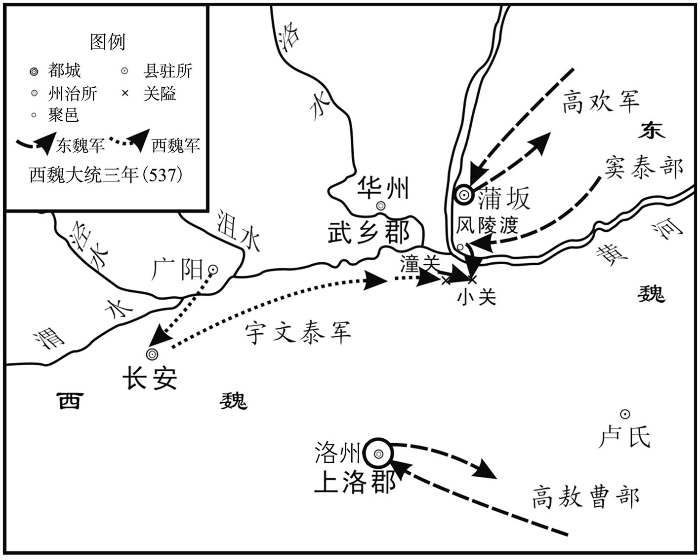 
小关之战示意图

## 【注文】

[1]坂：音bǎn。

[2]广阳：即广阳县，时魏雍州冯（píng）翊（yì）郡属县，置于北魏宣武帝元恪景明元年（500年）。

[3]脱：如果。　　蹉（cuō）跌（diē）：失误。

[4]行台左丞：即中央尚书省派出机构——行台的属官，其职位及职掌相当于尚书左丞。　　苏绰（chuò）（498—546年）：西魏名臣之一，字令绰，京兆武功（今陕西武功）人。少好学，通经史。西魏时，主持、参与西魏政治、经济及军事制度的改革，为西魏、北周的发展立下了功劳。　　中兵参军：职官名，始置于西晋，掌军事，为各公府及将军府属官。南北朝沿置。　　达奚（xī）武（503—570年）：字成兴，代（今山西大同及其以北、大漠以南地区）人，祖、父均为镇将。魏末，先后从贺拔岳、宇文泰征讨。后仕西魏、北周。北周武帝宇文邕天和五年（570年）亡，年六十七岁。

[5]直事郎中：职官名，始置于西晋武帝司马炎时期，系尚书诸曹郎之一，位在诸曹郎之上。南北朝沿置。　　深：即宇文深（？—568年），宇文泰之族子；宇文测之弟。少丧父，事兄甚恭。性耿直，喜读兵书。北魏孝庄帝元子攸永安中入仕，后随北魏孝武帝元脩入关，从于宇文泰帐下，入仕西魏、北周。北周武帝宇文邕天和三年（568年）亡。

[6]小关：地名，位于潼关（今陕西潼关）之西。

[7]马牧泽：地名，位于长安（今陕西西安）东四百里，是放牧军马及休息的处所。

[8]薛孤延：生卒年不详，代（今山西大同及其以北、大漠以南地区）人。少善武艺，魏末，从高欢举兵，因征讨尔朱氏之功，任第一领民酋长。后从其西征，屡立战功，任要职。

## 【译文】

南梁武帝萧衍大同三年（537年）春季正月，东魏丞相高欢屯军于蒲坂，建造了三座浮桥，打算渡黄河。西魏丞相宇文泰屯军在广阳，对各位将领说：“敌人从三个方向对准我们，搭建浮桥以显示其必定渡过黄河的决心，其实是想把我军牵制在这里，使窦泰得以西进。高欢自从起兵以来，窦泰经常作为他的前锋，窦泰的手下有很多精锐士卒，因屡战屡胜而心生骄傲，现在我们袭击他，必然将其攻克，攻克了窦泰，高欢会不战自败而逃。”各位将领都说：“敌人就在近处，我们舍弃近处的敌人而去袭击远处的敌人，如果有什么闪失，后悔也来不及了。不如分开兵力分别抵御他们。”西魏丞相宇文泰说：“高欢第二次攻打潼关的时候，我军没有从灞上出击。如今他率大军前来，认为我们还会单纯地防守，有轻视我们的心理，我们趁此机会袭击他们，还担心不能攻克吗？敌人虽然搭建了浮桥，但无法直接渡过黄河，不超过五天，我一定拿下窦泰。”行台左丞苏绰、中兵参军代人达奚武也有同样的看法。庚戌（十四日），西魏丞相宇文泰返回长安，各位将领的意见仍然不能统一。丞相宇文泰隐瞒了自己的计策，就现状询问他的同族侄子宇文深。宇文深说：“窦泰，是高欢手下的一名勇敢善战的猛将，如今我大军进攻蒲坂，高欢坚守不出，窦泰前来救援他，我们里外受到敌人的夹击，这是危险的打法。不如挑选轻装的精锐部队潜出小关攻击敌人，窦泰性格急躁，一定会前来决战，高欢老成持重，不会马上出兵营救，我们紧急进攻，必定可以将窦泰擒获。抓住了窦泰，高欢的气势自然会受挫，我们再回军攻击他，就可以取得决定性的胜利。”丞相宇文泰高兴地说：“这正是我心里的想法。”于是声称要保护陇右地区，辛亥（十五日），拜见了西魏文帝元宝炬后，悄悄地向东出兵，癸丑（十七日）这天早上，西魏军到达了小关，窦泰突然间听说西魏军已到，就从风陵渡过黄河，西魏丞相宇文泰出兵马牧泽，攻击窦泰，将其打得大败，全军覆没，窦泰自杀了，他的首级被送到了长安。东魏丞相高欢因为黄河上的冰层太薄，没能前往营救，撤了浮桥退兵而去。开府仪同三司代人薛孤延殿后，一天之内砍坏了十五把战刀，才得以撤还。西魏丞相宇文泰也领兵返还。

## 【原文】

**高敖曹自商山转斗而进，所向无前，遂攻上洛[1]。郡人泉岳及弟猛略与顺阳人杜窋等谋翻城应之，洛州刺史泉企知之，杀岳及猛略[2]。杜窋走归敖曹，敖曹以为向导而攻之。敖曹被流矢，通中者三，殒绝良久，复上马，免胄巡城。企固守旬余，二子元礼、仲遵力战拒之，仲遵伤目，不堪复战，城遂陷[3]。企见敖曹曰：“吾力屈，非心服也。”敖曹以杜窋为洛州刺史。敖曹创甚，曰：“恨不见季式作刺史[4]。”丞相欢闻之，即以高季式为济州刺史。**

## 【注文】

[1]商山：时位于洛州上洛县（今陕西商洛市）境内。

[2]泉企（？—537年）：字思道，上洛丰阳（今陕西山阳）人。官宦出身，少好学，九岁丧父，十二岁被乡里推举为县令。北魏孝明帝元诩（xǔ）孝昌初，率军抗拒萧宝寅之乱。北魏孝武帝元脩时，任洛州刺史，抵御高欢军西进。西魏文帝元宝炬大统三年（537年）亡。

[3]元礼：即泉元礼（？—537年），泉企之子。通文墨，善弓马。大统三年（537年），东魏军攻破洛州，与其父、弟同时被擒，半路逃归，纠合乡众，杀东魏所立洛州刺史。因功拜车骑大将军，世袭洛州刺史。后死于沙苑一战。　　仲遵：即泉仲遵（514—559年），泉企之子，西魏初，与父、兄共同抗击东魏，兄亡后，继任洛州刺史。后随从宇文泰征讨，屡立战功。北周明帝宇文毓（yù）武成初亡，年四十五岁。

[4]季式：即高季式（516—553年），高乾之四弟。魏末，与其兄高乾、高敖曹等并受重于高欢，并入仕东魏、北齐。北齐文宣帝高洋天保四年（553年）病亡。

## 【译文】

高敖曹从商山一路上转战进击，所向无敌，于是进攻上洛。上洛郡的泉岳和他的弟弟泉猛略，还有顺阳人杜窋（kū）等计划献出城池以接应高敖曹，洛州刺史泉企知道内情后，杀了泉岳及泉猛略。杜窋逃出，投奔了高敖曹，高敖曹让杜窋作向导攻打上洛城。高敖曹被流箭击中，有三箭射穿了他的身体，他昏死过去了很久，苏醒后再次上马，没有穿戴盔甲就巡视城防。泉企坚持守了十几天，他的两个儿子泉元礼和泉仲遵奋力战斗抵御敌人的进攻，泉仲遵伤了眼睛，不能再坚持战斗，于是，洛州城被攻陷了。泉企见到高敖曹后说：“我是筋疲力尽，内心并不服你。”高敖曹任用杜窋为洛州刺史。高敖曹的创伤很厉害，说：“遗憾的是我见不到我弟弟高季式当刺史了。”东魏丞相高欢听说此事后，立即任命高季式为济州刺史。

## 【原文】

**敖曹欲入蓝田关，欢使人告曰：“窦泰军没，人心恐动，宜速还[1]。路险贼盛，拔身可也。”敖曹不忍弃众，力战全军而还，以泉企、泉元礼自随，泉仲遵以伤重不行。企私戒二子曰：“吾余生无几，汝曹才器足以立功，勿以吾在东，遂亏臣节。”元礼于路逃还，魏以元礼世袭洛州刺史。**

## 【注文】

[1]蓝田关：时位于雍州京兆郡蓝田县，今陕西西安东南。

## 【译文】

高敖曹想进入蓝田关，高欢派人告诉他说：“窦泰全军覆没了，人心恐惧躁动，你应当迅速返回。路途险阻，敌人的兵势很盛，你只要抽身而退就可以了。”高敖曹不忍心抛弃手下的部众，于是拼尽全力，带着全部人马返回，让泉企、泉元礼跟随，泉仲遵因伤势太重没有随行。泉企告诫他的两个儿子说：“我余下的时日不多了，你们的才能足以立功，不要因为我在东面，因此有损作为臣子的气节。”泉元礼半路上逃了回来，西魏朝廷诏令泉元礼世袭洛州刺史。

## 【原文】

**夏五月，魏以贺拔胜为太师。**

## 【译文】

梁武帝大同三年（537年）夏季五月，西魏任命贺拔胜为太师。

## 【原文】

**秋七月，独孤信北还，与杨忠皆至长安。**

## 【译文】

梁武帝大同三年（537年）秋季七月，独孤信离开南梁北返，和杨忠一起到了长安。

## 【原文】

**魏宇文深劝丞相泰取恒农。八月丁丑，泰帅李弼等十二将伐东魏，以北雍州刺史于谨为前锋，攻盘豆，拔之[1]。戊子，至恒农，庚寅，拔之，擒东魏陕州刺史李徽伯，俘其战士八千[2]。**

## 【注文】

[1]北雍州：北魏以雍州华原县（今陕西耀县）置北雍州，时属西魏。　　盘豆：即盘豆城，时位于司州恒农郡境内，今河南灵宝西北。

[2]陕州：始置于北魏孝文帝元宏太和十一年（487年），后罢，东魏孝静帝元善见天平初复置，后陷。治陕城（今河南三门峡西南），领恒农、西恒农、渑池、石城、河北等五郡、十一县。

## 【译文】

西魏宇文深劝说丞相宇文泰攻取恒农。大同三年（537年）八月丁丑（十四日），宇文泰率领李弼等十二位将领攻伐东魏，任命北雍州刺史于谨为前锋，攻打并占领了盘豆。戊子（二十五日），到达了恒农，庚寅（二十七日），攻下了该城，抓获了东魏陕州刺史李徽伯，并俘获了他的八千名士兵。

## 【原文】

**时河北诸城多附东魏，左丞杨檦自言父猛尝为邵郡白水令，知其豪杰，请往说之，以取邵郡[1]。泰许之。檦乃与土豪王覆怜等举兵，收邵郡守程保及县令四人，斩之[2]。表覆怜为郡守，遣谍说谕东魏城堡，旬月之间，归附甚众[3]。**

## 【注文】

[1]左丞：即行台左丞。　　杨檦（biǎo）：生卒年不详，字显进，正平高凉（今山西闻喜西北）人。祖、父均曾任北魏之县令。魏末，从孝武帝元脩入关，御西魏之东境二十余年，然晚节不保，北周武帝宇文邕（yōng）保定四年（564年），洛阳一战失败后降。　　邵（shào）郡：北魏献文帝拓跋弘皇兴四年（470年）置郡，领白水、清廉、苌平、西太平四县，治白水（今山西垣曲东南）。　　白水：邵郡治所，今山西垣曲东南。

[2]县令：职官名，始置于秦，为县一级之行政长官。大者（人口万户以上）称令；小者（人口万户以下）称长。后世沿置，一般称令。

[3]谍：即间谍，刺探敌方情报的人员。

## 【译文】

当时，河北很多城池都依附了东魏，左丞杨檦自称他的父亲杨猛曾经当过邵郡白水县令，认识那里的豪杰，请求前往白水县去说服他们，以攻取邵郡。宇文泰答应了他的请求。杨檦于是和当地的土豪王覆怜等人起兵，抓获了邵郡太守程保和四名县令，将他们斩首。上表建议任用王覆怜为邵郡太守，派间谍去游说东魏的各个城堡，一个月内，很多城堡都归附了西魏。

## 【原文】

**闰九月，东魏丞相欢将兵二十万自壶口趣蒲津，使高敖曹将兵三万出河南[1]。时关中饥，魏丞相泰所将将士不满万人，馆谷于恒农五十余日，闻欢将济河，乃引兵入关，高敖曹遂围恒农[2]。欢右长史薛琡言于欢曰：“西贼连年饥馑，故冒死来入陕州，欲取仓粟[3]。今敖曹已围陕城。粟不得出，但置兵诸道，勿与野战，比及麦秋，其民自应饿死，宝炬、黑獭何忧不降？愿勿渡河。”侯景曰：“今兹举兵，形势极大，万一不捷，猝难收敛。不如分为二军，相继而进，前军若胜，后军全力；前军若败，后军承之。”欢不从，自蒲津济河。**

## 【注文】

[1]壶口：时位于泰州平阳郡禽昌（今山西临汾）东南，今山西吉县壶口镇。黄河在此形成了约九米的巨大落差，即壶口瀑布。　　河南：即黄河之南。

[2]馆谷：即吃住。

[3]右长史：即高欢之丞相府的右长史。　　薛琡（shū）：生卒年不详，字昙（tán）珍，河南（今河南洛阳）人。其先祖出于代北（今山西大同及其以北、大漠以南地区），本姓叱（chì）干氏。魏末，从高欢帐下，后入仕东魏，终于尚书仆射。个性险恶，重猜忌，为政不佳。

## 【译文】

梁武帝大同三年（537年）闰九月，东魏丞相高欢率领二十万人的军队从壶口赶赴蒲津，派高敖曹率领三万人出兵黄河以南。当时关中发生饥荒，西魏丞相宇文泰所率领的将士不足一万人，在恒农郡食宿了五十多天，听说高欢将渡河，就率领部队进入了关中，高敖曹于是包围了恒农。高欢的右长史薛琡对高欢说：“西面的敌人连年遭受饥荒，所以冒死前来进入陕州，想要夺取仓库中的粮食。如今高敖曹已包围了陕城。城里粮食运不出去，我们只需在各条道路上部署兵力，不用和他们野战，等到秋天麦子熟了的时候，他们的百姓自然会饿死，还担忧元宝炬、宇文黑獭（tǎ）不投降吗？希望丞相不要渡过黄河。”侯景说：“这次出兵，规模浩大，万一不能成功，仓促之中很难控制住局面。不如分为两支军队，前后相继行进，前军如果胜利了，后军就可全力投入战斗；前军如果失败了，后军可以接替而上。”高欢不听从他们的意见，从蒲津渡过了黄河。

## 【原文】

**丞相泰遣使戒华州刺史王罴，罴语使者曰：“老罴当道卧，貉子那得过[1]。”欢至冯翊城下，谓罴曰：“何不早降？”[2]罴大呼曰：“此城是王罴冢，死生在此[3]。欲死者来！”欢知不可攻，乃涉洛，军于许原西[4]。**

## 【注文】

[1]罴（pí）：熊的一种。

[2]冯翊城：在冯翊县境内。冯翊县，时属西魏之同州。原北魏之华州华阴县（今陕西华阴），西魏时改称同州冯翊县。

[3]冢（zhǒng）：坟墓。

[4]许原：地名，原位于北魏华州境内，洛水之南，今陕西华阴北。

## 【译文】

西魏丞相宇文泰派使者让华州刺史王罴加强警戒，王罴对使者说：“老熊当道卧，貉子哪能过得去呢。”高欢来到冯翊城下，对王罴说：“为何不早点投降？”王罴大叫道：“这座城池就是我王罴的坟墓，我生死都在这里。想死的就过来吧！”高欢知道不能攻克，于是渡过洛水，屯军在许原西。

## 【原文】

**泰至渭南，征诸州兵，皆未会[1]。欲进击欢，诸将以众寡不敌，请待欢更西以观其势。泰曰：“欢若至长安，则人情大扰。今及其远来新至，可击也。”即造浮桥于渭，令军士赍三日粮，轻骑渡渭，辎重自渭南夹渭而西。冬十月壬辰，泰至沙苑，距东魏军六十里[2]。诸将皆惧，宇文深独贺。泰问其故，对曰：“欢镇抚河北，甚得众心，以此自守，未易可图。今悬师渡河，非众所欲，独欢耻失窦泰，愎谏而来，所谓忿兵，可一战擒也[3]。事理昭然，何为不贺？愿假深一节，发王罴之兵邀其走路，使无遗类。”泰遣须昌县公达奚武觇欢军，武从三骑，皆效欢将士衣服，日暮，去营数百步，下马潜听，得其军号，因上马历营，若警夜者，有不如法，往往挞之，具知敌之情状而还[4]。**

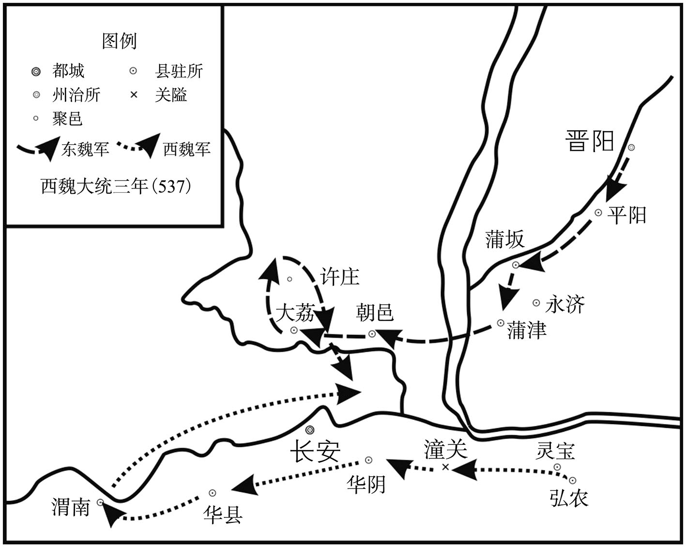 
沙苑之战示意图

## 【注文】

[1]渭南：地名，渭水之南。渭水，古水名，是黄河的一大支流，源自今甘肃渭源，东西走向，流经今甘肃、宁夏、陕西三省，从陕西之潼关汇入黄河。

[2]沙苑：地名，位于渭水北岸，时华州华阴县境内，今陕西大荔南。南梁武帝萧衍大同三年（537年），东、西魏在此交战，西魏宇文泰以少胜多、以弱胜强，奠定了东、西魏割据的局面。

[3]愎（bì）谏：拒绝劝告。

[4]觇（chān）：暗中侦察。　　挞（tà）：用鞭子或棍子打，以示责罚。

## 【译文】

宇文泰到达渭南，召集各州的兵马，都没有按时赶到。宇文泰想进攻高欢，各位将领以众寡不可匹敌为由，请求等高欢再向西开进时，看情况再作打算。宇文泰说：“高欢如果到了长安，人心就会惊恐不安。如今他远道而来，我们可以趁此机会攻击他。”于是在渭水上建造浮桥，命令军士带好三天的干粮，率轻骑兵渡过渭水，辎（zī）重车辆从渭水南岸沿着渭水向西行进。大同三年（537年）冬季十月壬辰（初一日），宇文泰到达沙苑，距离东魏的军队六十里。各位将领都很害怕，只有宇文深一人为此而庆贺。宇文泰问其缘故，宇文深说：“高欢镇抚河北，很得民心，如果他凭借此一优势，固守疆土，也不容易对付。如今他率领一支孤军渡过黄河，这并不是众人所心甘情愿的做法，只高欢一人因失去窦泰而感到耻辱，不接受别人的劝阻，坚持前来，这就所谓的忿兵，我们可以一战将其擒获。事情的道理明明白白，为什么不庆贺呢？希望丞相能够赐给我一道符节，调动王罴的兵马拦截高欢的退路，让东魏兵无一遗漏，全部落网。”宇文泰派须昌县公达奚武前去侦察高欢的军队，达奚武带着三名骑兵，都效仿高欢的将士进行穿着，天黑时，在距离高欢营地几百步的地方，下马偷听，听到了对方军中的口令，随后上马穿过敌营，假装成巡夜的人员，发现有不守军规的军士，就抽打一顿，详细了解了敌情之后，返回了自己的营地。

## 【原文】

**欢闻泰至，癸巳，引兵会之。候骑告欢兵且至，泰召诸将谋之[1]。开府仪同同三司李弼曰：“彼众我寡，不可平地置陈。此东十里有渭曲，可先据以待之[2]。”泰从之，背水东西为陈，李弼为右拒，赵贵为左拒，命将士皆偃戈于苇中，约闻鼓声而起[3]。晡时，东魏兵至渭曲，都督太安斛律羌举曰：“黑獭举国而来，欲一死决，譬如猘狗，或能噬人[4]。且渭曲苇深土泞，无所用力，不如缓与相持，密分精锐径掩长安，巢穴既倾，则黑獭不战成擒矣[5]。”欢曰：“纵火焚之何如？”侯景曰：“当生擒黑獭以示百姓，若众中烧死，谁复信之？”彭乐盛气请斗，曰：“我众贼寡，百人擒一，何忧不克？”欢从之。东魏兵望见魏兵少，争进击之，无复行列。兵将交，丞相泰鸣鼓，士皆奋起，于谨等六军与之合战，李弼等帅铁骑横击之，东魏兵中绝为二，遂大破之。李弼弟檦，身小而勇，每跃马陷陈，隐身鞍甲之中，敌见皆曰：“避此小儿[6]。”泰叹曰：“胆决如此，何必八尺之躯！”征虏将军武川耿令贵杀伤多，甲裳尽赤，泰曰：“观其甲裳，足知令贵之勇，何必数级[7]！”彭乐乘醉深入魏陈，魏人刺之肠出，内之复战。丞相欢欲收兵更战，使张华原以簿历营点兵，莫有应者，还白欢曰：“众尽去，营皆空矣[8]。”欢犹未肯去。阜城侯斛律金曰：“众心离散，不可复用，宜急向河东[9]。”欢据鞍未动，金以鞭拂马，乃驰去。夜，渡河，船去岸远，欢跨槖驼就船，乃得渡，丧甲士八万人，弃铠仗十有八万[10]。丞相泰追欢至河上，选留甲士二万余人，余悉纵归。都督李穆曰：“高欢破胆矣，速追之，可获。”泰不听，还军渭南，所征之兵甫至，乃于战所人种柳一株以旌武功[11]。**

## 【注文】

[1]候骑（hòu jì）：担任侦察任务的骑兵。

[2]渭曲：渭水拐弯的地方。

[3]偃戈：埋伏。

[4]太安：即太安郡，北魏孝明帝元诩（xǔ）正光末，与怀朔镇同时设置，原属朔州，魏末，侨置于并州。　　斛律羌举（504—539年）：朔州太安（今内蒙古呼和浩特西北）人，出生于代北（今山西大同及其以北、大漠以南地区）部落酋长之家。北魏孝庄帝元子攸（yōu）永安中，从尔朱氏入洛阳，后依附于高欢，入仕东魏，历任要职。东魏孝静帝元善见兴和初，亡于夏州刺史任上，年三十六岁。

[5]泞：音nìng。

[6]檦：即李檦（biǎo）（？—564年），魏末名将李弼之弟，字灵杰，身材矮小，个性果断，有胆略。魏末，从尔朱氏帐下，北魏孝武帝元脩永熙末，孝武帝西迁，从大都督元斌之抗击高欢，战败，逃奔南梁，后归西魏，东击东魏，北讨茹茹、稽胡，屡立战功。北周武帝宇文邕（yōng）保定四年（564年）亡。

[7]征虏将军：武官名，始置于东汉光武帝刘秀建中年间，掌军事。后世沿置，北魏孝文帝太和中列右第三品上，宣武帝后改为右从第三品。　　数级：古时战后，数将士斩获的敌人首级作为论功行赏之标准。

[8]簿：即花名册。

[9]斛律金（？—567年）：字阿六敦，北魏朔州（今内蒙古五原）人，出生于敕勒部落，高祖倍侯利为部落首领，率部众投奔北魏。祖父及父亲都曾为北魏高官。性耿直，富于实战经验。北魏孝明帝元诩（xǔ）正光末，随破六韩拔陵起兵，后降归北魏，受封为第二领民酋长。后投奔尔朱荣、高欢，战功卓著。北齐后主高纬天统三年（567年）亡。

[10]槖（tuó）驼：骆驼。　　铠仗：铠甲和兵器。

[11]甫：刚、才。　　旌：表彰、表扬。

## 【译文】

高欢听说宇文泰到了，大同三年（537年）十月癸巳（初二日），率领兵马前去与之会战。西魏的侦察兵报告宇文泰，高欢的部队快要到了，宇文泰于是召集各位将领商议对策。开府仪同三司李弼说：“敌人人多我们人少，不能在平地上排兵布阵。离此东十里有一个地方叫渭曲，可先在渭曲屯兵以等待高欢的军队。”宇文泰听从了李弼的意见，在渭曲背靠河水的东西两侧布下军阵，李弼负责右侧的军阵，赵贵负责左侧的军阵，命令将士们都把武器藏在芦苇丛中，听到鼓声再冲出来。大约在午后三时到五时之间，东魏的部队到达了渭曲，都督太安人斛律羌举说：“宇文黑獭倾尽全国的兵力前来，想要决一死战，就好比一条疯狗，有时候也能吃人。况且渭曲这个地方芦苇丛茂密幽深，土地泥泞，用不上力，不如暂缓与其对峙，秘密地分派精锐兵力径直突袭长安，他们的巢穴被捣毁了，那么宇文黑獭会不战自败，被我们所擒获。”高欢说：“放火烧他们怎么样？”侯景说：“我们应活捉宇文黑獭以昭示百姓，如果他混在众人当中烧死了，谁会相信他真的死了？”彭乐豪气冲天请求出战说：“我们人多，敌人人少，一百个人抓一个，还担忧不能攻克吗？”高欢允准了他的请求。东魏的军士看到西魏的兵少，争先恐后地进攻西魏军，队列完全乱了。两军将要交战，西魏丞相宇文泰命令开始击鼓，鼓声响起，西魏的将士们奋勇而起，于谨等六支军队与东魏军交战在一起，李弼等人率领铁甲骑兵从两侧拦击敌军，东魏的军队被从中间截为两段，于是西魏军大败东魏军。李弼的弟弟李檦，虽然身材矮小，然而勇敢善战，每次跃马冲锋陷阵，将身子隐藏在马鞍和盔甲之中，敌人见了他都说：“避开这个小孩儿。”宇文泰叹息说：“如此勇猛果断，何须八尺长的身躯！”征虏将军武川人耿令贵杀死、杀伤了很多敌人，盔甲和衣服都染成了红色，宇文泰说：“看看他的衣裳，就知道耿令贵的勇猛了，何必再去数他所杀死的敌人的首级呢！”彭乐趁着酒劲深入西魏的军阵，西魏人将他的肠子刺了出来，他把肠子塞进腹中，继续作战。东魏丞相高欢想收兵择日再战，派张华原拿着花名册到各营去清点人数，没有人答应，张华原回来报告高欢说：“大家都已经走了，军营已经空了。”高欢仍然不肯离去。阜城侯斛律金说：“大家的心离散了，无法再派上用场，应当紧急向黄河东面撤军。”高欢手按马鞍没有行动，斛律金用马鞭打马，高欢的马才飞驰而去。夜里，高欢的军队渡黄河，船离河岸较远，高欢乘坐骆驼靠近船，才得以渡过黄河，高欢损失了八万名精兵，丢弃的铠甲和武器十八万副。西魏丞相宇文泰追击高欢来到黄河边上，挑选了二万多名东魏精兵，其余的全部放还。都督李穆说：“高欢吓破胆了，迅速追击他，可将其擒获。”宇文泰不听他的意见，率领军队回到渭水以南，这时，从各州征召来的士兵才刚刚到达，宇文泰下令每人在战场上种植一株柳树，以表彰战功。

## 【原文】

**侯景言于欢曰：“黑獭新胜而骄，必不为备，愿得精骑二万，径往取之。”欢以告娄妃，妃曰：“设如其言，景岂有还理[1]！得黑獭而失景，何利之有？”欢乃止。**

## 【注文】

[1]娄妃：即北齐神武明皇后娄氏（501—562年），名昭君，代郡平城（今山西大同）人，鲜卑贵族出身。聪慧，宽厚，尚俭朴。东魏孝静帝元善见武定三年（545年），为交好柔然，识大体，主动将正室之位让给柔然公主。北齐天保初，次子高洋即皇帝位，尊为皇太后。北齐武成帝高湛大宁二年（562年）病亡，年六十二岁。

## 【译文】

侯景对高欢说：“宇文黑獭刚刚取得胜利，内心骄傲，一定不设防备，希望能给我二万精骑兵，径直前往将其擒获。”高欢把侯景的想法告诉了娄妃，娄妃说：“假设真像他所说的，侯景哪里还有返还的机会！得到了宇文黑獭而失去了侯景，有什么利益？”高欢于是作罢。

## 【原文】

**魏加丞相泰柱国、大将军，李弼等十二将皆进爵增邑有差[1]。**

## 【注文】

[1]十二将：即李弼、独孤信、梁御、赵贵、于谨、若干惠、怡峰、刘亮、王德、侯莫陈崇、李远、达奚武。

## 【译文】

西魏文帝元宝炬加封宇文泰为柱国、大将军，李弼等十二位将领都加官晋爵，增加封地，大小、多少不等。

## 【原文】

**高敖曹闻欢败，释恒农，退保洛阳[1]。**

## 【注文】

[1]释：放弃。

## 【译文】

高敖曹听说高欢战败了，放弃了对恒农的围困，退守洛阳。

## 【原文】

**己酉，魏行台宫景寿等向洛阳，东魏洛州大都督韩贤击走之。州民韩木兰作乱，贤击破之。一贼匿尸间，贤自按检收铠仗，贼歘起斫之，断胫而卒[1]。**

## 【注文】

[1]歘（xú）：突然。　　胫（jìng）：小腿。

## 【译文】

梁武帝大同三年（537年）十月己酉（十八日），西魏行台宫景寿等人向洛阳进军，东魏洛州大都督韩贤将其打跑了。洛州百姓韩木兰兴兵反叛，韩贤将其击败。一名反贼藏在尸体中间，韩贤独自一人手握宝剑收捡铠甲武器，此贼突然跳起来用刀砍韩贤，韩贤因小腿被砍断而死。

## 【原文】

**魏复遣行台冯翊王季海与独孤信将步骑二万趣洛阳，洛州刺史李显趣三荆，贺拔胜、李弼围蒲坂。**

## 【译文】

西魏再次派遣行台冯翊王元季海和独孤信率领步兵、骑兵二万人赶赴洛阳，洛州刺史李显赶赴三荆地区，贺拔胜、李弼等人包围蒲坂。

## 【原文】

**东魏丞相欢之西伐也，蒲坂民敬珍谓其从祖兄祥曰：“高欢迫逐乘舆，天下忠义之士皆欲剚刃于其腹[1]。今又称兵西上，吾欲与兄起兵断其归路，此千载一时也。”祥从之，纠合乡里，数日，有众万余。会欢自沙苑败归，祥、珍帅众邀之，斩获甚众。贺拔胜、李弼至河东，祥、珍帅猗氏等六县十余万户归之，丞相泰以珍为平阳太守，祥为行台郎中[2]。**

## 【注文】

[1]敬珍：生卒年不详，字国宝，河东蒲坂（今山西永济西）人，出身官宦，少好武艺，喜结交豪侠。大统三年（537年），高欢沙苑战败后，敬珍纠集乡里十几万户归降西魏，历任平阳太守、绛州刺史。后因病辞官，亡于家。　　祥：即敬祥，生卒年不详，敬珍之同族兄，大统三年（537年），与敬珍同归西魏，官至龙骧（xiāng）将军、行台郎中。　　剚（zì）刃：用刀剑刺杀。剚，用刀剑等利器刺。

[2]猗（yī）氏：即猗氏县，时属魏泰州河东郡，今山西运城西北。　　平阳：即平阳郡，时属晋州，领禽昌、平阳、襄陵、临汾、泰平五县，治禽昌（今山西临汾）。所辖约相当于今山西临汾、襄汾地区。

## 【译文】

东魏丞相高欢出兵讨伐西魏时，蒲坂的百姓敬珍对他的族兄敬祥说：“高欢逼迫追击皇上，天下的忠义之士都恨不得用刀捅他的肚子。今天又率领军队向西进攻，我想与兄长联合起兵截断他的归路，这是千载难逢的时机。”敬祥听从了他的建议，纠集乡里的百姓，几天之内，就集合了一万多人。正赶上高欢从沙苑战败返回，敬祥、敬珍率领乡众截击高欢，斩杀、擒获了很多人。贺拔胜、李弼到达河东，敬祥、敬珍率领猗氏等六个县的十几万户百姓前来归附，西魏丞相宇文泰任命敬珍为平阳郡太守，敬祥为行台郎中。

## 【原文】

**东魏秦州刺史薛崇礼守蒲坂，别驾薛善，崇礼之族弟也，言于崇礼曰：“高欢有逐君之罪，善与兄忝衣冠绪余，世荷国恩，今大军已临，而犹为高氏固守，一旦城陷，函首送长安，署为逆贼，死有余愧[1]。及今归款，犹为愈也[2]。”崇礼犹豫不决。善与族人斩关纳魏师，崇礼出走，追获之。丞相泰进军蒲坂，略定汾、绛，凡薛氏预开城之谋者，皆赐五等爵[3]。善曰：“背逆归顺，臣子常节，岂容阖门大小俱叨封邑。”与其弟慎固辞不受[4]。**

## 【注文】

[1]秦州：据上下文，此应为泰州。　　别驾：职官名，始置于西汉，又名别驾从事史，为州刺史的副职，协助刺史管理军政事务。州刺史出行时，别乘驿车随行，所以取名别驾。南北朝沿置。　　薛善：生卒年不详，字仲良，河东汾阴（今山西万荣西南）人。东魏孝静帝元善见天平初，任泰州别驾，西魏文帝元宝炬大统三年（537年），高欢沙苑战败，与其弟薛慎（shèn）降西魏，屡任要职，并被赐姓宇文氏，亡于京兆尹任上，年六十七岁。　　忝（tiǎn）：旧时之谦词，意即有愧。　　衣冠：古时对士大夫的泛称。士大夫，也称缙（jìn）绅大夫士，即有一定官位及社会地位的读书人。　　荷：承蒙。　　函首：古时将重要战犯杀头后，装进匣子送往都城。

[2]归款：归附。

[3]汾、绛：即汾州、绛州。汾州，北魏太武帝拓跋焘延和三年（434年）置镇，魏孝文帝元宏太和十二年（488年）置州。领西河、吐京、五城、中阳等四郡、十县，治蒲子城（今山西隰县），孝昌中陷落，移治西河（今山西汾阳）。所辖约相当于今山西吕梁。绛州，北魏时为绛郡，属东雍州，分为北绛郡、南绛郡。北魏孝明帝元诩孝昌三年（527年），置北绛郡，领北绛、新安二县，治北绛县（今山西翼城东南），属唐州。北魏孝庄帝元子攸建义元年（528年），置南绛郡，领南绛、小乡二县，治浍交川（今山西绛县东北），属晋州。今山西南部绛县、新绛、翼城等地。北周时改为绛州。

[4]阖（hé）门：满门。　　慎：即薛慎，生卒年不详，薛善之弟，字佛护，少好学，善草书。大统三年（537年），与其兄同入仕西魏，并受重于时。北周武帝宇文邕保定初，出任湖州刺史，长于教化，促进了湖州少数族群的华化。后因病去职，亡于家，有文集传世。

## 【译文】

东魏秦州刺史薛崇礼镇守蒲坂，别驾薛善，是薛崇礼的族弟，对薛崇礼说：“高欢有追击皇帝的罪行，薛善与兄长都是读书人，世代承蒙国恩，如今西魏的大军已经到来，而我们仍然为高欢坚守，一旦城池被攻陷，你我两人的头颅就会被装在匣子里送往长安，被定性为谋逆的反贼，就是死了也有余愧。我们现在前去投城，还是个好的时机。”薛崇礼犹豫再三拿不定主意。薛善和族人一同劈开城门，迎西魏军进城，薛崇礼出逃，被西魏军抓获。西魏丞相宇文泰进军蒲坂，平定了汾、绛地区，下令凡是薛氏家族中参与开城纳迎西魏军队的人，都赐予五等爵位。薛善说：“背逆叛贼并归顺朝廷，是作为臣子应当具有的节操，怎么能让全家大小都受封赏呢。”于是薛善和他的弟弟薛慎坚决不接受封赏。

## 【原文】

**东魏行晋州事封祖业弃城走，仪同三司薛修义追至洪洞，说祖业还守，祖业不从[1]。修义还据晋州，安集固守，魏仪同三司长孙子彦引兵至城下，修义开府伏甲以待之，子彦不测虛实，遂退走。丞相欢以修义为晋州刺史。**

## 【注文】

[1]行：代理。　　薛修义（498—554年）：字公让，河东汾阴（今山西万荣西南）人。官贵出身，祖、父均曾仕北魏。少有豪侠之气，重义轻财。北魏孝明帝元诩正光末，举兵叛魏，后归降。尔朱荣因其反复，拘其于晋阳。尔朱荣死后，从高欢征讨。天保五年（554年）亡，年五十七岁。　　洪洞（tóng）：即洪洞故城，时在汾州平阳郡北，今山西洪洞。

## 【译文】

东魏代理晋州事务的封祖业弃城而逃，开府仪同三司薛修义追赶到洪洞，劝说封祖业归还守城，封祖业不听。薛修义返回占据晋州，安定、召集百姓固守州城。西魏开府仪同三司长孙子彦率领军队来到晋州城下，薛修义打开城门，埋伏下士兵以等待敌军的到来，长孙子彦不知道晋州城中的虚实，于是率兵撤走了。东魏丞相高欢任命薛修义为晋州刺史。

## 【原文】

**独孤信至新安，高敖曹引兵北渡河[1]。信逼洛阳，洛州刺史广阳王湛弃城归邺，信遂据金墉城[2]。孝武帝之西迁也，散骑常侍河东裴宽谓诸弟曰：“天子既西，吾不可以东附高氏。”帅家属逃于大石岭[3]。独孤信入洛，乃出见之。时洛阳荒废，人士流散，唯河东柳虬在阳城，裴诹之在颍川，信俱征之，以虬为行台郎中，诹之为开府属[4]。**

## 【注文】

[1]新安：即新安郡，东魏孝静帝元善见天平初置，属洛州。

[2]金墉城：位于北魏洛阳城之西北角。始置于三国魏明帝曹叡（ruì）时期，魏晋时被废的帝、后常安置于此。北魏孝文帝元宏初迁洛阳，曾居于此城。

[3]大石岭：时位于洛阳新城县（今河南伊川西南）境内。

[4]柳虬（qíu）（501—554年）：字仲盘，河东解（今山西临猗西南）人。官宦出身，少好学，北魏孝明帝元诩孝昌中以秀才入仕，魏末丧乱，归乡。西魏文帝元宝炬大统三年（537年），纠合乡里归附西魏，西魏恭帝元廓元年（554年）亡，年五十四岁。　　阳城：原为阳城县，北魏孝明帝元诩孝昌中置阳城郡，属洛州，今河南登封东南。　　裴诹（zōu）之：生卒年不详，字士平，少好学，七岁即知名于时。世居河东。亡于北周伊川太守任上。　　开府属：即开府属官。古代自秦汉以后，诸王公及将军等高级官员均可以建立府署（即自己的办公机构），并自行选任僚属。

## 【译文】

独孤信到达新安，高敖曹率军队向北渡过黄河。独孤信进逼洛阳，洛州刺史广阳王元湛弃城而去，逃往邺城，独孤信占据了金墉城。北魏孝武帝元脩西迁时，散骑常侍河东人裴宽对他的弟弟们说：“天子既然已经向西迁动，我们不能再向东依附高氏。”于是率领家人逃到了大石岭。独孤信进入洛阳，裴宽才出来与他见面。当时洛阳城十分荒凉破败，名门士族流亡离散，只有河东人柳虬在阳城，裴诹之在颍川，独孤信把他们都征召过来，任用柳虬为行台郎中，裴诹之为开府属。

## 【原文】

**东魏颍州长史贺若统执刺史田迄，举城降魏，魏都督梁迥入据其城[1]。前通直散骑侍郎郑伟起兵陈留，攻东魏梁州，执其刺史鹿永吉[2]。前大司马从事中郎崔彦穆攻荥阳，执其太守苏淑，与广州长史刘志皆降于魏[3]。伟，先护之子也[4]。丞相泰以伟为北徐州刺史，彦穆为荥阳太守。**

## 【注文】

[1]颍州：东魏孝静帝元善见天平初所置，治长社城（今河南长葛东北），领许昌、颍川、阳翟等郡，武定七年（549年）改为郑州。

[2]通直散骑侍郎：古代职官名，职同散骑侍郎，掌顾问应对。西晋武帝司马炎置员外散骑侍郎四人，东晋元帝司马睿让其中的二人与散骑侍郎通直（即共同宿值禁中），所以称之为通直散骑侍郎。后世沿置，北魏孝文帝太和年间初定四品中，后改为从五品上。　　郑伟（515—571年）：魏末将领郑先护之子，字子直，善骑射，胆力过人。北魏孝武帝元脩西迁后，归乡，不思仕进。大统三年（537年），纠集乡众，起兵陈留，助西魏将领独孤信攻打东魏。北周武帝宇文邕天和六年（571年），亡于华州刺史任上，年五十七岁。　　陈留：即陈留城，时属东魏梁州陈留郡，今河南开封东南。　　梁州：即东魏之梁州，始置于东魏孝静帝元善见天平初，治大梁城（今河南开封），领阳夏、开封、陈留、汝南、颍川、汝阳、义阳、新蔡、初安、襄阳、城阳、广陵等郡。

[3]崔彦穆（？—581年）：字彦穆，清河东武城（今河北武城）人，官宦出身。少聪慧，喜读书。北魏孝庄帝元子攸永安末，入仕。大统三年（537年），与其兄崔彦珍举兵攻打荥阳，阻击东魏军，因功任荥阳郡守。后历任要职。隋文帝杨坚开皇元年（581年）亡。　　

[4]先护：即郑先护（？—531年），郑羲（xī）之族孙，入仕为员外郎。北魏孝庄帝元子攸时，因功累历要职。尔朱荣败亡后，奉孝庄之命领兵讨伐尔朱仲远。战败，投奔南梁，后自梁归魏，北魏前废帝元恭初，被尔朱仲远所害。

## 【译文】

东魏颍州长史贺若统抓获了刺史田迄（qì），率领全城百姓投降了西魏，西魏都督梁迥（jiǒng）率军入据颍州城。前任通直散骑侍郎郑伟在陈留起兵，攻打东魏梁州，抓获了梁州刺史鹿永吉。前任大司马从事郎中崔彦穆攻打荥（xíng）阳，抓获了太守苏淑，和广州刺史刘志一起投降了西魏。郑伟，是郑先护的儿子。西魏丞相宇文泰任命郑伟为北徐州刺史，崔彦穆为荥阳太守。

## 【原文】

**十一月，东魏行台任祥帅督将尧雄、赵育、是云宝攻颍川，丞相泰使大都督宇文贵、乐陵公辽西怡峰将步骑二千救之[1]。军至阳翟，雄等军已去颍川三十里，祥帅众四万继其后[2]。诸将咸以为“彼众我寡，不可争锋”。贵曰：“雄等谓吾兵少，必不敢进。彼与任祥合兵攻颍川，城必危矣。若贺若统陷没，吾辈坐此何为？今进据颍川，有城可守，又出其不意，破之必矣。”遂疾趋据颍川，背城为陈以待。雄等至，合战，大破之，雄走，赵育请降，俘其士卒万余人，悉纵遣之。任祥闻雄败，不敢进，贵与怡峰乘胜逼之，祥退保宛陵，贵追及，击之，祥军大败[3]。是云宝杀其阳州刺史那椿，以州降魏[4]。魏以贵为开府仪同三司，是云宝、赵育为车骑大将军。都督杜陵韦孝宽攻东魏豫州，拔之，执其行台冯邕[5]。孝宽名叔裕，以字行。丙子，东魏以骠骑大将军、仪同三司万俟普为太尉[6]。**

## 【注文】

[1]任祥（？—538年）：字延敬，魏末，从葛荣起兵，后随高欢，东魏孝静帝元善见天平初，任徐州刺史。元象元年（538年），亡于邺城。　　尧雄（499—542年）：字休武，上党长子（今山西长治南）人，祖、父均仕北魏。北魏孝庄帝元子攸永安中入仕，后随从高欢，入东魏，为政有佳绩。东魏孝静帝元善见兴和四年（542年）亡，年四十四岁。　　宇文贵（？—567年）：字永贵，其先祖是昌黎（今辽宁沈阳西）人，后徙（xǐ）居夏州。善骑射，有将才，好音乐。北魏孝明帝元诩正光末，先后从源子雍、元天穆等平定边乱，后从北魏孝武帝元脩入关，仕西魏、北周。北周武帝宇文邕天和二年（567年）亡。　　怡峰（500—549年）：字景阜，辽西（今河北迁安东北）人，其先祖在北魏道武帝时归附。骁勇善战，北魏孝庄帝元子攸（yōu）永安中，从贺拔岳起兵，后从宇文泰，入仕西魏，大统十五年（549年）病亡，年五十岁。

[2]阳翟（dí）：即阳翟县，时属东魏颍州，今河南禹县。

[3]宛陵：即宛陵县，原北魏司州颍川郡属县，东魏孝静帝元善见天平初，改属广武郡，今河南新郑东北。

[4]阳州：东魏天平初置，治宜阳（今河南宜阳西北），领宜阳、金门二郡。

[5]韦孝宽（508—579年）：名韦叔裕，字孝宽，京兆杜陵（今陕西西安南）人。将家出身，因平定萧宝寅之乱，任统军。后随独孤信入仕西魏、北周。历任要职，善于抚众，为政有佳绩。北周静帝宇文阐大象元年（579年）亡，年七十二岁。　　

[6]万（mò）俟（qì）普：生卒年不详，万俟受洛干之父，字普拔，太平（今山西宁武东北）人，其先祖为匈奴之别种。北魏孝明帝元诩正光中，随破六韩拔陵起兵，后率部投降北魏，任第二领民酋长。后投于高欢帐下，官至朔州刺史、太尉。

## 【译文】

梁武帝大同三年（537年）十一月，东魏行台任祥率领都督、将领尧雄、赵育、是云宝等人攻打颍川，西魏丞相宇文泰派大都督宇文贵、乐陵公辽西人怡峰率领步、骑兵两千人前往救援。西魏大军到达阳翟，尧雄等人所率领的军队离颍川只有三十里路了，任祥率领四万兵马紧随其后。各位将领都认为“敌军人多，我军人少，不可交战”。赵贵说：“尧雄等人都认为我军兵少，一定不敢进攻。他们和任祥联合起来攻打颍川，颍川城必定会陷于危难之中。假如贺若统陷落敌手，我们坐在这里又有什么用？如今进军攻打并占领颍川，有城池可以防守，又出乎敌人的意料之外，就一定可以打败他们。”于是率军迅速赶赴并占据颍川，背靠城池，列阵以待敌军。尧雄等人到来，宇文贵、贺若统联合作战，大败东魏军，尧雄逃跑了，赵育请求投降，西魏军俘虏了一万多名东魏军士，全部放还遣散。任祥听说尧雄兵败，不敢进军，宇文贵和怡峰等乘胜追击东魏军，任祥退守宛陵城，宇文贵追上了任祥，向其发起进攻，任祥的军队大败。是云宝杀了他所在的阳州刺史那春，献出阳州城投降了西魏。西魏任命宇文贵为开府仪同三司，是云宝、赵育为车骑大将军。都督杜陵人韦孝宽攻打东魏豫州，拿下豫州城，抓获了行台冯邕（yōng）。韦孝宽名为韦叔裕，以其字孝宽闻名于时。丙子（十五日），东魏任命骠（piào）骑大将军、仪同三司万俟普为太尉。

## 【原文】

**十二月，魏行台杨白驹与东魏阳州刺史段粲战于蓼坞，魏师败绩[1]。魏荆州刺史郭鸾攻东魏东荆州刺史清都慕容俨，俨昼夜拒战，二百余日，乘间出击鸾，大破之[2]。时河南诸州多失守，唯东荆获全。河间邢磨纳、范阳卢仲礼、仲礼从弟仲裕等皆起兵海隅以应魏[3]。东魏济州刺史高季式有部曲千余人，马八百匹，铠仗皆备。濮阳民杜灵椿等为盗，聚众近万人，攻城剽野，季式遣骑三百，一战擒之，又击阳平贼路文徒等，悉平之，于是远近肃清[4]。或谓季式曰：“濮阳、阳平乃畿内之郡，不奉诏命，又不侵境，何急而使私军远战[5]？万一失利，岂不获罪乎？”季式曰：“君何言之不忠也！我与国家同安共危，岂有见贼而不讨乎？且贼知台军猝不能来，又不疑外州有兵击之，乘其无备，破之必矣。以此获罪，吾亦无恨。[6]”**

## 【注文】

[1]蓼（liáo）坞：时位于潼关北十几里，河东郡河北县（今山西芮城北）境内。据《水经注》载，时河北县襄山有蓼谷，当时人在此筑坞（防守用的小城堡），所以称蓼坞。

[2]清都：东魏都邺城，以司州之魏郡为清都尹。清都，原指神话传说中天帝之居所，后指皇帝之都城。　　慕容俨（？—570年）：字恃德，东魏清都成安（今河北成安）人，西晋鲜卑大单于慕容廆（wěi）之后。不好读书，喜兵法，善骑射。魏末，先后从尔朱氏、高欢，后入仕东魏、北周。北齐后主高纬武平元年（570年），亡于光州刺史任上。

[3]河间：即原北魏瀛州河间郡，治武垣（yuán）（今河北河间南），领武垣、乐城、中水、鄚（mào）县四县。　　海隅：海边。

[4]濮（pú）阳：即濮阳郡，原北魏济州属郡，治鄄（juàn）城（今山东鄄城北）。

[5]阳平：即阳平郡，原魏相州属郡，馆陶（今河北馆陶）。　　畿（jī）内：古时指国都及其附近的地区。阳平、濮阳二郡，时均属东魏之司州，所以称为畿内之郡。

[6]台军：即官军。

## 【译文】

梁武帝大同三年（537年）十二月，西魏行台杨白驹（jū）和东魏阳州刺史段粲（càn）在蓼坞交战，西魏的军队战败。西魏荆州刺史郭鸾攻打东魏东荆州刺史清都人慕容俨，慕容俨昼夜抗击战斗，坚守了两百多天后，瞅准时机出击郭鸾，将其打得大败。当时东魏黄河以南的各州大都失守了，只有东荆州得以保全。河间人邢磨纳、范阳人卢仲礼、卢仲礼的堂弟卢仲裕等人都在海边起兵，以响应西魏。东魏济州刺史高季式有部曲一千多人，战马八百匹，铠甲武器一应俱全。濮阳百姓杜灵椿等人起兵谋反，聚集了将近一万人，攻打城池、劫掠庄稼，高季式派三百名骑兵，仅一战就将其擒获，又攻击阳平的贼寇路文徒等，将他们一一平定，于是远近的贼寇被肃清了。有人对高季式说：“濮阳、阳平都是京畿范围内的郡，你没有得到讨伐盗贼的诏令，盗贼也没有侵犯济州的边境，为什么要急着派遣私家的军队出远门作战？万一失利，岂不是要背负罪名吗？”高季式说：“你为何说出这种不忠的话来！我与国家同安危、共存亡，哪有见到贼寇而不讨伐的道理？况且贼寇知道朝廷的军队一时间不能到来，又不怀疑别的州郡的兵马会来攻打他们，我趁其没有防备，一定能将其打败。因此而背负罪名，我也没什么可遗恨的。”

## 【原文】

**四年春二月，东魏大都督善无贺拔仁攻魏南汾州，刺史韦子粲降之，丞相泰灭子粲之族[1]。东魏大行台侯景等治兵于虎牢，将复河南诸州，魏梁迥、韦孝宽、赵继宗皆弃城西归。侯景攻广州，数旬未拔，闻魏救兵将至，集诸将议之，行洛州事卢勇请进观形势。乃帅百骑至大隗山，遇魏师[2]。日已暮，勇多置幡旗于树颠，夜，分骑为十队，鸣角直前，擒魏仪同三司程华，斩仪同三司王征蛮而还。广州守将骆超遂以城降东魏。丞相欢以勇行广州事。勇，辩之从弟也。于是南汾、颍、豫、广四州复入东魏。**

## 【注文】

[1]善无：即善无县，前汉属雁门郡、后汉属定襄郡，魏置善无郡，属恒州。今山西右玉。

[2]大隗（kuí）山：位于原北魏司州荥阳郡新郑县境内，时属东魏颍州，今河南新郑西南。

## 【译文】

南梁武帝萧衍大同四年（538年）春季二月，东魏大都督善无人贺拔仁攻打西魏的南汾州，南汾州刺史韦子粲投降了贺拔仁，西魏丞相宇文泰下令诛灭了韦子粲的家族。东魏大行台侯景等人驻兵于虎牢，准备收复黄河以南的各州，西魏将领梁迥（jiǒng）、韦孝宽、赵继宗等都放弃城池向西逃归。侯景攻打广州，几十天都没有攻下，听说西魏的救兵将要到来，召集各位将领商议对策。代理洛州事务的卢勇请求前去观察形势。在征得侯景的同意后，他率领一百名骑兵到达大隗山，遇到了西魏的军队。当时，天已黑，卢勇派人在树端上插上了许多旗帜，夜里，将骑兵分为十队，吹响号角向前进军，擒获了西魏的开府仪同三司程华，斩杀了开府仪同三司王征蛮后还军。西魏的广州守将骆超于是举城投降了东魏。东魏丞相高欢任命卢勇代理广州事务。卢勇，是卢辩的堂弟。因此，西魏的南汾、颍、豫、广州四州之地又重新变为东魏的属地。

## 【原文】

**三月辛酉，东魏丞相欢以沙苑之败，请解大丞相，诏许之。顷之，复故[1]。**

## 【注文】

[1]沙苑之败：西魏文帝元宝炬大统三年（537年），东、西魏在沙苑（今陕西大荔南）的一次交锋。东魏军二十万，西魏军不满万人。宇文泰巧妙用兵，以少胜多，大败东魏，巩固了西魏政权，奠定了东、西魏分庭抗礼的局面。

## 【译文】

梁武帝大同四年（538年）三月辛酉（初二日），东魏丞相高欢因为沙苑的失败，请求解除其大丞相一职，东魏孝静帝元善见下诏准许了他的请求。很快，又恢复了其丞相的职位。

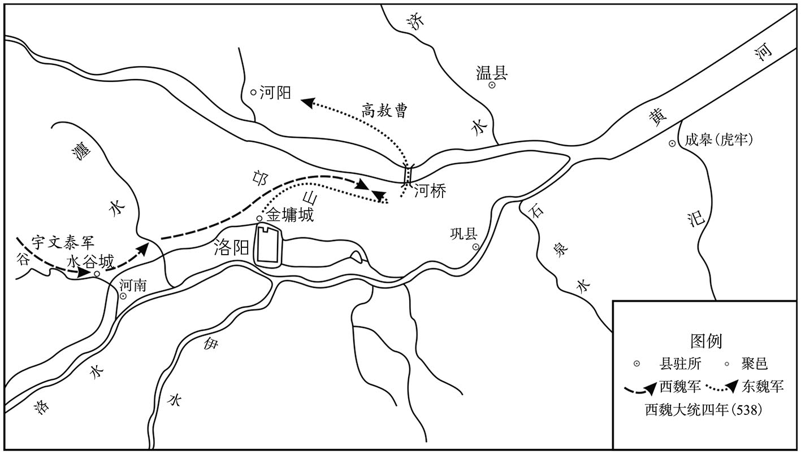 
金墉之战示意图

## 【原文】

**秋七月，东魏侯景、高敖曹等围魏独孤信于金墉，太师欢帅大军继之。景悉烧洛阳内外官寺、民居，存者什二三。魏主将如洛阳拜园陵，会信等告急，遂与丞相泰俱东，命尚书左仆射周惠达辅太子钦守长安，开府仪同三司李弼、车骑大将军达奚武帅千骑为前驱[1]。八月庚寅，丞相泰至谷城，侯景等欲整陈以待其至，仪同三司太安莫多娄贷文请帅所部击其前锋，景等固止之[2]。贷文勇而专，不受命，与可朱浑道元以千骑前进，夜，遇李弼、达奚武于孝水[3]。弼命军士鼓噪，曳柴扬尘，贷文走，弼追斩之，道元单骑获免，悉俘其众送恒农。**

## 【注文】

[1]园陵：即北魏洛阳之帝王陵。北魏孝文帝元宏在太和十七年（493年）迁洛后，洛阳成为云中和盛乐之后北魏帝王陵的主要地域，主要分布在今河南洛阳北邙山南的瀍（chán）河沿岸。　　周惠达（？—544年）：字怀文，章武文安（今河北文安东北）人。北魏孝明帝元诩孝昌初，随萧宝寅西征，后投至贺拔岳、宇文泰，入仕西魏。性谦和，尽心为公。西魏文帝元宝炬大统十年（544年）亡。　　太子钦：即西魏之第二任皇帝废帝元钦（525—554年），西魏文帝元宝炬之长子，母为乙弗皇后。大统元年（535年）立为皇太子，十七年（551年）后即皇帝位，在位三年，西魏废帝三年（554年）被毒死。

[2]谷城：即谷城县，两汉时河南郡之属县，时位于东魏洛州境内，西临谷水。今河南新安东南。　　莫多娄贷文（？—538年）：复姓莫多娄，名贷文。太安狄那（今内蒙古和林格尔北）人。魏末，从高欢起兵，后入仕东魏，随从西征，立有战功。东魏孝静帝元善见元象初，战亡。

[3]孝水：古水名，位于时洛州新安县（今河南新安西）西。

## 【译文】

梁武帝大同四年（538年）秋季七月，东魏侯景、高敖曹等人在金墉城围攻西魏的独孤信，东魏太师高欢率领大军相继来到。侯景下令放火焚烧洛阳城内外的官衙、民宅，留下来的只有十分之二三。西魏文帝元宝炬将要去洛阳祭拜园陵，正赶上独孤信等人派人告急，于是和丞相宇文泰一同向东行进，命令尚书左仆射周惠达辅佐太子元钦驻守长安，开府仪同三司李弼、车骑大将军达奚武率领一千名骑兵作为前锋。八月庚寅（初三日），西魏丞相宇文泰到达谷城，侯景等打算列阵以待宇文泰的到来，开府仪同三司太安人莫多娄贷文请求率领他的部队攻打宇文泰的前锋部队，侯景等人坚决地制止了他。莫多娄贷文勇猛而且独断专行，不接受侯景的命令，与可朱浑道元率一千名骑兵前进，于夜间在孝水遇上了李弼、达奚武。李弼命令军士擂鼓呐喊，拖动树枝扬起灰尘，莫多娄贷文逃跑了，李弼追上来将其斩杀，可朱浑道元一人骑马逃脱，李弼将莫多娄贷文的军士全部俘获，送到了恒农。

## 【原文】

**泰进军瀍东，侯景等夜解围去。辛卯，泰帅轻骑追景至河上，景为陈，北据河桥，南属邙山，与泰合战。泰马中流矢，惊逸，遂失所之。泰坠地，东魏兵追及之，左右皆散，都督李穆下马以策抶泰背骂曰：“笼东军士，尔曹主何在，而独留此[1]！”追者不疑其贵人，舍之而过。穆以马授泰，与之俱逸。**

## 【注文】

[1]抶（chì）：用鞭子打。　　笼东军士：即败兵。笼东，也作东笼，形容衣服湿透的样子，引申为败军之模样。　　曹主：主人。

## 【译文】

宇文泰进军瀍（chán）东，侯景等于夜间解除包围离去。大同四年（538年）八月辛卯（初四日），宇文泰率领轻骑兵追击侯景到黄河边上，侯景部署军阵，北据河桥，南连邙山，与宇文泰交战。宇文泰的战马中了流箭，受惊狂奔，于是不知道跑到了哪里。宇文泰从马上摔落在地，东魏的军士追上了他，他手下的人都跑散了，都督李穆下马后用鞭子抽打宇文泰的后背，骂道：“败兵，你的头目在哪里，只你一个留在这里！”东魏的追兵没有疑心他是有身份的人，放过他离去，李穆把自己的马给了宇文泰，和他一起逃走了。

## 【原文】

**魏兵复振，击东魏兵，大破之，东魏兵北走。京兆忠武公高敖曹意轻泰，建旗盖以陵陈，魏人尽锐攻之，一军皆没，敖曹单骑走投河阳南城[1]。守将北豫州刺史高永乐，欢之从祖兄子也，与敖曹有怨，闭门不受[2]。敖曹仰呼求绳，不得，拔刀穿阖，未彻而追兵至。敖曹伏桥下，追者见其从奴持金帶，问敖曹所在，奴指示之，敖曹知不免，奋头曰：“来，与汝开国公！”追者斩其首去。高欢闻之，如丧肝胆，杖高永乐二百，赠敖曹太师、大司马、太尉。泰赏杀敖曹者布绢万段，岁岁稍与之，比及周亡，犹未能足。魏又杀东魏西兖州刺史宋显等，虏甲士万五千人，赴河死者以万数[3]。**

## 【注文】

[1]河阳南城：位于原北魏司州河桥南岸，与北岸之北中城相对。今河南堰（yàn）师境内。

[2]北豫州：始置于东汉，北魏孝文帝元宏太和十九年（498年）罢置，东魏孝静帝元善见天平初复置。领广武、荥阳、成皋三郡、十二县之地，治成皋（今河南荥阳西北）。　　高永乐：生卒年不详，高欢之族侄，东魏孝静帝元善见元象初，守河阳南城，因拒绝大将高敖曹入城，被贬官。后任济州刺史，亡于任。

[3]西兖（yǎn）州：北魏孝文帝元宏太和年间始置，治滑台城（今河南滑县）。北魏孝明帝元诩孝昌中，置西兖州于定陶（今山东定陶）。　　宋显（？—538年）：字仲华，敦煌效谷（今甘肃敦煌东北）人，性果敢。魏末，事尔朱荣，后随高欢。东魏孝静帝元善见元象初，阵亡。

## 【译文】

西魏军队重新振作之后，再次向东魏军发起进攻，大败东魏军，东魏军向北逃去。京兆人忠武公高敖曹内心轻视宇文泰，树起旗帜以显示军威。西魏出动所有精锐部队攻打高敖曹，致使其全军覆没，高敖曹独自一人骑马逃奔河阳南城。守城将领北豫州刺史高永乐，是高欢族兄的儿子，与高敖曹旧日结有怨仇，紧闭城门不放他进来。高敖曹抬头呼喊，请求城上放下绳索来，但城上的人不给他绳子，高敖曹于是拔出刀来撬门，门还没有被撬开，追兵就到了。高敖曹藏身于桥下，追兵看到他的奴仆手里拿着金带子，就问高敖曹在哪里，其奴仆向西魏兵指示了他的藏身之处，高敖曹知道逃脱不了了，于是昂起头对追兵说：“来吧，给你一个开国公！”追兵将他的首级斩下离去。高欢听说此事后，如同丧失了肝胆，下令打了高永乐二百军杖，追赠高敖曹为太师、大司马、太尉。宇文泰赏赐斩杀高敖曹的军士一万匹布绢，每年稍稍给一点，一直到北周灭亡，这赏赐也没有给完。西魏又斩杀了东魏西兖州刺史宋显等人，俘虏精兵一万五千人，跳河而死的东魏兵数以万计。

## 【原文】

**初，欢以万俟普尊老，特礼之，尝亲扶上马。其子洛免冠稽首曰：“愿出死力以报深恩[1]。”及邙山之战，诸军北渡桥，洛独勒兵不动，谓魏人曰：“万俟受洛干在此，能来可来也[2]！”魏人畏之而去，欢名其所营地为回洛[3]。**

## 【注文】

[1]洛：即万俟受洛干。　　免冠稽首：脱帽叩头。

[2]邙山之战：西魏文帝元宝炬大统九年（543年），东、西魏在今河南洛阳邙山交战，西魏兵败。东魏收复虎牢，平定北豫州、洛州。

[3]回洛：即回洛城，位于河阳县南。河阳县，原北魏司州属县，北齐文宣帝高洋天保七年（556年），废县置河阳关，今河南孟县西。

## 【译文】

当初，高欢因为万（mò）俟（qí）普的爵位高、年龄大，对他特别地礼遇，曾经亲自扶他上马。他的儿子万俟洛摘下帽子向高欢叩头说：“我愿意献出生命以报答丞相的深厚恩德。”等到邙山之战，各路军队都向北过了河桥，只有万俟洛按兵不动，对西魏人说：“万俟受洛干在此，能来的就过来吧！”西魏人因为害怕他就离去了，高欢下令命名万俟受洛干曾经安营扎寨的地方为回洛城。

## 【原文】

**是日，东、西魏置陈既大，首尾悬远，从旦至未，战数十合，氛雾四塞，莫能相知。魏独孤信、李远居右，赵贵、怡峰居左，战并不利。又未知魏主及丞相泰所在，皆弃其卒先归。开府仪同三司李虎、念贤等为后军，见信等退，即与俱去[1]。泰由是烧营而归，留仪同三司长孙子彦守金墉。**

## 【注文】

[1]念贤（？—539年）：字盖卢，美仪容，通经史。魏末，随贺拔氏起兵，北魏孝武帝元脩永熙中，任第一领民酋长。后入仕西魏，大统三年（539年），亡于秦州刺史任上。

## 【译文】

当天，东、西魏双方的军阵都十分庞大，首尾相距很远，从早上到晚上，双方打了几十个回合，战场上烟雾弥漫，彼此互不知情。西魏将领独孤信、李远在右，赵贵、怡峰在左，在战斗中都不顺利。他们又不知道西魏文帝元宝炬及丞相宇文泰在哪里，于是都扔下自己的军士先跑了回来。开府仪同三司李虎、念贤等作为殿后的军队，看到独孤信等人退了回来，就和他们一起离去。宇文泰因此下令放火烧了军营返回，留下开府仪同三司长孙子彦驻守金墉城。

## 【原文】

**王思政下马，举长矟左右横击，一举辄踣数人[1]。陷陈既深，从者尽死，思政被重创，闷绝，会日暮，敌亦收兵。思政每战常著破衣弊甲，敌不知其将帅，故得免。帐下督雷五安于战处哭求思政，会其已苏，割衣裹创，扶思政上马，夜久，始得还营。**

## 【注文】

[1]踣（bó）：意即跌倒。

## 【译文】

王思政下马，手举长矛左右出击，一出手就击倒数人。他冲入敌军的阵营深处，跟从他的人都死了，王思政也受了重伤，昏死过去，赶上天黑，敌人也收兵离去。王思政每次作战都身穿破旧的战袍和盔甲，敌人不知道他是将帅，所以得以幸免于难。他帐下的都督雷五安在战场上哭着寻找他，恰逢他已苏醒过来，雷五安割下衣袍为王思政包扎伤口，扶他上马，入夜很久以后，才返回到营地。

## 【原文】

**平东将军蔡祐下马步斗，左右劝乘马以备仓猝，祐怒曰：“丞相爱我如子，今日岂惜生乎[1]！”帅左右十余人合声大呼，击东魏兵，杀伤甚众。东魏人围之十余重，祐弯弓持满，四面拒之。东魏人募厚甲长刀者直进取之，去祐可三十步，左右劝射之，祐曰：“吾曹之命，在此一矢，岂可虛发。”将至十步，祐乃射之，应弦而倒，东魏兵稍却，祐徐引还。**

## 【注文】

[1]平东将军：武官名，四平（平东、平西、平北、平南）将军之一，始置于曹魏，后世沿置，北魏孝文帝太和中列右从第二品上，宣武帝后改为右第三品。　　蔡祐（yòu）（504—557年）：字承先，少有大志。魏末，随其父西迁入关，屡立战功。北周明帝宇文毓（yù）初，亡于原州，年五十四岁。

## 【译文】

西魏平东将军蔡祐（yòu）下马步战，左右的人都劝他乘马再战，以防备不测，高祐生气地说：“丞相待我如同儿子一样，今天我怎能吝惜自己的生命！”于是率领左右的十几个人齐声大呼，攻击东魏军士，杀死、杀伤很多人。东魏的军士将他们包围了十几层，高祐弯弓搭箭，从四面抗击敌人。东魏人招募了身穿厚甲手持长刀的人向蔡祐猛扑过来，离蔡祐三十步时，蔡祐手下的人劝他放箭，蔡祐说：“我们的性命，就在此一箭了，怎么可以虚发。”距离只有十步之遥时，蔡祐才放箭射敌，敌人应声而倒，东魏兵稍稍后退，蔡祐慢慢地引兵而还。

## 【原文】

**魏主至恒农，守将已弃城走，所虏降卒在恒农者相与闭门拒守，丞相泰攻拔之，诛其魁首数百人。**

## 【译文】

西魏文帝元宝炬到达恒农时，守将已弃城而逃，城里原来被俘虏的东魏兵合伙关闭了城门坚守不出，丞相宇文泰攻打恒农城并将其攻下，诛杀了几百名领头的东魏兵。

## 【原文】

**蔡祐追及泰于恒农，夜，见泰，泰曰：“承先，尔来，吾无忧矣。”泰惊不得寢，枕祐股，然后安。祐每从泰战，常为士卒先，战还，诸将皆争功，祐终无所言。泰每叹曰：“承先口不言勋。我当代其论叙。”泰留王思政镇恒农，除侍中、东道行台。**

## 【译文】

蔡祐在恒农追上了宇文泰，夜里，见到了宇文泰，宇文泰说：“承先，你来了，我就不担忧了。”宇文泰由于受惊无法入睡，头枕着蔡祐的大腿，然后才能够入睡。蔡祐每次跟从宇文泰作战，总是身先士卒，仗打完后，各位将领都争功，只有蔡祐始终不发一言。宇文泰叹息说：“承先闭口不提自己的功劳，我应当替他论一论奖赏。”宇文泰留下王思政镇守恒农，任命他为侍中、东道行台。

## 【原文】

**魏之东伐也，关中留守兵少，前后所虏东魏士卒散在民间，闻魏兵败，谋作乱。李虎等至长安，计无所出，与太尉王盟、仆射周惠达等奉太子钦出屯渭北[1]。百姓互相剽掠，关中大扰。于是沙苑所虏东魏都督赵青雀、雍州民于伏德等遂反。青雀据长安子城，伏德保咸阳，与咸阳太守慕容思庆各收降卒以拒还兵[2]。长安大城民相帅以拒青雀，日与之战。大都督侯莫陈顺击贼，屡破之，贼不敢出[3]。顺，崇之兄也[4]。**

## 【注文】

[1]王盟（？—545年）：字子仵（wǔ），西魏明德皇后（宇文泰之母）之兄，其先祖为乐浪（今朝鲜平壤）人，父王罴（pí）曾任职武川，遂为武川（今内蒙古武川西）人。魏末，随贺拔岳、宇文泰征讨，因功赐姓宇文氏。虽为显贵，但为人谦恭。大统十一年（545年）亡。

[2]子城：也叫内城。古代州府城池都分内外两层，内城，通常是州府衙署所在地，其周围筑以城墙，自成独立空间。有时，还在内城的城门外，再修筑城墙，与内城城门连为一体，形成一个半圆形或方形的城，名叫瓮（wèng）城。其作用是为了增加防御，当外敌入侵到瓮城后，将内城城门和瓮城城门关闭，可形成关门打狗、瓮中捉鳖（biē）之势。　　咸阳：即咸阳郡，原北魏雍州属郡，领石安、池阳、灵武、宁夷、泾阳五县，治池阳（今陕西泾阳）。

[3]侯莫陈顺（？—557年）：魏末名将侯莫陈崇之兄，初事尔朱荣任统军，因讨葛荣、平元颢（hào）之功，任宁朔将军。后从北魏孝武帝元脩入关，任要职。

[4]崇：即侯莫陈崇。

## 【译文】

西魏举兵东伐时，关中留下的守兵较少，前后所俘虏的东魏军士散落在民间，他们听说西魏兵败的消息后，谋划兴兵作乱。李虎等人到达长安，不知道该怎么办，与太尉王盟、仆射（yè）周惠达等人簇拥着太子元钦出城屯兵于渭水之北。百姓们相互劫掠，关中大乱。因此，沙苑一战中所俘虏的东魏都督赵青雀、雍州百姓于伏德等随即造反。赵青雀据守长安子城，于伏德据守咸阳，和咸阳太守慕容思庆各自收罗了原投降西魏的东魏军士以抗拒西魏兵。长安大城的百姓组织起来，以抗拒赵青雀，每天与他交战。大都督侯莫陈顺攻击贼寇，屡次击败他们，贼寇因此不敢出战。侯莫陈顺，是侯莫陈崇的兄长。

## 【原文】

**扶风公王罴镇河东，大开城门，悉召军士谓曰：“今闻大军失利，青雀作乱，诸人莫有固志。王罴受委于此，以死报恩。有能同心者可共固守。必恐城陷，任自出城。”众感其言，皆无异志。**

## 【译文】

扶风公王罴（pí）镇守河东，大开城门，把军士全部召集在一起说：“如今我大部队已失利，赵青雀犯上作乱，许多人都失去了信心。王罴受委任镇守此处，必定以死报效国恩。有人能够和我一起同心协力的，可在此坚守。害怕城池一定会沦陷的，可以随意出城。”众人被他的话所感动，都没有异心。

## 【原文】

**魏主留阌乡。丞相泰以士马疲弊，不可速进，且谓青雀等乌合，不能为患。曰：“我至长安，以轻骑临之，必当面缚。”通直散骑常侍吴郡陆通谏曰：“贼逆谋久定，必无迁善之心，蜂虿有毒，安可轻也[1]。且贼诈言东寇将至，今若以轻骑临之，百姓谓为信然，益当惊扰。今军虽疲弊，精锐尚多，以明公之威，总大军以临之，何忧不克？”泰从之，引兵西入。父老见泰至，莫不悲喜，士女相贺。华州刺史宇文导引兵袭咸阳，斩思庆，擒伏德，南渡渭，与泰会，攻青雀，破之。太保梁景睿以疾留长安，与青雀通谋，泰杀之。**

## 【注文】

[1]通直散骑常侍：古代职官名，职同散骑常侍，掌顾问应对。魏末，增加了编外散骑常侍。西晋武帝司马炎时，派两名编外散骑常侍与散骑常侍通直（共同宿值禁中），称为通直散骑常侍。后世沿置，北魏孝文帝太和年间初定为三品下，后改为四品。　　吴郡：南梁扬州属郡，治吴县（今江苏苏州）。　　陆通（？—572年）：字仲明，吴郡（今江苏苏州）人。其曾祖陆载于北魏太武帝拓跋焘时入仕北魏，遂家于北方。喜读书，事母至孝。魏末，先后从尔朱、宇文泰。北周武帝宇文邕（yōng）建德元年（572年）亡。　　蜂虿（chài）：有毒的虫子，此喻恶毒的敌人。虿，古书上指蝎子一类的虫子。

## 【译文】

西魏文帝元宝炬留在了阌（wén）乡。丞相宇文泰认为军士和战马都已疲备，不可以快速前进，而且认为赵青雀等人是乌合之众，不足以构成祸患。说：“我到达长安，用轻骑兵对付他们，他们一定会自己捆绑了自己前来投降。”通直散骑常侍吴郡人陆通进谏说：“贼寇谋反的计划由来已久，必定不会有向善之心，蜂、蝎都是有毒的，怎么可轻信呢。况且贼寇谎称东魏军将要到来，现在如果用轻骑兵对付他们，百姓就会认为他们的传言是对的，就会更加慌乱不安。现在我军虽然疲惫，但精锐部队还很多，凭借您的威严，统领大军来镇压他们，还担忧不能攻克吗？”宇文泰听从了他的建议，领兵向西进入长安。关中的父老乡亲们见宇文泰到来了，没有不悲喜交加的，男男女女相互庆贺。华州刺史宇文导领兵袭击咸阳，斩杀了慕容思庆，擒获了于伏德，向南渡过渭水，与宇文泰会合，攻打赵青雀，将其击败。太保梁景睿因病留守长安，与赵青雀联合谋反，宇文泰下令将其斩杀。

## 【原文】

**东魏太师欢自晋阳将七千骑至孟津，未济，闻魏师已遁，遂济河，遣别将追魏师，至崤，不及而还[1]。欢攻金墉，长孙子彦弃城走，焚城中室屋俱尽，欢毁金墉而还。**

## 【注文】

[1]孟津：地名，原北魏司州洛阳属地，北临黄河。今河南偃（yǎn）师北。

## 【译文】

东魏太师高欢从晋阳率领七千骑兵到达孟津，还没来得及渡河，听说西魏的军队已经逃走，于是渡过黄河，派遣别将追击西魏的军队，追到崤山，没有追上就返了回来。高欢攻打金墉城，长孙子彦放弃了城池逃走了，放火烧光了城中的房屋，高欢毁坏了金墉城后返军。

## 【原文】

**东魏之迁邺也，主客郎中裴让之留洛阳[1]。独孤信之败也，让之弟诹之随丞相泰入关，为大行台仓曹郎中[2]。欢囚让之兄弟五人，让之曰：“昔诸葛亮兄弟事吴、蜀，各尽其心，况让之老母在此，不忠不孝，必不为也[3]。明公推诚待物，物亦归心；若用猜忌，去霸业远矣。”欢皆释之。**

## 【注文】

[1]主客郎中：职官名，即尚书主客郎中，掌外国夷狄事（即外交事宜），客曹尚书之属官。始置于曹魏，南北朝沿置。　　裴让之：生卒年不详，字士礼，河东闻喜（今山西闻喜）人。少好学，有文采。历东魏、北齐两朝，为政清廉。北齐文宣帝高洋天保年间，被文宣帝赐死于家。有诗文传世。

[2]大行台仓曹郎中：即尚书省的外派机构——大行台的属官。仓曹郎中，职官名，掌户口及赋税，度支尚书之属官。始置于魏晋，南北朝沿置。

[3]诸葛亮兄弟：即三国时期的诸葛瑾、诸葛亮兄弟，瑾事吴；亮事蜀。其情形与裴让之、裴诹（zōu）之兄弟相似。

## 【译文】

东魏迁都邺城时，留下主客郎中裴让之守洛阳。独孤信兵败后，裴让之的弟弟裴诹（zōu）之跟随西魏丞相宇文泰入关中，任大行台仓曹郎中。高欢囚禁了裴让之兄弟五人，裴让之说：“昔日诸葛亮兄弟两人分别为吴国、蜀国效力，各自为其主尽心，况且让之的老母亲在东魏，不忠不孝之事，我们必定不会做的。您只要推诚至心地待人，别人也会把心交给您；如果您心怀猜忌，那么就离霸业越来越远了。”高欢于是把他们都放了。

## 【原文】

**九月，魏主入长安，丞相泰还屯华州。**

## 【译文】

梁武帝大同四年（538年）九月，西魏文帝元宝炬入主长安，丞相宇文泰还军屯守华州。

## 【原文】

**冬十月，魏归高敖曹、窦泰、莫多娄贷文之首于东魏。**

## 【译文】

梁武帝大同四年（538年）冬季十月，西魏将高敖曹、窦泰、莫多娄贷文的首级归还了东魏。

## 【原文】

**十二月，魏是云宝袭洛阳，东魏洛州刺史王元轨弃城走。都督赵刚袭广州，拔之[1]。于是自襄、广以西城镇皆复为魏[2]。**

## 【注文】

[1]赵刚（501—557年）：字僧庆，河南洛阳（今河南洛阳）人，官宦出身。北魏孝武帝元脩永熙末，随孝武帝入关。历西魏、北周二朝，征东魏、平内乱，屡立战功。北周孝闵帝宇文觉初，病亡。　　广州：时东魏属州，治鲁阳（今河南鲁山）。

[2]襄：即襄州，置于北魏孝昌中，领襄城、舞阴、南安、期城、北南阳、建城等六郡、二十县，治襄城（今河南襄城）。北齐沿置。

## 【译文】

梁武帝大同四年（538年）十二月，西魏的是云宝袭击洛阳，东魏洛州刺史王元轨弃城而逃。都督赵刚袭击广州，攻下了广州城。因此，从襄州、广州以西的城镇又都重归西魏所有。

## 【原文】

**初，魏伊川土豪李长寿为防蛮都督，积功至北华州刺史[1]。孝武帝西迁，长寿帅其徒拒东魏，魏以长寿为广州刺史。侯景攻拔其壁，杀之。其子延孙复收集父兵以拒东魏。魏之贵臣广陵王欣、录尚书长孙稚等皆携家往依之，延孙资遣卫送，使达关中[2]。东魏高欢患之，数遣兵攻延孙，不能克。魏以延孙为京南行台、节度河南诸军事、广州刺史。延孙以澄清伊、洛为己任，魏以延孙兵少，更以长寿之婿京兆韦法保为东洛州刺史，配兵数百以助之[3]。法保名祐，以字行。既至，与延孙连兵，置柵于伏流[4]。独孤信之入洛阳也，欲缮修宫室，使外兵郎中天水权景宣帅徒兵三千出采运[5]。会东魏兵至，河南皆叛，景宣间道西走，与李延孙相会，攻孔城，拔之，洛阳以南寻亦西附[6]。丞相泰即留景宣守张白坞，节度东南诸军应关西者[7]。是岁，延孙为其长史杨伯兰所杀，韦法保即引兵据延孙之柵。**

## 【注文】

[1]伊川：郡名，即东魏之伊川郡，也称伊阳郡，原北魏司州河南郡之陆浑县（今河南嵩县东北），东魏北齐置伊川郡，领南陆浑县，治伏流城（今河南嵩县）。　　北华州：北魏孝文帝元宏太和十五年（491年）置，东秦州，后改北华州，领中部、敷城二郡、四县，治杏城（今陕西铜川东北）。时属西魏。

[2]录尚书：即录尚书事，并非独立官职，常以他官兼领。汉昭帝初立，东汉、三国沿置，南朝宋孝武帝时曾停设，后复置。隋废。

[3]东洛州：州名，时西魏之属州。西魏之洛州治上洛（今陕西商县），以洛阳（今河南洛阳）之地为东洛州。

[4]柵：古代作战时的军营。　　伏流：地名，即伏流城（今河南嵩县），时东魏伊川郡之治所。

[5]外兵郎中：职官名，始置于曹魏，初名郎中，期满后称为侍郎，尚书之属官。南北朝沿置，自北魏始，中兵郎中及外兵郎中又分左、右。　　天水：郡名，即天水郡，原北魏秦州属郡，领上封、显亲、平泉、当亭四县，治上封（今甘肃天水）。时属西魏。

[6]孔城：地名，时东魏属州北荆州新城郡之治所，今河南洛阳南。

[7]张白坞：地名，时位于东魏怀州河内郡轵（zhǐ）县境内，今河南济源南。

## 【译文】

当初，西魏伊川土豪李长寿任防蛮都督，因功累任至北华州刺史。北魏孝武帝元脩西迁，李长寿率领他的部众抗击东魏军，西魏任命他为广州刺史。侯景攻占了他的营垒，杀了他。他的儿子李延孙又收罗起他父亲的旧部下以抗拒东魏。原北魏的显贵大臣广陵王元欣、录尚书事长孙稚等都携带家眷去投靠他，李延孙资助他们并派遣卫士护送他们，到达关中。东魏高欢对此感到忧虑，几次派兵攻打李延孙，不能将其打败。西魏任命李延孙为京南行台、节度河南诸军事、广州刺史。李延孙把平定伊洛地区作为自己的责任，西魏朝廷认为李延孙的军士不多，另外派李长寿的女婿京兆人韦法保作为洛州刺史，并配备了几百军士以协助李延孙。韦法保名叫韦祐，以其字法保闻名于时。他到达任所后，就与李延孙联兵，在伏流设置了营栅。独孤信进入洛阳的时候，打算修缮洛阳城中的宫殿，派外兵郎中天水人权景宣率领三千名步兵出城采买和运输材料。正赶上东魏的军队到了，黄河以南的各州都反叛了，权景宣从小道向西逃跑，与李延孙会合，攻打孔城，并占领了它，洛阳以南地区很快又归附了西魏。西魏丞相宇文泰就让权景宣留守张白坞，调遣指挥东南各军以响应关西的人马。这一年，李延孙被他手下的长史杨伯兰杀害了，韦法保就领兵占据了李延孙的营栅。

## 【原文】

**东魏将段琛等据宜阳，遣阳州刺史牛道恒诱魏边民[1]。魏南兖州刺史韦孝宽患之，乃诈为道恒与孝宽书，论归款之意[2]，使谍人遗之于琛营，琛果疑道恒。孝宽乘其猜阻，出兵袭之，擒道恒及琛，崤、渑遂清[3]。东道行台王思政以玉壁险要，请筑城自恒农徙镇之，诏加都督汾晋并州诸军事、并州刺史，行台如故[4]。**

## 【注文】

[1]宜阳：县名，即宜阳县。东魏孝静帝元善见天平初，置阳州，领宜阳、金门二郡，治宜阳（今河南宜阳西北）。

[2]南兖州：州名，时东魏属州，治所为今安徽亳（bó）县。

[3]崤（xiáo）、渑（miǎn）：即崤山和渑池。崤山，也称二崤山，秦岭之支脉，是关中至中原的天然屏障。时位于东魏洛州崤县（今河南三门峡东南）境内。渑池，即渑池郡，原北魏司州属郡，治北渑池（今河南渑池西）。

[4]玉壁：地名，即玉壁城，时位于西魏南汾州境内，今陕西澄城东北。

## 【译文】

东魏将领段琛（chēn）等人占据宜阳，派阳州刺史牛道恒引诱、接纳西魏边境的百姓。西魏南兖州刺史韦孝宽对此十分忧虑，于是假装牛道恒给韦孝宽写了一封信，讨论归降的愿望，派间谍将此信送到了段琛的军营，段琛果然开始怀疑牛道恒。韦孝宽趁其因猜疑而与牛道恒产生隔阂的时候，出兵袭击他，抓获了牛道恒及段琛，于是崤（xiáo）山及渑（miǎn）池地区都得以平定。东道行台王思政认为玉壁十分险要，请求在玉壁修筑城池，并从恒农迁徙到玉壁镇守，西魏文帝元宝炬下诏令加封王思政都督汾晋并诸州军事、并州刺史，行台一职依旧。

## 【原文】

**六年春二月，东魏大行台侯景出三鸦，将复荆州[1]。魏丞相泰遣李弼、独孤信各将五千骑出武关，景乃还[2]。**

## 【注文】

[1]三鸦：地名，位于时东魏广州汝南郡治所鲁阳（今河南鲁山）县西南十九里。此处北周建平高城，以防御北齐。北齐在鲁阳县东北十七里处建有鲁城以防御北周。

[2]武关：地名，始建于春秋战国，与函谷、萧关、大散关并称为三秦四塞，自古为兵家必争之地。时位于西魏洛州境内，今陕西商南西北。

## 【译文】

南梁武帝萧衍大同六年（540年）春季二月，东魏大行台侯景兵出三鸦，将要收复荆州。西魏丞相宇文泰派李弼、独孤信各率领五千骑兵出武关，侯景才不得已还军。

## 【原文】

**夏五月乙［己］酉，魏行台宫延和、陕州刺史宫延庆降于东魏。东魏以河北马场为义州以处之[1]。**

## 【注文】

[1]马场：即黄河北岸之马场。北魏司州汲（jí）郡自古是放牧牛马之地，北魏孝文帝元宏太和十七年（493年），将代北（今山西大同及其以北、大漠以南地区）之畜产迁徙（xǐ）至石济津（黄河上重要渡口）之西，形成了黄河北岸之马场。　　义州：州名，原北魏司州之汲郡及汲县，东魏置义州，侨置七郡、二十八县。北周灭齐后，改为卫州。

## 【译文】

梁武帝大同六年（540年）夏季五月己酉（初二日），西魏行台宫延和、陕州刺史宫延庆投降了东魏。东魏以黄河北岸马场所在地区为义州，以安置他们。

## 【原文】

**八年春三月，魏初置六军。**

## 【译文】

南梁武帝萧衍大同八年（542年）春季三月，西魏开始设置六军。

## 【原文】

**秋八月，东魏丞相欢击魏，入自汾、绛，连营四十里，丞相泰使王思政守玉壁以断其道。欢以书招思政曰：“若降，当受以并州。”思政复书曰：“可朱浑道元降，何以不得？”冬十月己亥，欢围玉壁，凡九日，遇大雪，士卒饥冻，多死者，遂解围去。魏遣太子钦镇蒲坂。丞相泰出军蒲坂，至皂荚，闻欢退，渡汾追之，不及[1]。十一月，东魏以可朱浑道元为并州刺史。**

## 【注文】

[1]皂荚：地名，原北魏泰州河东郡属地，今山西永济西北。

## 【译文】

梁武帝大同八年（542年）秋季八月，东魏丞相高欢率军攻打西魏，从汾、绛地区进入西魏的领地，军营连绵四十里，西魏丞相宇文泰派王思政守玉壁以截断高欢的通路。高欢写信招降王思政说：“你如果归降，我就把并州交给你。”王思政回信说：“可朱浑道元投降后，为什么没有得到并州？”冬季十月己亥（初六日），高欢围攻玉壁，前后持续了九天时间，遇上了大雪，军士饥饿、受冻，死了很多人，于是解除包围离去。西魏派太子元钦镇守蒲坂。丞相宇文泰率军出了蒲坂，到达皂荚，听说高欢退兵了，渡过黄河追击他，没有追上。十一月，东魏任命可朱浑道元为并州刺史。

## 【原文】

**九年春二月壬申，东魏御史中尉高仲密以虎牢叛，降魏，魏以仲密为侍中、司徒[1]。欢以仲密之叛由崔暹，将杀之，高澄匿暹，为之固请[2]。欢曰：“我丐其命，须与苦手[3]。”澄乃出暹，而谓大行台都官郎陈元康曰：“卿使崔暹得杖，勿复相见[4]。”元康为之言于欢曰：“大王方以天下付大将军，大将军有一崔暹不能免其杖，父子尚尔，况于他人！”欢乃释之。**

## 【注文】

[1]御史中尉：职官名，始置于北魏，负监察之责，其前身为御史中丞。北魏孝文帝太和中列正三品，宣武帝后改为从三品。北齐又改为御史中丞。　　高仲密：即高慎。

[2]高澄（521—549年）：即北齐世宗文襄帝，字子惠，北齐高祖神武帝高欢长子，母娄氏。十五岁入朝从政，聪明能干，继高欢掌控东魏政权，其间，击败侯景，收复河南，为北齐的建立打下了基础。东魏孝静帝元善见武定七年（549年）亡，年二十九岁。

[3]丐：乞求。　　苦手：痛杖以示责罚。

[4]大行台都官郎：职官名，即大行台府之都官郎中。都官郎中，都官尚书之属官。尚书郎，掌文书起草及顾问应对等，依汉制，一尚书领六个郎中，初为郎中，秩满为侍郎。　　陈元康（507—549年）：字长猷（yóu），广崇（今河北威县）人。通经史，北魏孝明帝元诩（xǔ）正光末入仕，后随从高欢，入仕东魏。武定七年（549年），为保护高澄而亡。

## 【译文】

南梁武帝萧衍大同九年（543年）二月壬申（十二日），东魏御史中尉高仲密占据虎牢反叛，投降西魏，西魏任命高仲密为侍中、司徒。高欢认为高仲密的反叛是由崔暹（xiān）引起的，于是下令要斩杀崔暹，高澄将崔暹藏匿起来，坚持为他求情。高欢说：“我可以饶他一命，但必须痛打一顿。”高澄于是将崔暹放出，并对大行台都官郎陈元康说：“你如果让崔暹受刑杖，我们就不要再见面了。”陈元康为此事对高欢说：“大王将要把天下交付于大将军，大将军有一个崔暹，却不能使他免受刑杖，父子尚且如此，更何况其他人！”高欢于是放了崔暹。

## 【原文】

**高季式在永安戍，仲密遣信报之，季式走告欢，欢待之如旧[1]。**

## 【注文】

[1]永安戍：地名，位于北魏晋州永安郡境内，东魏废晋州，置永安戍，即今山西灵石东北。

## 【译文】

高季式驻守在永安戍，高仲密派信使告诉他自己的情况，高季式跑去告诉了高欢，高欢一如既往地对待高季式。

## 【原文】

**魏丞相泰帅诸军以应仲密，以太子少傅李远为前驱，至洛阳，遣开府仪同三司于谨攻柏谷，拔之[1]。三月壬申［辰］，围河桥南城[2]。**

## 【注文】

[1]太子少傅：职官名，掌太子辅导、教化。始于先秦，后世沿置，与太子少保、太子少师并称为太子三师，北魏、北齐称为东宫三少。北魏孝文帝太和中列右第二品上，宣武帝后改为右第三品。　　柏谷：地名，即柏谷坞，位于时东魏洛州境内，今河南偃（yǎn）师南。

[2]河桥南城：即河阳南城。位于原北魏司州河桥南岸，与北岸之北中城相对。今河南堰师境内。

## 【译文】

西魏丞相宇文泰率领各路军马以响应高仲密，任命太子少傅李远为前锋先到洛阳，派开府仪同三司于谨攻打柏谷，拿下柏谷。大同九年（543年）三月壬辰（初二日），包围了河桥南城。

## 【原文】

**东魏丞相欢将兵十万至河北，泰退军瀍上，纵火船于上流以烧河桥。斛律金使行台郎中张亮以小艇百余载长锁，伺火船将至，以钉钉之，引锁向岸，桥遂获全。**

## 【译文】

东魏丞相高欢率领十万人到达黄河北岸，宇文泰退守瀍（chán）水北岸，在黄河上游放火船以烧河桥。斛律金派行台郎中张亮用一百条小船载着长锁链，等火船将要到达时，用钉子把锁链钉在火船上，然后拉动锁链把火船拉到岸边，河桥于是得以保全。

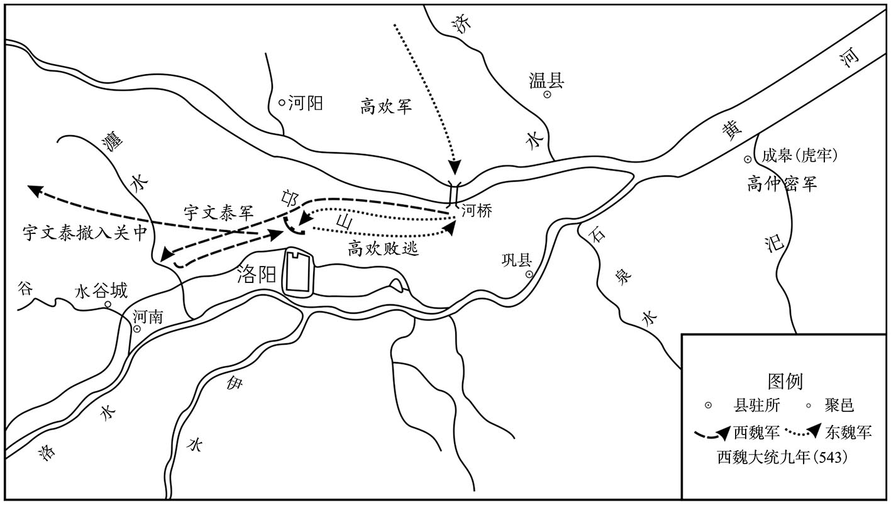 
邙山之战示意图

## 【原文】

**欢渡河，据邙山为陈，不进者数日。泰留辎重于瀍曲，夜登邙山以袭欢，候骑白欢曰：“贼距此四十余里，蓐食干饭而来[1]。”欢曰：“自当渴死。”乃正陈以待之。戊申黎明，泰军与欢军遇，东魏彭乐以数千骑为右甄，冲魏军之北垂，所向奔溃，遂驰入魏营[2]。人告彭乐叛，欢甚怒。俄而西北尘起，乐使来告捷，虏魏侍中、开府仪同三司、大都督临洮王柬、蜀郡王荣宗、江夏王升、钜鹿王阐、谯郡王亮、詹事赵善及督将僚佐四十八人[3]。诸将乘胜击魏，大破之，斩首三万余级。**

## 【注文】

[1]蓐（rù）食干饭：早早地吃了干粮。蓐，草席、垫子，蓐食，在床席上进早餐，即很早进餐。

[2]彭乐（？—551年）：字兴，安定（今甘肃泾川）人，骁勇善战。魏末初从杜洛周举兵，后随尔朱荣，尔朱氏败亡，从高欢，入仕东魏、北齐。北齐文宣帝高洋天保二年（551年）谋反，被杀。　　右甄（zhēn）：即右军。

[3]临洮王柬、蜀郡王荣宗、江夏王升、钜鹿王阐、谯郡王亮：此均为西魏文帝元宝炬所封之元姓宗室。　　詹事：即太子詹事，职官名，始置于秦，太子东宫属官，统东宫内外事务。南北朝沿置，北魏初设太子左、右詹事，后设一人。前期列第二品下，世宗朝改为第三品。北齐品秩与魏同；北周设太子宫正、宫尹。

## 【译文】

高欢渡过黄河，占据邙山排兵布阵，接连几天没有出兵。宇文泰将辎重留在了瀍（chán）曲，连夜登上邙山袭击高欢，侦察兵报告高欢说：“敌人距离此处只有四十几里，他们是一大早吃了干粮而来的。”高欢说：“他们自然会渴死的。”于是排列好军阵以等待宇文泰的到来。大同九年（543年）三月戊申（十八日）这天黎明，宇文泰的军队与高欢的军队相遇，东魏将领彭乐率领几千名骑兵作为右翼，袭击西魏军的北边，所到之处，西魏军人一路奔逃溃散，于是率领骑兵进入西魏营垒。有人告发彭乐反叛，高欢十分生气。不一会儿，西北方向尘土四起，彭乐派人前来告捷，俘虏了西魏的侍中、开府仪同三司、大都督临洮（táo）王元柬（jiǎn）、蜀郡王元荣宗、江夏王元升、钜鹿王元阐、谯（qiáo）郡王元亮、太子詹事赵善及都督、将领的手下人员共计四十八人。各位将领乘胜进击西魏军队，大败西魏军，斩杀了三万多人。

## 【原文】

**欢使彭乐追泰，泰窘，谓乐曰：“汝非彭乐邪？痴男子，今日无我，明日岂有汝邪？何不急还营，收汝金宝。”乐从其言，获泰金带一囊以归，言于欢曰：“黑獭漏刃，破胆矣[1]。”欢虽喜其胜，而怒其失泰，令伏诸地，亲捽其头，连顿之，并数以沙苑之败，举刃将下者三，噤良久[2]。乐曰：“乞五千骑，复为王取之。”欢曰：“汝纵之何意，而言复取邪？”命取绢三千匹压乐背，因以赐之。**

## 【注文】

[1]金带一囊：金条一袋。　　漏刃：意即从刀下逃脱。

[2]噤（xiè）：咬牙切齿。，上下牙齿相磨，形容愤怒。

## 【译文】

高欢派遣彭乐追击宇文泰，宇文泰陷入窘迫境地，对彭乐说：“你不是彭乐吗？痴男子，今天如果没有了我宇文泰，明天哪还会有你？为什么不快点回营，收取你的金银财宝。”彭乐听从了宇文泰的话，又得到了宇文泰的一袋子金条，就返了回去，对高欢说：“宇文黑獭从我的刀下逃跑了，已吓破了胆。”高欢虽然为他所取得的胜利而感到高兴，但又因其失去了抓获宇文泰的机会而感到愤怒，命令他趴在地上，亲手揪住他的头，连连往地上磕，并且数落他在沙苑之战中的败绩，举起刀来，接连三次将要砍下，气得咬牙切齿，许久不能平复。彭乐说：“请给我五千骑兵，我再去为大王捉拿宇文泰。”高欢说：“你为何放了他，而又说再去捉拿他？”命人拿来三千匹绢压在彭乐背上，顺便赏给了他。

## 【原文】

**明日复战，泰为中军，中山公赵贵为左军，领军若干惠等为右军[1]。中军、右军合击东魏，大破之，悉俘其步卒。欢失马，赫连阳顺下马以授欢，欢上马走，从者步骑七人。追兵至，亲信都督尉兴庆曰：“王速去，兴庆腰有百箭，足杀百人[2]。”欢曰：“事济，以尔为怀州刺史；若死，用尔子[3]。”兴庆曰：“儿小，愿用兄。”欢许之。兴庆拒战，矢尽而死。**

## 【注文】

[1]若干惠（？—547年）：字惠保，代郡武川（今内蒙古武川西）人。复姓若干，父早亡，事母至孝。身材魁伟，善于抚众。魏末，初从尔朱荣，后附贺拔岳、宇文泰。西魏文帝元宝炬大统十二年（546年），东魏将侯景入侵襄州，率军抵御。次年（547年）病亡。

[2]亲信都督：武官名，始置于魏末。魏末，四方之众聚集兴兵，各置亲信都督以统领亲信之兵。

[3]怀州：州名，东魏属州，领河内郡、武德郡，治所为今河南沁（qìn）阳。

## 【译文】

第二天再次交战，宇文泰作为中军，中山公赵贵为左军，领军将军若干惠等为右军。中军、右军联合进击东魏军，大败东魏军，将其步兵全部俘获。战斗中高欢失去了他的坐骑，赫（hè）连阳顺下了马并把马让给了高欢，高欢上马逃跑，跟随他的步兵、骑兵只有七个人。追兵到了，高欢的亲信都督尉（yù）兴庆说：“大王快逃，兴庆腰间有一百支箭，足以射杀一百个敌人。”高欢说：“事情成功后，我任命你为怀州刺史；你如果死了，就任用你的儿子。”尉兴庆说：“我的儿子还小，希望能任用我的兄长。”高欢答应了他的要求。尉兴庆奋力抗击西魏军，弓箭用尽而死去。

## 【原文】

**东魏军士有逃奔魏者，告以欢所在，泰募勇敢三千人，皆执短兵，配大都督贺拔胜以攻之。胜识欢于行间，执槊与十三骑逐之，驰数里，槊刃垂及，因字之曰：“贺六浑，贺拔破胡必杀汝！”欢气殆绝，河州刺史刘洪徽从傍射胜，中其二骑，武卫将军段韶射胜马，毙之，比副马至，欢已逸去[1]。胜叹曰：“今日不执弓矢，天也。”**

## 【注文】

[1]河州：州名，时为西魏属州，治所为今甘肃临夏。东魏刺史刘洪徽为遥领（只担其名，并不亲赴任职）。　　段韶（？—571年）：东魏将领段荣之子，字孝先，小名铁伐。少善武艺，因系高氏姻亲，颇受重用。虽权倾朝野，但善于抚众。北齐后主高纬武平二年（571年）亡。　　副马：古时征战时所用的备用马。

## 【译文】

东魏的军士有逃奔西魏的，报告了宇文泰高欢的处所，宇文泰招募了三千名勇士，都手执短刀，分配给大都督贺拔胜指挥，以攻击东魏。贺拔胜从敌军队伍中认出了高欢，手执长矛和十三名骑兵追击高欢，奔跑了几里地，贺拔胜所执长矛的头就要触及高欢了，贺拔胜随即喊高欢的字号说：“贺六浑，贺拔破胡必定杀了你！”高欢差点昏死过去，河州刺史刘洪徽从近旁向贺拔胜射击，射中了他的两名骑兵，武卫将军段韶射中了贺拔胜的战马，马被射死了，等到贺拔胜的备用马送到，高欢已逃掉了。贺拔胜叹息说：“今天手里没有弓箭，这是天意呀。”

## 【原文】

**魏南郢州刺史耿令贵大呼，独入敌中，锋刀乱下，人皆谓已死，俄奋刀而还，如是数四，当令贵前者死伤相继[1]。乃谓左右曰：“吾岂乐杀人，壮士除贼，不得不尔。若不能杀贼，又不为贼所伤，何异逐坐人也[2]。”**

## 【注文】

[1]南郢（yǐng）州：州名，时东魏属州，治所在今河南潢（huáng）川。西魏刺史耿令贵为遥领。　　当：同“挡”。

[2]逐坐人：当时指不能驰骋疆场，只会坐而论道、舞文弄墨之人。

## 【译文】

西魏南郢州刺史耿令贵大声呼喊，独自一人冲入敌人的阵营，锋利的战刀胡乱砍下，人人都说他已战死了，不一会儿又挥刀返了回来，如此这样几次冲杀，挡在他前面的敌人相继死去。于是他对手下的人说：“我难道乐意杀人吗，身为壮士，斩杀敌人是义不容辞的事情。如果既不能斩杀敌人，又不被敌人所伤，与坐在那里空发议论的人有什么区别。”

## 【原文】

**左军赵贵等五将战不利，东魏兵复振，泰与战，又不利。会日暮，魏兵遂遁，东魏兵追之。独孤信、于谨收散卒自后击之，追兵惊扰，魏诸军由是得全。若干惠夜引去，东魏兵追之。惠徐下马，顾命厨人营食，食毕，谓左右曰：“长安死，此中死，有以异乎？”乃建旗鸣角，收散卒徐还。追骑疑有伏兵，不敢逼。泰遂入关，屯渭上。**

## 【译文】

左军将军赵贵等五位将领出战不利，东魏的军队再次振作起来，宇文泰率军与之交战，再次失利。正赶上天黑，西魏的军士于是逃去，东魏兵趁机追杀他们。独孤信、于谨收罗离散的军士从后面进行袭击，东魏的追兵受到惊扰，西魏的各路军队因此得以保全。若干惠连夜率领军队离去，东魏军在后面追击他。若干惠慢慢地下马，回头命令厨师埋锅造饭，吃完饭后，对身边的人说：“在长安，和在此地死，有什么区别？”于是竖起军旗，吹响号角，收罗离散军士，缓缓地向西撤退。东魏的追兵怀疑若干惠设有伏兵，不敢向前紧逼。宇文泰于是率军进入关中，屯兵在渭水边上。

## 【原文】

**欢进至陕，泰使开府仪同三司达奚武等拒之。行台郎中封子绘言于欢曰：“混一东西，正在今日[1]。昔魏太祖平汉中，不乘胜取巴、蜀，失在迟疑，后悔无及。愿大王不以为疑。”欢深然之。集诸将议进止，咸以为：“野无青草，人马疲瘦，不可远追。”陈元康曰：“两雄交争，岁月已久。今幸而大捷，天授我也，时不可失，当乘胜追之。”欢曰：“若遇伏兵，孤何以济？”元康曰：“王前沙苑失利，彼尚无伏；今奔败若此，何能远谋？若舍而不追，必成后患。”欢不从，使刘丰生将数千骑追泰，遂东归。**

## 【注文】

[1]封子绘：生卒年不详，即东魏将领封隆之之子，字仲藻，有才干。魏末，从高欢。北齐武成帝高湛大宁二年（562年），因平定高归彦之乱，拜仪同三司、尚书右仆射。后亡。

## 【译文】

高欢进军至陕城，宇文泰派开府仪同三司达奚武等率军抗拒东魏军。行台郎中封子绘对高欢说：“统一东、西，就在今天了。昔日魏太祖平定汉中，没有乘胜攻取巴、蜀之地，就失误在犹豫不决上，后悔也来不及了。但愿大王不要迟疑。”高欢认为他说的很对。召集各位将领商议进退，大家都认为：“田野里没有青草，人马都疲惫消瘦，不可以远途追击。”陈元康说：“两雄交锋，时间已过去很久了。如今我军有幸取得大的胜利，这是上天赐予我们的大好时机，不可失去，应当乘胜追击西魏军。”高欢说：“如果遇上伏兵，孤军深入，以什么为依托呢？”陈元康说：“大王此前沙苑一战中失利，他们尚且没有埋伏；如今他们逃奔、失败到如此地步，怎么能有那么长远的打算？如果我们舍弃他们不进行追击，一定会形成后患。”高欢不听他的意见，只派刘丰生率领几千名骑兵追赶宇文泰，然后率兵东归。

## 【原文】

**泰召王思政于玉壁，将使镇虎牢，未至而泰败，乃使守恒农。思政入城，令开门解衣而卧，慰勉将士，示不足畏。后数日，刘丰生至城下，惮之，不敢进，引军还。思政乃修城郭，起楼橹，营农田，积刍粟，由是恒农始有守御之备[1]。**

## 【注文】

[1]城郭：泛指城邑。　　楼橹：古代守城或攻城的设施。　　刍粟：草料及军粮。

## 【译文】

宇文泰派人前往玉壁征召王思政，派他镇守虎牢，王思政还没赶到，宇文泰已兵败，于是派他镇守恒农。王思政进入恒农城，命令手下人打开城门，脱了衣服躺下休息，安慰勉励将士们，以便让大家知道没有什么可怕的。几天后，刘丰生来到城下，看到如此情景，害怕其中有诈，不敢进入，率领军队返回。王思政于是下令修缮城郭，建起高台，营造农田，屯积草料与粮食，从此恒农城开始有了屯守防御的物资储备。

## 【原文】

**丞相泰求自贬，魏主不许。是役也，魏诸将皆无功，唯耿令贵与太子武卫率王胡仁、都督王文达力战，功多[1]。泰欲以雍、岐、北雍三州授之，以州有优劣，使探筹取之，仍赐胡仁名勇，令贵名豪，文达名杰，用彰其功。于是广募关、陇豪右以增军旅。**

## 【注文】

[1]太子武卫率：职官名，即太子卫率之总称。秦汉时始有太子卫率，掌东宫及太子出行禁卫。西晋，先后置太子中卫率、太子左卫率、太子右卫率、太子前卫率、太子后卫率，合称太子五卫率。太子出行，前卫率开道；左、右护从；后卫率殿后。南北朝沿置左、右卫率。北魏孝文帝太和中列右第三品上，宣武帝后改为右从第三品。北齐设太子左、右卫率坊；北周置司戎、司武、司卫。

## 【译文】

西魏丞相宇文泰请求贬官，西魏文帝元宝炬没有批准。这场战役中，西魏的各位将领都没建立什么功劳，只有耿令贵与太子武卫率王胡仁、都督王文达奋勇战斗，战功最多。宇文泰把雍、岐、北雍州三州交于他们掌管，因为每个州各有优劣，让他们摸筹码来决定，还分别赐名，王胡仁名王勇，耿令贵名耿豪，王文达名王杰，以表彰他们的功绩。此后，西魏广泛招募关、陇地区的豪门大姓来充实军队。

## 【原文】

**高仲密之将叛也，阴遣人扇动冀州豪杰，使为内应。东魏遣高隆之驰驿慰抚，由是得安。高澄密书与隆之曰：“仲密之党与之俱西者，宜悉收其家属，以惩将来。”隆之以为恩旨既行，理无追改，若复收治，示民不信，脱致惊扰，所亏不细，乃启丞相欢而罢之。**

## 【译文】

高仲密将要反叛时，曾暗中派人煽动冀州的豪杰，作为他的内应。东魏派遣高隆之骑着驿站的快马，前去安抚他们，因此冀州才得以安定。高澄秘密地给高隆之写信说：“高仲密的党羽中凡是与他一同投奔西魏的，都应当将他们的家属抓起来，以惩戒后来的人。”高隆之认为朝廷表示恩惠的旨意既然已经颁行，就没有理由再作改变，如果再把这些人的家属抓起来治罪，就等于向百姓显示朝廷言而无信，如果因此招致惊扰和混乱，损失会不小，于是上表启奏丞相高欢，没有按照高澄的意见去做。

## 【原文】

**夏四月，丞相泰使谍潜入虎牢，令守将魏光固守。侯景获之，改其书云“宜速去”，纵谍入城，光宵遁。景获高仲密妻子送邺，北豫、洛二州复入于东魏。五月壬辰，东魏以克复虎牢，降死罪已下囚，惟不赦高仲密家。丞相欢以高乾有义勋，高昂死王事，季式先自告，皆为之请免[1]。**

## 【注文】

[1]义勋：指北魏节闵帝元恭普泰初，高乾兄弟起兵信都（今河北冀县），以响应高欢讨伐尔朱氏的行动。

## 【译文】

梁武帝大同九年（543年）夏季四月，西魏丞相宇文泰派间谍进入虎牢，命令守将魏光坚守虎牢。侯景抓住了宇文泰所派的间谍，将宇文泰的指令改成了“应当速速离去”，然后放间谍进入虎牢城，魏光见信后就连夜逃跑了。侯景抓获了高仲密的妻子，将他们送到了邺城，北豫州、洛州这两州再次归于东魏。五月壬辰（初三日），东魏因为攻克收复了虎牢，对死刑以下的囚犯作了宽大的处理，唯独不赦免高仲密的家人。丞相高欢因为当初高乾有举义之功劳，高昂为国家而死，高季式事先告发了高仲密反叛的事情，一一为他们求情，免除了他们的罪过。

## 【原文】

**乙未，以侯景为司空。**

## 【译文】

梁武帝大同九年（543年）五月乙未（初六日），东魏孝静帝元善见任命侯景为司空。

## 【原文】

**中大同元年秋八月，魏徙并州刺史王思政为荆州刺史，使之举诸将可代镇玉壁者[1]。思政举晋州刺史韦孝宽，丞相泰从之[2]。东魏丞相欢悉奉山东之众，将伐魏。癸巳，自邺会兵于晋阳。九月，至玉壁，围之，以挑西师，西师不出。**

## 【注文】

[1]中大同：南梁武帝萧衍（yǎn）在位期间所使用的第六个年号，共计一年，即公元546年。

[2]晋州：州名，时东魏属州，治白马城（今山西临汾）。

## 【译文】

南梁武帝萧衍中大同元年（546年）秋季八月，西魏调任并州刺史王思政为荆州刺史，让他举荐各位将领中可以代他镇守玉壁的人员。王思政推举晋州刺史韦孝宽，丞相宇文泰听从了他的意见。东魏丞相高欢率领崤山以东的全部兵马，将要攻打西魏。癸巳（二十三日），从邺城出发，与晋阳城的将士会师。九月，到达玉壁，包围了玉壁，向西魏的军队挑战，而西魏军不出来应战。

## 【原文】

**冬十月，东魏丞相欢攻玉壁，昼夜不息，魏韦孝宽随机拒之。城中无水，汲于汾，欢使移汾，一夕而毕[1]。欢于城南起土山，欲乘之以入。城上先有二楼，孝宽缚木接之，令常高于土山以御之。欢使告之曰：“虽尔缚楼至天，我当穿地取尔。”乃凿地为十道，又用术士李业兴孤虚法，聚攻其北，北，天险也[2]。孝宽掘长堑邀其地道，选战士屯堑上，每穿至堑，战士辄擒杀之。又于堑外积柴贮火，敌有在地道内者，塞柴投火，以皮排吹之，一鼓皆焦烂。敌以攻车撞城，车之所及，莫不摧毁，无能御者。孝宽缝布为幔，随其所向张之，布既悬空，车不能坏。敌又缚松、麻于竿，灌油加火以烧布，并欲焚楼。孝宽作长钩，利其刃，火竿将至，以钩遥割之，松、麻俱落。敌又于城四面穿地为二十道，其中施梁柱，纵火烧之，柱折，城崩。孝宽随崩处竖木柵以扞之，敌不得入。城外尽攻击之术，而城中守御有余。孝宽又夺据其土山。欢无如之何，乃使仓曹参军祖珽说之曰：“君独守孤城，而西方无救，恐终不能全，何不降也？”[3]孝宽报曰：“我城池严固，兵食有余。攻者自劳，守者常逸，岂有旬朔之间已须救援，适忧尔众有不返之危[4]。孝宽关西男子，必不为降将军也。”珽复谓城中人曰：“韦城主受彼荣禄，或复可尔，自外军民，何事相随入汤火中！”乃射募格于城中，云：“能斩城主降者，拜太尉，封开国郡公，赏帛万匹[5]。”孝宽手题书背，返射城外，云：“能斩高欢者，准此。”珽，莹之子也[6]。东魏苦攻凡五十日，士卒战及病死者七万人，共为一冢。欢智力皆困，因而发疾。有星坠欢营中，士卒惊惧。十一月庚子，解围去。**

## 【注文】

[1]汲（jí）：打水、取水。　　汾：汾水。也称汾河，为黄河之支流，发源于今山西宁武之管涔（cén）山，流经山西静乐、古交、太原、介休、临汾、侯马等地，在河津汇入黄河。

[2]术士：也称方士，始于春秋战国，泛指精通方术，能够通过自然现象来推知人事吉凶的人。

[3]仓曹参军：职官名，始于东汉，掌府库、军粮，是各王公及将军府属官。南北朝沿置。　　祖珽（tǐng）：生卒年不详，祖莹之子，字孝征，博学多才，通经史，善诗文、书画，晓音律、医术，并通四夷之语。个性放荡、随意，为官贪鄙，善于钻营。北齐后主高纬朝，曾权倾朝野，因得罪了后主身边的红人陆令萱（xuān）、穆提婆母子，被外放为北徐州刺史，后卒于州。

[4]旬朔：十天或一月。旬，十日；朔，每月初一。

[5]募格：指上写悬赏、招募条件的文书。

[6]莹：即祖莹（？—534年），字元珍，范阳遒（qiú）县（今河北涞水）人。官宦出身，曾祖祖敏曾仕后燕，北魏道武帝拓跋珪（guī）时归附。少喜读书，才学著称于时。

## 【译文】

梁武帝中大同元年（546年）冬季十月，东魏丞相高欢攻打玉壁，昼夜不停息，西魏守将韦孝宽随机抗拒东魏军。玉壁城中没有水，需要到汾河中取水，高欢就派人将汾水改道，一晚上就完成了改道工程。高欢在玉壁城南筑起土山，想利用土山攻入玉壁城中。城上此前有两座楼，韦孝宽命人将木头绑在楼台上，让它的高度高于土山，以防御高欢。高欢派人告诉韦孝宽说：“你就是把楼台的高度绑缚到天上，我还会穿过地道抓获你。”于是高欢下令开凿了十条地道，又利用了术士李业兴的孤虚法，集中兵力进攻玉壁城的北面，北面，是天然的险要之地。韦孝宽下令挖掘了一条长壕来阻截高欢的地道，挑选战士屯驻在堑壕之上，每当敌人从地道进到堑壕里，堑壕上的战士就将其擒获并斩杀。又在堑壕外面堆积柴草，贮存火种，一旦有敌人进入地道内，就将柴草点着塞入地道，并用皮排吹火，地道里的敌人一会儿就被烧得焦烂。敌人用攻车撞击城墙，攻车所触及的地方，没有不被摧毁的，没人能够抵御。韦孝宽命人用布缝制成围幔，顺着攻车撞击的方向张开围幔，幔布在空中张开，攻车无法将其撞坏。敌人又将松枝和麻秆绑在长竿上，灌上油，点上火，用以烧幔布，并想顺便焚烧楼台。韦孝宽命人制作了长钩，并把长钩的刀刃磨得十分锋利，每当敌人的火竿快要到来时，就用长钩远远地将其割断，松枝和麻秆就都掉落下来。敌人又在玉壁城的四面挖了二十条地道，并在地道中安置了梁柱，然后放火烧掉这些梁柱，柱子断了，玉壁城就崩塌了。韦孝宽命人在木柱崩榻之处竖起木栅以抵御塌下的木柱，敌人因此不能进入城内。城外的东魏兵用尽了各种攻城的方法，而城中的西魏兵守卫起来游刃有余。韦孝宽又派兵抢夺并占据了东魏所修筑的土山。高欢没有对付他的办法，就派仓曹参军祖珽前去说服韦孝宽说：“你独自一人坚守孤城，而西边（魏国）没有救援的兵力，恐怕终究不能自我保全，为何不早点投降？”韦孝宽回复说：“我的城池严整坚固，军粮有富余。攻城者是空自劳苦，而守城者常常觉得很安逸，哪有十天、一月之内就需要救援的道理，应当担忧你的部众有返不回去的危险。我韦孝宽是关西男子汉，一定不会做投降的将军。”祖珽又对玉壁城中的人说：“韦城主受了西魏的荣华和俸禄，这样做或许还可以理解，除他以外的人为什么要随他赴汤蹈火呢！”于是将写有赏赐内容的纸张射入城中，说：“谁能把韦城主斩杀，就可以做太尉，封为开国郡公，赏赐一万匹帛。”韦孝宽在赏赐文书的背面亲手写上字，然后返射回城外，说：“谁能把高欢斩首，照此奖赏。”祖珽，是祖莹的儿子。东魏军苦苦地攻打了共五十天，士兵战死及病亡的人达七万之多，全都埋在一个大坟墓里。高欢的心智和体力都已耗尽了，因此得了疾病。有星星坠落在高欢的军营中，军士们十分惊恐。十一月庚子（初一日），东魏兵解除了对玉壁城的围困，撤兵离去。

## 【原文】

**先是，欢别使侯景将兵趣齐子岭，魏建州刺史杨镇车箱，恐其寇邵郡，帅骑御之[1]。景闻至，斫木断路六十余里，犹惊而不安，遂还河阳。**

## 【注文】

[1]齐子岭：地名，位于原北魏司州河内郡境内，今河南济源西北。　　车箱：地名，时西魏泰州河东郡境内，今山西垣（yuán）曲东南。　　邵郡：郡名，时西魏建州属郡，治所在今河南渑（miǎn）池北。

## 【译文】

此前，高欢曾另外派遣侯景率兵赶赴齐子岭，西魏建州刺史杨（piáo）镇守车箱，害怕东魏军侵犯邵郡，于是率领骑兵前去抵御。侯景听说杨到了，就让人砍了许多木头堆放在路上，阻断了六十多里的道路，但内心仍惴惴不安，于是便返回了河阳。

## 【原文】

**庚戌，欢使段韶从太原公洋镇邺[1]。辛亥，征世子澄会晋阳[2]。**

## 【注文】

[1]太原公洋：即北齐开国皇帝文宣帝高洋（528—559年），齐高祖高欢次子。字子进，寡言、聪慧。武定八年（550年），废东魏孝静帝元善见，改元天保，建立北齐。天保十年（559年）亡，年三十一岁。谥号文宣皇帝，庙号显祖。在位前期，励精图治，勤于政务；后期，腐化堕落。

[2]世子：西周时周天子及诸侯的嫡（dí）子称为世子，后世将承继王位或爵位的儿子称为世子，大多是嫡子或长子。

## 【译文】

梁武帝中大同元年（546年）十一月庚戌（十一日），高欢派段韶跟从太原郡公高洋镇守邺城。辛亥（十二日），高欢召长子高澄到晋阳相会。

## 【原文】

**魏以韦孝宽为骠骑大将军、开府仪同三司，进爵建忠公。时人以王思政为知人。**

## 【译文】

西魏任命韦孝宽为骠骑大将军、开府仪同三司，进封爵位为建忠公。当时人们都认为王思政十分知人善任。

## 【原文】

**十二月己卯，欢以无功，表解都督中外诸军事，东魏主许之。**

## 【译文】

梁武帝中大同元年（546年）十二月己卯（十一日），由于出兵无功，高欢上表请求解除其都督中外诸军事之职，东魏孝静帝元善见同意了他的请求。

## 【原文】

**欢之自玉壁归也，军中讹言：“韦孝宽以定功弩射杀丞相[1]。”魏人闻之，因下令曰：“劲弩一发，凶身自殒。”欢闻之，勉坐见诸贵，使斛律金作敕勒歌，欢自和之，哀感流涕[2]。**

## 【注文】

[1]定功弩（nǔ）：一种利用机械力量发射的弓箭。

[2]敕（chì）勒歌：即敕勒（也称高车）族民歌。

## 【译文】

高欢从玉壁城归来后，东魏军中传言说：“韦孝宽用定功弩射杀了丞相。”西魏人听说此信后，便下令说：“强劲的定功驽一发射，元凶自然就死了。”高欢听说后，勉强坐起来召见东魏的权贵，并让斛律金作了一首敕勒歌，高欢亲自和歌而唱，哀伤感怀，痛哭流涕。

## 【原文】

**太清元年春正月丙午，东魏勃海献武王欢卒[1]。**

## 【注文】

[1]太清：南梁武帝萧衍在位期间所使用的第七个年号，共计三年，即公元547年至549年。

## 【译文】

南梁武帝萧衍太清元年（547年）春季正月丙午（初八日），东魏勃海献武王高欢去世。

## 【原文】

**二年夏四月甲戌，东魏遣太尉高岳、行台慕容绍宗、大都督刘丰生等将步骑十万攻魏王思政于颍川。思政命卧鼓偃旗，若无人者。岳恃其众，四面陵城。思政选骁勇开门出战，岳兵败走[1]　。岳更筑土山，昼夜攻之，思政随方拒守，夺其土山，置楼堞以助防守[2]。**

## 【注文】

[1]骁（xiāo）勇：勇猛。

[2]楼堞（dié）：城墙。堞，城上的矮墙。

## 【译文】

南梁武帝萧衍太清二年（548年）夏季四月甲戌（十三日），东魏派遣太尉高岳、行台慕容绍宗、大都督刘丰生等人率领步、骑兵十万在颍川攻打西魏守将王思政。王思政命令手下人把战鼓和军旗全部放倒，做出好像没有人的样子。高岳仗着人多，从四面登城。王思政挑选出骁勇善战的军士开门出战，高岳的军士战败逃跑。高岳又修筑了土山，昼夜攻城，王思政随机应变进行防守，夺下他的土山，并修筑了矮墙以协助防守。

## 【原文】

**三年夏四月，东魏高岳等攻魏颍川，不克。大将军澄益兵助之，道路相继，逾年犹不下。山鹿忠武公刘丰生建策，堰洧水以灌之，城多崩颓，岳悉众分休迭进[1]。王思政身当矢石，与士卒同劳苦，城中泉涌，悬釡而炊[2]。太师泰遣大将军赵贵督东南诸州兵救之，自长社以北，皆为陂泽，兵至穰，不得前[3]。东魏人使善射者乘大舰临城射之，城垂陷。燕郡景惠公慕容绍宗与刘丰生临堰视之，见东北尘起，同入舰坐避之。俄而暴风至，远近晦冥，缆（继）［断］飘船径向城；城上人以长钩牵船，弓弩乱发，绍宗赴水溺死，丰生游（水）［上］向土山，城上人射杀之[4]。**

## 【注文】

[1]建策：献策。　　洧（wěi）水：古水名，位于原北魏司州密县（今河南密县东南）境内，发源于密县之马头山，呈东南、西北流向。

[2]矢石：箭和垒石，古时打仗用于防御的武器。　　釡（fǔ）：古代的一种炊具，形似锅。

[3]长社：地名，时东魏颍州之治所，今河南长葛。

[4]晦冥：昏暗、阴沉。

## 【译文】

南梁武帝萧衍太清三年（549年）夏季四月，东魏将领高岳等人率军攻打西魏的颍川，没有攻下。大将军高澄增派兵力前往相助，援军在道路上前后相继，一年过去了，仍然没有攻下颍川城。山鹿忠武公刘丰生建议献策，在洧（wěi）水之上修筑拦河大坝，提高水位以灌颍川城，颍川城墙多处崩塌，高岳率领全体军士，分为几个部分，轮番进攻。王思政用身体抵挡飞箭和流石，和军士一同劳苦作战，颍川城中到处如泉涌，他们就吊起锅来做饭。太师宇文泰派大将军赵贵指挥东南各州的兵力救援王思政，长社以北的地区都成了水塘和沼泽，西魏的救兵到了穰（ráng）城，就无法前进了。东魏人派善于射箭的人乘坐大船靠近颍川城射杀西魏军士，颍川就要陷落了。燕郡人景惠公慕容绍宗与刘丰生一起到拦河大坝视察情况，看见东北面尘土四起，一起进入船中躲避。不一会儿，暴风袭来，远近一片昏暗，船上的缆绳断了，船径直漂向颍川城；城上的人用长钩牵住了船，弓箭乱射，慕容绍宗跳到水里淹死了，刘丰生向土山方向游去，城上的人将其射死。

## 【原文】

**五月，东魏高岳既失慕容绍宗等，志气沮丧，不敢复逼长社城。陈元康言于大将军澄曰：“王自辅政以来，未有殊功，虽破侯景，本非外贼。今颍川垂陷，愿王自以为功。”澄从之。戊寅，自将步骑十万攻长社，亲临作堰，堰三决，澄怒，推负土者及囊并塞之[1]。**

## 【注文】

[1]囊（náng）：即口袋。

## 【译文】

梁武帝太清三年（549年）五月，东魏将领高岳因失去慕容绍宗等人，意志和胆气都受挫沮丧，不敢再逼近长社城。陈元康对大将军高澄说：“自从大王您辅政以来，还没有建立过特殊的功劳，虽然击败了侯景，但侯景本来就不是外贼。今天颍川城就要沦陷，希望大王亲自去建立功业。”高澄听从了他的建议。戊寅（二十四日），高澄亲自率领步、骑兵十万人攻打长社，亲自督造拦河坝，拦河大坝决口三次，高澄生气了，把抬土的军士及装土的袋子一起推到了河里，去堵塞缺口。

## 【原文】

**六月，长社城中无盐，人病挛肿，死者什八九[1]。大风从西北起，吹水入城，城坏。东魏大将军澄令城中曰：“有能生致王大将军者封侯。若大将军身有损伤，亲近左右皆斩。”王思政帅众据土山，告之曰：“吾力屈计穷，唯当以死谢国。”因仰天大哭，西向再拜，欲自刎。都督骆训曰：“公常语训等‘汝赍我头出降，非但得富贵，亦完一城人’，今高相既有此令，公独不哀士卒之死乎？”众共执之，不得引决。澄遣通直散骑赵彦深就土山遗以白羽扇，执手申意，牵之以下[2]。澄不令拜，延而礼之。思政初入颍川，将士八千人，及城陷，才三千人，卒无叛者。澄悉散配其将卒于远方，改颍川为郑州，礼遇思政甚重[3]。西阁祭酒卢潜曰：“思政不能死节，何足可重[4]！”澄谓左右曰：“我有卢潜，乃是更得一王思政。”潜，度世之曾孙也[5]。**

## 【注文】

[1]挛肿：抽搐、肿胀。

[2]赵彦深（507—576年）：南阳宛县（今河南南阳）人，官宦出身。少家贫，事母致孝。性深沉，喜怒不形于色。原为司马子如家奴，后经举荐入仕，历东魏、北齐二朝，官居要职。北齐后主高纬武平七年（576年）病亡，年七十岁。　　遗（wèi）：送。

[3]郑州：州名，原名颍川，治长社（今河南长葛），今改郑州，徙治颍阴城，领许昌、颍川、阳翟郡。

[4]西阁祭酒：职官名，始置于西晋，是王公及各将军府之属官，掌府事。北齐之三师（太师、太傅、太保）、二大（大司马、大将军）、三公（司徒、司空、太尉），各置东、西阁祭酒。　　卢潜（518—574年）：卢玄之玄孙；卢度世之曾孙。美容貌，善言谈。初为贺拔胜帐下参军，后从高欢入仕东魏、北齐，镇南边十三年，威震南朝。北齐后主高纬武平五年（574年）亡，年五十七岁。

[5]度世：即卢度世，生卒年不详，北魏初名臣卢玄之子，范阳涿县（今河北涿州）人。字子迁。幼聪慧，喜读书，与其堂兄卢遐俱因学识而闻名于时，并深受时名臣崔浩所赏识，后因崔浩一事受牵连逃避于高阳郑罴（pí）家。后复官，亡于北魏文成帝拓跋濬朝。

## 【译文】

梁武帝太清三年（549年）六月，长社城中没有了食盐，人生病后痉挛、浮肿，死亡的人有十分之八九。大风从西北方向刮起，将水吹入颍川城中，城被毁坏了。东魏大将军高澄命令城中的人说：“有谁能把王大将军生擒，将封侯拜官。如果王大将军的身体有所损伤，他的亲信及左右的人都将被斩首。”王思政率领众人占据土山，并告诉他们说：“我已力尽计穷了，只有以死报效国家了。”说完后仰天大哭，向西拜了又拜，准备自杀。他身边的都督骆训说：“您常教导我们说‘你们可以拿着我的头出去投降，不但可以求得富贵，而且可以保全一城人的性命’，如今高相国既然有这样的命令，您难道不为将士们的死亡而哀怜吗？”大家共同上去抓住王思政，使他无法自杀。高澄派通直散骑赵彦深靠近土山赐给王思政白羽扇，握住他的手说明高澄的意图，并把他牵下山来。高澄并不让王思政跪拜，彬彬有礼地接待了他。王思政当初进入颍川城时，有将士八千人，等到颍川城沦陷，只剩下了三千人，军士们没有一个背叛的。高澄将这些军士全部分散安排到遥远的地方，改颍川城为郑州，给王思政极高的礼遇。西阁祭酒卢潜说：“王思政不能以死保全气节，有什么值得尊重的！”高澄对手下人说：“我有卢潜，便是又得了一个王思政。”卢潜，是卢度世的曾孙。

## 【原文】

**初，思政屯襄城，欲以长社为行台治所，遣使者魏仲启陈于太师泰，并致书于淅州刺史崔猷[1]。猷复书曰：“襄城控带京洛，实当今之要地，如有动静，易相应接。颍川既邻寇境，又无山川之固，贼若潜来，径至城下。莫若顿兵襄城，为行台之所。颍川置州，遣良将镇守，则表里胶固，人心易安，纵有不虞，岂能为患。”仲见泰，具以启闻，泰令依猷策。思政固请，且约“贼水攻期年、陆攻三年之内，朝廷不烦赴救[2]”。泰乃许之。及长社不守，泰深悔之。猷，孝芬之子也。**

## 【注文】

[1]淅（xī）州：此指西魏之淅州，领淅阳郡，治所在今河南邓县西北。

[2]期（jī）年：一年。

## 【译文】

当初，王思政屯兵于襄城，想把长社城作为行台治所，派使者魏仲启奏太师宇文泰，并给淅州刺史崔猷（yóu）写了一封信，崔猷回信说：“襄城控制着京、洛地区，确实是当今的险要之地，如果有什么动静，容易相互接应。颍川既临近敌境，又没有山川可以据以固守，敌人如果偷偷地来到，可以径直兵临城下。不如屯兵在襄城，作为行台的治所。颍川作为州城，派良将镇守，这样一来表里坚固，人心容易安定，纵然有意外情况出现，也不至于形成祸患。”魏仲见到宇文泰，详细汇报了王思政的想法，宇文泰下令就照崔猷的意见办理。王思政再三请求，而且保证：“敌人如果从水上进攻一年之内，从陆上进攻三年之内，不用朝廷出兵相救。”宇文泰这才答应了他的请求。等到长社城失守，宇文泰十分后悔。崔猷，是崔孝芬的儿子。

## 【原文】

**侯景之南叛也，丞相泰恐东魏复取景所部地，使诸将分守诸城。及颍川陷，泰以诸城道路阻绝，皆令拔军还。**

## 【译文】

侯景叛逃南梁的时候，西魏丞相宇文泰害怕东魏再次攻取侯景原来的地盘，于是派各位将领分兵把守各城。等到颍川陷落，宇文泰因为各城道路都被隔断，便下令让将领们全部率军返回。

* * *

(1) 据《资治通鉴》，“永宝”应为“元宝”。

(2) 据陈垣《二十史朔闰表》，梁武帝中大通六年五月壬午朔，无丙子日。

# 高氏篡东魏**  
****北齐**

## 【内容摘要】

《高氏篡东魏》叙述了东魏丞相高澄、高洋兄弟谋篡（cuàn）并取代东魏、建立北齐的历史背景及过程。

公元534年，高欢拥立年仅十一岁的北魏宗室清河王元善见为帝，建都邺（yè）城（今河南安阳北），割据山东（崤［xiáo］山以东）。元魏分裂为东、西魏。东魏政权实际掌控在以高欢为首的山东军事集团手中。公元547年，高欢病亡，其长子高澄接管东魏政权。此时的东魏皇帝元善见（史称孝静帝）已长大成人，仪态俊美，才兼文武，举止文雅，颇有其曾祖父——北魏孝文帝元宏之遗风。因此，东魏丞相高澄对待孝静帝元善见的态度，与其父高欢时大不相同，下令派专人监视、约束孝静帝，不但没有了表面上的恭敬，而且公然辱骂、殴打皇帝。孝静帝元善见不甘受辱，咏诗以言其志。散骑常侍荀（xún）济领会了皇帝的心意，于是联合祠（cí）部郎中元瑾（jǐn）、长秋卿刘思逸及元大器、元宣洪、元徽等元氏宗卿，以修筑土山为名，在宫中挖地道，图谋杀死高澄。事泄，荀济等人被杀，孝静帝元善见被囚禁，相府与王室彻底决裂。

公元549年，高澄开始谋求篡位，他的想法遭到了部分朝臣及元姓宗室的反对，但这并不能阻止他谋篡计划的实施。八月初八，高澄和散骑常侍陈元康、吏部尚书杨愔（yīn）、黄门侍郎崔季舒等人密谋嬗（shàn）代之事，其手下专管膳食的奴仆兰京突然闯入，杀死了高澄。高澄死后，孝静帝元善见以为政权该回归王室了。但是，高澄之弟高洋继任丞相，且继续谋求篡位，孝静帝的幻想破灭了。

公元550年，东魏新任丞相、齐王高洋在高德政、徐之才、宋景业等朝臣、术士的蛊（gǔ）惑和帮助下，加快了齐、魏嬗代的步伐。很快，高洋升任相国，总揽朝政，从晋阳（今山西太原南）赶赴邺城，下令在城南修筑圆丘，准备祭祀器物。此前，其近臣陈山提已先行到达邺城，诏令吏部尚书杨愔安排太常卿邢劭（shào）及秘书监魏收等人拟制了禅（shàn）让的礼仪制度及劝进文书。司空潘乐、侍中张亮及黄门郎赵彦深等人奉高洋之命，赴昭阳殿面见孝静帝，劝其退位，并让孝静帝在事先拟好的文书上签字，表示自愿同意禅位于高洋。稍后，齐王高洋即皇帝位，大赦天下，改年号为天保，追尊其父献武王高欢为献武皇帝、兄高澄为文襄皇帝、母娄氏为皇太后，加封诸弟为王。封东魏孝静帝元善见为中山王，并责令其出宫。

至此，东魏亡，北齐立。公元551年，中山王元善见及其三子被北齐文宣帝高洋下令毒死，谥号为孝静皇帝。

## 【原文】

**梁武帝太清元年。东魏静帝美容仪，旅力过人，能挟石狮子逾宫墙，射无不中，好文学，从容沈雅，时人以为有孝文风烈[1]。大将军澄深忌之[2]。始，献武王自病逐君之丑，事静帝礼甚恭，事无大小必以闻，可否听旨[3]。每侍宴，俯伏上寿。帝设法会，乘辇行香，欢执香炉步从，鞠躬屏气，承望颜色，故其下奉帝莫敢不恭[4]。及澄当国，倨慢顿甚，使中书黄门郎崔季舒察帝动静，小大皆令季舒知之[5]。澄与季舒书曰：“痴人比复何似？痴势小差未？宜用心检校[6]。”帝尝猎于邺东，驰逐如飞，监卫都督乌那罗受工伐从后呼曰：“天子勿走马，大将军嗔[7]。”澄尝侍饮酒，举大觞属帝曰：“臣澄劝陛下酒[8]。”帝不胜，忿曰：“自古无不亡之国，朕亦何用此生为！”澄怒曰：“朕，朕，狗脚朕！”使崔季舒殴帝三拳，奋衣而出。明日，澄使季舒入劳帝，帝亦谢焉，赐季舒绢百匹。**

## 【注文】

[1]旅：同“膂”（lǚ），脊梁骨。　　沈：同“沉”。　　孝文：即北魏孝文帝元宏。　　风烈：风范。

[2]大将军：武官名，始于汉，掌征伐。南北朝沿置，北魏孝文帝元宏太和中列右第一品上，宣武帝后改为右第一品。

[3]献武王：即高欢。　　病：此作动词，不满、责备。　　逐君之丑：指在高欢的逼迫之下，北魏孝武帝元脩投奔关中一事。

[4]辇（niǎn）：古代特指帝、后所乘之车。　　行香：即进香。中国古代每逢正月初一清晨，有到寺庙烧香拜佛、祈福之习俗，称为行香。　　屏（bǐng）气：暂时抑制呼吸，以示恭敬。

[5]倨（jù）慢：傲慢。倨，傲慢。　　中书黄门郎：即中书侍郎和黄门侍郎的合称。中书侍郎，始置于晋，掌文书草诏；黄门侍郎，始置于汉，掌顾问、护从。南北朝始，中书侍郎、黄门侍郎分属中书省和门下省。高澄打算让崔季舒伺察孝静帝的动静，所以让其兼任中书、黄门二职。　　崔季舒（？—573年）：字叔正，博陵安平（今河北安平）人。少孤，好学，有才气，通晓音律、医术。东魏孝静帝元善见时，为高澄所重用。高澄亡，被贬北边。北齐文宣帝高洋天保初，复官。北齐后主高纬武平四年（573年）被杀。

[6]痴（chī）人：傻人、笨人。

[7]监卫都督：职官名，始置于东魏高澄辅政时期，掌监督宿卫，实则监督皇帝。品秩不详。　　乌那罗受工伐：生卒年不详，复姓乌那罗，名受工伐。生活于东魏高澄辅政时期。　　走：跑。　　嗔（chēn）：对人不满，怪罪。

[8]大觞（shāng）：指盛满酒的大酒杯。觞，古代指酒杯。　　属（zhǔ）：意即举酒相属，指同辈之间举杯相互请酒、祝贺。属，同“嘱”。高澄此举，有失君臣之礼。

## 【译文】

南梁武帝萧衍太清元年（547年）。东魏孝静帝元善见仪容俊美，体力过人，能够挟着石狮子越过宫墙，射箭百发百中，爱好文学，性格从容，体态优雅，当时的人们认为他有北魏孝文帝元宏的风范。东魏大将军高澄很忌恨他。起初，东魏献武王高欢因为自己背负了驱逐君主的丑名而心中不快，所以对待孝静帝十分恭敬，事情无论大小一定向孝静帝汇报，可否执行都听孝静帝的旨意。每次侍宴，他都要俯身向皇帝祝寿。孝静帝开设法会，乘车去进香时，他手持香炉步行跟从，鞠躬弯腰，屏声静气，察言观色，所以他手下的人，侍奉皇帝没有人敢不恭敬。等到高澄执掌权柄，对待孝静帝十分傲慢无礼，派中书黄门郎崔季舒观察皇帝的动静，小事、大事都让崔季舒了解得清清楚楚。高澄给崔季舒写信说：“痴人与往常相比又有什么表现？痴呆的情形有一点改变吗？你应当用心观察。”孝静帝曾在邺城东面打猎，骑马追逐猎物，奔驰如飞，监卫都督乌那罗受工伐跟在后面喊叫道：“天子不要骑着马跑，大将军会怪罪的！”高澄有一次曾陪着孝静帝饮酒，举着大酒杯对孝静帝说：“臣高澄请陛下满饮此杯酒。”孝静帝受不了，生气地说：“自古以来没有不灭亡的国家，朕要这条命有什么用呢！”高澄十分生气地说：“朕，朕，狗脚朕！”让崔季舒打了孝静帝三拳，拂袖而去。第二天，高澄派崔季舒入宫慰劳孝静帝，孝静帝也表示了谢意，赐给了崔季舒一百匹绢。

## 【原文】

**帝不堪忧辱，咏谢灵运诗曰：“韩亡子房奋，秦帝鲁连耻。本自江海人，忠义动君子[1]。”常侍侍讲颍川荀济知帝意，乃与祠部郎中元瑾、长秋卿刘思逸、华山王大器、淮南王宣洪、济北王徽等谋诛澄[2]。大器，鸷之子也[3]。帝谬为敕问济曰：“欲以何日开讲[4]？”乃诈于宫中作土山，开地道向北城[5]。至千秋门，门者觉地下响，以告澄[6]。澄勒兵入宫，见帝，不拜而坐曰：“陛下何意反？臣父子功存社稷，何负陛下邪？此必左右妃嫔辈所为。”欲杀胡夫人及李嫔[7]。帝正色曰：“自古唯闻臣反君，不闻君反臣。王自欲反，何乃责我？我杀王则社稷安，不杀则灭亡无日。我身且不暇惜，况于妃嫔！必欲弑逆，缓速在王。”澄乃下床叩头，大啼谢罪。于是酣饮，夜久乃出。居三日，幽帝于含章堂[8]。壬辰，烹济等于市[9]。**

## 【注文】

[1]谢灵运（385—433年）：字灵运，名谢公义，陈郡阳夏（今河南太康）人。东晋名将谢玄之孙，晋末宋初的文学家、诗人，中国古代山水派诗作的开创者。喜好山水，不乐仕进。南朝宋文帝刘义隆元嘉十年（433年）被杀，年四十九岁。　　韩亡子房奋，秦帝鲁连耻。本自江海人，忠义动君子：系谢灵运于元嘉八年（431年）在临川内史任上的诗作。“韩亡子房奋”，讲的是战国末期，秦灭韩国后，韩国贵族张良雇用大力士击杀秦始皇的故事；“秦帝鲁连耻”，讲的是战国末期秦国围困赵国都城邯郸，赵国求救于魏国，魏国惧怕秦国，不敢出兵相救。齐国谋士鲁仲连（又名鲁连）听说后，陈述利害，劝魏、赵联合攻秦，迫使秦国撤兵的故事。谢灵运以张良、鲁连自比，以抒发内心兴晋灭宋的政治抱负。东魏孝静帝元善见咏诵谢灵运的诗句，亦是为了借诗言志。

[2]常侍：职官名，即散骑常侍。　　侍讲：职官名，从皇帝左右，掌读经史、释疑义、顾问应对。品秩不详。　　荀济（？—547年）：字子通，颍川（今河南许昌）人，博学能文。世居江南，与南梁武帝萧衍有布衣之交。萧衍即帝位后，曾进谏梁武帝营造佛寺所费太过奢靡，梁武帝想杀他，于是投奔东魏。东魏孝静帝元善见武定五年（547年），因谋杀北齐文襄王高澄被杀。　　祠部郎中：职官名，即尚书祠部郎中，始置于曹魏，掌礼仪。南北朝沿置，魏前期，诸曹尚书郎中列右第五品上，世宗朝改为右第六品。北齐列第六品。　　元瑾（？—547年）：北魏宗室，太武帝拓跋焘之子广阳王拓跋建之曾孙，东魏时任尚书祠部郎，武定五年（547年），因谋杀北齐文襄王高澄被杀。　　长秋卿：职官名，长秋寺的属官，由宦官担任，掌宫中事宜，北齐列从三品。　　刘思逸：生卒年不详，东魏时任长秋卿。　　华山王大器：即北魏宗室华山王元鸷（zhì）之子元大器（？—547年），武定五年（547年），因与荀济、元瑾等人谋杀北齐文襄王高澄被杀。　　淮南王宣洪：即北魏宗室元宣洪（？—547年），道武帝拓跋珪之子阳平王拓跋熙之后，历任谏议大夫、光禄少卿。袭父封为淮南王，武定五年（547年），因与元瑾等人谋反被杀。　　济北王徽：即北魏宗室元徽（？—547年），生平不详。武定五年（547年），因与元瑾等人谋反被杀。

[3]鸷（zhì）：即北魏宗室元鸷。

[4]谬（miù）：欺诈、假装。

[5]北城：即邺城之北城。邺城，中国历史上的古城之一，始筑于春秋时期，曹魏、后赵、冉魏、前燕、东魏、北齐都曾以此为都城，毁于北周。其遗址在今河北临漳西南。邺城由北、南二城组成。北城，始建于春秋时期，东西七里，南北五里。城门七座，南面自西而东分别是凤阳门、中阳门、广阳门；东西分别是建春门（又名迎春门）、金明门；北面自东向西是广德门、厩门。建春门和金明门之间的东西大道将北城分为南北两部分，北部是宫殿区，即中央权力机构所在地；南面是居民区。南城，始建于东魏，东西六里，南北八里多，有十四座城门，南面三门，自东向西依次是启夏门、朱明门、厚载门；东面四门，自南向北依次是仁寿门、中阳门、上春门、昭德门；西面四门，自南向北依次是止秋门、西华门、乾门、纳义门；北面与北城之南门共用，保留原有三门。

[6]千秋门：邺南城之宫殿门。

[7]胡夫人、李嫔：东魏孝静帝元善见之妃嫔。夫人、嫔均为中国古代皇帝妻室的名称，夫人位于嫔之上。

[8]含章堂：东魏北齐的都城邺南城内的宫殿之一。

[9]烹：也称烹煮，用水或油煮犯人，中国古代刑罚之一。

## 【译文】

东魏孝静帝元善见不能忍受忧愤和污辱，咏唱谢灵运的诗说：“韩亡子房奋，秦帝鲁连耻。本自江海人，忠义动君子。”常侍侍讲颍川人荀济了解孝静帝的心思，就和祠部郎中元瑾、长秋卿刘思逸、华山王元大器、淮南王元宣洪、济北王元徽等人合谋诛杀高澄。元大器，是元鸷的儿子。孝静帝假装下诏书问荀济说：“你打算什么时间开讲？”于是荀济诈称要在皇宫中修一座土山，实际上开凿地道通向北城。地道修至千秋门，看门的人发觉地下有响动，报告了高澄。高澄带兵进入皇宫，面见孝静帝，不跪拜就坐下说：“陛下为什么要造反？臣父子为保魏之江山社稷立下大功，什么地方辜负了陛下？这一定是你身边的人及妃嫔的主意。”于是打算杀了胡夫人及李嫔。孝静帝正颜厉色地说：“自古以来只听说过臣子谋反君主，没听说过君王谋反臣子。大王你自己想谋反，为何要责怪于我？我杀了大王，江山社稷能够安定，不杀大王，国家灭亡指日可待。我自己的性命尚且无暇顾惜，更何况这些妃嫔呢！你一定想要杀君叛国，迟早都由你。”高澄于是下床叩头，大声哭号着向孝静帝谢罪。于是，君臣痛饮，直到深夜，高澄才离开皇宫。过了三天，高澄下令将孝静帝幽禁在含章堂。太清元年（547年）八月壬辰（二十八日），荀济等在街上被烹煮而死。

## 【原文】

**初，济少居江东，博学能文。与上有布衣之旧，知上有大志，然负气不服，常谓人曰：“会于盾鼻上磨墨檄之。”[1]上甚不平。及即位，或荐之于上，上曰：“人虽有才，乱俗好反，不可用也。”济上书谏上崇信佛法，为塔寺奢费，上大怒，欲集朝众斩之[2]。朱异密告之，济逃奔东魏[3]。澄为中书监，欲用济为侍读，献武王曰：“我爱济，欲全之，故不用济[4]。济入宫，必败。”澄固请，乃许之。及败，侍中杨遵彦谓之曰：“衰暮何苦复尔[5]？”济曰：“壮气在耳。”因下辨曰：“自伤年纪摧颓，功名不立，故欲挟天子，诛权臣[6]。”澄欲宥其死，亲问之曰：“荀公何意反[7]？”济曰：“奉诏诛高澄，何谓反？”有司以济老病，鹿车载诣东市，并焚之[8]。**

## 【注文】

[1]上：即南梁武帝萧衍。　　布衣：即平民。　　盾鼻：盾牌把手。　　檄（xí）：作檄文以声讨其罪名。

[2]朝众：即朝中百官。

[3]朱异（483—549年）：字彦和，官宦出身。少好学，通文史、博弈及书算。南梁后期重臣，历任要职。贪婪奸诈，在一定程度上促成了侯景之乱，加速了南梁的灭亡。

[4]中书监：职官名，始置于曹魏文帝曹丕黄初初，掌政令草诏。南北朝沿置，北魏孝文帝太和中列正第一品，宣武帝后改从第二品。北齐沿置，列从二品。　　侍读：职官名，陪皇帝读书论学。品秩不详。

[5]杨遵彦：即杨愔（yīn）（511—560年），北魏道武帝拓跋焘时归附北魏的氐（dī）族将领杨播之侄；杨津之第四子。弘农华阴（今陕西华阴）人，字遵彦，小名秦王。幼不善言辞，喜读书。北魏孝明帝元诩（xǔ）正光末，陷于葛荣之手。北魏孝庄帝元子攸（yōu）永安初，还洛阳。孝庄帝亡后，尔朱氏诛杀其家族，投奔高欢。北齐文宣帝高洋天保初，娶太原长公主（即原东魏孝静帝高皇后）为妻，受封为华山郡公。北齐废帝高殷乾明元年（560年），被北齐孝昭帝高演所杀，年五十岁。

[6]摧颓：蹉跎，衰败。

[7]宥（yòu）：宽恕，原谅。

[8]鹿车：小车，仅可容下一只鹿，所以称为鹿车。

## 【译文】

当初，荀济年少时居住在江东，学识渊博，善写文章。在梁武帝萧衍还没有做官前，两人就相识，荀济知道梁武帝胸怀大志，但却自负才气不服梁武帝，常常对人说：“有朝一日我要在盾牌把手上磨墨写檄文声讨他。”梁武帝对此十分气愤。等到梁武帝即位后，有人向他推荐荀济，梁武帝说：“荀济虽然有才，但违乱风俗，喜好造反，不可任用。”荀济曾给梁武帝上书进谏，认为梁武帝崇信佛法，大兴佛塔寺庙，费用奢靡，梁武帝十分生气，打算召集朝中大臣论其罪，将其斩首。朱异暗中将此信告诉了荀济，荀济逃跑投奔了东魏。高澄当时是中书监，想任用荀济为侍读，献武王高欢说：“我爱惜荀济的才华，想保全他，所以不用荀济。荀济入宫，一定会以失败而告终。”高澄坚持请求任用他，高欢于是答应了他的要求。等到荀济失败后，侍中杨遵彦对荀济说：“衰暮之年了，何苦还要做这样的事呢？”荀济说：“因为心中还有雄心壮志。”随后在供辞中写道：“自觉年纪大了，还没有建立什么功名，所以想挟天子，诛杀权臣。”高澄想免其死罪，亲自问他说：“荀公为什么要造反？”荀济说：“奉皇帝诏命诛杀高澄，怎么能叫造反？”有关部门因荀济年老且多病，用鹿车将其载到东市，将其与车一并烧掉了。

## 【原文】

**澄疑咨议温子升知瑾等谋，方使之作献武王碑，既成，饿于晋阳狱，食弊襦而死[1]。弃尸路隅，没其家口，太尉长史宋游道收葬之[2]。澄谓游道曰：“吾近书与京师诸贵，论及朝士，以卿僻于朋党，将为一病。今乃知卿真是重故旧尚节义之人，天下人代卿怖者，是不知吾心也[3]。”九月辛丑，澄还晋阳。**

## 【注文】

[1]咨议：即咨议参军，职官名，始置于西晋，掌顾问、咨议。时温子升任大将军（高澄）府咨议参军。北魏孝文帝太和中，诸公府咨议参军列右从第四品上，宣武帝后改为右从第四品。北齐，列曹参军列从第六品。　　献武王碑：即齐献武王高欢的碑铭。东魏孝静帝元善见武定八年（550年），高洋建立北齐后，尊其父高欢为献武帝。史书中自北魏孝庄帝时始称其为齐献武王。温子升是南北朝时期著名的史学家、文学家、诗人，曾被誉为“北地三才”之一。曾奉命为齐献武王高欢撰写碑铭。　　襦（rú）：古时指短衣。

[2]没其家口：即将其家口收为官奴。　　太尉长史：即太尉府长史。长史，职官名，始置于秦，自魏晋以来，诸王、公、将军府皆置长史，掌府事。北魏孝文帝太和中，诸开府长史列右从第四品上。北齐列第四品。　　宋游道（？—550年）：广平（今河北永年）人，少孤家贫。北魏末曾从魏宗室元深北讨平乱。北魏孝庄帝元子攸（yōu）朝，曾任尚书左丞，疾恶如仇，不畏权贵。后随齐文襄王高澄至晋阳，任御史中尉、太府卿等职。北齐文宣帝高洋天保元年（550年）亡。遗命其后人，不立碑表，不求赠谥。

[3]怖（bù）：害怕。

## 【译文】

高澄怀疑咨议参军温子升知道元瑾等谋反一事，于是让他撰写《献武王碑》，写成之后，将其禁饿在了晋阳监狱中，温子升因吞食破衣服而死。高澄下令将他的尸体抛弃在路边，把他的家口籍没为官奴，太尉长史宋游道将温子升的尸体收敛安葬。高澄对宋游道说：“我近来给京城的诸位权贵们写信，谈论起朝廷的官员，认为你不热衷于朋党，将会成为一大祸患。如今知道你真是一位看重故旧之交、崇尚情义的人，天下那些为你惶恐不安的人，是不了解我的心意啊。”太清元年（547年）九月辛丑（初七日），高澄回到了晋阳。

## 【原文】

**三年夏四月甲辰，东魏进大将军勃海王澄位相国，封齐王，加殊礼[1]。丁未，澄入朝于邺，固辞，不许[2]。澄召将佐密议之，皆劝澄宜膺朝命；独散骑常侍陈元康以为未可，澄由是嫌之，崔暹乃荐陆元规为大行台郎以分元康之权[3]。**

## 【注文】

[1]加殊礼：即给予特殊待遇，可以佩带宝剑上朝，且赞礼官不直呼其名，只称其官职。在中国古代，通常是皇帝给予权臣的一种特殊礼遇。

[2]邺：东魏都城邺城（今河南安阳北）。

[3]膺（yīng）：担当、接受。　　陆元规：生卒年不详，仕于东魏及北齐天保年间。　　大行台郎：职官名，即大行台尚书郎，职掌同尚书郎。

## 【译文】

南梁武帝萧衍太清三年（549年）夏季四月甲辰（十九日），东魏进封大将军勃海王高澄为相国，封为齐王，授予特殊的礼遇。丁未（二十二日），高澄来到邺城朝拜孝静帝元善见，坚决请求辞去新封官爵，孝静帝没有批准。高澄召集将领及手下亲信秘密商议此事，大家都劝高澄应当接受朝廷的命令；只有散骑常侍陈元康认为不可，高澄因此嫌弃陈元康，崔暹（xiān）于是推荐陆元规为大行台郎以分割陈元康的权力。

## 【原文】

**秋七月，东魏大将军澄诣邺，辞爵位殊礼，且请立太子。澄谓济阴王晖业曰：“比读何书[1]？”晖业曰：“数寻伊、霍之传，不读曹、马之书[2]。”**

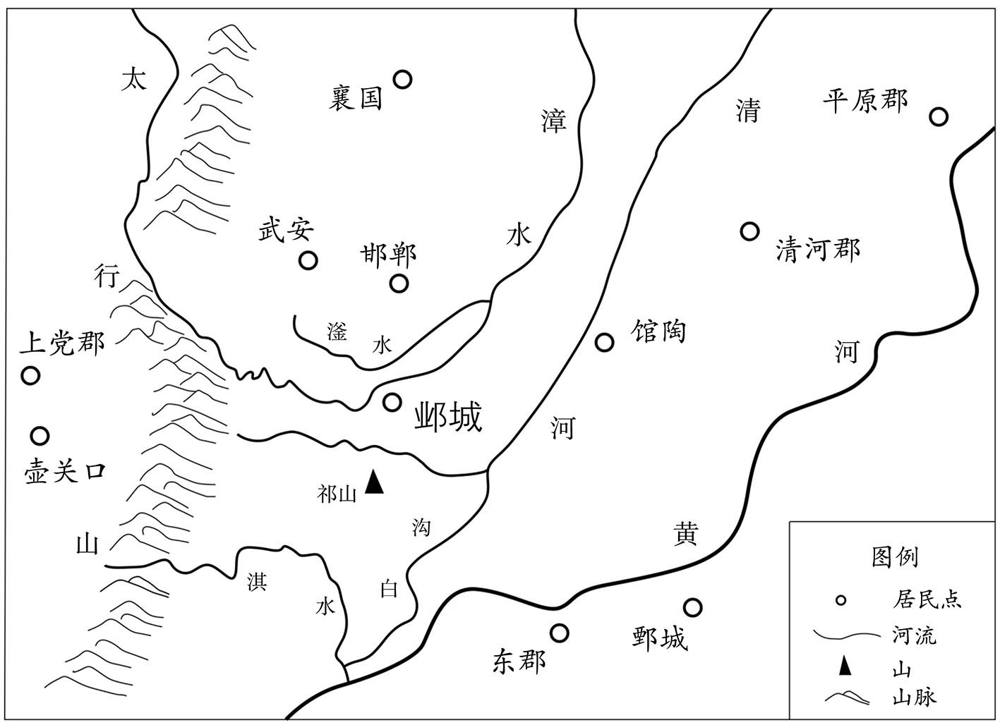 
邺城地理位置示意图

## 【注文】

[1]济阴王晖业：即元晖业（？—551年），字绍业，北魏景穆帝拓跋晃之玄孙。东魏时，历任司空、太尉、中书监等职。不满高氏专权，唯寄情于饮食、诗文，有《辩宗录》四十卷传世。北齐文宣帝高洋天保二年（551年），被高洋所杀。　　比：即比来，意即近来。

[2]伊、霍：即伊尹、霍光。伊尹，生卒年不详，商初的政治家，被商汤任为尹（即相），助商汤灭夏，并教育、辅佐太甲，继承商汤之大业，为商代之政治清明立下了不世之功，是历史上有名的贤相之一。霍光（？—前68年）：西汉重臣，西汉武帝刘彻亡故，霍光受武帝之托辅佐汉昭帝刘弗陵，执西汉权柄近二十年，为汉室中兴立下了汗马功劳。　　曹、马：即曹操、司马懿（yì）。曹操（155—220年），字阿瞒，沛国谯（qiáo）县（今安徽亳州）人。汉末三国时期著名的军事家、政治家、文学家。精兵法，善武略，是促使三国鼎立之势形成的核心人物，也被视为篡汉之臣。司马懿（yì）（178—251年），字仲达，河内温（今河南温县）人。三国时期杰出的政治家、军事家。曾为曹魏佐臣，后掌军政大权，为司马氏建立西魏奠定了基础。元晖业读伊、霍，不读曹、马，是为表明自己不满高氏专权的心迹。

## 【译文】

梁武帝萧衍太清三年（549年）秋季七月，东魏大将军高澄到达邺城，要辞去爵位和特殊的礼遇，而且请求孝静帝元善见立太子。他对济阴王元晖业说：“这一段时间在看什么书啊？”元晖业说：“多次找寻伊尹、霍光的传记来看，不看曹氏和司马氏的书。”

## 【原文】

**八月辛卯，东魏立皇子长仁为太子[1]。**

## 【注文】

[1]长仁：即元长仁，生卒年不详，东魏孝静帝元善见之子，母为高欢次女高皇后。东魏孝静帝元善见武定七年（549年），被立为太子。次年（550年），北齐代东魏，其父元善见被杀，母降为太原长公主，改嫁杨愔（yīn）。后情不详。

## 【译文】

梁武帝太清三年（549年）八月辛卯（初八日），东魏朝廷下诏立皇子元长仁为太子。

## 【原文】

**勃海文襄王高澄以其弟太原公洋次长，意常忌之[1]。洋深自晦匿，言不出口，常自贬退，与澄言，无不顺从。澄轻之，常曰：“此人亦得富贵，相书亦何可解[2]。”洋为其夫人赵郡李氏营服玩小佳，澄辄夺取之[3]。夫人或恚未与，洋笑曰：“此物犹应可求，兄须，何容吝惜。”澄或愧不取，洋即受之，亦无饰让。每退朝还第，辄闭阁静坐，虽对妻子，能竟日不言。或时袒跣奔跃，夫人问其故，洋曰：“为尔漫戏[4]。”其实盖欲习劳也。**

## 【注文】

[1]太原公洋：即高洋。　　次长：即位次于长子。高欢诸子中，高澄居长，高洋为次子。

[2]相书：即算命的书籍。

[3]赵郡李氏：即北齐文宣皇后李祖娥，生卒年不详，父为赵郡李希宗。美容仪，原为太原公夫人，高洋即位后立为皇后。天保十年（559年），改为可贺敦皇后。北齐孝昭帝高演即位，改为昭信皇后。武成帝高湛即位，逼其为妻，生一女。后被送入妙胜尼寺为尼。北齐灭亡后入北周，隋朝立，还赵郡。　　服玩：服饰、器物等把玩之物。　　辄（zhé）：就。

[4]袒（tǎn）跣（xiǎn）：光着脚。　　漫戏：随便做戏。

## 【译文】

勃海文襄王高澄因为他的弟弟太原公高洋在兄弟中年龄仅次于自己，心里常常忌恨他。高洋把自己的行迹深深地掩藏起来，有话也不说出来，常常自己主动贬抑退让，和高澄说话，没有不顺从的时候。高澄轻视他，常常说：“这个人也能得到富贵，相书怎么能够解释得通。”高洋为他的夫人赵郡李氏弄到一些服饰及精巧的玩物，高澄就抢了去。高洋的夫人有时很气愤，不想给，高洋就笑着说：“这些东西还可以再找到，兄长既然想要，怎么能吝惜不给呢。”高澄有时因心有愧疚，不再拿了，高洋就给他送去，高澄也不推让，就接受了。高洋每次退朝后回到家里，就闭门静坐，即使是面对妻、子，也能一天不说一句话。有时脱去上衣，光着脚奔跑，他夫人问他其中的缘故，高洋说：“为你做游戏。”而实际上是为锻炼身体以适应劳苦。

## 【原文】

**澄获（衡）［徐］州刺史兰钦子京，以为膳奴，钦请赎之，不许[1]。京屡自诉，澄杖之，曰：“更诉，当杀汝。”京与其党六人谋作乱。澄在邺，居北城东柏堂，嬖琅邪公主，欲其往来无间，侍卫者常遣出外[2]。辛卯，澄与散骑常侍陈元康、吏部尚书侍中杨愔、黄门侍郎崔季舒屏左右，谋受魏禅，署拟百官[3]。兰京进食，澄却之，谓诸人曰：“昨夜梦此奴斫我，当急杀之[4]。”京闻之，置刀盘下，冒言进食，澄怒曰：“我未索食，何为遽来[5]！”京挥刀曰：“来杀汝！”澄自投伤足，入于床下，贼去床，弑之[6]。愔狼狈走出，遗一靴，季舒匿于厕中。元康以身蔽澄，与贼争刀，被伤，肠出。库（真）［直］王纮冒刃御贼，纥奚舍乐斗死[7]。时变起仓猝，内外震骇。太原公洋在城东双堂，闻之，神色不变，指麾部分，入讨群贼，斩而脔之[8]。徐出，言曰：“奴反，大将军被伤，无大苦也。”内外莫不惊异。洋秘不发丧。陈元康手书辞母，口占使功曹参军祖珽作书陈便宜，至夜而卒[9]。洋殡之第中，诈云出使，虚除元康中书令，以王纮为领左右都督。纮，基之子也[10]。**

## 【注文】

[1]兰钦：生卒年不详，字休明，中昌魏（今河北大名西南）人。骁勇善战，南梁武帝萧衍朝，数率军北伐，屡立战功。曾任衡州、广州刺史，后被前广州刺史毒死，年四十二岁。　　京：即兰京（？—549年），兰钦之子，南北交战中被高澄俘获，为其膳食奴仆。东魏孝静帝元善见武定七年（549年），因谋杀高澄被高洋所杀。　　膳奴：即掌管膳食的奴仆。

[2]东柏堂：时邺城北城丞相府的殿堂之一。　　嬖（bì）：宠幸。　　琅（liáng）邪（yá）公主：即北魏宗室高阳王元斌的妹妹元玉仪，生卒年不详，曾为东魏将领孙腾的家妓，后被抛弃。高澄遇到她，悦其美貌，封为琅邪公主，倍受宠爱。

[3]署拟：拟订签署。

[4]斫（zhuó）：用刀斧砍。

[5]遽（jù）：急速、匆忙。

[6]弑（shì）：古代指臣下杀死君主或子女杀死父母。

[7]库直：武官名，也作库真，始置于南北朝，掌禁卫护从。品秩不详。　　王纮（hóng）：生卒年不详，字师罗，太安狄那（今内蒙古固阳西南）人，出生于部落酋帅之家，好弓马、文学，善骑射。官历东魏及北齐文宣、废帝、孝昭、武成、后主五朝。　　纥（hé）奚舍乐：生卒年不详，复姓纥奚，名舍乐。

[8]双堂：时邺城北城东面宫城内之宫殿之一。　　脔（luán）：切割成小块。

[9]口占：口头叙说。　　功曹参军：职官名，始于东汉，掌官属选用，是各王公及将军府属官。南北朝沿置，也称西曹参军。北齐列第六品。

[10]中书令：职官名，始置于西汉，时由宦官担任，掌尚书事。汉成帝刘骜（áo）时称中书谒（yè）者令。魏文帝曹丕黄初初，改称中书令，掌文书、诏令。南北朝沿置，北魏孝文帝太和中列右第二品中，宣武帝后改为右第三品。　　领左右都督：职官名，领左右府属官，掌军事，品秩不详。　　基：即王基（477—542年），王纮（hóng）之父，好读书，有谋略。北魏末，先后从葛荣、尔朱氏、高欢，后入仕东魏，东魏孝静帝元善见兴和四年（542年），被家奴所杀，年六十五岁。

## 【译文】

高澄曾抓获了徐州刺史兰钦的儿子兰京，让他做自己的膳食奴仆，兰钦请求用钱赎出自己的儿子，高澄不答应。兰京自己几次提出归家的要求，高澄下令用木棍打他，说：“再说此事，就把你杀了。”兰京因此和他的六个同党谋划造反。高澄在邺城时，住在北城东的柏堂，宠幸琅邪公主，为了琅邪公主往来方便，常常将侍卫人员派到外面去。太清三年（549年）八月辛卯（初八日），高澄与散骑常侍陈元康，吏部尚书、侍中杨愔（yīn），黄门侍郎崔季舒屏退左右人员，谋划接受东魏孝静帝禅（shàn）让一事，拟议文武百官的安排。兰京进来送食物，高澄让他出去，并对在座的各位说：“我昨天梦见这个奴才用刀砍我，应当尽快把他杀了。”兰京听到这些话，把刀放在盘子下面，假装说来进献食物，高澄生气地说：“我没有要食物，你为什么进来！”兰京挥起刀说：“来杀你！”高澄自己跌倒在地，伤了脚，钻到了床下，兰京把床搬开，杀了他。杨愔狼狈地逃了出去，丢了一只靴子，崔季舒藏在了厕所里。陈元康用自己的身体遮蔽高澄，和兰京抢夺刀，被兰京砍伤，肠子流了出来。库直王纮（hóng）冒着被砍伤的危险，抵御兰京，纥（hé）奚舍乐在搏斗中死去。当时变乱发生得很仓促，朝廷内外都十分震惊恐慌。太原公高洋住在城东的双堂，听到这一消息后，神色不变，指挥手下安排部署，入城讨伐群贼，将他们斩首并将尸体切成了碎片。然后才慢慢出来，说：“奴才造反，大将军被砍伤，没有什么大碍。”朝廷内外没有人不感到惊异。高洋秘不发丧。陈元康给母亲写了一封信，与母亲告别，又向功曹参军祖珽（tǐng）口授，让他代替自己向朝廷陈述变乱的过程，到了夜里，陈元康死了。高洋将陈元康安放在自己的府第，假称陈元康出使外地，并假装任命他为中书令，任命王纮为领军左右都督。王纮，是王基的儿子。

## 【原文】

**勋贵以重兵皆在并州，劝洋早如晋阳，洋从之。夜，召大将军督护太原唐邕，使部分将士，镇遏四方[1]。邕支配须臾而毕，洋由是重之。**

## 【注文】

[1]大将军督护：武官名，为大将军之助手，品秩不详。　　太原：即太原郡，时属东魏并州，领晋阳、祁县等十县，治晋阳（今山西太原南）。　　唐邕（yóng）：生卒年不详，字道和，太原晋阳（今山西太原南）人。博闻强识、干练有才，仕北齐六帝，历任要职。北齐后主高纬朝，因与权臣高阿那肱（gōng）及斛律孝卿不和，与莫多娄敬显等拥立高澄之子安德王高延宗为帝，事败降北周，卒于凤州刺史任上。

## 【译文】

东魏的勋臣贵戚们认为重兵都在并州，劝高洋早点到晋阳，高洋听从了他们的建议。夜里，就召大将军督护太原人唐邕（yóng），让他分派将士，镇守遏（è）制四方。唐邕分兵派将不一会就完成了，高洋因此十分器重他。

## 【原文】

**癸巳，洋讽东魏主以立太子大赦[1]。澄死问渐露，东魏主窃谓左右曰：“大将军今死，似是天意，威权当复归帝室矣。”洋留太尉高岳、太保高隆之、开府仪同三司司马子如、侍中杨愔守邺，余勋贵皆自随。甲午，入谒东魏主于昭阳殿，从甲士八千人，登阶者二百余人，皆攘袂扣刃，若对严敌[2]。令主者传奏曰：“臣有家事，须诣晋阳[3]。”再拜而出。东魏主失色，目送之曰：“此人又似不相容，朕不知死在何日！”晋阳旧臣宿将素轻洋，及至，大会文武，神彩英畅，言辞敏洽，众皆大惊。澄政令有不便者，洋皆改之。**

## 【注文】

[1]讽：劝说、规劝。

[2]昭阳殿：时邺城南城宫城之宫殿之一。　　攘（rǎng）袂（mèi）：挽起袖子。

[3]主者：指主持朝仪的人。

## 【译文】

梁武帝太清三年（549年）八月癸巳（初十日），高洋示意东魏孝静帝元善见以立太子为由大赦天下。高澄的死讯渐渐透露出来，东魏孝静帝私下里对身边的人员说：“大将军如今死了，似乎是天意，威信和权力应当再归于帝王之家了。”高洋留下太尉高岳、太保高隆之、开府仪同三司司马子如、侍中杨愔（yīn）守邺城，其余的勋贵都让他们跟在身边。甲午（十一日），高洋入宫在昭阳殿拜见孝静帝，有佩带武器的军士八千人跟从，登上宫殿台阶的有二百多人，都挽袖子，手按刀剑，就如同面对严整的敌人。命令主事的人向孝静帝传奏说：“臣家中有事，必须回到晋阳。”拜了两拜后离开皇宫。东魏孝静帝变了脸色，目送高洋说：“这个人又好像不能相容，朕不知会在何日死去！”晋阳城的旧臣及宿将们平常看不起高洋，等高洋到了晋阳，大张旗鼓地面见文武大臣，神采飞扬，言辞敏捷恰当，众人都十分吃惊。高澄以往的政令有不适当的地方，高洋都做了修改。

## 【原文】

**简文帝大宝元年春正月戊辰，东魏进太原公高洋位丞相、都督中外诸军、录尚书事、大行台、齐郡王[1]。三月庚申，东魏进丞相洋爵为齐王。**

## 【注文】

[1]简文帝：即南梁第二任皇帝萧纲（503—551年），字世缵（zuǎn），南梁武帝萧衍之第三子。南梁武帝萧衍中大通三年（531年）被立为太子，太清三年（549年）即位，南梁豫章王萧栋天正元年（551年）被侯景所杀。通晓文学、医术，南北朝时期宫体诗的代表人物，有诗文传世。　　大宝：南梁简文帝萧纲在位期间所使用的年号，共计二年，即公元550年至551年。

## 【译文】

南梁简文帝萧纲大宝元年（550年）春季正月戊辰（十八日），东魏进封太原公高洋为丞相、都督中外诸军、录尚书事、大行台、齐郡王。三月庚申（十一日），东魏进封丞相高洋为齐王。

## 【原文】

**［五月］东魏齐王洋之为开府也，勃海高德政为管记，由是亲昵，言无不尽[1]。金紫光禄大夫丹杨徐之才、北平太守广宗宋景业皆善图谶，以为“太岁在午，当有革命”，因德政以白洋，劝之受禅[2]。洋以告娄太妃，太妃曰：“汝父如龙，兄如虎，犹以天位不可妄据，终身北面[3]。汝独何人，欲行舜、禹之事乎[4]？”洋以告之才，之才曰：“正为不及父兄，故宜早升尊位耳。”洋铸像卜之而成，乃使开府仪同三司段韶问肆州刺史斛律金[5]。金来见洋，固言不可，以宋景业首陈符命，请杀之。洋与诸贵议于太妃前，太妃曰：“吾儿懦直，必无此心，高德政乐祸教之耳。”洋以人心不一，使高德政如邺察公卿之意，未还。洋拥兵而东，至平都城，召诸勋贵议之，莫敢对[6]。长史杜弼曰：“关西国之勍敌，若受魏禅，恐彼挟天子自称义兵而东向，王何以待之[7]？”徐之才曰：“今与王争天下者，彼亦欲为王所为，纵其屈强，不过随我称帝耳。”弼无以应。高德政至邺，讽公卿，莫有应者。司马子如逆洋于辽阳，固言未可[8]。洋欲还，仓丞李集曰：“王来为何事，而今欲还[9]？”洋伪使于东门杀之，而别令赐绢十匹，遂还晋阳[10]。自是居常不悦。徐之才、宋景业等日陈阴阳杂占，云宜早受命。高德政亦敦劝不已。洋使术士李密卜之，遇大横，曰：“汉文之卦也[11]。”又使宋景业筮之，遇乾之鼎，曰：“乾，君也，鼎，五月卦也，宜以仲夏受禅[12]。”或曰：“五月不可入官，犯之，终于其位。”景业曰：“王为天子，无复下期，岂得不终于其位乎！”洋大悦，乃发晋阳。**

## 【注文】

[1]勃海：郡名，即勃海郡，冀州属郡，始置于西汉，北魏道武帝拓跋珪（guī）初年曾改称沧水郡，北魏孝文帝元宏太和十一年（487年）复名勃海郡。领南皮、东光、修、安陵四县，治南皮（今河北南皮东北）。　　高德政（？—559年）：字士贞，勃海修（今河北景县）人。入仕为高洋府记事参军，为高洋即帝位立下首功。北齐文宣帝高洋天保末，因屡进忠言遭高洋所忌恨，被杀。　　管记：职官名，即记室参军。

[2]金紫光禄大夫：职官名，原名光禄大夫，始置于西汉，掌宫禁门卫及顾问应对，为光禄勋属官。魏晋以后，多为加官或赠官。光禄大夫，配银章青绶（即银质官印及佩系官印的青色的丝带）的，称为银青光禄大夫；地位高、职权重者，配金章紫绶，称为金紫光禄大夫。北魏孝文帝太和中列右从第一品下，宣武帝后改为右从第二品。北齐列从二品。　　丹杨：县名，即丹阳县（今江苏当涂），时属于丹阳尹。丹阳尹，原为丹阳郡，始置于西汉武帝刘彻时，东晋元帝司马睿时改名丹阳尹，南朝沿置。　　徐之才：生卒年不详，丹阳（今江苏当涂）人。父为南齐兰陵太守，以医术闻名江南。少好学，通天文、图谶（chèn）及医术。仕北齐六帝，因医术受重于时，是南北朝时期著名医药学家，有药方传世。年八十辞世。　　北平：郡名，即北平郡，时属定州，始置于北魏孝明帝元诩（xǔ）孝昌中，治所位于今河北完县东北。　　广宗：郡名，即广宗郡，时属东魏之司州，始置于太和二十一年（497年），治广宗（今河北威县东）。　　宋景业：生卒年不详，广宗（今河北威县东）人，通晓《周易》及图谶之术。北魏末任北平郡守，后入仕东魏，与徐之才一起为高洋代魏出力。北齐文宣帝高洋天保初，任散骑侍郎。　　图谶：又名谶、图书、符命、符箓。指用诡秘的隐语，假说为神的启示，向人们昭示吉凶祸福和治乱兴衰的文字资料，通常是有图有文，所以通常称为图谶。作为一种预言，兴起于春秋时期的秦国，流行于后世，在东汉时期与假借神意解释儒家经典的庸俗经学——纬学相结合，形成了盛极一时的谶纬之学。　　太岁：中国古代的星宿名称，即今之木星。

[3]终身北面：即一生北面称臣。

[4]舜、禹之事：即禅（shàn）让之事。

[5]肆州：州名，时属东魏，治九原城（今山西忻州）。　　斛律金（？—567年）：字阿六敦，北魏朔州（今内蒙古五原）人，敕勒部落出身，性耿直，富有实战经验。魏末，先后从破六韩拔陵、尔朱荣起兵，最后投奔高欢，入仕东魏、北齐。北齐后主高纬天统三年（567年）亡。

[6]平都城：地名，时位于乐平郡境内，今山西和顺西北。

[7]杜弼（491—559年）：字辅玄，中山曲阳（今河北曲阳）人，官宦出身。幼聪慧，通经史。北魏宣武帝元恪（kè）延昌年间（512—515年）以军功起家，后入仕东魏、北齐，为官清廉。天保十年（559年），被齐显祖高洋所杀，年六十九岁。有文章传世。

[8]逆：迎接。　　辽阳：县名，即辽阳县，时属乐平郡，今山西左权北。乐平郡，始置于东汉，治乐平县（今山西昔阳西南）。

[9]仓丞：职官名，即仓曹的属官，始于北齐，北齐仓曹、水曹等诸曹均设有令、丞等属官。　　李集：生卒年不详，时高洋手下的属员。

[10]绢（juàn）：一种薄而坚韧的丝织品。

[11]术士：也称方士，古代指精通法术的人。　　李密：生卒年不详，时为方术之士。　　大横：卦象名称。

[12]筮（shì）：用蓍（shī）草（古代的一种神草）占卜。　　乾、鼎：均为卦象名称。

## 【译文】

梁简文帝大宝元年（550年）五月，东魏齐王高洋开府设置官属的时候，勃海人高德政是管记，因此两人关系十分密切，没有不说的话。金紫光禄大夫丹杨人徐之才、北平太守广宗人宋景业都精通图谶（chèn）之术，认为“太岁星在午位，就会发生改朝换代的事”，通过高德政告诉高洋，劝他接受东魏的禅（shàn）让。高洋将此事告诉了娄太妃，太妃说：“你的父亲像龙，兄长如虎，他们尚且因为天子之位不可轻率占据，而终身北面称臣。唯独你是什么样的人，就想做尧、舜禅让的事吗？”高洋把娄太妃的话告诉了徐之才，徐之才说：“正因为不如父兄，所以应当早点升居尊位而已。”高洋铸像占卜此事，像铸成了，于是派开府仪同三司段韶去询问肆州刺史斛律金。斛律金来拜见高洋，坚称此事不可行，认为宋景业是向高洋首先讲符命的人，请求杀了宋景业。高洋又与各位权贵在娄太妃面前商议此事，太妃说：“我的儿子懦弱耿直，一定没有这个心思，高德政幸灾乐祸教他这样做罢了。”高洋因人心不统一，派高德政到邺城去观察大臣们的意思，高德政还没有回来，高洋就率军向东进发，到达平都城，召集各位勋贵重臣商议此事，大家没人敢应对。长史杜弼说：“关西是我国的强敌，如果我们接受了东魏的禅让，恐怕他们会挟天子、自称义兵而东进，大王如何处置？”徐之才说：“如今与大王争夺天下的人，他也想做大王想做的事，即使他倔强不顺从，也不过是随大王之后称帝罢了。”杜弼无言以对。高德政到达了邺城，将此事晓谕各位大臣，但没有人响应。司马子如在辽阳迎接高洋，坚持说此事不可。高洋想返回晋阳，仓丞李集说：“大王来这里是为了什么事，而现在又想返回？”高洋假装派人在东门将其杀了，又另外下令赐予他十匹绢，于是返回晋阳。从此总是闷闷不乐。徐之才、宋景业等人每天对高洋讲阴阳占卜之事，说应当早一点称帝。高德政也不断地劝说高洋称帝。高洋派术士李密占卜此事，遇到了大横的卦象，李密说：“这是汉文帝即位前出现的祥兆。”高洋又让宋景业用筮（shì）草占卜称帝一事，遇到了乾卦之中的鼎卦，宋景业说：“乾卦，是君，鼎卦，是五月问鼎的卦象，您应当在仲夏接受东魏的禅让。”有人说：“五月不可以入居官位，冒犯了，就会死在这个位子上。”宋景业说：“大王是天子，没有下台离位的时候，怎么不会终于皇位之上呢！”高洋十分高兴，于是从晋阳出发。

## 【原文】

**高德政录在邺诸事，条进于洋，洋令左右陈山提驰驿赍事条，并密书与杨愔[1]。是月，山提至邺，杨愔即召太常卿邢劭等议撰仪注，秘书监魏收草九锡、禅让、劝进诸文，引魏宗室诸王入北宫，留于东斋[2]。甲寅，东魏进洋位相国，总百揆，备九锡[3]。洋行至前亭，所乘马忽倒，意甚恶之，至平都城，不复肯进[4]。高德政、徐之才苦请曰：“山提先去，恐其漏泄。”即命司马子如、杜弼驰驿续入，观察物情。子如等至邺，众人以事势已决，无敢异言。洋至邺，召夫赍筑具集城南[5]。高隆之请曰：“用此何为？”洋作色曰：“我自有事，君何问为，欲族灭邪！”隆之谢而退。于是作圆丘，备法物[6]。**

## 【注文】

[1]陈山提：生卒年不详，颍川（今河南许昌）人，北周宣帝宇文赟（yūn）之皇后陈月仪之父。原为尔朱荣部下，后入仕东魏、北齐，北周灭齐后入仕北周。　　赍（jī）：把东西送给别人。

[2]邢劭（shào）：生卒年不详，字子才，因避魏彭城王元邵之讳，以字名。少聪慧，博闻强识，十岁能著文，北魏孝明帝元诩（xǔ）熙平后，每有文出，即致洛阳纸贵。入仕为魏宣武帝元恪挽郎，得元乂（yì）重用。后与温子升同为齐文襄王高澄侍读，因崔暹（xiān）离间，被贬。齐文宣帝高洋亡后，卒。　　秘书监：职官名，始置于东汉桓帝刘志延熹二年（159年），掌皇家藏书及国史修撰。后世沿置，南北朝时属秘书省，北魏孝文帝太和中列从第二品中，宣武帝后改为正第三品。北齐为秘书省属官，列第三品。　　魏收（506—572年）：字伯起，钜鹿下曲阳（今河北晋县）人，官宦出身，少好读书、骑射。仕北魏、东魏、北齐三朝，历任要职，编修国史，著《魏书》。亡于北齐后主高纬武平三年（572年）。　　北宫：即邺南城内的宫殿之一。　　东斋：宫殿名，位于北宫之东侧。

[3]百揆（kuí）：百官。

[4]前亭：地名，位于晋阳之东，平都城之西。今山西太原和昔阳之间。

[5]夫：民夫。

[6]圆丘：古代祭祀用的圆形高坛。　　法物：古代帝王举行登基仪式所用器物。

## 【译文】

高德政将在邺城的各项事宜都记录下来，逐条进呈给高洋，高洋命令手下人陈山提骑着驿马，带着这些事条，连同秘密书信一起送给了杨愔。当月，陈山提就到了邺城，杨愔立刻召集太常卿邢劭（shào）等人商议撰写礼仪制度等事宜，秘书监魏收草拟了九锡、禅让、劝进等文书，引领东魏宗室的各位王爷进入北宫，扣留在东斋。大宝元年（550年）五月甲寅（初六日），东魏进封高洋为相国，总领百官，加九锡之礼。高洋走到前亭，所乘坐的马突然倒下，高洋对此事十分厌恶，到了平都城后，就不再前行了。高德政、徐之才苦苦请求说：“陈山提已先去了邺城，恐怕他会泄漏消息。”高洋立即命令司马子如、杜弼骑快马接连入邺，观察事态的发展。司马子如等人到达邺城后，大家以为事情发展的态势已定，没人敢发表不同的看法。高洋到达了邺城，召集民夫带着工具在城南集中。高隆之请问说：“为什么要用这些人？”高洋变了脸色说道：“我自然有事要做，你问这干什么，想被诛灭九族吗！”高隆之谢罪退下。于是在城南修筑圆形高坛，准备登基所用的法物。

## 【原文】

**丙辰，司空潘乐、侍中张亮、黄门郎赵彦深等求入启事，东魏孝静帝在昭阳殿见之[1]。亮曰：“五行递运，有始有终，齐王圣德钦明，万方归仰，愿陛下远法尧、舜[2]。”帝敛容曰：“此事推挹已久，谨当逊避[3]。”又曰：“若尔，须作制书。”中书郎崔劼、裴让之曰：“制已作讫[4]。”使侍中杨愔进之。东魏主既署，曰：“居朕何所？”愔对曰：“北城别有馆宇。”乃下御坐，步就东廊，咏范蔚宗《后汉书》赞曰：“献生不辰，身播国屯，终我四百，永作虞宾[5]。”所司请发，帝曰：“古人念遗簪弊履，朕欲与六宫别，可乎[6]？”高隆之曰：“今日天下犹陛下之天下，况在六宫。”帝步入与妃嫔已下别，举宫皆哭。赵国李嫔咏陈思王诗云：“王其爱玉体，俱享黄发期[7]。”直长赵道德以故犊车一乘候于东阁，帝登车，道德超上抱之，帝叱之曰：“朕自畏天顺人，何物奴敢逼人如此！”道德犹不下[8]。出云龙门，王公百僚拜辞，高隆之洒泣[9]。遂入北城，居司马子如南宅，遣太尉彭城王韶等奉玺绶，禅位于齐。**

## 【注文】

[1]潘乐（？—555年）：字相贵，广宁石门（今内蒙古固阳西）人。魏末先后从葛荣、尔朱荣帐下，后投奔高欢，入仕东魏、北齐。天保六年（555年）亡。　　张亮（？—550年）：字伯德，西河隰（xí）城（今山西隰县）人。魏末从尔朱兆，兆亡归高欢。入仕东魏、北齐，讨西魏、侯景，立功拜官。北齐文宣帝高洋天保初亡。

[2]五行递运：是战国时期阴阳家的理论，也称五行终始、五德终始。五行，即构成世间万物的五种元素——金、水、木、火、土。五行相生又相克，即金生水，水生木，木生火，火生土，土生金；金克木，木克土，土克水，水克火，火克金。阴阳家认为，五行的消长和流变，就是自然及人类社会的运动和发展的基本规律。皇朝嬗（shàn）替也遵循五行递运的规律，循环往复，以至永远。　　尧、舜：指中国古代传说中的尧帝和舜帝。尧帝，传说中的贤君之一，生活简朴，为政有佳绩。年老时，选贤任能，禅位于舜帝。舜帝，传说中圣君之一，继尧帝之后统御四方，孝顺父母，爱护百姓，禅位于禹。

[3]推挹（yì）：推让。挹，通“揖”。

[4]崔劼（jié）：生卒年不详，字彦深，祖仕刘宋，父投北魏。少好学，北魏末入仕，后仕东魏、北齐，北齐武成帝高湛末年，被贬，外任南兖州刺史。后病亡，年六十六岁。

[5]范蔚宗：即范晔（yè）（397—445年），字蔚宗，南北朝时期史学家，顺阳（今河南淅川）人。历任左卫将军、太子詹事等职，刘宋文帝刘义隆元嘉二十二年（445年）被杀。著有《后汉书》传世。　　《后汉书》：南北朝时期刘宋朝的史家范晔所著的纪传体史书，记东汉一朝的历史。

[6]六宫：代指帝王之后、妃。

[7]陈思王：即曹操之第三子曹植（192—232年），字子建，沛国谯（今安徽亳州）人。幼聪慧，下笔即成章，因才气遭兄长曹丕忌恨，颇受打击和防范。曹魏明帝曹睿朝受封为陈王，谥号思，后世称之为陈思王或陈王。

[8]直长：即尚乘直长，职官名，掌帝王出行之车马。北齐时属太仆寺（huá）骅骝（liú）署。　　赵道德：生卒年不详，时任东魏之尚乘直长。　　犊（dú）车：即有帷幕的车子。

[9]云龙门：邺南城内宫殿门之一。

## 【译文】

梁简文帝大宝元年（550年）五月丙辰（初八日），司空潘乐、侍中张亮、黄门郎赵彦深等人请求入宫奏事，东魏孝静帝元善见在昭阳殿召见他们。张亮说：“金、木、水、火、土五行依次运行，有开始有终结，齐王高洋圣德清明，万方归仰，希望陛下效法古代的尧、舜之故事，把帝位禅让给齐王。”孝静帝神色凝重地说：“这件事我想了很久了，应当退位让贤。”又说：“如果这样，须要写制书。”中书郎崔劼（jié）、裴让之说：“制书已写好了。”让侍中杨愔将制书呈给孝静帝。东魏孝静帝在制书上签完字后，问：“让我住在什么地方？”杨愔回答说：“北城另有房舍。”孝静帝于是下了御座，步行到东廊，咏唱范蔚宗的《后汉书》中的一段赞文道：“献帝生不逢时辰，身既流离，国又遭难，汉祚四百年终结了，只能永远地充当虞舜的宾客了。”有关部门请求孝静帝离开宫廷，孝静帝说：“古人还怀念遗簪敝履呢，我想与六宫作别，可以吗？”高隆之说：“今天仍然是陛下的天下，更何况是六宫呢。”孝静帝步入后宫与妃嫔及以下的人员告别，整个后宫哭声一片。赵国人李嫔诵读了陈思王曹植的诗道：“王其爱玉体，俱享黄发期。”直长赵道德用一旧牛车等候在东阁，孝静帝登上车，赵道德跳上去抱住了他，孝静帝呵斥他说：“朕自己畏天命，顺人心，你是什么奴才，竟敢这样逼迫我！”赵道德仍然不下车。车出了云龙门，王公百官向孝静帝拜别，高隆之流泪哭泣。车子于是进入了北城，孝静帝居住在司马子如的南宅，派太尉彭城王元韶等人奉献出玉玺、印绶，将皇位禅让给了齐王高洋。

## 【原文】

**戊午，齐王即皇帝位于南郊，大赦，改元天保[1]。自魏敬宗以来，百官绝禄，至是始复给之[2]。己未，封东魏主为中山王，待以不臣之礼。追尊齐献武王为献武皇帝，庙号太祖，后改为高祖；文襄王为文襄皇帝，庙号世宗[3]。辛酉，尊王太后娄氏为皇太后。乙丑，降魏朝封爵有差，其宣力霸朝及西南投化者，不在降限[4]。**

## 【注文】

[1]天保：北齐文宣帝高洋在位期间所使用的年号，共计十年，即公元550年至559年。

[2]禄：即俸禄。

[3]文襄王：即北齐世宗文襄帝高澄。

[4]霸朝：即北齐。中国古代的王朝有正统和非正统之分，符合儒家之礼法制度的中原王朝，乃正统王朝，反之，为非正统。对于非正统的政权或王朝，史籍中称其为霸府或霸朝。

## 【译文】

梁简文帝大宝元年（550年）五月戊午（初十日），齐王高洋在邺城的南郊即皇帝位，大赦天下，改元天保。自从北魏敬宗元子攸（yōu）执政以来，百官就没有了俸禄，到这时又开始发放。己未（十一日），齐王高洋封东魏孝静帝元善见为中山王，用不是臣子的礼节对待他。追尊齐武献王高欢为献武皇帝，庙号太祖，后改为高祖；文襄王高澄为文襄皇帝，庙号世宗。辛酉（十三日），尊封王太后娄氏为皇太后。乙丑（十七日），把原来东魏朝的封爵分别降了等级，其中为高室政权效力的，以及从西南归降的人，不在降级之列。

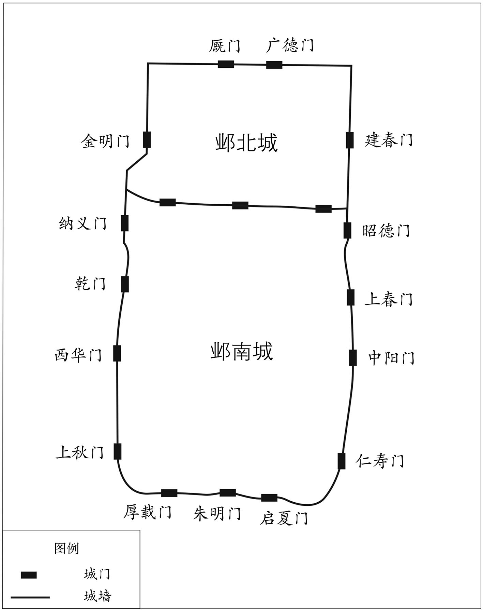 
邺城北城、南城及诸门示意图

## 【原文】

**夏六月，齐主封宗室高岳等十人，功臣库狄干等七人皆为王。癸未，封弟浚为永安王，淹为平阳王，浟为彭城王，演为常山王，涣为上党王，淯为襄城王，湛为长广王，湝为任城王，湜为高阳王，济为博陵王，凝为新平王，润为冯翊王，洽为汉阳王[1]。**

## 【注文】

[1]浚：即高浚（？—549年），高欢第三子，少聪慧，喜游猎，天保初封永安王。武定七年（549年）被杀。　　淹：即高淹（？—564年），字子邃（suì），高欢第四子。天保初封平阳王，性沉稳、宽厚。北齐武成帝高湛河清三年（564年）亡。　　浟（yōu）：即高浟（532—564年），高欢第五子，字子深。武定六年（548年）出任沧州刺史，为政有佳绩。天保初封为彭城王，后屡任要职。河清三年（564年）遇害。　　演：即北齐第三任皇帝孝昭帝高演（535—561年），高欢第六子，字延安。天保初封常山王，乾明元年（560年），废废帝高殷，即帝位，次年（561年）亡。　　涣：即高涣（524—549年），高欢第七子，年少即卓而不群，天保初封上党王，历任要职。有术士说将来亡北齐者为黑衣人，所以高氏忌黑，因漆最黑，而高涣行七，所以，武定七年（549年）被高洋所杀，年二十六岁。　　淯（yù）：即高淯（？—551年），高欢第八子，天保初封襄城王，次年亡。　　湛：北齐第四任皇帝武成帝高湛（537—568年），高欢第九子，字步落稽。北齐文宣帝高洋天保初，封长广王，北齐孝昭帝高演朝，任丞相。北齐孝昭帝高演皇建元年（560年）即位，残杀宗室，沉于美色。北齐后主高纬天统四年（568年）亡，年三十二岁。　　湝（jiē）：即高湝（？—577年），高欢第十子，天保初封为任城王，干练有才，北齐后主高纬隆化二年（577年）亡。　　湜（shí）：即高湜（？—559年），高欢第十一子。天宝初封为高阳王，天保末，被太后杖责而死。　　济：即高济（？—569年），高欢第十二子，天保初封为博陵王。天统五年（569年）被杀。　　凝：即高凝，生卒年不详，高欢第十三子，天保初，封为新平郡王，天保九年（558年），改封安定郡王，天保十年（559年），改封华山郡王。终于齐州刺史任上。　　润：即高润，生卒年不详，字子泽，高欢第十四子，天宝初封为冯翊王，历任要职，终于定州刺史。　　洽：即高洽（542—554年），字敬延，高欢第十五子，天保元年（550年），封为汉阳王，天保五年（554年）亡，年十三岁。

## 【译文】

梁简文帝大宝元年（550年）夏季六月，齐文宣帝高洋分封宗室高岳等十人，功臣库狄干等七人都为王。癸未（初五日），封他的弟弟高浚为永安王，高淹为平阳王，高浟为彭城王，高演为常山王，高涣为上党王，高淯为襄城王，高湛为长广王，高湝为任城王，高湜为高阳王，高济为博陵王，高凝为新平王，高润为冯翊王，高洽为汉阳王。

## 【原文】

**二年。齐主每出入，常以中山王自随，王妃太原公主恒为之尝饮食，护视之[1]。冬十二月，齐主饮公主酒，使人鸩中山王，杀之，并其三子，谥王曰魏孝静皇帝，葬于邺西漳北。其后齐主忽掘其陵，投梓宫于漳水[2]。齐主初受禅，魏神主悉寄于七帝寺，至是亦取焚之[3]。**

## 【注文】

[1]王妃太原公主：即高欢之次女高氏，生卒年不详，原为东魏孝静帝元善见之皇后，北齐代魏，降为中山王妃、太原公主，后嫁给尚书左仆射杨遵彦。

[2]梓宫：帝王的棺材。　　漳：即漳水，古水名，位于时邺城之西侧。

[3]神主：古代祭祀先祖的牌位。　　七帝寺：寺庙名称，时位于定州（治今河北定县），因寄放北魏天子之七庙神主：太祖道武帝拓跋珪（guī）、太宗明元帝拓跋嗣、世祖太武帝拓跋焘、恭宗景穆帝拓跋晃、高宗文成帝拓跋濬、显祖献文帝拓跋弘、高祖孝文帝元宏，所以称七帝寺。始建于北魏孝文帝元宏太和十六年（492年）。

## 【译文】

南梁简文帝萧纲大宝二年（551年）。北齐文宣帝高洋每次出入皇宫，常常让中山王跟在后面，王妃太原公主一直为中山王尝饮食，保护照料他。冬季十二月，齐皇帝请太原公主喝酒，派人毒死了中山王，杀了他，还杀了他的三个儿子，谥号为东魏孝静皇帝，葬在邺城西面漳水以北。之后，齐皇帝又突然间派人挖掘了中山王的陵墓，把他的棺材扔进了漳水。齐皇帝当初受禅时，北魏祖先的神主牌位都寄放在七帝寺，到这时全部被取出烧了。

## 【原文】

**彭城公元韶以高氏婿，宠遇异于诸元[1]。开府仪同三司美阳公元晖业以位望隆重，又志气不伦，尤为齐主所忌，从齐主在晋阳。晖业于宫门外骂韶曰：“尔不及一老妪。负玺与人，何不击碎之！我出此言，知即死，尔亦讵得几时！”齐主闻而杀之，及临淮公元孝友，皆凿汾水冰，沈其尸[2]。孝友，彧之弟也[3]。齐主尝剃元韶鬓须，加之粉黛以自随，曰“吾以彭城为嫔御”，言其懦弱如妇人也。**

## 【注文】

[1]彭城公元韶：生卒年不详，魏献文帝拓跋弘之曾孙；鼓城王元勰（xié）之孙；魏无上王元劭之长子；魏孝庄帝元子攸之侄。字世胄，袭封为彭城王。东魏孝静帝元善见武定末，任司州牧。北齐朝，爵位按例降低。

[2]临淮公元孝友：生卒年不详，北魏宗室，元彧（yù）之弟。袭封为临淮王，入齐降为临淮公。为政温和，但善事权贵。

[3]彧（yù）：即元彧（？—530年），字文若。北魏宗室，太武帝拓跋焘第四子临淮王拓跋谭之后代。本名亮，字仕明，避魏大臣穆亮讳，改名元彧。北魏孝明帝元诩正光末，率兵平定六镇之乱，兵败。河阴之变后，尔朱氏把持朝政，投奔南梁。北魏孝庄帝元子攸时返回北魏。北魏长广王元晔（yè）建明元年（530年）被尔朱兆所杀。

## 【译文】

鼓城公元韶因为是高氏的女婿，受到的恩宠及待遇与其他的元氏不同。开府仪同三司美阳公元晖业因为位高名重，再加上志气不同一般，尤其被齐文宣帝高洋所忌恨，跟从齐皇帝在晋阳。元晖业在宫门外骂元韶说：“你还不如一个老妇人。把自家的玉玺送给人家，为何不把它打碎！我说出这样的话，就知道会死，但你又能苟活到几时呢！”齐皇帝听说后将元晖业杀了，还杀了临淮公元孝友，凿开汾河上的冰，将他们的尸体沉入汾河。元孝友，是元彧的弟弟。齐皇帝曾剃了元韶的鬓发和胡须，给他涂上脂粉，描画了眉毛，让他跟在身边，说“我拿彭城王当我的妃嫔”，意思是说他懦弱得如同妇人一样。

# 宇文篡西魏**  
****后周**

## 【内容摘要】

《宇文篡西魏》叙述了西魏灭亡以及北周建立的过程。

公元534年，北魏孝武帝元脩因与丞相高欢不合，从洛阳（今河南洛阳）逃奔长安（今陕西西安），意欲依靠关西宇文氏的力量打击高欢，重振朝纲。结果是才离狼窝又入虎口，宇文泰作为割据关西的军阀势力，其迎接孝武帝的目的，同样是为了挟（xié）天子以令诸侯，进而壮大自己的实力。因此，孝武帝元脩入关后与宇文泰亦不和睦。不久，孝武帝元脩酒后中毒身亡。次年（535年），宇文泰拥立北魏宗室南阳王元宝炬为帝，改元大统，定都长安，建立西魏。与东魏孝静帝元善见一样，西魏文帝元宝炬也是傀（kuǐ）儡（lěi）皇帝，政权实际掌控在宇文泰手中。

公元551年，西魏文帝元宝炬病亡，长子元钦（qīn）继位，史称废帝。公元554年，因不满宇文氏专权，西魏废帝元钦密谋处死宇文泰。当时，宇文泰诸子虽小，但诸婿均在西魏朝中任要职。大都督清河公李基、义城公李晖、常山公于翼都是武卫将军，统领禁军。因此，废帝元钦的计谋很快泄露。于是，宇文泰废掉了元钦，另立其弟齐王元廓（kuò）为帝，并恢复其拓跋姓氏，史称西魏恭帝。

公元556年，西魏太师宇文泰病亡。其侄中山公宇文护受托孤之重任，扶持宇文泰的嫡（dí）子十五岁的宇文觉继任太师，而西魏的政权实际上由宇文护掌控。年末，宇文护迫使西魏恭帝拓跋廓让位于宇文觉。公元557年初，在宇文护的帮助下，宇文觉即帝位，西魏灭亡，北周建立。追尊其父宇文泰为文王；母为文后；李弼为太师；赵贵为太傅；独孤信为太保；宇文护为大司马。诏令大赦天下，并封西魏恭帝拓跋廓为宋公。二月，杀西魏恭帝。

宇文觉因不满宇文护专权，预谋诛杀宇文护。因谋事不周，反被宇文护废掉，数月后，被杀。宇文护又先后拥立宇文泰的庶长子宇文毓（yù）、四子宇文邕（yōng）为帝，继续掌控北周政权。

公元558年，北周加封北魏宗室元罗为韩国公，以承继北魏的宗庙祭祀。

宇文泰在掌西魏权柄期间，在政治、经济、文化、军事等方面实施了一系列改革，在一定程度上促进了西魏、北周的发展。就官制而言，为增强内部凝聚力，假借关中本是西周故土，实行托古改制，仿《周礼》建立六官制度。公元559年，北周御中正大夫崔猷（yóu）建议改革周制，恢复秦、汉制度，北周王开始称皇帝，改年号为武成。这样，宇文氏自篡位以来在政治体制建设上重新回到了顺应社会发展的轨道上来。

## 【原文】

**梁武帝中大通六年。魏孝武帝闺门无礼，从妹不嫁者三人，皆封公主[1]。平原公主明月，南阳王宝炬之同产也，从帝入关，丞相泰使元氏诸王取明月杀之[2]。帝不悦，或时弯弓，或时椎桉，由是复与泰有隙。冬闰十二月癸巳，帝饮酒，遇鸩而殂[3]。泰与群臣议所立，多举广平王赞。赞，孝武之兄子也。侍中濮阳王顺于别室垂涕谓泰曰：“高欢逼逐先帝，立幼主以专权，明公宜反其所为[4]。广平冲幼，不如立长君而奉之。”泰乃奉太宰南阳王宝炬而立之。顺，素之曾孙也[5]。殡孝武帝于草堂佛寺，谏议大夫宋球恸哭呕血，浆粒不入口者数日，泰以其名儒，不之罪也[6]。**

## 【注文】

[1]闺门无礼：指北魏孝武帝元脩个人生活有失检点。闺门，原指妇女之居所，此借指妇女。　　从妹不嫁者三人：北魏孝武帝元脩，有三个不出嫁的堂妹都被封为公主：平原公主元明月，南阳王元宝炬之胞妹；安德公主，清河王元怿（yì）之女；元蒺（jí）藜（lí）公主，均与孝武帝有染。后平原公主元明月随孝武帝入关，元蒺藜自杀。

[2]平原公主明月：即北魏宗室南阳王元宝炬之胞妹元明月（？—534年），在洛阳时即被北魏孝武帝元脩封为公主，并与其有染，后随孝武帝入关。南梁武帝萧衍中大通六年（534年），被宇文泰下令处死。　　同产：同胞；一母所生。

[3]鸩（zhèn）：毒酒。　　殂（cú）：死亡。

[4]濮（pú）阳王顺：即北魏宗室元顺，生卒年不详，北魏昭成帝拓跋什翼犍之孙常山王拓跋遵之后；拓跋素之玄孙。字敬叔，善骑射，跟从魏孝武帝元脩入关，位至侍中。孝武帝元脩亡，力谏宇文泰立年长者为帝，西魏文帝元宝炬即位，加封开府仪同三司、秦州刺史。

[5]素：北魏宗室拓跋素，生卒年不详，北魏昭成帝拓跋什翼犍之曾孙；常山王拓跋遵之子。北魏太武帝拓跋焘初，袭封常山王，后因平定统万之功，拜内都大官。个性素雅、方正，为官五十年，始终如一，北魏文成帝拓跋濬朝亡。

[6]草堂佛寺：寺院，位于长安（今陕西西安）。　　谏议大夫：职官名，始置于秦，掌议论。两汉属光禄勋，后世沿置，北魏孝文帝太和中列右第四品下，宣武帝后改为右从第四品。　　宋球：生卒年不详，时任谏议大夫。　　恸（tòng）：极度悲哀；大哭。

## 【译文】

南梁武帝萧衍中大通六年（534年）。北魏孝武帝元脩个人生活放荡，存在乱伦的行为，他的堂妹中不出嫁的有三人，都被封为公主。平原公主明月，与南阳王元宝炬是同母所生，跟着孝武帝入关，丞相宇文泰派元氏各位王爷把明月抓来杀了。孝武帝不高兴，有时弯弓射箭，有时捶击几案，自此又与宇文泰产生了隔阂。冬季闰十二月癸巳（十五日），孝武帝喝酒时中毒身亡。宇文泰和群臣商议该拥立谁为帝，大家多推举广平王元赞。元赞，是孝武帝兄长的儿子。侍中濮（pú）阳王元顺在另外一间屋里流着泪对宇文泰说：“高欢逼迫先帝流浪在外，拥立了一位年幼的皇帝以便于自己独揽大权，您应当反其道行之。广平王还年幼，不如拥立一个年长一些的皇帝辅佐他。”宇文泰于是将太宰元宝炬立为皇帝。元顺，是元素的曾孙。宇文泰将孝武帝安葬在草堂佛寺，谏议大夫宋球痛哭吐血，几天之内水米不进，宇文泰因为他是有名的儒臣，所以没有怪罪他。

## 【原文】

**大同八年。魏丞相泰妻冯翊公主生子觉[1]。**

## 【注文】

[1]冯（píng）翊（yì）公主：即北周文帝元皇后（？—541年），北魏孝武帝元脩之妹，初封为平原公主，嫁给张欢，后改封冯翊公主，嫁给宇文泰，生北周孝闵帝宇文觉。西魏文帝元宝炬大统七年（541年）亡。　　觉：北周第一任皇帝孝闵帝宇文觉（542—557年），字陀罗尼，代郡武川（今内蒙古武川西）人，族属鲜卑，宇文泰第三子，母为北魏孝武帝之妹冯翊公主。西魏恭帝拓跋廓四年（557年）即位，因不满国政为堂兄宇文护把持，谋诛宇文护，被废杀。

## 【译文】

南梁武帝萧衍大同八年（542年）。西魏丞相宇文泰的妻子冯翊公主生下了宇文觉。

## 【原文】

**太清二年夏五月，魏以丞相泰为太师。**

## 【译文】

梁武帝萧衍太清二年（548年）夏季五月，西魏封丞相宇文泰为太师。

## 【原文】

**元帝承圣二年春二月，魏太师泰去丞相、大行台，为都督中外诸军事[1]。冬十一月，魏尚书元烈谋杀宇文泰，事泄，泰杀之[2]。**

## 【注文】

[1]元帝：即南梁第三任皇帝萧绎（yì）（508—555年），字世诚，梁武帝萧衍第七子，梁简文帝萧纲之弟。幼好学，下笔成章，善诗文、书画。南梁武陵王萧纪天正元年（552年）即位江陵，诛杀宗室，沉醉于书、画。南梁元帝萧绎承圣四年（555年），被西魏所杀，年四十八岁。　　承圣：南梁元帝萧绎在位期间所使用的年号，共计三年，即公元552年至554年。

[2]元烈：生卒年不详，西魏宗室。

## 【译文】

南梁元帝萧绎承圣二年（553年）春季二月，西魏丞相宇文泰辞去丞相、大行台等职务，任都督中外诸军事。冬季十一月，西魏尚书元烈谋杀宇文泰，事情败露，宇文泰将其杀害。

## 【原文】

**三年。魏主自元烈之死，有怨言，密谋诛太师泰。临淮王育、广平王赞垂涕切谏，不听[1]。泰诸子皆幼，兄子章武公导、中山公护皆出镇，唯以诸婿为心膂，大都督清河公李基、义城公李晖、常山公于翼俱为武卫将军，分掌禁兵[2]。基，远之子；晖，弼之子；翼，谨之子也。由是魏主谋泄，泰废魏主，置之雍州，立其弟齐王廓，去年号，称元年，复姓拓跋氏，九十九姓改为单者，皆复其旧[3]。魏初统国三十六，大姓九十九，后多灭绝。泰乃以诸将功高者为三十六国，次者为九十九姓，所将士卒亦改从其姓。**

## 【注文】

[1]临淮王育：生卒年不详，即西魏宗室元育。

[2]章武公导：即宇文导。　　中山公护：北周宗室宇文护（513—572年），字萨保，宇文泰兄长邵（shào）惠公宇文颢（hào）之子。年十一父亡，从叔父宇文泰征讨，入仕西魏、北周。宇文泰亡，先后拥立宇文泰子宇文觉、宇文毓（yù）、宇文邕（yōng）为傀儡皇帝，掌军政大权。北周武帝宇文邕（yōng）建德二年（572年），被宇文邕设计处死。　　心膂（lǚ）：心腹、得力助手。　　李基（531—561年）：西魏、北周将领李远次子，字仲和，美仪容，通经史、善骑射，娶宇文泰女义归公主为妻。大统年间入仕，北周明帝宇文毓（yù）武成二年（560年）任江州刺史，北周武帝宇文邕保定元年（561年），亡于任，年三十一岁。　　李晖：生卒年不详，西魏、北周将领李弼之子，娶宇文泰女义安长公主为妻。大统中入仕，颇受宇文泰重用，累任要职，受封为邢国公。　　于翼（？—583年）：西魏、北周名将于谨之次子，字文若，美仪容，娶宇文泰女平原公主为妻。仕西魏、北周、隋三朝，屡任要职。性恭俭，为政清廉。隋文帝杨坚开皇三年（583年）亡。

[3]齐王廓（kuò）：即西魏第三任皇帝恭帝拓跋廓（？—557年），西魏文帝元宝炬第四子，西魏废帝元钦三年（554年）即位，西魏恭帝拓跋廓三年（556年）十二月，逊位，次年（557年）亡。

## 【译文】

南梁元帝萧绎承圣三年（554年）。西魏废帝元钦自从元烈死后，颇有怨言，秘密谋划诛杀太师宇文泰。临淮王元育、广平王元赞等人流泪力谏，废帝不听。宇文泰的儿子们年龄较小，他兄长的儿子章武公宇文导、中山公宇文护等都出镇在外，只以各位女婿为心腹，大都督清河公李基、义成公李晖、常山公于翼等都是武卫将军，分别掌控着禁军。李基，是李远的儿子；李晖，是李弼的儿子；于翼，是于谨的儿子。因此，西魏废帝的计划很快就泄露了，宇文泰下令废掉了西魏废帝，将他安置在了雍州，拥立他的弟弟齐王元廓为帝，取消了旧有的年号，称为元年，恢复了拓跋氏的姓氏，原来改为单姓的九十九个姓氏，全部恢复了旧有的复姓。北魏当初统辖有三十六个封国，有大姓九十九个，后来大多灭绝了。宇文泰将各位将领中功劳较高的人封为三十六个封国，功劳次之的封为九十九姓，他们所统领的将士也改从主将的姓氏。

## 【原文】

**夏四月庚戌(1)，魏太师泰鸩杀废帝。**

## 【译文】

梁元帝承圣三年（554年）夏季四月庚戌，西魏太师宇文泰下令毒死了废帝元钦。

## 【原文】

**敬帝绍泰元年[1]。魏宇文泰讽淮安王育上表，请如古制，降爵为公，于是宗室诸王皆降为公。**

## 【注文】

[1]敬帝：即南梁第四任皇帝萧方智（543—558年），南梁元帝萧绎第九子。字慧相，小字法真。南梁贞元侯萧渊明天成元年（555年），被陈霸先拥立为帝，改元绍泰。南梁敬帝萧方智太平二年（557年），禅位于南陈，次年（558年）被杀，年十六岁。　　绍泰：南梁敬帝萧方智在位期间所使用的第一个年号，共计一年，即公元555年。

## 【译文】

南梁敬帝萧方智绍泰元年（555年）。西魏宇文泰暗示淮安王元育上表，请求效仿古代的制度，将自己的爵位降为公，自此西魏宗室诸王的爵位都降为了公。

## 【原文】

**太平元年春正月丁丑，魏初建六官，以宇文泰为太师、大冢宰[1]。**

## 【注文】

[1]太平：南梁敬帝萧方智在位期间所使用的第二个年号，共计两年，即公元556年至557年。　　六官：即北周仿《周礼》而设的官制。《周礼》之六官（也称六卿）分为：天官、地官、春官、夏官、秋官、冬官，官职分为冢宰、司徒、宗伯、司马、司寇、司空，冢宰掌邦治，是六官之首，总揽国政；司徒，掌邦教，管理土地和民众；宗伯，掌邦礼，掌管祭礼和礼仪；司马，掌握邦政，负责军赋、战车等军事事宜；司寇，掌邦禁，掌管刑法；司空，掌管百工及水利、土木事宜。此六官职掌相当于后世尚书六部之吏、户、礼、兵、刑、工。　　大冢（zhǒng）宰：北周仿《周礼》而设的职官名，是天官府长官，掌国政，统领百官，正七命。

## 【译文】

南梁敬帝萧方智太平元年（556年）春季正月丁丑（初一日），西魏效仿《周礼》，开始设立六官，任命宇文泰为太师、大冢宰。

## 【原文】

**夏四月，魏太师泰尚孝武妹冯翊公主，生略阳公觉，姚夫人生宁都公毓[1]。毓于诸子最长，娶大司马独孤信女。泰将立嗣，谓公卿曰：“孤欲立子以嫡，恐大司马有疑，如何？”众默然，未有言者。尚书左仆射李远曰：“夫立子以嫡不以长[2]。略阳公为世子，公何所疑？若以信为嫌，请先斩之。”遂拔刀而起，泰亦起曰：“何至于是？”信又自陈解，远乃止。于是群公并从远议。远出外，拜谢信曰：“临大事，不得不尔。”信亦谢远曰：“今日赖公决此大议。”遂立觉为世子。**

## 【注文】

[1]姚夫人：生卒年不详，北周文帝宇文泰之妻妾，明帝宇文毓（yù）之生母，生平不详。　　宁都公毓：即北周第二任皇帝宇文毓（534—560年），宇文泰庶出长子，母亲为姚夫人，小名统万突，西魏文帝元宝炬大统中封宁都郡公。北周孝闵帝宇文觉元年（557年），被宇文护拥立为帝，有见识、胆量，武成二年（560年），被宇文护毒死，年二十七岁，谥号明帝。

[2]嫡：中国古代封建宗法制度中对于正妻的称呼，正妻所生之子称为嫡子。

## 【译文】

梁敬帝萧方智太平元年（556年）夏季四月，西魏太师宇文泰娶了孝武帝元脩的妹妹冯翊公主为妻，生下了略阳公宇文觉，姚夫人生下了宁都公宇文毓。宇文毓在宇文泰的儿子中年龄最大，娶了大司马独孤信的女儿。宇文泰将要确立继承人，对大臣们说：“我想立嫡子为后，恐怕大司马会有疑心，该怎么办呢？”大家都默不作声，没人说话。尚书左仆射（yè）李远说：“从来立子以嫡不以长。略阳公是世子，大司马有什么可怀疑的？如果害怕独孤信不满，请让我先斩了他。”于是拔刀而起，宇文泰也站起来说：“怎么能到这种地步？”独孤信自己又作了解释，李远才作罢。于是大家都听从了李远的意见。李远出宫后，向独孤信拜谢说：“遇到了大事，不得不那样做。”独孤信也回谢李远说：“今天的事全靠您才得以定下大计。”于是立宇文觉为世子。

## 【原文】

**太师泰北巡。秋八月，泰北度河。**

## 【译文】

西魏太师宇文泰去北方巡视。太平元年（556年）秋季八月，宇文泰向北渡过了黄河。

## 【原文】

**冬十月，魏安定文公宇文泰还至牵屯山而病，驿召中山公护[1]。护至泾州，见泰，泰谓护曰：“吾诸子皆幼，外寇方强，天下之事，属之于汝，宜努力以成吾志。”乙亥，卒于云阳[2]。护还长安，发丧。泰能驾御英豪，得其力用，性好质素，不尚虛饰，明达政事，崇儒好古，凡所施设，皆依仿三代而为之[3]。丙子，世子觉嗣位，为太师、柱国、大冢宰，出镇同州，时年十五[4]。**

## 【注文】

[1]牵屯山：时位于平凉郡境内，今甘肃泾源北。

[2]云阳：县名，即云阳县，始置于汉，属冯翊郡，北魏属北地郡，北周置云阳郡，境内有云阳宫。今陕西淳化西北。

[3]三代：即夏、商、周三代。

[4]嗣：继承。　　柱国：职官名，始置于春秋战国。北周始置柱国大将军，西魏、北周建立府兵制度，仿鲜卑旧制设立八个柱国大将军，实为六个，宇文泰为最高统帅，总全国军事，另外一个由西魏宗室遥领，实际不领兵。六柱国各统领两个大将军，每个大将军统两个开府，每个开府各领一军，共二十四军。　　同州：州名，置于西魏，治所为今陕西华县，是控扼东魏的重要地区。

## 【译文】

梁敬帝萧方智太平元年（556年）冬季十月，西魏安定公宇文泰回到牵屯山就病了，派人乘驿马将中山王宇文护召回。宇文护到达泾（jīng）州，见到了宇文泰，宇文泰对宇文护说：“我的儿子都年幼，外敌势头正强，天下的事，都交付于你，应当努力成就我的志向。”乙亥（初四日），宇文泰在云阳去世。宇文护返回长安，给宇文泰发丧。宇文泰能够驾驭各位英雄豪杰，得到他们的支持帮助，个性质朴，不追求虚荣，处理政事明白练达，崇尚儒家，仰慕古人，所设立实施的一切制度措施，都效仿尧、舜、禹三代的古制而定。丙子（初五日），世子宇文觉继位，任太师、柱国、大冢宰，出镇同州，时年十五岁。

## 【原文】

**中山公护名位素卑，虽为泰所属，而群公各图执政，莫肯服从。护问计于大司寇于谨，谨曰：“谨早蒙先公非常之知，恩深骨肉，今日之事，必以死争之[1]。若对众定策，公必不得让。”明日，群公会议，谨曰：“昔帝室倾危，非安定公无复今日。今公一旦违世，嗣子虽幼，中山公亲其兄子，兼受顾托，军国之事理须归之。”辞色抗厉，众皆悚动[2]。护曰：“此乃家事，护虽庸昧，何敢有辞。”谨素与泰等夷，护常拜之。至是，谨起而言曰：“公若统理军国，谨等皆有所依。”遂再拜，群公迫于谨，亦再拜，于是众议始定。护纲纪内外，抚循文武，人心遂安。**

## 【注文】

[1]大司寇：职官名，北周所设六卿（冢宰、司徒、宗伯、司马、司寇、司空）之一，正七命，掌司法。

[2]悚（sǒng）：惊恐、害怕。

## 【译文】

中山公宇文护的名望和地位平常较为低下，虽然被宇文泰所任用，然而大臣们各自都图谋执政，没人肯服从他。宇文护向大司寇于谨请教计策，于谨说：“于谨早年蒙先公宇文泰的特别赏识，恩情比骨肉亲情还深，今天的事，我一定会以死相争。如果面对众人议定国策时，你一定不能让步。”第二天，大臣们集中商议时，于谨说：“往日，帝王的江山濒临垂危，要不是安定公就不会有今日。如今安定公突然离世，世子的年纪虽然小，但中山公亲爱他兄长的儿子，再加上受到安定公的托付，军国大事理应由中山公来掌管。”于谨声音洪亮，神色严厉，众人都被震惊了。宇文护说：“这是宇文氏的家事，宇文护虽然平庸愚昧，也不敢推辞责任。”于谨平常和宇文泰处于同等地位，宇文护常常向他跪拜。到此时，于谨起身说道：“您如果统领军国大事，我们这些人就有依靠了。”于是向宇文护拜了两拜，大家迫于于谨的威信，也向宇文护拜了两拜，于是大家的意见达成了统一。宇文护统领内外，安抚文臣武将，人心因此安定下来。

## 【原文】

**十二月，魏封世子觉为周公[1]。**

## 【注文】

[1]周公：即宇文觉。

## 【译文】

梁敬帝太平元年（556年）十二月，西魏封世子宇文觉为周公。

## 【原文】

**魏宇文护以周公幼弱，欲早使正位，以定人心。庚子，以魏恭帝诏禅位于周，使大宗伯赵贵持节奉册，济北公迪致皇帝玺绂，恭帝出居大司马府[1]。**

## 【注文】

[1]大宗伯：职官名，北周所设六卿（冢宰、司徒、宗伯、司马、司寇、司空）之一，正七命，掌礼仪。　　济北公迪：生卒年不详，即西魏宗室元迪。　　玺绂（fú）：即玺绶，古代玉玺上所系丝带，指代玉玺。

## 【译文】

西魏宇文护因为周公宇文觉年幼势弱，想早点让他登上王位，以安定人心。梁敬帝太平元年（556年）十二月庚子（三十日），迫使西魏恭帝拓跋廓下诏书禅位于周公，让大宗伯赵贵手持节仗，奉上册命，济北公元迪献上皇帝的玉玺和绶（shòu）带，西魏恭帝出宫居住在大司马府。

## 【原文】

**陈高祖永定元年春正月辛丑，周公即天王位，柴燎告天，朝百官于露门，追尊王考文公为文王，妣为文后，大赦[1]。封魏恭帝为宋公。以木德承魏水，行夏之时，服色尚黑。以李弼为太师，赵贵为太傅，独孤信为太保，中山公护为大司马[2]。**

## 【注文】

[1]陈高祖：即南北朝时期陈朝的开国皇帝武帝陈霸先（503—559年），字兴国，小字法生，吴兴长城（今浙江长兴）人。原为南梁大将，为平定侯景之乱、击退北齐入侵立下战功。天成元年（555年），拥立南梁敬帝萧方智，自封为陈王，南梁敬帝萧方智太平二年（557年）代梁建陈。南陈武帝陈霸先永定三年（559年），病亡。是南北朝时期的政治家、军事家。　　永定：南北朝时期南陈武帝陈霸先在位期间所使用的年号，共计三年，即公元557年至559年。　　露门：即古之路门，路是大的意思，路门即大门。西周之宫殿沿中轴线分为五门三朝，朝相当于今之广场，即五个门三个广场，最前（南）是皋门（相当北京城之正阳门，即前门），北向是库门（相当于紫禁城之天安门），北向是雉门（相当于午门），北向是应门（相当于太和门），北向是路门（相当于乾清门）。雉门和库门之间是外朝，是举行祭祀、颁布重要法令的地方；路门和应门之间是治朝，是周天子接见朝臣的地方；路门之内是燕朝，是周天子接见宗室及诸侯、大夫的地方。　　考：即先考，已故去的父亲。　　妣（bǐ）：即先妣，已故去的母亲。

[2]太傅：职官名，始置于西周，与太师、太保并称为三公，助天子治理国家。南北朝沿置，北魏称太师、太傅、太保为三师，北魏孝文帝太和中列右第一品上，宣武帝后改为右第一品。

## 【译文】

南陈高祖陈霸先永定元年（557年）春季正月辛丑（初一日），周公宇文觉登上天王之位，点燃柴草祭告上天，在朝廷外的大门前接受百官的朝拜，追封父亲宇文公为文王，母亲为文后，大赦天下。封西魏恭帝拓跋廓为宋公。按照五德相生相克的顺序推算，水生木，于是用木德承继西魏的水德，实行古代夏王朝的历法，服饰崇尚黑色。任命李弼为太师，赵贵为太傅，独孤信为太保，中山公宇文护为大司马。

## 【原文】

**二月，周人杀魏恭帝。**

## 【译文】

陈高祖永定元年（557年）二月，北周人杀了西魏恭帝拓跋廓。

## 【原文】

**秋八月，晋公护废周王为略阳公，迎立岐州刺史宁都公毓。后月余，护弑略阳公[1]。事见《宇文护逆节》[2]。**

## 【注文】

[1]弑（shì）：臣杀君或子女杀父母。

[2]《宇文护逆节》：见《通鉴纪事本末》卷第二十四。

## 【译文】

陈高祖永定元年（557年）秋季八月，晋公宇文护废黜周王宇文觉为略阳公，迎立岐州刺史宁都公宇文毓为周王。此后一个多月，宇文护杀了略阳公宇文觉。事见《宇文护逆节》。

## 【原文】

**二年秋九月甲申，周封少师元罗为韩国公，以绍魏后[1]。**

## 【注文】

[1]少师：职官名，北周仿《周礼》设三公、三孤，三公为太师、太保、太傅；三孤为少师、少保、少傅，均为八命。掌辅佐太子之职。　　元罗：生卒年不详，字仲纲，北魏道武帝拓跋珪之子京兆王拓跋黎之后；江阳王元继之子；元乂（yì）之弟。元乂当权时，权倾朝野。北魏孝武帝元脩时，位至尚书令，东魏初，降梁，封南郡王，后投侯景，改封江阳王，梁元帝萧绎灭侯景，入仕南梁。西魏攻破江陵，归附西魏、北周。　　绍：接续、继承。

## 【译文】

南陈武帝陈霸先永定二年（558年）秋季九月甲申，北周封少师元罗为韩国公，以承嗣北魏的香火。

## 【原文】

**三年秋八月，周御正中大夫崔猷建议，以为：“圣人沿革，因时制宜[1]。今天子称王，不足以威天下，请遵秦、汉旧制称皇帝，建年号。”己亥，周王始称皇帝，追尊文王曰文皇帝，改元武成[2]。**

## 【注文】

[1]御正中大夫：职官名。始于北周，是北周仿《周礼》而设六官制度下的官名，为大冢宰属官，掌诏令起草，六命，相当于中书舍人。

[2]武成：北周明帝宇文毓在位期间所使用的年号，共计两年，即公元559年至560年。

## 【译文】

南陈武帝陈霸先永定三年（559年）秋季八月，北周御正大夫崔猷（yóu）建议，认为：“圣人在政治制度上传承和变革，都是根据实际情况来进行的。如今天子称王，不足以威慑天下，请求遵照秦、汉以来的旧制称皇帝，建立年号。”己亥（十五日），周王开始称皇帝，追尊文王为文皇帝，改年号为武成。

* * *

(1) 据陈垣《二十四朔闰表》，梁元帝承圣三年四月丙辰朔，无庚戌日。

# 侯景之乱

## 【内容摘要】

《侯景之乱》叙述了公元547年至552年间，原东魏大将军侯景叛魏降梁，继而乱梁的历史过程。

侯景是出生于北魏怀朔镇（今内蒙古固阳西北）的羯（jié）族军人。魏末，因边镇叛乱起家，后随高欢入仕东魏，任司徒、河南大将军、大行台，拥兵据守东魏河南（黄河以南）十三州之地。因重兵在握，渐生异心。

公元547年初，高欢亡，侯景叛东魏，降西魏，又降南梁，遂导致东魏、西魏、南梁三方军队会聚颍川（治今河南长葛）。侯景弃西魏奔南梁，西魏撤军。南梁派大将萧渊明率兵攻打东魏。梁武帝萧衍欲在寒山（今江苏徐州东南）附近筑堰阻断泗（sì）水，灌淹彭城（今江苏徐州）。堰修成后，梁将羊侃（kǎn）劝萧渊明出兵攻击彭城，萧渊明不听，战机延误。东魏大将慕容绍宗率军抗梁，连败梁军，俘获梁将萧渊明。

寒山战败，南梁失土损将，东魏恢复了旧有的领土，遣使言和，并答应送还萧渊明。南梁应允。东魏使臣夏侯僧辩在返回途中被侯景截获，屡上书阻梁、魏言和，无果。于是伪造东魏来信，请求南梁以萧渊明交换侯景，梁武帝萧衍答应了东魏的请求，逼反了侯景。

公元548年，侯景于寿阳（今安徽寿县）举兵反梁，直攻建康（今江苏南京）。侯景兵马渡过长江，占据采石（今安徽马鞍山南）、进军慈湖（今安徽当涂西北）。梁宗室萧正德为内应，迎侯景入建康城，包围台城。南梁震惊。南梁宗室萧绎（yì）、萧誉等相继率军入援建康；南梁衡州、司州刺史韦粲和柳仲礼等率兵十万入援建康。南梁援军虽多，但相互掣（chè）肘，各自思归。公元549年，侯景攻破台城，掌控南梁中央政局，进而攻占三吴（吴、吴兴、会稽三郡）地区。

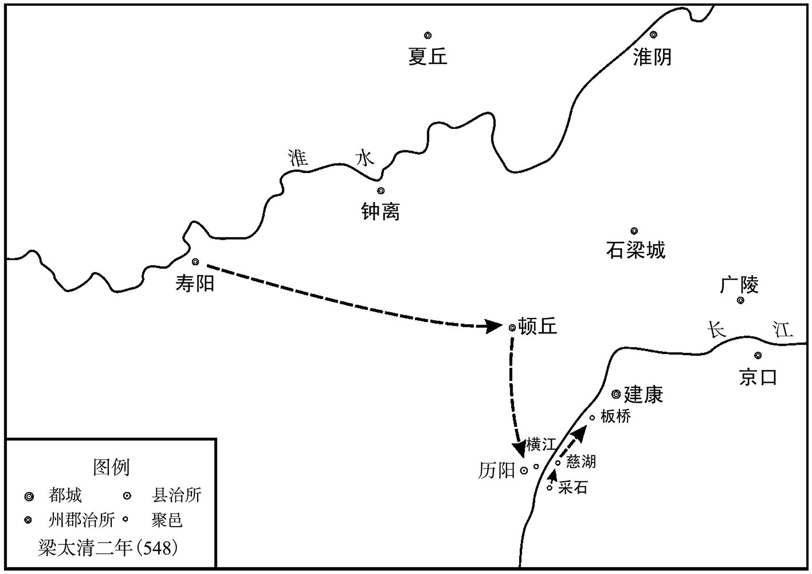 
侯景之乱示意图

公元550年，侯景兴兵攻伐南梁诸藩镇。湘东王萧绎率军讨伐侯景，梁秦州刺史徐文盛大败侯景军。公元551年，梁将王僧辩任大都督，率军据守巴陵（今湖南岳阳）抗击侯景。当时，南方瘟疫流行，侯景军死伤大半，侯景将任约、宋子仙接连败退。侯景被迫逃还建康。

公元551年，侯景废梁简文帝萧纲，立南梁宗室豫章王萧栋为帝。不久，废萧栋，自称帝，改元太始。公元552年，湘东王萧绎令王僧辩、陈霸先率军攻打侯景。王僧辩打败侯景水军将领侯子鉴，进入秦淮河。陈霸先入据石头城西，围攻侯景军。很快，梁军攻入台城。

侯景率余众出逃，欲投奔据守吴郡的谢答仁。王僧辩派兵追击侯景，梁将侯瑱（zhèn）在松江（今江苏苏州南）追上了侯景，大败其军，侯景率几十名亲信乘船入海，欲逃往蒙山（今山东新泰境内），行至胡豆洲（今江苏南通东南），被其帐下之库直都督羊鹍（kūn）斩杀。湘东王萧绎下令解除戒严，至此，为时三年零八个月之久的侯景之乱平定。

侯景之乱，对南梁及南朝社会造成了极大的戕（qiāng）害，改变了南北朝国力的对比，加速了南梁的灭亡以及南北朝的统一。

## 【原文】

**梁武帝中大同元年。东魏司徒、河南大将军、大行台侯景，右足偏短，弓马非其长，而多谋算。诸将高敖曹、彭乐等皆勇冠一时，景常轻之曰：“此属皆如豕突，势何所至[1]！”景尝言于丞相高欢：“愿得兵三万，横行天下，要须济江缚取萧衍老公，以为太平寺主[2]。”欢使将兵十万，专制河南，杖任若己之半体。**

## 【注文】

[1]豕（shì）突：意即像野猪一样奔突乱窜。豕，猪。

[2]缚（fù）：捆绑。　　太平寺：时在邺城（今河南安阳北）境内。

## 【译文】

南梁武帝萧衍中大同元年（546年）。东魏司徒、河南大将军、大行台侯景，右脚歪斜且短一截，射箭骑马不是他的长项，但是足智多谋。各位将领高敖曹、彭乐等都勇猛善战，名冠当时，侯景经常轻视他们，说：“这些人都像乱窜的野猪一样，能有什么出息！”侯景曾经对丞相高欢说：“希望能给我三万兵马，横行天下，必定能渡过长江，把萧衍那老儿绑了来，让你做太平寺的寺主。”高欢让他统领十万兵马，专门管制黄河以南地区，依靠他、信任他，就如同是半个自己。

## 【原文】

**景素轻高澄，尝谓司马子如曰：“高王在，吾不敢有异[1]。王没，吾不能与鲜卑小儿共事[2]。”子如掩其口。及欢疾笃，澄诈为欢书以召景。先是，景与欢约曰：“今握兵在远，人易为诈，所赐书（背）［皆］请加微点。”欢从之。景得书，无点，辞不至。又闻欢疾笃，用其行台郎颍川王伟计，遂拥兵自固[3]。**

## 【注文】

[1]高王：即高欢。

[2]鲜卑小儿：此指高澄。高氏父子虽系汉人，但久居代北（今山西大同及其以北、大漠以南地区），已鲜卑化，所以侯景称其为鲜卑小儿。

[3]疾笃（dǔ）：病重。笃，疾病沉重。　　行台郎：职官名。即行台之属官，职掌同尚书郎。　　王伟（？—552年）：略阳（今陕西略阳）人，父曾为北魏许昌县令，后迁居颍川（今河南禹州）。学识渊博，文辞优美。仕东魏侯景帐下为行台郎，助侯景叛魏、叛梁，侯景失败后，写五百字长诗给南梁元帝萧绎，希望能得到重用。有人将其之前所写的诗句“项羽重瞳，尤有乌江之败；湘东眇目，宁为赤县所归？”呈给梁元帝，意即项羽双目俱全，仍难免乌江之败，湘东王（即梁元帝）只有一只眼，怎能统一天下。被梁元帝所杀。

## 【译文】

侯景平常就看不起高澄，曾经对司马子如说：“高王在，我不敢有贰心。高王如果不在了，我不能和鲜卑小儿一起共事。”司马子如捂住了他的嘴。等高欢病得厉害了，高澄以高欢的口气写了一封信召唤侯景。此前，侯景与高欢有约定：“我如今手握兵权远在外，人们容易使诈，你所赐给我的书信背面请加上小点。”高欢听从了他的意见。侯景得到高澄的来信，看到信背后没有点，就推辞不去。又听说高欢病得厉害，就听了他的行台郎颍川人王伟的计策，拥兵自重。

## 【原文】

**欢谓澄曰：“我虽病，汝面更有余忧，何也？”澄未及对，欢曰：“岂非忧侯景叛邪？”对曰：“然。”欢曰：“景专制河南十四年矣，常有飞扬跋扈之志，顾我能畜养，非汝所能驾御也。今四方未定，勿遽发哀。库狄干鲜卑老公，斛律金敕勒老公，并性遒直，终不负汝[1]。可朱浑道元、刘丰生远来投我，必无异心[2]。潘相乐本作道人，心和厚，汝兄弟当得其力[3]。韩轨少戆，宜宽借之[4]。彭乐心腹难得，宜防护之[5]。堪敌侯景者，唯有慕容绍宗，我故不贵之，留以遗汝[6]。”又曰：“段孝先忠亮仁厚，智勇兼备，亲戚之中，唯有此子，军旅大事，宜共筹之[7]。”又曰：“邙山之战，吾不用陈元康之言，留患遗汝，死不瞑目[8]。”相乐，广宁人也。　**

## 【注文】

[1]鲜卑：中国古代民族名称，是活动在北方的一支游牧民族，属东胡的一支，秦汉时，迫于匈奴威势，退守鲜卑山（今内蒙古科尔沁右翼中旗西部之大罕山），东汉后期形成了以檀石槐为首的部落联盟，后瓦解。其中的慕容鲜卑、拓跋鲜卑、宇文鲜卑在魏晋南北朝时期曾先后建立了前燕、后燕、西燕、南燕、北魏、北周政权。　　敕勒：中国古代民族名称，又名丁零、高车，是魏晋南北朝时期活动在我国北部及西北部的一支游牧民族，包含斛律、袁纥等多个部落，语言及习俗与匈奴相近。5世纪末，柔然衰落，敕勒部落西迁，其首领阿伏至罗建立高车国，历七帝，五十五年。东魏孝静帝元善见兴和三年（541年），被柔然所灭。　　遒（qiú）：强健、有力。

[2]可朱浑道元（？—550年）：姓可朱浑，字道元，名元。辽东（今辽宁沈阳）人，曾祖可朱浑护野肱（gōng）曾为怀朔镇将，因家代北（今山西大同及其以北、大漠以南地区）。魏末，听令于尔朱荣帐下，魏孝武帝元脩朝，任渭州刺史。少即与高欢相知交好，因投奔高欢，颇受重用。北齐文宣帝高洋天保初亡。　　刘丰生：生卒年不详，也称刘丰，原为西魏凉州刺史，灵州普乐郡（今宁夏银川南）人，东魏孝静帝元善见天平三年（536年），降东魏。

[3]潘相乐：生卒年不详，广宁郡（今内蒙古固阳北）人，原为道士，余情不详。　　道人：道士。

[4]戆（gàng）：傻、愣。

[5]彭乐：（？—551年）：字兴，安定（今甘肃泾川）人，骁勇善战。魏末初从杜洛周举兵，后随尔朱荣，尔朱氏败亡，从高欢，入仕东魏、北齐。北齐文宣帝高洋天保二年（551年），谋反，被杀。

[6]慕容绍宗（501—549年）：魏末大将之一，族属慕容鲜卑。官宦出身，前燕太原王慕容恪之后；魏恒州刺史慕容远之子；尔朱荣之表兄弟。少少语，有胆略，魏末丧乱，投奔尔朱荣，后从高欢，随从征讨，屡立战功。西魏文帝元宝炬大统十四年（548年），率军大败叛魏之侯景。次年（549年），在与西魏交战中兵败，投水而亡，年四十九岁。

[7]段孝先：即段韶，字孝先。

[8]邙山之战：即南北朝时期，东、西魏之间的第四次大规模的战役。东魏孝静帝元善见武定元年（543年），东魏将领高仲密叛附西魏，宇文泰派军接应，并欲以此为契机击败东魏，两军在邙山（今河南洛阳北）交战，西魏军大败。

## 【译文】

高欢对高澄说：“我虽然病了，你的脸上却还有其他的忧虑，这是为什么？”高澄还没有来得及回答，高欢说：“难道不是担忧侯景会反叛吗？”高澄回答说：“是的。”高欢说：“侯景专管河南地区已有十四年之久，平常就有飞扬跋扈的志向，只有我能豢（huàn）养他，不是你所能驾驭的。现在四方没有平定，不要立即发丧。库狄干是鲜卑的老前辈，斛律金是敕勒的老前辈，都是秉性耿直的人，终究不会辜负你。可朱浑道元、刘丰生大老远来投奔我，一定不会有异心。潘相乐原本是个道人，心地平和宽厚，你们兄弟会得到他的帮助。韩轨有些憨直，应当宽容待他。彭乐的内心很难揣测，应当提（dī）防他。能够与侯景相匹敌的人，只有慕容绍宗，我之所以不重用他，就是想把他留给你。”又说：“段孝先忠诚坦荡，仁慈厚道，智勇双全，亲戚当中，只有这个人，军国大事，你可以与他共同商量。”又说：“邙山一战，我没有听从陈元康的计策，把后患留给了你，这让我死不瞑目。”潘相乐，是广宁人。

## 【原文】

**太清元年春正月丙午，东魏勃海献武王欢卒。侯景自念己与高氏有隙，内不自安。辛亥，据河南叛归于魏，颍川刺史司马世云以城应之[1]。景诱执豫州刺史高元成、襄州刺史李密、广州刺史怀朔暴显等[2]。遣军士二百人载仗暮入西兖州，欲袭取之，刺史邢子才觉之，掩捕，尽获之，因散檄东方诸州，各为之备，由是景不能取[3]。**

## 【注文】

[1]司马世云：生卒年不详，北齐颍川刺史。

[2]高元成：生卒年不详，北齐豫州刺史。　　李密（？—550年）：东魏北齐将领李元忠族弟，字希邕，平棘（今河北赵县）人，祖、父均曾仕北魏。魏末，尔朱氏专权，曾纠集乡里以武力抗击尔朱荣，后随从高欢，入仕东魏，任襄州刺史十几年，为政有佳绩。武定五年（547年），曾被侯景诱入帐下，侯景败，复归东魏，天保初亡。　　暴显（503—568年）：字思祖，魏郡斥邱（今河北魏县西北）人，祖、父均仕北魏。少随从军旅，善骑射。魏末，从高欢起兵，后入仕东魏、北齐，南征西讨，屡立战功。北齐后主高纬天统四年（568年）亡，年六十六岁。

[3]檄（xí）：即檄文，古代用于调兵、征讨或揭发罪行的文书。

## 【译文】

南梁武帝萧衍太清元年（547年）春季正月丙午（初八日），东魏勃海献武王高欢辞世。侯景自认为与高氏有隔阂，内心不安。辛亥（十三日），侯景占据河南之地背叛东魏投降了西魏，颍川刺史司马世云带领全城军民响应侯景。侯景引诱并抓获了豫州刺史高元成、襄州刺史李密、广州刺史怀朔人暴显等人。派二百军士带着兵器在黄昏时进入了西兖（yǎn）州，想突袭攻取西兖州，西兖州刺史邢子才发觉了他们，突击追捕，将侯景派来的军士全部抓获，顺便向东方的各州散发檄（xí）文，要他们各自做好防备，因此，侯景没能取得胜利。

## 【原文】

**诸将皆以为景之叛由崔暹，澄不得已，欲杀暹以谢景。陈元康谏曰：“今虽四海未清，纲纪已定。若以数将在外，苟悦其心，枉杀无辜，亏废刑典，岂直上负天神，何以下安黎庶？晁错前事，愿公慎之[1]。”澄乃止。遣司空韩轨督诸军讨景。**

## 【注文】

[1]黎庶：百姓。　　晁（cháo）错（前200—前154年）：西汉政治家、文学家，颍川（今河南禹城）人。西汉文帝刘恒时，官至御史大夫，曾多次上书力谏削弱诸侯，加强中央集权。吴、楚七国之乱时，被汉文帝错杀。

## 【译文】

东魏的各位将领都认为侯景的反叛是由崔暹（xiān）引起的，高澄不得已，打算下令斩杀崔暹以向侯景致歉。陈元康进谏说：“现在虽然四方没有平定，但国家纪法已经确定。如果因为几位将领拥兵在外，为了讨得他们欢心，就枉杀无辜之人，破坏国家的法度和典章，这样岂不是有负于上天的神灵，又怎么能够下安天下的百姓？晁错的前车之鉴，希望您慎重考虑这件事。”高澄于是作罢。派司空韩轨率领各路军队讨伐侯景。

## 【原文】

**二月，魏以开府仪同三司若干惠为司空，侯景为太傅、河南大行台、上谷公。庚辰，景又遣其行台郎中丁和来，上表言：“臣与高澄有隙，请举函谷以东，瑕丘以西，豫、广、颍、荆、襄、兖、南兖、济、东豫、洛、阳、北荆、北扬等十三州内附，惟青、徐数州，仅须折简[1]。且黄河以南，皆臣所职，易同反掌。若齐、宋一平，徐事燕、赵[2]。”上召群臣廷议。尚书仆射谢举等皆曰：“顷岁与魏通和，边境无事，今纳其叛臣，窃谓非宜[3]。”上曰：“虽然，得景则塞北可清，机会难得，岂宜胶柱[4]！”**

## 【注文】

[1]函谷：即函谷关，时位于魏司州境内，今河南灵宝东北，处陕西、河南、山西三省交界地带，是中国古代雄关要塞之一。　　豫、广、颍、荆、襄、兖、南兖、济、东豫、洛、阳、北荆、北扬等十三州：即当时侯景所控之东魏黄河以南的十三个州，侯景欲以此为条件，投降南梁。南兖州，治所在陈留郡境内，今安徽亳（bó）州。东豫州，治所在汝南郡境内，今河南息县。北扬州，临近南梁，治所在陈郡境内，今河南沈丘。

[2]齐、宋：分指青州、徐州。　　燕、赵：借指黄河以北之地。

[3]尚书仆射（yè）：职官名，始置于秦汉。古时重视武官，常用善射者掌管国事，所以称为仆射。“仆射者，仆役于射事也。”意思是：所谓仆射，就是以管理军事事务为职责。东汉献帝刘协建安四年（199年），分设左、右仆射，左居其上，右居其下。协助尚书令处理政务。南梁列十五班。　　谢举（？—548年）：字言扬，南梁中书令谢览之弟，官宦高门出身。幼好学，有才干。以秘书郎入仕，累至侍中、尚书仆射、尚书令等要职。南梁武帝萧衍太清二年（548年），侯景攻破建康，亡。

[4]胶柱：也称胶柱鼓瑟，意同刻舟求剑，形容固执己见，不知变通。

## 【译文】

梁武帝太清元年（547年）二月，东魏任命开府仪同三司若干惠为司空，侯景为太傅、河南大行台、上谷公。庚辰（十三日），侯景又派他的行台郎中丁和来，上表说：“臣与高澄有隔阂，请允许我率领函谷关以东、瑕（xiá）丘以西的豫、广、颍、荆、襄、兖、济、东豫、洛、阳、北荆、北扬等十三州来归附，余下的青、徐等几个州，写封信过去就能解决。况且黄河以南地区，都是我管辖的范围，办理起来易如反掌。如果齐、宋一旦平定，就可谋取燕、赵地区了。”梁武帝萧衍召集群臣当庭商议此事。尚书仆射谢举等人都说：“近年来我们与东魏交好，边境地区平安无事，如今如果接纳东魏的叛臣，我们认为不太适当。”梁武帝说：“道理虽然是这样，然而得到了侯景，塞北地区就可以平定了，这样的机会难得，怎么能够胶柱鼓瑟而不知变通呢！”

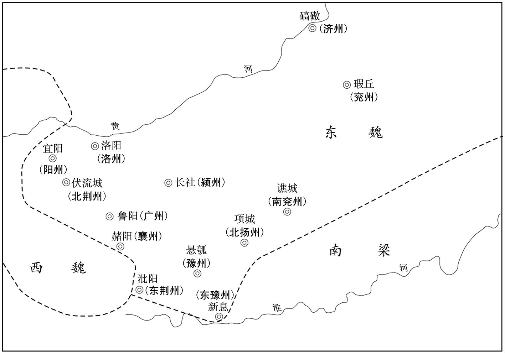 
侯景所控东魏十三州示意图

## 【原文】

**是岁正月乙卯，上梦中原牧守皆以地来降，举朝称庆[1]。旦，见中书舍人朱异，告之，且曰：“吾为人少梦，若有梦必实[2]。”异曰：“此乃宇内混一之兆也。”及丁和至，称景定计以正月乙卯，上愈神之。然意犹未决，尝独言：“我国家如金瓯，无一伤缺，今忽受景地，讵是事宜[3]？脱致纷纭，悔之何及。”朱异揣知上意，对曰：“圣明御宇，南北归仰，正以事无机会，未达其心。今侯景分魏土之半以来，自非天诱其衷，人赞其谋，何以至此？若拒而不纳，恐绝后来之望。此诚易见，愿陛下无疑。”上乃定议纳景。壬午，以景为大将军，封河南王，都督河南北诸军事、大行台，承制如邓禹故事[4]。平西咨议参军周弘正善占候，前此谓人曰：“国家数年后当有兵起[5]。”及闻纳景，曰：“乱阶在此矣。”**

## 【注文】

[1]牧守：即州牧及郡守。州牧，即州一级长官。古代以九州之长为牧，牧，即管理之意。西汉武帝刘彻时将天下分十三州，设十三州刺史，掌监察地方。汉成帝刘骜（áo）时，改名牧，汉哀帝时复为刺史。东汉末，复名州牧，掌一州之军政大权。后世复称刺史。郡守，为地方郡一级长官，始置于秦。原名郡守，属官有郡丞和郡尉。西汉景帝刘启中元二年（前148年），更名为太守。后世沿置。

[2]朱异：（483—549年）：字彦和，出身官宦。少好学，通文史、博弈及书算。南梁后期重臣，历任要职。贪婪奸诈，在一定程度上促成了侯景之乱，加速了南梁的灭亡。

[3]金瓯（ōu）：金盆。借喻疆土的完整坚固。

[4]邓禹（2—58年）：字仲华，南阳新野（今河南新野）人，东汉初年之名将。新莽末，随刘秀起兵，助其建立东汉，消灭诸割据势力，平定天下，完成统一大业，列东汉开国元勋之首。东汉光武帝刘秀建武十三年（37年），因功封高密侯，颇受光武帝重用。东汉明帝刘庄即位，拜太傅，后病亡，年五十七岁。

[5]平西咨议参军：职官名，即平西行台府之属官。　　周弘正（496—574年）：字思行，汝南安城（今河南新蔡西北）人，出身官宦。少孤，由叔父所养，年十岁，通晓《老子》《周易》。曾预测侯景之乱，仕南梁、南陈，南陈宣帝陈顼（xū）太建六年（574年）亡，年七十九岁。　　占候：根据天象变化预测人事之吉凶。

## 【译文】

这一年的正月乙卯（十七日），梁武帝萧衍梦见中原的牧、守们都来献地投降，南梁一朝欢庆鼓舞。天亮后，梁武帝见到了中书舍人朱异，将所梦之事告诉了朱异，并且说：“我这个人平常很少做梦，如果有梦就一定会实现。”朱异说：“这是天下统一的征兆。”等到丁和来，说侯景定下的计划是在正月乙卯（十七日）这天行动，梁武帝更加觉得所梦之神奇灵验。但是仍然拿不定主意，曾经自言自语地说：“我的国家像金瓯（ōu）一样，没有一处伤缺，如今突然之间接受了侯景的地盘，这是该做的事吗？如果因此而导致祸乱，后悔怎么来得及。”朱异揣度、了解了梁武帝的心意，对他说：“陛下您圣明，统御天下，南北都归附仰慕，正是因为事情没有机会，所以心愿一直没能实现。如今侯景分割了东魏的一半江山前来归附，如果不是上天开诱他的心智，人们赞成他的计谋，事情如何能到这种地步？如果我们拒绝他、不接纳他，恐怕会断绝了后来之人的希望。这确实是显而易见的，希望陛下您不要再迟疑。”梁武帝于是决定接纳侯景。壬午（十五日），梁武帝任命侯景为大将军，封他为河南王，都督河南北诸军事、大行台，并授权他可以如同东汉的邓禹一样，以皇帝的名义处理辖区内的事务。平西咨议参军周弘正善于通过占卜预测吉凶，此前曾对人说：“国家几年后会有战乱兴起。”等听到梁武帝接纳了侯景的消息，说：“祸乱的根子就在此了。”

## 【原文】

**三月甲辰，遣司州刺史羊鸦仁督兖州刺史桓和、仁州刺史湛海珍等将兵三万趣悬瓠，运粮食应接侯景[1]。**

## 【注文】

[1]司州：南梁属州，镇义阳（今河南信阳）。领十九郡，所辖约相当于今湖北随州、安陆、孝感、麻城及河南信阳等地区。　　羊鸦仁（？—549年）：字孝穆，太山钜平（今山东泰安南）人。南梁武帝萧衍普通年间，自北魏南归，骁勇善战，屡立战功。太清元年（547年），率军赴悬瓠（hú）迎接侯景，不利。次年（548年），侯景攻破建康，为侯景所留，任五兵尚书。南梁武帝萧衍太清三年（549年），弃侯景奔江陵，半路上被北徐州刺史荀伯道诸子所杀。　　兖州：《梁书》所载为土州，汉时为东郡土山县，南梁名为龙巢，置土州及东永宁、西永宁、真阳三郡。　　桓（huán）和：生卒年不详，南梁武帝萧衍时任土州刺史，余情不详。　　仁州：南梁属州，治赤坎城（今安徽蚌埠东北），领已吾、义城，北齐后置临淮县。　　湛（zhàn）海珍：生卒年不详，原为南齐旧将，曾仕梁任东徐州、仁州刺史，太清元年（547年），与羊鸦仁等同率军赴悬瓠迎接侯景。后情不详。　　悬瓠（hú）：地名，时东魏豫州治所，今河南汝南。

## 【译文】

梁武帝太清元年（547年）三月甲辰（初七日），梁武帝萧衍派司州刺史羊鸦仁率领兖州刺史桓（huán）和、仁州刺史湛（zhàn）海珍等人及三万军士赶赴悬瓠（hú），运输粮食接应侯景。

## 【原文】

**夏五月，高澄遣武卫将军元柱等将数万众昼夜兼行以袭侯景，遇景于颖川北，柱等大败[1]。景以羊鸦仁等军犹未至，乃退保颍川。**

## 【注文】

[1]元柱：生卒年不详，时北齐将领。

## 【译文】

梁武帝太清元年（547年）夏季五月，高澄派武卫将军元柱等人率领几万人昼夜行军，袭击侯景，在颍川北遇上了侯景，元柱等人被打得大败。侯景因为羊鸦仁等人的军队还未赶到，就退兵留守颍川。

## 【原文】

**东魏司徒韩轨等围侯景于颍川。景惧，割东荆、北兖州、鲁阳、长社四城赂魏以求救[1]。尚书左仆射于谨曰：“景少习兵，奸诈难测，不如厚其爵位，以观其变，未可遣兵也。”荆州刺史王思政以为“若不因机进取，后悔无及”。即以荆州步骑万余从鲁阳关向阳翟[2]。丞相泰闻之，加景大将军兼尚书令，遣太尉李弼、仪同三司赵贵将兵一万赴颍川。景恐上责之，遣中兵参军柳昕奉启于上，以为：“王旅未接，死亡交急，遂求援关中，自救目前[3]。臣既不安于高氏，岂见容于宇文，但螫手解腕，事不得已，本图为国，愿不赐咎[4]。臣获其力，不容即弃，今以四州之地，为饵敌之资，已令宇文遣人入守。自豫州以东，齐海以西，悉臣控压，见有之地，尽归圣朝[5]。悬瓠、项城、徐州、南兖，事须迎纳[6]。愿陛下速敕境上，各置重兵，与臣影响，不使差互[7]。”上报之曰：“大夫出境，尚有所专，况始创奇谋，将建大业，理须适事而行，随方以应。卿诚心有本，何假词费[8]。”**

## 【注文】

[1]北兖州：亦称兖州，时东魏属州，治瑕丘（今山东兖州）。

[2]鲁阳关：位东魏广州鲁阳（今河南鲁山）县西南，是洛阳与南阳之间的交通要道，自古是兵家必争之地。

[3]柳昕（xīn）：生卒年不详，侯景手下将领。　　王旅：指梁武帝萧衍所派出的以羊鸦仁为首的南梁援军。

[4]螫（shì）手解腕：古语云：“蝮蛇螫手，壮士解腕”，意思是壮士的手腕被蝮蛇咬伤，立即截断，以免毒液流布全身，危及生命。比喻在危急关头，当机立断。　　咎（jìu）：过错。

[5]控压：控制。

[6]项城：即项县，时魏豫州陈郡治所，今河南沈丘。

[7]影响：即响应。

[8]大（dà）夫：指西周、春秋时期，周王室及各诸侯国之属官。按《春秋》所记，“大夫出疆，专之可也”，意即大夫出境在外，有时可以自行决断。梁武帝以此比拟，意在安抚侯景。

## 【译文】

东魏司徒韩轨等在颍川围攻侯景。侯景害怕了，割让东荆州、北兖州、鲁阳、长社四城之地贿赂西魏以获得援救。西魏尚书左仆射于谨说：“侯景自年少就熟悉军事，内心奸诈难以预测，不如赐给他较高的爵位，以观察他的变化，不可派兵前往。”荆州刺史王思政认为“如果不趁此机会谋求进取，以后后悔就来不及了”。于是率领荆州的一万多步、骑兵，从鲁阳关向阳翟（dí）进发。西魏丞相宇文泰听说此事后，加封侯景为大将军兼中书令，派太尉李弼、仪同三司赵贵率兵一万赶赴颍川。侯景害怕梁武帝因此责备他，派中兵参军柳昕给梁武帝送去一封信，信上说：“大王接应的军队还没到来，我处于生死交接的关头，于是向关中求救，以自救于困境。臣既然不能与高氏安然相处，又怎么能被宇文氏所容纳呢，但是手被毒蛇咬了一口，也只能砍掉手腕，这是万不得已的事情，我的本意是为国效劳，希望陛下不要怪罪于我。臣得到了西魏的帮助，不能马上就背弃他们，现在将四州之地割让给他们，不过是作为引敌上钩的诱饵，已经让宇文泰派人入驻这些地方了。从豫州往东，齐海往西的地区，都是臣所控制的范围，我现有土地，全部都归圣朝所有。悬瓠、项城、徐州、南兖州，正等待王师进驻。希望陛下迅速向边境发布命令，分别派遣重兵，与我呼应，不要让彼此发生误会。”梁武帝回复他说：“大夫离开国境，尚有权自行决断，何况你开创奇谋，将要建立大业，理当根据实际情况而作决断，随机应变。你原本就有诚心，何必要多做解释呢。”

## 【原文】

**六月，东魏韩轨等围颍川，闻魏李弼、赵贵等将至，己巳，引兵还邺。侯景欲因会，执弼与贵，夺其军。贵疑之，不往。贵欲诱景入营而执之，弼止之。羊鸦仁遣长史邓鸿将兵至汝水，弼引兵还长安[1]。王思政入据颍川。景阳称略地，引军出屯悬瓠[2]。**

## 【注文】

[1]邓鸿：生卒年不详，南梁将领。

[2]阳称：假称。

## 【译文】

梁武帝太清元年（547年）六月，东魏将领韩轨等人围攻颍川，听说西魏的李弼、赵贵等人将要到来，己巳（初四日），就率兵回到邺城。侯景想趁此机会，抓住李弼、赵贵，吞并他们的军队。赵贵怀疑侯景心怀不良，不去颍川与侯景相会。赵贵想引诱侯景入营将其抓获，李弼制止了他。羊鸦仁派长史邓鸿率兵到达汝水，李弼领兵返回了长安。王思政率军占据了颍川。侯景假称要攻城略地，带领军队出城屯驻在悬瓠。

## 【原文】

**景复乞兵于魏，丞相泰使同轨防主韦法保及都督贺兰愿德等将兵助之[1]。大行台左丞蓝田王悦言于泰曰：“侯景之于高欢，始敦乡党之情，终定君臣之契，任居上将，位重台司。今欢始死，景遽外叛，盖所图甚大，终不为人下故也。且彼既能背德于高氏，岂肯尽节于朝廷？今益之以势，援之以兵，窃恐朝廷贻笑将来也[2]。”泰乃召景入朝。**

## 【注文】

[1]同轨：即同轨郡，北魏时司州宜阳县（今河南宜阳西），西魏、北周置熊耳县、同轨郡。北周、北齐以宜阳为界，取同轨之郡名，意在将由此出兵，以使天下车同轨，统一东西。　　防主：职官名，始置于南北朝，州郡属官，掌城防，品秩不详。　　韦法保：生卒年不详，京兆（今陕西西安）人，北魏、西魏将领李长寿之婿，余情不详。　　贺兰愿德：生卒年不详，西魏、北周之将领，复姓贺兰。　　台司：即三公。

[2]贻（yí）笑：给别人留下笑柄。

## 【译文】

侯景又向西魏请求救兵，丞相宇文泰派同轨防主韦法保以及都督贺兰愿德等人率兵帮助侯景。大行台左丞蓝田人王悦对宇文泰说：“侯景对于高欢来说，开始是利用同乡情谊套近乎，后来又定下了君臣之盟约，任上将之位，地位比三公还高。如今高欢刚死，侯景就在外反叛，这是因为他的野心太大，终究不愿居于人下的缘故。况且他既然能背弃高氏的恩惠，又怎能为我朝尽忠尽节呢？现在您帮助他扩张声势，派兵去救援他，我担心我朝将来会让后人耻笑的。”宇文泰于是召侯景入朝。

## 【原文】

**景阴谋叛魏，事计未成，厚抚韦法保等，冀为己用，外示亲密无猜间。每往来诸军间，侍从至少，魏军中名将，皆身自造诣[1]。同轨防长史裴宽谓法保曰：“侯景狡诈，必不肯入关，欲托款于公，恐未可信[2]。若伏兵斩之，此亦一时之功也。如其不尔，即应深为之防，不得信其诳诱，自贻后悔。”法保深然之，不敢图景，但自为备而已。寻辞还所镇。王思政亦觉其诈，密召贺兰愿德等还，分布诸军，据景七州、十二镇。景果辞不入朝，遗丞相泰书曰：“吾耻与高澄雁行，安能比肩大弟[3]！”泰乃遣行台郎中赵士宪悉召前后所遣诸军援景者[4]。景遂决意来降。魏将任约以所部千余人降于景[5]。泰以所授景使持节、太傅、大将军兼尚书令、河南大行台、都督河南诸军事回授王思政，思政并让不受，频使敦谕，唯受都督河南诸军事[6]。**

## 【注文】

[1]猜间：猜忌、隔阂。　　造诣：拜访。

[2]防长史：职官名，即州郡防御都督府之长史，掌府事，品秩不详。　　裴宽：生卒年不详，南梁将领。

[3]雁行：大雁飞行时的行（háng）阵，借指兄弟。　　比肩：并肩、并列，意即兄弟。

[4]赵士宪：生卒年不详，北周将领。

[5]任约：生卒年不详，西魏、北周将领，武定五年（547年）降侯景。

[6]使持节：职官名，始置于魏晋，代表皇帝掌地方军事。节，也称旌节，是权力的象征，朝廷命将，以节为信物，等级分为三种：使持节、持节、假节，权限渐弱。

## 【译文】

侯景暗中谋叛西魏，计划还不成熟，就用优厚的待遇安抚韦法保等人，希望他们能为自己所利用，外表上与他们亲密无间。每次往来于各路军队之间，所跟从的侍从很少，西魏军中的名将，他都亲自前去拜访。同轨防长史裴宽对韦法保说：“侯景为人狡诈，一定不肯入关，想在你身上打主意，恐怕不能信他。如果埋伏下军士，将其斩首，这也是一瞬间的功劳啊。如果不这样做，就应当用心提防他，不能信他的谎话骗诱，让自己后悔。”韦法保认为他说得很对，不敢杀侯景，只是自己防备而已。不久就找了个借口，回到自己的镇所去了。王思政也觉得侯景有诈，秘密召集贺兰愿德等人返回，分别部署兵力，占据了侯景的七个州、十二个镇。侯景果然推辞不入西魏，给丞相宇文泰写了封信说：“我对于和高澄为伍感到羞耻，又怎么能与大弟平起平坐呢！”宇文泰派行台郎中赵士宪将前后所派遣各支前去救援侯景的部队全部召回。侯景于是下定决心前去投降南梁。西魏将领任约率领所部一千多人投降了侯景。西魏丞相宇文泰把授给侯景的使持节、太傅、大将军兼尚书令、河南大行台、都督河南诸军事等官职，转授给了王思政，王思政全部推辞不受。宇文泰频频派人敦促开导王思政，王思政只接受了都督河南诸军事这一职务。

## 【原文】

**秋七月庚申，羊鸦仁入悬瓠城。甲子，诏更以悬瓠为豫州，寿春为南豫州，改合肥为合州[1]。以鸦仁为司、豫二州刺史，镇悬瓠；西阳太守羊思达为殷州刺史，镇项城[2]。**

## 【注文】

[1]豫州：始置于汉，南朝宋武帝刘裕时割扬州大江以西置豫州，南朝宋武帝永初二年（421年），分淮水以东置南豫州，淮水以西为豫州，治寿春（今安徽寿县）。大明以后，治悬瓠（今河南汝南）。后悬瓠归了北魏，豫州复治寿阳。南齐东昏侯萧宝卷时期，寿阳归北魏，豫州治历阳（今安徽和县北）。南梁武帝萧衍天监年间，韦睿攻克合肥城（今安徽合肥），作为豫州治所，以历阳为南豫州治所，后又改为寿阳。太清初，南梁得悬瓠，复为豫州治所，以寿阳为南豫州治所。　　寿春：时为南梁南豫州治所，今安徽寿县。　　南豫州：时南梁属州，治寿春（今安徽寿县）。　　合肥：也称合肥城，今安徽合肥。　　合州：时南梁属州，始置于南梁武帝萧衍太清初，治合肥（今安徽合肥）。

[2]西阳：即西阳郡，时南梁郢州属郡，治夏口（今湖北黄石西北）。　　羊思达：生卒年不详，南梁将领。　　殷州：原为东魏之北扬州，时为南梁属州，治项城（今河南沈丘）。

## 【译文】

梁武帝太清元年（547年）秋季七月庚申（二十五日），羊鸦仁进入悬瓠（hú）城。甲子（二十九日），南梁武帝萧衍下诏改悬瓠名为豫州，寿春为南豫州，改合肥为合州。任命羊鸦仁为司、豫二州的刺史，镇守悬瓠；西阳太守羊思达为殷州刺史，镇守项城。

## 【原文】

**八月乙丑，下诏大举伐东魏，遣南豫州刺史贞阳侯渊明、南兖州刺史南康王会理分督诸将[1]。渊明，懿之子；会理，续(1)之子也[2]。始，上欲以鄱阳王范为元帅，朱异取急在外，闻之，遽入曰：“鄱阳雄豪盖世，得人死力，然所至残暴，非吊民之材[3]。且陛下昔登北顾亭以望，谓江右有反气，骨肉为戎首，今日之事，尤宜详择[4]。”上默然，曰：“会理何如？”对曰：“陛下得之矣。”会理懦而无谋，所乘襻舆，施版屋，冠以牛皮。上闻，不悦。贞阳侯渊明时镇寿阳，屡请行，上许之。会理自以皇孙，复为都督，自渊明已下，殆不对接。渊明与诸将密告朱异，追会理还，遂以渊明为都督。**

## 【注文】

[1]贞阳侯渊明：即萧渊明（？—556年），字靖通，南梁长沙宣武王萧懿（yì）之子；梁武帝萧衍之侄。梁武帝太清初，东魏大将侯景许以黄河以南的十三州之地，投降南梁，梁武帝派萧渊明前去接应，被东魏俘虏，并以其为人质交换侯景，梁武帝被迫答应，引发侯景攻梁。南梁敬帝萧方智绍泰元年（555年），北齐联合南将王僧辩拥立萧渊明为帝。后被陈霸先所废，病亡，谥号闵皇帝。　　南康王会理：即萧会理（？—548年），南梁武帝萧衍之孙，南康王萧绩之子。字长才，少好学，通经史。年幼丧父，得祖父钟爱，任要职。太清二年（548年），侯景占领建康，召其入城，封为侍中、司空、中书令。后设计谋反，被杀。

[2]懿：即萧懿（？—500年），南梁武帝萧衍之兄。南齐大将，屡率军北征，历南齐五朝。南齐东昏侯萧宝卷永元二年（500年）初，替朝廷先后平定裴叔业、崔慧景叛乱，官至侍中、尚书仆射，位高权重，颇受奸人忌恨。同年，被东昏侯下令毒死，并追讨其家人、兄弟，其弟梁王萧衍兴兵反齐，终取而代之。　　续：应为“绩”，即萧绩（505—529年），南梁武帝萧衍之第四子，字世谨，南梁武帝萧衍天监八年（509年），封南康郡王，历任要职。南梁武帝萧衍大通三年（529年）病亡，年二十五岁。生性寡欲，行事节俭。

[3]鄱阳王范：即萧范（497—548年），南梁太祖萧顺之之孙，鄱（pó）阳王萧恢之子，南梁武帝萧衍之侄。字世仪，性温和，有见识、气度。太清初，率军北伐，镇守合肥（今安徽合肥）。侯景攻破台城，弃合肥，以二子为人质，求救于东魏，东魏得合肥，并不出兵相救，计无所出，病亡，年五十二岁。　　取急：休假在宫外。　　吊民：安民，抚慰百姓。

[4]北顾亭：地名，位于京口。京口，是两晋南北朝时期长江中下游之军事重镇，两汉时属扬州丹阳郡丹徒县，南梁时是南徐州南兰陵郡治所，今江苏镇江东。

## 【译文】

梁武帝太清元年（547年）八月乙丑（初一日），梁武帝萧衍下诏令大举讨伐东魏，派南豫州刺史贞阳侯萧渊明、南兖州刺史南康王萧会理分别督率各位将领。萧渊明，是萧懿（yì）的儿子；萧会理，是萧绩的儿子。起初，梁武帝想任命鄱阳王萧范为元帅，朱异正在外面休假，听到这消息后，立即还朝说：“鄱阳王的雄风和豪气盖世无双，而且能得到别人的拼死相助，但是为人残暴，不是安民之材。况且陛下往昔曾登上北顾亭眺望，说长江西边有反气，骨肉至亲将会成为罪魁祸首，今日之事，尤其应当详细商议选择。”梁武帝沉默了一会儿说：“会理怎么样？”朱异回答说：“陛下选对人了。”萧会理懦弱而且少谋略，他所乘坐的抬轿，加上木板围栏，外面蒙上牛皮。梁武帝听说后，不高兴。贞阳侯萧渊明当时镇守在寿阳，几次请求出讨，梁武帝答应了他的要求。萧会理依仗自己是皇帝的孙子，又担任了都督，从萧渊明往下的人，他一概不予理睬。萧渊明和各位将领暗中告诉朱异，将萧会理追了回去，于是朝廷任命萧渊明为都督。

## 【原文】

**或告东魏大将军澄，云“侯景有北归之志”，会景将蔡道遵北归，言“景颇知悔过”[1]。景母及妻子皆在邺，澄乃以书谕之，语以阖门无恙。若还，许以豫州刺史终其身，还其宠妻、爱子，所部文武更不追摄。景使王伟复书曰：“今已引二邦，扬旌北讨，熊豹齐奋[2]。克复中原，幸自取之。何劳恩赐？昔王陵附汉，母在不归，太上囚楚，乞羮自若，矧伊妻子，而可介意[3]！脱谓诛之有益，欲止不能，杀之无损，徒复坑戮，家累在君，何关仆也[4]。”戊子，诏以景录行台尚书事[5]。**

## 【注文】

[1]蔡道遵：生卒年不详，时东魏将领、侯景部下。

[2]二邦：指西魏和南梁。

[3]王陵（前？—前180年）：西汉初年名将，沛县（今江苏沛县西）人，秦汉之际，随从汉高祖刘邦起兵，定鼎天下，因功封官拜爵。刘邦与项羽对决，王陵的母亲在项羽营中，为了让王陵安心，伏剑自杀，项羽手下将领将其母烹煮。　　太上：此指刘邦之父，楚汉相争，刘邦之父曾被项羽囚禁，以要挟刘邦，而刘邦却若无其事地向项羽讨要其父的肉羹（gēng）喝。　　矧（shěn）伊：况且、何况。

[4]坑戮（lù）：活埋。

[5]录行台尚书事：职官名，行台（尚书省之派出机构）之属官，其职掌同录尚书事。

## 【译文】

有人报告东魏大将军高澄，说“侯景有返回北朝的想法”，正值侯景的将领蔡道遵回到了东魏，说“侯景很后悔”。侯景及他的妻子都在邺城，高澄于是写信告诉侯景，说他全家都安全。如果还朝，将让他终身担任豫州刺史一职，归还他的宠妻、爱子，他所统领的文武官员也不再追究。侯景派王伟回信说：“现在我已引领南梁和西魏二国，扬旗北伐，将士们如同熊豹，奋勇前进。攻克收复中原，我希望自己来取得，怎么能劳烦您来恩赐呢？往日王陵归附汉朝后，老母在家，他也不能返回；刘邦的父亲被项羽囚禁了，刘邦却若无其事地向项羽讨要他父亲的肉汤喝。父母尚且如此，何况妻、子呢，会介意吗！如果您认为杀掉我的母亲、妻、子对您有利的话，我想制止也是不能的，如果杀他们没什么好处，那么您杀了他们也没用，我的家人在您的手中，和我有什么关系。”太清元年（547年）八月戊子（二十四日），梁武帝萧衍下诏任用侯景为录行台尚书事。

## 【原文】

**九月，上命萧渊明堰泗水于寒山以灌彭城，俟得彭城，乃进军与侯景掎角[1]。癸卯，渊明军于寒山，去彭城十八里，断流立堰。侍中羊侃监作堰，再旬而成[2]。东魏徐州刺史太原王则婴城固守，侃劝渊明乘水攻彭城，不从[3]。诸将与渊明议军事，渊明不能对，但云“临时制宜”。**

## 【注文】

[1]堰（yàn）：堵塞。　　泗（sì）水：古水名，发源于沂蒙山，经鲁西南平原流入江苏，是淮河下游之主要支流，时流经东魏徐州彭城郡。　　寒山：古山名，时在徐州彭城郡境内。　　掎（jǐ）角：也作犄角，古时捕鹿，一方执角，一方拉腿。后用以比喻作战时分出一小部分兵力，夹击或牵制敌人。

[2]羊侃（kǎn）（494—548年）：北魏后期将领羊祉（zhǐ）之子，羊深之第七弟。字祖忻，性格粗犷、勇武。北魏孝明帝元诩（xǔ）孝昌末，任太山郡太守。时尔朱荣专权，杀害朝臣，于是率众投奔萧衍，任徐州刺史，封高昌县侯，军事才能卓著，为梁末名将之一。太清二年（548年）亡，年五十四岁。　

[3]王则（529—576年）：字元轨，太原（今山西太原）人。骁勇善战，魏末，以军功入仕，后随从高欢，屡立战功。东魏、北齐二朝，历任荆州、洛州、徐州刺史，北齐后主高纬武平七年（576年）亡，时年四十八岁。

## 【译文】

梁武帝太清元年（547年）九月，梁武帝萧衍命令萧渊明在寒山筑堰，阻挡泗水以灌彭城，等得到彭城后，再进军与侯景形成掎角之势。癸卯（初九日），萧渊明屯军于寒山，离彭城十八里，截断泗水修筑堰坝。侍中羊侃监修堰坝，二十天后修成。东魏徐州刺史太原人王则环城坚守，羊侃劝萧渊明乘水势攻打彭城，萧渊明不听。各位将领与萧渊明商议军事，萧渊明不能对答，只说“到时临时决定”。

## 【原文】

**冬十一月，东魏大将军澄使大都督高岳救彭城，欲以金门郡公潘乐为副[1]。陈元康曰：“乐缓于机变，不如慕容绍宗，且先王之命也。公但推赤心于斯人，景不足忧也。”时绍宗在外，澄欲召见之，恐其惊叛。元康曰：“绍宗知元康特蒙顾待，新使人来饷金；元康欲安其意，受之而厚答其书，保无异也。”乙酉(2)，以绍宗为东南道行台，与岳、乐偕行。初，景闻韩轨来，曰：“啖猪肠儿何能为[2]？”闻高岳来，曰：“兵精人凡。”诸将无不为所轻者。及闻绍宗来，叩鞍有惧色，曰：“谁教鲜卑儿解遣绍宗来！若然，高王定未死耶？”**

## 【注文】

[1]高岳：（512—555年）：高欢之堂弟，魏末，从高欢起兵，后入仕东魏、北齐。北齐文宣帝高洋天保六年（555年），因高归彦陷害而亡，年四十四岁。　　彭城：地名，时东魏徐州彭城郡治所，今江苏徐州。　　金门郡：郡名，时东魏阳州属郡，治所在今河南洛宁东南。

[2]啖（dàn）：吃。

## 【译文】

梁武帝太清元年（547年）冬季十一月，东魏大将军高澄派大都督高岳救援彭城，想让金门郡公潘乐作为副手。陈元康说：“潘乐不太灵活，在随机应变上不如慕容绍宗，而且让慕容绍宗去对付侯景也是先王的意思。您只要以诚心对待这个人，侯景是不足为虑的。”当时慕容绍宗在外，高澄想召见他，害怕他因惊恐而叛变。陈元康说：“慕容绍宗知道陈元康蒙受朝廷的看重和优待，刚让人送来馈赠的黄金；我想安抚他的心意，收下了礼物并且回信深致谢意，我担保他不会有异心。”乙酉，高澄任命慕容绍宗为东南道行台，和高岳、潘乐一起去救援彭城。当初，侯景听说韩轨要来，说：“只会啃猪肠儿的小儿能有什么作为？”听说高岳来，说：“部队倒是精锐，将领的才能一般。”东魏的各位将领没有不被他轻视的。等到听说慕容绍宗要来，禁不住叩打马鞍，脸上呈现出害怕的表情，说：“谁教鲜卑小儿派慕容绍宗来的！如果真是这样，高王一定还没有死呢？”

## 【原文】

**澄以廷尉卿杜弼为军司，摄行台左丞，临发，问以政事之要，可为戒者，使录一二条[1]。弼请口陈之，曰：“天下大务，莫过赏罚。赏一人使天下之人喜，罚一人使天下之人惧，茍二事不失，自然尽美。”澄大悦，曰：“言虽不多，于理甚要。”**

## 【注文】

[1]廷尉卿：职官名，始置于秦，掌刑狱、律令。凡重大案件，要在朝廷共同议定，所以名廷尉。南北朝沿置，其属官有廷尉正、廷尉监、廷尉评等。北齐后更为大理寺卿，列第三品。　　摄：代理。

## 【译文】

高澄任命廷尉卿杜弼为军司，代理行台左丞，将要出发时，高澄向他询问政事的要点，将其中需要引以为戒的，让他写了一二条。杜弼请求口述这些条款，说：“天下的大事，没有比赏罚更重要的了。赏一个人可以让天下的人心喜，罚一个人可以使天下的人害怕，如果赏罚分明，自然就尽善尽美了。”高澄十分高兴，说：“你的言语虽然不多，但很在理。”

## 【原文】

**绍宗帅众十万据槖驼岘，羊侃劝贞阳侯渊明乘其远来击之，不从[1]。旦日，又劝出战，亦不从。侃乃帅所领出屯堰上。**

## 【注文】

[1]槖（tuó）驼岘（xiàn）：山名，时位于东魏徐州（今江苏徐州）境内。

## 【译文】

慕容绍宗率领十万大军占据橐驼岘，羊侃劝贞阳侯萧渊明趁东魏军远道而来还未安顿下来攻击他们，萧渊明不听。第二天，羊侃又劝他出战，萧渊明仍然没有听从。羊侃于是率领手下人出城屯兵于堰上。

## 【原文】

**丙午，绍宗至城下，引步骑万人攻潼州刺史郭凤营，矢下如雨[1]。渊明醉不能起，命诸将救之，皆不敢出。北兖州刺史胡贵孙谓谯州刺史赵伯超曰：“吾属将兵而来，本欲何为，今遇敌而不战乎[2]？”伯超不能对。贵孙独帅麾下与东魏战，斩首二百级。伯超拥众数千不敢救，谓其下曰：“虏盛如此，与战必败。不如全军早归，可以免罪。”皆曰：“善。”遂遁还。**

## 【注文】

[1]潼州：南梁属州，始置于南梁，治取虑城（今江苏徐州之东南），领淮阳、谷阳、睢（suī）阳、南济阴、临潼五郡。武定七年（549年），改为睢州。　　郭凤：生卒年不详，时南梁将领。

[2]北兖（yǎn）州：南梁属州，治所在今江苏清江西南。　　胡贵孙：生卒年不详，时南梁将领。　　谯（qiáo）州：时南梁属州，景明中，北魏置谯郡，治涡阳城（今安徽蒙城），领南谯、汴（biàn）、龙亢、蕲（qí）城、下蔡、临涣、蒙城等县，北魏孝明帝元诩孝昌中陷落。东魏改称谯州。　　赵伯超：生卒年不详，南梁将领。

## 【译文】

梁武帝太清元年（547年）十一月丙午（十三日），慕容绍宗到达城下，率领一万步、骑兵进攻潼州刺史郭凤的营帐，箭如雨下。萧渊明醉得不能起床，命令各位将领前去救援郭凤，大家都不敢出去。北兖州刺史胡贵孙对谯州刺史赵伯超说：“我们这些人率兵前来，本来想干点什么，现在遇到了敌人，却不出战了吗？”赵伯超等人答不上话来。胡贵孙独自一人率领部下与东魏军作战，斩杀东魏兵二百多人。赵伯超拥有几千兵马，不敢出兵营救，对他的部下说：“敌人的军队如此强大，与他们作战必定会失败。不如率领全军早点还朝，还可以免去罪过。”大家都说：“好。”于是退兵返回。

## 【原文】

**初，侯景尝戒梁人曰：“逐北勿过二里[1]。”绍宗将战，以梁人轻悍，恐其众不能支，一一引将卒谓之曰：“我当阳退，误吴儿使前，尔击其背[2]。”东魏兵实败走，梁人不用景言，乘胜深入。魏将卒以绍宗之言为信，争共掩击之，梁兵大败，贞阳侯渊明及胡贵孙、赵伯超等皆为东魏所虏，失亡士卒数万人。羊侃结陈徐还[3]。**

## 【注文】

[1]北：北人，即东魏军队。

[2]吴儿：指南梁军队。

[3]陈：同“阵”。

## 【译文】

当初，侯景常常告诫南梁人说：“追逐北方的军队不要超过二里。”慕容绍宗将要出战，认为南梁的军队轻捷勇猛，担心自己的军队不能支撑，把将士一个一个叫过来对他们说：“我假装败退，误导吴兵使他们向前进军，你们从背后攻击他们。”东魏兵果真开始败退，南梁人不听侯景的劝告，乘胜深入。东魏将领最后都相信了慕容绍宗的话，争相突袭敌人，南梁军队大败，贞阳侯萧渊明及胡贵孙、赵伯超等人都被东魏所俘虏，跑散及死亡的士卒有几万人。羊侃列阵，慢慢地还军。

## 【原文】

**上方昼寝，宦者张僧胤白朱异启事，上骇之，遽起升舆，至文德殿阁[1]。异曰：“韩山失律[2]。”上闻之，恍然将坠床，僧胤扶而就坐，乃叹曰：“吾得无复为晋家乎[3]！”**

## 【注文】

[1]升舆（yú）：即登车。舆，车。　　文德殿：建康宫之前殿。

[2]韩山：即寒山。

[3]晋家：指西晋，朝代名（266—316年），共历五十一年，曹魏元帝曹奂咸熙二年（265年）十二月，司马炎代魏，建立西晋，定都洛阳。西晋武帝司马炎太康元年（280年），西晋灭吴，统一全国。西晋愍（mǐn）帝司马邺建兴四年（316年），“五胡乱华”，西晋灭亡。梁武帝萧衍此言，是害怕南梁会步西晋之后尘，被侯景所灭。

## 【译文】

梁武帝萧衍正在午睡，宦官张僧胤（yìn）禀告说朱异有事要报告，梁武帝听说后大惊，赶忙起身，坐上车，来到文德殿阁。朱异说：“韩山的军队没完成任务。”梁武帝听到此信，惊恐地差点从床上掉下来，张僧胤扶着他坐下来，梁武帝于是叹息说：“我南梁该不会成为另一个晋朝吧！”

## 【原文】

**郭凤退保潼州，慕容绍宗进围之。十二月甲子朔，凤弃城走。**

## 【译文】

郭凤退军保守潼州，慕容绍宗进军包围了他。太清元年（547年）十二月甲子朔（初一日），郭凤弃城而逃。

## 【原文】

**东魏使军司杜弼作檄移梁朝曰：“皇家垂统，光配彼天，唯彼吴越，独阻声教。元首怀止戈之心，上宰薄兵车之命，遂解絷南冠，喻以好睦[1]。虽嘉谋长算，爰自我始，罢战息民，彼获其利。侯景竖子，自生猜贰，远托关、陇，依凭奸伪，逆主定君臣之分，伪相结兄弟之亲，岂曰无恩，终成难养，俄而易虑，亲寻干戈[2]。衅暴恶盈，侧首无托，以金陵逋逃之薮，江南流寓之地，甘辞卑礼，进孰图身，诡言浮说，抑可知矣[3]。而伪朝大小，幸灾忘义，主荒于上，臣蔽于下，连结奸恶，断绝邻好，征兵保境，纵盗侵国。盖物无定方，事无定势，或乘利而受害，或因得而更失。是以吴侵齐境，遂得句践之师，赵纳韩地，终有长平之役[4]。矧乃鞭挞疲民，侵轶徐部，筑垒拥川，舍舟徼利。是以援枹秉麾之将，拔拒投石之士，含怒作色，如赴私仇[5]。彼连营拥众，依山傍水，举螳蜋之斧，被蛣蜣之甲，当穷辙以待轮，坐积薪而候燎[6]。及锋刃暂交，埃尘且接，已亡戟弃戈，土崩瓦解，掬指舟中，衿甲鼓下，同宗异姓，缧绁相望[7]。曲直既殊，强弱不等，获一人而失一国，见黄雀而忘深阱，智者所不为，仁者所不向。诚既往之难逮，犹将来之可追。侯景以鄙俚之夫，遭风云之会，位班三事，邑启万家，揣身量分，久当止足[8]。而周章向背，离披不已，夫岂徒然，意亦可见[9]。彼乃授之以利器，诲之以慢藏，使其势得容奸，时堪乘便[10]。今见南风不竞，天亡有征，老贼奸谋，将复作矣[11]。然推坚强者难为功，摧枯朽者易为力，计其虽非孙、吴猛将，燕、赵精兵，犹是久涉行陈，曾习军旅，岂同剽轻之师，不比危脆之众[12]。拒此则作气不足，攻彼则为势有余，终恐尾大于身，踵粗于股，倔强不掉，狼戾难驯，呼之则反速而衅小，不征则叛迟而祸大[13]。会应遥望廷尉，不肯为臣，自据淮南，亦欲称帝[14]。但恐楚国亡猨，祸延林木，城门失火，殃及池鱼，横使江、淮士子，荆、扬人物，死亡矢石之下，夭折雾露之中[15]。彼梁主操行无闻，轻险有素，射雀论功，荡舟称力，年既老矣，耄又及之，政散民流，礼崩乐坏[16]。加以用舍乖方，废立失所，矫情动俗，饰智惊愚，毒螫满怀，妄敦戒业，躁竞盈胸，谬治清净[17]。灾异降于上，怨兴于下，人人厌苦，家家思乱，履霜有渐，坚冰且至[18]。传险躁之风俗，任轻薄之子孙，朋党路开，兵权在外。必将祸生骨肉，衅起腹心，强弩冲城，长戈指阙。徒探雀，无救府藏之虚；空请熊蹯，讵延晷刻之命[19]。外崩中溃，今实其时，鹬蚌相持，我乘其弊[20]。方使骏骑追风，精甲辉日，四七并列，百万为群，以转石之形，为破竹之势[21]。当使钟山渡江，青盖入洛，荆棘生于建业之宫，麋鹿游于姑苏之馆[22]。但恐革车之所(3)轹，剑骑之所蹂践，杞梓于焉倾折，竹箭以此摧残[23]。若吴之王孙，蜀之公子，归款军门，委命下吏，当即授客卿之秩，特加骠骑之号[24]。凡百君子，勉求多福。”其后梁室祸败，皆如弼言。**

## 【注文】

[1]元首：此指东魏皇帝元善见。　　上宰：指高欢。　　解絷（zhí）南冠：絷，用绳子捆拴；拘禁。“解絷南冠”讲的是《左传》所载的一个故事：楚共王七年（前584年），楚国攻打郑国，楚国战败，郧公钟仪被俘并被郑国送往晋国。楚共王九年（前582年），晋景公视察军府，问道：“那个被囚禁的、戴着南方式样帽子的人是谁？”手下答道：“是郑国送来的楚国的囚犯。”晋景公下令将其释放，以促进晋、楚之好。钟仪回到楚，转达了晋国的意愿，晋、楚重修旧好。杜弼用此典，意在表达东魏与南梁修好之意。　

[2]竖子：小子，古时对人的蔑称。

[3]金陵：地名，南梁都城建康（今江苏南京）的别称。　　薮（sǒu）：人或物聚集的地方。　　寓（yù）：寄居。

[4]吴侵齐境，遂得句践之师：鲁哀公十一年（前484年），吴国联合鲁国攻伐齐国，在艾陵（今山东莱芜东北），大败齐国军队，而越国之句践趁机兴兵伐吴，抓获了吴国的太子，最后灭了吴国。吴，即吴国，春秋后期居于长江下游的一个古国，其地在今江苏南部。前473年，被越国所灭。齐，即春秋战国时期的齐国，位于今山东北部，是战国七雄之一，前221年，被秦所灭。句践（前520—前465年）：春秋末期越国国君，传说是大禹的后代，西周时，其先祖被封在会稽（今浙江绍兴）守宗庙，于公元前6世纪初建立越国。周敬王二十四年（前496年）即位，周敬王二十六年（前494年）大举伐吴，兵败，臣属于吴国。之后卧薪尝胆、励精图治，使越国由弱变强，于周元王三年（前473年）灭吴。周贞定王四年（前465年）卒。　　赵纳韩地，终有长平之役：意即赵国接纳了韩国的土地，最终招致长平之战。战国末，秦国欲吞并诸国。周赧（nǎn）王五十三年（前262年），秦国出兵攻打韩国，切断了韩国上党郡和都城（今河南新郑）的联系，韩国请求赵国发兵攻取上党，赵派兵出战，引发秦赵长平之战。赵，即战国七雄之赵国，周威烈王二十三年（前403年），晋国的新兴势力韩、赵、魏三家分晋，赵国立国，其地包括今山西中部、河北南部及陕西东北部部分地区。秦始皇二十五年（前222年），秦灭赵国。韩，即战国七雄之韩国，周威烈王二十三年（前403年）立国，其地包括今山西南部及河南北部地区。秦始皇十七年（前230年）亡。　　长平之役：战国末期，秦、赵之间的一次大战，周赧王五十三年（前262年），秦国出兵攻打韩国，占领了野王城（今河南沁阳），切断了韩国上党郡和都城（今河南新郑）的联系，韩国请求赵国发兵攻取上党，赵派大将廉颇率兵出战，赵军驻扎在长平（今山西高平西北），坚守不出，以逸待劳，相持三年，不分胜负。周赧王五十五年（前260年），赵孝成王中了秦国的反间计，任用只会纸上谈兵的赵括取代廉颇，率军进攻秦军，终被秦军大败，极大地削弱了赵国的国力，加速了秦国的统一进程。

[5]援枹（fú）秉麾之将，拔拒投石之士：指击鼓挥旗的将领和拔寨投石的士兵。援枹，即手持鼓槌（chuí）；枹，鼓槌。秉，持有；麾，古代用以指挥军队的旗子。拔拒，亦作拔距，指能将相连而坐的人拔起；投石，用石向人投掷。拔拒投石之士，即勇武的军士。

[6]举螳蜋（láng）之斧，被蛣（jiē）蜣（qiāng）之甲：指举着螳螂前臂一样的斧头，披着蜣螂虫一样的盔甲。用以比喻南梁军队之羸弱。

[7]掬（jū）指舟中：指被砍掉散落在战船里的军士的手指多得可以捧起来，形容战况之惨烈。典出《左传》，春秋中期，晋、楚相争，周定王十年（前597年），晋国和楚国在邲（bì）（今河南荥阳东北）交战，晋军溃不成军，晋宰相荀林父下令，先渡河者有赏，中军和下军争相抢渡，先上船的人为自保，砍断了攀船者的手指，致使船中断指可掬。　　衿（jīn）甲鼓下：指将士甲衣未解，被绑缚在战鼓之下。典出《左传》，齐灵公二十七年（前555年），晋国联合各诸侯国攻打齐国，齐军本由夙沙卫断后，因为夙沙卫是寺人（宦官），齐将殖绰和郭最认为由寺人殿后是齐军的耻辱，于是让夙沙卫先行，二人殿后。夙沙卫怀恨在心，杀死战马，阻塞道路，殖绰、郭最不能快速行军，被晋将州绰追上，将其军士俘虏，绑在战鼓之下。　　缧绁（léi xié）：指捆绑犯人的黑色绳索。

[8]鄙俚之夫：粗野、庸俗的乡野之人。　　位班三事，邑启万家：即位列三卿，食邑万家。三卿，也称三公，是古代最为尊显的官职。食邑，即享受所属地区百姓的租税。

[9]周章：周折。

[10]利器：兵权。　　慢藏：疏于治理或保管。

[11]南风不竞：喻指南朝的气势逐渐衰弱。

[12]孙、吴猛将：即孙子、吴起那样的猛将。孙子（前535—前470年），即孙武，字长卿，乐安（今山东惠民）人，春秋末期的军事家、哲学家。著有《孙子兵法》，被视为春秋战国时期兵家之代表人物。吴起（前440—前381年），卫国左氏（今山东定陶）人，战国初期军事家、政治家。一生历仕鲁、魏、楚三国，仕楚时曾主持改革，史称“吴起变法”。著有军事著作《吴子》，在中国古军事典籍中具有重要地位。　　燕、赵：指战国七雄之燕国和赵国。燕国，姬姓，其地包括今山西东北部、河北北部及辽宁西部等地。秦始皇二十五年（前222年），亡于秦。

[13]踵（zhǒng）粗于股：脚比腿粗。踵，脚后跟或脚；股，大腿或腿。　　狼戾（lì）：凶残、暴烈。戾，凶暴、猛烈。

[14]遥望廷尉：典出东晋成帝司马衍时期的苏峻之乱。苏峻（？—329年），字子高，长广掖县（今山东掖县）人。东晋成帝时，外戚庾（yǔ）亮专权，为增强中央集权的力量，征调不太遵守中央命令的苏峻入朝任大司农，以便加强对地方的控制。苏峻不甘受制于人，于东晋成帝司马衍咸和二年（327年）起兵反晋，攻入建康。咸和四年（329年），被庾亮击败。

[15]楚国亡猨，祸延林木，城门失火，殃及池鱼：喻指不慎的行为，殃及无辜。猨，指猿猴。池鱼，一种说法是人名，名为池中鱼，城门失火，池中鱼被烧死了。另一种说法：城门失火，人取城下池中之水救火，池因之干涸，鱼遂受其殃。

[16]射雀论功：典出《左传》，晋国之晋平公杀竖襄。晋平公有一次射杀鹌鹑，没有射死，派竖襄去捕捉，没捉到。晋平公因此大怒，欲杀竖襄。后因叔向的劝谏，竖襄免于一死。　　荡舟称力：典出《左传》，春秋后期，齐桓公与蔡姬在湖中泛舟，蔡姬晃动船只，船猛烈摇动起来，齐桓公受到了惊吓，将蔡姬退回蔡国。　　耄（mào）：古人称八九十岁为耄，也称耄耋（dié）。

[17]用舍乖方：任用官员背离原则。乖方，指有违规则、法度。

[18]怨（dú）：怨恨。

[19]探：典出《左传》，周赧王二十年（前295年），赵武灵王暂住沙丘宫。公子章谋反，李兑等率军救驾，包围了沙丘宫，赵武灵王靠捉雏鸟吃维生，三个月后，饿死宫中。　　请熊蹯（fán）：典出《左传》，楚成王四十六年（前626年），楚成王想废掉太子商臣，商臣与其师潘崇设计围攻楚成王，楚成王请求食用熊蹯（熊掌），以拖延时间，等待外援，商臣不许，楚成王被迫自杀。蹯，兽的掌。

[20]鹬（yù）蚌（bàng）相持：即鹬蚌相争，喻指对立的人或物。鹬，一种生活在水中的爱吃小鱼的鸟；蚌，生活在淡水中的贝类。

[21]四七并列：指杰出将领并列。东汉光武帝刘秀以二十八位将领定鼎天下，后人赞之曰：“授钺四七”。授钺（yuè），古代将领出征，皇帝授之以斧钺，意即授之以兵权。

[22]钟山渡江：钟山，位于建康（今江苏南京）东郊，此指代建康。钟山渡江，意即推翻南梁的统治。　　青盖入洛：典出三国时期吴国末帝孙皓。西晋武帝司马炎泰始八年（272年），吴帝孙皓命巫师占卜，得曰：“吉，庚子岁，青盖入洛。”孙皓为自己将入主洛阳而大喜。继续沉湎于酒色，不问政事。西晋武帝司马炎太康元年（280年），被西晋所灭。青盖，两汉时皇太子所乘之车为青色车盖，后借指皇帝。

[23]（lìn）轹（lì）：即轥轹。原意为车轮碾过，引申为践踏。　　杞（qǐ）梓（zǐ）：原指产于江南的两种木材，后借指优秀人才。　　竹箭：细竹，产于江南，此借指江南美景。

[24]吴之王孙，蜀之公子：即东吴王孙、西蜀公子，语出西晋左思之《三都赋》。左思（250—305年），西晋文学家。字太冲，临淄（今山东淄博）人。著有《三都赋》，即《吴都赋》《魏都赋》和《蜀都赋》，分别记述吴、魏、蜀三国之概况。当时在京城洛阳广为流传，人们竞相传抄，致使洛阳的纸贵了几倍。后世以洛阳纸贵，喻作品之风行、流传。

## 【译文】

东魏派军司杜弼写檄（xí）文交于梁朝说：“皇帝延续国统，光配上天，只有你们吴越，独独阻隔我朝之声威教化。圣上有心停止干戈，丞相不愿意轻易下达出征的命令，于是将南朝的俘虏放归南朝，以此表示友好和睦之意。虽然好的计谋和打算，始自我朝，但是停止战争、安抚百姓，你们也能获得利益。侯景这个小人，自己心怀猜疑及贰心，远远地托靠关陇，依托奸佞（nìng）伪臣，背叛皇上定下的君臣名分，假结兄弟之亲，关中难道与他没有恩德吗，但终究成为难养之小人，很快就改变了想法，亲自挑起战争。侯景习于挑衅（xìn），生性残暴，恶贯满盈，歪着头找不到栖（qī）身之所，认为金陵是逃避追捕的处所，江南是流浪寄居的地方，所以甘心卑辞厚礼，是想找到一个安身立命的地方，他欺诈的语言、虚夸的说辞，其目的是显而易见的。而西魏伪朝的大小官员们，幸灾乐祸，忘恩负义，主子在上面荒淫无道，臣子在下面隐瞒真相，勾结联络奸恶小人，断绝友好睦邻关系，征调兵马保护边境，放纵盗寇侵略我国。世间万物没有确定之规，万事没有确定的趋势，有时会因利而受害，有时会因为得到而失去更多。因此吴国入侵齐境，于是招来了越王句践的军队，赵国接纳了韩国的土地，最终招致了长平之战。更何况你们驱使疲惫之民，入侵我徐州之地，修筑营垒，拦截河流，舍弃舟船而侥幸取胜。因此，我国击鼓挥旗的将领，拔寨投石的军士，作战时都面含怒色，如同是为自己报仇。你们连营合众，依山傍水，举着像螳螂之臂一样的斧头，披着蜣螂虫一样的甲衣，处于穷途末路，等待车轮来碾压，坐在堆积的柴火上等待大火来焚烧。等到两军刚刚交战，烟尘才起，你们就已经丢戟（jǐ）弃甲，土崩瓦解了，将士们争相上船逃命，被砍掉的手指多得可以捧起来，将士们甲衣未解而被绑缚在战鼓之下，同宗异姓的人们，一个挨着一个被捆绑起来。是非不明，强弱不等，获得了一个人而失去一个国家，看见了黄雀而忘记了深坑，有智慧的人不会做这样的事，有仁心的人不会赞同这样的事。诚然，过去的事无法挽回了，将来的事仍然可以打算。侯景，一个乡野村夫，得到了机会，位至三卿，食邑万户，看看自己的身价和分量，早就应当知足了。然而他四处钻营，反复无常，不断地变来变去，不但是徒劳无功，其本意也昭然若揭。你们授予他兵权，疏于教诲，使他得势能够施行奸计，趁机实现自己的野心。如今看到南朝的势力渐弱，老天有灭亡南朝的迹象，侯景这个老贼老奸巨猾，将要兴风作浪。然而推倒坚强的东西是难以成功的，而摧毁枯朽的东西非常容易，想他虽然不是孙子、吴起那样的猛将，没有燕国、赵国那样的精兵，但仍然是久经沙场之人，曾经熟悉军旅事宜，他的军队不能与剽悍轻捷的雄师相比，却也不是脆弱之师。他凭此与我朝抗衡，力量不足，但攻打你们则势力有余，最终恐怕他会尾大于身，脚后跟粗过大腿，倔强不听调遣，凶狠难于驯服，如果召他还朝，他会立即反叛，但是只能引起小的祸端，不召还他，他会推迟叛乱，但祸患更大。他一定会远远地对抗朝廷，不肯臣服，据守淮南，也想自称为帝。但恐怕会有楚国亡猿而祸及林木、城门失火而殃及池鱼的灾祸发生，凭空让江淮士子，荆、扬的人物死在乱箭飞石之下，早亡在迷雾湿露当中。你们梁朝的君主，没有什么值得称道的德行，一向轻薄阴险，如同晋平公因一只（yàn）鸟而要杀掉竖襄，齐桓公因蔡姬在船上使劲摇晃就要休掉她那样，来显示自己的权威，专门在小事上斤斤计较。他已年老，头脑糊涂，致使政务混乱，民众流失，礼乐崩坏。再加上任免官员背离原则，废立太子丧失准绳，矫情行事煽动俗人，弄巧行诈惊服愚人，满怀恨毒之心却假意奉迎佛祖，权欲盈胸，却假称清静。灾祸自上而降，怨愤兴发于下，人人厌苦，家家思乱，霜雪踩踏久了，就会形成坚冰。任凭险恶狡诈的风俗流行，任用言行轻薄的子孙，使朋党之风开启，兵权在外。必定会致使祸患生于骨肉之间，事端发于亲信之间，强弩射向都城，长戈指向宫阙。到时候就是像赵武灵王那样去抓雏鸟来吃，也无法补救府藏的空虚；就是像楚成王那样为了拖延时间等候外援，而请求吃了熊掌再死，也不能使生命延长片刻。现在正是你们内外崩溃，鹬蚌相争，我们趁机得利的时候。我们将让骏马追风，精甲耀日，杰出将领并列，百万大军集结，以形成高山滚石，势如破竹之势。我们将让钟山北渡长江，让梁主被抓入洛阳，让建业城的宫殿里长满荆棘，让麋鹿在姑苏城的馆舍中游荡。只担心战车碾压，铁骑践踏，以致优秀人才被毁灭，美景被摧残。如果你们能像东吴子孙和西蜀公子那样，前来军门投降，向我们归顺，我们当即会授予你们客卿之职，加骠（piào）骑将军的名号。各位君子，希望你们自求多福。”此后梁王室的祸乱和败亡，都如杜弼所言。

## 【原文】

**侯景围谯城不下，退攻城父，拔之[1]。壬申，遣其行台左丞王伟等诣建康说上曰：“邺中文武合谋，召臣共讨高澄，事泄，澄幽元善见于金墉，杀诸元六十余人[2]。河北物情，俱念其主，请立元氏一人以从人望，如此则陛下有继绝之名，臣景有立功之效，河之南北，为圣朝之邾、莒，国之男女，为大梁之臣妾[3]。”上以为然，乙亥下诏，以太子舍人元贞为咸阳王，资以兵力，使还北主魏，须渡江，许即位，仪卫以乘舆之副给之[4]。贞，树之子也。**

## 【注文】

[1]谯（qiáo）城：即东魏谯州治所，今安徽蒙城。

[2]建康：时南梁都城，今江苏南京。　　金墉：即金墉城。

[3]圣朝：即南梁。　　邾（zhǔ）、莒（jǔ）：分别指邾国和莒国。邾国，先秦古国，位于今山东邹城境内，是鲁国的附属国。莒国，先秦古国，位于今山东莒县，是鲁国的附属国。

[4]太子舍人：职官名，东宫属官，职掌如散骑常侍、中书侍郎。始置于晋，南北朝沿置。　　元贞：生卒年不详，魏献文帝拓跋弘之曾孙；咸阳王拓跋禧之孙；魏郡王元树之子，其父元树在北魏出帝元脩初被杀。东魏孝静帝元善见时，元贞在南梁武帝萧衍资助下，自南朝北返，请求葬父，之后南还。

## 【译文】

侯景围攻谯城，久攻不下，退攻城父，攻下了该城。太清元年（547年）十二月壬申（初九日），侯景派他的行台左丞王伟等到建康说服梁武帝萧衍说：“邺城中的文武百官合谋，召臣共同讨伐高澄，事情败露，高澄把元善见囚禁在金墉城中，杀了元氏宗室六十多人。黄河北岸的民心，都思念他们的主人，请求立元氏一人为主，以顺应民心，这样一来陛下您就有了继绝世的美名，臣侯景也有了建立功勋的成效，黄河之南北，如同春秋时期的邾（zhǔ）国和莒（jǔ）国那样将成为圣朝的属国，那里的男男女女将成为大梁的臣民。”梁武帝认同他的说法，乙亥（十二日）下诏书，任命太子舍人元贞为咸阳王，资助他兵力，让他返北主掌魏国，等渡江后，就让他即位，并把自己备用的仪仗和卫队给他用。元贞，是元树的儿子。

## 【原文】

**萧渊明至邺，东魏主升阊阖门受俘，让而释之，送于晋阳，大将军澄待之甚厚[1]。**

## 【注文】

[1]东魏主：即东魏孝静帝元善见。

## 【译文】

萧渊明到达邺城，东魏孝静帝元善见登上阊阖门接收战俘，责备他后将其释放，送还晋阳，大将军高澄非常厚待他。

## 【原文】

**慕容绍宗引军击侯景，景辎重数千两，马数千匹，士卒四万人，退保涡阳[1]。绍宗士卒十万，旗甲耀日，鸣鼓长驱而进。景使谓之曰：“公等为欲送客，为欲定雌雄邪？”绍宗曰：“欲与公决胜负。”遂顺风布陈。景闭垒，俟风过乃出。绍宗曰：“侯景多诡计，好乘人背。”使备之，果如其言。景命战士皆被短甲，执短刀，入东魏陈，但低视，斫人胫马足。东魏兵遂败，绍宗坠马，仪同三司刘丰生被伤，显州刺史张遵业为景所擒[2]。**

## 【注文】

[1]涡阳：地名，时东魏南兖州马头郡治所，今安徽亳（bó）县东北。

[2]显州：州名，东魏属州，始置于东魏，治所在今山西代县西南。　　张遵业：生卒年不详，东魏将领。

## 【译文】

慕容绍宗领兵攻击侯景，侯景带着辎重车辆数千辆，几千匹马，四万士卒，退守涡阳。慕容绍宗兵卒十万，军旗耀日，击鼓长驱向前开进。侯景派人对慕容绍宗说：“你们这是想送客，还是想决一雌雄呢？”慕容绍宗说：“想与你一决胜负。”于是顺风排兵布阵。侯景紧闭营垒，想等风过后再出击。慕容绍宗说：“侯景诡计多端，喜好从人之背后攻击。”派人防备他，事情的发展果如其言。侯景命令战士们都身披短甲，手执短刀，进入东魏的军阵，只管往下看，专砍人腿和马脚。东魏军因此战败，慕容绍宗坠马，开府仪同三司刘丰生被砍伤，显州刺史张遵业被侯景擒获。

## 【原文】

**绍宗、丰生俱奔谯城，禆将斛律光、张恃显尤之，绍宗曰：“吾战多矣，未见如景之难克者也[1]。君辈试犯之！”光等被甲将出，绍宗戒之曰：“勿渡涡水[2]。”二人军于水北，光轻骑射之。景临涡水谓光曰：“尔求勋而来，我惧死而去。我，汝之父友，何为射我[3]？汝岂自解不渡水南，慕容绍宗教汝也。”光无以应。景使其徒田迁射光马，洞胸，光易马隐树，又中之，退入于军[4]。景擒恃显，既而舍之。光走入谯城，绍宗曰：“今定何如，而尤我也？”光，金之子也。**

## 【注文】

[1]禆（pí）将：武官名，意即副将或专任一方的将领。北魏孝文帝太和中列右从第九品上，宣武帝后改为右从第九品。北齐列从第九品。　　斛律光（515—572年）：魏末名将斛律金之子，字明月，善骑射，以武艺闻名于时。魏末，从其父西征，后投至高欢帐下，仕东魏、北齐，南征西讨，战功卓著，历任要职。寡言，治军严明。次女为北齐后主高纬之皇后。北齐后主高纬武平三年（572年），因朝廷争斗，被齐后主斩杀，并以谋反罪诛灭其族。　　张恃（shì）显：生卒年不详，时东魏将领。　　尤：责备。

[2]被：同“披”。　　涡水：古水名，时流经东魏南兖州、南梁西徐州，经涡口（今安徽蚌埠西北）流入淮水。

[3]汝之父友：斛律光的父亲斛律金曾与侯景同为尔朱荣、高欢帐下将领，所以侯景说他是斛律光之父友。

[4]徒：手下。　　田迁：生卒年不详，时东魏将领。

## 【译文】

慕容绍宗、刘丰生都逃奔谯城，裨（pí）将斛律光、张恃显责备了他们，慕容绍宗说：“我久经沙场，没见过像侯景这样难以攻克的敌人，你们试着去斗他一斗吧！”斛律光等身披铠甲将要出战，慕容绍宗告诫他们说：“不要渡过涡水。”斛律光与刘丰生二人屯军于涡水北岸，斛律光率轻骑兵向侯景射击。侯景站在涡水边上对斛律光说：“你是为了求取功勋而来，我因怕死而去。我，是你父亲的朋友，你为何要向我射击？你哪里能明白不渡过涡水南来的道理，不过是慕容绍宗教你的罢了。”斛律光无言以对。侯景让手下田迁射斛律光的战马，箭穿透了马胸，斛律光换了马藏于树后，又被射中，于是退回军中。侯景擒获了张恃显，然后又把他放了。斛律光跑进了谯城，慕容绍宗说：“今天这一仗打得如何，你还责怪我吗？”斛律光，是斛律金的儿子。

## 【原文】

**开府仪同三司段韶夹涡而军，潜于上风纵火，景帅骑入水，出而却走，草湿，火不复然。**

## 【译文】

开府仪同三司段韶驻军在涡水两岸，暗中在上风放火，侯景率领骑兵进入水中，从水中出来后向后撤退，草被水打湿了，火无法燃着。

## 【原文】

**侯景与东魏慕容绍宗相持数月，景食尽，司马世云降于绍宗。**

## 【译文】

侯景与东魏将领慕容绍宗相持了几个月，侯景的军粮吃完了，司马世云投降了慕容绍宗。

## 【原文】

**二年春正月己亥，慕容绍宗以铁骑五千夹击侯景。景诳其众曰：“汝辈家属已为高澄所杀。”众信之。绍宗遥呼曰：“汝辈家属并完，若归，官勋如旧。”被发向北斗为誓[1]。景士卒不乐南渡，其将暴显等各帅所部降于绍宗。景众大溃，争赴涡水，水为之不流。景与腹心数骑自硖石济淮，稍收散卒，得步骑八百人，南过小城，人登陴诟之曰：“跛奴，欲何为邪[2]！”景怒，破城杀诟者而去。昼夜兼行，追军不敢逼。使谓绍宗曰：“景若就禽，公复何用？”绍宗乃纵之[3]。**

## 【注文】

[1]被：同“披”。　　向北斗为誓：古人习俗，向北斗发誓，以表示己言之不虚。

[2]硖（xiá）石：也称峡石，山名，时位于南梁豫州梁郡境内，今安徽淮南西北。　　陴（pí）：古时指女墙，即城墙上的呈凹凸状的小墙，上有孔，可以窥视城外。　　诟（gòu）：骂。　　跛（bǒ）奴：即跛子，腿脚有毛病，走起路来身体不平衡。侯景右脚偏短，所以被骂为跛奴。

[3]“景若就禽，公复何用？”：意思是若将侯景抓获，慕容绍宗就没有了用武之地。慕容绍宗此举，与此前彭乐临阵放走宇文泰之事如出一辙。禽，同“擒”。

## 【译文】

南梁武帝萧衍太清二年（548年）春季正月己亥（初七日），慕容绍宗率领五千骑兵夹击侯景。侯景欺骗他的部众说：“你们的家属已被高澄杀害了。”众人相信了他的话。慕容绍宗隔着河远远地呼喊道：“你们的家属都完好无损，如果归附，你们的官职和勋位依旧。”并且披散着头发向北斗星发誓。侯景的军士们不愿意南渡，他手下的将领暴显等人各自率领所部归降了慕容绍宗。侯景的部众溃散，争相跳入涡水，涡水被阻断，流不动了。侯景与几名心腹骑兵从硖石渡过了淮河，渐渐收罗离散的部下，得步兵、骑兵八百人，向南经过小城时，有人登上城墙辱骂侯景说：“跛脚的奴才，想做什么！”侯景发怒了，攻破城池杀死了骂他的人，然后离去。昼夜兼行，东魏的追兵不敢紧逼。侯景派人对慕容绍宗说：“侯景如果被擒，将军还有什么用？”慕容绍宗于是放过了侯景。

## 【原文】

**甲辰，豫州刺史羊鸦仁以东魏军渐逼，称粮运不继，弃悬瓠，还义阳[1]。殷州刺史羊思达亦弃项城走，东魏人皆据之。上怒，责让鸦仁[2]。鸦仁惧，启申后期，屯军淮上。**

## 【注文】

[1]义阳：郡名，时东魏豫州之义阳郡，治所在今河南正阳东北。

[2]责让：责备。

## 【译文】

梁武帝太清二年（548年）正月甲辰（十二日），南梁豫州刺史羊鸦仁因为东魏军渐渐逼近，声称军粮不能接续，放弃悬瓠（hú），退守义阳。殷州刺史羊思达也放弃了项城逃走，东魏军将悬瓠、项城一并占据。梁武帝萧衍生气了，责备了羊鸦仁。羊鸦仁害怕了，启奏梁武帝确定了下次进攻的日期，屯军在淮水边上。

## 【原文】

**侯景既败，不知所适。时鄱阳王范除南豫州刺史，未至。马头戍主刘神茂素为监州事韦黯所不容，闻景至，故住候之[1]。景问曰：“寿阳去此不远，城池险固，欲往投之，韦黯其纳我乎？”神茂曰：“黯虽据城，是监州耳。王若驰至近郊，彼必出迎，因而执之，可以集事。得城之后，徐以启闻，朝廷喜王南归，必不责也。”景执其手曰：“天教也。”神茂请帅步骑百人先为向导。壬子，景夜至寿阳城下，韦黯以为贼也，授甲登陴。景遣其徒告曰：“河南王战败来投此镇，愿速开门[2]。”黯曰：“既不奉敕，不敢闻命。”景谓神茂曰：“事不谐矣。”神茂曰：“黯懦而寡智，可说下也。”乃遣寿阳徐思玉入见黯曰：“河南王为朝廷所重，君所知也[3]。今失利来投，何得不受？”黯曰：“吾之受命，唯知守城。河南自败，何预吾事。”思玉曰：“国家付君以阃外之略，今君不肯开城，若魏追兵来至，河南为魏所杀，君岂能独守[4]？纵使或存，何颜以见朝廷？”黯然之。思玉出报，景大悦曰：“活我者卿也。”癸丑，黯开门纳景，景遣其将分守四门，诘责黯，将斩之；既而抚手大笑，置酒极欢。黯，叡之子也[5]。**

## 【注文】

[1]马头：即马头戍（shù），时位于东魏扬州荆山郡境内，今安徽淮南东北。　　戍主：武官名，始于春秋战国，掌镇戍防卫，属官有戍副、左、史等。　　刘神茂：生卒年不详，时东魏将领。　　监州事：职官名，始置于南梁，掌监督州府，列三品蕴位。蕴位，是南梁的官品名称。南梁武帝萧衍天监七年（508年）创立十八班的制度，以表示官员的品级，班多者为贵，同班者以位次定高低。十八班之外又设流外七班。此外，又设有三品蕴位及三品勋位，安排多余的官员。　　韦黯（àn）（？—549年）：韦叡（ruì）之子，字务直，个性刚强正直，有文才。南梁朝，历任太子舍人、太仆卿、南豫州刺史等职。南梁武帝萧衍太清三年（549年），侯景攻打建康，韦黯带兵坚守，日夜苦战，死于城内。　　候：迎候。

[2]河南王：即侯景。

[3]徐思玉：生卒年不详，时东魏官员，寿阳（今安徽寿县）人。

[4]阃（kǔn）外之略：统兵在外的权力。阃，原意指城门的门槛，借指领兵在外的将帅或外任的大臣。

[5]叡（ruì）：即韦叡（442—520年），字怀文，京兆杜陵（今陕西西安东南）人。出身于两汉三辅地区（今陕西西安、宝鸡、铜川等地）的望族。官历南朝宋、齐、梁三朝。通晓兵法，治军有方，谋略过人。刘宋时官至齐兴太守、右军将军。南齐代宋后，任上庸（今湖北省竹山）太守。南齐东昏侯永元年间，结交雍州刺史萧衍，并助其起兵反齐。萧衍即位，拜将封爵，任豫州刺史，兼领历阳太守。天监二年至天监七年（503—508年），数次率军击败北魏的入侵。尤其是在钟离之战中，率领齐军齐心协力，勇破魏军的围攻，终使北魏以武力兼并南朝的愿望化为泡影。为南梁初期在南北对抗中的胜利，立下不可替代的功劳。

## 【译文】

侯景败逃后，不知该去往哪里。当时，鄱（pó）阳王萧范被任命为南豫州刺史，还未赴任。马头戍主刘神茂平常被监州事韦黯（àn）所不容，听说侯景到了，特意前去迎接。侯景问他说：“寿阳离此地不远，城池险要坚固，想前去投奔，韦黯能接纳我吗？”刘神茂回答说：“韦黯虽然据守城池，但他只是监州而已。大王如果骑马临近城郊，他一定会出城相迎，趁机将他抓住，就可以成功了。得城之后，慢慢地写信告知朝廷，朝廷欢迎大王南归，一定不会责怪。”侯景抓着刘神茂的手说：“此天教我啊。”刘神茂请求率领步、骑兵三百人作为向导。太清二年（548年）正月壬子（二十日），侯景连夜来到了寿阳城下，韦黯以为是贼寇，穿上盔甲，登上城垛。侯景派他的手下告诉韦黯说：“河南王战败了，来投奔此镇，希望将军速速打开城门。”韦黯说：“我没有接到朝廷的诏令，不敢听从你的命令。”侯景对刘神茂说：“事情不妙了。”刘神茂说：“韦黯生性懦弱且少智谋，可以说服他。”于是派遣寿阳人徐思玉入城面见韦黯说：“河南王被朝廷所看重，您是知道的。今天因战事失利前来投奔，为何不接受他呢？”韦黯说：“我接受朝廷的命令，只知守城。河南王自己败退，关我什么事。”徐思玉说：“国家赋予您在外统兵的权力，今天您不肯开城，如果东魏的追兵赶来，河南王被东魏军杀害，您怎能独自守住城池？纵使城池得守，您又以何颜面去见朝廷呢？”韦黯认为他说的话有道理。徐思玉出城报告，侯景十分高兴地说：“使我能够活命的人是你啊。”癸丑（二十一日），韦黯打开城门，接纳了侯景，侯景派其手下将领分别把守城池四门，责问韦黯，打算杀了他；很快又拍手大笑，设置酒宴，极尽欢乐。韦黯，是韦叡（ruì）的儿子。

## 【原文】

**朝廷闻景败，未得审问；或云景与将士尽没，上下咸以为忧。侍中太子詹事何敬容诣东宫，太子曰：“淮北始更有信，侯景定得身免，不如所传[1]。”敬容对曰：“得景遂死，深为朝廷之福。”太子失色，问其故，敬容曰：“景翻覆叛臣，终当乱国。”太子于玄圃自讲老、庄，敬容谓学士吴孜曰：“昔西晋祖尚玄虚，使中原沦于胡羯[2]。今东宫复尔，江南亦将为戎乎？”**

## 【注文】

[1]何敬容（？—549年）：字国礼，庐江（今安徽庐江）人。出身官宦，祖、父曾仕刘宋、南齐，分为太常卿、吏部尚书。肤白美须髯，性矜持，崇信佛法，娶南齐武帝萧赜（zé）女长城公主为妻。入仕南梁，官至侍中、尚书令。太清初，迁任太子詹事，次年（548年），侯景攻打建康，移居宫内，太清三年（549年）亡。　　诣（yì）：前往。　　东宫：太子居所。

[2]玄圃（pǔ）：本是传说中处于昆仑山（道教文化中的万山之祖）上的神仙居所。昆仑山分为三级：层城、玄圃、樊桐，层城是太帝的居所，太子所居东宫应次于太帝居所，所以太子萧纲在东宫中设玄圃，作为讲经之处。　　老、庄：指《老子》和《庄子》。《老子》，又名《道德经》，是春秋时期老子（名李耳）所作的一部道家名著，分上、下两篇，上篇《德经》；下篇《道经》。《庄子》，是战国时期的哲学家庄子的哲学名著，分内、外、杂篇。　　学士：职官名，始置于魏晋，掌典礼、编撰。南北朝沿置，品秩不详。　　吴孜（zī）：生卒年不详，时南梁学士。　　胡羯（jié）：泛指汉人之外的游牧民族。

## 【译文】

南梁朝廷听说侯景战败，还未能得知详情，有人说侯景及其将士全军覆没了，朝廷上下都很为此担忧。侍中、太子詹事何敬容到了东宫，太子说：“淮北刚才又传来消息，侯景肯定已逃脱了，不像人们传说的那样。”何敬容对答说：“要是侯景已经死去，那可真是朝廷的福分了。”太子大惊失色，询问其中的缘故，何敬容说：“侯景是个反复无常的叛臣，终究会祸乱国家。”太子在玄圃亲自讲读《老子》《庄子》，何敬容对学士吴孜说：“往昔晋祖崇尚玄虚之术，致使中原大地沦于胡羯外族之手。如今东宫太子又是这样，江南也将要被戎狄占据了吗？”

## 【原文】

**甲寅，景遣仪同三司于子悦驰以败闻，并自求贬削，优诏不许[1]。景复求资给，上以景兵新破，未忍移易，乙卯，即以景为南豫州牧，本官如故。更以鄱阳王范为合州刺史，镇合肥。光禄大夫萧介上表谏曰：“窃闻侯景以涡阳败绩，只马归命，陛下不悔前祸，复敕容纳[2]。臣闻凶人之性不移，天下之恶一也。昔吕布杀丁原以事董卓，终诛卓而为贼；刘牢反王恭以归晋，还背晋以构妖[3]。何者？狼子野心，终无驯狎之性，养虎之喻，必见饥噬之祸[4]。侯景以凶狡之才，荷高欢卵翼之遇，位忝台司，任居方伯，然而高欢坟土未干，即还反噬[5]。逆力不逮，乃复逃死关西；宇文不容，故复投身于我。陛下前者所以不逆细流，正欲比属国降胡以讨匈奴，冀获一战之效耳[6]。今既亡师失地，直是境上之匹夫。陛下爱匹夫而弃与国，臣窃不取也。若国家犹待其更鸣之晨，岁暮之效，臣窃惟侯景必非岁暮之臣[7]。弃乡国如脱屣，背君亲如遗芥，岂知远慕圣德，为江、淮之纯臣乎[8]？事迹显然，无可致惑。臣朽老疾侵，不应干预朝政，但楚囊将死，有城郢之忠，卫鱼临亡，亦有尸谏之节[9]。臣忝为宗室遗老，敢忘刘向之心[10]！”上叹息其忠，然不能用。介，思话之孙也[11]。**

## 【注文】

[1]于子悦：生卒年不详，时侯景手下将领。

[2]光禄大夫：职官名，始置于西汉，掌宫殿门户。秦时名中大夫，汉武帝刘彻太初元年（前104年），改名为光禄大夫，晋初，又置左、右光禄大夫。南北朝沿置，与左、右光禄大夫，金紫光禄大夫等，同为光禄卿属官。南梁列十三班。　　萧介：生卒年不详，字茂镜，兰陵（今江苏常州西北）人，祖、父分仕刘宋、南齐。少聪慧，博通经史，善著文。南齐东昏侯萧宝卷永元末入仕，南梁朝，历任太子舍人、尚书主客郎、给事黄门侍郎等职。南梁武帝萧衍太清中，侯景奔梁，曾上书谏止梁武帝接纳侯景，但不被采纳。性高傲，少交游，年七十三岁亡于家。

[3]吕布（？—198年）：字奉先，汉五原郡九原（今内蒙古包头西）人。汉末名将，曾先后效力于丁原、董卓、袁术、袁绍、张扬、刘备帐下，东汉献帝刘协建安三年（198年），被曹操所杀。骁勇善战，但有勇无谋，贪婪成性，为人言而无信，不能善终。　　丁原（？—189年）：汉末名将，骁勇善战，出身寒微，官至并州刺史，东汉灵帝刘宏亡，同大将军何进入京杀宦官，何进败亡，董卓入京，诱使丁原手下将领吕布将其杀害。　　董卓（？—192年）：字仲颖，陇西临洮（今甘肃岷县）人。东汉末，屯军西凉。大将军何进为诛杀宦官，召其入京，遂率军入洛，掌控朝政，倒行逆施，纵兵劫掠，招致各路诸侯联合讨伐。后被其亲信大将吕布所杀。　　刘牢：即刘牢之（？—402年），东晋名将，字道坚，彭城（今江苏徐州）人。出身于将门，骁勇善战，但反复无常。以淝水之战为契机，跻（jī）身于权宦之列，渐成掌控兵权、左右局势之大将。东晋安帝司马德宗朝，平北将军王恭率兵入京讨伐权臣王国宝，时任府司马之刘牢之叛变，致使王恭兵败。后反复于司马元显、桓玄之间，失信于众，于东晋安帝司马德宗元兴元年（402年）自杀。　　王恭（？—398年）：字孝伯，太原晋阳（今山西太原南）人。东晋名臣，晋孝武帝司马曜（yào）皇后之兄。孝武朝受命为都督兖、青、冀、幽、并、徐及扬州之晋陵诸军事、前将军，兖、青二州刺史，出镇京口。晋孝武帝亡，司马道子、王国宝专权，遂先后两次起兵讨伐司马氏和王氏。第二次起兵时，因其手下刘牢之叛变而失败，被捕而亡。　　晋：即东晋，朝代名（317—420年），共历一百○四年。公元317年，琅邪王司马睿建立，都建康（今江苏南京），控御南方，北方进入十六国时期。东晋恭帝司马德文元熙二年（420年），刘裕废东晋恭帝，东晋灭亡。

[4]驯狎（xiá）之性：驯服顺从的秉性。狎，驯养、驯服。

[5]荷：承蒙。　　卵翼：本指鸟用羽翼护卵，引为庇护、保护。如《左传》载：“楚令伊子西曰：‘腾如卵，予翼而长之。’”　　忝（tiǎn）：辱没。旧时之谦词，表示自己有愧。　　台司：即三公。　　方伯：先秦官名，指统御一方的诸侯之长，后泛指地方一级行政长官。

[6]细流：即细小的水流，引喻为小的力量。　　属国降胡：指西汉时在边郡设置属国以安置投降的胡人，让他们御边以防备匈奴。

[7]岁暮：原意为一年之末，引喻为人之晚年。

[8]屣（xǐ）：鞋。　　芥（jiè）：一年或二年生草本植物。引申为微不足道的东西，如草芥。

[9]楚囊（náng）将死，有城郢（yǐng）之忠：典出《左传》，据《左传》襄公十四年（前559年）载，楚国的令尹子囊率军准备攻打吴国，吴军不出战，楚军撤退，途中遭吴军伏击，战败。子囊回国后将死之时，叮嘱子庚一定要修筑好郢城的城墙。后世以子囊作为忠诚于国，临死不忘护卫社稷的典范。　　卫鱼临亡，亦有尸谏之节：语出《孔子家语》。据史载：春秋时期，卫国大夫蘧（qú）伯玉，为人正直，德才兼备，但不得卫灵公之重用；另一大夫名弥子瑕（xiá），作风不正，反得重用。祝史史鱼屡次进谏任用蘧伯玉，卫灵公不听。后来，史鱼因病将亡，嘱咐其子：“我不能推举蘧伯玉，屏退弥子瑕，是身为臣子不能矫正君王的过失。活着不能辅正君王，死了也不能成礼，我死后，你把我的尸体放在窗下，对于我来说就算成礼了。”他的儿子听从了他的遗愿。卫灵公前去吊唁，见到此景，很奇怪，就询问缘由，史鱼的儿子据实以告，卫灵公认为是自己的过错，于是辞退弥子瑕，任用了蘧伯玉。后世以史鱼为以尸进谏、忠贞为君的典范。

[10]刘向（前77—前6年）：字子政，沛（今江苏徐州）人。西汉经学家、史学家、文学家。历西汉宣帝、元帝、成帝三朝，任散骑谏议大夫、散骑宗正、光禄大夫等职，屡次上书弹劾宦官及外戚专权。汉成帝时受命整理皇家藏书，著有《别录》等史作，被视为我国目录学始祖。萧介以刘向自比其忠于朝廷之心。

[11]思话：即萧思话（？—454年），南梁光禄大夫萧介之祖父；刘宋孝懿皇后之弟，父为宋徐、兖二州刺史。宋文帝刘义隆元嘉时期，曾历任十二州刺史，平内乱、伐北魏，屡立战功。孝武帝即位，任中书令、丹阳尹、散骑常侍、郢州刺史，亡，赠征西将军、开府仪同三司。

## 【译文】

梁武帝太清二年（548年）正月甲寅（二十二日），侯景派遣开府仪同三司于子悦快马报告失败的消息，并自己请求贬官削爵，梁武帝萧衍优待他，下诏不许。侯景又请求朝廷补给他军资给养，梁武帝因侯景的军队刚刚被打败，不忍心调遣他，乙卯（二十三日），下诏任侯景为南豫州牧，原来旧有的官职不变。又任用鄱阳王萧范为合州刺史，镇守合肥。光禄大夫萧介上表进谏说：“我私下里听说侯景在涡阳打了败仗，单人匹马前来归顺，陛下不追悔前祸，又下诏令接纳他。臣听说生性凶狠的人本性不会改变，天下的恶人是一样的。往昔吕布斩杀丁原以依附董卓，最终又杀了董卓成为叛贼；刘牢反叛王恭归顺晋朝，最后又背弃晋朝，制造妖祸。为什么呢，因为这些人狼子野心，最终也不会有驯服、顺从的本性，养虎为祸的比喻是正确的，养虎之人一定会在老虎饥饿时被吃掉。侯景凭借其凶残狡猾的才能，承蒙高欢的豢（huàn）养和保护，位至三公，外任诸侯，然而高欢的坟土未干，他就反咬一口。只是因为反叛的力量不足以与东魏抗衡，于是才逃往关西；宇文氏不容纳他，所以才投奔我朝。陛下之前之所以不拒细流，接纳了侯景，正是打算像汉代一样，在边境设置属国，安置降胡来对付匈奴，希望以此能得到战胜东魏的功效。如今他既然已军败失地，只是我国边境的一介匹夫而已。陛下爱护一个匹夫而抛弃友好邻国，臣认为这是不妥当的。如果国家仍然等待其改过自新，效晚年之力，臣认为侯景必定不是具有晚节的臣子。他抛弃旧国如同脱鞋子一样随便，背弃君王如同丢弃草芥一样不屑，怎么能知道他因为远慕圣德而来，是江、淮的忠臣呢？他的所作所为已明了，没有什么让人疑惑的地方。臣年老有病，不应干预朝政，但是楚国令尹子囊（náng）在快死时，仍不忘叮嘱子庚修筑郢（yǐng）城，保卫社稷；卫国的史鱼在临终时，还让儿子置尸窗下，以进谏卫灵公。臣身为宗室遗老，怎敢忘记刘向忠心汉室的一片忠心呢！”梁武帝为其忠心而感叹，然而不听取他的意见。萧介，是萧思话的孙子。

## 【原文】

**二月，东魏杀其南兖州刺史石长宣，讨侯景之党也，其余为景所胁从者，皆赦之[1]。**

## 【注文】

[1]石长宣：生卒年不详，时东魏将领，依附于侯景。

## 【译文】

梁武帝太清二年（548年）二月，东魏朝廷杀了东魏的南兖州刺史石长宣，以讨伐侯景的余党，其余被侯景所胁从的人，都赦免释放了。

## 【原文】

**东魏既得悬瓠、项城，悉复旧境。大将军澄数遣书移，复求通好，朝廷未之许[1]。澄谓贞阳侯渊明曰：“先王与梁主和好十有余年。闻彼礼佛文云‘奉为魏主，并及先王’，此乃梁主厚意。不谓一朝失信，致此纷扰，知非梁主本心，当是侯景扇动耳，宜遣使咨论。若梁主不忘旧好，吾亦不敢违先王之意。诸人并即遣归，侯景家属亦当同遣。”渊明乃遣省事夏侯僧辩奉启于上，称：“勃海王弘厚长者，若更通好，当听渊明还[2]。”上得启，流涕，与朝臣议之。右卫将军朱异、御史中丞张绾等皆曰：“静寇息民，和实为便[3]。”司农卿傅岐独曰：“高澄何事须和，必是设间，故命贞阳遣使，欲令侯景自疑[4]。景意不安，必图祸乱。若许通好，正堕其计中。”异等固执宜和，上亦厌用兵，乃从异言，赐渊明书曰：“知高大将军礼汝不薄，省启，甚以慰怀。当别遣行人，重敦邻睦。”**

## 【注文】

[1]书移：文书和檄文。移，即移檄，官文和檄文的并称。

[2]省事：职官名，州、镇属官，即镇吏。　　夏侯僧辩：生卒年不详，南梁将领。　　勃海王：此指高澄。

[3]右卫将军：武官名，属禁卫系统。秦始置卫将军，汉武帝时分为左、右二卫将军，南北朝沿置，掌宿卫营兵，轮流在宫中值班。南梁左、右卫将军列十二班。　　御史中丞：职官名。秦始置。掌监察之职，与御史丞同为御史大夫的副官。西汉哀帝刘欣元寿二年（前1年），御史大夫再次更名为大司空，御史中丞出外为御史台主，更名御史长史。东汉光武帝刘秀时，复名御史中丞。南北朝时，御史大夫时置时废，御史中丞实为御史台长官。南梁列十一班。　　张绾（wǎn）（492—554年）：南梁车骑将军张弘策之子；侍中张缅（miǎn）之弟。字孝卿，科举入仕，历任国子博士、兰陵太守、御史中丞、吏部尚书等职。太清三年（549年），侯景攻破建康，出奔江陵，在梁元帝萧绎（yì）朝任侍中、尚书右仆射（yè）。梁元帝萧绎承圣三年（554年），西魏攻破江陵，亡，年六十三岁。

[4]司农卿：职官名，始置于汉，掌农事仓谷。西汉景帝刘启时更名大农令，汉武帝刘彻时更名大司农。南梁改称司农卿，位同散骑常侍，统太仓、籍田等官。南梁武帝萧衍天监九年（510年），又设属官劝农谒者，位同殿中御史。南梁列十一班。　　傅岐（？—549年）：字景平，北地灵州（今宁夏灵武西南）人，出身官宦，祖、父分仕刘宋、南齐。美仪容，博学，科举入仕，仕梁任廷尉正、中书通事舍人、太仆、司农卿等职。太清初，侯景投降，屡上书谏止梁武帝接纳侯景，不被采纳。太清三年（549年），侯景攻破建康台城，带病出战，亡。

## 【译文】

东魏得到了悬瓠和项城，就恢复了其旧有的疆土。大将军高澄几次派人到南梁递交国书，再次请求两国通好，南梁朝廷没有答应。高澄对贞阳侯萧渊明说：“先王和梁王友好交往已有十几年了。听说梁王在礼佛时曾说‘为了魏主以及先王’，这是梁王的厚意。没想一朝失信，竟导致如此纷乱，我们知道这不是梁王的本意，而是受了侯景的煽动，应当派使臣前去商议讨论。如果梁王不忘旧好，我们也不敢违背先王的意思。南梁的人一并遣返，侯景的家属也一同遣归。”萧渊明于是派省事夏侯僧辩向梁武帝萧衍呈交奏章，说：“勃海王高澄是宽宏大量的厚道长者，如果派使节通好，东魏就让渊明南返。”梁武帝看到萧渊明的信后流下了眼泪，与朝臣商议此事。右卫将军朱异、御史中丞张绾（wǎn）等人都说：“平息敌寇，安抚百姓，讲和是不错的选择。”司农卿傅岐个人认为：“高澄没必要与我们讲和，这一定是他设下的离间计，所以让贞阳侯派使臣来，是想让侯景产生猜疑。侯景内心不安，必定会图谋祸乱。如果答应他两国通好，正好是中了他的圈套。”朱异等人坚持认为应当讲和，梁武帝也厌倦了用兵，于是听从了朱异等人的建议，赐予萧渊明书信说：“我知道高大将军待你不薄，看了你的信，感到很宽慰。我会另外派人，重新建立与东魏的睦邻友好关系。”

## 【原文】

**僧辩还，过寿阳，侯景窃访知之，摄问，具服[1]。乃写答渊明之书，陈启于上曰：“高氏心怀鸩毒，怨盈北土，人愿天从，欢身殒越。子澄嗣恶，讨灭待时，所以昧此一胜者，盖天荡澄心，以盈凶毒耳[2]。澄苟行合天心，腹心无疾，又何急急奉璧求和[3]？岂不以秦兵扼其喉，胡骑迫其背，故甘辞厚币，取安大国[4]。臣闻一日纵敌，数世之患，何惜高澄一竖，以弃亿兆之心。窃以北魏安强，莫过天监之始，钟离之役，匹马不归[5]。当其强也，陛下尚伐而取之；及其弱也，反虑而和之。舍已成之功，纵垂死之虏，使其假命强梁，以遗后世，非直愚臣扼腕，实亦志士痛心。昔伍相奔吴，楚邦卒灭；陈平去项，刘氏用兴[6]。臣虽才劣古人，心同往事。诚知高澄忌贾在翟，恶会居秦，求盟请和，冀除其患[7]。若臣死有益，万殒无辞，唯恐千载，有秽良史[8]。”景又致书于朱异，饷金三百两；异纳金而不通其启。**

## 【注文】

[1]摄问：拘捕审问。

[2]昧（mèi）：糊涂，认识不清。　　此一胜：即前述东魏涡阳之胜。　　天荡澄心：典出《左传》，据《左传》庄公四年（前550年）载，楚武王将要死去，告诉他夫人邓曼说：“我的心动荡不安”。邓曼说：“大王的江山将要走到尽头了！每临大事，君主的心都会因志满而动荡不安，这是天道自然的法则。”侯景以此预言高澄将会失败。

[3]奉璧求和：典出《史记》之《廉颇蔺相如列传》，据史载，战国时期，赵王得到了楚国的传世之宝——和氏璧，此事被秦王得知，秦王就派使者前往赵国，对赵王说：“愿以十五座城池来换和氏璧。”赵王为求两国之和，就派蔺（lìn）相如带着玉璧前去秦国，秦王得到了和氏璧，不愿付出十五座城池，蔺相如设计将和氏璧完好无损地带回了赵国。

[4]秦兵：此指西魏的军队。西魏据有关西之地，所以称秦兵。　　胡骑：此指柔然的军队。

[5]天监：南梁武帝萧衍在位期间所使用的年号，共计十八年，即公元502年至519年。　　钟离之役：指梁武帝天监六年（507年），北魏与南梁之间以钟离（今安徽阳东）为主战场的一次战役。天监四年（505年），梁武帝萧衍派萧宏为督帅，领军北伐，梁军战败，北魏军队兵临钟离城下，梁武帝派韦叡率二十万大军救援，大胜魏军。

[6]伍相：即春秋时期楚国的丞相伍奢（？—前552年），春秋时期楚国的丞相，吴国军事家伍子胥（xū）之父。因受费无忌陷害，与其长子伍尚同被楚平王杀害。伍子胥跑到了吴国，得到了吴王阖闾的重用，于公元前506年，带兵攻入楚都，为父兄报仇。吴国因得伍子胥之谋而成为春秋一霸。　　吴：即春秋时期位于长江下游的吴国，春秋中后期，在晋国的帮助下，吴国开始强盛，在吴王阖闾时期，达到极盛，多次击败楚、越两国。楚国为压制吴国，支持越国。周元王三年（前473年），越灭吴。　　楚：即春秋战国时期之楚国，兴起于荆楚（今湖北），兴盛于春秋战国，公元前223年，被秦国所灭。　　陈平（？—前178年）：秦汉之际的谋士、西汉开国功臣之一。阳武（今河南原阳）人，少喜读书，曾在项羽手下做谋士，因得不到重用，遂投奔刘邦，在楚汉相争中，多次出谋划策，助刘邦击败项羽，终成刘氏之霸业。　　项：即项羽（前233—前202年）：字羽，名籍，楚国贵族出身，下相（今江苏宿迁）人，秦汉之际的军事家，神勇无敌。秦末举兵反秦，巨鹿之战后，首先率军进入关中，自封为西楚霸王，并分封诸侯。后在楚汉相争中，败于刘邦，自杀于乌江（今安徽和县境内）。　　刘氏：指西汉之刘邦（前256—前195年），秦泗水郡沛县（今江苏沛县东）人，西汉开国皇帝。出身农家，秦末为泗水亭长，秦二世嬴胡亥元年（前209年），聚众起义，后在楚汉相争中战胜项羽，于前202年即帝位，定都长安（今陕西西安），建立西汉。前195年亡，年六十二岁。

[7]贾：即贾季，生卒年不详，又名狐射姑，春秋战国时期晋国谋士，晋国大夫狐偃之子。晋襄公时任中军佐。因与权臣赵盾政见相左，在晋灵公初，被迫投奔北方之翟（dí）国。　　翟：即翟国，先秦古国，春秋时为周朝之诸侯国，后灭于晋国。　　会：即随会，生卒年不详，又名士会，春秋战国时的谋士、政治家，与贾季同仕晋国，因与赵盾不睦，奔秦。秦人用其计谋，屡败晋国。后归晋。晋灵公初，贾季、随会分别投奔翟国和秦国，对晋国造成极大威胁。侯景以己自比贾季、随会。　　秦：即秦国，春秋战国时的诸侯国，初居今陕西西部。自商鞅变法开始逐渐强大。前221年，诛灭六国，建立第一个封建统一王朝，前207年，灭亡。

[8]秽（huì）：污浊、肮脏。　　良史：即能秉笔直书、言而有信的史官。

## 【译文】

夏侯僧辩返回东魏，路过寿阳，侯景暗中探访抓到了夏侯僧辩，审问他此行的目的，夏侯僧辩讲了实情。侯景于是写一封信回复萧渊明，并呈报梁武帝萧衍说：“高氏心怀鸩（zhèn）毒，北人对其满怀怨恨，天从人愿，高欢终于死去。其子高澄继续作恶，讨灭他们只是时间的问题，高澄之所以对这一次的胜利认识不清，大概是上天让他内心动荡不安，以让他恶贯满盈吧。高澄之行为如果合乎上天的意愿，内心没有鬼，为何急急地前来奉璧求和呢？难道不是因为秦兵扼住了他的咽喉，胡骑在其背后步步紧逼，所以他才会以甜言蜜语和丰厚的财物，来博取大国之间的安定。臣听说一天放跑了敌人，几代人都会有祸患，为什么要怜惜高澄这小子，而背弃亿万民心呢。我认为北魏安定强大的时候，只是在天监初年，钟离一战，北魏全军覆灭，匹马不留。其强大的时候，陛下尚能攻伐而且战胜它；现在它衰弱了，反而想要与其讲和。舍弃了自己成功的机会，放纵了垂死的北虏，让他们凭借南梁的强大而苟存，把祸患留给后世，不但是愚臣会扼腕叹息，有识之士都会感到痛心。往昔楚国丞相伍奢投奔吴国，楚国最终被吴国灭掉；陈平离开项羽投奔刘邦，刘邦任用他，使汉室兴旺。臣虽然才能不如古人，但心却和他们一样。我知道高澄忌恨我就像忌恨贾季投奔翟、随会投奔秦一样，请求结盟讲和，是希望除去他心中的隐患。如果臣死了有益于国家，臣万死不辞，只恐怕千年后，会在史册上使陛下留下污点。”侯景又给朱异写信，并送去三百两黄金，朱异收了他的黄金，扣下了他的奏请。

## 【原文】

**己卯，上遣使吊澄。景又启曰：“臣与高氏衅隙已深，仰凭威灵，期雪仇耻。今陛下复与高氏连和，使臣何地自处？乞申后战，宣畅皇威。”上报之曰：“朕与公大义已定，岂有成而相纳，败而相弃乎！今高氏有使求和，朕亦更思偃武[1]。进退之宜，国有常制。公但清静自居，无劳虑也。”景又启曰：“臣今蓄粮聚众，秣马潜戈，指日计期，克清赵、魏，不容军出无名，故愿以陛下为主耳[2]。今陛下弃臣遐外，南北复通，将恐微臣之身，不免高氏之手。”上又报曰：“朕为万乘之主，岂可失信于一物[3]。想公深得此心，不劳复有启也。”**

## 【注文】

[1]偃（yǎn）武：停止战争。偃，停止。

[2]秣（mò）马潜戈：喂好马，准备好武器，即做好战斗准备。　　赵、魏：即战国七雄——齐、楚、燕、韩、赵、魏、秦之中的赵国和魏国。赵国，都邯郸（今河北邯郸），统今山西、内蒙古、河北等地；魏国，都大梁（今河南开封），统今陕西、河南等地。赵、魏之地即约为时东魏所统之地，此以赵、魏指代东魏。

[3]万乘（shèng）之主：即天子、皇帝。乘，古时四匹马拉的车称为一乘，万乘，即万辆四马之车。按《周制》，天子地方千里，能出兵万乘，后借指天子。

## 【译文】

梁武帝太清二年（548年）二月己卯（十七日），梁武帝萧衍派使臣就高欢的病亡慰问高澄。侯景又上书说：“臣与高氏的仇恨已经很深了，仰仗您的威灵，期望能报仇雪恨。如今陛下又与高氏联和，让臣何处安身？乞求您确定再次出战的时间，再显皇威。”梁武帝回复他说：“朕与你君臣大义已定，怎会有打了胜仗就接纳，打了败仗就抛弃的道理呢！如今高氏派使臣前来求和，朕也希望停止干戈。应该进还是应该退，国家有正常制度。你只管清静自居，不必再费神劳心了。”侯景又上书说：“臣如今储蓄粮草，聚集兵众，喂好了战马，藏好了武器，算好了时间，扫平赵、魏地区，我不能师出无名，所以希望奉陛下为君主。如今陛下将臣抛弃在远方，南北再次通好，微臣的身体，恐怕不能免遭高氏之毒手。”梁武帝又回复他说：“朕作为天下万民之主，怎能失信于人呢。想必你已深知此心，不必劳烦再启奏了。”

## 【原文】

**景乃诈为邺中书，求以贞阳侯易景。上将许之，舍人傅岐曰：“侯景以穷归义，弃之不祥[1]。且百战之余，宁肯束手受絷[2]！”谢举、朱异曰：“景奔败之将，一使之力耳。”上从之，复书曰：“贞阳旦至，侯景夕返。”景谓左右曰：“我固知吴老公薄心肠[3]。”王伟说景曰：“今坐听亦死，举大事亦死，唯王图之。”于是始为反计，属城居民悉召募为军士，辄停责市估及田租，百姓子女悉以配将士[4]。**

## 【注文】

[1]舍人：即中书舍人。

[2]絷（zhí）：原意为拴马足的绳索，引申为捆绑、束缚。

[3]吴老公：即梁武帝萧衍。

[4]辄（zhé）：就。　　市估及田租：市场税和田租。

## 【译文】

侯景于是假造了一封来自邺城的书信，请求南梁用贞阳侯萧渊明交换侯景。梁武帝萧衍准备答应邺城方面的请求，舍人傅岐说：“侯景因为山穷水尽才归顺我朝，就这样抛弃了他是不吉利的。况且侯景身经百战之后，怎么肯束手就擒呢！”谢举、朱异说：“侯景是逃亡的败将，派一名使者就可以将其制服。”梁武帝听从了朱异等人的建议，给邺城方面回信说：“贞阳侯萧渊明早上到达南梁，侯景傍晚就可以送至北方。”侯景对左、右的手下人说：“我就知道吴老公薄情寡义，心肠狠。”王伟说服侯景说：“如今坐着不动听凭处理也是死，举兵兴大事也是死，看大王就此事作怎样的打算。”侯景于是开始实施反叛计划，将城内的居民全都招募为军人，停止了市场税和田租的收取，将百姓之女都分配给了将士。

## 【原文】

**夏五月，上遣建康令谢挺、散骑常侍徐陵聘于东魏，复修前好[1]。陵，摛之子也[2]。**

## 【注文】

[1]建康令：职官名，即府尹。建康（今江苏南京）是南梁都城，自汉代始称京畿（jī）及重要地区的行政长官为尹，南梁称令。　　谢挺：生卒年不详，南梁建康令。　　徐陵（506—583年）：字孝穆，东海郯（tán）（今山东郯城）人，出身官宦，祖、父曾仕南齐、南梁。南朝梁、陈之际的诗人、文学家。少聪慧，八岁能文，博通经史，有口才。南梁武帝萧衍时任东宫学士，与庾（yǔ）信齐名。入陈，任尚书仆射（yè）、中书监等职。陈后主陈叔宝至德元年（583年）辞世，年七十七岁。　　聘：出访、出使。

[2]摛（chī）：即徐摛（473—550年），南朝梁、陈之际的诗人徐陵之父。字士秀，幼好学，遍读经史，著文不拘旧体，自创新体，时称“宫体”，仕梁，任戎昭将军、太子左卫率等职。太清三年（549年），侯景攻入建康，临危不惧。南梁简文帝萧纲即位后，亡，年七十八岁。死后赠太子詹事。谥号贞子。

## 【译文】

梁武帝太清二年（548年）夏季五月，梁武帝萧衍派建康令谢挺、散骑常侍徐陵出使东魏，恢复从前的友好关系。徐陵，是徐摛的儿子。

## 【原文】

**秋八月，侯景自至寿阳，征求无已，朝廷未尝拒绝。景请娶于王、谢，上曰：“王、谢门高非偶，可于朱、张以下访之[1]。”景恚曰：“会将吴儿女配奴。”又启求锦万匹为军人作袍，中领军朱异议以青布给之[2]。又以台所给仗多不能精，启请东冶锻工，欲更营造，敕并给之[3]。景以安北将军夏侯夔之子为长史，徐思玉为司马，遂去“夏”称“侯”，托为族子[4]。**

## 【注文】

[1]王、谢：魏晋南北朝时期，门阀地主（拥有较高经济、政治、文化地位的大地主）有较高的社会地位，是当时社会上层人物婚姻的首选对象。王、谢二姓是魏晋南朝的高门贵姓，其代表人物有东晋宰相王导、谢安等。当时婚姻讲究门当户对，门阀士族多行士族内婚，看不起没有文化底蕴、政治背景的暴发户以及低门小姓。侯景出身卑微，自然不配与王、谢通婚。　　偶：即配偶。　　朱、张：亦是魏晋南北朝时期门阀士族中的贵姓，其代表有顾、陆、朱、张，社会地位次于王、谢。

[2]锦：丝绸之一种。　　中领军：武官名，掌军事。始置于东汉末期，与中护军同类，地位次于领军、护军将军。南梁列十四班。　　青布：即普通的布。

[3]东冶：指南梁之东冶。时南梁建康城中有东、西两冶，各设置冶令，负责冶铁。

[4]安北将军：武官名，始置于东汉末，四安将军（东、西、北、南）之一，四安将军始于曹魏，后世沿置。北魏孝文帝太和中右第二品下，宣武帝后改为右第三品。　　夏侯夔（kuí）：生卒年不详，南梁功臣夏侯祥之子，谯郡谯城（今安徽蒙城）人。南梁时历任司州、豫州刺史等职，统军御边，屡立战功。为人谦和，礼贤下士。　　（bò）：即夏侯，生卒年不详，夏侯夔之子，少粗野，行为不端，率其父手下部曲，助防边州。后为贞阳侯萧渊明府长史，萧渊明被东魏擒获，又依附侯景，任其长史，助其叛梁。

## 【译文】

梁武帝太清二年（548年）秋季八月，侯景自从到达寿阳后，就不断地提出要求，南梁朝廷都没有拒绝。侯景请求娶王、谢两家女子为妻，梁武帝萧衍回复说：“王、谢两家门庭高贵，不是你的婚姻对象，可从朱、张以下的姓氏中选取你满意的人。”侯景气愤地说：“到时候把吴地的儿女都配给奴隶。”又上书请求赐锦万匹，给军人做袍子，中领军朱异建议赐给他青布。又以南梁所给的武器大多不精良为由，上表启奏请求让东冶的锻工，重新打造武器，梁武帝下诏一并答应了他的要求。侯景任用安北将军夏侯夔的儿子夏侯为长史，徐思玉为司马，夏侯于是去掉“夏”字改称“侯”，假托为侯景的族子。

## 【原文】

**上既不用景言，与东魏和亲，是后景表疏稍稍悖慢。又闻徐陵等使魏，反谋益甚。元贞知景有异志，累启还朝。景谓曰：“河北事虽不果，江南何虑失之，何不小忍？”贞惧，逃归建康，具以事闻。上以贞为始兴内史，亦不问景[1]。**

## 【注文】

[1]始兴：郡名，即始兴郡，时南梁衡州属郡，治所在今广东韶关。　　内史：职官名，始于西汉，西汉立国，分封制与郡县制并存，地方上郡与国并存，即所谓郡、国交错。内史，即为国之官员，掌民政。国又分为王国和侯国，王国之内史相当于郡太守；侯国之内史相当于县令。南北朝沿置。

## 【译文】

梁武帝不听侯景所言，与东魏和好亲善，此后侯景上奏的表章，言辞就稍稍变得不恭敬了。侯景又听说徐陵等出使东魏，反叛的打算更加强烈了。元贞知道侯景有反叛的想法，屡次启奏还朝。侯景对他说：“河北的事既然不会有什么结果，江南又何必担心会失掉呢，为何不稍稍忍耐一下？”元贞害怕了，逃回了建康，把事情详细地告诉了梁武帝。梁武帝任命元贞为始兴国内史，也没有责问侯景。

## 【原文】

**临贺王正德，所至贪暴不法，屡得罪于上，由是愤恨，阴养死士，储米积货，幸国家有变[1]。景知之。正德在北，与徐思玉相知，景遣思玉致笺于正德曰：“今天子年尊，奸臣乱国，以景观之，计日祸败。大王属当储贰，中被废黜，四海业业，归心大王，景虽不敏，实思自效[2]。愿王允副苍生，鉴思诚款。”正德大喜曰：“侯公之意，暗与吾同，天授我也。”报之曰：“朝廷之事，如公所言。仆之有心，为日久矣。今仆为其内，公为其外，何有不济？机事在速，今其时矣。”**

## 【注文】

[1]临贺王正德：即萧正德（？—549年），字公和，梁武帝萧衍之侄；临川王萧宏第三子。性粗险，不拘礼节。起初，梁武帝无子，养之为子，后立萧统为太子（即昭明太子），封正德为西丰侯，因此，他怀恨在心。南梁武帝萧衍普通年间（520—526年）曾逃奔北魏，又逃归。南梁武帝萧衍中大通四年（532年），封为临贺郡王。太清初，与侯景联合叛梁，太清二年（548年），被侯景推举为天子，改年号正平。次年（549年），侯景攻破建康，恢复太清年号，降正德为大司马，后将其杀害。

[2]储贰：即太子。　　废黜（chù）：罢免、革职。　　业业：诚服的样子。

## 【译文】

临贺王萧正德，走到哪里都贪婪残暴，为政不法，屡屡得罪于梁武帝萧衍，因此对南梁朝廷十分愤恨，暗中蓄养敢死的将士，储存米粮、囤积货物，只盼着国家会发生变故。侯景对此十分了解。萧正德在北方时，与徐思玉是知己，侯景派徐思玉给萧正德写信说：“如今天子年老，奸臣乱国，在侯景看来，国家的败亡只是时日的问题。大王按辈分应是皇位的继承人，中途却遭到废黜，天下的百姓，都归心于大王，侯景虽然不聪敏，但确实想亲自为您效劳。但愿大王不负天下苍生的心愿，明白我的一片诚心。”萧正德见信后大喜，说：“侯公的心意，与我的想法不谋而合，这真是天赐良机。”回复侯景道：“朝廷的事情，正如您所言。我有这个打算已经很久了。现在我为内应，您为外援，怎么能够不成功呢？事不宜迟，现在就是好时机。”

## 【原文】

**鄱阳王范密启景谋反。时上以边事专委朱异，动静皆关之，异以为必无此理。上报范曰：“景孤危寄命，譬如婴儿，仰人乳哺，以此事势，安能反乎？”范重陈之曰：“不早翦扑，祸及生民。”上曰：“朝廷自有处分，不须汝深忧也。”范复请自以合肥之众讨之，上不许。朱异谓范使曰：“鄱阳王遂不许朝廷有一客。”自是范启，异不复为通。**

## 【译文】

鄱（pó）阳王萧范秘密启奏梁武帝萧衍侯景谋反一事。当时梁武帝将边地的事务都委托给朱异，边地一切事宜都由他处理，朱异认为侯景没有谋反的道理。梁武帝答复萧范说：“侯景于孤危中寄命于南朝，如同婴儿一样，还得靠大人来喂养他，以他这样的情况来看，怎么能够谋反呢？”萧范陈述说：“不早点剪除、捕杀侯景，必然会使祸乱殃及百姓。”梁武帝说：“朝廷自有安排，不需要你再为此事担忧。”萧范再次上书请求亲自率领合肥的部众讨伐侯景，梁武帝不许。朱异对萧范的使者说：“鄱阳王就不能容许朝廷有个客人。”从此萧范的奏启，朱异都不再通报梁武帝。

## 【原文】

**景邀羊鸦仁同反，鸦仁执其使以闻。异曰：“景数百叛虏何能为？”敕以使者付建康狱，俄解遣之。景益无所惮，启上曰：“若臣事是实，应罹国宪[1]。如蒙照察，请戮鸦仁。”景又上言：“高澄狡猾，宁可全信！陛下纳其诡语，求与连和，臣亦窃所笑也。臣宁堪粉骨，投命仇门，乞江西一境，受臣控督。如其不许，即帅甲骑临江上，向闽、越，非唯朝廷自耻，亦是三公旰食[2]。”上使朱异宣语，答景使曰：“譬如贫家，畜十客五客，尚能得意，朕唯有一客，致有忿言，亦朕之失也。”益加赏赐锦彩钱布，信使相望[3]。**

## 【注文】

[1]罹（lí）：遭受、遭遇；触犯。　　国宪：国家法律。

[2]旰（gàn）食：到了晚上才吃饭，形容忙碌得连吃饭的工夫都没有。旰，晚上。

[3]信使相望：信使往来不断。

## 【译文】

侯景邀约羊鸦仁共同谋反，羊鸦仁将其派来的使者抓捕，并报告了朝廷。朱异说：“侯景的几百名叛乱北虏能干成什么？”下诏令将侯景的使者囚禁在建康的监狱，不久就放还了他。侯景越发无所忌惮，启奏梁武帝萧衍说：“如果我反叛一事是事实，应受到国家法律的制裁。如果承蒙观照和详察，请求杀掉羊鸦仁。”侯景又上书说：“高澄很狡猾，怎么可以完全相信他说的话！陛下听了他的诡辩语言，谋求与他连和，我私下里对此也感到好笑。臣怎敢冒着粉身碎骨的危险，投身到我仇人的门下，请您将江西全境划归我掌控监督。如果你不答应我的要求，我将率精甲骑兵兵临长江，杀向闽、越，到时候不仅是朝廷蒙受耻辱，三公大臣也会焦虑不安、食不甘味。”梁武帝派朱异代他向侯景的使臣回话，答复侯景的使臣说：“打个比方吧，一个穷人家，蓄养了十个食客，尚有五个能感到满意，朕只有一个宾客，却使他发出这样的愤慨之言，这是朕的过失。”梁武帝因此增加了对侯景的赏赐，赐给他大量的锦彩布帛及钱币，双方互派信使，往来不断。

## 【原文】

**戊戌，景反于寿阳，以诛中领军朱异、少府卿徐、太子右卫率陆验、制局监周石珍为名[1]。异等皆以奸佞骄贪，蔽主弄权为时人所疾，故景托以兴兵。、验，吴郡人[2]。石珍，丹杨人。、验迭为少府丞，以苛刻为务，百贾怨之，异尤与之昵，世人谓之“三蠧”[3]。**

## 【注文】

[1]少府卿：职官名，始置于秦汉，九卿（奉常、郎中令、卫尉、宗正、太仆、廷尉、典客、治粟内史、少府）之一，掌官府手工业及皇家财政。天监七年（508年），设春、夏、秋、冬卿，春卿由太常、宗正、司农三卿组成；夏卿由太府、少府、太仆三卿组成；秋卿由卫尉、廷尉、大匠三卿组成；冬卿由光禄、鸿胪、大舟三卿组成，共十二卿。少府卿，位同尚书左丞，有材官将军、左中右尚方、甄官、平水署、南塘邸税库、东西冶、中黄、细作、炭库、纸官、柒署等令丞。列十一班。　　徐（lín）：生卒年不详，南梁武帝时任少府丞，为政严苛，与陆验、周石珍被时人并称为“三蠧”，梁武帝后期，与朱异沆（hàng）瀣（xiè）一气，为乱朝纲。　　太子右卫率：职官名，始置于秦，掌门卫，时称卫率，晋初，改称中卫率，后分为左、右卫率，各领一军。晋惠帝司马衷时，愍（mǐn）怀太子司马邺加置前、后二卫率及中卫率，为五卫率。南梁，太子左、右卫率位同御史中丞，太子右卫率率领崇荣、永吉、崇和、细射四营；太子左卫率率领果毅、统远、立忠、建宁、陵锋、夷寇、祚德七营。南梁列十一班。　　陆验：生卒年不详，南梁吴郡吴（今江苏苏州）人，少家贫，后经经商致富，贿赂京师权贵，任少府丞，刻薄、严苛，深受商人怨恨，与徐、周石珍被时人并称为“三蠧”，与朱异共同专权用事。　　制局监：职官名，始置于南北朝，掌内府兵器。　　周石珍：生卒年不详，丹阳（今江苏当涂）人，南梁武帝萧衍时任少府丞，与徐、陆验被时人并称为“三蠧”。因与侯景宠臣王伟有牵连，与其同时被诛。

[2]吴郡：时南梁南徐州属郡，治吴县（今江苏苏州）。

[3]少府丞：职官名，即少府卿之属官，掌宫中服饰、车马；税收、手工业制造，以供皇室之需。南梁列四班。　　百贾：从事各种行业的商人。　　昵（nì）：亲近。

## 【译文】

梁武帝太清二年（548年）八月戊戌（初十日），侯景在寿阳起兵谋反，以诛杀中领军朱异、少府卿徐、太子右卫率陆验、制局监周石珍为名。朱异等人都因为奸佞（nìng）骄奢、贪婪无度，蒙蔽皇上，专权用事，被时人所憎恨，所以侯景以讨伐他们为名兴兵造反。徐、陆验，是吴郡人。周石珍，是丹阳人。徐、陆验先后任少府丞，以苛刻为首务，商人们都很怨恨他们，朱异与他们关系密切，当时的人们称他们为“三蠧”。

## 【原文】

**司农卿傅岐，梗直士也，尝谓异曰：“卿任参国钧，荣宠如此[1]。比日所闻，鄙秽狼藉，若使圣主发悟，欲免得乎！”异曰：“外间谤，知之久矣，心苟无愧，何恤人言[2]？”岐谓人曰：“朱彦和将死矣[3]。恃谄以求容，肆辩以拒谏，闻难而不惧，知恶而不改，天夺其鉴，其能久乎！”**

## 【注文】

[1]梗（gěng）直：耿直、刚直。梗，直、挺立。　　国钧：即国柄，朝政大权。

[2]谤（dú）：诽谤、怨言。

[3]朱彦和：即朱异，字彦和。

## 【译文】

司农卿傅岐，是耿直之士，曾经对朱异说：“你掌握朝政大权，得到了这样的荣誉和宠信。近来关于你的传闻都是些污秽、狼藉之事，如果让圣明的君主知道了，你能得到解脱吗！”朱异说：“外面的传言和诽谤，我早就知道了，如果我心里无愧，为何要担心别人说些什么呢？”傅岐对人们说：“朱彦和将要死了。仰仗谄媚以求得荣耀，恣意狡辩以拒绝劝谏，闻听灾难临头而不知害怕，知道错了而不知悔改，上天已剥夺了他的认知能力，他还能活得长久吗！”

## 【原文】

**景西攻马头，遣其将宋子仙东攻木栅，执戍主曹璆等[1]。上闻之，笑曰：“是何能为，吾折棰笞之[2]。”敕购斩景者封三千户公，除州刺史。甲辰，诏以合州刺史鄱阳王范为南道都督，北徐州刺史封山侯正表为北道都督，司州刺史柳仲礼为西道都督，通直散骑常侍裴之高为东道都督，以侍中、开府仪同三司邵陵王纶持节董督众军以讨景[3]。正表，宏之子；仲礼，庆远之孙；之高，邃之兄子也[4]。**

## 【注文】

[1]宋子仙：生卒年不详，侯景手下将领。　　木栅：地名，在荆山西。荆山，在马头戍北，今安徽蚌（bèng）埠（bù）西北，淮河北岸。　　曹璆（qiú）：生卒年不详，时南梁马头戍戍主。

[2]棰（chuí）：短木棍。　　笞（chī）：用鞭、杖或竹板抽打。

[3]北徐州：州名，时南梁属州，领钟离等郡，治所在今安徽蚌埠东南。　　封山侯正表：即萧正表，生卒年不详，南梁武帝萧衍之侄；临川王萧宏之第六子，受封为封山侯。太清年间，任北徐州刺史、北道都督，率军抵御侯景。　　司州：州名，南梁属州，领北义阳等郡，治所在今河南信阳。　　柳仲礼：生卒年不详，南梁宰相柳庆远之孙，太子詹事柳津之子；扶风太守柳敬礼之弟。兄弟二人均以勇猛闻名于时，太清初任司州刺史，太清二年（548年），任西道都督，讨伐侯景。建康失守后，侯景留其弟敬礼为人质，胁迫仲礼镇守淮河上游，二人谋害侯景，计未成。　　裴之高：生卒年不详，南梁将领裴邃（suì）之兄中散大夫裴髦（máo）之子，字如山，少即随从叔父裴邃征讨，屡立功，深受叔父器重。太清中，率军讨伐侯景，后入仕江陵，任侍中、护军将军，年七十三岁亡。　　邵陵王纶：即南梁邵陵王萧纶（519—551年），南梁武帝萧衍第六子，字世调，少聪颖，博学，善著文。天监十年（511年），封为邵陵郡王。历任江州、扬州、南徐州等州刺史，太清二年（548年），官至中卫将军、开府仪同三司，率军抵御侯景。次年（549年），建康失守，出逃。梁简文帝大宝初，任都督中外诸军事，将讨侯景，被梁元帝萧绎派兵进逼，兵败，逃奔汝南。次年（551年），西魏军攻破汝南城，投江而亡，年三十三岁。　　董督：统率、监督。

[4]宏：即南梁临川王萧宏（468—521年），梁太祖萧顺之第六子，梁武帝萧衍的异母弟，母为陈太妃，南梁时受封为临川靖惠王，字宣达。南齐武帝萧赜（zé）永明年间，官至太子舍人。齐亡梁立，累历要职，并数次随军北伐。南梁武帝萧衍普通二年（521年）四月病亡，年五十四岁。有七子，在梁皆任要职。　　庆远：即柳庆远（458—514年），字文和，河东解（xiè）（今山西运城永济东北）人。出身官宦之家，雍州望族。伯父柳元景，是南朝刘宋的太尉。初入仕，为郢（yǐng）州主簿，南齐东昏侯萧宝卷永元年间，萧衍起兵，为主谋之一。南梁建立，拜将封侯，官至侍中、领军将军、雍州刺史。天监十三年（514年）亡，时年五十七岁。　　邃（suì）：即裴邃（？—524年），字渊明，河东闻喜（今山西闻喜）人，祖、父均仕刘宋为官。少聪慧，十岁能著文。历南齐、北魏、南梁三朝。齐建武初入仕，永元初，随豫州刺史裴叔业投降北魏，魏宣武帝元恪任其为魏郡太守。南梁武帝天监初，南归，屡任要职，率军御边。普通五年（524年）亡于军中。少言寡语，但为政宽明，深得人心。

## 【译文】

侯景向西进军攻马头戍，派遣他的将领宋子仙向东攻击木栅，抓获了戍主曹璆等人。梁武帝萧衍听说后，笑着说：“这能有什么作为，我折断一根木棍就可以责打他们。”下诏令悬赏，能斩杀侯景者，封为三千户公，任命州刺史。太清二年（548年）八月甲辰（十六日），下令以合州刺史鄱阳王萧范为南道都督，北徐州刺史封山侯萧正表为北道都督，司州刺史柳仲礼为西道都督，通直散骑常侍裴之高为东道都督，以侍中、开府仪同三司邵陵王萧纶为持节，统率众军讨伐侯景。萧正表，是萧宏之子；柳仲礼，是柳庆远的孙子；裴之高，是裴邃兄长的儿子。

## 【原文】

**九月，侯景闻台军讨之，问策于王伟[1]。伟曰：“邵陵若至，彼众我寡，必为所困[2]。不如弃淮南，决志东向，帅轻骑直掩建康[3]。临贺反其内，大王攻其外，天下不足定也[4]。兵贵拙速，宜即进路。”景乃留外弟中军大都督王显贵守寿阳，癸未，诈称游猎出，寿阳人不之觉[5]。冬十月庚寅，景扬声趣合肥，而实袭谯州，助防董绍先开城降之，执刺史丰城侯泰[6]。泰，范之弟也，先为中书舍人，倾财以事时要，超授谯州刺史[7]。至州，徧发民丁，使担腰舆、扇、伞等物，不限士庶；耻为之者，重加杖责，多输财者，即纵免之，由是人皆思乱[8]。及侯景至，人无战心，故败。**

## 【注文】

[1]台军：即官军。

[2]邵陵：即邵陵王萧纶。

[3]掩：突然袭击。

[4]临贺：即南梁之临贺王萧正德。

[5]外弟：古时指同母异父弟、表弟或妻弟。　　王显贵：生卒年不详，侯景手下将领。

[6]谯（qiáo）州：此为南谯州，南梁武帝萧衍大同三年（537年），割北徐州之新昌、南谯州之北谯，置南谯州，治所即今安徽滁（chú）县。　　助防：职官名，州、郡属官，品秩不详。　　董绍先：生卒年不详，南梁将领。　　丰城侯泰：即南梁宗室萧泰，生卒年不详，南梁鄱阳王萧恢之子；萧范之弟，字世怡，封丰城侯。初为中书舍人，后倾尽家财贿赂权贵，得任谯州刺史，到任后，严苛峻法，致使人心思乱。侯景入侵谯州时，人人无心战斗，被攻破。

[7]范：即南梁鄱阳王萧范。

[8]徧：同“遍”。　　腰舆（yú）：一种靠人抬行的车。

## 【译文】

梁武帝太清二年（548年）九月，侯景听说台军将要讨伐他，向王伟询问计策。王伟说：“邵陵王萧纶如果到来，他们人多，我们人少，一定会被他们所围困。不如放弃淮南，下定决心向东进军，率领轻骑兵直接突袭建康。临贺王萧正德在内谋反，大王在外进攻，天下平定就不在话下。兵贵神速，应当立即进军。”侯景于是留下了他的外弟——中军大都督王显贵驻守寿阳，癸未（二十五日），假称出外游猎，出了寿阳城，寿阳人都没有察觉。冬季十月庚寅（初三日），侯景扬言要进军合肥，而实际上是袭击谯州，谯州助防董绍先开城投降了侯景，抓获了刺史丰城侯萧泰。萧泰，是萧范的弟弟，之前任中书舍人，倾尽家产贿赂当时的政府要员，得以越级提升为谯州刺史。到任谯州后，到处征发民夫，让他们抬车、打扇、打伞等，不论是读书人还是普通百姓都在征发之列，谁要是耻于做这些事，就会遭受重杖责罚，多给他钱财，就可以免去此劳役，因此谯州的百姓人人思乱。等侯景到来后，人们无心争战，所以萧泰失败了。

## 【原文】

**庚子，诏遣宁远将军王质帅众三千巡江防遏[1]。景攻历阳太守庄铁，丁未，铁以城降[2]。因说景曰：“国家承平岁久，人不习战，闻大王举兵，内外震骇，宜乘此际，速趋建康，可兵不血刃而成大功。若使朝廷徐得为备，内外小安，遣羸兵千人直据采石，大王虽有精甲百万，不得济矣[3]。”景乃留仪同三司田英、郭骆守历阳，以铁为导，引兵临江[4]。江上镇戍相次启闻。上问讨景之策于都官尚书羊侃，侃请：“以二千人急据采石，令邵陵王袭取寿阳，使景进不得前，退失巢穴，乌合之众，自然瓦解。”朱异曰：“景必无渡江之志。”遂寝其议。侃曰：“今兹败矣！”**

## 【注文】

[1]宁远将军：武官名，始置于南梁，掌军事。列十三班。　　王质：生卒年不详，刘宋宰相王彧（yù）之侄孙；南梁武帝萧衍之妹婿驸马都尉王琳之第六子，字子贞，少通经史，历梁、陈二朝。因系梁武帝之甥，南梁武帝时官至太子中书舍人、宁远将军。太清二年（548年），率军抵御侯景，不战而败，投奔荆州。梁元帝萧绎（yì）时，历任侍中、吴州刺史。入陈，历武帝陈霸先、文帝陈蒨（qiàn）、废帝陈伯宗、宣帝陈顼（xū）四朝，官至都官尚书。　　防遏（è）：防备、压制。

[2]历阳：指历阳郡。时属南梁南豫州，治历阳（今安徽和县），领历阳、龙亢、雍丘三县，所辖约相当于今安徽含山、和县及芜湖北部地区。　　庄铁：生卒年不详，原南梁将领，后降侯景。

[3]采石：山名，即采石山，位于南齐南豫州当涂县（今安徽马鞍山西南）北八十里。

[4]田英：生卒年不详，侯景手下将领。　　郭骆：生卒年不详，侯景手下将领。

## 【译文】

梁武帝太清二年（548年）十月庚子（十三日），梁武帝萧衍下诏，派宁远将军王质率领三千人巡江防御。侯景进攻历阳太守庄铁，丁未（二十日），庄铁率全城军民投降。顺便说服侯景说：“国家和平、安宁许多年了，人们不习惯争战，听说大王兴兵，内外都十分震惊，大王应当趁此时机，迅速进军建康，可以兵不血刃就获得大的成功。如果让朝廷慢慢地有了准备，内外稍稍安定，派遣弱兵直接据守采石，大王纵然有百万精骑，也渡不过长江。”侯景于是留下开府仪同三司田英、郭骆驻守历阳，让庄铁为向导，领兵直奔长江。长江沿岸的镇、戍相继将战况启奏梁武帝。梁武帝向都官尚书羊侃询问讨伐侯景的计策，羊侃说：“派二千人急速赶往采石，命令邵陵王萧纶突袭攻取寿阳，使侯景前进不得，后退失去据守之城，他们这些乌合之众，自然会土崩瓦解。”朱异说：“侯景一定不会有渡过长江的想法。”于是否决了羊侃的建议。羊侃说：“失败自今开始了！”

## 【原文】

**戊申，以临贺王正德为平北将军、都督京师诸军事，屯丹杨郡[1]。正德遣大船数十艘，诈称载荻，密以济景[2]。景将济，虑王质为梗，使谍视之[3]。会临川太守陈昕启称：“采石急须重镇，王质水军轻弱，恐不能济[4]。”上以昕为云骑将军，代质戍采石，征质知丹杨尹事[5]。昕，庆之之子也[6]。质去采石，而昕犹未下渚[7]。谍告景云“质已退”，景使折江东树枝为验，谍如言而返。景大喜曰：“吾事办矣。”己酉，自横江济于采石，有马数百匹，兵八千人。是夕，朝廷始命戒严。**

## 【注文】

[1]平北将军：武官名，四平（平东、平西、平北、平南）将军之一，始置于曹魏，后世沿置。南梁列二十班。

[2]荻（dí）：多年生草本植物。

[3]谍（dié）：古时军队里专设秘密刺探对方情报的人，即间谍。

[4]临川：郡名，即临川郡，时南梁江州属郡，治所在今江西南丰东北。　　陈昕（xín）（516—548年）：南梁名将陈庆之之第五子，字君章，七岁能骑射，十二岁即随父出战。梁武帝萧衍大同年间，历任北谯（qiáo）郡及临川郡太守。太清二年（548年），任云骑将军，率军抵御侯景，说服侯景将领范桃棒，里应外合攻击侯景军，事泄，被侯景杀害，年三十三岁。

[5]云骑将军：武官名，掌军事，南北朝杂号将军之一，南梁时与风烈、雷威、雷音、突骑等将军同班，列十一班。　　知：负责、管理。　　

[6]庆之：即南梁名将陈庆之（484—539年），字子云，义兴国山（今江苏宜兴）人，南北朝时期南梁名将之一。不善骑射，但富于谋略，一生战功卓著。出身寒门，少为梁武帝萧衍随从。自梁武帝大通年始闻名于时，十几年间，几十次征战，所向无敌，为南梁立下了汗马功劳。南梁武帝萧衍大通二年（528年），奉命送元颢（hào）北返，一路上三千里行程，数十次战役，以少胜多，直抵洛阳。后尔朱荣百万强兵兵临洛阳，化装成和尚南归建康，数次率军北征。大同五年（539年）亡，年五十六岁。

[7]渚（zhǔ）：即秦淮渚，秦淮河中的小岛。渚，水中的小块陆地。

## 【译文】

梁武帝太清二年（548年）十月戊申（二十一日），梁武帝萧衍任命临贺王萧正德为平北将军、都督京师诸军事，屯兵丹阳郡。萧正德派遣几十艘大船，谎称运送荻（dí）草，秘密地接济侯景渡江。侯景将要渡江，担心王质率军抵抗，派间谍前去视察动静。正赶上临川郡的太守陈昕（xín）向梁武帝启奏说：“采石急需重兵把守，王质的水军轻弱，恐怕不能担此重任。”梁武帝于是任命陈昕为云骑将军，代替王质戍守采石，征调王质主理丹杨尹事宜。陈昕，是陈庆之的儿子。王质离开了采石，而陈昕还没有走下牛渚山（即采石矶）。间谍报告侯景说“王质已撤退”，侯景于是让他折断江东的树枝以验其信，间谍依照他的吩咐做了之后，返回了长江西岸。侯景大喜说：“我的事成功了。”己酉（二十二日），侯景从横江渡过长江到达采石，有几百匹战马，八千军士。当天傍晚，南梁朝廷开始下令戒严。

## 【原文】

**景分兵袭姑孰，执淮南太守文成侯宁[1]。南津校尉江子一帅舟师千余人，欲于下流邀景，其副童桃生家在江北，与其徒先溃走，子一收余众步还建康[2]。子一，子四之兄也[3]。**

## 【注文】

[1]姑孰：地名。时南梁扬州淮南郡治所，又名当涂，今安徽当涂县。　　淮南：郡名，即淮南郡，时南梁扬州属郡，治姑孰（今安徽当涂县）。　　文成侯宁：即南梁宗室萧宁（？—550年），南梁鄱（pó）阳王萧范之弟，太清二年（548年）任淮南太守，被侯景抓获。次年（549年）建康失守，出逃吴郡，被海盐人陆黯（àn）等人推举为盟主，攻击侯景，后被侯景将领宋子仙击败。南梁简文帝萧纲大宝元年（550年），在吴郡之西乡再次起兵，被侯子荣击败而亡。

[2]南津：地名，时淮南郡境内位于长江南岸的渡口。　　校尉：职官名，始置于秦，掌军事。后世沿置。　　江子一（？—548年）：字元亮，济阳考城（今河南民权东北）人，晋江统之七世孙。年少家贫，终生食素食。南梁武帝萧衍朝，官至南津校尉。太清二年（548年），率军抵御侯景入侵，十二月，与弟江子四、江子五同出承明门御敌，阵亡。死后追赠给事黄门郎、侍中，有诗赋数十篇传世。　　副：即副将。　　童桃生：生卒年不详，时为南梁南津校尉江子一之副将。

[3]子四：即江子一之弟江子四（？—548年），南梁武帝朝，历尚书金部郎、尚书左丞等职。江氏兄弟俱秉性刚烈，子四曾数次进谏，力陈国事之得失，被梁武帝免职。太清二年（548年），与兄、弟一同抵御侯景，阵亡，追赠中书侍郎、黄门侍郎。

## 【译文】

侯景分派兵力袭击姑孰，抓获了淮南太守文成侯萧宁。南津校尉江子一率领水师千余人，打算从下游截击侯景，江子一的副将童桃生的家在江北，和他手下人事先逃跑了，江子一收罗余众步行返回建康。江子一，是江子四的兄长。

## 【原文】

**太子见事急，戎服入见上，禀受方略[1]。上曰：“此自汝事，何更问为？内外军悉以付汝。”太子乃停中书省，指挥军事，物情惶骇，莫有应募者[2]。朝廷犹不知临贺王正德之情，命正德屯朱雀门，宁国公大临屯新亭，太府卿韦黯屯六门，缮修宫城，为受敌之备[3]。大临，大器之弟也[4]。**

## 【注文】

[1]太子：即南梁太子萧纲。　　戎服：穿着军服。

[2]中书省：官署名。三国魏黄初初年置。掌收纳群臣章奏，草拟皇帝诏令，权任颇重。西晋、南朝沿置。隋改称内史省。唐复置，与门下省、尚书省共称为三省，共理军国政务。　　物情：民心。

[3]朱雀门：指建康城之南门，位于都城（即建康城）南面正门宣阳门之南。在中国古代的星宿信仰中，青龙、白虎、朱雀、玄武四象分别代表东、西、南、北四个方向，其中朱雀代表南方。　　宁国公大临：即南梁之南海郡王萧大临（？—551年），南梁简文帝萧纲之第四子；哀太子萧大器之弟。字仁宣，大同二年（536年）封宁国县公。少聪敏，科举入仕，历任中书侍郎、给事黄门郎、侍中等职。太清三年（549年），率军在建康城南抵御侯景。南梁简文帝萧纲大宝元年（550年），封南海郡王，出任东扬州刺史、吴郡太守。次年（551年）被害。　　新亭：地名，是南梁都城建康西南的驻军地，与白下共称建康宫城的南北门户。　　太府卿：职官名，掌祭祀、礼仪等。始置于南北朝，北魏孝文帝元宏时，将秦汉以来之九卿（奉常、郎中令、卫尉、宗正、太仆、廷尉、典客、治粟内史、少府）中之少府卿改为太府卿。南梁武帝萧衍时，在少府卿之外另设太府卿，并将太府、少府、太仆合称夏卿。官署为太府寺。列十三班。　　六门：即南梁都城——建康城的六个门，南面三个门：西是陵阳门，后改为广阳门，也称尚方门；正中是宣阳门，也称白门；东为开阳门。东面两个门，南为清明门；北为建春门，也称建阳门；西面一个门，即西明门。北面即宫城（即台城）正门北掖门，也称承明门、平昌门。　　缮修：即修缮。　　宫城：即南梁建康城内之台城，是东晋和南朝朝廷禁省和皇宫所在地，是在三国孙吴苑城的基础上修建的。隋文帝杨坚开皇九年（589年），隋灭陈，将建康的宫苑荡为平地。五代十国时的吴国在建康城的故址上建起了金陵城，台城从此销声匿迹了。“台”指当时以尚书台为主体的中央政府，因尚书台位于宫城之内，因此宫城又被称作“台城”。

[4]大器：即梁简文帝萧纲之嫡长子萧大器（524—551年），字仁宗，南梁武帝萧衍中大通四年（532年）封为宣城郡王，太清二年（548年）攻破建康，封为台内大都督。次年（549年）五月，其父即位为简文帝，立其为皇太子。大宝二年（551年）被侯景杀害，年二十八岁。个性宽和，喜《老》《庄》，临危不惧。谥号哀太子。

## 【译文】

南梁太子萧纲看到事态紧急，身穿军服入宫见皇上，请梁武帝萧衍讲授方略。梁武帝说：“从此这就是你的事了，为何还要问我？内外的军队都交付与你。”太子于是停留在中书省，指挥军事，人心惶恐，没有人前来应募。朝廷此时仍然不知道临贺王萧正德反叛的内情，命令临贺王萧正德屯兵于朱雀门，宁国公萧大临屯兵新亭，太府卿韦黯（àn）屯兵在台城的六个城门，修缮皇宫的城墙，做好抵御敌人进攻的准备。萧大临，是萧大器的弟弟。

## 【原文】

**己酉，景至慈湖，建康大骇，御街人更相劫掠，不复通行[1]。赦东西冶、尚方钱署及建康系囚，以扬州刺史宣城王大器都督城内诸军事，以羊侃为军师将军副之，南浦侯推守东府，西丰公大春守石头，轻车长史谢禧、始兴太守元贞守白下，韦黯与右卫将军柳津等分守宫城诸门及朝堂[2]。推，秀之子；大春，大临之弟；津，仲礼之父也[3]。摄诸寺库公藏钱，聚之德阳堂，以充军实[4]。**

## 【注文】

[1]慈湖：地名，位于时建康城（今江苏南京）南，今安徽当涂西北。　　御街：建康城内的主街道，南北走向。

[2]东西冶：指南梁之东、西二冶。时南梁建康城中有东、西两冶，各设置冶令，负责冶铁。　　尚方钱署：官署名，即尚方和钱署。尚方，始置于秦，掌武器制造。西晋分为中尚方、左尚方、右尚方，东晋为尚方。南北朝沿置。钱署，掌造币。　　扬州：州名，南梁属州，京畿（jī）所在地，领八郡，治建康（今江苏南京），所辖约相当于今江苏南京、苏州、马鞍山、上海以及浙江全境之地。　　军师将军：武官名，始置于魏晋，掌军事。南北朝沿置。南梁列十九班。　　南浦侯推：即南梁宗室萧推（？—551年），南梁文帝萧顺之之孙；安成王萧秀之子；梁武帝萧衍之侄。字智进，少聪慧，善著文。南梁武帝萧衍普通六年（525年），封南浦侯，历任淮南、晋陵、吴郡太守。太清三年（549年），侯景攻建康，率军守东府城，城陷，身亡。　　东府：即东府城，位于建康城之东南。　　西丰公大春：即萧大春（？—551年），南梁简文帝萧纲之第六子，字仁经，少博涉经史，善吹笙，体貌肥硕。大同六年（540年），封西丰县公。历任中书侍郎、宁远将军。太清年间，随邵陵王萧纶抵御侯景，钟山一战，战败，因体胖，行动不便被俘。大宝初，封安陵郡王，出任东扬州刺史，次年（551年）遇害。　　石头：指石头城，一度是兵家必争之地，位于建康清凉山西侧。原名金陵邑，是公元前333年楚国平灭吴国所建。东汉献帝刘协建安十七年（212年），孙权在原基础上建筑军事要塞，取名石头城。隋朝平灭陈朝，石头城战略地位渐失，唐中期基本废弃。清凉山，位于建康（今江苏南京）西部，又名石头山。五代十国时，南唐后主李煜（yù）在山中兴建避暑行宫，后改清凉寺，自此改名清凉山。　　轻车长史：职官名，即轻车将军府长史。轻车将军，职官名，始置于西汉。南北朝沿置。　　谢禧（xǐ）：生卒年不详，晋宋之际的大臣谢密的后代，宋、梁大臣谢举之长子。梁武帝大同年间任职豫章，太清初，任轻车长史，次年（548年）驻守白下，建康城破，出逃。　　白下：地名，指建康北面的白石下的白石垒一带。与建康西南的军事要地新亭，一南一北，构成了建康城的南北门户。　　柳津（？—549年）：梁将柳庆远之子，柳仲礼之父，字元举，个性刚直。南梁武帝朝历任散骑常侍、太子詹事，封云杜侯。太清三年（549年），侯景攻破建康城，亡。

[3]秀：即南梁宗室安成王萧秀（？—514年），梁文帝萧顺之第七子，年十三丧母。字彦达，性沉静，美仪容。仕南齐为太子舍人。南梁武帝萧衍天监元年（502年），封安成郡王。历任徐、江、荆、郢、定等州刺史。天监十三年（514年），迁任雍州刺史，亡于赴任路上。

[4]德阳堂：建康城内宫殿名。

## 【译文】

梁武帝太清二年（548年）十月己酉（二十二日），侯景到达了慈湖，建康城内的人十分惊骇，御街上的人相互抢掠，已经不能通行了。梁朝廷下令释放了东、西冶及尚方钱署、建康城内监狱中的囚犯，任命扬州刺史宣城王萧大器为都督城内诸军事，羊侃为军师将军作为他的副手，南浦侯萧推镇守东府城，西丰公萧大春驻守石头，轻车长史谢禧、始兴太守元贞守白下，韦黯与右卫将军柳津等分守宫城各门及朝堂。萧推，是萧秀的儿子；萧大春，是萧大临的弟弟；柳津，是柳仲礼的父亲。提取各政府机关的公藏钱，集中放在德阳堂，以充实军用。

## 【原文】

**庚戌，侯景至板桥，遣徐思玉来求见上，实欲观城中虚实[1]。上召问之，思玉诈称叛景请问陈事。上将屏左右，舍人高善宝曰：“思玉从贼中来，情伪难测，安可使独在殿上[2]。”朱异侍坐，曰：“徐思玉岂刺客邪！”思玉出景启，言“异等弄权，乞带甲入朝，除君侧之恶”。异甚惭悚。景又请遣了事舍人出相领解，上遣中书舍人贺季、主书郭宝亮随思玉劳景于板桥[3]。景北面受敕，季曰：“今者之举何名？”景曰：“欲为帝也。”王伟进曰：“朱异等乱政，除奸臣耳。”景既出恶言，遂留季，独遣宝亮还宫。**

## 【注文】

[1]板桥：即板桥店，秦淮河东岸西南行十里之处即板桥店。

[2]舍人：即中书舍人。　　高善宝：生卒年不详，南梁武帝太清年间任中书舍人。

[3]了事舍人：职官名。通晓事理、能解决问题的舍人，品秩不详。　　领解：即了解侯景所欲言之事，然后判别是非。　　贺季：生卒年不详，南梁武帝太清年间任中书舍人。　　主书：职官名。又名主书令史。掌文书。始置于魏晋，南北朝沿置。　　郭宝亮：生卒年不详，南梁武帝太清年间任主书。

## 【译文】

梁武帝太清二年（548年）十月庚戌（二十三日），侯景到达板桥，派徐思玉前往求见梁武帝萧衍，实际上是想打探建康城中的虚实。梁武帝召见了他并问他，徐思玉谎称背叛了侯景，请求单独向梁武帝汇报情况。梁武帝让左右人员退下，舍人高善宝说：“徐思玉从贼营中来，其情况之真伪难测，怎么能让他独自在殿上。”朱异侍坐在旁，说：“徐思玉怎么能是刺客呢！”徐思玉拿出了侯景的启奏文书，文书上写道“朱异等弄权用事，请求带兵器入朝，铲除皇帝身边的恶人”。朱异看后既惭愧又害怕。侯景请求派遣了事舍人来沟通情况，梁武帝派中书舍人贺季、主书郭宝亮随从徐思玉到板桥慰劳侯景。侯景北向接受了梁武帝的诏书，贺季问道：“这次出兵以什么名目？”侯景说：“想当皇帝。”王伟上前说：“朱异等扰乱朝政，此行为铲除奸佞之臣。”侯景既然已经说出了恶言，于是就扣留了贺季，只派郭宝亮一人返回皇宫。

## 【原文】

**百姓闻景至，竞入城，公私混乱，无复次第[1]。羊侃区分防拟，皆以宗室间之。军人争入武库，自取器甲，所司不能禁，侃命斩数人，方止[2]。是时，梁兴四十七年，境内无事，公卿在位及闾里士大夫罕见甲兵，贼至猝迫，公私骇震[3]。宿将已尽，后进少年并出在外，军旅指，一决于侃。侃胆力俱壮，太子深仗之。**

## 【注文】

[1]城：即建康城（今南京城）。

[2]所司：即武库令等官员。

[3]四十七年：自天监元年（502年）梁朝建立，到太清二年（548年），共计四十七年。　　闾（lǚ）里：即百姓、平民居所。

## 【译文】

建康城的百姓听说侯景到了，争着进入城里，官员与百姓混在一起，没有了秩序。羊侃划分区域、布置防御，每处都安插了宗室成员。军人争相冲入武器库，自己拿取武器，有关部门不能禁止，羊侃命令斩杀了几个人，局势才得以控制。当时南梁建国已四十七年，境内无战事，公卿官贵及乡里的士大夫都很少见到军士兵器，贼寇来得仓促急迫，官员与百姓都感到震惊。朝廷中的老将已经没有了，继起的青壮年将领都被派到了外面领兵，军事指挥等一应事宜，都由羊侃决断。羊侃既有胆量，又富于气力，太子萧纲深深地仰仗于羊侃。

## 【原文】

**辛亥，景至朱雀桁南，太子以临贺王正德守宣阳门，东宫学士新野庾信守朱雀门，帅宫中文武三千余人营桁北，太子命信开大桁以挫其锋，正德曰：“百姓见开桁，必大惊骇，可且安物情[1]。”太子从之。俄而景至，信帅众开桁，始除一舶，见景军皆著铁面，退隐于门。信方食甘蔗，有飞箭中门柱，信手甘蔗应弦而落，遂弃军走[2]。南塘游军沈子睦，临贺王正德之党也，复闭桁渡景[3]。太子使王质将精兵三千援信，至领军府，遇贼，未陈而走[4]。正德帅众于张侯桥迎景，马上交揖，既入宣阳门，望阙而拜，歔欷流涕，随景渡淮[5]。景军皆着青袍，正德军并着绛袍碧里，既与景合，悉反其袍[6]。景乘胜至阙下，城中恟惧，羊侃诈称得射书，云“邵陵王、西昌侯援兵已至近路”，众乃少安[7]。西丰公大春弃石头奔京口，谢禧、元贞弃白下走，津主彭文粲等以石头城降景，景遣其仪同三司于子悦守之[8]。**

## 【注文】

[1]朱雀桁（háng）：南梁都城建康（今江苏南京）南城门外的浮桥，横跨秦淮河。秦淮河上共有二十四桁，此桁最大，所以亦称大桁；又因位于建康城南，也称南桁。　　东宫学士：职官名，掌侍读、编撰、图籍等。始置于南梁，另有抄撰学士。　　新野：地名，南梁雍州新野郡，治新野（今河南新野），领六县。　　庾（yú）信（513—581年）：字子山，小字兰成，南阳新野（今河南新野）人。南梁诗人、文学家，宫体诗的代表人物之一。南梁朝历任东宫学士、抄撰博士、建康令等职。南梁武帝萧衍太清二年（548年），率军守朱雀门，抵御侯景，建康失守，逃奔江陵。西魏攻破江陵，入仕西魏，官至骠骑大将军、开府仪同三司，北周静帝宇文阐大象初，因病离职，隋文帝杨坚开皇元年（581年）亡。

[2]甘蔗：生于南方，形状如同紫竹，去皮食。

[3]南塘：地名，也称横塘，即南梁都城建康城内秦淮河南岸的河堤。　　游军：流动作战的军队、军人。　　沈子睦：生卒年不详，南梁武帝萧衍太清年间的军人。

[4]领军府：即领军将军府。

[5]张侯桥：位于建康城内淮河南岸之长干里（现南京城内的东、西长干巷），近邻瓦官寺。因三国时孙吴谋臣张昭的居所在长干里，与瓦官寺门相对的就是此桥，因邻近张昭的宅第，所以称张侯桥。　　宣阳门：南梁都城建康城的西门，也名白门。　　阙（què）：本指皇宫门前两边的望楼，泛指帝王的住所，此指代建康宫。

[6]绛（jiàng）：即紫红色。

[7]邵陵王、西昌侯：即南梁宗室萧纶和萧渊藻。萧渊藻（？—549年），南梁长沙宣武王萧懿次子，梁武帝萧衍侄子。字靖艺，南齐为著作郎。天监元年（502年），封丁昌县侯，任益州刺史。后累历要职，但性格恬淡，不乐仕进，喜欢写文章。太清三年（549年），侯景攻入建康，恨不能诛灭侯景，饿死于建康。

[8]津主：职官名，与戍主相类。　　彭文粲（càn）：生卒年不详，南梁将领。

## 【译文】

梁武帝太清二年（548年）十月辛亥（二十四日），侯景到达朱雀桁（háng）南，太子萧纲派临贺王萧正德驻守宣阳门，东宫学士新野人庾信守朱雀门，率领宫中文武官员三千多人在朱雀桁北扎营。太子命令庾信打开朱雀桁，以挫败侯景进攻的锐气，萧正德说：“百姓看到开桁，一定会十分惊骇，应当先暂且安抚百姓的情绪。”太子听从了他的意见。不一会儿，侯景到了，庾信率领众人打开朱雀桁，刚刚移动了一艘大船，因看到侯景的士兵都戴着铁面具，南军十分害怕，退隐于朱雀门后。庾信正在吃甘蔗，有一支飞箭射中了门柱，庾信手中的甘蔗应箭声落地，庾信于是弃军而逃。南塘游军沈子睦，是临贺王萧正德的同党，于是关闭了朱雀桁，让侯景渡过了秦淮河。太子派王质率领三千精兵救援庾信，到达领军将军府时，与贼寇相遇，还没列阵就逃跑了。萧正德率领部众在张侯桥迎接侯景，二人在马上相互作揖，进入宣阳门后，萧正德望着宫城叩拜，哭泣流泪，然后跟随侯景渡过了淮河。侯景的军士都穿着青色的战袍，萧正德的军士都穿着绛色的战袍，里面是绿色的里子，与侯景军会合后，萧正德的军士都反穿战袍。侯景乘胜进军直至宫城下，城中的人十分害怕，羊侃谎称得到了一封射进来的书信，说“邵陵王、西昌侯的援兵已到达附近”，众人的情绪稍稍稳定。西丰公萧大春放弃石头逃奔京口，谢禧、元贞放弃了白下，逃走了，津主彭文粲等人献上石头城投降了侯景，侯景派他的开府仪同三司于子悦驻守石头。

## 【原文】

**壬子，景列兵绕台城，幡旗皆黑，射启于城中，曰：“朱异等蔑弄朝权，轻作威福，臣为所陷，欲加屠戮[1]。陛下若诛朱异等，臣则敛辔北归[2]。”上问太子：“有是乎？”对曰：“然。”上将诛之，太子曰：“贼以异等为名耳，今日杀之，无救于急，适足贻笑将来。俟贼平，诛之未晚。”上乃止。**

## 【注文】

[1]幡（fān）旗：即旌旗，古时军队作战时的战旗。

[2]辔（pèi）：马缰绳。

## 【译文】

梁武帝太清二年（548年）十月壬子（二十五日），侯景围绕台城布兵列阵，他的军旗都是黑色的，他叫人向城内射去了一封书信，说：“朱异等人蔑视朝纲，弄权用事，擅自作威作福，我被他们陷害，竟然想杀掉我。陛下如果诛杀了朱异等人，臣就率军北归。”梁武帝萧衍问太子萧纲：“会有这样的事吗？”太子回答说：“当然会有。”梁武帝于是要杀掉朱异，太子说：“贼寇以讨伐朱异等人为借口，今天杀了朱异他们，也于事无补，只会被后人耻笑。等到平定贼寇以后，再杀他们也不晚。”梁武帝于是作罢。

## 【原文】

**景绕城既匝，百道俱攻，鸣鼓吹唇，喧声震地。纵火烧大司马、东西华诸门[1]。羊侃使凿门上为窍，下水沃火。太子自捧银鞍，往赏战士。直阁将军朱思帅战士数人逾城出外洒水，久之方灭[2]。贼又以长柯斧斫东掖门，门将开，羊侃凿扇为孔，以槊刺杀二人，斫者乃退[3]。景据公车府，正德据左卫府，景党宋子仙据东宫，范桃棒据同泰寺[4]。景取东宫妓数百分给军士。东宫近城，景众登其墙射城内。至夜，景于东宫置酒奏乐，太子遣人焚之，台殿及所聚图书皆尽。景又烧乘黄厩、士林馆、太府寺[5]。癸丑，景作木驴数百攻城，城上投石碎之[6]。景更作尖项木驴，石不能破。羊侃使作雉尾炬，灌以膏蜡，丛掷焚之，俄尽[7]。景又作登城楼，高十余丈，欲临射城中。侃曰：“车高堑虚，彼来必倒，可卧而观之。”及车动，果倒。**

## 【注文】

[1]大司马、东西华诸门：指南梁建康城内的宫城（即台城）诸门：西掖门，宫城西门，又称千秋门、西华门。东晋时台城共开五门，南面为大司马门和南掖门（后曾改名为阊阖门、端门、天门），东、西、北面各有一座掖门。南朝刘宋时在南面两侧各开一门，即东掖门和西掖门，并将东晋时的原东掖门改名万春门（南梁时改名东华门）、原西掖门改名千秋门（梁时改名西华门）、原北掖门改名承明门（南齐时复名北掖门，又名平昌门）。梁时在台城北面西侧新开大通门。因此，台城共有八门。

[2]朱思：生卒年不详，南梁武帝萧衍太清年间任直阁将军。

[3]长柯（kē）斧：古代的一种兵器。　　斫（zhuó）：用刀斧砍。　　东掖门：即台城之东门。　　槊（shuò）：长矛，古代骑马而持的一种兵器，也作矟。

[4]公车府：官署名，掌奏章事宜，其属官有卫尉、公车令，位于台城门外。　　左卫府：官署名，掌宫禁护卫。　　范桃棒（？—548年）：侯景手下将领，太清二年（548年），听梁将陈昕所劝，欲杀侯景以降梁，梁太子萧纲对其心怀疑虑，延误时机，致使事情泄露，被侯景杀害。　　同泰寺：位于南梁建康城之台城之西北，大夏门东侧，建于普通二年（521年）。南梁武帝萧衍曾四次入同泰寺为僧，普通八年（527年）三月八日，第一次入寺，三日后返回，改年号大通；大通三年（529年）九月十五日，二次入寺出家，二十七日还俗；大同十二年（546年）四月十日，第三次出家，群臣花两亿钱赎回；太清元年（547年）三月三日，第四次入寺，三十七天后，朝廷用一亿钱赎回。

[5]乘（shèng）黄厩（jiù）：官署名，掌帝王车驾及出行。两汉名未央厩，魏晋改称乘黄厩，南北朝沿置，宋、齐及北魏名骅（huá）骝（liú）厩，梁、陈名乘黄厩，北齐改名乘黄署。有令、丞等属官。　　士林馆：位于台城西，建于梁武帝萧衍大同年间，朱异、顾琛、孔子祛（qū）等人先后在此讲述。　　太府寺：官署名，掌祭祀及礼仪。

[6]木驴：古代的一种攻城武器，用木作脊及骨架，外面蒙上湿牛皮。长一丈，宽一尺五寸，上宽下窄，有六只脚。人藏在其中前进，可直抵城下，木、石、铁、火都不能将其攻破。

[7]雉（zhì）尾炬：用苇草编制而成的火炬，状如雉尾。

## 【译文】

侯景将台城包围起来后，从各个方向攻城，他们敲着战鼓、吹着口哨，喧嚣声震天动地。放火烧了大司马及东华、西华门。羊侃派人在门上凿出一些洞，倒进水去浇灭火焰。太子亲自捧着银制的马鞍，前去犒（kào）劳将士。直阁将军朱思率领几名将士跳过城墙到外面去洒水，过了很长时间，火才被浇灭。贼寇又用长柯斧砍东掖门，门就要被砍开了，羊侃命人在门扇上凿出孔眼，用长矛刺杀了两名敌兵后，砍城门的敌人才退去。侯景占据了公车府，萧正德占据了左卫府，侯景的党羽宋子仙占据了东宫，范桃棒占据了同泰寺。侯景将东宫中的几百名歌妓赏给了军士。东宫靠近台城，侯景的部众登上了东宫的城墙，向台城内射箭。到了夜里，侯景在东宫中摆酒宴奏乐，太子萧纲派人放火烧了东宫，台殿及宫内收藏的图书全部化为了灰烬。侯景又放火烧了乘黄厩（jiù）、士林馆、太府寺。太清二年（548年）十月癸丑（二十六日），侯景制作了几百个木驴进攻台城，台城中的人在城上向下投掷石头砸碎了木驴。侯景又制作了尖头的木驴，石头无法将其砸破。羊侃让人制作了雉尾炬，浇上油脂和蜡，一捆一捆地点着，扔下城去，不一会儿，木驴就被烧光了。侯景又制作了登城的高楼战车，高十几丈，打算居高临下向台城里面射箭。羊侃说：“敌人战车高而壕沟虚掩，战车来了必定会倒下，我们可以趴下来观看它。”等侯景的战车移动起来，果然倒下了。

## 【原文】

**景攻既不克，士卒死伤多，乃筑长围以绝内外，又启求诛朱异等。城中亦射赏格出外曰：“有能送景首者，授以景位，并钱一亿万，布、绢各万匹[1]。”朱异、张绾议出兵击之，上问羊侃。侃曰：“不可。今出人若少，不足破贼，徒挫锐气。若多，则一旦失利，门隘桥小，必大致失亡。”异等不从，使千余人出战，锋未及交，退走，争桥赴水死者太半。**

## 【注文】

[1]赏格：写有悬赏条款的文书。

## 【译文】

侯景攻不下台城，军士死伤较多，于是修筑长围以使台城与外隔绝，又上书梁武帝萧衍请求诛杀朱异等人。台城中也向外射出赏格，说：“有谁能将侯景首级送入台城，授以侯景之位，并赏钱一亿万，布、绢各一万匹。”朱异、张绾（wǎn）等人商议出兵攻击侯景，梁武帝询问羊侃的意见，羊侃说：“不可以出兵。现在，出的人少了，不足以击败敌人，白白地挫伤了我军的锐气。如果派的人多了，那么一旦失利，城门狭窄、桥小，一定会造成大的伤亡。”朱异等人不听羊侃的意见，派一千多人出战，还未与侯景的兵交锋，就后退逃跑了，争着上桥，落水而死的军士有一多半。

## 【原文】

**侃子为景所获，执至城下，以示侃[1]。侃曰：“我倾宗报主，犹恨不足，岂计一子，幸早杀之！”数日，复持来，侃谓曰：“久以汝为死矣，犹在耶？”引弓射之。景以其忠义，亦不之杀。**

## 【注文】

[1]（zhuó）：即羊，生卒年不详，南梁名将羊侃（kǎn）之子，太清二年（548年），随父守台城，交战中被侯景抓获，侯景以其要挟羊侃开城门投降，羊侃不为所惧，侯景感其父子忠义，没有杀害他。后下落不明。

## 【译文】

羊侃的儿子羊被侯景所擒获，侯景将其抓至城下，以便让羊侃看到。羊侃说：“我倾尽宗族报效皇上，还恨不够呢，怎么会在乎一个儿子，希望你早点杀了他！”几天后，侯景又将羊挟持于城下，羊侃对羊说：“这么长时间了，我以为你已死了，还在啊？”于是拉弓射向羊。侯景为其忠义所感动，也没有将羊杀害。

## 【原文】

**庄铁虑景不克，托称迎母，与左右数十人趣历阳，先遣书绐田英、郭骆曰：“侯王已为台军所杀，国家使我归镇[1]。”骆等大惧，弃城奔寿阳。铁入城，不敢守，奉其母奔寻阳[2]。**

## 【注文】

[1]绐（dài）：欺骗。

[2]寻阳：郡名，即寻阳郡，时属于南梁江州，治柴桑（今江西九江西南）。

## 【译文】

庄铁担心侯景不能攻克台城，假称迎接母亲，与左右几十个人赶赴历阳，他先给田英、郭骆写信，骗他们说：“侯王已被台军所杀，国家让我归镇。”郭骆等人大惊，放弃历阳城，逃奔寿阳。庄铁进入历阳城，不敢坚守，带上母亲奔往寻阳。

## 【原文】

**十一月戊午朔，刑白马，祀蚩尤于太极殿前[1]。**

## 【注文】

[1]刑白马：即杀白马。古人在出征、盟誓时，通常要斩杀白马、青牛以祭祀天地。白马、青牛被视为神兽，原本是北方及东北方游牧部族的图腾崇拜，后传入汉族。　　祀（sì）：祭祀。　　蚩（chī）尤（yóu）：传说中上古时代的部落酋长，有八只脚，三头六臂，铜头铁额，刀枪不入，英勇无比。曾与黄帝（传说中另一位部落酋长）在涿鹿（今河北涿州）大战，被黄帝所杀。后世尊其为战神。　　太极殿：是南齐宫城（即台城）的正殿，是举行隆重典礼仪式的地方。高八丈、长二十七丈、宽十丈，初为十二间，象征一年的十二个月。太极殿两翼设太极东堂和太极西堂，各七间，是皇帝日常议政、筵宴、廷见、起居的所在。太极殿与附近的中书省、门下省都属于“禁省”范围。南梁武帝萧衍时期，国力强盛，将太极殿扩建为十三间，以契合闰月之数，并在太极殿和东、西两堂内铺砌花纹锦石。

## 【译文】

梁武帝太清二年（548年）十一月戊午朔（初一日），梁武帝萧衍举行斩杀白马的仪式，在太极殿前祭祀战神蚩尤。

## 【原文】

**临贺王正德即帝位于仪贤堂，下诏称：“普通以来，奸邪乱政，上久不豫，社稷将危[1]。河南王景释位来朝，猥用朕躬，绍兹宝位[2]。可大赦，改元正平[3]。”立其世子见理为皇太子，以景为丞相，妻以女，并出家之宝货悉助军资[4]。**

## 【注文】

[1]仪贤堂：南梁建康城内之宫殿，位于南宫门前。天监六年（507年），由听讼堂改名为仪贤堂。　　普通：南梁武帝萧衍在位期间所使用的年号，共计七年多，即普通元年（520年）至普通八年（527）年三月。

[2]河南王景：即侯景。　　释位：典出《左传》，意即诸侯离开本职，参与王政。

[3]正平：南梁临贺王萧正德在位期间所使用的年号，共计两年，即公元548年至549年。

[4]见理：即南梁宗室萧见理，生卒年不详，南梁临贺王萧正德之子，字孟节，性粗暴凶狠。太清二年（548年），其父自立为帝，立其为皇太子。后在朱雀桁中被流箭射死。　　皇太子：皇帝继承人，也称储贰。

## 【译文】

临贺王萧正德在仪贤堂即皇帝位，下诏称：“普通年间以来，奸佞（nìng）小人扰乱朝政，皇上长时间患病，国家眼看处于危亡之中。河南王侯景放弃自己的爵位来到我朝，扶持我继承了王位，可大赦天下，改元为正平。”于是立其世子萧见理为皇太子，任命侯景为丞相，并将女儿嫁给了侯景，将家中资产拿出资助军需。

## 【原文】

**于是景营于阙前，分其兵二千人攻东府，南浦侯推拒之，三日不克。景自往攻之，矢石雨下。宣城王防阁许伯众潜引景众登城，辛酉，克之[1]。杀南浦侯推及城中战士三千人，载其尸聚于杜姥宅，遥语城中人曰：“若不早降，正当如此[2]。”**

## 【注文】

[1]宣城王：即南梁简文帝萧纲之嫡长子萧大器。　　防阁：即防阁将军，职官名，掌诸王公、将军府禁卫。天监七年（508年），徐勉任吏部尚书，将南梁之职官定位为十八班，班高者为贵，同班者顺序靠前者为贵。置一百二十五号将军，分为二十四班，班高者为贵。防阁将军官品不明。　　许伯众：生卒年不详，太清二年（548年），任宣城王萧大器之防阁将军。

[2]杜姥宅：指东晋成帝司马衍的皇后杜陵阳的母亲裴穆的府第，位于建康台城南掖门外。

## 【译文】

于是侯景在宫阙前安营扎寨，分派两千兵力攻打东府城。南浦侯萧推率军抗拒侯景的军队，侯景军连攻三天，未能攻下。侯景亲自前往攻打东府城，战斗异常激烈，石块和箭矢像雨点一样地落下。宣城王的防阁将军许伯众暗中引领侯景的部众登城，太清二年（548年）十一月辛酉（初四日），侯景攻克了东府城。杀了南浦侯萧推以及城中的三千名将士，将战亡将士的尸体运到了杜姥宅堆积起来，远远地对台城中的人喊话说：“如果不早点投降，下场就是这个样子。”

## 【原文】

**景声言上已晏驾，虽城中亦以为然[1]。壬戌，太子请上巡城，上幸大司马门，城上闻跸声，皆鼓噪流涕，众心粗安[2]。**

## 【注文】

[1]晏（yàn）驾：古时对皇帝死亡的讳称。

[2]跸（bì）：也称警跸，古代皇帝出行时，沿途清道、警戒，称为警跸，出称警；入为跸。

## 【译文】

侯景声称梁武帝萧衍已死，就连台城中的人也信以为真了。太清二年（548年）十一月壬戌（初五日），太子萧纲请梁武帝巡视全城，梁武帝登上了大司马门，城上的守军听到喝道回避的声音，都击鼓呐喊，流下了眼泪，大家的心稍稍安定了下来。

## 【原文】

**江子一之败还也，上责之。子一拜谢曰：“臣以身许国，常恐不得其死，今所部皆弃臣去，臣以一夫安能击贼？若贼遂能至此，臣誓当碎身以赎前罪，不死阙前，当死阙后。”癸亥，子一启太子，与弟尚书左丞子四、东宫主帅子五帅所领百余人开承明门出战[1]。子一直抵贼营，贼伏兵不动。子一呼曰：“贼辈何不速出？”久之，贼骑出，夹攻之。子一径前，引槊刺贼，从者莫敢继，贼解其肩而死。子四、子五相谓曰：“与兄俱出，何面独旋！”皆免胄赴贼，子四中矟洞胸而死；子五伤脰，还至堑，一恸而绝[2]。**

## 【注文】

[1]子五：即江子五（？—548年），江子一之弟，南梁武帝萧衍太清二年（548年），任东宫值殿主帅，随兄江子一、江子四同守承明门，抵御侯景，遇害。追赠中书侍郎，谥号烈子。

[2]脰（dòu）：颈，脖子。有时借指头颅。

## 【译文】

江子一战败后，梁武帝萧衍责备了他。江子一拜谢道：“臣以身许国，常常害怕不能为国捐躯，如今臣的部下都弃臣而离去，臣一个人怎能击败贼寇？如果贼寇真能窜到这里来，臣发誓定当粉身碎骨以赎前罪，不死在宫门前，就死在宫门后。”癸亥（初六日），江子一启奏太子萧纲，和他的弟弟尚书左丞江子四、东宫主帅江子五，率领一百多人出承明门出战。江子一率军直抵敌人的营帐，敌人按兵不动。江子一呼喊道：“贼寇为何不迅速出来迎战？”过了很长时间，敌人的骑兵出来，从两面夹击江子一。江子一径直向前，挥槊刺向敌军，随从他的军士没有一个敢跟着他向前冲的，敌人挥刀从江子一的肩膀上劈下，把他杀害了。江子四、江子五相互对视然后说：“我们和兄长一同出战，有何面目独自身还！”于是都脱下铠甲，赴身敌阵，江子四被敌人的槊穿透胸膛而死；江子五被伤了颈项，回到堑壕中，大叫一声，也气绝身亡了。

## 【原文】

**景初至建康，谓朝夕可拔，号令严整，士卒不敢侵暴。及屡攻不克，人心离沮。景恐援兵四集，一旦溃去，又食石头常平诸仓俱尽，军中乏食，乃纵士卒掠夺民米及金帛、子女[1]。是后米一升直七八万钱，人相食，饿死者什五六。**

## 【注文】

[1]常平诸仓：即常平仓，始置于西汉，是政府调节粮价，满足民需而设置的粮仓。在粮价低时，适当提高价格收进粮食，在粮价高时，适当降低价格卖出粮食，平抑粮价，保护农民利益。

## 【译文】

侯景刚到建康时，以为很快就可攻下建康，所以号令严明，军士不敢侵民施暴。等到建康城久久攻不下来的时候，人心离散、沮丧。侯景害怕南梁的援军从四面集聚而来，那样，自己的部队就会在一个早晨的时间里分崩离析，再加上石头城常平各仓的粮食也快要吃完了，军中缺粮，于是就放纵将士抢夺百姓的粮食、金帛及子女。此后，一升米要七八万钱，出现了人吃人的现象，被饿死的人有十分之五六。

## 【原文】

**乙丑，景于城东西起土山，驱迫士民，不限贵贱，乱加殴捶，疲羸者因杀以填山，号哭动地。民不敢窜匿，并出从之，旬日间众至数万。城中亦筑土山以应之，太子、宣城王以下皆亲负土，执畚锸[1]。于山上起芙蓉层楼，高四丈，饰以锦罽，募敢死士二千人，厚衣袍铠，谓之“僧腾客”，分配二山，昼夜交战不息[2]。会大雨，城内土山崩，贼乘之，垂入，苦战不能禁。羊侃令多掷火，为火城以断其路，徐于内筑城，贼不能进。**

## 【注文】

[1]畚（běn）锸（chā）：即铲土、运土的工具。畚，即畚箕，用竹、木或薄铁皮做的撮土的器具；锸，古代的一种掘土工具，类似于铁锹（qiāo）。

[2]芙蓉层楼：像芙蓉花的样子，层层叠起的楼。　　锦罽（jì）：彩绸和毛毡。锦，彩帛，五彩的丝绸；罽，用毛织成的毡子一类的东西。　　二山：即侯景所垒筑的东、西土山。

## 【译文】

梁武帝太清二年（548年）十一月乙丑（初八日），侯景在建康城东面修筑土山，驱赶将士和百姓去干活，不论贵贱，胡乱殴打，疲惫及体弱者就被杀死后填埋在了土山里，哭号声震天动地。百姓不敢逃避、隐藏，都出来修筑土山，十天内参加修筑土山的人达到了几万。建康城中也以修土山来对付侯景，太子、宣城王以下的人都亲自担土，用铁锹挖土。在土山上修起芙蓉状层楼，高四丈，用锦罽装饰起来，招募了敢死军士二千人，穿上厚厚的衣袍和铠甲，称之为“僧腾客”，分别派往东土山和西土山，昼夜不停地与侯景的军队交战。正赶上天下大雨，建康城内土山崩塌，敌人趁机进攻，眼看就要攻入城内，南梁军队苦战敌兵，却不能阻止其进入。羊侃命令军士多多投掷火把，形成火城以阻断敌军进攻的道路，慢慢在建康城内修筑起了城墙，敌兵不能进入。

## 【原文】

**景募人奴降者悉免为良，得朱异奴，以为仪同三司。异家资产悉与之。奴乘良马，衣锦袍，于城下仰诉异曰：“汝五十年仕宦，方得中领军[1]。我始事侯王，已为仪同矣[2]。”于是三日之中，群奴出就景者以千数，景皆厚抚以配军，人人感恩，为之致死。**

## 【注文】

[1]仕宦：即做官。

[2]仪同：即开府仪同三司。

## 【译文】

侯景招募前来投降的奴仆，将他们全部释免为平民，得到了朱异的家奴，任命他为开府仪同三司，将朱异的家产全部给了他。这名奴仆乘着好马，身着锦袍，在建康城下抬起头告诉朱异说：“你当了五十年的官，才当上了中领军。我刚刚效力于侯王，就当上了仪同三司了。”于是三天之内，数以千计的奴仆出城投奔了侯景，侯景对他们都厚加抚慰，并把他们编入了自己的军队，这些人个个感激侯景的恩德，拼死为侯景效力。

## 【原文】

**荆州刺史湘东王绎闻景围台城，丙寅，戒严，移檄所督湘州刺史河东王誉、雍州刺史岳阳王詧、江州刺史当阳公大心、郢州刺史南平王恪等发兵入援[1]。大心，大器之弟；恪，伟之子也[2]。**

## 【注文】

[1]荆州：州名，时南梁属州，领南郡、宜都、武宁、天门等郡，治江陵（今湖北江陵），所辖约相当于今湖北西部及重庆东部地区。　　湘东王绎：即梁元帝萧绎。　　湘州：州名，时南梁属州，领长沙、衡阳、邵陵、桂阳、营阳、始安、始兴、临贺等郡，治临湘（今湖南长沙），所辖约相当于今广西桂林、贺州，广东韶关、清远及湖南东南部地区。　　河东王誉：即南梁宗室萧誉（？—549年），梁武帝之孙；梁昭明太子萧统之次子，字重孙，南梁武帝萧衍普通二年（521年），封枝江县公。中大通三年（531年），改封河东郡王。武帝朝任湘州刺史，太清三年（549年），被湘东王萧绎所杀。　　雍州：州名，南梁属州，治襄阳（今湖北襄樊），领襄阳、冯（píng）翊（yì）等四十六郡。所辖约相当于今湖北西北部之襄樊、老河口、枣阳，以及河南西南部的南阳、邓州地区。　　岳阳王詧（chá）：即西梁皇帝萧詧（519—562年），南梁武帝萧衍之孙，昭明太子萧统第三子，字理孙，少好学，善著文。南梁武帝萧衍中大通三年（532年），封丘阳郡王，历琅邪（yá）、彭城郡守及扬州、雍州刺史等职。太清年间，因受萧绎（yì）诬陷，为梁武帝所恶。后因与梁元帝萧绎不睦，投奔西魏。西魏恭帝拓跋廓二年（555年），被西魏立为皇帝，年号大定，史称西梁、后梁。南陈文帝陈蒨（qiàn）天嘉三年（562年），病故。西梁，朝代名（555—587年），共历三十三年。承圣三年（554年），西魏攻破江陵，杀梁元帝，次年（555年），拥立萧詧为帝，史称西梁、后梁，都江陵。所据约荆州一带三百里之地。后梁孝靖帝萧琮（cóng）广运二年（587年），隋灭西梁。传宣帝萧詧、孝明帝萧岿（kuī）、孝靖帝萧琮三朝，曾先后是西魏、北周及杨隋之附庸。　　江州：州名，时南梁属州，领十郡，治寻阳（今江西九江西南），所辖约相当于今江西、福建全境。　　当阳公大心：即南梁宗室萧大心（523—551年），南梁简文帝萧纲的第二子，字仁恕，幼聪慧，善著文。中大通四年（532年），封当阳县公，历任郢、江二州刺史。大宝元年（550年），封寻阳王，次年（551年）遇害。　　郢（yǐng）州：州名，南梁属州，治汝南（也称夏口，今湖北武汉），所辖约相当于今湖北武汉、黄石、咸宁、洪湖，湖南岳阳、常德、怀化，及贵州的凯里、都匀等地。　　南平王恪（kè）：即南梁宗室萧恪（？—552年），梁文帝萧顺之之孙；南平郡王萧伟之子，字敬则，美仪容，有风度。南梁武帝萧衍朝，历雍、郢等州刺史。梁简文帝萧纲朝，官至尚书令、司空。南梁简文帝萧纲大宝三年（552年）亡。

[2]伟：即南梁宗室萧伟（？—532年），南梁文帝萧顺之第八子，字文达，少好学，性儒雅，仕南齐为晋安王骠骑外兵参军。南梁武帝萧衍天监九年（510年），封建安王，天监十七年（518年），改封南平郡王，位至中书令、大司马。中大通四年（532年）亡。

## 【译文】

荆州刺史湘东王萧绎（yì）听说侯景包围了台城，太清二年（548年）十一月丙寅（初九日），实行了戒严，并向所统率的湘州刺史河东王萧誉、雍州刺史岳阳王萧詧、江州刺史当阳公萧大心、郢州刺史南平王萧恪等人发布了檄（xí）文，命令他们发兵救援建康。萧大心，是萧大器的弟弟；萧恪，是萧伟的儿子。

## 【原文】

**朱异遗景书，为陈祸福。景报书，并告城中士民，以为：“梁自近岁以来，权幸用事，割剥齐民，以供嗜欲[1]。如曰不然，公等试观今日国家池苑，王公第宅，僧尼寺塔；及在位庶僚，姬姜百室，仆从数千，不耕不织，锦衣玉食，不夺百姓，从何得之？仆所以趋赴阙庭，指诛权佞，非倾社稷[2]。今城中指望四方入援，吾观王侯、诸将，志在全身，谁能竭力致死，与吾争胜负哉！长江天险，二曹所叹，吾一苇航之，日明气净[3]。自非天人允协，何能如是？幸各三思，自求元吉。”**

## 【注文】

[1]权幸：古时指得到皇帝宠爱的、有权势的奸佞（nìng）小人。　　用事：当权，掌控朝政。

[2]庶僚：百官。　　姬姜：姬、姜是先秦时期的两个大姓，姬为周姓；姜为齐姓，姬、姜二姓为世婚之姓，古人以姬姜指代美女，后泛指妻妾。

[3]二曹：即曹操和曹丕（pī）。曹丕（186—226年），曹魏之开国皇帝，曹操之子，字子桓，沛国谯（今安徽亳州）人。三国时期的政治家、诗人、文学家，与其父曹操、弟曹植，并称“三曹”，是建安文学的代表人物。在位期间重视农业和文教，黄初七年（226年）病亡，年四十岁。　　一苇航之：意即凭借一叶芦苇就可渡过长江。典出《诗经》之《国风》：“谁谓河广，一苇杭之。”

## 【译文】

朱异给侯景写了封信，向其力陈祸福关系。侯景回了信，并通告建康城中的军民，认为：“南梁自近年以来，权臣奸佞当政，搜刮平民百姓，以供给他们的私欲。如果不是这样的话，你们看看今天皇家的园林、王公大臣的宅第、僧尼的寺庙和佛塔；以及在位的官贵，妻妾成群，奴仆成千，他们不耕种、不纺织，却过的是锦衣玉食的生活，他们不掠夺百姓，从哪里得到这些？我之所以奔赴宫城，是为了诛灭权臣奸佞，而不是颠覆国家。如今建康城中的人指望四方将领率兵入援，我看各位王侯、将领，他们的志向在于保全自我，谁能倾尽全力、拼上死，和我争个胜负高下！长江之天险，连曹操、曹丕都感到无能为力，而我靠一叶扁舟就渡过长江，太阳高照，神清气静。如果不是天人合一，哪里会这样？希望各位三思而行，自求多福吧。”

## 【原文】

**景又奉启于东魏主，称：“臣进取寿春，暂欲停憩[1]。而萧衍识此运终，自辞宝位。臣军未入其国，已投同泰舍身。去月二十九日，届此建康。江海未苏，干戈暂止，永言故乡，人马同恋。寻当整辔，以奉圣颜。臣之母、弟，久谓屠灭，近奉明敕，始承犹在。斯乃陛下宽仁，大将军恩念，臣之弱劣，知何仰报。今辄赍启迎臣母、弟、妻、儿，伏愿圣慈，特赐裁放。”**

## 【注文】

[1]东魏主：即东魏孝静帝元善见。　　憩（qì）：休息。

## 【译文】

侯景又启奏东魏孝静帝元善见，说：“臣进攻夺取寿阳，想要暂时停下来休息一下。然而萧衍知道他气数已尽，主动辞掉了皇帝的宝位。臣的军队还没有进入他的国家，萧衍已投身同泰寺。上个月二十九日，我军来到建康。江海还没有恢复平静，战争已暂时停息，不论何时提及故乡，人、马都很依恋。不久就会整顿队伍，回到北方以侍奉圣上。臣的母亲、弟弟，很长时间以来都说是被杀了，近来收到皇上的诏书，才明白他们都还健在。这是陛下的宽厚和仁慈，以及大将军的恩德和顾念，以臣之弱小的力量，不知该如何报答。如今就奏请迎接我的母亲、弟弟及妻、儿，但愿皇上大发慈悲，特别下旨，释放他们。”

## 【原文】

**己巳，湘东王绎遣司马吴晔、天门太守樊文皎等将兵发江陵[1]。**

## 【注文】

[1]吴晔（yè）：生卒年不详，梁武帝太清年间湘东王萧绎府司马。　　天门：即天门郡，时南梁荆州属郡，治澧（lǐ）阳（今湖南石门）。　　樊（fán）文皎（jiǎo）：生卒年不详，时任南梁天门太守。　　江陵：地名，时南梁荆州治所，今湖北江陵。

## 【译文】

梁武帝太清二年（548年）十一月己巳（十一日），湘东王萧绎派其司马吴晔、天门郡太守樊文皎等人率军自江陵出发。

## 【原文】

**陈昕为景所擒，景与之极饮，使昕收集部曲欲用之[1]。昕不可，景使其仪同三司范桃棒囚之。昕因说桃棒，使帅所部袭杀王伟、宋子仙诣城降。桃棒从之，潜遣昕夜缒入城[2]。上大喜，敕镌银券赐桃棒曰：“事定之日，封汝河南王，即有景众，并给金帛女乐[3]。”太子恐其诈，犹豫不决，上怒曰：“受降常理，何忽致疑！”太子召公卿会议，朱异、傅岐曰：“桃棒降，必非谬。桃棒既降，贼景必惊，乘此击之，可大破也。”太子曰：“吾坚城自守以俟外援，援兵既至，贼岂足平，此万全策也。今开门纳桃棒，桃棒之情，何易可知？万一为变，悔无所及。社稷事重，须更详之。”异曰：“殿下若以社稷之急，宜纳桃棒；如其犹豫，非异所知。”太子终不能决。桃棒又使昕启曰：“今止将所领五百人，若至城门，皆自脱甲。乞朝廷开门赐容。事济之后，保擒侯景。”太子见其恳切，愈疑之。朱异拊膺曰：“失此，社稷事去矣[4]！”俄而，桃棒为部下所告，景拉杀之。陈昕不知，如期而出，景邀得之，逼使射书城中曰：“桃棒且轻将数十人先入。”景欲衷甲随之，昕不肯，期以必死，乃杀之。**

## 【注文】

[1]部曲：魏晋南北朝时期的家丁、私兵。由汉末私人武装演化而来，平时是地主的佃客，作战时是私兵。

[2]缒（zhuì）：用绳子拴住人或物，从上往下送。

[3]镌（juān）：雕刻。　　劵：音quàn。

[4]拊（fǔ）膺（yīng）：捶胸。以示哀痛或悲愤。

## 【译文】

陈昕（xīn）被侯景擒获，侯景和他畅饮，想让陈昕收罗、聚集他的家兵，为自己卖命。陈昕没答应，侯景于是派他的开府仪同三司范桃棒将陈昕囚禁了起来。陈昕于是劝说范桃棒，让他率领其部下袭击并斩杀王伟、宋子仙，然后赴台城投降。范桃棒被说服了，暗中派陈昕在夜里用绳子攀入城内。梁武帝萧衍十分高兴，下令镌刻了银券，赐给范桃棒说：“事成之日，封你为河南王，不但让你拥有侯景的部众，而且赐给你金帛和歌伎。”太子害怕其中有诈，犹豫不决，梁武帝生气地说：“受降是常理，为什么突然间产生怀疑！”太子召集公卿大臣开会商议，朱异、傅岐说：“范桃棒投降，一定不是假的。范桃棒投降后，侯景一定大受惊吓，我们趁机攻击他，可大败敌人。”太子说：“我们坚守城池，以待外援，援兵就要到了，足以平定贼寇，这是万全之策。如今开城接纳范桃棒，范桃棒的心思，如何能轻易得知？万一有变，后悔就来不及了。事关江山社稷的大事，必须再详细考虑。”朱异说：“殿下如果急国家之所急，应当接纳范桃棒；如果再犹豫不决，其结果就不是朱异所能预料的了。”太子始终不能下决断。范桃棒又让陈昕启奏说：“如今只率领了五百人，如果到达城门，都会主动脱去铠甲，乞求朝廷打开城门接纳我们。事成之后，保证会擒获侯景。”太子看到范桃棒态度恳切，越发怀疑他了。朱异捶胸感叹道：“失去这个机会，国家的大事就完了！”不一会儿，范桃棒被他的部下告发了，侯景将其勒死了。陈昕不知道内情，按约定的期限从城内出来，侯景在半路上截击并擒获了他，逼迫他向建康城中射了一封书信，说：“范桃棒准备率领几十个人轻装前进，先入城内。”侯景打算在衣服里套上铠甲，跟随其进入台城，陈昕不从，决心一死，侯景于是将他杀害了。

## 【原文】

**景使萧见理与仪同三司卢晖略戍东府，见理凶险，夜与群盗剽劫于大桁，中流矢而死[1]。**

## 【注文】

[1]卢晖：生卒年不详，时侯景将领。　　剽（piāo）：抢劫、抢夺。

## 【译文】

侯景派萧见理和其仪同三司卢晖略戍守东府城，萧见理为人凶险，夜里与一群强盗一起去朱雀桁抢劫，被飞箭射中而死。

## 【原文】

**邵陵王纶行至钟离，闻侯景已渡采石，纶昼夜兼道，旋军入援[1]。济江，中流风起，人马溺者什一二。遂帅宁远将军西丰公大春、新涂公大成、永安侯确、安南侯骏、前谯州刺史赵伯超、武州刺史萧弄璋等步骑三万，自京口西上[2]。大成，大春之弟；确，纶之子；骏，懿之孙也。**

## 【注文】

[1]钟离：郡名，南梁北徐州属郡，领四县，治燕县（今安徽凤阳东南）。

[2]新涂公大成：即南梁宗室萧大成（？—587年），南梁简文帝萧纲之第八子，字仁和。初封为新涂（《南史》作淦）公，南梁武帝萧衍太清三年（549年），南梁简文帝萧纲即位，改封同阳郡王。南梁简文帝萧纲大宝元年（550年），投奔江陵，湘东王萧绎（yì）即位，改封桂阳王。隋文帝杨坚开皇七年（587年），隋军攻破江陵，遇害。　　永安侯确：即南梁宗室萧确（？—548年），南梁武帝萧衍之孙；邵陵王萧纶之子，字仲正，善草书，有文才，骁勇善战。南梁武帝萧衍大同二年（536年），封正阶侯，又改封永安侯。侯景欲降南梁之时，领兵在外，侯景害怕他日后成为自己的后患，遂逼迫南梁武帝将其召回。曾随侯景在钟山狩猎，拉弓射景，弦断，箭没发出去，被杀。　　安南侯骏（jùn）：即南梁宗室萧骏（？—549年），南齐名将萧懿（yì）之孙，萧猷（yóu）之子。字德款，善草书、著文，膂力过人。南梁武帝朝位至尚书殿中郎、超武将军，封南安侯。太清三年（549年），建康城陷落，被害。　　武州：州名，南梁属州，始置于梁，原南齐郢州武陵郡，领沅陵、零陵等十县，治沅（yuán）陵（今湖南沅陵）。后改为沅州。南陈改为朗州。　　萧弄璋（zhāng）：生卒年不详，南梁武帝朝曾任武州刺史。

## 【译文】

邵陵王萧纶到达钟离，听说侯景已渡过了采石，萧纶昼夜行军赶路，回师赶赴建康救援朝廷。过江时，刮起了大风，军士及战马溺水而亡者有十分之一二。于是率领宁远将军西丰公萧大春、新涂公萧大成、永安侯萧确、安南侯萧骏、前谯（qiáo）州刺史赵伯超、武州刺史萧弄璋等共三万步、骑兵，从京口向西进发。萧大成，是萧大春的弟弟；萧确，是萧纶的儿子；萧骏，是萧懿（yì）的孙子。

## 【原文】

**景遣军至江乘拒纶军[1]。赵伯超曰：“若从黄城大路，必与贼遇。不如径指钟山，突据广莫门，出贼不意，城围必解矣[2]。”纶从之。夜行失道，迂二十余里，庚辰旦，营于蒋山[3]。景见之大骇，悉送所掠妇女、珍货于石头，具舟欲走。分兵三道攻纶，纶与战，破之。时山巅寒雪，乃引军下爱敬寺[4]。景陈兵于覆舟山北。乙酉，纶进军玄武湖侧，与景对陈，不战[5]。至暮，景更约明日会战，纶许之。安南侯骏见景军退，以为走，即与壮士逐之[6]。景旋军击之，骏败，走趣纶军。赵伯超望见，亦引兵走。景乘胜追击之，诸军皆溃。纶收余兵近千人，入天保寺，景追之，纵火烧寺[7]。纶奔朱方，士卒践冰雪，往往堕足[8]。景悉收纶辎重，生擒西丰公大春、安前司马庄丘慧、主帅霍俊等而还[9]。丙戌，景陈所获纶军首虏铠仗及大春等于城下，使言曰：“邵陵王已为乱兵所杀。”霍俊独曰：“王小失利，已全军还京口。城中但坚守，援军寻至。”贼以刀殴其背，俊辞色弥厉，景义而释之，临贺王正德杀之。**

## 【注文】

[1]江乘（shèng）：地名，时南梁扬州属地，始置于秦，南北朝时名句容（今江苏句容），位于南梁都城建康东南，是长江下游的重要渡口。

[2]黄城：地名，位于时建康城东北，今江苏南京栖霞区。　　钟山：又名紫金山，时位于建康（今江苏南京）东北。三国时期孙权曾在此山上立蒋子文庙，又因其祖父名孙钟，遂改钟山名蒋山。蒋子文，名蒋歆（xīn），字子文。广陵（今江苏扬州）人，嗜酒、好色，但自认为不同于常人，死后会成神。汉末任秣（mò）陵（今江苏南京）尉，平乱中死于钟山脚下。三国时，据民间传说，蒋子文乘白马、执羽扇，多次显灵，助战解灾，东吴之孙权封之为钟山神，并将钟山改名为蒋山。民间传言其为阴间十殿阎罗王之第一殿王——秦广王。十殿阎罗，是中国道教传说中的十个管理地狱的王：秦广王、楚江王、宋帝王、五官王、阎罗王、卞城王、泰山王、都市王、平等王、五道转轮王。阎罗信仰，源于古印度神话及佛教。　　广莫门：建康城东门之一。

[3]迂（yū）：曲折、回绕。　　蒋山：即钟山。

[4]爱敬寺：南梁建康城内之寺庙。南梁武帝在钟山上修建爱敬寺，为其父母——文皇帝、献皇后祈福。

[5]覆舟山：即今南京城东北之小九华山，山形狭长，两头渐低，状如一只翻置的船，所以名覆舟山。南朝刘宋时期曾名玄武山，南陈时曾名龙舟山。位于建康城东北，西近台城，北临玄武湖，是屏卫宫城的重要关隘。　　玄武湖：位于建康城（今江苏南京）内宫城之东北，又名北湖、后湖。南朝刘宋文帝刘义隆时期，曾将湖中挖出的泥堆积成三座小岛，即蓬莱、方丈、瀛洲三岛。六朝时期，玄武湖是皇帝游乐的场所，刘宋孝武帝刘骏时期，曾在湖上修建上林苑，南岸修建乐游苑、华林苑。此外，也是训练和检阅水军的基地。

[6]走：跑。

[7]天保寺：建康城内寺庙，南梁武帝萧衍太清二年（548年），被侯景烧毁。

[8]朱方：地名，春秋时吴国地名，秦改名丹徒，南梁南兰陵郡武进县（今江苏丹徒东南）。

[9]安前司马：职官名，即安前将军府司马。安前将军，职官名，南梁武帝天监七年（508年），设一百二十五号将军，分为二十四班，安前将军列二十一班，有长史、司马等属官。　　庄丘慧：生卒年不详，南梁将领。　　霍俊：生卒年不详，南梁将领。

## 【译文】

侯景派军队到江乘以抗拒萧纶的军队。赵伯超说：“如果从黄城大路行进，必定会与敌人相遇。不如径直向钟山进发，突击占据广莫门，出其不意，建康城的围困一定可以解除。”萧纶听从了他的建议。夜间行军迷失了道路，多走了二十多里路，太清二年（548年）十一月庚辰（二十三日）这天的早上，在蒋山扎营。侯景看到这种情况，大为震惊，将劫掠来的妇女、珍宝全部移送到了石头，准备了船只想要运走。并且兵分三路进攻萧纶，萧纶率军与之交战，打败了侯景的军队。当时山顶上下起了雪，十分寒冷，萧纶便将军队带到了山下的爱敬寺。侯景在覆舟山北部列阵。乙酉（二十八日），萧纶进军于玄武湖西侧，与侯景对阵，双方没有交战。天黑后，侯景提出改到明日再战，萧纶答应了他的要求。安南侯萧骏看到侯景退兵，以为他要逃跑，就与精壮的士兵一起追赶他，侯景还军攻击萧骏，萧骏战败，逃向萧纶的军队。赵伯超看到后，也领兵逃走了。侯景乘胜追击他们，南梁各路军全部溃散。萧纶收罗余兵近千人，进入天保寺，侯景派兵追击他，放火烧了天保寺。萧纶投奔朱方，军士在冰雪上行进，很多都冻坏了脚。侯景收缴了萧纶的全部军需辎重，生擒了西丰公萧大春、安前司马庄丘慧、主帅霍俊等人还军。丙戌（二十九日），侯景在建康城下展示其所擒获的萧纶军队的人头、俘虏、铠甲、兵器，以及萧大春等人，让他们对城里人说：“邵陵王萧纶已被乱军所杀。”只有霍俊一个人说：“邵陵王只是遭遇了小小的挫折，已经全军返回了京口。城中只管放心坚守，援军很快就会到来。”敌人用刀殴击霍俊的后背，而霍俊的言辞和态度却更加严厉了。侯景认为霍俊是义士，便将他释放了，但临贺王萧正德却把他杀害了。

## 【原文】

**是日晚，鄱阳王范遣其世子嗣与西豫州刺史裴之高、建安太守赵凤举各将兵入援，军于蔡洲，以待上流诸军[1]。范以之高督江右援军事。景悉驱南岸居民于水北，焚其庐舍，大街以西，扫地俱尽[2]。**

## 【注文】

[1]嗣：即南梁宗室萧嗣（？—548年），南梁文帝萧顺之之曾孙；鄱阳王萧范之子，字长胤（yìn），身材魁伟，有胆略。太清二年（548年），率军抵御侯景，阵亡。　　西豫州：州名，始置于南梁，领汝南等郡，治所在今河南息县。　　建安：郡名，即建安郡，始置于三国，南梁属江州，治所在今福建建瓯（ōu）。　　赵凤举：生卒年不详，南梁将领。　　蔡洲：时建康西南的江中沙洲。

[2]水：即秦淮河。

## 【译文】

当天晚上，鄱（pó）阳王萧范派他的世子萧嗣和西豫州刺史裴之高、建安太守赵凤举各率军入援建康，屯兵在蔡州，以等待上流的各路军队。萧范让裴之高统领、指挥江右援军的军务。侯景将南岸的居民全部驱赶到了北岸，焚烧了他们的房屋，大街以西所有的建筑都被他破坏了。

## 【原文】

**北徐州刺史封山侯正表镇钟离，上召之入援，正表托以船粮未集，不进[1]。景以正表为南兖州刺史，封南郡王。正表乃于欧阳立柵以断援军，帅众一万，声言入援，实欲袭广陵[2]。密书诱广陵令刘询，使烧城为应，询以告南兖州刺史南康王会理[3]。十二月，会理使询帅步骑千人夜袭正表，大破之。正表走还钟离。询收其兵粮，归就会理，与之入援。**

## 【注文】

[1]北徐州：州名，时南梁属州，领济阴、马头、钟离等郡，治燕县（今安徽凤阳东北），所辖约相当于今安徽蚌（bèng）埠（bù）、嘉山、涂县等地。

[2]欧阳：地名，时在南梁南兖（yǎn）州境内，广陵（今江苏扬州东北）西南六十里。　　广陵：地名，时南梁南兖州、广陵郡治所，今江苏扬州东北。

[3]刘询：生卒年不详，时南梁广陵县令。

## 【译文】

北徐州刺史封山侯萧正表镇守钟离，梁武帝萧衍征召他入援建康，萧正表以运粮的船还没有准备好，不进军。侯景任命萧正表为南兖（yǎn）州刺史，封为南郡王。萧正表于是在欧阳设立军栅来阻断增援建康的军队，率领一万人，声称要入援建康，而实际想袭击广陵。秘密给广陵令刘询写信，引诱他放火烧城作为内应。刘询将情况告诉了南兖州刺史南康王萧会理。太清二年（548年）十二月，萧会理派刘询率领步、骑兵一千人连夜袭击萧正表，大败萧正表的军队，萧正表跑回了钟离。刘询收罗他遗落下的武器和军粮，前往萧会理处，和他一道入援建康。

## 【原文】

**癸巳，侍中、都官尚书羊侃卒，城中益惧。侯景大造攻具，陈于阙前，大车高数丈，一车二十轮。丁酉，复进攻城，以虾蟆车运土填堑[1]。**

## 【注文】

[1]虾蟆（má）车：古代的一种战车。

## 【译文】

梁武帝太清二年（548年）十二月癸巳（初七日），侍中、都官尚书羊侃（kǎn）去世，建康城中的人更加害怕了。侯景大肆制造攻城工具，陈列在宫城前，大车几丈高，一个车有二十个车轮。丁酉（十一日），再次攻城，用虾蟆车运土填平战壕。

## 【原文】

**湘东王绎遣世子方等将步骑一万入援建康，庚子，发公安[1]。绎又遣竟陵太守王僧辩将舟师万人出自汉川，载粮东下[2]。方等有俊才，善骑射，每战亲犯矢石，以死节自任。**

## 【注文】

[1]方等：即南梁宗室萧方等（？—549年），梁武帝萧衍之孙，梁元帝萧绎之长子。字实相，性爱山林，善骑射。母为徐妃，因母不受宠，不为其父所喜欢。南梁武帝萧衍太清二年（548年），率军入援京师，抗御侯景。次年（549年），请父命率军讨伐河东王萧誉，亡。　　公安：县名，即公安县，原名江安，是南梁荆州南平郡属地，太清二年（548年），改为公安，今湖北公安西北。

[2]竟陵：郡名，即竟陵郡，时南梁郢（yǐng）州属郡，治所在今湖北沙市东北。　　王僧辩（？—555年）：字君才，北魏右卫将军王神念之子，太原祁（今山西祁县）人。南梁武帝萧衍天监年间随其父自魏归梁。初仕湘东王萧绎帐下，后历平南将军、左卫将军、骠（piào）骑大将军、尚书令等职。太清三年（549年），侯景攻破建康，南梁子孙争权，王僧辩助湘东王称帝，并平定侯景之乱。南梁元帝萧绎（yì）承圣四年（555年），西魏攻破江陵，迫于北齐压力拥立萧渊明为帝。后被陈霸先所杀。　　汉川：即汉水，也称汉江，古称沔（miǎn）水，长江支流。

## 【译文】

湘东王萧绎（yì）派世子萧方等率领步、骑兵一万人入援建康，太清二年（548年）十二月庚子（十四日），军发公安。萧绎又派遣竟陵太守王僧辩率领一万名水军从汉川出发，运载军粮，顺流东下。萧方等有杰出的才干，善骑射，每次出战都冒着流箭和飞石冲锋陷阵，以孝死守节为己任。

## 【原文】

**壬寅，侯景以火车焚台城东南楼。材官吴景有巧思，于城内构地为楼，火才灭，新楼即立，贼以为神[1]。景因火起，潜遣人于其下穿城，城将崩，乃觉之。吴景于城内更筑迂城，状如却月以拟之，兼掷火焚其攻具，贼乃退走。**

## 【注文】

[1]材官：职官名，即材官将军，掌土木及工匠。两汉称左右校令，曹魏置材官校尉，东晋改称材官将军，南梁属少府卿，位列二班。　　吴景：生卒年不详，南梁武帝萧衍太清年间任材官将军。

## 【译文】

梁武帝太清二年（548年）十二月壬寅（十六日），侯景用火车焚烧台城的东南楼。材官将军吴景有巧妙的办法，在台城内利用地形建造楼台，火刚灭，新楼就造好了，贼寇认为这太神奇了。侯景趁火烧起来的时候，暗中派人在城下凿城，城快要倒塌时，城内的人才发觉了。吴景在台城内又修筑了迂城，形状好像半月形的月亮，用它来抵御敌人的进攻，同时，还向敌军投掷火把，焚烧了他们的进攻器具，敌兵这才退走。

## 【原文】

**太子遣洗马元孟恭将千人自大司马门出荡，孟恭与左右奔降于景[1]。**

## 【注文】

[1]洗（xiǎn）马：职官名，即太子洗马，始置于秦，太子出行时，掌导引、礼仪。南朝时职数八人，南梁列六班。　　元孟恭：生卒年不详，南梁武帝萧衍太清年间（547—549年）任太子洗马。

## 【译文】

太子派洗（xiǎn）马元孟恭率领一千人从大司马门出去攻击敌人，元孟恭和手下的亲信投降了侯景。

## 【原文】

**己酉，景土山稍逼城楼，柳津命作地道以取其土，外山崩，压贼且尽。又于城内作飞桥，悬罩二土山上。景众见飞桥迥出，崩腾而走[1]。城内掷雉尾炬，焚其东山，楼柵荡尽，贼积死于城下。乃弃土山不复修，自焚其攻具。材官将军宋嶷降于景，教之引玄武湖水以灌台城，阙前皆为洪流[2]。**

## 【注文】

[1]迥（jiǒng）：远。

[2]宋嶷（yí）：生卒年不详，南梁武帝萧衍太清年间任材官将军。

## 【译文】

梁武帝太清二年（548年）十二月己酉（二十三日），侯景修筑的土山渐渐逼近了台城的城楼，柳津下令挖地道来掏空土山下面的土，城外的土山崩塌了，贼兵几乎全被压死了。柳津又下令在城中修筑了飞桥，悬空铺架在两座土山之上。侯景的部众一见飞桥远远地伸了出来，争相逃跑了。城内向外投掷雉尾炬，焚烧了东面的土山，楼栅全被烧尽了，敌人的尸体堆积在城下。敌人于是放弃了土山不再修筑，自行焚烧了攻城的器具。材官将军宋嶷（yí）投降了侯景，教他引玄武湖的水淹灌台城，宫城前一片汪洋。

## 【原文】

**上征衡州刺史韦粲为散骑常侍，以都督长沙欧阳监州事[1]。粲，放之子也[2]。还至卢陵，闻侯景乱，粲简阅部下，得精兵五千，倍道赴援[3]。至豫章，闻景已出横江，粲就内史刘孝仪谋之[4]。孝仪曰：“必如此，当有敕，岂可轻信人言，妄相惊动，或恐不然。”时孝仪置酒，粲怒，以杯抵地曰：“贼已渡江，便逼宫阙，水陆俱断，何暇有报？假令无敕，岂得自安。韦粲今日何情饮酒！”即驰马出部分。将发，会江州刺史当阳公大心遣使邀粲，粲乃驰往见大心曰：“上游藩镇，江州去京最近，殿下情计诚宜在前。但中流任重，当须应接，不可阙镇。今宜且张声势，移镇湓城，遣偏将赐随，于事便足[5]。”大心然之，遣中兵柳昕帅兵二千人随粲。粲至南洲，外弟司州刺史柳仲礼亦帅步骑万余人至横江，粲即送粮仗赡给之，并散私金帛以赏其战士[6]。**

## 【注文】

[1]衡州：始置于南梁，领阳山、梁乐等郡，治所在今广东英德西北。　　韦粲（càn）（？—549年）：南梁名臣韦睿之孙，韦放之子。字长倩，少有乃父遗风，袭父封为永昌县侯。初入仕，为晋安王萧纲府行参军，晋安王被立为太子，入职东宫，后出任衡州刺史。太清二年（548年），率军入援建康，阵亡，一家死数百人。梁元帝平定侯景之乱，追封谥号为忠贞。　　长沙：郡名，即长沙郡，时南梁湘州属郡，治今湖南长沙。　　欧阳（wěi）：生卒年不详，南梁武帝太清年间任都督。

[2]放：即韦放（？—530年），南梁名臣韦睿之子，字元直，身材伟岸，性淳厚，轻财好施。袭父封为永昌县侯，曾任竟陵郡太守。南梁武帝萧衍大通元年（527年），曾率军在涡阳大败魏军。中大通二年（530年），亡于北徐州刺史任上。

[3]卢陵：郡名，也作庐陵，即庐陵郡，时南梁江州属郡，治所在今江西吉安东北。

[4]豫章：郡名，即豫章郡，时南梁江州属郡，治南昌（今江西南昌）。　　横江：新安江支流，又名东港、吉阳水、白鹤溪，发源于黟（yī）县五溪山脉。　　刘孝仪：生卒年不详，南梁将领。

[5]湓（pén）城：地名，时南梁江州治所，今江西九江。

[6]南洲：地名，时江州南昌（今江西南昌）境内。　　粮仗：粮食和武器。　　赡（shàn）：周济、帮助。

## 【译文】

梁武帝萧衍征调衡州刺史韦粲（càn）为散骑常侍，任命都督长沙人欧阳监州事。韦粲，是韦放的儿子。当韦粲回到庐陵时，听说侯景叛乱，韦粲检阅部下，得到了五千精兵，加倍赶路，前去救援。到达豫章时，听说侯景已兵出横江，韦粲就和内史刘孝仪商议此事。刘孝仪说：“如果情况真是这样的话，皇上就会传下敕书来，怎么可以轻易地相信他人的话，轻举妄动，自相惊扰呢，我想情况或许不是这样。”当时刘孝仪设下了酒宴，韦粲生气了，把酒杯摔在地上说：“贼寇已渡过了长江，逼近了宫城，水路、陆路都已被阻断，哪有时间向我们通报情况呢？即使没有敕书，我们怎能心安理得。韦粲今天有什么心情饮酒！”于是立即飞马去布置军事行动。将要发兵时，正赶上江州刺史当阳公萧大心派使者前来邀请韦粲，韦粲于是骑快马面见萧大心说：“上游的藩镇中，江州离京师最近，殿下无论在情分上，还是在策略上，都应当最先采取行动。但江州处于长江中游，责任重大，还必须接应其他军队，不可缺少主帅。现在应当暂且虚张声势，移镇湓城，派偏将跟我一同去，就可以了。”萧大心同意他的说法，派中兵参军柳昕（xīn）率领二千人和韦粲同去。韦粲走到南洲，他的外弟司州刺史柳仲礼也率领步、骑兵一万人到达了横江，韦粲立即给他送去粮食和武器，并把自己的金帛拿出来，分别犒赏了柳仲礼的将士。

## 【原文】

**西豫州刺史裴之高自张公洲遣船度仲礼，丙辰夜，粲、仲礼及宣猛将军李孝钦、前司州刺史羊鸦仁、南陵太守陈文彻合军屯新林王游苑[1]。粲议推仲礼为大都督，报下流众军，裴之高自以年位耻居其下，议累日不决。粲抗言于众曰：“今者同赴国难，义在除贼。所以推柳司州者，正以久捍边疆，先为侯景所惮，且士马精锐，无出其前。若论位次，柳在粲下，语其年齿，亦少于粲，直以社稷之计，不得复论。今日形势，贵在将和，若人心不同，大事去矣。裴公朝之旧德，岂应复挟私情以沮大计，粲请为诸军解之。”乃单舸至之高营，切让之，曰：“今二宫危逼，猾寇滔天，臣子当戮力同心，岂可自相矛盾[2]。豫州必欲立异，锋镝便有所归[3]。”之高垂泣致谢，遂推仲礼为大都督。**

## 【注文】

[1]张公洲：时位于建康（今江苏南京）城西南的江中沙洲。　　宣猛将军：武官名，掌军事。南梁武帝萧衍天监七年（508年）所置一百二十五号将军之一，列六班。　　李孝钦（qīn）：生卒年不详，时梁将。　　南陵：郡名，即南陵郡，时南梁湘州属郡，治所在今安徽安庆东北。　　陈文彻：生卒年不详，时梁将。　　新林：地名，位于建康（今江苏南京）西南。　　王游苑：南朝皇帝修建的游园。

[2]二宫：指梁武帝萧衍和太子萧纲。

[3]锋镝（dí）：刀刃和箭头，借指兵器。

## 【译文】

西豫州刺史裴之高从张公洲派船把柳仲礼的军队渡过了长江，太清二年（548年）十二月丙辰（三十日）夜，韦粲、柳仲礼及宣猛将军李孝钦、前司州刺史羊鸦仁、南陵太守陈文彻等人的军队会合在一起，屯驻在新林王游苑。韦粲建议推举柳仲礼为大都督，并告知下游的各路军队，裴之高自认为就自己年龄和地位而言，位于柳仲礼之下感到羞耻，因此，商议了多日也没有结果。韦粲厉声对众人说：“如今我们同赴国难，目的是为了铲除贼寇。所以推举柳司州为统帅，正是因为他长期守卫边疆，之前为侯景所惧怕，而且他手下兵马精锐，我们这些人没有谁能超过他。如果论地位和资历，柳仲礼在我韦粲之下，如果论年龄，他也比我小，只是为了国家着想，不能再讲论这些了。如今的形势，贵在将领和睦，如果人心不齐，大事就办不成了。裴公是朝廷中有德望的老臣，怎能为了一己之私而破坏国家的大计呢，韦粲请求为各路军队解决这个事情。”于是一个人乘小船到了裴之高的军营，严厉地责备他，说：“如今皇上和太子危在旦夕，狡猾的敌人罪恶滔天，做臣子的应当齐心协力，怎么可以自己内部发生混乱呢。裴豫州一定想要标新立异的话，刀锋、箭头就会落到你身上。”裴之高流泪向韦粲谢罪，于是众人推举柳仲礼为大都督。

## 【原文】

**宣城内史杨白华遣其子雄将郡兵继至，援军大集，众十余万，缘淮树柵，景亦于北岸树柵以应之[1]。**

## 【注文】

[1]宣城：郡名，即宣城郡，时为国制，所以其郡守称内史。时属南梁扬州，治宛陵（今安徽宣城）。　　杨白华：生卒年不详，时南梁宣城郡内史，魏将杨大眼之子，被魏胡太后所宠幸，后投降南梁。梁简文帝萧纲大宝元年（550年），被侯景抓获，委任左民尚书。　　雄：生卒年不详，即杨雄，杨白华之子。

## 【译文】

宣城内史杨白华派他的儿子杨雄率领郡兵相继来到，援军大规模集结，部众有十几万，沿着淮河树起了军栅，侯景也在北岸树起了军栅以应对南梁的援军。

## 【原文】

**裴之高与弟之横以舟师一万屯张公洲[1]。景囚之高弟侄子孙，临水陈兵，连列于陈前，以鼎镬刀锯随其后，谓曰：“裴公不降，今即烹之[2]。”之高召善射者使射其子，再发，皆不中。**

## 【注文】

[1]之横：即裴之高之弟裴之横（547—587年），裴邃（suì）之子，裴之高之第十三弟。字如岳，好结交侠士，不事产业。初入仕为河东王府常侍，侯景叛乱，任直威将军，随鄱阳王萧范出兵讨伐，建康失守，退守合肥，后投奔梁元帝萧绎，任散骑常侍。隋文帝杨坚开皇七年（587年）亡，年四十一岁。

[2]鼎镬（huò）：均为古代所用烹煮器皿。

## 【译文】

裴之高和他的弟弟裴之横率一万水兵屯驻在张公洲。侯景囚禁了裴之高的弟弟、侄子、儿子及孙子，在水边列开军阵，把裴之高的亲属锁成一串押在军阵前面，将鼎镬、刀锯放在他们身后，对裴之高说：“裴公如果不投降，今天就把他们烹了。”裴之高招呼善射的射手，让他射杀自己的儿子，连射两箭都没有射中。

## 【原文】

**景帅步骑万余人于后渚挑战，仲礼欲出击之[1]。韦粲曰：“日晚我劳，未可战也。”仲礼乃坚壁不出，景亦引退。**

## 【注文】

[1]后渚（zhǔ）：地名，时位于建康（今江苏南京）城内中兴寺前。

## 【译文】

侯景率领步、骑兵一万人在后渚向援军挑战，柳仲礼想要出去攻击他。韦粲说：“天色已晚，我军又疲劳，不可出战。”柳仲礼于是坚守不出，侯景也领兵退去了。

## 【原文】

**湘东王绎将锐卒三万发江陵，留其子绥宁侯方诸居守，咨议参军刘之迡等三上笺请留，答教不许[1]。鄱阳王范遣其将梅伯龙攻王显贵于寿阳，克其罗城[2]。攻中城，不克而退，范益其众，使复攻之[3]。**

## 【注文】

[1]缓宁侯方诸：即南梁宗室萧方诸（537—552年），梁元帝萧绎（yì）之第二子，字明智，幼聪慧，通《老子》《周易》，善玄学。承圣元年（552年），出任郢（yǐng）州刺史，镇守江夏，被侯景杀害。　　刘之迡（chí）：生卒年不详，南梁将领。

[2]梅伯龙：生卒年不详，南梁、南陈将领。　　罗城：古代城池多有三重城墙，外城、中城、内城，也称大城、小城、牙城，或称罗城、子城、金城。外城称罗城，小城称内城、中城。

[3]中城：即罗城之内的小城，也称子城。

## 【译文】

湘东王萧绎率领精锐军三万从江陵出发，留下了他的儿子绥宁侯萧方诸镇守江陵，咨议参军刘之迡等三次向萧绎上书请求他留下，萧绎回复他们，不同意他们的请求。鄱（pó）阳王萧范派将领梅伯龙在寿阳进攻王显贵，攻克了他的罗城。攻打中城时，没能攻克，于是退兵了，萧范给他增拨军队，让他再去进攻寿阳。

## 【原文】

**丙辰晦，柳仲礼夜入韦粲营，部分众军。旦日会战，诸将各有据守。令粲屯青塘，粲以青塘当石头中路，贼必争之，颇惮之[1]。仲礼曰：“青塘要地，非兄不可，若疑兵少，当更遣军相助。”乃使直阁将军刘叔胤助之[2]。**

## 【注文】

[1]青塘：即青溪塘，位于建康（今江苏南京）城西部，靠近秦淮河。

[2]刘叔胤（yìn）：生卒年不详，南梁将领。

## 【译文】

梁武帝太清二年（548年）十二月丙辰晦（三十日），柳仲礼在夜间进入韦粲的军营，安排部署各路军队。第二天早上，与侯景的军队交战，各位将领各有自己要把守的地方。柳仲礼命令韦粲屯守青塘，韦粲认为青塘正当通往石头的中路，贼寇一定会争夺此地，对此感到十分害怕。柳仲礼说：“青塘这一要地，非兄长莫属，如果觉得兵少，应当再派遣军队相助于你。”于是派直阁将军刘叔胤（yìn）前去相助韦粲。

## 【原文】

**三年春正月丁巳朔，柳仲礼自新亭徙营大桁。会大雾，韦粲军迷失道，比及青塘，夜已过半，立柵未合，侯景望见之，亟帅锐卒攻粲。粲使军主郑逸逆击之，命刘叔胤以舟师截其后[1]。叔胤畏懦，不敢进，逸遂败。景乘胜入粲营，左右牵粲避贼，粲不动，叱子弟力战，遂与子尼及三弟助、警、构、从弟昂皆战死，亲戚死者数百人[2]。仲礼方食，投箸被甲，与其麾下百骑驰往救之，与景战于青塘，大破之，斩首数百级，沈淮水死者千余人。仲礼矟将及景，而贼将支伯仁自后斫仲礼中肩，马陷于淖，贼聚矟刺之，骑将郭山石救之得免[3]。仲礼被重疮，会稽人惠臶吮疮断血，故得不死，自是景不敢复济南岸，仲礼亦气衰，不复言战矣[4]。**

## 【注文】

[1]军主：武官名，始置于南北朝，即军队之主帅。　　郑逸：生卒年不详，南梁将领。

[2]尼：即韦尼（？—549年），韦粲（càn）之子，南梁武帝萧衍太清三年（549年），与韦粲同抗侯景，战亡，余情不详。　　助、警、构：即韦粲之弟韦助（？—549年）、韦警（？—549年）、韦构（？—549年），太清三年（549年），与韦粲同抗侯景，战亡，余情不详。　　从弟：即堂弟。　　昂：即韦粲之堂弟韦昂（？—549年），太清三年（549年），与韦粲同抗侯景，战亡，余情不详。

[3]支伯仁：生卒年不详，原从尔朱兆，后为侯景部下。　　淖（nào）：污泥、泥沼。　　郭山石：生卒年不详，南梁将领。

[4]会稽：即会稽郡，时南梁东扬州属郡，治山阴（今浙江绍兴）。　　惠臶（jiàn）：生卒年不详，时南梁将领。

## 【译文】

南梁武帝萧衍太清三年（549年）春季正月丁巳朔（初一日），柳仲礼将军营从新亭迁移到了朱雀桁（háng）。正赶上天降大雾，韦粲的军队迷失了方向，等到达青塘时，已经是后半夜了，军栅还没有合拢，侯景已望见了他们，于是迅速率领精锐部队前来攻打韦粲。韦粲派军主郑逸迎击敌人，命令刘叔胤（yìn）率水师截断敌军的后路。刘叔胤胆怯，不敢前进，郑逸于是战败。侯景乘胜进入了韦粲的军营，韦粲左右的亲信拉着韦粲躲避敌人，韦粲不动，呵斥子弟奋力战斗，于是，他与儿子韦尼及三个弟弟韦助、韦警、韦构、堂弟韦昂一同战死了，亲戚当中还有几百人死去。柳仲礼正在吃饭，听到此消息后，扔下了筷子，穿上盔甲，和他帐下的一百名骑兵飞马赶去救援韦粲，和侯景交战于青塘，大败侯景，斩杀了几百名敌人，沉入淮河中溺死的有一千多人。柳仲礼的长矛就要扎到侯景了，而贼将支伯仁从后面砍伤了柳仲礼的肩膀，柳仲礼的战马陷入污泥中，贼寇集中长矛一齐向他刺去，骑将郭山石救了他，使他免于一死。柳仲礼被刺得身受重创，会（kuài）稽（jī）人惠臶为他吮吸伤口止血，所以才保住了性命，得以不死。从此侯景不敢再渡过淮河到南岸，柳仲礼也失去了锐气，不再说与侯景交战的事情了。

## 【原文】

**邵陵王纶复收散卒，与东扬州刺史临城公大连、新淦公大成等自东道并至[1]。庚申，列营于桁南，亦推柳仲礼为大都督。大连，大临之弟也。**

## 【注文】

[1]东扬州：州名，始置于南梁，领会稽、东阳、赤城等郡，治山阴（今浙江绍兴东南）。　　临城公大连：即南梁宗室萧大连（？—551年），南梁简文帝萧纲之第五子，字仁靖，通书画、音律，善著文。南梁武帝萧衍大同二年（536年），封临城县公，大同七年（541年），科举中第，任中书侍郎，后至黄门侍郎、侍中。太清初，出任东扬州刺史，率军入援建康，台城陷，还东扬州。南梁简文帝萧纲大宝元年（550年），封南郡王，被侯景擒获，任江州刺史。次年（551年）遇害。

## 【译文】

邵陵王萧纶再次聚集逃散的人马，和东扬州刺史临城公萧大连、新淦（gàn）公萧大成等人从东道一起赶到。太清三年（549年）正月庚申（初四日），列阵于朱雀桁南，也推举柳仲礼为大都督。萧大连，是萧大临的弟弟。

## 【原文】

**朝野以侯景之祸共尤朱异，异惭愤发疾，庚申，卒。故事，尚书官不以为赠，上痛惜异，特赠尚书右仆射[1]。**

## 【注文】

[1]尚书右仆射（yè）：职官名，始置于秦汉。古时重视武官，用善射者掌管国事，所以称为仆射。东汉献帝刘协建安四年（199年），分设左、右仆射，左居其上，右居其下。协助尚书令处理政务。南梁，尚书右仆射列十五班。

## 【译文】

南梁朝野上下都因为侯景之乱而责怪朱异，朱异因惭愧、忧愤而生病，太清三年（549年）正月庚申（初四日），去世。依以往的惯例，尚书省的官职不用于追赠，梁武帝萧衍为朱异的死感到痛惜，特赠他为尚书右仆射。

## 【原文】

**甲子，湘东世子方等及王僧辩军至。**

## 【译文】

梁武帝太清三年（549年）正月甲子（初八日），南梁湘东王萧绎（yì）的世子萧方等和王僧辩的军队到了。

## 【原文】

**己巳，太子迁居永福省[1]。高州刺史李迁仕、天门太守樊文皎将援兵万余人至城下[2]。台城与援军信命久绝，有羊车儿献策作纸鸱，系以长绳，写敕于内，放以从风，冀达众军，题云“得鸱送援军，赏银百两[3]”。太子自出太极殿前乘西北风纵之。贼怪之，以为厌胜，射而下之[4]。援军募人能入城送启者，鄱阳世子嗣左右李朗请先受鞭，诈为得罪，叛投贼，因得入城[5]。城中方知援兵四集，举城鼓噪。上以朗为直阁将军，赐金遣之。朗缘钟山之后，宵行昼伏，积日乃达。**

## 【注文】

[1]永福省：位于台城中，显阳殿之西，自刘宋以来是太子居所。

[2]高州：州名，宋、齐时为高凉郡，南梁置州，治安宁（今广东阳江）。　　李迁仕（？—551年）：太清三年（549年），任高州刺史，奉命率军救援建康，平定侯景之乱，但出兵不出力，并趁机占据有利地盘，扩大实力，意欲叛梁。大宝元年（550年），暗通侯景，并欲借高凉太守冯宝的兵力助其成功，其诡计被冯宝的妻子冼夫人识破，次年（551年），被大将陈霸先擒杀。冯宝（508—558年）：字君珍，东晋十六国之北燕国的后裔，祖、父均仕南朝。科举入仕，任南梁高凉郡太守。娶当地土著首领之女为妻，即后世之冼夫人。为政清廉，造福一方。陈武帝陈霸先永定二年（558年）辞世，年五十一岁。冼夫人：即南梁高州高凉郡守冯宝之妻冼英（512—601年），广东高凉（今广东高州）人，智勇双全，是历梁、陈、隋三朝的巾帼英雄。南梁简文帝萧纲大宝二年（551年），识破高州刺史叛梁称雄之野心，并协助梁将陈霸先将其斩杀。被封为保护侯夫人。南陈武帝陈霸先永定二年（558年），冯宝亡，岭南大乱，率军平定叛乱，被封为石龙郡太夫人。一生为岭南的稳定做出了贡献。

[3]羊车儿：生卒年不详，南梁人。　　纸鸱（chī）：即纸鸢（yuān），俗名风筝。鸱，古代指鹞（yào）鹰，一种猛禽。

[4]厌胜：古代巫术的一种，即用诸如诅咒等迷信手法使别人处于困境，甚至于死亡。

[5]李朗：生卒年不详，南梁将领。　

## 【译文】

梁武帝太清三年（549年）正月己巳（十三日），太子萧纲迁居永福省。高州刺史李迁仕、天门太守樊文皎率领援兵一万多人来到城下。台城和援军之间的联系已中断了很久，有一个名叫羊车儿的人献计策制作纸鸢（yuān），系上长长的绳子，将敕令写在纸鸢里，顺风放飞，希望它能够到达众援军那里，上面写道：“得到纸鸢的人，如果将它送给援军，赏银一百两。”太子亲自出太极殿前顺着西北风放飞了纸鸢。贼寇看到纸鸢后，觉得很奇怪，以为是厌胜之类的东西，就把它射了下来。援军招募能进入台城送奏章的人，鄱阳王的世子萧嗣手下的亲信李朗请求先遭受一顿鞭打，谎称得罪了上司，叛逃到贼寇那里，顺便得以进入台城。台城中的人才得知救援的军队已从四面八方赶来了，全城一片欢呼。梁武帝萧衍任命李朗为直阁将军，赐给他金银，派他返回了援军驻地。李朗从钟山的后面绕道而行，黑夜行走，白天潜伏，几天后回到了军营。

## 【原文】

**癸未，鄱阳世子嗣、永安侯确、庄铁、羊鸦仁、柳敬礼、李迁仕、樊文皎将兵渡淮，攻东府前柵，焚之，侯景退。众军营于青溪之东，迁仕、文皎帅锐卒五千独进深入，所向摧靡。至菰首桥东，景将宋子仙伏兵击之，文皎战死，迁仕遁还[1]。敬礼，仲礼之弟也[2]。**

## 【注文】

[1]菰（gū）首桥：位于青溪之上。菰首，即今之茭白，一种水生蔬菜。

[2]敬礼：即柳敬礼（？—549年），梁臣柳庆远之孙，柳仲礼之弟，兄弟二人均以英武闻名于时。太清三年（549年），率军入援建康，建康陷落，被虏至侯景帐下，与兄柳仲礼及梁南康王萧会理先后两次谋杀侯景，事泄，被杀。

## 【译文】

梁武帝太清三年（549年）正月癸未（二十七日），鄱阳王的世子萧嗣、永安侯萧确、庄铁、羊鸦仁、柳敬礼、李迁仕、樊文皎等人率援军渡过了淮河，进攻东府城前的军栅，放火焚烧了它们，侯景的军队向后撤退。众援军的军营安扎在青溪桥之东，李迁仕、樊文皎率领五千名精锐孤军深入敌营，所向披靡。到达菰（gū）首桥东后，侯景的将领宋子仙派伏兵攻击他们，樊文皎阵亡，李迁仕逃归。柳敬礼，是柳仲礼的弟弟。

## 【原文】

**仲礼神情傲狠，陵蔑诸将，邵陵王纶每日执鞭至门，亦移时弗见，由是与纶及临城公大连深相仇怨。大连又与永安侯确有隙，诸军互相猜阻，莫有战心。援军初至，建康士民扶老携幼以候之，才过淮，即纵兵剽掠。由是士民失望，贼中有谋应官军者，闻之，亦止。**

## 【译文】

柳仲礼平常神情傲慢凶狠，欺凌、蔑视诸位将领，邵陵王萧纶每天用部将求见主帅的礼节，手执马鞭来到他门前，他也拖延时间不接见，因此，柳仲礼与萧纶及临城公萧大连等结下了很深的仇怨。萧大连又和永安侯萧确之间有隔阂，各援军之间相互猜忌、阻挠，没有战斗的决心。援军刚到时，建康城里的军民扶老携幼地等候援军，谁知道，他们一过淮河，就放纵士兵抢劫掠夺。因此，建康城内的军民失望了，贼寇中有想响应官军的人，听到这样的消息，也打消了念头。

## 【原文】

**临贺王记室吴郡顾野王起兵讨侯景，二月己丑，引兵来至[1]。**

## 【注文】

[1]记室：即记室参军。　　顾野王（519—581年）：字希冯，原名体伦，吴郡吴县（今江苏苏州）人。出身名门，祖、父均仕梁。聪颖博学，善丹青。南梁武帝朝，历任太学博士、黄门侍郎、临贺王府记室参军等职。太清三年（549年），回乡聚众讨侯景，乱平，任海盐县令。陈朝，历任国子博士、黄门侍郎、光禄卿等职。陈宣帝陈顼（xū）太建十三年（581年）亡。一生著述颇丰，代表作有《玉篇》，被视为继《说文解字》后的又一部重要字典，也是现存最早的楷书字典。

## 【译文】

临贺王的记室参军吴郡人顾野王兴兵讨伐侯景，太清三年（549年）二月己丑（初三日），率军来到了建康。

## 【原文】

**初，台城之闭也，公卿以食为念，男女贵贱并出负米，得四十万斛，收诸府藏，钱帛五十万亿，并聚德阳堂，而不备薪刍、鱼盐[1]。至是，坏尚书省为薪。撤荐，挫以饲马，荐尽，又食以饭[2]。军士无膎，或煮铠、熏鼠、捕雀而食之[3]。御甘露厨有干苔，味酸咸，分给战士[4]。军人屠马于殿省间，杂以人肉，食者必病。侯景众亦饥，抄掠无所获。东城有米，可支一年，援军断其路[5]。又闻荆州兵将至，景甚患之。王伟曰：“今台城不可猝拔，援兵日盛，吾军乏食，若伪且求和以缓其势，东城之米足支一年，因求和之际，运米入石头，援军必不得动。然后休士息马，缮修器械，伺其懈怠击之，一举可取也。”景从之，遣其将任约、于子悦至城下，拜表求和，乞复先镇。太子以城中穷困，白上，请许之。上怒曰：“和不如死！”太子固请曰：“侯景围逼已久，援军相仗不战，宜且许其和，更为后图。”上迟回久之，乃曰：“汝自图之，勿令取笑千载。”遂报许之。景乞割江右四州之地，并求宣城王大器出送，然后济江[6]。中领军傅岐固争曰：“岂有贼举兵围宫阙，而更与之和乎！此特欲却援军耳。戎狄兽心，必不可信。且宣城嫡嗣之重，国命所系，岂可为质！”上乃以大器之弟石城公大款为侍中，出质于景[7]。又敕诸军不得复进，下诏曰：“善兵不战，止戈为武。可以景为大丞相、都督江西四州诸军事、豫州牧、河南王如故。”己亥，设坛于西华门外，遣仆射王克、上甲侯韶、吏部郎萧瑳与于子悦、任约、王伟登坛共盟[8]。太子詹事柳津出西华门，景出柵门，遥相对，更杀牲歃血为盟。既盟，而景长围不解，专修铠仗，托云“无船，不得即发”，又云“恐南军见蹑”，遣石城公还台求宣城王出送，邀求稍广，了无去志[9]。太子知其诈言，犹羁縻不绝。韶，懿之孙也。**

## 【注文】

[1]薪刍：柴草和牧草。　　鱼盐：即咸盐。

[2]荐：草、草席。　　挫（cuò）：切、削。　　饲（sì）马：喂马。

[3]膎（xié）：肉或干肉。

[4]御：古代对帝王所使用的器物的敬称。　　甘露厨：即厨房，佛教用语。　　苔（tái）：海生植物，即海苔，其形状如发，每年春季二三月间，捕捞晒干，藏于窖中备食。

[5]东城：即东府城。

[6]江右四州：即江西之四州：南豫州、西豫州、合州、光州。西豫州，时南梁属州，始置于梁，领汝南等郡，治所为今河南息县。合州，时南梁属州，始置于梁，领汝阴等郡，治合肥（今安徽合肥）。光州，时南梁属州，领南光城等郡，治所为今河南光山。

[7]大款：即南梁宗室萧大款（？—554年），南梁简文帝萧纲之第三子，字仁师，初封石城县公，任中书侍郎。南梁武帝萧衍太清三年（549年），南梁简文帝萧纲即位，封江夏郡王。次年（550年），出奔江陵。南梁元帝萧绎即位，改封临川王。南梁元帝萧绎承圣三年（554年），西魏攻破江陵，遇害。

[8]西华门：即台城之西门之一，东晋时名西掖门，南朝刘宋时名千秋门，南梁名西华门。　　王克：南朝刘宋臣王彧（yù）之曾孙，美容貌，仕梁，官历司徒右长史、尚书仆射等。太清三年（549年），建康陷落，仕侯景，历任太宰、侍中、录尚书事。侯景败，投王僧辩帐下。后仕南陈，官至尚书右仆射。　　上甲侯韶：即南梁宗室萧韶，长沙王萧懿之孙，萧猷（yóu）之子。字德茂，初封为上甲县侯都乡侯，太清初，入仕为舍人。建康陷落，西奔江陵，深得湘东王萧绎重用，著有《太清纪》十卷。封长沙王，外任郢州刺史。　　吏部郎：即尚书吏部郎。职官名，尚书令之属官，掌官员的选举、考核。南梁列十一班。

[9]南军：即南梁之援军，时屯驻于秦淮河南岸，所以称南军。　　见蹑（niè）：追杀。蹑，跟踪、追随。

## 【译文】

当初，台城被封闭时，官员们一心挂念的是粮食的问题，城中的男男女女不论贫富贵贱都出城背米，一共筹集到了四十万斛米，收集到各府储藏的钱帛五十万亿，全部集中在德阳堂，然而没有储备木柴、草料及咸盐。到了这个时候，只好毁坏了尚书省的建筑当柴烧。拿掉垫席，磨碎了以后喂马，垫席用光了，又用饭喂马。军士没有肉吃，有人煮甲衣上的皮革、熏老鼠、捕鸟雀来吃。御甘露厨里有干苔，味道酸咸，也拿出来分给军士们吃。军人在宫殿与各省办公殿堂之间屠杀马匹，间杂以人肉，吃的人无不得病。侯景的部众也很饥饿，抢掠后也没什么收获。东城有米，可以支撑一年，但是援军断了他们的通路。又听说荆州的援军将要到达建康，侯景对此十分忧虑。王伟说：“如今台城不可能立即攻打下来，救援的军队一天天增多，我军缺乏粮食，如果假装暂且求和以缓解形势，东城的米足以支撑一年，就趁着求和的时机，将米运入石头城，援军一定不会采取行动。然后我们让将士和战马都休息，修缮武器，等他们懈怠之时，一举进攻可以攻下台城。”侯景听从了他的建议，派他手下将领任约、于子悦到达台城下，奉上表章求和，请求梁武帝萧衍恢复他原来镇守之地的任职。太子萧纲将台城中的穷困状况，禀告了梁武帝，请求答应侯景的请求。梁武帝生气地说：“和解不如去死！”太子坚持他的请求，说：“侯景围困台城已经很久了，援军之间相互依赖，不出战，应当暂且答应他和解，以后再作打算。”梁武帝迟疑、徘徊了很久，才说：“你自己看着办吧，不要让后人取笑。”南梁朝廷于是答复了侯景的要求。侯景请求割取长江以西的四州之地，并请求让宣城王萧大器出来相送，然后他才渡过长江。中领军傅岐坚持争辩道：“哪里有贼寇兴兵围困宫城，而我们却要反过来与他们讲和的道理！侯景这样做，不过是想迫使援军撤走而已。戎狄的野兽心肠，一定不可以相信他们。况且宣城王是皇位继承人，国家命脉所系，怎么可以作为人质！”梁武帝于是让萧大器的弟弟石城公萧大款作为侍中，出城到侯景军中作为人质。又下令各路援军不能再前进，诏令说：“善于用兵的人不战就能取胜，止与戈两字合而为武。可以任用侯景为大丞相、都督江西四州诸军事，豫州牧、河南王的官爵仍然保留。”太清三年（549年）二月己亥（十三日），梁武帝在西华门外设立祭坛，派仆射王克、上甲侯萧韶、吏部郎萧瑳（cuō）和侯景的将领于子悦、任约、王伟等登坛共同盟誓。太子詹事柳津出了西华门，侯景出营栅门，两相遥对，又宰杀了牲畜，歃（shà）血为盟。盟约缔结了，然而侯景的长围并不撤去，专力修缮铠甲和兵器，谎称“没有船，不能立即出发”，又说“害怕南梁军追杀我们”，并派石城公萧大款返回台城，请求让宣城王萧大器出城相送，蛮横的要求越来越多，根本没有离去的意思。太子知道他说的都是谎言，仍然不停地笼络他。萧韶，是萧懿的孙子。

## 【原文】

**庚子，前南兖州刺史南康王会理、前青冀二州刺史湘潭侯退、西昌侯世子彧，众合三万，至于马卬洲[1]。景虑其自白下而上，启云：“请敕北军聚还南岸，不尔，妨臣济江[2]。”太子即勒会理自白下城移军江潭苑[3]。退，恢之子也。**

## 【注文】

[1]青：即青州，南梁属州，领东莞、琅邪、北海等郡，治都昌（今江苏连云港）。　　冀：即冀州，南梁属州，领北东海等郡，亦治都昌（今江苏连云港）。　　湘潭侯退：即南梁宗室萧退，生卒年不详，南梁太祖萧顺之之孙；鄱（pó）阳王萧恢之第七子，封湘潭侯，梁武帝时曾任青、冀二州刺史。太清三年（549年），率军入援建康。后情不详。　　西昌侯世子彧（yù）：即南梁宗室萧彧，生卒年不详，南梁长沙王萧懿之孙，西昌侯萧藻之嫡长子。太清年间，侯景作乱，引兵入援建康，余情不详。　　马卬（yǎng）洲：即马仰洲，古时“卬”同“仰”，时位于青州琅邪郡境内。

[2]北军：即萧退、萧彧所领之援军，集合于马仰洲，而马仰洲位于建康台城之北，所以称北军。　　南岸：即秦淮河之南岸。

[3]江潭苑：位于建康（今江苏南京）城以北。

## 【译文】

梁武帝太清三年（549年）二月庚子（十四日），南梁前南兖（yǎn）州刺史南康王萧会理、前青冀二州刺史湘潭侯萧退、西昌侯的世子萧彧（yù），集合兵众三万，到达了马卬（yǎng）洲。侯景害怕他们从白下而上，上奏章说：“请皇上下令让北军聚集都返还南岸，不然，会妨碍臣渡江。”太子立即勒令萧会理从白下城移军到江潭苑。萧退，是萧恢的儿子。

## 【原文】

**辛丑，以邵陵王纶为司空，鄱阳王范为征北将军，柳仲礼为侍中、尚书右仆射[1]。景以于子悦、任约、傅士悊皆为仪同三司，夏侯为豫州刺史，董绍先为东徐州刺史，徐思玉为北徐州刺史，王伟为散骑常侍[2]。上以伟为侍中。**

## 【注文】

[1]征北将军：武官名，掌军事，始置于汉，四征将军（征东、征南、征西、征北将军）之一，后世沿置，南梁列二十三班。

[2]傅士悊（zhé）：生卒年不详，南梁武帝萧衍太清年间为侯景部下。

## 【译文】

梁武帝太清三年（549年）二月辛丑（十五日），梁武帝萧衍任命邵陵王萧纶为司空，鄱阳王萧范为征北将军，柳仲礼为侍中、尚书右仆射。侯景将于子悦、任约、傅士悊都任用为开府仪同三司，夏侯（bò）为豫州刺史，董绍先为东徐州刺史，徐思玉为北徐州刺史，王伟为散骑常侍。梁武帝任命王伟为侍中。

## 【原文】

**乙卯，景又启曰：“适有西岸信至，高澄已得寿阳、钟离，臣今无所投足，求借广陵并谯州，俟得寿阳，即奉还朝廷。”又云：“援军既在南岸，须于京口渡江。”太子并答许之。癸卯，大赦。**

## 【译文】

梁武帝太清三年（549年）二月乙卯（二十九日），侯景又上奏书说：“刚刚收到西岸的来信，高澄已得到了寿阳、钟离，臣现在没地方可去了，请求借广陵和谯（qiáo）州以安身，等收复了寿阳，立即奉还朝廷。”又说：“援军既然在南岸，我只能从京口渡江。”太子一并答应了他的请求。癸卯（十七日），南梁朝廷下诏令，大赦天下。

## 【原文】

**庚戌，景又启曰：“永安侯确、直阁赵威方频隔柵见诟，云‘天子自与汝盟，我终当破汝[1]’。乞召侯及威方入，即当引路。”上遣吏部尚书张绾召确，辛亥，以确为广州刺史，威方为盱眙太守[2]。确累启固辞，不入，上不许。确先遣威方入城，因欲南奔。邵陵王纶泣谓确曰：“围城既久，圣上忧危，臣子之情，切于汤火，故欲且盟而遣之，更申后计。成命已决，何得拒违？”时台使周石珍、东宫主书左法生在纶所，确谓之曰：“侯景虽云欲去，而不解长围，意可见也[3]。今召仆入城，何益于事。”石珍曰：“敕旨如此，郎那得辞。”确意尚坚，纶大怒，谓赵伯超曰：“谯州为我斩之，持其首去！”伯超挥刃眄确曰：“伯超识君侯，刀不识也[4]。”确乃流涕入城。**

## 【注文】

[1]直阁：即直阁将军。　　赵威方：生卒年不详，南梁将领。

[2]盱（xū）眙（yí）：即盱眙郡，时南梁北徐州属郡，治盱眙（今江苏盱眙）。

[3]左法生：生卒年不详，时南梁臣。

[4]眄（miàn）：斜着眼看。

## 【译文】

梁武帝太清三年（549年）二月庚戌（二十四日），侯景又启奏说：“永安侯萧确、直阁将军赵威方频频隔着营栅谩骂，声称‘天子自己和你订立盟约，我终究会将你击破’。请求召令永安侯萧确和赵威方入台城，我会立即率领部队上路。”梁武帝萧衍派吏部尚书张绾（wǎn）召回萧确，辛亥（二十五日），任命萧确为广州刺史，赵威方为盱眙太守。萧确屡次请求辞去任职，不入台城，梁武帝不答应。萧确先派赵威方入城，想趁机南奔。邵陵王萧纶哭着对萧确说：“侯景围城这么久了，皇上处于忧虑危惧当中，作为臣子的心情，比陷于沸水与烈火还急切，所以想通过结盟的方法，让他返回，以后再作计议。皇上的圣旨已下，怎么能违抗呢？”当时台城的使臣周石珍、东宫主书左法生都在萧纶那里，萧确对他们说：“侯景虽然说打算离去，然而却不解去长围，他的意思显而易见。现在召我入城，有什么用呢。”周石珍说：“皇上的诏令如此，你怎能推辞呢。”萧确意志坚定，萧纶大怒，对赵伯超说：“你替我把他杀了，提着他的头进入台城！”赵伯超挥刀斜着眼对萧确说：“我赵伯超认得君侯，我的刀不认得。”萧确于是流泪进入台城。

## 【原文】

**上常蔬食，及围城日久，上厨蔬茹皆绝，乃食鸡子[1]。纶因使者暂通，上鸡子数百枚，上手自料简，歔欷哽咽。**

## 【注文】

[1]蔬茹：蔬菜。　　鸡子：鸡蛋。

## 【译文】

梁武帝萧衍平常吃蔬菜，台城被包围的时间一长，御厨里的蔬菜都吃完了，于是开始吃鸡蛋。萧纶趁着使者暂时能够出入台城的机会，给梁武帝送了几百枚鸡蛋，梁武帝亲手清点察看，不禁潸（shān）然泪下。

## 【原文】

**湘东王绎军于郢州之武城，湘州刺史河东王誉军于青草湖，信州刺史桂阳王慥军于西峡口，托云“俟四方援兵”，淹留不进[1]。中记室参军萧贲，骨鲠士也，以绎不早下，心非之，尝与绎双六，食子未下，贲曰：“殿下都无下意[2]。”绎深衔之[3]。及得上敕，绎欲旋师，贲曰：“景以人臣，举兵向阙，今若放兵，未及渡江，童子能斩之矣，必不为也。大王以十万之众，未见贼而退，奈何？”绎不悦，未几，因事杀之。慥，懿之孙也[4]。侯景运东府米入石头，既毕，王伟闻荆州军退，援军虽多，不相统一，乃说景曰：“王以人臣，举兵围守宫阙，逼辱妃、主，残秽宗庙，擢王之发，不足数罪[5]。今日持此，欲安所容身乎？背盟而捷，自古多矣。愿且观其变。”临贺王正德亦谓景曰：“大功垂就，岂可弃去。”景遂上启，陈上十失，且曰：“臣方事暌违，所以冒陈谠直[6]。陛下崇饰虚诞，恶闻实录，以妖怪为嘉祯，以天谴为无咎。敷演六艺，排摈前儒，王莽之法也[7]。以铁为货，使轻重无常，公孙之制也[8]。烂羊镌印，朝章鄙杂，更始、赵伦之化也[9]。豫章以所天为血仇，邵陵以父存而冠布，石虎之风也[10]。修建浮图，百度糜费，使四民饥馁，笮融、姚兴之代也[11]。”又言：“建康宫室崇侈，陛下唯与主书参断万机，政以贿成，诸阉豪盛，众僧殷实。皇太子珠玉是好，酒色是耽，吐言止于轻薄，赋咏不出桑中[12]。邵陵所在残破，湘东群下贪纵，南康、定襄之属皆如沐猴而冠耳[13]。亲为孙侄，位则藩屏，臣至百日，谁肯勤王？此而灵长，未之有也。昔鬻拳兵谏，王卒改善，今日之举，复奚罪乎[14]！伏愿陛下小惩大戒，放谗纳忠，使臣无再举之忧，陛下无婴城之辱，则万姓幸甚。”**

## 【注文】

[1]武城：地名，时南梁郢州属地，今湖北武汉东北。　　青草湖：位于洞庭湖南，又名巴丘湖，北临洞庭湖，南临潇湘水，东纳汨罗水。一湖之内，南面称青草，北面称洞庭，中间有沙洲间隔，所谓重湖。　　信州：州名，时南梁属州，始置于梁，领巴东等郡，治所在今四川万县东北。　　桂阳王慥（zào）：即南梁宗室萧慥，生卒年不详，梁太祖萧顺之之曾孙，桂阳王萧融之孙，萧象之子。字元贞，南梁武帝朝，位至信州刺史。太清二年（548年），率军救援建康。后因人陷害，被湘东王萧绎所杀。萧融（？—500年）：南梁太祖萧顺之第五子，仕齐为太子洗马，南齐东昏侯萧宝卷永元二年（500年），与宣城王萧懿同时被东昏侯萧宝卷所杀。南梁武帝萧衍天监元年（502年），追封桂阳郡王。无子，梁武帝下令以长沙王宣武王萧懿之第九子萧象继其嗣。萧象：生卒年不详，南梁太祖萧顺之之孙，长沙王萧懿（yì）之子。字世翼，事母至孝。仕梁任丹阳尹、湘州刺史、侍中、秘书监等职，为政有佳绩。　　西峡口：即长江三峡西起第一峡——广溪峡（今名瞿塘峡）的峡口。瞿塘峡，又名夔（kuí）峡，西起时信州巴东郡之鱼腹县（今重庆奉节），东至建平郡巫山县（今重庆巫山）的大溪镇，全长约八公里。峡中有瞿塘滩和黄龛（kān）滩。长江三峡，西起今重庆奉节白帝城，东至湖北宜昌的南津关，由瞿塘峡、巫峡及西陵峡组成，全长一百九十一公里。

[2]中记室参军：职官名，南北朝梁、陈时期诸王府属官，掌表章、文书。南梁列第七班。　　萧贲（bēn）（？—549年）：南齐武帝萧赜（zé）之曾孙，齐竟陵萧子良之孙，萧昭胄之次子。字文奂，性耿直，幼好学，有文才，能书善画。入仕为南梁湘东王萧绎府法曹参军，太清三年（549年），随湘东王入援建康，湘东王举兵观望，屡谏其率兵南下即时救援，违拗了湘东王的心意，被杀。著述颇丰，《隋书·经籍志》记其《辩林》二十卷。　　骨鲠（gěng）：本意即如鱼骨在喉，不吐不快，比喻个性刚直。　　双六：古代的一种游戏，又名握槊、长行、波罗塞戏。初现于魏晋，流行于隋唐。

[3]衔（xián）：怀恨在心。

[4]慥，懿之孙也：萧慥本为萧懿之孙，因桂阳王萧融无子，梁武帝萧衍下诏令让萧慥之父萧象为萧融之继子。所以，就血缘而言，萧慥仍是萧懿之孙。

[5]擢（zhuó）：拔。

[6]暌（kuí）违：分离、别离。　　谠（dǎng）直：正直的人或事。

[7]敷（fū）演：陈述并解释。　　六艺：指古人所学之六类科目或六本经书。西周时，人们八岁入学，习六艺：礼、乐、射、御、书、数；两汉时，成人之后要读六部儒家经典著作：《诗经》《尚书》《仪礼》《乐经》《周易》《春秋》。　　排摈（bǐng）：排斥、抛弃。　　王莽（前45—23年）：字巨君，荆州江夏新市（今湖北京山）人。出身西汉宦门——外戚王氏之家，幼年丧父，由叔父养大。入仕为黄门郎，西汉末官至宰相，掌控军政大权。居摄三年（8年），代汉建立新朝，在位期间推行了一系列政策改革，史称“王莽改制”。地皇四年（23年），农民起义军攻入长安，被杀，年69岁。

[8]货：货币、钱币。　　公孙：即公孙述（？—36年），字子阳，扶风茂陵（今陕西兴平）人。汉末以门荫入仕，天下动荡，据蜀称帝，国号成家。在位期间，废止铜钱，用铁铸钱，致使货币不流通，财政混乱。东汉光武帝刘秀建武十二年（36年），汉军攻破成都，国灭人亡。

[9]烂羊：典出刘玄及司马伦。汉末更始年间，更始皇帝刘玄滥授官爵，致使官吏泛滥，位卑无用，百姓把官职比作烂羊头、烂羊胃，当时长安（今陕西西安）城中有流行语：“烂羊胃，骑都尉；烂羊头，关内侯。”西晋赵王司马伦篡位，大肆封官晋爵。当时大臣都习用貂尾装饰官帽，官员太多了，貂不够用，就用狗尾来替代，时人因此传言：“貂不足，狗尾续。”以讽刺朝廷官员泛滥。　　更始：即更始皇帝刘玄（？—25年），字圣公，南阳蔡阳（今湖北枣阳西南）人。西汉宗室，汉末起兵，后归入绿林军。王莽新朝地皇四年（23年）称帝，改元更始，入主长安，史称更始皇帝。更始三年（25年），赤眉军攻入长安，被杀。　　赵伦：即西晋赵王司马伦（？—301年），字子彝，晋宣帝司马懿第九子。西晋武帝司马炎朝，历任平北将军、安北将军、征西将军、车骑将军等职。晋惠帝司马衷朝，皇后贾氏专权，联合赵王司伦诛杀宗室成员。晋惠帝司马衷永宁元年（301年），杀贾后及其党羽，自立为帝。后被司马氏诸王所杀。之后，诸王争权，致使西晋政权分崩离析，史称“八王之乱。”

[10]豫章：即南梁豫章王萧综（？—528年），南梁武帝萧衍之次子，字世谦，孕七月而生，其母吴淑妃原是南齐东昏侯萧宝卷的妃嫔，后随梁武帝，因此，时人多疑萧综之出身。后经滴血验证，认定自己是东昏侯的遗腹子。南梁武帝萧衍普通六年（525年），弃梁奔魏，改名萧赞，并为东昏侯服丧。北魏孝庄帝元子攸（yōu）初，亡于魏。　　邵陵：即南梁邵陵王萧纶，梁武帝之第六子，普通五年（524年），掌管南徐州事，在州为法不仁，深得人怨。梁武帝严责之，非但不改，还让一瘦小的、长得像梁武帝的老头，假扮其父，坐在高座上，然后自己跪下自陈无罪。之后，当庭捶打老者，并为其送葬。　　石虎（295—349年）：东晋十六国时期后赵的第三任皇帝，后赵开国君主石勒的侄子，字季龙，上党武乡（今山西榆社北）人，羯（jié）人，骁勇善战。幼年父亡，由石勒父亲抚养成人。后赵石弘延熙元年（334年），杀石弘自立为帝。在位期间，统治残暴。

[11]浮图：佛塔。　　饥馁（něi）：饥饿。　　笮（zé）融（？—197年）：东汉丹阳（今安徽宣城）人，汉末乱兴，聚集乡众投奔徐州刺史陶谦，都管广陵、下邳（pī）、彭城三郡粮运。笃信佛教，擅用三郡钱粮，大肆修造佛寺。东汉献帝刘协兴平二年（195年）被杀。　　姚兴（366—416年）：东晋十六国时期后秦的第二任皇帝，姚苌（cháng）之长子，字子略，赤亭（今甘肃陇西西）人，羌人。东晋孝武帝司马曜（yào）太元十九年（394年）即位，东晋安帝司马德宗义熙十二年（416年）病亡。在位期间，勤于政事，但崇奉佛教，寺院林立，所费奢靡。

[12]桑中：《诗经》之《国风》中的篇章，内容有关贵族男女的男欢女爱。

[13]南康：南梁南康王萧会理。　　定襄：即定襄王萧祗（zhī），南梁太祖萧顺之之孙，南平王萧伟之子。字敬谟，南梁武帝萧衍天监中，封定襄县侯，后任北兖州刺史。南梁武帝萧衍太清年间，侯景兵乱，与其堂弟湘潭侯萧退联兵救援，州人响应侯景，于是逃奔东魏。　　沐猴而冠：典出《史记》之《项羽本纪》，据史载，项羽攻取关中后，韩生献计说：“关中地势险要，山河为屏，土地肥沃，可据之以建立霸业。”项羽想东归，就说：“富贵不归故乡，如穿锦绣之衣行走于夜间，有谁能知道！”韩生私下里说：“人们都说楚人像猕猴戴帽，果然如此。”后借以讽刺依附恶势力的小人。

[14]鬻（yù）拳）（？—前675年）：春秋时期楚国人，曾因事进谏楚文王，文王不听，就以武力威胁文王，迫使其纳谏。楚文王十五年（前675年），文王兵败返回，他责怪文王失利，拒不开城。后文王在征战途中生病死去，他在安葬文王后自杀。　　王：即春秋时期楚国的国君楚文王（？—前675年），楚武王之子，姓芈（mǐ），名赀（zī）。公元前689年继位为楚国国君，早年受到了良好的教育，在位期间，创立郡县制，能够任用贤能，热衷于武功，四出征伐。公元前675年病亡。

## 【译文】

湘东王萧绎（yì）屯军在郢（yǐng）州的武城，湘州刺史河东王萧誉屯军在青草湖，信州刺史桂阳王萧慥屯军在西峡口，借口说“等待四方援兵”，都滞留不进。中记室参军萧贲，是个耿直的人，因为萧绎不早早率军向下游进发，内心十分不满意他的做法，有一次和萧绎玩一种叫做双六的赌博游戏，萧绎该吃了，却不拿下，萧贲对萧绎说：“殿下您没有一点下的意思。”萧绎内心对他十分厌恶。等得到了梁武帝萧衍的诏敕，萧绎想打道回府，萧贲对他说：“侯景以为人臣子的身份，举兵攻向宫阙，现在如果放出人马去，等不到他渡江，一个小孩就能将他杀死，所以他一定不这样做。大王您拥有十万兵众，还没有见到贼寇就要退兵了，这是为什么？”萧绎很不高兴，没过多久，就借机将萧贲杀了。萧慥，是萧懿的孙子。侯景将东府城的大米运入了石头城，运完之后，王伟听说荆州军撤退了，援军的数量虽然多，但是互不统属，于是对侯景说：“大王作为人臣，兴兵围困宫阙，逼迫、羞辱妃嫔、公主，残害、污秽宗庙，犯下的罪行之多，就是拔光大王的头发，也数不清你的罪过。如今身负重罪，想到哪里去安身呢？背弃盟约而取得胜利，这种事情，自古以来就很多，希望您暂且观察事态的变化再作打算。”临贺王萧正德也对侯景说：“大功就要告成了，怎么可以就这样放弃离开。”侯景于是上奏南梁朝廷，历数梁武帝的十条过失，并且说：“臣正打算过江与您分离，所以冒昧向您直言进谏。陛下崇尚虚假荒诞的言论，不爱听真话，将怪异现象视作吉祥的象征，无视上天的谴责，认为自己没有过失。解说六经，排斥前儒之说，这是王莽的做法。您用铁制造货币，致使其轻重变化无常，价值不稳定，这是像公孙述一样的制度。乱刻官印，使官职如同烂羊头、烂羊胃一样杂乱，不值一文，这是更始皇帝刘玄和赵王伦专权时的风气。豫章王萧综将其父视作有血海深仇的敌人，邵陵王萧纶在其父在世时，把一个老头装扮成自己的父亲，加以捶打，这是石虎的作风。您修建寺庙佛塔，百倍地奢费，致使四方百姓饥饿，这是当年笮融、姚兴佞（nìng）佛害民现象的重演。”又说：“建康城内宫殿崇尚奢侈，您只与主书一人商议国事，政务要通过贿赂才能施行，宦官们住所豪华，和尚们生活殷实。皇太子只知嗜好珠宝玉器，沉湎于酒色，说出的都是轻薄的话，歌咏的不外是《国风》中《桑中》那类淫荡的诗赋。邵陵王萧纶所在的州郡残破，湘东王萧绎府的官员们贪婪放纵，南康王萧会理、定襄王萧祗之类个个都像猕猴戴帽，供人玩赏。孙、侄等亲属，位至藩侯，臣到此已有百日，他们有谁肯前来保卫王室？靠这样的子孙，想永保王位，是没有见过的。往昔鬻拳以发动兵变的方式劝谏楚王，楚王最终改正了自己的错误，臣如今的举动，又有什么罪过呢！但愿陛下经过这些小的惩罚后，能够加倍警戒，放逐小人，接纳忠良，使臣再没有举兵进谏的担忧，陛下再没有被围困城中的耻辱，那么就是百姓的幸运了。”

## 【原文】

**上览启，且惭且怒。三月丙辰朔，立坛于太极殿前，告天地，以景违盟，举烽鼓噪[1]。**

## 【注文】

[1]烽：烽火，古代军事通信的手段。燃起烽火表明将有战事。

## 【译文】

梁武帝萧衍看了侯景的启奏后，又惭愧又愤怒。太清三年（549年）三月丙辰朔（初一），在太极殿前设立祭坛，诏告天地，以侯景违背盟约为由，举起烽火、擂响战鼓要讨伐他。

## 【原文】

**初，闭城之日，男女十余万，擐甲者二万余人，被围既久，人多身肿气急，死者什八九，乘城者不满四千人，率皆羸喘，横尸满路，不可瘗埋，烂汁满沟，而众心犹望外援[1]。柳仲礼唯聚妓妾置酒作乐，诸将日往请战，仲礼不许。安南侯骏说邵陵王纶曰：“城危如此，而都督不救，若万一不虞，殿下何颜自立于世？今宜分军为三道，出贼不意攻之，可以得志。”纶不从。柳津登城谓仲礼曰：“汝君父在难，不能竭力，百世之后，谓汝为何？”仲礼亦不以为意。上问策于津，对曰：“陛下有邵陵，臣有仲礼，不忠不孝，贼何由平！”**

## 【注文】

[1]擐（huàn）甲：身穿盔甲，意即全副武装。

## 【译文】

当初，台城被困之时，男男女女有十几万人，身披盔甲的军士有二万多人，被围困的时间久了，城中人大多身体浮肿、呼吸急促，死的人有十分之八九。能登城作战的人不满四千人，而且都是瘦弱残喘之人，道路上满是尸体，无法掩埋，腐臭的水积满了沟壑，人们仍然盼望着外援能到来。柳仲礼只知道聚妓饮酒作乐，各位将领每天前去请战，柳仲礼都不允许。安南侯萧骏劝说邵陵王萧纶说：“台城中如此危急，而都督却不出兵相救，如果万一有什么不测，殿下有何颜面立存于世？现在应当兵分三道，出其不意攻击敌人，定可以取胜。”萧纶不听他的劝告。柳津登城对柳仲礼说：“你的君王、父亲都处在危难之中，你不能竭力相救，百年之后，后人怎样评说你？”柳仲礼对他的话也不以为意。梁武帝萧衍向柳津征询对策，柳津对梁武帝说：“陛下有邵陵王萧纶这样的儿子，臣有柳仲礼这样的后代，都是不忠不孝之徒，贼寇怎么能平定！”

## 【原文】

**戊午，南康王会理与羊鸦仁、赵伯超等进营于东府城北，约夜渡军。既而鸦仁等晓犹未至，景众觉之，营未立，景使宋子仙击之，赵伯超望风退走。会理等兵大败，战及溺死者五千人。景积其首于阙下，以示城中。**

## 【译文】

梁武帝太清三年（549年）三月戊午（初三日），南康王萧会理和羊鸦仁、赵伯超等人进军到东府城北，相约夜间率军渡河。之后羊鸦仁等直到拂晓仍然没到，侯景发觉了他们的动向，没等他们安好营栅，侯景就派宋子仙攻击他们，赵伯超望风而逃。萧会理等军大败，战死及溺水而亡者有五千人。侯景将他们的头颅堆积在宫城之下，展示给台城中的人看。

## 【原文】

**景又使于子悦求和，上使御史中丞沈浚至景所[1]。景实无去志，谓浚曰：“今天时方热，军未可动，乞且留京师立效。”浚发愤责之，景不对，横刀叱之[2]。浚曰：“负恩忘义，违弃诅盟，固天地所不容！沈浚五十之年，常恐不得死所，何为以死相惧耶[3]！”因径去不顾，景以其忠直舍之。**

## 【注文】

[1]沈浚：生卒年不详，字叔源，吴兴武康（今浙江德清东）人，少好学，有才干。南梁武帝太清年间，官至御史中丞。太清三年（549年），侯景围困建康且遣使求和，奉太子萧纲之命出使侯景军营，痛斥其忘恩负义，背弃前盟。后终被侯景所杀。

[2]叱（chì）：大声呵斥、责骂。

[3]诅（zǔ）盟：即誓约、盟誓。

## 【译文】

侯景又派于子悦前去求和，梁武帝萧衍派御史中丞沈浚到侯景的处所。侯景着实没有离去的想法，对沈浚说：“现在天气正热，大军不能行动，请求暂且留在京师效力。”沈浚怒火中烧，痛责侯景，侯景对答不上来，横刀呵叱沈浚。沈浚说：“忘恩负义，背弃盟约，本来就为天地所不容！沈浚活了五十年了，常常害怕不能死得其所，你何必要用死来吓唬我呢！”之后径直离去，头也不回，侯景因为他是忠诚之士，没有追杀他。

## 【原文】

**于是景决石阙前水，百道攻城，昼夜不息[1]。邵陵世子坚屯太阳门，终日蒱饮，不恤吏士，其书佐董勋、熊昙朗恨之[2]。丁卯夜向晓，勋、昙朗于城西北楼引景众登城，永安侯确力战不能却，乃排闼入启上，云“城已陷”[3]。上安卧不动，曰：“犹可一战乎？”对曰：“不可。”上叹曰：“自我得之，自我失之，亦复何恨！”因谓确曰：“汝速去，语汝父，勿以二宫为念[4]。”因使慰劳在外诸军。**

## 【注文】

[1]石阙前水：即玄武湖的水。

[2]邵陵世子坚：即南梁宗室萧坚（？—549年），南梁武帝萧衍之孙，昭陵王萧纶之子。字长白，南梁武帝萧衍大同元年（535年），封汝南侯。擅长书法。太清三年（549年），侯景围攻建康之台城，奉命把守城门，然而终日游戏，且不体恤将士，其手下董勋、熊昙朗引侯景人马入城，被杀。　　太阳门：建康之台城的南门之一，又名南掖门、阊阖门、端门、天门，南梁名太阳门。　　蒱：即樗（chū）蒲（pú），古代博戏的一种，源自古印度，原名波罗塞戏，有类于今天的掷色（shǎi）子。用于投掷的木子有五枚，称五木。投出的采（通彩，即图案）有十种，其中的卢、稚、犊、白为贵采，其余为杂采。由于用来投掷的投子最初是用樗木做的，所以称为樗蒲。　　书佐：职官名，始置于汉，各王公府及州郡府属官，掌文书。　　董勋：生卒年不详，原南梁臣，太清三年（549年）降侯景，后情不详。　　熊昙（tán）朗：生卒年不详，原南梁臣，太清三年（549年）降侯景，后情不详。

[3]排闼（tà）：意即推门。闼，门。

[4]二宫：即皇帝和太子。

## 【译文】

此后，侯景放开了石阙前的水，从各个方向攻打台城，昼夜不停。邵陵王萧纶的世子萧坚屯守在太阳门，终日赌博、酗酒，不体恤将士，他的书佐董勋、熊昙朗十分恨他。太清三年（549年）三月丁卯（十二日）下半夜临近拂晓的时候，董勋、熊昙朗在城西北楼引领侯景的部众登城，永安侯萧确率军奋战，不能击退敌人，于是推门向梁武帝萧衍禀报说“城已陷落”。梁武帝安卧不动，说：“还可以再与敌人打一仗吗？”萧确回答说：“不行了。”梁武帝叹息说：“南梁的江山自我手而得，自我手而失，还有什么可遗憾的！”顺便对萧确说：“你速速离去，告诉你的父亲，不要挂念我和太子。”于是派萧确去慰劳台城外的各路军队。

## 【原文】

**俄而景遣王伟入文德殿奉谒，上命褰帘开户引伟入[1]。伟拜呈景启，称：“为奸佞所蔽，领众入朝，惊动圣躬，今诣阙待罪[2]。”上问：“景何在？可召来。”景入见于太极东堂，以甲士五百人自卫[3]。景稽颡殿下，典仪引就三公榻[4]。上神色不变，问曰：“卿在军中日久，无乃为劳。”景不敢仰视，汗流被面[5]。又曰：“卿何州人，而敢至此，妻子犹在北耶？”景皆不能对。任约从旁代对曰：“臣景妻子皆为高氏所屠，唯以一身归陛下。”上又问：“初渡江有几人？”景曰：“千人。”“围台城几人？”曰：“十万。”“今有几人？”曰：“率土之内，莫非己有[6]。”上俯首不言[7]。**

## 【注文】

[1]文德殿：台城内宫殿名。　　奉谒：奉迎、拜见。　　褰（qiān）帘开户：掀起幕帘，打开门。褰，撩起、掀起。

[2]奸佞（nìng）：奸邪、谄媚之人。

[3]太极东堂：位于台城内太极殿东侧。

[4]稽颡（sǎng）：古代的一种跪拜礼，参拜者屈膝下跪，以额头触地，以示虔诚。颡，额头。　　典仪：职官名，掌宫殿礼仪。

[5]被：同“披”。

[6]率土之内：即四海之内。

[7]俯首：即低头。

## 【译文】

不一会儿，侯景派王伟进入文德殿拜见梁武帝萧衍，梁武帝下令掀起帘幕，打开房门带王伟进来。王伟跪在地上，把侯景的文书呈献给梁武帝，说：“臣受到奸佞压制，带领部众进入朝堂，惊动了圣驾，如今到阙下等候皇上降罪。”梁武帝问：“侯景在哪里？可以把他召来。”侯景入宫在太极东堂面见皇上，带领了五百名全副武装的士兵自卫。侯景在大殿下面屈膝下拜，以额触地，典仪把他领到三公榻就坐。梁武帝神色不变，问道：“你在军中的时间很长久了，是不是太辛苦了？”侯景不敢仰视梁武帝，汗流满面。梁武帝又问道：“你是哪里人，竟敢到这里来，妻、子还在北边吗？”侯景都答不上来。任约在旁边代答道：“臣侯景的妻、子都被高氏杀了，只身一人投靠了陛下。”梁武帝又问：“当初渡江时有几人？”侯景说：“一千人。”梁武帝问：“包围台城时有几人？”侯景答道：“十万人。”梁武帝又问：“现在有几人？”侯景答道：“四海之内没有不属于我的人。”梁武帝低下头，不说话了。

## 【原文】

**景复至永福省见太子，太子亦无惧容。侍卫皆惊散，唯中庶子徐摛、通事舍人陈郡殷不害侧侍[1]。摛谓景曰：“侯王当以礼见，何得如此！”景乃拜。太子与言，又不能对。**

## 【注文】

[1]中庶子：职官名，职同侍中，随从皇帝左右，掌奏事、应对及出行护驾，始置于汉，职数五人，晋减为四人。后世沿置，南梁，太子中庶子列十一班。　　通事舍人：职官名，即东宫通事舍人，始置于南梁，职数二人，职掌同中书通事舍人，常以他官兼任。南梁列四班。　　陈郡：郡名，时东魏北扬州属郡，治所在今河南沈丘。　　殷不害（505—589年）：字长卿，陈郡长平（今河南西华东北）人，出身官宦，祖、父分仕齐、梁。年少家贫，以孝行闻名于时，善书画。南梁武帝萧衍朝，官至平北府咨议参军，南梁元帝萧绎时任中书郎。入陈，官至晋陵太守、给事中。陈后主陈叔宝祯明三年（589年）亡，年八十五岁。

## 【译文】

侯景又到永福省见太子萧纲，太子也面无惧色。侍卫们都吓得跑散了，只有中庶子徐摛（chī）、通事舍人陈郡人殷不害侍奉在太子身边。徐摛对侯景说：“侯王应当对太子以礼相见，怎么能这个样子！”侯景于是拜见太子。太子和他说话，侯景又不能对答了。

## 【原文】

**景退，谓其厢公王僧贵曰：“吾常跨鞍对陈，矢刃交下，而意气安缓，了无怖心。今见萧公，使人自慑，岂非天威难犯[1]？吾不可以再见之。”于是悉撤两宫侍卫，纵兵掠乘舆、服御、宫人皆尽。收朝士、王侯送永福省，使王伟守武德殿，于子悦屯太极东堂。矫诏大赦，自加大都督、中外诸军、录尚书事。**

## 【注文】

[1]厢公：侯景对其左右亲信重臣的称呼。

## 【译文】

侯景退下，对他麾下的厢公王僧贵说：“我平常跨马与敌对阵，箭刃相交而下，而我意气安闲，没有丝毫畏惧的心理。今天见了萧老公，使人不禁感到恐慌，难道是天子的威严难以侵犯吗？我不能再见他了。”于是下令把两宫的侍卫全部撤去，放纵军士把宫里的车辆、服饰、宫女抢了个精光。将朝官、王侯抓起来送到了永福省，让王伟镇守武德殿，于子悦屯驻太极东堂。伪造梁武帝萧衍的命令大赦天下，自己封自己为大都督、都督中外诸军事、录尚书事。

## 【原文】

**建康士民，逃难四出。太子洗马萧允至京口，端居不行，曰：“死生有命，如何可逃[1]。祸之所来，皆生于利；茍不求利，祸从何生？”**

## 【注文】

[1]萧允（506—589年）：南朝宋臣萧思话之曾孙，梁臣萧介之子，字叔佐，兰陵（今江苏常州西北）人。入仕为邵陵王府法曹参军，太清三年（549年），侯景入台城，独坐不惊。后入仕南陈，历任要职。陈后主陈叔宝祯明三年（589年），亡于长安，年八十四岁。

## 【译文】

建康城内的军民，四出逃难。太子洗马萧允到了京口，端坐在地上不走了，说：“死生有命，怎么能逃脱呢。灾祸皆因利而生，如果不苛求利益，祸从哪里来呢？”

## 【原文】

**己巳，景遣石城公大款以诏命解外援军。柳仲礼召诸将议之，邵陵王纶曰：“今日之命，委之将军。”仲礼熟视不对。裴之高、王僧辩曰：“将军拥众百万，致宫阙沦没，正当悉力决战，何所多言！”仲礼竟无一言，诸军乃随方各散。南兖州刺史临城公大连、湘东世子方等、鄱阳世子嗣、北兖州刺史湘潭侯退、吴郡太守袁君正、晋陵太守陆经等各还本镇[1]。君正，昂之子也。邵陵王纶奔会稽，仲礼及弟敬礼、羊鸦仁、王僧辩、赵伯超并开营降，军士莫不叹愤。仲礼等入城，先拜景而后见上，上不与言。仲礼见父津，津恸哭曰：“汝非我子，何劳相见！”**

## 【注文】

[1]袁君正（？—549年）：梁臣袁昂之子，字君正，美仪容。入仕历任吏部郎、东阳太守、吴郡太守。太清三年（549年），入援建康，建康陷落，还吴郡。侯景将于子悦攻吴郡，出降，病亡。　　陆经：生卒年不详，南梁太清年间，任晋陵郡太守。

## 【译文】

梁武帝太清三年（549年）三月己巳（十四日），侯景派石城公萧大款用梁武帝萧衍的诏命解散城外的援军。柳仲礼召集各位将领商议此事，邵陵王萧纶说：“今天该下什么样的命令，我们都听将军的安排。”柳仲礼两眼盯着萧纶不作回答。裴之高、王僧辩说：“将军拥有百万之众，致使宫城陷落，正应当拼全力与敌人决一死战，有什么好多说的！”柳仲礼竟然一言不发，各路军队于是各自散去。南兖（yǎn）州刺史临城公萧大连、湘东王的世子萧方等、鄱（pó）阳王的世子萧嗣、北兖州刺史湘潭侯萧退、吴郡太守袁君正、晋陵太守陆经等人各自返回了本镇。袁君正，是袁昂的儿子。邵陵王萧纶奔向了会（kuài）稽（jī），柳仲礼和他的弟弟柳敬礼、羊鸦仁、王僧辩、赵伯超都打开营栅投降了侯景，军士们没有不叹息愤恨的。柳仲礼等人入城后，先拜见侯景，然后见梁武帝，梁武帝没和他们讲话。柳仲礼见了他的父亲柳津，柳津痛哭着说：“你不是我的儿子，何必劳烦相见！”

## 【原文】

**湘东王绎使全威将军会稽王琳送米二十万石以馈军，至姑孰，闻台城陷，沈米于江而还[1]。**

## 【注文】

[1]全威将军：武官名，掌军事，南梁列二班。　　王琳（513—560年）：字子珩（héng），会稽山阴（今浙江绍兴）人。南梁名将之一。父为南梁湘东王萧绎（yì）王国常侍，琳因此得侍萧绎左右。性果敢、娴雅，喜怒不形于色，不吝钱财，手下部众甚多。随从征讨，屡立战功。湘东王即位为梁元帝，曾被外放岭南。南梁元帝萧绎承圣三年（554年），西魏攻破江陵，为梁元帝萧绎举哀，联合北齐反击陈霸先，拥立梁元帝之孙萧庄为梁王。后降北齐，北齐孝昭帝高演皇建元年（560年），率军与陈军战，被杀，年四十八岁。

## 【译文】

湘东王萧绎派全威将军会稽人王琳送二十万石米以供给援军，到达姑孰后，听说台城陷落，把米沉入长江然后返了回去。

## 【原文】

**景命烧台内积尸，病笃未绝者亦聚而焚之。**

## 【译文】

侯景下令焚烧台城内堆积的尸体，病得厉害还没有死去的人也被聚集起来烧死了。

## 【原文】

**庚子(4)，诏征镇、牧守可复本任。景留柳敬礼、羊鸦仁，而遣柳仲礼归司州，王僧辩归竟陵。初，临贺王正德与景约，平城之日，不得全二宫。及城开，正德帅众挥刀欲入，景先使其徒守门，故正德不果入。景更以正德为侍中、大司马，百官皆复旧职。正德入见上，拜且泣，上曰：“啜其泣矣，何嗟及矣！”秦郡、阳平、盱眙三郡皆降景，景改阳平为北沧州，改秦郡为西兖州[1]。**

## 【注文】

[1]秦郡：郡名，时南梁南兖（yǎn）州属郡，原为南齐之青州齐郡尉氏县（今江苏六合）。　　阳平：郡名，即阳平郡，始置于南梁，时南梁北兖州属郡。

## 【译文】

梁武帝太清三年（549年）三月庚子，诏令四征、四镇及州牧、郡守可返回自己的任所。侯景留下了柳敬礼和羊鸦仁，派柳仲礼返回司州，王僧辩返回了竟陵。当初，临贺王萧正德和侯景有约定，平定台城之日，不能让皇上和太子存活。等到台城城门被打开，萧正德率领部众挥刀打算攻入，侯景先派他的手下守住了城门，所以萧正德没能进入。侯景改任萧正德为侍中、大司马，朝中的文武百官都恢复了原职。萧正德入宫面见梁武帝萧衍，叩拜且哭泣，梁武帝引用《诗经》中的诗句挖苦他说：“哭啊哭啊，多么悲伤可怜啊，怎么来得及啊！”秦郡、阳平、盱（xū）眙（yí）三郡都投降了侯景，侯景改阳平郡为北沧州，改秦郡为西兖州。

## 【原文】

**侯景以仪同三司萧邕为南徐州刺史，代西昌侯渊藻镇京口。又遣其将徐相攻晋陵，陆经以郡降之[1]。**

## 【注文】

[1]徐相：生卒年不详，时侯景将领。

## 【译文】

侯景任用开府仪同三司萧邕（yōng）为南徐州刺史，代替西昌侯萧渊藻镇守京口。又派遣他手下的将领徐相攻打晋陵，陆经率领郡民投降了侯景。

## 【原文】

**侯景以前临江太守董绍先为江北行台，使赍上手敕召南兖州刺史南康王会理[1]。壬午，绍先至广陵，众不满二百，皆积日饥疲，会理士马甚盛。僚佐说会理曰：“景已陷京邑，欲先除诸藩，然后篡位。若四方拒绝，立当溃败，奈何委全州之地以资寇手！不如杀绍先，发兵固守，与魏连和，以待其变。”会理素懦，即以城授之。绍先既入，众莫敢动。会理弟通理请先还建康，谓其姐曰：“事既如此，岂可阖家受毙，前途亦思立效，但未知天命如何耳[2]。”绍先悉收广陵文武、部曲、铠仗、金帛，遣会理单马还建康。**

## 【注文】

[1]临江：郡名，即临江郡，原南齐南豫州历阳郡乌江县（今江苏马鞍山西北），南梁置临江郡。

[2]通理：即南梁宗室萧通理（？—549年），南梁武帝萧衍之孙，南康王萧绩之子，萧会理之弟。字仲宣。位至太子洗马，封祈阳侯。南梁武帝萧衍太清三年（549年），被侯景所杀。

## 【译文】

侯景任用前临江太守董绍先为江北行台，让他拿着梁武帝萧衍的手敕征召南兖州刺史南康王萧会理。太清三年（549年）三月壬午（二十七日），董绍先到了广陵，他带的人马不满二百，经过连日的劳顿，一个个饥饿疲乏，萧会理的人马十分强盛。萧会理的僚佐都劝说萧会理说：“侯景已攻陷京城，这是想要先除去各位藩王，然后篡位登基。如果四方的各位藩王都反对他，他立刻就会溃败，怎么能把全州之地交到贼寇的手里！不如先杀了董绍先，派兵坚守，与东魏连和，静观事态的变化。”萧会理平常就懦弱，所以立即就把全城交给了萧绍先。董绍先入城后，众人不敢再有所举动了。萧会理的弟弟萧通理请求先回建康，对他的姐姐说：“事情既然已经到了这个地步，怎么能让全家人都丧命呢，我以后也想为国家效力，但不知天命是如何安排的。”董绍先将广陵的文武大臣、军队、铠甲武器、金帛全部接管过来，派萧会理单人匹马返回了建康。

## 【原文】

**湘潭侯退与北兖州刺史定襄侯祗出奔东魏。侯景以萧弄璋为北兖州刺史，州民发兵拒之。景遣直阁将军羊海将兵助之，海以其众降东魏，东魏遂据淮阴[1]。祗，伟之子也。**

## 【注文】

[1]羊海：生卒年不详，时侯景将领。　　淮阴：县名，即淮阴县，时南梁北兖州治所，今江苏淮安西北。

## 【译文】

湘潭侯萧退与北兖州刺史定襄侯萧祗（zhī）出逃投奔东魏。侯景任用萧弄璋为北兖州刺史，北兖州的百姓自发地组织起来，抗拒萧弄璋。侯景派直阁将军羊海率兵相助萧弄璋，羊海率领他的部众投降了东魏，东魏于是占据了淮阴。萧祗，是萧伟的儿子。

## 【原文】

**癸未，侯景遣于子悦等将羸兵数百东略吴郡。新城戍主戴僧逖有精甲五千，说太守袁君正曰：“贼今乏食，台中所得，不支一旬，若闭关拒守，立可饿死[1]。”土豪陆映公等恐不能胜而资产被掠，皆劝君正迎之[2]。君正素怯，载米及牛酒郊迎。子悦执君正，掠夺财物、子女，东人皆立堡拒之。景又以任约为南道行台，镇姑孰。**

## 【注文】

[1]新城：地名，时南梁东扬州属地，今浙江富阳西南。　　戴僧逖（tì）：生卒年不详，时南梁将领。

[2]陆映公：生卒年不详，时吴郡土豪。

## 【译文】

梁武帝太清三年（549年）三月癸未（二十八日），侯景派于子悦等率领几百名老弱残兵向东进攻吴郡。新城戍主戴僧逖（tì）有五千精兵，劝说太守袁君正说：“贼寇如今缺乏军粮，台城中所得粮食，不够十天的用度，如果我们闭城拒敌，坚守不出，他们很快就会饿死。”当地的土豪陆映公等人害怕不能取胜，自己的资产被贼寇掠夺，都劝袁君正出城迎敌。袁君正平常就怯懦，用车子载着米及牛肉和酒去郊外迎接侯景的军队。于子悦抓捕了袁君正，抢掠财物、子女，吴郡的人都建起土堡以抗拒他。侯景又任用任约为南道行台，镇守姑孰。

## 【原文】

**夏四月，湘东世子方等至江陵，湘东王绎始知台城不守，命于江陵四旁七里树木为柵，掘堑三重而守之。**

## 【译文】

梁武帝太清三年（549年）夏季四月，湘东王萧绎的世子萧方等到达了江陵，湘东王萧绎（yì）才知道台城已失守，于是下令在江陵四周七里之地树木建立军栅，挖掘三重壕堑（qiàn）以守城。

## 【原文】

**上虽外为侯景所制，而内甚不平。景欲以宋子仙为司空，上曰：“调和阴阳，安用此物！”景又请以其党二人为便殿主帅，上不许[1]。景不能强，心甚惮之。太子入，泣谏，上曰：“谁令汝来？若社稷有灵，犹当克复；如其不然，何事流涕！”景使其军士入直省中，或驱驴马，带弓刀，出入宫庭。上怪而问之，直阁将军周石珍对曰：“侯丞相甲士。”上大怒，叱石珍曰：“是侯景，何谓丞相！”左右皆惧。是后上所求多不遂志。饮膳亦为所裁节，忧愤成疾。太子以幼子大圜属湘东王绎，并翦爪发以寄之[2]。五月丙辰，上卧净居殿，口苦，索蜜，不得，再曰：“荷！荷！”遂殂[3]。年八十六。景秘不发丧，迁殡于昭阳殿，迎太子于永福省，使如常入朝[4]。王伟、陈庆皆侍太子，太子呜咽流涕，不敢泄声，殿外文武皆莫之知[5]。**

## 【注文】

[1]便殿主帅：职官名，南梁宫禁中诸宫殿皆设有主帅，掌殿内事宜。便殿，即寝殿旁边之侧殿。

[2]大圜（huán）：即萧大圜，生卒年不详，南梁武帝萧衍之孙，梁简文帝萧纲之第二十子，大宝元年（550年），封为乐良王，后入北周、隋，隋朝，位至内史侍郎。　　属：托付。　　爪发：头发及指甲。

[3]净居殿：台城内宫殿名。

[4]昭阳殿：台城内宫殿名。

[5]陈庆：生卒年不详，时侯景部下。

## 【译文】

梁武帝萧衍虽然表面上被侯景所控制，然而内心十分不平。侯景想任用宋子仙为司空，梁武帝说：“调和阴阳，统领国政，怎么可以用这样的蠢货！”侯景又请任用他的两名党羽为便殿主帅，梁武帝不答应。侯景不能强迫梁武帝，内心对梁武帝十分惧怕。太子入殿，哭着进谏，梁武帝说：“谁让你来的？如果社稷有灵验，江山仍然应当能恢复，如果不能，为什么要流泪！”侯景派他手下的军士进入宫中值勤，有的驱赶着驴马，有的带着弓刀，在宫廷里出出进进。梁武帝感到十分奇怪，就问是怎么回事，直阁将军周石珍回答说：“是侯丞相的带刀护卫。”梁武帝大怒，呵斥周石珍道：“是侯景，怎么能说是丞相！”左右的人都十分害怕。此后梁武帝的要求大多不能被满足，饮食也被减少节制了，梁武帝忧愤成疾。太子把他的小儿子萧大圜托付给湘东王萧绎，并把萧大圜的头发和指甲剪下来交给了萧绎。太清三年（549年）五月丙辰（初二日），梁武帝躺在净居殿，感到口苦，要蜜喝，没得到，就又喊道：“荷！荷！”然后就死了。时年八十六岁。侯景没发布梁武帝的死讯，把梁武帝的棺材移放到了昭阳殿，从永福省接来太子，让他像平常一样入朝。王伟、陈庆都陪侍在太子身边，太子哭泣流泪，不敢泄露风声，殿外的文武官员都不知道这一情况。

## 【原文】

**辛巳，发高祖丧，升梓宫于太极殿[1]。是日，太子即皇帝位，大赦。侯景出屯朝堂，分兵守卫。**

## 【注文】

[1]梓（zǐ）宫：古代帝王或王后的棺材。

## 【译文】

梁武帝太清三年（549年）五月辛巳（二十七日），侯景公布了梁武帝萧衍去世的消息，将梁武帝的棺柩（jiù）移到了太极殿。当天，太子萧纲登基，即皇帝位，宣布大赦天下。侯景出去屯兵在朝堂，分兵把守。

## 【原文】

**壬午，诏北人有在南为奴婢者皆免之，所免万计。景或更加超擢，冀收其力。**

## 【译文】

梁武帝太清三年（549年）五月壬午（二十八日），梁简文帝萧纲下诏令赦免所有在南方为奴的北方人的奴婢身份，得到放免的人数以万计。侯景对他们当中的有些人破格提拔，希望他们能为自己效力。

## 【原文】

**高祖之末，建康士民服食、器用争尚豪华，粮无半年之储，常资四方委输。自景作乱，道路断绝，数月之间，人至相食，犹不免饿死，存者百无一二。贵戚、豪族皆自出采稆，填委沟壑，不可胜纪[1]。**

## 【注文】

[1]稆（lǚ）：指野生谷物。

## 【译文】

梁高祖萧衍末年，建康城内军民的衣食、器用争相崇尚奢华，粮食没有半年的储备，常常依靠四方的输运接济。自从侯景作乱以来，道路被截断阻绝，几个月之间，已经到了人吃人的地步，仍然有人难逃饿死的命运，幸存下来的人不到百分之一二。贵戚、豪族都自己出来亲手采割野生的稻子吃，饿死的人填满了沟壑，数不胜数。

## 【原文】

**癸未，景遣仪同三司来亮入宛陵，宣城太守杨白华诱而斩之[1]。甲申，景遣其将李贤明攻之，不克[2]。景又遣中军侯子鉴入吴郡，以厢公苏单于为吴郡太守，遣仪同宋子仙等将兵东屯钱塘，新城戍主戴僧逖据县拒之[3]。御史中丞沈浚避难东归，至吴兴，太守张嵊与之合谋，举兵讨景[4]。嵊，稷之子也[5]。东扬州刺史临城公大连亦据州不受景命，景号令所行，唯吴郡以西，南陵以北而已。**

## 【注文】

[1]来亮：生卒年不详，时侯景将领。　　宛陵：县名，即宛陵县，时南梁扬州宣城郡治所，今安徽宣城。

[2]李贤明：生卒年不详，时侯景将领。

[3]中军：即中军都督。　　侯子鉴：生卒年不详，时侯景将领。　　苏单于：生卒年不详，时侯景将领。　　钱塘：地名，时南梁东扬州属地，今浙江杭州。

[4]张嵊（shèng）（？—549年）：张稷之子，字四山，以孝闻于时。南梁武帝萧衍太清三年（549年），任吴兴郡太守，率军抵御侯景，兵败被杀。

[5]稷（jì）：即张稷，生卒年不详，南齐将领张瑰之弟，字公乔，少丧母，以孝闻名于时。齐武帝萧赜（zé）永明年间入仕，齐东昏侯萧宝卷永元末，任侍中，宿卫宫禁，与北徐州刺史王珍国联合，诛杀东昏侯萧宝卷。入梁，官至尚书左仆射，后出任州刺史。为官清廉。

## 【译文】

梁武帝太清三年（549年）五月癸未（二十九日），侯景派开府仪同三司来亮进入宛陵，宣城太守杨白华将其诱杀。甲申（三十日），侯景派手下的将领李贤明攻打宛陵，攻不下。侯景又派中军都督侯子鉴进入吴郡，任命厢公苏单于为吴郡太守，派开府仪同三司宋子仙等率兵向东屯驻在钱塘，新城戍主戴僧逖据县抗拒侯景。御史中丞沈浚避难东归，到达吴兴，太守张嵊和沈浚合谋，兴兵讨伐侯景。张嵊，是张稷的儿子。东扬州刺史临城公萧大连也据州不接受侯景的命令，侯景号令可行之地，只有吴郡以西，南陵以北地区而已。

## 【原文】

**六月丁亥，立宣城王大器为皇太子。**

## 【译文】

梁武帝太清三年（549年）六月丁亥（初三日），梁简文帝萧纲立宣城王萧大器为皇太子。

## 【原文】

**壬辰，封皇子大心为寻阳王，大款为江陵王，大临为南海王，大连为南郡王，大春为安陆王，大成为山阳王，大封为宜都王[1]。**

## 【注文】

[1]大封：即萧大封（？—554年），南梁简文帝萧纲之第九子，字仁睿，初封为临汝公，太清三年（549年），简文帝即位，改封为宜都郡王。梁元帝萧绎（yì）朝，封汝南王。南梁元帝萧绎承圣三年（554年），西魏攻克江陵，亡。

## 【译文】

梁武帝太清三年（549年）六月壬辰（初七日），梁简文帝诏令封皇子萧大心为寻阳王，萧大款为江陵王，萧大临为南海王，萧大连为南郡王，萧大春为安陆王，萧大成为山阳王，萧大封为宜都王。

## 【原文】

**宋子仙围戴僧逖，不克。丙午，吴盗陆缉等起兵袭吴郡，杀苏单于，推前淮南太守文成侯宁为主[1]**

## 【注文】

[1]文成侯宁：即萧宁。

## 【译文】

宋子仙包围了戴僧逖，没能攻克。太清三年（549年）六月丙午（二十二日），吴郡的盗寇陆缉等人起兵袭击吴郡，杀了苏单于，推举前淮南太守文成侯萧宁为首领。

## 【原文】

**临贺王正德怨侯景卖己，密书召鄱阳王范，使以兵入。景遮得其书，癸丑，缢杀正德。景以仪同三司郭元建为尚书仆射、北道行台、总江北诸军事，镇新秦；封元罗等诸元十余人皆为王[1]。景爱永安侯确之勇，常置左右。邵陵王纶潜遣人呼之，确曰：“景轻佻，一夫力耳。我欲手刃之，正恨未得其便。卿还启家王，勿以确为念。”景与确游钟山，引弓射鸟，因欲射景，弦断不发，景觉而杀之。**

## 【注文】

[1]郭元建：生卒年不详，时侯景将领。

## 【译文】

临贺王萧正德埋怨侯景出卖自己，秘密给鄱（pó）阳王萧范写信，让他率兵进入建康。侯景截获了此信，太清三年（549年）六月癸丑（二十九日），勒死了萧正德。侯景任命开府仪同三司郭元建为尚书仆射、北道行台、总江北诸军事，镇守新秦；封元罗等诸位元姓将领十几人都为王。侯景喜爱永安侯萧确的勇敢，常常将他安排在身边。邵陵王萧纶暗中派人与萧确联系，萧确说：“侯景个性轻佻（tiāo），我一个人的力量就够了。我想亲手杀了他，正恨没机会下手。你回去告诉我父王，不要挂念萧确。”一次，侯景与萧确在钟山游玩，萧确趁拉弓射鸟的机会，想射杀侯景，弓弦断了，箭没射出去，侯景发觉了萧确的阴谋，将他杀了。

## 【原文】

**侯景以赵威方为豫章太守，江州刺史寻阳王大心遣军拒之，擒威方，系州狱，威方逃还建康。**

## 【译文】

侯景任命赵威方为豫章太守，江州刺史寻阳王萧大心派军抗拒赵威方，擒获了赵威方，关押在州监狱中，赵威方逃回了建康。

## 【原文】

**陆缉等竞为暴掠，吴人不附，宋子仙自钱塘旋军击之。壬戌，缉弃城奔海盐，子仙复据吴郡[1]。戊辰，侯景置吴州于吴郡，以安陆王大春为刺史。**

## 【注文】

[1]海盐：时南梁南徐州吴郡属地，今浙江海盐。

## 【译文】

陆缉等争先恐后地抢掠，吴郡的人不归附于他们，宋子仙从钱塘回师攻击他们。太清三年（549年）七月壬戌（初七日），陆缉弃城逃奔海盐，宋子仙又重新占据了吴郡。戊辰（十五日），侯景在吴郡设置了吴州，任命安陆王萧大春为吴州刺史。

## 【原文】

**鄱阳王范闻建康不守，戒严，欲入。僚佐或说之曰：“今魏人已据寿阳，大王移足，则虏骑必窥合肥。前贼未平，后城失守，将若之何？不如待四方兵集，使良将将精卒赴之，进不失勤王，退可固本根。”范乃止。会东魏大将军澄遣西兖州刺史李伯穆逼合肥，又使魏收为书谕范[1]。范方谋讨侯景，藉东魏为援，乃帅战士二万出东关，以合州输伯穆，并遣咨议刘灵议送二子勤、广为质于东魏以乞师[2]。范屯濡须以待上游之军，遣世子嗣将千余人守安乐柵[3]。上游［诸］军皆不下，范粮乏，采苽稗菱藕以自给[4]。勤、广至邺，东魏人竟不为出师。范进退无计，乃溯流西上，军于枞阳[5]。景出屯姑孰，范将裴之悌以众降之[6]。之悌，之高之弟也。**

## 【注文】

[1]李伯穆：生卒年不详，时东魏西兖（yǎn）州刺史。

[2]咨议：即咨议参军。　　刘灵议：生卒年不详，时南梁将领。　　勤、广：即南梁宗室萧勤、萧广，生卒年不详，均为萧范之子。

[3]濡（rú）须：即濡须口，地名，时南梁南谯郡属地，今安徽无为北，是古代江南地区的重要港口。　　安乐柵：时南梁将领萧范所修筑的军营名称。时位于合州（今安徽合肥）东北。

[4]苽（gū）稗（bài）：即茭白和稗子。苽，同菰，一种多年生的草本植物，长在浅水中，其嫩茎称为茭白，可食用；果实，称菰米或雕胡米，可煮食。稗，指稗子，稻田里的杂草。　　菱（líng）藕（ǒu）：即菱角和莲藕，均为水生植物，可食用。

[5]枞（zōng）阳：地名，南朝宋、齐时，名舒县，属庐江郡，南梁时，改为枞阳县，属湘州枞阳郡，今安徽枞阳。

[6]裴之悌（tì）：生卒年不详，梁将裴邃（suì）之侄，裴之高之弟。

## 【译文】

鄱阳王萧范听说建康城失守后，下令戒严，准备杀入建康。僚佐中有人劝谏他说：“如今东魏的人已占据了寿阳，大王如果动身离开，那么北寇必定想攻占合肥。前面的敌人还未平定，后面的城池又失守了，我们该怎么办？不如等四方的军队聚集一处，派良将率领精兵赶赴建康，前进不失勤王之功，后退可稳固根本。”萧范才作罢。正赶上东魏大将军高澄派其西兖州刺史李伯穆进逼合肥，还派魏收给萧范写书信晓谕此事。萧范正计划讨伐侯景，希望能得到东魏的帮助，于是率领二万将士出东关，将合州献给了李伯穆，并派咨议参军刘灵议送他的两个儿子萧勤、萧广到东魏作为人质，以乞求东魏出兵为援。萧范屯兵在濡须等待上游的军队，派其世子萧嗣率领一千多人驻守安乐栅。上游的各军都按兵不动，萧范的军粮匮乏，靠采摘茭白、稗子、菱角、莲藕为食。萧勤、萧广到达邺城后，东魏竟然不出兵。萧范不知道该进还是该退，于是逆江西上，屯军在枞阳。侯景出兵屯驻在姑孰，萧范手下的将领裴之悌率其部众投降了侯景。裴之悌，是裴之高的弟弟。

## 【原文】

**秋八月甲申朔，侯景遣其中军都督侯子鉴等击吴兴[1]。**

## 【注文】

[1]吴兴：郡名，即吴兴郡，时南梁扬州属郡，领乌程、武康等十县，治乌程（今浙江湖州）。

## 【译文】

梁武帝太清三年（549年）秋季八月甲申朔（初一日），侯景派遣他的中军都督侯子鉴等人攻击吴兴。

## 【原文】

**侯景以宋子仙为司徒，郭元建为尚书左仆射，与领军任约等四十人并开府仪同三司，仍诏“自今开府仪同不须更加将军”。是后开府仪同至多，不可复记矣。**

## 【译文】

侯景任命宋子仙为司徒，郭元建为尚书左仆射（yè），和领军将军任约等四十人都为开府仪同三司。还下达诏令“从今以后开府仪同不必再加上将军的名号”。此后获得开府仪同三司名号的人多得数不胜数。

## 【原文】

**鄱阳王范自枞阳遣信告江州刺史寻阳王大心，大心遣信邀之。范引兵诣江州，大心以湓城处之。**

## 【译文】

鄱（pó）阳王萧范从枞（zōng）阳派遣信使将自己的情况告诉了江州刺史寻阳王萧大心，萧大心派人送信邀请萧范。萧范领兵到了江州，萧大心把他安置在了湓（pén）城。

## 【原文】

**吴兴兵力寡弱，张嵊书生，不闲军旅。或劝嵊効袁君正以郡迎侯子鉴。嵊叹曰：“袁氏世济忠贞，不意君正一旦隳之[1]。吾岂不知吴郡既没，吴兴势难久全。但以身许国，有死无贰耳。”九月癸丑朔，子鉴军至吴兴，嵊战败，还府，整服安坐，子鉴执送建康。侯景嘉其守节，欲活之，嵊曰：“吾忝任专城，朝廷倾危，不能匡复，今日速死为幸。”景犹欲存其一子，嵊曰：“吾一门已在鬼录，不就尔虏求恩！”景怒，尽杀之。并杀沈浚。**

## 【注文】

[1]隳（huī）：毁坏。

## 【译文】

吴兴的兵力少且弱，张嵊（shèng）是一介书生，不熟悉军旅事务。有人劝张嵊效仿袁君正，以吴兴郡迎接侯子鉴。张嵊叹息道：“袁氏一门世代忠贞，没想到被袁君正一个早上就给破坏了。我难道不知道吴郡陷落后，吴兴势必难以保全吗？只求以身许国，除了一死没有其他选择。”太清三年（549年）九月癸丑朔（初一日），侯子鉴的军队到达了吴兴，张嵊战败，还府，整顿好军服安坐在那里，被侯子鉴抓获，送到了建康。侯景嘉赏其守节之忠，想让他活下来，张嵊说：“我愧为太守，朝廷倾危，我不能匡复社稷，今天能够速速地死去就是我的幸运。”侯景想让他的一个儿子活下来，张嵊说：“我一门之人都已在阴间的鬼籍之上，不向你这个胡虏乞求恩惠！”侯景发了怒，将他们全家都杀了。连同沈浚也一并杀死了。

## 【原文】

**冬十月，宋子仙自吴郡趣钱塘。刘神茂自吴兴趣富阳，前武州刺史富阳孙国恩以城降之[1]。**

## 【注文】

[1]富阳：县名，时南梁扬州吴郡属县，今杭州市富阳区。　　孙国恩：生卒年不详，时南梁将领，扬州吴郡富阳（今杭州市富阳区）人。

## 【译文】

梁武帝太清三年（549年）冬季十月，宋子仙从吴郡赶赴钱塘。刘神茂从吴兴赶往富阳，前武州刺史富阳人孙国恩打开城门投降了他们。

## 【原文】

**十一月乙卯，葬武皇帝于修陵，庙号高祖[1]。**

## 【注文】

[1]修陵：南梁武帝萧衍之陵墓，时位于南梁南徐州晋陵郡境内，今江苏丹阳境内。

## 【译文】

梁武帝太清三年（549年）十一月乙卯（初四日），梁武帝萧衍被安葬在了修陵，庙号高祖。

## 【原文】

**百济遣使入贡，见城阙荒圮，异于向来，哭于端门[1]。侯景怒，录送庄严寺，不听出[2]。**

## 【注文】

[1]百济：国家名（约前18—660年），位于朝鲜半岛西南部，又名南扶余。由高句（gōu）丽的开国皇帝朱蒙的第三子温祚（zuò）王创立。南北朝时期，与中国有密切的经济、文化往来，如南梁武帝萧衍大同七年（541年），百济曾向中国请遣《毛诗》博士及工匠、画师等。唐高宗李治显庆五年（660年），被唐朝和新罗所灭。　　荒圮（pǐ）：即荒废、毁坏。　　向来：意即从前、往昔。　　端门：即台城正南之中门。

[2]录：即拘捕。　　庄严寺：位于建康（今江苏南京）南郊。

## 【译文】

百济派使臣来南梁朝贡，使者看到建康城荒芜一片，全不像以前的样子，在端门前哭了起来。侯景生气了，将他囚禁在庄严寺，不让他随便出来。

## 【原文】

**壬戌，宋子仙急攻钱塘，戴僧逖降之。**

## 【译文】

梁武帝太清三年（549年）十一月壬戌（十一日），宋子仙猛攻钱塘，戴僧逖投降了宋子仙。

## 【原文】

**宋子仙乘胜渡浙江，至会稽[1]。邵陵王纶闻钱塘已败，出奔鄱阳，鄱阳内史开建侯蕃以兵拒之[2]。范进击蕃，破之。**

## 【注文】

[1]浙江：古水名，今钱塘江及其上流的总称，也称之江、曲江。

[2]鄱（pó）阳：郡名，时南梁江州鄱阳郡，领鄱阳、余干、葛阳、乐安、广晋、上饶等六县，治鄱阳（今江西鄱阳），所辖约相当于今江西景德镇及上饶等地区。　　开建侯蕃：即南梁宗室萧蕃。生卒年不详。开建：县名，即开建县，时南梁湘州临贺郡属地，今广东怀集西南。

## 【译文】

宋子仙乘胜渡过了浙江，到达会稽。邵陵王萧纶听说钱塘之战已败，出逃奔往鄱阳，鄱阳内史开建侯萧蕃率兵抗拒萧纶。萧范进军攻击萧蕃，将他打败。

## 【原文】

**南郡王大连为东扬州刺史。时会稽丰沃，胜兵数万，粮仗山积，东人惩侯景残虐，咸乐为用，而大连朝夕酣饮，不恤军事。司马东阳留异凶狡残暴，为众所患，大连悉以军事委之[1]。十二月庚寅，宋子仙攻会稽，大连弃城走，异奔还乡里，寻以其众降于子仙。大连欲奔鄱阳，异为子仙乡导，追及大连于信安，执送建康，大连犹醉不之知[2]。帝闻之，引帷自蔽，掩袂而泣[3]。于是三吴尽没于景，公侯在会稽者俱南度岭。景以留异为东阳太守，收其妻子为质。**

## 【注文】

[1]东阳：郡名，即东阳郡，时南梁东扬州属郡，领长山、太末、乌伤、永康、信安、吴宁、丰安、定阳、遂昌等九县，治长山（今浙江金华），所辖约相当于今浙江金华、衢（qú）州等地。　　留异（？—564年）：东阳长山（今浙江金华）人，出身东阳郡之高门贵姓，年少即聚集乡众为乱。南梁曾任晋安、安固县令，太清年间，侯景反，随萧大连率军抗景，后投降侯景，任东阳太守。梁元帝萧绎朝，任信安令、东阳太守。南陈武帝陈霸先朝，其子娶丰安公主为妻，文帝陈蒨（qiàn）朝，谋反，南陈文帝陈蒨天嘉五年（564年）被杀。陈蒨（523—566年），南陈朝第二任皇帝，陈武帝陈霸先之侄，如兴王陈道谭之子，字子华，南陈武帝陈霸先永定三年（559年）即帝位，在位期间，平定内乱，励精图治，注重发展经济，国力较为强盛。天嘉七年（566年）亡，年四十四岁。

[2]信安：县名，时南梁东扬州东阳郡属县，今浙江衢州。

[3]袂（mèi）：衣袖。

## 【译文】

南郡王萧大连任东扬州刺史。当时会稽郡土地肥沃，有精兵数万，粮食和武器堆积成山，东面的人苦于侯景的残暴肆虐，都乐意为萧大连效力，然而萧大连每天从早到晚畅饮，不关心军事。司马东阳人留异凶残狡猾，被大家所厌恶，萧大连把军事都委托给留异。太清三年（549年）十二月庚寅（初九日），宋子仙进攻会稽，萧大连弃城而逃，留异逃回了家乡，很快率领他的部众投降了宋子仙。萧大连想逃奔鄱阳，留异为宋子仙做向导，在信安追上了萧大连，把他抓获，送到了建康，萧大连仍然醉得不省人事。梁简文帝萧纲听说此消息后，拉起帷幕把自己遮挡起来，用袖子捂住脸哭泣。至此，三吴地区都被侯景占领，在会稽郡的公侯们都向南翻过五岭而逃。侯景任命留异为东阳太守，将其妻、子关押起来作为人质。

## 【原文】

**邵陵王纶进至九江，寻阳王大心以江州让之，纶不受，引兵西上[1]。**

## 【注文】

[1]九江：地名，时南梁郢（yǐng）州武昌郡境内，今湖北黄石东南。

## 【译文】

邵陵王萧纶进军到了九江，寻阳王萧大心将江州让给了萧纶，萧纶不接受，率领军队沿江西上。

## 【原文】

**简文帝大宝元年春正月，始兴太守陈霸先发兵讨侯景。事见《萧勃据岭南》[1]。**

## 【注文】

[1]《萧勃据岭南》：见《通鉴纪事本末》卷第二十四，记载了南梁曲江乡侯萧勃镇守岭南地区的事情。萧勃（？—557年），南梁吴平侯萧景之子，南梁武帝萧衍之族侄。南梁武帝萧衍朝，位至定州刺史，封曲江乡侯。梁简文帝萧纲大宝初，南梁广州刺史元景仲勾结侯景反梁，南梁西江都护陈霸先攻伐元景仲，迎萧勃为广州刺史，镇岭南。梁元帝萧绎朝，改任晋州刺史，西魏攻克江陵后，复镇岭南。梁陈禅代之际，遇害。

## 【译文】

梁简文帝萧纲大宝元年（550年）春季正月，始兴太守陈霸先发兵讨伐侯景。其事见《萧勃据岭南》。

## 【原文】

**广陵人来嶷说前广陵太守祖皓曰：“董绍先轻而无谋，人情不附，袭而杀之，此壮士之任耳[1]。今欲纠帅义勇，奉戴府君，若其克捷，可立桓、文之勋，必天未悔祸，犹足为梁室忠臣。”皓曰：“此仆所愿也。”乃相与纠合勇士，得百余人。癸酉，袭广陵，斩南兖州刺史董绍先，据城，驰檄远近，推前太子舍人萧勔为刺史[2]。乙亥，景遣郭元建帅众奄至，皓婴城固守。**

## 【注文】

[1]来嶷（yí）（？—550年）：广陵（今江苏扬州）人，字德山，才兼文武。南梁简文帝萧纲大宝元年（550年），与祖皓联合讨伐侯景，后在邵陵王萧纶帐下任步兵校卫、秦郡太守，封永宁县侯。与祖皓一同遇害，兄弟、子侄十六人并亡，一子来法敏出逃，仕南陈为海陵令。　　祖皓（hào）（？—550年）：南北朝时期的科学家祖冲之之孙，南梁太舟卿祖暅（xuǎn）之子，范阳遒（qiú）（今河北涞水）人，才兼文武，承家传学术，善天文历法。梁武帝萧衍大同年间位至广陵太守。南梁简文帝萧纲大宝元年（550年），与来嶷合谋联合东魏，起兵攻打侯景之兖州刺史董绍先，推举前太子舍人萧勔（miǎn）为刺史，被侯景击败，遇害。

[2]萧勔（？—550年）：南梁吴平侯萧景之子，南梁武帝萧衍之族侄，字祗（zhǐ）文，南梁武帝朝受封为东乡侯，位至太子洗马，大宝元年（550年），随南康王萧会理讨伐侯景，被杀。

## 【译文】

广陵人来嶷劝说前广陵太守祖皓说：“董绍先轻率无谋，人心不归附于他，我们出兵袭击杀了他，这是壮士应担的责任。现在我想召集率领义勇军，拥戴您主持大局，若这一仗打胜了，就可以建立齐桓公、晋文公那样的功勋，如果他气数未尽，此事未成，我们仍然足以成为梁室的忠臣。”祖皓说：“这正是我的心愿。”于是与来嶷一起纠集勇士，得到了一百多人。大宝元年（550年）正月癸酉（二十三日），袭击广陵，斩杀了南兖（yǎn）州刺史董绍先，占据了广陵城，骑快马向远近各方发布告示，推举前太子舍人萧勔为刺史。乙亥（二十五日），侯景派郭元建率军突然到来，祖皓据城坚守。

## 【原文】

**二月，侯景遣任约、于（度）［庆］等率众二万攻诸藩[1]。**

## 【注文】

[1]于庆：时侯景将领，生卒年不详。　　诸藩：指南梁宗室成员所率领的讨伐侯景的军队。

## 【译文】

梁简文帝大宝元年（550年）二月，侯景派任约、于庆等人率二万兵马攻打各个藩王。

## 【原文】

**侯景遣侯子鉴帅舟师八千，自帅徒兵一万攻广陵，三日，克之[1]。执祖皓，缚而射之，箭徧体，然后车裂以徇[2]。城中无少长皆埋之于地，驰马射而杀之。以子鉴为南兖州刺史，镇广陵。景还建康。**

## 【注文】

[1]徒兵：即步兵。

[2]徧：同“遍”。　　车裂：中国古代的一种极刑，行刑时，将犯人的头和四肢分别绑在五辆车上，套上马，分别向不同的方向拉，将人的身体四分五裂。　　徇：巡行示众。

## 【译文】

侯景派侯子鉴率领八千水师，亲自率领步兵一万攻打广陵，三天后，攻克广陵。抓获了祖皓，将其捆绑起来用箭射死了，祖皓浑身上下都是箭，然后又将祖皓车裂以示众。广陵城中无论少长都被埋在了地下，士兵纵马驰射，把他们都杀死了。侯景任命侯子鉴为南兖州刺史，镇守广陵。侯景返回了建康。

## 【原文】

**宣城内史杨白华进据安吴，侯景遣于子悦等帅众攻之，不克[1]。**

## 【注文】

[1]安吴：县名，时南梁南豫州宣城郡属县，今安徽泾县西南。

## 【译文】

宣城内史杨白华进军占据了安吴，侯景派于子悦等率军攻打安吴，没有攻下。

## 【原文】

**侯景纳上女溧阳公主，甚爱之[1]。三月甲申(5)，景请上禊宴于乐游苑，帐饮三日[2]。上还宫，景与公主共据御床，南面并坐，群臣文武列坐侍宴[3]。**

## 【注文】

[1]上：此指南梁简文帝萧纲。　　溧（lì）阳公主：生卒年不详，南梁简文帝萧纲之女，母为范淑妃。大宝初年（550年），嫁与侯景。侯景败亡后，南朝人争食其肉，溧阳公主也参与其中，余情不详。

[2]禊（xì）宴：因举行祭祀活动而设的宴会。禊，即祓（fú）禊，古代除灾去邪的一种祭祀活动。　　乐游苑：位于建康（今江苏南京）城内玄武湖南。

[3]御床：古代指帝王所使之坐具。

## 【译文】

侯景娶了梁简文帝萧纲的女儿溧阳公主为妻，对公主十分喜爱。大宝元年（550年）三月甲申，侯景请梁简文帝在乐游苑参加消除不祥的禊祭宴会，在帷帐里畅饮了三日。梁简文帝回宫后，侯景与溧阳公主共据御床，面向南并排坐着，文武群臣列坐两旁侍宴。

## 【原文】

**鄱阳世子嗣与任约战于三章，约败走，嗣因徙镇三章，谓之安乐柵[1]。**

## 【注文】

[1]三章：地名，时位于濡（rú）须口之东，今安徽和县东北。

## 【译文】

鄱阳王的世子萧嗣和任约在三章交战，任约败逃，萧嗣趁机移镇三章，称之为安乐栅。

## 【原文】

**夏四月丙午，侯景请上幸西州[1]。上御素辇，侍卫四百余人，景浴铁数千，翼卫左右[2]。上闻丝竹，悽然泣下，命景起舞，景亦请上起舞[3]。酒阑坐散，上抱景于床曰：“我念丞相[4]。”景曰：“陛下如不念臣，臣何得至此。”逮夜乃罢。**

## 【注文】

[1]西州：即西州城，位于台城西侧，西明门之南。

[2]素辇（niǎn）：即步辇，古时皇帝乘坐的由人抬行的车。　　浴铁：指护卫侯景的铁甲军士。浴铁，形容守卫将士所持武器坚硬、光滑闪亮，如同水浇在上面。　　翼卫：像鸟儿的翅膀一样，保护在左右。

[3]丝竹：琴、瑟、箫、笛等管、弦乐器的合称，此泛指音乐。丝，指弦乐器；竹，指管乐器。

[4]酒阑（lán）：酒喝完了。阑，将尽。　　坐散：指宴席散了。

## 【译文】

梁简文帝大宝元年（550年）夏季四月丙午（二十七日），侯景请梁简文帝萧纲巡视西州。简文帝乘坐素辇，侍卫四百多人，侯景带领了几千名铁甲武士，像双翅一样紧紧护卫在其左右。简文帝听到丝竹之声，凄然泪下，命令侯景起舞，侯景也请简文帝起舞。酒席散后，简文帝在座席上抱着侯景说：“我心里挂念着丞相。”侯景说：“陛下如果不挂念臣，臣怎么能有今天。”直喝到入夜才分手。

## 【原文】

**时江南连年旱蝗，江、扬尤甚，百姓流亡，相与入山谷、江、湖，采草根、木叶、菱芡而食之，所在皆尽，死者蔽野[1]。富室无食，皆乌面鹄形，衣罗绮，怀金玉，俯伏床帷，待命听终[2]。千里绝烟，人迹罕见，白骨成聚，如丘陇焉[3]。**

## 【注文】

[1]旱蝗：旱灾和蝗灾。蝗，蝗虫，一种喜欢温暖干燥的昆虫，在干旱时繁殖较快，极易形成灾害。　　菱（líng）芡（qiàn）：菱角和鸡头米。菱，即菱角，古称芰（jì）；芡，一年生睡莲科、大型水生植物，果实称芡实，由于其形状像鸡头，民间俗称为鸡头米。　　蔽（bì）野：遮盖了原野，形容数量众多。

[2]乌面鹄（hú）形：面黑体瘦，形容骨瘦如柴的样子。乌，即乌鸦，鸟之一种，全身大部分为黑色，声音嘶哑，多在树上筑巢；鹄，即鸿鹄，今称天鹅。　　罗绮（qǐ）：即丝绸做的衣裳。罗，质地轻薄、手感滑爽的丝织品；绮，有花纹的丝织品。

[3]丘陇（lǒng）：小山状的突起。丘，土堆、小山；陇，古同“垄”，田埂。

## 【译文】

当时江南地区连年旱灾、蝗灾，江、扬地区尤其厉害，老百姓流离失所，共同进入山谷、江、湖，采摘草根、树叶、菱角、芡实来食用，每到一处，这些东西都被一扫而空，饿死的人满山遍野。富人没有吃的，一个个饿得骨瘦如柴，穿着绫罗绸衣，怀抱着珍珠美玉，趴在床帷中，听命等死。千里之内，炊烟断绝，人迹罕见，白骨成堆，像小山一样。

## 【原文】

**景性残酷，于石头立大碓，有犯法者捣杀之[1]。常戒诸将曰：“破柵平城，当净杀之，使天下知吾威名。”故诸将每战胜，专以焚掠为事，斩刈人如草芥，以资戏笑[2]。由是百姓虽死，终不附之。又禁人偶语，犯者刑及外族[3]。为其将帅者悉称“行台”，来降附者悉称“开府”，其亲寄隆重者曰“左右厢公”，勇力兼人者曰“库直都督”[4]。**

## 【注文】

[1]碓（duì）：古时舂（chōng）米的用具。舂，捣、砸。

[2]刈（yì）：杀。　　草芥（jiè）：路边的小草，用以比喻轻贱的、不足珍惜的东西。芥，小草。

[3]偶语：交头接耳、窃窃私语。　　外族：即外家之家族。古时，男子称舅家为外家；女子称父母之家为外家。

[4]库直都督：武官名，也作库真都督，始置于南北朝，是诸王府之属官，掌禁卫。

## 【译文】

侯景生性残酷，在石头城立起了大碓，有犯法的人就用大碓把他们捣死。常常告诫手下将领说：“攻破营栅，平定城池，应当赶尽杀绝，让天下人知道我的威名。”所以他手下的将领们每次战胜后，都以焚烧抢掠为能事，杀人如割草芥，以作为谈笑之资。因此百姓即使面对死亡，也不肯归附于他。侯景下令禁止人们交头接耳，如有犯者，连其外族也受到株连。成为他将帅的人都称为“行台”，前来归降的人都称为“开府”，他身边的亲信称为“左右厢公”，勇猛过人者称为“库直都督”。

## 【原文】

**侯景召宋子仙还京口。**

## 【译文】

侯景召令宋子仙回京口。

## 【原文】

**湘东王绎自去岁闻高祖之丧，以长沙未下，故匿之[1]。壬寅，始发丧，刻檀为高祖像，置于百福殿，事之甚谨，动静必咨焉[2]。绎以为天子制于贼臣，不肯从大宝之号，犹称太清四年。丙午，绎下令大举讨侯景，移檄远近。**

## 【注文】

[1]高祖：即南梁武帝萧衍。

[2]檀：即檀木，属落叶乔木，质地坚硬，有天然香味。　　百福殿：台城内宫殿名。

## 【译文】

湘东王萧绎（yì）从去年听说梁武帝萧衍辞世后，因为长沙还没有攻下，所以就封锁了这一消息。大宝元年（550年）四月壬寅（二十三日），他才为梁武帝发丧，用檀木雕刻了梁武帝的画像，放在百福殿中，服侍朝拜，非常恭谨，每一举动都要向梁武帝征询意见。萧绎认为天子被贼寇所控制，不肯使用大宝的年号，仍然称为太清四年。丙午（二十七日），萧绎下令大举进军讨伐侯景，向四方发布檄（xí）文。

## 【原文】

**鄱阳王范至湓城，以晋熙为晋州，遣其世子嗣为刺史[1]。江州郡县，多辄改易。寻阳王大心政令所行，不出一郡。大心遣兵击庄铁，嗣与铁素善，请发兵救之，范遣侯瑱帅精甲五千助铁[2]。由是二镇互相猜忌，无复讨贼之志。大心使徐嗣徽帅众二千，筑垒稽亭以备范，市籴不通，范数万之众，无所得食，多饿死[3]。范愤恚，疽发于背，五月乙卯，卒[4]。其众秘不发丧，奉范弟安南侯恬为主，有众数千人[5]。**

## 【注文】

[1]晋熙：郡名，即晋熙郡，时南梁豫州属郡，领新冶、阴安、怀宁、南楼烦、齐兴、太湖左县等六县，治怀宁（今安徽潜山），所辖约相当于今安徽安庆地区。　　晋州：州名，原南梁之晋熙郡，南梁简文帝萧纲大宝元年（550年），置为晋州。

[2]侯瑱（zhèn）（510—561年）：字伯玉，巴西充国（今四川绵阳西）人，世为西蜀豪强。入仕后从于鄱阳王萧范帐下，并从其入援建康。战败后降侯景，后归降南梁。南梁敬帝萧方智绍泰二年（556年），位至仪同三司。仕陈，历武帝、文帝二朝，讨北齐、北周，屡立战功。南陈文帝陈蒨（qiàn）天嘉二年（561年），因病辞官，三月，病亡，时年五十二岁。

[3]徐嗣徽（？—555年）：高平（今甘肃固原）人，随其父徐云伯归南朝。侯景乱起，率军从大都督王僧辩讨伐，因功被梁元帝萧绎任用为罗州、秦州刺史。绍泰元年（555年），王僧辩被陈霸先杀害，徐嗣徽求助于北齐，图灭陈霸先，战败，身亡。　　稽亭：即稽亭渚，位于江州城治所湓城（今江西九江）东南。　　市籴（dí）：古指官方以平价收购粮食。

[4]疽（jū）：指局部皮肤肿胀坚硬而生的毒疮。

[5]安南侯恬（tián）：生卒年不详，南梁南平郡王萧伟之子，南梁武帝萧衍之侄，鄱（pó）阳王萧范之弟。余情不详。

## 【译文】

鄱阳王萧范到达湓（pén）城，改晋熙郡为晋州，派遣他的世子萧嗣为晋州刺史。江州各郡县的名称，大部分都被改变了。寻阳王萧大心政令所能到达的地方，不出一郡。萧大心派兵攻击庄铁，萧嗣和庄铁平常关系很好，请求发兵救援庄铁，萧范派侯瑱率领五千名精兵前去帮助庄铁。因此两镇之间相互猜忌，再没有讨伐贼寇的大志。萧大心派徐嗣徽率领二千人，在稽亭修筑营垒以防范萧范，致使粮食买卖阻断，萧范几万军人，没有办法得到粮食，多数人被饿死了。萧范十分愤怒，背上长出了毒疮，大宝元年（550年）五月乙卯（初七日），病亡。他的部众秘不发丧，尊奉萧范的弟弟安南侯萧恬为主帅，有部众几千人。

## 【原文】

**丙辰，侯景以元思虔为东道大行台，镇钱塘[1]。丁巳，以侯子鉴为南兖州刺史。**

## 【注文】

[1]元思虔（qián）：生卒年不详，时侯景将领。

## 【译文】

梁简文帝大宝元年（550年）五月丙辰（初八日），侯景任命元思虔为东道大行台，镇守钱塘。丁巳（初九日），侯景任侯子鉴为南兖州刺史。

## 【原文】

**六月，侯景以羊鸦仁为五兵尚书[1]。庚子，鸦仁出奔江西，将赴江陵，至东莞，盗疑其怀金，邀杀之[2]。**

## 【注文】

[1]五兵尚书：职官名，始置于曹魏，时与吏部、左民、客曹、度支并为五曹尚书。南北朝沿置，领中兵、外兵、骑兵、别兵、都兵等五曹，所以称五兵尚书。掌户口、鼓吹乐事及军事。

[2]东莞（guǎn）：县名，时南梁南徐州南东莞郡属县，今地不详。

## 【译文】

梁简文帝大宝元年（550年）六月，侯景任命羊鸦仁为五兵尚书。庚子（二十二日），羊鸦仁出逃到江西，打算去江陵，走到东莞时，强盗怀疑他带有黄金，在路上把他杀死了。

## 【原文】

**湘东王绎以［陈］霸先为豫州刺史，领豫章内史[1]。**

## 【注文】

[1]豫章：郡名，即豫章郡，时南梁江州属郡，领南昌、建城等十二县，治南昌（今江西南昌），所辖约相当于今江西南昌之西部地区。

## 【译文】

湘东王萧绎任用陈霸先为豫州刺史，兼任豫章内史。

## 【原文】

**初，东魏遣仪同武威牒云洛等迎鄱阳世子嗣，使镇皖城[1]。嗣未及行，任约军至，洛等引去。嗣遂失援，出战，败死。约遂略地至湓城，寻阳王大心遣司马韦质出战而败[2]。帐下犹有战士千余人，咸劝大心走保建州，大心不能用，戊辰，以江州降约[3]。先是，大心使前太子洗马韦臧镇建昌，有甲士五千，闻寻阳不守，欲帅众奔江陵，未发，为麾下所杀[4]。臧，粲之子也。于庆略地至豫章，侯瑱力屈，降之，庆送瑱于建康。景以瑱同姓，待之甚厚，留其妻子及弟为质，遣瑱随庆徇蠡南诸郡，以瑱为湘州刺史[5]。**

## 【注文】

[1]武威：郡名，时西魏凉州武威郡，今甘肃武威。　　牒（dié）云洛：生卒年不详，时东魏将领，复姓牒云，名洛。　　皖城：县名，即两汉之宛县古城，今河南南阳。

[2]韦质：生卒年不详，时南梁将领。

[3]建州：州名，时南梁属州，始置于南梁，初位于江州西北，后移至广州西南，治所位于今广东肇（zhào）庆西。

[4]韦臧（zàng）（？—550年）：梁将韦粲之子，南梁简文帝萧纲大宝元年（550年），被萧大心派遣率军镇守建昌，未出发，被手下人杀害。　　建昌：县名，时南梁江州豫章郡属县，今江西南昌西北。

[5]蠡（lǐ）南诸郡：即彭蠡湖以南的各郡。彭蠡湖是鄱阳湖的古称，时位于南梁江州境内，今江西境内，是我国第一大淡水湖。

## 【译文】

当初，东魏派开府仪同三司武威人牒云洛等人迎接鄱（pó）阳王的世子萧嗣，派他镇守皖城。萧嗣还没有出发，任约的军队就到了，牒云洛等人领兵离去。萧嗣于是失去了援手，出城与敌人交战，战败而亡。任约于是将地盘扩展至湓（pén）城，寻阳王萧大心派司马韦质出战，战败。帐下仍然有战士一千多人，都劝萧大心退保建州，萧大心不听，戊辰（二十日），萧大心献出江州投降了任约。此前，萧大心派前太子洗马韦臧镇守建昌，有精甲武士五千人，听说寻阳失守，想率领众人投奔江陵，还没出发，就被手下的人杀害了。韦臧，是韦粲的儿子。于庆攻城略地，抵达豫章，侯瑱（zhèn）力不能支，投降了于庆，于庆把侯瑱送到了建康。侯景因为侯瑱和自己同姓，对待他十分优厚，留下他的妻、子和弟弟作为人质，派侯瑱和于庆去征服蠡南诸部落，任命侯瑱为湘州刺史。

## 【原文】

**初，巴山人黄法氍有勇力，侯景之乱，合徒众保乡里[1]。太守贺诩下江州，命法氍监郡事[2]。法氍屯新淦，于庆自豫章分兵袭新淦，法氍败之[3]。陈霸先使周文育进军击庆，法氍引兵会之[4]。**

## 【注文】

[1]巴山：郡名，即巴山郡，时南梁江州属郡，原为南齐江州豫章郡之新建县，南梁置巴山郡，治所在今江西清江东南。　　黄法氍（qú）（518—576年）：字仲昭，巴山新建（今江西宜黄西）人。善武艺。侯景叛乱，聚集乡众讨伐。梁元帝萧绎朝，任交州刺史，封巴山县子；南梁敬帝萧方智时，改封新建县侯。仕陈，率军平乱、征讨，累任要职。南陈宣帝陈顼（xū）太建八年（576年）亡，年五十九岁。

[2]贺诩（xǔ）：生卒年不详，时南梁巴山郡太守。

[3]新淦（gàn）：县名，时南梁江州豫章郡属县，今江西清江。

[4]周文育（506—556年）：字景德，义兴阳羡（今江苏宜兴）人，少孤贫，原名项猛奴，被义兴寿昌浦戍主周荟收为养子，遂名周文育。骁勇善战，后随从梁将陈霸先征讨，平侯景及岭南之乱，屡立战功，为陈霸先壮大实力、建立南陈立下了功劳。南梁敬帝萧方智绍泰二年（556年），被梁将熊昙朗杀害，年五十一岁。

## 【译文】

当初，巴山人黄法氍勇武有力，侯景乱起，纠集乡众保护乡里。太守贺诩乘船下了江州，命令黄法氍监管郡事。黄法氍屯兵在新淦，于庆从豫章分兵袭击新淦，黄法氍将其击败。陈霸先派周文育进军攻击于庆，黄法氍领兵与之相会。

## 【原文】

**邵陵王纶闻任约将至，使司马蒋思安将精兵五千袭之，约众溃[1]。思安不设备，约收兵袭之，思安败走。**

## 【注文】

[1]蒋思安：生卒年不详，时南梁将领。

## 【译文】

邵陵王萧纶听说任约将要到来，派司马蒋思安率五千精兵袭击任约，任约的部众四散溃逃。蒋思安不设防备，任约收拢败兵袭击蒋思安，蒋思安败逃。

## 【原文】

**秋九月，任约进寇西阳、武昌[1]。初，宁州刺史彭城徐文盛募兵数万人讨侯景，湘东王绎以为秦州刺史，使将兵东下，与约遇于武昌[2]。绎以庐陵王应为江州刺史，以文盛为长史，行府州事，督诸将拒之[3]。应，续之子也。邵陵王纶引齐兵未至，移营马柵，距西阳八十里，任约闻之，遣仪同叱罗［子］通等将铁骑二百袭之，纶不为备，策马亡走[4]。时湘东王绎亦与齐连和，故齐人观望，不助纶。定州刺史田祖龙迎纶，纶以祖龙为绎所厚，惧为所执，复归齐昌[5]。行至汝南，魏所署汝南城主李素，纶之故吏也，开城纳之[6]。任约遂据西阳、武昌。**

## 【注文】

[1]西阳：县名，此指西阳县，时南梁郢（yǐng）州属县，今湖北黄冈。　　武昌：县名，即武昌县，时南梁郢州属郡武昌郡属县，武昌郡，领武昌、鄂（è）、义宁、阳新、真阳等县，治武昌（今湖北鄂城），所辖相当于今湖北黄冈、鄂城及黄石等地。

[2]宁州：州名，时南梁属州，领建平、建宁等三十郡，治同乐（今云南陆良），所辖相当于今贵州及云南之全境。　　彭城：地名，时东魏徐州彭城郡治所，今江苏徐州。　　徐文盛：生卒年不详，字道茂，彭城（今江苏徐州）人。梁武帝萧衍天监初，随其父自北魏投奔南梁，大同末，任宁州刺史。太清二年（548年），率军赴国难，梁元帝萧绎朝，任秦州刺史。因其妻石氏原在邺（yè）城，侯景将其接来与徐文盛团聚，所以暗通侯景，后被免官下狱，死于狱中。　　秦州：州名，原南齐南豫州之临江郡，南梁置秦州，治乌江（今安徽和县东北）。

[3]庐陵王应：即南梁宗室萧应，生卒年不详，南梁庐陵王萧续之次子，心智愚钝。

[4]齐：此指北齐。　　叱罗［子］通：即叱罗子通，生卒年不详，复姓叱罗，名子通，时侯景将领。

[5]定州：州名，原南齐司州齐安郡属地，南梁置定州，治蒙笼（今湖北麻城）。　　田祖龙：生卒年不详，时南梁定州刺史。　　齐昌：县名，即齐昌县，时属南梁之郢州，原南齐豫州齐昌郡治所，今湖北黄石东南。

[6]魏：此指东魏。　　汝南城：地名，即东魏之汝南郡治所悬瓠（hù）城，也称上蔡城，今河南汝南。　　李素：生卒年不详，时东魏将领。

## 【译文】

梁简文帝大宝元年（550年）秋季九月，任约进击西阳、武昌。当初，宁州刺史彭城人徐文盛招募几万名军兵讨伐侯景，湘东王萧绎任用他为秦州刺史，派他率兵东下，和任约交战于武昌。萧绎任命庐陵王萧应为江州刺史，徐文盛为长史，代理府州事务，督率诸将抗击任约。萧应，是萧续的儿子。邵陵王萧纶引领北齐的军兵还没有到达，他便把自己的军营移到了马栅，距离西阳八十里，任约听到此信后，派开府仪同三司叱罗子通等人率领铁骑二百人袭击萧纶，萧纶没有防备，策马逃跑了。当时湘东王萧绎也与北齐联合，所以北齐人只是观望，没有出兵相助萧纶。定州刺史田祖龙迎接萧纶，萧纶因为田祖龙一向受到萧绎的厚待，害怕被抓，又返回了齐昌。走到汝南，东魏所属汝南城主李素，是萧纶的老部下，打开城门接纳了萧纶。任约于是占据了西阳、武昌。

## 【原文】

**裴之高帅子弟部曲千余人至夏首，湘东王绎召之，以为新兴、永宁二郡太守[1]。又以南平王恪为武州刺史，镇武陵[2]。**

## 【注文】

[1]夏首：即汉水流经的时南梁新州石城（今湖北钟祥）一带。　　新兴、永宁：即新兴郡和永宁郡。新兴郡，时南梁荆州属郡，领定襄、新丰、广牧三县，治广牧（今湖北江陵）。永宁郡，时南梁荆州属郡，领长宁、上黄二县，治长宁，今湖北荆门西北。

[2]武陵：郡名，时南梁武州武陵郡，原南齐郢州武陵郡，领沅陵、零陵等十县，治沅陵（今湖南沅陵）。

## 【译文】

裴之高率领子弟乡兵一千多人到达夏首，湘东王萧绎（yì）召请他，任命他为新兴、永宁二郡太守。又任命南平王萧恪（kè）为武州刺史，镇守武陵。

## 【原文】

**初，邵陵王纶以衡阳王献为齐州刺史，镇齐昌，任约击擒之，送建康，杀之[1]。献，畅之孙也[2]。**

## 【注文】

[1]衡阳王献：即南梁宗室萧献（？—550年），南梁文帝萧顺之之曾孙，衡阳王萧畅之孙，萧元简之子。承父爵为衡阳王。南梁简文帝萧纲大宝初，任齐州刺史，讨侯景，被其将领任约杀害。　　齐州：州名，原南齐齐昌郡，南梁置齐州，治齐昌（今湖北黄石东南）。

[2]畅：即南梁之宗室萧畅，生卒年不详，南梁文帝萧顺之第四子，南梁武帝萧衍之弟。仕齐官至太常，封江陵县侯。南梁武帝萧衍天监初，追赠开府仪同三司，封衡阳郡王。

## 【译文】

当初，邵陵王萧纶任用衡阳王萧献为齐州刺史，镇守齐昌，任约进攻擒获了萧献，送到了建康，杀了他。萧献，是萧畅的孙子。

## 【原文】

**乙亥，进侯景位相国，封二十郡为汉王，加殊礼[1]。冬十月乙未，侯景自加宇宙大将军、都督六合诸军事，以诏文呈上[2]。上惊曰：“将军乃有宇宙之号乎？”**

## 【注文】

[1]加殊礼：给予特别的礼遇。

[2]宇宙大将军：此为侯景自创之职官名。　　都督六合诸军事：此为侯景独创之职官名。类似于都督诸州诸军事。都督诸州诸军事，职官名，置于曹魏。曹丕掌控东汉政权后，在地方上设立了五个“都督诸州诸军事”武官和管区，并派亲信担任此职。南北朝沿置。六合，上、下及东、西、南、北四方，泛指天下、宇宙。

## 【译文】

梁简文帝大宝元年（550年）九月乙亥（二十八日），梁简文帝萧纲晋封侯景为相国，封给他二十个郡，加封为汉王，给予特殊的礼遇。冬季十月乙未（十九日），侯景自己加封自己为宇宙大将军、都督六合诸军事，将诏令文告呈给梁简文帝。简文帝大惊道：“将军还有宇宙的称号吗？”

## 【原文】

**十一月丁卯，徐文盛军贝矶，任约帅水军逆战，文盛大破之，斩叱罗子通、赵威方，仍进军大举口[1]。侯景遣宋子仙等将兵二万助约，以约守西阳，久不能进，自出屯晋熙。**

## 【注文】

[1]贝矶（jī）：地名，位于时南梁郢（yǐng）州境内，今湖北黄冈西北。　　大举口：地名，位于时南梁郢州境内，今湖北黄冈北。

## 【译文】

梁简文帝大宝元年（550年）十一月丁卯（二十一日），徐文盛屯军在贝矶，任约率领水军迎战徐文盛，徐文盛大败任约，斩杀了叱罗子通、赵威方，继续进军大举口。侯景派宋子仙等率领二万人帮助任约，让任约驻守西阳，因其久不能前进，侯景亲自率兵出屯晋熙。

## 【原文】

**南康王会理以建康空虚，与太子左卫将军柳敬礼、西乡侯劝、东乡侯勔谋起兵诛王伟[1]。安乐侯乂理出奔长芦，集众得千余人[2]。建安侯贲、中宿世子子邕知其谋，以告伟[3]。伟收会理、敬礼、劝、勔及会理弟祁阳侯通理，俱杀之[4]。乂理为左右所杀。钱塘褚冕以会理故旧，捶掠千计，终无异言[5]。会理隔壁谓之曰：“褚郎，卿岂不为我致此。卿虽忍死明我，我心实欲杀贼！”冕竟不服，景乃宥之[6]。劝，昺之子；贲，正德之弟子；子邕，憺之孙也[7]。**

## 【注文】

[1]西乡侯劝：即南梁宗室萧劝（？—550年），南梁吴平侯萧景之子，字文肃，受封为西乡侯，位至南康内史、太舟卿。南梁简文帝萧纲大宝元年（550年），与南康王萧会理谋诛杀侯景，被害。

[2]安乐侯（yì）理：即南梁宗室萧理（？—550年），南梁武帝萧衍之孙，南康王萧绩之子，萧会理之弟，字季英。出生百天，父萧绩亡。南梁武帝萧衍大同八年（542年），受封为安乐县侯，博学有文才。侯景乱起，与其兄萧会理入援建康，南梁简文帝萧纲大宝元年（550年），被侯景杀害。萧绩（？—529年），南梁武帝萧衍之第四子，字世谨，小字四果。南梁武帝萧衍天监七年（508年），封为南康郡王。历任南兖州、江州刺史，为政有佳绩。大通三年（529年）病亡。　　长芦：地名，长芦镇，位于建康的北面，今江苏南京北面的六合区。

[3]建安侯贲（bēn）：即南梁宗室萧贲。生卒年不详。南梁文帝萧顺之之曾孙；临川王萧宏之孙；萧正立之子。字世文，个性急躁、轻薄。其叔父萧正德被侯景拥立为帝后，萧贲投奔侯景，专门负责监管修造攻城器具，以攻台城。南康王萧会理谋划攻击侯景，遂告密，因功被侯景封为竟陵王，并改姓为侯贲。很快，被侯景所厌恶、杀害。　　中宿世子：即中宿县侯之世子。世子，即继承其父王位、爵位的儿子。中宿，县名，原南齐江州始兴郡属县，今广东清远西北。　　子邕：即南梁宗室萧子邕，生卒年不详，南梁始兴郡王萧憺（dàn）之孙，中宿县侯萧亮之子。南梁简文帝萧纲大宝初，南康王萧会理谋划攻击侯景，与萧贲密告于侯景将王伟，助纣为虐。

[4]会理、敬礼、劝、勔及会理弟祁阳侯通理：分别指萧会理、柳敬礼、萧劝、萧勔及萧通理。

[5]褚（chǔ）冕（miǎn）：生卒年不详，南梁南康王萧会理的旧部下，南梁简文帝萧纲大宝元年（550年），萧会理谋杀侯景一事被萧贲等人告发后，遭侯景毒打，宁死不屈，侯景将其释放。

[6]竟：终、最终。

[7]昺：据《南史》载，萧劝之父名为萧昺，为避唐世祖李昞讳而改名为景。南梁武帝萧衍之堂弟。字子昭。父为萧崇之，是南梁文帝萧顺之之弟。少好学，有才干。南齐曾任永宁令，后从萧衍起兵反齐，入梁，累任要职，为政有佳绩。天监十五年（516年）亡。　　正德之弟：即南梁宗室萧正立，生卒年不详，南梁文帝萧顺之之孙，临川王萧宏之子，萧正德之弟。字公山，初封为罗平侯，并因其母受宠，被萧宏立为世子。后父萧宏亡，上表请求将世子之位让于兄长，改封为建安县侯，位至丹阳尹。　　憺（dàn）：即南梁宗室萧憺（？—519年），南梁文帝萧顺之第十一子，南梁武帝萧衍之弟，字僧达。仕南齐为西中郎外兵参军，后随萧衍起兵反齐。入梁，屡任要职。天监初，封为始兴郡王。

## 【译文】

南康王萧会理认为建康空虚，和太子左卫将军柳敬礼、西乡侯萧劝、东乡侯萧勔（miǎn）谋划起兵诛杀王伟。安乐侯萧理出奔长芦，募集到一千多人。建安侯萧贲、中宿世子萧子邕（yōng）知道了他们的计谋，把消息告诉了王伟。王伟将萧会理、柳敬礼、萧劝、萧勔及萧会理的弟弟祁阳侯萧通理，全部抓捕斩杀。萧理被他身边的人杀死了。钱塘人褚冕因为是萧会理的老朋友，被审问拷打得死去活来，也没有说出一句不利于萧会理的话来。萧会理在隔壁对褚冕说：“褚郎，你难道不是为了我才到了这样的地步吗？你虽然舍命为我开脱，而我内心只想杀贼！”褚冕始终不屈服，侯景于是饶恕了他。萧劝，是萧昺的儿子；萧贲，是萧正德弟弟的儿子；萧子邕，是萧憺的孙子。

## 【原文】

**帝自即位以来，景防卫甚严，外人莫得进见，唯武林侯咨及仆射王克、舍人殷不害并以文弱得出入卧内，帝与之讲论而已[1]。及会理死，克、不害惧祸，稍自疏。咨独不离帝，朝请无绝。景恶之，使其仇人刁戍刺杀咨于广莫门外[2]。帝之即位也，景与帝登重云殿，礼佛为誓，云：“自今君臣两无猜贰，臣固不负陛下，陛下亦不得负臣[3]。”及会理谋泄，景疑帝知之，故杀咨。帝自知不久，指所居殿谓殷不害曰：“庞涓当死此下[4]。”**

## 【注文】

[1]武林侯咨：即南梁宗室萧咨（？—550年），南梁文帝萧顺之之孙，鄱（pó）阳王萧恢之子，萧范之弟。字世恭。官至卫尉卿，封武林侯。梁简文帝即位初，侯景看守十分严密，只有萧咨及近侍殷不害等人能出入宫内。南康王萧会理谋杀侯景失败后，只有萧咨敢入宫侍帝，被侯景派人杀害。

[2]刁戍（shù）：生卒年不详，南梁宗室萧咨的仇人，大宝元年（550年），受侯景唆使，杀害萧咨。　　广莫门：即台城北门之一，又名北掖门、承明门、平昌门。

[3]重云殿：宫殿名，在华林园内。

[4]庞涓（juān）（？—前342年）：战国时魏国人，与孙膑（bìn）同为战国时期著名的将领、军事家。曾与孙膑同从师于鬼谷子学习兵法，因嫉妒孙膑的才能，害孙膑被处以髌（bìn）刑（古代断足或剔去膝盖骨的酷刑）。后孙膑仕齐国为军师。公元前354年，庞涓率魏军包围赵国都城邯郸，赵国求救于齐国，孙膑设计围魏救赵，派兵直取魏之都城大梁（今河南开封），大败魏军。前342年，又在马陵（今山东莘县西南）一战中，中了孙膑的增兵减灶之计，被齐国伏兵包围，自杀。

## 【译文】

梁简文帝萧纲自从即位以来，侯景对他的防范十分严密，外人都不能见皇帝，只有武林侯萧咨及仆射王克、舍人殷不害等人，因为是文弱之人，得以出入简文帝的寝殿，简文帝与他们几人交谈而已。等到萧会理死后，王克、殷不害害怕惹祸上身，渐渐地自行疏远了与简文帝的距离。只有萧咨一人不离简文帝左右，朝请问安，从不间断。侯景十分厌恶他，派萧咨的仇人刁戍在广莫门外刺杀了萧咨。简文帝即位的时候，侯景曾与简文帝登上重云殿，拜佛发誓，说：“从今以后君臣两人互不猜忌，臣子固然不能有负于陛下，陛下也不能有负于臣下。”等萧会理的计谋泄露后，侯景怀疑梁简文帝事先知道此事，所以杀了萧咨。简文帝自知自己活不长久了，指着他所居住的宫殿对殷不害说：“庞涓将死在这下面。”

## 【原文】

**景自帅众讨杨白华于宣城，白华力屈而降，景以其北人，全之，以为左民尚书，诛其兄子彬以报来亮之怨[1]。十二月丙子朔，景封建安侯贲为竟陵王，中宿世子子邕为随王，仍赐姓侯氏。**

## 【注文】

[1]北人：即江北之人。杨白华是北魏氐（dī）族将领杨大眼之子，后自魏投奔南梁。　　左民尚书：职官名，南北朝时诸曹尚书之一，始置于曹魏，领左民、驾部二曹，掌户籍及修缮、盐池等官营事务。隋唐时为户部尚书。　　彬：即杨白华之侄杨彬（？—550年），南梁简文帝萧纲大宝元年（550年），被侯景杀害。　　来亮之怨：南梁武帝萧衍太清三年（549年），侯景将领来亮被杨白华所杀。

## 【译文】

侯景亲自率领部众到宣城讨伐杨白华，杨白华气力耗尽，投降了侯景，侯景因为他是北边的人，让他活了下来，任用他为左民尚书，诛杀了他兄长的儿子杨彬，以报来亮被杀的仇怨。大宝元年（550年）十二月丙子朔（初一日），侯景封建安侯萧贲为竟陵王，中宿世子萧子邕为随王，还赐其姓侯氏。

## 【原文】

**侯景还建康。**

## 【译文】

侯景返回了建康。

## 【原文】

**二年春正月，新吴余孝顷举兵拒侯景，景遣于庆攻之，不克[1]。**

## 【注文】

[1]新吴：县名，时南梁江州豫章郡属县，今江西奉新西。　　余孝顷（？—567年）：南梁江州豫章郡新吴县人，南梁武帝萧衍太清三年（549年），被梁湘东王萧绎任为豫章太守。南梁简文帝萧纲大宝二年（551年），率兵抗拒侯景。南梁敬帝萧方智太平二年（557年），率军与陈霸先将周文育交战，阻其南侵。后被擒仕南陈。陈废帝陈伯宗光大元年（567年），以谋反罪被诛杀。

## 【译文】

南梁简文帝萧纲大宝二年（551年）春季正月，新吴人余孝顷兴兵抗拒侯景，侯景派于庆攻打余孝顷，没有得胜。

## 【原文】

**庚戌，湘东王绎遣护军将军尹悦、安东将军杜幼安、巴州刺史王珣将兵二万自江夏趣武昌，受徐文盛节度[1]。**

## 【注文】

[1]护军将军：武官名，掌外军。秦汉时，设护军都尉，曹魏初，置护军，掌武官选举，隶属于领军，晋朝，护、领各自独立。南北朝沿置，领军、护军中资历较高者为领军、护军将军；轻者为中领军、中护军。属官有长史、司马、功曹、主簿、五官等。受命出征时，置有参军。南梁列二十三班。　　尹悦：生卒年不详，时南梁湘东王萧绎帐下任护军将军。　　安东将军：武官名，掌军事，始置于后汉。曹魏黄初、太和中，与安西、南、北将军，并称为四安将军。南北朝沿置。南梁列二十一班。　　杜幼安（？—551年）：京兆杜陵（今陕西西安西南）人，性至孝、宽厚，雄勇过人。其先祖自北魏归降南朝，世居于雍州襄阳。南梁武帝萧衍太清二年（548年），与其兄长同归于梁湘东王萧绎，从其征讨河东王萧誉。南梁简文帝萧纲大宝二年（551年），随徐文盛讨侯景，战败，被杀。　　巴州：原南齐梁州归化郡，南梁置巴州大谷郡，治所在今四川巴中。　　王珣（xún）：生卒年不详。时南梁巴州刺史，梁将王琳之兄。余情不详。

## 【译文】

梁简文帝大宝二年（551年）正月庚戌（初五日），湘东王萧绎派护军将军尹悦、安东将军杜幼安、巴州刺史王珣率二万人从江夏赶往武昌，接受徐文盛的节度调遣。

## 【原文】

**张彪遣其将赵稜围钱塘，孙凤围富春，侯景遣仪同三司田迁、赵伯超救之，稜、凤败走[1]。稜，伯超之兄子也。**

## 【注文】

[1]张彪：生卒年不详，原籍不详，少占山为王，拥有众多私兵，后入南梁临城公萧大连帐下，随讨侯景。侯景平定后，随从于梁将王僧辩麾下，南梁贞阳侯萧渊明即位后，官至扬州刺史。王僧辩被杀后，南陈文帝陈蒨（qiàn）欲将其揽至麾下，不从，被杀。　　赵稜（lín）：生卒年不详，侯景将领赵伯超之侄，原为侯景之山阴令，后离职投奔张彪，但怀有异心，谋杀张彪，反被张彪所杀。　　孙凤：生卒年不详，时南梁将领。　　富春：地名，时南梁东扬州会稽郡属地。始置于秦，东汉，分会稽郡西部置吴郡，富春属吴郡。东晋孝武帝司马曜（yào）太元十九年（394年），为避简文帝司马昱（yù）生母郑阿春的名讳，富春改名富阳。

## 【译文】

张彪派他的将领赵稜围攻钱塘，孙凤围攻富春，侯景派开府仪同三司田迁、赵伯超前去救援，赵稜、孙凤战败逃跑。赵稜，是赵伯超兄长的儿子。

## 【原文】

**侯景以王克为太师，宋子仙为太保，元罗为太傅，郭元建为太尉，张化仁为司徒，任约为司空，王伟为尚书左仆射，索超世为右仆射[1]。景置三公官，动以十数，仪同尤多。以子仙、元建、化仁为佐命元功，伟、超世为谋主，于子悦、彭俊主击断，陈庆、吕季略、卢晖略、丁和等为爪牙[2]。梁人为景用者，则故将军赵伯超、前制局监周石珍、内监严亶、邵陵王记室伏知命[3]。自余王克、元罗及侍中殷不害、太常周弘正等，景从人望，加以尊位，非腹心之任也。**

## 【注文】

[1]张化仁：生卒年不详，时为侯景心腹。　　索超世：生卒年不详，时为侯景心腹。

[2]陈庆、吕季略、卢晖略、丁和：均为侯景心腹，生卒年不详。　　爪牙：得力助手、栋梁。

[3]内监：职官名，掌宫内器杖，又名斋监。南梁列三品蕴位。　　严亶（dǎn）（？—552年）：原为南梁内监，后降侯景，大宝二年（551年），被侯景任用为中书舍人，掌机要。侯景败，被梁元帝萧绎所杀。　　伏知命：生卒年不详，南梁豫章内史伏暅（gèn）之孙，南台治书伏挺之子。随其父从于邵陵王萧纶帐下，任记室参军，后投奔侯景，掌书记。侯景篡位后，任中书舍人，权倾一时。侯景败，被抓送江陵，死于狱中。

## 【译文】

侯景任命王克为太师，宋子仙为太保，元罗为太傅，郭元建为太尉，张化仁为司徒，任约为司空，王伟为尚书左仆射，索世超为右仆射。侯景设置了三公官，有十几个职数，开府仪同三司的人数更多。侯景视宋子仙、郭元建、张化仁为佐命的一等功臣，王伟、索世超为首席谋士，于子悦、彭俊掌管刑罚，陈庆、吕季略、卢晖略、丁和等人为得力帮手。梁臣被侯景所任用的，就只有原将军赵伯超、前制局监周石珍、内监严亶、邵陵王的记室参军伏知命等人。此外王克、元罗及侍中殷不害、太常周弘正等人，侯景则根据他们的声望，给了他们尊贵的官爵，并非把他们当心腹来任用。

## 【原文】

**北兖州刺史萧邕谋降魏，侯景杀之[1]。**

## 【注文】

[1]萧邕（yōng）：生卒年不详，时侯景将领。

## 【译文】

北兖州刺史萧邕谋划投降西魏，侯景将他杀害了。

## 【原文】

**三月乙卯，徐文盛等克武昌，进军芦洲[1]。**

## 【注文】

[1]芦洲：地名，时位于武昌（今湖北鄂州）西，是昔日伍子胥奔吴渡江之处。

## 【译文】

梁简文帝大宝二年（551年）三月乙卯（十一日），徐文盛等攻克武昌，进军芦洲。

## 【原文】

**任约告急，侯景自帅众西上，携太子大器从军以为质，留王伟居守。闰月，景发建康，自石头至新林，舳舻相接[1]。约分兵袭破定州刺史田祖龙于齐安[2]。壬寅，景军至西阳，与徐文盛夹江筑垒。癸卯，文盛击破之，射其右丞库狄式和坠水死，景遁走还营[3]。**

## 【注文】

[1]舳（zhú）舻（lú）：指首尾相接的船只。舳，指船尾；舻，指船头。

[2]齐安：郡名，南齐之齐安郡，治所在今湖北黄冈。

[3]右丞：即尚书右丞。　　库狄式和（？—551年）：生年不详，时侯景将领，复姓库狄，出于代北（今山西大同及其以北、大漠以南地区）。

## 【译文】

任约告急，侯景亲自率领部众西上，带着太子萧大器从军作为人质，留下王伟守卫建康。大宝二年（551年）闰三月，侯景兵发建康，从石头到新林，战船一艘接着一艘，首尾相连。任约分派兵力在齐安将定州刺史田祖龙击败。壬寅（二十九日），侯景的军队抵达西阳，和徐文盛部队分别在长江两岸修筑营垒。癸卯（三十日），徐文盛打败了侯景的军队，将其右丞库狄式和射杀，落水而亡，侯景逃回了兵营。

## 【原文】

**夏四月，郢州刺史萧方诸，年十五，以行事鲍泉和弱，常侮易之，或使伏床，骑背为马[1]。恃徐文盛军在近，不复设备，日以蒱酒为乐[2]。侯景闻江夏空虚，乙巳，使宋子仙、任约帅精骑四百，由淮内袭郢州。丙午，大风疾雨，天色晦冥，有登陴望见贼者告泉曰：“虏骑至矣[3]。”泉曰：“徐文盛大军在下，贼何因得至？当是王珣军人还耳。”既而走告者稍众，始命闭门，子仙等已入城。方诸方踞泉腹，以五色彩辫其发[4]。见子仙至，方诸迎拜，泉匿于床下。子仙俯窥，见泉素髯间彩，惊愕，遂擒之，及司马虞豫，送于景所[5]。景因便风，中江举帆，遂越文盛等军，丁未，入江夏。文盛众惧而溃，与长沙王韶等逃归江陵。王珣、杜幼安以家在江夏，遂降于景。**

## 【注文】

[1]行事：即管理州府事。时鲍泉为郢州府长史。　　鲍泉（？—552年）：字润岳，父为南梁湘东王萧绎咨议参军。性温和，美须髯。博通经史，富于文采。少侍湘东王为国常侍，后为通直侍郎。湘东王即帝位后，累至信州刺史，从王僧辩征讨。大宝二年（551年），随从萧方诸镇守郢（yǐng）州，被侯景俘虏，后杀害。

[2]蒱（pú）酒：即樗（chū）蒲（pú）和饮酒。

[3]江夏：郡名，时南梁郢州江夏郡，领沙阳、蒲圻（qí）、滠（shè）阳、汝南、沌（dùn）阳、惠怀等县，治夏口（今湖北武汉），所辖约相当于今湖北武汉。

[4]踞（jù）：蹲坐。

[5]虞（yú）豫（yù）：生卒年不详，时南梁郢州府司马。

## 【译文】

梁简文帝大宝二年（551年）夏季四月，郢（yǐng）州刺史萧方诸，时年十五岁，因为行事鲍泉性格温和柔弱，便常常捉弄他，有时让他伏在床上，骑在他背上当马骑。仗着徐文盛的部队在近旁，不再设防，每天以赌博、饮酒为乐。侯景听说江夏空虚，便于乙巳（初二日）这天，派宋子仙、任约率领四百名精骑兵，从淮内出发袭击郢州。丙午（初三日），天刮起大风，下起了暴雨，天色昏暗，有人登上城头望见贼兵已到，就告诉鲍泉说：“北虏的骑兵已经到了。”鲍泉说：“徐文盛的大军在下游，贼寇怎么会到这儿呢？应当是王珣（xún）的军人回来了。”不一会儿，跑来报告的人渐渐多了起来，萧方诸才下令关闭城门，但是宋子仙等人已入城。萧方诸正坐在鲍泉的肚子上，用五色彩线给鲍泉的胡子编小辫。看到宋子仙到了，萧方诸迎候拜见，鲍泉藏在了床下。宋子仙俯下身来窥视，看到鲍泉白胡子之间夹杂着彩色的丝线，十分惊愕，于是将其擒获，与司马虞豫，一并送到了侯景的处所。侯景借着顺风，在江中扬帆急驶，于是越过徐文盛等军的防线，丁未（初四日），进入江夏。徐文盛的部众因惊恐而溃散，和长沙王萧韶等人逃回了江陵。王珣、杜幼安因为家在江夏，于是投降了侯景。

## 【原文】

**湘东王绎以王僧辩为大都督，帅巴州刺史丹杨淳于量、定州刺史杜龛、宣州刺史王(6)、郴州刺史裴之横东击景，徐文盛以下并受节度[1]。戊申，僧辩等军至巴陵，闻郢州已陷，因留戍之[2]。绎遗僧辩书曰：“贼既乘胜，必将西下，不劳远击，但守巴丘，以逸待劳，无虑不克[3]。”又谓僚佐曰：“景若水步两道，直指江陵，此上策也。据夏首，积兵粮，中策也。悉力攻巴陵，下策也。巴陵城小而固，僧辩足可委任。景攻城不拔，野无所掠，暑疫时起，食尽兵疲，破之必矣。”乃命罗州刺史徐嗣徽自岳阳，武州刺史杜自武陵引兵会僧辩[4]。**

## 【注文】

[1]丹杨：地名，时南梁扬州丹杨郡属地，今江苏南京。　　淳（chún）于量（511—582年）：字思明，世居京师。父为南梁梁州刺史，入仕为南梁湘东王国常侍，因助平荆、雍境内诸蛮叛乱，任新兴、武宁太守。侯景乱起，率军入援，建康失守，还荆州。南梁元帝萧绎朝，曾任桂州刺史。后参与平定王琳之乱，入仕南陈，历任要职，南陈宣帝陈顼（xū）太建十四年（582年）亡，年七十二岁。　　杜龛（kān）（？—553年）：梁将杜（zè）之二兄杜岑（cén）之子，少骁勇，善用兵。南梁武帝萧衍太清中，与诸叔父同归于湘东王萧绎，与杜幼安同随王僧辩讨河东王萧誉。南梁简文帝萧纲大宝三年（552年），因击败侯景之功任东扬州刺史。南梁元帝萧绎（yì）承圣二年（553年），被陈霸先所杀。　　宣州：应为“宜州”。州名，原南齐荆州夷陵，梁置宜州，治所在今湖北宜昌。　　郴（chēn）州：州名，原南齐湘州桂阳郡，南梁置郴州，治所为今湖南郴州。

[2]巴陵：地名，时南梁巴州巴陵郡治所，又名巴丘，今湖南岳阳。

[3]巴丘：地名，即巴陵，其境内有巴丘山。

[4]罗州：州名，原南齐湘州湘阴县，南梁置罗州及岳阳郡，治所在今湖南岳阳南。　　岳阳：郡名，即南梁罗州岳阳郡，治所在今湖南岳阳南。　　杜（？—553年）：京兆杜陵（今陕西西安西南）人，其先自北魏南归，世居于雍州。祖、父仕齐、梁为官。入仕为庐江骠骑府中参军。南梁武帝萧衍太清二年（548年），与其兄弟、侄子俱归湘东王萧绎，讨侯景，景平，任江州刺史。南梁元帝萧绎承圣二年（553年），阵亡。

## 【译文】

湘东王萧绎任命王僧辩为大都督，率领巴州刺史丹杨人淳于量、定州刺史杜龛、宜州刺史王琳、郴州刺史裴之横向东进军，攻击侯景，徐文盛以下的军将都受他指挥。大宝二年（551年）四月戊申（初五日），王僧辩等军到达巴陵，听说郢（yǐng）州已经陷落，就顺势驻扎在了巴陵。萧绎给王僧辩写了封信说：“贼寇既然要乘胜进击，必然会向西扑来，不用远距离地进攻，只要守住巴丘，以逸待劳就可以了，不必担心不能战胜他们。”又对他手下的僚佐说：“侯景如果水兵、步兵两道并进，直指江陵，这是上策。如果据守夏首，囤积兵粮，这是中策。如果他倾尽全力进攻巴陵，这是下策。巴陵城虽小但很坚固，王僧辩足可以胜任守城之职。侯景攻不下巴陵城，野外也抢不到什么东西，到酷暑季节时疫病四起，军粮吃光了，军士疲惫，打败他们是必然的事。”于是下令罗州刺史徐嗣徽从岳阳，武州刺史杜率兵从武陵出发，与王僧辩会合。

## 【原文】

**景使丁和将兵五千守夏首，宋子仙将兵一万为前驱，趣巴陵，分遣任约直指江陵，景率大兵水步继进。于是缘江戍逻望风请服，景拓逻至于隐矶[1]。僧辩乘城固守，偃旗卧鼓，安若无人。壬戌，景众济江，遣轻骑至城下，问：“城内为谁？”答曰：“王领军。”骑曰：“何不早降？”僧辩曰：“大军但向荆州，此城自当非碍。”骑去，顷之，执王珣等至城下，使说其弟琳。琳曰：“兄受命讨贼，不能死难，曾不内惭，翻欲赐诱！”取弓射之，珣惭而退。景肉薄百道攻城，城中鼓噪，矢石雨下，景士卒死者甚众，乃退[2]。僧辩遣轻兵出战，凡十余返，皆捷。景被甲在城下督战，僧辩著绶、乘舆、奏鼓吹巡城，景望之，服其胆勇[3]。**

## 【注文】

[1]隐矶：地名，位于时南梁郢州境内，今湖南岳阳东北，长江之南。

[2]薄：同“搏”。

[3]被：同“披”。

## 【译文】

侯景派丁和率五千军士坚守夏首，宋子仙率领一万人为前锋，直赴巴陵，另外派遣任约直赴江陵，侯景亲率大军水陆并进。因此沿江的戍卫部队都望风请降，侯景将巡逻的范围延伸到了隐矶。王僧辩据城坚守，偃旗息鼓，安静得好像没人一样。大宝二年（551年）四月壬戌（十九日），侯景的部众渡过了长江，派轻骑兵来到城下，问：“城内的守将是谁？”城内回答道：“是王领军。”侯景的骑兵说：“为何不早早投降？”王僧辩说：“大军如果是去往荆州的话，此城必定挡不住你们。”骑兵离去，不一会儿，将王珣（xún）等人抓到了城下，让他说服他的弟弟王琳。王琳说：“兄长受王命讨伐贼寇，不能为国殉难，竟然不感到惭愧，反倒来诱我投降！”于是取过弓箭向城下的王珣射去，王珣惭愧地退下。侯景下令肉搏血战，从四面八方攻城，城中的人击鼓呐喊，箭和石头像雨点一样飞落下来，侯景的将士死了很多，于是退兵。王僧辩派轻骑兵出战，前后往返了十几次，都战胜而归。侯景身披铠甲在城下督战，王僧辩身披绶（shòu）带，坐着轿车，奏着鼓乐，绕城巡视，侯景望见了王僧辩的样子，佩服他的胆量和勇气。

## 【原文】

**五月，侯景昼夜攻巴陵，不克，军中食尽，疾疫，死伤太半[1]。湘东王绎遣晋州刺史萧惠正将兵援巴陵，惠正辞不堪，举胡僧祐自代[2]。僧祐时坐谋议忤旨系狱，绎即出之，拜武猛将军，令赴援[3]。戒之曰：“贼若水战，但以大舰临之，必克。若欲步战，自可鼓棹直就巴丘，不须交锋也[4]。”僧祐至湘浦，景遣任约帅锐卒五千据白塉以待之[5]。僧祐由他路西上，约谓其畏己，急追之，及于芊口，呼僧祐曰：“吴儿，何不早降，走何所之[6]？”僧祐不应，潜引兵至赤沙亭[7]。会信州刺史陆法和至，与之合军[8]。法和有异术，先隐于江陵百里洲，衣食居处，一如苦行沙门，或豫言吉凶，多中，人莫能测[9]。侯景之围台城也，或问之曰：“事将何如？”法和曰：“凡人取果，宜待熟时，不撩自落[10]。”固问之，法和曰：“亦克，亦不克。”及任约向江陵，法和自请击之，绎许之。**

## 【注文】

[1]太：同“大”。

[2]萧惠正：时南梁晋州刺史，生卒年不详。　　胡僧祐（yòu）（491—553年）：字愿果，南阳冠军（今河南邓县西北）人。少勇敢，善武艺。南梁武帝萧衍大通二年（528年），自北魏南归，后入湘东王萧绎帐下，任镇西录事参军。南梁简文帝萧纲大宝二年（551年），率军击败侯景军，因功任侍中、领军将军。南梁元帝萧绎承圣二年（553年），率军与西魏军战，阵亡，年六十三岁。

[3]忤（wǔ）旨：意即抗旨。忤，违背、违反。南梁武帝萧衍太清三年（549年），侯景兴兵反梁，胡僧祐时在荆州刺史南梁湘东王萧绎帐下听令，侯景乱起，居住在沮水以西（今湖北丹江口以西）的游牧族群发生叛乱，萧绎令胡僧祐讨之，把他们的酋帅杀光，胡僧祐进谏暂缓对诸蛮的用兵，被以忤旨之罪名下狱。　　武猛将军：武官名，南北朝时期杂号将军之一，南梁列十二班。

[4]鼓棹（zhào）：划桨开船。棹，一种类似于桨的划船工具。

[5]湘浦：地名，湘水进入洞庭湖之口称为湘浦，时位于南梁湘州长沙郡湘阴（今湖南湘阴）县西北。　　白塉（jí）：地名，时南梁荆州属地，位于今湖南华容沿江一带。

[6]芊（qiān）口：地名，时位于南梁荆州南平郡南安县境内，今湖南华容境内。

[7]赤沙亭：地名，时位于南梁荆州南平郡南安县境内赤沙湖北部，今湖南南县东北。

[8]信州：州名，原南齐荆州巴东郡，南梁置信州，治所为今重庆奉节白帝城。　　陆法和（？—557年）：原籍不详，隐居江陵百里洲，通术数，行止同僧人。侯景攻湘东王萧绎，陆法和率诸蛮弟子八百人助讨侯景，屡败之。南梁元帝萧纲即位，位至司徒。北齐文宣帝高洋天保六年（555年），降北齐，颇受齐文宣帝高洋重用。天保八年（557年），无疾而终，文宣帝令开棺验尸，仅余空棺一具。

[9]百里洲：地名，时位于南梁荆州南郡枝江县（今湖北枝江西南）境内，枝江附近有数十个洲，百里洲最大。

[10]撩（liáo）：用手拨弄。

## 【译文】

梁简文帝大宝二年（551年）五月，侯景不分白天黑夜地进攻巴陵城，不能攻克，军中的粮食吃光了，疾疫发生，军中的将士死伤了大半。湘东王萧绎（yì）派晋州刺史萧惠正率兵救援巴陵，萧惠正以不能胜任为由推辞此任，推举胡僧祐代替他。胡僧祐当时因犯了谋议忤旨罪被关押在监狱里，萧绎将他放了出来，任命他为武猛将军，令他率军赴援巴陵。并告诫他说：“贼寇如果水战，就用大的军舰去靠近它，一定可以获胜。如果他们想要用步兵进行陆战，你尽可以开船直赴巴丘，不须与他们交锋。”胡僧祐到达湘浦，侯景派任约率领五千精兵占据白塉以待南兵。胡僧祐从别的路沿江西上，任约认为他是畏惧自己，急忙派兵追击胡僧祐，到了芊口，对胡僧祐呼喊道：“吴儿，为何不早早投降，要逃到哪里去？”胡僧祐不作回应，暗中领兵到达了赤沙亭。正赶上信州刺史陆法和到了，与胡僧祐两军相会。陆法和有奇异的法术，之前隐居在江陵的百里洲，衣食住行，一如苦行僧的样子，有人说他预言吉凶，往往应验，人们不能揣测其中的奥秘。侯景包围台城时，有人问他说：“事态将如何发展？”陆法和说：“凡人摘果子，应当在果子熟了的时候，不必用手去撩拨，自然会坠落。”问的人再三追问，陆法和说：“也能攻克，也不能攻克。”等任约向江陵进军时，陆法和自请率军攻击他，萧绎答应了他的请求。

## 【原文】

**壬寅，约至赤亭[1]。六月甲辰，僧祐、法和纵兵击之，约兵大溃，杀溺死者甚众，擒约送江陵。景闻之，乙巳，焚营宵遁。以丁和为郢州刺史，留宋子仙等，众号二万，戍郢城。别将支化仁镇鲁山，范希荣行江州事，仪同三司任延和、晋州刺史夏侯威生守晋州[2]。景与麾下兵数千顺流而下。丁和以大石磕杀鲍泉及虞预，沈于黄鹤矶[3]。任约至江陵，绎赦之。徐文盛坐怨望，下狱，死[4]。巴州刺史余孝顷遣兄子僧重将兵救鄱阳，于庆退走[5]。**

## 【注文】

[1]赤亭：地名，即赤沙亭。

[2]支化仁：生卒年不详，侯景将领。　　鲁山：山名，时在南梁郢州江夏郡境内，今湖北武汉北。　　范希荣：生卒年不详，侯景将领。　　任延和：生卒年不详，侯景将领。　　夏侯威生：生卒年不详，侯景将领。

[3]黄鹤矶：地名，时位于南梁郢州江夏郡汝南县境内，今湖北武汉之江夏区黄鹤山西北。

[4]怨望：心怀怨恨。

[5]僧重：即余僧重，生卒年不详，南梁巴州刺史余孝顷之侄，从讨侯景。余情不详。　　鄱（pó）阳：县名，时南梁江州鄱阳郡属县，今江西鄱阳。

## 【译文】

梁简文帝大宝二年（551年）五月壬寅（三十日），任约到了赤亭。六月甲辰（初二日），胡僧祐、陆法和纵兵攻击任约，任约的兵众大败，四散而逃，被杀死及溺水而亡的人很多，任约被擒获，送往江陵。侯景听到这一消息，于乙巳（初三日）这天，放火烧掉了军营，连夜逃去。任命丁和为郢州刺史，留下宋子仙等人，率领二万人，戍守郢城。另外派支化仁镇守鲁山，范希荣代理江州事务，开府仪同三司任延和、晋州刺史夏侯威生等守晋州。侯景与其麾下的几千名军士顺流而下。丁和用大石头砸死了鲍泉和虞预，将他们的尸体沉在黄鹤矶。任约到达了江陵，萧绎赦免了他。徐文盛因心怀怨恨而获罪，被关在监狱里，死在了狱中。巴州刺史余孝顷派他兄长的儿子余僧重率兵救援鄱阳，于庆退兵离去。

## 【原文】

**绎以王僧辩为征东将军、尚书令，胡僧祐等皆进位号，使引兵东下。陆法和请还，既至，谓绎曰：“侯景自然平矣，蜀贼将至，请守险以待之[1]。”乃引兵屯峡口[2]。庚申。王僧辩至汉口，先攻鲁山，擒支化仁，送江陵[3]。辛酉，攻郢州，克其罗城，斩首千级。宋子仙退据金城，僧辩四面起土山攻之[4]。**

## 【注文】

[1]蜀贼：此指武陵王萧纪将率兵东下。萧纪（508—553年），南梁武帝萧衍之第八子，字世询，性宽和，喜怒不形于色，勤学有文采。南梁武帝萧衍天监十三年（514年），封为武陵王，任扬州刺史。大同三年（537年），出任益州刺史，为政有佳绩。南梁简文帝萧纲大宝元年（550年），率蜀军入援，受湘东王萧绎节度。大宝二年（551年），于蜀自立为帝，改年号天正。南梁元帝萧绎承圣三年（553年），被梁元帝所杀。

[2]峡口：长江之一段，位于时南梁荆州宜都郡宜陵县（今湖北宜昌）境内。

[3]汉口：即汉水（也称夏水）注入长江之口，位于时南梁荆州江夏郡境内，今湖北武汉北。

[4]金城：即郢（yǐng）州之内城。

## 【译文】

萧绎任命王僧辩为征东大将军、尚书令，胡僧祐等人都进封了官位和名号，让他们带兵东下。陆法和请求回去，回去后，他对萧绎说：“侯景之乱自然会平定，蜀贼将要到来，请派兵守住险要地段，等待贼兵的到来。”于是引兵屯驻在峡口。大宝二年（551年）六月庚申（十八日），王僧辩到达汉口，先攻打鲁山，擒获了支化仁，送到了江陵。辛酉（十九日），攻打郢州，攻克了郢州的罗城，斩杀了几千人。宋子仙退兵据守金城，王僧辩在城的四周堆起土山攻城。

## 【原文】

**豫州刺史荀朗自巢湖出濡须邀景，破其后军，景奔归，船前后相失[1]。太子船入枞阳浦，船中腹心皆劝太子因此入北，太子曰：“自国家丧败，志不图生，主上蒙尘，宁忍违离左右[2]。吾今若去，乃是叛父，非避贼也。”因涕泗呜咽，即命前进[3]。**

## 【注文】

[1]荀朗：生卒年不详，字深明，颍川颍阴（今河南许昌）人，祖、父均仕南梁。太清年间，侯景乱，聚众巢湖。南梁简文帝萧纲大宝初，任豫州刺史，讨侯景。后入仕南陈，历武帝、文帝二朝。亡于合州刺史任上。　　巢湖：时位于南梁地汝阴郡合肥（今安徽合肥）境内，处于长江和淮河两大河流之间，是我国第五大淡水湖。因其形似鸟巢状，所以名巢湖。

[2]枞（zōng）阳浦（pǔ）：地名，时在南梁南豫州枞阳郡枞阳县（今安徽枞阳西北）境内。浦，指水边或河流入海的地区。

[3]涕（tì）泗（sì）：眼泪和鼻涕。自目为涕；自鼻为泗。

## 【译文】

豫州刺史荀朗从巢湖出濡（rú）须拦击侯景，打败了他的后军，侯景逃归建康，战船前后失去了联系。太子萧大器的船进入了枞（zōng）阳浦，船上的亲信都劝太子趁此机会投奔北方，太子说：“自从国家丧败以来，我的志向不是贪图生存下去，皇上蒙受灾难，我怎么能忍心离开他呢。我今天如果离去，就是背叛父亲，并非是躲避贼寇。”说着他痛哭流涕，随即命令继续前进。

## 【原文】

**甲子，宋子仙等困蹙，乞输郢城，身还就景[1]。王僧辩伪许之，命给船百艘以安其意。子仙谓为信然，浮舟将发，僧辩命杜龛帅精勇千人攀堞而上，鼓噪奄进，水军主宋遥帅楼船，暗江云合[2]。子仙且战且走，至白杨浦，大破之，周铁虎(7)生擒子仙及丁和，送江陵，杀之[3]。**

## 【注文】

[1]困蹙（cù）：处于窘迫之境。　　郢（yǐng）城：地名，即南梁郢州治所汝南城（今湖北武汉）。

[2]宋遥：生卒年不详，时南梁将领。　　楼船：中国古代的一种战船。船高头宽，形似楼，所以名楼船。　　暗江云合：意即楼船相接如云，遮天蔽日，江因之而暗。

[3]白杨浦：地名，时位于南梁郢州治所汝南城附近。　　周铁虎（？—558年）：《南史》载为周铁武，原籍不详，善弓马。初事南梁河东王萧誉。后被王僧辩擒获，从讨侯景。南梁元帝萧绎（yì）即位，任潼州刺史。王僧辩亡，降陈霸先，入仕南陈。南陈武帝陈霸先永定二年（558年），被王琳杀害。

## 【译文】

梁简文帝大宝二年（551年）六月甲子（二十二日），宋子仙等人感到困顿窘迫，没有了出路，就请求献上郢（yǐng）城，允许他们再回到侯景那里。王僧辩假装答应了他们的请求，下令给他们一百艘船安抚他们的情绪。宋子仙信以为真，乘船正要离开时，王僧辩命令杜龛（kān）率领一千精兵勇士攀着战船的防护堞（dié）口爬上了船，击鼓呐喊突然进军，水军军主宋遥率领楼船来到，楼船如云聚集，使得江面都变得昏暗了。宋子仙边战边退，到了白杨浦，被彻底打败了，周铁虎生擒了宋子仙和丁和，把他们送到了江陵，杀了他们。

## 【原文】

**秋七月乙亥，湘东王绎以长沙王韶监郢州事。丁亥，侯景还至建康。于庆自鄱阳还豫章，侯瑱闭门拒之。庆走江州，据郭默城[1]。绎以瑱为兖州刺史，景悉杀瑱子弟。**

## 【注文】

[1]郭默城：地名，时位于南梁江州湓（pén）城境内，今江西九江东北，是晋将郭默所筑。郭默，河内怀县（今河南郑州西北）人，西晋永嘉之乱后，聚集乡众为流民之酋帅。东晋元帝司马睿太兴初，为颍川太守。晋成帝司马衍时，因平苏峻之乱，为西中郎将、豫州刺史。后被晋将陶侃所杀。苏峻之乱，是东晋成帝朝由历阳内史苏峻发起的一场地方动乱，起于东晋成帝司马衍咸和二年（327年），止于咸和四年（329年）。动乱对都城建康（今江苏南京）造成了较大程度的破坏，也在一定程度上导致了王、庾（yǔ）两大士族的矛盾。

## 【译文】

梁简文帝大宝二年（551年）秋季七月乙亥（初四日），湘东王萧绎（yì）任命长沙王萧韶监理郢（yǐng）州事务。丁亥（十六日），侯景返回了建康。于庆从鄱（pó）阳回到了豫章，侯瑱（zhèn）紧闭城门，不让他进城，于庆到了江州，占据了郭默城。萧绎任命侯瑱为兖（yǎn）州刺史，侯景将侯瑱的子、弟全都杀害了。

## 【原文】

**辛丑，王僧辩乘胜下湓城，陈霸先帅所部三万人将会之，屯于巴丘[1]。西军乏食，霸先有粮五十万石，分三十万以资之[2]。八月壬寅朔，王僧辩前军袭于庆，庆弃郭黙城走。范希荣亦弃寻阳城走，晋熙王僧振等起兵围郡城，僧辩遣沙州刺史丁道贵助之[3]。任延和等弃城走。湘东王绎命僧辩且顿寻阳，以待诸军之集。**

## 【注文】

[1]巴丘：县名，此指南梁庐陵郡所属之巴丘县（今江西峡江）。

[2]西军：此指王僧辩之军，王军自荆州来，所以称为西军。

[3]沙州：州名，南梁始置，治白沙关（今湖北麻城北）。　　丁道贵：生卒年不详，时南梁将领。

## 【译文】

梁简文帝大宝二年（551年）七月辛丑（三十日），王僧辩乘胜攻下了湓（pén）城，陈霸先率领所部三万人准备和他会师，屯兵在巴丘。王僧辩率领的西军缺少粮食，陈霸先有五十万石粮，分了三十万石以资助王僧辩的西军。八月壬寅朔（初一日），王僧辩的前军袭击于庆，于庆放弃了郭默城逃跑了。范希荣也放弃了寻阳城逃走了，晋熙人王僧振等起兵围攻郡城，王僧辩派沙州刺史丁道贵前去相助他们。任延和等弃城而逃。湘东王萧绎（yì）命令王僧辩暂且屯兵寻阳，以等待各路军队会集。

## 【原文】

**初，景既克建康，常言：“吴儿怯弱，易以掩取，当须拓定中原，然后为帝。”景尚帝女溧阳公主，嬖之，妨于政事。王伟屡谏，景以告主，主有恶言，伟恐为所谗，因说景除帝。及景自巴陵败归，猛将多死，自恐不能久存，欲早登大位。王伟曰：“自古移鼎，必须废立，既示我威权，且绝彼民望[1]。”景从之，使前寿光殿学士谢昊为诏书，以为“弟侄争立，星辰失次，皆由朕非正绪，召乱致灾。宜禅位于豫章王栋[2]”。使吕季略赍入，逼帝书之[3]。栋，欢之子也[4]。**

## 【注文】

[1]移鼎：商周时期，周武王克商，将九鼎迁徙于洛邑。此后，凡夺人之国，均谓之移鼎。即比喻权力的改易、改朝换代。鼎，古时本是一种祭祀的礼器，后喻指帝王权力的象征。

[2]寿光殿：台城内宫殿名称。　　谢昊（hào）：生卒年不详，时南梁寿光殿学士。　　弟侄争立：指南梁宗室争权夺利。弟，指湘东王萧绎、武陵王萧纪；侄，指河东王萧誉、岳阳王萧詧（chá）。　　豫章王栋：即南梁豫章王萧栋（？—552年），南梁武帝萧衍之曾孙，昭明太子萧统之孙，豫章王萧欢之长子。字元吉。南梁简文帝萧纲大宝二年（551年），被侯景立为傀儡皇帝，改年号为天正。不久，被废，改封淮阴王，被锁于密室。梁元帝萧绎败侯景后，逃出密室，又被投入水中，溺死。

[3]赍（jī）：把东西送给别人、持送。

[4]欢：即南梁宗室萧欢（？—534年），南梁武帝萧衍之孙，昭明太子萧统之长子。字孟孙。初封华容公，任东中郎将、南徐州刺史，昭明太子死后，改封为豫章郡王。南梁武帝萧衍中大通六年（534年）亡。南梁简文帝萧纲大宝二年（551年），因其长子萧栋被侯景立为傀儡皇帝，追尊为安皇帝。

## 【译文】

当初，侯景攻克了建康后，常说：“吴儿怯弱，容易瞬间攻取他们，应当平定中原，然后称帝。”侯景娶了南梁简文帝萧纲的女儿溧（lì）阳公主，十分宠幸她，妨碍了政事。王伟屡次进谏规劝，侯景把他说的话告诉了公主，公主因此痛骂王伟，王伟害怕被公主的谗言所害，因此说服侯景除掉简文帝。等侯景从巴陵战败回来，勇猛的将士死了很多，自己害怕不能长久地存活，想早点登上皇位。王伟说：“自古以来，凡是皇位更替，必须废旧帝迎新主，这样既显示了我们的威信和权势，也杜绝了百姓对前朝的希望。”侯景听从了他的建议，派前寿光殿学士谢昊制作了诏书，说：“皇弟和皇侄争夺帝位，致使星辰运行失去了常规，这都是因为朕不是正统的继承人，招致了祸乱和灾异。应当禅（shàn）位于豫章王萧栋。”派吕季略拿着诏书入宫，逼着梁简文帝抄写下来。萧栋，是萧欢的儿子。

## 【原文】

**戊午，景遣卫尉卿彭俊等帅兵入殿，废帝为晋安王，幽于永福省，悉撤内外侍卫，使突骑左右守之，墙垣悉布枳棘[1]。庚申，下诏迎豫章王栋，栋时幽拘，廪饩甚薄，仰蔬茹为食[2]。方与妃张氏锄葵，法驾奄至，栋惊不知所为，泣而升辇[3]。**

## 【注文】

[1]卫尉卿：职官名，始名于南北朝。源于卫尉，为秦汉九卿（太常、郎中令、光禄勋、卫尉、宗正、太仆、廷尉、大鸿胪、大司农、少府）之一。秦始置，掌宫门禁卫。汉代曾改名中大夫。东晋时掌冶炼铸造。南北朝称卫尉卿，南梁，位同侍中，北齐，属卫尉寺。　　彭俊：生卒年不详，时侯景将领。　　突骑：善于冲锋陷阵的精锐骑兵。　　枳（zhǐ）棘（jí）：均为多刺灌木。枳，似橘树而多刺；棘，似枣树而多刺。

[2]廪（lǐn）饩：供给的粮食。

[3]葵：一种菜。　　法驾：古代天子出行仪仗的一种。古代天子的卤簿（即仪仗）分为大驾、法驾、小驾三类，相应的仪卫的繁简规模不尽相同。　　奄至：突然到来。

## 【译文】

梁简文帝大宝二年（551年）八月戊午（十七日），侯景派卫尉卿彭俊等人率兵入殿，废掉了南梁简文帝萧纲，封其为晋安王，幽禁在永福省，将他的内侍和卫兵全部撤掉，派精锐的骑兵严密地看守他，沿墙布满了枳棘。庚申（十九日），下诏令迎接豫章王萧栋入宫。萧栋当时被幽禁，供给的粮食很少，每天依靠蔬菜、薯类填饱肚子。他正和妃子张氏给葵菜锄草，法驾突然到来，萧栋大吃一惊，不知道该怎么办，哭着上了车。

## 【原文】

**景杀哀太子大器、寻阳王大心、西阳王大钧、建平王大球、义安王大昕及王侯在建康者二十余人[1]。太子神明端嶷，于景党未尝屈意，所亲窃问之，太子曰：“贼若于事义未须见杀，吾虽陵慢呵叱，终不敢言[2]。若见杀时至，虽一日百拜，亦无所益。”又曰：“殿下今居困厄，而神貌怡然，不贬平日，何也[3]？”太子曰：“吾自度死日必在贼前，若诸叔能灭贼，贼必先见杀，然后就死。若其不然，贼亦杀我以取富贵，安能以必死之命为无益之愁乎？”及难，太子颜色不变，徐曰：“久知此事，嗟其晚耳[4]。”刑者将以衣带绞之，太子曰：“此不能见杀。”命取系帐绳绞之而绝。**

## 【注文】

[1]西阳王大钧：即南梁宗室萧大钧（？—551年），南梁简文帝萧纲之第十四子。字仁博，性淳厚。南梁简文帝萧纲大宝元年（550年），封西阳郡王，位至丹阳尹。次年（551年）被侯景杀害。　　建平王大球：即南梁宗室萧大球（543—551年），南梁简文帝萧纲第十七子，字仁玉，大宝元年（550年）封建平郡王。早慧，南梁武帝萧衍太清三年（549年），侯景围攻台城，梁武帝礼佛祈福，大球亦仿之。大宝二年（551年）被害，年九岁。　　义安王大昕：即南梁宗室萧大昕（xín）（？—551年），南梁简文帝萧纲第十八子，四岁丧母。大宝元年（550年）封义安郡王，次年（551年）被侯景杀害。

[2]神明：精神、神色。　　端嶷（nì）：严正、端庄。

[3]困厄（è）：困苦和灾难。

[4]嗟（jiē）：文言叹词，表感叹。

## 【译文】

侯景杀了哀太子萧大器、寻阳王萧大心、西阳王萧大钧、建平王萧大球、义安王萧大昕及诸位在建康的萧姓王侯二十多人。太子神情端庄，在侯景的党羽面前从来没有低过头，亲近的人偷偷地问他，太子说：“贼寇如果按纲常大义行事，我就不应当被杀，纵然我傲慢轻蔑，甚至于呵斥他们，他们也不敢说什么。如果被杀的时候到了，我就是一日百拜，也于事无补。”亲信们又问：“殿下如今身处困境，然而却神色怡然，不比往常差，这是为什么？”太子说：“我自己认为我一定会死在贼寇之前，如果诸位叔父能灭贼，贼一定会先把我杀了，然后再死。如果不是这样，贼寇也会杀了我以换取富贵，怎么能以必死之命去发无益的哀愁呢？”等到大难临头，太子脸色不变，慢慢地说：“我早就知道有这一天，不过，我认为它来得太晚了。”行刑的人要用衣带绞死他，太子说：“这杀不了我。”命令他们取来了系帐幕的带子绞死了自己。

## 【原文】

**壬戌，栋即帝位，大赦，改元天正[1]。太尉郭元建闻之，自秦郡驰还，谓景曰：“主上先帝太子，既无愆失，何得废之[2]？”景曰：“王伟劝吾，云‘早除民望’，吾故从之，以安天下。”元建曰：“吾挟天子令诸侯，犹惧不济，无故废之，乃所以自危，何安之有？”景欲迎帝复位，以栋为太孙，王伟曰：“废立大事，岂可数改邪！”乃止。**

## 【注文】

[1]天正：南梁豫章王萧栋在位期间所使用的年号，共计一年，即公元551年。

[2]愆（qiān）失：罪过、过失。

## 【译文】

梁简文帝大宝二年（551年）八月壬戌（二十一日），萧栋即皇帝位，宣布大赦天下，改年号为天正。太尉郭元建听说此事后，从秦郡骑快马赶了回来，对侯景说：“皇上是先帝的太子，既然没有什么过失，为什么要废了他？”侯景说：“王伟劝我，说‘早点消除百姓的希望’，我就听了他的建议，以安定天下。”郭元建说：“我们挟天子以令诸侯，仍然害怕不能成功，现在无缘无故地把皇帝废了，这是自取灭亡的做法，有什么安定可言！”侯景想迎接梁简文帝萧纲复位，任命萧栋为皇太孙，王伟说：“废立的大事，怎么能来回改变呢！”侯景于是作罢。

## 【原文】

**乙丑，景又使使杀南海王大临于吴郡，南郡王大连于姑孰，安陆王大春于会稽，高唐王大壮于京口[1]。以太子妃赐郭元建，元建曰：“岂有皇太子妃乃为人妾乎？”竟不与相见，听使入道。丙寅，追尊昭明太子为昭明皇帝，豫章安王为安皇帝[2]。以刘神茂为司空。**

## 【注文】

[1]使：派。　　高唐王大壮：即南梁宗室萧大壮（？—551年），南梁简文帝萧纲第十三子。字仁礼，性急躁好动。梁武帝萧衍大同九年（543年）封高唐县公，梁简文帝萧纲大宝元年（550年），封新兴郡王，任南徐州刺史。次年（551年）被侯景杀害。

[2]昭明太子：即南梁昭明太子萧统（501—531年），南梁武帝萧衍长子，字德施，梁武帝萧衍天监元年（502年）被立为太子。少聪慧、仁孝，通经史、诗文。中大通三年（531年）病亡，年三十一岁。谥号昭明，编著有《昭明文选》传世。南梁简文帝大宝二年（551年），侯景废简文帝萧纲，拥立其孙萧栋为帝，追尊为昭明皇帝。　　豫章安王：即南梁宗室萧欢。

## 【译文】

梁简文帝大宝二年（551年）八月乙丑（二十四日），侯景又派使臣到吴郡杀了南海王萧大临，到姑孰杀了南郡王萧大连，到会稽杀了安陆王萧大春，到京口杀了高唐王萧大壮。将太子妃赐给了郭元建，郭元建说：“哪有太子妃给别人当妾的道理？”竟然不与太子妃相见，听凭其出家。丙寅（二十五日），追尊昭明太子为昭明皇帝，豫章安王为安皇帝。任命刘神茂为司空。

## 【原文】

**王伟说侯景杀太宗以绝众心，景从之[1]。冬十月壬寅夜，伟与左卫将军彭俊、王修纂进酒于太宗，太宗极饮，既醉而寝[2]。伟乃出，俊进土囊，修纂坐其上而殂[3]。伟撤户扉为棺，迁殡于城北酒库中，谥曰明皇帝，庙号高宗[4]。**

## 【注文】

[1]太宗：即南梁简文帝萧纲。侯景尊其庙号为高宗；梁元帝萧绎尊其庙号为太宗。

[2]左卫将军：武官名，属禁卫系统。秦始置卫将军，西汉武帝刘彻时分为左、右二卫将军，南北朝沿置，掌宿卫营兵，轮流在宫中值班。　　王修纂（zuǎn）：生卒年不详，时侯景将领。

[3]土囊（náng）：一种杀人的刑具。

[4]户扉（fēi）：门。　　谥（shì）：即谥号，是我国古代对于已去世的皇帝或具有较高社会地位的人，根据其生前的行为表现所赋予的一种名号，以褒贬善恶。该制度始于西周，秦时废除，西汉恢复。　　庙号：是我国古代帝王去世后在太庙里享受后嗣祭祀时所尊奉的称号。源于商朝。

## 【译文】

王伟说服侯景杀了太宗以断绝众人的希望，侯景听从了王伟的意见。大宝二年（551年）冬季十月壬寅（初二日）这天夜里，王伟和左卫将军彭俊、王修纂献酒给梁简文帝萧纲。简文帝尽情痛饮，喝醉后便睡了。王伟于是出去，让彭俊拿进盛满土的大袋子，名为土囊，王修纂坐在土囊上，把梁简文帝害死了。王伟把门板拆下来做成棺材，把棺材搬移到城北的酒库中停放，梁简文帝的谥号是明皇帝，庙号是高宗。

## 【原文】

**司空、东道行台刘神茂闻侯景自巴丘败还，阴谋叛景，吴中士大夫咸劝之，乃与仪同三司尹思合、刘归义、王晔、云麾将军元等据东阳以应江陵，遣及别将李占下据建德江口[1]。张彪攻永嘉，克之。新安民程灵洗起兵，据郡以应神茂[2]。于是浙江以东皆附江陵。湘东王绎以灵洗为谯州刺史，领新安太守。**

## 【注文】

[1]吴中：地名，时南梁扬州吴郡属地，今江苏苏州境内。　　尹思合、刘归义、王晔：生卒年不详，时皆为侯景将领。　　云麾（huī）将军：武官名，南北朝时期杂号将军之一。　　元（yūn）：生卒年不详，时侯景将领。　　东阳：郡名，即南梁扬州东阳郡，治长山（今浙江金华），所辖相当于今浙江金华、衢（qú）州等地。　　李占：生卒年不详，时侯景将领。　　建德江口：位于时南梁扬州吴郡建德县（今浙江建德东北）境内。

[2]新安：郡名，时南梁扬州新安郡，领始新、海宁等县，治始新（今浙江淳安西北）。所辖相当于今浙江建德及湖北黄山南部。　　程灵洗（514—568年）：字玄涤，新安海宁（今安徽省黄山市休宁县）人。少勇武，善弓马。梁末，侯景乱起，聚众乡里讨侯景。南梁元帝萧绎朝，因功历任谯、青、冀等州刺史。后随陈霸先征讨，入仕南陈，屡任要职。南陈废帝陈伯宗光大二年（568年）亡，年五十五岁。

## 【译文】

司空、东道大行台刘神茂听说侯景从巴丘战败而归，暗中谋划背叛侯景，吴中的士大夫们都鼓励他这样做，刘神茂于是和开府仪同三司尹思合、刘归义、王晔（yè），云麾将军元等人占据东阳以响应江陵，派元及别将李占率军顺流而下占据建德江口。张彪进攻永嘉，攻克了永嘉城。新安的百姓程灵洗聚众起兵，占据新安郡以响应刘神茂。因此，浙江以东的地方全都归附了江陵。湘东王萧绎（yì）任命程灵洗为谯（qiáo）州刺史，兼任新安郡太守。

## 【原文】

**十一月，侯景以赵伯超为东道行台，据钱塘；以田迁为军司，据富春；以李庆绪为中军都督，谢答仁为右厢都督，李遵为左厢都督，以讨刘神茂[1]。**

## 【注文】

[1]李庆绪：生卒年不详，时侯景将领。　　中军都督：武官名，掌军事，始置于曹魏，南北朝沿置。　　谢答仁：生卒年不详，时侯景将领。　　右厢都督：武官名，始置于曹魏，南北朝沿置。侯景时置左、右厢军，其统领为都督。　　李遵：生卒年不详，时侯景将领。

## 【译文】

梁简文帝大宝二年（551年）十一月，侯景任命赵伯超为东道行台，据守钱塘；任命田迁为军司，据守富春；任命李庆绪为中军都督，谢答仁为右厢都督，李遵为左厢都督，准备讨伐刘神茂。

## 【原文】

**己卯，加侯景九锡，汉国置丞相以下官[1]。己丑，豫章王栋禅位于景，景即皇帝位于南郊。还，登太极殿，其党数万，皆吹唇呼噪而上。大赦，改元太始[2]。封栋为淮阴王，并其二弟桥、樛同锁于密室[3]。**

## 【注文】

[1]九锡：即九赐，古代锡同“赐”。指皇帝赐予功勋之臣的九种御用之物：车马、衣服、乐器、朱户、纳陛、虎贲（bēn）、钺、弓矢、秬鬯（chàng）（祭礼用的酒）。此前，王莽、曹操、司马昭等都受过九锡之礼。　　汉国：此为侯景所立之国号。

[2]太始：侯景建立汉国后所使用的年号，共计两年，即公元551至552年。

[3]桥、樛：即南梁之宗室萧桥（？—552年）和萧樛（jiū）（？—552年），南梁昭明太子萧统之孙，豫章王萧欢之子，萧栋之弟。南梁简文帝萧纲大宝二年（551年），其兄萧栋被侯景立为帝，不久，被废，与萧桥、萧樛同被锁于密室。梁元帝萧绎败侯景后，逃出密室，又被投入水中，溺死。

## 【译文】

梁简文帝大宝二年（551年）十一月己卯（初九日），梁朝廷赐给侯景九锡之礼，汉国府设置丞相以下的官职。己丑（十九日），豫章王萧栋禅（shàn）位于侯景，侯景在建康之南郊即皇帝位。回来后，登上太极殿，他的几万党羽，都欢呼雀跃，叫喊着上了殿。宣布大赦天下，改年号为太始。封萧栋为淮阴王，将萧栋和他的两个弟弟萧桥和萧樛一起锁在密室中。

## 【原文】

**王伟请立七庙，景曰：“何谓七庙？”伟曰：“天子祭七世祖考。”并请七世讳，景曰：“前世吾不复记，唯记我父名标[1]。且彼在朔州，那得来啖此[2]。”众咸笑之。景党有知景祖名乙羽周者，自外皆王伟制其名位[3]。追尊父标为元皇帝。**

## 【注文】

[1]标：即侯景之父侯标，生卒年不详。

[2]朔州：州名，原北魏属州，其地有二：其一是云中郡之地，其二是汉五原郡之地。魏原以云中郡之地为朔州；北魏太武帝拓跋焘延和二年（433年），以汉五原郡之地为怀朔镇，北魏孝明帝元诩（xǔ）正光末、孝昌初，将怀朔镇改为朔州，改云中郡之朔州为云州。魏末陷落，寄治于并州（今山西太原）。云中郡之朔州，领五郡、十三县，治盛乐（今内蒙古和林格尔东北），所辖相当于今内蒙古呼和浩特西南地区。　　啖（dàn）：吃。

[3]乙羽周：即侯景之祖父，生卒年不详。

## 【译文】

王伟请求设立七庙，侯景说：“什么是七庙？”王伟说：“七庙是天子祭祀七世先祖的地方。”并且向侯景请教其七世先祖的名讳，侯景说：“前世之先人我不记得了，我只记得我父亲名叫侯标。但是他在朔州，怎能来这儿享用祭饭呢。”众人都笑话他说的话。侯景的党羽中有人知道他祖父名叫乙羽周，其余的人都是王伟给编造的名字和位号，追尊他的父亲侯标为元皇帝。

## 【原文】

**景之作相也，以西州为府，文武无尊卑皆引接。及居禁中，非故旧不得见，由是诸将多怨望。景好独乘小马，弹射飞鸟，王伟每禁止之，不许轻出[1]。景郁郁不乐，更成失志，曰：“吾无事为帝，与受摈不殊[2]。”**

## 【注文】

[1]弹（dàn）射飞鸟：时为北方的习俗之一。

[2]摈（bìn）：排斥、抛弃。

## 【译文】

侯景做丞相的时候，以西州作为自己的府第，文武百官无论尊卑全都接见。等他住在宫中后，不是故旧不能再见，因此他手下的将领们都心怀不满。侯景喜欢一个人骑着小马，用弹弓射飞鸟，王伟每每禁止他这样做，不让他随便出行。侯景因此闷闷不乐，更加重了他的失望情绪，说：“我没事当什么皇帝，这与被人摒弃有何区别。”

## 【原文】

**十二月丁未，谢答仁、李庆绪攻建德，擒元、李占送建康，景截其手足以徇，经日乃死[1]。**

## 【注文】

[1]建德：县名，时南梁扬州吴郡属县，今浙江建德东北。

## 【译文】

梁简文帝大宝二年（551年）十二月丁未（初八日），谢答仁、李庆绪进攻建德，擒获了元（yūn）、李占，将他们送到了建康，侯景将他们的手足砍断，以示惩戒，过了几天他们才死去。

## 【原文】

**元帝承圣元年春正月，湘东王命王僧辩等东击侯景，二月庚子，诸军发寻阳，舳舻数百里。陈霸先帅甲士三万，舟舰二千，自南江出湓口，会僧辩于白茅湾，筑坛歃血，共读盟文，流涕慷慨[1]。癸卯，僧辩使侯瑱袭南陵、鹊头二戍，克之[2]。戊申，僧辩等军于大雷[3]。丙辰，发鹊头。戊午，侯子鉴还至战鸟，西军奄至，子鉴惊惧，奔还淮南[4]。**

## 【注文】

[1]南江：即赣水，古水名，位于今江西境内，西入彭蠡（lǐ）湖（今鄱阳湖之古名），北入长江。　　湓口：地名，即湓水入长江之口。时南梁江州寻阳郡属地，今江西九江境内。湓水，也称湓江，源于今江西瑞昌南青山，东流经九江西，北入长江。　　白茅湾：地名，时南梁江州寻阳郡湓城（今江西九江）西。

[2]南陵：地名，时南梁南豫州淮南郡属地，今安徽芜湖南。　　鹊头：地名，时南梁南豫州淮南郡属地，今安徽铜陵北。

[3]大雷：地名，时南梁豫州晋熙郡属地，又名新冶，今安徽望江。

[4]战鸟：地名，时位于南梁南豫州南陵郡境内，今安徽南陵境内。战鸟，也名战鸟圻（qí），因孤立江中，原名孤圻。东晋桓温曾在此驻军，听到下流有鸟鸣叫，以为是被官军包围。不一会儿，鸟鸣停止。此处因是群鸟鸣叫之地，所以称战鸟。桓（huán）温（312—373年），东晋军事家、政治家。字符子，谯（qiáo）国龙亢（今安徽怀远）人。东晋朝历任要职，曾三次率军北伐，战功卓著。东晋太和、咸安年间专权，东晋孝武帝司马曜（yào）宁康元年（373年）病亡。

## 【译文】

南梁元帝萧绎承圣元年（552年）春季正月，湘东王萧绎命令王僧辩等人东向进军攻击侯景，二月庚子（初二日），各路军队兵发寻阳，船队首尾相连长达几百里。陈霸先率领全副武装的三万军士，两千艘战舰，从南江出湓（pén）口，与王僧辩在白茅湾会合，设立祭坛，歃（shà）血结盟，一起流着泪诵读盟书，情绪慷慨激昂。癸卯（初五日），王僧辩派侯瑱（zhèn）袭击南陵、鹊头二戍，攻克了它们。戊申（初十日），王僧辩等人屯军在大雷。丙辰（十八日），兵发鹊头。戊午（二十日），侯子鉴返回到战鸟，西军突然杀到，侯子鉴惊吓恐惧，逃奔淮南。

## 【原文】

**侯景仪同三司谢答仁攻刘神茂于东阳，程灵洗、张彪皆勒兵将救之，神茂欲专其功，不许，营于下淮[1]。或谓神茂曰：“贼长于野战，下淮地平，四面受敌，不如据七里濑，贼必不能进[2]。”不从。神茂偏禆多北人，不与神茂同心，别将王晔、郦通并据外营，降于答仁，刘归义、尹思合等弃城走[3]。神茂孤危，辛未，亦降于答仁，答仁送之建康，**

## 【注文】

[1]下淮：位于时南梁扬州吴郡建德县（今浙江建德东北）东十二公里左右处。

[2]七里濑（lài）：位于时南梁扬州吴郡桐庐县（今浙江桐庐）境内，距建德（今浙江建德东北）四十余里。

[3]偏禆（bì）：即副将。　　郦（lì）通：生卒年不详，侯景将领。

## 【译文】

侯景的开府仪同三司谢答仁在东阳进攻刘神茂，程灵洗、张彪都率兵准备救援刘神茂，刘神茂想一个人独占其功，不让他们来救援，扎营在下淮。有人对刘神茂说：“贼寇擅长野战，下淮地势平坦，四面受敌，不如占据七里濑，贼寇必定不能进军。”刘神茂不听。刘神茂的军队中大多是北方人，和刘神茂不是一条心，他手下的别将王晔（yè）、郦通都占据着外营，投降了谢答仁，刘归义、尹思合等人弃城而逃。刘神茂陷入了孤立无援的危险境地，承圣元年（552年）三月辛未（初三日），他也投降了谢答仁，谢答仁将其送到了建康。

## 【原文】

**癸酉，王僧辩等至芜湖，侯景守将张黑弃城走[1]。景闻之，甚惧，下诏赦湘东王绎、王僧辩之罪，众咸笑之。侯子鉴据姑孰南洲以拒西师，景遣其党史安和等将兵二千助之[2]。三月己巳朔，景下诏欲自至姑孰，又遣人戒子鉴曰：“西人善水战，勿与争锋。往年任约之败，良为此也。若得步骑一交，必当可破，汝但结营岸上，引船入浦以待之[3]。”子鉴乃舍舟登岸，闭营不出。僧辩等停军芜湖十余日，景党大喜，告景曰：“西师畏吾之强，势将遁矣，不击且失之。”景乃复命子鉴为水战之备。**

## 【注文】

[1]芜湖：县名，时南梁南豫州淮南郡属县，今安徽芜湖。　　张黑：生卒年不详，侯景将领。

[2]南洲：地名，时位于南梁南豫州淮南郡治所姑孰（今安徽当涂）境内。　　史安和：生卒年不详，侯景将领。

[3]浦（pǔ）：水边或河流入海的地方。

## 【译文】

梁元帝承圣元年（552年）三月癸酉（初五日），王僧辩等人到达了芜湖，侯景的守将张黑弃城逃走。侯景听说这一消息后，十分害怕，下诏赦免了湘东王萧绎（yì）、王僧辩的罪过，众人都耻笑他的做法。侯子鉴占据姑孰之南洲以抗拒西军，侯景派他的党羽史安和等率兵两千相助于侯子鉴。三月己巳朔（初一日），侯景下诏准备亲自前往姑孰，又派人告诫侯子鉴说：“西人善于水战，不要与他们争高下。往年任约战败，就是因为这个原因。如果步、骑兵交战，我们一定可以战胜他们，你只需在岸上安营扎寨，将船引入浦地等待他们出来。”侯子鉴于是弃舟登岸，关闭营门不出战。王僧辩等军在芜湖停留了十几天，侯景的党羽十分高兴，告诉侯景说：“西师害怕我军之强大，看他们的样子将要逃走了，如果不攻击他们，就失去了机会。”侯景于是命令侯子鉴做好水战的准备。

## 【原文】

**丁丑，僧辩至姑孰，子鉴帅步骑万余人渡洲，于岸挑战，又以鸼千艘载战士[1]。僧辩麾细船皆令退缩，留大舰夹泊两岸。子鉴之众谓水军欲退，争出趋之。大舰断其归路，鼓噪大呼，合战中江，子鉴大败，士卒赴水死者数千人。子鉴仅以身免，收散卒走还建康，据东府。僧辩留虎臣将军庄丘慧达镇姑孰，引军而前，历阳戍迎降[2]。景闻子鉴败，大惧，涕下覆面，引衾而卧，良久方起，叹曰：“误杀乃公[3]！”**

## 【注文】

[1]鸼（zhōu）（liǎo）：小船。

[2]虎臣将军：武官名，掌军事，南北朝时期杂号将军之一。　　庄丘慧达：生卒年不详，时南梁将领。

[3]衾（qīn）：被子。

## 【译文】

梁元帝承圣元年（552年）三月丁丑（初九日），王僧辩到了姑孰，侯子鉴率领步、骑兵一万多人渡过南洲，在岸上挑战，又用一千艘小船运送战士。王僧辩指挥小船，让它们都往后退缩，留下大的战舰停泊在两岸。侯子鉴的部众认为西军的水军要撤退，争相出来追赶。西师的大舰截断了侯景军队的归路，军士擂鼓喊叫，从两岸夹击，在江中心与敌军会战，侯子鉴大败，军士跳水而死的有几千人。侯子鉴只身逃脱，收罗溃散的军卒跑回了建康，占据了东府城。王僧辩留下虎臣将军庄丘慧达镇守姑孰，率领军队向前进发，历阳戍的守将出迎归降。侯景听到侯子鉴战败的消息，极为恐慌，泪流满面，抱着被子躺在那里，很久才起来，叹息道：“害苦你老爹了！”

## 【原文】

**庚辰，僧辩督诸军至张公洲，辛巳，乘潮入淮，进至禅灵寺前[1]。景召石头津主张宾，使引淮中舣及海艟，以石缒之，塞淮口[2]。缘淮作城，自石头至于朱雀街，十余里中楼堞相接[3]。僧辩问计于陈霸先，霸先曰：“前柳仲礼数十万兵隔水而坐，韦粲在青溪，竟不渡岸，贼登高望之，表里俱尽，故能覆我师徒。今围石头，须渡北岸。诸将若不能当锋，霸先请先往立柵。”壬午，霸先于石头西落星山筑柵，众军次连八城，直出石头西北[4]。景恐西州路绝，自帅侯子鉴等亦于石头东北筑五城以遏大路。景使王伟等守台城。乙酉，景杀湘东世子方诸、前平东将军杜幼安。**

## 【注文】

[1]禅灵寺：位于建康（今江苏南京）城郊，系南齐武帝萧赜（zé）所建。

[2]张宾：生卒年不详，时侯景部下。　　舣（yǐ）（bù）：小船。　　海艟（chōng）：一种古代的船。　　缒（zhuì）：用绳子绑着往下送。

[3]楼堞（dié）：城墙。

[4]落星山：位于建康（今江苏南京）东北。

## 【译文】

梁元帝承圣元年（552年）三月庚辰（十二日），王僧辩率领各路军队到达了张公洲，辛巳（十三日），趁着涨潮的机会，挥师进入秦淮河，进军到禅灵寺前。侯景召来石头津的津主张宾，让他牵引来秦淮河里的小船和大的战舰，装满石头沉在水里，堵住秦淮河口。沿着淮水修筑城池，从石头城到朱雀街，十几里长的地段上，城楼密密相连。王僧辩向陈霸先征询计策，陈霸先说：“之前柳仲礼几十万大军隔着淮水按兵不动，韦粲在青溪，始终不渡河登岸进攻，敌人登高而望，里里外外看得一清二楚，所以能打败我方军队。如今包围石头，理应渡河登上北岸。各位将领如果不能当先锋，陈霸先请求前去设立军栅。”壬午（十四日），陈霸先在石头城西的落星山修筑了军栅，众军依次连接，修筑了八座城垒，一直延伸到了石头城的西北面。侯景害怕西州的道路被截断，亲自率领侯子鉴等人也在石头城东北修筑了五座城池以扼守大路。侯景派王伟等人守台城。乙酉（十七日），侯景杀了湘东王萧绎的世子萧方诸、前平东将军杜幼安。

## 【原文】

**刘神茂至建康，丙戌，景命为大锉碓，先进其足，寸寸斩之，以至于头[1]。留异外同神茂而潜通于景，故得免祸。**

## 【注文】

[1]大锉（cuò）碓（duì）：大铡刀。启动的机关如碓，需用脚踩踏。

## 【译文】

刘神茂到达建康，承圣元年（552年）三月丙戌（十八日），侯景下令准备了一口大锉碓，先把刘神茂的脚放进去，一寸寸地铡割他，直到头部。留异表面上同刘神茂联合，而实际上暗通侯景，所以得免一死。

## 【原文】

**丁亥，王僧辩进军招提寺北，侯景帅众万余人，铁骑八百余匹，陈于西州之西[1]。陈霸先曰：“我众贼寡，应分其兵势，以强制弱；何故聚其锋锐，令致死于我？”乃命诸将分处置兵。景冲将军王僧志陈，僧志小缩，霸先遣将军安陆徐度将弩手二千横截其后，景兵乃却[2]。霸先与王琳、杜龛等以铁骑乘之，僧辩以大军继进，景兵败，退据其柵。龛，岸之兄子也[3]。景仪同三司卢晖略守石头城，开北门降，僧辩入据之。景与霸先殊死战，景帅百余骑，弃矟执刀，左右冲陈。陈不动，众遂大溃，诸军逐北至西明门。**

## 【注文】

[1]招提寺：位于建康（今南京）城外石头城北。

[2]王僧志：生卒年不详，时侯景将领。　　安陆：县名，即安陆县，原南齐司州安陆郡治所，今湖北安陆。　　徐度（508—568年）：字孝节，安陆（今湖北安陆）人。少嗜酒好赌，后从南梁始兴郡内史萧介。南梁武帝萧衍太清年间，侯景乱起，投梁将陈霸先麾下，随从征讨，屡立战功。入南陈，仕武帝、文帝、废帝三朝，南陈废帝陈伯宗光大二年（568年）亡，年六十。

[3]岸之兄：即杜岸的兄长杜岑（cén），梁将杜龛（kān）之父，生卒年不详。

## 【译文】

梁元帝承圣元年（552年）三月丁亥（十九日），王僧辩进军至招提寺北，侯景率领一万多人，八百多名铁甲骑兵，在西州之西列阵。陈霸先说：“我们人多，敌军人少，应当分散其兵势，以强制弱，为什么要让敌军把精锐力量聚集在一起，置我们于死地？”于是命令各位将领分头部署兵力。侯景冲击将军王僧志的战阵，王僧志向后稍稍退缩，陈霸先派将军安陆人徐度率两千名弩（nǔ）手截断了侯景的后军，侯景于是退兵。陈霸先和王琳、杜龛等人率领铁甲骑兵迅速追击侯景的军队，王僧辩率大军跟着追击，侯景战败，退守其营栅。杜龛，是杜岸兄长的儿子。侯景的开府仪同三司卢晖略守卫石头城，打开北门投降了，王僧辩入据石头城。侯景和陈霸先拼死一战，侯景率领一百多名骑兵，扔下长矛，手执短刀，左冲右突，冲击陈霸先的军阵，陈霸先的军阵岿（kuī）然不动，侯景的部众于是溃散，陈霸先、王僧辩等各路军马向北一直追逐到西明门。

## 【原文】

**景至阙下，不敢入台，召王伟责之曰：“尔令我为帝，今日误我！”伟不能对，绕阙而藏。景欲走，伟执鞚谏曰：“自古岂有叛天子耶[1]？宫中卫士犹足一战，弃此，将欲安之？”景曰：“我昔败贺拔胜，破葛荣，扬名河、朔，渡江平台城，降柳仲礼如反掌，今日天亡我也[2]！”因仰观石阙，叹息久之。以皮囊盛其江东所生二子，挂之鞍后，与房世贵等百余骑东走，欲就谢答仁于吴[3]。侯子鉴、王伟、陈庆奔朱方[4]。**

## 【注文】

[1]鞚（kòng）：带嚼子的马笼头。

[2]葛荣（？—528年）：北魏末年起兵反抗朝廷的将领之一。初为魏怀朔镇镇将，北魏孝明帝元诩（xǔ）孝昌二年（526年），率众造反，后投靠鲜于修礼，并杀死了其部下元洪业，自立为王，接管其部众。不久，称帝，国号齐，年号广安。北魏孝明帝元诩武泰元年（528年），又杀死另一支义军首领杜洛周，并收编其军队。后被尔朱荣所杀。

[3]房世贵：生卒年不详，时侯景部将。

[4]朱方：春秋时期地名，时位于建康之东北，今江苏丹徒东南。

## 【译文】

侯景到了宫城之下，不敢进入台城，把王伟叫来责问他说：“你让我当皇帝，如今耽误了我！”王伟无法回答，绕着宫城躲藏起来。侯景想跑，王伟抓住他的马笼头进谏道：“自古以来哪有叛逃的天子？宫中的卫士还足够用来拼一死战，放弃了此处，你准备去哪里安身？”侯景说：“往日我战败贺拔胜，攻破葛荣，扬名河、朔地区，渡江踏平台城，降服柳仲礼易如反掌，今日是老天要亡我！”说罢抬头仰望宫城，叹息了很久。将其在江东所生的两个儿子盛放在皮囊里，挂在马鞍后面，和房世贵等人率一百多名骑兵向东逃去，想到吴郡投奔谢答仁。侯子鉴、王伟、陈庆逃奔了朱方。

## 【原文】

**僧辩命裴之横、杜龛屯杜姥宅，杜入据台城。僧辩不戢军士，剽掠居民，男女裸露，自石头至于东城，号泣满道。是夜，军士遗火，焚太极殿及东西堂，宝器、羽仪、辇辂无遗[1]。**

## 【注文】

[1]东西堂：即太极东堂及太极西堂，分别位于太极殿东、西两侧。　　宝器、羽仪、辇（niǎn）辂（lù）：皇帝御用物品。宝器，祭祀之礼器；羽仪，帝王之仪仗用品；辇辂，皇帝的车驾。

## 【译文】

王僧辩命令裴之横、杜龛（kān）屯兵在杜姥宅，杜（zè）进入台城驻守。王僧辩不约束军士，任由他们抢掠城中的居民，男男女女被抢得精光，从石头城到东城，一路上都是哭号的难民。当天夜里，军士不慎失火，大火烧毁了太极殿及东、西堂，宫殿中的珍宝神器、仪仗、车辆都被烧得精光。

## 【原文】

**戊子，僧辩命侯瑱等帅精甲五千追景。王克、元罗等帅台内旧臣迎僧辩于道，僧辩劳克曰：“甚苦，事夷狄之君。”克不能对。又问：“玺绂何在？”克良久曰：“赵平原持去[1]。”僧辩曰：“王氏百世卿族，一朝而坠。”僧辩迎太宗梓宫升朝堂，帅百官哭踊如礼[2]。**

## 【注文】

[1]赵平原：即时侯景之侍中赵思贤，兼任平原郡太守，所以称赵平原，生卒年不详。

[2]太宗：即南梁简文帝萧纲。　　哭踊（yǒng）：顿足捶胸地哭泣，表示极度悲哀。

## 【译文】

梁元帝承圣元年（552年）三月戊子（二十日），王僧辩命令侯瑱（zhèn）等人率领五千精兵追击侯景。王克、元罗等率领台城内的旧臣在道路两旁迎接王僧辩，王僧辩以嘲讽的口吻慰劳王克说：“你很辛苦啊，事奉夷狄君主。”王克无言以对。王僧辩又问道：“玉玺（xǐ）和绶（shòu）带在什么地方？”过了很长时间，王克说：“赵平原拿走了。”王僧辩说：“王氏一门是百代的公卿士族，现在算是完了。”王僧辩恭迎梁简文帝萧纲的棺柩（jiù），将其放置在朝堂之上，率领文武百官痛哭跪拜。

## 【原文】

**己丑，僧辩等上表劝进，且迎都建业[1]。湘东王答曰：“淮海长鲸，虽云授首；襄阳短狐，未全革面[2]。太平玉烛，尔乃议之[3]。”**

## 【注文】

[1]建业：建康（今江苏南京）之别名。

[2]淮海长鲸：此指占据扬州的侯景。古代以鲸（jīng）鲵（ní）喻指凶恶的敌人。鲸鲵，雄性为鲸；雌性为鲵。　　襄阳短狐：此指占据襄阳的南梁岳阳王萧詧（chá）。

[3]太平玉烛：意即四时之气和顺，天下太平之时。《尔雅》载：“春为青阳，夏为朱明，秋为白藏，冬为玄英，四时和谓之玉烛。”意思是说：春天是万物生发之季，春之气和就是“青而温阳”；夏季是万物生长之季，夏之气和就是“赤而光明”；秋季是收获之季，秋之气和就是“白而收藏”；冬季是安宁的季节，冬之气和就是“黑而清英”。四时之和，就称为玉烛。

## 【译文】

梁元帝承圣元年（552年）三月己丑（二十一日），王僧辩等人上表劝说萧绎当皇帝，并迎接萧绎来建业建都。湘东王答道：“盘踞在淮河里的大鲸侯景，虽说已献上脑袋，等待被斩杀，但是占据襄阳的短尾狐萧詧，还没有洗心革面前来归降。等到天下太平，四时和气之时，再议登基之事。”

## 【原文】

**庚寅，南兖州刺史郭元建、秦郡戍主郭正买、阳平戍主鲁伯和、行南徐州事郭子仲并据城降[1]。**

## 【注文】

[1]郭正买：生卒年不详，时侯景部下。　　鲁伯和：生卒年不详，时侯景部下。　　南徐州：州名，时南梁属州，领十六郡之地，治兰陵（今江苏常州西北）。所辖相当于今江苏常州、无锡、镇江及扬州部分地区。　　郭子仲：生卒年不详，时侯景部下。

## 【译文】

梁元帝承圣元年（552年）三月庚寅（二十二日），侯景之南兖州刺史郭元建、秦郡戍主郭正买、阳平戍主鲁伯和、代理南徐州事务的郭子仲等人都以城投降。

## 【原文】

**僧辩之发江陵也，启湘东王曰：“平贼之后，嗣君万福，未审何以为礼？”王曰：“六门之内，自极兵威[1]。”僧辩曰：“讨贼之谋，臣为己任，成济之事，请别举人[2]。”王乃密谕宣猛将军朱买臣，使为之所[3]。及景败，太宗已殂。豫章王栋及二弟桥、樛相扶出于密室，逢杜于道，为去其锁。二弟曰：“今日始免横死矣。”栋曰：“倚伏难知，吾犹有惧。”辛卯，遇朱买臣，呼之就船共饮，未竟，并沈于水。**

## 【注文】

[1]六门：即台城之六门：大司马门、太阳门、千秋门、万春门、广莫门、大通门。

[2]成济（？—260年）：三国时期曹魏之将领，扬州丹杨人。曹魏后期，司马氏掌控朝政，欲取代曹魏。曹魏之高贵乡公曹髦（máo）甘露五年（260年），成济受司马昭之心腹贾充指示，刺杀了高贵乡公曹髦。之后，司马昭为平众怒，杀死了成济及其全家。

[3]朱买臣：生卒年不详，时南梁湘东王萧绎（yì）之亲信。

## 【译文】

王僧辩从江陵出发的时候，启奏湘东王说：“平定贼寇之后，如果当今皇上幸免于难，不知道该怎样对待？”湘东王回答说：“六门之内，自然该把军威发挥到极致。”王僧辩说：“讨伐贼寇的计谋，这是臣的责任，成济斩杀曹魏高贵乡公曹髦的事情，请另找他人吧。”湘东王于是暗中安排了宣猛将军朱买臣，让他负责此事。等到侯景战败，梁简文帝萧纲已死。豫章王萧栋和他的两个弟弟萧桥、萧樛（liáo）相互搀扶着走出密室，在路上遇上杜（zè），为他们解去了枷锁。萧栋的两个弟弟说：“今天可以免去横死之罪了。”萧栋说：“是福是祸，变化难知，我仍然感到害怕。”承圣元年（552年）三月辛卯（二十三日），三人遇到了朱买臣，喊他们到船上共同饮酒，酒还没喝完，就把他们都沉到了水里。

## 【原文】

**僧辩遣陈霸先将兵向广陵受郭元建等降，又遣使者往安慰之。诸将多私使别索马仗，会侯子鉴渡江至广陵，谓元建等曰：“我曹，梁之深仇，何颜复见其主[1]。不若投北，可得还乡。”遂皆降齐。霸先至欧阳，齐行台辛术已据广陵[2]。**

## 【注文】

[1]我曹：我等、我辈。

[2]行台：即行台尚书。时辛术任北齐东南道行台尚书。行台，官署名称，是北魏时期中央尚书省在地方的派出机构，其职责主要是负责地方派出地的军事征讨和指挥工作。与尚书省相仿，行台也有相应的官属成员。北魏后期，因军事斗争的需要，行台广泛而频繁设置，而且行台的设置常常与地方州府，以及因实际需要而临时设置的“道”的范围相结合，其长官多兼任州刺史或都督诸州军事。北齐沿置，且北齐行台尚书统管地方人事自辛术开始。　　辛术（500—559年）：时北齐将领，字怀哲，少聪慧，喜读书。曾参与北齐都城邺城的修筑。东魏孝静帝元善见武定八年（550年），侯景反叛，任东南道行台尚书，率军平乱，迁任南徐州刺史。北齐文宣帝高洋天保三年（552年），南梁王僧辩击败侯景，辛术安抚边域，移镇广陵。天保十年（559年）亡，年六十岁。性清俭、寡欲，能知人善任，为政有佳绩。

## 【译文】

王僧辩派陈霸先率兵到广陵接受郭元建等人投降，又派使者前去安慰他们。将领们都向使者行贿，另外索要战马武器，正赶上侯子鉴渡过长江到达了广陵，对郭元建等人说：“我们这些人，都是南梁深恨的仇敌，有什么颜面去见南梁的君主。不如投降了北朝，还能有机会返回故乡。”于是这些人都投降了北齐。陈霸先到达欧阳，北齐的行台辛术已占据了广陵。

## 【原文】

**王伟与侯子鉴相失，直渎戍主黄公喜获之，送建康[1]。王僧辩问曰：“卿为贼相，不能死节，而求活草间邪？”伟曰：“废兴，命也。使汉帝早从伟言，明公岂有今日。”尚书左丞虞骘尝为伟所辱，乃唾其面[2]。伟曰：“君不读书，不足与语。”骘惭而退。僧辩命罗州刺史徐嗣徽镇朱方。**

## 【注文】

[1]直渎（dú）：县名，时南梁南兖州盱眙郡属县，今江苏盱眙南。　　黄公喜：生卒年不详，时南梁将领。

[2]虞骘（zhì）：生卒年不详，时南梁臣。

## 【译文】

王伟和侯子鉴在路上失散了，直渎的戍主黄公喜抓获了王伟，将其送到了建康。王僧辩问王伟说：“你身为贼寇的丞相，不能以死尽节，却在民间苟且偷生？”王伟回答说：“朝代之兴废，是天命使然。假如汉王早点听了我的话，明公你怎么会有今日的风光。”尚书左丞虞骘曾经被王伟所羞辱，于是把唾沫唾在了王伟的脸上。王伟说：“你不读书，没文化，我不值得与你争辩。”虞骘于是惭愧地退了下来。王僧辩命令罗州刺史徐嗣徽镇守朱方。

## 【原文】

**壬辰，侯景至晋陵，得田迁余兵，因驱掠居民，东趋吴郡。**

## 【译文】

梁元帝承圣元年（552年）三月壬辰（二十四日），侯景到了晋陵，得到了田迁余下的兵力，趁势驱赶、抢夺晋陵的百姓，向东赶往吴郡。

## 【原文】

**谢答仁讨刘神茂还，至富阳，闻侯景败走，帅万人欲北出候之，赵伯超据钱塘拒之。侯景进至嘉兴，闻伯超叛之，乃退据吴[1]。己酉，侯瑱追及景于松江[2]。景犹有船二百艘，众数千人，瑱进击，败之，擒彭俊、田迁、房世贵、蔡寿乐、王伯丑。瑱生剖俊腹，抽其肠，俊犹不死，手自收之，乃斩之。**

## 【注文】

[1]嘉兴：县名，时南梁扬州吴郡属县，今浙江嘉兴。先秦名长水，秦改名由拳，三国东吴大帝孙权嘉禾元年（232年），由拳县生嘉禾，改名禾兴，吴末帝孙皓为避其父孙和之名讳，改为嘉兴。

[2]松江：古水名，时在南梁扬州吴郡吴县（今江苏苏州）南四十里。

## 【译文】

谢答仁讨伐刘神茂后还军，到了富阳，听说侯景战败逃走了，率领一万军士想向北进发迎候侯景，赵伯超占据钱塘，阻止他前进。侯景的军队行进至嘉兴，听说赵伯超反叛了他，于是退据吴郡。承圣元年（552年）四月己酉（十二日），侯瑱（zhèn）追击侯景追到了松江。侯景仍然有二百艘战船，几千名部众，侯瑱进击侯景，打败了他，擒获了彭俊、田迁、房世贵、蔡寿乐、王伯丑。侯瑱生生地切开了彭俊的腹部，抽出了他的肠子，彭俊仍然不死，用手将肠子塞了回去，侯瑱于是斩杀了他。

## 【原文】

**景与腹心数十人单舸走，推堕二子于水，将入海，瑱遣副将焦僧度追之[1]。景纳羊侃之女为小妻，以其兄鹍为库直都督，待之甚厚[2]。鹍随景东走，与景所亲王元礼、谢葳蕤密图之[3]。葳蕤，答仁之弟也。景下海，欲向蒙山[4]。己卯(8)，景昼寝，鹍语海师：“此中何处有蒙山，汝但听我处分[5]。”遂直向京口。至胡豆洲，景觉，大惊，问岸上人，云“郭元建犹在广陵”，景大喜，将依之[6]。鹍拔刀，叱海师向京口，因谓景曰：“吾等为王效力多矣，今至于此，终无所成，欲就乞头以取富贵。”景未及答，白刃交下。景欲投水，鹍以刀斫之。景走入船中，以佩刀抉船底，鹍以矟刺杀之[7]。尚书右仆射索超世在别船，葳蕤以景命召而执之。南徐州刺史徐嗣徽斩超世，以盐纳景腹中，送其尸于建康。僧辩传首江陵，截其手，使谢葳蕤送于齐[8]。暴景尸于市，士民争取食之，并骨皆尽，溧阳公主亦预食焉。初，景之五子在北齐，世宗剥其长子面而烹之，幼者［皆］下蚕室[9]。齐显祖即位，梦猕猴坐其御床，乃尽烹之[10]。赵伯超、谢答仁皆降于侯瑱，瑱并田迁等送建康。王僧辩斩房世贵于市，送王伟、吕季略、周石珍、严亶、赵伯超、伏知命于江陵。**

## 【注文】

[1]焦僧度：生卒年不详，时南梁将领。

[2]鹍（kūn）：即羊鹍（527—554年），梁将羊侃之第三子，南梁武帝萧衍太清年间，随其父共守建康，城陷，出逃。侯景因娶其妹为妻，任其为库直都督。梁元帝萧绎承圣元年（552年），侯景松江一战战败后，欲逃往蒙山，被羊鹍杀死。南梁元帝萧绎朝，因功任青州、东晋州刺史。承圣三年（554年）阵亡，年二十八岁。

[3]王元礼：生卒年不详，时侯景亲信。　　谢葳（wēi）蕤（ruí）：生卒年不详，时侯景亲信，侯景手下将领谢答仁之弟。

[4]蒙山：时位于北齐南青州东安郡新泰县（今山东新泰）境内。

[5]海师：熟悉海上事务的人。

[6]胡豆洲：黄海中的岛屿，位于今江苏南通东南二百八十多里的海中，其地东西八十里，南北三十五里。

[7]抉（jué）：挑或挖。

[8]齐：此指北齐。

[9]世宗：即北齐世宗高澄。　　蚕室：古代指受宫刑的牢狱。宫刑，是古代刑罚之一，割去男子生殖器，使其失去生育能力的刑罚。

[10]齐显祖：即北齐文宣帝高洋。　　猕（mí）猴：猴类之一种，体长四十至五十厘米，头部呈棕色，背、腹部呈棕黄或淡黄色。

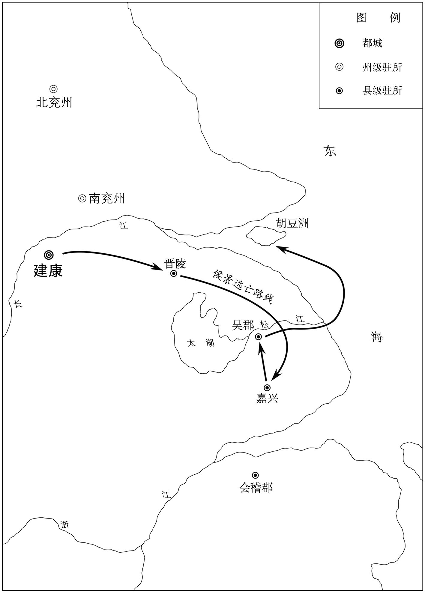 
侯景败逃路线示意图

## 【译文】

侯景和几十名心腹乘一只小船逃跑了，把他的两个儿子推落到水里，准备入海，侯瑱（zhěn）派副将焦僧度追击侯景。侯景娶了羊侃的女儿为小妻，任用她的兄长羊鹍为库直都督，对待他十分优厚。羊鹍跟随侯景向东逃去，和侯景的亲信王元礼、谢葳蕤秘密图谋杀死侯景。谢葳蕤，是谢答仁的弟弟。侯景入海后，想去蒙山。承圣元年（552年）四月己卯，侯景白天午睡时，羊鹍对海师说：“这海里什么地方有蒙山，你听我吩咐就行了。”于是船径直向京口驶去。到达胡豆洲时，侯景发觉了，大吃一惊，问岸上的人，岸上的人回答说“郭元建还在广陵”，侯景大喜，准备去投奔郭元建。羊鹍拔出刀来，呵斥海师驶向京口，顺便对侯景说：“我们这些人为你出了不少的力，现在到了这步田地，一事无成，想用你的头去乞求富贵。”侯景还没来得及答话，羊鹍手中的刀便砍了下来。侯景想跳水逃生，羊鹍用刀砍阻止。侯景跑入船中，用佩刀捅船底，羊鹍用长矛刺杀了他。尚书右仆射索超世在别的船上，谢葳蕤以侯景的命令召他过来抓住了他。南徐州刺史徐嗣徽斩杀了索超世，用盐填入侯景的腹中，把他的尸体送到了建康。王僧辩把侯景的首级传送到了江陵，砍下了他的手，让谢葳蕤送到了北齐。侯景的尸体被摆放在街市上示众，军民争着抢食他的肉，连骨头都被抢光了，溧（lì）阳公主也参与了抢食。当初，侯景的五个儿子都在北齐，齐世宗高澄剥了侯景长子的面皮，用油锅烹了他，年幼的几个儿子都被送进了蚕室，施以宫刑。齐显祖高洋即位后，梦见有猕猴坐在他的御床上，于是下令将侯景的幼子全部下油锅烹煮。赵伯超、谢答仁都投降了侯瑱，侯瑱把他们连同田迁等一并送到了建康。王僧辩在街市上斩杀了房世贵，将王伟、吕季略、周石珍、严亶（dǎn）、赵伯超、伏知命等送到了江陵。

## 【原文】

**丁巳，湘东王下令解严。乙丑，葬简文帝于庄陵，庙号大宗[1]。**

## 【注文】

[1]庄陵：南梁简文帝萧纲之陵墓所在地，位于建康东南，今江苏丹阳境内。

## 【译文】

梁元帝承圣元年（552年）四月丁巳（二十日），湘东王下令解除戒严。乙丑（二十八日），将梁简文帝萧纲葬在了庄陵，庙号太宗。

## 【原文】

**侯景之败也，以传国玺自随，使其侍中兼平原太守赵思贤掌之，曰：“若我死，宜沈于江，勿令吴儿复得之。”思贤自京口济江，遇盗，从者弃之草间。至广陵，以告郭元建。元建取之，以与辛术，壬申，术送之至邺。**

## 【译文】

侯景战败后，把传国玉玺随身携带，让他的侍中兼平原太守赵思贤掌管，说：“如果我死了，应当将玉玺沉到江里，不要让吴儿再得到它。”赵思贤从京口渡江，遇上了强盗，随从的人员将玉玺丢弃在了草丛里。等他到了广陵，把这一情况报告了郭元建。郭元建将玉玺取了回来，交给了辛术，承圣元年（552年）五月壬申（初五日）这一天，辛术把玉玺送到了北齐的都城邺城。

## 【原文】

**五月庚午，司空南平王恪等复劝进，湘东王犹不受，遣侍中丰城侯泰等谒山陵，修复庙、社[1]。戊寅，侯景首至江陵，枭之于市三日，煮而漆之，以付武库[2]。**

## 【注文】

[1]庙、社：即祖庙和社庙，按我国古代都城建置“前朝后寝、左祖右社”的规制，祖庙和社庙分别位于宫殿的左、右两边，也称为左庙右坛。祖庙，是皇帝祭祀祖先的场所；社庙，是祭祀社稷神的场所。社稷神，即土地神和谷神，是保佑民安国泰的神仙。

[2]武库：古代皇家储藏器物的仓库。

## 【译文】

梁元帝承圣元年（552年）五月庚午（初三日），司空南平王萧恪（kè）等人又劝萧绎（yì）当皇帝，湘东王仍然不接受，派侍中丰城侯萧泰等人拜谒（yè）山陵，修复了祖庙和社稷神庙。戊寅（十一日），侯景的首级被送到江陵，挂在街上示众三天，然后被煮了，涂上漆，交付武库保管。

## 【原文】

**庚辰，以南平王恪为扬州刺史。甲申，以王僧辩为司徒、镇卫将军，封长宁公；陈霸先为征虏将军、开府仪同三司，封长城县侯[1]。**

## 【注文】

[1]镇卫将军：武官名，掌军事，南梁列第二十四班。

## 【译文】

梁元帝承圣元年（552年）五月庚辰（十三日），任命南平王萧恪为扬州刺史。甲申（十七日），任命王僧辩为司徒、镇卫将军，封为长宁公；陈霸先为征虏将军、开府仪同三司，封为长城县侯。

## 【原文】

**乙酉，诛侯景所署尚书仆射王伟、左民尚书吕季略、少府周石珍、舍人严亶于市。赵伯超、伏知命饿死于狱。以谢答仁不失礼于太宗，特宥之[1]。王伟于狱中上五百言诗，湘东王爱其才，欲宥之。有嫉之者言于王曰：“前日伟作檄文甚佳。”王求而视之，檄云：“项羽重瞳，尚有乌江之败；湘东一目，宁为赤县所归[2]。”王大怒，钉其舌于柱，剜腹脔肉而杀之[3]。**

## 【注文】

[1]宥（yòu）：原谅、宽恕。

[2]赤县：也称赤县神州或神州赤县，即中国或华夏的代称。相传古代炎帝所统之地称赤县；黄帝所统之地称神州，后将中国之地统称为赤县神州。

[3]脔（luán）肉：切肉成块。

## 【译文】

梁元帝承圣元年（552年）五月乙酉（十八日），下令在闹市上诛杀侯景所任命的尚书仆射（yè）王伟、左民尚书吕季略、少府周石珍、舍人严亶（dǎn）。赵伯超、伏知命等在狱中饿死了。因为谢答仁对简文帝萧纲不失臣子之礼，特别饶恕了他。王伟在狱中献上了一首五百字的长诗，湘东王萧绎爱惜他的才干，想宽恕他。有嫉恨王伟的人对湘东王说：“之前王伟所做的檄（xí）文非常好。”湘东王让人找来观阅，檄文中写道：“项羽有两个瞳孔尚且有乌江之败；湘东王一只眼睛，怎么能成为天下归顺的君王。”湘东王大怒，将王伟的舌头钉在柱子上，把他的肚子剖开，一片一片地割下他的肉，杀死了他。

## 【原文】

**丁亥，下令以“王伟等既死，自余衣冠旧贵，被逼偷生，猛士勋豪，和光苟免者，皆不问”。**

## 【译文】

梁元帝承圣元年（552年）五月丁亥（二十日），湘东王萧绎（yì）下令，宣布：“王伟等人已死，其余的士大夫及旧贵，被逼迫而苟且偷生的人，勇猛的将士及勋贵豪强，随从世俗以求保命的人，都不再追究。”

* * *

(1) 参考《资治通鉴》所载，“续”应为“绩”。

(2) 据陈垣《二十史朔闰表》，梁武帝太清元年十一月甲午朔，无乙酉日。

(3) “”字疑为“轥”字之误。

(4) 据陈垣《二十史朔闰表》，梁武帝太清三年三月丙辰朔，无庚子日。

(5) 据陈垣《二十史朔闰表》，简文帝大宝元年三月庚戌朔，无甲申日。

(6) 据《资治通鉴》卷一百六十四，“简文帝大宝二年四月”条，“宣州刺史王”应为：“宜州刺史王琳”。

(7) 周铁虎，《南史》载为“周铁武”。

(8) 据陈垣《二十史朔闰表》，梁元帝承圣元年四月戊戌朔，无己卯日。当为乙卯之误，乙卯即十八日。

# 附录：

## 东魏皇帝世系表

 

## 西魏皇帝世系表

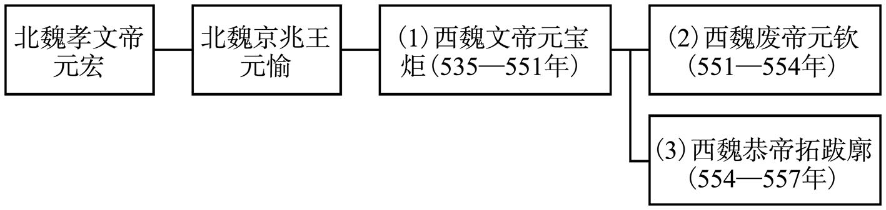 

## 北齐皇帝世系表

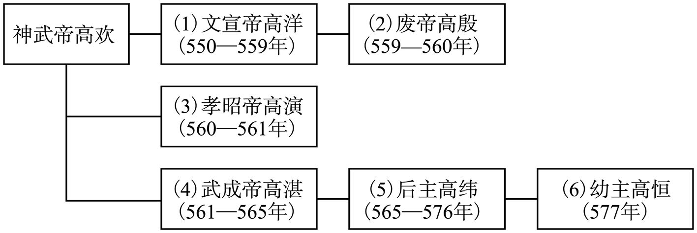 

## 北周皇帝世系表

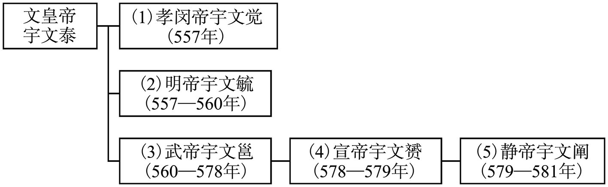 

## 南梁皇帝世系表

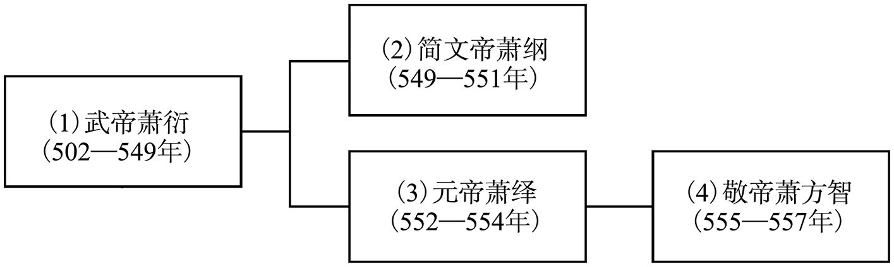

